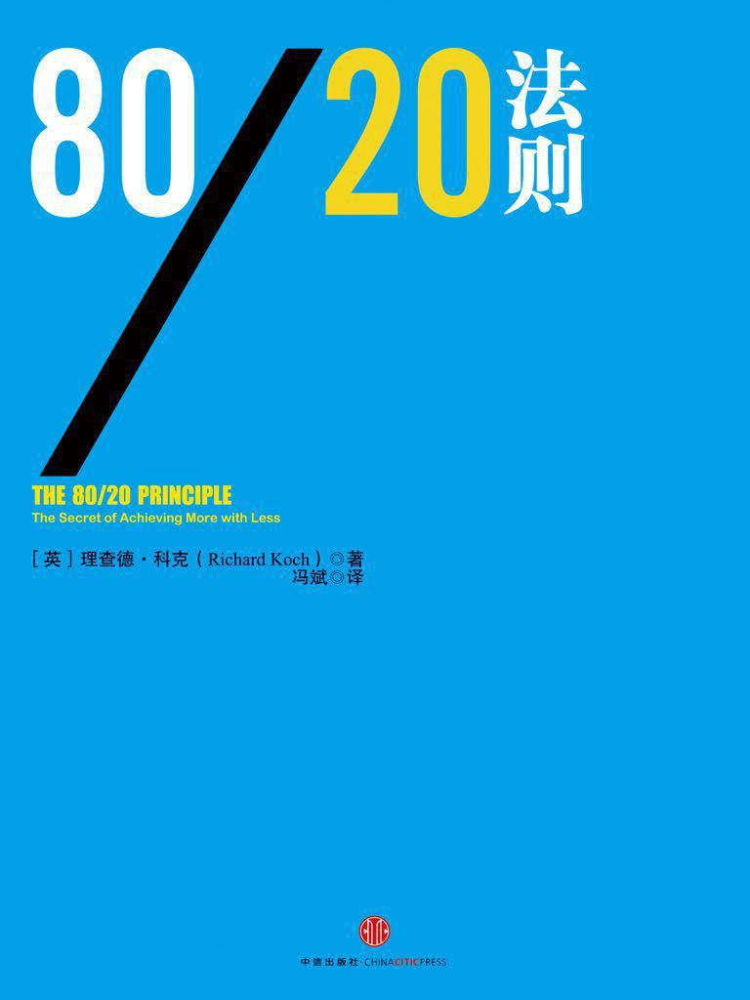

<svg xmlns="http://www.w3.org/2000/svg" xmlns:xlink="http://www.w3.org/1999/xlink" version="1.1" width="100%" height="100%" viewbox="0 0 563 751" preserveaspectratio="none">

<image width="563" height="751" xlink:href="cover.jpeg"></image>
</svg>

80/20 法则

\

\[英\] 理查德· 科克 著

冯斌 译

中信出版社

## 

图书在版编目（CIP）数据\

80/20法则 /（英）科克著；冯斌译. —2版. —北京：中信出版社，2014.1

书名原文：The 80/20 Principle: The Secret of Achieving More with Less
(Second Edition)

ISBN 978–7–5086–4268–0

I. 8… II. ①科… ②冯… III. 企业管理－通俗读物 IV. F270–49

中国版本图书馆CIP数据核字（2013）第236419号

The 80/20 Principle: The Secret of Achieving More with Less (Second
Edition)

Copyright © 1998, 2008 by Richard Koch

This translation is published by arrangement with Nicholas Brealey
Publishing and Andrew Nurnberg Associates International Limited.

Simplified Chinese translation copyright © 2013 by China CITIC Press.

ALL RIGHTS RESERVED.

本书仅限中国大陆地区发行销售

\

80/20法则

著 者：\[英\]理查德·科克

译 者：冯 斌

策划推广：中信出版社（China CITIC Press）

出版发行：中信出版集团股份有限公司\
（北京市朝阳区惠新东街甲4号富盛大厦2座 邮编 100029）\
（CITIC Publishing Group）

电子书排版：张明霞

\

中信出版社官网：<http://www.publish.citic.com/>

官方微博：<http://weibo.com/citicpub>

更多好书，尽在中信飞书 App：<http://m.feishu8.com>（中信电子书直销平台）

## 

## 目录

<a href="#part0003.html" class="calibre4">第一部分 认识80/20法则</a>

<a href="#part0004.html" class="calibre4">宇宙是不平衡的！</a>

<a href="#part0005.html" class="calibre4">第1章 80/20法则欢迎你</a>

<a href="#part0006.html" class="calibre4">第2章 80/20法则引发的思考</a>

<a href="#part0007.html" class="calibre4">第二部分
企业成功不再是神话</a>

<a href="#part0008.html" class="calibre4">第3章 秘密崇拜</a>

<a href="#part0009.html" class="calibre4">第4章 为何出现战略失误</a>

<a href="#part0010.html" class="calibre4">第5章 简单即为美</a>

<a href="#part0011.html" class="calibre4">第6章 抓住关键客户</a>

<a href="#part0012.html" class="calibre4">第7章
80/20法则十大商业运用</a>

<a href="#part0013.html" class="calibre4">第8章 关键少数造就成功</a>

<a href="#part0014.html" class="calibre4">第三部分
少工作，多赚钱，多享受生活</a>

<a href="#part0015.html" class="calibre4">第9章 轻松自如</a>

<a href="#part0016.html" class="calibre4">第10章 时间革命</a>

<a href="#part0017.html" class="calibre4">第11章 心想事成</a>

<a href="#part0018.html" class="calibre4">第12章 交友贵在精</a>

<a href="#part0019.html" class="calibre4">第13章 聪明和懒惰</a>

<a href="#part0020.html" class="calibre4">第14章 财富的聚集效应</a>

<a href="#part0021.html" class="calibre4">第15章 幸福的七种习惯</a>

<a href="#part0022.html" class="calibre4">第四部分 高潮——继续进步</a>

<a href="#part0023.html" class="calibre4">第16章 再接再厉</a>

第一部分\
认识80/20法则
=============

## 宇宙是不平衡的！

什么是80/20法则？这一法则告诉我们，在任何一个群体中，某些事总是比其他事更重要。有一种标准或假设认为，80%的结果或产出源自20%的原因或投入，在某些情况下甚至是由更小的一部分有利因素造成的。

我们的日常用语就是一个很好的例证。速记法的发明人艾萨克·皮特曼（Isaac
Pitman）曾发现我们日常交谈中2/3的语言仅仅由700个常用单词构成，而包括这些单词的派生词在内，它们占到我们日常交流用语的80%。这说明，我们平时80%的时间里用的是不到1%的单词，我们可以称之为80/1法则。与此相似，超过99%的谈话用到的单词还不及总数的20%，我们同样可称之为99/20法则。

电影工业也在诠释80/20法则。一项调查显示，全球1.3%的电影赚取了80%的票房收入，这就在事实上催生了80/1法则。

80/20法则并非不可思议的公式。有些情况下，原因和结果之间的关系更接近于70/30，而不是80/20或80/1，但很少出现原因与结果对半分成的情况。我们生活其中的宇宙呈现一种可预见性的失衡，很少的一部分事物却更显重要。

真正高效率的人和团体往往在工作中依靠一小部分强势力量，并对这部分力量充分利用。

请阅读下文，找到能实现低投入高产出的方法。

第1章\
80/20法则欢迎你
---------------

帕累托法则（80/20法则）在经济学世界里蹒跚前行，犹如风景中的一块奇石。但至今无人能解释这一经验式法则。

——约瑟夫·施泰因德尔（Josef Steindl）

80/20法则能够而且应当被每一个聪明人运用到日常生活中，它同样应该被各个组织、社会团体和各种社会形态所采纳。这一法则能够帮助个人和组织以最少的付出获取最大的回报；提升个体的工作效率，增强幸福感；增加企业的效益；提高任何团体的效率；降低公共服务成本，进而增加其数量，提高其质量。本书首次系统介绍了80/20法则，同时融入了一种强烈的信念，且被个人和财团的经验所验证。这一信念是：80/20法则是处理和化解现代生活压力的最适用的方法之一。

### 什么是80/20法则

80/20法则认为，少量的原因、投入和付出将获得大量的结果、产出和回报。按字面意思理解，它的含义是，例如你工作中80%的收获来自于你所投入的20%的时间，那么实际上，占我们工作投入主体的4/5的努力在很大程度上无关紧要。这与人们通常所认为的情况截然相反。

因此，80/20法则认为，在原因与结果、投入与产出、付出与回报之间存在着一种内在的失衡。80/20关系提供了衡量这一不平衡的较好基准：一种典型模式将向人们展示80%的产出源自20%的投入，80%的结果归因于20%的原因，80%的回报归功于20%的努力。图1–1介绍了这一典型模式。

在商界，许多有关80/20法则的案例已经得到了验证。通常，20%的产品创造了80%的销售额，20%的客户资源为企业带来了80%的收益。这就是说，20%的产品或客户资源通常能占到一家企业利润的80%。

在社会生活中，80%的罪行是20%的罪犯所为，20%的驾驶员引发了80%的交通事故，20%的已婚人士的离婚概率达到总离婚率的80%（那些不断再婚又离婚的人扭曲了这一数据的真实性，并使人们对婚姻的忠诚度持悲观态度），20%的儿童得到了80%的可用教育资源。

在家庭生活中，20%的地毯利用率高达80%，80%的时间里你穿的是所有衣服中的20%。此外，如果你遇到入侵警报，20%的可能性因素会引发80%的错误警报。

内燃机是对80/20法则的极好诠释。在燃烧过程中，80%的能量被浪费掉，只剩下20%的能量产生动力，而这20%的投入却收获了100%的产出。

\

##### 图1–1 80/20法则\

#### 帕累托的发现：系统性和可预见性失衡

1897年，意大利经济学家维弗雷多·帕累托发现了揭示80/20法则的范例。他的发现被冠以多种称呼，包括帕累托法则、帕累托定律、80/20准则、省力原则、失衡原则等。在这本书里，我们把它称为80/20法则。这一法则潜在地影响了许多成功人士，特别是商界精英、计算机专家和质量工程师。这一法则曾帮助人们塑造了一个现代化的世界。然而，现在它依然是我们这个时代一个伟大的秘密。即使是那些能理解并运用80/20法则的行家们，也不过仅仅发现了它的冰山一角而已。

那么帕累托到底发现了什么呢？在偶然对19世纪英格兰地区财富与收入的分配模式进行观察后，他发现被抽样调查的人群里，少数人占有了大部分的收入和财富。也许这还没什么值得惊讶的。但是，他同时发现了另外两个他认为非常重要的事实。其中之一就是，某一群体占总人口数的百分比（即总相关人口的百分比）与这一群体所享有的收入或财富之间存在一种恒定的数量关系。简而言之，如果20%的人占有80%的财富<a href="#part0005.html_footnote-289-1"
id="part0005.html_footnote-289-1-backlink">[1]</a>，那么你便可以确切地推测出10%的人拥有65%的财富，或者说，5%的人拥有50%的财富。其中，百分比并不是关键，关键是相关人群的财富分配呈现出一种可预见性失衡。

另一个让帕累托激动不已的发现是，在他观察不同时期或者不同国家的相关数据时，这种失衡模式持续性地重复出现。不管是观察英格兰地区早期的数据还是其他国家同时代或更早时期的可用数据，帕累托都发现了这一反复出现的相同模式，而且极其精确。

这是一种奇异的巧合，还是一些对经济和社会发展具有重要影响的发现？如果把这一模式应用于财富或收入之外的其他相关数据，它是否还会发挥同样的作用？帕累托是个了不起的创新者，因为在他之前，还没有人考察过两组数据的相关性——在这一案例中，帕累托将财富或收入的分配与工薪阶层或财富所有者的数目进行了比较，并且对比了这两组数据间的百分比。（现在，这一方法已经非常普遍，而且借助这一方法，商学和经济学都实现了重大突破。）

遗憾的是，尽管帕累托认识到了这一发现的重要性和广泛适用性，但他并没有对此做出很好的解释，而是转而研究一系列颇吸引人但却异常杂乱的社会学理论。这些理论以研究社会精英为中心。晚年，帕累托又摒弃了这些社会学理论，归附于墨索里尼的法西斯主义。具有重要意义的80/20法则也因此沉寂了一个时代。尽管许多经济学家，特别是美国经济学家认识到了这一法则的重要性，但直到第二次世界大战后，两个同时代但风格完全不同的理论先驱才开始推动80/20法则迅速发展。

#### 1949：齐普夫的省力原则

哈佛大学语言学教授乔治·齐普夫（George K.
Zipf）便是其中之一。1949年，齐普夫发现了省力原则，这实际上是对80/20法则的再发现和详尽阐述。省力原则认为，各种资源（人力、物力、时间、技巧以及其他任何生产资料）都存在一种进行自我调整以实现工作量最小化的趋势，因此，大约20%~30%的资源占到与这一资源相关生产活动的70%~80%。

齐普夫利用人口统计学、文献学、语言学知识及行业行为来展示这一失衡模式的持续性重现。例如，他分析了1931年费城20个街区的结婚证发放情况，发现70%的姻缘是在那些相距约6个街区的人们之间结成的。

此外，齐普夫还用另一法则证明杂乱无序的合理性，从而为散乱的书桌提供了一个科学的解释，即使用频率较高的东西更靠近我们。因此，聪明的秘书早就知道常用的文档不必归档的道理。

#### 1951：朱兰的关键少数原则与日本的兴起

推动80/20法则发展的另一位先驱是著名的质量管理专家——生于1904年的罗马尼亚裔美国工程师约瑟夫·摩西·朱兰（Joseph
Moses
Juran）。他是20世纪50年代到90年代间质量革命的幕后功臣。在他口中，80/20法则有时叫作帕累托法则，有时叫作关键少数原则，并成了追求高品质产品的同义词。

1924年，朱兰加入西屋电气公司（Western
Electric），即贝尔电话公司的生产分支机构，开始了他的工业工程师生涯。之后，他成为业内第一位质量管理咨询师。

他的伟大成就在于结合其他统计学方法，运用80/20法则发现产品的质量缺陷并提高其可靠性，改进其品质。朱兰的《质量控制手册》于1951年问世。这是一部划时代的著作，在书中他高度赞扬了80/20法则：

正如朱兰对质量损失所做的观察一样，经济学家帕累托发现财富分配也是不均的。我们还可以举出很多其他的例子：比如犯罪行为与罪犯的分布、意外事故与危险活动的分布等等。帕累托的不平衡分布规律同样适用于财富分配和质量损失分布。

但是，当时没有一个美国大企业家对朱兰的理论感兴趣。1953年，他应邀赴日本讲学，却引起了强烈反响。于是，朱兰留下来帮助一些日本公司改进了它们产品的质量和品质。也只有在1970年之后，当日本工业发展对美国工业构成的威胁日益明显时，西方国家才开始重视朱兰的理论。随后，朱兰得以回到美国，推动美国工业界开展了他曾在日本进行的改革。在朱兰的倡导和实践下，80/20法则成为全球质量管理革命的焦点。

#### 20世纪60~90年代：运用80/20法则取得的成就

IBM（国际商用机器公司）是最早、最成功发现和运用80/20法则的公司之一。正是在IBM的带动下，20世纪六七十年代成长起来的大多数计算机系统专家都熟悉了这一法则。

1963年，IBM公司发现，一台电脑大约80%的工作时间是在执行大约20%的程序代码。该公司立即更新了它的操作软件，使这20%的程序代码更易于操作、更人性化。通过这一改革，在大多数应用领域，IBM公司的电脑比其竞争对手的产品更加高效、快捷。

其他研发第二代个人电脑和应用软件的计算机公司，像苹果、莲花和微软等也在研发过程中运用了80/20法则。这就使得它们的电脑产品更便宜也更好用，从而极大地方便了新一代客户，包括原先对电脑敬而远之的“电脑盲”。

#### 赢家通吃

帕累托之后的一个世纪里，针对超级巨星和职业领域极少数成功人士天文数字般不断增长的收入，争论声渐起，80/20法则的影响力已经开始浮出水面。大导演斯皮尔伯格1994年一年进账1.65亿美元。身价最高的出庭辩护律师约瑟夫·杰米尔（Joseph
Jamial）的收入是9
000万美元。当然，只有有竞争力的少数导演和律师才能拿到如此高的薪酬。

整个20世纪见证了人们为实现收入平等所付出的巨大努力。但这种努力的结果是不平均的，它试图削减某些人的收入，而使另一群体的收入迅速增加。以美国为例，1973年到1995年，人均实际收入增长约36%，但非管理阶层的工人群体收入却下降了14%。20世纪80年代，几乎所有收入被处于社会上游的20%的人占有，更令人吃惊的是，其中1%的人获得了64%的增长性收入。在美国，股票所有权也集中于一小部分家庭，5%的家庭拥有约75%的家庭净资产。美元的作用也呈现出类似效应。几乎50%的国际贸易以美元结算，而美国对外贸易只占世界出口额的13%。全球以美元计算的外汇储备是64%，而美国GDP（国内生产总值）仅占全球生产总值的20%。如果不采取一系列政策“对症下药”，那么80/20法则将会重复出现。

### 80/20法则何以如此重要

80/20法则之所以如此重要，在于它的反常规性。我们习惯于认为所有的事情都同等重要。例如，所有的客户都同样重要，每一笔生意、每一件产品、每一份销售收入都很有价值，所有的公司职员几乎都无可替代，每一所大学都很优秀，我们所度过的每一天、每一周、每一年都非常重要，对我们而言所有的朋友都是有益的，我们也应当对所有的咨询或者来电一视同仁。此外，所有问题都有一大堆原因，因此没有必要区分其中一小部分关键性因素；所有的机会都大致同样宝贵，因此我们不应当放弃任何一个。

我们习惯于认为原因或者投入与结果或产出之间是成比例的。我们有一个先入为主的观念，认为事情的因果会有一个相对的平衡——有时的确如此。但是，这种深入人心的“50/50谬论”却极不准确也极具危害性。80/20法则主张，当我们考察或者分析因果相关的两组数据时，最有可能得到的结论是存在一种不平衡模式。这种不平衡可能是65/35、70/30、75/25、80/20、95/5、99.9/0.1，或者是这些数据之间的任意一种组合。不过，进行比较的这两个数之和却未必等于100。

80/20法则还认为，当我们知道了原因和结果间的真实关系后，我们很可能会惊讶于它们之间存在的巨大的不平衡性。不管这种不平衡性达到何种程度，它都超出了我们之前的预期。主管们可能早就预感到经营某些产品会比经营其他产品更赚钱，但当了解其中真正的差异之后，他们仍会感到非常惊讶甚至哑然失惊。再比如，教师们可能认为他们班上大多数违纪或者逃课行为是一部分学生干的，但如果认真分析记录，就会发现违纪行为与违纪学生数量之间的不平衡远超出他们的想象。我们有时也会感到某些时段比其他时段可能更加宝贵，但如果我们计算一下投入和产出就会发现二者的差距异常巨大。

为什么我们需要关注80/20法则？因为不论你是否认识到它的重要性，这一法则在我们的学习、生活和工作中都有着广泛的应用。理解80/20法则可以使我们对身边的事情有更深入的认识。

本书的最高宗旨在于告诉诸位：学会运用80/20法则可以极大地改善我们的生活质量。人人都能够生活得更加高效、更加幸福，每个公司都能赚取更高的利润，所有非营利性组织都能向社会提供更多服务，每届政府也都能够为人民谋取更多福利，每个社会成员和团体都有可能以更少的付出和投入获取更多的收益、避免更大的损失。

这一进步的核心是一种替代过程。在某些特殊场合要弃用或者少用效果不明显的资源，而要尽可能多用一些能发挥巨大作用的资源，使每一种资源都能得到最佳配置。不管在何种情况下，弱势资源都能够像强势资源一样得到最大限度的运用。

几百年来，商业经营和市场运作已经将这一替代效用发挥到了极致。法国经济学家让–巴蒂斯特·萨伊（Jean-Baptiste
Say）发明了“企业家”一词。他认为“企业家将经济资源从生产力低下的领域转移到生产力和产出相对高的领域”。有意思的是，80/20法则也指出商业经营和市场运作远未实现这种最优化的结果。例如，这一法则认为20%的产品、客户和雇员实际创造了80%的利润。如果确有其事——各种详细调查研究也证明了确实存在这种极度失衡模式——那么，这意味着市场运作离高效或者最优仍有相当大的差距。这一情形表明：80%的产品、客户或者雇员仅仅贡献了20%的利润；仍存在很大的浪费；由于大量低效率资源的存在，公司大部分高效资源的作用得不到发挥；如果能够卖出更多高质量的产品、雇用更多高素质的职员或者吸引更多的顾客群（或让顾客愿意多买公司的产品），那么利润就会成倍增加。

在这一情形下，有人肯定会问：为什么我们还要继续生产那些仅能创造20%利润的80%的产品？但公司经营者很少会这样问，也许他们知道提出这样的问题意味着将做出非常偏激的行为：停止公司的绝大部分生产活动。这可不是一件小事。

现代金融家将萨伊所谓的企业家行为称为“套汇”。国际金融市场会及时修正各种价值变化，例如各种汇率间的异常变动。但是，通常情况下，商业机构和个人并不善于这种套汇操作，不善于将资源从收益低处转向收益高处，或者削减低价值资源、买进高价值资源。很多时候，我们还没有认识到某些资源的高产程度，但仅仅少数资源是如此——朱兰称之为“关键少数”。与之相对的是生产率低下甚至有负面影响的“次要多数”。如果我们能认识到生活中无处不在的“关键少数”与“次要多数”的差别，并能据此进行相应的改进，那么很多情况下，我们都能够如愿以偿。

### 80/20法则与混沌理论

概率论指出，我们不可能像“撞大运”那样毫无计划地运用80/20法则。我们只能假定这一法则背后还蕴含着某些更深刻的含义或原因。

为此，帕累托尝试着运用某种方法研究社会现象，以求解释这一法则。在这一过程中，他探寻“能够描绘经验事实和观察所得的理论”，希望能发现习惯性模式、社会规范或一致性来解释个体和社会的行为方式。

然而帕累托的社会学方法并没有找到对80/20法则具有说服力的解释。在他去世后混沌理论诞生，而这一理论与80/20法则齐名，能够很好地解释它。

20世纪最后30年见证了科学家观察与思考世界方式的巨大变革，这一变革颠覆了过去350多年里的主流观念。之前的主流观念是一种机械理性观，其本身就是在中世纪神秘的非理性世界观基础上的一大进步。这种机械理性观改变了人们对上帝的认识。以往，人们将上帝看作一种超自然的不可预测的力量，而机械理性观认为上帝是友好的时间工程师。

这种世界观自17世纪盛行至今，除了科学界人士不能接受外，已经深入人心，而且也很有用。人们把所有的现象都归结为一种有序的、可预测的线性关系。这种世界观认为，由于整体是局部之和，所以应该分别研究宇宙的各个组成部分，例如人类的心脏手术或者任何一个独立市场。

但是，在20世纪后半叶，世界被看作一个进化中的有机体，整个系统大于各部分之和，而且各组成部分间也是非线性关系。这种观点似乎更加准确。这样很难再对事情的原因做简单定论，因为各种原因间存在着复杂的相互依存关系，而且原因与结果相杂糅。线性思维的最大缺陷在于它过度简化了现实世界，因而不能永远成立。这一思维模式下的均衡论是虚幻的、站不住脚的，而宇宙是不稳定的。

然而，混沌理论并不像它的名字那样认为万物是不可理喻的一团乱麻。相反，在这种乱象背后隐藏着一种自组织逻辑，即被经济学家保罗·克鲁格曼（Paul
Krugman）称为“怪异的”、“可怕的”、“异常精确的”可预见性非线性关系。这种逻辑关系易于察觉却很难进行描绘，它就像一首曲子中反复出现的主旋律，具有某种特点的模式以无限和不可预测的多样性反复出现。

#### 混沌理论和80/20法则相互解释

混沌理论和与之相关的科学概念到底对解释80/20法则有何作用？尽管还没有人指出二者之间的关系，但我认为它们之间具有很强的相关性。

**• 失衡原则**

连接混沌理论和80/20法则的主线是“平衡”问题，或者更确切地说，是“失衡”问题。拥有实证依据的混沌理论和80/20法则都断言宇宙是失衡的。二者都认为世界不是线性的，原因和结果之间的关系也是不平衡的。不仅如此，这两种理论都强调自组织现象的存在：某些力量比其他力量更强大，而且它们都努力争取额外的资源。经过长时间追踪失衡现象的发展变化，混沌理论得以解释为何会产生失衡及其产生过程。

**• 宇宙并非一条直线**

与混沌理论一样，80/20法则也建立在非线性思维基础上。它认为很多事情并不重要而且可以忽略不计，然而总有某些力量具有超出想象的影响力，人们应该分辨出这些力量因素并给予密切关注。如果它们是有益的，那么我们应当使其不断增长；如果它们是有害的，那么我们就应当认真考虑如何消除它们的影响。在任何系统都可以进行80/20法则式非线性测试。例如，我们可以问，20%的原因是否导致了80%的结果？80%的现象是否仅仅与20%的原因有关？这是检验非线性的好方法，但它更有助于我们发现那些具有强大作用力的因素。

**• 反馈回路打破平衡**

80/20法则符合混沌理论所验证的反馈回路关系，这一关系也能解释80/20法则。起初一些微小的影响因素能被无限放大而且产生预料之外的结果，我们可以运用反推法对此进行解释。如果没有反馈回路，很多事情的自然分布将是50/50，即一定程度的投入将导致相应的结果。正是由于正、负反馈回路的存在，各种原因才不必然导致相同的结果。然而，强有力的正反馈回路似乎仅仅能影响小部分投入，这恰恰解释了为何少量投入能造成如此大的影响。

在很多领域我们都能发现正反馈回路，它解释了为何我们最后得到的通常是80/20而不是50/50分布。例如，富者恒富，这并不仅仅是（或者主要是）由于他们具有超群的能力，而是由于财富产生财富。类似的现象也存在于池塘的金鱼中。即使你起初放入鱼塘中的金鱼几乎一样大，那些稍微大些的鱼最终也会变得更大。这是因为即使这些鱼在某些方面仅仅稍占优势，它们也能够捕捉并吞食更大数量的食物。

**• 临界点**

与反馈回路原理相关的是“临界点”的概念。每一股新生力量，无论是一件新产品、一种疾病、一支新组建的摇滚乐队，还是像慢跑或者溜冰等新式生活习惯，在达到某一时刻之前，都会很难再取得进一步的发展。大量的付出仅得到很少的收获。这时候，许多先驱者选择了放弃。但是，如果这股新力量能够坚持下去并超过一条无形的线，一小部分额外的付出就能取得丰硕的回报。这条无形的线就是临界点。

这一概念源自流行病理论。在流行病学里，临界点指的是“平常且稳定的现象，如初期的流行感冒演变成公共卫生危机的时刻”。这是由于被感染者能够传染其他人。由于流行病发病方式是非线性的，它并不像我们想象的那样发生，因此“微小的变化，例如感染源从4万减少到3万，就能产生巨大效用……关键是何时以及如何产生变化”。

**• 先到先受益**

混沌理论推崇“对初始条件的敏感性依存”，即首先出现的事物，即使是一些表面上看起来微不足道的东西，也会产生很大的影响。这一点与80/20法则相契合并且能对它做出解释。80/20法则认为少部分原因能够导致大部分的结果。独立分析，80/20法则的一大局限性就是它总是代表了对当前现实的一种速写（或者更确切地说，是刚刚拍摄快照后的时刻）。在克服这一局限方面，混沌理论所推崇的“对初始条件的敏感性依存”能有所帮助。起初微弱的领先位置能够转变成更有利的领先位置，甚至在后来取得决定性的领先，直到原来的平衡状态被打破，而另一种微小的力量又开始发挥巨大的影响力。

在早期市场上，一家公司生产了比其竞争对手产品品质高10%的产品，那它就可能最终占有比竞争对手高出100%甚至200%的市场份额，即使竞争对手随后推出了更优质的产品。例如，在刚出现机动车时，如果51%的驾驶员或者国家决定或规定要靠右而不是靠左行驶，那么，对几乎100%的驾驶员而言，这将成为一种规范。再如，最初使用圆形时钟时，如果51%的钟表“顺时针”转而不是“逆时针”转，这就会成为一种约定俗成的惯例，即使在逻辑上时钟是可以倒转的。事实上，佛罗伦萨大教堂上的钟就是倒着转并显示出24小时的。佛罗伦萨大教堂是1442年建成的，此后不久，由于绝大多数钟表以顺时针显示12小时，当局和制表商就制定了统一的顺时针12小时制标准。然而，如果当初51%的钟表像佛罗伦萨大教堂上的钟一样，那么现在我们可能就得看逆时针24小时制的钟表了。

上述有关“对初始条件的敏感性依存”的事例并不能对80/20法则做出确切解释。这些例子都会随着时间发生改变，而80/20法则却在任何条件下都不会改变对原因进行的静态分析。当然，二者之间毕竟存在着一种重要的相关性，它们都有助于展示世界对平衡的厌恶。上述事例中，我们很少发现50/50均分的情况。类似51/49的分布必然是不稳定的，并且容易导致95/5、99/1甚至100/0这样的分布。保持均衡直到优势出现，这是混沌理论的要旨之一。80/20法则的要旨与此不同，但又与其相互补充。它告诉我们，任何时候，小范围事件的参与者能够解释或者引发大范围的事件，80%的结果出自20%的原因；只有很少一部分事情是重要的，而大部分则无足轻重。

#### 能够区分电影品质的80/20法则

说明80/20法则效用最好的例证之一就是电影。两位经济学家对连续18个月播放的300部影片的票房和档期进行了调查。他们发现，其中4部电影——仅占总数的1.3%，取得了票房收入的80%，而其他296部电影仅赚取了20%的总收入。从这一点可以看出，作为非限定市场的良好范例，电影界实际上创造了80/1法则，这也是对失衡法则的有力证明。

更吸引我们的是为何80/20法则能够对电影品质的高下进行区分。据说电影爱好者的喜好就像四处游走的气体微粒。正如混沌理论所显示的，气体微粒、乒乓球或者电影爱好者的行为都很随意，而这种随意行为却产生了可预见性失衡的结果。影评人和第一批观众对一部电影的评论将决定随后观众数量的多少。像《独立日》或者《碟中碟》等影片持续火爆，而其他汇聚众多明星的大制作影片，诸如《未来水世界》、《十万火急》等却无人问津，这就是80/20法则的巨大威力。

### 阅读指南

我将在第2章向读者说明如何在实践中运用80/20法则并区分80/20分析法与80/20思维法，它们是由80/20法则衍生出的很有用的方法。80/20分析法是一种对比原因和结果关系的系统性定量分析法，而80/20思维法是一种广义上更感性的思维方式，它整合了诸多思维模型和习惯，使我们能够假定生活中任何重大事件发生的重要原因，也使我们能够鉴别这些原因并通过重新配置各种资源，进一步改善我们的工作和生活。

第二部分总结了在商业运作中成功运用80/20法则的例子。这些事例表明80/20法则的运用有着巨大的价值，但是这一价值仍没有被大多数企业所发现。我的总结没有多少原创性的东西，但每个希望赚取更高利润的小公司或大企业，都会发现本书所做的总结非常有用。

第三部分阐述了如何运用80/20法则提升个人的工作和生活水平。这也是在一个崭新领域运用80/20法则的开创性试验。虽然这一尝试在很多方面还没有做到十全十美，但它确实引发了人们许多深入的思考。例如，普通人80%的幸福和成功来自生活的一小部分，个体价值的巅峰时刻经常被无限夸大。人们公认的观点是我们缺少时间，但是，我对80/20法则的运用表明，事实恰恰相反：实际上我们拥有的时间太多并且在大肆浪费时间。

第四部分整合了各个部分的主题并将80/20法则定位为我们取得成功的关键。这表明，运用80/20法则既可以改善公众利益，也可以为企业创造财富，为个人赢得成功。

### 80/20法则为何能够带来好处

我希望以一种个性化的而非程序性的方式结束这一章。我相信80/20法则非常有用。当然，这一法则可能也只是重现了本就很明显的现象：在我们的生活中存在惊人的浪费，这种浪费不仅存在于自然界，也存在于企业、社会和我们的生活中。如果典型的模式是80%的回报源自20%的付出，那么80%的投入只能造成20%的影响也是必然的。

矛盾之处在于，如果我们能创造性地运用80/20法则而不只是鉴别和批判低生产力，那么，这些浪费现象就可能给我们带来好处！通过重新定位自然界和重新安排我们的生活，改进的空间还是非常大的。改变自然、拒绝接受现状是实现进步的路径。这种进步是革命性的、科学性的、社会的和个人的。爱尔兰戏剧家萧伯纳讲得好：“理性人改变自己以适应这个世界，非理性人则坚持要改变世界以适应个人需要。因此，所有的进步都取决于这些非理性人。”

80/20法则表明，如果我们能提高低生产力的生产效率，那么，产量不仅会有所增加，甚至还可能会倍增。商业领域运用80/20法则的成功事例表明，只要有创造力和决心，这种增长就自然会实现。

实现这一增长有两种途径。一种途径就是重新配置现有资源，使其得到高效利用，这是自古以来企业家们取得成功的通用秘诀。想方设法实现物尽其用。经验表明，每种资源都有其适用领域，一旦各得其所就能发挥百倍功效。

另一种途径则正如科学家、医生、传教士、计算机系统设计人员、教育家和培训人员所采用的方法，想方设法使低效率资源在现有领域得到更高效的运用，千方百计使低效率资源像高效率资源一样发挥作用。如果有必要，可以运用复杂的路径式程序，使其模仿高效率资源的运作方式。

我们应该鉴别、发展、丰富少数高效率资源，与此同时，摒弃或者大幅度削减对我们没有多少价值的大多数低效率资源。

在我写作本书和观察许许多多运用80/20法则的事例的过程中，我坚定了自己的信念，即对取得巨大进步的信念、对人类个人和集体进一步完善自身能力的信念。约瑟夫·福特（Joseph
Ford）曾写道：“上帝与整个宇宙玩骰子，但是骰子被做了手脚。我们的目标就是找出其中的规律，并为我们所用。”

80/20法则恰恰能帮助我们做到这一点。

<a href="#part0005.html_footnote-289-1-backlink"
id="part0005.html_footnote-289-1">[1]</a>应当指出的是这一简化表达并非帕累托自己做出的，也不是他的追随者做出的，这是运用帕累托的方法得出的合理推论，而且比帕累托自己给出的任何解释都更容易让人理解。

第2章\
80/20法则引发的思考
-------------------

第1章介绍了80/20法则的含义，这一章将着重讨论该法则在实际中的运用以及它所带来的益处。这一法则的两大用途——80/20分析法以及80/20思维法都提供了一种现实哲学，有助于更好地理解和改善我们的工作和生活。

### 80/20法则之界定

80/20法则认为，在原因和结果、投入和产出、付出和回报之间存在着一种内在的不平衡。一般来说，我们可以将这些原因、投入和付出分为两大类：

> • 大部分，影响小。
>
> • 小部分，具有重要影响。

一般情况下，结果、产出和回报只来源于一小部分起作用的原因、投入和付出。

因此，原因、投入、付出和与之对应的结果、产出、回报之间存在着一种典型的不平衡关系。

从数学意义上考虑，这种不平衡较好的基准就是80/20关系——80%的结果、产出和回报仅仅来自20%的原因、投入和付出。例如，大约80%的世界能源被15%的人口消耗；大约25%的世界人口拥有世界上80%的财富；在医疗卫生领域，20%的人口与20%的疾病将消耗80%的医疗资源。

图2–1和图2–2向我们展示了这种80/20模式。假设公司有100种产品，可以发现其中获利最高的20种产品创造了80%的利润。图2–1中，左边的柱状图代表100种商品，每一种平均占1%。

右边的柱状图代表公司100种产品的总利润。假设右边图形自上而下的阴影部分表示收益最大的产品的利润，我们可以看到它占总利润的20%。因此，图2–1说明一种产品，或者占品种总数1%的产品，获得了总利润的20%。图中的阴影部分正显示了这种关系。

\

##### 图2–1一种产品——占品种总数的1%——占总利润的20%

如果继续计算收益率第二的产品并依次计算下去，直到得出前20种产品的利润，我们就可按照这20种产品的总利润将右图相应部分涂上阴影。通过图2–2（在我们假设的例子中）便可看到这20种产品，或者说是品种总数的20%，占了总利润的80%（见阴影区域）。相反，在白色区域里，我们可以看到这种关系的另一面：80%的产品只占总利润的20%。

\

##### 图2–2 20种产品——占品种总数的20%——占总利润的80%\

这一80/20式的数字关系只是一种基准，真正的关系可能是在80/20上下。但是，80/20法则认为，在大多数情况下，这种关系更接近于80/20而不是50/50。如果我们所举的例子中所有产品的利润相同，那么这种关系将会如图2–3所示。

让人迷惑不解但又非常关键的一点是，在做类似调查时，图2–2呈现的模式将会比图2–3中的模式更有代表性。几乎总是由一小部分产品创造出大部分利润。

当然，准确的关系可能并不一定正好是80/20。80/20不仅是一种恰当的代表形式，更是一种有用的假设，但不是唯一的模式。有时80%的利润源自30%的产品，有时80%的利润仅是由15%甚至10%的产品创造的。这样，做比较的数字之和就未必一定是100，但是它们所代表的关系类型更像图2–2中的失衡模式而非图2–3中罕见的均衡模式。

\

##### 图2–3罕见的50/50模式\

凑巧的是80和20加起来正好是100，这一结果数字固然好看也易记（正如50/50、70/30、99/1或其他类似组合都能给人这种感觉），但同时也让人觉得结果很像是人为拼凑的，人们以为我们只是在处理一组数字之和为100%的数据。事实并非如此。例如，如果80%的人惯用右手而20%的人是左撇子，那就不能称之为80/20模式。要运用80/20法则，我们必须有两组数据，且每一组数据之和都是100%，而其中一组所测量的数值，是由另一组总和为100%的人或事物呈现或导致的变量。

### 80/20法则意义何在

我所认识的每一位重视80/20法则的人都能从中得到启发，在某些情况下，甚至因此而改变了命运。你必须创造出一套适合自己的运用80/20法则的方法。只有当你以富有创意的视角进行观察时，才能发现这些方法。第三部分（第9章到第15章）将指导你对此进行探索，但是我可以先用自己的亲身经历予以说明。

#### 80/20法则如何帮助了我

当我还是牛津大学的新生时，导师就告诉我不要总去听讲座。“我们可以用更快的速度去读书，”他解释道，“但是，除非为了享受阅读本身的乐趣，否则不要把一本书从头读到尾。当你读书时，找出这本书的主旨比通读一遍要快得多。读一下结尾，再读一下开头，然后再回顾结尾，之后就选你感兴趣的内容稍加浏览。”他实际上是在说，我们可以在一本书20%或更少的页面里读出它所蕴含的80%的内容，而且大多数人用大约20%的时间聚精会神地阅读，就能把这本书通读一遍。

我很喜欢这种读书方法并一直在用。牛津大学没有一个对学生的持续性读书做出评价的体系，某门课所得分数完全取决于这门课结束时的考试成绩。通过分析过去的考卷，我发现，仅把考试要考察的20%甚至更少的相关知识准备好，就能很好地回答这门考试80%（有时是100%）的题目。因此，往往是那些学有专攻的学生而不是那些无所不知却又学无专长的学生给人印象更深。对这一现象的观察和思考使我学习起来更有效率。这样没用多大力气，我就能轻松拿到好成绩。过去，我以为这表明牛津大学的老师们很容易被学生欺骗，而如今，我更愿意这样认为：那些老师其实是在教我们处世之道，虽然我这种想法也许并不恰当。

后来，我去了壳牌公司，在其旗下一家炼油厂工作。这份工作看起来正合我意，但我很快认识到，对我这样毫无社会经验的年轻人来说，最适合的工作是管理咨询。因此，我便去了费城，在沃顿商学院轻松地拿到了工商管理硕士学位（因为我蔑视哈佛大学集中营式的教育）。随后，我加入了一家全美顶级咨询公司，上班第一天我拿到的薪水竟是我离开壳牌时的4倍。毫无疑问，像我这样的年轻人所赚的80%的收入来自于20%的工作。

由于这家咨询公司拥有太多比我更聪明的同事，我很快又去了另一家小型战略咨询公司。之所以做出这一选择，是因为这家公司比我之前加盟的公司发展更快，而真正聪明的员工却少了很多。

#### 为谁工作要比做什么工作更重要

在这儿，我偶然发现了80/20法则的许多自相矛盾之处。那时像现在一样，战略咨询业发展速度非常之快，它所取得的80%的发展业绩主要来自那些仅拥有不到20%业内精英的小公司，而且在少数公司里才会有80%的快速晋升机会。请相信我，这与天才无关。当我离开第一家战略咨询公司加盟第二家时，我已经同时提升了这两家公司员工的平均智力水平。

然而，令人迷惑的是，我的新同事竟比旧同事做事更有效率。这是为什么呢？他们并不像原来的同事那样卖力工作，但是他们在两个关键层面遵循了80/20法则。

第一个关键之处在于，他们认识到，对大多数公司而言，80%的利润来自20%的客户。在咨询业，这意味着两种客户源：大客户和长期客户。大客户有大订单，这就允许我们雇用更多低薪酬的年轻咨询师；而长期客户则能培养相互间的信任关系，且能提高客户转投其他公司的成本，更不必说长期客户相对而言不太计较业务价格的高低了。

对于大多数咨询公司而言，赢得新客户是工作重点。但在我的新公司，真正的精英是那些长期面对大客户的人。他们通过培养与这些大客户公司高层领导的关系做到了这一点。

第二个关键之处在于，对任何客户而言，80%的可用咨询结果集中来自20%最重要的问题。从咨询新手的观点看，这些也许并不是最让人感兴趣的。但是，与竞争对手们仅仅粗略分析所有问题之后就让客户按照咨询建议自行处理的做法相反，我们则专注于解决最重要的问题直到帮助客户取得成功。因此，客户们的利润大多迅速增加，而我们的咨询费也因此水涨船高。

#### 帮人致富还是使人变穷

很快，我就确信，对于咨询人员和他们的客户而言，付出和回报之间充其量只不过存在松散的联系。最好能适得其所而不是耍小聪明或者下大力气。最好变得灵活点儿，更多地关注结果而不是一味付出。遵循一些富有启发性的见解行事会有所收获，而仅靠智慧和勤奋的工作则不能实现。遗憾的是，许多年来，迫于从众压力，我没能完全按照这一法则行事，我工作得太卖力了。

当时，我所工作的咨询公司已经有上百名专职员工以及包括我在内的30位合伙人，但是，公司80%的利润却落进了一个人的腰包，那就是公司创始人。从数量上看他仅拥有不到4%的合股和不到1%的咨询师。

后来我不再继续为创始人赚钱了，和另外两名初级合伙人合作开办了属于我们自己的咨询公司。后来，我们的公司不断发展壮大，拥有了上百名咨询师。不论从哪方面看，尽管我们三人仅经手了公司不到20%的业务，但没用多长时间，我们就拥有了超过80%的利润。然而，这也引起了我的负疚感。6年之后，我辞职了，把我所持的公司股份卖给了另外两个合伙人。这时，公司已经实现年收入和利润翻番，而我所持的股份也因此卖了个好价钱。不久之后，1990年的经济危机严重冲击了咨询业。尽管我会劝你稍后再放弃负疚感，但拥有负疚感的我还是很幸运的。即使那些遵循80/20法则的人有时也需要一些运气，而我所享受的却一直远远多于我所拥有的。

#### 投资获得的财富要比工作赚的钱更胜一筹

我用20%的资金对飞罗传真（Filofax）公司进行了一大笔投资。投资顾问们对我的行为大为吃惊。当时，我持有约20家上市公司的股票，这家公司仅占我所有股票的5%，但它相当于我投资总额的80%。幸运的是，这只股票价格一直在涨，3年之后，我拥有的飞罗传真的股票价值已长了数倍。当1995年我卖出其中一些股票时，其股价已经接近我第一次买进时的18倍。

此外，我还进行了另外两项投资。一项是一家刚开业的饭店叫“Belgo”，另一项是MSI，一家我投资时旗下还没有下属旅店的旅馆公司。上述三项投资总成本占我净资产的20%。但是，它们的经营收入已经占到我后期投资收益的80%还多。目前，它们的资产总值也已构成了我净资产的80%。

正如第14章所提到的，长期投资组合所得到的收益中，80%来自20%的投资。关键在于我们要仔细甄别出这20%的投资项目，并集中在这一部分项目上进行尽可能多的投资。传统观念认为，不要把所有的鸡蛋放在一个篮子里。80/20法则却让我们仔细挑选一个篮子，把所有鸡蛋都放进去，然后像老鹰一样盯紧它。

### 如何运用80/20法则

运用80/20法则有两种方法，如图2–4所示。

\

##### 图2–4运用80/20法则的两种方法\

传统意义上，80/20法则要求我们运用80/20分析法——一种定量分析法来确定原因、投入、付出与结果、产出、回报间的关系。这一方法首先假设可能存在80/20关系，然后搜集相关事实来揭示真正存在的关系。这是一种实证方法，有可能导致从50/50关系到99.9/0.1关系等任何结果。如果确实能够证明投入与产出间存在明显的不平衡（如65/35关系或者一种更不平衡的关系），那么我们才会采取相应行动。

另一种运用80/20法则的新方法就是我所说的80/20思维法。这一方法要求我们对任何重要问题都进行深入思考并且做出相应判断：80/20法则是否在这一问题领域起作用。之后，我们就可以据此行事。80/20思维法并不需要我们搜集数据或者验证前提假设，因此，80/20思维法可能有时会误导我们。例如，如果你已经辨别出一种关系类型，那么由此认定自己已经知道其中主要的20%是什么，这样做是很危险的。但是，我认为，相对传统思维方式而言，80/20思维法误导我们的可能性还是要小得多。尽管当问题相当重要而我们又发现很难做出恰当评估时，80/20分析法也许很受欢迎，但80/20思维法要比80/20分析法更容易操作，也更快捷。

我们先来了解80/20分析法，再认识80/20思维法。

### 80/20分析法

80/20分析法考察两组可比较数据间的关系。其中一组数据一般为代表人或事物的一个常数，通常为100或更大的数，它们可以转化成百分数。另一组数据与这些人或事物的典型特征相关，它们均可衡量并转化成百分数。

例如，我们可以考察100位或多或少都能喝点儿啤酒的朋友，比较一下每个人一周分别喝了多少啤酒。

迄今为止，这一分析方法在统计方法中都还是通用的。80/20分析法之所以特别，就在于这一衡量方法将第二组数据按照重要性降序排列，从而比较两组数据的百分比。

在所举例子中，我们将调查所有100位朋友一周饮用啤酒的数量，并在表格中将他们所饮用的啤酒数量降序排列。图2–5显示了饮酒量排前20位和后20位的朋友。

80/20分析法将比较两组数据（朋友和饮酒数量）的百分比。在这个例子中，我们可以说20%的朋友喝了70%的啤酒。因此，这就是一种70/20关系。图2–6是此例的80/20频率分布曲线图（简称80/20曲线图）。

\

##### 图2–5 100位朋友一周内饮酒情况\

\

##### 图2–6 饮酒者80/20频率分布曲线图\

#### 为什么叫作80/20分析法

很早之前（大概是20世纪50年代）比较这些关系时，最常发现的结果是80%的测定量来自20%的人或事物。80/20因此成为这一不平衡关系的类型代表，而不论确切的结果是不是80/20（从统计角度看，确切的80/20关系不是常态）。80/20法则通常强调最前的20%而不是最后的20%。我所采用的80/20法则，也就是我称作80/20分析法的方法。这是一种定量实证分析法，可用来衡量投入和产出间可能存在的关系。

通过对饮酒者的相关数据进行观察，我们同样可以发现，后20%的朋友仅喝了30杯啤酒，即占啤酒总数的3%。因此，我们完全可以称之为3/20关系，尽管很少这么讲。我们强调的重点历来是那些比重更大的人或原因。如果一家啤酒厂正在进行产品推广，或者想了解喝啤酒的人对所饮啤酒的评价，那么最好去找前20位朋友进行调查。

我们可能还想知道占多少比例的朋友喝了80%的啤酒。在这个例子中，通过考察图中未显示部分（中间部分）可以发现，到迈克（排在第28位喝了10杯酒的朋友）为止，前面的28位朋友一共喝了800杯。因此，我们可以将这一关系表示为80/28，即28%的朋友喝了80%的啤酒。

从这个例子中可以清楚地发现，运用80/20分析法可以得出任意组合的结果。很明显，个别结果很有趣，当出现不平衡问题时也很有价值。但是，如果我们发现所有朋友每人都喝同样的8杯酒，那么啤酒厂就不愿找我们的朋友做产品推广或市场调查了。这种情况下，就呈现出一种20/20关系（“前”20%的朋友喝了20%的啤酒），或者80/80关系（80%的朋友喝了80%的啤酒）。

#### 柱状图显示80/20关系最佳

80/20分析法可以通过两个柱状图得到很好的展示，柱状图也特别适合我们所举的这个例子（图2–1到图2–3即为柱状图）。图2–7中的第一个柱状图表示100位喝啤酒的朋友，每一位仅占1%，顶部是饮酒量最多的朋友，底部是饮酒量最少的朋友。第二个柱状图表示每一位（和所有）朋友所喝的啤酒总数。在柱状图任何一个位置，我们都可以看出给定比例的朋友喝了多少啤酒。

图2–7展示了我们从前表中发现的关系（从图2–6中也可以发现这一关系），即前20%的朋友喝了70%的啤酒。图2–7中的柱状图借用了图2–6中的数据并将它们从上到下而不是从左到右进行排列。你更喜欢哪个图并不重要。

如果我们要说明共有多少朋友喝了80%的啤酒，我们需要对上述柱状图稍加修改，以表达80/28关系：28%的朋友喝了80%的啤酒，如图2–8所示。

\

##### 图2–7 饮酒状况展示了一种70/20法则\

\

##### 图2–8 饮酒状况展示了一种80/28法则\

#### 80/20分析法的妙用

通常来讲，80/20分析法的主要用途是改变它所描绘的关系或者更好地运用这一关系。

其用途之一就是关注引发这一关系的关键性原因，即产出80%产量（或者是任何数量的产出）的20%的投入。如果前20%的消费者所喝啤酒占到啤酒消费量的70%，那酒厂就应当重点关注这一部分消费者，吸引他们消费更多的啤酒，从而从这20%的消费者身上获取更多的利润。而且，酒厂也有充足的理由忽略仅消费30%啤酒的另外80%的消费者，这就极大简化了酒厂的工作。

同理，一家公司如果发现其80%的利润来自20%的客户，那么它就应当尽力投其所好，增加其业务量。这比平均关注整个客户群要容易得多，也能获取更丰厚的回报。再则，如果这家公司发现80%的利润来自20%的产品，那么它就应当花大力气推销这部分产品。

同样的观点也适用于80/20分析法的非商业性用途。如果我们分析了从所有娱乐活动中得到的乐趣，并且发现80%的乐趣源自20%的活动，而这些活动仅占娱乐时间的20%，那么就有必要将这一时间增加到至少80%。

再举个交通问题的例子。80%的交通堵塞常常发生在20%的路段上。如果我们每天走同样的路线去上班，就会发现大约80%的延误发生在20%的十字路口。在这种情况下，交管当局明智的做法应当是特别关注发生交通拥堵的20%路口的交通状况。虽然与用全部时间来关注所有路口的交通状况相比，这么做的确在某些路口花了较多时间，但用一天20%的时间治理处于关键位置的20%的路口还是相当划算的。

80/20分析法的第二种主要用途在于适时改变表现不佳的另外80%的投入——它们仅仅贡献了20%的产量。例如，如果提供一种口味清淡的啤酒，那些很少喝啤酒的人也许就会多喝一些。或者，我们可以想办法从原本索然无味的娱乐活动中得到更多的乐趣。在教育领域，交互式教学体系借鉴了大学教授随机提问的方法来改变教学中的80/20法则，这一法则显示80%的课堂参与往往只来自20%的学生。在商场，我们发现女性（大约占购物者的50%）的消费额占总消费额的70%。我们要增加针对男性的30%消费额，就应当开设专为他们设计的商场。尽管80/20分析法的第二种用途很有效，而且也已经在提高企业生产力方面发挥了积极作用，但一般而言，这一用途的代价较高，且相对于第一种用途来讲，回报也更少。

#### 不要以线性方式运用80/20分析法

在讨论80/20分析法的用途时，我们有必要简要说明这一分析法可能存在的滥用情况。像任何简单而实用的方法一样，80/20分析法也有可能被误解、误用，甚至有时不是用来启迪人们的思维，而是为常犯的错误做辩解。如果以线性方式不当地运用这一方法，80/20分析法也能使人误入歧途。因此，我们必须高度警惕这种错误的思维逻辑。

我将以自己从事的图书贸易为例进行说明。我们很容易发现，在大多数时间和地点，大约20%的书籍占总销售量的80%。熟悉80/20法则的人对此并不感到惊讶。我们可能很容易就会得出结论：书店应当精减书目，或者说应重点关注畅销书。然而，引起我们注意的是，大多数情况下，精减书目、专卖畅销书不仅没有提高利润反而使利润有所下降。

这并未背离80/20法则。有两个原因。其一，重点不是所售图书的种类，而是读者的需求。如果读者特地跑来书店，那么他们是想要找到某些他们想买的书（而不是去报刊亭或超市，他们并不指望在那儿能找到各种图书）。书店应当关注这20%的读者，迎合他们的需求，因为正是这些读者的购书消费额占了书店利润的80%。

其二，即使我们考虑书（而不是读者）时，重要的也不是销量的分布——20%的书占了80%的销量，而是利润的分布——20%的书赚取了80%的利润。然而，这些书并不是所谓的畅销书，或者知名作家所写的书。事实上，美国一项研究显示，畅销书仅占图书总销量的5%。真正畅销的是那些从来没有进入排行榜但常年旺销的书。这项研究还表明，常年旺销书是核心，是80/20法则中的“80”，经常占到某个领域总销量的绝大部分。

做上述说明是很有益的。由于关键问题一直都是哪一部分消费者或产品创造了80%的利润，所以，这根本就没有背离80/20分析法。但是，它也确实表明，如不认真思考就随意运用这一分析法存在着风险。我们运用80/20法则时，必须具有针对性和创造性，而不要人云亦云。比如，像所有人一样关注最新畅销书单里的书，这实际上是一种线性思维方式。80/20分析法带给我们最有价值的启发永远来自于对那些常被人们忽略的非线性关系的思考。此外，由于80/20分析法关注的是某一时刻的某种情形而未考虑因时间而发生的各种变化，因此，如果无意间锁定了错误的或者不完整的场景，那么我们难免会得出错误的结论。

### 80/20思维法及其必要性

80/20分析法非常有用，但是大多数人都不是分析家，即使是分析家也不可能每次做决定时都先调查核实相关数据——这样做会打乱原有的生活规律。不管电脑技术已经多么先进，人们从来没有也不会运用分析法做出重大决定。因此，如果在日常生活中运用80/20法则，我们需要的不是80/20分析法，而是能随时运用的方法，即80/20思维法。

80/20思维法是我对80/20法则在日常生活中运用方式的称呼，这是一种非定量方法。像运用80/20分析法一样，我们先做出一个投入和产出间失衡关系的假定，但是我们并不对此进行数据搜集和分析，而是进行估算。在实践中，80/20思维法要求我们发现极少数真正重要的事物而忽略大部分不重要的事物，它要求我们做到既见树木又见森林。

80/20思维法具有极大的价值。运用80/20思维法不能仅局限于那些具有充足数据和恰当分析法的问题领域。对于每一点理性分析所产生的思维之光，都会有许多由感性激发的创造性想法对应。这就是为什么得益于数据分析的80/20思维法不能囿于数据的原因。

要进行80/20思维，我们必须不断地问自己：导致80%结果的20%的原因是什么？我们绝不能认为自己已经知道答案，而是要下功夫去进行创造性思考。与“次要多数”相对的“关键少数”投入或者原因是什么？关键部分在什么地方受到了干扰？

80/20思维法和80/20分析法的用途相同，二者都是为了改变人们的行为方式，自然，二者也都关注最重要的20%的因素。当效果倍增时，我们就能知道80/20思维法开始发挥作用了。遵循80/20思维法，我们就能够从少数中获益良多。

当我们运用80/20法则时，不要假设它的结果是好还是坏，或者认定我们所观察到的某种强大力量必然有益。我们要从自身观点出发判断它们是否有益，而且也要自行决定是继续推动少数有利因素的发展还是阻碍它们继续发挥作用。

### 80/20法则颠覆传统思维

对80/20法则的运用意味着我们要做如下事情：

> • 多做高效率的工作，而不是平均用力；
>
> • 寻求捷径而不是循规蹈矩；
>
> • 用最小的努力掌控我们的生活；
>
> • 有所选择而非事无巨细；
>
> • 精益求精而非贪多求全；
>
> •
> 在生活中尽可能多地寻求别人的帮助，主动去做而不是只为了避税（最大限度地借助园丁、汽车修理工、装修工和其他领域专家的帮助，而无须事必躬亲）；
>
> • 谨慎选择我们的工作和老板，如果有可能，自己做老板而不是给别人打工；
>
> • 只做我们最拿手的活儿，并尽享其乐；
>
> • 透过生活中的表象去揭示看起来可笑和怪异的事物的本质；
>
> • 在每个重要领域，付出20%的努力来争取80%的回报；
>
> •
> 冷静下来，少工作会儿，确定少数能够借助80/20法则实现的有价值的目标而不是追寻每一个可能出现的机会；
>
> •
> 当我们的创造状态极佳且有幸运女神眷顾时，务必把握好这些极少出现的“幸运时刻”。

#### 80/20法则没有界限

没有哪个领域的活动不受80/20法则的影响。就像盲人摸象一样，大多数80/20法则的实践者仅仅接触到这一法则局部的作用和运用范围。要想具备80/20思维，就必须积极参与并开展创造性活动。换句话说，如果你想从80/20思维中受益，就必须实践它。

现在是开始的好时候了。如果你想在自己的公司或社团中开始实践80/20法则，就请直接进入第二部分，该部分记录了大多数80/20法则的重要商业实践。如果你对运用这一法则改善自己的生活更感兴趣，那就请直接跳到第三部分，这一部分正是将80/20法则与我们日常生活相联系的创造性尝试。

第二部分\
企业成功不再是神话
==================

第3章\
秘密崇拜
--------

如今我们对着镜子观看，模糊不清，但那时候就要面对面了；如今我所知道的有限，但那时候就要完全知道了，就像我已经被完全知道那样。

《哥林多前书》

准确评估80/20法则在商业领域的知名度的确很难。虽然在研究过程中我已经发现有很多在商业领域运用80/20法则的研究，但几乎可以肯定的是，本书仍属第一本专门研究这一法则的专著。许多成功的企业和个人都热衷于运用80/20法则，大多数MBA（工商管理硕士）学位获得者也都听说过它。

然而，每当考虑到80/20法则已经影响到这么多人的生活但却没有得到应有的重视时，我就兴奋不起来。是改变这种状况的时候了。

### 80/20法则第一波：质量革命

1950~1990年间发生的质量革命大大改进了许多消费产品品牌和其他制造产品的品质。这场质量革命旨在借助对数字和性能技术的运用，以低成本创造高品质。它的目标是做到零次品，而当前许多产品几乎都已实现了这一目标。可以说，质量革命已成为20世纪50年代以来世界范围内高生活水准的最重要的助推器。

说起来，这一运动还有一段有趣的历史。它的两位创始人，约瑟夫·朱兰和爱德华·戴明都是美国人（朱兰生于罗马尼亚）。分别作为电气工程师和统计学家的两人在第二次世界大战后同时提出了开展质量革命的想法，但是他们发现，在美国并没有大公司对追求高品质感兴趣。1951年，朱兰的《质量控制手册》（Quality
Control
Handbook）第一版问世。当时人们对这本后来被称为质量革命“圣经”的书反应平淡。唯一对此感兴趣的是日本人，朱兰和戴明也在20世纪50年代初移居日本。他们在日本的开创性工作将这个当时以仿造产品闻名的经济体转变为具有高品质和高生产力的经济强国。

当日本产品，诸如摩托车、复印机等大量涌入美国市场时，大多数美国人（还有欧洲人）才开始关注质量革命。从1970年开始，特别是1980年后，朱兰、戴明和他们的同事对西方质量标准进行了同样成功的改造，从而大幅提高了西方国家产品的质量水平，大大降低了次品率和生产成本。

80/20法则正是这场质量革命的中流砥柱。尽管朱兰称之为帕累托法则或关键少数原则，但不可否认，他是这一法则的最热情拥趸。在《质量控制手册》第一版中，朱兰指出，“损失”（即由于质量问题而必须摒弃的产品）并非是由很多原因引发的：

相反，损失总是呈不平衡分布。一小部分质量问题总是会引起大部分质量缺陷。

他在这本书的注释中提到：

经济学家帕累托发现财富并非平均分配，我们还可以发现很多其他类似的例子——如罪犯所犯罪行的分布、危险进程中意外事故的分布等。帕累托的不平衡法则不仅适用于财富分配，而且适用于质量缺陷分布。

朱兰将80/20法则运用于质量管理之中。他的方法是辨别出造成质量缺陷的问题，然后按照重要程度将这些问题排序——最重要的当属造成80%质量问题的20%的缺陷。朱兰和戴明都大量运用80/20法则来鉴别那些引发大多数问题的少数缺陷。

一旦我们找到了作为“关键少数”的质量缺陷，就应当集中力量处理这些问题，而不是试图一劳永逸地解决所有问题。

当质量革命已经从单纯强调质量控制转变为在整体质量管理和高级软件运用中树立质量第一的观念时，对80/20法则的重视程度也日渐增强。今天，几乎所有的质量管理者都非常熟悉这一法则。一些近期的资料显示了如今人们运用80/20法则的方式。

在发表于《国家生产力评论》杂志的一篇文章中，罗纳德·里卡多（Ronald J.
Recardo）说：

哪些问题对你的重要客户造成了负面影响？虽然存在很多其他质量问题，帕累托法则在这儿仍非常有用：如果修正了最关键的20%的质量缺陷，那么你将获得80%的利润。这80%当然来自你的重大改进。

另一位关注企业扭亏为盈的作者尼可拉斯·冯·达伊汉评论道：

商业运作中采取每一步行动时，先考虑一下这样做是否有价值，或者是否能提供必要的支持。如果二者都不能，那么就完全没有必要这样做。这就是80/20规则反复强调的：用仅占降低全部损耗所需成本的20%，你就能减少80%的损耗。现在就开始为之努力吧。

福特电器公司也在其获得“新乡奖”的质量项目中运用了80/20法则：

我们在实时管理项目中运用了80/20法则（80%的收益来源于20%的订单），并且对消耗最多的部分进行了持续分析。借助生产线对生产周期进行的分析取代了对劳动力和管理费用的分析，从而将生产周期缩短了95%。

吸收了80/20法则的新型软件也正被用于提高产品质量：

（以ABC数据分析工具为例）数据被填充进电子数据表，突出显示这些数据并在6种表格中进行选择：柱状图、控制图、走势图、分布图、直方图和帕累托图。

帕累托图采用了80/20法则。例如，它会显示，在1
000例顾客投诉中，仅更正20%的错误就能消除大约80%的投诉。

80/20法则也越来越多地应用于产品设计和研发中。例如，《工业工程》1994年发表的一篇评论五角大楼整体质量管理的文章指出：

在事物发展过程中，早期所做的判断已经明确了发展周期中的大部分成本。80/20法则描绘了这种结果，仅通过20%的发展变化过程就能确定80%的周期成本。

质量革命对顾客满意度和产品价值、对各公司所处的竞争地位以及对整个国家的地位所造成的影响非常之大，但这一影响并没有受到足够的重视。80/20法则确实是质量管理革命中的“关键少数”因素之一，但是这一法则的潜在影响并不止于此。它在另一场革命中同样发挥了关键性作用，这场革命与第一场革命共同缔造了今天的全球性消费社会。

### 80/20法则第二波：信息革命

始于20世纪60年代的信息革命已经改变了许多企业的工作习惯和效率。如今，这场革命已经开始改变社团组织的本质，而这些社团组织正是当今社会的中流砥柱。80/20法则指引着革命力量的发展方向，它过去是、现在是、将来也是这场信息革命的关键性组成部分。

也许由于他们长期接触质量运动，推动信息革命发展的计算机和软件专家都非常熟悉80/20法则，并广泛运用这一法则。通过研究大量提及80/20法则的计算机和软件方面的相关文献，我们发现大多数硬件和软件研发人员都理解并在日常工作中运用这一法则。

借助80/20法则中的“选择性”和“简单性”概念，信息革命已变得最为高效。正如两位项目策划者所言：

别想太多，不要在第一天就为以后数天的事做打算。投资回报一般都遵循80/20法则：80%的利润出自系统中最简单的20%的投入，而剩余20%的利润则来自系统中最复杂的80%的投入。

苹果公司曾运用80/20法则开发了Apple Newton Message
Pad（一种个人电子备忘录）：

研发这一产品的工程师们仅对80/20法则稍加修改便取得了成效。他们发现一个人用0.01%的词汇量在掌上电脑做50%的事，就已经足够了。

渐渐地，在软件的设计中也开始大量运用80/20法则。1994年推出的RISC（精简指令集）软件就是一个很好的例子：

RISC是基于80/20法则的变异。这一规律认为大部分软件在80%的时间里仅仅执行约20%的指令。RISC处理器优化了这20%指令的执行过程并通过精简其他80%的指令缩小了芯片的尺寸，降低了生产成本。RISC在软件开发方面所做的贡献相当于CISC（之前一直占主流地位的系统指令集）在芯片研发方面所做的工作。

使用软件的人知道，即使软件运行效率相当高，它的运作也遵循80/20模式。正如一位研发人员所言：

商界一直遵循的80/20法则尤其适用于软件研发。因为一种软件80%的用途仅仅与其20%的功能相关。这意味着大多数人在买我们所不需要的东西。软件研发人员好像已经觉察到了这一点，他们中的很多人都断言软件的组合式运用能解决这一问题。

软件的设计很关键，其目的是使最常用的功能可以信手拈来。这一方法也被应用于新数据库服务中：

WordPerfect（一款文字处理程序）和其他软件是如何运用这一方法的呢？首先，它们依据80/20法则（人们在80%的时间里用的是20%的程序功能）确定使用者在大多数时间里的需求及其满足需求的方式。高明的软件开发商应当使常用功能尽可能变得简捷、高效。

将这一方法移植到现今的数据库服务中，就要求开发商密切关注软件最常用的功能……使用者有多少次向搜索服务支持系统咨询文档归类和查询问题？出色的软件设计能减少此类咨询。

不管设计方向如何变化，数据存储、修复、处理等信息技术的开发重点都应当集中于使用者的20%或者更少的关键性需求。

### 信息革命长路漫漫

信息革命是商界所遇到的最具颠覆性的力量。“人们所掌握的信息力量”已经让身处第一线的工人和技术人员具备了知识和权威，这改变了管理层力量独大的局面。过去，管理层由于拥有专业知识而受到特别保护。信息革命同时也使得公司分散化：电话、传真机、个人电脑、调制解调器以及此类技术的日益微型化已经开始打破公司及公司管理层高高在上的权威。最终，信息革命将弱化管理本身的作用，从而使“公司内服务于重要客户的员工”能够创造出更高的直接价值。自动化信息的价值正在呈指数级迅速增长。因此，无论现在还是未来，高效运用这一力量的关键就在于有选择地应用80/20法则。

管理大师彼得·德鲁克指出了具体方法：

一个数据库，不管它内含数据多么丰富，都称不上信息，它充其量只是信息的原料……一家企业最需要的信息以初始化、无序形式呈现出来时才是可用的。一家企业在做决策特别是战略性决策时，最需要的是企业外部的信息。结果、机遇和威胁只存在于企业外部。

德鲁克认为，我们需要衡量财富创造的新方法。伊恩·戈登（Ian
Godden）和我称之为自主行为衡量法。这些方法起初是由一些公司发明的，然而超过80%（也可能是99%左右）的信息革命资源仍被用来做“无用功”，而不是创造和简化真正能为公司带来效益的方法。信息革命建立起一种不同于以往类型的公司，即使是这一微小的努力也会产生巨大影响。

### 80/20法则仍是不为人知的商界秘密

考虑到80/20法则的重要性以及它为众多经理人熟知的程度，这一法则仍不是十分显眼，更何况弄明白这一法则本身也尚需时日，而目前还没有什么进展。鉴于它的零散使用和缓慢传播，即使是那些认同这一法则的人也尚未深入发掘它的价值，但这一法则确实在很多领域都发挥了作用。它可以应用于任何行业、组织、组织中的功能性部分，直至每个人的工作。它可以帮助高级主管、生产线经理、技术专家和白领，甚至是新手更好地开展工作。尽管它的用途是多方面的，但仍有一种潜在的、统一的逻辑可以解释80/20法则发挥作用的原因及其为何如此重要。

### 为何80/20法则能在商界发挥作用

应用于商业领域的80/20法则的关键性要旨是以最少的投入和付出赚取最多的利润。

19世纪和20世纪早期的古典经济学家创立了一套有关经济平衡的理论，这一理论从那时起就一直主宰着思想界。该理论称，在完全竞争条件下，公司不可能获得超额利润，利润率要么是零，要么等于“平均”成本，后者通常视利息而定。这一理论本身固然具有内在的连续性，但其唯一的缺陷在于，它不适用于任何现实经济活动，尤其不适用于任何个体公司的经营。

#### 公司的80/20法则

与完全竞争理论相比，作为商业运作的向导，公司的80/20法则既具可行性（事实上，这一法则已经过多次验证），也是有益的。公司的80/20法则如下：

> •
> 在任何市场中，有些供应商总是比别的供应商更能满足客户需要。这些供应商的定价最高，而且也能获取最高的市场份额。
>
> •
> 在任何市场中，有些供应商在降低成本方面比其他供应商做得更好。换句话说，就同样的产量和收益而言，这些供应商付出的成本更低。或者说，他们能够以较低的成本生产、创造与其他供应商相等的产出。
>
> •
> 某些供应商将实现更多的盈余（我用“盈余”而非“利润”，因为后者通常是指股东享有的利润，而“盈余”这一概念是指用于盈利或再投资的资金，而不仅仅是维持运营所需的资金）。较高的盈余将产生如下结果：对产品和服务进行更多的再投资，从而对客户产生更强的吸引力；通过更有效的商业营销和市场运作获取更多的市场份额，或者并购其他公司；雇员获得更多的回报，这将留住和吸引最好的员工为企业服务；股东获取更多的回报，这将提高股价、降低成本，有利于投资和并购。
>
> •
> 随着时间的流逝，20%甚至更少的供应商将支撑起80%的市场，这些供应商也将因此获利更多。

此时，市场结构有可能实现一种平衡，尽管这是一种与经济学家推崇的完全竞争模式截然不同的平衡。在80/20平衡关系中，占有最多市场份额的一小部分供应商将为客户提供更物美价廉的产品，也将因此获取更高的利润。尽管按照完全竞争理论这是无法实现的，但在现实生活中却随处可见。也许，我们可以将这种更现实化的理论称之为80/20竞争法则。

但是，现实世界不可能总是处于稳定的平衡中。迟早（一般情况下很快）会出现一些由竞争对手的创新行为引发的市场结构变化。

> •
> 现有的供应商和新供应商都会进行变革并试图获取一小部分稳定的市场份额（即一个细分市场），通过提供适合于特定客户的专业化产品或服务就能获得这种市场。一段时间之后，市场将由更多细分市场组成。

在每一部门内，80/20竞争法则都将发挥作用。每一个特定市场的领先者要么规模最大或者是这一领域的专家，要么就是该行业的多面手，但是在每一细分市场内，他们的成功都取决于能否以最小的成本获得最大的收益。在每一细分市场中，某些公司比其他公司在这方面做得更好，也将积累更多的市场份额。

任何大公司都将在可能遭遇竞争对手的诸多细分市场中发展业务。这意味着，在大量的客户/产品组合中，存在实现最大收益的不同方法。在某些细分市场中，大公司将获取超额盈余，而在其他细分市场中则盈余较少（甚至出现亏损）。因此，20%的细分市场和20%的客户群与产品将产生80%的盈余或者利润。盈利最多的细分市场将是（但并不总是）那些享有最多市场份额的领域，也是拥有最忠诚客户的领域（忠诚是指长期支持某一公司而极少可能倒戈）。

> •
> 在任何一家既受客观环境影响又靠员工努力的公司，投入与产出之间很可能出现不均等，付出与收获之间也可能出现不平衡。从表面上看，这一现象表现为，与同类市场、产品和客户相比，某些市场、产品和客户更赚钱；从根源上来看，这是指某些资源，可能是人力、工厂、机器或者这些资源的组合将产生比其成本更高的价值。如果能对此进行评估（就像我们能评估某些工作，例如销售人员的业绩那样），我们将会发现有些人创造了非常高的利润（他们获取的收益远高于付出的成本），而很多人仅带来了一小部分利润甚至是亏损。对创造最大利润的公司而言，它的每一个雇员也拥有最高的平均利润，但在一般公司里，每一个雇员所创造的真正的利润是非常不平等的：通常20%的雇员创造了80%的利润。
>
> •
> 在公司资源整合的最低水平上，就每个雇员而言，他可以用20%的时间创造出80%的财富。在这20%的时间里，借助包括个人特点和任务性质在内的资源整合，雇员能以数倍于正常水平的工作效率完成任务。
>
> •
> 在商业运作中，付出和回报的不平衡法则无处不在：它可能存在于市场中、细分市场中、产品中、客户中、部门中和雇员中。这种不平衡而非想象中的平衡才是所有经济活动的特征。从表面上看，微小的差异可以导致迥然不同的结果。仅比同类产品的品质高出10%的产品，其销量就可能高出同类产品50%，利润高出同类产品100%。

#### 三方面行动含义

公司80/20法则第一方面的含义是：成功的公司在那些能以最小付出获得最大收益的市场领域内运作。就利润和竞争力而言，这一点是完全可以实现的。只有当一家公司有高额的绝对利润（即传统意义上投资的高额回报）和相对利润（高利润）时，我们才能认为它的运作是成功的。

公司80/20法则第二方面对所有公司都适用的现实层面的含义是：通常而言，只要专注于那些能产生最大利润的细分市场和客户群，公司就将大幅提高利润。这意味着重新配置资源，使其进入能产生最大利润的细分市场和客户群，同时意味着降低资源和成本的总支出额（直白地讲，指削减员工和其他开支）。

很少有公司能实现或接近其可获得的最高利润水平。这既是由于管理层总是忽视获得利润的潜在机会，也是由于他们更倾向于扩大公司规模而不是提高利润。

公司80/20法则第三方面的含义是：通过降低公司内产出和回报的不平衡，每个公司都能提高利润。为做到这一点，我们应辨别出那些能产生高额利润的公司部门（包括员工、制造商、销售商、上级组织、公司所在国），并给予这些部门更多的力量和资源；相反，对于那些仅创造较低利润的公司部门，我们应当实施积极变革，如果收不到立竿见影的效果，就停止对这些部门的资源投入。

这些准则构成了实用的公司80/20法则。然而，我们绝不能简单地理解这些准则。它们之所以能发挥效用，在于它们本身是现实关系的一种反映，这种关系是有序与无序、规则与不规则的杂糅。

### 寻找80/20法则的“非常规”启示

把握推动80/20关系发展的力量非常重要。不承认这一点，你对80/20法则的理解就会过于机械而无法发现它的全部潜能。

这个世界充斥着许多并不显眼的事物，但是一旦它们结合在一起，就能产生重大影响。以一锅牛奶为例，当牛奶加热到一定温度时，就会突然发生变化，牛奶冒泡溢出。有时你能煮出很好的热牛奶或者香浓的卡布奇诺咖啡，有时你也可能弄得一团糟。在商业领域，事情的进展可能需要一段时间。然而有时一切也是瞬息万变。业绩出色、盈利颇丰的IBM前一阵还统领着计算机行业，但是用不了多久，一旦某些本不显眼的细微因素结合起来，共同发难，就可使这个毫无判断力的庞然大物要挣扎前行，才能免于毁灭。

创造性体系以不平衡方式运作。原因和结果、投入和产出以非线性方式发挥作用。我们并不总是能收回成本，有时我们的收益非常少，有时又非常多。一些表面上看来无关紧要的原因导致了商业体系中的重大变化。任何时候，具备相同智慧、技能和意志的人都可能创造截然不同的结果，这也是微小的系统性差异造成的。尽管可预测模式会反复出现，很多事情仍不可预测。

#### 辨别幸运时刻

因此，全盘掌控已经不可行。但是，我们仍可以对事件施加影响，而且更重要的是，我们能够分辨事物的不规律性并从中获益。运用80/20法则的艺术就是辨别现实情况并尽可能揭示其运作方式。

假设你正置身于一个让人疯狂的赌场，里面全是轮盘赌。所有号码的赔率都是35∶1，但个别号码在不同台面上屡屡出现。例如，在一个台面上，号码5每20次中出现一次，而在另一个台面上，它每50次中才出现一次。如果你恰好在某一台面选对了号码，那么你将大赚一把。而如果你守着每50次里仅出现1次的台面不放，那么你将输得精光，不管你刚开始玩儿时赌资多么雄厚。

同样道理，如果你能辨别出在哪一领域公司将大幅获益，那么你就可以在这一领域追加投资、大干一场。而如果找到了公司亏损的领域，你也可以减少损失。

在这里，“领域”可指任何方面。它可以是一种产品、一个市场、一类客户、一门技术、一个分销渠道、一个部门或分支机构、某个国家、某种交易或者某种类型的员工或团队。你要做的就是确定哪些属于盈利部门，并扩大在这些部门的业务，同时，找出那些亏损领域并从中撤资。

我们习惯于以原因和结果、常规关系、平均收益、完全竞争与可预期的结果等方式进行思维。然而，这并非现实世界的本来面目。在现实世界里，原因和结果间的关系模糊不清，复杂的反馈回路干扰了投入，平衡转瞬即逝并带有迷惑性，存在一种反复出现但不规则运作的模式，公司间从来没有在公平基础上开展竞争而且也不可能在各个业务领域都获得盈利，一小部分幸运儿总能在市场竞争中占据优势并获取高额回报。

从这一角度看，大公司极其复杂并且经常变换合作伙伴。有些公司顺应天时，收获颇丰，而其他公司则逆规律行事，损失极大。由于我们无法分辨事实真相，也由于统计制度的中和与高度扭曲效应，所有这一切都变得模糊不清，80/20法则的巨大效用被忽视了。在商业领域，我们所看到的是企业运作的净效应，然而这并非全貌。在表象之下，潜藏着相互对立的积极性和消极性投入，二者相结合产生了我们所观察到的表面效应。当我们分辨出表象之下的所有力量时，80/20法则的效用才会得到最大限度的发挥。这样，我们就能消除负面影响，将积极力量的作用发挥到极致。

### 公司如何运用80/20法则提高利润

上面谈到的历史、哲学、理论已经够多了！现在我们需要转向实际应用，任何企业都能从80/20法则的实际应用中获益。现在就来告诉你如何做到这一点。

第4章到第7章将介绍利用80/20法则提高利润的最重要方法。第8章则告诉我们如何将80/20思维运用到商业运作中，这样，我们就能获得相对同行和竞争对手而言的不对称优势。

下一章，我们以所有公司中80/20法则的最重要用途为开头：区分真正盈利和实际亏损的领域。每个商人都认为自己已经明白了这一法则，但他们的认知几乎都是错误的。如果他们真正明白了其中的道理，经营状况将因此而改变。

第4章\
为何出现战略失误
----------------

只要你不用80/20法则指导战略规划，就会发现自己的战略漏洞百出。而且几乎可以肯定的是，你不可能明确自己的得失之所在，而是“眉毛胡子一把抓”。

商业战略不应呈现出包容一切的宏大视野，它应当做到见微知著。为了制定适当的商业战略，你需要仔细观察所经营的各个领域的业务，特别要关注它们的利润率和收益。

除非你的公司规模小，业务单一，否则，几乎可以肯定的是，你只需两成开支就可赚到至少八成的利润和现金收入。诀窍在于找出关键的20%。

### 哪些领域最赚钱

应当辨别出哪些业务领域赚钱最多，哪些领域收支相抵，哪些领域亏损严重。要做到这一点，我们需按照业务的不同分类进行利润的80/20分析：

• 按照产品或产品组（类型）；

• 按照客户或者客户群（类型）；

• 按照与所开展业务相关领域的数据，例如，企业所处的地理位置或销售渠道；

• 按照竞争性细分市场。

先按照产品类型分析。你的企业一定有相关产品或产品组的信息。对于每一种产品，都考察一下过去一段时间的销量——可能是上个月，也可能是上个季度或者去年（选择所保存资料的最可信的时间段），在列出所有产品的成本分布后，计算出每种产品的利润率。

这样做的难易程度完全取决于你所掌握的管理信息的多寡。你所需要的信息也许都已经准备到位，但是如果相关信息仍然不足，你就需要自己进行搜集和整理。你一定要了解按照产品或生产线统计的销量以及毛利润（即销售额扣除销售成本）是多少，你同样需要掌握整个企业的总成本（也就是全部的经常性开支），这就需要我们按照合理依据将所有的经常性开支分配到每一种产品组中。

最简单的做法就是按照营业额比例分配成本。然而，稍加思考，你应该就会认识到这样做并不精确。例如，销售人员用大量时间推销某些产品而放弃其他产品，企业对某些产品进行大肆宣传而忽视其他产品的推广，耗时开发某些产品而其他产品的生产工艺却相当简单。

将其中一项经常性开支分摊到每一类产品组中，接着再分摊下一项开支。对所有开支都进行类似处理后再观察所得到的结果。

从结果中可以明显看出，一些营业额较少的产品非常赚钱，大部分产品利润差强人意或者获利甚微，而某些产品算上分摊的费用后出现大幅亏损。

表4–1显示的是我对一家电子仪器公司进行研究后得到的数据。图4–1以另一种形式展示了这一组数据。如果你更习惯于看图，请看图4–1。

##### 表4–1 某电子仪器公司各产品组销售额和利润表

|         |                  |                |             |
|---------|------------------|----------------|-------------|
| 产品    | 销售额（千美元） | 收入（千美元） | 回报率（%） |
| 产品组A | 3 750            | 1 330          | 35.5        |
| 产品组B | 17 000           | 5 110          | 30.1        |
| 产品组C | 3 040            | 601            | 25.1        |
| 产品组D | 12 070           | 1 880          | 15.6        |
| 产品组E | 44 110           | 5 290          | 12.0        |
| 产品组F | 30 370           | 2 990          | 9.8         |
| 产品组G | 5 030            | （820）        | （15.5）    |
| 产品组H | 4 000            | （3 010）      | （75.3）    |
| 总计    | 119 370          | 13 380         | 11.2        |

\

##### 图4–1 某电子仪器公司各产品组销售额和利润图\

从这两个图表中我们可以看出，产品组A仅占产品总销售额的3%，就赢得了10%的利润；产品组A、B、C的销售额合计占总销量的20%，却赚取了53%的利润。如果我们制作一个类似表4–2和图4–2的80/20表和80/20图，那么一切就非常清晰了。

虽然还没有找出赚得80%利润的20%销售额，但我们已经在尽力去做了。如果不是80/20关系，那么就是一种67/30关系，即30%的销售额赚了约67%的利润。这时，很可能我们就已经在考虑如何提高产品组A、B、C的销售额了。例如，我们可能会重新分配所有的销售力量，集中力量确保产品组A、B、C销售额翻番。如果这三个产品组的销售额确实翻番，那么在总销售额仅提高20%的情况下，总利润的增幅将超过50%。

我们也可能已经在考虑削减产品组D、E、F的成本或者提高它们的价格，还可能考虑从产品组G、H中完全撤出。

##### 表4–2 某电子仪器公司80/20表

<table class="calibre16">
<tbody>
<tr class="calibre17">
<td class="calibre18"></td>
<td colspan="2" class="calibre19">销售额百分比</td>
<td colspan="2" class="calibre19">利润百分比</td>
</tr>
<tr class="calibre17">
<td class="calibre18">产品</td>
<td class="calibre18">小组</td>
<td class="calibre18">累计</td>
<td class="calibre18">小组</td>
<td class="calibre18">累计</td>
</tr>
<tr class="calibre17">
<td class="calibre18">产品组A</td>
<td class="calibre18">3.1</td>
<td class="calibre18">3.1</td>
<td class="calibre18">9.9</td>
<td class="calibre18">9.9</td>
</tr>
<tr class="calibre17">
<td class="calibre18">产品组B</td>
<td class="calibre18">14.2</td>
<td class="calibre18">17.3</td>
<td class="calibre18">38.2</td>
<td class="calibre18">48.1</td>
</tr>
<tr class="calibre17">
<td class="calibre18">产品组C</td>
<td class="calibre18">2.6</td>
<td class="calibre18">19.9</td>
<td class="calibre18">4.6</td>
<td class="calibre18">52.7</td>
</tr>
<tr class="calibre17">
<td class="calibre18">产品组D</td>
<td class="calibre18">10.1</td>
<td class="calibre18">30.0</td>
<td class="calibre18">14.1</td>
<td class="calibre18">66.8</td>
</tr>
<tr class="calibre17">
<td class="calibre18">产品组E</td>
<td class="calibre18">37.0</td>
<td class="calibre18">67.0</td>
<td class="calibre18">39.5</td>
<td class="calibre18">106.3</td>
</tr>
<tr class="calibre17">
<td class="calibre18">产品组F</td>
<td class="calibre18">25.4</td>
<td class="calibre18">92.4</td>
<td class="calibre18">22.4</td>
<td class="calibre18">128.7</td>
</tr>
<tr class="calibre17">
<td class="calibre18">产品组G</td>
<td class="calibre18">4.2</td>
<td class="calibre18">96.6</td>
<td class="calibre18">（6.1）</td>
<td class="calibre18">122.6</td>
</tr>
<tr class="calibre17">
<td class="calibre18">产品组H</td>
<td class="calibre18">3.4</td>
<td class="calibre18">100.0</td>
<td class="calibre18">（22.6）</td>
<td class="calibre18">100.0</td>
</tr>
</tbody>
</table>

\

##### 图4–2 某电子仪器公司80/20图\

### 客户利润率如何

在考察完产品之后，我们继续考察客户的情况。依然按照之前的分析方法进行，但要分析每个客户或客户群的总购买力。某些客户开价很高但同时需要你提供高额服务，这些客户通常被称为小客户。大客户一般更容易打交道，而且他们一次性买进比较多，但他们杀价也很猛。有时这些差别能相互抵消，但一般情况下，大客户与小客户之间的差别仍很明显。表4–3和图4–3显示了上文提到的电子仪器公司的客户分析结果。

##### 表4–3 某电子仪器公司客户群销售额和利润表

|         |                  |                |             |
|---------|------------------|----------------|-------------|
| 客户    | 销售额（千美元） | 收入（千美元） | 回报率（%） |
| A类客户 | 18 350           | 7 865          | 42.9        |
| B类客户 | 11 450           | 3 916          | 34.2        |
| C类客户 | 43 100           | 3 969          | 9.2         |
| D类客户 | 46 470           | （2 370）      | （5.1）     |
| 总计    | 119 370          | 13 380         | 11.2        |

\

##### 图4–3 某电子仪器公司客户群销售额和利润图\

对客户群进行分析可以看出，A类客户数量有限，但开价高，企业能从他们身上赚得很大一笔。为他们服务的代价很高，但利润相对丰厚。B类客户属经销商，跟他们签的订单数额很大，为其服务的成本则很低，但是由于他们所买电子元件仅占所有产品成本的一小部分，这类客户的开价也相当高。C类客户是开价高的出口型客户。与他们做生意的困难在于，为他们提供服务的成本较高。D类客户是大制造商，他们杀价很猛，且要求企业提供一系列技术支持和各方面“优惠”。

表4–4和图4–4分别向我们展示了对客户群分析的结果。

##### 表4–4 某电子仪器公司客户类型80/20表

<table class="calibre16">
<tbody>
<tr class="calibre17">
<td class="calibre18"></td>
<td colspan="2" class="calibre19">销售额百分比</td>
<td colspan="2" class="calibre19">利润百分比</td>
</tr>
<tr class="calibre17">
<td class="calibre18">客户</td>
<td class="calibre18">类型</td>
<td class="calibre18">累计</td>
<td class="calibre18">类型</td>
<td class="calibre18">累计</td>
</tr>
<tr class="calibre17">
<td class="calibre18">A类客户</td>
<td class="calibre18">15.4</td>
<td class="calibre18">15.4</td>
<td class="calibre18">58.9</td>
<td class="calibre18">58.9</td>
</tr>
<tr class="calibre17">
<td class="calibre18">B类客户</td>
<td class="calibre18">9.6</td>
<td class="calibre18">25.0</td>
<td class="calibre18">29.3</td>
<td class="calibre18">88.2</td>
</tr>
<tr class="calibre17">
<td class="calibre18">C类客户</td>
<td class="calibre18">36.1</td>
<td class="calibre18">61.1</td>
<td class="calibre18">29.6</td>
<td class="calibre18">117.8</td>
</tr>
<tr class="calibre17">
<td class="calibre18">D类客户</td>
<td class="calibre18">38.9</td>
<td class="calibre18">100.0</td>
<td class="calibre18">（17.8）</td>
<td class="calibre18">100.0</td>
</tr>
</tbody>
</table>

\

##### 图4–4 某电子仪器公司客户类型80/20图\

这些图表揭示了一种59/15规律和88/25规律：利润最丰厚的客户群只占销售额的15%，却能够使你得到59%的利润，而从最有利可图的25%的客户那儿赚到了88%的利润。一方面，这是由于最有利可图的客户购买了利润最高的产品；另一方面，是因为与投入到他们身上的服务成本相比，他们的消费金额更多。

以上的分析让我们倾向于寻找更多的A类客户和B类客户：小部分客户和经销商。即使考虑到这样做代价高昂，但收益仍非常可观。我们可以有选择地提高针对C类客户（出口型客户）的订单价格，而且可以通过更广泛地运用电话销售等方式大幅降低针对他们的销售成本。就D类客户而言，要分别与他们打交道：九成的D类客户能占到这类客户总销售额的97%。在某些情况下，技术研发类服务可以单独收费，此外还可以提高服务价格。在一场价格大战后，三成的D类客户被公司最强硬的竞争对手“抢走”。而实际上，管理层很高兴竞争对手抢走这部分客户。

### 应用于咨询公司的80/20分析

在分析了产品和客户之后，再来分析与企业密切相关的其他业务领域。就前文提到的电子仪器公司而言，已没有什么需要特别分析之处，但我们还需分析表4–5和图4–5所示某战略咨询公司销售额和利润的简单分成情况。

这两个图表向我们展示了一种56/21法则：仅占21%销售额的大型项目产生了56%的利润。

##### 表4–5 某战略咨询公司大小型项目利润表

|          |                  |                |             |
|----------|------------------|----------------|-------------|
| 业务分类 | 销售额（千美元） | 利润（千美元） | 回报率（%） |
| 大型项目 | 35 000           | 16 000         | 45.7        |
| 小型项目 | 135 000          | 12 825         | 9.5         |
| 总计     | 170 000          | 28 825         | 17.0        |

\

##### 图4–5 某战略咨询公司大小型项目利润图\

表4–6和图4–6则显示另一种分析法，即把业务对象分为老客户（合作时间超过3年）、新客户（不到6个月）和中间客户。

这两个图表说明26%的老客户为公司带来了84%的利润，即84/26法则。它告诉我们，要尽力保持和扩大老客户资源，他们对价格最不敏感而且也最好“伺候”。那些不能转变为长期客户的新客户则被认为是“损失制造者”，这就催生了另一种更具选择性的开展业务的方法，即只有当确信相关客户能转变为长期客户时，才与之开展业务。

##### 表4–6 某战略咨询公司新老客户利润表

|          |                  |                |             |
|----------|------------------|----------------|-------------|
| 业务分类 | 销售额（千美元） | 利润（千美元） | 回报率（%） |
| 老客户   | 43 500           | 24 055         | 55.3        |
| 中间客户 | 101 000          | 12 726         | 12.6        |
| 新客户   | 25 500           | （7 956）      | 31.2        |
| 总计     | 170 000          | 28 825         | 17.0        |

\

##### 图4–6 某战略咨询公司新老客户利润图\

表4–7和图4–7总结了适合该咨询公司的第三种分析，这一分析法将公司的项目分成三类：并购（M&A）、战略分析和运营规划。

这一划分显示出一种87/22法则：并购项目获利最多，22%的销售额就能获得87%的利润。因此，我们应当尽可能多地运作并购项目。

当单独分析运营规划时，我们发现与老客户开展的此类业务项目基本收支平衡，而针对新客户的业务则亏损严重。这就使我们做出决定：不再对后者开展运营规划项目，同时提高老客户此类项目的服务价格或者敦促他们将这些项目承包给专业咨询公司。

##### 表4–7 某战略咨询公司项目利润表

|          |                  |                |             |
|----------|------------------|----------------|-------------|
| 业务分类 | 销售额（千美元） | 利润（千美元） | 回报率（%） |
| 并购     | 37 600           | 25 190         | 67.0        |
| 战略分析 | 75 800           | 11 600         | 15.3        |
| 运营规划 | 56 600           | 7 965          | 14.1        |
| 总计     | 170 000          | 28 825         | 17.0        |

\

##### 图4–7 某战略咨询公司项目利润图\

### 细分市场是理解和提高利润率的关键

考察公司利润率的最佳途径是将其分割成竞争性细分市场。一般而言，尽管运用产品、客户或者其他相关部分进行分析非常有用，但将客户和产品整合成由最重要竞争对手界定的“商圈”则更具启发意义。虽然看起来这很容易，但很少有公司能按照这一方式分割它们的业务。因此，有必要就此做一简要介绍。

#### 什么是竞争性细分市场

竞争性细分市场是指公司业务的某一领域，在这一领域你会遇到不同的竞争对手。

以你能够想到的任何业务领域，诸如一种产品、一位客户、某类客户定制的一条生产线或者对你非常重要的任何其他业务领域（例如，咨询师会想到并购项目）为例，现在问自己两个简单的问题：

> • 与其他的业务领域相比，在这一领域你是否遇到了主要的竞争对手？

如果你的回答是“是”，那么这一业务领域就是一个独立的竞争性细分市场（或简称细分市场）。

如果你面对某一领域行家的竞争，那么所获利润就取决于你的产品和服务与对手相比客户更喜欢哪一个，以及相对于竞争对手，你提供产品或服务的总成本是多少。总之，你获得的利润在很大程度上将由竞争对手决定。

因此，分别考察你所从事的业务领域并制定出在不同领域击败（或联合）竞争对手的策略就非常适宜了。当然，还应当分别考察各领域的利润率。这样做也许会让你收到意想不到的效果。

但是，如果你所考察的业务领域与另一业务领域有着相同的竞争对手（例如，A类产品与B类产品面对的主要竞争对手相同），那么你就要问自己另外一个问题：

> •
> 在这两个领域，你和你的竞争对手是否具有相同的销售率或市场占有率？或者说，是否对手在某一领域占据优势，而你在另外一领域相对更强？

例如，如果就A类产品而言，你拥有20%的市场份额，而最大竞争对手拥有40%的份额（他们的市场份额是你的两倍），那么B类产品是否也是如此：对手在这一领域的市场份额是否也是你的两倍？如果你拥有B类产品15%的市场份额而你的竞争对手仅占10%，那么对这两类产品而言就存在不同的相对竞争位置。

其中确有原因。客户可能更喜欢你的B类产品，而就A类产品而言，他们更喜欢竞争对手的品牌，对手可能并不关心B类产品的市场情况。或者你的B类产品生产效率更高且更具价格优势，而A类产品的情况恰恰相反。目前你没必要找出其中的原因，你需要做的就是观察这一现象，因为尽管你面对相同的竞争对手，但两个领域存在着不同的相对竞争位置。因此，应当将二者视为相互独立的两个细分市场，而且利润率也很可能有所不同。

#### 盯紧对手，抢占先机

不必对公司业务进行传统意义上的分类（例如，业务是指公司不同部门生产的产品或产量），相反，从竞争性细分市场的角度出发，很快就可以找到进行业务分类的最有效方法。

就上文提到的某电子仪器公司而言，管理层恰恰在如何划分公司业务方面没有达成共识。一部分人认为产品是关键，另一部分人则认为最重要的是客户所从事的到底是管线业（广义来讲，例如石油公司）还是流程业（例如食品制造企业），还有一部分人则认为美国企业所从事的非常不同于出口贸易。由于他们出发点不同，且又各有道理，因此，很难在开展商业运作或者进行沟通方面取得进展。

将公司业务划分为竞争性细分市场就化解了这些纷争。道理很简单：如果你没有面对不同竞争对手或者处在不同相对竞争位置上，那么就不会有独立细分市场的概念。据此，我们可以迅速划分出一系列看起来并不雅观但绝对清晰的细分市场，大家一看即懂。

首先，要清楚就大多数而非全部产品而言，所面对的竞争对手差别很大。在竞争对手相同的领域，也就是彼此处于相似竞争位置的领域，我们实施产品整合；而在大多数其他领域，我们要保持产品分割。

其次，要知道那些管线业客户的竞争位置是否与流程业客户的竞争位置截然不同。经过分析，我们发现只在一种产品上二者的竞争位置有所不同，那就是对于液体浓缩机，最大的竞争对手并不相同。因此，我们在这里划分出两个细分市场：液体浓缩管线业和液体浓缩流程业。

最后，确定在美国国内市场和海外市场中，每个细分市场的竞争对手或竞争位置是否不同。在大多数细分市场中，二者皆有所不同。如果海外市场的划分已经很明确了，那么就要向不同国家或地区求证：在英国、法国或者亚洲地区，企业所面对的竞争对手是否相同？在竞争对手不同的地区，我们将业务划分为若干独立的细分市场。

经过以上分析，我们划分出15个细分市场（我们将一些小型细分市场整合起来以免不必要的麻烦）。它们通常是由产品和地理位置来界定，但在某种情况下是由产品和客户类型确定（这里举的是液体浓缩机的例子，我们据此划分出全球液体浓缩管线业和全球液体浓缩流程业）。每一细分市场都有一个不同的竞争对手或不同的竞争位置。然后，我们分析了每一个细分市场的销量和利润分成情况，分别用表4–8和图4–8表示。

##### 表4–8 某电子仪器公司各细分市场利润表

|          |                  |                |             |
|----------|------------------|----------------|-------------|
| 细分市场 | 销售额（千美元） | 利润（千美元） | 回报率（%） |
| 1        | 2 250            | 1 030          | 45.8        |
| 2        | 3 020            | 1 310          | 43.4        |
| 3        | 5 370            | 2 298          | 42.8        |
| 4        | 2 000            | 798            | 39.9        |
| 5        | 1 750            | 532            | 30.4        |
| 6        | 17 000           | 5 110          | 30.1        |
| 7        | 3 040            | 610            | 25.1        |
| 8        | 7 845            | 1 334          | 17.0        |
| 9        | 4 224            | 546            | 12.9        |
| 10       | 13 000           | 1 300          | 10.0        |
| 11       | 21 900           | 1 927          | 8.8         |
| 12       | 18 100           | 779            | 4.3         |
| 13       | 10 841           | （364）        | （3.4）     |
| 14       | 5 030            | （820）        | （15.5）    |
| 15       | 4 000            | （3 010）      | （75.3）    |
| 总计     | 119 370          | 13 380         | 11.2        |

为了突出收入和利润间的不平衡，我们可以再绘制一个80/20表（表4–9）和80/20图（图4–9）。

从图中数据可以看出，最顶端的6个部门仅占总销售额的26.3%，但却创造了82.9%的利润。因此，我们可以得出一个83/26法则。

\

##### 图4–8 某电子仪器公司各细分市场利润图\

#### 电子仪器公司如何提高利润

表4–9和图4–9关注的是三大业务领域。

##### 表4–9 某电子仪器公司细分市场销售额和利润80/20表

<table class="calibre16">
<tbody>
<tr class="calibre17">
<td class="calibre18"></td>
<td colspan="2" class="calibre19">销售额百分比</td>
<td colspan="2" class="calibre19">利润百分比</td>
</tr>
<tr class="calibre17">
<td class="calibre18">细分市场</td>
<td class="calibre18">类型</td>
<td class="calibre18">累计</td>
<td class="calibre18">类型</td>
<td class="calibre18">累计</td>
</tr>
<tr class="calibre17">
<td class="calibre18">1</td>
<td class="calibre18">1.9</td>
<td class="calibre18">1.9</td>
<td class="calibre18">7.7</td>
<td class="calibre18">7.7</td>
</tr>
<tr class="calibre17">
<td class="calibre18">2</td>
<td class="calibre18">2.5</td>
<td class="calibre18">4.4</td>
<td class="calibre18">9.8</td>
<td class="calibre18">17.5</td>
</tr>
<tr class="calibre17">
<td class="calibre18">3</td>
<td class="calibre18">4.5</td>
<td class="calibre18">8.9</td>
<td class="calibre18">17.2</td>
<td class="calibre18">34.7</td>
</tr>
<tr class="calibre17">
<td class="calibre18">4</td>
<td class="calibre18">1.7</td>
<td class="calibre18">10.6</td>
<td class="calibre18">6.0</td>
<td class="calibre18">40.7</td>
</tr>
<tr class="calibre17">
<td class="calibre18">5</td>
<td class="calibre18">1.5</td>
<td class="calibre18">12.1</td>
<td class="calibre18">4.0</td>
<td class="calibre18">44.7</td>
</tr>
<tr class="calibre17">
<td class="calibre18">6</td>
<td class="calibre18">14.2</td>
<td class="calibre18">26.3</td>
<td class="calibre18">38.2</td>
<td class="calibre18">82.9</td>
</tr>
<tr class="calibre17">
<td class="calibre18">7</td>
<td class="calibre18">2.5</td>
<td class="calibre18">28.8</td>
<td class="calibre18">4.6</td>
<td class="calibre18">87.5</td>
</tr>
<tr class="calibre17">
<td class="calibre18">8</td>
<td class="calibre18">6.6</td>
<td class="calibre18">35.4</td>
<td class="calibre18">10.0</td>
<td class="calibre18">97.5</td>
</tr>
<tr class="calibre17">
<td class="calibre18">9</td>
<td class="calibre18">3.5</td>
<td class="calibre18">38.9</td>
<td class="calibre18">4.1</td>
<td class="calibre18">101.6</td>
</tr>
<tr class="calibre17">
<td class="calibre18">10</td>
<td class="calibre18">10.9</td>
<td class="calibre18">49.8</td>
<td class="calibre18">9.7</td>
<td class="calibre18">111.3</td>
</tr>
<tr class="calibre17">
<td class="calibre18">11</td>
<td class="calibre18">18.3</td>
<td class="calibre18">68.1</td>
<td class="calibre18">14.4</td>
<td class="calibre18">125.7</td>
</tr>
<tr class="calibre17">
<td class="calibre18">12</td>
<td class="calibre18">15.2</td>
<td class="calibre18">83.3</td>
<td class="calibre18">5.8</td>
<td class="calibre18">131.5</td>
</tr>
<tr class="calibre17">
<td class="calibre18">13</td>
<td class="calibre18">9.1</td>
<td class="calibre18">92.4</td>
<td class="calibre18">–2.7</td>
<td class="calibre18">128.8</td>
</tr>
<tr class="calibre17">
<td class="calibre18">14</td>
<td class="calibre18">4.2</td>
<td class="calibre18">96.6</td>
<td class="calibre18">–6.0</td>
<td class="calibre18">122.6</td>
</tr>
<tr class="calibre17">
<td class="calibre18">15</td>
<td class="calibre18">3.4</td>
<td class="calibre18">100.0</td>
<td class="calibre18">–22.6</td>
<td class="calibre18">100.0</td>
</tr>
</tbody>
</table>

最赚钱的那部分——细分市场1到细分市场6，起初被归类为顶级A类业务，这部分的涨势也最猛。超过80%的利润来自这些细分市场，然而按照销售额计算，花在这部分的管理时间仅达到平均水平。于是，管理层决定大幅提高这部分业务的运营时间，达到总运营时间的2/3，集中所有的销售力量，全力将这些细分市场的产品推销给新老客户。管理层还认识到，可以在这些细分市场搞些“优惠活动”，也可以在有所让利的情况下仍保持高回报率。

第二部分业务由细分市场7到细分市场12组成。这几个细分市场加起来占总销售额的57%、总利润的49%。换句话说，略低于平均利润率。这些部门按优先顺序被归入B类，尽管在B类中的某些细分市场（例如细分市场7和细分市场8）明显比其他细分市场（例如细分市场11和细分市场12）的业绩更突出。这些细分市场的优先位置仍然取决于对本章开头两个问题的回答，那就是，每个细分市场是否都能赢利以及公司在每个细分市场中各处于何种位置。我将在本章结尾给出这些问题的答案。

\

##### 图4–9 某电子仪器公司细分市场销量额和利润80/20图\

在这一阶段，将投入B类细分市场的管理时间从60%降到约一半的水平，而且相应提高某些盈利较少细分市场的定价。

第三部分业务被指定为拥有X顺位优先权，包括造成亏损的细分市场13到细分市场15。类似B类部门，管理层先考察市场吸引力和公司在每一细分市场所处位置的优劣，然后再做出如何处理这些细分市场的决定。

我们暂且可以用表4–10来表示重新调整后的优先顺序组合。

##### 表4–10 某电子仪器公司80/20分析结论

|  |  |  |  |  |
|----|----|----|----|----|
| 优先顺序 | 细分市场 | 销售额百分比 | 利润百分比 | 策略建议 |
| A | 1~6 | 26.3 | 82.9 | 加大销售投入，增加运营时间，提高价格弹性 |
| B | 7~12 | 57.0 | 48.5 | 减少运营时间，缩减销售投入，提高销售价格 |
| X | 13~15 | 16.7 | （31.4） | 考察可行性 |
| 总计 |  | 100.0 | 100.0 |  |

然而，在对每一部门得出最终结论前，电子仪器公司的高层主管还考察了除利润率外关系到企业战略的两个重要问题：

> • 该部门具有很强的市场吸引力吗？
>
> • 公司在每一部门中的定位是怎样的？

表4–11显示了有关电子仪器公司的最终战略决定。

##### 表4–11 某电子仪器公司战略判断表

|          |                  |              |        |
|----------|------------------|--------------|--------|
| 细分市场 | 市场吸引力强吗？ | 位置有利吗？ | 收益率 |
| 1        | 强               | 有利         | 非常高 |
| 2        | 强               | 有利         | 非常高 |
| 3        | 强               | 有利         | 非常高 |
| 4        | 强               | 有利         | 非常高 |
| 5        | 强               | 有利         | 高     |
| 6        | 强               | 有利         | 高     |
| 7        | 强               | 一般         | 高     |
| 8        | 强               | 一般         | 一般高 |
| 9        | 强               | 不利         | 一般   |
| 10       | 一般             | 有利         | 一般   |
| 11       | 一般             | 有利         | 一般   |
| 12       | 不强             | 一般         | 不佳   |
| 13       | 强               | 改进中       | 亏损   |
| 14       | 不强             | 一般         | 亏损   |
| 15       | 不强             | 不利         | 亏损   |

#### 决策分析之后的行动

所有的A类利润细分市场同时也是有吸引力的市场——不断壮大，市场准入的门槛很高，需求比供给要旺盛，不会面临被淘汰的危险，更具备了与客户和供应商讨价还价的能力。因此，这一市场里几乎所有的竞争者都获取了高额利润。

这家电子仪器公司在每个部门中所处的位置也很有利。这意味着它占有较高的市场份额且是高端供应商之一。与竞争对手相比，它的技术高出平均水平，与竞争对手相比，其成本又低很多。

由于这些部门属于盈利最多的部门，以上分析便证实了80/20法则所揭示的利润比。因此，细分市场1到细分市场6就属于A类细分市场，我们应集中力量保持现有业务，同时通过增加销售额、拓展新客户来获取更多的市场份额。

对于B类细分市场则应做出相应的战略调整。细分市场9很有意思，它的利润率居中，但这并非由于这一细分市场不具吸引力；相反，它非常具有吸引力，其中的经营者都获利丰厚。但是这家电子仪器公司在这一细分市场中所占的市场份额较少而且成本较高，这主要是由于公司一直在使用老式技术。

更新技术的成本很高，且要付出相当多的努力。因此，我们做出了这样的决定：要在这一细分市场有所“斩获”。这就意味着减少运营投入，同时提高产品价格。本以为这将导致销售额的下滑，但经过一段时间，却获得了更高的利润。事实上，减少投入、提高价格确实提升了盈利水平，但在短期内造成销量小幅下降。事实证明，在改用新技术前，客户仍受制于老式技术，而且没有其他供应商可供选择。对于我服务的这家电子仪器公司而言，它的利润率从12.9%提高到20%以上，但这只是暂时性反弹。

电子仪器公司在细分市场10和细分市场11中占有较多的市场份额，但这两个细分市场却存在结构性缺陷，诸如规模不断缩小、市场趋于饱和、买方占据优势等。尽管我的客户在这一市场中占据领先位置，但公司还是决定降低对其关注程度并取消所有新投资。

尽管出于不同考量，但公司仍对细分市场12采取了同样的措施。这一领域的市场更无吸引力，而且公司仅占有中等市场份额，所有的新市场开拓项目和投资都从这一领域撤出。

那X类细分市场，即“损失制造者”呢？这一类的细分市场14和细分市场15规模很大但不赚钱，公司在这两个细分市场中仅仅处于边缘位置。因此，我们决定放弃这两个细分市场，在其中一个细分市场中甚至考虑将企业的某一部分以低价转让给竞争对手，这样既能回笼一部分资金，还能在避免亏损的同时保住一些工作岗位。在另一细分市场中，可能不得不关停所有业务。

同样属于X类的细分市场13，它的命运却有所不同。尽管公司在这一细分市场的业务中赔了钱，但它仍是个非常具有吸引力的市场。这一细分市场业务的年增长率为10%，而且大多数竞争对手都很赚钱。事实上，尽管在分摊了全部成本后，公司在这一细分市场有所损失，但这一细分市场的利润空间仍很大。问题在于，公司仅仅是刚涉足该部分市场，而且技术和销售投入持续走高。但我们也应该看到公司正在逐步扩大市场份额，特别是如果保持这一发展速度，它就很有希望在3年之内成长为该细分市场的最大供应商之一。到那时，用更高的销售额来分摊成本就能获取高额回报。因此，该公司决定在细分市场13中投入更多的精力以保证X类细分市场能尽快成长为“横平手”（即公司以能够获利的最小规模经营）。

### 不要用80/20分析法妄下结论

上面提到的细分市场13说明，运用80/20分析法分析企业利润并非总能得出正确结论。这一分析方法注定只能在某些条件下起作用，而且不可能描述事物的发展趋势或者提供改变利润率的具体方法。80/20类型的利润率分析法非常有用，但它并不是制定最佳策略的充分条件。

而且，毋庸置疑，赚钱的最好途径是避免亏损。我们应该注意到，除了细分市场13之外，针对15个细分市场中的14个，简单的80/20利润率分析已经给出了基本正确的处理方法，而这14个细分市场创造了总收益的90%。这并不意味着有了80/20分析法就不必进行战略分析了，而是指战略分析应当以这一分析法作为开端。要得出最为恰当的结论，我们还必须考察细分市场的吸引力和公司在每一细分市场中所处的位置。某电子仪器公司所采取的措施见表4–12。

##### 表4–12 某电子仪器公司进行80/20分析后采取的行动

|  |  |  |  |
|----|----|----|----|
| 细分市场 | 优先顺序 | 特征 | 采取的行动 |
| 1–6 | A | 市场吸引力强，良好的市场份额，收益率高 | 加大管理力度，增加销售额，增强弹性以获取销售额 |
| 7–8 | B | 市场吸引力强，位置一般，收益率良好 | 维持现状，不必特别主动 |
| 9 | C | 市场吸引力强，技术和市场份额都不占优势 | 收获（降低成本、提高价格） |
| 10–11 | C | 市场吸引力弱，良好的市场份额，收益率不错 | 少投入精力 |
| 12 | C– | 市场吸引力弱，位置一般，收益率低 | 投入更少精力 |
| 13 | A | 市场吸引力强，位置逐渐有利，亏损 | 迅速获取市场份额 |
| 14–15 | Z | 市场吸引力弱，位置一般或不好，亏损 | 转手或关闭 |

### 用80/20法则帮助你的公司实现蜕变

这一部分将结束我们对现有业务细分市场的战略观察。在进行这种战略观察时从80/20利润分析入手是明智的。正如我们所见，这些分析在制定细分市场战略时是不可或缺的。但是在战略制定过程中，我们仍没有穷尽80/20法则的运用。这一法则在确定企业未来发展方向问题上仍具有重大价值。

我们倾向于认为，我们的公司和我们的行业都在尽其所能，追求卓越。我们还倾向于认为，商业竞争非常激烈而且已经实现了某种平衡或者终结。从现实来看，未来不会再有什么进展！

最好一开始就这样假设：你所从事的行业正在重整旗鼓并能够更有效地组织起来以满足客户需求。就你的公司而言，你应当立志在未来10年内实现改变。这样，10年之后公司员工再回头看时，他们会遗憾地摇着头对彼此说：“我不能相信我们过去是这么干的。我们那时一定是疯了！”

创新是关键，它对未来的竞争优势至关重要。我们习惯于认为创新很难，但通过创造性地运用80/20法则，创新将变得简单而有趣！例如下面这些观点：

> •
> 所有行业创造的80%的利润来自20%的行业领域。列出一个你接触到的最赚钱的行业名单（例如制药或者咨询业），思考一下为何你所在的行业不能像这类行业一样赚钱。
>
> •
> 任何行业创造的80%的利润来自其中20%的公司。如果你的公司不在其中，那么这类公司做了哪些你的公司还没有做的事?
>
> •
> 客户感受到的80%的价值与企业所从事的20%的业务有关。那么在你的公司内这20%的业务是什么呢？是什么阻碍你在这20%上付出更多努力？
>
> •
> 某一行业开展的80%的业务为客户提供了不到20%的便利。那80%是什么？为何不放弃它呢？例如，你是一位银行家，你为何要开分行？如果你要为客户服务，为何不通过电话和电脑进行呢？在这一方面少做些可能更好，例如自助服务。客户能否参与提供某些服务的活动中呢？
>
> •
> 任何产品或服务中80%的好处源自20%的成本。许多客户更愿意买一些包装并不华美的便宜产品。你所在的行业是否有企业提供这类
>
> 产品？
>
> •
> 任何行业80%的利润来自其20%的客户。你是否在这类客户方面占有优势？如果没有，你怎么做才能得到这部分客户？

#### 为何你需要人？

产业转型的例子也许很有用。我的奶奶过去经营一家街头杂货店。她收到订单之后，进行分类筛选，然后我（或者一些更可靠的小伙子）骑自行车送货。后来有人在我们镇上开了个超市，它吸引顾客自选商品然后送货上门。超市为此提供了更丰富的产品种类、更低的价格以及停车场。很快，我奶奶的顾客就迅速流失了。

某些行业（例如汽油零售业）就多以自助服务开展业务。其他行业（例如家具零售业和银行业）却认为自助服务并不适合它们。每过几年就有一个新的从业者（例如宜家家居）向人们展示在这种陈旧的自助服务观念里蕴藏着的新意。

打折也是一种长期转型策略——提供更少选择、不加装饰、较少服务和更低廉的价格。80%的销售额集中于20%的产品上——因此，仅采购这部分产品即可。我过去工作过的一家酒厂进了30种不同的红葡萄酒。有谁会需要这么多选择？后来这家酒厂被一家连锁打折机构兼并，现在在街尾开了个酒库。

50年前，谁能想到人们会喜欢快餐外卖店？而今天，又有谁会想到很方便的大餐厅——环境舒适、价格适中、菜品有限且有严格的就餐时间限制，能对传统的自有餐馆构成致命威胁？

我们为何要坚持用人力来做那些机器做起来成本更低的工作呢？航班何时开始使用机器人为我们提供服务？大多数人更喜欢人力服务，但机器更可靠也更廉价，机器能够以20%的成本带来80%的收益。在某些情况下，机器能以更快的速度和更低的成本提供更好的服务，例如自动取款机。在21世纪，也许只有像我这样的老古董才会更钟情于人力服务，我甚至都会对此产生疑惑。

#### 地毯旧了吗？

我想让你自己思考一下。在这儿我给出最后一个例子，在这个例子中，80/20法则的运用已经改变了一家公司的命运并且将改变整个行业。

看看佐治亚界面公司，一家资产高达8亿美元的地毯供应商。它原来卖地毯，现在出租地毯、安装地毯织料而非整块地毯。该公司认识到20%的地毯利用率高达80%。一般情况下，在一块地毯整体状况还好时就要被全部更换掉。在该公司的出租计划中，会对地毯进行定期检查，任何用坏或磨损的地毯片将被换掉，这降低了公司和客户的成本。一次微小的80/20实践已经改变了这家公司并且将导致该行业未来的深入变革。

### 结论

80/20法则表明你的战略存在失误。如果你从一小部分经营项目中赚了大部分钱，那么你应当重组公司并集中力量扩展这一小部分业务。在这种集中经营模式的背后潜藏着一股更强大的信念，接下来我们将讨论这一主题。

第5章\
简单即为美
----------

我把简约当成自己的努力方向。由于我们把所有东西都造得过于复杂了，普通百姓能买得起的东西就太少，甚至连最基本的生活必需品都很贵（更别说那些人人都想要的奢侈品了）。我们的衣服、食品和家具都能比它们现在的样子简单很多，同时也更好看些。

亨利·福特

在上一章，我们看到一个企业中几乎所有部分的业务利润率都不同。80/20法则提出了一种非常奇特的管理假说，即1/5的公司业务占到利润和现金收入的4/5。相反，公司其余业务的4/5仅仅占利润和现金收入的1/5。这一逻辑确实很奇怪。如果我们假设一家企业的销售额为1亿英镑而总利润为500万英镑，按照80/20法则分析，2
000万英镑的销售额产生了400万英镑的利润，即实现20%的销售回报率；而8
000万英镑的销售额仅获得了100万英镑的利润，销售回报率为1.25%。这就意味着最赚钱的1/5业务其回报率是其余业务的16倍。

需要特别指出的是，在接受检验时，80/20法则提出的这一假说总能证明自身的正确性，或者说与事实相差无几。

这是怎么回事呢？虽然凭直觉我们也可以判断出某些业务比其他业务更赚钱，但这些业务的利润率怎么会是其他业务利润率的16倍？这让人难以置信。而且，一般情况下，初次看到这一结果时，委托我核实生产线利润率情况的主管也都不能相信。甚至在亲自检验并证实了这一假设后他们仍感到困惑。

遇到这种情况，管理层通常不会舍弃那些赚不了多少钱的80%的业务；在他们看来，这80%的业务对日常性开支的贡献很大。他们认为撤销这80%的业务将导致企业利润显著下降，这是因为在任何成熟的业务运作计划中都不可能省略80%的日常性开支。

在面对这些异议时，公司的咨询师一般都会向管理层做出让步。这样一来，公司仅取消了最不赚钱的那部分业务，且仅投入很小的力量来拓展盈利最多的那部分业务。

然而，这种由误解而引发的妥协十分危险。很少有人思考为何某些业务利润率如此低。更没人思考在理论和实践中，一家公司能否只做最赚钱的买卖而省去80%的日常性开支。

真实情况是，不赚钱的生意利润率之所以如此低，原因就在于它需要大量的日常性开支，而且大量不同的业务使公司变得异常复杂。那些利润丰厚的业务却并不需要日常性开支，即使需要，也只是一小部分。只要重新安排相关业务，你的公司就能够只做赚钱的生意，而且这部分生意肯定能让你大有收获。

那么，为何会是这样呢?原因仍在于：简单即为美。商业人士似乎更喜欢复杂化。一家简单的企业刚获得成功，管理层就投入大量精力使之复杂化。但商业回报恰恰“厌恶”复杂化。如果一项业务变得更复杂，那它的回报率就明显下降。这不仅是边际效应所致，也是因为使企业复杂化的行动要比我们知道的任何其他方式更能降低回报率。

我们可以逆转这一进程。一家复杂的企业可以变简单而且回报率也会因此急剧攀升。我们所要做的就是明白复杂化的代价（或者说简单的价值），而且鼓足勇气去砍掉至少4/5的冗余管理性日常开支。

### 简单为美，复杂即丑

我们这些相信80/20法则的人只有在能够说明简单即为美及其原因所在之后，才能成功地实现行业转型。也只有当人们明白了这一点，他们才会削减现有业务和日常开支的80%。

因此，我们需要从基础性工作做起，彻底转变传统观念中对企业成功根源的认识。为了做到这一点，我们必须讨论清楚业务规模对企业成功是帮助还是障碍。解决了这一争论，我们就能够说明为何简单即为美。

我们的行业结构正发生着一系列有趣的、前所未有的变化。自从产业革命以来，公司规模日益扩大，形式日益多样化。直到19世纪末，几乎所有的公司还都是国家或地区性公司，它们的大部分收益来自国内业务。而且，这些公司几乎都只从事某一领域的业务。这一情形在20世纪有了一系列变化，它们不仅改变了商业性质，而且也改变了我们的日常生活。首先要感谢福特汽车创始人亨利·福特，正是他对汽车工业“平民化”的孜孜以求，才有了流水线生产的雏形。这大幅提高了各公司的收益，增强了大集团公司的实力。而且他的这一发明也极大降低了消费品的生产成本，从而创造出前所未有的大量品牌消费品。之后，所谓的跨国企业才开始兴起，它们从美洲和欧洲起家，不久后就登上了全球舞台。接下来出现了大型联合企业集团，这是一种新型企业，它们不局限于某一业务领域，而是涉足许多行业领域，经营多种产品。而后，在管理层意志和财力支持下，恶意收购的出现和发展使企业规模不断扩大。最终，在20世纪的最后30年，主要来自日本的行业领导者一心一意想要在其优势领域抢占全球领导地位并夺得尽可能多的市场份额，这无疑加剧了人们对公司规模的崇拜。

因此，出于各种原因，20世纪的前75年见证了企业规模的迅速扩张和大企业业务范围的不断扩大。但是在后来的20年里，后一种趋势突然间发生了剧烈转向。1979年，《财富》杂志评出的全美500强企业的产值占美国国内生产总值的60%，而到了20世纪90年代初期，这一数字已下跌为40%。

#### 这难道意味着小即为美吗？

不，绝非如此。企业领导层和战略分析家一向认为，规模和市场份额非常重要，他们所持有的这一观点并无过错。经营规模越大，分摊固定成本的范围就越大，特别是占总成本绝大部分的日常开支成本（因为现在工厂的生产效率已经相当高了）。同时，市场份额有助于价格的提升。最受欢迎的公司，也就是拥有最大市场份额、最良好声誉和品牌以及最忠诚客户的公司。相对于市场份额较低的竞争对手而言，最受欢迎的公司还拥有一定的价格优势。

然而，大公司在市场份额方面为什么会输给小公司？为什么现实并不像理论一样，规模和市场份额方面的优势没能转化成更高的利润率？为什么公司的销量迅速增加而销售和资产回报率却没有像理论预期的那样不断上升反而有所下降呢？

#### 复杂化的成本

关键是复杂化带来的成本。扩大规模不是问题，问题在于增加了复杂性。

如果不增加复杂性，经营规模的扩大将降低单位成本，因为只要产品和服务维持原样，为客户提供更多的产品和服务就能有效地提高回报率。

然而，规模扩大之后就很少能维持原有的产品和服务了。即使客户仍然不变，扩大规模就意味着要改进现有产品，甚至提供一种新产品或增加更多服务，这需要昂贵的日常开支成本。一般而言这部分成本是隐蔽的，但实际存在。而如果增加了新客户，那么情况将变得更糟。招徕新客户的成本很高，而且，与现有客户相比，新客户通常有不同的需求，这就增加了复杂性和成本。

#### 内部复杂性包含巨大隐性成本

如果新业务与现有业务不同，那么即使这种差别很小，成本也将直线上升。成本的上升趋势与业务量的增加不成比例，且远高于后者，这是因为复杂性降低了简单化系统的效用并迫使管理者插手处理新需求。如果尚未完成的工作由于其他人的介入而被迫中止，之后又重新开始，那么，中止后重启的成本、与新客户沟通的成本（包括沟通不良的情况），特别是不同客户间需求差别所造成的成本，都将是巨大的，而且由于它们的隐蔽性，其杀伤力更是惊人。如果沟通需要跨越不同部门、机构和国家，那么结果将会更糟。

图5–1显示了这一作用过程。竞争者B比竞争者A的规模要大，然而成本也更高。这并不表示规模曲线（增量等于低成本）无效。相反，这是由于B的规模扩大了，复杂性也随之加深。复杂性的效用非常巨大，远远高于A可见的额外成本。规模曲线是成立的，但它的效用被额外的复杂性颠覆了。

\

##### 图5–1 复杂化的成本分析\

### “简单即为美”解释了80/20法则

明白了复杂化的代价有助于我们在有关企业规模的争论中取得实质性进展，并非小即为美。如果其他所有条件都相同，那么大也是美，但情况并非如此。由于其复杂性，大就仅代表丑陋和昂贵了。大也许可以为美，但简单总是美。

即便是管理学家也迟迟未曾认识到简单的价值。由冈特·隆美尔（Gunter
Rommel）领导完成的39家德国中小型企业详细调查显示，成功者与失败者之间唯一的区别在于：简单化。业绩好的企业产品种类和目标客户相对少一些，而且它们的供货商也相对固定。该项调查得出的结论是，简单企业最适合销售复杂化商品。

这一突破性认识有助于解释看起来非常奇特的80/20法则何以能够帮助企业获利以及它是如何做到这一点的。1/5的收益创造了4/5的利润，前20%的收益所创造的利润是后20%收益所创造利润的16倍。（换句话说，后20%的收益造成了非常大的损失！）“简单即为美”在很大程度上解释了为何80/20法则能发挥作用：

> •
> 简单而单纯的市场份额要比我们原来所认识到的更有价值。单一经营范围的回报被多元化经营范围造成的复杂性成本抵消。不同的业务领域一般都有不同的竞争对手和不同的相对竞争优势。相比从存在强大竞争对手的领域取得回报，企业在占绝对优势的某一特定领域，所得到的回报可能要高出数倍。
>
> •
> 成熟和简单的业务部门盈利颇多。减少产品、客户和供应商的数量一般都能带来高利润。这是因为，一方面你能集中精力关注那些最赚钱的业务和客户，另一方面你可以大幅削减管理和日常开支方面的复杂性成本。
>
> •
> 就不同产品而言，各公司从外部买进货物或服务（行话叫外包）的程度不同。外包是简化复杂性和成本的好方法。最好的办法是确定在增值链的哪一部分（研发/制造/发行/销售/贸易/服务），你的公司拥有最大竞争优势——一旦确定下来，就把那些非优势产品大规模外包。这就可以节省大部分复杂性开支，进行大幅裁员，同时加快产品上市速度，结果就会是产品成本降低、价格提高。
>
> •
> 简单化可以使你免除所有的集权和相关成本。如果你仅从事某一领域的业务，你就不需要设立总部、地区分部或者职能机构。撤销总部对利润的影响巨大。总部存在的问题并不是开销，而在于它免除了那些一线工作人员的责任，剥夺了他们的主动权。撤销总部后，公司可以专注于客户需求，而不再去理会由管理层引发的问题。

在撤销总部前，不同的业务领域受到总部关注和干预的程度有所不同。能自主经营、不受总部“干扰”的产品和服务恰恰盈利最多。这就是为什么在实践中运用80/20利润分析法时，经营者通常会吃惊地发现大多数被遗忘的领域正是最赚钱的领域。这并非偶然现象。（但是，运用80/20分析法有时也会有副作用，那就是盈利最多的部分可能会得到高层管理者更多的关注。结果，这一部分的利润率就会有所下降。）

> •
> 简单业务领域更容易被客户接受，而且管理者很少会从中作梗。客户的需求得到重视，他们就会感到自身的重要性并自然而然地愿意接受更高的价格。对客户而言，对自身价值的追求与对价值的追求同样重要。简单化在提高价格的同时降低了成本。

### 为经常性开支做贡献：无作为的牵强借口

面对80/20分析法得出的结论时，管理者经常会辩解说他们不能仅关注那些盈利最多的部门。他们指出盈利较少部门，即使是那些不盈利的部门，也对经常性开支做出了积极贡献。这实际上是最站不住脚的自欺欺人的解释。

如果你专注于盈利最多的部门，那么这些部门利润就会快速增长——一般会以每年20%的增速增长，有时甚至更快。别忘了业务初始位置和客户权利非常重要，因此，发展盈利最多的部门比提升整体业务更容易，不盈利部门的经常性开支也会迅速消失。

然而，事实上你无须等待。“如果你眼里进了沙子，就马上把它弄出来”，这与立即去除冗余的经常性开支同理。只要意志坚决，随时都能做到这一点。盈利较少的部门可以转手卖出，也可以关停。（切不要听会计师对“退出成本”的抱怨，那些只不过是没有实际损失的一堆数字而已。即使出现资金亏损，借助简单化的力量，也会很快收回，这可不像会计师向你描述的那样。）第三种选择，也是最有利可图的一种选择，就是接手这些部门，有意放弃某些市场份额。你放弃了盈利较少的客户和产品，削减了大部分销售活动和技术支持，提高了产品价格，这可能使销量下降约5~20个百分点，但却成功地回笼了大量资金。

### 获取最简单的20%

较之复杂性业务而言，最简单和最标准的业务生产率更高、成本更低。对于同事、客户和供应商而言，最简单的信息最吸引人，也最具适用性。最简单的企业结构和工艺流程最具吸引力，同时其成本也最低。以各种自助服务形式将客户融入你的业务系统中，这将为你带来机遇、效益和速度。

应当尽力辨别出最简单的20%的产品类型、生产工艺、市场信息、销售渠道、产品设计、运输服务和客户反馈机制，培育并逐步完善这最简单的20%。尽可能在国际化和全球化基础上制定产品或服务销售的简化标准，务必使这20%尽可能保持高品质和可持续性。如果变复杂了，就简化它；如果无法简化，就取消这部分业务。

### 康宁公司的简化方案

正遭遇困境的公司如何运用80/20法则降低复杂性、提高利润呢？在这方面，康宁公司为我们提供了一个很好的案例。这家公司生产汽车排气系统用的陶瓷基片，它在美国俄亥俄州的格林威尔和德国的凯撒斯劳滕都设有工厂。

1992年，该公司在美国的业务不景气，第二年德国市场的业务又急剧下滑。康宁公司管理层并没有慌乱，而是对其产品利润率进行了长期而细致的观察。

就像其他公司一样，康宁的主管同样运用标准成本评估法来决定生产何种产品。但标准成本系统并不完善，它不能区分产品的产量高低，也就不能辨别各产品真正的利润率。因此，需要用80/20法则对其进行补充。当把各种成本费用诸如加班、培训、检修、停工等进行分摊时，结果令康宁公司大吃一惊。

以在凯撒斯劳滕生产的两类产品为例，一种是高产量、简单、对称型陶瓷基片，在此我们称之为R10，而另一种是低产量、不规则基片，我们称之为R5。R5的标准成本比R10高出20%。但是，如果把生产R5的额外工程费用和人工成本都算进去之后，总成本竟然高得令人难以置信——比生产R10的成本足足高出5
000倍！

然而，如果我们仔细思考一下，这个数字还是令人信服的。康宁公司实际上可以自行研发制造R10，而生产R5则需要聘请身价很高的工程师亲自指导，为顾客量身定做。因此，如果只生产R10，就不需要太多工程师。通过削减低产量、不盈利的产品，工程费用就会降低约25%。

#### 50/5法则

康宁公司的分析有助于我们发现与80/20法则相似的50/5法则。

50/5法则认为，一般而言，一家公司50%的客户、产品、部门和供应商创造的利润不到5%。去除低产量（负效益）的50%的业务便成为降低复杂性的关键。

在康宁公司，50/5法则同样在发挥作用。格林威尔出产的450种产品中，有一半创造了96.3%的收益，而另一半的收益仅为3.7%。该公司的德国工厂里，依时节不同，50%的低产量产品的销售额仅为2%~5%。在两处生产基地，后50%的产品都造成了损失。

#### 越多越坏

对产量的盲目追求使公司的境况越来越糟，对产量的追求产生了边际产品、边际客户以及不断增强的边际复杂性。由于复杂化对管理者来说既有趣又实惠，因此，不到万不得已，管理者通常都会容忍或者鼓励复杂化进程。在康宁公司，工厂总被不赚钱的复杂业务困扰。解决这一问题的方法是大幅削减产品数量，可以与200家而非1
000家供应商合作来完成采购，因为这200家供应商提供了95%的总需求（95/20法则）。经过重组和“减肥”，公司的业务就变得更加顺畅。

### 管理者喜欢复杂

现在我们有必要探究一下：既然复杂只会破坏价值，那么为何这些意在实现利润最大化的公司会变得如此复杂？

关键在于管理者喜欢复杂化。复杂化很具刺激性而且也挑战人的智力，复杂化为单调而枯燥的生活添加了不同的色彩，复杂化也为管理者提供了一份有趣的工作。一些人相信，即使无人问津，复杂化也会自行冒出来。但是毫无疑问，复杂化的出现明显受到管理者的青睐，就像它给予管理者支持一样。大多数公司，即使是那些表面上看起来很商业化的公司也被管理者操纵，背离了客户、投资者和外部世界的利益。除非公司面临经济危机或者出现了一位重视投资者和认为客户利益高于公司内部经理人的领导者，否则大量的管理行为仍然存在。这符合掌权的管理层的利益。

### 通过简单化降低成本

因此，就像我们的生活一样，商业运作中也存在过于复杂化的趋势。所有的公司，尤其是大公司和复杂化的公司必然效率不高并且浪费严重。它们并没有关注那些应当做的事，它们应当为其客户和潜在客户带来效益。任何达不到这一目标的行为都是无益的。然而，多数大公司开展的大量业务不仅代价高昂而且效率低下。

每个人和每个组织都身处系统之中，而系统里的各种力量又总是处于斗争之中。斗争在次要多数和关键少数之间展开。次要多数具有一种普遍的惰性和低效率，而关键少数则是效率、智慧和良好状态的代表。大多数行为都产生了极低的价值和微小的变化，而一部分强力干涉则影响巨大。很难观察到两种力量间的斗争，因为斗争全部发生在同一个人身上，以及同一个单位、同一个组织内部。而这些人、单位和组织既引发了大量的负面效应，又创造了少量看似高价值的产出。我们所能辨别出的只是总体性结果，并没有做到去糟粕取精华。

因此，任何组织在削减成本、为客户创造价值方面都有巨大潜力，它们完全可以通过简化业务、摒弃负面价值活动来做到这一点。

请记住以下几点：

> • 浪费源于复杂，效率出自简约。
>
> •
> 大量业务可能都存在如下问题：毫无意义、计划不周、指挥失当、执行不力、远离客户需求。
>
> •
> 总有一小部分业务非常高效且为客户称道。这部分业务可能并不像你想象的那样，它们被掩盖在一系列低效率业务中。
>
> •
> 所有的组织都是高生产率因素和低生产率因素的混合体，这些因素包括人力、关系和资产。
>
> •
> 不良业务表现总是固定出现在某一领域并且常常隐藏在一小部分优异表现背后。
>
> • 转变行为方式、少做低效率之事仍然存在巨大的改进空间。

将80/20法则铭记于心：如果你研究一下公司的产量，就会发现1/4或1/5的业务创造了3/4或4/5的利润。扩大这部分业务，同时提高其余部分的效率，或者直接取消利润低的业务。

### 运用80/20法则降低成本

所有降低成本的有效策略都运用了80/20法则的三方面观点：简化，通过撤销不盈利的活动使业务简单化；专注，关注少数改变现状的动力源；对比，对业绩进行比较。后面两项需要详述。

#### 有所取舍

不要在一件事上平均用力。降低成本并非易事！

找出成本最有可能下降的那一领域（也许它只占公司总业务的20%），在该领域集中投入80%的努力。

谁都不想被微观分析所困，运用80/20法则会有所帮助。弄清楚你能削减的冗余时间，找出你目前工作中80%的时间延误和成本损耗，明白如何对症下药。

要获得成功，我们必须分清轻重缓急……大多数组织机构都适用帕累托法则：80%的重要业务仅需20%的开销。例如，太平洋贝尔客户支付中心的一项研究显示，该中心25%的工作是处理0.1%的支付款项，而1/3的支付款项经过了两次处理，有时甚至是多次处理。

在降低成本或提高产品和服务质量时，一定要记住同样的成本并不一定获得同等的客户满意度。某部分开支收益很高，但大多数开支几乎与客户需求无关。找出、重视并增加极少数能获得收益的开支，同时取消其他不盈利的开支。

#### 运用80/20分析法确定可改进的领域

80/20分析法可以解释某些问题为何会出现，并集中精力关注那些需要改进的关键领域。例如，假设你开了一家图书出版公司，排版费用超出预算30%；产品经理可能会告诉你有1
001个超支的理由，诸如作者没有及时交稿，校对或编目人员耗时过长等等。大多数情况下，一本书的出版周期要比预计的长，因为许多章节和图表需要校对，而且还存在其他一些特殊原因。

你能做的就是花一段时间，比如说3个月，仔细查找造成所有排版费用超支的原因，并将每一项超支的主要原因记录下来，其中应当包括财务成本。

表5–1以表格形式展示了这些原因，并按照发生频率进行了排序。

##### 表5–1 出版公司排版费用超支原因

|                                     |      |        |            |
|-------------------------------------|------|--------|------------|
| 原因                                | 次数 | 百分比 | 累计百分比 |
| 1\. 作者修改原稿耗时过长            | 45   | 30.0   | 30.0       |
| 2\. 作者延期交稿                    | 37   | 24.7   | 54.7       |
| 3\. 书稿需要修改之处过多            | 34   | 22.7   | 77.4       |
| 4\. 需要修正数据                    | 13   | 8.6    | 86.0       |
| 5\. 书稿写得比预计的要长            | 6    | 4.0    | 90.0       |
| 6\. 校对迟了                        | 3    | 2.0    | 92.0       |
| 7\. 做索引慢了                      | 3    | 2.0    | 94.0       |
| 8\. 收到使用许可的时间太晚          | 2    | 1.3    | 95.3       |
| 9\. 排版公司的电脑出现故障          | 1    | 0.67   | 96.0       |
| 10\. 排版人员在修改时出错           | 1    | 0.67   | 96.6       |
| 11\. 编辑改变进度                   | 1    | 0.67   | 97.3       |
| 12\. 依据市场运作的需要调整出版计划 | 1    | 0.67   | 98.0       |
| 13\. 印刷厂改期                     | 1    | 0.67   | 98.7       |
| 14\. 排版公司失火                   | 1    | 0.67   | 99.3       |
| 15\. 与排版公司发生法律纠纷         | 1    | 0.67   | 100.0      |
| 总计                                | 150  | 100    | 100        |

图5–2则将这些信息转换成了一幅80/20频率分布曲线图。在这张图里，表示原因的柱状图按照重要性降序排列，左侧竖轴表示原因出现次数的百分比，右侧竖轴表示原因的累积百分比。这样就很容易画出统计图，而图形显示的这组数据也很有说服力。

\

##### 图5–2 出版公司排版费用超支原因的80/20频率分布曲线图\

从图5–2中我们可以看出，15种原因中的3种（确切地说是原因总数的20%）造成了几乎80%的超支。5项原因之后，累计曲线变得很平滑，这表明剩下的都是“次要多数”原因。

主要的3项原因都与作者有关。要解决这一问题，出版公司可以将相应条款写进与作者签订的合同中。该条款规定由作者负担因超期或错误过多造成的额外排版费用，像这样一个微小的改变就能消除超过80%的问题。

有时，根据问题（或机会）的财务影响而绘制的80/20图可能要比按照原因数量绘制的图更有用，方法则完全相同。

#### 对比业务表现

80/20法则表明总是存在少数高产业务领域和多数低产业务领域。过去30年里，所有最有效的降低成本的方法都运用这一原则（很明显无一不是受到80/20法则的启发）来对比业务表现。大多数（有时是90%，有时是75%，一般都在这一范围内）表现欠佳者必须进一步完善自身表现以达到最佳水平，否则就会被撤销。

无须再讨论诸如设定基准、最佳表现或重组企业等降低成本或增加价值的方法了。所有这些都是80/20法则的系统性延伸，而且如果能坚持执行，这些方法也都将为客户创造出很高的价值。然而，很多情况下，这些方法总是流行于一时，成为转瞬即逝的管理风尚。如果结合80/20法则加以运用，它们则更有可能取得成功：

> • 小部分公司业务是有益的。
>
> • 不太可能对顾客感受到的价值进行衡量，而且这种价值也是不平均的。
>
> •
> 取得较大幅度的改进需要衡量和对比客户感受到的价值，也需清楚客户为此付出了多少。

### 结论：简约的力量

商业运作中存在大量浪费现象，而且复杂和浪费相辅相成。因此，简单的业务总是优于复杂的业务。对于任何程度的复杂化而言，规模很重要，因此，最好做大企业，大而简单的企业最好。

缔造伟大事物的途径与创造简单事物的途径相同。要降低复杂性，任何想为客户创造价值的企业都能做到这一点。任何大企业都挤满了“乘客”——不盈利的产品、工艺流程、供应商、客户，还有占比重最大的管理者，这些“乘客”阻碍了商业发展。进步要求简约，而简约源自决绝。所以说，简单是如此美丽。

第6章\
抓住关键客户
------------

那些对自身成功原因进行过分析的人明白，80/20法则非常有用。他们80%的发展、利润和满意度来自20%的客户。因此，公司至少应当辨别出这前20%的客户，这样才能清晰地描绘出未来增长的预期前景。

维恩·玛纳塔拉（Vin Manaktala）

在进行准确的销售和市场定位时，80/20法则起着关键性作用，而且也有必要将之与任何组织机构的整体战略相联系，包括生产和销售的全过程。我们将向大家展示如何以这种方式运用80/20法则。但是，首先，我们应当消除伴随工业化和市场化的发展而产生的种种假象。例如，我们常说，我们生活在后工业化时代，即企业不应当以产品为导向，而应当以市场为导向、以客户为中心。这种说法至多只说对了一半。为了解释其中的原因，很有必要进行简单的历史回顾。

起初，大多数公司都将市场，也就是重要客户确定为主攻方向。市场运作虽然并非独立功能单位或行为，但小型企业仍然相信其在争取客户资源时非常重要。

之后的工业革命催生了具备专业分工和生产线的大企业。大企业生产的内在趋势就是使客户需求服从于低成本大规模生产的要求。亨利·福特的名言一语中的，他说：“任何顾客可以将这辆车漆成任何他所愿意的颜色，只要它保持它的黑色。”直到20世纪50年代末，世界各地的大企业仍然以产品为导向。

今天的商人肯定会嘲笑这种产品导向的做法。事实上，福特的生产方式在那个时代是最合适不过的了。然而，当前富裕的消费社会则在更看重简化产品、降低成本的同时，保持着产品的吸引力。这也使之前置身市场之外的消费者能够得到（或者用更恰当的词——“买得起”）低成本工厂生产的更多高档次产品。随着大型市场产生的是之前不曾存在的购买力，在这一购买力的推动下出现了一种良性循环，低成本——高消费——更高就业率——更强购买力——更大单位产量——更低单位成本——更高消费……这一切构成了持续前进的循环模式。

从这一角度看，亨利·福特并非固守产品导向的因循守旧者。确切地说，他是一个为普通民众做出突出贡献的天才。1909年时他就指出，他的任务是“普及汽车应用”。在那时，这一目标还很可笑——只有富人才买得起车。但是，批量生产、成本仅占早期汽车成本小部分的T型汽车实现了这一目标。不管这是好事还是坏事，总体来看好处要远多于坏处，我们享受到了“福特主义者”提供的“丰饶之角”。

大规模工业化和创新的进程并未止步于汽车业。冰箱、索尼随身听、光盘驱动器等一系列产品不是仅通过市场调研就能创造出来的。19世纪没有人需要冷冻食品，因为当时还没有冷藏技术。火的发现和汽车的发明为人类带来了巨大突破，这都是生产活动的“功劳”，而后才创造出属于这些突破性成果的市场。因此，毫无理由说我们生活在后工业化时代。当前的服务业与所谓工业化时代的物质产品生产一样，都在进行工业化变革。零售业、农业、花卉养植、语言培训、娱乐业、教育、卫生、宾馆甚至是餐饮业——所有这些过去都是个人服务提供商的专营业务，它们无法实现工业化，也无法对外输出。现在，所有这些领域都在经历着迅速的工业化，某些领域甚至出现了全球化趋向。

#### 20世纪60年代重新发现市场营销，90年代重新发现顾客

产品导向生产方式以生产产品、扩大规模、降低成本为重点，这一生产方式最终暴露了其自身的缺陷。20世纪60年代早期，像西奥多·莱维特（Theodore
Levitt）这样的商学院教授就告诉管理者说，要以市场为导向。他于1960年在《哈佛商业评论》上发表的《市场营销近视症》一文倡导商业运作应使顾客满意而非仅仅关注产品生产，这一新观念让人耳目一新。商人们要千方百计取得顾客的信任。在这种情况下，一项相对较新的商业研究——市场调研迅速发展起来，以便了解顾客的各种新需求。市场营销变成了商学院的热门课程，而市场营销主管取代了有生产背景的主管，成为新一代的CEO（首席执行官）。规模市场已经没有出路，重视产品部门和客服部门成为明智的选择。近年来，特别是20世纪80年代到90年代，“让顾客满意”、“以顾客为中心”等口号成为大多数成功企业追求的目标。

#### 顾客导向的方法既正确也危险

毫无疑问，以市场为导向、顾客为中心是完全正确的。但它同时存在危险和潜在的负面影响。如果产品种类过多，或者如果顾客中心观导致越来越多的边际顾客出现，那么单位成本将有所提高，相应地，收益就会下降。随着产品种类的增加，作为复杂化的代价，日常开支费用迅速增多。目前，企业各项开支已经大幅减少，仅占到企业增加值的一小部分——一般情况下，还不到产品销售价格的10%，绝大部分企业开支存在于生产部门之外。但如果产品种类过于宽泛，高额开支也将带来巨大的负面效应。

与此类似，争取过多的客户同样能提高市场营销成本以及物流成本，而且，最危险的是，对新老顾客而言，这都将导致销售价格长期低迷。

这就凸显了80/20法则的必要性。它可以提供一种产品导向和市场导向相结合的分析法，这样，你只需针对盈利的市场进行运作并且全心全意为那些能给你带来利润的顾客服务即可。（这与当前关注不盈利顾客的做法截然相反。）

### 80/20市场营销法则

任何公司在选择目标市场和顾客时必须谨慎，而且只有少数目标顾客是公司当前已经拥有的。以市场为导向、顾客为中心的传统观念仅有20%的合理性。

这里有3条黄金法则：

> •
> 市场营销及整个公司应当致力于运用20%的现有生产线提供优质产品和服务——这一小部分生产线创造了80%的利润。
>
> •
> 市场营销和整个公司应当付出巨大努力保持并不断扩大对20%顾客的销量，这20%的顾客为公司带来了80%的销售额，或者说创造了80%的利润。
>
> •
> 在生产和营销之间没有真正的冲突。如果你的市场运作与众不同，即对目标顾客而言，他们在别处无法获取类似服务，或者你能为他们提供一系列比竞争对手更优质的一揽子产品、服务和价格，那么你就会成功。这种情况只会出现在20%的现有生产线上，而它却会给你带来超过80%的利润。如果公司现有生产线中没有一条符合上述标准，那么你就不得不去创新。这种情况下，富有创造性的经营者必须以产品为导向，所有的创新和改革也必须以产品为先导。没有新产品或者新服务，又何谈创新？

#### 在合适的产品/细分市场以营销为先导

如果你将全部花销都算在内（包括与每件产品相关的日常开支），那么，占20%销售额的那部分产品将为你带来80%的收益。不仅如此，这20%的产品甚至有可能将占总利润的80%。作为雷利超市的化妆品采购商，也是美国加利福尼亚州萨克拉门托市的零售商，比尔说：

80%的利润来自20%的产品。对于零售商而言，问题在于，在业务不流失的情况下，你能舍弃另外80%产品中的多少？问问那些化妆品经销商，他们会说这样做势必造成损失。再去问零售商，他们会说完全可以削减一部分产品。

合理的做法是扩大20%最盈利和最畅销的部分业务而清除那些滞销品。可以与这些盈利商品的供应商合作，在商场内进行促销。同时，我们也注意到，在这种情况下，总是会冒出一些貌似合理的理由解释为何还需要80%的不盈利产品——在上面的例子中，理由就是害怕因缩小经营范围而没面子。此类借口一般都基于这样一种奇怪的认识：逛商场的人喜欢看那些他们并不打算买的商品，而正是这部分商品将他们的注意力从想买的商品上转移开来。无论何时验证这一观点，绝大多数情况下我们都会发现，削减边际产品可以大幅提高利润而丝毫不会影响顾客的感受。

一家生产汽车美容产品（包括车腊、上光剂和其他车辆清洗设备）的公司，就通过洗车业务来进行市场定位。理论上讲，这是符合逻辑的，因为只要在店里空闲的地方摆售这些商品，那么洗车店就能从每一笔这样的业务中赚到钱。公司认为洗车店会把公司商品放在最显眼的位置并尽力去销售。

在把产品卖给洗车店后，新管理层进行了细致的销售分析。但是，他们发现“分析结果应验了80/20规则，这意味着20%的业务网点（即洗车店）创造了该公司80%的收益”。当新CEO巡视了50家产品销量最小的洗车店时，他发现公司的产品竟摆放在最不起眼的角落，一点儿没有受到应有的重视，还经常缺货。

于是，CEO在洗车店老板面前慷慨陈词，质问为何他们店的产品销量如此低，并要求他们一定要加把劲儿管理好他们负责的业务点。但这并不管用。相反，他应当关注业绩最好的20%的洗车店。关心一下这些洗车店是如何进行相关产品销售的？它们是否可以做得更好？它们有什么共同之处？如何发现更多这类业务网点？当大型专业的连锁机构负责这些网点业务时，CEO应当注意培育这部分市场，而不是改善那些独家代理商的业务。

#### 以少数“最佳”客户为中心

与关注少数高质量产品同样重要的是，必须关注少数最佳客户。许多成功的市场营销专家已经积累了这方面经验。可以举出很多相关例子。

在电信领域：

将你的注意力放在那些存在真正的竞争威胁之处。在很多情况下，80/20法则都是成立的——80%的收益源自20%的客户。弄清楚哪些客户给你带来的收益最多并尽量满足他们的需求。

在合同管理领域：

应当牢记古老的80/20法则。与你20%的客户保持密切联系，他们为你提供了80%的业务。每个星期天晚上都应当浏览一遍合同管理文件，做下记录，发封问候信或者与长时间没有联系的客户通一次电话。

1994年以来，美国运通公司就采取各种措施加强大额采购商和主要顾客与其旗下特许经营店的关系。运通公司驻南佛罗里达销售部主任卡洛斯·维埃拉（Carlos
Viera）解释说：

这是源于古老的80/20法则：你的大量业务来自你20%的市场。它可比公关措施更有效。

成功的市场运作在于专注于那些数量相对较少，但购买产品或接受服务最多的部分消费者。一小部分消费者购买了绝大部分产品，而大部分消费者却恰恰相反，因此完全可以忽略这大部分消费者。核心消费群，即那些消费额和消费频率均非常高的消费者最重要。例如，旗下拥有WQHT和WRKS（美国的两家电台）的埃米斯广播公司已经专门针对其核心听众需求开展了成功的市场推广，以此提高听众的收听时间：

他们现在每周要用25小时收听最喜欢的电台，而过去只有12小时……我们所有电台都遵循收听率的80/20法则……我们抓住每个目标听众并尽可能吸引他们来听，即使是一刻钟也好。

关注20%的客户比照顾所有客户的需求更容易。以所有客户的需求为中心并不现实，但重视核心的20%客户需求不仅切实可行而且回报率相当高。

#### 锁定核心客户的四个步骤

你不可能锁定关键20%的目标客户，除非你知道他们是谁。首先，客户基数较小的公司可以通过逐个排查客户来确定，而拥有众多客户的大公司则需要了解哪些是他们的关键客户（这些客户可能同时又是分销商），而且要清楚这些重要客户的特征。

其次，你应当为他们提供特殊的甚至“异乎寻常”的服务。要想建立一个大型保险公司，咨询师丹·苏利文（Dan
Sullivan）的建议是：“你应当网罗20种关系并且善于经营这些关系。不是一般地经营，也不是不错地经营，而是极其出色地经营。你应当对这些关系客户的需求有所预期，而且当他们提出特殊要求时，你能迅速做出响应。”关键之处在于提供让人称道的服务，这种服务超出职能范围而且高于业界的一般性标准。这么做也许会给公司带来短期成本，但却会给公司带来长期收益。

再次，针对核心的20%客户，为他们“量身定制”新产品和新服务。在扩大市场份额的过程中，要想尽办法向已有的核心客户推销更多产品和服务。一般而言，这并非单纯的销售技巧问题。尽管针对老主顾的促销活动总会获得高回报并提高短期和长期利润，但这并不是说仅仅向老主顾销售更多产品就够了。更重要的是，对现有产品进行完善和改良，或者开发核心客户需要的新产品。当然，如果可能的话，要与这些客户共同开发。创新应当建立在与这一客户群搞好关系的基础上。

最后，你应当致力于长期维持与核心客户的关系。核心客户就像银行里的存款，失去一个，都会损失巨大。因此，你需要付出相当大的努力来留住核心客户。乍看起来，专注于他们似乎会降低利润，但长远来看必然会有实质性收获。通过促进核心客户的消费，特殊服务甚至有可能提高短期利润。但利润率仅仅是一张“记分牌”，只给出了公司业绩的事后测评。真正能够测评公司业绩的方法在于公司与核心客户间关系的强度、深度和长度。在任何条件下，客户忠诚度都是提升利润的基本方面。如果核心客户开始流失，那么你的公司就开始走下坡路了，不管你在短期收益上如何做文章。如果核心客户流失严重，那么你就应当尽快把公司转手卖出，或者撤换管理层——如果自己当老板，那你也应引咎辞职。采取一切能够赢回核心客户或者至少能阻止客户流失的有效办法。如果你的核心客户很满意，那么公司的长远发展就有了保证。

#### 服务核心客户必须成为全公司的共识

仅仅关注关键的20%客户就能使市场营销成为公司的中心工作。在这一过程之初，我们关注从以生产为导向到以市场为导向的转变过程。我们可以得出这样的结论：所谓过度营销是指专注于所有客户而非20%的关键客户。对于关键的20%客户而言，绝不存在“过度”的情况。尽可以花费大量精力和资金来争取这部分客户，最终你会发现自己收益颇多。

你的公司不可能照顾到所有客户的需要，仅关注那20%的客户就足够了。对这些客户格外关照是市场营销人员的主要职责，而且这也应当成为公司每一位员工的分内之事。客户可以观察到公司每一个人的表现并做出自己的判断。从这一意义上说，80/20法则提出了关于公司运营的新见解。对市场营销而言，这一法则是核心，而它又使市场营销成为公司的中心，进而成为公司每位员工关注的重点。对公司所有员工而言，市场营销就意味着提高关键的20%客户的满意度。

### 销售

销售是市场营销的“亲兄弟”：它是与顾客沟通、倾听顾客需求的前沿活动。正如我们接下来将看到的，80/20思维法不仅对市场营销非常重要，对销售而言也很重要。

高级销售活动的关键在于不再坚持平均式思维，转而进行80/20思考。追求平均化的销售方式非常容易误导人。有些销售人员每年挣10万英镑，而大多数销售人员收入仅能达到最低工资水平。对这大部分员工以及他们的雇主而言，平均销售并无实际意义。

对某一销售力量和销售行为进行80/20分析，你可能会发现在销售额和销售人员之间存在某种不平衡关系。多数研究表明，前20%的销售人员创造了70%~80%的销售额。对于那些没有认识到生活中80/20关系广泛存在的人而言，这个结果出乎意料。然而，对于商界中人而言，这一认识可是你快速获利的关键。短期内，利润和销售额的关系比它与其他变量的关系更密切。因此，我们需要弄明白，80/20法则为什么也适用于销售活动？同时，我们又该如何运用这一法则呢？

这里给出了两组原因来解释每个销售人员创造的销售额为何差别如此之大。第一组涉及单纯的销售业绩问题，第二组涉及客户关注的结构性问题。

#### 销售业绩

假设你的分析基于公司近期的业绩，而且你发现20%的销售人员创造了73%的销售额。对此，你怎么办呢？

第一，一个理所当然但却经常被忽略的必要举措是：继续依靠那些表现突出的销售人员。你不必遵循过时的教条：如果东西没坏，就不必修理。恰恰相反，你要做的是，如果它还没坏，就务必要保证它将来不会坏。与客户搞好关系的好办法就是与公司的顶级销售人员密切联系，让这部分销售人员感到工作舒心，仅靠金钱是无法做到这一点的。

第二，招募更多的优秀销售人员。虽然这不是说新人也必须具备老员工的资格或条件，但个性和态度确实更重要。把你的销售明星召集在一起并找出他们的共同之处，而且最好是让他们帮助公司招募更多与他们相像的员工。

第三，努力发现顶级销售人员的销售额何时最高，以及他们在那一时段都做了什么与众不同的事。80/20法则不仅适用于人，也适用于时间：每个销售人员可能用20%的工作时间就完成了他们80%的销售额。努力找出这些所谓的“幸运时刻”并研究它们出现的原因。评论人士哈维·马克对此做了很好的解释：

如果你在做销售，那么回头想想你曾经拥有过的最幸运时期。在那一周你都做了哪些与众不同的事？我不知道球员和销售人员相比谁更迷信……但不管是成功的球员还是销售人员都比较重视自己非常走运时的各种情况，并且尽量维持当时的状态。然而，如果你在做销售，就别像球员那样在好运临门时抓不住机会。

第四，让每个人都采用产出投入比最高的方法。有时可以打个电话，有时可以做个人的销售回访，有时可以发发邮件。多做些能充分利用时间和金钱的事。你可以对此进行分析，但观察那些顶级销售人员如何利用时间也许更为便捷。

第五，将一个在某一领域成功的团队与另一个在某一领域失败的团队对调。就当是做一次真正的实验：你很快就会发现原来成功的团队是否能克服结构上的困难。如果优秀的团队解决了难题，但原先表现不佳的团队在位置对调后又失败了，那么不妨询问前者该怎么办？答案也许就是将两队人马重新进行拆分组合。最近，我的一位客户在国际销售领域业绩突出而其国内部门却一蹶不振，并且市场份额不断减少。我建议他进行团队调整。CEO提出了异议，因为出口部门拥有语言优势，这一优势在国内业务中无法得到充分发挥。但最终，他还是同意解除国内销售经理的职务，从国际部调出一部分力量加入国内部，并且让来自国际部的一位年轻人主持国内业务。很快，之前国内市场的颓势得以逆转。当然，这样的调整并非次次都能见效。但在销售领域，普遍性共识是：失败就是最大的失败，而成功才是最大的成功。

第六，关于进行销售人员培训。下大力气对业绩欠佳的80%销售人员进行培训以提高他们的销售水平——这么做是否值得？或者说，这样做是否只会浪费时间？因为不管培训与否，他们中的大部分注定要被淘汰。就像任何问题一样，自己思考一下80/20法则对此有何意义。我的答案是：

> • 仅培训那些你确信在未来数年里不打算跳槽的人。
>
> •
> 让那些顶级销售人员培训他们，根据受训人员之后的表现来表彰和奖励这些销售明星。
>
> •
> 加大对第一轮培训后表现最突出的员工的培训力度。挑出表现最优秀的20%受训员工，并将80%的培训力量用在他们身上。不再对排名后50%的员工进行培训，除非通过培训确实能收到奇效。

许多销售业绩的差别确实源于单纯的销售技巧，但仍有许多情况并非如此。我们仍然可以用80/20分析法来研究这些结构性差异。

#### 并非仅仅掌握销售技巧就能做好销售

80/20分析法能辨别出导致销售业绩差异的结构性原因，而这是仅靠一己之力无法改变的。但这些结构性因素更容易处理，而且甚至比研究个性特点更有价值。大部分业绩取决于所销售的产品和服务的客户：

先来考察一下销售人员。例如，我们发现20%的销售人员创造了73%的销售额，16%的产品占销售额的80%，22%的客户为我们带来了77%的销售额……

进一步分析一下我们的销售力量。我们发现布莱克有100个主顾，其中20个占他全部销售额的80%。格林负责100个县的业务，我们发现80%的客户集中在24个县里。怀特销售30种产品，其中6种占其总销售额的81%。

我们已经强调了80/20法则如何应用于产品和客户的市场营销。因此，销售主管应当：

> •
> 集中销售力量销售占80%销售额的20%产品。保证最赚钱产品所吸收的银行贷款是盈利较少产品吸收贷款的4倍，根据销售人员销售最赚钱产品的情况给予奖励。
>
> •
> 销售人员专注于为公司带来80%销售额和利润的20%的顾客。让销售人员按照顾客消费额和带来的利润给顾客排序，使他们能够坚持用80%的时间来游说购买力最强的20%客户，即使他们不得不因此而忽略一些不重要的客户。

投入到少数购买力较强客户身上的精力有助于提高销量。如果向他们推销更多现有产品的机会已经不多，那么销售人员应当致力于提供更高端的服务，这样就能维持现有业务。同时，销售人员还应当留心观察核心客户需要何种新产品。

> •
> 将消费额和带来利润最多的客户交由某一销售人员或销售团队负责，而不考虑地域问题。争取更多的全国性客户、减少地区性客户。

过去，拥有全国性客户的公司占有某类产品的全盘采购商而不必操心产品销往何处。因此，明智的做法当然是由一位资深全国性销售主管负责打理这些采购商——全国性客户。但是，现在越来越需要以对待全国性客户的方式与大客户打交道，并且有专人或专门团队为这些大客户提供服务，即使已经有很多地方性销售网点。国际联合电脑公司美国销售部高级副主任里奇·基亚雷洛（Rich
Chiarello）谈道：“我要从前20%的客户中获取80%的收益，我将把这部分作为全国性客户。我不在乎销售代表是否在全国各地飞来飞去，只要他是去争取客户就行，而且我们将争取客户公司中的每个人，制订相应的计划推销我们的产品。”

> •
> 降低成本并用电话来联系那些不是很重要的客户。销售人员经常抱怨的是，收紧营销领域或提高针对大客户的投入可能会造成某些销售部门客户过度膨胀，以致照顾不周。解决问题的一个办法是放弃某些客户，但这并非万全之策。一般情况下，更好的处理方法是将80%的小客户集中起来，为他们提供一套电话销售和订货服务系统。与直接销售相比，这样做既高效，成本又低。
>
> •
> 最后，提醒销售人员要经常对老客户进行回访。这可以通过登门拜访或者打电话进行。

这是一种非常有效的销售技巧，当然，也总是被人们忽略。对公司产品满意的老客户很可能再次购买你的产品。贝恩管理咨询公司的创建者比尔·贝恩（Bill
Bain）曾经在美国南部城市挨家挨户推销《圣经》。他语言干瘪，逐户询问，结果一无所获。忽然，他眼前一亮，跑回到刚刚买了他一本《圣经》的人那儿，又卖给她一本！另一个成功运用这一销售技巧的人是美国顶级房地产经纪人尼古拉斯·巴尔桑（Nicholas
Barsan），他是一位罗马尼亚移民。每年他都能完成100万美元的个人业绩，其中超过1/3来自老客户。巴尔桑先生不厌其烦地做回访，问户主（也是他的客户）是否准备出售自己的房屋。

重视80/20法则带来的结构性效应可以使原本平庸的销售人员摇身一变而成为销售精英，同时也能让优秀销售人员更上一层楼。一股优秀的销售力量可以迅速改善公司的业绩。更重要的是，一股充满活力和信心的销售力量对市场份额和客户满意度都将产生长远影响。他们不但为核心客户提供最优质服务，而且能够了解客户的真正需求。

### 关键的少数客户

某些客户举足轻重，而大多数客户无关紧要。某些努力卓有成效，而大多数则收效甚微，有些甚至还会使你钱财尽失。

只要你能从中获益，就将营销和销售重点放在少数核心客户身上，为他们提供在别处无法获得的特别或者有价值的服务。任何成功的企业，其成功都源自这一简单而且简化的法则。

第7章\
80/20法则十大商业运用
---------------------

80/20法则的用途非常广泛：它可用于任何领域来推动战略规划和财政状况的改善。因此，我在表7–1中列出的80/20法则十大商业运用无疑是一种随机选择。在制作这份名单时，我考虑了商界一直以来运用80/20法则的程度，以及我对其潜在价值的预期。

##### 表7–1 80/20法则十大商业运用

|     |                    |
|-----|--------------------|
| 1   | 战略               |
| 2   | 质量               |
| 3   | 降低成本和改善服务 |
| 4   | 市场营销           |
| 5   | 销售               |
| 6   | 信息技术           |
| 7   | 决策及分析         |
| 8   | 库存管理           |
| 9   | 项目管理           |
| 10  | 谈判               |

前面几章已经介绍了80/20法则的几种用途：第4章和第5章主要介绍了企业战略方面80/20法则的运用，第3章介绍了质量和信息技术，第5章介绍了如何运用80/20法则降低成本、改善服务，第6章则主要涉及市场营销和销售中的80/20法则。

### 决策及分析

商界需要决策：经常性的、迅速的并且通常是没时间对其正确性深思熟虑的决策。1950年以来，商界一直受益于管理专家和经理人，他们在商学院、会计师事务所或者咨询业中成长起来，会用分析法（通常借助大量花费不菲的数据收集活动）来解决企业发展中的任何问题，或许你更愿意称之为“瞎折腾”。但毋庸置疑，咨询业可能已经成为过去半个世纪里美国发展最快的行业。而且在美国取得的诸多伟大成就（比如登月和对海湾地区的精确打击）中，“咨询”也已经发挥了重要作用。

#### 英美大企业过于看重分析法

然而，分析法也有负面效应：企业员工数量迅速膨胀，直到近年才进行合理裁员；企业吹捧精于算计的咨询师，热衷于他们所推崇的最新潮流；在股市里，人们着迷于对短期收益做复杂分析，殊不知这只占公司市值的一小部分；从大量的业务中毫无自信地撤出。特别是最后一点不仅导致公司除了进行分析之外几近瘫痪，而且也导致那些所谓的西方大型企业经营状况恶化。分析法击碎了企业的美妙远景，正如分析家将有抱负的企业家从CEO的位子上赶下来一样。

简而言之，好东西也不宜用过头。但毫无疑问，英美的大公司对分析法的运用失之偏颇：对私人领域的分析过多，而对公共领域的分析偏少。大型企业需要少而精的分析法。

#### 80/20法则是分析式法则，但分析要恰到好处

请记住80/20法则的要旨：

> • 关键少数原则和次要多数原则：只有少数事物能产生重要结果。
>
> • 大多数付出不能得到预期的回报。
>
> • 你所看到的通常并不是你真正得到的：总有一些潜在的力量发挥作用。
>
> •
> 要弄清楚到底发生了什么事情，实在是很复杂、很费力气的，而且也毫无必要。你所需要了解的是某些事物是否能发挥作用。如果不能，就改变其成分组合，使它能派上用场，然后保持这种成分组合的连续性，直到它又失效时再做改进。
>
> •
> 一小部分积极因素造就了大多数有利结果，而一小部分消极因素则导致了大多数恶性后果。
>
> •
> 大多数活动，不论整体而言或个别而论，都是浪费时间。对预期结果而言，它们没有任何实质意义。

#### 运用80/20法则做决策的五项原则

原则一：真正重要的决策并不多。在做任何决定之前都为自己设定两套选择方案——就像桌子上的两个公文夹——一个标上“重要决定”，另一个标上“不重要的决定”。要对这些决定进行分类。请记住：只有1/20的决定有可能被归为重要决定。别再为不重要的决定困扰，更不要再费尽心思进行分析。如果有可能，把这些不重要的事都授权给部下负责。如果无法授权，就判断一下哪个决定的正确性相对更大。如果还不能做出决断，就抛个硬币碰碰运气吧。

原则二：由于生意场上瞬息万变，最重要的决定一般都是随机做出的。例如，由于你没有留意大客户的不满或者没有及时修正错误，他们不再与你合作；或者，竞争对手开发了一种新产品（比如IBM的竞争对手开发出一种新型个人电脑），而你认为这种新产品设计上有缺陷，不会得到消费者的欢迎；或者，由于分销渠道的变化，你无意中失去了市场份额方面的领先位置；或者，你研发出一种非常棒的新产品，在洋洋自得时，有人模仿你的产品并狠赚了一大笔；再比如，原来在你研发部门工作的一个可恶下属突然跳槽并创建了微软……

当出现这种情况时，大量的数据汇总和分析都于事无补。你所需要的是直觉和洞察力：发现问题的症结所在，而不是揪着小毛病不放。唯一仍有希望发现关键性转折点的方法是抛开资料数据和所做的分析，每月找出一天时间思考如下问题：

> • 哪些具有巨大潜在影响的未知因素在不断增加，而我们对此却无所察觉？
>
> •
> 哪些事物在它们不被看好时发挥了很好的作用？哪些产品或服务是我们无意中为顾客提供的，而出于某种原因他们似乎又非常欣赏？
>
> •
> 我们是否把某些东西用错了地方？我们自以为明了个中缘由，实际可能全然不知真相。
>
> •
> 某些重要事物总是在暗中发挥作用，以致没有人能发现它们。那么这次会是什么情况呢？

原则三是针对重要决定而言的：收集80%的资料，并在前20%的可用时间里对其进行大部分相关分析，然后用100%的时间做出决定并坚定地执行，仿佛你百分之百地确信所做决定是正确的。为了便于记忆，我们可以称之为决策的80/20/100/100法则。

原则四：如果你做出的决定没有效用，就尽早改变思路。广义上讲，市场——实际运营中的市场——是比一大堆分析更值得信赖的指示器。因此，不要害怕去尝试，也不要固执己见而丧失机会。一言以蔽之：不要与市场作对。

原则五：如果某项业务进展顺利，那么就追加投入。也许你并不知道为何它进展得如此顺利，但当老天爷眷顾你时，就要抓住时机奋力前进。风险投资家明白这一点。大多数投资组合并未达到预期，但仍可以通过一些让人瞠目的大手笔挽回败局。当一家公司长期以低于预算的水平运营时，你可能会感到自己肯定能保住老本。而当一家公司的业绩持续高于预期时，它至少有机会获利十倍甚至百倍。在这种情况下，大多数人选择小富即安，而只有那些抓住机会的人才能一夜暴富。

### 库存管理

第5章告诉我们简化意味着降低产量。80/20法则衍生出的另一重要实践是管理库存。根据80/20法则，好的库存管理对赚取利润和现金收入至关重要。同时，它也可用来检验公司是追求简单化还是复杂化。

几乎所有的企业都有相当多的库存。因为一来产品过多，二来每一种产品又有特别多的衍生品。我们用存储单位（SKU）来计量库存，即一个单位表示一种衍生品。

库存几乎总是遵循某种80/20分销规律，即大约80%的库存量只占销量或收入的20%。这意味着滞销品不仅价格昂贵而且存储成本极高。很多情况下，其中往往包含不盈利的产品。

我可以用两个库存审计的例子说明这一点。其中一个如下：

经过资料分析，帕累托的80/20法则揭示了这样一个事实：20%的存储单位占日销量的75%。这20%存储单位大部分是批量订单，每单位存货都有大量需求。其余80%库存只占日销量的25%，每单位此类存货只有少数几个买家。

这20%库存非常赚钱，而其余80%则无利可图。

另一个例子来自引进了新型电子系统的仓库。在决定引进这一系统前，该仓库决定首先分析一下是否有适量库存：

初步研究显示，80/20法则在此并不适用。不是20%的存储单位占整个仓库吞吐量的80%，而是0.5%的存储单位（仅144个存储单位）占70%的吞吐量。

尽管我对存储的货物情况一无所知，但可以断言，销量前0.5%的存储单位要比其余99.5%的存储单位赚得多。

我认为非常重要的一个事例是飞罗传真公司（Filofax），因为帮助这家公司让我稳赚了一笔。我当时的合作伙伴罗宾·菲尔德（Robin
Field）向我们讲述了这一案例：

尽管20世纪80年代末期飞罗传真公司的设计和外包装还很简单，但它的生产线已经迅速扩张。当时市场上已经有很多种尺寸不一和外包装奇特的记事本。随便说起一种动物，飞罗传真公司都有上千种此类动物皮革做的记事本，并且它自豪地把这些皮革记事本归类展示、存储。我不知道Karung（水蛇）是什么东西，但1990年我们公司已经有了很多这种材料制成的笔记本。

与此类似，说起其他事物，例如桥梁、象棋、摄影、观鸟、帆板运动等，飞罗传真公司都有成千上万份单张广告活页的存货。

当然，这么做的结果是，不仅最后堆积了大批滞销存货，也大大增加了企业的管理负担，而且搅乱了我们的零售商布局。

好的库存管理至关重要，做到库存管理井然有序仅需遵循四个原则。最关键的一点是大幅削减不盈利的产品，对此，我们在第3章已经有所涉及。

对于任何定量产品，你都应该削减其衍生品。可以从滞销产品做起，就像飞罗传真公司那样，把它们撤下生产线。不要听信那些告诉你滞销产品有用的人。如果有用，这些滞销产品本应该卖得更快。

争取把库存管理的问题和成本转移到企业增值链的其他部分——你的供应商或者客户身上。当然，最理想的解决方案是，保证库存量永远不与生产设备的价值相当。在现代信息技术的帮助下，这一点很容易做到，而且可以在提高服务标准的同时降低成本。

最后，如果你必须保有一定数量的库存，那么仍有很多运用80/20法则降低成本、提高吞吐量的方法：

80/20法则适用于各个领域，这意味着大约80%的商业活动仅用到20%的库存量。原本按照尺寸和重量来划分……现在也可以按照不同种类商品的销售频率划分。总体而言，畅销产品应该放在触手可及之处，以降低销售人员的工作强度。

#### 未来的库存管理

尽管历史上库存管理有“灰外套”和“尘封的仓库”之称，但它仍是一个蓬勃发展且振奋人心的领域。借助网络订货，“虚拟库存”日渐流行，既降低了成本，又能更好地为分销商和客户服务。在“贴近顾客”的库存管理系统帮助下，像百特国际（Baxter
International）的医疗设备销售业务就取得了巨大的成功。无论何种情况下，进步源于专注：专注于最重要的客户群，专注于简单的产品线，对问题进行简化处理，为客户提供快捷服务。

在有关企业创收的另一个重要领域——项目管理中，80/20法则依然适用。

### 项目管理

我们已经逐步认识到现存的管理结构表现不佳，它毁掉的有价值事物要比创造的还多。就此，我们可以通过项目管理来解决或者避开这一问题，为重要客户提供服务。自总经理以下，公司里许多最有活力的员工实际上都不只是在忙一件工作，而是要完成一系列项目。

项目管理很奇特。一方面，一个项目包括一个团队：这个团队属于合作型而非等级制；但另一方面，团队中的成员又对做什么全然不知，因为项目要求创新和随机安排。项目经理的工作就是集中所有团队成员的力量做少数真正值得做的事。

#### 简化目标

首先，简化任务。一个项目并非单一存在，它总是不可避免地包含数个项目。在这个项目中可能会有一个中心议题和一系列围绕中心议题的分议题。换句话说，同一个项目中可能会有三个或四个分议题。思考一个你所熟悉的项目，你就会发现这一点。

项目遵循组织复杂性原则。一个项目要实现的目标数量越多，圆满完成这一项目所要付出的努力就越大。付出努力不是成比例增加，而是成几何级数增长。

围绕任何项目开展的20%活动创造了80%的价值，而另外80%的活动则完全由不必要的复杂性引发。因此，在对项目目标进行充分简化前，不要急于实施这一项目，先放下包袱再说。

#### 设定一份不可能完成的时间表

这将确保项目团队只做真正有意义的事：

面对一份很难完成的时间表，项目组成员将分辨并执行能产生80%效益的20%要求。正是“多多益善”这样的想法将本来很有希望完成的项目搞得面目全非。

制定长期目标。要急中生智。要求在4周时间里做出模型并在3个月的时间里试运行，这将迫使项目团队运用80/20法则并贯彻实施。不要打无准备之仗。

#### 做到未雨绸缪

完成项目的时间越短，进行周密计划和全盘考虑的时间就应该越长。当我还是贝恩公司的合伙人时，我们做得最好的是那些客户和咨询师满意度都很高、所用时间最少且利润最多的项目——计划时间比执行时间多很多。

在计划阶段，列出你要解决的所有关键性问题。（如果超过7个问题，那么就省去其中最不重要的。）设想一下这些问题的答案，即便这仅仅是一种猜测（但是要猜得靠谱才行）。要判断自己的猜想是否正确，就需要搜集相关信息或是完成必要的程序。此外，你还要确定项目组成员的分工。每隔一段时间，再根据新想法对计划做出进一步修正。

#### 做到胸有成竹

特别是当某一项目涉及一种新产品或服务时，更要确保在开工前的设计阶段就制定出最佳解决方案。80/20法则告诉我们：一个策划类项目20%的问题就会造成80%的成本损失，而且有80%的关键性问题恰恰发生在设计阶段。一旦发生这类问题就很难进行修正，可能需要返工，某些情况下甚至要重做。

### 谈判

谈判是我所说的80/20法则十大商业运用的最后一项。毫无疑问，人们已经对谈判进行了大量研究。80/20法则只提出两点，但这两点都不容忽视。

#### 谈判中的少数观点值得重视

谈判中，有关议题的20%或者更少的观点占整个争议领域的80%。你也许会认为谈判双方对此都心知肚明，但人们都想在争论中胜出，即使是某些不重要的问题。同样，他们彼此也都会做出让步，即使是微小的让步。

因此，在谈判的早期阶段，你应当列出一系列的关注和要求，尽量让对方觉得你很在意这些要求。然而，这些论点在本质上又是不切实际的，或者说，至少在没有受到真正威胁的情况下对方不会做出让步（否则，他们会因灵活应对和适当让步而得分）。然后，在谈判的最后阶段，你可以就这些对你而言并不重要的问题做出让步，并以此来换取实际上对对方而言不尽公平的关键性要求。

例如，你正与独家供应商谈判你的主打产品的100个部件的价格。任何产品80%的成本在于20%的部件，你真正关心的应当只是这20%部件的价格。但是，如果在谈判过程中，你急于对另外80%部件的价格做出让步，那么你就失去了讨价还价的主动权。因此，你应当编造一些理由使那些本不重要的80%的部件看起来非常重要，例如，夸大订购数量。

#### 不要过早亮出底牌

可以发现大多数谈判都经历了一场“虚假的争执”，最终才言归正传：

考虑到时间压力，80%的妥协发生在最后20%的谈判时间里。如果过早地亮出自己的底牌，各方都不会轻易让步，整个交易可能会宣告失败。但是，如果在最后20%的谈判时间里提出额外的要求或问题，那么双方都还可以通融。

没有耐心的人不可能成为出色的谈判代表。

#### 如何保证开出高价

奥腾·斯金纳（Orten Skinner）给出了一个如何运用80/20法则的启发性例子：

80%的妥协发生在最后20%的谈判时间里。如果你打算上午9点钟要求项目负责人支付一笔逾期未付的款项，而且你知道他在10点钟另外有约，那么就在9点50分左右提出你的要求。别心急，就按照这个时间表来行动，一定会得到满意的结果。

### 80/20法则十大运用之外

现在你可能已经意识到80/20法则适用于我们设定的任何情境了。这一法则的理念源自商人、企业及企业所处大环境背后活生生的现实。80/20法则之所以具有如此普遍的意义，就在于它揭示了生活的真谛。是时候汇集这些真知灼见为我所用了。

第8章\
关键少数造就成功
----------------

80/20法则就像雷达和自动导航仪：雷达帮助我们发现机会、避开危险；自动导航仪则使我们能自信地游走于生意场上，与客户和其他任何重要人物进行沟通。这时，我们感到命运便掌握在自己手中。80/20法则认为，我们应当完全掌握少数简单的核心要点，并把它们内化为自己的思想。之后，我们才能轻松地按照80/20法则思维和行事。

#### 少数事物总是比大多数事物更重要

这一点毋庸置疑，但却很难一下子就理解。除非有大量相关数据资料摆在面前或者我们以80/20思维法做指导，否则就不能理解为何大多数事物总是比那些实际上极重要的事物看起来更有价值。即使我们理解了这一点，也很难立即落实到行动中去，即始终做到优先考虑关键少数，并且不断反思是否把大部分时间和精力放在了关键少数而不是次要多数上面。

#### 进步意味着最有效地运用资源

像企业家个人一样，自由市场将资源从生产率低下的领域转移到了生产率和产量高的领域。然而，不管是自由市场还是企业家个人，都没有很好地做到这一点。仍然存在大量浪费现象，消耗了80%的资源却仅创造出20%的价值，这给精明的企业家提供了“套汇机会”。实际上，我们大大低估了企业家套汇的能力。

#### 少数人创造了大部分价值

最优秀的员工完全可以胜任他们的岗位并为企业创造出最大的价值，他们创造的价值往往比自己获得的回报高出很多。但在现实生活中，这样的人少之又少。绝大多数人只创造了很少一部分价值，而另一大群人（这部分人仍称得上大多数）收入远大于付出。这种资源配置不当的问题在多元化大公司中最为常见。

任何大的管理型公司都存在收入分配不当的问题。公司越大、越复杂，这种不当分配越严重。那些大公司员工，或者经常与他们打交道的人，明白一小部分员工对公司而言极其重要。他们创造的价值远高于公司花在他们身上的开支。而多数员工则属于公司中的“闲散人员”，他们工作的成本比为公司赚的钱还多。另外，10%~20%的员工在不计成本的情况下，甚至还造成了公司收益下降。

导致这种情况的原因很多，其中包括衡量真实业绩的难度，政治手腕儿或者主管的个人因素，无法根除的任人唯亲现象，看起来很荒诞却根深蒂固的管理理念——职业角色比个人表现更重要或者至少二者地位相当，在培养团队合作精神的良好愿望掩盖下追求平均主义等。复杂性和所谓的民主叠加在一起时就容易产生浪费和闲散的现象。

针对如何分配巨额年度奖金问题，我曾给一家投资银行行长做过咨询。我的客户白手起家，现在已经非常富有，他的幸福与成功源于对市场缺陷的观察、开发和利用。他非常相信市场的作用，而且他也知道在参与这笔奖金分配的数百位员工中，有两位去年为他创收最多。而且，在他的业务范围内，这显而易见。但是，当我建议他分给这两人大部分奖金时，他却愕然。后来，我们讨论到一位我和他都认识的经理，他的经营业绩大幅下降（但他在银行里和各方面关系搞得都很好，广受好评）。“为何不扣发他的年终奖呢？”我建议道。然而，我的这位行长朋友却说：“啊？！理查德，我已经把他的奖金减少到去年的1/4了，我不好意思再加大处罚力度。”可是，在这个例子中，在我看来，这位经理本应当感谢银行还让他在这儿工作呢。幸好，这一棘手问题最终得到了解决：他被扣发了奖金，接着被调到了一个更适合他的工作岗位上。

会计系统是公平分配奖金的一大障碍，因为会计师在掩盖真相、隐藏那些真正赚钱的业务方面很有手段。这也是为什么在除去人性的弱点这一原因之外，业绩与收入间的不平衡在大型综合公司表现得更明显。有4个雇员的老板很清楚谁在为公司创造利润以及创造了多少利润，而无须聘请会计师。而一家大公司CEO则依靠很可能有误导作用的审计数据及人力资源（这个词太糟糕了！）经理的建议，来对员工业绩进行评估。至此，在大公司里，业绩最好的员工所得回报远少于应得，而大量平庸的管理者得到的反而过多也就不足为奇了。

#### 利润浮动空间很大

价值与成本之间、付出与回报之间的利润浮动空间总是很大。一家公司只有一小部分高利润的商业活动，但它们却创造了大部分利润。如果我们不对资源分配进行干预，这种不平衡程度就会日趋严重。但实际情况是，我们依然埋头于沙堆里（会计系统为此提供了大面积的“沙滩”），而且还没有清醒地认识到公司所从事的大多数业务与少数高利润业务相比并没有太大的价值可言。

#### 资源配置总是失当

我们在低利润活动中投入了大量资源而在高利润活动中的投入则非常少。虽然我们付出了巨大努力，高利润活动持续繁荣，而受资助的低利润活动却毫无生机。如果资源丰富，由于高利润活动处于淡季，低利润活动将消耗越来越多的资源并为公司带来极低甚至是零或负收益，因而不利于再投资。

一直以来，我们都惊讶于最佳商业活动的出色表现，也见识过亏损业务实现盈利要耗费多大精力。通常，我们做不到扭亏为盈，更要命的是，我们几乎总是迟迟不能明白其中的道理，而往往只有当一位新老板或管理咨询师插手进来时，或爆发一场危机之后，我们才恍然大悟、迷途知返。

#### 成功往往被忽视

成功遭到忽视，其价值并未得到完全开发。它经常被等同于“幸运时刻”。但和偶发事件一样，幸运并不如我们想象的那样会经常出现。成功难以理解，我们称之为“幸运”。在所谓的幸运背后，其实还隐藏着一种高效机制。不管我们是否注意到它的存在，它总能创造利润。由于我们不相信运气，我们就无法加强这一创造价值的良性循环并从中受益。

#### 平衡是靠不住的

任何东西都不是永恒存在的，任何东西也不能永远保持平衡状态。创新是唯一可持续的。创新虽然总是受到抵制和阻碍，但它几乎不会消失。成功的创新活动比维持现状更有效，也更能改变现状。在经过某一时刻后，创新的动力就变得不可阻挡。不过，个人、企业和国家的成功不在于发明和创造，更不在于进行市场创新，而在于确定创新发生质变的那一时刻并全力推动创新的开展。

变化是生存之必需。有意义的改变需要我们善于发现最有效率的事物并关注取得成功的方法。

#### 从小处着手赚取大钱

大事物在起步阶段都是那么不起眼。小原因、小产品、小公司、小市场、小系统，所有这些都有可能缔造出大事物。然而，人们很少认识到这一点。我们的注意力总是放在大量已经存在的事物上，而不是一些不起眼现象中的明显趋势。我们观察到的总是一些已经发展起来的事物，少数在事物起步阶段就能把握住发展机遇的人才能赚到大钱。然而，遗憾的是，很多人即使见证了事物发展历程，也看不出有什么盈利的机会。

### 放弃50/50思维模式

我们需要改变习以为常的50/50思维，改用80/20思维考虑问题。在这方面，表8–1给了我们一些启发。

##### 表8–1 如何运用80/20思维法

|  |
|----|
| • 歪着想。把20%当成80%，把80%当成20%。 |
| • 想人之未想。认为20%的原因能导致80%的结果而80%的原因只产生20%的结果。 |
| • 认为任何事情，包括时间、组织、市场以及任何你所遇到的个体和参与过的经济实体都有20%的品质——它的本质、它的能力、它的价值，以及一小部分被整体平庸所掩盖的优秀品质，找出这强大的20%之所在。 |
| • 发现无形的以及被掩盖的20%。它们就在那儿——只要你尽力去发现，就会有意外收获。如果一项公司业务取得了超乎想象的成功，这也只是借助20%的业务项目实现的——还有很大一部分业务的潜力值得我们去开发。 |
| • 期待明天的20%与今天的20%有所不同。明天的20%的种子在哪儿？能发展壮大为20%且创造出80%价值的1%在哪儿？去年还是1%、今年已经变为3%的又是什么？ |
| • 想方设法把另外的80%，诸如简单的答案、明显的事实、当前的责任、传统思维或者普遍共识统统弃之云霄，它们似是而非，实际上却毫无价值。正是这80%妨碍你去发现20%的有价值事物。仔细观察这些障碍物，把它们看透、看懂、看穿。不管你做什么，都不要去理会这些，假装它们压根儿就不存在。放开眼界去寻找那些常被忽视的20%的有价值事物吧。 |

然而，心理学家告诉我们，可以通过适当的行动或其他方法来改变思维和态度，反之亦然。而开始进行80/20思维的最好方法是要遵循80/20法则行事，反过来说，要想按照80/20法则行事，就应该首先按照80/20法则思考，二者应当同步进行。表8–2给出了实践80/20法则的建议。

因此，我们应当按照80/20法则思维与行动。那些忽视这一法则的人必定业绩平平，而那些充分运用这一法则的人则将得到意想不到的收获。

### 转向第三部分

80/20法则已经证明了它在商业领域的价值，帮助东西方企业获得了巨大成功。即使那些没有涉足商界的人，或者那些不知道80/20法则的人，也惊异于极少数运用这一法则的人所取得的成就。

##### 表8–2 实践80/20法则的建议

<table class="halfline">
<colgroup>
<col style="width: 100%" />
</colgroup>
<tbody>
<tr class="calibre17">
<td class="calibre20">•
当你发现一项仅仅开发20%就能赢利的业务时，要抓住机会并全身心地投入其中，尽快使自己成为这方面的行家、合伙人、创造者、宣传者和支持者。要充分利用它的潜力。如果它的潜力远超出你的想象，那就要进一步解放自己的思想。</td>
</tr>
<tr class="calibre17">
<td class="calibre20">•
运用你能支配的各种资源——技术、资金、朋友、合作伙伴、说服力、信誉、组织等一切可以利用的资源来投资你遇到的任何20%有价值的业务。</td>
</tr>
<tr class="calibre17">
<td class="calibre20">•
与他人开展广泛合作，但只和少数人合作，即与最有能力的20%的人合作，然后再逐步扩展合作伙伴的范围。</td>
</tr>
<tr class="calibre17">
<td class="calibre20">•
进行80/20套汇。当你有能力时，就把资源从80%的业务转移到20%的业务中去。由于这是一种高度运用杠杆原理的套汇方式，可以从中得到巨额利润。你可以用那些并没有多少价值的东西创造出具有更高价值的东西，通过交换实现双赢。 
进行80/20套汇的两大主要杠杆是人力和资金，或者说是可以转换成资金的资产。 
将20%的人（包括你自己）从80%的商业活动中调到20%的商业活动中去。 
将资金从80%的商业活动中转移到20%的活动中去。如果有可能且风险不大，就在这一过程中运用杠杆原理（加速器）。如果你真的把80%的活动资金转移到20%的活动中去，那么风险其实并没有想象的那么高。有两种资金杠杆形式：一种是借款，另一种是借别人的钱来发行股票而不是欠债。用借来的钱投资80%的商业活动风险很大，这样做有可能会导致满盘皆输。而把借来的钱投入20%的商业活动则能实现多赢，当然，也能使你成为最大的赢家。</td>
</tr>
<tr class="calibre17">
<td class="calibre20">•
借鉴他人新的20%创新活动。从别处借鉴新的20%创意，这些创意可以是别人的、其他产品的、其他行业的、其他知识领域的，或者其他国家的，把它们运用在自己20%的活动中。</td>
</tr>
<tr class="calibre17">
<td class="calibre20">•
摒弃80%的活动。80%的时间挤去了另外20%的时间；80%的合作伙伴占据了本应分给另外20%合作伙伴的位置；80%的可用资产耗费了20%的活动资金；20%的客户关系被另外80%的客户关系取代；身处80%的组织或位置，将没有精力照顾另外20%的业务；住在80%的地方，就无法搬到另外20%的地方；花在80%活动中的精力降低了对另外20%有价值业务的关注。</td>
</tr>
</tbody>
</table>

然而，80/20法则首先是一个生活法则，而非商业法则。它在商业领域起作用，是因为它反映了世界运转的方式，而不是因为商业中某些方面特别适用于该法则。在任何条件下，80/20法则不论何时被证实，也不论是在商业领域之内还是之外，都非常管用，它远不只是被商业企业证实那么简单。

是时候释放80/20法则的威力了。商业和资本系统是生活中令人兴奋和重要的组成部分，但它们并不是生活的全部内容。生命中最珍贵的部分在于个人生活、个人关系以及社会的互动和价值。

第三部分试图将80/20法则与我们自己的生活、成就和幸福联系起来。第四部分将探索对于文明和社会进步而言，80/20法则如何体现其本质性。第三部分和第四部分更多建立在推测而非证实的基础之上，但是这很可能更加重要。读者由此将和我一起踏上未知的征途。

第三部分\
少工作，多赚钱，多享受生活
==========================

第9章\
轻松自如
--------

真理让人自由，80/20法则也能让人自由。只要你能熟练运用80/20思维法，就可以少工作，多赚钱，同时更好地享受生活。这一法则能给你一些重要启示。如果能依此行事，那你就能不受宗教、意识形态或其他外界因素强加给你的观念的影响，你的生活就会发生改变。80/20法则的美妙之处就在于它实用、自发，以个体为中心，但你自己必须进行思考，你必须根据自身情况和目标理解和消化这一法则。这应该不难做到。

到目前为止，80/20思维法得出的见解虽说不多，但都很有用。当然，并不是每一条都适用于每个读者，所以，如果你发现自己的体验和我们介绍的有所不同，你可以跳过不读，去寻找和自己情况相符合的原则。

### 从现实生活开始，做个用80/20法则思考的人

我的目标不仅仅是向你提供一些80/20思维法的见解，并帮助你结合自身实际运用这一法则，我更想让你关注80/20思维法的本质，这样能够形成你自己的见解，抽象也好，具体也好，不要受限于我的理解。我还想让你们都加入到80/20法则思考者的队伍中来，在更广阔的范围里普及这一卓有成效的思维方法。

80/20思维法有以下几项特性：引人深思性、非传统性、享乐主义性、战略性和非线性；它以轻松而自信的姿态对待自己的“雄心壮志”（推动事情更好发展的“雄心壮志”），也始终在寻找80/20类型的假设和见解。对80/20思维法的特性进行说明将会引导我们更好地运用这一方法，这样你就能知道自己对其运用得是否合理。

### 80/20思维法引人深思

80/20思维法的目的是激发人们改善生活中的行为。要激发这种期望中的行为需要不同寻常的见解。见解来自反思和反省，有时候还需要搜集相关信息，这样我们可能会慢慢沉浸在那些和自己生活相关的信息中。但通常，只要进行反思就能产生见解而无须搜集信息，因为我们的大脑里已经存储了超出想象的信息。

80/20思维法不同于当今流行的思维方式。后者通常是仓促的、投机的、递增的和线性的（例如，先判断X是好还是坏，然后究其原因）。这种思维方法总是强调立即行动，也就相应地缺少了思考，这就导致行为支配思维。作为80/20思维者，我们不能急于采取行动，而是先静心思考，领悟出一些东西后再采取有针对性的行动：做到有所为有所不为，即针对有限目标集中采取行动；同时要做到处事果断并富有成效，即投入尽可能少的精力和资源追求完美结果。

### 80/20思维法不因循守旧

80/20思维法能够甄别出传统观念的谬误——传统观念也确实存在很多谬误。辨识出生活中隐藏的浪费和未尽如人意之处，从日常生活出发，有所改进，这样才能取得进步。从这个层面上说，除了作为反面教材，传统观念毫无益处；它只会造成浪费，带来缺憾。80/20法则的力量在于它依据非传统观念行事，这就要求我们弄明白为何大多数人做事方法不当或者没能发挥出全部潜力。如果你的见解仍没有超越传统，那说明你还没用80/20思维法。

### 80/20思维法追求享受生活

80/20思维法崇尚快乐，它认为人生在世就要享受。大多数成就是兴趣、快乐以及渴望幸福的“副产品”。这一见解听起来似乎无可争论，但大多数人就算知道稍一动手就能享受快乐，也不去做。

大多数人会掉入后面提到的一个或多个圈套里。他们花很多时间和那些自己不喜欢的人在一起，做很多自己并不爱做的工作，花了很多“休闲时间”（顺便提一下，这是一个非享乐主义概念）在一些了无生趣的活动中。反过来说，他们并没有花时间和自己最喜欢的人相处，没有从事自己最喜欢的工作，也没有把大部分休闲时间花在那些最有乐趣的活动上。他们不是乐观主义者，即使那些乐观主义者也没有认真规划来改善未来的生活。

所有这些都很奇怪。有些人可能会说这是经验对希望的“胜利”，可是这种经验是自我建构起来的，它们更多地源自我们对外部世界的理解而非客观现实本身。也可以这样说，内疚胜于喜悦，遗传胜于智慧，宿命胜于选择，在更现实的层面上，死亡胜于生存。

享乐主义通常被认为是自私、不尊重他人和缺乏雄心的代名词，但这都是一种误解。享乐主义事实上也有益于我们，而且是我们取得成功的一种必备心理状态。如果你做了一件有意义的事却不能从中得到快乐，那你就很难做好它，而且是在浪费时间。如果人人都能享受生活的乐趣，那么我们的世界就能变得更加富足和安宁。

### 80/20思维法相信进步论

3
000年来，人类一直在思考是否存在进步论，宇宙和人类历史是不是在曲折中一直前进。公元前8世纪的赫斯奥德、柏拉图、亚里士多德、塞内卡、贺拉斯、奥古斯丁以及很多健在的科学家和哲学家都反对进步论。而几乎所有17世纪末和18世纪的启蒙思想家，如丰特奈尔和孔多塞以及19世纪大多数思想家和科学家，包括达尔文和马克思在内，无不支持进步论。进步论的领头人爱德华·吉本（Edward
Gibbon），一位古怪的历史学家，就曾在《罗马帝国衰亡史》一书中这样写道：

我们无法确知，人类在向完美迈进中可能达到何等的高度……因此，我们完全可以安然接受这个可喜的结论，承认世间所度过的某一个时代都曾为人类增加，而且现在还在继续增加真正的财富、幸福和知识，也许还有良好的品德。

当然，如今反对进步论的人比18世纪吉本时代的人更容易摆出证据。同样，支持进步论的证据也很明显。这说明并不能以实证方式平息这场争论。坚持进步的信念必然是一种出于信念的行动，进步是一种责任。如果不相信有可能取得进步，那么我们就不能将世界变得更美好。商业运作就说明了这一点。总体上说，企业与科学共同为进步论提供了最有力的证据。正如我们发现自然资源不是取之不竭、用之不尽的一样，企业和科学则共同提供了非天然而用之不竭的资源：经济空间、微芯片、新的使能技术。但是，如果要实现利益最大化，进步就不能仅局限于科学、技术和商业领域，还需运用进步观念来改善我们自身以及集体的生活品质。

80/20思维法无疑是乐观的，但矛盾的是，它却揭示了事物的非理想化状态。事实上，只有20%的资源真正关系到成就，其余80%只是在浪费时间和精力。因此，应当花力气在这20%上，提高其余80%的水平，这样就能增加产出。进步论能把你带到更高层次，但即使在这一层次，还是存在产出/投入的80/20分配原则。因此，你应该继续进步。

企业和科学的发展印证了80/20法则。制造一台大型计算机，使其运算速度比以前任何一台机器都快数倍，再把这台机器造得更小一点儿、更快一点儿、更便宜一点儿。不断重复这个过程，进步无止境。现在把这一原则运用到生活中去。如果我们相信进步论，那么80/20法则能帮我们实现进步。最终，我们会证明爱德华·吉本是正确的：真正的财富、快乐、知识以及美德都可以持续增加。

### 80/20思维法具有战略性特点

战略性主要是指专注于对我们而言非常重要的事物，专注于少数能给我们带来比较优势的事物。战略性还在于计划以及有决心和毅力执行计划。

### 80/20思维法具有非线性特点

传统思维是一种有效但有时不正确甚至具有破坏性的思维模式，它以线性逻辑展开。它相信x导致y，y产生z，而a必然产生b。你迟到了，所以我不高兴；我的成绩差，所以找不到好工作；因为我特别聪明，所以我成功了；希特勒导致了“二战”的爆发；因为产业不景气，所以我的公司业绩不佳；失业是低通货膨胀率的结果；如果我们要更好地照顾弱势群体，就必须征收高赋税……

上述都是线性思维的例子。线性思维很吸引人，因为它简单、直接、明了。但是，问题在于它只是对世界进行了简单的描述。甚至可以说，要想改变世界，仅凭这样的思维是不够的。科学家和历史学家很早以前就放弃了线性思维。为何你还坚持固守它呢？

80/20思维法仿佛为你提供了一个救生艇，帮你摆脱线性思维的困扰。没有事情可以用单一原因解释，没有事情是无法避免的，没有事物会永远处于平衡状态而不发生改变。无须承受不想要的状态，尽量争取想要的东西。很少有人能理解什么原因真正引起了某件好事或坏事，真正的原因未必特别明显，一次小行动也能改变平衡状态。只有一小部分决策至关重要，而这一小部分影响深远，因此一定要坚决执行做出的决定。

80/20思维法诉诸经验、自省、想象而摆脱了线性逻辑的陷阱。如果你不开心，不要考虑现在的处境，多想想曾经开心的时光，并置身于当时的状态中。如果你事业不顺，不要在细节上花费过多的心力，诸如换间更宽敞的办公室、换辆更名贵的车、给自己安个更有来头的职称、少工作会儿、投奔一位更体恤下属的老板；而应该多想想生命中属于自己的那少数但最重要的成就，并再接再厉。如果有必要的话，就换份工作甚至换个行业。不要寻找原因，尤其是失败的原因。想象并创造出一个让自己既开心又有活力的环境。

### 以轻松、自信的态度施展宏图大业

我们已经习惯于把有雄心壮志与四处奔波、长时间工作、残酷无情、为达目的不惜代价、异常忙碌联系在一起。简而言之，有雄心壮志的人就知道拼命工作。我们是要为这种想法付出沉重代价的，因为这既非人之所愿，亦非人之所需。

一种更吸引人，至少是可行的想法是赋予这种雄心以自信、轻松、文明的色彩。这是80/20假设的理想状态，但它有实证依据。大凡伟大成就都是勤奋和灵感共同缔造的。想想浴室中的阿基米德或者被苹果砸中的牛顿吧。如果浴缸里的阿基米德早把排水量问题抛到了脑后或者埋头于书本，那就不会有阿基米德原理；如果苹果树下的牛顿没有一直思考重力问题，或者他正忙着带领一群科学家搞研究，那他也不可能提出万有引力定律。

在生活中取得的很多成就，以及创造出的真正对自己和他人有意义的价值，大部分来源于我们的小部分工作。80/20思维法已经对此做了清晰阐述。我们有充裕的时间，可我们仍自我贬低，认为自己缺少事业心，并且认为有事业心就一定表现为疲于奔命。成就产生于灵感和有选择性的行动，那种泰然自若的心态在生活中占有重要地位。只有当我们放松心情并感到愉快时，才会产生灵感。此外，灵感也需要时间——尽管它属于传统观念范畴，但我们并不缺少。

### 适用于个人的80/20思想

第三部分的其余篇幅我们将探讨存在于生活中的80/20思想。在此先简要介绍一下相关要点。只要依照其中某些思想行事就能大幅改善我们的生活质量。

> •
> 80%的成就和快乐出现在我们生活中的20%的时间里，这部分时间还可以大幅扩展。
>
> •
> 我们的生活深受某些或好或坏事件与决定的影响。通常，这些都不是我们有意识做出的决定而是已经预设好的：我们不是去塑造自己的生活而是顺其自然。但是，只要能够把握住转折点并做出让自己生活得更开心、更有成就感的决定，我们就能改善生活。
>
> •
> 事情的发生总是有一些主要原因，但是它们一般都不明显。如果能确定哪些是主因并且单独对待，那么我们就能对其施加更大的影响。
>
> •
> 每个人都能取得一些重要成就。秘诀并不是努力，而是找到适合自己的目标。一个人有能力做好某些事，但如果把大量精力用于那些自己本不擅长的事情上，那就会使自己的办事效率大打折扣。
>
> •
> 这个世界上总是会有赢家和输家——而且后者相对来说要多一些。但只要你参与的是适合自己的活动，融入到一个不错的团队，运用了正确的方法，那么你也可以成为赢家。如果你能使形势对自己有利（当然是通过正当和公平的手段），就比仅靠努力拼搏更容易成为赢家。在已获得成功的领域，你更有可能会再次获得成功。在自己精心准备的比赛中，你的胜算也会更大。
>
> •
> 我们的很多失败都发生在那些别人要我们参与的竞争中。相应地，大多数成功也是发生在那些我们自己想参与的竞争中。我们在大多数竞争中失败，原因在于，我们参与了不适合自己的竞争：那是别人而不是我们自己要参与的。
>
> •
> 很少有人能严肃认真地对待自己的目标。他们总是平均用力而不去抓重点。那些最有成就的人通常也是最会取舍、有最坚定意志的人。
>
> •
> 很多人把大部分时间花在那些并没有多大意义的活动中。懂得运用80/20思维法的人就不会落入这般境地。他们不必太费力气，就能在实现少数更有价值的目标方面取得突破。
>
> •
> 一个人一生中最重要的决定之一就是选择盟友。可以说，单打独斗将一事无成。大多数人在选择盟友时不够谨慎，甚至对此毫不在意，想当然地以为盟友自然会出现。这是生活中随遇而安的事例。大部分人选错了盟友，也有很多人确实有很多盟友但不善于加以运用。善于运用80/20思维法的人则会谨慎地选择少数盟友，而且他们也善于把这些盟友关系为己所用。
>
> •
> 选择盟友方面失误的极端例子就是错选了“重要朋友”或者人生伴侣。很多人都有一大群朋友，但不懂得挑选核心朋友圈并强化这层关系，也有很多人挑错了另一半——而更多人则是不懂得珍惜。
>
> •
> 合理支配金钱是改善生活方式的一个好机会。很少有人清楚如何使“钱生钱”，但运用80/20思维法的人却是这方面的行家。金钱若是改善生活、增加快乐的“助手”，就没有什么不好。
>
> •
> 很少有人认真思考如何获得属于自己的快乐。他们通常只是寻找一些间接目标，例如金钱和晋升，但是这些并不容易获得；即使获得了，人们也会发现它们并非快乐的源泉。快乐不是金钱，金钱也买不来快乐。如果不用，金钱可以攒起来进行投资，滋生利息，但今天的快乐不能攒起来留待明天享用。快乐如同思想一样，如果不用的话就会萎缩。运用80/20思维法的人深知快乐来自何处，并能有意识地怀着欢愉之心去追求它，他们深知今天的快乐完全可以用来赢取明天的快乐。

### 时间革命迫在眉睫

要开始运用80/20思维法获取成功与快乐，那么最好从“时间”着手。当今社会对于时间品质及其重要性的认识还相当不足，许多人潜意识里明白时间的重要性，而成百上千的经理人急需补上“时间管理”这一课，但他们只是小修小补。我们对于时间的整体观念需要改变，我们需要的不是时间管理——而是时间革命。

第10章\
时间革命
--------

总是听到背后传来

光阴乘着羽翼马车追赶过来的声音

而横亘在我们眼前的

却是无垠永恒的荒漠

安德鲁·马韦尔

不论忙碌还是闲暇，几乎每个人都需要进行一场时间革命。问题不在于缺少时间或时间过剩，而在于我们思考和对待时间的方式。这既是症结所在，也为我们提供了变革的机会。对那些没有经历过时间革命的人来说，进行一场时间革命是提高效率、体验快乐的最佳途径。

### 80/20法则与时间革命

在时间运用方面，80/20法则提出了如下假设：

> •
> 一个人的大部分重要成就——包括专业、职业、知识、文化、艺术或者体育方面取得的成就，都是在少数时间内获得的。不管是以天、周、月、年还是更长时间来进行衡量，人们创造的成果和所花时间之间确实存在严重失衡。
>
> •
> 快乐也是如此，一个人的快乐时光总是有限的。如果快乐可测量，那么无论我们是以天、周、月、年还是更长时间来衡量，绝大多数的快乐时光都非常短暂。

我们可以用80/20法则来更简洁明了地阐述这两个假设：

> •
> 20%的时间里取得了80%的成就；反过来说，花了80%的时间只创造出20%的价值。
>
> •
> 80%的快乐时光出现在20%的生命历程中；其余80%的时间里只能体会到20%的快乐。

请记住，上述假设并非不证自明的真理或者长期研究得出的结论，而需要结合自身经历加以验证。而如果上述假设属实（在我验证过的大部分案例中，它们都是正确的），那么还有下述四方面的引申含义：

> • 我们做的大多数事情都没有太大价值。
>
> • 我们的一小部分时间比其余时间能创造出更多的价值。
>
> •
> 如果能按照上述原则做事的话，我们就应该果断采取行动。没有必要纠缠于细节，要更高效地运用时间。
>
> • 如果我们能好好利用那20%的时间，就会发现这20%用之不竭！

花一些时间仔细思考：对你而言，80/20法则是否在这些领域都起作用。具体的百分比是否为80/20并不重要，而且也不可能对其进行精确测量。对你而言，关键问题是花费的时间与取得的成就和收获的快乐之间是否存在着严重失衡。你最有效率的20%时间是否创造出了80%的价值？你80%的快乐时光是否集中出现在20%的生命历程中？

这些都是很重要的问题，容不得半点儿马虎。也许你应该先把书本放下，出去走一走，好好思考一下自己的时间分配是否合理。

### 时间管理不是问题所在

如果你的时间分配也不合理，那么进行一场时间革命就势在必行。你无须更好地安排自己的生活或是改变时间分配，只需改变运用时间的方法即可，也许还需要转变一下自己对待时间的态度。

不应把“时间革命”和“时间管理”混为一谈。后者起源于丹麦，作为一种工作方法，它能够帮助忙碌的经理人更有效地安排时间。现在时间管理已经风靡全球，发展成一项高利润产业。

如今，时间管理的重要特征不再是训练，而是更多地推广“时间管理者”和行政公文簿，既有传统的纸质版也有日益普遍的电子版。一般来说，时间管理都有着强烈的福音色彩：该行业中发展最快的富兰克林公司，就带有浓重的摩门教色彩。

时间管理并非流行一时，因为它的使用者们都高度赞赏其运作体系。他们几乎都认为进行时间管理后，生产率提高了15%~25%。尤其针对那些事情太多、感觉时间不够用的商界人士而言，时间管理的目标就是追求高速、高效。时间管理有这样一套理论：更好地计划一天中的每个时间段，经理人就能更加高效地开展工作。同时它也倡导确定事情的优先顺序，暂缓处理看似紧急但却不是很重要的事务。

时间管理假设我们已经知道什么是好的时间运用方式，什么不是。但如果80/20法则成立的话，那么时间管理的这一假设就不适宜了。因为无论如何，只要我们知道什么最重要，那早就应该去做那些最重要的事了。

时间管理理论通常建议人们把要做的事按照重要程度分为A、B、C、D若干个等级。现实生活中，大多数人把60%~70%的事情都归为A或B级。他们常常抱怨时间真的不够用，所以才需要进行时间管理。他们把生活安排得更紧凑，工作时间加长，也更加努力，结果就更加疲惫。他们沉溺于时间管理，但是这并没能彻底改变他们的行为方式，也没能减少他们因为没有做好而产生的自责和内疚。

“时间管理”这个名称本身就有问题。它暗示人们能够更加有效地运用时间。时间是一种稀缺的珍贵资源，因此我们必须紧跟它的脚步。同时，我们还必须节约时间，因为它转瞬即逝。时间管理学家感叹道，光阴一去不复返。

如今，我们生活在一个忙碌的时代里。除非失业了，否则那种悠闲自得的日子在短时间内不会到来。我们正身处查尔斯·汉迪所说的荒谬处境中——对经理人而言，工作时间在增加，一周工作60小时已经相当普遍——与此同时，我们身边可做的工作又越来越少。

社会已经分化出两类人：一类人很有钱但是却没有时间来享受，而另一类则有时间但是没有钱。时间管理之所以流行，是因为现代人普遍担心不能合理分配时间以及没有足够的时间做好工作。

### 80/20时间管理法成了“异端邪说”

80/20法则颠覆了传统的时间观念。它对时间的分析与传统观念大相径庭，而且可以使那些囿于传统时间观念的人得到极大的思想解放。80/20法则认为：

> •
> 我们现在对时间的运用并不合理。因此，在时间运用方式上做一些细节性改良毫无意义，我们需要推翻所有关于时间的假设，重新开始。
>
> •
> 我们并不缺少时间，事实上时间多得很。我们仅仅充分利用了20%的时间，对大多数智者而言，差距往往源于一小部分时间。80/20法则认为，如果我们能在最重要的20%活动中花上双倍时间，那么即使一周只工作两天，收获也会比现在多60%以上。这将引领我们进入一个与时间管理截然不同的世界。
>
> •
> 80/20法则视时间为朋友，而非敌人。逝去的时间并非失去，时间总会再回来。这就是为什么一周会有7天，一年会有12个月，四季轮回更替。我们轻松而坦然地对待时间，才可能迸发出思想和价值的火花。我们运用时间的方式，而非时间本身，才是我们的敌人。
>
> •
> 80/20法则认为要减少行动，因为多行动则势必少思考。而且正是由于时间充裕，我们才会不以为然。由于必须赶在最后期限前完工，效率最高的工作时间就只有后20%。如果将工期缩短一半，则工作效率就会提高一倍，因此没有任何证据表明我们缺少时间。

### 时间——连接过去、现在和未来的纽带

我们并没有为缺少时间所困，但大部分时间的利用率极低却是值得思考的问题。一味地赶进度或者提高效率并无益处；实际上，这种思维方式反而会带来新问题而非解决问题。

80/20思维法引导我们采用更“东方化”的时间观念。时间不应该被简单地看作一个序列，它并不像商业图表经常使用直线表示时间那样自左向右依次展开。我们应当将时间看作一个同步、循环装置，正如时钟发明者的本意那样。时间扑面而来，使我们有机会学习，有机会加深一些珍贵的友谊，也有机会获得更好的结果并增加生命的价值。我们不仅生活在现在，也带着往日生活留给我们的宝贵财富从过去走来。未来如过去一样，就在眼前。图10–1所示的相互嵌套的三角形比自左向右的图形更能恰当地描述时间。

\

##### 图10–1 时间的三角形图示\

用这种方式思考时间的一大好处就是，它强调我们应当坚守生命中最珍贵和最有价值的20%——我们的个性、能力、友谊，甚至有形资产，并有意识地培育、发展、深化这20%，以增加我们的效率、价值和快乐。要做到这一点，就必须积累长久且连续的人脉并对未来充满信心和期待。因为我们可以把握好过去和现在最好的20%来创造美好前程。由此可知，未来不是一部想看就挤进去看两眼的电影，直到看时才发现时光飞逝。未来是由过去和现在组成的一个空间，可使我们身处其中有更多的机会做得更好。80/20思维法认为，我们完全做得到，只要能正确引导这最积极的20%并充分发挥其潜力。

### 时间革命入门

如下是引爆时间革命的七大步骤。

#### 思想上的重大飞跃：转变付出必有回报的观念

不管你是否信教，新教徒式工作观都深深扎根于每个人心里。所以，我们首先要努力消除其影响。但矛盾之处在于，我们又确实喜欢努力工作，至少觉得做好本职工作是一种美德。对此，我们应牢固树立这样的认识，即努力工作，尤其是为别人工作，并不能实现自身追求。努力工作的回报很低，独到的思想和做自己想做的事才能为我们带来高额回报。

挑一个“高效而懒惰”的人做自己的守护神。我选的是罗纳德·里根和沃伦·巴菲特。里根从一个二流演员成长为共和党右翼的新宠，继而当选加州州长并最终成功坐上美国总统宝座，一路走来不费吹灰之力。

里根的魅力何在呢？他外表英俊、声音优雅且能够在各种场合将其运用自如（在遇刺时，他对自己的太太南希说，“亲爱的，我竟然忘了躲一下”，这真是极好的口才），善于经营，不失风度。里根并没有费尽心思表现自己，他对时局的理解也不见得多么深刻，但是他激励美国民众的能力却令人生畏。这里，套用丘吉尔的一句话来形容他是颇为恰当的：付出如此少的努力却获得极大成功的人从未见过。

巴菲特一度成为美国巨富，但他不是靠努力工作来赚钱，而是靠投资致富。他以很少的资本起家，但在之后的岁月里，他的资本增值速度远远超过了股票市场的平均增幅。他仅做了有限分析并大胆地运用了一些个人见解就取得了巨大成功。

巴菲特的财富来源于他的高见：美国当地报界形成的地方垄断中蕴含着巨大商机。这个简单的想法让他挖到了第一桶金，他接下来把很多资金投入到媒体——一个他非常了解的行业。

如果他不是懒惰，那就是图省事。大多数投资者都会买很多股票，然后频繁地抛售和买进，但巴菲特并非如此，他买进很少且长期持股。这就是为何他总是没事可干。他瞧不起传统的组合式多元投资法，他认为那是诺亚方舟式的方法：“每种买两个，最后简直能凑成个动物园。”他自己的投资哲学是“近乎懒惰”。

当我尽力多做些事的时候，眼前总是浮现出里根和巴菲特的样子。你也应该多找几个类似的例子，你的朋友也好，公众人物也好，总之是“高效而懒惰”的人。

#### 抛弃罪恶感

能否抛弃罪恶感既关系到你是否会过度劳作，也关系到你是否能做自己喜欢的事。做自己喜欢的事无可非议，做自己不能尽享其乐的事就没有什么意义了。

做自己喜欢的事情，并把它视为工作。几乎所有有钱人一开始都是做自己喜欢的事，你不妨把它看作又一个80/20式的怪现象。

20%的人不但占有了80%的财富，而且享受了工作中80%的乐趣。

那个坏脾气的老头——约翰·肯尼斯·加尔布雷斯（John Kenneth
Galbraith）注意到了职场上的这种不公平。中产阶级不但获得丰厚的报酬，而且能从工作中得到快乐。他们有自己的助手和秘书，出差时可以享受头等舱和豪华宾馆，甚至连工作内容也很有趣。中产阶级平日里享受的这些优待，若自掏腰包，怕是囊空如洗了。

加尔布雷斯提出一个新观点，他认为那些从事枯燥工作的人应该享受更高的工作报酬。真是煞风景！尽管这一观点引人深思，但毕竟没什么好处。80/20现象如此普遍，倘若你能透过表象深入思考，就会发现在表面的不平等背后有着更深刻的逻辑。

上述例子中，这种逻辑很简单，这些取得巨大成就的人必然也能享受到工作的乐趣。唯有充分发挥自身才能的人方能创造出不同寻常的价值。任何时代的大艺术家概莫能外，其作品品质之高和产量之巨令人赞叹。凡·高一生从未停止过创作，而毕加索更是早在安迪·沃霍尔（Andy
Warhol）之前就创办了一家艺术品工作室，他自得其乐。

米开朗琪罗的作品数目繁多，气势如虹，很多都是在性欲驱使下创造出来的。即使一些不完整的作品——《大卫》、《垂死的奴隶》、西斯廷教堂天花板上的巨型天顶画、圣彼得堡的圣母怜子像，也让人感到一种不可思议的美。米开朗琪罗进行创作并非因为这是他的工作，或者是惧怕暴躁的罗马教皇尤利乌斯二世，更不是为挣钱，而是因为他热爱自己的作品，热爱这些年轻人。

你也许没有米开朗琪罗般的创作动力，但是除非你热爱创造，否则你也创造不出有不朽价值的作品。这道理不仅适用于个人，亦适用于商界。

我并不倡导人们一直懒散下去。工作是一种满足人们内在需要的自然活动。那些失业者、退休者或者一夜暴富的人应该能明白其中的道理。每个人对于如何处理好工作和娱乐之间的关系都有他们自己的平衡感、节奏感和理想状态。大部分人对自己是过于懒惰还是特别勤奋也心知肚明。无论是工作还是娱乐，80/20思维法的价值在于它总是鼓励人们追求高价值或高满足感，而非激励人们用工作取代游戏。但是，我怀疑很多人实际上是在舍本逐末。如果少量工作能创造出极高的价值和智慧，那么现代社会将从中获益良多。如果工作多一些，那么20%社会闲散人员就有事可做；如果工作少一些，那么20%的辛勤劳动者就轻松很多，这两种方式都将有益于社会发展。工作质量远比数量重要，而质量取决于我们自身努力的方向。

#### 从别人强加给你的义务中解脱出来

如果用了八分力只有两分收获，那么我敢说，这八分力也是为了完成任务不得已而为之。

很明显，为别人工作，即找一份有保障但却处处受约束的工作，这种观念已经过时（虽然这一观念已经出现200年了）；即使你在大公司上班，你也应该把自己当作独立的个体，为自己工作。

80/20法则一再表明，成就最多的20%的人都是为自己工作；即使不是，他们也自认为是在为自己工作。

这一法则也适用于很多工作以外的事。如果你无法支配自己的时间，就很难做到对其充分运用。而如果你的思想受困于负疚感、传统观念以及其他外部压力，那么即使你能支配时间，也无法充分运用之，但至少你还有希望减少这些束缚。

我的这些建议绝对有用，但你也不必过于较真。你永远会对别人负有某种责任，而且从你的视角看，这些对你还非常有益。即使是企业家也不是得不到他人响应的孤立无援之人，他也有自己的搭档、员工、盟友和人际关系网，如果他不付出也就永远得不到回报。关键是一定要谨慎选择自己的搭档和要承担的义务。

#### 突破传统时间观

你可能并不愿意把自己最宝贵的20%的时间花得循规蹈矩：花在实现他人对你的期待上，花在别人预计你一定会参加的会议上，花在你的很多同伴都会做的事情上，或者花在遵循传统观念认定的行为方式上。其实，你应该仔细思考，做这些事情是否有必要。

如果你依据传统行为方式或解决方法，那么将逃脱不了80/20的困境——你很有可能把80%的时间花在了并不重要的事情上。

为了避免这种局面出现，你最好找出突破传统或者非常规的方法来运用时间，即在可以掌控的情况下，离传统越远越好。并非所有非常规方法都能提高运用时间的效率，但至少有一种方式可行。挑出几种，然后选择一种最能确保大多数时间用在你喜欢做的事情上的方法。

看看你的熟人中有没有谁既有效率又不同寻常？看看他们如何运用时间，他们运用时间的方式又如何远离日常规范。无论他们做什么或者不做什么，你都可以模仿一下。

#### 找出能给你80%的最有效的20%

你用20%的时间就能获得80%的成就与80%的快乐。由于你取得成就的20%的时间和享受快乐的20%的时间并不相同（尽管二者很大一部分是重叠的），你首先要做的事情是弄清楚并确定这20%在哪里、是什么，而目标是成就还是快乐。我建议你将二者分别对待。

就快乐而言，你首先要弄清楚属于自己的“快乐领地”何在，就是那些曾经带给你无限快乐的短暂时光。然后拿出一张白纸，顶头写下“快乐领地”，然后尽可能多地列举你记得的快乐时光。之后，再试着找出它们的共同点。

重复这一程序找出“不快乐领地”。一般来说，“不快乐领地”不可能占其余全部80%的时间，因为对大多数人而言，在快乐和不快乐领地之间还有一大块中间地带，但仍很有必要找出不快乐的重要原因以及这些原因之间存在的任何共同特性。

就成就而言，也重复上面的程序。找到自己的“成就领域”，这里指的是表现出色的短暂时期，它可能是一星期的某几天，一个月的某几天，一生中的某个时期。同样在一张白纸上标明“成就领域”，然后尽可能多地列举，如果可能的话覆盖你的全部生活。

努力找出各“成就领域”的共同特征。在结束分析之前，你可以参考本书表10–2介绍的“十大高效时间运用法”。这是许多人的经验总结，可能对你有所帮助。

在另一张纸上，列出你的“无成就领域”。所谓“无成就领域”是效率最低、颗粒无收的时期。本书表10–1列出的“十大低效时间运用法”可能对你有所帮助。你需要再次总结出它们的共同点。

那么现在就依据上述方法，行动起来吧。

#### 增加那20%最有效的时间

在弄清楚你的“快乐领地”和“成就领域”各为何物之后，你也许想在这些方面多花些时间。

当我阐述我的这一看法时，有些人可能会指责我的逻辑有问题，因为在这最快乐和最有效的20%上面多花时间可能会导致回报相对减少。在这20%上花双倍的时间，产出可能不会增加80%，也许只有40%、50%、60%或者70%。

对此，我有两方面回应。首先，既然（目前）我们没有办法更精确地测量出快乐和效率，那么此类批评在某些情况下很可能是对的。但是又有谁在意呢？无论是40%，还是70%，总之已经有了明显提高。

其次，我认为这种批评在一般情况下是错误的。我的建议并不是要你完全依葫芦画瓢，把那些今天带给你80%成果的20%活动再原原本本重复一遍。找出“快乐领地”和“成就领域”主要特征的目的是为了让你发现某个或某些基本性质，让你找出自己最擅长的事情。

很可能有些事情是你应该去做的（这样才能发挥你的全部潜力并获得快乐），尽管一开始可能做得并不完美，或者说你根本就没开始做。看看下面的例子，有位叫迪克·弗朗西斯（Dick
Francis）的国家级赛马选手，一直到40岁才出版了他第一本关于赛马的书。可以说出书过程中获得的成功、财富以及自我满足感远远超过之前的赛马活动。又如，理查德·亚当斯（Richard
Adams）在没有写畅销书《海底沉船》之前只是一个普普通通的中年中层公务员。

在分析快乐领地和成就领域时，往往可以让人了解个人最擅长什么以及什么对他们最重要，进而让他们花时间去从事新活动，这些新活动的时间和回报要比过去的活动更高。然而，回报可能增加，也可能减少。事实上，这些都不是最重要的，你最应当考虑的是换工作或者一种生活方式。

在弄清楚了用20%时间获取80%幸福和收获的特殊活动和一般活动后，你的目标就是尽可能地在此类活动中多花时间。

一年中，把那些花在有价值活动上的时间从20%提高到40%，这个短期目标完全具有可行性。这一举措将会使你的生产率提高60%~80%。（按照此标准，两份20%的时间就能产生两份80%的产量，那么如果你一开始放弃20%的低价值活动而把时间重新分配给高价值活动，你的整体产出就可以达到原先的100%~160%！）

理想目标是把花在高价值活动上的时间由20%逐步提高到100%，只有通过改变职业和生活方式才能做到这一点。如果真是这样的话，不妨设定一个底限，制订一个计划来逐步实现这些改变。

#### 取消或减少低价值活动

对于那些只能为你带来20%效果的80%活动，最佳对策是取消它们，而且可能需要在重新分配时间前就完成这一工作（尽管人们可能会认为激励自己在高价值活动上多花些时间更能促使自己摆脱低价值活动）。

对于我的上述建议，很多人的第一反应可能是我们很少有机会摆脱这些低价值活动，因为这些活动已经成为家庭、社会或者工作责任不可或缺的组成部分。如果你发现自己也在这么想，请务必三思。

正常情况下，现有环境中存在进行新尝试的广阔空间。请记住前面的建议：突破传统时间观，不循规蹈矩，亦不随波逐流。

试试你的新政策，看看会有什么变化。你想要取消的活动没有什么价值，因此，即使你不再从事这些活动，也不会引起大家的注意。如果他们能认识到从事低价值活动确实费力，就算他们注意到了，也不会再逼你去做。

但即使放弃低价值活动也要求实现环境的根本性变化——例如换一份新工作，从事一个新职业，结交新朋友，甚至是换一种生活方式或者是换个搭档——你也需要制订计划并做出相应的改变。否则，你就不能发挥潜能，获取想要的快乐和成就。

### 有效运用时间的四大例证

我的第一个例证是威廉·尤尔特·格莱斯顿（William Ewart
Gladstone）。他是英国维多利亚时代著名的自由派政治家，曾4次当选英国首相。他在很多方面的表现都很奇特：他曾经尝试挽救堕落妇女，但最终以失败告终；他经常进行自我鞭策。我们这里关注的是他独特的时间运用之道。

格莱斯顿非但没有为政务所累，相反他的工作效率很高，因为他以各种方式将时间安排得非常惬意。他是一个旅行成瘾的人，不论是在英国境内还是去国外旅行。任首相期间，他还经常因为私事去法国、意大利、德国。

他喜欢看戏；有几桩追求女性（几乎都是非肉体上的追求）的风流韵事；热衷阅读（他一生至少读过20
000本书）；在英国国会下议院做过冗长的演讲（尽管很长，但议员们非听不可）；现代的选举制度可以说是他发明的，而对于选举他也是乐此不疲；无论何时，当他发现自己有点儿不舒服时，就会卧床至少一天，躺在床上阅读和思考。他超人的精力和效率源于他独特的时间运用之道。

随后的英国首相中，只有劳合·乔治（Lloyd
George）、丘吉尔和撒切尔夫人运用时间的方法可以与格莱斯顿相媲美——这三位的工作效率也非常高。

#### 三大奇特的管理顾问

其他有关非传统时间管理的例子来源于管理咨询界。一般认为，管理顾问不仅工作时间长而且要应付足以令人发狂的繁杂事务，但是我熟识的三位管理顾问却称得上例外。尽管如此，他们却都很成功。

第一位是弗雷德。作为管理顾问，他并非商学院出身，却成功创办了一个大型咨询管理公司，而且赚了很多钱。公司上下，除他之外几乎每个人一周都要工作70小时或者更长。弗雷德偶尔去一下公司，每月主持一次合伙人会议——来自世界各地的合伙人必须参加这个会议。而他把更多的时间花在打网球和进行思考上。他以强硬手腕管理公司，但从不大声训话。他安排了5个主要负责人来管理公司的一切事务。

第二位化名兰迪，是一名海军上尉，除了创立者外，全公司只有他不是工作狂。他远赴一个遥远的国度，在那里投资开办了一家公司并使之迅速发展起来，员工工作都很努力，而且大部分也来自他的家乡。没有人知道兰迪是如何安排时间的，也不知道他一天工作几小时，但他确实逍遥自在。他几乎只参加最重要的客户会议，其他事都委托年轻的合伙人去做。如果有必要，他还能为自己不在场找到很多奇怪的理由。

尽管兰迪是公司的领导者，但是他从来不插手行政事务。他所有的精力都用来思考如何增加最重要客户的订单上，并试图用最少的人力成本完成任务。在他的日程表中，急事从未超过三件，通常只有一件，其他的事情都暂且搁在一边。为兰迪工作确实让人感到头疼，但工作效率却高得惊人。

第三个也是最后一个例子是我的朋友和搭档吉姆。我和他以及一大帮同事共用一个小办公室的日子让我记忆深刻。那是个嘈杂且拥挤的地方：有人在打电话，也有人在忙着准备工作报告，办公室里噪音不断。

但是吉姆却非常平静，若有所思地盯着日历，思考着要做些什么。偶尔他会把几个同事带到一个安静的房间，向他们传达他的要求，不只是说一遍两遍，而是再三交代，务必使大家都明白所有的细节，然后他会让大家把自己要做的事情复述一遍。吉姆看起来慢慢吞吞、毫无生气而且还听力不佳，但他却是个出色的领导者。他把所有的时间用来思考哪些工作最值得做，谁又最适合做这项工作，以确保它们能顺利完成。

### 十大低效时间运用法

如果你放弃一些低价值活动，你就一定能把时间花在高价值的活动上
（无论是为了取得成绩还是让自己快乐）。你可以自己看看哪些是白白耗费时间的低价值活动。表10–1列举了最常见的十项活动。

##### 表10–1 十大低效时间运用法

|     |                                            |
|-----|--------------------------------------------|
| 1   | 别人要你做的事                             |
| 2   | 循规蹈矩完成的事                           |
| 3   | 你不擅长做的事                             |
| 4   | 你不喜欢做的事                             |
| 5   | 总是被打断的事                             |
| 6   | 很少有人感兴趣的事                         |
| 7   | 如你所料已经费了两倍时间去做的事情         |
| 8   | 与不可靠或者办事效率低的合作伙伴一起做的事 |
| 9   | 可预期进程的事                             |
| 10  | 接电话                                     |

果断地抛开这些活动。不要让任何人无端占用你的时间。最重要的是，不要因别人要求或者一个电话或传真就去做某事。遵从南希·里根（Nancy
Reagan）的建议，要勇于说“不”——或者用乔治·布朗（George
Brown）的“完全忽略法”处理。

### 十大高效时间运用法

表10–2向我们展示了事情的另一面。

##### 表10–2 十大高效时间运用法

|     |                                                                     |
|-----|---------------------------------------------------------------------|
| 1   | 推进人生目标的事                                                    |
| 2   | 你一直想做的事                                                      |
| 3   | 符合80/20时间结果关系的事                                           |
| 4   | 用创新法做那些能大幅节省时间且（或）提高品质的事                    |
| 5   | 他人告诫你不可能完成的事                                            |
| 6   | 他人已经在其他领域取得成功的事                                      |
| 7   | 运用自己创造力的事                                                  |
| 8   | 别人可以替你做而降低自身工作强度的事                                |
| 9   | 和那些已经超越80/20时间法则，以独特方式运用时间的合作伙伴共同做的事 |
| 10  | 千载难逢或稍纵即逝的事                                              |

在思考任何可能的时间运用法时，不妨先问自己两个问题：

> • 这一方法是否突破了传统？
>
> • 这一方法是否能够提高办事效率？

除非上述两个问题的答案都是肯定的，否则它们就不是好的时间运用法。

### 时间革命是否可行

很多人可能会说我的建议革命性很强，但与他们的情况相去甚远。这种情况一般包括：

> • 我无从选择，因为我的老板不允许我自行决定如何安排时间。
>
> • 如果遵从你的建议，我就得换一份工作，但我担不起这种风险。
>
> • 这个建议很适合有钱人，而我却没那么自由。
>
> • 如果按照你说的做，我就得先离婚！
>
> •
> 我的目标是把效率提高25%而不敢奢望提高250%，在我看来，后者简直是痴人说梦。
>
> • 如果真像你说的那么容易，那每个人都能做了。

如果你发现自己也会这么想，时间革命就不适合你。

#### 除非你愿意，否则就不要轻易进行时间革命

我可以把这些回应归纳为：“我可不是激进分子，也不是革命者，所以，还是别管我了吧。我现在已经很知足了。”说得对，革命就是革命，它令人不舒服，给人带来痛苦甚至是危险。在开始一场革命之前，你应该认识到自己可能会身陷危机，也可能被带入一片未知领域。

那些想进行一场时间革命的人应该如图10–1建议的那样把过去、现在和未来紧密联系起来。在如何分配时间这个问题背后还隐藏着一个更重要的问题，即我们到底在追求什么。

第11章\
心想事成
--------

最重要的事永远不要让位于无足轻重的事。

歌德

弄清楚你最想从生活中得到什么。20世纪80年代，那时社会的普遍追求是“什么都想要”。你应得到所有想要的东西：满意的工作，良好的人际关系，能给你带来快感和成就感的物质、精神和艺术享受，满足生活所需的金钱，想要有所成就或为别人服务的各种条件。无所求就无所得，制定目标前首先要明白自己想要的是什么。

很多人其实并不知道自己到底想要什么。因此，他们的生活都有些紊乱。可能我们的工作很顺心而人际关系一团糟，或者相反。我们努力追求财富和成就，而达到目的后却发现一切皆枉然。

80/20法则见证了此类缺憾。20%的付出产生80%的结果，而其余80%的努力就只带来20%的回报。我们在低价值活动中浪费了80%的力气。仅用20%的时间就创造了80%的价值，而80%的时间却浪费在毫无意义的事上。20%的时间里我们享受了80%的快乐，而其余80%的时间只给我们带来很少的快乐。

当然，80/20法则并非放之四海而皆准，何况也没必要这么做。它只是对问题做出诊断，发现那些令人不满意和造成浪费的事情。我们应致力于打破80/20模式，至少应该在更高层次上运用这一法则，从而使生活更有乐趣，工作更有效率。谨记80/20法则的允诺：只要我们遵循它的指引，就能轻松工作、大笔赚钱、尽情享受。

要做到这一点，我们首先要全面审视自己想要实现的目标，这就是本章的主要内容。第12章至第14章更多着眼于细节——人际关系、职业、金钱，而第15章则主要谈人生的终极目标——快乐。

### 从生活方式开始

你喜欢你现在的生活吗？不是说一小部分，而是大部分，至少80%。不管你的答案是肯定还是否定，你都要问自己还有没有一种更适合自己的生活方式。首先请问问自己下面的问题：

> • 我是否在与适合自己的人共同生活？
>
> • 我是否生活在合适的地方？
>
> •
> 我的工作时间长短合适吗？是否符合我理想的工作、娱乐节奏以及我的家庭和社会需要？
>
> • 我把握住自己的生活了吗？
>
> • 我能随意活动和沉思吗？
>
> • 我周围的环境总让我感到放松和舒服吗？
>
> • 我的生活方式是否有助于发挥自己的创造力和潜能？
>
> • 我的钱够用吗？所有事情是否都安排得井井有条而无须我劳神烦心？
>
> • 我的生活方式有益于改善我想帮助的人的生活吗？
>
> • 我能经常见到自己的好朋友吗？
>
> • 我生活中出差旅行的频率合适吗？不太多也不太少吗？
>
> • 这种生活方式也适合我的搭档和家庭吗？
>
> • 我已经拥有想要拥有的一切了吗？

### 关于工作

工作是生命的重要组成部分，不宜过度也不应偷懒。现代社会，几乎每个人都需要工作，不管是否有报酬。然而，无论你多么喜欢工作，也不能让它占据你整个生命，而且工作时间也不应该受社会习俗的限制。80/20法则提供了一个不错的衡量标准，它能告诉你应该多工作一会儿还是少一会儿。它认为，如果总的看来，你不工作时更快乐，那么就应该少工作一会儿或者换个工作。如果你工作起来更加快乐，就应该更加卖力地工作或者改变你工作以外的生活。

最理想的状况是，你能做到工作时和不工作时都很快乐，或者至少在80%的工作时间和80%的闲暇时间都感到快乐。

#### 职业异化现象

很多人并不是很喜欢他们现在的工作。他们觉得工作和自己没有什么关系，只是觉得要谋生就必须工作。你可能也认识一些人，你不能说他们喜欢自己的工作，他们对工作有一种矛盾的心理：他们喜欢工作中的某些部分或某些场合而不喜欢另一些部分或场合，而可能大部分人都愿意另换一个拿相同薪水的工作。

#### 职业不是孤立存在的

你或者你的搭档追求事业成功，该如何看待它呢？应该看它对整体生活品质带来的影响：你住在哪里，你和朋友相处的时间有多少，你对实际工作是否满意，以及你的税后收入能否维持你想过的生活。

你可能做出更多的选择。你现在的工作也许正合适，你可以此为基准。但还是请你运用创造性思维想一下，是否真的不愿意从事另一种职业、选择不同的生活方式。针对你现在和未来的生活方式提出各种不同的创意。

在进行思考时，请记住这样一个前提，那就是工作和生活之间不是必然存在冲突的。很多事情都可以成为“工作”，特别是现在娱乐产业已经成为一项主流产业。你可以从事一份自己喜欢的工作，也可以将兴趣变为自己追求的事业。谨记热情能带来成功。一般来说，将热情转化为事业很容易，但是受人之命去从事某一职业则很难迸发出热情。

无论做什么，都要明白自己最适合达到什么目的，而且要在生活的整体范围内对此进行思考。说来容易做来难：人们旧习难改，而且有关事业的传统观念很快就减弱了生活的重要性。

举个例子来说吧，1983年，当我和两个同事一起创立自己的管理咨询公司时，我们就意识到，为以前的老板工作时，经常加班、频繁出差都给我们的生活造成了负面影响。所以，我们决定在新公司制定一种“完全以生活为主的工作方式”，同时注重生活质量和收入。然而，当大量工作涌来时，我们最终不得不一周工作80小时，并要求员工也这样做（一位苦恼的咨询师指责我和搭档“毁掉了别人的生活”，我起初还对此不能理解）。在追求金钱的过程中，“完全以生活为主的工作方式”很快就被抛到了九霄云外。

#### 哪种事业最让人快乐

也许有人会问我是在这儿提倡“退出”商界残酷的竞争吗？未必。可能在这场残酷的竞争中你是最开心的；也许，像我一样，你生来就是喜欢竞争的人。

你应该明白自己喜欢做什么，并且尽力把它融入到自己的事业中。但是，你的喜好仅仅是其中一个因素，你还需要考虑你的工作环境及其对你事业成功的影响。至少它们与决定你职业乐趣的因素同样重要。

应当从两个方面弄清楚自身状况：

> • 你是否非常希望有所成就，希望在职场取得成功？
>
> •
> 你在何种情况下工作最称心：是在大公司上班，自己创业，独立经营，自负盈亏（像专营商），还是雇用别人？

图11–1展示了这种选择，哪一类型最能符合你的情况？

**类型一**：这些人很有雄心，但他们更喜欢在有组织背景、管理机制健全的公司上班。20世纪的那些典型的“有组织的人”就属于这一类。如今此类人数目在逐步减少，因为很多大公司雇员减少（而且将越来越少），市场也被很多小公司瓜分了（前一趋势将继续下去，而后一趋势可能不会）。如果这类职位的供给减少，其需求也会越来越少。如果你还想成为这类人，就应当认清形势，但仍要保持雄心。尽管这种大公司如今可能没有什么保障性，但是仍然保留着较完善的组织结构和社会地位。

\

##### 图11–1 期望的职业和生活方式\

**类型二**：这类人是专业人士，渴望得到同行认可并成为该领域的领头人。他们希望独立经营，不适应组织生活，除非该组织对他们采取近乎纵容的态度（如很多大学）。这些人应该尽快独立创业，而一旦选择创业，就不要雇用他人工作，尽管那会带来更大的回报。这种类型的人喜欢单打独斗，极不希望在专业方面受制于人。

**类型三**：一群富有干劲儿和雄心，不喜欢被雇用但是又不想过单打独斗生活的人。他们能超越传统之束缚，成为建设者，他们希望建造自己的网络和结构。未来的企业家将在他们当中诞生。

比尔·盖茨，没有读完大学但对电脑软件非常感兴趣的商界奇才。他就不是在单打独斗，他需要很多人为他工作，他身边的很多人都属于此种类型。但是由于企业里充斥着授权观念，使得这类需求不明显，也使自主创业的愿望不是那么强烈。如果你想和别人一起工作，但又不是为他们工作，你就属于这类人。你最好能认识到这一点并自觉开展建设性的工作。因为很多在事业上遭受挫折的专业人士都是这类人，他们喜欢自己的工作但却做着第一类和第二类人做的事，他们并没有意识到受挫的根源不在于专业而在于组织。

**类型四**：一群没有事业心，但是喜欢和别人工作的人。无论在传统工作还是义务工作中，他们都应该会保证有所投入。

**类型五**：没有雄心，但是在工作中要求高度自主的人。与其成立自己的公司，还不如让他们成为自由职业者，为别人做项目，自己自由自在。

**类型六**：一群没有什么雄心但是喜欢组织和发展他人的人。很多老师、社会工作者、义工都属于此类人，并且很好地扮演了自己的角色。对此种类型的人而言，过程重于结果。

人以类聚。然而，由于某些人身处不适合自己的“类”中，才产生了职业异化现象。

### 关于金钱

很多人对金钱都有自己独特的观点。他们认为钱很重要，同时也认为钱很难挣。既然很多人都想比现在更有钱，那就让我们先来讨论金钱这个问题。

我的观点是钱并不难挣，一旦你有了点儿钱，再让钱生钱就不是难事儿。

那么，一开始你怎么赚到钱呢？最佳答案就是多做些你擅长的事。这主意确实很不错。

之所以这么做是因为，如果你喜欢做某事，你可能就比较擅长它。一般情况下，做自己喜欢的事情总比做不喜欢的事情拿手（当然也有例外情况）。如果你擅长某事，你就能创造出一些让别人满意的东西，也能因此得到较高的报酬。既然大多数人做的是自己不喜欢的事情，那么他们的效率也就没有你高，这样你就能多赚钱了。

但是，这个道理并非处处适用。也有一些行业，比如说演艺界，就是人才供大于求。在这种情况下又该如何呢？

这时你要做的就是决不放弃，找一个人才供求接近平衡的行业，同时它又和你喜欢的行业非常接近。尽管此类行业也许不是轻易就能找到的，但确实存在。发挥自己的创造性思维，你就会发现成为政治家和演员的条件差不多。最有影响力的政治家，比如里根、肯尼迪、丘吉尔、麦克米伦或者撒切尔夫人，这些人要么本来就是演员，要么就很有当演员的潜质。卓别林在电影里的扮相酷似希特勒，这并非偶然。或者可以这样说，希特勒要是演员的话将是20世纪最优秀、最有魅力的演员。这看起来显而易见，但是很少有演员想走政治这条路，尽管政界的竞争不是很激烈，待遇也好很多。

如果你最喜欢做的工作就业机会不多且找不到有发展前途的相近职业，那又该怎么办呢？那就只能退而求其次，考虑一下你其次喜欢的工作，重复这一过程，直到发现自己喜欢且待遇也好的工作。

一旦找到你喜欢的工作，又觉得挣钱对自己来说很重要，而且自己也很擅长这份工作，那么你应该尽快自主创业，然后雇人为你工作。

这一结论是从80/20法则中得出的。在任何组织或职业中，20%的专业人才创造了80%的价值。表现好的人比表现差的人待遇要高，但是这还不能体现两者在表现上的差异。如果依表现而论，表现好的人通常比表现差的人待遇还要差。身为优秀员工，你也逃不出这个怪圈。因为尽管老板会认为你不错，但是相对表现差的人而言，他不会对你做出正确的评价。要想彻底摆脱其困扰，唯一的办法就是自己创业，这样你可以雇用其他优秀员工。如果你觉得自己当老板不自在的话，你就别这么做（参见图11–1）。

#### 钱生钱，并不难

还有一点需要牢记：一旦你有了一些可自由支配的钱，就很容易使之增值。存钱并投资，并不一定非要做生意才能让钱生钱。你可以在80/20法则指导下投资股票市场。第14章将详细讨论这个问题。

#### 别做“守财奴”

我希望你有更多的钱，但是不要过分热衷于它。钱虽然能帮你过上梦寐以求的生活，但是你也要非常小心。希腊神话里有一个能指物成金的米达斯，视钱如命。有一天，他不小心将手指向他心爱的小女儿，将其变成了金人。现实生活中就有“米达斯”的原型。钱能够给我们带来快乐，但是对于金钱，我们应该用之有道。否则，它也会给你反戈一击。

你越有钱，多赚的钱就越没有价值。用经济学家的话来说，这种情况下金钱的边际效用就大大“缩水”了。一旦你习惯了高水准生活，你拥有的快乐就会越来越少甚至消失殆尽。如果维持这种生活方式的额外开支让你焦虑或者感到有沉重的经济压力，那么金钱就会带来负面影响。

钱越多就越需要管理。管理钱也是一件很烦人的事情。（别劝我干脆把钱扔了，那样我会更烦恼！）

此外，我们挣的越多，付的税也就越多。要想挣的多，就要更加努力地工作。工作越努力，相应的开销也就越大。例如，为了工作而住在离单位近但花费高的大都市，不然就得赶时间上下班；买一些节省精力的家电；雇人收拾家务；花更多的钱来从事休闲活动以求在紧张工作之余放松自己。花的越多就越需要努力工作。最后你可能受制于一种昂贵的生活方式，而无力支配自己的生活。事实上，你倒不如过一种更简单、成本更低的生活，从中也能体会到更多的快乐。

### 关于成就

人们希望有所成就，所以就出现了有头脑的人。所有励志书籍的作者都走这样一条路线，告诉你人生需要方向和目标。然后他们指出，你并没有这些东西。这就使你陷入痛苦的思考中：自己人生的方向和目标应当是什么呢？最后，他们才告诉你应该怎么去做。

因此，如果你不想有什么成就，并且对现在的生活很满足（小有所成），那么你就很幸运了（你可以直接跳到本章的结尾）。

但是，如果你像我一样会因为没有成就而感到内疚和不安，并希望取得更大进步，那么80/20法则就能帮助你减少这种烦恼。

成就并非难事。它不应当是“99%的汗水加上1%的灵感”。相反，看起来应当是20%的努力铸成了你今天80%的成就，当然，应以你自己的价值观衡量所取得的成就。果真如此或差不多的话，就该好好思考一下这20%的努力了。你是否能反复取得这般成就？能否提升这种成就感？是否想在更高层次上取得这种成就？还是想把之前的成就结合起来获得更高的满足感？

> •
> 想想你过去的成就——那些市场反响最为强烈的成就，以及那些好评如潮的成就，它们是否仅占工作量的20%却收到80%的好评？你从中得到了多少真正的满足感？
>
> •
> 对你而言，什么方法曾经最有效？谁是合作伙伴？谁是观众？然后再想想80/20法则。那些只能产生一般程度满足感的时间或努力都应该抛弃，想想那些很轻松就完成的高水平表现。不要把自己局限于过去的工作经历，把你的时间当成学生、旅行者或者朋友。
>
> •
> 展望未来，什么是最能让你骄傲而别人却无法轻松实现的成就？如果现在你身边有100个人都在做这件事情，什么是你花20%的时间而他们却要花80%的时间才能完成的？在这20%的时间里你处于什么样的位置？说得更确切点儿，什么事是你用20%时间做得比他们花80%时间做得还好的？乍听起来，这些问题都像谜语，但请相信我，它们都有答案！人在不同领域中的能力千差万别。
>
> •
> 如果快乐可以衡量，你比绝大多数同行更喜欢的事是什么？又有什么事你比他们做得更好？什么样的成就能满足上述两个条件？

专注于你很容易就能做好的事，这一点很重要。这也是很多励志作家犯错之处。他们认为，你应该尝试一些对你而言很难的事。这就像在胶囊产生之前，祖父母逼着小孩吞下液体鱼肝油一样。那些作家引用IBM创始人沃森（T.
J.
Watson）的名言：“成功源自往昔的失败。”我的观点是失败来自于过去的失败，而成功则可以在最近的失败中总结经验而达到。你一旦在某些事情上取得了成功，即使这些事情微不足道，那也是成功。

80/20法则很清楚，你应该在那些比别人做得更好而且能尽享其乐的事上多下功夫。

### 要想拥有这一切，你还需要什么

我们已经讨论过了工作、生活方式、金钱和成就。要想全部拥有这一切，你需要构建良好的人际关系。这将在下一章进行讨论。

第12章\
交友贵在精
----------

人际关系能帮助我们了解我们是怎样的人，以及我们将有何作为。我们大多把成功归因于起关键性作用的人际关系。

唐纳德·克利夫顿和葆拉·纳尔逊\
（Donald O Clifton and Paula Nelson）

如果没有人际关系，我们在这个世界上就算活着也与死无异。友谊是生活的中心，这话听起来老套，却是真理。同样，职场人际关系是成功的中心，这句话也很有道理。本章主要讨论的就是个人人际关系和职场人际关系。我们先谈谈个人人际关系，即和朋友、情人以及我们所爱的人之间的关系，然后再来讨论职场人际关系。

这些人际关系究竟和80/20法则有何关系呢？答案是密切相关。我们要在质和量之间进行权衡，但一直以来我们又忽视了最重要的东西。

80/20法则提供了3种引人深思的假设：

> • 在我们的人际关系中，20%的人际关系具有80%的价值。
>
> • 我们人际关系80%的价值，来自我们最早建立起来的20%的亲密关系。
>
> • 然而，对于这创造了80%价值的20%人际关系，我们的关注度远不到80%。

### 绘制20个最重要的人际关系表

在阅读本章之前，先做这样一个工作。写下对你最重要的20个人的名字，包括你的朋友、你爱的人以及与你有最重要关系的人，按重要顺序依次列出。重要意味着这种人际关系的深度和亲密度：这种关系给过你什么程度的帮助；它对你认识自己是什么样的人、将有何作为而言，有何意义。

从利益角度来看，你的爱人或搭档排在表里的什么位置？在你的父母或孩子之前还是之后？要诚实回答这个问题。（但是在读完本章之后，你应该把刚才的表撕掉，免得招来麻烦！）

假设现在共有100分，你需要按重要程度依次给这些人打分。比如，如果你觉得表上的第一个人和接下来的19个人加起来的重要性一样，那么他就得50分。在打好分前，你需要多看几眼，多算一算，确保总数是100。

我不知道你的表会是什么样子，但是，符合80/20法则的表都有两个特征：前4种关系（占总数的20%）将占总分的绝大部分（可能有80%），而且每一个人与他后面的人之间有一种恒定关系。比如，第二个人的重要性可能是第一个的2/3或一半，第三个人可能是第二个的2/3或一半，依此类推。有趣的是，如果第一种关系的重要性是第二种的两倍，那么依此类推，第六种关系的重要性将仅占第一种的3%。

做这个练习的时候，你要仔细回想与每个人相处、交谈或共同做事所花的时间有多少（不把这些人做主角的时间不算，比如看电视或电影）。把花在这20个人身上的全部时间分成100份，然后分摊给这20人。一般情况下，你会发现在给你带来80%人际关系价值的少数人身上所花的时间不到80%。

这个练习的含义其实很简单——质胜于量。要把你的时间和情感用于强化和深化最重要的人际关系上。

还有一件事值得注意：它与我们生活中各种关系的出现顺序有关。结果证明，我们维系亲密关系的能力有限，而且我们应当注意到在质和量之间又存在着一种权衡关系。

### 村庄理论

人类学家强调，人们所能建立的愉快和重要的人际关系数量有限。显而易见，任何社会里，人们一般都有两位重要的童年伙伴、两位重要的成人朋友和两个医生，通常还有两位重要的性伙伴，其地位超过其他性伙伴；大多数情况下，你只会谈一次恋爱；你对某位家庭成员特别有感情。每个人重要的人际关系的数量都差不多，不论其居住何处，社会经验或文化差异如何。

这就是人类学家所说的“村庄理论”。在非洲某个村落里，所有的人际关系都发生在方圆数百米之内，而且都是在较短时间内形成的。但对我们而言，这样的关系可能无处不在，并持续一生。因此，在我们头脑中形成了一个村庄。头脑中的位置一旦被这些填满了，就永远不会再空出来。

人类学家指出，如果你有太多经验或者太早获得这些经验，你就提前用尽了日后培养更深层人际关系的能力。这可以解释为什么那些从事某些职业或身处某种环境的人，如业务员、妓女、经常搬家的人，虽然人际关系很广，但仅停留在表面而已。

巴拉德（J. G.
Ballard）引用加利福尼亚州拯救失足年轻女子的项目予以说明。她们都很年轻，20岁左右，和犯罪分子混在一起。该项目旨在重塑她们的社会背景，由一群中产阶层志愿者和她们交朋友，邀请她们去家里做客。

她们中的大多数很早就结婚了，很多人十三四岁时就有了孩子，有人到20岁的时候已经结了3次婚。她们一般都有上百个男友，与其男友发生亲密关系或生了孩子后，男友或被杀或入狱。她们经历了各种历程——感情、为人母应尽的义务、与男友分手、失去亲人的痛苦——她们十几岁就尝尽了人间百味。

这项工程最后却失败了。原因是这些女子已不能再形成任何新的深层人际关系，她们都筋疲力尽了。人际关系的空间已经被填满了，再也腾不出地方。

这个案例虽然令人感到悲哀，却也不乏对我们有益的教训。它很符合80/20法则：一小部分人际关系占据了大部分情感价值。因此，培养人际关系时，要极其谨慎且不能太早。

### 职场关系和盟友

接下来谈谈你的职场关系和盟友。这种盟友关系的重要性不容小觑。

人确实能做出很多令人吃惊的事。但要是有什么突出表现的话，就需要有盟友的帮助。

独自一人不可能取得成功，唯有他人能助你成功。你需要根据自己的目标建立最佳人际关系和寻找盟友。

你需要盟友的协助，所以，你要善待他们，将他们视若己出，待他们如同自己。不要认为所有的朋友和盟友重要性都差不多，要花大力气培养一生中最关键的盟友。这话听起来有点儿老套，但不妨问问自己，你有几个朋友做到这一点了，然后问问自己又是否做到了这一点。

所有的精神领袖都有很多盟友。他们尚且需要，何况你呢？举例来说，耶稣是靠信徒约翰将他介绍给大众的，然后是由十二门徒，再往后才是其他的传道者，尤其是圣·保罗——他恐怕是历史上最好的销售天才了。

没有什么比选择盟友和打造与盟友间的关系更重要的，没有他们就没有你的一切。有了盟友，可以改变你的生活，通常还能改变你周围人的生活，甚至对整个历史进程都有所影响。

借助一段历史回顾，我们能够更好地理解盟友的重要性。

#### 个体形成有效联盟，推动历史发展

被誉为“中产阶级的马克思”的帕累托就曾经说过，历史实质上是精英的演进史。因此，活跃的个人或家庭致力于跻身精英阶层或取代他们（如已经是精英，则继续保持这一身份）。

如果你也支持帕累托或者你本身就是个马克思主义者，接受他们的阶级历史观，你可能会说精英阶层或有志成为精英阶层的人彼此结盟是历史发展的重要推动力。个人如果不是阶级的一分子，就没有什么意义了。但是倘若个人和同阶层的其他人（或者是其他阶层的人）联合，就能取得很多成就。

在历史的转折点中，有同盟关系的个人其重要性显而易见。试想一下，如果没有列宁这位“关键先生”，还会爆发俄国1917年的十月革命吗？可能不会，当然也就不会改变接下来的世界历史进程了。

我们可以继续玩这种“如果没有……那么……”的游戏来证明个人在历史上的重要性。如果没有希特勒，则不会有惨绝人寰的大屠杀和第二次世界大战。如果没有罗斯福和丘吉尔，希特勒可能更早更坚决地统一了欧洲。但是人们经常忽略一个重要的方面，就是如果他们没有人际关系和同盟的协助，也不可能改变历史进程。

几乎在任何有所成就的领域，你都能发现一小部分主要的合作者。如果没有他们的帮助，个人就不可能成功；正是与他们合作，才产生了深远影响。无论在政界、大众意识形态运动、商界、医学界、科学界、慈善活动还是体育运动中，都存在这种模式。历史不是由阶级或者精英们统治，也不是按照预先设计的经济或社会学模式运作。历史是靠那些尽心尽力的个人推动和改变的，在这一过程中，他们和一小部分亲密合作伙伴组成了高效同盟。

### 你需要一些关键盟友

如果你已经小有所成，就应该明白盟友在成功中的作用有多么重要，也能发现80/20法则的作用（除非你自以为是，而那注定是要失败的）。当然，我们这里所说的关键盟友向来数量不多。

保守估计，在盟友创造的价值中，80%是由不到20%的盟友创造的。如果你想列出一份盟友名单，那想必太长。但这几百人或更多盟友所发挥的作用极不平均，通常有五六个人比其他所有人都要重要得多。

所以，盟友不在多，而贵在真正有用。你和他们之间，以及他们内部之间都保持着适当关系。他们可以适时地为你提供帮助，在追求共同利益的前提下推动你实现自身利益。最重要的是，你和盟友之间必须相互信任。

列一张二十大职场关系表，所列之人都是你的重要商业盟友。把他们和那些你想要放在首要位置的其他合作伙伴进行比较，估算一下你与哪一方接触的次数更多。如果你有一个飞罗记事簿或者电话本，就看上面记载的你与他们主动联系的总次数。盟友为你创造的全部价值的80%可能来自联系最密切的20%。如果情况并非如此，那么这种同盟关系的质量就不高。

### 成就联盟

如果你现在已经是很有成就了，那么列出迄今为止对你帮助最大的人名表。按照对你有所帮助的程度从上到下进行排序，并给他们打分，前10个人加起来的总分是100分。

总体而言，曾经给你最大帮助的人将来也会如此。有时候位于名单末尾的好朋友也有可能成为潜在盟友：他们可能会升任要职，或者投资大赚了一笔，或者获得有重要价值的认可。因此，请再列一份名单，这次依据他们将来帮助你的能力，对前10名盟友进行排序，并给他们打分，总分仍为100分。

人们之所以帮助你，是因为你们之间有着牢固的密切关系。最好的关系建立在5个特性之上：乐于共处、相互尊重、经验共享、互惠互利和互相信任。对成功的职场关系而言，这5个特性相互依存、不可分离，但是我们却可以逐个讨论。

#### 乐于共处

这是5个特性中的第一个也是最显著的一个。如果你不喜欢和某人在公司、餐馆、社交场合或是电话中交谈，就不可能和他建立深层次的人际关系。反之，他也必须喜欢与你共处才行。

这个道理看起来很平常。那么，你可以再仔细地想一想，你有没有因为工作原因而与他人交往？这些人你又真正喜欢几个？很多人把大量时间花在不喜欢的人身上，这完全是在浪费时间。你不会快乐，反而会很累，而且代价也很大。你没有时间做别的更好的事情，这对你毫无益处。所以，别再这么傻了！多花些时间在想要联系的人身上，如果他们对你有用，那再好不过了。

#### 相互尊重

有这样一些人，我很喜欢与他们相处，但是我并不看好他们的专业能力。反之，我并不喜欢和某些人相处，但很尊重他们的专业能力。如果我看不上一个人的专业能力，我就不会与他进一步开展业务方面的合作。

如果你希望有人能在专业上帮助你，你就一定要给他留下好印象！但是我们常常并不清楚自己的实力。我有一位好朋友保罗，他在事业上给了我很大帮助。曾经在一次董事会上，我们俩都以不参与管理的董事身份列席，他说他相信我有很强的专业能力，尽管他没有任何能够加以证明的事实。从那以后，我决定努力表现。终于我做到了，保罗也随即成了我重要的商业盟友。

#### 经验共享

正如我在前面“村庄理论”中提到的，人类情感经验的容纳空间有限，我们的头脑吸收重要职场经历的空间也是有限的。共享经历，尤其是那些包括斗争和苦难的经历很容易拉近彼此间的距离。我有一个朋友，也是我的商业盟友，他是我第一份工作时的合作伙伴，那时他也是个新人。我可以确信地说，如果不是因为我俩都极其痛恨在炼油厂工作，就不可能发展出如此亲密的关系。

上面的例子告诉我们，如果你工作不顺，可以试着找一个自己喜欢或是尊敬的人作为盟友，深入发展这一关系并使之有所收获。如果不这么做，你将会错失良机。

即使你并没有痛苦的经历，也去找一个与你有很多共同经历的人，让他成为你的关键盟友。

#### 互惠互利

就盟友之间的工作而言，双方都必须为对方长期始终如一地付出。

所谓互惠互利不是单方面付出，而且这种付出要自然而然，不工于心计。重要的是尽己所能，依据高尚的道德标准帮助对方。这需要时间和思想，而且还需要你主动伸出援手，不要等对方请求帮助。

在回顾职场关系时，我惊讶地发现，并不存在多少真正的互惠互利。即使具备其他特性，诸如友谊、尊敬、共享经验和相互间的信任，人们也很容易忽视互惠互利。这再一次浪费掉了加深彼此友谊、培养未来关系的大好机会。

甲壳虫乐队的一首歌里这样唱道：“到头来，付出多少爱就能得到多少爱。”同理，在职场上你付出多少就会得到多少。

#### 互相信任

信任巩固友谊。缺少信任将会削弱彼此间的关系，信任和忠诚全程相伴。如果你被怀疑言不由衷，那么即使有非常充足的理由或是出于礼貌，信任度也会随之降低。

如果你不完全信任对方，切记不要和他建立盟友关系，因为那样的关系没有任何意义。但是如果你确实完全信任对方，职场关系就会发展得更快，也更高效，而且也会节省很多时间和金钱。所以，切记不要因反复无常、懦弱和狡诈而失去信任。

### 创业初期，慎选盟友

经验之谈：你需要发展六七位最好的职场盟友。你可以有如下选择：

> • 一两个比你年长的导师
>
> • 两三个同伴
>
> • 一两个以你为师的人

#### 和导师的关系

慎重选择一两位导师。自己掌握主动权，不要让他们来选择你——那样的话，你可能会错过更好的导师。你选择的导师应该具备以下两个特点：

> •
> 你必须能和他建立具备前述5个特性的关系，即乐于共处、相互尊重、经验共享、互惠互利和互相信任。
>
> •
> 导师应该尽量比你年长，如果他相对年轻但又非常成功，那自然更好。最好的导师是那种既有能力又有雄心的人。

和导师的关系也应是互惠互利，这一点听起来似乎很奇怪，因为导师给弟子的帮助远远大于弟子对导师的回馈。但导师也必然能得到回报，否则他们会失去执教的热情。这种回报应当是新观点、灵感、激情、勤奋、新技术知识或其他对导师有价值的东西。明智的导师通常都借助与年轻弟子相处来紧跟时代趋势，或者借以了解是否有潜在的机会或威胁。

#### 和同伴的关系

选择同伴的余地就大多了，有很多可以发展为盟友的同伴。但要记住：你只有两三个待选名额，所以务必精挑细选。列一份包括所有你认为具备5个特性的潜在盟友的名单，从中选择两三个你认为将会最成功的，然后努力与之发展盟友关系。

#### 和以你为师的人的关系

不要忽视那些以你为师的人。如果他们为你工作，尤其是长期工作，你很有可能从其中一两名弟子那儿得到很多收获。

### 多方结盟

结盟关系通常形成网状结构，人们相互间紧密联系在一起。这种网络能够变得很强大，至少在外界看来是如此，它们也会带来很多乐趣。

但是切记，别因为身处其中就洋洋得意，因为你很可能只是这个网络中的一个小角色。别忘了所有真正可贵的关系通常都是双向的。如果X和Y同时都是你的盟友，而他们之间又互为盟友的话，这就最好不过了。列宁说过：“链条最弱的一部分也最能反映它的强度。”因此，不管X和Y之间的关系有多亲密，最重要的还是你和X、你和Y之间的关系。

### 结论

无论是对个人还是职场关系而言，少数但深厚的人际关系总是比宽泛而肤浅的关系要好。当你在某些方面花了很多时间结果却还是令人失望时，这就是失当的人际关系，应尽早终止。我们能承纳的人际关系数量有限，不要过早地或让低质量的关系填补上这个缺额。

要慎重选择，用心培养。

### 本书的“分水岭”

至此，本书在内容方面进入了“分水岭”。接下来的第13章、第14章分别写给那些想在事业上有所成就或者想赚更多钱的人。如果对这两方面都不甚关心的读者可以直接跳到第15章，看看七种与快乐有关的习惯。

第13章\
聪明和懒惰
----------

这世上只有四种军官。第一种又懒又笨，不必理会这种人，他们不会成为大害……第二种则是勤奋工作的聪明人，他们有成为优秀军官的潜质，考虑问题非常周全。第三种是勤奋工作的笨人，这些人是威胁，要立即开除，他们会给别人添麻烦。最后一种则既聪明又懒惰，这类人适合做最高职位。

冯·曼施泰因，《论德国军官》

这一章是写给那些真正有雄心的人的。如果你并不想为功名利禄所累，那就直接跳到第15章吧；但是如果你想在激烈的竞争中胜出，本章给出了一些令你眼前一亮的建议。

冯·曼施泰因将军的话道出了本章的要旨。本章希望以80/20法则为指引，助你迈向成功之路。如果将军是个管理顾问的话，他一定能借助图13–1所示的矩阵图大赚一笔。

\

##### 图13–1 冯· 曼施泰因矩阵图\

这幅图给出的建议是该如何对待别人。但你自己又当如何呢？一般认为，富有智慧和热爱工作是人的本性。倘若果真如此，尽管冯·曼施泰因将军的矩阵图颇具新意，却没什么实际意义了。而本章的观点就略有不同。即使你很勤奋，也可以学得懒一点儿。即使你自己或别人都认为你很笨，但在某些事情上你还是很聪明的。成为优秀员工的关键是激发自己的“懒聪明”，并加以利用，而且这种“懒聪明”是可以通过后天培养而成的。多挣钱少工作的关键在于选择合适的事去做，而且只做获益最多的事。

不过，先来看看依据80/20法则那些真正工作的人的薪酬如何分配，还是很有益的。通过观察我们可以发现，酬劳的分配既不平均也不公平。对此，我们既可以抱怨，也可以利用冯·曼施泰因的矩阵图获利。

### 职业成功和回报之间的普遍失衡

如今，一小部分职业精英享有的回报极高且有日益提升之势，这足以证明80/20法则的合理性。

放眼生活的各个领域，顶尖人才享受着极其优越的待遇。今日之职场，一小部分职业精英获得了高得离谱的赞誉与名气，也过度受宠。

当今人类任何活动范畴中都存在这一现象，且举世皆然。在职业运动领域，如棒球、篮球、足球、高尔夫球、橄榄球、网球以及其他流行运动中；在建筑、雕刻、绘画或其他任何视觉艺术中；在各种形式的音乐中；在电影、戏剧里；在小说、烹饪书或自传中；在主持谈话秀节目中或者读新闻时，以及政界和其他可明确界定的领域中，总是有一些优秀的专业人士的名字能立刻涌上心头。

与一个国家的民众相比，活跃在上述领域里的专业人士通常只有一小部分——可能还不到总人口数的5%。虽然数目如此之少，但他们都成为引人注目的焦点人物，就像大众耳熟能详的品牌让人一眼就能认出。

不仅如此，在受欢迎度和资金回报上，这一小部分人同样占据优势。市面上销售的小说，占20%的几种书的销量超过了80%。其他的出版物诸如流行音乐唱片、音乐会、电影，甚至是商务书籍也都如此。同样，演艺界、电视明星或任何一项运动也都是这样。在高尔夫球比赛中，80%的奖金被不到20%的专业选手赢走；网球、赛马也都是如此，尤其是在赛马比赛中，超过80%的奖金落入不到20%的马主人、骑手或者训练师手中。

##### 表13–1 顶尖专业领域超级明星的收入

|                    |                |                          |
|--------------------|----------------|--------------------------|
| 姓名               | 职业           | 收入（百万美元，1994年） |
| 斯皮尔伯格         | 电影导演       | 165                      |
| 约瑟夫·杰米尔      | 庭审律师       | 90                       |
| 奥普拉·温弗瑞      | 电视主持人     | 72                       |
| 迈克尔·乔丹        | 篮球运动员     | 30                       |
| 大卫·科波菲尔      | 魔术师         | 29                       |
| 史泰龙             | 电影演员/导演  | 24                       |
| 安德鲁·劳埃德·韦伯 | 作曲家         | 24                       |
| 迈克尔·杰克逊      | 歌手           | 22                       |
| 斯蒂芬·金          | 作家           | 21                       |
| 沙奎尔·奥尼尔      | 篮球运动员     | 17                       |
| 杰克·尼克劳斯      | 高尔夫球运动员 | 15                       |
| 杰哈德·伯格        | 赛车手         | 14                       |
| 阿加西             | 网球运动员     | 22                       |
| 罗伯托·巴乔        | 足球运动员     | 5                        |
| 艾伦·格鲁伯曼      | 公司律师       | 5                        |

#### 顶尖人士和其他人之间的“鸿沟”

我们生活在一个市场化日益盛行的世界。社会名流支配着大部分社会财富，而其余名气较小者拥有的财富就少多了。

举例说明。截至20世纪90年代末，撒切尔夫人的回忆录已经卖出200多万本，加上大量的磁带和录像带，她本人已从中获利540万美元。而她的内阁成员也写过回忆录，其中最有趣的一本由资深部长尼古拉斯·瑞格雷（Nicholas
Ridley）撰写，已经卖出5
000多本，占了撒切尔夫人回忆录总销量的2.5%。其他内阁专员也写了类似的回忆录，有些还小有收获。然而最保守的估计是，撒切尔夫人占内阁成员人数的2%不到，占出版过回忆录的内阁成员人数的5%，她的回忆录销量却占全部回忆录总销量的95%以上。

超一流、众所周知的人和那些尽管也属顶尖人士但只是在同行中小有名气的人之间还是存在很大差距的。最著名的棒球、篮球或足球明星往往都是日进斗金，而那些身居次席的选手，日子过得只能说还算舒服。

#### 为什么赢家通吃？

超级明星的收入分配与一般人相比极不平衡，从而为80/20法则提供了一个很好的佐证（在大多数情况下是90/10或95/5）。很多作者试图从经济学或社会学角度解释超级明星为何享有超级回报。

其中，最有说服力的解释是两大条件催生了这种超级回报。

一是超级明星可以立刻被大众接受。现代通信工具很容易让这变为现实。就整体成本构成而言，多渠道传播、多制造一张唱片或者多出版一本书，花费实在是微不足道，所以多让一位消费者接触到迈克尔·杰克逊、斯皮尔伯格、斯蒂芬·金、帕瓦罗蒂或者是阿加西几乎不必多花一点儿费用。

其实，大众接触到这类超级明星和次超级明星的花费是差不多的，但是请到这些超级明星的花费可就大得多了。尽管可能要花上几百万甚至几千万英镑，但每位消费者为此多付出的成本确实很低。

二是平庸之才无法取代超级明星的才华，得到最好的至关重要。现举一例。如果一名清洁工的效率只有另一名的一半，很明显，这名清洁工也就只能得到市场价一半的报酬。但是，如果有人的能力只有迈克尔·杰克逊或帕瓦罗蒂的一半，这样的人又有谁想要呢？在这种情况下，由于那些非超级明星只能吸引很少一部分观众，他们的经济价值就远逊于超级明星，因此他们的收入自然也就少得多。

#### 赢家通吃是现代现象

有趣的是，这种顶尖人物和其他人收入间的差距在过去是并不存在的。例如，20世纪四五十年代最棒的篮球或足球明星赚的钱并不多。过去，杰出的政治家去世时一身清贫。越往前看，赢家通吃的现象就越不存在。

例如，莎士比亚在他同时代的人中间无疑声名显赫，达·芬奇也是。以现在的标准来看，他们应该能利用他们的智慧、创造力、名气成为他们那个时代最富有的人。但事实上，他们获得的待遇只相当于今日一般的专业人士。

有才能的人待遇更高这种现象越来越明显。如今，个人收入已经和本人的价值、市场接受程度密切联系在一起。因此，借助数字来说明80/20法则的现象已经日益增多。如今，比起上个世纪或上一辈人，我们这个社会更称得上是精英领导体制，这在欧洲尤为明显。

如果像博比·穆尔（Bobby
Moore）这样的球星在20世纪四五十年代能够大发横财，那么无疑会引起英国当局的愤怒，因为这是很不体面的事情。60年代，英国主流媒体披露甲壳虫乐队竟然已有上百万美元的身价时，引起震惊。但是，当后来的乔治·迈克尔（George
Michael）和迈克尔·杰克逊位列世界富翁行列时，却无人感到诧异。今天我们已经不再看重身份，而更关注市场。

另外还有一个因素，就是上面提到的广播、电信和诸如唱片和光盘之类消费产品的科技革命。如今我们主要考虑的是如何实现收益最大化，这一点，顶尖人物能够做到。请他们来固然要花一大笔钱，但是这笔钱平摊到每个消费者身上就微乎其微了。

### 成就始终遵循80/20法则

我们把钱暂时放在一边，来讨论一件更持久、更重要的事情（至少是对除明星之外的每个人而言）。可以看到，无论何种职业，成就和名望总是集中在少数人身上。莎士比亚和达·芬奇之所以没有变成百万富翁，是由于阶级和设备的缺乏，这一点在今天简直无法想象。不过，尽管他们不是富翁，却仍然很有成就。事实上，就是那些为数极少的开创者对后世的影响最大。

### 80/20收益法则也适用非公众专业人士

虽然娱乐明星最引人注目且最容易被夸大，但80/20收益法则并不局限于娱乐圈。在任何公认领域中，顶尖的专业人士收入也都相当高。正如我们在表13–1中看到的，1994年《福布斯》杂志的全球富豪排行榜中，律师杰米尔排名第二，他的名气虽然比不上家喻户晓的网球明星阿加西，没有参加过电视谈话节目，也没有出演过轰动一时的电影，但是他在1994年的时候就赚了9
000万美元，是阿加西收入的4倍。

在富豪排行榜中，排在后面的是公司法律顾问、顶尖外科医生、炙手可热的企业主管、投资银行家、资深税务专家和一大批其他专业人士。在这些专业领域，赢家通吃哲学也是越来越流行，顶尖的人才或公司的酬劳比一般的员工或公司高出很多倍。假设有两家或多家公司争夺某公司的经营权，为了争取到最好的公司或人才，往往要付出远高于市场行情的价格来竞标。一旦遇到高额金钱起关键作用的局面，如果这些顶尖专业人士有助于提高胜算，他们就能拿到天价薪酬。

才能总是出现80/20模式。但是由于高科技影响，模式曲线可能转变为接近90/10或95/5。过去薪酬分配常常遵循70/30模式，但是对于顶尖人士而言，他们的薪酬曲线会接近95/5或者更不平衡的曲线。

### 何谓事业心

在80/20的世界里，成功的准则是什么？你可能更想放弃，不愿意在这样一个成功之路遥遥无期的世界中竞争。这种想法是错误的，即使你没有成为世界首富的想法，但在当今世界80/20法则适用性日益增强的情况下，要想事业有成，就应遵循下面十条金科玉律。

##### 表13–2 职业成功的十条金科玉律

|     |                                                        |
|-----|--------------------------------------------------------|
| 1   | 在较小的职业环境中精益求精，培养核心技能               |
| 2   | 找一份自己喜欢的工作，脱颖而出，有朝一日成为公认的领导 |
| 3   | 明白“知识就是力量”的道理                               |
| 4   | 确定你的市场区域与核心客户，全力服务                   |
| 5   | 找出在哪一领域能用20%的努力取得80%的回报               |
| 6   | 向最出色的人学习                                       |
| 7   | 尽早自主创业                                           |
| 8   | 尽可能多地雇用创造净产值的员工                         |
| 9   | 除了核心技能外，其他业务尽可能外包                     |
| 10  | 依据杠杆原理进行资本运作                               |

你的事业心越强，这些金科玉律就越有价值。当然，它们也适用于任何层次的事业心。下面我们将逐一进行阐述，也请你用80/20思维法重整自己的事业。回想冯·曼施泰因的矩阵图，找出让你充分发挥聪明才智、省心省力又能获得高额回报的位置。

#### 在较小的职业环境中精益求精

专业化是最具普适性的生命规律。每个物种都要寻找新的生态位置并培养自身特征，这是生命本身的进化方式。没有专业能力的小公司必将被市场淘汰，没有专业能力的个人则注定一辈子只能拿死工资。

自然界究竟有多少物种无人知晓，但毫无疑问，数目庞大。在商业这个大环境中，有利位置的数目也大于一般人的想象。因此，很多在广阔市场中竞争的小公司，事实上是在自己的有利位置上保持领先，而避免直接竞争。

对个人来说也是这样。多知道一些事情有好处，但是对很多事情都略知一二，不如在某些事情上很精通。

专业化是80/20法则的固有本质。为什么两分投入能导致八分产出？原因在于生产率最高的20%比其余生产率低的80%更专业、更适合该任务。

凡是适用80/20法则的地方，就有资源浪费现象（由生产率低的那80%所致），因此需要进一步专业化。如果生产率低的80%能够在它所擅长的方面做到更专业化，那么它就能变成新领域里生产率高的20%，这种改变将在更高层次上展现80/20法则。那些过去被认为生产率低的80%，或者其中的一部分，将在新领域成为生产力高的20%。

这一过程就是19世纪德国哲学家黑格尔所说的“辩证法”。这一过程可以继续，成为进步的动力。自然界和人类社会的长期发展进程中一直存在这种现象。越来越专业化也推动我们的生活水平越来越高。

计算机就是从电子行业的专业化中演变而来的，而进一步的专业化推动了个人电脑的发明以及用户易于操作的现代电脑软件的产生。随着专业化的加深，刻录设备开始出现。至于带来食品业革命的生物科技也是如此演进的。每一个新的进步都推动了进一步的专业化。

你的职业也要经历这样的演进。知识是关键。在职业历史的发展过程中，最明显的趋势是技术人员的地位和作用不断上升。以前的蓝领工人，如今凭借专业化信息技术与专业技能的结合大幅提高了生产效率。现在，这些专家型工人要比略懂技术的经理报酬更高。经理的贡献仅仅是把这些专业人员组织起来而已。

就最基本的层面而言，专业化需要具备一定的资格。在大多数领域，20%的劳动力拥有80%的资格。在发达社会，划分阶层的最重要标准不再是拥有土地和财富的多寡，而是掌握信息量的大小，但现在80%的信息都掌握在20%的人手里。

美国政治经济学家罗伯特·瑞奇将美国劳动力分为4个群体。最高的群体被他称为“符号分析师”，这些人包括财务分析师、咨询师、建筑师、律师、医生、记者以及所有把知识和智慧作为力量和影响力来源的人，他们处理数字、观念、问题和文字。瑞奇称这些人为“幸运的1/5”——用我们的话说就是20%——他们掌握了80%的信息和财富。

任何接受过教育培训的人都知道，知识的分科越来越细。从某个角度看，这是令人担忧的，因为对整个知识界或社会而言，没有人能够综合不同范围的知识，并明确阐明它们所表示的意思。但从另一个角度看，知识分科表明专业化的需求和价值。

对个人而言，关注回报集中在顶尖人士身上这个趋势，也是很有意义的。你可能成不了爱因斯坦或者比尔·盖茨那样的大人物，但是，眼下少说也有成百上千的工作环境供你选择，使你能成为某一领域的专业人士。你甚至可以像盖茨一样创造属于自己的领域。

要想找到属于自己的领域不是一件容易的事，但这却是唯一能让你获得高额回报的好方法。

#### 选择你喜欢并且能脱颖而出的领域

精益求精必须具备审慎的思维。某个领域越狭窄，精心挑选就越重要。

一定要在你本来就感兴趣的领域做到精益求精。如果你对某事没有激情，就不可能成为这一领域才华横溢的领头人。

对某事怀有热情，并不像你想象的那么难。其实每个人都有自己感兴趣的事情，如果你对任何事情都毫无兴趣，那就生不如死。如今，几乎每份兴趣、热情和职业都能成为商机。

你可以从另一个角度看待这个问题。几乎每一个成功人士都是怀着激情对待自己的工作的。激情能让人产生成就，也能感染他人，更能达到事半功倍的效果，但激情是装不出来的。

如果你并不热衷于现在的工作，但仍有事业心，那么就应当停下手头的工作。当然在这之前，要先找到一份更适合自己的工作。写下所有你感兴趣的事，然后看看哪些可以成为事业，最后选择你最感兴趣的一项认真去做。

#### 明白“知识就是力量”的道理

要想让工作充满激情，关键在于知识。选择某个你比别人更精通的领域，然后进行市场运作，开创属于自己的市场区域和客户群。

要想做到这一点，对很多事情都略懂一二是不行的。至少在某些事情上，你要比别人懂得多。努力加强自己的专业知识，不要停下来，直到你觉得在这一领域比任何人做得都好。然后借助经常练习和旺盛的好奇心，强化你在该专业领域的领先位置。除非你比别人懂得更多，否则别指望成为领先者。

市场营销是个发挥创造力的过程，你需要找到适合自己的方法。你也可以参照那些相邻行业中他人的成功营销经验。但如果这一选择仍不可行，你还可以参考下面的方法。

#### 确定你的市场区域和核心客户，全力为之服务

你的市场是那些购买你的知识的人，核心客户是那些最看重你的服务的人。

市场是你可操纵的大舞台，所以需要你决定如何“销售”自己的知识。你是想以雇员的身份为初显规模的公司或个人打工，还是想以自由工作者的身份为一些公司或个人打工，或者是自己创业向这些公司或个人销售服务？

你是想单纯提供知识，然后根据情况运用它，还是运用知识创造产品？你是想发明新产品还是加工现有的半成品，或是做成品的销售工作？

你的核心客户是特定的个人或公司，他们最看重你的工作，并为你提供很好的报酬。

不管你受雇于人、自主创业、当小老板或大老板甚至是一国元首，你都有核心客户，而他们正是你维持成功的关键。无论你过去有什么样的成就，这都是真理。

顺便提一句，很多领导阶层都因忽视或滥用他的核心客户群而失去了原有的位置。网球明星约翰·麦肯罗（John
McEnroe）就忘记了他的客户群是观众和职业网球组织者，撒切尔夫人也忘记了她的核心客户群正是保守党的议会成员，尼克松则忘记了他的核心客户群是要求主权完整的中美洲国家。

全力为客户服务是关键，但应当为最适合你的客户服务。对待他们，你只需付出少量努力，就能让他们特别开心。

#### 找出能用20%努力取得80%回报的领域

如果你付出巨大努力只换来少许收获，那么这样的工作将索然无味。如果你为了应付工作一周要花六七十个小时，如果你发现自己总是落后，如果你要相当努力才能达到工作要求，那么你不是选错了工作，就是完全用错了方法！那样的话，你肯定不能从80/20法则或冯·曼施泰因的矩阵图中获益。

要时时提醒自己记住80/20法则的某些真知灼见。在任何领域，80%的人获得了20%的收获，而另外20%的人却创造出80%的成果。这多数人是哪儿做错了，少数人又是哪儿做对了？谁是少数人？他们能做的，你也能做吗？你能用更简单的方法做吗？你能用更灵活和更有效的方法做吗？

你能与客户处理好关系吗？你在适合自己的公司、适合自己的部门做适合自己的工作吗？在哪一领域，你能用相对少的努力给客户留下深刻的印象？你喜欢自己的工作并对之充满热情吗？如果上述所有问题，你的回答都是不，那么最好现在就考虑换一份工作。

如果你很喜欢你的工作和客户，但还没有成功，很可能是你运用时间的方式出了问题。找出你创造80%结果的那20%时间，好好利用它！找到你收获寥寥的80%时间，尽可能减少它！方法就是这么简单。不过，这样的改变很有可能会颠覆你的所有习惯。

在每个市场，对每个顾客，在每个公司和所有职业中，你都能找到一种方法提高办事效率，而且不只是稍有改善，而是向前迈进一大步。仔细观察一下你的职业，找出隐藏在其中的80/20法则。

我所在的管理顾问这一行，80/20法则就很明显。有大客户，很好；有大订单，很好；大项目组中有很多低成本年轻雇员，很好；与客户（个人）保持密切关系，也很好；和高层（CEO）保持关系，更好；和客户保持长久关系，更好；和大公司的高层保持长期和密切的关系，有大笔预算，大量使用初级咨询师，这样你就能飞黄腾达了。

在你的生意场上，80/20法则是什么？公司从哪里获得超额利润？你的哪一位同事待遇很好，却总是一副轻松的样子，还有时间纵情于自己喜欢的活动？他在做哪些聪明的事？好好想一想。答案就在某个地方，努力去发现它。不要问那些已经很成功的公司秘诀在哪里，也不要向同事打听或翻书本找答案，那样你只能找到老套的方法。你要向那些业界奇才或特立独行的人求教。

#### 向最好的人学习

任何领域里的佼佼者都有这样一个共性：他们有一套能用20%努力创造80%收获的方法。这并不意味着这些人很懒或者缺少奉献精神，相反，他们一般都很努力。他们付出的努力与其他人一样多，但是收获却远比其他人多。这些赢家在质和量上下功夫，将对手打得落花流水。

换个角度说，这些成功人士也有与众不同之处。他们通常是局外人，他们的思维和行为方式很特别。任何领域的成功人士，其行为举止和一般人都不一样。他们可能并没有意识到自己有什么不一样，也很少去想这个。但就算这些人不谈他们成功的秘诀，根据观察也可以推断出来。

前人都懂得这一点。例如，徒弟跟着师傅学手艺，学生通过帮老师做研究而学习，艺术界的新人和有成就的前辈相处，所有这些都是通过辅助或模仿，从而观察那些成功人士的秘诀。

向最好的人学习是要付出高昂代价的。尽量多找一些和他们共事的理由，观察他们的做事方法。你会发现，他们看事情的眼光独特，为人处世的方式也与众不同。如果他们做的事你也能做，甚至别的同行做不到的你也能做，那样你就离成功不远了。

有时候不仅仅是为成功人士“打工”就够了。关键是要观察顶级公司的企业文化，看看它有什么独特之处。你可以先在一个普通公司打工，然后跳到一家顶级公司，对二者做一番比较。比如，我曾经先在壳牌公司上班并且写下了很多备忘录，然后我又去了玛氏公司，在那里学会了与人当面沟通，并得到了我想要的东西。这就是80/20法则：20%的努力创造出80%的成果。成功人士开展了许多80/20式的实践活动。

因此，要学会观察、学习、运用。

#### 尽早自主创业

好好调整你的时间，让自己专注于那些比别的事情多出五倍价值的事情，然后充分利用这些价值。理想的情况是尽快使自己工作的全部价值为己所用。

马克思的剩余价值理论指出，工人创造出了全部价值，剩余价值则被雇用工人的资本家剥夺。简单地说，资本家的利润其实是从工人那里偷来的剩余价值。

但是从另一种意义上说，只能生产一般价值的普通工人反而是在利用公司，而不是被公司剥削：很多公司都聘请了大量的经理人，他们中大多数人生产的其实都是负价值。而运用80/20法则工作的员工，他们的生产效率远远高于平均水平，但拿到的薪水却不可能高出同行数倍。因此，这类员工很有可能会选择自主创业。

自主创业时，你做的就是你赚的。对那些运用80/20法则工作的人来说，这无疑是个好消息。

如果你还处在努力学习的阶段，则不适合自主创业。如果在公司里能学到很多东西，那么即使你的付出和回报不成比例，你实际上也是赚。这种情形在你刚开始工作的前两三年很常见。此外，如果是经验较为丰富的专业人士加入一个新公司且这里的要求比以前都要高，那么他的学习阶段就不会很长，通常只有几个月，最多不超过一年。

过了这段学习期后，你就可以自立门户了。不要担心没有保障，你的专业技术和运用80/20法则工作的理念就是保障。再说也没有任何一家公司能给你永久性保障。

#### 尽可能多地雇用创造净产值的员工

如果善于运用时间是第一步的话，那第二步就应该是努力抓住你自己创造的那部分价值，第三步则是尽可能地发挥人力资源这一“杠杆”的作用。

老板只有你一个，但是你却可以雇用很多为你创造价值的员工。这些人中有一小部分——那些遵循80/20法则行事的员工能够为你创造远超出成本的巨大价值。

他们是你最大的资源。你无须借助非雇用人员——盟友的力量，即可以直接和完全利用雇用的这些人的力量。

我们可以举个简单的例子来解释为何雇用别人能带来高额回报。假设运用80/20法则后，你是同行的工作效率的五倍。同时，假设你自主创业，获得了全部价值。因此，你能达到的最佳表现就是平均水平的500%，比一般情况多获得400个单位的“剩余”。

现在假设你能找到另外10个这样的专业人士，他们每个人都能（或在受训后）创造出三倍于平均水平的价值。尽管他们没有你做得好，但他们仍然创造出高于雇佣成本的价值。让我们来算算这笔账。为了吸引和留住这些人，你支付他们高于市场价格50%的薪水，他们每人创造出300个单位的产值，消耗掉150个单位成本。那么，你从每位员工那儿获得的“利润”或“剩余价值”就为150单位。这样的话，雇10个人，除获得自己400个单位的价值外，还另外得到1
500个单位的剩余价值，你的总利润就达到1
900个单位，几乎是雇用别人之前的5倍。

当然你不会停留在只雇10个人的阶段。雇多少人，要看你能找到多少可以创造剩余价值的员工以及你吸引客户的能力。这两个条件中，后者不如前者那么重要，因为能创造出剩余价值的人肯定能找到相应的市场。

很明显，应该只雇用那些生产净产值的员工——他们创造的价值远远高于雇用他们的成本。但这不是说要“只雇最好的”。因为，最大剩余价值来自那些最能创造超额价值的人，而有些人只比平均水平高两倍，有些人则高五倍甚至更多。在你的雇员中，效率的分布很有可能出现80/20或者70/30模式。最高的绝对剩余价值很可能与能力的不平均分布共存。但是你要确定，即使表现最差的员工也能创造比雇佣成本更高的产值。

#### 除核心技能外，其他业务尽可能外包

80/20法则是一项选择性法则。如果你想获得最大效能，一定要在你自己擅长的那20%上多下功夫。这项法则不仅对个人有用，对公司也一样有用。

最成功的公司或企业都只从事自己最精通的业务，其余的全部对外承包。如果擅长营销，就把生产外包；如果优势在于研发，就把生产、市场以及销售外包；如果擅长大量生产标准化产品，就不制造特殊规格或高端产品；如果在高边际效益特殊商品上优势最大，就不插手大众市场，等等。

善用力量的第四步是尽可能地利用外包。让你的公司尽可能简化，专注于有比较竞争优势的领域。

#### 依据杠杆原理进行资本运作

前面我们倡导要善于运用人力资源，其实，有效利用资本也可获益。

所谓依据杠杆原理运作资本就是用资金获取额外的剩余价值。在最基本层面，它是指如果机器更省力，那就用机器取代人力。当今运用资本杠杆最有趣的方式就是用金钱催生那些已经在特定环境中取得成功的好观念。这实际上是用资本复制某些特定方法得出的“秘方”。比如包括所有电脑软件销售方式、麦当劳式的快餐店模式的推广以及软饮料的全球市场营销。

### 结论

报酬的分配越发表明80/20法则的正确性：赢家通吃。那些真正有野心的人必须确立目标，使自己成为所在领域的佼佼者。

在小范围内选择自己的专攻领域，追求精益求精，选择适合自己的领域。如果不喜欢自己正在从事的工作，就无法实现超越。

要成功，应具备知识，同时也应有自己的见解，明白如何用最少的资源带给客户最大的满足。辨别出哪些是能够带来80%回报的20%资源。

在事业初始阶段就认识到要尽可能多地学习。因此，你就必须在顶级公司工作、与最优秀人才共事。所谓“顶级”，依你选择的领域而定。

获取四种力量。第一，善于运用时间；第二，自主创业，获得全部利润；第三，尽可能多地雇用创造净产值的员工；第四，把你无法做好的事外包。

如果这些你都做到了，你将成功创办自己的公司。进入这一阶段后，就可以运用资金杠杆增加财富。

### 使财富增值

如果你有意创立成功的事业，你自然有意使财富增值。通过第14章和第15章的讨论，我们可以发现使财富增值比想象的要更简单。

第14章\
财富的聚集效应
--------------

凡有的，还要加给他，叫他多余；凡没有的，连他所有的，也要夺去。

《马太福音》

这一章是写给那些手里有些钱，同时又希望使其升值的人。你可以有选择性地阅读。

如果未来社会像过去那样，就很容易做到这一点，你只需把钱放在合适的地方就行了。

### 金钱也遵循80/20法则

阿尔弗雷德·帕累托在研究收入和财富分配时发现了我们现在称之为80/20法则的规律——这绝非偶然。他发现在收入分配方面存在明显的可预见性失衡。看起来，金钱好像并不喜欢被平均分配：

> •
> 除非实行累进税制，一般而言，收入的分配都呈现出不平衡状态。一小部分人得到了绝大部分收入。
>
> •
> 即使实行累进税制，与收入分配相比，财富分配的不平衡现象更严重。实现财富分配平衡比实现收入分配平衡更难。
>
> •
> 这是因为大部分财富来自投资而非收入，而且投资回报的不平衡性比收入回报的不平衡性更强。
>
> •
> 由于存在复利，所以投资能够带来高额回报。例如，所持股票价值平均每年可能会增长12.5%，这意味着1950年投入的100英镑在50年后将升值到约22
> 740英镑。总体来看，除非通货膨胀非常严重，实际投资回报（不计通货膨胀的影响）还是非常高的。
>
> •
> 投资的复利回报差别很大：某些投资比其他投资回报更高。这就是财富分配如此不平均的原因。以不同的年利率，比如5%、10%、20%或者40%来计算复利，差别非常明显。以上述不同利率计算的1
> 000英镑本金经过10年将分别涨到1 629英镑、2 593英镑、6 191英镑和28
> 925英镑！40%年利率是5%年利率的8倍，而以前者计算的复利回报是以后者计算的复利回报的近18倍。如果我们照此计算下去，结果将变得更加不平衡。

但是非常奇怪，特定类型投资的回报仿佛注定比其他类型的投资要高很多。

### 80/20赚钱法

投资所得远比工资收入更能让人发财致富。这说明早点儿准备好充足的资金进行投资不失为明智之举。为进入投资市场积累资金需要我们付出艰苦努力并要保持较低开销，一段时间后，净收入一定会超过开支。

例外情况包括继承遗产或者接受其他馈赠、嫁入豪门、路遇横财，再有就是通过赌博、犯罪等方法赚钱。就第一种情况而言，我们很难做出预测，第三种情况出现的概率微乎其微，而第四种情况则毫无可行性可言。因此，唯一可行的只有第二种，即便如此，其结果如何也仍未可知。

> •
> 由于投资的复利效应，不论你早年就开始投资还是争取长命百岁，或者二者兼而有之，你都能变得非常富有。而尽早开始投资无疑是最具操作性的战略方法。
>
> • 在吸收过去成功经验的基础上，尽早制定一项具持续性的长期战略。

那么，到底我们如何用20%的资金赚取80%的投资回报呢？答案就在我的投资十诫中，如表14–1所示。

#### 使投资观念反映出自身个性

个人投资取得成功的关键是从一系列成功的经验技巧中寻找出符合自己个性的经验。个人投资者所运用的投资技巧虽然没有问题，但并不适合他们自身的情况，因此他们的投资都失败了。投资者应当从10个可行性策略中选出适合自身性格和知识的策略。

##### 表14–1 科克的投资十诫

|     |                              |
|-----|------------------------------|
| 1   | 使投资观念反映出自身个性     |
| 2   | 积极主动，有所侧重           |
| 3   | 投资重点放在股市             |
| 4   | 进行长线投资                 |
| 5   | 在市场走低时进行投资         |
| 6   | 如果不能控制市场，就顺势而为 |
| 7   | 在自己熟悉的领域进行投资     |
| 8   | 正确评估新兴市场的价值       |
| 9   | 剔除造成损失的部分           |
| 10  | 经营你的收入                 |

例如：

> •
> 如果你善于进行数字推理和分析，那么你应当是投资分析法的追随者。在这类投资分析法中，我最看好价值投资（将在下文中提到），这一方法主要是借助观察收入递增速度及担保类特殊投资的变化情况进行分析。
>
> •
> 如果你是乐观主义而非悲观主义者，就不要经常采用上述分析法。乐观主义者通常是不善经营的投资者，因此要保证自己的投资选择确实是“绩优股”，如果不是，就要尽早出手并把资金转移到指数追踪基金上去。

有时，那些被称为“空想家”的乐观主义者也会成为大赢家，因为他们选中了两只或三只他们认为具有相当潜力的股票。但是，如果你是一个乐观主义者，就要保持冷静并考虑清楚为何认定所选股票具有价值。在买进之前要冷静思考，并且一定要舍得转手抛出那些业绩不佳的股票，即使你对这些股票很有感情。

> •
> 如果你既不是出色的分析师也不是“空想家”，而是追求实际的人，那你要么在自己非常熟悉的领域进行投资，要么就追随那些表现好的股票的持有者。

#### 积极主动而有所侧重

积极主动是指你能够为自己的投资决策负责。如果依仗咨询师或者资金管理师，其风险不仅在于他们会从你身上获得相当高的利润，更在于他们不太可能为你推荐能带来高额回报的不平衡投资组合。通过扩展投资领域，进行包括债券、股票、现金、不动产、黄金或者收藏品在内的多种投资可以有效降低风险，但我们显然过高估计了风险下降的水平。如果你想大赚一笔来改变自己未来的生活，那么就要获得高额投资回报。如果你能采取不平衡投资组合，那么获取高额回报的概率就会大大增加。因此，应当投资那些确信能获取高额回报的领域，也就是说，你应当谨慎选择。

#### 投资重点放在股票市场

除非你是某一冷僻投资领域（例如19世纪中国丝网印花业或者玩具兵）的专家，那么最佳投资领域就是股票市场。

长远来看，投资股票要比银行存款、政府公债或企业债券划算得多。例如，据我估算，在英国，如果1950年你在房屋抵押贷款协会投资100英镑，那么到1992年你就能拿到813英镑。然而，如果同样是这100英镑，你把它投在了股市里，那么就能得到14
198英镑的投资回报，这可是之前的813英镑的17倍。我同样可以对美国及其他国家的大型股票市场进行这样的估算。

安妮·沙伊柏女士，一位没有特别股票投资经验的美国个人投资者，在第二次世界大战后买入了5
000美元的绩优股，之后她长期持有这些股票。到1995年，这些股票已升值到2
200万美元，是最初的5 000美元的4 400倍！

对于非专业人士而言，股票市场还是一个相对较为容易上手的投资领域。

#### 进行长线投资

不要经常在一只股票上买进卖出，或者频繁更换股票组合。除非你买的股票确实只跌不涨，否则你应当长期持有这些股票。买进和卖出不仅成本很高而且浪费时间。如果可能的话，进行10年期的观察，或者20年、30年甚至50年期的观察。如果你只是短期持有股票，那么你实际不是在进行投资而是在“赌博”。如果你忍不住要将股票出手换取钞票进行消费，那么这就不是投资了。

当然，有些时候，你也许更想在有生之年尽享自己的财富。然而，财富的最佳运用恰恰是创造一种崭新的生活方式，你可以自由支配时间，可以去做想做的事，那时就不用再去投资了。但是在你的收入足以实现这一转变前，最好还是继续投资。

#### 市场走低时进行大幅投资

虽然股票的价值会不断增长，但增长也是周期性的。造成这一现象的部分原因是股市受到经济运行的影响，但主要原因还在于股民的情绪波动。这听起来很让人诧异，但潮流、希望或者恐惧引发的非理性因素确实能使股价发生变化。帕累托也观察到了这一现象：

在道德、宗教和政治活动中可以观察到人们的情绪波动，如同经济波动一样。

当股市处于上升期时，认为上市公司能够赢利的观点受到普遍欢迎；而当股市下滑时，如果仍持这种观点的话就肯定会受到抵制……在股市低落期拒绝买进特定股票的人相信自己的做法是明智的，然而殊不知，他已经深受日常经济新闻的影响。之后，在股市回升时，他会买进原本拒绝买进的股票。这时，他认为自己仍然是明智的，他仍然没有认识到自己对待同一种股票态度的转变完全是受到了外界因素的影响。

众所周知，在证券交易所，普通股民在市场繁荣时大量买进，在市场萧条时大量抛售，而那些具有丰富实战经验的金融家却能够反其道而行之。他们虽然有时也会受到情绪影响，但大多情况下是在进行理性分析之后做出决定，这也是他们能够从股市赢利的主要原因。在股市上升阶段，任何有关股市将持续走高的言论都很有说服力，而如果你试图说服他人，毕竟股价不会无限期地上涨，那么肯定没有人会相信你。

价值投资学说已经在这一投资哲学推动下逐渐兴起，即在股市或者个股价格走低时买进，而在股市或个股价格攀升时卖出。伟大的证券分析师本杰明·格雷厄姆（Benjamin
Graham）曾就价值投资写过专著，他提出的价值投资定律得到了反复验证。

有许多条定律可以指导你进行价值投资。简而言之，就是利用20%的投资空间赚取80%的投资价值。这里有3条定律可以帮助你：

> •
> 不要在所有人都认为股市将一路走高时买进。相反，在每个人都对股市行情持悲观态度时买进。
>
> •
> 以市盈率（P/E）作为衡量股票价格高低的最佳标准。股票的市盈率是用股价除以税后收入。例如，如果一只股票的价格是250美分，而它的税后收入是每股25美分，那么这只股票的市盈率就是10。如果股票价格一路走高，涨到500美分，但每股的税后收入仍然是25美分，那么市盈率就变成了20。
>
> •
> 总体来看，整个股市的市盈率指数超过17是个危险信号。不要在市盈率如此高的时候进行大幅投资。市盈率低于12时应当适当买进，而低于10时则更应大幅买进。通过经纪人或者专业性财经报纸便可得知当前股市的平均市盈率指数。如果被问起你最希望出现的市盈率是多少时，要比较有经验地说：“伙计，就是去年的市盈率啊。”

#### 如果不能操控市场，就顺势而为

完全可以根据某种原则设计出一种优于股票市场通用投资方法的投资策略。这一策略与投资者个性和技能相吻合，下文中我们将讨论这种策略的可行性。但是，我们也要清楚地认识到，自行选择投资策略的做法可能比跟踪大盘走势的方法风险更大。

如果你不想尝试运用自己选择的投资策略来做实验的话，那就跟踪大盘走势吧。

指数追踪，也称作市场追踪，是指买进股票指数中公布的股票。然而，只有当所买股票跌出股票指数时才将其卖出（卖出的通常是市场表现不佳的股票），而且只有当新发行股票进入股票指数名单时才买进。

你可以自己来追踪股指变化，只不过需要每天都留意财经新闻。或者，你也可以将资金投入“跟踪基金”中，它是由专门的基金管理委员会运作的，每年交上很少一部分年费，该委员会就会帮你来追踪股市行情的变化。

你可以根据自己所跟踪市场的不同来选择不同的基金。一般而言，选择自己家乡的市场并且跟踪数量较大、业绩最佳的股指（也就是我们所说的“蓝筹股”）最保险。

指数跟踪的风险很低，但是长远来看，也能得到高额回报。如果你决定采取这种方法，那么就不需要再研究剩下的几条投资原则了。相比较而言，自己选择投资策略虽然风险较高，但回报也更多。剩余的4条原则就是针对这种情况而言的。然而，要始终牢记，这一系列原则也提醒我们应当随时准备回归指数跟踪法，除非自己设计的投资策略胜算明显高于股指。如果情况并非如此，就应回归指数追踪，避免更大的损失。

#### 在自己熟悉的领域进行投资

80/20法则的要旨就是要对某些事物相当熟悉，成为该领域的“行家”，这一法则尤其适用于投资领域。如果考虑投资股票，最好选择自己相对熟悉的领域。

专门投资某一领域的最大好处就是盈利机会源源不断。例如，可以投资你所从事行业的股票，或者你感兴趣领域的股票。比如，如果你喜欢购物，你可以买些零售商的股票。而如果你发现了新开张的连锁店，且每个连锁店都客满，你也可以购买这些连锁店的股票。

即便你一开始不是专家，你也可以投资某些特定行业的股票，这样你就可以尽可能多地熟悉这一领域。

#### 正确评估新兴市场的价值

新兴市场是指发达国家之外的股票市场：这些新兴市场所在的国家经济高速发展，股票市场也不断发展壮大。新兴市场包括大部分亚洲国家（但不包括日本）、非洲国家、南亚次大陆、南美、中东欧各国以及像葡萄牙、希腊和土耳其等欧洲边缘国家的市场。

这么做的基本原理非常简单。股票市场的表现与国民经济的整体性增长密切相关。因此，我们应当投资于那些货币流通最快和预期GDP增速最快国家的新兴市场。

新兴市场之所以能成为绝佳的投资场所，还在于它们具有广阔的私有化前景，因此也是理想的投资场所。20世纪90年代，一些新兴国家开始实行自由市场经济政策，这是极有可能为投资者带来高额回报的政策。一般而言，新兴市场国家股票的市盈率比较低，因此它们都具有很高的投资价值。随着市场的逐步发展和渐趋成熟、私有公司的发展壮大，市盈率也会随之提升，股票价格走高。

但是投资新兴市场的风险比投资发达国家市场的风险要高一些。这些新兴市场上的公司成立时间都不长且业绩不是很稳定，而且一旦受到诸如政策变化、物价下降、货币贬值等因素的影响，整个国家的股市都会出现大幅震荡。你可能还会发现，投入股市的资金已经被牢牢套住。此外，就买卖差额和佣金而言，投资成本比在发达市场进行投资的成本高得多，且被庄家欺诈的可能性也更大。

对于新兴市场的投资者而言，必须遵循三项原则。其一，仅把投资组合的一小部分，大约20%，投到新兴市场中；其二，在新兴市场处于相对低潮期并且你投资市场的平均市盈率低于12时，才把大部分新兴市场资金投入其中；其三，进行长线投资，并且当市盈率相对较高时再抽回资金。

但是，尽管存在这么多顾虑，从长远来看，我们还是看好新兴市场的涨势，而且投资其中不失为明智之举。

#### 剔除造成损失的股票

如果任何一只股票价格下跌了15%（与你当初买这只股票时相比），那就卖掉它。务必始终严格遵循这一原则。

如果你想之后以低价把它买回来，那么就等到股票价格停止下跌时再买进。至少要等数日（最好是几个星期）后再投资。

进行新一轮投资时，同样应当遵循“15%原则”：在股票价格下跌15%后就收手。

然而，如果你是一名长线投资者，不想为市场波动所累，且没有时间对投资项目进行监管，那就另当别论了。从长远来看，那些经历了1929~1932年、1974~1975年以及1987年经济危机却仍在股市里打拼的人业绩很好。那些在股票下跌15个百分点后卖出（这时还可能卖得掉）并且在股市回升15个百分点后再买进的人本可以做得更好。

“15%原则”与个股有关，而与股市无关。与整个股市下降15个百分点相比，一只股票下跌15个百分点更常见。在这种情况下，我们应当把这只股票卖出。相反，长远看来，盯紧股票市场（或者较为宽泛的投资组合），损失可能会少很多，而固执地抱住一只或几只正在下跌的股票不放则损失会相当大。对于个股而言，当前形势是未来走势的最佳“指示器”。

#### 经营收入

减少损失，但不要降低收入。一次成功投资的利好信息就是短期收益不断增加。不要急于获得短期利润，这也是很多个人投资者所犯的最严重错误，他们仅局限于短期利润而错过了长期收益。没有人因为不能尽快获利而破产，但许多人正是由于盯着眼前利益不放才丧失了发财致富的好机会。

下面我们来介绍另外两条80/20投资法则：

> •
> 对长期持有的大量投资组合进行比较后，你会发现，一般情况下，20%的投资项目蕴藏着80%的收益。
>
> •
> 对于长期持有某一投资组合的个人而言，80%的收益来自20%的投资项目。如果这一投资组合完全是由股票构成的，那么80%的获利来自所持的20%股票。

这一法则之所以能够成立，就在于少数投资市场表现非常出色，而大多数投资表现平平。少数股票能够带来巨额回报，因此，在投资组合中始终保留“超级股”非常重要，这样做能够使利润不断增加。借用安妮塔·布鲁克纳（Anita
Brookner）小说中一位主人公的临终遗言，“永远不要卖掉葛兰素史克”。

在20世纪50年代或者60年代，投资IBM、麦当劳、施乐或者马莎百货肯定赚钱；20世纪70年代投资壳牌、通用电气、罗荷集团、德国贝特尔或者瑞典医药公司Astra肯定赚钱；20世纪80年代早期投资联邦快递、美体小铺或者吉百利也能赚钱，包括后来投资微软同样能赚钱。如果投资者在稍有获利时就把这些股票卖掉，将往往错过后来数倍于此的增值机会。

表现出色的投资行为往往能够产生良性循环。只有当涨势逆转时，你才应该考虑将股票转手出让，而这种情况少之又少。总之，根据经验，除非所投资的股票从高价位下跌了15个百分点，否则不要考虑把它卖出。

要做到这一点，就应当设定一个“获益”价格，当该股下跌15%时，就要卖出。因为下跌15个百分点就预示着所投资的项目未来走势发生了变化。否则，除非迫不得已，要一直抱住所买股票不放。

### 结论

钱能生钱。但我们也应当注意到，某些使钱升值的方法会更有效。英国著名文学家塞缪尔·约翰逊曾指出，员工被要求为公司创造效益时，他们表现得最“无辜”。这表明，他认为不管是借助投资还是成功的职业生涯，或者双管齐下，所进行的财富积累都是在精神层面展开的。我们没必要诋毁任何一种方式，但是同样，这两种方式都不能保证为社会或个人带来幸福，而且不管是投资赚钱还是职业生涯的成功都有沦为仅仅以赚钱或追求成功为目标的危险。

成功很有可能带来“后遗症”。财富需要进行管理，你需要与律师、税务咨询师、银行家以及其他人打交道。上一章提到，职业成功的逻辑必然导致更强烈的职业需求。要成功，你就必须做到最好；要做到最好，你必须像经营一家企业那样对待自己的工作。要最有效地运用各方面力量，就必须雇用大批员工。要提高业务量，你就必须借用别人的资金并且提高资金利用率——实现利滚利。你的交际范围不断扩大，与此同时，留给亲友的时间不断缩短。在疲于应付生意的过程中，难免会丢掉生活的重心和个人的价值。因此，在任何时候，急流勇退都能够得到理解。

正因如此，应当适时从事业和生意圈中抽身出来，认真考虑人生最重要的问题——幸福。

第15章\
幸福的七种习惯
--------------

性格不能决定命运。

丹尼尔·戈尔曼（Daniel Goleman）

亚里士多德曾经说过幸福是人类一切活动的终极目标。自古以来，我们很少遵从亚里士多德的箴言。也许，他应该告诉我们如何变得更幸福。如果他从分析幸福与不幸的原因入手，可能更有效。

80/20法则真的与幸福有关吗？至少我是这么认为的。对于大多数人而言，大部分幸福时光出现在一小部分时间里。如果确实存在80/20快乐法则，那么与此相关的一个假设就是80%的幸福出现在20%的时间里。我试图在朋友们身上验证这一假设，我让他们把每一周分成若干天，把每月分成若干周，把每年分成若干月，或者把一生分为若干年，大约2/3的朋友表示，存在一种明显的不平衡模式，且该模式与80/20模式非常接近。

这一假设并非适用于所有人。大约1/3的人的生活并不符合80/20模式，他们的幸福分布得较为平均。引人注目的是，整体看来，与大部分幸福出现的时间较为集中的人相比，这小部分人看起来好像更幸福。

这与大多数人的看法一致。整体看来，那些一生都很幸福的人的幸福感更强烈，而幸福集中在某些短暂时刻的人幸福感就不是那么强烈了。

这也与本书前几章提出的观点一致，即80/20关系意味着存在浪费和极大的改进空间。但更重要的是，80/20法则能让我们更幸福。

### 幸福的两种途径

找出最幸福的时光并使其尽可能地延长。

找出最不幸的时光并使其尽可能地缩短。

把更多的时间花在那些能有效地创造快乐的活动中，在其他活动中少花些时间和精力，尽量减少那些让你感到非常不快乐的事。让自己快乐起来的最佳方法就是不要再闷闷不乐。在这方面，你可以做得更好，只要避免那些让自己感到不愉快的场面就可以。

对于那些不能给你带来快乐的事（或者说那些让你感到很不快的事），应当想办法让自己从中感受到快乐。如果行得通，当然很好；如果行不通，就要考虑一下如何避免这些不愉快的情况。

### 难道人们无法摆脱烦恼吗

如果你遇到过长期烦闷的人（这些人经常被归为“精神病患者”，这种归类方法看似客观，却非常含糊且无益于解决问题，这也可能使世界变得更加悲惨），那么你也许会认为前面提到的分析法过于简单了。它认为我们有把握自己幸福的能力，而很多人却因为有严重的心理问题而无法决定自身的幸福。难道我们获得幸福的能力是由遗传或者儿时经历决定的吗？我们能把握自身的幸福吗?

毫无疑问，有些人天生就比其他人更快乐。这也是为什么同样是“半杯水”，有些人会说“居然还有半杯”，而另外一些人说“怎么只有半杯”。心理学家和精神病医生认为，一个人获得幸福的能力是基因、儿时经历、脑化学激素和重要人生经历相互作用共同决定的。很明显，成年人无法改变他们的基因、儿时经历或者所遭遇的不幸。所以，那些动不动就逃避责任的人，更倾向于把失败归因于无法控制的外部因素，特别是当他们为医学“经典”所震慑住时。

幸运的是，常识、观察报告和最新的科学证据无不表明，尽管如其他幸事一样，就赢取幸福而言，每个人手中可用的牌并不相同，但我们仍可以通过努力玩儿好这副牌，在漫长的人生牌局中改进“牌技”。由于基因以及年轻时的锻炼程度不同，成人的体力有很大差别。然而，每个人也可以通过系统训练显著地增强体能。与之类似，受到遗传因素和后天环境的影响，我们的智力可能稍有差别，但每个人也都可以锻炼自己的思维，开发自己的心智。正如虽然由于基因及环境等因素的作用，我们可能长得很胖，但只要坚持健康的饮食习惯和锻炼，大多数“胖人”都能够成功减肥。那么原则上看，无论性格等起始条件怎样，为什么我们获取幸福的能力会如此不同呢？

我们大都见识过，亲朋好友的物质生活得到了很大改善，但由于受某些个人行为的影响，有的心情更加舒畅，而有的则更加闷闷不乐。一个新的合作伙伴，一份新的工作，一处新家，一种新的生活方式，甚至是不同的生活态度，所有这些都能改变一个人对幸福的感受，而这些又都在我们的控制范围之内。如果说只有那些相信“宿命论”的人才会受它的摆布，那么“宿命论”就是一种谬论。人们能够自主改变命运，这是非常具有说服力的事实，它也鼓励我们效仿那些行使自由意志的人。

#### 科学最终可以自主决定幸福与否

最终，在其他科学发现的推动下，心理学和精神病学（与经济学相比，精神病学更应当被称为“令人沮丧的科学”）研究得出了一个更加鼓舞人心的结论，它与我们的常识和生活经历是一致的。遗传病学者往往是决定论者，他们习惯于把复杂的人类行为简单归结为遗传基因的影响。正如著名的遗传学家、伦敦大学教授史蒂夫·琼斯（Steve
Jones）所说：“有研究表明，单基因的发现有助于解释躁郁症、精神分裂症和酗酒症的病因。过去的一切都被推翻了。”而现在，一位著名的神经精神病学家告诉我们：“精神神经免疫学研究表明，人类行为是一个整体……有证据表明，在我们日常的所思所想以及我们的身体和心理健康之间都存在一种微妙的平衡。”换句话说，在一定的范围内，我们可以选择使自己快乐还是郁闷，甚至也可以选择使自己健康还是多病。

#### 对初始条件的敏感性依存

这并不表示我们可以放弃之前对早期经历（或者后来所遭遇不幸）重要性的研究。在第1章中，我们注意到混沌理论强调“对初始条件的敏感性依存”。这也意味着在任何现象发展初期，偶然事件或者看起来微不足道的原因都能导致最终结果出现巨大偏差。

相似的情况也可能出现在我们幼年时期，这使我们产生自我认知——我们被宠爱或者失宠，我们聪明或犯糊涂，我们受到重视或者被轻视，我们愿意主动承担责任或者被逼无奈听从指挥——这些自我认知将影响我们一生。这些最初的想法也许毫无客观依据，但它们会持续一生并最终演变成自我实现的预言。后来经历的事情——考试不及格、失恋、工作不理想、被辞退、生病——都可能使我们的生活偏离正常轨道，并进一步加深对自身的负面认识。

#### 重新回到幸福的起点

那么，现实是否真的如此残酷，不幸果真充斥着我们的人生之路？我并不这么认为。

人文主义思想家皮科·米兰多拉（Pico of
Mirandola）曾经指出，人类与其他生物并不完全相同。人类之外的所有其他生物都有一个特点，那就是不能变化。而人类却具有不确定性的特点，因此有能力进行自我塑造。其余的生物都处于被动中，而只有人类具有主动性。它们是被创造出来的，而我们能够进行创造。

当遭遇不幸时，我们能够清楚地知道发生了什么并能避开厄运，我们能够改变思维和行为方式。我们可以颠覆卢梭的名言，人处处受限，然而，人处处自由。我们可以改变思考外部事物的方式，即使我们不能改变这些事物。而且，我们能做的事还很多，我们可以运用智慧改变面对幸福与不幸的态度。

### 提高情商，寻找快乐

美国心理学家丹尼尔·戈尔曼及其他研究者曾经对智商和情商进行了比较：“（情商方面的）这些能力包括自我激励、百折不挠；控制冲动和延迟满足；自我调节情绪和防止困扰情绪影响思维能力；以及富有同理心和充满希望。”尽管当今社会对发展情商的重视仍然不够，但与智商相比，情商在创造幸福方面发挥着更为关键的作用。正如丹尼尔·戈尔曼所言：

高智商也不是财富、名望或幸福的保证，我们的学校和文化过于偏重学习能力，忽略了情绪智力系列特质（有些人可能称之为性格）对个体同样有着极大的影响。

幸好，不论我们处于孩童时期，还是人生的任何一个阶段，都能够通过学习和训练来培养情商。就像戈尔曼所说的，“性格非命运”，我们可以通过改变自己的性格来改变命运。心理学家马丁·塞利格曼曾经指出，“当焦虑、悲伤或愤怒等情绪出现时，我们并非束手无策……我们可以变换看问题的角度来改变心情”。我们有办法在悲伤和消沉刚刚冒出头来时就把它们赶走，使其不会对我们的健康和幸福造成破坏性影响。而且，通过培养乐观情绪，你还可以摆脱疾病的攻击，拥有快乐人生。戈尔曼还认为，幸福感与脑部神经活动有关：

人在快乐的时候，主要的生理变化是负责抑制负面感觉及提升可用能量的大脑中枢活跃度增强，而产生忧虑情绪的大脑中枢趋于平静。

因此，要善于发现适合自己的增强积极思维、驱除消极想法之道。在何种情况下你最积极？在何种情况下又变得很消极？你当时在什么地方？和谁在一起？在做什么？当时的天气怎样？……所处的环境不同，每个人的情商就会出现相应的显著变化。通过休息调整以及在自己感到最舒服的环境中做事等方法就能够逐渐提高自己的情商。而且,对于那些最容易让你犯糊涂的情况，应尽量避开或者减少。

### 改变思考问题的方式使自己更快乐

我们都曾经历过自我强加的忧郁期，在这一时期我们总是以一种消极的方式思考问题，以致把事情弄得更糟，而迟迟走不出这个怪圈。当我们走出困境时才发现，事情其实并不复杂，只需采取很简单的措施，例如找个伴儿、装扮一下住所或者强迫自己进行锻炼，我们就能消除这种自我强加式的忧郁。

现实生活中有很多遭遇不幸的人，例如“二战”时期纳粹集中营里的囚犯或者身患绝症的人，他们无不以积极的态度应对困难，改变了对人生的态度，增强了求生存的能力。

用神经精神病学家皮特·芬维克的话说，“仅盲目乐观并不能培养透过乌云重见光明的能力。它是建立在良好身体条件基础之上的一种有益的自我保护机制”。乐观是获得成功和幸福的“锦囊妙计”。美国堪萨斯州立大学心理学教授C·R·施奈德将希望定义为“不管目标是什么，相信自己都有决心也有能力实现它”。

### 改变自我认知使自己更快乐

你认为自己是成功了还是失败了？如果认为自己失败了，那么你应该注意到还有很多成就远不如你的人，他们很可能被归为更加失败的人。他们的自我认知会影响到他们的幸福和成功，而你的失落感将在很大程度上阻碍成功和幸福的实现。

这个道理同样适用于你的幸福观。结束了越南战争的理查德·尼克松认为美国的目标已经实现。他对现实的理解很切合实际，但又有谁会这么认为呢？而正是在他的主导下，美国得以开始重建国家自信。同样，你也可以通过改变对事物的感知来使自己快乐或者郁闷。

下决心使自己变得快乐起来吧。你应当认为自己有必要这么做，而且认为别人也有必要这么做。除非你自己首先高兴起来，否则你将使自己的伙伴和其他人都“陪着”你闷闷不乐。因此，你有责任使自己快乐起来。

心理学家告诉我们，所有关于快乐的认知都与我们对自我价值的判断有关。积极的自我认知是感受幸福和快乐的关键。我们能够而且应当树立正确的自我价值观。此外，还应该相信自己能够做到这一点：不再内疚、忘记自己的缺点、增强自身优势。多想想自己做过的好事，取得的大大小小的成就，以及曾经受到的赞誉。自己肯定有很多值得称道之处，把这些成功或喜悦说出来——至少要经常想一想。你将会惊讶于这样做给你的人际关系、幸福和成功带来的巨大变化。

你也许会感到这是在自我欺骗。但实际上，与自我欺骗一样，对自身的消极认知也会让你感到内疚。我们总是在进行自我说服，我们必须承认，从来没有客观真理的存在。因此，我们应当对自己进行积极的而非消极的自我说服。这么做，你的幸福感就会增加，这种幸福感也会由你传递给周围的每一个人。

尽己所能保持乐观吧。

### 改变境遇使自己更快乐

更加快乐的方法是改变我们的境遇。虽然没有谁能绝对掌控所发生的事，但我们对事物的控制能力绝对比想象中的要强。

如果说快乐起来的最佳方式是不再痛苦，那么要更快乐，我们首先就应当避开那些让我们感到痛苦的人或事。

#### 调整交际圈

医学证明，只要我们处理好人际关系，就能应付高度的紧张状态。但无论是在家，在工作单位，还是在社会中，那些占据我们大部分时间并且成为我们日常生活一部分的人际关系，将对我们的幸福和健康产生重要影响。美国俄亥俄州立大学心理学教授约翰·卡乔波认为：

日常生活中最重要的社会关系——朝夕相处的亲友、同事对你的健康有着至关重要的影响。这种社会关系越重要，对你健康的影响就越大。

想一想每天你都和哪些人相处。他们让你感到快乐还是难过？你能够据此调整和他们相处的时间吗？

#### 避免身陷麻烦

现实生活中每个人都有很多难以应付的情况。例如，我就不知道如何帮别人不再怕蛇。我认为更明智的做法是不走丛林（或者说不去宠物店）。

当然，每个人的烦心事各不相同。就我而言，我特别讨厌别人和我打官腔；我站在律师面前就感到不自在；塞车的时候，我特别焦躁不安；当我一天都没看到太阳时，就会稍感消沉；我不喜欢随大溜；我不能忍受别人做些无理的辩解。假设我成了高峰时段上下班的人或生活在瑞典并且和律师一起工作，我敢肯定自己会变得很消沉。但是我学会了尽可能地避免这种情况的发生。我不在交通高峰时段上下班，每月至少享受一周的阳光，安排别人去和官僚机构打交道，即使绕道也避开堵车路段，尽量不听生性悲观的人做报告，在律师给我打电话5分钟后就关机等等。这么做的结果就是，我感到更快乐了。

毫无疑问，你也有要面对的压力。那么现在就把它们写下来，然后有意识地避免这些情况的出现，同时把如何做也写下来。每个月都回顾自己取得了多大的进步，为自己每一个小小的进步而加油鼓劲儿。

通过第10章的分析，你找到了使自己不高兴的原因所在。分析和回顾何时自己最不高兴通常能得出清晰的结论。你讨厌自己的工作！你对自己的配偶感到失望！或者更确切地说，你对自己的部分工作不满意；你和自己配偶的朋友或者亲戚相处不好；你遭受上司的精神折磨；你不愿干家务，等等。好了！你终于发现问题了，那么就采取行动，做出改变吧。

### 保持快乐的日常习惯

在你已经或者至少打算一改消沉、快乐起来之后，就要集中精力积极寻找快乐的所在。寻找快乐，尤其要把握住现在。快乐确实存在，但它只在当下。我们可以追忆过往的快乐，也可以筹划未来的幸福，但只有在当下才能体会到追求幸福的乐趣。

我们应当养成一系列饮食和运动等（事实上也是与此相关）快乐习惯。表15–1所列的就是我保持快乐的七种日常习惯。

保持快乐心情的第一个习惯就是锻炼身体。每次锻炼之后（即使不是在锻炼过程中）我都会感到身心愉悦。这是由于高强度运动能够释放体内的一组类似兴奋剂的化学物质，从而使人感到身心愉快（但这种物质对人体无任何危害）。每天进行锻炼是必要的生活习惯。如果你还没养成这样的习惯，那说明你的运动量还很不够。如果是在工作日，我总是在上班之前进行锻炼以保证充足的锻炼时间。如果你出差的时间多一些，那么最好是在制订出行计划时也把锻炼身体包含在内。如果你是一位精力充沛的经理，不要让你的秘书把会议安排在上午10点之前，这样你就能有充分的时间进行锻炼，为一天的工作准备好充足的精力。

##### 表15–1 保持快乐的七大日常习惯

|     |                    |
|-----|--------------------|
| 1   | 锻炼身体           |
| 2   | 做“脑体操”         |
| 3   | 培养“精气神儿”     |
| 4   | 帮助其他人做点儿事 |
| 5   | 与朋友们欢聚       |
| 6   | 自我激励           |
| 7   | 自我庆祝           |

保持快乐心情的第二个习惯是做“脑体操”。你可以在工作中进行脑力锻炼，但是如果工作没有这种效用，那就每天都有意识地参与智力活动。这种锻炼依据个人兴趣不同有很多方法，比如，你可以猜猜字谜，翻翻报纸或杂志，读读书，和一位有学问的朋友讨论20分钟的理论问题，甚至写篇小文章或日记。事实上，做任何需要进行积极思维的事都可以。（看电视，即使是高雅电视节目，也无助于脑力锻炼。）

第三个必要的习惯是有意识地培养“精气神儿”。这可不像听起来那么难办，你需要做的就是每天至少进行半小时的遐想或者“精神体操”。可以去听听音乐会，参观艺术展，看看电影，读读诗歌，看日出日落，为你心仪的明星捧场，或者出席任何你感到愉快的活动（甚至包括观看球赛和运动会，参加政治集会，去教堂，逛公园）。有时候冥想也很管用。

第四个习惯就是帮助其他人做点儿事。并不一定是什么惊天动地的义举，可以是不经意间的善行，例如帮朋友付停车费或者是为别人指路。即使是很不起眼的无私举动，也能陶冶我们的情操。

第五个习惯是与朋友们欢聚。这种聚会应当是面对面无拘无束的，而且至少持续半个小时，但是形式可以随意（喝杯咖啡、吃顿饭或者是一起散散步都可以）。

第六个习惯是每天都奖励自己一下。为了每天都鼓励自己，现在就列出所有能让自己沉浸其中的乐事。（不要担心，也不必把这个单子拿给任何人看！）保证每天都能得到其中一份奖励。

第七个习惯是在每天睡觉前，为自己保持了好习惯而庆祝。由于这样做的目的是要增加快乐、消除烦恼，因此，只要每天都保持了五种或者更多（包括这里提到的七种）的良好生活习惯，我们就已经成功了。如果我们还没有养成这么多习惯，但已经取得了明显的进步或者感到很愉快，那么也为自己这一天有意义的生活而庆祝吧。

### 保持快乐的中期规划

除了上文中提到的七个习惯，表15–2还给出了通往快乐的七条捷径。

##### 表15–2 通往快乐的七条捷径

|     |                                |
|-----|--------------------------------|
| 1   | 强化自身对生活的调控           |
| 2   | 设定可实现的目标               |
| 3   | 保持灵活                       |
| 4   | 与快乐的人交朋友               |
| 5   | 结交几位知心朋友               |
| 6   | 与一部分同事建立良好的工作友谊 |
| 7   | 改善自己理想的生活方式         |

捷径之一就是强化自身对生活的调控。缺乏调控往往让人感到不适，出现不确定感。就我而言，我更喜欢绕道走比较熟悉的路，而不愿去走陌生的近路。公交车司机可能比售票员感到更沮丧，而且也更容易犯心脏病。这不是说他们车开得不熟练，而是由于他们不能决定行驶路线。在传统的大型官僚机构里工作，很容易使人感到孤独和落寞，因为人们无法决定自己的工作。自己当老板的人能够自行安排工作时间和计划，因此永远要比那些受雇于人的打工者快活。

增强对生活的控制需要进行相应的规划，但也常常伴随着一定的风险。然而，我们却不能低估它所带来的快乐。

捷径之二是为自己设定适当的、能够实现的目标。心理学研究显示，在适度挑战并不是特别困难的目标时，我们最容易取得成功。目标过于简单将导致我们出现自满情绪并安于现状。而如果我们心怀遗憾或者背负着极高期望，为自己设定了难以实现的目标，那么我们的士气将会遭到重挫，并因此产生强烈的失落感。始终都应当牢记我们是在追寻快乐和幸福。如果在设定目标时有些拿不定主意，那就设定一个相对容易实现的目标。最好是为了自身幸福而设定一个目标并尽力去实现它，而不是不顾自身情况设定一个难以实现的目标而自讨苦吃，即使在完成后一种目标时可能会有超水平发挥也不行。如果必须在成功和幸福间做出选择，最好选择幸福。

捷径之三是当意外事件扰乱计划和预期目标时要保持镇静和灵活。约翰·列侬曾说过生活就是计划之外发生的事。我们的目标是制定一套长期规划，这样就能以不变应万变，但同时我们也必须随时做好应对意外情况的准备。我们应当欣然地认为，生活中出现的“小插曲”是对计划的补充。如果可能的话，应当使这些生活的“插曲”融入计划之中，这样整个生活规划就更加完善。如果情况并非我们想象的那样，我们就应当尽量避免这种意外情况的出现或者想办法解决问题。如果这两种策略都不管用，我们就应当欣然地接受这一事实，并且继续做我们能做好的事。无论如何，都不应当受到意外情况的干扰，或者因此而生气、自我怀疑，甚至自我否定。

捷径之四是与快乐的人交朋友。我们都有结交异性朋友的打算，对朋友的选择是生活中少数几个能决定我们是否快乐的抉择。对任何人而言，异性的吸引都具有极大的魅力，这种吸引可以说是80/20法则的极端表现形式：你真正感受到对方的魅力只有短短几秒，实际上在1%的时间里你感受到了他（她）99%的吸引力。而且，你立刻发现这就是自己想要找的人！但是80/20法则也提醒你：过于得意可能存在一定的危险。要知道，理论上讲，你可以和很多人交朋友而非仅此一人。一时头脑发热（或者冲动）的情况可能会再次出现。

如果你还没有找到意中人，请记住你的快乐和幸福将在很大程度上受到他（她）的影响。为了自身的快乐，同时也为了你们的爱情，你也该让自己的朋友快乐起来。如果你的朋友本来就是“乐天派”或者有着很好的生活习惯（例如我保持快乐的习惯），那事情就好办得多了。与一位郁闷的朋友相处，结果很可能是自己也变得郁闷。不管彼此多么相爱，与没有自尊和自信的人总是很难相处。如果你是“乐天派”，你可能会想办法把本来很郁闷的他（她）逗乐，但这可要耗费心思。两个深深相爱但生活不是特别如意的人，如果执着追求幸福并保持着良好的生活习惯，那他们彼此都会感到幸福。但我可不看好这种事。而两个郁闷的人，即使相爱也会很痛苦。如果你想要快乐，最好还是爱上快乐的他（她）吧。

当然，也许你已经在和一个并不开心的朋友交往，如果是这样，你自身的“快乐指数”很可能直线下降。这样的话，对你们俩而言，使彼此都快乐起来就成了一项“艰巨的任务”。

捷径之五是结交几位快乐的知心朋友。80/20法则告诉我们，与朋友交往的快乐大都源自一小部分好友。这一法则也认为，我们没有合理分配花在朋友们身上的时间，而是把大部分时间花在那些普通朋友身上而与好朋友交往的时间过少（尽管你会把更多的时间留给好友，但我们的朋友圈儿里普通朋友占了较大比重，总体来看，我们还是把更多的时间花在了普通朋友身上）。解决问题的办法是交一部分真正的好友且把大部分时间花在和他们的交往上（你也可以适当增加与朋友相处的时间）。由于与这些好友交往会让你感到很快乐，所以你应当尽可能地与他们建立深厚友谊。

第六条捷径与第五条相似：与一部分同事建立良好的工作友谊。并不是所有的同事都能成为你的朋友；如果是那样的话，友情可能会很脆弱。但是，一部分同事可以成为亲密的朋友。你会鼎力帮助这些同事，他们也会这么对待你。这不仅有益于你的职业生涯，而且为你的工作带来无穷乐趣，让你在工作中不感到孤单，让你劳逸结合。当然，这也是幸福感的必备要素。

第七条实现持久幸福的捷径是改善自己理想的生活方式。这需要在你的工作、家庭、社会生活之间构建一种和谐的平衡关系。这样你就能生活在理想的工作地附近，生活质量有所提高，有充足的时间照顾家人和参加社会活动。无论是8小时之中，还是8小时之外，你都会非常快乐和幸福。

### 结论

快乐是一种责任。我们应当选择快乐，我们也应当追求幸福。要这么做，就要和亲朋好友甚至是擦肩而过的朋友分享我们的快乐。

第四部分\
高潮——继续进步
==============

第16章\
再接再厉
--------

如果穷人的苦难不是源于自然法则而是源于我们的制度，那么人类的罪孽就太深重了。

查尔斯·达尔文

难道80/20法则仅仅是一门有用的学问，或者是家里、办公室里或者实验室里信手拈来的廉价但很管用的诊断工具？难道它仅仅是一种智能软件，就像计算机程序一样非常有用但毫无道德规范可言？或者它是别的什么东西？我们能否超越“技术统治”，借助道德力量有目的地完善这一法则，并使之成为维护公平和正义的重要力量？

毋庸置疑，80/20法则能够帮助企业赢利。同时，本书指出，在生活中运用这一法则，人们就能够得到更多的收获，提高效率，获得幸福。我希望这一观点具有可信度。当我们要增强幸福感时，我们就会诉诸道德力量，因为那些能够增强幸福感的必然是一种向善的力量。然而，有时某人的幸福可能要以牺牲他人或多数人的幸福为代价。只有当我们能够证明80/20法则可以为大多数人或整个社会的良善服务时，我们才能说这一法则具有道德价值。因此，当前的棘手问题就是，我们能否运用这一法则来创造一个更加美好的社会。

我想，只要我们不仅仅停留在对80/20法则的描述上，而是采取与之相适应的实际行动，就能做到这一点。这一法则在商业领域的运作已经相当成功，我的自信正源于此。而且我深信，80/20法则的商业运作可以而且应当扩展到更重要的社会问题领域，而不仅仅局限于某一企业的成功。

### 为何要在社会生活中运用80/20法则

80/20法则已经作为一种重要方法运用于商业领域来提高生产效率，增加利润。但是，在这里我想重点强调的不是这一事实本身，而是这种生产状况的改善是如何实现的。可以说，效率的提高是通过如下途径实现的：集中优势资源，培养“精兵强将”（即集中和培养能创造80%利润的20%的人力、物力）；确定并尽可能降低消极因素的影响（即降低那些造成了80%损失的20%的质量问题）；提高大部分弱势力量的效率（即提高那些计划创收但最终只创造了20%价值的80%的人力、物力因素）。所有这些措施都为企业赢得了良好的市场收益。除此之外，我希望每个人也都能以同样的方式运用80/20法则，增强幸福感，提高生活质量。

无论是推测还是现实情况都表明，我们完全能够以同样的法则增进整个社会的良善。在摒除某些意识形态纷扰之后，我们会进一步审视这种可能性。当然，我们需要谨慎行事。如果80/20法则被扭曲，用来为现有意识形态服务，那么有关公众利益的讨论就不会取得任何进展了。

### 80/20法则本质上属于右翼吗

80/20法则看上去和极右翼言论有相通之处。如果世界果真是被分成了两部分，即小部分强势力量和大部分弱势力量，如果我们的生活、社会、商业运作以及自然界都反映出这一不平衡现象（正如我在本书中提到的），那么这与极端疯狂的社会就仅仅一步之遥了。在这个世界里，不平等随处可见，并且成为进步的动力；市场成了经济进步的同义词，并且无拘无束地发展；精英统治成为一种普遍现象；力量具有了想当然的合法性；社会变革必然失败，因为它要打破世界的本来秩序。

这确实是“一小步”，但其中却包含着对80/20法则的严重曲解。让我们先假定右翼言论具有其合理性。对自然界、商界、我们的日常生活和社会生活领域的作用因素进行观察固然很好，因为我们可以观察到那些花费很少却创造了极大收益的强势力量。而且，只要它们是向善的，那么我们不断增强这部分强势力量也无可非议。但是，这一小部分强势力量同样可能变成一股恶势力，如果真是这样，那么就算这股恶势力富有创造力，也不能因此得到原谅或减轻其罪恶。

80/20法则认为，不平衡是自然存在的，但并不是说自然存在的就是合理的，更不是说我们可以对这种自然存在的不平衡置之不理。这一法则引发了人们对不平衡的关注，但并不表明整个宇宙、自然界、商业活动、社会生活或者我们个人的生活方式就呈现出一种理性的不平衡，而且这一法则也不认为这种不平衡是合乎道德规范或公平正当的。80/20法则认为上述不平衡运作方式产生了重要的效用，因此无论是向善的力量还是恶势力都应当受到重视。80/20法则在过去50年中的实际运用及其全部价值和力量在于，它强调了我们意料之外的非理想化局面。只要我们能对这一局面做出正确的判断，80/20法则就能引导我们完善现状。

#### 80/20法则希望改进它所关注的事物

因此，就80/20法则的本质而言，它并非仅仅是描述性的，同时它也没有对事实进行夸大。它是说明性的，它观察到很多情况下事物并未达到其最佳状态，而且它也指出了改进现状的措施。少数强势资源效率如此之高令人惊叹！但是，那大多数的弱势资源呢？如果大多数自然资源效率极低，或者人类控制了更大部分的宇宙空间，那么大自然还会如此聪慧吗？如果80%的商业活动（以收益和资产计算）仅创造出20%的利润和收益，那么我们的商业运作还能有高效率吗？如果80%的时间只收获了20%的产量，那么我们充分利用了时间吗？在80%的公民只创造出20%产值（以总收入计算）的情况下，我们的社会实现人尽其才了吗？

很明显，答案是否定的！而且同样明显的是，这不仅仅是我对80/20法则的理解，更是商人、质量工程师、战略咨询专家和其他所有使用者运用这一法则的方式。80/20法则的精髓在于它希望能够改进所关注的事物，并且也善于这么做。

不平衡并不意味着效率。尽管它是普遍存在的，但不平衡既非必然也非必需。80/20法则不是古老的黑格尔式的抽象概念，它是构建和谐有序世界的一种手段。如果你对此有所怀疑，那么请回顾一下商业领域80/20法则的实际运用。很多商人在日常管理中运用了这一法则，并且发现20%的产品或收益占了利润的80%，而另外80%的产品则仅创造了20%的利润。他们并没有对此表示无可奈何，或者抱怨帕累托、哈耶克、米尔顿·弗里德曼等的经典资本主义理论，而后就对这一现象置之不理了。不是这样的。这些非常明智并且追求利润最大化的企业家都试图来修正这种不平衡，他们想办法增加生产率最高的20%商业活动所占的比重，他们也在努力提高低生产率生产活动的效率，或者削减此类生产活动消耗的企业资源。他们积极运用80/20法则推动企业发展，以期改变现状。

#### 直面80/20社会悲观论

我们需要强调现实生活中对待80/20法则的积极态度，因为像“80/20型社会”、“赢家通吃型社会”以及其他相关类型的社会都蕴藏着不公平利益分配突然爆发的危险。近来出现了这样一股思潮，它吸收了80/20法则的某些特点，预言人们无力阻滞社会不平等的迅速扩大。这里很有必要审视一下那些看似借用了80/20法则的悲观论或宿命论。

在前言和第13章里，我们提到了“赢家通吃”这一现象。它是指体育、娱乐及其他专业领域的“大腕”获得的报酬越来越高，这就导致高端收入者和普通人之间的差距越拉越大。在美国，这一现象尤为普遍，但最近也出现了向其他国家蔓延的趋势。

越来越多的证据表明，劳动人群中前10%的人所得收入增长速度极快，而那些处于最后10%的人其收入增速明显放缓，甚至停滞。早在1997年达沃斯世界经济论坛上，人们就已经广泛关注这一趋势所表示的含义。一份报告指出：

一些美国经济学家认为，未来美国经济主要由20%受到良好教育的专业人才支撑，他们的年薪将达到7.5万~50万美元，而其余80%拥有中等收入——年收入达3万美元的从业者工作条件很差、生活水平也每况愈下。

德国出版的一本叫作《全球化陷阱》的畅销书也提出了类似论调：日渐严重的不平等将使现代社会进入“20/80型社会”，即仅仅20%的幸运者有工作可做。该书深入考察了1995年旧金山全球精英会议的精神，指出在全球市场经济中将出现大规模失业：

20%的适龄工作人群足以支撑下个世纪的经济增长。金融大亨薛华城（Washington
SyCip）指出，“市场对人力资源的需求已经饱和”。1/5的工作人口足以制造所有的产品并提供世界经济发展所需的高质量业务。这20%的人口将积极参与到生活、工作和休闲中……

那其余80%的适龄工作人口呢？想工作却没有工作的人呢？一种新的社会秩序将会出现，专家指出：未来的发达国家将不存在中产阶层。对此无人表示异议。

我对这一看起来奇怪的预测心领神会。在我们出版的《去除管理》（Managing
Without Management）一书中，伊恩·戈登（Ian
Godden）和我用一章专门讲述了大规模管理型失业问题。我们指出：

由于未来10年里管理类、文书类和其他日常事务型工作岗位大幅减少，后管理型企业所需的雇员也将越来越少……如果所有国家的私营企业都变成后管理型企业，那么，由于不存在反补贴效应，企业总雇员数将减少约15%~20%。失业率将从美国现在的6%上升至25%左右，而且绝大部分失业者来自管理岗位。

现在让我们总结一下与80/20法则或者“20/80型社会”相联系的悲观论。帕累托所发现的社会不平等是各种社会类型的显著特征。20世纪，人们试图通过税收和福利政策来对收入进行再分配从而打破这种不平衡。但是，随着全球市场增速逐步回升，普遍的社会不平衡态势重新出现。全球市场增速越快，这种不平衡就越严重。同理，商业企业的生产能力越强，所需雇员就越少。全球性自由市场将带给我们两个相互关联的严重社会问题：大规模失业，包括向来受保护的中产阶级；更严重的社会不平等，居于社会上层的20%人口与处于社会底层的80%人口之间差距越拉越大。

悲观论者分成了两派：宿命论者和革命派。宿命论者认为不平等在所难免，人们对此毫无办法。但是，革命派还是占大多数，他们呼吁对不断增强的社会不平等予以足够重视。而且他们坚称，人类完全可以采取一些措施来改变这一不平衡趋势。最具连贯性的观点来自《全球化陷阱》的几位德国作者。他们指出，全球化弊大于利，我们完全可以而且应当阻止它的进一步发展：“全球化并非自然定律。一定要终止这种漫无目的的发展模式。”

#### 悲观论者的错误

我们对此做何评价呢？我认为无论宿命论者还是革命派所得出的结论都是错误的。虽然他们的大部分分析是正确的且有启发意义的，也或多或少地提到了80/20法则，但他们对这一法则的理解是肤浅的。如果能够正确理解80/20法则，那么他们就会发现无须革命也能改变现状。

让我们首先来分析一下失业和社会不平等问题，以及它们与日渐扩大的自由化、全球化市场间的关系。的确，随着各大公司开始削减不必要的管理成本，以及在国际市场竞争压力下被迫降低主营业务的成本，管理层大规模失业的危险越来越严重，如不采取这种措施，在自由市场条件下企业就得破产。在这一点上，悲观论者的观点还是较为正确的。

但是，历史证明繁荣不是问题。每一种新技术、每一项新发明、每一种节省人力资本的策略、每一次生产技术的革新、每一种降低物流成本的方法，简而言之，工业革命的每一次进步，不仅改善了市场经济国家里社会各阶层的生活水平，而且也提高了就业率。然而，自从工业革命以来，每一阶段也都出现了诸如勒德分子、人口爆炸论者、空想的革新主义者、社会主义者、法西斯主义者以及绿色环保主义者等，他们认为增长不会无极限，而且市场体系也无法提供足够的劳动力需求。人口的增长、妇女参加工作（或重返工作岗位）、小农阶级的解体以及吸纳劳动力最多的农业经济出现衰退、国内劳动力需求的实质性下降，所有这些本来预示着失业的问题，现如今都已经融入了市场机制中。资本主义的历史是一部较高生活水平和旺盛劳动力需求的历史。

250年来，悲观论者无不被证明是错误的。他们认为，现在情况真的不同了，有充分的理由证明他们悲观论点的合理性，诸如全球市场自由化程度越来越高，现在已经知道大型多业务企业原有的管理方法并不恰当，我们本无须雇用这么多管理人员，在未来10~20年里将出现管理层失业的高潮。

然而，我们能够并且可以对此做出调整。在无须为失业问题头疼的情况下，我们可以在总体上维持全球自由市场体系及其带来的持续繁荣。制定低价策略将释放针对其他商品和服务的购买力。除非经济衰退导致购买力大幅下滑，否则它仍会提供新的劳动力需求。总体来看，这些新增劳动力不是出现在大企业里，而是出现在小公司、个体企业（私营企业或小型合伙企业）里，而且主要提供大公司不占优势（或尚未推出）的私人服务。全球化市场的发展将进一步扩大现有的非全球性市场或者创造出新的市场。

由于短期内私有经济部门还不能提供所有的工作岗位——私有经济部门也根本做不到这一点——因此，我们应当将部分劳动力转移到社会经济部门中去。现在并不缺少高技术含量、有助于提高生活水平的各种业务工作——比如发展教育，运用各方面的知识改善我们生活的城市、社区或乡村。如果说商业化的市场运作不利于推行这些业务，我们的社会经济部门就没有理由不推动这些业务的开展，达到既增加就业又为社会公众提供服务的目的。

在一个富裕社会里，失业本身并不是什么大问题。如果这个社会足够富足——市场自由化将使其越来越富裕——那么，就那些想工作却无事可做的人而言，失业就不应当成为问题。他们可以在市场经济之外找到就业岗位，只是他们拿不到市场价薪酬而已。但是，除非我们相信社会财富总值出现大幅“跳水”，否则非商业性雇员拿不到市场价薪酬并不是什么问题。而当社会财富分配不公时，问题才会出现。

#### 最严重的问题不是失业或贫困，而是不平等

在那些总体财富水平不断增长的社会里，日益加深的社会不平等是我们应当一直关注的实际问题。显而易见，在缺少财富重新分配机制的情况下，自由市场就意味着财富分配的不平等。而且市场自由化趋势越强，不平等程度就越深。这一现象在诸如美国、英国和亚洲部分国家表现得尤为突出，这些国家已经完全实现了市场自由化，而且长期以来一直在推动自由化的发展。80/20法则对此做出了解释：80%有用的和有价值的（以消费者自由购买力计算）事物由20%的劳动力创造。如果市场运行畅通无阻，那么由于价值是在不平等情况下创造出来的，报酬的分配也将不平等。

这意味着我们需要在追求财富和平等间有所取舍。如果我们选择财富的最大化，那么不平衡就可能有所加重。虽然整体生活水平仍在提高，但财富分配明显向富有者倾斜。

市场比任何其他机制更能有效地反映价值。应对不平等的正确措施不是去压制市场发展和价值创造，而是保证社会所有成员都能更加公平和普遍地参与到市场活动中来。

然而，我们实际上还没有就此采取适当的措施。可以从以下两方面着手：其一，使所有社会成员都参与到市场经济中来，使每个人都成为资本家和企业家（企业家能够很好地运用他们所掌握的各种资源）；其二，确保所有社会成员，特别是那些处于社会底层的人，知道如何最大限度地发挥他们的聪明才智。

#### 社会创业精神

市场经济造成的不平等，不在于市场竞争中会出现赢家和输家，而在于并非所有人都处于市场经济之中。那些被排除在市场经济之外的人，或者只以有限程度参与到市场竞争中的人自然就落后了。

对于每一个打算参与市场经济活动的人而言都需要一笔启动资金，并且能够对自己的盈利前景做出理性判断。在这儿不是谈论如何做到，而是说完全可以做到这一点，并且它要比拿福利金划算得多。一种方法就是设立一个由本国公民共同享有的基金，但是这笔基金只有经过一段时间积累后才能被用于特定领域（例如投资教育、购买保险、支付养老金，或用作创业基金）。

更重要的是，该基金扶持的教育项目应当为每位公民提供个性化教育方案，培养他们参与市场活动的相关技能。如果需要，国家应该出资补助。80/20法则在教育领域的应用很重要。既然20%的成本或资源能够创造80%的收益，那么我们就需要关注20%的高效教育方法，在其指导下，所有的年轻人都能够在市场活动中游刃有余。除此之外，没有什么方法能够保证社会的凝聚力和持续的经济增长了。

#### 80/20法则能够而且必须应用于教育领域

如果我们希望进一步改善社会状况，最好先在教育领域运用80/20法则。要做到这一点有三项基本要素：确定少数能够创造非凡成就的教育方法，合理分配教育资源，鼓励良性竞争。

80/20法则认为少数关键性因素造成了良好的教育效果，而且少数方式方法被证明能收到意想不到的结果。如果我们能找出这些关键因素和方法，并且扩大它们的作用范围，那么我们将取得巨大成就。

我们能做到这一点，而且已经有成功的先例了。希望我们能从这下面的两个案例中得到一些启发。

布鲁金斯学会在全美500所高中开展的一项研究全面评估了影响学生表现的诸多因素。正如人们所预料的，最重要的影响因素是学生的天资和态度，而这主要是由家庭背景决定的。长期来看，学校很有必要保证所有的学生都能保持积极上进的求学态度，也就是说，要使他们感到自己真的很想学习。我们只有确保所有家庭都能创造财富、拥有财富，才能做到这一点。然而，短期来看，刚才提到的方法并不适用，学校必须用现有的资源来开展工作。

此项研究表明，除了学生的天分和态度，另外一个重要因素在于学校自身。某些学校比其他学校要强很多。进一步看，该项研究解释了真正好学校的与众不同之处。一般的解释是：好学校在经费、教师工资、学生平均开支、班级规模、毕业要求方面有自身优势或者特点。但这些解释都没抓住要领。真正发挥关键性作用的因素是家长对学生情况的掌握、学校目标的清晰度、领导能力、学校自主权以及教师们的教学自由权和受尊重程度。

很少有学校能实现这些条件的最优化配置。如果老师和家长的教育教学主导权能够得到增强，那么我们就无须进行大规模的教育投资就能收到良好的教育效果。

还有就是学校教育方法的问题。这里，我将为大家介绍另一项研究，它实际上包含了一系列的研究课题，是由戈登·德莱顿和珍妮特·沃斯在《学习的革命》一书中提出的。下面是书中提到的一些方法：

> •
> 在新西兰的弗莱克斯梅尔郊区，通过运用录音带辅助阅读法，阅读能力落后同龄孩子5年的11岁儿童在不到10星期的时间里就赶上了同龄人。
>
> •
> 在美国军队的一项实验中，运用书中提到的方法学习德语的美国士兵，学习速度提高了661%——也就是用1/3的时间超过了预期进度的两倍。
>
> •
> 在英国雷迪奇的布利德雷穆尔高中，学生用速学法学习外语。如果用普通方法，只有11%的学生能够拿到满分100分中的80分，而用新方法，65%的学生达到了80分以上。如果用普通方法，只有3%的学生能得到90分，用了新方法，38%的学生达到90分以上，比过去高出10倍。

尽管德莱顿和沃斯没有提到80/20法则，但实际上他们对这一法则给予了很高的赞誉。80/20法则的要点是：好钢用在刀刃上。总会有少数的方法、创业者、重要因素和生产方式能够产生最优效果，找出它们并进一步发挥它们的作用。这样，不仅能改善现状而且能加速前进。

我们必须坚决彻底地解决教育问题。因此，必须采取最有用的方法。这就意味着不仅需要采取能显著改善学生思维能力的方法，而且需要完善教育结构。在这种情况下，学校必须拥有相当程度的自主权。每位老师和学生家长都能够参与到教学活动中来并且发挥主导作用，他们只接受客观公正的教学评估。

另外一个能够大幅改善教学系统的关键因素是竞争，好学校能够在竞争中不断壮大。如果差学校的家长和学生都希望进入好学校，那么这些好学校就应当做到能够接管差学校，而差学校则应当被有关部门关停。

很多年前，彼得·德鲁克就曾指出，美国是唯一一个教育系统不存在竞争的发达国家。如今情况已经有所改变：在纽约市的东哈勒姆区，在明尼苏达、艾奥瓦、阿肯色、俄亥俄、内布拉斯加、爱达荷、犹他、马萨诸塞、佛蒙特以及缅因等州，现在都为学生提供了自主选择的教学内容和方法。但是包括美国在内的大多数国家，竞争性教育体系仍很不完善。除非这一体系得以建立，否则我们无法满足学生和社会的需求。也只有这一体系得以建立，我们的教育才能得到巨大而持续的进步。

教育质量不佳的问题特别突出。少数好学校和大多数普通学校间的差距越拉越大，正如少数效率极高的方法和大多数平淡无奇、毫无效果的方法之间存在的巨大差距一样。采用改进的教学方法、给家长和老师更多的主动权并且允许竞争的存在，如此将80/20法则系统运用到教育教学中去必将产生非常积极的效果。刻意阻碍这一法则释放其在教育领域的威力，就违背了人性，特别是违背了孩子的天性。

#### 80/20法则强调了普遍性低迷

我曾经高度赞扬市场运作方式，而且指出，我们可以尽享自由市场带来的繁荣，而不出现自然失业或更多的社会不和谐因素。这似乎很难实现。我之所以敢这么说，是因为80/20法则一直在强调我们要运用各种资源，诸如时间、金钱、精力、个人努力、智慧等方面的失败。具有讽刺意味的是，对资源的低效运用反而成了好事。因为虽然我们总体表现很差，但我们总能发现少数有用资源，它们比大多数资源的使用效率更高，这样，我们就能有所改进。市场是好东西，因为它们为低效资源与高效资源间的转化创造了条件。但是，它并不能确保这一转变顺利实现。转变的实现取决于知识、技术和创业精神。而与非市场条件相比，这些因素在市场条件下能够更好地发挥作用。但市场也需要正确引导。如果市场已经实现效益最大化，那么就不可能再出现持续性进步了。进步取决于我们找到能够应对各种问题的好方法，包括我们运作自由市场经济的方法。运用80/20法则，我们总能改善现状。

#### 私营企业没有很好地运用资源

法国政治经济学家萨伊在1800年就曾指出，“企业家将经济资源从低生产率领域转移到高生产率领域且提高了产量”。这一过程是80/20法则的核心，它指出市场运作仍存在很大的提升空间。现在这一过程被称作套汇。自由市场为套汇创造了机会，但其本身并不产生套汇收益。而且，套汇只出现在最简单的市场领域（例如本国货币价值领域）。

萨伊在对企业家进行观察时发现，只要存在竞争，现代商业企业的套汇量就会增加。然而可悲的是，大多数企业领导没有创业精神，而且一家企业结构越复杂，其有效套汇的机会就越少。企业，特别是那些拥有多领域业务的企业（即控制着大多数自由市场经济资源的多业务企业），一般都是许多主管（工作效率各不相同）和不同业务部门（利润率各不相同）的联合体，这也是为何现在这种多业务公司普遍走向“解体”的原因。各组成部分通过“企业分拆”从原有的多业务公司中独立出来，专营某一市场领域。这些分拆出来的企业很简单，因为它们仅经营一项业务并且股市业绩非常突出，这也表明在分拆之前出现了很大程度的资本流失。那些懂得80/20法则的人只要在简化企业构成后顺利完成套汇，就会很坦然地面对前期资本损失造成的压力和利润增加带来的轻松。

#### 80/20法则指出企业没能实现资源优化配置

即使是在非常自由的市场经济国家，套汇过程，即资源调配，也不是自发实现的，总需要我们给予适当的推动。如何判断推进的正确方向，又需要什么样的推动力呢？

80/20法则为我们提供了清晰的答案。通过比较（去平均化）每种力量的贡献和所消耗的资源，我们可以从众多弱势资源中挑出少数强势资源，借此就能判断出推进套汇的方向。如果这些资源是有益的（例如，能够增加利润），那么我们就应当将资源从众多业绩不佳的业务领域中转移出来，并且把更多的资源投入到少数高生产率的业务领域（“领域”可以是一种产品、一位客户、某个分销渠道、一群主管或者这些要素的任意组合）。在很多情况下，不管是推动低效率领域效仿高效率领域的生产方式，还是对低效率领域组织结构进行重组，都可将生产率提高数倍。要找到正确的推进方向，就需要简化、去集中化以及在低整合程度上衡量各种资源的市场表现，而且还需要采取果断措施重新分配资源以实现最佳运用。这种推进的目标就是要采取更加细致和根本性的措施，实施这种措施后，只有高生产率领域才能分到更多的资源，而低生产率领域只能自生自灭。

商人和其他人一样，一般都不愿意进行如此彻底的变革。激进改革措施剥夺了某些人的既得利益（最重要的是剥夺了那些管理层的既得利益），产生了破坏性变化，而且要求每个人都负起应尽的责任。大多数人希望生活过得平静、稳定和无所负担。由于市场不是自发运行而是受人操控的，所以它们总是不完美。参与市场活动的组织规模越大、越复杂，市场的缺陷就越突出。与非营利性组织相比，商业机构已经运作得很成功了，因为商业机构拥有更广阔的套汇空间，而且竞争多多少少有利于套汇。但是，不能就此认为商人都喜欢竞争。80/20法则认为市场总是有缺陷的，对资源的运用总是做不到十全十美，这就为灵活套汇保留了巨大的空间。而且套汇过程将愈加简单化，清晰地展现出每种资源的表现。

那么，80/20法则给有责任感的右翼分子传递了什么信息呢？当然，这么问显得过于简单。右翼分子包括保守派、激进分子、自由主义者，也包括独裁主义者和社会自由主义者。但大部分右翼都推崇经济不平等、崇拜精英（或明或暗）、不满经济和社会干预政策、迎合市场与竞争。

就经济不平等而言，80/20法则认为它是根深蒂固并且极具破坏性的。同样，这一法则也揭示了精英主义得以盛行的原因，并且支持这样一种观点——成就只属于少数人，但这也使我们关注为何无法有效运用所有资源。只有当精英改善了全体人民而不仅是其自身的生活境况时，只有当精英认真对待减少浪费这一问题时，他们才能够得到认可。80/20法则赞同市场行为并且将套汇视为创造经济繁荣的基础，但它同时也指出，大多数企业运营效率还很低，并且大多数管理者还不是竞争或套汇的拥趸。我们接下去将考察，在社会领域或经济领域，80/20法则是否能引导我们采取或多或少的干预性政策。

### 存在对80/20法则的左翼解读吗

正如80/20法则所言，市场不能产生最佳结果而商业运作的效率又特别低，那么，这一法则能否证明国家为减少浪费、造福民众而干预经济和社会事务的正当性呢？

要回答这一问题，让我们避开经济问题，先简要地谈一下社会问题。80/20法则的一般性应用能给我们一些启发吗？它们是支持保守政策还是干预策略？

#### 80/20法则有益于打击犯罪

自1993年以来，纽约市的犯罪率大幅下降。例如，在犯罪现象最为严重的地区之一——北布鲁克林，谋杀案从1993年的126起直线下降到1995年的44起，下降了65%！城市生活质量已经有了很大改善——没有人会预测到这种变化，但这无疑是下大力气实现的。警官威廉姆·布莱顿发现，大多数案件是一小部分罪犯所为，而且大部分案件都是由一小部分特定原因引起的，例如，年轻人在街角酗酒。于是，他开始着手安排大量警力整顿问题最严重的街区，打击少数犯罪分子，处理少数易引发犯罪的情况。警方对违法犯罪行为绝不姑息，即使是像在街头喝酒闹事、随地大小便、乱涂乱画也绝不放过。大规模的集中整治行动初见成效。布莱顿警官也许不知道80/20法则，但他用的正是这一法则：关注引发80%问题的20%的原因。在这个事例中，就是下决心铲除那20%的犯罪分子。

与西班牙马尔贝拉市长曾经采取的措施颇为相似，布莱顿警官所付出的努力效率很高，不仅有效打击了犯罪，而且改善了相邻地区的社会环境。第1章中讨论的“转折点”概念有助于解释出现这种结果的原因。那就是，一旦一项新发明或新实践发展到一定程度，再稍加努力就能获得巨大回报。某些街区存在着一定数量的违法行为，诸如在公共场合酗酒、随地大小便或乱涂乱画等，这些行为即使无伤大雅，也会越积越多，最终导致汽车盗窃案增加，一向遵纪守法的市民开始变得行为不端，年长者和富有者背离社会主流。但是，只要警方下大力气打击犯罪，协调好邻近街区间关系，人们的态度和行为就会发生转变，整个社区的面貌也会大为改观。

采取这种社会政策的用意很明显。花力气解决那些还没有达到“转折点”或“临界点”的问题就像把钱丢进下水道。但是，如能集中精力应对那些产生80%问题的20%的情况，下功夫推动“转折点”的到来，那么所投入的每一笔资金，付出的每一分精力都会收获意想不到的回报。

但是，你可能会问，这与左翼和右翼、保守主义和自由主义政策又有何关系呢？事实上，关系很大。一开始我就先讨论犯罪问题——它是右翼分子倾向于由国家（以武力方式）采取强硬措施对付的少数社会问题领域之一，这多少有“偷梁换柱”之嫌。但毫无疑问，80/20法则在对付犯罪方面确有成效。另一个案例取自英国警方所采取的打击犯罪策略。他们锁定了作案最为频繁的少数犯罪分子，并展开大搜捕。如果一种集中式的干预性策略能有效遏制犯罪，并且80/20法则和“临界点”概念也能对其做出合理解释，那么干预政策在任何社会领域都能取得成功。

#### 社会干预政策中存在的两大“特例”

然而，并不能就此认定80/20法则能够证明社会干预政策的合理性，因为仍存在两大“特例”。

一个特例是，80/20法则很可能找出非同寻常的解决办法。别忘了这一法则的核心思想就是：任何问题或机会都存在少数关键性因素，我们必须辨别这些因素并用专注和果断的方式进行处理。80/20法则的这一思想将回击左翼和右翼分子们千篇一律的说教。

以非常棘手的医疗保健问题为例。大多数国家的左翼分子希望拓宽医保的覆盖面，例如修建更多的医院，雇用更多的医生和护士，如有需要还可以通过提高税收来增加医疗卫生领域的投入；右翼分子则希望能保持或削减税收并保证那些真正需要救助者得到医疗补助。在争论中，双方很难达成共识，也难以判断哪一种政策更适当。

但是，如果问80/20法则更倾向于哪种政策，那么答案是：两者都不。30年前，美国国家卫生总署曾经试图对疾病起因进行科学归类，最终得出的结论是：只有10%的疾病起因可归结为医疗保健及其缺失，而50%的疾病起因与个人生活习惯有关。然而，不管是在民主党治下还是共和党治下，国家预算拨给纠正性医疗保健项目的费用竟然高于那些提倡合理营养搭配、健康教育、自我保健等公共卫生项目费用的20多倍！

80/20法则坚称20%的开支将产生80%的预期收益，另外80%的开支只能带来20%的收益。要有所收获就需分辨出产生80%收益的20%投入和产生20%收益的80%投入。在这一案例中，那些产生80%效果的20%因素主要包括健康教育，特别是那些最有效的早期宣传教育。医疗保健问题就像大多数问题领域一样，预防总胜过治疗，预防总比治疗更省钱；在初期阶段就控制住疾病的发展总比到了晚期再采取措施管用得多；培养青少年养成坚持一生的良好生活习惯要胜过任何形式的公共卫生投资。

真正花大力气在各级学校开展健康教育无疑是明智之举，而且要一直推动此类健康教育的发展，直到“临界点”真正出现，学生的生活习惯实现彻底转变。政府部门应当推动、监管各类健康教育项目以改善国民饮食和身体素质，还可以借助私人企业的力量。我们也许不需要太多医院、医生和护士，而需要更多的家庭志愿卫生工作者、营养师、体育馆、健身设备、公园、自行车道以及对不健康食品征收重税。

#### 另一个“特例”困扰着作为“政策执行者”的政府的表现

80/20法则对医疗保健等社会系统工程持相对乐观的态度。这一法则预示着，非常规措施建立在对产生80%效应的20%因素进行观察的基础上，而把大量精力投入到这20%关键因素当中总能有所收获。这一法则还指出，只要把足够的资源投入到每个“转折点”上，我们就能在任何社会问题领域取得成功。重要的一点是，解决方案应当是非传统性的并且是注重实际的，它应当建立在对真正发挥作用的20%的因素基础上。现在，我们要介绍另一个“特例”，也是一直困扰左翼分子的一个主要问题，即作为各种公共服务的提供方，政府部门的表现并不是很好，甚至远差于私有企业的表现。除了个别例外（例如英国国家卫生服务局），政府部门提供的公共服务好像总是属于那些只能创造20%价值的80%的活动。

#### 为何20世纪所有的“大国家体制”都失败了

80/20法则不仅认识到“大国家体制”的缺陷，而且它也试图解释这一体制的失败。之前，我们已经对大多数私营企业的低效率进行了批评，因为80/20法则已经证明大多数公司，特别是那些结构复杂的多业务公司更倾向于进行交叉补贴，而且模糊了各种产品、客户、分支机构、经理等业绩表现的真实水平。然而，私营部门的效率相对而言还是更高一些，而且没有理由否定现代商业企业所带来的生活水平的显著提高。在过去的100年里，每个工人的产量提高了50倍，假如政府不挪用这些国民产品，那么生活水平就会有大幅度提高。大型商业企业为这种缓慢的经济增长做出的贡献最大。

政府提供的服务事实上验证了80/20法则的预言。这是因为无法确定服务质量的责任人，而且也很难在整体水平上衡量投入和产出间的关系，更别说在个体层面上了。这并非作为服务提供方的政府不道德或不负责任所致，而是这种体制的内在缺陷——客户几乎没有选择权、无须测评服务质量而且对高质量服务无奖励性措施。

所有组织机构，特别是复杂机构，都具有内在的低效率特性。私营部门之所以比公共部门效率更高就在于市场的约束。在公共部门中不存在秩序和约束，因此，服务质量差者就能够长期存在，更严重的是，服务质量好的一方则无法获取所需资源，80/20套汇操作也不可能实现，在公共部门进行80/20分析就毫无意义了。事实上，你根本不可能得到有关服务质量的分项数据，而且没有人有责任或者义务将资源从众多的低质量服务者手中转移到高质量服务者手中，因此，也就不可能在服务质量方面取得重大进步。所以说，如果我们希望为少数高质量服务者提供更多的资源，一个好办法就是取消政府的所有服务功能。

有眼光的左翼分子已经意识到了这一点。政府不再提供公共服务并非意味着政府作为投资者角色的弱化，赋税和财富再分配的水平与政府提供服务的水平毫无关系。然而，实际上，两者存在一定的相互关联。如果政府部门仍提供大部分服务，对税收和政府低质量服务的反感很可能降低政府的投资基数。相反，如果政府能从服务市场撤出（不管是由公益机构还是私有部门经营服务市场，或者由两者在这一领域展开竞争），那么，就能够以最小的代价提高服务质量，扩大服务范围。

#### 就政府的经济干预而言，80/20法则意味着什么

左翼和右翼存在争议的另一主要问题领域是政府对经济的干预。80/20法则认为，市场不可能十全十美，因为运营效率低下的复杂机构已经证明了这一点。然而在非集中型市场，客户能够自由评估相对价值，尽可能地开展套汇操作。事实上，美国政府干预政策几乎总是偏袒制造商（他们能够对议员进行高效游说活动，并迎合政府的如意算盘，因为政府最关心的一般都是近期就业水平），而不利于客户利益的实现。反托拉斯政策是政府唯一一项让消费者受惠的政策，然而，即便在这一政策领域，过去大半个世纪里所取得的成绩也很平常。

80/20法则指出只要政府尽可能少地干预经济事务，高效率套汇操作就能顺利进行。这与政府管理社会事务（只要政府不是直接提供服务）截然不同，在社会事务管理领域运用80/20法则取得进步的潜力还很大。只能通过大规模重组来降低社会整体损耗，实现重组的唯一机制就是政治手段。

### 80/20法则认为仍有改进的空间

80/20法则所指的项目属于善思考的左翼分子还是激进的右翼分子，人们必须做出判断。这一法则可能有助于结束左右翼间一些毫无意义的争论——这些争论基于观念立场而非既得利益。这一原则的重要之处就在于它强调了社会生活各个层面的内在差距：投入与产出间的失衡、通过平均或全面考量而自欺欺人的方法、少数高效方法和大多数低效方式间的差别。因此，80/20法则具有内在的不甘平庸、不安现状和执着前进的精神——它认为，不管是个人还是整个社会都能够在获取财富和幸福方面取得巨大进步。

80/20法则为那些忠诚、无私的公民提供了改变原有政治忠诚并重新开始的机会。这一法则包含着一种激进的、有抱负的甚至稍微有些“乌托邦”式的政治纲领。这种政治纲领更倾向于干预型社会政策，它并不认为资本、公司和市场是完美无缺的。然而，它又不赞成将政府作为社会服务提供方，而且非常怀疑政府进行经济干预的价值。80/20法则对公共利益以及个人和社会利益的主要价值就在于，它让我们重新审视原因与结果间的关系，这种思考也使我们能够取得更大进步。积极变化总是可能的，但也具有一定破坏性。就公共政策及其他方面而言，80/20法则的观点颇有些激进，它是基于表现且寻求变化的。

因此，我的答案是80/20法则确实具有某种精神力量。它能激发我们重组企业和重新进行社会规划的决心（不管是否出于利益考量），这样就能保证绝大多数可用资源能用到刀刃上，而且也能极大地提高大多数低效率资源的生产效率。

#### 进步：过去、现在和未来

我们为什么不承认人类拥有增强效率的潜力呢？1798年，托马斯·马尔萨斯，一位古怪的英国传教士在他的《人口论》中不无担忧地指出，“人口的增长比食物供应的增长要快”。马尔萨斯对人口增长的估计很正确，但是他不曾想到农业生产率的增长也会如此之快。在西方世界，我们现在已经能够养活自己，而农业人口已经从98%减少到3%！而且工业所创造的财富增加值也迅速增长，年生产率增长了3%~4%，每个工人所创造的产值增加了50倍。

我们已经见证了产品种类的极大丰富和品质的巨大改善，见证了改变家庭生活和办公环境以及打破二者之间界限的新型电子产品的兴起，见证了一个极度萧条和衰退的国家从毁灭走向复兴的全过程，见证了大多数欧洲国家放弃意识形态对抗、重新走向团结以及作为整体的亚洲国家开始迈向繁荣。所有这些成就都渗透着80/20法则的精神，在许多产品质量及新技术领域取得重大进展的过程中，人们都有意识地运用80/20法则来提高效率。

我们已经对上述变化了如指掌，然而，有人却仍不相信未来能够取得更大进步。我们认为工业化改变整个世界的能力已经是强弩之末，我们已经获得了所有能够获得的东西，我们和我们的后辈所能期待的也只是巩固现有成果。我们不相信政治家的说辞，对工业化同样失去信心，似乎我们已经不再心怀希望。我们为自己的所作所为担心，认为不久文明社会就将解体。

但是，如果我们认可80/20法则，就能够以乐观的态度看待这一切。请相信我的话，毕竟我曾经是非常熟悉跨国公司业务的战略咨询师。我认为改善工业效率的空间仍然很大。当然，现代企业已经取得了良好的业绩，特别是与20世纪的大型国有企业相比。但是，目前它们的效率仍然很低，在这一点上仍有很大的改善空间。因此，现代企业不会骤然停止前进的脚步。它们刚刚学会合理运用信息技术，它们只是最近才发现客户和投资者比它们自身的内部管理层更重要，它们也只是现在才意识到要提高竞争力。而且最重要的是，它们也初步认识到由企业的复杂性造成的损失和浪费是如此之高。

我可以非常自信地预言：不论管理层结构出现何种变化，只要将新技术和优秀的高层管理人才的意志相结合来为客户和投资者服务，那么就能使少数企业——仅仅是少数企业，创造出令人瞠目的崭新业绩。而且，只要完全自由市场仍然存在，50年后，我们的生活水平就将出现大幅提升，提升幅度之高将远远超过过去半个世纪的水平。

不论现代企业已经取得了多大的成功，对我们而言，正像80/20法则预示的那样，总存在“增值效应”。在这一案例中，我们可以轻易地发现这一效应，而高高在上但效率异常低下的仍然是国有经济部门。尽管私有化进程已经开始，在更宽泛的意义上，大多数国家的国有部门仍然占用了30%~50%的经济资源。在私有化发源地英国，国有经济部门资源消耗量竟然高达40%。国有经济的理性基础遭到严重破坏，而且即便是左翼分子也很少有人相信这一点。如果我们能够实现包括教育、公共安全服务等在内的所有社会服务领域的私营化，但同时保证在现有和潜在服务提供商之间能展开高效竞争，而且允许非营利性部门与营利性企业进行公平竞争，那么服务品质将得到大幅度、持续性提升——比成本下降更重要的是服务质量的重大改善。例如，在教育领域，有些学校采取的教学方法比其他学校采取的方法更加高效，而且只有一小部分教育者能够合理运用信息技术开展教育教学。再如，如果我们能破除套汇的体制性障碍，将其广泛运用到实践中去，人民生活水平和国家经济发展都会实现质的飞跃。如果在计算机领域与在教育领域运用80/20法则的效率同样高，那么增值效应就会相当明显。

### 继续前进

不要再迟疑，也不必悲观。这些人性的弱点，正像它的反面一样，都能够自我实现。重新树立进步的信念，并意识到未来之路就在脚下。在那些少数很有启发意义的事例中，在农业综合企业、工业、服务业、教育、人工智能、医学、物理学及所有科学领域，甚至在社会政治实践中已经超越了之前不可想象的目标，而新目标接踵而至。应当牢记80/20法则，总是少数人和有组织的资源能够取得进步，它们表明最佳业绩并非遥不可及。进步需要精英分子的支持，但是这些精英分子必须以服务社会为荣，而且愿意奉献他们的聪明才智。进步取决于能够创造巨大成就的信息技术以及成功试验经验的推广，取决于打破既得利益者建立的社会结构，取决于全体社会成员尽享原本只有少数特权阶层能够享有的权利。正如乔治·萧伯纳所言，最伟大的进步要求我们非理性地对待自身的各种需求。我们必须找出能创造80%收益的20%的因素，并用我们揭示出的事实真相来进一步完善我们所珍惜的东西。如果我们得到的远超过我们所能理解的，那么进步就要求我们理解已经取得的少数成就，并且保证它们能成为所有人都理解的最低标准。

80/20法则的最伟大之处在于它告诉我们不必等待，我们可以在职业生涯或者私人生活中实践这一法则。我们可以把自己取得的小部分成就、幸福和收获带给他人，从而使这些成就、幸福和收获更加有意义。我们可以取长补短，避免生活被大量毫无意义的活动充斥。我们完全可以把那些特别重要的性格特点、工作方式、生活方式和伙伴关系从生活中分离出来。把它们单独拿出来，你就可以果断而坚决地扩展和延伸花在它们上面的时间和精力。你能变成一个更快乐的人，而且你也可以帮助别人做到这一点。
