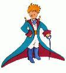

## The Little Prince

 

(Le Petit
Prince)

## Antoine de Saint Exupéry

 

 

Translated from the French by
Katherine Woods

 

 

 

 

 

 

  TO LEON WERTH

  I ask the indulgence of the children who may read this book for
dedicating it to a grown-up. I have a serious reason: he is the best
friend I have in the world. I have another reason: this grown-up
understands everything, even books about children. I have a third
reason: he lives in France where he is hungry and cold. He needs
cheering up. If all these reasons are not enough, I will dedicate the
book to the child from whom this grown-up grew. All grown-ups were once
children—although few of them remember it. And so I correct my
dedication:

  TO LEON WERTH

  WHEN HE WAS A LITTLE BOY

 

 

1.

 

 

 

  Once when I was six years old I saw a magnificent picture in a book,
called True Stories from Nature, about the
primeval forest. It was a picture of a boa constrictor in the act of
swallowing an animal. Here is a copy of the drawing.

 

  In the book it said: "Boa constrictors swallow
their prey whole, without chewing it. After that they are not able to
move, and they sleep through the six months that they need for
digestion."

  I pondered deeply, then, over the adventures of the jungle. And after
some work with a colored pencil I succeeded in making my first drawing.
My Drawing Number One. It looked something like this:

 

  I showed my masterpiece to the grown-ups, and asked them whether the
drawing frightened them.

  But they answered: "Frighten? Why should any one
be frightened by a hat?"

  My drawing was not a picture of a hat. It was a picture of a boa
constrictor digesting an elephant. But since the grown-ups were not able
to understand it, I made another drawing: I drew the inside of a boa
constrictor, so that the grown-ups could see it clearly. They always
need to have things explained. My Drawing Number Two looked like this:

 

  The grown-ups' response, this time, was to advise me to lay aside my
drawings of boa constrictors, whether from the inside or the outside,
and devote myself instead to geography, history, arithmetic, and
grammar. That is why, at the age of six, I gave up what might have been
a magnificent career as a painter. I had been disheartened by the
failure of my Drawing Number One and my Drawing Number Two. Grown-ups
never understand anything by themselves, and it is tiresome for children
to be always and forever explaining things to them.

  So then I chose another profession, and learned to pilot airplanes. I
have flown a little over all parts of the world; and it is true that
geography has been very useful to me. At a glance I can distinguish
China from Arizona. If one gets lost in the night, such knowledge is
valuable.

  In the course of this life I have had a great many encounters with a
great many people who have been concerned with matters of consequence. I
have lived a great deal among grown-ups. I have seen them intimately,
close at hand. And that hasn't much improved my opinion of them.

  Whenever I met one of them who seemed to me at all clear-sighted, I
tried the experiment of showing him my Drawing Number One, which I have
always kept. I would try to find out, so, if this was a person of true
understanding. But, whoever it was, he, or she, would always say:

  "That is a hat."

  Then I would never talk to that person about boa constrictors, or
primeval forests, or stars. I would bring myself down to his level. I
would talk to him about bridge, and golf, and politics, and neckties.
And the grown-up would be greatly pleased to have met such a sensible
man.

 

2.

 

  So I lived my life alone, without anyone that I could really talk to,
until I had an accident with my plane in the Desert of Sahara, six years
ago. Something was broken in my engine. And as I had with me neither a
mechanic nor any passengers, I set myself to attempt the difficult
repairs all alone. It was a question of life or death for me: I had
scarcely enough drinking water to last a week.

  The first night, then, I went to sleep on the sand, a thousand miles
from any human habitation. I was more isolated than a shipwrecked sailor
on a raft in the middle of the ocean. Thus you can imagine my amazement,
at sunrise, when I was awakened by an odd little voice. It said:

  "If you please—draw me a sheep!"

  "What!"

  "Draw me a sheep!"

  I jumped to my feet, completely thunderstruck. I blinked my eyes hard.
I looked carefully all around me. And I saw a most extraordinary small
person, who stood there examining me with great seriousness. Here you
may see the best portrait that, later, I was able to make of him. But my
drawing is certainly very much less charming than its model.

 

  That, however, is not my fault. The grown-ups discouraged me in my
painter's career when I was six years old, and I never learned to draw
anything, except boas from the outside and boas from the inside.

  Now I stared at this sudden apparition with my eyes fairly starting
out of my head in astonishment. Remember, I had crashed in the desert a
thousand miles from any inhabited region. And yet my little man seemed
neither to be straying uncertainly among the sands, nor to be fainting
from fatigue or hunger or thirst or fear. Nothing about him gave any
suggestion of a child lost in the middle of the desert, a thousand miles
from any human habitation. When at last I was able to speak, I said to
him:

  "But—what are you doing here?"

  And in answer he repeated, very slowly, as if he were speaking of a
matter of great consequence:

  "If you please—draw me a sheep . . ."

  When a mystery is too overpowering, one dare not disobey. Absurd as it
might seem to me, a thousand miles from any human habitation and in
danger of death, I took out of my pocket a sheet of paper and my
fountain-pen. But then I remembered how my studies had been concentrated
on geography, history, arithmetic and grammar, and I told the little
chap (a little crossly, too) that I did not know how to draw. He
answered me:

  "That doesn't matter. Draw me a sheep . .
."

  But I had never drawn a sheep. So I drew for him one of the two
pictures I had drawn so often. It was that of the boa constrictor from
the outside. And I was astounded to hear the little fellow greet it
with:

  "No, no, no! I do not want an elephant inside a
boa constrictor. A boa constrictor is a very dangerous creature, and an
elephant is very cumbersome. Where I live, everything is very small.
What I need is a sheep. Draw me a sheep."

  So then I made a drawing.

 

  He looked at it carefully, then he said:

  "No. This sheep is already very sickly. Make me
another."

  So I made another drawing.

 

  My friend smiled gently and indulgently.

  "You see yourself," he said,
"that this is not a sheep. This is a ram. It has
horns."

  So then I did my drawing over once more.

  But it was rejected too, just like the others.

  "This one is too old. I want a sheep that will
live a long time."

 

  By this time my patience was exhausted, because I was in a hurry to
start taking my engine apart. So I tossed off this drawing.

 

  And I threw out an explanation with it.

  "This is only his box. The sheep you asked for is
inside."

  I was very surprised to see a light break over the face of my young
judge:

  "That is exactly the way I wanted it! Do you
think that this sheep will have to have a great deal of grass?"

  "Why?"

  "Because where I live everything is very small .
. ."

  "There will surely be enough grass for him," I
said. "It is a very small sheep that I have given you."

  He bent his head over the drawing.

  "Not so small that—Look! He has gone to sleep . .
."

  And that is how I made the acquaintance of the little prince.

3

  .

 

 

  It took me a long time to learn where he came from. The little prince,
who asked me so many questions, never seemed to hear the ones I asked
him. It was from words dropped by chance that, little by little,
everything was revealed to me.

  The first time he saw my airplane, for instance (I shall not draw my
airplane; that would be much too complicated for me), he asked me:

 

  "What is that object?"

  "That is not an object. It flies. It is an
airplane. It is my airplane."

  And I was proud to have him learn that I could fly.

  He cried out, then:

  "What! You dropped down from the sky?"

  "Yes," I answered, modestly.

  "Oh! That is funny!"

  And the little prince broke into a lovely peal of laughter, which
irritated me very much. I like my misfortunes to be taken seriously.

  Then he added:

  "So you, too, come from the sky! Which is your
planet?"

  At that moment I caught a gleam of light in the impenetrable mystery
of his presence; and I demanded, abruptly:

  "Do you come from another planet?"

  But he did not reply. He tossed his head gently, without taking his
eyes from my plane:

  "It is true that on that you can't have come from
very far away . . ."

  And he sank into a reverie, which lasted a long time. Then, taking my
sheep out of his pocket, he buried himself in the contemplation of his
treasure.

  You can imagine how my curiosity was aroused by this half-confidence
about the "other planets." I made a great
effort, therefore, to find out more on this subject.

  "My little man, where do you come from? What is
this 'where I live,' of which you speak? Where do you want to take your
sheep?"

  After a reflective silence he answered:

  "The thing that is so good about the box you have
given me is that at night he can use it as his house."

  "That is so. And if you are good I will give you
a string, too, so that you can tie him during the day, and a post to tie
him to."

  But the little prince seemed shocked by this offer:

 

  "Tie him! What a queer idea!"

  "But if you don't tie him," I said, "he will
wander off somewhere, and get lost."

  My friend broke into another peal of laughter:

  "But where do you think he would go?"

  "Anywhere. Straight ahead of him."

  Then the little prince said, earnestly:

  "That doesn't matter. Where I live, everything is
so small!"

  And, with perhaps a hint of sadness, he added:

  "Straight ahead of him, nobody can go very far .
. ."

4.

 

 

  I had thus learned a second fact of great importance: this was that
the planet the little prince came from was scarcely any larger than a
house!

  But that did not really surprise me much. I knew very well that in
addition to the great planets—such as the Earth, Jupiter, Mars, Venus—to
which we have given names, there are also hundreds of others, some of
which are so small that one has a hard time seeing them through the
telescope. When an astronomer discovers one of these he does not give it
a name, but only a number. He might call it, for example,
"Asteroid 325".

  I have serious reason to believe that the planet from which the little
prince came is the asteroid known as B-612.

  This asteroid has only once been seen through the telescope. That was
by a Turkish astronomer, in 1909.

 

  On making his discovery, the astronomer had presented it to the
International Astronomical Congress, in a great demonstration. But he
was in Turkish costume, and so nobody would believe what he said.

  Grown-ups are like that . . .

  Fortunately, however, for the reputation of Asteroid B-612, a Turkish
dictator made a law that his subjects, under pain of death, should
change to European costume. So in 1920 the astronomer gave his
demonstration all over again, dressed with impressive style and
elegance. And this time everybody accepted his report.

 

  If I have told you these details about the asteroid, and made a note
of its number for you, it is on account of the grown-ups and their ways.
When you tell them that you have made a new friend, they never ask you
any questions about essential matters. They never say to you,
"What does his voice sound like? What games does he
love best? Does he collect butterflies?" Instead, they demand:
"How old is he? How many brothers has he? How much
does he weigh? How much money does his father make?" Only from
these figures do they think they have learned anything about him.

  If you were to say to the grown-ups: "I saw a
beautiful house made of rosy brick, with geraniums in the windows and
doves on the roof," they would not be able to get any idea of
that house at all. You would have to say to them:
"I saw a house that cost \$20,000." Then
they would exclaim: "Oh, what a pretty house that
is!"

  Just so, you might say to them: "The proof that
the little prince existed is that he was charming, that he laughed, and
that he was looking for a sheep. If anybody wants a sheep, that is a
proof that he exists." And what good would it do to tell them
that? They would shrug their shoulders, and treat you like a child. But
if you said to them: "The planet he came from is
Asteroid B-612," then they would be convinced, and leave you in
peace from their questions.

 

  They are like that. One must not hold it against them. Children should
always show great forbearance toward grown-up people.

  But certainly, for us who understand life, figures are a matter of
indifference. I should have liked to begin this story in the fashion of
the fairy-tales. I should have like to say: "Once
upon a time there was a little prince who lived on a planet that was
scarcely any bigger than himself, and who had need of a sheep . .
."

  To those who understand life, that would have given a much greater air
of truth to my story.

  For I do not want any one to read my book carelessly. I have suffered
too much grief in setting down these memories. Six years have already
passed since my friend went away from me, with his sheep. If I try to
describe him here, it is to make sure that I shall not forget him. To
forget a friend is sad. Not every one has had a friend. And if I forget
him, I may become like the grown-ups who are no longer interested in
anything but figures . . .

  It is for that purpose, again, that I have bought a box of paints and
some pencils. It is hard to take up drawing again at my age, when I have
never made any pictures except those of the boa constrictor from the
outside and the boa constrictor from the inside, since I was six. I
shall certainly try to make my portraits as true to life as possible.
But I am not at all sure of success. One drawing goes along all right,
and another has no resemblance to its subject. I make some errors, too,
in the little prince's height: in one place he is too tall and in
another too short. And I feel some doubts about the color of his
costume. So I fumble along as best I can, now good, now bad, and I hope
generally fair-to-middling.

  In certain more important details I shall make mistakes, also. But
that is something that will not be my fault. My friend never explained
anything to me. He thought, perhaps, that I was like himself. But I,
alas, do not know how to see sheep through the walls of boxes. Perhaps I
am a little like the grown-ups. I have had to grow old.

5.

 

  As each day passed I would learn, in our talk, something about the
little prince's planet, his departure from it, his journey. The
information would come very slowly, as it might chance to fall from his
thoughts. It was in this way that I heard, on the third day, about the
catastrophe of the baobabs.

  This time, once more, I had the sheep to thank for it. For the little
prince asked me abruptly—as if seized by a grave
doubt—"It is true, isn't it, that sheep eat little
bushes?"

  "Yes, that is true."

  "Ah! I am glad!"

  I did not understand why it was so important that sheep should eat
little bushes. But the little prince added:

  "Then it follows that they also eat
baobabs?"

  I pointed out to the little prince that baobabs were not little
bushes, but, on the contrary, trees as big as castles; and that even if
he took a whole herd of elephants away with him, the herd would not eat
up one single baobab.

  The idea of the herd of elephants made the little prince laugh.

  "We would have to put them one on top of the
other," he said.

 

  But he made a wise comment:

  "Before they grow so big, the baobabs start out
by being little."

  "That is strictly correct," I said. "But why do
you want the sheep to eat the little baobabs?"

  He answered me at once, "Oh, come, come!",
as if he were speaking of something that was self-evident. And I was
obliged to make a great mental effort to solve this problem, without any
assistance.

  Indeed, as I learned, there were on the planet where the little prince
lived—as on all planets—good plants and bad plants. In consequence,
there were good seeds from good plants, and bad seeds from bad plants.
But seeds are invisible. They sleep deep in the heart of the earth's
darkness, until some one among them is seized with the desire to awaken.
Then this little seed will stretch itself and begin—timidly at first—to
push a charming little sprig inoffensively upward toward the sun. If it
is only a sprout of radish or the sprig of a rose-bush, one would let it
grow wherever it might wish. But when it is a bad plant, one must
destroy it as soon as possible, the very first instant that one
recognizes it.

 

  Now there were some terrible seeds on the planet that was the home of
the little prince; and these were the seeds of the baobab. The soil of
that planet was infested with them. A baobab is something you will
never, never be able to get rid of if you attend to it too late. It
spreads over the entire planet. It bores clear through it with its
roots. And if the planet is too small, and the baobabs are too many,
they split it in pieces . . .

  "It is a question of discipline," the
little prince said to me later on. "When you've
finished your own toilet in the morning, then it is time to attend to
the toilet of your planet, just so, with the greatest care. You must see
to it that you pull up regularly all the baobabs, at the very first
moment when they can be distinguished from the rosebushes which they
resemble so closely in their earliest youth. It is very tedious
work," the little prince added, "but very
easy."

  And one day he said to me: "You ought to make a
beautiful drawing, so that the children where you live can see exactly
how all this is. That would be very useful to them if they were to
travel some day. Sometimes," he added,
"there is no harm in putting off a piece of work
until another day. But when it is a matter of baobabs, that always means
a catastrophe. I knew a planet that was inhabited by a lazy man. He
neglected three little bushes . . ."

  So, as the little prince described it to me, I have made a drawing of
that planet. I do not much like to take the tone of a moralist. But the
danger of the baobabs is so little understood, and such considerable
risks would be run by anyone who might get lost on an asteroid, that for
once I am breaking through my reserve. "Children,"
I say plainly, "watch out for the baobabs!"

 

 

 

  My friends, like myself, have been skirting this danger for a long
time, without ever knowing it; and so it is for them that I have worked
so hard over this drawing. The lesson which I pass on by this means is
worth all the trouble it has cost me. Perhaps you will ask me,
"Why are there no other drawing in this book as
magnificent and impressive as this drawing of the baobabs?"

  The reply is simple. I have tried. But with the others I have not been
successful. When I made the drawing of the baobabs I was carried beyond
myself by the inspiring force of urgent necessity.

6.

 

 

 

  Oh, little prince! Bit by bit I came to understand the secrets of your
sad little life . . . For a long time you had found your only
entertainment in the quiet pleasure of looking at the sunset. I learned
that new detail on the morning of the fourth day, when you said to me:

  "I am very fond of sunsets. Come, let us go look
at a sunset now."

  "But we must wait," I said.

  "Wait? For what?"

  "For the sunset. We must wait until it is
time."

  At first you seemed to be very much surprised. And then you laughed to
yourself. You said to me:

  "I am always thinking that I am at home!"

  Just so. Everybody knows that when it is noon in the United States the
sun is setting over France.

  If you could fly to France in one minute, you could go straight into
the sunset, right from noon. Unfortunately, France is too far away for
that. But on your tiny planet, my little prince, all you need do is move
your chair a few steps. You can see the day end and the twilight falling
whenever you like . . .

  "One day," you said to me,
"I saw the sunset forty-four times!"

  And a little later you added:

  "You know—one loves the sunset, when one is so
sad . . ."

  "Were you so sad, then?" I asked,
"on the day of the forty-four sunsets?"

  But the little prince made no reply.

 

 

7.

 

 

  On the fifth day—again, as always, it was thanks to the sheep—the
secret of the little prince's life was revealed to me. Abruptly, without
anything to lead up to it, and as if the question had been born of long
and silent meditation on his problem, he demanded:

  "A sheep—if it eats little bushes, does it eat
flowers, too?"

  "A sheep," I answered,
"eats anything it finds in its reach."

  "Even flowers that have thorns?"

  "Yes, even flowers that have thorns."

  "Then the thorns—what use are they?"

  I did not know. At that moment I was very busy trying to unscrew a
bolt that had got stuck in my engine. I was very much worried, for it
was becoming clear to me that the breakdown of my plane was extremely
serious. And I had so little drinking-water left that I had to fear for
the worst.

  "The thorns—what use are they?"

  The little prince never let go of a question, once he had asked it. As
for me, I was upset over that bolt. And I answered with the first thing
that came into my head:

  "The thorns are of no use at all. Flowers have
thorns just for spite!"

  "Oh!"

  There was a moment of complete silence. Then the little prince flashed
back at me, with a kind of resentfulness:

  "I don't believe you! Flowers are weak creatures.
They are naive. They reassure themselves as best they can. They believe
that their thorns are terrible weapons . . ."

  I did not answer. At that instant I was saying to myself:
"If this bolt still won't turn, I am going to knock
it out with the hammer." Again the little prince disturbed my
thoughts:

  "And you actually believe that the
flowers—"

  "Oh, no!" I cried.
"No, no, no! I don't believe anything. I answered
you with the first thing that came into my head. Don't you see—I am very
busy with matters of consequence!"

  He stared at me, thunderstruck.

  "Matters of consequence!"

  He looked at me there, with my hammer in my hand, my fingers black
with engine-grease, bending down over an object which seemed to him
extremely ugly . . .

  "You talk just like the grown-ups!"

  That made me a little ashamed. But he went on, relentlessly:

  "You mix everything up together . . . You confuse
everything . . ."

  He was really very angry. He tossed his golden curls in the breeze.

  "I know a planet where there is a certain
red-faced gentleman. He has never smelled a flower. He has never looked
at a star. He has never loved any one. He has never done anything in his
life but add up figures. And all day he says over and over, just like
you: 'I am busy with matters of consequence!' And that makes him swell
up with pride. But he is not a man—he is a mushroom!"

  "A what?"

  "A mushroom!"

  The little prince was now white with rage.

  "The flowers have been growing thorns for
millions of years. For millions of years the sheep have been eating them
just the same. And is it not a matter of consequence to try to
understand why the flowers go to so much trouble to grow thorns which
are never of any use to them? Is the warfare between the sheep and the
flowers not important? Is this not of more consequence than a fat
red-faced gentleman's sums? And if I know—I, myself—one flower which is
unique in the world, which grows nowhere but on my planet, but which one
little sheep can destroy in a single bite some morning, without even
noticing what he is doing—Oh! You think that is not important!"

  His face turned from white to red as he continued:

  "If some one loves a flower, of which just one
single blossom grows in all the millions and millions of stars, it is
enough to make him happy just to look at the stars. He can say to
himself, 'Somewhere, my flower is there . . .' But if the sheep eats the
flower, in one moment all his stars will be darkened . . . And you think
that is not important!"

  He could not say anything more. His words were choked by sobbing.

  The night had fallen. I had let my tools drop from my hands. Of what
moment now was my hammer, my bolt, or thirst, or death? On one star, one
planet, my planet, the Earth, there was a little prince to be comforted.
I took him in my arms, and rocked him. I said to him:

  "The flower that you love is not in danger. I
will draw you a muzzle for your sheep. I will draw you a railing to put
around your flower. I will—"

  I did not know what to say to him. I felt awkward and blundering. I
did not know how I could reach him, where I could overtake him and go on
hand in hand with him once more.

  It is such a secret place, the land of tears.

 

8.

 

 

 

 

  I soon learned to know this flower better. On the little prince's
planet the flowers had always been very simple. They had only one ring
of petals; they took up no room at all; they were a trouble to nobody.
One morning they would appear in the grass, and by night they would have
faded peacefully away. But one day, from a seed blown from no one knew
where, a new flower had come up; and the little prince had watched very
closely over this small sprout which was not like any other small
sprouts on his planet. It might, you see, have been a new kind of
baobab.

  The shrub soon stopped growing, and began to get ready to produce a
flower. The little prince, who was present at the first appearance of a
huge bud, felt at once that some sort of miraculous apparition must
emerge from it. But the flower was not satisfied to complete the
preparations for her beauty in the shelter of her green chamber. She
chose her colors with the greatest care. She dressed herself slowly. She
adjusted her petals one by one. She did not wish to go out into the
world all rumpled, like the field poppies. It was only in the full
radiance of her beauty that she wished to appear. Oh, yes! She was a
coquettish creature! And her mysterious adornment lasted for days and
days.

  Then one morning, exactly at sunrise, she suddenly showed herself.

 

  And, after working with all this painstaking precision, she yawned and
said:

  "Ah! I am scarcely awake. I beg that you will
excuse me. My petals are still all disarranged . . ."

  But the little prince could not restrain his admiration:

  "Oh! How beautiful you are!"

  "Am I not?" the flower responded, sweetly.
"And I was born at the same moment as the sun . .
."

  The little prince could guess easily enough that she was not any too
modest—but how moving—and exciting—she was!

  "I think it is time for breakfast," she
added an instant later. "If you would have the
kindness to think of my needs—"

 

  And the little prince, completely abashed, went to look for a
sprinkling-can of fresh water. So, he tended the flower.

  So, too, she began very quickly to torment him with her vanity—which
was, if the truth be known, a little difficult to deal with. One day,
for instance, when she was speaking of her four thorns, she said to the
little prince:

  "Let the tigers come with their claws!"

  "There are no tigers on my planet," the
little prince objected. "And, anyway, tigers do not
eat weeds."

  "I am not a weed," the flower replied,
sweetly.

  "Please excuse me . . ."

  "I am not at all afraid of tigers," she
went on, "but I have a horror of drafts. I suppose
you wouldn't have a screen for me?"

  "A horror of drafts—that is bad luck, for a
plant," remarked the little prince, and added to himself,
"This flower is a very complex creature . .
."

 

  "At night I want you to put me under a glass
globe. It is very cold where you live. In the place I came from—"

  But she interrupted herself at that point. She had come in the form of
a seed. She could not have known anything of any other worlds.
Embarassed over having let herself be caught on the verge of such a
naive untruth, she coughed two or three times, in order to put the
little prince in the wrong.

  "The screen?"

  "I was just going to look for it when you spoke
to me . . ."

  Then she forced her cough a little more so that he should suffer from
remorse just the same.

  So the little prince, in spite of all the good will that was
inseparable from his love, had soon come to doubt her. He had taken
seriously words which were without importance, and it made him very
unhappy.

  "I ought not to have listened to her," he
confided to me one day. "One never ought to listen
to the flowers. One should simply look at them and breathe their
fragrance. Mine perfumed all my planet. But I did not know how to take
pleasure in all her grace. This tale of claws, which disturbed me so
much, should only have filled my heart with tenderness and pity."

 

  And he continued his confidences:

  "The fact is that I did not know how to
understand anything! I ought to have judged by deeds and not by words.
She cast her fragrance and her radiance over me. I ought never to have
run away from her . . . I ought to have guessed all the affection that
lay behind her poor little stratagems. Flowers are so inconsistent! But
I was too young to know how to love her …"

 

9.

 

 

  I believe that for his escape he took advantage of the migration of a
flock of wild birds. On the morning of his departure he put his planet
in perfect order. He carefully cleaned out his active volcanoes. He
possessed two active volcanoes; and they were very convenient for
heating his breakfast in the morning. He also had one volcano that was
extinct. But, as he said, "One never knows!"
So he cleaned out the extinct volcano, too. If they are well cleaned
out, volcanoes burn slowly and steadily, without any eruptions. Volcanic
eruptions are like fires in a chimney.

  On our earth we are obviously much too small to clean out our
volcanoes. That is why they bring no end of trouble upon us.

  The little prince also pulled up, with a certain sense of dejection,
the last little shoots of the baobabs. He believed that he would never
want to return. But on this last morning all these familiar tasks seemed
very precious to him. And when he watered the flower for the last time,
and prepared to place her under the shelter of her glass globe, he
realized that he was very close to tears.

  "Goodbye," he said to the flower.

  But she made no answer.

  "Goodbye," he said again.

  The flower coughed. But it was not because she had a cold.

  "I have been silly," she said to him, at
last. "I ask your forgiveness. Try to be happy . .
."

  He was surprised by this absence of reproaches. He stood there all
bewildered, the glass globe held arrested in mid-air. He did not
understand this quiet sweetness.

  "Of course I love you," the flower said to
him. "It is my fault that you have not known it all
the while. That is of no importance. But you—you have been just as
foolish as I. Try to be happy . . . Let the glass globe be. I don't want
it any more."

 

  "But the wind—"

  "My cold is not so bad as all that . . . The cool
night air will do me good. I am a flower."

  "But the animals—"

  "Well, I must endure the presence of two or three
caterpillars if I wish to become acquainted with the butterflies. It
seems that they are very beautiful. And if not the butterflies—and the
caterpillars—who will call upon me? You will be far away . . . As for
the large animals—I am not at all afraid of any of them. I have my
claws."

  And, naively, she showed her four thorns. Then she added:

  "Don't linger like this. You have decided to go
away. Now go!"

  For she did not want him to see her crying. She was such a proud
flower.

10

  .

 

 

  He found himself in the neighborhood of the asteroids 325, 326, 327,
328, 329, and 330. He began, therefore, by visiting them, in order to
add to his knowledge.

  The first of them was inhabited by a king. Clad in royal purple and
ermine, he was seated upon a throne which was at the same time both
simple and majestic.

 

  "Ah! Here is a subject," exclaimed the
king, when he saw the little prince coming.

  And the little prince asked himself:

  "How could he recognize me when he had never seen
me before?"

  He did not know how the world is simplified for kings. To them, all
men are subjects.

  "Approach, so that I may see you better,"
said the king, who felt consumingly proud of being at last a king over
somebody.

  The little prince looked everywhere to find a place to sit down; but
the entire planet was crammed and obstructed by the king's magnificent
ermine robe. So he remained standing upright, and, since he was tired,
he yawned.

  "It is contrary to etiquette to yawn in the
presence of a king," the monarch said to him.
"I forbid you to do so."

  "I can't help it. I can't stop myself,"
replied the little prince, thoroughly embarrassed.
"I have come on a long journey, and I have had no
sleep . . ."

  "Ah, then," the king said.
"I order you to yawn. It is years since I have seen
anyone yawning. Yawns, to me, are objects of curiosity. Come, now! Yawn
again! It is an order."

  "That frightens me . . . I cannot, any more . .
." murmured the little prince, now completely abashed.

  "Hum! Hum!" replied the king.
"Then I—I order you sometimes to yawn and sometimes
to—"

  He sputtered a little, and seemed vexed.

  For what the king fundamentally insisted upon was that his authority
should be respected. He tolerated no disobedience. He was an absolute
monarch. But, because he was a very good man, he made his orders
reasonable.

  "If I ordered a general," he would say, by
way of example, "if I ordered a general to change
himself into a sea bird, and if the general did not obey me, that would
not be the fault of the general. It would be my fault."

  "May I sit down?" came now a timid inquiry
from the little prince.

  "I order you to do so," the king answered
him, and majestically gathered in a fold of his ermine mantle.

  But the little prince was wondering . . . The planet was tiny. Over
what could this king really rule?

  "Sire," he said to him,
"I beg that you will excuse my asking you a
question—"

  "I order you to ask me a question," the
king hastened to assure him.

  "Sire—over what do you rule?"

  "Over everything," said the king, with
magnificent simplicity.

  "Over everything?"

  The king made a gesture, which took in his planet, the other planets,
and all the stars.

  "Over all that?" asked the little prince.

  "Over all that," the king answered.

  For his rule was not only absolute: it was also universal.

  "And the stars obey you?"

  "Certainly they do," the king said.
"They obey instantly. I do not permit
insubordination."

  Such power was a thing for the little prince to marvel at. If he had
been master of such complete authority, he would have been able to watch
the sunset, not forty-four times in one day, but seventy-two, or even a
hundred, or even two hundred times, without ever having to move his
chair. And because he felt a bit sad as he remembered his little planet
which he had forsaken, he plucked up his courage to ask the king a
favor:

  "I should like to see a sunset . . . Do me that
kindness . . . Order the sun to set . . ."

  "If I ordered a general to fly from one flower to
another like a butterfly, or to write a tragic drama, or to change
himself into a sea bird, and if the general did not carry out the order
that he had received, which one of us would be in the wrong?" the
king demanded. "The general, or myself?"

  "You," said the little prince firmly.

  "Exactly. One must require from each one the duty
which each one can perform," the king went on.
"Accepted authority rests first of all on reason.
If you ordered your people to go and throw themselves into the sea, they
would rise up in revolution. I have the right to require obedience
because my orders are reasonable."

  "Then my sunset?" the little prince
reminded him: for he never forgot a question once he had asked it.

  "You shall have your sunset. I shall command it.
But, according to my science of government, I shall wait until
conditions are favorable."

  "When will that be?" inquired the little
prince.

  "Hum! Hum!" replied the king; and before
saying anything else he consulted a bulky almanac.
"Hum! Hum! That will be about—about—that will be
this evening about twenty minutes to eight. And you will see how well I
am obeyed!"

  The little prince yawned. He was regretting his lost sunset. And then,
too, he was already beginning to be a little bored.

  "I have nothing more to do here," he said
to the king. "So I shall set out on my way
again."

  "Do not go," said the king, who was very
proud of having a subject. "Do not go. I will make
you a Minister!"

  "Minister of what?"

  "Minster of—of Justice!"

  "But there is nobody here to judge!"

  "We do not know that," the king said to
him. "I have not yet made a complete tour of my
kingdom. I am very old. There is no room here for a carriage. And it
tires me to walk."

  "Oh, but I have looked already!" said the
little prince, turning around to give one more glance to the other side
of the planet. On that side, as on this, there was nobody at all . . .

  "Then you shall judge yourself," the king
answered. "that is the most difficult thing of all.
It is much more difficult to judge oneself than to judge others. If you
succeed in judging yourself rightly, then you are indeed a man of true
wisdom."

  "Yes," said the little prince,
"but I can judge myself anywhere. I do not need to
live on this planet."

  "Hum! Hum!" said the king.
"I have good reason to believe that somewhere on my
planet there is an old rat. I hear him at night. You can judge this old
rat. From time to time you will condemn him to death. Thus his life will
depend on your justice. But you will pardon him on each occasion; for he
must be treated thriftily. He is the only one we have."

  "I," replied the little prince,
"do not like to condemn anyone to death. And now I
think I will go on my way."

  "No," said the king.

  But the little prince, having now completed his preparations for
departure, had no wish to grieve the old monarch.

  "If Your Majesty wishes to be promptly
obeyed," he said, "he should be able to give
me a reasonable order. He should be able, for example, to order me to be
gone by the end of one minute. It seems to me that conditions are
favorable . . ."

  As the king made no answer, the little prince hesitated a moment.
Then, with a sigh, he took his leave.

  "I make you my Ambassador," the king
called out, hastily.

  He had a magnificent air of authority.

  "The grown-ups are very strange," the
little prince said to himself, as he continued on his journey.

11.

 

 

  The second planet was inhabited by a conceited man.

 

  "Ah! Ah! I am about to receive a visit from an
admirer!" he exclaimed from afar, when he first saw the little
prince coming.

  For, to conceited men, all other men are admirers.

  "Good morning," said the little prince.
"That is a queer hat you are wearing."

  "It is a hat for salutes," the conceited
man replied. "It is to raise in salute when people
acclaim me. Unfortunately, nobody at all ever passes this way."

  "Yes?" said the little prince, who did not
understand what the conceited man was talking about.

  "Clap your hands, one against the other,"
the conceited man now directed him.

  The little prince clapped his hands. The conceited man raised his hat
in a modest salute.

  "This is more entertaining than the visit to the
king," the little prince said to himself. And he began again to
clap his hands, one against the other. The conceited man again raised
his hat in salute.

  After five minutes of this exercise the little prince grew tired of
the game's monotony.

  "And what should one do to make the hat come
down?" he asked.

  But the conceited man did not hear him. Conceited people never hear
anything but praise.

  "Do you really admire me very much?" he
demanded of the little prince.

  "What does that mean—'admire'?"

  "To admire means that you regard me as the
handsomest, the best-dressed, the richest, and the most intelligent man
on this planet."

  "But you are the only man on your planet!"

  "Do me this kindness. Admire me just the
same."

  "I admire you," said the little prince,
shrugging his shoulders slightly, "but what is
there in that to interest you so much?"

  And the little prince went away.

  "The grown-ups are certainly very odd," he
said to himself, as he continued on his journey.

12.

 

 

  The next planet was inhabited by a tippler. This was a very short
visit, but it plunged the little prince into deep dejection.

  "What are you doing there?" he said to the
tippler, whom he found settled down in silence before a collection of
empty bottles and also a collection of full bottles.

 

  "I am drinking," replied the tippler, with
a lugubrious air.

  "Why are you drinking?" demanded the
little prince.

  "So that I may forget," replied the
tippler.

  "Forget what?" inquired the little prince,
who already was sorry for him.

  "Forget that I am ashamed," the tippler
confessed, hanging his head.

  "Ashamed of what?" insisted the little
prince, who wanted to help him.

  "Ashamed of drinking!" The tippler brought
his speech to an end, and shut himself up in an impregnable silence.

  And the little prince went away, puzzled.

  "The grown-ups are certainly very, very
odd," he said to himself, as he continued on his journey.

13.

 

 

  The fourth planet belonged to a businessman. This man was so much
occupied that he did not even raise his head at the little prince's
arrival.

 

  "Good morning," the little prince said to
him. "Your cigarette has gone out."

  "Three and two make five. Five and seven make
twelve. Twelve and three make fifteen. Good morning. FIfteen and seven
make twenty-two. Twenty-two and six make twenty-eight. I haven't time to
light it again. Twenty-six and five make thirty-one. Phew! Then that
makes five-hundred-and-one million, six-hundred-twenty-two-thousand,
seven-hundred-thirty-one."

  "Five hundred million what?" asked the
little prince.

  "Eh? Are you still there? Five-hundred-and-one
million—I can't stop . . . I have so much to do! I am concerned with
matters of consequence. I don't amuse myself with balderdash. Two and
five make seven . . ."

  "Five-hundred-and-one million what?"
repeated the little prince, who never in his life had let go of a
question once he had asked it.

  The businessman raised his head.

  "During the fifty-four years that I have
inhabited this planet, I have been disturbed only three times. The first
time was twenty-two years ago, when some giddy goose fell from goodness
knows where. He made the most frightful noise that resounded all over
the place, and I made four mistakes in my addition. The second time,
eleven years ago, I was disturbed by an attack of rheumatism. I don't
get enough exercise. I have no time for loafing. The third time—well,
this is it! I was saying, then, five-hundred-and-one millions—"

  "Millions of what?"

  The businessman suddenly realized that there was no hope of being left
in peace until he answered this question.

  "Millions of those little objects," he
said, "which one sometimes sees in the sky."

  "Flies?"

  "Oh, no. Little glittering objects."

  "Bees?"

  "Oh, no. Little golden objects that set lazy men
to idle dreaming. As for me, I am concerned with matters of consequence.
There is no time for idle dreaming in my life."

  "Ah! You mean the stars?"

  "Yes, that's it. The stars."

  "And what do you do with five-hundred millions of
stars?"

  "Five-hundred-and-one million,
six-hundred-twenty-two thousand, seven-hundred-thirty-one. I am
concerned with matters of consequence: I am accurate."

  "And what do you do with these stars?"

  "What do I do with them?"

  "Yes."

  "Nothing. I own them."

  "You own the stars?"

  "Yes."

  "But I have already seen a king who—"

  "Kings do not own, they reign over. It is a very
different matter."

  "And what good does it do you to own the
stars?"

  "It does me the good of making me rich."

  "And what good does it do you to be rich?"

  "It makes it possible for me to buy more stars,
if any are discovered."

  "This man," the little prince said to
himself, "reasons a little like my poor tippler . .
."

  Nevertheless, he still had some more questions.

  "How is it possible for one to own the
stars?"

  "To whom do they belong?" the businessman
retorted, peevishly.

  "I don't know. To nobody."

  "Then they belong to me, because I was the first
person to think of it."

  "Is that all that is necessary?"

  "Certainly. When you find a diamond that belongs
to nobody, it is yours. When you discover an island that belongs to
nobody, it is yours. When you get an idea before any one else, you take
out a patent on it: it is yours. So with me: I own the stars, because
nobody else before me ever thought of owning them."

  "Yes, that is true," said the little prince. "And
what do you do with them?"

  "I administer them," replied the
businessman. "I count them and recount them. It is
difficult. But I am a man who is naturally interested in matters of
consequence."

  The little prince was still not satisfied.

  "If I owned a silk scarf," he said,
"I could put it around my neck and take it away
with me. If I owned a flower, I could pluck that flower and take it away
with me. But you cannot pluck the stars from heaven . . ."

  "No. But I can put them in the bank."

  "Whatever does that mean?"

  "That means that I write the number of my stars
on a little paper. And then I put this paper in a drawer and lock it
with a key."

  "And that is all?"

  "That is enough," said the businessman.

  "It is entertaining," thought the little
prince. "It is rather poetic. But it is of no great
consequence."

  On matters of consequence, the little prince had ideas which were very
different from those of the grown-ups.

  "I myself own a flower," he continued his
conversation with the businessman, "which I water
every day. I own three volcanoes, which I clean out every week (for I
also clean out the one that is extinct; one never knows). It is of some
use to my volcanoes, and it is of some use to my flower, that I own
them. But you are of no use to the stars . . ."

  The businessman opened his mouth, but he found nothing to say in
answer. And the little prince went away.

  "The grown-ups are certainly altogether
extraordinary," he said simply, talking to himself as he
continued on his journey.

14.

 

  The fifth planet was very strange. It was the smallest of all. There
was just enough room on it for a street lamp and a lamplighter. The
little prince was not able to reach any explanation of the use of a
street lamp and a lamplighter, somewhere in the heavens, on a planet
which had no people, and not one house. But he said to himself,
nevertheless:

  "It may well be that this man is absurd. But he
is not so absurd as the king, the conceited man, the businessman, and
the tippler. For at least his work has some meaning. When he lights his
street lamp, it is as if he brought one more star to life, or one
flower. When he puts out his lamp, he sends the flower, or the star, to
sleep. That is a beautiful occupation. And since it is beautiful, it is
truly useful."

  When he arrived on the planet he respectfully saluted the lamplighter.

  "Good morning. Why have you just put out your
lamp?"

  "Those are the orders," replied the
lamplighter. "Good morning."

  "What are the orders?"

  "The orders are that I put out my lamp. Good
evening."

  And he lighted his lamp again.

  "But why have you just lighted it again?"

  "Those are the orders," replied the
lamplighter.

  "I do not understand," said the little
prince.

  "There is nothing to understand," said the
lamplighter. "Orders are orders. Good
morning."

  And he put out his lamp.

  Then he mopped his forehead with a handkerchief decorated with red
squares.

  "I follow a terrible profession. In the old days
it was reasonable. I put the lamp out in the morning, and in the evening
I lighted it again. I had the rest of the day for relaxation and the
rest of the night for sleep."

  "And the orders have been changed since that
time?"

  "The orders have not been changed," said
the lamplighter. "That is the tragedy! From year to
year the planet has turned more rapidly and the orders have not been
changed!"

  "Then what?" asked the little prince.

  "Then—the planet now makes a complete turn every
minute, and I no longer have a single second for repose. Once every
minute I have to light my lamp and put it out!"

  "That is very funny! A day lasts only one minute,
here where you live!"

  "It is not funny at all!" said the
lamplighter. "While we have been talking together a
month has gone by."

  "A month?"

  "Yes, a month. Thirty minutes. Thirty days. Good
evening."

  And he lighted his lamp again.

  As the little prince watched him, he felt that he loved this
lamplighter who was so faithful to his orders. He remembered the sunsets
which he himself had gone to seek, in other days, merely by pulling up
his chair; and he wanted to help his friend.

  "You know," he said,
"I can tell you a way you can rest whenever you
want to. . ."

  "I always want to rest," said the
lamplighter.

  For it is possible for a man to be faithful and lazy at the same time.

  The little prince went on with his explanation:

  "Your planet is so small that three strides will
take you all the way around it. To be always in the sunshine, you need
only walk along rather slowly. When you want to rest, you will walk—and
the day will last as long as you like."

  "That doesn't do me much good," said the
lamplighter. "The one thing I love in life is to
sleep."

  "Then you're unlucky," said the little
prince.

  "I am unlucky," said the lamplighter.
"Good morning."

 

  And he put out his lamp.

  "That man," said the little prince to
himself, as he continued farther on his journey,
"that man would be scorned by all the others: by
the king, by the conceited man, by the tippler, by the businessman.
Nevertheless he is the only one of them all who does not seem to me
ridiculous. Perhaps that is because he is thinking of something else
besides himself."

  He breathed a sigh of regret, and said to himself, again:

  "That man is the only one of them all whom I
could have made my friend. But his planet is indeed too small. There is
no room on it for two people. . ."

  What the little prince did not dare confess was that he was sorry most
of all to leave this planet, because it was blest every day with 1440
sunsets!

15.

 

  The sixth planet was ten times larger than the last one. It was
inhabited by an old gentleman who wrote voluminous books.

 

  "Oh, look! Here is an explorer!" he
exclaimed to himself when he saw the little prince coming.

  The little prince sat down on the table and panted a little. He had
already traveled so much and so far!

  "Where do you come from?" the old
gentleman said to him.

  "What is that big book?" said the little
prince. "What are you doing?"

  "I am a geographer," said the old
gentleman.

  "What is a geographer?" asked the little
prince.

  "A geographer is a scholar who knows the location
of all the seas, rivers, towns, mountains, and deserts."

  "That is very interesting," said the
little prince. "Here at last is a man who has a
real profession!" And he cast a look around him at the planet of
the geographer. It was the most magnificent and stately planet that he
had ever seen.

  "Your planet is very beautiful," he said.
"Has it any oceans?"

  "I couldn't tell you," said the
geographer.

  "Ah!" The little prince was disappointed.
"Has it any mountains?"

  "I couldn't tell you," said the
geographer.

  "And towns, and rivers, and deserts?"

  "I couldn't tell you that, either."

  "But you are a geographer!"

  "Exactly," the geographer said.
"But I am not an explorer. I haven't a single
explorer on my planet. It is not the geographer who goes out to count
the towns, the rivers, the mountains, the seas, the oceans, and the
deserts. The geographer is much too important to go loafing about. He
does not leave his desk. But he receives the explorers in his study. He
asks them questions, and he notes down what they recall of their
travels. And if the recollections of any one among them seem interesting
to him, the geographer orders an inquiry into that explorer's moral
character."

  "Why is that?"

  "Because an explorer who told lies would bring
disaster on the books of the geographer. So would an explorer who drank
too much."

  "Why is that?" asked the little prince.

  "Because intoxicated men see double. Then the
geographer would note down two mountains in a place where there was only
one."

  "I know some one," said the little prince,
"who would make a bad explorer."

  "That is possible. Then, when the moral character
of the explorer is shown to be good, an inquiry is ordered into his
discovery."

  "One goes to see it?"

  "No. That would be too complicated. But one
requires the explorer to furnish proofs. For example, if the discovery
in question is that of a large mountain, one requires that large stones
be brought back from it."

  The geographer was suddenly stirred to excitement.

  "But you—you come from far away! You are an
explorer! You shall describe your planet to me!"

  And, having opened his big register, the geographer sharpened his
pencil. The recitals of explorers are put down first in pencil. One
waits until the explorer has furnished proofs, before putting them down
in ink.

  "Well?" said the geographer expectantly.

  "Oh, where I live," said the little
prince, "it is not very interesting. It is all so
small. I have three volcanoes. Two volcanoes are active and the other is
extinct. But one never knows."

  "One never knows," said the geographer.

  "I have also a flower."

  "We do not record flowers," said the
geographer.

  "Why is that? The flower is the most beautiful
thing on my planet!"

  "We do not record them," said the
geographer, "because they are ephemeral."

  "What does that mean—'ephemeral'?"

  "Geographies," said the geographer,
"are the books which, of all books, are most
concerned with matters of consequence. They never become old-fashioned.
It is very rarely that a mountain changes its position. It is very
rarely that an ocean empties itself of its waters. We write of eternal
things."

  "But extinct volcanoes may come to life
again," the little prince interrupted. "What
does that mean— 'ephemeral'?"

  "Whether volcanoes are extinct or alive, it comes
to the same thing for us," said the geographer.
"The thing that matters to us is the mountain. It
does not change."

  "But what does that mean—'ephemeral'?"
repeated the little prince, who never in his life had let go of a
question, once he had asked it.

  "It means, 'which is in danger of speedy
disappearance.'"

  "Is my flower in danger of speedy
disappearance?"

  "Certainly it is."

  "My flower is ephemeral," the little
prince said to himself, "and she has only four
thorns to defend herself against the world. And I have left her on my
planet, all alone!"

  That was his first moment of regret. But he took courage once more.

  "What place would you advise me to visit
now?" he asked.

  "The planet Earth," replied the
geographer. "It has a good reputation."

  And the little prince went away, thinking of his flower

16.

 

 

  So then the seventh planet was the Earth.

  The Earth is not just an ordinary planet! One can count, there, 111
kings (not forgetting, to be sure, the Negro kings among them), 7000
geographers, 900,000 businessmen, 7,500,000 tipplers, 311,000,000
conceited men—that is to say, about 2,000,000,000 grown-ups.

  To give you an idea of the size of the Earth, I will tell you that
before the invention of electricity it was necessary to maintain, over
the whole of the six continents, a veritable army of 462,511
lamplighters for the street lamps.

  Seen from a slight distance, that would make a splendid spectacle. The
movements of this army would be regulated like those of the ballet in
the opera. First would come the turn of the lamplighters of New Zealand
and Australia. Having set their lamps alight, these would go off to
sleep. Next, the lamplighters of China and Siberia would enter for their
steps in the dance, and then they too would be waved back into the
wings. After that would come the turn of the lamplighters of Russia and
the Indies; then those of Africa and Europe; then those of South
America; then those of South America; then those of North America. And
never would they make a mistake in the order of their entry upon the
stage. It would be magnificent.

  Only the man who was in charge of the single lamp at the North Pole,
and his colleague who was responsible for the single lamp at the South
Pole—only these two would live free from toil and care: they would be
busy twice a year.

 

17.

 

 

  When one wishes to play the wit, he sometimes wanders a little from
the truth. I have not been altogether honest in what I have told you
about the lamplighters. And I realize that I run the risk of giving a
false idea of our planet to those who do not know it. Men occupy a very
small place upon the Earth. If the two billion inhabitants who people
its surface were all to stand upright and somewhat crowded together, as
they do for some big public assembly, they could easily be put into one
public square twenty miles long and twenty miles wide. All humanity
could be piled up on a small Pacific islet.

  The grown-ups, to be sure, will not believe you when you tell them
that. They imagine that they fill a great deal of space. They fancy
themselves as important as the baobabs. You should advise them, then, to
make their own calculations. They adore figures, and that will please
them. But do not waste your time on this extra task. It is unnecessary.
You have, I know, confidence in me.

  When the little prince arrived on the Earth, he was very much
surprised not to see any people. He was beginning to be afraid he had
come to the wrong planet, when a coil of gold, the color of the
moonlight, flashed across the sand.

  "Good evening," said the little prince
courteously.

  "Good evening," said the snake.

  "What planet is this on which I have come
down?" asked the little prince.

  "This is the Earth; this is Africa," the
snake answered.

  "Ah! Then there are no people on the
Earth?"

  "This is the desert. There are no people in the
desert. The Earth is large," said the snake.

  The little prince sat down on a stone, and raised his eyes toward the
sky.

  "I wonder," he said,
"whether the stars are set alight in heaven so that
one day each one of us may find his own again . . . Look at my planet.
It is right there above us. But how far away it is!"

  "It is beautiful," the snake said.
"What has brought you here?"

  "I have been having some trouble with a
flower," said the little prince.

  "Ah!" said the snake.

  And they were both silent.

  "Where are the men?" the little prince at
last took up the conversation again. "It is a
little lonely in the desert . . ."

  "It is also lonely among men," the snake
said.

  The little prince gazed at him for a long time.

  "You are a funny animal," he said at last.
"You are no thicker than a finger . . ."

  "But I am more powerful than the finger of a
king," said the snake.

  The little prince smiled.

  "You are not very powerful. You haven't even any
feet. You cannot even travel . . ."

  "I can carry you farther than any ship could take
you," said the snake.

  He twined himself around the little prince's ankle, like a golden
bracelet.

  "Whomever I touch, I send back to the earth from
whence he came," the snake spoke again. "But
you are innocent and true, and you come from a star . . ."

  The little prince made no reply.

  "You move me to pity—you are so weak on this
Earth made of granite," the snake said. "I
can help you, some day, if you grow too homesick for your own planet. I
can—"

  "Oh! I understand you very well," said the
little prince. "But why do you always speak in
riddles?"

  "I solve them all," said the snake.

  And they were both silent.

 

18.

 

 

  The little prince crossed the desert and met with only one flower. It
was a flower with three petals, a flower of no account at all.

  "Good morning," said the little prince.

  "Good morning," said the flower.

  "Where are the men?" the little prince asked, politely.

  The flower had once seen a caravan passing.

  "Men?" she echoed. "I think there are six or seven of them in
existence. I saw them, several years ago. But one never knows where to
find them. The wind blows them away. They have no roots, and that makes
their life very difficult."

  "Goodbye," said the little prince.

  "Goodbye," said the flower.

 

19.

 

 

  After that, the little prince climbed a high mountain. The only
mountains he had ever known were the three volcanoes, which came up to
his knees. And he used the extinct volcano as a footstool. "From a
mountain as high as this one," he said to himself, "I shall be able to
see the whole planet at one glance, and all the people . . ."

  But he saw nothing, save peaks of rock that were sharpened like
needles.

  "Good morning," he said courteously.

  "Good morning—Good morning—Good morning," answered the echo.

  "Who are you?" said the little prince.

  "Who are you—Who are you—Who are you?" answered the echo.

  "Be my friends. I am all alone," he said.

  "I am all alone—all alone—all alone," answered the echo.

  "What a queer planet!" he thought. "It is altogether dry, and
altogether pointed, and altogether harsh and forbidding. And the people
have no imagination. They repeat whatever one says to them . . . On my
planet I had a flower; she always was the first to speak . . ."

 

 

20.

 

 

  But it happened that after walking for a long time through sand, and
rocks, and snow, the little prince at last came upon a road. And all
roads lead to the abodes of men.

  "Good morning," he said.

  He was standing before a garden, all a-bloom with roses.

  "Good morning," said the roses.

  The little prince gazed at them. They all looked like his flower.

  "Who are you?" he demanded, thunderstruck.

  "We are roses," the roses said.

  And he was overcome with sadness. His flower had told him that she was
the only one of her kind in all the universe. And here were five
thousand of them, all alike, in one single garden!

  "She would be very much annoyed," he said
to himself, "if she should see that . . . She would
cough most dreadfully, and she would pretend that she was dying, to
avoid being laughed at. And I should be obliged to pretend that I was
nursing her back to life—for if I did not do that, to humble myself
also, she would really allow herself to die. . ."

  Then he went on with his reflections: "I thought
that I was rich, with a flower that was unique in all the world; and all
I had was a common rose. A common rose, and three volcanoes that come up
to my knees—and one of them perhaps extinct forever . . . That doesn't
make me a very great prince . . ."

 

  And he lay down in the grass and cried.¨

21.

 

 

 

 

 

  It was then that the fox appeared.

  "Good morning," said the fox.

  "Good morning," the little prince responded politely, although when he
turned around he saw nothing.

  "I am right here," the voice said, "under the apple tree."

 

  "Who are you?" asked the little prince,
and added, "You are very pretty to look at."

  "I am a fox," the fox said.

  "Come and play with me," proposed the
little prince. "I am so unhappy."

  "I cannot play with you," the fox said.
"I am not tamed."

  "Ah! Please excuse me," said the little
prince.

  But, after some thought, he added:

  "What does that mean—'tame'?"

  "You do not live here," said the fox.
"What is it that you are looking for?"

  "I am looking for men," said the little
prince. "What does that mean—'tame'?"

  "Men," said the fox.
"They have guns, and they hunt. It is very
disturbing. They also raise chickens. These are their only interests.
Are you looking for chickens?"

  "No," said the little prince.
"I am looking for friends. What does that
mean—'tame'?"

  "It is an act too often neglected," said
the fox. "It means to establish ties."

  "'To establish ties'?"

  "Just that," said the fox.
"To me, you are still nothing more than a little
boy who is just like a hundred thousand other little boys. And I have no
need of you. And you, on your part, have no need of me. To you, I am
nothing more than a fox like a hundred thousand other foxes. But if you
tame me, then we shall need each other. To me, you will be unique in all
the world. To you, I shall be unique in all the world . . ."

  "I am beginning to understand," said the
little prince. "There is a flower . . . I think
that she has tamed me . . ."

  "It is possible," said the fox.
"On the Earth one sees all sorts of things."

  "Oh, but this is not on the Earth!" said
the little prince.

  The fox seemed perplexed, and very curious.

  "On another planet?"

  "Yes."

  "Are there hunters on that planet?"

  "No."

  "Ah, that is interesting! Are there
chickens?"

  "No."

  "Nothing is perfect," sighed the fox.

  But he came back to his idea.

  "My life is very monotonous," the fox
said. "I hunt chickens; men hunt me. All the
chickens are just alike, and all the men are just alike. And, in
consequence, I am a little bored. But if you tame me, it will be as if
the sun came to shine on my life. I shall know the sound of a step that
will be different from all the others. Other steps send me hurrying back
underneath the ground. Yours will call me, like music, out of my burrow.
And then look: you see the grain-fields down yonder? I do not eat bread.
Wheat is of no use to me. The wheat fields have nothing to say to me.
And that is sad. But you have hair that is the color of gold. Think how
wonderful that will be when you have tamed me! The grain, which is also
golden, will bring me back the thought of you. And I shall love to
listen to the wind in the wheat . . ."

  The fox gazed at the little prince, for a long time.

 

  "Please—tame me!" he said.

  "I want to, very much," the little prince
replied. "But I have not much time. I have friends
to discover, and a great many things to understand."

  "One only understands the things that one
tames," said the fox. "Men have no more time
to understand anything. They buy things all ready made at the shops. But
there is no shop anywhere where one can buy friendship, and so men have
no friends any more. If you want a friend, tame me . . ."

  "What must I do, to tame you?" asked the
little prince.

  "You must be very patient," replied the
fox. "First you will sit down at a little distance
from me—like that—in the grass. I shall look at you out of the corner of
my eye, and you will say nothing. Words are the source of
misunderstandings. But you will sit a little closer to me, every day . .
."

  The next day the little prince came back.

  "It would have been better to come back at the
same hour," said the fox. "If, for example,
you come at four o'clock in the afternoon, then at three o'clock I shall
begin to be happy. I shall feel happier and happier as the hour
advances. At four o'clock, I shall already be worrying and jumping
about. I shall show you how happy I am! But if you come at just any
time, I shall never know at what hour my heart is to be ready to greet
you . . . One must observe the proper rites . . ."

  "What is a rite?" asked the little prince.

 

  "Those also are actions too often
neglected," said the fox. "They are what
make one day different from other days, one hour from other hours. There
is a rite, for example, among my hunters. Every Thursday they dance with
the village girls. So Thursday is a wonderful day for me! I can take a
walk as far as the vineyards. But if the hunters danced at just any
time, every day would be like every other day, and I should never have
any vacation at all."

 

  So the little prince tamed the fox. And when the hour of his departure
drew near—

  "Ah," said the fox,
"I shall cry."

  "It is your own fault," said the little
prince. "I never wished you any sort of harm; but
you wanted me to tame you . . ."

  "Yes, that is so," said the fox.

  "But now you are going to cry!" said the
little prince.

  "Yes, that is so," said the fox.

  "Then it has done you no good at all!"

  "It has done me good," said the fox,
"because of the color of the wheat fields."
And then he added:

  "Go and look again at the roses. You will
understand now that yours is unique in all the world. Then come back to
say goodbye to me, and I will make you a present of a secret."

 

  The little prince went away, to look again at the roses.

  "You are not at all like my rose," he
said. "As yet you are nothing. No one has tamed
you, and you have tamed no one. You are like my fox when I first knew
him. He was only a fox like a hundred thousand other foxes. But I have
made him my friend, and now he is unique in all the world."

  And the roses were very much embarrassed.

  "You are beautiful, but you are empty," he
went on. "One could not die for you. To be sure, an
ordinary passer-by would think that my rose looked just like you—the
rose that belongs to me. But in herself alone she is more important than
all the hundreds of you other roses: because it is she that I have
watered; because it is she that I have put under the glass globe;
because it is she that I have sheltered behind the screen; because it is
for her that I have killed the caterpillars (except the two or three
that we saved to become butterflies); because it is she that I have
listened to, when she grumbled, or boasted, or ever sometimes when she
said nothing. Because she is my rose.

  And he went back to meet the fox.

  "Goodbye," he said.

  "Goodbye," said the fox.
"And now here is my secret, a very simple secret:
It is only with the heart that one can see rightly; what is essential is
invisible to the eye."

  "What is essential is invisible to the
eye," the little prince repeated, so that he would be sure to
remember.

  "It is the time you have wasted for your rose
that makes your rose so important."

  "It is the time I have wasted for my
rose—" said the little prince, so that he would be sure to
remember.

  "Men have forgotten this truth," said the
fox. "But you must not forget it. You become
responsible, forever, for what you have tamed. You are responsible for
your rose . . ."

  "I am responsible for my rose," the little
prince repeated, so that he would be sure to remember.

 

 

 

22.

 

 

 

  "Good morning," said the little prince.

  "Good morning", said the railway
switchman.

  "What do you do here?" the little prince
asked.

  "I sort out travelers, in bundles of a
thousand" , said the switchman. "I send off
the trains that carry them: now to the right, now to the left."

  And a brilliantly lighted express train shook the switchman's cabin as
it rushed by with a roar like thunder.

  "They are in a great hurry," said the
little prince. "What are they looking for?"

  "Not even the locomotive engineer knows
that," said the switchman.

  And a second brilliantly lighted express thundered by, in the opposite
direction.

  "Are they coming back already?" demanded
the little prince.

  "These are not the same ones," said the
switchman. "It is an exchange."

  "Were they not satisfied where they were?"
asked the little prince.

  "No one is ever satisfied where he is,"
said the switchman.

  And they heard the roaring thunder of a third brilliantly lighted
express.

  "Are they pursuing the first travelers?"
demanded the little prince.

  "They are pursuing nothing at all," said
the switchman. "They are asleep in there, or if
they are not asleep they are yawning. Only the children are flattening
their noses against the windowpanes."

  "Only the children know what they are looking
for," said the little prince. "They waste
their time over a rag doll and it becomes very important to them; and if
anybody takes it away from them, they cry . . ."

  "They are lucky," the switchman said.

23.

 

 

 

  "Good morning," said the little prince.

  "Good morning," said the merchant.

  This was a merchant who sold pills that had been invented to quench
thirst. You need only swallow one pill a week, and you would feel no
need of anything to drink.

  "Why are you selling those?" asked the
little prince.

  "Because they save a tremendous amount of
time," said the merchant. "Computations have
been made by experts. With these pills, you save fifty-three minutes in
every week."

  "And what do I do with those fifty-three
minutes?"

  "Anything you like . . ."

  "As for me," said the little prince to himself,
"if I had fifty-three minutes to spend as I liked, I should walk at my
leisure toward a spring of fresh water."

 

24.

 

 

  It was now the eighth day since I had had my accident in the desert,
and I had listened to the story of the merchant as I was drinking the
last drop of my water supply.

  "Ah," I said to the little prince,
"these memories of yours are very charming; but I
have not yet succeeded in repairing my plane; I have nothing more to
drink; and I, too, should be very happy if I could walk at my leisure
toward a spring of fresh water!"

  "My friend the fox—" the little prince
said to me.

  "My dear little man, this is no longer a matter
that has anything to do with the fox!"

  "Why not?"

  "Because I am about to die of thirst . .
."

  He did not follow my reasoning, and he answered me:

  "It is a good thing to have had a friend, even if
one is about to die. I, for instance, am very glad to have had a fox as
a friend . . ."

  "He has no way of guessing the danger," I
said to myself. "He has never been either hungry or
thirsty. A little sunshine is all he needs . . ."

  But he looked at me steadily, and replied to my thought:

  "I am thirsty, too. Let us look for a well . .
."

  I made a gesture of weariness. It is absurd to look for a well, at
random, in the immensity of the desert. But nevertheless we started
walking.

  When we had trudged along for several hours, in silence, the darkness
fell, and the stars began to come out. Thirst had made me a little
feverish, and I looked at them as if I were in a dream. The little
prince's last words came reeling back into my memory:

  "Then you are thirsty, too?" I demanded.

  But he did not reply to my question. He merely said to me:

  "Water may also be good for the heart . .
."

  I did not understand this answer, but I said nothing. I knew very well
that it was impossible to cross-examine him.

  He was tired. He sat down. I sat down beside him. And, after a little
silence, he spoke again:

  "The stars are beautiful, because of a flower
that cannot be seen."

  I replied, "Yes, that is so." And, without
saying anything more, I looked across the ridges of sand that were
stretched out before us in the moonlight.

  "The desert is beautiful," the little
prince added.

  And that was true. I have always loved the desert. One sits down on a
desert sand dune, sees nothing, hears nothing. Yet through the silence
something throbs, and gleams . . .

  "What makes the desert beautiful," said
the little prince, "is that somewhere it hides a
well . . ."

  I was astonished by a sudden understanding of that mysterious
radiation of the sands. When I was a little boy I lived in an old house,
and legend told us that a treasure was buried there. To be sure, no one
had ever known how to find it; perhaps no one had ever even looked for
it. But it cast an enchantment over that house. My home was hiding a
secret in the depths of its heart . . .

  "Yes," I said to the little prince.
"The house, the stars, the desert—what gives them
their beauty is something that is invisible!"

  "I am glad," he said,
"that you agree with my fox."

  As the little prince dropped off to sleep, I took him in my arms and
set out walking once more. I felt deeply moved, and stirred. It seemed
to me that I was carrying a very fragile treasure. It seemed to me,
even, that there was nothing more fragile on all Earth. In the moonlight
I looked at his pale forehead, his closed eyes, his locks of hair that
trembled in the wind, and I said to myself: "What I
see here is nothing but a shell. What is most important is invisible . .
."

  As his lips opened slightly with the suspicion of a half-smile, I said
to myself, again: "What moves me so deeply, about
this little prince who is sleeping here, is his loyalty to a flower—the
image of a rose that shines through his whole being like the flame of a
lamp, even when he is asleep . . ." And I felt him to be more
fragile still. I felt the need of protecting him, as if he himself were
a flame that might be extinguished by a little puff of wind . . .

  And, as I walked on so, I found the well, at daybreak.

 

25

  .

 

 

  "Men," said the little prince,
"set out on their way in express trains, but they
do not know what they are looking for. Then they rush about, and get
excited, and turn round and round . . ."

  And he added:

  "It is not worth the trouble . . ."

  The well that we had come to was not like the wells of the Sahara. The
wells of the Sahara are mere holes dug in the sand. This one was like a
well in a village. But there was no village here, and I thought I must
be dreaming . . .

  "It is strange," I said to the little
prince. "Everything is ready for use: the pulley,
the bucket, the rope . . ."

  He laughed, touched the rope, and set the pulley to working. And the
pulley moaned, like an old weathervane which the wind has long since
forgotten.

  "Do you hear?" said the little prince.
"We have wakened the well, and it is singing . .
."

  I did not want him to tire himself with the rope.

  "Leave it to me," I said.
"It is too heavy for you."

  I hoisted the bucket slowly to the edge of the well and set it
there—happy, tired as I was, over my achievement. The song of the pulley
was still in my ears, and I could see the sunlight shimmer in the still
trembling water.

  "I am thirsty for this water," said the
little prince. "Give me some of it to drink . .
."

  And I understood what he had been looking for.

  I raised the bucket to his lips. He drank, his eyes closed. It was as
sweet as some special festival treat. This water was indeed a different
thing from ordinary nourishment. Its sweetness was born of the walk
under the stars, the song of the pulley, the effort of my arms. It was
good for the heart, like a present. When I was a little boy, the lights
of the Christmas tree, the music of the Midnight Mass, the tenderness of
smiling faces, used to make up, so, the radiance of the gifts I
received.

  "The men where you live," said the little
prince, "raise five thousand roses in the same
garden—and they do not find in it what they are looking for."

  "They do not find it," I replied.

  "And yet what they are looking for could be found
in one single rose, or in a little water."

  "Yes, that is true," I said.

  And the little prince added:

  "But the eyes are blind. One must look with the
heart . . ."

  I had drunk the water. I breathed easily. At sunrise the sand is the
color of honey. And that honey color was making me happy, too. What
brought me, then, this sense of grief?

  "You must keep your promise," said the
little prince, softly, as he sat down beside me once more.

  "What promise?"

  "You know—a muzzle for my sheep . . . I am
responsible for this flower . . ."

  I took my rough drafts of drawings out of my pocket. The little prince
looked them over, and laughed as he said:

  "Your baobabs—they look a little like
cabbages."

  "Oh!"

  I had been so proud of my baobabs!

  "Your fox—his ears look a little like horns; and
they are too long."

  And he laughed again.

  "You are not fair, little prince," I said.
"I don't know how to draw anything except boa
constrictors from the outside and boa constrictors from the
inside."

  "Oh, that will be all right," he said,
"children understand."

 

 

 

  So then I made a pencil sketch of a muzzle. And as I gave it to him my
heart was torn.

  "You have plans that I do not know about,"
I said.

  But he did not answer me. He said to me, instead:

  "You know—my descent to the earth . . . Tomorrow
will be its anniversary."

  Then, after a silence, he went on:

  "I came down very near here."

  And he flushed.

  And once again, without understanding why, I had a queer sense of
sorrow. One question, however, occurred to me:

  "Then it was not by chance that on the morning
when I first met you—a week ago—you were strolling along like that, all
alone, a thousand miles from any inhabited region? You were on the your
back to the place where you landed?"

  The little prince flushed again.

  And I added, with some hesitancy:

  "Perhaps it was because of the
anniversary?"

  The little prince flushed once more. He never answered questions—but
when one flushes does that not mean "Yes"?

  "Ah," I said to him,
"I am a little frightened—"

  But he interrupted me.

  "Now you must work. You must return to your
engine. I will be waiting for you here. Come back tomorrow evening . .
."

  But I was not reassured. I remembered the fox. One runs the risk of
weeping a little, if one lets himself be tamed . . .

 

26.

 

 

 

 

  Beside the well there was the ruin of an old stone wall. When I came
back from my work, the next evening, I saw from some distance away my
little price sitting on top of a wall, with his feet dangling. And I
heard him say:

  "Then you don't remember. This is not the exact
spot."

  Another voice must have answered him, for he replied to it:

  "Yes, yes! It is the right day, but this is not
the place."

  I continued my walk toward the wall. At no time did I see or hear
anyone. The little prince, however, replied once again:

  "—Exactly. You will see where my track begins, in
the sand. You have nothing to do but wait for me there. I shall be there
tonight."

  I was only twenty meters from the wall, and I still saw nothing.

  After a silence the little prince spoke again:

  "You have good poison? You are sure that it will
not make me suffer too long?"

  I stopped in my tracks, my heart torn asunder; but still I did not
understand.

  "Now go away," said the little prince.
"I want to get down from the wall."

  I dropped my eyes, then, to the foot of the wall—and I leaped into the
air. There before me, facing the little prince, was one of those yellow
snakes that take just thirty seconds to bring your life to an end. Even
as I was digging into my pocked to get out my revolver I made a running
step back. But, at the noise I made, the snake let himself flow easily
across the sand like the dying spray of a fountain, and, in no apparent
hurry, disappeared, with a light metallic sound, among the stones.

  I reached the wall just in time to catch my little man in my arms; his
face was white as snow.

  "What does this mean?" I demanded.
"Why are you talking with snakes?"

  I had loosened the golden muffler that he always wore. I had moistened
his temples, and had given him some water to drink. And now I did not
dare ask him any more questions. He looked at me very gravely, and put
his arms around my neck. I felt his heart beating like the heart of a
dying bird, shot with someone's rifle . . .

  "I am glad that you have found what was the
matter with your engine," he said. "Now you
can go back home—"

  "How do you know about that?"

  I was just coming to tell him that my work had been successful, beyond
anything that I had dared to hope.

  He made no answer to my question, but he added:

  "I, too, am going back home today . . ."

  Then, sadly—

  "It is much farther . . . It is much more
difficult . . ."

  I realized clearly that something extraordinary was happening. I was
holding him close in my arms as if he were a little child; and yet it
seemed to me that he was rushing headlong toward an abyss from which I
could do nothing to restrain him . . .

  His look was very serious, like some one lost far away.

  "I have your sheep. And I have the sheep's box.
And I have the muzzle . . ."

  And he gave me a sad smile.

  I waited a long time. I could see that he was reviving little by
little.

  "Dear little man," I said to him,
"you are afraid . . ."

  He was afraid, there was no doubt about that. But he laughed lightly.

  "I shall be much more afraid this evening . .
."

 

  Once again I felt myself frozen by the sense of something irreparable.
And I knew that I could not bear the thought of never hearing that
laughter any more. For me, it was like a spring of fresh water in the
desert.

  "Little man," I said,
"I want to hear you laugh again."

  But he said to me:

  "Tonight, it will be a year . . . My star, then,
can be found right above the place where I came to the Earth, a year ago
. . ."

  "Little man," I said,
"tell me that it is only a bad dream—this affair of
the snake, and the meeting-place, and the star . . ."

  But he did not answer my plea. He said to me, instead:

  "The thing that is important is the thing that is
not seen . . ."

  "Yes, I know . . ."

  "It is just as it is with the flower. If you love
a flower that lives on a star, it is sweet to look at the sky at night.
All the stars are a-bloom with flowers . . ."

  "Yes, I know . . ."

  "It is just as it is with the water. Because of
the pulley, and the rope, what you gave me to drink was like music. You
remember—how good it was."

  "Yes, I know . . ."

  "And at night you will look up at the stars.
Where I live everything is so small that I cannot show you where my star
is to be found. It is better, like that. My star will just be one of the
stars, for you. And so you will love to watch all the stars in the
heavens . . . they will all be your friends. And, besides, I am going to
make you a present . . ."

  He laughed again.

  "Ah, little prince, dear little prince! I love to
hear that laughter!"

  "That is my present. Just that. It will be as it
was when we drank the water . . ."

  "What are you trying to say?"

  "All men have the stars," he answered,
"but they are not the same things for different
people. For some, who are travelers, the stars are guides. For others
they are no more than little lights in the sky. For others, who are
scholars, they are problems. For my businessman they were wealth. But
all these stars are silent. You—you alone—will have the stars as no one
else has them—"

  "What are you trying to say?"

  "In one of the stars I shall be living. In one of
them I shall be laughing. And so it will be as if all the stars were
laughing, when you look at the sky at night . . . You—only you—will have
stars that can laugh!"

  And he laughed again.

 

 

 

  "And when your sorrow is comforted (time soothes
all sorrows) you will be content that you have known me. You will always
be my friend. You will want to laugh with me. And you will sometimes
open your window, so, for that pleasure . . . And your friends will be
properly astonished to see you laughing as you look up at the sky! Then
you will say to them, 'Yes, the stars always make me laugh!' And they
will think you are crazy. It will be a very shabby trick that I shall
have played on you . . ."

  And he laughed again.

  "It will be as if, in place of the stars, I had
given you a great number of little bells that knew how to laugh . .
."

  And he laughed again. Then he quickly became serious:

  "Tonight—you know . . . Do not come."

  "I shall not leave you," I said.

  "I shall look as if I were suffering. I shall
look a little as if I were dying. It is like that. Do not come to see
that. It is not worth the trouble . . ."

  "I shall not leave you."

  But he was worried.

  "I tell you—it is also because of the snake. He
must not bite you. Snakes—they are malicious creatures. This one might
bite you just for fun . . ."

  "I shall not leave you."

  But a thought came to reassure him:

  "It is true that they have no more poison for a
second bite."

 

 

 

  That night I did not see him set out on his way. He got away from me
without making a sound. When I succeeded in catching up with him he was
walking along with a quick and resolute step. He said to me merely:

  "Ah! You are there . . ."

  And he took me by the hand. But he was still worrying.

  "It was wrong of you to come. You will suffer. I
shall look as if I were dead; and that will not be true . . ."

  I said nothing.

  "You understand . . . it is too far. I cannot
carry this body with me. It is too heavy."

  I said nothing.

  "But it will be like an old abandoned shell.
There is nothing sad about old shells . . ."

  I said nothing.

  He was a little discouraged. But he made one more effort:

  "You know, it will be very nice. I, too, shall
look at the stars. All the stars will be wells with a rusty pulley. All
the stars will pour out fresh water for me to drink . . ."

  I said nothing.

  "That will be so amusing! You will have five
hundred million little bells, and I shall have five hundred million
springs of fresh water . . ."

  And he too said nothing more, because he was crying . . .

  "Here it is. Let me go on by myself."

  And he sat down, because he was afraid. Then he said, again:

  "You know—my flower . . . I am responsible for
her. And she is so weak! She is so naive! She has four thorns, of no use
at all, to protect herself against all the world . . ."

  I too sat down, because I was not able to stand up any longer.

  "There now—that is all . . ."

  He still hesitated a little; then he got up. He took one step. I could
not move.

  There was nothing but a flash of yellow close to his ankle. He
remained motionless for an instant. He did not cry out. He fell as
gently as a tree falls. There was not even any sound, because of the
sand.

 

 

 

27.

 

 

 

 

  And now six years have already gone by . . . I have never yet told
this story. The companions who met me on my return were well content to
see me alive. I was sad, but I told them: "I am
tired."

  Now my sorrow is comforted a little. That is to say—not entirely. But
I know that he did go back to his planet, because I did not find his
body at daybreak. It was not such a heavy body . . . and at night I love
to listen to the stars. It is like five hundred million little bells . .
.

  But there is one extraordinary thing . . . when I drew the muzzle for
the little prince, I forgot to add the leather strap to it. He will
never have been able to fasten it on his sheep. So now I keep wondering:
what is happening on his planet? Perhaps the sheep has eaten the flower
. . .

  At one time I say to myself: "Surely not! The
little prince shuts his flower under her glass globe every night, and he
watches over his sheep very carefully . . ." Then I am happy. And
there is sweetness in the laughter of all the stars.

  But at another time I say to myself: "At some
moment or other one is absent-minded, and that is enough! On some one
evening he forgot the glass globe, or the sheep got out, without making
any noise, in the night . . ." And then the little bells are
changed to tears . . .

 

  Here, then, is a great mystery. For you who also love the little
prince, and for me, nothing in the universe can be the same if
somewhere, we do not know where, a sheep that we never saw has—yes or
no?--eaten a rose . . .

  Look up at the sky. Ask yourselves: is it yes or no? Has the sheep
eaten the flower? And you will see how everything changes . . .

  And no grown-up will ever understand that this is a matter of so much
importance!

 

 

  This is, to me, the loveliest and saddest
landscape in the world. It is the same as that on the preceding page,
but I have drawn it again to impress it on your memory. It is here that
the little prince appeared on Earth, and disappeared.

  Look at it carefully so that you will be sure to
recognize it in case you travel some day to the African desert. And, if
you should come upon this spot, please do not hurry on. Wait for a time,
exactly under the star. Then, if a little man appears who laughs, who
has golden hair and who refuses to answer questions, you will know who
he is. If this should happen, please comfort me. Send me word that he
has come back.

 

 

This file was created with\
BookDesigner program\
bookdesigner@the-ebook.org\
15/09/2007

------------------------------------------------------------------------

 

Date:15/09/2007

 

------------------------------------------------------------------------

