

# 沟通的艺术

## \[美\] 罗纳德·阿德勒 / 拉塞尔·普罗克特

**简介**

本书分为“看入人里”、“看出人外”和“看人之间”三部分。“看入人里”聚焦于探讨与自己有关的沟通因素，简要介绍人际关系的本质，强调自我在沟通中的角色，并分析知觉与情绪在沟通中的重要性；“看出人外”聚焦于探讨与沟通对象有关的因素，分析语言和非口语的特性，强调倾听的重要性；“看人之间”聚焦于讨论关系动力，强调关系的重要性与关系中的亲密和距离，如何增进沟通气氛及人际冲突的形态与因应之道。本书作者投注了多年的专业经验，将本书打造成为有关人际关系理论与实践的最佳读本。本书兼具深入性、广泛性与完整性，特别针对性别与文化观点进行了贯穿全书的探讨。

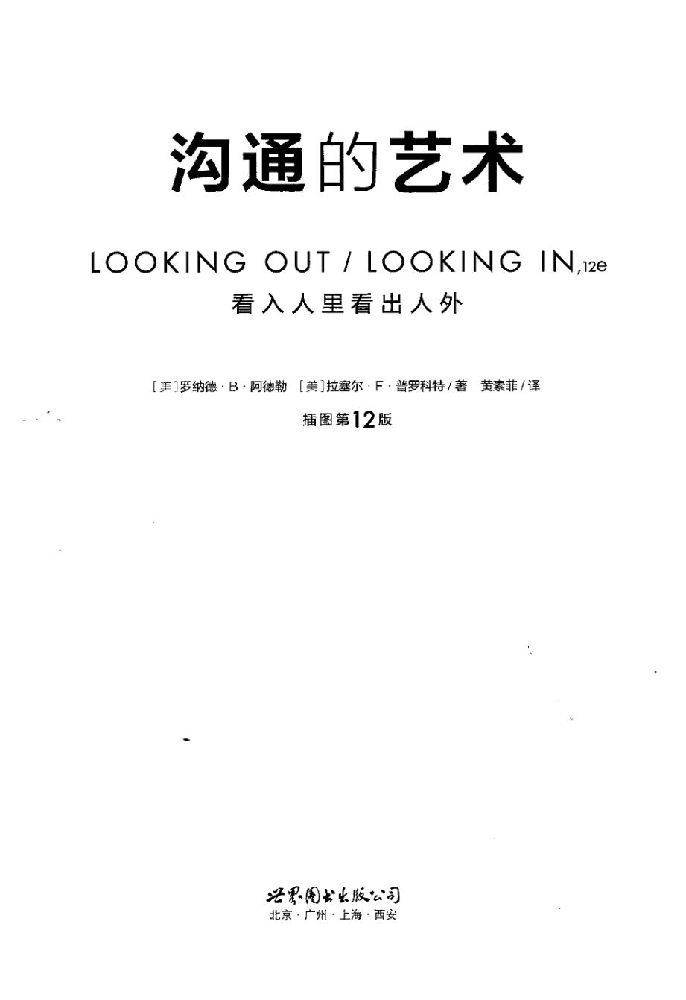

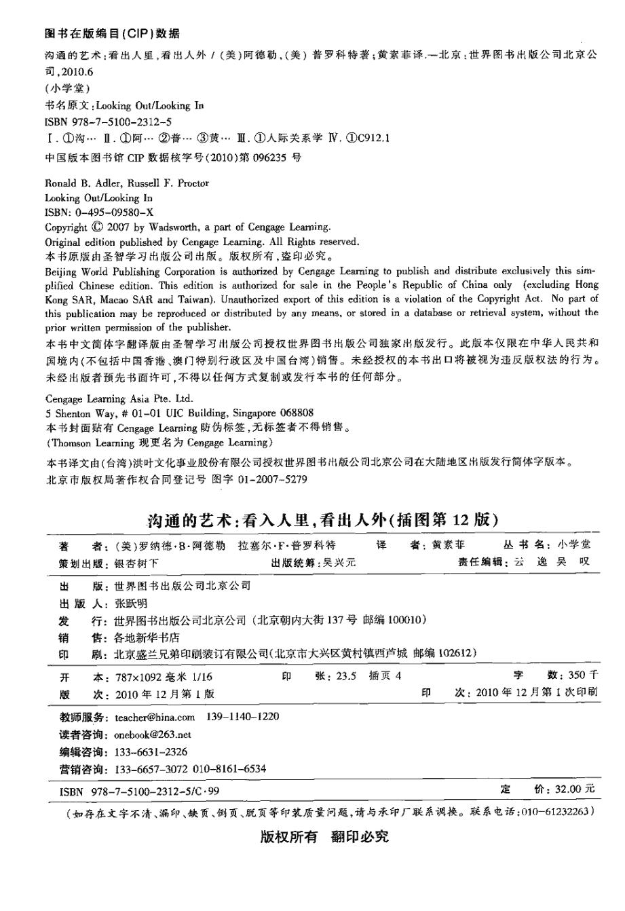

### 

**编译者序**

</h3>

本书初版至今已经超过30
年了。现今，美国的出版书籍可谓不计其数，而本书能连续出到第12
版，在美国拥有超过200
万的读者，可见必有其过人之处。之前的版本是由罗纳德·阿德勒（Ronald Adler
）和奈尔·道恩( Neil Towne ）两人合著。本版书改由罗纳德·
阿德勒和拉塞尔·普罗科特( Russell n Proctor
)两人合著。罗纳德·阿德勒除了本书之外还有其他六本跟沟通有关的著作，主题包括肯定训练、社交技巧、商务沟通、公共演说技巧、小团体沟通等。在本书初版时，他的大女儿才刚出生，如今他已经是两个小孩的爸爸了。拉塞尔·普罗科特目前是北肯塔基大学的教授，他和罗纳德·阿德勒在1990年的一个沟通研讨会上相识，这些年来两人在沟通主题有许多共事的机会，一起撰写了一些教科书和相关文章。

作者为此倾注了多年的专业经验，试图把本书定位为大学生接触人际关系课程的最佳读本，每一版本的修订几乎都会添加最新的人际关系研究结果及时代变迁的新议题，使得全书内容与时俱进。本人有幸于四年前率同10
位研究生一起翻译了本书第10
版，当时就觉得此书兼具深度、广度与完整性，是一本难能可贵的理论与实用并重的教科书。而今年最新的第12
版，其内容更加充实而具有价值。综观新版本，其主要特色有：

1
．继续强调人际关系的交流本质。沟通并不是对某人使用技巧而已，沟通是我们与人共同经历的过程。比起一味强调技巧来，尊重而主动的态度更有利于建立信任的关系。

2
．本版书仍延续了过去的行文特色，将性别与文化融人各个沟通主题中．同时又增加新的研究资料，使得其论述更加深入。

3
．本书参考最新研究结果，修正原来的论述，将新的资讯纳人篇幅中。如关于第八章马克·克奈普（Mark
KnaPP ）所提出的关系发展模式的观点的部分，根据A·约翰逊伍（A·Johnson
）等人的研究结果发现：并不是所有的关系发展历程都是循着开始、进展、消退、结束这种线性发展形态。研究中发现了许多其他关系的发展和结束之形态，其他四种关系发展与消退的形态。

4 ．新版本将原书第八章分成了两章，第九章增加亲密关系的沟通特性。

5
．更加强调电子媒体对沟通与人际关系所造成的冲击。例如第四章在描述沟通渠道时提到："沟通者有必要分析什么时候选择使用电子邮件、即时通信软件、手机、博客等，这是过去不必面对地问题。"

这些增加的特色使得本书更具有阅读价值，同时，本书原本就具备许多编写概念上的统合性优势，重要沟通概念或沟通技巧均有"沟通文本"专区提供实例说明，更添增本书的可读性。全书最大特色是区分成"看人人里"、"看出人外"和"看人之间"三部分，涵盖了人际关系的全貌。"看人人里"包括第一至第四章，着重于探讨与自我有关的沟通因素，简介人际关系的本质，强调自我在沟通中的角色，并分析知觉与情绪在沟通中的重要性。"看出人外"包括第五至第七章，着重于探讨与沟通对象有关的因素，重点是分析语言和非口语的特性，强调倾听的重要性。"看人之间"包括第八至十一章，着重于讨论关系动力，重点是强调沟通关系的重要性，关系中的亲密与距离，如何增进沟通气氛及人际冲突的形态与因应之道。另外，本书特别针对性别与文化观点进行了探讨，相关阐述贯穿全书。中国已经是一个多元化的社会，大学通识教育有必要加强大学生的多元文化的视野与观点，才能建立和谐的沟通关系。

我认为本书可以符合各类不同需求的读者群，包括大学教师、在校学生、经营主管、沟通训练者、家庭成员及一般社会大众，试分述如下：

1 .
"人际关系与沟通"的授课教师：目前各大学几乎都开设了"人际关系与沟通"课程，开课教师可以直接选用本书作为教科书，或将本书列为指定参考书。我发现多年来我在台湾阳明大学教授人际关系课程的主题与内容，本书中各个章节几乎都包括在内。翻译这本书可以说是我想为自己的学生找到可信赖又实用的教科书这个私心的具体成果。

2
．学生自修：许多大学生到了大学才开始认识到人际关系的奥妙与重要性并开始学习这方面的内容。如果你想在社团领导、班级干部角色或者与同学、室友的相处上进一步将日常生活的体验与人际互动理论相印证，选读这本书将会使你提纲挚领地抓住要点，整理出人际关系与沟通的原理。你可经由阅读第二章的沟通、认同和展现自我，第三章的知觉历程、知觉检核，第四章的影响情绪表达的因素、情绪表达的原则以及第五、六章的语言及非口语信息等找到线索。

3
．经营主管：领导与沟通是所有公司或机构主管最重要也最费神的任务，如何了解部属工作上的困境而及时给予其帮助？如何有效传达工作指令？如何建立正向的工作关系？如何减少人际冲突达到双赢？参考第七章的倾听态度与技巧，第八、九、十章的察觉关系动力与调节关系气氛及第十一章的人际冲突本质与建设性处理冲突的技巧等，你将会得到许多不错的答案。

4
，沟通训练者：各企管顾问公司或人力资源专家经常提供"增进组织沟通"、"有效的领导者"等课程或培训，本书可列为重要参考书之一，有助于训练者设计训练教材与方案。

5
．父母或夫妻：家人沟通也需要技巧，本书提供了宽广的视野以使你增加对对方的了解。本书第三章谈到的同理心与沟通、第四章的情绪表达的原则、第七章的倾听技巧等都有许多宝贵观点可供参考，尤其是第九章沟通关系中的亲密与距离，是本版书增列的章节，特别适合运用到家庭沟通中。

6
，一般社会大众：每一个人都需要沟通，本书也适合一般人际关系与沟通的情境，其中第四章的管理困扰情绪、第五章的性别与语言、第六章的非口语沟通类型、第九章的自我袒露等，都将有助于增进你的人际关系与沟通能力。

作为身在大学的教师，总是到暑假时才能有完整的时间从事书写或编译工作。我总是在艳阳褥暑下沉浸在文字与思考中，或许文字间都还有着夏日的汗水味。再次审译本书，我感到自己的译笔更加顺畅自如。书中部分具有国情落差的措辞与举例，我都稍加调整并增加符合本土国情之沟通实例，另外针对大学通识教育所需，也略做了内容的增删与重编，自觉本书的可读性应该胜过前书。书中讹误难免，欢迎先进不吝批评指正。

黄素菲

2007 年秋天于台湾阳明大学

**第一章 人际沟通入门**

沉默

*他的名字叫做詹姆斯·J·佩洛西(Jame·J·Pelosi) , 1973 年毕业，是第452
届西点军校毕业生。他下定决心面对最后一刻的羞辱，深吸了一口气，往指挥台上走去。这个戴着眼镜、身材修长的年轻人接过他的毕业证书后，转身面对那一排戴着硬挺白帽的队伍。他原本预期将会面临一阵哄堂嘲笑，但他面前只有沉默。当他回到队伍中，那些刚刚被授予海军上尉的同学们用了另一种新的方式来对待他——大家纷纷围绕在他身边，跟他握手。*

*"那种感觉好像我又重新做人了。"他说。在漫长的军校生涯中最残忍、最令人难以忍受的事件，然于结束了。19
个月前，这名长岛军校的学生在工程学的考试中疑似作弊，之后被送交到西点军校的荣誉委员会中审理。无论他在审判及诉讼的答辩中呈递了多少证据，委员会最终仍然判处这个三年级的学生有罪，给他自己与同伴们留下了无比深刻的印象。佩洛西的律师认为荣誉委员的处理过程过于严苛，但学院的督察长对此置之不理。情况还不只如此。西点军校的荣誉守则针对这些被认定为有罪（尽管证据不足）的人制定了一项惩罚，称之为"沉默"。*

*佩洛西的同学们投票支持荣誉委员会的判决，因此佩洛西在大三的大部分时光与大四一整年里放逐了。他先被转到他朋友称之为"最古板守旧、最严厉冷酷"的连队里。每天，他一个人独自坐在十人桌吃饭，一个人睡在二到三人大的卧室，走路时得忍受旁人的侮辱及偶尔的言语攻击。他的信件和置物柜被人任意破坏，而最糟的是，几乎没有人会在公开场合跟他说话，连听见他遭受沉默处分而替他抱不平的好朋友都不能跟他讲话。在这种情况下，大部分的学生都会申请退学。但是即使佩洛西体重因此下降了26
磅，他仍然决定坚持到底。"当你是对的时。"佩洛西稍后说，"你就必须证明自己
… 我告诉自己我一点都不在意。"*

*最后，詹姆斯，佩洛西通过这项考验，成为军校史上唯一一个接受过沉默处分的毕业生。现在的陆军中尉佩洛西在学校及同学眼中是个非常冷静的人，就他所受过的处分，他说："沉默刑罚应该要被废除。它代表了军校的权威凌驾于法律之上，这种优越感让我很不舒服。"每周新闻的黛博拉·比尔斯（Deborah
Beers）则说："我曾修过心理学的课，所以我知道被孤立对动物的影响，但是在军队中却完全没有人过问它所造成的影响力，这不是太奇怪了吗？"*

或许你在小时候曾经玩过这种游戏：孩子们会先选出一个受害者―
也许是因为他犯了一个实际的或想象中的错误，也许只是纯粹好玩而已。不久之后，惩罚就以沉默的形式开始了。没有人要跟他或她说话，也没有人会回应这个倒霉鬼所说的话或做的事。

如果你曾经被如此教训过，你可能会体验到一连串的情绪。刚开始你会觉得（至少会表现出）无所谓，但过了一阵子，这种被当成透明人的压力开始萌生。如果这个游戏持续得够久，你可能会发现你自己已经退缩到某种沮丧的状态中，或者出现敌意。敌意一方面是为了表达自己的愤怒，一方面是想要得到别人的回应。

煽动伙伴进行这种游戏的小孩直觉地感到，沟通― 他人的陪伴―
是人类最基本的需求之一。缺少跟他人的接触对一个人来说是最残酷的惩罚。除了在情绪上感到痛苦外，缺乏与他人的接触和陪伴也绝对足以对生活产生负面影响。

证明沟通重要性的证据，早已存在了几个世纪。弗雷德里克二世(Fredrick
Ⅱ)，公元1 196 到1 250
年的德国皇帝，可能是第一个以系统化方法证实这个论点的人。一位中世纪的历史学家描述了他独特的、也许带点残忍的实验：

*他命令保姆和护士喂养婴孩，帮他们洗澡，但是不准跟他们说话，因为他想要知道，在没有人跟婴儿接触前，婴儿开口会先说出哪一种语言。是最古老的希伯来语，还是希腊语或者拉丁语？又或者是他们生父母的语言？最后，他徒劳无功，因为所有的婴儿都死了。缺乏养育者的拥抱、慈爱的脸孔、深情的言语，他们根本无法存活。*

幸运的是，现代的研究者己经发现了比较不具伤害性的研究方法，来证明沟通的重要性。在一份研究"孤独"的报告中，受试者接受付费，独处于一间上锁的房间中，五名受试者里只有一名在里面待了八天，三名待了两天，有一个受试者还抱怨道："别想再有第二次了。"而第五个人只待了两个小时。现实生活中与人接近和相处的需求就和实验室中的一样强烈。那些因为自己选择或不得已成为独居者的事例不断地证实着一点：人类具有想要与人相处的需求。W·卡尔·杰克逊（W·Carl
Jackson ) ，一位独自航行55
天、横越大西洋的探险家，概述了大部分独居者的普遍心情：

*我发现在第二个月出现的寂寞感使我感到很痛苦。我一直以为自己是个自给自足的人，但是此刻我终于明了，没有旁人做伴的生活是没有意义的。我开始有了强烈的想要跟别人——一个真实的、鲜活的、有气息的人类说话的需求。*

### **1.1 我们为什么要沟通？**

你可能不同意上述的故事，并且认为在令人厌烦的日常生活中，独处是受欢迎的调剂品。的确，我们每个人都需要独处，对于独处的需求程度也远超过我们实际的独处时间。可是，另一方面来说，每个人也都有自己独处的临界点，超过这个临界点，本来愉快的独处就会变成痛苦的状态。换句话说，我们都需要友谊，我们都需要去沟通。

**生理需求**

沟通非常重要，沟通的存在与否会对生理健康产生很大影响。有极端的例子显示，沟通甚至可以成为生死枚关之事。美国参议员约翰·麦凯恩
( John McCain
）曾经是一名海军的舵手，他在越南北部被俘虏后，被单独监禁了六年。他描述战俘们是如何借由轻轻敲击墙壁、费力拼出单词的方式创造出一套秘密的代码，以便能传送信息的。麦凯恩描写了囚犯之间冒着风险仍保持和其他人沟通的情形：

*暗地沟通的处罚是很严重的，有一些战俘在这一过程中被发现而遭到严厉的拷打，身体和心灵都因此遭受极大的创伤。虽然每个人都很害怕再次遭受酷刑，但在单人囚室中听见从隔墙传来的轻敲墙壁的声响时，他们仍会对典狱人员说谎。很少人能够长时间地不与人沟通。残酷的拷打或刑罚都不如孤独那般令人难以忍受。一旦断绝与其他美国人之间的联系，保持沉默……
对我们而言，等同于死亡。*

对于囚犯来说，沟通与生理健康之间的联结是毋庸置疑的。医学研究人员列举了一大串因缺乏亲密关系而导致的威胁健康事件，举例来说：

·贫乏的人际关系会危害冠状动脉的健康，其危害的程度与抽烟、高血压、血脂肪过高、过度肥胖或缺乏运动等一样严重。

·比起拥有活跃社交网络的人，社交孤立者催患感冒的几率高四倍。社交孤立者比有强烈社会联结的人，有超过二到三倍的机会早逝。而且，拥有哪种形式的关系并不重要：婚姻、宗教、社群组织都会使人长寿。

·70
岁之前离婚的男人，比没有离婚的男人更容易因病逝世：前者催患心脏病、癌症或中风的机会是后者两倍；摧患高血压而死的机会是后者的二倍；自杀的机会是五倍；因肝硬化而死的机会是七倍；因结核病死亡的机会为十倍。

·离了婚的男人及女人催患各种癌症的机会，是没有离婚的男人及女人的五倍。

·当失落了一段亲密关系时，死亡的可能性便增加了。在英国威尔士的一个村庄中，失落亲密关系的村民，在一年内死亡的机会，是那些没有失落亲密关系的村民的五倍。

这样的研究结果勾勒出拥有满意的人际关系的重要性。当然，并非每个人都需要等量的与人亲近的机会，沟通的质与量应该是并重的。重要的是，对于我们的健康而言，人际沟通是不可或缺的。

**认同需求**

沟通的重要性绝不仅止于维持生存而已，它也是使我们认识我们自己的方法——事实上，是唯一的方法。第二章将会提到，我们对自我的认同源自于我们和他人的互动，因此究竟我们是聪明的还是迟钝的，动人的还是丑陋的，精明的还是笨拙的，这些问题的答案并不会从镜子中照出来。我们是由他人对我们的回应中建立自我认同的。

如果我们和他人沟通的渠道被剥夺了，我们将无从得知我们自己是谁。在约翰·斯图尔特（John
Stewaxt ）的书《 做桥梁，别做高墙汾（Bridges，Not Walls
）中，他引用了著名的"阿韦龙的狼童"（一个在童年时期从未和人类接触过的男孩）案例栩栩如生地刻画这个论证。1800
年1
月，这个小男孩在法国一个村落的茶园中偷挖蔬菜时被人发现。他的行为举止完全不像人类，也不会说话，只会发出一些奇特的哭叫声。虽然他缺乏社交技能，但更值得注意的是，他缺乏身为人类的自我认同。研究人员罗格·沙图克(
Roger shattuck
）写道："这个男孩没有任何身为人类的自觉，他完全没有意识到，自己是个和别人有所联结的人。"在给予他慈爱的"母爱"之后，小男孩才开始转变成如我们所想的，意识到自己身为人的部分。

就如这个阿韦龙的狼童一样，每个人出生在这个世界上时大概都没有或只有微量的自我认同感，我们需要通过观察别人如何诊释我们而明了我们自己是谁。在第二章也会提到，在童年时期我们所接收到的信息是最强烈的，但是他人对我们的影响则会持续影响我们的生活。

**社交需求**

沟通除了可以帮助我们途释自我之外，也提供我们和他人之间重要的联结。专家们已经证实沟通可以满足社交需求，这些社交需求包含娱乐、感情、友谊、解闷、休闲和控制等。

这些需求实际上存在于各种关系中——在朋友、同僚、家人、情人、配偶甚至陌生人之间，而沟通就是满足我们社交需求的主要方法。事实上，有些社会科学家认为，沟通是人际关系得以建立的最重要的方式，举例来说，在一项对1800
位美国南加州人的研究中发现，和邻居闲聊的"美好老习俗"是建立社区意识最确实的方法。

有效的人际沟通与快乐之间具有很紧密的联系。在一份受试者超过200
名大学生的研究中发现，最快乐的那10
％的人都认为自己拥有丰富的社交生活。这些非常快乐的人，跟其他同学在睡眠时数、运动量、看电视时数、宗教活动、喝酒量等可观测项并没有差别。在另一份研究中显示，女性认为"社交性"对于生活满意的重要性大于任何其他活动，包括放松、购物、吃东西、运动、看电视或玩电子游戏等。

很多美国人相信，沟通问题——而不是其他那些因素，比如经济、亲属、姻亲、性、先前的关系或小孩等等——往往是导致婚姻或亲密关系结束的元凶。和别人的联结如此重要，因此有些学者便主张，沟通是人类生存的首要目标。接下来的章节内容将有助于你改进和对你最重要的人的沟通方式。

**实际目标**

在满足社交需求及塑造我们的自我认同之余，沟通还是达成沟通学者所谓的工具性目标最好用的方法。工具性目标指的是让他人依照我们想要的去表现。有些工具性目标非常基本：跟发型设计师说你只需要稍微修剪发尾、协商家事的责任义务、说服水管工人现在就到你家来修理破掉的水管——沟通就是可以用来达成这些目标的工具。

其他的工具性目标更加重要，比如成功的职业生涯。沟通技巧，比如有效率地说话，与倾听的能力都是帮助大学毕业生在日益竞争的工作大环境中谋得职位的重要因素，它比技术性的能力、工作经验和特定学历都来得更重要。好的沟通对工作也是同等重要，经济学家詹姆斯·弗拉尼根(
Jame·Flanigan
）解释道："沟通技巧将会赢得高价的薪水。一位和共同基金的投资顾客在电话线上交谈的交易人员，应该比一位银行的老出纳员需要具备更多的知识、效率及能力。这一类竞争不仅基于薪水也基于技巧。"在和同事的相处中，沟通能力也越来越受到重视。这意味着良好的人际技巧不再只是社交的细节，它们可以指出工作失败和成功的差异。心理学家亚伯拉罕·马斯洛（Abraham
Maslow
）提出，在关注高层次的需求之前，应该先满足基本层次的需求。而最基本的就是生理需求了：充足的空气、水、食物、休息及繁衍种族的能力。马斯洛的需求论中，第二类的需求则是安全需求：保护我们的生存使免于威胁。在生理和安全之上的便是社交需求。再往上，马斯洛说，每个人都有自尊需求：希望自己是有价值的、有用的。至于最上层的需求，马斯洛称之为自我实现需求；指的是希望自己的潜力能发挥至最大、使自己能成为最棒的人。正如你所理解的，沟通通常是满足各层需求最必要的方法。

### **1.2 沟通的历程**

我们已经谈过"沟通"这个词的定义，在进入更深人的章节前，我们要先解释人们在与其他人交换信息时会发生些什么事。这样做是为了帮助你熟悉一些常用的沟通字汇，同时，也是为了协助你先浏览其后会出现的一些主题。

**线性观**

早期的研究者将沟通视为一门社会科学，研究者建立了各种模式来说明沟通的历程。最早出现的是线性沟通模式，在此模式中，沟通就像是一方对另一方所做之事：传送者把意见与感觉编码成某种形式的信息，然后借着演讲、写作等渠道，传送给接收者，接收音是指将信息解码的人(见图1-1
）。

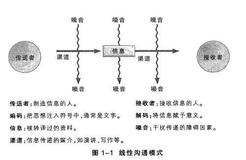

注意图1-1
的图示与文字，显示出了与收音机或电视机类似的运作方式。这并非无稽之谈，建立这个模式的科学家早期对电子媒介很有兴趣。这个模式广为推行之后，影响我们对沟通的想法与看法，那些我们耳熟能详地句子，比如"我们的沟通中断了"、"我觉得他没有收到我的意见"等都是受到这种机械式线性观的例证。

这些熟悉的句子（和句子中传达的意思）忽视了机械沟通与人类沟通之间的重大差异。人际沟通真的"中断"了吗？还是即使两人互不交谈却仍然继续传递信息？或是，即便你从某人那儿清楚明确地"获得信息"，却仍然"得不到"你想要的"回应"？简洁的线性模式必须进一步考量下列问题：

·当你跟一个朋友交谈时，只有一个传送者和接收者吗？还是两人同时是传送者和接收者？

·你真的会对每一个传送的信息都据实编码？还是有一些不自觉的行为仍然会在沟通时传送给对方？

·沟通发生在真空状态吗？还是信息的意义会受到更广大的因素所影响，例如文化、情境或两人过去的关系之类？

这些思考使得学者开始建立其他更能说明人际沟通的模式。下面要介绍其中之一。

**交流观**

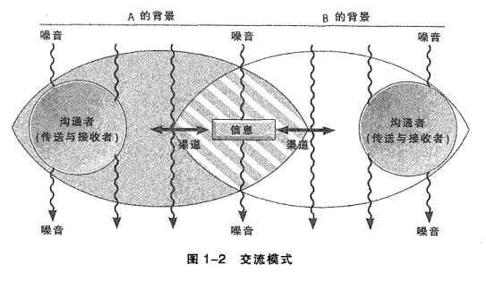

图1-2
的交流模式更新且扩充了线性模式，更准确地掌握住人类沟通的独特性。有些线性模式中的概念与用词仍然保留存交流模式中，有些则加以了修饰、删除或增加。线性模式假定所有沟通都包含编码的过程，我们选择了某些符号来表达口语信息，至于人们不见得会说出口的非口语线索，譬如脸部表情、手势、姿势、声调等呢？这些线索同样也清楚地为我们提供了理解别人的资讯，但实际上它们却常是无意识的，甚至没有经过编码。交流模式以"沟通者"取代"传送者"和"接收者"，沟通者这个词汇代表着我们同时传送和接收信息这个事实。我们通常会同时进行编码、传送、接收及解码信息等动作，而不是线性模式认为的单一方向或直线进行的状态。想想看，举例来说，你正在和你的室友讨论如何维持家中清洁，当你听到（收到）室友说"我要跟你讨论有关厨房清洁……"时，你皱起眉头、咬紧牙关，也就是说当你接收到语言信息时传送出了自己的非语言信息。你这个反应使得室友略带防卫地中断原本的话题，转而传送一个新的信息："我想我们先等一下……"这是因为沟通者几乎是同时在传送与接收资讯。

交流模式也说明了，沟通者通常都有着不同的背景，背景来自于沟通者自身的经验，这会影响我们了解别人的行为的方式。在传播学的术语中，背景这个字除了指称环境外，也可以用来指称参与沟通者的个人经验以及文化脉络。

让我们试着思考一下，有哪些因素可能会导致沟通背景不一致：

·A 遵循某种伦理道德，而B 却背道而驰。

·A 家境十分富有，B 则家境贫穷。

·A 可能急得火烧屁股，但B 却闲得发慌。

·A 是个见多识广、经历大风大浪的老江湖，而B 只是个初出社会的年轻小伙子。

·A 可能对某些事物情有独钟，B 却对它们无动于衷。

请注意图1-2 的模式中A 与B
两人重叠的背景部分，这块区域显示的是，不同的沟通者之间一定会有共通的背景，如果这块重叠的背景越来越小，那么沟通也会变得越来越困难。下列这些例子便是源于沟通者的观点不同而造成的彼此理解的困难：

·如果上司无法理解下属的想法，将会是个没有效率的管理者．如果职员无法将升职当作是一种挑战，在工作上可能也比较不愿配合，甚至比较不适合委以重任。

·父母成为大人后就会忘记自己曾经也是小孩，在和自己的孩子的相处上比较容易产生亲子冲突。他们可能从未意识到，甚至也不愿去承担教养的责任。

·那些从未意识到、体会过和别人"不一样"的感觉是什么的主流文化成员，可能也无法认同、了解次文化成员的想法。他们主观的思考模式会使他们很难看见主流文化的盲点。

沟通渠道在交流模式中扮演着和线性模一样重要的角色，虽然所谓的渠道常被当作是单纯的传递信息的工具，但是仔细查看就会发现渠道扮演着不可轻忽的角色，例如：你会亲口说"我爱你"吗？在电话里说？或者租一块广告招牌，秀上去？还是写在花束的卡片中？一张电报上？电话录音里？电子邮件？每一个渠道都有其差异，都会影响到信息的意义。

交流模式也保留了噪音的概念，但是扩大了线性模式的焦点，超越有限的"外在噪音"——例如让你很难专心听对方的话的震耳欲聋的音响和充满烟味的拥挤房间之类。交流模式认为噪音也可能出自于沟通者的内部，包括生理性噪音，由于生物性因素而干扰信息的接收，比如生病、疲倦、听障等等。沟通者也会触及心理性噪音：正确了解信息的能力所造成的内在干扰力量，例如一个学生可能因为考试考得太差、心理沮丧而无法清楚地理解他是哪里的观念出错。心理的噪音是非常重要的沟通问题，所以我们在第十章花了极大的篇幅去探讨它的形式及防卫功能。

即便模式提供了理解沟通历程的基础，但它仍然无法掌握住某些人际沟通重要特性。模式像是"照片"，沟通可能比较类似"录影"，在真实的生活中，我们很难将沟通中的"动作"从进行中的延续事件里单独分离出来。举例来说，阿信被他妈妈终日唠叨，但换个角度来看，若阿信能够对妈妈的话有所回应，也许她就不会一直没完没了地嗦下去了。也就是说，阿信和妈妈的沟通模式，是他们俩共同创造出来的。

从这儿引导我们注意到另一个重要的观点：交流式的沟通并不是我们"对"别人做了什么，而是我们"跟"别人做了什么。沟通的交流性质在父母与子女的关系中特别明显。我们经常认为"优良父母"是指拥有良好"亲职技巧"的人，我们经常用孩子的表现来评价一个父亲或母亲的亲职能力，但事实上，研究发现父母与孩子之间的互动品质取决于双方共同的行为，孩子对父母的影响力和父母对孩子的影响力一样大。例如，如果孩子进行社会科学家说的"问题行为"，将会比孩子表现出合作行为引发父母更多的高控制行为。相反的，脾气温和的儿童比具有攻击性的儿童较少引发父母亲的威胁行为。低自尊的父母比较容易传送出降低孩子自尊的信息，这些孩子甚至会做出比父母所说的更糟糕的行为出来。这形成了一个互相增强的循环，父母与子女互相形塑了彼此的情绪与行为。在这种情况下，几乎不可能确认谁是信息的"传送者"，谁是"接收者"。在诸如父母与子女、丈夫与妻子、老板与雇员、老师和学生或其他形态关系中，比较正确的观点是双方在沟通上都会互相影响。

现在我们可以就上述讨论来总结一下沟通的定义。沟通是一种交流的过程，其参与者处于不同但是有所重叠的背景下，经由交换信息而建立关系，关系品质会受到外在的、生理的和心理的噪音所干扰。这个定义比其他文本更彰显出互动历程的精细观点。

### **1.3 沟通的原则和迷思**

在学会区辨人际沟通的品质前，我们必须先定义什么是沟通、什么又不算沟通，以及什么可以帮助我们达成沟通，什么又不行。这将对我们很有帮助。

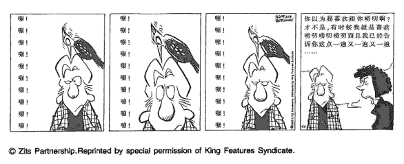

**沟通的原则**

在这个章节中，我们可以先将已经理解的部分总结成以下这些结论。

*沟通可以是有目的或无目的的行为*
有些沟通行为具有明显的目的，例如向老板要求加薪，或提供一些建言前，你肯定会很谨慎地计划这些时候的言行。有些学者主张，像这种有目的性的信息，才可以称作沟通。但有些学者则认为，即使是没有意图的信息，也算是沟通行为。如果某个朋友无意中听到了你正喃喃自语地抱怨，即便你并非有意要让他们听到，他们仍会将它视为一个信息。除了这种无意间泄漏的言谈之外，我们还会在无意地传送出许多非口语信息——你自己可能察觉不到自己讨人厌的行为、不耐烦的举止或感到厌烦时发出的轻微叹息声，但别人却都看见了。无意图行为是否该视为沟通，专家们至今尚未形成共识，也许这个争论永远也没有结束的一天。

*沟通是不可逆转的*
有时候我们会希望可以回到过去，消除某些行为或言词，然后将它们修饰成比较妥当的言行举止。不幸的是，这些重返过去的愿望都是不可能达成的。某些时候，更多的解释的确可以澄清某人的疑虑，道歉可以减缓某人的创伤。但也有时不论你说的再多，都无法再挽回你在他人心中种下的印象。已经挤出来的牙膏几乎不可能再塞回去，已经说出去的话也不可能再收回来。说出去的话就像泼出去的水，都是无可挽回的。

*人不可能不沟通*
无论有目的的行为还是无目的的行为，都会传送出信息，因此学者们都同意，人们不可能不沟通。无论你做什么、说什么，保持沉默、面对还是逃避、情绪化地应对，甚至摆出一张扑克脸，你都在将心中的想法和感觉传达给对方。也就是说，我们就像从不曾沉默的传声筒。

当然，信息的接收者不可能将我们传送出去的信息完全正确无误地予以解码。他们可能会将你的玩笑话看得很认真，或是忽略你很重视的感觉等等。你想要表达的意思，和他们实际意会的可能有所误差。然而，当我们提到"有沟没有通"或是误解时，我们并不是说沟通因此中止了，而是说沟通不够精准，或没有满足我们的需求。

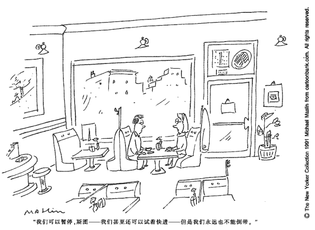

*沟通是不可复制的*
沟通是一种持续不歇的过程，因此不可能出现重复的事件。今天，一个友善的微笑可能使你拉近和陌生人之间的距离，但这不代表明天这招同样奏效。当你再次使用微笑攻势时，可能就显得过于老套或做作了，甚至转换一下场合或接受对象效果就会完全不同。即使是面对同一个人，我们也不太可能重复创造出一模一样的事件。这是为什么？因为我们每天都在改变，每一天的自己都是不一样的，你对他人的感觉随时都可能改变。当然，你不能每次都发明新方法对待熟人，但是你应该知道，就算我们说的、做的都一样，当被放置在不同的时空下时，它们就是不一样了。

*沟通同时具有内容和关系两个向度*
实际上每一种信息交换都涉及两个层次，内容向度是指明确讨论的信息——"下一个转角左转"、"在网上购买比较便宜"、"你踩到我的脚了"，诸如此类。除了这些明确的内容，所有的信息都带有关系向度，用以表达出你对对方的感受：你喜欢或不喜欢对方、位居主道或屈于从属、自在或焦虑等等。例如，即使只是简单地在说"今晚很忙，也许改天吧！"你可能以不同方式传递出各种不同的关系性信息。

有时候你只着重在某个信息中的内容向度。例如，你或许毫不在乎顾客服务部门人员对你的态度，只关心维修技术部门何时可以修好你的车；可是在其他一些情境里，某个信息的关系向度比讨论的内容更加重要。这可以解释为什么我们经常为琐事而争吵不休，诸如：今天轮到谁洗碗、如何度周末等。在这些例子中，真正面临考验的是关系的性质，谁是主控者？我们对彼此有多重要？第八章会更仔细地探讨这些关键性的关系议题。

**沟通的迷思**

澄清人们对沟通的迷思，与说明沟通的原则同等重要。为了避免陷入人际的困扰，请谨记不要犯以下的沟通迷思。

*沟通得越多不见得沟通得越好*
不足会产生问题，然而，沟通过头也会制造问题。有时候过度的沟通只是平白浪费时间。当两个人"把一个话题讲到打死结"后，事情只会原地打转、毫无进展。另外，说太多也可能使问题更加恶化。我们大概都有钻牛角尖的经验，越想越多而让状况更糟，越扯越远而身陷泥淖，如同有本沟通书籍曾说过的："太多的负向沟通只会导致更多的负向结果。"

*意思不在字眼里*
人们常犯的最大错误，便是认定沟通就是把话说出来。如果利用之前所说过的沟通模式术语来说，这是指没有人能保证信息接收者所接收到的意思永远符合传送者所欲传达的意思。第三章将会概述人们为何会扭曲信息传送者的原意——你说了一句具有深刻意义的话，可能别人完全有不同的解释。而第五章则会告诉你，有哪些常见的口语性误解类型，并试着提出解决办法，以减少这些误解的发生。最后，第七章会介绍一些倾听技巧，以帮助你确认自己真的能够理解别人想说的意思。

*成功的沟通并不表示彼此了解*
互相了解有时候是成功沟通的指标，但也有的时候沟通得很成功，两个人却并不完全互相了解。例如，我们经常刻意地模糊回应，以淡化对别人的冲击。想象一下，如果你的朋友问你觉得他的新刺青如何，你会如何回应？你可能会隐晦地说："哇！真的蛮特别的！"
而不是诚实而清楚地回答说"我认为有点怪异"。我们担心像这种诚实的回答不够厚道，也可能破坏关系。

有些研究发现，满意的关系有时候依赖片面的了解。通常，"认为"配偶了解自己的人会比"实际"上了解配偶所作所为的人对婚姻关系更加满意。换句话说，有时满意的关系并不是来自彻底的了解。第九章我们会仔细讨论为何偶尔避开追根究底反而有助于关系维持。

*人的反应并非只针时单一事件或特定的对象*
尽管沟通技巧可以帮助你得到想要的结果，但是我们要说的是，千万不要认为结果都是由单一事件所造成的。在很多情境下，有许多因素都会影响他人如何回应你。现在让我们假设，你发了一顿脾气，然后对你的朋友脱口而出说了些话，而这些话才一出口你就后悔了。除了你不可理喻的言谈外，你朋友的反应还会取决子其他一连串的事件，诸如他当下的心情（是发怒的或是愉快的）、他的个性（是冲动的或宽容的）、你和他过去的交情程度（是相互扶持的或充满敌意的）以及他对你的了解，这些因素都会对他如何看待你这番伤人的话语产生影响。由于沟通是种交流、持续不断与共同合作的过程，因此任何事件都不会是真空孤立、单独存在的。

*沟通不会解决所有的问题*
有时候，即使天时地利人和，一切都计算得很完美，仍然没有办法解决问题。请试着想象一下，如果有一天，你原本以为某个学科可以拿到高分，老师却给了你很低的分数，致使你前去向老师询问原因．而他在听完你的抗议后清楚地告诉了你为何你拿不到高分，以及分数还这么低的理由。你觉得这样的沟通有解决问题吗？恐怕没有。清楚明白的沟通也许正是引发问题的开端。举例来说，倘若你的一个朋友要求你对他新买的、价值200
美金的装备诚实地给予意见而你真的照实说"我觉得这会让你看起来很胖"的话，因此而造成的伤害或许远远地胜过得到的好处。决定自我揭露的时机与方式不是一件容易的事，第九章将会提供你一些建言。

### **1.4 人际沟通的本质**

你大概已经对人际沟通的所有过程有了概略性的认识。现在，我们来讲解构成人际沟通种类的原因。

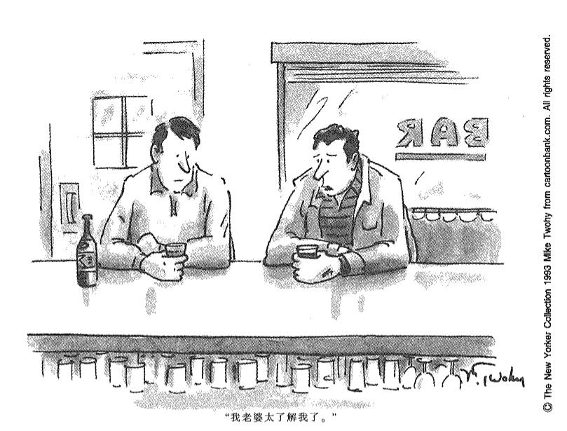

**两种人际沟通的观点**

学者们按照一定标准将人际沟通分成许多不同类型。最常见的分类是根据参与者的多寡进行的。这种数量性的定义将两个人之间的互动称为人际沟通，通常是指面对面的情况。社会科学家通常称这样的沟通为"一对"（dyad），他们经常用形容词"成对的"（dyadic）描述这种沟通类型。因此，在数量性定义的意义上，"成对的沟通"与"人际沟通"这两种说法可以彼此互换。根据这个定义，一个店员与一个顾客、一个交通警察与一个超速驾驶者都属于人际沟通活动，而一位教师与他授课班级的学生、一名表演者与许多观众则不适用于此。

你可能反对以数量性来定义人际沟通，例如店员与顾客之间那种例行公事的对话，或是我们向旁人问路时的短暂交谈，这种形态的沟通似乎怎么都称不上"人际沟通"。事实上，这样的对话人们只会认为"仿佛在跟机器交谈"。

有时两人交流出现非人性本质，有时又具有人性本质，引发了部分学者的讨论。他们觉得唯有沟通的品质才能取代数量用以作为划分人际沟通类型的标准。品质性的定义主张，沟通只有在一方将另一方视为独一无二的个体，且无视于沟通发生的场合或参与者的人数时才成立。当我们使用品质性的定义作为标准时，人际沟通的反面便成了非个人化的沟通，也就是说，人际沟通并不等同团体沟通、公开沟通或是大众传播。

区分品质性的沟通关系与低个人化的沟通关系相异之处，在于下列的几项特征：

第一个特色就是独特性。在低个人化的沟通场合，主要依据社会规范作为沟通的准则，例如当他人说笑时无论是否好笑我们都必须适度地回应对方，以及不要试图主宰谈话等。遵从自己的社会角色也是很重要的，好比顾客永远是对的、要尊敬长辈等。而品质性的沟通关系则讲求独特的规范与社会角色，比如我们在某段关系中会偶尔和同伴互开一些无伤大雅的玩笑，但也许在另一层关系里我们会尽量避免触怒对方。还有，在家人或某些朋友面前你可能敢毫不保留地表达你的不同意，但在另外一些人面前你会选择将怒气吞进肚里，直到某一天，累积的愤恨终于受不了而爆发开来，你们才讲清误会，尽释前嫌。这样的过程定期地循环着。有位沟通学者将人们在亲密关系中所创造的独特沟通方式，称为亲密关系文化。虽然每段关系都有可能创造自己独一无二的沟通方式，然而有的时候，我们和朋友、邻居、工作伙伴及家人还是会做出符合文化模式的事。你必须懂得，在不同时刻用不同的方式表达你的感觉。

第二项特色是不可替代性。人际沟通的独特性使其对每段关系来说都是无可取代的，这项特征告诉我们，为何当一段亲密关系或感情由浓转淡时我们会如此难过，因为我们都知道它是不可取代的，无论身边有再多的朋友、亲人，都没有一段关系能给予我们像那样的感受。

第三项特色是相互依存性。简单地说，就是在一段关系中，你和对方是命运相连的。与你没有交集的人的愤怒、情感、兴奋或沮丧，你当然可以置之不理，但是在人际关系中，另一方的生活确实影响着你。有时候，相互依存是一桩好事，但有时候，它会成为一种负担。在品质性的人际观点中，某些相互依存的关系也有可能超越相互联结的命运，这是不争的事实。在人际关系中，我们的认同根植于我们与别人互动的本质。心理学家肯尼斯·葛根（Kenneth
Gergen
）曾说："当我们说某人具有吸引力时，是因为有人受他吸引；某人是领导者，是因为有人愿受他领导．同样地，某人可爱，是因为有人欣赏他。"

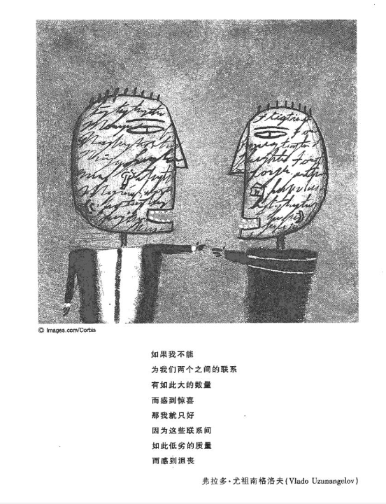

人际沟通的第四项特征是它通常（但不总是）包含着自我揭露。在非个人化关系中，我们通常不会过度表现自己，但是在个人化关系中，我们比较容易自在地分享感情和想法。这并不是说，所有的人际关系都是温暖的、互相关怀的，或者所有的自我揭露都是正向的，我们还是可以表达负面的、隐私的感受，比如"我真的对你很生气"之类。

内在的奖赏是第五项特色。在非个人化的关系中，我们并不会对在场的人有所付出。为了达成某种目的，我们会坐在教室中听课，或和想要买我们的二手车的买主简短交谈，然而我们并不去经营跟他们的个人化关系。相反，在亲密关系中，我们花时间和朋友、爱人等相处，因为我们知道，这能够满足我们的内在。对我们来说，谈论什么都无所谓，最重要的是，我们彼此对这段关系的重视。

人际关系如此珍贵并非坏事。大部分的人们不可能对遇见的每个人都花费时间和气力去建立关系，这也是人际关系之所以有价值的原因。就像稀有的宝石或艺术品，正因为珍贵所以才显得特别。

**科技与人际沟通**

面对面交谈已经不是人类创造与维持人际关系的唯一方法。除了电话与早期的手写通信之外，电脑媒介沟通（CMC
）提供了另一种沟通的方式。电子邮件便是电子媒介沟通最广为人知的一种形式。线上即时通讯、博客及网络聊天室则让熟人甚至陌生人都可以借此沟通。

越来越多研究发现CMC 并不会威胁到人际关系（早期人们担心CMC
无法达到如面对面沟通或电话交谈般丰富的互动品质）。大多数的网络使用者——包括成人与小孩——认为他们花在网络上的时间，并不会减少他们与家人、朋友互动的时间；超过四分之三的人表示，他们不会因为家人上网而觉得被忽视，事实上，大多数的网络使用者说MSN
、电子邮件、网页、聊天室对于他们跟家人交谈和结交新朋友的沟通能力方面，具有"相当的正面效应"。调查中超过一半的人认为在开始使用网络之后，个人的人际关系数量提升了。

最近的研究中同样发现，CMC
在人际关系与做决定时所扮演的也是正面角色。这些研究认为电子媒介对社会网络有所增益，对于目前的青少年和成年早期这群成长于网络世代的人尤其明显，但是研究也证实了它对各个世代的人们都有正面效果：

·网络使用者的社交网络优于非网络使用者。

·CMC 是全球化的有利资源，联系远方的朋友、亲人，也联系社区邻居。

·CMC 提升了我们与好朋友下线后的互动，包持活跃生动的关系。

·电子邮件简洁的文字特性和即时性，使得人们缩短性别、社会阶层、种族、年龄的差距而更加亲密。

即使如此，CMC
并不能代替面对面的沟通。一份针对经常使用即时通信的大学生的研究结论是："关于个人满足感，显然没有什么能与面对面沟通相提并论。"CMC
并没有削弱其他型形式的沟通，反而是提升并强调其特性。CMC
跟电话、见面会产生正面关联，也就是说，经常跟亲友在电脑接触的人，也就越会频繁地以电话或见面保持联系。

许多学者都发现，CMC
的使用者从人际互动经验中得知，凭借电子媒介的沟通与面对面接触比起来，其深刻与复杂程度是毫不逊色的。CMC
为何能够增加人际沟通的质与量，有以下几个原因：比如CMC
让沟通更容易了——忙碌的行程与遥远的距离，花费人们不少的时间，使得在面对面沟通上更加困难甚至难以办到，尤其是要挪出时间进行沟通，更是让远距离与不同时区的人们倍感棘手。而电子邮件的非同步特性，便提供了分享资讯的另类渠道，让这类人际关系可以持续。沟通者可以随时传送及回应信息，不用等到真的找到对方才能沟通。至于即时通讯是另一种保持联系的方法：发现你的亲友同在线上，然后开始线上交谈，就像是"有时候走在街上，会突然遇到朋友的感觉"，一位纽约的电脑顾问劳拉·巴尔萨姆（Lura
Balsam ）如此形容。

即使是面对面沟通很方便的情况下，还是有些人觉得通过CMC
分享自己的感觉比面对面沟通容易。社会语言学家黛柏拉· 泰南（Deborah Tannen
）便描述了电子邮件是如何改善两段人际关系的：

*电子邮件加深了我与拉尔夫的友谊。虽然他的办公室就在我的隔壁，但因为他很害羞，我们很少拓展话题。他说话咬字不很清楚，所以在面对面沟通时，我只能勉强地猜测他的意思。但是当我们开始互通电子邮件后，我便常常收到他传来的很长的自我坦露信息。我们彼此倾吐心声。我的一个朋友也发现，电子邮件开启了他和父亲的沟通渠道。他从未和父亲讲过很长的电话（只跟母亲讲过），但自从他们都开始上网后，他们变得比以前亲密多了。*

类似这样的经验帮我们理解，为何苹果电脑的创办人之一史蒂夫，乔布斯（Steve
Jobs）会主张将个人电脑命名为"人际电脑"。

**个人化与非个人化沟通：平衡之道**

现在，在你清楚品质性的人际沟通与非个人化沟通之间的差异后，我们必须要提出一些重要问题：人际沟通比非个人化沟通好吗？次数频繁的人际沟通就是我们要追寻的目标吗？

大多数的人际关系情况并非"不是个人化沟通就是非个人化沟通"的极端二元模式。更确切地说，在这极端的二元之间，有一段连续性的距离，而我们就在其中某个点上。也许你个人的经验会使你察觉，即使是在最一般性的场合仍有个人化的友谊成分在内。你可能很欣赏某个杂货店店员的幽默感，或是与你的发型设计师有某种程度的个人化交情，甚至连最专制、苛刻和古板的老板偶尔也会显露出仁慈的一面。

正因为在许多一般性的场合中，也有个人化的成分涉人，所以相反的，我们与最关心的人之间也会有非个人化的元素涉人其中。下列有些情况便会让我们不想要个人化：当我们感到心烦意乱、疲倦、忙碌或是单纯的不感兴趣时。事实上，个人化沟通就像是精致的料理，适度地品尝固然是件好事，但是如果吃太多就会让你不舒服了。

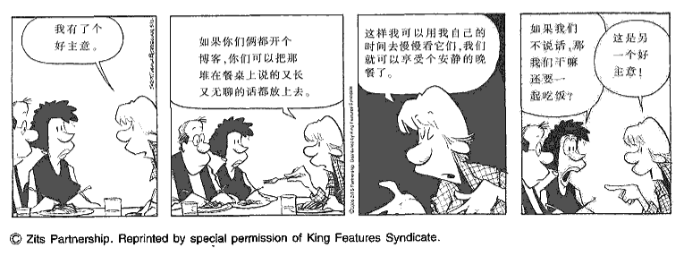

个人化与非个人化要素的转换是会随着时间而改变的。终日谈情说爱的年轻恋人，当他们的关系逐渐增长时，他们的沟通形态也会随之变得仪式化、例行化，他们花在亲密关系的沟通将会减少，而较不亲昵的日常对话则会大增。第八章将会讨论，若关系持续进展，沟通形态将会如何转变。另外，该章也描述了自我揭露如何扮演增进沟通的角色。当你读到这些资料后你将会更明了，虽然个人化的沟通常常使得人类生活更有意义，但也并非总是如此。

在我们的生活中，的确同时存有非个人化与个人化沟通的领域，每一种沟通形态都有独特的应用之处。真正的挑战是，要找出这两种沟通形态的平衡点。

### **1.5 如何成为沟通高手**

要辨认沟通高手很简单，比辨识差劲的沟通者要容易。只是，要怎么从次好的沟通者中分辨出成功的沟通高手呢？是不是有什么特征可以帮助我们区辨他们？这些疑问的解答是沟通学者悬而未解的疑惑之一。虽然还没找到所有的答案，但是丰富的研究资料已经发现这些解答都直指向沟通的能力。

**沟通能力的定义**

沟通能力的定义并不像表面上看到的这么简单。尽管学者对于完美的定义尚有争议，大多数人仍同意，有效的沟通必须包含：某种程度上能达成个人的目标，并且理想上要能维持或增进关系。这个定义也许有些模糊，也稍嫌冗长，但是若我们更进一步检视，就会发现它己经对沟通能力列出了好几项重要的特征。

*没有"理想"的沟通之道*
你自己的经验也许就能告诉你，有效沟通的方法绝不只有一种。有些成功的沟通者很严肃，有些很幽默；有些很外向、活泼，也有些比较沉默、文静；有些沟通者十分直言、坦率，也有人讲话拐弯抹角。就像这世界上的美好音乐或创作有着各种不同种类一样，沟通的能力当然也分成许多种。通过观察他人学习新的、有效的沟通方式是可行的，但是倘若一味抄袭模仿却违反了自己原有的价值观或信念，就不好了。文化差异也能为"没有'理想'的沟通能力"这一原则佐证。被某种文化视为理想沟通行为的举止可能完全不适用于另一种文化，甚至会被认为是冒犯或具有攻击性的行为。例如，自我揭露及说话清晰的特质在美国会获得很高的评价；然而在许多亚洲文化中，这些特质可能被视为具有挑衅意味与感觉迟钝、说话不注意场合，对他们来说，拥有婉转地说话能力及敏锐的观察力才是最重要的。

即使在特定的社会中，各种次文化之间仍然对沟通行为的界定有着不同的解读。有一份研究好朋友之间应该如何交往的论文指出，不同族群对此有着不同的看法。拉丁裔族群认为提供社会支持最重要，非裔美国人则最看重尊重和接纳，而亚裔美国人将照顾、正面的情感交流视为优先，英裔美国人最推崇将他们的需求视为独特的个体的朋友。类似这样的研究都显示了要成为沟通高手，没有保证绝对成功的规则或处方，而寻找适合个人特质的沟通方式与选择符合对方文化的沟通特质，都是成功的沟通高手必备的条件。本章最后提供的"跨文化之间的沟通能力"增加我们与来自不同背景者之间的沟通能力。

*沟通的能力是依情境而定的*
即使在同一种文化或关系中，适用于某种情境的沟通技巧放在另一种情境下也许便会铸成大错。你时常和朋友开玩笑的方式如果在家庭中使用，可能就会对某位家人造成伤害；周六晚间因约会而营造的浪漫态度，也不适合在周一早晨的工作日表现出来。由于沟通能力合适与否是随着情境及沟通者而改变的，因此将沟通能力视为一种有的人拥有而有的人没有的特质是错误的想法。更确切地说，沟通能力应该以程度或范围划分。你可能在某些领域内拥有较佳的沟通能力，但在另一些领域上则不然。好比你也许很会处理跟同济间的沟通，但与年龄长幼不同、贫富阶层不同或个人吸引力不同的人相处上却十分笨拙。事实上，即使和同一人相处，你的沟通能力也可能会因为情境的不同而呈现出不同的效果。

***伦理的挑战***

**马丁·布伯（Martin Buber ）的《 我与汝》**

*马丁·布伯是我们在前文所谈到的品质性的人际沟通最著名的拥护者，他的书"Ich
und Du "是全球畅销的经典，从1922 年出版至今，销售超过数百万。*

*这本书的英文翻译有时候会被翻成"I and Thou"
，这个英文书名虽然点出了他的宗旨，却同时使人难以理解。"thou
"这个词所隐含的宗教意味让某些读者认为布伯是以神学的角度写作。事实上，"
thou
"反映的是德文中两个人称代名词的不同用法：比较正式的sie与比较亲昵、个人化的du
。其他的语言中也有这样的区别，例如西班牙语是usted 与tu ，法文是vou 和tu
。因为thou 有正式的意味，所以布伯的著作中心概念其实是"我与你"( I-You )
，这是最可靠的英文翻译版本，也是布伯所描述的亲密关系最佳的英译。*

*布伯列举了"我与它"( I 一It ）和"我与汝"( I 一You )
，描述了人们与他人联系的方式。在"我与它"的模式中，我们所处理的人际关系奠基于他人对我们的需求的满足：送比萨饼、听到我们讲的笑话大笑、买走我们的商品或为我们提供资讯或消遣。"我与它"模式也是可供研究的社会科学，为了解释、预测、控制人们的行为，社会科学家企图要寻找让人们产生行动、发生变化的因素。布伯认为，广告业者就是懂得操纵"我与它"模式的人，他们巧妙地设计信息，吸引人们购买他们的产品或服务。"我与它"不仅存在于个人化的人际关系中，也出现在非个人化的人际关系与日常生活里，无论是亲子、劳资、主雇甚至情侣间，只要另一方在关系中呈现客体的角色，就属于"我与它"的模式。譬如："我希望她不要靠近我。"
"下班后，你可以顺道载我和她一程吗？" "我要怎么作才能让他爱上我呢？"
和"我与它"截然不同的沟通模式，是布伯另外提出的"我与汝"( I-You
）。任何一对师生、亲子、夫妻或劳资关系都是不尽相同的，和我们相遇的他人都是独特的个体，尽管被划分为某种族群，底下的成员仍各有不同。"我与汝"模式更不同的是，不仅每个个体都是绝无仅有的，就连个体自己在不同时刻的表现也有所不同。在此模式中，人际关系的发生是出*

*于我们当下——不是昨天也不是前一刻——的状态。而要说服或控制行为，也是不可能的，尽管我们会说出自己的见解，但是最后，我们会尊重每个人行动的自由。*

*布伯承认，要创造并维持单纯的"我与汝"沟通关系是不可能的，但若没有这种人际沟通的品质，我们的生活会更贫瘠。换句话说，如果没有"我与它"的沟通关系，人类将不能生存；但是如果只有"我与它"人际模式，我们将无法构成一个完整的个体。*

*请试着去思考那些对你而言重要的人际关系，他们属于"我与汝"或"我与它"的人际模式吗？有多符合呢？你又有多满足这样的关系呢？而在"我与汝"的关系中，对你而言，有什么责任或义务是你在对待他人时必须遵守的呢？*

*注；马丁· 布伯的"I and
Thou"，在1970年由查理·斯克里布纳父子出版公司翻译成英译本。（译注：1986
年由北京大学的陈维刚先生将德文本Ich und Du
译成中丈。政大哲研所曾庆豹先生补述校阅后，1990
年台北久大桂冠出版社出版）*

*沟通能力和他人息息相关*
沟通是彼此交流、互动的行为，是我们和他人一起创造出来的，而不是我们单方面对他人的作为。因此，适用于某段关系的沟通行为，不见得适用于另一段关系。研究者已经发现了好几种人们处理妒忌的方法，包括提高对伴侣的监视、对对方反应冷淡、压抑情感、和伴侣公开讨论或表现愤怒等，他们发现，没有一种特定的方法能够适用于各种关系，对某些人来说有效的方法也许会对另一些人造成伤害。类似这样的研究证实，沟通能力会随着面对的人不同，而发展出不同的应对方式。

*沟通能力是可以后天学习的*
生物因素并非是影响我们形成沟通形态的唯一因子，影响沟通能力最大的因素来自于人人可努力的后天学习能力。有时候，沟通能力可以被系统化地培育出来，例如去上几堂沟通的课程之类。而对沟通的领悟力较高的人，经由沟通技巧的训练也可以从中获益不少。举例来说，经过30
分钟有组织的训练后，受试者对于辨识面试中出现的欺骗行为就具备了较高的敏锐度。另外一份研究则表示，在校园中研究生的沟通能力优于大学本科生，换句话说，沟通能力可以通过教育与训练而进步。'也就是说，阅读本书或选修这门课，也有助于提升沟通能力。

**沟通高手的特质**

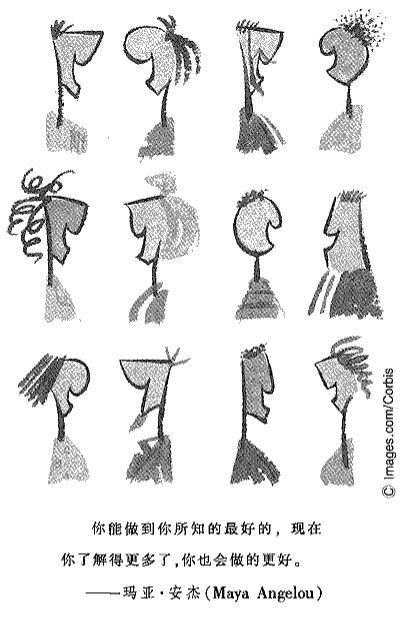

尽管成功的沟通定义随着情境而改变，学者仍然辨识出了好几种适用于大多数情境的通用的成功沟通特质。

*拥有多样性的行为反应*
沟通高手懂得从各式各样的沟通行为中挑选合适的行为表现。为了使你了解拥有沟通行为资料库的重要性，请试着想象一下，某个熟人在你面前一直重复说着同样一个笑话，可能是有关地域歧视或性暗示的笑话，以至于让你觉得被侵犯了。要回应这个笑话，你可能可以有下列几种方式：

·你可以保持沉默，因为说话而引起冲突的风险，可能远高于它的好处。

·你可以要求第三者向说笑话的人转述，该笑话可能带来的攻击意味。

·你可以暗示说笑话的人，希望他能感受到你的不舒服。

·你可以针对朋友的感觉迟钝开个玩笑，期望借着幽默能缓和你言语上的攻击性。

·你可以坦白说出你的不舒服，并且要求朋友停止谈论这个笑话，至少不要在你身边说。

·你也可以直接就叫他不要再说了。

你可以从上述回应方式中挑选一个对你最有利的去运用（或者你也可以再想出别的）。但是，假如你在遇到棘手情况时只懂得运用这些回应中的其中一二种方法，例如只懂得保持沉默，或永远只使用暗示法，那么你成功的机会将会减少很多。许多差劲的沟通者的确很容易被人察觉，他们的回应方式十分受限，有些不断地说着令人不舒服的笑话，有些总是具有攻击性，还有一些无论在任何的场合中都沉默不语。就像只会弹奏一种旋律的钢琴师或是只会煮某几道菜的厨师一样，他们被迫只能依赖有限的回应方式沟通，不管最后成不成功，都一再重复，不知变通。

*挑选恰当行为的能力*知道许多不同的沟通行为技巧并不能保证一定成功，懂得在最适当的时候表现出最恰当的行为也是很重要的。挑选传递信息的方法就好像挑选礼物一样，适合某甲的礼物不见得适合某乙，同样地，在某种情境下看来很适当的回应换一种场合也许就会彻底失败。虽然我们不可能详细地教导你在不同的场合应该如何表现及反应，但是当你无法决定要做什么反应时，也许你可以试着思考下面这三个要素：

首先是沟通的脉络、时间及地点时常常强烈地影响我们的表现，如果在对的时间点向老板提出加薪或向情人索吻，你可能会得到很好的结果，但是如果提出的时机不对，这种贸然的请求很可能会导致事与愿违。同样地，适合在单身派对中说的笑话如果拿到葬礼中说，下场将会无比尴尬。

你的目的也会决定你选择的反应。倘若你想要增进与新来的邻居的感情，也许邀请他过来喝杯咖啡或共进晚餐会是个不错的选择，但是假如你仍想保有自己的隐私权，也许见面保持礼貌、不涉及情感会对你比较好。另外，目的也会影响你帮助他人的方式。在第七章里，你将会学到有时候提供建议要适度。假若你的目的是为了培养他人解决问题的能力，也许克制自己的意见与见解，将自己当成共鸣板，而让对方自己去思索解决之道，会是比较好的做法。

最后，"对他人的了解"也会影响你的决定。如果你和一个非常敏感或局促不安的人相处，你做决定时最好要非常谨慎，并且富有支持性；而如果你是与一个值得信任的老朋友相处，那么你也许可以直率地说出心里的话。沟通社群的社会地位也会影响你沟通的方式，对待80
岁的长者与对待青少年的说话方式可不一样。同样地，即使在这个性别平等的时代，我们对待男人与对待女人的沟通方式很多时候也应该不同。

*表现行为的技巧*在挑选出最适合的沟通方式后，能够有效地表现沟通行为也是很必要的。说和做两者之间有很大的差异，你我都知道，光说不练没有多大用处。

阅读本书后面有关沟通技巧的文章并不能保证你一开始使用就能够完美无瑕，就像从事乐器演奏或运动训练一样，到达成功的道路没有捷径。

当你依照下列的篇幅开始学习和练习沟通技巧后，你将会经历一些阶段，如图1
一3 所示。

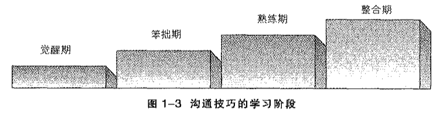

觉醒期：学习任何新技巧的初始阶段必定是"开始觉醒"。你首先学到的一定是"哇！这里有一种更棒而且更新的沟通方法"。举例来说，假设我们在打网球，当你学习到新的可以增加你发球的力量及准确度的发球法时，觉醒也就开始了。将场景换成沟通的领域，也许阅读本书将会带给你类似的发现。

笨拙期：就像你第一次学骑脚踏车或开车一定有过很笨拙的经验一样，初次使用新方法与人沟通时也一定会显得笨拙。这不是因为那些方法很烂，而是因为你需要更多的练习。学习一种新的技巧原本就不容易，此书中的这些新概念学起来也难免不容易上手。就如蓝调老歌手在谈论到音乐时所说的："如果你想要玩蓝调音乐，你就要投注时间和精力……它没有那么简单。"

熟练期：假设你愿意努力不懈地练习，以求克服因为初次尝试而带来的笨拙感，你终究会进人第三阶段，也就是有意识的熟练的阶段，在这个阶段你已经可以熟练地掌握自己，尽管这时候仍会意识到自己的动作。就好像学习一种新的语言，这时你已经能够运用正确的文法和字汇，只不过你仍然需要将它们在心底想得十分透彻，才能将它们表达出来。身为沟通者，你可以将这个阶段看成是由许多思考和计划以及好的结果所组成的。

整合期：经过一段时间的练习后，你将会到达最后一个阶段——整合期，这时不用经过大脑就可以表现得很好，沟通行为完全自动化，变成你整体的一部分。说外语的人进入整合期后，不再需要将外语先在心里转译成自己的母语才能理解；骑脚踏车的人进人整合期后，个个都可以骑得又快又好，脚踏车就像骑车人身体的延伸。同样地，进入整合期的沟通者也能够技巧性地表达他们自己，这并非因为他们能够意识到自己的行为，而是因为他们已经成为那样子的人了。

当你尝试本书中所写的方法时，请你将上述的这些步骤谨记在心。先要为必然的笨拙做好准备，要知道，如果你愿意持续练习那些新技巧，你将会越来越自在和成功。一切的努力将是有代价的，因为在你学得了新的沟通技巧和方法后，你将会获得更多令人满意的关系。

*认知的复杂度*
社会科学家将人们看待事物时，能够组织其架构的技巧，称为认知复杂度。他们发现，认知复杂度可以协助夫妻拥有更好的沟通品质，并能帮助忧郁、沮丧的人，还能使沟通更具说服力，以及促进升迁、有助于对情境定位等功用。

你不妨通过下面的例子来了解认知复杂度是如何增加沟通能力的：假设有个老朋友最近看起来对你有点不满，你觉得原因可能是你做的某件事冒犯到他了，或是因为他最近的生活不是很顺利导致他有点心烦——当然也有可能是你想太多了，其实什么事都没有发生。为了避免类似这样的过度反应甚至是误解的状况一再发生，试着以多元的角度去臆测、思考，将会提高问题解决的机会。

*同理心*
从多元角度来看一个情境固然非常重要，但是还是有其他方法能超越不同观点而达到了解。同理心是指能如同对方本身那样去感受到与经验到对方的处境，这个能力实在是太重要了，以至于有些学者认为同理心是最重要的沟通能力。

*自我监控*
既然你已经得知认知复杂度能够协助你更了解别人，那么通过自我监控使你更了解自己的方法也十分重要。心理学家将观察自己的行为并借此调整行动的过程称之为自我监控。自我监控者能将自己的意识解离出来，并以一种超然的眼光看待自己的所作所为，他们以这样的形式作出的观察：

*"我看起来就像一个白痴，根本不像我自己！"*

*"我最好赶快说些话。"*

*"这个方法还不错，我会继续使用它。"*

当然，过度的自我监控也可能会产生问题（请看第二章），但是大致上来说，能够意识到自我的行为并且深知自己行为影响层面的人比没有自我意识的人沟通更为高明。他们更能正确地研究判定他人的情绪，对于他人说过的话也记得比较牢固，个性上比较不害羞并且更果决。相反的，低度自我监控者甚至不知道自己的沟通能力低落。

低度自我监控者在生活中常显得笨拙、迟钝，即使是成功的沟通经验也是因为误打误撞产生的。相较之下，高度自我监控者就有建设性多了，他们能够暂时远离自己，去质问自己"我在搞什么？"如果发觉自己的作为没有意义，还可以及时调整自己的行为。

*承诺*
依品质性的人际观点来看，承诺是成功沟通的特征之一。换句话说，能够关心人际关系中的沟通状况的人是比较好的，这种关心可以表现在很多方面——承诺就是其中之一。关心他人还有很多种方式，譬如花时间陪伴对方而不是敷衍应付，乐意听对方说话而不是只顾自己说，说话时注意容易让别人理解，并且在倾听别人的意见后保持开放的心胸去修改自己的看法。沟通高手也关心信息，他们总是饶有兴趣地去倾听别人，并且用行为和语言证明他人的意见是重要的。他们也都摒弃欺骗、优柔寡断、无知的沟通行为。

你又是如何界定沟通高手呢？如前所述，沟通能力并非是一种有的人具备而有的人欠缺的特质，更正确地来说，它是一种程度多寡的状态。最理想的状态不是成为完美无瑕的沟通高手，而应该是更常使用这章所描述的沟通技巧。

*跨文化间的沟通能力*

在过去，很多人中从生到死都只生活在距离出生地几里的范围内，他们很少有机会跟不同背景的人相处。现在的时代不一样了，用大家熟悉的隐喻来说，"我们住在地球村"。我们的生活跟许多来自各种不同个人历史和沟通风格的人交织在一起。

廉价的交通工具已经降低了距离的障碍，使得许多人很容易进行以前难以达成的国际旅行．而手机和因特网的便利性，使得我们几乎可以和地球上任何角落的人开会或保持联络。

移民和异国联姻已经使得美国和其他西方国家改变了种族藩篱。例如，迈阿密的人口有三分之二是西班牙裔，华盛顿的居民有三分之二是非裔美国人，旧金山则有三分之一是亚裔美国人。根据美国政府的人口普查资料显示，西班牙裔和亚裔人口在下半世纪将会多出三倍，在公元2050
年时，非西班牙裔白人大约占全国人口的一半。

当我们的世界成为更多元文化的社会时，与来自世界不同角落人一起工作的可能性便增加了。在美国有超过一万个以上的外国公司和其附属机构，80
％的化学公司、90
％的银行业和全部的建设公司的总公司都设在美国境外。同时，美国北部的经济变得更加全球化，越来越多美国人在海外工作，在2003
年有超过800 万人在国外就业，其中有3000
家是进行全球化经营的美国本地公司。美国境内存在有超过3.6万家来自180
多个不同国家的外国公司。

跟来自不同文化背景的人进行成功的沟通所需要具备的能力，跟前述沟通高手所列的能力元素基本相同。除此之外，沟通学者也特别针对跨文化沟通能力，罗列了许多重要的特别要素。最明显的是，这可以帮助我们了解特定的文化规范。例如，在美国常见的自我嘲讽式的幽默，放到中东的阿拉伯国家就可能会让你碰一鼻子灰。

请你试着想象你刚刚应聘到设在美国的一家日商公司，工厂设在墨西哥，顾客遍及世界各地，在你的新职位四周有来自不同文化的同事、督导和客户，基本上都跟你的文化背景不同；因工作之需你偶尔还要必须出国。你要如何处理这个职位赋予的沟通要求？可能你最好具备下列能力：

*动机*
愿意和陌生人达成沟通是个重要的起步，例如，愿意跟来自不同文化者沟通的人比那些不愿意跨出去的人拥有更多不同背景的朋友。拥有适当动机在各种沟通中都非常重要，特别是在跨文化的人际互动更加重要，因为可能更具有挑战性。

若你在跨国公司任职，就必须有主动出击去接触与你拥有不同沟通形态的人的动机。例如，在中国洽谈商务时，刚开始你可能觉得不错，但后来你也许会觉得疲于奔命，因为你发现餐宴、酒会尤其是喝酒竟然是公务的一部分——即使你只是个宴会中的随行配角，即便你非常想要倒时差或恢复精力，你也必须调动深层次的动机，才能迎接陌生人一晚接一晚不断热忱地向你举杯。

*容忍模糊性*
跟来自不同背景的人沟通可能使你很困惑，必须有容忍模糊的态度才比较能接受。你即使似乎已经抓到要领，却又会时常陷人模棱两可之中，甚至彻底地误解跨文化沟通的信息。

假如你碰巧跟在传统美国原住民保留区长大的人共事，你会发现他们通常比一般人较为安静也比较低调。对于这种沉默寡言的人，你的第一个反应可能将之归类为缺乏善意，然而，这可能正好反映出他们的文化特性，他们认为内向低调比外向张扬更具价值，沉默优于健谈。在这种跨文化情境中，模糊性是个不争的事实，也是个需要面对的挑战。

*开放心胸*
忍受模糊性是一回事，愿意对不同文化开放心胸是另一回事。当别人不符合我们的文化教养时，我们会产生一种本性倾向，认为别人的沟通习惯是"错误"的。世界的某些地区与西方国家并不一样，在那里女人和男人的社会地位也许并不平等。当看到某些文化里人民甘心忍受贫穷或者贪污行贿大行其道时，你可能会吓坏了，觉得他们完全无视道德概念。在这种情形下，原则性强的沟通者对自认为"对"的信念丝毫不会妥协，而沟通高手意识到那些行事与我们不同的人所遵循的规则可能已经支配了他们一辈子。第三章会提供更多信息，指导面对从其他角度观察世界的挑战。

*知识和技巧*
一个团体工作的规范和习性可能完全不适用于另一个团体。例如，当你在美国的拉丁区旅行，你会见识到开会这件事通常不会按照计划表所规划的时间开始与结束，这使得与会者得多花点时间才能把事情搞定，这并不是说接待你的人不负责任或缺乏效率，而是你必须了解时间在不同文化中有不同的意义。因此，某人的姿势、他与你站着的距离、眼神接触等都可能带着特殊的意义，你需要进一步学习与了解。

当你进人新工作中，你有必要成为一个全神贯注的人，同时察觉你自己和别人的行为。缺乏这种特质的沟通者经常会在与跨文化照面时误触地雷而犯下大错，他们自己的行为经常会冒犯别人或造成困惑，或是让他们大惊小怪的事情其实只是简单的文化差异。即使你已经全神贯注，你仍然可以使用三个策略来加强自己在跨文化方面的沟通能力。
<u>被动观察</u>是指去注意不同文化中的成员的行为举止，并借用这些学来的行为增加自己沟通效能。
<u>积极策略</u>包括：阅读、看电影、询问专家或隶属该文化的朋友们如何行事，或者也可以选修有关跨文化、多元文化沟通的课程。第三个策略，
<u>自我祖露</u>，是指自愿透露自己的信息，给想要进行沟通的跨文化对象。

自我袒露的一种方式是承认自己对该文化认识不足："这对我来说是很新奇的经验，在这种情境下我该怎么才对？"这在上述三种策略中是风险最大的，因为有些文化并不向西方国家那样推祟坦率或自我袒露。尽管如此，当陌生人愿意试着学习认识自己的文化时，大多数人都会觉得很高兴，他们大都很愿意提供资讯和协助。

### **1.6 摘要**

沟通在很多方面都是很重要的。除了满足个人的需求外，有效沟通还能增进生理及心理健康。沟通模式并非是一方对另一方所做的单向模式，它是一个双向的交流过程。

人际沟通可以被定义为由参与其中的沟通人数所建构出的脉络，或在互动的状态下的质变过程。从品质性的角度来说，每一段人际关系都是独一无二、不可替代的，也是相互依存、要求内在的奖赏的。拥有个人化和非个人化的沟通关系都是必要的，大多数的沟通关系也都同时具有这两个部分。无论是个人化还是非个人化，内容性还是关系性，都遵循着同样的基本原则；信息可以是有目的也可以是无目的的；人绝对不可能不沟通，沟通也无可取代、无法复制；意义是被人主动建构出来的，而不是被动地隐藏在字里行间，越多沟通不见得越好，沟通不能解决所有的问题；最后，沟通并非天生的特质。

沟通能力是一种人人可拥有的技巧，能帮助你正当地从别人身上得到你想要的东西，还能以不同社群可接受的方式维持友谊。沟通能力并不是指你用以面对所有的场景或人物的单纯一种方法。沟通高手不仅拥有各式各样的沟通行为反应以供选择，还懂得在适当的场合表现出合宜、纯熟的行为，他们能够依靠同理心理解别人的观点，也懂得以不同的角度看事情。在跨文化沟通时，需要具备合适的动机、忍受模糊性、开放心胸和知识技巧，你才能沟通无碍。

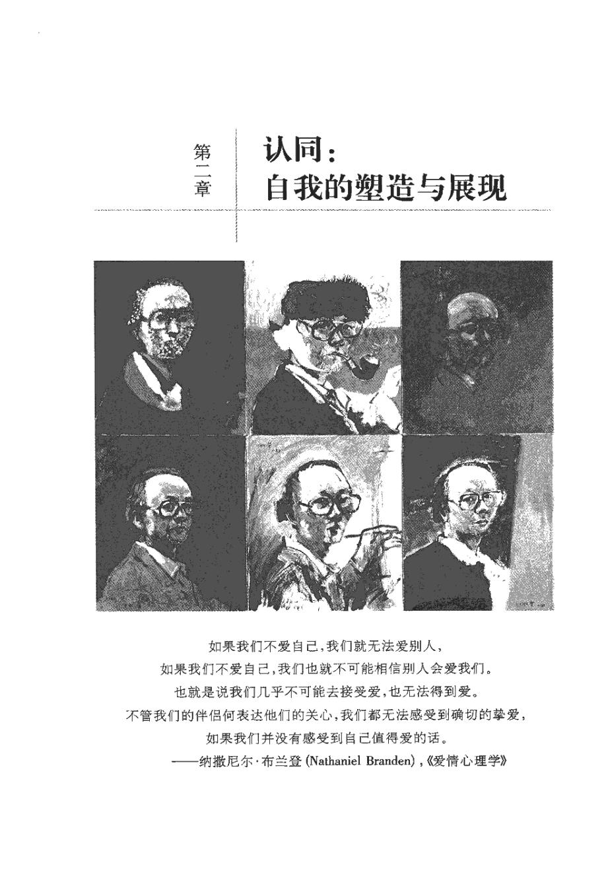

**第二章 认同：自我的塑造和展现**

你是谁？花一分钟来回答一下这个问题吧。在你读这一章之前，先看看下面的表单，现在就完成它，试着描述你所有的特质：

你现在的情绪或感觉，例如快乐、悲伤

你的外貌，例如吸引人、矮胖

你的社交特质，例如友善的、害羞的

你有的或没有的天分，例如音乐天分、绘画天分、音盲你的智力，例如聪明的、愚笨的

你坚定的信念，例如宗教信仰、环保支持者

你的社会角色，例如父母、配偶

你的身体情况，例如健康的、超重的

现在看一看你写的东西。你如何界定你自己呢？一个学生？一个男人或女人？用你的年纪？你的信仰？你的职业？当然有很多定义自己的方式。尽可能地去列出来。你所选择的字眼可能代表了在你看来自己最重要特质的轮廓。换句话说，如果你要描述"真正的你"，这张清单应该是个不错的总结。

### **2.1 沟通和自我概念**

上面的表单中列出的特征可以描述出你的某些自我概念。所谓自我概念，就是指你对自己所持有的相当稳定可靠的知觉，就好像一面特别的镜子，不仅可以反映出你的身体特征，还可以反映出你的其他部分——情绪状态、天分、喜好、厌恶、价值观、角色等等。

你可能会认为前面罗列的自我概念清单有些遗漏，那么你可以试着描述得更完整。你可以持续增加项目直至表单增加到好几百字。

现在，花一分钟，借着回答"我是谁"这个简单的问题，去展露你自我概念的其余部分，一次又一次将这些回应增加到你之前列的表单里。当然，在你自我概念清单中，并非每个项目都是一样重要。譬如，某人的自我概念中最明显的部分可能包括了社会角色，但对另一些人而言可能以生理表征、健康、友情、成就或技能为主。

你可以借着对你清单上的项目进行排序来明了你对每一个自我概念分别有多重视。现在来试试这个：先写下对你来说最重要的项目，然后写下对你来说第二重要的项目……依此类推，直到你完成你的清单。对多数人而言，即使是使人不愉快的东西，我们也往往很难放弃。当要放弃最主要的想法或项目时，大部分的人会觉得害怕。他们会坚持说："如果没有这些，我就不再是我了。"当然这也证明一个观点：自我的概念或许是我们最根本的财产，知道"我是谁"是很基本的，因为没有自我概念，就不可能和世界有所联系。

自尊是自我概念的一部分，是对自我价值的评估。假设某个沟通者的自我概念包括安静的、好辩的或严肃的，他的自尊高低决定于他本身如何看待这些自我概念，例加："我很喜欢我是安静的"或是"我的安静使我觉得很尴尬"。

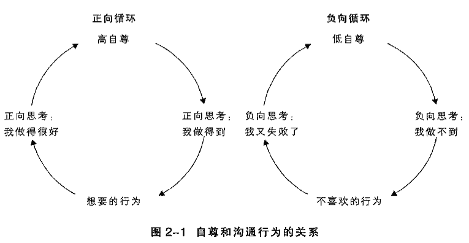

图2 一1
表现了自尊和沟通行为之间的联系，喜欢自己的人对于他们将如何沟通会有较正向的预期。这些预期可以增加沟通成功的机会，因此对沟通的正向预期会强化自尊。当然，对低自尊者与负面沟通也是一样的原则。

**自我的生物性和社会性根基**

你是怎样变成现在这种沟通者的？你怎么产生这些方法的？是因为你是环境的产物吗？现在你大概发现了，上述问题正确的答案是"是"。

*生物性与自我*
依据你在本章前头所列的表单，再多想一下"我是谁"，你必然会发现其中有些是形容性格的词汇。也就是说，你在不同的情境中也会具有某些稳定的思考与行为特性，你的性格通常终其一生都会保持恒定，有些特质甚至随着时间推移愈益明确显著。研究发现性格在很大程度上是由基因决定的，例加，在儿童期被视为害羞内向的人在长大成人后，当面对新的情境与挑战时，大脑内仍然出现明显的神经反应。

事实上，与沟通相关的性格特质，至少有一半与生物性因素有关，包括：外向性、害羞性、肯定性、口语攻击和沟通意愿等等。换句话说，我们使用的沟通方式某个意义上是被性格"设计"出来的。

社会科学家统计出五个基本的性格特质类型，详见表2 一1
。这些特质类型似乎具有普遍性，因为在德国和中国这样截然不同的文化中也得到相同的结果。现在再从表中圈出最适用在你身上的词汇，即便像"神经质"、"敌对"这种不太容易承认的词汇也要包括在内，因为这一类形容词可能比"和平"、"稳定"这类的形容词更容易彰显出你的特质。或许你已经注意到这个性格类型的若干向度与沟通的关系密不可分，那么你的沟通本身如何反映出你的性格特质？

性格和自我概念在神经质向度关系中最为密切。如表2-1所显示，某个具有神经质倾向的沟通者可能会倾向自我批评或不安全，反之，某个具有稳定特质的人，在沟通时可能会比较自我满意或平静。虽然大多数的人格特质同时兼具正向与负向的特性，神经质也实在很难被和任何正面效益联系在一起。还好，可以有许多方法足以挑战和克服神经质的思维。

在你因为性格因素而造成沟通挫败之前，谨记两件事：第一，我们在这些特质上并不是全有或全无，而是程度的问题。如果认定自己就是"害羞"或"社交的",
"和平"或"敌对",
"自我控制"或"自动自发"，实在是思维过于简单了。比较合适的方式是当了解每一个人的性格时，每个特质都落在某一个程度上。例如，你可能有三分安静、五分忧虑、七分自我控制，诸如此类。

第二，即使你似乎具有害羞或攻击性的特质倾向，你仍然可以在沟通过程做相当程度的调整或控制。即使是害羞的人也可以学习如何主动与人接触，而有攻击倾向的人也可以学习礼节。

最后，你的性格会在某种程度上塑造你的沟通方式，而你的自我概念则会决定你如何看待你的沟通方式。想想看不同的自我概念会如何引导你用截然不同的观点来看待你的沟通：

<u>安静</u> "我简直是个懦夫，所以才会说不出话来"

"我享受倾听甚于讲话"

<u>爱争论</u> "我太强势了，一定很惹人厌"

"我在自己的信念上坚定不移"

*自我控制* "我太过小心翼翼"

"在我开口说或动手做之前，我总会深思熟虑"

你即将在下一段读到有关自我概念和自尊对沟通的影响是多么深远的内容。它们既影响我们从别人那儿接收的信息，也影响我们看待自己的方式。

*社会化与自我概念*
别人怎样塑造我们的自我概念？想象一下在一个荒漠的小岛上成长，没有人跟你讲话也没有人跟你玩，你如何才能知道你有多聪明——或多愚笨？你怎么评估你有多吸引人？你怎么知道你是高或矮？仁慈或残酷？瘦还是胖？即使你可以照着镜子看到自己，在没有别人的褒贬也没有人可以做比较的情况下，你仍然不知道如何界定自己的外貌。事实上，日常生活中从别人那里得到的信息在告诉我们该如何看待自己上扮演了最重要的角色。

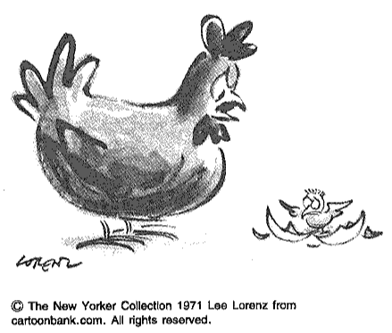

早在1912 年，社会学者查理斯·库里（Charles Cooley
）就用了镜像这个隐喻来对反映评价下定义：事实上，我们每个人所发展出来的自我概念都符合了我们认为别人看我们的方式。换句话说，如果我们觉得自己没有价值、不可爱和低能力，可能是"自我破坏者"所释放出来的沟通信号使然。如果其他人觉得我们是好的，我们也可能觉得自己是好的。反映评价的效力可以很清晰。在这一章开始时你所列的自我概念清单，都是你在自己的生命过程中所得到的正向和负向信息的产物。

为了进一步说明这个观点，让我们从头说起。新生儿并非一出生就有认同的能力，他们是借由观察别人对待他们的方式来评断自己的。当孩子学习说话和了解语言后，口语信息就对自我概念发展提供了影响。每个孩子每天都会被关于自己表现的信息炮轰，这里面有些是正面的："你好可爱！"
"我爱你！" "多么懂事的女孩啊！"也有一些是负面的：'你到底是怎么了！"
"你不能做一点有用的事吗？" "你是个坏男孩。"
"让我静一下，你快让我疯了！"这些像镜子似的评价，都是我们借以了解自己的途径。而孩子天生具有照单全收的信任本性，他们没有其他方式可以了解自己，只能接受身边无所不知、充满权威的成人们的正向和负向的表面评价。

类似的自我概念形成的原则仍在未来的生命中持续进行，特别是社会学者所说的"重要他人"所提供的信息。我们特别重视这些重要他人的观感（请参见专栏"雪中密码"）。看一看之前所提到的自我协助者和自我破坏者，想一想一些你可以记得的人对你的影响，就可以看出一些特别重要的人的评价是很有影响力的。家人就是"重要他人"最典型的例子。其他重要他人还可能包括特别的朋友，某个老师，或者一个虽然关系不深、但你很看重他对你的评价的人。看看这些重要他人的影响力，然后你可以问问自己：该如何尽到做学生的本分？如何当个吸引别人的人？如何当个有能力的工作者？然后，你会发现这些自我评价都是受别人对你的看法所影响的。

重要他人在成年期仍然具有影响力。青春期受到同济团体接纳或排挤对自我概念发展会产生重大影响。幸运的是如果父母了解子女的自我概念，尤其在青春期阶段注意保持良好的亲子沟通，将有助于子女建立正面的自我概念。

在长大以后，重要他人的影响就变得较不重要。大多数人到30
岁时自我概念已经不会发生戏剧性地改变，除非经由诸如心理治疗之类刻意的努力。相对的，年轻人的自我概念仍然充满弹性。例如，在14
岁到23
岁之间，大约有三分之二的男性随年龄而提升自尊，而有三分之一男性降低自尊。相同的研究显示，相同年龄段的女性有57
％觉得他们自己随着年纪自我观感变得较不好，而43 ％觉得他们自己变得较好。

社会比较有很明显的两种形式。首先，我们借着和别人比较来决定我们是优于别人还是劣于别人，是万人迷还是丑八怪，成功者还是失败者，聪明还是愚笨……我们借着这些和自我比较的人来测量自己。例如，研究发现，年轻女性经常拿媒体上超瘦的名模来跟自己做比较，而对自己的身材外貌产生负面意象，有些人甚至变成厌食症患者。有一个研究发现，在看了30
分钟电视播放的"理想"女性印象后，年轻的女人对自己外形改变的预期变得较糟。男人也一样，他们会拿媒体中理想的运动员来跟自己比较而产生负面的身体印象。你可能没有办法像好莱坞的明星那么漂亮、像专业运动员那么敏捷或像百万富翁那么有钱，但当你仔细想想就会发现，这些

**雪中密码**

*故事是以悲剧开始的。在一个寒冷的二月的早上，天上一如既往地下着雪，我开车跟在密尔福德街区的公车后面要去学校。公车转个弯后在一家饭店前停车，那儿平常并没有人上下车。我为了这突然的停车而有点儿恼怒。这时候，我看到一个男孩跌跌撞撞地下了公车，虚脱而踉跄地跌坐在雪堆旁的路砖上。公车司机和我同时赶到他身边，他那瘦削凹陷的脸庞比雪还要苍白，公车司机低声地说："他死了。"*

*我当下有点儿失神，很快地瞥了一眼公车上那些看着我们的年轻脸庞："医生，快，我去饭店打电话……"*

*"没用的，我告诉你，他已经死了。"司机看着男孩僵硬的身体，咕浓着。"他都没说他觉得不舒服……他只是拍着我的肩膀说：'对不起，我要在饭店下车。'就这样！很有礼貌而且很歉疚的样子！"*

*当消息传到学校大厅时，早上常见的叽叽喳喳和咯咯的笑声都安静了下来。当我走过一群聚在一起的女孩身边，我听到她们中的一个在低声说："是谁啊？谁在来学校的路上跌死了？"*

*"我不知道名字，是来自密尔福德街区的小孩。"有人回答。*

*"我想请你去通知孩子的父母。"在校长室里，校长这样对我说，"他们没有电话，再说，也应该有个人代表学校去他家。我会盯着你的班级。"*

*"为什么是我？"我问，"你去不是比较好吗？"*

*"我不认识这个小孩。"校长冷静地说，"而且我注意到在去年一年级学生的个人专栏里，他把你列为他最喜欢的老师。"*

*我冒着酷寒，迎着大雪开车去位于坏峡谷路的伊万家，而且想着那个叫克里夫·伊万的男孩。他最喜欢的老师！他这两年跟我说的活不会超过两个字。我几乎可以在心里看到，在我下午的文学课，他总是坐在最后一个位置。他自己一个人进教室，也单独离开。克里夫·伊万，我自己低声念着。"一个从没有说过话的男孩，"我想了一下。"一个从没有笑过的男孩，我从没看他笑过。"*

*在一个干净温暖的农场的厨房，"我说明了来意；伊万太太摸着走到椅子边。"他从没有说过任何身体不舒服的事情。"他的继父冷哼一声，"自从我搬到这里，他就没说过什么事。"伊万太太把平底锅放在炉子后面，开始解开她的工作裙。"等一下！"他生气的责骂着，"我进城之前先要吃早餐。反正现在我们什么也不能做。如果克里夫不那么沉默，他可以告诉我们他觉得不舒服。"*

*放学后，我坐在办公室，对着摊在眼前的空白纪录表发呆。我合上了档案并且开始给学校报纸写讣闻。我面前对着二张几乎像在嘲讽克里夫·伊万的空白表格。苍白，不曾被继义合法领养，有五个继兄弟姊妹。这个贫乏的信息和D的成绩，就是档案的全部内容了'*

*克里夫·伊万总是在早上安静地来到校门口，下午安静地离开校门口，而这就是全部。他从没有属于任何一个社团；他从未在任何一个团体中游戏。他从没有到过办公室。到目前为止，我能说的是，他从不曾做过一个快乐、吵闹的小孩该做的事。他从来就没被人放在心上过。*

*你如何能让一个小孩只是个"零"呢？学校成绩纪录告诉了我一些事情。一二年级的老师写着：“甜美、害羞的小孩”
“胆小但热心”。三年级开始责难，一些老师写得比较严厉：“克里夫不说话，不合群，学习缓慢。”其他学业成绩方面都写着“迟钝的”
“书写缓慢”
“智商低”。这些评语奏效了。这孩子的智商得分在九年级是83，但在三年级时是106，直到七年级都还没有低于100。害羞、胆小、甜美的伊万是有弹性的，他可以花时间去粉碎这些评语。*

*我拖着脚走向打字机，写了一份直言不讳的报告，指出我们的教育对克里夫·伊万做了什么。我扔了一份报告在校长的桌子上，另一份放在哀伤之中——贴了标签的档案夹里。我用力敲打字机、愤慨地甩下档案、砰一声关上门，但我并没有觉得比较好受。一个小男孩一直跟在我后面走着，一个脸色苍白、身材消瘦、穿着破旧牛仔裤的小男孩，曾经张大眼睛很长一段时间想寻找什么，然后渐渐变得目无焦点、视野模糊。*

*我可以想象有多少次他徘徊着想参加同学们的游戏，有多少次小孩们低声的耳语排挤了他，有多少次他没有被邀请。我几乎可以看到那一次又一次被拒绝的脸，听到声音说："克里夫·伊万，你根本不是个东西。"*

*孩子是天生容易相信的生物，克里夫无疑相信他们。忽然间，对我而言，一切都清晰起来了。克里夫·伊万最后并没有留下什么，他昏倒在雪堆旁去世了，医生可能只会写下"心脏衰竭"来作为他的死因，但这一切都不会改变我的心意。*

*我们没办法在学校找到够认识克里夫·伊万的十个学生作为他的朋友去参加他的丧礼，所以学生会和中年级导师代表组成了一个吊丧团，形式上去致意了一下。我跟他们一起到达教堂，我的胸口像压着一个铅块，同时我下了一个重大的决心。*

*我从未忘记克里夫·伊万和那份决心，这已经变我一年又一年、一班又一班的挑战。我寻找模糊的眼神或藏在座位上的身影，"看哪，孩子,"我会说，"今天我或许没有对你做出什么事，但我不要让你什么也不是的走出教室。我会和社会、学校体制抵抗，我不要你们在离开时认为自己只是个零蛋。"*

*大部分的时候（虽然不是全部）我做到了。*

事实并不说明你没有价值，而是你——以及其他这样做的人用不合理的标准和对照成员来评断自己。

另外，除了优等和劣等的感觉，社会比较也决定了我们要和别人相同或不同。一个喜欢芭蕾舞的孩子若是周围的人都认为跳芭蕾是怪异的表现而没有人支持他，他将会接受"怪人"这个标签。同样的，一个想要增进自己关系品质的成人若是发现他认为重要的事他的好朋友们却不认为或不承认很重要，他可能会觉得自己是一个怪胎。所以我们可以看出，我们所比较的参照团体对于塑造我们对自己的观点扮演着很重要的角色。我曾听过一个80
岁的婆婆描述她年轻时候的话。"当时我还是一个少女的时候啊！"她说，"不会去担心体重问题，有人瘦、有人胖，但我们相信神给我们的身体都是漂亮的。"在那个时候，体重不会被放在你所列出的自我概念清单中，因为它并不重要。而看一看现今你的态度吧，看时尚杂志或逛书店时你恐怕很难不去阅读最新的减肥食谱，而电视广告上充斥着减肥广告，你也常会听到有人抱怨着"还要甩掉几公斤的肉"。很明显，减肥这样被关注的原因来自于怎样才跟得上潮流。我们会想要苗条，通常是因为其他人说这样比较符合时尚。在一个认为肥胖才是理想典型的社会，一个认为自己很胖的人将会觉得自己是一个美人儿。同样的，一个人是已婚还是单身、孤僻还是善于交际、有干劲还是消极，都会跟社会对这些特点贴上什么标签有关。所以，赋予你的自我概念意义的重要性和你所附属的团体对这特点所持观点是一样的。

**自我棍念的特征**

现在，对自我概念的发展你已经有了比较正确的概念，我们可以进一步来看看它的特点。

*自我概念是主观的*
虽然我们相信我们的自我概念颇为精确，但事实上它可能是被扭曲的。有些人对他们自己的评判比客观事实呈现得要优秀。例如，研究者发现，学院学生对自己作为人际沟通者、公开演说者或倾听者时的评价和他们实际表现之间并不相关，在大多数例子中对自己沟通能力的认知都比实际表现要好。网络约会也有这种雾里看花的情况，也就是自己看自己比别人看自己更加正面。这种自我膨胀的现象，使得自我概念与客观的第三者所见产生落差。

但是并非所有自我概念的失真都是偏于正面的。许多人看他们自己比事实呈现的更为严厉。我们都有过短暂的"我很丑"经验，以认为自己长得不好看来回应别人客观看到的真实样貌。研究结果支持我们的常识：当我们经历负面的情绪时比我们拥有好心情时更容易批评自己。所有人都会偶尔经历一阵自我怀疑而影响到我们的人际沟通，而对一些长期或永久经历自我怀疑和批判状态的人来说，这种持久性的负面自我状态在接触和回应他人时将造成负面影响。

像这样的扭曲的自我评价可能源自许多理由，其中一个原因是过时的信息。过去在学校或社交场合的失败经验即使不会在未来发生，我们仍然会深受影响，但其实这些失败并不代表未来碰到类似事情时你还会失败。同样的，过去的成功也不能保证未来的成功。或许你讲的笑话过去有人捧场，或是你过去的工作表现杰出，但所有这些事都是会改变的。

"歪曲的回馈"还会创造出比实际更好或更糟的自我形象。消极的自我形象，其一般成因是来自父母的过度批评，其他的情况还包括：朋友们刻薄的评论、心不在焉的老师、过度要求的雇主或令人莫名其妙的陌生人等。另一种歪曲的信息是不切实际的正向自我形象。某个老板可能会觉得自己是一个完美的管理者，因为他的助理为了保住饭碗或晋升而给了他大量不真实的赞美。同样的，一个孩子夸张的自我意识可能来自双亲过度溺爱的赞美。除了过时的资讯和扭曲的回馈之外，其他对于负向自我概念产生的原因还有强调完美，这种情况在我们社会中十分常见。多数人从学习语言开始就受到那些看起来完美无缺的人的影响。孩子所听的故事中都暗示着孩子去成为一个故事中的英雄，而这些被热爱和推崇的英雄形象连一点瑕疵都没有。不幸的是，许多父母也不愿意承认他们曾经犯过错以及不公正的行为，以继续保持完美的神话。理所当然的结果是，孩子长期接受这些追求完美的表面信息，没有任何立场去和那些权威人物辩驳；而且，从那些围绕他们的成人那里传递过来的信息是"一个适应良好、成功的人是不会犯错的"。所以，孩子们只好向着这些方向努力以便被大人接受，假装成"全才"成了必要的事情，即使他们知道自己事实上不是这块料。孩子天真地相信每个人都是完美的，只有他知道自己并非如此，这将让孩子的自我概念受到什么样的苦难是很容易就可以想象的。

别误解：将追求完美当作理想并没有错，我们只是要提醒一下要达到完美境界并不是什么容易的事情。期待自己非要完美不可，只会给你传达既错谬又没必要的自我贬低信息。

人们常常低估自己的最后一个原因在于和社会期待的联结。说也奇怪，那些我们羡慕的完美者的圈子对我们所渴求的那些优势条件（他们拥有或假装拥有的优势条件）却往往轻描淡写。我们会说这些人是谦虚的，并且觉得他们的行为令人赞赏；同时，我们会认为那些诚实欣赏自己优点的人是自吹自擂或以自我为中心的人。其实，那是因为我们把他们和那些金玉其表败絮其中的人混淆了。这种习惯会让我们中的大多数人面对别人的恭维时表现出愧不敢当的样子，大量地谈自己的缺点。当你把某个计划搞砸了时表达自己的痛苦是可以理解的，而在工作做好时表达自豪却会被认为是自夸。你可以说你觉得自己不太引人注目，但你若是说自己妩媚动人便显得太过自我中心。

慢慢地，我们会开始相信那些我们不断重复叙述的习性。那些轻蔑的自我评价被视为是谦虚的，而且变成了我们自我概念的一部分；而那些优点和成就将不会被提到，尔后便被遗忘。到最后，我们对自己的看法将会比真实的自己还要糟。

自尊虽然可能以不正确的想法为基础，但在和别人相处时它仍会具备某种影响力。表2-2
是对高、低自尊者重要的沟通差异所做的整理摘要，那些不喜欢自己的人可能会觉得其他人也不喜欢他们。多多少少，他们会猜想别人是不断用批判的观点看他们的，而且接受这些猜测或真实批评更加证明了他们真的是不可爱的人。有时候，这些低自尊者对人会有明显的敌意，因为他们只有在蔑视别人时才会觉得自己很好。

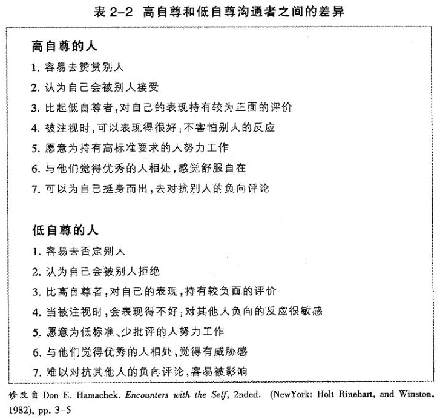

*自我概念抗拒改变*
尽管事实是我们都会改变，我们仍然会一直坚持一个现存的自我概念，即使证据显示它是会过时的。这种倾向于要去探索和注意符合现存自我概念的信息，称为认知的保守主义。

这种认知的保守主义会引导我们去寻找支持我们自我概念的人。例如，未婚大学生或已婚夫妻中拥有高自尊者都会优先寻找讨他们喜欢的人做伴，而低自尊者会屈就自己，选择跟自己并不喜欢的人做伴。这意味着我们很少能积极学着去认识"真实"的自己，反而会去增强我们熟悉的自我概念。

我们想努力去维持曾经讨人喜欢的自我概念是可以理解的。一个前几年表现不错但目前在课业上失败的学生可能会不甘心失去"好学生"的标签；而一个过去很勤奋、在个人档案表里登记着表扬纪录的工人也许会坚持要做一流的员工，现在也可能会埋怨管理者老是注意他缺席率的增加和生产率的降低。若是他们不顾相反的事实而坚持自己仍然表现得很好，并不是因为他们在说谎，而是因为他们拒绝改变自己的自我概念，相信过去的事实仍然正确地存在。

说也奇怪，当现在的自我知觉其实比过去的更讨人喜欢时，人们却仍然常常坚持过去的自我知觉。我以前有一个学生，几乎每个人都觉得她很漂亮、外表很吸引人，足以成为任何魅力杂志的封面人物，然而她却在班上的作业单上说自己是"普通的""无吸引力的"。当同学问她时，她说她的牙齿在小时候非常不整齐，而且她带了好几年的牙套去矫正她的牙齿。在那段时间里她总是被她的朋友取笑，在她带牙套的时候，同学从未让她忘记她的"金属嘴巴"，即使牙套已经拆掉两年了，她仍然觉得她自己是丑的，而且总是漠视我们的赞美，把这些赞美当成是我们出于好心而说出的安慰。她说她知道自己看起来真正的样子。这个例子就说明了一个事实：我们会抗拒修正一个不正确的自我概念。

第二个固守某个不正确自我概念的原因，便是自欺欺人和缺乏成长。如果你仍然持有某个关于自己的不切实际的美好图像，你将很难看到改变的需要。你会不想学习新的技能，不去努力地改变人际关系或改善你的身体情况。你很可能会停留在一种每件事都很好、熟悉或舒服的错觉里。随着时间的流逝，这种错觉会越来越难以持续，而会引发出第三个问题：心理防卫。

要了解这个问题，你需要了解否认自我知觉的沟通者会有两种选择：其一是接受新资讯，而且相应地改变自身的知觉；其二是维持原来的感觉，并用一些方法去驳斥新的资讯。大多数的沟通者都不肯贬低他们较好的形象，所以他们倾向于选择反驳，不是对信息打折扣或合理化就是反击传达这个信息的人。防卫问题事关重大，所以我们会在第十章做一个讨论。

**文化、性别和认同**

我们已经了解了家庭经验的影响力，特别是童年时期的经验，这些经验会塑造"我是谁"的感觉。其他塑造我们的性格和沟通的力量包括：年龄、身体素质、性别倾向以及社会经济地位。与这些并列的，文化和性别尤其是有力的支配力量，塑造我们看待自己和他人的看法，并支配我们如何沟通。我们将马上检核这些力量。

*文化*
也许我们很少承认，但实际上我们对自我的感觉通常是以不着痕迹的方式被孕育我们长大的文化塑造的。大部分西方文化都是高度的个人主义。反之，那些传统的文化，譬如大部分的亚洲人是比较倾向于集体主义的。当被问到对自己所下的定义时，美国、加拿大、澳大利亚、欧洲的这些个人主义的人民可能会回答他们的名字、姓氏、街道、城镇和国家，而亚洲人可能就会从不同的方向来回答。如果你请印度人定义他们自己，他们将会给你他们的社会阶级（种姓）、村庄以代替他们的名字。在梵文的传统里，对个人自我是用家系、接着是正式的家庭、房子，最后才是个人的名字。在这里提出这些惯例，并不只是对文化的好奇心，重点是这些惯例以其特定的角度影响了个人看待自我的方式以及看重人际关系中哪些方面的眼光。在集体文化中，一个人借着隶属于一个团体来得到认同，这指出社会成员和它的次团体之间互相依赖的程度是非常高的。自豪和自我价值的感觉不只是个人的作为，也包括其他社会成员所塑造出来的行为。东西方有一种强烈的文化对比，东方人强调和别人的联结，使得否定自我对传统亚洲人来说有其重要性，而西方文化在个人主义的影响下，对个人的自吹自擂只是家常便饭。在表2-3
会总结个人主义文化和集体主义文化的一些不同。

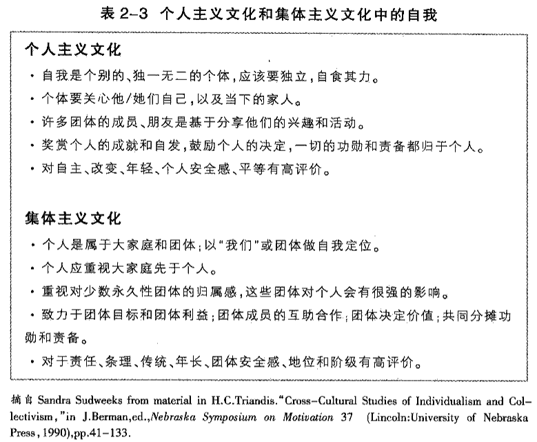

文化差异的分类并不只是人类学学者感兴趣的问题。它透露出了在不同文化中沟通行为舒适或焦虑的程度。在集体主义的社会里往往存在着一种高度的沟通焦虑。举例来说，一个团体中来自东方集体主义文化国家——比如中国、韩国、日本——的成员往往比起个人主义文化——比如美国或澳大利亚——的成员对公开发言表现出明显较高程度的焦虑。沟通焦虑在不同文化中有着不同的意义。在某些文化中，"害羞"并不是个问题，以害羞来了解一个人沟通焦虑的程度并不是适当的视角。事实上，对应相应的文化观点才能了解真正的事实，沉默寡言在不同的社会代表着不同的意义。当避免成为突出的焦点是文化中认可的目标时，如果你是因为别人注意你而有失常的表现甚至感到紧张，其实也是合理的行为。把"果
断"列入自找概念中，可能会让一个西方人觉得骄傲，但对一些亚洲人来说可能会觉得有些羞愧。

个人主义和集体主义的差异，在每天的互动中都会显示出来。沟通理论学者史特拉·汀-托米（stella
Ting-Toomey）已经发展出一套理论，揭示了一些重要的规范习俗——譬如正直或直率——所显示的文化差异。他认为在个人主义的西方文化中，有一个很强烈的"我"的定位。西方文化规范中允许人直接发表意见，但是在集体主义文化中，就需要去建立个人和其他人的联结，维持间接接近的和谐状态。"我要做我自己"可能是一个西方人的座右铭，而"如果我伤害你，我也会伤害我自己"与亚洲人的思考方式比较接近的。

*性征和性别*
想象一下如果你是另一种性别你的一生会如何吧，然后你就会了解性别对自我的影响力有多么深远——你可能会产生截然不同的自我认同。你会用同样的方式去表达你的情绪吗？会用同样的态度处理冲突吗？会用同样的方法跟陌生人或朋友相处吗？答案几乎都是响亮的"不"。

从生命开始的前几个月，我们身为男性或女性，便塑造了别人和我们沟通的方式，同时决定了我们的自我感觉。想一下，当一个小孩出生时，大部分的人问的第一个问题几乎都是"是男孩还是女孩啊？"多数人在知道答案后，总是会做出符合该性别的行为反应，他们使用不一样的代名词，会选择和性别相关的昵称。当这是个男生时，谈论的焦点通常会集中在体型、力气和活动力；当这是个女生时，谈论的焦点就通常是漂亮、甜美和丰富的表情等。我们就是这样塑造一个孩子对自己个性的感觉和他或她的沟通方式，而我们的言行之间便能透露着男子气概或女孩子气的信息。例如，形容女孩子甜美就比起形容小男孩甜美更具有说服力。所以，性别角色的标签对男人和女人分别如何看待他们自己及他们如何沟通有很深的影响。性别也会对自尊产生影响。社会价值观认为男性比女性更喜欢竞争，所以青春期男孩经常要靠着超越同侪来获得自尊，但少女获得自尊之道往往是通过她们的社交关系和言词能力。

不要因为性别期待而放弃自己，成为失去自由的人。一个不具侵略性的男人在过于强调男子气概的环境下会觉得格格不人，但是他可能会在别处找到欣赏他的沟通方式的人，而使他获得新的自我评价。工作环境中受制于老板和同事的期待而自尊被扼杀的女性，可以选择去往更适合的环境工作。孩子通常不能选择塑造他们个性的环境，但是成人可以。

**自我应验预言和沟通**

自我应验预言是指若个体对事件会发生有所预期，会比没有预期更可能成真。虽然你并没有故意对事情给予特定的标签，但是自我应验预言总是一再发生。自我应验的寓言包含四个步骤：

1 ．持有某种期待（对自己或别人）。

2 ，表现出与期望一致的行为。

3 ．期待如实发生。

4 ．强化起初的期待。

看看下面的例子，你可以了解上述情况是怎样运作的。想象一下，你正计划着要去应征一个你很渴望得到的工作，你对于该如何表现非常焦虑，不确定自己是否真的有实力被录用。你跟颇为了解你的教授讨论了这个问题，并去请教了在该公司任职的朋友，他们两个人都认为你非常胜任该工作，并确信能够任用你是他们的福气。你对自己感觉很棒，带着这些回馈去应征，结果你镇定地表达想法，很有自信地推销自己。老板对你印象深刻，最后你获得了这个职位，你做了这样的结论："我的教授和朋友说得对，我的确是那种老板愿意雇佣的人才。"

这个例子说明了自我应验预言的四个步骤。多亏了你的教授和朋友对你的正面肯定，你对面谈的期待可谓旗开得胜算一步骤）。因为你乐观的态度，在面谈时你表现出果敢稳定的沟通（第二步骤）。你充满自信的行为和伴随的其他条件使你获得工作（第三步骤）。最后，正面的结果强化了正面的自我评估，使你在将来面对其他的面谈时都更具信心（第四步骤）。

将这原则谨记在心，了解自我应验的预言在生活中能产生多么巨大影响力十分重要。由此可以推论，我们会成为我们自认的样子，也就是说，我们和我们身边的人似乎持续地建构和再建构着我们的自我概念。

*自我应验预言的类型*
自我应验预言有两种形式。在你的自我期待影响自己的行为时，就是*自我强加的预言*。在运动时，你可能会预期你自己表现得比平常更好或更糟，这些说明了你平常的表现——也就是你的态度。相应的，在某次面对观众时，你可能产生一种胆怯的心态，导致你忘了你说话的重点。这不是因为你没有做好准备，而是因为你告诉你自己"我知道我搞砸了"。

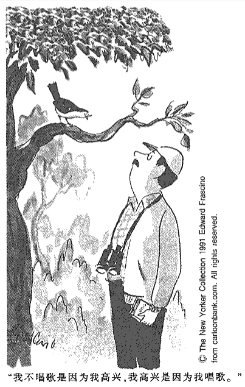

研究已经证实了自我强加的预言的力量。在一个研究中发现，认为自己不能胜任沟通任务的人往往表现得比较差，而着眼于追求互利关系的人表现得比较好。此外，那些较多自我批评的人也更容易破坏现存的人际关系；同时，肯定自己能力的学生学业表现一般比较好。还有另一份研究显示，那些对被拒绝很敏感、常常想象着自己被拒绝的人，反而更经常被社会拒绝所伤害，而且他们在人际关系危机上也常常反应过度。研究也发现，那些对公开演说会紧张的人似乎会创造出关于表现不好的自我应验预言，从而造成他们的表现失常。

自我应验预言的第二种形态，是*别人强加的预言*。他人的期望可以造就一个人的行动。最典型的例子是罗伯·罗森塔尔（Rober
Rosenthal）和勒诺·雅各布森（Lenore Jacobson ）在一本名为《
教室里的小精灵》
的书中所描述的研究。这个实验是，告诉某小学的教师他们学校里20％的学生显示出不平凡的智力成长潜力，而事实上这20％的学生是私底下随机挑选出来的。八个月后，这些"不平凡"或"神奇"的20％学生在IQ表现上明显出现了较高的分数，比没有被教师特别关爱的孩子（控制组）来得高。因为教师的"预期改变"及其引发的关注提高，这20％随机选出的孩子在智力上产生了"实质改变"。换句话说，这些孩子表现得较优秀不是因为他们比其他同学优秀，而是因为那个扮演"重要他人"角色的老师，相信他们可以做得到。

用这种现象来看自我概念的脉络，我们可以说：当一个老师传递给孩子"我知道你是很聪明的"这样的信息时，孩子会接受这样的想法，因而改变他的自我概念。不幸的是，当老师传递着"我觉得你很笨"的信息，这个原则也同样发生作用。

这种别人强加的自我应验预言，确实在塑造自我概念时具有强大的影响力，也影响着个人在学校之外的整个社会情境的行为。在医学上，那些不知不觉使用安慰剂的病人（安慰剂是没有治病效果的，只是诸如一些消毒过的水或是糖片之类的东西）经常得到和那些实际上确实进行了药物治疗的人近似的治疗效果。相信自己正得到实质的治疗有助于病人们的病情。相同的情况下，当一个医师传递出病人的病情将会好转的信息时，这个病人可能会因为这个期待而真的好起来。然而，如果医生流露出病情不乐观的信息，病人通常也难以恢复健康。显然地，病人病重或复原的自我概念是被医生塑造的，他们在病人决定康复与否的态度上扮演着一个重要的角色。如果父母对他们的孩子有某种信念，但小孩并没有觉察到这个信念，这孩子就不会受到父母期待的影响。如果一个老板关心一个员工的工作能力，但他没有表达出这些关心，这个员工也不会被影响。从这个角度来看，一个人强加到另一个人身上的自我应验预言，几乎就是一种心理学的沟通现象。改**变你的自我概念**

读到这个地方之后，你应该比较清楚地知道什么是自我概念，它是如何的形成以及它是如何影响沟通的了。但我们仍然没有直接聚焦于最重要的问题：当你不开心的时候，你如何改变你自我概念的作用。其实成为你想要成为的人并没有速成的办法，个人的成长和自我的修养是一生的过程，但我们可以提供一些建议来帮助你往你的目标移动。

*拥有真实的自我感*
如同你已经读到的，不真实的自觉知觉有时候来源于你对自己太过严厉、觉得自己比事实呈现的还要糟糕。否定自己的缺点是很荒谬的，但是承认你的长处也很重要。一如你在这章前面部分所做的那样，将你的优、缺点列出来，让自己发觉自已的优点所在，是一个不错的方法。

不实际而负面的自我概念也会从其他人不正确的回馈中形成。或许你身处苛刻的环境之中，会得到许多不当的模糊信息。有一个过于挑剔主管的员工，有刻薄朋友的孩子，学生不支持的老师……这些过度负面的回馈都容易促成较差的自我概念。

如果你属于这种类型的人，把你得到的不真实的评价列出来，然后去找那些更加客观公正的人，让他们帮助你认识你真实的能力和缺点。这是一个快速又实用的做法。

*拥有切合实际的期待*
重要的是要对你不满的原因加以理解——实际上你的不满可能来自期待过高。如果你要求自己的每个沟通表现都完美无缺、具有控制力，你一定会觉得很受挫折。没有人可以有效地控制每一个冲突，没有人可以在对话中完全放松又技巧熟练，当别人有问题时没有人能提供百分之百的帮助，没有人总是问到切中核心的要点。要求你自己达到如此不切实际的目标，一开始就注定让你感到很难受。

即使有人看起来明显比你更有能力也没什么大不了的，对自我下判断时重要的是对照你的成长而不是对照其他人的行为。不必因为自己没有像专家一样的天分而就觉得自己很悲惨，而是要认识到你是一个比过去的自己更优秀、更智慧或更有技巧的人，这样你更容易感到满意。完美无瑕是个不错的理想，但如果你真的期待自己变成这样，那对自己就过于偏颇了。

*拥有改变的意愿*
我们常常说我们想去改变，但又不愿意去做必要的工作。当我们不想去做而必须做的时候，就会借着声称我们"不能"成为自己想要成为的人来维持一个不切实际的自我概念。事实上，如果你愿意努力，你可以用各种方式去改变。改变你的自我概念通常必须要有个深远的承诺，没有这个承诺，单靠自身的企图心，恐怕难以达到你想要的沟通目标。沟通和生活的大多数方面一样，"没有白吃的午餐"。

*拥有改变的技巧*
通常只有尝试是不够的，如果你知道怎么做，你就可能会改变。你可以用这两种方式做做看。

首先，你可以从书本上寻找忠告。你也可以从指导者、咨询师和其他专家与朋友那里得到建议。当然并非所有的建议都是实用的，但如果你广泛地阅读并且和够多的人谈话，你将有更好的机会学到你想知道的事情。

其次，你可以观察楷模——那些将你所希望的方式实践了的人。很多人都说从楷模那里学到的比从其他地方的都要多，而且由此你可以发现世界上到处都是可以让你学到更好沟通的办法的人。你将要变成一个仔细的观察者，看看你钦佩的人的所言所行。这么做并不是要你复制他们的行为，而是你可以借鉴他们的行为，取长补短，去找出适合你个人的风格。

### **2.2 自我的展现：沟通作为认同管理**

到目前为止，我们描述了沟通如何塑造沟通者看待自己的方式。在这一章接下来的部分，我们将会转换一下目标，把焦点放在认同管理的主题上——我们使用的沟通策略，会影响别人如何看他们自己。接下来，你会看到许多的沟通信息，是以创造我们想要的自我为目的的。

**会开自我和隐私自我**

要了解认同管理如何运作，我们将进一步对自我的相关细节的部分进行讨论。之前我们谈论"自我"时仿佛我们有很多自我一样。事实上，我们确实都有几个自我，有些是隐私的，有些是公开的。通常这些自我都非常不同。

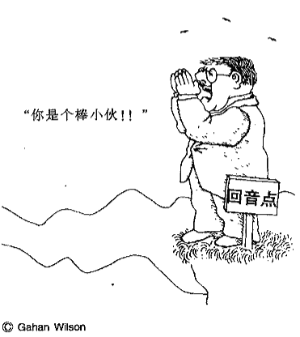

*觉知的自我*是自我概念的反映，你意识到的自我是在你真诚反省时所相信的自己。我们认为这种自我是"隐私的"，因为你不可能把它对另一个人全部展现出来。你可以借着回顾你发展出来的自我概念清单来验证一下这些"隐私自我"的本质。你可能会发现一些特征，有些你不会对别人展露，有一些甚至不会和任何人分享。

和隐私自我相对应的"*展现的自我*"是一个公开的形象，就是我们要别人看我们的方式。这个展现的自我，有时候叫做一个人的"脸"。在大多数例子中，我们尝试创造的展现的自我，是一个已经被社会承认的形象：勤勉的学生、可爱的同事、尽责的员工、忠诚的朋友等等。社会规范常常在觉知的自我和展现的自我之间创造出一条鸿沟。例如，表2-4
秀出自我概念类似的男女大学生，但他们的公开自我有许多的差异——不同性别的隐私自我和公开自我也有所不同。

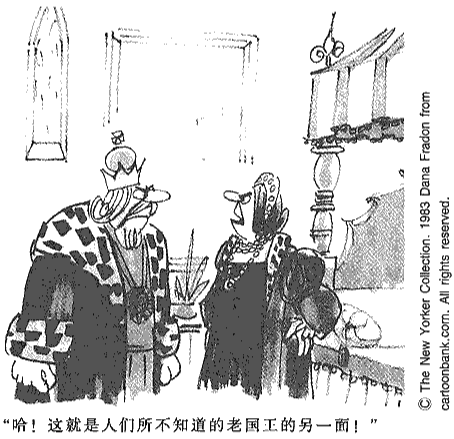

你可以试想一下，看看一个开车的人公开的和私下行为的不同，想象一下她或他单独在车子里面时是不是会做一些在公共场合无法被接受的动作。我们大家都在别人看不到的地方做一些私下的行为，我们不会在公开场合做那类动作。只要回想一下当门锁着时你在浴室镜子前的样子，你就会明白公开的和私下的行为之间的不同。如果你知道有人在看，你是否会有不同的表现呢？

**认同管理的特征**

现在你了解什么是认同管理了，我们可以看一下认同管理过程的一些特征。

*我们致力于建构多元认同*
如果你以为我们每一个人只是用自己的管理策略创造一个认同，这想法就太单纯化了。即使只是在某一天的过程中，大部分的人仍表现出多样的角色："有礼貌的学生"、"打趣的朋友"、"友善的邻居"、"有用的员工"……而这只是很小一部分的例子而已。建构多元认同的能力是沟通能力的元素之一。例如，讲话的风格或甚至语言的本身，都可以看出一个人是如何建构他的个人认同的。我想起一个黑人同僚，他也是一个南方浸礼会牧师，这个聚会中的大多数成员都是黑人。在校园中演说时他表现出很典型的教授风格，但有次我拜访他去听他在星期天讲道，结果发现了他与平常完全不同的、非常有活力而夸张的一面。相同地，有学者指出，在美国的拉丁美洲人会使用两种语言来进行表达。当他们决定用英语或西班牙语时，是出于在特定的对话情境中他们想要寻求认同的类型而作出的考虑。

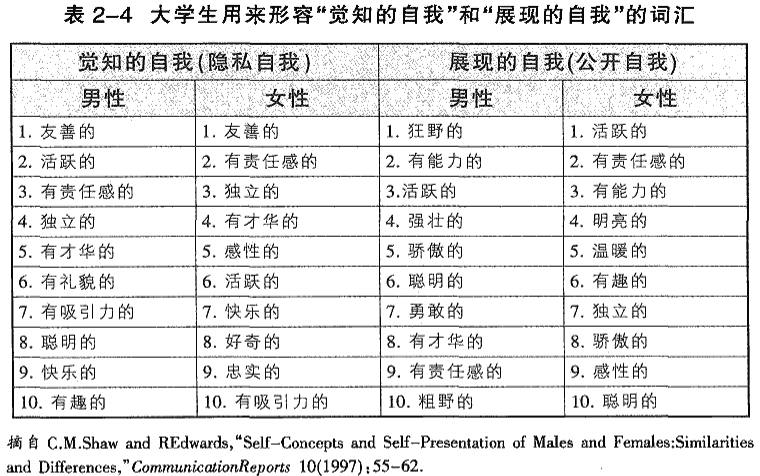

我们有时甚至会觉得同一个人有截然不同的两种个性。随着你的成长，你和你父母的互动必然也会对你自己的特性加以改变。有时你的行动脉络像一个负责任的成人（关于这辆车你可以信我），但在另一个情况下你可能像一个无助的小孩（我找不到我的袜子）。基于不同的关系脉络：朋友、爱人、工作伙伴、爱责骂的批评家、认错的孩子等等，我们转换着各种不同的行为。

*认同管理是合作的* 社会学家欧文·高夫曼（Erving Goffman
）用一种戏剧性的隐喻来描述认同管理。他认为我们每个人都是编剧，会创造角色来对我们希望别人如何看我们加以反映。我们会把这些角色表演出来。但这不像一般意义上的观众，我们的"观众"是经由想象创造出来的，这些观众所拥有的特征是由行动者所虚构出来的。与认同相关的沟通可被视为我们和别的演员合作的戏剧过程，是一种即兴创作的场景。

你可以试着想象你在与朋友沟通和与家人沟通时表现出的不同，来思考认同管理的协同事实。例如，想一想当你不在家而他们忘了帮你转达一通电话留言时，你会如何有技巧地抱怨以避免让自己听起来像一个唠唠叨叨的人（你想当一个"好人")
，以及避免让对方在这件事中感到尴尬（避免让别人感到把事情搞砸了）。如果你的苦心被接收了，对话可能是：

*你："对了！珍妮跟我说她昨天打电话给我，如果你写了纸条，我想我大概是没看到。"*

*某人："啊呀！对不起啦，我本来打算写一张便条的，但我一挂上电话，就赶去上课了。"*

*你（用和善的声音）: "没关系啦！只是以后如果你留张便条，我会很感激的。"*

*某人："没问题。"*

在这个对话中，你和某人都同意对方对认同的看法，这个对话进行得非常流畅。想象一下当某人不同意你的角色是"好人"时，结果将如何的不同。

*你："对了！珍妮跟我说她昨天打电话给我，如果你写了纸条，我想我大概是没看到。"*

*某人（辩护地）:
"啊呀，我忘记了！不过这也不是很重要的享，人不是永远完美的嘛，你知道的。"*

你的第一个念头"很好！保全面子的人"被拒绝了。在这一点，你可以坚持继续扮演原来的角色："喂，我不是对你生气，而且我也知道人不是完美的啊！"或者，你可以试着转换新的角色为一个"对不公义防卫的人"，用二种气愤的语气回应说："我从没说过我是完美的，而且此时此刻并不是要讨论我。"

就像这个例子说明的，合作并非指同意相同的事情。电话留言这种小争执可能迅速变成一场大战，你和某人都采取参与战斗的角色。这里的重点是，实际上所有的对话都提供了一种竞技场，在回应别人行为时，沟通者就在建构他们的自我。就像你在第一章读到的那样，沟通并不是分离的，不能分隔成单独的一件件事件。事实上，某一刻所发生的事，是由两人长期关系累积的各种经验而导致的。

*认同管理可以深谋远虑或者不知不觉*
现在，你可能会反对认同管理策略上的观点，声称你的大部分沟通都是自然的，而不是处心积虑地企图用某些方式保护自己；但是你可能也会意识到你的一些沟通伴随着一种要管理你的认同的有意识的企图。

毋庸置疑的是有时候我们会察觉到自我管理压力的存在。大部分工作面试和第一次约会都是很清楚的谨慎自我管理的例子。而在其他一些例子里，我们的认同管理行动也会不知不觉地在小众之前公开表现出来。例如，某实验中，当实验组的人在有别人在场的情况下吃到太咸的三明治时，会表现出嫌恶的表情，而当他们独处时吃到相同的三明治，就并没有什么表情。其他的研究显示，沟通者只有在面对面坐着，也就是说他们的表情可以被其他人看到的时候，才会进行表情的模仿（例如：微笑或回应其他人信息的表情），当他们用电话交谈，也就是他们的反应不会被看到时，就不会有相同的反应。这类研究认为，我们大部分的行为带有传送信息给别人的目的，换句话说，就是在做认同管理。

前面所描述的实验组的人，并非有意识地想"有人在看我吃这么咸的三明治，所以我要做个表情"或"因为我是面对面的谈话，我应该借着模仿我谈话伙伴的脸部表情，来表示我是同意的"。这类决定常常是立即而不自觉地发生，或者是在我们意识知觉之外的反应。同样地，许多我们每天例行的活动并不是经过高度策略性的思考决定的，反而是依赖我们以前的经验而发展出来的"脚本"。你可能会在你熟悉的情境中选择你的各种角色，以便管理你的认同，例如与陌生人交易、在工作上和客户谈判、和家庭成员互动等等。你会发现自己在这些熟悉的情境中可能常常会"掉进"角色之中。只有当这些角色不适合的时候，你才会慎重地考量你需要进行的反应。

*认同管理会因为情境而有所不同*
我们有意识地管理自我认同的程度，会随着不同情境而交替变换，这并不令人惊讶。在人际关系的早期阶段，我们中的大部分人都会努力工作，以给别人一个所期望的印象。我们会特别想要寻找能提供出我们所重视的意见的人。回想一下你曾经的某次应征面试中你是如何试着要让老板印象深刻的，你就能明白你是多小心地表现自己的了。同样的原则也可以运用在求婚情境中。又例如，男孩和他们觉得有吸引力的女孩讲话时与和比较没有吸引力的女孩讲话时个人表现完全不同。但是，在我们比较了解的人面前，我们就不会在印象管理上下这么多苦心了。性别也造成了一些不同。研究显示，面对比较亲近的同性别友人，我们会比较不在乎认同管理；而对于不亲近的人，不管我们了解他们多少，无论同性或异性，我们都反而比较在乎认同管理。

*自我管理程度有个体差异*
有些人对自己的认同管理行为比其他人有更多的知觉。具备高度自我监控的人有一种注意自己行为和其他反应的能力，会懂得调整沟通方式以创造他们想要的印象。相对而言，低自我监控的人不会注意到他们的沟通行为所创造出来的印象，忽视这些沟通行为所显示出来的想法和感觉。

当一个高度自我监控的人有不少好处。会注意自己行为的人通常是优秀的行动者，他们能创造出自己想要的认同。无论他们处于什么样的状态——觉得无聊也好有趣也罢，都能表现出很有兴趣的样子，这些都使他们可以比较流畅地控制社交情境。然而，成为一个极端高度的自我监控者在这些优点之外，也有一些潜在的伤害。这些人惯于分析的本性使得他们无法经历事件的完整经验，因为他们的注意力总是要分开来关注事情的不同角度。高自我监控者有能力去行动，却很难说出他们真正的感觉为何。事实上，因为高度自我监控者常常改变角色，他们可能很难了解他们自己真正的感觉。

自我监控度较低的人的生活会不同于有较多自我知觉的人，他们比较能够聚焦于自己是谁以及自己想成为谁。低自我监控的人行为策略比较简化，而且他们可能不管所处的情境如何，或多或少都使用类似的行动方式。也就是说，低自我监控者较容易被阅读。"看到什么就是什么"可能是他们的座右铭，虽然这种缺乏弹性的适应方式会让他们在许多社交活动的情境中较不顺畅，但是低自我监控者可以被视为率直的沟通者。

现在，我们可以清楚地明白，极端高或者低的自我监控都不是很理想的情况。有些时候注意到自己行为并懂得调整会比较好，而有些时候不去考虑别人反应的行为反而是比较好的方式。这再一次证明在第一章所提出来的行为范围的需要，以及沟通能力的要点看法；"弹性是人际关系成功的重点。"

**为什么要管理认同？**

为什么要烦恼着去塑造别人对自己的观点？社会科学家罗列了若干理由。

*开始经营关系*
想想看，当你想要进一步了解某人时，你会刻意小心翼翼地去与他攀谈，你可能会尽你所能表现出迷人和机智，或者酷、帅气、文雅。不必有人刻意提醒，你自然而然想呈现你最棒的那一面。一旦关系建立起来，我们仍然会继续经营自我形象（也许程度稍微下降）。

*获得别人的顺从*
我们经常为了让熟识者或陌生人合理地对待我们而进行认同管理。例如，你可能会刻意盛装出席交通法庭，希望博得法官好感而从轻量刑，你或许也会和蔼可亲地和你不特别有好感的邻居聊天，以便发生问题时可以彼此互惠互助。

*保住别人的颜面*
我们经常修饰自己以符合别人期待我们做出的反应。例如，当健壮的人遇到肢体残障的人时，通常会借着若无其事的举止或强调彼此之间的相似处来伪装他们的不舒服。孩子们还没有学会社交行为该有的举止，不知道要保住别人的颜面，通常会使他们父母倍觉困窘。例如，孩子可能会说："妈妈，为什么那个人这么胖？"在他们进了学校之后，这些行为或许值得原谅或蛮好玩的，但是也有可能不被接受。

**我们要扣何管理认同？**

我们如何创造一个公开的面貌？在一个科技为沟通提供了许多选择权的年代，这个答案取决于你所选择的沟通方式。

*面对面印象管理*
在面对面的互动中，沟通者可以用三种方式管理他们的认同：举止、外貌和配备。举止由一个沟通者的口语和非口语行动所组成。例如：当医师要对一个病人进行生理检查时，就有很多种方式可供选择。有一些医师会友善地与病人交谈，而有些则采用冷淡对待病人的方式，还有的人很温和但实事求是。大部分沟通者的举止来自于他或她说了什么。一个记得你的兴趣和习惯细节的医师与那些只针对临床问题的医生确有不同，一个详细说明医疗程序的医生也会显露出和那些对病人三缄其口的医生不同的形象。除了说话的内容之外，非口语行为在印象创造时也扮演重要角色。一个医师用友善的笑容和握手向你致意，与另一个只有约略点头的医生比起来，给人的感觉也是十分不同的。不同的举止也广泛地出现在其他专业的和个人的形象上，例如教授、业务员、发型设计者等等，他们根据个人的所需，创造出不同的印象。类似的原则可应用在人际关系上，你的举止会对别人如何看待你产生很大的影响。

除了举止之外，第二个影响认同管理的是外貌。外貌是人们用来塑造印象的个人化方式。有时候外貌的目的是创造一个专业的形象，例如医生的白袍和警察的制服，都代表着这个人的独特性。在企业界，穿着剪裁合身的服饰或全身通遏紊乱不堪，会制造出完全不同的印象。我们选择的衣服，是传递与我们自己相关的信息的重要媒介——有时候是流行的，有时候是传统的；有些人穿着的方式是为了强调性别，而有些人会想隐藏胜别。"我是一个运动员"、"我是富有的"或者"我是个环境保护者"都可以经由衣着传达出来。

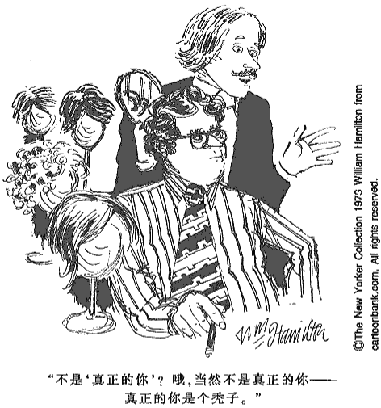

文身提供了一个有趣的例子，让我们了解文身如何创造认同。他们用装饰皮肤来制造一种声明，所用的花纹设计或选文用字都传达了大量的信息。一个探究文身沟通功能的研究发现文身者会以文身来宣告他们的HIV
呈阳性。虽然对于医学工作者而言这不是正常的宣告方式，但文身除了传递了关于文身者健康状况的重要信息外，也宣告着去污名化的反制意图。文身被当成认同管理的媒介，对文身者和其他人来讲都是有益的。一个文身者以他的文身标志释放出明显的信息：拒绝内含的污名，对进行安全性行为的承诺，挑战社会对弱势的"AIDS
受害者"的刻板印象，借着文身使议题明显化，等等。

认同管理最后的方式是指配备，我们使用物理工具去对其他人如何看我们产生影响。在现代西方社会，汽车是认同管理的主要部分。这显示出为什么许多人在已经拥有了很好的车子后还要更高级的车子，因而变得贪得无厌。一个华丽的敞篷车或别致的进口车并不只是让开车的人感到舒适，它同时出说明了他们是怎样的人。我们选择物件的定位和得到它们的方式是另一种认同管理的重要方式。你的房间选择什么样的颜色？什么样的美术品？你喜欢什么样的音乐？当然，我们选择我们所喜欢的环境，但在许多例子中，我们的确会为了给别人看而做出某种选择。如果你怀疑这个事实，回想一下，上次重要客人来时你是不是收拾整理了房子，而私下你可能会觉得乱糟糟的样子比较舒服。对某些人而言，要公开亮相跟私下独处完全是两回事。

*印象管理可以调节沟通*
前面所举的例子都属于面对面的人际互动，但认同管理在沟通的其他形式中也具有其影响力和重要性。想想你可能在乎一份很重要的履历，回复一封感谢函，或给女朋友的情书。为了避免你的信息被误解，你可能在外观上做审慎的决定。你会用朴素的信纸还是某些有特色的信纸呢？你将会打字还是用手写呢？人们其实会很仔细地思考这些细节，因为他们凭直觉知道一个信息的出现方式，也像言语所涵盖的一样多。起初，新的电脑媒介沟通科技似乎会对个人印象管理的潜力产生限制。以电子邮件为例，看来好像没有其他沟通方式那样的"丰富性"，它们无法传达你的声调、姿势、手势或脸部表情。可是最近沟通学者也开始指出在CMC
中失去的东西对那些想要管理自身形象的人来说其实也是一种有利条件。一般而言，CMC
比面对面沟通较不利于我们做形象管理。CMC
在不同年代有不同形式，包括电子邮件、博客、个人网页等。人们使用这些方式沟通时可以编辑自己的信息，直到他们创造出想要的印象才呈现出来，不会像面对面沟通那样具有当下的急迫性。电子邮件的沟通允许传送者说出难以启口的事而不用马上去面对接受者的反应，而且它允许接收者稍后再回复而不是立刻给出一个很不愉快的反应。最重要的是在CMC
的沟通媒介里，你不用担心口吃、脸红、服饰、外貌及其他看不见的因素干扰你的自我形象。CMC
可以让人改变自己的年纪、经历、性格、外貌等等，这些都是一般人际互动中无法隐藏起来的。有四分之一的青少年在线上改变自己的身份，成为另外一个不同的人；有三分之一坦承在电子邮件或即时通讯里给了别人假造的自我资讯。一份网络调查资料显示，网络约会者有86
％觉得别人贴的照片不是本人。我们会在后续讨论这种假造资讯的伦理问题。就像一对一或一对多的电子邮件般，即时通讯、博客、个人主页、个人相簿等为制作者提供了管理他们认同的工具。你可以随意对自己的主页进行修改增删，在建立你个人主页的同时也建立出自己的公共认同。网页设计者选择的这些文字、图像、声音对他们是什么样的人做了描述，至少表现出了他们希望别人如何看待他们。

**认同管理和诚实**

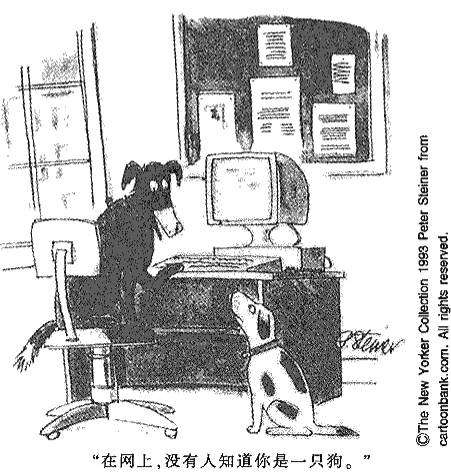

在读了这么多后，你可能会觉得认同管理听起来就像是将人际关系中常见的操纵或虚假的行为贴上学术标签。当然，不诚实的认同管理是严重的问题，假造资料又精心设计约会以获得一夜情、应征者假造学历争取机会以及销售人员为了骗取消费者盲目消费而假装热情服务都是有违伦理甚至涉嫌欺骗的行为。印象管理并不是要你成为一个说谎的人，事实上，如果没有沟通对象的表面特征可供参考，我们几乎无法有效沟通。如果你在对待陌生人和亲密朋友时的举动完全一样，将会显得很荒唐可笑，而且也没有人在两岁时和成人时表现的面貌一样。

我们每个人都有一套"脸"作为表演曲目和角色分配，一个令人满意的沟通者，其实是懂得选择最适当的面貌来应对的人。思考一下以下这些例子：

·你试图教一个朋友新的技艺，例如弹吉他、使用电脑程序、学会网球的反手拍。你的朋友在这些技能上进步得很慢，而你发现你自己变得不耐烦了。

·在舞会上，你发现一个对你非常有吸引力的人，而你非常确定彼此都有这个感觉。一方面你觉得有义务要陪和你一起来的伙伴，但另一方面，这样的良机又十分诱人。

·在工作上，你遇到一个好辩的客人，你实在不相信任何人有权利用这种方式和你说话。

·一个朋友或家人开了一个关于你外表的玩笑，你有被伤害了的感觉，但你不知道是应该去抗议这个玩笑还是假装不在乎。

这些情境每天都不断上演，而你可以选择如何去行动。如果说某种行事方式总是真诚的而另一种总是缺乏诚意，就过分简化沟通这档子事了。反之，认同管理包括了选择自己的哪个部分加以展现。例如，在学习一种新技能时，你可以自己选择要有耐心或没有耐心。同样地，在另一种情况下，你可以选择争辩或不争辩。对于陌生人、朋友或家人，你可以分别选择是否坦露你的感觉。要在别人面前显露哪一种样貌是重要的抉择，但在每一种状况中，你都是分享你自己真实的部分。你不可能同时能展现每种面向，不过在第九章你会学到如何完整地自我揭露才最合适。

### **2.3 摘要**

自我概念是个人关于自我知觉方面比较稳定的部分，有些自我特性来自性格的遗传。自我概念是由重要他人所传送的信息而创造出来的，也经由与参照团体的社会比较而得出。自我概念是主观而且多元的，得知别人怎么看我是其中的重要渠道。自我会随着时间逐步形成，但是自我概念很难改变。文化、性别也对自我概念具有影响力。

当一个人对一件事的预期影响了结果时，便会产生自我应验预言。预言可能由别人的期待组成，也可能是由自己强加的。自我应验预言可以是正面的，也可以是负面的。认同管理是人们设计出来的策略性沟通，用来影响别人对自己的观感。有一些沟通者是高度自我监控的，也就是说他们对自己的行为有高度的知觉，而有些人比较不会察觉到他们自己的言语行为是如何影响别人的。认同管理的产生有两种原因。许多时候它源自社交规范和习俗，有些时候它的目的是达到多样化的沟通内容和目标。沟通者借着管理他们的举止、外貌和配备来创造一种认同，以便进行和别人互动的定位。在面对面或通过媒介沟通时，都会产生认同管理。因为每个人都有很多个他或她可以展现的面貌，选择其中某一个面貌示人并不代表这个人不诚实。

**第三章 知觉：看到什么就是什么**

我们每一个人对于现实都有不同的经验，对别人的观点产生误解可能造成彼此在实际上和关系上双重的问题。知觉的差异同时也能增进人际关系，通过别人的眼睛看世界，你便可以得到不同的领悟，这经常要比个人经验的理解更有价值。

本章将帮助你处理知觉差异所造成的沟通挑战。首先，我们一起来看看为何这世界在不同的人眼中是如此不同。以下我们将要探索几个不同的领域：我们的心理特质、个人需求、兴趣、偏见是如何塑造我们的知觉的，有哪些生理因素会影响我们对外界的观点，有哪些社会角色会影响我们对事件的印象，以及文化是如何影响我们的是非标准的。

### **3.1 知觉历程**

在开始讨论知觉时，我们需要先来检视"世界所是"和"我们所知"之间的差距。你可能看过显示裸视看不到的事物的特殊相片——或许是一张熟悉地区的红外线照片，或者是显微摄影所拍下的一张微小物体的相片．你也曾经注意过，某些动物能感受到人类无法察觉的声音和气味。这一类经验提醒我们：在我们有限的感官经验外，有太多事情正在进行着，以至于我们所谓的现实其实只是真实世界的一小部分。

即使在我们感官的范围内，我们也只能察觉到发生在我们周遭的一小部分而已。兴趣不同的人一起在公园里走过同一段路，可以得到完全不同的经验：植物学家可能注意植物，时装设计师可能注意路人的衣着，艺术家可能注意人的外表和环境的色彩。我们都曾经忽略过朋友身上不寻常的地方，也许是别人的新发型，也许是别人话中透露出的难过的信息——而这信息并没有夸张到能引起我们的注意。有时候，我们在招呼别人时无法认出某些端倪，其原因就在于我们忽略了某些重要的信息。但有时候，无论我们多么留意都不可能注意到每一件事，因为身边发生的事实在太多了。因为有效组织我们的知觉是增进个人效能的重要因素，所以我们要先仔细地观察它的过程以了解知觉。经由检视的步骤，也就是将经验附上意义的四个步骤，我们可以达到这个目的，这四个步骤是选择、组织、诊释和协商。

**选择**

因为我们身边的信息量超出了我们所能处理的限度，所以知觉的第一个步骤便是选择我们要注意的主题。以下的几项因素可解释我们为何注意到某个主题，同时忽略其他部分。

*刺激的强度*常左右我们的注意力。比较吵闹、比较大、比较亮的事物总是特别醒目，这个因素说明了为何在其他条件相同的情况下，我们容易记住特别高或特别矮小的人，在宴会里大声喧哗的人也总是比轻声细语的来宾吸引较多的目光―
虽然不见得讨人喜欢。

*重复的刺激、重复的刺激、重复的刺激、重复的刺激、重复的刺激、重复的刺激*也会引起我们的注意，正如水龙头漏水时小声但持续的水滴声最后竟能成为穿脑魔音；我们常接触的人，也容易引起我们的注意。

注意也常和刺激的对比或转变有关，换句话说，一成不变的人或事物比较不容易引起注意，这个原则解释（或者说为之提供了借口）了为何我们和一个条件很好的人互动久了后便将其视为平常，只有在他或她不那么好了或者离开我们时，我们才开始欣赏和感激他或她。

*动机*也决定我们从环境中挑选什么信息。如果你担心赴宴迟到，你会留意身边任何一个钟表；如果你正饥肠辘辘，你会注意路上任何一家餐馆、市场及食品广告牌。动机也决定了我们会如何觉知别人。举例来说，期待罗曼史的人会特别留意身边任何可能的艳遇，而同一个人在生命有危险时可能就只会注意到警察和医疗人员。

选择不仅在于注意某些刺激，也包括了忽视其他的线索。举例来说，当你认为某甲是个了不起的人时，你可能会忽略他或她的缺点；如果你特别注意男性上司处事不公平的现象，你可能会忽视女性上司也有类似的情形。

**组织**

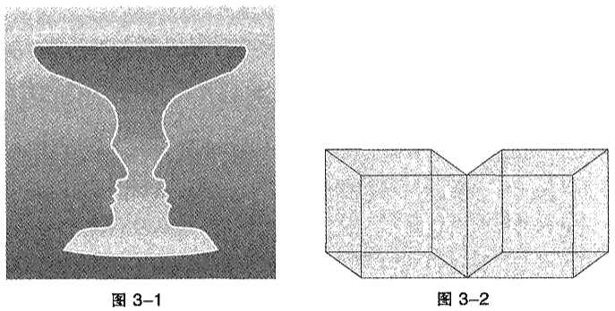

从环境中选择信息后，我们必须用有意义的方式组织这些信息。你可以从图3-l
中看出组织的原则：这张图是花瓶还是一对双胞胎，取决于你将焦点放在亮的还是暗的部分。在这样的例子里，我们把所关注和浮现出的主题称为"形象"，而把退居其后的部分称为"背景"。图3-1
非常耐人寻味，因为它包含了两种形象背景的组合，让人各取所需。

这种形象背景组织原则也运作于沟通情境中。想一想某些话语是如何在一片嘈杂声中显得特别突出的。这些话语之所以令你注意有时是因为其中包含了你的名字，也有时是因为来自某个你熟悉的声音。

图3-1
似乎暗示组织印象的方式只有两种，但事实上通常不只两种。举例来说：试问图3
一2
中有几种看箱子的方式呢？一个？两个？三个？继续看！如果你被考倒了，图3-3
可为你提供一些线索。

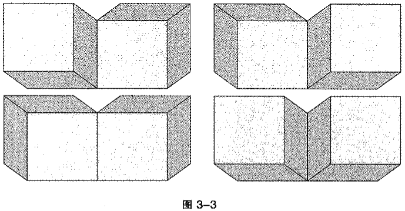

正如你会倾向以某一种方式看这些箱子，我们每一个人都使用不同的基模组织我们所得到的印象，社会科学家称之为知觉基模。有些时候我们依照外貌将人分为男或女、美或丑、胖或瘦、老或少等等，有些时候我们依照社会角色将人分为学生、律师、妻子等等，有些时候我们依照人们的互动风格将人分为友善的、乐于助人的、冷漠的、尖酸的等等，有些时候我们依照心理特质将人分为好奇的、紧张兮兮的、不可靠的等等，还有些时候我们依照身份定位或隶属团体将人分类为政府官员、外地人、基督徒等等。

我们所使用的知觉基模塑造了我们与人沟通和理解别人的方式。举例来说：如果你将某个教授归类为友善的，你会用某种相对应的方式向该教授请教．而如果你将该教授归类为吝育小气，你应对他的方式可能就迥然不同。我们的概念中有选择的成分，选择某些概念代表着你忽视其他的概念。如果你用年龄及外表将人分类，你便可能忽略他们友善和智力方面的特征。你是用什么概念将你生命中所遇见的人分门别类的呢？想一想如果使用不同的基模，你的人际关系会有什么改变。

*刻板印象*在我们选好一种分类的组织基模后，我们便使用那套基模来归纳和预测。举例来说，如果你特别有性别意识，你会对男女行为的差异和不同的被对待方式特别留意，如果宗教在你生活上扮演重要的角色，你看待教友的态度会和看待其他人的态度截然不同；如果种族议题对你来说很重要，你可能会注意不同种族之间的差别。只要符合事实，这种归纳并无不妥，事实上我们终其一生都无法不使用它。

但你的归纳如果失真便会沦为刻板印象，这是指你将分类系统过度类化。刻板印象大多虽然基于事实的核心，但却超出了眼前的实情，而成为缺乏事实基础的陈述。

回答下列问题，看看你是否符合刻板印象的三个特征：

·你通常以容易辨认的特征将人分类。例如：你总是特别注意到对方的省籍。

·你把一组特征加诸于某一类的全体成员。例如：你认为所有的老人都老态龙钟，或所有男人对女人所在乎的事都感觉迟钝。

·你将一组特征用于该类群的任何一个成员。例如：当你遇到一个年纪较长的人时，你便预期他一定老得走不动路了。

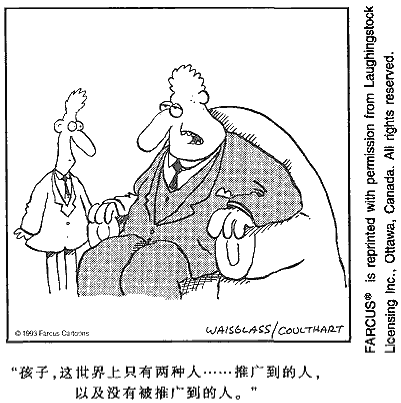

如果我们陷入这种刻板印象，我们便会寻找单一事件或行为，来支持我们这些不正确的信念。举例来说，男女争执后，常常只记得对方在性别刻板方面的言行，他们指出这些言行作为证据（即使这不是对方典型的行为）来支持自己的刻板印象或不正确的信念："看吧！你又在批评我了！女人老是这样！"

不同种族的彼此沟通最容易受到刻板印象的影响。在美国的医院里人们沟通关系时，尤其是白人医生和少数族裔病人之间，两者都很难摆脱刻板印象。医生可能会认为对方反正听不懂，所以就简化医疗的重要信息；而病人也很少提出自己关切的重要疑问，因为他们认为反正医生没有为他们留下时间。这类的期待导致自我应验循环的发生，也使得医疗照顾的品质下降。刻板印象有时也不是出于坏心眼，而是源自好意或只是常识不足。例如，在集体主义文化中被教养长大的人，似乎都比较顺从团体规范，这个印象使你误以为任何来自这种文化背景的人都是在团体中缺乏自我意识的人。但其实并非团体中的每一个成员都是齐头式的集体主义份子，就像个人主义文化中的人也有若干差异个体一样。例如，欧裔美国人和拉丁裔美国人的后代也都存在着族裔内部的个别差异性，有些拉丁裔美国人甚至比欧裔美国人更加独立，相反的有些欧裔美国人也非常依赖家庭。当我们的世界越来越走向全球化的地球村时，人与人之间经由科技媒介可以更加拉近距离，对特定文化的刻板印象将成为落伍的表现。

在一次知觉和性别偏见的实验中，一个可能带有偏见的短剧被呈现给黑人与白人学生欣赏。短剧表现了一位先用电话订房确认的人在亲自来到旅馆后却被旅馆经理拒绝的过程。实验以四种不同组合来呈现：白人担任旅馆经理拒绝黑人顾客，白人旅馆经理拒绝白人顾客，黑人旅馆经理拒绝黑人顾客和黑人旅馆经理拒绝白人顾客。在上述情况中，受试者最可能把白人旅馆经理拒绝黑人顾客看做是偏见所造成的，而且，出现此看法的女性高于男性，黑人远高于白人。从以上结果中研究者提出两个结论：第一，就人种歧视而言，刻板印象的原型或雏形的确存在（白人欺压黑人，男人欺压女人，反之不成立）；第二，传统上受压制的受试者（黑人、女性）对于潜在的偏见更为敏感。换句话说，我们自己对别人动机的既存想法，选择、组织并诊释了别人的行为。

为了去除来自刻板印象所造成的沟通障碍，一个有效的方法便是去除对别人的分类，给自己一个只把对方视为一个个体的机会，而不要一味假定"他拥有被你归入的类群所具有的共同特征"。

*断句*
组织进行的过程超出我们对他人的一般知觉。我们可以用不同方法组织我们和他人的互动，这些不同的组织基模对我们和他人的关系有强而有力的影响。沟通理论学者早已使用断句一词来描述在一系列活动中因果的决定性。想象一下一对夫妻的争吵过程，你便可以开始稍微了解断句是如何在其中运作的了：老公指责老婆喜欢吹毛求疵，而老婆则抱怨老公和她渐行渐远。注意一下两人不同的断句方式所形成的不同次序，你会发现它们竟然可以影响彼此对这件事情的观点。丈夫一开始指责太太：因为你老是挑我毛病，所以我才躲着你；老婆却以不同的方式组织这个情境：因为难得见到你，所以一见到你，我才更需要唠叨几句。在这个循环开始运转后，便再也无法分辨谁的指控才是真的了，而答案取决于你如何断句，图3
一4 描述了以上这个事件的整个过程。

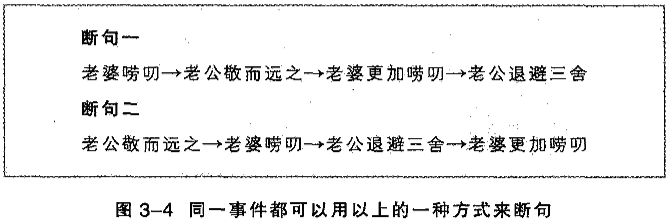

不同的断句，会造成各式各样不同的沟通问题，注意一下不同的断句是如何使下面的状况大异其趣的。

*因为你的朋友不太说话，所以我也不太喜欢他。*

*因为你表现出不喜欢他的样子，所以他只好不跟你说话。*

*因为你老是打断我的话，我只好一直说个不停。*

*因为你不给我机会说出我心中的话，所以我不得不找机会打断你的话。*

争执哪一种断句是正确的同样会让两人的争端更严重。认出双方对一场争端的不同观点，进而思索"如何把事情做得更好"才是有益的方法。

**诊释**

在我们选择和组织我们的知觉后，我们以某种方式对其加以诊释，使之具有特定的意义。设释几乎在每一个人际互动中都发生功能。在熙熙攘攘的大厅中，一个向你微笑的异性只是表示礼貌还是对你有兴趣呢？朋友对你开玩笑是表示亲近还是意图激怒你呢？你应该见招拆招还是一笑置之？

以下有几种因素能够影响我们诊释的方式：

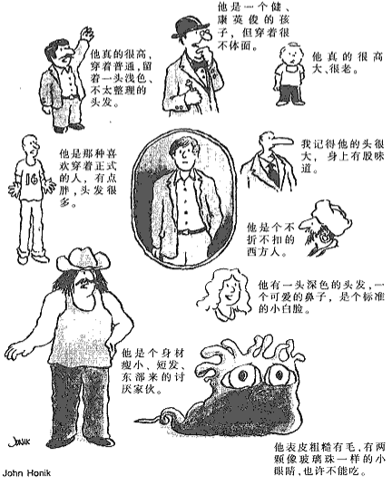

交情深浅：那些和我们有交情或者我们想要和他建立关系的人，总是比其他人让我们看得顺眼。一项最近的研究显示了这个原则如何在每天的生活中运作。该研究要求一群男性受试者评论一位女店主的餐厅设计，这些设计中有半数很恰当，另一半则不太令人满意。结果发现，不论摆设是否真的恰当，那些被告知以后可以再和女店主约会的男性给女店主评分比较高，而那些未预期事后有任何瓜葛的男性则给分比较低。

过去的经验：相似的事件对你有什么意义呢？举例来说，以前房东骗过你的维护费，当你下次遇到另一个房东，声称房屋的维护基金一定当省则省并向你保证将来可以退回这笔钱时，你或许就不太敢信以为真了。

对人类行为的假设："只要应付得过，人们都尽可能偷懒"
"除非不得已，人们会尽力而为"诸如此类的信念，都将会影响我们论释别人行为的方式。

态度：我们持有的态度决定了我们如何看待别人的行为。例如，当你不断听到一个男人对另一个男人说"我爱你"时，你会怎么想？在一个关于同性恋的研究中发现，具有恐同症(对同性恋歧视或害怕）倾向的人大多会将这种情况视为说话者是同性恋的一个标志，而不具有恐同症倾向的人往往会将这种情况视为纯精神上的情感表露而不是爱情。

期望：期望塑造你对外界刺激的诊释。若你想象上司对你的工作不满意，当上司要求你下周一第二件事就是到办公室去见他时你便可能以为大事不妙了；相反的，当你想象你的工作一定会受到夸奖时，虽然接到同样的命令，你的周末假期仍然可能过得非常愉快。

资讯：如果你知道你的朋友最近刚被其男友（女友）抛弃，或者被公司炒鱿鱼，那么当你看见他冷漠的态度时就会有不一样的论释方式。如果你知道某位老师对每个学生都以讽刺的方式说话，你可能就不会根据他的言语对号人座。

自我概念：你是信心低落或者胸有成竹会使得相同的情境对你有如不同的世界。学者已经证实自我概念是一项重要的个别因素，我们的自我概念在接收别人的信息时扮演着关键性的角色。我们会如何解释朋友取笑我们的动机，会将对方的动机视为友善还是敌意？回应对方的方式是自在还是防卫？自我概念也会影响我们对快乐或悲伤情绪的解释，及其他类似的情况。我们对自我的感受，强烈影响我们如何诊释别人的行为。

关系的满意度：同一个行为在彼此关系好坏不同时可能有完全不同的意义。举例来说，彼此不满的伴侣在出现争执时比情投意合的伴侣更容易互相指责，他们也更容易相信对方是自私或出于恶意的；怨偶比佳偶更有可能对另一半的行为做出负面的诊释。我们现在来假设妻子建议夫妻俩暂时放下杂务，周末一同去度个假。如果这个婚姻现在有点麻烦，丈夫可能将妻子的建议解读为批评（你从来都不把心放在我身上），结果导致两人展开一场没完没了的争吵，而如果这个婚姻关系是稳固的，丈夫可能就会把这个建议视为浪漫的邀请。因此，塑造夫妻两人日后关系互动的始作俑者不是事件本身，而是双方解读的方向。

虽然我们依序讨论了选择、组织和侄释，但这三个不同的阶段可能以不同的顺序发生。举例来说，家长和保姆过去的途释（杰克只会捣蛋）会影响到未来的选择（他的行为变得值得特别注意），以及事件的组织（小朋友的打架事件总是被认定为杰克引起的）。在所有的沟通中，知觉总是一个持续进行的过程，你很难确定它的起点和终点。

**协商**

到目前为止，我们都聚焦于讨论知觉的三个元素：选择、组织和诊释，这都发生在我们这些个体的心中。但是知觉并不是孤立的活动，很多感受发生在两人之间或一群人中，他们互相影响彼此的知觉，并且想要达成共识的知觉。这个过程被称为协商。

了解协商运作过程的一种方法，是将人际沟通视为故事的交换，学者将我们描述个人世界的故事称为叙事。事实上，每一个人际情境都不只有一种叙说，而且这些叙说经常有很大的差异。试试看询问两个正在吵架的小孩他们争吵的原因，让他们分别描述对方要对引发冲突负起什么责任，两人肯定各有各的说法。

当我们的叙事与别人的叙事产生龃龉时，我们可能坚持自己的观点而拒绝接受别人的看法（通常别人的看法对自己比较不利），或者也可能可以试着协商出具有共同基础的叙事。共享的叙事是创造出顺畅的沟通的最佳机会。例如，始终共同与阻碍他们交往的人斗争并最终成功的恋人会比没有这种共同斗争故事的恋人更快乐；同样的，对于两人交往中的重要转折点有共识的情侣，比那些对在交往过程中哪件事最重要看法不同的恋人更加满意彼此的关系。

共享的叙事不必完全是清晰真切的叙事。那些鹣鲽情深五十年甚至更久的佳偶所共同描述的婚姻叙事似乎与事实不太吻合。他们都认为彼此几乎没有争吵，虽然客观的分析显示他们也有他们的争执。尽管彼此并未公然协议，但他们选择将问题归咎于外力或突发状况，而不是指责对方。他们以更慈悲的方式解读对方的行为，当事情不如意时他们仍相信对方的初衷是善意的。他们似乎愿意原谅或甚至淡忘对方的罪过。沟通研究学者朱迪·皮尔森（Ju
街Pearson ）总结如下：

*我们应该就此得到结论，认为琴瑟和鸣的佳偶对于现实的掌握较差吗？也许吧，但是所谓的现实是否也是当局者迷、旁观者清？答案很明显。幸福婚姻的关键，在于告诉自己和别人你拥有幸福的婚姻，并且表现得像你所说的一样。*

### **3.2 影响知觉的因素**

既然我们已经探索过知觉的心理历程，现在我们来看看什么是影响我们选择、组织、诠释和协商资讯的因素。

**生理因素**

我们所要揭示的第一个因素包含身体的构造。虽然环境相似，但生理上的因素使得每个人都会以自己独特的方式来感知这个世界。换句话说，即使相同的事件摆在眼前，基于我们每个人感官机能的差异，我们对外界信息都会有不同的印象，仔细思考下列塑造我们观点的一系列生理因素。

*感官*
人际关系会受到我们的看、听、触、味、嗅等感官机能的差异所影响，想一想下列每天都会发生的状况：

"收音机关小声点！我的耳朵快要聋掉了！"
"这哪里大声了？声音再转小，我就听不见了！"

"这里好冷喔！" "你没搞错吧？如果你把暖炉调热，我们就热得喘不过气来了。"

"你为什么不超车？那台卡车前面至少有一公里都没有车子。""我不觉得有那么长，而且我不想害死大家！"

这些争执不只是因为意见的不同，更是因为我们大脑读到的信息各异其趣。视觉和听觉的差异是最容易认出的，但其他的感官差异也同样存在。

有证据显示，同样的食物，不同的人吃起来味道便不同，对某些人来说是香味的东西对另外一个人却可能是难受的怪味。与之类似的，让某些人感到不舒服的气温变化另一些人却觉得毫无感觉。认识到这些差异的存在并不能使我们忽略这些差异，但却可以提醒我们别人那些你不可理解的行为并不是因为疯狂，他们只是看法跟我们不同而已。

*年龄*
年长的人见多识广、经验丰富，所以他们看世界的方式通常和年轻人不同。知觉也会受到发育的影响，瑞士心理学家吉恩·皮亚杰(Jean
Piaget）便描述出儿童发展的一系列阶段。根据皮亚杰的说法，儿童无法用大人的方式思考，例如7
岁以前他们无法以别人的观点看事情。这解释了为何儿童常显得自我中心、自私、不合作。对一个4
岁且充满活力的小鬼来说，"难道你看不出我累得玩不动了吗？"之类不耐烦的恳求毫无意义，他会认为别人的感觉和他一样。

*健康*
回想一下上次你得感冒、流行性感冒或某些慢性病的情况，你还记得你的感受有什么不同吗？也许你觉得浑身无力，也可能不想搭理人或者脑筋迟钝，这样的改变对你与人互动的方式有不可轻视的影响。其他人可能也会因身体不适而表现出与平常不同的样子。因此，当你不舒服的时候，要让别人知道，这样他们才能对你的异常表现有所理解。

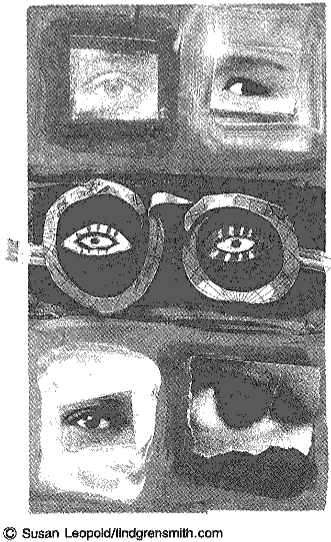

*疲劳*
就如疾病，极度的疲劳也可能影响你与人的关系。再次提醒你：你必须认清自己和别人可能因疲劳而举止反常，若想在这种疲惫的身心状况下处理重要的事务，一定会出大纸漏。

*饥饿*
在饥饿或饱餐的状况下，人的表现也会有所不同。在两次进食之间，我们的身体里会产生许多的生理变化。研究发现，我们在饥饿时会脾气暴躁，吃太饱则会昏昏欲睡，这都会影响到人际沟通。另一个研究指出，青少年的家庭若是没有为他们提供足够的食物，则他们的辍学率会比一般孩子高三倍，与同侪相处困难度几乎高两倍，交不到朋友的几率会高四倍。

*生理循环*
你是早起的鸟儿还是夜猫子？大部分的人可以很轻易地回答这个问题。在我们的答案背后，的确有其生理因素。随着日升日落，我们的身上有各种事物在持续地进行着改变，包括体温、性欲、机警度、抗压度、心情等，其中大部分来自荷尔蒙的影响。例如，肾上腺素可影响我们对压力的感受，它的分泌量在一天的某些时候会变得特别高；同理，雄性及雌性激素一天中会以反复不定的速率进入我们身体的系统。我们常意识不到这些变化，但它们的确影响着我们和别人的关系，在我们了解掌管着我们感觉和行为的生理循环后，我们才有可能懂得在一天最有效的时间处理重要的事务。

*心里挑战* 有些知觉的差异源于神经系统。患有注意力缺陷/多动症( AD/H
)的人很容易分心也很难延后满足，可以想象患有这类症状的人对于冗长的演讲会觉得无聊又沉闷，而其他人可能觉得这个演讲十分精彩而万分投人。患有躁郁症的人会体验到明显的心情摆荡，使得他们感觉到的事件、朋友甚至家人都戏剧性地随心情而变化。所以要记住，如果有人的观感与反应和我们不一样，可能是超过我们理解范围的某些因素所造成的。

**文化差异**

到目前为止，你已经了解到生理因素可以让我们的世界截然不同，但这里还有另一种常常会阻碍沟通的知觉鸿沟——一种来自不同背景的鸿沟。每个文化都有其不同的世界观，在看世界上都有其特有方式。要记住：这些不同的文化观点能使我们对自己和对方的文化有所了解，但有时候我们很容易忘记别人和我们看世界的方式不同这一点。

在四十年前，一项针对文化支配优势的研究展现了文化的力量是如何塑造我们的知觉的。研究者使用一种类似双筒望远镜的装置，使受试者两眼看到不同的影像。受试者包括十二位当地的美国人和十二位墨西哥人，受试时让每个人通过实验装置看照片，包括一张来自美国文化的照片（例如：棒球）和一张来自墨西哥文化的照片（例如：斗牛），然后再让他们报告所看见的内容。结果，受试者有很高的倾向看出来自他们文化背景的影像。这个实验清楚地指出文化力量影响了知觉。

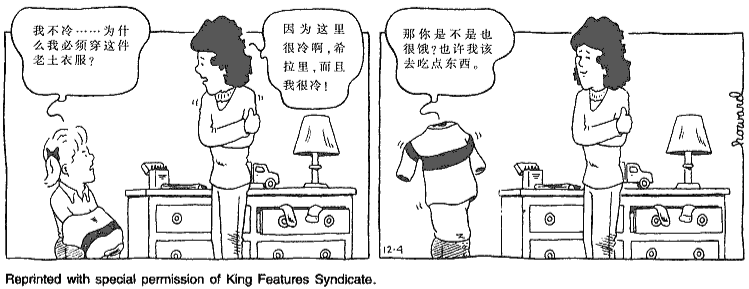

文化差异的范围很广。在中东地区，个人的气味在人际关系中扮演重要的角色，阿拉伯人在谈话时会习惯于闻对方的气味。人类学家爱德华·霍尔（Edward
Hall ）解释说：

*闻朋友味道不只是有教养的行为，也是令人期待的，不让对方闻到你的呼吸是一种羞辱对方的行为。相反的，美国人被教导不能呼气到对方脸上，自然而然的，美国人在试图表示礼貌的时候反而传达了羞辱。谁会想到我们的最高级外交人员，在表现高礼节的时候也传达了羞辱？但这种憾事却是外交上的家常便饭，因为外交不只是眼球对眼球，也是鼻息对鼻息。*

对于谈话的价值，不同的文化看法也迥异。西方文化视谈话为令人渴望的事情，并在工作和社交上使用它，沉默在西方文化中带有负面的价值，它被解读为缺乏兴趣、拒绝沟通、敌意、焦虑、害羞或是彼此合不来的征兆，西方人对沉默感到浑身不对劲、窘困、尴尬。

相反的，亚洲文化以另一种方式看待谈话。数千年来，亚洲文化不鼓励表达思想和感觉，沉默受到肯定。正如道家所言："言多必失"，又如"知者不言，言者不知"，亚洲人并不像西方人那样对沉默感到不自在。日本人和中国人认为在没什么可说时，保持沉默是较适当的方式。对东方人来说，一个爱说话的人，常会被看做是爱吹嘘或者不真诚的。

当不同的文化相遇时，你很容易就可看出，对说话和沉默的不同观点是如何导致沟通出现问题的。爱说话的西方人和沉默的东方人，都以他们认为合适的方式生活，然而彼此都对另一方心存疑惑、无法苟同，只有在他们认识了对方心目中的衡量标准后，他们才能互相适应——或者至少了解并尊重这份差异。这时候他们必须面对并处理所谓的种族中心主义问题，也就是自认为自己的文化优于别人之态度。旅行作家里克·史蒂夫（Rick
steves ）曾经写到种族中心主义是如何千扰人们对其他文化现象的尊重的：

*我们美国人认为自已很爱干净，经常批评别的文化习性有点肮脏。我们在浴缸中打肥皂、擦身子、冲干净，都用同一缸子水（但我们是不会这样洗碗盘的）。日本人洗澡的时候每一个步骤都分开使用清水，他们可能觉得我们的洗澡方式很怪异甚至恶心。有些文化当街吐痰、当众摸鼻涕，他们无法想象把痰吐在小手帕里，放回口袋中，需要的时候再继续使用这种行为。*

我们跟陌生人沟通的方式会反映出种族中心的思维。作家安妮·法迪曼（Anne
Fadiman
）曾向美国医生们解释为何来自老挝山区的苗族人偏爱他们被称为帖师尼伯（txiv
neeb
）的传统萨满教治疗法。其实两种医疗方式都各有意义，但不管是美国的医疗人员还是老挝移民都无法超越自身熟悉的知觉习惯，去理解或接触另类的文化观点：

*帖师尼伯可能在病人家里待上八个钟头，而医生不管病人多虚弱，都强迫病人到医院来求诊，并且只在病人的病床边待20
分钟。帖师尼伯很有礼貌，不需要问问题，而医生询问病人的性生活和排便习惯。帖师尼伯可以很快地开出处方，而医生常需要抽血检验（他们喜欢用小瓶子收集尿液、粪便）、照X
光，等几天直到实验室有报告出来——在这一切步骤之后，他们有时候还是无法指出病因。帖师尼伯从不卸下病人的衣服，医生则要求病人脱光衣服，有时还用手指头大胆地进行阴道触诊。帖师尼伯知道：医治身体而不医治灵魂是一件明显的蠢事，而医生甚至从不会去提到灵魂。*

不一定要出国旅行才有机会遇到不同的文化观点，国内就存在着许多次文化，每种次文化的成员拥有的背景让他们以不同的方式看事情。没有辨认出这些差异可能会导致不和谐和不必要的误解。例如，一位拉丁美洲女性低着头说话可能让男性白人教师或穿制服的警官解读为拒绝甚至不诚实，但事实上在她的文化里，当一个女性被一个年纪比她大的男性问话时，低着头答话才是适当的行为。在这种场合里，直接的目光接触被视为无理的不当举动，甚至是对异性暖昧的邀请。

和种族因素相似的另一个因素是地理因素。地理因素也可以影响知觉，一系列的研究显示通过气候和纬度可精确地预测该地人士沟通的特质。住在美国南方的人相对比较爱说话，容易进行肢体碰触，这在他们的家乡是稀松平常的事，但到了北方的新家，这种行为就会被人认为风格强硬、侵略性强。

**社会角色**

到目前为止，你已经了解生理和文化的差异是如何阻碍有效的沟通的，而社会角色对知觉的影响也能导致沟通破裂。几乎从我们出生的那一刻开始，我们就被间接地教导去扮演一系列受期待的角色。从某个角度来看，这些嘱咐是必须的，因为它使社会能平顺地运作，也使我们知道别人对我们的期许，从而获得安全感。但另一方面，拥有预定的假设可能导致沟通出现鸿沟。当角色变得僵化又理所当然不被质疑之后，人们便倾向以这个观点看世界上的一切，而没有体会到看世界的另一种方式。自然的，在这种情况中，沟通就受到伤害了。

*性别角色* 人们在使用两性（sex ）和性别（gender
）这两个词的时候可能会觉得两者是同义词，但实际上两者有重要的差别。两性是指男人和女人生物性的特征，性别是指男性和女性行为的社会和心理向度。

在每一个社会中，性别角色是决定人们如何知觉彼此的一个重要因素。靠着观察，孩童们接触大众传播媒体，接受大人的回馈，以学习符合性别角色行为，从社会中的成员到习俗中的性别角色，我们习惯将违反这些角色的行为视为不寻常甚至不符合社会期待。

一些学者建议：阳刚和阴柔行为并非相反的两极，而是两组不同行为的集合。在这种观点下，一个人可以单独表现出阳刚或阴柔的行为，也可能两者兼备。男-女的二分法被下列八种类别取代：阳性、阴性、阴阳兼具和未分化（非阴也非阳）这四种性心理类型和男、女这两种传统生理类型加以混合，产生了表3-1
的八种类别。

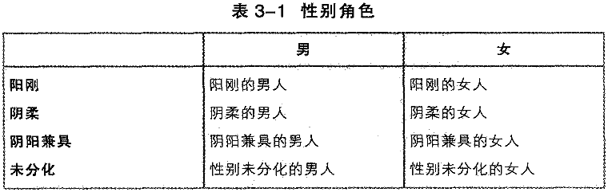

这八种类别的人，所理解的人际关系都不一样，例如：阳刚的男人比较可能将他们的人际关系视为竞争和赢得利益的机会，阴柔的女人则可能将其视为滋养别人和表达感觉情绪的机会；阴阳兼具的男人和女人在人际关系理解上的差异很小。

另一方面，阴阳兼具的男人和女人可能将人际关系视为不同表现方式的机会，他们会因为关系的性质和关系发生的前后脉络以及其他形形色色的变数决定自己的行为。这些变数通常被阳刚的男人和阴柔的女人所忽略，因此这两类人的行为只拥有较少的选择范围。

*职业角色*
我们的工作类型常常影响我们对世界的看法。假设一下五个人在生态园区走了一圈，第一个人是个植物学家，他因为公园里繁多的树种而着迷；第二个人是个动物学家，他边走边寻找令他感兴趣的动物；第三个是位气象学家，他一直留意天空和天气的变化；第四人是个心理学家，他完全未察觉大自然的一切，而是专注于同伴彼此之间的互动、第五个人是个扒手，他利用别人专心于特定事物的时候下手行窃。这个小故事有两个启示，第一当然是小心你的钱包，第二则是我们的职业角色影响了我们的知觉。

即使在一样的职业场景下，参与者所扮演的不同角色也可能影响他们的知觉。举例来说，在一个典型的大学课堂里，老师和学生的经验便十分不同。老师投注许多时间于他们的工作，大部分的老师极其重视所教的科目——无论那是法国文学、物理学还是口语沟通学；而为了完成毕业学程选修这个科目的学生，对同样一个科目的观点便十分不同：有的把这个科目看做是挡在他们和学位之间的障碍物，也有的将其看做认识新朋友的机会。另一个差异点集中于参与者所具备的知识。对一个教过课程很多遍的老师来说，教材可能极为简单。但是对第一次遇到此科目的学生来说，教材可能显得既奇怪又令人困惑。快接近学期尾声的时候，教师可能加紧脚步赶课，而学生则可能因将近一个学期的辛苦疲累而放慢步调。在此，因为知觉的差异，师生之间的张力和压力不言而喻。

关于职业角色如何塑造知觉，最戏剧化的例子也许就是发生在1971
年的一件事。斯坦福大学的心理学家菲利普·津巴多（Philip zimbado
）招募了一批中等阶层、教育程度不错的年轻男性担任受试者。他随机选择十一个人在心理系大楼地下室的模拟监狱中的警卫，发给这些警卫制服、手铐、哨子、警棍，剩下的十个人则扮演犯人，安置在备有水桶、马桶、便床的牢房。津巴多让警卫为此实验建立自己的规矩，这些规矩都非常严苛：用餐时间、休息时间、熄灯后都不可以讲话，凌晨两点半点名；制造麻烦的人减少食物配给。

面对这些条件，这些犯人开始抵制。有些犯人用床挡住牢房的人口，另外几个人一饿就不停地敲打餐具，有几个人故意扯掉自已的名牌。警卫则以强悍的镇压作为回应。有些警卫变得像虐待狂：在肢体动作和言词上羞辱犯人，或将犯人关进独立的禁闭室；有些警卫强迫犯人互相叫名字，被叫到的犯人要徒手清理便池。

在很短的时间内，整个实验对犯人和警卫来说都变得像真的一样。有几个犯人胃痛，并且整天不自主的悲泣，有些人头痛，其中有一个犯人要求提早假释，被驳回后全身都起了疹子。

按计划，这实验将进行两周，但在第六天后，津巴多了解到这次的模拟太激烈了："我知道在结束之前他们的思想方式已经像犯人一样，如果我们可以证明病态的行为能在这么短的时间内养成，想想真实的牢房造成的伤害是什么……"

在这个戏剧化的实验中，二十一个教育程度不错的中产阶级市民，在一夜之间了变成好虐成性、欺负弱者的粗汉或颓丧混乱的牺牲者。我们现在了解到了社会角色的功能之一就是影响我们思考的方式，幸运的是，很多执法人员都了解这种伴随职业而来的知觉盲点，专家为克服这个问题而发展出许多专案计划。

**自我概念**

最后一个影响我们如何看待自己、如何与人互动的因素便是自我概念。大多数的研究显示：高自尊的人比较有可能对别人有较高的评价，低自尊的人可能对别人有较低的评价。你个人的经验可能支持下面的说法：低自尊的人常常愤世嫉俗、认为别人心怀不轨，而高自尊的人常常从正面的观点看别人。正如一位作家所言：我们从别人身上发现的特质，是我们无意识投影在别人身上的影像。当我们以为我们正往窗外看，也许连我们自己也不知道，我们实际上是在看镜子。

### **3.3 知觉的倾向**

到目前为止，很明显的，诸多因素扭曲了我们对外界的诠释。社会心理学者用归因一词描述我们将行为赋予意义的过程，包括对自己、对别人的行为归因，但我们常常使用两套不同的标准。研究人员揭发出许多导致归因谬误的知觉错误。

**对人严厉，时己仁慈**

我们评价自己时往往比评价别人更为宽容，会试图说服自己和别人"我的本意是善良的"。我们倾向用最宽容的条件裁断自己。社会心理学家将这种倾向称为自利的偏误。当别人遭遇不幸时，我们常将问题归咎于对方个人的因素，而自己遭遇不幸时，我们就将问题归咎于外在因素。想一想一些例子：

*当别人搞砸一件工作，我们可能认为他们事前没有听清楚程序或者做的时候不认真；当我们搞砸一件工作时，我们就会说我们承受的压力太大。*

*当别人失控或生气，我们认为他太情绪化或太敏感了，当我们自己情绪失控或生气时，我们会说那是因为压力太大。*

*当某人开车超速被开罚单，我们认为他应该小心点；当我们开车超速被开罚单，我们会否认自己超速，或者说："大家不都这么做吗？"*

*当别人汗流决背，我们认为那是他的个性使然，当我们汗湿衣裳，我们说是房间不通风、人又太多。*

"自我评价"比"别人评断我"更慈悲的自我中心倾向也已经被实验证明：一群被随机挑出的受试者被问到自己与人相处的能力，所有的受试者毫无例外地违反数学定律(译者按：统计学上的常态分布），将自己列在能力较优的前50
％。6 ％的受试者将自己列在前10 % ，而且他们中25
％的人不可思议地将自己列在前1 ％。在同一个研究中，70
％的受试者将自己的领导能力列在前25 % ，只有2
％的受试者将自己列在平均以下；60 ％的受试者将自己的运动能力列在前25 %
，只有6 ％的受试者将自己列在平均以下。

**强调别人的缺点**

我们偏向留意别人的负面印象甚于正面印象，你如何看待哈维？他英俊、工作勤奋、聪明、诚实，他也是一个自大狂。

最后一项特征是否使你对他的判断产生改变？如果答案是肯定的，代表你和大多数人一致。研究指出当人们知道一个人正、负两方面的特征时，人们倾向于受到较不讨喜的那些特性所影响。例如，一项研究指出：面试官有较大的几率拒绝带有负面信息的求职者，虽然这位求职者其他的方面都是正向的。

**最明显的最有力**

我们容易被显而易见的事件所影响。我们很容易了解这种知觉的错误，这一章开头提到过，我们总是选择环境中最明显的刺激：密集、重复、不寻常或其他吸引我们注意力的特征。问题在于最明显的因素不一定是事件中唯一的或最重要的因素。举例来说：

·当两个小孩争吵（或两个大人为重要的事情争吵）时，我们经常犯的错误是去责怪第一个发难者，其实另一个人也有一半责任，因为过程中他可能取笑对方或拒绝合作。

·一位熟人恶意的闲言碎语和非议已开始造成你的困扰，你可能为此大为抱怨，但却忘记长久以来你一直放纵他，因此至少你也有部分的责任。

·你可能因不愉快的工作状况而归咎顶头上司，却忽视了超出他（她）控制范围的因素，例如经济的波动、高层人士的决策、顾客或其他同仁的要求等。

**先入为主**

留恋于第一印象，根据自己的第一印象进而给人贴标签是知觉过程中无可避免的一部分，这些标签是产生诠释的方式之一，比如"她似乎很爽快"、"听起来他们非常自大"等。

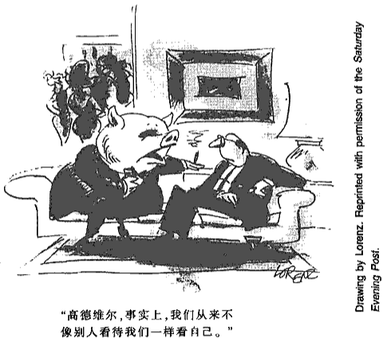

如果这样的第一印象是准确的，那这些印象对在以后考虑如何回应对方时是个有用的信息；然而若这些印象是不准确的，问题就来了。在我们形成对别人的评价后，我们倾向于紧紧抓住不放，甚至调整矛盾的信息以符合原先的评价。

心理学家提出*光环效应*来说明对于具有某个正面特质的人，我们是如何将所有的正面印象都加诸到他身上的。尤其是由于第一印象往往来自生理上的外貌吸引力，我们很容易将正面特质归属到"长得好看"的人身上。例如，求职面谈主持者对外貌条件好但资质平庸的人的评价往往高于外貌条件较差的人，一旦主事者形成了正面印象，通常提出的问题都会有利于证实自己对求职者的印象，而且会自然而然地将应征者的回答导向正面方向，比如"你在经历的挫折中学到了什么？"
而当求职者文不对题地回答"嗯！离开学校一下，去度了个假后感觉还不错！"时，主事者却会正面解释该回应为"很好的观点"然后开始说明公司的福利和制度，最后说："我想你会喜欢我们的工作环境"。一旦应征者给人家负面的第一印象，则将陷人愁云惨雾难以翻身。这种现象有时称之为"魔鬼效应"。这些情况强化了古老而睿智的格言："你永远没有第二次机会重塑第一印象"。

形成第一印象几乎是不可避免的，因此我们能提供的最好的忠告便是：保持开放的心胸，当发生的事证明你错怪对方时，要愿意改变当初的判断。

**以已之心，度人之腹**

低自尊的人会猜想别人以不利于自己的方式看待自己，高自尊的人会猜想别人以对自己有利的方式看待自己，这种以为别人想法类似自己的错误假设广泛且频繁地发生在许多情境中：

·你听过一个相当有趣但是带点色情的笑话，你假设这个轻度色情的笑话不会冒犯一个有点拘束的朋友，结果还是冒犯了对方。

·老师在课堂上想删掉一个主题，让你感到很不舒服。如果你是老师，你会询问学生你所做的事情是否使他们觉得困扰，所以你认为你的老师可能也很乐于接纳有建设性的批评，结果很不幸，你错了！

·一周以前你对朋友发火，说了些让你后悔的话。事实上，如果别人对你说这些话，你会认为两人的关系到此结束，心里想着你的朋友也会这么认为，于是你觉得再联络对方也没用了。事实上，你的朋友认为他也有部分责任，结果他认为你才是想要了结关系的人。

这样的例子告诉我们，别人并非总是按照我们的方式思考和感觉的，因此假定彼此类似可能导致问题。你如何能找出别人真正的立场？有时候要靠直接询问对方，有时候靠着和其他人核对，而有时则需要在深思熟虑后做一个成熟的猜测，这些替代性的方式都比单纯的假定"每个人都像你一样反应"来得更好。

### **3.4 知觉检核**

如果我们一厢情愿地认定我们对事情的解释就是事实，恐怕会产生很多严重的人际困境。就像大多数人一样，我们也不喜欢别人对自己行为的原因草草下结论，想象一下别人对你这样说：

*"你为什么对我生气？" （谁说我生你的气了？)*

*"你出了什么问题？" （谁说我有问题？)*

*"快点！告诉我实话！" （谁说我在说谎？)*

即便你的诊释是正确的，然而义正词严、一针见血的评论很可能让对方产生防卫。知觉检核的技巧为你提供了处理这些诠释的更好方法。

**知觉检核的要素**

知觉检核完整的程序包含三个部分：

·描述你注意到的行为。

·列出关于此行为至少两种可能的诠释。

·请求对方对行为诠释作澄清。

对于先前的三个例子，知觉检核可能会像这样：

*"当你大声踱步走出房间，并大力地关上房门时，" （行为）*

*"我不确定你是否对我生气，" （第一种诊释）*

*"或者你只是比较匆忙。"（第二种诊释）*

*"你真正的感觉是怎样？" （请求澄清）*

*"你这几天都没有笑容，" （行为）*

*"我想知道是否有事让你心烦，" （第一种诊释）*

*"或者你只是觉得比较平静。"（第二种诊释）*

*"到底是因为什么？" （请求澄清）*

*"你说你很喜欢我所做的，" （行为）*

*"但是你说这句话的语调，让我觉得你可能并不是真的喜欢，" （第一种诊释）*

*"虽然这可能只是我的猜测，" （第二种诊释）*

*"你可以告诉我你真正的想法吗？" （请求澄清）*

知觉检核是帮助你正确了解别人的一项工具，它并不假设你的第一印象是正确的。因为它的目的是相互了解，所以这个迈向沟通的检核需要彼此协力合作。除了得到更精确的知觉外，这个检核借着维护对方的面子来减少对方的防卫。知觉检核采用更谦恭的途径表达或暗示："我知道没有其他线索的帮助，我不够格对你下判断。"而非直接说："我知道你在想什么。"

**知觉检核的考量**

就像本书所列出的每一个沟通的技巧，知觉检核不是一种处处皆有效的机械公式。若你想要发展自我知觉检核的能力，在你决定何时及如何使用这个途径时，想一想下列决定因素：

*完整性*有时知觉检核不需要囊括前面所列的所有部分就能奏效。

*"你最近很久没来坐坐了，发生什么事了吗？" （单一的途释加上请'求澄清）*

*"你说我吝音，我无法分辨你是开玩笑还是当真。"（行为加上诊释）"你在生我的气吗？"*

*"你确定你不介意载我一程吗？如果真的不麻烦的话，我需要有人载我，但我不希望你特别为我绕远路。"（不需要描述行为）*

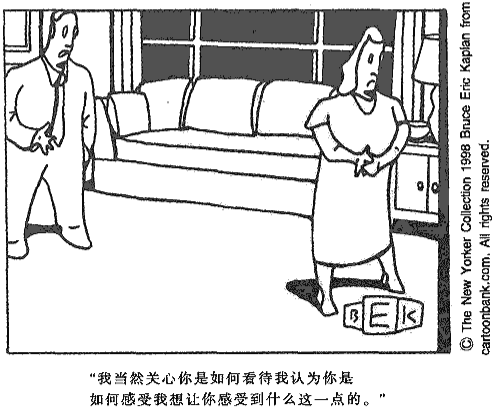

有时甚至最简略的知觉检核——比如只是简单地问"怎么啦？"也能够奏效，你可以靠着别人的帮忙让暖昧混淆的行为产生意义。"拉谢尔最近都不大说话，你知道发生什么事了吗？"然而，当夸大的判断有较高的风险时，完整的知觉检核特别有必要。

*非口语的一致性*
只有当你非口语的行为反映出你口语所表达的开放态度时，知觉检核才能成功。控诉的语调或是有敌意的姿态会和要求澄清的真诚言语矛盾，因为你的非口语信息暗示了你对别人的态度，早已经为此下了断语。

*文化支配*
知觉检核这种有话直说的方式，在低语境敏感文化中奏效的机会最大。在该文化中的成员，使用语言都力求清楚、合乎逻辑，北美的主流文化和西欧文化属于这一类。这一群组的成员最有可能认同经由知觉检核把事情讲明白的方式。另一方面，高语境敏感文化（在拉丁美洲以及亚洲较普遍）中"以和为贵"可能优先于"把事情讲明白"。在高语境敏感文化中的沟通者采用间接的方式了解彼此，较有可能视知觉检核这类坦白的方式为潜在的窘境。因此，对崇尚把话讲明的文化中长大的欧裔美国人上司，知觉检核可能奏效；对大半生接触高语境敏感文化的墨裔或亚裔美国人上司，反而会造成严重的错误。

*保留颜面*
除了澄清意义之外，知觉检核有时能以一种保留颜面的方式使我们在跟别人讨论问题的时候不至于直接威胁或攻击对方。看看下面的案例：

*"你是打算稍后才清洗碗盘，还是忘记了今天轮到你洗？"*

*"我打扰你了吗？还是你有心事？"*

在第一例中你可能十分确定那人根本不想要洗碗盘，而第二例中你也许知道那人很烦。即使是这样，比起直接对质来知觉检核也是一种比较不具威胁性的指出他们行为的方式。记住，沟通能力的一个要素是在各种方案中选择最佳选项，而知觉检核在许多时候都是有用的策略。

### **3.5 同理心与沟通**

知觉检核是澄清暖昧信息的一项很有价值的工具，但是暖昧并非知觉问题的唯一原因，有时候我们了解他们的意思，但不像他们一样，了解他们想法背后的原因，这时我们所缺少的是设身处地的重要能力。

**同理心的定义**

同理心是从某个人的角度来体验世界，重新创造个人观点的能力。也许我们不可能完全体会到另一个人的知觉，但若付出足够的努力，我们的确可以更了解世界对他的意义。当我们在使用同理心这个词的时候，它包含三个面向：第一，同理心包含获得知觉——一种采用另一个人观点的尝试，这需要中止你的论断，将自己的意见放在一边，同时试着去了解对方。第二，是同理心的情感面向，使我们更贴近的去体验别人的感受，去感受他们的恐惧、喜乐、伤心等感觉。同理心的第三个面向是真诚地关心对方的福扯，不光是和对方有一样的想法和感受，而是更进一步，真实地关心他们的福扯。

我们很容易将同理心与同情心混为一谈，观念上这两者在两个方向是不同的。第一，同情心表示你用自己的观点来看别人的困境而产生的悲悯之心，而同理心是指你设身处地地思考对方的处境而产生的感同身受。想一下对一个未婚妈妈或一个无家可归的人，同情心与同理心之差别何在？想象一下站在她（他）的立场会是什么样子？当你同情他们时，他们的困惑、喜乐和痛苦还只是他们自己的经验；但当你同理他们时，这些经验就好像变成你的经验（至少在此时此刻）。第二，只有在我们明确知道别人痛苦的原因后，我们才会产生同情，但没有同情也可能同理，不必太多同情你仍然可以同理。例如，同理遭遇困难的亲戚、鲁莽的陌生人甚至罪犯。同理心让你了解别人的动机，而不需要赞同对方。同理之后，你几乎可以确定；你更加了解他们，但不见得会对他们产生同情。

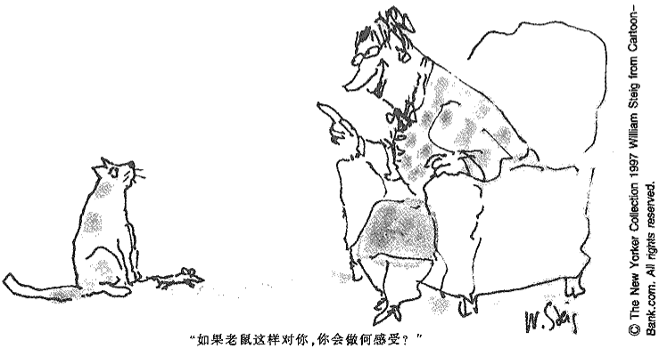

并没有一致的证据显示某一个性别的同理心能力较强，然而某些人似乎因为遗传因素而比别人有更多的同理心，关于同卵双生和异卵双生的研究指出：女性同卵双胞胎比异卵双胞胎拥有较为类似的同理心能力。有趣的是，男性同卵双胞胎的同理心能力几乎没有差异。虽然同理心有生物性的基础，环境仍然扮演一个重要的角色。举例来说：对子女的感受较敏感的父母，倾向养育出对别人感受较敏感的孩子。

完全的同理是不可能达到的，对不同背景和沟通技巧有限的人来说，需要完全了解另一个人的观点实在太困难了。虽然如此，培养出感受性强，能通过别人的眼睛看世界的态度却是有可能的。以下的方法将帮助你建立同理心。

**枕头法：建立．同理心的工具**

知觉检核是澄清潜在误会的一个好用又简单的工具，但是有些议题太复杂、太严重，以致难以使用这个技巧。作家保罗·
雷斯（Paul
Reps）提出一种方法，当你发觉对方乏善可陈时，它可以帮助你增强同理心。

枕头法是一群日本的小学生所发展出来的，因为问题正像枕头，有四个边和一个中心，故得其名（见图3-5
）。如同"沟通文本"专栏——枕头法实际案例所提的筹划婚礼的例子，从每一个不同的观点看议题，几乎总是能得到有价值的洞察。

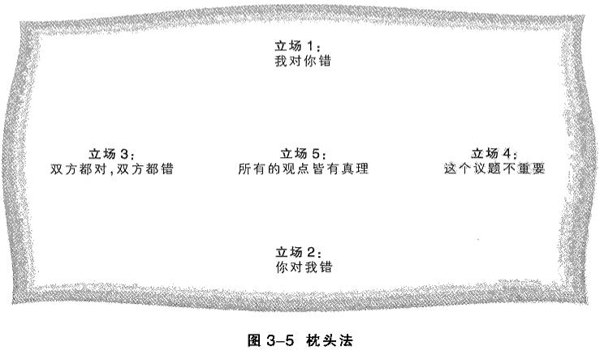

*立场一：我对你错*
当我们在看一个议题时，这是我们通常会采用的观点。我们立即从我们的立场，看到我们的对以及别人的错，而对方恰好和我们的立场相反，这一个立场毋庸赘述。

*立场二：你衬我错*
这是你转换视角，尝试用最强而有力的相反论点，来解释对方如何以不同的观点看此议题。除了认出对方立场的长处外，这也是唱反调的人挑毛病的方法之一。

找自己的缺点，并试着支持对方的立场，需要训练和相当程度的勇气——虽然现在这只是练习，如果你选择回到立场一，你可以立即撤退。根据大部分人的经验，转换视角让我们看出别人观点中的优点。立场二的目的是找到方法，以理解其他人为什么用你原先无法苟同的方式行事。

*立场三：双方都对，双方都错*
从这个立场，你承认了彼此的长处和弱点。如果你在立场二里表现得不错，很清楚的，双方都有优点也有缺点，用更公平的方式看待此事能让你比较不会吹毛求疵，也比较能了解对方的观点。立场三也可以帮助你找到双方共同的立足点，能够让你看出：这个议题并非像起初所见，是一个全对、全错的事件。

*立场四：这个议题不重要*
这个观点将帮助你了解到，这个议题并非如同你想象的重要。虽然起初很难将某些议题看做无关痛痒，但是大部分的事情思考一下后，就会发现它不像我们所原先认为的那么重要了。当你了解你不会让这个议题盖过两人关系中其他重要的部分时，这个议题的重要性也会淡化。我们很容易为了争辩一个议题而越陷越深，以致忘了在其他方面两人的观念是非常接近的。

**结论：四个立场郁具有真理**

在了解了这四个立场后，最后一步就是认识到每一个立场都有些优点，虽然逻辑上不能存在一个既对又错、既重要又不重要的立场。你自己的经验将显示：你探索过的立场都有些真理，而第五个立场与大部分人带进议题的"我对你错"的观念非常不同。在你从五个立场看过这个议题后，你也许已经发现了新的思考模式，这些思考方式也许未必能够改变你的想法，甚至不能解决手边的问题，但它们可以增加你对别人立场的容忍度，并因此改善沟通的气氛。

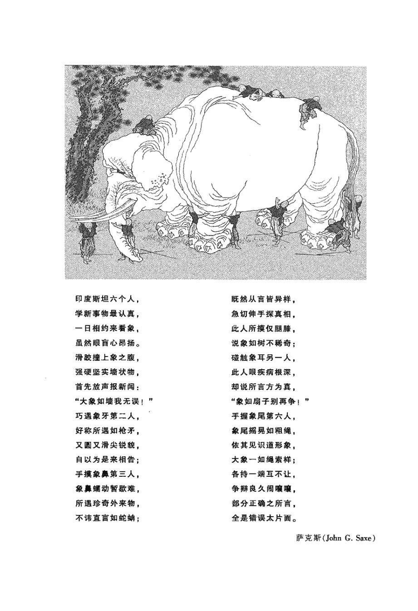

**沟通文本**

枕头法实例：筹划一场婚礼

背景

*谁会想到筹划一场婚礼会是一场梦魔？我的未婚夫和我挣扎于是把婚礼办成一场盛大的宴会还是小型而温馨的聚会。我喜欢盛大豪华的派对，他却要一个较小规模、负担得起的婚宴。*

立场一：我对你错

*我有一个大家庭，如果没有邀请每个人，我会有愧疚感。同时，我有很多朋友，如果他们在我特别的日子里缺席，我会觉得很遗憾。如果要发出邀请，我们必须邀请所有人才不至于伤害别人的心，否则邀请的标准在哪？只要能用钱解决的都是小事，我认为一生只结一次婚，并且我也没有时间去细算。我的父母很愿意分担一些费用，因为他们希望我的整个家族都能出席婚礼。*

立场二：你对我错

*我的未婚夫是对的，他说我们真的没有钱去支付一场特别又昂贵的婚礼。多挥霍一分钱在婚礼上，我们就少一分钱买房子，而买房子正是我们希望很快能实现的事。我的未婚夫是对的，他说一场盛大的婚礼会让我的房子的事延后一到两年，而如果房价开始上涨我们甚至要等更久。他说得时，不管我们邀请多少人，总会有人被遗漏，这只是取决于标准的问题。他说得没错，一场盛大婚礼的筹划过程会带来很大压力。*

立场三：双方都对，双方都错

*我们两人都对，我们两人都有错。我想邀请整个家族和朋友到这欢乐的婚礼现场是对的，我认为特别的婚礼将是一辈子的回忆也是对的。他说得也对，他说这么做会留下不好的感觉，他说这么做会延后我们买房子的计划。他的一些观点很不错，计划一场盛大的庆典的确会把我们搞疯，并本末倒置了生活中重要的事情。*

立场四：这个议题不重要

*在想过这一切以后，我已经了解：准备婚礼和婚姻生活是两码事儿。婚礼的形式很重要，但它毕竟并不能影响我们婚姻生活的形式，婚后我俩如何生活才重要。将来我们要一同面对许多决定，例如孩子和工作——这些事情的结果比婚礼重要得多。*

结论

*在使用枕头法思考过这个议题的所有面向之前，我专注于我的方式，那样的态度使我们两人之间产生一些在此关头不该有的负面感觉。我知道如果其中一方赢了，结果仍旧会伤了感情，这并不算是胜利。我不知道我们最后会决定什么形式的婚礼，但我已经决定将我的焦点放在真正重要的目标上，就是维持互敬互爱的正向关系。*

### **3.6 摘要**

发生在世界上的许多事情超过人所能理解的范围，我们靠着四步骤的过程将环境的信息赋予意义：从环境中选择某些刺激，将它们组织成有意义的形式，参考过去经验、对人类行为的假设、期望、知识、个人心情来形成我们的诠释，并借由我们与别人分享的叙事来跟别人协商这些资讯。

有很多因素会影响我们如何选择、组织、诠释和协商信息。生理因素，例如五官的性能、年龄、健康都扮演了重要角色；文化背景、社会角色、自我概念也会影响我们看世界的方式。

要验证我们对别人行为的诠释是否正确，知觉检核是一项很有用的工具。同理心是经验别人观点的一种能力，同理心与同情心不同，同理心比较能接近别人的经验，也不需要赞同或可怜对方。枕头法是增强同理心的方法之一，它包含以五种观点看同一项议题。

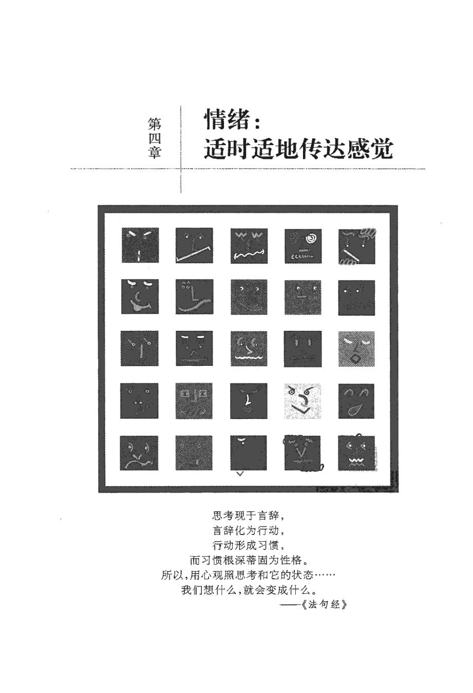

**第四章 情绪：适时适地传达感觉**

谈到沟通，不得不承认情绪的重要性。想想看：自信对一个人成功与否的影响非常深远，不管是要邀请别人还是要进行一场演讲，没有自信和安全感都会削弱了你原本该有的机会，减少成功的几率。动不动生气或怀有戒心不但浪费彼此的时间，也会搞砸你和别人的关系，而沉稳的感觉与行动将有助于预防问题或解决问题。

情绪在人类生活中所扮演的角色很重要，也使得人跟人之间有了相通之处。耶鲁大学心理学家罗伯特·斯滕伯格（Robert
Sternbers
）要人们描述一个"有智慧的人"时，得到的答案之一即是：具备了解他人和与他人相处的能力。心理学家丹尼尔·戈尔曼（Daniel
Goleman
）认为"情绪智商"是我们与别人相处能力的一个面向。戈尔曼主张智商能力并不只是对一个人智力天分的估量，在社会上功成名就的人，大部分是靠着了解和管理自己的情绪，以及体察他人感觉而成功的。

因为情绪这个主题是如此重要，我们将在本章进一步探讨和分析：感觉是什么？我们如何认识它们？我们要如何适时、适地地与别人尽情分享我们的感觉？最后，我们会探讨感觉如何发生。

### **4.1 什么是情绪**

想象一下，假如有一个外星人要你解释情绪，你会如何回答？你也许会说情绪是我们所感觉到的东西，但是这好像不能完全说明情绪是什么，因为有时候情绪和感觉像是同义词。社会科学家通常认同我们所谓的感觉有几个构成要素。

**生理的因素**

当一个人有强烈的情绪时，身体会出现许多变化。例如，人在害怕时会产生心跳增加、血压上升、肾上腺素分泌激增、血糖浓度提高、消化作用减缓以及瞳孔放大等现象。婚姻研究者约翰·高特曼（John
Gottman
）指出这些生理指标也会出现在伴侣发生强烈冲突之时，他说这种状况是"涨潮"，通常不利于问题解决。

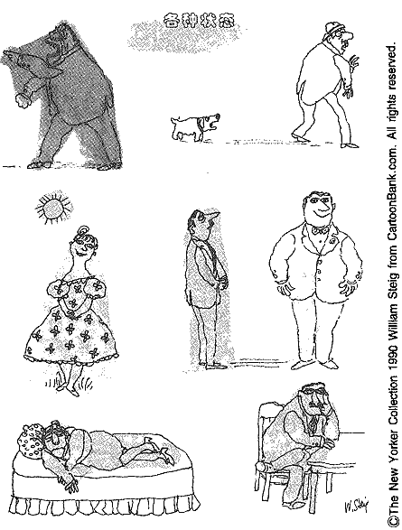

**非口语反应**

并非所有伴随情绪而来的生理变化，都是在身体内产生的。感觉通常借由看得到的外显变化而觉察到，这些身体外在的变化包含人的外观，比如脸红、冒冷汗等等，其他还包括言行举止：特别的脸部表情、仪态、手势、不同的声调和音速等等。

虽然我们可以理所当然地发现某人正有某种强烈的情绪，但却很难精准地说出这个情绪是什么。一个垂头弯腰的姿势和一声叹息，也许是一个悲伤的征兆，但也可能是一个疲惫的表现，同样地，颤抖的双手可能是兴奋也可能是害怕。非口语行为通常是模棱两可的，因此，断定可以将非口语行为"读"得很精准，是很危险的事。虽然我们习惯将非口语反应视为对某种情绪状态的反应，但也许反过来说才是事实——非口语行为确实会引起某些情绪状态。在一项研究中，要求受试者改变脸部的表情，来引发他们各种的情绪状态。当受试者遵循指示去牵动他们的脸部肌肉，表现出害怕、生气、厌恶、高兴、悲伤、惊讶和轻视等不同情绪时，受试者的身体仿佛他们就是有这些感觉一般出现反应。另一项实验中，受试者被指导要微笑，他们表示感觉变得比原来更好，而当他们改变他们的脸部表情、表现出不快乐的样子时，他们感觉变得比之前还糟。

**认知的解释**

虽然有一些情境可能直接联结生理行为和情绪状态，但是认知仍是最重要的联结因素。认知在决定情绪状态上扮演一个重要的角色。你读到某些害怕的生理元素是心跳加快、冒汗、肌肉紧绷和血压升高，有趣的是，这些症状与兴奋所伴随而来的生理变化相似。换句话说，假如我们去测量一个正具有强烈情绪的人的生理状况，我们也许分不清他是因害怕而颤抖还是因兴奋而颤抖。心理学家菲利普·津巴多为这个法则提供了一个很好的例子：

*我注意到当我在演讲时我会冒汗，因此我推论我是焦虑的。假如它时常发生，我甚至可能会自己贴标签为一个"焦虑的人"。一旦我有了这个标签，下一个我必须回答地问题是"为什么我是焦虑的？"然后，我开始去找寻一个适当的解释。我也许会注意到有一些学生起身离开或者心不在焉，我会为这是否因为我的演讲不够精彩而焦虑，而这的确令我焦虑。我如何知道这场演讲不精彩呢？因为我让我的听众觉得索然无味，我会焦虑是因为虽然我想成为一个演讲高手，但实际上我是一个乏味的演说者。我觉得我不适合演讲，我干脆去速食店工作还快活一点。不久之后有学生跟我说：这里太热了，我一直在流汗而无法专心听你的演讲。刹那间，我不再是"焦虑的"或"令人乏味的"了。*

津巴多在他的《害羞》
这本书中对于这种错误或夸大归因的结果进行讨论。一份超出5000
名受试者的调查报告指出，超过80％的受试者描述说自己在过去某个时期会觉得害羞，超过40％的受试者声称他们自己目前仍然处于害羞的时期。最重要的是，那些说自己"不会害羞"的人所表现出来的行为几乎就和会害羞的人一样，而他们理论上是在对应的另一端才是。在特定的社会情境中，他们都会脸红、冒汗并感觉到心脏扑通扑通直跳。这两组人最大的不同点是他们描述自己所用的标签，这是一个很大的差异之处。某人注意到自己具有或想象着自己具有前面提到的某种生理症状，而认定"我是一个如此害羞的人"，而另一个人虽有相同症状，却想"没关系，我现在是有一点发抖的（或激动的），但这是我预期中的。"前者很有可能会觉得更不舒服，并且自认为自己的沟通是失败、无效的。

**口语的表达**

有研究者认为存在一些"基本的"、"初级的"情绪，但是到底是哪些情绪、这些情绪何以成为"基本的"情绪，学者之间并没有共识，而且某些情绪在一个文化中也许是"初级的"，在另一个文化中却并不然，有些情绪在文化之间不具有相同意义。例如："羞耻"在中国文化中是核心的情绪，大多数西方人却对此无法理解。姑且不论这些异议，大多数学者都认为生气、愉悦、害怕和悲伤是人类共同而典型的情绪。

我们体验到的大多数情绪都具有不同程度的强度，用语言表达出这些不同颇为重要，图4-1
清楚地说明了这个观点。例如：如果你因为朋友不信守承诺而"不悦"，这是可以理解的；但如果某人长期都过度夸大其情绪强度，对他而言每件事不是"狂喜"就是"暴怒"，那么这种夸张的形容方法就会导致当一种强烈的情绪真实地出现时，他找不到恰当的词汇可以充分地描述它。假如形容从本地面包店出炉的巧克力脆片饼干就用到"魂牵梦系"一类的词，那这个人恋爱了要用什么形容词呢？

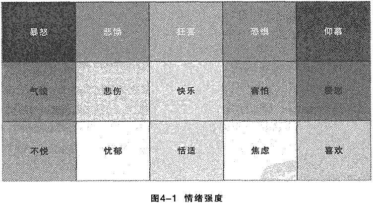

学者研究证实，如果一个人无法与别人建设性地谈论情绪，这人身上会出现很大的问题，包括：社会孤立、不满意的人际关系、焦虑和沮丧的感觉以及隐忍的攻击行为。其他的研究者已经证实，父母对待小孩情绪的方式对儿童的发展有深远的影响。研究者确认了两种教养子女的类型："情绪教导"和"情绪疏离"，他们发现教导的方式会提升儿童在日后生活中沟通感觉的能力，并带来更满意的人际关系。

### **4.2 影响情绪表达的因素**

大多数的人都很少表达情绪，至少很少在口头上表达。人们普遍能够自在地陈述事实，往往乐于表达他们的意见，但是难得透露他们感觉如何。为什么人们不能表达他们的情绪呢？让我们进一步看看一些理由。

**性格**

性格和我们经验与表达情绪的关联性日渐清晰，例如：外向性的人——即那些欢乐、乐观、乐于与人接触的人——比内向性的人更容易在日常生活中表达出正面的情绪，而神经质性格的人（指容易担心、焦虑、牵挂的人）比稳定性格者更容易在日常生活中表达出负面的情绪。这些性格特质有部分肇因于天性，心理学家运用核磁影像测量性格和大脑活动的关联性，发现高外向性格者面对正向刺激时会比低外向性格者出现更高的大脑活动；而高神经质性格者面对负向刺激时会比低神经质性格者出现更高的大脑活动。这类研究证实了我们的想法：有些人觉得水杯半满，有些人觉得水杯半空。

性格虽是不可忽视的力量，但还不至于全盘左右你的沟通满意度。试想一下"害羞"，可以被看做是外向性格的相反面，内向性格者可以发展出舒适又有效的交友策略，例如互联网就提供沉默寡言的沟通者一条有效与外界接触的渠道，聊天室、即时通讯、电子邮件和网络约会都提供了没有压力的交友和联谊途径。

**文化**

当然，这并不意味着在所有的文化中，相同的事件都会引发共通的情绪。吃蜗牛这件事可能让法国人食指大动，然而却可能让许多北美人面有难色。本书中，还会有许多类似的文化议题讨论。研究已经显示美国人和欧洲人对陌生人和危险情境的恐惧感可能更甚于日本人，而日本人对关系往来的忧虑更甚于美国人和欧洲人。文化也会决定哪一种情绪比较有价值。有一个研究发现，亚裔美人和香港华人比较认可"低强度正面情绪"，例如"恬静"，而欧裔美人则比较认可"高强度正面情绪"，例如"兴奋"。在不同文化中的人，表达他们的感觉也有程度上的差异，例如，社会科学家们发现"处于较温暖气候地区的人，比居住在比较寒冷地带的人，更能感性地表达"，这个想法已经获得支持。来自26个北半球国家的超过2900个回复者表示，在他们的国家里，南部人比北部人更能率真地表达自己的感情。

影响情绪表达的最主要因素之一，是文化属于个人主义还是集体主义。集体主义文化的成员（例如日本和印度）重视他们"团体内"成员的和谐，而且，不允许有可能扰乱团体成员关系的任何负向情绪的表达。相反地，高度个人主义文化的成员（像美国和加拿大）可以很舒服地向他们身旁亲密的人透露自己的情绪。个人主义者和集体主义者处理团体外成员的情绪表达也有所不同，对于外人，集体主义者反而会相当坦白他们的负向情绪，个人主义者会隐藏负面情绪（如：厌恶）。这很容易看出，在表现的习惯上，会导致多么不同的沟通问题。例如，个人主义的北美人可能认为集体主义的亚洲人不够坦率，而亚洲人容易认为北美人是过度情感流露。

**性别**

即使是在共同的文化内，男人和女人在某些地方表达情绪的方式也很不一样。事实上，生理性别是侦测和解释情绪表达能力的最佳预测指标，比教育程度、科系领域、境外旅游量、文化相似性、种族等具备更好的预测力。例如，情绪表达的研究提出，不管是同文化或跨文化都可以发现，男性不善于表达，而女性则较善于表达。一群心理学家以图画的方式测试男人和女人回忆情绪，发现女人比男人多出10
至15 ％的正确率，而且女人对于产生情绪刺激的反应强度明显大于男人。

情绪表达的研究认为这虽然形成了性别的刻版印象，但是似乎也符合了若干事实。同样一个团体中，女人比男人更有可能表达正向情绪（爱、喜欢、高兴和满足）和脆弱的感觉（包括害怕、悲伤、孤独和尴尬）。虽然男人可能会对他们心爱的女人敞开心胸，但是他们很少表达这些情绪，尤其是对他们的男性友人。相对地，男人却毫不犹豫地展现他们的勇敢与气概。在网络上，男性和女性对情绪表达的运用也有相同的差异，比如，女人比男人更可能使用情绪（比如这个符号":-)"
）表达她们的感觉。第九章会讨论到男人为什么比较常用行动和活动来表达情感，而不是通过语言。

一个人的性别并非是影响情绪敏感度的唯一因素，第二个因素是沟通对象的性别。举例来说，男人对女人比男人对男人更可能表达感觉（特别是正向的）。当然，这些性别差异是统计上的平均，而且有许多男人和女人不适合这些量表。和对方的熟悉程度也会带来更强大的敏感度，比如说，交往中或结婚的伴侣会比陌生的两人更能辨认双方的情绪线索。

第三个影响因素是我们对于沟通对象的情绪敏感度，例如，约会中或已婚配偶明显地对于彼此情绪线索的辨识，要高过对于陌生人。同样地，来自相同文化背景的人，也比较容易辨识彼此的情绪，彼此关系密切的人会比关系疏远的人更常表达自己的情绪或面对对方的情绪，例如我们对热恋对象的情绪远远超过一般朋友——当然，不见得都是正面情绪，热恋关系所潜藏的负面或伤害性情绪超过其他类型的关系。

最后一个因素是在两人中的权力差异，权力较小的人会（或许是必须）学习觉察权力较大的人的信号。异性配对组的实验显示，"女人的直觉"应重新命名为"从属直觉"。不论是在同性配对或异性配对中——也就是说不考虑男女性别差异——都显示出了控制力较少的人更善于解读领导者的非语言信号。似乎权力结构更是支配情绪敏感度的因素。

**社会习俗**

试着听上两三天，计算一下真诚的情绪表达次数，你将发现情绪表达是稀有少见的行为。人们普遍能够自在的陈述事实，并且往往乐于表达他们的意见，但是他们难得透露他们的感觉。

人们通常习惯于直接分享正向的情绪，这并不令人意外，因为沟通者不愿意传递尴尬或威胁到别人"真相"的消息。历史学家为当代将表达生气为禁忌的习俗提供了详细的描述：相较于过去的世纪，今日的美国人几乎在所有的情境中都力求压抑"不愉快"的情绪，包括在子女教育、工作职场和个人的人际关系中。研究结果支持上述观点。一份对已婚夫妻的研究透露，伴侣会分享赞赏的感觉（"我爱你"）或给予面子（"我很抱歉对你太大声"）。他们也乐意袒露对第三者正向和负向的感觉（"我喜欢弗雷德"
"我在格劳利亚身旁是自在的"）。相对地，夫妻却很少用口语表达出已经明显出现在脸部的情绪（"我对你失望透了"）或敌意（"我对你抓狂"）。社会规范甚至禁止太多正向的情绪表达。虽然一个小男生可以和父亲牵手，甚至对母亲拥抱或亲吻都没问题，但随着我们日渐长大，对朋友的情感表露越来越少，以至于即使是单纯的表达，像是"我爱你"，在成人之间也很少耳闻。这只是因为我们对他人不用口语表达我们的感觉，并不代表我们完全不和他人沟通。

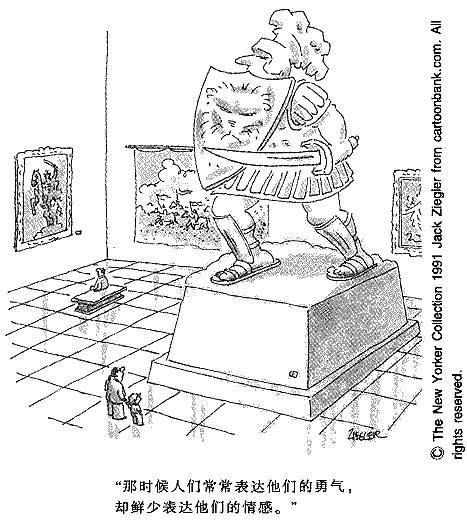

情绪表达受到许多社会规范的要求所影响，销售人员必须要对顾客展现笑容，不论顾客多么令人反感；老师和经理必须理性行事并且情绪控制得宜，而学生如果提出得体的问题会得到肯定，否则就会被道德劝说或要求礼貌。

**自我坦露的不安**

处在一个禁止情绪表达的社会中时，揭露情绪可能是一个冒险的行为。对父母、老板或老师来说，他们的生活已经建立起自信和确定的权威图像，可能很难开口说："对不起，我错了。"一个忙于工作的人必须独立而不依赖他人，他可能对"我是孤单的，我需要你的友谊"感到难以启齿。此外，鼓起勇气分享类似这些情绪的人，仍然冒着面临不愉快结果的风险。有些人也许会将情感的表达误解为浪漫的邀约，而不确定的坦白可能会被解读为软弱的征兆。另一个风险是，坦承情绪或许会使别人有不舒服的感觉。

**情绪感染力**

文化规范和社会角色不是影响我们感觉的唯一因素。通过情绪感染力，我们的情绪也会受我们周遭的感觉影响，这个过程使情绪从一个人身上传递到另一个人身上。就像一个时事评论家所评述："我们从另一个人身上接收感觉，好像是感染了某种社会病毒一样。"许多证据显示学生"接收"老师的感觉，而丈夫与妻子彼此情绪互相感染。大部分的人某种程度地承认情绪是会"感染"的，你可以毫不费力地想到一些例子。在一个安静的人身旁会让你感到较为平和，你原先开朗的心情或许会因为接触到一个满腹牢骚的人而转为阴霆。研究人员已经证实这个过程发生得很快，而且只要有一丝丝显著的信息即可。在一个研究中，两个自愿者完成一项确认他们情绪的调查，然后他们安静地坐下来，相视两分钟，很单纯地只是在等待研究人员回到这个房间。两分钟结束之后，他们将完成另一份清绪调查。一次又一次，这份报告指出较少表达情绪的伙伴，会有类似表达较多情绪伙伴的心情。假如一个沟通者的表达，可以在这么短的时间内以如此少量的输人来塑造另一个人的情绪，那么我们可以很容易理解，情绪如何在更长的接触中产生更多的"感染"。只要几个月的时间，两个约会中的。情侣和大学室友的情绪反应就会很戏剧性地变得更为相似。

### **4.3 情绪表达的原则**

有许多研究支持适当地表达情绪的价值（表4-1
列出了部分好处）。就最基本的生理层次而言，懂得如何表达他们情绪的人，比不知如何表达的人健康多了。另一方面，对感觉的表达加以隐藏会导致严重的疾病。面无表情的人——他们重视理性和自我控制，尝试控制他们的感觉和冲动——以及忧伤的人比较可能催患一堆疾病，包括癌症、气喘和心脏病。当然另一方面，过度表达情绪的人，也会有生理上的痛苦。当人激动地用口语抨击时，他们的血压会升高20
毫米汞柱的平均值，而且有一些人会增加100
毫米汞柱之多。所以，健康的关键是学习如何建设性地表达情绪。

除了生理的好处外，另一个有效地表达情绪的好处是增进人际关系。如同第九章所言，自我袒露是一个与人亲密的渠道（虽然不是唯一的），甚至于在职场上也是如此。许多主管和组织心理学者反驳古典时代的情绪控制观点，他们建议建设性地表达情绪，不但带来职业成就，而且也帮助员工感觉更佳、心情更好。当然，在工作场所表达情绪的规则通常比一般人际关系更加严格，处理上要格外谨慎。

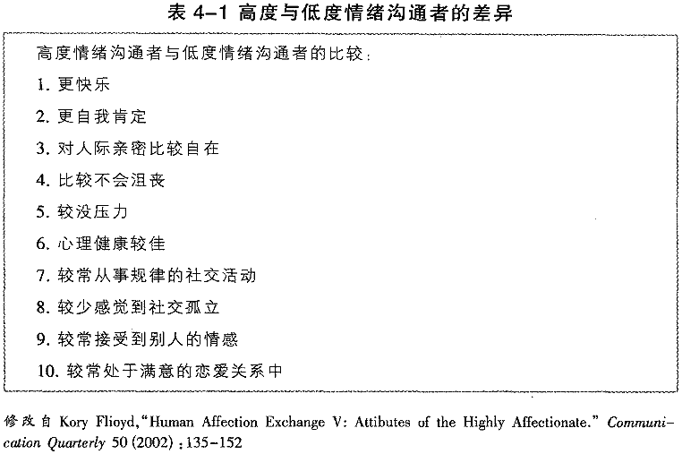

以下的建议将帮助你决定何时以及如何表达你的情绪，结合第九章自我袒露的指导方针，它们会增进你情绪表达的有效性。

**辫认感觉**

回答"你觉得如何？"这个问题，对某些人来说不像一般人那么容易。情感导向的人非常了解他们自己的情绪状态，当他们在作重要决定时会善用那些情绪状态的信息。相反的，低情绪导向的人往往不了解他们的情绪状态，而且倾向于拒绝将感觉当作是有用的、重要的信息。

除了察觉到自己的情绪，研究也证实能够确认自己的情绪很有价值，研究者发现能够指认出他们经验到的带有负面情绪（如："焦虑"、"生气"、"惭愧"、"内疚"等）的大学生，也都比较能够发展出处理这些情绪的策略。这说明了无论在同文化或跨文化之间，能够区辨和指认情绪是情绪智商的主要元素。

**辨识感觉、说话和行动之间的不同**

你感觉到某一个状况，并不意味着你总是要把它说出来，而且，说到一种感觉也不意味着你必须对它有所行动。事实上，表现出生气的人，即使是借由在沙袋上打拳泄愤，竟然也会比生气而没有发泄出来的人感觉更差。

了解感觉和发泄情绪之间的差异有助于在失序的情境中建设性地表达你自己。比方说，假如你发现你对一个朋友感到心烦，就可能确切地探究你为什么如此心烦。分摊你的感觉（"有时候，我对你如此抓狂以至于我想挥你一拳"）可能会让你明了答案所在，让你知道你在恼怒什么。假装你没在烦恼什么或将之发泄在别人身上不太可能减少怨恨的感觉，反而会导致清绪恶化。

**以口语阐明情绪**

大多数人都苦于情绪词汇匾乏，问他们现在感觉如何，得到的答案几乎总是一样的那几句话：还好，不错，马马虎虎，等等。现在，花一点时间看看你能写出多少描述感觉的词，在你尽其所能之后，参阅表4-2
，看看你都漏掉了什么。

许多沟通者认为他们当时正在表达情绪，但实际上他们的陈述只是对情绪的一种伪装。例如，常常能听到有人很有情绪地说"我觉得该去看这场秀"或者"我感到我们见面太频繁了"，但事实上，这些描述都没有任何情绪的内容。在第一个句子里，"觉得"这个词真正代表的含义是"我想去看场秀"，而第二句的"感到"代表着"我认为我们见面太频繁了"。如果加上真正的感觉字眼，你就会发现原本的说法缺乏对情绪的表达——"我很无聊，所以我想去看这场秀""我认为我们见面太频繁了，这让我有种局限感"——无聊和局限感才是表达情绪的词汇。

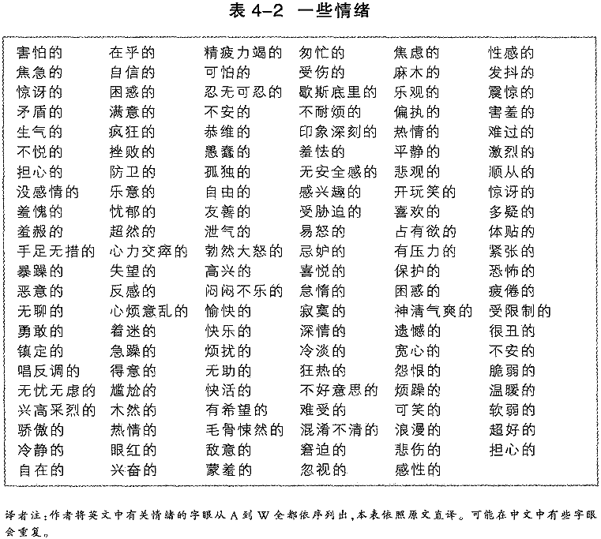

依赖少量的字词描述感觉，就像是受限于少量的字词描述颜色一样。同样的，过度使用"很棒"一类的措辞去描绘你在不同情境下的感觉又难免失之夸大。

有许多用口语表达感觉的方式：

·使用单一字词："我在生气"（或"兴奋"、"忧郁"、"好奇"，等等）。

·描述你怎么了："我腹痛如绞，胃好像打结了",
"我得意极了，像是站在世界的顶端"。

·描述你想要做什么："我想要逃跑", "我想要给你一个拥抱", "我觉得想放弃"。

有时候沟通者错误地低估他们感觉的强度，例如："我有一点点不愉快"或"我颇为兴奋"或"我有一点点困惑"，当然，不是所有的感觉都是强烈的，我们感受到的悲伤与快乐确实程度不同，不过有些人会习惯性地淡化自己的感受。你有没有这种情况？

有时沟通者以一种暗示的方式表达感觉，尤其经常发生在说话者对在讨论中透露感觉感到不舒服的时候。有些暗码常见于口语表达中，说话者多少会巧妙地暗示在信息中，例如，以婉转的方式，"我很孤单"也许会变成"我猜这个周末没有什么事，所以假如你不忙，何不顺道过来。"类似这样的信息是非常婉转的，以至于你可能没有承认你真正的感觉。由于这个原因，传送暗示信息的人，将面对失去了解自己的感觉并且满足需求的机会。

假如你决定要表达你的感觉，你必须很清楚地确认你和你的伙伴都了解你的感觉是放在一个特定的情境之下，而不是直接针对整个关系。说"当你不守信用时，我会怨恨你"而不要说"我怨恨你";
"当你讲到你的钱时，我觉得很无聊"而不是"我和你在一起很无聊"。

**分享多样的感觉**

许多时候，你所表达的感觉不是你唯一感受到的。举例而言，你可能常表达你的生气而忽略了在生气之前的困惑、失望、挫折、悲伤或尴尬。在以下的例子中，觉察如何分摊多样的感觉，在每个例子中问自己两个问题：我有什么感觉？我可能会表达什么感觉？

*一个住在市郊的朋友说六点钟要来你家，他到九点都没有来，你想一定发生了可怕的意外，就在你拿起电话要打给警察局和医院去查询时，你的朋友若无其事地站在门口，而且随便搪塞了一个太晚出发的理由。*

*你和你的伴侣在出发出席一个宴会前发生争执，你内心深处知道，多半是你错怪对方，但你不愿意承认。一到达会场，你的伴侣就离你而去，一直周旋在几个风趣而迷人的客人之间。*

在上述情况中，你可能混杂着几种情绪。以第一个迟到的朋友为例，你对他到达的第一个反应可能是："谢天谢地，还好他没事！"但是你也很可能觉得生气"他为什么不打电话通知我他会迟到？"第二个例子可能使你陷人更多更复杂的情绪中：对于争执觉得内疚，伴侣周旋他人使你觉得受伤、难堪、尴尬，你对于这种报复方式觉得生气。

除了复杂情绪的这些共通性质之外，我们经常只表达其中一种情绪，而且是最负面的那种情绪。在两个例子中你可能只表达生气的情绪，因此对方没有机会了解你全面性的情绪。想想看如果你在各种情境中总是表达出全盘的情绪，对方的反应将会如何的不同。

**评枯何时与何处表达感觉**

通常，一阵强烈情绪涌上的瞬间并不是说出口的最佳时机。假如你被隔壁吵人的邻居所干扰，一时的过度怒骂、抱怨可能会导致日后你对自己所说过的话感到后悔。说话前先深思熟虑过要如何用最可能被接受的方式表达你的感觉，才是较为明智的。学者提出"想象的沟通"使得沟通者能够预先演练；他要怎么说及对方可能会怎样回应，以便在实际沟通能够增进关系。即使是你已经等待涌上心头的强烈情绪退去，还有一件重要的事情是，选择最适宜表达这个信息的时机。你正被某些别的事情所逼迫，心烦或困扰，可能是你延缓表达情绪的一个好理由。处理你的情绪往往会花很多的时间和心力，疲惫和分心会使得你想要表达情绪这件事更难处理。同时，你应该用相同的态度，确认你的信息接受者在你要开始之前，已经准备好要听完你说的话。

在某些情况下，你也可能选择永远不要表达情绪。当老师问你"你觉得我的课如何"时，即使你非常想跟你的老师说他的课非常无聊、让你昏昏欲睡，最好的回答仍然可能是无关痛痒的"还好啦！"即使你被一个抓你超速的傲慢警察所激怒，最明智之道还是忍耐着不流露出愤怒。如果你感觉到强烈的情绪经验但是又不便口头表述出来（有难言之隐），写出你的感受与想法，确实是有利于心理、生理和情绪调适。

**对自已的感觉负责**

你的表达方式反映了你对你自己的感觉负责，这个事实很重要。避免说"你让我生气"而是改说"我在生气"，避免说"你伤害我的感觉"而是改说"当你那样做时，我觉得很受伤"。你会很快察觉到，并不是别人让我们喜欢或讨厌他们，所以，一味认定是别人造成我们喜欢或不喜欢他们，就是否认我们每个人都要为自己的情绪负责。第五章将会介绍用"我"表达的方式，提供你一个表达自己情绪的负责方式。

**关照沟通梁道**

现今的沟通者比起几十年前有更多的沟通渠道可供选择，什么时候选择用电子媒介渠道等，有必要做些分析，这是过去不必面对的问题。例如，用语音信箱留书表示要结束一段关系是合适的渠道吗？什么时候用即时通讯送出"不爽"的信息会被接受？如果你为某个新鲜事觉得兴奋不已，是直接面告亲友还是发表在博客上？

大多数人直觉地认为应该依照他们传送的信息类型来决定沟通渠道。有个研究是针对学生如何对各种不同的信息选定最佳的传送管道，大多数填答者认为表达正面信息都不会有困难，但是他们宁可选择电子媒体作为表达负面信息的渠道。

"口水区"是一个极端的例子，是电子媒体开发出的一种抒发负面情绪的独特渠道。在一般沟通渠道时的文明用语要求，到了电子网络上都可以解放——大多数时候是对陌生人，有时候甚至是对个人网络的对象。在你说出可能会后悔的话之前，最好记住第一章所列出的原则：沟通不可逆，有如覆水难收，一旦你按下"送出"键，你不可能撤回爆发出去的情绪。

### **4.4 管理困扰的情绪**

虽然感知和表达情绪会增加人与人之间关系的品质，但是，并不是所有的感觉都是有益的，盛怒、沮丧、惊恐和忌妒对于让你感觉比较好受或增进你的人际关系都毫无帮助。下面将提供方法使你将这些无助益的情绪减到最小。

**有助益与无助益的情绪**

首先，我们需要区分有助益与无助益的情绪之间的不同。有助益的情绪有助于效率，无助益的情绪降低有效运作情况。

这两种类型间的差异是它们的强度。例如，某种程度的生气或恼怒可以是具有建设性的，因为它往往会提供让你改进不满意状态的刺激；但另一方面，盛怒通常会让事情更糟糕。会引起焦虑的情境，比如在一个重要的运动竞赛或工作面试之前的紧张，可能会提升表现的动力，但若是陷入极端恐惧就又另当别论了。少许猜疑有时可以使人成为更有效的沟通者，一个研究显示，会去怀疑他们的伙伴是否真心相待的人比较能察觉欺骗的迹象，而那些始终一直信任对方的人对欺骗比较迟钝。当然，一个极端疑心病的偏执狂可能会产生相反和无益的效果，反而降低正确地理解同伴行为的能力。可想而知的，无助益的情绪——诸如沟通恐惧，会导致种种在个人、职业、教育甚至于医疗方面的问题。当人变得焦虑时，一般而言话会比较少，那是意味着他们的需求没有被满足，即使他们设法畅所欲言也无法经由语言有效地表达出他们实质的能力。

第二个区别无助益情绪和有助益情绪的地方是它们时间的持续性。在一段人际关系瓦解或丢了一份工作之后，自然会有一段时间陷人沮丧，但是，对于你所失去的过度悲伤而花费你生活中的过多时间将会使你一事无成。同样的，持续地对于某个犯错的人生气无疑是像在惩罚犯错的人一样惩罚你自己。

许多无助益的情绪涉及沟通，这里有一些例子，提供给本书的读者：

*当我第一次上大学时，我离开我的男朋友，和三个女孩同住。第一学期的大半时间，我是如此孤单和不快乐，以至于我成为一个很糟糕的室友。*

*数个月前，我对我那过度吹毛求疵的老板感到灰心，所以某天，我发抓并辞职了，我告诉他他是个多么令人厌恶的主管，并且马上转身走人。现在，我不敢在我的工作经验栏位上把我的老板列作推荐人，也害怕我的脾气到来，使我很难找到一个新的工作。*

*目前我和我的家人之间有一些问题，有时候，我会心烦意乱，以至于不能专心于工作或学业，甚至于晚上也睡不好。*

接下来，你将学到一个处理类似这些无助益情绪的方法，可以提升你沟通的有效性。这个方法是基本上就是将无助益情绪减到最小的一个办法，也就是将徒劳无功的想法减到最小的办法。

**无助益情绪的来源**

对大多数的人而言，感觉似乎是自成一格。你希望当你接近陌生人时能够泰然自若，可是你的声音仍然颤抖不停；当你要求加薪时，你试着展现自信，但是你的眼睛却焦虑地眨个不停。这种情绪是怎么发生的？

*生理因素*
有一个答案就是基因造成的，就向你在第二章读到的，性格、气质很大比率是遗传所致，许多沟通特质像害羞、口语攻击和肯定都跟生理因素密切相关。幸运的是生理因素并非命定，你接下来会读到，无助益情绪是可以克服的。

除了遗传，认知科学家告诉我们某些无助益情绪的肇因——尤其是在涉及"迎战"或"投降"反应等方面——与大脑息息相关，像核桃般大小的杏仁核负责相互联结结构，杏仁核像哨兵一般扫描每一个传送进来的经验并监视威胁信息，它忠实地在短时间内发出警报，引发一连串的生理反应：心跳增加、增高血压、感官敏锐、肌肉反应灵敏等。

这种防卫系统在我们面临真实的生理危险时非常有价值，但是在没有具体威胁的社会情境中，杏仁核也会迫使大脑诱发出害怕或愤怒的情绪。当有人站得靠你太近你可能会觉得不自在，或是有人插队会让你生气，深思一下，如何避免对这种不具威胁性的情境过度反应。

*情绪记忆*
有些威胁的来源是来自神经科学家说的情绪记忆，我们经常看见只要这个事件与过去困扰经验有一点点相似之处，即使是寻常事件也会引发无助益情绪，以下例子可以说明这个观点：

·约翰自从在小学转学被嘲笑之后，只要在不熟悉的情境都感到不自在。

·玛丽安觉得很了解带着深沉磁性声音的男人，因为当她还是个孩子时，她被带有这种男低音的家人虐待。

·罗伯特只要遇到使用某种香水的女人就觉得不安，因为他之前被使用这种香水的女人甩了。

**自我内言**

一般而言，上述那些状况下，陌生人或你的老板让你感到焦虑，就像你会说蜜蜂蛰到使你感到疼痛一样。假如你用以下的方式检视它们，身体和情绪的不舒服在表面上的相似度会变得较为清楚：

事件 感觉

蜜蜂哲伤 身体疼痛

陌生人相见 焦虑的感觉

当用这个方式检视你的情绪时，你似乎对你的感觉有一些控制力。然而，身体的疼痛和情绪的不舒服（或愉快），其表面上的相似度，不像看起来那么重要。认知心理学家认为不是与陌生人相见或是被情人抛弃的事情使人感觉不好，而是他们对那些事情所抱持的信念。

艾尔本·埃里斯（Alben Ellis )
，发展了理性情绪治疗法这个认知取向的人，引用一个故事使这个论点更清晰。想象你自己经过一个朋友家，看到你的朋友把头探出窗口，并对你骂了一连串难听的绰号（你自行想象一个朋友和绰号），在这个情境之下，你可能感到受伤和心烦。现在，换成想象你正经过一间精神疗养院，相同的是这位朋友在那里，显然他是一个病人，对你大骂同样难听的绰号。在这个情况下，你的感觉可能会相当不同，很有可能转变成悲伤和怜悯。在这个被叫绰号的故事情节中，你可以看到，面对同样的情况，情绪的结果却非常不同。你有不同感觉的理由，来自你在每一个情况中的想法。在第一个情况中，你的想法可能是：你的朋友对你很生气；或者，你可能猜测你一定做了什么严重的事，而受到如此的对待。在第二个情况中，你的想法可能是：你的朋友有某些精神问题，很可能你会感到同情。

从这个例子，你可以看到在自我对话的历程中，人对一件事情所作的淦释，决定了他们的感觉，因此，这个情绪模式看起来像是这样：

事情 思考 感觉

被叫绰号 "我做错某件事。" 感到受伤，心烦

被叫绰号 "我的朋友一定生病了。" 关心，同情

同样的原理可以应用于日常的生活中。例如，在工作面试时，高焦虑的人想到他们的表现时，可能会使用负向的自我内言："我会做不好"、"我不知道为什么我要自找罪受"。在爱情关系里，想法会形塑满足感。"我爱你"这句话可以有多种解释，这句话会把表面价值转变成一种深情的真诚表达。

事情 思考 感觉

听到"我爱你" 感到"这是一句真诚的话。 高兴

相同的话在激情中，可能被解读为虽然真心却在错误时机的宣告，一种有意让接受者感觉更好的企图，或是试图操控，例如：

听到"我爱你" 感到"她／他这样说是要操控我。" 生气

一种非常愚蠢而有害的无助益自我内言叫做反刍，即不断地坚持负面想法，反复强化这种负面思考的强度。非常多的研究已经证实这种自我聚焦的反当会增加悲伤、焦虑和沮丧的感觉，更糟的是反刍的人比较容易转移其攻击而波及无辜的第三者。

**非理性思考和无助益的情绪**

聚焦于我们的自我内言，这些内言也就是我们的思考方式，是了解无助益的情绪之关键。许多无助益的情绪来自于我们接受一堆非理性想法，此处我们称它们为谬误，是这些谬误导致不合逻辑的推论，而无助益的情绪就随之而来。我们往往没有察觉到那些影响力特别大的想法。

*完美的谬误*
接受完美谬误的人，相信一个很好的沟通者应该有全然的信心和技巧来处理每一种状况。

在你接受"很好的沟通者是令人满意和无所不能的"这个信念之后，下一个步骤是假定你不完美，人家就不会欣赏你。从这个态度看来，承认你的错误或说"我不知道"和流露不确定的感觉，似乎像是社交的缺陷。对于得到别人的重视与欣赏，寄予厚望和深切的渴求的人，会尽量努力试着表现完美，但是，这种欺骗的代价是很高的，假如别人最后发现你的隐瞒真实的欺瞒行为，他们会视你为骗子。即使你的行为没有被揭发，这样的行为也会使你耗尽心力，因此，得到的快乐是很少的。

陷人完美的迷思，不仅阻止别人喜欢你，也会使你自尊心降低。当你无法符合你所认为应该的高标准时，你如何喜欢你自己、解放自己？让自己舒坦地接受你是不完美的想法吧！像其他人一样，你也有难以表达你自己的时候，像其他人一样，你不时会犯错，而且没有理由隐藏它。你应诚实地尽你所能了解自己的潜能，尽你所能变成最棒的人。

*赞同的谬误*
持有赞同的谬误的人，认为得到别人的赞同是生活上不可或缺的事，并且十分向往得到所有人的赞同。接受这种想法的人会耗费令人难以置信的时间从他人身上寻求赞同，甚至牺牲他们自己的原则和幸福也在所不惜。接受这种谬误会导致某些荒唐可笑的情形：

*你会因一个你并不喜欢的人不赞同你而感到焦虑。*

*你会因别人做错事而感到抱歉。*

*在以做作的方式获得某人的赞同之后，你又会感到难堪。*

赞同的谬误导致我们不舒服的另一个原因来自否认自己的原则和需求。赞同的谬误是非理性的，因为它隐含着一种意味，仿佛只要你忽视自己以取悦他人，他们将会更尊敬你和喜欢你。通常这绝对不是事实。我们可能会去尊重那些只为赢得赞同而在自己的重要价值观上一味妥协的人吗？我们可能会对于那些一再否认自己的需求来换取赞同的人慎重以对吗？尽管别人可能也会投其所好或略施小惠以顾及各自的面子，但那些人很难得到真诚的感情和尊重。

力求全世界的赞同是非理性的，因为这是绝对不可能的。迟早，预期中的冲突必然会发生。假如你表现的某一种方式被某人所赞同，但另一个人只接受相反的行为，那时你会怎么做呢？

别误会：抛弃赞同的谬误，并不是指要过着以自我为中心的生活。考虑到他人的需求仍然是重要的，但是当你为了追求这些目标而抛弃自己的需求和原则时，这个代价就太高了！

*应该的谬误*
应该的谬误是不能区分"是什么"和"应该是什么"。想象一个对这个世界满腹牢骚的人，你就可以看到其中的差异：

*"周末应该不会下雨的。"*

*"人类应该长生不老。"*

*"钱应该长在树上。"*

*"我们应该会飞。"*

显然地，类似这些抱怨是愚蠢的，而这些可能都是会讨人喜欢的愿望。但是，坚持不能改变的应该改变，一点也不会影响事实。然而，当人困惑于"是"还是"应该是"的时候，还是有许多人折腾自己从事所谓的非理性想法，他们的所思所想就像以下所述：

*"我的朋友应该会更了解。"*

*"她不应该如此独断独行。"*

*"他们应该是更友善的。"*

*"你应该努力工作。"*

这里的每一则信息都意味着：你总是比较喜欢别人不同的做法。期待事情更顺利是完全合理的，当然，有好点子就应该试着改变现况。但是，坚持世界要像你所想要的那样运转，或当事情不尽理想时就觉得受骗，那是不合理的。

硬将应该的谬误加于你身上，也会导致人去追求不切实际的快乐。心理学家阿隆·贝克（Aaron
Beck ）指出一些不切实际的自我欺骗的"应该":

*"对于每一个问题，我应该能够找到一个聪敏的解答。"*

*"我应该不会感到受伤；我应该总是快乐和安适的。"*

*"我应该一直展现极度的宽宏大量、体贴、高贵、勇敢和不自私。"*

像这样变得迷恋于"应该"，会有三个恼人的后果。第一，它导致不必要的痛苦，因为不断渴望理想的人，很少满足于他们现在已经拥有的或欣赏他们现在的样子。第二，只是抱怨没有行动，会让你不想做任何事来改变不满意的状态。第三，所谓的抱怨会使得痛恨喋喋不休的人建构一种防卫的氛围。告诉人家你喜欢什么，会比说教更有效用。尝试一下把"你应该准时"变成"我希望你能更守时"吧。我们将在第十章讨论避免防卫性氛围的方法。

*过度推论的谬误*
过度推论的谬误包含两种类型。第一种出现在当我们以有限的证据为信念时。举例来说，多少次你发现你自己说了类似下列的话：

*"我真笨！我总是不了解如何算出我的所得税。"*

*"我算什么朋友！我居然忘记我最好的朋友的生日。"*

上述情况里，我们只聚焦于有限的不足之处，似乎它代表我们的全部，而忘记加上我们解决棘手地问题时所遭遇到的困难。而且，尽管我们有时候是疏忽的，但是，在其他时候我们是用心和细心的。

第二个过度推论的类型发生在我们夸大缺点的时候：

*"你从来不听我说。"*

*"你，总是迟到。"*

*"我无法思考任何事。"*

试着进一步检核，这些"绝对的"陈述几乎都与事实不符，而且往往导致灰心或生气。当你用更准确的信息替代过度推论来描述你自己或他人时，你将会觉得好得多：

*"你常常不听我说。"*

*"这星期你已经迟到三次了。"*

*"今天我没有想出任何我中意的点子。"*

许多过度推论是基于是的滥用。例如，"他是一个白痴（一直？)
"和"我是一个失败者（对于每件事？)
"将会使你看到你自己和他人处于一个不切实际的负向状况，因此而造成无助益的情绪。

*因果论的谬误*
因果论的谬误奠基于认定情绪是由他人引起，而不是一个人自我内言的非理性信念。

这个谬误引起的烦恼有两个状况。首先是对于那些沟通过度谨慎的人造成困扰，因为他们不想"引起"别人的任何痛苦或麻烦。这个态度发生在类似这样的情况：

"探望朋友或家人出自于义务，而不是一份真诚的渴望要看他们。"

"当别人的行为打扰到你时，你仍然保持沉默。"

"当你已经快要迟到下一个约会，或觉得身体不舒服时，还是假装专心听演讲者说话。"

"让询问你意见的人放心并称赞之，即使你真正的答复是否定的。"

你的确可以坚持你的原则，选择避免会导致别人痛苦的沟通方式，而且，对于那些你所关心的，你宁愿自己退让一步来换得海阔天空。然而你必须要明白，若是你坚信你是唯一会引起他人的感觉的人，这实在是自恋到极致了。更准确地说，他们对你的行为的反应是因为他们自己的感觉。说是你使得其他人生气、心烦或快乐是不正确的，好一点地说法是，对于你的行为，别人产生他们自己的反应。

因果谬误引起烦恼的另一种状况是，当我们相信别人会引起我们的情绪时，因果论的谬误也会产生运作。有时候似乎确实如此，因为他们的行为，我们的情绪激昂或低落。但是，思考片刻就会发现，在某天会引起我们高兴或不高兴的某种行为在其他时候可能影响很少。昨天影响你强烈情绪的侮辱或赞美，今天就不会对你产生影响。为什么呢？因为你今天不再将重点放在昨天那种的侮辱或赞美上。没有他们的行为，你确实不会感受到某些情绪，但是，不论有没有他们的行为，你的想法还是会决定你的感觉如何。

*无助的谬误*
无助的谬误是生活的满意度遭受到超过你能控制的压力所决定。不断地视自己为受害者的人会有这样的陈述：

*"在这个社会女人绝对无法有出息，它是男人的世界，我所能做的事就是接受它。"*

*"我生性害羞，我想变得比较外向，但是没有办法。"*

*"我不能告诉我的上司他对我要求太严，如果说了，我可能会丢工作。"*

在你了解"如果你真的想做，你就有许多事情可以去做"这一点之后，类似这些陈述的错误会变得显而易见。像你在第二章所读到的，大多数"不能"的陈述换成"不愿意"(
"我不能告诉他我在想什么"变成"我不愿意对他诚实"）或是换成"不知道怎样"(
"我不能持续一个风趣的对谈"改成"我不知道要说什么"）会更为正确。当你把这些不正确的"不能"换掉之后，明显地，不论是抉择的事情，或是需要你行动的地方，都会非常不同于"你是无助的"这种说法。

从这个观点看来，我们可以合理地推论出，许多"不能"是不想改变。举例来说，寂寞的人倾向将他们贫乏的人际关系归因于不可控制的因素，他们认为"它超过我的控制"，同样的，他们预料他们的伙伴会拒绝他们。注意这种态度的自我应验预言：相信你的期望是渺茫的，会导致你使用让自己成为一个不受注目的人的方式行动。

*灾难性预期的谬误*
抱着灾难性预期的谬误之人会祀人忧天，他们认定假如某件糟糕的事可能会发生，那么它就一定会发生。典型的灾难性预期包括：

*"假如我邀请他们参加宴会，他们或许不会想来。"*

*"假如我为了解决一个冲突而公开表示意见，事情可能会弄得更糟。"*

*"假如我去应征一个我想要的工作，大概不会被录取。"*

*"假如我告诉他们我真实的感受如何，他们也许会嘲笑我。"*

一旦你开始期待灾难性的后果，自我应验预言就会开始建立。研究显示，认为他们的伴侣不会为了使彼此关系更好而有所改变的人，很可能会做出造成这层关系决裂的举动。

也许你认为所有与他人的互动都会成功是很天真的想法，但假定你与他人的互动都会失败也一样是太天真的想法。一个避免灾难性预期的方式是想一想，即使你没有顺利沟通，结果还是一样会发生，也就是事情的结果并不全然因你是否沟通而定。让你的心里始终明了为别人的赞赏而活和试图达到完美都是愚蠢的想法，并觉察到在既定的情况下，失败并不会像想象的那么糟糕。假如人们真的嘲笑你又怎样？假定你不会得到这份工作？假如其他人对你的言辞感到生气又怎样？这些事情真的那么严重吗？

**减少无助益的情绪**

你如何克服这样的非理性思考呢？社会科学家已经发展出一个简单但有效的方法，认真地练习，它可以帮助你减少会导致许多无助益情绪的自我挫败思考。

监控你的情绪反应：第一个步骤是当你处于无助益的情绪时，要会辨认。（当然，愉快的情绪出现时，会辨识也是很好的！）如同我们先前所建议的，辨认情绪的方法是通过生理感受刺激：紧张、心跳加速、生理潮热等等，

虽然这些也可能是食物中毒的症状，但是它们多半会是源于一种强烈的情绪。你也可以辨识会使人想到你的情绪的行为状态：跺脚而非正常走路，变得非常安静，或用挖苦的语调说话等都是常见的例子。

注意引发的事件：在你知道你的感觉如何之后，下一个步骤是要想出是什么事件发展引起你的反应，有时候它是明显的，例如，一个常见的生气来源是被不公平（或公平）地指责，而一个常见的伤心来源是被一个对你很重要的人拒绝。然而，有些时候事件发展并不是如此显而易见的。有时候事件发展不是单一的，而是一连串小事情持续累积到一个临界点，

**沟通文本**

**行动的理性思考：应付令人讨厌的顾客**

*以下的范例是说明前文所描述的理性思考方式如何应用于每天的挑战之中。要注意理性的思考不能消除无助益情绪，而是有助于它们受到控制，更有可能进行有效的沟通。*

引发的事件

*我在一个挤满观光客和当地居民的大型购物中心工作，我们公司的信誉基于服务。但是，不久前我已经对我的顾客失去耐性。这间店从开始营业到营业时间结束都很忙，许多顾客是无理、坚持己见和苛求的，其他人期待我成为一个导览者、餐馆评论者、医疗顾问甚至是小孩的临时保姆，我觉得我好像随时要爆炸了。*

信念和自我内言

*1.我已经厌烦与群众有关的工作，人真的令人讨厌。*

*2.顾客应该是更有耐心和礼貌的，而非像对待仆人般地对待我。*

*3.这个工作逼得我快发狂！如果我继续待在这里工作，我将会变得和顾客一样无理。*

*4.我不能辞职：我应该找不到另一个待遇相当的工作。*

驳斥非理性信念

*1.它过度推论地说所有的人都是令人讨厌的。实际上，大多数的顾客是好的，有的甚至是很好，约有10
％的顾客会制造大部分的纷争。辨识到大部分的人是好的，让我不觉得那么痛苦。*

*2.惹人讨厌的顾客应该更有礼貌是事实，但是期待每一个人必须这样做是不切实际的。毕竟，这不是一个完美的世界。*

*3.就顾客逼得我快发狂来说，我想是我没有控制好这个场面。我是一个成人，而且我可以控制住我自己，我可能不喜欢某些人的行事作风，但如何回应他们是我的选择。*

因此而引发无助益的情绪。它会发生在当你试着要工作或入睡时，而且你会被一长串的障碍物不停地阻挠，或是发生在你遭遇到接踵而来的沮丧时。追寻事件发展的最好办法是注意出现无助益情绪时的情境，也许因为某些人的年纪、角色、背景或是其他因素，当它们发生在这些人周围时你会感到不安。也或许是某种场所刺激不愉决的情绪：宴会、职场、学校，等等。有时候，谈话的主题会是让你爆发的因素，不论是政治、宗教、性或某些其他主题。记录你的自我内言：分析联结在事件发展和你的感觉之间的思考时，这是一个重点。假如你是认真要除去无助益的情绪，在第一次学习使用这个方法时真实地写下你的自我内言是很重要的。把你的思考写在纸上，将有助于你了解自己看看它们是否真的产生任何感觉。

监控你的自我内言刚开始可能是困难的，这是一个新的行动，而任何新的行动看来好像会是难运用的，无论如何，假如你持之以恒，你将会发现你能够确认导致你的无助益情绪的想法。在你养成辨认内在独白的习惯之后，你将能够又快又容易地辨识你的思考。

驳斥你的非理性信念：驳斥你的非理性信念是在理情治疗法里的成功之钥。运用在前文所条列出来的非理性谬误，找出你基于错误思考的内在陈述。

你可以借由以下三个步骤而最有效率地完成它。首先，判定你所记录的每一个信念是理性的或是非理性的。接着，解释这个信念为什么是理性的或是非理性的。最后，假如这个信念是非理性的，你应该写下一个较为理性的替代思考，那可以让你在未来面对相同的事件发展时，感觉会更好。用更具建设性的思考取代自我打击的自我内言，提供了一个特别有效的工具以增进自信和关系的交流。

### **4.5 摘要**

情绪有数种面向。它们借由内在的生理改变发出信号，借由非语言反应表露出来，并且借由认知的解释定义多数的情况。有些情绪是基本的，反之，其他是两种或更多种情绪的组合。有些是强烈的，而相较之下，其他是温和的。

有些人的性格使他们较少表达情绪，文化和性别也会影响我们想要或不愿意做情绪分享，社会规范阻止某些感觉的表达，特别是负向的感觉。许多社会规范不允许某种感觉的表达。对袒露情绪后果的害怕会导致人们隐瞒一些情绪的表达。

对成人而言，有时将情绪全部表达出来是不适当的，所以有几种指导方针有助于定义何时以及如何有效地表达情绪。以口语阐明情绪，增加自我觉察，复杂的情绪表达都是重要的。辨别感觉、说话和行动之间的差异，乐意接受感觉的责任，而不是将它们归咎于别人，会促成更好的反应。选择适当的时间和地点分享感觉也是很重要的，同时选择最合适的沟通渠道。

有些情绪是有助益的，而其他的情绪是无助益的，而且会抑制有效的行为。这些情绪之中，有许多是基于大脑杏仁核区域的生理反应，但是负面情绪也可能是非理性想法所引起的，借由确认令人烦恼的情绪、事件发展和引发它们的自我内言，并且以更具逻辑的情境分析取代任何非语言思考，往往有可能更有自信和有效率地沟通。

**第五章 语言：既是障碍又是桥梁**

语言是一种神奇的工具。这项天赋提供给人类一种其他动物无法媲美的沟通方式。如果没有了语言，我们可能会更加无知、信心不足并且感到孤立。在这个章节中，我们将探索语言的本质，并看一看如何运用语言的长处和减少它的缺点。在简短说明语言的符号性质后，我们会看一下大多数误解的缘由。接着，我们会更深入理解各个主题的含义，并探索我们使用的语言是如何影响我们人际关系中互动的气氛。最后，我们会扩大我们的焦点，探讨语言的习惯是如何塑造整个文化的形态的。

### **5.1 语言是符号**

在自然界中，信号与事物的表征有直接的关联。举例来说，烟是有东西在燃烧的信号，发高烧则是生病的信号。这并非武断地陈述自然界信号与象征事物的关系，并没有人创造这样的关系，这样的对应关系独立存在于人类的判断中。

在人类的语言中，信号与事物表征间的联系并没有直接的关系。语言只是符号：字词与想法或所提及的事情有着专断的关系。举例来说，"
five "
并没有特殊之处，这个字代表你手指的数目，但只是英语系国家的人同意这样表示。对于一个讲法文的人来说，"
cinq "这个符号也是5 的意思，而对于一个电脑程式设计师来说，" 0101
"表示与5 相等的值。

甚至像大多数聋人所使用的"说话"方式——手语，也是一种符号本质，而不只是所谓的手势。因为沟通的形式是符号性的而非按照字面的，所以当聋人在跟人进行联系时，就形成了世界上数以百计各自独立的手语。包括：美式手语、英式手语、法式手语、丹麦式手语、中式手语，甚至澳洲原住民和玛雅的手语。

语言是符号的这项本质是一个恩赐，它使我们可以用许多方式沟通关于观念、原因、过去、未来及现在的各种事物，而那不一定是其他方式可以达成的。如果没有了符号性的语言，一切都将成为不可能。也就是说，关于符号及事物表征中的间接关系所导致的问题，都只存在于圣经中巴别城的故事里。

如果用相同的方式使用符号，语言会变得更容易使用及了解。然而，你亲身的经验显示：事实并非如此。对你而言非常清楚的信息，却使其他人困惑或误解。你告诉你的发型设计师"头发修一点就好"，然后你非常惊讶地发现她的"一点"竟然是你的"很多"。当你针对女权主义的价值做激昂的辩论时，并没有领悟到你和其他人口中的"女权主义"竟然呈现完全不同的意义。诸如此类的误解提醒我们：意义不在字眼里，而在心眼里。华盛顿特派员大卫·霍华德（David
Howard ）在上任时，引起了一阵的骚动，因为他使用"吝啬的"( niggardly
，此字与Nigger
（黑鬼）同音）一词来描述整体预算的趋势。然而，这个白人却被一些来自非洲裔的评论家控诉，引发了一场无法收拾的种族中伤。大卫·霍华德的拥护者指出，"吝啬"这个词，是从北欧语系衍生而来的，与种族中伤一点关联也没有。虽然争议最终平息，但它却说明了，人们在做字词的联想时，无论正确与否，其所持的意义远远超过字典里的解释。

### **5.2 语言的影响**

语言不只是用来帮助我们在沟通中彼此了解的媒介，它也可以塑造我们对周遭世界的知觉，以及影响我们对他人所持的态度。

广义地说，沟通者所使用的语言，可以影响他们看待他人及周遭世界的方式。这个章节将描述语言是如何塑造整个文化的世界观，及当使用不同语言的人相遇时，会产生什么样的问题。甚至在使用同语言的沟通者中，我们用以描述人、事物、事件、观念的标签都可能会广泛地影响我们的知觉。

**命名与认同**

"名字含有什么意思？"朱丽叶夸张地问，如果罗密欧是个社会科学家的话，则他会回答"很多"。研究显示，名字不单是一种简单的辨识方式，它们形成了他人对我们的思考方式、我们看待我们自己的方式、及我们行动的方式。

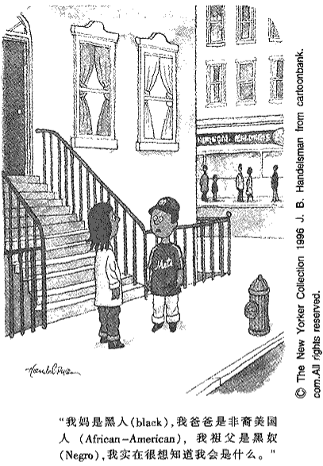

不同名字有不同的内涵。在一项研究中，心理学家们要求大学生根据一千多个名字的可爱程度、看起来是主动或被动、阳性或阴性等来为这些名字评级。虽然有众多的名词，但回答却相当接近。迈克尔、约翰、温迪是受欢迎及主动的名字，且被评为在性别中拥有阳刚特质或阴柔特质。帕西法尔、伊萨多、阿尔弗雷德则较不受欢迎，且不容易看出其性别。其他研究指出名字拥有强烈的隐含意思。许多常用的名字通常被视为主动性、较强烈及优于较不常用的名字。名字的影响确实影响人们的第一印象，但在沟通者相互熟识后似乎影响力就降低了。

名称用以辨认身份的重要性，也会应用在团体中的成员里。一项调查显示，在美国，大多数比较喜欢"黑人"(
black
）这个标签的人，使用这个名称是因为它在整个大文化下的"接受度"和"认同"得到全体的同意。他们描述自己是爱国的，接受现状的，试图向大文化看齐。相较之下，报道指出使用"非裔美国人"(
Afro-American
）这个名称的人，对身份的认同大多出自少数民族的自尊心，且并不是那么有兴趣地向大文化看齐，而认为是在大文化之中传承自己的文化。

**联盟关系**

除了塑造一个人的身份之外，语言可以增进和表明与他人的一致性。研究指出，沟通者会被与他们说话方式相似的人所吸引。同样地，沟通者会想要和适应他们甚至有相同说话方式的人结盟。这里，说话方式包括字词的选用、说话速率、字数和断句，以及礼貌的程度。在理语及说话习惯上，使用相同词汇的青少年显示出了语言一致性的原则。这相同的过程也在其他团体中运行着，从街头帮派到军事人员再到计程车司机之间。沟通研究学者称这个想与沟通者认同，并调适说话方式以与之相称的过程为*聚敛现象*。

沟通者在网络空间和面对面沟通都可以看到聚敛的现象，线上社群成员往往发展出共通的语言和对话模式，从他们增加用"我们"这个代名词就可以得知他们的交往更加亲密。MSN和电子邮件的使用者创造一些简短的代码来表示自己是网络一族，如果你知道什么是ROTFL
、IMHO或JK的意思，那你可以算是他们的成员了。这些缩写字母的意思是：笑倒在地上打滚（Rolling
on the floor laughing ）、我的浅见（In my humble opinion
）、开个玩笑（Just kidding
）。有趣的是这些网友的网络语言已经渗透到日常生活对话，例如在表达自己的无奈或脱力感时说："ORZ
"。

当两个或两个以上的人对彼此感到同等相当时，他们的语言会是相互聚敛的。但当沟通者希望或需要被认同，他们则通常会去改变他们自己地说话方式来适应他人的方式，他们会试着说出"对的事"或以一种有助于相处的方式说话。我们可以从下列叙述看到这样的过程。当移民者想在新的文化中获得成功的回报时，他们会努力精通当地语言。同样地，想要获得晋升的员工，会想办法让自己的说话方式和他们的上司一样；他们的上司会采用像经理一样的说话方式，经理则会向董事长靠拢。

语言调适的原理同样也会反向运作。沟通者想要使他们自己与他人分离时，便会采取分化策略来强调他们与他人不同的方式。举例来说，一个民族的成员们，虽然说着流利的主流语言，但可能会使用他们自己的方言来作为显示团结的方式，这是一种"区隔他人"的策略。分化策略也可能在其他情况下运作。举例来说，青少年发展出专属于他们次文化的俚语来凸显他们与成人的不同，并聚合跟他们相似的青少年。当然，沟通者最好小心何时要或何时不要用语言来聚合同侪。我们大多数都记得父母故意模仿青少年的口气说"酷毙了！"时是多么诡异尴尬。另一件要注意的事情是，当你不隶属该族群却故意使用该族群的用语，可能被视为做作或冒犯。分化策略的语言目标之一是要建立规范，指出谁有"权力"使用或谁不能使用某些特定语汇。

**权力**

沟通研究者辨识出一些语言形态，可以增强或缩减说话者对其他人的影响力。观察下列两种陈述的不同：

*"老师，对不起。我实在不知道该怎么说，但我……嗯……我猜我没有办法及时完成这项工作。我有很紧急的私事，而且……这实在不可能在今天完成。我会在星期一把工作完成并将它摆在你的桌上，可以吗？"*

*"我不能准时完成这项工作。我有紧急的私事，而且这实在不可能在今天完成。我会在星期一的时候把工作完成并摆在你的桌上。"*

不管教授接不接受这个借口，我们可以看出第一种陈述的音调比较有自信，而第一种陈述的音调比较愧疚及不确定。表5-l
从我们刚才所读的陈述中整理出一些低权力的语言形态。许多研究显示出减少这些形态的说话者会被视为较有自信、活泼及有魅力。一项研究显示，单一形态的"低权力的语言形态"实际上也可以使一个人比较没有权威性，或更缺乏社交魅力。

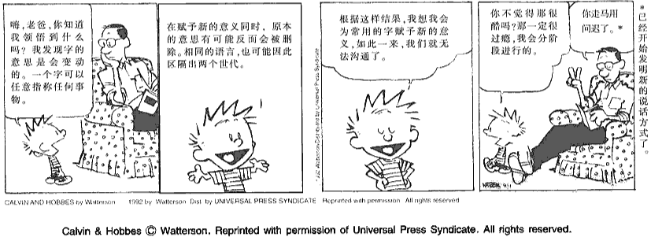

具有权力性的语言也许在北美及欧洲文化里会得到想要的答案，但不见得到处都行得通。在日本，替对方保留颜面是很重要的，所以那里的沟通者会使用不是很清楚的术语，及有点闪烁其词而避免作直接答复的字词和修饰语来进行沟通。在大部分的日本句型中，动词是摆在句末的，因此句子中"行动"的部分可以被延缓。传统的墨西哥文化很重视协力合作，所以也使用有点闪烁其词而避免作直接答复的方式来缓和人际关系。墨西哥人不以很坚定的方式说话，来确保他们不会使他人感到不适。在韩国人的文化中，他们也喜欢"间接"的语言方式（例如："或许"、"可能"胜于直接的"一定"、"必然"）。

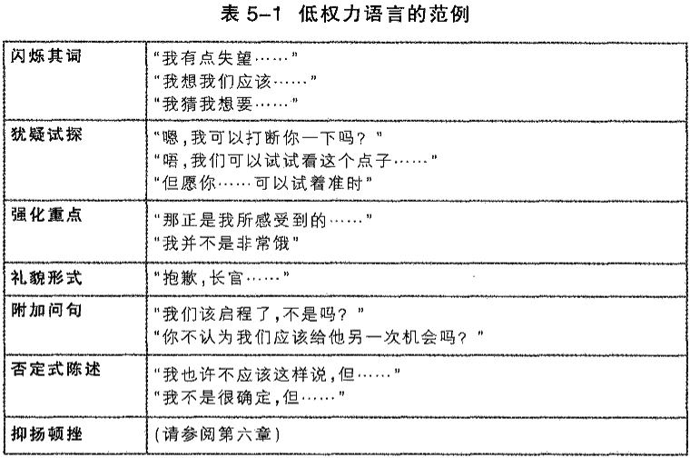

即使是在很看重强硬声明的文化中，太过权威的语言也会威吓或胁迫到他人。观察在同一个情况下两种不同的处理方式：

*"对不起，我的小孩有点无法入睡，你介意把音乐关小声一点吗？"*

*"你的音乐太大声使我的小孩睡不着。请你关小声一点。"*

比较有礼貌而没有权威的方式，会比强硬陈述的效果来得好。这样的事实如何与具权力语言的研究相结合呢？答案在于立即效果和发展正向关系的两股张力的拿捏。如果你靠近极具权威的方向，在短时间内你可能会获得你想得到的东西，但可能会让你疏远其他人，长期下去会使你的人际关系产生危机。更进一步地说，太过权威的陈述有不尊重和优越感的意味，就好像要对抗他人进而获得他们的臣服。

在一些情况下，礼貌且较不权威的说话方式会增强说话者所想表达的效果。举例来说，老板可能对他的秘书说："你介意再把这封信打一遍吗？"事实上，老板及秘书都知道这是一个命令而非请求，但是用疑问句的方式显得比较体谅些，也让这位秘书对老板的印象较好。这样既满意又合乎理性的目标结果似乎解释了为什么融合既权威又有礼貌的语言是最有效果的。

**打岔性语言**

不是所有的语言问题都来自误解。有时候，即使非常了解另一个人，但还是会产生冲突。当然，我们并不是要避免或消除所有的争议，但是删除三个语言上的不良习惯，可以减少不必要的沟通冲突，让你省下力气去对付那些无法避免的或是重大的议题。

*事实与意见的混淆*
事实性的陈述可以用对或错来证实。反之，意见性的陈述基本上以说话者的信念为主，这是无法被证实或否认的。从下列的例子中，可以看到事实性陈述与意见性陈述的差异。

*事实 意见*

*你忘了我的生日 你一点都不关心我*

*你一直千扰我 你是个控制狂*

*你说了很多的关于种族的笑话 你是个心胸狭窄的人*

这样把事实性的陈述和意见性的陈述摆在一起时，差别便显而易见。在每天的对话中，我们通常把我们的意见当作事实一样陈述，也因此我们引发了不必要的争论。例如：

*"笨蛋才会这么说！"*

*"花这么多的钱在一双鞋上，实在是太浪费了l "*

*"在这个国家，除非你是白人，要不然不会有公平的待遇。"*

留意一下，如果这些陈述前面加上"在我看来"或"我觉得"等修饰语，则陈述可以显得不那么具敌对性。本章后面会讨论"我"信息的重要性。

*事实与推论的混淆*
把你的意见表示出来可以朝理性的和谐迈向一大步，但拥有这个习惯却不能保证可以解决所有语言的问题，我们会因事实性陈述和推论性陈述而感到困惑、引发问题。所谓推论性陈述，便是在一切都未定的情况下，就做出结论。

当我们把我们的推论当作事实时，争议便由此而生。

*A ：你为什么要对我生气？*

*B ：我不是在气你。为什么你最近那么没有安全感？*

*A ：我才不是没有安全感，是你有些吹毛求疵。*

*B : "吹毛求疵"，你这话是什么意思？我才没有吹毛求疵……*

尽量不要去猜测他人的心思。我们可以用你在第三章所读过的察对知觉的技能，来辨识我们所观察到的行为（事实），并尽可能地做描述。在描述这一长串的想法后，问一下他人对你所描述的正确度做评论。

*"当你不回我电话时（事实），我便会升起你在对我生气的念头（推论）。真的是这样吗？"*

*"你最近一直问我，我是不是还爱着你（事实），这让我猜想你很没有安全感（推论）。或许我最近的行为有些反常。你在想什么？（疑问）"*

*情绪性的语言*
情绪性语言表面上在述说某事，但事实上它表明了说者对某事的态度。如果你认同你的朋友对一个艰涩主题的迂回说法，你可能会认为他是"机智的"；如果你不认同他的观点，你可能认为他"拐弯抹角"。不管这种态度好不好，都不过只是一种意见而非事实，而这样的不同是受到情绪性语言影响所造成的。芭芭拉·史翠珊对男人和女人讽刺性的描述（见本章章名页下方）可以说明情绪性语言是如何用赞许或丑化的词来形容同样一种行为。

你可以借由下列的例子来理解情绪性语言是何等的主观。

*当你认同时，你会说-------当你不认同时，你会说*

*朴实的-------------------廉价的*

*传统的-------------------老旧的*

*外向---------------------人来疯*

*谨慎、小心---------------胆小、怯懦*

*革新的-------------------激进的*

*渠道畅通-----------------宣传手法*

*战略胜利-----------------大屠杀*

*奇特的-------------------疯狂的*

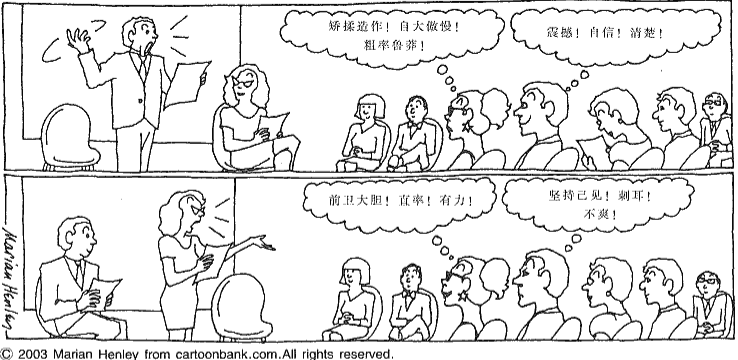

避免因情绪性字眼而产生争议的最佳方法，是用中性字眼来描述人、事物或想法，以及用之表示出你的观点。不说"我希望你戒掉这些性别歧视的评论"，而说："我不喜欢你用'女孩'这个性别标签来称呼我们。"这种不带情绪性的陈述不但显得精确，被别人接受的可能性也更大。

**语言的贵任性**

语言除了使得信息内容清楚或模糊的功能外，也反映出说话者对他或她的信念及感觉负责的意愿程度。接收或反对的回应向我们提供了很多关于说话者的资讯，同时也形成了一种关系气氛。

*"这件事"的陈述* 注意在每一种情况下句子的不同：

*"你迟到的这件事，对我很困扰。"*

*"你迟到让我很担心。"*

*"看到你真是一件高兴的事。"*

*"我很高兴看到你。"*

*"这堂课很无聊。"*

*"我无精打采地在上课。"*

正如其名，"这件事"的陈述用较不直接的字"这"来取代"我"这个人称代名词。相反的，使用"我"的语言清楚地辨识出，说话者是这个消息的来源。使用"这"陈述的沟通者会逃避对信息所有权的责任，而用一些无法辨识的来源取代之。这样的习惯不只是不精确，更重要的是这是一个无意识地想逃避立场的方式。你可以开始鉴别一下，在你的对话中增加具有直接性的"我"的语言，替代较不直接且有托词意味的"这"的陈述的效果。

*"但是"的陈述* 使用"X 很好，但是Y……"( X-but-Y
）的陈述可能会使人感到混淆。我们来看"但是"的陈述是怎么说明这样的状况的。在句子中，要是出现"但是"这个词，会删除掉先前所表示的想法：

*"你实在是个好人，但是我想我们再也不要见面了。"*

*"你为我们付出许多，但是我们还是必须让你离开。"*

*"这篇报告有许多不错的观点，但是因为你迟交，所以我只能给D的成绩。"*

这些使用"但是"的陈述就好像"心理学的三明治"一样，把真实却又残酷的信息夹在令人较为愉快的观点里。这种方式也是一种保留颜面的策略，必要时可以使用。无论如何，当目标必须绝对清楚时，最好的承担责任的方式是一语道破，而不是用"但是"的陈述来分散注意力。

*疑问句*
一些疑问句是想获得资讯的诚恳请求，另一些问句则是为了避免成为宣告而做的一种语言手段。

*"我们今天晚上要吃什么？"可能隐含有"我想出去吃"或"我想吃比萨"的意思。*

*"这堂课要用多少教科书？"背后可能隐含着"我怕选一堂要读很多书的课。"*

*"你今天晚上要做什么事吗？"是一种较不具危险性的话，用来表示"我今晚想和你一块儿出去。"*

*"你爱我吗？"安全地取代了"我爱你"这句可能会很尴尬、极具亲密或威胁性的话。*

有时表现得不那么直接是一种面对一个不容易应付的话题的机智方式。尽管在不是那么必要时使用，间接是一种避免替自己说话的方式。

*使用"我"和"你"的语言*
我们已经了解使用"我"这个字的陈述，是一种为信息负责的方式。使用"你"字的陈述相当的不同：它表达出对他人下论断。注意下列每一项"你"陈述，都隐含着对对方的抱怨：

*"你把这个地方弄得一团乱！"*

*"你没有遵守你的承诺！"*

*"你有时候真的很残忍！"*

有时候使用"你"字的陈述不一定要包含"你"这个人称代名词，不过也能隐含着相当坦白的陈述。

*"这是一个很愚蠢的笑话！" ( "你的笑话很愚蠢。")*

*"不要这么爱挑毛病！" ( "你太吹毛求疵。")*

*"把自己管好就好了！" ( "你太好管闲事了。")*

无论这个评论是坦白的或是意有所指的，都不难发现，使用"你"字的语言会激起他人的戒心。使用"你"字的陈述意味着，说话者有资格去评断他人，而这通常不是个好主意，因为即使这个评论是对的绝大多数人也不会接受。

使用"我"陈述提供一种比较精确、不那么挑拨的方式来表达不满。使用"我"字的陈述显示，说话者愿意为不满负起责任，并且并非以价值论断的方式在形容他或她对其他人行为的反应。一个完整使用"我"字的陈述包含有四个部分：

1．他人的行为。

2．你的诠释。

3．你的感受。

4．他人行为对你的后续影响。

这四个部分出现的顺序并不固定。在日常生活有不少使用"我"字的陈述例子。

*"当你在我们的朋友面前谈论到我很差劲的成绩（行为）时，我觉得很丢脸（感受）。我很怕他们会认为我很笨（诠释）。这也是我昨天晚上这么激动的原因。（后续影响）"*

*"你今天早上没有准时来接我（行为），我因而上课迟到被教授唠叨（后续影响）。好像我能否准时对你来说一点也不重要（诠释）。这就是我为什么那么生气的原因（感受）。"*

*"我觉得心灰意冷（后续影），因为最近这几个星期你都没有花时间陪我（行为）。我不确定你是否在躲我，还是你只是太忙了（诠释）。我很困惑于你对我的感觉，我希望能获得进一步的解释。"*

当被误会或可能会引发别人强烈的防卫之心时，在你使用"我"字的信息中最好包括这四个部分。在某些情况下，只要使用一或两个部分便可以了：

*"我费了一番工夫才搞定这顿晚餐，但现在全都凉了。的确，我是在生气。"（这个行为很明显。）*

*"我很担心，因为你没有打电话给我。"(
"担心"一词包含一种感受及一种后续影响。）*

除非是以对的方式来传达，要不然即使是使用"我"字的最佳陈述，也发挥不了作用。如果你使用的字眼不带任何评判的意味，但是你的声调、面部表情和姿势全部都在传达着使用"你"字的信息，那么别人也会对你产生防卫。确认你言行一致的方式是，在开口前留意，你的目的在于解释他人行为对你的影响，而不是表现得像法官或评审委员一样。

有读者对于使用"我"信息的语言可能持保留的态度，解决这种质疑的最好方法就是找到解答。

虽然含有"我"字信息的语言有它的优点，但即使把"我"信息传达、表达到最完整、最彻底也不是都无往不利，就像"我"信息的提倡者作家托马斯·戈登（Thomas
Gordon）说的："不管你用什么方式来陈述，都没有人会喜欢听到自己的行为会造成别人的困扰。"此外，"我"信息从大方向来看可能会有点自我中心，研究显示自私与自我中心的人、尤其是有"沟通自恋"倾向的人，经常都只用第一人称单数的"我"做沟通。因为这些理由，在运用"我"信息的语言时，最好是有节制地使用。

**沟通文本**

**在工作中使用"我"和"你"字的语言**

*有些时候丽贝卡觉得很有挫折感，因为她的同事汤姆常常不在位子上。她不想说出来，因为她喜欢汤姆，也不想被人听着像是在发牢骚。最近汤姆不在位子上的情况更为频繁，时间也更长了。像是今天，他把半小时的用餐时间又再多延长了45
分钟。当他回到办公室时，丽贝卡使用了含有"你"字的语言来对他抱怨。*

*丽贝卡：你去哪里了？你应该在十二点半回来，可是现在却已经快要一点半了。*

*汤姆（对丽贝卡生气的语调感到惊讶，她从未这样跟他说话）：我有一些事要办。有什么问题吗？*

*丽贝卡：我们都有很多事要办，汤姆，但很不公平的是，你利用上班时间来办你的事。*

*汤姆（在听到丽贝卡的指控后开始防卫）：我不知道你为什么那么在乎我是如何做我的工作的。老板都没有抱怨，那你在担心什么？*

*丽贝卡：老板没有袍怨，是因为我们全部都在掩护你。你应该感激我们为你的迟到或早退所编的借口。（丽贝卡又一次使用了"你"字的语言，来告诉汤姆他该怎么想及怎么做。）*

*汤姆（现在过于防备而不去思索丽贝卡的担心）：喂，我想在这边我们都会彼此掩护吧？就以上次来说，我为了让你去参加你亲戚在新加坡的婚礼，加班了一整个礼拜。*

*丽贝卡：那不一样！那时我并没有说谎啊！而当你去放风时，我却必须编造出你在哪里的假话。你让我很为难，汤姆，你别想再指望我会继续为你掩护了。*

*汤姆（感到罪恶，但是因为对丽贝卡的评论和恐吓太生气了，以至于无法承认自己的错误）：很好，我不会再要求你帮我忙了，时不起让你这么抓狂。丽贝卡可能成功地减少了汤姆的不守时，但她选择使用"你"字的语言却使得他觉得防备及生气。办公室的气氛可能就此变得很紧张——这不是丽贝卡所希望的结果。注意一下，她其实可以使用"我"字的语言来处理相同的状况，作法是去形容她的问题而不是责备汤姆。*

*丽贝卡：汤姆，我需要和你讨论一个问题。（注意丽贝卡是如何把问题视为她的而不责怪汤姆。）*

*场姆：怎么了？*

*丽贝卡：你知道你有时会迟到，或拉长吃饭时间对吧？*

*汤姆（感到大事不妙，并很小心地聆听）：对。*

*丽贝卡：嗯，我必须告诉你这会让我很为难（丽贝卡用行为式的陈述来描述问题，接着便表达出她的感受）。当老大问起你在哪里的时候，我不想说你不在这里，因为这会让你有麻烦，所以有时候我会编造借口甚至说谎。但是老大听起来对我的借口起了疑心，我很担忧这个情形。*

*汤姆（觉得防备，因为他有罪恶感，但却也同情丽贝卡的处境）：我不想让你有困扰，我会在处理我的私事时更留神。*

*丽贝卡：我知道，汤姆，我只是希望你能明白，我可能没办法再为你掩护了。*

*汤姆：嗯，好的，感谢你为我所做的。*

*注意看，使用"我"字的语言是如何让丽贝卡诚实地面时汤姆而不是以责怪来抨击他。即使汤姆没有改变，丽贝卡也可以把她心中的那块石头给放下，她甚至可为她这种不爱争辫、不令人讨厌的做法而感到骄傲。*

使用"我们"的语言克服过度使用"我"字陈述的一种方式是，考虑用"我们"这个代名词。"我们"的陈述含有——陈述的议题是说者和听者所共同关心并负责的。思考一些例子：

*"我们需要编列一下预算，这样才不会入不敷出。"*

*"我想我们有个难题，我们似乎一提到钱就会吵架。"*

*"我们好像没有把这个地方的整洁维持好，对吧？"*

不难看到，"我们"的语言是如何形成有建设性的气氛的。除了让人感到亲近外，还有种"我们同在一起"的倾向，反映出沟通中人际关系的本质。使用第一人称复数形代名词，可以表示出和别人的密切程度、共通性及凝聚性。举例来说，使用"我们"语言的夫妻对婚姻的满意程度会比经常使用"我"和"你"的语言的夫妻来得高。

另一方面，"我们"的陈述也不一定都是恰当的。有时候，使用这样的称呼会很冒昧，因为听起来好像你们是对等的。不难想象，当你说"我们有问题了……"时，另一个人可能会说"也许是你有问题，但不要跟我说是我的问题！"

在展示了使用"我"及"我们"语言的优劣后，大家对这些在人际关系沟通中最有效用的代名词有什么想法呢？研究者发现"我／我们"的结合体（例如："我想我们……"或"我希望我们……"）被人接受的机会很高。因为对于任何一个代名词来说都会出现许多不适当的状况，结合代名词实在是一个很好的想法。如果你所使用的"我"字的语言没有反应出过度的自私，使用"你"字的语言展现出对他人的关怀而非评论，使用"我们"的语言来包括他人却又不代表他们的话，你可能接近了使用人称代名词最理想的境界。表5-2
摘要出每一种语言类型的优缺点，并提供能顺利运用它们的建议。

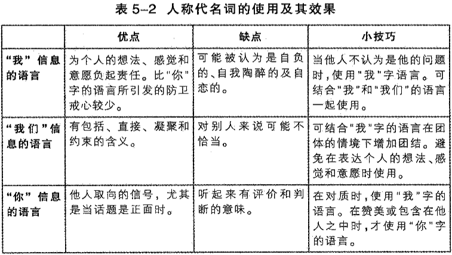

### **5.3 性别与语言**

到目前为止，我们并没有讨论语言使用状况在性别上的差异。有些学者和研究者持有"男人从火星来，女人从金星来"的论点，主张男人和女人在说话上有极大的不同；另一些学者认为这些差异不大，而且多数不怎么重要。到底男人和女人在语言使用上，有何相似与相异处呢？

**内容**

虽然在性别中有多样的话题，但平均来说，男人和女人在话题的讨论范围上，有极大的不同。最早的话题研究始于七十年前。尽管至今男女的角色有所改变，许多研究成果却相当相似。这些研究探讨17
岁到80
岁的男人和女人与同性友人讨论时的话题。有些话题是男女皆有的：工作、电影和电视，这些话题在男女两性中都经常出现。

在同性成员的讨论中，男女对性及性伴侣的话题都有所保留。男人和女人在话题内容的差异性上比相似性还来得显著。女性朋友间会花比较多的时间在个人与家事的话题、关系问题、家庭、健康和生产的主题、体重、食物和穿着、男人和其他女人上进行讨论。男人比较愿意讨论音乐、时事、运动、事业和其他男人。男女同性均在的对话中论及人的外貌、性及约会的事。一项众所皆知的事是，女人比较有可能八卦关于密友和家庭的事；相对应的，男人花比较多的时间八卦关于运动人物和媒体人物的事。女人八卦的内容比男性的内容较不具有贬抑性。

这些差异在男女双方试着沟通时可能会带来挫败感。研究者报道，男人和女人在形容与另一方讨论的话题时，会以"肤浅的"来描述。女人可能会说："我希望和他讨论重要的事，像是我们如何和睦相处，而他只想讨论新闻或我们这个星期要做什么。"同样地，有些男人抱怨女人总是太过注意琐碎的事，也太把焦点放在情绪与感觉上。

**沟通的理由**

不管沟通者的性别为何，对话的目标都在于表现善意，表现出对另一个人的谈话内容的兴趣，使对方对整个谈话的内容感兴趣等。男人和女人达到目标的方式有所不同，虽然大多数的沟通者都想使他们的互动关系更好，但男人会比女人更强调对话的趣味。他们的对话会牵涉到许多的笑话和温厚的戏弄。相对地，女人的对话牵涉到感情、关系和私人问题。事实上，研究沟通的学者朱莉娅·伍德（Julia
Wood
）明确指出："对女人来说，关系的精髓在于谈话。"曾有一项针对女性团体的调查试图找出她们从与友人的对话中可获得怎样的满意程度，最常提及的中心看法是种同理的感觉，就如同有人所说的："知道你不是孤单的。"男人间的对话通常在叙述他们所喜欢的事，女人间的对话在叙述她们所需要的联系上。已婚夫妻的研究指出，妻子会比丈夫花较多比例的时间在沟通上，而这有助于维持双方的关系。

男性谈话的目的和女性相当的不同。男性比较有可能会使用语言来完成手边的工作，而非经营人际关系。这也解释了为什么男性比较不可能像女性一样会去揭露他们的脆弱，因为那有可能会被视作是无能。当有人在表示他的问题时，男性比较倾向于提供建议，如"这没有好担心的……"、"你需要做的是……"，而不是同理。男性除了会关心他们的事业外，也比女性更善于运用对话来施展控制力、保有他们的独立性，以及增加他们的阶层位置。这解释了为什么他们会易于主导对话，及压过对方。男性插嘴是为了要提供他的亲身经历或对事情的观点（女性也会插嘴，但她们通常是为了要表达支持，这与男性相当不同）。男性这种较劲式的对话其实非常有趣。男性通常将谈话视为一种游戏：当研究者询问男性在全是男性的谈话中他们喜欢什么部分时，最常听到的回答是自在。另一项常见的回答是欣赏对话的实用性价值以及解决问题的新方法。男性也提及喜欢幽默和敏捷，这些都是男性谈话的特色。

**时话的形式**

女性在对话的表现上比男性更加变化多端。举例来说，根据一项研究指出，女性在男女混杂的对话中的问题比男性多，而且是近乎三倍。其他的研究也指出在男女混杂的对话中，男性打断女性说话的次数胜过其他的谈话方式。男人也比女人更常用评断式的形容词（"读书是一件烦人的事")
, 更多的直接指导（"再多想一下")
，更多跟自己有关的陈述（"我有很多事情要忙"）。女人比较常强调副词（"他真得很有趣")
，情绪的陈述（"如果他是真的关心你……")
，不确定动词（"这对我来说好像是……") ，语带矛盾( "有点冷，不过，还好啦！"
）这些差异显现出男人说话典型地倾向于直接、简洁和任务取向，相反的，女性说话比较典型的方式是间接的、详述的和关系取向的。

因为女人都通过对话来追求社会需求，女人经常使用陈述来向他人表现支持、显示同等地位及让对话持续的努力。因为有这些目标在，传统上被认为属于女性的对话通常都会含有同情及同理的陈述——"我觉得那根本就是我"、"我也有相同的遭遇"——也就是很正常的事情了。女人也倾向会去问问题来请他人分享资讯："你觉得怎么样？"
"你下一步会怎么做？"女性看重经营关系，这也解释了为什么女性的谈话通常有点缺乏效率和犹豫不决。"这只是我的想法……"和较为明确的"我的观点是……"相较之下，前者显得较不可能去妨碍另一名对话中的伙伴。

接纳话题对女性来说不一定是个缺点。一项研究显示，女性这种试探性的方式，事实上会比运用较强硬言词的男性来得更有说服力。另一方面，这种试探性的说话方式在说服女性上却没有那么好的效果。这项研究建议，在谈话方式上愿意并能够比较灵活的女性，能更好地说服其他女性和男性——只要听众不是男女相混。

**非性别因素**

虽然男女生在说话方式上有所差异，但其实性别和语言的使用之间的关系并不是非常清楚。许多回顾研究发现，女人和男人在沟通方式上的相同点多于相异点。举例来说，一项超过1200
份研究报告的分析指出，只有1％的沟通行为的不一致是由性别差异所造成的。男女性言词在一些方面没有显著的差异，如：不敬词语的使用、修饰语的使用（如："我猜"或"这只是我看法"）、附加问句和口语的流畅性。某一项现在正在进行的研究指出，在同一职位上的男女性主管，形式风格一样，且同样是有效率的。

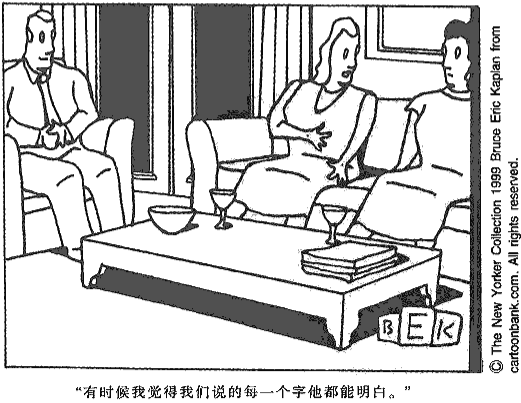

最近正兴起的研究发现，在解释两性言词上的相似点和相异点方面有明显矛盾之处。研究显示：其他影响语言使用的因素和性别比起来有过之而无不及。社会哲学就扮演了特定的角色，主张女权主义的妻子说话的时间会比另一半来得久；而没有主张女权思想的妻子说的话比另一半少。在对话方式上，解决问题的取向也扮演了一项角色，说话者合作或竞争的取向比性别更具有影响力。说话者的职业也会影响说话方式，举例来说，男老师对学生的说话方式，跟父亲在家的说话方式相比，更近似于女老师。对于女性使用"较不强硬"语言的情况，可能有两个解释。第一个解释牵涉到她们在整个社会中的历史角色，较不强硬的言同相对反映出女性缺乏权力。加果这个解释可以成立，那男女在语言权力程度的差异是可以缩减的。第二个同样在为女性使用较不强硬的语言做诉求的解释，来自于朱莉娅·伍德和黛博拉·塔南（Deborah
Tannen
）等学者，她们指出不强硬的言词的确在权力上占下风，但它获得在听者与说者之间建立密切关系的机会。因为女性一直以来都很在乎是否建立和谐的人际关系，所以也造就了女性说话比较不强硬这个典型。

另一项可以对男女个体的说话方式产生强有力影响的，是他们的性别角色认同。回忆一下在第三章的性别特征：男子气概的、女性特质的和两性特征兼具的。这些性别类型不一定跟着性别出现，所以有"具有男子气概的女性"、"具有女性特质的男性"和兼具传统上男性和女性特征的沟通者。这些性别类型比生理上的性别更能影响沟通者的形态。举例来说，一项研究显示，具有男子气概性别特征的受试者比具有女性特质或两性特征兼具的受试者更明显地使用支配的语言，具有女性特质的受试者比两性特征兼具的受试者表现出较多的顺从和对等行为，而这两种对象在顺从性和对等性上，均表现得比那些具有男子气概的受试者来得明显。在男同性恋和女同性恋关系里，两人之间的沟通风格反映出权力的差异，例如，谁赚比较多钱，这比生理性别更影响沟通。

我们对于女性与男性说话方式的异同要做出什么结论呢？虽然男性与女性的说话模式有所不同，但是可能并没有像畅销书上所说的那么严重，有些可能跟生理性别因素毫无关系。以务实一点的角度来看，不管沟通差异来自生理、性别、文化或个人因素，面对沟通风格差异的最佳策略是将其视为挑战和机会，我们要正视沟通差异的重要性，但是不要夸大或以此来污蔑对方。

### **5.4 语言与文化**

任何一个想翻译语言的人都明白，要传达出相同的含义是件不简单的事。有时粗率翻译的结果是会闹出笑话的。举例来说，一家名为Pet的美国乳制品制造业者在不知情的状况下到法语区销售他们的产品，却不知道"
Pet
"这个词法语的意思是"放屁"。无独有偶，一家美国汽水的代理商提供免费的Fresca
汽水试喝，却被墨西哥的顾客取笑，因为在墨西哥的俚语中" FresCa
"这个字代表"女同性恋"。

即使在翻译时用对了字，对于外地人或外国人来说，也经常无法使用正确的语言进行沟通。举例来说，日本的保险公司会提醒他们的被保险人，在美国旅游碰到交通事故时要避免使用具有他们文化性的"抱歉"或"对不起"的话。在日本，道歉是表达善意和维持社会和谐的一项传统，即使一个人表示歉意，并不代表他真的出差错了。相反的，在美国道歉被视作是承认错误，所以这也造成了日本观光客阴错阳差地为交通事故负起责任。翻译实在很困难，而这只是不同文化成员们中沟通差异的一小部分。语言在使用方式上的差异和语言所产生的世界观，使得跨文化的沟通成为一项具挑战性的任务。

**口语沟通的形式**

使用语言不只是选取一组特定的字词来传达一个概念，每一种语言都有其与众不同的方式。像是正式或非正式、精确或模糊、简洁或详尽等情况，都是达成沟通的重要成分。当沟通者试图将口语的说话方式应用在另一个不同的文化中时，问题可能就此产生。

口语形式会在直接程度上有所变化。人类学家爱德华·霍尔分析出两种针对语言使用的不同文化方式。低语境敏感文化在使用语言时，通常着重于尽可能清楚及合理地表达思考、感觉和想法。在这其中的沟通者，会去寻找说话时字词的含义。相反的，高语境敏感文化着重使用语言来维持社会的和谐。高语境敏感的沟通者会不想把话说得很清楚而冒犯他人，所以需要学着发现信息中真正想传达的含义：说话者非日语的行为、人际关系的渊源和一般社会的习惯主导着人与人的互动关系。表5-3
摘要出一些低语境敏感和高语境敏感文化在使用语言上的主要差异。

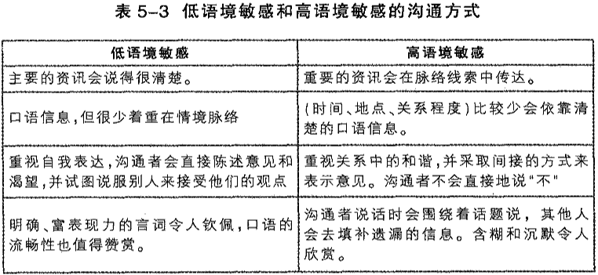

北美文化是属于在低语境敏感文化。在美国和加拿大的居民重视有话直说，对拐弯抹角会很不耐烦。相反的，大多数亚洲和和中东的文化属于高语境敏感文化。举例来说，在很多亚洲文化中，维持和谐是很重要的，如果有可能会威胁到对方的颜面时，沟通者会避免把话说很清楚。也因此，比起美国人，韩国人和日本人比较难以面对不想要的请求，也很难清楚地表达"不"。他们会以迂回的方式来表示，如："我很同意你的看法，但是……"或"我很同情你……"

像这样直接与间接的冲突，可能会加重以色列人和巴勒斯坦人之间的问题。说话直率、属于低语境敏感的以色列人注重把话说明白，而属于高语境敏感的阿拉伯人强调缓和的互动关系。不难想象文化方式产生的冲突会在以色列和巴勒斯坦间引发多少误会和冲突。以色列人觉得巴勒斯坦人不可捉摸，而巴勒斯坦人认为以色列人感觉迟钝且直言不讳。

当你以"我可能没办法"来婉谢一个你不愿意的请求时，你和另一个人都会明了这个决定不在你可以掌握的范围之内。当你的意图想明确地呈现时，你可能会说"我不想跟你们混在一起"。正如第九章说的那样——如果我们常在表示推辞的话，那是因为我们想遮掩我们真实的感受和想法。

清楚和模糊的程度是另一种的语言形式，它可以跨文化做变化，不管是详尽复杂的方式，还是简洁的方式。举例来说，说阿拉伯语的人在使用语言时，通常会比说英语的多数沟通者来得丰富且具有含义。激烈的主张和夸张的言谈，是阿拉伯语一个常见的特征，但是听在说英语人的耳里，会觉得很荒谬。这种相对立场的语言方式会导致来自不同背景的人产生误会。就像一名观察者所呈现的：

*首先，阿拉伯人认为他们不得不在所有的沟通上过度坚持，是因为其他的人希望他（或她）这么做。如果阿拉伯人只是正确地说明他的意思而非被期望的那样时，其他的阿拉伯人会觉得他（或她）意有所指。举例来说，当访客对主人的盛情款待表示够了时，简单的一句"不要"是不够的。访客为了要表达他（或她）真的已经足够了，他必须不断的重复"不要"好几次，并且再加上像是"以主之名"或"我发誓"等的宣誓。再者，阿拉伯人通常不了解其他人——特别是外国人——会清楚地指称他们所说的事，即使他们的语言非常的简单。对阿拉伯人来说，"不"可能是间接地表达同意，或者表示出对妖艳女人的赞赏。另一方面，一个简单的同意，也有可能是伪善政治家的拒绝。*

对于着重寂静的文化来说，简洁表达几乎就是沟通的极限。例如，在多数美国的原住民文化中，处理暖昧的社会情况时，他们最喜欢的方式是保持沉默。当你对比沉默和美式主流文化里的多话时，你可以轻易地想到，当阿帕契族或那瓦伙族的印第安人与北欧裔英语系美国人初次相遇时，彼此会觉得是多么地不自在。

除了上述直接与间接、详尽与简洁等的差异外，第三种存在于文化间语言的差异则牵涉到正式与非正式用语。人际关系以非正式取向为特征的例子包括美国、加拿大、澳洲以及北欧的国家，这与亚洲和非洲国家有所不同，亚非地区的人会慎重运用恰当语言。所谓的慎重运用恰当语言主要是强调所用的语言要合乎自己的身份，而不是要仔细考虑文法的精准。举例来说，在韩国，语言反应儒家亲疏远近的阶层体系。因此，他们会有针对不同性别、不同的社会地位、交情深浅程度、不同形式的社交场合所使用的语汇。例如，和老朋友，或和知道这个人但不是很熟的人，或和完全不认识的人谈话，则正式的程度也会有所不同。在韩国，一个辨识是否有学识涵养人的特征，在于他是否会根据不同的人际关系来使用语言。将这些差异和即使面对陌生人也会表现随性友善的北美人对照时，不难了解韩国人为什么会将美国的沟通者视为庸俗粗野的，而美国人认为韩国的沟通者是拘谨、不友善的。

**语言与世界观**

不同的语言形式是很重要，但仍有更多差异将种种的语言划分开来。大约在一百五十年前，一些理论学家已经提出了语言相对主义的概念，指出一个文化的世界观是被属于这个文化的通言使用者所塑造和反映出来的。语言相对主义最著名的例子，便是我们仅仅称作"雪"的现象，因纽特人却有大量的词汇去描述它（据估计有17
到100
个词用以描绘雪的一切）。不同的名称被用来描述不同的现象，像是强劲的大风雪、冰雪和飘雪。这个例子说明了语言相对主义是如何运作的。在极地的生存需求让因纽特人在对温带居民所不重要的地方发展了大量区分辨别，而在产生区分辨别后，说话者可能会以与广泛词汇相搭配的方式来看这个世界。

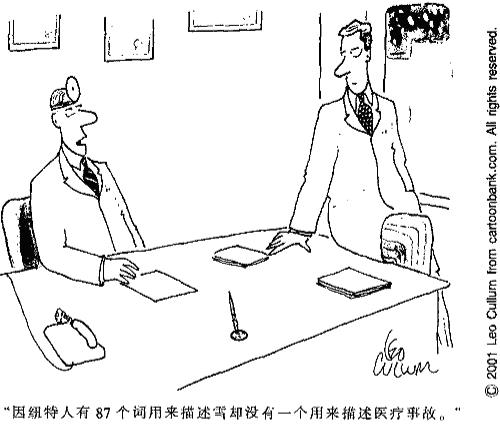

虽然如此，依然有人对因纽特人会对"雪"使用如此多的字词而感到怀疑，但也有其他支持语言相对主义原则的例子。例如，双语说话者在转换语言时，思考方式也会随之改变。在一项研究中，法裔的美国人被要求去诠释一系列的图片。当他们以法语描述时，比用英文描述得更浪漫及富有感情。同样地，香港的学生也被要求完成一项有关价值观的测验，结果使用广东话会比使用英文表达出更多中国传统的价值观。在以色列，阿拉伯人和犹太人的学生在使用自己的母语时会比使用英语这个中立的语言看到更多他们自己族群与其他人之间的差异。这样的例子显示出，语言塑造文化认同的威力——有时候会更好，有时候会更糟。语言的影响在生活中很早就开始了。以英语为母语的父母亲通常用"bad
"来指称孩子们恶作剧的玩笑，而用以来说明他们撒野的行为在有些方面是很不道德的，他们会说"Be
good !"。另一方面，以法语为母语的父母比较有可能会说"soissage !
"——意即"聪明点"，表现出了"恶作剧是很愚蠢的"的意味。瑞典人会纠正这样的行为，并说"varsnall
" ，意思是"友善点"、"对人仁慈些"。相反的，德国人会下指令"seiarting!"
，字面的意思是"做符合你身份的事"，换句话说，做出这样的行为会让人觉得你像3岁小孩。

语言决定论最令人熟知的宣言，便是萨皮尔-沃尔夫假说，这是由爱德华·萨皮尔（Edward
Spair）和本雅明·沃尔夫（Beniamin
Whorf）所提出的。根据萨皮尔的理论，沃尔夫注意到，霍皮族（美国原住民）所使用的语言呈现一种对现实的观点，而不同于其他令人熟知的方言。例如，霍皮族的语言并没有将名词和动词作区分，因此，使用这样语言的人描述的世界是不断进展着的。在英文中，我们会使用名词来描述人或物体是固定状态还是持续状态，霍皮族会以动词的观点来看待他们，所以是不断地在变化。根据这样的道理，用英文来呈现世界时，就会像是照相机所拍的快照，而霍皮族语言在呈现世界时，会比较像是摄影机的影片。

虽然很少证据支持这样极端的想法，不过对来自不同语言背景的说话者来说，看待世界的方式不可能会相同。比较中肯的观点是语言相对主义——语言会在感觉知觉上发挥强大的影响力，而这似乎令人信服。就如同一位学者所说："关于语言间的差异我们所能讨论的空间并不多，但如果讨论语言间的关系，则比较容易。"一些语言所使用的名称在英文中是找不出同义字的，比如以下这些：

Nemawashi（日语）：指一个非正式的过程，就是在下决定前想将牵扯到这个议题的所有人给弄清楚。

Lagniappe（法语／克里奥耳语）；指在协议中的额外收获，而这收获并非是合约中所期望的。

Lao（汉语-"老")
：这是用以称呼年纪大的人的敬语，足以显示他们对家族及社会的影响力。

Dharma（梵语）：指如何去发掘每个人的独特处、生活中的理想路径与知识。

Koyaanisquatsi（霍皮族语）：指自然界是处在平衡状态的，疯狂的生活方式是需要另一种新的生活方式来平衡的。

像上述的字不仅存在着，并且也成了日常生活的一部分，而它们所呈现的概念也易于了解。但是如果没有了像这样的字，每一个所列出的概念也有可能想象出来。因此，如果有"老"的观念，说话者是有可能会以敬重的态度来对待长者，而那些很熟悉"Lagniappe"的人会变得比较慷慨大方。尽管这些字存在着差异，但使用这些语言的人并不会就因此遵守某种原理原则。虽然语言能塑造思想及行为，但它不具有绝对的支配性。

### **5.5 摘要**

语言是个很棒的工具，但同时却也是许多人与人之间问题的来源。

语言同时反应及塑造了使用者的看法。用来指称人们的名称会影响人们被对待的方式。用以指称说话者的名称及他们使用的语言，则反映出说话者吸引听众兴趣的程度。语言的形态也反应和塑造出说话者被接纳的本领。

性别与语言的关系也会让人感到困惑。男人与女人说话的方式存在着许多的差异：谈话的内容、沟通的理由及沟通的形式等方面。职业、社会心理、问题解决的趋向也都影响着语言的使用，而心理性别角色比生物性别更具有影响力。

语言通常塑造并反映出文化观，低语境敏感文化会尽可能直接清楚、不含糊地表达感受及想法，高语境敏感文化为了要促进社会和谐会避免将话说得太具体。有些文化比较重视简洁有力地使用语言，而有些文化认为语言应该要详尽。在一些社会里，正式程度显得很重要，而在另一些社会里比较看重非正式的用法。

**第六章 非口语沟通：超越字词之外的信息**

**侦探福尔摩斯的探险**

*我非常渴望能够见到福尔摩斯，想进一步知道他是如何运用他令人惊奇的能力的。他的房间非常的明亮，在明亮的光线照射之下，我看到他长长的身影延伸了约两倍长，当时他正在房里快速的踱步，头深陷在胸膛前，双手紧握在身后。对我而言，他的举动说明了他现在正处于工作中，我想他心中正在升起各种天花乱坠的假设并热衷于新问题的线索。我按了电铃之后被带领到会客室，这空间曾经是我想象中的一景。*

*他的态度看起来并不是非常热情，他平常就是这样，但是我想他见到我应该很高兴。他话并不多，但是眼神亲切，对我指着一张扶手椅，丢了一包雪茄过来，并指了指在角落的烟灰缸和打火机。然后他站在火炉之前，并以他独特的内省的方式审视我。*

*他评论着："华生，我想婚姻适合你。自从上次我见到你至今，你身上多了七磅多。"*

*"七磅？"我回答着。*

*"确实是的，华生，应该再多一点，我想只是象征性得多一点。这只是一个观察的练习而已。你并没有告诉我，你最近正全力以赴地在工作。"*

*"你怎么知道？"*

*"我看到，我推论。我怎么知道你最近把自已弄得湿答答的？而且对女孩子有一点笨拙及粗心？"*

*"我亲爱的福尔摩斯！"我说，"这太过分了，如果你是活在几世纪前，你早就被烧死了。（译者注：意思是说福尔摩斯像巫师一样准确，以前巫师会被焚烧至死。）事实上是，我星期二的时候在一个城市走了好久，非常狼狈地回到家，不过我已经换过衣服了，我实在无法想象你怎么推论出这些想法。至于玛丽·珍，她简直无可救药，而我老婆也已经开始注意到她了。不过，再一次，我不知道你怎么找出蛛丝马迹的？"*

*他一边暗自笑着，一边紧张地摩擦着他那细长的双手。*

*他说："这其实很简单。就在打火机照亮的那一刹那，我的眼睛告诉我，在你左边的鞋子内侧，皮革上有六道几近平行的痕迹。显而易见的，这是因为有人曾经仔细地把鞋边沽到的泥巴刮除使然，因此，你看，我的推论是你在恶劣的天气外出，那你肯定是一个金屋藏娇、爱偷腥又不擦嘴的痞子。就事论事地说出你的状况吧！如果一个绅士走进我的房间，笑得像个只会工作的白痴一样，在他的右手食指上有一圈银黑色硝酸盐的污渍，在他前额右上方的小肉瘤突起，吐露长期带着听诊器的秘密，我除非是笨蛋，才没有说他是医疗专业领域的活跃分子。"*

*当他如此轻松地解释他的推论过程时，我忍不住大笑，说道："当我听到你推论的理由，好像事情总是以这样简单到有点荒谬的方式呈现在我眼前，我也可以自己轻松地去观察似的，可是一直到你解释之前，对于每一个你所成功推论的例子，我都是一片困惑，虽然我的眼睛跟你的一样好。"*

*"也要一样快。"他回答。他点燃雪茄，跌坐在一张扶手椅中："你看见，但是你没有观察。"*

福尔摩斯说要了解人就必须仔细端详他们，不只是看见，还要观察。观察自己和别人就是本章的宗旨，接下来的篇幅你会了解到非口语沟通的领域。我们表达自己的方式，经常不只是通过我们说了什么，而是通过我们做了什么。有些社会科学家提出，人的情感性信息来源有93
％来自于非口语的部分，在其他更精确可信的研究资料中提出接近65
％。由这些数据中我们可以看出：非口语的沟通方式在我们对别人的行为所产生的感觉中，扮演着重要的角色，当我们了解非口语沟通扮演着重要角色之后，便可以看出了解非口语信息，在人际交往内容中是很重要的一部分。

我们必须从定义开始谈非口语沟通：首先，从字面的意思来看，"非"代表的是"不是"，而"口语"则是指字词，"非口语沟通"则是指不通过字词的方式进行沟通，不过事实上通过字面的解释并不是很准确。举个例子，大多数沟通学者不会将美国手语（由许多听障人士使用）定义为非口语，即使这些信息不是通过说的方式．另一方面，你将会在接下来的文章中读到很多声音并不代表是某些语言，虽然它是以声音的形态出现。你可以分辨清楚吗？表6-1可以帮助你。

我们的重点是将非口语沟通定义为"通过非语言途径所呈现的信息"。这样不只是把手语除外，还不包括书写文字，但是包括了经由不具字词的声音所传达的信息——叹息、笑声和其他我们之前概略提到的一些声音形式。除此之外，这样的定义可以让我们去探讨说话的非语言向度上的特征，包含：音量、语速、音频，诸如此类。这也包括更多抽象的因素，比如生理外貌、沟通的情境、我们彼此站得多远或多近、我们用了多少时间等，当然，也含括大多数人所认可的非口语沟通特征：身体语言、姿势、面部表情，等等。

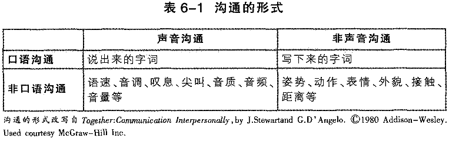

### **6.1 非口语沟通的特征**

**非口语技巧的重要性**

我们很难忽视有效的非口语表达的重要性，和对别人的非口语行为阅读和反应的能力。非口语的编码和解码技巧对受欢迎程度、吸引力和社交情绪适应等具有很强的预测力。拥有良好的非口语沟通技巧者比非口语沟通技巧较差者更具说服力，他们也比较容易在诸如职业生涯、牌局甚至恋爱等各种情境中获得成功。非口语的敏感度是第四章所提到的"情绪智商"的主要部分，学者也逐渐认识到研究口语沟通不可能忽视非口语向度。

**所有行为都具有沟通的价位**

假设你试着不进行任何信息沟通，你会做什么？停止说话？闭上眼睛？蜷缩成一团？离开房间？你会发现即使这些无声的行为都在传递信息，意味着你在"避免接触"。

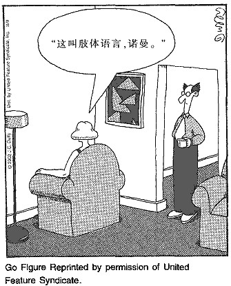

了解到人无法不沟通的事实是很重要的，因为这告诉我们：我们每一个人都是信息的传递者，而且这是不可能关掉的。无论我们做了什么，这些信息仍然不断被传播出去。

当然，我们不会总是故意给予非口语的信息，无意识的非口语行为和有意识的口语行为不同。举例来说，我们常常会讲话结巴、脸红、皱眉和流汗，我们并不想用这些行为本身来传递意义，但这些非口语行为确实代表着不同的意义，别人也会依据这些行为形成对我们的解释方式。

**非口语沟通主导着关系**

有些非口语信息可以提供实用的功能，例如警察在路况拥塞时指挥交通，街道勘测员彼此用手势动作来完成工作，等等。但是非口语沟通更常表达出第一章所讨论的关系信息，及第二章所讨论到的认同信息。

想想非口语沟通在认同管理中所扮演的角色，我们努力地营造自己的形象，在这过程中非口语沟通就扮演了一个很重要的角色，在很多情况下甚至比口语的表达要重要。另外一个例子，当你准备要参加一个宴会，而这宴会中你认为会遇到你想进一步认识的陌生人，你会做些什么？你不会将你的形象借由口语的方式表达出来（嗨！我很迷人、很友善而且也很随和），而是借由一些行为来显露出你的形象。你可能会不断地微笑，并保持一个轻松的姿势。你会精心考量衣着打扮，而且刻意装作一副并没有在外表形象上花太多力气的样子。

除了认同管理之外，非口语沟通还可以界定出我们想要与别人保持哪一种人际关系的类型。想想当你在迎接一个人时，你会有哪些动作？你可能会用力地挥手、打招呼、点头、微笑、拍拍他的背、给他一个拥抱，还是完全避免这些行为？这些方式的选择自然地流露出你与这个人的关系。非口语的行为在定义你所想要的人际关系上比字词更有力。回想一下你从那些对你感到厌烦的人身上所学到的东西，大多情况下第一个线索并不是来自直接的口语表达，而是来自他们所表现出的非口语线索，这些信息借由一些行为来传递，这些行为包括：没有眼神的接触、不同的面部表情、距离的增加，以及肢体接触的减少等。无论如何，在行为上的改变可以清楚地看出非口语沟通在分辨人际关系状态的有效性。

非口语沟通的第三种有价值的社会功能是传递情绪。非口语沟通会传递出那些我们不想或无法表达，甚至没有觉察到的情绪。事实上，非口语沟通在表达态度及情感上的效果比在认知方面的信息还好，你可以借由想象你如何以非口语的方式表达下列的句子得到证实：

l．你累了。

2．你大力支持死刑。

3．你被团体中的某个人吸引。

4．你认为请愿在学校应该是被允许的。

5．你对房间内的某个人生气。

由这个实验可以发现，除了那些猜字游戏之外，有些情况用非口语信息表达也较其他方式更好（l
、3 、5 ) ，不过有一些状况，是非口语信息所无法传递的（2 、4
）。除此之外，非口语信息无法传递：

简单的事实陈述："这本书是在1997年撰写的。"

过去或现在的感受："我昨天好高兴","我下星期要出城"。

虚构的想法："假如…… 这可能会……"

条件句的状态："如果我没得到工作，我就会搬出去。"

随着科技的发达，越来越多的网络和手机信息会同时包含着声音和视觉信息，使沟通资讯更加丰富并促进人们互相了解。现在，大多数的文本、即时通和电子邮件在传达说话者的情绪信息，还是比面对面来得少些，电子邮件和网络的新手使用者，很快就发现到他们的意思经常被误解，最大的问题就是开玩笑的事情被看得很严重。为了解决这些问题，使用电子邮件的通信者发展出一套符号——称为情绪脸谱或是表情符号。这些符号可以用键盘打出来，用以替代非口语信息的表达。以下列出来的是较常被使用的。（由于电子邮件的信息限制，这些表情符号的显示多为左右方向，而不是上下方向）。

:-) 基本的微笑，使用目的多是幽默（没有冒犯的意思）

:-D 开怀大笑

;-)
眨眼并露出微笑，有时用在讽刺、嘲笑或是在说："不要因为我刚说的打我呢！"

:-( 嘴角下垂：表达不悦的表情

:-{ 冷淡的

:-@ 尖叫、咒骂，或是非常生气

:-I 厌恶、讨厌的表情

:~-( 正在哭

:-/ 或 :-\\ 怀疑的

:-O 讶异的、大声叫出来、突然了解错误在哪（哎哟！)

就像你在第五章读过的，网络沟通者也经常使用简洁的语言或字母缩写来指称非口语反应，像是"ORZ
"表示"失意体前屈"或"88 "表示"bye - bye
"等。当然，去了解这些符号也是认同管理的工具的一部分，是十分重要的事。写出":-D
"的人是否真的露齿而笑？写出":-＠"的人真的惊声尖叫？或是他们其实只是要建立一种形象，去告诉对方我是这么想或这么感觉？类似这样的符号可以提供一些帮助，但是它们还是没办法完全替代那些面对面或是用电话沟通时那些丰富的非口语信息。

**非口语沟通提供许多的功能**

不可以因为本章讨论的为非口语沟通，就认为我们的字词和我们的行动是分开的。相反，口语与非口语沟通在沟通的每一个动作中都是紧紧相扣的两个因素（表6-2
列出了口语和非口语信息的差异），非口语行为可以借由几种与口语行为的关系而运作。

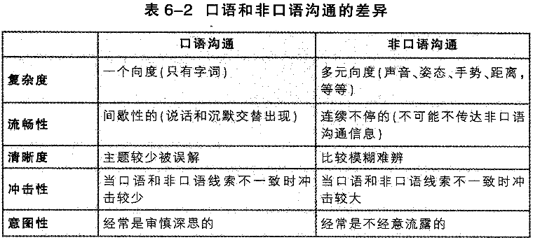

*重复*
如果有人问你最近的药局在哪里，你通常会这样回答："从这里往北走，经过两个街道就到了。"你的非口语指示随着你的手指向北方而重复一次。

*补充*
即使你口语没有重复说过的话，但是非口语行为会强化你所说过的话，补充性的非口语行为会与沟通者用语言表述出来的想法和感受相配合。你可以很容易体会到这个补充性功能的价值，想象一下你带着诚挚的笑容和温和的语调说"谢谢你"跟面无表情地说"谢谢你"之间有多么大的差别吧。

*替代*
当朋友问你"怎么了"时，你可能会耸耸肩膀而不用字词回答。很多面部表情都可以替代言语，尤其是想要表达"糟了！"
"真的吗？" "拜托！"
等意思时。当人们不想用字词来表达自己的感受时，非口语的方式就可以替代言语做一些回应，当你面对一些你不以为然的情境时却又不方便说些什么时，你可能会以叹气、转动你的眼睛或是打呵欠来替代。同样地，父母在某些场合里可能会不发一言而是以瞪眼怒视让小孩停止喧哗吵闹。

*强调*
就像我们在出版物中会使用黑体或斜体来强调重点一样，我们也用非口语的方式加强口语上的信息，例如在指责别人时，会加上用手指指着他的动作（这样会引起被指责者的防卫行为），或者在说话时加重语气（都是你出的好主意！）也是以非口语方式加强的另一种方式。

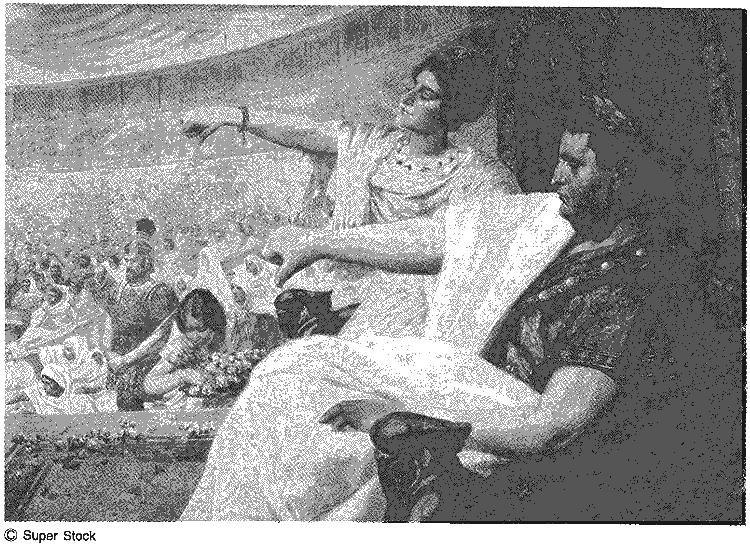

*调整*
在一连串的口语沟通之中，非口语的行为可以提供调整的功能。举例来说，在社交宴会的场合，我们常常会无意识地接收或传送"换下一个人了"的语音线索。当你差不多讲到尾声时，一般的默契是这样的：出现高扬的顿挫，接着用低抑的音调或拉长最后一个音节来做结尾，最后停止发言。如果别人想要打断你，而你不想中断说话仍然要继续说下去的话，你应该先借由听得见的呼吸声抑制他想打断你的企图，接着保持同样的声调（因为先升后降的声调暗示着发言即将结束），避免在发言过程中有任何被打断的机会。我们也可以用非口语来调整谈话气氛，比如用"点头"来表示"我了解"、"请继续"，眼睛飘到别处来表示"很难专注"，或不时看着手表表示"想要快点结束谈话"。当然，我们很辛苦地在某些团体中学到的某些非口语信号，并不保证在另一团体中也可以畅通无阻。

*矛盾*
人们常常会在口语与非口语上表现出不同甚至是矛盾的信息，对于这种复合型信息，最常见的例子就是我们看到一个满脸通红、血管扩张的人大声吼叫："生气？我才没有生气呢！"

复合型信息是在自己不知不觉中所产生的，有些人并不知道矛盾的口语与非口语信息对沟通会产生很大的影响力。当我们年纪渐长之后，面对这些复合型信息的解释也会越来越好。6
到12岁的小孩通常依据说话者所说的话产生感觉，而成人则多依靠非口语的信息影响我们的印象。举例来说，听众在判断说话者是否诚实时，大多是依据他的非口语行为而不是他所说的话。他们也依据非口语行为来判断说话者是否如他们所言的有能力及镇定，如果说话者在口语与非口语上有不同的话，就会影响自身的说服力。只要口语与非口语信息出现轻微的矛盾，说话者就有可能被怀疑有欺骗的嫌疑。下一段我们会讨论欺骗。

*欺骗*
在双重信息中最有趣的应该是欺骗这一种形式，欺骗的信号——通常称为泄漏——可能在各种非口语的行为中出现。欺骗是不一致行为的强而有力的指标，当人们日常生活行为的模式开始改变时，通常就是欺骗的一种警示。一些非口语的途径较其他方式更容易泄露天机，面部表情给的线索通常也较身体给的线索少，可能是因为欺骗者会花比较多的注意力在面部表情上，不过最常露出马脚的是声音。有一个实验找一些人进行演讲，并鼓励他们说谎。相较于那些在演讲过程中被要求诚实的人，他们在进行演讲的过程中讲错的地方较多，演讲时间较短，讲话速度较慢。另一个实验的结果显示说谎者的声音频率较诚实者的频率高。研究者同时也发现，说谎者在回答问题时，如果问题是事先准备过的，他回答的速度会较诚实者快，这可能是因为没有太复杂的思考；但若是没有准备过的，回答时间就会很长，比诚实者花的时间更长。表6-3摘要出说谎者较常泄漏出的欲盖弥彰的非口语状况。

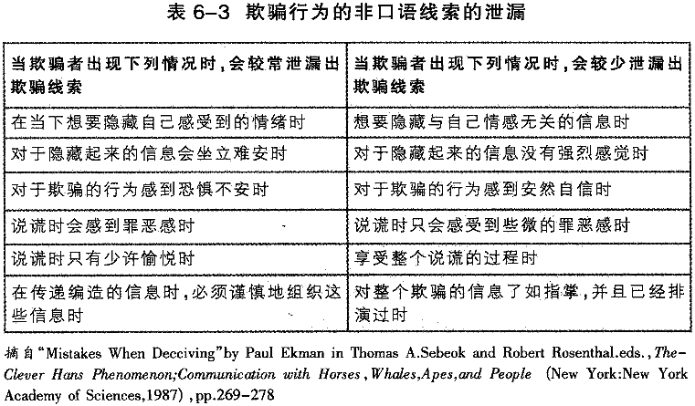

各种自助手册和研讨会都认为很容易从观察非口语线索而辨别出说谎者来，但是科学研究并不支持这个观点。研究显示大多数人只有跟掷钱币一样的50％的正确率来指认出这个人有没有说谎。就像某个作家写的："世上并没有泄密者的克星，皮诺曹的鼻子并不存在，所以说谎者难以露出原形。"

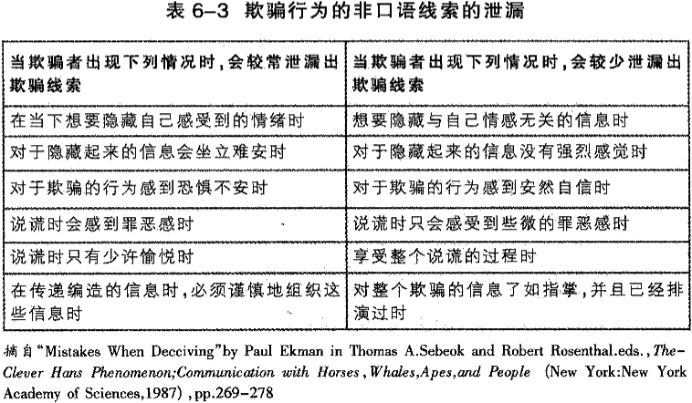

此外，有些撒谎者非口语行为的描述其实没什么用。例如，传统智慧认为撒谎者难以抵挡目光凝视，因此比不撒谎的人更常眼神飘忽。但是研究结果持相反的意见：撒谎者更能承受目光凝视，更少眼神飘忽，部分的原因是因为他们相

信这样让自己看起来更诚实。换句话说，当我们形成对说谎者非口语倾向的一些推论时，要小心这些推论让我们产生误解和偏见。

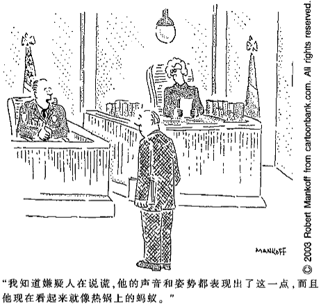

**非口语沟通是暖昧不明的**

在第五章我们已经了解到口语表达经常是多重意思，但是非口语信息更加模糊不清。想一想一个简单的动作——眨眼——可以代表什么意思？在一个研究中，大学生将这个动作用来解释很多不同的事情，包含用来表达谢谢、表示友善、衡量危险、性引诱或者只是眼睛有问题。

除了这个例子之外，很多非口语行为其实都是模糊不清的。想一想，如果一个平常经常聊天的朋友突然保持沉默，你可以有哪些解释。或者假想一下如果一个你平常非常欣赏的对象突然对你投注比以前更多的注意力，这个行为代表的意思会是什么。虽然非口语行为常常出现，但是它代表着许多不同的意义，不太可能有完全正确的解释。

非口语行为模糊不清的特质，在异性追求及性行为上更可以明显地看到。一个亲吻代表的意思是"我很喜欢你"，还是"我想跟你发生性行为"?
在浪漫的时刻将另外一半推开，代表的意思是"现在停止"，还是"再继续下去"？沟通学家格蕾丝·林（Grace
Lim ）和迈克尔·罗洛夫（Michael Roloff
）对一百位大学生在十二种约会的情境下是否同意发生性行为进行调查，并进一步讨论在哪些状况下，口语表达（例如：你要跟我发生性关系吗？）会较非口语表达（例如：把接吻看成是发生性行为的暗示）更好。在每一个状况下，口语上的同意都比非口语的同意行为较为明确。这并不表示亲密的伴侣不可以信赖非口语的信息（如接吻代表着愿意发生性关系），只是这些非口语行为如果能伴有口语上的表达可以比较不容易产生误会。研究的结论似乎已显而易见：在同意发生性行为这件事上，口语表达较非口语表达更清楚。这只是因为口语表达清楚多了，而不是代表这些口语表达更实际有用。运用这些较清楚且较不会产生误解的口语信息，可以避免一些不幸的事情发生，包含：伤害、法律上的诉讼甚至约会强暴。

并非所有的非口语行为都是这么模糊不清。在一个实验设计中发现，参与者比较会注意到正向的面部表情，如快乐、爱、惊喜；也会比较注意到负向的情绪，如害怕、伤心、生气和厌恶等。然而在真实生活中，自发性的非口语表情是如此的模糊不清，使得这些观察者没有办法准确地辨别他们真正的情绪为何，甚至与盲人摸象的结果差不多。即使是最厉害的非口语解码高手也很难达到百分之一百的正确。

有些人在了解非口语信号时比别人更困难。例如：小男孩经常错失别人以非口语传送给他的情绪信息——比如老师以扬起眉毛来表示不悦。有一种人摧患"非口语学习障碍"(
NVLD )
，这种人在学习解读面部表情、声音的音调等线索时十分困难，因为右大脑半球信息处理过程发生障碍，NVLD患者无法了解诸多非口语线索。对于有人显现幽默和讽刺时，患有NVLD
的小孩更是特别难以理解，他们经常只能直接解读字面上的意思，而无法意会说话者真正的弦外之音。他们也经常不知道在新环境中怎样做才是合适的行为表现，所以需要依赖死记下来的公式，却往往行不通。例如：

*假如孩子们学到用一种正式的握手方式将自已介绍给新认识的成人，并说"很高兴认识你"，之后他们会如法炮制地用这个方式把自己介绍给新认识的小朋友们。他们可能因此被当作"怪人"或"老土",
同伴可能做出促狭的回应，比如挤眉弄眼之类，而他们完全漏接这些信息，因此无法在下一次时修正自己的行为。*

即使对于没有NVLD
困扰的人而言，非口语行为的模棱两可也令人十分受挫。你在第三章学到的知觉检核技巧是一个很有用的工具，足以帮助你确认难以分辨的线索的正确意义。

### **6.2 影响非口语沟通的元素**

我们的非口语沟通方式会受到生理性别影响，并且非常受到社会化历程影响。为了要对此有进一步深人了解，请继续读下去。

**性别**

男性和女性在非口语沟通的刻版印象上的差异清晰可见，只要想一想那些屡见不鲜的夸张讽刺漫画里的肌肉男和优雅女就可以了。许多幽默的短片和戏剧都喜欢突显剧中人出现相反性别特质来制造笑点。

虽然我们很少有人会出现很夸张的男性或女性传统行为的特征，但是男性和女性看起来的样子与动作都有显著的不同。有些是明显的生理差异如：身高、体型、音量，等等，而有些则是社会差异：通常女性更多使用非口语表达，女性也比较能解读别人的非口语信息。

大多数的沟通学者认为社会历史因素对男女性在行为的塑造方面深具影响力。例如，女性在过去历史上处于劣势地位，所以更有机会去养成解读非口语线索的能力：在工作中位居下属职位者也具备比较好的解码技巧；当女人逐渐在工作场和家庭中获得平等的地位时，很吊诡的结果是其解读非口语线索的能力反而降低了。

在西方世界中，男性和女性在行为上也有许多显著的不同，以下是一些例子：在进行沟通时，女性比男性有较多眼神上的接触；女性在声音上的表现比男性更多样化；在沟通时无论是跟男性交谈或是女性交谈，女性的距离通常比较近；而男性即使跟同性交谈也会保持适当的距离。男性比女性需要并通常可以获得较大的个人空间。男性在沟通时，较女性习惯前倾．女性在交谈时通常会站得直挺挺面对说话者，而男性说话时则多会使自己的身体与对方呈45
度角。女性借着面部表情传达较多的情感，而且女性也比男性更常出现笑容。即使男性的动作通常都比较夸张，女性的肢体动作还是比男性多。

从以上的讨论中，不难发现男性跟女性在沟通的方式上真是南辕北辙。但事实上，男人和女人在非口语沟通上的相似度多于相异度。有一份详尽的研究中指出男性跟女性在沟通上其实只有很小的差异，两者的相似性约为99
% ，差异只有1
％。男女两性和文化规范固然会影响非口语形式，但是并没有夸张到"男人来自火星，而女人来自金星"的程度。

**文化**

就像语言文字一样，不同文化的非口语表达方式并不相同。1933年至1945年期间担任纽约市市长的菲奥雷洛·拉·瓜迪亚（Fiorello
La Guardia )
精通英文、意大利文及希伯来文，研究者在看他参加竞选时的演讲时发现，即使他们将电视机的声音关掉，他们仍然可以借由观察他非口语行为的变化来分辨他在说什么。

在不同文化中有些非口语的行为代表着不同的意思。例如，在美国将拇指与食指指尖碰触在一起形成一个圆圈是"OK
"的意思，这样的手势代表着兴高采烈的肯定，但在其他国家这样的手势就不见得有正面意义了；在法国跟比利时这个手势代表的意思是"你的价值为0"
，在希腊与土耳其则代表低级的性邀请，通常带有侮辱的意义。通过这些例子，很容易就可以想象到一些单纯的旅客会因为没有考虑到文化的不同而使自己身处险境。对跨文化差异的无知可能会破坏人际关系，甚至铸成大错还不自知。人类学家爱德华·霍尔更指出，在美国当人们谈生意时，感觉比较舒服的距离大约为四英尺，而中东的人则习惯更接近一点。这些由于文化不同而在外交或生意场合出现不恰当举止的情况经常可见。在沟通时中东的人可能会往前移动，这样的距离对他们而言仍旧是舒服的，而美国人就会往后退，这样的结果会使两个国家的人都觉得不舒服却不知道原因。

当人们知道一些日常表现出来的非口语行为是因为文化不同所导致的时，他们就会变得比较宽容一些。在一个研究中，一些美国成年人观看一些来自美国、法国及德国等演讲者的录影带。如果在过程中消音，观赏者对外国人的负面评价会较多，但如果将演讲者的声音加上去，使观赏者可以了解到这些演讲者来自不同的国家，他们批评的几率就会下降。沟通者可以通过学习而更多地察觉其他文化的非口语特性，研究显示训练能够显著地改进评判面部情绪表情的正确率，尤其是在跨文化情境上进步更加明显。

就像距离一样，在世界各地，眼睛接触有很多种不同的形式。在拉丁美洲、阿拉伯世界和南欧，直接的眼神接触被认为是适当的；然而在亚洲及北欧的人们则通常会环顾四周，而避免眼睛的接触。这样的差异往往会使得倾听者不舒服。

表6-4显示，差异容易导致误解。例如，经由观察得知，女性黑人处于成员全部为黑人的团体中时在非口语上行为十分频繁，而且习惯彼此打断；这情况比女性白人在成员全部为白人的团体中更加明显。这并不是说女性黑人的情绪强度大过女性白人，更可能的原因是两个团体隶属两种不同的文化特性。研究者发现，在完全混杂的团体中，女性黑人与女性白人两者都会更加接近对方的习惯，这种非口语行为的聚敛性说明了技巧熟练的沟通者在跟次文化成员或不同文化背景成员互动时能够调整自己的沟通行为，使交流更加顺畅而有效。

很多非口语行为是普遍的。有一些表情或行为在全世界所代表的意义都一样，比如微笑或开怀大笑，就是大家都认为是正面情绪的表现；而厌恶的表情就是不愉快的标志。查理斯·达尔文（Charles
Darwin
）相信这些表情是演化的结果，在人们语言尚未发展的时候，源于生存的需要，这些表情可以使他们传递彼此的感觉。尤其当我们对那些听不见或看不见的孩子进行测试时，这些天生的表情会显得更清楚。这些孩子除了缺乏社会训练之外，在展现表情的丰富性上，他们微笑、大笑、哭的方式，和那些听得见、看得见的孩子没有不同。换句话说，非口语行为一如我们许多的沟通行为一样，都受到基因遗传和我们的文化两者所影响。

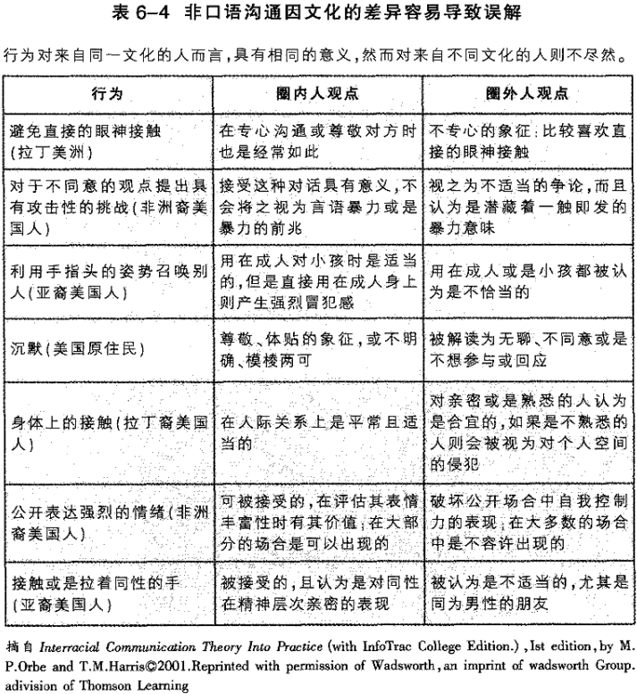

### **6.3 非口语沟通的类型**

在心中记住非口语沟通的特性，接着让我们一起来看看除了字词以外的沟通方式。

**身体动作**

在讨论非口语沟通时，最重要的部分是非常广泛的人体动作学，或身体姿势、手势等。在这一节中我们将讨论这些姿势、手势、身体方向、面部表情及眼神在人际关系中所扮演的角色。

*身体定向*
我们要从身体定向——我们以身体、脚与头，面对或背对其他人的程度开始讨论。为了了解这些身体上的姿势是如何传递非口语信息的，你可以试试下面的实验。你需要两个朋友帮助你进行这个实验。想象一下，假如你正和一位朋友进行着个人的对话，而这时第三个人走过来并且加人到你们的谈话中。你并不喜欢这个人，但又不想很没教养地要求他离开，那么你的工作就是利用你的身体姿势让他知道你们想独自交谈。在这一过程中你可以跟第三个人说话，但不可以用字词直接告诉他你们想要独自交谈。实际上，你只要明显地将你的身体背向那位闯入者，就可以让他清楚地了解你的感受。他会发现他很难穿过你的肩膀去进行交谈。在这过程中，所传递的非口语信息是"我们现在正在兴头上，而且不希望你加人我们的谈话"。从这个情况中我们可以了解到，直接面对一个人表示你对他有兴趣，而若背对一个人则表示出你想要避免跟他有交集。

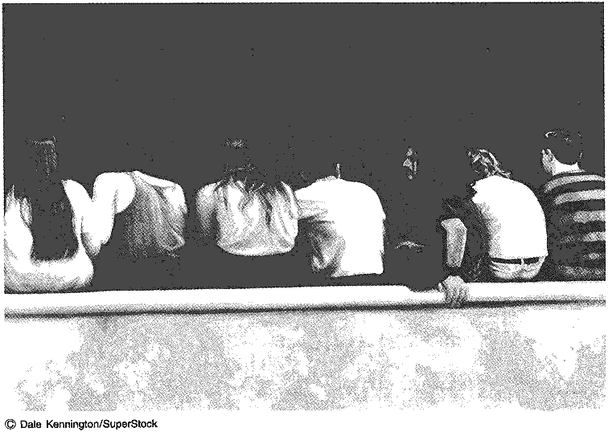

借由观察别人的面向，你可以了解他们的感觉如何，下次如果你处在一个拥挤的环境中，你可以选择和一个人面对面，试着去观察他的行为反应，看他是否会熟练地避开。然后以同样的方式，反观自己身体的面向，你会很惊讶地发现你已经无意识地避开了一个人，或是你几乎在同时已经使自己"转移"了。

*姿势*
另外一种非口语沟通的方式是通过我们的姿势。如果你对此抱有怀疑，先暂停阅读，注意你坐的姿势。你的姿势透露出你的感觉是什么？在你旁边有没有人？你从他现在的姿势能读到什么信息？借由观察你周遭的人的姿势，就像观察自己一样，你可以通过许多非口语的途径去了解别人的感觉。

在日常用语中可以发现人们常以身体意象来表达沟通内涵。以下是一些蕴涵情绪与身体姿势的常用语：

*我不想就此歇手*

*卸下你背上的包袱*

*望穿秋水*

*背水一战*

*不要把责任全扛在自己肩上*

*他已经可以独当一面了*

*她肩上承担太多的重担*

姿势可能是非口语行为中最不模糊的一种。在一个研究中，受试者面对电脑绘图设计出的176
种人体模型姿势，将特定情绪指派到这些人体模型姿势中。超过90
％的受试者具有一致性，会将"生气"、"悲伤"、"快乐"指派到同一个人体模型姿势，有些姿势似乎尤其容易解读。厌恶是最难经由身体姿势辨识的情绪，而有些受试者认为惊讶和快乐有相似的姿势。紧张和放松提供了辨识其他姿势的情绪之钥，我们在没有威胁的情境中会采取放松的姿势，在面临威胁的情境中会采取紧绷的姿势。基于这个观察，我们可以只凭借着观察对方放松和紧绷的状况就说出一大堆别人可能的感觉状态。例如，紧绷是分辨一个人社会地位的方法，通常地位比较低的人都比较僵硬、紧张，而地位比较高的人则比较放松。这种状况经常可以在公司内看到：员工通常比较严谨，而老板则常常向后倾斜坐在椅子上。

*手势*
手势——手或手臂的运动——是一种重要的非口语沟通。事实上，它们是如此的基本，导致一般人在使用它的时候都不自觉，且也不会注意到它。有一些社会科学家认为手势是人类最早的沟通形式，比说话早了好几万年。

最常见的手势功能是社会科学家所谓的强调重点的手势。这些动作伴随着谈话而且不能单独存在。例如，假如有人在街角问你如何到达某一个餐厅时，你可能会告诉他街道名字和明显的路标，但是同时你也可能会用手指出方向并用手势指引他如何到那里。如果去掉话语只留下你的动作，这个人可能就找不到餐厅了。试着想想看身边是否有些人很喜欢"用手说话"，即使讲电话也不停地比划手脚，而对方根本就看不见这些手势。

第二种手势的形式是表征的功能，这些非口语行为带有非常明确的意思，几乎所有不同文化的人都知道它所代表的意思。表征跟强调重点不一样，表征可以独立存在，并且经常可以取代语言。举例而言，我们都知道点头代表"对"、摇头代表"不是"、挥手代表"你好"或是"再见"、当手放在耳朵旁边代表"我听不见你说的"，而几乎所有满7岁的人都能了解比中指的含义。有一点必须记住，表征的意思并非如上述般放诸四海而皆准，例如在北美"竖起大拇指"表示"很棒"，在伊拉克和其他国家则意味着猥亵淫秽之意。

手势的第三种形式是调节动作，是指无意识的身体动作对环境做出回应。例如，冷的时候瑟缩打颤、双手抱胸来取暖就是调节的例子。当然，有时候我们碰到让自己感到很"冷"的人时也会双手抱胸，这种调节的手势流露出两人的关系气氛。调节动作通常都是无意识的，比如在面谈时不自觉地扳指关节或搓手臂一类。我们也可能在放松的时候出现这些调节动作。当你放松警戒（无论是独自一个人或是和朋友在一起）时，可能会出现像搓耳朵、卷头发或是抠指甲一类的调节动作。无论如何，烦躁不安的信息隐藏着一些事情，所以观察者很习惯于去解释这是一种不诚实的象征。事实上，并非所有的烦躁不安都是不诚实的，因此，不要随便对调节动作下结论。

表情与眼神
脸和眼睛是身体上受到最多注意的部分，但这并不表示它们的非口语信息是最容易解读的。以下几个理由说明，脸部是非常复杂的表情渠道。

首先，要形容我们的脸部及眼睛所产生信息的数量及种类是一件很困难的事。研究者发现，眉毛及额头就会产生至少八种不同的位置，眼睛和嘴唇会有超过八种，下巴大约有十种。当你在计算这些我们感觉到的复杂表情时，就不难发现要去搜集所有表情汇编成一本字典，并在字典中标注每一个表情对应的意思，几乎是不可能的事。

第二，面部表情之所以难以了解，是因为它转换的速度十分快。在影片的慢镜头中，将主角的面部表情放慢速度，会发现每一格时间点眼睛好像都眨了一下。同样地，在脸上的不同部位可能也会清楚地出现不同的表情：快乐和惊讶表现在眼睛和下巴上，生气表现在下巴、眉毛、额头上，害怕跟伤心表现在眼睛里，厌恶表现在下巴上。

除了表情表达情绪的复杂方式之外，你可以从观察这些表情获得一些信息，最简单的方式就是寻找那些比较夸张的表情。通常，当某人想骗其他人时，他会对他想要强调的特定观点加以粉饰，并尽量夸大，让事情看起来像真的似的。另外一种察觉别人感觉的方法就是在他似乎无暇顾及细微表情时观察他的表情。我们都有过对别人匆匆一瞥的经验，比如那些因车祸而塞车停下的车辆驾驶员或是聚精会神看着运动比赛的观众。在那过程中我们仔细观察，会发现他们显出了在其他警觉时刻中很少出现的表情。你可能会记录下这些在脸上不同部位所出现的不一致的表情：眼睛正说着一件事，而嘴巴或眉毛却在说着另一件完全不同的事。

眼睛本身就可以传递好几种信息，跟某人目光接触，通常是一种关联的象征，而目光的转移，则表示了避免接触的欲望。这样的规则在商业行为上也有实用的价值：当服务生（无论是男性或女性）一直保持目光的接触时，顾客通常会给比较多的小费。研究者也发现直接与对方眼神接触的沟通者比眼神逃避的人更容易使得对方依从自己的要求。

另外一种由眼睛沟通所传达出来的信息就是正面或是负面的态度。当有人带着适当的面部表情看着我们的时候，我们会得到他对我们感兴趣的消息，这样的表情我们就称之为"抛媚眼"。同样的，如果我们对某个人投注目光很久而她却总是避免目光的接触，我们大概就可以确定她可能不太喜欢我们接近她。当然，在许多追求的游戏中，感受到别人目光的人会假装转移眼神，不去注意目光所传递的信息，但是目光流连在对方身上仍然会显露出对对方的兴趣。眼神的沟通包含了支配与从属的信息，我们可能试过用眼神压倒别人，在现实生活中我们也有过用垂头丧气的眼神表达自己的让步。就连瞳孔也能进行沟通。研究者在实验中曾让一些男人跟女人看各种不同的图片，再测量他们瞳孔放大的程度，这实验的结果是很有趣的：男人在看到全裸女人的照片时瞳孔会放大18
% ，而女人在看到全裸男人的照片时瞳孔会放大20
％。非常有趣的是，当女人看到妈妈和婴儿的照片时，瞳孔放大的程度最大。

**声音**

声音本身就是非口语沟通的另一种形式，社会学家用副语言来形容非口语声音的信息，这种方式可以使得相同的字词表达出各种不同的意思。例如，在一个句子中，可以经由强调不同的重音而使得说话者的意思有所不同：

*<u>这是</u>一本
<u>有趣的</u>有关沟通的书（不只是一本书，而是特别的一本书）。*

*这是一本 <u>有趣的有关沟通的</u>书（这本书是一本优秀的，特别的书）。*

*这是一本有趣的
<u>有关沟通的</u>书（这本书以沟通的内容见长，而不是文学价值或剧本）。*

*这是一本有趣的有关沟通的
<u>书</u>（这不是一场演奏或是录音带，是一本书）。*

我们的声音可以借由很多方式而成为交流工具。包括声音的音色、速度、频率、暂停次数和暂停的长度，及在说话过程中停顿转折的部分，如结巴或使用"嗯"、"啊"之类的字词，所有这些因素都会增强或是削弱我们所传达的信息。

研究者借由没有实质内容的演讲定义出副语言的影响力。原始的演讲内容经由电子手法处理过，使得演讲者说话的内容无法听清楚，但是副语言的部分则不受影响（听一些你不懂的外国语言也有同样的效果）。受试者听这些没有实质内容的演讲，却能够一致地辨识出演讲者的情绪状况及其优点。

这些副语言线索的影响是很强大的。事实上，当要求听众去判断演讲者的态度时，他们对副语言的注意比对语言的注意更多。此外，当声音的因素与语言的信息不同时（比如当有人大声喊出"我很高兴！"时）听众往往会根据副语言而不是语言来做出自己的判断。小孩子对那些说话声音比较温柔的人会给予比较温顺地回应，而面对那些说话比较不友善的人通常会比较害羞地离开。

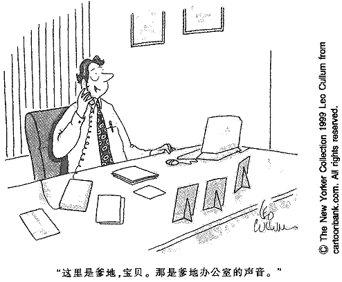

副语言会在很多方面影响行为，有些似乎有点令人意外。研究者已经发现人们通常比较会顺从那些跟自己类似的人所要求的事情，那些说话比较快的人通常比较喜欢回应那些同样说话较快的人，反之，说话比较慢的人也比较喜欢说话速度比较慢的人。除了顺从那些相同语速的演讲者之外，听众也比较喜欢那些跟自己讲话速度相似的人。

讽刺也是借由加强声音的语调而转换成与字词相反的意思的。你可以通过下面三个句子来体验一下态度的转换。先用普通的方式说一遍下面的句子，然后试试换用讽刺的语调来说：

*"非常感谢你！"*

*"在这盲目的约会中 我真的很快乐。"*

*"再没有什么东西比青豆更让我喜欢了。"*

当人们用副语言来传达非口语信息时，经常会引发对真实信息的忽视或者错误解读，尤其是讽刺这种只通过声音上的细微改变加以强调的含义。某些特定的成员，比如儿童，不大具有睿智的反应力，在听话的技巧上也很差，因此很容易误会讽刺的信息。研究发现10
岁以下的儿童缺乏足以分辨哪些是讽刺信息的语言解读能力。

声音的成分会影响别人如何看这位说话者。例如，说话比较大声且没有口吃的人，会比那些说话比较小声且吞吞吐吐的人看起来更有自信，具有较迷人声音的人也会比那些声音较不具有吸引力的人更受到尊敬。图6-1显示，不同文化也会造成不同结果。调查显示，墨西哥与美国对理想声音的定义有相似处，也有不同的看法。腔调在印象的形成上扮演着非常重要的角色。一般而言，如果你的声音腔调属于社会地位较高的族群，那么腔调明显会引导人们倾向正面的评价，如果你的声音腔调属于地位较低的族群，腔调明显则会导致负面评价。

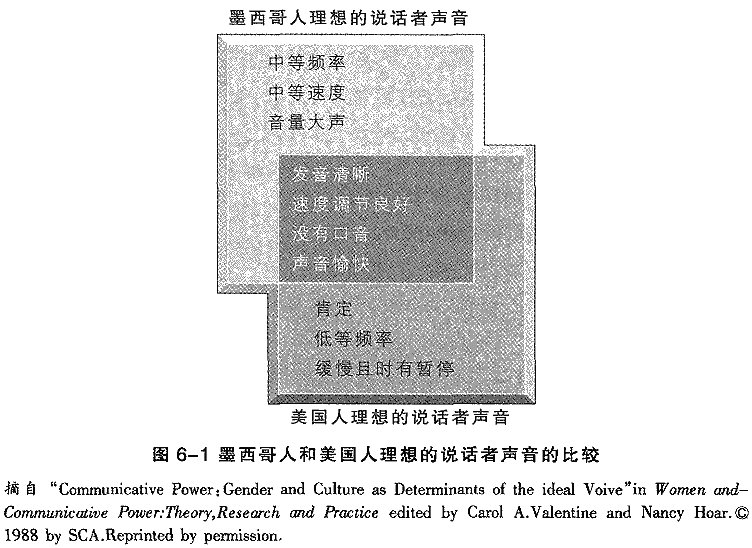

**触碰**

触碰可以传达许多信息，并且表示出不同种类的人际关系。

*功能的／专业的（牙科考试，剪头发）*

*社会的／礼貌的（握手）*

*友善的／温暖的（在背后支持，西班牙的欢呼abrazo )*

*性的唤起（某些接吻，抚摸）*

*侵犯行为（推挤，打耳光）*

你可能会不同意上述类型括号内所举的例子，而认为某些非口语行为会在不同关系中发生。例如，一个接吻也可能只是一种礼貌而已。什么样的接触会传达出较多或较少的信息？研究者已经列出下列的因素：

*身体的哪一部分去做碰触*

*身体的哪一部分被碰触*

*碰触的时间持续多久*

*用了多少力气*

*在碰触之后有没有其他行动*

*是否有谁看到*

*碰触的行为发生在什么情况下*

*发生碰触之两者之间是什么关系*

从这个列表可以看出，触碰实际上是一种复杂的语言，由于非口语信息本身就是模糊不清的，所以这种语言容易产生误会也就不足为奇了。拥抱只是一个嬉戏的方式，还是有强烈感觉的暗示？肩膀的接触只是一种友善的姿势，还是有特别的目的？非口语行为的暖昧特质，常常会引发一些严重的问题。

在我们决定如何对某个人作出回应时，触碰扮演了一个重要的角色。举个例子来说，在一个实验室里，受试者对那些有过触碰（当然是适当的触碰）的伙伴会有较正向的概念。除了会增加好感之外，触碰也会增加顺从的行为。在一个研究中，受试者被一群妇女团体的人引导，这些妇女团体要求受试者为一个受损有待修复的电话亭捐一些一角零钱。当这些妇女团体对受试者做这样的要求时，如果伴随在其臂膀上轻轻地接触，这些受试者捐一角硬币的意愿有显著的增加。在一个类似的实验中，有些男子或是妇女团体要求受试者为请愿签名或是填写一份问卷，同样的，如果在邀请受试者的时候伴随着臂膀上轻轻的接触，他们通常会比较愿意配合。在填写问卷的研究中，其结果是非常戏剧化的，在此过程中有触碰的人有70
％愿意配合，而没有触碰行为的受试者中只有40
％愿意配合（也就是这些人倾向不配合）。触碰的另一个额外影响是在工作上的利益：一个餐厅中的服务生如果在顾客的手或肩膀有短暂的触碰，通常会得到较多的小费。且不论女人或是男人在酒吧中，如果服务生有一些触碰，通常都会点比较多的酒。除了我们之前所谈过触碰带有的意义之外，它对我们的健康发展也是不可缺的。在十九世纪及二十世纪初，每年都有很多刚出生婴儿死亡，在孤儿院里出生的婴儿的死亡率几乎达到百分之百。当研究者进一步去探讨这夸张的死亡率时，他们发现婴儿缺乏的是父母或是护士在身体上的接触，而不是营养、医疗照顾或其他因素。他们没有足够的碰触，结果导致死亡。从这个事实发展出妈妈课程，包含如何抱小孩、出外时带着孩子，还有在一天内触碰孩子好几次等内容。在这个训练开始后，婴儿的死亡率从原来的约30％-35％逐渐下降到10％。

**外貌**

或多或少我们都认识到，我们的外貌会将信息传送给别人。外貌有两个向度：生理吸引力和穿着打扮。

*生理吸引力*
艺术对生理吸引力已经强调了好几个世纪，最近社会科学家也开始衡量身体吸引力对人际关系的影响程度。一个大家都认为很迷人的女性会有比较多的约会，在大学里可以得到比较高的分数，比较容易说服男性，也会获得较轻的法院判决。凡是被认为比较具有吸引力的人，无论男女，都比较容易被认为比他们的其他兄弟姐妹更敏感、仁慈、坚强、社会化和有趣。生理吸引力也被用来评估事业领域，这些人往往起薪较高、更快升迁、考核成绩较好。

在生活中，外表对人的影响很早就开始了。以学龄前的儿童来说，拿一张同龄的孩子们的照片给他们看，请他们选出里面可能会变成朋友或是敌人的人，研究者发现即使孩子只有3
岁，也可以分辨出谁是比较具有吸引力（可爱的）或是比较没有吸引力（普通的），而且他们对那些较具有吸引力的孩子（包含同性或是异性）评价比较高。教师也会受到学生的吸引力影响，比较具有吸引力的学生，通常也比其他不具吸引力的同学更容易受到聪明、友善及受欢迎之类的称赞。师生评估的作用是双向的，研究显示学生对于具有生理吸引力的教授也会给予较高的评价。

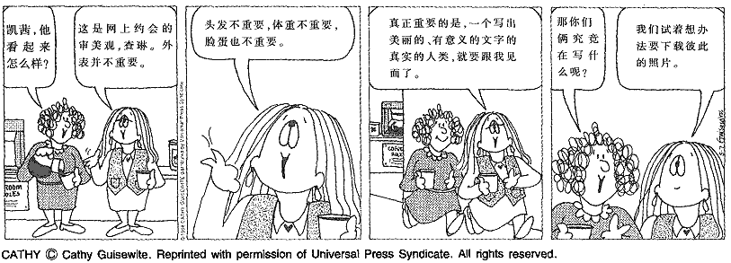

然而外表上的吸引力，即使不通过整形外科也能够加以控制。即使你不是美女或帅哥也别失望，证据显示当我们认识某些人越深且更加喜欢他们时，就会对他们越看越顺眼。何况，我们看别人美丽或丑陋不是只凭他天生的条件，也会根据他们如何运用自己生理上的条件而定。姿势、手势、面部表情还有其他行为都可以增加还没被标签化的人的吸引力，合适的练习将会有助于改善我们看起来的样子。

*穿着打扮*
除了让我们可以隔绝自然环境之外，衣服也具有非口语沟通的意义。一位作家提出衣着可以对其他人传递至少十种信息：

·经济水准 ·教育背景

·经济背景 ·社会地位

·教育程度 ·成功程度

·社会背景 ·教养程度

·信赖程度 ·道德人格

研究显示我们会依据人们的穿着而作出一些假设。穿着比较特别的沟通者通常较具有说服力，例如在要求行人帮忙捡垃圾或者说服他们借一角硬币投人汽车停车投币机时，如果实验者穿着类似警察制服的衣服，就会比穿着一般的服装更容易成功。同样的，律师或是护士的衣服可以强调他们在法律上或是医疗照顾上的专业。制服不是唯一一种会造成影响的衣着，在一个研究中，一个男人跟一个女人站在走廊上，人们会尽快地经过，避免去撞到他们，或是从他们之间穿过。控制组要求他们穿上一般白天上班穿的衣服，另外一组则穿上较随性的服装，行人在经过他们旁边时，会有不同的行为反应：对穿着较正式的那一对，他们的回应会比较正向，而对穿着较随性的那一对，则较为负面。

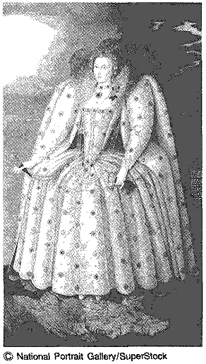

在其他情境下的类似结果显现出了衣着的影响力。我们通常比较顺从那些穿着像上层的人，行人也多会将掉落的零钱交还给那些穿着像高阶层的人，甚过于还给那些穿着像低阶层的人。我们通常也比较会模仿那些在穿着上较高级的人，即使他们违反社会规范。在一个研究中，有83％的人会跟随一位穿着高级的人穿越马路，即使他闯了红灯，然而只有48％的人会跟随那些穿着比较像低阶层的人。穿着套装长裤的女士通常会被认为比穿蕾丝花边短裙的人更具有权威。

除了我们上面所讨论的一般性情况之外，依据我们穿着所做出的假设，并不见得十分正确。一位穿着皱皱的、不合身的老旧衣服的人可能是公司的经理，一位穿着时髦的人可能正在前往打扫壁炉的路上，但也可能是一位穿着怪异的百万富翁。当我们有其他资讯之后，穿着的重要性似乎就降低了。这个事实显示，衣着在建立关系的第一阶段中扮演着非常重要的角色，建立良好的第一印象，以使别人更进一步的认识我们是必要的。

**物理空间**

人际距离学是一门人类与动物如何使用空间的学问。至少有两种人际距离学的向度：距离和领域。

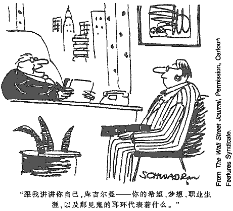

*距离性*
有时候可以试着想象，两个人之间的距离远近是如何影响他们彼此的感受的。当在进行社会性的对话时，两个人之间会维持舒服的距离；如果你的伙伴不是你在情感上比较亲密的对象，那当他继续往前挪进时，你应该会有不舒服的感觉，必须要强迫自己才不会往后退。有些人会发现，他跟别人之间的距离不能小于半米，一旦离别人太近就会非常不舒服。这是为什么呢？每一个人无论到什么地方，都会带着看不见的个人空间，我们会想象这个防护罩里是我们私人的领域，就好像是我们身体的一部分。当你跟伙伴越来越接近时，你的防护罩好像被打开了，你的空间被闯人

了，这是你为什么会感到不舒服的原因。当你再往后退时，你的伙伴从你的防护罩中撤退，你就会觉得比较放松了。

当然，如果你和一位非常亲密的伙伴（如配偶）进行这个活动的话，你应该不会感受到有任何的不舒服，甚至你们彼此碰触到也不会有不舒服的感受。这是因为我们跟别人靠近的意愿，身体跟情感一样，会因为我们跟这个人的关系或是当时的情况而改变。而且，两个人之间的合适距离会以非常精准的状态存在，而这样的距离，也给了我们有关感觉及人际关系的非口语线索。

人类学家爱德华·霍尔定义出我们在日常生活中的四种距离，依据我们在特定时间点下对这个人的感觉、对话内容以及我们的人际关系目标来决定。

·霍尔的四个空间范围中的第一个是最小的亲密距离，这样的距离从皮肤接触到半米左右。通常只有非常亲密的人可以处于这个空间之内，并且多半会发生一些私人情境中——做爱、拥抱、安慰、保护。

·第二个空间的范围是个人距离，这个距离介于半米到1 , 2
米之间，这样的距离通常是夫妇在公开场合站在一起的距离。不过，如果在宴会中有异性站在这样的距离，你可能会觉得有些不舒服。这样的移动通常也代表着要开始一个随性的谈话。在这样的距离下我们可以与某个人保持"一个臂膀的长度"，暗示着在这范围之内有沟通正在发生。

·第三个空间是社会距离，这个距离介于1.2
到3.6米之间。在此距离下发生的沟通大多是商业行为。在此距离内比较近的一档是1.2
到2米，这样的距离通常是销售员与顾客或是同事之间的距离；而比较远的一档——2到3.6米——合乎礼节及非个人的情境里，这样的距离通常是我们跟老板之间的距离，这样他可以穿过他的办公桌看到我们，这跟拿一张椅子坐在老板旁约1
米的距离有很大的不同，让人不那么紧张。

·公共距离在霍尔的分类中是最远的一种，指的是3.6
米以外的距离。在这公共距离里，比较近的距离就是大多数老师在教室里的距离，较远的空间——超过7
, 6
米以上的距离——对于两个人的沟通来说几近不可能。演讲者大多数采用公共距离，其原因是听众的人数太多了，但我们同时也可以猜想，如果有人在可以选择的情况下仍然选择公共距离，那就表示他不想有任何的对话。

选择最适合的距离可以有效地彰显出我们如何对待及回应他人。例如，学生对于会拉近自己与学生之间距离的老师，以及该老师所教授的课程，都比较满意，也会比较愿意遵循老师的教学内容。同样的，接受医疗的病人也会对那些不冷漠的医生感到满意。

*领域性*
个人空间就像一个防护罩，无论我们走到哪里，它都在我们身边，仿佛是身体的一部分。然而领域是一个不会动的地理上的位置，比如工作的地点、房间、房子或物理上的空间，领域就是指以上这些空间中我们可以拥有自己权利的地方。很有趣的是，领域也许是一个没有真正说明其归属权的地方，但这种拥有的感觉仍然会存在。不管你在不在你家里的房间里，它就是你的，不过它不像个人空间那样可以带着到处跑。有些时候，虽然你并不幻想那些家具是你所拥有，但就是会觉得在教室里的那个位子好像是你的。

人们使用空间的方式也可以说明权力和地位。一般而言，比较具有地位的人通常都拥有比较大的空间与较多的个人隐私。当我们要进人老板的办公室之前，一定要先敲门，而他/她却可以随意进出我们工作的区域。在传统的学校中，教授有自己的办公室、餐厅甚至厕所，而学生被认为不是那么重要，当然没有这些私人使用的地方。在军队中，所拥有空间的大小和个人的隐私也是依据官阶而有不同，士兵睡在四十人一间的军营里，而中士以上就可以有自己私人的房间，将军则有政府提供的房子。

**物理环境**

此处我们要强调的是物体的摆设、建筑的方式及室内设计，这些也会影响我们的沟通。开始回忆一下你最近拜访过的几个房子，是不是有几间的感觉比较舒服？是不是在有些房子里即使主人非常的友善，你还是觉得无法放松？这就像马克·克奈普（Mark
Knapp
）在"没有人味的房间"里所描述的：在这空间里烟灰缸干净得出奇，家具都用东西覆盖着，还有玻璃制的灯罩，都透露着非口语信息，告诉我们不要碰到任何东西。住在像这样的房子里，恐怕没有人会感到放松，根本无法好好投入在宴会里。有一件事是很明确的，环境已经对人们传递了不舒服的信息。

家庭设计传递出的沟通的印象可以被正确地解读出来。一位研究者让99
位学生观察12
间中高档的房子，包含房子的里面和外部，然后要求他们依据自己的印象去描绘主人的性格。在看完房子内部的照片后，学生就非常清楚地了解到，装演的方式直截了当地传递出了主人的智慧、礼貌、道德、乐观情况、紧张与否、进取心以及家庭价值取向。房子的外表也让观看者很清楚地意识到主人在艺术方面的兴趣、亲切与否、清幽及安静的关系，等等。除了表达出设计者的信息之外，环境也会影响在其间发生的沟通。在一个实验中，受试者在一个比较"漂亮"的房间内工作，会比在"一般"或"丑"的房间内工作时更积极、更精力充沛。在另外一个实验中，学生对布置过办公室的教授的信任胜过办公室比较脏乱差的教授。医生也会制造一个可以促进他跟病人沟通的环境，只是一个将医生办公桌搬走的简单行为，就可以使病人在看诊时放松五倍。医院内重新装潇过的复健病房的也增进了病人之间的人际沟通。在旧的设计里，椅子依着墙的四周一张接着一张，而若是调整成将椅子围绕在一张小桌子的旁边，病人就可以在一个舒服的距离上看见彼此的脸，他们的沟通量约为之前的两倍。

**时间**

社会科学家用时间数量学来对人们如何使用和组织时间的研究进行描述。我们处理时间的方式可以有意无意透露出很多信息。例如，在美国社会里对时间的评价是很高的，等待可能是代表着某种地位，"重要"人物（他的时间通常被认为比其他人重要）可能只接见有预约的人，且不会受到地位比较低的人干扰。一般人都会认为，老板直接走进员工的办公室是很自然的事情，但员工如果没有预约通常不会干扰老板。一个相关的规则是地位较低的人从来不会让地位比较高的人等，工作面试迟到是一件很严重的事，然而如果准时到了，他们通常会让你在大厅等待；重要的人在餐厅用餐或搭飞机时通常会订头等舱的位子，而让那些地位没那么重要的人等待他们。

时间的使用跟文化有很大的关系。在某些文化中准时是一件非常重要的事，然而在有些文化中则不尽然。准时的美国本地人通常会在悠闲的夏威夷忘记时间。一个心理学家在巴西教书时，发现北美洲与南美洲对时间的态度不一样。在巴西他发现很多学生都会在课程进行一半的时候才进到教室来，并在课堂结束时留下来问问题，这些问题和讨论直到课程结束后半小时才终止，因为这些学生一点也没有要离开的意思。这样的习惯在美国的大学里是不常见的。

### **6.4 摘要**

非口语沟通包含不用字词表达出来的信息，包括身体动作、声音、触碰、外貌、物理空间、物理环境、时间等。

非口语沟通是沟通的必备要件，也是普遍存在的事实。事实上，不传递非口语信息是不可能的。虽然大多数的非口语信息具有通则性，但是仍然受到文化和性别所影响。大多数的非口语沟通会流露出与口语沟通相反的态度和情绪，最好进一步确认表达者的初衷。非口语沟通提供很多的功能，有重复、替代、补充、强调、调整和泄漏口语沟通等。非口语沟通在很多方面跟口语沟通不同。非口语沟通通常都暖昧不明，而且大多不是意识层面的。当口语与非口语的内容不一致时，沟通者多仰赖非口语的部分，也因此在解读非口语线索时要特别谨慎。

**第七章 倾听：不只是听见**

由前页里克·马斯腾所写的诗告诉我们，倾听不只是礼貌的注视和频频点头而已，它应该还包含更多东西。这就是本章即将要探讨的内容。你将会了解到每一个人都非常需要被倾听，而且倾听是非常复杂的活动，它的价值就如同"说"在一个谈话过程中的重要性一样。

如果频率是在评估重要性时所使用的标准，那么倾听就非常有资格成为沟通中最重要的项目。与其他的沟通形态比较，事实上我们确实使用了许多时间在倾听别人说话。在一个研究中（图7-l）显示，大学生的沟通形态中，平均有14％的时间是花在书写上，16％的时间花在说话上，17％的时间花在阅读上，而有大部分——多达53%——的时间，花在倾听上。倾听囊括了大众沟通媒体，例如收音机与电视，以及倾听面对面的信息。大众沟通媒体占据了学生21％的沟通时间，而面对面沟通则占据了32％，这比起其他沟通类型费时都要多。另外，在工作的场合中，倾听也同样重要，研究显示大部分北美公司的员工每一个工作日中就有60％的时间是花在倾听别人上的。

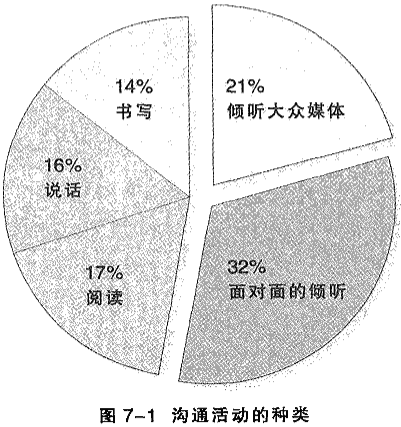

倾听确实是人们在沟通中最常使用的类型，照此推论，就与人建立关系本身而言，倾听与"说"具有相等重要地位。而且我们对于关系品质的满足感，是来自于被倾听与被了解。在一个全面性的调查研究中，婚姻咨询专家发现："在倾听时无法了解对方的观点"是夫妻沟通中最常出现的严重问题之一。在一个调查"倾听"和"事业成就"的相关研究中发现，具备良好倾听能力的人在公司中的位阶往往较高。对全美从事人力资源的执行官所进行的调查发现，当被问到在他们心目中完美经理形象所应具备的技巧时，倾听的技巧显然被排在了最重要的位置上。在问题解决的团体中，一位具备良好倾听技巧的人会被认为是优秀的领导者。在各式类型的工作中，资深的员工被问到他们认为最重要的工作技巧，在他们的回答中，倾听所出现的比率比其他的技巧要多上许多。其他诸如专业能力、电脑素养、创造力和管理的才能，地位都在倾听之下。

生意人认为倾听很重要，这并不表示他们是好的倾听者。在一份针对144
位经理对自己倾听能力评估的调查中证实了上述观点，他们中没有一个人评价自己是"不好"或"非常不好"的倾听者，94
％的人认为自己是"良好"或"非常好"的倾听者。这种高估自我的现象和他们的部属对上司的评量形成尖锐的对比，大部分的部属认为他们的上司倾听技巧都很差。当然，这些上司或经理并不是唯一需要改进倾听技巧的人，我们每个人都有改善的空间。这就是为什么我们要花一整章来讨论这个核心的沟通主题。

### **7.1 倾听的定义**

我们一直用倾听这个词汇，好像不必多做解释似的，事实上这个词汇的概念远超过一般人所想。我们对倾听的定义是——至少在人际沟通方面——解读别人口语信息的过程。你接下来会读到在这个定义之下，许多我们原先以为是倾听的行为都将被排除在外。

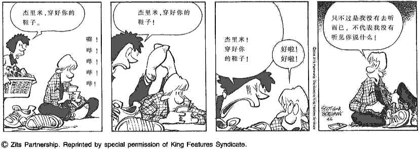

**听与倾听**

很多人以为听与倾听是同一回事，其实两者大不相同。听是声波传到耳膜引起振动后经听觉神经传送到大脑，倾听是大脑对这些生化电波冲动重新建构成原始声音表征之后再赋予意义的过程。除了疾病、外伤造成失聪或使用耳塞之外，你几乎无法停止"听到"，不管你想要听或不想要听，你的耳朵都会接收到所有的声波并将其传送到大脑。

而倾听就不是这种自动的过程，我们经常全都听到却不一定都认真倾听。有时候我们会自动地或无意识地"关掉"我们所厌恶的声音，例如邻居的割草声或街道车声，我们也会因为主题不重要或对其没兴趣而停止倾听，比如在面对无聊的故事、电视购物频道等时，喋喋不休的唠叨抱怨也是导致我们停止倾听的例子。

**心不在焉的倾听**

心不在焉的倾听发生在我们对别人的资讯以自动化或遵循常规来回应时，通常不太专注费神。用"假装"、"草率"来形容心不在焉的倾听比用"沉思"、"默想"更为恰当。

虽然心不在焉的倾听似乎有点负面，但这种低层次信息处理方式其实是一种具有潜在价值的沟通形态，因为这让我们能够自由地将心思聚集在需要我们小心注意的焦点上。当暴露在数以百计的信息中时，我们不可能仔细倾听也无法百分百的思考。要求长时间聚精会神地倾听冗长的故事、无聊的闲谈或老生常谈的话题是很不实际的事情，对这种如轰炸一般的信息，唯一切实可行的就是去"偷懒"。在这种情境下我们要放弃仔细分析或是掉人某种刻板印象来解读信息。如果你现在暂停一下，回想你今天听到的所有资讯，很可能大多数状况你都是用心不在焉的倾听度过的。

**心无旁鹜的倾听**

相反的，心无旁鸯的倾听涉及对我们接收到的信息给予仔细而审慎的专注反应。对你很重要的信息你比较会心无旁鹜的倾听，或是你很在乎的某人正说到他个人的重要话题，你也会心无旁鹜的倾听。当某人谈到你的钱时（把这修好大约要多少钱？）你几乎会竖起耳朵来听，当你的好朋友告诉你他失恋的经过时，你也会变得聚精会神又专心一致。在这种情境中，你会给予信息传送者完整而全然的专注。

有时候我们以心不在焉倾听来面对值得或应该要心无旁鹜倾听的事情。艾伦·兰格（Ellen
Langer）是在他祖母抱怨自己的头盖骨里面仿佛有"蛇在钻动"时决定要开始研究心无旁鹜的倾听——医生非常快速地将这情况诊断为老化现象，认为年纪大了自然就会老化，所以就不仔细地听她的症状，而他的祖母后来因摧患脑瘤而过世。这件事给艾伦·兰格留下了深刻的印象：

*在多年之后，我一直在思索医生对我祖母所说的话的反应，和我们对医生的回应。他们按部就班地进行诊断的动作，但是并没有张开耳朵倾听信息。老化成了医生先入为主的干扰，我们也没有多问医生——
"专家"成为我们先入为主的干扰。*

大多数情况下要不要专注倾听的决定都不会严重到生死攸关，但是重点值得再次强调：我们经常会遇到别人对我们说话，而我们必须专注而审慎地倾听。这种心无旁鹜的专注倾听，就是本章所要强调的重点。

### **7.2 倾听过程的元素**

**听到**

就像前面已经讨论过的，听到属于生理的范围，借由某一种频率和声量的刺激，震动空气以撞击内耳，就形成我们所听到的声音。听觉会受到噪音的影响，如果环境中有其他嘈杂的声音，尤其频率又刚好与我们所欲接收的信息一样时，我们就会发现很难从所有的背景中整理出重要的信息。另外，听觉也会因长期暴露在同一个音调或巨大的声响中而导致疲乏或暂时失聪。例如，如果你整个晚上都待在一个有巨大音响的舞会中，那么你的听觉状况可能就会出现问题，即使在之后远离了人群，这个状况仍然有可能持续存在着。当然，如果你经常让自己暴露在巨大的声音中，像许多摇滚乐师及其粉丝那样，就有可能造成永久的失聪。

在没有生理问题的前提下，听到也有可能是很困难的一件事。对许多沟通者来说，光是听这件事对他就是一个很大的挑战。在美国就有超过13万人在沟通中有某种程度的听的困扰。在一个研究中指出，每天在教室中有四分之一到三分之一的孩子没有办法正常听见或听到。要做一位能干的沟通者，你必须要知道听你说话的那个人有可能无法有效地接收你所传达的信息，所以你必须调整你的说话方式，如说的慢一点、大声一点、清晰一点，都是有效的方法。

**专注**

听到是一个生理的过程，而专注则是一个心理的过程，也是我们在第三章中所提到的知觉选择过程。如果对每一个所听到的信息都付出注意力的话，我们一定会疯掉，所以我们必须过滤掉一些信息，以便能够将注意力放在自己认为重要的信息上。我们的愿望、需求、欲望和兴趣，等等，都决定了我们选择的焦点。研究显示当有一些回馈出现时，我们会更小心地专注于信息上。如果你正计划去看一场电影，而当朋友在描述此部电影时，你就会更加专注地去倾听。当你想要与某人建立良好的关系时，你会更小心地倾听他所说的每一句话，以期增进彼此之间的关系。

**了解**

了解是发生在我们能理解信息意义的时候。我们都有一个经验是当我们专心地倾听信息之后，我们仍然对这些信息一点也不了解，这样当然更有可能会误解信息的意义。

**回应**

对一个信息做出回应，就是对说话者给予清楚的反馈。通常倾听者并不会很明显地去回应说话者，但研究者建议我们应该对说话者给予多些反馈。一个针对银行界与医疗界的195个危急关键时刻的研究发现，有效倾听与无效倾听的差异就在于反馈的呈现方式。好的倾听者会使用非语言行为来表达他们的专心，例如保持目光的接触、给予适当的脸部表情，等等。在语言行为方面，包括回应对方的问题、交换意见与想法，都可以证明倾听的专心程度。

倾听过程中加入回应的功效，符合我们曾在第一章讨论过的：沟通具有交流的性质。倾听并不是一种被动的活动，作为一个倾听者在沟通交流中是一个积极的参与者。在接收到信息的同时，我们也在传送信息。回应是良好倾听极为重要的部分，我们会在本章最后用一整节的篇幅来描述倾听的回应。

**记忆**

记忆是记住信息的一种能力，如果我们无法记住我们听到的信息，便会枉费我们对倾听所做的努力。研究指出大部分的人在一听完信息之后仅仅只会记得50%，不超过八小时会下降到只剩35
% ，而两个月后平均只会剩下25
％。总的来说，每天在我们生活中所发生的信息，不论来自老师、朋友、广播、电视或其他的资讯，能够被我们的记忆所保留下来的信息仅仅只有一小部分。虽然遗忘资讯是人类的常态，但是仍然有一些小方法，可以增进你的记忆力。

### **7.3 倾听的挑战**

我们都同意倾听很重要，而且致力于描述倾听历程的步骤。成为一个良好的倾听者的困难究竟在哪里？下面的篇幅将要讨论倾听者必须面对和克服哪些挑战才能成为更有效的沟通者。我们会描述无效倾听的各种类型，也会探讨无法良好倾听的许多原因。当你读这些内容时，试着思考一下："这些内容有出现在我身上吗？"要成为优秀的倾听者的第一步就是去发现自己还需要改进的领域。

**无效倾听的类型**

虽然某种数量的无效倾听或许是无可避免的，甚至有时候是可以理解的，不过去了解无效倾听的类型仍然非常重要，因为这样你就可以尽量去避免做无效的倾听，以免错过一些对你重要的资讯。

*虚伪的倾听*
虚伪倾听是真诚倾听的伪造品。虚伪的人在外表上是很专注的，他们看着你的眼睛、点头、在正确的时刻微笑，且还不时地会回应你，但在这兴趣盎然的外表下，他们却想着完全无关的事情。虚伪的人使用礼貌的外表作为面具，以掩饰其内心想法，在其内心的真实世界里其实对于说话者说话的内容完全没有接收。虚伪的人常常会忽视你，因为在他们的心中他们自己的事情比你所说的话重要多了。他们可能会觉得听你说话是一件无聊的事，或他们之前已经听你说过了，所以他们只会随便就你所说的话来做一些应答。不论是什么原因，虚伪的倾听是一个虚伪的沟通。

*自恋的倾听*
自恋的倾听者（有时称为沟通的自我陶醉者）不会假装他们对于说话者的说话内容有兴趣。相反的，他们会尝试将沟通的主题转移到他们有兴趣的事物上。其中一种自恋倾听的策略被称为"回应转换钮"，意即在回应的当中将沟通的焦点从说话者转移到自己身上。当你说"我的数学课程真的是很困难"时，自恋的倾听者会转到他自己身上说："你认为数学很困难？你应该试试我的药物课程。"自恋倾听者的另外一个特征是他们会去中断、阻碍沟通，这样的倾听不但无法由沟通中获得有价值的资讯，甚至还会破坏说话者和他们之间的关系。例如，在一个面试中，应征者若不断地打断雇主所问的问题、自顾自地说着自己想说的话，他们被雇佣的比率显然很低，被雇用率高的应征者会等待雇主结束他们的谈话以及问题之后才做出回应。

*选择性的倾听*
在沟通的过程中，选择性倾听的人只会针对他们有兴趣的部分来做回应，而拒绝倾听其他所有的部分。有时候我们都会是有选择性倾听的人。举例来说，当我们在收听广播中的广告或音乐时，我们都可能只是听到但没有听进去；但当广播在播报气象或宣布当前时刻的时候，我们就会竖起耳朵仔细听。而选择性的倾听也常发生在沟通当中。别人和我们谈话时都期望我们能全神贯注地倾听，但通常我们都只会在我们有兴趣的内容上付出专心与注意力。在沟通情境中很明显地转移注意力很像在说话者的脸上打了一个耳光。

*隔绝性的倾听*
隔绝性倾听者的行为几乎与选择性倾听者相反。他们不会从沟通中寻找有兴趣的话题，相反的，此类倾听者会避免沟通。当人们在述说一个话题时，他们宁愿不去讨论它，而是采用隔绝性倾听来避免听或表示注意。若你提醒他一个关于他的事情，可能是他们未完成的工作、低劣的成绩或外表的样子，他们也只会点头或简单地回答你，然后就迅速地忘记你曾说过的话。

*防卫性的倾听*
使用防卫性倾听的人总是认为别人所说的话都是在攻击自己。例如，青少年总是在父母对他们的朋友或参与的活动提出一些疑问时就认为这是对他们的不信任，或找他们的碴。一对颇为敏感又容易生气的父母很容易将孩子们所提出的任何问题都视为是对父母权力与智慧的挑战和威胁。我们在第十章将会提到我们的假设，我们认为防卫性的倾听者对于模糊不清的信息是没有安全感的，他们很容易就会相信这些信息对自己是一种攻击与伤害。

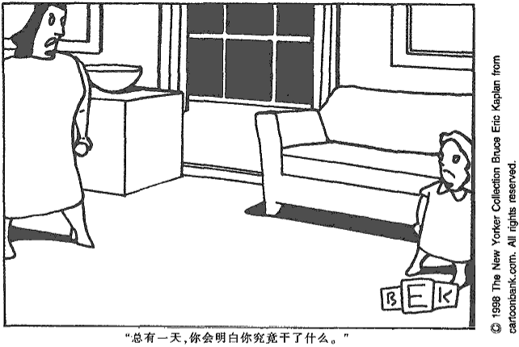

*理伏性的倾听*
使用埋伏方式来倾听的人，对说话者的言论会很小心仔细地去倾听。如果他们想从你的话中，搜集他们想要得到的资讯，他们就会开始侦察你。在各种实例中，检察官就是一个最好的埋伏性倾听的例子。当然，使用这种方式去倾听的人，很容易会让对方对他们产生防卫。

*鲁顿的倾听*
鲁钝的倾听是无效倾听的最后一种类型，此类倾听者无法清楚地接收到说话者的信息。之前我们有提到，人们通常不会开放地解释自己的想法或感觉，不但不会去直接表达真正的意思，反而会使用一种更细微的、无意识的方式来选择某些字句或非语言线索来进行互动沟通。鲁钝的倾听者不会去寻找字面或行为背后的意义，他们只会接收说话者字句中的表面价值加以理解。

**为什么无法有效地倾听**

在讨论过无效倾听的类型之后，相信大部分的人会开始发现，原来自己真正去倾听别人说话的时间真的是少之又少。无法随时随地仔细倾听似乎是一件令人泄气的事。我们很难真正倾听他人的原因有许多，现将说明如下。

*超负荷的信息*
第一个原因是，每天我们所遇到的信息实在是太多了，对我们所遇到的每一件事情都小心仔细地去倾听是一件不可能的任务。我们每个人都花了我们清醒时的大半时间来倾听语言信息，有时候我们需要让自己的注意力稍微游荡一下。自然而然的，我们就会开始使用心不在焉的倾听方式，或应付式的回答来回应说话者。

*心不在焉*
另一个无法有效倾听的原因是，我们通常会将注意力放在我们所关心或我们认为重要的事情。假如你即将面临一个重要的考试，或当你还沉浸在昨天夜里与朋友的美好聚会中时，你便很难对他人所说的话集中注意力。

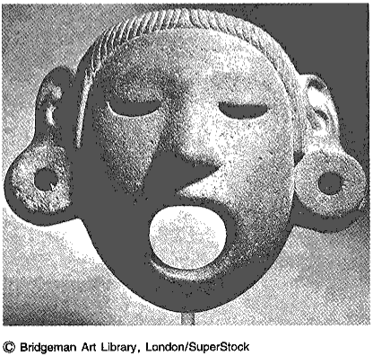

*飞快的思想*
就生理层面来说，要做到有效倾听也是一项困难的工作。研究显示，人类有能力在一分钟倾听600
个字，但是通常人们在一分钟内只说100 到150
的字，所以当别人说话的时候，我们便有许多"多余的时间"可以将注意力转移开来，去想一些和说话者的说话内容无关的事情。例如我们会去想我们感兴趣的事、做做白日梦，甚至计划要如何反驳对方，等等。令人费解的是，我们宁愿让自己的注意力幻游，也不愿意在了解说话者的想法上花更多力气。

*努力*
倾听是一件费力的工作。当我们努力倾听时，身体会出现一些变化，包括心跳加快、呼吸急促、体温升高等。请注意，这些变化跟体能运动所产生的身体反应是相类似的。这并不是因缘巧合使然。的确，非常仔细地倾听别人说话，身体所承受的负担绝不少于显现于外的作为。正因为仔细倾听别人讲话是耗费心神又精疲力竭的事情，很多人才不愿意劳心费神地倾听。假如你一整个晚上都在聆听好友最近遭遇的苦楚，你就会知道这过程有多费力了。

*外在的噪音*
我们所居住的物理世界里存在着许多容易分散注意力的事物，所以对别人的谈话付出百分之百的专心度是一件非常困难的事。交通、音乐、不相干的谈话声音等，这些噪音都会不断地影响着我们倾听别人的能力。举例来说，当你坐在一个拥挤、凌乱、闷热并且伴随着许多噪音的房间中时，你的倾听品质可能会变得非常低劣，在这种环境下，即使你蓄意要去倾听别人，也很难保证你可以正确地理解到对方话语中的真正含义。

*错误的假定*
在沟通的当时，我们的心中常存在一错误的假定，这些假定会引导我们去相信并专注于自己的一些想法上，而这些想法实际上是与说话者的意思相反的，但我们却不自知。例如，当我们遇到熟悉的话题时，我们很容易会开始觉得"这我们之前就已经听过了"，于是就开始不专心，然而事实上说话者提供给我们的都是新的资讯。还有一个类似的状况是，有时候我们会假定说话者的想法太简单、太浅显，不值得我们付出专心。有的时候我们会认为别人的评论太复杂而不容易了解，于是就会放弃去尝试理解他们。想想看有时候你在听演讲的状况，你就可以了解了。最后一个常犯的错误是假定谈话的主题是没有价值的，所以当应该专心的时候，我们反而停止付出专心。

*缺乏明显的益处*
通常我们认为从说话中可以获得比倾听更多的好处，其中一个最大的好处就是，它是一个掌控别人想法和行为的大好时机。南希·川崎（Nancy
Kline）问当事人为什么要打断同事，下面是她听到的理由：

*我的意见比他们高明*

*假如我不打断他们，我永远没有说话的机会*

*我知道他们要说什么了*

*既然我的想法更好，他们就没必要说完他们的想法*

*他们的意见对改善未来发展毫无建树*

*对我而言，得到他们的认同比听他们的意见更为重要*

*我比他们更重要*

即使上述理由有些是事实，背后的自我中心仍十分致命。就像防卫倾听一样，倾听通常是彼此互动的过程，你会从别人那里获得你所付出的东西。

*缺乏训练*
即使我们想达到有效倾听的目标，但如果教育中缺乏倾听技巧的训练，可能也是白费工夫。我们以为倾听就像是呼吸一样，是一个人天生自然就会的动作，在这种错误的通俗信念下，我们很容易会认为"我从还是个孩子的时候就在倾听了，所以在学校中并不需要学习这样的课程"。然而真实的状况却是倾听和说话一样都是需要技巧的。虽然每个人都会听，但是却很少有人拥有良好的倾听技巧。不幸的是，我们对自己所具备的倾听能力的认知通常和我们真实所拥有的倾听能力是不符合的。不过，也有一个好消息，就是倾听是可以通过教导和训练而进步的。但尽管如此，我们花在教导倾听技巧的时间也远远比其他的沟通技巧要少。通过表7-1便可以看到在我们的教育当中这种毫无道理的课程安排。

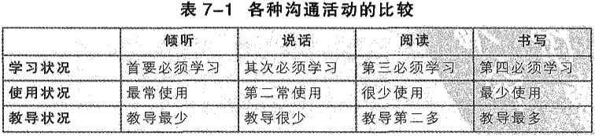

*听力的问题*
有时候倾听的能力是与生理上的听力问题有关联的。有听力问题的人和他周围的人常会对于彼此之间的无效沟通感到灰心又生气。所以，如果你怀疑你自己或你身边周围的人有听力受损的问题，尽快给予医学专业上的诊断与协助会是一个明智的抉择。

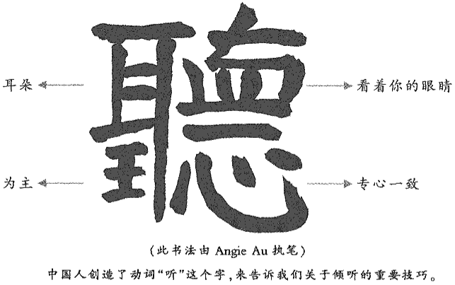

*媒体的影响*
最后一个影响我们有效倾听的挑战是来自于媒体，特别是电视和收音机。越来越多的节日编排都在使用简短的标语一一新闻的标题、广告词、音乐带、录影带，等等。同样的，新闻报道都以简短故事辅以大量的图片报表资讯来供大众阅读。这种大量而简化的资讯形式，无异于暗示大众不需要去建立仔细而专注的倾听态度，尤其是对那些复杂的思想与感情。

**面对有效倾听的挑战**

读到此处你可能会觉得要做到良好的倾听根本是一件不可能的事，不过幸运的是，如果拥有正确的态度和技巧，你也可以把倾听做得很棒。以下将提出一些具体的作法。

*少说话*
季诺（Zeno，斯多葛学派之祖）的语录中说："我们一生下来就有两个耳朵，但却只有一个嘴巴，就是为了要让我们可以多听而少说。"如果你的目的是要了解说话者的意思，那么你就要避免自私地抢夺说话者的舞台并一味地转换话题或发表自己想法的做法。当然，少说话并不表示你应该保持绝对的安静，只是我们大部分的人在真正需要倾听别人的时候仍然说了太多的话。在很多的文化中，其实都认为倾听和说话是具有相等价值的。

*摆脱注意力分散*
有一些会分散我们注意力的刺激来自于外在环境，包括电话铃声、收音机和电视机、朋友的随时造访，等等，还有一些是来自于心理内在，包括心思被其他事情所占据、肚子饿，等等。所以当你面对重要的资讯时，尽可能地排除所有会让我们分心的内在和外在干扰刺激是很必要的。这可能意味着关掉电视，拔掉电话听筒，换到安静的房间里，以使你不受电脑诱惑、不必牵挂桌上未完成的工作或眷恋柜子上的食物。

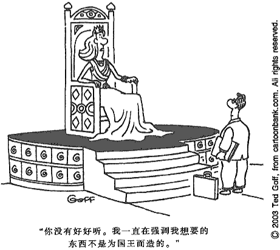

*不要过早评断*
很多人都知道在理解别人说话的意思之前不要过一早下评断的道理。虽然每个人都知道这个常识，却还是很容易会犯这样的错误，例如武断的批评别人、还没听完别人的话就先做评价等。当你不赞同别人地说法或是当别人批评你的时候，反击回去的确是一个强有力的方式，但是当别人对你提出一些真诚的忠告时，试着去了解这些忠告与事实反而对你更有利。并非所有评论都是负面的，当我们喜欢某些人或同意他们的言论的时候，过早评论也有可能会有正面的功用。综合以上负面的例子，我们可以清楚地看到一个很好的学习方向，那就是第一步先倾听，确定你真正了解所有的意思之后，再去评论。

**寻找关健意思**
大部分的人在说话的时候有他们主要想表达的想法，你可以运用你的智慧把思考的速度推得比说话者还要快，这样的话你也许就可以从说话者的一大堆言词中摘录出其关键意思。但如果你真的无法了解说话者所欲传达的意思，或许你可以使用一些不会得罪对方的问话或解释技巧来做澄清。接下来我们就要说明这个观点。

### **7.4 倾听反应的类型**

倾听反应的类型倾听具有五个元素：听到、专注、了解、反应和记忆，借此我们可以得知对方是否正确了解我们所说的话。试着想一下，假如你认为某人是一个良好的倾听者，你为什么会认为他具有倾听能力？可能是因为他在你说话时所使用的回应方式——当你说话时他的眼神与你接触而且不时点头示意，当你说到很重要的事情时他保持专注良久，当你说到某些不可思议的事情时他也发出惊叹之声，当你受到伤害时他给予同理和支持，当你请教他时也适时给你另一种新观点的忠告。

**借力使力**

有时候倾听者的最佳反应只是顺水推舟地让说话者自己继续话题。借力使力牵涉到使用沉默和简短的言论来鼓舞对方多说一些话，让对方借由这个过程自己协助自己解决问题。想一想下面的例子：

*巴勃罗：朱莉娅的爸爸最近要卖掉一部电脑，很便宜，只要600美元！我很想要买，但是如果我要买的话，我现在就要赶快行动，因为好像也有另外一个人对这台电脑很有兴趣。不过，虽然这是一个很棒的价钱，但是买下它可能会花光我所有的存款，而我需要一年的时间才可以再存到和现在一样多的钱。*

*提姆：嗯哼。*

*巴勃罗：我想这个冬天我不会去旅行吧！这样的话，我就可以趁这个时间留在学校打工赚钱……也许也可以再多找一份临时工作。*

*提姆：这样很好啊。*

*巴勃罗：你觉得我应该买下这台电脑吗？*

*提姆：我不知道，你觉得呢？*

*巴勃罗：真的好难决定啊！*

*提姆：（沉默）*

*巴勃罗：我想我要买下这台电脑，因为以后我可能再也没有机会用这么便宜的价钱买到电脑了。*

当你无法帮别人做决定时，借力使力式的回应会是一个很棒的技巧。你会发现其实你不用做太多，你沉默的存在就是一个让别人自己寻找答案的催化剂，尤其当你是用真诚的心在与对方相处的时候，这时你的非语言行为，比如眼神的接触、姿势、面部表情、声调，都可以显示出你对对方的关心。但是要记得的是如果你使用的方式机械而呆板，反而可能会惹恼、激怒别人，而不能帮助到对方。

**问话**

不难理解何以问话会被说是"最普遍的常用语"，询问更多资讯同时有助于提问者和回答者。

问话至少能给予提问者三个帮助，最明显的是你获得的答案将使你对事实和细节有更深入的理解："他对你说了为什么那样做吗？"
"后续发生了什么事？"而且，经由提问你将更加清楚对方的想法和感受："你心里怎么想？"
"你生我的气吗？"同时会得知他们的期望："你是希望我重做一份新的报表吗？"

除了提问者可以得到好处，问话对于回答者也是有用的工具。专业助人工作者都知道，问话有助于自我袒露。假装自己是咨询者是危险的游戏，但是许多时机你可以运用问话来鼓励对方探索他们的想法和感受。"从你的立场你看到什么？"这样的问话可以激励一个雇员提出建设性的意见，"什么是你的理想解决之道？"可以帮助你的朋友说出他各种不同的期望和需要。最重要的是，鼓励性的发现远胜过布施式的忠告，后者似乎意味着你比他更有能力思考他的问题。这也许是成为一个有效倾听者最重要的一点。

**释义**

为了增进对对方的了解，问话的技巧可以说是一个很有价值的方式，但是有时候它可能没办法使你更加了解对方，反而带来更大的混淆。回想我们经常遇到的情况，当你问朋友他家要怎么去时，假设你得到的回答是这样的："走大概一英里之后，在交通信号灯的地方左转就好了。"思考一下在这句简单的信息中存在着什么问题。第一，假设你朋友对于英里的概念与你是不一样的，两英里的概念对你朋友来说是指300
米，那会发生什么事呢？如果你朋友指的交通信号灯是停车标牌，而不是你所想的红绿灯，又会发生什么事呢？我们在心中想的常常和真正表达出来的并不一样，所以当你朋友解释了他家的方位后，在你进一步多问问题之前，最好先确认是否已经确实了解对方所说的信息。以你自己的字词重述刚才说话者的信息内容而并不增添任何新东西，这种倾听者将所解读的信息再重新说一次的做法称为释义或积极倾听。"你是说一直开到高中学校旁的那个红绿灯旁边，然后转向山头那个方向，对吗？"这样有可能得到说话者近一步的澄清。

释义技巧的成功关键在于要用你自己的措词重述别人的观点，以便能再一次对信息进行交叉检视。假如你只是单纯地逐字重复对方过的每个字会使你看起来有点可笑，而仍然没有达到澄清对方意思的目的。注意一下鹦鹉学舌和真正的释义之间的差别：

*说话者：我是很想去，可是我怕我负担不起。*

*鹦鹉式回应：你说你很想去，可是你负担不起。*

*释义式回应：所以如果我们能一起想想办法，帮助你负担这笔钱，你就可以和我们一起去了，是这样吗？*

*说话者：天哪！你看起来真是有点糟糕！*

*鹦鹉式回应：你觉得我看起来很糟糕！*

*释义式回应：你是不是觉得我看起来胖太多了？*

释义别人的信息有两个层次。第一种是指释义事实性信息，这会帮助你更清楚地了解对方的想法，在这最基本层次的反映方式中，可以避免误解所产生的挫折："所以你是要这个周二开会，不是下周二，对吗？"
你也可以释义个人性信息："所以，我的开玩笑让你以为我不在乎你的问题？"在你被攻击的时候，要说出这种非防卫性的反应可能很困难，但是却能缩短兜圈子似的防卫性争执。第十章会进一步讨论如何在被批评时运用释义技巧。

释义个人性信息也可以当作是一种助人的工具，就像上页"沟通文本"里的内容那样，反映说话者的想法和感受而不是去评断或分析等等，会传达出你的投入和关切。释义所具有的这种非评价式的本质会鼓励困在问题中的当事人进一步探讨问题，反映想法与感受允许当事人解释更多他一直牵挂又在乎的种种想法，而达到宣泄的释放，这种澄清带来新的观点会使得当事人找到以前看不见的解决之道。这个特色使得释义成为服务业、领导者训练甚至人质救援谈判的重要技巧。

***沟通文本***

***在职场中运用释义***

*下面两位同事的对话可以让我们看到释义是如何协助倾听者和说话者找到解决问题的方法的。请特别注意吉尔在马克没有提出忠告的状况下如何得到自己的结论，也注意马克在使用释义技巧时是如何结合真诚的问话方式和其他助人技巧而使释义运用得更自然的。*

*吉尔：我最近觉得老板对我怪怪的。*

*马克：怎么讲？（一个很简单的问题，邀请吉尔继续说）*

*吉尔：我开始觉得也许他对女人有意见，或者是他对我有意见。*

*马克：你是说他针对你？（马克将他所认知的吉尔的想法释义出来）*

*吉尔：哦，不！也不全然是啦！但事实上，他似乎不太喜欢女性，或至少是不喜欢我这个女性。（吉尔纠正马克的误解并加以解释）*

*马克：那是什么意思呢？（马克问了另外一个简单的问题，以得到更多的资讯）*

*吉尔：嗯，不论是什么时候，在开会或只是在办会室铆夭，他总是只和男性说话，虽然他对男性和女性都会下命令，但是他似乎都不会邀请女性说说她们的想法。*

*马克：所以你觉得或许他是不看重女性的，是这样呜？（马克将吉尔最后的陈述加以释义）*

*吉尔：是啊！嗯，他似乎对女性的见解没有什么兴趣，但这也并不表示他全然讨厌女性，我知道在办公室里他会依靠一些女性，而且他总是说他的生活不能缺少她们。上个月特蕾莎在试用办公室里的新电脑系统时，他似乎就很欣赏她，他还给她放一天的假，并且告诉我们所有的人特蕾莎是知何救了他一命。*

*马克：听起来你现在似乎有一些困惑。（反映吉尔的感觉）*

*吉尔：我是很困惑啊！我不知道这是不是只是我自己的胡思乱想，我是说我是一个还不错的主管，但是他从来没有邀请我说说我的想法，关于如何增进业务或其他的点子，而且我也不记得他是否真的有询问过女性的意见。但也许是我多虑了。*

*马克：你似乎不太确定你的想法是否正确，但是我可以感觉得到你真的很在乎这件事。（马克释义吉尔的主要想法和感觉）*

*吉尔：你说的对，但是我不知道该怎么办。*

*马克：也许你应该……（开始提供忠告，但踩了煞车，并再次询问吉尔的想法），唔，所以你的决定呢？*

*吉尔：嗯，我可以就直接问他，他是否注意到自己似乎从来不会询问女性的意见。但是这样也许太具攻击性，也太愤怒了。*

*马克：但你不生气吗？（试着澄清吉尔的感觉）*

*吉尔：也不是啦！我只是不知道我是否该因为他不看重女性的想法而生气。或许他是不看重我的想法，也或许根本就是我想太多了。*

*马克：所以你真的是更困惑了。（再次反映吉尔的感觉）*

*吉尔：是啊！我不知道老板是否欣赏我，也不知道到底是怎么一回事，我希望可以知道他对我的想法到底是什么。也许我可以就直接告诉他，这件事的困惑并请他澄清，但是如来他根本没有这样想呢？这样他似乎会认为我是一个很没安全感的人。*

*马克：（马克觉得吉尔真的应该要好好弄清楚这件事，但是他不确定吉的做法是否恰当，一所以他将吉尔可能告诉老板的话释义一遍给吉尔听）所以这样会让你看起来不太好。*

*吉尔：我想恐怕是吧！我在想或许我可以和办会室里的其他同事谈谈，并问问他们的想法……*

*马克：……看他们是怎么想的……*

*吉尔：没错，也许我可以问问特蕾莎，她是个可以说心事的对象，我想我会尊重她对这件事情的看法，也许她可以给我一下如何处理这件事情的好点子。*

*马克：听起来知果可以先和特蕾莎谈谈的话，你会觉得还蛮舒服的。（释义）*

*吉尔：（继续酝醉这个想法）是啊！和果她没有这样觉得的话，或许我可以先冷静一阵手；但如果在问过特蕾莎之后，我还是想跟老板谈谈的话，至少我可以确定这件事不是我自己胡思乱想。*

*马克；很好，让我知道事情的后续发展吧。*

有效的释义是一个很棒的技巧，而且它是可以花时间培养的。借由下面的三种方法，可以协助你让自己的释义技巧听起来更自然，包括：

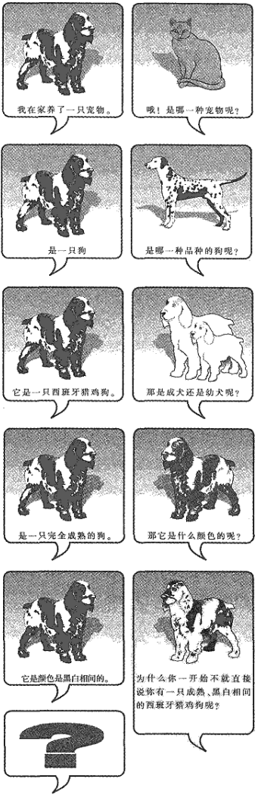

1．改变说话者的措词：

说话者：双语教育真是一个失败又浪费钱的政策。

释义者：你看看我说的对不对，你很生气是因为你觉得双语教育表面听起来很棒，但是实质上却没什么作用，对吗？

2．从你所接收到的对方信息当中，抓出一个具体例子，来向说话者说明你所了解的程度：

说话者：李真是一个浑蛋，我真不敢相信他昨天晚上所做的事！

释义者：你觉得那些笑话很惹人讨厌，对吗？

3．反映说话者的潜在寓意。在言谈中，如果你觉得对方似乎有一些暗喻在言语中忽隐忽现，在你就他的话展开回答前，做一个整体或部分的理解性核对是必要的。

释义者：你一直提醒我要小心，听起来你好像是在担心有一些事即将发生在我身上，是吗？

释义虽然不见得无往不利，但是表达你的重述等于是为对方提供一个修正的机会，像上述例子就说明了开放式的释义便于说话者修正这一点。

因为这是一个不熟悉的反应方式，刚开始你可能会觉得很笨拙。但是假如你开始经常使用这种反应并且逐渐增加频率，你就会慢慢领受到它的价值。

**支持**

人们常会希望了解他所关心的人心中的想法或感受，所以他们会关心你是怎么想的，然后逻辑地臆测"他们"是怎么想的。这时，支持性的回应就可以让对方感觉到你和他是在一起的。有学者说支持是"表达关心、照顾、情感、兴趣，尤其是处在压力和沮丧之时"。

以下有几种类型的支持性回应：

<u>同情心</u>

*"我可以了解你为什么会这么沮丧。"*

*"是啊，这门课对我来说也很困难。"*

<u>同意</u>

*"你说的对，房东真的很不公平。"*

*"看起来那个工作很适合你。"*

<u>提供协助</u>

*"如果你需要我的话，我就在这里。"*

*"假如你喜欢的话我很愿意在下次考前和你一起温习。"*

<u>赞美</u>

*"哇，你做得真好！"*

*"我觉得你是一个很好的人啊，如果她不这么想，那是她不够了解你。"*

<u>恢复信心</u>

*"最糟糕的状况已经结束，从现在开始一切都会好转的。"*

*"我知道你一定会做得很好的。"*

在面对个人难题时，安慰和支持的价值毋庸置疑。一个调查显示"安慰能力"是朋友们最重要的沟通技巧。当发生重大问题时，收到别人的支持真的意义重大。研究显示，每天发生的微不足道的沮丧与压力经年累月会严重威胁到心理和生理健康，所以，能够适时得到情绪支持非常有益健康。其实要分辨非真诚的支持性回应是很容易的。有些学者说这是"冷安慰"（详阅表7-2）。下面会给出一些缺乏同情心的词语，当你使用它们的时候，你可能就不是真心地在提供支持：

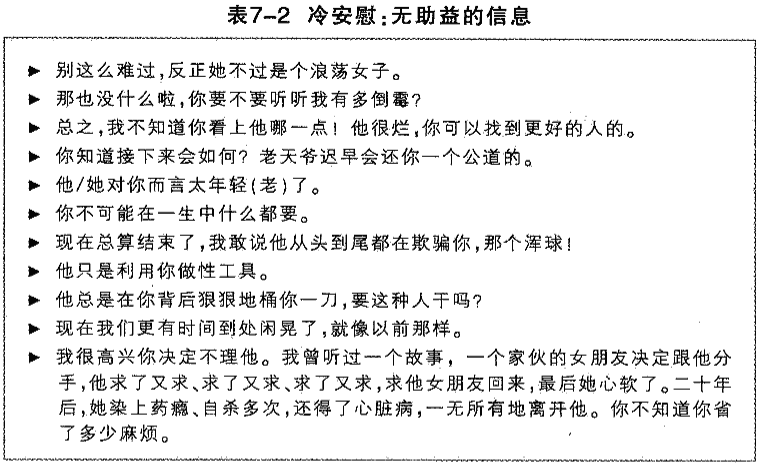

*否认别人拥有感觉的权力：*
许多非同理式的回应都是在暗示对方拥有某些感觉是错误的、不应该的，例如在"不用担心"的这句话中，虽然它的目的是为了要让对方消除心中的恐惧，但其实它的潜在意思是希望对方可以换一个感觉不要再自怨自艾。像这样的反建议是没有帮助的，毕竟别人不会因为你这样告诉他们就真的可以停止忧虑。还有其他拒绝别人感觉的例子包括"这又没有什么，不值得你那样难过"、"你这样想真的很荒唐可笑"。对于人们的情绪回应，研究结果的建议是很明确的：一个受挫的人在别人面前只能隐藏真正的想法，或其情绪和观点被对方否认，他将得不到有助于他的回应；如果他所传递的信息中的情绪和观点，被明确、清楚、合法地接纳，这样的回应才会有助于此人。

*看轻事情的重要性：*
想想看别人曾经告诉过你的这句话，"那不过就只是……而已"，你可以在空格上填上任何词语，例如"一份工作"、"她自己的想法"、"一切考试"、"一次小小的恋爱"、"一个庆生会"，当你听到这些话时你的反应是什么？你可能会觉得那个人根本不了解你的感觉。对一个被言语侮辱的人来说，那些语言对他就不只是一些"字"而已，而是一种深深的伤害。对一个孩子来说，当他没有被朋友邀请去参加庆生会时，那个庆生会对他来说就不只是"庆生会"。对一个快被老板炒鱿鱼的人来说，那份工作对他来说就不只是"一份工作"。如果你这样地看轻对别人来说很重要的事物，你就不是在使用同理式的回应。相反的，你是从你的观点出发去做评断，对别人一点帮助也没有。

*聚焦在"彼时彼地"，而非"此时此地"：*
在遇到困难时，我们会认为睡一觉醒来隔天的心情就会好一点，但是也有的时候却反而更糟。虽然"十年后你也不会记得她的名字"的说法有时也是事实，但是这种安慰的话对现在正值心情低潮的人来说确实没有多大帮助。虽然这些话的目的是希望对方可以多增加一点信心，但是这些聚焦在"彼时彼地"的说法对今天正在心碎的人毫无安慰的效果。

*火上加油的评断：*
当你做了错误的决定时，又听到"你知道吗，这都是你的错！当初你根本就不应该这么做的"之类的话，你肯定会真的感到很泄气。这样的回应反映出倾听者的评断态度，你会觉得对方并没有和你站在同一阵线。在第十章中将会继续讨论，一个评价式的、使人屈服的言论，是如何地无法发挥助人效用，却反而带来更多防卫。

*自我防卫：*
在回应别人的时候，话中还不忘防卫自己，例如"不要怪我！我己经做了所有我该做的事了"，很显然的，你其实是觉得关心你自己比关心对方还要重要。

我们是否经常误用支持性反应？有一个针对最近遭遇亲友逝世的哀悼者所做的调查发现，80％对哀悼者所说的安慰话都没有帮助，接近半数"有帮助"的陈述是建议他们"你要早点走出来"、"不要质问上帝的旨意"，这些建议在当时只有3％的助益。其次的反应是再保证，例如"他现在已经脱离苦海"，跟建议一样，这些保证在当时只有3％的助益，但对于一个处于哀伤中的人，我们可以做的绝不仅止于此。

如果能够正确回应，支持性反应应该可以发挥一点功能。有效的支持性回应有几个参考原则，包括：

1．对他人内心的挣扎提供支持，但不表达自己赞同或否定的想法。例如你的朋友决定要辞掉一个你认为应该保留的工作，你可以使用支持性回应："我知道对于这件事情，你己经思考得很周全了，我想你会为你自己做最好的决定。"这样的回应不但不会违背你自己的想法，也可以表达你对对方的支持。

2．观察对方对你的支持性回应。如果你发现你的回应似乎对他没有太多帮助，你就必须换一个适合对方继续探索问题的回应方式。

3．要了解到支持也不是永远受欢迎。一项调查显示，有些人不需要社会支持，因为他们自己可以解决所发生的问题，也有人认为未预料到的支持其实是一种打扰，有些人甚至觉得这使他们更加陷人焦虑。大多数的被调查者表示不管要不要跟他自己的好朋友讨论这些烦恼的情境，他们都希望能自己掌控。

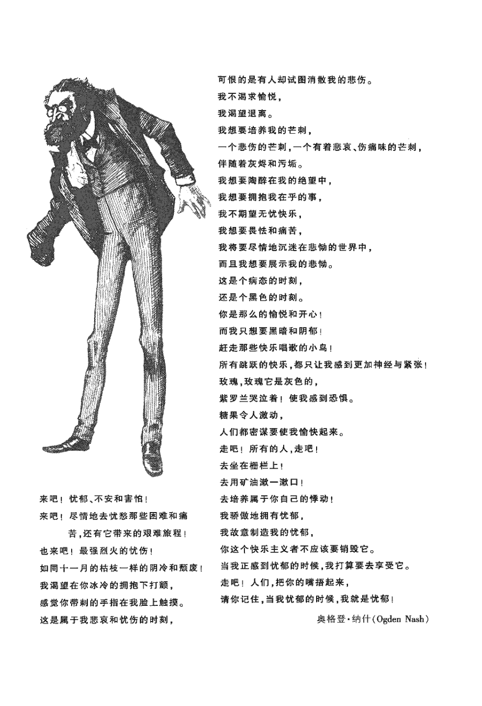

**分析**

分析式的回应是倾听者针对说话者的说话内容加以解释。以下的几个例子你可能很熟悉：

*"我想真正困扰你的是……"*

*"她已经在做了，因为……"*

*"我想你不是故意的"*

*"也许这个问题是开始于她……"*

对别人提出分析与解释，可以帮助对方思考问题的许多替代的症结，而这些症结可能就是他以前从来没有想过的部分。不管是向对方提供解决问题的方法，或是让对方了解你所知道问题的来龙去脉，清楚的分析可以让混乱的问题突然清晰明朗起来。

不过，也有一些例子提醒我们，分析不但不能解决问题，反而会制造更多问题。分析可能会造成两个问题：第一，你的解释可能不正确，所以接受你建议的那个人反而会感到更困惑，第二，即使你的分析是正确的，如果你直截了当、不加修饰地就这样把你的分析说出来，可能会引起对方的防卫，因为你分析对方，就是在暗示你比对方优越到可以去评价他。就算没有引起防卫，在他真正尝试去做之前，其实也没有办法体会你的观点。所以，我们最好知道自己的分析在何时可以发挥最大的效用。以下的原则或许可以提供几个遵循的方向：

l．在提出解释时，使用试探性的口气会比绝对性的口吻更好。我想当你说"也许这个问题的原因是……"或"这个问题在我看来可能是……"与你说"这就是事实"是不一样的。

2．你提供的分析应该是要合逻辑性、接近事实的，一个不正确的分析，尤其是模棱两可的分析，反而会让对方感到更困惑。

3．确定对方的准备度足够，适合接受你的分析。因为即使你的分析正确，对方如果还没准备好要接受它的话，仍然会徒劳无功。

4．确认自己提供分析的动机是基于协助，而非借此突显自己聪明或显示对方差劲的，因为在这种动机下所提供的分析将毫无助益。

**忠告**

在协助他人解决问题时，我们常倾向于给予忠告式的回应，借由向对方提出解决的办法达到解决问题的目的。虽然这样的回应方式有时候蛮有帮助，但是通常它的效用并不如你所想的大。

因为你的答案对对方来说并不会是最有效的做法，有时不但没有帮助反而造成更大的伤害。在我们去建议别人应该如何做之前，有一点是我们一定要了解的，就是对某人有帮助的方法并不见得就适合另外一个人。而且，忠告会造成一些连锁效果，接受忠告的人可能形成一个错觉，认为接受了忠告便意味着他不用对这件事情负起责任，所以当你的忠告不管用的时候，他可以将责任怪罪在你身上。到最后，人们也不想再向别人提出忠告了，因为他们会发觉其实别人也不想听，他们期望的只是一个倾吐想法和感觉的机会而已。

所以在提出忠告以前，你一定要先确定以下四种状况：

1．在提出忠告以前，一定要确定你所根据的解决策略信息是正确的，有十分的把握确认这种方法的可行性后再付出行动。但是即使非常确定信息的正确性，也不能表现得像权威专家一样，而认为大家都应该听你的。如果你无法确定自己的方法是否是最好的选择，向他人提出建议就会成为一个危险的行为，且是对别人不公平的举动。记住，在你身上可行的方法在别人身上不一定可行。

2．问自己寻求你的忠告之人是否诚心愿意接受。这样你比较容易避免在提出建议后因为发现对方心中一直思量着其他的解决方案而感到挫折的情况。也许知道对方是否有意愿接受忠告的最佳方法是等待对方直接寻求忠告。在对方没有要求时给予强势的忠告经常会引起防卫和怨忍。

3．当你所提出的建议行不通时，要确定接受你建议的人不会将罪责怪到你身上。因为虽然你可以提出忠告，但是拥有最后决定权和责任的人还是他。

4．用顾全面子的态度来传达忠告。提出忠告时最好奠基于坚固的友谊脉络之上并出于建设性的基础，这会好过你提出的关键性忠告意见被接收者当成缺乏尊重的讯号。

**评断**

评断式回应是用某种方式去评价别人的行为和想法。这样的评断可能是讨人喜欢的，例如"你的意见真是棒！"
"现在你正走在正确的道路上";
也有可能是不讨人喜欢的，例如"你这样的态度是不会有什么好结果的"。不过，无论你的评断讨人喜欢还是不喜欢，做出了这样的评断就暗示了一个事实：你是那个具有权力和资格去评断别人想法和行为的人。有时候当人们在做负向评断时，其目的纯粹就只是在批评别人。想想看你曾听过多少次这样的回应方式："你之前就已经要求过了"、"我早就告诉过你了"、"你真该为你自己感到惭愧"。虽然口语上的当头棒喝在某些时候会使对方对问题有所领悟，但是通常它只会使事情变得更糟。不过，有时候负向的评断也可以不具有批评意味，这就是我们所说的"建设性的批评"，目的是希望能够让对方在未来有更好的进步。例如好朋友之间相互给予建设性批评，就是一个最好的例子，无论是评判穿着还是批判工作的选择等，都是希望对方可以变得更好。另外一个常出现建设性批评的地方就是学校，比如教授评价学生的功课，目的是希望学生可以在知识概念和技巧上更为专精。但是不论你的批评是否对对方发生效用，要小心的是它有时候也会引起对方的防卫心态，因为它可能会威胁到人的自我概念，所以使用的时候要非常仔细小心。

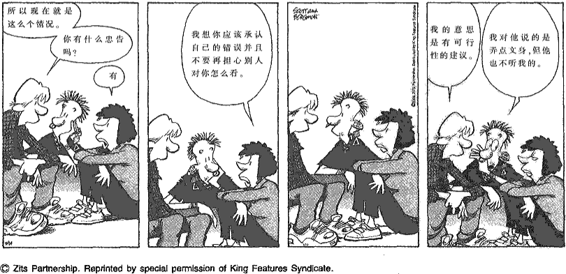

在下列的两种状况下，评断最有可能为人所接受：

1．当在困境中之人向你寻求评价时你再提出自己的评价。毕竟，有时候我们所主动提供的评价即使立意良好也常常会引起防卫。

2．当你向对方提出评断时，你的动机应该是真诚、建设性的，而不是为了去奚落对方。如果你企图要以评断作为征服对方的手段，不要愚笨地相信这样的方式对对方会有帮助。"我告诉你这是为了你好"这类的话通常就不是真心的而且没有帮助。

**选择最佳的倾听反应**

到目前为止，我们描述了倾听者的各种倾听反应。研究发现在对的情况下每一种反应都可能有助于他们接受情境，改善感受而且对于问题觉得比较有把握，但是对于特定的人哪一种反应方式能够奏效仍然存在着很大的差异。这个事实说明了使用各式各样不同反应方式的人比只有运用一两种反应方式的人更容易有效沟通。然而，如何选择对说话者的反应，还有一些其他因素需要考虑。

*性别*
研究显示男人和女人在倾听和反应上都大不相同。当面对别人的困扰时，女人比男人更常用支持性的反应，也比较能够传递出支持的信息，同时也比较会在别的倾听者中寻求到这种支持性反应。相反的，男人在面对苦恼的人时比较缺乏提供情绪性支持的技巧，他们对于别人的问题更倾向于提出忠告或转移话题。在一个有关妇女联谊会和兄弟联谊会的助人风格的研究中发现：妇女联谊会的女性经常在有人向她们求助时出现情绪支持反应，所以她们在评量自己的姐妹们时比较能够不带评价地倾听，而且表达出安慰与关切。相对地，兄弟联谊会的男人很符合刻板印象中的模式，他们习惯于挑战兄弟们和评估兄弟们的价值和态度，以此来提供协助。

这个事实强化了选择适合特定对象的反应方式的重要性。面对女性也许支持性反应是个比较好的选择，而忠告也许较受男性欢迎。这并不是说女性都不欣赏忠告而男性都不喜欢情绪支持，而我们的挑战是找出对对方最有用的反应的混合比率。

*情境*
有时候人们需要你的忠告，有时候他们需要鼓励和支持，有时候你的分析和评断最有帮助，有时候就像你已经读到过的，你的探索和释义最能够帮助他自己找到自己的答案。换句话说，好的沟通能力需要人去分析情境，并发展出合适的反应。首要规则是，多进一步了解而少给予建议——使用诸如借力使力、问话、释义和支持之类的技巧经常是一个聪明的开始。一旦你搜集足够的事实并且显现出你的兴趣和关切，说话者也就对接受（或主动要求）你的分析、忠告等评价式的反应准备得比较充分了。对象除了考虑情境，你也要因为不同对象而调整你的反应方式。有些人能够深人思考忠告的价值，有些人只是利用忠告来逃避自己的责任。许多沟通者极端防卫，因为完全无法接受分析和评断而对其一概置之不理．也有人没有准备好对问题进行清晰思考，以至于无法从释义和探索中获益。深思熟虑的倾听者会选择适合对方的方式，找出最适合方式的办法之一是直接问对方他想要你做什么，也就是简单地问："你是要我的忠告，还是只需要吐吐苦水？"这样可以有助于你做出对方真正需要的事情。

***伦理的挑战***

***无条件的积极接纳与关怀***

*卡尔·罗杰斯（Carl
Rogers）非常提省以释义技巧来作为助人的工具。身为一个心理学家，罗杰斯关注的焦点是助人工作者可以如何协助别人，而他和他的追随者都确信这样的方法可以在所有的人际关系中发挥效用。罗杰斯使用几个词语来描述他所使用的方法，有时候他称它为"非指导性"，有时候称为"案主中心"，也有的时候称为"个人中心"。所有的这些词语都反映了他的信念，他相信最好的助人方式就是提供一种积极的态度，在这种气氛下让当事人自己去寻找属于自己的答案。罗杰斯相信忠告、评断、分析和问话方式都不是协助人解决问题的最好方法。相反的，罗杰斯和他的追随者认为人是具有潜能的，人们会自己为自己找到最好的方式，接受自己并看重自己，而不需要他人的指导。*

*个人中心的基本助人要素是罗杰斯所称的"无条件积极的接纳与关怀"。助人者对案主的想法给予尊敬和无评价式的关怀，去接纳人们如其所是的样子，即使你不同意对方的态度与想法，你都给予积极的尊重。但是这个意思并不是要求你去同意案主的想法、感觉或做法，而是提醒你不要去评价案兰的想法和行为的是非对错。*

*个人中心治疗法是很重视倾听的技巧，在倾听中要正确地洞察、理解并对案主的想法和感觉做出反应。它其实是一个很大的挑战，因为你要倾听、回应，但却不能评价，这会是多么困难的事呢！*

*这样的技巧所碰上的最大挑战就是，让我们面对一个信念、态度与价值观和我们全然不一样的人仍然要给予无条件积极接纳与关怀，让我们要去如圣经上的约条所说的那样去爱一个有罪的人，真的是非常困难的一件事。有一部叫《死囚漫步》
的电影正说明了这样的情境，这部电影描述了海伦·普雷金修女（Sister Helen
Prejean）的真实的故事。她是一位天主教的修女，应一位已被定罪的谋杀犯马修·庞谢特的要求与他通信，后来更是到监狱去拜访他。在面对庞谢特的可怕罪行时，海伦仍然能够保有她对一个人的真诚与关怀，很少人能够做到像海伦修女那样无条件的积极接纳与关怀，而她让我们见证到了它的真实与珍贵。海伦修女的故事是相信个人中心信念的最好见证，也体现了它的价值。*

*如果你想要更深入了解无条件积极接纳与关怀．可参考由卡尔·罗杰斯所著的《成为一个人）(
On Becoming a Person．1961 ）。*

*你的个人风格*
最后，当你要做反应时要考虑一下你自己。通常我们会习惯性地使用一两种反应方式。你可能习惯安静的聆听，不断地借力使力顺着话题走下去，又或许你特别具有洞察力，而能够对问题提出一针见血的分析。当然，有可能你习惯的反应方式比较无助于沟通，例如太过度评断或太急于忠告，或是你给了不受欢迎的或没有用的建议，等等。当你思考如何给予对方反应时，最好同时反省自己的优点和缺点，并且取长补短来予以调整。

### **7.5 摘要**

倾听是最普遍但也最常被人忽略的沟通形式。听到跟倾听有差别，心不在焉地听跟心无旁鹜地听也完全不同。倾听是指将别人的信息赋予含义的过程，它包含了五个元素：听到、专注、理解、回应和记忆。

造成倾听不良的原因有许多，可能是因为每天我们都被太多的外在信息所轰炸，再加上自己私人的问题、飞快的思想等，以至于无法真正专注于倾听之上。有一些无法良好接收信息的倾听者，其原因是来自于生理上听力的缺陷，还有的原因是因为缺乏训练。倾听的重要功能之一，是要从对方的话中搜寻重要的资讯，成功的关键就是少说话、减少分散我们注意力的事物、避免过早的评断，并寻找说话者的关键想法等。

倾听反映重视搜集资讯和给予支持，这些反应包括：借力使力、问话、释义和支持。有些倾听反映着重在提供方向和评估：分析、忠告、评断。有效率的沟通者会很艺术、很有变化地使用它们，随时考虑性别、情境、对方和自己等因素，并选择一个最适合自己风格的方式来做回应。

**第八章 发展关系动力**

*"我们的关系很糟。"*

*"我期待一段较佳的人际关系。"*

*"我们的关系改善了许多。"*

"关系"是一个我们经常使用却不太容易为它下定义的词。花些时间来想想该如何为这个词下定义，你会发现这一点也不容易。

字典为"关系"下了一个定义："事物之间相互作用、相互影响的状态。"这足够让我们了解，你比一些人高比另一些人矮，或是我们有更多或更少的财富，然而生理上或经济上的关系并不能有效地告诉我们一些人与人之间的沟通的事情。

互动沟通牵涉到人们在社会上如何和其他人共处。但什么才是社交互动反应所界定的关系呢？这一章将提供一些观点和解释。你将会看到人们如何运作沟通模式，建立、经营以及结束他们的关系。你将会知道关系并不是像一幅图画或照片那样静止的，而是时时改变，像一场正在上演的舞蹈或戏剧。甚至于最稳固与满足的关系也会在沟通模式转变时展现不同的面貌。最后，本章将会审视自我开放和相反的状况。当你结束这一章节的阅读时，你会更加清楚地知道，沟通如何界定与反映人与人互动的生活世界。

### **8.1 我们为什么要建立关系**

是什么让我们与一些人建立关系，而不是其他人呢？有时候我们没有选择余地。小孩不能选择父母，大多数工作者无法选择他们的老板或同事。但在其他大多数情况，我们会寻找某些人而避开另一些人。社会科学家搜集了数量庞大的人际吸引相关主题的研究。下面是经研究证实的一些影响我们选择关系伙伴的因素。

**外貌**

很多人都说我们评价一个人应该看他的作为而不是看他的外表，然而，就像第六章说明的那样，现实经常截然相反。外貌在关系的初期阶段尤其重要。在一项研究中，超过700名男人和女人被以盲目约会的方式互相配对，他们被告知要参加一个"电脑抽签舞会"。在舞会结束之后，询问他们是否愿意跟他的舞伴继续约会，结果如何？外貌越具吸引力的人（由其他不同的受试者来作评定）,
其舞伴越愿意继续约会，其他诸如社交技巧或聪明才智之类的特质似乎不会影响决定。

不过，即使你的外貌并不符合社会标准，你也可以想一想这些鼓舞人心的因素：第一，过了起初的第一印象之后，长相普通但是具有亲切的人格特质的人，会被评价为具有吸引力，第二，生理外表因素在关系增进之后重要性降低。就像社会学家说的："吸引人的外表特征可以打开大门，但是渐渐地，除了外表之外，必须还有其他条件才能保持大门常开"。

**相似性**

大量的研究都对"我们喜欢跟我们类似的人"这一结论提供了支持——至少大多数情况下如此。例如婚姻中的配偶人格特质越接近，他们越倾向于表达对婚姻满意且婚姻幸福。中学的友伴们会认为在各方面彼此相似，包括：拥有一样的朋友、喜好同一种运动、参加类似的社交活动、同样程度的烟酒量等。对于成人来说，相似性对于关系的满意感甚至比沟通技巧来的重要，那些拥有较低层次沟通能力的人与那些拥有较高层次沟通能力的人一样满足于他们的朋友关系。

如果别人在很重要的领域上和我们具有高度相似性，吸引效果最大——例如两个人互相支持彼此的生涯目标，喜欢一样的朋友，对于人权有类似的信念，那么他们彼此自然可以忍受在热门音乐和寿司品位上的微小不一致。

当我们接触到跟我们相似、但是具有怪异的行事作风或冒犯社会习俗的态度的人时，相似性的作用会从吸引转成厌恶，例如，你可能不喜欢有人说某甲"跟你很像"，因为你觉得某甲根本是个长舌公、爱抱怨或其他具有讨人厌的特质。事实上，当跟我们具有相似之人不只是冒失鬼而且是冒失加上怪异时，我们会更强烈地不喜欢他，这很可能是因为这个人威胁到了我们的自尊，让我们担心自己也跟他们一样惹人厌。在这种情况下，最常见的反应是让自己跟这种威胁到理想自我形象的人保持越远的距离越好。

**互补性**

我们常说"对立的吸引力"，这似乎是在反驳我们刚谈过的相似的原则。事实上，的确两者都是有根据的。当差异具有互补性时，差异便可以增强一段关系，也就是说一个同伴的特质可以满足另一个同伴的需求。例如一个同伴是支配，而另一个是顺从，两者通常就会彼此吸引。当一个同伴同意另一个人管理某一个部分（你在金钱的部分做最后的决定）而另一个人管理另一部分（我决定我们怎么装饰这个地方）时，关系会运作得很好，紧张的情况会发生在彼此对所管理的事件有争论时。

有一份针对交往超过二十年者成功或不成功的伴侣关系的研究，检视他们在相似和不相似点之间的沟通。这项研究显示：成功的婚姻伴侣在生理和心理上拥有足够的相似程度来满足彼此，各自也有足够的不同以满足自己，并保持着有趣的关系。成功的伴侣会找到方法来保持他们相同与不同的平衡，以因应不断发生的改变。本章后段会再详加讨论相似性与互补性之间是如何取得平衡的。

**相互吸引力**

通常，我们会喜欢那些喜欢我们的人。相互吸引的力量在早期关系阶段中相当强烈，在这段时间中，我们相信我们会被喜欢我们的人所吸引。相反的，我们不太可能会在乎那些会攻击或对我们漠不关心的人。相互喜欢可以建立吸引力一点都不难理解。那些认同我们的人会支持我们的感觉和自尊。这种认同的价值，同时也可以增强表现出来的自我判断："我是一个值得人爱的人。"

你或许会想这些人所表现出来的喜欢的态度可能是假的，或只是一种不诚实的手段，想从你身上获得什么。这类的行为一点都不是"喜欢"。另一种情况下，被喜爱不能满足你的自我判断：当有人称赞你很漂亮、聪明、仁慈而你却觉得自己丑陋、愚蠢并严厉时，你也许会选择忽视这些赞美的信息，并且继续存留在你熟悉的不愉快的状态中。格鲁乔·马克思（Groucho
Marx ) 总结这种态度说：他绝不加入任何主动邀他成为会员的俱乐部。

**能力**

我们喜欢围绕在聪明的人四周，也许是因为我们希望他们的能力和技能可以分一些给我们。但从另一方面来看，我们也不喜欢围绕在太完美的人身旁，因为相较之下，自己看起来会很糟。在这种比较的态度下，人们会被那些聪明却有显而易见缺点的人们所吸引，这并不足为奇，因为那表示他也是人，就像我们一样。自尊特别高或特别低的人们，比那些有能力却有缺点的人，更容易被"完美"的人所吸引。同时也有研究显示：女人大多数倾向被有高地位的人（不分性别）所吸引，而男人则容易被自己喜欢的但仍是"人"的人所吸引。全面来看，这个原则是：要得到别人喜欢的方式，就是在所做的事上尽力而为，而且愿意承认自己的错误。

**坦露**

揭露自己的重要信息有助于建立喜欢的关系。有时这一类的喜欢基础来自于发现我们有多么类似，例如某些经验（我毁了一个合约）或是某些态度（我也对陌生人感到焦虑）。自我揭露也可建立好感，因为这是重要的标记。当别人和你分享私人的信息时，这暗示着他们尊重且相信你，这是对你的一种好感。我们可以看出分享信息有助于增加吸引力。坦露在关系发展的初期扮演了十分重要的角色。

但并非所有的袒露都会带来好感。研究显示，满意的袒露的关键在于互惠：你所揭露的资讯量与质跟对方要取得平衡。第二重要的因素是时间，某些人的时机选择错误，往往会带来错误的结果，这种错误有可能是很不明智的行为。举例来说：跟一个刚认识不久的人谈论你的不安全性经验，或是你的宠物在朋友的生日餐会上所惹的祸，就很不合适。除此之外，用错时机、开放太多，有时也是个问题。研究显示：一个人在合宜的、适当的时机分享合适的内容时，被认为是有吸引力的。第九章会有更多关于如何与何时自我揭露的指南。

**接近**

俗话说"近水楼台先得月"，我们容易和常常见面的人建立关系。我们很容易和亲近的邻居建立友谊，比如，研究显示许多学生都会选择经常走同一条路的人作为友伴。这种现象很容易理解，接近使得我们更容易获得别人的资讯，也容易从关系中受益。跟我们接近的人通常比跟我们不亲近的人与我们之间更具有相似性，比如住在一片地方的邻居往往具有类似的社会经济地位。网际网络提供了新的渠道来建立亲近社群，使用者可以经由网络空间感受到"虚拟的亲近"。

同样地，另一方面来说，亲近很可能会产生凯觑的情形。警局的记事簿是这种说法的有力证明，就像大学的图书馆一样，小偷常常光顾邻近的受害者，即使被指认的风险比较高。

**报酬**

亲密感可以让人心满意足，但这并不是驱使人们去寻求与留住关系的唯一报偿。一些社会学家就讨论过所有的关系，包括个人与非个人关系，多半基于半经济模式，称为社会交换理论。这个模式提到，我们通常会设法让报酬大于等于我们所付出的成本。报酬可以是有形的（一个很好的居住地点、一个高薪的工作）或是无形的（名声、情绪上的支持、友谊），成本是不受人喜爱的结果：不愉快的工作、情绪上的痛楚，等等。一个简单的通则可以让我们了解在社会交换理论中，我们为什么形成和维持关系：

报酬（rewards）- 成本（costs) ＝ 结果（outcome)

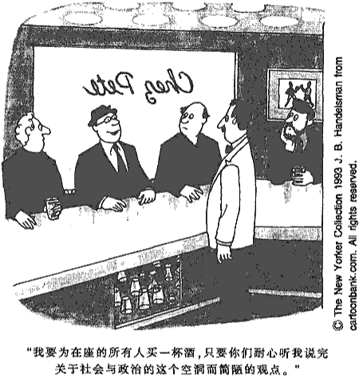

根据社会交换理论，我们用这个公式（通常是不自觉的）来决定如何与这个人应对，是"值得投人"还是"不值得努力"，基于结果是正值或负值。最露骨的程度就是，交换的过程看起来是冷酷和计较的。但是在某些类型的关系中看起来也颇合常理。一段良好的商务关系经常建立于宴会的帮助，有时友谊的建立也是出于一种非正式的交易："我不介意听你谈论你
的爱情生活的高潮和低潮，因为当我的房子需要修理的时候你救了我。"就算在亲密的关系中，也有交换的元素存在。朋友和情人通常会容忍彼此的怪癖，因为相较于他们所得到的舒适和愉快感来说这一点点的不愉快是值得接受的。

概括了解后，社会交换理论的过程和建立于需求与追求亲密感的关系呈现出了相当大的不同。事实上两种观点并不会相互矛盾。寻求任何一种形式的亲密感，不管是情感上、生理上还是智力上的都有其成本，然而我们决定付出成本与否，最大考量就是其收益。如果寻求和维持这个亲密关系的成本太高，或是收益不值得努力，那我们就会决定撤回。

### **8.2 关系发展和维系的模式**

到目前为止，我们已经看了一些影响我们互相吸引的因素。接下来的篇幅中，我们将检视我们经常用来作为开始、维持和结束的沟通技巧。

**关系发展模式**

经验告诉我们，刚开始是一个重要的时间点。当我们和他人沟通，并且越来越了解他们时，沟通会发生什么改变呢？沟通学者在这个问题上有不同的见解，以下我们就继续来学习两个主要的观点。

*发展模式*
其中一个最有名的关系阶段模式是马克·克奈普所发展出来的，他将关系中的起起落落分为十个阶段，包含聚合期和离散期两方面。其他的学者认为所有的沟通关系中都包含着可称为"维持期"的层面，以确保关系正常且顺利地运作着。图8-1
表示出克奈普的十个阶段如何与合理沟通的三个面向搭配的情形。

以下阶段特别描述亲密关系、浪漫的关系和亲密的友谊。其他亲密关系模式，例如家庭关系也适用。当你逐步读下去时，请试着思考这些阶段如何描述长期关系的特性，例如，一对伴侣关系或生意伙伴的关系。

初始阶段：第一阶段的目标在于你愿意与人接触，并表示你是一个值得谈话的对象。沟通在初始阶段通常是相当简短的，往往依循一些常见的公式，如握手、谈论无关紧要的话题——例如天气——并且友善地表达情感。这类的行为看起来相当表面且没有意义，然而这却是一种有兴趣与他人建立关系的象征。它让我们不需要说："我是个友善的人，我想要多认识你。"

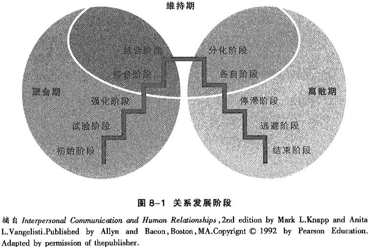

初始关系——尤其是恋爱关系——对于害羞的人来说尤其困难，对这些人而言经由网络互动可能容易一些，一个网络约会服务的研究发现：自认为是害羞者的参与者比非害羞者更加感谢匿名的网络系统和不具压力的作业环境。研究者发现许多害羞的网络使用者尤其需要利用网络服务来帮助他们克服面对面情境初始关系阶段的压抑窘境。

试验阶段：在与新朋友有些接触后，下一个阶段就是考虑是否有兴趣进一步追求建立关系。这会涉及一些不确定的推论，也就是需要有一个通过得到更多相关消息来了解他人的过程。一种常见的不确定推论会从基本资料下手，这些基本资料包含常见的基本会话，例如"你从哪里来？"或是"你主修什么？"从这里我们便可以发现自己与他人的一些相似性："你也慢跑吗？你一个星期跑几公里呢？"

"闲谈"是试验阶段的最佳保证。就像马可·克奈普说的那样，闲谈就像是防腐液："我们讨厌它，但是我们却每天都大量地使用它。"闲谈有许多的功能，首先，这是找出我们共同感兴趣事情的有效之道，其次，他也提供了视听渠道，帮助我们决定这份友谊是否值得经营。接下来，闲谈是一种安全的方法来缓和关系。在你决定是否进一步继续下去的时候，你不用冒很多风险。最后，闲聊还可以提供与他人的联结，有些人甚至还沉醉其中。

对他人有兴趣的沟通者，从初始阶段到试验阶段所花费的时间在网络空间比面对面之间更少。有一份研究发现：人们借由E-Mail开始问那些关于态度、意见和表现的问题比面对面的接触快得多。使用网络通信的人不需要看到对方的非语言反应，不需要担心脸红、结巴，也不需要由于对方太快或太多的问题而产生逃避心理，这显然对沟通有所帮助。

强化阶段：在强化阶段中，我们在第一章所谈到真正的人际关系才开始发展。不同沟通模式在沟通中产生的许多改变，都会发生在强化阶段。对他人的情感变得较为平常，约会的情侣们会用较广范围的沟通战略来描绘他们对吸引力的感觉。在大约四分之一的时间里他们会直接地表达他们的情感，利用后设沟通（metacommunication）来讨论彼此关系的状态。但他们更常以不直接的方法沟通：花更多的时间一起度过，要求相互的支持，为同伴做一些有趣的事，给予一些情感的纪念品、暗示和调情，非语言的表达情感，了解对方的朋友及家庭，以及试着有更多生理上的相互吸引，等等。在发展友谊时，强化阶段包括共同参与活动、跟共同的朋友出游或一起去旅行等。

强化阶段通常是关系中一段令人兴奋和陶醉的时间。对谈恋爱的情人而言，那通常是仿佛星际迷航记般目眩神迷的注视，伴随着触电和做白日梦的感觉，就像是电影和小说中描述的一样。最后，我们喜欢看到相爱的人坠入爱河。这个阶段并不会持续到永远，可能便前进到关系的另一个阶段——整合。

整合阶段：当关系增强后，团体中的同伴会呈现一种认同，就像在社会单位中一样。在亲密关系中，情侣开始邀约，社会圈开始整合，同伴开始呈现彼此的承诺："好！我们将会和你的家人一起度过感恩节。"大家开始以我们的公寓、我们的车以及我们的歌来称呼，同伴们会发展出一种独一无二的行为表现。他们甚至于会说一些个人的惯用语和句型。整合阶段是我们放弃自己旧有的人格特质，与他人建立分享认同的时刻。

当我们与他人更加整合时，对他人的责任感也会随之增加。我们不得不提供各式各样的资源——例如上课笔记或是金钱，不管他人有没有要求。令人惊讶的是，虽然整合阶段是以更加团结一致的关系为特征，但是同伴们却比在之前的关系阶段中较少表现出直接的要求。这里有一个曲线关系图表示每个关系的阶段和明确要求的数量，在第一次看到这个模式时也许会非常惊讶。刚认识的人有许多不必要的公然要求，中间阶段要求降低，当关系发展至后期时明确的要求会再次增加。

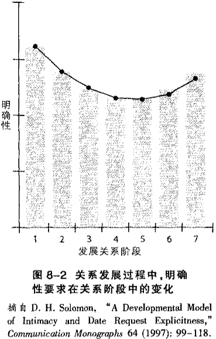

结合阶段：在结合阶段中，团体中的人会有一些象征性的公开姿态，用来告诉全世界他们的关系是存在的。在亲密关系中，最常见的形式就是婚礼，以及随之而来的合法结合。结合阶段为关系提供社会的支持，风俗和法律两者都会将某些责任加诸在正式结合的同伴上。

结合阶段也是关系中的一个转折点。到达现在这样的关系，会发展的一个稳定和谐的状态，试验阶段到强化阶段然后到整合，现在突然加速前进到承诺。

并不是只有爱情关系才会发展到结合阶段。试想一下签署了合作契约的生意伙伴，或者兄弟会和姐妹会的结盟仪式等。就如同一个作家所写的那样，即使是友谊也可以通过一种"官方"性质的行动达到结合阶段：

*有一些西方文化有一种去标记友谊的进展，给予公开的合法和形式的仪式。例如，在德国有一种小型的仪式叫做"Duzen"
，意思是指友谊的升华，这个仪式中要有两个朋友，每一个人都拿一杯啤酒或红酒，两人手臂交缠，身体靠得很近，在发誓两人兄弟情谊至死不渝之后，把酒喝光而且说"Bruderschaft"。仪式结束之后，这两个朋友的友谊从此不同，他们的关系从正式称呼"Sie"
，的形式转变为熟人之间的"du"。*

分化阶段：结合阶段是克奈普称为"聚合期"发展阶段的顶端。但是就算是在最投入的关系中，人们也需要坚持他们独特的自我认同。分化阶段就是"我们"这个点开始要产生变化转成"我"的时候，也就是"抱紧我"的定位点发生替换，而"放我下来"的信息开始发出的时候。交谈的焦点从"我们"周末计划要做什么转变成"我"这个周末要做什么了，曾经两人都意见一致的理性议题——例如你还是负责赚钱养家而我负责打理家务，现在成为争议之点：我比你还具备生涯发展的潜力，为什么我要被绑在家里？分化（differentiating
）这个字的字根就是不同（different ) ，暗示着变化是这个阶段的主角。

在关系的经验历程中，第一次发生分化阶段似乎是避免不了的压力。这种自我控制的需求不见得都是负向的经验，然而人们需要成为单独的个体，就像关系中的一部分一样，分化就是一个朝向自治的必要步骤。试想一下，一个成年的子女即使想要继续与父母保持良好关系，但同时也想要保有自己独特的生活和认同。分化其实是维持期关系中必然的状态。成功的分化关键在于当我们创造一些空间去成为个体时，还能维持在关系当中的承诺。

各自阶段：到目前为止，我们所看到的都是成长的关系。有些关系会达到发展中的稳定水准，在一生中继续成功地维持着，有些则是经历几个衰落和瓦解的阶段。在各自阶段中，成员的沟通品质和数量都在降低。限制和压抑是这个阶段的特征。成员们选择退缩，而非讨论一个不认同的话题（这是需要两方付出精力）。两方在心理（沉默、做白日梦和幻想）或是生理上（人们花较少的时间在一起）都会划清界线。各自为政并不包含全然的拒绝——那是稍后才会有的情形，而是对兴趣和承诺较为退缩。

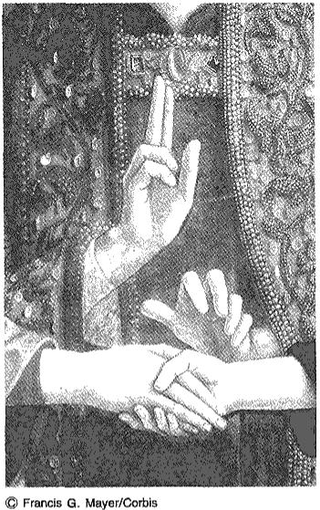

停滞阶段：如果各自持续下去，关系就会进入停滞阶段。成员彼此用老方法相待，熟悉的方法没有什么感觉，没有成长发生，这样的关系就是空壳。我们可以看到许多在停滞阶段中失去热情的工人，他们在辞职前依然会继续运转好几年。同样悲惨的事也发生在厌倦于同样的对话、同样的人和每夭随之而来的例行公事，却没有一点愉快和新奇感的伴侣身上。

逃避阶段：当停滞阶段变得过分令人不愉快时，团体中的人们就会创造出一种在彼此之间的生理距离，这就是逃避阶段。有时他们会间接地通过一些伪装的借口来表达（我最近都在生病，没办法和你见面），有时也直接的表达（别打电话给我，我现在不想见到你），这两种迹象都会使关系的前景陷人困境。

关系的恶化从结合、各自为政、停滞到逃避，并不是不能避免的。在婚姻中是以离婚收场还是一直保有之前的亲密感，最大的不同在于伴侣之间能否感到无法满足彼此的沟通状况。不成功的伴侣在讨论问题的时候会通过抗拒、间接面对和彼此较少联系的方式；相反的，那些"修补"过关系的伴侣往往以比较直接的方式沟通，他们正视彼此的问题（有时会经由咨询师的协助），花时间尽力地协调问题的解决之道。

结束阶段：并非所有关系都会结束，许多生涯的伙伴、友谊和婚姻，一旦建立关系之后就会延续一辈子，但是的确许多关系会走到终点而到达结束阶段。

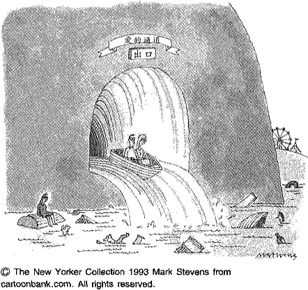

结束是最后阶段的特征，包括远离关系和想要分开的简要谈话。关系也许会通过一顿真诚的晚餐、一张留在餐桌上的纸条、一通电话或是法律文件来结束。根据个人不同的感觉，这个阶段可能非常短暂，也可能需要一段相当长的时间以远离痛苦和彼此攻击的情况。

关系并非总是能直接结束的，相反的，它们常是一种来来回回地朝着瓦解迈进的模式。不管花的时间是长是短，结束都不是完全负向的。了解到每个人在关系中付出的精力以及个人成长的需求，可以降低难过的感觉。事实上，许多关系并不如界定中的那样完全结束，一对离婚的夫妻也许会找到较少亲密感的方式来维系彼此的关系。

在浪漫关系中，我们可以预知两人能否成为朋友，端赖于他们在感情有联结之前是否已经是朋友。两人分手的方式也会有些不同。如果分手时的沟通是正向的（不后悔花时间在一起，想要减少难过的感觉），比较可能在分手之后维持友谊．如果结束阶段的沟通是负向时（矫揉造作，抱怨他人），想要保有友谊比较困难。

在结束之后，伴侣通常会通过不断回顾来"掩饰悲伤"，企图找出关系失败的原因。每个伴侣所建构出的"哪里出差错"的述说都会对他们在分手之后如何适应造成冲击。想想看这两种说法的差异："我们因为彼此不适合，所以分手了"
"他太自私又不成熟，所以无法对感情负责"。

克奈普的模式提供关系阶段的说明，但是每一阶段关系的沟通如何前进与衰退却缺乏详述。例如，克奈普认为阶段之间的运作通常是有连续性的，因此典型的关系是从一个阶段移到另一个阶段，在阶段间的发展或退化都是按部就班而可以预测的。有一个研究发现：许多终结的友谊关系的确依照克奈普的十阶段形态，如图8-3
的第一型所示，然而也有许多其他关系的发展和结束之形态，如图8-3的第二到第五型。换句话说，并不是所有的关系发展历程都是循着开始、进展、消退、结束这种线性发展形态。

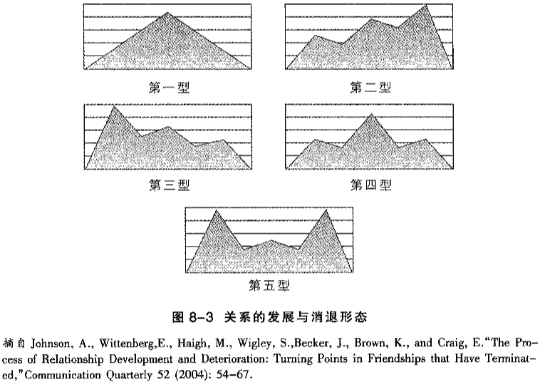

最后，克奈普的理论认为同一个时间内，只有十个阶段中一个阶段的特征会主导关系。尽管这个事实存在，然而其他阶段的成分常常同时出现。举例来说，相爱的人深受整合阶段之苦，仍愿意分享经验和彼此意见上的差异（哇！我不知道你是这样想的！)
，但是也同时出现分化阶段的歧异性（没什么理由，我就是需要一个礼拜独处的时间）。就像家庭成员，虽然花很多时间排拒彼此，却可以因偶尔的美好关系使之前的亲密感短暂加强。这种在某段关系中同时出现"聚合期"和"离散期"特征的现象，我们将在下一个主题"辩证关系"中详加讨论。

*辩证的观点*
并非全部的理论都认为我们前几页所了解的阶段模式是人际互动中最好的方式。有些理论家主张——无论是全新的还是陈年的关系——有些沟通者会陷在同样的困境模式中，他们认为这些沟通者想要追求重要但内在却相互矛盾的目标，贯穿了他们实质的关系。为了要达到这些目标，而产生了辩证的张力：两个相反或不相容的力量同时存在，所以就产生了冲突。近几年，沟通学者提出了几种辩证的力量，成功地挑战了传统的沟通关系。他们认为经营辩证的张力，会造成人际沟通关系中最有力的动力，在接下来的几页，我们将要讨论三种最有力的辩证的张力。

·联系和自主：没有人是可以孤独存在的。认识到这个事实后，我们会寻求与他人有联系，但是同时我们也不希望失去全部的自我，就算在最满足的关系中也是一样。联系与自主的矛盾需求都包含在联系与自主的辩证中。一些探讨关系破裂的研究显示，这结果来自于伴侣们找不到方法来经营他们不同的个人需求。常见的一些关系破裂的理由集中于伴侣无法满足彼此对联系感的需求上："我们鲜少有时间在一起"、"他（她）不认同这段关系"、"我们有不同的需求"。但其他的抱怨则显示过度的联系感需求也会带来分裂："我觉得被困住了"、"我需要自由！"
有些研究发现男人比女人更加肯定关系中的自主性，而女人更看重联系和承诺。

我们追求的联系与自主辩证程度会随时间改变。在《亲密行为》
这本书中，作者德斯蒙德·莫里斯（Desmond Morris
）认为每个人都在重复的表现三个阶段："抱紧我"、"放我下来"、"让我一个人"。这个循环会开始出现在出生的第一年。当孩子从"抱紧我"的婴儿阶段转变到新的"放我下来"阶段时，他们会通过爬行、走路、触碰和品尝来探索这个世界。同一个3岁的孩子，可能在8月时坚持"我可以自己做"，却在9月第一天上幼儿园时缠着父母不放。当孩子成为青少年时，"让我一个人"的倾向变得很明显，从前很快乐地和家人在一起的孩子现在可能会因为必须和家庭一同度假以及在同一张餐桌上用餐而痛苦呻吟。当青少年成年时，他们通常又会和家庭变得较为亲密。

在成人的关系中，这个亲密和距离的循环仍然重复着。在婚姻关系中，"抱紧我"通常是在结婚第一年。随着自主的需求慢慢增强，关系的紧密度也会降低，这种需求可以用各种不同方式表露，包括交朋友的需求、参与不包含配偶的活动或找工作等。这种从联系到自主的转变可能导致关系破裂，但是也可能成为循环的一部分——用新的方式来定义关系，以再次取得存在于过去甚或更加浓烈的亲密感。

在评估关系中的转折点，异性恋的爱情关系配对组中，无论男女都认为联系和自主的辩证关系是影响其关系的最重要因素，这种辩证张力在协调承诺、冲突、脱身、和解等转折点时十分重要。

·公开和隐私：就像第一章所谈到的那样，袒露是人际互动中的特征，然而，就算一向都袒露自我，我们还是需要保持与他人之间的空间，这种矛盾的需求创造出公开和隐私的辩证。

再紧密的人际关系都需要一些距离，爱人之间会经历一段腻在一起的亲密时间，然后相对地想要彼此冷却一下。同样地，他们在经历火热时期之后，接着便会减少生理上的接触。朋友们有时间分享每一种感觉、想法，之后分离几天、几个月，甚至于更久。

在一段亲密关系中，你很在乎的人问了你不想回答的问题，比如"你觉得我迷人吗？"
"跟我在一起你快乐吗？"
你会怎么做？你对这份感情的投人和诚意可能会让你说出对方想听到的肯定答案，但是如果你心中还顾忌着另一个人的感受，而且你还想要保有一点隐私，可能会使你的回答减少肯定。伴侣们彼此都各耍奇招来获得隐私权，例如，他们可能直接质问对方而且直言不想再继续讨论下去，或是他们可能不那么直接而用非口语线索暗示：改变话题或暂时离开房间。这种辩证关系将于第九章中深入讨论。

·循例和新奇：稳定是关系中重要的需求，但过多的稳定则会让人感到了无新意。循例与新奇的辩证反应了这样的矛盾张力，喜剧家戴夫（Dave
Barry）夸张地描述了夫妻在结婚多年后对彼此了解很深却十分无趣的情况：

*结婚多年之后，你知道关于配偶的每件事、每个习惯、主张而神经紧张的抽动和每一条皱纹，你可以写一本17磅重的书，只谈配偶的饮食习惯。这种亲密的知识在某些情况非常管用。你也许在看电视时可以通过咀嚼食物的声音来辨别配偶所在的位置，但这只不过是关系中较低程度的热情罢了。*

虽然太多的熟悉会导致无趣和停滞的风险，但也没有人希望有一个完全没有规则可循的伴侣。太多的惊喜会威胁到建立关系的基础（你不是我嫁的那个人了！）。

沟通者所面临的挑战是为循例的状态注人一些新奇的需求，使关系保持新鲜和有趣，每个人在循例与新奇辩证中有不同的需求，因此没有办法将两者理想地混合。你稍稍留意便会发现人们用大量停滞来控制这种矛盾的力量。

对于张力关系的经营来说，虽然所有的辩证模式在关系经营上都扮演相当重要的角色，但有些却比其他来的重要。在一份研究新婚夫妻的报告中发现，"联系和自主"是最常出现的张力（占所有张力中的30.8%）。循例和新奇位居第二（21.7%
) ，最不常见的是公开和隐私（12.7%)

上述相对张力的经营，呈现了沟通关系中的挑战，以下便是一些面对这些挑战的方法，有的比较管用而有的则不然。

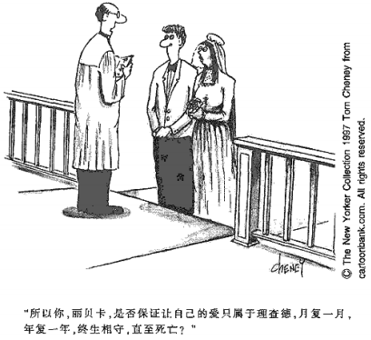

·否认：在否认的策略中，沟通者在辩证光谱中回应其中一端而否认相对的另一端。举例来说，一对夫妻纷争的来源是循例和新奇，可能发现要改变实在太困难了，所以选择继续保持老样子。如果他们不面对问题，只好继续一成不变。

·无所适从：这种时候，沟通者会觉得被征服、无助以至于他们不能正视问题。在面对辩证性的张力时，他们会争吵、冷战或离开这段关系；假如在蜜月后发现"永远幸福快乐"这种完全没有问题的生活并不存在，他们会变得十分恐惧，甚至开始怀疑婚姻是个错误。

·交替：采用这个策略的沟通者，在辩证光谱中某些时间会选择其中一端，另一些时间又选择另外一端。举例来说，朋友会通过交替的方法，来经营联系和自主的辩证，他们有时候会花大量时间和朋友在一起，有些时间也会单独生活。

·分割：伴侣运用这种内隐的区隔划分不同的关系区域。例如，一对伴侣可能在处理公开和隐私的辩证张力时，几乎彼此分享他们对所有共同朋友的感觉，但是却对某些过去的爱情史隐而不谈。分割是前妻（夫）子女最常用来处理与继父母之间的公开和隐私张力的方法，通常继父母会想探问孩子和他们亲生父母相处的种种，而子女通常会选择性地有所保留。

·平衡：试图平衡相对性张力的沟通者，认为两种张力都具有合理性，且试着通过妥协来处理张力，第十一章指出妥协就是每个人至少损失一些原来自我坚持的情况。受制于循例和新奇的情侣会通过妥协寻求解决，一个人不需要墨守成规，一个人也不需要充满惊喜，这毕竟不是理想的结果。

·整合：通过这个策略，沟通者并不试图削弱而是接受相反的力量。沟通研究者芭芭拉·蒙哥马利（Barbara
Montgomery
）描述了一对接受彼此对于循例和新奇需求的夫妻，提出一种"可以预期的新奇"的方式——每个星期一起做一件以前没做过的事。与之类似的，现在的再婚的家庭，为了处理源自新家庭和老家庭之间产生的紧张关系，也会采用适应和整合他们的"家庭仪式"来进行。

·再界定：沟通者可通过对紧张的关系进行重新定位来回应挑战，使得明显的矛盾得以消失。想法改变就可改变你的态度，举例来说，人们可以从不管彼此之间的不同而相爱，到因为彼此的不同而相爱。想一想两人是如何因为不愿意分享过去的经验而产生受伤的感觉的，然后可以通过重新界定秘密为创造吸引力的神秘气氛以取代对开放分享的拒绝，从而解决问题，这样仍然可以保有个人渴求的隐私，但将不必再跟开放每个过去的需求有关。

·再证实：这个策略了解到相对性的张力是无法消饵的，所以它不试图使张力远离，而是选择再证实。沟通者接受甚至于拥抱这些紧张关系的出现，生命就像过山车的隐喻反映出了这个战略，使用再证实方法的沟通者视相对张力为过山车路程中的一部分。

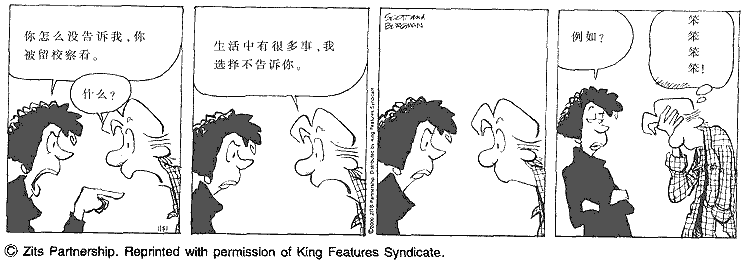

======================

**关系的特性**

无论你就阶段模式还是辩证张力来分析一段关系，每段关系中都存在三个特征，当你阅读后，想一想它如何适用于你的经验。

*关系是经常变动的*
关系并非注定要恶化的，但是就算最紧密的关系也无法保证长期的稳定。在童话故事中，伴侣可以"从此幸福快乐地生活在了一起"，但是现实生活中这种情况并不是那么常见。假想一对结婚已有一段时间的夫妻，虽然正式地结合了，他们的关系仍有可能从一种辩证张力转换到另外一种，在关系序列中前进或后退。有时候伴侣会觉得有彼此分化的需求，其他时候又追求亲密。有时候在已建立的固定模式中他们会感到安全，其他时候单方或双方却又渴望新奇。这样的关系可能变成许多限制甚至于停滞，从这样的观点来看，婚姻也许会失败，但事实并非一定如此。通过努力，同伴可将停滞变成试验，或从划清界线变成强化。

沟通理论家理查德·康威尔（Richard
Conville）描述了这种经常性的改变。这是一种逐步形成的自然关系，同伴关系会经历一些阶段性的循环，虽然到达了一个新的层次，还是会回到先前发生的阶段（如图8-4）。在这个循环中，伴侣会从安全（整合，克奈普的专用语）到瓦解（分化）、到疏离（划清界线）、到再次整合（强化与结合），一直到新层次的安全感。这个循环会不断重复。

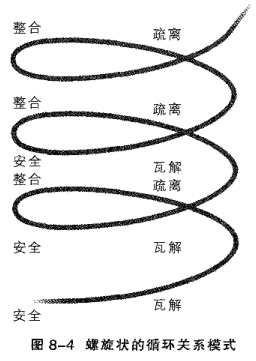

*文化会影响关系*
许多影响个人关系的因素具有普遍性，但是在各文化间也具有极大差异。例如，西方的浪漫爱情和婚姻特征可以用十阶段线性发展关系来说明，这种关系必须经历试验阶段、强化阶段、整合阶段才进入结合阶段的发展历程。但这并不适用于所有文化，事实上，在许多文化中新娘和新郎可能只认识几天或几周就结婚成为夫妻，研究显示这些婚姻也经常是成功而幸福的。

许多的差异——影响深远但是不见得显而易见——会造成不同文化中的人的挑战。例如，在各个关系中决定要分享心中多少心事就是个问题，这个决定会因为所处的文化对于自我袒露的规则不同而变得十分有趣（第九章将会讨论更多相关细节）。美国这样的低脉络文化比较喜欢直接，日本这样的高脉络文化则比较鼓励含蓄。从两种自助练习手册的书名可以窥见其心理定位的不同取向，美国的自助手册是《如何拒绝别人而不觉得愧疚》，而日本的自助手册刚好相反——《16种方法让你避免拒绝别人》，你可以从而得知，合适行为的特征在不同文化关系中具有很大的差异。关系需要维持就像花园需要照料，车子需要定期维修，身体需要运动，关系也需要维护才能保持成功和满意。沟通对关系满意或不满意至少具有80％的影响比重，所以探讨维持关系互动的性质是有必要的事情。什么样的沟通有助于维持关系？研究者已经证实五种策略，是伴侣们用来维持他们沟通满意的方法：

▲正向：保持关系气氛礼貌而乐观，而且避免批评。（第十章会根据这个主题进一步说明细料

▲开放：直接说出对于关系的看法，而且担露自己的需要和看重的事。（第九章会详述自我袒露的细节）

▲确信：让别人知道——包括以口语和非口语两种方式——他/她对你的重要性，你重视并投人在这份关系中。

▲社会网络：跟对方沟通能够提供支持和宽慰，这有助于伴侣彼此了解并互相感激，朋友、家人、同事会在感受到陪伴时，减少关系中的压力并满足每个人的需要。

▲分工：彼此协助度过生命中的低潮，携手完成人生义务，使得生活顺心而重新肯定关系的价值。

所有类型的关系都可能从上述维持策略获益，社会科学家的伴侣比其他伴侣更常运用这些方法。例如，在华盛顿大学和加州大学一个为期十二年的研究计划，探讨同性伴侣的关系模式，在同样层次的所有类型伴侣——异性恋、男同性恋、女同性恋——之中，同性恋伴侣似乎比较能够运用上述维持策略来保持关系满意度上的正向氛围。例如，跟异性恋伴侣相比，同性恋伴侣在面对冲突时比较能够保持轻松乐观，他们也比较不会将意见不一致转为人身攻击，较少对他人的控制，让敌意内隐含蓄，当问题产生时会降低情绪化的因素。

**修复损坏的关系**

即使是最强固的关系迟早都会遭遇严峻的考验。有些问题来自外在的压力：工作、财务、第三者，等等，有时候问题来自两人之间的差异和歧见。第三种关系的问题来自关系越界，当两人的其中一方外显或内隐地违反关系默契时，会让另一方在某方面屈居下位。

*关系越界的类型* 表8-1列出关系越界的类型，这些违反行为分属不同类别。

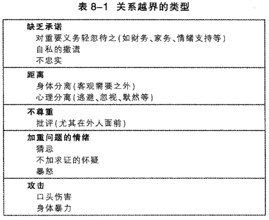

轻微或严重：有些列在表8-1的项目并不一定会造成越界，有时候少做一点甚至有助关系。例如，小别胜新婚，有点距离关系反而更加紧密，一点点猜忌可能增加情趣，以小口角起头或许可以化解继之而来的盛怒。但是如果大量又经常为之，这些严重的越界行为必然会损坏两人的关系。

社会或相互：有些越界违反大多数社会中的社会原则，例如，几乎所有人都会同意在公共场合羞辱或嘲讽朋友或家人是很明显地违反基本社交原则的行为。有些规则是相互关系的本质，是在关系中的人共同建构出来的独特规则。例如，有些家庭规定"假如我要一点到家，我会让你知道，你不必担心"，一旦这个规则存在，不去遵守就会被视为越界，虽然局外人不会持这种看法。

故意或无心：有些越界是无心的，你可能说出你朋友过去的某件事，没想到这个爆料会造成朋友的尴尬；但是有些越界却是故意的，你在气头上时可能明知会伤了对方的感受，却仍然故意厉声痛斥、做出冷酷的回应。

偶发或续增：最明显的越界发生在单一事件中：一次背叛行为、一次口语上的骚扰或脱口骂人，但是许多越界是经常发生的。思考一下情绪退缩——每个人都有需要独处的时候，我们大多数就会配合着给出空间，但是这种退缩慢慢变成一种惯性，变成违反大多数关系的基本原则：伴侣应该随时愿意彼此陪伴，这时就会造成越界。

*关系修复的策略*
研究证实了我们的常理：修复关系的第一步是去讨论违规行为，比如在当你认为你被亏待的时候说："昨天晚上，你当着大家面前对我怒吼，我真的觉得很尴尬。"在另一种情况下，你可能是因为出现越界行为而想要主动讨论："我做了什么让你觉得这么受伤？"
"我的做法为什么对你而言是个困扰？"提出这类问题，而且不带防卫地倾听对方的答案，可能是很大的挑战。第七章提供了倾听的指南，第十章提供了如何处理批评的方法。

即使你已经道歉，也不能保证你的越界行为——尤其是那些非常严重的那种越界——就一定会获得原谅。要能够达到修复受损关系的目的，越界者的信息必须包含三个要素：

▲明确地承认自己的越界行为是不当的错误："我的作为像个自私的笨蛋。"

▲很诚恳地道歉："我真的觉得很抱歉，我对让你觉得不好受感到非常难过。"

▲某种补偿形式："不管发生什么事，我一定不会再重蹈覆辙。"

只有在道歉者的口语和非口语行为配合一致时，道歉行为才会具有诚意。即便如此，道歉之后想要立即获得宽谅也是不切实际的期待。有时候，尤其是严重的越界行为，表达悔意并承诺改善后必须经得起时间的考验，才能让对方感受到真诚而愿意接受道歉。

*谅解越界*
很多人认为原谅是理论家或哲学家论述的主题，然而社会科学家发现原谅别人对自己和关系都很有助益，在个人层面上，原谅已经被证实会降低情绪沮丧和攻击，并能促进心血管功能。在人际层面上，愿意去原谅爱人、朋友、家人能够修复损坏的关系。

并不让人讶异的是，有些越界行为比较难以被原谅。一个关于约会中伴侣的研究发现，背叛的性行为和第三者是最具侵犯性的越界行为。

即使对方已经提出很真诚的道歉，要原谅对方还是很困难。研究显示一种增加原谅能力的方法是去回想你也曾亏待别人或伤害别人的时刻；换句话说，就是记得你也曾错待别人而需要别人的原谅。对于原谅与被原谅的了解是我们自身关切的重点，沟通研究者道格拉斯·凯莱（Douglas
Kelley）鼓励我们牢记瓦尔特斯（R . P . W 血ers
）所说的："当被伤害时我们有两条路可走：被仇恨摧毁，或是原谅。仇恨带来死亡，原谅带来疗愈与重生。"

### **8.3 对关系做沟通**

现在，你已经明白人际关系的复杂性、动力性和重要性了，但是，当我们进行人际互动时，到底又互相交换了何种信息呢？

**内容与关系性信息**

在第一章你读到的每个口语的陈述都有其内容和关系向度，最明显的大多数信息的元素是陈述他们想传达的内容，好比"这次轮到你洗碗了"或是"我礼拜六晚上好忙啊"都是显而易见的例子。

内容信息并不是人们沟通时唯一交换的信息种类，几乎所有的信息——包括口语和非口语的——都有第二层的意义，也就是关系性的向度，它将沟通者对对方的感觉转化成某种表述，而这类的关系性信息满足的是人们的社交需求，最普遍的就像是控制感情、感性或尊重感。我们不妨思考一下之前曾提过的例子：

*试着想象两种表达"轮到你洗碗了"的说话方式：一种是命令式的，另一种则是就事论事式的。然后注意在这种关系中不同的非口语信息所传达的不同的信息，说明了传送者看待控制的方式。命令式的口吻可能会像是"我有权力告诉你在这栋房子里你应该做什么"，而就事论事的语调听起来可能像"我只是提醒你，你可能忽略了某些事"。你也可以假想两种传达"我礼拜六晚上很忙"的说话方法，一种是几乎不带任何感情的，另一种则是充满感情的。*

大多数的时间里，我们的确不会时常意识到不断冲击的关系性信息。有时候，我们没有察觉它，是因为它符合我们对尊重感、控制感及情感性的信念。例如，当你的上司指派你去做某件必要的工作时，你不会觉得不舒服，因为你同意上司有指使下属的权力。有时候，关系性信息会引发争执和冲突的出现。假使你的上司用贬低、嘲讽或谩骂的口吻传达命令，你大概就会觉得很不舒服。你的抱怨恐怕不会来自于命令本身，而来自于上司传达命令的方式，"我可以为这家公司工作，"你可能会想，"但是我不想被当成奴隶或笨蛋，我希望被当成一个完整的人。"

关系性信息是如何传递沟通的？正如我们所举过的上司与下属的例子，他们常运用非口语的方式进行沟通。为了测试这个事实，你可以想象一下，当别人用下列不同的沟通方式说"可不可以请你帮我一下"时，你会有什么反应？

优越的 友善的 性感的

无助的 冷漠的 恼怒的

虽然非口语行为是关系性沟通中重要的资源，但是它们十分模糊，不够确定。或许你会将他人尖锐的语气诠释为疲累的表征，而将他人的打岔视为轻视你的举动——但这个打岔实际上可能只是传达出说话者本身所受到的压力，与你无关。

**关系性信息的类型**

内容信息的种类和数量是无穷无尽的，好比谈到"洞"可以从黑洞谈到到甜甜圈中间的洞，谈"石"可以从化石、玉石谈到滚石音乐。跟内容信息不同的是，关系性信息的种类却是出乎意料得少，实际上它们只能划分出四种不同的类别。

*亲切感*
关系性沟通的重要类型之一是亲切感，意即人们欣赏和喜爱对方的程度。在两性关系中，情感无疑是最重要的要素，然而并非所有的亲切感信息都是正面的。瞪眼怒视、大发娇嗔、嘴角带笑或爱的表白，同样都能清楚地传达喜欢和投缘的意味。

*即时性*
即时性是指我们立即转向别人并与之沟通这种对别人感兴趣和专注的程度，许多即时性信息都是借由非口语行为——比如眼神接触、脸部表情、说话语调和与他人的身体距离等——加以传达。即时性信息也可以经由口语传送，例如告诉对方"我们有个困难"要比"你有个问题"更加具有即时性效果，详见第五章和第六章对于口语和非口语的讨论。高度即时性的沟通当然有其价值，但是有时候放缓脚步也颇令人期待。无时无刻不上紧发条的即时反应会使人精疲力竭，在某些不赞许这种行为的文化中——尤其在公共场合——出现高度即时性沟通并不合适。在大多数案例中，关系满意的关键是去建立双方都接受的即时性沟通强度。

*尊重感*
也许你第一眼看见"尊重"，会认为它与亲切感很像，但是它们是截然不同的两种态度。亲切感是指喜欢和投缘，而尊重感则指尊敬、敬爱。我们有可能喜爱某人却不尊重他，譬如你很喜欢、很宠爱两岁的表弟，但是你不会想到要尊敬他。同样地，你或许十分喜爱某些好友，但是这并不表示他们做的事你都认同、敬重。反之，我们仍可能尊重我们不喜欢的人。你可能十分尊重某人，因为他工作勤奋、为人正直又聪明伶俐，尽管你并没有和他在同一个办公室里工作的愿望。

有时候，受人尊重比受人喜爱来的更重要。想想你的学校生活，当你的意见或问题不被同学或师长当一回事时，是不是感觉很不舒服？在工作上这个法则也同样存在，自己提出的意见具有商业价值比让人听着开心更有意义。在许多关系中，尊重的议题常是引发争执的焦点，对自尊来说，被认真地对待是极为重要的要件。

*控制性*
最后一种人际关系的类型是控制，指的是在关系中一方是否有权可以影响另一方。研究沟通的学者通常以两种方式看待关系中权力的平衡："掌握发言权"探索了包括谁说最多话、谁打断了谁以及谁最常改变谈话主题等内容。掌握发言权不见得也掌握决策权，就像有时候别人说得再多也无法说服你接受他的信念一样。而掌握决策权则意味着在关系中谁拥有决定事情的权力——从礼拜六晚上我们应该做什么到我们应该拿积蓄去整修房子还是干脆出国度个假，再到我们到底要分配多少时间约会或独处。

大多数健康的关系是以弹性的方式来决定控制性的分配比率，这会比一边倒地只由其中之一（一高一低的倾斜关系）作决定，或是完全平均分摊责任以形成不真实的平等都要好。通常伴侣之间两人轮流做决定或是两人直接交换角色，例如，维德处理修车、拟定菜单、在会场中灯光音乐等，珍妮则负责预算、如何照顾小孩、跟朋友搭讪招呼维持气氛。当一个决定对彼此都很重要时，其中一方愿意先让一步，因为他知道反正会先苦后甘，当某个议题对伴侣双方都很重要，他们会试着平均地分享权力，但是面对绝境时，两人都会各让一步以便保持整体的权力均衡。

**后设沟通**

并非所有的关系信息都是非口语的，社会科学家使用后设沟通这个术语来描述在关系中人们谈论"关系"，并交换信息。换句话说，后设沟通是沟通中的沟通。无论何时，只要我们与他人讨论到友谊、情感关系时，我们就是在进行后设沟通，例如"我希望我们不要继续争吵了"或是"我很感激你愿意对我坦白"。口语的后设沟通是成功的人际关系中很重要的一环，和对方开门见山地谈论彼此的关系迟早会变得非常重要。本节提供的资料将有助你永保友谊的品质。

后设沟通是一种重要的方法，可以协助人们以建设性的态度解决问题，它提供了转移话题焦点的方法，使讨论可以由表面的内容深入到关系困境。

后设沟通不仅能解决问题，也可以提高关系的满意程度，例如"我真的很感谢你，愿意在上司前面帮我美言几句"。类似这样的陈述透露了两种功用：首先，这让别人觉得你很看重他们的表现；再者，也提高了别人愿意在以后继续保持这种表现的意愿。

谈完了后设沟通的优点，不得不顺带一提，公开讨论关系议题仍可能带有风险。此外，要注意的是，后设沟通并不包含"听起来你好像对我很不满"一类的分析，要知道有些人就是讨厌被剖析。这些警告并不是说口语的后设沟通是不好的，它们只是要提醒，作为一个工具，后设沟通需要被小心地使用。

### **8.4 摘要**

人们因为各种不同理由建立人际关系，有些理由和沟通者彼此的人际吸引力的程度有关。吸引力可能来自于生理外貌、察觉到的相似性、人格特质上的互补、相互间的吸引力、觉察到的能力以及自我信息的袒露、距离、接触和报酬等。

人际沟通在人际关系发展和维持的运作上，两种模式提供出两种不同的观点，阶段发展模式认为人们在聚合期和离散期中的各个阶段出现不同的沟通特质，而辩证张力模式认为在每个阶段中，人们都必须处理许多彼此不同又不相容的需求。两种模式都要面对一些特性，例如都会产生变动、都受文化影响、都必须维持等。当关系因为越界行为而损坏，修复策略和原谅对于双方都是重要的技巧。

沟通会出现两种向度：内容和关系向度。关系向度的沟通可以同时包括口语与非口语。关系性信息通常以四种方式呈现：亲切感、即时性、尊重感和控制性。后设沟通是由沟通者之间的关系信息所组成。

**第九章 表达亲密感**

本章将前一半篇幅将着重于探索亲密关系的本质：我们对亲密关系的这种渴望是什么，塑造这个的因素是什么，以及我们同时对亲密和距离感都有渴望的这种张力是什么。后半部分篇幅将着重于描述自我袒露的本质，包括袒露式沟通的各种类型和它们在人际关系中的运作方式。最后，我们将介绍一个方法，能够帮助我们在致力于建立和经营满意的关系时表露出我们个人的想法与感受。

### **9.1 关系中的亲密**

1970年的合唱团体Three Dog
Night说得很好："1"是最孤单的数字。实践研究中已经确认了亲密感的价值。研究中发现：对自己的亲密关系感到满足的人比那些没有亲密关系的人拥有更高的自我价值感、更强的自我认同以及更好的控制力。在一项研究中，研究者询问那些在收容所或医院里即将面临死亡的人们，什么是他们生命中最重要的。将近90％的癌症末期病患把亲密关系放在列表的最上方。正如一位50岁、拥有三个孩子却即将因癌症而死亡的母亲所说的："你不需等到变成我这种状况时才知道，生命中没有任何事物比爱更加重要。"

**亲密的向度**

韦伯新大学辞典将亲密定义为"一种'密切结合、接触、联盟或熟识'的状态"。这种亲密感可以出现在各种不同的关系里。研究者询问数百位大学生什么是他们觉得"最贴近、最深入、最投人、最亲密的关系"，几近于一半(
47%）的回答是爱情，大约三分之一（36%）的人认为是友谊，剩下的大多数（14%）选择家庭。

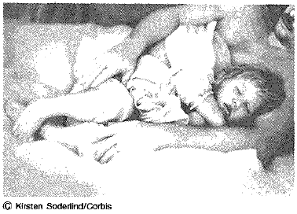

亲密关系有许多面向，第一个向度是生理的。甚至在出生之前，胎儿就在母体中体验到出生之后再也无法重现的亲密感觉：漂浮在温暖的水流中，蜷曲在完全的拥抱中，随着移动的身体波动，听着跳动心跳的节奏。长大后，幸运的孩子会持续在生理的亲密中得到滋养：被摇动、喂食、拥抱和抱着。等到再长大一些时，生理上亲密的机会变少了，但仍然十分需要和重要。有时候，生理上的亲密关系指的就是性关系。在一项调查报告中，有四分之一的受试者（他们是大学生）表示亲密关系包含一种浪漫或性方面的向度。一起面临生理上的挑战—如运动或紧急情况―的同伴，会建立一种持续整个生命的联系。

第二种亲密的向度来自于理性的分享。当然，并非每一种想法的交换都会成为亲密感，和指导教授或同学讨论下个星期的期中考试并不会让你们成为生死之交。但是，当你吸引别人与你交换信息时，你们就会建立一种亲密的感觉，那真是令人感到十分兴奋和过瘾的事。

第三种亲密的向度是情绪的：交换重要的感觉，分享个人的信息，可帮助反映和创造亲近的感觉。很惊讶的是，这类沟通并不一定要发生在面对面的情况。有一个随机抽样调查报告显示，有三分之二的E-mail用户都表示他们曾经和他们第一次遇到的人通过网络社群建立关系。这些网上朋友具有同一特征，他们的关系听起来和传统的友谊有着非常明显的相似性：相互依赖（"我们会用自己的方式来帮助彼此"）、广泛性（"我们沟通的范围可有广大多变的主题"）、深刻性（"我觉得可以信赖对方的一切")
，以及承诺（"我非常愿意去维持这段关系"）。

如果我们将亲密界定为和另一个人亲近，那么分享活动就是可达到亲密感的第四个向度。分享活动可以是在工作上的并肩作战，也可以是规律的训练聚会。当同伴们共同经历一些时间后，他们可以从个人中心的人变成互为中心的人。举例来说，不论在友谊或是浪漫关系中，都会具有许多相同特质的活动。同伴会创造私下的密码、装出其他人的行为、彼此嘲笑、玩游戏，等等。并不是每种分享活动都可以创造和表达亲密感，但是这类的联系来自于与他人共同经历的特别事件，由于太频繁也太特别，实在令人难以忽视。

许多亲密关系呈现出四个向度：生理上、理性上、情感上和分享活动；有些亲密关系只呈现其中的一两种；当然还有一些关系并不是亲密关系。熟人、室友以及工作伙伴有可能无法变得亲密；在某些案例中，家庭成员建立出平稳却冷漠的关系。

**男性和女性的亲密形态**

直到最近许多社会科学研究者才相信，女人比男人更会建立和维持亲密关系。这个观点源自于，表达一些个人的信息是建立亲密关系最重要的要素。许多研究确实显示出女人比男人更容易分享她们的想法和感觉，虽然这之间的不同没有人们所想象的那么戏剧化。就所交换的信息深度而论，女性和女性关系是在自我开放的列表中的最上层，男性和女性关系则位居第二；反之，男人和男人之间的关系牵涉最少的自我开放。在每个年龄阶段，女人都比男人更开放自我，而且分享的信息多半是私人性质且涉及感觉。虽然两性大都会揭露负面的信息，但男性更少分享正向的感觉。20世纪80年代中期，社会科学家将男人较少自我开放的缺点解释为男性不愿意或不会建立关系的现象。有一些对于女性开放自我的信息和感觉的特征的讨论，认为这使得女性的"情绪成熟度"和"人际互动能力"比男性更好。有一本名为《压抑的男人：美国社会的悲剧》的书生动地描绘出了这种女性优势与男性劣势的现象。自我成长的计划和自我帮助的书籍都企图协助男性通过学习，变得更加开放并分享感觉。

但过去十年的学术研究显示，情感上的袒露并不是建立亲密关系的唯一方法。男性不像女性如此重视谈话，而是借由一起做些事情建立亲密关系。在一项研究中显示：超过75％的男性表示在他们和朋友相处的过程中，具有意义的经验来自于活动而非谈话。他们表示，借由活动可以互相成长，建立相互依赖感，以及显示对彼此的赏识及成熟的敬重。同样地，男性重视实质上的协助，例如某种程度的照顾。研究上谈到大部分的男性的亲密来自于活动而非自我开放。男性对朋友下的定义是：能为你和与你一起完成事情的人。

同样的模式也存在于父子的沟通上。一般来说母亲会通过语言向儿子直接表达关爱，或是非语言的亲吻和拥抱；然而父亲就比较少这么直接向儿子表达关爱，他们会通过培养一些兴趣和帮助孩子面对挑战与任务来表达他们的爱。

事实上，生物性别并不是塑造男性表达情感方式的根本原因，反而是源自男性所接受到的社会性别角色影响。社会观念认为有男子气概的男性都是通过协助的行为和分享活动来表达关照的。拥有女性相似的沟通模式的男性通常都会比较直接地表达情感，尤其是在对其他男性时。

女性和男性在亲密程度上的差异，能够帮助我们了解一些在性别上所造成的压力和误解。举例来说，如果一个女性认为彼此情绪表露才足以代表情感上的亲密，会将男性通过参与兴趣爱好活动和花时间共处来表达关怀的行为视为"无意义的"。修理漏水的水龙头或是爬山，看起来好像是在拒绝更加亲近，但是对这样想的男性而言却是建立亲密感的机会。同样地，对于性的时间和意义的不同想法也会带来误会。许多女性认为性是一种在关系已经建立后表达亲密的方式；反之，大多数的男性则认为，性是一种创造亲密感的方式。就这种意义来说，在建立关系早期或经历一些抗争后，热衷于性交的男性并不就是男性荷尔蒙狂热的好色之徒，他只是将这样的分享活动视为建立亲密关系的方式。相反的，女性认为个人的谈话是建立关系的方式，而拒绝在情感关系建立之前就先发生肉体上的亲密行为。

**文化对亲密的影响**

就历史上来看，一般大众的想法和行为有着戏剧性的转变，那些在现代被视为是私密的行为在过去是相当大众化的。例如，在16世纪的德国，一对新婚的夫妻希望婚姻幸福，必须将一张床带到见证人面前才会有效。相反的，同一个时代在英国和当时还是英国的殖民地的美国，与配偶的沟通方式是相当正式的，和跟熟识的人与邻居的说话方式并没有太大的不同。甚至是到现在，对于亲密关系的想法在每个文化中都不甚相同。在一个研究中，研究者访问住在英国、日本、中国和意大利的居民，请他们形容一下他们在社会关系中主宰反应的三十三条常用规则。这些规范主宰着相当大范围的沟通行为，包含从幽默的使用到握手和金钱管理，等等。结果显示出，亚洲和欧洲在亲密关系的规则上有着显著的文化差异，这些差异包括表达情绪、在大庭广众下传达情感、接触与性相关的活动和对隐私权的尊重，等等。

自我袒露在北美社会是相当特别的主流文化。事实上，研究显现出，美国人的确是比其他文化的人更愿意进行自我袒露，他们很愿意与熟人或陌生人分享与他们自己有关的事。在英国的一家旅游出版社，捕捉到美国人袒露自我信息的倾向，于是用讽刺的方式描述：

*如果你在飞机上坐在一个美国人旁边，他会直接请问你贵姓，然后问："你觉得美国如何呢？"他会跟你解释他最近刚离婚的细节，邀请你到他家用晚餐，提供你金钱，在派对上给你一个拥抱。这并不代表他明天会记得你的名字。*

并不是所有的美国人都那么开放，在美国文化中亲密关系即使在同一个族群中也有很大的差异。举例来说，劳工阶级的黑人男性与和他们地位相似的白人比较接近，相对的，社会阶层高一些的黑人男性的沟通模式，则和与他们社会地位相当的白人相似。

在某些集体主义文化的国家（例如日本），在圈内人（指家庭或亲密的友人）和圈外人之间有一种非常不同的差异。一般而言，他们不会主动和圈外的人沟通，会等到合宜的介绍之后再加入谈话。在他们自我介绍后，他们会给外人某种程度的形式上问候，圈内人会在圈外人面前隐藏不适宜的活动。在这个原则之下，一般人不会在大庭广众之下清理肮脏的衣物。相反的，较为个人主义文化的国家―例如美国和澳大利亚，个人和大众的区别就比较少。他们和陌生人表现得比较亲密，并且表露更多个人的信息，让这些人可以有"鸡尾酒派对高手"的美誉。社会学家库尔特·勒温（Kurt
Lewin）捕捉到这其中的精华，他提到美国人是容易亲近但难以了解的，而德国人是很难亲近但却很好了解的。

在我们的社会经由媒体、旅行和科技而使得交流与联结更紧密之后，亲密关系中的文化差异已经变得不那么明显了。例如，爱情中的浪漫和激情曾经一度专属于"美国式"的亲密概念，而最近的证据显示，男人和女人在各种不同的文化之下——个人主义或集体主义、城市或乡村、富有或贫困——都可能演出类似美国式的爱情剧码。这些研究显示曾经存在于东方与西方之间的巨大差异可能很快就要消失无踪。

**电脑嫌介沟通的亲密**

几十年之前，实在很难想象"电脑"和"亲密"这两个字怎么可能会互相关联，电脑一直都是非人性化的机械，不可能传递人类沟通的重要特征——脸部表情、声调、身体接触等。但是，就像第一、二章所描述的，研究者现在已经发现电脑媒介沟通就像非常个别的面对面沟通一样。事实上，研究发现经由电脑发展亲密关系的速度比面对面沟通更加快速，而电脑媒介沟通也对友谊关系的口语、情绪和社会亲密有所助益。

你的个人经验可能也验证了上述说法。各种匿名的聊天室、博客、线上约会服务提供了面对面沟通无法做到的自由表述空间，使得各种关系有了方便起头的机会。另外，即时通讯、电子邮件和短信都使沟通更加便利可行。经由电脑来发展和维持亲密关系的潜力，可以通过一个电脑使用者的描述来说明（这是个有趣的双关语）：我这一生还不曾这么频繁地"敲打"某人（click
withsb
，亦指很快成为好朋友——编注）。电子媒介沟通是现代关系中建立和维持亲密的重要元素。

**亲密感的限制**

我们不太可能会跟每个人都有亲密的关系，时间和精力的限制不允许我们这么做。就算我们真的能和每一个我们所遇到的人建立亲密感，也只有极少数人需要那么多的亲密感。想一想，每天我们都会遇到如此多根本就不需要和自己有任何种类的亲密感的人。有些是基于经济交换，例如被雇佣的人、你一个星期光顾好几次的商店收银员；有些是基于团体中的成员，例如教会或学校；有些是在物理环境上的邻近，例如邻居或是共乘的乘客们，有些则是产生于第三层关系的联结，例如共同的朋友、儿童照顾，等等。单纯只是问与答的谈话便是一种令人愉快的休闲活动。有些学者已经指出亲密感的迷思会导致关系上的不满足。有些人认为亲密沟通是唯一值得追求的事情，这种迷思会使他们轻忽某些没有办法达到亲密的人际关系，于是他们会把与陌生人和碰巧遇到的熟人的谈话当作是表面功夫或充其量只是与人建立较深厚关系的前奏。如果你认为愉快的感觉来自于礼貌而非冷漠的沟通，你对亲密感的观点已经相当正确。亲密感当然也有回报，但是绝对不是唯一和他人有联系的方法。

### **9.2 关系中的自我袒露**

通常我们会用我们和他人分享信息的量来衡量人际关系的强度。一些人会引以为傲地声称："我们之间没有任何的秘密。"某种程度的开放，对他们而言是重要的。正如第一章所说的，袒露是人际互动关系组成质与量中的一部分。自我袒露是如此的重要，我们需要进一步来审视一下这个主题：什么是自我袒露？它何时是迷人的？它如何被运作的最好？

我们最好从下定义着手。自我祖露是郑重其事地透露与自己有关的信息的过程，这些信息是有意义的，而且不是经常为人所知的。让我们进一步看这些定义。首先，自我袒露必须是郑重其事的，假如你不经意地向朋友提起你对离职或求婚的想法，那些信息并不符合所谓的自我祖露。其次，除了郑重其事以外，这些信息必须是有意义的，自愿地谈到不重要的事实、意见或感觉就像其他那些胡说八道的东西一样，很难算是自我袒露。第三个要求是，这些信息并非每个人都知道。假如你告诉某人你沮丧或是得意的事情，而所有人都知道这些事情，那这也是件没有价值的事。表9-1描述了一些人际关系中自我袒露的特征。

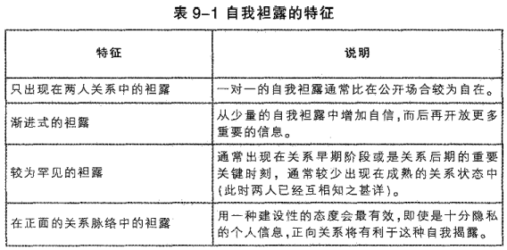

**自我担露的程度**

虽然我们对自我袒露所下的定义对我们有一些帮助，但是那却无法显示出自我袒露的全貌，有些信息其实可以告诉我们更多。

社会心理学家厄文·阿尔特曼（Irwin Altman ）和达玛斯·泰勒（Dalmas
Taylor）描述了两种沟通方法，可以改变你袒露的程度。他们的社会穿透模式用图9-1呈现。在这个模式中，第一个自我袒露的向度是自愿开放信息的宽度，也就是被讨论主题的范围。举例来说，你和工作伙伴的关系在自我袒露的宽度意指为你愿意表露你生活中的信息，就像你表露的工作信息一样。第二个向度是自愿开放信息的深度，就是从非个人的信息，转换为个人的信息。

根据分享信息的深度和宽度而言，一段关系可以被界定为偶然或亲密。在一段偶然的关系中，广度也许会很大但却无法深人；而在较为亲密一些的关系里，至少会在某一个领域中较有深度。最亲密的关系则是不但有深度也有广度的自我袒露。阿尔特曼和泰勒以模式的圆周到中心的观点来看待关系发展的过程，这样的过程时时在发生。你的每一段人际关系也许都会由不同的主题的广度和坦露的深度组合而成。图9-2显示了学生们在关系中的自我袒露情形。

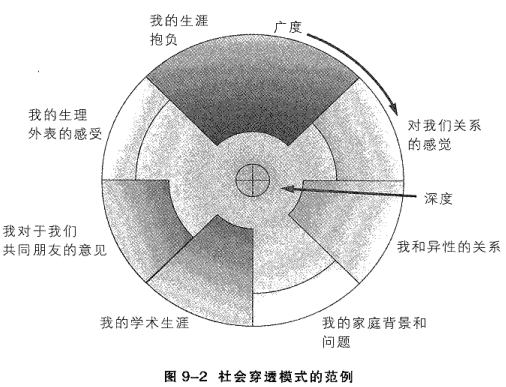

是什么使得某些信息的自我袒露比其他信息更深呢？一种衡量深度的方式就是基于界定自我坦露的两个向度的。有些信息显示出比其他的信息更"具有特殊意义"，想一想这两者说法中的差异："我爱我的家人"和"我爱你"。另一个符合深度自我袒露的条件是信息的隐私程度。如果你所分享的秘密只告诉了一些比较亲密的友人，这就是一种深度袒露的行动表现。然而，更深度的袒露是，泄漏你从没有告诉任何人的信息。

另外一种方式用来衡量自我袒露深度的方式，是我们所分享的信息的类别，下面是进一步的详述。

<u>陈腔滥调</u>
陈腔滥调是在社交中公式化且陈腐的回应，实际上就是自我坦露的相反面："你好吗？"
"好！" "见到你很高兴。"等等。

虽然听起来非常肤浅表面，但陈腔滥调实际上可以是一些我们不愿意直接表达的信息的代码。另外，在陈腔滥调中的相反信息中，还可能包含"如果你想要的话，我很愿意谈一谈"或"让我们轻松些和客套些，我现在不想袒露这么多有关我自己的事"，等等。伴随着一些非语言线索，一种陈腔滥调的情况会暗示着"我不想不礼貌，你现在最好离我远一点"。在所有这些例子中，陈腔滥调是种有价值的简略表达方法，它使社交转轮保持润滑、变得容易，同时也指出未来更多深切的谈话的可能性。

<u>事实</u>
并不是所有的事实都称得上是自我袒露，它们必须是符合有意义的、特殊的并且不是大家都知道的这几点：

*"这并不是我在大学中第一次遭遇这种事，我一年前因为糟糕的成绩休学过。"*

*"我实际上已经订婚了。"（当你在离开家的路上遇到一个陌生人）*

*"每个人都觉得很聪明的那个点子，其实不是我想的，而是我去年在一本书上读到的。"*

这类的事实通常对事情本身有很大的意义，同时在关系中也具有特殊的意义。袒露重要的信息，提供给人某种程度的信赖和承诺，象征着渴望将关系迁移到另一个层次。

<u>意见</u> 意见的阶段就是继续有更多的袒露：

*"我过去觉得堕胎没什么，但是最近我改变了我的想法。"*

*"我真的很喜欢卡琳。"*

*"我并不觉得你在告诉我你的心事。"*

这类的意见通常比事实透露更多，假如你知道谈话者的主题，你就可以获得关于你们的关系会如何发展的一个清楚的图像。就像你每提出一个意见就是在为别人提供关于你有价值的信息。

<u>感觉</u>
自我袒露的第四个层次，通常最容易表露出来的就是感觉的领域。大略来说，感觉看来好像和意见一样，但是他们是很不相同的。当我们说"我并不觉得你在告诉我你的心事"时，这是一个意见。现在我们来看一看下面的文字，通过三种不同的感觉所伴随的陈述，来更加了解这个说话者：

*"我并不觉得你在告诉我你的心事，我很怀疑。"*

*"我并不觉得你在告诉我你的心事，我很生气。"*

*"我并不觉得你在告诉我你的心事，我很受伤。"*

这四个沟通阶段的差异使我们了解到关系为什么会失败。有时候我们根本没想到要使沟通到达个人意见和感觉的层次，另一些时候沟通者又在更多个人的层次上花了太长时间。就像一个每日都要吃很多山珍海味的人就会对丰盛的食物缺乏兴致，过多的个人信息也会变得缺乏吸引力。另一类的问题会发生在两个沟通者想要进行不同层次的沟通时。如果一个人只想要事实而其他人坚持谈论个人的感觉，两者就都会觉得不舒服。

**自我坦露的模式**

有一种检视自我袒露在人际关系中扮演什么样的角色的方法，叫做乔哈里视窗（命名方式是由创造者乔瑟夫·勒夫\<JosePh
Luft＞和哈里·英汉姆\<Harry
Ingham）的名字结合而来）。如图9-3展示出了有关你这个人们全部，包括你的喜好和厌恶、你的目标、你的秘密和你的需求，等等。

当然，你无法了解全部的自己。大部分的人都时不时会发现一些和自己有关的新事情。为了体现这种情况，我们可以把这个包含你全部事情的图分为两个部分，一部分是你所知道的，一部分是你所不知道的，就像图9-4。

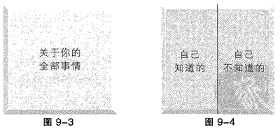

我们还可以把有关你的全部的这个图用其他的分类方式呈现。这个向度中，一个部分呈现别人所知道的你，另一部分则是你对自己保留的部分，用图9-5
来表达这个论述。

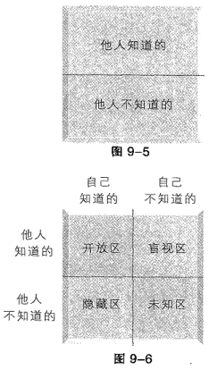

当我们把这两个架构图，结合放在一起时，就会得到一个乔哈里视窗，通过图9-6
，你可以了解到，所有有关你的事情被分成了四个部分。

第一个部分是你自己知道而他人也知道的，这个部分是你的"开放区"。第二个部分是"盲视区"，你自己所不知道，而他人却知道的部分，这个区域中的信息你只能通过他人的反馈而得知。第三个部分是你的"隐藏区"，是你自己知道但却不愿意表露给他人的信息。这些信息唯有通过自我袒露才会显现出来，这也是本章节的重点。第四个部分是"未知区"，是你不知道，他人也不知道的部分。首先，这个区域是很难界定的，因为怎么能确定你不知道，他人也不知道的这个部分是存在的呢？我们可以通过经常发现自己的一些新的特质，来推论这个区域存在的可能性。这并不困难，你会发现自己一些以前所未觉察到的天赋、才能与弱点。当你开始对自己观察时，这些潜在的特质就会从"未知区"移至"开放区"。

**自我担露的好处与风险**

偶尔我们会贸然吐露一些个人信息，但是大多数时候我们决定要揭露自我信息时都是审慎而自觉的。自我袒露有哪些好处与风险呢？

<u>自我担露的好处</u>
有诸多理由使得人们选择袒露跟自己有关的信息，当你在阅读以下人们为何袒露自己的理由时，想想哪个适用于你。

▲宣泄：有时候，你会袒露信息，努力达到"一吐胸中块垒"的坦诚状况，你会愿意为过去不好的行为表达歉意。在本章后段篇幅中你将会读到袒露的原则，使你额外学到在宣泄情绪的同时不仅不破坏而且还增进关系的方法。

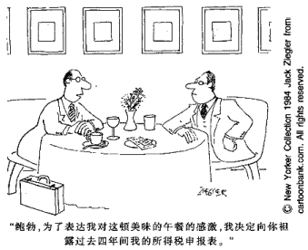

▲互惠：从研究报告中已经获得了完整统一的结论：一个自我袒露的行为会引发另一个自我袒露行为。这并不保证你的自我袒露就一定可以引起他人的自我袒露，但你个人的诚实会使他人觉得安全，甚至于有义务去配合你的诚实层次。有时候，袒露个人的信息会促使他人也这样做。很容易想见到，告诉你的同伴你对关系的感觉（我觉得最近糟透了……）会引起同等程度的坦承。互惠不一定总是轮流进行的：今天你告诉了朋友你在工作上的问题，也许本身也会帮助她在以后对你倾吐她的家庭故事时觉得自在一点。

▲自我澄清：有时候，你可以在和他人谈论这些主题时表明你的信念、意见、想法、态度和感觉。这种"把问题说出来"的情况会发生在你和心理医师谈话时，但有时却也发生在你和朋友
―无论他是酒保还是理发师― 谈话时。

▲自我确认：假如你期待聆听者对你袒露的信息表达认同（我觉得我做了件对的事……），你就是在寻求你对自己行为的认同或信念的确认。再进一步来说，这类自我确认的袒露也是在确认什么是你的自我概念中重要的部分。经由自我袒露来获得自我确认是"出柜"行动中的重要部分，同性恋们通过这个过程确认了自己的性别偏好，并且将这种自我确认的知识跟个人、家庭和社会生活相整合。

▲认同管理：有时我们会通过袒露个人信息来使自己更有吸引力。有些观察发现，自我袒露是另一种"自我销售"的形式。想象一下两个人第一次会面的情形，不难想象其中一人或两人会以分享个人的信息来展现更多的真诚、兴趣、感觉或表示对对方感兴趣。同样的原则也适用于另一种情境，售货员会说"我做生意一向诚实以对"，这只是要向你表示他和你站在同一阵线。一个刚认识的朋友也许会跟你谈论他过去的点点滴滴，来表示友善和容易亲近的感觉。

▲关系的维持和增强：有大量的研究支持，自我坦露在成功的关系中所占有的角色。举例来说，自我袒露的品质和婚姻满足之间有很强的关系，同样的关系也适用于人际关系中。当祖父母和孙辈子女真诚且深度分享时，他们之间的联系就会更强。

▲社会控制：袒露个人的信息会增加你对他人的控制，有时也会增加你对情况的控制。举例来说，当一个职员告诉老板另外一个公司已经跟他主动接头并有意挖墙脚时，他便可能是希望因此而获得晋升并改善工作环境。

虽然上述种种似乎使你的袒露充满心机，但事实上大多数的自我袒露都无法事先预谋。的确有些在谋划后通过自我袒露来达成某种结果的事例，但是如果自我祖露的隐藏动机被对方清楚地看穿，通常会导致负面的结果。自我袒露的动机随着情境差异而各有不同，通常伴随许多因素，影响我们愿意自我袒露的最强烈因素似乎是我们对对方了解的程度。当我们自我袒露的对象是朋友时，最重要的理由是想要维持与增进关系。换句话说，我们对朋友自我开放是为了强化友谊关系的品质，第二重要的理由是自我澄清，厘清自己模糊的部分以更加了解自己。

对于陌生人，互惠是自我袒露最常见的理由。我们提供自己的信息给陌生人，以便更加了解对方，然后才能够决定要不要及如何维持这段关系，第二重要的理由是树立形象。换句话说，我们会为了使自己看起来不错而给陌生人提供自己的信息，至少在朋友交往的初期阶段，这类信息通常都是正面的。

*自我祖露的风险*
自我祖露的正面效益固然十分重要，但也会带来一些风险。自我袒露的风险大致包括下列几种：

▲拒绝：约翰·鲍威尔（John
Powell）以他的书的名字《为什么我不敢告诉你我是谁？》
来总结自我祖露的风险。他说："我不敢告诉你我是谁，因为假如我告诉你我是谁，你可能会不喜欢我，而那却是我全部所有。"对不被赞许的恐惧威力很大，有时候它太过夸大不实或不合逻辑，但是揭露自我信息确实存在着一些风险。

A ：我觉得对我而言你好像不只是一个朋友而已，跟你说实话，我爱你。

B ：我想我们不要再见面了。

▲负面印象：即使揭露自己不会导致拒绝也可能会制造负面印象。

A ：我一直在想我们应该再养一只狗。

B
：跟你说句实话，我真的不喜欢狗，我之前一直没告诉你是因为我知道你非常喜欢狗。

A ：真的吗？我无法想象跟一个不爱狗的人住在一起。

▲降低关系满意感：除了受到别人对你所持意见的影响以外，揭露自己还可能导致降低关系的满意感。

A ：我必须告诉你，我真的不喜欢你整天紧贴着粘在我身边。

B ：但是我想更亲近你啊！

▲丧失影响力：另外一个揭露自己的风险是丧失影响力。一旦你坦承了一个私密的弱点，你就不可能继续像以前一样制造形象来控制别人看待你的方式了。

A:（经理对雇员）我是很想让你们周六放假，但是跟你们说实话
―我不是要在这里大肆批评或怎样―
其实董事长才决定一切，而他根本就不尊重我的意见。

B：你不是开玩笑吧！我以为我知道当我需要解决问题时要找谁呢！

▲伤害别人：揭露隐藏的信息也许会使你觉得好过一些，但却可能伤及他人，因为她们可能觉得沮丧。

A：我长得好丑，我想任何方法都无法改变我的长相。

B：这我也没办法。

**自我坦露的原则**

什么时候应该袒露，要袒露多少内容，想要清楚地了解这些并不是一件容易的事情。以下的原则可以帮助你决定在特定情境中应该自我坦露到什么程度。

*你在道德上有义务坦露吗？*
有时候我们在道德上有义务必须袒露个人资讯，例如，调查显示大多数HIV带原者认为他们"有义务"告知医护人员和伴侣他们的状况，即使他们知道这将有损他们的形象、尊严或让他们被贴上标签。

*这个人对你而言重要吗？*
就某些方面而言，这个人对你来说也许很重要。假如你有一段正在持续且够深厚的关系，分享关于自己特别的事情也许正好可让你们现在的关系更加稳固。或者你正想亲近某个先前与你互动较少人，现在你觉得有个建立更亲密关系的机会，自我袒露或许就是帮助人际关系建立的方法。

*坦露的量与方式合适吗？*
分享太快又太多的信息通常是个冒险的行为，研究显示：在大多数的关系中自我袒露的过程都是渐进式的，在初期阶段大多数交换的信息都流于肤浅，当双方进入强化阶段、整合阶段或结合阶段的关系中，自我袒露的比率随之增加，但也不是所有情境都一样。假如我们认为别人给出的对待之道合乎我们的期待，我们就会觉得满意，过度与不及的相待之道我们都会觉得不对劲。

除了量的恰当与否，自我袒露必须同时兼具正面与负面信息。从头到尾只听到愁云惨雾或怨天尤人的抱怨是很煞风景的事。事实上，一直都在揭露负面信息的人通常会被视为"适应不良"。

最后，当考虑到在任何关系中揭露的恰当性后，时间是不可忽视的重要因素。假如对方已经十分疲累，或是心情奇差，不管多么重要的交谈最好都延后再说。

*祖露的风险合理吗？*让我们实际地来看一看自我袒露带来的潜在性风险吧：即便效益是极大的，将开放自己的某些负面信息仍然会使自己碰上许多麻烦。换句话说，如果知道你的同伴是值得信赖且支持你的，坦露的风险就会降低到合理的地步。

在工作上袒露个人的看法和感觉是特别冒险的。为了要达到组织和个人的目标，在工作场合中沟通者很多时候都需要保留自己的想法。举例来说，也许你会发现某个老板或顾客的意见相当令人讨厌，但你还是会决定闭上嘴巴，而不是去冒失业或损害公司利益的风险。

*坦露对于现状有重大意义吗？*
自我袒露通常是高度个人关系中的特征，而不适用于普通层次的人际关系。例如，一份教室沟通研究显示，一个班级要求同学们分享所有正向和负向的感觉并且要完全的诚实会导致凝聚力降低，而只是维持相对的诚实气氛、以比较愉快的表面关系为规则的班级凝聚力反而比较高。

就算是在与亲密的朋友、家庭成员等的关系中，固定的袒露也不是一个好行为。即使在高度自我袒露阶段，分享与你自己有关的每一件事情也不都奏效。通常来说，合适的自我袒露方式应该包含两人的关系而不是个人的信息。此外，最有建设性的袒露方式，是把焦点放在"此时此刻"的关系上，而不是在"那时那刻"。

*有建设性的影响吗？*
如果没有小心地使用自我祖露，它会变成邪恶的工具。就像第十一章将要谈到的那样，每个人都有心理上的"地雷区"，地雷区以下的区域都是每个人最敏感的部分。攻击"地雷区"以下的区域肯定会让他人发火，因此对于关系通常伤害很大。在对他人坦诚前最好先想想自己坦诚会引发的后果，诸如"我总觉得你比较笨"或者"去年我和你最好的朋友发生过性关系"，有时会建设性地解决一些老问题，但通常对于听众以及你的自尊都是伤害。

*自我坦露够清楚和可理解吗？*
当你在向他人袒露自己时，选择一种聪明的方式是非常重要的。这包括了第五章所谈到语言清楚的指导原则，例如，借着说"当你不回我电话或顺道拜访他人时"来形容他人的行为，会比模糊抱怨"当你拒绝我时"好很多。

*你的自我坦露是互惠的吗？*
通常你袒露自我信息的量会视他人袒露多少而决定，自我袒露是条双向道路，举例来说，伴侣之间在他们开放程度最平等的时候会感到最快乐。

有些时候单向的自我袒露是可接受的，多数情况下这都包括正式的治疗关系。在这种关系中，当事人通过专业训练而达到解决问题的目标。你不会期待在看病的过程中听到医师谈他自己的伤痛。

### **9.3 自我袒露之外的其他选择**

虽然自我袒露在人际互动关系中扮演重要的角色，但是这并不是沟通中唯一可用的模式。想一想一些熟悉的两难情况吧，然后你就会了解为什么完全的诚实并不常是简单又理想的选择了：

*一个刚认识你的人有兴趣与你成为朋友，他邀请你这个星期参加派对。你不忙，但你并不想去，你会怎么说？*

*你的老板问你觉得他的新柜子看起来如何，你觉得便宜又俗气，你会实话实说吗？*

*你和好友的配偶相互吸引，你们两个人决定绝对不能感情用事，也不会说出任何使你朋友觉得备受威胁的话。现在你的朋友问你是不是被他的配偶所吸引，你会说真话吗？*

*你从常拜访你家的亲戚那里收到了一份礼物，那是一幅又大又丑的画，你会如何来回应"你会将画挂在哪儿"这个问题？*

这类情况特别突显出了一些充满虚伪的沟通议题。换句话说，我们的道德教育和一般想法使我们厌恶任何不真实的事物，伦理学家指出社会存在的基础是以诚实为根本。然而，虽然诚实是令人向往的原则，先前的例子却显示诚实可能会带来不愉快的结果，要能够在这些情境自我袒露显然非常困难，而使人不由自主地想要逃避。但像先前那样的例子，逃避也不见得总是可行的。研究和个人经验显示沟通者并非总是完全诚实，当他们发现自己处在一个诚实但不舒服的情况中时，会使用常见的四个自我袒露的替代品，它们是沉默、说谎、模棱两可和暗示，我们一个一个地仔细看一看这些替代品。

**沉默**

自我袒露之外的另一个选择是将自己的想法与感受保留在心中。你可以留心一下自己什么时候表达和什么时候不表达自己的意见，你可以通过这个纪录来了解你依赖沉默取代坦露的程度。你可能会发现保留自己的想法和感受是你经常做的事情。

沉默可能是你与其他人沟通中最常见的方式。说出事情的全貌可能符合坦诚之道，但是却可能危害你、对方及你们双方的关系（请参阅前述自我祖露的风险所列内容）。

大多数心思细密的沟通者会选择保持沉默，而不是莽撞地一吐为快说"你看起来糟透了"或者"你太多话了"。社会科学家发现人们经常在"以省略说谎"和"对事实说谎"之间游走，而沉默以对（省略重点）通常比全盘托出（据实以告）轻松一点。

**说谎**

对我们许多人而言，说谎宛如道德上的伤痕。但是谎言确实存在于社会中，虽然说谎使得一个完全无知的受害者受到不公平的对待。另一种不诚实——"白色谎言"，通常不被视为完全不道德。白色谎言被定义为（至少说的人认为）没有恶意或是有帮助的谎话。白色谎言相当普遍，一个研究曾经持续追踪130个个体每天对话内容的诚实情况，结果只有38.5％的内容被证明是完全诚实的。在另一个实验中，受试者记录他们两天的谈话内容之后计算他们欺骗的程度，平均说谎的比率是每10分钟的谈话就会出现三次谎言。

*说谎的理由*
什么理由使人们说出虚伪不实的话？当研究中的个案被要求列出一个又一个隐藏和扭曲的事实时，发现了五个主要的理由：

1.保住面子：超过一半以上的谎言是为了防止尴尬，这类的谎言被赋予了大家认同的标签："圆通"，并且被使用在"诚实会不仁慈，或不诚实却仁慈"的情况下。有时留住面子的谎言是留住接受者的面子，当一个派对中有人跟你打招呼时，你可能为了使他免于被你忘记的尴尬场面而假装认识他。有时候，谎言保护说话的人不至蒙羞。例如，你会掩盖你的错误而归罪于外力：你没收到支票吗？那一定是在邮寄过程中遗失了。

2.避免紧张和冲突：有时候说些小谎来避免大冲突是值得的。举例来说，你也许会说你没有因朋友的玩笑而生气，以避免你表达愤怒所引发的麻烦。通常用不诚实的方式解释你的行为比起诚实地让问题恶化容易多了。你或许会用"我不是生你的气，只是我今天真的蛮倒霉的"之类的话来解释你明显的愤怒。

3.掌控社交反应：有时我们说谎是为了使每天的关系运作顺利。举例来说，你也许会假装很荣幸见到每个你根本不喜欢的人，或是假装对一同共进晚餐伙伴的故事感兴趣，使社交事件顺利点度过。孩子们通常不了解这种技术，对这类社交语言不感兴趣，而这是常让父母亲尴尬的原因。

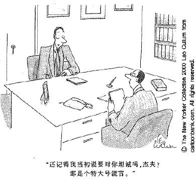

4.增进或减少关系：有些谎言被设计来使关系成长："你要到市中心吗？我正要往那里去，我可以送你一程吗？"在一项研究中，多数的大学生（含男性和女性）会用说谎来增加他们与某个吸引人的同伴约会的机会。他们的夸张和不真诚包括了很多方面，包含他们对爱情的观点，个人的特质、收人，过去的人际关系、工作技能和聪明才智，等等，这使得他们可以和吸引他们的同伴更加相似。

有时我们会说谎来减少与他人的互动："我必须要走了，我要准备明天的考试。"有些时候，人们会用谎言来彻底结束关系："你很好，但我还不想定下来。"

5.得到权力：有时我们会依靠说谎来使情况在我们控制之中。通过表示你很忙没有空来拒绝已经迫在眉睫才来预定的邀约，是一种可把自己放在重要位置上的方法。因为说谎而得到自信的感觉即使是有很好的理由，也都落入到为得到权力而说谎的类型中。

这五种类型并不是说谎的唯一分类方式。表9-2所列的分类法比较复杂并且会涵盖一些无法适用于简单架构的谎言。

许多人认为白色谎言是为受害者的利益而说的，早先的研究提出多数受试者认为这类谎言是"正确应该做的事"，其他的研究则不以这种奉承讨好的角度进行描述，而认为最大的利益来自于说谎。一个研究发现三分之二以上的说谎者都是基于"自私的理由"。在被记录下来的322个谎言中，75.8％是对说谎者有利的，低于22％对听话的人有利，而只有少于2.5％对于第三者有利。

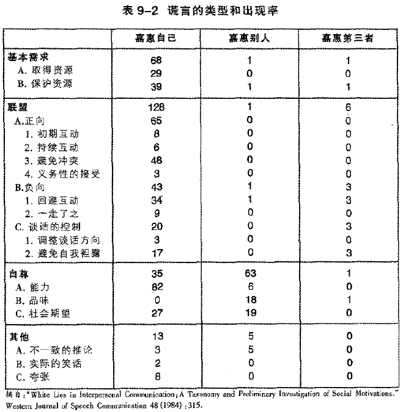

*说谎的影响*
被人发现你说谎会有什么结果呢？在人际互动关系中这种发现会带来很大伤害。当我们和他人更亲近时，我们对于他们诚实的期待也会变高。毕竟，发现你原来被骗了会使得你不只重新定义你刚刚才拆穿的谎言，还会开始重新考量许多之前视为理所当然的信息。上个星期的恭维是真诚的吗？是你的笑话真的好笑，还是他的笑其实是装出来的呢？其他人对你的关心就像他所说的一样吗？

事实上研究已显示，谎言的确会威胁到关系——虽然并非所有的谎言都会破坏关系。研究认为，说谎者的动机是否为对方所接受会造成关键性的不同。如果说谎是为了谋取说谎者个人的私利，这种谎言会被视为侵犯，相反的，假如说谎似乎是为了顾全对方的感受，获得谅解的机会就会提升。

沮丧和背叛的感觉是最严重的。在关系紧张与否、话题的重要性或对他人不能完全诚实有怀疑这三个因素中，话题重要性是对关系危机最重要的因素。我们会妥善处理"无关痛痒"的谎言，但涉及"身家名誉"的谎言具有严重的威胁性，就必须严阵以待了。事实上，严重的欺骗会导致关系的终结，一个研究显示超过三分之二的受试者称他们是因为发现对方说谎而结束关系的。尤有甚者，他们认为分手的肇因就在于说谎。

**模棱两可**

说谎并不是自我袒露唯一的替代方式。当面对说谎还是说一个令人不愉快的真相的选择时，沟通者常常会选择模棱两可。就如第五章所说的，模棱两可的语言会有两个以上貌似真实的意义。有时候人们并不是故意散发模棱两可的信息来造成困惑，"我会在宿舍等你"这种说法也许对说话者来说是很清楚的，但是听的人仍有可能找错地方。但有些时候，我们是故意暖昧不明。举例来说，当一个朋友问你对十分怪异的服装有何看法时，也许你会说："这一类服装真的不怎么常见！"除此之外，你可能很生气而无法接受朋友的道歉，但是又不想表现出自己很小心眼，你就会说："别提了！"下面是一种幽默的方式，借由模棱两可来回应某个雇主对一个不够格的求职者的询问，向对方提供模糊的信息：

*对一个懒惰的人："你很幸运啊。"*

*对一个没有天分的人："我没有资格给予你任何对他的推荐。"*

*对一个在任何情况下都不应该雇用的人："别浪费任何时间了（快点雇佣他吧／根本别理他）!
"*

考虑一下，当处在你并不希望的两难情况中时你会说些什么？就像我们之前提到那幅不太好看的画，当送礼物的人问你你对其感觉如何时，你会怎么回应？一方面，你必须在说谎和诚实中做选择；另一方面，你也可以选择明确或暖昧不明的回答。图9-7
呈现了这些选择。

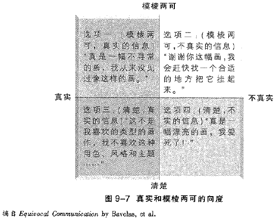

▲使接受者免于尴尬的伤害。举例来说，对不感兴趣的邀约，是断然地说"不"还是说"我已经有其他计划"——即使那些计划只是待在家里或看电视？后者显然会仁慈许多。

▲为发送和接受信息的双方保留面子。因为模棱两可比起冷漠困难的事实更容易被接受。这可以使说话者免于罪恶感，在良知上也较少有负担。虽然"我从来没有尝过这样的菜"听起来很不准确，但你真的愿意说"这道菜尝起来真糟糕"吗？如果你不愿意说谎，模棱两可可以成为说谎的替代方式。

沟通研究者桑德拉·梅斯（Sandra
Metts）和她的同事曾做过一份研究，研究显示了模棱两可是如何在困境中让人留住面子的。他们询问了数百名大学生当面临不想要的性邀请，而这些性邀请是来自那些对他们而言很重要的人——如亲密的朋友、期待中的约会对象、已经交往中的伴侣——时，他们会如何拒绝。多数的学生会选择一个圆滑得体的回应："我不认为我准备好现在要这么做。"这比起直接说"你并没有对我产生性吸引力"更容易留住面子并且让人舒服。这种圆融得体的反应一看就是要表示低调带过，不至于鲁直到令人尴尬甚至于羞辱他人。

▲为说谎提供一个替代方式。假如一个有可能在将来会成为你的老板的人在面谈时问你关于你成绩的事，你也许会出于稳妥说"上个学期，我的平均成绩是B
" ，虽然也许你的整体成绩比较接近C
。这并不是完整的回答，但是它的确是真实的。有一个研究团队曾经提出："模棱两可并不算是不诚实的信息，也不算是明确的事实，但当两者你都想要回避的时候，就会谨慎地使用这种替代方式"。

明白了这些好处之后，许多人常常选择模棱两可就并不令人惊讶。在一个研究中，受试者需要在以下情况中选择：说谎以留住面子，说出残忍的实话，或者模棱两可。只有6％的人选择说谎话，只有3％-4％的人选择有伤害性的真实状况。另一方面，超过90％的人选择模棱两可。如果可以选择的话，他们喜欢模棱两可中的实话，并且喜欢有技巧的诚实。

**暗示**

暗示其实比模棱两可更为直接。这是因为模棱两可的说法，不需要注意他人的行为改变，但是暗示的确需要从他人得到好的回应。

*<u>直接陈述</u>*

*我太忙了，实在拨不出时间*

*请不要在这里吸烟，因为这会影响我。*

*我想邀请你一起共进午餐，但我不想冒着被你拒绝的危险。*

*<u>保留面子的暗示</u>*

*我知道你很忙，也许该让你先和你沟通。去忙你的事情，免得打扰到你。*

*这里好像是不准吸烟的。*

*嗯，快到中午用餐时间了，你有没有去过街角那家新开的意大利餐厅呢？*

暗示所带来的价值可以解释为什么当沟通者传递一些可能令人尴尬的信息时，喜欢不直接的方式甚于完全的袒露。成功的暗示有赖于他人有能力接收到没被表达的信息。你隐含的谈话也许会和一个不敏感的接受者或性格直接的人擦身而过。但是，如果直接传递信息的代价太高，你也因此可以远离风险。

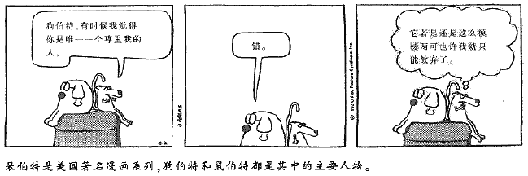

**回进的伦理议题**

人们为何选择暗示、模棱两可和白色谎言而非自我袒露是不难理解的。这些策略提供了一个管理困境的方式，这为信息发送者和接收者提供了容易的选择。根据这样的想法，成功的说谎者、模棱两可者和暗示者，都可被视为拥有某种沟通能力。相反的，当诚实才是正确的方式——虽然有点痛苦——在这样的情况下，逃避者就会被视为是缺乏能力或是缺乏诚实来有效掌控情势的人。

暗示、白色谎言和模棱两可都是自我袒露的替代品吗？在这几页的案例似乎在回答"是的"，许多社会科学家和哲学家也认同这样的想法。真正需要被评价的是说谎者说谎动机的道德问题，而不是谎言本身需要被质疑。当然，也有人质问：说谎所带来的代价值得吗？

另外，对所谓可容许谎言进行调查时发现，事实上许多人就算知道对方是在说谎也会接受，而不是去挑战他们。在某些情况下，隐瞒真相被视为比毫不留情的诚实更合适的行为。举例来说，以下就有一些就算我们知道并不真实也不会去挑战陈述的情况：

▲当我们预期他人会扯点小谎的时候。（你仍然将聆听朋友或亲戚们的离奇故事当作消遣娱乐，就算你知道他们在夸大其词。）

▲当谎对彼此都有利的时候。（一位逐利的同事也许会与你取得双赢。）

▲当谎言帮助我们免于尴尬的场面时。（你向主人保证这顿饭真是美味，虽然实际上可以说难以下咽。）

▲当谎言帮助我们避免和令人不愉快的真相正面冲突时。（一家人表现的若无其事，其实他们知道家人之中有一个酗酒者。）

▲当我们要求他人说谎时。（一个同伴告诉另一个："假如你从未对我有过信心，那么请不要让我知道吧。")

我们刻意说明这些事实，也许是要探讨一下是这类迂回的信息是否真的是接受者有兴趣的？而这类的回避方式是应对所面临的情况唯一或最好的方式吗？

### **9.4 摘要**

人际关系的亲密感有四个向度：生理的、理性的、情绪的和活动的分享。性别和文化两者都会影响亲密的表达。亲密感可以同时出现在电子媒介沟通与面对面互动中。并不是所有的关系都与亲密有关，沟通者有必要对什么时候、在哪里、跟谁会产生亲密关系做出决定。

一个人际关系中重要的议题是自我袒露的合适方式和程度：诚实、袒露有关自己的信息是有意引导他人自我坦露的沟通，包含一般不能通过资源所取得的信息。社会穿透模式形容自我袒露的两个向度：深度和广度。袒露感觉通常比透露个人意见更深一些，袒露个人意见又比担露事实更深一些。陈腔滥调是最差劲的袒露。

乔哈里视窗模式通常是说明自我袒露的方法。视窗显示了两个沟通者不同程度的袒露会影响在关系中亲密感的程度。袒露个人的信息有许多的好处：宣泄、互惠、自我澄清、自我确认、认同管理、关系的发展和维持、社会影响。自我坦露的风险包括被拒绝的可能性、造成负面印象、降低关系满意感、丧失影响力以及伤害对方。

四个替代袒露个人感觉和意见的方法是沉默、说谎、模棱两可和暗示。没有恶意的"白色谎言"有许多功能：为发送信息者和接受信息者保留面子，避免紧张和困境，掌控社会互动，经营关系和得到权力。

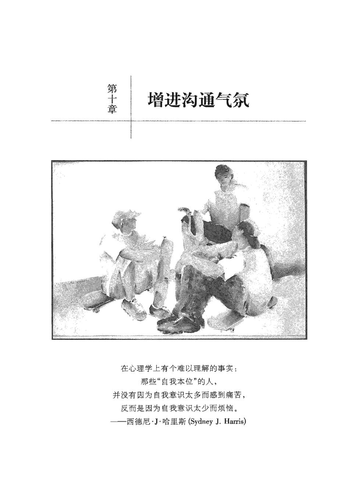

**第十章 增进沟通气氛**

人际关系就像天气一样，时而晴朗温暖，时而风雨交加充满寒冷；有时乌烟瘴气，有时却又是健康宜人的。有些关系像是稳定的气候，然而，些许激烈的变动会在稳定片刻之后，下一刻又突然产生剧烈的变化。即使我们可以利用温度计和观测天象来评估气候，却仍然测量不出人际关系的温暖程度，因为相对于大自然的气候，人与人的互动关系更深深受到某些情感和深刻情绪的影响。

虽然我们不能改变外在的天气，但是我们可以改变内在人际关系的气氛。这个章节将告诉我们为什么有些关系是美好的，而有些关系却令人如鲠在喉。你将在这里学习到哪些行为会引起别人的防卫、哪些行为会引起别人的敌意，又有哪些行为会引起更多的正面情感。读完本章之后，你将对重要的人际关系拥有一些较健康的概念，也会学习到如何去改善你的人际关系。

### **10.1 沟通气氛：正向关系的关键**

沟通气氛指的是关系当中的情绪氛围，存在于人与人之间共同活动的那股气氛远比活动本身来得重要多了。想想，即使拥有同样的教学时间和教学大纲，仍然不难想象具有某种沟通气氛的班级会在学习上给人一种友善和舒服的感受，而另一种沟通气氛的班级会给人冷漠和紧张的感觉——甚至相互怀着敌意。同样的道理，气氛在家庭和友谊当中也扮演着一个很重要的角色，甚至在工作环境中出具有很大的影响力。想一想，你是否曾经遇到一个充满闲言闲语、批评和怀疑的工作环境？或者你很幸运地接触到的都是充满正向气氛、鼓励和支持的环境呢？如果以上的两种环境你都曾经经历过，那么你就会了解，这两种气氛形成的差异了。

正向沟通气氛的重要性是很难用言语来形容的，它是对婚姻满意度一种最好的预测。一般来说，对婚姻满意度高的夫妇所说出的正向和负向语言的比率是5:1
，而对婚姻满意度低的夫妇说出正向语言和负向语言的比率则是1:1
。由此可知，正向、肯定的信息在一个家庭当中是十分重要的。举例来说，如果手足之间常脱口说出严厉、具有挑衅意味的言语，这些无意但具有攻击性的不肯定信息的增加会造成他们对家庭满意度的降低。同样地，在工作情境中，如果员工感受到正向的沟通气氛，他们就会更积极地付出，工作表现和工作满意度都会增加。在学校里面，教师的认可对大学生的学习都具有重要的地位。总而言之，不管是在工作环境、教室情境还是家庭生活中，如果沟通气氛是肯定、支持的话，人们将在其中受到滋润而具有旺盛的行动力。

正如同大自然生态互动形成了气候，沟通气氛也是在人与人的互动之间构成的。有时某一段关系在某些人的形容下是积极开放、正向光明的，在另一些人的形容下却是冷漠且充满攻击性的。也如同气候一样，沟通气氛随时随地可能改变，一段阴暗的关系可能在下一刻又变得充满阳光。如果要为这个比喻下一个结论的话，我们必须再有一个正确的认识：沟通气氛的预测并不是一个十分精准的科学技术。它也不像天气一般完全不受控制，人们可以试着在他们的关系当中，改变沟通气氛。

**肯定和不肯定沟通**

是什么导引着正向或负向沟通气氛呢？这个答案出人意料的简单：大致上来说，一段关系中的气氛，取决于人们相信自己在其他人心中受重视的程度。

社会科学家用"肯定的沟通"来形容某些有价值的信息，而用"不肯定的沟通"来形容那些不受注重的信息。某个形式来说，肯定信息说着"你很重要"、"你算数"、"真有你的"，而不肯定信息说着"我才不管你"、"我不喜欢你"、"你算老几啊"。

以美学的观点来说，信息属于肯定还是不肯定要取决于旁观者（听信息的人）。举例来说，在个人的人际关系里面，你可能会用一些不被外人接受的语言来表达你的看法或内心的情感（"你真可笑！"
）。站在传递信息者的角度来看，你可能会认为讲这样的话没什么恶意，甚至可能是为对方着想的（"我可是为了你着想才这么说的！"
) ，但是在听信息的人眼里，这句话却可能是充满攻击性的。

很明显地，肯定信息比不肯定信息更受欢迎，但是有哪些特性可以区分两者呢？

肯定信息的类型研究显示：有三种增加正向信息的方法，它们有助于让你所传达的信息受到别人的认同。

<u>重视表达</u>
肯定信息最基本的动作就是重视另外一个人。"重视"看起来似乎是一个简单又平淡无奇的举动，但是很多时候我们却忽略了。尝试对别人做一些基本的回应吧，例如写信、拜访甚至是回一通电话等等。其次，我们有时会避免与人眼神接触，避免在公共场合与认识的人交谈，或者在街上遇到熟人时给了对方一个负面的信息。当然，这种种欠缺重视的行为可能只是一时的疏忽，或许是没有注意到朋友的出现，也或许是工作、学业上的忙碌，让你疏于和朋友们保持联络。然而，倘若有人把这些举动误认为是你在刻意和他保持距离，这些就可能会成为不肯定的沟通，且对你们的关系造成影响。

<u>承认</u>
"承认"别人的观点与感受，是对于肯定的沟通一种比较有力的形式。倾听大概是一种最普遍的"承认"途径。当然，虚伪的倾听以及选择性倾听、自恋性倾听、隔绝性倾听等等会对承认有相当负面的影响。比较积极的"承认"则包括了：问问题、确认问题、反映问题，等等。毋庸置疑地，当公司里的高阶主管时常去询问员工的意见时，员工会对他们有较高度的评价，即使这些意见最后不被采用，这些寻求"承认"的行为也将有助于上司与下属间肯定信息的增加。正如你在第七章所看到的，当某人有问题的时候，反映他的想法和感受是提供支持的一种强而有力的方法。

<u>赞同</u>
"承认"表示你对别人的意见很有兴趣，"赞同"则表示你同意他们的意见，且觉得这些意见是重要的。很明显地，你可以看出赞同是肯定信息中最强而有力的一种，因为它传达一种最高层次的价值。而最显著的赞同则是一致的附议。值得庆幸的是，你不一定要借由完全的同意来表现你对他人信息的赞同，你也许可以在信息当中寻找出你所认同的加以回应。例如，当你无法对你的朋友突然生气产生认同的时候，或许你可以试着用"我能了解你为什么这么生气"来和他沟通。毫无保留的赞美也是表现支持一种很有力的形式，当你找到机会赞美他人的时候，你不妨试着使用它。与肯定信息相反，不肯定的信息表达了对人的不尊重以及不欣赏，大多数是通过反驳或漠视别人所传送的重要信息。沟通研究已经确认了七种不肯定信息的类型。

*视若无睹*
就像你刚才读到重视是最基本的肯定信息类型，相对的，无视于他人与自己沟通的尝试是"视若无睹"的特征。

被忽视比误解或攻击更不被肯定。大多数的专家都同意有人反对你要比漠视你更符合心理健康。研究者发现，在工作世界，有时候某些雇员用不理不睬、冷漠以对制造出让人心寒的沟通气氛来逼迫他们不喜欢的同事离职。

*口头辱骂*
"口头辱骂"是负向反应中最常见的典型，这样的沟通可能会引起他人心理上的痛苦，尤其当口头上的辱骂出现在互动关系时。它很难成为一种单向的情绪抒发，而会对他人造成伤害。但是，不一定每次的辱骂都是直接公开的，有时可能被包装成含有敌意的幽默或讽刺，例如：

"胖子，过来一下。"

"你可真够贱的！"

*概括抱怨*
特定的抱怨可以使问题明朗化，但是概括性的抱怨经常是一种不肯定信息，因为其中经常隐含着对别人个性的挑剔：

"我希望你友善一点！"

"你为什么不自己收拾干净？"

"你的态度可不可以好一点？"

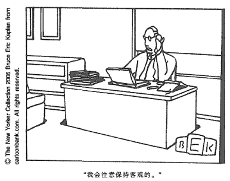

*插嘴*
在别人尚未说完话之前就随意插话会给人不关心对方谈话内容的感觉。偶尔插嘴未必会被认为是负面的，但经常插嘴会让说话的人失去谈话的兴致且感到愤怒。

*各说各话*
谈论与他人说话内容无关的事情是一种"各说各话"的表现，例如以下的对话：

A：今天真是的，先是车子过热害我得叫拖车，然后又是电脑死机，到底有完没完！

B：哦，我们来说说安的生日礼物，她后天就要开庆生会了，我们只有明天可以去买。

A：我现在真的很累，可不可以过几分钟后再说这件事？我从来没有像今天这么倒霉过。

B：我只是想不出到底要送安什么，她好像什么都有了……

*岔题*
在会话当中，我们用"剪接"来表现出"岔题"的现象。除了完全忽视说话者的谈话内容外，还有些人会用这种方式来转移话题，例如以下的对话：

A：我想知道你要到哪里去度假？如果不赶快想出来的话，可能会订不到旅馆的。

B：嗯… …
如果我的功课没完成的话，我去哪里心情都不会好的，你要不要帮我做作业？

*无人情味*
"无人情味"的表现总是跟随着一些陈腔滥调，并不真正对说话者的言语作回应，例如以下的对话：

A：我待会有点私事，下午要早点下班去处理。

B：喔！是啊！我们每个人都会有私事，就像时钟总是一定会有指针一样。

*含糊其辞*
"含糊其辞"指的是言语中不只包含一种意思，对别人的回应留下模棱两可的结果，例如以下的对话：

A：我想尽快见到你，星期二如何？

B：可能可以？

A：怎么样？星期二到底能不能和我见面？

B：也许吧？到时再说吧！

*表里不一*
"表里不一"的反应包含了两个矛盾冲突的信息，通常至少有一个信息是非口语的，例如以下的对话：

A ：亲爱的，我爱你！

B ：我也爱你。〔 咯咯地笑）

**沟通气氛如何发展**

只要两个人开始进行沟通，周围的气氛就会跟着有所变化。如果他们所发出的信息是肯定的，正向的气氛就会渐渐形成，相反的，如果他们所发出的信息是不肯定的，这段关系就会开始变得不友善、冷酷且充满防卫。口语的信息确实是关系中形成气氛的因素之一，但有许多制造气氛的信息来自非口语信息。接近他人的举动在正向的气氛中是值得肯定的，而躲避的行为可能会造成负面的影响。微笑或皱眉、有无眼神接触、声音和语调、人际空间的运用等信号，都能传达在团体中对其他成员的感受。当气氛形成之后，它会成为团体中一个具有灵魂的螺旋并且持续不断地成长，这样的互动沟通会使每个人受到彼此话语的强化。在正向的螺旋当中，成员的肯定信息可以引发他人类似的回应，并引导整个团体间的气氛不断走向正面，形成一个正向的循环。然而，负向螺旋的力量却更为强大，它让成员对整个团体的感觉——包括自己和他人——变得越来越糟。有研究描述螺旋如何在关系中运作，这个运作增强了"种豆得豆，种瓜得瓜"的原则。例如，在一个对已婚夫妇的调查当中，每对配偶争执的情况都大致相同：安抚的话语（如提供支持、承担责任、表示认同等）通常会得到安抚的回应，冲动的行为（如恶意批评、敌意的质问、挑错误等）也常会引起冲动的反应。同样的行为也还包括了其他种类的沟通信息，如逃避导致逃避，分析招致分析，等等。表10-l说明了某些对应沟通的模式具有创造正向或负向螺旋的可能性。

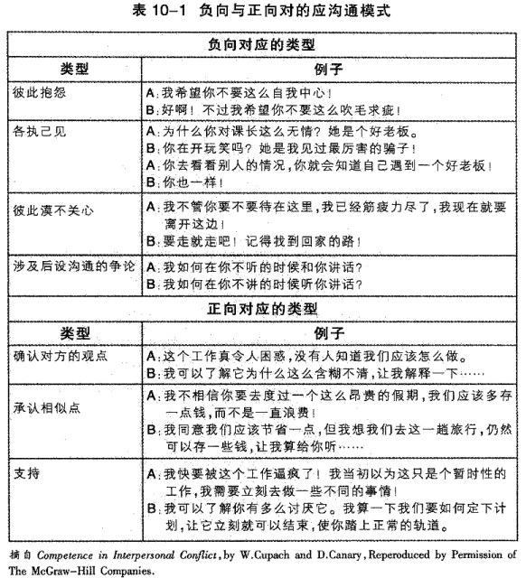

冲突上升螺旋是最常见的不肯定信息彼此增强的状况。一个攻击导致另外一个攻击，使得争论不断地扩大，最后成为不可收拾的斗争。让我们来看看下面的例子：

A:（有点烦躁）你去哪里了？我以为我们约好半个小时前在这边见。

B:（防卫的）我很抱歉，我在图书馆耽搁了。你知道我不像你一样有那么多自由的时间。

A：我没有责怪你，你不用这么敏感，但我还是要提出你曾经答应的约定。我非常忙碌，我还有很多比在这里等你更重要的事情要做。

B：是谁敏感？我只是随便讲一句话，你就变得这么防卫，你到底怎么了？

不管是正向或是负向的螺旋，都很少会持续在一个明确的状态，大多数的关系都在“进”或“退”两种状况中循环。倘若螺旋是负向的，伙伴们可能会发现那当中的气氛越来越令人感到不舒服，他们会试着从负向的信息转为正向的信息去改善它，却忽略了去讨论问题本身。在其他的情况中，人们可能会去做后设沟通，他们可能会说："等一下！"或是"这些都不重要"，也有些情况会有人开始自暴自弃而导致关系的瓦解。由负面螺旋转成正面螺旋方向的"重振"能力是成功沟通关系的标志，然而，其中一方如果过了"永不回头点"而继续往负面螺旋方向旋转，将使他们的关系终结。

即使是正向的螺旋也有它的限制：一段最好的关系也可能会经过冲突和退缩的过程，如果能够善用时间和沟通的技巧，最后也可能让伙伴们回到原有的和谐当中。

### **10.2 防卫：原因与对策**

研究学者约翰·高特曼指出防卫是婚姻危机的警报之一。防卫经常包括反击（我才不是固执的那个人！你才是！！)
，这会引发对方也开始防卫，很快的沟通气氛就被污染破坏。

"防卫"这个字让人联想到受攻击时对自己的保护，然而，这边所说的是哪一种攻击呢？无疑地，当你竖起防卫的时候，所应对的攻击很少针对你的身体。但是，倘若你没有受到身体上的侵害，为什么还要守护自己呢？关于这个问题的答案，我们必须重新谈到第二章所介绍的表现自我的概念。回想一下，一个人的外在是由他身上的所有特征所构成的：独特的人格、态度、能力，以及其他那些他所愿意表现在世界上的影像。实际上，只用单一特征去看人是不对的，我们应该试着从不同的方面去看待一个人。你可能希望在老板面前塑造出严肃的形象，却又希望在朋友的眼中是一个爱开玩笑的人。

当别人乐意接受以及承认我们所表现出形象的重要性时，我们根本不需要感到防卫。反之，当其他人用带有当面威胁的举动来面对我们的时候，这样的信息似乎已经挑战到我们所反映出来的形象，我们便会开始会去抗拒这样的信息，此时，"防卫"就成了我们保护自我表象、顾全自己面子的一个过程了。

当你努力表现了自己重视的一面却受到了他人的否定时，你就可以了解防卫心是如何借着对接下来发生的事情的想象而产生的了。比如说，假设你的老板批评你犯了一个十分愚蠢的错误；或者想象一下，如果你的朋友说，你是个自我中心的人；或是，老板管你叫做懒人的时候，你会有什么样的感觉？倘若这些攻击并不正确，也许你只会感觉受到威胁；反之，当你内心深处也承认这些攻击时，你就可能会充分地运用防卫的反应。当你确实犯了个错误，真的非常自私，或者老是用粗糙的方式去对待你的工作时，那些实际的批评会让你如同刺猾一般竖起全身的防卫。事实上，我们常在批评命中要害时，感到深刻的防卫。因为保护自己所表现出来的形象是一种本能的反应，即使这些形象是不真实的。这样的防卫可能会导致人们采取一些破坏性的方式来对待你，例如讽刺的语言和口头上的辱骂，等等。

**防卫反应的类型**

当你表现出来的某部分自我受到他人的攻击时，也许你并不乐意接受他人对你的批判。你会面临到心理学上所说的认知失调，意即在接收到的信息、态度、行为间有两者是相冲突的。这种不一致的状况是不舒服的，沟通者可能会对它有所抗拒，并且寻找一致的方式来解决这样的困境。当然，一个消除这种不一致的方法是接受批评者的批判，且修正自己所表现出来的自我。例如，你可以承认你是愚蠢的或是向对方认错。然而，有时你并非那么乐意接受他人的批评，因为这些批评不一定正确；即使它是真实的，你也不一定会乐于承认这样的事实。承认自己懒惰、不公正、愚蠢并不是一件令人愉悦的事情。有三种常见的解决不一致的方法，它们的每一个都具备防卫机制的特征：心理学将这些维持正向自我形象的方法看作解决不一致问题的策略。

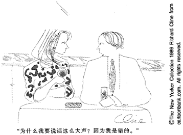

*攻击*
批评者反击的概念正如同这句谚语所说的："攻击是最有效的防御。"攻击的防卫策略可以分为几个形式：

▲口头侵犯：有时，被批评的人会马上用口头侵犯来攻击批评者："我哪里邋遢了？反而是你用牙膏把洗脸盆弄得一塌糊涂，还把整个房间弄得都是脏衣。"

这样的回应不但免于承认最初的批判是否真实，还马上将过错推到批评者身上。但是对方有可能会马上切断这样的话题："你没有资格批评我的脏乱，至少我都是准时交房租的！"再一次的，在不用承认攻击是否正确的情况下，解除了不一致的困扰。

▲讽刺：反击有时候会以讽刺来进行掩饰，幽默的讽刺信息是一种较不直接带有侵略意味的表现。"我还真应该感谢休息的时候可以和你一起看肥皂剧和吃垃圾食物来消磨人生呢！"讽刺的回应会因为机智和快速的思考而有较高的效果，不过它那具有敌意、不肯定的本质，可能会导致反击，甚至创造出一个相互破坏的防卫性螺旋。

*扭曲批评的信息*
第二种防卫自我意识所遭受的攻击的方法是：在某种程度上扭曲批评的信息，以期让自己所表现出来的自我达到一种完美无缺的地步，至少是防卫者眼里的完美。以下列出了几种扭曲批评信息的方法：

▲合理化：合理化是根据逻辑学所创造出来的，也就是说为自己所不能接受的行为找出另外一种不正确的解释来让它看起来较为合理。例如："我很想帮你解决问题，不过我真的得去念书了。"你会用一种合适的方法来躲开一个你不想做的事情。你可能会用这样的方式来反抗你背地里所讨厌的那个批评者："我又不是吃饱了就闲着没事干！我每天都有忙不完的工作，而且我需要保留我的体力。"（你可以在表10-2
中看到其他的例子）

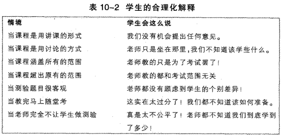

▲补偿：补偿是借由强调自己较强的一面来掩盖软弱的那一面。

例如，一位内疚的家长总会诉说自己已经如何尽力来维持表面的尊严："我或许不能赚很多的钱，不过我总是给孩子有足够的钱让他可以买到最好的东西。"同样地，你可能会试着用同样的方式来向自己和他人证明你是一个很好的朋友："对不起，我忘了你的生日，不过你上次说在找工作，我这几天帮你留意了一下！"用最多的行动来补偿他人虽然是没有错的，但当这些行为的背后缺乏真诚的动机时，所能维持的只是一个虚伪的表象，并且很容易为关系带来伤害。

▲退化：另外一种用来躲避面对攻击的方法就是表现出无助，声称你不能做一些事情，而事实上那些是你不想做的事情。"我想和你建立关系，但总是不成功，也许是我还没有准备好。""我希望我能把这件事情做得更好，但我就是不行，我真的还没完全了解。"退化就是用"不行"这个字来取代"不要"。在很多例子当中，"这不是我的错"这样的话很明显只是个谎言而已。

躲避刺耳的信息第三种保护自己的方法就是全然地躲开那些威胁到自我形象的信息。躲避可分为儿种形式：

身体的躲避：直接避开那些攻击你所表现出自我的人是一种很明显的逃避不一致的方法。有些时候身体的躲避是很聪明的选择，例如在被对方连续攻击或辱骂批评的时候，"身体的躲避"就很合理。然而，在其他时候，比如对方是针对自己很重要的人或者遇到令人信服、切中重点的批评时，"身体的躲避"却反而会让情况变得更糟糕。

▲压抑：有时候我们会在心理上压抑住那些刺耳的信息。举例来说，你或许明知道应该去和朋友、老板或教练讨论一些问题，而当这些问题浮现的时候，你却让它们滞留在脑海中。这可能让你在面对批评的时候还压抑着这些问题，不断地变换话题，表现出好像你才刚刚了解的样子，甚至假装你根本没有听到这些批评……以上种种都是属于压抑行为的例子。

▲漠不关心：漠不关心是另外一种躲避的回应方式，意味着承认那些令人不愉快的信息，却装出无动于衷、一点也不在意它的样子。例如，在朋友批评你的情况下，你可能依然静静地坐在那里，好像这些言论丝毫不会影响自己的心情一样。同样地，当你失去一份工作的时候，你可能也是一副毫不在乎的模样："谁在乎？不过是一份很愚蠢的工作罢了。"▲替代：我们会对看似较不具威胁感的人或事物发泄出侵略或不友善的情感，以平衡最初我们在较具威胁感的人或事物上所受到的挫折，这就是替代。例如，你可能被你的老板给激怒，但是与其冒被炒鱿鱼的危险，倒不如选择把这样的愤怒转移到和你住在一起的人身上，对着他们大吼大叫。即使这很明显会付出另外一种代价，然而情绪的转移几乎总是让我们保留某些良好的形象——至少是对我们而言，仿佛我们仍然被理智所控制，而且不会受到那些超出控制的力量给摆布。

**防止对他人防卫**

到目前为止，我们所谈论的防卫似乎都把责任归于感到被威胁的人身上，如果这是事实的话，那么事情就会变得十分简单：培养亲密的关系、承认你的错误，并且停止维持你的形象。然而事实并非如此，不是吗？勉强去遵从这些指令，可能会忽略了那些传达出威胁信息的人所扮演的角色，一个真正有沟通能力的人应该会持续顾全别人的尊严，就像他保护自己一样。

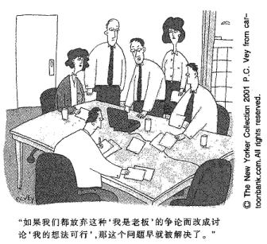

也许你会认为创造出讨人喜欢反应的最佳方法是传达出对别人所呈现的举止的支持与肯定，来顾全别人的面子。这些事实可能会让你困在那些表象当中。其实，当你心中对某人有满腹牢骚的时候，你应该学着如何去表达自己真实的面貌。

解决以上两难问题，可以经由沟通的两个层面的特性。

在内容的层面上你可以表现出对他人的不满，但是在关系的层面上你可以表现出——不管是口头还是非口头的——你对他/她的重视。你可能会觉得这种利用关系层面来改善关系的细腻手法非常复杂。但是，一位具有影响力的研究工作者杰克·
吉布（Jack
Gibb）提出了一些有效控制防卫的工具。经过几年的团体观察之后，吉布归纳出了六种唤起防卫性沟通的类型，表10-3的吉布分类表会于接下来的篇幅里对此有所详述。

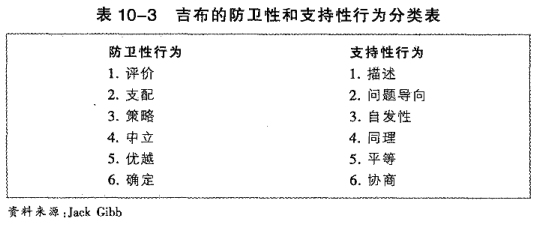

*评价和描述*
吉布指出，第一种唤起防卫的行为是"评价式沟通"。大部分的人会在争吵中感到生气，他将这解释为缺乏尊重的结果。有一种评价的形式是"你"这个字，之前我们在第五章已经有提过。

相对于"你"的语言形式，"描述式沟通"将焦点放在说话者的想法和感受上，而非着重在价值的判断。描述式语言通常使用"我"这个字，这要比"你"这个字所显现的防卫强度弱得多了。

接下来，让我们来对照一下"评价式语言"中的"你"信息和"描述式语言"中的"我"信息所反映出来的差别：

评价：你不知道你自己在说些什么！

描述：我不明白你所要表达的意思。

评价：你这地方真乱！

描述：如果你不打扫，我们的生活会很脏乱，这点让我有点生气。

评价：这笑话真令人作呕！

描述：我真的很不喜欢这些下流笑话。

在描述式语言的情况下，焦点被放在说话者的想法和感受上，尽管它并非成功进行沟通的唯一要素，仍然具有相当的价值。有些人会对你说的话、做的事表现出防卫式的反击，而描述别人的行为对你产生的影响，会比直接判定别人对你的攻击来得适当。

*支配和问题导向*第二种唤起防卫的信息是企图支配一切。支配式沟通发生在信息传达者在不顾接收者需要和兴趣的情况下自顾自地去解释、决定一些事情。这样的情形几乎随处可见：在哪吃晚餐？要看哪一个频道？要保持哪段人际关系？是要如何花大笔的钱？……不论哪一种状况，这种人总是要展现出支配的态度，以至于制造出一股防卫性的气氛。这些支配的意念会出现在文字、姿势、声调或者其他种种的渠道上，无论是经由地位、莫名的坚持、僵硬的规则还是体力上的优势，最终都要达到其控制的目的，这种控制者不管走到哪里都容易引起别人对他的敌意。以下的言语就表现了这样的态度："我知道什么对你最好，如果你照着我的话去做，事情就会成功。"

相反的，问题导向的沟通形式会将焦点放在满足自己和他人需求的办法上。这里的目的并不是"赢"你的对手并且让他付出代价，而是让每个人都有良好的工作结果，并且觉得自己是赢家。在第十一章里，我们将提供如何制造"双赢"的方法。

下面是一些说明支配和问题导向的措词不同措辞方式的例子：

支配：你接下来两小时最好离电话远一点。

问题导向：我在等一通重要的电话，想麻烦你一下，让电话暂时保持畅通不占线。

支配：只有一个办法来解决这个问题了，那就是……

问题导向：看起来我们有点麻烦了，看看我们能不能共同找出两全其美的办法。

*策略和自发*
吉布使用策略这个字来描述唤起防卫的信息，在这种信息中发言者把他们真正的动机隐藏起来。"策略"的本质是不诚实以及巧妙地处理。即使策略性沟通的动机是正确的，当身处诡计中的受害者发现自己被人蒙蔽的时候，他仍会觉得被冒犯并且认为自己是幼稚而容易受骗的人。自发性是与策略成对比的一种行为。自发是指单纯地对别人诚实而不是操纵他们。自发性沟通不一定要在想到什么事情的时候马上表达出来，而是在细心的思考后真实地表达内心的想法，最重要的还是诚实。自发性沟通不一定能够达到你想要的目标，然而，长时间下来，因为坦率的直言失去一点小目标会比为了顾全自己的目标而耍手段来得好多了。吉布的论点是应该诚实地表达自己而抛开那些会引起抗拒的操纵或隐藏计划。下面这些例子说明两者间的差异：

策略：你星期五下班后要做什么？

自发：我星期五下班之后要搬钢琴，你可以帮我的忙吗？

策略：汤姆和朱迪每周都会外出晚餐。

自发：我希望我们可以偶尔外出晚餐。

关于吉布的模式还需要进行更深地探讨。第一，吉布所强调的直接沟通比较适合美国这类低脉络文化，因为这种文化比高脉络文化更看重直言不讳，第二，吉布将这些沟通取向命名为"支持性"，这可能会使某些人对其误用，而违反了正向气氛的建立法则，要知道自发也可以是一种策略。这听起来似乎有点自相矛盾，但是有时你会看到人们很有心机地去表现自己真诚，目的是为了获得别人的信任与同情。这可能是最容易唤起防卫的一种方式，因为当我们知道别人把坦白当作一种手段之后，我们就再也不会相信这个人了。

*中立与同理*
吉布使用中立这个字来形容第四种唤起防卫心的行为，但是有另一种更适合描述它的形容词是"冷淡"。中立的态度是不肯定的，这表达着对别人的幸福与否漠不关心，而且暗示着别人对你而言是不重要的。当人们意识到这种不关心时，防卫心就会自然地兴起，因为没有人希望自己的存在是没有重要性的。在他们的自我概念当中，总会希望自己是有价值的。

注意中立与同理在措词上的差异：

中立：你不好好计划就会发生这种事。

同理：唔，事情的发展好像跟你预计的不一样。

中立：有时候事情就是会出错，没办法。

同理：我知道你花了好多时间和心血在这个计划上，但有时候事情确实不能顺着我们的意。

"中立"的负向影响和敌意会变得愈加明显——当人们经常要去面对许多没有人情味的机构时："他们只是把我当作一个号码，而不是一个人。"
"好像是电脑在处理我的事情，而不是人在帮我办事。"这些常见的情况反映出被冷淡对待的人可能的反应。吉布发现"同理"可以摆脱冷淡的沟通方式，当人们表现出对其他人的关心时，就有机会引发他们的自我概念。同理的意思是体会别人的感受，试着把自己置身于他们所经历的情境当中，但这不表示你就必须完全认同他们。简单来说，你的用意是要让他们感受到你的关心和尊重，为此可以多用一些支持性的方法。吉布注意到在"同理"的沟通方式上，非口语信息具有相当重要的地位。表情和肢体上的关心，会比言语的直接表达来得更传神。

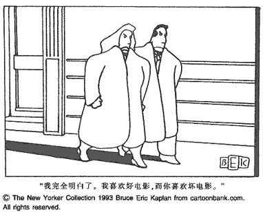

*优越和平等*
第五种引起防卫心的行为是优越感。任何表达出"我比你优秀"含义的信息都会引起接收者的防卫态度。有丰富的研究证实，至少在西方文化中，自以为是的信息会使接收者恼怒，从学生到一般市民都是如此。幽默作家戴夫·巴里（Dave
Barry）在《如何有效争论》
这篇文章里提到，我们也常用一种独占鳌头的姿态来传达自己的优越感。例如，想一想如何利用强调语法和字词、高声而缓慢地说话、故意不听以及改变说话声调来传递优越感的态度。

优越：你根～本不知道自己在说什么。

平等：我用不同角度看这件事情。

优越：不，这不是这件事的正·确·作·法。

平等：如果你愿意的话，我可以告诉你我曾经用过的有效方法。

在许多情况下，我们必须和那些能力以及知识都比我们优秀的人沟通，但是他们并不需要在这当中抱持着一种优越的态度。吉布发现，许多证据证明了具有优秀技巧和才能的人比较重视平等的感受而非优越感。这些人传达着这样的信息：虽然他们在某些部分拥有过人的天分，但是其他人也具有身为人类的价值。

*确定和协商*

你曾经遇过那些自信自己是完全正确的人吗？你曾经遇过那些认为自己的方法是唯一或是最恰当的解决问题的办法的人吗？你曾经遇过那些坚持认为自己知道所有的事实而不需要其他额外信息的人吗？如果你曾经遇过，那么，你就是遇到了那些使用了吉布所提出的确定这种行为的人了。这些沟通者会将注意力放在自己所坚持的观点上，可能会因此而漠视了他人的观点，不重视别人提出观点的重要性。接收到"确定"信息的人，很可能会把这些信息当成一种对个人的冒犯，而用防卫的行为来加以回应。

和"确定"相对的一个概念是协商。也许一个人会有强烈的意见，但是他们不全然认为自己一定没有错，倘若其他的观点看起来更合理的话，他们也会改变自己的立场。

确定：那绝对行不通的

协商：我想你用那个方法可能会出点麻烦

确定：你不知道自己在说什么

协商：我以前没听过这个想法，你是从哪里听来的？

依照吉布的理论控制自己的言行并不一定就会建立出正向的沟通气氛，对方可能并不接受你这一套。但是，当沟通是由上述那些积极的因子所构成时，就有最大的机会可以创造积极的关系。除了有助于增加他人传达给你的正向回应外，支持性的沟通更可以让你在很多情况下感觉更舒服：你越能控制你的人际关系，它给你的感觉就越自在，也让你能越乐观的去面对其他的事物。

### **10.3 保留面子：清晰信息处方**

接下来将会讨论如何用清晰、直接但又不具威胁性来说出你的心意，用肯定的方法陈述你的需要、想法和感受，清楚直接又不至于让别人感到被评断和命令。这个"清晰信息"的技巧你在第三章知觉检核单元已经学过，而"我"信息技巧你在第五章也学过。这个新技巧借由下列几种信息运作：你的希望、问题、抱怨和珍视。除了给予一些直接表达的方法之外，清晰信息的处理办法使你更容易了解自己。肯定信息是以"我"的语言作表述，包含三个元素，而完整的肯定信息有五个部分。我们将会逐一检验每一个部分，然后讨论如何将它们跟你的日常沟通结合在一起。

**行为**

行为描述描述了你行动的原始资料。行为描述应该是客观的，描述一个事件而不带解释。

下面是两个行为描述的例子：

例1："一个星期前约翰向我承诺，和我共处于相同的房间时他在抽烟之前会先获得我的同意。刚刚他没有经过我的允许，就点了一根烟。"

例2："克里斯在上星期跟往常很不一样，从上周末起我就没见过她的笑容。她不像以前那样顺道来我的住处，没有提议一起去打网球，也没有回我的电话。"

注意，这两个例子中的描述陈述只记录了对感觉是有益的资料。观察者没有添加任何附带的意义。在一项检验伴侣间冲突的研究显示：描述问题而没有情绪语言是具有价值的。这项研究显示，满意的伴侣试着提供行为的抱怨——"你总是把袜子丢在地板上"，而不满意的伴侣做了更多指向个人特质的抱怨——"你这个邋遢的家伙"。理由很明显，对人格特质的抱怨攻击了更根本的行为自我部分。抱怨处理袜子的方式是可以被改变的，但是抱怨某人邋遢则是对他人格的侮辱，即使冲突结束后也很难忘记。

**解释**

解释的陈述是把意义连接到行为的过程。我们需要先了解有关解释的一个重要观点：解释是主观的。就像你在第三章知觉检核中所读到的那样，任何行为我们都可以有不止一种解释。例如，看看先前出现过的这两个例子，都可以有两个不同的解释：

例1 :

解释A："约翰一定是忘记了我们的约定，就是有关他没有询问我之前是不能抽烟的事。我确定在他知道我特别在乎的那些事情上他不是会食言的人。"

解释B："约翰是不礼貌、不考虑别人的人。他和我约定过在问过我之前不能在我身边抽烟。他是故意在我面前抽烟的，这显示他只关心他自己——事实上，我敢打赌他是故意在做这件事，目的就是要把我逼疯。"

例2 :

解释A："一定是有些事在困扰着克里斯，可能是她的家庭吧。假如我持续打扰她，她可能会感觉更糟糕。"

解释B："克里斯可能在生我的气，可能是因为我取笑她打网球时总是输球。我想我最好让她一个人冷静一下。"

当你能察觉到观察行为和解释的不同之后，一些沟通失败的理由就变得清晰可见了。当发送信息者没有在他所解释的事实基础上先做行为描述时，就会发生许多问题。例如，想象一下，你听到某个朋友的两种说法之间的不同：

"你是个吝啬鬼"。（没有行为描述和解释）

"我经常替你付咖啡和点心的费用，而你从来没有替我付过，我觉得你是个吝啬鬼。"（行为描述加上解释）

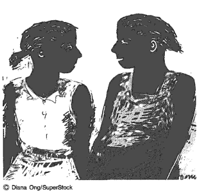

第一个说话者没有清楚地描述行为，可能使信息接收者觉得很困惑，因为无法得知是什么原因使得说话者这样评价自己。这种缺乏描述行为的沟通也会降低接收者停止侵犯行为的机会，毕竟，他根本不知道到底发生了什么。这就是吉布所说的评价和描述的差别。

一如清楚地描述行为一样重要，解释也必须把自己推论的过程说得非常清楚，而不是只根据事实做解释而己。这也就是吉布所说的确定和协商的差别。想一想这两种说法的不同吧：

"这是很明显的，假如你关心我，你就应该更常写信给我"。（只根据事实做解释）

"当我不能从你那边收到信或是卡片时，我想那是因为你不够关心我。"（把推论过程解释得更清楚）

**感觉**

报告行为和分享你的诠释是很重要的事情，但感觉的陈述在信息上增加了一个新层次。例如，思考一下这些说法的不同吧：

"当你嘲笑我（行为）时，我想你发现了我的评语很愚蠢（解释），我感到很尴尬。"

"当你嘲笑我时，我想你觉得我的评语很愚蠢，我对此感到很生气。"

有一些沟通看起来似乎是在表达情绪，但其实是在解释或是陈述意图。分辨这之间的差别是很重要的。例如"我觉得很想要离去"（意图）或"我觉得你是错的"（解释）是不正确的说法，这些陈述模糊了真正的情绪表达。

**结果**

结果的陈述说明了沟通发生了什么结果，包括你所描述的行为、解释的内容或随之而来的情绪，或者同时包含三者。有三个形式的结果：

▲说话者身上发生了什么事

"我昨天没有收到电话留言（行为），我不知道我和医生的约会被延后了，于是我枯坐在办公室苦等了一个小时。这段时间我本来可以用来念书或工作的（结果）。对我来说，我认为你好像一点都不在乎我有多么忙碌，即使在帮我写个留言条这样的举手之劳上也是如此（解释），这就是为什么我如此愤怒（感觉）。"

▲接收者身上发生了什么事

"你在宴会上喝了四到五杯酒之后，我劝你喝慢一点（行为），而你开始出现怪异的行为：你说了一些粗鲁的玩笑，得罪所有在场的人。在回家的路上，你开车开得很糟糕（结果），当你倒车时你几乎撞到电话亭（更多的行为）。我认为你不了解你的行为是多么异样（解释），我觉得很担心（感觉）。我很怕想到如果你不能再少喝一点酒将会发生什么事情。"

▲对其他人发生了什么事

"你可能不知道，因为你可能没听到她的哭泣（解释），但是当你为了演出在排练却又不关门时（行为），婴儿不能睡觉（结果）。我特别担心（感觉），因为她最近感冒。"

两个理由让结果陈述在沟通上具有价值：第一，他们帮助你更清楚地了解为何别人的行为会使你觉得困扰或觉得高兴。同样重要的是，这也可以告诉别人他们行为的结果，有助于替他们弄清楚他们行为的后果。就像"解释"，我们经常认为别人应该不用说就能察觉事情的来龙去脉，但是事实是他们经常无法如此。借由明确陈述结果，你可以更确定你或你的信息，不要留下让人想象的多余空间。

当你陈述结果时，很重要的是只要简单描述发生了什么就好，不要加上道德教条。例如，对于"当你没有打电话告诉我你会迟到，我整晚都在担心你"这件小事有人就会怒吼着说："我如何再信任你？你的缺乏诚信快让我抓狂了！"记住，表达你的想法和感觉是完全合法的，但重要的是要如实地陈述它们。当你想要求某一个人改变时，你可以使用意图陈述。我们马上要说明意图陈述了。

**意图**

意图的陈述是清晰处方的最后元素，他们以三种信息方式沟通：

▲你所秉持的观点

"当你叫我们'小妹'之后，我曾和你说我们想要被称为'女士'（行为）。我觉得你对此并不觉得这个差别对我们来说是多么的重要（解释）及它对我们是多么具有意义（感觉）。现在我的处境很棘手：到底是应该撕破脸皮继续坚持我的立场，还是假装没关系但是心里感觉糟糕透了（结果）。我希望你能了解这是多么的困扰我（意图）。"

▲对他人有所诉求

"当我昨晚没听到你对我说话时（行为），我想你在生我的气（解释）。事情一开始我就一直在想着这件事（结果），我仍然很担心（感觉），我想要知道你是否在生气（意图）。

▲描述未来你计划如何行动

"我曾问过三次，叫你偿还我借你的25美元（行为），我觉得你似乎一直避着我（解释），我对这非常生气（感觉）。我想要你了解，除非我们现在弄清楚，你别期待我会再借你任何东西（意图）。"

在之前的例子中，我们经常只产生一个单一的意图。然而有时候，我们是在几个联结在一起的意图中行动，有时候这几个意图还互相冲突。当这种情况发生时，我们的冲突意图经常使决定更加困难。

"我想要对你真实，但我不想破坏朋友的隐私。"

"我想和你继续享受友谊，但我现在不想太频繁接触。"

"我想有时间念书，拿到好成绩；但我也想要有一份工作，赚点钱有收入。"

**使用清晰信息处方**

在你使用清楚信息处方传送信息之前，有几个要点要记得：

1.相关元素的顺序可能会乱序传达。就像在前几页所举的例子，有时最好从你的感觉开始，有些时候你可以从分享你的意图、你的解释或描述结果开始。

2.信息的字词要符合你的个人风格。通常我们不会说："我解释你的行为意指……"，你可以选择说："我想……"或"这对我来说……"或是"我有个想法……"。同样地，你可以这样表达你的意图："我希望你会了解（或做）……"或是"我希望你会……"。为了增强你陈述的真诚性，你选择的字词应该听起来是可靠的。

3.适时地将两个因素联结在一个句子里。"……从那之后我一直想要告诉你"这样的陈述就同时表达了结果和意图。相应的，当你说"……在你那样说了之后，我觉得很困惑"时，你表达了结果陈述和感觉陈述。不论你是联结两个因素还是将它们分开表达，重点是去确定每一个因素都在你的陈述中有所呈现。

4.以你的速度传达信息。并不是每一个人都能在同一个时间内恰如其分地充分传达信息。在你所要说的完全被了解之前，同一个部分经常需要重复或再陈述许多次。在本书前几章中你已经了解到，会有各种不同的心理和生理噪音，使人与人之间的互相了解变得十分困难。沟通就和其他活动一样，耐心和持续是基本要件。

### **10.4 对批评以不防卫回应**

如果每个人都能够做到支持性的沟通，这个世界会成为一个人间乐园。但是，当有人以吉布所认定的唤起防卫行为——如评价、支配、优越感等——来对待你时，你要如何以不防卫的态度来做回应？除非你意志非常坚定，否则当你被别人攻击时很难保持理性。尤其是那些明显很不公正的批评，会令人十分难受，倘若自己成为批评中心，痛苦的感觉会更强烈。即使批评你的言论是正确的你也可能会丧失理性，除了可能会用口头上的侵略来加以反击之外，甚至还可能会消极地撤销这段关系。

正因为不管哪一种形式的反击都可能造成强烈的争执，我们需要做的是找出另外一种替代的方法，来阻止这些行为的产生。接下来将提供两种沟通的技巧，虽然它表面上看起来很简单，却有实用的价值，希望你能用心去学习。

**寻找更多信息**

当你了解别人的攻击背后其实是有话要说时，一味反击别人批判式的攻击是一件愚蠢的事，寻找更多的信息才是个明智的举动。一开始就反击更被视为不正当或是愚蠢的，因为对方的话中常常包含了少许甚至许多的事实。许多读者反对当他们遭受批评的时候还要去问到更琐碎的细节。他们这样的坚持，是因为他们把"开放倾听"说话者的评论和"接受"说话者的评论，混淆在一起了。当你明白什么是你愿意聆听、了解的甚至承认那些原先不想要接受的或具有敌意的评论时，你会变得更容易听取他人的意见。当你不同意别人对你的批评时，若是你愿意先去了解那些批评的内容，你将更清楚自己的立场。在另一方面来说，如果你愿意仔细地聆听批评者的意见，也许你会发觉在批评者的意见之中有些令人信服的地方，你可以从中获得对你有利的信息。不管是上述的哪一种状况，当你愿意花点注意力在别人的批评上时，你不会失去任何东西，反而会得到很多。

*询问详情*
事实上，在批评当中，那些模糊不清的攻击是没有价值的，即使你由衷地想要改变它也是徒劳无功。诸如"你不公平"或是"你从来不伸手帮忙"之类的抽象攻击是很难被了解的。在这样的例子中，询问传达者给予更详细的信息会是一个好的方法。"我在什么地方不公平了？"是个不错的回应，帮助你判断哪个攻击是正确的。你也可以在决定是否要同意这样的攻击时，先用这样的问句加以确定："我哪些时候不帮你了？"

如果你已经发出询问详情的信息，却仍然导致防卫的反应，也许你该想想问题是否出在你问问题的方式上。你的声音和语调，你的脸部表情、姿势，以及其他种种非语言线索，这些信息将为同样的一句话带来截然不同的含义。想一想，你该怎么用"你到底在说些什么"这样的问句来和别人沟通？你是发自真心地想要了解，还是心里暗自觉得对方是个古怪的人？只有当你真诚地想要从说话者那边获得更多的学习时，请求详细的信息才会成为一件非常重要的事情，倘若你在其他的心态下去询问详情，恐怕会引发更多的麻烦并把事情弄得更糟。

*推测详情*
在有些情况之下，即使你用真诚、得体的言词去表达进一步信息的渴望，仍然不见得会有成功的结果。有些时候，批评你的人无法对你的行为下一些精确的定义，此时，你将会听到诸如此类的建议："我不能告诉你你的幽默感出了什么问题，我所能说的只有我不喜欢你这样。"在其他时候，批评你的人可能会不喜欢你的某些行为，但顾虑到你是否会抗拒这样的批评，他们可能会用一种反常的、愉快的方式来表达心中的想法，在这个时候你会听到一些这样的回应："好吧，如果你不知道你为什么伤了我的心，我也不想去告诉你。"

当你真心学习如何从别人的批评中发觉更深一层信息却遭受挫败时，你的心里一定感到十分的沮丧。在这样的状况下，你常常可以借由推测那些批评底下的含义来进一步学习到什么是困扰那些批评你的人的根源。你会变得容易臆测且容易怀疑，执意要寻找出自己的"罪行"。就像那些请求详情的技巧一样，如果你是为了要创造出一个令人满意结果的话，那些猜测就必须是充满善意的。你必须让那些批评者知道，你的目的以及你是真心想要知道究竟发生了什么事情。在表达出自己的目的之后，周围的情绪氛围通常会变得更加舒适，因为你和批评者之间已经朝相同的目标走去。以下提供一些典型的问题，也许你曾经听过有人用这样的方式来推测其他人的批评：

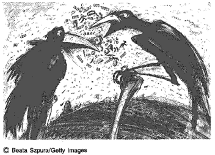

"所以你反对我在文章中所使用的表达方式？是因为我所使用的方式太呆板了吗？

"好吧，我知道你觉得这些装备看起来很可笑。不过它是哪里不好呢？颜色还是结构，又或者是其他方面不合适？"

"当你说我没有尽到我在这房子里的那份责任的时候，你是指我对清洁打扫的帮忙不够吗？"

*对说话者的想法予以释义*
在第七章中，我们曾经提过如何利用解释说话者的想法和感受以及积极倾听的技巧来排除那些言谈所造成的混乱和阻挠。"释义"更是个帮助人们解决问题的好方法，因为人们会批评你，通常是因为你的行为对他们来说出了某些问题，此时，这个策略就发挥了它的作用。"释义"的好处就是你不用对别人具有攻击性的行为做猜想，借由澄清或详述那些批评当中你懂得的观点，你将会学习到更多他们所批评的地方。下面一段对话正是一位聪明的管理者是如何利用"释义"来应对一位不高兴的客人的：

顾客：你管理的方法真差！我只想告诉你，我以后再也不会来这里消费了！

老板：（反映出顾客的心情）你看起来似乎心情很不好，告诉我你的问题，好吗？

顾客：不是我的问题，是你的店员有问题。他们似乎觉得要帮顾客在这里找个东西是件很麻烦的事。

老板：所以你在找你要的东西时得不到足够的帮助，对吗？

顾客：帮助？在我终于能够和店员说话前，我已经在这里绕了将近二十分钟了。我只能说你经营的方法真是烂透了！

老板：所以你的意思是，店员忽略了客人？

顾客：对！他们正忙着招呼其他的客人。我只是认为你应该有足够的人手来应对这个时段拥挤的人潮。

老板：现在我明白了。你不满意的地方就是我没有足够的人手来迅速为你服务。

顾客：是的。我现在对于服务没有抱怨了，我比较恼怒的是要一直等在那里，我总是告诉自己我可以在这里找到想要的东西，但我太忙了，没有时间等很久。

老板：谢谢你让我注意到这个缺点。我也不希望让老顾客等太久，我会尽力不再让同样的事情发生。

这段对话说明了"释义"的两个好处：首先，通常持批评态度的人在领悟到他们的抱怨有人倾听的时候，会减少自己强硬的态度；此外，批评者通常会在他们的需要没有得到满足时，增长他们的挫败——在上述的对话中，顾客就是个需要被注意却没有得到满足的例子。当管理者真诚地表达对顾客不满意的关注时，顾客就会感到舒服些，整个店里的气氛也会因此而较为和谐。当然，这种积极的倾听不一定总是会减缓那些批评你的声音，然而，即使它没有这样的效果，仍然有其他的益处值得我们去施行。在这个简单的对话里，管理者在花费时间听取顾客的需要后，学习到另外一些有价值的信息，他发现在某些特定的时段里员工无法胜任于服务众多的购物者，这会耽误某些客人的时间，甚至引起他们的恼怒，因此是属于业务上的疏失。这个了解是十分重要的，倘若管理者用防卫的反应来面对顾客的抱怨，那么他永远不会从这当中学习到什么。

*询问批评者要的是什么*
在某些时候，批评你的声音很明显地传达出他们的需要。

"把音乐声关小一点！"

"我希望你会记得告诉我电话的留言。"

"你现在就去把你的脏衣服洗一洗！"

然而，有些时候，你会需要做些探查来找出批评者希望你做些什么。以下有两个这样的例子：

阿雷克斯：我不敢相信你居然没有先跟我讲就请来了所有的人！

巴伯：你的意思是希望我取消这个派对咯？

阿雷克斯：不，我只是希望你在计划之前先过问我的意见。

西西亚：你真是吹毛求疵！看起来你似乎不喜欢这个计划。

唐娜：是你要问我的意见的，你希望我回答些什么？

西西亚：我要知道是哪里不对了，而不是单纯的批评。如果你觉得我哪里做得还不错，我也希望你能告诉我。

最后一个例子说明了你的问题是否伴随正确的非语言行为的重要性。在唐娜的反应"你希望我回答些什么"中，可以推测出两种情况，一个是真心地表达出想要知道西西亚需求的渴望，另一种则是明确地表现出不友善的态度以及防卫。在这个段落的类型中，你针对批评的回应都必须是很真诚的态度。

*询问行为的后果*
通常人们会在他们的需求没有受到注意的时候批评你的行为，回应这个批评的方法就是找出在你的行为中哪些是引起令人烦恼后果的关键。你将会发现到，看起来合理的行为也会造成一些批评。在你了解这点之后，之前那些看起来愚蠢的批评就会呈现出不同的含义。

邻居甲：你说我应该让我的猫做节育手术，为什么这对你那么重要？

邻居乙：因为它一到晚上就勾引我的猫，而我已经不想再支出任何诊疗的费用了。

工人甲：为什么你这么关心我上班迟到？

工人乙：因为当老板问起我时，我总觉得应该替你编个理由才不会让你有什么麻烦，可是我真的不喜欢说谎。

老公：为什么当我输钱的时候总会让你感到十分困扰？你知道我从来不会把我全部的财产拿去赌的。

老婆：这不是钱的问题，而是当你输的时候你的心情总会低落个两三天，那对我来说也很难过。

*询问还有哪里出错*
再多请求一些批评似乎是件疯狂的事，但是有时问问其他的抱怨可以让你发现真正的问题。

甲：你在生我的气吗？

乙：没有啊！你为什么这么问？

甲：因为在整个野餐的时间里你几乎都不和我说话。事实上，只要我走到你身边去的时候，你就会跑到别的地方。

乙：还有其他不对的地方吗？

甲：我最近觉得怪怪的，你是不是对我感到厌倦？

这个例子指出这种询问并不只是受虐狂式的习惯，而是可以帮助你了解你是否冒犯了批评你的人。如果你可以察觉到你的防卫，进一步的探索可以引导出批评者真正的不满之处。

有时候从批评者那边询问更多的信息是不够的。例如，当你完全了解别人对你的批评，却仍在语言上感受到自己防卫的反应时，应该怎么办？你知道倘若你试着防卫必然会招来一顿争吵，然而你似乎又无法接受别人对你所说的话。这种进退两难的情况简直是令人无法忍受的。我们接下来将谈到这个部分。

**同意批评者的看法**

也许你会反对这样的标题。你要怎么真心同意你不相信的批评者呢？在下面的篇幅里，我们将试着为这个问题找出答案，让你知道没有什么状况是真的令你无法诚心接受他人的观点，而一定要固守在自己的立场的。要知道怎么能够做得到，你必须了解同意有两种不同的类型，你几乎可以在任何状况中都使用它们。

*同意事实*
这是一种在争吵中比较容易了解的类型，但是它不常被使用。研究者认为这对恢复批评中被损害的声誉有很大的效果。当被指责的事情正确时，你比较会认同那些批评的话：

"你是对的，我很生气。"

"我想我的防卫心确实太强了。"

"现在你说得没错，我嘲笑了你。"

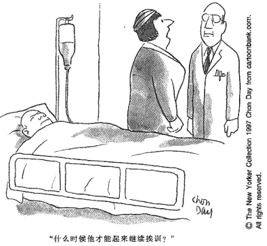

当你注意到某些事实是没有争论的余地时，同意这些事实似乎是很合理的一件事。如果你和别人约了四点在某个地方见，但是到了五点你仍然没有出现，无论你对你的迟到做什么解释，你还是迟到了。如果你打破了借来的东西，把煤气用完了，或者没有完成你的工作，你就必须同意别人对你这些行为所做的解释，即使这些解释并不讨喜。你可能会因为自己的形象被破坏而很生气，做一些蠢事，听不下人家说的话，甚至做出一些不经考虑的举动。在你摆脱这些对完美主义的迷思时，你会比较容易承认这些事实。

如果批评者针对你所发出的言论都是正确的，为什么用非防卫的态度来接受它是一件很困难的事情呢？这个问题的答案，通常是因为当事人经常同时在"同意事实"和"接受指责"两者间夹杂不清而产生了困惑。大部分的批评者不仅描述了冒犯他们的那些行为，他们也连带着给予了评价，以下就是一些我们常常会抗拒的评价：

"生气真是愚蠢。"

"你没有任何防卫的理由。"

"你这样嘲笑别人的行为错了。"

这些评价似乎都是会令我们感到生气的地方。然而，了解到你能同意——甚至从中学习——许多你仍然未能接受的批评所描述的内容，你将经常产生真诚而不防卫的反应。

*同意批评者的观感*
当你承认对你的批评是根据事实时，同意批评你的人可能是一件健康的事情。但是，当那些批评似乎言过其实的时候，你应该如何去同意他们呢？你必须仔细地聆听并且询问问题，来确定你真的了解那些批评的意思。有时候你听得越多，你会越确信这些批评是完全脱离常规的。这时你可以看看以下的例子，这也是一种表示同意的方法。在这种时候并非去认同批评者的结论，而是试着站在他们的角度，以他们的眼光去看事情。

A：我真不敢相信你去过你所讲的地方，也许你只是想要让我们印象深刻而已。

B：我可以了解为什么你会这么想。我知道很多人都借由说谎来获得别人的赞同。

C：我不完全相信你要待在家里的理由，你说是因为你头痛，但我觉得你只是想避开玛丽。

D：我可以了解为什么你这么想，因为我和玛丽上次吵了架。但我现在真的是头痛。

认同批评者的言论，却能让自己心里感到舒服的关键是：你必须了解到同意那些批评，并不意味着迫使你要向他们道歉，有时你不一定要使批评者认为你要为那些令人不愉快的行为负责任。以下这个例子将说明，解释有时可能比道歉来得恰当：

"我知道我迟到了。这是因为城里出了个车祸，把整个街道都堵住了。"（说话者是用一种解释而非防卫的语调）

在另一个例子中，即使你的行为不适当仍然有可能是被理解的。当这种情形发生的时候，你可以不带任何道歉的承认批评者所说的话：

"你是对的，我的确没有控制好我的脾气。我已经提醒过你三四次，最后我想我是用尽我的耐心了。"（再一次的，传达出解释而非防卫或反击的信息）

在其他的例子中，你可以用不同的观点来看待批评当中正确的地方，而不一定要失去自己的立场。

"我可以了解为什么你会认为我反应过度，我知道这对你来说并没有像对我一样重要，但是我希望你可以明白，我为什么这么重视它。"

有诚意的道歉是十分健康的；然而，倘若你能了解到做这样的事情并不需要卑躬屈膝，也许你会更容易去同意批评者的言论。

### **10.5 摘要**

每一段人际关系都会形成一股沟通气氛。正向气氛的特征是肯定的信息，反之，负向气氛通常使用不肯定的信息。沟通气氛是由人际关系发展而来的，特别是从口语和非口语的信息。在沟通气氛形成之后，相互作用的信息会创造出正向或者负向的螺旋，在这样的螺旋当中，正向以及负向信息的频率和强度会不断增长。

防卫是一种最具毁灭性的沟通类型。当潜在具有威胁性的信息出现时，使用杰克·吉布所提出的支持性行为有助于降低触发他人防卫心的可能。此外，我们可以运用清晰信息和保留面子的方法来和别人分享我们的想法和感受。完整而清晰的信息描述措词包括：以提问来描述行为，至少提出一个解释，表达说话者的感受，描述情境的结果和说话者的意图。当你面对他人的批评时，试着借由认同评论当中的事实以及批评者的观点来了解批评当中的含义，这对你用非防卫的反应来回应这些指责有所帮助。

**第十一章 处理人际冲突**

对太多数人说，冲突就像去看了一趟牙医似的。字典上对于这个令人厌恶的字眼——"冲突"的本质，提供了一个快速浏览的线索。这个字的同义词包括征战、争吵、抵触、竞争、争论、不和谐、相斗、斗殴、纠纷、挣扎、麻烦和暴力，等等。有时我们用隐喻描述我们的冲突，并以此表示我们认为冲突是可以避免的。我们常把冲突视为是战争的一种："他攻击我的论点。""好！停火了。""不要总是先发制人！"另一种隐喻主张冲突是爆发性的："不要爆发！"
"我需要降温！"
"你得装个保险丝！"有时冲突似乎像一种审讯，像是一个人指责另一个人："承认吧，是你错了。""不要再指责我！"
"你先听我说！"语言本身也指出冲突经常是一片混乱："不要哪壶不开提哪壶了l "
"这是棘手的情况！"
"不要再惹人讨厌了！"甚至某些隐喻会具有游戏化的特征，暗示了冲突双方是竞争的关系："那是犯规的。""你这样做不公平。""我放弃，你赢了！"

除了这一类想象之外，事实上冲突也可以是建设性的。通过正确的沟通技巧，冲突可以比较不像争斗而更像是一种舞蹈——舞蹈必须通过舞伴的相互合作才能实现，你必须说服其他人成为你的同伴。刚开始你可能是笨拙的，但足够的练习和意志力可以让你们一起工作而不是各持己见。在这章你将会学的技术，可以帮助你拥有良好意图的伴侣，建设性地处理争论，但是若没有正确的态度，世界上再好的技术也帮不上忙。

### **11.1 冲突的本质**

在聚焦于如何有建设性地解决人际问题之前，我们需要简短地回顾冲突的本质。冲突是什么？为什么冲突会成为生活中不可避免的一部分？如何使冲突更为有益？

**冲突的定义**

在更进一步阅读之前，请列出你生活中人际冲突的清单。他们可能包括许多不同的人，周旋于不同的主题，以及通过许多不同的形式。有一些是吵闹、生气的争论，有一些是冷静地表达和理性的讨论，也会有一些人在独处时充满怨气或者短暂的忧愁。

无论是什么形式，所有人际冲突都有某种特征。乔伊斯·霍克尔（Joyce
Hocker）和威廉·威尔莫特（William
Wilmot）为冲突提供了广泛的定义：一种表达出来的挣扎，在至少两个相互依赖的个体之间，感觉到不相容的目标、不足的资源和达成自己目标时来自另一个个体的阻挠。仔细看看这个定义的关键部分将会帮助你认识到冲突是如何操控你的生活的。*表达出来的挣扎*
当两个个体察觉意见不合时冲突便成立了。例如，你持续好几个月都感到烦躁，因为邻居的立体声音响使你整晚都睡不着，但是直到邻居了解你的问题之前是没有冲突存在的。当然，表达出来的挣扎并非必须要口头说出，你可以不用说任何话就对某人展现出你的不愉快。一个厌恶的注视，沉默以对，以及逃避对方，都是表达自己的方式。

*感觉到不相容的目标*
所有的冲突看起来似乎都是其中一个个体有所获得，而另一个个体有所失去。例如，想一想前面因为音乐音量而引发的分歧，不正是会有某人失去吗？假如邻居关掉这些噪音，她就会失去以大音量听音乐的快乐；但假如她继续让声音高扬，你就会睡不着并且不高兴。

在这个情境中的目标并不是完全不相容的——使得两人都如愿以偿

的解决方法是存在的。例如，你可以关紧你的窗户，或去亲近你的邻居以让她明白你的苦衷，而得到祥和与安静。你可以使用耳塞，或也许邻居可以使用耳机，这样即便把音量调到最大也不会吵到任何人。如果上述所提供的任何解决方法能够奏效，冲突就会消洱不见。

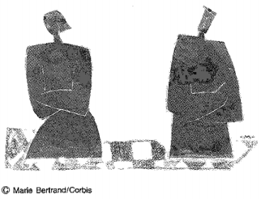

不幸的是，人们常常不能看到对他们双方都有利的解决方法。只要他们只能看到自己的目标，冲突就会存在。

*知觉到不足的资源*
冲突也因人们认为没有足够的资源而存在，最明显的例子就是金钱不足。金钱是许多冲突的来源。假如一个工人要求加薪，而老板宁愿维持现状，或将资金用于扩展个人事业，那么这两个人就会产生冲突。

另一个经常不足的资源是时间。我们不断地要面对如何使用有限时间的困境。我们是应该加班工作，还是跟我们的妻子聊聊天？陪我们的小孩玩耍，或者享受一个人的休闲时光？一天只有24小时，我们的家人、同事和朋友所需要的时间远超过我们所能给予的时间量，所以大家都被捆绑在冲突的紧张之中。

*互相依赖*
虽然处于冲突中的人会感受到对立，但又通常是彼此互相依赖的，一个人的福祉和满足依赖于另一个人的行动。假如不是这样，那么即使明显的资源缺乏和互不相容的目标也不会发生冲突。互相依赖存在于冲突的国家、社会团体、组织、朋友和爱人之间。实际上，许多冲突无法解决是因为个体不能了解他们是互相依赖的。解决冲突的第一个步骤就是要有"我们都得同舟共济地在一起"的态度。

*其他个体的胆挠*
不论一个人的立场和另一个人有多么的不同，冲突也不会随随便便就发生，除非一个个体对另一个人的目标产生了阻挠。例如，你也许会让一些朋友知道你反对酒后驾车，但只有在你真的阻止他们酒后驾车时冲突才会产生。同样地，也许父母看不惯孩子的穿着品位，但只有当父母要将自己的衣着理念强加于孩子身上时冲突才会爆发。

**冲突是自然的**

每一个深层的关系都有冲突，不管多么亲近、多么了解、多么相容，当彼此的想法、行动、需求或目标不相配时，都有可能发生冲突。你喜欢饶舌音乐而你的同伴喜欢古典乐，你想和别人约会而你的伴侣想要保持关系的独占性，你认为你所写的论文已经很好了而你的指导教授还是要你修改，你喜欢星期天睡个懒觉而你的室友喜欢一早起来玩乐器……人们之间不相容的数量和种类可能是无止无尽的。

根据某个调查中大学生的自我记录，他们每个星期大约发生七次左右的争论。在其他的调查中，81％的回答者承认他们和朋友有冲突；而即使是宣称他们的友谊没有冲突的那19％的人，也会使用像"推拉"或"小摩擦"之类的词语来描述关系中不可避免的紧张。在家庭之间冲突更常发生，研究报告指出：在对五十二个家庭的晚餐对话的调查中发现，每一餐平均会产生3.3个的冲突事件。

**冲突可以是有益的**

让关系变得更有益、建构冲突技术的最好的途径，也许就在于互相之间的沟通。近二十年的研究显示：快乐和不快乐婚姻都会有冲突。不快乐的伴侣的争论方式是一种破坏性的沟通。比起问题导向的沟通，他们更在乎于防卫他们自己；他们不能仔细聆听对方，在对待伴侣时完全没有同理心或只是稍微关注对方，使用"你"信息语言，忽视对方的非口语和理性的信息。

许多婚姻满意的伴侣，则在争论时产生不同的思考和沟通。他们认为意见不同是健康的，并且认为需要直面冲突。虽然他们会发生强烈的争论，但是他们使用一些技术，像是知觉检核去发现对方在想什么，他们让对方知道他们看到争论的另外一面，并愿意去承认他们的错误，这有助于关系的和谐，也有助于去解决手边的问题。

接下来的内容，我们将会复习可以使冲突具有建设性沟通技巧，我们也将会介绍更多技巧，以帮助你解决你所面对不可避免的冲突。

### **11.2 冲突的类型**

很多人在面对冲突时都会出现"缺席"的方式，也就是有他们需要的他们就会出现，对别人的需要却视若无睹。我们习惯的方式有时候行得通，但却不是处处都通行无阻，你都习惯用什么方式来面对冲突？找出你习惯的方式，经由思考两个假设性格——保罗和露西亚两人如何处理问题。

保罗和露西亚两人一起跑步已经一年多了，每周三次，每次花一个小时以上。这两个跑者颇为相配，他们互相挑战用更快的速度跑更远一点的距离。他们在跑步时的距离变得越来越近，慢慢地他们开始谈论一些从来不曾跟别人说过的个人事情。

最近露西亚开始邀请一些她的朋友加人跑步。保罗喜欢露西亚的朋友们，但是他们不是体力健壮的运动员，所以跑步的过程变得有点不过瘾，而且保罗担心会减少像之前一样和露西亚的一对一的谈心时间。

保罗跟露西亚谈到自己这个想法，但是露西亚不以为然，她回答说："我看不出有什么问题，我们还是有许多时间一起在路上跑，而且你自己说过你喜欢我的朋友。"保罗于是回答说："但是这不一样啊！"

这个情境出现了所有冲突元素：表达出来的挣扎（他们的差异已经显现，两人各持有歧见），两个相互依赖的个体（他们享受彼此做伴的感觉而且一起跑比单独跑效果更好），感觉到不相容的目标（露西亚想邀朋友一起跑步，而保罗只想和露西亚独处）、不足的资源（他们只有这些时间可以用来跑步）。

这里有五种方法来处理保罗和露西亚的事情，每一种都呈现出某种处理冲突的取向：

▲他们可以说"那就算了吧"然后不再一起跑步。

▲保罗让步，牺牲他想要跟露西亚独处的时间和有默契的速度。或是露西亚让步，牺牲她其他的朋友只维持跟保罗的友谊。

▲其中之一发出最后通碟："照我的意思，否则就不要再一起跑步。"

▲他们可以互相妥协，有些时候邀露西亚的朋友一起跑，有些时候不邀那些朋友。

▲保罗和露西亚一起脑力激荡所有可能的方法，想出一个既跟她的朋友一起跑，又同时保有彼此一对一的时间和互相激励的效果的办法。

图11-l表示了这五个形态代表的取向，接下来的篇幅将一一说明。

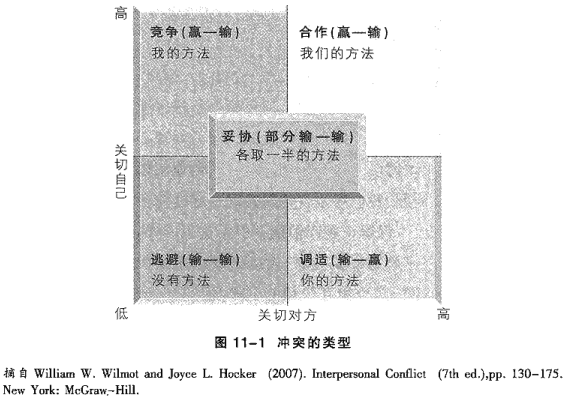

**逃避（双输）**

逃避发生在人们不知所措地忽视或跟冲突保持距离时。逃避可能是生理的（在发生争执之后故意绕开他身边）或是言语的（改变话题、开玩笑或否认问题的存在）。

逃避反映出对冲突的悲观态度，抱持着没有好方法可以解决这个问题的信念。有些逃避者认为把事情暂时搁置会比直接面对并解决更容易些，也有些逃避者认为放弃比较好（无论是问题或关系）免得一直要面对无解的困境。两种状况都使逃避导致输一输（双输）的结果，其中没有人会获得任何满足。

在保罗和露西亚的例子中，逃避的意思是与其在两人的不一致之间挣扎，不如干脆停止一起跑步。虽然这样两人不至于吵架，但是这也意味着两人都会失去跑步伙伴和双方的友谊。这个"解决之道"显示出逃避带来的输一输结果。

虽然逃避可以暂时保持和平，但是却最容易导致不满意的关系。长期的误解、怨恨和失望堆积、污染情绪的氛围，出于这些理由，我们可以说逃避者既不关心自己的需要也对别人的需要不感兴趣，他可能会因为各种问题而困扰。

除了这些明显的缺点外，逃避也不是一无是处，假如说出来的风险太大——比如会引发一场尴尬的公开争执，或甚至让人遭受生理的伤害，再或者你认为这段关系不值得付出努力以避免冲突，那么逃避某些特定的议题或情境也许也是合理的。即使在亲密关系中，逃避也不是毫无逻辑的。假如发生的议题是暂时的或微不足道的，你可能会让事情过去。这个理由可以解释为什么有些沟通顺利的幸福配偶会"选择性地忽视"对方微小的瑕疵。当然这并不是说成功关系的关键就是要忽视所有的冲突，相反的，反而是要将精力集中在解决重大的冲突议题中。

**调适（一输一赢）**

调适发生在当你允许别人用其方法甚过坚持自己的方法，图11-1描绘出调适者比较少关切自己却对别人比较关切，导致输一赢的结果，和"按照你的方法做"的让步。以我们假设的例子，保罗会调整自己配合露西亚，让她的朋友加人他们的跑步活动，即使这样会使保罗减少生理的训练挑战和失去与露西亚有默契的相处，或是露西亚调整自己配合保罗，只跟保罗一个人跑步。

调适者的动机在这种沟通方式中扮演着重要的影响角色。假如调适是仁慈、慷慨或爱的真诚行动，就很可能有机会增进关系。大多数人都会感激有人"牺牲小我完成大我"、"以别人想要的方式对待他们"或是"失之桑榆收之东隅"，而大多数人都不喜欢习惯性地扮演"烈士、怀恨的抱怨者、哀鸣者、破坏者"这些角色的人。

文化在知觉冲突方式扮演的重要角色。高语境敏感文化集体主义背景，诸如许多亚洲文化，比较倾向于认为逃避和调适是一种保留面子和高尚的处理冲突的方法；而低语境敏感文化个人主义背景，比如美国，比较认为逃避和调适是负面反应。从许多美国人对于在冲突中逃避或放弃者的直言不讳的用语―
"不堪一击、好好先生、逆来顺受、没脊梁骨"可见端倪。

**竟争（一输一赢，有时会转成双输）**

调适的反面是竞争。这种对冲突的赢一输取向只在乎自己而忽略别人，像图1-1所示的那样，竞争者以"我的方法"来寻求解决冲突之道。假如保罗和露西亚两人都强迫对方让步的话，可能其中之一会获胜，另一方人们用这种竞争的一输一赢的方法来解决冲突，通常是因为他们感觉到一种"不是……就是"的情况：不是我拿到我想要的，就是你拿到你想要的。一输一赢最明显的例子是某些游戏，例如网球或扑克牌这些需要胜利者或失败者的游戏规则。一些人际议题似乎很符合这个一输一赢的框架：两个同事都想在相同的工作中升迁，或一对伴侣在如何使用有限的金钱上产生了不一致的意见。

有些情况下竞争会促进关系。一项研究发现：有一些男女在其满意的约会关系中运用竞争来丰富他们的互动。例如，有些人在游戏中竞争可以获得满足（谁是比较厉害的板球高手？)
，有些人以竞争来激励自己获得成就（谁应征到了更好的工作？）。这些满意的伴侣发展出了共享的叙事（参见第三章），把竞争定义为正向关注而不是将竞争视为缺乏欣赏和尊重的信号。当然，如果赢的得意忘形而输的恼羞成怒，可以想见将很可能擦枪走火；而如果你在竞争中一直处于劣势，则可能不惜形成一个负面竞争的螺旋，而使关系降级成为双输的局面。

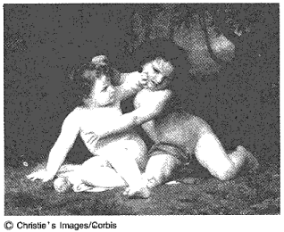

权力是分辨一输一赢问题解决的明显特征，因为它必须防止对手拿到他想要的。最明显的一种权力是生理威胁。一些父母用警告威胁他们的小孩，例如："不要再那样做，否则我会把你关进房间。"大人之间使用生理的权力来处理彼此冲突时通常不会这么直接，但法律系统却是暗示着生理威胁的："你最好遵守规则，否则我会把你关起来。"

真实或暗示的威胁不是唯一把权力运用在冲突上的方式。依赖权威的人会热衷于使用各式各样的你输我赢的方法，而不必动用到生理的威胁。在多数工作中，上级有权力去分配工作时间、工作升迁和调配职务，当然还有开除不适任员工的权力。老师也可以使用分数的权力来要求学生达到老师所期望的行为标准。

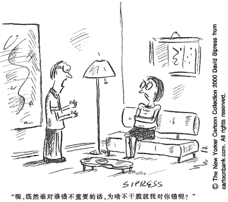

即使通常大多数民主社会所推崇的方式，也是以一输一赢作为解决冲突问题的方法。至少，这种方式颇为公平，有一个团体会得到满足，而另一个则否。

竞争的黑暗面是流血冲突，这种攻击有时候是显而易见的，有时候则是隐藏着的。为什么会这样？继续读下去你便会知道。

*被动攻击*
当沟通者用一种含糊的方式表达敌意时就可能产生被动攻击。根据本章"伦理的挑战"中的解释，这个行为被称作"疯狂制造者"。它发生在当人们有愤恨、生气或愤怒的感觉，却不能或不愿去直接表达时。疯狂制造者不是将这些感觉保留在自己身上，而是在精细狡猾的情况下，以间接的方式传送攻击的信息。这种做法虽然维持了之前的友善关系，但是这正面的友善最终注定要瓦解。然而，疯狂制造者的受害者在被愚弄的混乱和愤怒之外，不是以攻击的行为回应，就是以其人之道还之其身，来治疗他们受伤的感觉。在被动攻击的事例中，我们看到的往往只是对关系的伤害，很少有任何好处。在我们的场景中，露西亚可以对保罗的期待做出被动攻击反应，表面上顺从保罗可是却经常迟到以激怒保罗，保罗也可以对露西亚做出被动攻击反应，表面上接纳露西亚的朋友，然后故意拉开距离把他们甩在后面。

*直接攻击*
当沟通者表达一个直接威胁到对方的批评或命令时，就产生了直接攻击。沟通研究者多米尼克·因方蒂（Dominic
Infante
）定义了几种直接攻击的形式：特质攻击、能力攻击、生理外表攻击、诅咒（希望别人走霉运）、嘲弄、讥笑、威胁、咒骂和以非口语姿势象征。

直接攻击可以使对方产生严重冲击，接受者可能感觉窘困、不舒服、丢脸、绝望或忧郁。这些攻击可以导致工作和家庭的关系的正面效力降低。口头攻击和生理攻击之间有显著的关联性，但即使攻击没有白热化，也仍然会危害到心理层面。例如，被兄弟姐妹取笑的人会对关系比较不满意，也比较不容易有信任感。高中校队中，教练有攻击行为的队伍比起教练攻击行为较少的队伍，会输更多比赛。

攻击的行为可以同时惩罚攻击者和受害者。比起较少攻击倾向的男人，那些把对话视为竞赛、把伙伴视为敌手的男人有60％倾向更早死亡。如果新婚伴侣的意见不合，彼此互相讽刺、打断和批评，将会降低他们的免疫系统功能。

**伦理挑战**

和疯狂制造者的争气

心理学家乔治·巴赫（George
Bach）使用"疯狂制造者"来描述被动攻击的行为。他的名词反应了间接攻击的狡猾本质，它可以使得对方甚至无法觉察到被迫害，使得对方既迷惑又生气。虽然在本章有例子可以运用各种沟通取向来处理冲突，但是我们很难替被动攻击的疯狂制造者说句公道话。

下面的分类呈现了疯狂制造者不计其数的例子，我们在此陈列出这些内容，是要提醒潜在的受害者及早规避。你可以考虑用知觉检核、"我"语言、肯定沟通或其他沟通策略去探索对方是否可以用比较建设性的方式来表达他对你的不满。

<u>逃避者</u>
逃避者是拒绝抗争的。当一个冲突引发时，他们离开、睡着、假装忙于工作，或用其他方式，就是不面对问题。因为逃避者不愿意反击，这策略可以使想要在这议题上讨论下去的人产生挫折感。

<u>假调节者</u> 假调节者假装让步，然后继续若无其事地使用同样的方式行动。

<u>罪恶制造者</u>
不会直接表达不满，取而代之的是想要让别人为自己的痛苦负责。一个罪恶制造最喜欢走的路线便是伴随着叹息声说："好吧，不要担心我……"

<u>读心者</u> 读心者不会允许他们的伴侣诚实地表达感觉，
他们马上进入个性分析，解释伴侣真正的意思界什么，或伴侣哪里不对了。借由这种行为，读心者拒绝去处理自己的感觉，也没有给伴侣留出表达自我的空间。

### **11.3 关系系统中的冲突**

迄今为止，我们都聚焦于个人冲突的方式。虽然在冲突中你沟通的方式很重要，但你的方式不是造成冲突发生的唯一因素。实际上，冲突是相互关联在一起的，通常由个体和他人的互动所决定。举例来说，你也许想要和你的邻居以肯定的方式处理冲突，但是邻居的不合作态度驱使你用攻击的方式处理。当邻居出现肢体威吓时，你甚至会用非肯定方式去处理。同样地，你可能想要暗示一位明显偏心而使你深受困扰的教授，但是教授却以开放、肯定的态度做出了建设性的回应，把你给惊吓住了。由这些例子我们看出，冲突并不是全部依靠个人的选择而来，反而是依靠个体之间互动的方式。两个或更多人在长时间的关系中，会发展出他们拥有的关系冲突系统——一个管理不一致的模式。这导致的共同影响是，假如某一个体对另一个体具有强而有力的影响力，会使得这人甚至会克服自己的特质，去用一种最省力的态度来处理冲突。接着我们就会读到，有一些关系中的冲突形态是具有建设性的，不如此的人反而会使生活过不舒适并且对自己的关系产生威胁。

**互补的、对称的和平行的形态**

在人际关系中的伙伴可以使用三种方式之一来管理冲突。在互补冲突形态的关系中，伙伴之间使用不同但都是增强的行为。在对称的冲突形态中，伙伴之间都使用相同的行为。在平行冲突形态中，伙伴双方在互补和对称两种方式之间转换，从一个话题转移到另一个。表11-2叙述了相同的冲突可以用非常不同的方式开始，全看伙伴的沟通是对称或互补，平行方式将视情况在这两种方式中轮流出现的。

研究指出"攻击-逃避"的互补方式普遍存于大多数不快乐的婚姻之中。一位伴侣——多半是妻子——直接传递冲突，另一个——通常是丈夫——会退缩。显而易见的是，因为两人应对冲突的方式不同，导致了敌意增加和隔绝，而变成一种循环；彼此责备则使事情更糟。丈夫可能会说："我退缩是因为她是这样批评我。"而妻子可能认为："我批评是因为他退缩。"互补方式不是唯一会导致问题的方式，一些痛苦婚姻也来自缺乏建设性的对称式沟通。假如伴侣双方以类似的敌意彼此互相对待，一个威胁或侮辱导致另一个威胁或侮辱，最终会形成螺旋式的增长。假如伴侣双方都用退缩的方式取代直面问题，关系中的满意和持久也会日渐衰落，之前的自我也将杳无踪迹。

就像表11-2显示的那样，互补和对称的两种行为，可以产生好的结果也可以产生坏的结果。假如互补行为是正面的，那么将形成一个正向的螺旋结果，就会有较高的几率解决冲突。表11-2的例子2中的案例里，当员工对老板倾吐自己的内心时，老板表现出了良好的倾听意愿，这样，互补式地说—听模式会产生良好的作用。

对称方式也可以是有效的。建设性对称沟通的最明显的例子是，当双方都是肯定沟通者时，互相听取对方所关切的重点，并且共同寻求问题解决之道。这类解决问题的潜力在例子3中有所表现。足够的共同尊敬和仔细倾听使得父母和青少年两者都可以了解对方的担心，也可能找到一个双方都觉得满意的方式。

**亲密和攻击方式**

另一个看冲突方式的方法，是检验亲密和攻击的互动。以下的模式最初用于描述夫妻之间的冲突，但也可以在其他关系形式中有效运用。

▲不亲密一攻击：这种伴侣彼此会吵架，对于重要事情和关系目标都觉得不满意。有一些关系的攻击是直接表达的："算了吧，我不会再去参加你那一群蠢蛋朋友的聚会了，他们就只会八卦和吃东西。"在另一些关系中，常出现的是间接攻击："很好啊，我真是爱死了你那些八卦和吃吃喝喝的聚会了。"这两种沟通都不是令人满意的方式，相对于双方所付出的不愉快代价，这两种冲突方式提供给双方的报偿都太少了。

▲不亲密一不攻击：双方都以避免冲突来代替直接面对问题："你假日不会回家吗？噢，好，那就这样吧。"这类的关系可以相当的稳定，但是因为这种冲突形式不会去面对和解决问题，所以持久和满意会随着时间消退。

▲亲密一攻击：这个类型联结了攻击和亲密的方式，对局外人看起来似乎会不安，但却可以在一些关系上运作的不错。情侣也许会因猫和狗的事情争吵，但是又很快地和好。共同合作的工作者可能为了怎样完成工作吵得不可开交，却又非常珍惜他们的合作关系。

▲亲密一非攻击：这类关系中的攻击和指责频率很低。伴侣也许会直接或间接地互相争论，但是会发展出一种或数种方式，以预防因为不测而导致的关系不睦。

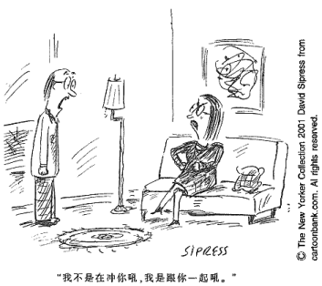

伴侣所选择的冲突类型会显示出他们的关系。沟通研究者玛丽·安·菲茨帕特里克（Mary
Ann Fitzpatriok
）定义了三种伴侣方式：分离、独立、传统。更进一步的研究显示：在不同形式关系中的伴侣用不同的方式处理冲突。分离和独立倾向会避免冲突。相反的，传统者花很多的时间在彼此的互动上，他们同时对他们的关系感到更安全。他们常常表达负向的情绪，但他们也找寻和流露大量的个人信息。满意的传统伴侣符合亲密一非攻击类型，比起独立组的伴侣更常有正面沟通和较少负面信息。

这些建议中发现，没有唯一"最好"的冲突方式。一些家庭或伴侣会强烈地攻击，但也强烈地互相爱着彼此。有些人可能理性且冷静地处理问题，如果你并没有意愿要跟他建立人际互动关系，即使是不亲密一不攻击方式也可以运作的不错。例如，你可以在这学期去适应古怪的教授，因为你想得到你要的教育，而不想要那些会引起不安和浪费时间的当面对抗。

**冲突仪式**

当人们的一段关系经历了一些时间后，他们的沟通经常发展出冲突仪式——不被承认但却是一套非常真实的行为组合模式。思考一下以下这些共同的仪式：

▲一个小孩打断她的父母，要求父母听她说话。刚开始父母告诉这孩子等一下，但她哀求和哭泣，最后父母发现倾听她比忽视她而造成的纷扰更加好过些。

▲一对伴侣起了冲突，一位先离开，另一个人接受这问题的责难和请求原谅。离开的那个人回来了，然后快乐地和解了，之后他们又再吵架。

▲当在工作中有压力时，老板开始愤怒了，员工于是尽可能地远离老板。当危机结束时，老板接受员工额外的请求，以便对于他的暴怒进行补偿。

▲某甲室友难耐家务工作责任而勃然大怒，某乙则接连数天"沉默以对"，最后某甲只字不提像没发生过事情一样继续完成家务收拾的责任。

许多仪式的互动本质上没有什么不好，尤其是大多数的人都接受以这种方式来管理冲突。考虑以上的例子：首先，小女孩的抱怨是唯一可以吸引父母注意力的方式；第二，伴侣双方可能将吵架当作发泄的渠道，而双方可能发现和解的乐趣比分手的哀伤更加值得。第三，仪式可能对老板（一种舒解压力的方式）和对员工（一种可以拿到他们请求的方式）都是有效运作方式。第四，至少最后房子还是得以保持干净。

当仪式变成伴侣处理他们冲突的唯一方式时，仪式也可能引起问题。像你在第一章学习到的那样，称职的沟通者有各式各样的行为指令表，他们可以在不同的状况下选择最有效的反应。只依赖一个仪式处理所有的冲突，就像是只用一把螺丝起子来处理所有的修理工作，或不管季节变化都煮同一种食物一样，是不切实际又无效的：可以在某种情况中奏效的，在另一种情况中并不一定有效。冲突仪式可能是非常熟悉又让你觉得很舒适的，但它们并不是解决关系中各种不同冲突的最好方法。

### **11.4 冲突类型的变项**

现在你可以发现，每一个关系系统都是独特的。沟通类型在一个家庭、公司或班级中有着非常不同的表现。在个人关系中有两个重要的因素，会影响人们管理冲突的方式：性别和文化。我们现在会看到这两个因素如何影响冲突，以及冲突如何被管理。

**性别**

男性和女性经常用不同的方式处理冲突。在儿童时期，男性比是较攻击性的、命令的和竞争的，而女性是比较合作的。研究显示：儿童在从人学前到成年早期的这一段时间里，男孩会试着用他们的方式要求别人："躺下"、"不要挡我的路"、"把你的手伸过来"。相反的，女孩会用提议行动的方式："让我们去找一些"、"问问她是否有瓶子"、"让我们先把这个拿出去"。男孩在玩过家家的时候会告诉彼此要扮演的角色："过来，当医生。"
而女孩通常以询问的方式决定每个人扮演什么："你是否可以当几分钟病人？"或提出一起做的提议："我们可以两个都当医生。"更进一步，男孩通常提出要求，而没有提供任何的解释："我现在要一把电线剪子。"相反的，女孩经常会说明她们为何这样提议的理由："我们须先清洁他们，因为他们有细菌。"

成年女性会以攻击来处理冲突，但是比成年男性更容易使用间接攻击。青少年男性经常出现口头示威甚至直接诉诸身体暴力，青少年女性则比较会用耳语、背后说坏话、排斥分化等方式。这并不是说女性的攻击方式比男性的具有更少的破坏性，有一部由小说《蜂后和仿蜂后者》
（Queen Bees ond Wannabes）改编的电影《残酷女孩》（Mean
Girls)就对间接攻击对自我概念和青少年女性的人际关系所造成的伤害提供了写实的描述。这样的不同会持续到成人阶段。一项大学生的调查显示：男性和女性会用相反的观点来看待冲突。不管他们的文化背景如何，女性描述的男性往往比较关心权力，并且对谈话内容的兴趣高于关系议题。通常习惯用来描述男性冲突的句子包括："对男性而言，他们在冲突中认为最重要的是自我"、"男性不在乎感觉"、"男性比较直接"相反的，女性被描述为在冲突时更关心如何维持关系，通常习惯用来描述女性冲突的句子包括："女性是较好的倾听者"、"女性试着在解决问题时不去控制别人"、"女性更关心别人的感觉"当实际的冲突行为中双方的性别是可被观察到的时，女性比起男性在表达其想法和感觉时更加肯定，而男性则比较会从讨论议题中退缩。

这些不同并不是指男性不能形成良好的关系。正确的说法是，他们在形成良好关系的特征上是不同的。对于某些男性，友谊和攻击并不是互相排斥的；事实上，许多坚定的男性关系是建立在竞争——例如工作或运动——上面的。女性也可以竞争，但她们更常使用逻辑的理由和协商，甚于使用攻击。当男性和女性沟通时，比起他们在所有都是男性团体里，男性变得较少攻击，并有更多的合作。

以"男人来自火星，女人来自水星"的相反观点来看待冲突，回顾大多数有关性别和冲突的研究显示：两性之间处理冲突的差异其实不大，有时候真正不同的是对男性攻击和女性顺从的刻板印象。我们"认为的"男性和女性处理冲突的差异，其实比"事实上的"来得更大。人们会先假设男性是攻击的而女性是调适的，会注意自己行为来符合这种刻板印象（"看他如何支使与差遣女人！一个典型的男性！"
）。另一方面，那些并不符合这些刻板印象的行为（孬种男人，强势女人）会被认为是特例而不做考虑。最后，有关性别对冲突的影响，什么是我们的结论？研究证明，是有一些细小的可以测量到的两性差异。但是，虽然男性和女性可能有不同的冲突方式的特征，在塑造每一位沟通者——不管性别差异——的处理冲突的方式上，关系的本质比性别更加重要。

**文化**

人们管理冲突的多样性，非常依赖他们的文化背景。直接说，肯定方法是北美的特征，但不是人类共同的普遍常态。

塑造冲突态度的最重要文化因素，或许在于集体主义与个人主义的区别。在美国这样的个人主义文化里，目标、权利和个人需求被认为是重要的，人们同意为自己据理力争是属于每个人的合理权利。相反的，集体文化（在拉丁美洲和亚洲很普遍）认为团体比起个人重要得多。在北美的合理行为在这些文化里看起来会变成鲁莽和不得体的。

另一个重要的区别因素在于高语境敏感和低语境敏感的文化差异。回忆第六章中我们所讨论的内容，在美国一类的低语境敏感文化里，直接和无修饰的状况是被奖励的。相反的，在日本一类的高语境敏感文化里，比较强调自我约束和避免当面对抗。沟通者在不同的文化中会使用不同说话规则来衍生对话的意义，例如语境敏感、社交会话和暗示。给对方保护和保留面子是主要目标时，沟通者煞费苦心去避免任何会招致谈话对象陷人尴尬的话题。因此，在亚洲人面前，"旁敲侧击"的方式更有礼貌。比如说，在日本，即使是一个"把门关上"一类的简单的要求都会显得太过直接，比较合适的说法是"今天有点冷"。再比如说，日本人很难直接用"不"来拒绝别人的请求，而是会说"让我想一下"。任何属于类似文化的人，都知道这像是个拒绝。

当间接沟通是文化常态时，寄望直接取向能够成功就是不合理的期待了。当人们从不同的文化面对一个冲突时，他们的习惯沟通类型就不会那么顺畅。美国的丈夫和他的中国妻子便可能会碰上这类问题：丈夫试着直接在口头上质疑妻子（一如在美国的典型），导致她变得暴力、防卫或从讨论中完全退缩；另一方面，妻子会试着经由心情的改变和眼神的接触（典型的中国文化）来展示她的不愉快，这却不会被丈夫注意（或无法理解）。无论是"他的方式"还是"她的方式"都无法运作，而他们也无法看到任何"和解"的可行方式。

美国人也不必跑到亚洲去观察在冲突议题上的文化差异，直接去美国城市的希腊区走一圈，当无意间听到当地友人的对话时，很可能会以为自己目击了一场争吵。

一个比较美国和意大利幼儿园儿童的研究显示：意大利儿童喜欢的消遣之一是反驳对方，他们称之为"讨论"，而美国JL
童称之为"争执"。相同地，其他研究显示出，东欧地区的蓝领阶层犹太人会把辩论作为社交的手段。

在美国境内，沟通者的种族背景在他们对冲突的想法中也扮演了一个重要角色。当团体成员之一的非裔美国人、墨西哥美国人和英裔美国人大学生被询问有关冲突的观点时，一些不同的差异便显现了出来。例如，英裔美国人看起来更愿意接受冲突是关系本质的一部分，而墨西哥裔美国人则会强调冲突的短期和长期危险。

一些研究主张我们冲突的方式在一定程度上是由生理所决定的。再者，学者主张一个人的自我概念比其文化对冲突方式有更大的影响。例如，一个在不重视冲突的环境中长大的自信人，比起冲突多发环境下的不自信的人会有更多的攻击反应。最后，我们每一人处理冲突的方式其实都是一种个人选择，我们可以选择沿用无效的方法，也可以改为使用比较建设性的路径。

### **11.5 建设性处理冲突的技巧**

本章前述合作的双赢冲突解决模式，比一输一赢或双输模式更为有利。然而，为什么大多数人都很少用这个模式？可能有三个理由：第一个理由是缺乏洞察力。有些人太习惯于竞争，他们一直误认为他们要赢就必须打败对手。

另一个让人们不去寻找双赢模式的理由是，冲突经常涉及情绪事件，人在情绪中经常像打仗一样剑拔弩张，而忘了可以暂停下来思索其他更好的策略，因为这种情绪反映使得建设性的意见很难被提出。所以，有必要在冲突情境和不断上升的防卫性螺旋中把自己从攻击性的言语中抽离出来。从一数到十在此时是个不错的建议，在你仔细思索一下之后，就可以进行建设性的行动而不是被动做出导致双输结果的反应。

第三个少用双赢模式的理由是他们需要对方的合作，你很难跟一个一直想要把你打败的人进行建设性的协商，在这种情况下你最好要发挥三寸不烂之舌来让对方了解，一起合作才是同时满足双方的最佳之道。接下来的篇幅里我们将描述一个方法，可以提升你使用合作模式来解决冲突的机会。当你阅读下列步骤时，请同时想象将这些步骤运用到一个目前正在困扰你的问题上。

**确认你的问题和未满足的需要**

在你大吵大嚷之前，很重要的是你必须了解问题所引起的冲突是属于你个人的。不论你想要退换一个不满意的商品，抱怨邻居发出噪音使得你的睡眠被打断，或请求你的雇主改变你的工作条件，都是"你的问题"。为什么？因为在每一个例子当中，"你"是这些问题的"所有权人"，你才是那个不满意的人。你是那个已经付钱给不满意商品的人，卖出商品给你的商人乐得可以好好使用你所付的钱。你是那个被邻居的噪音吵到无法睡眠的人，他们可是日复一日，一如往常。你是那个为了工作条件而心生不快的人，而不是你的上司。

确实了解到这是"我的"问题，在你要面对冲突对象进行磋商的时候，可以带来很大的不同。你将会更以描述的方式来说明你的问题，而不是用情绪性或评价性的方式行动。这样不只能更精确地处理问题，而且可以减少防卫反应的机会。

在了解问题是"我的"之后，下一个步骤是去定义使你未满足的需求。例如，在狗吠叫声的例子中，你的需求也许是获得没有中断的睡眠或阅读。有时定义你的需求并不像它表面上看起来那么简单。隐藏在表面内容之后，议题经常与需求息息相关。看看下面的几个例子：朋友很久之前跟你借的钱，却一直都没有还给你。你在这个状况的表面需求可能是去讨钱，但仔细想一下似乎又不只是这样，甚至你主要所希望的可能是：要不回来这笔钱也无所谓，但你想要争回一口气，以表达你此时的想法——别想再占我的便宜，我可不会再上当了。

等一下我们就会看到，定义自己真实需求的能力在解决人际问题上扮演了一个关键的角色。现在要记住的重点是：在你对你的伙伴说明问题之前，你必须要非常清楚你没被满足的需求。

**订立约会**

破坏性的争吵经常开始于在起始者当面对抗时他的伙伴并没有准备好。有许多时候，人们的心理状态并没有准备好要去面对冲突，也许是太疲劳，在必须花时间的事情上太过匆忙，为了另一个事情焦躁不安或身体不适。在这些状况下，没有事先通知，而要一个人"跳"进来全神贯注于你的问题上是不公平的。假如你坚持如此，你将会面临非常难堪的争执场面。在你对问题有了清楚的想法时，试着要求你的伙伴和你一起解决它。例如："有些事情困扰着我，我们可以谈谈吗？"假如这答案是"好"，你就可以更进一步；假如当下不是切入问题的适当时机，就再找一个你们双方都合意的时间。

**描述你的问题和需求**

当你的伙伴不知道你为什么沮丧及你需要什么时，他不可能满足你的需求。因此，把你的问题尽可能地说清楚，传达一个完整又正确的信息是十分重要的。最好的方式还是使用第十章所说的肯定式的清晰信息的方法。仔细注意一下这个方法在下面例子中的良好效果：

*例1*

*"我有一个问题，就是有关你留在房子中的那些肮脏的衣物。我曾经告诉你这件事是如何困扰着我（行为）。当客人来访时，我必须像疯了似的绕着房子收拾肮脏衣物，这对我真的是一件很困扰的事情，而且一点都不好玩（结果）。我开始思考，你要不是根本没有注意到我的要求，就是你确实想要逼我发疯（思考），不管是哪一种，都使我变得越来越不满（感觉）。我不想要成为一个女仆，也不想要不停的抱怨，我想找一些解决的方法来维持一个干净的空间。"*

*例2*

*"我有一个问题，在你没有事先打电话就顺道来访时，我正在念书（行为）。我不知是要邀请你进来还是请你离开（想法），这两种方式都让我觉得不妥当（感觉）。感觉好像不管我怎么做，我都是输家：我不是得把你赶出去，就是得要抛下我的功课（结果）。我想找到一个方式，使我可以读完我的书，但是仍然能够招待你（意图）。"*

*例3*

*"有一些事困扰着我。当你告诉我你爱我，但同时你又几乎把你的空闲时间都花在你的朋友身上时（行为），我很怀疑你是否真心（想法）。我开始觉得不安全（感觉），然后我的心情开始不稳（结果）。我需要找到一些方法来确定你对我的感觉（意图）。"*

在设定你的问题和描述你的需求之后，很重要的是确定你的伴侣的确了解你所说的内容。如果你回顾在第七章有关倾听的讨论就会发现，在有压力的冲突之下你的遣词用字特别容易被误解。

硬要对方重复你的陈述是很不切实际的要求，幸运的是，还有其他更微妙而得体的方式来确定你是否被了解。例如，你可以试着说："我不确定我刚才是否把我的意思表达得够清楚了，或许你可以告诉我你听到我说了什么，这样的话，我就比较有把握了。"不管怎样，在进一步沟通之前，都要绝对确定你的伙伴了解你的全部意思。不必为了冲突而沮丧，能够理性的和解是得之不易的。

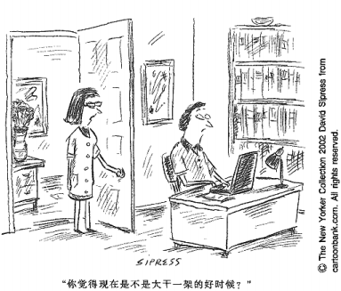

**思考对方的观点**

你的立场清楚后，接下来要厘清，什么是你的伙伴在这个议题上会觉得满意的需求。为什么发现你的伙伴的需求是重要的？有两个理由：第一，这样比较公平，你的伙伴有跟你一样获得满意的结果的权利。假如你预期让你自己的需求得到满足，你也要用同样的方式对待对方才算合理。除了公平之外，还有另一个更实际的理由让你关心你伙伴的需要，那就是一个不快乐的伙伴将会使你很难得到想要的东西，而一个快乐的伙伴会比较愿意通过合作使你得到你想要的目标。因此，去发现并满足你的伙伴的需求其实是为了你个人的利益。你可以简单地询问你的伙伴以便了解他们的需求："现在我要告诉你，我想要什么及为什么要这样，你听完我说的了之后，告诉我，你觉得要如何才会可行？"在你的伙伴开始说之后，你的工作是去使用倾听的技巧（这本书前面已经讨论过的），以便确定你确实了解他所说的。

**商议解决之道**

现在你和你的伙伴都了解了彼此的需求，目标变成了去找到一个满足它们的方式。达成这一点的方法是尽可能地去发现许多潜藏的解决方式，评估这些方法，最后决定哪一个方法最能满足每一个人的需求。托马斯·戈登（Thomas
Gordon）所写《父母效能训练》
可能是对双赢方法的最好的描述。下面是根据这个方法而来的步骤：

1．确认和定义冲突：在本章前几页中，我们曾经讨论过如何确认和定义冲突，这包括发现每个人的问题和需求，并设定问题解决的步骤以满足这些需求。

2．发展出可能的解决方案：在这个步骤中，伙伴双方一起思考讨论出所有可能达到双方目标的方法。此处关键的概念是数量：尽可能去演绎出各式各样的想法是很重要的，先不要去顾虑这些想法的是非好坏，写下每一个出现在脑袋的灵感，不管它是多么不可行。有时天方夜谭的奇想会引导出更可行的方法。

3．评估各种解决方案：现在才是讨论哪一个解决方法可行或不可行的时间。最重要的是，每一个个体都必须很诚实地表达对所列出的各个解决方案的意愿，假如所选定的选择方案已经开始运作，每一个人都必须支持这个方案。

4．决定一个最好的解决方案：现在你已经看到了所有的方案，选择一个看起来对每个人来说都是最好的方案。很重要的是要确定每个人都了解这种解决方式，而且有意愿去共同努力达成它。记住，你的决定不必是盖棺定论的最后方案，但它必须看来有成功的潜力。

**追踪解决方案的后效**

在你试过之前，你不能确定解决方案是否有效。在你测试过一段时间之后，安排一些时间去讨论这个方案实施的进展是个不错的想法。你会发现你需要做点改变，甚至重新思考整个问题，最好是持续站在问题的高处鸟瞰，并继续利用创意来寻找解决之道。

当你思考应用这个方法时，有两个意见是值得铭记于心的。第一，要了解到，必须紧跟着这个方法的每一个步骤，每一个步骤都是导致你成功的必须要素，跳过任何一个或数个步骤都会导致误解，也可能导致沟通形成负面的螺旋。当你数次实际操作这些方法，并且更加熟悉之后，这些解决问题的方法几乎会变成你的第二个天性。你将不必一个步骤紧接着一个步骤就能从容处理你的冲突，但是在到达那种状况之前，试着耐心并且信任此模式的价值。第二，你要了解在真实的生活中，这些方法是不会从一个步骤到另一个一路顺畅进行的。你要预期到并做好心理准备，对方身上会产生某种程度的抗拒。

像图11-2显示的那样，当一个阶段不成功时，必要的话，移动回去重复前一个阶段。

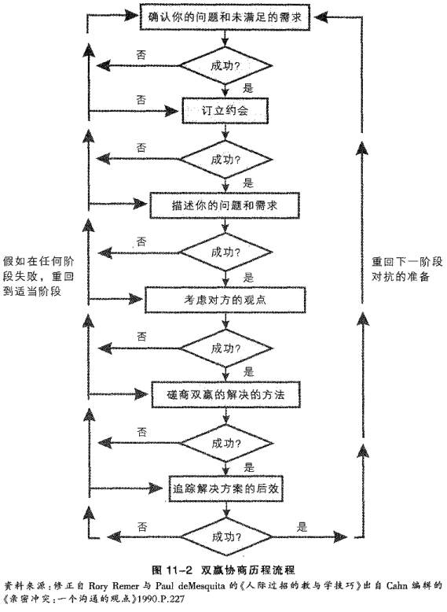

**沟通文本**

**双赢地解决问题**

*早上7 : 15
分，一个例行的上学日。克莉丝走进厨房，发现水槽中满是脏盘子。那是她的室友桃莉造成的，她庆恶地叹息着并开始清理，使锅碗瓢盆发出声音。*

*桃莉：你不能更安静二点吗？我到十点才有课，想要多睡一会儿。*

*克莉丝：（用讽刺如音调间接表达她的攻击）对不起。打扰到您了！我在清理昨晚晚餐的盘子。*

*桃莉：（漏接信息）好，我希望你洗碗的时候能小声一点。我昨晚熬夜念书，累死了。*

*克莉丝：（决定更直接地表达怒气，例如：攻击的）好哇！如果你昨晚清洗干净，我就不必现在洗了！*

*桃莉：（终于了解到克莉丝在对她生气，防卫着反应）我打算起床之后再来清洗。我这星期有两个期中考，我昨晚念书到凌晨，什么比较重要，成绩还是一尘不染的厨房？*

*克莉丝：（发展成防卫的螺旋）我也有课啊！你知道的。但那并不意味我们要活得像猪一样！*

*桃莉：（生气）算了！假如它真的有那么重要，那我以后都不会给你制造任何一个脏盘子了！*

*当她们准备上学的过程中，克莉丝和桃莉都有意避着时方，在这一整天里，克莉丝了解到攻击桃莉只会使事情变得更糟，她决定晚上以一种比较建设性的方式处理。*

*克莉丝：今天早上真是有点无趣，你想要谈谈吗？*

*桃莉：我也有同感，但我几分钟之后就要跟金和阿丽莎出去念书。*

*克莉丝：（了解在对的时机说话是重要的）假如你即将要离开，我们现在就先不谈吧！那么你回来之后再谈呢？*

*桃莉：好，假如我不会太累的话。*

*克莉丝：或者是我们明天上课前谈？*

*桃莉：好。*

*稍后，那天晚上桃莉和克莉丝继续她们的对话。*

*克莉丝：（借由清楚信息的处方，把这个议题界定成她的问题）我不喜欢用吵架作为一天的开始，我也不喜欢还没轮到我洗碗时却必须去洗碗（行为）。同时要做你的和我的工作，我觉得对我是不公平的（解释），这就是为什么我会那么愤怒（感觉）地对你唠叨（结果）。*

*桃莉：但我在念书！你知道我必须读书的，我又不是去舞会。*

*克莉丝：（避免攻击桃莉，而用真诚同意事实，更进一步解释为什么她会知此恼怒）我知道，并不只是清洗那些盘子才使我恼怒的，而是好像已经蛮多次，我都要同时做你的和我的两份工作。*

*桃莉：（防卫）像什么时候？*

*克莉丝：（给予桃莉行为特定的描述）好，这是这个星期的第三次，轮到你洗盘子却是我在洗盘子，我想过很多次可以慢一点再来清洗，但是我得在有人来之前，把你分内的工作做完。*

*桃莉：我不了解为什么要这么小题大做，你就将那些事情留下来，我会清洗它啊！*

*克莉丝：（仍然试图为自己解释，她继续使用"我"语言）我知道你会，我想对我来说，我没有办法像你一样，让脏乱一直摆在那里。*

*桃莉：对啊！假知你可以放松一点，在一起生活会比较容易些。*

*克莉丝：（对桃莉的评价性的控诉再度捉出这是“我"的问题）喂，等一下！不要拿整件事都责怪我，只是我们的标准不同。对你来说，我好像是太要求保持地方的干净*

*桃莉：对。*

*克莉丝：……假如我们照你的方式，那我会放弃。我就不得不住在一个我不喜欢的一团脏乱的地方，于是我得自己一个人做完所有清理的工作，然后对你非常恼怒。这样，我们会过得非常紧张。（描述不愉快的、并未在共同满意的方式下解决问题的结果）*

*桃莉：我想会这样。*

*克莉丝：我们需要商议出一种管理公寓的方法，使我们两个人都可以生活的方式。（描述双赢解决的纲要）*

*桃莉：好啊！*

*克莉丝：那么我们可以做什么？*

*桃莉：（看起来同意的样子）看！从现在开始我会立刻去清理盘子，实在不需为这个争执！*

*克莉丝：是啊！假如你面带愁容，即使我们的公寓很干净，但还是不值得。*

*桃莉：（怀疑地）好吧，那你的建议是什么？*

*克莉丝：嗯，我也还不确定，我不想要有立刻清洗碗盘的压力，而我不想同时要做我和你的双份工作，对吗？*

*桃莉：嗯，（似乎仍然是怀疑的）那么我们要怎么办？雇一个管家来清理？*

*克莉丝：（避免让桃莉转移话题）如果我们请得起得话，那也是个不错的点子，使用纸盘你觉得呢？那清理起来比较容易。*

*桃莉：嗯，但仍有汤锅和煎锅。*

*克莉丝：好，这不是个完美的主意，但可能有些许帮助。（继续建议其他的方法）那么做一些比较不需花清洁的餐，例如沙拉和不必煎炸的食物，也可以减肥。*

*桃莉：嗯，我讨厌擦洗油炸的锅子，但那对于你想要经常保持客厅干净，一点帮助都没有，我打赌我仍然无法将厨房保持你想要的千净的程度。保持地方超级干净，对你可能不算什么，对我可是一桩大事。*

*克莉丝；这倒是真的，但我并不是要数落你。（澄清她想要寻找的目标）你知道，真正干扰我的，并不是不干净这件事，而是要做超过我分内的工作。我在想是否有一个方式，我可以负责收拾客厅和清理厨房，而你可以做其他的事情，也完成你分内的工作。*

*桃莉：你确定吗？我很高兴不必清洗杯碗盘盆！你指你会搞定它们……假如我也做些什么的话？*

*克莉丝；只要我们的劳役平均，你真的会做你该做的事，而不需要我提醒？*

*桃莉：你想要我做什么？*

*克莉丝：清洗浴室如何？*

*桃莉：算了，那比洗盘子还糟。*

*克莉丝：好，那煮饭呢？*

*桃莉：那好像可以，不过那样我们就要一起吃饭了。还是让我们在想要吃饭的时候为自己做饭吧，这比较弹性。*

*克莉丝：好，但购物呢？我讨厌花这个时间，假如你不觉得负担太重的话？*

*桃莉：你是指买东西？你愿意我用这个交换你清理厨房？*

*克莉丝：是啊！以及清理客厅。每一次购物我们都会花掉一个小时，而每个星期都要去两次。清洗碗盘会比这快多了。*

*桃莉：好极了！*

*这个计划进行得并不顺利：起初桃莉拖延到食物没了才去采买，克莉丝又趁机要求桃莉在买东西时顺便绕道办点儿事。但她们的新协定实行得比旧协定更成功。会寓变干净了，工作分担颇为公平。克莉丝很满意，桃莉也不必再听到克莉丝的抱怨，少了厨房的杂事让她也变得比较快乐。重要的是，克莉丝和桃莉的关系更好了——感谢双赢问题解决。*

双赢解决并不是永远有效的，有些时候甚至用心良苦的人都找不到一个方法来满足所有人的需要。在这样的时候，协商的历程就必须包括某些妥协，但即使如此，前面经历过的阶段也不会白白浪费掉。若是真诚地渴望学习到什么是对方真正的期待并试着去满足那些期待，将会建立一种良善的氛围，这将有助于你对目前的问题找出最佳解决之道，并且增进你未来的人际关系。

### **11.6 建设性处理冲突的技巧：提问与释疑**

在学习双赢磋商之后，人们通常会对它的运作效果感到怀疑。"它听起来是个好主意，"他们说，"但……"最常出现的四个问题，它们确实需要释疑。

**双赢方法太好以至于不真实吗？**

研究显示：找寻一致的利益不只是一种渴望，其实是有法可循的。事实上，双赢方式比起一输一赢能产生更令人满意的结果。

在一系列的实验中，罗伯特·阿克斯罗德（Robert
Axelrod）让受试者面临一种讨价还价的情境，称之为"囚徒困境"。在这情境中，受试者他们只能选择合作或背叛联盟者。在"囚徒困境"的实验中出现了三种形态的结果：伙伴可以借由背叛联盟者而成为赢家，或是两个人经由合作而获得双赢；或是两个人彼此背叛而使得两人皆输。

虽然幸灾乐祸的人可能会推测最有效的策略是背叛伙伴（一输一赢的方式），但阿克斯罗德说明了事实上合作是实际而合理的策略。他设计了一个比赛，参加者跟电脑程式对抗，电脑呈现出几种不同的磋商策略，赢家的策略称作"如影随形"。游戏从合作开始，两方继续合作，直到另一个参加者出现背叛行为。之后，电脑程式设计会紧跟着他的参加对手的策略改变，而紧跟着做一样的改变，如果对手只做一次背叛，电脑程式也只会跟着做一次背叛而已，不会增加对于对手的惩罚，如果对手很合作电脑也会一直都很合作。

一个双赢的"如影随形"的策略得以成功，是因为下列几个理由：第一，它基本上不是一种骗局，它对于背叛的反应非常快速，会使得从不公平背叛中获利的对手得到惩戒。第二，这种"如影随形"的策略很快就会原谅对方了，使得这个过程不会带来积怨。一旦对方开始合作，这方也就开始合作以对。第三，"如影随形"的策略使得状况不会愈演愈烈，经由明显而可预测的行为，"如影随形"的策略创造了一种信任的氛围。

当然，有一些冲突不是能够以双赢策略来解决的。只有一个合适者可以跟公主或王子结婚，只有一个人可以被公司所雇用。或是更甚者，当你的伙伴拒绝合作时，你是不可能达成双赢的解决之道的。但是，大多数时候，良好的意图和富有创意的思考，能够引导出让每个人的需求都得到满足的结果。

**双赢方式太复杂吗？**

双赢取向是注重细节和高度结构的，在每天的生活中你可能很少有机会使用到每一个步骤：有时是手边的问题不值得花费这么大的力气，有时候你和你的伙伴可能觉得不必为这个问题这么大费周章。虽然如此，当你非常熟悉这种方式的每一个步骤时，你就可以在任何情境都操作自如。在遇到重要的议题时，你可能会发现双赢取向的每一个步骤都很重要。如果这个过程看起来非常耗时的话，请你想一下，如果你没有及时解决这个议题，那将会耗损你多少的时间和精力。

**双赢磋商太理性吗？**

受挫折的人们常抱怨双赢方式太过面面俱到，只有圣人才能成功使用它。"有时我是如此生气，我不能考虑支持或同理其他任何事，"他们说，"我只是想讨回公道。"

当你处于这种感觉的状态中，你几乎不可能是理性的。在这种时候，可能即使用最有疗效的技术去除你胸中怨气，都难以阻止被称为"维苏威火山"一样的爆发。这可能是最恐怖的气愤方式，不过在这样做了之后，你可能比较容易对如何理性地解决你的问题理出个头绪。所以我们鼓励你在使用"维苏威火山"时需要伴随着以下的前提：确定你的伙伴了解你在做什么，并且明白不论你说了什么都不是为了要求对方立即做反应。你的伙伴最好让你尽情地畅所欲言或大放厥词，并且避免防卫和卷入其中。在你"清仓"完毕后，你就可以采取必要的步骤，去解决仍然困扰着你的问题。

**有可能改变别人吗？**

人们经常同意双赢问题解决可能是很棘手的——假如你已经读过这本书，也了解这个方法，就会出现这个问题："我要怎样与对方合作？"
虽然你不可能永远获得与对方的合作，但有一个好的营销策略可以在大多数时候有用。其关键就在于你必须让事情看起来像是你的对手"自己很有兴趣"与你共同面对问题："看！假如我们无法把这事情搞定，两个人都会一塌糊涂；但如果我们能解决它，想想我们将会多么爽。"注意上述措词与内容的含义，是同时具有彼此合作之后期盼的结果与彼此竞争之后不能指望的结果的。

你也可以借由本书所描述的示范沟通技巧来提高你的伙伴的合作意愿。你已经了解到防卫的行为是相互引发的，支持性的沟通也是如此。假如你可以真诚地倾听，避免评价式的攻击，同理你的伙伴所关切的重点，等等，你将非常有机会得到相同行为的回报。就算是你的合作态度无法奏效，你至少也会得到自我尊重，因为你知道无论如何你的所作所为是光明正大而主动积极的。

### **11.7 摘要**

冲突是每天人际关系生活的事实。冲突处理的方式在关系的品质上扮演重要的角色。当对其有建设性地管理时，冲突可以导致更强和更满意的互动，但当处理很差，关系会变得很糟。

冲突反应类型繁多，逃避、调适、竞争、妥协、合作等，每一种类型可能是用在不同的情境中，每个人都不会只用一种类型来处理所有的冲突情境，因为双方在发展出理性的冲突解决之道时会彼此互相影响，这方式可能会是互补的、对称的或平行的；它可以包括亲密和攻击因素的联结，以及建设或破坏的仪式。除了塑造关系，冲突方式也会受到每人的性别和文化背景影响。

在大多数情况下双赢是最为理想的结果，依照本书前述的步骤去沟通可以达到双赢沟通的目标。

### **出版后记**

沟通是我们生命中非常重要的一部分。我们需要与家人交流感情，需要与朋友谈天说地，需要在工作中接受和发出指示、与同事探讨解决问题的方法，需要在买东西时讨价还价，需要向医生告知自己的身体状况……即使是在沉默不语甚至一个人独处的时候，我们也在沟通，向别人传达着某种信息。可以说，我们无时无刻不在沟通。

从某种角度上来说，沟通产生的效果对我们的人生有巨大影响。一次成功的沟通可能使我们得到合适的工作、消饵与朋友间的误会或者在社交场合赢得尊敬，而一次失败的沟通可以抵消以上所得到的一切，并且留下几乎无法弥补的恶劣影响和后遗症。那么，如何与他人成功地进行沟通、如何让自己的言行举止达到最好的效果，也就成了人们所需要掌握的重要技能。本书便是一本有关沟通的专业书籍，作者深人浅出、全面又不失细致地围绕沟通的本质和沟通的技巧进行了介绍，帮助读者理解沟通并应用沟通。本书分为"看入人里"、"看出人外"和"看人之间"三部分："看入人里"主要探讨了与个人有关的沟通因素，说明了人际关系的本质，强调自我在沟通中的角色，并分析了知觉与情绪在沟通中的重要性；"看出人外"聚焦于探讨与沟通对象有关的因素，分析了语言和非口语的特性，并强调了倾听的重要性；"看人之间"则主要讨论关系动力，强调关系的重要性，关系中的亲密与距离，以及包括增进沟通气氛、处理人际冲突等各种沟通方法。作为一本贴近现实的读物，本书中始终对"性别"、"地域"与"文化"等社会中影响行为的重要因素加以探讨，这让本书具有很强的现实意义。本书风格平易近人，没有让人费解的专用术语，也没有错综复杂的专业理论长句，但关于沟通的种种概念无不传达得十分清楚；书中还列举了大量事例，方便了读者对各个论点的理解；同时，本书提供了许多极具操作性的方式和方法，从思考层面的"枕头法"到实际处理矛盾的"双赢策略",
无不详尽深入，并附有真实可信的范例描述。可以说，这是一本理论功能与实用功能俱佳的著作。最后，本书还附有大量插图、漫画、边栏诗文，这些内容虽与当页的文字没有直接联系，但却强化了正文所要表面的内容。无论是在幽默中揭示道理的四格漫画还是利用华美的词藻表达情感的诗词，凡此种种都为本书增添了一抹亮色，使阅读的过程并不枯燥单调。综上所述，本书可以说是一本难能可贵的优秀著作，更经过读者的长期检验，目前己经是修订后的第12版。新版本根据当代时事新闻对边栏项目与一些内容加以了调整，并对网络沟通等新时代的沟通方式加以了重点介绍。此书收人"小学堂"系列丛书，旨在以实用知识充实头脑，用通俗科学指导人生，将会为读者的工作与生活有所助益。

世界图书出版公司北京公司

服务热线：133-6657-3072 139-1140-1220

服务信箱：teacher@hinabook.com

世图北京公司"大学堂"编辑部

2010年9月2日

