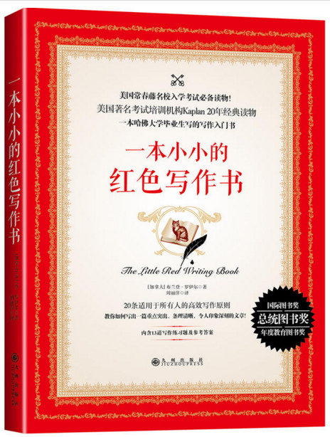

# 一本小小的红色写作书

**（加）布兰登·罗伊尔****　著**

【更多“得系列图书、订阅专栏、喜马拉雅付费资源分享微信：boksharer，本书仅供学习，请勿他用】

# 图书在版编目（CIP）数据

一本小小的红色写作书/（加）布兰登·罗伊尔著；周丽萍译.——北京：九州出版社，2017.3

ISBN 978-7-5108-5083-7

Ⅰ.①一…　Ⅱ.①布……②周…　Ⅲ.①英语-应用文-写作　Ⅳ.①H315

中国版本图书馆CIP数据核字（2017）第034673号The Little Red Writing Book

Copyright©Brandon Royal 2016

All rights reserved. No portion of this book may be reproduced, stored
in a retrieval system, or transmitted in any form or by any
means—electronic, mechanical, photocopy, recording, scanning, or
other—except for brief quotations in critical reviews or articles,
without the prior written permission of the publisher.

Simplified edition is arranged through CA-LINK International LLC（www.
ca-link.com）

版权合同登记号图字：01-2016-8317

\

书　　名：一本小小的红色写作书

------------------------------------------------------------------------

作　　者：（加）布兰登·罗伊尔

翻　　译：周丽萍\

出版发行：九州出版社

地　　址：北京市西城区阜外大街甲35号（100037）

发行电话：（010）68992190/3/5/6

网　　址：www.jiuzhoupress.com

电子信箱：jiuzhou@jiuzhoupress.com

印　　刷：三河市华成印务有限公司

开　　本：700毫米×930毫米 16开

印　　张：9.5

字　　数：90千字

版　　次：2017年4月第1版

印　　次：2017年4月第1次印刷

书　　号：ISBN 978-7-5108-5083-7

定　　价：39.80元

------------------------------------------------------------------------

版权所有 侵权必究

【更多“得系列图书、订阅专栏、喜马拉雅付费资源分享微信：boksharer，本书仅供学习，请勿他用】

目录

[扉页](#part0000.xhtml)

[版权信息](#part0001.xhtml)

[前言](#part0003.xhtml)

[第1部分 结构](#part0004.xhtml)

[原则 1 运用“自上而下”的写作法](#part0005.xhtml)

[原则 2 分解事物](#part0006.xhtml)

[原则 3 使用转折词](#part0007.xhtml)

[原则 4 回顾六大基本写作结构](#part0008.xhtml)

[原则 5 整合相似事物](#part0009.xhtml)

[第2部分 风格](#part0010.xhtml)

[原则 6 支撑所说内容](#part0011.xhtml)

[原则 7 让你的例证个性化](#part0012.xhtml)

[原则 8 保持简洁](#part0013.xhtml)

[原则 9 砍断长句](#part0014.xhtml)

[原则 10 删除不必要的词](#part0015.xhtml)

[原则 11 使用主动语态](#part0016.xhtml)

[原则 12 多用动词，少用名词](#part0017.xhtml)

[原则 13 使用平行句式](#part0018.xhtml)

[原则 14 利用句式变化](#part0019.xhtml)

[原则 15 选择恰当的语气](#part0020.xhtml)

[原则 16 保持文章性别中立](#part0021.xhtml)

[第3部分 可读性](#part0022.xhtml)

[原则 17 利用排版和设计](#part0023.xhtml)

[原则 18 运用可读性工具](#part0024.xhtml)

[原则 19 使用标题或提要](#part0025.xhtml)

[原则 20 回顾和修改文章](#part0026.xhtml)

[附录 练习参考答案](#part0027.xhtml)

【更多“得系列图书、订阅专栏、喜马拉雅付费资源分享微信：boksharer，本书仅供学习，请勿他用】

# 前言

那些具备出众写作技巧的学生和青年作家，大多是掌握了一些最为重要的写作原则，并反复不断地使用。那么，这些反复使用的原则是什么呢？答案就在本书中，即20条放之四海而皆准的写作原则。

写作包含四大支柱：结构、风格、可读性和语法，它们如同保持椅子稳固的四条腿。结构关乎文章组织以及表述观点的顺序；风格是写作的方式，包括如何使用恰当的例证支撑所写内容；可读性与表达方式、写作材料的视觉愉悦感和易读性等有关；语法包括措词等，与语言表达形式的正确性和可接受性有关。本书阐述了上述前三大支柱；第四个支柱，即语法，在《一本小小的金色语法书》（The
Little Gold Grammar
Book）中作了全面论述。考虑到写作的普遍性，本书适合的读者范围较大，包括各行各业的写作爱好者：高中生和大学生可以将本书作为补充性学习材料；商务人士可以将本书作为职场的充电课程；准备参加各类考试的读者，也可以通过本书回顾基本的写作原则和规律，相信会受益匪浅。

让我们开始吧。

【更多“得系列图书、订阅专栏、喜马拉雅付费资源分享微信：boksharer，本书仅供学习，请勿他用】

第1部分　\
结构
==========

\

\

当你说一件事情的时候，确保你说清楚了。如此，你言说的机会才合理。

——E. B.怀特（E.B.White）

## 原则　1　运用“自上而下”的写作法

先写总结，开门见山。

日常生活中常见的写作类别多为说明文，包括报纸文章、大学论文、商业备忘和书信。说明文通常解释且总结一个主题或事件。从策略上来讲，写一篇说明文，总结或结语一般放在开头而非结尾。首先告知读者文章大意，再提供支撑观点的事例或细节，这样，读者就不必猜测作者的中心思想。

说明文的主要目的是解释、告知或说服，而小说或其他创造性写作的主要目的是启发或娱乐。就小说和其他创造性写作而言，延迟给出总结无伤大雅（甚至是更好的选择），比如意外的结尾。但是，说明文在写作时不宜向读者隐瞒结论，应开门见山地给出，不要玩“我有个秘密”的把戏。

经验丰富的写作指导老师在纠正学生写作时，最简单的方法就是让他们把总结放在文章的最开头，而不是结尾处。老师们常常会让学生写一篇任意主题的短文，完成以后走到每位学生面前，在完全不看学生到底写了什么内容的情况下，直接圈出最后一句挪到文章开头。因为老师们知道，在大部分情况下，学生写的最后几行文字包含了文章结论。这个技巧被称作“BLOT”或“bottom
line on
top”，即末行上移。在最后进行总结是人处理事务的本性，也合乎逻辑。但是，说明文的写作重点应该自上而下，采用倒三角结构，倒三角形上端的宽基座就相当于文章开端给出的总结论。

### 多运用“自上而下”的方法写作：

最重要

次重要

次重要

最不重要

### 避免使用“自下而上”的方法写作：

最不重要

次重要

次重要

最重要

报纸行业非常依赖这种“自上而下”的写作技巧。记者们都知道，如果他们写的故事超过额定篇幅，编辑则会将文章从后往前砍掉。因此，这类文章的结语一般不会出现在最后几行，相反，最后通常是些无足轻重的细节。

写作失误经常与会话中的失误相似。我们在写作时，应该要考虑先给读者一个目标，然后再告诉他们抵达目标的方向，否则就无法以最高效的方式传递信息。“自上而下”法在日常生活交流中的作用，从以下对话中可见一斑：

### 较差版

**两位同事间的对话：**

“艾丽丝，你去城区的时候能不能帮我个忙？如果你坐地铁去主街，下车后从第一个出口出地铁站，步行到十字街。在十字街和瓦因路交汇的十字路口，你会看到桑迪文具店。你能去店里帮我买一包0.5mm派通牌铅笔芯吗？”

### 较优版

**两位同事间的对话：**

艾丽丝，你去城区的时候能不能帮我个忙？我需要一包0.5mm派通牌铅笔芯。去桑迪文具店买最方便。你可以坐地铁到主街，下车后从第一个出口出地铁站，然后步行到十字街。这家店就在十字街和瓦因路交汇的十字路口。

在以上两个版本中，下划线标注的句子就是总结。试着从听者的角度来看想象第一个版本有多令人讨厌，如果你在日常生活中遇到类似情况可能会抓狂——当你最后弄明白说话人的重点时，你可能还得请他或她再把所有内容重复一遍，以便记住细节。写作也一样。读一篇文章但是完全不知道内容引向何处同样让人郁闷。

从概念上来讲，我们愿意以下行的写作结构进行思考，即“下山”式地从总结到细节，而不是“上山”式地从细节到总结。

比较以下同一篇商务写作的两个不同版本，第二篇在写作方法上更遵循“自上而下”的原则。总结在最开头：“如果以人口作为衡量标准，亚洲和非洲代表了未来基础消费品的最大国际市场。”另外，第二篇还将数据单独作为细节说明使用。

### 效果较差

全球四分之三的人口目前生活在亚洲和非洲，从南非到撒哈拉，从中东到日本，从西伯利亚到印度尼西亚。这一人口数据足以说明情况。如果我们有选择性、有代表性地从全世界选出四个人，可能的结果将会是：一人来自中国，一人来自印度，一人来自亚洲或非洲的其他地区，而第四个人需要从整个北美洲、南美洲、欧洲和大洋洲选择！

基础消费品代表耐用和非耐用的日常必需品，包括食物及厨具、衣物和纺织品、卫生用品、电子产品、家具、机械化产品，以及各式各样的家用产品。因此，如果以人口作为衡量标准，亚洲和非洲代表了未来基础消费品的最大国际市场。

### 效果较好

如果以人口作为衡量标准，亚洲和非洲代表了未来基础消费品的最大国际市场。基础消费品代表耐用和非耐用的日常必需品，包括食物及厨具、衣物和纺织品、卫生用品、电子产品、家具、机械化产品，以及各式各样的家用产品。

全球四分之三的人口目前生活在亚洲和非洲——从南非到撒哈拉，从中东到日本，从西伯利亚到印度尼西亚。这一人口数据足以说明情况。如果我们有选择性、有代表性地从全世界选出四个人，可能的结果将会是：一人来自中国，一人来自印度，一人来自亚洲或非洲的其他地区，而第四个人需要从整个北美洲、南美洲、欧洲和大洋洲选择！

现在，再来看看这篇文章：

12月19日晚，成百上千人涌入观众席。作为12位开场表演者之一，我得到了生平第一次站上舞台跳舞的机会。虽然我的表演环节只有五分钟，但那五分钟却是我生命中意义非凡的时刻。自从两个月前开始彩排以来，我除了正常的排练外，还花了大量时间自己练习。不论是在公交车上、候诊室里，还是步行上班的路上，我总是开着MP3播放器，听着音乐在脑中一遍又一遍地复习着舞步。我下定决心要全力以赴。尽管我做了充分准备，但由于紧张，我在表演的时候摔倒了。一时间，我的大脑一片空白，呆立着，不知该对音乐做何反应，15秒仿佛现实中的15个小时那么长。

上述划线部分的总结，其位置可以说好也可以说不好，这取决于作者写这篇文章的意图。如果写作意图是向读者传递信息，那就不好，因为总结应该放在更靠近开头的位置。但由于这也可能是一篇创造性作品，旨在娱乐，那么总结可以延后。记住支配日常说明文写作的原则：总结应该处于或接近文章开头。

\

**在没有目的地和飞行方向时，飞行员决不会将飞机驶离跑道。当写作意图是解释或告知时，我们应该先总结，然后再运用细节作为支撑，不要玩“我有个秘密”的把戏。**

## 原则　2　分解事物

把主题分解成二到四个主要部分，然后运用引导句。

假设你清楚自己想写的内容，就必须决定你的作品由哪些基础要件组成。你可以把主题分解成二到四个主要部分。通常我们推荐分为三个部分，但为简洁起见，一般不超过四个部分。经典的“五段”写作法可以用一段话概述任意文章，比如第11页的例子，划线部分由你来补充。

### 引导句与主题句

把主题分成二到四个主要类别后，接下来你就要详细阐述这些观点了。在这里不妨考虑使用引导句，它类似主题句，不同的是主题句归纳的是文章或报告中一个单独段落的内容，而引导句总结的是一整篇文章或报告的内容。将引导句放在文章开头以提示接下来的内容，突出将要讨论的事项以及这些事项的讨论顺序。引导句中的每一事项，在文章或报告的正文中应延展为至少一个独立自然段。例如，在一篇个人随笔中，这句话可以作为引言或导语：

我将通过详述个人和职业生涯的三个特殊的转折点，来呈现我是个什么样的人：凭借曲棍球奖学金上大学时期、与维和部队共同度过的一年、入职伦敦一家商贸企业期间。

在商务报告中，以下句子可以作为引导句，放在报告的最开头：

基于最近调查所得信息，本报告概述了我们公司面临的三大问题：员工流失、店铺盗窃和低水平客户服务。

**在写作中，“三”是个神奇的数字。思考围绕三个关键观点或概念构建你的文章。**

### 想出二到四个主要观点

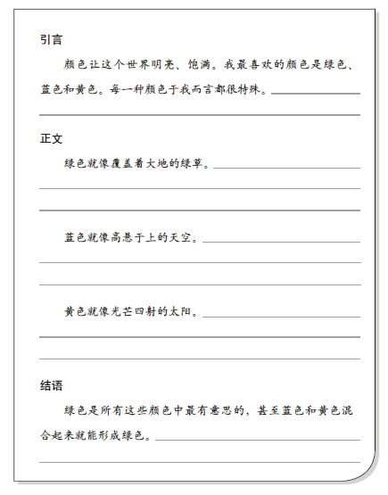

### 商业报告写作概要

下面的内容包含四类经典商业报告的样本大纲。一般的说明文写作都包含引言、正文和结语，但是在商业报告中，“正文”一词往往被“调查结果”替代。不过要注意，即使在“调查结果”部分，如下文的例子，也应被分解为三到四个类别。商业报告包括执行摘要（通常占一页）和建议（通常占两页）。执行摘要是作者的调查结果、结论和建议的总结，它成于报告前，但写在最后；建议是作者根据自己的结论，陈述认为应该采取的措施。

商业报告的作用有四种：1.可行性研究。2.比较研究。3.评估研究。4.成本研究。概述这些报告差异的方法，是举一个商业领域的假设性事例。我们就以奇幻连锁酒店为例，假设他们正在考虑在印度尼西亚雅加达拓展业务。首先，我们需要一份可行性研究报告。总部的主管们一定会问：“雅加达有足够大的酒店市场以保证我们酒店的发展吗？”接下来，假设酒店建好并投入运营，地区总部的主管们可能会问：“新加坡的奇幻酒店和雅加达的奇幻酒店相比，营业额、支出和利润等运营情况如何？”这个问题就构成了比较研究报告的基础。接下来，雅加达奇幻酒店的经理想向顾客增加酒店服务，于是向顾客分发了调查问卷。题目为“您满意吗？”的调查问卷构成了评估研究报告的基础。最后，雅加达奇幻酒店经理基于调查结果，想获得建造一座水滑梯、一间游戏室和一间阅览室（顾客想要的所设施）的授权。建造一座水滑梯、一间游戏室和一间阅览室的成本是多少？这个问题就构成了成本研究报告的基础。

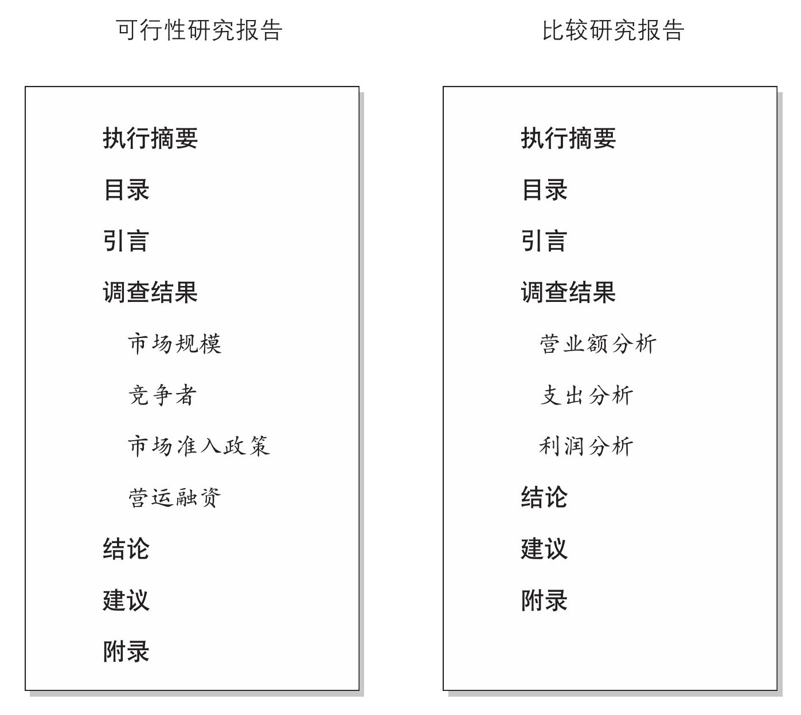

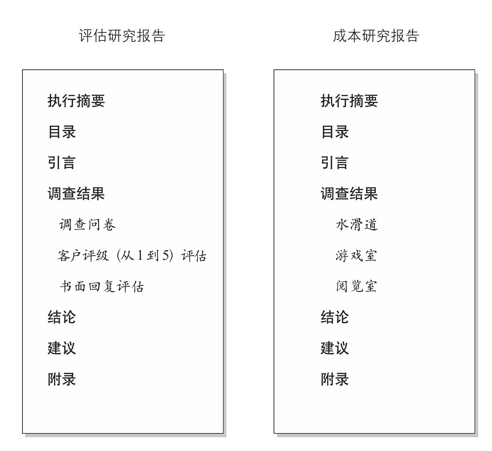

## 原则　3　使用转折词

使用转折词提示写作的方向。

但是、然而之类的“转折”词被称作语言的交通灯，它们有四大作用：对比、举例、接续和总结。下面，你会看到两篇范文中标注出的转折词。表示说明的词语包括首先、其次、比如和譬如；因此提示总结；然而提示比对；而且提示递进。

下列例子中的划线部分为转折词。

### 例1

时间管理首先考虑的是思考的有效性，其次是思考的效率。然而，效率是以尽可能快的方式完成某项任务，而有效是把时间花在“正确”的事情上。因此，有效性是一个更广泛、更有用的概念，它甚至关系着我们是否应该执行某项特定任务。

### 例2

进化过程有两种截然不同的形式：有机的和外在的。首先，是我们通常理解的达尔文进化论，即植物或动物产生可能有益或有害的基因变异。如果变化是有益的，这种有机体就会受到自然选择和发展过程的青睐；如果是有害的，有机体会受到损害，最终消亡。

另一方面，我们认为人类文化的整体是外在进化的结果。这种变化可能是缓慢的，但是它代表人类的自主选择，这种自主选择使人类得以适应原本不利于人类生存的环境。

### 转折词的四种类型

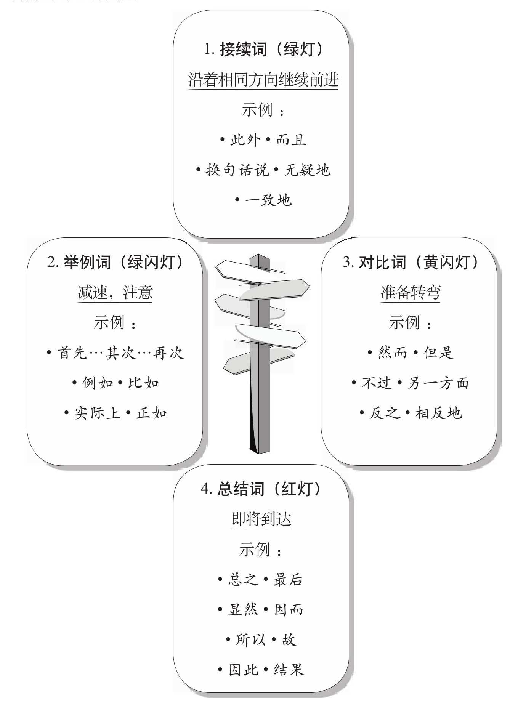

### 练习

阅读下列句子，重新组合使它们的逻辑和连续性最合理。参考答案见本书第127页。

主题：鲸鱼

1.另一方面，当人们想到蚂蚁时，常常想到努力、营养不良的小生物，它们通过隐秘的小道，来来去去地搬运相当于自己身体体积两倍大的物体。

2.大多数人想起鲸鱼时，都会想到迟钝、庞大的动物，在海洋中自由游弋，吃成吨的食物维持生命。

3.实际上，当我们比较所有生物的食物消耗比例时，会发现鲸鱼其实是地球上食物有效性最高的生物之一。

4.然而，如果我们根据身体体积分析食物消耗的话，我们会发现蚂蚁每天的食量与它们的体重相当，而鲸鱼每天只吃相当于其体重千分之一的食物。

5.鲸鱼是动物王国中最大的哺乳动物。

### 最简单的写作方法

以下是一个可以帮你写出任何东西的万全方法。它列出的可能不是最令人兴奋的写作结构，但却清晰而且实用：

1.选择立场。

2.写下结论。

3.陈述“有如下几个原因”。

4.使用转折词。

### 示例主题：文艺复兴

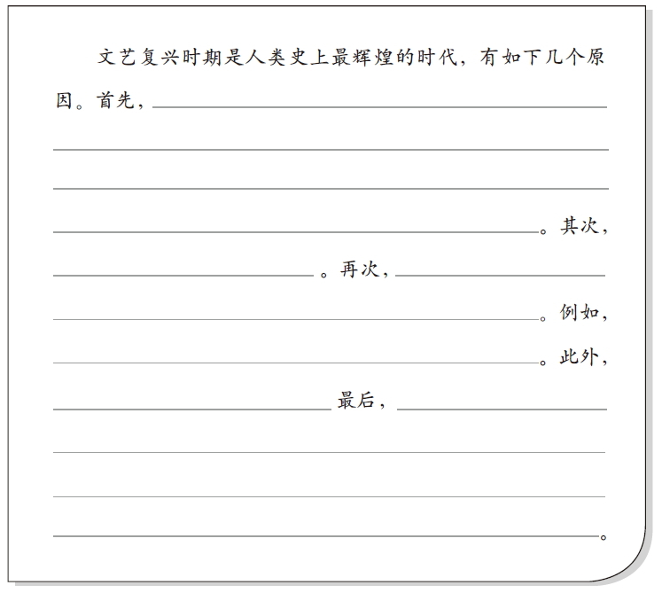

## 原则　4　回顾六大基本写作结构

使用六大基本写作结构，使观点的顺序安排得当。

写作很大程度上是排列观点陈述的顺序并对其进行强调。在顺序方面，我们希望观点能逻辑性地展开，这通常指最重要的观点要最先被人看到。在强调方面，我们希望最重要的观点得到最详尽的阐述。写作中最常用的六种结构包括：1.范畴结构。2.评价结构。3.时间结构。4.比较结构。5.线性结构。6.因果结构。

所有结构对观点的强调或侧重都很重要，某个观点或主题你写得越多，就会被认为越重要。顺序也很重要，但是在不同情况下重要程度不同。顺序重要的几种结构包括：时间结构、比较结构、线性结构和因果结构。在时间结构中，先讨论最早发生的事件，然后按照时间推进；在比较结构中，先谈最重要的观点；在线性结构中，按照顺序从第一项开始，以最后一项结束；在因果结构中，通常先确定并讨论原因，然后才是结果。

在其他结构中顺序就不这么重要了，如范畴结构和评价结构。如果我们选择使用范畴来建构作品，先说美国，然后中国，最后英国，还是先说英国，然后中国，最后美国就无关紧要了。以评价为基础的结构也是如此，无论是先说正面再说反面，还是先说反面再说正面，并没有多大区别。另外，如果作者想要强调正反的其中一面（或者某个观点），还应当确保结论与此一致。尽管这两种结构不被认为是经典的写作结构，但也是常见的写作模式，比如“问答”和“问题与对策”。这两种结构通常不那么正式，常用于备忘录、宣传册、传单等。

注意☞写作结构只涉及文章正文，与引言或结语无关。

\

**在动物学中，你可以从动物的骨架判断出它为何种动物。结构预示内容，文章的重要观点要给予最多关注，且应最先讨论。**

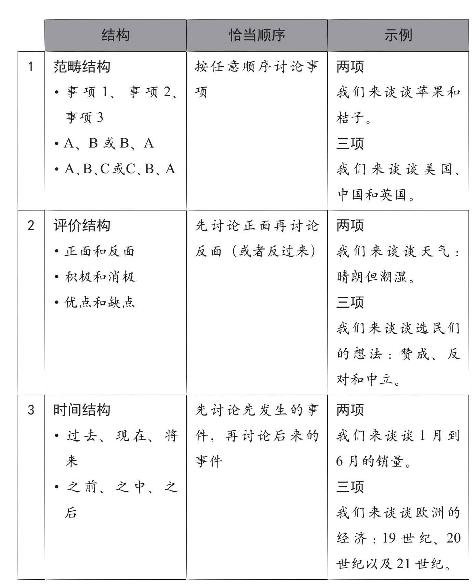

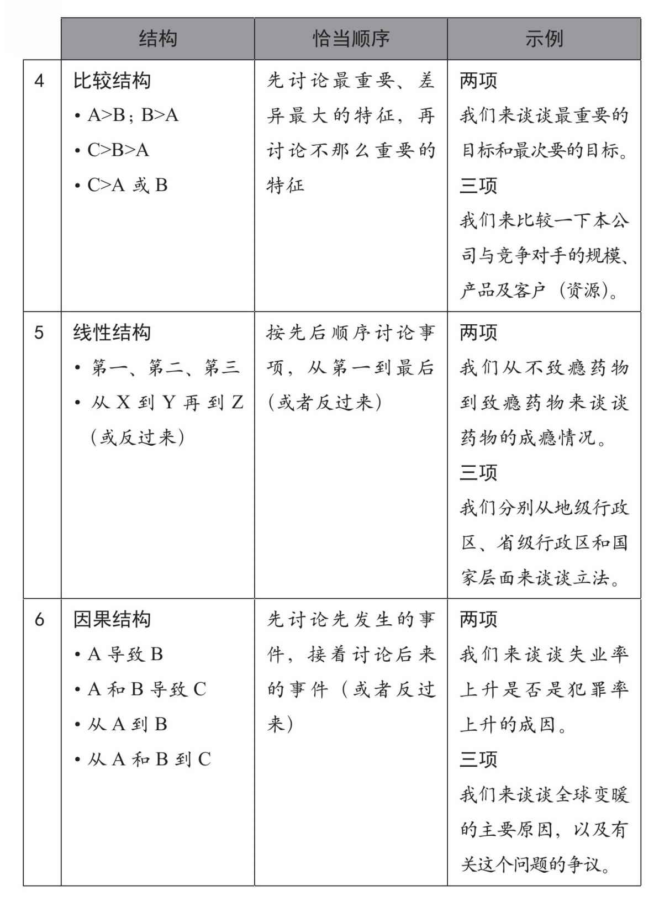

### 六大写作结构大纲

以下是突出六种写作结构的样例大纲。

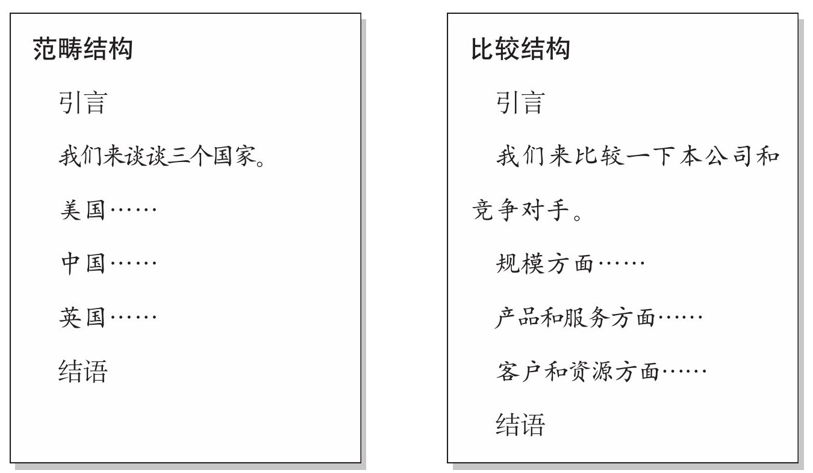

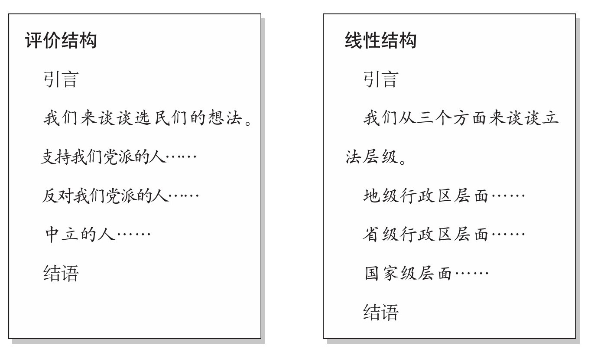

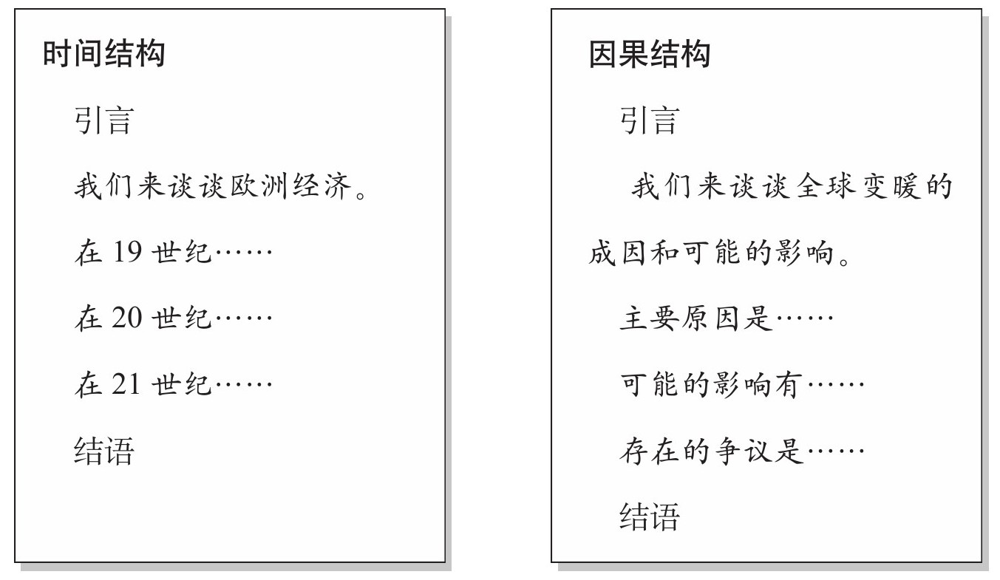

下面是“问答”和“问题与对策”格式的两个代表样例。其中一个是旅游手册的部分内容，另外一个是商业备忘录的部分内容。

### 问答范例

问：到另一个国家旅游的最佳方式是什么？

答：只拍下照片，只留下脚印。

问：我们如何保护濒危动物？

答：抗议动物栖息地的减少、检举偷猎者、禁止买卖濒危动物及其副产品。

### 问题与对策范例

年度会议上提出了许多公司的问题，下面是问题清单以及建议的解决方案。

问题：如何应对员工流失率过高？

对策：加大招聘力度；建立内部培训项目；由公司出资，每周五发起快乐周末活动。

问题：如何提升市场竞争力？

对策：重新定位公司重心；中止不能满足“80-20准则”的产品和生产线；举行员工头脑风暴训练，以期发现新的理念和创造性解决方案。

## 原则　5　整合相似事物

先结束一个主题的讨论，再接着讨论其他主题。

想象一下你去动物园观光，结果发现所有的动物全关在一个笼子里。这对动物而言不仅甚为危险，观光者也几乎不可能将所有动物看得真切。不幸的是，有时候一篇文章就可能像个动物园，各种不同的动物（观点）全在一个大笼子里，混乱不堪。当我们写作（及说话）时，我们描述的观点应该组合起来，最好是先完成一个主题的讨论，再接着讨论其他主题。

下面是一篇观点杂糅的文章范例。

### 原文

1981年，罗杰·斯佩里（Roger
Sperry）凭借他对左右脑分工理论的证明获得了诺贝尔奖。根据斯佩里先生的理论，大脑有两个不同的半球，但是功能部分交叠。

大脑左侧负责分析、时间、语言和理性思维。左脑思维是“聚光”思维。右脑是整体的、想象的、非语言的和艺术的。平衡收支、记忆日期或者设定目标任务时，人们依赖的是左脑。每当人们回忆一个人的长相、沉浸于交响乐或者单纯地白日做梦时，使用的是右脑功能。右脑思维是“泛光”思维，而且右脑的训练在学校不常被鼓励，这一点令许多人深感失望。由于大部分西方思维概念来自希腊逻辑学，它是一种线性逻辑系统，因此在西方教育体系中，左脑训练最受鼓励。

总而言之，大脑的左右半球各自擅长截然不同的思维处理方式。基本说来，左脑善于分析，而右脑造善于创造。

注意☞，尽管上面这篇文章运用了经典结构——包含引言、正文和结语，但是因为观点混杂在一起，阅读和理解起来很困难。如果该讨论再继续几页纸，读者可能会感觉脑袋一团浆糊了。通过该文，我们知道讨论的事物有两项——左脑思维与右脑思维，但是文章描述和论证观点的技巧不足。

### 修正版1

1981年，罗杰·斯佩里凭借他对左右脑分工理论的证明获得了诺贝尔奖。根据斯佩里先生的理论，大脑有两个不同的半球，但是功能部分交叠。大脑的左右半球各自擅长截然不同的思维处理方式。基本说来，左脑善于分析，而右脑造善于创造。

大脑左侧负责分析、时间、语言和理性思维。左脑思维被称为“聚光”思维。平衡收支、记忆日期或者设定目标任务时，人们依赖的是左脑。右脑是整体的、想象的、非语言的和艺术的。右脑思维被称为“泛光”思维。每当人们回忆一个人的长相、沉浸于交响乐或者单纯地白日做梦时，使用的是右脑功能。

由于大部分西方思维概念来自希腊逻辑学，它是一种线性逻辑系统，因此在西方教育体系中，左脑训练最受鼓励。右脑的训练则在学校中不常被鼓励，这一点令许多人深感失望。

在上面的修正范例中，我们也使用了经典的引言、正文和结语三段式。第二段的结构按照如下方式展开：前两句描写左脑思维，接着用第三句支撑，包括左脑思维的例子。然后是描写右脑思维的两个句子，紧接着支撑句，包括右脑思维的例子。第三段以左右脑思维的发展结果作为结语。

### 修正版2

1981年，罗杰·斯佩里凭借他对左右脑分工理论的证明获得了诺贝尔奖。根据斯佩里先生的理论，大脑有两个不同的半球，但是功能部分交叠。大脑的左右半球各自擅长截然不同的思维处理方式。基本说来，左脑善于分析，而右脑造善于创造。

大脑左侧负责分析、时间、语言和理性思维。左脑思维被称为“聚光”思维。平衡收支、记忆日期或者设定目标任务时，人们依赖的是左脑。由于大部分西方思维概念来自希腊逻辑学，它是一种线性逻辑系统，因此在西方教育体系中，左脑训练最受鼓励。

右脑是整体的、想象的、非语言的和艺术的。右脑思维被称为“泛光”思维。每当人们回忆一个人的长相、专注于交响乐或者单纯地白日做梦时，使用的是右脑功能。右脑的训练在学校中不常被鼓励，这一点令许多人深感失望。

上面的三段结构也十分经典：引言后面紧接着两个自然段，每一段分别详述左脑思维和右脑思维。在第二段中，前两句描述左脑思维，紧接着用第三句支撑，包括这种思维的例证，最后是总结句，突出左脑思维的发展结果。在第三段中，前两句描述右脑思维，紧接着第三句支撑句，包括这种思维的例证，最后是总结句，突出右脑思维的发展结果。

【更多“得系列图书、订阅专栏、喜马拉雅付费资源分享微信：boksharer，本书仅供学习，请勿他用】

第2部分\
　风格
========

\

简短地展现以便他们阅读，清楚地展现以便他们欣赏，如画般地展现以便他们记忆，最重要的是，准确地展现以便他们被它的光明所指引。

——约瑟夫·普利策（Joseph Pulitzer）

## 原则　6　支撑所说内容

使用准确、具体的词汇支撑所说内容。

好作品和普通作品最大的区别，在于你是否使用了准确、具体的例证。比如说，你要写一篇关于苹果的文章。不是所有苹果都一样，你要写哪类苹果？金冠苹果、富士苹果、麦金托什红苹果还是史密斯奶奶绿苹果？苹果什么颜色？什么形状？味道如何？口感怎样？产地是哪？我们再来看看商业语境下的例子。假设你听说公司利润下降了，那么详细情况是什么？是销量下降了，售价降低了，还是成本增加了？如果是上述情况之一，程度如何？

注意☞下列句子的区别：

### 一般

公司利润下降了。

### 较好但仍不准确

公司利润下降了，因为成本增加了。

### 准确

公司利润下降了10%，因为总体成本增加了20%。

### 更优

公司利润下降了10%，因为总体成本增加了20%。具体来说，较高的薪水支出是成本增加的主要原因。高薪资成本主要是管理层薪资增加造成的，因为加班时间减少，付给工厂员工的平均工资实际上下降了5%。

当人们读完一篇文章后，能长时间记住的往往是其中的事例和细节。比较下面两篇关于科学主流态度的文章。

### 版本1

在美国，对科学的主流态度混杂着迷信和敬畏。古老传说把科学天才描绘成独行者，且无需栽培。在大众的想象中，这种令人愉悦的想法由当今巨型研究室的现状维系着。

### 版本2

在美国，对科学的主流态度混杂着迷信和敬畏。古老传说把科学天

才描绘成独行者，且无需栽培。大众想象的画面是怀特兄弟在他们的自行车铺里研究并发明第一架飞行器，以及托马斯·爱迪生利用一些磁铁和电线发现了电的秘密。这种令人愉悦的想法由当今巨型研究室的现状维系着，研究室成员们进行着高度的专业训练，以期攻克狭小领域难题。

版本2运用了怀特兄弟和爱迪生的例子，有助于我们理解作者所说的内容。

思考下面两篇备忘录，你觉得哪一篇能够说服你参加卡尔加里（Calgary）牛仔竞技大赛？

### 备忘录1

牛仔节将于7月的第一个星期举行，届时将有无数欢乐活动和美食等着你们。带上你的牛仔帽和牛仔靴。到时候见！

### 备忘录2

牛仔节将于7月的第一个星期举行。竞技场地有24种骑行游乐设施、无数美食摊位（试试迷你甜甜圈！）、现场乡村音乐、土著人表演、热闹的沙龙和大型赌场。针对小朋友则设计了儿童爱畜动物园、魔术表演以及无数有机会赢取超大毛绒玩具的游戏。开幕日当天有花车游行，活动期间每天都有竞技表演，包括套牛犊、骑公牛还有炊事车赛跑，每晚都有绚丽夺目的烟花。到时候见！

你可能会注意到，较优例文的篇幅更长。既然文章应该简洁，为什么较短的文章反而不好呢？因为简洁和细节之间存在着权衡。充分的细节使文章更长，但这并不意味着冗长。简洁要求句子层面词语数量尽可能少，而充分的论证则可能需要更多句子。

下面是两篇更诙谐的例文。思考哪一则广告更好地说明了传统书是一种奇妙的工具。

### 广告1

传统书是神奇的工具。它们提供资讯、供人娱乐，而且不离不弃。

### 广告2

传统书是现代科技的革命性突破。没有电线、没有芯片、没有电池，不需要连接任何东西或打开任何开关。如此简便，即使孩童也能操作，只要翻开封面就可以！它小巧便携，在任何地方都可以使用——即使坐在炉火旁的扶手椅上。而且传统书十分强大，它足以容纳相当于一张CD的信息。

用法如下：传统书可以随时拿取，只要打开就能用。它永远不会死机，也不需要重启。书的目录功能可以让你迅速跳到任意章节，随意前后翻阅。许多书附有索引功能，能让你立即回溯到所选信息的确切位置。你还可以用自选编程工具——可携带、擦除的铅笔——在书页处做个人笔记。

这是电脑的终结吗？传统书（由组织有序的知识构建而成）似乎将成为未来的娱乐潮流。

模糊的语言会弱化文章主题，因为它迫使读者猜测你要表达的含义，而无法完全专注于你的观点。选择准确、描述性词汇会使文章更有力。有时，为了准确和具体，你必须使用比平常更多的词语，这无伤大雅。砍掉多余词语固然重要，但是充分论证所说的内容更重要。

### 练习

重写下列句子，用准确、具体的语言替换模糊语言。参考答案见第128页。

1.琼尼有一只狗和一只猫。

2.度假很贵。

3.彩虹五彩斑斓。

4.塞拉很高很漂亮。

5.许多经济学家认为，联邦储蓄银行受到当前经济下行的影响。

6.企业应该进行宣传，因为宣传一定会增加销量。

7.蒂姆是个粗心大意的人。

8.这位选手在第一轮竞赛中被淘汰了，因为她答错了一道简单的地理题。

9.这家商店堆满了商品。

10.琼斯夫十分可爱。

### 引用精准事例

大部分写作存在内容过于浅薄的问题——太泛。在学术和专业领域中，这种例子不胜枚举。例如，写求职信或大学申请书时，申请者常常会写这种句子：“我具有良好的人际交往能力”“我具有较强的沟通技巧”或者是“我具有良好的分析能力”。

辩论人士有句格言：“没有论证的陈述应当受到无理由的反驳。”如果一个人说“紫色波点比基尼真是难看极了”，但不给出任何证据来支撑这一陈述，另一个人完全可以说“你错了”，而且也不需给出理由。在打草稿时有一项十分有价值的技巧，就是在写完之后立刻加上“例如”来强调你想表达的观点，以支撑自己的陈述。

注意☞在实践中，作者要决定文章中“例如”二字的去留，尤其是当你想让观点和分论点顺畅连接时。

下面的例句直接节选于大学或研究院申请人的文章。

### 例1

申请人陈述：

“我是一名积极、忠诚、有创造力、勤奋、诚实、严格、幽默、有责任心、灵活并有抱负的人。”

评审的评价可能是：

“你是否愿意展开论述，用一些具体的例子说明其中的部分品质呢？”

在描述自我（如写一篇个人随笔）或他人的写作（如写学术、专业推荐信或工作推荐信）中，业余人士确实会犯这种“品质购物清单”的错误。十多项品质要给予充分的说明在实践中也不太可能，较好的方法是选择两到三个品质逐一进行较为详细的阐述。

### 例2

申请人陈述：

“因为同时在东方和西方成长，我对东方和西方的观念都有所体悟。”

评审可能的评价是：

“这些东方和西方的观念指的是什么？”

### 例3

申请人陈述：

“尽管ABC公司没有发展壮大，但是我仍然认为我的努力是一种成功，因为我能够辨别我总体业务能力的优势和不足。”

评审可能的评价是：

“你发现了什么优势和不足？”

### 例4

申请人陈述：

“我不仅发展了开展业务工作的重要操作技能，还经历和见证了企业日常面临的挑战。”

评审可能的评价是：

“这些挑战是什么？”

下面的例子展示了增加具体细节如何完善未经支持的陈述。

### 原文

我成长在缺乏文化背景的环境里，是一个生活在英国殖民地的英格兰小女孩。我上了13年的国际学校，而我所在的小学里有28个民族的学生。

### 较好

我成长在缺乏文化背景的环境里，是一个生活在英国殖民地的英格兰小女孩。我上了13年的国际学校，而我所在的小学里有28个民族的学生。我记得四年级时，老师决定举办一次国际纪念日活动，要求每个人穿着传统民族服装，带来一份传统菜肴。但是英格兰没有真正意义的民族服装，所以我打扮成了英伦玫瑰，并带了一份约克郡布丁（一种甜姜味蛋糕）作为菜肴。

### 原文

我成长在一个缅因农场家庭，苏格兰族，但实际上是人们常说的“新英格兰家庭”。我很庆幸自己拥有安稳快乐的童年。我的父母尽其所能给了我最好的教育和成长环境。他们教我关心、尊重他人及环境，同时教我诚实、友善和谦虚。

### 较好

我成长在一个缅因农场家庭，苏格兰族，但实际上是人们常说的“新英格兰家庭”。我很庆幸自己拥有安稳快乐的童年。我的父母尽其所能给了我最好的教育和成长环境。他们常带我去博物馆、图书馆，还让我去上芭蕾课。他们常利用实例教我关心、尊重他人及环境：在我四五岁时，我和哥哥们不小心把一块田地点着了。风卷着火苗，火势很快吞没了整块田地，逼近我家房子和谷仓，十分危险。火扑灭以后，父母察觉到了我们的内疚和自责，于是再未提起过此事。我们明白了刮风天气在干燥的地里玩火柴有多愚蠢，还懂得了宽容和谅解的慈悲。我的母亲还用另一种不同的方式教育我诚实：我和兄弟们偷了气球，她逼着我们把气球还回去，让每个人分别认错、道歉，还提出用我们生日得到的钱付账（我们没有零用钱）。我面对那位店主时的耻辱感——他平易近人，坚持让我们留着气球，这让我更加羞愧——至今仍令我记忆犹新。

### 提升论证技巧

下面两篇例文分别为申请研究院的推荐信（也称为赞美信）和工作推荐信，其后是针对两封信的评论。简而言之，像许多学术和商务文件一样，这些信如果以举例、引用或秩事形式加以佐证会更好。在写作用语上，不要只说“是什么”，还要说“为什么”。提及“为什么”既为写作提供了支撑，又暗示了作者的写作原由。

学术推荐信

招生办主管：

我很荣幸担任理查德·泰勒申请贵研究院的推荐人。我认识理查德已经有14年了，最初是因为与他的父亲相识（我们于2000至2006年间在美国一家大型集团公司共事）。后来，他在施乐公司成为我的下属，担任会计师和财务分析师。

理查德在工作中展现出了高水平的智商、强大的专业能力和高效积极的人际交往能力，很快就赢得了同事和上司的尊重与支持。在施乐公司任职期间，他为公司做出了卓越贡献，特别值得提出的是他想发明新系统和程序的原创性和强烈欲望。理查德另一个值得一提的突出品质是他广泛的兴趣爱好——从精准严苛的会计和定量分析专业，到引领他赴日求学和寻求跨国工作经历的广泛兴趣。

基于我在高科技公司财务管理领域32年的职业生涯，和近些年来对众多申请人和青年毕业生的了解，我认为理查德在同辈申请人中的能力应当列入前10%。

真诚的，

弗兰克B.小摩尔

美国施乐系统财务副总裁及首席财务官

工作推荐信

敬启者：

作为新成立的雅芳化妆品香港分公司的销售代表，朱迪最初负责电话接待和入店客户咨询。在雅芳国际的新中心，对中国香港和内地顾客而言，女性附属用品是一个全新的产品领域。朱迪不仅超额完成销售任务，还成为了我们改造、完善和包装本地产品的地区专家。

除了具备出众的组织能力外，朱迪与同事、顾客也相处得非常融洽。同事们常常听取她的建议，顾客们也持续从她那里购买产品。我们共同见证了朱迪不断提升的营销和销售技巧。如果她不打算远赴海外，我们计划提供给她雅芳北京办公室主管职位，不仅负责管理，还负责培训新员工，打开中国市场。

作为雅芳香港办公室的创始人和朱迪的聘用人，我非常高兴能帮助公司招进她。她虽然完全没有经过正式商业培训，却才华出众、勤奋、创新。我们极不愿意失去她，她是我见过的最具有成为真正伟大市场营销员潜力的人。因此，我毫无保留地、热切地写下这封工作推荐信。你们公司将会为拥有这样的员工而无比骄傲。

真诚的，

伊丽莎白·李

雅芳化妆品（香港）有限公司总监

### 学术推荐信评论

这封推荐信遵循了研究生院推荐信的传统模式。它用最小篇幅传达出了推荐人与申请人认识的讯息，还将申请人和该研究院的其他申请人做了量化对比。这封推荐信构成了强有力的背书，唯一不足之处在于它错失了几处引证细节支撑所述内容的机会。例如，评审针对推荐人陈述的“特别值得提出的是他想要发明新系统和程序的原创性和强烈欲望”所做的反应，很可能是询问这些新系统和程序的细节。另外，好的学术推荐信也可能提到申请人的职业抱负以及仍需发展的领域，有时推荐人也会引用秩事或他人对申请人的评价作为补充论证。

### 工作推荐信评论

这是一封正面的工作推荐信，措词轻快通俗，给人舒服、端正的印象。这封信的不足之处在于缺乏具体细节支撑推荐人的陈述。例如，评审可能想知道朱迪超额完成销售配额的量是多少（1%还是200%），香港办公室的销量增长以及朱迪对此所做的贡献。推荐人应该给出一个朱迪如何为本土市场改造、完善和包装新产品的例子，因为评审无疑会对此感兴趣。最后，这封信还应提及朱迪不足的领域，以平衡推荐内容。

## 原则　7　让你的例证个性化

增加个性化的例子，使文章更难忘。

原则6——使用准确、具体的词汇支撑所说内容——可以说是所有写作技巧中最为重要的。原则6和原则7相辅相成，都是写作和演讲中十分重要的工具。个性化的例子通常与代词“我”的使用紧密相连。不要害怕使用这个代词，它会迫使作者以个性化和准确化的方式与所述话题相关联。读者乐意通过个人经历来了解某一情境如何，并与作者（或演讲者）发生联系。

例如，“奈杰尔很忙，没有时间玩”是一种宽泛的陈述，但“尽管晚上在公司工作，奈杰尔回家以后还会努力做家庭作业和预习第二天的课程”就是一种表达了相同观点的个性化陈述。

个性化事例使文章更令人难忘。下面的例子将向你展示如何使用一般和详细的支撑论点。详细的支撑论点会给读者一种感受，即作者本人在这样或那样的情境下会如何处理。

注意☞在正式写作中，如学术论文或商业报告，标准做法是避免使用人称代词“我”。这个原因可能由于正式写作的关注点在工作（文件）本身，而不是作者的个人观点。

### 陈述

我具有分析能力。

### 一般支撑论点

分析能力帮助我在阅读和理解财务报告时更好地处理数字。分析能力是良好决断力的客观标准和基础。

### 详细支撑论点

在AC的工作帮助我形成了良好的分析习惯。我学会了协调口头描述和财务实际。当客户说他们的问题在于高成本时，我会将总成本系统性地分解成独立组成部分。一旦我知道数字所指内容，就会寻找这些数字背后的详细情况。其实有时候问题不在于客户以为的高成本，而在于总体系统中的另一个因素。

### 陈述

人们正在挨饿。

### 一般支撑论点

人们正在挨饿——你可以从他们的眼睛里、皮包骨头的样中看出来。

### 详细支撑论点

但是，你忘不掉的是他们的脸，像重复出现的梦魇画面。他们总是回来，挥之不去的脸庞从摇摇欲坠的茅屋窗户后面向外望，眼神空洞。他们深陷的眼睛毫无生气，皮肤紧紧贴着背部，双手向外伸，眼神呆滞萎靡地乞求着。我走过这饥荒的痛苦，犹如在梦中一般。

以上内容节选自电影《危险年代》（The Year of Living
Dangerously），描述了20世纪60年代中期驻印度尼西亚年轻记者的经历。这一详细支撑论点还彰显了历史悠久的作家格言：“呈现，而不述说。”同样，从情绪层面来说，写作有助于保证读者获得第一手叙述。

学生在申请大学或研究院表明课外活动参与情况时，常出现另一种潜在论证技巧的不足。由于高等学校入学竞争极大，申请人需要为他们参加的课外活动情况做充分有力的论证，很多人常常因为只提及参与的课外活动名称和时长而落败。请注意，如果申请人的报告不仅能支撑所说内容，还能提供详细的支撑论点使文章更加个性化，报告将丰富得多。

### 高中课外活动情况介绍

校辩论队成员

圣罗莎高级中学

2010年9月至2011年5月

时间

每周7至10小时（不包括图书馆调查和不定期周末旅行）

简述

角逐高中全美辩论大赛，并参加个人演讲比赛；赢得两次地区辩论锦标赛，即波莫纳学院邀请赛和西岸挑战赛。

总结

辩论教会我：

组织论点，一致辩护。

·在压力下发言。

·形成优秀的调查研究能力。

·构想打败竞争对手的战术。

参与辩论的时光教会我如何从正面和反面简明扼要地论证和辩护持方论点。我学会了时刻注意预判辩论的两面，任何辩论都有对等且相反的两面。正是从辩论中，我第一次对这则古老哲理有了深刻领悟：“有对比才有认识。”

文学技巧也可用于强化个人甚至商业写作能力。除了事例和数据以外，不妨考虑将以下写作技巧作为备选工具，支撑所说内容。

### 轶事

轶事是修饰观点的小故事。例如，假设你正在写“为何我们要走自己的道路，而不应过多被他人的建议左右”。你写道：

这种情况令我想起了一位年轻小提琴家的故事。这位小提琴家对自己能否继续演奏小提琴的才能心存疑虑，不知道自己有朝一日能否实现成为艺术大师的宏伟目标，为此她心事重重。一次她有幸与一位大师级的小提琴家相遇，年轻的小姑娘问：“您是否愿意听我演奏一曲，然后告诉我我有没有成为艺术大师的才能？”大师回应道：“如果我听了你的演奏，然后告诉你你不具备这项才能，你会怎么做？”姑娘回答：“我非常看重您的评价，因此我不会再表演。”大师说：“如果你会因为我所说的而放弃，那么你显然不具备成为艺术大师所需的条件。”

### 引用

引用能够成为十分有说服力的工具，尤其是引用伟人或名人所说的话。引语如果选择得当，会使你看起来非常有智慧，还能为你的文章增色不少。不幸的是，要从记忆中回想起适合的引用语并不总是那么容易，你可能还需要稍微搜索一下。除了作为引语选集的书籍以外，还有许多在线引语档案可以查询。

### 类比

类比是寻找两种完全不相同事物的相似性，从而帮助读者更清楚地理解给定关系。例如，假设你正在写一篇强调销售重要性的文章，尤其是生产部门与销售、营销部门之间的关系。你可以使用“枪和子弹”的类比：“生产部门生产子弹，营销部门瞄枪，销售部门扣动扳机。”这样观点更清楚，即生产部门负责生产产品，而营销部门负责确定销售方向，销售部门负责实际的外出销售行为。

比方说，你想运用类比来描述一个人的能力和他或她情绪波动之间的差异，这个气候与天气的类比可能适合，如：“气候就像我们的基本性格特征，而天气就像我们的情绪和心情。”

### 明喻和暗喻

明喻是比喻两种不相似的事物，且常常用“像”、“如”等引入。明喻的例子如：“敏锐的头脑就像一把刀，把问题解剖。”明喻的运用相对简单，而且能够成为表述观点的强有力工具。

暗喻直接指示某物是另一物（而不说某物像另一物），“如”或“像”之类的词常常不用。暗喻的例子如：“他有钢铁般的勇气。”

明喻和暗喻是修辞性比较，不是真正的比较。真正的比较是“辛迪比苏珊个儿高”。虽然本书的重点是说明文写作，类比、明喻、暗喻更多是与创造性写作相关的技巧，但日常写作中也会用到这些文学技巧。推销信就提供了一个使用创意抓住读者注意力的日常商业范例。

思考这些开场白：

一家人力资源公司用明喻作为推销信的开场白：

没有目标的人就像没有桨的船。

一家红酒经销商打广告（用类比）：

好酒和好医生有一个共同点：他们都能延续你的生命！

一家蹦极运营商运用暗喻：

你拥有狮子的心脏吗？

### 练习

尝试回答以下问题：

一个好的观点与冰山有何相似之处？

思考上面的话，写几种“一句话”的回答。想一想，如果像上述例子这么难的问题，你都可以给出十几种答案，你在日常写作中要写出精致的句子就简单多了。参考答案见第129页。

\

**写作应该精雕细琢，但这不是最重要的方面，是写作第二重要的任务。最重要的写作原则是让观点得到充分的论证，细节则使文章更可信、更难忘。**

## 原则　8　<a href="#part0029.xhtml_bz1" id="part0013.xhtml_z1">1</a>保持简洁

用简单的词语表达你的观点。

简化写作最基础的方式是使用较简单的词汇。英文中较简单的词汇——动词、名词和形容词——含义更宽泛，而较复杂的词汇则含义更准确。因此，使用相对简单的词“安全系数”更高。

部分作家坚信“大词”（较难、不常使用的单词）不好，他们认为任何使用“大词”的人只不过是想给读者留下深刻印象。本原则表达的观点是，在日常写作中，作者应该使用较简单的词语。这并不是指在写作中完全不存在使用“大”或更精准词汇的情况，而是指作者在任何时候都要思考，针对特定读者什么样的词汇才恰当。

### 使用较简单的词汇

下面的列表展示了我们可以用较熟悉的词替换较陌生的词，从而使读者更容易理解。

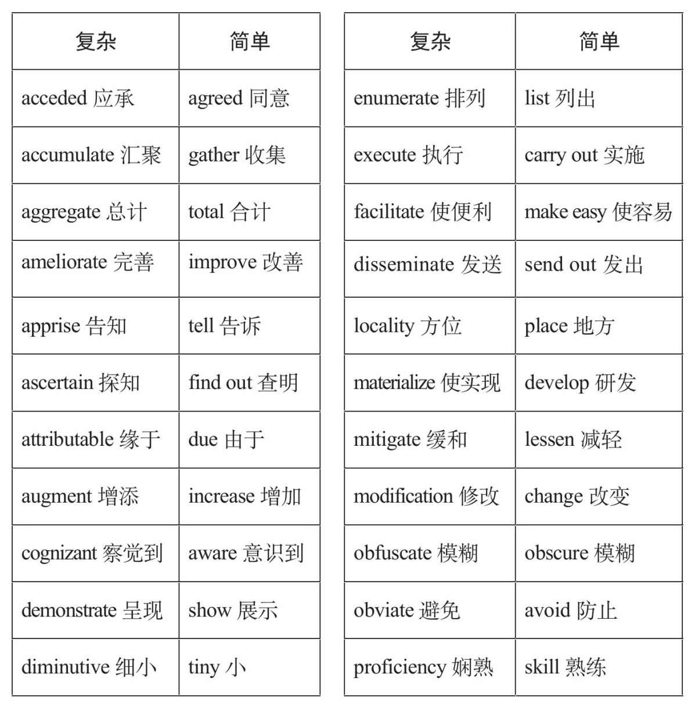

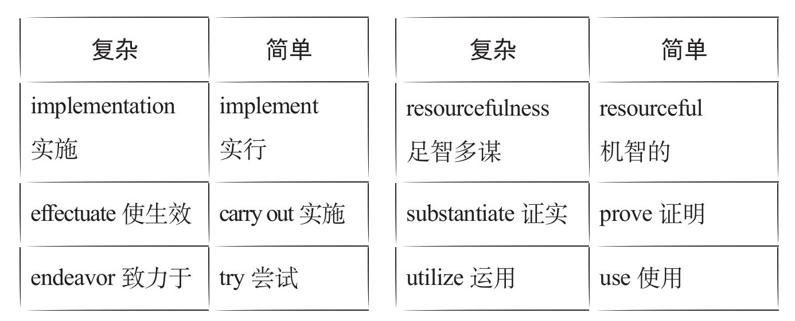

注意☞原则6提出要使用意思准确、具体的词，而不是意思宽泛、模糊的词，原则8的重点则是使用简单词。写作艺术要求作者协调这两个概念，从而保持一致。“小词”（较简单、常使用的单词）不一定是精确词，例如在“这个房子不错”和“加班时间多”中，作者应该考虑用更准确的词替换“不错”和“多”，也可以选择增加补充句，毕竟读者很可能会疑惑：“不错”和“多”究竟是什么意思？

### 练习

重写下面的句子，用较简单的方式表达句子含义。参考答案见第130页。

1.胡萝卜汁有益于你，该最新论断有大量证据支撑。

（There is considerable evidential support for the assertion that carrot
juice is good for you.）

2.我们期待在可预见的将来，运用大量的回收复印纸张。

（We anticipate utilizing hundreds of reams of recycled copy paper in
the foreseeable future.）

3.这项计划将为废除低效运输标准做准备。

（This plan will provide for the elimination of inefficient shipping
practices.）

4.就教育而言，我们的在校儿童应该接受充分“3R”教育——阅读、写作和数学。

（Educationwise, our schoolchildren should be given adequate training in
the three Rs—reading, writing, and arithmetic.）

5.关于这首诗，我认为第二、三节蕴含着某种绝望的情感。

（Only meteorologists can perform a detailed analysis of changing
climatic conditions.）

6.只有气象学家能够对变化的气候情况进行详细分析。

（With reference to the poem, I submit that the second and third stanzas
connote a certain feeling of despair.）

7.那只狗是杰出犬类的象征和最佳典范。

（That dog is epitome, the very quintessence, of canine excellence.）

8.飓风几乎摧毁了沿海一带的所有建筑。汇合而成的水与风合力掀翻屋顶、冲倒墙壁，大部分房子被摧毁了。

（The hurricane destroyed almost all structures along the coastline.
Most homes were destroyed when a confluence of water and windjoined
forces to rip off roofs and collapse walls.）

9.我坚持哪个观点？这是个好问题。我反对战争，然而我也认为在某些情形下需要使用武力。

（Which point of view do I adhere to?That's a good question. While I am
against war, I also realize that some situations require the use of
military force.）

10.正如一个多世纪以前拿破伦军队挺入俄罗斯一样，德国军队也未能成功入侵俄罗斯，因为战士们没有为冬季气候做充分准备。德国士兵甚至没有合适的冬衣应对零度以下的温度。

（Like Napoleon's army that marched on Russia more than a century
before, the German army was also unable to successfully invade Russia
because its soldiers were inadequately prepared for winter conditions.
German soldiers didn't even have proper winter clothing to withstand the
subzero temperatures.）

## 原则　9　砍断长句

通过拆分长句，使文章更清晰。

保持文章内容清晰的方法之一，就是限制长句的使用，最简单的方法是把长句拆分成两到三个短句。提醒一下：使用短句的关键并不是所有的句子都要短，长短句相结合从而创造起伏变化的风格，也是写作艺术需要发挥作用的地方。作者在写作中必须判断如何交叉使用长短句，同时还要判断如何变换句型（参见原则14）。

下面是一个需要修正的超长例句。

### 原版

领导力——不论是在战场还是其他领域，如政治或商业——能够通过榜样或指挥产生。亚力山大大帝不论在历史还是传说中都赫赫有名，他就是通过指挥和个人榜样进行领导的军事领袖的极佳典范。而甘地和特蕾莎修女二人都因为献身伟大事业而闻名，是主要通过个人榜样的激励力量进行领导的范例。

将这个大长句砍成至少两个或三个较短句，结果如下：

### 较好

领导力能够通过榜样或指挥产生。亚力山大大帝就是一个在这两方面都做到的军事领袖典范。相反，甘地和特蕾莎修女则主要通过个人榜样的激励力量进行领导。

下面是另一个“一句式”段落例子：

### 原文

我走进医院神经科，忍受了长达三个月的各种诊断测试，包括EEG监测，即用带黏性的胶水把电极固定在头皮上监测大脑的电节律，记录其一段时间的活动，还要通过血常规检测、血球计数以及我的大脑所需的所有进行进一步的诊断，从CAT扫描（计算机化断层显象）到MRI（核磁共振成像），再到昂贵的PET扫描（正电子发射层析扫描），甚至还有剧痛的脊髓液检测。

### 较好

我走进医院神经科，忍受了长达三个月的各种诊断测试，包括EEG监测、血常规检测、血球计数。我的头皮连上电极后，通过EEG监测观察我的大脑电节律。对我的大脑进行进一步检查的其他诊断性检测包括：CAT扫描（计算机化断层显象）、MRI（核磁共振成像）、昂贵的PET扫描（正电子发射层析扫描），甚至还有剧痛的脊髓液检测。

短句蕴藏着强大的力量，千万别低估它的作用。好的短句（三到五个词）能迅速抓住读者的眼球，偶尔使用短句还能给你的文章增添一份灵动，例如：

我喜欢啤酒。啤酒比世上任何东西都更能够诠释我。我是谁？我是啤酒男——至少我的众多好友是这么称呼我的。

“主题句一行原则”在写作中十分有价值。在理想情况下，主题句的长度不应超过一行，以确保读者能迅速理解你的观点。

关于啤酒和短句，看看下面这条大型黑啤品牌的广告语：

黑与众不同。黑精致高雅。黑精明敏锐。黑坚定果敢。黑神秘莫测。黑性感魅惑。黑光滑细腻。黑是欲望的另一面。

## 原则　10　删除不必要的词

砍掉冗余语句、过多的限定和不必要的自指。

也许没人能比威廉·斯特朗克（William Strunk
Jr.）更能抓住文章简洁的精髓：“文章有力贵在简洁。句子不应包含不必要的词语，段落不应包含不必要的句子，同理，一篇文章不应有不必要的段落，机器不应有不必要的零件。这不仅要求作者应保持所有句子简短，避免细枝末节，仅扼要阐明主题，更要斟酌所说的每一个词。”

### 冗余

当作者在不必要的情况下重复一个词语或一个观点时，就会产生冗余。例如，“没有经验的新手”这句话中就存在冗余，因为“新手”这个词本身就暗示了没有经验。冗余的词语可以去掉但不会改变句子含义。

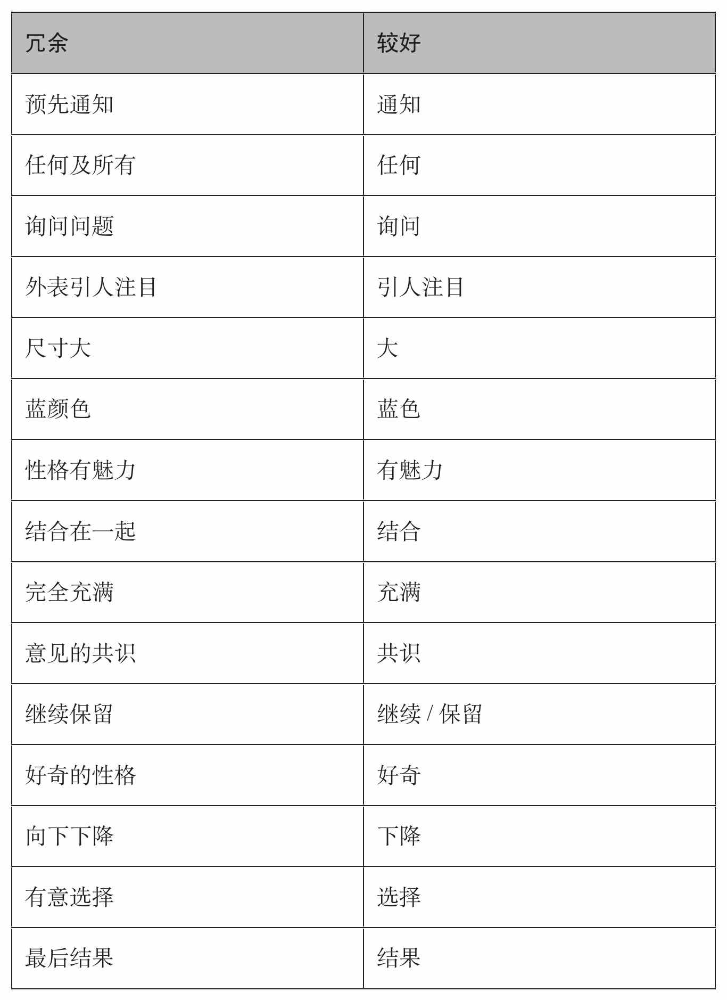

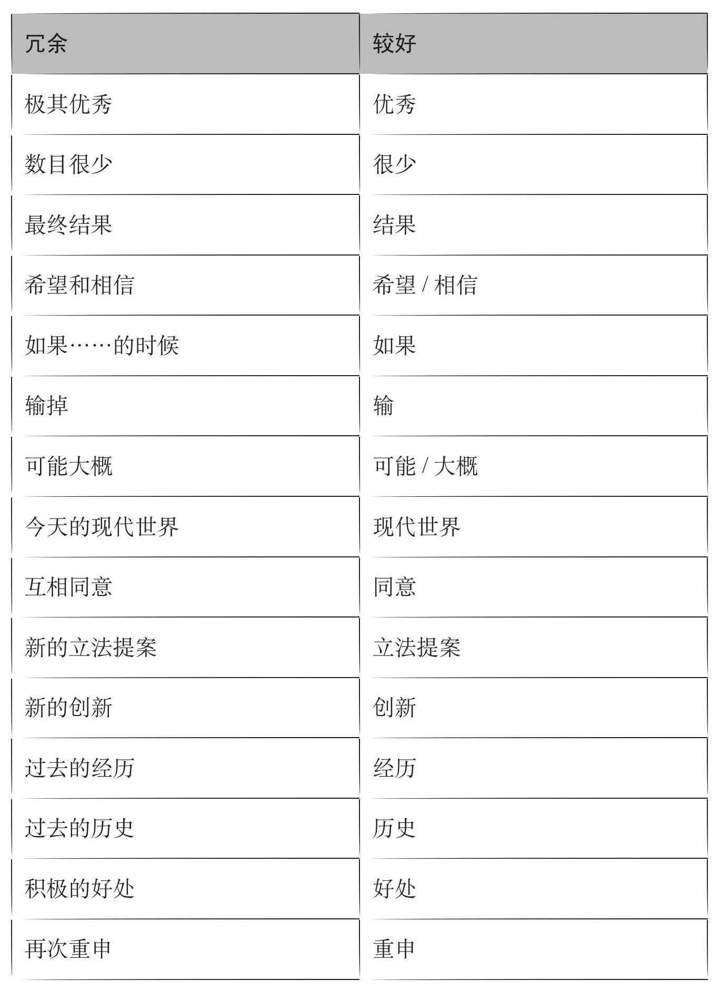

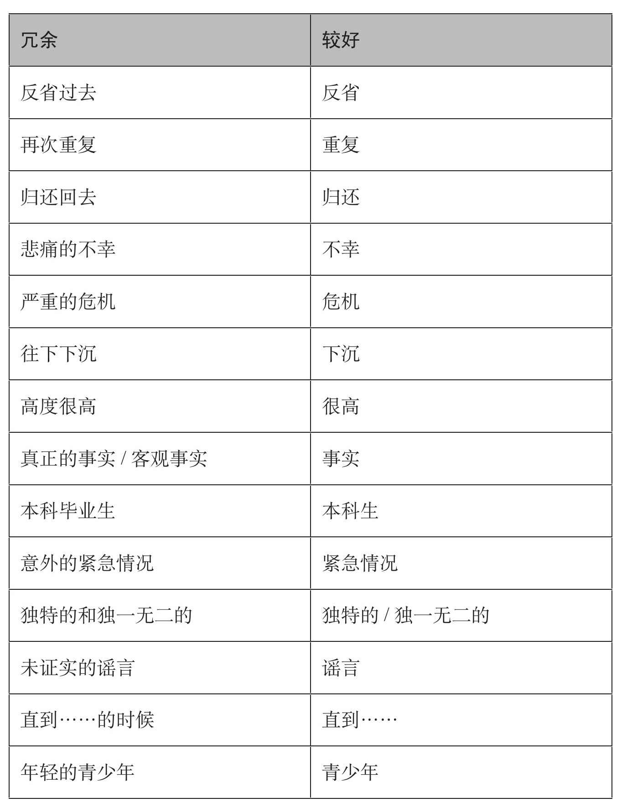

### 过多限定

偶尔使用限定词会使读者觉得你理性，但过于频繁地使用限定词会弱化文章含义，显得你在写作时很犹豫，徒增加文章篇幅却没有增加内容。

原文　这次相当严重的泄密或许可能动摇情报界的根本基础。

较好　这次严重泄密可能动摇情报界基础。

另外，已经表示绝对的词没有必要再加限定词。

原文　较好

相当优秀　优秀

真正的独特　独特

极其最差　最差

尤其最喜欢　最喜欢

十分出众　出众

另外，还有些限定词也要找机会清理，如一些、一点儿、高度地、恰好、有点儿、大部分、大多数、非常、相当、真的、稍微、所以、仍然、多少、稍稍等词语。像非常、真正的和相当的都是弱化词，大多数情况下都是不必要的。

### 不必要的自指

避免这些不必要的短语，如“我相信”“我感觉”和“在我看来”。说明文写作通常没有必要提醒读者你所写的内容是你的观点。

### 练习1

重写下面的句子，砍掉冗余部分。参考答案见第132页。

1.参会者应当准备、愿意并且能够遵守活动的着装要求，当要求着正装时不应穿着休闲服饰。

2.一项规模宏大的建筑工程需要能够解决问题、能起作用的经理人。

3.卫城博物馆持续依然是意义非凡的旅游胜地。

4.最后的结论是生理和心理症状互相交织、难以区分。

5.现场指挥官的魅力和迷人的个性无法掩盖他匮乏的成果和专业知识。

6.最近观察到的政府购买趋势，可能最终造就比以前更贫穷和更贫困的国家。

7.这些问题——水资源短缺、长期过度拥挤、病症猖獗——结合在一起造成了一场严重的危机。

8.那些能够找到新颖的问题解决方案的人数目很少。

9.她有意选择为UNESCO工作。

10.协商为和平解决争端打开了许多大门。

### 练习2

重写下列句子，砍掉多余的限定词。参考答案见第133页。

1.皮特是一位特别杰出的学生。

2.你自己就是决定你应该如何过你人生的最佳人选。

3.汽油罐完全是空的。

4.乔伊看起来好像阅读速度有点儿慢。

5.造成世界上国家之间财富方面差距的原因相当之多。

6.一些专家认为或许我们只是被趋乐避苦的欲望驱动着。

7.在印度，我发现了有关我吃过的最好吃的食物。

8.她是一位相当优秀的钢琴家。

9.圣彼得堡的爱尔米塔什博物馆里面充满了独特的、独一无二的绘画。

10.不用说，审计员应该独立于他们审计的公司。

### 练习3

重写下列句子，砍掉多余的自指。参考答案见第134页。

1.这位演讲者，在我个人看来，迷失在细节中了。

2.我觉得，就像很多其他人一样，我们应当付给教师与其他职业相当的报酬，例如医生、律师和工程师。

3.我不认为这个观点可以推及到那些基础设施落后的国家。

4.我自己的经历告诉我，红酒是一种良好的社交润滑剂。

5.我真的很想知道，如果书籍和电影可以通过支付小额费用后运到人们家中，会不会有更多的人使用图书馆。

6.尽管我不是专家，但我不觉得言论自由意味着人们可以在拥挤的电影院大喊“着火啦！”却不受指责。

7.如果我必须大胆猜测，我会说很多人想减重，但仅仅因为没有做出节食计划并刻苦坚持而失败。

8.我必须强调，我不是说对方的观点没有价值。

9.如果有人问我我觉得哪些人最鼓舞人心，我会说是那些极其发愤图强又极其谦逊的人。

10.我相信的是，一个人在要在一段关系中取得成功，就必须愿意付出70%，但只期望收到30%。

## 原则　11　使用主动语态

多用主动句，少用被动句。

在一般情况下，写作应该多用主动语态，少用被动语态，因为主动语态更以行为为导向，更直接、简练，减少了必需词汇量。例如，句子“哈利爱莎莉”用了主动语态，只包含了五个字。句子“莎莉被哈利爱着”用了被动语态，则包含了七个字。

在正常的“主—谓—宾”句子中，施动者出现在句子前端，受动者出现在句子末端。被动句之所以不如主动句直接，因为它颠倒了正常的“主—谓—宾”句子顺序，将施动者放在句子末端，受动者放在句子前端。

被动　公司派对由秘书组织。

主动　秘书组织了公司派对。

被动句也可能未提及施动者。

被动　报告的撰写很容易。

主动　她轻易地撰写了报告。

写作课的学生一般都要求避免使用被动语态，这也就不难理解为什么一提到被动语态，就会引起一些狂热分子高呼“被动糟，主动好”。然而，时刻避免使用被动语态的说法并不完全正确，有时被动语态很好用甚至是必要的，比如在作者必须决定暴露或隐藏施动者身份的情况下。

### 例1

被动　今天，电脑文件被清除了。

（作者的意图是隐藏罪犯）

主动　今天，克莱米蒂·简把电脑文件清除了。

（作者的意图是暴露罪犯）

使用被动语态的另一个原因是创作的多样性。

### 例2

我们从头到尾听完了客座教授趣味盎然的讲座，讲座讨论的中心，是为什么高智商低情商的人往往会为低智商高情商的人打工。后来学生们的提问也十分有趣。

当行为人不明或不重要时，适合用被动语态。在例3中，油的提取重要但采油人不重要；在例4中，珍珠的发现重要，但发现人要么不明要么不重要。

### 例3

百万桶油从沙漠地底抽上来。

### 例4

世界最大的珍珠（6.4 kg）是1934年在菲律宾发现的。

最后，当受动者比施动者重要时，也很有可能使用被动语态。

### 例5

乔伊斯·贝肯汉姆被组委会授予奖章。

### 练习

重写下列句子，把被动语态换成主动语态。参考答案见第135页。

1.近代，医疗手术经常由缺乏经验、设备落后的执业医师实施。

2.作者提出的主要观点可以在最后一段中被找到。

3.激励课程经常由那些最不需要的人参加，而又没有被真正需要它们的人发现。

4.烧烤炭火堆必须移到可能被露营者需要的地方去。

5.和平协议的细节在截止期限的几分钟前被敲定。

6.红十字志愿者们应该因他们的努力而被大力赞扬。

7.被演员签订之前，演出协议都要由演员的经纪人协商。

8.测试结果将被公布，不存在保密的问题。

9.报告是由大量的临床心理学家和婚恋专家编撰的。

10.没有资金、员工和当地政府支持，在欠发达国家很多疾病不能被治疗。

## 原则　12　多用动词，少用名词<a href="#part0029.xhtml_bz2" id="part0017.xhtml_z2">2</a>

不要把动词和形容词名词化。

词语名词化在写作中是一个十分重要的概念，它描述的是动词和形容词转化成名词的过程。名词化在写作中会弱化文章内容的原因有很多，其中主要是因为它会使句子更长，使读者提取句子含义时更费力。下面是几个名词化的例子。

### 避免动词转化为名词

动词　名词

减少（reduce）　减少（reduction）

发展、制定（develop）　发展性、制定（development）

依靠（rely）　可靠性（reliability）

因此，“成本的减少（reduction of costs）”最好写作“减少成本（reduce
costs）”，“5年计划的制定（development of a 5-year
plan）”最好写作“制定5年计划（develop a 5-year
plan）”，“数据的可靠性（reliability of the
data）”最好写作“依靠数据（rely on the data）”。

### 避免形容词转化为名词

形容词　名词

精确的（precise）　精确性（precision）

创新的（creative）　创造性（creativity）

合理的（reasonable）　合理性（reasonableness）

因此，“测量的精确性（precision of
measurements）”最好写作“精确的测量（precise
measurements）”，“个体的创造性（creativity of
individuals）”最好写作“创新的个体（creative
individuals）”，“工作时间的合理性（reasonableness of working
hours）”最好写作“合理的工作时间（reasonable working hours）”。

另外，任何英文动词加“ing”都可以转化为名词（称为动名词，例如speaking,
carrying, engaging）。

### 例句

原句

学校里学生饮酒的行为是否被允许？

（Is the drinking of alcohol by students allowed on campus?）

较好

学生可以在学校饮酒吗?

（May students drink alcohol on campus?）

动名词“drinking”最好换成动词“drink”。

### 练习

重写下列句子，把名词换成动词或形容词。参考答案见第136页。

1.业余自行车手必须用心做好个人训练计划的制定。

（Amateur cyclists must work on the development of their own training
programs.）

2.做决断的无能是军事领导人最隐秘的敌人。

（The inability to make decisions is a military leader's darkest
enemy.）

3.专家组的最佳预测是，新的清洁大气法案的施行将带来20%的污染减少。

（The expert panel's best estimate includes a 20 percent reduction
inpollution as a result of the implementation of the new clean air
bill.）

4.大多数营养学家提倡，将减少高脂食物的食用和降低碳水化合物的摄入作为减肥的最佳方法。

（Most dietitians advocate cutting down on the eating of fatty foods and
reducing the intake of carbohydrates as the best means of losing
weight.）

5.通情达理和公正无私不在政治家的强项之列。

（Reasonableness and evenhandedness were not among the politician's
strong suits.）

6.入学考试的标准化有益于保证学生平等申请大学和研究院项目。

（The standardization of entrance exams helps ensure that students can
apply to college and graduate school programs on an equal footing.）

7.听名流人士在电视上大肆夸耀他们的政治观点不应视作行为的不得体。

（Hearing celebrities airing their political views on television should
not be viewed as done in bad taste.）

8.在第一次网络萧条之前，使用传统核算公式对互联网公司进行估值的适用性从未受到投资人的真正质疑。

（The applicability of using traditional accounting formulas for the
valuation of Internet companies was never seriously questioned
byinvestors prior to the first dot-com bust.）

9.我们的主管做出同意解聘三名员工的决定。

（Our supervisor made a decision in favor of firing three employees.）

10.应当鼓励显示出创新性和自主性的个人追求他们的梦想。

（Individuals who exhibit creativity and spontaneity should be
encouraged to follow their dreams.）

## 原则　13　<a href="#part0029.xhtml_bz3" id="part0018.xhtml_z3">3</a>使用平行句式

用一致、平行的形式表达连串事物。

写作中的平行，是指一句话中相似的部分应当使用相同的方式表达，从而使句子表达更加清晰有力。注意下列句子的平行形式：“高校企业创造、资助、推广了这个神奇的新工具。（The
high school entrepreneur created, financed, and marketed the new miracle
tool.）”非平行形式：“高校企业参与了这个神奇的新工具的创造，确保了它的融资，并花费时间使产品投放市场。（The
high school entrepreneur was involved in the creation of a new miracle
tool, secured financing for it, and spent time getting the product to
market.）”

试着领会前美国总统约翰·F.肯尼迪名言中的平行结构：

让每个国家都知道——不论它希望我们繁荣还是希望我们衰落——为确保自由的存在和自由的胜利，我们将付出任何代价、承受任何负担、应付任何艰难、支持任何朋友、反抗任何敌人。

（Let every nation know, whether it wishes us well or ill, that we shall
pay any price, bear any burden, meet any hardship, support any friend,
oppose any foe to assure the survival and success of liberty.）

注意☞观察所有的动词如何保持平行。另外，再思考《圣经》著名章节中的排比：

虚心的人有福了，因为天国是他们的。哀恸的人有福了，因为他们必得安慰。温柔的人有福了，因为他们必承受地土。饥渴慕义的人有福了，因为他们必得饱足。

（Blessed are the poor in spirit：for theirs is the kingdom of
heaven.Blessed are they that mourn：for they shall be comforted.Blessed
are the meek：for they shall inherit the earth.Blessed are they which do
hunger and thirst after righteousness：for they shall be filled.）

任何性质的词都可以使用平行结构，最常见的是动词、介词和连词。平行也可能出现在a,
an, the等冠词上。

在罗列一连串事物时，使用平行结构要严格遵照原则，即要么每项前面的词都重复，要么只重复第一项前面的词。因此，对第二项串联事物的处理，决定了其后所有串联项的形式。

### 例1

原句　米格尔去了智利、秘鲁，去了厄瓜多尔。

（Miguel went to Chile, Peru, and to Ecuador.）

正确　米格尔去了智利、去了秘鲁、去了厄瓜多尔。

（Miguel went to Chile, to Peru, and to Ecuador.）

正确　米格尔去了智利、秘鲁、厄瓜多尔。

（Miguel went to Chile, Peru, and Ecuador.）

### 例2

原句　她喜欢太阳、沙滩和去海边。

（She likes sun, sand, and going to the sea.）

正确　她喜欢太阳、沙滩和海边。

（She likes the sun, the sand, and the sea.）

正确　她喜欢太阳、沙滩和海边。

（She likes the sun, sand and
sea.）<a href="#part0029.xhtml_bz4" id="part0018.xhtml_z4">4</a>

### 例3

原句　决定采取军事行动前，首相会见过军方人员、咨询最亲信的顾问，还研究过最近的民意调查结果。

（The prime minister had met with military personnel, listened to his
closest advisors, and had studied a recent poll result before deciding
on military action.）

正确　决定采取军事行动前，首相会见过军方人员、咨询过最亲信的顾问，还研究过最近的民意调查结果。

（The prime minister had met with military personnel, had listened to
his closest advisors, and had studied a recent poll result before
deciding on military action.）

正确　决定采取军事行动前，首相会见过军方人员、咨询过最亲信的顾问，还研究过最近的民意调查结果。

（The prime minister had met with military personnel, listened to his
closest advisors, and studied a recent poll result before deciding on
military
action.）<a href="#part0029.xhtml_bz5" id="part0018.xhtml_z5">5</a>

### 练习1

用平行结构重写下列句子。参考答案见第138页。

1.尽管中了彩票，这对老夫妻说他们只计划花钱买一台新拖拉机、新炉子和一个新门廊。

（Despite winning the lottery, the elderly couple said they planned to
spend money only on a new tractor, new stove, and a new porch.）

2.奥林匹克志愿者们做好准备、完全有能力、下定决心圆满完成任务。

（Olympic volunteers were ready, filly able, and were quite determined
to do a great job.）

3.这个纪录片很有趣，充满各种相关信息。

（The documentary was interesting and replete with pertinent
information.）

4.韦恩·格罗斯基深受队友喜爱，国家冰球联盟的粉丝都很尊敬他。

（Wayne Gretsky was well-liked by his teammates and National Hockey
League fans respected him.）

5.学生可以登陆脸书，花时间阅读邮件，浏览一些博文，然后开心地发推特。

（Students can log onto Facebook, spend time reading email messages,
review some blog posts, and then tweet with joy.）

6.基金经理的理论基于股票行情、债券行情，基于其他主要经济指标。

（The fund manager based his theory on stock performance, bond
performance, and on other leading economic indicators.）

7.这位舞者教她的替补演员如何走位、着装，如何与编舞者和摄影师合作。

（The dancer taught her understudy how to move, to dress, how to work
with choreographers and deal with photographers.）

8.正如优秀律师的好建议能够帮助赢得诉讼案件一样，一场体育比赛也能因为优秀教练的好建议而取胜。

（Just as the sound advice of a good lawyer can help win a court case so
too can a sports match be won by the sound advice of a good coach.）

9.佛教认为，恐惧、愤怒的感觉和不必要的欲望导致痛苦。消除恐惧、愤怒的感觉和不必要的欲望，你就能消除痛苦。

（According to the Buddhist mantra, fearfulness, feelings of anger, and
needless desire lead to suffering. Eliminate fearfulness, feeling of
anger, and needless desire and you eliminate suffering.）

10.我对即将进行的弹劾表示反对，首先是这件事情的个人性，其次它是盲目的。

（My objections regarding the pending impeachment are, first, the
personal nature of the matter, second, that it is partisan.）

### 省略表达

当句子去掉某些词仍然能保证语意清楚时，也会涉及表达的平行形式。在平行句式中使用动词、介词和连词时，可能会出现三种棘手的情况。就动词（或动词形式）和介词而言，第二个动词或介词如果与第一个相同，可以省略。检查平行结构是否有误，只需完成句子的每个含义成分，确保句子的每个部分都能够独立。例如，句子“The
speech was informative and funny.（演讲内容丰富有趣）”不必写作“The
speech was informative and was
funny.”因为第二个动词“was”与第一个动词相同，不需写出。

### 动词

原句　在我最喜欢的日本料理店，刺身很棒，饮料很贵。

（In my favorite Japanese restaurant, the sushi is excellent and the
drinks expensive.）

改正　在我最喜欢的日本料理店，刺身很棒，饮料很贵。

（In my favorite Japanese restaurant, the sushi is excellent and the
drinks are
expensive.）<a href="#part0029.xhtml_bz6" id="part0018.xhtml_z6">6</a>

解说☞句子第二部分的动词与句子第一部分用的动词不一样，因此必须写出来。

### 介词

原句　约翰对高尔夫很感兴趣但不太擅长。

（John is interested but not very good at golf.）

改正　约翰对高尔夫很感兴趣但不太擅长。

（John is interested in but not very good at
golf.）<a href="#part0029.xhtml_bz7" id="part0018.xhtml_z7">7</a>

解说☞句子第二部分的介词与句子第一部分用的介词不一样，因此必须写出来。

### 关联词

关联词包括“或者……或者……”“既不……也不……”“不仅……而且……”“既……又……”。如果动词放在关联词前半部分的前面，则动词不需重复；如果动词放在关联词前半部分的后面，那么它也要放在关联词后半部分的后面。

原句　她不仅喜欢沙滩排球还喜欢滑雪。

（She not only likes beach volleyball but also snow skiing.）

改正　她不仅喜欢沙滩排球还喜欢滑雪。

（She likes not only beach volleyball but also snow skiing.）

改正　她不仅喜欢沙滩排球还喜欢滑雪。

（She not only likes beach volleyball but also likes snow
skiing.）<a href="#part0029.xhtml_bz8" id="part0018.xhtml_z8">8</a>

注意☞上面第一种改正用法更为普遍。

### 练习2

运用平行结构重写下列句子。参考答案见第140页。

1.这幅画可以用水彩或油墨绘成。

（The painting may be done with watercolors or oils.）

2.塔斯马尼亚一直以来都是岛屿，未来还会是。

（Tasmania has and always will be an island.）

3.谁不会为这一事实感兴趣和震惊——100万秒以前就是11.5天前；10亿秒以前就是31年前；一万亿秒以前就是310个世纪或31千年前！

（Who is not interested and astounded by this fact?A million seconds ago
was 11. 5 days ago；a billion seconds ago was 31 years ago；a trillion
seconds ago was 310 centuries ago or 31 millennia ago！）

4.按摩为你的身体和心理创造放松、疗愈和修复的体验。

（Massage creates a relaxing, therapeutic, and rejuvenating experience
both for your body and your well-being.）

5.萨曼莎对笔迹分析着迷，但不太精通。

（Samantha is intrigued but not very proficient at handwriting
analysis.）

6.一位优秀科学家的思考不仅要有逻辑性，还要有创造性。

（A good scientist not only thinks logically but also creatively.）

7.布莱恩不愿意询问也不愿意听取任何建议。

（Brian will not ask or listen to any advice.）

8.我们要么忘记自己的计划，要么接受他们的提议。

（Either we forget our plans or accept their proposal.）

9.许多年轻从业人员面临两难问题：工作是为了金钱还是乐趣？

（A dilemma facing many young professionals is whether to work for money
or work for enjoyment.）

10.一个人既不应该向好友说谎，也不应该因自视甚高而不告诉他们实情。

（Neither should one lie to good friends nor be so patronizing as to not
to tell them the truth.）

\

**写作一部分是科学，一部分是艺术。需要建构且遵循规则的部分是科学，可以根据每种情境进行变化的部分是艺术。**

## 原则　14　<a href="#part0029.xhtml_bz9" id="part0019.xhtml_z9">9</a>利用句式变化

变换句子长度和开头。

英文的普通句型是“主—谓—宾”，如例“我打网球。”在写作时，大部分句子都应遵循“主—谓—宾”的句序，因为它产生的力量最强。然而，如果所有的句子都按照这种形式，文章就会变得枯燥无趣，特别是一连串的句子全部用相同的形式开头，如“我”或“我们”。下面是十种变换句子开头的方法。

### 用主题开头

顾客能告诉我们商品为什么畅销，如果我们花时间去倾听他们。

（Customers can tell us why products sell if we take the time to listen
to them.）

释义☞主题是句子相关的事物或人。

### 用短语开头

因此，直到我们知道市场存在前，商品是并不存在的。

（For this reason, no product is to be built until we know a market
exists for it.）

释义☞短语是一组不包含动词的词语。

### 用从句开头

因为人类很复杂，销售过程不可能减化为一种简单的模式。

（Because human beings are complex, the sales process cannot be reduced
to a simple formula.）

释义☞从句是一组不包含动词的词语。

### 用冠词开头

一个良好的平均击球率在棒球比赛中，无疑是比全垒打次数更重要的数据。

（A good batting average is an arguably more important statistic in
baseball than is the number of home runs achieved.）

释义☞英文中有三个冠词——a, an和the。

### 用动词开头

演讲时尽量脱稿。

（Try not to text during the speech.）

释义☞动词是表达行为或存在状态的词。

### 用副词开头

可以理解，学生们喜欢听企业家讲逆袭的故事。

（Understandably, students like to hear entrepreneurs speak of
rags-to-riches stories.）

释义☞副词是修饰动词、形容词或其他副词的词。当副词作为句子开头时（一般后面紧跟逗号），也被称为“开句副词”。

### 用形容词开头

聪明且富有同情心，多瑞丝具备成为领导者的品质。

（Intelligent and compassionate, Dorothy has the ingredients to be a
leader.）

释义☞形容词用来修饰、描述名词和代词。

### 用动名词开头

旅行前花时间了解这个国家的地理和历史，会让此次旅行更有意义。

（Traveling to a country is more meaningful when you first invest time

reading about its geography and history.）

释义☞动名词是动词加“ing”的形式。在日常情况下动名词被称为“看起来像动词的名词”。

### 用不定式开头

要成为僧人，人们必须能够摒弃自我，从而专注于更高的目标。

（To be a monk, a person must be able to relinquish selfishness in order
to concentrate on a higher goal.）

释义☞不定式是在动词前加“to”形成的名词。

### 用关联词开头

不仅贫穷，还有污染也威胁着第三世界的发展。

（Not only poverty but also pollution threatens the development of the
third world.）

释义☞连词是联结单词、短语、从句或句子的词，用于连接句子中成分相同的部分。四个常见的关联词有“或……或……”“既不……也不……”“不仅……而且（还）……”“既……又……”。

### 练习

销售很困难，它需要实践经验和个人主动性。

（Selling is difficult. It requires practical experience and
personalinitiative.）

练习本部分的原则，用下面不同的开头重组上面的句子。进行这项练习时可能需要你改变句子内容。参考答案见第142页。

1.用主题开头。

2.用短语开头。

3.用从句开头。

4.用冠词开头。

5.用动词开头。

6.用副词开头。

7.用形容开头。

8.用动名词开头。

9.用不定式开头。

10.用关联词开头。

## 原则　15　<a href="#part0029.xhtml_bz10" id="part0020.xhtml_z10">10</a>选择恰当的语气

用积极、个人化的语气写作。

语气是件难以描述的事情，有些人将它定义为作者的态度。语气体现在两个方面：积极的或消极的，正式的或非正式的。在大多数写作中运用积极和个人化的语气比较适合。控制写作语气的一个方法是选择积极词语，避开消极词语。尽可能在任何情况下使用积极词语，因为读者本能性地更愿意接受，而且消极形式也能转化为积极表达。

### 积极语气与消极语气

消极　商店晚上7点关门。

（The store will close at 7 p. m.）

注意☞这里用了消极动词“关门”。

积极　商店一直到晚上7点都开着。

（The store will remain open until 7 p. m.）

注意☞这里用了积极形容词“开着”。

消极　这个计划不完善。

（The plan is not sound.）

注意☞这里用了消极词语——它告诉了我们“XX不是XX”，而不是“XX是XX”。

积极　这个计划有缺陷。

（The plan has drawbacks.）

注意☞这里用积极的方式陈述了不足。

### 正式语气与非正式语气

写作中有正式语气和非正式语气之分，影响文章正式性的两个方面是缩略形式和人称代词的使用。

添加人称代词使文章更加非正式化和个人化。

无代词　任何后续问题请发送到客户服务部。

（Please send any follow-up questions to the customer service
department.）

有代词　如果你有任何后续问题，请联系我们的客户服务部。

（If you have any follow-up questions, please contact our customer
service department.）

无代词　首席执行官意识到提高产品质量是改善公司业绩的关键。

（The Chief Executive Officer is aware that strengthening product
quality is the key to turning around the company.）

有代词　我们的首席执行官认为，我们需要提高产品质量以便改善公司业绩。

（Our Chief Executive Officer believes that we need to strengthen
product quality in order to turn the company around.）

人称代词的完整列表（包括英文人称代词的主格和宾格）：

第一人称　我（I, me），我的（my, mine），我们（we, us），我们的（our,
ours）

第二人称　你/你们（you），你的/你们的（your, yours）

第三人称　他（he, him），她（she, her），它（it），他/她/它们（they,
them），他的（his），她的（hers），它的（its），他/她/

它们的（their, theirs）

以及　谁（who, whom），谁的（whose）

如果你想让文章给人非正式的印象，可添加缩略形式（例如，can’t, isn’t,
shouldn’t, won’t）。

无缩略形式　股东还没有对新的首席执行官进行投票。

（The stockholders have not voted on a new Chief Executive Officer.）

缩略形式　股东还没有对新的首席执行官进行投票。

（The stockholders haven’t voted on a new Chief Executive
Officer.）<a href="#part0029.xhtml_bz11" id="part0020.xhtml_z11">11</a>

其他因素也会影响文件的正式性（见下文）。个人信件或电子邮件通常是非正式的，而商业报告则是正式的。商务函件是半正式文档的范例：它常包含非正式文件的特点（例如使用缩略形式、第一人称、口语表达、简单或非专业词汇），也包含正式写作的特点（例如正式的致意和签名）。

### 正式和非正式语调图表

下面的两个“金字塔”突出了正式和非正式语气的特点。

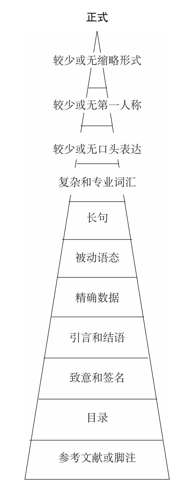

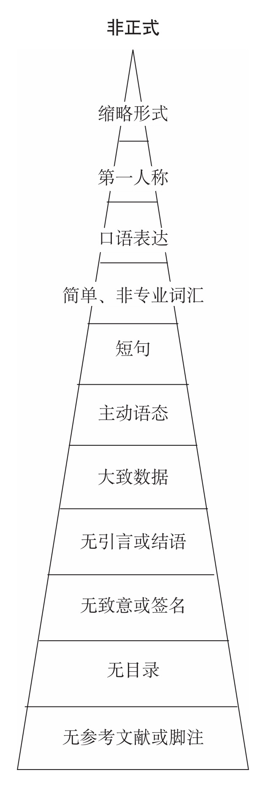

注意☞虽然现在缩略形式的使用十分普遍，但是关于它的使用效果有两种理论。一种理论或多数派观点是可以在任何情况下使用缩略形式，因为它强化了个人化语气。另一种理论或少数派观点认为，尽管在电子邮件或个人信件中使用缩略形式没有关系，但在论文或报告等正式文件中最好避免使用。

### 练习

使用更加积极和个人化的语气使这封信更“温暖”。这是一份半正式文件，而且不推荐使用缩略形式。参考版本见第144页。

亲爱的琼斯先生：

Compronics有限公司对您的笔记本电脑，型号580G，出现的问题深感遗憾。公司工程师检测组件后认为问题过于严重导致他们无法修复。两个备选选项为：接受设备退款或者要求更换新机型。请将决定告知客户服务部，Compronics有限公司将马上答复。

真诚的，

能干先生

客户代表

Compronics有限公司

**语气是态度。正式语气就像正装，使作者和读者保持距离。大多数写作更倾向非正式语气。**

## 原则　16　<a href="#part0029.xhtml_bz12" id="part0021.xhtml_z12">12</a>保持文章性别中立

避免使用阳性泛指指示两种性别。

阳性泛指是指在涉及两种性别的情形时，仅使用代词“他”。当涉及“他”或“她”时，应避免只使用“他”。向两种性别致意时要敏感，因为任何一般读者群都可能有50%的女性。避免使用阳性泛指不仅可避免性别敏感问题，也是公平公正的。

从女性的角度思考下面的句子。

### 原句

现在的首席执行官必须八面玲珑。他必须既要有事业心和公德心，还要有环保意识和进取精神。

（Today's chief executive must be extremely well rounded.He must be not
only corporate and civic minded but also environmentally focused and
entrepreneurially spirited.）

针对这句话主要有两种修改方式：用“他或她”替换“他”，或改用复数形式“他们”重组句子。

### 较好

现在的首席执行官必须八面玲珑。他或她必须既要有事业心和公德心，还要有环保意识和进取精神。

（Today's chief executive must be extremely well rounded.He or she must
be not only corporate and civic minded but also environmentally focused
and entrepreneurially spirited.）

### 较好

现在的首席执行官们必须八面玲珑。他们必须既要有事业心和公德心，还要有环保意识和进取精神。

（Today's chief executive must be extremely well rounded.They must be
not only corporate and civic minded but also environmentally focused and
entrepreneurially spirited.）

我们还必须注意和替换表示阳性泛指的词语。以下列出部分这类词语：

**阳性泛指**　**较好**

ad man（广告人）　advertising executive（广告人）

anchorman（主持人）　anchor（主持人）

chairman（主席）　chair/chairperson（主席）

Englishman（英格兰人）　the English（英格兰人）

fireman（消防员）　firefighter（消防员）

man-hours（小工时）　work-hours/person-hours（小工时）

mankind（人类）　humans/humankind/humanity（人类）

policeman（警察）　police officer（警察）

postman, mailman（邮递员）　mail carrier/postal agent（邮递员）

salesman（推销员）　salesperson/sales representative（推销员、销售代表）

self-made man（白手起家的人）　self-made person（白手起家的人）

businessman（商人）　businessperson（商人）

member of congress/senator/

congressman（议员）　representative（议员、参议员、代表）

spokesman（发言人）　spokesperson（发言人）

landlord（地主）　land owner（地主）

layman（外行）　layperson（外行）

man-made（人造的）　synthetic/artificial（人造的）

workman（工人）　worker（工人）

有时候需要替换阴性泛指：

**阴性泛指**　**较好**

housewife（家庭主妇）　homemaker（家庭主妇/夫）

maid/cleaning lady　domestic/housekeeper（佣人、管家）

（仆人、清洁女工）　

maiden name（婚前姓）　birth name/former name

　　　　　　　　　　　（本姓、原姓）

secretary（秘书）　office assistant（办公室助手）

stewardess（空姐）　flight attendant（空乘人员）

【更多“得系列图书、订阅专栏、喜马拉雅付费资源分享微信：boksharer，本书仅供学习，请勿他用】

第3部分\
　可读性
========

\

第一稿的愉悦源于欺骗自己它离真正的作品已经相当接近了；其后稿的愉悦部分源于意识到自己没有被第一稿蒙骗。

——朱利安·巴恩斯（Julian Barnes）

## 原则　17　利用排版和设计

在文字周围增加更多空间，以增强可读性。

提高文章可读性的最简单方法，就是增加文档的页边空白。同样，用空白行把段落隔开，避免一大块文字紧贴页面边缘可以使文章读起来更轻松。下面是一份相同文档的两个版本，第二个版本更易读，仅仅因为它页边和段落之间留了更多空白。

### 原始版本

鲍勃·穆尔黑德论我们时代的悖论

历史上我们这个时代的悖论是：我们盖的楼更高脾气却更急，公路建得更宽眼界却更窄，花费更多却拥有更少，购买得更多却享受得更少，房子更大但家庭更小，便捷更多但时间更少，学位更多但理智更少，知识更多但判断更少，专家更多但问题也更多，药物更多但健康更少。

我们酒喝得太多、烟抽得太多、钱花得太随意、笑得太少、车开得太快、易怒、熬夜、赖床、书读得太少、电视看得太多、祈祷得太少。

我们增加了财产却减少了价值，我们说得太多却爱得太少恨得太多。

我们学会了如何生存而不是生活；我们延长了生命的年限而不是生活的年限；我们登上月球又返回，却很难穿过街道去拜访新邻居；我们征服了外太空，却征服不了内心；我们做了更大的事情，却不是更好的事情。

我们清洁了空气，但污染了灵魂；我们征服了原子，却没有征服偏见；我们写得更多但学得更少；我们计划更多却完成更少；我们学会了奔跑却忘记了等待；我们制造了更多计算机存储更多信息，生产比任何时候都更多的产品，但我们却交流得越来越少。

这是吃快餐却消化迟钝的时代，身躯高大但性格侏儒的时代，名利高踞但人情浅薄的时代。这个时代有双收入，却有更高的离婚率，有更华丽的房屋，却有更多破碎的家庭。这个时代有快速的旅行、一次性尿片也有被抛弃的道德、一夜情、超重的身体，各种神通广大的药片可以让人从欢愉到安静甚至死亡。这是个陈列橱窗满满，而贮藏室空空的时代。

### 改善版本

鲍勃·穆尔黑德论我们时代的悖论

历史上我们这个时代的悖论是：我们盖的楼更高脾气却更急，公路建得更宽眼界却更窄，花费更多却拥有更少，购买得更多却享受得更少，房子更大但家庭更小，便捷更多但时间更少，学位更多但理智更少，知识更多但判断更少，专家更多但问题也更多，药物更多但健康更少。

我们酒喝得太多、烟抽得太多、钱花得太随意、笑得太少、车开得太快、易怒、熬夜、赖床、书读得太少、电视看得太多、祈祷得太少。

我们增加了财产却减少了价值，我们说得太多却爱得太少恨得太多。

我们学会了如何生存而不是生活；我们延长了生命的年限而不是生活的年限；我们登上月球又返回，却很难穿过街道去拜访新邻居；我们征服了外太空，却征服不了内心；我们做了更大的事情，却不是更好的事情。

我们清洁了空气，但污染了灵魂；我们征服了原子，却没有征服偏见；我们写得更多但学得更少；我们计划更多却完成更少；我们学会了奔跑却忘记了等待；我们制造了更多计算机存储更多信息，生产比任何时候都更多的产品，但我们却交流得越来越少。

这是吃快餐却消化迟钝的时代，身躯高大但性格侏儒的时代，名利高踞但人情浅薄的时代。这个时代有双收入，却有更高的离婚率，有更华丽的房屋，却有更多破碎的家庭。这个时代有快速的旅行、一次性尿片，也有被抛弃的道德、一夜情、超重的身体，各种神通广大的药片可以让人从欢愉到安静甚至死亡。这是个陈列橱窗满满，而贮藏室空空的时代。

## 原则　18　运用可读性工具

突出关键词和短语。

画家、雕塑家、音乐家、专业摄影师和诗人非常擅长判断风格对作品整体产生的影响，但只有少数普通人能做到这一点。写作也是一门平衡艺术。作者力图保留最能定义文章的较大因素，同时寻找小装饰来增强其外观和可读性。在写作的舞台上，这种装饰可能包括粗体、斜体、破折号、项目编号、列举和阴影。

### 粗体

粗体（加黑字体）可用于强调关键词，从而使关键点在读者面前“跳出来”。对宣传单、简历及其他读者可能只会花少量时间来浏览的材料而言，粗体尤其有用。斜体或下划线也具备与粗体相同的作用，但注意不要过度使用。例如，我们通常不太愿意看到一个段落里同时使用粗体和斜体。在写作和编辑中有一条不成文规矩，就是绝不同时使用粗体、斜体和下划线。注意，如果过于随意地使用粗体反而会减弱效果，可能使读者感觉不舒服。

### 斜体

斜体与粗体作用相似，偶尔使用斜体会使文章具有艺术效果。你可以考虑使用斜体高亮特定关键词，特别是表示对比的词，如“不（not、no）”和“但是（but）”。注意不要过度使用斜体，因为斜体容易使读者眼睛疲劳，而且会让文章页面显得拥挤。

### 破折号

破折号可以用于改变句子节奏，以更灵动的方式对词语和短语进行强调。

世界上记载日期最古老的书籍——《金刚经》——是一部封面绚丽、装饰精美的书。此书著于公元868年，1907年在中国敦煌附近的一个洞穴中被发现。

注意☞上述例文中的破折号的使用，为何比下面例子中逗号的使用使书名更引人注目。

世界上记载日期最古老的书籍，《金刚经》，是一部封面绚丽、装饰精美的书。此书著于公元868年，1907年在中国敦煌附近的一个洞穴中被发现。

### 项目编号

项目编号（·）是转述信息的有效工具，尤其适用于不需要正式句子、以简洁的短语表述信息的情况。在准备简历、幻灯片或传单时，项目编号最常用，但是在论文或报告正文中不建议使用，除非包含在表格中。

### 列举

列举涉及对要点的编号。在整理观点或数据时，用数字列出项目更正式，而且清楚明了。

### 例1

我觉得我在这个领域最重大、最长期的贡献可以通过以下两个方面来衡量：（1）找到用货币来定义和量化企业公民利益方法的能力。（2）在预见公司项目的推广、产品和员工的基础上出售公司的能力。

### 例2

单词“S.U.C.C.E.S.S”的每个字母分别体现一种行动：

1.Super effort（最大努力）

2.Unusual drive（非常动力）

3.Copy what works.（借鉴有效的）

4.Change what doesn't.（改变无效的）

5.Exercise now and cut out excess.（即刻行动，砍掉多余）

6.Save a little more, spend a little less.（多节约，少花费）

7.Start all over again the very next day.（明天一切从头开始）

### 阴影

阴影在页面上制造对比，可以成为设计商业报告版式的重要工具。例如，你可以通过给小节标题加阴影来强调报告每个部分的开头。在一份报告的页面中，阴影常用于为表格顶行（标题行）着色。传单也经常使用阴影突出信息。

### 简历范例

下面是一份简历的节选。简历提供了使用可读性工具的经典范例，尤其运用了项目编号、粗体和斜体。

工作经历

2010至今康涅狄格州哈特福特市美国银行财务分析师

·分析支行表现，构想提高地区市场份额的新策略。为两家支行构思一份两年营销计划。

·制定新的佣金制度并施行。

·为主要客户提供节税策略和有关投资证券组合的建议。

## 原则　19　使用标题或提要

用标题或提要拆分或归纳文章。

结构通常对于篇幅较长的学术性写作十分重要，时间和金钱对于商业写作而言至关重要，标题和提要都有助于高效地传递这些信息。提要与标题相似，两者的区别在于长度和作用。标题的长度通常只有几个词语，提要则有一或两行。标题的作用是区分章节内容，提要的主要作用则是概述或转述下文。

### 有效运用标题

下文中的标题可以引导读者的注意力。如果没有标题，读者将无法高效地获取信息。

钻石的4C

Color色度

最值钱的钻石是无色的。钻石的色度从D至Z递减，尽管最佳颜色是D（无色），但它们依然具有大量天然色调，如蓝色、粉色、绿色和红色，这些华丽的钻石相当稀少，它们与无色钻石一样也能卖出高价。

Clarity净度

宝石学家将钻石净度方面的不完美称作“杂质”，杂质越少，钻石越值钱。

Cut切工

是什么使钻石凌驾于其他珍贵宝石？当然是它闪闪发光的样子。自然决定了钻石的色度和净度，而钻石的外形则完全依赖于切割工的技术。

Carat Weight重量

克拉（Carat）这个单词源于角豆树种子，它们在古时候被用于称重，因此克拉指的是重量。克拉值越高并不一定意味着钻石越值钱，因为钻石的价值取决于4C的综合：色度、净度、切工和重量。

### 有效运用提要

提要是概述商务报告或个人论文整个章节的有效工具。下文斜体部分为提要。

大地、海洋和天空在指引我

大地、海洋和天空：这三种环境影响并帮助我成为了今天的自己。

当我回到丹麦北部陆地时，我穿过田野，聆听鸟鸣。

大地教会我感激温柔的故乡。\_\_\_\_\_\_\_\_

颜色鲜艳的小珊瑚可能有毒，而鲨鱼可能很温和。

带水肺潜水时，我学会了应对意外之物。\_\_\_\_\_\_\_\_

天空提醒我事事皆有可能，哪怕看起来遥不可及。

跳伞鼓励我攀升到新的高度。\_\_\_\_\_\_\_\_

让个人生活和职业生涯全都取得成功是我人生最大的挑战，当我面对它时，大地、海洋和天空在指引着我。

## 原则　20　回顾和修改文章

直到你的文章改到无可修改，否则不能说已经完成了。

很少有作家能够一气呵成地完成一篇完美的文章，大多数写作高手需要至少三遍稿才能完成一篇短小写作。以一篇求职信为例。首先，把想法写下来；其次，编写内容、增加细节、串连整篇文章并修正；最后，重读全文，再稍加改动。作品越长，这个过程所需的次数就越多。

一部完整作品修改的次数取决于作品的长度和难度。一篇两行字的办公备忘录可能只需一遍稿就完成了，因为它很简短。而一篇一页纸的诗可能需要改十几稿，因为它更长而且更难。

### 什么时候才算真正完成？

修改文章是件折磨人的事情，但经过修改之后，你最终可能会满意自己所写的内容，不愿意再增添或删减任何东西，此时就是你文章的完成之时——你的文章已经“无可修改”了。未经润色的文章就像沙尘暴中移动的沙子，当风暴最终停止，沙子也就静止了。说到写作，“完成”这个词真的应该加引号，因为这个过程永远不会真正完成。完成日常写作只是工作本身，但对于像小说之类更长久的写作作品而言，写作过程可能会无限期延续，因为它可以不断完善。即使已出版的书也可以修订和再编。一本书出版数周、数月甚至数年以后，作者也一定会思考修改之事。

### 感激这个过程

写作是一个创造的过程，在这个过程中最让人满意的，就是把“垃圾”变成某种有价值的东西。当你强迫自己拼凑出一篇长文，如个人论文或商务报告，你会自然而然地先写擅长的部分，随后再写你不擅长的部分，而这些部分必须修改。

让我们姑且将你喜欢的部分称为“花儿”，不喜欢的部分称为“灰尘”。当你集中精力专注于“灰尘”时，你试图完善它，然后某一时刻，你出乎意料地发现，这些部分也变得像某些“花儿”一样，甚至更好了。这是个让人极其开心的时刻，你能因此受到鼓舞，获得能量。

你尝试完善其他的“灰尘”，直到一处不留。然后，你回到最初“花儿”部分做进一步的改进，从而将作品再提升一个等级。写作就是一个不断创造“花儿”和塑造“灰尘”的过程。

很多人讨厌修改自己的文章，这是人类的本性。酒精之所以被幽默地称为“专职作家的职业危害”，原因之一就在于写作的压力。其实让人想喝酒的不是写作本身，而是改写和完善的过程，因为你在动笔之前就知道，不论你写得多好，你的文章都需要修改。幸运的是，对大部分学生和商务从业人员而言，日常写作不像谋生写作需要那么多的情绪起伏。

回看很久以前写的东西是一件很棒的事情，不论是以前的大学论文、商务报告、个人信件还是诗歌，你都会感叹：“哇，真有趣。有些东西还真是让人眼前一亮！我是怎么写出来的？”这个问题没有绝对的答案。技巧、运气、胆量和天赋都是写作过程的关键要素。

【更多“得系列图书、订阅专栏、喜马拉雅付费资源分享微信：boksharer，本书仅供学习，请勿他用】

附录\
　练习参考答案
==============

说话周到比雄辩好，措词适当比恭维好。

——弗朗西斯·培根（Francis Bacon）

### 原则　3　练习（第018页）

散文《鲸鱼》最好的句子重组顺序：5、2、1、4、3。

鲸鱼

鲸鱼是动物王国中最大的哺乳动物。大多数人想起鲸鱼时，都会想到迟钝、庞大的动物，在海洋中自由游弋，吃成吨的食物维持生命。另一方面，当人们想到蚂蚁时，常常想到努力、营养不良的小生物，它们通过隐秘的小道，来来去去地搬运相当于自己身体体积两倍大的物体。然而，如果我们根据身体体积分析食物消耗的话，我们会发现蚂蚁每天的食量与它们的体重相当，而鲸鱼每天只吃相当于其体重千分之一的食物。实际上，当我们比较所有生物的食物消耗比例时，会发现鲸鱼其实是地球上食物有效性最高的生物之一。

注意☞在上面的段落中，结语出现在最后一行。如果文章短小、简单，把总结放在末尾没有大碍。这篇文章的结构看似与原则1相悖，但是它代表了与写作科学相对立的写作艺术。

### 原则　6　练习（第037页）

1.琼尼有一只德国牧羊犬和一只暹罗猫。

2.度假花费近5000美元。

3.彩虹包括了完整的光谱，呈现出赤、橙、黄、绿、蓝、青、紫。

4.塞拉身高170cm，有着婴儿般的迷人脸蛋。

5.许多经济学家认为，联邦储蓄银行没能降低银行利率是当前经济下行的原因。

6.企业应该运用广告牌进行宣传，因为它不仅成本低，而且能够使指定地区销量增加10%。

7.蒂姆经常落车钥匙。

8.这位选手在第一轮竞赛中被淘汰了，因为她想不起来南极洲是七大洲之一。

9.这家商店从地面到天花板层层堆满了生鲜农产品、罐头和大箱子。

10.琼斯夫妇大部分时间都在一起，常被对方的玩笑逗乐。

### 原则　7　练习（第052页）

好的观点极酷！

好的观点吸引眼球。

好的观点可能遭受冷遇。

好的观点容易稍纵即逝。

好的观点看起来浑然天成。

好的观点对周围事物有很大影响。

你需要长久探索才能发现好观点。

好的观点需要时间才能形成。

你只能看到好观点的一部分，而未见的部分更大。

一个好的观点有深度，但不是每个人都能理解。

一个好观点的益处可能只有十分之一清晰可见，但长远利益的十分之九位于表面之下。

### 原则　8　练习（第056页）

1.最新研究显示，胡萝卜汁对你有益。

（Recent studies suggest that carrot juice is good for you.）

2.在接下来的12个月内，我们希望使用大量的回收复印纸张。

（We expect to use hundreds of reams of recycled copy paper in the next
12 month.）

3.这项计划将废除低效运输标准。

（This plan will eliminate inefficient shipping practices.）

4.我们的在校儿童应该注重“3R”教育——阅读、写作和数学。

（Our schoolchildren's education should emphasize the three Rs—reading,
writing, and arithmetic.）

5.诗人在写第二节和第三节时一定很绝望/这首诗的第二、三节让我感到绝望。

（When the poet wrote the second and third stanzas, he must have felt
despair/I feel despair when reading the poem's second and third
stanzas.）

6.只有气象学家能够分析变化的气候情况。

（Only meteorologists can analyze changing climatic conditions.）

7.那是只不错的狗（接下来则需要具体论述这条狗如何不错）。

（That is a fine dog.）

8.飓风几乎摧毁了沿海一带的所有建筑。

（The hurricane destroyed almost all structures along the coastline.）

9.我反对战争，然而我也认为某些情形需要使用武力。

（While I am against war, I also realize that some situations require
the use of military force.）

10.正如一个多世纪以前拿破伦军队挺入俄罗斯时一样，德国军队也未能成功入侵俄罗斯，因为战士们没有为冬季气候做充分准备。

（Like Napoleon's army that marched on Russia more than a century
before, the German army was also unable to successfully invade Russia
because its soldiers were inadequately prepared for winter conditions.）

注意☞练习7、8、9都是通过砍掉部分句子以达到简洁的目的，因为句子中出现了重复的信息。

### 原则　10　练习1（第067页）

1.参会者应当遵守活动的正装着装要求。

2.一项规模宏大的建筑工程需要一位高效经理人。

3.卫城博物馆依然是意义非凡的旅游胜地。

4.结论是生理和心理症状互相交织。

5.现场指挥官的魅力无法掩盖他匮乏的专业知识。

6.最近的政府购买趋势可能造就更贫困的国家。

7.这些问题——水资源短缺、长期过度拥挤、病症猖獗——结合起来产生了危机。

8.很少人能够找到新颖的问题解决方案。

9.她选择为UNESCO工作。

10.协商为和平解决争端开启了大门。

### 原则　10　练习2（第068页）

1.皮特是一位杰出的学生。

2.你就是决定你应该如何度过人生的最佳人选。

3.汽油罐是空的。

4.乔伊阅读速度慢。

5.造成国家之间财富差距的原因有很多。

6.一些专家认为我们只是被趋乐避苦的欲望驱动着。

7.在印度，我发现了我吃过的最好吃的食物。

8.她是一位优秀的钢琴家。

9.圣彼得堡的爱尔米塔什博物馆充满了独一无二的绘画。

10.审计员应该独立于他们审计的公司。

### 原则　10　练习3（第068页）

1.这位演讲者迷失在细节中了。

2.我们应当付给教师与其他职业相当的报酬，例如医生、律师和工程师。

3.这个观点不可以推及到那些基础设施落后的国家。

4.红酒是一种良好的社交润滑剂。

5.如果书籍和电影可以通过支付小额费用后运到人们家中，会不会有更多的人使用图书馆。

6.言论自由并不意味着人们可以在拥挤的电影院大喊“着火啦！”却不受指责。

7.很多人想减重，但仅仅因为没有做出节食计划并刻苦坚持而失败。

8.我不是说对方的观点没有价值/对方的观点有价值。

9.最鼓舞人心的人是那些极其发愤图强又极其谦逊的人。

10.一个人在要在一段关系中取得成功，他必须愿意付出70%但只期望收到30%。

### 原则　11　练习（第072页）

1.近代，缺乏经验、设备落后的执业医师经常实施医疗手术。

2.作者在最后一段提出了主要观点。

3.参加激励课程的通常是那些最不需要的人，而往往那些没参加的人反而最需要。

4.我们必须移动烧烤炭火堆，好让露营者可以用。

5.谈判人员在截止期限的几分钟前敲定了和平协议细节。

6.人们应该大力赞扬红十字志愿者们的努力。

7.经纪人在演员签订演出协议之前都会协商协议内容。

8.研究所公布了测试结果，不存在保密的问题。

9.大量的临床心理学家和婚恋专家编撰了这份报告。

10.没有资金、员工和当地政府支持，医生们在欠发达国家无法治疗疾病。

注意☞在上面练习5、8、10中，参考答案增加了主语（即谈判人员、研究所和医生）。

### 原则　12　练习（第076页）

1.业余自行车手必须制定好自己的训练计划。

（Amateur cyclists must develop their own training programs.）

2.无法决策的军事领导人面临着隐秘的敌人。

（A military leader who is unable to decide faxes a dark enemy.）

3.专家组预测新的清洁大气法案全面执行后将减少20%的污染。

（The expert panel estimates that the new clean air bill, when fully
implemented, will reduce pollution by 20 percent.）

4.根据大多数营养学家的说法，节食者实现减肥目标的最好方法是减少摄入高脂食物和碳水化合物。

（According to most dietitians, the best way for dieters to achieve
weight loss is to reduce their intakes of fatty foods and
carbohydrates.）

5.政治家既不通情达理也不公正无私。

（The politician was neither reasonable nor evenhanded.）

6.标准的入学考试有益于保证学生平等申请大学和研究院。

（Standardized entrance exams help ensure that students can apply to
college and graduate school programs on an equal footing.）

7.名流人士应当自由地在电视上发表他们的政治观点。

（Celebrities should feel free to air their political views
ontelevision.）

8.第一次网络萧条之前，投资人从未真正质疑是否应该使用传统核算公式对互联网公司进行估值。

（Prior to the first dot-com bust, investors never seriously questioned
whether traditional accounting formulas should be used to value Internet
companies.）

9.我们的主管决定解聘三名员工。

（Our supervisor decided to fire three employees.）

10.应该鼓励创新、自主的个人追求他们的梦想。

（Creative, spontaneous individuals should be encouraged to follow their
dreams.）

### 原则　13　练习1（第082页）

1.尽管中了彩票，这对老夫妻说他们只计划花钱买一台新拖拉机、一个新炉子和一个新门廊。

（Despite winning the lottery, the elderly couple said they planned to
spend money only on a new tractor, a new stove, and a new porch.）

2.奥林匹克志愿者们有准备、有能力、有决心圆满完成任务。

（Olympic volunteers were ready, able, and determined to do a great
job.）

3.这个纪录片有趣、丰富。

（The documentary was interesting and informative.）

4.韦恩·格罗斯基深受队友的喜爱和国家冰球联盟粉丝的尊敬/他的队友喜欢他，国家冰球联盟的粉丝尊敬他。

（Wayne Gretsky was well-liked by his teammates and respected by
National Hockey League fans/His teammates liked him and National Hockey
League fans respected him.）

5.学生可以登陆脸书、阅读邮件、浏览博文，然后开心地发推特。

（Students can check Facebook, read email messages, review blog posts,
and then joyfully send tweets.）

6.基金经理的理论基于股票行情、债券行情和其他主要经济指标。

（The fund manager based his theory on stock performance, on
bondperformance, and on other leading economic indicators.）

7.这位舞者教她的替补演员如何走位、着装、与编舞者合作、与摄影师沟通。

（The dancer taught her understudy how to move, dress, work with
choreographers, and deal with photographers.）

8.正如优秀律师的好建议有助于赢得诉讼案件一样，同样，一位优秀教练的好建议也有助于赢得一场体育比赛。

（Just as the sound advice of a good lawyer can help win a court case,
so too can be sound advice of a good coach help win a sports match.）

9.佛教认为，恐惧、愤怒和欲望导致痛苦。消除恐惧、愤怒和欲望，你就能消除痛苦。

（According to the Buddhist mantra, fear, anger, and desire lead to
suffering. Eliminate fear, anger, and desire and you eliminate
suffering.）

10.我对即将进行的弹劾表示反对，首先因为这件事情的个人性，其次因为这件事情的盲目性。

（My objections regarding the pending impeachment are, first, the
personal nature of matter；second, the partisan nature of the matter.）

### 原则　13　练习2（第087页）<a href="#part0029.xhtml_bz13" id="part0028.xhtml_z13">13</a>

1.这幅画可以用水彩或油墨绘成。

（The painting may be done with watercolors or with oils/The

painting may be done with either watercolors or oils.）

2.塔斯马尼亚一直以来都是岛屿，未来还会是。

（Tasmania has been and always will be an island.）

3.谁不会为这一事实感兴趣和震惊——100万秒以前就是11.5天前；10亿秒以前就是31年前；一万亿秒以前就是310个世纪或31千年前！

（Who is not interested in and astounded by this fact?—A million seconds
ago was 11. 5 days ago；a billion seconds ago was 31 years ago；and a
trillion seconds ago was 310 centuries ago or 31 millennia ago！）

4.按摩为你的身体和心理创造放松、疗愈和修复的体验。

（Massage creates a relaxing, therapeutic, and rejuvenating experience
both for your body and for your well-being/Massage creates a relaxing,
therapeutic, and rejuvenating experience for both your body and your
well-being.）

5.萨曼莎对笔迹分析着迷，但不太精通。

（Samantha is intrigued with but not very proficient at handwriting
analysis.）

6.一位优秀科学家的思考不仅要有逻辑性，还要有创造性。

（A good scientist not only thinks logically but also thinks creatively.

或者A good scientist thinks not only logically but also creatively.）

7.布莱恩不愿意询问也不愿意听取任何建议。

（Brian will not ask for or listen to any advice.）

8.我们要么忘记自己的计划，要么接受他们的提议。

（We either forget our plans or accept their proposal/Either we forget
our plans or we accept their proposal.）

9.许多年轻从业人员面临两难问题：工作是为了金钱还是乐趣？

（A dilemma facing many young professionals is whether to work for money
or to work for enjoyment.）

10.一个人既不应该向好友说谎，也不应该因自视甚高而不告诉他们实情。

（One should neither lie to good friends nor be so patronizing as to not
to tell them the truth/Neither should one lie to good friends nor should
one be so patronizing as to not to tell them the truth.）

### 原则　14　练习（第092页）

1.用主题开头：销售很困难，因为它需要实践经验和个人主动性。

（Selling is difficult because it requires practical experience and
personal initiative.）

2.用短语开头：因为种种原因，销售很困难。

（For many reasons, selling is difficult.）

3.用从句开头：因为需要实践经验和个人主动性，所以销售很困难。

（Because it requires both practical experience and personal initiative,
selling is difficult.）

4.用冠词开头：销售很困难的原因是它需要实践经验和个人主动性。

（The reason selling is difficult is that it requires both practical
experience and personal initiative.）

5.用动词开头：运用你的经验和直觉，你就会取得销售生涯的成功。

（Use your experience and your instincts and you will succeed in a
selling career.）

6.用副词开头：习惯上，“销售”和“营销”两个术语可互换使用。

（Traditionally, the terms"sales"and"marketing"were used
interchangeably.）

7.用形容开头：自信和灵活，是一名销售人员必须具备的两项品质。

（Confident and resourceful, a salesperson must possess these two key
traits.）

8.用动名词开头：要求同时具备实践经验和个人主动性，导致销售很困难。

（Requiring a person to have both practical experience and personal
initiative, selling is difficult.）

9.用不定式开头：要成为一名高效销售人员，他必须有能力接受失望和在不可预期的环境中工作。

（To be an effective salesperson, one must be able to accept
disappointment and work in an unpredictable environment.）

10.用关联词开头：不仅是实践经验，有个人主动性也是优秀的推销员需要具备的。

（Not only practical experience but also personal initiative is required
to be a good salesperson.）

### 原则　15　练习（第100页）

要使这封信更积极，可以删除“无法”“严重”等消极词汇，同时增加人称代词。另外，“我们公司”听起来比“Compronics”要好，“我们客户服务部”听起来比“客户服务部”要好。信件原稿出现了两次人称代词，即您的和他们，而下面这封信用了九次人称代词。

亲爱的琼斯先生：

听说您的笔记本电脑，型号580G，出了问题，我们公司深表遗憾。我们的工程师已经检测了组件，认为最佳方案有两个：

（1）您接受设备退款；

（2）您允许我们为您的电脑更换新机型。

请将您的决定告知我们的客户服务部。

真诚的，

能干先生

客户代表

Compronics有限公司

<a href="#part0013.xhtml_z1" id="part0029.xhtml_bz1">[1]</a>原则8着重于英文写作技巧，故尽量保留英文以供读者对比参考。——编者注

<a href="#part0017.xhtml_z2" id="part0029.xhtml_bz2">[2]</a>原则12着重于英文写作技巧，故尽量保留英文以供读者对比参考。——编者注

<a href="#part0018.xhtml_z3" id="part0029.xhtml_bz3">[3]</a>原则13着重于英文写作技巧，故尽量保留英文以供读者对比参考。——编者注

<a href="#part0018.xhtml_z4" id="part0029.xhtml_bz4">[4]</a>原文中上下两句的区别在于定冠词the的重复，因英文中的定冠词the不便翻译，故上下两句译文相同。——译者注

<a href="#part0018.xhtml_z5" id="part0029.xhtml_bz5">[5]</a>原文中上下两句的区别在于助动词had的重复，英文的助动词为虚词，不便翻译，故上下两句译文相同。——译者注

<a href="#part0018.xhtml_z6" id="part0029.xhtml_bz6">[6]</a>原文中上下两句的区别在于助动词are的有无，英文的助动词为虚词，不便翻译，故上下两句译文相同。——译者注

<a href="#part0018.xhtml_z7" id="part0029.xhtml_bz7">[7]</a>原文中上下两句的区别在于介词in有无，英文的介词为虚词，不便翻译，故上下两句译文相同。——译者注

<a href="#part0018.xhtml_z8" id="part0029.xhtml_bz8">[8]</a>原文中三句话的关联词用法不同，但句意相同，故译文相同。——编者注

<a href="#part0019.xhtml_z9" id="part0029.xhtml_bz9">[9]</a>原则14着重于英文写作技巧，故尽量保留英文以供读者对比参考。——编者注

<a href="#part0020.xhtml_z10" id="part0029.xhtml_bz10">[10]</a>原则15着重于英文写作技巧，故尽量保留英文以供读者对比参考。——编者注

<a href="#part0020.xhtml_z11" id="part0029.xhtml_bz11">[11]</a>此处的缩略形式是英文文字书写特点，译文无法体现，所以句子翻译相同。——译者注

<a href="#part0021.xhtml_z12" id="part0029.xhtml_bz12">[12]</a>原则16着重于英文写作技巧，故尽量保留英文以供读者对比参考。——编者注

<a href="#part0028.xhtml_z13" id="part0029.xhtml_bz13">[13]</a>此项练习中的句子均属于省略不当，属于英语语法问题，不便翻译，故翻译与原句相同。——译者注

【更多“得系列图书、订阅专栏、喜马拉雅付费资源分享微信：boksharer，本书仅供学习，请勿他用】
