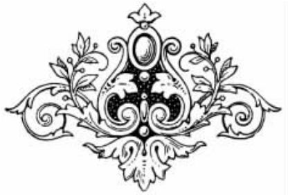
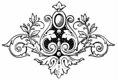
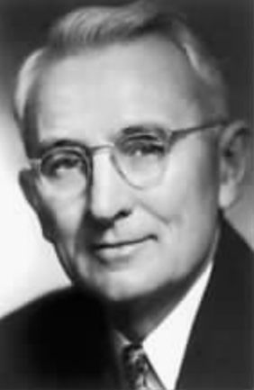
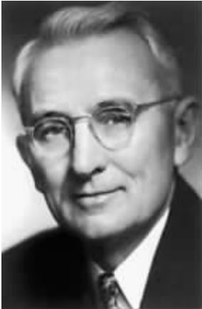

_media/cover.jpeg)

<svg xmlns="http://www.w3.org/2000/svg" xmlns:xlink="http://www.w3.org/1999/xlink" version="1.1" width="100%" height="100%" viewbox="0 0 351 493" preserveaspectratio="none">

<image width="351" height="493" xlink:href="cover.jpeg"></image>
</svg>

目　录

<a href="#part0006_split_000.html"
class="calibre1">第一章　为人处世的基本技巧</a>

<a href="#part0006_split_002.html_mllj6-1"
class="calibre1">不要批评、责怪或抱怨</a>

<a href="#part0006_split_002.html_mllj6-2"
class="calibre1">发自内心地赞赏别人</a>

<a href="#part0006_split_002.html_mllj6-3"
class="calibre1">知悉对方的想法</a>

<a href="#part0006_split_002.html_mllj6-4"
class="calibre1">学会关心和帮助他人</a>

<a href="#part0007_split_000.html"
class="calibre1">第二章　平安快乐的14项法则</a>

<a href="#part0007_split_002.html_mllj7-1"
class="calibre1">选择正确的思想</a>

<a href="#part0007_split_002.html_mllj7-2"
class="calibre1">坚守自我，拒绝模仿</a>

<a href="#part0007_split_002.html_mllj7-3"
class="calibre1">从悲伤中走出来</a>

<a href="#part0007_split_002.html_mllj7-4"
class="calibre1">学会放松，解除疲劳</a>

<a href="#part0007_split_002.html_mllj7-5"
class="calibre1">克服忧虑的心理</a>

<a href="#part0007_split_002.html_mllj7-6"
class="calibre1">活在真实的今天</a>

<a href="#part0007_split_002.html_mllj7-7"
class="calibre1">勿存报复之心</a>

<a href="#part0007_split_002.html_mllj7-8"
class="calibre1">施恩不图报</a>

<a href="#part0007_split_002.html_mllj7-9"
class="calibre1">时刻怀有感恩的心</a>

<a href="#part0007_split_002.html_mllj7-10"
class="calibre1">将酸柠檬变成甜柠檬汁</a>

<a href="#part0007_split_002.html_mllj7-11"
class="calibre1">每天都要带给别人快乐</a>

<a href="#part0007_split_002.html_mllj7-12"
class="calibre1">没有人愿意踢一条死狗</a>

<a href="#part0007_split_002.html_mllj7-13"
class="calibre1">不要被批评伤害</a>

<a href="#part0007_split_002.html_mllj7-14"
class="calibre1">学会自我批评</a>

<a href="#part0008_split_000.html"
class="calibre1">第三章　获取信服的12种方法</a>

<a href="#part0008_split_002.html_mllj8-1"
class="calibre1">争论中没有赢家</a>

<a href="#part0008_split_002.html_mllj8-2"
class="calibre1">如何避免制造敌人</a>

<a href="#part0008_split_002.html_mllj8-3"
class="calibre1">如果不对就及时认错</a>

<a href="#part0008_split_002.html_mllj8-4"
class="calibre1">使你走上理智的大路</a>

<a href="#part0008_split_002.html_mllj8-5"
class="calibre1">苏格拉底的秘密</a>

<a href="#part0008_split_002.html_mllj8-6"
class="calibre1">处理一个抱怨者的安全手法</a>

<a href="#part0008_split_002.html_mllj8-7"
class="calibre1">让别人愿意跟你合作</a>

<a href="#part0008_split_002.html_mllj8-8"
class="calibre1">一个创造奇迹的公式</a>

<a href="#part0008_split_002.html_mllj8-9"
class="calibre1">同情对方的意念和欲望</a>

<a href="#part0008_split_002.html_mllj8-10"
class="calibre1">吸引所有人的魅力</a>

<a href="#part0008_split_002.html_mllj8-11"
class="calibre1">实行、推进，别停顿下来</a>

<a href="#part0008_split_002.html_mllj8-12"
class="calibre1">当你无计可施时，就试试这个吧</a>

<a href="#part0009_split_000.html"
class="calibre1">第四章　说服别人的9种方法</a>

<a href="#part0009_split_002.html_mllj9-1"
class="calibre1">选好开始批评的方法</a>

<a href="#part0009_split_002.html_mllj9-2"
class="calibre1">如何批评才不致引起反感</a>

<a href="#part0009_split_002.html_mllj9-3"
class="calibre1">先说出你自己的错误</a>

<a href="#part0009_split_002.html_mllj9-4"
class="calibre1">没有人喜欢接受命令</a>

<a href="#part0009_split_002.html_mllj9-5"
class="calibre1">让对方保住他的面子</a>

<a href="#part0009_split_002.html_mllj9-6"
class="calibre1">如何鼓励人们成功</a>

<a href="#part0009_split_002.html_mllj9-7"
class="calibre1">给狗取个好名字</a>

<a href="#part0009_split_002.html_mllj9-8"
class="calibre1">使错误看起来容易改正</a>

<a href="#part0009_split_002.html_mllj9-9"
class="calibre1">使人们乐意做你所建议的事</a>

<a href="#part0010_split_000.html"
class="calibre1">第五章　让你处处受欢迎的6项法则</a>

<a href="#part0010_split_002.html_mllj10-1"
class="calibre1">让你到处受欢迎的实用方法</a>

<a href="#part0010_split_002.html_mllj10-2"
class="calibre1">如何给人好印象</a>

<a href="#part0010_split_002.html_mllj10-3"
class="calibre1">这样做，你就能避免发生麻烦</a>

<a href="#part0010_split_002.html_mllj10-4"
class="calibre1">如何养成优雅而获得好感的谈吐</a>

<a href="#part0010_split_002.html_mllj10-5"
class="calibre1">如何使人对你感兴趣</a>

<a href="#part0010_split_002.html_mllj10-6"
class="calibre1">如何使人很快的喜欢你</a>

<a href="#part0011_split_000.html"
class="calibre1">第六章　创造奇迹的信</a>

<a href="#part0011_split_002.html_mllj11-1"
class="calibre1">奇迹是可以创造的</a>

<a href="#part0011_split_002.html_mllj11-2"
class="calibre1">请你帮我解决一项困难</a>

<a href="#part0011_split_002.html_mllj11-3"
class="calibre1">运用“请帮我一个忙”的心理学</a>

<a href="#part0012_split_000.html"
class="calibre1">第七章　9种方法打造幸福快乐的家庭</a>

<a href="#part0012_split_002.html_mllj12-1"
class="calibre1">你是否在自掘婚姻的坟墓</a>

<a href="#part0012_split_002.html_mllj12-2"
class="calibre1">爱他就给他多一些自由</a>

<a href="#part0012_split_002.html_mllj12-3"
class="calibre1">这样做你就快要离婚了</a>

<a href="#part0012_split_002.html_mllj12-4"
class="calibre1">使人快乐的方法</a>

<a href="#part0012_split_002.html_mllj12-5"
class="calibre1">对女人特别有意义的事</a>

<a href="#part0012_split_002.html_mllj12-6"
class="calibre1">如果你要快乐，就请牢记这些</a>

<a href="#part0012_split_002.html_mllj12-7"
class="calibre1">如何与女性相处</a>

<a href="#part0012_split_002.html_mllj12-8"
class="calibre1">如何与男性相处</a>

<a href="#part0012_split_002.html_mllj12-9"
class="calibre1">不要做一个“婚姻的文盲”</a>

<a href="#part0013_split_000.html"
class="calibre1">第八章　如何把自己修炼成成熟有魅力的人</a>

<a href="#part0013_split_002.html_mllj13-1"
class="calibre1">成熟，从勇于担当开始</a>

<a href="#part0013_split_002.html_mllj13-2"
class="calibre1">困难不等于不幸</a>

<a href="#part0013_split_002.html_mllj13-3"
class="calibre1">摆脱生活中的不幸</a>

<a href="#part0013_split_002.html_mllj13-4"
class="calibre1">拥有自己的信仰</a>

<a href="#part0013_split_002.html_mllj13-5"
class="calibre1">你就是唯一</a>

<a href="#part0013_split_002.html_mllj13-6"
class="calibre1">了解并喜欢自己</a>

<a href="#part0013_split_002.html_mllj13-7"
class="calibre1">坚持自我本色</a>

<a href="#part0013_split_002.html_mllj13-8"
class="calibre1">不要做令人讨厌的人</a>

<a href="#part0013_split_002.html_mllj13-9"
class="calibre1">先使自己让人喜欢</a>

<a href="#part0014_split_000.html"
class="calibre1">第九章　8步走出孤独忧虑的人生</a>

<a href="#part0014_split_002.html_mllj14-1"
class="calibre1">解开忧虑之谜</a>

<a href="#part0014_split_002.html_mllj14-2"
class="calibre1">减少生意上50%的忧虑</a>

<a href="#part0014_split_002.html_mllj14-3"
class="calibre1">消除思想上的忧虑</a>

<a href="#part0014_split_002.html_mllj14-4"
class="calibre1">不要为小事而烦恼</a>

<a href="#part0014_split_002.html_mllj14-5"
class="calibre1">不要杞人忧天</a>

<a href="#part0014_split_002.html_mllj14-6"
class="calibre1">勇于接受不可避免的事实</a>

<a href="#part0014_split_002.html_mllj14-7"
class="calibre1">给忧虑设置底线</a>

<a href="#part0014_split_002.html_mllj14-8"
class="calibre1">不要试着去锯木屑</a>

<a href="#part0015_split_000.html"
class="calibre1">第十章　抛却名利带来的烦恼</a>

<a href="#part0015_split_002.html_mllj15-1"
class="calibre1">一生最重要的决定</a>

<a href="#part0015_split_002.html_mllj15-2"
class="calibre1">抛却工作和金钱的烦恼</a>

<a href="#part0015_split_002.html_mllj15-3"
class="calibre1">夫妻间的职业冲突</a>

<a href="#part0015_split_002.html_mllj15-4"
class="calibre1">合理开支，平衡收入</a>

<a href="#part0016_split_000.html"
class="calibre1">第十一章　高记忆力的3个自然技巧</a>

<a href="#part0016_split_002.html_mllj16-1" class="calibre1">印象</a>

<a href="#part0016_split_002.html_mllj16-2" class="calibre1">重复</a>

<a href="#part0016_split_002.html_mllj16-3" class="calibre1">联想</a>

<a href="#part0017.html" class="calibre1">附录：智慧的锦囊</a>

人性的弱点大全集

\

\

美　戴尔·卡耐基　著

孙良珠　编译

**图书在版编目（CIP）数据**

\

人性的弱点大全集／（美）戴尔·卡耐基（Carnegie，D.）著；孙良珠编译．—上海：立信会计出版社，2010.11

\

（超值金版）

\

ISBN 978-7-5429-2686-9

\

Ⅰ.①人…　Ⅱ.①戴…②孙…　Ⅲ.①人间交往—通俗读物　Ⅳ.①C912.1-49

\

中国版本图书馆CIP数据核字（2010）第210084号

\

\

策划编辑　蔡伟莉

特约编辑　刘　军

封面设计　久品轩

\

**人性的弱点大全集**

------------------------------------------------------------------------

出版发行　立信会计出版社

地　　址　上海市中山西路2230号

邮政编码　200235

电　　话　（021）64411389

传　　真　（021）64411325

网　　址　www.lixinaph.com

E-mail　　lxaph@sh163.net

网上书店　www.shlx.net

Tel：　　（021）64411071

经　　销　各地新华书店

------------------------------------------------------------------------

印　　刷　廊坊市华北石油华星印务有限公司

开　　本　787毫米×1092毫米　　1/16

印　　张　23

字　　数　372千字

版　　次　2010年11月第1版

印　　次　2010年11月第1次

印　　数　1-12000

书　　号　ISBN 978-7-5429-2686-9/C

定　　价　29.00元

------------------------------------------------------------------------

如有印订差错，请与本社联系调换

序　言

生活的经验和事实表明，那些在事业上获得重大成功的人除了知识以外，总是还具备一种别人所不及的本领，如善于讲话，善于转移和改变他人的思想，善于推销自己和出售自己的意见等。同时还必须指出的是，他们都具有令人羡慕不已的积极心态。相对于沉陷在忧伤中不能自拔的人来讲，毫无疑问，他们完成了一场对忧虑的快乐革命。其中所谓的生活真谛来自于若干困苦与折磨，在经历一切和感知一切风雨俗事之后，他们终于能站着思想，能更加清楚、有效地表达自己的思想，最终能在生活中重新应用和感知这些全新的尖峰思想。当事业如日中天地发展，生活如大道般平坦的时候，这些思想更激发出耀眼的光芒。这一切可能会与一个叫做卡耐基的人有关。半个世纪以来，成千上万的男女犹如关注华尔街股市的行情一般，不辞辛劳地从美国城市的一头到另一头，仅仅是为了聆听一次讲座，题目是“人际交流与技巧”，主讲方便是卡耐基及其人际关系研究会。

戴尔·卡耐基，美国著名成人教育家。他运用心理学知识，对人类共有的心理特点进行探索和分析，开创和发展了一种融演讲、推销、为人处世、智力开发为一体的独特的成人教育方式。

美国卡耐基成人教育机构、国际卡耐基成人教育机构和它遍布世界的分支机构，多达1700余个。接受这种教育的，不仅有普通民众，还有明星、巨商、军政要人等，甚至还有几位总统，人数多达几千万，影响了20世纪的几代人，而且还将继续影响着世界各国人民。

卡耐基并没有发现宇宙的所有深奥的秘密。他源于常理的教育理念和教育实践，却施惠于千百万人。这些哲理如人类文明一样古老，如“十诫”一般简明，在帮助人们学习如何处世上；在帮助人们获得自尊、自重、勇敢和自信上；在帮助人们克服人性的弱点，发挥人性的优点、开发人类潜能，从而获得事业成功和人生快乐上，他应该比这一时代其他所有哲人做得都多。

卡耐基一生中写了不少文章，大多都登载于报章和杂志上，他还开播了自己的无线电广播节目，在节目中，他讲述了很多著名人物鲜为人知的一面。更为重要的是，他还写作了《人性的弱点》、《人性的优点》等7部书。

卡耐基所著的《人性的弱点》、《人性的优点》、《人性的光辉》、《美好的人生》、《快乐的人生》、《伟大的人物》、《语言的突破》和由卡耐基的学生亚瑟·斐尔博士所著、阐释卡耐基学说的《积极的人生》，卡耐基夫人桃乐丝·卡耐基按照丈夫的哲学模式所著的《写给女孩子》，妹妹朵乐蒂·卡耐基根据哥哥收集的名人名言、警句所辑的《智慧的锦囊》，构成了卡耐基关于为人处世、走上成功之路的全部作品。

它们不仅是卡耐基成人教育机构的教科书，也是趣味无穷、使人受益匪浅的最优秀读物。

如今，世界各国几乎都有这些作品的译本。

1937年出版的《人性的弱点》一夜轰动，在世界各地至少已译成58种文字，全球中销量已达9000余万册，拥有4亿读者，除《圣经》之外，无出其右者，稳居成功励志类图书榜首。此书之所以畅销不衰，就在于卡耐基先生对人性的深刻认识，以及他为根除人性的弱点所开出的有效处方。正如卡耐基先生所言：一个人的成功，只有15％归结于他的专业知识，而85％归于他表达思想、领导他人及唤起他人热情的能力。”《人性的弱点》是卡耐基思想的精华，不论你是什么职业、性别、年龄，这部充满力量、充满智慧的书，在生活中一定会给你启迪，使你勇敢地克服自己的弱点，成为人际交往的高手。

戴尔·卡耐基简介

戴尔·卡耐基，被誉为20世纪最伟大的人生导师，一生中写作了《语言的突破》、《林肯传》、《人性的弱点》、《美好的人生》、《伟大的人物》、《人性的优点》、《快乐的人生》等多部作品。这些书构成了卡耐基为人处世、通向成功之路的成功学体系，与他的成人教育培训班相辅相成，改变了传统的成人教育方式，影响了千百万人的生活。

卡耐基于1888年11月24日出生在美国密苏里州的一个贫苦农民家庭。他是一个朴实的农家子弟，童年和美国中西部农村的其他男孩子并没有什么不同，他帮父母干杂事、挤牛奶，即使贫穷也不以为然。这或许是因为他根本不觉得自己家里很贫穷。在那个没有农业机械的年代，他和父亲同样做着那些繁重的体力活，而一年的辛劳却可能因为一场水灾而付诸东流，或者被骄阳晒枯了，或者喂了蝗虫。卡耐基眼见父亲因为这些永无终止的操劳而备受折磨，发誓决不拿自己的一生来和天气及收成赌博。

如果说卡耐基的童年和其他农村男孩子有什么不同的话，那主要是受到他母亲的强烈影响。她是一名虔诚的教徒，在嫁给卡耐基的父亲之前当过教员。她鼓励卡耐基接受教育，她的梦想是让儿子将来当一名传教士或教师。

1904年，卡耐基高中毕业后就读于密苏里州华伦斯堡州立师范学院。他虽然得到全额奖学金，但由于家境的贫困，他还必须参加各种工作，以赚取必要的学习费用。这使他感到羞耻，养成了一种自卑的心理。因而，他想寻求出人头地的捷径。

在学校里，具有特殊影响和名望的人，一类是棒球球员，一类是那些辩论和演讲获胜的人。他知道自己没有运动员的才华，就决心在演讲比赛上获胜。他花了几个月的时间练习演讲，但一次又一次地失败了。失败带给他的失望和灰心，甚至使他想到自杀。然而第二年里，他开始获胜。

当时，他的目标是得到学位和教员资格证书，好在家乡的学校教书。

但是，卡耐基毕业后并没有去教书。他前往国际函授学校总部所在地丹佛市，为该校做推销员，薪水是一天2美元，这笔佣金可以支付他的房租和膳食，此外还有推销的提成。

卡耐基尽管尽了最大的努力，但是并不太成功，于是又改而推销肉类产品。为了找到这种工作，他一路上免费为一个牧场主人的马匹喂水、喂食，搭这人的便车来到了奥马哈市，当上了推销员，周薪为17.31美元，比他父亲一年的收入还要高。

卡耐基的推销虽然干得很成功，成绩由他那个区域内的第25名跃升为第一名，但他拒绝升任经理，而是带着积攒下来的钱来到纽约，当了一名演员。作为演员，卡耐基唯一的演出是在话剧《马戏团的包莉》中担任一个角色。在这出话剧旅行演出一年之后，卡耐基断定自己干戏剧这行没有前途，于是他又改回推销本行，为一家汽车公司推销汽车。

但做推销员并不是卡耐基的理想。

在从事汽车推销时，他对自己的能力很怀疑。有一天，一位老者想买车，卡耐基又背诵了那套“车经”。老者淡淡地说：“无所谓的，我还走得动，开车只不过是尝一尝新鲜劲儿，因为我年轻时曾梦想成为汽车设计师，那时还没有汽车呢……”

老者的一番话慢慢吸引了卡耐基。他详细地和老者讨论起公司的情况，后来话题又转到了他们的生活方面。卡耐基讲述了自己最近的烦恼：“那天凌晨，对着一盏孤灯，我对自己说，我在做什么，我的梦想是什么，如果我想要成为作家，那为什么不从事写作呢？您认为我的看法对吗？”

“好孩子，非常棒！”老者的脸上露出轻松的笑容，继而说：“你为什么要为一个你不关心又不能付你高薪的公司卖命呢？你不是想赚大钱吗？写作，在今天也是个好行当呀！”

“不，老先生，放弃工作是不可能的，除非我有别的事可做。但是我能做什么呢？我有什么能力能让自己满意地赚钱和生活呢？”卡耐基问。

老者说：“你的职业应该是能使你感兴趣，并发挥才能的。既然写作很适合你，为什么不试一试？”

这让卡耐基茅塞顿开。埋藏在胸中奔涌已久的写作激情被老者的几句话激活了。

从那天起，卡耐基决定换一种生活。他要当一位受人尊敬、爱戴的伟大作家……

一个偶然的机会，卡耐基发现自己所在城市的青年会在招聘一名讲授商务技巧的夜大老师。于是他前去应聘，并且被录用。

卡耐基的公开演说课程，不仅包括了演说的历史，还有演说的原理知识。除此之外，他还发明了一种独特而非常有效的教学方式。

他第一次为学员上课时，就直接点名让学员谈他们自己，向大家讲述他们日常生活中发生的事。当一个学员说完以后，另一个学员接着站起来说，然后再让其他学员站起来说。这样，直到班上每一个学员都发表过简短的谈话。卡耐基后来说：“在不知道究竟该怎么办的情况下，我误打误撞，找到了帮助学员克服恐惧的最佳方法。”从此以后，卡耐基这种鼓励所有学员共同参与的教学方法，成为激发学员兴趣和确保学员出勤的最有效方法。虽然这种方法在当时尚无先例，也没有什么方法可以评定他这套方法的效果，但它确实奏效了，并且已经在全世界教出了许多更会说话且更有信心的人。

这一哲理的成功，可以从成千上万名毕业学员写来的信中得到证明。写这些信的学员有工厂工人、家庭主妇、政界人士、公司负责人、教师及传教士，他们的职业遍及各行各业。

卡耐基于1955年11月1日去世，只差几个星期就67岁。追悼会在森林山举行，被葬在密苏里州他父母亲的附近。

1955年11月3日，华盛顿一家报纸刊载了下面这段文字：“那些愤世嫉俗的人过去常常揣测，如果每个人都接受并且遵照卡耐基的话语去做，那将会成什么局面？卡耐基先生在星期二去世了，他从来不屑于这些世故者的风凉话。他知道自己所做的事，而且做得极好。他在自己的书中和课程上，努力教导一般人克服无能的感觉，学会如何讲话、如何为人处世。”

“千百万人受到他的影响，他的这些哲理如文明一样古老，如‘十诫’一般简明，但是对于人们在这个狂乱的年代里获得快乐和成就极有帮助。”

克服人性的弱点，发挥人性的优点，开发人类的潜能，

成为人际交往的高手，改变自己的命运，拥有美好、快乐、成功的人生。

第一章　为人处世的基本技巧

不要批评、责怪或抱怨。

发自内心地赞赏别人。

诚恳地赞赏他人，是待人成功的秘诀。

人类天性中最深切的冲动，那是“成为重要人物的欲望”。

表现自己，那是人性最主要的需要。

忘却自己，多对别人感兴趣。每天做一件能带给他人喜悦的事。

知悉对方的想法，学会关心和帮助他人。

不要批评、责怪或抱怨

1931年的5月7日，纽约市民看到一次从未见到过，骇人听闻的围捕格斗！凶手烟酒不沾，有“双枪”之称，是名叫克劳雷的罪犯。他被包围，陷落在西末街——他情人的公寓里。

150名警方治安人员，把克劳雷包围在他公寓顶层的藏身处。他们在屋顶凿了个洞，试图用催泪毒气把凶手克劳雷熏出来。警方人员已把机枪安置在附近四周的建筑物上，经过一个多小时的时间，这个纽约市里原来清静的住宅区，就一阵阵地响起惊心刺耳的机枪、手枪声。克劳雷藏在一张堆满杂物的椅子后面，手持短枪，接连地向警方人员射击。上万的人，怀着激动而兴奋的心情，观看这幕警匪格斗的场面。久住纽约的人都知道，从来没有发生过这样的变故。

克劳雷被捕后，警察总监马罗南指出：这个暴徒是纽约治安史上，最危险的一个罪犯。这位警察总监又说：“克劳雷杀人，就像切葱一样……他会被判处死刑！”

可是，“双枪”克劳雷认为自己又是什么样的一个人呢？当警方人员围击他藏身的公寓时，克劳雷写了一封公开的信，写的时候因伤口流血，使那张纸上留下了他的血迹！克劳雷的信这样写着：“在我衣服里面，是一颗疲惫的心——那是仁慈的，一颗不愿意伤害任何人的心。”

在发生这件事不久前，克劳雷驾着汽车在长岛一条公路上，跟一个女伴调情。那时突然走来一名警察，来到他停着的汽车旁边，说：“让我看看你的驾驶执照。”

克劳雷不说一句话，拔出他的手枪，就朝那名警察连开数枪，那名警察终于倒地而死。接着克劳雷从汽车里跳了出来，捡起警察的手枪，又朝地上这具尸体放了一枪。这就是克劳雷所说：“在我衣服里面，是一颗疲惫的心——那是仁慈的，一颗不愿意伤害任何人的心。”

克劳雷被判死刑坐电椅。他走进受刑室，你想他会说：“这是我杀人作恶的下场？”不，他说的是：“我是因为要保卫我自己，才这样做的。”

这段故事所指的含意，是“双枪”克劳雷对自己没有一丝的责备。

那是罪犯中一种常见的态度？如果你是这样想，再听听下面这些话：

“我将一生中最好的岁月给了人们，使他们获得了幸福愉快，过着舒服的日子，而我所得到的只是侮辱，一个遭人搜捕的人。”

这是卡邦所说的话。他是美国的第一号公敌，横行在芝加哥一带，一个最凶恶的匪首。可是，他认为自己是一个有益于人们的人——一个没有受到赞许，却被人误会的人。

休士在纽约给枪弹击倒前，也有过这样的表示。他接受新闻记者采访时说，他是一位有益于人们的人。其实，他在纽约是个令人发指的罪犯。

我曾经和星星监狱负责人华赖·劳斯，有过一次有趣的通信。

他说：“在星星监狱中，很少有罪犯承认自己是坏人，他们的人性就跟你、我一样，他们有这样的见解、解释。他们会这样告诉你，为什么要撬开保险箱，或是接连的放枪伤害人，甚至为他们自己辩护反社会现实的行为，因此坚持不应该把他们囚禁起来。”

如果卡邦、“双枪”克劳雷、休士，和在监狱中的暴徒，完全不自责，归咎在自己身上……那你我所接触的人又如何呢？

已故的华纳梅格，有一次这样承认说：“30年前我就明白，责备人是愚蠢的事，我即使不抱怨上帝没有将智能均匀的分配，可是我对克制自己的缺陷已感到非常吃力了。”

华纳梅格很早就学到这一课，可是我自己在这古老的世界上，盲目地行走了三十多年，然后才幡然醒悟……

一百次中有九十九次，没有人会为了任何一桩事情来批评他自己，无论错误到何种程度。

批评是没有用的，因它使人增加一层防御，而且竭力地替自己辩护。批评也是危险的，它会伤害了一个人的自尊和自重的感觉，并激起他的反抗。

德国军队里的士兵们，在发生某一件事后，不准许立即申诉、批评。他需要怀着满肚的怨气睡去，直到他这股怨气消失。如果他立即申诉，会受到处罚。在我们日常生活中，似乎也有这样一个规律的必要——就像嘀咕埋怨的父母，喋喋不休的妻子，斥责怒骂的老板……和那些吹毛求疵，令人讨厌的人。

从上千年的历史中，你可以找出很多很多，对“批评”毫无效果的例子。罗斯福和塔夫脱总统那著名的争论：……这争论分裂了共和党，而使威尔逊进了白宫，使他在第一次世界大战中留下了勇敢、光荣的史迹，而且还改变了历史的趋势。

让我们快速地追叙出当时的情形：

1908年，罗斯福离开白宫的时候，他使塔夫脱做了总统，然后自己去非洲狩猎狮子。他回来的时候，情形就发生了，他指责塔夫脱守旧，想要自己连任第三任总统，并且组织了“勃尔摩斯党”。这几乎毁灭了共和党。就在那次选举的时候，塔夫脱和共和党，只获得两州的赞助——“夫蒙”和“雨脱”，这是共和党一次最大的失败。

罗斯福责备了塔夫脱，可是塔夫脱有没有责备他自己？当然没有。塔夫脱两眼含着泪水，说：“我不知道该怎么样做，才能和我有已做的有不同。”

究竟是谁做错了？这情形我不知道，也不需要去关心。不过我所要指出的一点，就是罗斯福所有的批评，并没有使塔夫脱自己觉得不对，那只能使塔夫脱尽力替自己辩护。眼中含着泪水，反复地说：“我不知道该怎么样做，才能和我所已做的有不同。”

还记得曾经赫赫有名的煤油舞弊案吗？它使舆论愤怒了好几年，震动了整个国家！在任何人的记忆里，美国公务历史上，从没有发生过这类的情形。

这里是这件舞弊案的事实经过：

哈尔信脱·福尔，是哈丁总统任上的内政部长，当时委派他主事政府在“爱尔克”山和铁泡脱油田保留地出租的事。那块油田，是政府预备未来海军用油的保留地。

福尔是不是公开投标？不，不是那回事，福尔把这份丰厚的合约，干脆给了他的朋友图海尼。图海尼又如何呢？他把自己愿意称为“债款”的十万美元，给了这位福尔部长。

福尔接着用他高压的手段，命令美国海军进驻那一地区，把那些竞争者赶走，因为他们的邻近油井，吮吸爱尔克山的财富。保留地上那些竞争者，在枪杆、刀光下给赶走了，可是他们不甘心，跑进法庭，揭发了铁泡脱一亿美元的舞弊案。这件事发生后，影响之恶劣，几乎毁灭了哈丁总统整个的行政组织，全国一片哗然，一致痛恨；共和党也几乎垮台，而福尔也被判入狱。

福尔被斥责得焦头烂额——在公务生活中，很少有人被这样的谴责过！他后悔了？不，根本没有！

那是几年后，胡佛在一次公共演讲中暗示，哈丁总统的死，是由于神经的刺激和心里的忧虑，因为有一个朋友曾经出卖了他。当时福尔的妻子也在座，听到这话后立刻从座椅上跳了起来。她失声大哭，紧紧握着拳头，大声说：“什么……哈丁是给福尔所出卖的？不，我丈夫从未辜负过任何人。即使这间屋子已经堆满了黄金，也不会诱惑我丈夫做坏事。他是被别人所负，才走向刑场，被钉十字架的。”

这情形你可以明白，人类自然的天性，是做错事只会责备别人，而绝不会责备自己，我们每个人都是如此的。所以你我当明天要批评别人的时候，就想想卡邦、克劳雷和福尔这些人。

批评就像饲养的鸽子，它们永远会飞回家的。我们需要了解，我们要矫正或谴责的人，他也会为自己辩护，而反过来谴责我们的。就像温和的塔夫脱，他要这样说：“我不知道该怎么样做，才能和我已做的有所不同。

1865年4月15日，星期六的早晨，林肯躺在一个简陋的公寓的卧室中。这个公寓就在他遭到狙击的福特戏院对面。林肯瘦长的身体，躺在一张短短而往下沉的床上，靠床的沿壁挂着一幅朋汉·马群展览会的复制画，一盏煤气灯散发出幽暗、淡淡的光亮。

林肯躺着行将离世的时候，陆军部长斯坦顿说：“躺在那里的，是世界上最完美的元首。”

林肯待人成功的秘诀是什么？我曾费了10年左右的时间，研究林肯的一生，同时我整整费了3年的时间，撰著了一部有关他的书，我替这部书取名叫“人们对林肯尚未清楚的一面”。

我相信自己详尽的研究有关于林肯的人格，和他的家庭生活，已到任何人所能做到的极限。我又找出有关于林肯待人的方法，做特殊的研究。林肯是否有放任批评过人？是的，当他年轻的时候，在印第安纳州的鸽溪谷，他不但批评，而且还写信作诗去讥笑人，他把写好的东西扔到一定会被人捡到的路上，其中有一封信，引起人们对他终身的恶感。

林肯在伊利诺伊州的春田镇挂牌做了律师后，他还在报纸上发表他的文章，公开攻击敌对他的人，但是像这样的事他只做了一次。

1842年秋季，林肯讥笑一个自大好斗的爱尔兰政客，这人叫“西尔滋”。林肯在春田的报上，刊登出一封匿名的信讽刺他，使全镇的人哄然大笑。西尔滋平时敏感而自豪，这件事激起他心头的怒火。当他查出是谁写这封信时，跳上马，立即去找林肯，要和他做一次决斗。

林肯平时不愿意打架，反对决斗，可是为了自己的面子又不能避免。对手西尔滋让他自己选用武器。林肯两条手臂特别长，就选用了马队用的大刀，他同一位西点军校毕业生学习刀战。到了指定的日期，他和西尔滋在密西西比河的河滩上，准备生死一战，就在最后一分钟，他们双方的朋友赶到才阻止了这场决斗。

这次对林肯来讲，是件最惊人、最恐怖的事，在林肯待人的艺术上却给了他一个极宝贵的教训。从那以后他永远不再写凌辱人的信，永远不再讥笑他人，几乎从不为任何事而批评任何人。

美国内战的时候，林肯屡次委派新将领，统率“波托麦克”军队，可是一个一个都遭到沉痛的惨败……林肯怀着失望而沉重的心情，单独一个人在屋子里踱步。全国几乎有半数的人，哗然指责这些不能胜任的将领，可是林肯保持着他平和的态度。他最喜欢的一句格言，就是——“不要评议人，免得为人所评议”。

当林肯的妻子和有些人，刻薄地谈论南方人时，林肯总是这样告诫：“不要批评他们，我们在相同的情形下，也会像他们一样。”

可是，如果有人有机会批评的话，那就是林肯了，我们看下面这个例证：

7月4日的晚上，南方李将军开始向南边撤退。当时全国洪水泛滥成灾，那时李将军带领败军到达波托麦克时，看到前面河水暴涨，使他们无法过去，而胜利的联军就在后面。李将军和他的军队进退维谷，处于被围困中。

林肯知道这正是个极好的机会，把李将军的军队俘虏，立即可以结束这场战争。林肯满怀着希望，他命令弥特不必召开军事会议，立即进袭李将军的军队。林肯先用电报发出命令，然后派出特使要弥特立即采取行动。

可是这位弥特将军所采取的行动，却跟林肯的命令相反。他召开了一个军事会议，违反了林肯的命令，还迟疑不决的延宕下去。弥特用了各种借口复电，实际上是拒绝进袭李将军。最后河水降退，李将军和他的军队就这样逃过了波托麦克。

“弥特这样做是什么用意？”林肯知道后，震怒至极。林肯向他儿子大声说：“老天爷，这是什么意思……李将军已在我们掌握中了，只要一伸手，他们就是我们的了……在那种情形下，任何将领都能带兵把李将军打败，如果我自己去已经把他捉住了。”

在沉痛失望之下，林肯写了封信给弥特。林肯在他一生的这段时间中，他是极端的保守，用字非常拘谨的，所以在1863年里头，这封信出自林肯手笔，该是最严厉的斥责了。林肯这封信的内容，是这样的——

亲爱的将军：

我不相信你能领会出，由于李将军的脱走，所引起的不幸事件和重大的关系。他已是在我们的掌握中，如果将他捕获，再加上最近我们其他地方的胜利，立即可以结束这场战争。

可是照现在的情形来推断，战事将会无限期的延长下去。上星期一你不能顺利地袭击李将军，你又如何能再向他袭击……我不期望你现在会有多大的成功，因为你已让黄金般珍贵的机会消失掉了，这使我感到无限沉痛。

据你的猜想，当弥特看到这封信后，他将会如何呢？

弥特从没有看到那封信，原因是林肯并没有把这封信寄出去。这封信是在林肯去世后，从他文件中发现的。

我有这样的想法——这只是我的猜想。林肯写了这封信后，望着窗外喃喃自语：

“慢着，或许我不能这样匆忙，我坐在这宁静的白宫里，命令弥特进攻，那是一件很轻而易举的事，可是如果我到了吉地司伯，我也看到弥特上星期所看到的那么多血，我的耳朵也听到死伤者的呼叫、呻吟，也许我也不会急于要向李将军进攻……如果我也有跟弥特一样懦弱的个性，或许我所做的，会跟他做的完全一样。

现在木已成舟，无法挽回了，如果我发出这封信，固然解除了我心里的不愉快，可是弥特也会替他自己辩护。在那种情形下，他会谴责我，引起他对我的恶感，而且会损伤他以后做司令官的威信，甚至还会逼他辞去军队的职务。”

最终，林肯没有把信发出，就放在一边了。因为林肯从苦痛的经验中知道，尖锐的批评、斥责、永远不会有效果的。

罗斯福总统曾经这样说过，他任职总统遇到难以解决的问题时，会把座椅往后面一靠，仰起头，朝着写字台壁上那幅很大的林肯画像看去。他这样问自己：“如果林肯处在我眼前这种困难下，他将会如何？他将如何去解决这个问题？”

以后我们如果想要批评人家时，让我们从口袋拿出一张五元的钞票来，看看钞票上林肯的像，这样问自己：“如果林肯遭遇到这类的事，他将如何去处置呢？”

你所认识的人，你愿意他改变、调整，或是进步吗？是的，那是最好不过的。可是为什么不从你自己先开始呢？从自私的立场来说，从自己开始要比改进别人，获益得多。

“当一个人争论、激辩时，”鲍宁这样说，“他在若干方面已不是寻常的。”

我年轻的时候，就很想让人家知道我，曾写过一封信，给美国文坛上一位极富声誉的作家，他叫台维斯，那时我准备给一家杂志社写些有关文坛作家的文章，所以我请台维斯告诉我，有关他写作的方法。

数星期后，我接到一封信，信上附注着这一句：“信系口述，未经重读”。看到这两句话后，很引起我的注意，相信写这信的人，是一位事务繁忙的大人物，而我却一点也不忙。可是我急于引起这位大作家台维斯的注意，我在写了一封简短的回信后，后面也加上这样几句：“信系口述，未经重读。”

台维斯不屑再给我回信，只是把我那封信退了回来，可是下面潦草地写着几个字：“你态度之不恭无以复加。”

是的，我做错了，或许我应该得到这样的斥责。可是，人性使然，这使我深深的痛恨，对他怀着极度的愤恨。甚至10年后，我知道台维斯去世的消息时，我心里还深深恨他。而我却羞于承认，就是他给了我的伤痕。

如果你明天要激起一股愤恨，使人痛恨你10年，一直到死，我们可以放任一些对人具有刺激性的批评。

当我们要应付一个人的时候，应该记住，我们不是应付理论的动物，而是在应付感情的动物。

而批评是一种危险的导火线——一种能使自尊的火药库爆炸的导火线，这种爆炸，有时会置人于死地。

就有这样的例子：胡特将军受到人们的批评，又不被允许带兵去法国，对他自尊的打击，几乎缩短了他的寿命。

苛刻的批评，曾使敏锐的哈代……他是一位英国文坛上非常出色的小说家……永远放弃执笔写小说的勇气。

富兰克林在年轻的时候并不伶俐，可是后来成为极有手腕和处世待人极有技巧的人，甚至担任过美国驻法的大使。他成功的秘诀是：“我不说任何人的不好！”他又这样说：“而说我所知道的每一个人的好处！”

任何一个愚蠢的人，都会批评人、斥责人和抱怨人，同时，也是绝大部分愚蠢的人才这样做的。

但若要宽恕和了解，那就需在人格、克己上下工夫了。

卡莱尔曾经这样说过：“要显示一个伟大人物的伟大之处，那就要看他如何对待一个卑微的人。”

正如强森博士所说的：“上帝在末日之前，还不打算审判人！”

你我又为什么要批评人呢？

不要批评、责怪或抱怨。

发自内心地赞赏别人

世界上只有一个方法，可使任何一个人去做任何一件事，你有没有静下心来，想过这件事呢？是的，只有这样一个方法，那是使人自愿去做那一件事。

记住，再也没有其他方法。

当然，你可以用一把左轮手枪，对着一个人的胸脯，那人会乖乖地把手表给你。你可以用恫吓解雇的方法在你尚未转身过来前，叫一个雇用的人跟你合作。你也可以用鞭笞或是恫吓，让一个孩子做你所需要他做的事。可是这些粗笨的方法，都有极端不利的反应。

我能叫你去做任何事情的唯一方法，那就是把你所需要的给你。

你要些什么？

维也纳一位20世纪最享盛誉的心理学家——弗洛伊德博士曾这样说：凡你我所做的事，都起源于两种动机，那是性的冲动和能成为伟人的欲望。

美国一位著名的哲学家——杜威教授，对这上面所用的字句，稍有不同的见解。杜威教授说：人类天性中最深切的冲动，那是“成为重要人物的欲望”。

记着“成为重要人物的欲望”这句话，是很重要的，你从这本书中将看到很多关于它的话。

你要些什么？并不是很多的东西，可是真正所需要的几种东西，你不容拒绝地坚持着要追求。差不多每个正常的成人都想要：

一、健康和生命的保护。

二、食物。

三、睡眠。

四、金钱和金钱所能买到的。

五、生命的后顾。

六、性生活的满足。

七、子女们的健康。

八、自重感。

差不多所有这些欲望都能满足，可是其中有一种欲望，同食物、睡眠一样，既深切，又难以满足，那就是弗洛伊德所说的“成为伟人的欲望”。也就是杜威所说“成为重要人物的欲望”。

林肯有次写信开头就说：“每个人都喜欢受人恭维。”威利·贾姆士也这样说过：“人类天性至深的本质，就是渴求为人所重视。”他并不是说“希望”，或“欲望”，或是“渴望”，而是说了“渴求”为人所重视。

这是一种痛苦的，而且亟待解决的人类“饥饿”，如果能诚挚地满足这种内心饥饿的人，就可以将人们掌握在手掌之中。

寻求自重感的欲望，是人类和动物间，一项重要的差别。

就有这样一个例子。

那时我是密苏里的一个农家儿童，我父亲饲养一种品种优良的猪和一种白脸牛。那时我们常在牲口展览会上，展示我们的猪和白脸牛，我们曾经获得几十次的头奖。

我父亲把蓝缎带的奖章，用针缝在一条白布上，当有亲友们来我们家时，父亲就拿出这条白布来，我握着这一端，他握着那一端，将中着头奖的蓝缎带，让亲友们来观赏。

猪、牛并不在乎它们赢得的蓝缎带，可是父亲却十分重视，因为这些奖品，替他带来了一种“自重”的感觉。

假如我们的祖先，没有这种“自重感”炽烈的冲动，我们不会有文化，就跟其他动物差不多了。

就是这种自重感的欲望，激起一个没有受过良好教育，在一家杂货店工作的贫困店员，翻遍了整个堆满杂货的大木桶，找出他用五分钱所买的几本法律书籍，痛下决心去研究。你或许听说过这杂货店的店员，他的名字叫“林肯”。

这种自重感的欲望，激发了狄更斯写出他不朽的名著。这种自重感的欲望，使华伦完成了他的设计。同时由于这种自重感的欲望，使洛克菲勒积存了他一辈子花不完的钱。也就是这种欲望，使城里的巨富，建造一座他所需要的大房子。

这种欲望，能使你穿上最新颖的服饰，驾驶最漂亮的轿车，谈谈你自己聪明伶俐的孩子。

也就是这种欲望，使一些青少年成为盗匪。前任警察总监玛罗尼曾这样说过：“如今一般年轻罪犯，充满着对虚名的盲目追求，在被捕后他们的第一个要求，就是要阅读把他们写为英雄的那种不上流的报纸。他只要能看到自己的相片，就像跟爱因斯坦、林白、托斯加尼、或罗斯福等名人，一样在报上占到篇幅时，就根本没有想过，进受刑室坐电椅是怎么回事了。”

如果你告诉我，你是如何得到你的自重感，我就可以告诉你，你是怎样的人。确定你的性格，对你来讲，是件最重要的事。

有这样一个例子：洛克菲勒捐钱在中国北平建造最新式的医院，照顾了许多他没有见过面，同时也永远不会见面的贫民，借此得到了他的自重感。

反过来说，狄林克做土匪、抢银行、杀人，也是在满足自重感。当警方人员搜捕他时，狄林克奔进人家农舍里……他以他是第一号公敌为荣，所以他大声地说：“我是狄林克……我不会杀害你，但我是狄林克！”

是的，狄林克和洛克菲勒最大的差别，就在于他们如何获得自己的自重感。

历史上有很多名人为了自重感挣扎的有趣事例。甚至于华盛顿，都愿意有人称他是至高无上的美国总统；哥伦布向皇家请求获得“海洋大将”和“印度总督”的名衔；女皇凯瑟琳拒绝拆阅没有称她“女皇陛下”的信件；林肯夫人在白宫对格兰特夫人像只母老虎似的吼叫：“我没有请你之前，你怎敢坐在我面前！”

有一些百万富翁，资助“白特”将军去南极探险，附带一个条件，就是用他们的名字为一些冰山命名。而那个“夫古”，甚至希望把巴黎改称成他的名字。

人们会为了取得同情、注意和一种“自重感”而故意装病。

麦金利夫人，强迫她任职美国总统的丈夫放下国家的重要事务，要他依偎在她床边，搂抱着她，抚慰她睡去。这样每次需要数小时的时间，麦金利夫人借此得到了她的自重感。

麦金利夫人坚持麦金利在她医牙的时候，陪同她在一起，借此满足她的牙痛时被注意的欲望。有一次麦金利和强海有约，不得不让她一个人留在牙医那里，这样便使她大发脾气。

琳哈特夫人有一次告诉我，有个年轻能干的少妇，为了要得到自重感，而装成一个病人。琳哈特夫人说：“有一天，这妇人不得不面对一种事实……或许是年龄的关系，使她永远不能结婚的事实，想到孤独的晚年就将在她面前展开，可期望的事，实在太少了。”

琳哈特夫人又说：“她躺在床上有10年的时间。她年老的母亲，每天上下3楼，捧着盘子去侍候她。有一天，这位年老的母亲由于过度的疲劳，终于倒地去世，床上的这个病人，沮丧了数星期后，她穿衣起床，身上的病也消失了。”

有些专家宣称……人可能真的会发疯，为的是要在疯狂的幻境中，寻找冷酷的现实世界上所得不到的自重感。在美国医院中，患精神病的人数，要比患其他病的总和还多。如果你年纪在15岁以上，又住在纽约州这地方，你可能有1/20的机会，在你的一生中要住7年以上的疯人病院。

精神错乱的原因是什么？

没有人能回答出那样笼统的问题，不过我可以知道有若干的疾病……像性病，会摧残脑细胞，结果导致癫狂。实际上，约有半数以上的精神病，可以归源于这类的生理原因，像酒醉、中毒和由于其他原因所造成的脑部伤害。

可是另外那半数……这是令人惶恐的部分……那其他半数疯狂的人，明显的，他们脑细胞机构中并没有任何病态。在他们去世后解剖检验，用最高性能的显微镜研究他们的脑细胞组织，发现他们的脑细胞，完全跟我们一样健全。

为什么这些人会精神错乱？

我曾向一位疯人病院的主治病师提出那样的问题。这位医师拥有渊博的精神病理方面的学识，获得最高的荣誉。他诚恳地对我说，他也不知道人们如何会精神错乱。可是他却作这样的解释，许多精神错乱的人，在他疯癫中找到了真实世界中所无法获得的自重感。这位医师告诉了我一个真实的故事。

“我现在有个病人，她的婚姻是一出悲剧，她需要爱情、孩子和社会上的声望。可是现实的生活，却没有赋予她梦幻中的希望。她丈夫不爱她，甚至于拒绝跟她一起用餐，她丈夫强迫她服侍他在楼上房间吃饭。她没有孩子，没有社会地位。这终于造成了她精神错乱，在疯癫梦幻中，现在她已跟丈夫离婚，恢复了少女时的姓名。她现在相信自己，已嫁给英国贵族，并且坚持要人家称她是史密斯夫人。

至于她所希望的孩子，现在她幻想中也已经有了。每次我去看她时，她说：‘医生，我昨夜生了一个孩子。’”

这故事悲惨吗？我不知道。那位医师对我说：“如果我能伸出我的手，去治愈恢复她的意识让她清醒，我也不愿意那样做，她现在似乎获得了她真正所期盼的快乐。”

从整体来讲，精神失常的人，似乎要比你我快乐。既然许多人以疯癫为快乐，他们为什么不这样呢？他们已经解决了他们的问题……他们可以轻而易举地签出一张百万元的支票给你；或者给你一封介绍信，去见一位有名的人物。在他们所创造的梦境中，他们能找到他们所期望的自重感。

如果有人对自重感这样的迫切饥渴，甚至于为获得它而精神失常，试想若是在人们尚未疯癫前，就给他真诚的赞扬，那时你我的成就，又会产生什么样的奇迹？

据我所知道：有史以来，年薪百万元的只有两个人——克莱斯勒和司华伯。

安德鲁·卡内基为什么要付司华伯年薪百万元，或是三千余元一天呢？安德鲁·卡内基付司华伯年薪百万元，是由于司华伯是位优秀的天才？不，不是的。是由于司华伯对钢铁的制造有特殊的专长？不，也不是的。

司华伯曾这样告诉过我，有许多在他手下做事的人，在钢铁的制造方面比他知道得多。司华伯有这样高的薪金，是由于他有特殊待人的能力。我问他是怎么做的，这里就是他亲口告诉我的情形……这些话应该刻在能永久保留的铜牌上，把这面铜牌悬挂在全国每个家庭、学校、商店、办公室里。这些话，在当孩子的时候，就应该背诵下来……如果我们真能照着这些话去做，你我的生活方式，跟过去就完全不一样了。

司华伯这样说：“我认为，我有激发他们热诚的能力，那是我所具有的最大的资源……我充分发掘每一个人才能的方法，是用赞赏和鼓励！”

他又说：“世界上最容易摧毁一个人志向的，那就是上司所给他的批评。我从来不批评任何人，我只给人们工作的激励。我是急于称赞，而迟于找错，如果说我喜欢什么的话，那就是诚于嘉许，宽于称道。”

那是司华伯平时所做的，也正跟一般人相反的。

一般人不喜欢一件事，会尽量的挑剔错误；如果真的喜欢，他会一句什么话也不说。

司华伯还这样说：“在我一生的广阔交往和与世界各地知名之士见面中，我还没有找到一个人，无论他如何伟大，地位如何崇高，被赞许比在被批评的情形下，更能够成就伟大的事业。”

是的，他所说的，就是安德鲁·卡内基惊人成就的一项显著的理由。安德鲁·卡内基并非私下的，而是公开地称赞他的同仁。

安德鲁·卡内基甚至于在他的墓碑上，还称赞他的助手。这是他为自己所写的碑文：“埋葬在这里的，是个知道如何跟比他自己聪明的人相处的一个人。”

诚恳地赞赏，是洛克菲勒待人的一个成功的秘诀。例如有这样一件事……当他的一个伙伴——倍德福，措施失当，在南美做错了一宗买卖，而使公司亏损了一百万元时，洛克菲勒对他并没有任何批评或指责。

他知道倍德福已尽了最大的努力，同时这件事已告结束。所以洛克菲勒找些可称赞的事来，他恭贺倍德福，幸而保全了他投资金额的60％。洛克菲勒这样说：“那已经不错了，我们做事不会每一件都是称心如意的。”

齐格飞，这位闪耀于百老汇，最具惊人成就的歌舞剧家。他屡次把人们不愿意多看一眼，很不出色的女子，改变成在舞台上一个神秘诱人的尤物。

齐格飞很实际，他增加歌女们的薪金，从每星期30元，到175元。他也重义气，在福利斯歌舞剧开幕之夜，他发出贺电给剧中明星，并且赠予每一个表演的歌女一朵美丽的玫瑰花。

我曾经有一次为“流行”的绝食所迷，有6个昼夜没有吃东西。那种情形并不困难，到第6天时，似乎比第2天还不感到饥饿。可是你我都知道，如果有人使他的家人或是雇员，6天内没有东西吃，那就犯了罪。可是他们却会6天、6星期或是60年不给家里的人或是雇员所期盼中像得到食物一样的赞美。

当年，“爱尔法利特·仑脱”在“维也纳的重合”剧中担任主角的时候，曾经这样说过：“我最需要的东西，是我自尊的滋养。”

我们照顾了孩子、朋友和员工们体内所需要的营养，可是我们给他们自尊上所需要的营养，却又何等稀少。我们给了他们牛排、马铃薯等食物，培植他们的体力，可是忽略了给他们赞赏和那些温和的言语。

有些读者看到这几句话时，可能会这样说：“这是老套、恭维、阿谀、拍马屁，我都已尝试过那些了，一点也没用……这些对受过教育的知识分子是没有用的。”

拍马那一套，当然是骗不了明白人的，那是肤浅、自私、虚伪的，那应该失败，而且常常失败。可是，有些人对赞赏，出于内心的赞赏，简直太需要了。

有这样一个例子：屡次结婚的狄文尼兄弟俩，为什么在婚姻方面会有这样炫耀的成功？为什么这所谓“公子哥儿”的狄文尼兄弟，能与两位美丽的电影明星——一位著名的歌剧主角和另外一位拥有数百万家产的哈顿结婚？那是什么原因？他们是怎么做的？

圣约翰在自由杂志中，曾这样说：“狄文尼对女人的魅力，这许多年来，是人们心里的一个谜……”

他又说：“妮格雷这女人能识别男人，也是一位艺术家，有一次她向我解释说：“他们了解恭维、谄媚的艺术，比我所看到其他所有人的都成功。这恭维的艺术，在这真实幽默的时代中，几乎是一件给人忘了的东西，狄文尼对女人的魅力，或许就在这上面了。”

赞赏和谄媚的区别——那很容易识别出来，赞赏是出于真诚，而谄媚是虚伪的。一个出于由衷，一个出于嘴里。一个是不自私的，一个是自私的。一个是为人们所钦佩的，一个是令人不耻而摒弃的。

最近我去墨西哥城的吉伯尔铁匹克馆，看到奥伯利根将军的半身人像。半身像的下面，刻着奥伯利根将军的名言：“别怕攻击你的敌人，提防谄媚你的朋友。”

不！不！我不是叫人去谄媚、恭维，那相差远了，我是在讲一种生活的方法，一种新的方法。

英皇乔治五世有一套格言，共有6条，悬在白金汉宫书房的墙上。其中有1条是说，“教我不要奉承或接受卑贱的赞美”。“卑贱的赞美”，就是“谄媚”的解释。我曾经看到一句关于谄媚的话，很值得写在这里，那是“谄媚是明白地告诉别人，他想到他自己的种种”。

利夫华尔特·爱默生说：“你用任何的言语所要说的，总离不开自己的种种。”如果我们所要做的，就是用恭维、谄媚，那么任何人都可以学会，都可以成为“人类关系学”的专家了。

当我们不在思考某种确定的问题时，常用我们95％的时间去思考自己。而现在如果停止一刻不去想我们自己，开始想想别人的优点，我们就不必措辞卑贱、虚伪，在话未说出口时，已可以发觉是错误的谄媚了。

爱默生又说：“凡我所遇到的人，都有胜过我的地方，我就学他那些好地方。”

爱默生这样的见解，是非常正确，是值得我们所重视的。停止思考我们自己的成就和需要，让我们去研究别人的优点，把对人的恭维、谄媚忘掉，给予人由衷、诚恳的赞赏。人们对你所讲的，将会重视和珍惜，终生藏之背诵……即使你已把这件事忘了很久，可是他还牢牢记着你所说的话。

知悉对方的想法

一年夏天，我去梅恩钓鱼。就我自己来说，我喜欢吃杨梅和奶油，可是我看出，由于若干特殊的理由，水里的鱼爱吃小虫。所以我去钓鱼的时候，我不想我所要的，而想它们所需要的。我不以杨梅或奶油做引子，钓鱼钩扣上一条小虫或是一只蚱蜢，放进水里，向鱼儿说：“你要吃那个吗？”

你为什么不用同样的常识，去“钓”一个人呢？

有人问过依特·乔琪，如何能在别的战时领袖们都退休不闻事后，他还身居权位？他作这样的回答：如果他官居高位，可以归功于一件事的话，那就是由于他已知道钓鱼时，必须放对了鱼饵的那件事。

为什么我们只谈自己所要的呢？那是孩子气的，不近情理的。当然，你注意你的需要，你永远在注意，但别人对你却漠不关心。要知道，其他的人都像你一样，他们关心的只是他们自己。

世界上唯一能影响对方的方法，就是谈论他所要的，而且还告诉他，如何才能得到它。

明天你要别人替你做些什么时，你要把那句话记住！就做这样一个比喻：如果你不愿意你的孩子吸烟，你不需要教训他，只需告诉他，吸烟可能使他不能参加棒球队，或是不能在百米竞赛中获得胜利。

不论你是应付孩子或是一头小牛、一只猿猴，这是值得你所注意的一件事。

例如：有一次，爱默生和他的儿子要使一头小牛进入牛棚，他们犯了一般人常犯的错误，只想到自己所需要的，没有想到那头小牛身上……爱默生只会推，他儿子只会拉。而那头小牛正跟他们一样，也只想它自己所想要的，所以迈开它的腿，坚持拒绝离开那块草地。

旁边那个爱尔兰女佣人看到这情形，她虽然不会写书做文章，可是至少在这次，她懂得牛马牲口的感受和习性，想到这头小牛所需要的是什么。女佣人一面把她的拇指放进小牛的嘴里，让小牛吮吸她的拇指，一面温和地引它进入牛棚。

从你来到世界上这一天开始，你所有的每一种举动，出发点都是为了你自己，都是因为你需要些什么。

假如你捐助红十字会100元的时候，又怎么样呢？是的，那也不会是例外，你捐给红十字会100元，是因为你要行一桩善举，因为你要做一件神圣的事……可是，或许是你不好意思拒绝，所以才捐助的。或许因为一位主顾请你捐款。但有一件事是确定的。你捐款，是因为你需要些什么的缘故。

哈雷·欧弗斯屈脱教授在他一部《影响人类行为》的书中说：“行动是由我们的基本欲望所产生的……对于未来想要说服人家的人，最好的建议，是无论在商业中、家庭中、学校中、政治中，都要先激起对方某种迫切的需要，若能做到这点就可左右逢源，否则到处碰壁。”

安德鲁·卡内基早年是个贫苦的苏格兰儿童，当时的他工作酬劳只有每小时两分钱，可是后来他布施给人家的钱有36500万元。他早年就已知道了影响人的唯一方法，就是以对方需要的来讲。他只受过四年的学校教育，可是他学会了如何应付人。

安德鲁·卡内基有过一件启发人的事：他嫂嫂为她两个儿子忧急成病，这两个孩子在耶鲁大学念书，可能由于他们自己很忙而把家信给疏忽了，却没有想到家里忧急挂念的母亲。

安德鲁·卡内基知道这件事后，他给两个侄儿写了封闲谈的信。他在信后附上一句，说是给他们每人寄上一张5元钞票。

可是，他并没有把钱装入信封。

很快回信来了，两个侄儿谢谢他们的叔父，而他们也在信中带上这样一句“钱没有收到”。

明天你要劝说某人去做某件事，在你尚未开口前，不妨自己先问：“我如何能使他要做这件事？”那问题可以阻止我们，在匆忙不小心之下去见人和毫无结果的谈论我们的欲望。

我租用纽约一家饭店里的大舞厅，每一季需要20个晚上，是为举行一项演讲研究会。

在有一季开始的时候，我突然接到那家饭店的通知，要我付三倍于过去的租金。可是我接到这项消息时，通告已经公布，入场券已经印发。

我自然不愿意付出增加的租金，可是，和饭店谈到我所要的有什么用呢？他们所注意的只是他们所需要的，所以过了两天，我去见那家大饭店的经理。

我向那位经理说：“我接到你的信时，感到有点惶恐……当然我不会怪你，如果我们易地而处，我也会写出这样类似的信。你做经理的职责，是如何使这家饭店盈利。若是你不这样做，你就会被撤去这个职务，而且也应该被革职的。现在我们拿出一张纸来，写上有关你的利和害……如果你是坚持要加租的话。”

我拿了一张纸，在纸上的中心点划出一条线，上端写上“利”，另一端是“害”。

我在“利”的那一行写着：“舞厅空着”几个字，然后接着说：“你可以自由的出租舞厅，做跳舞诸类聚会之用，那是一项很大的收入。像那种情形，显然你的收入要比租给一个以演讲集会为用途的收入更多。如果我在这一季中占用了你舞厅20个晚上，你一定会失去那些更多的盈利。”

我又说：“现在我们来谈谈另一方面……由于我无法接受你的要求，减少了你的收入。在我来讲，因为我不能付出你所需要的租金，不得已只有在别处举行演讲。可是，另外有一项事实，我相信你该想到的。我这个演讲研究会，使上层社会知识分子们到你这家饭店来，对你来讲，是不是做了一次极成功的广告？事实上，如果你付出5000元的广告费，也不会有我研究会演讲班里的那么多人来你这家饭店，这对你来说是很有价值的，是不是？”

我说这话时，把这两种情形写在纸上，然后把那张纸交给了经理，又说：“这两种情形，希望你仔细考虑一下，当你作最后决定时，给我一个通知。”

第二天，我接到那家饭店一封信，告诉我租金加50％，而不是300％。请注意，我没有说出有关我要减少租金的只字词组……我所说的，都是对方所要的和他该如何得到它。

如果我按照普通一般人的做法，闯进这位饭店经理的办公室，跟他理论。我可以这样说：“我入场券已经印好，通知已经公布，你突然增加我3倍的租金，那是什么意思？300％，太可笑了……不近情理，我不付！”

在这种情形下，又会如何呢？争论、辩论就要开始蒸发、沸腾了！结果又如何呢？即使我所指的情形，这位饭店经理相信自己是错误的，可是由于他的自尊，会使他感到承认他自己的错误很困难。

关于人与人之间建立关系的艺术，这里有一个很好的建议。亨利·福特曾这样说过：“如果有一个成功秘诀的话，那就是如何得到对方‘立场’的能力，由他的观点设想，正同由你的观点一样。”

是的，我把福特的话再重说一遍：“如果有一个成功秘诀的话，那就是如何得到对方‘立场’的能力，由他的观点设想，正同由你自己的观点一样。”那是这样的简单，这样的明显，任何人都容易找出其中的原理来。可是，世界上90％的人在90％的时候都把这件事疏忽了。

可以举出一些例子来说明吗？看看明天早上你桌上的来信吧！你可以看出有很多的人违反了这种常识的规则。就拿下面这封信来说，那是一家全国各地都有分公司，极具规模的广告公司里的一位无线电部主任，写给全国各无线电台负责人的信。（我在这括号中的注明，是对每一节文句中的见解、反应。）

强·白来克先生

白来克维尔

印地安纳

亲爱的白来克先生：

本公司希望在无线电界，能保持广告业务的领袖地位。

（谁关心你公司的希望？我正为着自己多种问题在烦恼呢！银行要取消我房产抵押的取赎权……害虫正在损害我的花草……昨天交易市场混乱……早晨我误了8∶15的火车……昨晚强斯家里舞会没有请我……医生说我有高血压、神经炎的毛病……）

本公司全国广告的客户，是初步营业网的保障，我们以后所需要的电台时间，已保持我们每年在各家公司之上。

（你自大，炫耀有钱，一切都遥遥领先，对不对？那又怎么样？如果你像全国汽车公司、全国电气公司、美国陆军总部合起来那么大，我也不去理会的。如果你自己也只是一知半解，那你就该知道，我只关心我是如何“大”，而不是你如何“大”。）

我们希望以无线电台最近的消息，服务我们的客户。

（“你”希望！“你”希望！你这头蠢驴。我不是注意“你”所希望的，或是墨索里尼所希望的，或是平克劳斯贝所希望的，我干脆告诉你，我只注意“我”所希望的……在你这封不近情理的信中，就没有提到这样的字。）

所以你且将本公司，列入优先名单。

（“优先名单”，你替你公司自吹自擂，使我感到自己那么渺小……你要我将你列入优先名单，你需要的时候，连“请”字也不说。）

即予复函，供给我们你们最近的活动，以彼此有益。

（你这个笨蛋，你寄了一封普通的油印信给我，是一封分发各地的通知信——那就像秋天的落叶那么多。你要我正在我房产抵押、血压太高的时候，坐下来单独写封信，回答你那封油印格式的信，而且还要我给你“即予复函”。“即予”是什么意思？难道你不知道，我也跟你一样忙。我问你，谁交给你这样一个“权力”来吩咐我的？你说“彼此有益”，最后你才开始提到我的立场，可是又如何对我有益，你却模糊不清，没有详细说明。）

再启者，随信附上白来克维尔报复印本，如果你愿意在电台广播的话，可供参考。

（在你这一则附文中，提到了可以帮助我解决一项问题的事，为什么不用这些，作为你这封信的开端？可是，那又有什么用？任何广告公司的人，犯了像你寄来这封信中那种愚蠢的毛病，脑神经一定不正常。）

如果有个一生致力于广告事业的人，他自以为有影响他人的力量，可是写出那样的一封信来，我们如何能给他更高的评价呢？

这里有另外一封信，那是一位极有规模的货运站总监写给我研究会讲习班里一个学员“夫姆雷”先生的。这封信对一个收到信的人来讲，会有什么影响呢？先看过这封信后我再告诉你。

首雷格公司

前街28号

白洛克林纽约

致爱德华·夫姆雷先生执事先生：

敝处外运收货工作，由于大部分交运货物的客户，都在傍晚时分把货送到，使敝处感到极大困扰。因为这样会引起货运停滞，使我们员工延迟工作时间，影响卡车运送效率，而形成了交货缓慢的结果。

11月10日，我们收到贵公司交运的货物510件，送达时间是在下午4∶20。

为了减少货物迟交所发生不良影响，我们希望获得贵公司充分的合作。以后如交运大批货物时，是否可以尽量提早时间送来，或于上午送来一部分？

该项措施有益于贵公司业务，使你们载货卡车可以迅速驶回，同时敝处保证，收到你们货物后立即发出。

总监某某敬启

首雷格公司推销主任夫姆雷先生看过这封信后，写下了下面的见解交来给我：

这封信所产生的效果，正与对方的原意相反。信的开端，说出对方货运站的困难，一般来讲这不是我们所注意的。接着对方要求我们合作，可是他们丝毫没有想到，是否对我们有所不便？信上结尾一段，提到如果我们合作，可以使卡车迅速驶回，且保证我们的货物可以在收到之日立即发出。

“换句话说，我们所最注意的事，在最后才提到，使整个效果起了相反的作用，而不是合作的精神。”

现在我们看看，这封信是否能加以改善而重写，我们不需要浪费时间谈我们的问题，就像亨利·福特曾经说过的让我们“得到对方的立场，由对方的观点来看事物，正同由我们的观点一样。”

这里是一种修改的方法，也许不是最好，但是不是能改善过来呢？

首雷格公司转交夫姆雷先生

前街28号

白洛克林纽约

亲爱的夫姆雷先生：

14年来，贵公司一直是我们欢迎的好主顾。当然，对你们的照顾，我们表示非常感激，并且极愿意提供你们更迅速有效的服务。可是，我们感到非常抱歉的需要谈到一件事，那是当贵公司的卡车像11月10日那种情形，在傍晚时候才交下大批货物，这种服务就不可能了！

那是什么原因呢？因为很多其他的客户也在傍晚时候交货，自然就会发生停滞的现象。至于贵公司运货卡车有时也难免在码头受阻，而使你们货运延迟下来。

这情形不好，非常不好，可是又如何避免呢？

那就是如果可能的话，请贵公司在上午时分，把货物交送到码头。这办法使贵公司运货卡车可以迅速地继续流动；你们交运的货物，我们可以立即处理，而敝处的员工，每晚可以提早回家，品尝贵公司出品的鲜美面食。看过这封信后，请勿介意，并非敝处向贵公司建议改善业务方针，这封信的目的，是使敝处能更有效的为贵公司服务。

贵公司货物无论何时到达，我们仍愿竭力迅速地替你们服务。

你处理业务很忙，请不必费神赐复！

某某敬启

今天成千的推销员疲倦、沮丧、酬劳不足，徘徊在路上！那是什么原因？由于他们永远只替他们所需要的打算、着想，而没有注意到，他们所推销的是不是我们所需要的东西。

如果我们要买我们需要的东西，会自己出去买，原因是我们所注意的，是如何解决自己的问题。假如有个推销员，他的服务和货物确实能够帮助我们解决问题，他不必喋喋不休地向我们推销，我们就会买他的东西。顾客喜欢觉得是自己主动买的，而不是由于推销才买的。

但有很多人花去一生的光阴在销售，却不站在买主的立场上论事。

现在有这样一个例子……我住在大纽约中心的“林邱”住宅区。有一天，我正走向车站去的时候，碰巧遇到一个经营房地产的代理人，他在长岛一带买卖房地产已有很多年了。他对我住的那个“林邱”住宅区很熟悉，所以我问他，我住的那种房子是用什么材料建造的。他回答不知道，可是都说了些我所知道的……关于我所问他的那情形，他说可以去问我那住宅区的询问机构。

第二天早晨，我接到他一封信……他是要把我想知道的事告诉我？那不需要写信，花60秒钟时间，挂个电话给我就行了。但他没有这样做，还是叫我去问那个询问机构，最后却是要我帮他办理我的保险业务。

他并没有注意到如何帮助我，他只是注意帮助他自己。

我该给他两本欧文·杨著的小册子，那是“去赐予”和“幸运的分享”。他如果看了那两本书，而又能履行书中的哲学，相信他的收获，有超过千倍办理我保险的利益收入。

那些专业的人往往也犯有这种同样的错误。那是数年前的事，我去费城一位著名的喉鼻医生的诊疗室。这位医生在还没有看我喉间扁桃腺前问我的职业是什么。他不去注意我扁桃腺的大小，而注意我钱袋的大小。他所关心的，不是帮助我、替我解决一个问题，最使他关心的，是能从我钱袋里得到多少钱。结果，他什么也没有得到……我轻视他人格的欠缺，放弃了请他诊断的打算，就走出了他的诊疗室。

世界上就充满了这些人：攫取、自私。可是那些不可多得的、不自私的、服务他人的人，却相反的获得了很大的利益。欧文·杨曾经这样说过：“一个人能置身于他人境地，能了解他人意念活动，他不必考虑到将来的前途如何。”

如果看这本书，你只获得到一件事——你会永远站在别人立场去打算、设想，并由对方的观点去观察事物的趋向。如果你真获得了这本书上的那件事，那就是你一生事业转折的关键。

许多人受过大学教育，钻研深奥的学问，可是，他们从未发现，自己的心是如何起作用的。

有一次，我替一家冷气装置公司具有大学学历的年轻职员举行一种“有效力的演讲术”的课程，我找出一项资料，做个比喻：

有个人要劝别人打篮球，他话是这样说的：“我要你们去打篮球，我喜欢篮球。可是前几次去体育馆，由于人数不足，不能分队对垒。那晚上我们两三人做掷球游戏……不小心，我的眼睛给打紫了，不过我希望明晚你们来，我要打篮球。”

他可曾说，你需要些什么？你不去那谁也不要去的体育馆，是不是？你不管他要什么，只愿别把眼睛打紫了。

他能告诉你，去体育馆你能得到你所要的吗？当然可以：激发精神、加强食欲、清晰头脑、消遣、游戏。

研究会训练班中有一位学生忧虑他的孩子，原因是这孩子体重很轻，不肯乖乖的吃东西。孩子的父母通常会这样责骂他，母亲要他吃这个、那个！父亲要他快快长大成人！

这孩子会注意到这些话吗？他不会注意这些，也就像你不会去注意那跟你漠不相关的一次盛宴一样。

一个没有一点常识的父亲会希望一个3岁的孩子能对30岁父亲的见解有所反应。可是那个父亲最后觉察出来，那是不合情理的。所以他对自己说：“那孩子需要的是什么？我如何将我所需要的，和他所需要的联结起来？”

他开始想到那点时，问题就容易解决了。他孩子有一辆三轮脚踏车，那孩子喜欢在屋前人行道上踩着这辆三轮脚踏车玩。间隔他们几家的一个邻居家里，有个“很坏”的大孩子，他常把那小孩子推下三轮脚踏车，自己骑上。

那小孩哭着跑回来，告诉自己母亲，他母亲出来，就把那“很坏”的大孩子推下三轮脚踏车，再让自己孩子坐上车子，像这样的情形，每天都发生。

这小孩所需要的是什么？这问题不需要做深奥的探索。他的自尊，他的愤怒，他求得自重感的欲望，这都是他本性中最强烈的情绪驱使他想报复、痛击这“很坏”的大孩子的鼻子！

如果他父亲这样告诉他，只要吃母亲要他吃的东西，他就会快快长大，将来就可以把这个“很坏”的大孩子一拳打倒。当他父亲应许他那件事后，已不再是饮食的问题了！现在这孩子什么都爱吃了，菠菜、白菜、咸鱼和任何其他食物。他希望自己快快长大，去打那个一再欺负他的“暴徒”。

当那问题解决后，又有另外一个问题困扰了这位父亲……这小男孩有“遗尿”的坏习惯。

小男孩跟他祖母睡一起，祖母早晨醒来，摸摸床单，向小男孩说：“你看，强尼，昨夜你又干了些什么？”

强尼总是这样回答：“不，没有，我没有弄湿床，那是你弄湿的。”

父母打他，骂他，羞他，他母亲无数次地告诉他，要他别那样，可是强尼没有改过他这个遗尿的坏习惯。所以强尼的父母自问：“如何让强尼这孩子改正遗尿的坏习惯？”

强尼他所要的是什么？第一，他要穿像父亲一样的睡衣，而不愿意穿像祖母那样的睡袍。祖母已受够了他夜晚的打扰，使她每夜不能舒服的入睡，所以强尼如果改去他那种坏习惯，她乐意替他买套睡衣。第二，他要一张属于他自己的床——祖母对这件事也不反对。

母亲带了强尼去一家百货公司，以目示意柜台女售货员说：这位小绅士要买些东西！

女售货员使他感到自重的问：“年轻人，你要买些什么？”

强尼抬起脚跟，站高了些，说：“我要替我自己买张床。”

当强尼看到他母亲喜欢他买的床时，强尼母亲向女售货员又使了个眼色，女售货员就向强尼说出那张床的可爱和实用，这张床就买了下来。

床送到的当天晚上，父亲回家的时候，强尼奔到门口，大声地叫着说：“爸爸，爸爸，快上楼来看，我自己买的床！”

父亲看到那张床，想到司华伯所说过的话，就对这小男孩点头赞许。

他问儿子：“强尼，你不会再弄湿这张床了，是不是？”

“噢，不，不，”强尼连连摇头说：“我不会再弄湿这张床的。”由于他自尊心的关系，这孩子遵守了自己的诺言……强尼再也不“遗尿”弄湿床了。因为那是他的床——他自己买的。现在强尼穿起睡衣，就像个小“大人”一样，他要做个“大人”，他做到了。

另外有个父亲叫特许门，是一位电话工程师，也是我训练班里的学员。他所遭遇到的困扰，是他三岁的女儿不肯吃早餐。他经常对这小女孩的责骂、请求或是哄骗，都无法收到效果。

这小女孩喜欢模仿她的母亲，似乎觉得自己已经长大了。所以有一天早晨，他们把她放在一张椅子上，让她做早餐——眼前的情形，正是这小女孩心理上的需要。当她正在做早餐时，父亲走进厨房来。小女孩看到父亲进来，就说：“嗨，爸爸，你看——我在做早餐呢！”

就在那天早晨，小女孩没用任何人的哄骗、诱劝，乖乖地吃了两大碗。由于她对这件事感兴趣，满足了她的自重感。做早餐的时候，她找到了表现自己的机会。

威立姆·温德说过：“表现自己，那是人性最主要的需要。”

可是，为什么在我们事业上，不用这种同样的心理学呢？

学会关心和帮助他人

想到一个人，朋友、亲人、师长，并努力使他开心，这是治好忧郁症的良方。对别人好不是一种责任，是一种享受，因为它能增进你的健康与快乐。你对别人好的时候，也就是对自己最好的时候。一个人希望得到人生快乐，就不能只想到自己，也应为他人着想，因为快乐来自于你为别人、别人为你。心里装着别人的快乐越多，自己的烦恼就越少。

我曾设了一个200美元的奖金，征求那些“我如何战胜忧虑”的真实动人故事。这项征文有3位评委：东方航空公司总裁艾迪·瑞肯贝克、林肯纪念大学校长斯图沃特·麦克兰德以及广播新闻分析家卡腾博恩。我们收到的故事中，有两篇精彩得不分高下，无法定出谁是冠军。我们决定把奖金平分。以下叙述的是其中一个故事——C.R.波顿的故事：

我叫波顿，9岁起就再也没见过母亲，12岁时父亲也去世了。

有一天，母亲出门后就再也没有回来，同时她也带走了我的两个妹妹。母亲离家7年后，我才收到她寄来的第一封信。父亲在母亲出走后的第三年，死于一次意外事故。

我父亲与人在密苏里州的一个小镇合开了一家咖啡馆。父亲出公差时，他的合伙人出售了咖啡馆携款跑了。一位朋友拍电报给父亲叫他尽快赶回来。仓促之中，父亲在堪萨斯州的车祸中丧生。我有两位姑姑，又老又病又穷，收留了我们家三个小孩。剩下我和小弟没有人要，镇上人怜悯我们，收留了我们。我们最怕人家把我们当孤儿看，但这种恐惧也是躲不过的。

我在镇上一个穷人家寄居了一阵子，但那年头光景不好，一家之主失业了，他们再也没有能力多养活我一个人。接着洛夫廷夫妇收容了我，把我接到离镇11英里的农庄。洛夫廷先生已70高龄，长年卧病在床，他告诉我只要不说谎、不偷窃、听话，就可以一直跟他们住在一起。这3条戒律成了我的圣经。我绝对遵守这些规则。

我开始上学，但第一个礼拜情况糟透了。其他的小朋友不断取笑我的大鼻子，骂我笨，叫我‘小孤儿’。我心里难过极了，真想打他们一顿。但洛夫廷先生跟我说：“永远记住！一位真正的男子汉不会随便跟人打架。”我一直不跟他们打架，直到有一天，一个男孩捡起鸡屎丢到我脸上，我痛揍他一顿，还交了几个朋友，他们说他罪有应得。

有一天，洛夫廷夫人为我买了一顶新帽子，我非常喜爱。但是，一个高年级女生从我头上把它抢过去用来灌水，结果把帽子弄坏了。她很不在乎地说，要将帽子里装满水扣在我的榆木脑袋上，好让我开窍。在学校我没有哭，回家后才忍不住大哭起来。

有一天，洛夫廷夫人把我叫了过去，她教给我一个化敌为友的办法。她说：“波顿，如果你先对他们感兴趣，看看能帮他们什么忙，他们就不会再逗你，或叫你小孤儿了。”我听了她的话，用功读书，虽然我在全班功课最好，但没有人嫉妒我，因为我会帮助别人。

我教几个男生写作文，其中有一个男生因害怕别人知道我在帮他，对他妈妈撒谎说他去抓小动物了，结果，却悄悄来到洛夫廷夫人家，让我帮他补习功课。我还曾帮一名同学写读书感想，还用去数个晚上的时间帮一名女生补习数学。

那段时间，村里有两位老人去世了，还有一位夫人被丈夫抛弃了，我就成了这几个家庭里唯一的男子汉。两年来，我一直在帮助这几位可怜的夫人。放学后，我就去帮她们劈柴、挤牛奶、喂牲畜。现在，人们不仅不嘲笑我了，反而赞扬起我来，我成了大家的好朋友。当我从海军退伍回来后，他们对我表现出真正的热情与欢迎。我刚到家的那一天，有200多位邻居来看望我，甚至还有人开80英里的车远道来看我，他们体现出真正的关切。13年来，再也没有人取笑过我，说我是笨蛋和孤儿了。由于我一直在帮助别人，所以，我现在的生活中很少有烦恼。

瘫痪在床23年的弗兰克·卢普博士也有同样的经历。在西雅图《星报》的斯图尔特·怀特斯曾对我说：“我采访过卢普博士很多次，我所知道的人中，就数他最无私、最会享受人生。”

这位长年卧床的病人是如何享受人生的呢？他遵从了威尔斯王子的名言：“我为大家服务”他收集了很多瘫痪病人的姓名和地址，然后，给他们写慰问信，并组织了一个病友俱乐部，让病友们相互写信鼓励，最后，该俱乐部发展成一个全国性的组织。

他躺在病床上，平均每年要写1400多封信，给成百上千的病友送去欢乐。

卢普博士与其他人最大的不同是，他有崇高的信念和神圣的使命感。他深深体会到奉献精神比一切都伟大，并且会给人带来纯真的欢乐。萧伯纳说：“一个以自我为中心的人必定陷于对生活的抱怨之中，世界不能使他快乐。”

威廉·蒙恩夫人在纽约开办了一所秘书学校，她用了不到两周的时间就摆脱了忧虑，其实，当一对孤儿出现在她的面前时，她顿时就摆脱了忧虑。蒙恩夫人向我讲述了下面的故事：

5年前的冬天，我的情绪十分低落，我失去了与我共度多年幸福时光的先生。我的哀伤随着圣诞节的临近日益沉重。我从来没有独自一个人过圣诞节，所以，我越来越恐惧圣诞节的来临。

朋友们邀我与他们共度节日，但我不敢赴约。我明白，在任何幸福家庭中，都会令我因回忆往事而感伤。我只好谢绝了他们的好意。是的，尽管我还有不少值得庆幸的事情，但我还是被伤心淹没了。

圣诞节当天的下午，我独自离开办公室在街道上漫不经心地闲逛，希望能忘却内心的孤单与忧虑。看着街上充满欢乐的人群，不禁让我触景生情。我不敢一个人回到空荡荡的公寓。我漫无目的地走着，不知道该怎么办，禁不住泪流满面。一个多小时过去了，我发现自己停在公共汽车站，这让我想起和先生曾经坐公共汽车去探险旅行，我不由自主地上了一部迎面驶来的公共汽车。经过哈得孙河后不久，乘务员说：”终点站已经到了，夫人。”我下车后，不知自己身在何处，不过，那里却是十分安静平和。

在等候回程车的时候，我去逛了住宅区。当我路过一座教堂时，优美的平安夜乐曲从里面传出来。我走了进去，发现里面只有一位风琴手在尽情地弹奏。我静坐在教友席上，五光十色的圣诞树美极了，音乐也很美，加上我一天都不想吃东西，疲倦让我一下子进入梦乡。当我醒来时，我一时不知自己身在何处。这时，我发现有两个小孩站在我面前，他们是来看圣诞树的。其中一个小女孩指着我说：“她是和圣诞老人一起来的吧！”我醒来时显然也把他们吓了一跳。我对他们说：“孩子，别怕，我是个好人。”

他们衣衫褴褛。我问他们：“你们的父母呢？”他们回答说：“我们是孤儿”。听到这里，我感到很惭愧，这两个孩子的情况比我悲惨多了。我领着他们去观赏圣诞树，带他们去商店买些糖果、食品和小礼物。我的悲伤和孤独感顿时消失了，这两个小孤儿让我感受到数月以来第一次真正的关怀与快乐。我通过跟他们交谈，发现自己是个幸运儿。我由衷地感谢上帝，儿时我的圣诞节过得是那么愉快，一直享受双亲的疼爱与呵护，这两个小孤儿带给我的远比我给他们的要多得多。这次的经历让我懂得，要使自己快乐只有首先让别人快乐。我发觉，快乐是有感染力的，帮助别人、关爱别人，使我克服了忧虑和悲伤。而我确实改变了很多，这种改变我一直受用至今。

我完全可以写一本因为忘我地帮助他人而重新找回健康快乐的书，这种故事不胜枚举。我们还是先来看看玛格丽特·泰勒·叶芝的故事，她是最受美国海军欢迎的女士。叶芝夫人是一位作家，但发生在她身上的故事远比她写的小说真实和精彩得多。故事发生在日本偷袭珍珠港的当天早晨。叶芝夫人由于心脏病的缘故，一年多来卧病在床，每天有22个小时得在床上度过。她能走的最长的路是由房间到花园去晒太阳。即便如此，她还得靠女佣扶着才能走到花园。她讲述道：

我当时认为自己下半生就这样瘫在床上了。假若不是日军偷袭珍珠港，我就几乎不可能再次真正地投入到生活的怀抱。轰炸开始时，一片混乱。一枚炸弹正好落到我家旁边，我被震到了床下。军队派汽车接军属的妻儿到学校躲避，红十字会的人知道我床边有一部电话，希望我帮忙做联络工作。于是，我开始记录那些海军、陆军的家属现在流落何处，而红十字会的人会通知那些军人打电话到我这里来查询他们家人的情况。很快得知丈夫是安全的我努力鼓励那些还不知自己丈夫生死的夫人们，同时安慰那些一夜之间变成寡妇的人们。此次牺牲的官兵总共2117人，另有960人下落不明。开始时，我是躺在床上接听电话的，后来，我便坐起来了。最后，由于忙碌和紧张，我竟将自己的病情忘得一干二净，我下床坐到桌边，去帮助那些比我更为悲惨的人们，也不用躺在床上了。这样，我每天要工作16个小时。后来我发现，要不是日本偷袭珍珠港，可能我的下半生都要在床上虚度了。那样的话，我每天舒服地躺在床上，只是消极地生活着。而现在，我明白那时我根本失去了恢复的信念与希望。日军偷袭珍珠港是美国历史上的惨剧，然而对我而言，却是改变一生的一件大事。这次灾难让我发觉了自己不曾知晓的力量，它让我从只关注自己转移到关注他人。它也给了我继续生活下去的信心，使我没有时间去关注或可怜自己的疾病。忘掉自己，让我获得了有意义的新生。

有心理障碍的病人如果都能像叶芝夫人那样去帮助和关心他人，至少有l/3的人会痊愈。这可不是我的一家之言。著名心理学家荣格说：“我的病患者中，有1/3以上在医学上找不出任何病因，他们只是不知道生活的意义在哪里而已。他们以自己为中心，只关注自己。”换个说法，他们的一生只想搭个便车，迫使他们只好去求助于心理医师。当他们没有赶上那班已开走的渡轮时，就开始怪罪码头上所有的人，除了自己，他们一向以自我为中心，要求全世界来为他们服务。

你现在没准儿会说：“这些事有什么可大惊小怪的，假如在圣诞节遇到了孤儿，我同样会关照他们。假如我遭遇了珍珠港事件，我也很乐意像叶芝夫人一样去做那些善事。然而，我的情况毕竟与他们不同。我的生活非常平淡，我每天按部就班地工作8个小时，从来没有发现过任何有趣的事。我怎么可能有兴趣去关心和帮助他人呢？我为什么要帮助他人？这些对我有什么好处呢？”

这样的想法正常吗？让我来回答你的那些疑问。不论你的人生多么乏味，你每天总会与人相遇，你将如何对待他们？你是熟视无睹，还是想跟他们谈谈心？比如邮差，他一天要走几百英里的路程为大家送信，你是否关心过他住在哪儿？你了解过他的妻子和孩子的状况没有？你询问过他是否感到疲惫或枯燥吗？

你留意过百货店售货员、送报员、擦鞋童工吗？他们也和我们一样是人，他们也有苦闷、梦想和对未来的抱负，他们也希望和别人交流，你是否为他们提供过这样的机会？你是否对他们的生活表示过关心？

你不一定非要变成南丁格尔或社会变革者，才能够造福这个世界，你完全可以从明天遇到的第一个人开始，去学会帮助和关心他人。

这样做，对你有什么裨益？那当然是让你更快乐、满足和自豪。亚里士多德把这种观念称为“开明的自私观念”。宗教学者左罗斯特拉说：“对别人好不是压力，而应该被看成是一种享受，因为它能使你健康快乐”富兰克林说得更简单：“取悦别人，事实上是取悦自己。”纽约心理服务中心主任林克曾说：“我认为，现代心理学最重要的成果，就是科学地证明了为实现自我价值与获得快乐，付出与律己非常必要。”

多为别人着想不仅可以减少烦恼，同时会使你认识更多的朋友，获得更多的欢乐。耶鲁大学的威廉·菲尔普斯教授曾对我说：

我不论到饭店、理发店或去商店时，都会和我遇到的那些人交谈。我要让他们感到，他们是受人敬重的人，而不是一台机器上的工具。在商店里，有时我会称赞女服务员眼睛或头发非常漂亮。我会询问他们理发时站一整天累不累，在这一行干了多久，大概给多少人理过头发。我和他们一起来算一算。我发现，对他们所做的事情感兴趣，会给他们带来极大的快乐。我经常和行李搬运工握手，这让他们在忙碌时感到轻松愉快。

在一个炎热的夏天，我乘车旅行，到餐车上吃午餐时，那里非常拥挤，十分闷热，服务生根本忙不过来。当服务生终于把菜单递给我时，我对他说：“天气这样热，今天的厨师可真辛苦啊！”服务生听后激动地说：“天哪！客人都在抱怨这儿的饭菜差、价钱贵、服务慢，还嫌这儿热。这些抱怨我听了19年了，你是唯一一位对厨师表示过理解的客人。我祈求能有更多的客人像你一样。”

只因为我对厨师的工作表示了认同，服务生就感到非常满足，可见人所期待的，不过是人们对自己的认同与关注。

有时我在路上散步时，遇到有人带狗出来，我总会夸他的狗漂亮。当我回头看时，经常看到那人欣慰地抚摸自己的狗，我的赞美让他更加喜爱自己的狗。

有一次，在英国，我遇见一位牧羊人，我热情地赞美他那只聪明伶俐的牧羊犬，请教牧羊人是如何训练狗的。我离开后，牧羊人爱抚着牧羊犬的头。有人对牧羊人的狗感兴趣，牧羊人会很开心，那只牧羊犬也很开心，我自己也是。

试想一下，一个常跟搬运工握手，又能对厨子表示同情的人，或是常称赞别人的狗有多棒的人，你能想象他们会终日愁眉不展、需要心理医师吗？你一定想象不出吧！有一句中国谚语说：“送花者手染余香。”

当然，你有选择的自由，你可以照自己的意思去做，不过，如果你是正确的，那么所有的古圣先贤——耶稣、孔子、佛祖、柏拉图、亚里士多德、苏格拉底等等就都错了。也许你对宗教大师有反感，对宗教领袖不感兴趣，那么，让我来举几个无神论者的例子。首先是剑桥大学的郝斯曼教授，他是一位著名的学者。1936年他在剑桥大学发表《诗的表象与实质》的演说中说道：

耶稣曾经说：“为我的事业付出牺牲的人们，将获得永生。”这是真理，也是最高贵的品质。

以前，我们是从牧师那里听到这句话的，但郝斯曼教授却是一位无神论者，同时，他还是一位悲观主义者，他依然告诉我们：“一个自私自利的人，不可能走向圆满的人生。”事实上，只有在忘我地为他人服务中，才能更充分地享受生活的乐趣。

如果那也不能打动你，我们再来看看20世纪最杰出的美国无神论者——西奥多·德莱塞。德莱塞把所有的宗教都看成神话，而人生只是“一出傻瓜说的故事，没有任何意义。”德莱塞却遵循耶稣的一个道理——服务他人。德莱塞说过：“如果人想自人生中得到任何快乐，就不能只想到自己，而应为他人着想，因为快乐来自于你为别人、别人为你。”如果我们真的要像德莱塞所说：“帮助别人过得更好，我们就应该立即行动，不要再浪费时间。这条道路，我只能经过一次，如果我能行任何善事——请让我现在就做，不要让我拖延，也不要让我轻视，因为，我再也不能回到这条道路。”忘却自己，多对别人感兴趣。每天做一件能带给他人喜悦的事。

第二章　平安快乐的14项法则

选择正确的思想。

保持自我本色，不要模仿别人。

有了快乐的思想和行为，你就会感受到快乐。

学会放松和享受，不要让忧虑摧毁我们。

活在一个真实的今天，你才会获得平安快乐。

永远不要对敌人心存报复，那样对自己的伤害将会大过对任何人的。

不要期望他人感恩，并在付出过程中享受施与的快乐！

勤于思考并学会感恩，摆脱自怨自艾的困境，即使你遭遇过上千次的挫折，也要勇敢地数出1001个祝福。你的人生必将因此而步入海阔天空的全新境界！

当命运给我们一个柠檬的时候，我们要试着做一杯柠檬汁。

如果你想消除忧虑，获得平安与幸福的心境，那么，就学会对别人感兴趣，忘掉你自己；每天都做一件能使别人脸上带来快乐、微笑的好事吧。

不公正的批评通常是种伪装过的恭维，从来没有人会踢一条死狗。

我们要将不公正的批评置之脑后。

选择正确的思想

创世纪中，上天赐予人类统治大地的权力，这是一份伟大的赐予，我却对这种伟大的权力没有什么兴趣。我只希望能统治我自己——控制自己的想法，克服自己的恐惧，控制我的心智与精神。

人生的平安与喜乐，不是因为我们身在何处，或在做什么，或我们是谁，完全只是由我们的心境所定。

几年前，我曾读到过詹姆斯·艾伦所著的《思想的力量》一书，这本书对我的人生有着深远的影响。书中有这样一段话：“如果改变对事与人的看法，事与人就对他发生改变……如果一个人的想法有激烈的改变，他会惊讶地发现生活中，自己的状况也有急速的变化。人的内心都有一份神奇的力量，那就是自我……所有的人都是自己思想的产物……人提升了自己的思想，才能上进、克服并完成某些事：拒绝提升思想的人只能停留在悲惨的深渊中。”

几年前，有人问我：“你一生中令你感受最深的是什么？”这很容易回答。迄今为止，令我感受最深的是——人的思想的重要性。如果我了解你的思想，我当然就了解你这个人。我们的思想造就了我们这个人：我们的态度决定了我们的命运。

我现在百分百确信，我们所需面对的最大问题——事实上，几乎也是我们所需面对的唯一问题就是——选择正确的思想。如果我们能够做到，就已经走上解决问题的捷径。

马卡斯·奥理欧斯，不但是统治罗马的皇帝，同时也是一位伟大的哲学家，他只用了一句话就涵盖了人生——这也是决定人类命运的一句话——“思想决定一生”。

诺曼·皮埃尔说：“你所认识的，并做真正的你；反倒是你怎么想，你就是什么样的人。”如果思想是快乐的，我们当然就是快乐的：如果想得凄惨，我们就会凄惨：有恐惧的想法，就会产生恐俱：病态的思想真的会令人生病：想到的如果是失败，我们就注定会失败：如果总是自怜，人人都将唯恐避之不及。”

不要认为我是在宣扬天真的乐观主义，人生还不至于那么单纯。我只是提倡以积极的态度代替消极。换句话说，我们应该关心自己的问题，而非只是忧虑。这两者之间有什么差别吗？每次我走在纽约街道汹涌的人流中，我都很注意安全，但并不担忧。人生同样如此，关键是要认清问题，并冷静地采取步骤处理它：而忧虑只是慌乱地兜圈子。

眼前的挫折并不妨碍你仍然昂首阔步，正常度日。劳维尔·托姆斯就是这样。我很荣幸认识他并推荐过他的影片。他与助手们起码到过六处战场拍摄纪实片，其中包括艾伦比征服圣地的影片。他以“巴勒斯坦的艾伦比与阿拉伯的劳伦斯”为主题的演讲，在伦敦及世界各地都引起了轰动。伦敦的歌剧旺季因他而延后6周，好让他继续在皇家歌剧院娓娓叙述他惊心动魄的故事并展示影片。之后，他又携影片在世界各国连连掀起一场场轰动。后来，他又花了一年的时间在印度与阿富汗拍摄纪录片。但这时不幸的事却接踵而来，最不可能的事发生了：他在伦敦宣告破产，当时我跟他在一起，我记得我们只能在一起吃顿便宜的晚餐——如果不是托姆斯去向一位朋友借了点钱，我们连那一顿饭也吃不起。我想说的是：劳维尔·托姆斯在巨大的债务与挫折下，也只是关心他自己的问题，而并非真正的忧虑。他知道如果被击倒，对任何人他都将一文不值，包括他的债权人在内。每天早晨出门前，他一定会提醒自己抬头挺胸。他积极，有勇气，拒绝被挫折击倒。对他来说，挫折是人生的一部分！如果你要达到成功的巅峰，这将是一种有意义的磨炼。

关于心理状况对我们的生理能力的影响，英国著名心理学家弗莱德做过一次有关的实验，他后来对我说：“我请来三个人，对他们测试心理对生理的影响，我们用测力计来测量。”

他请他们双手用力握住测力计，在3种不同的情况下做以对比。在正常清醒的状况下，他们平均抓力为101磅。当他们被催眠，并告诉他们都很虚弱时，就只有29磅的抓力了——只有正常体力的1/3（3人中有一个是拳击冠军，在催眠中告知他现在很虚弱后，他便觉得自己的手臂很瘦弱，像婴儿一样）。

第二次催眠后，他告诉他们，他们都非常强壮。这时他们的平均抓力可达142磅。也就是说，当他们心中充满积极有力的思想时，每人平均都提升了近百分之50％的体力。

心理的力量真是不容忽视。举个例子来说，因为思想的力量而改变的奇妙事件，就发生在我的一个学员身上。他精神崩溃过，原因就是忧虑。

这个学员告诉我：“我担心每一件事，我担心自己太瘦，担心自己掉头发，担心永远没钱成家，我想我当不了一位好父亲，我怕失去我想娶的女友，我担心过得不够好，我担心别人对我的印象。我内心深处的压力不断地在增加，像个没有安全阀的压力锅。最后，当压力大到我再也无法承受时，终于爆发了。如果你精神崩溃过……不过希望你永远没有过，任何生理上的病痛都不能与心理上的痛苦相提并论。

“我当时的情况极为严重，甚至与家人都无法正常交流。我无法控制自己的思想，我的内心充满了恐惧，一点小小的声音都会令我惊跳起来。我逃避所有的人，无缘无故的，我就可以号啕大哭一场。

“对于我来说，每一天都是煎熬，我觉得所有的人都遗弃了我——甚至包括上帝，我很想投河了此余生。

“后来我决定到佛罗里达，希望换个环境会有所帮助。我下火车时，我父亲交给我一封信，告诉我到了那里才能打开来看。我到佛罗里达时正是旅游观光的旺季，由于定不到房间，我就租了车房。我到迈阿密去找工作，但没找到。于是我就整天在海滩上消磨时间，但感觉比在家里的时候还惨。

“我打开信封想看看父亲说些什么。纸条上写着：‘孩子，你已离家一千五百里，不过并没有什么改变，对吗？我知道，因为你把你的烦恼也带去了，那烦恼就是你自己。你的身心都很健康，打败你的不是你所遭遇的各种事情，而是你对这些事情的想法。一个人的想法将决定他是个什么样的人。当你想通了这一点，孩子，就回家来吧！因为你必已康复。’

“父亲的这封信把我惹火了，我不想得到任何指示。我气得当时就决定绝不再回家。当天晚上我在迈阿密街头游荡时，经过一座教堂，里面正在做弥撒。反正无处可去，我就进去了，正听到有人念道：‘战胜自己的心灵比攻占一个城市还要伟大。’

“我坐在天主的圣殿里，听着跟我父亲信上所写的同样的道理，这些力量终于扫除了我心中的许多困扰。这一生我第一次神清气爽。我发现自己愚不可及，认清自己后，使我吃了一惊，原来我一直想改变整个世界及其中的每一个人——其实，唯一需要改变的只是我的想法罢了。

“第二天一早，我就收拾行李，打道回府了。一周后，我又回到了工作岗位上。四个月后，我娶了那位我一直怕会失去的女友。现在我们已经是有着五个孩子的快乐家庭。在物质与精神两方面，我都受到眷顾。精神状况不佳的那段时间，我担任晚班工头，是个只有18个人的小部门。现在，我在卡通公司任主管，辖下有50多位员工。人生越来越富足。我知道自己已掌握人生的真谛。即使有时会有一些不安的情绪，我会告诉又该自我调整了，于是又能平安无事。

“我得承认我很幸运有过崩溃的经验，因为那次的痛苦使我发现思想的力量竟然比其他的力量都大得多。一旦我真正体会到这一点，我就治愈了内心的顽疾，而且永不再犯。

“我现在深信，我们由人生体会到心灵的平安与喜乐，不是因为我们身在何处，或在做什么，或我们是谁，完全是由我们的心理态度所决定。外在的环境实在作用有限。”

史考特是第一个抵达南极的英国人，他们探险的回程几乎是人类所经历到的最严酷的考验。他们断了粮，燃料也没有了。他们寸步难行，吹过极地的狂风已肆虐了十一个昼夜，风力强大到可以切断南极冰崖。史考特一队人知道自己已不可能再活着回去，他们原先准备了一些鸦片以应付这种形势。因为一剂鸦片便可以叫大家躺下，进入梦乡，不再苏醒。可是他们没有这么做，反而是在欢唱中去世。我们之所以知道，是因为八个月后，一支搜索队找到了他们，并从他们冰冻的遗体中发现了一封告别信，信上是这么写的：“如果我们拥有勇气与平静的思想，我们就能坐在自己棺木上还能欣赏风景，在饥寒交迫时还能纵情欢唱。”

失明的弥尔顿在三百年前就发现了同样的真理：“心灵，是它自己的殿堂：它可成为地狱中的天堂，也可成为天堂中的地狱。”

拿破仑与海伦·凯勒都是弥尔顿的最佳诠释者。集荣耀、权力、富贵于一身的拿破仑有一次说道：“在我的生命中，找不到一天快乐的日子。”而既聋又哑的海伦·凯勒却说：“我发现人生是如此美妙！”

威廉·詹姆斯是实用心理学的顶尖大师，他曾有过这样的描述：“行动似乎在跟着感觉走，其实行动与感觉是并行的，大多都以意志控制行动，也就能间接控制感觉。也就是说，我们虽然不能一下决心就立即改变情绪，但是我们确实可以做到改变行动。当我们改变行动时就自动改变感觉。如果你不开心，那么，能使自己开心的唯一办法就是开心地坐直身体，并装作很开心的样子说话及行动。”

这简单的小魔法真有效吗？你自己去试试看吧！先在你的脸上堆起一个真正的微笑，放松肩膀，平缓的深吸一口气，再唱首歌。如果不会唱，就吹口哨，不会吹口哨的，轻声哼哼也行。很快的，你就会明白威廉·詹姆斯的意思——如果你的行为散发的是快乐，就不可能在心理上保持忧郁。

我认识一位加州女士，如果知道这个小秘密，24小时内就能清除她心中的困扰。她是位寡妇——我承认这实在很悲哀。她是否能做出快乐的样子呢？当然没有，如果你向她问好，她会说：“呃，我还好啊”——但是她脸上的表情及声音都表示：“噢！老天哪！你看我这人多么倒霉啊！”她几乎在责备你在她面前太快乐了。其实，比她不幸的妇女还多得很，她丈夫遗留给她的保险金足够她过一辈子，她已成家的子女也给了她一个家。但是我很少看到她笑，她抱怨她的3位女婿小气自私——虽然她每次都在他们家里住上好几个月。她又埋怨女儿从来不送她礼物——虽然她把钱守得死紧，她坚持“为了我自己养老！”

她实在是自欺欺人。非如此不可吗？最遗憾的正是这一点——她完全可以把自己从不幸、痛苦的老妇改变为家中受尊敬爱戴的慈祥长者——只要她愿意改变。所有这些改变只要从一个行动开始，就是做出开心的样子，做出可以付出一点爱心的样子——而不是徘徊在自己痛苦的深渊中。

殷格乐先生因为发现了这个秘密而能活到今天。殷格乐先生十年前得了猩红热，康复后却发现自己并发有肾炎。他遍访各地名医，偏方也都试过，但却都医治不好。不久，他的血压也升了上去。他去看医生，医生告诉他，他的病情很危险，让他最好先安排好后事。

他说：“我回到家，查了我的保险都还有效，我便陷入了消沉。我把每个人都弄得不痛快。我们全家一片愁云惨雾，我陷入其中不能自拔。过了一个礼拜自怨自艾的日子后，我对自己说：‘你简直像个傻瓜！你可能一年内都死不了，为什么不让眼前的日子好过点呢？'

“我于是放松紧绷的肌肉，面带微笑，做出一切正常的模样。我得承认，开始都是装出来的——不过我一直在强迫自己开心，结果不但对我的家人有益，更帮助了我自己。首先我发现，我开始感觉好些了——简直像假装的一样好，情况越来越好，直到今天——过了我的死期好多个月，我不但开心、健康地活着，连血压也降了下来！我能确定的是：如果我一直让‘快死了’的想法萦绕心中，医生的预测一定不会错的。相反的，我让自己的身体有机会自愈，完全是因为我的态度改变了。”

让我问你一个问题：“如果只要想得开心积极，就能救回这个人的生命，我们何必还要为一点芝麻小事去操心呢？如果只要装作开心就能创造快乐，又何必让自己及周围的人难过呢？”

这就是获得平安与快乐的第一个法则：

选择正确的思想。

坚守自我，拒绝模仿

我有一封来自北卡罗来纳州的信，是伊迪丝·阿尔雷德太太写给我的。信中说了一些情况：

“我从小就是极为敏感而羞怯的女孩。我长得太胖，脸上的肉很多，这使我看起来更胖。我的母亲非常古板，她认为把衣服穿得太漂亮是一件愚蠢的事，说是如果衣服太合身容易撑破，不如做得宽大一点。她也让我照这句话打扮。我从不参加任何的聚会，也没有什么值得开心的事。上学后，我从不和同学们一起活动，甚至连体育课都不上。我害羞至极，总觉得我和其他人不一样，别人也不喜欢我。

“长大后，我嫁给了一位比我大几岁的先生，但我并没做任何改变。我丈夫全家都显得稳重而自信。我很想像他们一样充满自信，但没法做到。我尽了最大的努力，也总是不能如愿。他们曾几次尝试着帮我突破自己，却总是适得其反，这让我更内向，更加敏感。我越来越紧张不安，不敢见任何朋友，甚至门铃的响起都让我感到惊慌！我知道自己彻底失败了！我自己很清楚，只是害怕丈夫有一天会发现这一点，所以每次在公共场合，我都尽量显得开心一点，有时装得反而显得过火。这我也清楚，因此事后好几天我都难过着。最后，我实在怀疑自己是否有活下去的必要，于是我开始想自杀。

“那么，到底是什么事情改变了这位想自杀的女人呢？”

没有别的，只是一句偶然的话。

伊迪丝太太继续写道：“改变我人生的只是偶然的一句话。有一天，我婆婆和我聊到她是如何教育子女时说：‘不论如何，保持本色，做独一无二的自己。’

“‘保持本色’这几个字在我眼前闪过，犹如当头棒喝。我发现，不幸的根源，在于我把自己套入了一个不属于自己的模式中。”

“一夜之间，我改变了！我开始保持本色，努力研究自己的个性，试着认清自己，并找出自己的优点，尽我所能地去学习服饰搭配，以穿出自己的品位及个性。我主动结交朋友，参加了一个社团。开始只是一个小社团，他们请我主持某项活动时，我当时吓坏了。不过每当我多讲几句话，就会有更多的勇气。”

“这是一个十分漫长的过程，但现在我比过去快乐得多。当我教育自己的孩子时，我一定会把这些历经苦难的教训告诉他们：不论如何，保持本色，做独一无二的自己。”

詹姆斯·戈登·基尔凯医生说：“‘保持本色’这个问题与人类历史一样久远了，这是个人类的问题。”也是很多在精神和心理疾病方面隐藏的病因。安吉罗·派屈写过13本有关幼儿教育的书，还发表了几千篇有关儿童训练的文章。他曾说过：“一个人最糟糕的是不能成为自己，不能在身心中保持自我。”

这种不能保持本色而模仿他人的现象在好莱坞已泛滥成灾了。好莱坞著名的导演山姆·伍德曾说过，最令他头痛的事，就是帮助年轻演员克服不能“保持自我”这个问题。他们每个人都想成为二流的拉娜·特勒斯或三流的克拉克·盖博。“观众已尝过那种味道了，”山姆·伍德不停地告诫他们，“他们现在需要更新鲜的。”

山姆·伍德在导演《别了，希普斯先生》和《战地钟声》等名片前，从事房地产业很多年，因此，他培养自己拥有了一种销售员的个性。他认为，商界中的许多规则在电影界也完全适用。完全模仿别人绝对会一事无成。“经验告诉我，”山姆·伍德说，“尽量不录用那些模仿他人的演员，这是最保险的。”

最近我向克洛石油公司的人事部经理保罗·鲍尔登请教，问他前来求职的人常犯的最大毛病是什么。他应该知道这些，因为他曾经和6000多名求职者面谈，还写过一本《求职的6种方法》的书。他回答说：“前来求职的人所犯的最大的错误，就是不能保持本色。他们不敢以真面目示人，不能完全坦诚，却给你一些他认为你想要的回答。”可是这种做法毫无用处，因为没有人想要伪君子，也从来不会有人愿意收假钞票。

有一位电车长的女儿，花了许多努力才懂得这个道理。她的梦想是成为一位歌唱家，但她长得并不好看。她的牙齿暴凸，嘴很大，每次在新泽西州的一家夜总会里公开演唱的时候，她总想把上嘴唇拉下来，好遮挡住她的暴牙，她想表演得“很美”，可是结果呢？她让自己怪态百出，最终还是未能逃脱失败的命运。

幸好当晚在座的有一位男士认为她很有歌唱的天分，便直率地对她说：“我看了你的表演，也看得出来你想掩饰什么。你觉得你的牙齿很难看？”

这个女孩显得非常窘迫，但那人继续说道：“为什么要这样呢？难道长了暴牙就罪大恶极吗？不要去遮掩，张大你的嘴，观众看到连你都不在乎，他们就会喜欢你的。”他很犀利地说：“再说，说不定你想遮起来的那些牙齿，还会带给你好运呢。”

女孩接受了他的忠告，不再注意自己的牙齿。从那时候开始，她想到的只有她的观众。她张大了嘴巴，热情奔放地唱歌，之后，她成了电影界和广播界的一流当红明星。现在，别的歌星反而想来模仿她了。

威廉·詹姆斯曾说过：“一般人的心智能力使用率不超过10％，而大部分人还不太了解自己有哪些才能。与我们应该取得的成就相比，其实还有一半以上是未被唤醒的。我们只运用了身体的一小部分。人往往都活在自己所设定的限制中，我们拥有各式各样的资源，却常常不能成功地运用它们。”

既然你我都有这么多未加开发的潜能，那又何必担心自己不像其他人呢？你是这个世界上的新东西，以前从未有过——从开天辟地直到现在，从未有过完全跟你一样的人。而且将来直到永远，也不可能再出现一个和你完完全全一样的人。新的遗传学知识告诉我们，你之所以成为你，取决于你父亲的23对染色体和你母亲的23对染色体遗传的是什么。“在每一个染色体内，”阿伦·舒因费说，“可能有几十到几百个遗传因子，在某些情况下，每一个遗传因子都有可能改变一个人的命运。”

即使你的母亲和父亲相遇成亲之后，生下的这个人正好是你，但这个机会也是30亿万分之一。换而言之，即使你有30亿万个兄弟姐妹，也可能完全跟你不同。这不是臆想之说，这些都是科学事实。

保持你自己的本色，就像欧文·柏林给已故的乔治·盖歇温的忠告那样。

当柏林和盖歇温初次见面的时候，柏林已经名声显赫，而盖歇温还是一个未成名的年轻作曲家，一个星期只赚35美元。柏林非常欣赏盖歇温的才华，就问他想不想当他的秘书，薪水大概是他当时收入的3倍。“但我建议你不要接受这份工作，”柏林忠告他说，“如果你接受这份工作的话，你可能会成为一个二流的柏林，但如果你继续坚持保持你自己的本色，总有一天你会成为一个一流的盖歇温的。”

盖歇温接受了这个忠告，后来他终于成为美国当时最著名的作曲家之一。

其实，对深入探讨如何保持本色这个问题，我对此感想非常深。我对我自己所谈的问题很清楚，因为我为此付出过相当大的代价，有过痛苦的经历。当我从密苏里州的乡下去纽约的时候，我进了美国戏剧学院，希望能当一个演员。当时我有一个自以为非常聪明的想法——一条走向成功之路的捷径：我要学当年那些著名的演员是如何表演的，我要学会他们的优点，然后把每一个人的长处学到手，使我自己成为一个集诸人优点于一身的著名演员。

我的这种想法是多么愚蠢！多么荒谬！我居然浪费那么多时间去模仿别人！最后我终于明白，我一定要保持本色，我不可能变成任何人。

有了这次痛苦的经历之后，应该说能得到一些教训才对，但事实并非如此。我并没有接受教训，几年之后，我开始写作一本书，并希望那是所有关于公开演说的书籍中最好的一本。在写那本书的时候，我又产生了和以前学演戏时一样的愚蠢想法。想“借”来其他作者的观念，放在那本书里，使它能够无所不包。于是，我买了十几本关于公开演讲的书，花了一年的时间把它们的概念纳入我的书里，但最后我又一次发现我做了一件傻事：把别人的观点大杂烩地凑在一起而写成的东西非常做作，也非常枯燥，没有一个人愿意看下去。因此，我把一年的心血都扔进了废纸篓里，一切重头再来。

这次我对自己说：“你一定要保持你自己的本色，不论你的错误有多少，你的能力多么的有限，你也不能变成别人。”于是我不再试着成为其他人的综合体，而是捋起袖子，做了我当初本应该做的事：我写了一本关于公开演讲的教材，完全以我自己的经验和观察，以一个演说家和演说教师的身份来写。我学到了华特·罗里爵士所学到的那一课，而且我希望能永远保持下去。华特·罗里爵士于1904年在牛津大学当英国文学教授，他说：“我写不出一本足以和莎士比亚媲美的书，但我可以写一本由我自己写成的书。”

可以说，玛丽·玛格丽特·麦克布蕾、威尔·罗吉斯、卓别林、金·奥特雷，以及其他成千上万的人都学过我在此想让各位明白的这一课，而且他们就像我一样学得很辛苦。

玛丽·玛格丽特·麦克布蕾刚踏入广播界的时候，想做一名爱尔兰喜剧演员，但她失败了。后来她发挥了自我的本色，扮演一个从密苏里州来的很平凡的农村女孩，结果成为纽约最受欢迎的广播明星。

威尔·罗吉斯在一个杂耍团中，只是表演抛绳技术，没有任何说话的机会。他这样干了好多年后，才发现自己在讲幽默笑话上有特殊的天分，于是开始在表演抛绳的时候说话，最终成名。

卓别林最初拍电影的时候，那些电影导演都坚持让他去学当时德国一个非常有名的喜剧演员，但直到卓别林创造出自己的一套表演方法之后，才开始出名。金·奥特雷刚出道的时候，想把他的得州口音改掉，成为一个城里绅士，并自称是纽约人，结果大家在背后笑话他。后来，他开始弹五弦琴，改唱西部歌曲，开始了他那了不起的演艺生涯，并成为全世界在电影和广播两个行业中最著名的西部歌星。鲍勃·霍伯也有同样的经验。多年来他一直在表演歌舞片，结果毫无成就，一直到他找到开自己玩笑的本事之后，才功成名就。

每个人都是这个世界上的新东西，每个人都应该为此而庆幸，并尽一切努力利用大自然所赋予自己的一切。归根结底，所有的艺术都带着一些自传色彩：你只能唱你自己的歌，只能画你自己的画，只能做一个由你的经验、你的环境和你的家庭所造成的你；不论好坏，你都得在生命的交响乐中，演奏属于你自己的乐曲；不论好坏，你都得自己创造一个属于自己的小花园。

正如爱默生在他的散文《论自信》中所说的：

每个人在他的教育过程当中，一定会在某个时期发现，羡慕就是无知，模仿就是自杀。不论好坏，他都必须保持自己的本色。虽然广袤的宇宙之间全是美好的东西，但除非他耕耘那一块属于自己的土地，否则他绝不会有好收成。他所有的能力是自然界的一种新能力，除他之外没有人知道他能做些什么，他能知道些什么，而这些都必须靠他自己去尝试求取。

另一位诗人道格拉斯·马洛奇如是说：

如果你不能成为别人山巅上一个挺拔的松树，

就做一棵山谷中的灌木吧！

但要做一棵溪边最好的灌木！

如果你不能成为一棵参天大树，那就做一片灌木丛林吧！

如果你不能成为一片灌木丛林，

不妨就做一棵小草，给道路带来一点生气！

你如果做不了麋鹿，就做一条小鱼也不错！

但要是湖中最活泼的一条！

我们不能都做船长，总得有人当船员，

不过每人都得各司其职。

不管是大事还是小事，

我们总得完成分内的工作。

做不了大路，何不做条羊肠小道，

不能成为太阳，又何妨当颗星星；

成败不在于大小——

只在于你是否已竭尽所能。

要想获得平安快乐的心理，一定要谨记：

保持自我本色，不要模仿别人。

从悲伤中走出来

几年前，我在一个电台的广播节目中被主持人问道：“你所学到的最重要的一课是什么？”

这个问题很简单：我所学到的最重要的一课，就是“思想的重要性”。只要知道你在想什么，我就可以知道你是什么人，因为我们的死穴造就了我们。我们的命运也取决于我们的心理状态。

曾经统治罗马帝国的伟大哲学家马卡斯·奥理欧斯说过这样一句话：“生活是由思想形成的。”

这是一句可以决定你命运的话。可以说，我们的命运如何，完全取决于我们的心理状态。爱默生曾说：“一个人就是他成天所想象的那种样子，他怎么可能成为另一种样子呢？”只要知道你心里想些什么，就可以知道你是一个怎样的人，因为每个人的性格特征都是由他的思想造成的。

我现在可以肯定地说，你和我所必须面对的最大的问题，就是如何选择正确的思想，事实上，这几乎可以算是我们需要应对的唯一问题。如果我们能够做到这一点，一切问题便可迎刃而解。

如果我们所想的都是悲伤之事，那我们就会悲伤；如果我们所想的都是快乐的事，那我们自然而然就可以获得快乐；如果我们所想的是不好的念头，那我们恐怕就不得安宁了；如果我们所想的是一些恐怖的情况，那我们就会恐惧；如果我们沉浸在自我哀怜之中，那别人都会有意躲开我们；如果我们所想的全都是失败，那我们就会失败。诺曼·温森·皮尔曾说：“你并不是你想象中的那种样子，而你却会是你所想的那种人。”

这样说，是不是在暗示我们都应该用习惯性的乐观态度去应对一切困难呢？当然不是的。很不幸的是，生命不会像这样简单化，但我却鼓励大家要尽力采取积极正面的态度，而不要采取消极反面的态度。

一个人可以关注一些很严峻的问题，但他同时可以将鲜花插在衣襟上昂首阔步。

当我们必须关注我们所面临的问题时，绝不能为此而忧心忡忡。那么，关注和忧虑之间的区别是什么呢？说得更明白一些吧：例如，每当我要通过交通拥挤的纽约市街区时，我对正在做的这件事就会很注意，可是我并不会忧虑。关注指的是要了解问题出在哪里，然后镇定自若地采取各种办法解决它；而忧虑却是盲目而疯狂地转圈子。

如果说半个世纪的生活经历曾使我学到了什么的话，那就是“除了你自己，没有任何东西可以给你带来平静。”

牢记爱默生那句话：“不要认为一次政治上的获胜，收入的提高，病体的康复，或是分手许久的好友的归来，或是任何其他纯粹外在的事物，能提高你的兴致，使你觉得你的眼前有许多美好的日子。不要相信它，事情绝不会是这样简单的。除了你自己，没有任何东西能给你带来平静。”

伟大的斯多噶派哲学家爱匹克泰德，曾警告我们说：我们应该竭尽全力消除思想中的错误想法，这比割除“身体上的肿瘤和脓疮”更加重要。并且，现代医学也证明了他的这一理论。坎贝·罗宾博士说，在约翰·霍普金斯医院收容的病人中，有4/5都是由于情绪紧张和压力过大所引起的，甚至一些生理器官上的毛病也是如此。归根结底，他宣布说：“这些都起源于生活中无法协调的各种问题。”

伟大的法国哲学家蒙坦曾以“一个人因意外事故所受到的伤害，远远不如他对发生事故所拥有的意见深刻。”这句话来作为他的生活座右铭。而我们对所有事物的意见，也完全取决于我们自己作出何种判断。

当你饱受各种烦恼困扰，整个人的精神都紧张不安的时候，是否应该大胆地告诉自己，你完全可以凭借自己的意志力，来改变你的心境。当然，我会告诉你如何做到这一点，这个秘诀非常简单。

许多年以前，我看过一本小书，书中有这样一段话：

当一个人改变对事物和其他人的看法时，他会发现，事物和其他人对他来说将会发生改变。如果一个人把他的思想朝着光明的一面，他就会很惊讶地发现，他的生活由此受到了巨大的影响。人们不能吸引他们所要的，却可以吸引他们所有的，能改变气质的神性就存在于我们自己的内心当中，也就是我们自己。一个人所能得到的，正是他自己思想的直接结果。只有具备了奋发向上的思想之后，一个人才能振奋，充满欲望，并能有所成就。如果他不能振作他的思想，他永远只能陷于衰弱和愁苦之中。

所以，让我们记住威廉·詹姆斯的话：“……通常，只要把受苦者的内心感觉由恐惧转变成奋斗，就可以把我们所谓的大部分邪恶转变为有所裨益的东西。”

让我们为自己的快乐而奋斗吧！一切只为今天。只为今天，我们要内心毫无惧怕。我们尤其不能害怕快乐，我们要去爱一切，去欣赏一切美，相信我们所爱的那些人也会爱我们。

如果我们想获得平安和快乐的心境，请记住：

有了快乐的思想和行为，你就会感受到快乐。

学会放松，解除疲劳

你是否能想出一个迅速而有效的驱逐忧虑的办法？也就是马上就能付诸实施的办法？

如果你的回答是“不能”，那么请允许我向你介绍卡瑞斯发明的这个办法。卡瑞斯是一位聪明的工程师，他创建了空气调节器制造公司，现在是闻名世界的纽约州塞瑞西市卡瑞斯公司的负责人。

一天，我和他在纽约的工程师俱乐部共进午餐时，听他讲到了这个办法：“在20年前，我因长时间的忧虑而得了严重的胃溃疡，体重也从170磅降到了90磅。一天晚上，我发生了胃出血，被送到芝加哥大学医学院的附属医院。我的病非常严重，医生嘱咐我静卧，连头都不许我抬。医生们认为我的病是不可救药了。除了苏打粉，我每小时只能吃一匙半流质食物。

“这种情况一直持续了好几个月……最后，我对自己说：‘既然你除了等死之外没有其他的任何指望，那么就干脆放弃那些顾虑，去充分利用你余下的生命吧。你不是一直想在你死之前周游世界吗？如果你还有这个念头的话，只有现在就去做了。’

“当我告诉医生我要去周游世界的时候，他们都大吃一惊。他们警告说，这是绝对不可以的。他们从来没有听说过这种事，如果我去周游世界，我很可能就只有葬在海里了。”

“‘不，不会的，’我说，‘我已经答应过我的亲友，我要葬在雷斯卡州我们家乡的墓园里，所以我打算随身带着棺材。’

“我买了一口棺材，把它运上船，然后和轮船公司商定，万一我死了，就把我的尸体放在轮船的冷冻仓中，送我回到我的老家。

“我踏上了旅程，心里默念着欧伦凯的那首诗：

啊，在我们零落为泥之前，

岂能辜负这人生的欢娱？

物化为泥，永眠于黄泉之下，

没酒、没弦、没歌，而且没有明天……

“当我在洛杉矶登上亚当斯总统号游船向东方航行的时候，感觉比在病床上好多了。渐渐地，我不用再吃药了。不久，任何食物我都能吃了——甚至包括许多奇特的当地食品和调味品——这些都是别人说我吃了一定会送命的东西。几个星期过去了，我甚至可以抽长长的黑雪茄，喝几杯葡萄酒。多年来我从未这样享受过。我们在印度洋上碰到季风，在太平洋上遇到台风，可我却从这次冒险中，得到了无穷的乐趣。

“我在船上玩游戏、唱歌、结交新朋友，晚上和他们聊天到半夜。到了中国和印度之后，我发现自己回去后要料理的私事，与在这里看到的贫困和饥饿相比，简直是不值一提。我抛弃了所有无聊的忧虑，觉得前所未有的轻松。回到美国后，我的体重增加了90磅，一生中我从未感到这么舒服、健康。

“我发现，当我接受了现实后，一切都发生了变化。第一，我问自己：‘可能发生的最坏情况是什么？’答案是：死亡。

“第二，我让自己准备好迎接死亡，我不得不这样，因为我别无选择，几个医生都说我没有希望活命了。

“第三，我设法改善这种状况。办法是：尽量享受剩下的这一点点时间……如果我上船后继续忧虑下去，毫无疑问，我会躺在棺材里结束这次旅行。幸运的是，我完全放松了，忘记了所有的烦恼，而这种心理平衡，使我产生了新的生命活力，拯救了我的生命。”

他还告诉我另一件事：“在我年轻的时候，我在纽约州水牛城的水牛钢铁公司工作。有一次，我必须到密苏里州水晶城的匹兹堡玻璃公司——这座工厂花了好几百万美金，安装一台瓦斯清洁机，以便清除存在于瓦斯中的杂质，使瓦斯燃烧时不至于烧坏引擎。这是一种新的清洁瓦斯的方法，以前只试过一次，而且当时的情况与此时的情况并不一样。当我去密苏里州水晶城干这项工作的时候，事先没有预料到的困难发生了。经过一番调整之后，机器总算可以使用了，但并没有达到我们所保证的程度。我失败了，当时，我觉得好像有人在我头顶上重重地打了一拳。我的胃和整个腹部开始疼痛起来。好长一段时间，我都因此而难以入睡。最后，我明白了，其实，忧虑并不能解决任何问题，于是我想出了一个不需要忧虑就可以解决问题的办法，结果非常有效。我这个消除忧虑的办法，已经用了30多年，并且这个办法非常简单，人人都可以用。它共有3个步骤：

第一步：我先放弃害怕，诚恳地分析整个情况，然后找出万一失败将会出现的最坏情况。没有人会把我关起来或者枪毙我，这一点可以肯定。只不过，我很可能会丢掉工作，我的老板也可能会拆掉整个机器，使两万美元泡汤。

第二步：找出了很多可能发生的最坏的情况之后，我让自己敢于接受它。我对自己说，这次失败在我的人生纪录上是一个很大的污点，我可能会因此而丢掉工作。但即使真的这样，我还是可以找到另外一份工作，而且事情可能比这更糟。至于我的老板，他也知道我现在正在试验一种新的清洁瓦斯的方法，如果这个试验要花两万美元，他还付得起。他可以把这笔账记在研究费用上，因为这只是一种试验。当我分析到可能发生的最坏情况，并让自己能够接受它之后，我马上轻松下来，感受到了几天以来所没有经历过的平静。

第三步：从这以后，我就平静下来，把我的时间和精力用于改善我所面对的问题和困难。

我努力寻找各种办法，以减少我们目前面临的两万美元的损失。我做了几次实验，最后发现如果我们再多花5000美元，加装一些设备的话，那么，我们的问题就可以完全解决了。我们按照这个办法去做之后，公司不但没有损失两万美元，反而赚了1.5万美元。

假如我当时一直担心下去，不能振作起来的话，恐怕再也不可能做到这一点了。因为忧虑的最大害处，就是会毁掉我们集中精神的能力。其实，当我们忧虑的时候，思想会到处乱转，从而丧失决策分析的能力。然而，当我们强迫自己面对最坏的情况，并且先从精神上接受它，权衡所有可能发生的情况时，我们就可以集中精力解决问题。这种方法非常好，所以我一直在使用它。现在，我的生活中几乎不再有任何烦恼了。”

卡瑞斯发明的这个方法为什么有这么大的价值，如此实用呢？从心理学的角度来讲，它能够把我们从巨大的灰暗云层中拉出来，使我们的双脚稳稳地站在地面上。假如我们脚下没有结实的土地，又怎么能把事情做好呢？

应用心理学之父威廉·詹姆斯教授已经去世多年，假如他活到今天，听说了这个公式也一定会深为赞赏的，因为他曾说过：“接受既定事实，是克服随之而来的任何不幸的第一步。”

一位哲学家曾说：“心理上的平静能顶住最坏的境遇，能让你焕发新的活力。”这话太正确了。接受了最坏的结果后，我们就不会再损失什么了，这就意味着失去的一切都有希望挽回了。

可是，生活中还有成千上万的人因为愤怒而毁了生活，因为他们拒绝接受最坏的境况，不肯从灾难中抢救出一些有用的东西，没有信心构筑自己新的大厦，反而成了忧虑症的牺牲者。

那么，你是否愿意看看其他人对卡瑞斯公式的运用实例？下面这个例子是我班上的一名学生的自述，目前他是纽约的一个石油商人。

我被勒索了，我不相信这种事情会发生，更不相信这种事情会发生在电影以外的现实生活中，但是，我真的被人勒索了。事情的经过是这样的：我的公司有好几辆运油的卡车和几个司机。当时，物价管理委员会的条例管得很严，我们只能送给每一个顾客有限的汽油。事情的真相最初我并不知道，但是，确实有一些送油司机私下里减少顾客的油量，然后再把偷下来的油私自卖给其他人。

有一天，一个自称是政府调查员的人来找我，向我索要红包。他说他拥有我们送油司机违法舞弊的证据。他还威胁我说，如果我不答应他的要求，他就把这些证据转交给地方检察官。此时我才发现公司有这种违法交易。当然，我不必担心什么，因为这件事与我无关。但是，我也知道法律规定，公司应该对自己员工的行为负责。我知道万一官司捅到法院去，那么公司的坏名声就会砸了我的生意。其实，我对自己的生意非常骄傲，那是我父亲在24年前打下的基础。

我心里非常矛盾，非常担心，于是很快就病了，接连三天三夜吃不下、睡不着。我一直在担心那件事，内心非常害怕，于是，我决定向那个人付5000美元，但是，我一直非常担心，我下不了决定，并且每天都做噩梦。

后来，在一天晚上，我碰巧拿出一本小书《如何不再忧虑》，这是我听卡耐基公开演说时领到的。我开始阅读它，读到了卡瑞斯的故事，里面说“面对最坏的情况。”是我问自己：“如果我不肯向那家伙付钱，他把证据交给地方检察官的话，可能发生的最坏情况是什么呢？”

答案是：“这将会砸了我的生意——最坏也就是这样。但我不会被关起来。可能发生的事就是我将被这件事毁了。”

于是我对自己说：“那好吧，即使生意毁了，但我可以接受这局面。接下去又会怎样呢？”

生意毁了之后，我也许得去另找一份工作。当然，这也不是一件坏事，因为我对石油了解很多，有几家大公司可能会乐意雇用我。于是，我开始觉得好多了。随后的几天，我的忧虑开始渐渐消除。我的情绪也稳定了下来，并且，我也能思想了。

我清醒地看到了第三步——改善最坏的情况。于是，我决定找到我的律师，把整件事情告诉他，我想他可能会帮我找到一条我从来都没有想到的对策。我知道这听起来似乎很笨，但是，当时我确实一点办法也没有。当然，我承认起初自己并没有好好思考，只是一直在担心此事。我决定第二天一大早就去见我的律师。这天晚上我睡得很踏实。

但是，第二天早上，我的律师竟叫我去见地方检察官，并把整个经过告诉他。当然，我按照他的建议去做了。当我说出事情经过之后，出乎意料地听地方检察官说，这种勒索案已经连续出现几个月了，那个自称是“政府调查员”的人，实际上是警方正在通缉的罪犯。当我因为无法决定是否该把那5000美元交给这个罪犯而担心三天三夜之后，听到他的这番话，我大大松了一口气。

这次经历给我上了永远难忘的一课。现在，每当我面临让我忧虑的难题时，我就会使用卡瑞斯的万灵公式。

综上所述：

如果你有担忧的问题时，就应用卡瑞斯的万灵公式，这样就可获得平安快乐。

克服忧虑的心理

很久以前的一天晚上，一个邻居来按我的门铃，让我们全家去接种牛痘，预防天花。我的邻居是整个纽约市中几千名去按门铃的志愿者之一。大约有两千名医生和护士夜以继日地忙碌着为大家种牛痘。种牛痘站不仅设在所有的医院，还设在消防队、警察局和大的工厂里。为什么会如此热闹呢？原来纽约市有8个人得了天花——其中2个人死了——800万的人口里死了2个人。

我已经在纽约居住了37年了，可是至今还没有一个人来按我的门铃，警告我预防精神上的忧郁症——这种病在过去37年的时间里，所造成的损害，恐怕比天花至少要大1万倍。

从来没有人来按门铃告诫我，当今生活在世界上的人，每10个人中就会有1个人面临精神崩溃，主要的原因就是忧虑和感情冲突。

现在，我写这一章，就等于来按你的门铃警告你。前些日子，我见到了费城著名医学专家西伊士莱·布南博士。在他候诊室的墙上，挂着一块大木牌，上面写着他给病人的忠告：

轻松和享受

最能使你轻松愉快的是：

健全的信仰、睡眠、音乐和欢笑；

对上帝要有信心要学得能睡得安稳；

喜欢动听的音乐幽默地看待生活；

健康和欢乐就会属于你。

是什么问题导致人们产生思想上的压力呢？所有的疾病，互相间都有联系，它们是亲戚，甚至是近亲——因为它们都是由于忧虑而产生的。

女明星曼儿·奥白朗告诉我，无论怎样，她绝对不会忧虑，因为忧虑会摧毁她在银幕上的极珍贵的资本——美貌。她告诉我说：“我刚开始进入影坛时，既担心又害怕。那时，在伦敦没有一个熟人。我联系过好几个制片人，可是没有一个肯启用我。我仅有的一点儿积蓄也渐渐用光了。整整两个星期，我只靠一点饼干和水充饥。我问自己：‘也许你是个傻子，你永远也不可能成功.你没有经验，没演过戏。除了一张漂亮的脸蛋，你还有些什么呢？’

“在我照镜子时，突然发觉到忧虑对我容貌的影响。我看见我的脸上开始有忧虑造成的细细的皱纹，看见我焦虑的表情，于是，我对自己说：‘你必须立即停止忧虑。你能奉献给观众的只有容貌，而忧虑会毁掉它的。’”

的确，没有什么会比忧虑更能令女人老得更快，并能摧毁她们的容貌。忧虑会使我们咬紧牙关，会使我们的表情呆板；会使我们头发灰白，甚至脱落；忧虑会使你脸上出现雀斑、溃烂和粉刺，会使我们脸上出现皱纹，会使我们愁眉苦脸，它会无形中摧毁最美的容颜。

几年前，在一次度假的时候，我和郭伯尔博士一同乘车经过德克萨斯州和新墨西哥州。郭伯尔博士当时任圣塔菲铁路的医务处长，他的正式头衔是海湾——科罗拉多——圣塔菲联合医院主治医师。我们正谈到忧虑对人的影响时，他说：“那些来看病的人中，有70％只要能够消除他们的恐惧和忧虑，病也就会自然好起来。因为他们都是内心自以为生了病。”“他们的病就像你有一颗蛀牙一样，有时候甚至比这要严重上百倍。这种病就像神经性的消化不良、某些胃溃疡、心脏疾病、失眠、头痛，和某几种麻痹症等等一样严重。”

郭伯尔博士说：“上面这些病都是真的，我不是在胡说，因为我自己就得过12年的胃溃疡。其实，这些病本来是可以避免的。恐惧使你忧虑，忧虑使你紧张，并影响到你的胃部神经，使你胃里的胃液变得不正常。于是，由此而产生胃溃疡。”

梅育诊所的阿法瑞苏博士说：“胃溃疡症状，通常会根据你的情绪紧张程度而发作或消失。”

他的这种理论，在研究了梅育诊所1万多例胃病患者的病例记录之后，得到了证实。研究发现，每5个人中，有4个人并不是因为生理上的原因而得的胃病。相反，恐惧、忧虑、怨恨、极端自私，以及无法适应现实生活，才是他们得胃病和胃溃疡的根本原因——胃溃疡会让你致死。

约瑟夫·孟坦博士曾写过一本书《神经性胃病》，也阐述过同样的道理。他说：“胃溃疡的产生，有时候不是因为你吃了什么，而是因为你的忧愁所致。”

梅育兄弟宣称，医院里一半以上的病床上，躺着的是那些有神经疾病的人。但即使是用最细微的显微镜，以最现代的方法来检查他们的神经时，却发现他们大部分都非常健康。他们“神经上的疾病”，并不是因为神经本身有什么反常之处，而是因为他们在情绪上表现出忧虑、挫折、悲观、烦躁、恐惧、焦急、颓丧等。柏拉图曾说过：“医生所犯的最大错误，就是他们只为病人治疗身体，却不为他们医治思想。可是精神和肉体是一体的，不能分别治疗。”

梅育诊所的哈罗·海宾博士曾在全美工业界医生协会的年会上宣读过一篇论文，说他研究了176位平均年龄为44.3岁的工商业负责人的情况。他报告说：大约有1/3以上的人，由于生活过于紧张而导致下列3种病症——心脏病、消化系统溃疡和高血压。你想想，在工商业的负责人中，竟然有1/3以上的人都患有这些病！而他们都还不到45岁，可见成功的代价是多么高啊！就算他能赢得整个世界，可是他损失了自己的健康，对他个人来说，有什么好处呢？即使他拥有了全世界，可是他一个人也只能睡在一张床上，一天也只吃三餐。就这一点而言，依我看来，拥有几百万美元财产的富翁，他的成功还不如我父亲的一半。我父亲是密苏里州的一个农夫，尽管他一文不名，却活到了89岁高龄。

曾荣获诺贝尔医学奖的亚力西斯·柯瑞尔博士说：“不知道如何抗拒忧虑的商人，都会短命而死。”当然，不仅仅是商人，连家庭主妇、兽医和泥瓦匠也全都是如此。

随着医药科学不断地发展，医学上已经消除了由细菌所引起的例如天花、霍乱、黄热病，以及其他各种曾将数以百万计的人置于死地的传染病等可怕的疾病。但是，医学界一直还不能治疗精神和身体方面的、不是由细菌所引起，而是因为情绪上的忧虑、憎恨、恐惧、烦躁，以及绝望所引起的疾病。并且，这种情绪上的疾病所导致的灾难正日渐增加，而且越来越普遍，速度又快得令人吃惊。有关人员估计说：现在还活着的美国人中，每20个人中就有一个在某一段时期得过精神疾病。第二次世界大战期间应征入伍的美国年轻人中，每6人就有一个因为精神失常而不能服役。

那么，这些人精神失常的原因是什么呢？没有人能给出明确的答案。但是，大多数情况下，这是因为恐惧和忧虑导致的。焦虑和烦躁不安的人，大都难以适应现实世界，以至于和周围的人没有沟通，把自己缩到自己的梦幻世界，以此来解决其所有的忧虑。

忧虑的威力是非常强大的，它甚至会令最顽强的人生病。著名的格兰特将军在美国南北战争的最后几天，发现了这一点。事情是这样的：

北方的军队在格兰特的带领下围攻瑞奇蒙市已有9个月之久了，南方李将军手下的士兵衣衫不整，这支饥饿不堪的部队被打败了。甚至有好几个兵团的人都开了小差，其余的人在他们的帐篷里祈祷——他们边哭边叫，看到了种种幻象。眼看战争就要结束了，李将军手下的人放火烧了瑞其蒙市的棉花和烟草仓库，还放火烧了兵工厂，然后在烈焰腾空的黑夜弃城而逃。格兰特率军乘胜追击，从左右两侧和后方夹击南部联军，另派轻骑兵从正面截击，又拆毁铁路线，缴获了给南部联军运送补给的车辆。

这时，格兰特将军由于剧烈头痛而眼睛半瞎，跟不上队伍，只好停在一个农家前。他在回忆录中写道：“我在那里过了一夜，把我的双脚泡在加了芥末的冷水里，还把芥末药膏贴在我的双手手腕和后颈上，希望第二天早上能够复原。”

第二天一大早，他果然复原了。可是使他复原的，并不是什么芥末药膏，而是一个带回来李将军降书的骑兵。

格兰特写道：“当那个军士来到我面前时，我的头还痛得很厉害，但当我一看到那封信的内容时，我就全都好了。”

很明显，格兰特将军只是因为忧虑、紧张和情绪不安才生病的。一旦他从情绪上恢复了自信，想到了他的成就和胜利之后，就立即复原了。

你是否看见过一个人的甲状腺反应过度？我可是看过。我可以告诉你，他们会发抖、会战栗，看起来就像是吓得半死的样子。甲状腺的功能是调节生理平衡的，一旦反常之后，心跳会加速，整个身体就会亢奋异常，像一个打开了所有炉门的大火炉，如果不做手术或治疗的话，就很可能会送命，很可能“把他自己烧干”。

不久以前，我和一个患了病的朋友一同去费城。我们要去拜访一位专治这种病达38年之久的著名专家南斯医生。他问我朋友的第一个问题就是“你情绪上有什么问题导致你出现这样的情况？”他对我的朋友说，如果你继续这样忧虑下去的话，就可能会染上其他并发症、心脏病、胃溃疡，或糖尿病等。

这位名医说：“所有这些病症，都互相有关联，它们甚至是很近的亲戚，他们都是由忧虑所产生的疾病。”

70年后，罗斯福总统的财政部长亨利·摩尔索也发现，忧虑会使他头昏眼花。他在日记里写道：为了提高小麦的价格，罗斯福总统下令在一天之内买进440万蒲式耳小麦，这使他感到非常忧虑。他说：“在这件事情没有结果之前，我头昏眼花。回到家里，我吃完晚饭以后只睡了不到两个小时。”

如果我们想知道忧虑对人会产生什么影响，大可不必到图书馆或医院求证。只要从我们现在正坐着的家里朝窗外看，也许就能够看到在另一条街的一栋房子里，有一个人因为忧虑而精神崩溃；另外一个房子里，有一个人因为忧虑而得了糖尿病——因为股票下跌，他的血和尿里的糖分就会升高。

心脏病现在在美国是头号杀手。在第二次世界大战期间，大约有30多万人死于战场上，但是在同一时间，心脏病却导致了200万平民死亡，而其中有100万人的心脏病是由于忧虑和过度紧张的生活引起的。也正因为心脏病，阿利西斯·科瑞尔博士才说：“不知道如何抗拒忧虑的人，都会短命而死。”

忧虑就像是在不停地往下滴的水珠，而那不停地往下滴的忧虑，通常会使人发狂，甚至自杀。

古时候，残忍的将军折磨被捕获的俘虏时，常常将俘虏的手脚绑起来，放在一个不停地往下滴水的袋子下面。

水滴着……滴着……夜以继日，最后，这些不停地滴落在头上的水，似乎听起来像是槌子在敲击的声音，这使那些俘虏精神崩溃，甚至精神失常。这种折磨囚犯的办法，西班牙宗教法庭和纳粹德国集中营都曾使用过。

小时候，我每次听牧师形容地狱的烈火都吓得半死，可是我们的牧师却从来没有提到，我们此时此地由忧虑带来的生理痛苦的地狱烈火。

你热爱生命吗？你想要健康长寿吗？下面是欧詹妮的故事：

8年半以前，医生告诉我将不久于人世，并且会缓慢而痛苦地死于癌症。连国内最有名的医生梅育兄弟，也证实了这个诊断。一切都告诉我，我无药可救了，死亡之神正向我走来。但是，我想到自己还很年轻，还不想死，我还不能死。在绝望之余，我打电话找到我的医生，将我内心的绝望告诉他。他不耐烦地拦住我说：“怎么了，欧詹妮，难道你一点斗志也没有了？你如果一直这样哭下去，你将必死无疑。不错，你是碰上了最坏的情况。但是，你要面对现实，不要忧虑，让我们好好想想办法。”就在这一刹那，我立下重誓，态度严肃。当时指甲都深深地掐进了肉里，而且背上一阵阵发冷，我告诉自己：“我不会再忧虑，我不会再哭泣，如果我还有什么需要想的，就是我一定要赢！我不能死！我要活下去！我一定要继续活下去！”

在那之后，虽然我瘦得皮包骨头，两脚重得有如铅块，但是，我却不忧虑，也没有哭过。我面带微笑，虽然这是勉强的微笑。但是，我确信，愉快的精神状态对抵抗疾病一定会有所帮助。总之，我亲身经历了一次癌症治愈的奇迹。在过去的几年里，我从没有像现在这样健康过，这都多亏了“面对现实，不要忧虑，让我们好好想想办法”这句富于挑战性和战斗性的话。

“不知道如何抗拒忧虑的人，都会短命而死。”要想获得平安快乐，请记住这条规则：

学会放松和享受，不要让忧虑摧毁我们。

活在真实的今天

1871年春天，有一个年轻的生命正充满了各种忧虑：担心毕业以后该到哪里去、担心怎样通过期末考试、怎样才能生活、怎样才能开业等。有一天他看到一本书，读到了一句对他前途产生莫大影响的话。这使他顿时高兴起来，他是蒙特瑞综合医院的医科学生威廉·奥斯勒。

在1871年，威廉·奥斯勒所看到的那一句话，使他成为他那一代最为著名的医学家，促使他创建了全世界知名的约翰·霍普金斯医学院，并且成为牛津大学医学院的钦定讲座教授——这是在英国学医的人所获得的最高荣誉，还被英国国王封为爵士。可以说，他无忧无虑地过完了他的一生。

那么，他在1871年春天所看到的那句话是什么呢？其实，这句话出自汤玛士·卡莱里：“对我们来说最重要的，就是不要看远方模糊的事，而要做手边清楚的事。”

42年之后，在郁金香开满校园的一个温和的春夜，威廉·奥斯勒爵士给耶鲁大学的学生作了一次演讲。他对学生们说，像他这样一位曾在四所大学当过教授，并且写过一本很受欢迎的书的人，似乎应该有一颗“特殊的头脑”，但事实并不是这样。他说他的一些好朋友都知道，他的脑筋是“最普通不过了”。

然而，他成功的秘诀到底是什么呢？威廉·奥斯勒爵士认为这完全是因为他生活在“一个完全独立的今天”。他这句话是什么意思呢？就在奥斯勒爵士去耶鲁大学演讲的几个月之前，他搭乘一艘大型海轮横渡大西洋，有一次看见船长站在船舵室中，按下一个按钮，立即听到发出一阵机械运转的声音，轮船的几个部分立刻彼此隔绝开来，成了几个完全防水的隔离舱。

奥斯勒爵士对那些耶鲁大学的学生说：

你们每个人的组织都要比那条大海轮精美得多，所要走的航程也更远得多。你们也必须学习那位船长，知道怎样控制一切，你们要活在一个“完全独立的今天”，这才是在航程中确保安全的最好方法。到船舵室去，你将会发现那些大的隔离舱至少都可以使用。按下按钮，用铁门把过去隔断——隔断已经过去的那些昨天；再按下另一个按钮，用铁门把未来也隔断，隔断那些尚未到来的明天。然后你就保险了，可以生活在“和别的日子完全隔绝的今天”。要时刻记住：“你有的是今天，切断过去，埋葬掉已逝的过去，切断那些会把傻瓜引到死亡之路的昨天。明天的重担加上昨天的重担会成为今天最大的障碍，要把未来和过去都紧紧地关在门外，记住你只有今天，未来就在于今天，没有明天这个东西。人类得到救赎的日子也就是现在。精神的郁闷、精力的浪费，都会紧紧跟随着一个为未来担忧的人。把船前船后的隔离舱都关掉吧，准备养成一个良好习惯，生活在‘完全独立的今天”。

当然，奥斯勒博士不是要求我们不必为明天而学习。他的意思是说，为明日做准备的最好方法，就是集中你所有的智慧和热诚，把今天的工作做得尽善尽美，这就是你能应对未来的唯一方法。

总之，一切都告诉我们，一定要为明天着想，一定要仔细地考虑、计划和准备，但不要担忧。

最近，我很荣幸地访问了世界上最著名的《纽约时报》的发行人亚瑟·苏兹柏格。苏兹柏格先生告诉我，当第二次世界大战的战火燃烧到欧洲时他非常吃惊，对未来充满了忧虑，使得他几乎无法入睡。他会常常在半夜爬起来，拿着画布和颜料，对着镜子，想给自己画一张自画像。尽管他对绘画一无所知，但他还是画着，以此来稳定自己的情绪。苏兹柏格先生说，他因为一首赞美诗里的一段话才消除了他的忧虑，得到了平安的。这段话是：

只要一步就好了。

指引我，仁慈的灯光……

请你常在我身旁，我并不想看到远方的风景，

只要一步就好了。

这个“一步”，就是今天，现在所需要做的。

在现在的生活方式中，最可怕的事就是，我们医院里一半以上的床位，大都是给那些大脑神经或者精神上有问题的人留着的。他们都是被日渐累积起来的昨天和令人担心的明天所加起来的重负所压垮的病人。但是，在这些病人中，只要他们能信奉威廉·奥斯勒爵士的这句话“生活在一个完全独立的今天”，那他们今天就都能走上大街，过上快乐而幸福的生活。

大约与苏兹柏格的同一时期，一位年轻的士兵也学到了同样的一课。

他的名字叫做泰德·本杰明——曾经因为忧虑而几乎发疯。泰德·本杰明向我回忆他的痛苦经历：

“那是在1945年的4月，如果战争不是在那时候结束的话，我想我自己都会崩溃。

当时，我整个人已筋疲力尽。我在第九十四步兵师担任士官，工作是建立一份在作战中死伤和失踪者的记录，还要帮忙挖掘那些在战事最激烈的时候阵亡的、被草草掩埋在坟墓里的士兵。我得收集那些人的遗物，然后准确地把那些东西送到他们的家人或亲友手中。

“我一直很担心，怕因为我的失误而给那些失去亲人的家属造成伤害，担心我是不是能胜任这个工作，担心自己是不是还能活着回去，担心是否还能把自己的独生子抱在怀里——我的儿子已经16个月了，可我却还没有见过他。

我既忧愁又劳累，整整瘦了34磅，而且担忧让我几乎疯狂。我眼看着自己瘦得皮包骨头。一想到自己可能再也回不了家就害怕，我崩溃了，常常像个孩子一样哭泣，我经常浑身发抖……那一段时间，大约就是在对德军最后大反攻开始不久，我差一点就想放弃还能再成为一个正常人的希望。

最后，我住进了医院。在为我做完彻底的全身检查之后，一位医生告诉我，我的问题纯粹是精神上的。这位医生送给我一些忠告，这些忠告彻底改变了我的生活。

他说：“我希望你把你的生活想象成一个沙漏，你知道在沙漏里有着成千上万的小沙粒，它们都慢慢地很均匀地流过沙漏的缝隙。除了弄坏沙漏，你跟我都没办法让两粒以上的沙子同时通过那条窄缝。你和我以及这个世界上的每一个人，都像这个沙漏。每天早上，新一天开始的时候，有成千上万件的工作，让我们觉得我们一定得在那一天里完成。可是如果我们不一件一件地做，让它们像沙粒通过沙漏的窄缝一样，慢慢平均地通过这一天，那我们就一定会损害到自己的健康了。”

当医生把这段话告诉我之后，我就一直奉行：“一次只流过一粒沙……一次只做一件事”这个忠告。这个建议在身心上拯救了我，对我目前的工作，也有莫大的帮助。我发现：在生意场上，也有很多和在战场上类似的问题，一次要做完好几件事情——但却没有多少时间可利用。我们的材料不够了，我们有新的表格要处理，我们要安排会议，还有地址的变动，分公司的增开和关闭等等……

我不会再紧张不安，因为我记得那个医生告诉我的话：“一次只流过一粒沙子，一次只做一件事。”我经常对自己重复着这句话。我的工作比以前更有效率，做起事来也不会再有那种在战场上几乎使我崩溃的、迷乱的感觉。

有一位女士在克服忧虑之后说：“我成功地克服了自己对孤寂的恐惧和自己对需要的恐惧。我现在很快乐，事业很成功，对生命抱着无比的热诚和爱恋。我现在很清楚，不论在生活上碰到什么事情，我都不会再害怕了，会有秩序地去处理：我现在知道，不必害怕未来：我现在知道，每次只要活一天——而对一个聪明人来说，每一天都是一个崭新的生命。”

现在，这个女士生活的很快乐，她也能够把握自己的快乐，因为她能把今天称之为自己的一天。她在今天感到很安全，能够说：“不管明天多么糟糕，我已经度过了今天。”

这几句话听起来似乎是今天的哲人说的，其实是早在2000年前在基督降生的30年前，古罗马诗人赫瑞斯早就说过的。这种生活的态度对我们来说，不是一样有莫大的启发吗？

每个人在目前的这一瞬间，都站在两个永恒的交叉点上——这个点已经永远地过去了，并且延伸到了无穷无尽的未来。但是，我们都不可能生活在这两个永恒之中，哪怕是一秒钟都不行。如果我们想那样做的话，就会毁掉自己的身体和精神。我们要满足于目前所生活的这一刻。从现在起直到我们上床，不论任务有多重，每个人都能支撑到夜晚的来临，不论工作有多么辛苦，每个人都能干好他那一天的工作，每个人都能很耐心、很甜美、很可爱而且很纯洁地活到太阳下山，这就是生命的真谛。

当然，人性中最可悲的一件事，就是我们所有的人都拖延着不去生活，都梦想着在天边有一座奇妙的玫瑰园，而不能欣赏今天就开放在我们窗口的玫瑰花。

我们为什么会变成这种傻子，变成这种可怜的傻子呢？其实，我们人生的短暂历程是多么奇怪啊，小孩子说，“等我成为大孩子的时候，”可是又怎么样呢？大孩子说，“等我长大成人之后，”等他真的长大成人了，他又说，“等我结婚以后，”但是等他结了婚，又会怎么样呢？他的想法随后又变成了“等我退休之后”，等退休之后，他再回头看看他所经历的一切时，似乎有一阵冷风吹过来，他错过了一切，而一切又一去不复返。我们总是无法及早学会这个道理：生命就在生活里，就在每一天和每一刻。

有这样一个例子，是关于已故的华伊文斯先生的故事。可以说，在学会“生命就在生活里，就在每一天和每一刻”这个道理之前，他几乎因为忧虑而想自杀。

华伊文斯出生在一个贫苦的家庭，起初以卖报为生，后来在一家杂货店当店员。之后，由于家里人多，一家7口人全靠他吃饭，于是他想法找到一个当助理图书管理员的工作，薪水虽然很少，但是，他却不敢、不愿辞职。直到8年之后，他才鼓足勇气，开始自己的事业。他用借来的55美元，干出了一番大事业，一年大约赚进2万美元。

但是，好景不长，厄运不久降临了。他替一个朋友背负了一张面额很大的支票，而那位朋友却破产了。更可怕的是，在此次灾祸之后又来了另一次更大的灾祸，他存进所有财产的那家大银行垮了。这次灾祸让他不但损失了所有的钱财，还背负了1.6万美元的负债。他精神上再也承受不住这样的打击了。他告诉我说：“我吃不下，睡不着，我患上了一种奇怪的病。其实，没有别的原因，只是因为忧虑。有一天，我正走在路上时，突然昏倒在路边上，以后就再也不能走路了。他们让我躺在床上，全身都烂了。伤口逐渐往里面烂，我连躺在床上都受不了。我的身体越来越弱，最后医生告诉我，我只能活两个礼拜。这个消息让我大吃一惊。之后，我写好遗嘱，就躺在床上等死。当时，我知道，挣扎或担忧都没有用了，所以，我只好放弃，开始放松下来，闭目休息。连续好几个星期，我都睡不到2个小时。但是，因为这时候，我认为一切困难就快要结束了，我睡得像个孩子。那些令人疲倦的忧虑也渐渐消失了，我的胃口变好了，体重也开始增加。

此时，我的病情也没有像医生所说的那样恶化，几个星期之后，我就能拄着拐杖走路了。6个星期之后，我就能回去工作了。以前我一年赚过2万美元，但是现在能找到一周30美元的工作，我就很满足了。现在，我的工作是推销运送汽车轮子后面的挡板。此时我已经学会不再为过去发生的事情后悔，不再害怕将来，不再忧虑。我把我所有的精力、时间和热诚，都放在了推销挡板上。”

华伊文斯的进步非常快，没有几年就成了伊文斯工业公司的董事长。多年以来，这家公司一直在纽约股票市场交易所进行交易。如果你乘飞机去格陵兰，很可能降落在伊文斯机场，这个机场是为了纪念他而命名的。但是，可以说，如果他没有学会“生活在完全独立的今天”的话，华伊文斯绝不可能获得这样的成就。

“这里的规矩是，明天可以吃果酱，昨天可以吃果酱，但今天不能吃果酱。”这是白雪皇后所说的。我们大多数人也是这样：为昨天的果酱发愁，为明天的果酱发愁，却不会把今天的果酱厚厚地涂抹在我们正在吃的面包上。

就连法国伟大的哲学家蒙坦，也曾犯过同样的错误，他说：“在我的生活中，曾充满了可怕的不幸，而那些不幸以前大部分从来没有发生过。”我的生活和你的生活，也都是如此。

但丁说：“想一想，这一天永远不会再来了。”生命正在以令人难以置信的速度飞速流逝，我们在空间上正在以每秒19哩的速度跑过，但今天才是我们最值得珍惜的，也是我们唯一能真正把握的时间。所以，对于忧虑，你应该知道的第一件事就是，如果你不希望它干扰你的生活，就要学习威廉·奥斯勒爵士“用铁门把过去和未来隔断，生活在完全独立的今天”。

我们要相信：

活在一个真实的今天，你才会获得平安快乐。

勿存报复之心

几年前的一个晚上，我游览黄石公园，并与其他观光客一起坐在露天座位上。面对茂密的森林，我们期待看到森林杀手灰熊的出现。果然，那健壮的身影出现了，它走到森林旅馆丢弃的垃圾中翻找食物。这时，骑在马上的森林管理员告诉我们，灰熊在美国西部几乎是所向无敌的，大概只有美洲野牛及阿拉斯加熊例外。我却发现，只有一只小动物随着灰熊走出森林，它只是一只很臭的鼬鼠。灰熊不仅没有一巴掌把它毁掉，而且还容忍它在旁边分一杯羹，它为什么要这样做呢？因为经验告诉它，不划算。

我也发现了这一点。我在农场长大，小时候曾在围篱旁边捉到过一只臭鼬。到了纽约，也在街上碰到过几只两条腿的“臭鼬”，经验告诉我，有两种情形都不值得碰。

如果我们对敌人心怀仇恨，那么就意味着我们要付出比对方更大的力量来击垮自己，使他得以有机会控制我们的睡眠、胃口、血压、健康，甚至心情。如果我们的敌人知道他给我们这么大的麻烦，他一定要高兴死了！憎恨伤不了对方一根汗毛，却把自己的日子弄成了炼狱。在纽约警察局的布告栏上曾出现过这样一段话：如果有个自私的人占了你的便宜，把他从你的朋友名单上删除，千万不要去报复。一旦你心存报复，那么你对自己的伤害将会比对任何人的都要大得多。

最近，我的一个朋友心脏病严重发作，医生要求他躺在床上，不论发生任何事情都不能生气。医生都知道患有心脏衰竭症的人，一发怒、生气就可能送命。几年前，在华盛顿州的斯泼坎城，有一家餐馆的老板因为生气致死。我面前现在就有一封寄自华盛顿州斯泼坎城警察局局长杰瑞的信。他在信中说：“几年以前，68岁的威廉·崔堪伯在斯泼坎城开了一家小餐馆。因为他的厨师坚持用茶碟喝咖啡，而将他活活气死。当时，那个小餐馆的老板非常恼火，抓起一把左轮手枪去追那个厨师，结果因为心脏病发作而倒地死去——而他手里还紧紧地抓着那支手枪。验尸官报告说：他因为愤怒而导致心脏病发作。”

其实，当我们痛恨我们的仇人时，就等于给了他们取胜的力量。那种力量能够影响我们的血压、我们的食欲、我们的睡眠、我们的健康和我们的快乐。如果我们的仇人知道他们是如何让我们担心，让我们烦恼，让我们一心只想报复的话，他们一定会高兴得手舞足蹈的。实际上，我们心中的恨意完全伤害不到他们，但是，这种恨意却使我们的生活变成地狱。

我们要时刻记住：如果是自私的人想占你的便宜，就不必理睬他，更不必报复他。当你想跟他扯平的时候，你对自己的伤害，远比对那家伙的伤害更多。其实，报复对我们伤害的地方很多。就如以上所说的那样，报复会损害你的健康。《生活》杂志说：“高血压患者的主要特征，就是容易愤怒。愤怒不止的话，长期性高血压和心脏病就会随之而来。”

当你说“要原谅70个7次”的时候，他正是在教导我们如何避免患高血压、心脏病、胃溃疡和其他许多疾病。当然，我想，你也和我一样认识一些女性，她们的脸颊因为怨恨而布满了皱纹，因为悔恨而变了脸形，甚至表情僵硬。不管她们如何做美容，使容貌如何美丽，也不能让她的心里充满温柔、宽容和爱。

怨恨之心甚至会毁坏我们享受食物的美味。圣人说：“怀着爱心吃蔬菜，会比怀着怨恨吃牛肉要好得多。”

我们要试着去爱我们的仇人。即使我们不能爱我们的仇人，那我们至少也要爱我们自己。我们不能让仇人控制我们的健康、我们的快乐和我们的外表。正如莎士比亚所说的：“不要因为你的敌人而燃起一把怒火，结果却烧伤你自己。”

基督耶稣说我们应该原谅我们的仇人“70个7次”的时候，他也是在教导我们如何做生意。有这样一个例子，这是一封乔罗纳给我寄来的信，他住在瑞典的艾普苏那。乔罗纳在维也纳当了很多年的律师，在第二次世界大战期间逃到了瑞典，身无分文，急需找一份工作。因为他会说并能写好几国语言，所以希望在一家进出口公司找一份秘书的工作。但绝大多数公司都回信告诉他，因为现在正在打仗，他们不需要这一类人，不过他们会将他的名字存在档案中。然而，有一个人给乔罗纳写回信说：“你完全不了解我的生意。你既蠢又笨，我根本不需要任何人来为我写信。即使我需要，也不会找你，因为你甚至写不好瑞典文，你的信里全是错字。”

当乔罗纳看到这封信的时候，简直快要气疯了。乔罗纳看着那个瑞典人写的信，心想：你写的信就错误百出，竟然还写信来说乔罗纳不会瑞典文，是什么意思？于是乔罗纳也想写一封信，使那个人大发一顿脾气。可他想了想，接下来对自己说：“慢！我怎么知道这个人说的不对呢？我学过瑞典文，可这并不是我的母语，也许我确实犯了许多我并不知道的错误。如果他说的是事实的话，那么我要想得到一份工作，就必须再努力学习。这个人可能会帮我一个大忙，所以，我应该给他写封信，对他表示感谢。”

于是乔罗纳撕毁了他刚刚写好的那封骂人的信，又另写了一封信。在信中他写道：“你这样不麻烦地给我写信，实在是太好了，尤其是你并不需要一个替你写信的秘书。我弄错了贵公司的业务，对此我深感抱歉。我之所以给你写信，是因为我向别人打听到了你，而别人之所以把你介绍给我，因为他说你是这一行的领袖人物。我并不知道我的信中犯了些语法错误，我对此深感惭愧，也很难过。现在我打算更努力地学习瑞典文，改正我的错误，谢谢你帮助我走上改进之路。”

几天之后，乔罗纳收到那个人的回信，他请乔罗纳去他那里。乔罗纳去了，而且得到了一份工作，他非常高兴。自此，乔罗纳明白“温和的回答能消除怒气”。

我们可能不能像圣人那样爱我们的仇人，但为了自己的健康和快乐，我们要原谅他们，忘记他们。如果我们能这样做，实在是明智之举。

我常常站在加拿大杰斯帕国家公园里，仰望以伊笛丝·卡薇尔的名字命名的山，这可能是西方最美丽的山。它是为了纪念一位在1915年10月12日被德军行刑队枪毙的护士。她犯了什么罪呢？因为她在比利时的家中收容和看护了许多受伤的英、法士兵，还帮助他们逃往荷兰。在那个10月的一天早晨，一位英国教士走进她所在的牢房里，为她做临终祈祷。当时，她说了两句后来刻在她纪念碑上的不朽的话：“我知道仅有爱国还不够，我一定不能敌视或怨恨任何人。”4年之后，她的遗体运送到英国，在西敏寺大教堂举行了安葬仪式。我曾在伦敦待过一年，常常去国立肖像画廊看伊笛丝·卡薇尔的雕像，同时朗读她这两句不朽的名言：“我知道仅有爱国还不够，我一定不能敌视或怨恨任何人。”

有一次，我曾问伯纳·巴鲁屈（他曾担任过6位总统威尔逊、哈定、柯立芝、胡佛、罗斯福和杜鲁门的顾问），我问他会不会因为敌人的攻击而使他难过？“没有任何人能够羞辱我或干扰我，”他回答说，“我不会让他们得逞的。”我还问艾森豪威尔将军的儿子约翰，他父亲是否一直怀恨别人。他回答说：“不，我父亲从来不去为那些不喜欢的人而浪费他一分钟。”

有句老话说得好：“不会生气的人是笨蛋，而不生气的人才是聪明人。”

德国伟大的哲学家、《悲观论》的作者叔本华认为生命就是一种毫无价值而又充满了痛苦的冒险，当他走过生命中每一刻的时候，全身似乎都散发着痛苦，可是在他绝望的深处，“如果可能的话，不应该对任何人产生怨恨。”

当然，有一个很有效的方法，能使我们原谅和忘记那些误解和错对自己的人，那就是让我们去做一些绝对超出我们能力以外的事，这样我们所遭受的侮辱和敌意就变得无关紧要了。也只有这样，我们才不会浪费精力去计较理想之外的事。

在1918年，密西西比州松树林里发生了一件极富戏剧性的事情，差点引发了一次火刑，黑人讲师劳伦斯·琼斯差点儿被烧死了。我几年前曾去看过由劳伦斯·琼斯创建的一所学校，还给全体学生作了一次演说，现在那所学校可称得上全国皆知，但下面这件事情却发生在很早以前。

在第一次世界大战期间，密西西比州中部流传着一种谣言，说是德国人正在唆使黑人起来造反。而那个将被烧死的劳伦斯·琼斯就是黑人，有人控告他带领族人造反。但是，一大群在教堂外面的白人则听见劳伦斯·琼斯对人们大叫道：“生命，就是一场战斗！每个黑人都要穿上盔甲，以战斗来求得生存和成功。”

当时，一般人的感情很容易冲动。“战斗”、“盔甲”足够了。于是，这些年轻人趁夜冲出去，纠集了一大群暴徒，回到教堂，拿了一根绳子捆住这个传教士，将他拖到一哩地以外，让他站在一大堆干柴上面，并点燃了柴堆，准备一面用火烧他，一面把他吊死。

正在这时，有一个人叫起来：“在烧死他之前，我们要让这个喜欢多嘴的人说话。说话啊！说话啊！”

劳伦斯·琼斯站在柴堆上，脖子上套着绳索，为他的生命和理想发表了一篇演说。劳伦斯·琼斯1900年毕业于爱荷华大学，他那纯真的性格和学问，以及他在音乐方面的才华，使得所有的老师和学生都非常喜欢他。

大学毕业之后，劳伦斯·琼斯拒绝了一个旅馆留给他的职位，还拒绝了一个有钱人资助他继续深造音乐的计划。这是为什么呢？因为他有着非常崇高的理想。当他读完布克尔·华盛顿的传记时，他决心献身于教育事业，去他的族人当中教育那些因为贫穷而没有受过教育的人。所以，他回到了南方最贫困的地方，也就是密西西比州灰克镇以南25哩的一个小地方。用他的手表当了1.65美元之后，就在树林中用树桩做桌子，办起了他的露天学校。

劳伦斯·琼斯对那些愤怒的、正想要烧死他的人讲述了他所做过的各种奋斗。他讲述了一些白人曾帮助他建立这所学校，帮助他继续办他的教育事业。

之后，有人问劳伦斯·琼斯，他是否会恨那些拖他出去准备吊死和烧死他的人？他回答说，他正忙于实现他的理想，根本没有时间去恨别人。他说：“我没有时间和别人吵架，我没有时间去后悔，也没有任何人能强迫我将自己降低到恨他的地步。”

劳伦斯·琼斯当时的态度非常诚恳，他丝毫不为自己乞求怜悯，令人感动。一些立场居于中间的人了解了他的理想，于是，这些暴徒开始软下来。有一个曾参加过美国南北战争的老兵说：“我相信这孩子是在说真话。我认识那些由他提拔上来的白人，他是在做好事。我们错了，我们应该帮助他，而不是吊死他。”然后，那位老兵取下他的帽子，在人群中传动，从那些原准备烧死这位教育家的人群里，募集到了55.4美元，并交给了一个曾说“我没有时间和别人吵架，我没有时间去后悔，也没有任何人能强迫我将自己降低到恨他的地步”的人——劳伦斯·琼斯。

爱匹克泰德在1900年前曾指出，我们会种因得果，不论如何，命运总会让我们为自己的过错付出代价。归根结底，每一个人都会为他自己所犯的错误付出代价。能够记住这点的人，就不会对任何人生气，也不会和任何人争吵，不会辱骂别人、斥责别人、侵犯别人、痛恨别人。

我们要牢记《圣经》中的一句话：“爱你们的仇人，善待恨你们的人；诅咒你的，要为他祝福；凌辱你的，要为他祷告。”我父亲按照这些话去做了，也使他的内心得到了一般官员和君主所无法得到的平静。不要把时间浪费在去想那些我们不喜欢的人，那样只会深深地伤害自己。

要培养内心的平安与快乐，请记住：

永远不要对敌人心存报复，那样对自己的伤害将会大过对任何人的。

施恩不图报

古代圣贤说：“愤怒的人，心里都会充满怨恨。”最近，我在德克萨斯州遇到一个商人，这个商人正为某事而发怒。有人告诉我说，只要我认识他不到一刻钟，他就会原原本本地将事情告诉我。果不其然，令他生气的那件事是在11个月以前发生的，但他的火气还是大得吓人，简直抑制不住不谈那件事。那件事是这样的：他给34位员工总共发了1万元的年终奖金，却没有一个人感激他。他很伤心地埋怨说：“我实在后悔莫及，应该不给他们一分钱。”

这个人的内心充满了怨恨。该商人60岁左右，也许还可以活十四五年，但是却浪费了将近一年的时间，去抱怨早已发生的事情。实在太可惜了！

说实话，我很同情这位商人，其实，他不该总是陷入怨恨与自怜之中，他应该问问他自己，为什么没有人感激他？也许是员工认为年终奖金并不是什么礼物，而是他们凭劳动赚来的；也许是他平时给员工支付的薪水太低，分给他们的工作却太多；也许是他们认为他之所以给大家年终奖金，是因为这些收益的大部分得拿去交税；也许是他平常对人太挑剔，太苛刻，所以没有人敢或者愿意感谢他。

当然，从另一方面来说，那些员工也许都很卑劣，很自私，很不讲礼貌。也许是这样，也许是那样，这些都是我们的猜测。我和你一样不知道事情的真相，但萨姆尔·强生博士曾说过：“感激别人的恩惠是良好教育的结果，这很难在一般人中找到。”

我在这里想说的是，某个人希望别人感激他的恩德，这正犯了一般人共有的毛病。可以说，他完全不了解人性。试问，如果你救了某人性命，你是不是希望他感激你呢？可能会。里博维兹在担任法官之前，是一个有名的刑事律师，他曾救过78个人的生命，使他们不必坐上电椅被处死。你想在这些人当中，有多少人感激里博维兹呢？猜猜看，有多少？说实话，一个也没有！耶稣曾在一个下午为10个麻风病患者治好了病，可是这些人中有几个向他道谢了呢？只有一个。当耶稣转身问他的门徒“那9个人在哪里”的时候，他发现那9个人连“谢谢”都没有说一声就走了。

还有，如果你给一位亲戚100万美元，你是否希望他感激你呢？安德鲁·卡内基就曾做过这样的事。可是，如果安德鲁·卡内基能够从坟墓里爬出来，死而复生的话，他一定会吃惊地发现他的那位亲戚正在咒骂他。为什么呢？因为卡内基捐给了公共慈善机构3.65亿美元——这使得他那位亲戚怪他“只给了区区100万美元。”

查尔斯曾告诉我，有一次他救了一位挪用银行公款的出纳员。那个人用公款投资股票，舒温博用自己的钱救了那个人，使他不至于受罚。结果那位出纳员感激他了吗？当然，他确实感谢了一段时间，但他很快就转过身来辱骂和批评这个曾使他免于牢狱之灾的人——查尔斯。

这里想问一个问题：为什么我们每个人都希望在对别人施了一点点小恩小惠之后，就想得到比耶稣更多的感谢呢？

其实，人终究是人，人的本性是不会改变的。在他的有生之日大概都不会有什么改变，既然对人施恩就不要希望得到回报，那是不可能的事情。不管你信不信，事情就是这样。所以，我们为什么不接受这个事实？曾统治过古罗马帝国的那个聪明的马卡斯·奥理欧斯就认清了这个现实，他曾在日记中写道：“我今天就要去见那些多嘴多舌的人——那些自私的、以自我为中心的、丝毫不知感激的人。可是我对此既不吃惊，也不难过，因为我无法想象，一个没有这种人的世界将是什么样的。”

这句话很有道理！如果一个人总是埋怨别人不感激自己，那你该怪谁呢？是怪人性如此，还是怪我们不了解人性呢？其实，当我们施恩时，如果我们偶然得到了别人的感激，那是一种意外之喜；如果我们得不到这种感激，也不必为此而难过。

我认识一个住在纽约的女人，她常常因为孤独而不停地抱怨，她的亲戚没有一个愿意亲近她。这实在很奇怪，为什么没有一个亲戚愿意亲近她呢？原因很简单，主要是因为，当别人去看望她时，她就会连续不停地说她对其侄女有多好，在她们患麻疹、腮腺炎和百日咳的时候都是她照顾她们；多年来她给她们提供吃住，还帮其中一个上完了商业学校，另一个也一直在她家住，直到结婚。

这个女人没有必要抱怨，其侄女为了尽义务也来看过她。但是，后来她们都怕来看她，因为她们知道自己来了以后必须在那儿坐好几个小时听她旁敲侧击地骂人，还得听她那毫无休止的埋怨和自怜的叹息。并且，当这个女人再也无法威逼利诱她的侄女来看她的时候，她就使出另一件“法宝”——心脏病发作。

当然，她并不是真的心脏病发作。是的，医生都说她有一个“很神经的心脏”，才会发生这种病症。但医生们也说，他们对她毫无办法，因为她的问题完全是情感上的。这个女人真正需要的是爱和关切，可是她将此称之为“感恩图报”。可以说，如果她强求它，并认为那是她所该得的，她将永远得不到感恩和爱。

像她这样的人，世界上不知有多少。她们都因为别人的忘恩负义、孤独和被人忽视而患病。她们希望有人去爱她们，但我们这个世界上唯一能够得到爱的办法，就是不再去乞求，而是立即开始付出，并且不希望得到回报。

这话听起来很荒谬，很不切实际，很理想化。但这是事实，是普通常识，同时也是让你和我得到快乐的最好方法。

当然，像以上事例中的情况随处可见。几千年来，为人父母者一直为儿女的不知感恩而感到悲伤难过。就连莎士比亚笔下的李尔王也叫道：“一个不知感恩的孩子，比毒蛇的牙齿还要尖利。”

但是，你是否想过，你的孩子为什么要感激呢？忘记恩德是人类的天性，就像野草一样；而感恩却如玫瑰，必须给它施肥浇水，给它教养、爱和呵护。如果你想得到孩子们的感激，那么，我们就要教育他们应该那样。

可以这样说，如果我们的子女忘恩负义，那该怪谁呢？也许要怪我们自己。如果我们从来不教他们如何感激别人的话，我们又怎么能希望他们感激我们呢？

我认识一个人，他住在芝加哥，常常抱怨他的两个养子对他不知感恩。他的抱怨当然有道理。他在一家纸箱厂工作，娶了一个寡妇，她要他去借钱供她的两个儿子上大学。他每周的薪水只有40美元，但要买吃的、付房租、买燃料、买衣服，还要偿还债务。他这样苦苦干了4年，从来没有抱怨过一句。

有没有人对他表示感谢呢？没有，他的太太和那两个宝贝养子都认为这是理所当然的。两个养子从来都不认为他们欠养父什么人情，因此连一句谢谢也没有说过。

两个养子不知感激能怪谁呢？是怪这两个孩子吗？当然，可以怪两个孩子，但是，这更要怪那个做母亲的，她认为不应该给她的儿子增加“负疚感”。她不想她的两个儿子“一开始就欠别人什么”，所以她从来都不曾告诉他们“你们的养父真是个大好人，他帮你们读完了大学”。她采取的态度只是“这是他应该做的。”

这位做母亲的认为她这样做有利于她的两个儿子，但是，实际上这是让他们刚走上人生道路的时候，就产生全世界都欠他们的观念，这是非常危险的。

我们要谨记：子女的行为完全是由父母造成的。我姨妈薇奥拉就从来不会想到孩子们会对她“忘恩”。在我小的时候，薇奥拉姨妈把她母亲接到家里来照顾，同样也照顾她的婆婆。现在我闭上眼睛还能回想起那两位老太太坐在薇奥拉姨妈家壁炉前的情景。她们会不会给薇奥拉姨妈惹来什么麻烦呢？可想而知，肯定会经常有。但是，你从她的态度上一点也看不出来，她很爱这两位老太太，顺从她们，尽可能让她们过得非常舒适。当然，她从来都没有想到这样做有什么特别的，或者说接两位老太太来家里住有什么值得赞美的。对她来说，这是该做的事，是很自然的，并且也是她希望做的事。当时，她除了照看两位老人外，薇奥拉姨妈还有6个孩子。

那么，现在薇奥拉姨妈在哪里呢？她已经守寡20多年了，而且6个孩子已经成年，并且拥有了属于他们自己的小家庭。6个孩子全都争着要跟她住在一起，让她住他们家。她的孩子们非常敬佩她，都不想离开她，这是因为“感恩”吗？不是，这是爱，是纯粹的爱。在这些孩子的童年时代，就懂得了爱心的温暖，现在情形相反了，他们也能付出爱心，这有什么值得奇怪的呢？

所以说，我们一定要记住，要教育出感恩图报的孩子，就一定要自己先懂得感恩。我们的一言一行都非常重要。在孩子面前，千万不要诋毁别人的善意，也千万别说：“看看表妹送的圣诞礼物，都是她自己做的，连一毛钱也舍不得花！”这种反应对我们可能是件小事，但是孩子们却听进去了。因此，我们最好这么说：“表妹准备这份圣诞礼物，一定花费了不少时间！她真好！我们得写信谢谢她。”这样，我们的子女无意中也会养成赞赏和感激的习惯了。

所以，寻求快乐的唯一途径是：

不要期望他人感恩，并在付出过程中享受施与的快乐！

时刻怀有感恩的心

《时代杂志》有一篇报道，讲的是一个士官在某地受了伤，他的喉部被碎弹片击中，一共输了7次血。他给医生写了一张纸条问，“我能活下去吗？”医生回答说“可以。”他又写了一张纸条问，“我还能说话吗？”医生又回答他说可以。然后他又写了一张纸条问，“那我还担什么鬼心？”那么，你为什么不也马上停下来问问自己：“那我还担什么鬼心？”

这时，你很可能发现自己所担心的事情，实在是微不足道的。其实，在我们生活中大概有90％的事情都是对的，10％是错的。如果我们要得到快乐，我们所应该做的，就是把精力放在那90％正确的事情上，而不要理会那10％的错误。如果我们想难过，想担忧，想得病，那我们只需把精力集中在那10％的错事上即可，不必去理会那90％的好事。

生活中，我们只需要计算我们所得到的恩惠就可以了，不必要求太多。英国很多新教堂中都刻有“多想，多感激”的字句，这两句话同样也应该铭刻在我们心中。

有一次，我问艾迪伯克，当他迷失在太平洋里，和他的同伴在救生筏上漂流了21天之久，毫无获救的希望时，他学到的最重要的一课是什么。他说：“我从那次经验中所学到的最重要一课，就是如果你有足够的新鲜水喝，有足够的食物可以吃的话，就不要再抱怨任何事情。”

我和哈罗特认识已有好多年了，他以前是我的教务主任。有一天，他在堪萨斯城碰到我，开车把我送到了密苏里州的贝尔城，即我的农庄。我在路上问他是如何获得快乐的，他给我讲了一个我永远都不会忘记的故事。

他说：“以前我常为很多事情忧虑，但在1934年春天的某一天，我走在韦伯镇的西道提街，有一件事情使我以后再也不必为自己感到忧虑。这件事情前后只有10秒钟，但我在这10秒钟里所学到的关于如何生活的知识，比我过去10年里所学的还要多。”

哈罗特告诉我这个故事的时候说：“我在韦伯城开过两年杂货店，我不仅赔光了所有的积蓄，而且还债台高筑，花了7年的时间才还清这些债务。我的杂货店刚在前一个星期关门，当时我正准备去工矿银行借钱，以便去堪萨斯城找一份工作。当时，我已完全丧失了斗志和信心，像一个一败涂地的人那样在路上走着。正在这时，迎面来了一个没有腿的人，他坐在一个小木板平台上，下面装着从溜冰鞋上拆下来的滑轮，他两手各抓着一块木头撑着地滑行。我看到他的时候，他刚好过了街，正想把自己抬高几英寸上到人行道来。就在他翘起那小木板车子时，我们两人的目光相对视。他对我咧嘴一笑，很开心地说：‘你早先生！早上天气真好，是不是？’我站在那里看着他，才发现自己是如此的富有：我有两条腿，还能走路。我对我的自怜感到羞耻。当时，我对自己说：如果他这个缺了双腿的人都能做到的事，我也一定能做到。此时，我获得了勇气，获得了信心，觉得自己的胸膛已经挺直了。我本来只是打算去堪萨斯城试试能否找到一份工作的，但现在我能够自信地说，我要去堪萨斯城找一份工作；原本，我只是打算向工矿银行借100美元的，但我现在有勇气借200美元。结果，我既借到了钱，又找到了工作。”

《格列佛游记》的作者史维伏特曾说过“世界上最好的三位医生是节食、安静和快乐。”你和我每一天的每个小时都能得到“快乐医生”的免费服务，只要我们把精力集中在我们所拥有的那么多令人难以置信的财富上。你愿把你的双腿卖多少钱？你愿意以1亿美元出卖你的双眼吗？还有你的听觉、你的两只手、你的家庭……把你所有的资产加在一起，你就会发现你绝不会卖掉现在所拥有的一切，即使把洛克菲勒、福特和摩根这三个最富有的家族所拥有的黄金都加在一起也不卖。但是，我们能不能欣赏到这些呢？可惜的是，我们很难做到。正如叔本华所说的那样：“我们很少想到我们已经拥有的，而总是想到我们所没有的。”这可以说是世界上最大的悲剧，它所造成的痛苦可能比历史上所有的战争和疾病都要多。帕尔玛就是一个很好的例子。

因为这一点几乎使帕尔玛“从一个正常人变成了一个脾气古怪的老家伙”，也差点毁了他的家庭。这究竟是怎么一回事呢？我们不妨看看。帕尔玛先生说：

我从军队退伍之后不久，就开始做生意。我日夜不停地忙着，一切都干得很好。然后，问题出来了，我买不到零件和原料。我担心自己可能会被迫放弃生意，于是很快由一个普通人变成了一个脾气很坏的人，变得非常尖酸刻薄。这里要解释一下，当时我并不知道，现在才明白。当时，我几乎失去了我那个充满了快乐的家。有一天，一位在我这里工作的年轻伤兵对我说：“约翰，你实在应该感到惭愧。瞧你这副样子，好像全世界只有你一个人遇到了麻烦似的。就算你关门大吉，又会怎么样呢？等到事情恢复正常之后，你仍可以东山再起嘛。你有很多值得感激的事，何必总是抱怨呢。天啊，我真希望我是你！你看我，我只有一条胳膊，半边脸都受了伤，然而，我并不抱怨。如果你再这样没完没了地啰唆埋怨下去的话，你不仅会失去你的生意，还会失去你的家庭、你的朋友和你的健康”。

这位年轻伤兵的这些话使我猛然醒悟，使我发现我走上了歧途。我当时就决定必须改变自己，重新振作，而且我也做到了这一点。

生活中应该有两个目标：第一，要得到你所希望得到的。然后在得到它之后要充分享受它。当然，只有最聪明的人才能做到第二步。

有一个叫波姬儿·戴尔的女性就是这样一个聪明的人。她曾写过一本书，该书主要谈论令人难以置信的勇气，很具启发性。

波姬儿·戴尔失明达50年之久，她在书中写道：“我只有一只眼睛，而眼睛上还满是疤痕，只能透过眼睛左边的一个小洞来看外界。看书的时候必须将书本移到离我的脸很近的地方，而且不得不把我另一只眼睛往左边斜过去。”

虽然她身体上有所残缺，但是她拒绝别人对她的怜悯，她更不愿意别人认为她“与常人不同”。小时候，她想和其他小孩一起玩跳房子的游戏，可是她看不见画在地上的线。于是，她在其他孩子都回家以后，一个人趴在地上，把眼睛贴在地上寻找察看。她看得非常仔细、认真，把那块地方的每一处都牢记在心，所以不久之后，她就成为玩跳房子游戏的高手。在家中看书时，她把印有大字的书靠近自己的脸，几乎连眼睫毛都碰到书页上。她的付出最终获得了收益，她获得了两个学位：先在明尼苏达州立大学获得的学士学位，而后又在哥伦比亚大学获得的硕士学位。

当然，由于身体上的残缺，她也有恐惧感。她在书中写道：“在我的脑海深处，常常怀着一种担心完全失明的恐惧。为了克服这种恐惧，我对生活采取了一种快乐而几近戏谑的态度。”不过，在1943年，也就是她52岁的时候，奇迹发生了。她去著名的梅育医院做了一次手术，使她的视力比以前清楚了40倍。

一个可爱的、全新的而又令人兴奋的世界展现在她的眼前。现在，她发现，即使是在厨房的水槽里洗碟子，也会让她觉得很开心。她在自己的书中还写道：“我开始玩洗碗槽中的肥皂泡沫，我把手伸进去，将一大把小小的肥皂泡沫抓住，把它们迎着光举起来，从每一个肥皂泡沫里看到了一道小小的彩虹闪现出来的明亮色彩。”

看完这个故事后，你和我都应该感到惭愧。这么多年来，我们每天都生活在一个美丽的童话王国里，但我们却无所事事，并对此视而不见，吃得太饱，而不能享受生活的乐趣。

从今天开始，请把一切悲观消极的观念彻底从脑海中删除，对上苍赋予我们的一切，永怀感恩之心，珍惜美好的生活。我愿以下面的话与亲爱的朋友们共勉：

勤于思考并学会感恩，摆脱自怨自艾的困境，即使你遭遇过上千次的挫折，也要勇敢地数出1001个祝福。你的人生必将因此而步入海阔天空的全新境界！

将酸柠檬变成甜柠檬汁

伟大的心理学家阿尔弗雷德·安德尔花了毕生精力研究人类未曾开发的保留能力之后，认为人类最奇妙的特性之一，就是“把负面改变为正面的力量。”

当我在写这本书的时候，我去芝加哥大学向罗勃·罗吉斯校长请教如何获得快乐。他告诉我说：“我一直都在试着按照一个小忠告去做，这是西尔斯公司已故的董事长屈利亚斯·罗森沃告诉我的。他说：‘如果只有柠檬，就做一杯柠檬汁’。”

这位伟大教育家的做法，与傻子的做法正好相反。如果是那些傻子发现命运只给他一个柠檬，他就会自暴自弃地说：“我完了！这就是命！我没有任何机会！”然后，就开始诅咒这个世界，使自己沉溺在自怜之中。而聪明人拿到一个柠檬的时候，他就会说：“我可以从这件不幸的事情中学到什么呢？我怎样才能改善我的状况，怎样才能把这个柠檬做成一杯柠檬汁呢？”

在20世纪，哈瑞·艾默生·福斯狄克曾重复了这句话：“快乐的大部分并不是享受，而是胜利。”不错，这种胜利来自于一种得意，来自于一种成就感，也来自于我们能将柠檬做成柠檬汁。

我拜访过一位住在弗吉尼亚州的快乐农夫，他甚至把一个“有毒的柠檬”做成了柠檬汁。他当初买下那片农场的时候，非常颓丧。农夫买下的那块地太差了，既不能种水果，也不能养猪，只能生长白杨树和响尾蛇。之后，他想出了一个好主意，他把所拥有的变成一种资产，要好好利用那些响尾蛇。他的做法让人很吃惊，因为他开始做起了响尾蛇肉罐头的生意。几年前我去看他的时候，我发现每年来这里参观他的响尾蛇农场的游客将近两万人。他的生意现在做得很大。我看到从他饲养的响尾蛇口里取出来的毒液被送到各大药厂制造蛇毒血清，还看到由响尾蛇肉做的罐头被运送到世界各地的顾客手里。我还看到响尾蛇皮以很高的价钱卖出去，用来做女人的皮鞋和皮包。我还买了一张明信片，它上面印有那个地方的照片，我在当地邮局把它寄了出去。现在这个村子已改名为弗州响尾蛇村，这是为了纪念这位先生把有毒的柠檬做成了甜美的柠檬汁。

有人曾这样说过：“生命中最重要的，就是不要以你的收入为资本。任何一个傻子都会这样做，真正重要的，是要从你的损失中获利。这就需要聪明才智，而这一点也正是智者和傻子的区别。”

由于我一次又一次地在全国各地来回旅行，所以我见到许多男人和女人表现出他们“把负面变成正面的能力”。

在过去的35年里，我一直在纽约市开设成人教育辅导班。我发现许多成年人最大的遗憾就是他们从来没有上过大学，他们似乎认为没有接受大学教育是一大缺陷。其实，这种看法不一定对，因为我就知道成千上万的成功人士，他们甚至连中学都没有毕业，但是他们仍然取得了成功。我常常给我的学员们讲艾尔·史密斯的故事。

艾尔·史密斯的家非常穷，所以他连小学都没有读完。他父亲去世，还是靠他父亲的朋友募捐，才把他父亲安葬。他父亲死后，他的母亲在一家制伞厂上班，一天要干10个小时，还要带一些活儿回家，一直干到晚上11点。

在这种环境下成长的艾尔，曾参加过由当地教堂举办的一次业余戏剧表演。演出时他觉得非常开心，所以他决定去学演讲，而这种能力又引导他步入政坛，30岁时，他就当选为纽约州议员。然而他对这项职务一点准备也没有，他甚至不知道这是怎么回事。他开始研究那些他必须投票表决的冗长而复杂的法案。可是，这些法案对他来说，就好像是用印第安文字写的，他根本看不懂。

他当选为州议会金融委员会委员时，他既惊异又担心，因为他甚至不曾在银行开过户。他当选为森林问题委员会委员时，因为从来没有走进过森林，他同样既惊异又担心。他告诉我，他当时紧张得差点儿向议会辞职，但他羞于向母亲承认他的失败。在绝望之中，他决心每天苦读16个小时，把那种他一无所知的柠檬变成一杯饱含知识的柠檬汁。最终，他成功了，从一个当地的政治家变成了一个全国知名的人物，而且使他自己变得更加优秀，以至于《纽约时报》称他为“纽约最受欢迎的市民”。

当然，有付出必有回报，当艾尔·史密斯开始这种自我教育的政治课程10年之后，他成了对纽约州政府一切事物最有发言权的人。他曾4次当选为纽约州州长，这是一个空前绝后的纪录。1918年，他成为民主党总统候选人，还有6所大学——其中包括哥伦比亚和哈佛大学，赠给这个甚至连小学都没有毕业的人名誉学位。

艾尔·史密斯曾告诉我，如果他当年没有一天工作16个小时，把负面转化为正面的话，那么现在所有的一切都不可能发生。

可以说，我对那些有成就的人越研究，就越深刻地感觉到他们之中有非常多的人之所以成功，是因为他们在刚开始的时候有一些缺陷，这些缺陷会阻碍他们的发展，从而促使他们加倍努力，而得到了更多的报偿。正如威廉·詹姆斯所说的那样：“我们的缺陷对我们有意外的帮助。”

有一次去旅行，我碰到了一个断了双腿的人，他的名字叫福特生。当时我是在佐治亚州大西洋城一家旅馆的电梯里碰到的他。在我进入电梯的时候，我看到这个看上去非常开心却断了两条腿、坐在电梯角落的一张轮椅上的人。当电梯正好停在他要去的那一层楼时，他开心地问我是否可以给他让一下，让他出去。他说：“真对不起，这样给您添麻烦。”他说这话的时候，脸上露出一种非常温暖的微笑。

当我走出电梯的时候，我一直在想着那个开心的残疾人。于是，我决定去找他，请他把他的故事告诉我。

他微笑着告诉我：“事情发生在1929年，我砍了一大堆胡桃木树枝，准备给我菜园里的豆子做支架。我把那些胡桃木枝条装在我的福特车上。在开车回家的过程中，突然有一根树枝滑到车上，卡在引擎中，当时汽车正在急转弯。汽车冲出路外，撞在了一棵树上。我的脊椎受了伤，两条腿都残了。出事那年我才24岁，从那以后我再也没有走过一步路。”

福特生24岁时就被判一辈子过着依靠轮椅的生活。我问他为什么能够这么勇敢地接受这个残酷的事实，他说自己当时并没有那么大的勇气这样，而且内心充满了怨恨和伤心，抱怨命运的不公。当然，尽管他一天一天地抱怨，但是时间不会为他而停留一分钟，仍在一年一年地过去。最终，他发现抱怨不能解决任何问题，只会使事情变得更糟糕。他说：“我终于明白，大家都对我很好，很有礼貌，所以我至少应该做到对别人也有礼貌。”

我问他在经过这么多年以后，是否还觉得他所碰到的那次意外是一次巨大的不幸。他很快就说：“不，我现在甚至很高兴有那一次经历。”他说，在他克服了当时的懊丧悔恨之后，就开始生活在一个完全不同的世界里。他开始读书，并喜欢上了优秀文学作品。在14年时间里，他至少看了1400多本书，这些书使他开拓了全新的视野，使生活比以前更加丰富多彩。而且，他还开始欣赏以前让自己觉得烦闷的伟大交响乐。但最大的变化是他现在有时间去思考。他说：“我有生以来第一次，能让自己去仔细地观察这个世界，有了真正的价值观。我开始明白，我以往所追求的事情，实际上大部分一点价值都没有。”

现在的福特生已经成为佐治亚州政府的秘书长了。虽然，此时他仍坐在轮椅上，但是看书的结果，使他对政治产生了兴趣。他开始关注并研究公共问题，坐在他的轮椅上到处演说，并结识了很多人，很多人也由此认识他。现在的福特生活得非常自由、快乐。

还有密尔顿，很可能就是因为双目失明，才写出了更好的诗篇；海伦·凯勒之所以能有辉煌的成就，也许是因为她的瞎和聋；而贝多芬也可能是因为聋了，才能作出更好的曲子。

创造了生命科学基本概念的人——达尔文写道：“如果我不是有这样的残疾，也许我做不了我所完成的这么多工作。”达尔文坦白地承认，他的残疾对他有意想不到的帮助。

尼采对超人所做的定义是：“不仅能够在必要的情况下忍受一切，而且还要喜欢这一切。”

不错，如果陀思妥耶夫斯基和托尔斯泰的生活不是那样充满了折磨，他们也许永远写不出那些不朽的著作。

如果柴可夫斯基不是那么痛苦，而且他那悲剧性的婚姻几乎使他走向自杀的边缘，如果他的生活不是那么悲惨，也许他永远创作不出那首不朽的《悲怆交响曲》。

还有亚伯拉罕·林肯，如果他出生在一个贵族家庭，从哈佛大学法学院获得学位，并且有幸福美满的婚姻生活的话，也许他永远不可能从他心底深处找到在盖茨堡发表的不朽的演说，也不会有他第二次施政演说时所说的如诗般的名言——“不要对任何人心存恶意，而应喜爱每一个人……”这是美国统治者曾说过的最美也最高贵的话。

假设我们颓丧到了极点，觉得根本不可能把柠檬做成柠檬汁，但只要我们试着化负为正，就会使我们朝前看，而不会朝后看。哈瑞·艾默生·福斯狄克在《洞视一切》中说：“斯堪的那维亚半岛上的居民有一句俗话，我们可以用来鼓励自己：‘北风造就了维京人。’为什么我们会觉得安全而舒适的生活，没有任何困难，这些就能够使人变成好人或者得到快乐呢？正好相反，那些可怜自己的人会继续可怜自己，他们即使舒舒服服躺在一个大垫子上也不例外。可是在历史上，一个人的性格和他的幸福却来自各种不同的环境——好的、坏的，各种不同的环境，只要他们勇于承担他们个人的责任。所以让我再说一遍：‘北风造就了维京人’。”用肯定的思想来替代否定的思想，就能激发你的创造力，就能刺激我们忙得根本没有时间、也没有兴趣去为那些已经过去和已经完成的事情担心。

有一次，世界最著名的小提琴家欧利·布尔在巴黎举办一场音乐会，他小提琴上的A弦突然断了，但他仍然用另外3根弦演奏完了那支曲子。哈瑞·艾默生·福斯狄克说：“这就是生活，如果你的A弦断了，就用其他3根弦演奏完曲子。”

这不仅是生活，它比生活更加可贵。可以说，这是一次生命的胜利。

如果我能够做到，我会把威廉·波里索的这句话铭刻在铜牌上，挂在每一所学校里：“生命中最重要的事情，就是不要把你的收入算资本。任何傻子都会这样做，真正重要的是从你的损失中获利。这就需要有聪明才智，而这正是智者和傻子的区别。”

所以，要培养能给你带来平安和快乐的心理，请记住：

当命运给我们一个柠檬的时候，我们要试着做一杯柠檬汁。

每天都要带给别人快乐

为什么做一件好事，能给人带来这么大的影响呢？因为当我们试着使别人高兴的时候，就不再会只想到自己。如果只想到我们自己，就会产生忧虑和恐惧，以及忧郁症。

一位伟大的心理学家阿尔弗雷德·安德尔常常对那些精神忧郁症患者说：“如果你遵照我开的处方去做的话，你的病会在两周之内治好：就是每天想一想你怎样才能让别人高兴。”

那么，这个处方是什么呢？安德尔在《生命对你意义何在》一书中写道：

忧郁症就像一种长年不止的怒气，以及对别人的反感，虽然患者只是想得到照顾、同情和支持，但是他们似乎只是因为内心的愧疚感而抑郁不乐。忧郁症患者对早期的记忆通常都是像这样的：“我记得我想躺在长沙发上，可是我哥哥却躺在那里，结果我大声哭叫，使他不得不走开。”忧郁症患者通常会用自杀来作为报复的手段，而医生的第一个治疗方法就是要使他们找不到任何自杀的理由。我用来解除他们情绪紧张的办法，也是这种治疗方法中的第一条规则，就是建议他们“不要做你不喜欢做的事”。这句话听上去似乎非常简单，但我相信它可以深深触及这种病的根源。如果一个忧郁症患者能够做到他想做的一切事情，那他还会报复谁呢？他还会怪别人吗？

另外一种做法，则可以更直接地触动他们的生活方式。我告诉他们：“你可以在两周之内治好病，如果你照我的话去做的话：就是每天想想如何让别人高兴。”你知道这对他们来说意味着什么吗？他们满脑子只是想“我怎样才能让别人为我担忧”，他们的回答都非常有意思。有的人说：“这对我太容易了。我这一辈子都在做这种让别人高兴的事。”其实他们从来没有做过。于是我会要求他们仔细考虑一下，但他们一般都不愿去想。这时，我就会告诉他们说：“当你睡不着的时候，不妨思考怎样才可以让别人高兴。这会大大地改善你的健康。”当我第二天再见到他们的时候，就问他们说：“你有没有想过我的建议？”他们有人会回答：“我昨天晚上一上床就睡着了。”当然，在跟他们谈这些事的时候，一定要很友善，很诚恳，丝毫不能显露出优越的神情。

我希望他们多少能够对别人有点兴趣。他们很多人会这样对我说：“我为什么要让别人高兴呢？别人从来不会想到让我高兴。”我告诉他说：“你一定得考虑你自己的健康。别人以后也会受苦的。”当然，很少会碰到病人说：“我曾想过你建议的事”。因为我知道他的病根主要是缺乏合作，而我正想使他看到这一点。一旦他能够和其他人在平等而合作的基础上接触的话，他的病也就好了。我们都明白，那些对别人毫无兴趣的人，在生活中遭到的困难最多，对别人所造成的伤害也最大。只有对别人感兴趣的人，才会拥有快乐，拥有健康。

当然，安德尔医生要求我们每天都做一件好事，这里的“好事”指的就是先知穆罕默德所说的：“就是能使别人的脸上露出开心的微笑的事。”

那些找心理医生看病的人，只要他们愿意帮助别人，大约有1/3的人都能够自我治愈。著名心理学家卡尔·荣格曾说：“在我的病人中，大约有1/3并非真的有病，而是因为他们的生活没有意义和空虚。”换句话说，他们只是想搭别人的顺风车度过一生——可是别人的车子只经过而不会停下来，于是他们去找心理分析家，谈论他们那些毫无意义的、微小的且又毫无用处的生活。当然，他们上不了船，就只好站在码头上，怪这个或怪那个，但他们绝不会怪自己，还要求全世界都以他们的欲望为中心。

纽约心理治疗中心的负责人亨利·林克说：“照我个人的见解来说，现代心理学最重要的发现，就是以科学的方法证明，必须要有自我牺牲精神或者是自我约束思想，才能达到了解自我与快乐。”

如果你是一位男士，就可以跳过这一段不看，因为你可能不会有兴趣的。这里讲的是一个很不快乐的、满怀忧虑的女孩子如何使好几个男人来向她求婚的故事。而这个女孩子现在已经是一位祖母了。我几年前曾去她家里做客，当时，我正在她所住的小镇上演讲，第二天早上她又开车送我到50哩外的地方去搭车，好让我转车去纽约中央车站。我们谈起了如何交朋友的事，她对我说：“卡耐基先生，我要告诉你一件我从来没有跟任何人说过的事情，甚至连我丈夫也不知道的事。”

她告诉我说，她出生在费城一个很穷困的家庭里，她幼年和少年时的最大悲剧就是她家很贫穷。她说：“我不能像其他的女孩子那样有许多的娱乐，我的衣服料子从来都不是最好的，加上我长得太快，衣服总是没办法合身，而且也不是流行的式样。所以，我一直觉得很丢脸，也很委屈，当时，我常常哭着进入梦乡。最后，我在绝望之中想出了一个办法，就是每次参加晚宴的时候，我都请我的男伴将他自己过去的经验以及他的一些看法，还有他对未来的计划告诉我。我当时之所以那样做，并不是因为我对他的话特别感兴趣，而是为了不想让他注意到我穿着难看的衣服。但是，奇怪的事情很快发生了，当我听这些年轻人跟我谈话，并对他们有了较多的认识后，我真的开始对他们说的话产生了兴趣。有时候，我的兴趣会浓厚到忘记我自己的穿着打扮，并且因为我能倾听别人谈话，而且鼓励那些男孩子谈他们自己的事情，使他们非常快乐，渐渐地我成了我们那里最受欢迎的女孩子，最后竟然有3个男孩子一起来向我求婚。”

这个故事听起来很好笑，但也正说明了多替别人着想，不仅能不再为自己忧虑，也能帮助你结交许多朋友，并获得更多的乐趣。

如果你想消除忧虑，获得平安与幸福的心境，那么，就学会对别人感兴趣，忘掉你自己；每天都做一件能使别人脸上带来快乐、微笑的好事吧。

没有人愿意踢一条死狗

你要是被人家踢了，或者是被人家恶意批评的话，请记住，他们之所以做这种事情，是因为这事能使那些人有一种自以为重要的感觉；这通常也意味着你已经有所成就，而且值得别人注意。不公正的批评是一种伪装过的恭维。请记住，从来没有人会踢一条死狗。

没有任何一个人喜欢别人批评自己，但是绝对不可能不受到别人的批评。如果希望周围的人都认为自己是非常完美的话，你可能就会时时的忧虑。不论哪一个人只要对你有一点怨言，你可能就会想法子去取悦于他。可是你所做的讨好他的事情，只会让另一个人很生气。直到最后才发现，越是想讨好别人，避免别人对自己的批评，就会使自己的敌人增加。虽然我们不能阻止别人对自己作任何不公平的批评，但是我们可以做比意见更为重要的事情，我们可以决定是否要让自己受到那些不公平批评的干扰。不要管别人如何说，只要自己心里知道是对的就可以了。

生活中，只要你超群出众，你就一定会受到批评，所以最好还是趁早习惯的好，尽自己最大的可能去做，然后把你的破伞收起来，让批评你的雨水从你的身上流下去，而不是滴在你的脖子里。

有这样一个故事：祖孙两个骑着驴走在路上，路边的尼姑指责说：阿弥陀佛，两个人骑一头驴，那么重，太残忍啦！于是孙子下了驴，祖父继续骑着。不久过来一个老太太，痛斥祖父：那么大个人不走路，让小孙子走，自己骑驴舒服，怎么当长辈的？祖孙闻言换了位置。刚行不久，迎面遇到一个大嫂，那大嫂更是口中啧啧有声：啧啧，什么世道啊，年轻人骑驴，让老人走路！

祖孙两个左右为难，最后决定干脆都不骑了，赶着驴走路。可是还没走几步便又被树阴下乘凉的茶客耻笑了一番：嗬，这两个傻瓜，放着驴不骑，自己倒走得满头大汗！干吗要讨好别人？做自己本分的就好，他人的意见可以适当的作一下参考，但自己不要被他人所左右。

还有这样一件事情：后来成为英王爱德华八世的温莎王子，他的屁股也被人狠狠地踢过。当时他在帝文夏郡的达特莫斯学院读书，温莎王子那时才14岁，有一天，学校一位海军军官发现他在哭，就问他有什么事情。他起先不肯说，后来终于说出真话：“我被学校的学生踢了。”指挥官把所有的学生召集起来，向他们解释王子并没有告状，可是他想知道为什么这些人要这样虐待温莎王子。大家推诿拖延又支吾了半天之后，这些学生终于承认说：等他们自己将来成为皇家海军的指挥官或舰长的时候，他们希望能告诉人家，他们曾经踢过国王的屁股。

1929年，美国发生了一件震动全国教育界的大事，美国各地的学者都赶到芝加哥去看热闹。在几年之前，有一个名叫罗勃·郝金斯的年轻人，半工半读地从耶鲁大学毕业，做过伐木工人、作家、家庭教师和卖成衣的售货员。现在只经过了8年，他就被任命为美国第四有钱的大学——芝加哥大学的校长。他有多大？30岁！真叫人难以相信。老一辈的教育人士都大摇其头，人们对他的批评就像山崩石落一样一齐打在这位“神童”的头上，说他这样，说他那样，“太年轻了，经验不足”，还说他的教育观念不成熟，甚至各大报纸也参加了攻击。

在罗勃·郝金斯就任的那天，有一个朋友对他的父亲说：“今天早上我看见报上的社论攻击你的儿子，真把我吓坏了！”“不错，”郝金斯的父亲回答说，“话说得很凶。可是请记住，从来没有人会踢一条死了的狗。”

不错，这只狗越是重要，踢它的人可能越能够感到满足。所以，你要是被人家踢了，或被别人恶意批评的话，请记住，他们之所以做这样的事情，是因为这事能使那些人有一种自以为很重要的感觉，这通常也就表示着你已经有所成就了，而且值得别人去注意。

艾尔伯特·赫柏德说：“每个人每一天至少有5分钟是一个很蠢的大笨蛋。所谓智慧就是一个人如何不超过这5分钟的限制。”

在受到一点点的批评时，傻人会发起脾气来，可是聪明的人却急于从这些反对他们、责备他们和“在路上阻碍他们”的人那里，学到了更多的经验。美国名诗人惠特曼这样说：“难道你的一切只是从那些对你好、羡慕你、常站在你身边的人那里得来的吗？从那些指责你、反对你、或站在路上挡着你的人那里，你学来的岂不是更多吗？”

不要等着我们的敌人来批评我们或我们的工作，我们要做自己最严格的批评者，在敌人找机会说什么以前就找出我们的弱点加以改正，达尔文就是这样做的。

获得这样的认识，他花了15年的时间。事情是这样的：当达尔文完成他的不朽巨著《进化论》手稿时，他了解，出版这本对生物的创造有革命性见解的书，会动摇整个知识界和宗教界，所以做了他自己的批评者。他花了15年的时间来检查他的资料，研究他的理论，批评他的结论。这是为批评所作的准备。

在现实生活中，批评有善意的，也有为了打击你而不择手段的，所以要接受公正的，不理会那些不公正的。友善的批评对于人生是一种呵护，采用什么样的态度来对待批评，决定着你如何改正自己存在着的缺点，而那些无理的指责，只是对你取得成绩的嫉恨罢了。对于无理的批评，你可以给它一个淡然的微笑。对待批评是一种智慧，站在公众面前我们要有接受批评的勇气，我们不妨把别人的批评或指责当成对你的嘉奖，不要像一个怨妇一样，与人争论不休。最重要的是要记住这一点：

不公正的批评通常是种伪装过的恭维，从来没有人会踢一条死狗。

不要被批评伤害

史密德里·柏特勒说：“有人骂我是黄狗、毒蛇、臭鼬……我不会调转头去看是什么人在说这些话。”

你知道“老锥子眼”、“老地狱恶魔”是谁的绰号吗？它是史密德里·柏特勒少将的。有一次我去访问史密德里·柏特勒少将，他就是统帅过美国海军陆战队的所有人里最多彩多姿、最会摆派头的将军。

他告诉我，他年轻的时候努力让自己成为最受欢迎的人，想使全世界的每个人都对他有好印象。在那段日子里，别人对他哪怕一点点的小批评，他都会觉得非常难过。可是他承认，在海军陆战队里的30年使他变得坚强多了。他说：“我被人家责骂和羞辱过，骂我是黄狗，是毒蛇，是臭鼬。我被那些骂人专家骂过，会不会让我觉得难过呢？哈！我现在要是听到有人在我背后讲什么的话，我甚至于不会调转头去看是什么人在说这些话。”

也许有“老锥子眼”绰号的史密德里·柏特勒对此太不在乎，可是有这样一件事值得肯定：我们大多数人对这种不值一提的小事情都看得过于认真。我还记得在很多年以前，有一位从纽约《太阳报》来的记者，参加了我办的成人教育班的示范教学会，在会上对我的工作表现出了非常有攻击性的态度。我当时真是很生气，认为这是对我个人的一种侮辱。所以我打电话给《太阳报》执行委员会主席委尔·贺吉斯，特别要求他刊登一篇文章，说明事实的真相，而不能这样嘲弄我。我当时下定决心要让犯罪的人受到适当的惩罚。但是，现在我却对自己当时的作为深感惭愧。我现在才明白，买那份报纸的人大概有一半不会看那篇文章，而看到的人也只有一半会把它当做一件小事情来看，而真正注意到这篇文章的人，有一半在几个星期之后则会忘记它。

此时我才真正明白，一般人根本就不会想到你和我，或者注意别人对我们的批评，人们只会想到他们自己。他们对自己小问题的关注程度，要远远超过那些能置你或我于死地的大事上千倍。

其实，即使别人说了你和我一些无聊的闲话，或欺骗我们，从后面捅我们一刀，或把你和我当做笑柄，或者某一个我们被最亲密的朋友出卖了，也千万不要使自己沉溺在自怜中，应该提醒自己，虽然我难以阻止别人对我作任何不公正的批评，但我却可以做一件更加重要的事情：可以决定是否让自己受那些不公正批评的干扰。

当然，我并不赞成对所有的批评不予理睬，这里所说的是不要理会那些不公正的批评。

已故的马休·布拉许还在华尔街40号美国国际公司担任总裁的时候，我曾问过他是否很在意别人的批评。他回答说：“是的，早年我对这种事情非常敏感。当时我急于使公司的每个人都认为我是十全十美的。如果他们不这样认为的话，就会使我感到忧虑。只要某个人对我稍有怨言，我就会想方设法取悦于他，可是我讨好他，总会使另外一个人生气。等我再想要满足另一个人的时候，又会惹恼其他的人。最后，我发现越想讨好别人，以避免别人对我的批评，我的敌人就越多。所以我最后对自己说：‘只要你出类拔萃，你就一定会遭到批评，所以还是早点习惯为好。’这对我大有帮助。从此以后，我就决定尽我最大的努力去做我认为对的事，而把我那把破伞收起来，让批评我的雨水从我身上流下去，而不是滴进我的脖子里。”

有一次，我问伊莲娜·罗斯福，她是如何处理那些不公正的批评的。她告诉我，她小时候非常害羞，很害怕别人说她什么。面对批评，她害怕得去向她的姑妈、也就是老罗斯福的姐姐求助。她说：“姑妈，我想做某件事，可是我担心会受到批评。”

老罗斯福的姐姐正视着她说：“不要怕别人怎么说，只要你自己心里知道你是对的就行了。”伊莲娜·罗斯福告诉我，当她在多年以后住进白宫时，这一忠告还一直是她的行事原则。她告诉我说，避免所有批评的唯一方法，就是“做你心里认为是对的事，因为无论如何你也是会受到批评的。做也该死，不做也该死’。”这就是她对我的忠告。

当然，狄姆士·泰勒比马休·布拉许和伊莲娜·罗斯福更进了一步。有一段时间，他每个星期天下午都要在纽约爱乐交响乐团空中音乐会休息时间，做音乐方面的评论。有一个女人给他写信，说他是“骗子、毒蛇、叛徒和白痴”。泰勒先生在他《人与音乐》这本书中说：“我猜想她只喜欢听音乐，不喜欢听讲话。”在第二个星期的广播节目里，泰勒先生向几百万听众宣读了这封信。几天以后，他又接到这个女人写来的另一封信，以表达她丝毫没有改变她的意见，她仍然认为他是一个骗子、毒蛇、叛徒和白痴。泰勒先生以他的沉着、他那毫不动摇的态度和幽默感来接受别人的批评，实在令人佩服。

查尔斯曾在普林斯顿大学发表演讲时，说他所学到的最重要的人生一课，是一个在钢铁厂工作的德国老人教给他的。那个德国老人因某事和其他一些工人发生了争执，结果被人扔进了河里。查尔斯先生说：“当他走到我的办公室时，满身都是泥水。我问他是如何对那些把他丢进河里的人的？老人回答：‘我只是一笑了之。’”

查尔斯先生说，后来他就把这位德国老人的话当做他的座右铭——“只一笑了之。”

当别人骂你的时候，你可以回骂他，可是对那些“只一笑了之”的人，你还能说什么呢？当你成为不公正批评的受害者时，这个座右铭尤其有效。

林肯总统就做到了这一点，要不是学会了对那些骂他的话置之不理，恐怕他早就经受不住内战的压力而崩溃了。他写下的如何处理对他的批评的方法，已经成为一篇文学上的经典之作。林肯的这些话是怎样说的呢？他说：“如果我只是试着要去读——更不用说去回答所有对我的攻击，这个店不如关了门，去做别的生意。

我尽我所知的最好办法去做——也尽我所能去做，而我打算一直这样把事情做完。如果结果证明我是对的，那么即使花十倍的力气来说我是错的，也没有什么用。”在第二次世界大战期间，麦克阿瑟将军把这段话抄下来，挂在他总部的写字台后面的墙上。丘吉尔也把这段话镶进框子里，挂在他书房的墙上。

总而言之，要想获得平安快乐，就尽你最大的可能去做，然后收起你的破伞，免得批评你的雨水顺着你的脖子后面流下去。

我们要将不公正的批评置之脑后。

学会自我批评

如果有人骂你是“一个笨蛋”，你会怎么办呢？是觉得受到了侮辱吗？是生气吗？让我们来看看林肯是如何做的：有一次，林肯的国防部长爱德华·史丹顿骂林肯是“一个笨蛋”。

史丹顿之所以这么恼火，是因为林肯干涉了他的工作——为了取悦一个自私的政客，林肯签发了一项调动军队的命令。史丹顿不仅拒绝遵照林肯的命令行事，而且大骂林肯签发这种命令是愚蠢之举。结果如何呢？林肯听到史丹顿的话之后，平静地说：“如果史丹顿说我是笨蛋，那我一定是笨蛋，因为他几乎从来没有错过。我必须亲自去看看。”

林肯果然去见了史丹顿，史丹顿让他明白他签发那项命令的错误所在，于是林肯收回成命。只要是诚意的批评，是以知识为根据并带有建设性的批评，林肯都会欣然接受。

在我的私人档案柜里，有一卷宗夹，上面写着“我所做过的傻事”。我把自己做过的所有傻事都记了下来，存在这个夹子里。有时我会用口述的方式让我的秘书记录下来，但有些问题有时候太富于个人性，或者太愚蠢，所以，我不好意思口述，就只好由我自己动手写下来。

现在我仍记得我在15年前放在这个夹子里的一些事情，如果我能够一直对我自己保持绝对诚实的话，那么我所做过的这种傻事恐怕会挤破我的档案柜了。我可以用1300年前索罗王所说的那句话来说明我面对的情况：“我曾经做过傻事，做过很多傻事。”

可以说，每当我拿出“我所做过的傻事”卷宗，重读我对自己的批评时，它们都能帮我解决我所面临的最困难的问题，即如何控制自我。

我以前常常把碰到的麻烦推到别人头上，但是，随着年龄的不断渐长，我发现我所有的不幸与他人无任何关系，全都应该怪我自己。很多人在年纪大了之后都会发现这一点。拿破仑在被放逐的时候说：“除了我自己，再也没有别人。除了我之外，没有任何人应该为我的失败承担责任。我是我自己最大的敌人，也是我不幸命运的根源。”

这里让我告诉你一个故事吧，它是关于H·P·霍华的故事。H·P·霍华是美国财金领域的领袖——美国商业银行和信托投资公司的董事长，同时也是好几个大公司的董事。他小的时候没有受过多少正规教育，只在一个乡村小店里当店员，后来成为美国钢铁公司贷款部经理。他的职位愈来愈高，权力也愈来愈大。他在解释自己的成功原因时说：“多年来，我一直在一个记事本上记下当天所有的约会，我的家人也从来不在礼拜天晚上给我安排什么活动，因为他们都知道我每个星期天晚上都要花一些时间自我反省，重新回顾和检讨我这一星期所做的工作。晚饭之后，我就一个人关在房里，打开我那个记事本，回想一周以来所有的会谈、讨论和会议。我会问自己‘哪些事情我做对了？怎样才能改进我地做法？’‘我那一次犯了什么错误？’‘我能从中学到些什么？’有时我发现这种每周一次的检讨让自己很不高兴，甚至会为自己所犯的过错而吃惊。当然，时间一年年的过去，这些错误也就渐渐减少了。我觉得这是我曾经做过的事情中最有意义的。”

富兰克林与霍华有所不同，他不会等到星期天的晚上，他会在每天晚上把当天的事情重新回顾一遍。他发现自己有13个很严重的错误。睿智的富兰克林发现，除非自己能减少这类错误，否则自己就不可能获得大成就。因此，他每星期都会挑出一项缺点来改正，然后把每一天的情况做成记录。到下个星期，他会再挑出另一个坏毛病，准备好了之后，再接着进行另一场“战斗”。富兰克林这种奋斗持续了两年多时间，这也难怪他会成为美国有史以来最受人敬爱，也最具有影响力的人！

罗切冯卡说：“我们敌人的意见，比我们自己的意见更接近实际。”我们都知道这句话是对的，但是，每当有人开始批评我们的时候，只要稍不注意，我马上就会出自本能地为自己辩护。每当我们这样做的时候，事后就会非常后悔。我们每个人都不喜欢被人批评，而是希望听到别人的赞美，也不管这种批评和赞美是不是公正的。我们不是逻辑性的生物，而是一种感情动物，我们的逻辑就像一只独木小舟，在深不可测的情感海洋中漂荡。

我认识一个以前推销肥皂的人，他甚至常常请人来批评他。他刚开始为柯盖公司推销肥皂的时候，订单非常少，这使他很担心会失去这份工作。他知道他的肥皂和价格都没有什么问题，所以他想问题一定出在他自己这里。因此，每次他没有做成业务的时候，就在街上散步，希望弄清楚问题究竟出在哪里。有时他会回去找客户说：“我这次回来，不是向你推销肥皂，我希望能得到你的建议和你的批评。可不可以麻烦你告诉我，我在几分钟以前向你推销肥皂的时候，有什么地方做得不对的？你的经验比我丰富，也比我成功，请你给我批评，请你坦诚地、不加掩饰地告诉我。”

这种诚恳的态度使他赢得了很多朋友和许多宝贵的忠告。现在他已成为全世界最大的肥皂公司——CPP肥皂公司的董事长了，他的名字叫E·H·李特。

查尔斯·卢克曼是培素登公司的总裁，每年赞助100万美元给鲍勃霍伯节目。他从来不看那些称赞这个节目的信件，而是要看那些批评的信件。他知道自己可以从这些信中学到许多东西。

福特公司也希望找出他们在管理和业务方面存在什么缺点。于是公司对全体员工作了一次意见调查，请他们来批评公司。

只有非常了不起的人才能做到富兰克林、H·P·霍华所做的事情。现在，既然没有人看着你，你何不自己照照镜子，问问自己到底是哪一种人？每个人都不可能达到完美的程度，但是要想获得更多的平安和快乐，我们就要做到：

记下自己做过的傻事，勇于批评自己。

第三章　获取信服的12种方法

在辩论中，获得最大利益的唯一方法，就是避免辩论。

尊重别人的意见，永远别指责对方是错的。

如果你错了，迅速、郑重地承认下来。

以友善的方法开始。

使对方很快地回答“是！是！”

尽量让对方有多说话的机会。

使对方以为这是他的意念。

要真诚地以他人的观点去看事情。

同情对方的意念和欲望。

激发人们更高尚的动机。

使你的意念戏剧化。

提出一个挑战。

争论中没有赢家

第一次世界大战结束后不久，有一个晚上我在伦敦得到一个极宝贵的教训。那时我是澳洲飞行家史密斯的经理人。第一次世界大战期间，他曾代表澳大利亚在巴勒斯坦担任飞行工作。战事结束没多久，史密斯在30天中飞行地球半周这件事举世为之震惊，澳洲政府颁赠5万元奖金，英皇授予他爵位。

在这一段时间，史密斯爵士在英国国旗下，是一个备受瞩目的人物……可誉称他是不列颠帝国的林白。有一个晚上，我参加一次欢迎史密斯爵士的宴会，那时坐在我旁边的一位来宾讲了一段很幽默的故事，还用了一句成语。

说故事的那位来宾，指那句话是出自《圣经》，其实他错了。我知道那句话的来历，我确实知道，那时我为满足自己的自重感，并且要显出我的优越、突出，而毫无顾忌地纠正了他的错误。那人坚持自己的见解……什么？那句话出自莎士比亚？不可能的，绝对不可能的……那句话出自《圣经》，他也认为他是对的。

这位讲故事的来宾坐在我右边，我的老朋友贾蒙坐在我左边。贾蒙花了很多年的时间研究莎士比亚的作品，所以那讲故事的来宾和我都同意把这问题交给贾蒙先生去决定。贾蒙静静地听着，在桌下用脚踢了我一下，然后说：“戴尔，那是你错了……这位先生才对，那句话是出自《圣经》。”

那晚回家的路上，我向贾蒙说：“你明知道那句话是出自莎士比亚的作品，为什么竟说我不对呢？”

贾蒙回答说：“是的，一点也不错……那是在莎翁作品《哈姆雷特》第五幕第二场上。可是戴尔，我相信你应该知道，我们是一个盛大宴会上的客人，为什么一定要找出一个证明，指责人家的错误呢？你这样做会让人家喜欢你，对你发生好感？你为什么不给他留一点面子呢？他并没有征求你的意见，也不要你的意见，你又何必去跟他争辩呢？最后我要告诉你，戴尔，永远避免正面的冲突，那才是对的。”

“永远避免正面的冲突！”说这句话的人已经去世了，可是他给我的教训却仍然存在。

那个教训，使我受到极大的影响。我原来是个固执、倔强的人。小时候就喜欢跟兄弟们争辩，进大学后，我研究逻辑和辩论，而且经常参加各项辩论比赛。后来我在纽约教授辩论，甚至计划写一部辩论方面的书，几年后的今天，我一直羞于承认。

从那时开始，我曾静听，批评，从事数千次的辩论，同时注意事后所产生的影响。由于这些，使我得到一个结论，那也是一项真理，就是：天下只有一种方法，能得到辩论的最大胜利，那就是尽量避免辩论……避免辩论，就像避开毒蛇和地震一样。

一场辩论的终了，10次中有9次，那些辩论的人会更坚持他们的见解，相信他们是绝对正确，不会错的。

你辩论不能获胜，因为你是真的失败了，可是你如果胜了，还是跟失败一样。为什么呢？假定你辩论胜了对方，把对方的意见指责得体无完肤，几乎使他神经错乱，可是结果又怎么样呢？你自然很高兴，可是对方如何呢？你使他感觉到自卑，你伤了他的尊严，他对你获得的胜利心中感到不满。

你必须知道，当人们逆着自己的意见，被人家说服时，他仍然会固执地坚持自己是对的。

巴恩互助人寿保险公司为他们的职员定下一条规则，那就是“不要争辩”。

一个真正成功的推销员，他决不会跟顾客争辩，即使轻微的争辩，也加以避免……人类的思想不是那么容易改变的。

现在有这样一个例子：数年前，有一个好争辩的爱尔兰人叫奥哈尔，来我讲习班听讲。他没有受过很好的教育，可是喜欢争辩、挑剔别人，他做过司机，后来是汽车公司推销员，由于他发现自己业务表现并不理想才来找我的。我跟他说过话后，才知道他推销汽车时，常不愿接受顾客的批评而发生口角。他对我说：“我听了不服气，教训那家伙几句，他就不买我的东西了。”

对于奥哈尔，我开始不是教他如何讲话，我训练他如何减少讲话和避免跟人争论。现在奥哈尔已是怀特汽车公司的一位成功推销员了。奥哈尔是如何做的？他说出自己的那一段经过：

“假如我现在走进人家的办公室，对方如果这样说：‘什么？怀特汽车……那太不行了，就是送给我，我也不会要的。我打算买胡雪公司的卡车。’我听他这样说后，不但不反对，而且顺着他的口气说：‘老兄，你说得不错，胡雪的卡车确实不错。如果你买他们的，相信不会有错。胡雪牌汽车是大公司的产品，推销员也很能干。’

他听我这样说，就没有话可以说了，要争论也无从争起。他说胡雪牌的车子如何好，我毫不反对，他就不得不把话停住了……他总不会一直指着胡雪牌的车子，说是如何好，如何好。这样，我就找到一个机会，向他介绍怀特牌的车子的优点。

如果在过去我遇到这种情形，我会觉得恼火，我会说胡雪牌汽车是如何的不好……我愈说那家公司出品的汽车不好，可是对方愈会说它如何好，争辩愈是激烈，愈会使对方决心不买我的汽车。

现在回想起来，我真不知自己过去是如何推销货物的。由于这样的争论，不知使我失去了多少宝贵的时间和金钱。现在我学会了如何避免争论，如何少讲话，使我得到了许多的好处。”

就像聪明的老富兰克林常说的：“如果你辩论、反驳，或许你会得到胜利，可是那胜利是短暂、空虚的……你永远得不到对方对你的好感。”

你不妨替自己做这样的衡量……你想得到的是空虚的胜利，还是人们赋予你的好感？这两件事，很少能同时得到的。

波士顿一本杂志上有次刊登出一首含意很深且有趣的诗：“这里躺着威廉姆的身体，他死时认为自己是对的，死得其所，但他的死就像他的错误一样。”

你在进行辩论时或许你是对的，可是你要改变一个人的意志时，即使你是对的，也跟不对的一样。

玛度是威尔逊总统任内的财政总长，在从事多年政治经验中得到一个教训：“我们绝不可能用辩论使一个无知的人心服口服。”

玛度先生说得太温和了。据我的经验，不只是无知的人，任何人你都别想用辩论改变他的意志。

有这样一个例子：所得税顾问派逊与政府一位税收稽查员为了一笔9000元的账目发生矛盾，争论了一个小时。派逊指出这是一笔永远无法收回的呆账，所以不应该征人家的所得税。那稽查员反对说：“呆账？我认为必须要缴税的。”

派逊在讲习班上说：“跟这种冷厉、傲慢、固执的稽查员讲理，那等于是废话……跟他争辩愈久，他愈是固执，所以我决定避免跟他争论，换个话题，赞赏他几句。”

我这样说：“这问题在你来讲，是一件很小的事，由于你处理过很多这一类的问题……我虽然研究过税务，但都是从书上得来的知识，至于你所知道的，都是由实际经验中得来的。我羡慕你有这样一个职位，我跟你在一起，使我获益不少。”

我跟他讲的句句都是实在话。那稽查员在座椅上挺了挺腰，就开始谈他的工作经验，讲了许多他所发现的舞弊案件。他的语气渐渐平和下来，接着又说到他孩子身上。临走的时候，他对我说，回去后再把这问题考虑一下，过几天给我答复。

3天后，他又来见我，他说那笔税按照税目办理，决定不征了。

这位稽查员显露出一种最常见到的人性的弱点，他需要的是一种自重感。

派逊跟他争辩，他就伸展他该有的权威来获得其希求的自重感。如果有人承认了他的重要性，这争论也就自然地停止了。由于他“自我”已伸展扩大，就即变成一个和善而有同情心的人了。

拿破仑家里的管事，时常和约瑟芬打台球游戏。在他写的《拿破仑私生活回忆录》中，曾有这样一节：“我知道自己球艺不错，不过我总设法让约瑟芬胜过我，这样会使她很高兴。”

我们要让顾客、爱人、丈夫、或者是妻子，在细小的争论上胜过我们。

释迦牟尼这样说过：“恨永远无法止恨，只有爱可以止恨。”所以，误会不能用争论来解决，而需要用外交手腕和赋予对方同情来解决。有一次，林肯责备一位与同事发生冲突的年轻军官。

林肯说：“一个成大事的人，不能处处计较别人，消耗自己的时间去和人家争论。无谓的争论，对自己性情上不但有所损害，且会失去自己的自制力。在尽可能的情形下，不妨对人谦让一点。与其跟一条狗同路走，不如让狗先走一步。如果给狗咬了一口，你即使把这条狗打死，也不能治好你的伤口。”

所以，第一项规则是：

在辩论中，获得最大利益的唯一方法，就是避免辩论。

如何避免制造敌人

罗斯福在白宫的时候，曾这样承认：如果他每天有75％的时候是对的，那是到达他最高程度的标准了。

如果这最高的标准是20世纪一位最受人注意的人希望的，你我又该如何呢？

如果你能确定，在你一整天55％的时候是对的，你可以到华尔街，一天赚进百万元，买游艇，娶舞女。如果你不能确定，你55％的时候是对的，你凭什么要指责人家的错误呢？

你可以用神态、声调或是手势，告诉一个人他错了，这是你很容易就能做到的……而如果你告诉他错了，你以为他会感激你？不，永远不会！因为你对他的智力、判断、自信、自尊，都直接的给予了打击，他不但不会改变他的意志，而且还想向你反击。如果你运用柏拉图、康德的逻辑来跟他理论，他还是不会改变自己的意志，因为你已伤了他的自尊。

你千万别这样说：“你不承认自己有错，我拿证明来给你看。”你这话等于是说：“我比你聪明，我要用事实来纠正你的错误。”

那是一种挑战，会引起对方的反感，不需要等你再开口，他已准备接受你的挑战了。即使你用了最温和的措辞，要改变别人的意志，也是极不容易的，何况处于那种极不自然的情况下，你为什么不阻止你自己呢？

如果你要纠正某人的错误，就不应该直率地告诉他，而要运用一种非常巧妙的方法，才不会把对方得罪了。

就像吉士爵士向他儿子说的：“我们要比人家聪明，可是你却不能告诉他，你比他聪明。”

人们的观念，是随时在改变的。20年前我认为对的事，现在看来却似乎是不对的。我甚至在研读爱因斯坦理论时，也开始存着怀疑的态度。再过20年，我或许不相信自己在这本书上所写下的东西。现在我对任何事情都不像从前那样敢于确定。苏格拉底屡次跟他的门徒这样说：“我所知道的只有一件事，那就是我什么也不知道。”

我不希望比苏格拉底更聪明，所以我也避免告诉人们说他错了。同时我也觉得，那确实对我有益。

如果有人说了一句你认为错误的话，你知道他是说错了。如果是用下面的口气来说，似乎比较好一些：“好吧，让我们来探讨一下……可是我有另外一种看法；当然也许是不对的，因为我也经常把事情弄错，如果我错了，我愿意改正过来……现在让我们看看究竟是怎么一回事？”

普天下的人，决不会责怪你说这样的话：“或许是不对的，让我们看看，究竟是怎么一回事！”

即使科学家，也是如此……有一次，我去访问史蒂文生，他不但是科学家，也是一位探险家。他曾在北极圈一带住了11年，其中6年的生活除了水和肉外，吃不到其他任何东西。他告诉我，他正在进行一项实验！我问他那项实验是作哪方面的求证。他所回答的话，使我永远无法忘得了。他说：“一个科学家，永远不敢求证些什么，我只试着去寻找事实。”

你希望自己的思想科学化，是不是？是的，除了你自己外，没有任何人能阻止你。如果你承认自己随时都可能犯错，就能免去一切麻烦，也不需跟任何人辩论了。而别人受到你的影响，也会使他承认他自己有难免的错误。

如果你知道，有人确实犯了错误，而你直率地告诉他、指责他，你知道会发生什么样的后果？我举出这样一个特殊的例子来：S君是纽约一位年轻的律师，最近在美国最高法院辩护一件重要的案子，这件案件牵涉到一笔巨额的金钱和一项重要的法律问题。

在辩护过程中，一位法官向S君说：“海军法的申诉期限是6年，是不是？”

S君沉默了一下，目注法官片刻，然后立即说：“法官阁下，海军法中并没有这样限制的条文。”

S君在讲习班中，叙述当时的情形说：“当我说出这话后，整个法庭顿时沉寂下来，而这间屋子里的气温，似乎就在刹那间降到了零度。我是对的，法官是错了，我告诉了他。可是，他是不是会对我友善，不，……我相信我有法律的根据，而且我也知道那次讲的比以前都好。但是我并没有说服那位法官，我犯了大错，我直接告诉一位极有学问而著名的人物——他错了。”

很少人有逻辑性，我们大多数的人都怀有成见，我们之间都被嫉妒、猜疑、恐惧和傲慢所损伤。很多人不愿意改变他的宗教、意志，甚至于包括他的发型。所以，假如你准备告诉别人他们有错误时，请你每天早餐前，把鲁宾孙教授所写的一段文章读一遍。他是这样写的：

我们有时发现自己会在毫无抵抗和阻力中，改变自己的意念。可是，如果有人告诉我们所犯的错误，我们却会感到懊恼和憎恨。我们不会去注意一种意念的养成，可是当有人要抹去我们那股意念时，我们对这份意念突然坚实而固执起来。并非是我们对那份意念有强烈的偏爱，而是我们的自尊受到了损伤。

“我的”两字，在人与人之间，是个最重要的措辞，如果能恰当地运用这两个字，是智能的开端。无论是“我的”饭，“我的”狗，“我的”屋子，“我的”父亲，“我的”上帝，这言辞具有同样的力量。

我们不只反对有人指责我们的错误，或是我们的汽车太旧，而是不愿意有人纠正我们任何的错误。对一桩我们认为“对”的事，总乐意继续相信它。如果有人对我们有了某种的怀疑，就会激起我们强烈的反感，而用各种方法来辩护。

有一次，我请了一个室内装潢师替我配置一套窗帘。等到他把账单送来，我吓了一跳。

几天后，有位朋友来我家，看到那套窗帘，提到价钱，幸灾乐祸地说：“什么……？那太不像话了，恐怕你自己不小心，受了人家的骗吧！”

真有这回事？是的，她说的都是真话，可是人们就是不愿意听到这类的实话。所以，我竭力替自己辩护。我这样说，价钱昂贵的东西，总是好的。

第二天，另一位朋友到我家中，她对那套窗帘诚恳地加以赞赏，并且还表示，希望自己有一套那样的窗帘。我听到这话后，跟昨天的反应完全不一样。我说：“说实在的，我配制这套窗帘，价钱太贵了，我现在有点后悔。”

当我们有错误的时候，或许我们会对自己承认……如果对方能给我们承认的机会，我们会非常的感激；不用对方说，极自然地我们就承认了。如果有人硬把不合胃口的事实往我们的喉咙塞下去，我们是无法接受下来的。

美国内战时，一位极著名的舆论家格利雷跟林肯的政见不合，他以为其运用嘲笑、谩骂的争辩方法可以让林肯接受他的意见，能使对方屈服。他连续不断地攻击林肯，一月又一月，一年又一年，就是在林肯被刺的那天晚上，他还写了一篇粗鲁、刻薄的文章嘲弄林肯。

这些苛刻的攻击，能使林肯屈服？不，永远不能。

如果你想要知道，人与人之间如何相处，如何管理你自己，又如何改善你的人性、品格，你可以看《富兰克林自传》。这是一部有趣的传记，也是一部美国文学名著。

在这部自传中，富兰克林指出，他如何改正他自己好辩的恶习，使自己成为美国历史上一个能干、和蔼、善于外交的人物。

富兰克林还是一个经常犯错的年轻人时，一天，一位教友会里的老教友把他叫到一边，结结实实地把他训了一顿。

“朋友，”这位老教友叫富兰克林的名字：“你太不应该了。你打击跟你意见不合的人。现在已没有任何人会理你的意见。你的朋友发觉你不在场时，他们会获得更多的快乐。你知道的太多了，以致再也不会有人告诉你任何事情……其实，你除了现在极有限度的知识外，不会再知道其他更多了。”

据我所知，富兰克林之所以能成功，那是要归功于那位老教友尖锐有力的教训。那时富兰克林的年纪已不小，有足够的聪明来领悟其中的真理。他已深深知道，如果不痛改前非，将会遭到社会所唾弃。所以，他把自己过去所不符合实际的人生观，完全改了过来。

富兰克林这样说：“我替自己定了一项规则，我不让自己在意念上跟任何人有不相符的地方，不固执己见，凡有肯定含意的字句，就像‘当然的’，‘无疑的’等话，我都改用‘我推断’，‘我揣测’，或者是‘我想象’等话来替代。当别人肯定的指出我的错误时，我放弃立刻就向对方反驳的意念，而是作婉转的回答……在某一种情形下，他所指的情形是对的，但是现在可能有点不同。

“不久，我就感觉到，由于我态度改变所获得的益处……我参与任何一处谈话的时候，感到更融洽，更愉快了。我谦卑地提出自己的见解，他们会快速的接受，很少有反对的。当我向人们指出我的错误时，我并不感到懊恼。在我‘对’的时候，我更容易劝阻他们放弃他们的错误，接受我的见解。”

“这种做法，起先我尝试时，‘自我’很激烈地趋向敌对和反抗，后来很自然地形成习惯了。在过去50年中，可能已没有人听我说出一句武断的话。在我想来，那是由于这种习惯的养成，使我每次提出一项建议时，得到人们热烈的支持。我不善于演讲，没有口才，用字艰涩，说出来的话也不得体，可是大部分有关我的见解，都能获得人们的赞同。”

富兰克林的方法，用在商业上又如何？我们可以举出两个例子：

纽约自由街114号的玛霍尼，出售煤油业特用的设备。长岛一位老主顾向他订制了一批货，那批货的制造图样已呈请批准，机件已在开始制造中。可是一件不幸的事忽然发生了。

这位买主跟他的朋友们谈到这件事，那些朋友们提出了多种的见解和主意，有的说太宽太短，有的说这个那个。他听朋友们这样讲，顿时感到烦躁不安起来。这买主立即打了个电话给玛霍尼，他说绝对拒绝接受那批正在制造中的机件设备。玛霍尼先生说出当时的情形：

我很细心地查看，发现我们并没有错误……我知道这是他和他的朋友们不清楚这些机件的制造过程。可是，如果我直率地说出那些话来，那不但不恰当，反而对这项业务的进展非常危险。所以我去了一趟长岛……我刚进他办公室，他马上从座椅上跳了起来，指着我声色俱厉，要跟我打架似的。最后他说：“现在你打算怎么办？”

我心平气和地告诉他，他有什么打算，我都可以照办不误。我对他这样说：“你是出钱的人，当然要给你所适用的东西。如果你认为你是对的，请你再给我一张图样……虽然由于进行这项工作，我们已花去2000元。我情愿牺牲2000元，把进行中的那些工作取消，重新开始做。不过我必须要把话先说清楚，如果我们按你现在给我的图样制造，有任何错误的话，那责任在你，我们不需要负任何责任。可是，如果按照我们的计划进行制作，有任何差错发现，则由我们全部负责。”

他听我这样讲，这股怒火似乎渐渐平息下来，最后他说：“好吧，照常进行好了，如果有什么不对的话，只求上帝帮助你了。”

结果，终于是我们做对了，现在他又向我们订了两批货。

当那位主顾侮辱我，几乎要向我挥拳、指责我不懂自己的业务时，我用了我所有的自制力，尽量让自己不跟对方争论。那需要有极大的自制力，可是我做到了，那也是值得的。

当时如果我告诉他，那是他的错误，并开始争论起来，说不定还会向法院提出诉讼。其结果不只是双方起了恶感及经济上的损失，同时失去了一个极重要的主顾。我深深地体会到，如果直率地指出人家的错误，那是不值得的。

让我们再看第二个例子……别忘了，我所举的例子，你随时可能会遇到！情形是这样的：纽约泰洛木材厂推销员克劳雷，这些年来一直在说木材检查员的错处，他常在争论中获胜，可是就没有得到过一点的好处。就是由于好争辩，使克劳雷的两家木材厂损失了上万元。他来我讲习班听讲后，决定改变他的方针，不再争辩了，……结果如何呢？这是他提出的报告：

有一天早晨，我办公室的电话铃响了，那是一个愤怒的顾客打来的电话，他说我们送去工厂的木材完全不适用。他工厂已停止卸货，并且要求我们立即设法把那些货从他们工厂运走。他们在卸下一车货的1/4时，他们的木料检查员说，木料在标准等级以下55％，在这种情形下，他们拒绝收货。

我知道这情形后，立即去他的工厂……在路上，心里就在盘算，如何才是处理这件事的最好方法。在平常我遇到这种情形时，就需引证出木料分等级的各项规则，同时以我自己做检查员的经验和常识，来获取那位检查员的信任。我有充分的自信，木料确实是合乎标准的，那是他在检查上误解了规则。可是，我还是运用了从讲习班中所学到的原则。

我到了那家工厂，看到采购员和检查员的神色都很不友善。似乎已准备好要跟我办交涉、谈判。我到他们卸木料的地方，要求他们继续卸货，以便让我看看错误出在什么地方。我请那位检查员把合格的货放在这边，把不合格的放在另一边。

我看过一阵子后，发现他的检查似乎过于严格，而且弄错了规则。这次的木料是白松，我知道这位检查员只学过关于硬木的知识，而对于眼前的白松并不是很内行。我则对白松知道得最清楚。可是，我是不是对那检查员有不友好的意思？不，绝对没有。我只注意他如何检查，试探地问他那些木料不合格的原因在什么地方。我没有任何暗示，并指他是错误了。我只作这样的表示——为了以后送木材时不再发生错误，所以才接连的发问。

我以友好合作的态度跟那位检查员交谈，同时还称赞他谨慎、能干，说他找出不合格的木材来是对的。这样一来，我们之间的紧张气氛渐渐地消失，接着也就融洽起来了。我会极自然地插进一句，那是经我郑重考虑过的话，使他觉得那些不合格的木材应该是合格的。可是我说得很含蓄、小心，让他知道不是我故意这样说的。

渐渐地，他的态度改变了！他最后向我承认，他对白松那类的木材并没有很多经验，他开始向我讨教各项问题。我便向他解释，如何是一块合乎标准的木材。我又做这样的表示，如果不合他们的需要，他们可以拒绝收货。最后，他发现错误在其自己，原因是他们并没有指出需要上好的木材。

我走后，这位检查员又将全车的木材检查了一遍，而且全部接受下来，同时我也收到了一张即期支付的支票。

从这一件事看来，任何事情只要运用若干的手腕，并不需要告诉对方他是如何的错误。在我来讲，我替公司省了150元的损失，而双方所留下的好感，那就不是用金钱所能估计的了。

19个世纪以前，耶稣曾经这样说过：‘赶快赞同你的反对者。’

换句话说，别跟你的顾客、丈夫或是敌手争辩，别指摘他错了，别激怒他，而不妨用点外交手腕。

在基督降生前2200年，埃及国王教训他的儿子，说：“要用外交手腕，才能帮助你达到你所希望的目的。”

所以，如果你要获得人们对你的同意，那第二项规则是：

尊重别人的意见，永远别指责对方是错的。

如果不对就及时认错

我差不多住在纽约这个大都市的地理中心区，可是从家步行不到一分钟，就有一片树林。春天来到时，树林里野花盛开，松鼠在那里筑巢养育它们的孩子，马尾草长得有马头那么高。这块完整的林地，人们叫它“森林公园”。

那真是一片森林，可能跟哥伦布发现美洲时的情景没有多大区别。我经常带着那条波士顿哈巴狗雷克斯去公园里散步，它是一条可爱驯良的小狗，由于公园里很少看到人，所以我不替雷克斯系上皮带或口笼。

有一天，我和雷克斯还在公园中看到一个骑着马的警察，一个急于要显示他权威的警察。

他向我大声说：“你让那条不戴口笼的狗在公园乱跑，难道你不知道那是违法的？”

我柔和地回答说：“是的，我知道，不过我想它不会在这里伤害人。”

那警察脖子挺得硬硬的说：“你想？不用你想的，法律可不管你怎么样去想……你那条狗会伤害这里的松鼠，也会咬伤来这里的儿童。这次我宽容了你，下次我看到你那条狗不拴链子，不戴口笼，你就得去跟法官讲话。”

我点点头，答应遵守他所说的话。

我是真的遵守了那警察的话……但只遵守了几次。原因是雷克斯不喜欢在嘴上套上一个口笼，我也不愿意给它戴上……所以我们决定碰碰运气。起初安然无事，有一次我终于碰上了一个钉子。我带了雷克斯跑到一座小山上，朝前面看去，一眼就看到那个骑马的警察……雷克斯当然不会知道怎么回事，它在我前面，蹦蹦跳跳，直往警察那边冲去。

这次我知道事情坏了，所以不等那警察开口，干脆自己说了……我这样说：“警官，我愿意接受你的处罚，因为你上次讲过，在这公园里，狗嘴上不戴口笼，那是触犯法律的。”

那警察用了柔和的口气说：“哦……我晓得在没有人的时候，带着一条狗来公园里走走，是蛮有意思的！”

我苦笑了一下，说：“是的，蛮有意思。只是，我已触犯了法律。”

那警察反而替我辩护，说：“像这样一条哈巴狗，不可能会伤害人的。”

我却显得很认真地说：“可是，它可能会伤害了松鼠！”

那警察对我说：“那是你把事情看得太严重了……我告诉你怎么办，你只要让那条小狗跑过山，别让我看到，这件事也就算了。”

这个警察具有一般的人性——他需要得到一种自重感。我自己承认错误时，他唯一能滋长自重感的方法，就是采取一种宽大的态度，显示出他的仁慈。

那时，如果我跟那个警察争论，那所得的结果则跟现在完全相反。

我不跟他辩论，我承认他是完全对的，而我是绝对错误的。我迅速、坦白地承认我的错误，这件事由于我说了他的话，而他替我分辩，也就圆满地结束了。这个警察上次用法律来吓唬我，而这次却宽恕了我，就是吉士爵士，恐怕也不会像他那样的仁慈。

假如我们已知道一定要受到责罚，那我们何不先责备自己，找出自己的缺点，那是不是比从别人嘴里说出的批评，要好受得多？

你如果在别人责备你之前，很快地找个机会承认自己的错误，对方想要说的话，你已替他说了，他就没有话可说，那你有99％的机会会获得他的谅解。正像那骑马的警察对我和雷克斯一样。

华仑是一位商业美术家，他曾用这种方法获得了一个粗鲁、无礼的顾客的信心与好感。华仑回忆这件事的经过：

在替广告商或出版商绘画时，最重要的是简明准确。

“有些美术方面的编辑人员，要求立刻替他们完成他们所交来的工作。在这种情形下，很难避免若干轻微的错误。在我所认识的人中，有位负责美术方面业务的客人，最喜欢挑剔找错，我常会极不愉快地离开他的办公室。并非由于他的批评、挑剔使我不愉快，而是这位美术主任所指出的毛病并不恰当。

最近，我交去一幅在我匆忙中完成的画，后来我接到他的电话，要我马上去他办公室……果然不出我所料，他一脸怒容，似乎要给我一个狠狠地批评、教训。我突然想到，在讲习班学到的“自己责备自己”方法。所以我就立即说：“先生，我知道你会不高兴，那是我不可宽恕的疏忽。我替你绘了这么些年的画，应该知道如何画才是……我感到非常惭愧！”

那位美术主任听我这样讲后，却替我分辩说：“是的，话虽然如此，不过还不算太坏……只是……”

我插嘴接上说：“不管坏的程度如何，总会受到影响，让人家看了会讨厌……”他要插嘴进来，可是我不让他说。这是我有生以来第一次批评自己，我很愿意这么做。所以我接着又说：“我应该多加小心，你平时照顾了我不少生意。你应该得到你所满意的东西……这幅画我带回去，重新再画一张。”

他摇摇头，说：“不，不……我不想让你有更多的麻烦……”他开始称赞我，很真诚地对我说，他所要求的，只是一个小小的修改。他又指出，这一点小错误，对他公司的利益不会造成损失。他又告诉我，这是一个极细微的小错，不需要太顾虑的。

由于我急于批评自己，使他怒气全消了。最后，他请我吃中午饭，当我们分手的时候，他签了一张支票给我，委托我另外一件工作。

任何一个愚蠢的人都会尽力辩护自己的过错……一个能承认自己错误的人，却可使他出类拔萃，并且给人一种尊贵、高尚的感觉。有这样一个例子：历史记载，当年美国南方李将军一桩最完美的事，就是他为匹克德在格提斯堡之役的失败自责，归咎到自己身上。

匹克德的那次冲锋战，是西方历史中最光荣生动的一次战争。匹克德风度翩翩，长得非常英俊。他那褐色的头发留得很长，几乎落到肩背上……像拿破仑在意大利战役中一样，每天在战场上都忙着写他的情书。

在那惨痛的7月的一个下午……他得意地骑着马，奔向联军阵线，那股英武的姿态，赢得了所有部下士兵们的喝彩，并都追随着他向前挺进。北方联军阵线的军队远远朝这边看来，看到这样的队伍，也禁不住一阵低声的赞美。

匹克德带领的军队迅捷地往前推进，经过果园、农田、草地，横过山峡……终于，敌人的炮火朝他们猛烈的袭来，可是他们依然勇敢地向前推进。

突然间，埋伏在山背石墙隐僻处的联军从后面蜂拥而出，对着没有准备的匹克德军队枪炮齐射，山顶烈火熊熊，有如火山爆发。在几分钟内，匹克德带领的5000大军，几乎有4/5都倒了下来。

阿密斯特带着残余的军队跃过石墙，用刀尖挑起军帽，激动地大声说：

“弟兄们，杀啊！”

顿时士气大增，他们抢过石墙，短兵相接，一阵肉搏后，终于把南军的战旗竖立在那座山顶上。

战旗飘扬在山顶，虽然时间很短暂，却是南方盟军战功的最高纪录。

匹克德在这场战役上虽然获得了人们对他光荣、勇敢的赞誉，可是也是他结束的开始——李将军失败了！他知道已无法深入北方。

南军失败了！

李将军受到沉重的打击，怀着悲痛、懊丧的心情，向南方同盟政府总统台维斯提出辞呈，请另派“年富力强的人”前来领军。如果李将军把匹克德的惨败归罪到别人身上，他可以找出几十个借口来——有些带兵师长不尽职，马队后援太迟，不能及时协助步兵进攻。这又不是，那又不对，可以找出很多的理由。

可是李将军不责备人，不归咎于别人。当匹克德带领残军回来时，李将军只身单骑去迎接他们。令人敬畏地自责说：“这都是我的过错，这次战役的失败，我应该负所有的责任。”

载入历史的名将中，很少有这种勇气和品德，敢承认自己的错误。

贺巴特的作品，对读者有很浓的煽动性，他那讥讽的文字，常引起人们对他的反感和不满。可是，贺巴特有他一套特殊的待人技巧，他可以将一个敌人变成他的朋友。

例如，有一些愤怒的读者写信批评他的作品时，贺巴特会给他们这样一个回答：“……是的，在我细想之后，连我自己也无法完全赞同。我昨天所写的，今天我也许就不以为然了。我很想知道，你对这个问题的看法，下次你到附近来的时候，欢迎你来我这里谈谈，我会跟你紧紧的握手。”

如果你接到这样一封信，你能说些什么？

若是我们对了，我们巧妙婉转地让别人赞同我们的观点。可是，当我们错误的时候，我们要快速地、坦直地承认我们的错误。运用这种方法，不但能获得惊人的效果，而且在若干情形下，比替自己辩护更为有趣。

别忘了有那样一句话：“用争夺的方法，你永远无法得到满足。可是当你谦让的时候，你可以得到比你所期望的更多。”

所以，你要获得人们对你的支持，你该记住第三项规则：

如果你错了，迅速、郑重地承认下来。

使你走上理智的大路

如果你在盛怒下对他人发了一阵脾气，对你来讲，固然发泄了心头的气愤，可是那个人又会如何呢？他能分享你的轻松和快乐？你那挑战的口气，仇视的态度，他受得了？

威尔逊总统这样说过：“如果你握紧了两个拳头来找我，我可以告诉你，我的拳头会握得更紧。”

你来我这里，若是这样说：“让我们坐下一起商量，如果我们之间意见不同，我们不妨想想看，原因到底是什么，主要的症结是什么。我们不久就可以看出，彼此的意见相距并不很远，不同的地方很少，而相同的地方却很多。也就是说，只要忍耐，加上彼此的诚意，我们就可以更接近了。”

约翰·洛克菲勒对威尔逊总统这句话所含有的真理极为钦佩、欣赏，那是1915年的事。洛克菲勒在科罗拉多州声名狼藉，受到人们极度的轻视。那次是美国工业史上流血最多的工潮，震惊了这一州，有两年之久。

那些愤怒的矿工要求科罗拉多州煤铁公司提高工资，而那家煤铁公司就是洛克菲勒所负责的。那时房产遭矿工所毁，最后不得已调动军队前来镇压。流血事件接连发生，矿工死伤在枪口下的很多。

就在那个时候，仇恨的气氛缭绕在每一角落，可是洛克菲勒要获得那些矿工的谅解，而他是真的做到了。他如何完成这件事的？事情经过的情形是这样的：

洛克菲勒费了几个星期的时间去结交朋友，然后他对工人代表们演说。这一篇演讲稿是他成功的杰作，它产生了惊人的效果，把工人们的愤怒完全平息下来。他完成这篇演说，获得很多人的赞赏。在这篇演讲中，他表现出了极友善的态度，使那些罢工的矿工一个个都回去工作。其中最重要的一件事，就是加薪的问题，可是这些工人们，却没有在这件事上提到一个字。

这里就是这篇著名的演讲稿，注意它在语句间流露出来的友善精神。

别忘记，洛克菲勒这篇演讲是说给几天前还想要把他的脖子吊在酸苹果树上的人听的。可是他所说的话，比医生、传道者更和蔼而谦逊。

在他这篇演讲中，运用了这样的语句：……能来这里，我感到很荣幸……我去拜访过你们的家庭…见到你们的太太和孩子们……我们在这里见面，就像朋友一样，并不生疏……我们彼此有友好互助的精神……为着我们大家的利益……承蒙你们的厚爱，我才能到这里来。

洛克菲勒开始就说：“这是我一生中最值得纪念的一天，这是我第一次有这样的荣幸，和公司方面劳工代表、职员及督察们会聚在一起，像这样的聚会，使我毕生难忘，使我感到荣幸。如果在两个星期前举行这个聚会，我站在这里简直就是个陌生人，我即使有认识的，在你们中间也不多。

前些日子，我有机会去南煤区的住所，跟各位代表做了一次个别的谈话，拜访了你们的家庭，见到了你们的太太和孩子们，所以今天我们在这里见面，都是朋友，而不是陌生人了。在我们这种友好、互助的精神下，我很高兴有这样的机会，跟你们讨论有关我们共同利益的事。

这次的聚会，包括了公司的职员和劳工代表，我能来这里，都是承蒙你们的厚爱，因为我不是公司的职员，也不是劳工代表。可是我觉得，我和你们之间的关系是非常密切的，因为我是代表股东和董事方面的。”

如果洛克菲勒运用了另外一种方法，他和那些矿工们展开一次辩论，就在他们面前，用可怕的事实痛责、威胁他们，同时指出他们所犯的错误，这个结果又将是如何呢？那一定会激起更多的愤怒，更多的仇恨。那些矿工们会有更多的反抗。

如果有这样一个人，他心中已对你有成见、恶感，你就是找出所有的逻辑、理由来，也不能使他接受你的意见。如果用强迫的手段，更不能使他接受你的意见、向你屈服，但是我们如果用和善的友谊，温和的言语，我们可以引导他同意。

林肯大概在一百年前就说过类似的话，他说：“一滴蜂蜜，可以比一加仑的胆汁诱捕到更多的苍蝇。”我们对人也是如此，如果要人们同意你的见解，先让他相信你是他的忠实朋友，那就会有一滴蜂蜜，黏住了他的心，你也就走向宽畅、理智的大路了。

以商人来说，如果知道如何运用和善的态度来对待罢工者，那是值得的。现在举个例子来说：

怀特汽车公司2500名工人，为了增加工资，组织工会罢工的时候，那家公司的经理白雷克并没有震怒、斥责、恫吓，反而对工人们夸奖、称赞。他在报上登了一则广告，称颂他们是“放下工具的和平方法”。

他看到罢工的纠察人员闲着没有事做，就去买了几套棒球，请他们在空地上打球。为了有些爱玩保龄球的人不至于无事可做，他还替他们租了一间屋子。

白雷克和善的态度使他获得了友善的效果。那些罢工的工人找来很多的扫把、铁铲、垃圾车，自发打扫了工厂四周。试想，那些罢工的工人，正在要求加薪和承认工会之时，却还整理工厂四周的环境，这种情形，在美国劳资纠纷中实在是少有见到的。那次的罢工，在一个星期内和解结束……没有一丝恶感和怨恨地结束了。

韦伯司脱的样子像一位天神，说话像耶和华，他是一位最成功的律师……他只提出自己有力的见解，而从来不做无谓的争辩。他平时运用极温和的措辞来引述他自己最有力的理由。

他平时常用的语句就像：“陪审员诸君，所考虑的这一点……”“这情形似乎有探索的必要……”“诸位，这几项事实，我相信你们是不会忽略的……”他或者这样说：“我相信你们有对人情上的了解，所以很容易看出这些事实的重要……”

韦伯司脱所说的话，没有胁迫、没有高压，不将自己的意见加在别人身上。他用的是轻松的、友善的方法，而这方法使他成名。

你可能永远不会被请去解决一桩工潮，也不可能去跟法院陪审员发言。可是，也许你希望减低你的房租，这种友善的方法，可以帮助你？我们且看：

工程师司托伯嫌自己住的房子房租太高，他希望减低些，可是他知道房东是个坚持己见的老顽固。司托伯在讲习班上说：

我写了一封信给房东，告诉他在我租约期满就要搬出我的公寓，其实我并不想搬，如果能减低房租的话，我还是愿意继续住下去的。可是我知道情形并不乐观，希望很小，原因是其他房客都试过了，结果也都失败了。他们告诉我，房东是个很难应付的人。可是我对自己说，我正在研究如何应付人的课程，我不妨就在那房东身上试一试，看看效果如何。

房东接到我的信后，带了他的秘书一起来看我。我在门口用司华伯那种热烈欢迎的方式欢迎他。我并没有第一句话就说到租金高那件事上，开始我先说如何喜欢他这公寓。我赞佩他管理房子的方法，同时我告诉他，我非常愿意继续住下去，可是我的经济能力使我无法负担。

我相信他从没有受到房客这样欢迎过，他几乎是手足无措了。

接着，他也告诉了我，他所遭遇到的许多困扰——他说有些房客一直向他埋怨。他还说，其中有个房客，曾写过14封信给他，有的简直是侮辱。还有一位房客恐吓他，除非上面一层楼的人睡觉不打呼，不然就立即取消租约。

房东指着我说：“有你这样一位满意的房客，对我来讲，那是再好不过了。”然后不等我开口，他自动的减少了一点租金。我希望租金再减低些，我说出所能负担的数目，他没有多说一句话就接受了。

他临走时还这样问我：“你房间里有没有需要装修的地方？”

当时，我如果用了其他房客所用的方法，要求房东减低房租，我相信我会遭遇到和他们同样的情形。是友善、赞赏、同情的方法，才使我得到了这个效果。

让我们再举一个例子！那是一位女士的经验之谈，一位社交上极有声望的女士，她是长岛沙滩花园城的黛夫人。黛夫人说：

最近我请几位朋友吃午餐，这对我来讲，是个重要的聚会。自然，我希望聚会中所有事情都能事事如意。

管事爱弥尔在这类事情上常是我一个得力的助手，可是这次他使我失望了。

那次午餐饭菜弄坏了，爱弥尔他也没有到场，只派了一个厨师侍者来。这个侍者对高等宴会的情形完全不清楚，把这次宴会弄得糟透了。我心里恨透了，但在客人面前，不得不勉强赔笑，我对自己这样说：“等我见到爱弥尔，一定饶不了他。”

这是星期三的事……第二天，我听了关于人类关系学的演讲，当我听完了后，我领悟到责备爱弥尔是没有什么用处的。如果事情严重了，反而使他愤怒、怀恨，而以后也无法找他帮忙了。

我试着从他的立场着想：午餐的菜不是他买的，也不是他亲自下厨做的，只怪那侍者太笨，才把那次宴会弄糟了，对于爱弥尔来讲，他也没有办法。或许是我把事情看得太严重，不假思索就急于发怒，我决定还是友善地对他、赞许他、夸奖他，相信这办法一定非常有效。

第二天，我见到爱弥尔，他显得愤愤不平，似乎要跟我争论那件事。我则这样对他说：‘爱弥尔，你知不知道，当我请客的时候，有你在的话多好。你是纽约最能干的管家当事，这情形我也清楚，那天宴会的菜不是你亲手买回来做的。那天发生的事，在你来讲，也是没有办法的。’

爱弥尔听到这话，脸上的阴霾完全消失，他笑着对我说：“真的，太太，毛病就出在那个厨师侍者身上，那不是我的错。”

我就接着说：“爱弥尔，我准备再举办一次宴会，我需要你提供意见，你以为我们应该再给厨师一个机会吗？”

爱弥尔连连点头说：“那当然，太太你放心，上次那种情形一定不会再发生了。”

下一星期，我又设宴请人午餐，爱弥尔向我提供有关那份菜单的资料，我给他半数小费，不再提到过去那次的错误。

我们来到席间，桌上摆着两束美丽的鲜花，爱弥尔亲自在旁照料，对来宾殷勤侍候。眼前的情形，就是我宴请玛丽皇后也不过如此了。菜肴美味可口，服务周到，由4个侍者在旁侍候，而不是一个。最后由爱弥尔亲自端上可口的点心作为结束。

散席后，我的那位主客含笑问我：“你对那个管事施了什么法术？我从来没有见过这样殷勤招待的。”是的，他说对了……我对爱弥尔的友善，和对他诚恳的赞赏，才有了这个效果。

多年前，当我还是小孩时，住在密苏里州西北部，必须每天赤足走过一片树林，到乡村学校去上课……一天，我读到一个关于太阳和风的寓言。太阳和风争论谁的力量大！风说：“我马上找个证明给你看……你有没有看到那个穿着大衣的老人？我可以很快把他身上那件大衣脱下来，那时你就知道我的力量比较大了！”

太阳躲进云里去，那风就吹刮起来，几乎成了一股飓风……可是那风吹得愈大、愈凄厉，老人把大衣朝身上裹得愈紧。

最后，风不得不沉静下来！接着，太阳从白云后面出来，对着老人和善地笑着，似乎没有多久，老人拭着额头上的汗，把身上那件大衣脱了下来。太阳于是向风说：“温柔、友善的力量，永远胜过愤怒和暴力。”

我刚读到这段寓言的时候，在遥远的波士顿城里，就发生了一件事证明了这段寓言的含意，确实有它的真理存在。波士顿是美国历史上文化教育的中心，小的时候，我不敢梦想有机会去那里一次。而证实那段真理的波士顿B医生，在30年后，做了我讲习班里的一个学员。这里是B医生在班上所讲的情形：

那时候，波士顿的各报上，几乎刊满伪药密医的广告，如专门替人打胎和庸医的广告，用骇人听闻的话恐吓病人，使他们害怕，主要的目的就是骗钱。病人在接受治疗后，任由那些密医摆布而打胎，造成很多的死亡，可是这些庸医密医被判罪的很少，他们只要花一点钱，或用政治的势力就可摆脱这个罪状。

这情形日益严重，波士顿城里上流社会的人士群起反对。布道的牧师在讲台上、痛责那些刊登污秽广告的报纸，祈求上帝能使那些广告停止刊登。其他包括市民团体、商人、妇女会、教会、青年会等，均纷纷痛斥，可是都无济于事。州议会中也有激烈的争辩，要使这种无耻的广告成为非法的，可是对方有政治势力的背景，没有产生任何效果。

那时B医生当时是一个基督教团体里的主席，他试用一切方法，但都失败了，对付这种医药界败类的运动，眼看就要毫无希望。

有一天晚上，时间已经很晚了，B医生想着那件事还没有休息。终于，他想出一个波士顿所有人没有想到过的办法——他要试用友善、同情、赞赏的办法，使报馆自动停登那一类的广告。

B医生写了一封信给波士顿销路最好的一家报社，信中对那家报社赞誉倍之，说那份报纸的新闻翔实，尤其报上那篇社论，更是令人瞩目注意，是一份最好的家庭报纸。B医生在信上又这样表示——那份报是全州最好的报纸，也是全美国最完美的新闻读物。但他接着说：

可是，我有位朋友，他告诉我说，他有一个年轻的女儿，有个晚上，他女儿朗诵你们报上一则广告，那是一则专门替人打胎的广告。他女儿不清楚这广告上的含义，便问她父亲那些字句的意思。我朋友给他女儿问得窘迫至极，他不知道如何向这纯洁、天真的女儿的解释。

“你们那份报纸，在波士顿高尚的家庭中，是一份受欢迎的读物。在我朋友家庭发生的情形，是否在别的家庭里也有类似的情形发生？如果你有这样一个纯洁、天真、年轻的女儿，你是不是愿意她看到那些广告？当你女儿向你提到同样的问题时，你又该作如何的解释？”

“贵报在各方面都很完美，由于有这类情形的存在，常使做父母的不得不禁止其子女阅读贵报。对于这一点，我为贵报感到十分惋惜，其他上万的读者，我相信他们也会有跟我同样的想法。”

两天后，这家报社的发行人给B医生回了一封信，这封信上的日期是1904年10月13日，他保存了30多年，当他是我讲习班上一位学员时，他把那封信拿给我看。这封信的内容是：

本月11日由本报编辑交来您的一封信，阅读之余，非常感激。这是多年来本报延宕至今，一直未能实施的一件事。

自星期一起，本报所有报道中，将删除一切读者所不欢迎、反对的广告。至于暂时不能停止的医药广告，经编辑郑重处理后，始行刊登，以不引起读者反感为原则。

谢谢你关切的来信，使我获益良多。

发行人海司格尔

伊索是希腊克洛赛斯宫中的奴隶，在基督降生前600多年，编著了一部不朽的作品，那就是流传到今天的《伊索寓言》。他对于人性的教育，就如同波士顿的情形，在2500年前的希腊雅典一样。太阳比风更能使你脱去你的外衣！慈爱、友善的接近，能使人改变他原有的心意，那比暴力的攻击更为有效。

记住林肯所说的那句话：“一滴蜂蜜，比一加仑胆汁可以诱捕到更多的苍蝇。”

当你要获得人们对你的同意时，别忘了第四项规则：

以友善的方法开始。

苏格拉底的秘密

跟他人谈话时，别开始就谈你们意见相左的事，不妨谈些彼此间赞同的事情。如果可能的话，你更应该提出你的见解，告诉对方，你们所追求的是同一个目标，所差异的只是方法而已。

让对方在开始的时候，连连说“是！是！”，如果可能的话，尽量防止他说“不！”。

奥弗斯德教授在他所著那部《影响人类行为》一书中说过：“一个‘不’字的反应，是最不容易克服的障碍，当某人说出‘不’字后，为了自己人格的尊严，他就不得不坚持到底。事后，他或许觉得自己说出这个‘不’字是错误的，可是，他必须考虑到自己的尊严。他所说的每句话，必须坚持到底，所以使人在一开始的时候就往正面走，那是非常重要的。”

有说话技巧的人，开始的时候就能得到很多“是”的反应，唯有如此，他才能将听者的心理导向正面的方向。

以人们的心理状态来讲，当某人说出“不”字时，同时他心里也潜伏着这份意念，而使他所有的器官、腺、神经、肌肉完全集结起来，形成一个拒绝的状态。如果反过来说，当一个人回答“是”的时候，体内那些器官，没有收缩动作的产生，组织是前进、接受、开放的状态。所以，当一次谈话开始的时候，我们若能吸引出对方更多“是”的回答，会更容易为我们以后的建议博得对方的注意。

得到这个“是”字的反应，本来是项极简单的方法，可是却常被人们所忽略了。人们好像一开口就要反对他人的意见，似乎这样就显出他的突出和重要。激烈的和守旧的人会谈，很容易使另一方发怒。如果他们这样做，只是为了感官上的快感，或许还情有可原，若是正要完成一件事，那就划不来了。

如果你的学生、顾客、丈夫或太太，他们一开口就是个“不”字，那你就算耗尽你的智能，运用极大的忍耐，也很难改变他们的意志。

运用这个“是，是”的方法，纽约一家储蓄银行的出纳员拉住了一位阔气的存户。爱伯逊先生这样说：

这人来银行存款，我按照我们银行的规定，把存款申请表格交给他填写，有的他会马上填写，但有些他会拒绝。

如果这事发生在我尚未研究人类关系学之前，我就会告诉那位顾客，如果他不把表格填上，那我只有拒绝他的存款。我很惭愧，以往我都是这样做的。自然，当我说出那些具有权威性的话后，自己会感到很自重、得意。

今天上午，我就运用了一点实用的知识，我决意不谈银行所要的，而谈些顾客方面的需要。最主要的，我决定使他一开始就说“是，是！”的回答。因此我表示意见跟他完全一样，他既不愿填上表格，我也认为并不“十分”必要。

可是，我对那位顾客这样说：“若是你去世后，你有钱存在这个银行，你可愿意让银行把存款转交给你最亲密的人？”

那顾客马上回答：“当然愿意。”

我接着说：“那么你就依照我们的办法去做如何？你把你最亲近的亲属的姓名、情况填在这份表格上，假若你不幸去世，我们立即把这笔钱移交给他。”

那位顾客又说：“是，是的。”

那顾客态度软化的原因，是他已知道填写这份表格完全是为他打算。他离开银行前，不但把所有情形填上表格，而且还接受了我的建议，用了他母亲的名义开了个信托账户，有关他母亲的情形，也按照表格详细填上。

我发觉使他一开始就说“是，是。”他便忘了争执之点，并且很愉快地依我的建议去做。

西屋公司推销员爱力逊，说出他的一段故事：

在我负责的推销区域中，住着一位有钱的大企业家。我们公司极想卖他一批货物，过去一位推销员几乎花了10年的时间，却始终没有谈成一笔交易。我接管这一地区后，花了3年时间去兜揽他的生意。可是，也没有什么结果。经过13年不断地访问和会谈后，对方只买了几台发动机，可是我这样的希望——如果这次买卖做成，发动机没有毛病，以后他会买我几百台发动机。

发动机会不会发生故障、毛病？我知道这些发动机不会有任何故障、毛病的。过了些时候，我去拜访他。

我原来心里很高兴，可是这份高兴似乎是太早了，里面一位负责的工程师见到我就说：“爱力逊，我们不能再多买你的发动机了。”

我心头一震，立即问：“为什么？”

那位工程师说：“你卖给我们的发动机太热，我不能将手放在上面。”

我知道如果跟他争辩，不会有任何好处的，过去就有这样的情形。现在，我想运用如何让他说出“是”字的办法。

我向那位工程师说：“史密司先生，你所说的我完全同意，如果那发动机发热过高，我希望你就别买了。你所需要的发动机，当然不希望它的热度超出电工协会所定的标准，是不是？”

他完全同意。我获得他第一个“是”字。

我又说：“电工协会规定，一架标准的发动机可以较室内温度高出华氏72℃，是不是？”他同意这个见解，说：“是的，可是你的发动机却比这温度高。”

我没和他争辩，我只问：“工厂温度是多少？”

他想了想，说：“嗯——大约华氏75℃左右。”

我说：“这就是了。工厂温度75℃，再加上应有的72℃，一共是147℃。如果你把手放进147℃的热水里，是不是会把手烫伤？”

他还是说“是”。

我向他做这样一个建议，说：“史密司先生，你别用手碰那架发动机，那不就行了！”

他接受了这个建议，说：“我想你说的对。”我们谈了一阵后，他把秘书叫来，为下个月订了差不多3万多元的货物。

我费了多年的时间，损失了数万元的买卖，最后才知道，争辩并不是一个聪明的办法。要从对方的观点去看事，设法让别人回答“是，是”，那才是一套成功的办法。

希腊大哲学家苏格拉底，是个风趣的老孩子，他一向光脚不穿鞋，40岁时已秃顶光头。

可是，却跟一个19岁的女孩子结婚。他对世人的贡献，有史以来能跟他相比的不多。他改变了人们思维的途径，直到今天，还被尊为历来最能影响这个纷扰世界的劝导者之一。

他运用了什么方法？他曾指责别人的过错？不，苏格拉底绝不这样做。

他的处世技巧，现在被称为“苏格拉底辩证法”，就是以“是，是，”作为他唯一的反应观点。

他问的问题，都是他的反对者所愿意接受而同意的。他连续不断地获得对方的同意、承认，到最后，使反对者在不知不觉中接受了在数分钟前他还坚决否认的结论。

下次当我们要指出人们的错误时，我们要记住赤足的苏格拉底，并且问一个——能够获得对方“是，是，”反应的和缓问题。

中国人有一句古老的格言，充满了东方智慧。那句格言是：“轻履者行远。”

他们花了五千年漫长的时间，去研究人类的天性，那些有学问的中国人，他们储积了许多聪明的言语，就像“轻履者行远”那句话。

如果你要获得人们对你的同意，第五项规则是：

使对方很快地回答“是！是！”

处理一个抱怨者的安全手法

很多人，当需要人们赞同他的意见时，就是话说得太多了。尤其是推销员更容易犯这个毛病。你应该让对方尽量说出自己的意见来，他对于自己的事，或是他的问题，当然要比任何人知道得多。所以你应该问他问题，让他来告诉你一些事。

如果你不同意他的话，你或许会立刻插嘴，但不要这样，那是危险的。他还有很多意见要发表时，他不会注意到你身上。所以，你必须要说服自己怀着舒畅的心情，静静地听着，而且用最诚恳的态度鼓励他，让他把所要说的话完全说完。

这种策略，用在商场上是不是有效？有一个人，他不得不做这样的尝试。

几年前，美国一家大型汽车公司在接洽采购一年中所需要的座垫布，有3家厂商送去样品备选，这家汽车公司高级职员验看后，便和3家厂商约定某日各派一位代表前来商谈，到时再决定选购厂商。

琪勃是其中一家厂商的代表，就在那一天偏偏患了严重的喉炎。琪勃先生在我讲习班中，说出他当时的情形：

当轮到我去见汽车公司那些高级职员时，我竟哑了嗓子，几乎连一点声音也发不出来。我被带进一间办公室，跟里面的纺织工程师、采购经理、推销主任和那家汽车公司的总经理都见了面。当我站起来想要说话时，只能发出沙哑的声音。

他们围绕一张桌子坐着，我喉咙发不出声音，只有用笔把话写在纸上：“诸位先生，我嗓子哑了，不能说话。”

那位总经理说：“好吧，让我来替你说说看！”总经理真的替我说话了。他把我的样品一件件展开，并称赞这些样品的优点。他们就这样开始了讨论。由于那位总经理替我说话，所以在他们讨论的时候，他自然地帮着我。当时我只能点头笑笑，或是用手势来表达我的意思。

这个奇特的会议讨论结果，我获得了订货合约，汽车公司向我订购了50万码的座垫布，总价是160万元。这是我至目前所经手过的一份最大的订货单。

我知道，若不是我喉咙嘶哑，说不出话，我会失去那份订货合同，因为我对整个事件有错误的观念。这次我无意中发现，原来让别人讲话，有时是很值得的。

费城电气公司的范勃，也有过同样的发现。范勃先生在宾夕法尼亚一个富庶的荷兰农民区做视察访问。

他经过一户整洁的农家时，问该区的代表：“这些人为什么不爱用电？”

代表很烦恼地说：“他们都是些守财奴，你绝不可能卖给他们任何东西。而且他们对电气公司很讨厌，我已经跟他们谈过，毫无希望。”

范勃相信区代表所说的都是真的，可是他愿意再尝试一次。他轻敲这农家的门——门开了个小缝，年老的特根保太太，探头出来看。

范勃先生说出当时的经过情形：

这位老太太看到是电气公司代表，很快地就把门关上了。我又上前敲门，她再度把门打开，这次她告诉我们，她对我们公司的感想。

我向她说：“特根保太太，我很抱歉打扰了你，我不是来向你推销电气的，我只是想买些鸡蛋。”

她把门开得大了些，探头出来怀疑地望着我们。我说：“我看你养的都是多米尼克鸡，所以我想买一些新鲜的鸡蛋。”

她把门又拉开了些，说：“你怎么知道我养的是多米尼克鸡？”她似乎感到好奇起来。我说：“我自己也养鸡，可是从没有见到过比这里更好的多米尼克鸡。”

这位特根保太太怀疑地问：‘那么你为什么不用你自己的鸡蛋？’

我回答她：“因为我养的是来亨鸡，下的是白蛋——你是会烹调的，自然知道做蛋糕时，白鸡蛋不如棕色的好。我太太对她做蛋糕的技术总感到很自豪。”

这时，特根保太太才放心走了出来，态度也温和了许多。同时我看到院子里有座很好的牛奶棚。

我接着说：“特根保太太，我可以打赌，你养鸡赚来的钱，比你丈夫那座牛奶棚赚的钱多。”

她听得高兴极了，当然是她赚得多！她很高兴我讲到这点，可是她却不能使她那个顽固的丈夫承认这件事。

她请我们去参观她的鸡房，在参观的时候，我真诚地称赞她养鸡的技术，还找了很多问题问她，并且请她指教。同时，我们交换了很多的经验。

这位特根保老太太，突然谈到另外一件事上。她说这里几位邻居，在她们鸡房里都装置了电灯，据她们表示有很好的效果。她征求我的意见，如果她用电的话，是不是划得来。两星期后，特根保老太太的鸡房里，多米尼克鸡在电灯的光亮下，跳着叫着。我做成这笔交易，她得到更多的鸡蛋，双方皆大欢喜，都有利益。

但这是这故事的重点——如果我不投其所好，我永远无法将电器卖给这位荷兰农妇。

这种人绝不能叫她买，而必须要让她自己来买。

纽约一份销路极大的报纸，在它经济版一栏中，刊登出一则篇幅很大的广告，要征求一位有特殊能力和经验的人。柯白立司投函指定的信箱去应征。几天后，他接到复函，约他面洽。他应征访问前，费了很多时间在华尔街尽力打听所有关于这位商业机构创办人的生平事迹。

在应征见面的时候，柯白立司说：“我能进入像你这样有成就的商业机构，使我感到十分自豪，听说你在28年前开始创业的时候，除了一间屋子、一套桌椅和一个速记员外，其他什么都没有，是不是真有这回事？”

几乎每一个事业上有成就的人，都喜欢回忆早年苦干的情形。眼前这位负责人当然也不会例外。这位负责人谈了很多有关自己当初如何用450元现金和一股创业的意志开设这项事业的经过，如何克服困难，又如何与失败斗争……每逢星期天节假日都不休息，每天工作12到16小时，最后他是如何战胜困难。直到现在，华尔街最有地位、身份的金融家，都来向他请教。他对自己今天取得的成就感到自豪。最后他简单问了柯白立司的经历，随后把一位副总经理请来，说：“我想这位先生是我们所要找的人了。”

柯白立司费尽心思，去探听他未来上司过去的成就，他对其未来上司表示关心，鼓励他多多说话，使对方对柯白立司留下了很好的印象。

这是实在的，即使是我们的朋友，也宁愿多谈他们自己的成就，喜欢听我们吹嘘的人，可说少之又少。

法国哲学家洛希夫克曾这样说过：“如果你想得到仇人，你就胜过你的朋友；可是，如果想获得更多的朋友，就让你的朋友胜过你。”

这该作如何解释呢？因为当朋友胜过我们时，那就可以满足了他的自重感。可是，当我们显出胜过朋友时，那会使他有种自卑的感觉，并会引起猜疑和妒忌。

德国人有句俗语，那是：“当我们所猜妒的人，发生一桩不幸的事时，会使我们有一种恶意的快感。”

是的，有些朋友看你遭遇到困难，比看你成功或许更为满意。

所以，别让我们表现出太多的成就，我们要虚怀若谷、处处谦虚，这样会永远使人喜欢你，谁都愿意跟你接近。名作家考伯就有这样的技巧。有一个律师在证席上向考伯说：“考伯先生，我听说你是美国一位著名的作家，是不是？”

考伯回答说：“实在不敢当，那是我太侥幸了。”

我们应该谦逊，因为你我都没有什么了不起，你我都要成为过去，百年之后我们都将为人所遗忘。生命是短促的，别把我们不值一提的成就作为谈话的资料，令人听了厌烦。我们要鼓励别人多说话。仔细想一想，你实在没有什么可以夸耀的。

你不成为一个“白痴”的原因是什么？如果说了很简单——在你甲状腺里，藏着只值一个硬币重量的碘质。假如有个医生剖开你颈中的甲状腺，取出那一点碘质，你就变成一个白痴。你可以花一点钱，去西药房买一瓶碘酒，这个可就是使你跟精神病院隔离的东西。一个人的意识、智慧，就值那么一点钱，你有什么值得自夸、自傲的？

所以，你要获得对方对你的同意，第六项规则是：

尽量让对方有多说话的机会。

让别人愿意跟你合作

你对自己所发现的意念是不是比别人代你说出的更信得过？如果是的话，你把自己的意见硬生生塞进别人喉咙里，这是不是错误的观念？如果提出意见，启发别人自己去得到他的结论，这不是一个更聪明的办法吗？

这里有一个例子：费城有位赛尔滋先生是我讲习班的一位学员，他突然觉得必须给一群意志涣散而失望的汽车推销员灌输些热情和信心。他召开一次推销员会议，他怂恿他的员工们告诉他，希望从他身上得到些什么。他在会议中，把员工们所提出的意见都写在黑板上。然后他说：

“我可以给你们所希望得到的，可是希望你们告诉我，我在你们身上能获得些什么？”他很快有了满意的答案，那是忠心、诚实、乐观、进取、合作，每天8小时的热忱工作。其中有人甚至愿意每天工作14小时。这次会议的结果，使员工们充满了新的勇气、新的热情。赛尔滋先生告诉我：“目前销货激增，公司业务蒸蒸日上。”

赛尔滋先生说：“我和他们做了一次精神上的交易。我对他们尽我所能，所以他们也尽了最大的力量。跟他们商谈他们的需要，那是他们极愿意接受的。”

没有人喜欢强迫自己去买一样东西，或是被人派遣去做一件事。我们都喜欢随自己的心愿买东西，或是照着自己的意思去做事情。同时，希望有人跟我们谈谈自己的愿望、需要、想法。

有这样一个例子：以威尔逊先生的情形来说，在他尚未参加我这个讲习班、研究人际关系学之前，他损失了无数他应该获得的佣金。威尔逊是一家服装图样设计公司的推销员，几乎每星期都去找纽约某位著名的设计师，这样已经有3年的时间。威尔逊说：“他从来没有拒绝接见我，可是也从没有买过我的图样，他每次都用心地看我的图样，然后这样说：‘不，威尔逊先生，我想今天我们还是不能合作。’”

经过150次的失败后，威尔逊觉得自己必是神志不清，所以决定每星期利用一个晚上的时间，去研究如何影响人的行为，以及如何开展新的意念，产生新的热诚。

不久，他决定重新尝试一种方法。他拿了几张那些设计家们尚未完成的图样，走进这位买主的办公室。威尔逊向买主说：“我想请你帮我一点忙……这里有几张尚未设计完成的图样，请你告诉我，如何把它完成后，才能适合你的需要？”

这位买主把图样看了半晌，没有任何表示，顿了顿才说：“威尔逊，你把图样放在这里，过几天再来找我。”

一天后，威尔逊又去他那里，听了建议后，把图样拿回去，按照这位买主的意思改完。这笔交易结果如何？不用说这位买主完全接受了。

那是9个月以前的事，自从那笔生意完成后，这位买主又订了10张图样，都完全是照着他的意思改的，就这样他赚了1600多元的佣金。

威尔逊说：“现在我才知道过去失败的原因……我总是强迫他买我认为他需要的画。可是现在我所做的，跟过去完全不一样了。我请他提供意见，使他觉得那些图样是他自己设计的。现在不用我要求他买，他自己会来向我买。”

罗斯福担任纽约州长的时候，完成了一项特殊的功绩……他和政党重要人物相处得很好，使他们同意原来他们所反对的案件。我们且看他是怎么做到的……

当有重要职位需要补缺时，他便请那些政党要人推荐。罗斯福说：“起初他们推荐的，是党内并不受到欢迎的人。我就跟他们说，如果要使政治有满意的表现，你们推荐这个人并不适合，同时也会受到民众的反对。

后来他们又推选了一个人出来，那人看来虽然并没有可批评的地方，可是也没有令人赞佩的优点。我就告诉他们，任用这样的人，会有负公众的期望，所以请他们再推选出一个更适合这职位的人。

他们第三次推荐的人，看来是差不多了，可是还不十分理想。

于是，我对他们表示感谢之意，让他们再试一次。第四次他们所推荐的，正是我所需要的人，而对他们的协助表示感激之后，我就任用了这个人。而且，我还使他们享有任命此人的名义。……趁此机会，我就对他们说，我已经做了使他们愉快的事，现在轮到他们顺从我的意见，做几件事了。

我相信那些党政首要们也乐意这样做，因为他们赞助了政府重大的改革，诸如选举权、税法及市公务法案等。”

记住，罗斯福凡事都很费事地去征求别人的意见，且对他们的建议表示尊重……当罗斯福委派重要职司时，他使那些党政首要们真实地感觉到，这是他们所挑选的人，这是他们的意见。

长岛有一位汽车商用了同样的方法，把一辆旧汽车卖给了一对苏格兰夫妇。过去这位汽车商把汽车一辆又一辆的给那苏格兰人看，他们总是认为有毛病，不是嫌这辆不合适，就是那辆什么地方有了损坏，再不就是价钱太高。当时这位汽车商在我讲习班上听讲，便在班上申请援助。

我们建议他别强迫那种意志不稳定的人买他的汽车，要让他自己来买，也不必告诉他要买哪一种牌子的汽车。总之，要让他觉得这是他自己的意思。

结果情形很好……这样过了几天后，有一位顾客想把他的旧汽车换成一辆新的，汽车商就想到那个苏格兰人，也许他喜欢这旧式的汽车。他打了个电话给那个苏格兰人，说是有个问题想请教他。

苏格兰人接到他电话就来了，汽车商说：“我知道你对于购买东西很内行……你看这辆旧汽车可以值多少钱，你告诉我后，我可以在交换新车时，有个准确的资料。”

苏格兰人听到这些话后满面笑容……终于有人向他请教，有人看得起他了。他坐进车内，驾着这辆车子兜了一圈，回来后说：这辆车子，如果你能以300元买进，那算是你捡到便宜了。

汽车商问他：“如果我以你说的数目买进这辆车子，再转手卖给你要不要？”300元？当然，这是他的意思、他的估价，这笔生意立刻就成交了。

一位X光仪器制造商运用同样的技巧，把一批机械仪表卖给勃洛克林市的一家大医院，获得了一笔很高的利润。这家医院准备扩充一个新的部门，要设置一套最好的X光仪器，这事由L医生负责，他被那些推销员包围，谁都说他自己的东西是最好的。

可是其中有一位制造商比较精明能干，他懂得待人处世的技巧。他写了一封信，给那家医院的L医生。这封信的内容是这样的：

“敝厂最近完成了一套X光仪器的第一批货，已运来我们办事处，可是不敢说十分完善，所以我们很想再加以改良。如果你能抽个时间来我们这里参观一次，并告诉我们如何才能使其更好地为你们的工作服务，我们非常感激。我知道你平时工作繁忙，请你告诉我你指定的时间，我很愿意派车来接你。”

L医生在我的讲习班上说出这件事的经过：“我接到那封信后，感到很惊讶，不但出于我所意料之外，同事也很高兴。从来没有X光仪器制造商会征求我的意见。这次使我觉得受人重视。那一个星期，我每晚都很忙，可是我取消了一个约会，特地去看那套新的仪器。当时我愈看，心里愈喜欢。

没有任何人强迫我买，我觉得为医院购进那套仪器完全是我的意思，我认为那套仪器很好，就决定买下来。”

威尔逊在白宫时，郝斯上校对内政和外交有很大的影响。威尔逊总统请教郝斯上校，所有重要的事都跟他商量，他受到威尔逊总统的重视在内阁成员之上。

郝斯上校用了什么方法，能影响威尔逊总统到这种程度？郝斯上校在一次偶然的机会中，对司密斯透露过，而司密斯在星期六晚报中的一篇文章上引用了郝斯的话。

郝斯这样说：“我认识了总统以后，渐渐地发觉，使他信从一种意念最好的办法，就是不经心的将这意念移植到他的心里，使他感兴趣，并且让他自己去思索。这种方法第一次发生效果，是因为一件令人感到意外的事。我曾去白宫拜访他，劝他采取一项政策，而这项政策他似乎并不十分赞同。数天后，在一次聚会中，我很惊讶地发现威尔逊总统说出了我那项建议来，并且表示那是他自己的意思。”

郝斯上校是否立即打断总统的话，指明那是他所提出的意见，而不是总统的意见？不，没有，郝斯上校绝不会那样做，他并不在乎居功，只问结果。所以他让总统继续感觉到，那是总统的意见，而且还公开赞佩总统的睿智。

我们要记住，我们明天所要接触的人，也许就像威尔逊总统那样，所以我们要用郝斯上校的方法。

数年前，纽勃伦司维克有一个人就用了这个方法，而得到了我的光顾。那时，我计划去纽勃伦司维克钓鱼、划船。我写信给旅行社，打听那方面的情形，顺便请他们替我安排。

显然，我的姓名、住址，已被列入一份公开的名单中，所以我立刻就接到该地野营和向导所写给我的信件、小册子等。那时我不知道该选择哪一家才好。后来，有一位野营主任做了一桩很灵巧的事。他送给我几个他曾经招待过的，住在纽约的人士的姓名和电话号码。他请我打电话给他们，自己去调查他在野营时所服务和供给的情形。

我很惊讶地发觉到，这项名单中有我所认识的一个人。我便打了个电话给他，打听他那次野营的经过情形。我有了答案后，再打电话给那位野营主任，告诉他我的行程日期。

虽然别家的野营主任都以真诚的态度希望我光顾，可是只有那位野营主任，使我甘心接受他的服务。

所以，你要影响别人而使人同意于你，第七项规则是：

使对方以为这是他的意念。

一个创造奇迹的公式

我们要记住，对方并不承认有错误时，你别斥责他是错误的。在这种情形下，可能只有愚蠢的人才会去责备人家，聪明的人绝不会如此，他会试着去了解对方，去原谅对方。

为什么这人有那样的思想和行动，一定有他的理由。我们探求出那个隐藏着的理由来，对他的行动、人格就可以很清楚地了解。

你把自己处在他的情况下，你这样对自己说：“如果我处在他的困难中，我将有什么样的感受，又作如何的反应？”你有了这样的想法，可以省去许多时间和烦恼。由于你已知道了那个起因，就不会憎厌这个结果了。此外，你可以增加许多人际关系上的技巧。

古德在他一部《如何将人变成黄金》一书上说过：“停下一分钟……把你对你自己的事的关心程度，和对于他人的淡然漠视冷静地做一个比较，你就会知道，世界上其他的人也都是如此的。然后，你可以跟林肯、罗斯福一样，把握住任何事业的稳固基础。也就是说，应付人的成功，靠同情地了解别人的观点。”

多年来，我常在离我家不远的一座公园里以散步、骑马作为我大部分时间的消遣。所以，自然地，我渐渐对树木有了爱护的心，当我听到火烧树林的消息时，心里会感到非常难受。这些火，不是由于粗心的吸烟者的不小心，而多半是孩子们来林间野炊所造成的。有时候树林起火，烧得很厉害，需要消防队来才能扑灭。

在公园边，有一个布告牌这样写着——凡引起树林火灾的祸首，将受到罚款或监禁的处罚。可是那块布告牌立在很偏僻的地方，很少有人会看到。有一位骑马的警察，似乎是负责管理这公园的，由于他对职务并不认真，所以公园里经常会起火。

有一次，我急急地去警察那边，告诉他有火正在急速地蔓延，要他马上通知消防队。可是他的反应却是极冷淡，说那不是他的事，因为不是他的管区。自那次以后，我每逢骑着马来公园，便自己执行保护公园的职责。

起初，我从未想到孩子们的观点，看到他们在树下野炊时，心里就非常不高兴，就立即骑马去那些孩子们那边，告诉他们，树下生火是要被拘禁关起来的，我以严肃的口气要他们把火熄了。我还这样跟他们讲，如果不听，我马上要把他们抓走——那只在发泄我的情感，并没有想到他们的见解。

结果如何呢？

那些孩子们虽然遵从了，可是心里并不服气，当我骑着马离开后，他们又生起火来，甚至还想把整个公园烧掉。

几年后，我开始觉得自己应该多学些待人的技巧，学学各种与人相处的手腕，常从别人的观点去看事物。于是，我不再命令人家。如果几年后的现在，我在公园里看到孩子们玩火的情形，我会这样说：

“小朋友，你们玩得高兴吗？你们的晚餐打算做些什么？我在小的时候，也喜欢生火野炊，现在想起来还觉得蛮有意思的。可是你们要知道，在公园里生火，那是很危险的，不过我知道你们都是好孩子，不会惹出什么麻烦的。

可是别的孩子们，我相信就不会像你们这样小心了。他们看到你们在生火玩着，也跟着玩起火来，回家的时候没有把火熄灭，就很容易把干燥的树叶烧着，结果连树也烧了。假如我们再不小心，这个公园就没有树了。

你们知不知道公园里玩火是禁止的，要坐牢的。但我不是干涉你们的游戏，我希望你们玩得很高兴。只是你们最好别把火靠近干的树叶，同时你们回家时，别忘了在火堆上盖些泥土。如果你们下次再想玩时，我建议你们去那边沙堆上起火，好不好？那里就不会有危险，小朋友，谢谢你们，希望你们玩得很快乐。”

如果我说出那些话来，相信会有满意的效果，而且那些孩子们会很乐意跟我合作。他们没有反感，没有抱怨，不会感到有人强制其服从命令，保全了他们的面子。那时他们觉得满意，我也觉得满意，因为我考虑到他们的观点，来处理这件事情。

当我们希望别人完成一件事的时候，不妨闭上眼睛，稍微想一想……把整个的情形由对方的出发点来想一想！然后问自己：“他为什么要如此做？”是的，那是麻烦的，费时间的。可是，那样做会获得更多的友谊，会减少原来该有的摩擦和那些不愉快的气氛。

哈佛大学商学院院长陶海姆说：“当我要跟一个人会谈前，我愿意在那人办公室外面走廊上来回走上两小时……那是我要把我所说的话想得更有条理，以及我代他设想他会如何的回答……我不会贸然闯进他的办公室。”

当你看过这本书后，能增加你一种趋向，那就是当你接触到每一件事时，会处处替别人着想，而且以对方的观点去观察这件事情。虽然读本书你只得到这些，但它会影响到你终身事业的成就。

所以，你如果要获得人们对你的同意，第八项规则是：

要真诚地以他人的观点去看事情。

同情对方的意念和欲望

你是不是愿意得到一句奇妙的语句——一个可以停止争辩，消除怨恨，制造好感，使人们注意地听你谈话的语句？

是的，就有这样一句话，让我告诉你。你对人开始这样说：“对你所感觉到的情形，我一点也不会责怪你，如果我是你的话，我也有同样的感觉。”

就这样一句简单的话，世界上最狡猾、最固执的人，也会软化下来。可是你必须极真诚地说出那些话来，假如你是对方的话，你当然有他同样的感觉。让我举出卡邦的例子：以匪首卡邦来说，假如你受遗传的身体、性情、思想与卡邦完全相同，而你也处在他的环境，也有他的经验，那你就会成为跟他一样的人。因为那些便是使他沦为盗匪的原因。

例如：你不是一条响尾蛇，唯一的原因是，你的父母不是响尾蛇。你不会跟牛接吻，不奉蛇为神明，唯一的原因是，你不是生在勃拉乌波答河岸，一个印度家庭中。

你会成为你这样的人，可居功的地方很少。那个使你恼怒，固执不讲理的人，他会成为他那样的人，他有过错的地方也很少。要对这可怜虫表示惋惜、怜悯、同情。约翰柯常说的一句话你必须牢记在心，他看到街上一个摇摇晃晃的醉汉时，常说：“如果不是上帝的恩惠，我也会走上他的道路。”

你明天遇到的人，其中可能有3/4都如饥渴似的需要同情……如果你同情他们，他们就会喜欢你。

有一次，我作播音演讲，说到《小妇人》作者亚尔可德女士。自然，我知道她是在麻赛其赛斯的康考特出生并成长，及著述她的不朽名作。但我一时不小心，我说我曾到纽海姆彼雪州的康考特拜访过她的老家。假如我只说了一次纽海姆彼雪州，也许可以原谅，可是我接连的说了两次。

随后，有许多的信函、电报，纷纷寄来质问我、指责我，有的几乎是侮辱，就像一群野蜂似的，围绕在我不能抵抗的头上。其中有位老太太，生长在麻赛其赛斯的康考特，当时她住在费城，对我发泄了她炽烈的怒火。我看到她那封信时对自己说：“感谢上帝，幸亏我没有娶那样的女人。”

我打算写封信告诉她，我弄错了地名，可是她却连一点礼节常识也不懂……当然，这是我对她最不客气的批判。最后我还会撩起衣袖去告诉她，我对她的印象是多么的恶劣……可是，我并没有那样做，我尽量约束自己，克制自己。我知道只有愚蠢的人才会那样做。

我不想同愚蠢的人一般见识，所以我决定要把她的仇视变成友善，我对自己说：“如果我是她的话，可能也会有同样的感觉。”所以，我决定对她表示同情。后来我去费城的时候，打了个电话给这位老太太，当时谈话内容，大概是这样的……

我在电话里说：“某夫人，几个星期前，你写了一封信给我，我多谢你！”电话中传出她柔和、流利的声音，问道：“你是哪一位，很抱歉，我听不出声音来？”

我对着手上的话机说：“对你来讲，我是一个你不认识的陌生人，我叫戴尔·卡耐基。……在数星期前，你听我电台广播，指出我那个无法宽恕的错误。把《小妇人》作者亚尔可德女士生长地点弄错，那是愚蠢的人才会弄错的事……我为了这件事向你道歉，你花了时间写信指正我的错误，我同时也向你表示谢意。”

她在电话里说：“我很抱歉，卡耐基先生，我是那么粗鲁地向你发脾气，要请你包涵、原谅才是。”

我坚持说：“不，不，不该由你道歉，该道歉的是我…即使是个小学生，也不会弄出像我那样的错误来。那件事，第二个星期，我已在电台更正过了！现在我亲自向你道歉。”

她说：“我生长在麻赛其赛斯的康考特……200年来，我的家庭在那里一直很有声望，我以我的家乡为荣。当我听你说亚尔可德女士是纽海姆彼雪州人时，实在使我难过。可是那封信使我感到愧疚、不安。”

我对着手上的话机说：“我愿意诚恳地告诉你，你的难过不及我的1/10。我的错误，对那地方来讲并没有损伤，可是对我自己却有了伤害。像你这样一位有身份、地位的人，是很难得给电台播音员写信的。以后在我的演讲中，如果再有发现错误时，我希望你再写信给我。”

她在电话里说：“你这种愿意接受人家批评的态度，使人们愿意接近你、喜欢你……我相信你是一个很好的人，我很愿意认识你，接近你。”

从这次电话的内容看来，我以她的观点对她表示同情和道歉时，我也同样得到了她的同情和道歉。我对自己能控制得住激动的脾气感到很满意……以友善交换了对方所给的侮辱，这一点也使我感到满意。由于使她喜欢我，使我得到更多的快乐。

凡位居白宫的要人，差不多都会遭遇到人际关系学中这类问题的困扰。塔夫特总统也不例外……他从经验中获得了这样一个结论——同情是消解恶感最有效的药物。在他一本《伦理中的服务》的书里，塔夫脱举了一个很有趣的例子，讲到如何使一个失望而有志气的母亲平息心中的怒火：

住在华盛顿的一位太太，她丈夫在政界有相当的势力。她缠着我快有两个月的时间了，要我替她的儿子安插一个职位。她还拜托了参议院中的几位参议员陪她来我这里，为她儿子职位的事说话。

可是那职位所需要的是技术人才。经有关主管推荐，我委派了另外一个人，继后我接到那母亲的来信，指责我忘掉了别人施予的恩惠，因为我拒绝使她成为一个愉快的太太。她的意思是说，只要我举手之劳，就可以使她快乐，可是我就不肯这样去做。她又说出她曾经如何劝说她那一州的代表赞助我一项重要法案，可是我对她却如此没有情义。

你接到这样一封信的时候，第一件事，就是如何用严正的措辞，去对付一个不礼貌而鲁莽的人，接着，或许就动笔写信了。

可是，如果你是一个聪明的人，你会把这封信放进抽屉里锁起来，经过两天后，再把这封信拿出来……像这类的信，迟上几天寄出，也不会受到什么影响。但你两天后再拿出这封信来看时，你就不会投入邮箱，那就是我所采取的途径。

在那之后，我坐下来尽力用最客气的措辞写了封信，告诉她，我知道一位做母亲的遇到这种事情时会感到极大的失望。可是我坦率地告诉她，委任那样一个职位，并非由我个人的好恶，而是需要找一个合适的技术人才，所以我接受了那主管的推荐。

我表示希望她的儿子继续在其原来的工作岗位上努力，以期将来有所成就。那封信使她息怒了，她寄了一封短信给我，对她上次那封信表示抱歉。

但我所委任的那个人，短时内还不能来上班。这样过了几天，我又接到一封署名是她丈夫的来信，可是信上的笔迹跟过去两封信完全一样。

这封信告诉我，他太太由于这件事而患上神经衰弱，现在卧床不起，胃中或许已经长瘤了。为了恢复他妻子的健康，他要求我，能否把已委任那个人的姓名换上她儿子的姓名，以恢复她的健康。

我回了一封信给他，那是给她丈夫的……我希望他太太的病况诊断错误。对他所遇到的情形表示同情，可是要撤回已委派的人，那是不可能的。几天后，那人也正式接任……就在我接到那信的第二天，我在白宫举行了一个音乐会，最先到场向我和我夫人致敬的，就是这一对夫妇。

霍洛克应该是美国第一位音乐会经理人，他对如何应付艺术家，像嘉利宾、邓肯、潘洛弗，有20多年的经验。霍洛克告诉我，为了要应付那些性格特殊的音乐家，使他获得了一个宝贵的教训，必须同情他们，对他们可笑、古怪的脾气，必须要彻底地同情。

有3年的时间，霍洛克担任世界低音歌王嘉利宾的经理人。最使霍洛克伤脑筋的是，嘉利宾本身就是一个问题，他的行为就像一个宠坏了的孩子。用霍洛克独特的语气来说，“他各方面都糟透了。”

例如：晚间如果有音乐会的话，嘉利宾会在当天的中午打电话给霍洛克说：“沙尔”，他叫霍洛克的名字，“我觉得很不舒服，我喉咙沙哑得很厉害，今晚我不能登台演唱了。”霍洛克听到后，就同他争辩？不，霍洛克才不会这样做！

他知道做一个艺术家的经理人，绝对不能做这样的处理。所以，他会立即去嘉利宾住的旅馆，显得十分同情地说：“我可怜的朋友，这是多么不幸……当然，你是不能再唱了。我马上去通知取消今晚的节目，你虽然损失了两三千块钱的收入，可是跟你的名誉来相比的话，那算不了什么。”

嘉利宾听霍洛克这样讲后，他会怀着感触的心情，叹息地说：“沙尔，你等一会再来好了，下午5点钟来，看那时我的情形怎么样！”

到了5点钟，霍洛克先生再去嘉利宾的旅馆，他坚持要替嘉利宾取消节目。……可是嘉利宾又会这样说：“你再晚一点来看我，到那时，或许我会好一点！”

到了7点半，这位低音歌王终于答应登台了。他唯一的条件，就是要霍洛克先生走到台上，向听众报告，说是嘉利宾患了重感冒，嗓子不好。霍洛克会假意的答应下来，因为这样嘉利宾才会登台演唱。

盖慈博士在他那一部著名的《教育心理学》上这样写着：

人类普遍追求同情，孩子们会急切地显示他受伤的地方。有的甚至于故意自己割伤、弄伤，以博得大人们的同情。成人们也有类似的情形，他们会到处向人显示他的损伤，说出他们的意外事故，所患的疾病，特别是开刀手术后的经过。“自怜！实际上是一般人的习性。”

所以，你要获得别人对你的同意，第九项规则是：

同情对方的意念和欲望。

吸引所有人的魅力

我的故乡是在密苏里州的一个小乡镇，附近有个卡梅镇，是当年美国匪魁奇斯·贾姆斯的故乡，我曾经去过卡梅镇，奇斯的儿子还在那里。

他的妻子告诉我，当年奇斯如何抢劫银行、火车，然后把抢来的钱布施给贫穷的邻居，让他们去赎回典押出去的田地。

在当时奇斯·贾姆斯的心目中，可能自以为自己是个理想家——正如此后的苏尔滋、“双枪”克劳雷和卡邦一样。事实确实是如此，凡你所见到的人——甚至你照镜子时所看到的那个人，都会把自己看得很高尚，他对自己的估计，都希望是良好而不自私的。

银行家摩根在他一篇分析的文稿中说：“人会做一件事，都有两种理由存在，一种是好听的，一种是真实的。”

人们会时常想到那个真实的理由，而我们都是自己内心的理想家，较喜欢想好的动机。所以要改变一个人的意志，需要激发他高尚的动机。

这种方法，用在商业上是否理想？让我们来看看。那是宾夕法尼亚州，某家房屋公司的一位弗利尔先生的例子。弗利尔有一个不满意的房客要搬离他的公寓，但这房客的租约尚有4个月才期满，每个月的租金是55元，可是他却声称立即就要搬，不管租约那回事。弗利尔讲出这经过的时候，他说：

那个房客已在这里住了一个冬季。我知道如果他们搬走了的话，在这个秋季前，这房子是不容易租出去的。眼看220元就要从我口袋飞走了……真叫人着急。

如果这件事发生在过去的话，我一定找那个房客，要他把租约重念一遍……并向他指出，如果现在搬走，那4个月的租金，仍须全部付清。

可是，这次我采取了另外一种办法，我对他这样说：“杜先生，我听说你准备搬家，可是我不相信那是真的。我从多方面的经验来推断，我看出你是一位说话有信用的人，而且我可以跟自己打赌，你就是这样的一个人。”

这房客静静地听着，没有做特殊的表示，我接着又说：“现在，我的建议是这样的，将你所决定的事先暂时搁在一边，你不妨再考虑一下。从今天起，到下个月一日应缴房租前，如果你还是决定要搬的话，我会答应你，接受你的要求……”

我把话顿了顿，再接着说：“那时，我将承认自己的推断完全错误……不过，我还是相信，你是个讲话有信用的人，会遵守自己所立的合约。因为，到底我们是人，还是猴子，那就在我们自己的选择了。”

果然不出我所料，到了下个月，这位先生自己来缴房租。他跟我说，这件事已跟他太太商量过，他们决定继续住下去。他们的结论是，最光荣的事，莫过于履行租约。

诺斯克里夫爵士看到一份报上刊登出一张他自己不愿意刊登的相片，便写了一封信给那家报社的编辑。他那封信上没有这样说：“请勿再刊登我那张相片，我不喜欢那张相片。”他想激起高尚的动机，他知道每个人都敬爱自己的母亲，所以他在那封信上换上了另外一种口气说：“由于家母不喜欢那张相片，所以贵报以后请勿刊登出来。”

当约翰·洛克菲勒要阻止摄影记者拍他孩子的相片时，他也激起一个高尚的动机。他不说“我不希望孩子的相片刊登出来。”他知道每一个人的内心都有不愿意伤害孩子的潜在意念。他换了个口气说：“诸位，我相信你们之中有很多都是孩子们的爸爸，如果让孩子们成了新闻人物，那并不是适宜的。”

柯迪斯本来是梅恩州一个贫苦人家的孩子，后来成为《星期六晚报》和《妇女家庭杂志》的负责人，赚了几百万元的钱。他创办之初，不能像别家的报纸、杂志一样，付出高价买稿子。他没有能力邀请国内第一流作家替他执笔撰稿，可他运用了人们高尚的动机。

例如，他会请名著《小妇人》的作家亚尔可德为她撰写稿子，且当时是她声望最高的时候。柯迪斯所使用的方法很突出！是一般人所没有想到的……他签了一张100元的支票，他不是把支票给亚尔可德，而是捐助给她最喜欢的一个慈善机构。

或许有人会怀疑地说：“以这种手法用在诺斯克里夫、约翰·洛克菲勒和富于同情心的小说家身上，或许会有效……可是，朋友！你这种方法用在我要收账的、那些不可理喻的人身上，是不是一样有效？”

是的，这话很对，没有一样东西能在任何情形下产生同样的效果——没有一样东西能在所有人身上都发挥效力。如果你满意你现在所得到的结果，那又何必再改变呢？假如你认为不满意的话，那就不妨试验一下。

无论如何，我相信你会喜欢我从前一个学员汤姆斯，他所讲的一个真实故事：

某一家汽车公司有6个顾客拒付一笔修理费的账，他们并非不承认那个账目，而是其中有些账写错了。可是每一项租车或是修理的账单上都有他们的亲笔签字，所以公司认为这些账是不会有错的。

下面是那家汽车公司信用部职员去索款时所采取的步骤，你看是不是会成功？

1.他们拜访每一位顾客，坦白地对他们说，是公司派来索取积欠的账款的。

2.他们很明确地表示，公司方面绝不会弄错，所有的错误都该顾客负责。

3.他们暗示，对于汽车方面的业务，显然公司要比顾客内行得多。

4.所以，就不需要做那些无谓的争辩。

结果，他们争论起来。采取这些方法能使顾客们心甘情愿付出钱来？你不妨自己从那问题上去找出答案来。

事情闹到这种地步，那位汽车公司信用部主任该派出一队“法律人才”去应付，幸亏这件事给总经理知道了。这位总经理查看那几位欠账主顾过去付账的记录，发现他们过去都是按时付款的。总经理查看这些资料后，相信错处一定是出在公司方面——收账的方法不对。所以，总经理把汤姆斯叫去，要他去收那些无法收到的“烂账”。

这里是汤姆斯先生所采取的步骤——

汤姆斯这样说：

1.我去拜访每一位顾客，同样我也去索取一笔积欠很久的账…可是，我对这些只字不提。我解释，我是来调查一下公司对顾客的服务情况。

2.我明确地表示，在尚未听完顾客所说的感想前，我不会发表任何意见。我告诉他们说，公司方面也不是绝对没有错误的。

3.我告诉他们，我只是关心他们的汽车，而他们对自己的汽车，相信比谁都了解，所以在这个问题上，先听从他们的意见。

4.我让他们尽量发表他们的意见，我静静地听着，对他们表示十分的同情……当然，这也是他们所希望我如此的。

5.最后，那些顾客似乎心情缓和下来，我要他们把这件事公平地想一想，当然我想激发他们高尚的动机，所以我这样说：

“首先，我要你知道，我也觉得这件事的处置并不适当，你已受到我们公司上次派来的代表的困扰、激怒，并且使你受到很多的不便。那是不应该发生的事，我感到很抱歉！我代表公司方面向你道歉。我听了你刚才所讲的话后，我不能不为你的忍耐和公平所感动。”

“就由于你的宽大胸襟，我才敢请你替我做点事情。这件事对你来讲，会比任何人做得更好、更合适。同时，你也比别人更清楚这是我给你开的账单，请你细细查看一下，什么地方记错了，就像你是我们公司的总经理在查账一样，我请你全权做主，你说怎么样就怎么样。”

他有没有把账单看了？是的，当然他这样做了，而且显得十分高兴。这些账单的数目由150元到400元之间，款数大小不等。但顾客占到便宜了吗？是的，其中有一位顾客拒付这笔争执款项。另外那5位顾客却让公司方面占到了账款上的便宜。这件事最精彩的地方，在以后的两年中，那几位顾客都买了本公司的新汽车。

汤姆斯先生说：“经验告诉我，当你应付顾客不得要领时，最完善的办法，是在你心里要先有这样一个观点存在——你要当那位顾客是恳切、诚实、可靠的，且他是极愿意付账的。一旦使他相信那账目是对的，他会毫不迟疑地乐意还债。也就是说，人们都是诚实的，而且愿意履行他们该有的义务。

像这类情形，例外的很少。我相信，如果真是有为难人的人，如果你使他感觉到，你认为他是那么的诚实、公道、正直，大多数时候，他也会给你有像你所给他的同样反应。”

所以，如果你要获得人们对你的赞同的话，在一般情形上，遵守第十项规则，是一件很好的事，那是：

激发人们更高尚的动机。

实行、推进，别停顿下来

那是数年前的事，《费城晚报》受到恶意的谣传所攻击。有人指那家晚报广告多于新闻，内容贫乏、缺少报导，这使读者失去兴趣而感到不满，同时影响到该报的发行销量。这家晚报立即采取措施，设法阻止这项恶意谣传的渲染。

如何采取行动呢？

这里是他们所使用的方法：

这家晚报将一天中各项阅读资料剪下来，再加以分类编成一本书，书名就叫《一天》。这本书竟有307页，与一本价值2元的书页数差不多，而该报只售2分钱。

这本书出版后，把《费城晚报》新闻资料丰富的事实具体地表现出来了，这比用图表、数字和空谈更有趣、更清楚，并予人深刻的印象。

柯特和考夫曼所著的《商业上的表演术》一书中，举出很多例子，说明如何增加一家公司的营业数额。这本书中引述一家电气公司销售冰箱的例子，为了证明冰箱在通电时毫无声响，请买主在冰箱边擦火柴，借着听到擦火柴的声音而证明他们的冰箱没有一丝声音。洛巴克帽子公司的营业项目上写着，有电影明星安苏珊签过名的帽子，每顶是1.95元。范尔巴把活动陈设窗停止后，丢掉了80％的观众。一家玩具公司用了米老鼠的商标，使他由破产转为兴隆。克莱斯勒汽车公司在一辆汽车上放下几头大象，证明他们出品的汽车是坚固、结实的。

纽约大学的巴顿和伯西，分析15000个售货访问，写了一本书叫《怎样赢得一次辩论》。他们将其中的原则归纳成一篇演讲稿，叫《售货6原则》。接着再把这些原则摄制成电影，把这部电影在数百家大公司的营业部职员面前放映。他们还在各公共场所举行示范表演，指出售货时的正确或错误的方法。

现在是表演的时代，只是叙述其中的原理，还不能有具体的效果。这种原理需要生动、活泼，需要使它更有趣、更戏剧化，所以必须用有效的“表演术”。电影和无线电的应用……你也应有像它们那种表演的本领……电影明星这样做，无线电台这样传播，假如你想引起别人注意的话，你也应该这样去做。

那些布置橱窗的专门人才，他们知道戏剧化有惊人的力量。例如：有一家鼠药制造商为零售商布置了一个橱窗，上面放了两只活老鼠，以证实他那种鼠药的功效。果然，在这星期内所销售出的鼠药比平时的销售量多出了5倍。

《美国周刊》的波恩顿要作一篇很长的市场报告。他的公司为一家最著名的润肤霜完成了一篇详细的研究。别家润肤霜制造厂商降低价格，准备跟他们竞争……这个事实，他必须要向该厂的主人说明。

波恩顿先生承认，第一次接洽算是失败了。

他说：“第一次我进去，我觉得自己走错了路，转到那条无用的讨论调查的方法那条路上……他辩论，我也辩论，对方指我是错误的，可是我尽力替自己证明，我并没有错误。

最后，虽然我的理由占了优势，自己也觉得很满意，可是我的时间到了，会谈完了，我仍然没有获得效果。

第二次，我没有去理会那些数字和各项资料，我把事实用戏剧的手法表演出来。我进入他的办公室时，他正忙着接电话。等他放下手里的电话筒，我就打开一个手提箱，拿出32瓶润肤霜，放到他桌上，他知道这些东西都是同业的竞争品。

每一个瓶子上我都贴上一张纸条，上面写出调查的结果，那些纸条上也简明地写上该项商品过去的情形。

结果如何呢？这次不再有辩论了，反而发生了新奇的事情……他拿起一瓶又一瓶的润肤霜来看标签上的说明。接着，友好的谈话展开了，我们极融洽地畅谈，他问了若干其他的问题，而且也产生了浓厚的兴趣。他本来只给我10分钟谈话的时间，可是10分钟过了，接着是20分钟，40分钟，快到一个钟头的时候，我们还在谈。

这次我所讲的跟上次一样，我把事实戏剧化，并用了表演术，所得的结果多么的不同啊！”

所以，你要获得人们对你的同意，第十一项规则是：

使你的意念戏剧化。

当你无计可施时，就试试这个吧

司华伯管理下的一家工厂，厂长无法使他管理的工人完成标准化的生产量。司华伯问那个厂长：“这到底是怎么回事……像你这样一个能干的人，竟不能使那些工人达到工厂预计的生产量？”

厂长回答说：“我也弄不清楚是怎么回事……我用温和的话鼓励他们，有时不得已去斥责他们，甚至于用降职、撤职来吓唬他们，可是那些工人就是不肯辛勤工作。”

他们谈话的时候，是日班快结束、夜班将开始之时。

司华伯对厂长说：“你给我一支粉笔。”他拿了粉笔，走向近边的工人处，问其中一名工人：“你们这班今天完成了几个单位？”那工人回答说：“6个。”

司华伯听到这样，一字不说，就在地上写了一个大大的“6”字，便走了。

夜班的工人来接班，看到这个“6”字，便问是什么意思。

日班的工人说：“大老板刚才来这里，他问我们今天做了几个单位，我回答是6个，他就在地板上写了这个‘6’字。”

第二天早晨，司华伯又去工厂，发现夜班工人已把“6”字拭去，改写上一个大大的“7”字。

这天，日班的工人看到地上已换上一个“7”字。他们感到夜班工人的工作效力比日班工人强。哦，真的？是的，那就行了……他们要比夜班工人有更好的工作表现，就热心、勤快地加紧工作。那天，日班快要下班时，他们留下个大得出奇的“10”字——情况也就这样渐渐好转过来了。

没有多久，这家原来生产量落后的工厂比其他任何一家工厂的生产量都多。

这是什么原因？

司华伯用他自己的话来解释：“如果我们想要完成一件事，必须鼓励竞争，那并不是说争着去赚钱，而是要有一种胜过别人的欲望。”

争胜的欲望加上挑战的心理，对一个有血气的人来说，是一种最有效的激励。

如果没有这一种挑战，罗斯福不会进白宫坐上总统的宝座。这位勇敢的骑士，刚从古巴回来便被推举为纽约州州长的候选人。可是他的反对党，指罗斯福已不是纽约州合法的居民，他知道这情形后，心理恐慌，就要准备退出。

党魁伯位德用了激将法，他转身向罗斯福大声地说：“难道圣巨恩山的英雄竟是这样一个弱者？”就这样一句话，罗斯福才挺身跟反对党对抗——后来种种的演变，历史上都有详细的记载。

这一个挑战，不只改变了罗斯福他自己的一生，对美国的历史来说，也产生了极大的影响。司华伯知道挑战有极大的力量……伯位德知道，史密斯也知道。

鬼岛西端，有一座恶名四扬的星星监狱。这座监狱没有狱长，里面凶狠的犯人恶言沸腾，随时可能发生危险。史密斯需要一位坚毅、勇敢的人去治理星星监狱。可是谁能胜任这个职司呢？他把纽海波顿的劳斯招来。

当劳斯站在他面前时，他愉快地说：“去照顾星星如何……那里需要一个有经验的人！”

劳斯感到很窘迫……他知道星星监狱的情形，那里是如何的危险……那里随时会受到政治变化的影响。去那里的狱长，一再的更换，从来没有一个能够做上三个星期的……他要考虑自己的终生事业……那值得冒险吗？

史密斯见他犹疑不决的样子，微笑着说：“年轻人，我不会怪你感到害怕……是的，那边确实是一个不太平的地方，那是需要一个大人物、一个有才干的人，才能胜任的工作。”

史密斯是不是下了一个挑战？劳斯的心中马上产生了一种想要尝试去做需要一个“大人物”的工作的意念。

于是他去了，而且他在那里很长久地干下去了。结果，他成为了一个最著名的星星监狱狱长。劳斯曾完成一部《星星两万年》的作品，这本书畅销全国，还上了电台广播，他的狱中工作的故事被采用拍成好多部的电影。他对罪犯人道化的见解，后来造就了许多监狱改革的奇迹。

菲司顿橡皮公司创办人菲司顿曾这样说过：“别以为用高额的薪金就可以聚集人才替我工作。只有竞争，才能发挥他们的工作效能。”

那是任何一个成功的人都喜爱的竞技。因为那是个表现他自己的机会，证明他的能力、价值胜过别人。所以造成了那些离奇古怪的竞技比赛，就像竞走比赛、唤猪比赛、吃馒头比赛等等。这能满足他们争强的欲望，自重感的欲望。

所以，如果你要得到人们——那些精神饱满的，有血气的人同意于你，就必须记住第十二项规则，那是：

提出一个挑战。

第四章　说服别人的9种方法

用称赞和真诚的欣赏作开始。

间接地指出人们的过错。

在批评对方之前，不妨先谈谈你自己的错误。

发问时，别用直接的命令。

顾全对方的面子。

称赞最细微的进步，而且称赞每一个进步。

给人一个美名让他去保全。

用鼓励，使你要改正的错误，看来很容易做到；使你要对方所做的事，好像很容易做到。

选好开始批评的方法

柯立芝总统执政时，我的朋友一次周末应邀到白宫做客。他走进总统私人办公室时，正好听到柯立芝在向他的一位女秘书说：“你今天穿的衣服很漂亮，真是位年轻漂亮的女孩子。”

平常沉默寡言的柯立芝总统，一生很少赞美别人，这次却对他女秘书说出那样的话来，那位女秘书脸上顿时涌现出红晕。总统接着又说：“别难为情，我刚才的话是为使你感到高兴，从现在起，我希望你对公文的标点上要稍微注意一点。”

他对那位女秘书的方法，虽然稍嫌明显了些，可是所用的心理学原理却是很巧妙。当我们听到别人对我们的称赞后，如果再听到其他不愉快的话，就比较容易接受了。

理发师替人修面时，先敷上一层肥皂水——麦金利在1856年竞选总统时所采用的方法，就运用了这项原理。

共和党一位重要党员绞尽脑汁撰写了一篇演讲稿，他觉得自己写得非常成功，高兴地在麦金利面前，先把这篇演讲稿朗诵了一遍——他认为这是他的不朽之作。这篇演讲稿虽然有可取之处，但并不尽善尽美，麦金利听后感到并不合适，如果发表出去，可能会引起一场批评的风波。麦金利不愿辜负他的一番热忱，可他又不能不说这个“不”字，现在看他如何应付这个场面。

麦金利这样说：“我的朋友，这真是一篇不同寻常、精彩绝伦的演讲稿，我相信再也不会有人比你写得更好了。就许多场合来讲，这确实是一篇非常适用的演讲稿，可是，如果在某种特殊的场合，是不是也很适用呢？

从你的立场来讲，那是非常合适、慎重的；可是我必须从党的立场来考虑这份演讲稿发表后所产生的影响。现在你回家去，按照我所特别提出的那几点再撰写一篇，并送一份给我。”

他果然那样做了，麦金利用蓝笔把他的第二次草稿再加以修改，结果那位党员在那次竞选活动中成为了最有力的助选员。

这里是林肯所写的第二封最著名的信件。林肯第一封最著名的信件是写给毕克斯贝夫人的，为她5个儿子牺牲在战场而表示哀悼。林肯写那封信可能只花了5分钟时间。可是，那封信在1926年公开拍卖时，售价高达12000元，这个数目比林肯50年所能积蓄的钱还多。

这封信，是林肯在1863年4月26日，内战最黑暗的期间所写的。那时已是第18个月了——林肯的将领们带着联军屡遭惨败，一切都只是无用的、愚蠢的人类大屠杀。那时人心惶惶，全国哗然震惊，数以千计的士兵临阵脱逃，甚至参议院里共和党议员也起了内讧。更令人注意的是，他们要强迫林肯离开白宫。

林肯这样说：“我们现在已走到毁灭的边缘——我似乎感觉到上帝也在反对我们，我看不到一丝希望的曙光。”这封信就是在如此黑暗、混乱的时期写出来的。

我摘录出这封信的主要目的，是为了说出林肯如何设法改变一位固执的将领，原因是全国成败的命运就依托在这将领的身上。

这该是林肯任职总统后，写信措辞最锐利而不客气的一封信。但你仍可注意到，林肯在指出他严重的错误前，先称赞了这位霍格将军。

是的，那些是他严重的错误，可是林肯并不作那样的措辞。林肯落笔稳健，具有保守和外交的手腕，他是这样写的：“有些事，我对你并不十分满意。”他用机智的手腕加上外交的词汇。

这是写给霍格将军的信：

我已任命你做包脱麦克军队的司令官，当然，我这样做是根据我所有的充分的理由。可是我希望你也知道，有些事，我对你并不十分满意。我相信你是一个睿智善战的军人，当然，这点是我所感到欣慰的。同时我也相信，你不至于把政治和你的职守掺混在一起，这方面你是对的。你对你自己有坚定的信心——那是一种有价值、可贵的美德。

你很有野心，那在某种范围内，是有益而无害的。可是在波恩雪特将军带领军队的时候，你放纵你的野心行事，而加以阻挠他。在这一件事上，你对你的国家，对一位极有功勋而光荣的同僚军官，犯下了一个极大的错误。

我曾经听说，并且听得使我相信，你说军队和政府需要一位独裁的领袖。当然，我给你军队指挥权，并非是出于这个原因。同时，我也没有想到那些。

只有战争中获得胜利的将领，才有当独裁者的资格。目前，我对你的期望，是军事上的胜利。到时，我会冒着危险，授予你独裁权。

政府将会尽其所能赞助你，就像赞助其他将领一样。我深恐你灌输于军队和长官的那种不信任上司的思想，会落到你自己的身上，所以我愿意竭力帮助你，平息你这种危险的思想。

军队中如果有这种思想存在，即使是拿破仑还活在这世界上，他能从军队中得到些什么？现在切莫轻率推进，也不要过于匆忙，需要小心谨慎，不眠不休地去争取我们的胜利。

你不是柯立芝，不是麦金利，更不是林肯，你想知道这种哲理在日常商业上对你真的有用吗？我们现在以费城华克公司卡伍先生为例。卡伍先生就像你我一样普通，他是我在费城所举办的一个讲习班里的学员。这是他在讲习班里演讲过的一个故事。

华克公司在费城承包建设一座办公大厦，而且指定在某一天必须竣工完成。这项工程，每一件事进行得都非常顺利，眼看这座建筑物就快要完成了。突然，承包外面铜工装饰的商人说他不能如期交货。什么！整个建筑工事都要停顿下来！不能如期完工，就要交付巨额的罚款！惨重的损失——仅仅是为了那个承包铜工装饰的商人。

长途电话，激烈地争辩，都没有半点用处，于是卡伍被派往纽约，找那个人当面交涉。卡伍走进这位经理的办公室，第一句话就这样说：“你该知道，你的姓名在勃洛克林市中，是绝无仅有的？”这位经理听到这话，感到惊讶、意外，他摇摇头说：“不，我不知道。”

卡伍说：“今晨我下了火车，查电话簿找你的地址，发现勃洛克林市里，只有你一个人叫这个名字。”

那经理说：“我从来没有注意过。”于是他很感兴趣地把电话簿拿来查看，果然一点也不错，真有这回事。那经理很自豪地说：“是的，这是个不常见到的姓名，我的祖先原籍是荷兰，搬来纽约已有两百年了。”接着就谈论他的祖先和家世的情形。

卡伍见他把这件事谈完了，又找了个话题，赞美他拥有这样一家规模庞大的工厂。卡伍说：“这是我所见过的铜器工厂中最整洁、完善的一家。”

那经理说：“是的，我花去一生的精力经营这家工厂，我很引以为荣，你愿意参观我的工厂？”

参观的时候，卡伍连连盛赞这工厂的组织系统，并且指出哪一方面要比别家工厂优良，同时也赞许几种特殊的机器。这位经理告诉卡伍，那几种机器是他自己发明的。他花了很长的时间说明这些机器的使用方法和它们的特殊功能。他坚持请卡伍一起午餐！这一点你必须记住，直到现在，卡伍对于他这次的来意还只字未提。

午餐后，那位经理说：“现在，言归正传。当然，我知道你来这里的目的。可是想不到，我们见面后，会谈得这样的愉快。”他脸上带着笑容，接着说：“你可以先回费城，我保证你订的货会准时运送到你们那里，即使牺牲了别家生意，我也愿意的。”

卡伍并没有任何的要求，可是他的目的都很顺利地达到了。那些材料全部如期运到，而那座建筑也没有受到任何的影响而如期完成。现在话又说回来，如果卡伍当时用了激烈争辩的方法，会不会有这样满意的结果？所以，不使对方难堪、反感，而改变一个人的意志，第一项规则是：

用称赞和真诚的欣赏作开始。

如何批评才不致引起反感

那是一天中午的时候，司华伯偶然走进他的一家钢铁厂，看到几个工人在吸烟，那些工人头顶墙上，正悬着一面“禁止吸烟”的牌子。司华伯是不是指着那面牌子，向那些工人说：“你们是不是不识字？”不，没有，司华伯绝不会这样做。

他走到那些工人面前，拿出烟盒，给他们每人一支雪茄，并且说道：“嗨，弟兄们，别谢我给你们雪茄，如果你们能到外面吸烟，我就更高兴了。”那些工人们，已知道自己犯了错误——可是他们钦佩司华伯，他不但丝毫没有责备他们，而且还给他们每人一支雪茄当礼物，使工人们觉得高贵。像这样的人，你能不喜欢他吗？

范纳梅克是费城一家很大的百货公司的老板，他也喜欢运用这样的方法。范纳梅克每天去他百货公司一次。有一次，他看到一位女客人站在柜台外面等着买东西，可是就是没有人去招呼她。

哦，售货员呢？他们都聚到柜台远处一角在谈着笑着。范纳梅克一声不响，悄悄走去柜台里面，他自己招呼那位女顾客。然后他把成交的货物交给售货员去包装，他自己就走开了。

1887年3月8日，最善于布道的布道家皮却牧师去世了。下一个星期日，爱保德牧师被邀登坛讲道。他决定尽其所能使这次讲道有完美的表现，所以他写了一篇讲道的稿子，准备到时应用。他一再修改、润色才把那篇稿子完成，然后读给他太太听。可是这篇讲道的演讲稿并不理想，就像普通演讲稿一样。

如果他太太没有足够的修养和见解，一定会向他这样说：“爱保德，这篇演讲稿糟透了，那绝不能用——如果你这样讲的话，听的人一定会睡去，它读起来就像百科全书一样，你讲道这么多年，应当很明白。老天爷，你为什么不像平常一样讲话，为什么不自然一些？”

她当然可以向她丈夫这样说！如果她这样说，后果又会如何呢？

那位爱保德太太，相信她知道这回事，所以她巧妙地暗示其丈夫，如果把那篇讲道演讲稿拿到北美评论去发表，确实是一篇极好的文章。也就是说，她虽然赞美丈夫的杰作，同时却又向丈夫巧妙地暗示，他这篇演讲稿并不适合讲道时用。爱保德看出了他妻子的暗示，就把他那篇绞尽脑汁所完成的演讲稿撕碎。他什么也不准备就去讲道了。

我们要劝阻一件事，一定牢记要永远躲开正面的批评。如果有这个必要的话，我们不妨旁敲侧击地去暗示对方。对人正面的批评，那会毁损了他的自重感，剥夺了他的自尊。如果你旁敲侧击，对方知道你用心良苦，他不但接受，而且还会感激你。

所以要改变人们的意志，而不引起对方的反感，第二项规则是：

间接地指出人们的过错。

先说出你自己的错误

数年前，我的侄女约瑟芬离开她堪萨斯城的家，到纽约来做我的秘书。约瑟芬19岁，3年前从一家中学毕业，仅有一点点办事的经验，现在是一位很能干的秘书。

刚开始的时候，我看她实在有待改进。有一天，我想要批评她时，我先对自己这样说：“慢着，且等一等，戴尔·卡耐基……你的年纪比约瑟芬大一倍，你处世的经验也高过她一万倍。你怎么能希望她具有你的观点，你的判断力，你的见解呢？戴尔，在你19岁的时候，你做了些什么？记得你那笨拙、愚蠢的错误吗？”

真诚、公平地想过这些后，我发现约瑟芬比我当年要强多了。所以从此以后，我提醒约瑟芬错处时，总是这样说：

“约瑟芬，你犯了一点错，可是老天爷知道，你并不比我所犯的错误更糟。你不是生下来就会判断一件事的，那是需要从经验中得来的。

而且，你比我在你现在年纪的时候要强多、乖多了。我自己犯过很多可笑的错误，我决不想批评你或是其他任何人……可是，如果你照这样去做，你想不是更聪明一点吗？”

如果批评的人先谦虚地承认自己也不是十全十美的、无可指责的，然后再指出人们的错误，这样就比较容易让人接受了。

圆滑的布洛亲王在1909年已深切地感觉到利用这种方法的重要……因为，当时德皇威廉二世在位，他目空一切，高傲自大，他建设陆军、海军，欲与全世界为敌。

于是，一件惊人的事情发生了！德皇说了一些令人难以置信的话，震撼整个欧洲，甚至影响到世界各地。最糟的是，德皇把这些可笑、自傲、荒谬的言论，在他做客英国时当着群众发表出来。他还允许《每日电讯》照原意在报上发表。

例如，他说自己是唯一对英国感觉友善的德国人；他正在建造海军以对付日本的危胁。德皇威廉二世还表示，只有他一个人能使英国不致屈辱于法、俄两国的威胁之下。他又说，英国洛伯特爵士能在南非战胜荷兰人，都是出于他的计划。

在这一百年来的和平时期，欧洲没有一位国王会说出这样惊人的话来……那时欧洲各国的哗然、骚动，像蜂似的涌了起来。英国非常愤怒……而德国的那些政治家更是为之震惊。

在这阵惊慌期中，德皇也渐渐感到事态严重，有些慌张了。他向布洛亲王暗示，要他代为受过。是的，德皇要布洛亲王宣称那一切都是他的责任，是他建议德皇说出那些不可信的话来的。

可是，布洛亲王做了这样的表示，他说：“但是陛下，恐怕德国人或是英国人，都不相信我会建议陛下说那些话的。”

布洛亲王说出这话后，立刻发觉自己犯了一个严重的错误。果然，激起德皇的愤怒。他咆哮地说：“你认为我是一头笨驴，连你都不至于犯的错误，而我做了出来。”

布洛亲王知道应该先做某种称赞，然后才指出他的错误，可是为时已晚了……他只有做第二步的努力：在批评后，再加以赞美。结果，立刻出现奇迹——其实称赞常是这样的。

布洛亲王恭敬地说：“陛下，我绝对不是含有那种意思，陛下在许多方面都远胜过我，当然不只是在海军的知识上，尤其是在自然科学方面。陛下每次谈到风雨表、无线电报等科学学理时，我总为自己感到羞耻，感觉自己知道得太少了……

我很惭愧，对于各门自然科学都不懂，化学、物理更是一窍不通，连极普通的自然现象，我也不能解释。但略可抵补的是，我对于历史知识方面稍微知道一点，同时也有一点政治上的才能，尤其是外交上的才能。”

德皇脸上显现出笑容来，那是布洛亲王称赞了他。布洛新亲王抬高了他，贬低了自己。布洛亲王这样解释后，德皇宽恕了他，原谅了他。德皇热忱地说：“我不是常跟你这样讲过，你和我以彼此能相辅相成而著名……我们需要赤诚的合作，而且我们愿意这样做。”

他不只一次同布洛亲王握手，是很多很多次……那天下午，他紧紧握着布洛的手，说：“如果有人向我说布洛不好，我就用拳头打在他的鼻子上。”

布洛亲王及时救了他自己！他虽然是个手腕灵活的外交家，可是他却做错了一件事。他开始应该谈自己的短处，而指出德皇的长处……不能暗示德皇是个智力不足的人，需要别人保护的人。

如果用几句贬低自己，而称赞对方的话，可以把盛怒中傲慢的德皇变成一个非常热诚的朋友，试想——谦逊和称赞，在我们日常生活接触中，能对我们产生什么样的效果？如我们用得适当，在人与人之间的关系上，真能发生不可思议的奇迹。

所以要改变一个人的意志，而不激起他的反感，第三项规则是：

在批评对方之前，不妨先谈谈你自己的错误。

没有人喜欢接受命令

我最近很荣幸，能同美国名传记作家泰白尔女士一起用餐。当我告诉她，我正在写这本书的时候，我们开始讨论到与人相处的重要问题。她告诉我，当她撰写《杨欧文传记》时，曾访问一位跟杨欧文先生同一办公室3年的人。

那人说，在这长达3年的时间中，他从没有听到杨欧文向任何一个人，说出一句直接命令的话。杨欧文的措辞始终是建议，而不是命令。

例如，杨欧文从没有说过：“做这个，做那个。”或者是“别做这个，别做那个。”他平时对人的措辞是：“你不妨可以考虑一下。”或者是“你认为那个有效吗？”

当他拟完一封信稿后，经常会这样问：“你以为如何？”他看过助理写的一封信后，会这样说：“或者我们这样措辞，会比较好一点。”他总是给人自己去做事的机会；他决不告诉他的助手应该怎样去做，而让他们从错误中去学习经验。

杨欧文的那种方法，使人很容易改正其原来的错误。运用那种方法，他保护了对方的自尊，而且使那人有了自重感。那种方法，也很容易取得对方的真诚合作，而对方不会有任何的反抗，或是拒绝。

所以要改变一个人的意志，而不触犯或引起反感，第四项规则是：

发问时，别用直接的命令。

让对方保住他的面子

数年前，美国奇异电气公司遭遇到一桩很不容易应付的事，就是他们打算撤去斯坦米滋的部长职务。

对于电学方面的学识，斯坦米滋可以算得上是位一等人才。可是，他担任了会计部的部长却等于废物。由于斯坦米滋是电学方面不可多得的人才，而且又很敏感，公司不敢得罪他。所以，公司特别给他一个新头衔，请其担任奇异公司顾问工程师，而另派他人担任那会计部的部长职务。

斯坦米滋很高兴！

奇异公司的主管人员也很满意。由于他们在平和的气氛中调动了一位有怪癖的高级职员——而他们之间，并没有发生任何不愉快的事，因为他们让斯坦米滋顾全了他的面子。

顾全到一个人的面子，那是多么重要！可是我们之间很少有人想到过。我们蹂躏别人的感情，不留一丝的余地，找别人的错处，或者加以恐吓！在别人面前批评他的孩子，或是他所雇用的佣工，毫不顾虑到别人的自尊！

其实，我们只需要花几分钟的时间想一想，再说一两句体恤的话，谅解到对方的观点，就可以解除很多刺痛。

下次如果我们需要辞退佣人或是雇员时，应当记住这样做。

现在我引述会计师格雷琪给我的一封信：

辞退雇员不是一件有趣的事。被辞退的人当然更不觉有趣可言了。我负责的业务都是有季节性的，所以每年的3月，我都需要辞退一批雇员。

在我们这一行业中，有一句俗话——“没有人愿意掌管斧头”。结果，就形成一种习惯，愈迅速解决愈好。在我解聘一位雇员时，总是这样说：“请坐，现在季节已过，我们似乎已没有什么工作给你做了。当然，我相信你事前也知道，我们只是在忙不过来的时候，才请你们来帮忙。”

我所说的这些话，对这些人的影响是一种失望，一种被人辞退的感觉。他们当中多数是终身在会计行业中讨生活的。他们对这些草率辞退他们的机构，并不显得特别的喜爱。

最近，当我要辞退那些额外雇员时，就稍微用上一点手腕，我把每人在这一季中的工作成绩细看过后，才召见他们。我对他们的谈话是这样的：

“某某先生，你这一季的工作成绩很好。前次，我派你到组瓦克城办的那件事，的确很难，但是你却办得有声有色，公司有你这样的人才，实在幸运。你很能干，你的前途远大，无论到什么地方都会有人欢迎你的。公司很相信你，很感激你，希望你有空常来玩！”

结果如何呢？这些被辞退的人，心情似乎舒服多了，他们不再觉得是受了委屈。他们知道以后如果这里再有工作时，还会请他们来的。当我们第二季又请他们来时，他们对我们这家公司更加有亲切的感觉。

已故的马洛先生，有一种奇妙的才能，他专门劝解两个水火不相容的生死仇家……他是如何做的呢？他很仔细地找出双方都有理的事实，对于这一点，他加以赞许，直到双方满意为止。并且不论最后如何解决，他绝不说任何一方有错。

每个仲裁者都懂得让人保全他们的面子。世界上真正伟大的人物，他们不会只注意自己某方面的成就。

例如有这样一个事实：经过数百年的敌对仇视，土耳其人在1922年决定要把希腊人驱逐出境。

土耳其总统凯末尔沉痛地向士兵说：“你们的目的地，就是地中海。”就这样一句话，一项现代史上最激烈的战争就开始了。这场战争的结果，土耳其获胜。当希腊的两位将军铁考彼斯和狄阿尼向凯末尔请降时，沿途受到土耳其民众的辱骂。

可是，凯末尔并没有以胜利者自居，显现出一副骄傲的态度来。

他握着他们的手说：“两位请坐，你们一定感到疲倦了！”凯末尔谈过战争情况后，为了要减少他们心理上的痛苦，他说：“战争就像一场竞技比赛，有时候高手也会遭遇到失败的。”

凯末尔虽然获得了光荣的胜利，可是他记住第五项重要的规则，那是：

顾全对方的面子。

如何鼓励人们成功

我很早就认识巴洛，他对狗、马的性情很了解，把他毕生精力都用在了马戏团和技术表演团上。我喜欢看他训练新狗做戏。我注意到，那条狗在动作上稍有进步时，巴洛会拍拍它，称赞它，还给它肉吃。

那不是什么新鲜的事。训练动物的人，几世纪来都运用这样的技巧。

我很奇怪，当我们想改变一个人的意志时，为什么不用训练狗那样的技巧呢？我们为什么不用肉来替代皮鞭呢？也就是说，为什么不用称赞来替代责备呢？即使只有稍微的进步，我们也要称赞，这样可以鼓励别人继续进步。

劳斯狱长发觉，即使对星星监狱里的凶狠犯人，赞赏最微小的进步也是有效的。我写这本书的时候，接到劳斯狱长的一封信，他信上这样说：“我发觉对于犯人们的勤劳，如果加以适度的夸奖，要比严厉地惩罚、责备他们的过失更能得到他们的合作，更能促进他们恢复人格。”

我从来没有在星星监狱坐过牢——至少目前还没有，可是我可以回想我过去的生活中，有若干时候因几句赞美的话而深深改变了我整个将来……你这一生当中，是否也有过同样的情形？历史上有关称赞给人神奇力量的例证，真是不胜枚举。

有这样一个例子：50年前，有个10岁的孩子，在那波尔斯一家工厂里做工，那孩子从小就怀着一个理想，希望将来成为一个歌唱家。他的第一位老师却给了他一个打击。那位老师说：“你不能唱歌，你的嗓子很坏，再也没有比你发出来的声音难听的了。”

可是，那孩子的母亲，一个贫苦的农家妇女，她搂着自己的孩子称赞他……她告诉自己的儿子，说他能唱歌，她已经看出他在进步了。母亲光着脚去做工，为的是省下钱来给儿子付音乐班的学费。那位农家母亲鼓励自己的儿子，称赞自己的儿子，而终于改变了这孩子的一生。你也许曾听过这孩子的名字，他就是当代一位杰出歌王卡罗沙。

许多年前，伦敦有个年轻人，渴望能成为一位作家。可是他所有的遭遇都事与愿违，处处都好像跟他作对似的……他所受到的学校教育不到4年，他父亲因为还不起债而入狱，使这个年轻人饱尝饥饿的滋味。最后，他找到一份工作……他的工作是在一间老鼠满地跑的货仓里贴墨水瓶上的签条。

夜晚，他跟另外两个来自伦敦贫民窟的肮脏顽童住在楼顶的一小间暗房里。他对于写作的自信心很弱！当他第一篇稿子完成时，生怕会被人家讥笑，只得在夜间悄悄地把稿子投入邮箱。他接连地写稿、投稿，但他所寄出的那些稿子，也接连地都被拒绝退了回来。

可是，伟大的一天来了，他的一篇稿子被发表了。其实，他连一先令的稿费也没得到，但录用他那篇稿子的编辑赞许他的作品，这个年轻人高兴极了，流着泪，漫无目的地走在街上。

由于一篇稿子刊登所得到的称赞和承认，改变了他的终生事业。若不是那次鼓励，这年轻人可能一辈子都会在那满是老鼠的货仓里工作。那年轻人的名字或许你知道，他就是英国大文学家狄更斯。

那是50年前的事，有一个年轻人在一家店铺里工作，他每天早晨5点钟就要起来打扫店铺，一天做14个小时的苦工。这样经过了两年，年轻人实在忍受不下去了。某天早晨，他等不及吃早餐，一口气走了15哩路，去找他那替人做管家的母亲商谈。

他像疯了似的向他母亲哭着哀求，他赌咒再也不回那家店铺工作了；如果他须再留在那店中，他就要自杀。他写了一封很长而悲惨的信，给他的老校长。说他心已破碎，不想再活下去了……他的老校长给了他一些赞美，说他是个聪明的年轻人，应该找一份更适合自己的工作，然后给他一个教员的职位。

那个赞许改变了那年轻人的将来，并在英国文学史上留下了一个使人无法磨灭的印记。因为那年轻人从此以后完成了77部书，用他的笔赚进了一百多万元……或许你知道他是谁了，他就是英国史学家韦尔斯。

1922年，加利福尼亚有个年轻人，连照顾妻子的生活都感到非常困难。星期天，他去教会唱诗班卖唱；偶尔在人家婚礼中替人家唱歌可以赚进5块钱。他的生活贫困极了，没有能力住在城里，只有在乡下一座葡萄园里租了一间破旧的房子，每月租金只有12.50元。

他住的房子，虽然租金非常便宜，可是他还是无法负担，他拖欠了房东10个月的租金。他在环境逼迫之下，替房东摘葡萄，以偿还租金。他后来告诉我，那时，他在不得已情形下，穷得没有东西吃时，就拿葡萄来填饱肚子。

失望之余，他几乎想放弃歌唱这份爱好，去推销载重汽车谋生。就在这时，他的朋友休士称赞了他。休士对他说：“你的嗓音颇有发展的可能，你该去纽约学唱歌才是。”

那年轻人最近对我说，就是那一点称赞，那轻微的鼓励，成了他终身事业上的转折点。于是他向朋友借了2500元去东部学唱歌。你或许也听过他的名字，他是一位有名的歌唱家，叫铁贝得。

讲到如何改变一个人的意志，假如我们激励我们所接触的人，让其知道自己潜藏着的财富，那我们所做的，不只是改变其的意志……而是改变了他们一生的命运！

这话过分吗？现在我们看看一位已故哈佛大学名教授，也是美国最负声誉的心理学家兼哲学家威廉·贾姆士所留下的名言：

若与我们应当成就的事业相比，我们不过是半醒着。我们现在只利用到我们身心资源的一小部分。也可以这样说，每一个人，就这样的生活着，远在他应有的极限之内；他有各种的力量，可是却惯于不会利用。

是的，就如前面所说的，我们具有各种潜在的能力，可是却惯于不会利用。这潜在的能力，其中一项就是称赞别人、激励别人，让他们知道自己这股潜在的能力所蕴藏的神奇效力。

所以，要改变一个人的意志，而不触犯，或是引起反感，第六项规则是：

称赞最细微的进步，而且称赞每一个进步。

给狗取个好名字

我的朋友琴德太太，住在纽约白利斯德路，刚雇好一名女佣，告诉其下星期一开始来工作。琴德太太打电话给那女佣以前的女主人，那太太说这个女佣并不好。那女佣来上班的时候，琴德太太说：

“妮莉，前天我打电话给你以前做事的那家太太。她说你诚实可靠，会做菜，会照顾孩子，不过她说你平时很随便，总不能将房间整理干净。我相信她说的是没有根据的，你穿得很整洁，这是谁都可以看出来的……我可以打赌，你收拾房间，一定同你的人一样整洁干净。我也相信，我们一定会相处得很好。”

是的，她们果然相处得非常好，妮莉不得不顾全她的名誉，所以琴德太太所讲的，她真的做到了。她把屋子收拾得干干净净，她宁愿自己多费些时间，辛苦些，也不愿意破坏琴德太太对她的好印象。

包德文铁路机车工厂总经理华克伦说过这样的话：“一般人都会愿意接受指导，如果你得到他的尊敬，并且对他的某种能力表示尊敬的话。”

我们也可以这样说，如果你想改善一个人某方面的缺点，你要表示出他已经具有这方面的优点了。莎士比亚说：“如果你没有某种美德，就假定你有。”这好比是“假定”对方有你所要激发的美德，给他一个美好的名誉去表现，他会尽其所能，也不愿意使你感到失望的。

雷布利克在她的《我和梅脱林克的生活》一书中，曾叙述一个低卑的比利时女佣的惊人改变。她这样写着：

隔壁饭店里有个女佣，每天替我送饭菜来，她的名字叫“洗碗的玛丽”。因为她开始工作时，是厨房里的一个助手。她那副长相真古怪：一对斗鸡眼，两条弯弯的腿，身上瘦得没有四两肉，精神也是显得无精打采、迷迷糊糊的。

有一天，她端着一盘面来给我时，我坦白地对她这样说：“玛丽，你知不知道你有内在的财富？”

玛丽平时似乎有约束自己感情的习惯，生怕会招来什么灾祸，不敢做出一点喜欢的样子，她把面放到桌上后才叹了口气说：“太太，我是从来不敢想到那些的。”她没有任何怀疑，也没有提出更多的问题，她只是回到厨房，反复思索我所说的话，深信这不是人家开她的玩笑。

从那天起，她似乎也考虑到那件事了。在她谦卑的心里，已起了一种神奇的变化。她相信自己是看不见的暗室之宝；她开始注意修饰她的面部和身体。她那原来枯萎了的青春，渐渐洋溢出青春般的气息来。

两个月后，当我要离开那地方时，她突然告诉我，她就要跟厨师的侄儿结婚了。她悄悄地告诉我：“我要去做人家的太太了！”她向我道谢。我只用了这样简短的一句话，就改变了她的人生。

洗碗的玛丽，这样一个美好的赞誉，改变了她的一生。

利士纳要影响在法国的美国士兵的行为时，也用了同样的方法。哈巴德将军——一位最受人们欢迎的美国将军，他告诉利士纳说，在他看来，在法国的2万美国士兵，是他所接触过最合乎理想、最整洁的队伍。

这是不是过分的赞许？或许是的。可是我们看利士纳如何应用它！

利士纳说：“我从未忘记把哈巴德将军所说的话告诉士兵们，我并没有怀疑这话的真实性，即使并不真实，那些士兵们知道哈巴德将军的意见后，他们会努力去达到那个水准。”

有这样一句古语：“如果不给一条狗取个好听的名字，不如把它勒死算了。”

几乎包括了富人、穷人、乞丐、盗贼，每一个人都愿意竭尽其所能，保持别人赠予他的“诚实”的美誉。

星星监狱狱长劳斯说：“如果你必须去对付一个盗贼、骗子，只有一个办法可以制服他，那就是待他如同一位诚实、体面的绅士一样，假设他是位规规矩矩的正人君子，他会感到受宠若惊，会很骄傲地认为有人信任他。”

那句话太重要，太好了！

所以，你要影响一个人的行为，而不引起他的反感，记住第七项规则，那是：

给人一个美名让他去保全。

使错误看起来容易改正

我有一个尚未结婚的朋友，年已40岁，不久前才订婚。他未婚妻劝他学跳舞，这对他来说或许太迟了。他告诉我经过情形的时候，说：

天晓得我需要学跳舞——因为我现在跳起来还是像20年前开始学跳舞的时候一样。我所请的第一位老师说的或许是真话。她告诉我说，我的舞步完全不对，必须从头再学起，这使我很灰心。我无心再继续学了，所以我辞掉了她。

第二个老师说的也许不是实在话，可是我听了很高兴。她冷漠地说，我跳的舞步有点旧式，可是基本步子是对的，她说我不难学会几种流行的新舞步。

第一个老师打消了我的兴趣，第二个老师恰好相反，她不断地称赞我，减少了我舞步上的错误。她肯定地对我说：“你有一种很自然的韵律感，你该是一位天才的舞蹈家。”可是我自己知道，我只是一位第四流的舞蹈者。可是，在我心里却希望她所说的也许是真的。是的，或许是我付了学费，才使她说那些话的。

但无论如何，我现在所跳的舞步要比她还没有说我有一种“很自然的韵律感”那句话前感到好得多了。我感谢她，她那句话鼓励了我，给了我希望，使我自己愿意改进。

告诉一个孩子、一个丈夫，或是一个员工，他在某一件事上愚蠢至极，没有一点天分，他所做的完全不对。那你就破坏了他想要进取、上进的心情。可是，如果运用一种相反的技巧，多给一些鼓励，把事情看成很容易，使对方知道你对他有信心，他有尚未发展出的才干，那他就会付出最大的努力，争取到这个胜利。

那是汤姆士所用的方法——他是人际关系学上一位伟大的艺术家。他会成全你，给你信心，他用勇气和信任来鼓励你。我现在举出一个例子来：

最近我同汤姆士夫妇共度了一个周末。星期六晚上，他们约我一起玩桥牌。桥牌，那对我来讲是一窍不通，这游戏，对我就像一个极神秘的谜。“不，不，我不会！”我不得不这样说。

汤姆士说：“戴尔，这并没有什么技巧，玩桥牌时，只要用点记忆和判断就行了，此外就谈不上任何的技巧了。你曾写过一章关于记忆方面的文章，所以，桥牌对你是一项极容易学会的游戏。”

这是我有生以来第一次坐在桥牌桌上，那是由于汤姆士说我有玩桥牌游戏的天赋，而使我感觉这种游戏并不难。

谈到桥牌游戏，使我想起克白逊来。凡玩桥牌的场所，没有人不知道克白逊这个名字的。他所著有关桥牌的书籍已经译成12种语言，销售发行的数量不下100万册。可是，他曾经这样跟我讲过——若不是有一个少妇告诉他，说他有玩桥牌的天赋，他一定不会以玩桥牌游戏为职业。

他在1922年来到美国时，打算找一个教哲学或是社会学的职业，可是没有结果。后来，他替人家推销煤，结果失败了。最后，他替人家推销咖啡，也一无所成。那时候，他从未想到去教人玩桥牌游戏。他不但是个不精于玩牌的人，而且很固执；他常会找出很多麻烦的问题去问对方，所以谁也不愿意跟他一起玩牌。

后来，他遇到了一位美丽的桥牌老师狄仑女士，对她产生了爱情，他们便结婚了。当时，狄仑注意到他十分细心的分析自己手里的牌，于是说他对于桥牌有潜在的天赋。克白逊对我说，就是由于狄仑那句话的鼓励，使他后来成为职业的玩桥牌专家。

所以，如果你要改变人们的意志而不触犯或是引起反感，第八项规则是：

用鼓励，使你要改正的错误，看来很容易做到；使你要对方所做的事，好像很容易做到。

使人们乐意做你所建议的事

1915年，美国举国震惊，因为就在一年前，欧洲各国彼此残杀，规模之大，为人类战争史上所罕见。和平能实现吗？没有人知道。可是，威尔逊总统决心要为这件事而努力，他要派一名代表，一名和平专使，去和欧洲那些军阀们会商。

当时，国务卿勃雷恩是主张和平最有力的人，希望为这件事奔走。他看出这是个绝好的机会——可以完成一桩名垂后世的伟大任务。可是威尔逊总统却派了另外一个人，是勃雷恩的好友郝斯上校。郝斯上校如果把这件事告诉勃雷恩，而不惹起勃雷恩的愤怒，这是很不容易做到的事。郝斯上校的日记上写着：

当勃雷恩听说我要去欧洲担任和平专使时，显然他感到极大的失望。勃雷恩表示，这件事原本他是准备自己去的。

我回答说：“总统认为，一位政府大员担任这件事，是非常不适宜的。如果去了那里，会引起人们极大的注意，美国政府怎么派一个国务卿来磋商此事？”

你是否有看出这话中的暗示？郝斯上校似乎就在告诉勃雷恩，他的职位是何等重要，担任那项工作是极不适宜的。而勃雷恩满意了。

机警而富于处世经验的郝斯上校，做到了人与人之间关系中一项重要的规则，那是：“永远使人们乐意去做你所建议的事。”

威尔逊总统请麦克杜做他的内阁成员时，也运用了这项规则！那是他能给任何人的最高荣誉，可是威尔逊总统的做法，更使别人感觉到自己加倍的重要。这里是麦克杜自己叙述的故事：

威尔逊总统说他正在组织内阁，如果我答应担任财政部长一职，会使他非常高兴。他把这件事说得叫人非常的开心；他使我觉得，我如果接受这项荣誉，就好像我帮了他一个大忙。

可是不幸的是，威尔逊总统没有永远运用那一种技巧，如果他运用了的话，历史的演变或许跟现在就不一样了。

例如：关于美国加入国际联盟，并没有获得议院和共和党的赞同。威尔逊总统拒绝带洛德、休士，或是其他著名的共和党党员随行参加和平会议，反而带了两个党内并没有名望的人去参加会议。他冷落了共和党，使他们觉得创办国联不是他们的意见——这是他的意思，不要他们插手。威尔逊粗率的处置，摧毁了他自己的事业，损害了他的健康，甚至影响到了他的寿命，使美国始终未加入国联，并且改变了以后世界的历史。

著名的双日页出版商永远遵守这项规则：“使人们乐意去做你所建议的事。”他们明确地履行这项规则。名作家亨利说，双日页有时拒绝替他出版某一部书，可是拒绝得非常谦恭得体，绝不使人有不愉快的感觉。亨利觉得双日页虽然拒绝了他，可是比别家接受他的小说还值得高兴。

我认识一个人，有许多人请他去演说，因此他必须拒绝不少人。邀请他的都是他的朋友，或是那些极有声望的人。然而，他婉辞非常巧妙，对方虽然遭他拒绝，可是还感到满意。

他是如何应付他们的？是告诉他的朋友太忙抽不出时间？或是其他什么原因。不，不是的。他表示感激对方的邀请，同时感到非常抱歉，接着他建议一位能代替他演说的人。也就是说，他不会使人感到不愉快。

他会作这样的建议：“你为什么不请我的朋友勃洛克林（鹰报）的编辑洛格斯先生为你们演讲？你有没有想到那位伊考克先生？他曾在巴黎住了15年，关于他在欧洲做通讯员的经验，相信会有许多惊奇的故事可说。还有那位郎法洛先生，他有很多在印度打猎的影片。”

万特是纽约一家印刷公司的经理，他要改变一位技术师的态度和要求，而不引起反感。这位技术师负责管理若干台打字机和其他日夜不停在运转的机器。他总是抱怨工作时间太长，工作太多，他需要一个助手。

可是那位万特先生没有缩短他的工作时间，也没有替他添任何一名助手，却使这位技师高兴起来，这是什么原因？万特想出的主意很简单，他给那位技师一间私人办公室。办公室外面挂上了一块牌子，上面写着他的名字和头衔——服务部主任。

这么一来，他不再是任何人可以随便下命令使唤的修理匠了。他现在是一个部门的主任，他有了自尊、自重的感觉，这位服务部主任现在很高兴，已不再抱怨了。

是不是太幼稚了？或许是的……就有这样一件事发生在拿破仑身上。他训练荣誉军时，发出了1500枚十字勋章给他的士兵，封他的18位将军为“法国大将”，称他的军队为“伟大的军队”的时候，人们也说他孩子气，讥笑他拿玩具给那些出生入死的老军人。拿破仑回答说：“是的，有时人就是受玩具所统治。”

这种以名衔或权威赠予的方法，对拿破仑有效，对你同样有效。例如：前面我曾提到过我的一个朋友纽约的琴德夫人。她家里有一块草地，常被那些顽皮的孩子所踩坏，使她受到很大的困扰。琴德夫人对那些孩子劝告、吓唬都不管用，终于给她想出一个办法来了……

她从他们之间，找出一名最坏的孩子，并给那孩子一个名衔，使他有一种权威的感觉。她叫那孩子做她的“密探”，专门侦察那些侵入她草地的孩子们。这个办法果然有效，做她“密探”的那个孩子，在后面院子燃起一堆火，把一条铁棍烧得红红的，恐吓那些孩子，谁再闯进草地，他就用烧红的铁棍烫谁。

这就是人类的天性。

所以你要改变他人的意志，而不引起他的反感、抱怨，第九项规则是：

使人们乐意去做你所建议的事。

第五章　让你处处受欢迎的6项法则

真诚地对别人发生兴趣。

因为没有给人微笑的人，更需要别人给他微笑。所以，如果你希望人们都喜欢你——微笑！

你要记住你所接触的每一个人的姓名。

做一个善于静听的人，鼓励别人多谈谈他们自己。

就别人的兴趣谈论。

使别人感觉到他的重要——必须真诚地这样做。

让你到处受欢迎的实用方法

为什么要看这本书来学习如何获得朋友？为什么不向世界上最善于交友的动物学习这个技巧呢？他是谁？你明天走到街上，就可以看到它。当你走近离他10英尺左右时，它会摇动他的尾巴。如果你停住脚，轻轻拍拍它，它会高兴得跳起来，并且对你表示它是如何的喜欢你。而且你也知道，它这样亲密的表示后，并没有其他的企图、打算，不是想卖给你一块地皮，更不是打算要跟你结婚。

你有没有想过狗是唯一不需要为自己的生活工作的动物？母鸡要生蛋……母牛需要付出它的奶水……金丝雀要唱歌。可是一条狗不需要付出任何来维持它的生活，它所有的只是“爱”。

在我5岁的时候，我父亲花了5毛钱替我买了一条黄毛小狗。它为我带来了童年的光亮和欢乐。每天下午4：30左右，它坐在庭院前，用它那对美丽的眼睛，眼睁睁地望着前面那条小路，当它听到我的声音，或看到我转着饭盒经过矮树林时，它就像一支箭般的快速窜上小山，高兴的跳着、叫着来欢迎我，它叫迪贝。

迪贝做了我5年的好朋友。在一个我永远无法忘记的悲惨的晚上，迪贝在离我仅10英尺远的地方，被雷电劈死了。迪贝的死，是我童年时代的一幕悲剧！

迪贝，你从来没有读过心理学，你也不需要去读。由于你的神智，懂得一个人如果真诚的关心别人，在两个月的时间里所交的朋友，要比让别人对你发生兴趣，在两年的时间里所交的朋友还多。让我再说一遍，如果你时刻关心别人，对别人发生兴趣，在两个月的时间里所交的朋友，要比只想让别人关心你、对你发生兴趣，在两年的时间里所交的朋友还多。

然而，你我都知道，有人终身的错误，就是只想别人关心他，对他发生兴趣。

当然，这些都不会有结果的，人们不但对你我不发生兴趣，对任何人也不会发生兴趣，他们早晨、中午、晚上所关心的只是他自己。

纽约电话公司曾经做过一项调查研究，在电话中，最常用到的是什么字，这个答案也许你早猜对了，那就是人称代词中的“我”。在500次电话谈话中，曾用了3990个“我”字。“我”，“我”，“我”……

当看到一张有你在内的团体相片时，你先看的是谁？

如果你以为人们都关心你，对你发生兴趣，请你回答这个问题，如果你今晚死了，会有多少人参加你的丧礼？

除非你是先关心了别人，不然别人为什么对你发生兴趣、关心你呢？

拿出你的笔把下面的话记下来：

如果我们只是想使人注意，使人对我们发生兴趣，我们永远不会有很多真诚的朋友。朋友，真正的朋友，不是那样造成的。

拿破仑曾经这样尝试过，他和约瑟芬最后一次相聚时，他说：“约瑟芬，我曾经是世界上最幸运的人，然而在这时候，你是这世界上我唯一信任的人了。”在历史学家的眼光里，拿破仑是否真正信任约瑟芬，还是个疑问呢！

维也纳著名的心理学家阿得洛写过一本书，书名叫《生活对你的意义》。在那本书上，他说：“一个不关心别人，对别人不感兴趣的人，他的生活必遭受重大的阻碍、困难，同时会替别人带来极大的损害、困扰，所有人类的失败，都是由于这些人才发生的。”

可能你已阅读过许多深奥的心理书籍，而尚未意识到有这样重要的一句话，我不喜欢再次的重复，可是阿得洛的话太富意义了，所以我再重复的写在下面：

一个不关心别人，对别人不感兴趣的人，他的生活必遭受重大的阻碍、困难，同时会给别人带来极大的损害、困扰，所有人类的失败，都是由于这些人才发生的。

我曾在纽约大学选修短篇小说著述法的课程，这期间，听过一位著名杂志的编辑的演讲。他说他每天可以捡起桌上数十篇小说中的任何一篇，只要看上几段后，就可觉察出作者是否喜欢别人。如果那作者不喜欢别人，那么别人也不会喜欢他的作品。

这位饱经世故的编辑，在演讲过程中，有两次稍微的停顿了一下，为他移开主题而道歉。他说：“现在我要告诉你们的，如同你们听牧师讲的一样，可是，别忘记，你如果要做一个成功的小说家，你必须先对别人发生兴趣。”

如果写小说的秘诀是这样，应用在待人处世，你可以确定，更应该如此了。

塞斯顿是位成功的魔术家，他在百老汇献技时，我去他化妆室拜访过他，我们促膝谈了一个晚上。40年来，塞斯顿走遍世界各地，他惊人的魔术绝技迷倒了无数的观众，约有6000万以上的观众看过他的表演，而使他有200万元的收入。

我请塞斯顿先生谈谈其成功的秘诀。他说出自己过去历史的片段，学校教育跟他眼前的成功完全没有关系，幼年就离家出走，成了一个漂泊流浪者，偷乘火车，睡在草堆上过夜，挨家求乞。由车窗观看铁路两旁的广告，他因此认识了几个字。

他有高人一等的魔术知识？不！这是他自己对我说的。关于魔术的书，已出版的有数百本之多。目前在魔术方面，有像他这样造诣的，也有数十人。可是他有两件事，是别人所没有的：

他有表演的人格，懂得人情。他每一个动作姿态和说话的声调，都经过事前严格的预习，举止敏捷，反应灵活，分秒不差。

除此以外，塞斯顿对人有着纯厚的兴趣，他告诉我，许多魔术家，看着观众而对他自己说：这些傻瓜、乡巴佬，我要好好的骗他们一下。可是塞斯顿就完全不是那样，他告诉我，每次上台时，他必先对自己这样说：“我要感谢这些捧场的观众，他们使我获得舒服的生活，我要付出最大的力量，做好这场表演。”

他说，每逢走向台前时，他就会对自己这样说：“我爱我的观众，我爱我的观众。”可笑吗，不近情理吗？你可以随你的意思去想，我只是把这位最著名魔术家为人处世的技巧，不加评论地提供给你参考。

苏门·亨克夫人告诉我同样的事。她不顾贫困，忍住伤心，一生充满了悲剧，有一次，她甚至还想抱着自己的孩子一起自杀。虽然遭遇到这样恶劣的环境，她还是把自己所喜爱的歌唱继续演唱下去，成为一位轰动一时的“格纳”式的歌唱家。她自己承认，她成功的秘诀，是对“人”深切地产生了兴趣。

老罗斯福总统有惊人的成就，受到人们的欢迎，连他的仆人们也都敬爱他，这也是他成功的秘诀之一。他的黑人侍从爱默士，曾写了一本关于他的书，书名是《西道尔·罗斯福心目中的英雄》，在那本书里，爱默士说出一件感人的故事：

有一次，我妻子问总统，美洲鹑鸟是什么样子？因为她从没有见过鹑鸟，而罗斯福总统不厌其详地告诉了她。过些时候，我家里的电话铃声响了——爱默士和他妻子住在罗斯福总统牡蛎湾住宅内的一所小房子里——我妻子接了电话，原来是总统亲自打来的。罗斯福总统在电话里告诉她，现在窗外正有一只鹑鸟，如果她向窗外看去，就可以看到了。

这样关心一桩小事情，正是罗斯福总统的特点之一。无论什么时候，当他经过我们屋子外面……有时并没有看到我们，我们仍可听到“嗨……爱默士！”，“嗨……安妮！”那亲切的呼叫声。

像这样一位主人，怎么不使佣人们喜爱？谁能不喜欢他呢？

有一天，罗斯福进白宫去见塔夫特总统，正值塔夫特总统和夫人外出了。老罗斯福是真诚的喜欢那些底下人，对白宫里所有的佣人，甚至做杂务的女仆，都能叫出名字问好。亚切·白德曾经有这样一段记述：

他看到厨房里的女佣人爱丽丝的时候，问她是不是还在做玉蜀黍的面包。爱丽丝告诉他，有时候做那种面包，那是为了佣人们吃的，楼上他们都不吃了。

罗斯福听了大声说：“那是他们没有口福，我见到总统时，把这件事告诉他。”

爱丽丝拿了一块玉蜀黍面包给罗斯福，他边走边吃走向办公室，经过园丁、工友旁边，向他们每一位打招呼……

罗斯福和他们每一位亲切的招呼谈话，就像他做总统时一样……有个老佣人眼里含着泪水说：“这是我这几年来最快乐的一天，在我们中间，就是有人拿了一百块钱来，我也不会换的。”

哈佛大学校长伊利亚博士，对别人的问题有深刻的关心和兴趣，所以他会被学校里每一个师生所爱戴。这里是伊利亚博士待人处世的一个例子：

有一天，有个大学一年级的学生克列顿，到校长室借用“清寒学生贷款”50元。后来那个克列顿这样说：

我拿到钱后，心里非常感激，正要走出办公室时，伊利亚校长把我叫住，说：“你请坐一会儿……听说你在宿舍亲手做饭吃，如果你吃得适宜、充足，我并不以为那对你有不好的地方，我过去在大学时，也这样做过……”我听来感到很意外，他接着又说：“你有没有做过肉饼，如果把它弄得又烂又熟的话，那是一道很可口的菜，过去我就喜欢吃这个菜。”他并详详细细地说出肉饼的做法。

这是由我自己的经验所发觉到的，如果我们真诚的关心别人，就能够获得美国最忙的人的注意和合作！让我举出这样一个例子来：

数年前，我曾在白洛克林兹术科学研究院，举办一种小说著述的课程，我们希望当时名作家诺里斯、赫司德、塔勃尔、许士等来我们班上，讲述他们写作的经验。于是我们写给他们每人一封信，说我们非常欣赏他们的作品，所以希望他们能抽出一些时间，来我们班上一次，讲些有关他们的写作经验和成功的秘诀。

每封信上，有150名学生的签名。在信上我们还这样说……我们知道他们一定很忙，没有演讲的时间，所以我们在每封信里，附上一张请求有所解释的问题表，请他们填下自己写作的方法等项后，把这张表寄给我们。他们很喜欢这样的一封信。所以他们都老远从家中赶来白洛克林，帮助我们解决这个问题。

我们运用同样的办法，曾请到老罗斯福总统任上的财政部长、塔夫特总统任上的司法首长和其他很多名人来我演讲班中演讲。

所有的人，不管他是屠夫，烤面包的，或者是宝座上的国王，都喜欢尊敬他的人。德皇威廉就有这样一个例子。第一次世界大战结束后，全球的人无不指责威廉是大战的祸首，他逃亡荷兰后，连德国人也不愿理他。憎恨他的人何止千百万，甚至有人扬言要把他抓来碎尸万段。

在这股怒火燃烧的公愤中，有一位小男孩写了一封简单、充满了诚挚和钦佩的信，寄给德皇威廉。德皇看了这封信后，受到极大的感动，便请小男孩去见他。小男孩真的来了，是他母亲陪同一起来的。德皇后来和孩子的母亲结了婚。这小男孩不需要看如何交友和如何影响他人的书，他的天性就已经知道如何做了。

假如我们想交朋友，应该先出来替别人做些事——需要时间、精力、正义、体恤的事。当爱德华公爵是皇储的时候，他有周游南美洲的计划，在他尚未出发之前，费了一段时间去研究西班牙语言，为的是可以直接和南美各国人士谈话……所以他到了南美洲后，受到那里人们的特别欢迎。

这些年来，我认真地打听朋友的生日……这件事是如何进行的呢？我当然是不会相信“星相学”上那类的见解，可是我见了朋友，就问他们是否相信人的生日跟其性格、个性有关？然后我请他告诉我，他的出生年月日。如果他说生在11月24日，我自己就牢牢地把这日子记住。待他一转身时，我悄悄把姓名、生日记下，回家后，再写在一本“生辰本”上。

在每年的年初，我把这些生日，写在我桌上的台历上，到了有人生日那一天，我就发给他一封贺函或贺电。当那人接到贺函或贺电时，他是多高兴……除了他的亲人以外，我是世界上唯一知道他生日的朋友。

如果我们要交朋友，要用我们最热诚的态度去欢迎他们。有人打电话给你，你也应该有那种同样的心情，而以极欢迎的口气，加上一句：“您好！”纽约电话公司举办一个训练班，训练接线生……询问者问“什么号码”时，该再加上一句“我很高兴为您服务”。以后我们接到电话时，也应该记住这个。

这种哲学运用在商业上有效吗？我可以举出很多例子来，可是不愿意太费时间，只举两个例子……

查尔斯·华特服务在纽约市一家极具声誉的银行里，他被指派调查一家公司业务的情况。华特知道有家实业公司的经理对这情形最清楚，可以提供他所需要的资料，华特就去拜访那位经理。正当华特被引进经理室时，一个年轻女子由门外探头进来，告诉经理，她那天没什么好邮票给他。

经理向女郎点点头后，向华特解释说：“我在替我那12岁的孩子收集邮票。”

华特坐下说明来意，即提出他的问题。可经理却含糊其辞，不搭边际地应付了。很明显，他是不愿意说。华特用尽了办法，也无法使他多说些，这次谈话简短枯燥，得不到一点要领。

华特也是我讲习班里的一个学员。他说：

说实在的，我真不知该怎么办才好……后来，我突然想起他那个女秘书对他说的话，邮票、12岁的小孩，同时我又想到，我们银行的国外汇兑部常和世界各地通信，有不少平时少见的外国邮票，现在正可以派上用场。

第二天的下午，我再去拜访那位经理，同时传话进去，我有很多邮票，特地带来给他的儿子……你说，我是不是受到热烈的欢迎？那是当然的事，他紧握我的手，脸上满是喜悦的笑容。他看了看邮票，一再地说：“我的乔琪一定喜欢这一张……嗯，这一张更好，那是很少能见到的。”

我们谈了半个小时的邮票，还看他儿子的相片……随后，不需要我再开口了。他费了一个小时以上的时间，提供出各项我所需要的资料。他说完自己所知道的情形后，又把公司里的职员叫来问，接着还打了几个电话问他的朋友……而且还指出那家公司财产状况的各项报告、函件，使我得到一个极大的收获。

这是另外一个例子。

克纳夫是费城一家煤厂里的推销员，多年来他一直想把厂里的煤卖给一家联营百货公司，可是那家公司始终不买他的煤，依旧向市郊一家煤商购买。更使他咽不下这口气的是——每次运送煤时，又正好经过他办公室的门前。克纳夫为了这件事，在讲习班上大发牢骚，痛骂联营百货公司对国家、社会是有害的。

他嘴里这样讲，可是还不甘心……为什么劝不动那家公司买他的煤？

我劝他尝试另外一种不同的方法，情形就是这样的，我把讲习班里的学员分成两组，展开了一次辩论会，主题是——“连锁性的百货公司业务发展，对国家害多益少。”

依照我的建议，克纳夫参加了反对的那一组，他同意替那家公司辩护。然后，我要他直接去见那个不买他的煤的百货公司负责人。

克纳夫见到那负责人后，便这样对他说：“我不是来要求你买我的煤，我有一件事想请你帮个忙……”他把来意讲完后，接着说：“因为我找不到除了你以外，还有谁能提供我这项资料……我很想在辩论会中获胜，希望你能提供更多有关方面的资料。”

这是克纳夫自己叙述有关当时的情形：

我请求那负责人给我一分钟谈话的时间，经过这样传话后，他才答应见我。当我说明来意后，他请我坐下。结果我们谈了1小时47分钟。他打电话给另外一家连锁机构高级职员，那人曾经写过一本有关连锁性百货公司的书。他写信给全国连锁性联营百货公司工会，替我找来不少有关这方面的辩论记录。

他觉得自己的公司，已做到服务社会的宗旨。他对自己的工作感到满意而自豪。他谈话的时候，两眼闪耀出热忱的光芒。

所以对我来讲，我必须承认开了眼界，使我看到我做梦都想象不到的事，使我改变了对他原有的想法。

我要离开的时候，他亲自送我到门口，一手搭在我肩膀上，预祝我辩论会上获得胜利。最后，他对我说：“到春末的时候，你再来看我，我愿意订购你厂的煤。”

这件事对我来讲是个奇迹，我没有提到，并不央求他，可是他却要买我的煤了。由于我真诚地对他，就他的问题发生了兴趣，在这不到2个小时内所得到的进展，比这10年中所得到的还多。原因是我过去只关心到我自己和我的煤，现在我是关心他和他切身的问题。

克纳夫所发现的，并不是一项新的真理，远在基督降生前，一位著名的罗马诗人“西罗斯”就曾经这样说过：“要别人对我们发生兴趣时，我们先要对别人发生兴趣。”

如果你想拥有一种能使人愉快的人格、个性，和一项更有效的处理人际关系的技能，我希望你去买一本林克博士所著的《归向宗教》。

你别看了这书名就心生恐惧或反感，那不是一本说教的书。

这本书的作者是一位著名的心理学家，他曾经亲自会见并加以指导过3000多个自认内心苦闷，而请他解答“人格、个性”问题的人。

林克博士告诉我，他这本书可以更名为《如何完善你的人格》，因为书中内容，就是讨论这问题。我相信你会发现这是一本有趣、简明、新颖的读物。

所以你要使别人喜欢你，必须遵守的第一条规则是：

真诚地对别人发生兴趣。

如何给人好印象

最近我在纽约参加一次宴会，其中有位客人，是刚获得一笔遗产的妇人。她似乎急于使人们对她留下一个愉快的印象，花了很多钱买了貂皮大衣、钻石和珍珠，可是她就没有注意到自己脸上的表情。她那副神情，显得那么刻薄、自私。她不明白，男士们所赏心悦目的，是女士们表情中所表现出的那份气质、神态，而不是她那身雍容华贵的打扮。

司华伯曾经告诉过我，他的微笑，有100万元的价值。他所暗示的，或许就是这个真理。司华伯有他今日的成就，那是该归功于他的人格、魅力和那种特殊的能力。在他的人格中，最可爱的因素，就是他令人倾心的微笑。

有一次，我花了一个下午的时间去拜访雪弗立，说实在的，我很失望。他沉默寡言，跟我想象中的完全不一样……直到他绽开一缕微笑的刹那间，整个气氛才完全变换过来，顿时开朗了起来。如果不是他那一缕微笑，恐怕雪弗立依旧在巴黎做他的木匠，继续他父兄的行业。

一个人的行动比他所说的话更有表现力，而人们脸上的微笑就有这样的表示：“我喜欢你，你使我快乐，我非常高兴见到你！”

为什么人们那么喜欢狗？我相信也是同样的原因……你看它们那么的喜欢跟我们接近，当它们看到我们时，那股出于自然的高兴，使人们喜欢了它们。

那“不诚意”的微笑，又如何呢？微笑是从内心发出的，那种不诚意的微笑，是机械的、敷衍的，也就是人们所说的“皮笑肉不笑”，那是不能欺骗谁的，也是我们所憎厌的。

纽约一家极具规模的百货公司里的一位人事经理，跟我谈到这件事。他说他愿意雇佣一个有可爱的微笑，小学还没有毕业的女孩子，而不愿意雇佣一个脸孔冷若冰霜的哲学博士。

美国一家很大的橡皮公司的董事长告诉我，依他的观察，一个人的事业成功与否，完全在他对这项事业是否感兴趣？而不是苦干、钻研的去开启他成功的大门。他曾这样说：

有若干人，开始一项事业的时候，怀着极大的希望和兴趣，所以能在早期获得部分的成就。当他们对这项工作感到厌烦、沉闷，失去了原有的兴趣时，他的事业也渐渐走向下坡，终至失败。

如果你希望别人用一副高兴、欢愉的神情来接待你，那么你自己先要用这样的神情去对别人。

我曾经向上千位商界人士建议，每天遇到人就展开一个轻松的微笑。这样经过一星期后，回来讲习班说出心得、效果。你先看这是纽约证券交易所一位司丁哈丹先生写来的信，他的情况绝非特例，事实上很常见的。

司丁哈丹的信上这样写着：

我结婚有18年了，这些年来，从我起床到离开家这段时间内，我太太很少看到我脸上的笑容，也很少说上几句话。

由于你要求我从微笑的经历所得的效果作一演讲，我便尝试了一个星期……第二天早晨我梳头的时候，从镜子里，看到自己那张绷得紧紧的脸孔，我就对自己说：“皮尔，你今天必须要把你那张凝结得像石膏的脸松开来，你要展出一副笑容来……就从现在开始。”坐下吃早餐的时候，我脸上有了一副轻松的笑意，我向我太太说：“亲爱的，你早，你曾拜访过我！”

她一定会感到很惊奇，但你低估了她的反应。当时她迷惑、愣住了。我可以想象到，那是出于她意料之外的高兴。这是我太太所希望获得的一件事，是的，两个多月来，我们家庭的生活，已完全改变过来了。

现在我去办公室，会对电梯员微微一笑地说：“你早！”我对司机也投之一笑……去柜台换钱时，对里面的伙计，我脸上也带着笑容……我在交易所里时，对那些从没有见过面的人，我的脸上也带着一缕笑容……

这样没有多久，发现每一个人见到我时，都向我投之一笑。对那些来向我道“苦经”的人，我以关心的、和悦的态度听他们诉苦，无形中把他们所认为苦恼的事，变得容易解决了。我发现，微笑替我带来了财富是很多很多的。

我和另外一个经纪人合用一间办公室。他雇佣了一名职员，是个可爱的年轻人，那年轻人渐渐地对我有了好感。我对自己所得到的成就感到得意和自傲，所以我对那年轻人自然地提到“人际关系学”这个新的哲学。那年轻人曾这样告诉我，他初来这间办公室时，认为我是一个凌厉可憎，脾气极坏的人，而最近一段时间来，他对我的观念已彻底的改了过来。他说：“你笑的时候很有人情味！我也改掉了原有对人的批评，把斥责人家的话，换成了赞赏和鼓励。我再也不会说我需要什么，而是尽量去接受别人的观点。眼前事实的演变，已改变了我原有的生活，现在我是一个跟过去完全不同的人了……一个比过去更快乐，更富有的人。”

请你要记住，这封信是一位饱经世故、聪明绝顶的股票经纪人所写的。他在纽约证券交易所以买卖证券谋生，如果没有更多专业知识，100个人去尝试，可能会有99个人失败的。

你会觉得自己笑不出来？那怎么办？有两件事，不妨试一试！第一，强迫自己微笑，如果你单独一人的时候，吹吹口哨，唱唱歌，尽量让自己高兴起来，就好像你真的很快乐一样，那就能使你快乐。哈佛大学一位已故的贾姆士教授，他有下面的见解：

行动像是追随着一个人自己的感受……可是事实上，行动和感受，是并道而驰的。所以你需要快乐时，可以强迫自己快乐起来。

人们都想知道要如何寻求快乐，这里有一条途径，或许可以把你带去快乐的境界。那就是让自己知道，快乐是出自自己内在的心情，不需要向外界寻求的。

不管你拥有些什么……你是谁……你在什么地方……或者你是做什么事的……只要你想快乐，你就能快乐。眼前有这样一个例子……有两个人，他们有同样的地位，做同样的事，他们的收入也一样，可是其中一个轻松愉快，另外那个却是整天愁眉苦脸。这是什么原因？答案很简单，他们两个所怀的心情不一样。

莎士比亚曾这样说过：“好与坏无从区别，那是由于每个人的想法使然。”

林肯有一次也这样说过：“大多数人所获得的快乐，跟他意念所想到的相差不多。”他说得不错。最近我找到了一个明确的印证：

我正走上纽约长岛车站的石阶梯时，看到有三四十个行动不便的残疾孩子走在我前面，他们用拐杖很辛苦地一级一级走上石阶梯，有些还要有人抱着上去。可是他们的快乐、欢笑，使我感到惊奇。

后来，我找到管理这些孩子们的老师，谈到这件事，他说：“是的，当一个小孩子，他体会出将要终身残疾时，会感到难受而不安。可是这种难受不安过去后，也只有听天由命，继续寻求自己的快乐，他们现在比一般正常的儿童还快乐。”

我真想向那些残疾的孩子们致敬，他们给了我一个永远无法忘记的启示。

当毕克馥特准备与范朋克离婚时，我有一个下午跟她在一起。人们或许以为她那时的心境非常凌乱，可是事实上并非如此，她仍然显得安详而愉快。她如何使自己镇静、安详下来呢？她的秘诀是，事情已如此，就不替自己去找烦恼，而从自己的心底去寻找快乐。

白格过去是棒球队里的三垒手，现在是美国一位成功的保险商，他有一套成功的秘诀吗？是的，他经过多年的研究，认为微笑是永远受人欢迎的。当他进办公室前，总是在外面停留片刻，从回忆中找出一件使他高兴的事来，让自己脸上发出一缕出自心底的微笑，然后才进去里面。

他相信虽然微笑是一件微不足道的小事情，可是使他的保险业务，有了极大的成就。

我们再看看哈巴德这项神奇的建议……可是你别忘记，你必须真正去实行，不然，你只是“看”，那是没有用的。他的建议是这样的：

当你出去外面的时候，把下巴往里收，抬头挺胸，使你胸部充满了新鲜的空气。遇到朋友时，跟他握手，必须要把你心神灌注在你手掌中。别怕误会，别想不愉快的事，不要让你的仇敌侵入你的意识中，跟朋友就这样握手。

要在你心目中，确定你喜欢做的是什么，然后方向不变勇往直前地去做。当你精神集中在你喜欢做的事业上时，在往后的岁月之中，你会发现你所渴望的机会，都给你掌握住了。

你要时时把自己想象成怀有才干，待人诚恳，有益于社会的一个有用的人。你有了这种想法后，会时时刻刻的改变你自己，使你的人格渐渐变成这种类型。你必须知道，一个人的思维能力，能形成一股极大的力量。

保持一种正确的心理状态——勇敢、诚实和乐观。正确的思想，能启发创造力。所以有很多的事情，都是由理想、欲望而来的。凡你真诚的祈求，都会获得完全的应验。我们想要获得什么成就，只要把这种意念孕育在我们心里，我们就会有这样的收获！放松你凝重的脸色，抬起头，我们就是明天的主宰。

古代的中国人充满着智能，他们有一句格言，你应剪下来，贴在你帽子里。这句格言是：“人们如果脸上没有带着笑容，千万别开店”——“不笑莫开店”。

刚才我们谈到开店，弗雷克·依文在为那家——考林公司所做的广告中，有这样几句话，含有令人启示的哲理。

圣诞节一笑的价值：

它不需要耗费些什么，可是却有很多的收获。

它使获得者受益，施予者也无损失。

它发生于刹那间，可是给人的回忆却永远存在。

任何有钱的人，不会不需要它。而贫穷的人，却因它而致富。

它在家庭中能产生快乐的气氛。在生意买卖上，能制造好感。在朋友间，是善意的招呼。它使疲惫者有了休息，使失望者获得光明，使悲哀者迎向阳光，又使大自然解除了困扰。它无处可买，无处可求，无法去借，更不能去偷……当你尚未得到它前，对谁都没有用的。

如果在圣诞节，最后一分钟的忙碌中，我们的店员或许太疲倦了，以致没有给你一个微笑，能不能留下你的微笑？

因为没有给人微笑的人，更需要别人给他微笑。

所以，如果你希望人们都喜欢你，第二项规则是：

微笑！

这样做，你就能避免发生麻烦

那是在1898年，纽约洛克雷村发生的一场悲剧。那里有个小孩去世了，下葬的那天，村里的人都准备去送殡。汇阿雷也是送殡行列中的一员，他去马棚里拉出一匹马来……这时正值寒冬，地上积了一层厚厚的雪。那匹马关在马棚里已经有很多天了，它到了外面，高兴非凡，身体打转玩着，把两条腿高高地举了起来，汇阿雷一不小心，被马活活踢死。所以洛克雷村在那一个星期里，举行了两场葬礼。

汇阿雷去世，留给他妻子和3个孩子的，仅是几百元的保险金。

汇阿雷的长子吉姆只有10岁，为了家中的生活，就去了一家砖厂工作……他把沙土倒入模子中，压成砖瓦，再拿到太阳下晒干。吉姆没有机会受更多的教育，可是他有爱尔兰人乐观的性格，使人们自然地喜欢他，愿意跟他接近。他后来加入政界，经过多年后，逐渐养成了一种善于记忆人名的特殊才能。

吉姆没有进过中学，可46岁时，有4个大学赠予他的荣誉学位。他当选过民主党全国委员会主席，担任过美国邮务总长。

我专程去拜访吉姆先生，请他告诉我他成功的秘诀。他简短地说：“苦干！”我对他这个回答当然不会感到满意。我摇摇头：“吉姆先生，别开玩笑。”

他问：“你认为我成功的原因是什么呢？”“吉姆先生，我知道你能叫出1万个人的名字来。”我说。

“不，你错了！”吉姆说，“我大约可以叫出5万个人的名字。”

别对这个感到惊奇，吉姆有这种本领，才能帮助罗斯福进了白宫。

吉姆在一家公司做推销员的那些年中，还担任了洛克雷村里的书记，使他养成了一种记忆别人姓名的习惯……记忆的方法。

吉姆的这套方法并不复杂。他每逢遇到一个新朋友时，就问清楚对方的姓名，家里的人口多少，那人的职业，和对当前政治的见解。他问清楚这些后，就牢牢记在心里。下次遇到这人，即使相隔了一年多的时间，他还能拍拍那人的肩膀，问候他家里的妻子儿女，甚至于还可以谈谈那人家里后院的花草。

罗斯福开始竞选总统前几个月，吉姆一天要写数百封信，分发给美国西部、西北部各州的熟人、朋友。继后，他搭乘火车，在19天的旅途中，走遍美国的20个州，12000公里的行程。他除了火车外，还用其他交通工具，像轻便马车、汽车、轮船等。吉姆每到一个城镇，都去找熟人吃早餐、午餐、茶点、晚餐，作一次极诚恳的谈话，接着再赶往他下一段的行程。

他回到东部时，立即给在各城镇的朋友每人一封信，请他们把曾经谈过话的客人名单寄给他。那些不计其数的名单上的人，他们都得到吉姆亲密而极礼貌的复函。

吉姆早就发现，一般人对自己的姓名，比把世界上所有的姓名堆在一起的总数还感到重要和关心。把一个人的姓名记住，很自然地叫出口来，你已对他含有微妙的恭维、赞赏的意味。若反过来讲，把那人的姓名忘记，或是叫错了，不但使对方难堪，对你自己也是一种很大的损害。

我在巴黎曾经组织过一个演讲术的讲习班，用复印机复制分发给居住在巴黎的美国人。我雇用的那个法国打字员英文水平很差，打印姓名时发生了错误。其中有个讲习班的学员，是巴黎一家美国银行的经理，我接到他一封责备的信，原来我那个法国打字员把他的姓名字母拼错了。

安德鲁·卡内基如何成功的？

他被人称作“钢铁大王”，可是他对钢铁懂得并不多。而上千个替他工作的人，他们对钢铁的制造要比安德鲁·卡内基都内行。

安德鲁·卡内基懂得如何管理人——这是他致富的原因。在早年，他已显出有超强的组织本领和领导天才。当他10岁的时候，已发现了人们对自己的姓名非常重视。他有了这个发现，就加以去利用。

这是他童年的一段回忆：这个苏格兰男孩获得了一只兔子，是母的。不久，这只母兔生下一窝小兔来。可是，找不到可以喂小兔吃的东西。安德鲁·卡内基想出一个聪明的主意来。他跟邻近的那些小孩子说，如果谁去采小兔吃的东西，这只小兔就叫谁的名字。他这个计划功效神妙，使安德鲁·卡内基永志不忘。

多年后，他经营各项事业，也都运用了同样的技巧，使他获得数百万元的收入。例如：他要将钢轨售给宾夕法尼亚铁路局，汤姆生是这家铁路局局长。安德鲁·卡内基就在匹兹堡建造了一座大钢铁厂，命名为“汤姆生钢铁厂。”

你猜猜看……宾夕法尼亚铁路局采购钢轨时，汤姆生会向哪一家买？

有一次当卡内基和布尔姆竞争小型汽车、小客车业务的权利时，又想起了兔子的经验。

安德鲁·卡内基负责的中央运输公司和布尔姆所经营的公司，双方争取太平洋铁路的小型汽车、小客车业务，互相排挤，接连削价，几乎已侵蚀到他们可以获得的利益。卡内基和布尔姆都去纽约见太平洋铁路局的董事会。那天晚上，卡内基在“圣尼古拉大饭店”遇到了布尔姆，他这样说：“晚安，布尔姆先生，我们两个人是不是都在愚弄我们自己？”

布尔姆问：“你这是什么意思？”

于是卡内基就说出自己的见解……他用了严正磊落的言辞，希望双方的业务合并起来，由于双方并不竞争，可以获得更大、更多的利益。

布尔姆虽然注意听着，并没有完全同意，最后他问：“这家新公司，你准备取用什么名字？”卡内基马上就回答：“那当然用布尔姆皇宫小型汽车、小客车公司了。”

布尔姆那张绷得紧紧的脸，顿时松了下来，他说：“卡内基先生，到我房里来，让我们详细谈谈！”就是那一次的谈话，写下了企业界一页新的历史。

安德鲁·卡内基有高超的记忆力和尊重他人姓名的做法，那该是他成为一位领袖人物的秘诀。他能叫出很多业务员的名字，这是他引以为自豪的。他常得意地说他亲自处理公司业务的时候，他的公司从没有发生过罢工的情形。

彼特华斯基也有同样的情形，为了让在专车侍候他的黑人厨师感觉到其自己的重要，而永远称黑人厨师为“考伯先生”。

人们都重视自己的名字，尽量设法让自己的名字流传下去，甚至愿意付出任何的代价。巴纳姆先生虽然已是一位饱经世故的老人，由于没有儿子延续他的名字而感到遗憾，所以他情愿给他孙子“西雷”25000元，如果他愿意把自己称作“巴纳姆·西雷”的话。

那是200多年前的事，有钱的人常给那些作家们钱，要作家用他的名义出书。

图书馆、博物馆有丰富的收藏，那些陈列品上都有捐赠者的姓名。原因是由于那些人希望自己的姓名永远延续下去。

一般人大概不会比罗斯福更忙，可是他甚至会把一个技工的名字牢牢地记下。

经过情形是这样的：克莱斯勒汽车公司为罗斯福先生制造了一辆特殊的汽车。张伯伦和一位技工将这部车子送到白宫。张伯伦给了我一封信，说出当时的情形，他说：“我教罗斯福总统如何驾驶这辆有许多特别装置的汽车，而他却教了我许多处世待人的技巧。”

张伯伦先生的信上这样写着：

我到白宫的时候，总统显得非常愉快，他直呼我的名字，使我感到十分欣慰。特别使我留下深刻印象的是，当我说出有关这部车子每一个细节时，他都极注意地听着。

这部车子经过特殊设计，能完全用手驾驶。罗斯福总统在那一群围观的人面前说：“这部车子本身就是一个奇迹，你只要按下开关，它就能自己开动，可以不费力地去驾驶这车子，它奇妙的设计，实在太好了……我不清楚其中的原理，真希望有时间拆开看看，那是如何制造成的。”

当罗斯福的朋友们和白宫的官员们赞美这部车子时，他又说：“张伯伦先生，我真感谢你，你要费去很多时间、精力，才设计完成这部车子，这是一项无可批评，极其完美的工程。”他赞赏辐射器，特别是反光镜、照明灯、椅垫的式样，驾驶座的位置、衣箱里的特殊衣柜和衣柜上的标记。也就是说，罗斯福总统观赏了车子里每一个细微的设计。

他知道我在这上面已下了不少苦心，他特别把这些设备指给罗斯福夫人、劳工部长和他的女秘书波金斯看。他还向旁边的黑人侍从说：“乔琪，你要好好照顾这些经过特殊设计的衣箱。”

我把有关驾驶方面的情形讲过后，总统向我说：“好了，张伯伦先生，我已经使中央储备董事会等了30分钟了，我应该回去工作了。”

我带了一位技工去白宫，我把他介绍给罗斯福总统。他没有同总统谈话，罗斯福总统只听到过一次他的名字。这技工是个怕羞的人，避躲在后面，当我们要离去时，总统找到这个技工，跟他握手，叫他的名字，感谢他来华盛顿。总统对这个技工的致谢并非出于表面，而是真诚用心的，这个我可以觉察得到。

我回到纽约后不久，接到总统亲笔签名的相片和一封谢函。他如何能抽出时间来做这件事，使我感到惊讶。

罗斯福总统知道一种最简单、最明显、而又是最重要的如何获得好感的方法，就是记住对方的姓名，使别人感到自己很重要……可是，在我们之间，又有多少人能这样做？

当别人介绍一个陌生人跟我们认识，虽有几分钟的谈话，临走时已把对方的姓名忘得干干净净。

一个政治学家的第一课，就是：“记住选民的姓名。”

记忆姓名的能力，在事业上、交际上和政治上是同样重要的。

法国皇帝拿破仑三世，就是伟大的拿破仑的侄儿，他曾经自夸地说：虽然他国事很忙，可是他能记住他所见过的每一个人的姓名。

他有技巧吗？是的，那很简单，如果他没有听清楚，他就说：“对不起，我没有听清楚。”如果是个不常见到的姓名，他就这么问：“对不起，这字如何拼？”

在谈话中，他会不厌其烦地把对方姓名反复的记忆数次。同时在他脑海里，把这人的姓名和他的脸孔、神态、外形连贯起来。

如果这人对他是重要的，拿破仑三世就更费事了。在他独自一人的时候，他会把这人的姓名写在纸上，仔细地看着、记着，然后把纸撕了。这样一来，他眼睛看到的印象就跟他耳朵听到的一样了。

这些都很费时间，但爱默生说：“良好的礼貌，是由小的牺牲造就的。”

所以，如果你要人们喜欢你，第三项规则是：

你要记住你所接触的每一个人的姓名。

如何养成优雅而获得好感的谈吐

最近，我应邀参加一处桥牌的聚会。对我来讲，我不会玩桥牌。真巧，另外有一位漂亮的小姐也不会玩桥牌！她知道我在汤姆斯从事无线电事业前，曾一度做他的私人经理。那时汤姆斯到欧洲各地去旅行，在那段旅行期间，我帮助汤姆斯记录下他沿途上的所见所闻。这位漂亮的小姐知道我是谁后，就立即说：“卡耐基先生，能不能请你告诉我，你去游览过哪些名胜古迹和其中离奇景色？”

我们坐在旁边沙发椅上，她接着提到，最近她跟她丈夫去了一次非洲。“非洲！”我接着说：“那多么有趣……我总想去一次非洲，可是除了在阿尔及尔停留过24小时外，就没有去过非洲其他地方……你有没有去了值得你留恋的地方……那是多么幸运，我真羡慕你，你能告诉我关于非洲的情形吗？”

那一次谈话，我们说了45分钟，她不再问我到过什么地方，看见过什么东西。她再也不谈论我的旅行，她所要的，是一个专心的静听者，使她能扩大她的“自我”，而讲述她所到过的地方。

这是她与众不同、特殊的地方？不，许多人都像她一样的。

我最近在纽约出版商“格林伯”的一次宴会上，遇到一位著名的植物学家。我从没有接触过植物学那一类的学者，我觉得他说话极有吸引力。那时我像入了迷似的，坐在椅子上静静听他讲有关大麻、大植物学家浦邦和布置室内花园等事，他还告诉了我关于马铃薯的惊人事实。后来，谈到我自己有个小型的室内花园时，他非常热忱地告诉我，如何解决几个我所要解决的问题。

这次宴会中，还有十几位客人在座，可是我忽略了其他所有的人，与这位植物学家谈了数小时之久。

时间到了子夜，我向每个人告辞，这位植物学家在主人面前对我极度恭维，说我“极富激励性”……最后，夸我是——最风趣、最健谈，具有“优雅谈吐”的人。

“优雅谈吐”？我？我知道自己几乎没有说话！如果我们刚才所谈的内容，没有把它变更一下的话，即使我想谈，也无从谈起。原因是我对植物学方面所知道的太少了。

不过我自己知道，我已经这样做了……那是我“仔细地、静静地听”。我静静地听，用心地听，我发现自己对他所讲的，确实发生了兴趣，同时他也有这样的感觉，所以自然地使他高兴了。那种“静听”，是我们对任何人一种尊敬的和恭维的表示。伍福特在他《异乡人之恋》一书中曾经这样说过：“很少人能拒受那专心注意所包含的谄媚。”

我告诉那位植物学家，我受到他的款待和指导；我希望拥有他那样丰富的学识——我真希望如此。我告诉他，希望能同他一起去田野散步，同时我希望能再见到他。

由于如此，他认为我是一个善于谈话的人，其实，我不过是一个善于静听，并且善于鼓励他谈话的人而已。

谈一件成功的生意，它的秘诀是什么？我依照那位笃实的学者依烈奥脱所说过的，他说：“一桩成功的生意往来，没有什么神秘的诀窍……专心静听着对你讲话的人，那是最重要的，再也没有比这个更重要的了！”

那是很明显的，是不是？这问题你不需要花4年时间，去哈佛大学研读。但我们都知道……有很多商人租用豪华的店面，减低进货成本，陈设新款漂亮的橱窗，花去巨额的广告费，可是所雇用的，却是那些不愿意倾听顾客讲话的店员……那些店员，截断顾客的话、反驳顾客、激怒顾客，似乎要把顾客赶出大门才甘心！

胡顿曾经有过这样一个经历，他在我讲习班里说出了这段故事：

他在近海的新泽西州纽华城的一家百货公司买了一套衣服。这套衣服穿起来实在使人太失望了，上衣会褪色，且把衬衫领子弄黑了。

他把这套衣服拿回那家百货公司，找到当时跟他交易的店员，告诉他经过的情形。我说他“告诉”店员详细经过？不，根本不是那回事……他想要把经过情形告诉那店员，可是他办不到，想要说的话，都给那个似乎有点“口才”的店员中途截断了。

那店员反驳说：“这种衣服，我们卖出去已经有几千套了，这是第一次有人来挑剔。”这是那店员所说的话，而且声音大得出奇，他话中的含意就是：“你在说谎，你以为我们是可以欺侮的吗？哼！我就给你点颜色看！”

正在争论激烈之时，另外一个店员插嘴进来，那店员说：“所有黑色的衣服，起初都会褪一点颜色的，那是无法避免的……那种价钱的衣服，都有这种情形，那是料子的关系！

“那时，我满肚子的火都冒了起来。”胡顿先生讲述他的经过：“第一个店员，怀疑我的诚实。第二个店员，暗示我买的是次等货……我恼怒起来，正要责骂他们时，那家百货公司的负责人走了过来。”

“这位负责人似乎懂得他的职责，他使我的态度完全改变过来……他把一个恼怒的人变成了一个满意的顾客。他是如何做的？他把这情形分成三个步骤：

第一，他让我从头到尾说出我的经过，他则静静听着，没有插进一句话来。

第二，当我讲完那些话后，那两个店员又要开始与我争辩了。可是那负责人，却站在我的观点跟他们辩论……他说我衬衫领子很明显是这套衣服污染的。他坚持表示，这种不能使客人满意的东西是不应该卖出去的。

第三，他承认不知道这套衣服会这样的差劲，而且坦直地对我说：“你认为我该如何处理这套衣服，你尽管吩咐，我完全可以依照你的意思做。”

数分钟前，我还想把这套讨厌的衣服退掉，可是现在我却这样回答说：“我可以接受你的建议，我只是想知道，这褪色的情形是否是暂时的。或者你们有什么办法，可以使这套衣服不再继续褪色。”

他建议我，把这套衣服带回去再穿一星期，看看情形如何！他这样说：“如果到时仍然不满意的话，拿来换一套满意的，我们增加你的麻烦，感到非常抱歉。”

我满意地离开那家百货公司，那套衣服经过一星期后，没有出现任何毛病，我对那家百货公司的信心也就恢复过来了。

难怪那位先生是那家百货公司的负责人，至于那些店员，他们不但终身要停留在“店员”的职位上，最好把他们降级到包装部，永远别跟客人见面。

最爱挑剔的人，最激烈的批评者，往往会在一个怀有忍耐、同情的静听者面前软化下来！这位静听者，必须要有过人的沉着，他必须在寻衅者像一条大毒蛇张开嘴巴的时候静听。

有这样一个例子：

数年前，纽约电话公司碰上一个最凶狠最不讲理的顾客，该顾客用最刻薄的字眼责骂接线生。后来他又指出，电话公司制造假的账单，所以他拒绝付款。同时他要投书报社，还要向公众服务委员会提出申诉……这客人对电话公司有数起的诉讼。

最后，电话公司派出一位最富经验的“调解员”去拜访这位不讲理的客人。这位“调解员”到那里后，静静听着……尽量让这位好争论的老先生发泄他满肚子的牢骚。“调解员”所回答的，都是简短的“是！是！”，并且表示同情他的委屈。

这位电话公司“调解员”来我们讲习班上，说出了当时的情形：“他继续不断地大声狂言。我静静听了差不多有3个小时——后来我又去他那里，再听他没发完的牢骚。我前后访问他四次。在第四次访问结束之前，我已成为他始创的一个组织的基本会员，他称之为‘电话用户保障会’，现在我还是这组织里的会员，可是就我所知，除了这位老先生外，我是里面唯一的会员。

在这次访问中，我还是静静听着，我用同情的态度听他所举的每一点理由。据他表示：电话公司里的人从没有这样跟他说过话，而他对我的态度也渐渐地友善起来。我对他所需求的事，在前三次中，我不提一个字，在第四次，我整个结束了这个案件。他把所有的账款都付清了，并且在过去他接连找电话公司麻烦中这是他第一次撤销对‘公众服务委员会’的申诉。”

无疑地，这位先生表面上看来是为社会公益而战，保障公众的权益，不受无理的剥削。可实际上他所要的是自重感，用挑剔抱怨去获得这种自重感。从电话公司代表身上获得这份自重感后，他不必再举出那些不切实际的委屈了。

若干年前的一个早晨，有一位愤怒的顾客闯进“第脱茂毛呢公司”创办人第脱茂的办公室里。

第脱茂先生对我解释说：

这人欠我们15元……这位顾客虽然不肯承认，可是我们知道错的是他。所以我们信用部坚持要他付款，他接到我们信用部几封信后，即来芝加哥，匆忙地走进我的办公室。他告诉我，他不但不付那笔钱，而且表示，我们公司以后别想再做他一块钱的生意。

我耐着性子，静静地听他所说的那些话，有好几次，我忍不住气，几乎要跟他反驳争论，中止他所讲的那些话，可是我知道那不是最好的办法。我尽量让他发泄。最后，他这股气焰似乎已慢慢平息下去了，我安静地说：“我感激你特地来芝加哥告诉我这件事。事实上，你已替我做了一桩极有意义的事……如果我们公司信用部得罪了你，相信他们也会得罪别人，那情形就不堪设想了。请你相信我，我迫切地需要你来告诉我，你刚才所说的那种情形。”

他绝对不会想到，我会讲出那些话来，可能他会感到有点失望。他来芝加哥的目的，是来跟我交涉的，可是我却感谢他，并不跟他争论。我心平气和地告诉他，我们会取消账目中那笔15块钱欠款，同时把这件事忘掉。我向他这样表示，他是个细心的人，需要处理的只是一份账目，可是我们公司职员却要处理成千上万份的账目，所以他可能不容易弄错。

我告诉他，我很了解他的处境，如果我遭遇到与他同样的问题，也会有他这样的想法。由于他不再买我们公司的货物，我十分诚恳地推荐了其他几家毛呢公司给他。

那天我请他吃饭，他勉强地答应了。午餐后我们回到办公室，他却订了比过去都要多的货物，而怀着平静的心情回家去了。这位顾客似乎由于我对他的接待和处理，所以他回去仔细地查看了他的账单，终于找出那份账单，原来他自己放错了地方。于是他把那笔15块钱的欠款寄来，还附了一封道歉的信。

后来，他妻子生了个男孩子，他就取用了我们公司招牌的名称替他儿子取名“第茂脱”。他一直是我们公司的忠实主顾，也是个很好的朋友，直到22年后，他去世的时候。

多年前，有个荷兰籍的小男孩，在学校下课后替一家面包店擦窗，每星期赚5毛钱。他家里非常贫苦，经常提着篮子去水沟捡从煤车上掉下来的煤块。这孩子叫爱德华·巴克，一生没有受过6年以上的教育。后来，他却成为美国新闻界一个最成功的杂志编辑。他是如何干起来的？说来话长，但他如何开始，则可以简单的叙述。用本章所提出的原则，作为开场。

他13岁离开学校，在一个“西联”机构里充当童工，每星期的工资是6.25元，虽然处在极贫困的环境中，可是无时无刻不在追求接受教育的机会。他不放弃求学的意念，而且自己开始着手教育自己。他安步当车，从不搭乘街车，把午饭的钱也省下来积聚起来，买了一部美国名人传记——后来他做了一件人们闻所未闻的事。

爱德华·巴克把美国名人传记详细研读过后，便写信给传记上的每一位名人，请求他们多告诉他一点关于其童年时候的情形。从巴克这个表现可以看出，他有一种善于静听的本质——他希望那些成名人物谈谈他们自己。

他写信给当时正竞选总统的贾姆士将军，问贾姆士，是否确实做过运河上拉船的童工。贾姆士接到信后，给他一封详细的复函。巴克又写信给格雷将军，问他在那部名人传记上记述有关一次战役的情形……格雷将军在回信中，画了一张详细的地图，还邀请这名14岁的小男孩吃饭，他们谈了一个通宵。

巴克写信给爱默生，希望爱默生说些有关他自己的事……这个在“西联”机构传信的童工，和国内那些著名的人物通信，像布罗斯、奥利弗、郎菲洛、林肯夫人、休曼将军和台维斯等。

他不仅跟那些名人通信，而且利用放假的时候，去拜访他们其中数位，成为那些人家里所欢迎的客人。巴克的这种经验，使他形成了一种无价的自信心。这些男女名人，激发了他的理想和意志，改变了他往后的人生。所有的这些，让我再说一遍……都是由于实行了我们正在讨论的这个原则。

记者马可逊访问过不少风云人物，他曾经告诉我们：“有些人不能给人留下好印象的原因，是由于不注意倾听别人的谈话……这些人关心自己下面所要说的是什么，可是他们从不打开耳朵……”马可逊又说：“有若干成名人物，曾这样跟我说，……他们所喜欢的，不是善于谈话的人，而是那些静静倾听的人。能养成善于静听能力的人，似乎要比任何好性格的人少见。”不只是大人物才喜欢善于静听的人，即是一般普通的人也如此，都喜欢人家听他讲话。

正如文章中所说的：“很多人找医生，他们所要的，不过是个静听者。”

内战情况最黑暗的时候，林肯写了封信给伊里诺伊州春田镇的一位老朋友，请他来华盛顿，说是有些问题需要跟他讨论。这位老邻居来了白宫，林肯跟他说了数小时关于解放黑奴的问题……林肯把这项行动赞成和反对的理由都加以研讨，然后看了些信件和报上的文章，有的因为他不解放黑奴而谴责他，有的谴责他是为了怕他解放黑奴。这样谈了几小时后，林肯和这位邻居老朋友握手道别，送他回伊里诺伊州……

林肯并没有征求这位老朋友的意见，所有的话都是他自己说的，而他说出这番话后，心情似乎舒畅多了。这位老朋友后来这样说：“林肯跟我谈过这些话后，他的神情似乎舒适、畅快了不少。”是的，林肯不需要这位老朋友的建议，他眼前所需要的是友谊、同情，有一个静听他讲话的人，借以发泄他心里的苦闷。当我们在苦闷、困难的时候也有这样的需要！

如果你想要知道，如何使人远远躲开你，背后笑你，甚至轻视你。有个很好的办法……你永远不要仔细听人家讲话，不断的谈论你自己。如果别人正谈着一件重要事情时，你发现有你自己的见解，不等对方把话说完，马上就提出来。在你想来，他绝对不会比你聪明，为什么你花那么多时间，去听那些没用见解的话？是的，立即插嘴，就用一句话，去制止他人的高论。

你曾遇到过那种人吗？很不幸的，我碰到过。奇怪的是，有些这样的人，还是社交界的名人。

那种人是令人“憎厌”而出了名的……他们被自己的自私心和自重感所麻醉，而为一般人所“憎厌”。

只谈论自己的人，永远只为自己着想，而“只为自己着想的人”。哥伦比亚大学校长白德勒博士，他曾经这样说过：“这种人是无药可救的，没有受过教育的！”白德勒博士还说：“无论他曾接受过什么样的教育，仍然跟没有受过教育一样。”

所以，如果你要成为一个谈笑风生，受人欢迎的人，你需要静听别人的谈话。问别人所喜欢回答的问题，鼓励他谈谈他自己和他的成就。

需要记住：跟你说话的人，对他自己来讲，他的需要、他的问题，比你的问题要重要上百倍。他的牙痛，对他来讲，要比发生天灾死了数百万人还重要得多。他注意自己头上一个小疮疤，比注意发生一场大地震还来得多。

所以，你如果要别人喜欢你，第四项原则是：

做一个善于静听的人，鼓励别人多谈谈他们自己。

如何使人对你感兴趣

每一位去牡蛎湾拜访过罗斯福的人，对他渊博的学识都会感到惊奇。勃莱福特曾经这样说过：“无论是一个牧童或骑士，政客或是外交家，罗斯福都知道应该跟他说些什么。”那又是怎么回事呢？答案很简单，在接见来访的客人之前，罗斯福已准备好了那位客人所喜欢的话题，和对方特别感兴趣的事。

罗斯福就跟其他具有领袖才干的人一样，他知道这回事。深入人们心底的最佳途径，就是对那人讲他知道得最多的事物。

前任耶鲁大学文学院教授费尔浦司，早年就知道了这个道理，他这样说过：

在我8岁的时候，某个星期六，我去姑妈家度假。那天晚上有位中年人也去我姑妈家，他跟姑妈寒暄过后，就注意到我。那时我对帆船有极大的兴趣，而那位客人谈到这话题上时，似乎也很感兴趣，我们谈得非常投机。他走了后，我对姑妈说，这人真好，他对帆船也极感兴趣。姑妈告诉我，那客人是位律师，照说他对帆船方面不会有兴趣的。我问：“可是他又怎么一直说帆船的事呢？”

姑妈对我说：“他是一位有修养的绅士，他让自己到处受到欢迎，所以才找着你所感兴趣的话题，陪你谈论帆船。”

费尔浦司教授又说：“我永远不会忘记姑妈所讲的那些话。”

当我在写这一个章节时，我面前有一封信，是热心童子军工作的基尔夫先生寄来的。基尔夫在信上这样写着：

有一天，我需要找个人帮忙，原因是欧洲将举行一次童子军大露营，我要请美国一家大公司资助我一个童子军的旅费。

在我会见那位大老板之前，听说他曾签出过一张百万元的支票，随后又把那张支票作废，后来他把那张支票装入镜框，作为纪念。

所以我走进他办公室的第一件事，就是请求让我观赏那张支票。我告诉他，我从没有听说，有人开过百万元的支票，我要跟我那些童子军们讲，我的确见到过一张百万元的支票。他很高兴地取出来给我看，我表示羡慕、赞美，同时请他告诉我，开出这张支票的经过情形。

你注意到没有？基尔夫先生开始并没有立即谈到童子军的事和他的来意，而只是谈谈对方最感兴趣的事。结果又如何呢？基尔夫信上这样说：

那位大老板随后问我：“哦，你找我有什么事吗？”于是我就告诉他我的来意。

那真出乎我的意料，他不但立即答应我的要求，而且比我原来要求的还要多。我只希望他赞助一名童子军去欧洲，可是他愿意资助5名童子军去欧洲，而且连我自己也受邀在内。他签了一张千元外汇银行支付的凭证，叫我们在欧洲住7个星期。他又替我写了几封介绍信：吩咐欧洲各城市分公司的经理，妥善的照顾我们。

之后，大老板自己去欧洲，在巴黎亲自接待我们，带领我们游览全市……最后，他还为几个家境清寒的童子军介绍工作。这位大老板，现在还尽其所能，在资助、帮忙这个童子军团体。

当然，这是我所知道的，如果事前没有找出他的兴趣所在，使他高兴起来，我很可能不会这样顺利地跟他接近。

商场上，这也是一种有价值的方法吗？我现在再举一个例子：

纽约有一家面包公司经理杜凡诺先生，希望把自己公司的面包卖给一家大旅馆。4年来，他一直打这个主意，几乎每星期都去找那家旅馆的经理。杜凡诺如果知道那位经理去那一家交际场所，为希望有个接触见面的机会，他也跟着去那家交际场所。他甚至在那家旅馆租下一间房间，只为获得生意，可是他都失败了。杜凡诺先生说：

后来，我研究了人与人之间的关系后，才知道应该改变策略，想办法找出他最感兴趣的事，事先了解哪一方面会引起他的注意。

我发现，他是美国旅馆业工会的会员，由于热心的推进这个团体的业务，后来被推举为这个团体的主席。同时，他还兼任了国际旅馆业联合会的会长，不论开会地点在哪里，他都搭乘飞机，飞越高山，横渡沙漠、大海，去那里开会。所以我在第二天见他的时候，就问他关于该会的详细情形，果然得到了一个极好的反应——他跟我讲了半小时关于那会里的情形。他说的时候是那么的兴高采烈，我已明显地看出，那个团体组织是他的兴趣所在，也是他生活中的一部分，在我跟他分手前，他邀我加入他们的团体。

那时我并没提到面包的事，几天后，他旅馆里的管事打了一个电话给我，要我把面包的价目和样品送过去。

我走进那家旅馆，里面那管事招呼我，说：“我不知道你在那老头儿身上下了些什么工夫……可是真的，你挠到他的痒处了。”

我回答说：“你该替我想一想——我在他身上花了四年时间，想要做到他的生意。如果不煞费苦心找出他兴趣所在，他所喜欢的是什么，那还得要费不知多少时间呢！”

所以，如果你要使别人喜欢你，那第五项规则是：

就别人的兴趣谈论。

如何使人很快的喜欢你

我在纽约的33号街第8号路的邮局里，依次排队等着要发一封挂号信，我发现里面那个邮务员对他的工作显得很苦恼……称信的重量，递出邮票，找给零钱，分发收据，这样单调的工作，年复一年地重复下去。

所以我对自己说：“我过去试一试要让那人喜欢我，我必须要说些有趣的事，那是关于他的，不是我的。”于是我又问自己：“他有什么地方可以值得赞赏的？”这是个很不容易找出答案的难题，尤其对方是个素昧平生的陌生人。可是很容易的，我有了一个发现，我从这邮务员身上找出一件值得称赞的事了。

当他称我的信时，我很热忱地说：“我真希望有你这样一头好头发！”

邮务员把头抬了起来，脸色神情从惊讶中换出一副笑容，很客气地说：“没有以前那样好了！”我很确切地告诉他或许没有过去的光泽，不过现在看来，依然很美观。他非常高兴，我们愉快地谈了几句，最后他对我这样说：“许多人都称赞过我的头发。”

我敢打赌，那位邮务员中午下班去吃午饭的时候，他脚步就像腾云驾雾般地轻松。晚上回到家，他会跟太太提到这事，而且还会对着镜子说：“嗯，我的头发确实不错。”

我曾在公共场所讲过这个故事，后来有人问我：“你想从那个邮务员身上得到些什么？”

我想得到些什么？我想要从那个邮务员身上得到些什么？

如果我们是那样的卑贱自私，不从别人身上得到什么，就不愿意分给别人一点快乐，假如我们的气量比一个酸苹果还小，那我们所要遇到的，也绝对是失败。

嗯，是的，我确实想要从那人身上得到些什么！我想要获得一些极贵重的东西，而我已经得到了——我使他感觉到，我替他做了一件不需要他报答的事。那件事，即使过了很久以后，在他的回忆中，依然闪耀出光芒。

人们的行为有一项绝对重要的定律，如果我们遵守这项定律，差不多永远不会遇到烦忧。

事实上，如果遵守这项定律，会替我们带来无数的朋友和永久的快乐。可是如果违反了那项定律，我们就会遭遇到无数的困难。这项定律是“永远使别人感觉重要。”

杜威教授曾这样说过：“自重的欲望是人们天性中最急切的要求。”詹姆士博士说：“人们天性的至深本质，是渴求为人所重视。”我曾经说过，人与动物相异之处，就在于自重感的有与无，而人类的文化也是由此而起的。

哲学家们对于人类关系的定律，思考了数千年。而所有的思考中，只引证出一条定律。那条定律不是新的，它跟历史一样的古老！三千多年前，索罗斯特把那条定律教给所有拜火教徒。24个世纪前，孔子在中国宣讲，道教始祖老子教他的门徒。公元前500年，释迦牟尼也把那条定律留传人间。耶稣把那条定律综合在一个思想中，那是：

全世界适用的一条重要的定律：

你希望别人怎样待你，你就该怎样去对待别人。

你想要跟你接触的人都赞同你，你想要别人承认你的价值，你想要在你的小世界里有一种自重感。你不希望受到没有价值、不真诚的阿谀，你渴求真诚的赞赏。你希望你的朋友，就像司华伯所说的“诚于嘉许，宽于称道”。所有的人都需要这些。

所以让我们遵守这条金科玉律，希望别人所给我的，我先去给别人。如何做，何时做，在什么地方做？这个答案是：所有的时间，任何地点。

例如：有一次我去无线电城询问处打听苏文的办公室号码。那个穿着整洁制服的询问员似乎自己显得很高贵，他很清晰地回答：“亨利·苏文（顿了顿），18楼（顿了顿），1816室。”

我走向电梯，想了想，接着又走了回来，向那个询问员说：“你回答问题的方法很漂亮，很清楚、恰当，你像一个艺术家，实在不简单。”

他脸上现出愉快的光芒，他告诉我，为什么在答话时中间要顿一顿，为什么每句话的几个字要那么说。他听了我那些话后，高兴地把领带略微往上拉高些。当我搭乘电梯上了18楼时，我觉得人们快乐的总量上，我又加上了一点。

你不需要等到就任驻法大使，或是做了一个很大俱乐部主席时才去称赞别人，你几乎每天都可以应用它。

譬如：我们要一份法式的煎马铃薯，而那个女服务生替你端来了煮的马铃薯。在那时候，我们就不妨这样说：“对不起，要麻烦你了——我喜欢的是法式的煎马铃薯。”她会回答：“一点也不麻烦”，并且乐意替你去更换，因为你先尊重了她。

平时客气的话，像“对不起，麻烦你，请你，你会介意吗……谢谢你！”这些简短的话，可以减少人与人之间的纠纷，同时也自然地表现出高贵的人格来。

让我们再举个例子：美国著名小说家柯恩是个铁匠的儿子，他一生没有受过8年以上的教育，可是在他去世的时候，他是世界上一位最富有的文人。

经过情形是这样的——柯恩喜欢诗词，所以他读尽了罗赛迪的诗。甚至他还写了一篇演讲稿，歌颂罗赛迪学术上的成就，并且还送了一份给罗赛迪。罗赛迪很高兴的表示：“一个年轻人，对我的才学有这样高超的见解，他一定很聪明。”

罗赛迪就请这个铁匠的儿子来伦敦当他的私人秘书。柯恩一生的转折点就在这时候。他在这个新的职位上见到了许多当代的大文豪，受到他们的指导和鼓励，顺利地开始他写作的生涯，才使他享誉世界。

他的故乡在格利巴堡，现在已是旅游的圣地。他遗产有250万元，可是谁会知道，如果他没有写那篇赞赏名诗人的演讲稿，可能会默默无闻，贫困地离开这个世界。

这就是真诚，一股出自内心的赞赏的力量。

罗赛迪认为他自己重要，那并不稀奇，几乎每个人都认为自己是最重要的一个，国家也是如此。

你是否感觉到，你比日本人优越？可是事实上，日本人以为他们自己比你优越得多。如果一个守旧的日本人，当他看到一个白种人跟一个日本女人跳舞时，他会感到非常气愤。

你以为你比印度人优越？你有权这样想，可是他们的感觉就跟你完全相反。你以为你比爱斯基摩人优越？你当然可以这样想，可是你是不是想知道，爱斯基摩人对你的看法又如何呢？在他们的社会里，如果有个好吃懒做、不务正业的人，爱斯基摩人指那种无赖汉叫“白人”，那是他们轻视人最刻薄的话。

每一个国家都觉得比别的国家优越，这样就产生了爱国主义和战争。

有一条最明显的真理，就是你所遇到的任何人，几乎每个人都觉得自己某方面比你优秀。可是有一个方法可以深入他的心底——就是让他觉得你承认他在自己的小天地里是高贵重要的，要真诚的承认。

别忘记爱默生所说的：“凡我所遇到的人，都有比我优越的地方，而在那些方面，我能向他们学习。”

有些人刚刚觉得自己有若干的成就，就感到自满，结果引起别人的反感和憎厌。

莎士比亚这样说过：“人，骄傲的人，借着一点短促的能力，便在上帝面前胡作妄为，使天使为之落泪。”

我要告诉你，关于我讲习班里3位学员的故事。他们运用了这条原理，而获得了惊人的效果。第一位是康乃铁克脱州的律师，他不愿意公开自己的名字，我们就用R先生来代替。

R君来我讲习班没有多久，有一天，他驾着汽车陪太太去长岛拜访亲戚，他太太留下他陪老姑妈闲谈，自己另外看别的亲戚去了。R君要把学习所得做一次实地的应用，以便将来写篇报告，于是他想从这位老姑妈身上开始。他朝屋子四周看了看，有哪些是值得他赞赏的。

他问老姑妈：“这栋房子是1890年建造的，是吗？”

“是的，”老姑妈回答：“正是那年造的。”

他又说：“这使我想起，我出生的那栋房子——非常美丽，建筑也好。现在的人都不讲究这些了。”

“是的，”老姑妈点点头：“现在年轻人，已不讲究住好看的房子，他们只需要一所小公寓和一台电冰箱，再有就是一辆汽车而已。”

老姑妈怀着回忆的心情轻柔地说：“这是一栋理想的房子，这屋子是用爱所建造成的。我和我的丈夫在建造之前，已梦想了很多年。我们没有请建筑师，完全是我们自己设计的。”

老姑妈领着R君，去各房间参观。R君对她一生所珍爱收藏的各种珍品，像法国式床椅、一套古式的英国茶具、意大利的名画和一幅曾经挂在法国封建时代宫堡里的丝帷，都真诚地加以赞美。

R君接着又说：“老姑妈带我参观房间过后，她又带我去车库，里面停着一辆很新的派凯特牌的汽车。”

她轻轻说：“这辆车子，是我丈夫去世前不久买的——自从他去世后，我就再也没有坐过——你爱欣赏美丽的东西，我要把这辆车子送给你！”

R君听到这话，感到很意外，婉转辞谢，说：“姑妈，我感激你的好意，可是我不能接受。我自己已经有了一辆新的车子，你有很多更亲近的亲戚，相信他们会喜欢这辆车子的。”

“亲戚！”老姑妈提高了声音说：“是的，我有很多更亲近的亲戚，他们希望我赶快离开这个世界，他们就可以得到这辆车子，可是，他们永远得不到。”

R君说：“姑妈，你不愿意送给他们，可以把这辆车子卖掉。”

“卖掉！”老姑妈叫了起来：“你看我会卖掉这部车子？你想我会忍心看着陌生人驾着这辆车子行驶在街上？这是我丈夫特地为我买的，我做梦也不会想卖，我愿意交给你，因为你懂得如何欣赏一件美丽的东西！”

R君婉转的辞谢，不愿接受她的赠予，可是他不能刺伤了老姑妈的感情。

这位老太太单独一个人，住在这栋宽敞的房子里，对着屋子里这些精致、珍贵的陈设，缅怀若干以往的回忆——她希望有一个人，跟她有同样的感受。她有过一段金色的年华，那时她美丽动人，为男士们所追求。她建造了这栋孕育着“爱”的房子，并且从欧洲各地，搜集了很多珍品来加以陈设装潢。

现在这位老姑妈风烛残年，孤零零的一个人，她渴望着能获得一点人间的温暖，一点出于真心的赞美——可是，却没有人给她。于是，当她发现她找到的时候，就像沙漠中涌出一泓泉水，使她心底激动而感谢，甚至愿意把这辆派凯特牌的汽车相赠。

让我再举一个例子！这是纽约一位园艺设计家麦克乌霍所说的经过情形：

在我听了“如何交友和影响他人”的演讲后不久，我替一位著名的司法官设计园景。那位司法官出来提出他的建议，在什么地方该栽种些什么花。

我说：“法官，你有很好的业余嗜好——你那几条狗都很可爱，我听说你曾得过很多次赛狗会中的蓝丝带优等奖状。”

我这句话果然出现了效果，那位司法官说：

“是的，我对于养狗很感兴趣，你要不要参观我的狗舍？”

他费了差不多一个小时的时间，带我去看他的狗和他所得的许多奖状。他拿出有关那些狗的血统系谱，告诉我每条狗的血统——由于有优越的血统，所以他养的狗都活泼、可爱。

最后他问我：“你有没有小男孩？”

我告诉他有的。

他接着问我：“你孩子会不会喜欢小狗？”

我说：“嗯，是的，我相信他一定会喜欢的。”

司法官点头说：“那太好了，我送他一条。”

他告诉我如何养狗，顿了顿他又说：“我这样告诉你，你很快就会忘了，让我写下来给你。”那位司法官进到屋里，把他要送我的那条小狗的血统系谱和喂养的方法，用打字机很清楚地打了出来，然后给我一条价值百元的小狗，同时还浪费了他1小时15分钟宝贵的时间。那是我对他的嗜好和成就表示真挚的赞赏所获得的结果。

柯达公司的伊斯曼发明了透明胶片后，活动电影的摄制才获得了真正的成功，同时也使他获得了亿万的财富，成为世界上一位著名的商人。他虽然有这样伟大的成就，可是他仍然跟你我一样，渴求着别人的赞赏。

数年前，伊斯曼在洛贾士德建造伊斯曼音乐学校和凯本剧场。这个剧场是用来纪念他母亲的。纽约优美座椅公司经理爱达森，希望能承办该剧场里的座椅工程，他打了个电话给建筑师，约他去洛贾士德见伊斯曼。

爱达森到了那里，建筑师说：“我知道你想得到座椅的订货合同，不过我需要告诉你，伊斯曼工作极忙，极严肃，如果你用了他5分钟以上的时间，你就别打算再做这一笔生意了。他不但事情忙，脾气也很大，所以我告诉你，你快速地向他说明来意后，就即离开他的办公室。”

爱达森听后，便准备那样做。

他被引进一间办公室，看到伊斯曼正埋首工作，在处理桌上一堆文件。伊斯曼见有人进来，抬起头摘下眼镜，向建筑师和爱达森说：“两位早，有何见教？”

建筑师介绍了他们认识后，爱达森说：“伊斯曼先生，我很羡慕你的办公室。如果我拥有像你这样的一间办公室，我一定也很高兴在里面工作。你知道我是从事于室内木工营业的，我从没有见过像这样一间漂亮的办公室。”

伊斯曼回答：“谢谢你提醒我差点忘了的事，这间办公室很漂亮是不是？当初这间办公室布置完成后，我确实非常喜欢，可是现在，由于我工作太忙，有时甚至于接连数星期不会注意到这上面了。”

爱达森过去用手摸摸办公室的壁板，说：“这是不是英国橡木？它和意大利橡木的品质稍有不同”。

伊斯曼回答说：“是的，这是进口的英国橡木，是一位专门研究细木的朋友替我特别挑选的。”

接着，伊斯曼陪同他，参观自己设计的室内陈设，包括木门、油漆色彩和雕刻等。

他们在一扇窗前停了下来，伊斯曼和蔼地表示，他要捐助给洛贾士德大学和公立医院等一些钱，为社会尽一点心意。爱达森热诚地恭贺他说，这是一桩古道热肠的慈善义举。伊斯曼打开玻璃橱的锁，取出他从前买的第一架摄影机——那是向一个英国人买下的发明品。

爱达森问他，当初如何开始他商业上的挣扎和奋斗的。伊斯曼感慨地叙述他幼年时候的贫苦情景——他守寡的母亲开了一家出租小公寓，他自己则在一家保险公司做小职员，每天只赚5毛钱。他由于受饥寒所困，所以立志要刻苦奋斗，免得母亲辛劳至死。

爱达森又找了些别的话题，而他自己却静静地听着！伊斯曼谈到他实验室的一段往事上：他过去做实验的时候，在办公室里花了整天的时间，有时候整个晚上——有时候，甚至穿起工作服，三昼夜不能脱下来。

爱达森是上午10：15分进伊斯曼办公室的，建筑师曾劝告他最多只能耽搁5分钟，可是，一小时，两小时都过去了，他们仍然在谈着。

最后，伊斯曼向爱达森说：“上次我去日本，买了几张椅子回来，我把它们放在阳台上了，后来阳光把椅子上的漆晒脱了，我买了些油漆回来自己漆，你要不要看看我自己漆椅子的成绩如何？对了，你来我家，我们一起吃午饭，我让你看看。”

午饭后，伊斯曼把他漆的椅子拿给爱达森看——那些椅子，每张不会超过1.5元，而事业上盈利亿元的伊斯曼，他却认为很自豪，只因为那是他自己漆的。

凯本剧场座椅这笔订货的总额是9万元。你猜，是谁得到了订货合同？除了爱达森外，还会有其他人？

从那时候开始，直到伊斯曼去世，他们一直保持着极亲密的友谊。

你我该从什么地方开始，实施这种奇妙的试金石？为什么不由你自己的家庭开始呢？我不知道还有任何其他地方更为需要或是更能忽略。我相信你太太一定有她的长处，至少曾经有过，不然你不会娶她做妻子的。可是，你已经有多久没有赞赏她的美丽了？多久了？有多久了？

有一次，我在纽白伦斯维克的米拉密契河钓鱼，独居在加拿大森林的一个帐篷里。那里每天只能读到镇上出版的一份报纸。或许是空闲的时间太多，我把这份报刊登的每一个字都详细地看过了。有一天，我从报上“狄克斯婚姻指导”一栏里看到她的文章写得非常好，我把它剪下保存起来。她那篇文章上这样指出，她已经听厌了人们对新娘所讲的那些，认为应把新郎拉到一边，给他这些聪明的建议。她的建议是：

不会甜言蜜语的别结婚，结婚前赞美女人，似乎已是必然的事；可是在结婚以后给她赞美，那也是一种必须具备的职事，婚姻不只是讲诚实还需要有外交的手腕。

如果你想每天过着快乐、美满的生活，千万别指责你太太治家有不妥的地方，或者拿她和你的母亲做毫无意义的比较。

反过来说，你应该赞美她治家有方。而且还要有这样的表示，认为自己很幸运，才得到了一位贤内助。如果她把饭菜做坏了，几乎使你无法入口，你也别抱怨，不妨作这样的暗示，今天的饭菜，没有过去那样可口。你太太有你这样的暗示，她一定不顾辛劳，直到使你满意为止。

不要突然就开始这样做，那会使你太太起疑心的。

不妨今晚，或是明天晚上，替她买一束鲜花，或是一盒糖果——不要只是嘴上这样说：“是的，我应该这样做的。”还需要你实际的去做——给她一个温柔的微笑，加上几句甜蜜的话。如果做丈夫的和做太太的都能这样做，我不相信每六对的夫妇中有一对会要闹离婚。

你想知道如何使一个女人爱上你？是的，这里就有一个秘诀，一定有效。这不是我想出来的，这是我从狄克斯女士那里借来的。

有一次，这位狄克斯女士去访问一位已成为新闻人物的“重婚者”。这人曾经获得23位女人的芳心，和她们银行里的存款（这里需附带说明的是，狄克斯女士是在监狱访问他的。）当狄克斯女士问，他获得女人爱情的方法——他说并没有什么诡计，你只要对女人谈论她自己就行了。

这技术用在男人身上，同样有效。英国最聪明的首相狄瑞理说：“对一个男人谈论他自己的事，他会静静地听数小时之久。”

所以，你要使别人喜欢你，第六项规则是：

使别人感觉到他的重要——必须真诚地这样做。

第六章　创造奇迹的信

我们每一个人都是希望如何被人欣赏、如何被人重视……甚至会不顾一切地去达到这个目的。可是，没有人会接受不诚恳的、虚伪的奉承。

巧妙运用“请帮我一个忙”、“请帮我解决一项困难”的心理学知识，创造出高出奇迹数倍的效果。

富兰克林运用这种方法，把一个仇人变成一位终生的朋友。

我们需要尽量鼓起对方的自尊心，但不是运用谄媚或者虚伪，如果误引了这个出发点，是绝不会有效果的。

奇迹是可以创造的

我敢打赌，我知道你现在在想些什么，你可能正对自己这样说：“‘创造奇迹的信件’！太可笑了，那是卖狗皮膏药的药品广告！”

如果你有这样的想法，我不会怪你。若是15年前，我拿起这样的一本书，我也会有那样的想法。是不是觉得怀疑？好吧，我喜欢“怀疑”的人。我在20岁以前，一直住在密苏里州……我就喜欢“不相信”的人。似乎人类思想之所以有进步，都是从怀疑、发问和挑战而来的。

我们应该诚实，像我用“创造奇迹的信件”这题名是准确的吗？

嗯，坦白地说，那是不准确的。

说实在的，这个标题把事实轻描淡写了！这里所发表的信件，它所获得的结果被批评有比奇迹好上一倍的效果。谁下的这个断语？那是坦克……他是美国一位最著名的推销专家，曾担任敏维尔公司推销主任，现在是比德公司广告主任，同时也是全国广告联合会的主席。

坦克先生说，他以前寄给代理商的询问函件所得到的复函，总数不到发出信函的8％。如果有15％的回信，他就认为是很不错了。他还这样告诉我，如果回信比例达到20％，该是奇迹了。

可是坦克有一封信，即在本章中披露出来的这封，它的比例数竟达到了42.5％，也就是说比“奇迹”还好上一倍。你别发笑，这封信不是儿戏，也不是意外，其他许多信件也获得了同样的效果。

他是怎么做到的？这是坦克自己说的：

在我加入卡耐基先生讲习班后，信件数量立即增加。我知道自己过去所使用的方法完全错误。我试行这本书上的每一个原则，结果我发出的信函，竟然增加几倍的效果。

请你帮我解决一项困难

这里是原信……这封信里的语气、含意，使人很愿意为发信人做一点事情，并且使对方有一种自重、高贵的感觉。

我的评语注在括号里。

亲爱的勃莱克先生：

我不知道你愿不愿意帮我解决一点小困难？

（“让我们先把情形弄清楚……试问一个远在亚利桑那州的木材商，突然接到纽约敏维尔公司一位高级职员的来信。而这封信一开头就说，那位纽约的高级职员要请对方帮助他解决一项困难。我们可以想象到亚利桑那州的那位木材商会对自己这样说：好吧！如果纽约那位先生真遇到什么困难，那他是找对人了。我一向愿意帮助人家，我看看他到底遇到了什么难题。”）

去年，我曾使我们公司相信各家木材代理商，销售增加的原因，是由于我们敏维尔公司举办了直接通讯的效果。

最近，我寄出各商家的询问函件有1600封，使我感到兴奋的是，已收到他们复函数百封，那表示他们赞成这项合作。

因此，我们又完成了一项直接通讯的新计划，相信你也会喜欢的。

可是，今天早晨我们公司总经理和我讨论到关于去年所实施计划的报告，并问我关于营业额方面的情形如何，究竟有多少买卖成交？所以，我必须请你帮助我，让我能获得这项资料。

（“请你帮助我获得这项资料”，这是一句很好的措辞，那位纽约大商人说了实在话，而他也给远在亚利桑那州的一个代理商诚实而恳切的重视。可是需要注意的是：坦克并没有说出一句他公司如何重视对方的话。可是，他使对方立即知道，他是如何需要对方的赐予和帮助。坦克又向对方承认极需要对方帮这个忙，不然无法向总经理作出圆满的报告。亚利桑那州那位商人也具有普通的人性，当然喜欢听这些话。）

我请求你帮助的是：一、在来函附上的明信片上，请你告诉我，去年你所成交的生意有哪些是由直接通讯获得成功的。二、请你告诉我，那些买卖的总额是多少。如果你肯赐下复函，我非常感激。我对你所提供的资料极是珍惜，而且感谢你的好意。

推销部主任坦克启

这是很简单的一封信，是不是？但它却能产生奇迹……因为请对方帮忙，使对方有了自尊、自重的感觉。

那种心理是有效的，不论你是销售海绵屋顶材料，或者是坐福特汽车去欧洲旅行。

现在有这样一个例子：我和卡鲁有一次去法国内地作汽车旅行的时候，突然迷了路。我们把那部“老爷车”停下，问当地的村民，我们如何可以驶去一个大镇。

这问路的效果就像通了电流一样……这些人穿的是木鞋，以为所有美国人都是有钱的，而汽车在那一带更少见到。驾着汽车游览法国的美国人一定是百万富翁，也许就是汽车大王福特的堂兄堂弟。

可是他们知道的事，有些是我们不知道的。我们比他们有钱，但我们把帽子脱下，恭敬有礼地向他们问路，就给了他们一种自重感。他们立刻开始说话，其中有一人，似乎觉得这是一个难得的机会，叫旁边的人都安静下来，他想要一人享受这种指出我们迷途的快感。

你不妨自己试一试！当你下次到一个陌生的地方，把一个看来经济、社会阶层比你低的人拦住，问他：“不知你肯不肯帮我解决一点困难，请你告诉我如何到某某路、某某巷，好吗？”

富兰克林就用这种方法，把一个仇人变成一个终生的朋友。富兰克林年轻的时候，他把所有的积蓄都投资在一家小型印刷厂。他设法让自己被选为费城议会的书记，因为那个职务能使他做到公家的印刷生意。那位置对他来讲是很有利的，他希望能够达到这个目的。可是，在他的前方却有个很大的障碍，议会中有个最富有、最有能力的人，他极不喜欢富兰克林，不但不喜欢，他还在演讲中公开毁谤富兰克林。

这件事对富兰克林非常的危险。所以，富兰克林决心要使那个人喜欢他！

他要如何进行呢？这是个难题……他为那人做些有好处的事？不，那会引起对方的怀疑，说不定更会轻视富兰克林！

富兰克林聪明、能干，他绝不会这样做，他做了一件正巧相反的事，他请那个仇人帮他一次忙。

富兰克林向那人借10块钱？不，不是的……富兰克林所求于那人的，是触动他的虚荣，一件使对方认为高兴的事。那是很巧妙的表示，富兰克林对他的智慧和成就表示赞赏。

这是富兰克林写的一段故事：

我听说他图书室里有一本极少见到的奇书。我就写了一封信给他，表示很希望能看到他所收藏的那一本书。

我请他借我阅读数天，他很快叫人把我所希求的书送来。一星期后，我如期还给他，同时还附上一封信，表示我很感激他的帮忙。

几天后，我们见面时，他开口跟我讲话——这是从来没有过的事——并且很客气，就从那次以后，他表示愿意帮助我做任何一件事，继而我们成了很好的朋友，直到他去世的时候。

富兰克林去世迄今已有一百多年了，但他所应用的心理学，这种请人帮助的心理学，仍然是人们所重视的。

例如：我讲习班里有个学员叫爱姆赛尔，他运用这种心理学获得了很大的成效。爱姆赛尔推销铅管和热气用品已经很多年了，绞尽脑汁，想要跟勃洛克林的一个铅管技师做买卖。

铅管技师生意做得很大，同时信用也非常好，可是爱姆赛尔一开始就受到了打击。铅管技师是个粗线条的人，蛮横、粗暴。他坐在办公桌椅上，嘴上叼着一支很粗的雪茄，每次见到爱姆赛尔就这样说：“我今天什么也不要，别浪费我的时间，你走吧！”

后来有一天，爱姆赛尔尝试了一个新方法，这个方法使他获得了一个朋友和很多的订货合同。

爱姆赛尔的公司打算在长岛的皇后村买一栋房子，开设分公司。那房子正好跟那铅管技师的房子为邻，因此他很熟悉房子的情形。所以，这一次他去见那技师时，就这样说：“某先生，今天我不是来跟你谈买卖的，我是想请你帮一个小忙。如果你方便的话，那只需要一分钟的时间就够了。”

那铅管技师嘴上叼着雪茄，一副财大气粗的模样，说：“嗯，好吧。你有什么话？快说吧！”

爱姆赛尔说：“我的公司想在皇后村开一家分公司，你对这里的情形，相信比任何人都清楚，所以我来请教你，你看这是不是一个很好的计划？”

这是过去从没有发生过的情况！这些年来，这个铅管技师对推销员都是咆哮怒喝。

可是现在，有个大公司的推销员来请教他、征求他的意见，使他获得一种高贵感。

他拉过一张椅子，指了指说：“你坐下，”这次，他花了一小时的时间，详细地告诉了爱姆赛尔关于皇后村铅业方面的情形。

他不但赞成在这里开设分公司，同时替爱姆赛尔计划出购置地产的程序和购买货物、开业的一切情形。他为一家有规模的铅业公司指示营业方针……他从这方面获得了高贵感。从公事谈到私事，他变得十分友善，同时还告诉爱姆赛尔关于他家庭中困扰的事和冲突。

爱姆赛尔说：“那天晚上，我临走的时候，我口袋里不但装进大批订货合同，而且还建立了巩固的商业友谊的基础。我现在和这个过去对我狂吠、咆哮的人一起打高尔夫球，过去那种态度已完全改变，这是由于我请他帮了一件使他感到重要的事。”

运用“请帮我一个忙”的心理学

让我们瞧瞧坦克的另一封信，再看他如何巧妙地运用这种“帮我一个忙”的心理学。

数年前，坦克先生由于得不到商人、包工头和建筑师回答他询问的信，感到非常苦恼。

可是下面的信，已超过他认为是奇迹的5倍。那是些什么样的回信呢？两三页满含友善的建议与合作的回信。

这里是原信，你要注意他所用的心理学和有些地方措辞上的技巧……这封信跟上次那封大致相同。

当你看这封信时，要注意字里行间，尽量分析收信人心理上的感受，找出它何以会有高出奇迹5倍的效果。

亲爱的杜先生：

我不知道你肯不肯帮助我解决一点困难？

一年前，我曾向我们公司建议：建筑师们最需要的是一本商品目录，详列本公司所有的建筑材料，并且说明它的用途。

现在附函寄上一本，这是我们公司第一次提供的服务。

只是目前存书不多，本公司并不反对我再版的建议，但是需要有充分的资料，证明再版的书能完成一次满意的任务。

所以，这件事希望能获得你的帮助，我请你，还有全国其他49位建筑师做我的评判员。

为了不致使你有太多的麻烦，我在信后附上几个简短的问题，如蒙赐答，感激不尽；并附上回邮，敬希不吝示下。只是这件事不敢对你有所勉强，可是对我来讲，是否将这本目录停止再版，那完全依你的经验、建议为原则。

无论如何，你可确信我很感激你的合作，谢谢你。

坦克谨启

这里需要提出一句重要的警告……我由经验知道，有些人看过这信，会机械式的运用这种心理学。我们需要尽量鼓起对方的自尊心，但不是运用谄媚或是虚伪，如果误引了这个出发点，是绝不会有效果的。

必须记住：我们每一个人都是希望如何被人欣赏、如何被人重视……甚至会不顾一切地去达到这个目的。可是，没有人会接受不诚恳的、虚伪的奉承。

我愿意再说一遍：这书中所告诉你的原则，必须出自由衷才会有效果。我不希望人们用奸诡的骗术去欺骗人家；而我所讲的，只是一种新的生活方式。

第七章　9种方法打造幸福快乐的家庭

切莫喋喋不休。

别尝试改造你的伴侣。

不要批评。

给予真诚的欣赏。

随时注意琐碎细微的小地方。

要有礼貌。

学会如何与你的妻子相处。

学会如何与你的丈夫相处。

阅读一本有关婚姻中性生活方面的好书。

你是否在自掘婚姻的坟墓

法国皇帝拿破仑三世，就是拿破仑·庞纳派德的侄儿，他和世界上最美丽的女人依琴尼·迪芭女伯爵坠入情网……接着，他们结婚了。他的那些大臣们纷纷指出，迪芭仅是西班牙一个并不重要的伯爵的女儿。可是拿破仑回答说：“这又有什么关系呢？”

是的，她的优雅、她的青春、她的诱惑、她的美丽，使拿破仑感到幸福。拿破仑向全国宣布说：“我已挑选了一位我所敬爱的女人做我的妻子，我不想娶一个我素不相识的女人。”

拿破仑和他的新夫人，他们具有健康、权力、声望、美貌、爱情——一对美满婚姻所完全具备的条件。婚姻点燃的圣火，从来没有像他们这样光亮，这样炽热。

可是没有多久，这股炽烈、辉煌的光芒渐渐冷却下来了！终于成了一堆尘灰。拿破仑可以使迪芭小姐成为皇后，可是他爱情的力量、国王的权威却无法制止她对他无理的喋喋不休。

迪芭深受嫉妒、疑惧的折磨，使她侮谩他的命令，甚至不许拿破仑有任何秘密。她闯进拿破仑正在处理国家大事的办公室，捣毁了拿破仑与大臣们之间正在讨论中的重要会议。她不允许他一个人独处，总怕拿破仑会爱上其他女人。

她经常会向她的姐姐抱怨自己的丈夫，诉苦、哭泣、喋喋不休！她会闯进他的书房，暴跳如雷、恶言谩骂，拿破仑拥有许多富丽的宫室，身为一国的元首，却找不到一间小屋子能使他安静一会儿。

依琴尼·迪芭小姐喋喋不休地吵闹，所获得的是些什么？这里就是答案，我现在从莱茵·哈特名著《拿破仑与依琴尼·迪芭，一幕帝国的悲喜剧》一书上，摘录一段如下：

以后，拿破仑时常在晚间，从宫殿一扇小门潜出；用软帽遮住眼，由一个亲信侍从，陪他去与正期待着他的一个美丽女人幽会。他们或者会在巴黎城内漫游，或是观赏平时国王所不易见到的那些夜生活。拿破仑的那类情形，就是依琴尼·迪芭小姐所留下的成绩。事实上，她高居法国宝座，她的美丽倾国倾城，可是以她皇后之尊，有倾国倾城的美丽，却不能使爱情在吵闹的气氛下存在。依琴尼曾放声哭诉说：“我所最怕的事，终于降临到我身上。”

那些可怕的事情为什么会降临到她身上？那是她咎由自取，自己找来的。这个可怜的女人，完全是错在她的嫉妒，和喋喋不休的吵闹。地狱中的魔鬼所发明的种种毁减爱情的烈火中，吵闹是最可怕的一种，就像被毒蛇咬到，没有任何生还的希望。

托尔斯泰是俄国著名的大文豪，他的夫人也有过这种情况，可惜发现的时候已经太晚了。当她在临死前，向她女儿忏悔说：“你父亲的去世，是我的过错。”她的女儿们没有回答，只是在她身旁痛哭。她们知道母亲说的是实在话，那是她们的母亲不断地抱怨、长久的批评，在这样的生活环境下父亲去世的。

照理说，托尔斯泰伯爵和他的夫人生活在优越的环境里，应当十分快乐才对，然而，事实并非这样。托尔斯泰是历史上最著名的小说家之一，他那两部名著《战争与和平》和《安娜·卡列尼娜》，在文学领域中闪耀着不朽的光辉。

托尔斯泰受到很多人的爱戴，他的赞赏者，甚至于终日追随在他身边，将他所说的每一句话都快速地记了下来。他说了这样一句“我想我该去睡了，”即使是这样一句平淡无奇的话，也都给记录下来。现在苏俄政府，把他所有写过的字句，都印成书籍，合起来有100卷。除了美好的声誉外，托尔斯泰和他的夫人，有地位、有财产、有孩子。普天下，很难再找到像他们那样美满的姻缘：他们的结合，似乎是太美满、太热烈了，所以他们跪在地上，祷告上帝，希望上帝能够赐给他们永远的快乐。

然而，后来发生的一件事情，使托尔斯泰渐渐地改变了。他变成了另外一个人，他对自己过去的作品，竟感到羞愧。就从那时候开始，他把剩余的生命，贡献于写消弭战争、宣传和平和解除贫困。

他曾经替自己忏悔，在年轻时候，犯过各种不可想象的罪恶和过错……甚至于谋杀……他要真实的遵从耶稣基督的教训。他把所有的田地送给别人，自己过着贫苦的生活。他去田间工作、砍木、堆草，自己做鞋，自己打扫房屋，用木碗盛饭，而且尝试尽量去爱他的仇敌。

托尔斯泰一生的过程该是一幕悲剧，而造成悲剧的原因，是他的婚姻。他妻子爱奢侈、虚荣，可是他却对此轻视、鄙弃。她渴望着显赫、名誉和社会上的赞美。可是，托尔斯泰对这些却不屑一顾。她希望有金钱和财产，而他却认为财富和私产是一种罪恶。

这样经过了好多年，她吵闹、谩骂、哭叫，因为他坚持放弃他所有作品的出版权，不收任何的稿费、版税。可是，她却希望得到从那方面而来的财富。

当他反对她时，她就会像疯了似的哭闹，在地板上打滚……她手里拿了一瓶鸦片烟膏，要吞服自杀，同时还恫吓丈夫，说要跳井。

他们的生活过程中有一件事，我认为是历史上最悲惨的一幕。我已经说过，他们开始的婚姻是非常美满的，可是经过48年后，他已无法忍受再见到自己妻子一次。

一天晚上，这个年迈伤心的妻子跪在丈夫膝前，渴望着爱情，央求他朗诵50年前他为她所写的最美丽的爱情诗章。那些美丽、甜蜜的日子，现在已成了逝去的回忆时，他们俩都激动得痛哭起来……生活的现实和逝去的回忆，那是多么的不同！

最后，当他82岁的时候，托尔斯泰再也忍受不住他家庭折磨的痛苦，就在1910年10月，一个大雪纷飞的夜晚，他脱离他的妻子而逃出家门……逃向酷寒、黑暗而不知去向。

11天后，托尔斯泰患肺炎，倒在一个车站里。他临死前的请求是，不允许他的妻子来看他。

这是托尔斯泰夫人抱怨、吵闹和歇斯底里所付出的代价。

也许很多人认为她在若干地方吵闹，也不能算是过分！是的，我们可承认这样的说法，可是这不是我们所讨论的问题。最重要的是，那种喋喋不休的吵闹，是否对她有某种帮助，还是把事情弄得比以前更糟糕？

“我想我真是精神失常！”托尔斯泰夫人觉悟到说出这句话时，为时已晚。

林肯这样一个伟大的人物，他一生中最大的悲剧也是他的婚姻。请你注意，不是他的被刺，而是他的婚姻。当波司向他放枪时，他并未感觉到自己受了伤，因为他几乎每天都生活在痛苦当中。

哈顿是他的法律同仁，他形容林肯在他23年来所过的日子，都是“处在由于婚姻不幸所造成的痛苦中。”婚姻不幸？那几乎有1/4世纪的时间，林肯的夫人都在他面前喋喋不休，困疲了林肯的一生。

她无时无刻不抱怨、批评自己的丈夫，她认为她丈夫林肯的一切，没有一件是对的。她抱怨丈夫，脚步中没有一点弹性，动作一点也不斯文，甚至做出丈夫那副模样来嘲笑丈夫，她整天喋喋不休地吵着让他改变走路的姿势。她不爱看他那两只大耳朵和他的头成直角，甚至指丈夫的鼻子也不挺直，又指他嘴唇如何难看，手脚太大，偏偏脑袋又这么小。她还说自己的丈夫跟痨病鬼一个模样。

在很多方面，林肯和他的妻子都是相反的，在教养方面、环境方面、性情上、志趣上。还包括智能和外貌上，他们几乎每天都生活在彼此的敌视、激怒中。

比弗瑞滋是研究林肯传记的一位权威。他这样写着：林肯夫人那尖锐刺耳的声音，隔着一条街都可以听到。她不断地怒吼，凡住在邻近的人们都听得见。她的忿怒，常用言语以外的方法发泄出来，而要形容她那副忿怒的神情，很不容易。

还有一个这样的例子：林肯夫妇结婚后不久，和欧莉夫人住在一起——她是春田镇上一个寡妇，或许为了贴补家里一份收入，不得不让人进来寄住。

有一天早晨，林肯夫妇两人正在吃早餐，林肯不知为什么激起了他妻子的暴怒，林肯夫人在盛怒下，端起一杯热咖啡朝丈夫的脸上泼去。她是当着许多住客的面这样做的。

林肯不说一句话，就忍着气坐在那里。这时，欧莉夫人过来，用一块毛巾把林肯脸上和衣衫上的咖啡拭去。

林肯夫人的嫉妒，几乎达到了使人无法相信的程度，她是那样的凶狠、激烈……只需读几段她当着众人面前所做的可怜丢人的事。就是75年后读到这些事，还会令人吃惊。她最后精神失常了——如果我们厚道地说她一句，那是说她一向就有点神经质。

所有那些吵闹、责骂、喋喋不休，是不是把林肯改变了？从另一方面讲，是的。那确实改变了林肯对她的态度，使他后悔这桩不幸的婚姻，而且使他尽量避免跟她见面。

春田镇有11位律师，他们不能都挤在一个地方糊口谋生。所以他们常骑着马跟着当时担任法庭职务的台维斯法官去其他各地——那样，他们才能在第8司法区里各镇的法庭上找点工作。

其他律师们，谁都希望周末回春田，回去跟家人欢度周末。可是林肯不回春田，他就怕回家，春季3个月，秋季3个月，他宁愿留在他乡也不愿意走近春田。

他每年都是如此。住宿镇上的小旅店不是一件舒服的事！可是林肯愿意单独住在那里，不想回家去听她太太喋喋不休的吵闹。

这就是依琴尼皇后，托尔斯泰夫人和林肯夫人，她们和丈夫争吵不休的结果。她们所获得的，是生命过程中一幕悲剧的收场。她们珍爱的一切，和她们的爱情，就这样亲手毁在自己手里了。

所以，你要保持自己家庭的美满、快乐，第一项规则是：

切莫喋喋不休。

爱他就给他多一些自由

英国大政治家狄斯瑞利说：“我一生或许有过不少错误和愚行，可是我绝对不打算为爱情而结婚。”

是的，他果然没有。他35岁前没有结婚。后来，他向一个有钱的寡妇求婚，是个年纪比他大15岁的寡妇，一个经过50个寒暑、头发灰白的寡妇。

那是爱情？不，不是的。她知道他并不爱她，而是为了金钱而娶她。所以那老寡妇只求了一件事，她请他等一年。她要给自己一个观察他品格的机会。一年终了，她和他结婚了。

这些话听来乏味，平淡无奇，几乎像做一宗买卖，是不是？可是，使人们难以了解的是，狄斯瑞利的这桩婚姻，却被人称颂是最美满的婚姻之一。

狄斯瑞利所选的那个有钱的寡妇，既不年轻，又不漂亮，是个经过半世纪岁月的妇人，当然差得远了。

她的谈话，常会犯了文学上、历史事迹上极大的错误，往往成为人们讥笑的对象。例如有这样一件有趣的事……“她永远弄不清楚，是先有希腊，还是先有罗马。”她对衣饰装扮，更是离奇古怪，完全离了谱。至于对屋子的陈设，也是一窍不通的。可是，她是个天才！

她在对婚姻最重要的事情上，是一位伟大的天才——对待一个男人的艺术。

她从不让自己所想到的跟丈夫的意见对峙、相反。每当一整个下午，狄斯瑞利跟那些敏锐反应的贵夫人们对答谈话而精疲力竭地回到家里时，她立刻使他有个安静的空间休息。在这个愉快日增的家庭里，在相敬如宾的气氛中，他有个静心休息的地方。

狄斯瑞利跟这个比他年长的太太一起时，是他一生最愉快的时候。她是他的贤内助，他的亲信，他的顾问。每天晚上，他从众议院匆匆地回家，他告诉她白天所看到、所听到的新闻。而最重要的，凡是他努力去做的事，她绝不相信他是会失败的。

玛丽安，这个50岁再结婚的寡妇，经过30年的岁月，她认为，她的财产之所以有价值，是因为能使他的生活更安逸些。反过来说，她是他心中的一个女英雄。狄斯瑞利在她去世后，才封授伯爵的。可是当他还是平民时，他请求维多利亚女皇封授玛丽安为贵族。所以在1868年，玛丽安被封为“毕根菲尔特”女子爵。

无论她在众人面前所表现的是如何的愚蠢、笨拙，他从来不批评她，他在她面前从不说出一句责备的话……如果有人嘲笑她时，他立即为她强烈的辩护。

玛丽安并不完美，可是在她后30年的岁月中，她永远不会倦于谈论她的丈夫！她称赞他、钦佩他！结果呢？这是狄斯瑞利自己说的：“我们结婚30年，我从没厌倦过她。”

可是，有些人会这样想——玛丽安不知道历史，她一定是愚蠢的。

在狄斯瑞利这方面，他认为玛丽安是他一生中最重要的，那是他毫不隐讳的。结果呢？玛丽安常告诉她的朋友们说：“感谢上帝的慈爱，我的一生，是一连串长久的快乐。”

他们俩之间有一句玩笑话。狄斯瑞利曾这样说：“你知道，我和你结婚，那仅只是为了你的钱。”玛丽安笑着回答：“是的，但如果你再一次向我求婚时，一定是为了爱我，你说对不对？”

狄斯瑞利承认那是对的。

不，玛丽安并不完美的，可是狄斯瑞利够聪明的让她保持原有的她。

贾姆士曾这样说过：“跟人们交往，第一件应学的事，就是不干涉人们自己原有那种特殊快乐的方法……”

伍特在他所著一部有关家庭方面的书上这样写道：“婚姻的成功，那不只是寻找一个适当的人，而是自己该如何做一个适当的人。”所以，你要自己家庭有个美满、快乐的生活，第二项规则是：

别尝试改造你的伴侣。

这样做你就快要离婚了

狄斯瑞利在公众生活中的劲敌是格雷斯束。他们两人，凡遇到国家大事有可争辩的，就会起冲突。可是，他们有一件事却是完全相同的，那是他们私人生活都非常快乐。

格雷斯束夫妇俩共同度过了59年美满的生活。我们很愿意想象到格雷斯束这位英国尊贵的首相，握着他妻子的手在围绕着炉子的地毯上唱着歌的那幕情景。

格雷斯束在公共场合是个令人可怕的劲敌，可是在家里，他绝不批评任何人。他每当早晨下楼吃饭，看到家里还有人睡着尚未起床时，他会运用一种温柔的方法，以替代他原来该有的责备。

他提高了嗓门，唱出一首歌，让屋子里充满着他的歌声……那是告诉还没有起床的家人，英国最忙的人独自一个人在等候他们一起用早餐。格雷斯束有他外交的手腕，可是他体贴别人，竭力避免家庭中的批评。

俄国女皇凯赛琳也曾经这样做过。她统治了世界上一个面积辽阔的帝国，掌握千万民众生杀予夺的大权。在政治上，她是一个残忍的暴君，好大喜功地接连战争。只要她说一句话，敌人就被判处了死刑。可是，如果她的厨师把肉烤焦了，她什么话也不会说，微笑着吃下去。她这个容忍，该是一般男士们所效法的。

桃乐赛·狄克司是美国研究不幸婚姻原因的权威者。她提出这样的见解：50％以上的婚姻都归于失败。为什么许多甜蜜的美梦会在结婚以后全部触礁呢？她知道有一个原因，那就是因为毫无用途的、令人心碎的批评。

如果你要批评你的孩子，你以为我会劝阻你别那么做……不，不是那回事。我只是要这样告诉你，在你批评他们之前，不妨先把那篇《父亲所忘记的》的文章看一下，这篇文章是在一本家庭杂志评论栏上刊登出来的。我们获得原著者的同意，特地转载在这里。

《父亲所忘记的》是一篇短文，却引起了无数读者的共鸣，也成了谁都可以翻印的读物。前些年，那篇文章第一次刊登出来后，就像本文作者雷米特所说的：“在数百种杂志、家庭机关和全国各地的报纸上刊出，同时也译成了很多种的外国文字。我曾答应了数千人，拿这篇文章在学校、教会和讲台上宣读，以及不计其数的空中广播。

而使人感到惊奇的是，大学杂志采用，中学杂志也采用。有时候，一篇短文会有奇异的效果出现，而这一篇就是如此。

我儿，你静静听着：我在你酣睡去的时候这样说，你的小手掌压在你颊下，金色的头发给汗水黏贴在你额头，我悄悄地进来你的房里。那是几分钟前，我在书房看书的时候，突然一股强烈的悔意，激动了我的心，使我失去了抗御，使我感到内疚地来到你床沿。

孩子，这些是我所想到的事——我觉得我对你太苛刻了。你早晨穿衣上学的时候，你用毛巾轻轻擦了下脸，我就责备了你；由于你没有把鞋拭干净，我也责备了你；当我看到你把东西乱丢在地上时，我也大声责备你。

吃早餐的时候，我挑剔你的过错；说你这又不对，那又不是……你把臂肘搁在桌上，你在面包上敷的奶油太多。当你开始去游戏，而我去赶火车的时候，你转过身来，向我挥手说：“爸爸，再见！”我又把眉皱了起来，说：“快回家去！”

午后，这一切的情形又重新开始。我从外面回来，发现你跪在地上玩石子，你袜子上有许多破洞，我看到那些小朋友羞辱你，马上叫你跟我回来。买袜子要花钱，如果你自己花钱买的话，就会特别小心了！孩子，你想想，那种话竟由一个做父亲的口中说了出来！

你还记得吗？后来我在书房看报时，你畏怯地走了进来，眼里含着伤感的神情。当我抬头看到你时，又觉得你来打扰我，而觉得很不耐烦。我恼怒的问你：“你想干什么？”

你没有说什么，突然跑过来，投进我的怀里，用手臂搂住我头颅，吻我……你那小手紧紧地搂着我，那是充满了孺慕的热情。这种孺慕的热情，是上帝栽种在你心里的，像一朵鲜丽的花朵，虽然是被人忽略了，可是不会枯萎。你吻了我后，就离开我，跑上楼去了。

孩子，你走后没有多久，报纸从我的手上滑了下来，突然一种可怕的痛苦和恐惧，袭击到我身上。那是习惯支配了我，整天责骂你，憎厌你，吹毛求疵的挑你的过错。难道这是我对你的一种奖励？孩子，不是爸爸不爱你，不喜欢你，那是我对你期望太高了，我用了我现在自己的年纪来衡量你。

其实，你的品性中有很多优点都是令人喜爱的，你幼小的心灵，就像晨曦中的一线曙光……

这些都由你突然跑进来吻我，说晚安的真情上表现出来。孩子，在这静寂的夜晚，我悄然来到你房里，内疚不安地向你忏悔，这是一个不懂事的父亲，一个可怜的父亲。

如果你没有睡去，我向你说出这些话，在你赤子的心里也不会了解的。可是，明天我必须要做到的是，做一个真正的好父亲。你笑的时候、我也跟着笑，你痛苦的时候，我愿意陪同你一起承受这个痛苦。

当我有时沉不住气要责备你时，我会咬自己的舌头，把这话阻止下来。我会对自己不断地这样说：“是的，他还只是一个幼小的孩子……他还是个小孩子。”

“我恐怕自己已把你看做一个成年人了。我现在看到你疲倦地酣睡在小床上，现在我明白过来了，你还是个小孩子。昨天，你还躺在你母亲的怀里，你把头脸依偎在她的肩上。

是的，你还是个眷恋着慈母爱抚的小孩子，我对你的要求，实在太多了……太多了！”

所以，如果你要保持自己家庭的美满、快乐，记住第三项规则，那是：

不要批评。

使人快乐的方法

洛杉矶一位“家庭关系研究会”主任鲍宾诺，他作这样的表示：

“大多数的男士们，他们寻求太太时，不是去寻找一个有经验、才干的女子，而是在找一个长得漂亮，会奉承他的虚荣心，能满足他优越感的女性。所以就有这样一种情形：当一位职业经理的未婚女性，她被男士邀去一起吃饭时，这位女经理在餐桌上会很自然地搬出她在最高学府所学到的那些渊博学识来。就餐过后，这位女经理会坚持要付账单，结果，她以后就是单独一个人用餐了。

反过来讲，一位没有进过高等学府的女打字员被一位男士邀去吃饭时，她会热情地注视着她的男伴，带着一片仰慕的神情说：“真的，我太喜欢听了……你再说些关于你自己的事……”

结果呢？这位男士会告诉别人说：“她虽然并不十分美丽，可是我从未遇到过比她更会说话的人。”

男士们应该赞赏女人的面部修饰和她们美丽可爱的服装，可是男士们却都忘了。如果他们稍微留意就知道，女人是多么的重视衣着。如果有一对男女在街上遇到了另外一对男女，女士似乎很少注意到对面过来的男士，而她们似乎总是习惯的注意对面那个女子是如何打扮的。

数年前，我祖母以98岁高龄去世，在她去世前没多久，我们拿了一张很久以前她自己的相片给她看。她老花的眼睛看不清楚，而她所提出的唯一问题是：“那时我穿的是什么样的衣服？”

我们不妨想想，一位卧床不起的高龄老太太，她的记忆力甚至已使她无法辨认自己的女儿，可是她还想知道，这张老旧的相片上，她穿的是什么衣服。老祖母问出那问题时，我就在她床边，这使我脑海中留下一个很深很深的印象。

当你们看到这几行字时，男士们，你或许不会记得，5年前你穿的是什么样的外衣，哪一种衬衫……其实，男士们也没有丝毫的意思去记它。可是，对女人来讲，就不一样了！

我曾经节录下来一篇故事，我相信事实上不可能会发生的，然而其中蕴含着一种真理，所以我要把这故事再叙述一遍。

这是一个愚蠢而又可笑的故事：有一名农家女子，在一整天劳累的工作后，当快要吃饭的时候，她在那几个男工面前放下一大堆的草。那些男工问她，你是不是疯了？那女的回答说：“哦！我怎么会知道，你们会注意到这些？我替你们做饭，已经做了20多年，那么长久的时间，我从没有听到一句话，使我知道你们吃的不是草。”

帝俄时代的莫斯科和圣彼得堡，养尊处优的那些贵族们，他们很注重礼貌，似乎已成了那些贵族们的一种习惯。当他们吃过一桌适口的饭菜后，一定要请主人把厨师叫来外面餐厅，接受他们的赞美。

为什么不用这种同样的方法在你太太的身上试一试呢？当她把一盘鸡烧得美味可口时，你告诉她，她把这盘菜烧得如何好，使你吃得非常适口！让她知道你懂得欣赏，你并不是在吃草。就像格恩常说的一句话“好好的捧一捧这位小妇人。”

当你这样做时，不要怕让你太太知道，她在你的快乐中占着如何重要的地位。狄斯瑞利是英国一位极富声誉的大政治家，可是，我们已经知道，他绝不认为人们都知道这件事是种耻辱……因为他知道“我得到我太太帮助的地方很多。”

有一天，我翻看杂志时，看到一份有关好莱坞一位著名电影明星埃迪康特的访问记。上面是这样写的：

在全世界所有的人中，我太太对我的帮助最多。当我还是个孩子的时候，她就是我一个青梅竹马的伴侣，她引领我，鼓励我勇往直前。

我们结婚后，她把每一块钱节省下来，投资再投资，替我积累了一笔财产。现在我们有5个可爱的孩子……她永远为我布置了一个可爱、甜蜜的家，我如果有任何的成就，那完全要归功于我的太大。

在好莱坞，婚姻是一件冒险的事。甚至于伦敦的劳滋保险公司也不愿意打这个赌。在少数几对著名的美满婚姻中，巴克斯特夫妇就是其中的一对……巴克斯特夫人过去的名字叫蓓蕾逊，她放弃了极有前途的舞台事业去结婚。可是她的牺牲，并没有损害到他们的快乐。

巴克斯特这样说：

她虽然失去了舞台上无数的掌声和赞美。可是现在，我随时随地在她的身旁，她随时可以听到我那出于由衷的赞美。

如果一个做妻子的想要从丈夫身上获得快乐、欢愉，她可以从他的欣赏和热爱中寻找到。如果那种欣赏和热爱是真诚的，那也是他的快乐所在。

你明白了吧！

所以，如果你要保持自己家庭的美满、快乐，一项最重要的规则，就是第四项规则，那是：

给予真诚的欣赏。

对女人特别有意义的事

从古到今，鲜花是代表爱情的语言。其实不需要花多少钱，尤其是在花季的时候，在街口、路口，都可以看到卖花的人。可是，有没有一个做丈夫的经常不忘记带一束鲜花回家给太太？你或许以为它们都是贵如兰花，再不就是你把它们看做了瑶池中的仙草，才不需付出那般的代价，带回去给太太。

为什么一定要等到你太太病到进医院，才捧了一束鲜花去送她？为什么你就不在明天下午下班回家的时候，给她带回几朵玫瑰花呢？如果你愿意的话，不妨试一试，看看效果如何！

柯恩是一个百老汇最忙的人，每天习以为常地给他母亲打两次电话，直到她老人家去世。你以为每次柯恩打电话给母亲，是有什么重要新闻要告诉这位老人家？不，不是的。

注意小地方的意思是：对你所敬爱的人，表示你常想念着她，你希望她愉快。而她的欢愉、快乐，也会使你有同样的感受。

女人对生日或是什么纪念日会很重视！这是为什么？那该是女人心理上一个谜！

一般男人都把应该记住的日子忘得干干净净，可是有几个日子是千万不能忘记的，就像19年的那一天，是他妻子的生日……19年的那一天，是他跟妻子结婚的日子。如果不能完全记起来，最重要的，别把自己妻子的生日忘记。

芝加哥一位法官叫塞巴司，曾处理过4000件起于婚姻争执的案件，同时调解了2000对夫妇。他曾这样说过：

一桩细微的小事，就会成了婚姻不快乐的根源……就拿一桩很简单的事来说，如果一个做妻子的每天早晨对上班去的丈夫挥挥手，说一声“再见”，就会避免很多触上离婚的暗礁的危险。

勃洛宁和他夫人的生活，恐怕是史册上最可称颂的事。他们永远注意到对方细节的地方，彼此间细微的体谅，使他们的爱情永恒。勃洛宁对他那个有病的太太体贴得无微不至。她太太有一次写信给她的姊妹说：“我现在开始有些怀疑，我是不是像天使一样的快乐。”

有若干的男士们对夫妻间每天发生的那些琐碎的小事都太低估了，这样长久下去，会忽略了这些事实的存在，就会有不幸的后果发生。

伦诺是美国处理离婚案件最方便和简单的地方。法院每星期开庭6次，平均每10分钟判决一桩离婚案件。你以为有多少婚姻是真正触上离婚的暗礁，而几乎成为一幕悲剧的？我敢说，那是极少数的。

如果你有这份兴趣，天天坐在伦诺法院里，听那些怨偶们所提出他们离婚的理由，你就会知道爱情是“损于细微的小事”。

现在你把这几句话写下，贴在你帽子里或是镜子上，使你每天可以看到，这几句话是：这条路，我只能经过一次，所以，凡我所能为人做的任何好事，任何一点仁慈，让我现在就做吧！不要迟延，不要忽略，因为我将不会再从这里经过了。

所以，如果你要保持自己家庭美满、快乐，第五项规则是：

随时注意琐碎细微的小地方。

如果你要快乐，就请牢记这些

丹姆洛契和勃雷的女儿结婚（勃雷是美国一位大演说家，曾经一度是美国总统候选人），数年前，他们在苏格兰安德鲁·卡内基家里认识后，就一直过着愉快的生活。

他们相处融洽的秘诀是什么？

丹姆洛契夫人这样说：“我们选择自己伴侣时，必须审慎小心，其次就是婚后注意彼此的礼貌……年轻的妻子们，不妨就像对待一位客人一样，温婉有礼地对待自己的丈夫。任何丈夫，都怕自己妻子是个骂街的泼妇。”

无礼、粗暴，会摧毁爱情的果实。这情形我相信谁都知道，可是我们对待一位客人，总是比对待自己家里人有礼貌得多，这是很明显的。

我们绝不至于插嘴向一位客人说：“老天！你又在说那些陈词滥调的老故事了！”我们绝对不会尚未获得他人的许可就拆阅人家的信件。同时，我们也不会窥探别人的隐私、秘密。可是，我们对最接近、亲密的家人，发现他们一丝的过错时，就会公然斥责、侮辱他们。

现再引用狄克司的话：“那是一桩令人惊诧的事，可是完全是事实……对我们说出那些刻薄、侮辱、伤感情的话的人，差不多都是我们自己的家人。”

瑞斯诺说：“礼貌是内心的一种特质，它可以教人忽略破旧的园门，而专心注意到园内的好花。”

礼貌在我们婚后的生活中，就像汽车离不开汽油一样。

贺尔姆对家里的人体贴谅解，无微不至。他即使心里有不愉快的事，也一定把自己的忧烦藏起，不从自己脸上显现出来，而让家里的人知道。

贺尔姆能做到这一点。可是一般人又如何呢？一般人在办公室里把一件事处理错误，或是丢失了一桩生意买卖，给老板、经理批评了几句，他就巴不得赶回家，把从办公室里受到的那股“窝囊气”，发泄到家人的身上。

荷兰人有一种风俗，人们进屋子前，把鞋子脱在门外面。我们可以向荷兰人学到这样一个习惯，就是回家进门前，把一天所遇到不如意的事都扔到门外，然后再进屋。

贾姆士写过一篇文章，题名为《人类某种的愚蠢》。他这样地写着：“本文现在所要讲的，是人类的盲目愚蠢，当每逢遇到跟我们自己感受不同的动物，或是人们时，使我们感到困扰和烦恼。”

我们都患有盲目的愚蠢！多少的男士们，他们不会跟顾客或是伙伴们厉声的说话，可是会毫不考虑的向他们的太太发威。

如果为了个人幸福着想，他们应该知道，婚姻远比他们的事业更重要。一个获得美满婚姻的人，远比一个孤独的天才更为幸福、快乐。

苏俄小说家托琴尼夫备受人们的敬仰，可是他这样说过：“我宁愿放弃我所怀有的天才和我的著作……假如在某个地方有一个女人，她是关心着我是否可以早点回家吃晚饭。”

获得幸福婚姻的机会究竟有多少呢？狄克斯女士这样表示：她认为是失败的比例数要占多数。可是鲍宾诺的意见并非如此，他说：“一个人在婚姻上成功的机会，比其他任何事业的成功机会来得多……一个开杂货店的男人失败的机会要占70％，可是进入婚姻的男女有70％是成功的。”

关于婚姻的问题，狄克斯女士作下面这样一个结论：

如果与婚姻比较，人的出生只不过是短暂的一幕，至于死亡，那更不是一件重要的事了。女人始终无法了解，为什么男人不把家庭也看做一项事业，使这项业务蒸蒸日上，成为一个甜蜜、美满的家庭。

虽然有若干的男士们认为娶到一个满意的妻子和有一个美满的家庭，比获得千百万财富还重要。可是在一般男士们中，很少有人会加以思考和真诚的努力，以期获得他们婚姻的成功。他们把一生最重要的事情交付在机会上。他们认为成功或失败，那是要看运气如何！

女人们永远不明白，为什么那些男士们在她们身上不运用一点外交手腕？当然，如果他们对她们，不用欺压的手段，而使用了若干的温柔，对他们来说，那是有益的。

每个男人都知道，他可以差遣他太太做任何一件事，而并非是带有某种目的的……如果说，他知道如何称赞太太几句话，说她是能干的主妇，她会更乐于尽她的本分把这件事做得更十全十美。如果有个做丈夫的，赞美他太太去年做的那套衣服如何的美丽，她绝不会打算今年再订制一套巴黎新式的时装。

每个男人都知道，他们可以把妻子的眼睛吻得闭了起来，直到她盲如蝙蝠；只要在她的唇上热情的一吻，即可使她哑如蚌蛎。

而且每一个做妻子的，都知道她丈夫明白这一切，因为她已经为他预备好了一个完全的图表，要他照着去做。可是，她却又不知道，应该是热爱他，还是应该是讨厌他。因为他宁可跟妻子吵闹后耗费些钱，替她买新衣、新车、珠宝等东西，而不愿意奉承她一点。他不愿意按她所渴望的去满足她，去对待她。

所以，如果要保持你家庭的美满、快乐，第六项规则是：

要有礼貌。

如何与女性相处

爱一个女人，绝不仅仅是只有火热的感情就够了，还应该涵盖许多内容，例如理解，殷勤，敏感和尊重。可是那些不懂得如何经营爱情的男人总是喜欢寻找借口，说什么“没有人能真正了解女人”。

假如你真的想了解你的夫人，就是最好由爱她做起，并且让她知道你的爱。否则，婚姻对双方都不是好事。

“男人一旦娶妻生子，就意味着失去了财运和机遇”这是弗兰西斯培根对婚姻的观点。他不赞成男人结婚生子，背负家庭的重担，认为他们那样做就要承担命运之神随时夺走家人生命的危险，是一种很愚蠢的行为。

这表现了培根对已婚者的悲观态度，但是它也从反面暗示了一个道理，那就是男人结婚是需要勇气的。过去的看法认为，单身男子更勇敢无所顾忌，而那些结了婚的男人则显得拘谨呆板，现在看来这个观念需要更正了。

事实上，单身男子和已婚男子相比，更显得拘泥呆板。这一点可以从他们不敢冒险去婚姻登记处，以避免破坏他们拘谨的计划中看的出来。他们谨小慎微，性情捉摸不定，就像未婚女性向你描述的那样：他们更不敢跳入婚姻的海洋，只是在海滩上散步，偶尔用脚试一下海水，一旦遇到大浪涌来时，他们就会立即退到安全的地方去。至于结婚的男人，具备了独行大侠那样的胆量，具有受伤的犀牛那样的勇气和赌徒那样的性情。那些因赌博而破产的人和这种赌徒般的性情相比，只能算小儿科，因为他们把自己的生命，未来和金钱等赌注全部押在一个女人的身上，还保证让这个女人永远快乐。他的对手是命运之神，他把一切都押给了命运之神，然后还冲着命运之神做怪脸。

我们在此并不想批评这些已婚男人，而是向他们提出一些小建议，以增加他们婚后生活的快乐，表达对这些具有冒险精神的男人的敬意。

康奈尔大学文理学院院长列奥多·S.柯瑞尔博士曾经给美好的婚姻设计了一幅蓝图：“幸福的婚姻只属于那些心灵成熟，了解自己，善于和他人建立良好的关系，而且任何事情都能为他人的幸福着想的，负有责任感的人。”

柯瑞尔博士还说：“一家人是通过内在价值，例如情爱和伴侣等的满足而结合在一起的，这种内在价值是无法强求的。”柯瑞尔院长这里所说的内在价值，是可以通过一些手段加以发展，呵护和加强的。以下是我们搜集到的关于“妻子的情报”可以作为丈夫如何与妻子相处的几点建议。

1.不断的感谢和赞美她

假如你必须节省开支维持生活的话，你千万不要吝惜给你的妻子“嘴上的蜂蜜”。如果你总是夸奖她，称赞她是多么的贤惠，那么她就会对你抱以忠心，无论你是失业还是又老又胖，她都会坚持留在你的身边，即使一年到头总穿一件旧外套也不会有任何的怨言。可惜的是，在那些聪明的男人中，不了解女性这一特点的人可不在少数。他们认为能娶到她，算是她一辈子的福气。这些男人们一点也不知道，妻子是从不会厌烦丈夫赞美她们的。男人们都很容易获悉自己在各方面的地位如何，例如，工作上出现了失误，会有上司来提醒他；成交了一笔大买卖，会有加薪或红利，或至少是上司当众予以嘉奖。可是成天待在家里的妻子又如何呢？如果丈夫不告诉她的话，她们根本就不知道自己的表现如何。因此，丈夫的赞美就是对她最好的奖赏。

罗伯·N.普拉尔是我的朋友，他是纽约《世界电信报》的专栏作家，也是曾经勇敢地揭露都市腐败现象的《大贿赂》一书的作者。罗伯令人羡慕的地方，就是他拥有一个几乎所有男人都想得到的理想妻子；而他的妻子珍妮也认为，他就是这个世界上最伟大的男人，而且她逢人就夸自己的丈夫。

罗伯有的是让妻子保持良好感受的方法。例如，当出版商将手工精致封面的特别赠本送给罗伯时，罗伯会当场在书上题写赠言：“献给珍妮——我亲爱的妻子和我的生命。”这样的赠言显然要比在支票上签名更容易让女人心花怒放，因为这是对她成功料理家务的真诚而由衷地赞美。

2.对妻子要慷慨体贴

许多男人错误地认为，慷慨大方就是当女人有需要时应该不假思索的帮她付账单，并且经常给她一些零花钱。现在我要告诉你的是，金钱和女人所看重的慷慨大方只是附属关系，他们更在意你这样对她说：“好的，亲爱的，接你妈妈过来，和我们共度一段美好的时光吧。”这样表现出来的慷慨大方也许更有效。她们希望丈夫能够在公共场所多关心体贴自己，就像他对一个陌生的漂亮的女孩子的那样，关怀和尊重自己。

就像爱一样，体贴、仁慈和善良，应该先从自己的家人开始。

3.保持衣着整洁

许多男人认为，只有女人才应该保持迷人的风采和适宜的仪表。例如，女人总会受到这类警告：不要涂冷霜、不能带满头发卷上床睡觉，还有就是不能有体臭、不能手指粗糙、体重超常和懒散成性。女人之所以如此在意年轻和身材苗条，是因为害怕自己一旦失去青春，就会失去自己的丈夫。

但是那些男人又怎么样呢？也许他是个时装模特儿，可是回家里一看，他就像一张没有清理的床。到了周末，他会怡然自得地穿一件衬衫埋头看报纸，穿着奇臭无比的拖鞋到处走动，既不洗澡也不刮脸，还自以为是地认为自己俏得很，他夫人能嫁给自己真是她的福分。

再从妻子的角度来看：她不会在意她丈夫穿的是粗布工作服还是笔挺的西装，而且无论如何她都会爱他。但是，即使丈夫在家闲着没事干的时候，她也愿意看到丈夫洗了澡刮了胡子，穿着和居家生活相协调的衣服。

虽然外表决定不了一个男人的地位，但是它能改变女人眼中的男人形象。下面提供的一份问题清单，是那些企图博得女孩子（包括自己夫人）青睐的男士应该注意的：

及时理发，不要拖延。

不要在大白天留着胡子不刮，除非你陪着孩子到湖边去钓鱼。

一定要保持仪表的整洁，要知道香皂盒除臭剂不是专门为女人生产的。

让你的裤子保持笔挺，只有颓废丧气的男人才会容忍自己的裤子皱巴巴的。

永远保持皮鞋的光亮，袜子要穿挺直了，脸上要常带微笑。

4.了解妻子的工作

现在，不少女性对挣钱和安排生活都有切身的体验，随着职业女性越来越多，她们在婚前和婚后对工作的压力和要求也都或多或少地有了一定的了解。

因此，男人们必须体谅妻子，要知道她比他更容易受环境的限制，她的日子过得并不轻松，她也要为这个家庭的各种日常需求而操劳。

做丈夫的，至少应该明白每天做那些例行家务是多么的枯燥乏味。此外，妻子还要照顾孩子，如果家中有人病了就更离不开她；有时还要安排全家的娱乐活动。妻子常常是终年劳累过度，而最大的动力和回报，也只不过是家人的幸福和赞美。

妻子需要和外界多多接触，以增加对她的刺激，消除因工作枯燥而产生的无聊乏味。做丈夫的也应该带妻子出去，和别家的主妇进行交流。男人由于工作上的关系，使得他有机会参加各种社交活动，因此他希望通过休闲来获得宁静。这时，就要求丈夫把自己的需求和妻子所需要的富有刺激性的社交活动协调起来，将两者处理得相对平衡。要做好这一点，完全看他如何合理地安排。

5.支持妻子做她的后盾

我的一个朋友曾向我谈起她经历的一次小小的危机，那是她最亲爱的姑妈第一次到她家时发生的：

我朋友才到她家，她孩子就得了支气管炎，只能躺在床上，结果招待客人的所有计划都泡汤了。

“如果不是汤姆，”她告诉我说，“我真的不知道该怎么办才好。他每天晚上都陪我的葛瑞丝姑妈出去散步，让她感觉过得很愉快。到了周末，他们就一起出去看风景。姑妈玩得高兴，这样也减轻了我的心理压力。虽然汤姆有些缺点，可是如果到了紧急关头，因为有他在身边，我就觉得自己有了依靠。”

当遇到麻烦时，如果我们有一个可以全身心依靠的丈夫，那将比浪漫小说中的英雄救美还要强过百倍。因此，丈夫不仅要在妻子遇到重大危机时能挺身而出，即使是日常小事上也要多多支持和帮助妻子。例如：

参加家长会和妇女俱乐部的各种活动时，妻子需要得到丈夫的支持和鼓励。

参加教堂唱诗班或缝纫班的活动时，妻子也同样会有这样的需求。

教育孩子时，妻子需要丈夫的帮助。

在社交场合，妻子希望丈夫成为她的骄傲；她愿意看到他玩得愉快，而不是洋相百出。

她需要知道，无论出现什么紧急情况，无论发生什么事情，他都能永远的和她在一起，让她的内心有一种安全感。

6.分享妻子的嗜好

婚姻的成功与否，取决于夫妻双方的“分享”和“合作”。当两人在处理家庭问题时，必须试着把“你”和“我”转变成“我们”。例如，我们去哪里度假？我们的椅套和电视机是否都要换成新的？等等诸如此类。一旦夫妻双方了解对方在生活中所扮演的角色之后，所有问题都能迎刃而解。

也许男人会认为，买礼物、做家务之类的事情让他们参加的话，会有失男性的尊严。但是，如果他想使家庭常保温馨和睦，就应该先放下股市行情分析，尽量帮妻子做一些家务。既然他希望妻子对他提升为销售经理而高兴，那他为什么不能关注一下妻子今天说的一些家务事，对她在旧货市场捡到的一个大便宜感兴趣呢？

安德烈·莫罗斯是一位善于洞悉人情世故的作家，他在建议男人如何与女人相处时说：“对女人认为重要的东西感兴趣，例如他们的穿着，她们为家庭所做的努力，她们对感情和人物深入细致的分析。当他有空时，不妨陪夫人逛逛街，买些东西，在某些事情上为她出谋划策，对生活的小事感兴趣，多和她交流，例如参加俱乐部等等。如果她了解音乐、美术，就要设法了解她的嗜好。相信过不了多久，你就会惊奇地发现，你对她的嗜好也有兴趣了。”

7.向妻子表达你的爱

作家维奇·鲍姆曾说：“得到爱的女人，更容易获得成功。”丈夫一定要保证爱他的妻子，这可不像将结婚戒指戴在她手指上那么简单，而且要做到只要她高兴，他就应该每天都将结婚戒指戴在她的手指上。“男人喜欢感觉到他被爱着，”梅托·德这样写道，“而女人却喜欢男人说他爱她。”

不知为什么，许多丈夫在刚刚度完蜜月之后，就会对向妻子说“我爱你”感到尴尬。其实，你完全可以放松，即使你不必像欧洲的男人那样殷勤，也照样可以感动你的妻子。作为女人，总是有其独特的感知力，能通过无数种无言的暗示来感受到你的爱，例如你能在满屋子的人当中找到她；在电影院里紧握着她的小手，出乎意料的拥抱，温柔体贴等等。

然而，很多女人却弄不明白，为什么男人在婚前对她追得那么热烈，可是婚后却不愿对她表露他的爱。我办公桌上就放着一封信，它来自安大略多伦多市的一个青年，他名叫杰克·F.坦蒙，他在信中就承认自己犯了这样的错误：

我妻子是自己精心挑选出来的理想而完美的女性。我们结婚后，我一心忙于工作，我们生活的全部事情则由我妻子承担。

然而，这种生活模式显然行不通。我们婚后5年是不幸和失败的。终于有一天，我和妻子吵了一架，我4岁的儿子问我：“爸爸，难道你不喜欢妈妈吗？我相信她是个好妈妈。”

我突然明白，原来自己是个彻头彻尾的笨蛋。我其实真心真意地爱着我孩子的母亲。我既爱她这个人，又爱她为我所做的一切。正是有了她的精心照顾，我们的儿子才长得那么健康可爱，而我却一直没有承担起一个做父亲和丈夫的责任。

我受到惩罚是应该的，但我决定尽力弥补错误。我找到我妻子，希望她能帮助我，使我成为一个称职的丈夫和父亲。

感谢上帝，成功了。现在我们又过起了真正意义上的婚姻生活，这种生活是建立在互敬互爱基础上的。她又为我生了一个女儿，我们的幸福价值千金。

现在，我的孩子再也没有问过我为什么不喜欢他们的妈妈了！

爱一个女人，绝不仅仅是只有火热的感情就足够了，它还应该涵盖许多内容，例如理解、殷勤、敏感和尊重。可是那些不懂得如何经营爱情的男人总是喜欢寻找借口，说什么“没有人能真正了解女人”。他们顽固地认为，男人是直流电，而女人是交流电，双方永远没有沟通的可能，于是他们就可以省掉许多尝试的麻烦。

我们在这里只想敬告这些先生：女人可不是来自太空，也不是用另一种波长做事，她们更不是怪物。女人并不是什么难解之谜，很多男人都已经了解了女人，而且都在他们结婚之后做到这一点的。

假如你真的想了解女人那么就从爱她开始吧，并且要让她知道你的爱。否则，婚姻对你们双方都不是什么好事。

对于美国的女性来说，无论你指责她有什么缺点，她都不会介意，但是你不能说她自大或自满。她非常希望能改善自我，由此形成了一个涵盖面极广的咨询市场。例如，会有人指导她如何吸引男人、如何挑选丈夫、结婚以后该做什么、如何养育下一代、如何将家务料理得井井有条，如果她真的还能腾出10分钟空闲来的话，她还要咨询在闲暇时该干什么。她不但要去听演讲，还要订阅各种刊物来为自己的生活提供有意义的指导，参加各种自我完善的课程……此外，90％的广告产品都是针对她这种人的。

我们再来看看她们的丈夫：这些男人也会积极进修，但通常只是局限于如何多赚一些钱，使自己在工作中超出他人，成为一个优秀人物。至于如何处理与家人的关系，也只希望维持原状。他们很少读书看报，也很少去听演讲，也不关心如何吸引夫人或者维持与她的感情常新。在他们看来，增进夫妻之间的感情是那些小女人的事。至于如何适应对方的个性，这些男人永远只会说：“应该让女人来适应我们。”

男人也许会这样解释说：他们要养家糊口，必须出去赚钱，必须将全部的心思和精力放到改善工作上，而不是如何更好地扮演丈夫这个角色。然而，无论是男人还是女人，婚姻并不能只靠钱来维持。衣食无忧只是男性责任的开端，而不是全部，而且事情也不完全局限于此。

几年前，米尔斯学院院长利恩·怀特写了一本很好的书《教育我们的女儿》，他在这本书中批评了学校教育，认为将女人和男人完全等同起来教育的做法是不对的。他提出，应该在课程中安排一些适合女性实际需要的内容——也就是说，教育不能脱离这个现实，那就是大多数女人总是要成为妻子和母亲的。

他的提议的确收效不错，但这并不能为幸福的婚姻提供一个样板。我们将女儿教育成为一个好妻子和好母亲，却让她们嫁给那些只知道赚钱养家的丈夫和父亲，这又有什么用呢？为什么不将我们的女儿嫁给一个有着丰富经验、知道如何做一个好丈夫和好父亲的男人呢？

法国伟大的小说家巴尔扎克曾这样写道：“大多数已婚男人都会让我想起那些想拉小提琴的大猩猩’。”假如我们将婚姻当成男女双方都需了解的事，那么我们就可以了解婚姻，那些已婚男人就不会再像大猩猩，而是应该像著名小提琴家弗瑞斯·克莱斯勒。

“家”自古以来就一直是人类的基本单位，它不仅能让人保持对未来的希望，维持目前的现实，还能保卫、滋养和教导人类。家，其实就是一座神圣的城堡。

为什么只有男人才能承担起保护家庭的重担呢？虽然女人待在家里的时间比男人多，但这并不等于男人就不需要家。家不仅仅是一个物质概念，它还包括温暖、分享、欢笑、眼泪、幸福和忧伤等诸多精神方面的含义，而且正是这些精神含义为家增添了丰富的意义和价值。显然，只靠女人是无法创造这一切的，它是男女双方共同努力创造的结果。所以，我真诚地告诫男人，要给女人一个机会，好好思考自己该如何扮演“丈夫”和“父亲”这个特殊的双重角色，将自己创造成功事业的才智和精力适当地分给家人一部分。

因此，如果你想要获得幸福的婚姻家庭生活，就请记住第七项法则：

学会如何与你的妻子相处。

如何与男性相处

我最喜欢的一个现代人是奥格登·纳屈尔，他在《献给女婴之父的颂歌》中抒发了一种感慨之情，说是在这个世界的某个角落，有一个男婴正在长大成为娶走他可爱女儿的男人。既然大多数可爱女婴的父亲都与纳屈尔有同样的感想，那我们就不妨勇敢地面对它。但是对于一个女人来说，比一辈子容忍男人的任性更可悲的则是没有男人可以让她去容忍。

为什么我要这么说呢？要知道，这个世界上有一半人是男性，所以如何与男人相处，成为每个女人都要面临的问题。女人一生中要接触无数的男人，例如丈夫、父亲、儿子和女婿，或者老板、客户、朋友、追求者和色情狂，或者医生、律师、军人和职员，或者屠夫、面包师和工人。

既然男人和女人之间存在差异，我们也不得不接受这个事实，那么作为女人，多考虑一下如何与男人相处应该不是一件坏事。

男人希望女人能为他做什么事呢？

当然是舒适！你可能会认为我是从一群喝腻了香槟酒、又老套又落伍的花花公子那儿得来的答案吧？错了，让我来告诉你一个事实吧：

第二次世界大战结束时，那些继续留在军中服役的男人曾接受过一次问卷调查，其中有－个问题时这样问的：“你希望婚姻生活给你带来什么？”几乎所有人都给出了同样的答案——既不是令人心荡神摇的富有女性魅力的女人，也不是刺激，更不是兴奋，而是普通意义的舒适！

这个答案也许会让那些盲目迷信化妆品和香水广告的小姐们失望透顶。但是，既然男人只需要舒适，为什么不给他们舒适呢？显然，对男人来说，一盎司的舒适比一磅的性感更加值钱。不过，男人理想中的舒适究竟是什么呢？是某个让他所有的感官都能放松的女人，还是一个知书达理的贤惠女子，或者是像玛丽莲·梦露那样的性感尤物呢？

一些参加了某项课程的女性，根据她们与男人在一起的经历，经过讨论之后，总结出以下几条行之有效的规则，这些规则完全可以作为女人如何与男人相处的有效法则。

1.要有一个好性情

家庭问题专家陶乐丝·迪克斯曾说过：“男人选择女人的第一个要求，就是女人要有一个好性情。”任何女人如何想和男人愉快地相处的话，那么无论这个男人是她的丈夫、老板、水电工，还是她只有3个月大的儿子，她都应该多注意自己的性情，而不必刻意注重自己的过失，因为男人们情愿在愉快的气氛中吃罐装的青豆，也不会乐意面对一个满脸愁容、唠叨不休的女人吃牛排。

一个单身汉曾经这样坦率地说，如果他有机会在一个快乐、温柔、性情温和的女人和一个愁苦、愚钝、性情暴躁的女人之间进行选择的话，他将会选择前者！

我雇用过一个速记打字的女职员，如果仅从职业技能来看，她不能算合格——她的拼写很差，打字的速度又慢，而且经常会出错误。但是她却能一直保住她的工作，甚至干到结婚和退休，这完全得益于她那快乐天使般的性情。

她不害怕别人的牢骚、抱怨和批评，就像是办公室里的阳光一样令人感到温暖。只要有她在，即使她不做任何事情，你也会觉得应该给她付薪水。我不知道她做饭的手艺是否比速记打字的能力强，但是我经常见到她和她丈夫在一起；而且每当他看着她时，脸上总是光彩四溢——显然，他并不在意她能不能做一手好饭菜。

2.做个好伴侣

美国高尔夫球公开赛冠军杰克·弗里克曾为《世界电报》撰写文章，介绍了他如何克服不利局面，获得依阿华州达文波特两个市立高尔夫球场特许经营权的经过。

当时，摆在杰克面前的是一项艰巨的任务，他既要保住特许经营权，又不能放松比赛训练。幸运的是，他娶了芝加哥的丽·伯恩斯泰做妻子，她给他带来了好运气。丽成了杰克的事业帮手，这使得他可以专心练习球技。

后来，也就是1952年，杰克一家开始奔赴全国各地。丽负责照顾13个月大的儿子克瑞罗，而杰克则参加巡回公开赛。杰克说：“我从来都不让丽跟我进赛场。你们没有见过邮差带着妻子去送信的吧？”

这个妻子虽然没有积极参与杰克·弗里克挚爱的球赛事业，但是她总是留在他附近，使他没有了后顾之忧。像丽这样的女人，才是男人真正的好伴侣。

弗洛伦斯·梅纳德住在纽约州北部的一个小镇，她是一个普通的家庭主妇。在过去16年的婚姻生活中，她只会做一些家务，所以总觉得自己的生活似乎缺少了什么东西。后来，她终于知道那是伴侣的亲情。然而，梅纳德夫妇的共同兴趣和爱好实在是太少了，梅纳德夫人开始采取行动，以改变这种状况。

“我丈夫的一项主要爱好就是职业曲棍球，”梅纳德夫人说，“所以，我首先要培养自己这方面的兴趣。当我对曲棍球的知识十分精通之后，我对这项运动也产生了很浓的兴趣。我和我丈夫怀着同样的热情去观看曲棍球比赛，还记下了电视转播曲棍球比赛的时间。从此，我不仅喜欢上了这项令人感兴趣的运动，而且还发现，自己有事情可做了。我从中所得到的，不仅仅是陪丈夫欣赏这项运动的乐趣，而且还包括充实的生活——我再也不会一个人无聊地坐在家里无事可做了……除了曲棍球之外，我现在又找到了一些新的兴趣，我又可以和我丈夫一同分享更多的乐趣了。”

3.善于倾听

几乎所有男人都认为女人的话太多，意思是指女人抢走了他们说话的机会。

许多女人错误地认为，听男人说话就是默不作声地坐在那里，耐心地听男人说个没完。其实，听人说话也要表现出积极的态度，如果你是一个善于倾听的人，就会在适当的时刻加入到谈话当中去。

倾听别人谈话，首先要集中精力。眼睛不能飘移不定，或神色紧张、坐立不安。如果你真的能集中思想，或许还能学到许多东西。

倾听别人谈话的时候，表情要尽量放松，而且要随着对方所讲的内容有所变化。一个面无表情的听众，是最让说话的人觉得扫兴的。对于舞台导演来说，最苦难的工作就是训练演员如何表演好倾听其他演员说话的形象。如果你想成为一个令人满意的听众，就努力训练自己吧。

成功的倾听还需要集中心思和积极配合。以前曾有人戏称，一个女孩子如果想赢得男人的欢心，只需要在他介绍自己某次成功的生意时，目光专注地看着他，并适时地插上一句“你真是太棒了！天啊，你简直是个天才！”之类的话就足够了。越笨拙，他就越喜欢她。不过，现在这种情况有了些许变化：许多女孩子也能在生活中取得成功，她们觉得很难完成从精明的女强人向愚蠢的小女孩角色的转变；而男人们也比以前精明多了，他们能分辨得出谁是真正懂得倾听的女孩，谁又是故意装傻吹捧奉承他的女孩。因此请记住，当一个男人真正需要一个女孩听他说话，而你又想赢得这个男人的心，并希望影响他时，就不要再玩“假装倾听”那一套老把戏。

这时，最好的沟通办法就是不时地问他一个问题，以表明你正在听他说话，而且想知道一些更详细的情况；有时候，你还可以偶尔提出你的不同见解。如果你支持他的说法，并且在某方面颇有经验的话，就不妨在他停下来的间隙提出来，但是注意一定要简洁，然后再将主导谈话的权利交给他。

像这样的倾听，就不是单调的独白，而是一种积极的双向沟通。然而，大多数人都不是理想的听众，因为他们不了解沟通的规则。不过这些都是能通过练习加以改进的。

女人一旦掌握了倾听的艺术，就会与男人相处得更加愉快，进而与其他人相处得更融洽，而这也将会促进女人的成熟——这正是获得成熟的途径之一。

4.学会适应男人

也许我们似曾见过这种场面：

“今晚我们请吉米和玛贝尔来家里吧，我们有很长时间没见到吉米了。”身为一家之主的丈夫说。

“好的，”妻子回答说，“但是，最好也请海伦和汤姆来，因为最近我们已经去他们家做过两次客了。”

然后——

“噢，天啊——海伦的妹妹在她那儿住，我们还得再找一个男宾来陪她。你去熟食店多买些啤酒和乳酪脆饼。我负责打电话，然后化妆换衣服，再收拾收拾房间。我换衣服的时候，你最好用吸尘器清理一下地毯。

这时，丈夫真希望当初自己没开口。他原本只想安静地陪一两个朋友聊聊天，没想到却招来了一屋子的客人。

不知为何，女人一般都不会因为一时的兴起而去做某件事情，除非是为了给自己买一顶帽子——这一点是男人无论如何都弄不明白的。他不明白的事情还有，例如女人去看一场戏为什么要花几个星期的时间做准备，或者当他临时提议去乡下过周末时，女人为什么会说没有合适的衣服，等到下个周末再说，以及好让她有机会通知送奶工人……

不错，男人的一时兴起有时的确会让那些喜欢按计划办事的女人厌烦，但偶尔作出“好的，我们……”而不是“好的，但是……”的回答也不会有任何损失。我就认识一个非常快乐的妻子，她嫁给了一个喜欢度短假的丈夫。丈夫经常是在看过一份旅游广告之后，就给妻子打电话说：“收拾好行李，亲爱的！明天早上我们去洛杉矶。”这时，早已习惯的夫人会很快收拾好放了泳装的手提箱，请邻居帮忙照顾她的小鹦鹉，然后将所有的约会推掉，等着第二天早上上船。她还会说：“这没什么大不了的。任何一个女人，只要稍加训练，都可以做到的。”

我年轻的时候流行的风气是这样的：如果女孩子直到最后时刻才有男孩子来约她，就会被认为是很不招男孩子喜欢的女孩。也许成为一个难约的女孩可以给她留下一个好名声，但作为女孩子，她同时也失掉了许多乐趣。不过，如果那个男孩子约过别的女孩子之后再来约请你的话，你该怎么办呢？这就给了你一个极好的机会，你可以向男孩子证明他的第二次选择才是最佳的。要学会适应男人的心情，这是女人赢得男人青睐的最好办法。

当男人突然产生一个想法时，他喜欢立即付诸实施！假如女人不能适应男人的这种冲动，无疑会令他们感到气愤。只有很早就学会适应男人情绪的女孩，才能在与男人相处的道路上迈出成功的一步。

5.能干但不失女性魅力

有一次上课时，一位女学员对我说，她因为太能干而失去了一个出色的男人。

这个女孩在公司担任主管，总是负责制订计划，发号施令，一切都是尽职尽责。但是在社交场合，她可没有这么一帆风顺。

“我经常是”她说：“当我男朋友还没有打开雨伞时，我就叫好了出租车；我总是要比他早一步按下电梯按钮；共进晚餐时，我会推荐他点肝脏和熏肉，以预防他的高血压；他从没有机会帮我拉开椅子或者为我脱下外套、替我穿上鞋子。因为我是如此能干，总是抢先做好了一切。我不只是能干——而是太能干了，所以我失去了他，这一切都是我造成的。”

现在出来工作的女孩子实在是太可怜了。她们为了嫁给一个自己喜欢的丈夫，除了要追求成功和独立之外，还要时时刻刻提醒自己做一个富有女人味的女孩。可是现在的男人已经被宠坏了，他们想娶的女人不仅要具备女性的魅力，还要足够聪明，如果可能的话，最好还能帮助他增加家庭收入。

让你中意的男人看上你，并让他觉得你就是其理想中的女孩，这并没有什么困难的。你可以这么做：工作时充分展现你的才能，争取老板的赏识；下班之后，则要让那个与你约会的男人觉得你是女人，而不是一台高效运转的机器。

和前面提到的那个女孩一样，海伦也是从一个逃之夭夭的男士那里学到这点的。

多年以前，海伦结识了一个年轻男子，他会经常陪伴她。至少有一段时间，海伦对她所在地方的政治产生了浓厚的兴趣，经常在休息时间参与这项活动。在不用帮人竞选或去参加集会时，海伦和男友谈论的全是政治类的话题，如某某法官说过什么话，或行政管理上存在什么问题，等等。

最后，男友忍无可忍，大声对海伦说：“你原来是个女孩子，可是现在你却成了一份活的竞选宣传单。如果我需要政治或哲学方面说教的话，我会给国会议员写信的。而我现在需要的，是能够给我的夜晚增添愉快气氛的好女人。”后来，男友终于离开了海伦，娶了一个美丽动人的金发女郎，她既能把家料理得有条不紊，还会做一个玲珑可爱的小女人。

6.做真正的自己

最让男人感到滑稽可笑的，就是见到一个老女人穿着少妇紧绷绷的服饰，还戴着一头假发，蹬一双3英寸高的高跟鞋，戴着连傻子都骗不过的假乳在大街上横冲直撞了。在所有让人感到悲哀的事情中，拒绝接受成熟的女人可能是最可悲的。她会固执地认为，女人的魅力全在于年龄，只要肯努力，没有人会知道她已经过了39岁。如果看到这样的女人妩媚做作，用她那早已失去性感和魅力的身体向男人大献殷勤时会令人恶心。

除此之外，还有一些看起来文静典雅的女孩子，会突发奇想地以为，通过超常规的怪诞举动可以显示自己不拘小节的魅力；其实恰好相反，男人可没有她想象的那么笨，他们清楚得很，知道如何去判断一个女孩子。

还有许多表面上很聪明的女人，她们也都不成熟地认为，女人可以通过“偶尔改变性格”把男人弄得神魂颠倒。然而，本质才是最好的东西，既然上帝赐予我们现在的性格，又有什么不好的，为什么要掩饰呢？

我们要做的就是剥去伪装，让它重见天日。我们可以发挥自己的特性，克服自己不能吸引人的缺点，就可以达到最佳的自我状态。只要努力，任何人都可以做到这一点，无论男人还是女人。

7.乐于做女人

提出“两性之间的战争将一直存在”这个危言耸听的论点的人，一定是个争强好胜的人。我一直弄不明白，为什么男女之间的性别差异会成为他们彼此斗争的原因？在我看来，还有许多其他的事更值得去斗争呢。

无论如何，视所有男性为敌人的女人，一定是受到了自然和人类的欺骗和利用，因此她们很少有机会得到男人的青睐，对此她会说：“反正我恨男人。”

想和男人建立和谐关系的女人，首先必须乐于接受当一个母亲的角色，承认母亲在人类社会担任的是一个特殊的角色，同时了解女性的基本作用。而那些拒绝接受母亲角色的女人，并不仅仅限于所谓的未出嫁的“老姑娘”，还包括一些已婚女性，她们总是抱怨“身为女人就低人一等”、“自然在创造男人和女人时实在太偏心”，等等，这正好为“两性战争”提供了证据。

一个人能否坦然接受自己的性别角色，和结不结婚并没有多大关系，它是态度端正、感情成熟的自然结果。如果不能接受这种基本思想，男人和女人在一起时就不会得到幸福，结果就可能出现男人和女人之间的战争。

如何与男人相处，很难总结出一套精确的公式，因为人与人之间的性格总是存在各种差异。这里提出来的意见，至少可以指导你加深对男人的了解。

在我们理想的美好世界中，男人和女人将不会像天生就作对的敌人，而是携手并进、在友谊和爱情中共同工作、共同游乐、爱到永远的一对。因此，如果你想要获得幸福的婚姻家庭生活，就请记住第八项法则：

学会如何与你的丈夫相处。

不要做一个“婚姻的文盲”

社会卫生机构的总秘书——台维斯博士，有一次劝导1000位女士，坦白地回答一些有关她们切身的问题。获得了令人惊诧的结果，可以说几乎是使人难以置信的，就是很多美国成年人的性生活都不快乐。

台维斯得到这1000位妇女的答案后，郑重地发表了她的见解，指出美国离婚案件主要的原因，就是生理上配合的错误。

汉弥顿博士的研究，也证明确实存在这样的事实。他费了4年的时间，从100个男人和100个女人结婚后的性生活中，找到了一个明确的答案。

汉弥顿大约提出的有400个问题，分别问各个男女，关于他们婚后的性生活；同时，也详细讨论他们所提出的各项问题。这项研究工作被认为在社会学上极为重要，所以引起各慈善家的注意，他们纷纷出款资助。

如果你想知道这项实验的结果是怎样的，你不妨看看汉弥顿和麦克哥所著的《婚姻的症结是什么》一书。

婚姻的症结是什么？汉弥顿博士说：

大多数婚后的冲突，并非由于性的配合错误——那只是武断、疏忽的精神病理学家的意见。也就是说，如果夫妇之间性生活十分美满，其他许多小的冲突，亦自然地消失了。

鲍宾诺博士是洛杉矶家庭关系研究所主任，他曾研究过数千人的婚姻情况，也是美国一位研究家庭生活的权威者。依鲍宾诺博士见解，婚姻的失败通常由于四种原因而引起的。他把这四种情形列举出来：

1.性的不和谐。

2.关于消遣的意见不相同。

3.受到经济的威胁。

4.身心和情绪的不稳定、异常。

以上四点，是依其重要性，而先后分别举出的，而“性”居第一位，使人感到奇怪的是，“经济困难”只居了第三位。

所有研究离婚原因的专家们都认为，“性”的配合是十分重要的。例如，一位家事法庭法官霍夫曼宣称：“所有离婚案件中，十件中有九件是由于性生活发生问题。”

一位著名的心理学家威森说：“性是人人所公认在我们生活中一个最重要的问题，男女间幸福的破裂，大多数也是由性的问题上而起的。”

有若干来我讲习班演讲的医生，他们也谈到过这个问题……那么，在各科学突飞猛进的20世纪，仍会因忽略了自然的“性本能”，而使人们幸福的婚姻破裂，岂不可怜！

白特菲尔德牧师做了18年的传教工作后，突然放弃了这项工作，去担任纽约市家庭指导服务处的主任，后来他和普通年轻人一样结了婚。他曾这样说：

“早年我做牧师的时候，我从经验中发现，那些来教堂结婚的男女们，虽然有长久相爱，想要结成婚姻的愿望，可是有许多对结婚方面该知道的却是一无所知。”

他又说：“我们把婚姻中相互调适的大问题交付给机会这两个字。结果，离婚的比例竟达到16％这个惊人的数目。这样的结合不是真正的结婚，那只是尚未离婚而已，也就是让自己去受罪。幸福的结合，他们的婚姻并不听凭于机会，他们替自己细心谨慎的选择、计划，就像一位建造房子的建筑师一样。”

白特菲尔德为了协助这项计划的进行，许多年来，坚持凡请他证婚的那些男女们，必须坦白地跟他讨论他们未来的计划。由这项讨论所获得的结果，他得到了一个结论，那是急于结合的男女，他们都是“婚姻的文盲”。

白特菲尔德牧师说：“性只是婚后生活中一项满足、愉快的事。可是，必须要把这件事调和的很适宜，不然，其他什么事也不用谈了。”

可是，又如何使它适宜呢？

我们还是用白特菲尔德的话来解释：“感情的缄默，必须代以客观的讨论能力和结婚生活的超然态度。要获得这种能力最有效的办法，就是根据一部学理精确、旨趣高尚的书……除了我自己所著的那部《结婚和性的调和》一书外，我身边也常备有这样的几本书。

数年前，哥伦比亚大学和美国社会卫生协会联合聘请有名的学者，来讨论大学生的性生活和婚姻的问题。在那次研究会中，鲍宾诺博士说：

离婚的比例数在逐渐地减少，减少的原因，那是一般人现在阅读了许多有关性生活和结婚那方面的良好书籍。

这使我深深地感觉到，在谈“如何使你家庭更幸福、美满”这一篇里，我必须介绍几部有价值的、良好的有关“性”方面的书，那才能使这一篇更为完美。对求取性生活知识的态度，那是要严肃的，就像我们阅读一部世界文学名著一样。你有这种态度，怀有这样的心情，才会有你应有的收获。

在我所有这类书中，有3部我认为值得一般人所阅读的，那是哈顿所著的《结婚的性技术》，爱克纳的《结婚的性生活》和拉德的《结婚的性因素》。

我们从书本上去学得这类知识，为什么不可以呢？

所以，如果要使你家庭更幸福、美满，那第九项规则是：阅读一本有关婚姻中性生活方面的好书。

第八章　如何把自己修炼成成熟有魅力的人

要承担自己行为的后果，要为自己的行为负责，而不是光踢椅子！

困难并不意味着不幸，或许它会是一种幸运的开始。

学会摆脱生活中的不幸。

拥有自己的信仰，并付诸行动。

你就是唯一。

了解并喜欢自己。

坚持自我本色。

不要做令人讨厌的人。

要让别人喜欢你，先得使自己让人喜欢。

成熟，从勇于担当开始

有一天，我正在学走路的小女儿达娜想将客厅的一把小椅子搬到厨房去，因为她想站上去拿冰箱里的东西。我看到这一情景，急忙冲过去，但还是没能阻止她从椅子上摔下来。我走过去扶起她，看她摔伤了没有时，只见她朝那张结结实实的椅子狠狠地踢了一脚，并且还十分生气地骂道：“都是你这坏家伙，害得我摔了一跤！”

在日常生活中，如果你留心一下幼儿的生活，你一定会听到或见到更多类似的故事。在孩子们的眼里，他们的这种行为是极其自然的。他们喜欢责怪那些没有生命的东西，或是毫不相干的人物，似乎这样做就可以减轻自己跌倒的痛苦。他们的这种表现是再正常不过的行为。

但是，如果一直将这种反应行为模式和习惯持续到成人期，那就需要重视，因为它会为你带来许多麻烦。自古以来，人们就普遍存在着一种委过于人的不良倾向。偷吃了禁果的亚当，最后把过错全都推向了夏娃：“都是那妇人引诱我，我才吃下去的”。

一个人要让自己变得成熟，首先要做的就是让自己学会承担责任。我们生活在这个世界上，必须面对生命中的许多责任，在受难或跌倒的时候，绝不可像孩子一样去踢椅子出气。

为什么生活中有如此众多的人喜欢让他人去承担责任呢？细想一下便会知道，因为责怪别人比自己承担起责任肯定要容易得多。想想你自己是否经常喜欢责怪父母、老板、师长、丈夫、妻子或儿女，我们甚至喜欢责怪先祖、政府，以及整个社会，甚至责怪自己为什么会来到这个世上。

在不成熟的人眼里，他们永远都可以找到一些理由，而且是外部环境的理由，通过这些来解脱他们自身的某些缺点或不幸。比如，他们的童年极为穷困、父母过于贫苦或过于富有、没有受过良好的教育、教导方式过于严格或过于松懈和健康情况恶劣等。

在家庭生活中，也有人埋怨丈夫（妻子）不了解自己，或是命运与自己作对——你有时不禁要感到奇怪：为什么这个世界要一致起来欺负这些人呢？对这些人来说，他们从没想过要怎么去克服困难，而是先去找一只替罪羔羊。

英国的都铎王朝中存在着一个奇怪的习俗，就是王家的小孩都请有一名所谓的“挨鞭子的男孩”。由于冒犯皇族是大逆不道的行为，因此王家的小孩也不可随便侵犯。但小孩难免都有顽皮不守规矩的时候，为了让属下谨守不冒犯皇族的规定，便用钱请来一个“替罪羔羊”，以承受王室小孩应受的责罚。据说这种职位还相当热门，许多人都抢着要做。这不仅是可以支领薪水，也是以后可以进一步进入王室工作，因此许多人都热衷于去做这个“工作”，还把这当做是追逐的目标。

当然，这种职业现在已经不存在，但对许多幼稚或不成熟的人来说，这种“替罪羔羊”的形式仍然存在。假如他们找不到人可以当做责怪的对象，还可以责怪多变的时代、国际形势的混乱、现代生活的不安全感、及其他耸人听闻的情况等。

在我班上曾经有一名学员跑到办公室来找我。那天，我们的课程是训练学员记忆别人的姓名。那位学员向我这么说道：“我希望你不要指望我能记住别人的姓名，这正好是我的弱点，我的记忆力一向都不好。”

“为什么呢？”我问道。

她回答：“这是我这个家族所遗传的。我家族的记忆力一向都不好，所以，我也不期望在这方面有什么改善……”

我诚恳地说：“姑娘，你的问题不在遗传，而在一种惰性。因为你认为责怪家族的遗传要比努力提高自己的记忆力要容易得多。你现在坐下来，我可以证明给你看。”

在她坐下来之后，我帮助她做了几个简单的记忆训练。由于她十分专心，因此收到了非常好的效果。当然，要她改变原有的观念还需要一些时间。由于她愿意接受我的建议，终于克服了记忆上的困难，记忆力得到了大大地改善。

我们不得不承认，如今的为人父母者，除了记忆力衰退之外，还有各种大小事情会受到儿女的抱怨，举例来说，我认识一名年轻女孩子，她常常抱怨她的母亲使自己的一生受到了影响。

原来，这个女孩在幼年的时候，父亲因病去世，家里的重担落在母亲身上。母亲只得外出工作，以维持生活并教育年幼的女儿。这位母亲非常能干，又非常努力，后来成为极有成就的女实业家。在这期间，她细心照看女儿，让女儿受最好的教育，然而结果却不是母亲所想看到的。女儿把母亲的成功视为自己前进的最大阻碍！

这名自认为很可怜的女孩子称：自己的童年完全被毁坏了，因为她无时无刻不处在一种“与母亲竞争”的生活环境里。她的母亲迷惑不解地说道：“我实在不了解这孩子。这么多年来，我一直努力工作，为的就是想给她创造更好的条件。但从实际看来，我的这种行为只是给她增添了一种压力。”

令人稀奇的是，像乔治·华盛顿虽然没有高贵的出身和功绩显赫的父母，但他却照样能推动历史，成为世界上举世闻名的人物；亚伯拉罕·林肯幼年的物质条件极为匮乏，一切须靠辛勤劳动，这也没有对他产生什么不良影响。而且林肯也没有想着去把责任推卸于他人。他在1864年作过这样的陈述：“我对美国人民、基督教世界、历史，还有上帝最后的审判——均负有责任。”

林肯的这番话可以说是人类史上最勇敢的宣言。除非我们也能在其他人面前以同样的勇气承担自己的责任，否则我们不能算是成熟的人。

著名医师威廉·戈夫曼写过一篇极精彩的论文《乳儿精神病学》。文中提到目前日益增多的“心理密医”是如何把大家宠坏了。戈夫曼医师指出，许多向心理医生求助的人，通常喜欢为自己的弱点及与世俗格格不入的行为找出一个心理学上的借口，这样他们就仿佛得到了某种精神上的安慰。当心理学一直为那些不能面对成人世界的人寻找托辞的时候，更有许多人继续把他们所遇到的困难，归咎于各种外界因素。

如果你看过《圣经》对耶稣事迹的描述，你便会明白耶稣最引人注意的品质之一，便是他择善坚守、毫不妥协的性格。当有人找他帮忙或医病的时候，他不会浪费时间去细查对方的潜意识，或去找出何人或何事该为此人目前的困境负责任。“拿起你的被褥回家吧！不要再犯罪，你的罪已被赦免……”

耶稣要表示的态度很显然：把人的生活改造得更美好才重要，而不是整日沉溺在自怜的深渊。

有一次，我和朋友一起去参观一个书展。那位朋友时常夸耀自己对现代艺术的知识掌握得多么精深。当时，我看到一幅画，作风十分草率，便无意中说出自己对这幅画的感受：“我家里有个3岁的小孩，说不定可以画得比这好。假如这是艺术，我便是米开朗琪罗了。”

这位朋友回答道：“你对人类精神的痛苦，难道没有丝毫感觉吗？这位艺术家所要表现的，是原子时代人类精神上的压力与迷惑。”

不错，就连一位画得不知所云的艺术家，也可以把自己的无能归罪于原子时代！

但有一件事是可以肯定的。假如原子时代能对人类带来任何希望或满足，而不是破坏或死亡的话，那么我们需要的是坚强、成熟的个人，即那些能够、而且愿意为自己行为承担责任的人。

对那些希望自己迈向成熟的人来说，他们要记住的第一个法则应该是：

要承担自己行为的后果，要为自己的行为负责，而不是光踢椅子！

困难不等于不幸

历史上，许多举世闻名的人物都有身体上的缺陷。如：拜伦爵士长有畸形足，朱利亚斯·恺撒患有癫痫症，贝多芬后来因病成了聋子，拿破仑则是有名的矮子，莫扎特患有肝病，富兰克林·罗斯福则是小儿麻痹症的病患者，而海伦·凯勒更是从小就又聋又盲，包括下面我们要提到的这位名人，他们所取得的成就又有几人不知？

在我家附近，有一位名叫爱德华·道喜的人在经营一家租车店，专门出租高级客车。我十分欣赏此人。他很善于听人讲话，心胸开阔，又喜欢接受新事物，具备多项才能。有一次，在我们谈话的过程中偶然谈到一个话题，我们认为那些伟人和成功者通常也都是能够克服困难的人。接着，爱德华问我：“你听说过一个叫纳达尼·包德齐的名人吗？”

我问他此人是不是一位非常精通于航海术。

爱德华回答：“是的，就是他！纳达尼·包德齐生于1773年，享年65岁。他从懂事时起到10岁之间，大部分是以自修的方式学习，如拉丁文等，因此他能阅读牛顿的《数学原理》。10年之后，他已经算是一位相当优秀的数学家了。他由于喜欢航海，又开始学习航海术。据说，在一次航程里，他教导全体船员（包括船上的厨子）如何用观察月亮与星座的关系来计算船舶的位置。后来，他写了一本非常经典的有关航海术的书。这对一个几乎没有受过正规教育的人来说，是一件非常不简单的事，你难道不这样认为吗？”

对于爱德华的观点，我给予了强烈的赞同。包德齐的确是个不畏艰险、克服重重困难的人。也许没有人告诉过他：“要想当一名科学家，大学教育是不可或缺的训练。”因此，他能不顾一切向前冲，并且用自学的方式得到各种必要的知识。对纳达尼·包德齐或爱德华·道喜这类的人来说，困难根本就算不上什么，他们从来就不会将它们放在眼里。

洛埃·史密斯曾写过一本极富鼓舞性的传记《一个完整的生命——在死神的门口》，这篇故事的主人公叫艾莫·赫姆。艾莫·赫姆出生在俄亥俄州的亨特维，当时他的医师如此说道：“这婴儿活下来的几率不大。”

但是赫姆还是活下来了。

他28岁的时候，成了卫理工会的传道士。他曾历经两次致命的事故，都没有因此对生活失去信心，反而引起有名的巧克力制造商约翰·惠勒的注意，在经济上帮了他不小的忙。

几个月过去后，这位倒在死神门口的传道士，顺利地出了院。

艾莫·赫姆开始兴建教堂，募集传道基金，并时时帮助当地的学校和医院。

这名“单肺”传教士募集了将近300多万美元，以从事他认为有意义的慈善活动。他到了69岁的时候“告老退休”，但还是选择继续从事其他工作。

此后，他举办了上千次的讲道、写了两本书、为教会和其他慈善机构募集了50万美元，并且担任20余所专业学校的董事，个人捐助5万美元以兴建在加州大学附近的一所教会。

90年来，他虽然因右半身严重受伤而时常痛楚不已，但他还是没有向死神屈服。

艾莫·赫姆从不知“缺陷”这两字的意思。他只知道自己有生命，而且这生命是有它的目的的。

他把自己有生的90多岁充分使用，并使自己的名字成为“勇气”的代名词。

在那些喜欢逃避责任的人眼里，困难就是他们最好的挡箭牌。你也许听过许多人把失败原因归咎于没有受过大学教育。事实上，就算这些人真的接受了大学教育，他们仍能为自己找出许多理由。而一个真正成熟的人则不会如此，他们不会找借口去逃避困难，而是去想尽办法克服、战胜困难。

一次工作上遭遇了一些阻碍后，亚历山大·贝尔就向朋友约瑟·亨利抱怨，认为那完全是由于自己缺乏有关电机方面的知识。约瑟·亨利是华盛顿区一家工学院的校长，他虽然同意贝尔的说法，但并没有这样对贝尔说，“真不幸，亚历山大，你没有机会学习电机课程，实在是太可惜了！”

他也没有告诉贝尔该如何向父母请求帮助，或如何去申请奖学金。他只是简单地对贝尔说：“去读吧！”

亚历山大·贝尔果然去攻读有关电机的课程，最后对传播科学也作出了自己非常大的贡献。

卡尔顿·葛立夫住在新泽西州，是个生意人。一日，他开车经过莫里镇的一个十字路口，正好遇见一名盲少妇牵着一条狗要穿过街道，卡尔顿于是急忙踩住煞车，将车停了下来。

车停在那儿没多久，一名陌生男子来到了卡尔顿的车旁，原来他是那名少妇的训练师。

这名男子解释道：“以后请不用紧急煞车，就像刚才那样。这条狗是训练用来防止发生交通事故，因此，假如每辆车子都像刚才一样停下来，狗会以为这是应有的状况，而不会特别警觉。这么一来，一旦有车子不这么停下来，事故便会发生。”

这个故事在我内心产生了极其深刻的印象。不仅是因为那位训练师言之有理，而且是因为得知那名少妇能采用这样的训练来克服自己的缺陷，继续自己正常的生活。

不可否认，这些人都是具有成熟心灵的人。他们不会陷于自己的困难当中，而是勇敢地去面对它、接受它，然后想办法加以克服、解决。他们不会去乞怜，不会绝望，也不会去找借口推脱责任。

现实生活中，很多人都在抱怨自己太贫穷了。那么，贫穷会不会是失败最有力的理由呢？

美国总统赫伯特·胡佛是爱荷华一名铁匠的儿子，后来又成了孤儿；IBM的董事长托马斯·沃森，年轻时曾担任过簿记员，每星期只赚2美元。这些著名的成功人士，都没有因为贫穷这一因素受到任何障碍。他们把心思都花在了工作上面，根本没有时间去自怜或抱怨。

萧伯纳对那些时常抱怨环境不顺的人感到十分反感。他说：“人们时常抱怨自己的环境不顺利，因此使他们没有什么成就。我是不相信这种说法的。假如你得不到所要的环境，可以制造出一个来啊！”

其实，如果每个人无时无刻都在抱怨环境不好，当然就会把自己的过失委诸“缺陷”或种种其他原因。在我年轻的时候，常因自己长得比别人高而气馁不已。好几年过去后，我才逐渐明白，身高可以是一件好事，也可以是一件坏事，这完全是由你自己的态度决定的。

假如别人富有，而自己比较贫穷；假如别人有两条腿，而自己只有一条腿；假如自己长得胖、瘦、美、丑、金发、黑发、害羞或进取——无论哪一点使自己与众不同，都很可能成为自己的缺陷——只要你自己承认这一点！

心灵不成熟的人总是把自己与众不同的地方看成是缺陷、是障碍，然后期望自己能受到特殊的待遇。心灵成熟的人则不然，他们先认清自己的不同处，然后再决定是要接受它们，还是改进它们。

因此，如果你想使自己变得成熟，就要记住第二项原则：

困难并不意味着不幸，或许它会是一种幸运的开始。

摆脱生活中的不幸

在我班里，有位学员告诉过我这样一个故事，故事的主人公叫迈克。

1938年，21岁的迈克在军队服役。他在一次战役中受了严重的眼伤，眼睛因此什么也看不见了。他虽然承受这么大的伤害和痛楚，但个性却仍然十分开朗。他常常与其他病人开玩笑，并把自己配给到的香烟和糖果与好朋友一起分享。

医生们非常努力地去治疗迈克受伤的眼睛。然而，有一天，主治大夫走进迈克的房间向他说道：“迈克，你知道我一向喜欢向病人实话实说，从不欺骗他们。迈克，我现在告诉你，你的视力无法恢复了。”

此时，时间似乎停滞了，房间里的气氛变得可怕而静默。

迈克终于打破沉寂，平静地回答道：“大夫，我知道，其实我一直都知道会是这个结果。非常谢谢你们为我付出了这么多努力。”

过了几分钟，迈克对他的朋友说：“我认为自己没有任何理由去绝望，虽然我的眼睛瞎了，但我还可以听得很好，讲得很好啊！我的身体强壮，不但可以行走，双手也十分灵敏。何况，据我所知，政府可以协助我学得一技之长，以让我维持生计。我现在所需要的，就是适应一种新生活罢了。”

这就是迈克，一名拥有明亮视野的盲眼士兵。由于忙着计算自己所拥有的幸福，因此没有时间去诅咒自己的不幸。这便是100％的成熟，同时也是我们解决问题的方法。每个人有生之年都要面对种种考验，玛丽·布朗太太就是用这种方法去解决问题的。

1945年8月，在日本宣布投降后的第二天，玛丽·布朗太太走进位于加拿大渥太华的自家住宅，静听屋子里的寂静与空虚。

几年前，她的丈夫死于车祸；接着，与她住在一起的母亲也被病魔夺走了生命。悲剧发生的过程是这样的：

当许多钟声和汽笛声都在宣告和平再度降临时，我唯一的儿子达诺却在此时去世了。我已失去了丈夫和母亲，如今儿子一死，我变成了一个完完全全孤单的人了。

在为孩子举办过葬礼后，我走进空荡荡的屋子里。那种空虚、无依无靠的感觉使我一辈子都无法忘记，世界上再也没有一处地方比这更寂寞。我的内心充满了哀伤和恐惧，害怕今后独自一人生活，害怕整个生活方式将完全改变。而最可怕的，莫过于我将与哀伤共度余生，这才是真正让我感到可怕的事情。

在此后的几个月里，布朗太太的生活完全被包围在一种茫然的哀伤、恐惧和无依无助的氛围里。她既迷惑又痛苦，根本无法接受所发生的一切。她继续描述道：

一段日子过去后，我明白时间会治疗我的伤痛。只是时间过得实在太慢了，我必须做些事情来帮自己忘记这些遭遇。在这种状态下，我选择重新工作。

日子一天天地过去，我也逐渐对生活恢复了兴趣，如朋友、同事等。一日清晨，我从睡梦中醒过来，忽然认识到所有不幸均已成为过去，以后的日子一定会变得更好。我知道“用头撞墙”是不能面对现实的表现，这种举止是愚蠢可笑的。对于这些我无法改变的事实，时间告诉了我该如何去承担。

整个改变过程进展得非常缓慢，不是几天或几个星期，而是逐渐来临。总而言之，它发生了。现在，当我回过头去再看那段生活，就会感到好像船只虽然历经一场巨大的风浪，如今已重新驶回风平浪静的海面上。

在我们的生活中，许多类似布朗太太的悲剧，往往很难让我们理解为什么会发生在我们身上，因此最好先面对它们，接受它们。当布朗太太对失去家人这一事实完全接受时，心理上便已准备让时间治疗这样的痛楚。

我们遭遇不幸时，只有一个解决方法，就是接受它。我们的生活被不幸遭遇分割得支离破碎时，只有时间可以把这些破片捡拾起来，并重新抚平。智者在面对不幸时，懂得给时间一个机会。在第一次受到打击时，整个世界似乎停止运行，而我们的苦难也似乎永远没有尽头。但无论如何，我们总得往前走，去履行生命计划中的种种目的。而一旦我们完成了这些生命中的种种运作，不幸所带来的痛苦便会逐渐减轻。终有一天，我们又能唤起以往的快乐，并且感受到被爱护，而不是被伤害。要想克服与战胜不幸，时间是我们最好的朋友，但唯有我们敞开心灵，完全接受那不可避免的命运，我们使自己走出痛苦的深渊。

我们应该记住，不幸遭遇并非是世界末日，有时候，它还是促使我们采取行动的催化剂，会大大改善不利的状况。它能使我们的才智变得灵敏，以帮助我们解决问题。

印度的克里士纳说过这样的话：“人的幸福结局，并非是平淡、安稳的喜乐，而是轰轰烈烈地与不幸奋斗。”

人的品格会因“轰轰烈烈地与不幸奋斗”而变得更深沉、更多彩，也更丰盛。它会让我们挖掘出深藏在人性深处的潜能力。这些能力和资源都一直埋藏在人性深处，直到必要时才会苏醒过来，为我们所用。要想摆脱不幸的阴影，还有一个很好的方法，便是去帮助别人。我认识一位住在威士康辛州的太太，她把自己个人的悲痛化为力量，去帮助其他陷于痛苦的人，因此受到了许多人的敬重。这位太太有一个做着飞行员工作的儿子，在第二次世界大战期间因公殉职，死时只有23岁。这位母亲虽然为此感到十分悲伤，却不需要别人的同情，她说：“我认识许多悲观的母亲。有的因孩子精神上或心理上不健全；有的则因为孩子得了痉挛性瘫痪无法正常为社会作贡献。当然，还有更多妇女极想拥有自己的小孩，却苦于无法如愿。我有幸拥有一个好儿子，并且共度了23个欢乐的春秋。我会把这些快乐的记忆保留至生命的尽头，因此，我要服从上帝的安排，尽可能支持帮助更多需要帮忙的人们。”

她确实去做了。她不辞辛劳地安慰许多出征者，或是那些因儿子出征而需要帮助的父母。这是迈向成熟所学的第一课——把自己的心思和精力用来帮助别人，你便不再将心思放在困扰自己的事情上。

每个人的生命都不会是一帆风顺的幸福之旅。在这个过程中，每个生命都摆动在幸与不幸、浮与沉、光明与黑暗之间的模式里。我们不能像鸵鸟一样把头埋在沙堆里面，拒绝面对各种不幸，而不幸也不会因此获得解决。苦难是人类生活的一部分，只有乐观坚强地去面对，才能表现出自身的成熟。

不成熟的人经常犯的一个错误就是，一遇到麻烦事就抽身而退，不敢面对现实。许多小孩在游戏的时候，常因自己没有胜算便拒绝玩下去，成熟的成年人便不会如此，他们会一试再试，直到成功时才肯罢休。

上帝对每个人都是公平的。既然来到了这个世上，我们就得历经一些苦难，正好像我们也历经许多快乐一样。或早或晚，生活都会告诉我们在受苦受难的经历里，每个人都是平等的。无论是国王或乞丐、诗人或农夫、男人或女人，当他们面对各种不幸时，他们所承受的折磨都是一样的。无论是任何年纪，不成熟的人会表现得特别痛苦或怨天尤人，因为他们不了解，诸如生活中的种种苦难，像生、老、病、死或其他不幸，其实都是人生必经的阶段。下面是摆脱不幸的五种方法，希望每个人都能记住它。

1.接受不可避免的事实，让时间去治疗伤痛。

2.采取行动以抵制困境。

3.集中精神，帮助他人。

4.在有生之年，充分利用自己的生命。

5.计算我们所拥有的幸福。

所以，如果你想使自己变得成熟，第三大原则是：

学会摆脱生活中的不幸。

拥有自己的信仰

《如何度过1年365天》的作者约翰·席勒向人们揭示：“成熟必须靠学习得来。而且通常必须经过苦难才能学到。”这一观点也正是李莉安·赫德里所学到的教训。

赫德里太太在生活中是个快乐、平凡的家庭主妇。她的生活一直风平浪静，直到有天发生一场可怕的车祸，使她毫无防备地掉入深渊。

在刚开始，医生诊断赫德里太太的脊椎骨断裂。后来，根据X光显示，虽然她的脊椎骨并没有碎开，但骨骼表面仍因擦伤而长出刺状物。医生嘱咐她卧床静养3个星期，与此同时，还带来另一个使人难过的消息。

医生告诉她，由于她的脊椎骨有严重的僵硬现象，也许再过五六年，全身就会无法动弹。

赫德里太太在描述当时的心情时，她是这样说的：

听完医生的话后，我愣住了。我一向活泼好动，又从没遇到过不顺利的事。但现在，不幸终于发生了。卧床静养的时间由3个星期延长到4个星期，然后是5个星期、6个星期……我的勇气和乐观在我听到诊断后消失无踪，取而代之的是无尽的恐惧……我感觉自己在一天天地衰弱下去。

一天早晨，我从梦中醒来，当时的思绪比往时都清醒。我告诉自己，我还有5年的时间，我可以为家人做许多事情。只要我继续用药物治疗，并且有决心战胜病魔，说不定还能改善自己的状况。我不想毫无奋斗便宣告投降，一定要尽可能勇往直前。由于我非常坚定这个信念，并且又下了决心立刻能有所作为，这么一来，恐惧和无力感立刻消失不见。我挣扎着起床，想要立刻开始自己不寻常的新生活。

我找了两个字当成座右铭，时时不停地提醒自己：向前、向前、向前！

这是5年半以前的事。现在我去医院做检查，医生告诉我脊椎骨的情况良好，看起来可以继续维持下一个5年。医生要我乐观的对待生命，保持愉快的心境，并且继续向前行。这正是我的信念。只要我身上的肌肉还能活动，我一定鼓足信心勇敢地走下去。

赫德里太太的确是一个鼓舞人心的例证。她成熟的表现来自一个信念，并且根据这个信念所采取一系列行动。

如果我问你是否相信美国这个国家到处充满着机会，也就是说，只要能力与精力许可，人人都能达到自己所追求的目标。你极有可能会回答一声清脆而响亮的“是”，并且还会有别人在旁边摇旗呐喊，表示赞同。但是，你相信到何种程度呢？假如你此时正失业在家，完全没有收入，新的工作又没有一点儿着落，你仍会对这种说法深信不疑吗？你不但相信，而且会采取行动以证明这种说法的真实性吗？

有人便十分相信，他住在密苏里州独立市的雷德街，名叫雷纳·川伽。在1928年，川伽先生继承了一笔价值10万美元的产业。但在10年过去后，他却宣告破产。这10年究竟都发生了什么事呢？以下是雷纳·川伽的口述：

我父亲不仅拥有成功的事业，而且为人慷慨。在我上高中的时候，只要我需钱花用，他都允许我用银行的账号开支票。到了我上大学的时候，我更是精于此道。当时我根本不知道钱的价值，更不知道用什么方法去赚取，我唯一知道的是如何用父亲的账号去签写支票。

我一直采取这样的花钱方式直到父亲过世。父亲去世的时候，留给我一块相当大、而且价值相当高的土地，位置就在密苏里河下游靠近莱辛顿一带。我开始以农夫自居，但没过多长时间，大萧条横扫全国各地，我第一年的财务便呈现严重赤字。我抵押了一片土地去偿还债务和填补银行存款，但仍起不了大的作用，最后不得不把那片抵押的土地以极低的价格出售。由于我仍需要花钱，便又以同样的方法陆续把田地抵押，并最终出售给别人。

最后，算总账的日子终于来临了。我知道我已经什么都没有了，如果我要继续活下去，就必须出去找工作——那是我以前从未做过的事。我感到非常痛苦与不知所措。

一天晚上，我被噩梦所惊醒，也终于知道自己必须去面对事实。我对自己说，滑雪橇的童年日子已过，现在你已长大成人，应该去做一些大人的事才行。起来吧，要起来工作！

除了面对现实中的困难外，我也开始找出自己究竟信仰什么。曾经，我一直跟随众人的思想，认为美国是个充满机会的国度，只要努力，便能达到追求的目标。现在，虽然正值萧条时刻，工作机会不多，但我个人毕竟有一些特长。

我拥有一个健康的身体、一张大学文凭，还有一些从失败和错误中所得到的经验和体会。现在，我需要的是采取行动，而不是浪费时间去感叹自己的不幸遭遇或沉浸在悲伤中。

对于我自身的情况来说，要想轻易找到一份工作几乎是不可能的。但是，我不能让自己颓丧下去，我必须强迫自己用信心来取代恐惧和疑惑。我要相信这个国家是个充满机会的地方，只要有信心、决心，每个人都会有自己的立足之地。就是这份信念在支撑着我，使我不轻言放弃。

最终，这份信念得到了事实的证明。我在堪萨斯市的一家财务公司找到工作，并在那里愉快地工作了4年。后来我把工作辞了，再度回到农地上。这一次，事情进行得非常顺利。我慢慢建立起自己的信用，并逐渐扩大事业的范围。我买进卖出，从中获得不少利润。我感觉感激多年来失败给我的教训，这一次，我终于踏上了成功的大道。

我先前失去的产业，都被我重新赚了回来。我的努力没有白费，但这已经不重要了，重要的是把这些宝贵经验都传给了我两个儿子。这比只给他们财富要有意义。

在经历了如此多的事情后，我得出一个结论，我们必须信仰某些事物。假如我们没有就此信仰去采取行动，一切仍然是徒劳无功。只有信心而没有作为，是起不到任何作用的。

川伽先生的故事是迈向成熟的最好典范：他从一个被娇宠、不知责任为何物的男孩，在一夜之间认清自己不但要有所信仰，并且要因此采取行动来印证这个信仰。在此之前，川伽先生像一个幼稚的孩子一样逃避现实，但是，他坚信着自己的信仰，使他能像成人一样再度面对生活中的种种磨难。

当然，我们要想使自己变得成熟，仅有信仰是不够的。信仰的好处是能增强勇气，使我们在接受考验的时候，不至于临阵退却。除非我们以信仰做基础，然后付诸行动，否则任何大道理与原则对我们都无济于事。

有时在一些特殊情况下，我们的行动和信仰也会产生矛盾。比如，有位妇女笑着告诉我，店里的售货员多找50美分给她。我问她是否打算把钱还回去，并向那位售货员说明理由，她听了非常不以为然。

她提高声调急急地说：“当然不啊！多找零钱那是她的过失，当然得由她负责。想想看，如果是她少找给我钱，我不就吃亏了吗？”

我们如果要检验这位妇女的诚实度，她当然就要自取其辱。她对售货员的过失似乎采取幸灾乐祸的态度，甚至到了不顾体面的地步。这种不磊落的行为，完全将她那不诚实的品格给暴露了出来。

人们的信念往往是依靠行动表现出来的。耶稣曾说过：“凭他们所结的果子，就可以认出他们来。”是的，只有行为才是有效的。如果我们不表现出行动，则任何哲学理论叫得喧天价响，对我们也丝毫起不到作用。我们所结的果子将是苦的，我们的生命也将失去它的真正意义。

我们一旦有了坚定的信念，就应当付诸行动。

在夏威夷，有一个名叫保罗·玛哈的建筑承造商，他坚信人不可轻言放弃。他不但如此坚信，并且在行动中时时都有表现，因此事业做得十分成功。

1931年，玛哈先生在建筑和工业界四处打听，想要找一份工作。他年轻没有经验，因此处处碰壁，工作的机会非常渺茫。当时的社会不景气，没有公司需要增聘工程或制图人员，就是经验丰富的老手也会遭到解聘，新手就别提了。玛哈先生坦承道：

我当时感到气馁。但后来我决定，假如没有人愿意雇我，我就给自己做。我借了500美元，成立了一家小型建筑承造公司。

公司虽然建成了，但是十分不景气。你想一下，想要盖房子的人，谁愿意找一名没有经验又没有名气的人来做？但无论如何，我鼓起勇气，下定决心要干到底。凭着这种信念和坚持的心理，我终于得到了几笔小生意。

第一笔生意是承造一栋2500美元的房子。由于经验不足，估价不准，结果我赔进去200美元。但是，有了这次失败的经验，接下去的几桩生意便弥补过来了。由于我坚信人不可轻言放弃，终于度过了人生中这一坚实的坎儿。

不错，人不是因为没有信心而跌倒，而是因为不能把信念化成行动，并且不顾一切地坚持到底。

如果想使自己变得更加成熟，要记住第四大原则：

拥有自己的信仰，并付诸行动。

你就是唯一

一直以来我都非常热衷于园艺，还亲手建立了一个有相当规模的玫瑰园，这给我的生活增添了不少乐趣。

一天，我正陶醉在盛开的玫瑰丛中时，忽然想起一个问题：“这些玫瑰，粗看起来都十分相像，但是仔细观察便会发现，它们朵朵不同，甚至属于同种类的，开出来的花都彼此不太一样。如生长的速度、花瓣曲卷的程度、颜色的均匀与否等，只要仔细地观察，就可发现每一朵都有各自的风姿。”

自然界是如此，人类的情形更是如此。亚瑟·吉始博士对古代的生活及民俗有着相当深刻的研究，他说：“没有两个人的生活遭遇是完全相同的，每个人均有与众不同的生活遭遇。”不错，每个人的人生都是独一无二的。尽管构成人体的基本因素相同，但我们每个人的生命都很奇妙地自成一格，与任何人都不会雷同。

要想使自己迈向成熟地段，我们首先得了解并接受这个事实，因为这是我们与他人沟通的基础。除非我们真正把他人视为一独立的个体，正如我们本身的情形一样，否则，我们很难与他们建立起良好的人际关系。

这听起来很容易，但做起来却不那么容易了。

在当今社会，个性主义已遭到破坏，甚至已濒临灭亡。无怪乎我们现在对自己的独特性已愈来愈没有概念，甚至于采取与他人不同的行动也会感到恐惧。

当然，现代人非常渴望得到如何使自己变得“独特有个性”这方面的知识，事实的确如此。姑且不论社会对我们的评定归类、对我们顺应群体的要求带来什么压力，在内心深处，我们仍希望自己与他人能有所不同。

有许多人为了表达这种渴求、解除这种束缚，最终把自己送到了精神病院。还有的人用酒精、药物来麻醉自己，使自己完全失落。

有什么好的方法可以治疗这些疾病呢？如何才能使人们意识到自己的独特性呢？如何才能使人们以更成熟的态度去认识自己呢？在这里为大家提供三点建议。

1.每天给自己独处的时间，从而更清楚地认识自己

在这个充满激烈竞争的社会，人们的生活与工作变得越来越紧张和忙碌，同时人们也愈来愈少有时间给自己深思的机会。尽管如此，我们还是要想办法抽出时间来面对自己、认识自己。

当然，不同的人通常会采取不同的独处方法。我有一位好朋友，他通常在人群拥挤的街道上，一面散步，一面冥思。“这种方法，可以使我达到忘我的境界，而想出许多解决问题的方法来。”他这样解释道。

我非常喜欢教堂这个地方，在那里我可以寻求到片刻的宁静。这种方法可以安定神经，恢复精神，并能使自己的心灵得到一次彻底地冲洗。

同时，我也非常喜欢与大自然接触。由于现实问题的原因，我并没有很多时间可以散步或从事户外活动，但可以独自到花园里走走，甚至坐在窗旁偶尔眺望窗外的蓝天或树木，都可以让心灵得到极好的放松与休息。季节更换时，无论是面对一望无垠的风景，还是一片小小的土地，都可以使我感受到大自然的神奇与美妙，同时也能使自己融入其中，变成大自然的一分子。

还有一些人比较喜欢在安静的房间里独处，或用其他自我隔离的方式。总而言之，每天抽一小段时间出来，不让自己受到任何干扰，如此才能好好体验你自己，你的生活、信仰和种种行为，对自己有个更为深刻的了解。

2.挣脱习惯的束缚

现实生活中，人们时常把自己深裹在习惯或习以为常的无聊事件里，在里面窒息而不自知，同时人们又难以将其破除。想想看，生活中有多少人每天都不断重复相同的行为，生命因此变得迟钝、无精打采并且一点儿创新的能力都没有。

我班上有一位学员，她是一位年轻妇女。一天，她把自己如何突破习性束缚的经过向人们讲述了一番：

我和我先生都非常沉迷于电视，到了晚上一回到家，就立刻打开电视，然后一面吃快餐，一面看电视，直到该睡觉了，才肯关掉电视。在平常的生活中，我们很少去拜访亲朋好友，或阅读书报，或到外面去参加各种活动。因为一想到因此要错过某个电视节目，活动便自然取消了。假如有朋友来登门拜访，我们也经常表现得心不在焉，只盼望赶快回到电视机面前。有一次，我和几个老朋友聚在一起吃饭，发现自己很难和他们打成一片，因为他们所谈的话题我一点儿都不懂。我很少到别的地方去，也很少阅读报章杂志，我几乎很少做其他事。除了喜欢看电视之外，我对其他活动一律不感兴趣。

我意识到这种行为有些过分了，便和丈夫提到这个情形，并告诉他，我们得想办法改掉这个习惯。他非常赞同我的观点，我们便开始计划要如何去做。我们先报名参加某些成人教育的晚间课程，也试着去打打保龄球；我们到朋友家拜访，或到图书馆借书来看，并大声念出来给大家听。我为自己摆脱了坏习惯感到很高兴，从中也发现，这无论对工作还是婚姻，都产生了很大作用。我们的生活变得更丰富，与他人的交往也变得更亲密、更有意义。

这两人原本深陷在习惯的沼泽里，不能自拔，但经过两人共同努力，他们终于把自己拯救了出来，使自己的生命获得了新生。

3.用热忱及兴奋去追求

1878年，心理学家威廉·詹姆士写给妻子的一封信里，有这种思想的最佳表现：

我经常想，为一个人的品格下注的最好方法，应该是去找出他的精神或态度来，尤其是发生某些特别事件的时候，使他能感觉到自己最深刻、最活跃的生命来。在这种重要时刻，通常会有一种声音在他内心深处呐喊：“这是真正的我啊！”

这也就是说，兴奋时刻会把我们的真正面目呈现出来。因为，感觉到“最深刻、最活跃的生命”，正是最让人感到兴奋的事！

或许这种兴奋与观念、性格或某种客观情况有着一定的关系。但无论如何，兴奋本身能让我们摆脱掉习性、厌烦和压抑，然后让我们整个人得到充分的展现。

我们能否在工作或事业上取得成就，兴奋的品质在其中起着极重要的作用，因为情绪的动力是促成我们向前进的力量。伟大的物理学家、诺贝尔奖的得主爱德华·维克多·亚伯顿爵士说：“在科学研究的领域里，我认为热忱要比专业技术还重要。”

从这里我们可以显然地看出，亚伯顿爵士并非表示专业技术在研究工作上不重要，而是认为：热忱这种兴奋，能使一个人把专业技术淋漓尽致地发挥出来。

我在自己44年的演讲教育生涯中发现，人们在演讲的时候，效果的好坏应当根据演讲人对其所讲题目的热心程度而定。不论此人讲的是哪方面的内容，他对听众所发挥的影响力，与自己对题目感情的强度完全成正比。

兴奋的表现方式有许多种，其中爱就是一种。有部叫《玛蒂》的电影，是叙述两个单调寂寞的人，如何因爱而彼此敞开心灵，迈向一个全新的天地。

还有一些人认为，兴奋也可以是一种令人振奋的工作、活动或创作行为。耶鲁大学的威廉·林恩·菲尔普教授写过一本名叫《教学的乐趣》的书，其中就详细描述了教学生涯如何使他的生活变得又兴奋、又愉快。

看完上面的论述你便会明白，能使我们发现自我、发现我们与众不同有三种方法：

1.每天给自己独处的时间，从而更清楚地认识自己。

2.挣脱习惯的束缚。

3.用热忱及兴奋去追求。

持续不断的自我发现、自我探寻的过程，也正是心灵的成熟过程。除非我们先了解自己，否则我们很难去了解别人。根据苏格拉底的说法，“了解你自己”是智慧的开端。那么，“你是独一无二”的说法，便是现代人对古老智慧的最新诠释。

如果你想使自己变得更加成熟，要记住第五项原则：

你就是唯一。

了解并喜欢自己

史迈利·布兰敦在一本书中写道：“对每一个正常人来说，适当程度的‘自爱’是很健康的表现。为了从事工作或达到某种目标，适度关心自己是绝对必要的。”

我十分赞同布兰敦医师的观点。要想活得健康、成熟，“喜欢自己”是必要条件之一。这是表示“充满私欲”的自我满足吗？显然不是的。这意味着“自我接受”——一种清醒的、实际的接受自己的本来面目，并保持自重和人性的尊严。

《动机与个性》的作者马斯洛在其著作中也曾提到“自我接受”。他写道：“新近心理学上的主要概念是：自发性、解除束缚、自然、自我接受、敏感和满足。”

有人发问：喜欢自己，是否会像喜欢别人一样重要呢？我们可以这么说：憎恨每个人或每件事的人，只能显示出他们的沮丧和自我厌恶的消极态度。

亚瑟·贾西是哥伦比亚大学教育学院的教授，他始终坚信教育应该帮助孩童及成人了解自己，并且培养出健康的自我接受态度。他在其著作《面对自我的教师》中指出：教师的生活和工作充满了辛劳、满足、希望和心痛，因此，“自我接受”对每位教师来说，都是非常重要的。

在今天，全美国医院的病床上，有半数是躺着被情绪或精神出了问题的人。据相关调查表明，这些病人都不喜欢自己，都不能和平与自己相处。

在这里，我不再分析导致这种情况的各种因素。我要表达的观点是，在这个充满竞争的社会，我们往往以物质上的成就来衡量人的价值，再加上名望的追求、枯燥乏味的工作，处处都能使我们的灵魂染上疾病。我还坚信，人们的精神之所以产生迷乱，就是由于普遍缺乏一种有力、持续的宗教信念的支撑。

哈佛大学的心理学家罗伯·怀特，在其《进步中的生命：有关个性自然成长的研究》这一发人深省的著作中提到，现今有一种非常流行的观念，它就是：“人必须调整自己，以适应周围环境的各种压力。”怀特博士还向人们指出，这个观念是基于一种理想，也就是认为，“人能毫无问题地去适应各种狭窄的管道、单调的例行公事、强制性的规定及达成角色任务的种种压力等。但他是否能成就一番作为，则须看他是否具有拒绝、帮助成长或是改进角色的能力；并且要能创造、表现出积极的力量。换而言之，就是在其成长过程当中，要使自己具有一种创意性的方针和态度。”

生活中对自己表示不喜欢的人，表现的症状之一便是过度自我挑剔。适度的自我批评是健康的、有益的，对自我求进步极有必要。但如果不把握好这其中的分寸，则会使我们的积极行为受到严重影响。

许多年前，有位女学员与我谈话，她向我抱怨她的演讲没有达到自己预期的效果。

她说道：“当我站起来演讲的时候，立刻意识到自己笨拙、胆怯。班上其他学员似乎都显得泰然自若，信心十足。我一想到自己的种种缺点，便失去了继续讲下去的勇气。”

她接着又十分详细地对我分析了她的弱点。

我告诉她：“不要只想着自己的缺点。要知道，并不是缺点使你的演讲不成功，而是你没有把自己的长处发挥出来。”

事实的确如此，并不是缺点使我们的演讲、艺术作品或个人性格显得失败。莎士比亚的戏剧里有许多历史和地理上的错误；狄更斯的小说也有不少过度矫情的地方。但是谁会在乎这些缺点呢？这些作品闪耀着不朽的光辉——由于它们的优点那么显著，以至把缺点掩盖了。我们爱身边的朋友，是因为他们的种种优点，而根本不在乎其缺点。

说到这里，大家应该学会，把注意力放在我们自身的好品质上，培养优点，克服弱点，如此才能不断进步并自我实现。当然，我们也会随时出现一些闪失，但不必一直放在心上。

为了能够喜欢自己，我们必须培养自己面对自身缺点时的耐心。这并不意味我们必须降低水准，变得懒惰、糊涂或不再尽心尽力，这是表示我们必须了解一个事实：没有人能永远达到100％的成功率，包括我们自己。期待别人完美是不公平的，期待自己完美则是愚蠢至极。

我曾经参加了一个组织，其中有位女会员非常崇尚完美主义。她对每件事都力求精确，因此凡事不肯委诸他人，必须亲自去做。她连做个小小的报告都要费许多时间研究：至于演讲，就更要准备得精疲力竭为止。她非常不喜欢别人不打招呼就到她家去，每次请客她都要事前计划得尽善尽美。最终的结果呢？她终于把每件事都料理得井井有条，而她所表现出的，是一种冷酷的、机械性的完美，不包含一点欢乐、自在或温情。这样的完美，有谁会喜欢呢？

不可否认地说，要求自己时时保持完美，是一种极其残酷的自我主义。那表示：我们不能仅表现得和别人一样好，而是要超越其他人，要像明星一样闪闪发亮；重点不是自我发挥，不是为了把事情做好；注重的是要胜过别人，使自己达到超越别人的地位。

身为现实生活中的人，完美主义者也如同一般人一样会犯错、会失败。但他们不能忍受这样的状况，从而会痛恨自己，不喜欢自己。

在这里我们建议，千万别这么苛待自己。有时候，我们要练习自我放松，取笑自己的某些错误，要学会去喜欢自己。

在上面一节我曾提到，要每天给自己独处的时间，从而更清楚地认识自己。殊不知，独处也是学习喜欢自己的好方法。马里兰州巴尔的摩“赛顿心理学院”的医疗主任李奥·巴德莫医师曾写过：“人们常习惯在晚上休息时冥想当日的种种活动。这种独思冥想的习惯，对于学习如何与自己相处，无疑是一种上上策。”

在日常生活中，除非我们能与自己好好相处，否则很难期待别人喜欢与我们在一起。哈里·佛斯迪克曾经观察那些不能独处的人，形容他们好像“被风吹袭的池水一样，无法反映出美丽的风景来。”

如果我们要依赖别人才能得到快乐与满足，显然会为他人增添负担，并影响到彼此之间的和谐、平等关系。要喜欢、尊重、欣赏我们自己，这不但能培养出健康成熟的个性，也能提高自己人际交往的能力。

如果你想让自己变得更加成熟，第六项原则是：

了解并喜欢自己。

坚持自我本色

要想成为真正的“人”，必须先是个不盲从因袭的人。你心灵的完整性是不可侵犯的……当我放弃自己的立场，而想用别人的观点去看一件事的时候，错误便造成了……

以上是拒绝盲从的拉尔夫·瓦多·爱默生所讲的名言。这对喜欢强调由别人的观点来看事情，以增进人际关系的人来说，无疑是一种非常强大的震撼。

或许我们可以将爱默生的话这样来理解：“要尽可能由他人的观点来看事情，但不可因此而失去自己的观点。”假如成熟能带给你什么好处的话，那便是发现自己的信念，以及无论遇到怎样的因素，都维持着实现这些信念的勇气。

当我们处于一个陌生的环境，又没有丰富的经验可以参考时，最好的方法便是顺应一般人的标准，直到我们自己的经验和信心足以给我们力量，然后才能照着自己的信念和标准去做。若是还不清楚自己反对的对象或理由便贸然从事改革，则只能说是蠢人的行为。

不管怎么样，时间会给我们机会，让我们归结出一套属于自己的价值体系。举例来说，我们会发现诚实是最好的行事方针。这不仅是因为许多人这么教导我们，也是由我们自己的观察、经历和思索的结果。很幸运的是，对整个社会来说，大部分人都对某些生活上的重要基本原则表示同意，否则，这个社会将会变得混乱不堪……

像追求安全感一样，人们喜欢顺应环境，最后往往使自己成为环境的奴隶。对我们来说，真正意义上的自由，应该是在接受生活的各种挑战，是要不断奋斗，并经历各种争议。著名的战地特派员爱特加·莫勒说过：“一般男女并不因追求消极性的德行（如：顺应环境、安全或一般所谓的幸福）而达到人格的完整性，而是凭借承受重担以达到卓越的境地（这也是最大的幸福）。健康的人从不逃避困难，我们的祖先一直就了解这一点。”

我在前面曾对接受责任这一问题进行讨论，并认为这是迈向成熟的第一步。从这个观点来理解，成长应解释为：在父母的保护荫庇之下，逐渐使自己独立发展起来。

我们如果真的达到了成熟阶段，就不再需要后退躲进怯懦者的避难所，也就是说不会去顺应环境；不必躲在人群当中，不敢把自己的独特性显现出来；不必盲从别人的思想，而要凡事有自己的主张或观点。

当我们内心存在某种信念时，成熟的性格能使我们去坚持这个信念，也能驱使我们去遵行这些信仰。每个人对社会都负有一种责任，就是好好运用自身所具备的种种能力，对社会作出更多有意义的贡献。

在这一点上，爱默生所采取的坚定立场赢得了我的敬重。他在世的时候，有很多从事反奴隶或其他种种改革运动的人希望得他的支持，但都遭到拒绝。爱默生当然同情这些运动，也都希望他们能做得很好。但他却不认为应该把自己的精神与能力放到这些运动上，因为那并不是他的特长所在。他始终在坚持这个原则，虽然这样做会遭人误解，他却全然不顾这些。

坚持一项众人不支持的原则，或不随便迁就一项普遍为人支持的原则，都不是件轻松的事。一个不随波逐流的人，在受攻击的时候坚持信念到底，那么就表明他具备极大的勇气。

有一次，我去参加某个社交聚会，话题转入近来发生的某个议题。当时，在场的人全部赞成某个观点，只有一位男士提出了不同的建议。他先是客气地不表示意见，后来因为有人单刀直入地问他的看法，他才微笑着回答：“我本来希望你们不要问我，因为我与各位的观点不同，我不希望这个愉快的聚会因为我变得不和谐。但既然你们问了我，我就把自己的看法说出来。”接着，他把看法简要地说明一下，立刻遭到大家的围攻。只见他坚定不移地固守自己的立场，毫不让步。结果，他虽然没有说服别人同意他的看法，但他坚守着自己的信仰，没有做别人思想的应声虫，因而赢得了大家的尊重。

认为自己负有某种特别使命的人，并不需要你向他们发表什么有关人性价值的长篇大论，通常为热忱的使命感所驱使，义无反顾地去面对各种挫折与困境。

但像我们这样的一般人，便常常摇摆于各种团体的压力之间。因为我们认为：假如有很多人反对，那么一定是我们错了。我们的信念常常被绝对多数所压倒。当大多数人反对我们时，我们会对自己的判断产生极大的怀疑。

还有人觉得：那些不随波逐流的人，通常是一些古怪、喜欢哗众取宠或喜欢标榜“与众不同”的人。我们不会以为一个在大街上打赤脚的人，或一个留胡子的人，或穿着T恤参加正式宴会的人，或在剧院内抽雪茄的女士，是一些崇尚自由的独立人士，反而会以为他们像动物园里的猴子一般，文明程度不甚高明罢了。

不得不承认，我们今日最难要求自己达到“保持自己的真面目。”在这充满了大众产品、大众传播及装配线教育的当今社会，认清自己的本来面目很难，要维持自己的本来面目更难。举个例子来说，我们常以一个人所属的团体或阶层来区分他们的属性，如“她是上班的已婚妇女”、“他是工会的人”、“他是自由派”、“他是反动分子”等。几乎我们每个人都被贴上了标签，同时也毫不留情地在为别人贴标签。

普林斯顿大学校长哈洛·达斯十分关心与重视顺应群体与否的问题。有一年，他在学生毕业典礼上，已发表了一篇题目为《成为独立个体的重要性》的演说，内容大致如下：

无论你受到多大压力，就算它使你不得不改变自己去顺应环境，但只要你具备独立的个性气质，你就会知道，不管你如何尽力想用理性的方法向环境投降，你仍会失去自己所拥有的最珍贵的资产——自尊。想要维护自己的独立性，可说是人类具有的神圣需求，是不愿当别人橡皮图章的尊严表现。随波逐流虽然在短暂的时间内能使你得到某种情绪上的满足，与此同时它也在时时干扰你平静的心灵。

在这场演讲结束时，达斯校长做了一个很深刻的结论。他表示：“人们只有在找到自我时，才会明白自己为什么会到这个世界上来、要做些什么事、以后将要到什么地方去等这类问题。”

1955年6月，澳大利亚驻美大使波西·史班德爵士受任为纽约联合大学的名誉校长时，也发表了一次演讲，内容如下：

每个人的生命意义在于，要把自身所具有的各种才能发挥出来。我们对自己的国家、社会、家庭，都具有责任。这是我们之所以存活在这个世上的理由，同时也能使我们的生活更加丰富多彩、有意义。如果我们不去履行这些义务，社会便会出现混乱，我们的天赋和独立性也得不到发挥。我们有权利、也应有一个神圣的机会去培养自己的独特性，并从中追求快乐与幸福。

如果你想使自己变得更加成熟，第七项原则是：

坚持自我本色。

不要做令人讨厌的人

在我们的日常生活中，许多人总是在不断地给他人制造乏味，令人生厌。这种行为说不上什么罪过，也不算什么不轨，却会对周围的人产生损害。而且我们生活的世界也无法将这些令人乏味的人或事隔绝开来，使它们不至总是纠缠我们。现在的医学十分发达，可以治疗许多疾病，但至今似乎仍没有听说，有可以治疗“令人乏味”这种疾病的药方。

面对“令人乏味”这种疾病，如果预防是最佳的治疗方式，那么，在治疗这种疾病之前，我们必须先诊断出该疾病的原因。现在先来分析这“令人乏味的人或事”所产生的条件或方式。

以下几种情况最会令人生厌，如果我们事先了解在自己身上是否发生这些情形，并在今后加以避免，那不就会成为一个受欢迎的人吗？

1.说话不把握重点

著名作家马克·吐温有篇作品，是模仿一个唠叨乏味的人，如何漫无边际地描述一件事，却从没有讲到要点的经过。故事是这样的：

啊，我跟你讲过我到西部参观哈比印第安村的事吗？我们是星期五早上出发……啊，不，应该是星期四。我告诉过你我们得星期四走，因为星期三我要去看牙医。我上面的牙有点松动，必须让牙医帮我修理一下。那个牙医真是啰唆，嘴不停地讲个没完没了。幸好他还懂得做生意。我曾和上司提起过他。说到我的上司，他真是个怪人，做什么事总要依靠我，因为他老是心不在焉。有天，我对爱拉说：“爱拉，假如我哪天不干了，你想我的上司会怎么办？”爱拉回答说：“假如你辞职不干，我就要回家去找妈妈了。”这不是很幼稚吗？

结果，你一直都不知道那个哈比印第安村究竟是怎么一回事！

2.甘当“哑巴”

这种典型的人，比较起健谈的人当然占少数，但也非常值得一提。

当你绞尽脑汁想要找出一个意气相投的话题来当做谈话的材料，却发现完全是对牛弹琴。你试了又试，想要逗他讲出一些东西，但你看到的只是一个没有表情的脸，或听到几声单调的“哦”而已。如果你算幸运的话，或许可以听到一句比较具体的问话——“是吗”以作为你“单人秀”的奖品。

这种人似乎不存在一点儿感性心理。想从他身上挖掘出什么智慧或礼貌性的反应，就像到外星球去发行股票一样困难。他们不会对你或是你的话题感兴趣，只会永远保持那种马铃薯似的安静，绝不受到外界的任何影响。

3.不停地谈论小孩或宠物的事

“你的小孩好吗？”作为一句最普通的问候语，却最会招来人们的反感。

这类型的问候语通常不具什么价值，但只要一打开话匣子，你便得枯坐在那里，让滔滔不绝的话题把你淹没。这类谈话内容通常是这样的：

你知道，麦克近来就是不好好吃早餐了。就是昨天，他把整碗麦片倒翻过来，盖在自己的头上。你看，真是调皮透顶了！于是，我打电话给小儿科医师。医师问我有没有试试看把麦片加点香蕉。但奇怪的就是，麦克从来就不喜欢吃香蕉。当然，他是比同龄的小孩长得快，我们附近没有一个小孩像他这么有表达能力，真是奇怪！对了，前几天，他还把桌巾从桌上拉下来，然后用那对漂亮的黑眼珠子望着我，说：“麦克拉拉。”我和他爸爸差点笑死了。

像这种没完没了的说话方式，听到这里，相信你也会崩溃。

令人无奈又可恨的是，这种人能够把各种话题轻而易举地引到他所想要说的方向，无论是多么风马牛不相及的事，都能马上“言归正传”。你若想岔开话题是非常困难的，因为他们只喜欢谈自己的宝贝孩子。

实际上，这些都是心灵不成熟的人的表现，因为他们还不懂得交友的第一法则——为别人着想。

4.不管谈的话题是什么，都一直在争论

与这种类型的人谈话时，任何话题都会像回力球一样，反弹打到你脸上。

这类型的人似乎知道每件事的结果，并且能断然用几句话，便很有效率地结束任何讨论，使别人没有第二次发言的余地。假如你同他有不同的观点，他会毫不客气地站起来反驳你：“天啊，你疯了吗？难道你不知道这事早经证实，就是……”

这种缺乏情趣与理性的人，其实也是不成熟的表现。麻烦的是，他们总会告诉你一些断然的、鲁莽的事，而且这些事也不是你特别感兴趣的。

而对这种人，只有一个应付方法：就是无论他讲些什么，你都要点头表示赞同。否则，就会开始一场消耗战，将你折腾得精疲力竭。与这种人交谈，你很难期待能彼此讨论或交换看法，因为他只注意如何把自己的意见说清楚，并且像法律那样具有不可侵犯的权威性。

5.永远唱低调的人

这类型的人对于任何事都表现得十分悲观。在他们眼中，这世界简直像地狱一样。他们对人生没有什么指望，认为人世间到处是傻瓜、骗子和各式各类恶毒的人，甚至还会认为气候也变得更坏了。

如果你与这种人在一起交谈，可以说，谈不到10分钟，你可能就会不知不觉地感染上这种低调，变得闷闷不乐起来。因为这种气氛跟坏天气一样，具有不良的影响力，无论你自己的情绪有多好，只要气候一变，就会很难挣脱风暴的纠缠。

上面我们所论述的这些令人苦恼的人士，最让人无奈的是，他们并不知道自己的言谈令人生厌。正如我们所说，没有人会故意惹人讨厌。这些人，他们认为自己是聪明伶俐的社交家、是各种集会的活力源泉、是提供情报或珍贵信息的人。也许你和我也正是这一类型的人，只是自己还没有发觉罢了。

让人感到欣慰的是，这类状况还是有迹可循的，只要我们留心观察，随时警觉，应该能及时挽回我们的听众。

比如，在我们演讲的过程中，有些听众会现出不自然的微笑或眼神。如果我们正滔滔不绝地谈到自家的孩子如何讨人喜欢时，发现听众正坐立不安、心神不宁的样子，那时我们就要懂得赶快把话题打住，或是让对方也有机会谈谈他们家的孩子。

另一个值得关注的细节，是对方开始偷偷地看手表。假如，他们开始用力甩手表，或是把手表拿到耳朵旁边，其所要表达的意思就更明显了。

如果你那时不立刻停止话题的话，就要明白对方已开始在内心嘀咕，甚至开始咒骂了。对于公开演讲的人士来说，更应该随时注意这种面部的“晴雨表”。

此外，还有一项不可忽略的警示，那就是飘忽的眼神，那是对方对眼前的话题不感兴趣的象征。

此时或许你会问：以上谈到的问题，与心灵的成熟究竟有何关系呢？

我们可以以此为答案：言语乏味可以显示出说话的人缺乏智性、想象力和对人的敏感性，而这些特性都是完成健全人格、能对别人有正常反应所不可或缺的重要因素。

言语乏味的人由于不能使别人了解自己的基本需要，并得到满足，因此在与别人交往的过程中，也很难去了解并满足他人的需要。为了使内心的空虚得以补偿，这种人会把注意力集中在一些琐事上面，并且还会对这些琐事过分关注。

可以说，他的精神与他的沟通方式一样毫无趣味。言语乏味是人格生病的一种症状，也是人格不再成长的一种现象。

一个人如果是心灵成熟，或心智继续成长，就能与人讨论任何事情而不致引人生厌。因为凡是由他处理的事，都会变得有意义。同样的事，言语乏味的人处理起来是毫无趣味，但成熟的人却能将其变得活泼而富有朝气。

所以，如果你想让自己变得更加成熟，第八项原则是：

不要做令人讨厌的人。

先使自己让人喜欢

年少时，我有一种愚蠢的心态，既渴望友情却又想和别人保持距离。我这种心态正和大多数人一样，既想让别人对自己感兴趣，却不肯花时间来让别人接受自己。

生活中，我经常听到许多这样的抱怨：“没有人会对我感兴趣”、“别人并不想认识我”或是“我性情过于羞怯，很难引起别人注意”等。

不错，别人为什么要接近、喜欢你呢？这世界没有任何人有义务非要喜欢你或我。有什么特别理由别人会特别选中你？除非你具有他们所喜欢的特质，否则他们没有必要接近你。

中国的孔子有句名言的意思是：“最重要的，不是别人有没有爱我们，而是我们值不值得被爱。”与他人相处时，要想赢得别人的友谊或感情，先不要担心别人是否喜欢我们，而是要用心去改善自己的态度，并增进能让别人喜欢你的品质。

玛丽安·安德逊曾生动地描述过她早期的生活。她那时事业失败，很不得志，几乎准备放弃歌唱生涯。后来，凭借心灵的追求，她逐渐恢复勇气和信心，准备继续为自己的事业奋斗下去。“我要再唱下去！我要每个人都喜欢我！我要继续追求完美！”她这样对自己的母亲说。

母亲听到后，高兴地回答道：“很好啊！这是很好的志向。但是，你必须知道，人在成就伟大的事业之前，必须先学会谦卑。”玛丽安听后深受感动，因此决心在音乐造诣上“力求”完美，而不是“想要”完美。“谦卑先于伟大。”这是母亲送给她最美的礼物。

大家都知道，人们在玩高尔夫球时，眼光通常都集中在球上。我在向学生教授人际交往的技巧时，则通常告诉他们把注意力集中在所要传达的信息上面。假如你做事过于在乎结果的话，就容易产生紧张、害怕、表达不良等副作用，反而达不到你的预期效果。

我个人也是历尽千辛万苦才得到这个教训。过去，我胆子小，经常受人欺负，如餐馆的侍者、计程车司机、火车站的脚夫等等，都经常喜欢吓唬我。此外，我非常不喜欢、也非常害怕公开演讲，要我站在众人面前讲点话，简直比登天还难。

许多年前，在准备发表一场演讲时，打听到当时的听众相当难缠。我事前与一位好朋友共餐，不自觉地就将紧张情绪表现了出来。我神经兮兮地问那位朋友：“假如听众不同意我讲的话，怎么办？假如他们不喜欢我，该怎么办？”

朋友回答道：“不错，他们为什么要喜欢你呢？你能给他们干什么？你认为自己要讲的话很重要吗？”

我承认那些东西对我来说有着重大意义。

朋友继续说道：“很好。我倒不觉得听众是否喜欢你有多重要，重要的是你有没有把想表达的信息传达出去。至于他们喜欢或讨厌你，你又何必在乎呢？至少，你已完成了自己的任务。”

经过朋友的这一番指点，我改变了自己对整个演讲的看法。现在，每当准备发表演讲时，我都会在事前先静心祷告：“神啊，求你帮助我传达出对这些听众有益的信息来，让他们有所收获，满心欢喜地回家。”对我来说，这样的祷告非常有用，而我也的确希望能对听众有所帮助。这样的祷告让我变得谦虚，使我认识到自己只不过是个传达某些信息的演讲员，而不是要显露自己的学问或风采。我要展示的是那些对听众会产生一定鼓舞性的思想，并希望对他们的生活产生帮助。

得到友谊的最佳方法，是必须注重施予，而不是获得，而不是靠一时的吸引或哄骗。所谓赢取友谊的能力，并不是指勾肩搭背、与人攀谈、动作滑稽或讲些逗趣的笑话等。那应该指的是一种心境、一种处世的态度或是一种愿意把自己的爱、兴趣、注意力及服务精神献给他人的愿望。我的一位朋友就将这点做的很好。

他是一位著名的作家，名叫荷马·克洛维。在人际交往上，他很有自己的一套。凡是遇到他的人，无论是百万富翁、清洁工、妇孺老幼，都会在与他第一次相处中对他产生好感。为什么呢？克洛维既不年轻，又不英俊，更不是百万富翁，他有什么可以吸引人的魅力呢？很简单，因为他一点也不矫揉造作，并且能让别人感觉到他内心的真诚。

朋友家的仆人会特别用心为他准备餐点，小孩也会爬到他的膝上，而且，假如有人宣布：“今晚荷马·克洛维会到这里来！”那么当天参加宴会的人一定是满满的。除了朋友间深厚的感情之外，荷马·克洛维的家人也都十分敬爱他。他的妻子、女儿，还有好几个孙儿女，全都非常喜欢他。

这位作家究竟是用什么方法来赢得这种幸福的呢？其实很简单，就是待人诚恳、热爱人类而已。对他来说，对方是什么人，或做什么事，他都不会在意。每个人在他面前都具有重要意义，每个人都值得他去付出关爱。每次遇到陌生人，他都能以最快的速度像老朋友一样交谈起来。在这其中，并不只谈自己的事，而是尽量谈对方的事。他由问问题，可以知道对方是从哪里来，做什么事，有没有什么家人等。他不会唠叨个不停，只是向对方表示自己的兴趣和关心，从而增进彼此的友谊关系。

面对这样热心的人，相信每个人都会像阳光下的花朵一样吐露芬芳。正像约瑟夫·格鲁大使所说的：“外交的秘诀仅在5个字：我要喜欢你。”

荷马·克洛维从不担心要如何结交朋友——因为每个人都是他的朋友。他不在意别人是否喜欢自己，而是专心一意去喜欢别人，结果反而达到了“无心插柳柳成荫”的境界。

如果你想使自己变得更加成熟，第九大原则是：

要让别人喜欢你，先得使自己让人喜欢。

第九章　8步走出孤独忧虑的人生

要走出孤独忧虑的人生的第一步：解开忧虑

走出孤独忧虑人生的第二步：减少忧虑

改掉你忧虑的习惯，就要记住第三步：让自己不停地忙着。

改掉忧虑的习惯，需要我们记住第四步：

不要让自己因为一些应该抛弃和忘记的小事而忧虑，要记住，生命如此短暂，不要再为小事而烦恼。

改掉忧虑的习惯，必须遵守第五步：

“让我们看看以前的纪录，让我们根据平均率问问自己，现在担心会发生的事情，可能发生的机会是多少？”

改变忧虑的习惯，下面是第六步：接受不可避免的事实。

改变忧虑的习惯，下面是第七步：

任何时候，当我们想掏钱购买的东西不一定合算的话，让我们先停下来，问自己下面三个问题：

第一，我现在担心的问题，和我自己到底有什么关系？

第二，这件令我忧虑的事情，我应该如何确定“至此为止”的最低限度，然后把它整个忘掉？

第三，我到底应该为这支“哨子”付多少钱？我所付的是不是已经超过了它的价值？

规则的第八步：不要试着去锯木屑。

解开忧虑之谜

前面提及了威利·卡瑞尔消除忧虑的万灵公式，是否能解决你所有的忧虑呢？不能，它当然不是万能的。

既然这样，我们应该怎么办呢？答案是——我们一定要学会下面三个分析问题的基本步骤，并用它们来解决各种不同的困难。三个步骤如下：

第一步：看清事实。

第二步：分析事实。

第三步：作出决定，然后依照决定行事。

这是亚里士多德教给人们的方法，他也使用过这些方法。我们如果想解决那些压迫我们、使我们生活整天像在地狱中的问题，那我们就必须把这些方法应用到实际生活中。

我们首先来看第一步：看清事实。看清事实为何如此重要呢？因为除非我们看清楚事实，否则就不能很聪明地解决问题。没有这些事实，我们只能在混乱中胡乱摸索。

这并不是我自己研究出来的，而是哥伦比亚大学哥伦比亚学院已故院长赫伯特·霍基斯所说的。他帮助过20万中学生解决他们忧虑的问题。他告诉我说：“混乱正是导致忧虑的主要原因。”他认为人们的忧虑有一大半是因为人们没有足够的知识作决定而产生的。他说：“例如，如果我有一个问题必须在下星期二以前解决，那么在下星期二之前，我绝对不会试着作什么决定。我将在这段时间里集中全力去搜集有关这个问题的所有事实。我不会发愁，不会为这个问题而难过，更不会失眠，会全心全意地把所有的事实搜集来。等快到星期二的时候，我如果已经看清了所有的事实，一般来说，问题也已经得到解决了。”

我问霍基斯院长，这是否就证明他已经完全把忧虑抛开了？他说：“是的，我想我可以老实说，我现在的生活完全没有任何忧虑。我发现，”他继续说道，“如果一个人能够把他所有忧虑的时间都用在以一种很超然、很客观的态度去寻找事实的话，那么，在知识的阳光下，忧虑就会全部消失掉。”

可是，多数的人是怎样做的呢？如果我们要考虑事实——爱迪生曾很郑重地说：“一个人为了避免花时间去思想，往往会采用各种手段。”也就是说我们通常会像猎狗那样，去找寻那些我们已经想到的，而把其他的一切忽略掉了——我们只需要那些适合我们的事实，那些只适合我们原有偏见的事实、只适合我们的如意算盘。

正如安德烈·马罗斯说的那样：“一切和我们的个人欲望相适合的，看来都是真理，而其他一切只会使我们感到愤怒。”

怪不得我们会觉得，要得到我们问题的答案是如此困难。这好比我们一直假定2加2等于5，这不是连一个二年级的算术题都不会做了吗？但事实上，世上确实有很多人坚持认为2加2等于5，或者是等于500，以至于把自己的日子和别人的日子都搞得很不舒服。

面对这样的情况，我们该怎么办呢？我们应该将感情因素从思想中摒除，如霍基斯院长所说的，我们必须用“超然、客观”的态度看清楚事情的本质。

在忧虑的时候要这样做，不是一件简单的事。当我们忧虑的时候，往往会情绪激动。不过，我还是找到了两个办法，对我们看清所有的事实很有帮助：

第一，在搜集所有事实资料的时候，我假装不是在为自己搜集这些资料，而是在为别人做这事，这样使我可以保持冷静而超然的态度，对我们控制自己的情绪也很有帮助。

第二，在清查造成自己忧虑的事实时，我有时候还要将自己假设成对方的律师——换句话说，我也要搜集一些对自己不利的事实，搜集那些有损我的希望，和一些我并不愿意面对的事实。

做完这两步后，我会把这一边的和另外一边的所有事实都写下来。这时，我通常会发现，真理就在这两个极端之中。

这就是我要说明的一个要点：如果不事先看清楚事实的话，你、我、爱因斯坦，甚至连美国最高法院，也不能对任何问题都作出聪明的决定。爱迪生就很清楚这一点，在他死后遗留下来的2500本笔记中，所写的都是他面临的各种问题的事实。

所以，排解忧虑的第一个办法就是看清事实。让我们仿效霍基斯院长的方法吧：在没有以客观态度搜集所有的事实之前，不要想着怎样才能把问题解决掉。

如果你不对事实进行分析和解释，即使把全世界所有的事实都搜集起来，也不会对我们有一点帮助。

以我个人的经验来讲，如果先把所有的事实都写下来，然后再作分析，事情就会容易得多。事实上，只要在纸上记下各种事实，把我们的问题明明白白地写出来，就能促使我们作出一个合理的决定。

中国有句俗语叫“百闻不如一见”。让我用实例来告诉你这种方法的成绩，我要告诉你，一个人怎样把我们上面所说的真正运用到实际生活中。

拿格兰·李克菲的事情来说。好几年以前我认识这人，他在远东地区是一个非常成功的美国商人。1942年，日军侵占上海，李克菲先生正在中国。他在我家做客时，讲述了下面的故事：

日军轰炸珍珠港之后不久，又攻占了上海，当时我是上海亚洲人寿保险公司的经理。他们派来了一个所谓的‘军方清算员’（实际上是一位海军上将），命令我协助他清算我们的财产。面对这种事，我没有任何办法，要不就跟他们合作，要不就完了——而所谓完了，就是死在他们的刀下。

我只有遵照他们的命令行事，因为我无路可走。不过，我将一笔大约75万美元的保险费没有填写在清单上。我之所以不填进去，是因为这笔钱属于我们香港的公司，跟上海公司的资产没有任何关系。但我还是担心万一日本人发现了这件事，可能会对我非常不利。果然，很快就被他们发现了。

他们发现这件事的时候，我恰巧不在办公室，我的会计部主任则正好在场。他告诉我，那位日本海军上将当时大发脾气，还拍桌子直骂人，说我简直是叛徒、强盗，还说我侮辱了日本皇军。我知道他说这些话是什么意思，我想我可能会被他们抓去关进宪兵队。宪兵队也就是日本秘密警察的行刑室。我就有几个朋友，他们情愿自杀，也不愿被送到那个地方去。我还有一些朋友在那里被审问了10天，受尽了各种酷刑之后，死在了那里。我现在也可能要被关进宪兵队。我该怎么办呢？得到这个消息的时候是在一个星期天的下午，我想我当时应该吓得要命。如果我找不到解决问题的方法，我一定会被吓死的。多年来，每当我担心的时候，总会坐在我的打字机前，打出下面两个问题，然后再让自己想出问题的答案：第一，我担心什么？第二，我能怎么办？

刚开始时我不会把问题写下来，只是在心里回答这两个问题。不过几年前我就不再那样做了。我发现，同时把问题和答案都写下来，能够使我的思路变得更清晰。所以，就在那个星期天的下午，我直接回到我在上海基督教青年会的房间，取出打字机，打下了下面的那些内容：

第一，我担心什么？

我担心明天早上会被关进日本宪兵队里。

第二，我能怎么办？

对于这个问题，我花了几个小时的时间去思考，写下了我可能采取的4种行动，以及每一种行动将会为我带来什么结果。

1.我可以试着向那位日本海军上将解释这件事。可是他不会说英文，若是我找翻译对他解释，很可能会让他生气发火，那我可能只有死路一条了。因为他是个很凶残的人，我宁愿被关进宪兵队里，也不愿和他作无用的交谈。

2.这是最直接的一种——我可以逃走。但这是不可能的，因为他们一直都在监视我。我在基督教青年会进进出出都要登记，如果我想逃走，被他们抓住后很可能直接被枪毙。

3.我也可以留在房间里，不再上班。但如果我这样做的话，那位日本海军上将就会起疑心，他也许会派人来抓我，根本不给我任何说话的机会，直接把我关进宪兵队。

4.星期一早上，我跟平常一样去公司上班。如果我这样做，那位日本海军上将很可能正在忙着，而忘掉了我的事情。而且他即使想到了，也可能已经冷静下来，不再来找我麻烦。如果是这样的话，我就没有麻烦了。甚至即使他还来找我，我仍然有向他解释的机会，所以我应该和平常一样，在星期一早上去办公室，当做什么事情都没发生。

等我把整件事情想通了之后，我决定采取第四个计划——和平常一样，在星期一早上去上班。之后，我松了很大一口气。

第二天早上，当我走进办公室的时候，那位日本海军上将坐在那里，嘴里叼着香烟，像平常一样看了我一眼，但什么话也没说。6个星期之后，天啊，谢天谢地，他总算是被调回东京去了，至此，我的忧虑也全都消失了！

正如前面所说的，我之所以能捡回这条命，大概就因为我在那个星期天下午写出了各种不同的情况，以及每一个步骤可能产生的后果，然后很镇定地作出决定。如果我不采取那样的做法，我可能会思想混乱，或者是犹豫不决，以至于在紧要关头出错。如果我没有分析我的问题并作出决定，那我整个星期天下午就会心急如焚，当天晚上也会失眠，星期一早上上班的时候，也很可能满面惊慌和愁容——仅此一点，就会使那位日本海军上将起疑心，使他采取另外一些行动。

经验证明，逐渐作出决定，的确有极大的帮助。我们都是因为不能实现既定的目的，而且不能控制自己，总是局限在一个令人难以忍受的小圈子里，才会窘迫导致精神崩溃。我发现一旦很清楚、很确定地作出某种决定之后，50％的忧虑都会消失，而另外的40％通常也会在我按照决定去做之后消失得无影无踪。”

采取以下4个步骤，通常就能消除掉我们90％的忧虑：

第一，很清楚地写下我们所担心的是什么。

第二，写下我们可以怎么办。

第三，决定该怎么办。

第四，马上就照决定去做。

现在，格兰·李克菲已经成为亚洲最重要的美国商人之一，他很诚恳地告诉我：他的成功应归功于这种分析忧虑，并敢于正视忧虑的方法。

怀特·菲利浦是俄克拉荷马州最成功的石油商人，我问过他是如何把决心付诸行动的，他回答说：“我发现，如果在超过某种限度之后，还一直不停地思考问题的话，一定会产生忧虑，造成混乱的情况。当调查和思考过度对我们有害的时候，也就是我们应该下定决心、付诸行动、不再回头的时候了。”

那么，你何不运用格兰·李克菲的方法来解决你的忧虑呢？下面就是走出孤独忧虑的人生的第一步：

第一个问题——我担忧什么？

第二个问题——我能怎么办？

第三个问题——我决定怎么做？

第四个问题——我什么时候开始做？

减少生意上50％的忧虑

如果你是一个商人，看到这个题目后，你也许会对自己说：“这个话题实在荒谬至极，我干这一行已经十几年了，如果说有谁知道这个答案的话，那个人当然是我了。居然有人想要告诉我如何减少生意上50％的忧虑，这种做法真的是太荒谬了。”

的确是这样，话一点也不错。如果我在几年前看到这样的话题，也会有同样的感觉。这个题目好像能帮助你解决很多事，但这种空头话根本不值一文。我们开诚布公地看一下吧，也许我的确不能帮你减少生意上50％的忧虑，因为从我前面分析的结果来看，除了你自己之外，没有任何人能做到这一点。可是我能做到一点，就是可以让你看看别人是如何做的，剩下的怎样做就是你自己的事了。

下面，我就告诉你一位商人是如何消除忧虑的，而且省下了以前用来开会、解决生意问题的70％的时间。当然，我不会告诉你那些你无法查证的故事。这个故事的主人公是一个活生生的李昂。一直以来，他担任西蒙出版公司的高层主管，现在是纽约州纽约市洛克菲勒中心袖珍图书公司的董事长。下面就是李昂讲述的自己的经验：

15年来，几乎每天中一半的时间我都要用来开会和讨论一些问题。如果有人告诉我，我可以减去3/4的会议时间，可以消除3/4的神经紧张，那么我会认为他是一个盲目的乐观主义者。可是，我现在确实能够拟出一个恰好能做到这一点的计划。而且这个方法我已经用了8年，对提高我的办事效率、我的健康和我的快乐来说，都起到极大的作用。

乍听起来，这似乎是在变魔术——可是正如所有的魔术一样，只要你弄清楚是怎么做的，就会觉得非常简单了。

这就是我的秘诀：

第一，我立即停止了这15年来我们会议中所使用的程序。在以往，我那些同事先会报告一遍问题的细节，最后再问‘我们该怎么办？’

第二，我订下一条新的规矩，任何人想要问我问题，必须事先准备好一份书面报告，回答以下四个问题：

1.到底出了什么问题？以前我们这种会议通常要开一两个小时，可是大家还弄不清楚真正的问题在哪里。我们常常开始讨论我们的问题，却不愿意提前清楚地写出来我们面临着什么问题。

2.产生问题的原因？我回顾了一下，竟然惊奇地发现，我虽然在这种会议上浪费了很多时间，却没有清楚地找出构成问题的基本情况。

3.能解决这个问题的可能有哪些方法？在以前的会议是，只要有一个人提出一种解决方法，就会有另外一个人跟他辩论，大家也都争论起来，常常扯到题外去。而开完会时，还没有找到真正地能解决问题的方法。

4.你倾向于用哪种方法？以前和我一起开会的人，往往为一种情况担心几小时，并且不断地绕圈子，从没有想过什么可行的解决方法，然后写下来：这就是我建议使用的解决方案。

现在，我的下属基本上不会再把他们的问题拿来找我。为什么呢？因为他们发现要回答上面的四个问题，就必须搜集所有的事实，仔细地考虑，当他们做了这些之后，会发现很多问题根本不用拿来找我商量，他们自己就能够解决掉。因为最合理的解决方案，会像面包从烤面包机中跳出来一样不断地涌现。即使是那些必须跟我讨论的问题，所花的时间也不过是以前的1/3，因为讨论的过程非常有秩序而且符合逻辑，最后都能找到一个明智的结论。现在，在我们袖珍图书公司的办公室里，不再有人花那么多时间去担心、讨论出了什么问题，而是用实际的行动解决问题。

美国最了不起的保险业巨头——法兰克·比吉尔曾告诉我，他不仅减少了他在生意上的忧虑，而且使他的收入几乎增加了一倍，他使用的方法也与上述例子类似。法兰克·比吉尔说：

很多年以前，我刚开始做保险推销业务的时候，对自己的工作充满了无限热诚。但后来发生了一件事情，使我非常气馁，我开始看不起这份工作，甚至想到过放弃。可是我突然想起了一件事。在一个星期六的早晨，我坐下来，想把自己忧虑的根源找出来。

第一，我对自己说：“问题到底出在哪里？”我的问题是：我拜访过那么多人，可是业绩并不理想。我跟那些希望很大的顾客都谈得很好，可是在最后快要成交的时候，顾客就会跟我说：“啊！我想再考虑考虑。比吉尔先生，以后再说吧。”于是我又得再去找他，这样就浪费掉不少时间，把我整个人也弄得很颓丧。

第二，我对自己说：“有什么解决办法？”可是要找出问题的答案，我一定得提前研究以前的事实。我拿出了过去12个月以来的记录本，仔细分析上面的数据。结果，我有了一个非常惊人的大发现——我所卖的保险里，有70％是在第一次见面时就成交的，另外的23％是在第二次见面的时候就成交的，而只有7％是在第三、第四、甚至第五次……才成交的。这些东西让我觉得很难过，因为它很浪费时间。换句话说，我的工作时间几乎有一半浪费在实际上只有7％的业务上，这样做很不值得。

第三，“这些问题的答案是什么？”答案很明显，我立刻停止了第二次以后的所有访问，这样多出来的时间，我用来寻找新的顾客。结果竟然令人难以置信：在很短的时间内，我就把以前平均每一次赚2.8美元的业绩，与之前相比一下提高到了4.27美元。

法兰克·比吉尔在美国是一位很有名的人寿保险推销员，他每年推销出去的保险业务都在100万美元以上。可是他一度想要放弃他那份工作，几乎就要承认自己的失败。可是结果呢？对问题进行深入地分析使他走上了成功之路。

看了这些之后，你是否也能把这些问题应用到你的业务上呢？你不妨一次问你自己以下几个问题，这是走出孤独忧虑人生的第二步：

第一，问题是什么？

第二，问题的起因是什么？

第三，解决问题的方法有哪些？

第四，你建议用哪一种解决方法？

消除思想上的忧虑

巴斯特是法国伟大的科学家，他曾经谈过“在图书馆和实验室所找到的平静”的问题。为什么会在那儿找到平静呢？因为在图书馆和实验室工作的人，通常都埋头于工作，没时间为自己担忧。做研究工作的人也很少精神崩溃，因为他们根本没有时间像其他人那样“奢侈”。

“让自己忙着”是一件非常简单的事，为什么这么简单的一件事情能够把忧虑从你的思想中赶出去呢？因为有这么一个定理：一个人不论多么聪明，都不可能在同一时间想几件事情，这是心理学所发现的基本定理之一。让我们来做一个实验：假定你现在靠坐在椅子上，闭上双眼，试着在同一个时间去想自由女神，以及你明天该做什么事情。

这时，你就会发觉自己只能轮流想其中的一件事，而不可能同时想两件事情，对不对？就你的情感来说，也是如此。例如，我们不可能充满热情地想去做一些令人兴奋的事情，同时又因为忧虑而拖延下来。一种感觉会把另一种感觉赶出去。就是这么简单的发现，使得军方一些心理治疗专家能够在战时创造出了一个医学奇迹。

一些人因为经受不了战场上的打击而退下来，患上了一种“心理上的精神衰弱症”。军队医生对此大都采取了“让他们忙着”的治疗方法。除了睡觉的时间之外，这些在精神上受到打击的人每时每刻都在活动，例如钓鱼、打猎、打篮球、打高尔夫球、拍照片、种花，或跳舞等，根本不给他们回想自己那些可怕经历的时间。

“职业性治疗”是近代心理医生发明的新名词，也就是拿工作当做治疗疾病的药。这并不是什么新方法，因为在耶稣诞生的500年以前，古希腊的医生们就已经使用这种方法为人治病。

几年前的一个晚上，我永远也忘不了，我班上的一位学员马利安·道格拉斯告诉我们，他家里遭受到的不幸，而且还不止一次。第一次，他失去了5岁的女儿，是他非常疼爱的孩子。他和他的妻子都以为自己无法承受这个打击，可是，用他的话来说，“10个月之后，上帝又赐给我们一个小女儿，但她只活了5天就又离我们而去。”

这种接二连三的打击，几乎使人无法承受。这位父亲告诉我们说：“我承受不了，我睡不着吃不下，也无法休息或放松。这些不幸的事情给了我精神上致命的打击，使我信心全没了。”最后，他去看了医生。有一位医生建议他吃安眠药，而另外一位医生则建议他去旅行。他两种方法都试了，可是对他都没有用。他说：“我的身体犹如夹在一把大铁夹子里，而这把铁夹子愈夹愈紧，愈夹愈紧。”那种悲哀给他带去的压力真的是太大了。

不过，谢天谢地，我们还有一个孩子——一个4岁大的小男孩，他教我们找到了解决问题的方法。一天下午，我悲伤地呆坐在那里，他问我：“爸爸，你肯不肯给我造一条船？”当时，我没有一点心情去为他造船。其实，我根本没有心情做任何事情。可是我的儿子是个很会缠人的小家伙，我不得不按照他说的去做。为了给他造那条玩具船，我大概花了3个小时，等到船造好之后，我发现这造船的3小时，竟然成了这段时间里我最放松的时间。

正是这个小小的发现，使我从恍惚中惊醒过来，也使我想了许多——这是我几个月来第一次认真思考。我发现，如果你忙着做一些需要计划和思考的事情的话，就不会有时间忧虑了。对我来说，造那条船时我的忧虑全都消失不见了，所以我决定让自己不停地忙着。第二天晚上，我看了看每一个房间，把所有需要做的事情都写在了一张纸上面。有许多小东西例如书架、楼梯、窗帘、门钮、门锁、漏水的龙头等需要修理。让人意想不到的是，我在两个星期内竟然完成了242件一直以来需要做却没有做的事。

另外，我还给我的生活增加了富有启发性的活动：每个星期抽出两个晚上到纽约市参加成人教育班，并参加了小镇上的一些活动。现在我是校董事会主席，参加过很多会议，并协助红十字会和其他组织机构募捐。现在我忙得已经没有时间去忧虑了。

“没有时间去忧虑”，丘吉尔也说过这句话，当时战事紧张，他每天要工作18个小时。当别人问他是不是对如此沉重的责任感到忧虑时，他说：“我太忙了，我根本没有时间忧虑。”

查尔斯·柯特林在研究汽车自动点火器的时候，也碰到过与之相似的情形。柯特林先生一直担任通用汽车公司的副总裁，主管世界知名的通用汽车研究公司，不久前才退休。当年他穷得只能租堆稻草的谷仓做实验室，全家的生活开销也只靠他太太教钢琴所赚来的1500美元。后来，他又不得不用他的人寿保险做抵押借来500美元。我问他太太，她在那段时期是不是很忧虑？她回答说：“当然，我担心得睡不着，可是我的丈夫一点都不担心。他整天沉浸在工作里，根本没有时间去忧虑。”

对人们来说，当工作使他们忙得团团转时，“沉浸在工作中”就不会有时间忧虑。可是一旦下班以后，也就是我们能够自由自在地享受我们的轻松和快乐的时候，忧虑之魔就会向我们袭击。这时我们常常会想各种问题，例如我们的生活有什么成就，我们有没有干好工作，老板今天说的那句话是不是“有什么特别的意思”，或者我们已经开始掉头发了……

当我们闲下来的时候，大脑常常会变成一片真空。物理专业的学生都知道“自然界中没有真空状态”。例如打破一个白炽灯泡，空气立即就会进去，从理论上来说，充满了真空的那一块空间。

当你的大脑闲下来时，也会有东西补充进去，是什么东西呢？通常是你的感觉。为什么呢？因为忧虑、恐惧、憎恨、嫉妒和羡慕等情绪，都是受我们的思想控制的，而这些情绪都非常强烈，往往会把我们思想中所有平静、快乐的思想和情绪统统赶出去。

哥伦比亚师范学院教育系的教授——詹姆斯·马歇尔，在这方面说得很清楚：“忧虑对你伤害最大的时候，不是在你正忙着工作的时候，而是在你干完了一天的工作之后。那时，你的想象力会混乱，脑海中就会出现很多荒诞不经的事情，夸大每一个小错误。在这个时候，你的思想就像一辆没有载重的车子，横冲直撞，摧毁一切，甚至把你自己也撞成碎片。消除忧虑的最好办法，就是做一些有意义的事情，让自己一直忙着。”

并非只有那些教授才懂得这个道理，才能把它们付诸实践。我在战时碰到一位住在芝加哥的家庭主妇，她将其经历告诉我，说她如何发现“消除忧虑的最好办法，就是让自己忙着，做一些有意义的事情”。当时我正在由纽约到密苏里州农庄的路上，在火车的餐车上碰到这位太太和她的先生。这对夫妇对我说，他们的儿子在“珍珠港事件”的第二天加入陆军部队。母亲当时很担忧她的独生子，因此健康也受到了很大的损害。她常常想他在什么地方，他是不是安全，他是不是正在打仗，他会不会受伤，是不是还活着？

我问她后来是怎样把这种忧虑克服掉的。她回答说：“我让自己忙着。”她告诉我，她开始把女佣辞退，希望做家务能让自己忙着，可是这并不见效。她说：“问题是，我做家务总是机械化的，完全不用思想，所以当我铺床和洗碟子的时候，还处在忧虑中。我发现我需要一些新的工作，才能使我在每一天的每一个小时，使身心两方面都忙碌起来，所以，我就到一家大百货公司当售货员。”

她说：“这次好了，我立刻感觉自己好像掉进了一个运动的大漩涡里——我的四周全是顾客，他们问我价钱、尺码、颜色等问题，我没有一秒钟想到除了手边工作以外的问题。到了晚上，我也只能想如何让双腿休息一下。我吃完晚饭之后，躺在床上，很快就睡着了。我既没有体力，也没有时间再去忧虑了。”

她的这种做法，正如约翰·科伯尔·波斯在《忘记不快的艺术》一书中所说的：“一种舒适的安全感，一种内在的宁静，一种因快乐而反应迟钝的感觉，都能使人在专心工作时精神平静。”

我们如果极度地担心某些事情的话，就让我们记住，可以把工作当做一种很好的古老治疗法。以前在哈佛大学医学院当教授的已故博士李察·柯波特先生，在《生活的条件》中说过：“作为一名医生，我很高兴地看到，我的工作能够使很多病人痊愈。他们所患的病，是由于过分疑惧、迟疑、踌躇和恐惧等所造成的。工作带给我们的勇气，就像爱默生永垂不朽的自信一样。”

如果我们不能一直忙着，而让自己闲坐在那里发愁的话，我们就会产生许许多多被达尔文称之为“胡思乱想”的东西，而这些“胡思乱想”犹如传说中的魔鬼，把我们的思想掏空，摧毁我们的行动和意志。

萧伯纳把这些用一句话总结出来：“人们之所以忧虑，就是有空闲时间来想想自己到底快乐不快乐。”他说得很对，要想消除忧虑，就不必去想它，要在手掌心里吐唾沫，让自己忙起来，这样你的血液就会开始加速循环，你的思想就会变得敏锐。让自己一直忙着，这是世界上最便宜、最有效地治疗忧虑的药。

要改掉你忧虑的习惯，就要记住第三步：

让自己不停地忙着。

不要为小事而烦恼

一般来说，我们都能很勇敢地面对生活中的重大危机，可往往会被小事搞得焦头烂额。

这一点也正是拜德上将在又冷又黑的南极洲的夜晚所发现的——他的一些属下经常为一些小事而大发怒火，但对于大事却不在乎。例如他们能够毫无怨言地面对危险而艰苦的工作，在零下80℃的寒冷中工作。拜德上将说“可是，我却知道他们之间有好几个同在一办公室的人彼此不讲话，因为他们怀疑对方乱放东西，把他们的地方占去了。我还知道队里有一个人非常讲究，他坚持空腹进食、细嚼健康法，每口食物一定要嚼过28次才咽下去；而另外有一个人，一定要在大厅里找一个看不见他的位子坐着，才能安稳地把饭吃下去。”

拜德上将说：“在南极的营地里，任何事情都可能把最训练有素的人逼疯。”其实，拜德上将还可以加上一句话：如果这些“小事”发生在夫妻生活里，也会把人逼疯，甚至还会造成“世界上半数的伤心之事”。至少，这些话是出自权威人士之口。芝加哥的约瑟夫·沙马士法官在仲裁过4万多件不愉快的婚姻案件之后说：“婚姻生活之所以不美满，根本原因通常都是一些细小事情。”纽约郡地方检察官法兰克·荷根也说：“在我们的刑事案件里，有一半以上都是由于一些很小的事情引起的：在酒吧里逞英雄，为一些小事情而争吵，讲话侮辱人、措辞不当、行为粗鲁等。就是这些小事情，引出了本不该发生的人身伤害和谋杀。很少有人真正天性残忍，即使那些犯了大错的人，也都是因为自尊心受到了小小的损害，或受到一些小小的屈辱，或虚荣心得不到满足，结果造成了世界上半数令人伤心之事。”

下面这个很富有戏剧性的小故事也许会让你终身难忘。讲述这个故事的人叫罗勃·摩尔。

1945年3月，是我人生中最重要的一课，是在中南半岛附近276英尺深的海底学到的。当时，我和另外87人一起在贝雅S·S·318号潜水艇上。我们从雷达上发现正有一小支日本舰队朝我们这边驶来。天快要亮的时候，我们发动攻击。我从潜望镜里发现了一艘日本驱逐护航舰、一艘油轮和一艘布雷舰。我们向那艘驱逐护航舰发射了3枚鱼雷，但没有一个击中目标。那艘驱逐护航舰并不知道它正遭受攻击，仍旧继续向前驶去。我们打算攻击最后面那艘布雷舰。突然，它转过头，径直地向我们冲来。原来有一架日本飞机从上空看见我们在深水下，把我们的位置用无线电通知了那艘日本布雷舰。我们立即潜到150英尺深的地方，避免被它测控到，同时做好准备应付深水炸弹：我们在所有的舱盖上都多加了几层铁栓，为了使我们的潜艇在沉降时能够绝对地保持稳定，我们把所有的电扇和整个冷却系统、所有发电设备全都关掉了。3分钟之后，可怕的事情发生了，有6枚深水炸弹在我们四周爆炸，顿时天崩地裂，把我们直压到海底深达276英尺的地方。我们全都吓呆了，在不到1000英尺深的海水里受到攻击，是非常危险的，如果500英尺的话，几乎全都难逃厄运。而我们当时却在500英尺一半深的水下受到了攻击，如果从安全角度来说，水深等于只到了人的膝盖部分。那艘日本布雷舰不停地往下投深水炸弹，一连攻击了15个小时才停止。如果深水炸弹距潜水艇不到17英尺的话，炸弹爆炸的威力可以在潜艇上炸出一个大洞来。大约有10～20颗深水炸弹就在离我们50英尺左右的地方爆炸，我们奉命“固守”，也就是保持镇定、静静地躺在床上。我当时吓得几乎无法呼吸，心想：“这下死定了”。我一直不停地对自己说着：“……这下死定了……这下死定了。”电扇和冷却系统全都关闭之后，潜水艇内的温度几乎高达华氏100多度，可是我却吓得全身打冷战，身上虽然穿了一件毛衣，还有一件带皮领的夹克，可还是冷得发抖。我的牙齿不停地打颤，全身不断地冒出冷汗。

日本布雷舰持续攻击了15个小时后停止。显然，日本布雷舰用光了其所有的深水炸弹才离开。对于我们来说，遭受这15个小时的攻击，感觉上就像是1500万年。过去我所有的生活都一一呈现在我眼前，使我记起了以前做过的所有坏事，以及我曾经担心过的所有细小事情。我加入海军之前，曾经因为没有办法买自己的房子、没有钱买新车、没有钱给我太太买好的衣服而忧虑过。那时我是一名银行职员，曾经为工作时间太长、薪水太少，而且没有多少升迁机会发愁。我非常讨厌我以前的老板，因为他老是给我找麻烦。我还记得，每天晚上回到家里的时候，我总是又累又困，常常因为芝麻小事而跟我的太太吵架。我甚至还为我额头上因为一次车祸而留下的伤痕而发愁过很长一段时间。

在多年以前，那些令人发愁的事看起来好像全都是大事，可是在深水炸弹就要夺走我生命的那一刻，这些事情就显得非常的微不足道，甚至是荒谬。就在那时候，我答应自己，如果我还有机会再见到太阳和星星的话，我永远也不会再忧虑了。永远！永远！永远也不会！在潜艇里的那可怕的15个小时里，我所学到的生活道理，比我上4年大学学到的东西还要多出很多。

“法律不管那些小事情。”大家都知道这一则法律名言！人也不该为这些小事而忧虑，如果他希望在生活中平和而快乐的话。

一般来说，想要把那些由小事而引起的困扰克服掉的话，只需把看法和重点转移一下就可以了，也就是说就是让你有一个新的、能使你开心的看法。我的朋友荷马·克罗伊，是一个作家，写过几本书。他为我们举了一个如何才能够做到这一点的好例子。以前他在进行写作的时候，总是被纽约公寓热水器的响声吵得发疯。因为蒸汽会砰然作响，然后又是一阵杂响声。听到这些声音后，他就会气得在书桌前叫出声来。

荷马·克罗伊说：“后来，有一次我和几个朋友一起出去露营时，我听到了木柴烧得很响的声音，我突然想到这些声音多么像热水器的响声，但我为什么会喜欢这个声音，而对那个声音那么讨厌呢？回到家以后，我对自己说：火堆中木头的爆裂声很好听，热水器的声音也差不多，我应该埋头就睡，不必理会这些噪音。结果，我真的做到了，头几天我可能还会注意热水器的声音，可是，没过多大会，我就会把这些事情忘掉。“很多其他的小忧虑也是一样，因为我们不喜欢，结果弄得整个人都很颓丧，而这正是因为我们夸大了那些小事的重要性……”

下面这个故事是哈瑞·爱默生·傅斯狄克博士讲的，它非常有意思。这是关于森林里的一个巨人在战争中如何得胜、又如何失败的：在科罗拉多州长山的山坡上，躺着一棵大树的枯枝残躯。自然学家告诉我们，它曾经有400多年的历史。它最初发芽的时候，哥伦布才刚刚登陆美洲；第一批移民来到美国的时候，它才长了一半大。在它漫长的生命历程里，曾经被闪电击中过14次，400年来，无数的狂风暴雨侵袭过它，它都能战胜。但是在最后，来了一小队甲虫，使它躺倒在地上。那些甲虫从根部往树里面咬，渐渐伤了树的元气，而它们就只靠细小而持续不断的攻击。这样一个森林巨人，岁月不曾使它枯萎，狂风暴雨不能伤着它，连闪电都不曾将它击倒，却因为一小队大拇指和食指就可以捏死的小甲虫而倒了下来。

很多时候，我们也与森林中的那棵身经百战的大树一样。我们也经历过生命中无数次狂风暴雨和闪电的打击，但都挺过来了。可是我们却会被心中忧虑的小甲虫咬噬——那些用大拇指和食指就可以捏死的小甲虫，也会对我们造成损害。

所以，在忧虑毁了你之前，先改掉忧虑的习惯，这就需要我们记住第四步：

不要让自己因为一些应该抛弃和忘记的小事而忧虑，要记住，生命如此短暂，不要再为小事而烦恼。

不要杞人忧天

从很小的时候开始，我就生活在密苏里州的一个农场上。有一天，我帮母亲摘樱桃，突然哭了起来。母亲问我：“你为什么哭啊？”我哽咽着回答说：“我担心自己会被活埋掉。”

那个时候，心里总是充满了各种各样的忧虑：日子困难的时候，我担心东西不够吃；暴风雨来的时候，我担心被雷电击死；另外，我还怕死了之后会下地狱；我怕一个名叫詹姆·怀特的大男孩会割下我的两只大耳朵，就像他威胁我的那样。我还忧虑，是因为怕女孩子在我向她们脱帽鞠躬的时候取笑我；我忧虑，是因为担心将来没一个女孩子愿意嫁给我；我还为我们结婚之后，我对我太太第一句话该说什么而操心；在我的想象中，我们会在一间乡下教堂结婚，会坐一辆上面垂着流苏的马车回农庄……可是在回农庄的路上，我该说些什么才能一直不停地跟她谈话呢？这该怎么办？怎么办呢？即使是在耕地的时候，我也经常会花几个小时的时间去想这些令人忧虑的“大问题”。

时间一点点地过去了，我渐渐发现我所担心的那些事，99％根本就不会发生。例如我刚才所说过的，我以前很怕雷电。可是现在我知道，不论是哪一年，我被雷电击中的概率，大概只有35万分之一；我害怕被活埋的忧虑，更是荒谬至极。我没有想到，即使是在发明木乃伊以前的年代，每1000万个人只有一个人可能会被活埋，可是我以前却因为害怕这件事而哭过。每8个人就有一个人可能死于癌症，如果我一定要让自己为某些事发愁的话，我就应该为得癌症这种事情发愁，而不应该担心被活埋或是被雷电打死。

其实，上面所讲的都是我童年和少年时代忧虑的事。可是许多成年人的忧虑，也几乎同样的荒谬可笑。如果我们想让自己的忧虑停止，我们就可以根据事情发生的平均概率来评估我们的忧虑究竟值不值，这样应该可以免去自己99％的忧虑。

伦敦罗艾得保险公司在全世界很有名，他们就靠人们对一些根本很难发生的事情的担忧，而赚了数不清的财富。罗艾得保险公司可以说是在跟一般人打赌，说他们内心一直忧虑的那些灾祸几乎永远不会发生。不过，他们不称之为赌博，称其为“保险”，实际上这是在以平均概率为根据做赌博。这家大保险公司已经有200年的良好历史记录了，除非人能使自己的本性改变，它至少还可以继续维持5000年。而它只不过是替你保鞋子的险、保船的险，利用平均概率向你保证那些灾祸并没有你想象中的那么经常、那么可怕。

如果我们对某些事情发生的平均概率进行检查的话，就会因我们所发现的事实而惊讶。例如，如果知道在5年之内，我必须参加一次像盖茨堡战役那样惨烈的战役的话，一定会被吓坏。我一定会想尽办法增加我的人寿保险，会写下遗嘱，把自己所有的财产变卖一空。我会说：“我大概不能挺过这场战争，所以我最好痛痛快快地过这剩下的几年。”然而，事实是这样吗？根据平均概率，50～55岁之间的每1000个人里死去的人数，和盖茨堡战役中其中1000人里阵亡的人数是一样的。

一年的夏天，我在加拿大落基山区利贡湖的岸边遇到了何伯特·萨林吉夫妇。萨林吉太太是一个沉着、平静的女人，她给我的印象是从来没有忧虑过。有一天晚上，我们坐在熊熊的炉火前聊天，我问她曾经是否被忧虑困扰过。

困扰？我以前的生活几乎被忧虑毁了。在我学会征服忧虑之前，我在自找的苦难中生活了11年。那时候我脾气很坏，又很急躁，整天生活在自己紧张的情绪中。我每个星期都要从家里搭公共汽车去旧金山买东西，可是即使买东西的时候，我也会担心得要命：也许我的女佣人跑了，丢下孩子不管；也许我又把电熨斗放在熨衣板上了，导致失火房子烧起来了；也许孩子们骑脚踏车出去，被汽车撞死了。我买东西的时候，常常会因为担心而冷汗直冒，会冲出店去，赶紧搭公共汽车回家，看看一切是否还好。所以我的第一次婚姻失败。

再婚以后，我的丈夫是一个律师。他是一个很平静、对什么事都能仔细分析的人，从来不为任何事情忧虑。每次我神情紧张或焦虑的时候，他就会对我说：“不要慌，让我们好好想想——你到底在担心些什么呢？让我们来看看平均概率，这种事情有可能会发生吗？”举个例子，我还记得有一次，当时我们在新墨西哥州。我们从阿布库基开车去卡世白洞窟，走在一条土路上，在半路上正好下了一场很可怕的暴风雨。路面很滑，汽车根本就不受控制。我想我们一定会滑到路边的水沟里，可是我的丈夫一直在我身边说说：“我现在开得很慢，不会出事的。即使车真的滑到了水沟里，根据平均概率，我们也不会受伤。”受他的镇定和信心的影响，我终于安静了下来。

一年夏天，我们一家人到加拿大的落基山区托昆谷露营。那天晚上我们的营帐扎在海拔很高的地方，突然来了一阵恐怖的暴风雨，我们的帐篷似乎要被撕成碎片。帐篷用绳子绑在一个木制的平台上的，帐篷在风里摇晃着，发出尖厉的声音。我时时刻刻都在想：我们的帐篷要被风吹垮了，要被风吹到天上去。当时，我真的被吓坏了，可是我丈夫不停地说：“亲爱的，我们有好几个印第安人向导，这些人对这些了如指掌。他们在这些山地里扎营有60年了，这个营帐在这里也过了很多年，直到现在都没有被吹垮过。根据平均概率来看，今天晚上也不会被吹掉。而且即使被吹垮的话，我们还可以到另外一个营帐里去，所以，你完全不必紧张、不必担心。”……我放松心情，到后半夜时真的很安稳地睡着了。

有一段时间，小儿麻痹症在加利福尼亚州我们所住的那一带肆虐。要是在以前，我一定会不知所措，可是我丈夫让我保持镇定，我们尽量地把所有的预防方法都用上，不让孩子们出入公共场所，暂时不去上学，也不去看电影。与卫生署联系过之后，我们得知，到目前为止，即使是加州所发生过的最严重的一次小儿麻痹症流行期，整个加利福尼亚州也只有1835名儿童染上了这种病。而平均概率只在200～300人之间。这些数字听起来虽然还是很令人害怕，可是到底让我们感觉到，根据平均概率来看，某一个孩了被感染的可能性很小。

“根据平均概率，这种事情不会发生”，就是这样简单的一句话，把我90％的忧虑都消除掉了，使我过去20年的生活都过得美好而平静。

所以，要在忧虑摧毁你以前，先改掉忧虑的习惯，必须遵守第五步：

“让我们看看以前的纪录，让我们根据平均率问问自己，现在担心会发生的事情，可能发生的机会是多少？”

勇于接受不可避免的事实

在漫漫人生中，你和我一定会遇到一些令人不愉快的事情，如果它们既是这样，就不可能是别样。当然，我们自己也可以作出些选择：我们可以把它们当做不可避免的情况而加以接受，并且适应它；或者我们可以用忧虑来摧毁自己的生活，甚至最后把自己搞到精神崩溃。

已故的布斯·塔金顿总说过：“人生加诸我身上的任何事情，我都能承受，但除了一样：那就是失明。那是我永远也没有办法忍受的。”

但是，他60多岁时，当他有一次低头看地上的彩色地毯时，发现彩色全都是模糊的，也看不清楚地毯的花纹。他去找了一位眼科专家，证实了一个不幸的事实：他的视力在衰减，有一只眼睛几乎全瞎，另一只也快瞎了。对他来说，最可怕的事情还是发生在了他身上。

“所有灾难中最可怕的灾难”发生了，塔金顿有什么反应呢？他是不是觉得“完了，我这一辈子完了”呢？没有，连他自己都没有想到他会非常开心，甚至还能善用他的幽默感。以前，眼球里面浮动的“黑斑”令他很难过，因为当它们在他眼前游过时，会把他的视线遮住，然而现在，当那些最大的黑斑从他眼前晃过的时候，他却会幽默地说：“嘿，又是老黑斑爷爷来了！今天天气这么好，他会到哪里去呢？”

塔金顿彻底失明后，他说：“我发现我也能承受失明的痛苦，就像一个人能承受别的灾难一样。要是我的各种感官都完全丧失了，我认为我还能够继续生存在我的思想里，因为我们只有在思想之中才能够看见，只有在思想之中才能够生活，不论我们对这一点是否明白。”

为了使视力得到恢复，塔金顿在一年之内接受了12次手术，为他做手术的是当地的眼科医生。他有没有害怕呢？他知道这是必要的，他无法逃避，所以唯一能减轻痛苦的办法，就是勇于接受它。他拒绝用医院的个人病房，而是住进普通病房，和其他病人在一起。他试着让其他病人开心，即使在他必须接受好几次手术时——而且他当然很清楚在他眼睛里做什么手术，他也只尽力去想他是多么的幸运。“多么好啊，”他说：“多么妙啊，现在科学的发展竟然到了这种程度，能够为像眼睛这么纤细的器官做手术。”

如果是一般人，忍受12次以上的手术和长期黑暗中的生活，恐怕早就变成神经质了。可是塔金顿却说：“我可不愿意使自己不开心。”这件事教会他如何接受灾难，使他了解到生命带给他的没有一样是自己的能力所不及而不能忍受的；这件事也使他领悟了富尔顿所说的“失明并不令人难过，难过的是你不能忍受失明”这句话真正的道理。

与之相反，如果我们加以反抗，或者是因此而退缩，或者是为它难过，我们也不可能改变那些已经发生的不可避免的事实。所以，每个人都要学会勇于接受不可避免的事实。

我非常喜欢的哲学家——威廉·詹姆斯的忠告：“要乐于承认事实就是这样的状况。”他说，“能够接受已经发生的事实，就是能克服随之而来的任何不幸的第一步。”家住在俄勒冈州波特南的伊丽莎白·康黎，正是经过很多困难后才真正懂得这一道理的。下面是她写给我的一封信，信中是这样说的：

在美国庆祝我们陆军在北非获胜的那一天，我接到一封国防部送来的电报，我的侄儿——我最爱的人，在战场上失踪了。没过多久，又来了一封电报说他已经牺牲。

得知这个不幸的事实后，我悲伤至极。在那件事发生之前，我一直觉得命运对我很好，我有一份自己喜欢的工作，并辛苦地把这个侄儿抚养成人。在我看来，他是年轻人一切美好东西的代表。我觉得自己以前的所有努力，现在都得到了很好的回报……然而，却给我发来了这封电报，我的整个世界都被无情地粉碎，觉得再活下去也没有什么意义。我开始忽视我的工作，忽视我的朋友。我开始抛弃一切，对这个世界既冷淡又怨恨。为什么我最亲爱的侄儿会死去？为什么这么好的孩子，还没有开始应该属于他的真正生活，却要让他死在战场上？我无法接受这个事实。我悲伤过度，决定放弃工作，远离我的家乡，整个人都处于悔恨和泪水之中。

就在我清理自己的办公桌，准备辞职的时候，我突然看到了一封我早已经忘了的信。这封信是我这个已经牺牲的侄儿给我写的。几年前，我母亲去世的时候，他写了这封信给我。他说：“当然，我们都会想念她的，”信上说：“尤其是你。但是我知道你一定能挺过去的——以你个人对人生的看法，你一定就能挺过去。我永远也不会忘记你教给我的那些美丽的真理：不论在哪里，也不论我们离得有多远，我永远都会记得你教我要微笑，要像一个男子汉，要敢于接受那些已经发生的事情。”我把那封信读了一遍又一遍，觉得他好像就在我的身边，正在对我说话。他好像对我说：“为什么不照你教给我的办法去做呢？坚强些，挺下去，不论发生什么事情，把你个人的悲伤掩藏在微笑之下，好好地继续生活下去。”

所以，我重新回去工作了，不再对人冷淡无礼。我一再告诫自己说：“事情既已发生，我没有能力改变它，但是我能够像他所希望的那样继续活下去。”我将所有的思想和精力都花在了工作上，我给前方的士兵写信，他们是别人的儿子；晚上，我又去参加成人教育班。我想找出新的兴趣，认识新的朋友。我几乎不敢相信发生在我身上的各种新的变化。我不再为已经发生而且永远过去的事情悲伤，现在，我的生活就像我侄儿要我做的那样——每天都充满了欢乐。”

伊丽莎白·康黎学到了我们所有人都必须学会的道理，就是我们必须接受和适应那些不可避免的事情。这一课可不是很容易学会的。就连那些在位的皇帝，也要常常提醒自己必须这样做。例如，已故的乔治五世在白金汉宫的墙上挂有这句话：“我不要为月亮哭泣，也不要因事而后悔。”叔本华则以下面的话表达了同样的想法，他是这样说的：“顺应时势，就是你在踏上人生旅途的最重要的一件事。”显然，环境本身并不能决定我们快乐或不快乐，只有我们对周围环境的反应才决定了我们会有怎样的感受。在必要的时候，我们都应该忍受得住灾难和悲剧，甚至要战胜它们。也许我们会认为自己办不到，但事实上，我们内在的力量却坚强得惊人，只要我们愿意利用，它就能帮我们克服掉一切困难。

那么，是不是在碰到任何挫折的时候，都应该低声下气呢？绝对不是的，那就成为宿命论了。我个人认为，无论在哪一种情况下，只要还有一点点挽救的机会，我们就要努力奋斗。可是当普通常识告诉我们事情是不可避免的，也不会再有任何转机的时候，我们就要有清醒的头脑，不要再庸人自扰了。

哥伦比亚大学已故的霍基斯院长曾告诉我，他为自己写了一首打油诗作自己的座右铭：

天下疾病多，数都数不清，

有些可以救，有的难治愈。

如果有希望，就应把药寻，

要是无法治，不如忘干净。

准备写这本书之前，我曾经访问过美国许多有名的商人。令我印象最深刻的是，他们大多数人能接受那些不可避免的事实，整天的生活无忧无虑。如果不能这样做的话，他们就会在巨大的压力之下被压垮。下面这些例子就能很好地说明这一点：

潘尼通过自己的努力创设了遍及全国的潘氏连锁商店，他告诉我：“即使是我所有的钱都赔光了，我也不会忧虑，因为忧虑并不能让我得到什么。我会尽可能把工作做好，至于结果，就要看老天怎样安排了。”

凯勒先生是克莱斯勒公司的总经理，当我问起他是如何避免忧虑的时候，他说：“如果我碰到了很棘手的问题，只要我能想得出解决办法的，我就去做。如果我解决不了，我就干脆把它忘了。我从来不替未来担心，因为没有人能知道未来会发生什么，影响未来的因素太多了，也没有人知道这些影响都是从何而来的。所以，何必为它们白白担心呢？”如果你认为凯勒是个哲学家，那就错了，他只不过是一个很出色的商人。可是他的这一观念，正好与19世纪以前罗马伟大哲学家伊壁托塔士的理论相近。“快乐的源泉，”他说，“就是不要为我们的意志力所不能及的事情而忧虑。”

可以说，莎拉·班哈特是最懂得如何面对那些不可避免的事情的女性。50年来，她一直是四大洲剧院独一无二的“皇后”，是全世界观众最喜爱的女演员。可是在她71岁的时候，她破产了，所有的钱都损失了，而她的医生、巴黎的波基教授还告诉她，她的腿必须被锯掉。

事情的经过是这样的：她在横渡大西洋的时候遇到暴风雨，滑倒在甲板上，腿受了重伤，染上了静脉炎和腿痉挛。那种剧烈的痛苦，医生认为她的腿必须被锯掉。这位医生害怕把这个消息告诉脾气很坏的莎拉。他认为这个可怕的消息一定会使莎拉大为恼火。可是他错了，莎拉只是看了他许久，然后很平静地说：“如果真的非这样不可的话，那也只好这样做了。”

医生把她推进手术室的时候，她的儿子站在一边哭泣。她却朝他挥了挥手，开心地说：“不要走开，在这儿等我出来。”

在往手术室去的路上，莎拉一直在背诵她演出过的一场戏中的一幕。有人问她这样是不是为了给自己鼓气，她却说：“不是，我是想让医生和护士们高兴，这样他们就不会有太大压力了。”

手术完成后，莎拉也恢复健康，她又继续环游世界，她的观众又为她着迷了7年。

爱尔西·麦克密克在《读者文摘》的一篇文章里说：“当我们不再反抗那些不可避免的事实之后，我们就可以节省精力，创造更丰富的生活。”

对于任何人来说，都不会有足够的情感和精力来抗拒不可避免的事实，同时又创造新的生活。你只能在两者之间选其一：你可以在生活中发生的不可避免的暴风雨之下弯腰曲身，或者因为抗拒它们而被其摧毁。

你有没有想过汽车轮胎为什么能在路上跑那么久，能承受那么多颠簸吗？最初，制造轮胎的人想制造一种轮胎，使它能够抗拒路上的颠簸，然而，不久后，轮胎就变成了碎块。然后他们又发明了一种轮胎，可以吸收路面的各种压力，这样轮胎就可以“接受一切”。在多难的人生旅途上，如果我们也能够像轮胎一样承受所有的挫折和颠簸的话，我们就能够活得更长久，人生旅途也会更顺利。如果我们不顺服，而是反抗生命中所遇到的各种挫折，那我们会碰到什么样的事情呢？答案非常简单：我们就会产生一连串矛盾，我们就会忧虑、紧张，并且让自己变得急躁，甚至神经质。

如果我们能够再进一步，抛弃现实世界的各种不快，退缩到一个我们自己编织而成的梦幻世界中，那么我们就会精神错乱。

耶稣基督说过这样一句话：“对不可避免的事，轻松地去承受。”但是在今天这个充满忧虑的世界，人们比以往更需要这句话：“对不可避免的事，轻松地去承受。”

因此，要在忧虑毁了你以前，先改变忧虑的习惯，下面是第六步：

接受不可避免的事实。

给忧虑设置底线

你想不想知道怎样才能在华尔街赚到钱？当然，有100万以上的人都想知道这一点。如果我知道这个问题的答案，那我这本书就要卖1万美元一本了。不过，我知道有一个很好的观念，很多成功人士都应用过它。告诉我下面这个故事的人是一个投资顾问，他叫查尔斯·罗伯兹。

我刚从德克萨斯州来纽约的时候，所有的钱只不过2万美元，是我朋友给我来股票市场投资的。我原以为，我对股票市场很在行，没想到我会赔得分文不剩。不错！我在某些生意上赚了几笔，但最后也全部赔光了。

如果仅仅是把自己的钱都赔光了，我倒不会怎么在乎。可是把我朋友们的钱赔光了，我认为是一件很坏的事情，虽然他们都很有钱。在我们的投资出现这种不幸的结果之后，我实在是很害怕再见到他们，但没有想到的是，他们都很乐观，对这件事情看得很开。

我开始认真分析自己，我到底错在哪里？我下定决心，在我再度进入股票市场以前，一定要先弄明白股票市场到底是何物。于是，我找到一位最成功的预测专家波顿·卡瑟斯，并和他成了朋友。我相信我从他那里能学到很多东西，因为他多年以来一直非常成功，我知道能做出这番事业的人，不可能仅靠机遇和运气。

他先问了几个关于我的问题，并问我以前是如何操作的，然后又告诉我在股票交易中最重要的一条原则。他说：“我在股票市场上购买的每一支股票，都设定了一个到此为止、不能再赔的最低标准。例如，我买了一支50美元一股的股票，我给自己规定不能再赔的最低标准是45美元。”也就是说，万一这支股票跌了价，到了比买进价低5美元的时候，就立刻卖出去，这样做的话，就可以使损失限定在5美元内。

这位大师继续对我说“如果你当初买得很聪明的话，对你可能平均赚10～25美元，甚至50美元。因此，在把你的损失限定在5美元以后，即使你有一半以上的判断出现错误，也照样能使你赚一些钱。”

我很快就掌握住了这一秘诀，从此一直使用它。这个办法替我的顾客和我挽回了许多钱。过了一段时间之后，我发现这“到此为止”的底限原则，也可以用于股票投资之外的地方。我开始在财务以外的忧虑问题上，给自己也订下“到此为止”的界限，在我遇到的所有烦恼和不愉快的事情上，都加了一个“到此为止”的限制，得到了很好的结果。

拿一个简单的例子来说吧：我经常和一个“很不守时的朋友”共进午餐。他以前总是在我的午餐时间过去大半后才赶来。而现在我告诉他说：“以后等你的限制是10分钟，要是你在10分钟以后才赶到，那我们的午餐就算告吹，而你，再到这里也找不到我了。”

我多么希望我是在多年以前就学会了将这种“到此为止”的限制用在我的每一个方面——我的缺乏耐心、我的脾气、我的自我适应的欲望、我的悔恨以及所有精神与情感的压力上。为什么我以前没有想到这一点呢？为什么我不会对自己说“这件事情不值得这么担心，不能再去多管”呢？

不过，我认为自己至少在一件事上做得还可以，而且那是一次很严重的情况——是我生命中的一次危机。当时，我几乎眼看着我的梦想、我未来的计划以及多年来的工作全都付诸东流。事情的经过是这样的：

刚30岁那年，我决定这一辈子以写小说为职业，梦想做杰克·伦敦或哈代第二。当时，我对此充满了无限的热情，在欧洲居住了2年。第一次世界大战结束后的那段时期，用美元在欧洲生活还是很合算的。我在那儿待了2年，写成了我的“杰作”，为那本书取名为《大风雪》。这个书名取得太好了，因为所有出版商对它的态度，都像呼啸着刮过大平原的狂风暴雪一样冷酷。当我的经纪人无情地告诉我，说这部作品一文不值，说我没有写小说的天才的时候，我几乎快停止了心跳。我茫然失措地离开了他的办公室，当时他即使用棒子敲打我，也不会让我更吃惊——我简直惊呆了。我发现自己此时正站在生命的十字路口，需要作一个很重大的决定。

我到底该怎么办？我该往哪一个方向走呢？几个星期之后，我才从茫然中醒悟过来。当时，我从来没有听过“为你的忧虑划定‘到此为止’的界限”的说法，可是现在回想起来，我当时正好用运了这一方法：我把自己费尽心血写那本小说看做一次宝贵的经验，然后从那里继续向前出发。我重新回去干起了成人教育的老本行，一有时间的话，就去写一些传记和非小说类的书。

我为自己作出了这样的选择，是不是值得高兴呢？现在我只要是想起那件事情时，就会得意得想在大街上跳舞。我可以很坦诚地说，从那以后，我从来没有哪一天或哪一个小时后悔我没有成为哈代第二。

富兰克林很小的时候，也犯了一次他70年来一直难以忘记的错误。他7岁的时候，看上了一家玩具店出售的一只哨子。他兴奋地跑进玩具店，把自己兜里所有的零钱都放在了柜台上，连价钱也不问就把那只哨子买了下来。“然后，我回到家里，”他70年后写信告诉他朋友说：“吹着哨子在整个屋子里转，对我买的这只哨子非常得意。”可是他的哥哥姐姐发现他买哨子给人多付了钱时，大家都取笑他。正如他后来所说的：“为此，我非常懊恼，气得我大哭了一场。”

许多年后，当富兰克林成了一位世界知名人物，担任了美国驻法国的大使时，他还记得因为自己买哨子而多付了钱，使他从中得到的痛苦远远多过哨子带给他的快乐。从这个教训中，富兰克林学到了一个道理“当我长大以后，我见到许多人的行为，犹如我当初买哨子付了太多的钱。简而言之，我认为人类的苦难部分产生于他们错估了事物的价值，也就是他们买‘哨子’时多付了很多钱。”

吉尔伯和苏里文对他们的哨子多付了钱，我自己同样如此。

是的，我相信“具备正确的价值观念”是获得心理平静的最大的秘密之一。而我也相信，只要我们能为自己很好地定出一个个人标准，我们的忧虑有一半可以立刻消除，就是和我们的生活比较起来，哪件事情才算值得。

所以，在忧虑把你毁掉之前，先改变忧虑的习惯，下面是第七步：

任何时候，当我们想掏钱购买的东西不一定合算的话，让我们先停下来，问自己下面三个问题：

第一，我现在担心的问题，和我自己到底有什么关系？

第二，这件令我忧虑的事情，我应该如何确定“至此为止”的最低限度，然后把它整个忘掉？

第三，我到底应该为这支“哨子”付多少钱？我所付的是不是已经超过了它的价值？

不要试着去锯木屑

就在我准备写下这些文字时，我可以通过窗户看见窗外院子里一些留在大石板和石头上的恐龙足迹。这些恐龙足迹，是我掏钱从耶鲁大学皮氏博物馆买来的。我还保留了一封皮氏博物馆馆长写给我的信，说这些足迹已经很早了，大概在1亿8000万年前就有了。我想即使是一个白痴，也不会想返回1亿8000万年前去改变这些足迹。而忧虑却能使一个人愚蠢得有这种想法，因为就算是180秒钟以前所发生的事情，我们也不可能再回去纠正它，可是我们却有很多人正在做类似的事情。更确切一点地说，我们可以想办法来改变发生在180秒钟以前的事情所产生的影响，但对当时所发生的事情，我们却没有任何办法。

让已经过去的错误产生价值的唯一方法，就是平静地分析我们过去的错误，并从错误中吸取教训，然后再彻底地把错误忘记。

这句话虽然很有道理，但我是不是一直有勇气、有思想去这样实践呢？为了回答这个问题，先让我告诉你我在几年前的一次奇妙经历吧，当时我竟白白失去了30多美元，没有得到一分钱的利润。整件事情是这样的：

我开办了一个大规模的成人教育辅导班，在很多城市里设有分部，花了许多钱用来做宣传广告。当时我忙于教课，所以既没有时间、也没有心情去管理财务问题，而且我当时过于简单，不知道应该找一个很好的业务经理对我的各项支出进行支配。

后来，过了将近一年的时间，我发现了一个很清楚、而且很惊人的事实：虽然我们的收入不错，却没有赚到一点利润。发现这点之后，我本应该立刻着手去做下面两件事情：

第一件事，我应该向乔治·华盛顿·卡佛尔，那位黑人科学家学习。当他完全破产，银行没收了他毕生的5万美元积蓄时，别人问他是否知道他已经破产了，他回答说：“是的，我听说了。”然后继续教书。他把这笔损失从脑子里抹涂干净，以后再也没有提起过这件事情。

第二件我应该做的事情，就是应该分析自己的错误，然后从中吸取教训。

然而，坦白地说，我这两件事一件也没有做。相反，我却开始发起愁来。一连好几个月，我都精神恍惚，睡得不好，不仅体重减轻了很多，而且也没有从这次大错误中吸取教训，而是接着犯了一些相对来说比较小的错误。

对于当时的我来说，要承认以前这种愚蠢的行为，实在是非常难堪的事。可是我很早就发现一个道理：教20个人怎么做，比自己一个人去做，要容易很多。”我真希望我也能够到纽约的乔治·华盛顿高级中学去当保罗·布兰德温的学生——这位老师曾教过住在纽约市布朗士区的亚伦·桑德斯。

桑德斯先生说，教我生理卫生课的老师保罗·布兰德温博士，给我上了人生当中最有价值的一课。当时我只有十几岁，可是我那时候经常为很多事情发愁，经常为自己犯过的一些错误而自责，交完考试试卷以后，常常会在半夜里睡不着，咬着指甲，担心不能及格。我总是在想我所做过的那些事情，希望当初没有那样做；我总是在想我所说过的那些话，后悔当初没有把那些话说得更完美。

有一天早上，我们班到实验室去上课，我们的老师保罗·布兰德温博士将一瓶牛奶放在桌子边上。我们都坐下来，望着那瓶牛奶，心想这和他所教的生理卫生课有什么关系。这时，保罗·布兰德温博士突然站了起来，一掌把牛奶瓶打翻了，牛奶泼在水槽里。然后，他大声说道：“不要为已经打翻的牛奶哭泣。”

然后，他把我们所有的人都叫到水槽边，仔细看看那瓶被打碎的牛奶。“好好看着，”他对我们说，“因为我要你们这一辈子都记住这一课，这瓶牛奶已经没有了！你们看到它都泼光了，无论你多么着急，多么抱怨，都不可能挽回了。只要先用一点大脑，先加以预防，那这瓶牛奶就可以保住。可是现在太迟了——我们现在所能做的，就是把它忘掉，抛开这件事，一心一意地做下一件事情。”

亚伦·桑德斯还说：“这次小小的表演，即使是在我忘了几何和拉丁文知识以后很久，我都还记得。事实上，这件事教给我的实际生活经验，比我在高中阶段所学到任何事情都好。它教给我一个道理：只要可能的话，就不要打翻牛奶；万一弄翻了牛奶，就要彻底地把这件事情忘掉。”

也许有些读者会认为，费这么大精力讲那么一句老话——“不要为打翻了的牛奶哭泣”，未免有点小题大做。我知道这句话很普通，也可以说是老生常谈。可是这样的老生常谈却包含了人类多少年来所积聚的经验智慧，正是因为它是人类智慧的结晶，才通过世世代代得以传下来的。假设你能读完各个时代伟大学者所写的有关忧虑的图书，你也不会看到比“船到桥头自然直”和“不要为打翻的牛奶哭泣”这类更基本、也更有用的老生常谈了。只要我们能把这两句老话应用好，不去轻视它，我们根本就用不着读这本书。然而，如果不能加以利用，知识就不能成为力量。本书的目的并不是想告诉你什么新的知识，而是要提醒你那些你已经知道的事，并鼓励你把学到的知识运用到实际中去。

对已故的佛烈德·富勒·胥德，我一直非常敬佩。他是费城一家报纸的编辑。有一种天生的本领，能把古老的真理用新颖而且吸引人的方法说出来。有一次他曾为某大学毕业班讲演，他问这样一个问题：“有多少人锯过木头？请举起手。”结果大部分学生都锯过木头。然后他又问：“有多少人锯过木屑？”下面没有一个人举手。

胥德先生说：“当然，你们是不可能去锯木屑的，因为木屑是被锯下来的。过去的事情也是一样，当你开始忧虑那些已经做完的和过去的事情的时候，你就等于在锯木屑。”

棒球老将康尼·马克8l岁高龄的时候，我问他是否为输了比赛而忧虑过。

康尼·马克对我说：“当然。我以前总是这样，可是多年以前我就不再干这种傻事了。我发现，这样做对自己没有任何好处，因为磨完的细粉不能再磨，水已经把它们冲到底下去了。”

的确是这样，磨完的细粉不能再磨，锯木头所剩下来的木屑也不能再锯了。

我读过很多的历史和传记，并观察一般人是如何渡过难关时，对那些能够忘记他们的忧虑和不幸并继续过快乐生活的人，我一直既羡慕又吃惊。

我到星星监狱去过一次，那里最让我吃惊的是囚犯们看起来和外面的人一样快乐。我当即把我的看法告诉了当时星星监狱的监狱长刘易士·路易斯。他告诉我，这些囚犯刚到星星监狱的时候，都心怀怨恨，脾气暴躁，可是在这里几个月以后，他们当中比较聪明一点的人能忘掉自己的不幸，安下心来在监狱生活，并尽量过好。路易斯监狱长告诉我，有一个在星星监狱菜园子里工作的犯人还能够做到一边种菜，一边唱歌。那个在浇水种菜时唱歌的犯人，比我们大部分人都聪明得多，因为他知道在白纸上写完了一横一竖，即使你再有能耐也不能抹去半行，即使洒尽你的眼泪也不能擦掉一点。

为什么要把你的眼泪浪费到这上面呢？当然，犯错和疏忽是我们的不对，但这又怎么样呢，谁没有犯过错？就连举世闻名的拿破仑，在他所有重要的战役中也输过1/3。也许我们的平均纪录不会比拿破仑差，谁知道呢？何况即使调动所有国王的人马，也不能挽回半点过去犯过的错误。

所以，让我们记住规则的第八步：

不要试着去锯木屑。

第十章　抛却名利带来的烦恼

消除金钱和工作烦恼的第一大原则是：

慎重作出重大的决定。

要想减少烦恼，第二大原则是：

不要总是为工作和金钱发愁。

消除工作和金钱烦恼的第三大原则是：

处理好夫妻间的职业冲突。

消除工作和金钱烦恼的第四大原则是：

合理开支，不要入不敷出。

一生最重要的决定

如果你年满18岁了，那么你可能要作出你一生中最重要的两个决定——这两个决定将改变你的一生，对你的幸福、收入和健康都有很大影响，这两个决定可能造就你，也可能毁灭你。那么这两个重大决定是什么？第一，你将如何谋生？也就是说，你准备干什么？是做一名农夫、化学家、邮差、森林管理员、兽医、速记员、大学教授，还是去摆一个摊子？第二，你将选择怎样的人做你的人生伴侣？对有些人来说，这两个重大决定通常像在赌博一样。

哈里·艾默生·佛斯迪克在他的一本书里写道：“每位小男孩在选择如何度过一个假期时，都是赌徒，他必须以他的日子做赌注。”那么，对于你来说，怎样才能减低选择假期中的赌博性呢？首先，如果可能的话，应尽量找一份自己喜欢的工作做。

有一次，我请教轮胎制造商古里奇公司的董事长大卫·古里奇，我问他成功的第一要件是什么，他回答说：“喜欢你的工作。如果你喜欢你所从事的工作，你工作的时间也许很长，但丝毫不觉得是在工作，感觉好像在游戏一样。”

菲尔·强森的经历就是一个很好例子。菲尔·强森的父亲开了一家洗衣店，他让儿子在店中工作，希望他将来能接管这家洗衣店。但菲尔痛恨洗衣店的工作，所以懒懒散散的，提不起精神，只做一些他必须做的工作，其他工作则一概不管。有时候，他干脆“缺席”。他父亲十分伤心，认为养了一个没有野心而不求上进的儿子，让他在员工面前丢尽了脸面。

有一天，菲尔对父亲说，他希望到一家机械厂工作，做个机械工人。什么？一切又从头开始？这位老人十分惊讶。不过，菲尔还是坚持自己的意见。他穿上油腻的粗布工作服工作，他从事比洗衣店更为辛苦的工作，工作的时间更长。但他在工作中得到了快乐，竟然自在地吹起了口哨。他选修工程学，研究引擎，装置机械。他在1944年去世时，已是波音飞机公司的总裁，并且制造出“空中飞行堡垒”轰炸机，帮助盟国军队赢得了第二次世界大战。如果他当年留在洗衣店不走，他和洗衣店，尤其是在他父亲死后，将会变成什么样子呢？我想，他会把整个洗衣店毁了——破产，最后落得一无所得。

面对竞争日益激烈的社会，你该怎么办呢？你应如何解决这一难题？你可以利用一项叫做“职业指导”的新行业。也许他们可以帮助你，也许对你不会有任何帮助，反而会对你有害，这全靠你所找的那位指导者的能力和个性了。这个新行业距离完美的境界还十分遥远，甚至连起步也谈不上，但其前程却非常美好。你如何利用这项新科学呢？你可以在住处附近找出这类机构，然后接受职业测验，并获得职业指导。当然他们只能提供建议，最后的决定权还是在你手中。记住，这些辅导员并非绝对可靠。他们有时也犯下荒谬的错误。例如，一个职业辅导员曾经建议我的一位学生当一位作家，仅仅是因为她的词汇很广。多荒谬可笑！事情并不那样简单，好作品是将你的思想和感情传达给你的读者——要想达到这个目的，不仅需要丰富的词汇，更多的需要是思想、经验、说服力和热情。建议这位有丰富词汇的女孩子当作家的这位职业辅导员，实际上只完成了一件事：他把一位极佳的速记员改变成一位沮丧的准作家。这是多么可悲的一件事情啊！

我要说的一点是，职业指导专家——即使是你和我，也并非绝对可靠。你也许该多找几个辅导员，然后根据你的常识对他们的意见进行判断。

看到这里，也许你会感到很奇怪，为什么我总是说一些令人担心的话。但如果你了解多数人的忧虑、悔恨和沮丧，都是因为不重视选择工作而引起的，你就不会觉得奇怪了。关于这种情形，你可以问问你的父亲、邻居，或是你的老板。智慧家约翰·史都家·米勒宣称，工人不能很好地适应工作，是“社会最大的损失之一”。是的，世界上最不快乐的人，就是那些憎恨他们日常工作的“产业工人”。

你是否知道在陆军“崩溃”的是哪种人？他们就是被分派到错误单位的人！这里我指的并不是在战斗中受伤的人，而是那些做普通任务而精神崩溃的人。威康·孟宁吉博士，是我们当代最伟大的精神病专家之一，他在第二次世界大战期间主持陆军精神病治疗部门。他说：“我们在军中发现挑选和安置的重要性，也就是说要选一个适当的人去从事一项适当的工作。最重要的是，要使其相信他手头工作的重要性。当一个人没有兴趣时，他会觉得自己是被安排在一个错误的职位上，会觉得自己没有被欣赏和重视，会相信自己的才能被埋没。在这种情况下，我们发现，即使他没有患上精神病，也会埋下精神病的种子。”

爱迪生小的时候是一个未进过学校的报童，后来却使美国的工业革命完全改观。爱迪生几乎每天都在他的实验室里辛苦工作18个小时，在那里吃饭、睡觉，但他丝毫不以为苦。他自称：“我一生中从未做过一天工作，每天其乐无穷。”所以他会取得成功！我曾听见查理·史兹韦伯说过类似的话。他说：“每个从事他所无限热爱的工作的人，都能取得成功。”也许你会说，刚步入社会，我对工作没有任何概念，怎么能够对工作产生热情呢？艾得娜·卡尔夫人曾为杜邦公司聘请过数千名员工，现为美国家庭产品公司的公共关系副总经理。她说，“我认为，世界上最大的悲剧就是，那么多的年轻人从来没有发现他们真正想做些什么。我想，一个人如果只从他的工作中获得薪水，而别无其他，那真是太可怜了。”卡尔夫人说，有一些大学毕业生跑到她那儿说，我获得了达茅斯大学的文学士学位或是康莱尔大学的硕士学位，你公司里有没有适合我的职位？他们甚至不知道自己究竟能够做些什么，也不知道希望做些什么。因此，难怪有那么多人在开始时野心勃勃，充满玫瑰般的美梦，但到了40多岁以后，却一事无成，痛苦沮丧，甚至精神崩溃。事实上，选择正确的工作，对你的健康也十分重要。琼斯霍金斯医院的雷蒙大夫与几家保险公司联合作了一项调查，研究使人长寿的因素，他把“合适的工作”排在第一位。这正好符合了苏格兰哲学家卡莱尔的名言：“祝福那些找到他们心爱的工作之人，他们已无须企求其他的幸福了。”

即使会引起一些家庭纠纷，但我仍然要奉劝年轻朋友们：不要只因为你家人希望你那么做，就勉强从事某一行业。不要贸然从事某一行业，除非你对它非常热爱。不过，你仍然要仔细考虑父母所给你的劝告。他们的年纪可能比你大一倍。他们已获得那种唯有从众多经验及过去岁月中才能得到的智慧。但是，到了最后决定的那一刻，你自己必须作最后决定。将来工作时，无论快乐还是悲哀，都是你自己的。

上面已经说很多了，现在让我替你提供下述建议——其中有一些是警告，以便你选择自己工作时作为参考：

1.阅读并研究下列有关选择职业的建议。这些建议是由最权威人士提供的。由美国最成功的一位职业指导专家基森教授所拟定。

●如果有人告诉你，他有一套神奇的制度，可指示出你的“职业倾向”，千万不要找他。这些人包括摸骨家、星相家、“个性分析家”、笔迹分析家。他们的法子不灵。

●不要听信那些说他们可以给你做一番测验，然后指出你该选择哪一种职业的人。这种人根本已违背了职业辅导员的基本原则，职业辅导员必须考虑被辅导人的健康、社会、经济等各种情况，同时还应该提供就业机会的具体资料。

●找一位拥有丰富的职业资料藏书的职业辅导员，并在辅导期间妥善利用这些资料和书籍。

●完全的就业辅导服务通常要面谈两次以上。

●绝对不要接受函授就业辅导。

2.应该尽量避免选择一些原已拥挤的职业和事业。在美国，共有两万多种以上的谋生方法。想想看，2万多！但年轻人可知道这一点？除非他们雇一位占卜师的透视水晶球，否则他们是不知道的。结果呢？在一所学校内，2/3的男孩子选择了5种职业，两万种职业中的5项——而4/5的女孩子也是一样。难怪少数的事业和职业人满为患，怪不得白领阶级之间会产生不安全感、忧虑和“焦急性的精神病”。特别注意，如果你要进入法律、新闻、广播、电影以及“光荣职业”等这些已经过分人满为患的圈子内，你必须做好费一番大工夫的准备。

3.尽量不要去选择那些维生机会只有1/10的行业。例如，兜售人寿保险。每年有数以千计的人经常是失业者，因为他们事先未打听清楚，就开始贸然兜售人寿保险。根据费城房地产信托大楼的富兰克林？比特格先生的叙述，下面讲述的就是这一行业的真实情形。在过去20年来，比特格先生一直是美国最杰出而成功的人寿保险推销员之一。他指出，90％首次兜售人寿保险的人弄得又伤心又沮丧，结果在一年内纷纷放弃。至于留下来的，10人当中的一人可以卖出10人销售总数的90％。另外9个人只能卖出10％的保险。换个方式来说：如果你兜售人寿保险，那你在一年内放弃而退出的机会比例为九比一；也就是说，只有10％留下的机会。即使你留下来了，成功的机会也只有l％而已，否则你只能勉勉强强维持生计。

4.在你做好决定准备投入某一职业之前，先花几个星期的时间，对该项工作做个全盘性的认识。如何才能达到这个目标？你可以和那些已在这一行业中干过10年、20年或30年的人士面谈。这些看似无关紧要的会谈会对你的将来产生极大的影响。我从自己的经验中了解这一点。我在二十几岁时，向2位老人家请教职业上的指导。现在回想起来，可以清楚地发现那2次会谈是我生命中的转折点。事实上，如果没有那2次会谈，我的一生将会是什么样子的，真的很难想象。

你怎样做才能得到这些职业指导会谈呢？为了便于说明，姑且假设你正打算做一名建筑师。在你作最后决定之前，你应该花几个星期的时间，去拜访你城里和附近城市的建筑师。你可以从电话簿的分类栏里，把他们的姓名和住址找出来熟悉一下。不管有没有预先约定，你都可以打电话到他们的办公室。如果你希望定个见面时间，你可以写信给他们，信的大致内容可以是这样的：

不知道可否麻烦您帮个小忙？我希望能接受您的指导，我现年20岁，正考虑学习做一名建筑师。在我作最后决定之前，很希望向您讨教一些问题。

如果您太忙，不能在办公室接见我，而愿意赐我半小时的时间在您家中接见我，那我将感激不尽。

以下就是我想向您请教的问题：

（1）如果您的生命再从头开始，您可愿意再做一名建筑师？

（2）在您仔细打量我之后，我想请问您，您是否认为我具有成为一名成功建筑师的要件？

（3）建筑师这一行业是否已人满为患？

（4）如果我学习4年的建筑学课程，要找工作是否困难？我应该首先接受哪一类的工作？

（5）如果我的能力属于中等，在头5年当中，我可以希望赚多少钱？

（6）当一名建筑师，有什么好处和坏处？

（7）如果我是您儿子，您愿意鼓励我当一名建筑师吗？

如果你是一个害羞的人，不敢单独会见“大人物”，我这儿有两项建议，可以对你有所帮助。

首先，找一个和跟你年龄相仿的小伙子一起去。你们彼此可以增加对方的信心。如果你找不到跟你同年龄的人，你可以请求你父亲和你一同前往。

其次，记住，你向某人请教，等于是给他荣誉。对于你的请求，他会有一种被奉承的感觉。记住，成年人一向是很喜欢向年轻的男女提出忠告的。你所求教的建筑师将会很高兴接受这次访问。

如果你不愿意写信要求见面，那么不需约定，就可直接到那人的办公室去，对他说，如果他能向你提供一些指导，你将感激不尽。

如果你连续拜访了5位建筑师，而他们都太忙了，无暇接见你（这种情形不多），那么你再去拜访另外5个。他们之中总会有人接见你，向你提供宝贵的意见。这些意见可以使你多年的迷茫和伤心得到化解。

要知道，你是在从事你生命中最重要且影响最深远的两项决定中的一项。因此。在你采取行动之前，多花点时间探求事实真相。如果你不这样做，在下半辈子中，你很可能会追悔莫及。如果能力许可，你可以付钱给对方，对他半小时的时间和忠告进行补偿。

5.一定要把“你只适合一项职业”的错误观念克服掉！每个正常的人，都可在多项职业上成功，相对地，每个正常的人，也可能在多项职业上失败。以我自己为例，如果我自己研习并准备从事下述各项职业，我相信，成功的几率一定会很大，对于所从事的工作，也一定能深感愉快。这一类的工作包括：农艺、果树栽培、农业科学、医药、销售、广告、报纸编辑、教书、林业。另一方面，我相信下面我所说的这些工作，我一定不喜欢，而且也会失败：簿记、会计、工程、经营旅馆和工厂、建筑、机械事物，以及其他的很多职业。

消除金钱和工作烦恼的第一大原则是：

慎重作出重大的决定。

抛却工作和金钱的烦恼

如果我知道怎样解决人们的财务烦恼，我就不会写这本书，而将安坐在白宫内——坐在总统身旁。但我可以在此提供一些小贡献：我可以引述各方面专家权威的看法，并提出一些有用的建议，指出你可以从何处获得书籍和小册子，使你得到正确的指导。

《妇女家庭月刊》做过一项调查，结果显示，人们70％的烦恼都跟金钱有关。盖洛普民意测验协会主席盖洛普·乔治说，从他所做的研究中显示，大部分人都相信只要他们的收入增加10％，就不会有什么财政困难了。在很多例子中确实如此，但是令人惊讶的是，有更多例子则并不尽然。我在撰写本部分内容时，曾向预算专家爱尔茜·史塔普里顿夫人请教。她曾担任纽约及全培尔两地华纲梅克百货公司的财政顾问多年，曾以个人指导员身份，帮助那些被金钱烦恼拖累的人走出困境。各种收入的人她都帮助过，从一年赚不到1000美元的行李员，到年薪10万美元的公司经理。她如此对我说：“对大多数人来说，多赚一点钱并不能解决他们的财政烦恼。”事实上，我经常看到，他们的收入有所增加后，对他们并没有什么帮助，只是徒然增加开支，增加头痛。她还说：“使多数人感觉烦恼的，并不是他们没有足够的钱，而是不知道如何支配手中已有的钱！”也许你会对后面那句话不屑，好吧，在你表示轻蔑之前，请记住，史塔普里顿并没有说“所有的人”。她说：“大多数人。”她并不是指你而言。她指的是你姊妹和表兄弟，或其他的一些人。

可能有读者会说：“我希望作者这小子来试试看：拿我的周薪，付我的账款，维持我应有的开支。只要他来试一试，我敢肯定他会知道我的困难，不再说大话。”说得不错，我也有过我的财政困难：我曾在密苏里的玉米田和谷仓做过每天10小时的体力工作，辛勤地工作，直到腰酸背痛。我当时所做的那些苦工，并不是1小时1块美金的工资，也不是5毛钱，也不是10分钱。那个时候我每小时工资5分钱，并且每天要工作10小时。

我体会过连续20年住在1间没有浴室、没有自来水的房子里是什么滋味。我知道睡在1间-15℃的卧室中是什么滋味。我知道宁愿徒步数里远，只为节省1毛钱，以及鞋底穿洞、裤子打补丁的滋味。我也尝过在餐厅里尽点最便宜的菜，以及把裤子压在床垫下的滋味，因为我没钱把它们交给洗衣店去洗。

然而，就是在那种情况下，我仍设法从收入中省下几个铜板，因为如果我不那么做，心里就不安。由于这段经验，我终于明白，如果你我渴望避免负债以及避免金钱烦恼，我们就必须和一些公司一样：必须拟定出一个正确花钱的计划，然后根据那项计划来花钱。可惜，我们大多数人都不这样做。例如，我的好朋友黎翁·西蒙金，指出人们在处理金钱事务时，会表现得意外盲目。他告诉我，有位他所认识的会计师，在公司工作时，对数字非常精明，但到他处理个人财务时——就让我们打个比喻吧，如果这个人在星期五中午拿到薪水，他会走到街上去，看到商店橱窗有件叫他着迷的大衣，就毫不犹豫地将它买下来，从不考虑交房租、电费，以及其他的一些开支，迟早都要由这个薪水袋里抽出来付掉。然而这个人却又知道，如果他所服务的那家公司以他这种贪图目前享受的方式来经营，则公司一定会破产。

你必须考虑这样一件事：当牵涉到你的金钱时，你就等于是在为自己经营事业。你如何处理你的金钱，实际上也确实是你“自家”的事，别人根本帮不了你。

不过，什么是管理我们金钱的原则呢？我们如何展开预算和计划？以下有11条规则。

1.为自己拟出一个真正适合你的预算

史塔普里顿夫人对我说，假设有2个家庭比邻而居，住同样的房子，同样的郊区，家里的人数一样，收入也一样——然而，他们的预算需要却会截然不同。为什么？因为性格的不同。她说，想要进行正确的预算，必须按照各人需要来拟定。

预算是什么呢？并不是要把所有的乐趣从生活中抹杀。真正的意义在于给我们物质安全感——从很多情况下来说，物质安全感就等于精神安全和免于忧虑。史塔普里顿夫人告诉我：“依据预算来生活的人会生活得比较快乐。”

你应该怎样进行呢？首先，你必须把所有的开支列出一张表来，然后要求指导。你可以写信到华盛顿的美国农业部，向他们索取一本这一类的小册子。在某些大城市——密尔瓦基、克利夫兰、明尼亚波利斯，以及其他大城市——主要的银行都有专家顾问，他们将乐于和你讨论你的财务问题，并帮你拟定出一份适合你的预算。讨论此一题目的小册子中，我见过的最好的一本名叫《家庭金钱管理》，由家庭财务公司发行。顺便提一下，这家公司出版了一整套的小册子，讨论到许多预算上的基本问题，例如房租、食物、衣服、健康、家庭装饰，还有其他各项问题。

2.把事实记在纸上

几十年之前，亚诺·班尼特到伦敦，立志做一名小说家，他当时非常穷，生活压力大。所以他把每1便士的开销都记录下来。他难道想知道他的钱怎么花掉了？不是的。他心里有数。他十分欣赏这个方法，不停地保持这一类记录，甚至在他成为世界闻名的作家、富翁，拥有一艘私人游艇之后，还一直有这个习惯。

约翰·洛克菲勒也使用这种方法，也保有这种总账。他每天晚上祷告之前，总要把每便士的钱花到哪儿去了弄个一清二楚，然后才去休息。

我们也应该这样，必须去弄个本子来，开始记录，记录一辈子？不，不需要；预算专家建议我们，至少在最初1个月要把我们所花的每一分钱作准确的记录——如果可能的话，可作3个月的记录。这只是提供我们一个正确的记录，使我们清楚自己的钱都花到哪儿去了，然后我们就可以以此作为依据，做一下预算。

3.学会怎样聪明地花钱

这里要说的是，学习如何使你的金钱得到最高价值。所有大公司都设有专门的采购人员，他们只是设法替公司买到最合理的东西。身为你个人产业的男、女主人，你何不也这样做？

4.不要因为你的收入而使自己头痛

史塔普里顿夫人对我说：“我最害怕的就是被请去为年薪5000美元的家庭拟定预算。”我问她为什么。她说：“因为每年收入5000美元，似乎是大多数美国家庭的目标。他们可能经过多年的艰苦奋斗才达到这一标准，然后，当他们的收入达到每年5000美元时，他们认为自己已经成功了。他们开始大肆扩张。在郊区买栋房子——‘只不过和租房子花一样多的钱而已。’买辆车子，许多新家具，以及许多新衣服。等自己有所察觉时，他们已进入赤字阶段了。他们实际上比以前更不快乐——因为他们会迅速地把增加的钱花掉。”

这点是很正常的，我们都希望获得更高的生活享受。但从长远方面来看，到底哪一种方式会带给我们更多的幸福，强迫自己在预算之内生活。或是让催账单塞满你的信箱，以及债主敲着你的大门要你还钱？

5.如果你必须借贷，设法争取银行贷款

6.投保医药、火灾以及紧急开销的保险

在生活中，一些意外、不幸，及不可意料的紧急事件，都有小额的保险可供投保。我并不是建议你从在澡盆里滑倒至染上德国麻疹的每件事皆投上保险，但我郑重建议，你有必要为自己投保一些主要的意外险。否则，万一出事，不但花钱，更让人烦恼。而这些保险的费用也并不贵。

一个简单的例子：我知道有位妇人去年在医院里待了10天，出院之后，收到账单——只有8元美金。怎么回事？她有医药保险。

7.不要让保险公司以现金将你的人寿保险付给你的受益人

如果你投人寿保险的目的是为了在你死后能照顾家人，那么我请求你，绝不可让保险公司一次将大批现钞付给你的受益人。“有许多新钞票的新寡妇”将会怎样？我让马利翁·艾伯利夫人来解答此一问题。她是纽约市人寿保险研究所妇女组主任。她在全美国各地的妇女俱乐部演讲，指出不让寡妇领取人寿保险金，而改为领取终生收入的好处。她提及一位收到2万美元人寿保险现金的寡妇，她把所有的钱都借给儿子开创汽车零件事业。事业失败了，她现在穷困潦倒，三餐不继。她提到另外一位寡妇，被一位油腔滑调的房地产经纪人所诱，把她手中大部分的人寿保险金拿出来买了一些“保证在一年之内增值一倍”的空地。3年之后，她把土地卖掉，却只拿回当初投资的1/10。她又提到另外一位寡妇，在领取了1.5万美元的人寿保险金的12个月以后，就必须向儿童福利协会申请补助款抚养她的子女。与此类似的悲剧，可以说数以千计。

如果你想在死后使自己妻子儿女的生活有保障的话，何不向J·P·摩根学习？他是当代最伟大的金融专家之一。他把遗产分赠给16位受益人，其中12位都是妇人。他赠给这些妇女的是现金吗？不。他留给她们的是有价证券，让这些妇女每月都可以得到一些固定的收入。

8.如果你是家庭主妇，也许可在家中赚一点外快

如果你够聪明，拟定好了开支预算后，仍然发现无法弥补开支，那么你可以选择下述两事之一：你可以咒骂、发愁、担心、抱怨，或者你可想办法赚一点额外的钱。你会选择怎么做呢？想赚钱，只需找人们最需要而目前供应不足的东西。家住纽约杰克森山庄的娜莉·史皮尔夫人就是这么做。1932年，她自己一人住在一套有3个房间的公寓里，她的丈夫很早以前就去世了，两个儿子都已结婚。有一天，她到一家餐馆的苏打水柜台买冰淇淋，发现柜台也兼卖水果饼，但那些水果饼看起来实在令人不敢恭维。她问老板愿不愿向她买一些真正的家制水果饼，那掌柜的向她订了2块水果饼。史皮尔夫人对我讲述她的故事说：“虽然我自己也是个好厨师，但以前我们住在佐治亚州时，一直请有女佣，我大概只有十多次亲手烘制饼干。在那位老板向我预订2块水果饼之后，我向一位邻居请教了制苹果饼的方法。结果，那家餐厅的顾客对我最初的2块水果饼——1块苹果、1块柠檬赞不绝口。餐厅第二天就预订了5块，接着，其他的餐馆也开始纷纷向我订货。在两年之内，我已经成为每年必须烘制5000块饼的家庭主妇。我是单独一人在我自己的小厨房内完成全部工作的，我年收入已高达1万美元，除了一些制饼的材料之外，我没多花1毛钱。”

渐渐地，餐馆对史皮尔夫人家制烤饼的需求量愈来愈大，她不得不搬出厨房租下一间店铺，雇佣了2位女孩子帮忙。水果饼、蛋糕、卷饼。在第二次世界大战期间，人们排队1个多小时等着买她的烘制食品。史皮尔夫人说：“我一生中从未如此快乐过，我一天在店里工作12～14小时，但我从不觉得厌倦，因为对我来说，那根本不算是工作。那是生活中的奇异经验。我只是尽我的能力来使人们更加快乐，我太过忙碌，无暇忧愁或寂寞。我的工作为我弥补了自我母亲及丈夫去世后所留下来的空闲与空虚。”

史皮尔夫人说完之后，我请教其他烹调技术高明的家庭主妇，是否也可以在余暇时以同样的方式，在一个1万人以上的小城市里赚钱，她回答说：“可以，她们当然是可以这样做的。”

我想说明一点，娜莉·史皮尔不为金钱而烦恼，反而采取积极的做法。她们以最小的方式从厨房出发——没有租金，没有广告费，没有薪水。在这种情况下，一名妇人要被财务烦恼拖垮，几乎是没有这种可能了。

仔细地观察一下你的周围，你将会发现许多尚未达到饱和的行业。例如，如果你自己是一名很优秀的厨师，你也许可开设烹饪班，就在你自己的厨房内教导一些年轻人，这也是赚钱之道。说不定还会有很多学生上门求教。

有很多书籍是教导人们如何利用余暇时间赚钱，你可到公立图书馆借阅。不管男人、女人，皆有许多工作机会。但我必须提出一句警告：除非你天生有推销的才能，否则不要尝试去挨户推销。大部分人都痛恨这份工作，最后往往以失败告终。

9.永远不要赌博

看到一些想从赌赛马及玩吃角子机器上赢钱的人，我总是觉得很惊异。我认识一个拥有多架这种“单手土匪”机器并依靠他们为生的人，他对于那些天真得妄想打败这些早已设计来骗他们钱的机器的傻瓜，除了轻视之外，没有一点儿同情。

美国一名最佳的赌赛马的老千，这个人我也认识。他是我成人教育班上的一名学员。他告诉我，根据他对赛马所具备的所有认识，他无法从赌赛马中赚到钱。然而，事实上，每年还有很多心甘情愿的傻子，在赛马中赌下60亿美金的钱，这刚好是美国在1910年全国总债务的6倍。这位赛马老千还对我说，如果他想毁灭自己的敌人，再也没有比说服这位敌人去赌赛马更好的方法了。我问他，如果某人根据赛马的内幕情报来下注，会有怎样的结果，他回答说：“照这种方式来赌赛马，可以把整个美国的造币厂都输掉。”

如果你想去赌博，至少也要学聪明一点。先让我们找出自己的胜算如何。如何来找呢？你可以阅读一本名为《如何计出胜算》的书，作者是奥斯华·贾柯比——桥牌及扑克的权威、最高级的数学家、统计专家，也是保险公司的统计顾问。这本书共215页，告诉你在赌赛马、轮盘、骰子、吃角子老虎、扑克、桥牌、梭哈以及股票市场时胜算有多少。这本书同时也告诉你，在其他各种活动中，你有多少得胜的机会，全有数学根据，十分有用。它并不是存心教你如何赌博。作者别无企图，他只是想把普通方式的赌博中你失败的比例坦白地告诉你；当你获知这些失败的比例之后，你将会怜悯那些易于受骗的人，他们把辛苦赚来的钱丢在赛马、纸牌、骰子、吃角子老虎机之上。

10.教导子女养成对金钱负责的态度

我在《你的生活》杂志上读过一篇文章，印象非常深刻。作者史蒂拉·威斯顿·吐特叙述她如何教导自己的小女儿养成对金钱的责任感。她从银行里取得一本特别储金簿，交给她9岁的女儿。每当小女儿得到每周的零用钱时，就将零用钱“存进”那本储金簿中，母亲则担任银行的角色。然后，在那个礼拜之后，每当她需使用一毛钱或一分钱时，就从账簿中“提出”，把余款结存详细记录下来。这位小女孩不仅从其中得到很多的乐趣，而且她如何处理金钱的责任感也增强了很多。

11.如果我们无法改善我们的经济情况，请宽恕自己

我们如果不可能使自己的经济情况得到改善，也许可改进心理态度。记住，其他人也有自己的财务烦恼。我们可能因为经济情况比琼斯家差而烦恼；但琼斯家可能因为比不上李兹家而烦恼；而李兹家又因为跟不上范德比家而懊恼。美国历史上最著名的人物他们也有自己的财务烦恼。林肯和华盛顿都需要向人借贷，才能到达首都就任总统。

如果我们得不到自己所希望的东西，最好不要让忧虑和悔恨来苦恼我们的生活。且让我们原谅自己，学得豁达一点。根据古希腊哲学家艾皮科蒂塔的说法，哲学的精华就是：“一个人生活上的快乐，应该尽可能减少对外来事物的依赖。”罗马政治家及哲学家塞尼加也说：“如果你一直觉得不满，那么即使你拥有了整个世界，也会觉得伤心。”

要想减少烦恼，第二大原则是：

不要总是为工作和金钱发愁。

夫妻间的职业冲突

我认识一个男人，他在所不喜欢的职位上工做了一辈子，只因为他的太太宁愿牺牲任何代价，也要守住那份安定的生活。

他最初是个记账员，后来赚够了钱，可以开自己的汽车修理厂，这时候他结了婚。他的太太认为在他们还没有买下房子以前，不能辞去这份工作。等到有了房子以后，他们正要生下第一个孩子，妻子使他觉得，开创自己的事业将是一件多么辛苦的傻事。于是，日子就这样一天天地过去了。他的薪水已经足够家庭开销，还有保险金可以供应孩子的教育费。有必要开创自己的事业吗？太可笑了！如果失败了怎么办？他可能会失去在公司里的年资、公司的退休金、疾病津贴，以及一份中等而固定的薪水。于是这位男士就失去了创业的机会，因为他的妻子不愿让他去做这个尝试。

当成为一个对生活感到厌倦、庸庸碌碌的中年人时，他把空闲的时间用来修补自己的汽车。他有张失意的脸孔，患有胃溃疡，此外再也没有什么东西可回想。生命就这样过去。他生命绝大部分的时间用来压抑其对于工作的不满，他对自己的工作没有任何兴趣，没有热心，还有没有完成的野心，因为他的妻子不愿意给他尝试的机会。

如果他把自己不喜欢的工作放弃了，尝试努力去做自己选择的工作而失败了，事情又会怎样？至少他将会因为已经做过自己想要尝试的工作而感到满足，而且如果他尝够了失败的滋味，他就真的能取得成功。

然而，令人兴奋的是，这种类型的妻子似乎只是少数而已。在雪佛酿酒公司最近的一项调查里，有6000名各阶段年龄的家庭主妇接受了访问。其中有一个问题是，如果她丈夫想要从一个他不太喜欢的安定工作，转到另外一个较不安定而且薪水较低，但是却能够使丈夫感到高兴的工作上去，太太们是不是会赞成。接受访问的太太们只有25％表示不愿意让自己丈夫改行。

查理士·劳勃特森是我的祖父，19世纪80年代在堪萨斯州的农庄长大。他想移居到印第安·奈里特利去，看看自己能够在这个边界殖民区里做出什么事业。于是他和他的妻子哈丽整理好行装，放进一辆敞篷马车里，带着孩子们往未知的前途出发。他们在锡马龙的河岸定居。这个地方，就是现在的俄克拉荷马州东北。我的祖父建造了一座木屋，用篱笆围起一片自己的土地。不久，他借了一些钱在这个小乡村开起了小店，当时的那个小地方就是现在俄克拉荷马州的杜尔沙市。

当时，我祖母哈丽特的日子非常艰苦，她要照顾9个小孩，身体不太好，而且生活很不方便。那里没有医生，只有一家一间教室的教会学校可以让孩子们读书。艰苦的生活、债务、寒冷的冬天和炎热的夏天，这就是他们全部的写照了——但是以边疆的生活标准来说，查理士·劳勃特森成功了。哈丽特看到她的丈夫变成一个成功的、受人敬重的居民，她的儿女们也都结婚了，并且过上了幸福的生活，而印第安·泰里特利也变成联邦政府的一州。联邦政府这些州的发展，不仅由于有像查理士·劳勃特森这种男人的眼光，他们开拓了新的天地并且扩展疆界，而且也因为有了这些勇敢的妻子，就像哈丽特，她们勇敢地让自己的丈夫尝试新的机会。这些女人信仰上帝，信仰她们的丈夫，而且信仰她们自己。她们勇敢地面对着危险、困苦、疾病和死亡。当她们朝西部前进的时候，有没有怀念过她们离开的舒适的家？有没有后悔过离开了朋友、双亲、财富以及现在所面对的物质匮乏、害怕和劳苦的生活？如果她们没有后悔过，就太无情无义了。

即使是这样，拓荒的人们跟随着自己的丈夫来到这些荒凉地区，写下了美国历史上光辉的一页。他们把一大笔遗产留给自己的儿女，包括一片土地、城市，以及一种不屈不挠的勇气和无法动摇的信心与精神。

想让自己丈夫成功的妻子，必须发扬我们的拓荒前辈的刻苦精神。妻子必须心甘情愿地让自己的丈夫去做他最喜爱的任何事情，即使他的做法是一种冒险。不管遭到了什么挫折，她必须有深信丈夫的勇气，而且毫不畏惧地支持他。能够不顾一切地努力实现进取心和创造心的人，更不会因为其他的原因而退缩。

以前，我在一位叫做查尔斯·雷诺兹的人那做过事。他是俄克拉荷马州杜尔沙市一家大石油公司的财务助理，是个活泼、能干又讨人喜欢的年轻人，看来一定能够一帆风顺地发展。他有太太、3个小孩以及美好的前景。

有空时，查尔斯·雷诺兹喜爱绘画。他的许多风景油画，都悬挂在公司办公室的墙上。有时候他也把画卖给公司以外的人。

虽然雷诺兹先生很喜欢自己的那份工作，但是他更渴望有更多的时间来绘画。他一向很喜爱新墨西哥州的陶欧斯城，那儿是艺术家的乐园，他想要放弃自己的工作，永久移居到那边去。当他和他的太太露丝谈到去开一家绘画用品店时，他太太充满信心地鼓励他说：“我们也可以卖画框，我照顾店面，你就可以画画了。我想我们一定会成功的。”

有了太太的鼓励，查尔斯·雷诺兹便下定决心辞掉工作，专心作画。他们全家人都有了开创新事业的精神，年轻的小查尔斯放学以后也会帮着忙店里的一些事。他画得非常好，终于成为西南部最成功的画家之一。他的作品曾经在整个美国展览过，他在许多画廊举办过个人画展。后来，他成为了欧斯城画家协会的会长，在新墨西哥州陶欧斯城闻名的济特·卡森街上，还建起了自己的画室、画廊。这都是因为他和他的妻子敢于尝试新的机会。

通过冒险取得成功，这并不值得惊讶。胜算的可能性是很高的。如同范狄格里夫特将军经常在战前对他的军队所说的：“上帝偏爱那些勇敢和坚强的人。”

最适合一个人的工作，或能够使他感到快乐的工作，并不一定就会使他富有或是过上好日子。然而除非一个人的工作能够带给他内心的满足，否则就不算是真正的成功了。作为一个妻子，首先精神上要有耐力，才能够让她的丈夫自由自在地做他所喜爱的工作，而放弃他所不满意的、薪水较好但不高兴的职位。

很多伟大的成就，可能都是因为不自私的妻子愿意尝试一个机会——而且愿意放弃物质享受，因此她们的丈夫才能够从事适合于他们个性的工作。

其实，成功的真正意义就是找到一份你所热爱的工作并努力去做——在奋斗的途中必须不顾自身的安全与幸福，有时候只有这样做，才是获得我们真正想要的东西的唯一方法。

罗勃特·路易斯·史蒂文生说：“上帝啊，请赐给我一个年轻人，他必须有足够的胆识去做别人心目中的傻事。”莎士比亚则是这样说：“疑虑是我们心中的叛逆者，由于害怕去追求，将会使我们失去我们通常能够赢得的东西。”

上帝的确是偏爱那些勇敢和坚强的人。如果你希望自己的丈夫成功，就要支持他们从事自己感兴趣的工作，让他们在觉得最有成就的工作之中成功，我们就该鼓励他们去尝试每一个机会，而且要有足够的勇气来共同克服危机。

消除工作和金钱烦恼的第三大原则是：

处理好夫妻间的职业冲突。

合理开支，平衡收入

现在，拿同样的钱去买东西，比起10年前甚至5年前都要少得多。人们面对着一个不成比例的挑战，必须好好利用那些钱。物价膨胀，生活水准提高，孩子所需要的教育费用交得更加复杂和昂贵。一般来说，人们都认为只要我们的收入增多一些，我们所有的忧虑就都可以解决了，这个错误观点是普遍存在的。据专家们说，事情并不是这样。艾尔西·史泰普来顿曾经担任华纳莫克和吉姆贝尔百货公司职员和顾客的财务顾问。他认为，对大部分人来说，增加收入只能造成花费的进一步增加。

当我搜集本书需要的一些资料时，无意中得到一本有关家庭关系的、不寻常的好书。写这本书的人是个全国知名的心理学家。可是，这位作者有个特殊的缺点：他对于家庭预算好像一点也不在行。他写道：“处理家庭的收入是个简单问题，有钱的时候就多花，没有钱少花一些就行了。”

我承认他这个理论确实简单，但是这种做法，等于没有好好处理一个人的收入。他的话里有一种动人与毫不在乎的意味，使我们想起小说里那些迷人的放浪人物——等到我们静下心来想想他话里的含义，才发现有什么地方不对劲。毫无计划地花费，就等于让每个人——包括肉贩、面包商和烛台制造商——都来分享你的收入，也就是说除了你本身以外的每个人。

对于金钱，那种易赚易花、毫不看重的乐天派，无论是在书上还是在戏院里，都给了我们许多有趣的笑料。我们都会取笑那位老绅士在《你无法把钱带在身边》里，他绝不相信所谓所得税，而且拒绝缴付。当大卫·柯博菲尔德要教他的年轻新娘朵拉按照收入预计开销的时候，朵拉就噘起嘴撒娇，她这个角色非常可爱动人。我们也喜爱不朽的《与父亲一起生活》里所描写的母亲节，因为，在母亲每个月把家庭预算弄得一团糟而引起的争战里，父母在母亲节那天表现了最好的风度。狄更斯笔下浪费成性的麦考柏先生，在文学上也是一个很让人喜爱的角色。

我们得承认，在小说里，迷人和不负责任常常会同时出现在一个吸引人的角色身上。但是，在现实生活里，没有其他事情会比财务上的失误更使人伤心或是讨厌了。开销超过收入的人无法逗人发笑，他是一个非常糟糕的冒险家。糊涂、奢侈浪费的妻子，也不会动人、迷人，对丈夫来说，她是一个难缠的负担。

有预算或是有计划的花费，可以保证你和你的家人能够从你的收入里得到公平的分享。预算并不是一件束缚行动的紧身衣，也不是毫无目的地把花掉的每一分钱都做个记录。预算是一个经过计划的方法、一张蓝图，用以帮助你从你的收入中得到更大的好处。正确的预算方式，将会告诉你怎样才能达成自己的目标，使自己的家——你家小孩子的大学教育费用、你老年的保险金、你梦想中的假期。预算开销将会告诉你，可以把那些比较不重要的项目删除，去填补你想要做的大花费。如果你从没有做过预算，就应该马上开始学习如何处理家庭财务。帮助丈夫成功的一个最重要方法，就是要知道如何使他的收入最大地发挥效用。如果他会赚钱但是不会节省，你就可以帮助他管紧钱包。如果他本来就节省，你可以在用钱方面表现出相同的看法，以增加他的信心。

怎样才能使自己成为家庭财务的专家？这里有个好消息：你家附近的银行可能有一种预算或咨询服务，他们将会告诉你如何做好预算计划，以更好地适应自己特殊的需要和收入。

对于家庭的经济知识的了解，《妇女时代》杂志是一个很好的来源。它将会告诉你如何缝补旧衣服，如何烹调有营养而价格低廉的餐点，甚至还会教你怎样自己做家具。

你绝对不能依赖你无意中发现的、任何一种已经印好的预算计划表。为了要显得更有价值，一个自己的预算计划必须是专门为自己定做的，不适合于其他任何人。没有其他的家庭会和你们家庭完全相同，你的经济问题就像你的脸孔和身材那样，是完全不同的，是具有特色的。

以下这些方法，可以帮助你完成你自己的家庭预算计划。

1.根据家庭的特殊需要，设计出合适的预算

首先，把一年中固定的开销列出来——房租、食物预算、利息、水电费、保险金。然后计划你其他的必要开销——衣服、医药费、教育费、交通费、交际费等。大家都知道，这并不是一件容易的事。拟定计划需要决心、家庭合作，有时候还需要严谨的自制力。我们不能买下每一件东西——但是我们可以决定什么东西对我们最重要，而牺牲掉最不重要的东西。你愿意拥有一个舒适的家而放弃买昂贵的衣服吗？你宁愿自己做衣服，将节省下来的钱买一台电视机吗？显然，这些决定必须由你和你的家人自己来做——印制好的预算表都列上了固定的百分比，对于你个人需要来说，没有任何帮助。

2.记录每一件开销，以便清楚地了解自己支出的情况

除非我们知道自己错在何处，否则我们就无法改进任何情况。如果我们不知道在何处删减，为什么要删减，以及删减什么，节约就毫无意义。所以，我们应该在一段示范期间，记录下所有的家庭开销——例如，先记录3个月观察一下。

约翰·D·洛克菲勒和亚尔诺德·白尼特和都是无可救药的记账专家。我也是这样，虽然我都以开支票的方式付款，我仍然喜欢按月把我的花费记录成一张整齐的单子。每年一次，我把这些每月花费加起来。结果呢？我能很明确地对你说，于某某年我们在食物方面花了多少钱——或燃料费、水电费、娱乐费等。我还可以使用这些记录，查出我家的生活费增加的情况。一旦你知道你的钱花到哪里去以后，就没有必要作这种记录了。但是，我很喜欢手边有这种资料。例如，如果我怀疑我花太多钱买衣服了，我只要看一眼记录能明确地知道。

3.至少要把每年收入的10％储蓄起来

给自己一个规定，也就是说，给你的家庭一个固定开销。至少要把1/10的收入储蓄起来，或拿去投资。也许你还可以想办法建立一笔额外资金，拿来做特殊用途，例如买车或买房子等。

财务专家说过，如果你能把你丈夫收入的1/10节省下来，虽然物价高昂，不到几年你也就可以获得经济上的舒适。

我认识这样一个女人，她嫁给一个顽固、保守的新英格兰人。她的丈夫宁愿在中央车站广场脱光了衣服，也不愿放弃节省1/10薪水的计划。这位太太告诉我，在经济不景气的那几年，她们吃尽了苦头，她先生的薪水被删减得太多了。她买日用品的时候，必须想尽办法节省每一毛钱，她丈夫每天要步行20多条街，以省下公共汽车费。但是，节省1/10薪水的老习惯，即使现在生活富足了，他仍然这样做。

这位女士承认：“有时候，当我们非常需要钱用的时候，我十分后悔还要把钱搁在一边。但是，我现在很高兴我们维持了储蓄计划。节约的结果，使我们到中年的时候拥有了自己的家和一些享受。”

4.准备一笔意外或紧急用途的资金

几乎所有的预算专家都劝告每个年轻家庭，至少要存下1～3个月的收入，用于紧急事件。但是，这些专家警告说，想要存太多钱的人，会发觉很难办到，结果根本就存不了钱。与其要断断续续地隔几周才一次存5元，倒不如每周固定地存下2.5元，会起到更好的效果。

5.要考虑人寿保险的问题

玛莉昂·史蒂芬斯·艾巴利是人寿保险协会妇女部的主任。在所有的女性看来，她所说的话就是人寿保险专家的看法，具有独特的权威性。她建议当妻子的人应该自问以下几个问题：

你知不知道，经过人寿保险，你的家庭能够得到什么基本需要？你可知道，一次付款和分期付款有何不同，而且各有各的好处？你可知道，现代人寿保险具有双重目的？你可知道，关于付款的方法有许多不同的选择？如果一个男人过早去世了，人寿保险就可以保护这个人的家庭；如果他活着要享受余生，人寿保险就可以供给他独立的基金。这些问题，以及其他一些相似的问题，对于你的家庭非常重要。只让你的丈夫知道所有的答案，这还不够，你也应该知道这些答案。有一天也许你会变成寡妇——有关人寿保险的知识，可以为你解决很多忧虑和困难。

6.使预算计划成为全家人的事

预算顾问相信，预算计划必须得到全家人的合作。经常举行家庭预算讨论会，往往可以减除情绪上的不和——因为我们大家对于金钱的态度，都会受到自己的经验、气质与教育程度的影响。

所以，我们千万不能幻想着自己的丈夫能够像我们本来能嫁、但是后来没嫁的那个男人那样，带回来一大袋薪水，这只会浪费我们的时间，损毁我们的青春。我们的工作就是使自己变成财务能手，好好处置他赚回来的钱。如果我们想要激励他赚更多的话，怎么做呢？只要照下面的规则去做：

（1）根据家庭的特殊需要，设计出合适的预算。

（2）记录每一件开销，以便清楚地了解自己支出的情况。

（3）至少要把每年收入的10％储蓄起来。

（4）准备一笔意外或紧急用途的资金。

（5）要考虑人寿保险的问题。

（6）使预算计划成为全家人的事。

因此，消除工作和金钱烦恼的第四大原则是：

合理开支，不要入不敷出。

第十一章　高记忆力的3个自然技巧

记忆的自然法则共三项：印象、重复和联想。

我们这里所称的“记忆的自然法则”其实十分简单，它一共只有三项，每一个所谓的“记忆系统”都是以它们为基础的。简单地讲，这三项是指印象、重复和联想。

记忆的第一项法则：对于想要记忆的事物，获得深刻、生动而且持久的印象。要想达到这一目的，你就必须要集中注意力。罗斯福总统就有着惊人的记忆力，这给所有见过他的人留下了深刻的印象。而他之所以有这种杰出能力，主要是因为他将自己要记住的东西的印象仿佛深深刻在钢铁上一般，而不是将它们写在水面上。他的这种能力是他透过坚强的意志练习和训练出来的。这使他即使在最混乱的情况下也能集中精神。

1912年于芝加哥举行的会议，总部就设在国会大厦。群众涌向旅馆下的街道，挥舞着旗帜，高呼：“我们要西奥多！我们要西奥多！”群众的呼喊声，乐队的奏乐声，进进出出的政治家，匆匆召开的会议，各种密谋与磋商，整个场面非常混乱而又嘈杂，如果是换上普通人的话，可能早已被搅得心神不宁，但罗斯福却安然坐在他房间的摇椅上，全然不顾会场内外的混乱与嘈杂，专心阅读着古希腊历史学家希罗多德的作品。有一次，罗斯福在巴西野营旅行期间，每天傍晚，一到达宿营地，他就立刻在大树底下找一个干燥处，取出露营用的小凳子，开始阅读随身携带的一本由英国历史学家吉本写的《罗马帝国的兴亡》，立刻沉迷于书中，完全忘掉了滂沱大雨、营区的嘈杂声以及热带雨林区发出的异样声响。在这样的环境下，他都能专心地读书，难怪他能牢牢记住读过的内容。

花5分钟全神贯注地集中注意力，将比你在精神模糊时胡思乱想好几天更能产生好的记忆效果。亨利·沃德·比彻写道：“激情奔放的一小时，胜过迷迷糊糊的无数岁月。”每年赚取数百万美元的贝泰钢铁公司老板大吉尼·格瑞斯就曾说过如下意味深长的话：“我一生当中学会的最重要的一个教训，就是集中精神，注意我手中目前的工作。而且不管在任何情况下每天皆奉行不渝。”

这就是记忆力所产生的力量和秘诀。

印象

他们看不见樱桃树——发明大王爱迪生发现，他的27名助理研究员，每天都来往于新泽西州门罗公园内，这是一条从他的电灯工厂通往主要实验室的固定路线。他们一连走了6个月之久。有意思的是，在这条路旁长有一棵樱桃树。有一次，当他询问这些员工是否见到过它时，这27个人竟然没有一个人注意到这棵树的存在。

为此，充满热情与活力的爱迪生大发感慨道：“常人的头脑所注意到的东西还不及他眼睛所看到的千分之一。我们的观察力——真正的观察力——竟然贫乏到了令人难以置信的程度。”

试试看，把一个普通人介绍给你的2位或3位朋友。我敢保证2分钟之后，他可能再也记不起其中任何一人的姓名了。为什么会如此呢？因为他一开始就没有充分注意他们，他也从未认真而准确地观察过他们。他很可能会为此结果开脱，说他的记忆力不好。不，这不是记忆力的问题，而是因为他的观察力太差。在现实生活中，你不应责备相机为什么拍不下雾中的景象，只能责怪你的脑海为何不能捕捉住那些相当模糊而又朦胧的雨中即景。

创办《纽约世界报》的约瑟夫·普立兹在他编辑部的每位员工的桌子上都写着重复的两个字：

“正确←正确←正确。”

这正是我们在各个行业做每件事时所需要的。首先要听清楚对方的正确姓名，一定要弄清楚。如果没有搞准，可以请他重复一遍，甚至问他是怎样拼写的。对于你的细心他不仅不会不耐烦，相反还会因为你对他的名字显得如此有兴趣而感到受宠若惊。正是因为你已经在他的姓名上集中过注意力，所以你能牢牢记住他的姓名。通过这一过程，你已对你的对象获得了一个清晰、正确的印象。

林肯为什么要高声朗读——林肯小时候上的是一所很贫穷的乡下学校，这所学校连地板都是用碎木头拼凑而成的，教室的窗户也没有安装玻璃，而是贴着从习字帖上撕下来的沾满油污的纸张。全班就只有一本教科书，老师就拿着它大声朗读课文，学生们跟着老师念。大家齐声朗读，因此教室里吼声连绵不断，附近住的人家甚至戏称这所学校为“长舌学校”。

就是在这所“长舌学校”里，林肯养成了终生不变的一个习惯，那就是，凡是他想要记住的任何东西，都要大声朗读。每天早晨，他一到达春田市的法律事务所，便立刻斜坐在长沙发上，将他那条笨拙的长腿搁在附近的一张椅子上，然后开始大声朗读报纸。他的伙伴曾这样讲述这段经历：“他吵得我差点忍受不了。有一次我问他为什么要以这种方式读报。他对此作出了如下的解释：‘当我大声朗读时，会有两种感觉：第一，我仿佛看到了我所阅读的东西；第二，我仿佛听见了我所念的东西，因此我就可以牢牢记住它们。’”

林肯的记忆力相当好。他说：“我的注意力就像一块钢铁，平时一般的东西很难刻上去，一旦刻上去，我就能擦不掉它们。”

他上面所提的那两种感觉，就是他在注意力的钢板上刻字的方法。你也可以如法炮制。

最理想的做法不仅是要看到及听到你所要记忆的对象，同时还要去摸它，嗅闻它，品尝它。

但是，最重要的还是要看到它。人类是一种有视觉思想的动物。眼睛所注视的印象可以经久不衰。我们经常可以记住某人的脸，即使我们记不住他的姓名。从眼睛通往脑部的神经，比从耳朵通往脑部的神经要大25倍。中国有一句格言“百闻不如一见。”

把你希望记住的姓名、电话号码以及演说的大纲写下来吧。经常翻阅它，然后闭上眼睛。想象就浮现在你面前，当你这样做时，就像每个字都是由闪亮发光的字母写成似的。

马克·吐温如何学会不看笔记演说——马克·吐温在其演说生涯的最初几年，总是离不开笔记及摘要。后来他发现运用他的视觉记忆力很有效，于是他便能够把笔记及摘要丢弃一边了。他曾经在《哈泼杂志》上叙述过这一转变的过程：

日期是很难记忆的，因为它们是由数字组成的：数字的外表极为单调平凡，不宜引起人们注意。它们无法被组成图形，因此也就不会吸引人们视觉的注意。而图画却能使日期读起来很醒目，尤其如果它们是你亲自设计的图案。确实不错，这一点很重要，即自己设计图画。我有过这种体验。30年前，我每天晚上要背诵一篇演说，为此，我必须以一张纸条来提醒我自己，以免我把自己给弄糊涂了。那张纸条上写着一些句子的开头部分，共有11句，其形式大致如下：

在那个地区，天气……

那时候的习俗是……

但加州人从未听过……

一共11句。它们是这一演说每一段落的开头。这样可以帮助我，使我不至于遗漏其中任何一段。但是当我把它们写在纸上时，它们看起来全都一样，因为它们并未被构成任何图形。我只是在心里记着它们，但一直无法肯定地记住它们的先后顺序。为此，我不得不随时拿着那张纸，不时地看上一眼。有一次，我不知把它们放到哪儿去了。你永远无法想象出我那天晚上心情的恐慌程度。从那以后我发明了其他一些保护的方法。我按照所有句子的先后次序在心中默记了它们的第一个字：在、那、但、等，到了第二天晚上上台时，我又用墨水把这10个字写在我的10根指头上。但没有用。我还是只能暂时记住它们，马上就忘记了。因为在台上我一时无法确定我已经用掉了哪根指头，以及下一句应该用哪一根指头。我当然不能在用完那根指头后，就把指头上的墨水舐掉，这样做虽然对我有帮助，但那会引起听众的好奇。事实上，尽管我未那样做，听众们就已经对我感到相当好奇了。我发现，他们对我的指头似乎比对我的演说更感兴趣。在演说完毕之后，甚至还有一两个人跑上来问我的手是否有什么毛病。

就从那时候起，我忽然有了画图的念头。从此，我的烦恼也全部消失了。在2分钟之内，我用笔画了6张图，用它们取代了原先用指头标色作为提醒句子的工作。这样改变以后效果极佳。当我一画完之后，就把那些图画抛在一旁，因为有了这些鲜明的图像之后，只要我闭上眼睛，随时都可以看到它们浮现在我的眼前。这个故事已是25年前的事了。有意思的是，尽管那次演说到底谈了些什么已在我脑海中消失，但那些图画却仍深深印在我脑海里，我可以根据那些图画，把当时所讲的东西重新回忆出来。

有一次，我要发表一篇关于记忆力的演说，想大量使用本章的材料。于是，我便用图画来记住各项要点。我想象如下的情景：罗斯福正坐在房间里看历史书籍，而群众则在他窗下的街道上大声喊叫着什么；我还看到林肯正坐在椅子上高声朗诵报纸；我还想象着马克·吐温在观众面前舔着指甲。

我如何才能记住这些图画的顺序呢？按照一、二、三、四的顺序？不，这样做太难了，我把这些数字顺序变成了图画，然后把数字的图画与要点的图画联结在了一起。说明如下。第一点（One）的声音有点像跑（Run）发出的声音，所以我便用一匹奔跑中的马代表一。这样，我便想象着罗斯福在他的房间里，坐在一匹马上看书。二（Two），我也选用了一个与之声音接近的Zoo（动物园）。我把爱迪生考员工们注意力的那棵樱桃树想象成是生长在动物园里关着大熊的铁笼子旁边。三（Three）我想象出一种念起来声音跟它很像的东西——Tree（树木）。我想象林肯横躺在树顶上，对着他的伙伴高声朗读。四（Four），我想象一幅跟它声音很像的图画——Door（门）。马克·吐温站在一扇敞开的大门前，背靠着柱子，舔着他指甲上的墨水，同时在面向听众发表演说。

我很清楚，很多人读到此处一定会认为这种方法几近荒唐。事实上也是如此。尽管如此，但它能发挥功效。道理就在于，荒唐及怪异的事情是相当容易记忆的。就算我以数目字的方式中规中矩地记住了我的要点顺序，我可能很快就将它们给忘了。但是如果采用我刚刚描述的方式，要想忘掉它几乎也是不可能的。当我想要记起第三点时，我只需问我自己：在树上的是什么。我立刻就仿佛看到了林肯。

为了方便起见，我已经把从1到20的数字转变成图画，选择与数字的声音相近的图画。我把它们列举如下。你只要花上半个小时来记忆这些图画数字，就可以随时记住这20种事物。只要你按照它们的正确次序把它们重复说出，你便可以随意说出哪个东西是你记忆中的第8项，哪一个是第14项，哪一个是第3项，等等。

以下就是图解后的数字。试试看，你将会发现这样记忆极为有趣。

1.Run（跑）——想象一匹马在奔跑。

2.Zoo（动物园）——想象动物园中装熊的笼子。

3.Tree（树木）——把所记忆的事物想象成躺在一棵大树上面。

4.Door（门）——或是Wild
pig（野猪）。挑选任何声音很像Four（四）的物品或动物。

5.Bee Hive（蜂房）。

6.Sick（生病）——想象一位带红十字的护士。

7.Heaven（天堂）——街上铺满黄金，天使在弹奏竖琴。

8.Gate（大门）。

9.Wine（酒）——酒瓶翻倒在桌上，瓶里面的酒流了出来，滴到了桌子下面。在图画中加入动作，这可以加深印象。

10.Den（兽穴）——在丛林深处岩石洞穴中的是野兽的洞穴。

11.由11个人组成的橄榄球队，正在球场上疯狂冲刺。我想象他们把我想要记忆的第11件事物丢在半空中传来传去。

12.Shelf（架子）——想象某个人正把某样东西放在桌子上面。

13.Hurting（受伤）——想象你见到鲜血从一处伤口喷了出来，把第13项东西染红了。

14.Courting（求爱）——一对情侣坐在某样东西上亲热。

15.Lifting（举起）——一个很强壮的男子正把某样东西高举于头顶上。

16.Licking（打架）——一场激烈的斗殴。

17.Fermatation（发酵）——一位家庭主妇正在揉面团，并把第17项物品揉入面团中。

18.Waiting（等待）——一个女人站在林中的一条岔路上，等着某个人。

19.Pining（相思）——一个女人在哭泣。想象她的眼泪滴在你希望记忆的第19件物品上。

20.Horn of Plenty（丰富之角）——一只山羊角里盛满鲜花、水果和玉米。

如果你想试一试，先花几分钟时间记住这些图画数目。如果你愿意的话，可以自己设计图形，如果是10的话，你可以想成是Sirl（小妞），或是Fountain
Pen（自来水笔），或是Hen（母鸡），或是任何发音很像Ten（十）的东西。假设你希望记住的十件东西是风车。可以想象母鸡坐在风车上，或是想象风车正把墨水抽上来，装满钢笔。然后，当你问自己第十项物品是什么东西时，根本不要想到十；只需问你自己：母鸡坐在什么地方。你可能认为这没有效，但值得试试看。不久，你将会令他人大吃一惊，因为他们认为你已经具有极不寻常的记忆力。到了这时，你将会发现，这是一件最为有趣的事了。

重复

背诵跟《新约·圣经》一样长的书——世界上规模最大的大学之一，是开罗的艾阿发大学。这是一所回教大学，有21000名学生。在这所大学的入学考试中，要求每位申请入学的学生背诵《可兰经》。《可兰经》的长度和《新约·圣经》差不多，需要3天时间才能背诵完。

中国的学生，古时被称作“学童”，他们也必须要背诵一些中国的典籍。

这些阿拉伯及中国学生为什么能表现出如此的记忆呢？

原来他们是采用了一种不断重复的方法，也就是我们这里要介绍的第二条记忆的自然法则。

你可以记住那些难以数计的资料——只要你经常重复它们即可。经常复习你希望记住的知识。不断地使用它，实践它。把新字运用于你的交谈中。在交谈中谈论你希望在演说中提出的要点，使用过的知识及资料会令你难以忘怀。

正确有效的重复方式——但是，光是盲目、机械地强记及复习某一知识，那是不够的。应该重复得有智慧，要配合某种固定的思想特点而进行复习——这才是我们所应该具备的方法。艾宾豪斯教授选了许多没有任何意义的音节让他的学生们去背诵，比如“Deyux”、“Goli”等等。他发现，不到3天的时间，这些学生就将这些怪字平均重复背诵了38次，居然能将它们全部记下来，如果他们一口气将之重复念上68遍，也同样可以全部记下来……其他的各种心理测验也一再显示出相同的结果。

这是对记忆力进行实验的一项重要发现。这一实验还表明，如果一个人坐下来，不断重复某件事，一直到把它深印在记忆中为止。他所要花费的时间与精力，恰好是他在一定时间间隔区段进行重复行为而获得相同结果的两倍。

这种怪异的理想行为——如果我们可以如此称呼它的话——可由下面两种因素来加以解释。

第一，在重复行为的时间间隔内，我们的潜意识一直在忙于将它们形成更可靠的联结。诚如詹姆斯教授所说：“我们在冬天学会游泳，在夏天学会滑雪。”

第二，在分段时隔进行重复时，我们的头脑不至于因为连续不断地工作而感到疲惫不堪。《天方夜谭》的译者理查·波顿爵士能流利地说27种语言，但他承认，他每次练习或研究某种语言绝不会超过15分钟，“因为，一超过15分钟，头脑就失去了对它的新鲜感。”

在知道以上这些事实之后，我们相信，即便是一位自称是拥有丰富常识的人，也不会等到在发表演讲的前夕才去进行准备工作。如果他真要等到演讲前才动手的话，他的记忆力将只能发挥其效率的一半。

关于“遗忘”的方式，这儿有一个对我们很有帮助的发现。心理实验一再显示，对于我们刚刚学到的新知识，我们在最初8小时当中所遗忘的，将多过我们在以后36天所遗忘的。这是一个多么奇妙的比例！因此，在你要步入一个商业会场或是一个家长会场或一个俱乐部会场聚会时，在你要发表演说之前，应立即把你的资料看一遍，把你所搜罗到的事实再想一遍，使你的记忆力恢复新鲜活力。

林肯就知道这样行事的价值，并且还一再使用它。当年在盖茨堡，学识渊博的爱德华·艾佛里特被安排在他之前发表演说。当艾佛里特的演讲逐渐到达其冗长的正式献词的尾声时，林肯“很明显地表现出紧张的神情”。当别人在他之前演讲时，他一向如此。他匆匆调整了一下他的眼镜，然后从口袋中取出讲稿，自己先默默地念了一遍，以加强他的记忆力。

联想

记忆力良好的秘诀——前两项有关记忆的法则已经谈得很多了。下面要谈的第三项法则——联想——也是记忆力所不可或缺的要素。事实上，它等于是对记忆力本身的解释。詹姆斯教授很明智地指出：

我们的头脑基本上是一台联想的机器……假设我先沉默一会儿，然后以命令的口气说道：“记住！回想下去！”你的记忆器官是否会服从这个命令，并能回想起你过去经历过的某种肯定的形象？当然不会。它会当场愣住，茫然不知所措，并且问道：“你希望我记住什么事情呀？”简单地说，要使它发生作用需要一点指示。也就是说，如果我说，记住你的出生日期，或是回想你早餐吃了些什么东西，或是想一想音符的顺序，那么，你的记忆器官将会立即产生我所要求的结果：这种提示会将很多可能性集中于特别的一点上。而且如果你进一步去探究这是如何发生的，你立刻就会察觉：这种提示与你回忆起来的事物有某种相近的关联。“我的出生日期”这句话与某个特定的数字、月份与年份有根深蒂固的关联；“今天的早餐”这句话会立刻切断你所有的记忆路径，而只留下一些回忆路径，把你引向咖啡、腌肉与蛋；“音符”这个名词则是do、re、mi、fa、so、la、si、do的邻居。事实上，联想的法则左右了我们的一系列思想，而且绝不会受到情感的妨碍。

出现在脑海中的任何东西必须要经过引导；在被引导进入脑海之后，它会立即和原来已在脑海中的某项事物联结在一起。不论是你所回忆的，或是所想的，都是相同的道理……经受过教育的记忆力，还须依赖有组织的联结系统发挥作用；而其精华则仰赖它们的两项特点：第一，联结的持久性；第二，它们的数字……因此，“良好记忆力的秘诀”就是和我们所欲记忆的各项事实，达成变化多端的联结。但是，除了尽量多想到这项事实之外，这种和事实组成的联结又是什么呢？简单来说，在两个有着相同外在经验的人当中，那个对他的经验想得最多，并把它们彼此编织成最有系统关系的人，将是拥有最佳记忆力的人。

如何把你的事实联想在一起——好极了，但是我们又如何着手把事实彼此编织成一种最有系统的关系呢？答案是这样的：找出它们的意思，对它们进行仔细思考。例如，只要你能对任何新的事实提出质问及回答下面这些问题，将可协助你把这项新的事实与其他事实编织成一种有系统的关系：

为什么会这样

是怎么造成这样子的

是什么时候变成这样子的

是在什么地方造成这样子的

是谁这样说的

例如，如果我们所要记忆的是一个陌生人的名字，而且那是一个很普通的名字，我们也许可以把它和某一位名字相同的朋友联想在一起。从另一方面来说，如果我们要记忆的是一个很罕见的名字，我们也可以借机提出疑问。这通常会促使这位陌生人谈起他自己的姓名。例如：我在撰写本章时，有人介绍我和一位索特太太认识。我请她告诉我这个姓氏应该怎么写，并表示她的这个姓很罕见。她回答说：“是的，这个姓很少见，这是个希腊字，意思是‘救世主’。”然后，她告诉我，她先生的祖辈来自雅典，而且有很多亲戚曾在希腊政府担任高级官员。我发现，要让人们谈起他们的姓名很容易，而这样做能为我把他们的姓名记住提供很大的帮助。

注意观察陌生人的外表。注意他的头发以及眼睛的颜色，看清楚他的五官，注意他的穿着，听听他谈话的语气。对他的外表及个性获得一份清楚、深刻而生动的印象，并把这份印象和他的姓名联想在一起。下一次当这些深刻的印象回到你的脑海中时，它们将协助你记起对方的姓名。

你不是也有过这种经验吗？——你和某人已见过两次或三次了，但你却发现：虽然你记得他是干什么的，但就是记不起他的姓名。原因在于：一个人的职业是明确而固定的，它具有一种意义。而他那个没有意义的姓名，却像冰雹落在倾斜的屋顶一样，很快就滚落到地上，消失得无影无踪了。因此，要想增进你记忆别人姓名的能力，你可以想出一个形容的句子，把他的姓名和他的职业联想在一起。这种方法的效力毋庸置疑。例如，有20个彼此陌生的人，最近在费城的潘思运动员俱乐部集会。每个人都被要求站起来表明自己的姓名与职业。然后，发明一个句子把这两者联结起来。通过这种方式，在几分钟内，在场的每一个人都能把屋内其他人的姓名记住了。在经过多次这类的会议之后，他们的姓名与职业都未被其他人遗忘，因为这两者已被联结在一起，所以它们能被人牢记不忘。

下面是那群人中的几个姓名，按照字母顺序排列。在姓名后面的则是用来联结姓名与职业的句子：

Mr.G·P·Albrecht（砂石业）——“砂石使一切明亮（aU bright）。”

Mr.G·W·Bayless（柏油业）——“使用柏油大大省钱（pay\] ess）。”

Mr.H·M·Biddle（羊毛业）——“Biddle先生piddles（从事）羊毛业。”

Mr.Gideon Boencke（矿业）——“Boeficke先生bores（钻）矿的速度很快。”

Mr.Thomas Devery（印刷业）——“每个人（every）都需要Devery的印刷。”

Mr.O·W·Doohttle（汽车21k）——“不努力（Do httle）汽车就卖不出去。”

Mr.Thomas Fischer（煤炭业）——“他探求（fish for）煤炭订单。”

Mr.FrankH·Goldey（木材业）——“木材业中有黄金（Gold）。”

Mr.H·Hancock（《星期六晚邮》杂志社）——“在《星期六晚邮》的订阅单上签上JohnHancock的名字。”

如何记住年份——记住年份的最佳方法，就是把年份和脑中原已记得很牢的重要年份联结在一起。例如，如果要一个美国人去记住苏伊士运河是在1869年开放通航的，那将很困难，但如果你要他记住，苏伊士运河是在美国内战结束四年后才开放供第一艘船通过，那岂不是容易多了？如果一个美国人想要记住澳洲的第一个屯垦区是在1788年建立的，那么这个年份将很快从他的脑海中消失，就如同一枚松脱的螺丝钉，会很快地从汽车上脱落；但如果他把这个年份和1776年7月4日联想在一起去记忆，澳洲的第一个屯垦区是在美国发表独立宣言的12年后建立的，那就很容易牢记不忘了。这就像是把一枚螺帽套入松脱的螺钉中，能叫你牢记不忘。

当你在选择电话号码时，最好也牢牢记着这项原则。例如，作者本人的电话号码是1776，正是美国独立的年份。因此，没有人会觉得这个号码不好记忆。如果你在选择电话号码时，能够选用像1492、1861、1865、1914和1918这些有历史性意义的年份，你的朋友在打电话给你时，就不需要去查电话号码簿。他们可能会忘了你的电话号码是1492，因为你在告诉他们号码时十分平淡无奇，但如果你这样子介绍你的电话号码：“我的电话号码很容易记：1492，也就是哥伦布发现新大陆的年份。”他们还会忘记吗？

当然了，正在阅读本章内容的澳洲、新西兰、加拿大及其他各国的读者，可以用他们自己国家历史上的重要年份来替代1776、1861、1865等。

记住下述年份的最好方法是什么？

1564——莎士比亚诞生的年份。

1607——英国人在詹姆斯镇建立了他们在美洲的第一处屯垦区。

1819——维多利亚女王于这一年出生。

1807——李将军于这一年出生。

1789——法国巴士底监狱被摧毁。

如果你想记住美国最初13个州的州名，而且还要按照它们加入联邦的先后次序予以记忆，要是你只知以机械式的重复方法来进行，你一定会觉得难以成功。但如果用一段故事把它们串联起来，那么你只需费一点点时间练习一下，就能记得很牢了。只需把下面这一段念一遍，集中注意力。念完之后，看看你是否能按照正确的次序把这13个州的州名一一列举出来。

某个周六下午，一名妙龄小姐向宾州铁路公司买了一张车票，准备出外度假。她把一件新泽西州的毛衣放入衣箱内，然后去拜访他的朋友乔治，他住在康涅狄格州。第二天，女主人和她的客人一起去做弥撒（也是马萨诸塞州的简称），教堂就在玛莉的土地（指马里兰州）。然后他们沿着南下车道（South
Car
Line南卡罗来纳州的谐音）回到家里，中餐吃火腿，是由黑人厨师弗吉尼亚烹调的，这名厨师来自纽约。吃完中餐后，他们沿着北上车道（北卡罗来纳州的谐音），开车前往岛上游览。

如何记住你演说的要点——我们思考一件事的方式只有两种：第一，经由“外在的刺激”；第二，与早已存在于脑海中的某事联想在一起。把它们应用于演说时就是这样子：第一，你可以借助于某些外来的刺激——例如，笔记和纸条——协助你记住演说的要点。但是，谁愿意去看一位带着纸条的演说者呢？第二，你可以把你的演说要点和早已存在于脑海中的某些事情联想起来。而且这些要点应该以合理的次序安排，使第一项要点必然引你走向第二点，然后由第二点走向第三点，就像一间房间的大门，必然能通往另一房间那般自然。

这听起来似乎很简单，但实施起来可并不容易，特别是一些初学者，他们的思考能力是抵挡不住恐惧感的。不过，有一个能把你的要点联结在一起的方法，十分容易，而且很快就会发生效果，万无一失。这个方法就是编造一句无意义的句子。说明如下：假设你希望谈论一连串的主题，而这主题彼此间不连贯，因此很难记住，例如，牛、雪茄、拿破仑、房子、宗教。我们看看是否能利用下面这句可笑的句子，把它们串联起来：“老牛抽着一根雪茄，用角把拿破仑抵住，房子被宗教教徒烧成大火。”

现在，请你用手遮住上面的这个句子，然后回答下面这些问题：上面所说的第三项要点是什么？第五点呢？第四点？第一点？

这个方法有效吗？确实有效！你既然想增进你的记忆力，赶快采用它。

任何成群的念头，都可以用这种方式串联，而且，用以串联的句子愈是荒谬，愈是容易记忆。

万一完全忘记了，怎么办？——且让我们如此假设：尽管一位演说者事前已做过周全的准备及预防，但她在向教堂的一群教友发表演说中途，突然发现自己脑中一片空白——突然发现自己脑中一片空白——突然发现她自己完全静止，茫然望着她的听众，无法继续说下去——很可怕的一种情况。她的自尊心反对她在混乱与失败中坐下来。她觉得自己可能还可以想出她所要说的下一点，或是想出更多的要点，只要给她10秒或者15秒；但是，即使你只在听众面前慌慌张张地沉默上15秒钟，那已是很严重的事了。应该怎么办呢？有位著名的美国参议员最近在遇到这种情况时，他立刻问听众，他说话的声音够不够大，最后几排的听众是否能听得见他的声音。他早就知道自己的声音足以令后排的听众听见，其实他不是在征求意见，而是在争取时间。在那短暂的停顿时刻内，他立刻想起了要说的话，然后继续说下去。

在这种心神慌乱的情况下，也许最好的挽救方法就是这一种：利用你最后一段谈话的最后那个字，或是最后那个句子或是最后的那个主题，作为新段落或新句子的开头。这将形成一条永无尽头的锁链，就像英国桂冠诗人丹尼生笔下的小溪永远流个不停。让我们来看看这个法子如何运用。我们不妨想象，有位演说者正在谈论“事业成就”的问题，他在说完下面这段话之后，就发现自己脑中突然一无所有，一片空白。他说：“一般的职员之所以无法获得升迁，主要是因为，他对他的工作没有真正的兴趣，表现不出进取的精神。”

“进取的精神”。以“进取的精神”来作为一个句子的开头，你可能不知道你将说些什么，或将如何结束这个句子，但是，不管怎么样，起个头。即使表现得很差劲，也总比承认失败要好得多。

“‘进取的精神’就是主动性，自己主动去做某件事，而不是等待别人的吩咐。”

这不是很有智慧的说法，也不会在演说上名垂千古。但这岂不是比痛苦的沉默好得多？我们最后的几个字是什么？——“等待别人的吩咐”。好吧，我们就用这个观念来造个新句子吧。

“不断吩咐、指示及驱使那些拒绝从事任何主动及进取思考的公司职员，是最令人感到愤怒的事，也是令人难以想象的事。”

好了，这一段完成了。我们再来一遍吧。这一次我们必须谈谈想象了。

“想象——这就是我们所需要的。幻想。‘没有幻想的地方，’所罗门说过，‘就没有人类的存在。’”

我们已经顺利地说完两段了。现在我们可以振作起精神，继续下去：

“每年在商业竞争中被淘汰的公司职员人数，真是令人感到悲哀。我说的悲哀，因为只要多一点点忠诚，多一点点进取心，多一点点热诚，这些被淘汰的男女员工就能使自己跨越失败，走向成功。然而，失败者永远不会承认这是他们失败的原因。”

如此继续进行下去。……但演讲者在说出这些陈腔滥调的同时，应该努力去思索他原来演说中的下一要点，想出他原来打算要说的话。

这种没有终止的连锁思考方法，如果延续下去，可以拖得很长，而可能使演说者和听众们讨论起梅子布丁和金丝雀的价格。不过，对于因为遗忘而暂时失去控制的受伤头脑来说，这却是最佳的急救方法：也因此挽救了许多次垂垂待毙的演说。

我已经说过如何增强“获得生动印象”、“重复”及“把我们所获得的事实联想在一起”的方法。但记忆力基本上是一项联想事物，诚如詹姆斯所指出的，“一般性或基本性的记忆力是无法予以增强的，我们只能加强对特别联想事项的记忆力。”

例如，每天记忆一段莎士比亚的名句，可能把我们对文学名句的记忆力增加到某一种惊人的程度。每一个名句在进入我们的脑中之后，将会发现那儿有许多朋友可以彼此结合在一起。但是，把从哈姆雷特到罗密欧的所有莎士比亚作品全部背下来，并不一定能协助我们记忆棉花市场或炼铁过程这类事实。

我们再来重复一遍：如果我们配合使用本章中所讨论的这些原则，将可以改善我们记忆任何事物的“方法”与“效率”；但是，假使我们不运用这些原则，那么，就算记住了有关棒球的一千万项事实，对于我们记忆股票市场，连一丝一毫的帮助也没有。这种不相关的资料是不能联想在一起的。“基本上，我们的头脑是一台联想的机器。”

附录：智慧的锦囊

第一章　诚实·思考·生命

\

你若不能做条大路，那就做条小径，你若不能做太阳，就做颗星星；不要以大小来决定你的输赢，但要做，就要做最好的你。

\

没有什么东西能有永久的价值（除了少数的人类情爱以外）也没有什么能满足安静地思考，除了感觉自己已经依着自己的能力工作过，有把事情弄清楚的判断力，并戒除各种虚伪和伪善。

——陶玛士·H·赫胥黎

在这世上，依鄙人之见而活极易，而在独处中变得以自我为中心也极易。但是一个完美的人，却能在人群之中依然保有独立的完美。我知道一个人，他习性简朴，个性热诚，他从不伸手，或开口向大众邀宠，并曾数度遭受年轻人的恶评，但是荣誉最后终于来到，与他并坐在他的座椅上，而他从来就不曾从那里起身过。

——罗夫·华多·爱默生

为什么我们这样急于成功，这样奋不顾身地行事？一个人若不能与同伴脚步一致，也许是由于他听到不同的鼓声。何妨就让他随着他所到的音乐前进，不论节奏如何，或多遥远。

——亨利·大卫·梭罗

大平静属于毁誉不动于心的人。

——陶玛士·A·甘匹斯

我们对自己所有的信心，会产生我们对别人的信心。

——法兰沙·得·拉·罗谢福果

构成生命的主要成分，并非事实和事件，主要的成分是思想的风暴。它一生一世都在人的脑中吹袭。

——马克·吐温

如果我尝试读书，不用说，会受到所有的攻击，而那家店就可能关闭，不再做生意。我尽自己所知的做好一尽我最大的能力，而且我的意思是继续这样做，直至最后。如果最后证明我是对的，那么那些反对我的话都无关紧要。如果最后证明我是错了，那么就会有十位天使誓言我是对的，这样便也没有区别。

——亚伯拉罕·林肯

生活中最摧折心神的，莫过于不真诚。

——安·莫洛·林自

我们都有一些自己并不晓得的能力，能做到连自己做梦都想不到会做的事。只有在面对需要时，我们才会奋起而应付环境，并且做到迄今为止乎不可能的事。

——戴尔·卡耐基

这世界退立一方，让任何知道自己要往那里去的人通过。

——大卫·史达·约旦

依你的身材剪裁的衣服，纵然不像为别种身材的人剪裁的衣服那般华丽，却要合适得多了。

——思达·佛柏

现在，我像任何一样，举双手反对不必要的贫穷与堕落的影响力，但是同时，我也相信，人类的经验教导我们，假使我们不能在现况中成功，也就不能在别的状况中成功。除非我们能像百合，纯洁而坚强地挺立于四周的污秽之上，我们就可能在任何情况下，变成道德上的弱者。除非我们能对自己所在的世界有帮助，不然，即使我们身在别处，也无法帮助它。最重要的问题。不是我们处在什么样的环境，而是我们如何思想，依循什么理想；一言以蔽之，便是我们事实上是什么样的男人和女人。有句阿拉伯格言非常正确：“就在你的世界里，才能找到你自己。”

——海伦·凯勒

满足的秘诀，在于发现自己的能力和限制所在，在能做好的活动中找到满足，再加上智慧以明白自己的处境。不论多重要或多成功，在宇宙中永远也算不得什么。有勇气做真正的自己，单独屹立，不要想做别人。

——林语堂

我要如此处理这个政府的事务，使我在卸下统领的权力时，就算失去了世上的每一位朋友，至少还能保有一位朋友，而那位朋友就在我心中。

——亚伯拉罕·林肯

只要我以责任和信念为出发点来行动，我就不在意嘲讽和讥评。我以为它们对我的好处或许多坏处呢。

——温斯顿·丘吉尔

反抗障碍没有好处，自怜也没有好处。人应该有勇气接受自己认为各种可能性的组合的事实，并从事世上最有趣的游戏——即尽自己最大的能力。

——哈里·爱默生·福斯狄克

只有在一个人自己的基本思想中，才有真理和生命，因为这些是他真正且完全了解的。学习别人的思想，犹如拾取别人的残羹剩菜，犹如穿上陌生人丢弃的衣服。

——亚瑟·叔本华

全省而不疚，夫何忧何惧？

——孔子

我们今生只能活一次……。不论以后如何，在此生里，尝试着去做事情，完成事情，而不只是过着温馨、快乐的时光，这是会有回报的。

——提奥多·罗斯福

爱你自己现在的生活。即使在穷人家里，你也可能拥有一次愉快的、令人悸动的、光耀的时刻。映照在贫民院窗户上的落日，与映照在富人屋宇上的，是一样的灿烂。

——亨利·大卫·梭罗

我对生命的本身而欢喜，对我而言，生命并非短暂的蜡烛。它是一种光辉的火炬，此刻为我所拥有；在交给将来的世代之前，我要使它尽量烧得光亮。

——乔治·伯纳·萧

如果我们都去做自己能力做得到的事情，我们真会教自己大吃一惊。

——陶玛士·A·爱迪生

这是生命中真正的喜悦，生命为自己认为崇高的目标所利用，生命在自己被丢到废物堆上之前，就已经完全用尽。生命是大自然的一股力量，而不是愁病交缠，狂热地自私的小肉体，只会抱怨这世界没有尽力使你快乐。

——乔治·伯纳·萧

长命也许不够好，但是美好的生命却够长。

——本杰明·富兰克林

无惧地看着生命，接受自然的法律，不要温驯地退缩，但要做她的孩子，敢于搜寻和发问；在我们灵魂中保有平静和信心——这些都是造成快乐的信念。

——摩理斯·梅特林克

行动不一定带来快乐，但是无行动则决无快乐。

——本杰明·狄斯拉理

\

第二章　真诚·朋友·爱心

\

真诚的友谊是一株成长缓慢的植物。必须承受各种灾难，才能得到这个称呼。

\

一句温暖的言语，暖和了漫长的冬天。

——日本格言

我爱不拘言行的亲密。它在我心中不致造成轻蔑，只会有更多的亲密。

——格楚德·史坦

对人说话时若想了解对方真正的感受，便看着他的脸孔，因为驾驭言语容易，驾驭表情困难。

——查士德·斐尔爵士

接受的艺术是，让曾经帮过你小忙的人，但愿自己帮过你大忙。

——罗素·林尼斯

仁慈是一种聋子能听到、哑巴能了解的语言。

——佚名

有人炯处，有仁慈。

——塞尼加

我们发现少有人能大谈话中保持理智与愉快，原因之一是，少有人能够少想自己要说什么，而多想应该回答什么。

——法兰沙·得·拉·罗谢福果

世上最难做到的一件事，便是承认自己错了。要解决一种情况，除了坦白承认错误，没有更好的办法。

——本杰明·狄斯拉理

一张欢乐的脸孔，对于一个残病者而言，好得就如有益健康的天气那样。

——本杰明·富兰克林

争吵是一种两人玩的游戏。然而它是一种奇怪的游戏，没有任何一方曾经赢过。

——本杰明·富兰克林

不要抓住别人的纽扣或是手要他听你；因为别人若是不愿听，你就最好抓住自己的舌头，而不是抓住他们。

——查士德斐尔爵士

礼貌之于人性，一如温暖之于蜡。

——亚瑟·叔本华

岁月至少教会了我一件事，那便是切莫设法闪避一件使人不愉快的事，而应紧紧地抓住它，让别人看到我至少是公平对待他。这样一来，依我观察的结果，他也会以相同的方式对待我。

——本杰明·富兰克林

有一条简单的法则，可以应付难相处的人们，就是记得，此人力图声言自己的优秀，你必须从那个观点对待他。

——阿弗列·阿德勒

我与你同路，因此让我们手牵手，你帮我，我帮你。我们此生并不长，因为过不久，死神，这位和善的老护士，便会回来，把我们全都摇入睡。在我们还能的时候，且让我们相互帮忙。

——威廉·摩理斯

此生最美妙的报偿之一是，凡真心尝试助人者，没有不帮到自己的。

——罗夫·华多·爱默生

学习与人交往的第一件事是，不要干预他们获得快乐的特别方式，假若这些方法不以暴力干预我们的方式的话。

——亨利·詹姆士

难道你只从那些爱慕你、对你温和、让路给你的人们身上学到东西，难道你不曾由那些拒绝你、抗拒你、或与你争路的人们身上学到很多的东西？

——华特·惠特曼

只要你能突然间了解、看到并感觉到“时间是短促的”，诅咒便能破除，你便会立刻去做你再无别的机会去做的事。

——菲力普·布鲁克

我知道一件事：你们当中唯一真正快乐的，是那些设法去服务人群，且已发现如何服务的人。

——艾伯特·史威瑟

你若争辩、吵嚷、反驳，你也许会得到暂时的胜利——有时候，但这只是空幻的胜利，因为你再也得不到对方的善意。

——本杰明·富兰克林

有个农夫的家人，总是吵闹不休，他虽试着用话语来排解他们，却不见效。他想也许用实例比较说服他们。于是他把儿子们喊来，嘱他们在他面前放上一堆柴枝。然后他把它们绑成一捆，告诉这些少年，一个接一个地拿起它、折断它。他们全部试过了，都不行。然后，他又把这捆柴解开，让他们一人拿一根去折断。这一回，他们轻而易举地办到了。于是做父亲的就说：“所以，儿子们，只要保持团结，便能对付所有的敌人；但是争吵和分散，就会使你们瓦解。”

——伊索

一个人在生命的路途上前进时，若不随时结交新朋友，便会很快地发现自己落伍了。因此一个人应随时修补自己的友谊。

因疏忽与沉默而听任友谊渐弱渐止，实在不智，那样等于是，自动抛弃这疲累的人生旅程中最大的一种安慰。

——撒姆尔·詹森

朋友是对你了如指掌，却依然喜欢你的人。

——艾伯特·赫收德

男人若把养育孩子的责任丢给妻子去管，会使每个人都蒙受损失，可是损失最多的则是他自己。因为他会失去使自己成长的机会，而那正是养育孩子所能得到的。

——阿须利·孟塔吉

在婚姻关系中，礼貌的重要仅次于小心选择伴侣。但愿少妇们对自己的丈夫，都能像对陌生人那般有礼。任何男人都会被一张利口吓跑的。

——华特·丹罗区夫人

只要在某处有一个女人，她想着我是否晚回家，我就宁愿放弃自己所有的财富与所有的书籍。

——伊凡·屠格涅夫

家居的快乐，是所有志向的最终目标，是所有事业和劳苦的终点；而每个欲望却都会为它造成迫害。

——撒姆尔·詹森

最伟大的英雄行径，都成于四壁之内，家庭的隐秘当中。

——姜·保罗·李克特

真正的情爱是一团谜，一团神秘，两种在其中相合为一，又一分为二。

——陶玛士·柏朗

孝敬汝父母：以期久活于汝主所赐之地上。

——出埃及记第二十章第十二节

平静与休息终于来到，一天长久的辛劳已经过去；而每颗心灵都低语说：“家，终于到家了！”

——陶玛士·胡德

莫以强迫和严厉训练孩子学习，而应以他们喜欢的事物来引领他们，这样他们才更能发现自己的思想倾向。

——柏拉图

愿丈夫和妻子永远不要莫名其妙地区分你的、我的，因为这样造成了所有的法律，所有的诉讼，与世上所有的战争。

——杰利密·泰勒

运气的好坏，生活的好坏，在于你选择的妻子是好是坏。

——陶玛士·傅勒

且让我不对真诚的婚姻，容许障碍。爱已不是爱，当它随变化而变化。

或因迁移而迁移。啊，不！它是永远坚固的表记，它望着暴风雨，却决不动摇；它是每艘迷航船只的恒星，它的价值默无人知，虽然它高高在上。爱不是时间的弄臣，虽则嫣红的嘴唇和双颊总走进它弯弯的镰刀范围之内：爱不与短暂的小时和星期一起改变，却甚至坚守到末日的边缘。如果这是错误，且向我证明，我便不曾与过，也无人曾经爱过。

——威廉·莎士比亚

丈夫们，应爱你们的妻子，一如基督爱教会，并为它而舍身。

——以弗所书第五章第二十五节

丈夫对妻子的影响力应如父亲、朋友一般，而不是专断的，官架十足的。

——杰利密·泰勒

情爱可以抵得住严厉的权力风暴，却抵不住长时漠然的极地霜雪。

——华特·史考特爵士

爱不存在于彼此的凝视当中，而在于从相同的方向一起往外看。

——安多内·得·圣艾瑟培瑞

当一个男人爱一个女人，而这个女人又爱这个男人时，天使便从天堂下来，坐在那家人家里，唱起欢乐之歌。

——柏拉玛

父亲对孩子说的话，世人听不见，却全被后世子孙听见。

——姜·保罗·李克特

金钱若能花在提供家庭的满足上，是最值得的了。一个男人因妻子穿得跟别人一样好而高兴，而做妻子的也很高兴自己能够这么穿着。

——撒姆尔·詹森

从我们从认识起，似乎便自然地彼此喜欢。1905年初夏我们订婚，然后那年10月4日，在佛蒙州柏林顿她的家中结婚。我曾见过太多有关婚姻摩擦的描写，因此我想说出简单的事实。我们认为彼此是为对方而造的，在几乎四分之一个世纪的时间里，她容忍了我的弱点，我则在她的仁慈中欢欣快乐。

——卡尔文·库立基

在她闪亮的生活里，她有着超过寻常的忧伤，却也有着一种温柔的和蔼，一种辨识的能力，及一颗高贵忠诚的心，那是很稀有的。40年来，她一直是她丈夫真诚而挚爱的帮手，并且在行动和言语上毫不厌倦地鼓励他前进，为别人所不能企及。

——陶玛士·喀莱尔

\

第三章　工作·坚韧·成功

\

烹调“成功”的秘方是：把“抱负”放到“努力”的锅中，用“坚韧”的小火炖熬，再加上“判断”做调味料。

工作可以阻止三大坏处：无聊、邪恶及欲求。

——伏尔泰

我们放眼瞧瞧，便会发现在时间和历史中的手，它工作、建造、发明，从野蛮中带来文明。手代表着力量与工作的卓越。机械工的手，那自然力量的代行者，那劈、锯、砍、建造的手，在这世上的用途，与那画朵野花，或铸制一只希腊瓶的纤细的手，或草写法律的政治家之手，并无两样，眼睛不能对手说：“我不需要你。”多么神圣的手！而那工作的手则更是神圣非常。

——海伦·凯勒

没有什么事儿比“无聊”更教那些自由却无所事事的人痛苦。

——罗夫·巴顿·培瑞

当上帝需要海绵和牡蛎时，它便造成它们，并把其中之一放在岩石上，另外一个放在泥里。当它造人时，却未把它做成海绵或牡蛎：它把他造成有脚有手，有头有心，有维持生命的血液，以及一个用它们的地方，并对他说，“去工作吧”。

——亨利·华德·毕却

所有的成长都仰赖行动。没有什么身体上或心智上的发展是不需努力的，而努力便意味着工作。工作不是灾祸，它是智慧的特权，是通往成就及文明的唯一方法。

——卡尔文·库立基

假使你工作时没有爱而只有厌恶，你最好离开工作，去寺庙门旁坐下，接受那些快快乐乐地工作的人们的施舍吧。

——卡里尔·吉伯兰

人处在适当的忙碌之下时，快乐便会由工作中滋生出来，有如五彩的花瓣由结实的花朵中长出；如果他们忠实地助人，并且富有同情心，他们所有的感情便会稳定、深沉、持久，使灵魂富有生命力，一如自然的脉息之于身体。

——约翰·拉斯金

生活成功的主要道理之一是，每天保持对工作的兴趣，能够有持久的热忱，并能将每天看得一样重要。

——威廉·莱昂·菲尔坡

我不怜悯辛苦夺去做值得做的事情的人，我敬佩他。我怜悯的是不工作的人，不论他自以为是在社会天平的那一头。

——西奥多·罗斯福

当我拿着锄头走进花园挖掘花床时，我既快乐又健康。我因而发觉，自己一直在欺骗着自己，让别人替我做本来应该以自己的双手去做的事情。

——罗夫·华多·爱默生目

且尽管去工作，你是逃不过回报的；不论你的工作是精细或是粗重，种植玉米或抒写诗歌，只是它是诚实的工作，做到符合自己的认可，它便会为感官和思想赢得一份回报。不论如何常吃败仗，你都注定要胜利。一件事情做得完美，它的回报是已经完成了它。

——罗夫·华多·爱默生

怠惰是贫穷的制造厂。

——佚名

我从不容许自己在任何情况之下气馁。要成就任何有价值的事情的三大要素是：第一，勤奋工作；第二，坚定不移；第三，知识。

——陶玛士·A·爱迪生

不，工作不是一种道德上的责任，不是以错误而过时的清教徒的道德观，加在我们的身上，它是人类至深的欲望的表现，希望自己生命的时日能有意义。

——哈罗德·w·铎德

每件高贵的工作，最初都是不可能的。

——陶玛士·喀莱尔

勤勉是好运之母，上帝把一切事物都赐予勤勉。因此，在懒人酣睡时，你把田犁得深深的，这样你就可以有玉米可卖和收藏。

——本杰明·富兰克林

多次的砍伐，虽然只要用把小斧，却能砍下坚硬的橡树。

——威廉·莎士比亚

上帝协助最坚忍者。

——《可兰经》第8章

一件事情，一旦好好开始以后，在赢得一切之前，不应中途弃置。

——威廉、莎士比亚

每天，做得比你自己以为可能做的多一点点。

——罗威尔·陶玛士

几乎每个人在推演出一个意念之后，总把你的标准定在看起来不可能的地方，然后他就气馁了。可是，那并不是应该气馁的地方呀。

——陶玛士·A·爱迪生

在生命的寻常事务里，勤奋可以使你做到任何天才所能做的事，以及许许多多他所做不到的事。

——亨利·华德·毕却

如果我们想要更多的玫瑰花，就必须种植更多的玫瑰树。

——乔治·艾略特

坚韧是成功的一大因素。只要在门上敲得够久、够大声，终必会把人唤醒的。

——亨利·华兹华斯·朗费罗

我发觉，在设法完成重要事情时，不应太在意别人的说法。他们总是一成不变地声称那是做不成的，而我却以为那正是努力的最佳时机。

——卡尔文·库立基

我这一生当中，不论做任何大小事情，都会有人告诉我，我的努力白费，这曾一度使我非常忧虑。然而现在我再也不去注意它。

——恩尼斯·薛寇登爵士

向上帝祷告，但也继续往岸边划。

——俄国谚语

据我观察，大部分人都是在别人荒废的时间里崭露头角的。

——亨利·福特

天才是百分之一的灵感，百分之九十九的血汗。

——陶·A·爱生

我从不知道哪一个早起、勤奋工作、审慎小心、注意自己的收入、并绝对诚实的人，还会抱怨自己运气坏。好性格，好习惯，以及钢铁般的勤奋，是愚人们所曾想象的一切噩运都无法攻克的。

——约瑟夫·艾迪逊

早起者必须奔走终日，至晚仍无法追到自己的事情；偏偏懒惰、行走得太慢，贫穷很快便能追上它。驱赶你的事情，别让它来驱赶你。

——本杰明·富兰克林

如果在自己非常想要做的事情上未能成功，不要立刻放弃并接受失败。试试别的方法。你的弓不会只有一根弦的，只要你愿意去找到那根弦。

——戴尔·卡耐基

我一生中所有的成功，都归功于总是提早15分。

——纳尔逊爵士

伟大工作的完成，不靠气力，而靠坚韧。如有人每天生龙活虎地走上3小时，7年后，他走过的地方与地球的圆周相等。

——撒姆尔·詹森

首先注意使志向明智而正当；既经确定之后，便应断然地追求不辍；莫因一次挫败，便放弃了原先决定的目标。

——威廉·莎士比亚

相信一时的灵感——就是这句致命的话，使得许多有前途的事业毁在它上头。通往灵感最保险的路是准备。我曾见过许多智勇双全的人因缺乏勤勉而失败。要精通演说，只有借着精通自己的题材方能达成。

——佚名

\

第四章　快乐·惜时·信仰

\

使我们不快乐的，都是一些芝麻小事，我们可以闪躲大象，却躲不开一只苍蝇。

时间会治愈忧伤与争吵，因为我们全会改变，而不再是相同的人。不论是侵犯别人的人或被侵犯的人，都不会与原先相同。

——伯莱斯·巴斯卡尔

当我想要考虑一个特殊的问题时，我便打开某一个抽屉。等我在脑海里解决了这个问题时，我就关上那个抽屉并打开另一个。我想要睡觉时。则把所有的抽屉都关上。

——拿破仑

借着遗忘过去和投入别的兴趣当中，我忘记了忧虑。

——杰克·德姆西

如果一件事情做好了，就做好了。无须回头顾盼，要向前瞻望下一个目标。

——乔治·C·马歇尔将军

赐我沉静，去接受我无法改变的事；赐我勇气，去改变我能改变的；赐我智慧，去判断两者的区别。

——林霍德·尼布尔

真正的满足是一股力量，可自任何情况、中尽得其中的一切。

——吉尔伯·吉斯·柴斯特顿

没有一种职责像快乐这样为我们所低估。

——罗伯·路易·史蒂文生

使自己适应命中注定的事情，并真诚地去喜爱着注定应该和他们共同生活的人们。

——马可士·奥列利斯

不接受生命的境遇的人是在出售灵魂。

——查尔斯·包德莱尔

快乐之道如下：尽可能地使自己的兴趣宽广，并对引起自己兴趣的人和事，不做敌对的反应，而做友善的反应。

——柏傅德·罗素

那遥远而艰难的诱饵是虚假的，机会就在你现在所在之处。

——约翰·柏若

莫把自己缺乏的和已经拥有的想的一样多。对于已经拥有的，选出那最好的，想想若是没有它们，自己该会如何热切地追寻它们。

——马可士·奥列利斯

一个人最好的东西在最靠近他的地方，就近在他的脚边。

——胡敦爵士

我要勤读并准备着，安排就绪，等待我的机会来临。

——亚伯拉罕·林肯

我们的生命是自己的思想造成的。

——马可士·奥列利斯

问题不在于一个知道多少，而在于他如何利用自己所知道的；不在于他得到了什么，受过何种训练，而在于他现在的情况怎样，以及他能怎么办。

——约西亚·G·贺兰德

聪明人制造的机会比他找到的多。

——弗兰西斯·培根

除了我自己以外，没有人能伤害我。我忍耐着伤害，除非是自己的过错，永远不会真正受害。

——圣·伯纳

机会对于不能利用它的人又有何用？不过是只无精卵，时间的浪潮会把它冲去消失。

——乔治·艾略特

乐观的人，在每一次忧患中，都能看到一个机会；而悲观的人，则在每个机会中，都看到某种忧患。

——佚名

生命中的成功之道是，一个人应妥善准备，以待时机的到来。

——本杰明·狄斯拉理

每人都有过这样的感觉，一位快活的朋友就好似阳光普照的一天，把光亮流泻在周围的一切之上。而我们大多数的人，也能依着自己的选择，把这个世界变成天堂或地狱。

——约翰·卢波克爵士

许多人对待机会一如孩童在海滨那样：他们让小手握满了沙子，然后让沙粒落下，一粒接一粒，直至全部落光。

——托马斯·莫尔

信心是家中隐藏着的资本。

——约翰·渥夫甘·冯·歌德

信仰是去相信我们所未看见的；而这种信仰的回报，是看我们所相信的。

——圣·奥格斯丁

我们若凭信仰而战斗，就有双重的武装。

——柏拉图

\

第五章　自信·勇气·热忱

\

我们心存热忱——并且表现出来，就能给自己信心。勇气依凭自信，一如获益于逆境的能力亦依凭自信。

\

一个人绝对不可在遇到危险的威胁时，背过身去试图逃避。若是这样做，只会使危险加倍。但是如果立刻面对它毫不退缩，危险便会减半。决不要逃避任何事物，决不！

——温斯顿·丘吉尔

感觉勇敢起来，表现得好像很勇敢，以意志力来达成这个目标，勇气便可以取代恐惧。

——威廉·詹姆斯

相信自己能，便会攻无不克。不能每日凌越一个恐惧，便从未学得生命的第一课。

——罗夫·华多·爱默生

除非每日至少完成一桩不可能，否则休想走远。

——艾伯特·赫巴德

你若说服自己，告诉自己可以办到某件事，假使这事是可能的，你便办得到，不论它有多艰难。相反的，你若认为连最简单的事也无能为力，你就不可能办得到。而鼹鼠丘对你而言，也变成不可攀的高山。

——艾蜜莉·顾埃

恐惧是世上最摧折人心的一种情绪。我与它抗战，并借着帮助情况不及自己的人们，而克服了它。我相信，任何人只要去做他所恐惧的事，并持续地做下去，直到有获得成功的纪录做后盾，他便能克服恐惧。

——艾琳诺·罗斯福

“不可能”这个字，只在愚人的字典中找得到。

——拿破仑

去做你害怕的事，害怕自然就会消逝。

——罗夫·华多·爱默生

这世上的一切都借希望而完成。农夫不会播下一粒玉米，如果他不曾希望它长成种籽；单身汉不会娶妻，如果他不曾希望有小孩：商人或手艺人不会工作，如果他不曾希望因此而有收益。

——马丁·路德

如果你有一颗芥菜种籽的信心，你即会对此山说，由此处移往彼处，而它就会迁移，而没有什么对你会是不可能。

——马太福音十七章二十节

当一个青年人站起来面对这个大莽汉——这个世界——并勇敢地抓住他的胡须时，常会吃惊地发现：胡须脱落在他手上，原来它只是系上去吓唬胆怯的冒险者的。

——罗夫·华多·爱默生

勇气很有理由被当做人类德性之首，因为这种德性保证了所有其余的德性。

——温斯顿·丘吉尔

这是灵感的奥秘所在，告诉你自己，有许多人并不是绝顶聪明，而且确实不比我们更聪明，可是他们却克服了现在正阻碍着你的难题。

——威廉·费德

我们所渴望并珍惜的勇气，并非要尊贵地死去，而是要果敢地活下去。

——陶玛士·喀莱尔

恐惧自己会受苦的人，已经因为自己的恐惧在受苦。

——米盖·埃昆·得·蒙太纳

尽管有些人在大难当前时，机敏地闪至一边。把别人举出来承受打击，我却不愿意采取那种懦夫的行径。相反地，我会坚守自己的岗位，遵照自己眼中的职责坚忍不屈。

——温斯顿·丘吉尔

那些尝试去做某事却失败的人，比那些什么也不尝试去做却成功的人，不知好上多少。

——路易·莫尔

在世界的历史中，每一伟大而高贵的时刻，都是某种热忱的胜利。

——罗夫·华多·爱默生

你问：“我们的目标是什么？”我可以用两个字来回答：“胜利！”不计一切代价的胜利，不顾一切恐惧的胜利，不论路多长、多艰难的胜利；因为没有胜利即没有生存。

——温斯顿·丘吉尔

生命里最重要的事情是要有个远大的目标，并借才能与坚毅来达成它。

——约翰·渥夫甘·冯·歌德

在任何行业中，走向成功的第一步，是对它产生兴趣。

——威廉·奥斯勒爵士

强烈的信仰会赢取坚强的人，然后又使他们更坚强。

——华特·贝基霍

一个人几乎可在任何他怀有无限热忱的事情上成功。

——查尔斯·史考伯

一个人死去时，若能把热忱传给子女，他便等于留给他们无价的资产。

——陶玛·A·爱迪生

在那远处的阳光中有我至高的期望。我也许不能达到它们，但是我可以仰望并看见到它们的美丽，相信它们，并设法追随它们的头领。

——露意沙·梅·艾柯特

我们表现得好似舒适与奢侈是生命中最重要的事物，然而我们真正需要而且能使自己真正快乐的，却是能使我们怀抱热忱的事情。

——查尔斯·秦士里

如果你下定决心做律师，事成已过半……。要随时记得，你自己有成功的决心，比任何其他的事物都重要。

——亚伯拉罕·林肯

一次做一件事，做那一件事，要好像生命就悬在它上头。

——尤金·葛雷斯

每个天才的产生，必是热忱的产物。

——本杰明·狄斯拉里
