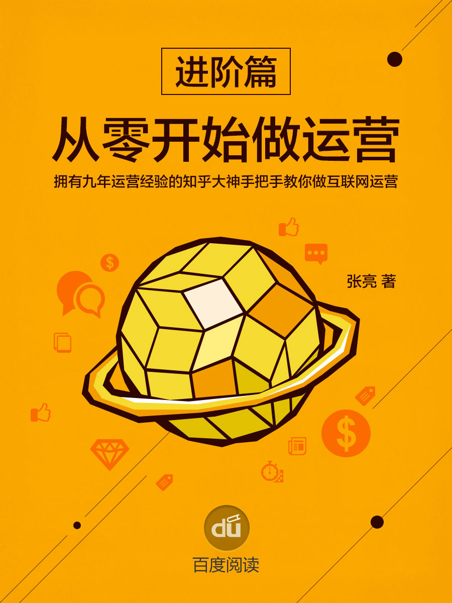

<svg xmlns="http://www.w3.org/2000/svg" xmlns:xlink="http://www.w3.org/1999/xlink" version="1.1" width="100%" height="100%" viewbox="0 0 563 751" preserveaspectratio="none">

<image width="563" height="751" xlink:href="cover.jpeg"></image>
</svg>

[前言](#index_split_000.html_filepos5747)

[第一章
内容运营进阶](#index_split_000.html_filepos7352)

> [1
> 内容运营核心的三件事](#index_split_000.html_filepos8134)

> [2
> 聊一聊内容的反馈机制与跟踪策略](#index_split_000.html_filepos16691)

> [3
> 让内容健康的流转](#index_split_000.html_filepos26439)

> [4
> 如何让社区用户动起来](#index_split_000.html_filepos34764)

> [5
> 当内容从桌面走向移动](#index_split_000.html_filepos43797)

> [6
> 当社交与内容碰撞](#index_split_000.html_filepos52674)

[第二章
活动运营进阶](#index_split_000.html_filepos60607)

> [1
> 活动运营核心的四件事](#index_split_000.html_filepos61362)

> [2
> 请以系统的观念对待活动策划](#index_split_000.html_filepos107217)

> [3
> 从淘宝的卖家营销工具看活动的系统观念](#index_split_000.html_filepos123081)

> [4
> 内部活动与联合活动](#index_split_000.html_filepos128438)

[第三章
用户运营进阶](#index_split_000.html_filepos136513)

> [1
> 了解你的用户](#index_split_000.html_filepos137143)

> [2
> 用户运营核心的四件事](#index_split_000.html_filepos165288)

> [3
> 一些絮絮叨叨有关用户运营的话](#index_split_001.html_filepos208927)

> [4
> 谈一谈用户激励](#index_split_001.html_filepos217164)

> [5
> 尊重而不盲从，保持联系也保持距离](#index_split_001.html_filepos226164)

> [6
> 分级管理，用户运营的必备手段](#index_split_001.html_filepos236974)

[第四章
移动端的运营](#index_split_001.html_filepos246896)

> [1
> 流量，在哪？](#index_split_001.html_filepos248159)

> [2
> 移动端的运营](#index_split_001.html_filepos258750)

[第五章
用户习惯的养成与其他](#index_split_001.html_filepos311677)

> [1
> 用户习惯的养成](#index_split_001.html_filepos312106)

> [2
> 教育用户or贴近用户？](#index_split_001.html_filepos320008)

[第六章
数据的那些事](#index_split_001.html_filepos337921)

> [1
> 数据的定义](#index_split_001.html_filepos338651)

> [2
> 有哪些数据](#index_split_001.html_filepos339099)

> [3
> 如何获取数据](#index_split_001.html_filepos346591)

> [4
> 如何分析数据](#index_split_001.html_filepos347890)

[后记](#index_split_001.html_filepos351160)

前言

 

感谢所有读者的支持，《从零开始做运营

入门篇》已经完结。从这个月开始，将陆续更新《从零开始做运营

进阶篇》。

在进阶篇中，我会尝试对入门篇中未及展开的有关内容运营、用户运营、活动运营的部分进行展开，也会试图去拆解产品在运营过程中可能遇到的问题及可能的解决方案。

我必须声明的是，这本书更多的来源于个人工作中的经验总结，因此，可能并不具备普适性。运营工作，很重要的部分是实操，而不是阅读，经验可以学习和借鉴，但千万不要当做解决一切问题的灵丹妙药，用户在变、环境在变，可能有一些运营上的手段和方法已经过时，可能有更好的解决方案。

所以，这本进阶篇，更希望的是与从业者探讨、共同提高。

谢谢大家的支持。

\
 

第一章
内容运营进阶

 

在《从零开始做运营

入门篇》第三章中，我对内容运营工作并没有完全展开来聊，仅仅提到一些皮毛，在这个章节中，我想尝试着提几个比较关键的点，作为内容运营的进阶，或许在这里，还是不能为大家展现内容运营的全貌，但我想，如果掌握了一些关键节点，通过实操来以点带面，形成个人的风格和技巧，或许才是从事运营的同学更应该关注的方面。

 

1
内容运营核心的三件事

 

说到内容运营，不得不提内容运营核心的三件事。一个网站或者产品，只要需要内容，就涉及内容供应链的建立，只要涉及内容供应链的建立，就必然涉及三方：网站与产品本身、内容生产者以及内容消费者。

内容消费者与网站与产品定位息息相关，它决定了网站和产品的内容给谁看，谁会对这些内容感兴趣从而提供可转化的流量；

内容生产者是网站与产品内容的发动机，它决定了网站和产品会输出怎样的内容给内容消费者，内容生产者所提供的内容与内容消费者兴趣的匹配，是保证内容流转效率和网站与产品转化能力的动力；

网站与产品本身需要维系内容生产者、满足内容消费者，通过各种方式去保证网站与产品的运转，从内容运营的角度来看，它不仅仅需要明确定位内容消费者，也需要努力维系内容生产者，同时通过对用户的反馈进行跟踪和跟进，以期让内容流转更顺畅、内容消费更黏着、用户转化更快捷。

1）

内容消费者定位

定位内容消费者，是一个以内容为主的网站或产品首先要做的事情，它是决定网站或产品最早一批种子用户中，进行内容消费的人群描像的关键。

比如，知乎早期的内容消费者定位是IT、互联网人群；豆瓣早期的内容消费者定位是喜欢读书的人群；时光网的内容消费者定位是电影爱好者。

这样的定位，带来的是网站或产品早期提供内容会聚焦在哪一个用户群体，从而建立比较单纯但直接的效果评价体系，并让后续运营调整和改进有依据。

内容消费者的定位是动态的，因此，每个以内容为主的网站或产品需要评估让用户进入的速率以及用户选型的控制。用户过快进入可能会导致内容消费定位来不及进行调整，甚至冲击最初建立的内容消费者定位，影响网站或产品提供所提供内容的质量和用户接受度。

通常，控制内容消费者进入最成熟的方案是：邀请机制。

广泛采用邀请制的可能是色情网站（大家熟知的1024），当然也有一些小范围测试的游戏和应用（比如，Gmail曾经也是邀请制）。

邀请机制本身会有几种作用：

a）让人感受到“稀缺性”。感受到“稀缺性”会带来两种极端：人群精确锁定与黑市交易泛滥。人群精确锁定是最好的结果，但如果稀缺的邀请码流入到黑市，就无法产生其本身希望锁定人群的目标，甚至会导致用户的厌恶情绪，损害品牌。

b）人为制造垂直领域用户群或者单一结构的用户群。

c）考验内容运营者与内容生产者的能力，甚至考验网站或者产品的成色。邀请码本身让潜在的用户充满了好奇，想要知道邀请码背后的世界究竟如何，而如果内容生产者或者运营者的能力不足，甚至网站或产品的技术有问题，就很容易产生用户活跃度低，无法激活有效用户留存和活跃。从而带来不好的结果。

邀请制可能稍后我要单独开一个章节来谈，这部分内容越深入去考虑越觉得三言两语说不清楚，在此先不展开了。

另一种方案是护城河。

这种方案一般见于传统论坛。建立新注册用户XX小时不允许发帖甚至发言。

这种作法的好处是：

a）避免小号、水军进入，减少灌水。

b）可以结合一些手段，让用户发言或者发帖前已经学习了相关规章制度，减少垃圾内容的出现。

坏处是：

a）考验用户的耐心。其实考验耐心是在考验用户对内容的需求强烈层次。

b）同时考验内容本身的成色。

但不管采用何种方案，控制内容消费者进入的类型和速率都和网站与产品本身的定位是正相关关系。其出发点都是为了避免过早的走向内容的扩张，从而确保在网站与产品的初期，内容消费者是一个较为固定和单纯的群体，便于运营切入。

2）

内容生产者维系

定位了内容消费者，就会返回考虑内容由谁来提供、提供什么样的内容，是内容消费者所喜欢的。

这一点和电子商务很像，某品牌定位的是女性客户，那么它可能就不会去进男士外套的货；某品牌定位的是数码发烧友，那么它就会接受大家电可能在自己的平台上只是一个品类的补充。

定位清楚内容消费者，只是第一步。而下一步就是要提供内容消费者感兴趣的内容，这部分内容可以自己提供，也可以请别人提供，但不管谁提供，都是内容生产者。

这里需要注意的是，如果内容生产者是人，那么就需要维系和内容生产者的关系，以确保内容生产者持续的为内容消费者提供内容。

3）反馈与跟进策略

这一点，我们在下一节里来详细讨论。

 

2
聊一聊内容的反馈机制与跟踪策略

 

不少人应该对下面这张截图有印象：

在各种社区里，更常见的是这玩意儿：

那我问一句，这两张截图所展示的功能的意义，仅仅是让用户表达一下对内容的看法么？

我相信可能答案会五花八门，从我的角度来说，这个功能：

1）增强了用户与网站之间的互动

2）有机会了解到用户对这个内容的态度

3）通过数据挖掘，可以尝试了解用户对这一类型的内容是否感兴趣，对这一类型的内容背后的产品的认知态度如何

这个功能其实代表的是一个反馈机制。

那么，下面呢？

如果下面没有了，那就是太监，这个机制除了给用户与网站或者内容之间产生互动以外，没有任何价值。

而如果下面是一个跟进策略呢？

比如，对持正面态度的用户推送同一人、同一领域、同一类型的内容；比如，对持负面态度的用户该推其他人、其他领域、其他类型的内容。又会如何呢？

我们在第三章里使用了这样一个截图：

有没有发现，它的文案虽然调整了，但是目标都是一样的：

通过发送私信，让有对PMP培训有潜在需求的客户前来参加培训，以获取用户的信息，后续进行转化。

但是，半年前它推送的信息我没有理会，半年后它改用了其他的话术来推同一件事，半年前的着眼点是向“对PMP项目管理有学习兴趣的人”推送“标注价值的免费讲座”，半年后的着眼点是“突出通过率”，向“希望报考PMP相关管理的人”推送“免费讲座”。

如果我们查一下2013年PMP考试的时间，会发现当年3月和9月有两次考试，那我们看一下它的发送策略：

1）均在考前4个月左右发起私信

2）对同一用户尝试不同的文案，以期考察何种类型的文案更能带来用户关注和潜在转化。

3）对于对PMP感兴趣的目标用户，尝试通过不同的作法来确认和过滤用户是否确实对PMP感兴趣，其需求强度如何（这一点其实是拔高了，我直觉还没有做到这一步，但是不妨碍我们对跟进策略做讨论）。

内容运营的渠道各不相同，有些有独立的平台，那么就出现我们上文说到的情况，而有些没有独立平台的，则通过EDM，甚至是公共平台开展内容运营。这一块我们也可以去看一下，有一些有趣的事情。

譬如说：

这是一个很典型的有跟进策略的EDM序列，当然，这个策略很简单：

根据孕期，对目标用户进行营销。

那我们看看它是如何操作的：

孕期知识邮件，其实有推它的杂志和站点哦：

夹杂在孕期知识邮件里的广告邮件：

是的，即便是广告，依然在围绕宝宝的健康在做营销。

再看一个公众号：

这是平日的新闻，我们看到它已经有了分类的概念：体育、科技、游戏、电影，下面的是周末的特刊：

我们很清晰的发现，即便是一个公众号，它的内容运营依然有策略，当然，在微信平台上，如果考虑反馈和跟进策略，比其他的如微博平台要难，但并非不可以做。理论上说，如果我们知道某一篇内容获得了大量的阅读和转发，我们是可以尝试对这一类型的内容去进行强化的，如果我们知道某一类的内容阅读量的多少，我们是可以对这一类内容去进行调整的。这也是跟进策略。

在这里我们已经可以对内容运营的反馈机制和跟进策略做一些总结：

1）内容的采集与管理工作中，必须要考虑用户反馈和对应反馈的跟进策略。

2）反馈机制和跟进策略可以根据平台的不同挑选展现方式。

3）数据挖掘机制非常重要，但更重要的是对数据挖掘之后的反馈与跟进。

4）内容不是一成不变的，它需要调整与提高。

5）内容运营必须要有KPI，但是这个KPI不管是曝光度的指标还是其他指标，指标的意义都不是单一用来达成，而是要返回来指导下一阶段的内容运营工作。

 

3
让内容健康的流转

 

我们在内容运营中，很容易碰到一类问题：

1）网站初期有了内容，但是如何到达内容消费者？

2）内容消费者消费了内容，但如何让内容制造者持续的生产内容？

3）内容制造者生产了内容，如何让内容扩散到其他的社区或者平台，让内容产生更大的价值？

这一类问题，都指向一个问题，内容如何流转，并且流转的健康、持续、有价值？

虽然我们在谈论这些问题的时候，觉得似乎很简单，但这些问题在实际操作的过程中，其实非常的棘手。

对于有内容，要如何到达内容消费者，有很多的手段，比如说，早期的RSS订阅，比如说，利用一些社会化分享的渠道。

而实际上，都会回归到一个核心问题，就是我们在本章开篇所谈到的，内容消费者定位之后，如何让内容消费者找到我们，甚至，让我们找到内容消费者。

RSS订阅实际上是让内容消费者找到我们，而社会化分享渠道是让我们找到内容消费者，但还有没有更多的办法？有的。在这里，我想适当的引入运营者的一个工作职责——用户研究。

谈到用户研究，做产品或者做过产品的同学甚至是读过一些产品方面书籍的同学，可能是有印象的。用户研究通常会划分到产品部门、数据部门，或者易用性测试部门，又或者是市场部门，甚至还有战略规划部门，我们很少听到运营者去讨论用户研究，但，运营者通常是做了最多用户研究工作的人，当然，运营者的工作可能与定量定性分析没有太多关系，也可能和通过用户访谈、用户需求调研去规划产品设计没有太多共性。但是，运营者的用户研究通常和运营目标紧密相关。

对于内容运营者来说，如果要让内容到达消费者，最重要的就是搞清楚几个问题：

1）内容消费者是谁？

2）他们通常在什么地方活跃？

3）他们的习惯是怎样的？

4）最近他们在关注什么热点？

5）我需要提供什么才能让他们注意到我、爱上我？

这些问题怎么解决？就是用户研究。

我们在《入门篇》中谈到过虾米初期与豆瓣用户重合度的故事，其实这背后隐藏的逻辑是：

1）用户是他的，也是我的

2）让内容消费者发现我，找到我最好的办法就是，让他们发现我是他喜欢的

怎么做？抓住种子用户。

请注意，并不是只有内容制造者才是种子用户，一个内容为主的社区或者网站，内容消费者的类型和内容制造者的质量一样重要。

如果我们把猫扑的典型内容消费者给天涯，把贴吧的典型内容消费者给知乎，把知乎的典型内容消费者给人人，可以脑补一下会发生怎样的场景，而这样的场景也确实在发生，至于结果，我想各个社区的老人（所谓种子用户）会有很多不同的感受。

同样，对于内容运营者来说，要让内容制造者持续的产生内容，就要尽量避免在一个时间段内，带来大量的与内容制造者产生的内容类型、内容质量不匹配的内容消费者。

我们经常听到“水化”、“论坛化”的字眼，其实这背后的玄机就是，内容消费者的引入有偏差，或者速率有偏差，引发了社区或者网站内容的变化，而这种变化，冲击到了固有的种子用户或者核心用户，导致了用户评价出现了不满。

除了避免我们所说的大量不匹配的内容消费者进入带来的冲击，我们还应当做好内容制造者的维系工作，这种工作，传统论坛的做法是等级、特权，很多社区的做法通过积分、权重、赞同、感谢，一些平台的做法是加V、认证。

这些做法的目的都类似：

人为的隔离对社区内容带来不同贡献度的用户，以保证核心的内容制造者不受到过多的干扰，尽量避免“鸡同鸭讲”甚至互相倾轧的现象，以维护内容社区的健康、稳定。

微信此前对于拉赞送奖品这件事情严厉打击，其根本目的之一也是为了避免大量的垃圾内容填充到用户的timeline中，造成太多负面的影响。

至于内容的扩散，这件事情，相对于上面两个问题来说，其实是最简单的一件事了。尤其是在信息爆炸的今天，我们有各种工具、各种渠道去让内容产生扩散。

新浪微博最常见的转发并@几位好友的做法，各个社区的点赞，很多网站使用jiathis等插件，都可以达成这样的目标，只是效果、范围、程度的不同。但他们的目的都几乎是一致的。

 

4
如何让社区用户动起来

 

我们都知道一个社区的内容，通常可能是由20%的内容制造者贡献了80%有价值的内容，事实上所谓的二八法则，在内容社区里可能会放大到1：9，甚至是1：999。大多数的社区内容制造者是稀少而的，而消费内容的用户则是绝大多数。因此，有些时候，我们会头疼，如何让社区的用户动起来，所谓动起来，也就是要让用户活跃起来，不仅仅是内容制造者，更重要的是让内容消费者积极的参与到社区的内容中来，造成社区用户活跃度高的感受。

从我认知上说，通常有以下几种做法：

1）提高准入门槛。

对于拥有稀缺内容或者优质内容的社区，会采用抬高用户的准入门槛，通过设置护城河、用户分级，让真正需要内容的用户进入，让不是真正需要内容的用户离开，进入的用户通常会积极参与社区的讨论，让社区的氛围热闹起来。

这种作法，通常在论坛这种形态上非常常见，比如，1024的邀请机制、很久以前上海音速论坛的100小时护城河、很多论坛的注册后X小时才可以发帖、回帖查看内容、不同用户组的不同阅读权限等等。

而这种作法，其优势在于进入的用户会自愿、积极的参与到社区内容中去，通过自身的活跃去换取获得内容的权限；其劣势在于，如果其内容并非稀缺或不可替代，用户会选择门槛更低的社区，而不选择跟着社区运营的脚步去让运营者达成活跃目标。

2）建立标准，让用户按照规定动作参与社区运营

大众点评的点评内容格式，在当时就是这样一种作用。最初的大众点评的内容贡献者，都按照这样的点评内容格式来撰写点评：

非常非常棒的火锅，我向来不怎么喜欢吃火锅，尤其是辣锅，但这家即使如此遥远（三号线虹桥路打车15块），我还是会考虑常去，且不全是为了擦鞋：）

在上海没有吃到过如此好的川锅，汤底一下锅就觉香气扑鼻；白汤也非常醇，值得一喝；

调料可以自助，但只是打了碗红汤代替，好锅底是可以不要调料的；

捞派特制滑牛（28）非常好；

鲜猪肠其实是半熟的卤大肠（26），也相当精彩，由于和某人一桌，要了两盘；

毛肚（26）黑得让人放心，七上八下的手法是有道理的，只要遵循操作口感就不会老，不过菊花牛肚（26）就难掌握些；

魔芋丝（10）口感不错，尤其打成结非常Q；

捞派羊羔肉（26）桃泡说就是普通的羊肉，其实她不爱吃羊肉，所以可信度不高，其实是很不错的羊肉；

捞派功夫面（4）的表演比想象的还要精彩，第一次去千万不要错过；

甜品的捞派麦甜苹果饼（8）和捞派苕酥（12）都很不错，如果知道最后送乌龙茶，就留着配茶了。

环境服务都很好，但这些对我而言并不太重要，尤其是服务要生意火爆时才看得出真相，难得的是味道真的很好，所以虽然不太喜欢川锅，还是打出了少有的4分。真心希望他们能红起来。

后来的点评，则直接具象出了表单：

为什么要这么做？

因为这样可以规范用户发布的内容，降低用户的使用门槛，让更多的用户参与到社区内容提供的事务中去。

事实也证明，这样的作法是靠谱的。

新浪微博也是通过140字限定，让用户发现其实制造内容并不是一件非常困难的事情，从而使微博这种形态与过去的Blog形态分离，让用户发现，制造内容的门槛其实很低，只要在规定字数内表达出自己的观点，即可以生成一条内容。通过关注、拉黑等功能让不发表内容的用户也有事情做，通过转发、@、评论、私信，以及后来加入的赞，来让不同类型的用户都有适合自己的动作。

类似的还有知乎，但是知乎只在提问一端做了这样的尝试，而对于真正需要贡献内容的答案撰写方面，依然采用开放的样式，这种作法是由于产品特性决定，但事实也证明，这对于促进用户贡献内容方面，并没有起到更好的作用。

3）制造观念冲突，让用户自发站队

首先，这是一种比较有风险的作法。同时，这也是一种能够在短时间内制造出用户活跃和用户引入的作法。

通常这一套运营方式是利用社会热点，形成多种不同角度、不同立场的初始内容，然后通过手段，让认同不同观点的用户发现彼此，并制造出冲突，从而引发用户的站队，比如之前的方韩大战，相信很多使用此法的社区、论坛的用户活跃度在当时都有不错的提升。

 

5
当内容从桌面走向移动

 

随着近几年移动互联网的热潮席卷，不管是微博、微信，还是各种新闻客户端、内容社区，都在手机这块小小的屏幕上极力的竞争，以谋求新的市场。

移动端和PC端相比，内容运营的根没有改变——凡是内容运营，其核心竞争力都依然是内容本身的质量、时效……但是有一个东西变了，基于内容的用户互动越来越多，社交的力量开始显现。

试想一下，神经猫在微信上的传播效应如果应用在某一个内容社区的内容扩散上，会发生什么？

虽然我曾经说过，神经猫这种东西其实是个虚火，它无根无源，拥有巨大但难以转化的流量，但是，如果这把火烧在了有根的内容社区，那么可能其效果就会相当的惊人。

因此，我们也不难理解，网易新闻客户端与腾讯新闻客户端之争，今日头条、澎湃新闻的异军突起。我们也很容易理解，天涯为什么要把论坛客户端化，还加入了一堆社交元素虽然其效果可能非常一般，但其思路却是有点意思的。

重申一点，任何产品都可以有内容，关键看你希望用内容做什么，以及如何通过内容运营获得收益。

我们比较容易看到移动端的一些内容运营的载体，比如：微信的公众号、微博、一些内容App或者一些App上的内容。

在这里，我先拿一个微信的新闻订阅号来举个小例子。

这个新闻订阅号叫做“SDAM新闻天天看”，这是不是一个相当拗口的名字，为了方便记忆，我们甚至会称它为“萨达姆新闻天天看”。那么，第一个问题：为什么它会叫这个名字？

如果我们不了解它的背景，我们可能很难回答这个问题。

其实SDAM是这个新闻订阅号创刊时的四大块内容，分别是：Sports、Digital、Auto和Movie，因为成员的个人原因，Auto的部分后来被Game取代了，所以它现在其实应该是SDGM而不是SDAM。

说这个目的是什么呢？很简单，移动端内容运营的第一步，依然是定位。说到定位，就会产生2个要求：

1、针对性

2、延续性

针对性是说，你需要仔细的想清楚你的内容是给谁看的，对这些人，你的内容是如何体现出针对性的，要让看内容的人满意，才有可能让他留下来。

延续性是说，你需要贯彻你的内容定位的方针，让用户习惯你，从而产生忠诚度，愿意停留在你的平台上，甚至通过各种运营手段的叠加，让用户愿爱上你并愿意主动去分享你提供的内容。

而移动端运营的第二个重要的事情是，加入社交元素。

这个可能是最有意思但是最麻烦的一件事情。

在这里我举一个有趣的例子，有兴趣的朋友可以去关注一下。依然是一个微信公众号，但他玩的是电商，叫做“乡里乡亲的茶铺”，可以去看看这个做电商的是怎么把社交元素加入到内容运营里的，他基本上是属于玩疯了的状态，当然，效果好不好，只有他和微信知道了。

另一个移动端内容运营必须应当把握的原则是快速反应。对热点的快速把握、对用户反馈的快速响应等等。

举一个不是互联网的例子。Zara这个服装品牌大家都知道，美国911大家也知道，那么大家是否知道，Zara在911的两周发生后的2周内快速反应，推出了悼念、哀伤主题的服装呢？

2001年911事件，美国人遭到沉重的心灵打击，大家都不愿意穿鲜艳的衣服了，因为心情沉重，都偏向选择黑、白、灰色的衣服，Zara根据客户需求的改变，在15天内设计出了一个系列暗色系的服装，并在西班牙工厂实现小量生产，然后空运到美国。而其他公司的设计师通常要花上好几个月时间才能设计出下个季度的服装。当其他服装公司也注意到了这种需求的变化，开始设计并生产同类型的服装。然而，12月圣诞节到来了，美国人渐渐淡忘911的悲伤，开始穿着喜庆的红色或绿色的衣服。而其他服装公司由于将生产外包给亚洲发展中国家，产品从设计到最后交付给门店要几个月才能完成，暗色系的衣服做出来后，销售的最好时间已经过了。\[注释\]

由于在移动端，用户的时间已经被各种应用切割的非常的细碎，只有能够对热点快速把握，对用户反馈快速响应，我们在进行内容运营时，才能牢牢的把握已经定位的用户，提供持续的有针对性的内容，从而获得更多的优势。

 

6
当社交与内容碰撞

 

这个Logo应该很多人多非常熟悉，这是一家从1999年3月开始运营至今的中国最大的BBS之一。它拥有超过9000万的注册用户，月覆盖用户超过2亿。

那么，谁还记得它的个人中心是何时变成这样的：

很抱歉，我也不记得了。

但是有两个时间点大家也许应该记得：

1、2010年11月，天涯微博内测版上线。

2、2013年年底，天涯微论上线。

如果我们去翻阅2010年-2013年底天涯的动态，我们会发现这些关键字：电商、旅游、游戏、公益、开放平台……

这是否印证了BBS正在被各种内容社区所冲击呢，我觉得是，因为这些关键字都透露着两个字：转型。

但是，能否印证天涯没落了呢？从百度指数的搜索指数来看，貌似不是：

很遗憾，因为我本人并算不上是天涯的深度用户，因此我无法以天涯为例来讨论社交和内容的碰撞有没有对天涯产生影响，那么我就举另一个案例，一个微信公众号的案例来聊一聊社交与内容的碰撞会带来什么。

当你看到这样一个界面，你的第一反应会是一个卖茶叶的微信公众号么？我不知道，我的第一反应是，我知道它卖茶叶，但我不知道它为什么要这么做。

然后，我们一一点开它的各个菜单吧：

好吧，我去搜索了一下这个公众号的背景，发现这是一家做茶叶的电商，并且它的定位是“家用”、“轻奢”。

那么下一个问题：它搞“主办或者参加你的城市茶会”是在做什么？

答案很简单：社交。

我不知道当电商与社交碰撞在一起，会发生什么，但我知道当社交与内容交织在一起会发生什么。

那如果我们再看一下所谓的“消费票选票与一个更好的世界”这个栏目呢？嗯，有兴趣的朋友可以加一下这个服务号，看看这里的内容，你真的会发现一个更大的世界。

当社交与内容结合，我们可以看到很多的层次：

1、分享。这是最基本的层次，社交在于内容上，一定会带来更多的传播和更广的扩散，这一点毫无疑问，几乎所有做内容的，都做到了。

2、互动。这个层次比上一个层次其实是更深入了，内容与用户的互动，用户与用户的互动。所谓互动，是你动我也动，你动我一下，我动你一下，如果只有一方在动，就不是互动。互动会带来什么？我们之前也聊过，带来内容的精准度、丰富性、针对性的提升，带来用户体验的提升。

3、信任。这一点不多说了。

4、忠诚。这个层次是很多人可以看到，但很多人很难去执行并且最终实现的。当用户对内容忠诚，代表着信任的构建完成。

5、营销。有很多做内容的产品或公司或个人，往往会将营销置于忠诚之前，我个人觉得是有问题的。当然，也许有些内容走的是肾，不需要信任与忠诚即可达到营销的目的，但我要说，很多内容的走心。尤其是当走肾这件事情越来越普遍的时候，走心虽然看起来慢，但可能是捷径，而且，未必就真的慢。

当然，这些也只是我个人的看法，做不得准。\
 

第二章
活动运营进阶

 

活动运营是一个巨大的话题，活动内容的进阶，不同的网站与产品，会有不同类型的活动，在本章中，我会尽可能的就各种类型、各种平台的活动运营的进阶内容做一些尝试，但是不敢说能够全部覆盖，只求对阅读本章节的读者有哪怕一丝丝的帮助就很开心了。

 

1
活动运营核心的四件事

 

活动运营顾名思义是通过组织活动刺激用户的注册、登录、活跃、留存、付费等指标的提升。

活动涉及到主体自然会有产品本身（可能是一个功能，也可能是一个场景）及用户。而活动运营的阶段则会包括：

\[图片\]

设计策划：当然是活动的设计阶段，会定义明确的活动时间、对象、方式、目标、预算，等等。

开发测试：请UI来做视觉，请开发来实现功能，请测试来确认可用与易用，等等。

宣传投放：找到可以触达用户的渠道，协调资源来做活动露出。这个阶段几乎是和开发测试同时进行的，而且为了活动效果，实际上在上线之前就会做一些预热。

上线运营：终于到了上线时间，活动就会在线上进行展示，让用户来参与活动。

归纳总结：活动结束了，总结经验教训，以备下次的活动做的更好一些。

而在上线运营-归纳总结的这段时间里，还需要关注各项指标数据、用户反馈，适时的调整活动，以期达到更好的用户体验，更优的达成活动目标。

因此，我在这里想说的活动运营核心的四件事，分别是：

1）成本预算与活动设计

2）活动风险管控与应急预案

3）活动数据监测与应对策略

4）活动效果判定与总结

1）成本预算与活动设计

做过运营的都知道，什么样的运营，都逃不掉成本、预算这两个词。

运营的成本说的是达成目标所要花的钱，运营的预算是说公司期望通过运营达成目标所愿意给的钱。

通常情况下，总体预算在每一年的年初甚至上一年的年末就已经全部定好了，也就是说，假设某一个公司或者产品的相关运营指标是用户数（注册、活跃、留存、付费、流失挽回），那么公司或者产品能够在这些数据上花的钱基本上也就已经确认过了。

而运营最痛苦的事情莫过于，预算没给够，或者，指标定高了。

但无论是哪一种情况，都是，成本不够数据指标提升所用。

在这样的情况下，如何将活动设计的吸引用户，同时又能够控制在成本预算之内，就比较关键了。

常见的作法是采用抽奖形式，用一个或几个看起来昂贵的奖品加上部分看起来不怎么贵的奖品进行组合。利用人们的侥幸心理，使用利益来进行诱惑。比如说，常见的微博转发类活动：

这类活动通常选用近期热点的商品作为奖品。

但是，这类活动的中奖概率实在不高，而且更关键的是，究竟这活动的奖品是真是假，中奖的人是真是假，用户都不关心，用户关心的是，自己中没中。

那么问题来了，什么样的活动可以这么干？

答案是，对用户来说操作成本低的活动可以这么干。

有没有人想过为什么微博上各种转发抽XX的活动会这么旺盛？因为对用户来说，操作的成本实在太低了。

无非是：

关注、转发、@几位好友（通常是3位）

而对于活动的设计者来说呢？

成本也很低啊，假定上图的这个活动，真的提供了iphone6并且真的发奖了，我们可以算算成本是多少。

实际需要支出预算的奖品：10台iPhone6

由于未说明iPhone6的型号，所以我们姑且认为是iPhone6的128G好了（其实按照我的经验，给你16G就已经很靠谱了）。

好吧，港行7188港元，10台是71880港元，折合人民币（姑且算8折）大概是58000元不到。

那么，这个活动带来了91万的转发，请问，每次转发的单位成本是多少？

其实类似的案例，有很多，比如新浪每年一做的让红包飞，其实基本上新浪自己都不用负担成本，但是效果是怎样的，至少在过年期间，微博的timeline会被刷的惨不忍睹。

这是常见的作法，不常见的作法是什么呢？

在往下说之前，我想先聊聊运营的方针，这个方针其实适用于所有的运营类型，不管是所谓产品运营还是用户运营、内容运营还是活动运营。

运营的方针有两种：一曰借力，二曰借势。

借力是借别人的力，借势是借环境的势。大家都听过雷军说：“站在台风口上猪都能飞上天”（貌似还有一种说法不是台风就是风，嗯，这个差别其实还是有的），那猪飞上天是借了风的势，而飞上天之后，就要要么自己有力要么去借力了。

我们刚刚所谈美图的这个案例，是借了iPhone6的势，那么如果我们想要借力，又有什么案例可以拿来聊着玩儿呢？

这个，基本上，我们可以姑且将它视为是一个借力的活动。

苏宁平台借了卫生巾品牌的力，反过来，卫生巾品牌在苏宁的店中店借了苏宁平台用户的力。

借力是一个相互的过程，因此，我们会发现，如果自己的活动预算不够，那其实还可以尝试与别的产品或者网站去做联合活动，共担成本。

说到这里，面对活动运营的成本预算管控，我们在活动设计上可以做什么呢？我个人的观点如下：

1、先看能不能借势，再看能不能借力。可以借势的，用抽奖玩，可以借力的用合作分摊成本。

2、如果势、力皆无，那么就要拿出数据说服老板，要么降低活动预期，要么增加活动预算。

3、如果老板说服不了，那么，尽你的最大努力，来设计一个吸引人的活动吧。至于怎么做，在《从零开始做运营

入门篇》中，我们已经大致说了一些了。可供参考。

2）活动风险管控与应急预案

我一直觉得，运营最累的部分，其实是如何控制运营风险，把用户体验做到最好。而活动运营最累的环节不是如何设计一个有趣的活动，而是如何保证活动开展过程中的用户体验，减少活动的风险。换而言之，哪怕是最普通的活动内容，用户看了完全提不起参与的兴趣，也不能让有兴趣参与的用户在整个活动流程中感到不快，不管是活动开发有Bug导致的体验不佳，还是活动设计有漏洞导致的不公平，都是需要考虑和严格把关的内容。

那么，我们来看一下，一个活动会有哪些环节会有哪些风险，是需要控制的，而涉及到的对象又是谁？

做过活动策划或者运营的同学可能都知道，一个活动从设计到上线至少会经过如图所示的5个阶段：

每一个阶段其实都涉及到不同的人员，并存在不同的风险，我们用脑图来看：

这张脑图只是大致的归纳了一下一个活动从策划开始到上线，所经历的环节，以及在每个环节中，可能会遇到的问题，这些问题，其实就是风险，如果总结一下，我们会发现，其实所有的风险，大都和“沟通”有关。

沟通的成本很高，运营人员、产品人员、开发人员、测试人员、客服人员……，甚至包括用户，大家在沟通过程中，很容易出现的是“没有说同一种语言”。

我曾经经历过这样一个案例：

市场同事谈了一个合作，双方做联合活动，目标很简单，就是通过两个产品上的Banner位，为彼此拉新用户。这个活动由市场人员策划，交由运营人员与开发对接，很简单的需求，最后出了一个问题：

后台程序没有按时上线，临时通过前端的Log来分析用户行为，人工跑数据，给符合条件的用户发奖，几天后完成测试，后台程序上线，接管用户行为的统计，并通过系统给符合条件的用户发奖。

我们反过来看这个案例的时候，发现了几个问题：

a）市场人员和运营人员沟通不足，出现了理解上的分歧。

这个所谓理解上的分歧是，目标是拉新用户，但是由于两边的产品都是App，那么所谓“拉新”的定义究竟是完成注册，还是下载并登录App？

市场内部负责这个项目的两人，都出现了理解分歧，一个认为是注册即可，一个则定位在了登录App。

运营人员则根据过往的经验，认为是下载并登录App。

理解上的分歧加上未充分沟通，导致了在后续流程中必然存在隐患。首当其冲的就是对于发奖条件的设计，这直接影响的是开发人员的工作量。

b）市场人员与开发人员沟通不足，出现了信息不对称。

市场人员因为过去做过类似活动，所以认为可以直接复用之前活动的代码进行调整即可测试上线。

开发人员则在整理代码的时候，把类似活动的代码给清除了，因此活动需要重新写代码，并需要重新测试，才可以部署上线。

信息不对称导致了市场人员过低估计开发难度，过于乐观的认为活动是可以随时上线的，而开发人员则需要遵照上线规范，必然达不到市场人员认为的“随时上线”的要求。

c）运营人员与市场、开发、测试人员沟通不足，出现了流程断档。

在a、b两个问题未暴露的情况下，如果运营接口人及时的与双方细致的沟通，那么是可以避免a和b的，但是很遗憾，运营接口人事务繁多，并没有及时细致的与涉及人员全面沟通，因此导致最后虽然代码全部完成，但测试未及跟进，最终只能先以前端记录Log，然后人工导出数据分析的方式来暂时解决问题。

发生了这件事之后，从运营端提出了解决方案：

后续所有内部、外部活动，策划完成后出具详细的需求定义文档，在审核通过后，所有涉及活动的开发与测试人员一起沟通，使所有人知晓活动上线时间的要求，并通过邮件确认。所有的文档、交互、设计，都必须使用类似redmine的工具进行归拢，并且在发生任何更新时，通知所有相关人员。

类似的情况，其实在上线后也会出现，并且影响范围可能会更大。

比如，活动策划时没有考虑清楚系统的风险，导致奖品被恶意套取；比如，活动前未通知客服，导致客服无法提前预知活动周期和规则，不能及时处理客服事件造成用户体验降低……等等。

那么上线前，作为运营人员需要考虑哪些事情来管控活动风险并进行应急预案呢？我认为，可能有以下内容：

在活动策划环节，就要考虑几个问题：设计的活动规则是否有漏洞（自己考虑，穷举极端事例）、会否因为活动影响普通用户的体验（系统问题，需要和产品沟通）、奖励设置是否合理（考虑用户获奖难度和用户获奖所需成本）、运营节奏如何把控（何时投放宣传、哪些指标提示需要调整文案）、运营效果如何监测（数据相关、核心指标、关联指标的考量等等）。

与开发、测试确认了开发需求和排期之后，需要着手整理FAQ、事件模板，并在上线前完成与客服团队的沟通，确认客服人员知晓处理相应事件的话术与应对策略。做好应急预案，当极端事例发生或出现数据异常波动的时候，有什么办法可以及时的拉回健康状态。

我相信看到这里，很多运营同学应该都深有感触，做运营跟养宠物养小孩儿似的，什么都要管，什么都要操心，稍有不慎就出了纰漏，让人着实紧张。

活动运营看似简单，但实际上不仅仅是个脑力活，也是个体力活。

但是，运营，就是干这个的。

3）活动数据监测与应对策略

作为活动运营人员，首先要明白，活动是一种短期刺激运营指标的手段，所谓短期刺激运营指标，是说，在活动设计的有效期内，通过活动这种运营手段，有效的提升相关的核心指标——社区可能是用户活跃度、内容新增数量；电商可能是成交量、客单价、转化率；游戏可能是活跃-付费转化率、付费人数等等。

指标不同，活动的方式也不一样。

说一千道一万，无论何种运营工作，其核心都离不开“数据”二字。

作为一个活动运营人员，活动数据的监测是非常关键的工作，而监测活动数据本身并不重要，重要的是懂得活动数据说明了什么样的问题，如何才能通过一些调整，改进活动数据，让活动更加有效果。

道理都明白，如何进行活动数据监测呢？

我们用一个活动来举例子。

某个旅游网站，发起了老用户邀请新用户加入，老用户和新用户都可以获得100元的代金券，如果活动期间，新用户完成了一笔旅游订单，不论金额大小，作为邀请人的老用户还可以获得100元的代金券。

我们先分析一下活动的流程：

我们来分析一下关键节点和对应应加入的数据统计：

这样我们就看的很明显了。

a）我们需要了解活动投放的渠道引入用户的转化率，并且了解什么样的用户对这类的活动感兴趣（是否下过单，是否活动带动了原先未注册的用户进行了注册，等等）；

b）我们需要了解用户偏向于使用什么样的邀请渠道来邀请用户，以及各渠道的转化率如何，这可以帮助我们在后续运营活动中进行改进，如果用户喜欢用SNS渠道，那么就要加强，如果用户不喜欢用邮箱渠道，那么以后就尽量不用，等等；

c）我们还需要了解新用户是否对活动感兴趣，在这里，我们可以多多尝试调整文案、强化引导等手段，来提升新用户的转化率，我们在这一数据指标监测中可以有效的掌握用户的偏好，究竟对于何种文案感兴趣，究竟是否能够通过各种引导来完成用户转化。

d）我们还需要监测新用户进入后有没有下单，下了什么单，单价多少，等等，这对于我们了解网站销售的产品对新用户的吸引力如何，什么样的用户喜好什么样的产品有帮助。

e）既然发了代金券，总归要知道用户有没有使用。

好了，说了这么多，大家可能发现了，我们做的是一个全局的数据统计，但是究竟哪些数据用来监测以提升活动效果，哪些数据是用来统计，后续对活动效果进行总结的同时进而帮助我们持续的改进活动呢？

a、b、c都是可以用来监测的指标，而d和e则更多的是用来借鉴的指标。

其实想想就很容易明白。

a、b、c三种类型的指标，可以采用实时监测的方式，让我们有效的知道活动相关的渠道（投放渠道、邀请渠道、注册渠道）的效果，并且，由于活动的灵活性，我们可以积极的采用不同的应对策略来进行调整。

对于投放渠道来说，我们可以明确的知道哪一个渠道投放是效果最好，哪一个不好，对于效果好的投放渠道，是为什么好，如果通过文案调整、投放内容调整，是否能够让渠道的投放效果更好；

对于邀请渠道来说，我们可以明白哪一类或者哪一个的渠道进行用户邀请的效果最好，哪一类或者哪一个的渠道进行用户邀请的效果不好，用户选择这一类或者这一个邀请渠道的原因是什么，是因为最广泛，还是因为最习惯（通常这两点是重叠的），邀请渠道的文案设计，怎样会提升效果，怎样会降低效果；

对于注册渠道来说，我们会发现注册渠道上的转化率受到的影响，可能是文案层面的，可能是产品层面的，可能是界面UI层面的。

在这里，分享一个案例，案例的对象是Airbnb，案例内容节选自范冰XDash的个人博客上的一篇文章《Airbnb是如何通过Growth
Hack逐步成长起来的？》，作者范冰XDash是国内Growth
Hacker领域作者、布道者，取得他的同意，在这里分享一下这篇文章中关于Airbnb用户推广计划的内容。：

用户推广计划

2013年年底，Airbnb计划重新启动他们的用户推广计划（referral
program）。这一计划之前被认定为“未充分利用”且“实际成效不佳”。Airbnb的产品增长部门经理Gustaf觉得这样的东西实在不值得骄傲。

为了全面改造用户推广计划，他们先是调研了此前的数据，认真研究每一个推介与被推介的用户的使用行为及留存情况，尝试预测什么样的人会转化成真实的用户。同时他们与业界有过成功案例的公司进行交流，探讨好的执行包含了哪些要素。

通过A/B测试对比通过Email、Twitter、Facebook和外链带来的流量特征，他们对文案进行调整，以确保推介邀请看上去像是在“给朋友优惠”，而不是乱发小广告。他们发现在推介内容中加入发送者的照片能提升这种好友之间送礼的感受。

另外，他们也发现通过Gmail和Android手机API调用通讯录获得的联系人，往往有更高的转化率，或许因为这些人彼此之间的联系更为密切。

通过A/B测试，他们还有一个关于推介文案的结论：给用户展示“利他”的文案，比“利己”的更容易带来转化。如图所示，告诉用户“邀请好友可以获得25美元”的效果就不如“给你的好友赠送25美元的旅行经费”更打动人。

经过3个月的封闭开发和3万行代码的沉淀，Airbnb全新的用户推荐系统于2014年1月份正式上线，效果取得了明显的提升，在某些地区使订单量提升了高达25%。同时，这些被推介来的用户，相较普通用户而言，通常有更高的留存率，并且也更愿意继续推介其他人加入。

我们在这里会发现，Airbnb对于活动运营数据深入的分析以及使用A/B测试对文案进行的调整，对于它所使用的用户推广计划有多么巨大的帮助。

说到用户推广计划（User
Referral），它目前也是很多网站、应用所钟爱的方式，我们熟知的Evernote、Youtube、Verizon都有类似的计划，甚至Drupal这种开源内容管理框架中都包含了User
Referral模块。

而国内的各种游戏推广员也基本采用了Referral的机制，这可能是一个非常有趣的现象，作为一种运营模式或者活动类型，它都可以被尝试，有志于活动运营的同学也可以了解一下，相当有趣。

4）活动效果判定与总结

做事情要有始有终，做活动也是如此。

本章开篇我们已经列了活动运营的五个阶段：

这个小节，我们就来谈归纳总结。

首先，我必须声明两点：

1、所谓活动的归纳总结，绝不是活动之后写一篇活动报告这样简单的文本工作。

2、归纳总结更多的是为了从一次活动中得出经验和教训，用来对以后的活动运营工作的提升进行指引，而不是追究活动效果不利的责任，或者美化活动效果得到奖励的依据。

因此，如果很遗憾你抱有我所说的上述心态，请务必端正态度继续阅读。我这样说并不是没有来由的故作姿态，而是，确确实实，我自己也曾抱有这样的心态，而接触的一些运营人员，也曾经或者正在抱有这样的心态。

接下来，我们入正题。

活动总结的格式与内容

其实，活动总结没有固定格式，你可以使用Word、PPT，甚至Excel或者脑图，来进行活动总结。

活动总结的内容应当包含：

1）活动时间

2）活动内容

3）活动效果

4）经验教训

是不是很简单。是的，内容很直接，但是一点不简单。

对于前两点，你需要对照一下最初活动设计的策划案，对照一下，哪些需求实现了，哪些需求没有实现，有没有按时上线或者变更需求？请如实的反馈出来。

对于后两点，就比较考验功利了。

要写活动效果，首先你得知道数据。

然后你得知道数据为什么会波动，有哪些是自然波动，有哪些是你做了调整导致的，还有哪些是外因导致的——比如，季节性因素。

知道了数据波动的原因之后，你要能够明确影响数据波动的原因的主次关系，哪个原因的影响最大，哪个几乎没有影响，哪些是正面影响，哪些是负面影响。

如果你无法知道这些，那么你也不会从中找到经验和教训。

活动总结的关键与核心

坦白说，一份活动总结，最关键和最核心的部分就是你对活动数据的展现和经验教训的总结了。

对于经验和教训，我的建议是：大胆假设，积极再现。

举个例子，理想状态下，一个活动，启动时效果一般，过了一段时间出现了峰值，然后回落。那么，我们可以这样考虑：

1）启动效果一般，因为预热期可能过短或者过长，下次活动的时候就调整预热期的时间。

2）峰值时虽然运营人员没有主动做一些事情，而是本身活动周期性因素导致的，那么下一次活动运营人员可以主动做一些事情延缓峰值回落，比如，采用即时开奖，大奖即时呈现用户的方法——盛大积分时期，我们曾经在活动时尝试过在标题栏上做跑马灯，将获得较好奖励的用户的中奖情况滚动播出，效果很好，虽然山寨感很强，但做活动，就是不要怕丑，要怕没人知道没有效果。

当然，上述只是大致描述一下思路，实际的活动总结可以肯定比这种理想状态的情况要复杂。

那么，如果要能够足够细致的对活动进行总结，我们在第3小节里提到的活动数据监测这件事情就尤为重要。

那么，如何判定活动效果是好还是不好呢？我斗胆提2个原则：

1、成本测量原则

所谓成本测量原则是说，在活动设计时，提出一个总成本和人均成本的数值以及活动目标值，考核活动结束时，成本是否在预期成本以内。比如：

本活动预计可以带来10000名注册用户，活动奖品总成本100000元人民币。

那么，可知，总成本是10万元人民币，一个新注册用户的成本平均是10元人民币。

如果你花了8万元，带来了20000名注册用户，那么这个活动效果是超出预期的。

如果你花了6万元，但只带来了5000名注册用户，那么这个效果就需要检讨了。

成本测量原则的预期是：

将活动总成本控制在预算总成本以内，不超发，同时，单个指标的成本越低越好。

2、KPI达成原则

KPI达成原则是说，在活动设计时，虽然提出了总成本和人均成本数值，但同时也提出了活动目标值，考核活动结束时，是否达成了活动的KPI。

还是上一个活动：

本活动预计可以带来10000名注册用户，活动奖品总成本100000元人民币。

结果，由于某些原因，成本没有控制住，超发了10万元人民币，但是这个活动却因为超发的10万元人民币多带来了20000名注册用户。

平均下来，一个用户的成本由原先预计的10元变成了7元不到。

那么，这算不算是一个好的活动效果呢？

其实，效果是好的，但是如果控制在成本内，那么就更加完美了。

因此，KPI达成原则的预期是：

用超出预期的效果来覆盖成本控制不当的负面影响。

当然，我要说的是，每个公司的情况不同，老板的性格不同，财务管理的风格不同。

因此，请遵循你所在的企业认可的活动效果判定原则，才是最恰当的。

 

2
请以系统的观念对待活动策划

 

在日常的活动运营中，我们常常会发现活动的设计很多是类似的，虽然各种不同的网站与产品的运营重点不同，但是从活动种类来说，大致会有以下几种：

抽奖类活动：满足一定条件的用户参与抽奖，抽奖的类型可以是礼盒、转盘、彩票开奖结果、股市指数等，时效可以是即时的（立即开奖）可以是延时的（指定时间公布开奖结果），奖品可以是现金、实物或者虚拟物品（积分、游戏的道具、商户的优惠券等等）。

红包类活动：满足一定条件的用户可以获得红包，红包中有一定金额的可以抵扣的代币或者现金，有些可以提现，有些不可以提现，红包可以限制使用场景。

收集类活动：用户通过行为去进行收集，收集后的物品可以组合或者单独进行兑换。比如，集齐七颗龙珠召唤神龙其实就是收集类活动。

返利类活动：用户满足一定的消费金额和笔数，可以获得返利（可以是现金，也可以是积分），返利获得的奖励可以限定使用场景。

竞猜（彩）类活动：用户参与活动，进行竞猜（彩），赢取奖励，多见于世界杯年。

活动的目的，无非是着眼在两个层面：

促进用户行为相关：注册、活跃、付费或者转化以及其他需要短期进行提升的用户行为；

促进网站或产品指标相关：功能使用频次，电商客单价、转化率，社区UGC数量等；

这两个层面其实是互相促进与联动的。

因此，不管是我们自己做活动，还是看别人做活动，基本上，活动的方式和方法都殊途同归，那么问题来了，如果我们并没有从运营层面上研究出新玩法，仅仅是在不同的时间点进行不同的包装，对于活动运营或者活动策划本身，我们究竟应该抱以什么样的态度和观念？

如果我们回想一下近年来比较热点的活动，我们可能会想到两个：

淘宝“双11”活动和新浪的“让红包飞”。

这两个活动几乎成了每年11月11日和每年春节期间必然会有的大型活动。

说到双11，你的心里是否会浮现出这样的暗示？

那么，说到“让红包飞”你会否有这样的感受？

为什么会产生这样的结果？

首先，这两个活动代表了一种活动类型：周期性活动或者我们称为定期活动。

然后，这两个活动的玩法或者说运营方式并没有很大的变化，且和自身的核心功能关联紧密，因此，无需付出更多的教育用户的成本。

从这个角度来看，我们会发现，对于活动运营者来说，如果不从系统的角度去思考活动的设计和策划，往往会做很多重复的工作。

比如，国庆节做了一期转盘抽奖活动，到了春节还想做一期九宫格翻牌的抽奖活动。如果我们从系统的角度去考虑，可以对开发提出需求，提供一个通用的自动抽奖后台，然后前台如何包装，都没有关系；如果我们不从系统的角度考虑，可能国庆节和春节要分别重新让开发写一段代码，来实现抽奖这个核心需求。

所谓系统的观念来对待活动策划，是对活动运营人员提出了一个考虑“系统复用”的课题，同时对活动运营人员还提出了需要具备周期性活动策划的意识。

什么是“系统复用”？

很简单，就是一套系统可以被用于多个场景。对于活动运营来说，就是有一个系统可以支撑多种活动运营模式，而无需再次开发。

为什么要“系统复用”？

产品开发和运营活动开发都是技术开发，需要美工设计和技术排期，特别对技术来说，如果在进行开发时，发现其实很多的内容都是过去已经开发过的，相信没有一个技术会对这种系统产生开发的热情，这和写策划和产品DEMO一样，重复的工作毫无价值。因此，我们必须要尝试学习系统复用的概念。

而系统复用，可以帮助我们：节省开发资源、缩短测试时间，快速完成上线。

什么样的系统可以复用？

从我的角度来说，可以复用的系统应该包含几个特点：

可扩展，系统本身的开放性很高，因此可以兼容多个产品设计方案的填充；可配置，调整配置就可以产生各种不同的效果；可通用，用户的需求有核心需求和边缘需求，系统也有核心功能和扩展功能，核心功能越没有针对性，可复用的可能性就高。

在这里我想用过去盛大积分的一个宝箱系统来说明，已有系统复用，可以做到什么样的程度。

宝箱系统，其实是一个可配置概率的后台抽奖系统。对于这类系统相信大多数运营人员和产品人员都不陌生，相信很多公司都有类似的系统，这个东西一般的使用场景，是在做活动的时候，在后台配置奖品的爆出概率。看到这里，先思考一个问题：你认为这套系统可以做哪些事情？

如果你可以不假思索的给出3个以上的答案，那么就不要往下面看了，如果你停下来思考，那么请往下面看。

盛大积分的宝箱系统在设计的，整个系统架构是由概率控制系统、奖品管理系统和宝箱管理系统这三个子系统进行配置设计的，我们用它做了很多有趣的事情：

1、基本功能：以宝箱系统作为抽奖后台，前台搭配不同的展现形式，比如：转盘抽奖、过节发红包、翻格子（什么打地鼠啦、九宫格啦、应景的其他各种抽奖）等等。

2、小扩展：由于在这个系统里，奖品的种类和数量其实是可以无限拓展的，由于有概率控制系统，于是，淘宝之前玩的集字游戏（收集类活动）也可以利用宝箱系统，通过配置被收集物的类型和数量，在前台各个可触发宝箱开奖的路径调用接口就可以实现。

3、开放平台：运营人员会碰到很多机会做与外部的联合活动，通过宝箱系统，我们可以在只做接口的情况下，快速的完成活动上线，并且满足不同联合活动的需求。

4、核心底层：我们后期将宝箱系统变成了一个抽奖引擎，加上了用户行为库、风控库和规则引擎，产生出了一个通用的用户行为奖励系统，通过这个系统，在后台配置活动规则与目标用户，通过调用活动模板库，可以快速的完成活动上线。

积分的宝箱系统最早是用来满足基本抽奖的，没有任何包装，就是开宝箱；后来我们想包装一下，于是转盘抽奖就直接推出来了，从决定做到上线，只花费了美工2天的时间，技术没有开发，测试只用了半天；（基础功能）

09年春节，我们想提升网站的PV，于是用宝箱底层，把打开页面动作和开宝箱结合在一起，直接推出了集字游戏，活动上线的结果是让服务器崩了，开发用了2天，美工用了1天，测试1天；（小扩展）

10年输出给某项目组使用，他们举办活动的时候，可以直接调用接口，随机开宝箱，送给用户奖品，这个开发基本没有花什么时间，联调花费1天；（开放平台）

10年下半年，我们通过新建宝箱名称，成功的打造了一款小的收集游戏，之后，这个小游戏立刻进入产品化用于对外输出，奖励接入方用户行为的一套系统。（开放平台+小扩展）

11年和13年上半年，通过宝箱系统作为底层，产出了积分的针对用户行为的积分发放系统和通用用户行为奖励系统。（核心底层）

这是“系统复用”的力量。

而周期性的活动策划意识是另一个活动运营系统观所需要考虑的事情。

“签到”是一个非常常见的周期性活动策划。从腾讯到阿里，不管是游戏（比如手游的每天登录送XXX）、娱乐（比如签到解锁表情）、会员（签到领淘金币、QQ登录再在线时长升级）等等，都在着力培养用户的习惯——经常上来看一下，久而久之就成了习惯。

周期性活动运营观念，从我的了解来说，最早可能是从游戏中来的，比如说，06年的《魔力宝贝》和《魔兽世界》都有活动日历的功能：

京东有一段时间，非常喜欢用日历——其实现在也很喜欢用：

永和大王2012年也推出过所谓“台历优惠券”（当然不能忘了肯德基也干过）：

为什么大家会选择以这种方式呢？

很简单，周期性的活动有助于培养用户的习惯养成，可以减少宣传的成本，养成了习惯的用户到了时间节点会主动的参与活动。通过用户主动参与的行为，可以了解用户的偏好，对后续的活动运营改进有所助益。

 

3
从淘宝的卖家营销工具看活动的系统观念

 

电子商务和网络游戏，可能是互联网范围内，活动做的最多、最频繁的两个行业了。而淘宝，可能是活动工具系统化最深入的一家企业了。

让我们先看一眼淘宝为卖家提供了哪些推广和营销的工具：

如果我们分个类，大致是这样子：

我们用双11来举例的话，卖家报名参加双11，是在“淘营销”中，当然，这是Landing
Page，而不是入口，至于入口，那其实就有很多了。卖家的店铺装修可以进、从卖家中心的“活动报名”也可以进、……

那么，就双11来说，淘宝提供了哪些工具呢？

1、店铺的免费装修，这种作法，强化了参与活动商家从界面上的统一性，显得不那么山寨。

2、双11专用的配置工具：

其中的打地鼠，其实就是我们在上一小节说的宝箱系统，可以给大家看一下配置页：

坦白来说，作为一个运营人员，如果拥有这样的工具，那么真的是纯粹看运营成本和各自的运营能力了。

再说的直白点，有没有奖品，多少人能中奖，完全要看运营人员如何进行配置了。

所以，我们常说，“运营之道，存乎一心”，这个后续我们再说吧。

再看一下淘宝提供的会员营销活动工具：

怎么样，是不是觉得卖家如果稍微懂一点运营知识，这些工具基本上覆盖了大多数的活动需求呢？

如果我们自己有这些系统，会不会极大的改善运营效率，从而有机会减少产品、运营、开发、测试等相关人员在一个活动上耗费的时间与精力，进而更有效的进行活动运营呢？

当然，系统是表象，而深层次更需要考虑的是：

1、提供出来的系统，应当是总结了大多数需求，可以满足大多数活动规则的产品。

2、如何去总结这些需求，并匹配到自己的运营工作中，才是最大的命题。

3、因此，有系统的活动观念，只是第一步，更重要的是实现系统。不管是一个系统的产品，还是一个周期性的活动计划表。想不重要，落地才重要。

 

4
内部活动与联合活动

 

说到做活动，活动运营人员经常在两个角色中转换：

内部活动：活动运营人员是驱动器，是活动的需求方。这一点几乎所有的公司，都是如此，对于内部活动，活动运营人员有很大的权限，可以决定做什么活动，如何实施，从而申请活动的执行预算，并且维护全程，让活动落地，有始有终。

联合活动：活动运营人员是调和剂，是活动需求的承接方和合作者。这一点，不同的公司有不同的分工，有的公司，活动运营人员同时还承担BD（Business
Development
商务拓展）的角色，需要去和其他公司谈判，共担成本甚至让对方负担成本，采用联合活动的方式，来完成活动策划并让活动落地执行；而另一些公司，活动运营人员只是承接从市场（Marketing）传递过来的合作意向，去完成需求的整理及活动策划并让活动落地执行。

内部活动需要展开的并不多，我们在本章第一节中已经做了很多的说明，一个合格的活动运营人员，只要严格的按照成本-设计、风险-管理、数据-监控、效果-总结的做法来做，基本上就可以通过熟练度的提升、创意能力的锻炼、资源整合能力的加强，来提升整个内部活动策划、执行、管理的能力。

而联合活动（或称外部活动）就需要多谈一些。

首先要说的是需求确认与需求控制。

不管是承接活动需求，还是合作推进活动落地，都需要对活动本身是为什么而做，要达到什么目的，实现什么目标，进行严格而准确的定义。因为合作的基础是你有他没有的，而他有你没有的，说的直白一些，就是合作的双方需要各取所需。因此，联合活动的目的是必须要明确的，你想要的资源要通过什么方式从合作方转接过来，这需要准确的确认需求。

有一个误区：如果合作方出了钱，那么合作方就是大爷，提出的一切需求都需要满足。

这句话本身是没有问题的，但在实践中，如果真的如此执行，成本就过于高昂，因为可能合作方的需求大多数情况下是个性的。个性的问题在于，每个活动的实际需求可能是不同的。而且几乎无法复用。

这个时候，一个传统行里里经常说的方法就出现了：

客户预期管理。

首先来看客户预期，用一张图来表示：

基本需求是客户认为服务提供方本应提供的服务，是最基本应当提供的服务，因此，如果基本需求不能被很好的满足，客户就会不满意，而即便基本需求能够被满足的很好，其实客户也不觉得非常满意。而惊喜需求则是客户觉得你不会提供的服务，是一种超越了期待的服务，因此，不管满足的好不好，是否全面，客户都会觉得满意。而预期需求则是客户被告知、被教育会获得的服务，因此，这个预期需求实现程度的高低，与客户的满意度是呈正向的线性关系。

传统的管理客户预期的方法是：

 

对于我们的运营人员来说，这个方法其实是相通的，只是替换成了：

而这样做的原因其实还是：

实现自体的运营目标。

需求明确了，预期控制了，接下来做什么呢？

两件事：

1、围绕单一的合作活动，去做活动设计

2、总结合作活动的共性，去做系统设计

第一件事情，是为了实现当前的合作目标，第二件事情，是为了未来可以批量实现类似的合作目标，所以回过头来我们会发现，系统观念在运营工作中确实非常重要。

当看到第一件事和第二件事时，我们有时候会觉得迷惑：

单一的合作活动总有个性，即使做了系统，依然不能避免再次开发，那么做系统设计是否有必要。

我相信，很多商业产品经理的回答，都会是：绝对有必要。

从我的经验来说，很多合作活动的个性，区别在活动的包装，而活动的内核，往往没有区别，即便有区别，也区别并不大。当然，这里的没有区别，主要是对于同一类活动或者同一类合作方而言。

而商业产品经理之所以会回答有必要，则是因为他们通过客户预期管理，筛选出了最合适系统化的产品需求，然后做出了可以给大多数合作方使用的产品，从而可以获得更好的业绩。

以上，是乙方的做法，如果你是联合活动的甲方，那么做法其实就反过来了。

首先，你要明确进行联合活动的目的，确保联合活动是可以对你的目标产生价值的，可以符合你的预期。

然后，你要想办法了解甚至控制整个流程，避免被乙方牵着走。在这里你需要注意的是避免强人所难，但要保证合作预期效果的达成。

\
 

第三章
用户运营进阶

 

在用户运营进阶中，我们将系统的讨论几个问题：对于用户运营来说，怎样是好的用户运营；用户运营究竟有哪些环节是需要注意的……我们会花比较多的笔墨放在用户研究、用户描像、用户激励上，试图来讨论用户运营的工作究竟应该如何做。

 

1
了解你的用户

 

我想了很久以什么样的开头来进入用户运营的进阶，想来想去还是这件事，了解你的用户。

虽然我们很多人做了很久的用户运营，但其实大多数时间是在围绕指标做事情，我们是不是真的了解自己的用户，是一个很大的问号。

我们在入门篇里其实已经谈过了，用户运营的核心工作，就是“开源、节流、促活跃、转付费”，其实每一件事情都很难，开源拉来了新用户，要想办法让用户沉淀在平台上；节流的关键在于建立用户流失模型，进而帮助我们做用户流失预警，防止用流失，因为沉默挽回实在是一个巨大的课题；促用户活跃是为了让留下来的用户对平台产生粘性，避免留下来的用户安静，甚至跑掉；转付费的关键是让活跃的用户体验到付费的好处。

这些工作，都建立在一个基础上，就是对用户的了解。

那么什么样的指标意味着我们对用户了解呢？

其实很简单。

1、对于开源拉新的工作来说。我会知道我用什么样的方式是可以拉来新用户的，如果我和其他平台合作，如果采用第三方联合登录，我可以用哪些手段促成用户的后转化；如果采用活动的形式，用哪种活动包装用户最喜欢。

举一个很简单的例子。

假设你要做人推人的Referral活动，你应当知道，你的用户喜欢用哪一种渠道去进行分享和邀请，同时也应当知道，这个活动在哪些平台投放，和哪些平台合作，会达到效果最优。

2、对于节流防止用流失的工作来说。我要知道我的用户在什么情况下会流失，流失前他们可能会做哪些动作，如果要做客户管理工作，我应当选择什么样的方式会让用户觉得被重视从而留下来。

3、对于促活跃的工作，则需要知道，活动用什么包装、采用什么频率，用户会积极参与而不会疲劳；什么类型的活动对于促进活跃的帮助最优。等等。

4、而对于转付费，那就更加需要了解，自己的产品中，哪个部分最让用户无法放弃，而为了这些部分，用户是不是有足够的付费意愿，是否需要变通，通过包装的形式，给到用户从而让他觉得值得。

所有的工作，都围绕一个内容，人。

既然用户是人，那么基本又绕不开所谓的需求理论。

马斯洛同志认为人的需求是有层次的，首先要满足生理的需求，然后会出现对安全的需求，之后是社交需求，进而需求被尊重，最后追求自我实现。

其实理解起来是很简单——先生存后生活，先赚钱后享受。

不管马斯洛的需求金字塔对不对，我们必须承认，互联网产品自身的发展其实和这个金字塔结构的关系是很相像的，那么，另一个必须承认的现实是，作为互联网产品的用户，其实也是如此。

一个产品由多个功能组成，这些功能，满足用户不同层次的需求，从简单到复杂，从简陋到圆满。

而作为用户运营，就要和用户一起成长。

让我们想想一下这样一个场景：

某个社交产品，最初的用户只是为了满足沟通的需求，而不在乎和谁沟通，慢慢的，他们可能希望将自己的联系人分个组，或者希望可以同时和一群人聊天；接着，他们可能觉得单纯的打字已经不足以表达自己的意思，希望可以加入图片、语音、甚至视频沟通的方式；再后来，可能觉得光聊天没意思，是不是能和好友玩玩游戏，分享些生活点滴；……终于，有一天，他们觉得聊来聊去都是这些人，好像和陌生人吹吹牛，嗯，或许还可以约出来喝喝茶、谈谈人生，之类。

是的，产品也因为用户的需求而变得丰满，甚至臃肿起来，更甚，公司做了另一款甚至另几款产品来帮助用户实现需求。

而这个时候，我们也发现用户的运营工作也复杂起来，变得越来越多元。其目的，就是为了更好的服务用户，其立足点是对用户的了解。

那么，我们如何了解用户，我想接下来我试图分2个部分来对这个问题进行讨论：

1）从数据窥探用户。

2）直面用户。

1）从数据窥探用户

这个话题其实会很有意思，从入门篇开始，我就一直在强调数据的重要性。

数据不仅仅验证我们运营的效果，还可以窥探用户的偏好、习惯。以一个电商网站的浏览路径为例，我们来看看如何窥探用户：

通常，在每一个环节，用户基本都会做以下几件事：

浏览：就是用户会东看看西看看，对应的数据指标：停留时长。关联指标：点击、注册、登录点击：就是用户会点来点去，包括网页上的广告、按钮、图片、链接。注册：用户可能会点击首页上的注册按钮或者注册链接进行注册。登录：用户可能会点击首页上的登录按钮或者登录链接进行登录。蹦失：请注意这个定义，蹦失不等于跳出，蹦失是用户直接离开页面或者关闭浏览器。跳出是离开这个页面，而正常流程，也会跳出，不一定是蹦失。

单独把这些事情拿出来看，其实基本没什么意义，它描述了一个用户进入首页之后的所有动作，我们可以根据这些动作，去明白用户是不是喜欢这样个电商网站，哪些地方遇到了阻碍，是否可以改进。

这是产品层面的，而运营层面会得到哪些提示呢？

首先，电商平台的运营要关注什么，我的理解，一是和钱相关：订单量、客单价，二是和百分比相关：转化率。

那么，转化率怎么来的，转化率有几个层面的不同定义：

1、列表页转化率=最终下单用户数/商品列表页到达用户数

2、详情页转化率=最终下单用户数/商品详情页到达用户数

3、支付转化率或者说支付成功率=支付成功的用户/最终下单用户数

这其中，对于电商平台来说，不可控的是支付转化率，难控制的是列表页转化率，可控制的是详情页转化率。

所以，我们看到不管是淘宝还是京东，商户都非常在意详情页的设计和内容组织的方式，而平台都着力在浏览路径的通顺和评论系统的丰富上下工夫。

为什么会这样呢？

这就是运营或者产品通过数据剖析产生的结果。

首先，如果详情页转化率不高，会反过来看停留时间和内容呈现的关系，如果内容呈现有问题，用户停留的时间就会过短或者过长，过短是因为没东西看，过长则因为看不到重点，并且下次可能停留时间会变短，因为实在没耐心看——这个时候，页面的蹦失就会变高，而不是跳出到支付环节。

然后，还会比对不同商户的同类商品的转化率，以确认究竟何种内容呈现是容易促成下单的。

最后，会形成结论，并且去解决。

而电商平台另一个重要的玩法就是推荐。

我们会在电商平台上看到猜你喜欢：

 

这些结果如何来的？

1、根据用户的浏览历史进行相关性推荐。

2、根据同类用户的购买历史进行协同过滤。

这些是算法，但从运营层面来看，逻辑很简单。

简单的描述，相关性推荐是这样的：

因为用户浏览了一件商品，所以向用户推荐同类的其他商品。

而协同过滤稍微复杂，但也很简单：

简单的说，就是让类似的用户模型购买过的商品被推荐给彼此，而不具共性的用户模型购买过的商品被推荐过滤掉。

所以，你大约已经有了一个概念，所谓不割裂的看单一数据是什么意思。

如果我们说的直接一点，就是数据需要归类，不同类别的数据需要分门别类的存放和使用，找到数据之间的关联与逻辑关系，分析需要归因，对于数据产生的现象背后的原因要分析和查找。

当然，由于用户运营要做的事情是针对人，而人本身属于不可预测，所以，不管是归类还是归因，最后都需要验证推论的正确性，这就产生了持续运营的总结和归纳，表现到行为上，就是重现与试错。

能够确认的归因，就重现，不能确认的就试错。

通过这两种方式，用户运营就可以站在一个比较高的高度和比较大的角度去看待你的用户，和了解你的用户。

当然，通过数据窥探用户靠的是猜，猜的准不准，多猜几次就好了。

数据还可以帮我们描绘用户可能是什么样的人。

比如，App上有一个用户A，一直不注册，但是一直是用唯一的一台设备打开某个UGC社区。

数据显示：

A在最近30天关注了：求职、互联网、产品经理、移动互联网。

那么，我们可以推测，A可能是一个正在寻找移动互联网和互联网产品经理职位的一个求职者。

那么，如果我们这个时候想推动其注册，我们就可以从这一点入手，对他进行注册转化的尝试，比如让产品做一些设计：最多浏览多少篇内容，就会提示注册，否则无法继续浏览；比如做一些推送：想了解更多更全面的互联网产品经理岗位的内容，请先注册并完成登录；比如做一些活动：现在注册，即送《产品经理葵花宝典》一本。

当然，用户运营人员绝对不应该只为了这一个用户提出这么多假设，因为这样做成本太高，所以，通常这种做法是对群体完成推测描像后，再讨论的问题。

数据不仅可以从侧面去印证我们的猜测，还可以帮助我们了解用户的需求，找到可能的解决方案。

譬如，某通用积分平台的用户使用积分在第三方平台购物返利的数据如下：

从以上数据中，我们可以有哪些推论呢？

1、该站点的用户的可用积分可能并不是很多，大多数用户获取积分的途径比较单一，一些用户很习惯通过这种方式购物来获取积分。

2、该站点的用户有使用积分抵扣现金购物的习惯，并且额度分布比较分散，小额和大额都有，抵扣价值从几毛钱到二、三十元都有，既有占现金比重千分之几的，也有占现金比重30%的。

从这两个推论出发，一个用户运营人员可能可以推出以下的运营方向：

1、扩大积分的获取途径，让用户可以更容易的获取积分。

2、从用户的行为来看，积分对用户是有粘度的，从摘取的数据看，有一些用户有获取积分、累积积分的习惯，但消费不积极，因此除了打开获取积分的渠道之外，采用一些方法降低积分的使用条件、增加使用范围，是一个不错的选择。

3、应该继续扩大可接入的第三方购物返利平台的数量与类型。

4、或许还可以考虑做一些活动，奖励那些从未使用过购物返利的用户，增加用户对该产品的认知。

当然，可能还有更多的假设可从这段摘取的数据中得到，比如，某个时间段的使用人数特别多，之类的。

但是，千万不要忘记，数据是佐证，是猜测，是推论，同时，数据带来的这些可能性需要被验证，并通过数据体现出来。

2）直面用户

数据帮助我们提供猜测用户的依据，帮助我们验证猜测和推论是否成立。但是数据绝不是唯一一个了解用户的途径，事实上，很多企业的产品人员都在使用一种方法去直面用户，产品经理称之为“用户研究”，当然，运营角度上，直面用户的方法可能未必需要那么多，但是原理是一致的。需要注意的是，运营比较难得去真的跑到用户面前做深度访谈之类。所以，运营可以直面用户的主要有以下途径：

1、客服事件反馈。

用户运营人员千万要重视和客服同事的沟通，因为当用户有不满时，第一时间会找的人是客服——假设他还愿意留下的话。

客服通常会提交事件给相关的项目组或者产品、运营人员，以提示有问题发生，用户需要得到解答。

我们很多人，对于这样的事件是不屑、不耐烦去处理的，理所当然的觉得客服很烦人，用户很傻很天真，为什么一个如此简单的问题都搞不清、搞不定。

事实上，客服是直面用户的第一道人工闸门，这个闸门，既可以为运营和产品人员指出问题和潜在的风险，也可以隔绝所有改进的希望。

所以我能说的只有6个字：

要用好，多沟通。

至于如何使用，仁者见仁智者见智，通常我建议的方法是先记录全部，再归纳共性。从运营端找到用户最疼最痒的点，并予以解决或排定优先级着手解决。

2、电话参与回访。

当你发现客服反馈的问题有代表性或者不知所云的时候，在条件与规范许可的情况下，你可以主动的对这个用户或者这类用户进行电话直接回访。

回访的关键在于明确问题，尝试帮助用户重现已经帮助自己明晰症结所在。当然，并不是所有的情况都适合进行回访，因此，必要的时候，还是应担通过与客服的沟通，完成这一回访目标。

3、问卷调查。

这是最简单、最直接，但也最容易毫无收获的做法。

问卷调查的方法设计几个关键点：

尽量客观的描述选项

尽量避免预设立场的进行问卷设计与分析尽量让问卷的设计可以覆盖大多数用户，提供大样本基础尽量回收足够多的有效问卷说起来都挺简单的，做起来都挺难的。

4、聚类调研。

这个说法其实不是很准确，这个调研方式其实未必是直面，而是推论。但是直面的是类似用户，推论的是选型用户。

所谓选型用户，就是预设了立场选出来的典型用户。

比如，如果要分析流失用户，就要把所有已流失的用户收集起来，然后去看他们流失前一段时间的行为，比如1个自然月的变化，从而建立流失预警模型。

当然，你也可以直接找出已流失用户的电话号码，打过去约时间当面进行沟通，从而获得对一类用户的调研和认知。

5、内部可用性与易用性测试及反馈

这件事情听起来和产品经理的关系好像比和用户运营的关系要大，事实上，用户运营由于和产品是紧密关联的，所以，内部可用性与易用性测试以及获得的内部反馈的价值，对用户运营和对产品经理的价值实际是各取所需并且几乎等同的。

早期的微信，用过的人应该都觉得很多功能不好用，很烂。但是如果你是第一批用到现在的你会发现，微信的产品改进基本上是每个版本上不好用的功能或者难受的体验，基本上会在下一个版本解决——当然，有些功能和体验故意没解决，并且这种情况，主要集中在早期的一些版本中，虽然，似乎可以说在那个时候不论你做了什么样的功能和改进，用户都会觉得surprise，但是不可否认的是对于产品来说，快速迭代、试错调整，是必由之路。

扯远了，谈到微信，其实是想拿微信来举例，一个产品是如何直面用户，快速改进的，事实上，这也是用户运营的一个重要部分。

当时，微信的产品经理们，通过客服、自己、内部反馈平台、身边好友、微博等各种渠道收集用户的反馈。将用户反馈收集、整理、归纳后，找出重要的需求点，并予以优先解决。

之后的事情，我们都知道了。

 

2
用户运营核心的四件事

 

用户运营，顾名思义是和用户打交道，我们说了打交道的前提是要了解用户，那么了解用户之后，用户运营的核心工作其实就会落实到我们在入门篇所说的开源（拉新）、节流（减少流失）、维持（促活跃保留存）、刺激（转化付费）。

还记得这张图么？

我们接下来就来仔细的剖析每一个环节吧。

1）开源

在入门篇中，我们主要聊了联合登录渠道及之后的转化第三方为自身用户。在进阶篇中，我们详细的来聊在整个注册转化过程中可能会遇到的事情。

通常，在用户相关的数据中，对应注册用户行为，会有几项关联指标：

注册来源：用户是从哪个渠道来的，是外部投放的广告落地到了某个LandingPage，然后用户完成了注册，还是用户直接在站点或者产品上完成注册？注册转化率：从来源进入注册流程开始到完成注册流程的注册成功用户数占所有到达注册页面的用户数的比例。蹦失页面：没有完成注册流程的用户跳出注册流程的页面或者步骤。

在用户运营的不同阶段，围绕注册数据，关联指标的重要程度是不同的。

在用户运营的初期，为了低成本的获取外部用户，注册来源的质量是最重要的指标，而判断注册来源质量，就要考虑注册转化的成功率，并参考蹦失页面，来确认用户为什么会放弃注册转化，是否可以进行优化。

在用户运营的中期，需要新用户的稳定进入，就需要密切关注注册转化率指标与蹦失页面指标，适时调整，并考虑配套活动推送用户的注册行为。

在用户运营的后期，需要关注用户的留存及活跃时，就不需要刻意去关注注册的相关指标，反而需要注意的是用户的留存度指标和活跃指标，以及流失用户的模型建立及预警机制了。

我们在用户运营的过程中，随着时间的深入，会发现，影响用户注册的重要指标，其实在于用户为什么放弃注册，也就是对注册流程和蹦失页面的关注，是持续而深入的。

由于各种网站与产品越来越重视用户的信息（资料），导致用户需要填写的表单越来越多。

过去的做法是让用户在一个很长的表单中去完成填写，现在的普遍做法则是分拆表单，变成步进式。一步一步完成用户资料的收集和用户注册信息的填写，另外有一些网站和产品，选择了快速注册，运营过程中引导补全的做法，极大的缩短了用户注册所需要的时间，但相对应的，对用户运营人员的要求也越来越高。

随意举一个例子，界面：

用户完成注册并登录之后可以在个人中心里填写“高级资料”：

明眼人一看即知这些选项的意义是什么。

这样设计的原因，从用户运营的角度，就是要实现用户的“最少可用条件”——即，用户填写了哪些资料就不影响产品或者网站的使用，也就是从用户角度出发去考虑的问题。

至于，用户是否愿意提供更多的资料，是否愿意去做社交媒体绑定，这一切都没有那么重要。

原因很简单：如果用户肯留下来，你就一直有机会去获取这些资料，所以，要站在用户的角度去思考，让他们留下来的理由。

所以，如果你的产品有很好的开源引流的渠道，那么完全可以把获得更多的用户资料这件事情放一放，对于不同的站点，其实可以采用不同的运营方针，在不同的阶段获得用户资料。

另一个例子，是在一个电商网站上。

男人袜家的袜子，我是一直很推崇，并且自己也一直在穿的，如果你订购过他家的袜子就会发现，其实男人袜对于用户注册这件事情基本上是不做引导的。它是这么玩的：

直接选套餐，你买就可以。

买完了之后，账号也注册好了。

为什么会这样呢？

因为对男人袜这种垂直单一品类电商来说，与其要你填写一堆的表单，实际上，不如让你直接完成一次下单。

只要下了单，你的姓名、手机、地址、邮箱我全有，并且，这也是作为电商最需要知道的内容，其他的重要么？不重要。

至于密码，我可以向你的邮箱里发一封邮件，给你一个默认密码，自己去登录修改嘛，重要的是什么？是你快速的完成了订购，是你觉得我的流程简单，产品好用，下次你愿意复购，就足够了。

当然，现在有一些公司或者产品有一些误区，认为开源拉新要不停的做，要不断的看到有新的用户引入，如果看不到这样的数据变化，就会觉得不安心，不放心。

持续的开源是对的，但是更重要的事情并不是开源，而是要节流，要刺激用户留存。

在当前获取用户成本高企的实际情况下，不维护好老用户，而一味的专注于拉动新客，这无疑是一件并不划算的事情，如果一个网站、一个产品，不能好好的做好用户的留存，不能在用户流失之前将其挽留，那么，这样的网站或者产品，无疑没有未来——除非它有另一头很强大的现金牛。

对于维护老客、刺激留存，我们会在下面进行比较大篇幅的讨论。

2）节流

说起节流，我想很多人在运营工作中，一定不缺乏这样的经验：

用户来了又走了，旧的去了而新的不来，突然有一天，老板说：“来来来，我们看看能不能做个活动唤醒一下不活跃的用户吧。”

于是，定义流失，查数据，圈定选型用户，策划活动，上线，运营，结束。

于是，我们看到游戏会这么玩：

而卡巴斯基会这么来：

为什么？

有一个规律，在用户运营的过程中会被无数次的验证，即：获取一个新客的成本，比维护一个老客的成本要高得多。

最早去实践这个规律的是传统行业。实践的方式是会员管理与顾客忠诚度管理。

传统行业的测算与分析的结论有：

1、吸引一个新客与维护一个老客的成本是5：1甚至更多。

2、根据行业的不同，客户保留度每提高5%，利润可提高25%到85%。（忠诚度模型的基本核心，由Reichheld和Sasser
于1990年提出）

而另一个法则是：

如果用户流失了，再次唤醒他们会非常困难。

所以，我们要节流，要减少流失，就应当把精力放在流失预警上。

对于流失预警，最早开始做的，可能是通信运营商。

做法很简单：

1、明确定义

2、变量选取、多次建模

3、指导业务

互联网的用户运营，也需要这样的方法来建立流失模型。我们需要这么做：

1、明确什么样的用户是流失了。譬如，网络游戏里常用的90天无登录、180天无登录。

2、选取需要用于建模的指标。如：用户的属性（性别、区域、年龄、有无注册等）、用户的行为（活跃的频率、活跃时对应的操作等）、其他指标（从活跃到流失经历的时间、对应的版本与功能等）

3、建立模型，并不断的调试，剔除无意义的干扰项。

4、跑数据库，把符合模型的用户给拎出来。

5、设计活动、话术，直接与用户沟通，尝试延长他在产品中的生命周期。

如果用户真的流失了，怎么办？不管不顾了么？当然不是，你需要准备开展“流失用户挽回”工作。

首先，你必须去分析用户为什么会流失，而得出这个分析结果，如果你有流失预警模型的帮助，就会容易一些。

需要注意的是，流失预警模型，仅仅展示了通常情况下用户流失的原因，而特殊情况下的用户流失，通过模型是看不出来的，什么是特殊情况呢？譬如：

上线了某个有问题的版本下线了某个有价值的功能为了冲指标做了一些可以刷数据的活动……

对于以上这类特殊情况，尤其是刷数据的原因，流失掉的用户就不要纳入选型范围内了。

了解了用户流失的原因之后，还需要了解用户能够被唤醒的原因，或许是利益——给TA点好处；或许是情怀——帮TA回忆一下过去的情景；或许是别的什么。总而言之，给客户他想要的。

最后，你需要有一个抓手，这个抓手，可以让流失的用户回归后，有留下来并活跃的理由。

所以，你发现了么？

节流的关键，是在用户未流失之前，而用户挽回的关键，则是在挽回后的用户留存。

需要注意的是，不活跃不等于流失。

对于不同的产品和不同的用户习惯，用户活跃的周期与频率可能是有天壤之别的，因此，流失模型并不通用，需要根据自己产品的特点来度身定制。\[图片\]流失模型可能需要多次调试，才能达到比较准确的效果。因此不要指望一蹴而就。

需要记住的是：

流失预警其实是亡羊补牢的工作，而亡羊补牢，本身是对未来的防患于未然的一种手段，真正要实现羊不走失，更多的还是要提高留存和活跃，对于已经走失的羊，基本上是很难找回来的。\[图片\]流失挽回虽然收效甚微，但依然要做，而重要的永远不是活动如何设计才能更多的挽回流失用户，而是用户回来之后如何让TA留下来，别再流失了。\[图片\]用户流失的次数越多，可以挽回的可能性就越低。

3）促活跃

先看下面一张图：

如果我们把产品拥有的用户看成一个鱼塘，用户是鱼，那么鱼塘里有多少鱼取决于两点：

从外部游进来多少鱼（开源）从鱼塘里游出去多少鱼（节流）

再看下面这张图：

如果我们要衡量鱼塘的健康程度和成长性，就要寄希望于鱼塘里鱼的分层结构健康。有大鱼，有小鱼，有成长中的小鱼。

那么，我们会发现，整个用户运营体系中，最重要的一件事情，就是要能够接住开源带来的用户，促使他们的留存及活跃，减少他们的流失。

实际上，促活跃本身有2层含义：

首先，要做到保用户留存，让用户留下来。

然后，试图让用户留下来的同时，还可以让他们活跃。

我们看两个例子：

这是百度知道最近的活动，叫做“天天爱答题”，从成本与收益上说，如果一个用户可以连续21天每天回答一个归属于\#天天爱答题\#活动的问题，那么最后他就可以获得20元的话费。

这张图是参加活动的人可以看到一个日历。

每日回答一个问题，就可以完成一次签到。我们可以看到，其实这个要求很高，因为用户每天都要回答一个带有\#天天爱答题\#标识的问题，才能完成一次签到，连续性是其中最难达成的。那么百度就叠加了一个抽奖机制来解决用户动力不足的问题：

这样的设计，从我的猜测上说，其实是因为百度知道需要促进用户保持一定的活跃度，达成对应的指标，而问题的选择，其实也并不那么简单（当然因人而异）。

如果没有这样的目的，百度知道又如何去维持用户活跃与留存呢？

其实这是一个系统工作，但我们可以先看一下表现：

嗯，其实百度知道很喜欢用签到——当然不仅仅是百度知道，其实大家都很喜欢用签到，比如QQ空间，比如淘金币。

凡是需要用户每天到访并给予好处的机制设计，都可以视为签到。

说回来，百度知道的签到有什么好处呢？

其实很简单，与财富值绑定，用户通过累积的财富值可以去商城兑换或抽取实物或虚拟物品。除了签到之外，答题也可以帮助加速，更快更多的获取财富值。

这个逻辑就是一个虚拟币体系或积分体系。

同时百度知道还通过等级、勋章、排名去进行用户激励。

同样，我们还可以去看看淘金币。

每日登录就可以免费领5个淘金币，并且如果连续登录，每天还可以领更多。

在淘宝购物，也可以获得商家赠送的淘金币。

淘金币可以用于抵扣现金购物，或者进行兑换和抽奖。

你会发现，大家的做法其实都差不多：

围绕自己的核心业务去设计可以获赠奖励的用户行为强调连续行为的重要性尽量让奖励变得对用户有价值

淘金币对比百度知道的财富值设计，其最大的不同是，淘金币设计了反向激励方式，即淘金币可以过期，从而促使用户去使用淘金币。

不仅仅是我们刚刚说的这些，传统行业的会员卡、信用卡积分，也是促进用户留存与活跃的常见手段。

从运营角度去增加用户的粘性，促使他们留存和活跃，通常有多种实现方式，除了我们上面所说的，给于用户好处，让用户通过长期的积累获得了好处从而增加他们放弃产品的成本，是一种；另一种是做好产品的运营与维护，让用户觉得产品有用、并且好用，养成习惯，从而不会离开；当然，还可以双管齐下，共同去夯实这种基础。

拿大众点评来说，过去其最强大的壁垒就是十年时间累积下来的UGC，我们不讨论这些UGC的来源究竟是用户自发的，还是运营人员自己写的，还是找别人写的，我们都不可否认，这些UGC即便在今天可能很多人已经不怎么去看了，却依然是其他同业需要解决的障碍。

而用户的习惯，则一步一步从看UGC发展成了标准流程：

这样的习惯一旦养成，就会使得后来者要跟着这个规范来，否则用户就不会用，就觉得不好用。

大众点评：

订餐小秘书：

咕嘟妈咪：

对比一下人气美食，你觉得你会更适应哪一种：

当然，如果有一个新的流程可以提升用户的体验，那么通过一段时间的培养和运营，或许可以改变这种习惯，但其难度却真的不是一般的大。

所以，我们经常都在说，不管你有多少种办法引入用户，你都必须至少要有一种办法来留住用户，这才是最关键的部分。

4）转付费

盛大积分曾经每个季度都要做一系列活动支持游戏项目组的一些目标，比如，沉默用户挽回、比如A-P活动，什么叫A-P呢？

“A”是“Active”，“P”是“Pay”，也就是将活跃用户转化为付费用户，很多游戏免费道具收费基本上最常用的就是这种方式，这种方式的逻辑非常简单：

既然你是活跃用户，那么你就喜欢玩这个游戏（使用这个产品），你停留的时间就长，你就会接触到很多人民币玩家（高级别用户），那么你就有机会被我转化。

我们可以看几种运营手法，虽然他们大都以活动或者营销的方式出现：

迅雷：1分钱体验15天的白金会员

炉石传说：纳克萨玛斯，先免费开放一个蜘蛛区，然后你要不要再打开其他的区拿新卡牌呢？

刀塔传奇：什么？你玩的太频繁体力不够？你有钱加技能点但点数用完等读秒？好吧，充个值嘛！充多还送VIP，立马变土豪！

所有这些，都基于对活跃用户的转付费运营。

我们来看一下CamScanner（扫描全能王）的收费模式：

扫描全能王有两种收费方式，一种是免费版与付费版；一种是普通账户和高级账户。

上面的表格可以很清楚看到差异点。

那么，基于这2种收费模式的组合，就产生了3种用户：

1、免费版普通帐户：200M储存空间，页面有广告、生成PDF有广告、不可编辑识别结果导出为TXT文本，可以自动OCR并用于搜索，可以在不同设备间同步文档数据，可以在不同设备上共用一个传真账户，可以编辑专属水印，可以与10人共享文档。

2、收费版普通账户：400M储存空间，广告全部消除，可以编辑识别结果导出为TXT文本。

3、高级账户：10G储存空间，收费版全部功能和一大波专属功能。

事实上，高级账户一定程度上消灭了收费版普通用户这层逻辑，当然，除非你不care高级账户提供的功能，否则只要你一直活跃就会在某个点儿被转化成为付费用户。

而在这里，通常会采用“赠送”、“体验”的玩法来赠予活跃用户去感知功能的便利性，可以更好的提高转化率。

把活跃转付费做到极致的国内互联网公司，其实是腾讯，它可能是国内把活跃用户和各种增值服务绑定最紧密的公司。

QQ会员：与IM软件绑定的增值服务。

红钻贵族：与QQ秀这一套Avatar系统绑定的增值服务。

黄钻贵族：与QQ空间绑定的增值服务。

绿钻贵族：与QQ音乐绑定的增值服务。

蓝钻贵族：与QQ游戏绑定的增值服务。

而除此之外，还有游离于以上主要增值业务以外的：彩钻、黑钻、紫钻，以及各种升级版的超级会员、X钻豪华版、年费X钻、情侣X钻等。

一个10元的生意衍生出一堆10元的生意，并且能够在腾讯的每季度财报中占有极大的比例，每每收入过百亿人民币的规模。实在是令人无比的佩服。

我们可以思考一下其背后的逻辑，从QQ会员的发展史来聊一聊（以下凭记忆和网上的资料收集，挑重要的说，可能存在错漏）：

2000年，QQ推出QQ俱乐部。

提供第一项特权：QQ会员红名。

2001年，克隆好友功能；独享网络收藏夹，让收藏夹随身携带。

2002年，推出可对所有QQ好友设置“隐身对其可见”及“在线对其隐身”的密友功能；仅有QQ会员可创建群的特权；可设置好友上线通知；提供网络备忘录；可以通过手机取回密码（没记错的话叫做手机加油站，题外话，这也是当年盗号猖獗时让我成为QQ会员的直接原因）。

2003年，QQ炫铃功能——这个功能堪比IM中的彩铃战斗机；屏蔽广告、送Q币。

2004年，好友离线消息。

2005年，会员魔法表情；自动换头像、网络硬盘、网络相册……

2006年，K级好友（千人好友上限，牛逼闪闪），推出成长体系

2007年，会员靓号（还记得1314520么？）；表情漫游（是的，你没有看错，07年就可以漫游你的表情了）；离线传文件（这个功能可以载入史册）；文件中转站（网络硬盘、文件中转站、微云，嗯\~\~~）；会员等级加速（还记得小太阳么？）

2008年，会员高级群权限（全新牛逼闪闪的服务）、年费服务、细分的会员特权类型（生活、游戏、购物、旅行）

2009年，这一年真的没什么太深刻的印象。

2010年，会员特权结构调整（QQ、购物、游戏、生活），基本上已经是现在的会员服务的结构组成；更重要的是，徽章馆改版上线（虽然这项业务开展的可能并不好，但我依然觉得这是一个很重要的功能，点亮概念被证明，只有被别人看到，才有刺激的动力，同时，一种手法不要重复用多次）。

2011年，没有印象深刻的调整。

2012年，短暂的把装扮作为一个特权推出。

2013年，下架装扮特权，推出超级会员。

13年间，QQ用极其细的颗粒度做了各种不同程度的尝试，初期牢牢从炫耀与安全出发，逐渐转变为提供个性化的服务，从而牢牢的锁定并扩充用户群体。

坦率的说，这种细致到极限的产品层次的运营，是腾讯这么多年能够屹立不倒的关键。这也是为什么我一直在各种场合强调，运营与产品不可分割的原因。

 

3
一些絮絮叨叨有关用户运营的话

 

有很多人问我，市场推广获得新用户和用户运营的开源有什么区别。

其实，很多时候很多事情的界限并不是那么分明，如果一定要给出一个明显的界限，从我的理解来说，市场推广是打开渠道，引入用户，而开源则更多的要考虑对引入用户的承接，所以，开源是一个动作，但不是唯一的动作，我们说的用户运营的四件核心事项本身也不是完美切割毫无交集的，相反，是处处有交集，并且必须要有交集。

这就好像跳水比赛中的动作术语，一个运动员做除了5253B动作，什么意思呢？就是向后翻腾两周半转体一周半屈体（5：转体；2：向后；5：翻两周半；3：转一周半；B：屈体）。是的，括号里的是分解动作，但是只有当他们成为一体的时候才是一个完整的可以参加比赛的动作。

用户运营的核心事项也一样，他们必须是互相衔接的，并且很多时候是交融的，彼此之间的界限，单独拿出来说是可以的，但实操的时候，切忌切分的思考。切分过细可能就连不上了，连不上的运营动作基本上不会带来好的结果。

在做这些动作之前，务必要明晰的是数据。

数据从哪里来，取哪些数据，定义是什么，频率如何。这些要在运营前就考虑，可以考虑不清楚，但不可以不考虑。

用户运营的目标，基础的是用户的规模，而用户的规模又隐含了：

用户数（使用用户数、注册用户数、活跃用户数、付费用户数、流失用户数，如果是客户端还要考虑下载量）用户结构（新老用户比例）

进阶的是用户属性与用户行为。

用户属性可以用于分类目标用户；

用户行为可以用来考察用户的生命周期和用户习惯。

作为运营人员，要非常明确的知道在不同的阶段，是针对哪些用户做运营，运营的目的是什么。

譬如，在追求新用户的阶段，就要将资源更多的倾斜给新用户，老用户当然需要同时做维系，但务必要把新老用户的收益分开，否则，你可能会看到非常不想看到的情形会出现，比如，老用户开始注册新账号。这需要机制设计，需要注意运营工作的细节。

做用户运营，我们基本上会出现很多问号：

用户不来，怎么办？用户不活跃，怎么办？用户来了又跑了，怎么办？用户就是爱免费，怎么办？……

在做用户运营之前，我们要搞清楚，你的产品的核心功能是什么，回归到目标用户上来，究竟你的产品能给目标用户带来什么样的帮助。

做用户运营，其实要很关心两件事：

1）产品的可用性。可用性是说，这个产品的功能是不是OK的，能不能拿给用户用，会不会引发用户的歧义，会不会出现重大BUG。

2）产品的易用性。易用性是说，这个产品是不是相比竞品，有更好的体验，是不是让用户觉得舒服，是否需要特别的用户引导。

对于用户运营，很多人的观点其实有偏颇。

一部分人认为只要用户指标上不去，就是用户运营的问题；另一部分认为，产品只要做的好，不需要大量的用户运营工作。

即便是一贯重视运营的盛大网络，内部众所周知关于产品与运营关系的名言，也只是：“产品不足运营补”，可从来不是“产品垃圾运营提升”或者“产品牛逼运营滚蛋”。

“不足”对于产品来说，是一个长期的状态，没有十全十美的产品，因此，总有机会需要产品以外的帮助，这里有运营的协助、有市场的帮忙、有商务的补充，所以，这里的“运营”其实是个大运营概念。

用户运营对于产品来说，也是一样的道理。

核心的产品功能如果过硬，用户运营就越容易使劲，越能够协助产品前进。

当然，从我个人的体验来说，我觉得有一个目标是很清晰的，不管个人或者团队的运营能力再强，几乎所有的运营人员终其一生追求的用户运营的最高境界，都是让产品可以自运营。

对于用户运营来说，什么叫做自运营？

举个非常不恰当的例子，对比一下下面两张图（图片来源于网络）：

图1：某国营百货商店

图2：某超市

用少量的用户引导，换取主动的用户进入、活跃、付费、甚至传播，是每个做产品、做运营的梦想。于我来说，这就是自运营。

 

4
谈一谈用户激励

 

用户运营里最大头的两端，一端是引入用户，一端是避免流失，如果这两端是头和尾，中间最健壮的驱赶就是激励留存。

这张图我们在第3小节已经展示过了。那么，我们就来具体聊一聊用户激励的手段。

1）头衔

头衔是一个在很长时间周期内，存活于各种产品的运营策略中的一项指标。

譬如：

论坛、博客、微博、游戏等等……

头衔往往和内容社区相关，用来体现用户的贡献及活跃度。通常，它会采用渐进式的设计。

比如，百度知道的头衔：

比如，论坛用户组的头衔：

你会发现，大多数的头衔设置都遵循：

名称渐进、易懂与用户贡献与活跃挂钩可能代表一定的权限，也可能没有任何额外的权限

2）等级

等级系统，与头衔其实是一脉相承的逻辑，都着眼于用户的活跃及贡献。等级系统现在更多的被制作成成长值系统。

QQ会员的成长体系：

淘宝的会员俱乐部成长体系：

我们很直接的能够看到，等级或者成长体系比头衔更加直接的反映用户对产品的粘着度和贡献度。

等级机制之所以能够激励用户，是因为对应的等级会有不同的增值服务的设计。所以，等级通常和“特权”同时出现。

等级机制遵循：

持续的成长体系设计挂钩特权和增值服务

3）勋章

与头衔、等级不同，勋章本身没有渐进的逻辑，它更多的对应单一事件。

新浪微博的勋章：

QQ会员的勋章：

勋章的目的是对应某一个事件，希望激活用户的参与，有些勋章还有收集之后换奖品的作用。这里不展示了。可兑换的勋章，比单一展示目的的勋章，对用户激励更有价值。

4）成就

魔兽世界上线之后，运营人员又多了一项激励用户的手段——成就。当然，其实XBOX也有成就系统。

成就是稀有的、有纪念意义的，当然，成就也可以是有趣的。

比如：

XBOX：

成就是稀缺的，很久以前，有一些论坛制造过“消灭零回复”活动，这类的活动，其实很适合包装出成就，它适合于全站/全产品，有纪念意义，有大规模效应的场合。

5）排名

排名系统，最常见于游戏，服务器TOP
XX的游戏角色，受到服务器其他阶层用户的瞻仰。

360将它演化成竞争：

运用正反激励的手段，刺激用户使用产品。

6）积分

国内的积分，最早起于论坛，脱离了通用积分的概念，而成了单纯的激励用户行为的营销手段。

这个部分不展开，相信每个人每天都会遇到积分，有机会我们再好好聊聊会员与通用积分。

除了以上的激励措施以外，其实还有很多其他的措施，这些措施设计的初衷，都是为了刺激用户的持续活跃与留存，甚至是付费。运营人员可以结合自己的产品与客群，做一些调整与定制，在用户运营的过程中，会收到比较持续的效果。

设计激励制度，需要考虑几个层面的内容：

产品特点。自有的产品有什么特点，什么功能与哪些KPI挂钩。运营目标。用户的哪些行为应当被鼓励，哪些行为应当被遏制，激励手段分为正反向，奖惩有度才能更好的激励用户。客群特征。用户群体有哪些特征，能否顺势而为。成本架构。一套激励机制的背后是否需要付出成本，整个成本包是多大，分配给单个用户是多少，需要测算。

 

5
尊重而不盲从，保持联系也保持距离

 

用户运营的过程中，我们不可避免的会与用户发生各种各样的关系，譬如，拉种子用户的时候，我们可能和用户非常接近，每天聊天打屁；譬如，做社区和用户打成一片……

在这里，我想做一个简单的提醒，用户运营可能会和用户有各种各样的联系，形成各种各样的关系，但是：

1）切记尊重用户，但不盲从用户

2）切忌和用户走得太近，也切忌没有交集

知乎上曾经有过这样的问题：

“知乎为什么不采纳用户意见并立刻改进？“

当时我说了很多，其实，很重要的观点是：

“一个产品，最难做的不是加法，而是减法，改变不是最难的，最难的是坚持。”

这个其实不仅仅是对产品设计本身来说，同时对用户运营层面也是如此。

用户并不时时刻刻都是对的，但因为他们是我们的衣食父母，所以作为运营者必须尊重他们的意见；也正因为如此，我们不能盲目的跟着用户走。

说一个例子。

一个运营经理，某一天来问我：“亮哥，最近我们的用户活跃度出现了明显的下滑，我发现之前做了一次改版，有一个分类入口被隐藏的比较深，我做了一些用户调研，用户表示希望可以把这个入口再提上来，你觉得我该怎么做？该不该直接和产品经理沟通这个需求？”

我问他：“改变了入口位置之后，你们有没有在用户在改版后第一次使用产品的时候，做过引导？”

“没有。”

“那有没有通过短信、EDM等方式通知用户？”

“也没有。”

“那你们运营做了什么？”

“加了一个FAQ。”

好吧，你看，你对用户不够尊重，有变化不告诉用户，不引导用户，用户当然会觉得不爽，互联网的发展很快，产品的可替代性很强，不用你可以用别人。

回过头来，用户提出了建议和意见，你却不思考如何从中找到解决问题的方法，准备说什么做什么，那么是不是以后做产品做运营需要先问问用户：“您需要这个么？”回答是肯定的再去行动呢？

显然是不对的。

另一个例子，是我自己的。

05年到08年，我在中国少年雏鹰网工作，这个网站是一个面向7-16岁青少年的绿色社区，可能也是当时面向这个年龄层的最大的青少年社区，同时是最早的青少年博客社区，因为是社区，所以这里面有很多小组，一些少年意见领袖。

06、07年的时候，发生了一件事。

一位极忠诚但已不是很活跃的少年意见领袖因为一些事情，和另一位青少年管理员吵了起来，从1对1，发展到多对1，然后发展到多对多。

一个是在社区经营多年，有众多好友的意见领袖；

一个是新任的社区某分类用户管理员，同时有很多和他（或她）同年龄同背景的小朋友。

他们吵起来了，是的，吵起来了。

最后，他们来找编辑们评理，双方措辞都很强烈，而意见领袖更强烈，因为她在社区很久了，提供了很多内容，结交了很多朋友——包括编辑，都认识她、欣赏她。

当时，我做了一个非常错误的决定，就是决定以中立的立场来调停这件事情。

最后发生了什么呢？

少年意见领袖走了，她的小伙伴们也随之逐渐不活跃，甚至离开。

少年管理员呢，也不开心，一样逐渐不活跃，最后也离开了。

那些日子里，社区里充满了对编辑团队的质疑，两方都认为编辑偏袒了对方。

我对这个case难过了很久、也思考了很久，究竟错在哪里了？

后来我逐渐明白，可能是因为，当时中立的态度，其实对双方来说，都是伤害。如果我当时站在网站的角度上考虑问题，我应该力图拉拢意见领袖，这样她以及一众优质的内容提供者可能就不会走，但是考虑到他们的年龄，即便没有这件事，他们很快也会逐渐淡出舞台，如果从这个角度上说，我应该拉拢那群新生力量，让他们转而成为社区内容新的基石。

不管我做什么选择，似乎都比保持中立，最后两边都离开要强的多。

然后我就明白了一件事情：

或许，本身就不应该选择，用户的事情应该让用户自己去处理。运营者应该尽量保持一个高的视角去看待运营中的问题，他是管理者，而不是调停者。

管理，就是立规范，符合规范者，就奖励，不符合的，就惩罚；同时，要考虑如何将规范落实，而不是一张没人care的纸。

所以，我们要和用户保持联系，但又不可以走的太近。

最后，用户运营者要心中有数，在整个产品或者网站中，谁是你的member，而谁是你的user。

对于内容社区来说，凡贡献内容的就是member，而不贡献内容的是user；对于电商来说，凡购物的就是member，而只看不买的是user；

……

而很多时候，用户运营人员其实对这一点存在理解的盲区，我想告诉大家的是：

对于用户运营来说，member是第一位的，user是第二位的，哪怕他们都被称为

用户，本身也具备不同的权重，不同的价值，需要区别对待。

 

6
分级管理，用户运营的必备手段

 

用户分级，听起来时一个很作的事情，我已经有了用户，为什么还要做分级，从小念书、学习家长老师就给我们分三六九等，工作了为什么还要把用户分三六九等？原因很简单，不管是一个人还是一家公司，不管是一个站点还是一个产品，精力和资源都是有限的，而投入和产出比需要最大化，否则就会影响发展。

那么，如何对用户进行分级？

传统商业的用户管理的做法中，最简单最广泛被应用的就是建立RFM模型，RFM模型是一种工具和手段。R是Recency，最近一次消费；F是Frequency，消费频率；M是Monetary，消费金额。

这三个要素，可以简单有效的反馈客户的价值。

说到这里，我想大家不难发现，传统商业的用户管理方式针对的是花钱的用户，也就是说，在传统商业的逻辑中，消费者才是Member，而不消费的就是User，一个商场里，一直仅仅逛而不消费的不是客户，而仅仅是客流。

在整个RFM模型中，最近一次消费的时间节点是越近越好，因为这样的用户更敏感，基于这种用户的运营和营销产生的效果更加好；而在限定时间里的消费频率是越多越好，消费金额越高越好，原因是，消费频率高说明用户的满意度高，愿意复购，更有价值，消费金额高则说明用户本身的价值高，基于“二八原则”，20%的消费者贡献了80%的消费金额。

在这里，其实我们说的非常的简单，RFM模型的实施需要一些算法支持，在这里我们不展开，我们只简单的举例如何运营RFM模型。

我们暂且拿一个内容型社区来举例子。这里的R指的是最近一次登录；F是一个月内的登录次数；M是产生内容的数量（还可以详细定义是主体内容，还是评论内容，但这里我们暂时不展开）。

先对R进行分级，我们按照最近一次登录距离当日的时间来做排序：

如果我们对R5这样活跃用户的用户去做一些推动，他们是否愿意提供一些内容？

如果我们针对R5这样级别的用户去做调研，他们给出的反馈会否有价值？

如果我们针对R3、R4级别的用户去做研究，是否可以帮助我们更好的对用户运营？

如果我们针对R1、R2级别的用户去做建模，是否可以了解到用户流失或者不活跃的原因？

再对F进行分级，我们按照一个月内登录的次数来做排序：

如果我们对F5级别的用户去做研究，是否可以总结让用户持续登录的原因？

如果我们对F3、F4级别的用户去做研究，是否能够找到产品对于用户的价值？

如果我们队F1、F2级别的用户去做调研，是否能够知道产品的弱项或者理清他们不登录的理由，从而更好的指导运营？

再对M进行分级，我们按照一个月内产生内容的数量来做排序：

如果我们尝试让M5级别的用户参与社区运营，他们是否会带来很好的方案？如果我们请他们来体验新功能，会否得到详实的反馈？

如果我们研究M3、M4级别的用户，是否可以知道社区的价值和改进点？

如果我们研究M1、M2级别的用户，我们是否能更好的找到产品的定位和用户沉默的原因？

这些指标项如果综合起来，就会更有价值：

我们很容易的看到，如果一个用户是R5F5M5，基本可以肯定这样的一个用户是这个社区的核心用户，而如果一个用户是R1F1M1，我们就很清楚这个用户要么已经流失了，要么就是一个非常边缘的用户。

那么再分析下去，如果一个用户是R5F5M1呢？这样的用户如果我们在运营过程中给予积极的引导，或者做活动，是否可以让他积极的提供内容？

如果一个用户是R1F1M5呢？这样的用户是不是可以通过一些手段提高他的活跃度和社区参与度呢？

假设我是这个社区的运营人员，手上有100万的运营预算，你觉得我应该针对什么样的用户，如何把钱花出去是最有价值最有效果的呢？

如果我要提升社区的内容数量。我可能需要关注那些积极登录活跃度足够高的看客为我提供内容。如果我要提升社区的用户活跃度。我可能需要关注那些不怎么活跃，但是为社区提供过很多内容的用户来提升他们的活跃度。

所以，为什么我们要对用户进行分级，是不是觉得清晰了一点呢？

从我个人的观点来说，一个合格的用户运营，非常重要的素质是要懂得对不同的用户有不同的方法去管理、去经营。从而不断的接近自己的目标。

\
 

第四章
移动端的运营

 

随着生活水平的提高，智能手机的普及率也越来越高，由此引发了几个现象：

1、智能手机用户超过半数的换机频率缩短至18个月。

2、用户对手机App的依赖度显着提升。

3、新App陷入“长尾困境”，难以传播和占据用户手机。

移动端的运营，究竟要怎么玩？

 

1
流量，在哪？

 

Web时代，不管是投资人还是运营者，大量的关注流量，谁的网站流量高，谁的规模就大，谁就有可能成为市场的领跑者。而到了移动端上，似乎并不这么简单。

如果说Web时代是聚合流量后分发，App时代就是将零散流量聚合，看起来似乎差不多，只是入口变出口，但实际上，操作手法却大相径庭。做Web，只要你能和入口保持良好的关系，拿的到推荐位、广告位，合作起来风生水起，流量唰唰的进，当然，留不留得住另说，而做App，你除了要和入口（商店）保持良好的关系，能够拿到首发、推荐，还要有切实有效的手法从各个分散的入口导流，并且直接考验你留住流量的能力，因为App的流量一旦流失，想拿回来其难度比Web要难得多，原因倒很简单，Web流量走了，关闭的是浏览器，下次只要入口还在，你就能想办法把用户导回来，可App流量走了，删除的是应用，应用一旦不再出现在用户的收集屏幕上，想要让用户回流，那付出的代价可就高了。

所以，Web的流量越多越好，而App的流量越稳定越好。哪怕你只有10个用户，服务好了，依然有机会拥有10亿用户；反过来，哪怕你有10亿用户，但是不稳定，今天来明天走，可能你最后连10个用户都没有。

移动端的运营，简直让人煞费苦心——如果Web端上你有钱肯砸，用户总归会来，可App端如果你只有钱，恐怕砸来同样数量的用户，要比Web端难上几倍。

张小龙在12月微信公开课上分享了这个数据。“20%的用户到订阅号里面去挑选内容，然后80%的用户在朋友圈里去阅读这些内容。”

而来自友推的数据表明：

有超过半数的手机网民使用过移动应用中的分享功能。社交应用带动了社交分享量，正使得移动互联网爆发出巨大的潜能！

越来越多的用户已形成分享的习惯，未来分享组件将会成为App标配。在各种社交分享平台排名上，主要的流量还是集中在几家大的社交网站和App应用：微信、微博、QQ分别位列前三，其中微信的分享回流率最高。

朋友间的口口相传，居然比传统的营销打法更有效果。

App获取用户的入口主要有以下一些：

1、应用商店的推荐、推广位

2、与其他App的换量互推

3、积分墙

4、品牌手机预装

5、各种排行榜

我们一个一个说。

1、应用商店的推荐位和广告位。

这个需要运营团队中，有一个拥有相关资源的App渠道经理来专门做这件事情，这样的人，需要了解产品、需要和各商店有良好的合作关系、有核心圈子能够获取最新的渠道信息、善于交流沟通能够争取到好的资源，一个好的App渠道经理，对于产品及运营的帮助是巨大的。

如果很不巧，你没有这样的人选，那么你需要培养一个运营人员来做这件事情。

2、与其他App的换量互推。

这个事情其实不用说的太细，和Web上的互换链接很类似，但和交换链接不同的是，交换链接考虑的是对方网站的PR值、曝光度，换量互推更多考虑用户的重合度以及产品对用户信任构建的程度。

在换量这件事情上，首先需要考虑双方用户群是否吻合，譬如，网购产品如果和游戏换量互推，可能效果就不太好，而游戏和游戏之间的换量互推，可能效果就比较好；然后要考虑对方产品的用户是否信任产品，换量的最终目的是让对方用户装上自己的应用，所以，如果用户对产品本身不信任或者粘度不高，这种互推往往效果很小。同时，你还需要考虑对方换量放置的位置，藏的太深的注定悲剧。

3、积分墙。

积分墙和换量互推比较类似，但操作方法却不同，积分墙是可以无视用户是否吻合的，当然，积分墙的积分获取规则要想清楚，是安装获取积分，还是激活获取积分，还有一定步骤的操作获取积分。积分墙由于需要花费成本，所以必须谨慎的对待，以免钱花出去了没有效果。

4、品牌手机预装。

如果你和手机厂商关系不错，那么可以考虑做预装。

预装的好处是，成本低廉、安装量好看；预装的坏处是，用户可能很抵触预装App，他们可能不会激活这个应用，甚至删除应用，当然如果你是一个覆盖大众需求的工具应用，那么就不用担心了。

所以，品牌手机预装这件事本身是一个双刃剑。

另外，预装App的用户其升级动力并不大——很简单，如果激活的用户少，升级的就更少了。

因此，如果需要使用这样的渠道，运营和产品人员需要更多的关注产品本身的功能与逻辑，是否能够解决用户的需求，是否能够更好的解决用户的需求。

5、各种排行榜。

这个放在最后说，因为排行榜方式的渠道，目前来说相当弱势。

我也就不多说了。

 

2
移动端的运营

 

既然移动端的流量，超过50%来自于社交平台，那么，社交平台上针对内容、活动、用户的运营又该如何展开？

1）社交与内容运营

在第一章里，我们曾经就社交与内容的碰撞简单的说过一些观点，社交在内容上有5个层次：

移动端的内容运营，有一个很重要的注意事项是要走“心”。

这个观点来源于某个朋友，他认为，做电商要走“肾”，做内容做服务要走“心”，电商要销量要转化，就是要用各种内容、各种活动，刺激你掏钱的欲望，而做内容做服务是要培养你的信任，构建忠诚，所以他们走的路数是不一样的。

我们应该看到过很多这样的分享：

或者这样的：

都是在解决内容的分享问题。

2014年12月底前，微信的公众号内容是不能评论的，只能阅读、点赞和分享。但当微信开放了允许评论后，微信公众号的内容就走向了互动阶段。

如果我们说，“阅读”动作对应“分享”，“评论”功能对应“互动”，点赞功能对应“信任”，每天都来看对应“忠诚”，我们就理解，公众号的营销是如何做了。

在这里可以说一个案例。

我原先盛大的同事，一个设计师，自己一个人出来创业（当然，还有有一些朋友同事兼职帮他处理一些问题）。做了上面那个公众号“潮爸辣妈亲子团”。这个公众号，是围绕上海的中产有孩家庭，去做周末自驾游产品推荐、演出票务的信息推介和购买以及玩具之类的推荐。

他用了半年时间，做了12万的粉丝，可以统计到的流水是50万元左右，毛利率大概10%，这不是重点，重点是，他是如何在短短半年时间做到了12万的粉丝的。

就这个问题，我曾经问过他，得到的答案后发现，他依然用的是“笨”办法：

这项目的前期，他做的是一个亲子摄影的网站，积累了一批种子用户，都是孩子的父母，开了QQ群，经常交流，和种子用户的关系维持的很好。

项目的中期，他改了方向，转向亲子自驾游产品的推介，由于大多数这方面的内容是他自己亲身体验过，因此，内容方面做的比较真实，他先把公众号开放给了种子用户，然后请种子用户在朋友圈进行传播。很快，由于他坚持内容组合，坚持核心产品的原创，所以，短短的半年，他收获了12万粉丝，同时，也和上海周边的酒店与旅游产品保持了良好的关系。

经他的公众号去做的儿童剧票务，转化率也相当的高。

由此，虽然因为资金、人力的关系，他的创业项目目前发展并不快，但却很稳健。

在这个案例中，我们会发现，虽然用的是“笨”办法，但是效果却并不差。

其中，我们可以反思：

从运营的角度来说，虽然渠道变了，介质变了，但是很多内容运营的基本方法并没有变。变化的是内容要更坚持、质量更高，同时不能单一的仅做内容方面的运营。由于社交的引入，好的内容，被传播的可能性更高，传播后获客的成本可能更低。

从分享的角度来说，移动端的分享更容易，往往只需要三步操作（点分享——选择渠道——确认分享），门槛更低。但是降低的门槛反而提高了对内容质量的要求。

从互动的角度来说，移动端的互动更简单，也往往只有1-2个动作，但是要用户点赞，成本不低。

从信任的角度来说，移动端由于有社交的加持，建立信任的时间缩短，但对种子用户的忠诚度要求更高。

从忠诚的角度来说，只有用心的服务才能换取客户的忠诚，这一点并没有因为移动端而获得了加速。

从营销的角度来说，如果你依然只会用走肾的做法做内容，往往效果并没有想象中的好。

2）用笨办法解决新问题

所谓“笨办法”，是老办法。

所谓“新问题”，是新领域里碰到的问题。

我想很多互联网从业者都看过类似下面的一张图（作者：陈星云）：

我们不去讨论这张图里的内容是否全面，是否准确，但确实，移动端的产品设计很多都覆盖了其中的人性弱点。

从运营的角度上看，这些所谓的人性弱点，是一直存在，并且对于运营的帮助是巨大的。那么，在传统互联网中的运营手段，是否还是可以在移动互联网上使用呢？

答案似乎是肯定的。举两个例子：

第一个例子，最近带着team的同学讨论用户激励。我们做了一个简单的头脑风暴，过程如下，为了方便称呼，我们给team里参与讨论的三个同学分别用A、B、C代指，A是85后男孩，B和C是90后女孩。

讨论的目标是建立一套激励体系，促进用户活跃和贡献内容。

A、B、C首先表述了自己的观点，总结之后，他们认为等级、积分、勋章、称号、排名以及功能解锁，是他们平时最喜欢的激励方式。

接下来，先让他们按照重要程度排序。

A男：积分\>功能解锁\>称号\>等级\>排名

B女：积分\>等级\>勋章\>称号\>排名，功能解锁不重要

C女：排名\>等级\>称号\>勋章\>积分\>功能解锁

接着让他们说出自己常用的应用，以及这些应用中，为什么会让自己贡献内容。

A男：最常用新闻、工具和游戏类应用

B女：最常用QQ、微信、淘宝

C女：最常用购物和万里通

再分别问他们激励方式在这些应用中的体现。

A男：新闻类：纯资讯，无积分、无功能解锁、无称号……；游戏类：积分用来换道具，同时可以看自己的排名，有成就感；工具类：用积分解锁功能。我称他为“实用主义者”。

B女：QQ：没有发现积分，有等级，但不觉得对其有意义；微信：无积分；淘宝：买东西送积分（淘金币、集分宝、天猫商城积分），积分抵扣购物。我称她为“爱优惠的人”。

C女：购物类：有积分；万里通：通过平安万里通收集积分。我称她为“收集癖”。

然后，再询问他们是否贡献过内容，随便什么内容。

A男：几乎没有，最多朋友圈发发照片、转转链接。

B女：有，QQ空间7级，什么内容都有，但其他的社区很少贡献内容。

C女：偶尔，朋友圈和QQ上会贡献一些内容。

这个结果很有趣，他们一边表述，一边发现，好像他们描述中最喜欢的激励方式并没有真的在激励他们贡献内容。反而聚焦到了以下的层面：

1、产品本身具有社交属性，自己的内容可以被传播，可以和其他人互动。

2、单纯贡献自己的经验，并期望得到他人的认可，甚至羡慕或崇拜。

这个例子，本身说明两个问题：

用户想什么，说什么，和他自己要什么，可能是南辕北辙的。对于互联网的产品经理，对于用户访谈要千万小心的抽丝剥茧，找到用户真正的需求；而对于运营人员来说，精神层面的激励或许比单纯的物质激励要更有价值和可操作性。传统的运营方法仍然有效，而移动互联网放大了社交与传播，更适合将内容深入，更适合与用户加强互动与沟通。可能对于运营工作的帮助比复杂的设计更为有效。

第二个例子，也发生在我身边。

2014年12月中下旬，天天果园做了一次团购，只要通过社交分享，邀请到99个好友参团，所有参团者就可以获得1斤仅售9元的智利樱桃。可以看一下截图中这位朋友的战果，仅仅一天，他就通过各种方式，拉满了99个好友，一起参团，成功团了9元1斤的智利樱桃。

而这个活动本身，其实就是很传统的转发+邀请好友的玩法。只是通过移动互联网，通过社交平台，其传播速度和力度都得到了大大的提升。

运营工作中，有许多的笨办法，譬如：

以内容为主的产品，需要运营人员自己先把内容的质量做起来。以用户为核心的运营，需要与用户真诚、及时的沟通。活动设计依然要脚踏实地，去切中用户的需要。界面炫、互动酷，是噱头，关键还是运营者是否用心去建立与用户的联系，促成用户与产品、用户与用户的互动。

3）移动运营的繁与简

运营的工作很繁琐，但我们需要把握尺度。

最近有一个有趣的事情：我给下属布置了一个任务，让2位初入运营的同学设计一整套基于用户行为的激励方案。他们讨论了3天，然后给了我一张脑图，像下面这样大的一个篇幅：

事无巨细，非常具体……

从用户注册、登录后系统发送的消息，到每完成一个动作之后，可能会触发的奖励（称号、奖品、积分），面面俱到。

我笑着问他们：“是不是死了很多脑细胞？”他们默认。

其实这件事情要说明的道理是：

运营是一件繁琐的工作，但是一旦你要基于用户设计运营方法，不管你背后的逻辑多么健全、规则多么详尽，你要考虑到用户接触到这些运营内容时，是否感觉自然、是否能快速了解自己应该要做的事情。

如果用户不理解你给他的是什么，你的运营工作就是失败的。在移动端尤其如此。

首先，用户不会花时间在一个相对较小的空间（手机屏幕）上去仔细阅读你的活动说明，所以长篇大论是不合适的，这里有反例。

大众点评之前做了一个活动，在朋友圈里弄的如火如荼，然后我问了一下参与活动的极为认识的朋友，就发现，几乎没有人看过这些规则，而这些规则，其实是需要用户去了解的，譬如几个关键词：先到先得、掏空、最高、随机、账户、抵用券。

如果做过活动运营，仔细看完这些规则，相信会明白点评做这个活动至少有以下目的：

1、签到得星星——增加客户端的活跃（提升活跃）

2、分享集星星——增加社会化分享的扩散（增加新客）

3、消费换星星——回馈团购客户（维系老客）

4、抵用券进账户，限手机端使用——手机端二次消费可能（提高复购、提升手机端支付用户数）

我对这两个运营新人说：从简入繁易，从繁入简难。

那么，如何才能从繁入简呢？点评的这个活动其实很有代表性。如上文的分析，通过这个活动，点评希望同时达成多个目的。因此，才会有如此复杂的规则。当然，对于运营来说，一次性给了1个亿（假设真的公司出了这笔钱作为活动成本，事实上因为抵用券的存在，我们几乎可以肯定是不会到这个宣传最大值的）让你做活动，自然希望你可以把这笔钱的效果发挥到极致，这一点无可厚非，而集中一个活动，而非分散多个活动，也是活动运营中最常见的做法——集中一点更利于形成突破，分散多点效果分散且风险更不可控。

但是，我还是要说，这种事情，越少干越好。

理由很简单：

1、运营最好要有计划，分阶段的达成不同目标。

2、运营最好要有条理，逐步去促进各种数据的达成，更利于用户形成习惯。

3、运营要有方向和关联，如果能够通过一个奖励或者一个动作达成一条逻辑线上的用户行为满足，就不要拆分成多个去上线。

这3个理由，都是让运营由繁入简的必需理念。

一个新的应用，可能既需要打开，又需要注册激活，还需要留存活跃，甚至需要付费。但我们要从运营和产品两端去逐步达成这些，而不能想着毕其功于一役，一蹴而就。

产品需要和运营保持密切的沟通，确定哪些运营工作可以通过系统来完成，譬如：针对特定的用户行为给予的用户奖励就可以通过系统来实现。运营人员同时需要保持清醒的头脑，划分好每一个阶段，需要达成的运营目标，并围绕目标进行运营。

在这里，要特别注意，如果要设计等级、积分、称号体系，一定要遵循先通过初始数据获取模型，再逐步上线，并设置好调节阀。这就是我们通常所说的内部测算与建模。

对用户激励的测算与建模，是运营中比较繁琐的工作，而对用户的展现，则需要简单。

我们初始会设计一些行为数值，先通过系统中已有用户的行为去获取初始的行为数值统计，然后再基于一些原则，譬如，成本控制、覆盖度预测等方法，去调整这些数值，直到上线运营。在运营的过程中，逐步的去开放行为，并不停的对模型进行修正，直到这一套体系可以成熟的自行运转。这是繁的部分。

而用户看到的是开始有哪些行为可以获得奖励，一段时间之后又有哪些新的行为可以获得奖励。这是简的部分。

这些行为和对应的奖励，初期可以不对用户公开，成熟后再面向用户。

运营工作绝不是日复一日的重复劳动，而是结合运营数据，去做不停的改进与提升。这一点不管是移动端还是PC端，都是一样。

4）又是一年红包时

写到这一节的时候，正好遇到支付宝红包大战微信红包。那么，应景也作为案例，来聊聊红包类的活动在移动端的体验和运营设计吧。

先上几个截图：

1、微信红包活动：

活动开始前，如果你发现了“摇一摇”上的“红包”字样，并试图摇一下，你会发现这样的页面。注意时间的提示和数量的提示

抢红包开始后，如果你摇了，但是没有中，你会看到这个页面。请注意进行中的提示以及剩余红包数量提示。

摇中了红包，会提示“已存入零钱”，并通过引导，提示“帮好友领红包”并促使用户进行分享。

活动结束后，请注意下方的文字提示和第一张图片的差异。

2、支付宝红包

首先是整点活动开始后，你会看到好多的小人跳来跳去，仔细看截图，你会发现，原来有一个红包长的和其他的不一样。

万一你没有戳那个长的不一样的小骚包，你会发现时间很快完了，你收到了这样的提示。

如果你“幸运”的点到了，你会收到这样的提示（红包第一日上午10点版）

仔细研究这两个活动，你会发现很多问题和可借鉴之处，先说微信红包吧。

微信红包活动的问题如下：

入口较深，用户需要遵循：点击发现-点击摇一摇两步操作才能进入抢红包的活动页面。事先官方的宣传力度不够，导致很多人不知道当天晚上可以抢红包——这是目前我能想到最大的问题。对于摇到的红包是现金红包的解说不够，我第一次摇中还在想莫非也是个优惠券，结果发现是现金红包，这里的问题，主要由于品牌露出占了太大版面导致的。活动时间完成后的提示并不十分准确，其实可以加一个分享功能，让更多的用户知道，当然，没这么做我思忖可能也是因为避免用户的朋友圈Timeline被污染，要知道此前支付宝红包口令对朋友圈Timeline的污染还是很严重的（譬如我那段时间就基本不看朋友圈）。

微信红包活动的可借鉴之处在于：

在摇一摇原生功能上扩展，页面的体验非常棒。操作简单，只要摇一摇，而摇一摇这个动作本身，对用户来说是没有学习成本的，已经是非常习惯了。

反馈及时，并自带了分享功能，允许用户将摇到的红包继续分享到自己的群组中，虽然不多，但是这种利用自身产品特性做粘着提升的方法真的值得学习。红包这件事情，本来就是自己开心不如大家一起开心。红包形象直接，无需思考。

支付宝红包活动的问题如下：

早期宣传过度，导致用户产生了不切实际的幻想，而最终获取的比例和内容与预期相差太远，影响了用户体验。采用了游戏方式，但事先并没有教育用户游戏方式，导致大多数用户不明就里，操作上的学习成本太高。由于操作复杂，所以当用户付出了学习成本却没有得到相应回报的时候，用户的心理感受就更加的糟糕。虽然宣传中描述了购物红包，但当真的购物红包出现的时候，又与用户的预期不符。红包的形象，需要思考。红包活动入口需要辨识。

而支付宝红包活动的可借鉴之处在于：

通过前期预热，炒爆了微信朋友圈。入口不深，就在一级页面上。虽然第一波的活动让人诟病，但后期调整较快，一定程度上挽回了损失。

微信的红包，去年引爆之后，微信应该看到了两点：

红包形式，对朋友圈和群组活跃度的促进作用。譬如，知乎某群组就有人说了一句大实话：“一个一年都没什么人说话的群，发红包的时候居然活跃度这么高”（大意）对于促进微信支付的绑定账户数量有很大的价值。别说几毛钱你看不上提现，事实上我这种很少在微信里活跃的用户，这几天都从各种群里收了快200块的红包了，如果一次几毛钱你看不上提现，多次呢？而且，微信支付现在可以做的可不仅仅是提现。售货机可以用微信支付也可以用支付宝支付，支付宝的手机短付款密码，敢说没有收到微信支付的短密启发么？

那么，今年微信的红包是干嘛的呢？从我的角度看：

延续去年的红包口碑、增加用户粘度。要知道，过年陪用户一起high，并且能让用户high，才能说自己产品运营做的不错，这一点，支付宝红包，嗯，还是这么说吧，腾讯系面向C端的运营能力真的甩阿里系几条街，反之，面向B端的运营能力，阿里系甩了腾讯系几条街。加入商户策略，让商户曝光，尝试建立微信生态中，微信与B端更深的关联。相信很多人在微信红包里看到了京东发的、微店发的、伊利发的红包了。这里收不收广告费和冠名费我就不知道了。以上两件事，可以对后续微信中O2O生态、B2C生态，均有助益——假定电商与生活服务生态是微信一定要触碰的领域的话。

微信在红包活动设计中，对商家其实非常照顾，但做法仅仅是让获得红包的用户来关注公共号。

这种做法极大的避免了对用户的打扰，同时验证了微信是否可以商业化，应该如何商业化的命题。所以对后期的微信商业化运营会有很大的帮助。

至于支付宝的红包活动，我脑洞开的比较大，我认为：

阿里希望通过红包的尝试，能够获取或平移一部分用户的关系链，即，阿里依然希望可以将社交带入交易。

但是支付宝红包的设计其实有点走偏了，红包是为了社交而存在，但如果一个平台没有社交关系，红包的大小就很重要，当运营人员在思考希望用户转移社交关系链的命题时，应当关注的是，花费多少成本让一个关键节点用户（具有大量社交关系）平滑顺畅且心甘情愿的将关系交出来，而这个红包活动，并不具备这样的能力。

5）移动端活动数据与活动运营

首先，我们看四个活动的数据走势图（以下图表均为例子，和真实情况未必一致）：

活动1是一个参与用户数缓慢上升，到达峰值后回落的活动。

活动2是一个参与用户数有明显波动，高开-稳定-冲新高-回落的活动。

活动3是一个参与用户数高开低走的活动。

活动4是一个参与用户数异常稳定的活动，基本高峰和低谷都一样。

当看到第一个活动的数据时，我们大概可以得出以下结论：

该活动提前预热不够该活动随着时间推移，效果有明显提升该活动没有进行过任何调整（包括宣传与奖励）

当看到第二个活动的数据时，我们大概可以得出以下结论：

该活动有很好的提前预热该活动进行过调整（宣传或者奖励）该活动的奖品控制可能有问题，后期力量不足

当看到第三个活动的数据时，我们大概可以得出以下结论：

该活动有很好的提前预热该活动没有进行过任何调整（包括宣传与奖励）

当看到第四个活动的数据时，我们大概可以得出以下结论：

该活动基本没有进行过很好的宣传或宣传渠道有问题

该活动的设计本身可能有问题

从事运营的同学，应该或多或少会遇到活动运营的活儿，在工作中，我想大家也有自己的活动数据的经验，以上4个活动的例子，是我能够直接想起来的4种活动状态，当然，参与用户数只是活动运营诸多指标中的一项，例子仅供参考，我们接下来要聊的是移动端如何开展活动运营。

移动端活动与PC端活动最明显的差异就是：

缺少宣传渠道。

譬如，大众点评的PC端首页，有5个广告位：

而手机端上，则非常分散：

首页第一屏有一个置顶可关闭广告位

首页第二、三屏有猜你喜欢的活动推荐

具体到发现页有活动推荐，等等

京东也是一样。

PC端京东页面：

首页有一堆广告位

手机端京东：

首页轮播广告位，和PC端展现内容并不相同

首页栏目广告

多的页面我不再举例了。

我们会发现，移动端的活动被用户关注到的几率其实变少了，而运营需要将最希望用户参与的活动放置在显眼的位置才可能被用户发现并参与。

在活动的设计上，我们在第3小节也提到了大众点评的活动页面规则展现上的“反人类”，那么，我们再来看一个正面例子，易到用车的活动：

易到用车使用了H5页面作为活动展示页面：

用了4屏，把活动说的清清楚楚：

活动时间：即日起到3月2日（其实这里做的也不是很到位，最好是起止时间说明清楚）活动规则：填入个人资料进行报名，活动期间抽奖，限500名用户可以获奖奖励发放/可用时间：活动期间至3月6日截止（这里的规则其实也没有说明的非常清楚，但是已经差不多是够了的）

首先，这个活动我揣测是和BMW的联合活动目的是尝试进行潜客分发（对宝马有兴趣的用车人信息应该会提供给BMW供车辆销售使用，譬如回访用户的乘车体验并借此了解用户的购车需求以及对宝马品牌和产品的认知）。

其次，虽然同样采用了收集用户信息的传统方式，但其包装并不令人反感，相反，如果没有乘坐过宝马车的客户，也会很希望体验宝马的乘坐感受而留下信息。

第三，用户的操作成本很低，只要用户不反感提供个人信息，那么对于用户来说就是简单填写信息而已。

这个活动的效果，我们无法得知，但该活动的设计却值得借鉴。

说到活动，除夕夜的红包大战，最近几天也是在各大媒体炒的沸沸扬扬，我们抛开官方提供的数据，不管是支付宝红包2亿多的收发量还是微信红包10亿多的收发量，其实我相信双方的运营人员更关注的点是，这些红包发放之后的去向，微信支付的同学应该会关注究竟有多少人收到了微信红包却将金额提现了，甚至提现后转入了支付宝，而不是作为零钱使用；而支付宝红包的同学则会关注究竟这个活动带来了多少关系链，基于红包这个事件，支付宝红包后续应该如何进行调整，让它更符合客户预期和习惯。

在移动端开展活动，不仅仅要关注活动当期的效果，还应该更加关注用户后续的动向，其实不仅仅是移动端，这对于所有端的运营和所有的运营方向都是需要密切关注的内容。

毕竟，活动更多的时候应当担任催化剂的角色，而不是发动机。

如果你的用户只有在做活动的时候才会活跃，那么产品一定出了大问题。

\
 

第五章
用户习惯的养成与其他

 

这一章本来没有打算去写，但是既然评论里有朋友提出了问题，那么就来写一下吧。

 

1
用户习惯的养成

 

1）什么是用户习惯

“用户习惯”这个词，更多的出现在产品经理进行用户研究、交互设计的过程中，所谓的用户习惯研究更多的是心理学层面上的研究，主要讨论的是在产品的交互设计中，怎样能够让用户不假思索的使用产品。

在运营层面，我所理解的“用户习惯”，是帮助用户养成对运营节奏的适应、对运营活动的期望。

2）用户习惯如何养成

如果你玩刀塔传奇，你应该对以下内容并不陌生：

如果你玩魔兽世界，你应该很了解刚刚过了情人节：

如果你常常购物，你一定知道京东是6月18号过生日，淘宝双11会有大狂欢。

这些是什么呢？

这些就是养成的用户习惯。

试想，如果京东618不做周年庆活动了，淘宝双11突然没有购物节了，用户会怎么样？

三个字：不适应。

所以，对于运营节奏，用户习惯一旦养成，你就很自然的知道，618京东会大促，那一天会很热闹，双11淘宝会放价，那一天很多人会从0点开始刷便宜货。

对于运营层面的用户习惯养成，第一个要点：

持续，持续并不等于一个活动做一年，而是每到这个节点，你都有对应的运营策略。

而第二个要点，则是：

固化，固化不等于每到这个节点，你都做同样的事情，而是每到这个节点，你会让用户有类似的感知。譬如双11之于网购便宜，如果今年的双12，阿里继续做线下，那么到了2016年的双12前夕，用户就会期待双12的线下优惠。

用户习惯的养成，需要持续的、固化的运营策略和运营节奏。那么，我们有没有办法来形成一些运营的规范与规律呢？

回到游戏对我们的启发，日历是一个很好的方式。

对于运营来说，如果你想要告诉用户，你的节奏是怎样的，你可以试图去展示一个日历，在这个日历上，不仅仅有未来即将发生的运营事件，还有以前发生过的运营事件。

这样做的好处有几个：

对于自身，可以沉淀运营机制，形成运营规范。这个道理很简单，如果有这样的系统，运营就会简化工作，一次性的完成一个周期的运营策略准备，而不管运营人员如何更迭，这样的机制会留存下来，可以形成流水作业。对于用户，可以明确认知，养成用户习惯。用户只要进入了产品，就对你的运营节奏一目了然。

当然，这并不意味着你的运营节奏不能调整，不能变化。

当一个突发热点出现时，你依然可以做调整，而这样的调整，由于简化了日常工作，会来的更快。

前段时间，有一个突发的热点，关于一条裙子的颜色的讨论。

我们会发现，有一些公众账号的反应是非常及时而且有趣的，譬如，杜蕾斯：

可能你会说，这种东西，有什么技术含量么？是的，没有，但是这样的快速反馈，却带来了很好的效果，这条微博，转发3000多，而它前后的微博，只有2位数的转发。

我相信，下一次热点出现的时候，它的用户一定会第一时间过来看看，杜蕾斯又弄出了什么梗。

3）运营人员应该做什么

从我的角度，培养运营上的用户习惯，运营人员可以做以下事情：

将自己的运营计划从1日、1周，提升到1月、1年的周期。对关键节点，进行长期运营策略设计保持与产品、开发的沟通，善用资源养成观测数据的习惯保持对竞品的关注，做差异化运营准备

 

2
教育用户or贴近用户？

 

上周和几位朋友餐叙，聊到一个话题：

如何教育用户？

这个话题其实很有意思，我决定专门放一节来聊这个事情。要聊清楚这个事情，其实我们需要聊清楚：

1）什么是教育用户？

2）用户真的需要教育吗？

3）什么时候需要教育用户？

4）应该怎样教育用户？

好吧，一一来说。

1）什么是教育用户？

我所理解的“教育用户”，是指，对用户进行合理、有效的引导，使用户更好的使用产品、参与运营。

那么，首先就要定义，什么是合理、有效的引导。

一个产品，开发完成后上线，是否一定需要做新手引导教程？

一个活动，上线后是否一定要出一个专门的FAQ来解答用户疑问？

从我的角度上看，不是必须，但是必要。这句话是什么意思呢？

如果你的产品设计，符合用户习惯，每一个用户的动作都可以让用户获得对应的预期，那么，你并非一定要做新手引导教程，但是，为了防止有用户是初次使用类似产品，不明就里，你应当设计好新手引导教程，供有需求的用户使用。

如果你的活动设计，没有弯弯绕绕，用户操作简便，反馈及时准确，那么，你做不做FAQ，其实意义不大，但是，为了防止有一些用户是初次参与类似活动，对其中的细节有所疑问，或者活动页面上的文案可能存在误读，你就需要设计好FAQ，交给客服人员，方便他们在面对用户问询时给出答案。

但是，有特例。

譬如，你设计的产品，在某些细节功能上和另一款竞品有差异，那么，你必须做新手引导。

譬如，你设计的产品，迭代时，有大量的产品改进，那么你必须做新手引导。

譬如，你设计的活动，涉及到复杂的规则，那么你必须准备详细的FAQ。

看出点什么了么？

是的，“教育用户”=培养新的用户习惯。

让我们回想一下：

如果你是一个游戏爱好者，你很清楚每周三是系统维护时间，你会否很自觉的在系统维护之前，退出游戏？

如果你是google或者百度的深度用户，你很清楚每到节日，google和百度都会出现有趣的应景的doodle，你是否会专门在这一天到来的时候，第一时间输入他们的域名去观赏？

如果你是一名车主，你会否严格按照说明书或者4S店人员的建议，定时去保养车辆？

用户无时无刻不在被“教育”，而差异是，有些是用户喜欢的教育，而有些是他们厌恶的教育。

哪些教育被用户喜欢呢？

有趣的、有用的，可能带来实际利益的。

而哪些教育是被用户所厌恶的呢？

呆板的、故作玄虚的、频繁的，让用户认为浪费了时间而没有获得任何收益的。

这两种都可以找出实例。

坏的例子，2014年支付宝移动端的改版，每一次都对视觉和布局调整，于是让用户感觉疲劳，甚至有人在知乎上提出这样的一个问题：为什么支付宝移动端经常改版，而且每次改动都涉及结构跟视觉的改动，是出于什么原因？譬如说，7.x的版本，支付宝移动端下方的4个Tab分别是：支付宝、账单、资产、安全，而8.x就变成了支付宝、服务、探索、财富。确实，这样的变化，每一次都伴随着需要对用户进行教育，否则用户就会奇怪原先习惯的操作为何变化了，新的是什么。

更坏的例子是唱吧，坦率的说，我今年年初重新下载了一次唱吧，发现和12年、13年时候相比，已经是两个产品了——不管是UI还是结构，还是强调的社区概念。但是，没有新手指引，让我找了半天以前录过的歌在哪里，虽然我终于找到了，不过那已经是10分钟以后的事情了。我不知道是怎样的数据结果让唱吧放弃了新手指引——我在这里说的新手指引，可不是打开产品后的几张图片。

而好的例子呢？

手机QQ，这么多年，不管我装了卸、卸了装，都不需要引导，因为核心功能始终在最显着的问题，而操作方式也几乎没有变化，哦，除了这次新年我在PC端上找了半天发红包入口之后发现这功能只有手Q有，我才第一次感觉到其实QQ的用户体验也没有做得无可挑剔。

所以，这应该算一个好坏参半的例子吧。

2）用户真的需要教育吗？

其实在谈用户教育时，我们要弄清楚一个核心问题，用户真的需要教育吗？

这个问题其实众说纷纭。每一个产品经理、每一个运营、甚至每一家公司，对此理解都不同。

从我的角度来说：

如果你的设计（无论是产品功能还是运营机制）符合用户的预期，那么用户是不需要被教育的。如果你的设计不符合用户的预期并且你打算与市面上的竞争对手因为这些设计差异保留出竞争特性，那么用户是需要被教育的。

从这个点上说，用户是否需要教育，取决于你的设计有多特别。

3）什么时候需要教育用户？

有几种情况，你需要考虑对用户进行教育：

产品有大改版，很多功能发生了改变。运营端必须让用户清晰的了解并适应这些改变。产品没有大改版，但有新的功能，或在某些特性上有大的改进。运营端必须让用户清晰的了解并爱上这些改进。产品什么都没有改变，但是运营端调整了机制、新增了活动。运营端必须让用户清晰的了解并理解这些设定。新用户进入，产品本身的设计可能和市面上的同类产品有较大的区分。运营端必须让用户清晰的了解并认可这些差异。

从我的角度看，除了以上五种情况，都没有必要刻意地去尝试用户教育，请注意我说的是“刻意”。

4）应该怎样教育用户？

好啦，既然说到了教育，那么怎么样教育用户才是好的呢？截几个图说明一下。

这是一个App，叫做去哪吃，它可以和附近的人约饭，只要你长按那个“约”字按钮。

如果你按了这个按钮，而你未开启定位的话，会出现这样的提示。当然，解决的并不好，因为缺少提示：“如何打开定位？”

这是Passbook，在你的Passbook为空的时候，它是这样引导你的。当然，这么大段文字说明下来，其实，我也依然不知道怎么用，但我大致知道这App可以帮忙管理凭证了。

这是饭本，当一条点评下没有评论的时候，它是这样提醒用户的，当然，如果同时有个箭头，指向具体操作的位置，会更好。

这是百度知道，顶部的“签到”按钮及文案教育了用户：每天点一下这个按钮签到，就可以“+10财富值”，而“等你答”TAB上的红点，会提醒用户这里有新的内容给你哦，如果你点击了：

会发现，“我的任务”旁边有可领取的奖励。

百度魔图在春节的时候多了一个“帮你求红包”功能，用百度熊和一个NEW的标签，教育用户，这是一个新的功能。如果你点击了，会发现：

是不是还算教育的不错？

随手选的几个例子，不能说明他们对用户的教育真的做的好，但相比起你打开一个App，而你此前没有接触过这一类的App时完全没有引导、没有提示、没有提醒、没有教程，只能靠你自己摸索的情况，是不是作为用户，会感觉比较贴心呢？

满意度通过运营本身无法衡量，但始终应该成为一个指标，作为暗线指导运营工作。

这下，你应该会知道，为什么支付宝红包那个打地鼠游戏会让人诟病了吧？

没有教育用户，更别提教育好用户操作与结果预期差别太大

所以，我们要明白，教育用户的目的，是引导用户的预期，使其符合操作后应获得的反馈预期，这是管理用户对产品运营满意度的一种方法。

而这种方法，需要灵活应用、见缝插针。

\
 

第六章
数据的那些事

 

本篇的最后，我们留一点点篇幅，来说说数据吧。

数据问题一直是很多运营人员头疼的问题。入门篇里其实我们说了一些，但都没有展开说，我也不知道进阶篇能说到啥程度，但先说着吧。

 

1
数据的定义

 

数据，其实就是一堆数值。

但这些数值，是从用户的行为统计而来。用来便于需要使用数据的同学进行研究和分析之用的基础素材。

 

2
有哪些数据

 

我们在入门篇的最后，列出了一些核心数据，我用一张脑图来简单的归纳一下，并进入我们这一节的内容：

这张脑图，仅仅简单的展示了可能是通用的部分运营数据，但如果我们仔细去看，会发现三个数据类型，是所有运营都需要具备的：

渠道、成本、收益。

如果要我简化上面这张脑图，我会告诉你，做运营，需要获取的数据，就是这三大类数据：

渠道数据、成本数据、收益数据。

渠道数据，是用来衡量渠道质量、渠道作用的，它由产品本身的定位的客群和产品的特性所决定。我们其实很容易可以推倒，一个理财产品如果投放游戏社区这种渠道，其运营效果可能并不会太好，可如果换成彩票、博彩，可能效果就很好；同理，传奇这一类的游戏的宣传与活动如果投放到女性社区平台，其效果几乎也可以无视，而如果换成一款Q版小游戏，或许效果就很好。

成本数据和收益数据，则会从不同层面反映出运营的效果。

在这里插一句，千万不要相信网上流传的各种《XX高管教你不花钱做运营》这种鸡汤文，运营一定有成本，必然有成本，如果认为运营高手可以不花钱办成事儿，那不如去相信男人可以怀孕生孩子。运营的效率可以通过经验、熟练度、创意等各种手段来提升，但运营的成本是必然存在的，并且和运营效果一般来说是成正比关系的。很简单的一个道理：

两个活动，一个活动送100台iPhone6，一个活动送1台iPhone6，哪个效果会好？

做运营的同学，请一定要认真的去评估每一个运营动作背后的成本。

而所谓“收益”，并不等价于“收入”，获得金钱是收益，获得用户也是收益，获得口碑同样是收益。

如果我们了解了渠道、成本、收益这三类数据，是指导运营的核心数据，我们就可以根据自身的产品特性去设定需要获取哪些数据。

我们拿最近很火的那个App——足记来举个例子吧。

“足记”因为一个非核心功能火了，但作为这样的应用，它会关注哪些数据呢？

从产品的层面，它会去关注：

1）App每日的打开数

2）各种功能的使用次数和使用频次

3）各种Tab的点击次数和对应页面的打开频次

从运营的层面，它可能会去关注：

1）App每日的活跃用户数

2）每日产生的UGC数量（区分新老用户）

3）每日分享到社会化媒体的UGC数量（同时考虑单位用户的产生内容数）

4）分享出去的UGC带来的回流新装机、新激活用户数

等等。

而我们需要注意的是，这些关注的数据点，并不是一成不变的，它会因为产品的不同阶段而调整，如果我们假设未来足记有盈利模式，那么它关注的核心数据，就会从内容转向收入，这时候，转化率相关数据就会变的重要了。

同样，我们在本篇的第二章举过这样一个例子：

某个旅游网站，发起了老用户邀请新用户加入，老用户和新用户都可以获得100元的代金券，如果活动期间，新用户完成了一笔旅游订单，不论金额大小，作为邀请人的老用户还可以获得100元的代金券。

我们当时分析了活动流程，并针对活动流程做了关键点梳理，这些关键点就是需要获取的数据：

我们需要的数据，根据实际的需求来进行设计，并没有一个完全通用的标准，当然，如果你做的越多，你会发现，你的数据感觉在不知不觉中获得了提升，这一点，非常重要。

 

3
如何获取数据

 

获取数据的渠道有很多，而方式基本就是自己做和使用外部工具两种方式。

自己做的话，App可以选择“埋点”、log等方式，而Web可以通过log、日志与按钮埋点等方式去做记录。

外部工具，则有很多第三方会提供服务。

获取数据的方式其实各种各样，而关键在于，作为运营人员要了解什么样的数据是重要的，对于这些数据的前后关联，是怎样的，这是一个联动的过程，不是一个单一的行为。

 

4
如何分析数据

 

对于数据的解读，每个人都有不同的方式。如果我们要简单的总结，数据分析的方法，无非是：

1）确定数据的准确性

这里包含了选择数据维度的合理性、数据统计的准确性。如果数据维度选择不合理、数据统计结果不精确，我们可能是无法得出正确的分析结果的。这是基础。

2）明确影响数据的因素

一个数据，会收到多种因素的影响，这些因素有内部的，有外部的，运营人员应当尽可能多的了解所有层面的影响因素，以利于我们对于数据的解读是在一个相对正确的范围内。

3）重视长期的数据监测

在运营数据分析中，经常会使用环比和同比方式来对比数据。简单的说，环比是本日与前一日的对比、本月与上月的对比、本季度与上季度的对比；同比是今年当日与去年当日的对比、今年当月与去年当月的对比、今年当季度与去年当季度的对比。环比帮我们看短期的数据波动，而同比帮我们了解大环境下的数据波动。

4）保持客观的视角

数据分析的过程中，客观非常重要，不以物喜不以己悲，做了错误的操作，带来了不利的影响要承认，获得了超出意料的成果要心平气和，切忌挑选有利于自身的结论。这是职业道德的问题，也是职业发展中非常常见的问题。

5）注意剔除干扰项

实际的工作中，我们会碰到很多问题，这些问题是干扰项，例如，在一个相对平稳的曲线中，突然出现了一个点上的强烈波动，这时候我们需要全面的了解个波动产生的原因，如果无法确认原因，就剔除这个波动，否则我们很难去获得一个正确的结论。

关于数据的内容，我个人其实说不出更多有价值的东西，抱着负责任的态度，写到这里，希望对此感兴趣的同学通过专业渠道去认真学习，并在实操中提高水准。

\
 

后记

 

本篇到此，将划下一个句点。

感谢《从零开始做运营》的读者们，你们的支持，是我最大的动力；感谢百度阅读的产品经理和工作人员，我想，如果没有你们，这套作品也不会出现在互联网上；感谢知乎，如果没有这个平台，我想我不会知道有人愿意听我扯淡。

接下来，可能我会休整一段时间，然后做几件事：

1、开一个新的系列，但这个系列，可能和运营工作本身没有太多关系，或许是知乎上内容的选集，或许是一套随笔集。同时也会看看有没有机会对通用积分、会员管理做一些总结。

2、着手考虑《从零开始做运营》入门篇和进阶篇的整合工作，由于有不少读者表示，希望可以看到纸质书，后续我会去考虑选择出版社以及整合过程中对原始内容的修订与调整，当然，肯定还会有增删。

3、考虑百度阅读提供的数字版权转授协议，以便已完结的作品可以在多看等平台上架。

4、专注我目前工作中的新项目的进度和运营准备。

我之前承诺过，《从零开始做运营》可能不会再有所谓高阶篇、实操篇之类的新篇章了，但我觉得或许可以让读者一起参与进来，我们玩一个内容众筹的游戏，也许会有意思也说不定。

如果你有兴趣，欢迎扫描下面的二维码，发送消息给我，告诉我你觉得这个游戏可以怎么玩，我们来一起试试，能不能玩出新的花样。

再次感谢大家，谢谢！

 

Table of
Contents

[前言](#index_split_000.html_filepos5747)

[第一章 内容运营进阶](#index_split_000.html_filepos7352)

> [1 内容运营核心的三件事](#index_split_000.html_filepos8134)

> [2 聊一聊内容的反馈机制与跟踪策略](#index_split_000.html_filepos16691)

> [3 让内容健康的流转](#index_split_000.html_filepos26439)

> [4 如何让社区用户动起来](#index_split_000.html_filepos34764)

> [5 当内容从桌面走向移动](#index_split_000.html_filepos43797)

> [6 当社交与内容碰撞](#index_split_000.html_filepos52674)

[第二章 活动运营进阶](#index_split_000.html_filepos60607)

> [1 活动运营核心的四件事](#index_split_000.html_filepos61362)

> [2 请以系统的观念对待活动策划](#index_split_000.html_filepos107217)

> [3
> 从淘宝的卖家营销工具看活动的系统观念](#index_split_000.html_filepos123081)

> [4 内部活动与联合活动](#index_split_000.html_filepos128438)

[第三章 用户运营进阶](#index_split_000.html_filepos136513)

> [1 了解你的用户](#index_split_000.html_filepos137143)

> [2 用户运营核心的四件事](#index_split_000.html_filepos165288)

> [3 一些絮絮叨叨有关用户运营的话](#index_split_001.html_filepos208927)

> [4 谈一谈用户激励](#index_split_001.html_filepos217164)

> [5
> 尊重而不盲从，保持联系也保持距离](#index_split_001.html_filepos226164)

> [6 分级管理，用户运营的必备手段](#index_split_001.html_filepos236974)

[第四章 移动端的运营](#index_split_001.html_filepos246896)

> [1 流量，在哪？](#index_split_001.html_filepos248159)

> [2 移动端的运营](#index_split_001.html_filepos258750)

[第五章 用户习惯的养成与其他](#index_split_001.html_filepos311677)

> [1 用户习惯的养成](#index_split_001.html_filepos312106)

> [2 教育用户or贴近用户？](#index_split_001.html_filepos320008)

[第六章 数据的那些事](#index_split_001.html_filepos337921)

> [1 数据的定义](#index_split_001.html_filepos338651)

> [2 有哪些数据](#index_split_001.html_filepos339099)

> [3 如何获取数据](#index_split_001.html_filepos346591)

> [4 如何分析数据](#index_split_001.html_filepos347890)

[后记](#index_split_001.html_filepos351160)

