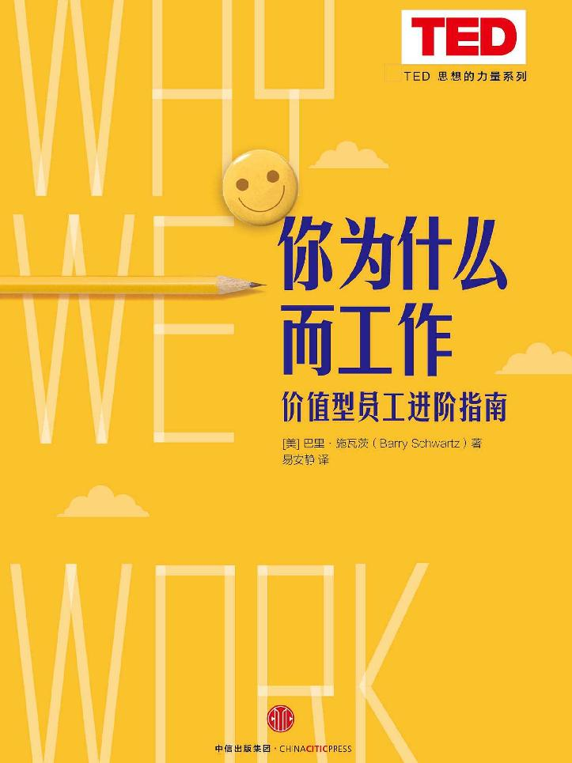
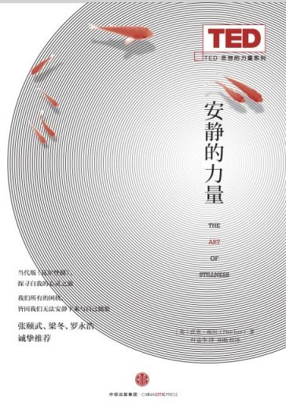

<svg xmlns="http://www.w3.org/2000/svg" xmlns:xlink="http://www.w3.org/1999/xlink" version="1.1" width="100%" height="100%" viewbox="0 0 723 965" preserveaspectratio="none">

<image width="723" height="965" xlink:href="cover.jpeg"></image>
</svg>

## 

你为什么而工作

\

\[美\] 巴里·施瓦茨 著

易安静 译

中信出版社

## 目录

<a href="#part0005.html_4OIQ0-9dc6861722ad4249a91cc132f811e7e5"
class="calibre4">引言 关键问题</a>

<a href="#part0006.html_5N3C0-9dc6861722ad4249a91cc132f811e7e5"
class="calibre4">第一章 工作动力的来源</a>

<a href="#part0007.html_6LJU0-9dc6861722ad4249a91cc132f811e7e5"
class="calibre4">第二章 带着使命感工作</a>

<a href="#part0008.html_7K4G0-9dc6861722ad4249a91cc132f811e7e5"
class="calibre4">第三章 赋予工作额外的价值</a>

<a href="#part0009.html_8IL20-9dc6861722ad4249a91cc132f811e7e5"
class="calibre4">第四章 创造需求还是迎合需求</a>

<a href="#part0010.html_9H5K0-9dc6861722ad4249a91cc132f811e7e5"
class="calibre4">第五章 不忘初心</a>

<a href="#part0011.html_AFM60-9dc6861722ad4249a91cc132f811e7e5"
class="calibre4">致谢</a>

<a href="#part0012.html_BE6O0-9dc6861722ad4249a91cc132f811e7e5"
class="calibre4">参考文献</a>

<a href="#part0013.html_CCNA0-9dc6861722ad4249a91cc132f811e7e5"
class="calibre4">关于作者</a>

<a href="#part0014.html_DB7S0-9dc6861722ad4249a91cc132f811e7e5"
class="calibre4">相关演讲</a>

谨以此书献给露比、伊莉莎、路易斯和妮可

祈愿你们生命中遇见好工作的机会接连不断！

Why We Work?

无论正确还是错误，经济学家和政治哲学家们的思想观点都比人们通常认为的更具影响力。事实上，正是这些观点和思想在统治着这个世界。勇敢的实干家们总是以为自己的思考独立而客观，并不会受到任何学术思想的影响，而事实上他们恰恰可能是某位已故经济学家思想的奴隶。

——约翰·梅纳德·凯恩斯

引言\
关键问题
--------

我们为什么要工作？我们为什么要放弃既快乐又刺激的安逸生活，每天早晨睡眼惺忪地从舒适的床上挣扎而起？多么愚蠢的问题啊。我们工作当然是因为我们要养家糊口。确实如此，但仅此而已吗？当然不是！当你去问那些工作狂们为什么要努力工作时，他们似乎很少提到金钱。关于为什么工作，人们给出了一长串丰富有趣但跟金钱无关的缘由。

对于那些从工作中获得成就感的人，他们将工作当成事业来经营，并且沉浸其中，尽管并不总是这种状态，但毫无疑问，工作对于他们来说至关重要。对这些人来说，工作中充满挑战，而正是这种挑战性，迫使他们远离舒适和懈怠，不断磨炼和提升自我。这些幸运的人认为他们从事的工作充满乐趣，就如同他们做填字游戏和九宫格游戏那样有意思。

除此之外，还有其他原因吗？那些对工作满意度高的人，认为自己从工作中获取了某种掌控感，他们在工作中努力地锻炼自身的自主性和判断力，并借此不断提高自己的工作技能和专业水准。他们孜孜不倦地学习新东西，无论是作为员工还是作为个体的人，都能持续不断地获取自身的发展。

另外，从事工作也是出于社交的需要。工作中个体常常作为团队成员一起完成任务，即使是独立工作或工作闲暇时，仍然有许多与他人打交道的社交机会。

最后，对工作满意度高，有时是因为个人从事的工作非常有意义。他们的工作可能正在改变着世界，让他人的生活变得更加美好，更加有意义。

当然，极少有工作满足上述所有特性。我甚至觉得，任何时候均包含上述所有特性的工作几乎是不存在的。但正是工作的上述种种特性促使着我们离开舒适的家，促使着我们带着工作回家加班，促使着我们与他人谈论着自己的工作，让我们不愿“解甲归田”早早退休。没钱当然没人愿意工作，但钱却不是我们工作的首要原因。通常情况下，我们认为因钱而工作是一个糟糕的工作动因。事实上，当我们谈论一个人是因为钱而工作时，我们并不仅仅是在客观描述，而是夹杂了批判的情感在内。

无论是出于上述哪个原因，工作总是能给人带来极大的满足感。但问题来了，为什么世界上绝大部分的人，没有或是很少体会到这种满足感呢？为什么对我们中的绝大多数人来说，工作是单调无聊、毫无意义、浪费生命的呢？为什么随着资本主义的发展，那些为了鼓舞员工士气、激励员工努力的机制反而降低甚至完全打消了员工工作的积极性呢？无论是在工厂、快餐店、订单承接库房，又或者在律师事务所、教室、诊所、公司办公室，人们都是为了钱而工作。或许他们尝试着努力找到了工作的意义、工作带来的挑战性以及工作中提升自我的空间，但最终工作环境击败了他们。流程化的工作方式意味着除了钱之外，他们真的找不到促使其工作的其他理由。

2013年由华盛顿特区的盖洛普民意调查组织进行的一项研究结果显示，全世界“消极怠工”的员工数量是热爱工作的“敬业”员工的两倍。从20世纪90年代后期开始，盖洛普一直致力于研究测量全球职场人士的工作满意度，在长达二十多年的时间里，该项调查总共访问了遍布于189个国家的2500万名员工。最新一期的调查信息来自于142个国家的23万名全职和兼职员工。调查结果显示，总体来说，仅仅有13%的员工积极工作，他们对工作充满热情与干劲，奋力拼搏，不断推动公司向前发展；约63%的人对工作却“并不投入”，他们旷工早退，每天混日子，对工作并不上心；另有约24%的员工则“消极怠工”，对工作相当厌恶。换言之，全球的职场人士中，有近90%的人认为，工作更多时候带给他们的是沮丧和挫败，而非光荣与梦想。想想这项统计调查的结果，90%的成年人将大半的生命耗费在他们不愿意从事的工作当中，待在他们并不情愿待的地方。这浪费了多少社会的、情感的甚至经济的资源呀。

对于为什么工作，盖洛普收集到了各式各样的回答，如同我在前文中所列出的那些原因：工作助力个人的成长和发展、工作中被上级和同事欣赏和褒扬、工作中他人尊重和赞同自己的意见和看法、感觉自己所做的工作意义重大、在工作中可以结交好友。所有这些回答都是调查中收集到的反馈。然而，对于绝大多数的职场人士来说，工作更像是无奈之举，他们也并没有积极向上的工作动力。为什么会出现这种情况？本书将为您娓娓道来。

第一章\
工作动力的来源
--------------

两个多世纪以来，无论是社会，还是个体的人，我们一直被灌输着关于工作的一些错误观点。长期以来我们一直信奉着一项经济准则，而这项准则也被诸多心理学理论所支持，那就是如果你想让他人替你做事，无论是员工、学生、政府官员，还是你自己的孩子，你都得让他们“有所得”，因为人们做事情是因为“有利可图”。就以当下全球金融危机的主要处理方法“胡萝卜大棒”政策来说，便可以看到这个观点在其中发挥的作用。为了防止金融危机再次发生，人们争论说，我们需要摒弃导致这场危机的“愚笨”的激励政策，而代之以更加“灵活”的刺激手段。我们只是需要“正确地”激励，而其他的因素实际上无关紧要。这一观点的推动者正是提倡自由市场论的经济学家亚当·斯密。在1776年出版的《国富论》中，他这样写道：

> 想过尽可能舒适的生活是每个人的天性，如果一个人从事某项繁重工作和他不做所获得的报酬没有任何差别的话，那么他就会粗心马虎地应付差事，而政府也默认这种行事原则。

换言之，一分不多一分也不少，人们的的确确是为了钱而工作的。亚当·斯密坚信激励机制的影响力，这也使得他主张将工作细化为简单、重复且没有实质意义的单位来组织进行。只要人们是为了钱而工作，他们从事什么样的工作便显得无关紧要。只要将劳动力划分为微小的单元，社会就将产生巨大的生产效率。为了大力宣扬劳动分工的益处，亚当·斯密有一段著名的对于大头针工厂的描述：

> 一个人把金属线拉长，另一个人将它拉直，第三个人将其切断，第四个人将它削尖，第五个人将顶端切磨好跟头部相接……我曾经目睹过只雇用十位工人的这种小型生产工厂……他们一天最多能生产48 000枚大头针，但如果不采用分工合作的方式，而是由一个人来完成所有工序，那么他们每个人连20枚都完成不了。

正如我们稍后将看到的，与上述描述相比，亚当·斯密对于人类的看法其实更加细微和复杂。他并不相信“工作中的人”反映了人类全部的本性，或者反映出人性中最重要的部分。但在继承亚当·斯密观点的专家学者那里，大多数关于人性更加微妙精细的观点却不断丢失。一个多世纪以后，亚当·斯密的观点启发了被后世称为科学管理运动之父的弗雷德里克·温斯洛·泰勒。正如亚当·斯密所设想的那样，泰勒通过对工人工作的动作和时间花费的研究，极大地提高了工厂的生产效率。劳动力犹如高速运转的机器，他设计完善的薪酬体系来激励员工更加努力、更加快速、更加精准地工作。在那之后不久，亚当·斯密的观点在20世纪中叶主要的心理学家伯尔赫斯·弗雷德里克·斯金纳的思想中再次得以体现。斯金纳训练老鼠和鸽子完成简单、重复性的任务，并将水和食物作为奖励。斯金纳的研究为泰勒的工厂革新提供了严谨的科学证明和理论基础。斯金纳的实验结果表明，通过操控奖励的数量和频率能够准确、有效地控制动物们的表现。正如泰勒发现计件工作（对已做工作按计件单价支付固定报酬）能够提高工厂的工作效率一样，斯金纳发现在实验室中，按完成任务的次数来奖励鸽子，鸽子会有更出彩的表现。

你或许会问为什么会有人愿意在亚当·斯密所描写的大头针工厂中年复一年日复一日地做着将针头和针组合在一起这种简单重复的工作。对此，亚当·斯密给出的回答是：“人们当然并不享受大头针工厂中的这种工作，但他们同样也不愿意在其他任何地方工作。”亚当·斯密想要告诉我们的是，人们愿意工作的唯一原因是工作所带来的报酬。只要能够获得令人满意的报酬，工作内容便无关紧要。

亚当·斯密在研究人们对工作的态度和工作期望方面显然是不够精准的，但是在他的理论影响下，资本主义得以发展，激励机制横扫一切。其他提高工作满意度的工作模型被有意无意地忽略或无视。自此开始，在这个地球上，人们迈着沉重的步伐出门工作，对工作的意义、工作的成就和工作带来的挑战不抱有任何期待。因为除了报酬之外，没有其他工作的理由。因而，亚当·斯密关于人们工作原因的错误观点便被视为正确的了。

当然我并不是说在工业革命之前，工作是幸福的。但是在此之前，无论是农民、工匠还是商贩店主，虽然工作辛苦，但他们在工作中更加自主也更加自由，他们每天做的工作也更加多样而不单调。遇到问题时，他们会发挥自己的聪明才智去努力解决，而在此过程中，他们渐渐地找到了更加高效地完成工作的方法。而这一切在人们迈入工厂的大门后便不复存在了。

### 从工作中获得满足感

你或许会认同亚当·斯密。你或许相信，对大多数人来说，他们的天性便是为了报酬而工作，除此之外，别无所图。只有那些精英人群才会指望接受工作中的挑战，渴望工作有意义，期盼获得成就感。毫无疑问，这种观点不仅相当傲慢，而且也是极不准确的。那些做着我们认为枯燥无味的工作的人，比如门卫、流水线工人、呼叫中心员工，其实他们关心的并不仅仅是工资。相反，许多有雄心大志的专业人士却是在为钱而工作。人们希望从工作中得到什么很大程度上取决于工作给予大家的是什么。工业革命为工人创造了这样的工作环境，社会科学理论又同时在旁持续地推波助澜，这一切最终剥夺了人们从工作中获取满足感的机会。在这个过程中，他们已经剥夺了人们满足感的一个重要来源，在讨价还价的人才市场中，大量次等工人“应时而生”。

我们由此吸取的教训便是，物质激励对人究竟有多重要取决于工作场所的组织结构。如果我们秉持人们工作只是为了钱这种错误的观点去组建工厂结构的话，我们创造出的工作场所便会将这种错误观点变成是正确的。因此，“你再也无法得到优秀的员工”这种说法是不正确的，因为只有当你给人们提供的是浪费生命的无聊单调的工作时，“你才会再也无法得到优秀的员工”。但是，想要获得优秀的员工，你需要让员工做自己想做的工作。要让员工明白，期待拥有一份好工作并不只是幻想，而是完全可以实现的。

应该说这些年来，管理理论和实践在经历了时间的考验后，关于人们工作的动机原本千差万别这一点也已经得到了广泛的认可甚至宣扬。经理们也被激励着为员工不断重组工作场所的结构，从而使工作具有成就感和意义变成可能，而这对员工和组织均有益处。道格拉斯·麦格雷戈的“Y理论”是半个世纪以前这些思想观点的重要体现。<a href="#part0006.html_note1n" id="part0006.html_note1">[1]</a>后来，斯蒂芬·巴利和吉迪恩·坤达合著了一篇重要的文章阐述这些管理方面的思想观点在这些年中是如何从开始的强势不断被削弱的。在谷歌和其他雄心勃勃的硅谷企业中，那些非正统的、引人注意的做法或许会让人认为所谓的流水线苦差事都是过去的事情了。但是，认为人们工作仅仅是为了钱的观点仍然流行。在过去的几个世纪，亚当·斯密关于人类天性的观点被证明相当有市场。

关于人类天性的观点和理论在科学研究中总有一席之地。我们不必担心关于宇宙的理论会改变宇宙本身。星球也并不在乎我们对它们是怎么想的，不在乎关于它们我们有什么理论。但是我们却着实担心我们关于人类天性的理论会改变人类的天性。四十年前，著名的人类学家克利福德·格尔茨说人类是未完成进化的动物。他指的是所谓人类的天性，很大一部分是周围社会环境的产物，这本身便是人类的天性。这部分人类天性更多是被“创造”出来的，而不是被“发现”的。我们通过对人们生存其中的机构进行设计，从而来“设计”人类天性。我们只需要扪心自问我们希望设计出何种人类天性来。

如果从工作中寻求挑战、意义、成就和满足感是人类的天性，我们便需要打破长达三个世纪之久的层层禁锢，这坚不可摧的禁锢中包裹的是对人类天性和人类动机的深层误解。同时，我们也要帮助积极营造出饱含挑战性、意义、成就感和满足感的工作场所。

<a href="#part0006.html_note1" id="part0006.html_note1n">[1]</a>
麦格雷戈将动机理论分为X理论和Y理论。其中X理论认为，员工天生不喜欢工作，只要可能，他们就会逃避工作。Y理论认为，如果员工对某些工作做出承诺，他们会进行自我指导和自我控制，与此同时，他们也能主动承担责任，具备做出正确决策的能力。——译者注

第二章\
带着使命感工作
--------------

有证据显示，这个世界上极少有人能从工作中获得满足感，我们不禁想要知道原因。其中有两个已准备好的答案。一种观点认为，我们大多数人相信只有某些种类的工作才会让人觉得充满挑战具有意义，能提供不断学习和成长的机会。如果我们坚守这种观点的话，那么这类好工作可能只属于少数人，如律师、医生、银行家、教师、软件开发人员、公司首席执行官等。对于其他人来说，工作就是“饭碗”。情况就是如此，对你我亦然。

另一种观点则认为，每一种工作都有可能让人获得满足感。但问题在于常规化、流水线式的工作更容易带来稳定的生产效率。即使没有受过什么训练、也没有什么技能的人都能做这种流水线的工作，而这种工作模式也的确创造了自工业革命以来我们有目共睹的经济爆发式的增长。在一个购买汽车、有线电视、手机和电脑成为生活常态的社会中，从事令人不开心的工作是人们为了享受好的物质生活所要付出的代价。鉴于大头针工厂里的流水线分工工作明显提高了生产效率，亚当·斯密自然是极力提倡这种工作模式的。

因此，可能只有少数人才能有一份让其满意的工作，也可能从事一份不那么令人满意的工作是我们获取物质财富时必须付出的代价，也或许这两个原因兼而有之。但这两个原因看似可信，其实都是错误的。

### 打扫医院

卢克在一家医学院的附属医院从事后勤工作。在一次与研究员艾米·瑞斯尼沃斯基和她的合作者的访谈中（艾米主要研究人们如何组织工作），卢克告诉艾米有一次他给一个昏迷的年轻病人打扫了两次房间。他明明已经打扫了一次，但是病人的父亲坚持认为卢克并没有打扫过他儿子的房间，因而厉声斥责卢克。所以，卢克又打扫了一遍病房。但问及为什么会发生这种情况时，卢克是这样解释的：

> 卢克：我知道一些关于他儿子的情况，他的儿子在这里待了很长时间了……据我所知，他儿子跟别人打了架，之后就瘫痪了，一直处于昏迷状态中。我负责打扫他的房间，他的父亲整日整夜都在这里守着，而且他喜欢抽烟。所以，在我打扫房间时，他会出去抽烟，等我打扫完房间后，他再回到房间里来。有一次，我在大厅里遇见他，他非常抓狂，指责我为什么没有打扫和收拾房间。最开始的时候，我为自己辩护，跟他争论。但是我也不知道为什么，就像有什么东西撞了我一下似的，我急忙说：“对不起，我会去打扫房间的。”
>
> 访谈员：你又重新打扫了一遍房间吗？
>
> 卢克：是的，我又打扫了一遍，这样他的父亲就可以看到我打扫了。我能理解他为什么这样做。他的儿子躺在这儿已经六个月了。他一定非常沮丧和懊恼，因此我又打扫了一遍。但是我并没有生他的气。我觉得我能理解他。

作为一个后勤工作人员，他的工作中本不应该存在这种互动性。让我们来看看卢克的工作岗位描述吧：

> 1\. 清洗地毯和室内装饰品
>
> 2\. 清洗和擦拭机器设备
>
> 3\. 给地板表面上蜡
>
> 4\. 负责大门入口处的卫生清洁工作
>
> 5\. 收拾纸团和垃圾
>
> 6\. 清洗便桶、小便器、水槽的下水道
>
> 7\. 用拖把拖地板和楼梯
>
> 8\. 整理和清洗脏衣物
>
> 9\. 用吸尘器打扫房间
>
> 10\. 清洗家具、柜子和其他固定装置，并上蜡
>
> 11\. 清洗镜子、玻璃等制品的边边角角
>
> 12\. 清扫卫生间
>
> 13\. 补充卫生间用品
>
> 14\. 站在地板或凳子上打扫百叶窗上的尘埃
>
> 15\. 清洁病床床头的设备
>
> 16\. 铺床叠被
>
> 17\. 收集并将废弃物运送到指定的集散中心
>
> 18\. 用湿拖把收拾地板和楼梯上溢出的液体和食物
>
> 19\. 更换烧坏的白炽灯泡
>
> 20\. 负责室内物件的摆放
>
> 21\. 收集并将脏衣服送到指定的集散中心

显而易见，卢克的职位描述中并不包括关心病人和病人家属这样的职责。他要负责的事项非常多，但没有任何一项提及其他人。光从这个职位描述中看，卢克也可能是在制鞋工厂或是停尸房工作的员工，而不仅限于在医院工作。

如果卢克完全按照岗位描述来做事，那么他向病人的父亲简单解释自己已经打扫过房间则是合情合理的。并且如果这位父亲纠缠不休的话，他完全可以找自己的上级来调解处理这个问题。卢克完全可以忽略这个人，继续做自己的工作。他自己也可能为此而生气。

但是卢克并没有这么做，这也正是艾米·瑞斯尼沃斯基和她的同事在对卢克和其他医院后勤人员做深度访谈时所发现的。研究员们询问这些后勤人员关于他们的工作，他们就会给这些研究员讲述他们工作中的故事。卢克的故事让研究员们意识到卢克的职位描述中的工作只是他真正工作内容的一部分。而他做的其他部分的主要工作则是让病人和他们的家属宽心，当病人的病情好转的时候，他为他们欢喜高兴；鼓励病人和他们的家属，想办法分散病人的疼痛和恐惧。当病人和他们的家属愿意倾诉时，他会认真倾听并说些宽慰他们的话。卢克想要做些工作范围以外的事情。

卢克试图从工作中寻找什么，很大程度上由亚里士多德称为“终极宗旨”的组织目标所决定。医院的终极宗旨是救死扶伤，缓解苦痛，而这一观念也深深嵌入卢克对自身工作的理解中。艾米·瑞斯尼沃斯基和她的同事从卢克和他的众多同行中发现的令人惊奇的事情是，卢克他们能充分理解这些终极宗旨并将其内化进自己的行为中，他们并不管工作职责的描述中是怎么写的。在医疗护理大宗旨的指引下，他们重新定义了自己真正的工作内容。另一个后勤人员本告诉研究员他是如何在拖大厅地板时停下手头工作的，只因为有一位病人刚刚做完大手术，术后他需要慢慢地上下楼梯来使身体康复。科里告诉研究员他是如何不顾上级的警告，没有去清扫探病者的休息室，因为一些病人的家属每天都会在休息室中打盹。这些后勤人员将医院的终极宗旨铭记于心，并对自己的工作内容进行了重塑。

艾米·瑞斯尼沃斯基和她的同事将卢克等人的这一行为称为“工作重塑”。卢克、本和科里不是普通的后勤人员，他们是医院的后勤人员，在一个将专注病人的护理和福利视为目标和宗旨的组织中，他们将自己视为重要的角色。因此，当卢克被病人的父亲斥责时，他自主决定怎么来回应。他不需要从他的岗位职责描述中寻找答案，因为那上面没有关于应对这种情况的内容。是他心中重新定义的工作目标指引他来处理这种情况的。

是什么促使卢克做这些呢？首先，与病人接触时，卢克的工作给予了他很大的自主性，他身后并没有上级时时刻刻盯着他。此外，如何正确地应对这类事情对卢克来说也充满挑战性。这些挑战包括要有同情心，学会倾听，要敏锐把握什么时候该向前，什么时候该退后，什么时候该开玩笑，什么时候该宽慰人。在逐渐掌握和领会这些技巧的过程中，卢克的工作变得更加有意义，而这也让病人和家属在医院的日子里过得更加愉快。

最后，卢克秉持自己所在企业的宗旨和信念，正是这一宗旨和信念使得卢克的工作更加有意义。是的，卢克和他的同事们仅仅是后勤服务人员而已，他们是医院的清洁工，而医院正是救死扶伤、缓解病人伤痛的地方，也是病人和病人的家属追求工作和生活平衡之所。

正如劳动心理学研究专家皮特所指出的那样，为了让我们对自己的工作满意，我们有必要给自己从事的工作赋予意义。

艾米·瑞斯尼沃斯基系统地研究了工作的各个方面，旨在帮助人们找到工作的意义并提升对工作的满意度，哪怕是像医院清洁这类本身并没有太大意义的工作。她将具有此类特质的工作称之为“使命”，以区别于一般的“工作”和“职业”。当人们将自己做的事情仅仅当成一份养家糊口的“工作”来看待的时候，人们很难从工作中获得自主性，也很难从中获取成就感。当人们将工作仅仅看作为了生存必须要做的事情时，人们只在乎报酬，如果其他工作能提供更高的报酬，那么他们随时可能换工作。他们迫不及待地想要退休，也并不鼓励和希望他们的朋友或孩子像他们那样，重蹈他们的覆辙。这种现象也正是亚当·斯密关于工作的观点的具体体现。

当人们将从事的工作视为“职业”时，他们会获取更多的成就感，也会有更多的自主权，甚至会很享受自己的工作。但是他们关注的是自己的提升和进步，认为沿着这一轨迹能不断升职、获取更高的薪酬、找到更好的工作。

当人们将从事的工作视为“使命”时，他们的满意度和成就感是最高的。对这些人来说，工作是生命中最重要的一部分，他们愿意将自己奉献给工作，工作彰显了他们生存的意义，他们深信自己的工作能让世界变得更加美好。他们也愿意鼓励自己的朋友和孩子从事这类的工作。毫无疑问，当人们将自己的工作视为“使命”时，他们能从工作中获取非常之多。

那么，是什么因素决定了人们如何看待自己的工作呢？从某种程度上来说，这取决于每个人自身的特质。也就是说，人们如何看待自己的工作很大程度上并不是由工作本身决定的，而是由这个人是谁决定的，他们是谁决定了他们在工作中的态度。毕竟，并不是所有的医院后勤人员都是卢克、本和科里这样的人。

但是从事的工作种类本身也是一个很重要的影响因素。相比于其他工作，某些种类的工作更容易让人感觉到有意义和有成就感。如果工作中缺少自主性、意义和满意度，工作具有的“使命感”就会减少，从事这项工作的满意度也会下降，员工也不会把这份工作做得很好。而当他们做不好工作的时候，他们的上级又会进一步降低他们工作的自主性。

艾米·瑞斯尼沃斯基在与医院后勤员工一次又一次的访谈中发现，他们工作中的满意度主要来自他们与病人的接触，此时也是他们感觉到自己最有用、最为重要和最为熟练的时刻。拥有像卢克这样的职工无疑是医院一笔宝贵的财富。医院的工作人员将组织的宗旨内化为自己的信仰，愿意也乐意将工作做得更好，从工作中获取极大的满足感并以此为荣，这样的结果不仅是医院、病人之福，同时对员工本人来说也有好处。一名员工跟瑞斯尼沃斯基提到，“病人的一个微笑能让我高兴一整天”。

卢克的同事卡洛塔也向瑞斯尼沃斯基讲述了她在医院的工作情况。她所在的部门专门护理各种脑损伤和长时间昏迷的病人。卡洛塔会经常更换病人房间里的挂画，她希望用这种微妙的方式来暗示和鼓舞病人，让病人觉得自己的病情在慢慢好转。正如卡洛塔所描述的那样，她大概每一周都会更换病人房间里的挂画，因为病人长年累月地待在病房里，她希望通过这种方式让他们知道离回家的时间越来越近了。卡洛塔很清楚这种工作带给她的开心和幸福：

> 我很喜欢逗病人开心，这也是我最享受和开心的部分。当然，我的岗位职责描述中并没有规定我必须这么做。但是我喜欢为病人做点让他们高兴的事情。当音乐响起时，我会为他们跳舞；有脱口秀的时候，我也会舞上一段；我会跟病人一起调侃脱口秀或是其他表演。这是工作中我很喜欢的部分，我很高兴自己能让病人微笑。

卡洛塔不仅知道什么时候、用什么方式让病人开心地微笑，也知道什么时候需要用坚强有力的臂膀和勇敢真诚的心去护理病人。而这些都成为她工作的快乐之源。卡洛塔这样解释道：

> 有一位病人很痛苦，他四肢瘫痪，当他痛苦得大叫时，我正巧在那儿，因此我按了呼唤按钮，让医生和护士赶紧过来。他们立马往他的一只手上输血，并试着往他另一只手臂上插针，但是针一直插不进去。当护士这么做的时候，我一直陪在他们身边。由于他快要从轮椅上滑下来，并且马上要昏厥过去了，护士想要给他量血压，但是他不让护士们这么做，因为他对这些护士有些畏惧，我向他解释：“好的，你先别害怕，我给你五分钟的时间，你先慢慢平静下来，但是五分钟后，护士们会过来给你量血压，这样他们才能确保你是否一切都好。别担心，我会一直陪在你身边的。”而我也是这么做的，我一直陪在他身边，让他慢慢平静下来，等他平静下来后我叫护士进来给他量了血压。从那时起，我觉得我俩就是一辈子的好朋友，我碰巧在一个正确的时机出现在了一个正确的 地方。

并没有人鼓励卢克和卡洛塔重塑自己的工作，使其具有使命感。是他们自己希望重塑工作，让工作变成充满意义和成就感的“使命”。最关键的一点是，他们不是被迫的，而是心甘情愿的。

为什么有人会禁止员工像卢克和卡洛塔那样去工作？其中一个原因是效率。如果后勤人员只是执行岗位描述上所写的那些工作内容，他们会干得更多。其结果是，他们可以打扫更多的房间，医院需要雇佣的人会更少，因此医院会省下更多的钱。

另一原因是出于管理人员控制的需求。如果后勤人员只是简单地做些岗位职责上列出的工作，那么管理人员就能更容易地控制这些后勤人员。但是当他们工作的内容超出职责范围，例如对病人们施予帮助时，管理人员将不再那么容易控制这些职工。控制权就从管理人员的手中转移到了被管理人员的手中。

许多年以前，经济学家斯蒂芬·马格林曾经写过一篇重要的文章，名为《老板们在做什么》。在这篇文章中，他写道：流水线分工所带来的一个重要但常被人忽略的后果便是将工作的掌控权从员工的手中转移到了那些管理流水线的主管们手中。

因此，出于效率和管理的需求，经理们会打压像卢克和卡洛塔这种不循规蹈矩，不按“本分”工作的人。而这样做的结果会使工作变得更加就事论事，医院运转情况也会变得更糟。

### 制作地毯

你或许认为不管工作如何，如果你每天都在救治病人的医院工作，那么从工作中找到意义和目标都是相当容易的事情。但从我对其他后勤人员的观察来看，事实可能并非如此。先让我们假设事实就是这样吧。但如果人们是在制作地毯的工厂中工作呢，你还会认为同样也是如此吗？

大约二十年前，当地毯制造巨头——界面地毯的已故首席执行官雷·安德森意识到他的工厂正在污染环境时，他突然产生了他所谓的顿悟，他手上目前掌握着他和他的子孙后代都不知道该用来干些什么的大量资金。地毯制作其实是石油的延伸产业，而界面公司对环境的污染非常严重。安德森认为如果以破坏地球环境为代价而积累自身财富，那么即使将这样的巨额财富留给子孙们又有何益？

因此，安德森决定改变界面公司运作的方方面面，打算在2020年实现公司零污染的目标。他知道要研发新产品，控制污染量，这些都需要花费大量的金钱，但是他愿意触及底线，愿意牺牲经济效益换取社会效益。

在这一思路的指引下，界面公司开始改革，包括产品创新、生产工艺创新以及排放物处理创新。到2013年，能源消耗量已削减一半，并且已经使用可再生能源，排放物也已减少到了原来的十分之一。在这个过程中，损失了多少利润呢？其实，一点也没有损失！界面公司的员工们认为能在这么注重公益性的企业工作实在是一种幸运，他们工作非常努力，并渴望找到改进产品生产工艺的新方法，他们的工作也因此变得高效且高产。同时，公司也意识到要实现新的使命，从上至下必须构建新的合作关系，扁平化的组织结构让员工对自己的工作有了更多的自主性和掌控权。公司的共同愿景激励了员工之间的团结和协作。围绕可持续发展的进步要求有了更多的创新之举。因此一种鼓励开放创新、允许失败的企业文化就此形成。公司是这么描述的：

> 界面公司这场持久的转型之战是成功的，大量的创新方法是由车间员工提出并实现的。界面公司的员工不仅是在制作地毯，同时，他们心里有着更崇高的目标。环境的可持续发展激励并鼓舞着员工向着更高的目标去努力和奋斗。

实践证明，安德森当初的观念是正确的。20年后的今天，界面公司仍然相当成功，它的员工每天干劲十足，渴望工作。安德森将界面公司的这一重大转型记载在他2009年出版的一本名为《一个激进的企业家的自白：经商之人需对地球心怀敬意》的书中。其实，你不一定非要在一个救死扶伤的组织内工作，以寻求工作的意义和目标。你只需要找一份能提高人们生活质量的工作就行。

### 剪头发

界面公司的员工确实不是在救人，但他们在拯救地球。我们中很少有人能有幸从事具有这么崇高意义的工作。如果人们的工作并不具有全球影响力，他们只是餐厅服务员、水管工、建筑工地的工人、焊接工、美发师或公司职员，这时候该怎么办呢？我们同样也能从这种工作中找到巨大的意义和满意感。当艾米·瑞斯尼沃斯基对“工作”“职业”“使命”进行研究时，她的研究对象当中，有一组是在大学工作的行政助理。艾米发现，他们当中大约有三分之一的人将他们所做的事情视为“使命”，他们为那些正在努力教育下一代的教员们提供重要的后勤保障，还有比这更有意义的事情吗？

在《工作中的思考》这本书中，麦克·罗斯记录了他每天跟那些从事蓝领工作的人们进行的访谈。其中关于美发师的那一章真是令人大开眼界。的确，美发师需要掌握一系列的专业技术，包括剪发、染发和给头发做造型等。他们中的大多数人认为自己的工作是一项具有创造性的工作。那么，究竟是什么让这项工作充满意义的呢？我认为是工作中与客人互动沟通的技巧。当客人说她希望有一些新鲜感的时候意味着什么？当客人说照着她带来的图片上模特的头发样式给自己修剪头发，但其实图片上模特的脸更长，也更加棱角分明，而客人的脸形则圆圆的，如果照着模特的发型给客户修剪，有可能会非常难看。这种时候，你该怎么与客户沟通，让她放弃她认为好看的那个模特发型呢？你如何帮助客户，让他们对自己的新发型感到满意，当他们走出理发店时自信心能暴涨？罗斯采访的这些美发师们都以他们的专业技能为荣，并解释了看似简单的理发实则是多么复杂。而同时，对客户需求的理解、与客户交谈的技巧、应对客户问题的能力，这些也是他们的工作之一，他们同样以此为荣。而且他们在这些方面能力的高低可以使客户的生活质量有很大的不同。

一个发型师说道：“认真倾听客户的需求是很重要的，弄清楚客户想要什么样的发型非常关键。”另一个发型师也说道：“不要想当然地认为你已经知道客户的真正需求了，有时候甚至连他们自己都不知道自己想要什么。”还有一个发型师指出，客户可能会说“我想剪短一英寸”，但是她用手指给你比画的却是两英寸。当客户们对发型师很满意时，她们总会这样来形容，“她会认真倾听”“她尊重我的意见”“她清楚我要的效果”。那些热爱自己工作的发型师们喜欢这份工作中复杂的技术含量和自由的创造性空间。但同时也因为“我只是很喜欢让客户满意，喜欢看到客户离开理发椅的时候那么高兴。通过自己的工作影响他人，这样的工作可并不多见”。另一个发型师这样描述：“这份工作与众不同，能让员工汲取很多成长的养分，在我们的社会中，很少有工作能允许你去接触客户，这种与客户之间的亲密关系很难得，人与人之间是需要有这种紧密的联系的。”

从与这些后勤工作人员、地毯制造工人和发型师的访谈中我们发现，实际上任何一项工作都有可能让员工满意。任何一项工作，其工作内容可以兼具复杂性和多元性，员工在工作中能不断提高技艺，在工作中能不断获得成长，也能拥有一定的工作自主性。或许最重要的是，当自身的工作对社会有益、能为他人带来幸福时，工作对员工来说便充满意义。

管理研究人员亚当·格兰特与合作者的调查表明：只要着重凸显自身工作对社会和他人的潜在影响，员工就会深受鼓舞。接下来我举一个例子。许多大学雇用大学生打电话联系校友和在校学生的父母，希望他们能捐款。还有什么比母校打电话更让你高兴的事情呢？但是电话是让你捐款！当你通过来电显示知道是谁打来的电话时，你还会接起电话吗？如果你接起了电话，你会礼貌地让募捐者说完他的话吗？就算出现了奇迹，你礼貌地听完了募捐者的意图，你真的会捐钱吗？这些电话可真让人厌烦和恼火，当年你可是没有拖欠一分钱的学费呀，为什么现在还向你要钱呢？现在，让我们换位思考一下吧。花两到三个小时来给那些并不愿意接你电话的人打电话，让那些并不愿意捐款的人捐款，成功的几率这么低，想想都觉得难呀。但神奇的是，格兰特将打电话的目的告诉了这些大学生后，情况就有了显著的改善。格兰特给这些负责募捐的大学生看了一段视频，视频中他采访了一位同学，正是因为募捐者打的一个个的电话，才募捐到了改变他生活的助学金。视频中，这位同学深深的谢意大大鼓舞了这些募捐者们的热情和干劲。

看完视频后，这些募捐者继续回去打那些令人痛苦的电话。这时，奇迹出现了，相比没有看过视频的募捐者，这些看过视频的募捐者们的表现大为改观。他们每小时打出的电话更多了，也得到了更多的募捐。工作没有改变，报酬也没有改变，仅仅因为目睹了他们的努力给他人带来的幸福，他们的工作效率便提高了两倍。这就是赋予工作的意义后产生的巨大能量。

不言而喻，医生、律师、教育工作者以及其他专业人士能从工作中获取成就感和满足感。但现在我们也看到了，后勤工作人员、地毯生产工人、理发师和电话募捐人员等，他们也能从工作中获取同样程度的意义和成就感。大家都想找到一份自己喜爱的工作，如果工作本身充满挑战性和成就感，工作中能发挥你的特长，提高你的技能，工作中你有很大的自主性，你感觉自己是团队的一份子，你深受同事的尊重，这些因素都将有助于你喜欢上自己的工作。更重要的是，如果这份工作的目标是有利于社会而且充满意义的，就更能让你爱上你的工作了。医院里拖地板的后勤人员和公司办公室里拖地板的后勤人员的工作是一样的，只不过前者怀揣着更崇高的信念。亚当·格兰特所调查的那些电话募捐者同样如此。好工作并不是要求具备上述所有的这些积极性的特质，但是一个崇高的目标是最关键和不可或缺的。

尽管艾米·瑞斯尼沃斯基采访的所有医院后勤职员做的工作都超出他们的职责范围，但是具体怎么做，做些什么，每个人都不同。因此可以说，只要员工将“正确”的态度带入工作中，他们就能从任何一份工作中找到意义；反之，如果将“错误”的态度带入工作中，则任何一份工作都将失去意义，变得索然无味。

毫无疑问，员工对待工作的态度非常重要，但仅靠员工在心理层面将一份索然无味的工作视为充满意义，这是不够的。亚当·斯密描述的那些在大头针工厂中工作的工人也应该试图在内心告诉自己，自己做的事情是有意义和有追求的。也就是说，并不需要耗费太多，就能将几乎任何一份工作变得富有意义。这样做不仅对职工有好处，对服务的客户和员工所在的组织都是有益处的。

最后让你屏住呼吸的发现来了。如果令人满意的工作能造就更好的员工，那么激烈的市场竞争带来的结果便是每一个公司都将尽量让员工对自己的工作满意。如果你所在公司的工作环境僵硬死板、单调无聊、等级森严、惩罚力度大，那么对手将为其员工创造更加友善的工作环境，培养更多高效率的员工，并将你所在的公司逐出竞争市场。我们已经进行这种市场竞争很长时间了，你会认为现在的工作环境肯定已经优化到能激励员工产生最大的生产效率了吧。

如果你是这么想的，那你就错了。关于人们并不喜欢工作的这种思想的影响力一直存在。这种思想源自亚当·斯密，并在其后的传播过程中不断被包装。管理学研究专家杰弗里·普费弗在其著作《人类方程式》中详细地阐述了这一切。普费弗的书并没有特别研究该如何创造一个令员工热情满满的工作环境，他主要研究的是如何让公司的利润持续增长，如何打造一个成功的企业。但从他对不同行业不同公司进行的大量分析来看，如何造就一个成功的公司和如何造就一份好工作本质上是一样的。用普费弗的话来说，一个好的公司同时也培养着忠诚度高、向心力强的员工，而忠诚度高、向心力强的员工会努力做好自己的工作。普费弗从大量的研究中发现，那些高效率的公司存在以下共同点：

> 1\. 提供完善的工作保障，这些有助于提高员工的忠诚度和信任度。
>
> 2\.
> 团队自我管理，分散决策权，给予员工很高的自主权和自我管理权。这同样也能提高员工对组织的信任，同时也减少了管理监督员工的人力成本。
>
> 3\.
> 提供给员工高于行业标准的薪酬，让员工觉得自己很有价值。但他们并不怎么依靠个人激励机制去诱导员工努力工作。当公司盈利时，所有的员工都参与利润分成。员工和公司是一个完整的“利益团体”。
>
> 4\.
> 完善的培训体系。无论是新员工，还是老员工，都经过系统专业的培训。这种对员工的培训是公司的一种投资形式，同样有利于培养员工的忠诚和信任。长期系统的培训也让员工不断面临新的挑战，不断提高自己的技能。普费弗还对各国的培训时长进行了对比，同样是汽车行业，日本对刚入职的新员工的平均培训时长为364个小时，欧洲是178个小时，而美国只有21个小时。
>
> 5\.
> 评估职工的表现，但不过度评估。公司相信员工会努力工作，也相信员工在接受足够的培训后都会成功。
>
> 6\.
> 极力强调公司的目标和愿景，并非首席执行官一时兴起的想法，而是将公司的使命渗透至公司上上下下的具体实践中。

在所有的行业中，具备以上所有或大多数特质的公司都是该行业的佼佼者。而落后者则是那些根据员工个人表现给予奖励和其他激励、严密监视员工表现、减少员工个人在工作中的责任感和自主性、为了节省培训经费将企业变成员工不需要过多培训便能上岗的企业。普费弗认为存在着这样一种恶性循环：由于利润低、成本高、客户服务恶劣，公司开始出现问题，而这导致公司进一步降低开支、减少培训、削减薪酬、大量裁员、雇用临时工、停止招聘新员工和给现有员工升职，这些举措又会降低员工工作的积极性和效率，带来更糟糕的客户服务、更低的工作满意度和更多的工作失误，这一切无疑会使公司陷入更糟糕的困境中。简而言之，公司减少员工的自主性、工作的成就感和工作的意义，员工对工作的满意度也就下降了，他们好好工作的动力就下降了，而当员工努力工作的动力下降后，他们的上级就会收回更多的工作自主性。这种治疗方法只会让病情越来越严重。

### 积极情绪激励我们做得更好

正如普费弗教授所描述的，应对竞争压力的下意识反应——裁员、加强对员工的管理和监视、催促员工加快进度等举措只会不断降低工作效率和员工的工作满意度，让情况变得更加糟糕。这无疑是一个恶性循坏。相反，当我们将精力专注于提高工作的某些特质时，我们便可以将恶性循坏转化为良性循环。当员工从工作中找到了意义和成就感时，他们就更加愿意工作。正如心理学家芭芭拉·弗雷德里克松所指出的，当人们很高兴时，他们能将工作做得更出色、更灵巧。弗雷德里克松的大多数研究成果都呈现在她的著作《积极性》一书中，她的核心观点是当人们处于一种积极向上的情绪状态中时，他们更富有想象力和创造力，他们具有弗雷德里克松所称的“更加宽广和具有建设性的与世界互动的方式”。相反，当人们处于一种消极负面的情绪状态中时，他们更容易变得保守，想坐享其成，时时担心出错或把事情弄砸。危险让我们的视野变得更加狭窄。但是当我们摆脱威胁状态，对工作满意时，我们的积极情绪会激励我们做得更好；而当我们做得更好时，又会进一步激发我们的积极情绪，由此又鼓舞我们工作得更出色，如此不断循坏。积极性自发产生，工作完成得越来越出色，员工对工作的满意度越来越高，无论是公司，员工，还是客户，所有人都会由此获益。

在关于市场竞争如何运转的理论中，需要注意的一点是，我们可以乐观地看到，在任何一家公司，任何员工都有机会对自己的工作满意。市场理论告诉我们，任何一笔交易都需要双赢，也就是说，服务或产品的买家和卖家都能从交易中获益。如果我正在考虑购买的衬衫对我来说毫无用处，那我肯定不会去买；如果你卖给我这件衬衫无利可图，那你也根本就不会卖。同样，任何一笔市场交易都必然让买卖双方都能获益。这种双赢的市场理论跟扑克游戏完全相反，在扑克游戏中，总有输赢两方，赢家赢得的每一分钱都是输家的。这种市场逻辑意味着：事实上，人们从事的任何一项工作都能改善客户的生活，哪怕仅仅是很微小的改变。这同时也说明了从提高客户的生活质量这个角度来看，任何一项工作都是有意义的，只要你将工作做好做正确。

我们从“市场购物篮”的故事中也可以看到这种良性循环。市场购物篮是遍布新英格兰的百货连锁商店。1917年，两个希腊移民阿萨纳西奥斯和伊弗洛斯尼·德穆拉斯在马萨诸塞州的洛厄尔开了一家小的杂货店。随着时间的推移，这个小的杂货店不断发展壮大，逐渐成长为大型百货商店，分店遍布新英格兰，而领导权也遗至他们的下一代。尽管企业规模不断扩大，但是在家族内部成员之间一直存在着关于继承权和运营权的激烈争夺，法律诉讼接连不断，关于控制权的争夺战不断升级，内斗的传言漫天飞。关于控制权的争夺最后在亚瑟·思·德穆拉斯和亚瑟·提·德穆拉斯两个表亲之间展开。尽管亚瑟·提是企业的董事长，但亚瑟·思手里掌握着更多的股份，两人之间的争夺一直在持续。但尽管如此，连锁超市一直保持繁荣发展的态势。现在市场购物篮拥有70多家分店，员工人数超过两万人。

抛开别的不说，亚瑟·提将企业当成亲密的家庭协作那样去经营和运作。员工薪酬很高，同时也参与利润分成，但或许更重要的是，亚瑟·提关心企业中的员工，他知道许多员工的名字，并且熟悉员工的家庭情况。他和他的员工像对待家人那样对待客户，销售的产品物美价廉。2008年全球金融危机带来的经济衰退，使许多家庭陷入困境，针对这一情况，市场购物篮将它所有出售的产品降价4%。亚瑟·提说：“与我们相比，客户更需要金钱。”正是基于这种观念，市场购物篮的员工们意识到自己的工作非常重要，并且受人尊重，他们工作时也更加细心、更加充满热情、更加有合作精神，众志成城发挥着重要的团体力量。

但并不是一切都这么顺利。家族间的不合一直在延续，2014年6月，亚瑟·提遭到解雇。在这之后，有趣的事情发生了。许多员工开始罢工，他们这么做可是冒着丢掉饭碗的风险。要知道那个时期，工作并不那么好找。接着，客户也开始抗议，拒绝在该超市继续购物。成千上万的工薪一族加入了支持这位亿万富翁的行列中。货架上的货物越来越少，超市无人问津，就像鬼店一般。这种情况持续了两个月，严重危及公司的前途。最终，在2014年的8月底，亚瑟·提同意卖个面子给他的对手，恢复其企业董事长的职位。之后所有的一切才重新恢复正常：员工重回企业工作，货架上备满了待出售的货物，客户重返超市购物。

在一次访谈中，亚瑟·提是这么说的：“我们主要做的是方便客户，尽量让客户买到物美价廉的商品，我们让商场干干净净，微笑服务每一位客户，在每天快结束时，与同事分享自己在当天工作中的成功之处。”当问及为什么他能获得来自客户和员工的广泛支持时，他解释道：“之所以会这样，我想是因为它跟每一个人都有关，如果每一位员工都是平等并且有尊严地工作，那么他们工作时将会多一点激情，多一点细心，我认为这是正确的经营之道。”

为什么这样的超市是如此的鼓舞人心？其实让我们感动，是因为超出了我们的期望。我们并不期望从收银员、搬货员、上货员和导购员身上看到这种细心和承诺，即使当我们自己就是这些工作人员时，我们也不会有这么好的工作状态。我们同样不会期望超市的当家人会优先考虑经济效益之外的其他事情。我们并不期待工作中有同情这种情绪出现。但是，在市场购物篮，上述这些情况都出现了。为什么？为什么绝大多数企业都无法做到？

### 帮助员工做他们想做的事情

杰弗里·普费弗的观点在盖洛普关于工作满意度的研究中得到论证。值得注意的是，好的管理实践是如此的稀少。我们不能指望企业的领导者对自己说“我该怎么通过重组员工的工作来让员工的生活越来越好”，但我们希望企业的领导者对自己说“我该怎么通过重组员工的工作来让我们的企业越来越好”。正如亚当·斯密那个著名的关于市场竞争中的“看不见的手”的描述，当市场充满竞争时，我们并不需要有意地去提高人类的福祉，个体自私的本性会自动地产生这种良好的社会效应。如果竞争能提高消费者的生活质量，那么毫无疑问，竞争同样也能提高生产者的生活质量。好的实践会将坏的实践驱逐出竞争市场。从某种程度上来说，这一观点也确实在某些职业上得以论证。经理们逐渐意识到，帮助员工做他们真正想做的事情时，企业也会因此获益。只可惜这种观点没有深度渗透到企业的核心层。对于那些接受过高等教育的社会精英来说，工作并不只是为了钱，但是对于普通大众来说，除了钱，还有什么呢？回想亚当·斯密的话语：

> 想过尽可能舒适的生活是每个人的天性，如果一个人从事某项繁重工作和他不做所获得的报酬没有任何差别的话，那么他就会粗心马虎地应付差事，而政府也会默认这种行事原则。

如果你是一个企业的拥有者，你深信亚当·斯密关于普通大众持有的工作态度的观点，那么你就会基于这种信念来组织工作体系。在这种体系中，工资是主要的激励机制，有高度的监视，有简化后的流程，因此个别员工的懒惰懈怠和不上心并不会带来灾难性的后果。在这样的一个体系中，亚当·斯密是正确的。除非是因为钱，否则怎么会有人出现在大头针的工厂里？

有两套规范的理论用于管理那些对工作不感兴趣的员工，一个是物质激励（工资），另一个是对流水线工作的严密监视，正所谓胡萝卜加大棒。令人惊奇的是，杰弗里·普费弗认为这两种方法对员工工作满意度都有负面效应。但是这两种方法是企业最先采用的，它们不仅让后勤工作人员和流水线上的工人无法拥有令他们满意的工作，同时由于这两种方法不断受到公司高层人员的青睐，因而在这两种方法的管理下，任何工作都有可能被毁掉，成为糟糕的工作。

第三章\
赋予工作额外的价值
------------------

高中毕业后和刚上大学那会儿，我找了很多暑期兼职工作。通过这些形形色色的工作，我了解到大多数工作是什么样子。有一年暑假，我在一家服装厂工作，负责将那些需要熨烫的衣服送到熨衣工那里去。这些熨衣工全是男人，他们每天工作八个小时，每天中的每小时都在做重复的事情。工厂没有空调，车间的温度非常高，而熨烫机器旁边的温度更让人无法忍受。熨衣工是计件酬劳，因此，他们熨烫的速度更快的话，他们就挣得更多。他们的速度普遍都很快，我从这些辛苦的工人身上学到的东西很简单，那便是还是待在学校好。

这样工作了几个星期之后，我就被调换到别的岗位上了。这次的工作是将已经做好的衣服交给验货员（她们全是女人）做出厂前的最后检查。相比熨烫工，验货员们对这份工作的愉悦感更低。她们都是坐着而不是站着，也不需要忍受熨烫机旁边的高温煎熬，但她们是按小时计费的，因此，工作的节奏更加轻松，她们在检查时，会闲谈和八卦。她们很少去关注她们的工作本身。跟熨烫工一样，她们也一直在做着重复的事情，但是她们设法让自己的工作更加机械化，这样就可以省出精力来做些别的，比如闲谈。我从中学到的依然是：还是待在学校好。

接下来的一个暑假里，我的工作是在一个有空调的办公室编写财务报告。办公室里有其他六位年轻男性（办公室里全是男性）跟我做着一样的工作。这项工作可真是让人头脑麻木，只工作8个小时便感觉像已经工作了一个星期一样，尽管我们将全部精力都投入工作中了，但我们仍然需要实时地查看周围。因为我们是在一个大办公室的中间位置工作，我们的周围都是上级领导们的小隔间，他们随时都可能在监视我们。这次工作的教训仍然是：还是待在学校好呀。

第三个暑假里，我再一次在一个工厂的运输部门工作。把做好的衣服从衣架上取下来，装盒、密封、邮寄，这完全不同于我以前的工作，但是我非常喜欢这份工作。我喜欢是因为我一直处于很忙碌的状态中，更重要的是，这个工厂是我们的家族企业（我的家族是一个女性服装的生产商）。正是这个原因，我觉得自己是在为家族事业做贡献。我关注着周围所有的一切，我不停地提问，想尽办法努力提高不同服装部件生产线的效率。在这个暑假末，我感觉自己已经了解了我们的家族企业是如何运营的。我虽然不敢肯定地说我的工作多有意义，在多大程度上改变了他人的生活，但是正如界面公司的员工一样，我感觉自己是一个有价值的公司中的重要一员，这已经足以让我期待工作，努力让自己在工作中做得更加出色。

在第四个暑假中，关于工作是什么，我得到了另一个教训。当时我在一个实验室中做研究员助理，有一个研究实验是关于如何通过奖惩机制来控制鸽子和老鼠的行为。尽管当时我并没有意识到，但这一研究为我三年前在服装厂观察到的现象提供了理论上的支持。

再也没有比我在这个实验室做的工作更常规、更卑微的了：将动物从笼子里放出来，将它们送到指定的实验地点，打开开关开始实验，一个小时后回来记录数据，将动物关回笼子里去，接着在下一只动物身上重复上述程序。这是一天八小时毫无技术含量的工作，但对我来说，这项工作是令人兴奋的。我感觉自己就像一个科学家一样，我知道为什么要做这项实验，也知道实验的结果将可能如何影响我们对行为的研究。我阅读了前人的大量相关实验报告，因此更清晰地了解我们目前的实验进展，尽管这并不是我的职责范围。基于目前的实验结果，我会思考接下来我们可能会发现什么。包括教授、研究生、像我一样的本科生在内的实验室所有工作人员的会议，我都会积极参与。这同样不是我的工作职责，但是充满热情地做着这些事情，让这份尽管常规、尽管卑微的工作对我来说变得更加有意义。

在我长大成人的道路上，我做了一些“好”工作，也做了一些“坏”工作。其实好工作与坏工作就工作职责本身没有太大的区别，更多地是我们赋予了工作何种额外的意义。那些与我一起工作的同事，无论是在我的家族工厂，还是在心理学研究的实验室，或许只是将她所做的视为一份工作而已，甚至还是一份糟糕的工作。但我却不这么看。这些工作都充满了意义，而我善于发现而已。半个世纪后，我从自己各式各样的暑期兼职的工作经历中明白了一个道理：将一份“坏”工作转为“好”工作并不难，同样，将一份“好”工作转为“坏”工作也很简单。这里我们将会调查如何将一份“好”工作变成“坏”工作，其实很大程度上是一个错误假设的结果。这个假设便是，那些正在工作的人们其实并不愿意待在这儿，所以公司需要去监视和激励他们好好工作。

想想亚当·斯密所描述的大头针工厂吧。以提高效率为由，将工作细分为一个个简单重复性的操作，这些操作基本不需要什么培训或者技能。你可以让一个工人马上投入流水线的生产中去。鉴于亚当·斯密关于人性的设想，工作效率的提高似乎基本不需要什么代价。人性是懒惰的，对工作厌恶鄙视，因此经理们通过给工人提供这种单调的工作让工人们觉得自己并没有损失什么。而报酬是激励他们精确、快速工作的有效方法。

当然，亨利·福特是亚当·斯密思想模型最著名的继承者，并且毫无疑问这一模型被证明是高效的。福特的生产流水线使得普通百姓也能买得起汽车。弗雷德里克·温斯洛·泰勒在其著作《科学管理原理》一书中写道：“多年以来，工厂的效率能够提高，是因为在微观细节上找到了最好的方式将产品生产划分为一个个独立的工作单元，这样的工作基本不需要什么技术，也不需要员工太用心，同时，找到了最好的薪酬支付体系，这样能激发出最大的工作热情和动力。”

诸如此类的工厂不易在美国看到，但是采用了该模式现代版的工厂却是存在的，像客户服务中心、订单受理中心等。在这些组织工作的工人们都是受到微观管理的。在客户服务中心工作，公司会给员工发放非常详尽的工作守则让他们去遵守。当员工分散在世界各国，彼此间隔着遥远的距离，而且语言方面也存在困难，在这种情况下，为员工制定详细的工作守则是十分必要的；否则，他们对产品和服务将知之甚少，更无法回答客户关于产品和服务的各项问题。这是否是人类度过时间的一种高效方法？这取决于你如何算了。当人们有此类工作需要去做的时候，他们已经被剥夺了我们在上一章里所谈到的工作的意义和工作的成就感了。因此每一位员工的生活时间都被夺走了一半。或许，报酬可以弥补这种牺牲，但我并不这么认为。一项既存的研究支持了我的观点。在一篇论述薪酬之于工作满意度的意义的文章中，蒂莫西·贾奇和他的同事们从对大约15
000名员工进行的86项综合研究中发现，工资水平无论是对工作的满意度还是薪酬满意度都影响甚微。

因此工作的单调无聊是无法用薪酬来弥补的。其实更有可能的是，员工们已经安于并顺从这种生活现状了，工作对于他们来说毫无意义，只是一项苦差事而已。

正如杰弗里·普费弗在《人类方程式》一书中所详细描述的那样，我们已经有三十年的证据证明，工作组织方式的不同不仅有助于员工从他们所从事的事情中获取满足感，而且同样会提升企业本身的竞争力。从吸引员工的角度出发来组织工作并从中获益，著名的丰田公司的做法便是最好的案例。丰田公司摈弃典型的流水线生产模式，赋予员工非常大的自主空间，每个员工从事的工作也是多种多样的。1984年，丰田公司接管了通用汽车设于加利福尼亚的一条失败的生产线。丰田公司并没有替换工人，也没有更换机器设备，改变的只是生产体系，而这样做的结果是不仅极大地提高了生产效率，同时也大大提高了生产质量。当你营造了一个尊重员工的工作环境时，员工便希望待在这儿，也更愿意工作。在实施了丰田生产体系后，与汽车生产相关的劳动力成本下降了50%。

但遗憾的是，整个社会似乎并没有从丰田的做法中吸取些宝贵的实践经验。事实上，我们似乎正在朝着相反的方向迈进，工作中原本所具有的判断力、灵活性、挑战性和成就感逐渐丧失，连白领的工作也变得跟工厂工人的工作并无二致。先想想教育这块儿吧。对美国教育失败的批评由来已久，并传之甚广。公众普遍认为，教师的素质是决定孩子们受教育情况的最重要因素。那么为了提高美国老师们的素质，我们都做了些什么呢？在很大程度上，我们所做的是创造出一个让老师的素质变得无关紧要的体系。坐在校董事会办公室的课程专家们一板一眼地设计着称得上是“白痴证据”的课程内容，大张旗鼓地向公众宣传他们关于“教育应该如何发展”的长篇大论。

毫无疑问，关于教育的观点也继承了亚当·斯密、亨利·福特以及弗雷德里克·温斯洛·泰勒的思想衣钵，这种观点认为如果你创造了一个灵活的体系，那么你就不再需要灵活和细心的老师了。很多年前我的同事肯·夏普和我一起在我们的一本名为《实践的智慧》中收集整理了许多这种“制定规则—按脚本行动”教育案例。以芝加哥一位幼儿园老师克里斯汀·贾巴芮为例，在该学年的第53天，和芝加哥地区的其他幼儿园老师一样，她当天需要教学生学习字母B，她使用的教程上已经明确写明了教学的步骤：

> **教学第53天**
>
> **标题**：阅读并欣赏包含字母“B”的单词和文学 作品
>
> **课文**：洗澡（译者注：洗澡的英文单词为Bath，含有字母B）
>
> **教学**：将学生集合在阅读区……
>
> 警告学生热水的危险……
>
> **说**：“当我在阅读故事的时候，大家都要认真 地听”……
>
> **说**：“洗澡时发出的声音，大家想一想还有没有其他时候也会发出这种声音”……

贾巴芮依照的教学脚本的文字量是课文文字量的两倍，教学脚本上详详细细地列出了她在课堂上应该做出的“一举一动”。

让我们再来看看唐娜·莫菲特的例子吧。她在布鲁克林的一所公立学校中教一年级，46岁的她，满怀理想和热情，放弃了年薪6万美元的法务助理工作，转而在纽约最令人头疼的学校之一从事着年薪3.7万美元的教学工作。5月的一个星期三，11点58分，唐娜开始了她的“读写教学板块”，她把教科书翻到了第一节，“宠物是特殊的动物”。她的指导老师——经验丰富的玛丽·布坎南就坐在下面。当墨菲特小姐发现讲台下有一位学生正在桌子上淘气地画画时，她开玩笑地提醒这位男孩：“要像其他在座的学生一样，认真听讲。”台下的布坎南老师皱眉道：“你不需要这么做。”当墨菲特小姐开始给学生分发纸张，让学生们在纸上各自写一个跟书本故事相关的艺术小项目时，布坎南小姐评论道：“你没有这么多时间来完成这个。”下课后，布坎南老师将唐娜拉到一边，对她说：“你应该严格按照课程教学大纲上面的内容来进行教学，我们明天再重新来一次吧，你不要再像这次一样自由发挥了。”

墨菲特小姐正在使用的教学大纲（上面详细列出了每个教学步骤以及每个教学活动所应该花费的时间，从30秒到40分钟不等）同样在全国上百所学校中被使用。教学大纲上列出的教学流程以及详细的教学指导有时对于那些新上岗的老师来说的确很有用。就像刚刚学习骑自行车的人需要不断地练习掌握平衡一样，当新老师们在一所市中心的公立学校混乱的环境中开始教学生涯时，他们也同样需要学习掌握好教学的平衡。但对于转换职业生涯的墨菲特小姐来说，这并不是她转行之初所料想到的。她在申请纽约的教学工作时这样写道：“我想要创造出一个精彩的学习环境，在这个环境中，学生们对知识如饥似渴，他们尽情享受着创造所带来的欣喜，享受着刻苦学习所带来的巨大收获。我的目标就是让这些刚刚开始学习生涯的孩子们品尝到学习过程中纯粹的乐趣。”理想很丰满，但是现实很骨感，现状与墨菲特小姐的初衷背道而驰。

纽约教育委员会最开始只是要求那些“差校”中的老师严格按照规定的教学大纲来进行教学，但不久后，这一要求在许多学校都开始实行。在一些考核体系中，学校根据学生们在标准测试中的成绩来对他们的老师进行年度评估并进行薪酬调整，而教学大纲正是为了让学生顺利通过测试而编写的。此外，诸如安排一些临时的指导员对教师教学进行检查和监督，就像布坎南小姐做的那样，也有可能融入考核体系中作为评估参考。学校的管理者依据一张针对所有课程、所有年级、所有孩子和所有教师都通用的评估表来对教师进行考核。一小时的教学表现可以被拆分为几十个可观察、可测量的步骤一一进行考核。由此可见，教育改革真的是彻彻底底地贯彻并落实了雷德里克·温斯洛·泰勒的思想观点。

标准的课程教学大纲与测试直接挂钩，这是对教育进展最普遍的衡量方法。对于教师和学校来说，这些测试可是高赌注呀，如果学生的考试成绩好，则会有更多的钱；如果考试成绩不好，则会受到惩罚（基金取消，学校关闭，教职工被解雇或者重新指派）。美国大多数的州都有这样的教育体系，2001年政府颁布的《不让一个孩子掉队法案》要求所有的州在三年级和八年级进行标准的阅读和数学测试。如果学生们在测试中持续不达标的话，那学校就要冒着失去联邦扶持基金的风险。标准的测试衍生出标准的教学课程大纲，如果依据学生在测试中的表现，教师可以被评级、学校可以得到基金支持，那么让老师们依照为提高学生测试通过率而编写的详细教学大纲进行教学便是情理之中的事。

这种教学体系的支持者也并不是要去摧毁好老师的创造性和教学热情。这种严格的标准教学大纲和测试原本是为了提高那些“差校”里“差生”的考试成绩。但如果课程计划是跟考试挂钩的，那么，教学大纲会告诉老师们该怎么做才能让学生准备好。所有的老师，不管是经验丰富还是刚刚入职，不论强或弱，都会被要求按照标准的教学大纲进行教学。

身处教学一线的老师们常常会抱怨这种填鸭式的教学模式，他们认为这些测试最多也就是衡量学生学习情况的一个指标。许多老师都认为这种体系正在降低教师的教学水平和教学技能。这种体系不需要老师们有自己的评判，同时还大大降低了老师们在教学过程中为提高教学水平而需要的判断力。教育学者琳达·达玲·哈蒙德指出：“这些老师积极地举证说这种僵硬的教学体系使学生丧失了内在的创造性和学习兴趣，而当学生们准备好也渴望去学习的时候，他们丧失了最佳的教育时机，因为这种教育体系并没有考虑学生的学习积极性。”早晚有一天，培养孩子们找到正确答案会像旋转螺丝、大头针、轮胎那样，变成机械化的一种日常操作。

事实上，我们知道的所有促成好工作的实践跟依赖“详细脚本”的流水线式教育生产模式都是背道而驰的。随着时间的推移，这种体系的产出物肯定是与“灵巧的表现”完全对立的，这种“去技能化”最大的悲剧结果就是：或者枯竭优秀教师的教学热情、教学能量和教学成就感，或者将优秀教师驱逐出教育行业。

除了程式化和过分的监视外，现代工作中还有另一个更加具有摧毁性的元素，那就是过度依赖物质激励，将物质激励作为鼓励员工的最重要的方式。

原本是为了鼓励员工做到最好而精心设计的激励方案，结果却常常适得其反——员工之间充满竞争，工作敷衍，投机取巧，员工借助各种评估体系获取奖金和薪酬，评估体系真正的作用却没有实现，因为实际上并没有产生评估体系原本评估的各种潜在的结果。伴随着教师的教学大纲应运而生的标准化考试，原本是试图产生一个衡量薪酬、升职、奖金、甚至是学校命运的标准，结果带来的却是为了应试而教、无止境的训练课程，甚至在一些城市，出现了老师将学生的答案改成标准答案这样的作弊行为。

实际上，教师工作的“脚本化”，以及为了鼓励教师遵从“脚本”而设立的物质奖励，这一切将许多教师视为“使命”的教学变成了一项“工作”，而且在上述这种教学体系下还是一项坏工作。在医学领域同样如此。在我们的著作《实践的智慧》中，夏普和我讨论了大卫·希尔费格医生的例子。这里有一段大卫对于他自身工作的描述：

> 收费明细表使得诊疗过程变得越来越功利化。以往，医生对患者病情会详细问询，会耐心地解答病人的咨询，会抽时间去宽慰住院病人。而现在，这些情况越来越少了。当然，我现在做的很多重要的工作依然没有附加收费。比如，我会给发烧孩子的父母回电话询问孩子的病情；对于去世病人的家属，我会给予情感上的慰藉；我会去参加医务人员会议等，诸如此类的事情还有很多。尽管我潜意识里并不认可这种对有意义的医疗事项“明码标价”，但我意识到手术、诊疗、住院以及急诊室工作慢慢地变成了我工作中越来越重要的部分。安慰情绪不佳的病人、花时间去给病人解释他们的病情状况和诊治方案以及详细询问病人以往的病史，这些逐渐变得不再重要。并非我有意改变自己的行医风格，而是金钱的力量确实强大，它有意无意地影响着我的行为，甚至毫不夸张地说，它已经渗入我生活的各个角落。
>
> 荒谬的是，我费尽心力愚弄病人，尽量缩短每一位病人的看病时间，以便能在短时间内接待更多的病人，提高工作效率；但悲哀如我，最后才发现，自己已经变得冷漠无情，犹如机器一般。每天工作结束之时，我都会以诊疗病人数来衡量自己当天的工作。当然，我也知道金钱的力量毕竟有限，并不足以让我感到有成就感，但是自从我工作中的大部分时间大部分内容都采用收费和成本来衡量价值时，自从我的收入水平不可避免地从情感上影响我时，我不得不承认金钱的确很重要。随之而来的，病人的疾病和我的服务变成了商品，我和病人的关系变成明码标价进行交易的买卖双方。

大卫·希尔费格先生原本是怀揣着治愈病痛、救死扶伤这样充满意义的人生使命投身医疗事业成为一名医生的，但现在，在希尔费格医生日常的诊疗中，这样的初衷和使命逐渐消失殆尽，他所做的就只是一份工作，仅此而已。但大卫·希尔费格医生的情况并不是个案。

20世纪70年代兴起的一切向利润看齐的医疗护理事业管理运营模式鼓励甚至强迫医生们关注医院的盈亏。其中一种方式便是，医院管理层强迫医生同意“风险共担”机制。那些实行管理式运营的医疗组织会向每个病人收取年费（每人均摊费），如果某个病人的花费高于其上缴的个人年费（比如病人向专家咨询的次数过多），那么医疗组织就“亏”了。此种情况下，管理层便会激励医生们尽量将病人向专家咨询的次数降到最少。这种“风险共担”机制并没有禁止医生给病人诊治和治疗，但是如果削减了诊疗次数，每一位医生都将会获得物质奖励。

医院服务收费制度鼓励医生们多多诊治，但同时无论是经济层面，还是医疗层面，医院也总是有各种合理的理由担心医生们对病人“付出太多了”。然而诸如“风险共担”这样的体制将激励“付出太多”的医生悄然转变为激励“付出极少”的医生。当然，我们所期望的其实是医生们的合理付出，不多也不少，而是恰到好处。这种合理付出的医生，便是我们口中的好医生。但是否存在一种激励机制能够让医生们合理付出呢？其实激励医生们合理付出及作为的恰恰是医生们想要好好行医的内在渴望。如果他们内心有这种渴望，那么便不需要太多的物质奖励。相反，我们只需要确保正在实施的激励机制不会对医疗质量产生负面影响。毕竟，医生也是人，也需要养家糊口。我们只是希望他们在努力谋生的同时，并不以牺牲做一个好医生为代价。

并不是说，那些鼓励医生们“少付出”的物质奖励体制会诱使所有的医生实际付出的量少于他们原本该付出的量。正如多年前，阿图·葛文德在《纽约客》上发表的文章中提到的，医生的所作所为很大程度上受到其所在地区组织惯例做法的影响。一些享有盛誉的医院通常会设立一套标准来确定通过剖腹产生产孩子的比例，或者确定用昂贵的核磁共振成像技术而不是更加便宜的X光来诊断关节损伤的比例。当地其他医疗机构便会纷纷效仿这些著名医院的做法。同一区域内医生在面对各种病例时的做法具有趋同性，病例的诊治结果差距甚微，而这随之带来地区之间的巨大差异。因此，受“有保留地”服务的激励机制影响，有些医生开始尝试“更少的付出”，或是由于对每个诊疗过程都细致入微地跟进，有些医生“付出太多”。无论哪种情况，他们的做法都会逐渐成为日常的行为规范，因而，即使最终没有激励机制去鼓舞医生们“更多地付出”或“更少地付出”，他们照样会习惯性地“更多地付出”或“更少地付出”。

激励医生们“有保留地”服务看上去是一个明显的坏主意，因为它将不可避免地导致医疗护理的不完善。但是这个错误并没有那么“显而易见”，因为类似的错误现在也在重复。为了降低国家的医疗费用，健康政策咨询专家正在大力倡导创建“负责任的医疗机构”，用高规格的卓越水准来衡量医疗团队的表现。当然，期望医生们对他们的医疗水平和服务质量负责任无可厚非。但是体系设计者们并不满足于仅仅设立高标准，然后期望医生们努力去达到这些标准。不仅如此，为了激励大家努力追求高标准，他们建议给予那些达到高标准的医生们物质奖励。这种做法所导致的结果与激励老师们一切以考试成绩为导向毫无差别。

物质的激励是无法提高我们所追求的专业性的，这已经被过去无数次的失败经历所证实。但是当我们希望提高质量时，我们便又会重蹈覆辙，重新使用物质激励的老方法。不知道为什么，体系设计者们总是无法清醒地认识到当一切以物质奖励为中心时，那些对员工很重要的其他价值便会被遗忘和摒弃。而恰恰是这些价值能使员工们表现得更出色。这种情形不仅存在于生产车间，存在于教学领域，存在于医学领域，同样也存在于法律领域。

20世纪80年代，大型律师事务所的商业化程度大幅提高，宣传律师事务所服务的广告营销活动也在增长。新的收费制度使得律师事务所的收入与其客户的利润挂钩，而律师的报酬与整体经济环境的联系也越来越紧密。曾研究大型公司法的法律专家帕特里克·席尔茨先生说道：“在20世纪80年代以前，即使是华尔街那些大的律师事务所也不会谈论收入和客户的服务费。”但是不久之后，律师们除了收入和服务费外，很少谈论其他。像《美国律师》这样的出版物开始大肆谈论律师的收入，同时，聚焦于大型律师事务所合伙人和员工收入的大量调查报道也不断出版。针对此种情况的高度关注，1986年，美国律师协会创建专业委员会，该委员会的报告呼吁司法机构、执业律师和法律院校采取措施促进公共服务，抵制金钱的诱惑，拒绝让获取财富成为法律实践的首要目标。

当法学院的毕业生们进入这些大型律师事务所工作时，他们身上发生着渐进且微妙的转变。金钱观是缓慢渗透的。没有人会将一位年轻律师叫到一旁，对他说：“简，我们史密斯和琼斯律师事务所是痴迷于金钱的，从这一刻起，你生命中最重要的事情便是按小时计费和谈成更多的业务。诚实和公正自然是好的，但要适度，千万别让它们影响了我们赚钱。”

与希尔费格医生一样，因为工作给他带来的消极影响，席尔茨先生逃离了他的工作，转而在诺特丹法学院从事教学工作并尝试着帮助他的学生们为迎接未来真实的现实做好准备。“你们将会变得缺乏职业道德，”席尔茨先生警告他的学生，“在日常工作的一点一滴中逐渐丧失你们原本所崇尚的正直与道义”。但这一切“不是通过撕碎罪证文件或是贿赂陪审员”实现的，席尔茨先生说，而是“通过在此处掩藏一点，在他处言过其实一点”实现的，一切将始于你的工作时间记录表和巨大的压力，它们将最终迫使你完成规定量的计酬工作时间。

> 当你开始从事法律工作不久，在结束了漫长且疲惫的一天后，你终于有机会坐下来喘口气，但是你不会炫耀你当天的计酬工作时间有多长……因为你知道，几天后，所有的合作伙伴会查看你的月度工作时间报告，想到这里，你将会默默地将你的工作时间表填得更满一点。

计酬工作时间体系为合伙人创造了比他们自身能够赚取的多得多的利润。同时，计酬工作时间也是最容易衡量工作努力程度的指标。这一体系激励着员工的计酬工作时间超乎想象地急速增加，员工将加薪和升职放在最重要的位置。每一天，这一体系都在让员工如同旋转木马般旋转得更快。员工的眼睛时时地盯着同事，极力渴望超越他们，希望不断提高机会，紧紧抓住合作伙伴所承诺的生活富足和工作稳定的那枚保险环。

席尔茨先生认为，这一体系的负面影响便是破坏了年轻律师们对客户利益的热心关注。为了填满工作时间表：

> 或许你会将一项与客户洽谈业务的计酬工作时间设定为90分钟，而其实60分钟你就可以搞定。你会告诉自己，在下次为这位客户服务时，你将会为他提供30分钟的免费服务。这样来算的话，你只是提前“借”时间，而不是“偷”时间。但随之发生的是，你越来越容易为未来工作提前“支取”时间。一段时间以后，你便会停止偿还这些“借贷”。你会说服自己，你的工作如此出色，客户理应多付一点。

这一体系的另一个负面作用便是年轻律师们对于事实真相的损害和对公司同事的伤害。工作时间表中那些小小的谎言会让人不自觉地形成撒个小谎的不良习惯。

> 你变得越来越忙，你的合伙人问你是否能帮忙校对一份冗长的内容说明书，你爽快地答应了，但之后你却并没有去做。当你正打算起草一份起诉书时，你援引最高法院观点中的言辞，即使你深知，阅读上下文内容就会发现你所引用的言辞与你打算说明的观点之间没有任何关联。

席尔茨先生告诉他的学生，几年后，你甚至都无法意识到自己在撒谎，而欺骗和谎言也将逐渐成为你日常工作中的一部分。“你原有的整个参照系也会改变”，你每天做出的几十个快速决定“能反映出嵌入你内心的一整套价值体系，这套价值体系不关心对与错，而关注什么是最有利可图的，什么能让你侥幸成功或成功推脱责任”。

“什么是有利可图的，什么能让你侥幸成功或成功推脱责任”，请注意当人们只是为了钱而工作时，这些是如何逐渐内化为信念的。正如亚当·斯密曾经说过的，促使员工努力工作、业绩出色、工作理念正确的唯一方法便是为他们的努力工作、出色表现付出高额的报酬，如此方能让员工觉得他们所付出的一切都是值得的。然而，这存在什么弊端呢？设想一下，一位律师致力于给他的客户提供出色的服务，同时也致力于司法公正，这些理念让他觉得自己所做的一切都是有价值的，他也因此而努力工作。一位医生致力于救死扶伤，减轻病人的痛苦，这些理念让他觉得自己所做的一切都是有价值的，并且不断强化他原有的救助他人的信念。一位勤恳教学的老师觉得所付出的一切都是值得时，她便会更加尽心竭力地甘于奉献。换句话说，如果人们内心已经有一个动力促使他们积极做好自己的工作（在自己的岗位上发光发热），那么你再给他们一个理由（比如物质激励）无疑将更能强化他们好好工作的动力。这是一个简单的逻辑常识，两个理由所产生的动力肯定强于一个。

果真如此就好了。四十年来，心理学家和经济学家一直致力于从实践的角度出发验证这一看上去合乎逻辑的假设，但最后的结果显示这一看似“合理”的假设实际上并不成立。当人们已经有努力做好本职工作的内在动力时，再给他们以金钱方面的激励，不但没有强化他们原有的好好工作的动力，反而会适得其反，大大削弱原有的工作动力。经济学家布鲁诺·弗雷将之称为“动机排挤”。心理学家爱德华·德西、理查德·莱恩和马克·莱珀都讨论过像“追逐金钱”这样的外在激励动机是如何侵损自我的内在激励的。

有一个例子。一家以色列日托护理中心面临着一个问题：到了接孩子们回家的时间，但越来越多的父母来得更晚了。而这家日托护理中心并不能将门锁起来，任由这些蹒跚学步的孩子们独自坐在阶梯上等待不知什么时候来接他们的父母们，日托中心由此陷入僵局。尽管他们也曾苦苦劝导父母们要准时，但遗憾的是，并没有达到预期效果。不得已，日托中心最后只能采取迟到罚款的措施。现在将有两个原因促使父母们不迟到，首先，准时来接孩子是他们的义务和责任；其次，如果他们违反了这项义务，没有准时来接人的话，他们将被罚款。

但实施结果却出乎意料，让日托中心大吃一惊。原本他们是用罚款来迫使家长们减少迟到，但现在迟到现象不减反增。在实施罚款措施前，大约有25%的家长会迟到，实施罚款措施以后，迟到现象有所增加，大约有33%的家长们迟到。罚款措施实施期间，迟到比例也一直在增长，当罚款措施持续到第16周时，迟到比例已经增长至40%。

为什么罚款措施会适得其反？对于大多数家长来说，罚款如同价格（事实上，当时公布这一发现结果的文章便是以此为题）。我们知道，罚款并不是价格。价格是你购买一项服务或一件物品时所需支付的金钱。这是买卖双方自主自愿的交易。25美元的违规停车罚单并不是你停车的价格，而是对你违规停车行为的处罚。但是尽管如此，人们仍然愿意将罚款等同为价格。如果将车停在市中心的停车场需要花费30美元，那么你精打细算后，觉得将车停在大街上会更加划算。这时道德制裁起不到任何作用，因为你并不是在做一件“错误”的事情，你是在做一件更“划算”的事情。想要让人们停止这种行为，只需要将违规停车的罚款（或者说是价格）定得远高于他们将车停在停车场的价格。

发生在日托护理中心的一切也可以用上述理由来解释。在没有罚款之前，家长们知道迟到是“错误”的。但很明显，这些家长们并不认为这个错误有多么严重，所以他们才会“屡教不改”，但毫无疑问，他们的行为是错误的。但是当罚款措施开始实施后，他们对自己行为的道德评判维度消失了，现在问题变成了直截了当的经济计算：“他们允许我迟到，但这值25美元吗？为了让我在办公室待得更久一点，这个价钱值不值当？太值了！”罚款允许家长们重新定义自己的迟到行为，将迟到看成是一项交易，看成是用钱（罚款）购买的服务（15分钟的额外看护）。原本归为道德性质的行为在罚款的作用下“去道德化”了。而这也是一般情况下，激励机制的作用。它们能将人们心中原本“是对还是错”的问题转变为“值还是不值”。

道德尺度一旦被破坏，就很难再修复了。调查接近尾声的时候，迟到罚款的措施取消了，但此时的迟到现象变得更加普遍了。调查结束时，迟到比例几乎翻了一番。看来罚款措施的引入，已经永久地让家长们将原本道德范围内的行为重新定义成经济行为。当罚款被取消时，迟到自然变成一项更好的交易了。

对迟到行为处以罚款，自然没有什么不妥当之处。我们中的任何一个人或许都借助过这项工具。但是从以色列这家日托护理中心到那些只为教学生应对考试的老师，再到那些眼睛紧紧盯着经济效益的医生，其间的差距其实很小，只是状况一小步一小步地逐渐恶化。

从对瑞士公民是否同意将核废料垃圾站设在自己社区的调查中，我们也可以看到激励机制所产生的副作用。20世纪90年代早期，瑞士就核废料垃圾场选址进行了全民公投，公民对这个问题非常了解，并有着强烈的看法。研究员们采取入户调查的方式询问人们是否愿意将核废料垃圾站建在自己所在的社区里，令人吃惊的是，尽管人们普遍认为这样的垃圾站存在潜在危险并且他们的房产价值也会因此而降低，仍然有高达50%的受访者表示愿意核废料垃圾站设立在自己所在的社区中。不管你喜欢还是不喜欢，垃圾总得倾倒在某处，配合这一工作是公民应尽的义务。

接着研究员们稍微改变了一下问法：如果每年支付给你相当于六个星期的瑞士平均薪水的补偿金，你是否愿意核废料垃圾站设立在自己所在的社区中？这项激励措施给了那些已经有内在动力（作为公民的义务和责任）愿意将核废料垃圾站设立在自己社区的受访者一个回答同意的第二项理由。但是，结果却让我们大失所望，针对这个问题，仅有25%的受访者回答同意。增加物质激励，反而导致同意率下降了一半。

这些关于以色列日托护理中心家长和瑞士公民的调查结果令人吃惊。通常来说，对于仅是口感好的食物与既口感好又有益健康的食物，人们总是更倾向于选择后者；同样，面对一辆仅安全性能高的汽车和一辆既安全又省油的汽车，人们也总是更愿意购买后者。但是当日托护理中心的家长们又多一个理由（罚款）准时接人的时候，这第二项理由反而削弱了第一项理由（准时接人是理所当然的事情）。当受访的瑞士民众面临是否将核废料垃圾站设立在所在社区这个问题时，仅有一个理由（公民的义务）的情况下，他们同意的比例竟然远高于有两个理由的时候（公民的义务和高额的补偿金）。由此可见，动机并不是多多益善，有时候动机越多，反而会相互削弱。

詹姆斯·海曼和丹·艾瑞里进行的一项调查也呈现出相似的结论。这项调查询问人们是否愿意帮忙将一台沙发放进一辆面包车中。调查者为一些受访者准备了一笔合理的酬谢金，而另一些受访者却没有。参加这项调查的受访者对他们面临的问题有两种不同的诠释：一种是将之视为社会行为（帮别人一个忙）；另一种是将之视为经济行为（为了酬谢金而做）。当没有酬谢金时，受访者更愿意将这一行为视为社会行为，并且慷慨援助；而当调查者提供酬谢金时，受访者则将这一行为重新定义为经济行为，此时，要想受访者施以援手，酬谢金得给得“合理”。

通常来说，当你本来就愿意帮别人忙时，额外给你一笔酬谢金应该只会让你更加愿意慷慨相助，因为两个动机总比一个动机强吧。但是事实证明这个想法是错的。你的金钱答谢会潜意识地提醒人们他们正在进行的是一笔买卖，而非社会互助行为。酬谢金的出现，会让他们不自觉地衡量自己就此所付出的时间和劳力是否“物有所值”，而当别人只是希望他们帮一下忙时，他们是从来不会考虑值不值这个问题的。因此，在这里，社会动机和经济动机是对抗性而非互补性的。

当然，这种动机对抗的现象并不经常出现，实际上，尽管有多年的调查证据，我仍然认为我们并没有完全理解这种现象。但是我们从中可以清晰知晓的是：激励措施有时候会转变为一件危险的武器。当然对这一结论持否定态度的人士会说，导致问题产生的并不是激励措施本身，而是因为实施了一些蠢笨的激励措施。诚然，确实有一些激励措施是相当愚蠢的。

但是还没有哪项激励措施能够聪明到可以替代“人们做正确的事情是因为它本身是正确的事情”这种内在动机的。为什么激励措施是如此不实用的工具？

主要的原因恐怕是绝大多数工作的职责内容并没有得到严格清晰且完整地界定，虽然几乎所有的工作都涉及到与他人的大量互动。当然，有一些工作职责划定得清晰具体，但大部分工作却并非如此。医生的职责是防御疾病，救治病人，减轻病痛。但这只是一个大的工作方向，具体怎么去完成这些事情则留给医生自己去掂量和把握，当然会有一些指导，但也只是指导，仅此而已。诸如该如何与病人交流这种事情由医生自己来决定。同样，律师们应该服务自己的客户，但是具体如何服务——比如何时以何种方式提供咨询，何时以何种方式提出倡议则完全交由律师自己来操作。在学校，教师的职责是传道授业解惑，但是如何因材施教，采用何种方式达到最好的教育效果则由教师自己来决定。而诸如细心看护，耐心体贴病人及病人家属这样的事情并没有写入医院医生的“工作合同”中，也没有任何的条例或章程具体阐明该如何护理病人。

详细的条例和规则或许将有助于合同更加“完善”，但如果循着这个方向发展，必然有损于医生、律师、教师甚至护理人员提供的服务质量。更完善的合同更加方便对员工施以物质奖励（通过“X”“Y”“Z”的方式完成了“A”“B”“C”这三项工作，你便可以拿到奖励）。但是我们真正所乐见的是员工“树立无论付出多少努力也要实现目标的良好信念”。我们可以肯定的是，只有当我们的服务提供者们认定自己所从事的事情是正确的时候，他们才会“不计代价”地努力付出。许多年前盛行的工会抗议活动告诉我们，即使是在工厂，即使是流水线工作，员工身上秉持这种信念对我们来说是多么地重要。当员工与管理层产生摩擦和争执时，工会有时并不会组织工人罢工，而是号召工人“按规定的内容工作”，员工们严格按照“合同上明文确定的工作内容”来工作，一点也不多做。可以预见的是，这种严格的“照章办事”的行为将导致生产的瘫痪。

当我们不确定人们是不是有内在动力去努力做好他们认为正确的事情的时候，我们便转而采取激励措施，这样做之后，我们发现的确“有付出就有回报”。教师们为了应对考试而教，学生们的考试分数果然刷刷上升，但遗憾的是，学生们并没有学习到更多知识。在激励措施的鼓舞下，医生们在诊疗过程中做得更多或者更少，但遗憾的是，医疗水平和质量并没有提高。护理人员仅仅“做好自己分内的工作”，将身体不舒服、情绪低落的病人抛诸脑后。正如经济学家弗雷德·赫希四十年前所说：“写在合同中的越多，你能期望的就越少；写下得越多，你能期望的信任就越少。”对于那些不完善不完整的合同，解决之道不是去完善它，而是不断努力营造出这样一种工作氛围，在这种氛围中，人们想做正确的事，那便是全心全意、竭诚服务好自己的客户、病人、学生等。

从哲学家转而成为社会科学家的威廉·沙利文在其著作《工作和诚信》中也表达了类似的观点。在书中，威廉阐述了这样的观点：作为一个社会整体，我们总是认为，只要我们能创造出一套完善的工作规章制度，辅之以灵活的激励政策，那么即便没有专业人士的诚信工作也无所谓。但事实并非如此。人们做好工作仅仅是出于他们想要做好工作这一内在诚信动机，我们实在找不到更好的替代动机了。我们越依赖外在的激励政策替代诚信工作的内在动因，结果就越陷入恶性循环。我们总是告诉自己，采取激励措施是充分利用和顺应了人类的天性，这也是亚当·斯密曾经说过的。但事实上，我们所做的不是顺应天性，而是改变天性，甚至更糟糕的是，我们不仅仅是在改变，更是在破坏和扭曲天性。

第四章\
创造需求还是迎合需求
--------------------

在我执教的校园，每当有新的建筑物建造或旧的建筑物大幅翻新改造时，总有一个问题会被提出，那便是这幢建筑物跟其他校园建筑之间的人行小道该如何布置。就此问题出现了两派意见，一派认为建筑物的整体设计规划中应该有对人行小道的设计；而另一派从长期的观察中发现，人行小道多是行人从草地中自行踩踏出来的。第二种观点认为建筑物建好之后，任由行人自行踩踏草地，然后在行人踩踏稀薄的草径上铺设人形小道。前一种观点的支持者我们称之为“理论派”。受某种意义上的高效运作理论或美学理论或两者兼而有之的指引，他们倾向于先按照既有设想把设计做出来，然后让人们来适应他们的这种设计。第二种观点的支持者我们称之为“实践派”。他们认为，空间的真正使用者们将通过自身的行为告诉他们什么是真正理想的设计。

科学的实质便是一场关于理论与实践的持久对话。科学研究中，理论的意义在于组织和解释现实，没有经理论组织和解释的事实几乎毫无用处。但是理论最终必须不能违背事实，并且能够对事实负责。新的事实总是强迫我们不断地修正和摒弃以往那些不完善的理论。

但这一切都是理想化的状态。在现实生活中，事情并不总是遵循上述状态运转的。至少在社会科学中，提出理论并不受限于事实，而是通过加强理论来重塑现实。你可以先铺设好人行小道，然后通过围禁草地来强制人们必须经由人行小道行走。

“你建好了，他们自然会来。”这是电影《梦幻之地》的主角一直听到的神秘声音。正是在这一神秘声音的诱导下，身居偏僻之地的主角将自己的农地改造成棒球场。而当他将棒球场建好后，他的棒球偶像们果真来了。在此章节中，我将试图向大家说明，至少有时候，当社会科学家创立了理论后，人们果真来了。也就是说，人们有时会不自觉地迎合理论，做出可以支持理论的行为。这一章也试图解决这些隐喻之间的战斗。这种“先看看人们是怎么走的，然后再铺路”的隐喻认为理论依托于实践，而“你建好了，他们自然会来”的隐喻则认为实践来自理论。我个人更加倾向于第二种观点。

数年来，这场战斗遍及我们熟悉的多个领域中。市场应该迎合消费者的需求还是创造消费者的需求？在新闻和娱乐界，媒体应该迎合大众的口味还是应该引领大众的口味？现代社会中，我们已经习惯了关于这些问题的两难讨论。在迎合与创造之争中，我们或许有自己的看法。类似这样的问题在我们的生活中很普遍，而找到这些问题的正确答案将对未来社会产生深远的影响。

从某种意义上说，区别就在“发现”和“发明”之间。“发现”告诉我们世界是如何运转的，“发明”是利用这些“发现”来创造事物或者改变进程以此让世界变得不一样。发现了病原体，才发明了抗生素；发现了核能，才发明了炸弹、发电厂和新的医疗手段。基因组的发现已经带来或将带来涉及我们生活各个方面的数不清的改变。当然，“发现”借由改变我们理解世界的方式以及我们生活的方式，也同样改变了世界，但是“发现”本身却很难改变世界。

在自然科学领域，虽然偶尔也存在很难区分的情况，但总体来说，“发现”和“发明”之间的区别还是比较清晰的。举例来说，位于美国犹他州的麦利亚德基因公司发现了乳腺癌易感基因1和乳腺癌易感基因2，这两项基因突变时容易诱发女性乳腺癌和卵巢癌，该公司为这项发现申请了专利，这便意味着不能从人体中随便提取这两种基因；如果没有这家公司的允许，研究人员不能使用这些基因进行研究；这也意味着这家公司控制了利用这个基因进行诊断测试和研究的权利。尽管受到众多起诉，但这项专利权一直有效，直到2013年6月最高法院将之驳回，宣布其败诉。法庭坚持认为天然产物、自然现象以及自然规律都是不能申请专利的，除非这其中含有创造性发明，会导致其具备某种自然发现时所不具备的明显不同的特征。因此，“发现”是不能申请专利的，但是“发明”却可以。乳腺癌易感基因案例便是关于这类物质是属于发明还是发现的争论，是属于基础科学贡献还是一项技术的争论。

对发现和发明进行区分是至关重要的，并不仅仅因为它影响人们从中赚多少钱。无论是科学家还是其他人，当人们有所发现时，我们并不会问这项发现是否应该存在。换句话说，尽管发现的内容有时会涉及道德层面，但发现本身并不存在道德维度。当有人建议希格斯玻色子不应该存在时，我们只是想知道，他吸收了何种理论导致他改变了观点。相比之下，发明则完全不同，发明的特性是它本身存在道德维度。我们会习惯性地询问它们是否应该存在。我们想知道它们能带来什么好处（提高生活或生命质量），想知道它们存在哪些缺点。我们会争论是否将这些发明应用广泛推广，如果要广泛应用，需要制定何种管理条例。

所以，关于人类天性的研究理论究竟是一项发现还是一项发明？我相信大多数时候，它应该算是一项发明而不是发现。我认为，一些关于激励人们如何工作的观点，诸如亚当·斯密的那些观点，其实已经重新塑造了工作的本质，甚至我认为他们朝着不幸的方向重新定义了工作。也就是说，我们不应该四处逛荡，想着“好吧，反正工作就是这样，我们顺从就好了”。相反，我们要问问目前的工作状态是否是工作原本应该有的状态。对于这一问题，我的回答很明确，这不是工作原本应该有的状态。

我们已经在教育、医学和法律领域中亲眼目睹了在过度监督和物质激励下，一些潜在良好的工作状态是如何轻易变糟糕的。这样的事情为什么会发生？人们想要从工作中获取什么？如何才能让顾客、客户、病人和学生满意？为什么如此多的工作是如此乏味？我认为，本书开端中引用的凯恩斯的观点便是答案。

> 无论正确还是错误，经济学家和政治哲学家们的思想观点都比人们通常认为的更具影响力。事实上，正是这些思想观点在统治着这个世界。勇敢的实干家们总是以为自己的思考独立而客观，并不会受到任何学术思想的影响，而事实上他们恰恰可能是某位已故经济学家思想的奴隶。

凯恩斯谈论的观点是关于人性的观点——人们关注的是什么，渴望的是什么。正如鱼儿不知道自己生活在水里一样，我们身边充斥着各种关于人性的流行观点，以致于我们从来没有意识到还可以用其他的视角来看待和反观我们自己。

我们关于人性的观点从何而来？从前，这些观点或许来自于我们的父母、我们的社区领袖、我们的宗教条文。而现在，这些观点大多数来自科学研究，准确地说是来自社会科学研究。社会科学已经创造出一项研究人性的思想“技术”。为了充分地了解为什么大多数的工作变得如此枯燥乏味，我们有必要先了解这项思想“技术”——它是什么，它是如何发生作用的，它又是如何改变我们的。

### 思想的力量

我们目前生活的时代，科学技术正发挥着明显且巨大的影响力，无论是平板电脑、智能手机还是笔记本电脑，或者核磁共振扫描、基因重组、策划药，新的科学技术层出不穷。不断适应技术的发展是我们日常生活中无奈但一直持续的事实。有些人热情地拥抱新技术，有些人则将信将疑地运用新技术，但无论如何，每个人都深陷在各种技术的包围中。

当提及科学的现代影响时，大多数人自然想到的是诸如智能手机和核磁共振扫描这样的技术。但是除了创造“物”的技术外，科学也创造“观点”——关于我们如何理解世界、如何在世界生存的观点，而这些观点将会对我们的思想和行为产生巨大的影响。如果我们认为出生时的身体缺陷是上帝的旨意，我们便会祈祷；如果我们相信事在人为，那么便会咬紧牙关，赌上一把；如果我们认为这是产前漏检所导致的，便会更好地照顾孕妇。

人们的物质生活水平、所处社会的富裕程度都会极大地影响人类自身，这一点勿庸置疑。诸如食物和住所这样的生活必需品实在是太重要了，人们也是通过各种方式尽力获取这些生活必需品，在这种情况下，生活其他方面的影响看似并没有那么重要。

食物短缺，无论人们是将其美化为上帝的旨意，还是因为自身不足沮丧地辞职导致的后果，抑或面对社会不公时的愤怒结果，人们最终都会饿死。当食物短缺时，无论人们用哪种观点来解释导致这种状况的原因，他们仍然是“腹内空空”。

尽管如此，观点或者观念仍然不可或缺，即使是在像食品这种生活必需品明显与物质生活有关的例子中，观念仍然是重要的。松鼠如何理解食物稀缺以及当食物稀缺时松鼠将如何寻找食物，这两件事情是毫不相关的。松鼠不会去向上帝祈祷食物，也不会去种植树木，更不会组织其他松鼠向破坏环境导致它们食物短缺的人类进行抗议。松鼠会做的只是继续寻找食物。但是当人类食物短缺时，他们会采取何种行动很大程度上取决于他们是如何理解目前这种状况的。无论是因为辞职还是技术革命导致的大规模食物短缺，思想观念在其中都发挥着巨大作用。

如果我们更加宽泛地来理解“技术”这个概念，将其视为运用人类智慧来创造那些能够改变人类生活状况的“物”或是“程序”的话，那么很清楚的是，“思想观念”也像电脑一样，是技术的产物。然而，有两件事情让“思想”的技术不同于大多数“物”的技术：首先，因为“思想”并不是具体的“物”，“思想”既看不见摸不着，也无法买卖，因此，在人们注意到这些“思想”之前，它们就已经渗入文化里，对人们产生着深远的影响了；其次，和实物不同，即使是错误的“思想观念”仍然会对人们产生巨大的影响。对于诸如智能手机、策划药等技术，只有当它们发挥了原本应该有的作用后，才会对人们的生活产生影响。没有用的技术产品是没法卖出去的，至少是无法持续卖出去的。技术产品或许会产生一些人们并不希望它们产生的糟糕的影响，但是如果这些技术产品最开始就没有发挥设计者希望它们发挥的应有作用时，那么我们没有任何理由担心它们会接着“祸国殃民”。相反，错误的“思想观念”却仍然可以影响人们的行为，只要人们对这些观点深信不疑。由于“思想”的技术常常不被人注意，并且即使是错误的也仍将产生深远影响，因此相比那些“物”的技术，意识形态在某些方面将对那些深信不疑的人们产生更加巨大的影响，这才是值得我们担忧的。

对了，你或许会疑惑，为什么“思想观念”会跟物不一样？科学的显著标志便是不断对各种关于世界的假设进行验证。也就是说，你提出一个观点，然后检验它，如果它没有通过测试，那么这个观点自然会消失，就像糟糕的产品技术一样会被淘汰掉。因此根本没有必要担心错误的观点会流毒人间，它们会自然死亡。但果真如此吗？

哎，你错了！对于工作本质的认识，意识形态在很大程度上是要负责任的。让我们看看亚当·斯密的另一段摘录：

> 将生命耗费在一些简单操作上的人是没有机会发挥他们的聪明才智的。同时，由于他们所做的工作极其简单，根本不存在什么困难，所以也就根本不可能有机会去为了应对困难而发明出些什么来。因此，他们也就自然地丧失了开发自己聪明才智的习惯，久而久之，他们也就变成人类可能的愚蠢而傲慢的样子。

亚当·斯密说那些在流水线上工作的工人“也就自然地丧失了开发自己聪明才智的习惯，久而久之，他们也就变成人类可能的愚蠢而傲慢的样子”。这段话中最值得我们注意的是“丧失”和“变成”两个词。作为提出“人类天性懒惰，只为钱而工作”这一观点的鼻祖，亚当·斯密认为在工厂工作将会使人“丧失”些什么，并且会“变成”些什么。那么这些工人在进入工厂前拥有的、但是在进入工厂后丧失的究竟是什么？这些工人在进入工厂前是什么样的，与进入工厂后变成的样子究竟有什么差别？正是在亚当·斯密的这段话中，我们可以找到证据。亚当·斯密深信，工人们究竟会成为什么样子，很大程度上取决于他们的工作环境。然而，这么多年来，“人性是环境的产物”这种精妙的观点却被遗忘。正是因为遗忘了这一观点，大量毫无灵魂、不人道的工作环境不断被创造出来，一切都只为了经济效益，从来没有人考虑其正当性，“它并没有改变人们自身，也没有剥夺人身上的任何东西，工厂只是最大效益地使用了他们的劳动力”。

但我们现在知道，它其实正在改变着人们。三十年前出版的梅尔文·科恩和迦米·斯古乐合著的经典之作就详尽地阐释了这一看法：“在工作中，当员工自由裁量、自主控制时，他们能不断提高认知灵活性，无论是对自身还是对社会，他们都会努力付出、将工作做好；相反，过多的管理严格的监督和会给员工带来痛苦，让他们消极怠工。”

再近一些，有一个相似的学术派系，桑福德·迪沃和杰弗里·普费弗向大众展示了物质报酬的方式将改变人类自身。像律师和咨询顾问这样的专业技术人员，他们是按小时计费的，但即使不工作的时候，他们也已经习惯了给自己的时间定价。他们会计算晚上与朋友一起看球赛将损失多少法律服务费和咨询费。按小时计费的工作模式彻底改变了他们，他们显然变得跟以前不一样了。

奇普·赫尔斯的一系列研究结果更显著地表明，即使人们并不认为自己工作最大的动力来自物质激励，他们也会认为大多数其他人是这样的。赫尔斯对那些参加法学院入学考试的学生进行调查，要求这些学生回答促使他们将法律视为自己毕生职业追求的动因是什么，然后再让这些学生推测其他人这么做的动因是什么。64%的学生认为之所以从事法律职业是因为该职业充满理性、很吸引人或者自己对法律很感兴趣；但只有12%的人认为其他人从事法律职业是出于以上同样的原因；相反，有62%的人认为其他人选择法律行业是因为高额的收入。由此可见，我们或许认为自己与众不同，不俗气，会关心钱之外的其他事情，但是反过来，我们却很容易认为其他人工作完全是出于金钱的考虑。

赫尔斯的综合社会调查结果也遵循着相似的轨迹。25年以来，综合社会调查一直让受访者就工作的5个不同方面的重要性进行排序：工资、安全性、自由时间、晋升机会、工作的成就感。年复一年，平均来看，工作的成就感一直位列首位，选择比例一般超出50%。工资基本上排在第三位。然而，在20世纪80年代末期，当问及物质激励对其他人的影响时，受访者普遍认为工资报酬对他人来说是非常重要的。

可见，“思想观念”确实会改变人。目前的问题在于，即使是错误的时候，即使还是意识形态的时候，思想观念是如何深植人心的？我们应该如何在实际行动中对这些意识形态保持高度警惕？最终，我们又该如何去改变它？

“意识形态”这个术语的使用时间并不长。它起源于18世纪的法国，原本是用来指代思想科学。法国国王拿破仑曾经用“意识形态家”来称呼那些只热衷于观点理论，却完全不顾实践经验的人。这些人完全不顾事实证据，即使事实就在眼前，或者事实与他们的观点相矛盾，他们也完全不管不顾。你可以在乔纳森·海特的《正义之心》中看到对于这类重视观点忽视事实的人的最新描述。书中阐述道：人们的道德观念并不源于理性和反思，而是源于他们很大程度上自己都并没有意识到的根深蒂固的直觉。也就是说，人们通常相信自己是在对问题经过深思熟虑后才做出的道德判断，是运用理性细审证据和争论、权衡利弊后做出的判断。但海特告诉我们，事实上，在对具体问题深思熟虑之前，人们便已经确定了自己的道德立场。就像律师们会做的那样，人们通常也会使用证据去为那些他们已经相信的事情提供充分的理由，告诉自己应该相信什么，而不是像法官那样，做出客观的判断。这种偏向不仅会导致忽视证据，而且还有可能扭曲证据，这种结果也就是哲学家李·罗斯所说的“朴素现实主义”。朴素现实主义可以形容为一个人认为“我看到的是事实，其他不赞同我的人便是扭曲事实”。

与罗斯所说的“朴素现实主义”有点类似，一个多世纪以前，马克思借用意识形态这个术语来指代他所说的“虚假意识”。对于马克思来说，意识形态家们不仅通过忽视证据来保护自己的理论，还故意扭曲事实证据来佐证他们已经相信的理论以及受制于所处环境他们愿意相信的理论。马克思对工作的本质非常感兴趣，他专注于研究资本家如何榨取工人、牟取暴利。

那么意识形态是如何产生的呢？你或许会认为，在如今科技化、大数据的时代中，实践事实最终会获胜，好的事实数据最终会驱赶走错误的观点。科学的发展史就是错误理论虽然一个接一个，但通过细心收集和解释数据来不断纠正错误的历史。更好的数据和理论不断淘汰原先错误的数据和理论，进步便由此产生。然而，在关于人性的理论研究方面，为什么就没有出现这样的情况呢？

的确，有时候也会出现这种情况。多年以来，在理解认知、记忆、思考、语言的使用和理解、认知和社会发展、学习、各种情绪和认知障碍方面，心理学家取得了很大的进步，正如自然科学家在自然科学领域所取得的成就一样，好的数据击败了错误的理论。但是，有关星球、原子、基因和疾病方面的研究理论和有关人性的研究理论却存在巨大的差异。星球根本不在乎科学家是怎么看待它们的，无论物理学家和天文学家关于它们有什么样的理论研究，星球该怎么围绕太阳公转还是怎么围绕太阳公转。基因也是如此。但是人类却并不如此。关于人性的研究理论会实实在在地影响人们的行为。这便意味着，只要人们愿意相信它是真的，即便这是一个错误的理论，它也可以变成真的。这导致的结果就是，好的数据和理论并没有驱赶走错误的理论，相反，错误的理论会不断地改变社会行为，直到错误的数据变成好的数据，错误的理论被证明真实无误。

意识形态如何按照这种方法变成真的？有以下基本动因：

首先，通过改变人们看待自身行为的方式，意识形态能够由假变真。举例来说，一位每周都在流民收容所义务工作的志愿者有一天看到一本书，书上说自私是人类的天性，他或许会对自己说：“我原以为我的行为是无私的，现在社会科学家告诉我，原来我在收容所义务服务是为了自我满足。”或者一位上班族在上班的路上会这么说：“我原以为我每天按时上班是为了不断迎接挑战，认真工作是为了提高他人的生活质量，现在社会科学家告诉我，这一切其实都是为了钱。”如果类似这种重新定义出现，那么无需外在环境的任何变化，人们也会开始从不同的角度看待自己的行为。而我们看待自身当下行为的方式很可能会影响我们未来的行动。这一点不难想象，举例来说，随着“人们只是为了钱而工作”这种意识形态在我们的文化中蔓延恣肆，像卢克、本、卡洛塔、科里这样原本已经稀有的员工将会完全消失。

其次，通过所谓的“自我实现预言”，意识形态能够由假变真。在此，意识形态将通过他人对演员的反馈反过来改变演员未来的行为。自我实现机制发挥实效的经典例证出自1977年马克·斯奈德和伊丽莎白·泰克的研究报告。在这项调查中，研究人员向不同组男性展现了一张性感或不性感的女性照片，接着告诉他们，他们接下来会与刚才看到的照片中的女性（实际上不是）通话十分钟。通话结束后，认为通话对象是性感女性的人与认为通话对象是不性感的女性的人相比，前者更多地认为通话对象让人喜爱。事情到这里还不奇怪。接下来让人惊奇的事发生了。所有这些通话播放给其他实验对象听，但是这一组实验对象没有看过任何女性照片，也没有人告诉他们通话的女性是否性感，但他们同样也认为性感的女性相比不性感的女性更加可爱和友善，也更善于与人交流。

好好思考这一结论吧。当人们先入为主地认定通话对象非常性感时，他们在通话过程中便会下意识地切换到“与性感女性交流”的通话模式，便会不自觉地留下“蛛丝马迹”，或者是语气语态，或者是用词造句，总之会让人觉察出谈话对象很性感这样的暗示，此时，让第三方即使只是听他们的谈话记录，也能得出相同的结论。实际上，实验对象是在形成对方很性感的偏见后再刻意搜集证据的。

“自我实现预言”这个词语是1948年由社会学家罗伯特·默顿提出的。他探讨的很多案例都是关于原本无法准确描述世界的理论是如何采取行动最终变为“可描述世界”的理论的。实际上，“自我实现预言”是对一种情境的错误定义，在这种情境下，一种新的行为表现的出现使得原来错误的观点变成正确的。

莫顿继续努力寻找着预言和证实信息之间存在何种因果关系。举例来说，莫顿引用了后来广为流传的观点，该观点认为黑人员工不适合成为工会成员。由于黑人员工“生活标准低”并且愿意“从事那些工资低于平均水平的工作”，因而，黑人员工是“工人阶级中的叛徒”。但是排外的工会并没有意识到的是，正是他们对黑人员工的排斥导致出现了符合“预言”的行为。工人大罢工期间，正是因为黑人员工不是工会成员，所以他们可以跨过“警戒线”填补罢工期间的劳动力空缺，罢工因此失败。从表面上来看，这似乎正好验证了之前关于“黑人员工不适合加入工会”的预言。由此我们可以看出，一个原本错误的预言、一种错误的意识形态是如何扭转局面，使得事情朝着实现预言的方向转变的。

很明显，有关工作场所的种种预言的实现也遵循着同样的过程。慢慢地你会相信，人们天性懒惰，没有人愿意工作，即使工作，他们关心的也只有报酬。正是基于这种认识和信念，你所营造的工作环境也仅仅关注效率、工作简单而重复、完全依赖报酬去激励员工们努力工作。你瞧，在这种工作环境下，员工们关注的也只能是报酬了。

另一个著名的案例发生在教育领域。相比那些被老师认为“迟钝”的孩子，那些被老师贴上“聪明”标签的孩子将会得到老师更多的关注和辅导，因而“聪明”的孩子会变得果真“更聪明”。可见，被贴上“聪明”或“迟钝”这样的标签本身并不会让孩子变得“更聪明”或“更迟钝”，老师的行为必须同步改变才行。或许在教育领域，有关“自我实现预言”最有名的例证来自罗伯特·罗森塔尔和丽诺尔·雅各布森共同进行的一项研究。该研究关注老师对学生的期待会给学生行为带来何种影响。在这项研究中，在老师们不知道的情况下，研究人员在小学教室里随机指定某些学生，说这些学生“智力超群”，并且处于“学业冲刺”阶段，研究人员告诉老师，这些学生通过了上学年末进行的测试，测试结果显示这些学生未来将非常有可能取得显著的学术成就。当然，所谓的测试其实是子虚乌有的。尽管如此，在这一学期末，那些被认为“智力超群”的孩子表现得确实比其他孩子更出色。老师们对这些孩子更高的期待导致了这些孩子们更优异的表现。这一因果联系被研究者命名为“皮格马利翁效应”。简而言之，罗森塔尔和雅各布森认为，给某些学生贴上“更有前途”这样类似的标签会导致老师改变对这些孩子的教育方式，进而促进预言的实现。这一发现对心理学和教育学都产生了深远的影响。

多年以后，李·贾西姆和他的同事延续了这项调查，他们试图评估老师的期望通过哪些具体方法来影响学生的表现以及老师的期望在何种背景下能产生最显著的效果。在这项研究中，他们发现了支持罗森塔尔和雅各布森奠定的关于“自我实现预言”理论框架的证据，同时，他们也界定了“自我实现预言”的辐射边界和影响范围。贾西姆指出，这些预言并不总是有效的，其影响力尽管突出，但大小也是有限的。

如果说“皮格马利翁效应”的影响并不如我们想象中那么大，或许一点也不奇怪。毕竟，孩子们或许在学校能获知关于他们能力评价的微妙信息，但在家中，从溺爱他们的父母那里他们可能获取了完全不一样的信息暗示。但是如果信息一直持续地传递，并且在孩子们所有接触到的环境中，都传达着同样的信息，那么毫无疑问，这一信息将产生巨大的影响。

如此流传甚广的信息真的存在吗？好吧，想一想许多心理学家和教育学家是如何谈论智力的吧。你或许知道，许多证据和信仰都坚定地认为人在智力上的差别是天生且无法改变的。不难想象，如果这一理论大行其道，那么家长们将认可从老师那儿获知的关于孩子的评价信息，由此，孩子们从学校得知的老师对自己的评价信息与从父母那儿得知的父母对自己的评价信息将完全一样。但是关于智力的这一观点是正确的吗，还是这也是一种偏见？

我猜想，关于这一观点，大家肯定各执一词、众说纷纭。但是想想心理学家凯洛·杜威克在其著作《心态》中所总结的观点吧。杜威克发现，我们能够通过观察孩子们学习时所希望达到的不同目标来区分孩子们的不同个性。杜威克将一些孩子称为“表现目标导向”，这些孩子希望在考试中表现优异，他们渴望得到社会和他人的认可。另一些孩子她称之为“掌握目标导向”，这些孩子勇敢面对那些他们不会做的事情，并且从失败中汲取教训。正如杜威克所指出的，“表现目标导向”的孩子希望证明他们的能力，而“掌握目标导向”的孩子希望提高他们的能力。

那些“表现目标导向”的孩子极力避免挑战，而“掌握目标导向”的孩子极力渴望挑战。“表现目标导向”的孩子一旦遭遇失败便会放弃，“掌握目标导向”的孩子遇到挫折却能更加努力，愈挫愈勇。这意味着，“掌握目标导向”的孩子与“表现目标导向”的孩子相比能学习到更多，也能变得更加聪明。

杜威克指出，这两种不同目标导向反映的其实是孩子们关于智力的两种完全不同的观点或理论。一些孩子认为智力是根本无法改变的，持这种观点的孩子倾向于“表现目标导向”，如果你根本不可能变得更加聪明的话，寻求挑战、历经失败又有什么意义呢？另外一些孩子却认为智力不是一成不变的——智力可以不断提高，人可以变得更加聪明。这些孩子倾向于“掌握目标导向”。那么智力是不是固定的呢？这很大程度上取决于你是否相信它是固定的。也就是说关于“智力是天生固定的”这一说法很有可能是一种偏见。

无独有偶，工作中也存在类似杜威克所发现的研究结论。彼特·赫斯林、加里·莱瑟姆以及丹·范德维尔就“经理们如何管理员工”这一主题进行了一系列的研究。他们发现，经理们对其员工的能力也分别持有两种不同的观点：一种认为员工的能力是固定不变的，另一种则认为员工的能力是可以不断提高的。如果经理持“员工能力固定论”，那么相比持有“员工能力提升论”的经理，他们更不太可能发现员工行为的变化，不太可能对员工的表现进行反馈，也不太可能对员工进行关于能力提升方面的培训和指导。他们认为，去提高一些根本不可能改变的事情（比如能力）没有任何意义，完全是在做无用功。他们认为这跟试图通过鼓励一个人快快生长来增加他的身高是一样的道理。但是仔细观察这一理论指导下的反馈循环：经理们认为员工的能力无法改变，所以他们就不会做任何事情去提高员工的能力。你瞧，员工的能力没有得到任何的提高，她的理论得到证实了！

意识形态对人们行为的影响很大程度上取决于这套意识形态渗入人们所处文化中的深度、广度和显著度。如果意识形态只在某个孤立的地方流行，那么它的影响将小得多，并且也更容易被纠正。但如果意识形态渗入社会的各个角落，那么它的影响将会深远得多。为了论证这一观点，心理学家理查德·尼斯贝特研究发现，信仰“智力是固定的”还是信仰“智力是可以提高的”，以及多大程度上信仰上述两种观点将会产生完全不同的社会文化形态。跨文化智力发展研究表明，那些在信仰“智力是可以提高的”文化中生活的孩子比那些在信仰“智力是固定的”文化中生活的孩子表现出更高的智力发展。

以上研究揭示出观念是通过何种机制对社会产生影响的。我相信，这套机制不仅对我们的工作环境，也对社会的其他方面产生着深远的影响。这套机制便是在观念的作用下去改变组织建构。企业家们深信工人工作的唯一驱动力是工资，那么他们就设计出生产流水线，让工作变得简单枯燥，这样一来，除了工资，工人也的确没有别的工作动力了。政治家们认为，人类的行为都是自私自利的，人们有权保护自己的劳动成果，人们获得的一切都是他们应得的，人们有权获得他们应得的一切。政治家们的这种看法引导他们出台了一系列削弱或破坏社会安全网的政策。结果，人们开始成为自私自利的个体。“有遮风挡雨的庇护所，桌上摆着香喷喷的食物，有足够的钱看病，有足够的钱供孩子上大学，如果这一切都可以由我自己来决定，我最好先确保能照顾好自己”。当社会结构被思想观念塑造时，思想观念可以改变世界，有时候甚至会以一种难以想象的方式摧毁世界。

我们必须特别警惕那些镶嵌在社会结构中的思想观念。改变社会结构非常难，相比之下，通过哪种心理治疗方法能有效改变人们看待自己的方式或者采用何种教育能有效改变人们看待他人的方式则容易得多。此外，因为社会结构影响的是群体而非个体，当这些社会结构中嵌入了思想观念，那么其影响面将非常广泛。

不难想象，发轫于亚当·斯密，后又被无数人发扬光大的思想观念是如何影响社会和生活在其中的人们的。在这种思想观念的引导下，人们开始用有效的激励机制来解读自己所有的行为，包括自己与工作的关系、自己与其他人的关系和责任等。结果，人们与工作关系的本质、人们与他人关系的本质都被改变了。在这样的一个世界里，当人们纠结什么时候去日托所接孩子、该不该让核废料垃圾所建在自己的社区时，我们已无须再担心物质激励会将道德规范排挤出去，因为道德规范已经荡然无存。

想想当下这场关于要不要给那些在经济复苏阶段还没有找到工作的人增加失业救济金的大争论的本质吧。如果不增加失业救济金，失业人员将几乎无法生存下去，即使增加了失业救济金，他们的生活依然非常艰难。然而，就算如此，联邦政府的许多人仍然反对增加失业救济金。他们反对的主要原因是什么？给予那些失业人员救济金将会削弱他们的工作积极性。如果不工作也有报酬的话，人们就不会去工作了。之所以有这种想法，当然是拜亚当·斯密所赐，因为他提出的观点便是：人们会去工作，唯一的目的就是为了钱。如果不需要工资，他们就不会去工作了。从来没有人明白具体地阐述过这一观点，因为这种观点是如此的天经地义，以至于根本不需要明说。这便是观念最可怕的地方。

心理学家戴尔·米勒给我们呈现了他称之为“利己主义规范”在美国社会大行其道的证据。大学生认为——当然是错误地认为，在堕胎问题上，女性会比男性有更强烈的看法；在合法饮酒年龄的问题上，21岁以下的学生会比21岁以上的学生有更强烈的看法。因为与男性和成年人相比，这些问题与女性和未成年人的切身利益更加相关；相对于公平和正义，自私自利更能影响和重塑大多数人的想法。但事实证明这些观点是错误的。同情、关注和关爱他人是大多数人拥有的特质，并且是随处可见的美好特征。但是这些美好的天性却正在面临被自私自利行为侵蚀的危险。只关注自我利益的利己主义行为正源于激励机制在工作中的运用和盛行。

即使是亚当·斯密也明白人性不只是自私自利。在《国富论》出版之前，亚当·斯密撰写了另一本书——《道德情操论》，在这本书中，他指出，人类对他人的某种天然的同情心会有效地约束和控制自身自私自利的行为。很大程度上已被现代遗忘的是，亚当·斯密曾经指出，正是在非市场交易的社会关系中发展出来的某些特质促成了高效的市场贸易。在关于“道德情操很重要”的判断上，亚当·斯密是正确的，但在道德情操究竟有多“天然”上，他却是错误的。他认为，在一个以市场为主导的社会，人们做任何事情都是源于激励机制，这些“道德情操”或许将消失以至没有任何事物或情感能限制人们的自私自利。

经济学家、哲学家阿马蒂亚·森则认为，人们对做“正确的事”的关注有其自身的源头，自私自利和激励机制的逻辑中并不包含这种源头。他将这种关注的源头称为“承诺”。无论是否能提升个人的物质生活环境，人们出于这种“承诺”都会去做那些他们认为是正确的事情。无论是否有人监工、无论是否能从中获益，人们都将竭尽所能去做好自己的工作，即使有些工作合同上没有要求去做，这便是“承诺”。“承诺”的表现还包括在物资紧缺时期拒绝价格欺诈、拒绝在任何情况下牺牲他人、愿意容忍核废料垃圾站建立在自己社区以及愿意按时去日托所接孩子。

我认为，思想观念所带来的自我实现的反馈循环，有助于解释为什么大多数工作都严重依赖于严密的监工、流水线式的生产以及激励机制。如果你认为人们缺乏在工作中做出灵活判断的能力，你便会制定更加详细的指导条例，结果，员工从来没有机会去提高自身灵活判断的能力。你对你监视的那些员工的自律能力缺乏信任，你便会给员工强加更多的规则，并对员工实施更严格的监督。如果你认为人们在工作中缺乏追求正确目标的意志，你便会出台各种激励措施来鼓励人们努力将自己的工作做好。但这样做的后果便是，人们原本认为做好自己的工作是本分所在，但现在，各种激励措施的实施严重削弱了这种原有的内在动力，让人们逐渐因为激励机制而工作。这样一来，你便印证了自己当初的看法：员工果然是离不开激励机制的。经理们深信建立和运营一个组织如果光靠诸如员工渴望从事有意义的工作是非常脆弱的，因此他们并不打算在工作中培养员工对工作意义的渴望，相反，他们所做的在某种程度上恰恰削弱了员工对工作意义的渴望。不久之后，有意义的工作便消失了，从教室、从法庭、从考场逐渐消失。

正如森所描述的，“承诺”的行为每天都在发生，它们是社会的黏合剂。但由于意识形态自我实现的特性，我们很悲观地认为“承诺”的行为不会一直持续。我们也完全不相信当下主导大众对工作和工人看法的扭曲思想会自揭其丑，并会随着人性科学的发展进步而自我纠错。除非存在一股强大的集体力量与意识形态斗争，否则所有人将逐渐变得懒惰，并且自私地追求个人利益，不仅在工作中，在生活的其他方面也会如此，以至于有些社会科学家认为我们或许原本就是如此。所以问题就变成：我们能为此做些什么？

托马斯·索维尔在其著作《视角冲突》中对他所说的关于人性“受限的视角”和“不受限的视角”进行了区分。“受限的视角”由哲学家托马斯·霍布斯提出，集中在人性中自私、争强好胜的黑暗面上，该观点认为我们无法改变人性，需要像《利维坦》中所说的那样借助强有力的国家政权来对人性中的这些黑暗面进行压制和约束。而让-雅克·卢梭则对“不受限的视角”进行了最好的阐释，他认为人性存在无限的可能性，谴责政府对人性中美好部分的推翻和破坏。

我认为无论是霍布斯还是卢梭都不对。环境极大地改变了人性的特质。从广义的角度上看，人类是社会的产物，我们会变成社会所希望的样子。如果社会从我们这里索取甚少，那么它得到的也甚少。很明显，在这样的环境下，一切的规则和激励措施的推行都必然诱导人们表现出规则制定者所希望看到的行为。如果社会从我们这里索取甚多，那么通过适当地建构社会组织，它将会获得更多。正如人类学家克利弗德·纪尔兹所看到的那样，人类是“未进化完成的动物”。我们的社会组织如何“进化完成”人类，将决定我们看到的是什么样的人。

主宰我们这个时代的“思想”的技术是一个大大的谎言。它实际上是一种意识形态，但它是一个威力强大的谎言，并且随着它在我们的社会组织中大行其道以及不断排除我们与工作可能形成的其他所有关系，这个谎言逐渐变得不那么“虚假”。同时，由于它自我实现的特性，我们不能指望这个谎言会“自然死亡”。为了扼杀它，我们必须培育其他替代观点，但这并不容易。

第五章\
不忘初心
--------

> 一只蝎子想要过河，但是它不会游泳。于是它找到一只青蛙，青蛙会游泳，蝎子请求青蛙背自己过河。但青蛙说：“如果我背着你过河，你肯定会蛰我的。”蝎子回答道：“你背着我过河，如果我蛰你的话，我们岂不是都会掉到水里被淹死因此我不会蛰你的。”青蛙想了想，觉得蝎子说的也对，于是就答应了它。它背着蝎子开始过河，行至中途时，青蛙突然感受到背上一阵剧痛，它立刻意识到自己最终还是被蝎子蛰了，疼痛难忍。青蛙和蝎子渐渐地沉入水中，青蛙大声斥责道：“蝎子，你为什么要蛰我？现在我们俩都要被淹死了。”蝎子回答道：“我控制不了，这是我的天性啊。”
>
> ——尼尔·乔丹《哭泣的游戏》，1992
>
> 一则出处不详的民间故事

人类并不是蝎子。人类的行为表现也是多种多样的。但是即使没有限制，人类也无法自由地发展自己的天性。当我们塑造我们的社会组织——我们的学校、我们的社区，当然还有我们的工作环境时，我们也同样可以塑造人性。因此人性很大程度上是出自人类自己的设计。如果我们设计的工作环境能够体现我们工作的价值，那么我们就能培育出看重工作价值的人性来。如果我们设计的工作环境能够让员工从中找到意义，那么我们就能培育出注重工作意义的人性来。

为什么我们要设计出这样的工作环境呢？我们已经看到了，好的工作环境能够让员工更加努力地工作，顾客和客户会因此而受益，雇主们同样也因此受益。此外，还有第二个原因，当工作让员工感到有价值的时候，会增强他们的幸福感，他们会感到快乐。一份好工作给员工带来的幸福感远超过物质激励所带来的幸福感。既然如此，我们为什么不去营造一个让员工在工作时间里能够获得真正幸福感和成就感的工作环境呢？

我们曾经错失良机，很大程度上是因为意识形态告诉我们，人们都是不愿意工作的。同时也是源于我们信奉狭隘的生产效率观。在经济学家那里，效率的表现形式便是金钱，便是投入产出比。但是假如我们是用幸福感来定义效率的呢？假如人们购买产品和服务的原因是为了提高他们的幸福感，这样一来，关于产出的定义便会广泛得多，产出不仅包括产品和服务的金钱价值，同时也包括这些产品和服务所带来的幸福感。那投入的成本呢？除了投入的材料和劳动力这些金钱成本外，我们也需要将工人们从事自己痛恨的工作时所付出的心理成本计算在内。如果我们设计的工作环境使得员工能够喜欢自己从事的工作，那么这些心理成本便会转换为心理收益。我们究竟还有什么原因不这么做呢？

当我们认识到通过设计我们的组织，我们也能塑造我们自己——生活在组织中的人——至少是部分的人时，我们也感受到了重重的压力，但这是我们必须承担的责任，而承担起塑造工作建构的第一步便是开始问问题。当涉及到工作的设计时，我们必须问“为什么”，工作的目的是什么？工作的目的会激励人们像在医院从事服务的卢克那样努力工作吗？我们必须问“是什么”，我们生产的产品真能带来好处吗？我们与客户的交易结果是双赢吗，也就是说双方都能从交易中获得好处吗？如果对这个问题的回答是肯定的，那么即使我们没有拯救生命、没有拯救地球，只要我们的工作能让我们客户的生活变得至少更好那么一点点，那么激励员工努力工作也会变得容易得多。我们还需要问“通过何种方式？”我们是否允许员工能够自由地运用他们的智慧和判断力去独立解决他们日常工作中面临的种种问题？我们是否允许员工在没有监督的环境下工作？既然员工想要好好工作，我们是否信任他们能将工作做得出色呢？

我之所以关注工作的结构以及工作环境，是因为我相信在一个认为工作毫无意义的极端环境中，个体无法真正发挥出自己的聪明才智。但我也并不赞成对员工完全放任。不是每一位医院护工都能从他的工作中找到意义，但是卢克和他的同事们能找到。正如艾米·瑞斯尼沃斯基所指出的那样，通过重塑工作，他们找到了自己工作的意义，他们实际的工作内容远多于职责描述中要求他们做的工作。虽然并不总是如此，但只要人们愿意去找寻，他们经常能在那些鼓励工作的意义和成就感的环境中发现自己、成就自己。因此即使是在前途不明朗的情况下，每一位个体也都能抵制住那种“只要给钱，做什么工作都无所谓”的想法。当我们发现自己用饱含热情而非冷漠的态度积极工作给他人带来福祉时，我们便会要求自己竭尽全力努力工作。

如果经常认真地思考我们所从事的工作，以及我们要求他人所从事的工作，那么工作的世界、人类面临的世界都将变得不一样，人类天性也将变得不一样。我们将帮助那些为我们工作的人拥有更富足的人生，每个人都将由此受益。

我们需要问的最后一个问题是“什么时候开始改变？”目前正处于困难时期，是试图改变我们工作的最好时机吗？难道我们不应该等到经济更加繁荣和稳定的时候再行动吗？我们总是试图找很多借口来维持现状，拒绝改变。同样，我们也总是找很多理由来拒绝重塑我们关于工作和人性的看法。但我不认为这些是好的理由。实际上，工作环境的转变可能对经济的繁荣和经济体系的稳定有着积极显著的促进作用。就算它无法让我们的钱包变鼓，就算它无法让我们的物质更加富足，但它也能通过其他重要的方式让我们的生命更加富足。

工业革命让西方世界中成千上万的人脱离了贫困，而随着工业化浪潮的继续推进，更多人的物质生活得以改善。工业革命无疑是人类伟大的成就。但是，虽然它缓解了物质上的贫穷，却是以精神上的贫穷为代价的。或许在经济发展的早期阶段，这种代价是必需的。但时至今日，如果还坚持这种以牺牲精神富足来换取物质富足的行为就太说不过去了。对于工作环境和工作本身的改变势在必行，且当下便是最好的时机。

很多年前，滚石杂志采访了摇滚巨星布鲁斯·斯普林斯汀，对于自己的巨大成功，他是这么说的：

> 我认为是音乐让我充满活力……音乐就是我的生命血液。为了电视、汽车、房子这些东西放弃音乐，这不是美国梦。如果你这么做，那么最后你获得的奖就是傻瓜奖。当你获得这些物质上的满足后，你以为这就是成功，但你其实被骗了。如果你不小心出卖了自己，或者让最好的自己溜走了，那么你所获得这些其实都是安慰奖。所以你得十分警惕，不忘初心，方得始终。你不能停滞不前，要期待自己朝远处的高地奋进。

作为社会的一员，我们再也不能仅仅满足于获得一个“傻瓜奖”，是时候要求我们自己向着更远的高地奋进了。让我们共同向世人揭晓那些长久以来影响并塑造了当下工作环境的关于人性的观点，彻彻底底是一种偏见。只有改变这一切，我们未来才能拥有更好的医生、律师、教师、理发师、门卫和更健康的病人、受到更好教育的学生、更满意的客户和客人。我们每一个人都需要为创造一种值得我们追求的人性来共同努力。

## 致谢

本书中的观点我已经思考了近40年之久。虽然在来到斯沃斯莫尔学院之前，我就已经获得了博士学位，并且继承了实验心理学的优良传统，但其实我真正接受教育却始于我教学之时。哲学系的同事理查德·斯库尔德福瑞和休·莱西，政治学系的肯·夏普，他们帮助我意识到，我原本认为只是涉及单个学科的浅层问题，实际上是涉及所有社会科学的深层的问题。非常感激他们在指导我的过程中所表现出来的耐心和热心。感谢斯沃斯莫尔学院自由包容的学术氛围以及对跨学科对话合作的鼓励与欣赏。没有这些良师益友，我便不可能完成此书的撰写。

另外，我从艾米·瑞斯尼沃斯基与亚当·格兰特的合作中获益良多。正如你看到的，艾米之前的研究成果给我提供了有益的参考。此外，艾米阅读了本书的早期版本，提出了很多宝贵的修改意见。

我深深地感激克里斯·安德森，感谢他给予我多次在TED上发言的机会。当我2005年第一次在TED演讲后，我根本没有想象到来自世界各地的数以千计的人们会最终看到它。我最近的TED演讲是在2013年，本书便是脱胎于此。感谢琼·科恩给我机会，感谢米歇尔·昆特提出了许多深刻宝贵的编辑建议，感谢埃里森·德沃金阅读了本书的第一版初稿，给我提出了许多重要的富有洞察力的见解。

最后，我要感谢莫娜·施瓦兹，莫娜和我是长达四十年的合作伙伴。书中每一个观点都是我俩反复讨论过的。我们在一起的所有时光里，莫娜一直是我的良师益友，同样，她还是一个绝佳的例子，向我们展示出一份好工作具有何等魅力。

## 参考文献

以下参考文献中有一部分是书中提到的具体著作，还有一些为“你为什么而工作”的讨论提供了广阔的视角。此外，还列出了一些更宽泛的著作，用\*标注出来了，这其中有些在文中提到过。

Anderson, R. C.Confessions of a Radical
Industrialist: Profits,People, Purpose—Doing Business by Respecting the
Earth.New York: St. Martin’s Press, 2009.

Barley, S. R., and G. Kunda. “Design and Devotion: Surges of Rational
and Normative Ideologies of Control in Managerial
Discourse.”Administrative Science Quarterly
(1992): 37, 363–99.

Bowles, S. “Policies Designed for Self-interested Citizens May
Undermine‘the Moral Sentiments’: Evidence from Economic Experiments.”
Science 320(2008): 1605–609.\*

Cohen, R. C., and R. I. Sutton. “Clients as a Source of Enjoyment on the
Job:How Hairstylists Shape Demeanor and Personal Disclosures.” In J. A.
Wagner,III (ed.), Advances in Qualitative Organization Research (pp.
1–32). Greenwich,CT: JAI Press, 1998.\*

Darling-Hammond, L.The Right to Learn. New
York: JosseyBass, 1997.\*

Deci, E. L. Intrinsic Motivation. New York: Plenum, 1975.\*Deci, E. L.,
and R. M. Ryan.Intrinsic Motivation and
Self-Determination in Human Behavior. New York: Plenum,1985.\*

DeVoe, S. E., and J. Pfeffer. “When Time Is Money: The Effec of Hourly
Payment on the Evaluation of Time.”Organizational
Behavior and Human Decision Processes 104 (2007): 1–13.

———. “When Is Happiness About How Much You Earn? The Effect of Hourly
Payment on the Money-Happiness
Connection.”Personality and Social Psychology
Bulletin, 35 (2009): 1602–18.

Dweck, C. S. Mindset:The New Psychology of
Success. New York: Random House, 2006.\*

Dweck, C. S., and E. L. Leggett.“A Social-Cognitive
Approach to Motivation and
Personality.”Psychological Review, 95
(1988): 256–73.\*

Fredrickson, B. Positivity. New York:MFJ Books, 2009.\*

Frey, B. S., and F. Oberholzer-Gee. “The Cost of Price Incentives: An
Empirical Analysis of Motivation Crowding
Out.”American Economic Review, 87
(1997):746–55.

Gallup Organization (2013).State of the Global
Workplace.

Gawande, A. “The Cost Conundrum.”The New
Yorker, June 1, 2009: 55–68.

Geertz, C.The Interpretation of Cultures.New
York: Basic Books, 1973.\*

Gergen, K. J. “Social Psychology as
History.”Journal of Personality and Social
Psychology, 26 (1973): 309–20.\*

Gneezy, U., and A. Rustichini. “A Fine Is a
Price.”Journal of Legal Studies, 29(2000):
1–17.

Grant, A. M. “How Customers Can Rally Your Troops.” Harvard Business
Review,June 2011: 97–103.

———.Give and Take. New York: Viking,2013.\*

Grant, A. M., and D. A. Hofmann. “It’s Not All About Me: Motivating Hand
Hygiene Among Health Care Professionals by Focusing on
Patients.”Psychological Science, 11 (2011):
1494–99.\*

Haidt, J. The Righteous Mind:Why Good People Are
Divided by Politics and Religion.New
York:Random House, 2012.\*

Heath, C. “On the Social Psychology of Agency Relationships: Lay
Theories of Motivation Overemphasize Extrinsic
Incentives.”Organizational Behavior and Human
Decision Processes, 78(1999): 25–62.

Heslin, P. A., G. P. Latham, and D. VandeWalle.“The Effect of Implicit
Person Theory on Performance Appraisals.”Journal of
Applied Psychology, 90 (2005):842–56.

———. “Keen to Help? Managers’ Implicit Person Theories and Their
Subsequent Employee Coaching.”Personnel
Psychology,59 (2006): 871–902.

Heyman, J., and D. Ariely. “Effort for Payment: A Tale of Two
Markets.”Psychological Science, 15 (2004):
787–93.

Hilfiker, D. “A Doctor’s View of Modern
Medicine.”New York Times Magazine,February
23, 1986: 44–47, 58.

Hirsch, F.Social Limits to Growth.
Cambridge,MA: Harvard Press, 1976.\*

Hodson, R.Dignity at Work. New
York:Cambridge University Press, 2001.\*

Judge, T. A., R. F. Piccolo, N. P. Podsakoff, J. C. Shaw, and B.L. Rich.
“The Relationship Between Pay and Job Satisfaction: A Meta-Analysis of
the Literature.”Journal of Vocational
Behavior,77 (2010): 157–67.

Jussim, L. “Self-fulfilling Prophecies:A Theoretical and Integrative
Review.”Psychological Review, 93 (1986):
429–45.

———. “Teacher Expectations: Self-Fulfilling Prophecies, Perceptual
Biases,and Accuracy.”Journal of Personalityand
Social Psychology, 57 (1989): 469–80.

Jussim, L., J. Eccles, and S. Madon.“Social Perception, Social
Stereotypes,and Teacher Expectations: Accuracy and the Quest for the
Powerful Self-Fulfilling Prophecy.”Advances in
Experimental Social Psychology, 28(1996): 281–388.

Keynes, J. M.The General Theory of Employment,
Interest, and Money(originally published in 1936). New
York:Harcourt, 1965.\*

Kohn, A.Punished by Rewards. Boston:Houghton
Mifflin, 1993.\*

Kohn, M. L., and C. Schooler. “Job Conditions and Personality: A
Longitudinal Assessment of Their Reciprocal
Effects.”American Journal of Sociology,87
(1982): 1257–83.

Kronman, A. T.The Lost Lawyer. Cambridge,MA:
Harvard University Press,1993.\*

Lepper, M. R., and D. Greene (eds.).The Hidden
Costs of Reward. Hillsdale, New Jersey: Erlbaum, 1978.\*

Lepper, M. R., D. Greene, and R. E. Nisbett.“Undermining Children’s
Intrinsic Interest with Extrinsic Rewards: A Test of the
‘Overjustification Hypothesis.’ ”Journal of
Personality and Social Psychology,28 (1973): 129–37.

MacIntyre, A.After Virtue. South Bend,IN:
University of Notre Dame Press,1981.\*

Madon, S., L. Jussim, and J. Eccles. “In Search of the Powerful
Self-Fulfilling Prophecy.”Journal of Personality
and Social Psychology, 72 (1997): 791–809.

Marglin, S. A. “What Do Bosses Do?:The Origins and Functions of
Hierarchy in Capitalist Production.”Review of
Radical Political Economics, 6 (1974):60–112.\*

McGregor, D. M. The Human Side of
Enterprise. New York: McGraw-Hill,1960.\*

Merton, R. K. “The Self-Fulfilling Prophecy.”The
Antioch Review, 8 (1948):193–210.\*

Miller, D. T. “The Norm of Self-Interest.”American
Psychologist, 54(1999): 1053–60.

Nisbett, R. E.Intelligence and How to Get It: Why
Schools and Cultures Count. New York: Norton, 2009.\*

Pfeffer, J.The Human Equation.
Cambridge:Harvard Business Review Press,1998.\*

Pfeffer, J., and S. E. DeVoe. “Economic Evaluation: The Effec of Money
and Economics on Time Use Attitudes.”Journal of
Economic Psychology, 30(2009): 500–8.

Pink, D. Drive:The Surprising Truth About What
Motivates Us. New York:Penguin, 2009.\*

Rose, M.The Mind at Work: Valuing the Intelligence
of the American Worker. New York: Viking, 2004.\*

Rosenthal, R., and L. Jacobson.Pygmalion in the
Classroom: Teacher Expectation and Pupils’ Intellectual
Development.New York: Holt, Rinehart & Winston, 1968.

Ross, L., and A. Ward. “Naive Realism in Everyday Life: Implications for
Social Conflict and Misunderstanding.” InT. Brown, E. S. Reed, and E.
Turiel (eds.),Values and Knowledge:
103–35.Hillsdale, NJ: Erlbaum, 1996.

Ryan, R. M., and E. L. Deci. “Self-determination Theory and the
Facilitation of Intrinsic Motivation, Social Development,and
Well-being.”American Psychologist, 55
(2000): 68–78.\*

Schiltz, P. J. “On Being a Happy,Healthy, and Ethical Member of an
Unhappy, Unhealthy, and Unethical
Profession.”Vanderbilt Law Review, 52(1999):
871–918.

Schwartz, B.The Battle for Human Nature. New
York: Norton, 1986.\*

———.The Costs of Living: How Market Freedom Erodes
the Best Things in Life. New York: Norton, 1994.\*

———. “The Creation and Destruction of
Value.”American Psychologist, 45(1990):
7–15.\*

———. “Psychology, Idea Technology,and
Ideology.”Psychological Science, 8(1997):
21–7.\*

Schwartz, B., and K. Sharpe. Practical
Wisdom. New York: Riverhead,2010.\*

Sen, A. “Rational Fools.”Philosophy and Public
Affairs, 6 (1976): 317–44.

Skinner, B. F.Science and Human Behavior.New
York: Macmillan, 1953.\*

Smith, A.The Theory of Moral
Sentiments(originally published in 1753).Oxford: Clarendon Press,
1976.\*

———.The Wealth of Nations (originally
published in 1776). New York: Modern Library, 1937.\*

Snyder, M., and E. D. Tanke. “Social Perception and Interpersonal
Behavior: On the Self-Fulfilling Nature of Social
Stereotypes.”Journal of Personality and Social
Psychology, 35 (1977):655–66.

Sowell, T.A Conflict of Vision. NewYork:
Morrow, 1987.\*

Springsteen, B. Interview inRolling Stone,
December 6, 1984: 18–22, 70.

Stout, L.Cultivating Conscience.
Princeton,NJ: Princeton University Press,2011.\*

Sullivan, W. M.Work and Integrity.New York:
Jossey-Bass, 2004.\*

Taylor, F. W.The Principles of Scientific
Management(originally published in 1911). New York: Norton, 1967.

Wrzesniewski, A. “Caring in Constrained Contexts.”

Unpublished manuscript, 2009.\*

———, and J. E. Dutton. “Crafting a Job: Revisioning Employees as Active
Crafters of Their Work.”Academy of Management
Review, 26 (2001):179–201.\*

———, J. E. Dutton, and G. Debebe.“Interpersonal Sensemaking and the
Meaning of Work.”Research in Organizational
Behavior, 25 (2003): 93–135.\*

———, C. McCauley, P. Rozin, and B.Schwartz. “Jobs, Careers, and
Callings:People’s Relations to Their Work.”Journal
of Research in Personality, 31(1997): 21–33.\*

## 关于作者

巴里·施瓦茨是美国宾夕法尼亚州斯沃斯莫尔学院的心理学教授。目前为止，他已撰写出版的书籍达10本，在专业期刊上发表的文章也达百余篇。2004年，施瓦茨出版了《选择的悖论：为什么多即是少》，此书被《商业周刊》和《福布斯》杂志评选为2004年十大顶尖商业图书之一，并且被翻译为25种语言。除了出版书籍外，他还在《纽约时报》《纽约时报杂志》《高等教育纪事报》《Parade》《大西洋月刊》《今日美国》《广告时代》《Slate》《科学美国人》《新共和》《新闻日报》《美国退休人员公告》《哈佛商业评论》《卫报》等不同类型的媒体上撰文阐述了该主要理论的各个方面。在2005年TED大会上，他就该理论进行了演讲，随后出现在几十家广播节目中，包括《美国国家公共广播电台早间版》和《国家访谈录》，并且接受了CNN《安德森·库珀360°》、PBS《莱勒新闻时间》《科尔伯特报告》、CBS《周日早晨》的访谈。2009年，施瓦茨在TED发表关于“我们损失的智慧”的演讲。随后，他与同事肯尼斯·夏普合作出版了关于该主题的著作《实用的智慧》。

**观看巴里·施瓦茨的TED演讲**

您可以登录TED.com，免费观看巴里·施瓦茨的TED演讲，帮助您更好地理解本书观点。

## 相关演讲

**肖恩·阿科尔**

**好好工作的快乐秘密**

我们深信工作应该是快乐的，但它会不会影响我们工作的效率？在这场快速而有趣的演讲中，心理学家肖恩·阿科尔告诉我们，实际上快乐有助于激励生产力。

**丹·平克**

**动机之谜**

职业生涯的分析专家丹·平克为大众阐述了动机之谜。在本书中，他揭示了一个社会科学家都清楚但大多数经理人并不知道的事实：传统的奖金激励形式并不如我们想象中那么有效。或许聆听富有启发的故事将是更好的选择。

**托尼·罗宾斯**

**为什么我们要做我们在做的事情**

托尼·罗宾斯讨论了激励人们行为的那些“无形的力量”。

**巴里·施瓦茨**

**我们损失的智慧**

巴里·施瓦茨热情呼吁，实用智慧是针对当下腐朽官僚机制和发疯社会的一剂良药。他坚定地认为，规则让我们经常失败，激励机制常常适得其反，而日常生活中的实用智慧才能帮助我们重建我们的世界。

**玛格丽特霍夫曼**

**无法估量：小变化带来的大影响**

在关于创建强有力的公司文化的智慧诙谐的指南中，商业领袖玛格丽特·霍夫曼为一种新的思考方式做好了铺垫工作：组织可以借助细微的变化产生巨变。

**奇普·基德**

**判断一下这个**

广受好评的图书设计者奇普·基德指出在设计和生活中，第一印象是非常重要的。在这本图文并茂、妙趣横生且洞察深刻的书中，基德探讨了日常用品的设计，指出了塑造我们世界的设计方法，并提供了每个人都可以使用的关于第一印象的有趣洞见。

### 关于TED

TED是一家致力于传播思想和观点的非盈利机构，主要是采用简短而具有影响力的演讲(18分钟以内)形式，但有时也会运用图书、动漫、广播节目以及公关事件等形式。TED始于1984年的一次会议，该会议主要以科技、娱乐、设计为主题，而如今，TED大会几乎已经涉及到了人类生活的各个方面，从科学到商业再到全球问题，传播的语言种类也已超过一百种。

TED是一个全球组织，欢迎来自任何学科、任何文化中那些寻求用更深刻的视角看待世界的人们。我们饱含热情地相信蕴藏在思想中的力量足以改变人们的态度、人们的生活，并最终会改变人类的未来。在TED.com上，我们创建了一个免费的知识交流中心，里面全是来自全球思想者们富有洞察力的见解，这也是一个自由发表观点和交流思想的社区。我们每年的旗舰年会都会召集来自各个领域的思想领袖们交流观点。

我们的TEDx项目也支持全球范围内的团体全年在当地举办自己独立的活动，同时，我们的开放翻译团队也会确保这些思想和观点可以跨越国界，广泛传播。

事实上，我们做的每一件事，无论是TED广播还是TED奖项鼓舞下的项目，无论是TEDx活动还是TED-Ed系列课程，目标都是一致的，即如何最好地传播伟大的思想和观点。

TED隶属非盈利无党派组织。

### 关于TED图书

TED图书是小书本大观点。TED图书篇幅简短，适合一人独坐时静静阅读，同时它的篇幅也足够深入充分地阐述某一话题。它讨论的话题极其广泛，从建筑学到商业，从空间旅行到爱情，对于任何一位爱思考爱学习的人来说，都是不错的阅读选择。每一本TED图书都对应着TED.com上的相关TED演讲。一次18分钟的演讲能够播撒思想的种子、激发想象，但许多演讲“意犹未尽”，为了更深入地阐述观点、更充分地挖掘和探索未知世界，TED图书便应运而生。

TED思想的力量系列是介绍重要观念的轻阅读系列，由TED团队策划制作，筛选专注于某个领域又善于讲故事的演讲者与作者，策划出涵盖多元领域的一系列TED图书。该系列所涉及的主题非常广泛，从建筑、商业、太空旅行到爱情，包罗万象，是所有充满好奇心、热爱广泛学习的读者的完美选择。在TED.com上，每一本书都有搭配的相关TED演讲，接续演讲未尽之处。

18分钟的演讲或播下种子，或激发想象，许多演讲都开启了想要知道得更深、想学得更多的渴望，本系列正满足了这个需求。

#### 我父亲是恐怖分子

易卜拉欣在恐怖主义的阴影中度过了童年。在父亲锒铛入狱后，他和家人搬家二十余次，却始终在精神上受父亲罪行的困扰，并因此受他人的排挤与控诉。尽管思想极端的父亲试图将他的狂热信仰灌输到易卜拉欣的脑中，这个羞怯而笨拙的男孩却从未与仇恨产生共鸣。随着年龄的增长，逐渐了解父亲恐怖主义行为的易卜拉欣，开始了自己的逃亡之旅。

------------------------------------------------------------------------

#### 安静的力量

当代版《瓦尔登湖》，探寻自我的心灵之旅。

我们所有的困扰，皆因我们无法安静下来与自己独处。

------------------------------------------------------------------------

#### 爱情数学

寻找完美伴侣真的那么难吗？数学家汉娜·弗莱博士巧妙揭示了爱情中隐藏的数学规律，展示了数学在爱情问题上的妙用，给出了告别单身、保持优质婚姻的重要秘诀！

------------------------------------------------------------------------

#### 未来建筑的100种可能

《未来建筑的100种可能》堪称一个建筑百宝箱，著名建筑设计师马克·库什纳从地球的七大洲（暂不涉及其他星球），搜集了当今和未来最富创意、最具突破性的100余座建筑——排污管道改造成的餐厅，能里外翻转的办公楼，可以充气的演奏大厅，3D打印的住宅……这本书将突破你的思维边界，为你呈现人类生存空间的无限可能。

## 

**图书在版编目（ＣＩＰ）数据**

\

你为什么而工作 / (美) 施瓦茨著 ; 易安静译. --北京 : 中信出版社，2016.9

（TED思想的力量系列）

书名原文： Why We Work

ISBN 978-7-5086-6251-0

Ⅰ. ①你… Ⅱ. ①施… ②易… Ⅲ. ①工作－态度（心理学）－ Ⅳ. ①F272.921

中国版本图书馆CIP数据核字(2016)第113270号

\

**你为什么而工作**

著者：\[美\]巴里·施瓦茨

译者：易安静

策划推广：中信出版社（China CITIC Press）

出版发行：中信出版集团股份有限公司

（北京市朝阳区惠新东桥甲4号富盛大厦2座 邮编100029）

（CITIC Publishing Group）

电子书排版：张明霞

\

中信出版社官网：<http://www.citicpub.com/>

官方微博：<http://weibo.com/citicpub>

更多好书，尽在[大布阅读](http://3.daburead.com/);

大布阅读：[App下载地址](http://m.feishu8.com)（中信电子书直销平台）

微信号：大布阅读

