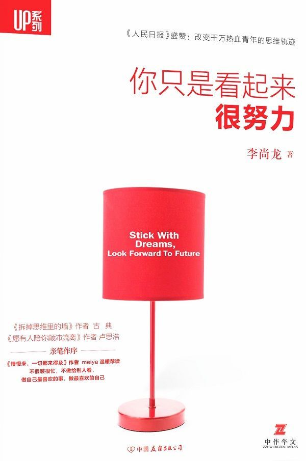
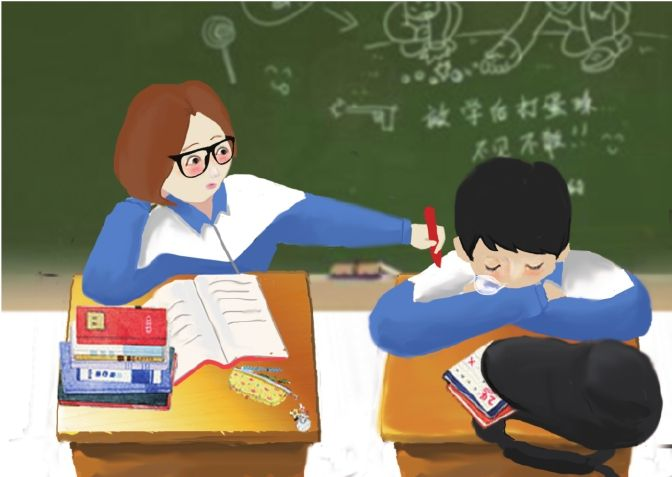
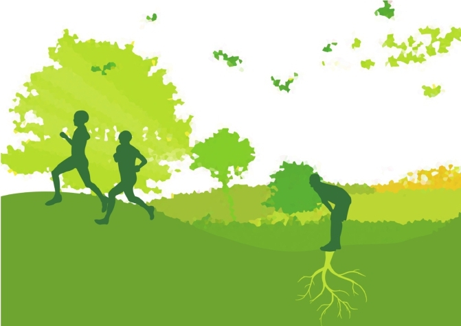
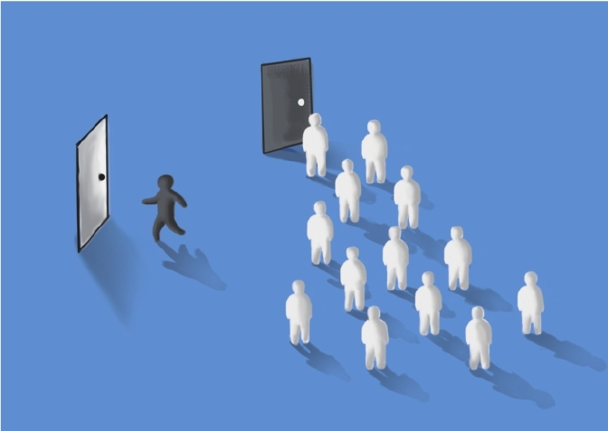
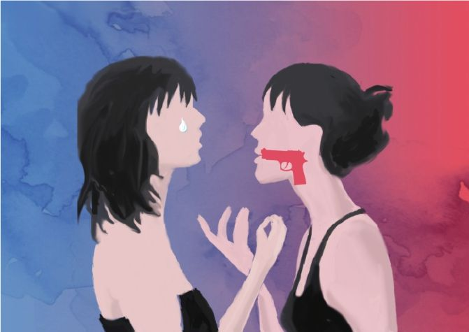

<svg xmlns="http://www.w3.org/2000/svg" xmlns:xlink="http://www.w3.org/1999/xlink" version="1.1" width="100%" height="100%" viewbox="0 0 600 905" preserveaspectratio="none">

<image width="600" height="905" xlink:href="images/00005.jpeg"></image>
</svg>

# 目录

<a href="#part0002.html_1T140-f490bbe3289c41c58dd2410312ee5957"
class="calibre2">[推荐序1 ] 保持对于“我”的热情</a>

<a href="#part0003.html_2RHM0-f490bbe3289c41c58dd2410312ee5957"
class="calibre2">[推荐序2] 看似忙碌的人生</a>

<a href="#part0004.html_3Q280-f490bbe3289c41c58dd2410312ee5957"
class="calibre2">[自序]</a>

<a href="#part0005.html_4OIQ0-f490bbe3289c41c58dd2410312ee5957"
class="calibre2">Part 1 梦想和奋斗 你只是看起来很努力</a>

<a href="#part0006.html_5N3C0-f490bbe3289c41c58dd2410312ee5957"
class="calibre2">你只是看起来很努力</a>

<a href="#part0007.html_6LJU0-f490bbe3289c41c58dd2410312ee5957"
class="calibre2">你以为你在合群，你在浪费青春</a>

<a href="#part0008.html_7K4G0-f490bbe3289c41c58dd2410312ee5957"
class="calibre2">以赚钱为目的的兼职，是最愚蠢的投资</a>

<a href="#part0009.html_8IL20-f490bbe3289c41c58dd2410312ee5957"
class="calibre2">最好的休息</a>

<a href="#part0010.html_9H5K0-f490bbe3289c41c58dd2410312ee5957"
class="calibre2">优秀不够，你是否无可替代</a>

<a href="#part0011.html_AFM60-f490bbe3289c41c58dd2410312ee5957"
class="calibre2">这世上一定有人，过着你想要的生活</a>

<a href="#part0012.html_BE6O0-f490bbe3289c41c58dd2410312ee5957"
class="calibre2">没有一条路是白走的</a>

<a href="#part0013.html_CCNA0-f490bbe3289c41c58dd2410312ee5957"
class="calibre2">别和负能量的人在一起</a>

<a href="#part0014.html_DB7S0-f490bbe3289c41c58dd2410312ee5957"
class="calibre2">同事，最熟悉的陌生人</a>

<a href="#part0015.html_E9OE0-f490bbe3289c41c58dd2410312ee5957"
class="calibre2">莫名我就痛恨你</a>

<a href="#part0016.html_F8900-f490bbe3289c41c58dd2410312ee5957"
class="calibre2">为什么很多人的新年梦想只是梦想</a>

<a href="#part0017.html_G6PI0-f490bbe3289c41c58dd2410312ee5957"
class="calibre2">都市的冰冷繁华下，需要人心的温暖</a>

<a href="#part0018.html_H5A40-f490bbe3289c41c58dd2410312ee5957"
class="calibre2">最好的省钱方法，是赚钱</a>

<a href="#part0019.html_I3QM0-f490bbe3289c41c58dd2410312ee5957"
class="calibre2">只要你还能去追，就应该不抱怨地前进</a>

<a href="#part0020.html_J2B80-f490bbe3289c41c58dd2410312ee5957"
class="calibre2">你总要度过生存期，才能谈生活和梦想</a>

<a href="#part0021.html_K0RQ0-f490bbe3289c41c58dd2410312ee5957"
class="calibre2">祝我们在北京都好</a>

<a href="#part0022.html_KVCC0-f490bbe3289c41c58dd2410312ee5957"
class="calibre2">24岁，送给生日</a>

<a href="#part0023.html_LTSU0-f490bbe3289c41c58dd2410312ee5957"
class="calibre2">只是赚钱而已</a>

<a href="#part0024.html_MSDG0-f490bbe3289c41c58dd2410312ee5957"
class="calibre2">Part 2 爱情和承诺 不后悔，就值得</a>

<a href="#part0025.html_NQU20-f490bbe3289c41c58dd2410312ee5957"
class="calibre2">同桌的你</a>

<a href="#part0026.html_OPEK0-f490bbe3289c41c58dd2410312ee5957"
class="calibre2">那些擦肩而过的人，是上天最好的安排</a>

<a href="#part0027.html_PNV60-f490bbe3289c41c58dd2410312ee5957"
class="calibre2">我想告诉你一些故事，让你继续相信爱情</a>

<a href="#part0028.html_QMFO0-f490bbe3289c41c58dd2410312ee5957"
class="calibre2">匆匆那年，只要一起全力过，不后悔，就值得了</a>

<a href="#part0029.html_RL0A0-f490bbe3289c41c58dd2410312ee5957"
class="calibre2">灵魂若无平等交流，感情也就无处可栖了</a>

<a href="#part0030.html_SJGS0-f490bbe3289c41c58dd2410312ee5957"
class="calibre2">面对面分手</a>

<a href="#part0031.html_TI1E0-f490bbe3289c41c58dd2410312ee5957"
class="calibre2">如果能够自由恋爱就尽量不要相亲</a>

<a href="#part0032.html_UGI00-f490bbe3289c41c58dd2410312ee5957"
class="calibre2">异地恋，如果你肯为对方去减少选择</a>

<a href="#part0033.html_VF2I0-f490bbe3289c41c58dd2410312ee5957"
class="calibre2">别和太爱的人结婚</a>

<a href="#part0034.html_10DJ40-f490bbe3289c41c58dd2410312ee5957"
class="calibre2">越被照顾好的人，越矫情</a>

<a href="#part0035.html_11C3M0-f490bbe3289c41c58dd2410312ee5957"
class="calibre2">所谓感情，就是能有共同话题</a>

<a href="#part0036.html_12AK80-f490bbe3289c41c58dd2410312ee5957"
class="calibre2">彪悍的人生不需要解释</a>

<a href="#part0037.html_1394Q0-f490bbe3289c41c58dd2410312ee5957"
class="calibre2">Part 3 亲情和友情 下次告别，就再用心一些吧</a>

<a href="#part0038.html_147LC0-f490bbe3289c41c58dd2410312ee5957"
class="calibre2">现在的分别，是为了更好的相聚</a>

<a href="#part0039.html_1565U0-f490bbe3289c41c58dd2410312ee5957"
class="calibre2">下次告别，就再用心一些吧</a>

<a href="#part0040.html_164MG0-f490bbe3289c41c58dd2410312ee5957"
class="calibre2">真心对你好的人，从不会向你证明自己的恩惠</a>

<a href="#part0041.html_173720-f490bbe3289c41c58dd2410312ee5957"
class="calibre2">致那些自私的朋友</a>

<a href="#part0042.html_181NK0-f490bbe3289c41c58dd2410312ee5957"
class="calibre2">再好的朋友，也经不起你过分的直白</a>

<a href="#part0043.html_190860-f490bbe3289c41c58dd2410312ee5957"
class="calibre2">最好的结局，是我们两个在一起了</a>

<a href="#part0044.html_19UOO0-f490bbe3289c41c58dd2410312ee5957"
class="calibre2">所谓天生的不足，都和自己有关</a>

<a href="#part0045.html_1AT9A0-f490bbe3289c41c58dd2410312ee5957"
class="calibre2">夜店里的迷茫</a>

<a href="#part0046.html_1BRPS0-f490bbe3289c41c58dd2410312ee5957"
class="calibre2">三只小猪</a>

<a href="#part0047.html_1CQAE0-f490bbe3289c41c58dd2410312ee5957"
class="calibre2">最亲的人，最容易忽略他们的感受</a>

<a href="#part0048.html_1DOR00-f490bbe3289c41c58dd2410312ee5957"
class="calibre2">爸妈，我已经长大了，放手吧</a>

<a href="#part0049.html_1ENBI0-f490bbe3289c41c58dd2410312ee5957"
class="calibre2">善良的人，运气总是不会太差</a>

<a href="#part0050.html_1FLS40-f490bbe3289c41c58dd2410312ee5957"
class="calibre2">别纠结，学习形式不重要</a>

<a href="#part0051.html_1GKCM0-f490bbe3289c41c58dd2410312ee5957"
class="calibre2">Part 4 读书 那些毁掉我的书</a>

<a href="#part0052.html_1HIT80-f490bbe3289c41c58dd2410312ee5957"
class="calibre2">读书能让人富裕，但不一定能变得有钱</a>

<a href="#part0053.html_1IHDQ0-f490bbe3289c41c58dd2410312ee5957"
class="calibre2">那些毁掉我的书</a>

<a href="#part0054.html_1JFUC0-f490bbe3289c41c58dd2410312ee5957"
class="calibre2">读《一只特立独行的猪》感</a>

<a href="#part0055.html_1KEEU0-f490bbe3289c41c58dd2410312ee5957"
class="calibre2">Unbroken（《坚不可摧》）</a>

<a href="#part0056.html_1LCVG0-f490bbe3289c41c58dd2410312ee5957"
class="calibre2">后 记</a>

<a href="#part0057.html_1MBG20-f490bbe3289c41c58dd2410312ee5957"
class="calibre2">作者简介</a>

##### 只要能让彼此优秀，这场恋爱就没有白谈。

##### 任何没有计划的学习，都只是作秀而已。任何没有走心的努力，都只是看起来很努力。

##### 与众不同，不是你错了。很多时候，英雄都是孤独的。

##### 别以那些口无遮拦的直白自豪，其实只是幼稚而已。

# \[推荐序1 \] 保持对于“我”的热情

新精英生涯创始人、著名生涯规划师 古典

我浏览完所有龙哥的文章的开头，边看边乐——前10篇里有9篇都在第一行出现了“我”字，最近是第二个字“在我看来”，最远的也只在第二行。

我想，一个多么自恋、热情又有洞察力的家伙才会这么写作，就着自己的故事看人生，就着自己的人生谈你的人生（当然我病更重，请看开头）。尼采应该是这么写的祖师爷，他的《看哪！这人》里直接从目录开始“我”起：“一、我为什么这样智慧；
二、我为什么这样聪明；三、我为什么写出了这样的好书。”

但是，好在这是一本很真实关于“我”的书。

马克·吐温曾经谈论自己的写作方式——他常常会面对一张白纸好几个小时，写了又划掉，一直到有一句“真实的句子”被写出来。然后他对自己说：“如果我能写出来一句，我一定能写出下面一句。”一直到完成整本书。

我觉得这本书也是这样写就的。

这是一本关于青年人“我”的书，所有的故事都从“我有一个朋友”开始，到“我发现”，然后是“我觉得”结尾。借着这些故事，龙哥在书里讨论“你只是假装很努力”，宣布“我已经长大了，放手吧”，告诉你“告别的时候要用力一点”，讨论“谁是对你好的人”和“别和太爱的人结婚”，有时候我会很感叹，一个九零后，竟然能有这么有趣的思想……

如果你和我一样，在这个飞速发展的中国城乡街道里长大，在压抑的中学大学里度过残酷青春，在功利主义的社会里闯荡，兜里又还揣着梦想，这些问题你就避无可避。就像抱着一只心爱的兔子挤地铁的人，这些问题如面目模糊的陌生人向你迎面挤来，你避无可避，只能迎击。

所以，这是一本真实的书。故事都是真实的；观点不管对错，也都是真诚的。以做学问的角度去看——这些“我的一个朋友”的故事，无名无姓，面目模糊，很难成为立论的证据。但读完体味，又觉得其真实丰满——你几乎马上能对应出生活中的人来——就像你讲的那些关于“我的一个朋友”的笑话，听的人都知道那就是你自己啊。

我也曾特别端着地写：“从生涯规划专业的角度，很多地方还需打磨——有些观点还有些冲突，有些思考缺乏体系。但是这样的思考难能可贵。”这样显得我比较理性和专业，后来我也把这句话划掉——因为这个说法不真实。

真实的青春，不是这样的。

真实的青春是无知的，等我们中年回头，我们发现我们原来对于人生、社会、感情其实一无所知，但那个时候，请保持这种宝贵的无知。

我们虽然不了解这个世界，但莫名其妙觉得可以走遍；我们虽然不理解爱情，但是每一次都全力以赴；我们虽然被社会撞得头破血流，但是我们乐观得要死，认定这个世界会因为我们而改变。

最后，这个世界真的就因为这样的人改变了。

这种宝贵的无知，最有力量。

纪伯伦说：“你无法同时拥有青春和关于青春的知识；因为青春忙于生计，没有余暇去求知；而知识忙于寻求自我，无法享受生活。”所以年轻就要轻狂一些，中年要稳健一些，老了就端庄一点。如果你年轻时候不轻狂，老了老了又憋不住了，这就是耍流氓。

所以我觉得读这本书，比读本虚头巴脑、不讲人话的《人生20个你不可不知的哲理》之类的书要畅快得多；比读一本不知道哪里翻译过来，以“当扎尔伯克小时候”或者“麦克斯是硅谷中XX公司的CEO”开头的成功案例集要接地气许多——别硅谷了，翻译这本书的人连中关村都没去过。别讲理论，别说别人，就说你自己。你自己的故事，自己的快乐，自己的痛，才最有力量。

别问这个世界需要什么，做你自己，这个世界需要的，就是你做你自己。请保持这种对于“我”的热情，这种年轻时宝贵的无知。因为，世界就是因为你这样的人改变的。

2015年5月10日

古典

# \[推荐序2\] 看似忙碌的人生

《愿有人陪你颠沛流离》作者 卢思浩

10年时我在日记里写：“我们之所以会觉得焦虑，无非是因为现在的自己和想象中的自己，很有距离。”而我们离想象中的自己越来越远，很大程度上都是因为我们在一点点地辜负自己。

关于焦虑，我发现我们或多或少地都陷入了一个怪圈，这个怪圈叫：我们看似忙碌，实则焦虑。我们总是心血来潮想学习，于是买了很多单词书，再也没有翻开过；我们总是备受刺激想健身，于是找了很多攻略，再也没有动过；我们总是信誓旦旦要读书，于是买了很多书，再也没有打开过。

我们总是花很多时间在社交网络上，把认为有用的东西另存为，直到你的硬盘存满了资料，你还是没有看过。

我们忙碌，可我们却没有真的去了解那些自己精挑细选留下的内容。我们花时间收集，却忘了最重要的其实是花时间去消化。

你说你想要当自由撰稿人，可从不见你努力写稿；你说你想考研，可从不见你背单词做题；你看到学霸时嗤之以鼻说这样活着没意思；你看到有人旅行又不屑一顾地说这只是随大流。我开始怀疑你挂在嘴边的是不是逃避现实的借口，我开始怀疑你是不是在一遍遍地逃避和自我安慰中变得惴惴不安。

一本书买了不看也不过是印着字的纸而已；单词书买了不背充其量就是26个字母的排列组合；下载的演讲公开课不听也只是一堆无用的影像，可能你只是随手下载了，就再也没有去看过。于是有一天你发现，堆积的东西已经看不完了。

你看着一个个公开课、一本本单词书，无从下手从而越发焦虑。拖延和等待，是世界上最容易压垮一个人斗志的东西。

我不知道这样的人有多少，但是我可以肯定，每个人身边几乎都有这样的人。他们做一些事情，并不是出于自己的爱好，或者深思熟虑的结果。而是他们想要让自己忙碌起来，可以让自己看起来不被别人落下太多。

不要看到别人做什么好，就去尝试做什么，因为每个人表现给你看的不一定就是全部。很多时候你跑到别人的轨道上了，才发现那个不适合你，看起来光鲜的其实也有属于他们自己的苦逼。看到全部，再谨慎地做选择。

那么怎么打败焦虑？打败焦虑的最好办法，就是去做那些让你焦虑的事情。

翻完尚龙的书，让我忽然想到了以上的文字。

这本书的文字，让我有了久违的感悟，我希望你在看完这本书之后，也会有所感悟，会真切地做起身边的每一件事。你知道，行动这件事，从来不需要等到什么好天气什么好状态，此时此刻就是永远，此时此刻就是一切。

共勉。

2015年4月14日于墨尔本

# \[自序\]

五年前，我拿着一个刚写好的剧本给投资方看，和他们喝了一个下午茶，聊了很多。我走出咖啡厅，僵在脸上的笑容却再也笑不出来了。的确，我被拒绝了。

那时的我，在大街上痛苦着。心想，我这么努力，为什么还是没人能认可我的故事，这世界靠努力还有用吗？凭什么他们的出生条件比我好，不用为生存期发愁？凭什么他有这么好的机会，而我没有？凭什么！凭什么！

我到家时，已经是晚上十一点了。打开灯的刹那，我忽然明白了一个道理：既然抱怨没用，为何不收拾行囊继续启程；既然积极向上也是一天，自暴自弃也是一天，为何不充满希望地活着；既然无可避免地到了晚上，为什么不用自己的手把灯打开。

我更明白了，其实曾经那些自己的努力，都只是一些假象，都只是看起来很努力的自欺欺人。

看似每天都去自习室带了很多书，却还带了手机；看似晚上学到很晚，却只是在发呆；看似在健身房锻炼，却仅仅拍了两张照片在朋友圈……没有计划的学习都只是浪费时间，没有目标的努力都只是自己骗自己而已。

逐渐，我开始每天给自己写计划，每个月给自己设定目标，不为别人不为表象地努力。路一步步地走，走得很慢，但没有停。

直到今天，我终于懂得了，那些曾经的动力，那些过去的用心，其实都是有回报的。只是，你是真的走心了，还是只是做做样子。很多时候，一个跪着行走的人，不代表他今后一定会站起来；但一个思考过自己为什么现在跪着的人，今后一定会像巨人一样，潇洒地立起来，俯看这个世界。苏格拉底曾经说过：不自我检验的生活，不值得一过。而我觉得，不明不白盲目努力，更不值得。

如果你也和我一样，是一个坚信靠自己的双手能改变命运的人，那么，你应该会喜欢我的文字，喜欢我的观点，喜欢我给你讲的故事，喜欢书里的这些人。

这本书中，很少有一些无济于事的心灵鸡汤。很多鸡汤，只在为你现在的颓废状态找借口，为你的迷茫寻觅理由。其实并不是每件事都能慢慢来，并不是每个人上天都会给最好的安排，并不是每个傻傻努力的人都一定能实现自己的梦想。

这本书的文字，没有无聊的励志，都是发生在自己和朋友身上一个个鲜活的故事，这些故事的背后，倒映着生活，倒映着我们。它们会告诉你“只是看起来很努力”的生活状态是可怕的；它们会告诉你，对待自己的好朋友不要口不择言，因为“再好的朋友也经不起你过分的直白”；他们会告诉你，逆境并不可怕，不要为合群而合群，因为“你以为你在合群，你在浪费青春”……

写的这些人，和你我一样，都是普通的人，只是在他们身上，发生着一些不普通的故事。我作为一个旁观者，默默地看着这些平凡的而不平庸的故事，安静地想着这些孤单但不孤独的情节，时而感动，时而热泪盈眶。李安曾经说过：我们的生活需要讲故事，要不然生活就会像π一样无止境下去。很荣幸，我有机会见证他们，并记载着他们身上发生的一切：背井离乡追梦的月月，名校休学的小女孩，抛弃稳定生活的南，对爱不离不弃的飞……

写这些文字的时候，经常在夜晚，或许翻开这本书的你，也是在夜晚。台灯照着每一个努力的面庞，照亮了内心的宁静，或许，照亮了你的泪光。其实没事，谁的深夜没有痛哭过。但你要相信，正在努力的你并不孤独，其实，努力的人从来没有孤独过。

所以，或许您和我一样，都相信努力奋斗的价值，都坚定地明白青春就是去折腾的，都清晰地知道梦想是多么的伟大。那么，如果有梦，梦要够疯，够疯才能变成英雄。

当得知这本书能被出版的时候，自己的内心深处充满暖暖的感动和感激。感谢喜欢我文字的每一位，因为你们，这本书才能拨云见日，也因为你们，才让我的码字有了意义，感谢你们给了我勇气和力量。

2015年4月2日

李尚龙

# Part 1 梦想和奋斗 你只是看起来很努力

看起来每天熬夜，却只是拿着手机点了无数个赞；

看起来起那么早去上课，却只是在课堂里补昨天晚上的觉；

看起来在图书馆坐了一天，却真的只是坐了一天；

看起来去了健身房，却只是在和帅哥、美女搭讪。

## 你只是看起来很努力

一次上课的时候，一个女孩子垂头丧气地跟我说：“老师，我考了四次四级，还没过，究竟是为什么？”

我说：“你真题做了吗？单词背了吗？”

她拿出已经翻破了的真题，跟我说：“你讲的所有题目我连答案都记得，我这么努力，为什么过不了？”

这是一个我印象特别深刻的学生，其实英语四级考试是一个超级简单的考试。据说，每年通过率有百分之八十多，那些没过的百分之十几还包括了裸考的和放弃治疗很久的学生。我想，一个人要多有毅力，才能一直保持在后百分之十几坚定地不过，并且连续四次。

可是，看着这个学生满满的笔记，我心想，看起来是很努力啊，没理由不通过啊，这孩子会不会是脑子不好使。

聊了很久，无解。

这种感觉就像是一个医生知道病人有病，但是就是不知道如何去医治他一样。于是，我只能使出大招：“你这么努力，放心吧，下次你肯定能过的。”

那个学生讪讪地说：“但愿如此。”

对这个世界来说，没有什么果是没有因的，即使现在看不出原因，但也一定是存在的。

那是我第一次也是最后一次见到那个女孩子，她再也没有出现在我的课堂上。

结课那天，我来到她的位置旁，指了指她的空位置，问她身边的一个女孩子：“你认识她吗？”

她说：“认识，她是我同学。”

我说：“她为什么总是逃课？就第一次来了。”

她笑笑说：“她事情比较多。”

就是那天我找到了病因。这个女孩子是学生会主席，同时兼几个社团的团长，参加组织活动很积极，朋友也很多。唯一没有时间做的事情，就是独处。可学习英语其实是一个特别需要独处的过程。而她只是做了一套真题，草草地对了一遍答案，然后冲出自习室继续做学生会的事情了，至于这套题，在她脑子里只留下了“我这么努力地做了一套题”的意念，其余的什么都不记得。就像她告诉很多人自己报了一个班，可是几乎从来没有上过课；就像她找很多人探讨过怎么学英语，但是从来没有真正记住点儿什么。骗别人很容易，骗自己更容易，可是，骗这个世界有点儿难。

我想起了一个女孩子小白，她总是喜欢让我给她推荐一些电影和书，还要求是格调很高的。因此，我每次看过的书都会给她拿过去让她看。她每次看完，都会发一条微博，下面无数个赞。

有一次我跟她闲聊，问她：“你告诉我一下，上一本书你看完记住了什么吗？”

她说：“忘了（耳边好像有一只乌鸦在叫）。”

回到家，我看她的朋友圈上说又看完了一本书，我赶紧给她的朋友圈点了一个赞。

另一个朋友小路，特别喜欢去自习室，然后每次在朋友圈都会看见她的文字：最近很累；快考试了，最后几天拼了；早出晚归……

她写下的生活，总是那么波折、努力。她给别人看的日子，都是那么具有正能量。

可是，该不过的，还是过不了。她的所有考试结果，似乎都是波折和无奈。

因为毕竟，所有的努力都不是给别人看的，而是这些努力是否真正到达了内心，变成了提升。一次和她一起自习，看见她带了会计书、英语书、考试卷子……还有手机。

她一上午的学习其实都是在刷朋友圈、刷微博。这种所谓的努力，其实只是看起来很努力而已。

看起来每天熬夜，却只是拿着手机点了无数个赞；看起来起那么早去上课，却只是在课堂里补昨天晚上的觉；看起来在图书馆坐了一天，却真的只是坐了一天；看起来去了健身房，却只是在和帅哥、美女搭讪。在我们身边，总有一些笔记记得很认真的人，但是考试成绩不理想；也总有那些学习成绩非常好，但看起来并不怎么认真的人，很多人把他们定义为聪明，其实他们只是在学习的时候摒弃了诱惑，一心一意地在努力，虽然那些努力没有让别人看到，但那段时间没有被干扰。

这种感觉你不一定要让别人知道，有时候你也在深夜去痛斥这个世界的不公，你说自己这么努力，为什么那个谁看起来一点儿也不用心，最后却有了很好的成绩。可是，他们的背后和你的背后，究竟做了一些什么？你的生活和别人看到的你的生活，是不是一样的呢？因此，你知道，那些所谓的努力时光，真的头脑风暴过了吗，真的走心过了吗，真的问心无愧了吗？或者，它只是看起来很努力而已。

## 你以为你在合群，你在浪费青春

写这篇文字的时候，是在一个偶然的情况下。那天，一个学生告诉我，一个宿舍四个人，他是唯一不玩游戏的，可是他们群起而攻之：“学习有什么用啊？装什么啊？你不加入我们，今后怎么可能会有出息啊？”那天我特别郁闷地想起了我的大学。

其实，在那个群体里面，过得很难受。

我忽然明白，来大学学习不是为了合群，而是为了成就自己的梦想，然后找到真正属于自己的群体。

这感觉就像你是一个篮球高手，为什么要在一群学英语好的人中间合群呢？无法选择自己的室友，但是你能决定自己的朋友；无法决定自己的生活圈子，但是你能决定自己的理想境界。

合到该合的群，寻觅自己要的，无论是理想，还是朋友，才是大学四年该做的。

曾经有一个宿舍，宿舍里面八个人。每当宿舍里的八个人都凑齐的时候，寝室长总会组织一个游戏，就是把八个人分成两组，每组三个人，组织大家打牌，剩下两个人就打开电脑，打起了DOTA（一种网络游戏），或者拿出手机不停地刷着网页，或者躺在床上拿着PSP（一种玩游戏的工具）等待着他们的轮换。

然后，一晚上就这样过去了。

然后，一年就这样过去了。

然后，四年就这样过去了。

八个人里面，一定会有一两个人混得还可以，但是也一定会有人混得差。混得可以的，在大学四年，活得多么假：因为他组织别人堕落，自己却坚定地向前，表里不一，活得多么难受。而混得差的，永远不知道问题出在哪里。他根本不知道，他就是跟风了，可是到底哪里出了错误。

最近的课堂上，我不停地强调一点给我的学生：大学期间，你无法选择自己的室友，但是你可以选择自己的朋友。

因为，最近我开始发现，寝室，是堕落的开始；合群，是淘汰的起点。在好多人的字典里面：

四个人，三个人不停地下载着苍井空出演的电影，第四个人不看，就是不合群。

四个人，三个人打着游戏，第四个人不玩儿，就是不合群。

人是怕寂寞的，于是，大多数人都选择合群。

可是，你以为你在合群，你在浪费自己的青春；你以为你交了朋友，当你毕业一无是处时，谁还会把你当朋友；你以为你大学四年不孤单，当你毕业没有工作时，没有老婆的日子，你会更孤单。

有人说孤单痛苦，那谁又说过，实现自己的理想，不会痛苦？

我短暂的大学期间，目睹了太多为了合群而合污的惨剧。

记得大一，总有人叫我打游戏，我也打，可是留下的，是和他们一样的空虚。

记得大二，当他们拿着手机不停下载新的游戏，我在角落却拿着单词书背单词。

记得大三，寝室七个人对我集体发起攻击，说我不合群。更有人到处说我傲气逼人，到处说我坏话，但是我明白，与众不同，不是我错了，最后我只有申请换寝室。但是现在我明白了，几年后的今天，当一些人在烈日下暴晒时，我却在空调房里写文章。

最重要的是，我已经忘记了当时说我不合群的那些人的名字是什么。我知道，他们中有可能还有人惦记着我。但是我只想说，他们惦记着我，说明他们生活里面不能没有我；而我忘记了他们的名字，说明我的生活里面可以没有他们。

直到今天，我认识了许多人，有些是有名的大导演，有些是知名的演员，有些是很牛的实业家，有些是银行、政界的大亨，有些是当初都不会正眼看我一眼的美女，最重要的是，我交了一帮好朋友。此时此刻我才会感激，当初我没有合群，现在，我才到了属于我自己的群体中，去做我应该做的事情。

如果当初我合群，现在身边，又会是谁，又会是什么景象。

我一直坚信，英雄，永远是孤独的，只有小喽啰才扎堆。“二八定律”永远适合在地球的每一个角落：百分之二十的人，占有百分之八十的资产；百分之八十的人，为百分之二十的人服务。

尤其是男孩子，大学四年，一直合群，一直在寝室，一直不打开视野、故步自封，做井底之蛙，这一切，总会在今后走进社会的某一时刻一次性地还给自己。

而女孩子，更是需要在大学中培养出独立的人格，依靠一个男人，永远比不上依靠自己的双手创造的未来踏实。

但是，我想说，我这里说的不合群，不是结仇，不是桀骜不驯。这里，我在大学做得不够，我检讨。至少，千万不要得罪人，因为“道不同不相为谋”。但是这不代表连话都不讲，或者恶语相向。你支持他的生活模式，只是你需要拥有自己的思想。

这个世界很邪门，你永远不会相信，当年最浑蛋的那个人，十年后会是政治界最有潜力的谁；你也不会相信，当年最不合群的人，成为了百万富翁。

无论如何，那些有点儿成就的人，都不合群；就算表面合群，他们的内心，也总有着自己的一片世界，他们喜欢静静地思考，并且一直向理想迈进。

## 以赚钱为目的的兼职，是最愚蠢的投资

2010年年末，那是我刚当老师的第一年，认识了一个好朋友——在人民大学经济系读大一的学生。我一直觉得，人民大学经济系是超级牛的专业，因为很难考，加上我很渴望知道一些经济学的知识，所以就一直巴结着她，好让她给我讲一些知识。我们总是在咖啡厅约着喝两杯咖啡，因为我已经开始工作，所以大多时候都是我出钱。直到有一天……

她跟我说：“龙哥，你能不能在什么英语培训机构介绍一个兼职给我？”

我说：“为什么？”

她说：“因为我最近很缺钱，老让你请我也挺过意不去的。”

我说：“那你考过四六级、雅思、托福了吗？”

她说：“我才上大一啊，必然都没考啊。”

我说：“是啊，你才上大一，着什么急赚钱啊。”

她停留五秒钟说：“你真不是好朋友。”

后来在她软磨硬泡下，我把她介绍到了一个专门教小孩儿的机构教少儿英语。她的学生都是小学生。她上课，对学生们讲着字母表，说着Father（父亲）、Mother（母亲），然后和学生们玩儿着老鹰捉小鸡。

第一个月，她赚了四千多元，十分开心地请我吃了一顿饭。

她这样的生活持续了整个大一下学期。她存了一些钱，所有人都为她叫好，认为她真励志。

可是，我发现有一些不对的地方。因为如果你一个月从一个公司拿走四千元，那么你至少应该给他们赚到两万元。而你给他们赚到两万，你至少应该每天搭进去八个小时。你的一个月才值四千元？

后来我才知道，她每天备课的时间高达十个小时，除去吃饭、睡觉的八个小时，她只剩下六个小时用来完成自己的学习。就算这六个小时真的全部拿去学习，都已经不再是专职学生，而是一个兼职学生。她在备课上高达十个小时的输出，远远大于不到六个小时的输入。在最该学习的时候选择输出，大学四年的意义何在呢？

那天我和她深聊了一次，她感谢了我，说：“龙哥，你说得对，我写辞职报告吧。”

接着，意想不到的事情发生了。主管跟她谈话，因为她表现优异，她的工资提升了一倍。诱惑摆在面前，于是她继续干了一年。

那一年，我不忍心打扰她，只是跟她吃饭的时候发现她跟我聊的经济知识越来越少，而英语培训方面的内容越来越多。我弱弱地问她：“你以后是想成为英语老师吗？”

她说：“不啊，我学经济的，以后当然会成为经济学家，像郎咸平那样。”

我愣在那里，说：“可是你做的所有事情，都不会让你成为经济学家，你以后只会成为一个英语老师。因为你现在做的一切和经济无关啊。你虽然没有感觉，但是这些东西就隐隐约约地决定着你的未来。”

她说：“不可能，我赚完这笔钱就停下来。物质基础很重要嘛！”

我再次沉默了，只是希望自己说的是错的。

大二那年暑假，很多银行来他们经济系提供实习机会，几乎她的所有同学都得到了offer（邀请）；而她，因为忙于工作，竟然连四级也没过，更别说跟经济学有关的证书了，连文化课都挂了两科。而她获得的唯一技能就是怎么逗孩子开心和如何同家长交流。

这个故事的结果还好，因为这个孩子今年毕业已经去美国深造了。但是每次聊到这个话题，她都会告诉我，那段时间她赚着一份不错的工资，但是感觉像温水煮青蛙，一不留神就死去了，而且以为自己很努力，其实是努力地走向一个深渊，却什么也没学到。

大学四年是吸收知识最密集的四年，时间如此宝贵，为什么要去赚钱呢？以后有的是时间去赚钱，却再也没有时间和精力去学习了。学生期间，穷很正常，它更能给你保存志气和战斗力去做一些自己喜欢并且有挑战的事情，而有些兼职是纯粹的浪费时间、浪费生命，剥夺着你的斗志。

我的大学期间，去当过家教，当时特别开心，觉得有钱啦。后来发现除了每个小时赚一百元钱之外，其余的就是拉低智商，浪费了大量的时间。后来干了两周，很快辞职了。

还有一些职业比如说服务、送快递、发传单……这些活每个人都能干，我没有说歧视这些职业，只是你为什么要浪费你宝贵的读书、学习时间，去做这些谁都能做的事情呢？那么你为什么还要继续上大学呢？其实，如果你不读研究生，这四年是你最后密集学习的四年。这四年，你要做的事情很多：你可以不上课，但是你不能不读书；你可以不拿学位证，但是你不能不学习；你可以不合群，但是你不能不交朋友。你以为在大学除了上课，剩下的时间全可以浪费，心想，我不就兼职一下吗，我比在宿舍玩游戏、睡觉好多了。我告诉你，你认为的这些鸡肋时间在度过的同时，有无数的学生正在努力地背单词准备出国，也有无数的学生在图书馆读着自己喜欢的书，他们毕业后，会把这些知识和一技之长全部变成工作的高度，赚到更多的钱。

直到今天，我依旧感谢自己没有被赚钱冲昏头脑，我认为年轻就不能以赚钱为目的地活着，而要更多地去学习、去了解这个世界。几年前，我决定用空余时间学习电影制作：剪辑、分镜头、摄像、特效。于是拍了几部影片后，和优酷合作了《断梦人》。我也很感动，年轻的时候，没有因为不停地工作赚钱耽误了自己的学习，而丧失了这么多可能性。

最后，想认真地跟大家说：那些有工作、有钱人的生活，不要羡慕，因为随着你年龄的增长，迟早会有。但是，那些你有而他们没有的东西——时间、青春，其实格外重要。因此，不要因为干一些无意义的兼职而浪费了大好青春，要知道，这是不值得的。

## 最好的休息

我认识的网络红人A是一个激情四射的男人，感觉他每天都有用不完的时间：写书、讲课、看书、赚钱、参加各种节目，他把自己的时间分割成很多个小部分，今天这个部分干什么，那个部分干什么。这些部分被分割得很细致，以至于每天的时间都不浪费，一年内，他的事业突飞猛进，认识的人也开始越来越多，粉丝数量多得吓人。每次看到他的微博，学生问得最多的问题竟然是：“你怎么可以同时做这么多事情呢？你不需要休息吗？你是铁人吗？”

他的回答很简单：“做不同的事情，就是休息啊！”

不知道你有没有这样的感觉，今天学习了三个小时的英语，好累。于是，犒劳自己一下，睡了一下午，换来的是晚上的头疼不已，接下来什么事情都无法继续去做。这种事情发生在很多人身上，明明睡了一下午，偏偏不解乏，依旧觉得累，做事效率不高。原因很简单，是因为休息的方式根本不是疯狂地睡大觉，而是换个脑子去做其他的事情。多条腿走路，才是那些高效人士的必经之路。重要的是，他们不比那些天天睡觉的人要累多少。

我的好朋友H的故事是我一直难以忘怀的。我刚开始北漂时，和他一起住了一段时间。那段日子，他自学考研课程，准备年底奋战考研。因为我是英语老师，我身边有很多学生：刻苦的、打酱油的、效率不高的、天才的。虽然我不喜欢把人分类，但是我见过了很多学得很刻苦但是不痛苦的，也见过很多看似学习非常痛苦但最后没有什么好结果的学生。好朋友H属于后者。

一天，他做了两个小时的英语题，背了一些单词，翻译了几个句子，累了。他伸了一个懒腰，接着倒在了床上，就像黏在了床上一样无法自拔，打了几个滚，睡着了……我弄醒他，说：“你还考不考研？”

他说：“我休息一下再学。”

他睡了一个小时，起来后，效率低得吓人。书一直翻在那一页，一个多小时，还在盯着那几行看。我走近一看，才发现他已经拿出了手机翻阅着网页。

他考研考了两次，都失利了。有一次他问我：“我是不是已经老了，总觉得睡眠不够，白天困，晚上还失眠，学习效率还不高。”

和他做室友这么长时间，我非常明白，他一天超过十个小时的睡眠，肯定是够的。于是，我告诉他：“你试试不要用睡觉来放松。学累了，去跑跑步。”

在我的号召下，他和我一起办了一张健身卡。那段时间我在努力减肥，于是带着他一起去健身房，他本来疲惫的身躯，在跑得汗流浃背后，精神不仅没有萎靡，反倒忽然变得更加有活力。那天，他学到了晚上十一点，没困。当他做完了最后一道题后，伸了个懒腰，困意袭来，睡着了。那天晚上，他没有失眠，我听到了他的呼噜声。第二天，他给我打电话：“尚龙，去不去健身？”

第二天，他继续跟我去了健身房。

很多时候，我们觉得很累，打不起精神去做一些事情；我们觉得很困，却在床上睡不着。其实，不是因为我们老了，而是因为我们没有合理地运用时间。我们的时间如此宝贵，为什么不去规划地用，很多所谓的休息时间，根本不是去蒙头大睡，而是去调整生活状态，换个大脑。睡觉只是众多放松方式的一种，除此之外，我们还有很多方法。

我曾经的一个学生是北大学霸，在考研中，他每天的时间都被自己计划得非常详细，每天英语学了两个小时后累了就开始画画，因为学英语用的是大脑记忆背诵的部分，而画画用的是大脑创作的部分。他画画累了，就继续去背政治。坐累了，他就站起来跑两圈，跑得出汗了就继续学习。他每天让自己的学习不那么单调，生活不那么无聊，虽然考研的日子不会好过，但至少能做到不那么痛苦。

可汗学院的老师曾经做过一个实验：一个成人的集中力也就15分钟。如果我们迫使的话，可以长一些，但是我们可以用其他方式去换个脑子，继续发挥生产力，这样，坚持下去就没那么难了。

很多人在长跑的时候没有坚持下去，是因为我们的脑子里面只有自己的脚步，那一步步重复的步伐无聊且沉重，不久就会崩溃。一个个坚持下来的，都是把眼睛盯着一路的风景。你看，所谓休息，并不是睡大觉，而是在自己的生活中添加一些料，变得不一样，变得多彩一些而已。

回到我的生活。在刚当老师的时候，我觉得很新鲜，每天遇到不同的学生，讲的课每天都不一样，去的地点也换来换去。可是时间久了，不愿意备新课，讲的内容一样；学生即使不一样，但反应相同；地点就那么几个。于是，我开始觉得生活特别无聊、枯燥，每天都觉得很累，上完课只想回家睡觉。那段时间，我觉得时间就像上了发条，无奈、无聊且无情。每天虽然忙碌，但是不开心。

一次偶然的机会，我认识了一个导演系的朋友，他教我写剧本，推荐了一些作品让我去阅读、去学习。后来我考上了青年导演培植计划，成立了自己的“龙影部落”工作室。写的文章也开始被很多人阅读。原来我喜欢一天上够十个小时课，然后用剩下的时间睡觉；现在，我减少了很多上课量，而换了一个脑子去写杂文、写剧本，看书、旅游。也总会有人问我：“你怎么会有那么多时间，又写书又上课又拍电影，还充电看书，这么忙，还休息吗？”其实，休息这事儿很简单，换个脑子而已。上课是体力活，上完后，也该动动脑子了，脑子动累了，看看书休息一下，眼睛难受了，听听音乐，坐久了，跑跑步，休息不代表一定要睡觉，其实只是换个脑子去工作而已。

就像一个天天在家睡觉的人，永远不知道在跑步机上的人也有另一种幸福。跑着的人，一直觉得世界是动着的，正能量和安全感差不多，都是自己给自己的。有时候那些每天都像打了鸡血的人，不是他们天生和别人不一样，只是因为他们一直用一颗求知和求新的心去活着。

关于睡眠，每天保证足够就好，一直觉得，好不容易才有的青春和生命，何必浪费在睡觉上呢。

## 优秀不够，你是否无可替代

前些时间我的工作室招人的时候，一个小姑娘笑嘻嘻地进来了。我看了她的作品，很不错，于是就问她：“你想面试哪个岗位呢？”

她说：“剪辑。”

其实我挺想聘她的，但是我们剧组的剪辑既刻苦，能力又强，而且预算又不够，矛盾中，我问：“有没有想过换一个职位，比如说特效什么的。”

她说：“我不会啊。”

我说：“那你还会什么？”

她愣住了一下，继续说：“我剪辑很不错的，您看了我的作品应该知道。”

那时我非常矛盾，因为她确实很优秀，可是工作岗位已经满了。优秀的人很多，她可以被替代，先来后到，所以我们讨论了一会儿，最后推荐她去了另外的工作室。本来故事应该结束了。可是当天晚上，小姑娘给我发了一条很长的短信，问：“我很想加入你们的团队，而且我的能力也不差，为什么不要我？”

其实换成其他人，就不回复了。而我好为人师的臭毛病又出来了，我想了半天，回了一条很长的短信：“小美，我们都看出你很优秀，可是剪辑这项工作你还没有做到极致。虽然我们都看到你到我们这里来后能力会提升得很快，你有超强的潜力，可是我们已经有了一个剪辑师，岗位已经满了。你虽然优秀，但运气不是那么好，可是你知道如果一个人无可替代，他的运气可能就好得多，下次一定要多学点儿能拿得出手的东西，会更好的！告诉你一句话，在以后的学习、工作中，记得，优秀不够，一定要卓越，一定要无可替代才是最重要的。”

那天以后，小姑娘和我成了很好的朋友。我们经常一起吃饭，直到今天，她已经与大工作室签约了，月薪上万。她的微博个性签名上写着：优秀不够，你是否无可替代。

其实只要你还在读文字，每天没有睡到中午，玩游戏没有玩到半夜，没有喝酒喝到天亮，那么你就是那种正在努力的人，一个一直看着阳光、盯着未来的人，一定是一个优秀的人。可是，为什么一个优秀的人还是被理想的公司拒绝，被自己的梦想拒之门外？因为其实在这个世界上，没有什么只要努力就一定能成功的。毕竟努力的人很多，在大城市，最不缺的就是梦想，最不差的就是优秀的人。可是，你优秀又能怎么样，每个人对于优秀的评价又不一样，既然优秀不够，就让自己无可替代吧。而无可替代的方式有两种：一是做别人不愿意做的事情；二是把别人都能做好的事情做卓越。这样的人，才是这个社会真正需要的。

北大古生物专业一个女生的毕业照在网上疯传，因为那个系只有她一个人，大家都在调侃她上课肯定不能逃课；有些人在羡慕她，因为她不用愁找不到工作。因为如果社会上只有一个对应的岗位，在没有关系户的前提下，这个岗位非她莫属；如果有两个呢，那么两个单位就会竞争要她，给她更高的薪酬待遇，因为她无法替代。这世上有很多人都是这样，做别人不愿意做的事情，做到无可替代。Bruce
Lee（李小龙）去好莱坞之前，有很多武行的高手都在电影中崭露头角，但只有Bruce
Lee愿意去美国发展，当时很多武术大师都不愿意背井离乡去一个陌生的地方拼事业。而恰巧那时的美国正发生着影视文化大爆炸，Bruce
Lee去了之后，也并不是他的打法比别人都牛，而是因为他是好莱坞武术组的唯一华人，所以，他变成了国际巨星，成为一代大师。其实那些所谓的成功人士，很多都是做了别人不愿意做的事情，才让自己无可替代的。

几年前我在军校学英语，身边人都觉得我有毛病。记得无数个夜晚我拿着厚厚的英文字典去自习室，在空空的教室里对着墙大声朗读着、背诵着，那时我在纸上写了一句话：耐得住寂寞，才能享受繁华。后来这句话在网上被不停地转发。记得同学问过我一句话：“已经学得很好了，干吗还要继续学？”我说：“好不够，要拔尖才可以。”2010年，我参加了希望英语演讲比赛，经过激烈的角逐后，我拿了北京市一等奖、全国第三名。主持人说：“你是我们这个舞台第一个穿军装的演讲者。”那段时间很多人问我：“在你那样一个环境中，都没人学英语，你为什么要学英语？”我笑笑说：“就是因为没人学英语，我才学的啊。”

我记得，那段时间脑子里面都是如何让我自己变得无可替代的记忆。很感激那段日子，每天跟打了鸡血似的学英语，才能有了今天自己想过的日子。直到今天，我已经开始一心一意地做工作室，希望未来能拍出更好看的电影。这条路很远，有很多人都在竞争，而我还会继续让自己强大起来，每天进步一点儿，做别人不愿意做的领域，把别人都能做的领域做绝，才能无可替代。

我在英语培训这个行业做了4年，对于这个行业来说，最有名的不是公司高层，也不是工作人员，而是那些拥有一技之长的老师。这些老师一直都是每个公司寻找的。他们有一技之长，是无可替代的。在这个行业待久了，我逐渐明白了，让自己强大起来比什么都重要。

每次读《水浒传》时，都会觉得挺有意思的，那些当年风云江湖的宋江、李逵，最后都没有好的下场。而最后有善终的、被重用的竟然是吹笛子的萧让、刻字的金大坚等这些专才。杜甫留给世界的，也不是他的官职，而是他写的诗篇。因此，对于我们这一代的人，在这个世界上活下来的利器，其实是一技之长。如果你在体制内工作，决定你命运的是领导的一句话，那么用一技之长活在世界上的人，评价你的是市场给你的相对公平的分数。靠手艺活着，哪怕没有体制内的稳定，但总是活得自在点儿、舒服点儿，而那些无可替代的手艺人，才是每个社会机器需要的必要零件。

年轻人，在学习的路上，不要低着头看书，多去人才市场看看现在社会需要什么专长，上网看看大型公司缺的是什么人，把一技之长磨得无可替代，变成自己喜欢的事业。这一路可能很难受，但是，没有哪个高手在修炼的时候是不寂寞、不难受的，既然选择无可替代的路，那么在实现梦想的路上挨两拳又如何呢？

## 这世上一定有人，过着你想要的生活

这个故事我想从我的一次旅行说起。2011年那个秋天，我一个人开始旅游。一天我到了陕西华阴，天很冷，忽然想爬华山。打了个车去华山后，已经是下午3点，到了华山山脚后，我身上还有一百元的现金，付了钱，师傅疑惑地跟我说：“没见过你这样爬华山的，一个人，不带多少钱也就算了，还选这个时候爬。”

我说：“那应该什么时候爬？”

师傅说：“别人都是晚上爬第二天看日出。你这样爬到北峰，至少4个小时，连索道都停了。大晚上你还没带多少钱，没地方住，也不怕被狼叼了。”

我听得毛骨悚然，看着高大的华山，还是决定了，既然来了，就爬吧。

和别人不一样有一个好处，就是你不用忍受人潮拥挤的交通和人流窜动的景点。与众不同不代表我错了。

那天，我一个人，听着秋风瑟瑟，看着山下的落叶，心里不停地打着退堂鼓。我只记得那条路很漫长，自己走得很快，因为，一个人爬一座山还是会担心有狼叫声或者来几个绿林大盗拿着砍刀，那个时候我能做的肯定就是跪地求饶把身上的七十元钱都给他们。

路边，一个步履蹒跚的老人在翻着垃圾桶。我问他：“大爷，最快多久可以到达北峰？”

大爷没抬头，说：“4个小时。”

我说：“如果我这么年轻去爬呢？”

大爷看我一眼说：“再快也要3个小时吧。”

我告别大爷，戴上耳机，踏上了汗流浃背的登山之路。自己的步伐越来越快，可海拔越高越冷，到了有雪的时候，手机也没有了信号。我依稀记得，有一条特别陡峭的路，几乎是垂直，是要用手抓着锁链使劲儿爬上去的。可是，只要徒手碰到那根链条，就会冻到刺骨，甚至会黏到那里。我看了看自己的双手，犹豫着，究竟要不要爬，可是看看身后，已经爬了一半，回头也不可能了，就像你划船到湖中央：往前不行，往后亦无路可退，还不如赌一把往前走。我正在思考，忽然看着几乎垂直的铁链深处，竟然有一个小姑娘，在努力地行走在云梯的远处。她爬得很慢，但是一步就是一步，很扎实。

半个小时后，我追上了她，她不高，纤瘦的背影扎着一根马尾辫，一个背包，一件运动服，汗水从她脖子上滑了下来。

她的手上，没有手套。小手冻得通红。

我放慢速度，喊：“你好，前面还有多远到山顶啊？”

小姑娘显然是惊住了，看了我一眼，不像是坏人，就笑着说：“爬吧，太在乎终点就失去爬山的意义了。”

那个高度上，温度已经到达零下了，冷风吹着我们的脸，钻进我们的衣领。那段路，我和她一起走的，不快，但是每一步都很扎实，忽然明白其实每段生命，都是在行走，终点什么的不重要，因为都是固定的，唯一不确定的，是行走的方式和路边的风景。

后来我们到了山顶，我算了时间，是2小时45分钟。我们坐在一个亭子边上，我说：“他们说我3个小时才能爬到北峰，我还是突破了他们的预测。”

她笑笑：“他们说的，不一定对啊。”

我拿出一瓶红牛，递给她，问：“你一个人旅游吗？”

小姑娘说：“对啊，我一个人。”

我问：“你不上学吗？”

她说：“休学了。”

其实，能理解，讲课那么长时间，我去过一些学校，教学质量不好，还学不到东西，还不让逃课。有些学生专业知识没学多少，官僚气息倒是多了很多。每次我去这些学校讲座的时候，都会有一个小姑娘或者一个小伙儿指挥另一个小姑娘：你去买一瓶水给老师。我问：“你为什么不买呢？”她（他）说：“我是她领导。”我叹了一口气，心想，如果我在这个学校上学，还不如做点儿自己喜欢的事情，别说休学，退学都有可能。

我问：“那你是哪个学校的？”

可是，她说：“我是复旦的。”

总觉得这么冷的天，不应该有鸟飞过，可是，就在那个时候，我分明听到了鸟叫。

她笑着问我：“走在半路的时候，想过放弃吗？”

我点点头。

她说：“是不是发现自己无路可退了，就只能向前走了。”

我说：“是的。”

她说：“所以，所谓成功学都是假的，所有的成功都是被逼出来的，努力才不一定会成功呢。”

我说：“是的，成功学就像现在对背包客的鼓吹，总有一些人会觉得工作不顺就旅行，却不知道一味地追求浪迹天涯和一味地追求朝九晚五是一样的，真正的高手是能很好地调节两者关系的。”

她说：“你是干什么的？”

我说：“我是老师，还是导演编剧。”

我这人就是这样，一讲到自己的经历的时候，就刹不住车了。其实这样特别傻，因为只有没什么内涵的人才一个劲儿地把自己的故事跟别人讲，可能是当时还年轻，就讲了起来。我讲到了自己英语演讲比赛全国季军，当老师的时候打分最高，军校立功，可是她听得一直在打哈欠。慢慢地，我讲到了为了追求自己想要的自由，从军校退学教书一段时间，过两年去美国学导演，她眼睛放着光。

她慢慢地说：“去追求自己想要的生活，容易吗？”

我说：“你觉得呢？”

那天，我听了一个能让我记住一辈子的故事。

这个女孩子半年前休学，在西藏爬过山、在丽江喝过酒、在新疆打过架、在成都吃过辣，这是她的第十一站，后面她还要去很多地方。我问她：“为什么不读完书再旅行，或者假期旅行，这些不矛盾啊，寒暑假再说呗。”

她说：“这么多年，一直是为别人活着，我只想用这一年为自己活第一年。”

我愣住了，安静地听着她的故事。

就叫她小美吧。

小美小的时候跟所有孩子一样，从小就被父母、老师告诉，你的梦想，就是上清华、北大、复旦，虽然自己不知道为什么。

那个时候，她的父母跟她说：“只要你考上名校，你的任务就完成了，剩下的你也就别担心了。”父母都在县银行工作，不说十分富裕，至少能够做到衣食无忧，别人上培优课，她也能上得起；别人参加的课外活动，她也不会因为经济问题失之交臂。她说，自己的生活就是那种很平常的中产阶级生活在安静的摇篮中。幸运的是，她的学习不差。

可是，这世界总是这样，喜欢在你平静的生活中加点儿料，才会让你看得和别人不一样，才能让你不会忘记那些不平淡的日子，才可以让你重新思考什么是生活。可是，对小美来说，这次料，加得太重了。

小美的父亲出车祸当场死亡，肇事司机逃逸，而她的母亲，每日以泪洗面。当地群众提供了一个大概能描述司机的特征，为了找到那个司机，她的母亲想尽了一切办法，终于发现原来他是当地县里十分有势力的一户人家的公子哥，大到只手遮天。她母亲不停地告状，却看不到希望，逐渐生起两鬓白发，每次去告状都因为最后证据不足被驳回。她母亲无法看到公道，久而久之，走上了上访之路。

一次县领导在他们家拿着一沓钱给她做工作，她拿着钱把县领导打了出去，红红的钞票落了一地，像她的热血。不久，银行把她母亲辞退，公司分的房子也让他们搬走，家里的状况也忽然变得冰冷了很多。

她还小，但读得懂什么是眼泪。她跟母亲说：“妈，等我考上大学了，我要学法律，当律师，来帮你告状。”妈妈笑了笑，跟女儿说：“你一定要考上好学校。”那个笑容里面，充满着对生活的希望，可是，这希望的目光没有持续多久，很快，就消失了。

小美拿到录取通知书的那天，也是她最后一次见到她母亲，她母亲以与父亲同样的方式离开了这个世界。有时候会觉得这个世界特别邪乎的就是，一些事情的发生，是所有人都无法预测的，而一旦发生，就是那么的巧合。但生活总是这样，把你关在小黑屋的时候忽然让你看到一丝光芒，只要你抓住这丝阳光，顺着爬，就能看到太阳。

这次司机没有逃跑，赔了一笔钱，该判的也被判了。幸运的是，之前那个撞死她父亲的人也在最后被关进了监狱。

小美哭干了眼泪，走进了法律系。她明白的是，接下来的生活，她要自己过了。

我听小美讲到这里，看着她坚强的眼神和冻得通红的脸，心里很酸。我问：“然后呢？为什么休学呢？”

她说，她每天都在学习、工作，因为她知道这个职业很重要，所以学得很认真。为了不耽误学习，又要养活自己，她的工作时间都是晚上，给杂志社写稿子、帮学校做英语翻译。就这样，第一学期，她赚了一些钱，考了全班第一名。

因为自己优秀，又不怎么喜欢跟别人交流，朋友们就喜欢私下打听她到底是何方神圣。室友特别喜欢问她父母是干什么的，她只是默默地说，他们都是银行的人。

其他的人立刻拍大腿，说：“就说嘛，怪不得学习成绩这么好，富二代啊。”

每次听到这里，小美心里就很难受，她不知道这样的撒谎对不对，可是，她明白，幸福就是过上正常人的生活，不被人另眼相看。

每天忙于学习，还要打工，她逐渐脱离了室友、朋友的生活，她觉得自己孤单，更觉得生活像上了发条一样，看不见天地。每次学习完回到宿舍，就听到宿舍的人冷嘲热讽：“哟，又学习去了，真牛。”

她经常看着远方，夜深人静的时候，泪奔，想自己到底想不想学法律，或者自己到底想要什么。其实，那种疑问和孤独的背后是一个深刻的问题：何处才是我的家。

那天，她办理了休学，她想一个人出去走走，不管去哪里，只要走着，就好。她背上了背包去了西藏，买了《孤单星球》，查了攻略，出发了。去了那个所有人都想去却腾不出时间去的地方。

当她收拾好行囊准备离开的那天晚上，和室友喝了这辈子的第一瓶酒，那天，她的室友说：“你多好啊，可以去旅游了，做自己喜欢的事情多幸福。我其实也特别想过这种说走就走的生活。”

小美说：“既然是你想要的生活，为什么不去呢？”

室友说：“我不像你家里有钱，我父母都是农村的，等我毕业找一份工作之后再说吧。”

另一个说：“我其实也想这样一年，但不像你学习这么好，我还有很多功课要去恶补，休学一年回来啥都没有了，以后还要找工作、找男朋友、结婚生孩子呢。”她说完，就继续看韩剧去了。

小美笑着，没说话。第二天，她启程，那一路，她的目的是未来和远方。我没法知道她这一路遇到过什么，也不知道她将会遇到什么，就像我永远不知道，我的未来会遇到什么。

我只是记得那天，在冷冷的北峰，忽然一股暖流到达了心底。

我蹲在那里，不知道说什么。忽然明白了，这世上，真的有人过着你想要的生活，这生活，你也能过，你只需要一点点决心、一点点勇敢、一点点希望和一点点的相信。

我没有留她的电话，既然都是江湖人，何必要用世俗的一串数字和一个标签去捆绑住一段相遇。那天晚上，我们靠在一个宾馆的沙发睡着了。第二天我起来的时候，她已经离开，我的身边放着一双手套和一张纸条。

上面写着：追梦若冷，就用希望去暖。

## 没有一条路是白走的

我在读书的时候有一个兄弟叫小楠，这人不喜欢讲话，做事非常有目的性，每次我们在一起聊天的时候，他总是能直入主题，然后做出一些总结性的结论，最后让我们不知道如何接下去。每次我们几个做出格的事情，他总是最理智的人；每次我们几个喝酒喝成狗的时候，他就是那个负责把我们送回去的人。虽然是好朋友，但是每次我都会坏坏地想，他这辈子的生活可能就是这样，不会有太多出彩的地方，不会出大错误，也不会有让我震惊的彩蛋。

有天我和东商量着，说：“这货每次都看我们喝多，哭得跟狗一样，这次我们两个一起灌他，非要让他说点儿泪奔的事情，即使他没有，也要看看他内心深处到底装着什么。”那天，我拿酒杯不停地碰他的瓶子，东一次次和他干到瓶子翻过来，后来直到看到他瘫坐在凳子上开始笑，然后，讲了一个关于他自己，而且让我震惊的故事。

那是一个暑假，高三的学生丢掉书包、烧掉课本，开始疯狂地旅行，开始了再也不用遮羞的恋爱，开始了驰骋在球场上的比赛。而小楠，却已经开始纠结自己报考的志愿了。因为父亲是部队的，小楠从小就给自己定下了目标，说自己以后也要报考军校，为国效力。可是，小楠的父亲坚决反对小楠进入部队。其实一个家长不让自己子女承继自己的事业有两个原因：一是明白自由的可贵，知道自己有自己的生活和喜爱，孩子也是一样的，不能将自己的想法强加给自己的孩子，这种家长是伟大的；二是深知自己的生活不是自己想要的，自己已经过得难受了，而孩子明明可以有更好的选择，这种家长，更伟大。而小楠的父亲，不管基于哪种考虑，就是坚决反对他考军校。

两个人吵了几天后，无果。小楠的父亲拿走了小楠的报考表，藏了起来，准备帮他报好了再告诉他。第二天，抓狂的小楠不见了。

父亲找了他两天，焦虑得到处打电话。而此时此刻的小楠，一个人去了大兴的一个特种大队，静坐在门口。那天是一个炽热的日子，知了叫破了天，鸟也张开翅膀像老鹰一样准备展翅高飞而且一辈子不准备停下来。

门岗看到一个小男孩坐在部队大门一天一夜了，好奇地走过去，看着小楠，问：“小伙子，你是干吗的？”

小楠抬起头，慢慢地说：“我要见你们政委。”

那天下午在政委办公室，政委打电话给李楠的父亲，终于，他父亲妥协了。

可是，这不是一个励志故事，这世上其实没有什么只要坚持努力就一定能成功的故事。因为如果错误的路走了下去，留给你的只是死路一条。有时候会觉得，世界上的心灵鸡汤太多，只是告诉你要坚持，却没有人告诉你在一条错误的路上怎么绝处逢生。

小楠走进自己梦寐以求的军校，训练比别人都刻苦，表现比别人都好，别人跑步跑五千米，他就跑一万米；别人学习到九点，他就学习到十一点。大二，他遇到了同样爱在图书馆看书的我。我们成为了好朋友，喜欢聊聊自己这周读过的那些好的文字和一些新的想法。

我们一起做过的疯狂的事情很多，我曾经把这些故事写成了小说，后来因为话题太敏感而最终没有发表。我们甚至无话不谈，可是，却清楚地明白，我是注定要离开这个环境的，因为我生性喜欢自由，不愿意被束缚；而小楠不一样，他有很强的忍耐力，喜欢这种坚韧不拔的日子。虽然路注定不同，但是都互相祝福着彼此。一年后，我离开了军校，去追求自己想要的生活了。

本来故事到这里就结束了。可是，两年后的一天，我接到了小楠的电话。在此之前，我没有了小楠的所有信息，只知道他被分配到最艰苦的地方了，那里连手机都不让用。据说那里方圆几十公里都没人。

小楠说：“尚龙，明天，我想去找找你。”

我说：“你还活着呢，哈哈，可是你怎么出来啊？不是不让出来吗？哎，不是不让用手机吗？”

小楠说：“你别管了。”

那天，我和东、耗子几个好久不见的好兄弟聚在了一起，见到了黑了许多而且两年没消息的小楠。我们以为小楠带来一个升迁的消息，后来小楠喝了一杯酒，缓缓地说了一句震惊全场的话：“明天哥儿们就能退伍了。”

那天晚上除了他充满希望的笑容，我就只能隐隐约约地记得大排档的嘈杂和喝酒撸串的自由。他说：“来到最艰苦的地方，该体验的都体验了，也该换个生活方式了。”

他继续说：“一开始父亲不同意，单位领导也不同意。尤其是我爸爸。我两周没有接他电话，哈哈，我又想起了五年前的那个夏天。”

我问：“那你想好以后要干点什么了吗？”

小楠说：“可能会做和摄像有关的事情吧，我最近在学习呢，算是初学吧，跟你这个大导演不一样。但是无所谓了，反正我们能常聚聚了。”

这个时候，东问：“可是，毕竟坚持了五年了，你不觉得这五年白白浪费了？要是这五年学习摄像就好了。”

小楠喝了一杯酒，说：“其实不存在白活的日子。不经历那些，我永远不知道自己爱什么；不经历那些，我永远不知道现在的生活是多么可贵；不经历那些，年老的时候，我一定会后悔这些没做只是想想的日子。”

那天，我们喝了很多。然后在KTV唱着五月天的《咸鱼》哭得稀里哗啦。忽然明白，其实这个世界上没有所谓一条白走的路。就像你走在一个十字路口，你永远不知道下一步你要向东南西北哪一个方向。一些人在行走的时候有高人指路，告诉他们这条路可以这样走，那条路走完会是什么样的，虽然容易了很多，可是失去了那种未知的快感和有趣的不确定性。一些路，只有你走过了、走错了、走进死路了，才知道这条路是不能走的，这样并不影响你的速度，因为，生活，和速度无关，和终点无关，和路程上的风景、和陪你的人、和走路的心情息息相关。虽然你的路走错了，但是你看到了别人看不到的风景，一路上认识了你一辈子可能会擦肩而过的人，闻到了那些可能永远不会经历的鸟语花香。其实，没有哪条路是白走的。

我记得当时读乔丹自传的时候，里面有一句话很感动我，他说：“如果不打两年棒球，我永远不知道自己这么热爱篮球。”我想，如果乔丹不打两年棒球，而是在拿到三年总冠军戒指后，继续另一个三年的NBA（美国男子篮球职业联赛）生涯，他不可能最后拿到六枚总冠军戒指而成为NBA赛场上的传奇。

有时候我会觉得，明明两点之间最短的距离是线段，上帝为什么让你绕着走。后来随着成长，开始明白，两点之间的线段虽然最短，但是那条曲线是最美的。而世界上美丽的图画，很少有直线，都是由那些一道道曲线构成的。

小楠的故事到此就结束了，现在的他我也不知道在哪，只是知道他终于迈出了第一步，或许他以后想来当导演也不一定，无论如何，这一路，他看见的风景、经历的事情，是钱都无法买到的。

没有什么路是白走的，没有什么事情是白做的，这些看似无意义的事情，都是成长的基石。在我们的生命中的每个插曲都有着自己该有的意义，所以不要抱怨为什么不早点儿做，更不要后悔要是做了什么就好了。你有后悔、抱怨的时间，不如整装待发前进起来。有时候只有走错了路，才逐渐明白自己要的未来；只有交错了朋友，才逐渐知道什么是患难见真情；只有爱错过人，才逐渐懂得真爱是什么。

## 别和负能量的人在一起

### 一、爱情

关于早恋，支持和反对往往众说纷纭。曾经看过一则报道：两个高三的学生在高考结束后，大摇大摆地牵着手，媒体采访他们，他们自豪地说：“我们终于可以光明正大地在一起了。”那种感动，让人久久不能平息。另一则报道说得更有意思，北京市的高考状元和探花是一对情侣。他们在一起这么长时间，家长都不知道。后来家长被采访的时候，淡定地说：“早恋没错，但是需要引导。”

可是偏偏在我们身边，无数的早恋造成许多无可挽回的事件的例子，有些甚至毁了某人一辈子。关于早恋，绝对不能一棍子全部打死、全部否定，而要看他（她）的另一半是什么样的人。任何一段感情，无论年纪，如果两个人在一起共同进步，让彼此变得更好，那么这样的感情早点儿发生有什么不好？但如果两个人在一起互相耽误，明明在该学习的时候选择了享乐，互相比着退步，这种感情还是早点儿断了好。

我的一个朋友，之前是一个很有正能量的人，喜欢打篮球，学习也很刻苦。在高考那一年，竟然喜欢上了一个负能量爆棚的女生。女生在那个时候染发、打耳钉，长期和不良少年鬼混。我们坚决反对，他告诉我们：“万一我能改变她呢？”

男生很努力地去感染这个女生，女生虽然嘴上说学习很重要，而且每天都会和他一起学习，但坐在自习室里不停地用各种方式打扰他；她虽然说考大学很重要，却每天晚上回家一定要和他打够一个小时的电话。男生不舍得放手，但每天晚上被折腾得睡眠严重不足，第二天听课没效率，自习没有目的，晚上时间还被占据。逐渐，他的学习成绩一落千丈。我曾经提醒过他：“感情最重要的是两个人拥有独立的心灵和共同进步，不是一个迁就另一个、一个牵制另一个。”直到高考结束后，他才明白了我说的话。

复读那年，他坚决地说了分手。几年后，他当了大学老师，上课的时候，他最喜欢说的一句话是：“你的另一半，决定着你的高度。”然后若有所思地摇摇头。他的学生经常会在人人网上吐槽，说他是找了一个多低或者多高档次的老婆。但我知道，他现在的婚姻很幸福。关于恋爱，找一个能让你进步的人，很重要；找一个能让彼此进步的人，更重要。

### 二、友情

鲁迅笔下有一个非常形象的角色：祥林嫂。她身上发生的是一个不好的故事，但无论是多感动的故事，讲三遍都会让别人反感，何况还是悲剧。在我们身边，其实到处都有祥林嫂。他们喜欢讲一些悲剧和黑暗的事情，可能是他们讲这些能感受到自己的存在，也可能是他们说这些能展现自己很有学识和经历。但是，这些人很自私。他们自己讲high（高兴）了，完全不顾别人的感受。这种朋友的身上是有“毒”的。他们的存在会一点点地损害你对生活的信心，会减少你身上的正能量，会加剧你对世界的抱怨。可是，他们给不出解决方案，给不了你希望，这样的人，虽然不坏，但会潜移默化地伤害别人。

我曾经写过一篇文字《再好的朋友，也经不起你过分的直白》，写过一些不注意言辞的人对别人的伤害。但比起那些直接传递负能量和大量讲述自己人生苦难的人，那些只是皮毛的伤害。

我的一个朋友是负能量大使。每次我们两个人在一起，她总能把自己的苦难翻出来讲。她告诉我自己多不容易，这个世界多万恶。她见过的人多，讲的故事也很多，但每个故事都有一个共同的结尾：你说他（她）是不是很傻。我听得云里雾里，然后说：“是。”她继续说：“还有一个事……”

等她抱怨了半小时后，结尾完全一致：“你说他（她）是不是很傻。”

有一次我实在忍不了了，就冒险地直言：“你每天都在跟我讲自己的悲惨故事，你有没有想过我的感受？你讲完这些事情后，有时候我会烦很久。”

她回答了一句话，噎得我哑口无言：“你上课的时候不是也经常讲自己的苦难故事？”

我想了想：“可我传递的是正能量啊！”

后来我在写剧本的时候，被一个导师点醒了我和她之间的不同。他告诉我：“你知道你原来作品最大的问题在哪儿吗？”

我说：“不知道。”

他说：“你写北京的空气，只是在批判；你写摇号政策，只是在指责；你写女孩子被包养，只是在抱怨。谁愿意听这些负能量的东西呢？”

我说：“可是它们是存在的。”

他说：“可是，你不能剥夺别人的希望。你批评过北京空气，你需要给出自己的解决方案；你指责车牌摇号，可你没有给出更好的方法；你抱怨女孩子被包养，可你没有写出女孩子应该怎么做才是独立的。你在结尾处，没有给人带来希望，这样的作品，就是负能量的，就是大家不喜欢的，就是有‘毒’的。”

几句话直接把我打醒了，那时我明白了，交朋友也是一样，明明讲的都是一段苦痛经历，而负能量是在鞭笞别人的不好、责骂社会的不公；正能量是在讲完后告诉你，即使再苦，我依旧可以通过努力去改变一些。

如果你不是网络大V（网络粉丝很多的知名人士），有着巨大的影响力，能让执政者看到你的抱怨和悲剧，就不要一贯地抱怨、传递负能量，因为这样只会让身边爱你的人难过，何必呢。

我不喜欢祥林嫂式的朋友，他们不断唠唠叨叨地给我们洗脑，会潜移默化地改变我们的价值观。他们喋喋不休地强调痛苦，会点点滴滴地腐蚀我们的正气。离开这些有“毒”的人，去交那些能鼓励你的朋友，交那些在挫折中能激励你的朋友。你的朋友，也决定你的高度。

### 三、亲情

写第三段文字的时候，我拖了很久。前两点，我都能想得很明白，然后动笔，可是第三点，稍有不好，就可能被扣上不孝的帽子。无论这些亲人再怎么消极地影响你，你也不能直接地不认他们，亲人还是亲人。

在写第三点的时候，已经是春节。窗外是热闹的鞭炮，身边是幸福的亲人。

年夜饭时，家里做了很多菜，有鸡鸭鱼肉。我和姐姐在美国待过一段时间，我们的饮食习惯有一点和西方人很像：不吃鸡爪。偏偏地，家人在我姐的跟前放了一盘鸡爪。直到饭局结束，那盘鸡爪都没有动。这道菜因为是伯伯做的，他便开口问：“你们两个小家伙一人来一只？”

我们赶紧摇头，说：“不吃不吃。”

伯伯说：“不行啊，要吃，古人说吃鸡爪是抓钱的，以后要赚大钱的。”

他继续劝了很久，态度很坚决。

我当时笑了，因为这是没有任何逻辑的，于是指着一个盘子说：“伯伯，古人说把盘子吃了也能发财。”

没想到一句玩笑话，让伯伯在饭桌上生气了。父亲看到伯伯生气了，赶紧打圆场。于是莫名其妙地，我们吃完了两只鸡爪。

当时我想，一个如此喜欢控制人的家长，如何和孩子相处？如果一个人的教育是正确的，那么这种稍微带有暴力的方式可能还能带来好结果。但不是每个人的教育都永远正确，如果态度一直强硬，就麻烦了。后来我看着伯伯的孩子和伯伯的生活模式，终于让我确定了我的观点。表哥虽然和伯伯住在一个城市，但除了周末回去见见父母，其余时间都是独立地生活。他们无法远程操控自己的孩子，孩子只是表面答应父母的请求，该做什么还是去做自己的。关于和父母那些旧观念的矛盾，最好的方式不是改变他们，更不是妥协地变成他们，而是独立地生活、自立地活着，并且尊重他们管你的权利。

其实，每个人在生活里都多多少少地受他人的影响：爱人、亲人、朋友。身边人的性格、生活习惯都在潜移默化，多多少少地决定着你的人生。跟着蜜蜂能找到花朵，跟着苍蝇只能找到厕所。安静的时候，注意时不时地看看身边的人，远离那些能让你变得消极的朋友，多和一些具有正能量的人在一起。

## 同事，最熟悉的陌生人

从一个故事开始。

刚毕业的大学生B去了一家央企，刚进央企的时候，因为有眼力见儿并且说话甜，处处讨人喜欢。她带着校园的清纯和活泼走进了复杂的写字楼政治。坐在她前方的是与她同级工作十三年的老同事W，坐在她后方的是和她一起进入公司的女生A。B的工作主要是广告策划，公司里面的每个人都有着清晰的头脑和很好的点子。这样一群有个性的人，还坐在同一个办公室里，那复杂而微妙的关系不用言说，就已经被凸显得淋漓尽致了。

B似乎和每个人关系都很好，她总是和A一起吃饭，也经常向W请教问题，稳定的日子透着和谐。工作之外，她依旧把A当成很好的朋友，有时候还能看到B发的和A的合影，看见两个人逛街自拍的照片。B很单纯，很快就把A当成了无话不谈的好朋友。一次，两人一起看了一部烂片，头疼不已的B大骂：“这片子真够烂的。”

A说：“这片子简直是废话连篇啊。就像每次开会我们那个老秃头讲话一样。”

A说的是他们的领导。

B说：“是啊，真是服了。还不如听老秃头讲废话呢，还不要钱。”

伴随着两人的笑声，吃完饭，各自回家。

日子像上了发条，很快两个人在这个地方就干满了一年。B经常跟我抱怨：“这个地方天天干的事儿一样，各种无聊的会议，我估计干两年就走了。你知道不，更搞笑的是W还干了十三年，而且他做什么事情都没什么表情，性格特别平稳，像蚂蚱。”

我说：“为什么像蚂蚱？”

她捏着自己的脸说：“就这个表情。”

我笑了，她也笑了。可她的笑没有持续很久。

那年年底，公司有一个promotion（提升）的机会，其实就是为B和A准备的。机会需要的是三样东西：强大的能力、群众的支持和领导的认可。虽然实际操作的时候，可能后者站的比例是最大的，但是文件上写的是这样的顺序。

朋友B这一年做成了两个广告文案，都很出色，而A今年什么也没做，唯一做的一个文案还被领导否定了。B想，这个升职机会今年肯定是她的了，于是宣布结果那天，她非常开心地等待着。

领导走了进来，W陪在身边，等到念出结果时，B惊呆了。因为最后答案是A。

B很久没有振作起来，甚至不知道为什么。直到一个月后的一天，B偶然听到了领导办公室里的对话。一个人跟领导说：“这个事情你就请B做吧，她的方案我看过，还不错。”

领导很不满意地说：“给她干吗？她现在眼睛里才没我这样一个整天啰唆的老秃子呢。”

B大惊失色，明白了一切！原来，她无心的一句话，被A为了升职的机会而出卖了，成了自己最后失败的重要因素。可为什么W会最后支持A，没有为B说两句公道话呢？原因也很简单，一个性格如此柔弱，能在斗争横行的办公室里坐稳十三年的人，还不懂站队和墙倒众人推的道理吗？弄明白这一切，B才大呼，被朋友出卖了。而那天明明是A先说领导坏话的，可是，她连解释的机会都没有了。

听完了B的故事，感触很多。其实关于同事，谁说过能成为朋友的？真正的朋友，是没有利益交集，是能为对方去做一些事的，是能为对方放弃一些利益的人。而因为B低估了朋友的特质，所以就高估了同事的友谊。关于办公室政治，没有一些城府，没有一些心机，不会站队、不会说话都只是小伤害，被队友反戈陷害才是最让人痛苦的。你以为同事是朋友，那只在一种情况下有可能性，就是在你们没有利益交集的时候。所以最好的办法，就是不得罪每个同事，也更别和任何同事掏心地做朋友。

工作就是工作，至于交朋友，那都是工作之外的事情。但几乎每个努力工作的人，都错以为同事是可以成为无话不谈的朋友。在这个世界上，除了那些和自己从小到大的伙伴，除了亲人，除了那些跟你经历过生离死别的人，利益总是会排在友谊前面的。我们都曾经天真地认为只要你真心，别人也会真心。

我在工作中也曾经不成熟过。刚开始工作时，我认识了公司的一个前台，两个人很聊得来。后来那个前台转成了其他职务，两个人也依旧会时常约着一起吃饭。我一直把她当好朋友，还介绍了我姐跟她认识。直到有一天，我姐和我吃饭时，姐告诉我：“你知道她离职了吗？”

我惊讶：“怎么可能？我怎么不知道。”

姐说：“你没看她朋友圈吗？”

我赶紧打开朋友圈，才发现她早就把我删除了。我看见了那个她经常讲话的同事群，不知什么时候，她也慢慢地退了出去。那个群，时常还是会叽叽喳喳，大家在里面还是会看似热闹地嬉戏，就像她从来没有进来过一样。接下来，领导派了一个小姑娘给我打电话，问这个同事是否之前找我借过钱。小姑娘无奈地说：“这是领导让我问的，让我给每个人都打电话，尤其是和她关系好的。”

我冷笑着说：“谁告诉你我们关系好呢？”

其实，那之后我再也没见到她，谁知道她对我的那些微笑是真是假。可是，重要吗？我是一个很重感情的人，逢年过节还是会发短信给她，但是她几乎再也没回过我，直到我也离开了那个公司。同事毕竟是同事，和朋友无关。这个道理，也是我第一次懂得的。

有时候我会感叹这个世界带给我很多残忍的东西，即使不愿相信，但确实真实地发生了。每个关于同事之间的友情，都似乎没有什么好的结果。记得那年，一个朋友离开了他干了七年的教师岗位，一夜间，所有曾经一见面就嘘寒问暖的老师们、同事们，都解除了他的微博关注，微信上再也没什么人给他点赞了。仅仅基于工作的友情很脆弱，即便你没有得罪人，随着你或他们的离开，你们都不再是朋友了。原因很简单，因为你们从来没有走心过，因为你们从来不是真正的朋友。

## 莫名我就痛恨你

我对痛恨的理解，其实和很多人一样：要不就是你夺走了我的妻子、羞辱了我的亲人，要不就是你欺骗了我，或者伤害了我的感情，最次的就是你无缘无故地骂了我，我才会痛恨你。关于痛恨，我一直觉得不是一个好的选择，无论是谁，与其去恨一个人，不如去忘记一个人。每天这么多事，不是万不得已，哪儿来的时间去恨别人，何况发怒本身对身体就不好。只是，现在的人，在互不相识的前提下，会时常勃然大怒。发怒的原因，不详。

就好比娱乐圈的事情，谁也说不清楚。前些时间，一个明星离婚的事情想必除了当事人之外，和谁都没有关系，他发文章说自己离婚，骂声便不绝于耳，一个网友随便说了一句：“你退出节目XX吧。”结果没想到，他竟然回复了：“好的，对不起。”

且不说这是不是公关团队在炒作，不管是不是无心插柳，结果，粉丝爆炸了：我的偶像凭什么给一个路人回复啊，凭什么她一个脑残就让我们在XX节目中看不到偶像，凭什么她的一句话就能伤害到我的偶像。不行，弄死她！于是，铺天盖地的谩骂不绝于耳，骂声开始转移，该网友的这条留言被回复数十万，脏话不绝。看得我浑身起鸡皮疙瘩。

我刚看到这个人的留言板，以为她把钓鱼岛卖给了日本，遭到了被诅咒全家的恶语。后来了解了一些因果后才明白，原来就是这么点儿事儿：莫名我就痛恨你。

这背后，是信仰的缺失。我们一直把人当信仰，所以一旦一个人变了，让我们伤心了，我们就会感到丢掉了信仰。

后来，这个小姑娘被人肉出来，是一个在校生。后面，似乎又发生了很多事情，有人说这是公关方式，有人说小女孩根本不存在，云云。

无论结果是什么样，想必很多人的愤怒都迷茫了，他们开始问：“我为什么要骂人，我是不是被利用了？”

我想，无论是谁，只是发表了自己的一个观点，无论正确与否，又没有人身攻击，不应该被骂成这样，也不值得去骂。

在网络社会上，人和人之间的容忍度越来越低，因为吵架的代价也越来越低，在互联网的保护下，人身攻击的代价和成本也越来越小。我曾经在一个很受人尊重的大师微博里，看到了各种不堪入目的留言，而留言的，都是一些90后的小朋友。他们只是知道，你说的这句话我不爱听，所以我要骂你，骂你是应该的，谁叫你出名了。我骂你你又不可能来打我，所以我疯狂地骂，你要是回复我了，说不定我还增粉呢。

其实这些源源不断的骂声，几乎都来源于自己的不自信和没有什么存在感。世界的美好，就是因为人和人的观点不一样，我们的观点不一样，完全可以去平静地讨论，而不是脏话连篇地出击。这样解决不了问题，只会加重或歪曲问题，一件事经常变成了另一件事。

很早以前，我写文章不是很出名，写的文章没什么人看。那个时候，我经历了一些感情上的事儿，别人的、自己的，于是，很多文字都和感情息息相关。但每次写完之后，我都会看很多遍，确定不针对任何人群，不让人受伤，才发出去。可是，无论我写什么，总有些人留言开骂。有一次我实在忍不了了，明明一篇不得罪任何人的文字，为何还有人要骂？于是，我点开了那个骂人者的页面。这时，我才发现，他谁都骂。而骂的人，都是网络上知名度很高的人。那一刻，我挺荣幸的。后来我又翻了他前面的微博，才发现，原来他在半年前失恋了，那条微博上写着：“总有一天，我会让你知道我是多么优秀，我要火到让全世界的人都认识我。”从那条微博后，几乎每个有点儿名气的人都让他骂了一遍。

我心想，原来不是我写文章怎么了，而是因为他已经将骂人当成了习惯，为的就是简单地出名。可是，为什么他要针对我的文字呢？

曾经看过刘震云前辈的一本书《一句顶一万句》。杨百顺的一生让我感受到了中国人为什么活得这么累。他的名字改了又改，从杨百顺变成杨摩西，又变成吴摩西……生活也是从一个地方颠沛流离到另一地方。中国人讲话，总喜欢将一句话变成另一句话，让一件事情变成另一件事情。明明说的是文章的观点，心里想的却是女朋友分手。于是，不管文章说什么，开骂就好。可是，当这些人真正见到自己骂的人，可能只是会点头哈腰了。

我们工作室的摄像C，在认识他之前，总觉得他特别喜欢愤青。后来我们混熟后，一次我和他聊天，说：“我要不认识你，你是不是连我也开骂了？”

C说：“其实我原来骂过你。”

我说：“什么时候？”

他说：“你在写《你以为你在合群，你在浪费青春》的时候。那个时候我想，谁写得这么恶心，还很火，既然他不合群，也不会有人帮他，我就骂他两句，他也不会还嘴。”

我说：“然后呢？”

他说：“后来就骂了。”

我说：“然后呢？”

他说：“后来发现你人挺好。”

我顿了顿，说：“这个月的片酬别拿了。”

每个人在网上展现出的一面，可能都只是人生中的一面。不能用这一面去评价一个人的全部。对于不同的声音，我们是否想过曾经那句非常著名的话：我不同意你的观点，但是我誓死捍卫你说话的权利。有时候会想到中国的民主，为什么我们总在抱怨我们没有民主，是因为我们丢掉了包容。观点不同，可以辩论，何必要一棍子打死呢。

可能很多人骂人无意，只是觉得好玩儿，可是，我们的生活是不是应该有一些责任感。记得有一个孩子，他曾经在旅游景点写下自己的名字：XXX到此一游。最后骂声不绝于耳，孩子最终退学并精神崩溃。那时，是否有人能够站出来理性一些地对待。针对这件事情可以去批评，但是口不择言地去伤害人还是要收敛一些。因为，我们谁也不知道，自己莫名的愤怒，会给别人的生活带来多大的影响。

之前人人字幕组被禁后重新打开了，我在微博上转发了人人字幕组的链接。随后，因为关注的人越来越多，人人字幕组再一次被封锁了。没想到的是，很多人在我的微博里面开骂，说自己知道网址就行了，发出去干吗。那天，我打电话给了人人字幕组的朋友，问：“为什么忽然又打开了。”他们说：“是想让更多的人看到。”我说：“我转发了一下，好像加速了你们的死亡。”朋友说：“怎么会，我们做字幕就是希望更多的人知道啊，感谢你还来不及。”

回到家，我看到微博里还有人继续骂着，说我转发了字幕组的网站链接。

我笑了笑，退出ID（用户名），睡觉了。

其实谁也不知道这些愤怒来源于哪里，或许，只是因为，莫名我就仇恨你。

## 为什么很多人的新年梦想只是梦想

无论是生日、元旦还是春节，都是一个新的开始。人们在一段旅行开始的时候，总喜欢对自己进行一些规划，设立一些梦想，这些规划有些是在一个人时脑子里面静静的想法；有些是和朋友聊天时最真的体现；有些是父母在家问到你规划时被逼出来的梦想，比如，妈妈逼问你打算什么时候结婚等这样的谈话。可是，很多人的梦想都成为了泡影，最终没有实现。原因很简单，我们都曾经天真地以为经过努力梦想是可以实现的，但成功学灌的鸡汤很多时候是有“毒”的。努力没错，但还要有正确的方向，没有正确的方向，越努力越失意；如果连具体的方向都没有，那么努力两天就麻木了。讲几个发生在我身边的故事。

### 一

发小H来北京两年了，两次考研都失败了，那年春节回家前，他一副强颜欢笑的样子跟我说：“我这辈子就这样了，大不了过一年回家。”

我笑笑说：“也行。”

年前，H回家了。

过年那天夜晚，我在人人网上看见了H写的一篇文字，他慢慢地着笔，缓缓地抒发，写下了去年一年的孤单和难受。他说，在新的一年，他想出人头地，想不让日子过得那么孤单。我默默地看完了，并且转发了他写的文字，因为这么多年，很少看见性格平和的他下定决心去做一些事情。

这一年，他工作比原来努力了很多，至少我知道的是，他涨了一级工资。

可又是一年过后，我们一起吃饭，他告诉我：“今年的目标，还是出人头地。”

我问：“今年没出人头地吗？不是涨了工资了吗？”

他说：“那算什么出人头地啊？”

我问：“那你今年的梦想算是没有实现？”

他沮丧地说：“是的。”

其实他的故事，是很多人追梦的缩影，他们实现了梦想的一部分，却不能让自己满意；他们努力过，但是觉得自己得到的和自己期望的有差距，可又不知道差距在哪儿。关于新年梦想，之所以我们很难满足，是因为我们没有把自己想要的细化到可以看见、可以实现。

一句出人头地是虚无缥缈的，每个人的定义都可以不同；一句不再那么孤单是毫无意义的，因为人的孤单是常态，有时候人越多越孤单。与其这样，为什么不把自己的梦想细化到可以看见。如果是我，我会把自己的新年愿望这样规划：今年要至少涨一级工资，今年我要找到一个女朋友。当目的可以被看到，当梦想不再那么大，当愿望没有如此空，每天才能制订出计划去完成它。所以，新年愿望，从小开始，从能看见开始。

### 二

我在上课的时候，特别喜欢培养学生写日记的习惯。我告诉所有的学生，如果你不愿意写，也要在夜晚睡觉前闭目养神地静静思考一下今天做了什么，明天还要做什么。思考的时候要分成必须做的、喜欢做的和可做可不做的。先做必需的，再做喜欢做的，至于可做可不做的，有时间就做，没时间就拖一拖。总有些时候，我们会忙到暗无天日，晚上倒头就睡，可是，却不知道今天做了点儿什么。这一天，其实就是白忙活。每天都乱忙，没有章法、没有计划，其实这是对生命的不尊重。

我的高中同学琰是做事高效的人，学习成绩很优秀。高考那几年，我很荣幸和他是同桌，除了问一些题，他给我最大的帮助，就是他教会了我如何去利用时间。每天，他的手里都会有一个小本子，早自习时写下来今天要做的所有事情，一件件标记上，晚自习结束后划掉自己今天完成的最后一项。他告诉我，这样的学习才是清醒的。与他相比，另一些看起来每天上自习到半夜的，其实每天睡够八小时；还有一些人，只是边学习边玩手机。

从高考复习开始到高考结束，每天都看见他在这样做，最后他以优异的成绩被理想大学录取，并且，他从来没熬夜过。简单的事情坚持做就不简单，我将他的学习方式用到了生活中，每天都会计划好第二天要做的事情，脚踏实地，不问太远，只做好今天的事情，过好当下的每一天。其实我讨厌一个人问我十年的规划这样的问题，谁在二十多岁的时候能知道十年以后的事情，谁的青春没有过迷茫。

琰的这个学习方法就是一种很好的生活状态。过好每一天，过明白每一天，把一天细化成几个阶段，列下优先级，一点点地做：行走、记录、总结。大理想是要以天为单位的。比如，你想今年拍一部电影，那么这个月你就应该把剧本写完，今天你就要动笔，五天后你就要去划分镜头，一个月后你就要去拉投资。一年的梦想，需要从每天的小事做起，计划好每一天。

### 三

在我们行业里面，我看过很多年龄和我差不多的好朋友拍出了好的作品。比如，林导的《星空日记》，张导的《地下城》。刚认识我的人都喜欢和我说：“好羡慕你们能拍电影啊，你知道我小时候的梦想就是当个导演啊。”一开始，我会很开心地和他交流几句，后来，也就慢慢不愿意和他们太深刻地去交流了。原因很简单，因为，他们连第一步都没有迈出。

《孤单星球》的作者曾经说过一句话，很多人都知道：当你决定旅行的时候，最难的一步已经迈出来了。可是，他还有后面一句，如果你第一步不迈出，永远不知道你的梦想是多么容易实现。我经常会在课上说：“当你决定学习，是不是应该先买一本参考书；当你决定跑步，是不是应该先准备一双跑鞋；当你决定追一个女生，是不是应该先写一封情书；当你决定拍电影，你是不是应该先了解一下电影的制作。”因为我们不肯迈出第一步，所以发现，那梦想就越来越遥遥无期，到最后，真的只是个“梦想”。

其实我不是太同意迈出第一步就能实现梦想这样的话。但是，迈出第一步后，即使失败了，至少不后悔。与其老了之后感叹这个没做、那个没做，不如感慨这个做成了，自嘲那个做砸了。曾经看《飞跃疯人院》，最让我感动的是，麦克墨菲跟疯子们打赌说自己能举起那块大理石，信心十足的麦克墨菲走了过去，废了九牛二虎之力依旧失败了，他说：“At
least I tried，At least I did
that.（至少我去尝试了，至少我去做了。）”比起那些连尝试都不敢的疯子，他无疑是成功的，因为他迈出过第一步。

## 都市的冰冷繁华下，需要人心的温暖

2008年，我一个人来北京读书，临走前，我拔掉了电话卡，抄了十个人的电话。有六个家乡的朋友，四个是一起来北京上学的哥儿们。当火车到达北京西站的刹那，我知道，未来的路，就要靠自己和身边的朋友陪着一起走了。父母，再也帮不了什么了。

我还记得买不着车票时候的尴尬；还记得生日那天想找人出来喝酒却只有一个人的沮丧；还记得一个人从长安街东走到长安街西的孤独。

那个时候，我发誓，以后身边朋友谁来北京，都不允许他们经历和我一样的孤单和冷漠。

几年的奋斗，我的手机里已经有了几百个联系人，也有很多人认识了我，寂寞慢慢淡化出我的生命，但我总是记得一些片段，那些不忍回忆的片断。

有时候大城市的灯光会让人特别迷茫，你看着这城市的繁华，想想自己现在的状态，就会觉得梦想和青春离自己越来越远；你看着霓虹灯的灿烂，再看看自己，会觉得自己特别孤单，身边居然连一个诉苦的人都没有。不要问我怎么知道，因为我就是这样一步步过来的。

这种感觉，很多人都有，因为大都市总是会让寂寞的人更渺小。

经过这些年的拼搏，我赚了一些钱，在北京有了自己的住处。前年，最好的兄弟昊大学毕业来到北京，住在我家陪着我一起打拼。

每天晚上，我下课他下班，我们冲到街边的大排档狂吃狂喝。

然后发疯似的大晚上开车跑遍大北京每一个我们没去过的地方挥霍青春，第二天再辛苦地去努力上班。

有时候喝酒时我会跟他说当年的那种孤单感。

他给我说：“你之前那种孤单感其实我没有过。”

我说：“为什么？”

他说：“因为，我来了之后就有你陪着，所以，这里跟家一样。”

我是一个喜欢将心比心的人，交朋友不管别人的背景是什么，不管别人家里有多少钱，只有一个衡量标准，就是你对人是不是真心。因为自己交朋友从来用心。

很幸运，身边留下了很多真诚的兄弟朋友。即使曾经也被朋友捅过刀子，但我仍然相信这个世界的真情。所以，这些朋友，在我沮丧低迷的时候，也时刻站在我身边，给我鼓励和帮助，从未离开。

对我来说，至少，自己受过的苦，不希望朋友再受一遍；自己经历过的难受，不能让爱的人再经历一次。

曾经一个从巴西回来的朋友微博私信我，说刚来北京，人生地不熟，求见面。

因为是故交，就请她跟我团队的几个哥儿们晚上一起去五道口喝酒，她说她很久没有这么开心过了。

我说：“没事儿，需要帮忙及时联系我，记得，这里是家。”

现在，她成为了我们的好朋友，成为了我们这群人的好朋友。

这些年我有一个习惯，总喜欢介绍身边的人互相认识，组一个个的局，聚一次次的餐，有时候大家看看电影，有时候看相声，有时候吃饭，有时候唱歌喝酒。

每次看见一些刚来北京的人或者刚参加工作的朋友因为自己的举手之劳多了几个朋友，多了一个温暖的笑脸，多了一点儿生命的温度，心里就会特别开心。这冰冷的繁华，毕竟需要我们用心去温暖。

在北京，我见过很多人的生活，听过很多人的故事。你思考一下，身边有多少人是这样过的：上班，下班，遛狗，吃饭，散步，看电视，上网，上床睡觉。他们每天过一样的日子，不和朋友来往，不参加社交活动，二十多岁的人过着八十岁的日子。

我问过身边一个朋友：“你都不和自己的朋友交流吗。”

他说：“我只是不面对面交流，我都是网上和人交流。”

我叹一口气，然后痛斥了社交网络。

有时候社交网络创造了一个又一个虚假的形象，你不是你自己，而是人人网上的那个你，是微博上的那个你，是朋友圈的那个你。

你微博上的粉丝越来越多，可是生活中能聊上天的人越来越少；你照片发得越来越多，可是心里却越来越空虚；你发一条朋友圈说心情不好，点赞的越来越多，可直接跟你对话的人却越来越少。我总觉得，在这样一个繁华的都市，我们是不是可以多一点儿微笑给对方，可毕竟，自己的力量很小很小。

能做的，就是至少让自己的朋友们不要冷下去，不被这个城市的繁华冷却了心。

过几天，姐姐从美国回来。

我们这群人会有一个小聚会，可能会去怀柔烧烤，我姐姐每次回来都很感谢我给她介绍新朋友，说这个人好玩儿、那个人给力。总结下来，她都会说：“龙，你的朋友各种各样，但是有一个共同点——都很真心去和人交流。”

我说，因为，我选择朋友的标准也是这样。感谢吸引力法则，你是什么样的人，就会吸引什么样的人。

现在的我，有时候会开着车在长安街看着一辆辆驶过的车发呆，每次看见灯红酒绿的夜色，总会觉得这个城市的繁华下，隐藏着多少人的孤单和眼泪。但又想，会不会因为身边人深夜一个电话，会不会因为陌生人一个微笑，改变了一个人的一天。

至少，我是在这样做，传递很简单的正能量。

坚信这世界还有那么多真正温暖的东西等着我们去发掘、去实践。

经常会有人问我是怎么召集一帮人干这么多自己喜欢的事情，我的答案很简单：用真心。

所以，都市的繁华下，需要人真心的温暖。要不然，一个人很快就会被一些现实淹没，满眼睛都是钱，满脑子都是利益。我一直认为，一个城市的户口没有家人陪伴重要；一个月赚多少钱没有多几个朋友多几次出门陪你吃大排档重要；你买的房子大小没有身边存在一个真正爱你的人重要。那些被现实洗涤的，那些被快节奏遗忘的，是否才是我们真正该珍惜的。

你总觉得城市的步伐快，但别忘了，有时候，停下来，看看身边的人，享受一下周围的风景，不耽误你行走，说不定，走得更远。

更别忘了，在城市下，如果遇见寒冷，告诉自己，至少，我有一颗温暖的心。

## 最好的省钱方法，是赚钱

讲两个故事。

我的父母都是部队的干部，小的时候，父母拿着一个月七百多元钱的工资，养我和姐姐两个孩子，很拮据。所以，从小，我就学会了节约，每次在商店门口看着想买的东西，都会纠结很久。小学的时候，流行玩四驱车，有一次在路边看见了自己喜欢的四驱车，但是要十元钱一辆，我不停地讨价还价，让他卖我九元，纠结了很久最后还是没买。其实我的口袋里面是有十元钱的，但就是为了那一元钱，最后我什么也没买。结果，第二年学校组织四驱车比赛，我没有报名参加，成为了永远的遗憾。我最好的哥儿们拿了全校第一，顺便找了一个女朋友。

在这样的家境下，父亲作为家里的顶梁柱，压力非常大，总是因为钱的事情莫名其妙发火。那天我回家看父亲，因为着急去办事儿，老爸开车送我，路上，要经过一个小区，因为小区里面装修，没有办法穿过，父亲调转车头就出去，因为速度很快，前后不到五分钟。可是保安慢条斯理地跑出来，要收我们五元钱。

老爸急脾气，大喊一声：“怎么可能，就一会儿凭什么收钱，不给！”

我在副驾驶看着那个来者不善的保安。他理论不过，又找了两个人过来，几个人一起开始对着我爸喊叫起来。

我赶紧从口袋里面掏出五元钱，说：“你们过来一个人，给你们。”

他们拿过钱后，拉起了竿子，放行。

父亲勃然大怒，冲着我喊：“你是不是钱多！有病是不是。”

他把车停在门口，让他们还钱，不还就不走。后面已经排了很长的队，不停地按着喇叭。有时候我觉得爸爸很可爱，像一个孩子。后来后方的司机也有些情绪激动，寡不敌众，我们最终离开。父亲把车停在路边，开始对我疯狂地喊叫，我不说话，默默地听着老爸充满气愤的责备。

也不知道持续了多久，具体他说的什么我已经不记得了，但天大的事情人也会慢慢消气。一段沉默后，我嘀咕了一句：“老爸，您有时间发那么大火，刚那五元钱已经赚回来了。”

父亲很气愤：“怎么赚，你以为赚钱容易啊？”

我说：“刚才我们在这里跟别人闹事儿吵架加上您骂我的时间，换成我的课时费或者片酬，我至少少了好几百元钱，有这个时间，还不如看看书为下部戏做准备，备备课为了下次上课做准备，对吧。”

父亲沉默了很久，没说话。

第二天我离开的时候，父亲给我发了一条短信：“儿子，你说得对。”

从那个时候开始，我就坚定了自己的想法，因为这个世界有时候很残酷，虽然钱不是万能的，但是没有钱你会发现寸步难行。那之后，我学会了不跟别人斗争，很多时候网上有人对我发起了攻击，我唯一能做的，就是回避。因为这些斗争没有意义，而有这些时间，还不如多多提升自己或者去多赚点儿钱。

第二个故事发生在我的一个好朋友身上。

这个好朋友住在北京郊区，工作也很一般，一个月三千元左右，是个典型的北漂，在一家餐厅当大堂经理。他梦想成为一个吉他手，却总是以工作忙为借口不去碰那把沾满灰的吉他。每次我去他家里，他都在床上躺着看自己的手机，然后点击那些让他爆笑的视频。有时候我会觉得，这家伙肯定一辈子没什么出息了，好不容易来到北京打拼，连一点儿斗志都没有，真不知道他怎么想的。直到有一天，他请我去他家吃他做的饭，我才发现他是有超强战斗力的。

那天我们在他家楼下买菜，一元钱一斤的菜，他非要跟别人砍价到八角。我以为他要买个几百斤这样能省点儿钱，结果他最后买了一斤。

那个小商贩无奈地看着他，找了他两角钱。那个时候无论是他的口才还是战斗力都瞬间爆棚。

他得意地笑。

说实话我从未见过他这种爆发力和决心，这决心如果用作去学吉他，这货早就能成五月天的吉他手了。

接着，他去买肉，非要别人每斤便宜五角。卖肉的说：“大哥，你非要便宜五角，你要买多点儿也就算了，你还只买这么一点儿。你让不让我们赚钱啊！”

他说：“你们肯定赚钱，少五角钱又不会少一块肉。”

卖肉的说：“大哥，我们这都是小本生意。”

他说：“我这都常客了，便宜点儿啦。”

我在旁边待了五分钟看见双方为了五角钱唇枪舌剑，唾沫星子横飞，似乎都讲到了自己家里有多么贫穷，自己多么不容易，对方多么大方。有时候还能蹦出一些哲学理论。那个时候，我特别想甩出十个五角钱然后扇他们各一巴掌，说：不就五角钱啊，哥赏给你们。

他们吵着吵着，意想不到的事情发生了，那个肉贩老板是个大老粗，大喊一声：“不买就滚，瞎说什么。”

朋友也生气了：“你骂什么呢，不卖拉倒，骂什么人啊！”

“我哪里骂人了，我从来不骂人，你先骂我的！”

“你先骂我的，你指什么指！”

“就指你！怎么了……”

这个时候，周围已经围了很多人。吵架这件事，如果就两个人一般都吵不起来，但是一旦有观众围观，坏了，火上浇油，两个人马上来劲儿了。两个人剑拔弩张，眼看就要打起来了，周围有劝架的，有叫好的，有站队的，我看劝架无望，只能使出绝招，大喊：“城管来了，快跑。”

肉贩立刻收摊，推着车离开，临走前转身大骂：“五角钱！你跟我吵半小时，活该你一辈子当穷鬼。”

说完留下一个潇洒的背影。

回家的路上，朋友继续抱怨，不停地说，越说越生气，越生气越说。后来，那顿饭也没做，回到家，他已经被自己气累了。他躺在沙发上，说：“龙哥啊！对不起了，我休息一下，调节一下气息再给你做饭。”

我晚上有约，就先行告退了。那天看着他生气的样子，只有一个想法，这个人可能一辈子都不会有钱了。

这个故事已经过去三年了，在三年前，他还是那个住在郊区一个月三千元喜欢跟人讨价还价的穷光蛋，有时候一起喝酒，他还会抱怨老板没给他加薪，还会说他那个这辈子都只能称为“梦想”的吉他梦。

中国有一句古话，思路决定出路，屁股决定脑袋。一个脑袋里面整天只有几角钱的人，想必这辈子不会赚什么大钱；一个只会知道如何省钱的人，也自然而然地失去了如何赚钱的思维。我不是让大家去浪费，可你是否想过，一些过于节省的生活，其实就是浪费：你每天都在争论那几角钱，浪费了精力和时间去读书学习；把隔夜的剩菜热了吃，吃坏肚子去医院花更多钱；你省钱不去体检，检查出大病后不得不住院花费更多。你以为你在省钱，却不知道，真正省钱的方式，是去赚钱，是让自己变得更强大，而不是为了几角钱花自己最宝贵的时间去永无休止地争论。

最后，分享一个小故事。

一位爸爸跟自己的儿子说：“家里穷，你要省着花钱，书什么的就别读了。”另一个爸爸说：“虽然家里穷，但是你要更加努力，争取让家里不要那么穷，家里就算一分钱没有了，爸爸卖血也要供你读书。”想问，如果两个孩子智力正常，哪个家庭会在以后苦尽甘来？答案，似乎是一定的。那么问题来了，不停地省钱带来的是什么？

## 只要你还能去追，就应该不抱怨地前进

四年前，我从军校退学出来。那个时候，我年少轻狂，加上英语很好，在几乎全世界都反对下，我说服了父母，说服了我最亲的朋友，然后脱掉军装，勇敢地去追自己想要的梦——去教英语。那个时候，我已经在部队立了二等功，加上爸妈都是部队的老兵，离开的难度很大。当天，我给爸爸写了一封很长的信，告诉他我以后会靠什么为生。我的父亲是一个很通情达理的人，看完我的文字后，同意我走了。

离开部队的时候，我跟我最好的朋友东说：“兄弟，你也出来吧。”

东说：“你有一技之长，出来有饭吃，我没有。”

我说：“跟一技之长没关系，我们还年轻可以一起努力，世界总有一天是我们的。而且你明明待在里面不开心，为什么还要继续这样。”

东说：“你不懂，因为我背负的压力太大。我们家是农村的，父亲必须要我读军校，我没法选择。”

我说：“你为什么不去斗一把。”

东说：“斗不过，我背负着的是一个村庄的压力。”

的确，我不懂，一个本该飞翔的年纪，何来无尽的压力？

那年，我开始教书，靠微薄的收入生活在北京。那个时候爸爸虽然生我的气，但是还是决定每个月给我三千元钱，说，就这么多了，其他靠自己吧。

而我倔强地跟爸爸说，要自己扛过去。

最困难的时候，一个人在出租的单间吃了一个月的泡面。那段时间，我想念在军校和东一起喝酒扯淡的日子，而现在，每次喝多了都是一个人。有一次喝多了跟东打电话，说你为什么不出来，你出来我们两个就创业了，就算两个人一起开个咖啡厅也好。

东说：“我也想。唉，可是我不敢迈出第一步。”

我说：“为什么，你这么年轻？”

可能是因为我说多了，他喊了出来：“龙哥，我是不喜欢不勇敢，可是我是为了我爸读的军校。他病了，我更不敢气他了！”

我挂了电话，什么也没说。只是觉得，为什么这么懦弱。

那段时间，我一个人默默地努力，赚了一些钱，认识了一些朋友，日子，却越来越孤独。那段时间，我一个人看书、写文章，还报考了自己喜欢的导演系。

我记得一次，自己一个人去旅游，到了西安。在大雁塔下面有一个用脚写毛笔字的小女孩，她的手是残废的。而在她的边上，有一个大概十岁的小女孩，手上拿着一个气球，跟妈妈说：“妈妈，我也想要一支画笔。”妈妈说：“要画笔干吗？”她说她也想成为画家，然后就开始哭闹、撒娇。两个小女孩对比非常明显。

我看着她写完后，问她多大了。

她慢慢地说：“18。”

我说：“你怎么练习这些的？”

她说：“因为妈妈去世得早，自己很小的时候出车祸残疾了，父亲病重，只能这样继续生活了。”

我说：“你写得很好，什么时候学的？”

她说：“有手的时候，我当时的梦想是想成为画家，可是现在……”

那一刻，我想起了那个因为妈妈不给买画笔的小女孩，我定在风中，久久不能平静。

我忽然明白，当你在抱怨世界不公平的时候，在你抱怨梦想太远够不着的时候，当你在咒骂目标的路上太多荆棘的时候，有些人连努力的资格都没有，因为一些人，出生就背负着太多的压力。所以，天命就是对他们不公平。

那天我打电话给了东，告诉他：“在里面好好混，我懂你的苦。”

接下来的几年里，我拍电影有了一些起色，拿到了很多视频网站的首播权，文字也写得有了一些传播量，接着我成立了自己的团队：龙影部落。这个时候，曾经自己最好的朋友都聚集到了我的身边，我又想到昔日最好的朋友东，跟他聊了很久我的梦想后，他动摇了。他告诉我：“太好了，我准备加入。”

有时候觉得上天让人生变得戏剧化是因为它开始无聊了，或者是上天让一个人经历了太多只是为了让他变得更强大。

不久后的一天夜里，东飞回老家，去见他得癌症将走的父亲最后一面。

而我随后也跟了过去。看到花圈和灵堂，以及自己最好兄弟的眼泪，我的眼泪也开始不停地打转。

那天，东的母亲跟我说，他父亲临走前最后一句话，就是希望他继续在部队好好干。而东也抓着他父亲的手，说：“爸，我一定这样做。”

当天的星星特别美，我看着自己的双手，我没有残废，摸着自己的肩膀，没有负担和压力，只是有时候生活给我带来了一些小小的挫折，自己却经常抱怨。在追梦的路上，偶尔被击倒，偶尔被打得头破血流，其实很正常，可是，有些人连追梦的资格都没有。当你发现能够追梦的时候，其实就已经很幸福了。

在这个世界上的很多角落，有多少人，因为家庭的原因和生活的变故，连梦想都不敢想，他们活在父母的阴影下，长在现实的黑洞中。所以，如果你四肢健全，时间充裕，又有什么资格抱怨自己今天又浪费了一天，又有什么权利不停地说自己好无聊呢。

“梦想”这个词，已经被滥用了，甚至每次一说到“梦想”这个词，就被人说成心灵鸡汤。而这样说的人，只是因为他们活得麻木，不知道生活还是要有一些盼头和希望的。而那些有盼头的，一定记得只要有梦，就是幸福的，只要你还能去追，就应该不抱怨地前进。珍惜当下拥有的，追求可以得到的，放弃不属于自己的，不去成为那个让你难过的断梦人。

## 你总要度过生存期，才能谈生活和梦想

好朋友天儿上个月考研结束后，离开了北京，去三亚发展了。虽然都不情愿，但我们还是默默地祝福着。天儿不仅是我生活中的好朋友，更是工作上的好搭档。这些天，离开的人太多，忽然觉得日子像是一部电影的结束，也许过一段时间后，才能看起来像是一个新故事的开始。

这两天，我忽然想到，自己的电影工作室成立快两年了，不管作品如何，最开心的两件事是：做的是自己喜欢的事和交了这些好朋友。他们总说我是一个最不靠谱的老大。人家创业的时候，都是为了上市、为了赚钱，而我只是为了让大家开心，拍戏都只拍自己喜欢的，帮助大家去追自己的梦想。

以为，这个团队能持续很久，或者直到我们都有了孩子还会这么激情地说：“赶紧拍起来。”没想到，第一个离开的竟是我的左膀右臂：天儿。

天儿在北京考了两年研，家里花了不少钱，上了不少不靠谱的培训班。考研的路上，他用闲暇时间来片场跟我一起拍戏。我们总是会一起讨论剧本和分镜头，谈谈最近电影院上映的片子好不好。我总觉得，这帮人只要在一起，就有机会写出好的剧本和拍出感动自己的作品。可第一年，天儿落榜了。

父亲给他在家乡安排了一个工作，说：“你这么大了，总要自立了吧，不能总花父母的钱了吧。”

天儿倔强地说：“再让我考一次，如果不行，我再回家。”

天儿的女朋友和他异地四年，也希望他回家发展。

天儿的压力很大，一天晚上我开车送他回家，他说：“我还是喜欢咱们在北京拼搏的日子，不想回去。”

我说：“你这么年轻，干吗回家图稳定，你喜欢喝茶、看报纸啊？”

他笑笑说：“我也想多经历一些，但这样，是不是有点儿自私啊？”

我摇摇头，说：“人总要活得有点儿理想吧。”

天儿笑了笑，那一路他一直在跟我讲梦想，讲到了很久以后的生活，讲到了我们工作室的规划。我也跟他讲了一路我怎么“忽悠”投资方的故事。

第二年考研前，在天儿的生日那天，他请我们吃饭。那天，他没怎么说话，吃完饭，我们就散了。

我隐隐约约地觉得他有事情瞒着我。

之后，我们也就没有了联系。

我以为他考研忙，也没有过问。

可直到考研结束后，我的新剧本创作完成，天儿回家静养，我准备等他回来开机。没想到的是，天儿给我的第一通电话竟然是：“龙哥，我去三亚工作了。”

他在电话里告诉我，他多么不想做这样一件事，他多么想继续我们的梦想，可是，他不能这么自私地总是做自己喜欢的事情，总要为家人考虑一下，去赚些钱。

挂了电话，我鼻子酸酸的。心想，如果我能发得起更高的工资就好了。

前几天我们办活动结束后，我跟大家说：“你们知道天儿走了吧。”

他们很久没说话。这些年大家在一起打拼，感情太深。

朋友很不能理解，说：“人不能总是为了赚钱吧？”

我说：“你不懂，你北京人，有车、有房。我们中的其他人也有能养活自己的工作，赚一些够自己生存的钱，然后谈梦想。其实无论在哪儿，你都先要解决生存的问题，然后谈生活和梦想……”

我们的梦想还会继续，但是我明白了，物质基础是精神建筑的基石。没有生存的基础是不能谈梦想的。天儿走的时候，我给他发了一条微信，说：“去吧，我们都不会解散，在这里等着你。等我们赚到大钱的时候再让你们一个个都回来。”

其实每个人都是这样，在很多情况下，坚持不一定是对的。在你实现梦想之前，需要做很多自己不喜欢的事情，需要走一些弯路才能知道自己爱的是什么。那些站着生活的人，谁知道背后他跪过了多少次。迂回的成功不可耻，但只要你还不忘当年的梦想，不让世界改变你，不变成自己讨厌的样子，你的坚持就没错。

忽然明白了一些道理的精髓，曾经听朋友讲过，刚毕业的大学生，一定要先就业再择业。现在我知道了，一无所有的时候，先去做擅长的、能做的，能赚到钱的，能积累到人脉的，有了一定的资本，再去做自己喜欢的。可身边有很多人，毕业前不停地纠结自己能选择的工作，好的工作看不上他，差的工作他看不起，毕业一年多，仍然在家待着，每次别人问他：“你最近在干什么？”他说：“在找工作。”

另一个朋友S从香港名校毕业，学的是当时火热的专业：新闻。她来北京半年多了，还没有找到工作。每次见面我都刺激她，说：“你怎么还没找到工作？”

她说：“不着急，没合适的，总不能将就吧。”

后来知道她去了很多用人单位面试，不是对工资不满意就是嫌地点太远，不是专业不完全对口就是别人看不上她。

慢慢地，我也不喜欢问她工作怎么样了。因为得到的答案都是一样的：“不着急，没合适的。”

于是，我开始问：“你什么时候找男朋友？”

工作和感情不一样，选错了大不了重新找新工作，不会伤害到自己。只有先去做一份工作，才能在工作中知道自己想要什么，知道自己擅长什么，不喜欢什么。只有先生存，才能谈理想。

我想，任何梦想和生活，都是基于度过生存期那段连下个馆子都计划再三的时光后的，否则，都是空中楼阁。在度过生存期的过程中，可能会失去一些宝贵的东西，或过得不如意。但不忘初心，记得每天提醒自己：这些黑暗只是为了今后的黎明，做这些不愿意的事情只是为了以后能更好地站起来。这样便好。

## 祝我们在北京都好

刚认识我们录音师月月的时候是一个暑假，那天我上微博后发现几乎每一条微博都有一个加着大V的人给我点赞。我看她的微博标记着“高级录音师”，虽然也不认识，不过那段时间电影面临开机，而录音师的岗位还在空闲，天赐良机，就赶紧搭了个讪。后来才发现她是我的学生，上课听我口若悬河觉得特别有意思，就过来狂给我点赞。没想到的是，我们后来成为了非常好的朋友。

第一天开机的时候，因为监制时间没有把握好，我们拍到了凌晨4点半。我们剧组的大多数人都是多次合作的兄弟姐妹，知道这次拍摄出了问题，也没什么抱怨，该贫还是贫，该用心的也没人马虎，对于他们，我一点儿都不担心。这些年，有了这些兄弟姐妹，我才能有今天。来北京这么久，根本不觉得自己赚了多少钱、多少人认识了我很牛B。唯一觉得是财富的，是这些能在我想干一番事业的时候力挺我的人；觉得幸福的，也是一群人能有一个共同的目的并且一起努力的。那天，我唯一担心的只有刚加入我们的月月。她第一次进剧组，就要拍到4点多，明天说不定还要早起。休息时，我找到了她，她拿着小蜜蜂，抱在怀里，跟摄像讨论下一个镜头。我走过去说：“第一天就这么大强度，你受得了吗？”

月月说：“还行。”

就是那两个字“还行”，我决定这个朋友我要交。

收工那天，我开车送月月回家。没想到的是，她租的房子竟然这么偏僻：一个小单间，设施一般，很便宜。很难想象一个小女孩一个人能住在这样一个地方。我送她回去后，说：“保重，有什么事情记得跟龙哥讲。”

那天晚上月月发了一条微博：在北京这个很冷的地方，能有龙哥这个团队陪着，很温暖。

其实在北京，有很多这样的北漂，他们把梦想当作安全感，把希望当作灵魂的寄宿。他们可能没有车、没有房，但是这些人看着远方。我，也是这样的一个人。

后来我才知道，月月家是石油系统的，父母能够在她的家乡给她一份安稳的工资和稳定的生活。只要回家，就能很快结婚生孩子过上好日子，不用愁在北京所有正在愁的东西。可是月月就是不愿意回去，自己考了高级录音师的证书和高级混音师的证书，然后自己找了份工作，在北京坚韧地活着。

她的母亲很生气，也不解自己的女儿怎么这么倔。而她为了让妈妈放心，就告诉妈妈自己一切都好，很幸福。母亲要给她钱，她也说“钱够，妈妈您放心”。然后挂上电话就默默地掉眼泪。

在北京的女孩子，很多人都是这样，深夜不痛哭，怎么谈人生。

一次月月高烧，几天不退，她走进药店，以为开点儿药就好。药店医生一看惊呆了，说：“你这情况再不去医院挂点滴命都没了。”

而月月却问：“打针贵吗？”

月月走进医院，才发现，不仅京城米贵，药更贵。最难受的是她发现没人可以借她钱，没人陪她挂号，正在她绝望的时候，母亲给她打电话。

妈妈说：“你怎么感冒了？”

月月说：“只有点儿鼻塞，没事儿。”

妈妈说：“你一个人在那边儿注意身体，你钱够吗，我给你打点。”

月月擦了一把鼻涕，说：“够。”

她找到了她的老板，问他能不能先把这个月的工资发了，然后到处打电话借钱……终于她坐在医院开始打吊瓶，一打就是四天。

那天晚上，我听到月月讲这个故事，摇摇头开了一句玩笑，说，你慢慢变成了那个你想要嫁的人。可是开玩笑后，认真地说：“你为什么不找我？”

月月说：“知道你忙。”

那天透着夜色，我送她回家，我再次问了她这样一个问题：“为什么不跟爸妈说这件事情呢？”

她说：“说了又让我回去，还不如不说，扛扛就过去了。年轻就是要拼一下啊，干吗要回去，回家看报纸啊？”

我语塞。

北京是一个神奇的城市，这里有着最脏的空气、最拥挤的交通和最复杂的人际关系。在这里，女人三十岁不结婚没什么，因为她们还在忙于社交；男人四十岁还没有车、没有房很正常，因为这里有着摇号和高房价。这里，一个人为了北京户口能够放弃梦想，在一家只能喝茶、看报纸的地方浪费三年青春，觉得很值得；这里，一个人为了买一套房子十年如一日干着一份工作，不敢深造、不敢变动，觉得很正常；这里，一个人为了生活富足、无忧无虑，可以跟谈了七年恋爱青梅竹马的另一半分手，然后找一个大叔过着不“性”福的生活，觉得很淡定。这里这么乱七八糟，可是，为什么这么多人还要留下来？

因为这里有希望，你能张开翅膀去把这个在家无法实现的梦想变成真的。

因为这里有朋友，在这里你可以和他们朝着一个共同的方向往前走。

因为这里有挑战，我们这么年轻，为什么要被父母规划着生活，即使头破血流后再回去，至少可以说，我们努力过。

其实，月月的故事是在北京每一个外地的孩子的故事。他们本来可以回家过着那种开着车打卡上班，然后回家老公（老婆）孩子热炕头的日子。可是，他们倔强，他们不愿意生活就是这样，他们不甘心这么年轻过着这么踏实的生活，于是他们开始了一段自己都会觉得佩服自己的日子。

几年前，我从军校退学，新东方没有给我排课，没有收入。父亲给我一张卡，上面每个月可以刷3500，可是好面子的我，怎么都不好意思刷。我在北京租了一个单间，那个单间是浴室改装的，只要晚上有人洗澡，就会有很大的水流声，吵得我睡不着。那段时间，所有人都睡着了我才睡，在那个房间里面投简历。记得有一年，爸爸来北京看我，看我住的地方开始掉眼泪。我跟爸爸说：“我很好啊，爸爸。”爸爸说：“要不你赶紧回来吧。”

我说：“等实在混不下去再回去吧。”

那段时间，我喜欢一个人看夜场电影，一个人坐在马路边上喝酒，一个人吃饭。但我从未觉得自己孤单，因为，那段时间，我还在读书，还在锻炼身体，还在努力工作。因为内心深处坚信，日子不会一直这么差。

一次我一个人走在世贸天阶，大屏幕上写着各种暖人的话：我们会一辈子在一起吗？你在哪，我想你！现在的生活不好，但是我相信未来……那些话忽然间走进了我内心，灯光映射出我的影子，一个背着包默默看着天的人。我已经不记得耳机里面塞的是谁的歌，只是记得脸上都是眼泪，哗啦啦地掉落。父亲打电话给我，我接了电话，说：“我很好，爸爸。”

后来，我成立了自己的电影工作室，当老师有了点儿收入，隐隐约约地记得，第一次去高档餐厅；第一次能开车在街上；第一次有一个像家的地方住；第一次一帮人团聚在一起说说笑笑。每次开车去世贸天阶都会嘴角上扬，像是在对那段苦逼的过去微笑，就像记得那天在世贸天阶给自己许下的诺言：无论生活多难，都留下来。

其实，无论你在哪里发展都会有着各种麻烦和心烦，不管你在哪个城市，不管你是否在父母身边，不管你是谁。

但是，那些倔强的人，总是会告诉自己：无论生活多难，我都不逃避。就算输了，至少我努力过。

那天，我和一个朋友在天桥聊天，我问他：“你看我们在北京，忙忙碌碌的，有时候活得还特别不像人，图什么啊？”

朋友给了我一个特别好的答案，他说：“为了以后过得更好。”

车水马龙，繁华都市，霓虹灯光，宁静的心。这一生这一世，为自己抬起头，至少要骄傲地盛开过。

祝我们在北京都好。

## 24岁，送给生日

2008年，我考上军校，父亲带我来北京，当时在长安街的王府井北京烤鸭店吃了半只烤鸭。爸爸说一只烤鸭我们吃不完，其实我知道父亲是在心疼钱，那一段时间，家里供两个孩子和一套房子，父亲工作也在变动，也是家里最紧张的时候。半只烤鸭都是我吃完的，父亲说不饿。然后又买了半扎果汁，那顿饭我现在想起来都挺难受。所以那时候下定决心，以后好好赚钱，只是不希望过这样的日子。我还想，只要朋友来北京，我都会去请他吃北京烤鸭，而且是一整只。后来，我认为最亲的朋友，我都带他们吃了北京烤鸭，当然还加上一扎果汁。

2008年，我记得是奥运会，但我脑海中没有奥运会的记忆，我只是记得我在军校的疲倦、痛苦甚至绝望，生活忽然夺走了我所有的东西，留下的只是一片绿色和一个所谓稳定的未来。寒假那天，我一个人走在长安街上，想起爸爸带我走过的路，开始明白，父母再也不能带我走路，人生后面的路，我要自己走了。

2009年4月18日，那是我离开家的第一个生日，当时我除了窘迫就是尴尬。高中有三个同学在北京，18号那天，我偷偷从军校里面跑出来，想把三个朋友聚在一起，结果两个人有事，只有薇在我身边。但是薇在读公安大学，晚上要点名，薇说：“就算点名我也要陪你过生日啊，这四年，只要我在北京，你就不会孤单。”然后她买了一个特别小的蛋糕和我一起吃，喝了一瓶啤酒，那是我来北京后第一次喝啤酒，喝完薇送我去车站，在车站，我看着路灯忽然眼角流泪了。薇兑现了自己的诺言，陪我过了四个生日。2012年，我们毕业，她去了深圳，而我留在了北京。

2010年4月18日，我人生的转折点。那天，我报名了希望英语演讲比赛，唯一穿着军装参赛的选手。学校不让参加这样的比赛，但我知道，这是给我希望唯一的办法，我请病假出去比赛，现在想起，谢谢那个当初不怕困难的我。初赛在北京语言大学，那天做试卷，做完我说自己没戏，然后就出来跟薇一起吃饭去了。没想到初赛进，复赛过，半决赛北京市第二，决赛北京市冠军，全国季军，成为比赛现场唯一非英语专业学生。从此，我改变了命运，从军校破茧成蝶。其实那之后，很多人说我是天才，而我只记得自己在空空的教室拼命练习英语的身影。

2011年4月18日，那天，我认识了最好的两个兄弟，冬和楠，我们一起参加了北大组织的公益英语DOIT（一种新媒体），我们一起认识了阿不、Norton（人名）、澜，这些可能会是一起奋斗一辈子的朋友。那段时间，我们三个无数次从部队里面偷偷溜出来，我负责开假条、冬负责拿包、楠负责找车，那些细节，我想这辈子一定会拍成电影。

生日那天，我们聚集了30多人在团结湖的一个小咖啡厅，要了两大箱啤酒，喝得痛快。那天场子里的很多人如今已经不再联系，但是每次看到照片还是觉得亲切。时间打磨完一些东西，也会留下一些东西，留下的，都是最好的。

我曾经和冬说，生活会越来越好的，说完回队过门岗的时候，哨兵问我干吗去了这么晚回来，我们扶着冬，说他腿断了。

那一年，发生了很多事，我只记得和冬喝了不少闷酒，我只记得为了梦想我和体制碰得头破血流。我更记得当我脱掉军装那天冬和飞哥在远处抹眼泪，飞哥跟我敬礼，冬说：“龙哥，在外面好好混，等我出来我们一起改变世界。”而我只是看着远方发呆。

那年，是我进入新东方的第二年。在新东方的前几年，我没有过一天舒服的日子，课件背了一遍又一遍，对着墙讲，拿录音机讲，段子写逐字稿。只是希望自己能够成为一名真正优秀的老师，对得起新东方给我的工资，对得起那些相信我的人。那段时间之后，我的课讲得很好，学生喜欢我，甚至有一段时间，我盲目地觉得自己特别不得了。后来，在写日记的时候，我把那一年写的所有东西都叫作《混乱的一年》。

那年，我开始一个月赚三万以上，我开始出入高档场合，开始认识各种大牛。但是我最喜欢的还是大排档；最怀念的是那些还在军校和国外的朋友和亲人。

2012年4月18日。那年生日，聚会现场来了快100人。我记得那段时间，因为自负，和阿不闹翻了；因为自大，和李昊吵架了；几个最亲全不在身边；那年，薇、代索离开北京；那年，我过得很high，但是经常一个人晚上发呆，听陈奕迅而不是五月天，歌听着听着就流眼泪了。

2013年4月18日。这一年，我错误地喜欢上一个女孩，这段感情让我知道爱情和事业不一样，不是所谓的付出就有回报。有时候，这个世界不能预测得太多，现实打败爱情很正常，只能说明两个人不爱。更知道，对于感情，不要把主动权交给一个比你还不懂事的小孩。生日那天，她写给我的话，已经全部都成为了回忆。她让我变得不喜欢自己。我开始明白，真正的幸福是努力成为自己想成为的人，然后找到一个不用讨好的另一半。

从她之后，我几乎丧失了爱人的能力，但依旧相信这个世界的美好，相信这个世界上有真爱，在某一个角落等我。

这一年，我丢掉了所谓华丽的外表，努力上课，成为新东方的顶梁柱；这一年，我拍了《在路上》《变质的选择》，我认识了李乐天、冯贺、赵程这帮在片场能挺我到底的兄弟；认识了尹帅、曲根、舒洋、飘沐这些在我人生路迷茫时拉我一把的大哥大姐们。这一年，我已经不会再为吃住行担忧，我赚了一些钱，北京有了自己的住处，能做很多自己喜欢的事情了。

那一年，朋友谴责我花钱大手大脚，我却回答说，我只是觉得，自己曾经寂寞过，所以应该享受这些繁华。但后来也逐渐学会把钱用在该用的地方。

2014年4月18日。这一年，我24岁了，归零的生活：隐隐约约地感到，这是人生最重要的转折点之一。这一年，我给自己的压力也是前所未有的。几件事一起做，让我有点儿筋疲力尽。

但是相信，一点点地走，路会越来越清晰。3月12日那天，我失去了生命中一个很重要的朋友，但是我知道，自己做得问心无愧就好。我离开北京去凤凰待了三天，把这段记忆丢掉。然后回北京，继续奋斗。

2月底3月初，我拍完了《崩溃青春》系列，并且拿到了优酷的青年导演培植计划，得到了56网全网首播权。我知道，自己的能量很大，更明白，我不能自己垮掉，因为我能传播的正能量其实很多。热播的状态让知名度忽然提升得很快，但只有自己知道，这些都不重要，只有远方的那个梦想，是心中的太阳。

一个月内，我拿下了驾照；一个月内，我瘦身20斤。

3月中旬，出版社催稿，我一个人去了河南一个小城市，用三天的时间努力写作。

我知道自己的路才刚刚开始，只是希望能够继续走下去，不回头地走下去。其实这些年这么拼命不为了别的，就是为了能向自己证明，自己要战胜的事情，没人能够阻挡。

在新东方我开了第一个冠名单项班，同时在周末上几个班，并且发挥出很好的水平。

4月18日，终于回到家。这算这么多年，第一次有爸妈陪在身边过的一个生日吧，更算给自己放个假，安静一段时间。

这些年，感谢陪在身边的朋友，见证着一切，相信我的人，不会让你失望；不相信我的人，也祝你幸福。青春是一支不会回头的箭，一路上有你们，我会感激，更会珍惜。

对未来，你无法想象我多么有信心，因为一点点往前走，所以我能看到希望。

这次回到武汉，吃到了爸爸妈妈做的好吃的。

父亲说：“你最难的时候已经过去了，以后的日子会越来越好的。”

我笑着跟爸爸说：“是的，会越来越好的，会的。”当我发现能够笑着写下来上面那段文字时，才明白，一些路虽然很难，但一定要学会一个人走，因为走着走着，你就能看到阳光。

## 只是赚钱而已

### 一

这次去尼泊尔，是一个偶然。曾经看过《等风来》，以为加德满都的风铃是世界上最美的乐章，以为帕坦的寺庙神圣得让人感动，以为博卡拉的人淳朴厚道。可是当飞机落地的一刹那，我看到的是满地的烟尘，拥挤不堪的交通，摩托车和汽车之间只有不到两厘米的飞驶。行人捂着鼻子的同时随地吐痰，司机疯狂骂街却又危险驾驶，摩托车惧怕车祸但依旧飞速的骂骂咧咧。那时，忽然脑海中那个电影里的尼泊尔，废了。

我开始怀疑自己来错了国家，在大街上，MAO（猫）派的人散漫的游行着，里面许多和我年龄差不多大的年轻人，无所事事地走在大街上；大多孩子没有穿校服，脸上脏兮兮地游荡着；做生意的人大多是二十出头。而在欧美国家，二十多岁，正是学习的日子。我开始疑惑，穷和落后的背后，是不是因为教育的原因，如果是这样，这些家长为什么不重视教育呢？

当地人说，加德满都只有一所大学。

我惊讶地问：那学生中学毕业了怎么办？

那人说：工作呗？不工作还继续上大学啊？

那人的眼神中充满着那种不屑，就像受教育是多么可笑似的。

### 二

当地的一家印度餐厅，我们剧组的几个人扛着摄像机坐在桌子边上。老板很nice（好），更nice的是他的孩子，个子不高，却能够说出一口流利的英语。他能很流利地跟我推荐千层面好吃意大利面味道棒。我当过英语老师，深刻地知道，即使是中国的大学生，这两个面的英文也是很难读出来的。

我去过很多国家，他们因为数学不好，结账的时候，服务员都会拿来计算器找零。可是这个孩子却能很快地做出减法，而且都能得出正确答案。这个孩子是我见过最聪明的，反应快，天生一个读书好苗子。惊讶中，我终于开口问：How
old are you（你多大了）？

他说：I am 10（我10岁）。

后来和他的谈话中，我才知道，他10岁了，从6岁开始就帮助父母经营这家餐厅。他还有两个姐姐，都没有上学，为了生计，也学会了很好的英语。我问他：那你想不想上学呢？

他点点头。

我继续问：那你为什么想上学？

他只说了一个字：learn（学习）。

临走前，我走到了他的父亲面前，他父亲微笑地跟我寒暄着。终于，我还是问到了他为什么不送孩子读书。他跟我讲了很多原因：什么自己也没读书却能赚钱养家，学校里面还有老师打人呢，就算拿到学位也找不到工作……

因为印度英语很难听明白，所以最终我请他总结一下。

他总结得非常简单，而且很易懂，两个字：no money（没钱）。

### 三

那么他们是真没钱吗？幸运的是，在路上我遇到了两个德国人，他们在当地的孤儿院当志愿者20天。那个德国人叫Aaron，他对尼泊尔的教育很明白。我问他，这里的教育这么差，是不是师资力量不好。

他笑笑说，这里每年有大量的美国人欧洲人到学校来支教，很多人一待就是十年。可问题是，很多家长根本不让孩子来上学。

我继续问：是不是因为他们太穷交不起学费呢？

他笑到摇头，说：跟学费没有关系，学费一年才三万卢比（人民币2000），很多人开餐厅一年都能赚到30万。他们中间不少家长，即使自己拿钱去娶二老婆（尼泊尔允许男人二次结婚），也不让儿女读书。因为他们内心深处，根深蒂固的想法是：读书没用。

Aaron是很难理解读书没用这样的想法的，在美国的地铁上，几乎人手一本书。而我却太能够理解，因为在不远的中国，多少人认为，读书没用。读书能当饭吃吗？读书能让我富裕吗？读书能让我买好房子吗？因为对他们来说，这里的“用”，只是赚钱而已。

在孤儿院待的那天，刚好是他们的“洒红节”，孩子们拿着水枪和粉末抛向我们。他们还组织了战队，谁当老大，谁当小兵，然后有条不紊地向我们进攻，他们配合得愉快，交流得用心。我们也泼水反攻，那天我们过得很开心。

晚上，我再次回到了那家餐厅。那个十岁的孩子，坐在前台，正数着今天赚到的钱，一边数一边记账。一旁是他的父亲。

我想，他的父亲错以为在学校只能学到赚钱的知识，却不知道，学习不仅是赚钱，还包含着团结合作、交流，与开心。

### 四

其实中国也一样，很多父母因为没钱，所以不让孩子去上学受教育，因为不受教育，所以更穷。如果人人都不受教育，学校就会萎缩，教育质量降低，社会更加凌乱，恶性循环。

当人开始觉得教育没意义的时候，也就是这个人病入膏肓的时候。当整个社会都觉得读书没用的时候，也就是整个社会该陷入混乱的时候。

他们的理由是没钱上学，实际只是觉得读书没用，而这里的“用”，只是“赚钱”两字而已。

曾经身边发生过这样一个案例。

我的一个好朋友YY，是一个农村的女孩子，2008年那年考上一所不错的大学。不幸的是，父亲坚决不让她上，而让她继续种地养猪，以后就在村里嫁人。不让她上学的原因其实很简单，因为四年女孩子要花去两万多的学费。可交谈中，父亲并没有说钱的事情，而是这样反驳：上了大学也不一定能找到工作，找到工作也不一定比我给你安排的好，不一定能赚很多钱，何况上大学还花那么多钱，说不一定还学不到什么东西，既然如此，为什么不早点工作。

YY最后没有说得过父亲，开始了自己的农耕生活，每天养猪耕地补衣服。后来，听说她嫁给了同村的一个铁匠，去年生了第二个孩子。

我在写YY这个故事的时候，内心是愤怒的。因为上学读书受教育，为的不是赚钱，而是为了能让自己变得更有文化，更认识自己，更知道自己想要什么。去大学也并不仅仅是为了找工作，还可以是为了交朋友，听大师的讲座，感受校园社会的氛围，读自己喜欢的书。这些，才是彻底改变一个人的基石。

为了一点学费，赌上了女儿的一生……后来的YY成了家庭主妇，日子过得听说还算可以，只是，我们再也没有见过她。一个家越穷越不受教育，越不受教育越穷，恶性循环。教育背后的矛盾从来不是金钱，而是那些可怕的意识。

### 五

最后一天在尼泊尔，我在加德满都买纪念品。店员几乎都是20多岁的小伙儿和姑娘，而店主都是他们的父母。很多店员，都能熟练地讲中文和英语中的数字，但是，也就局限于此。当我们问到，这个唐卡和那个唐卡的区别，他们只能手舞足蹈地说this
is
good（这个很好）来试图让我们了解，却很难让我们信服地去买另一个“好的”。每次离店的时候，我都很惋惜地看着他们和他们的家长，只希望他们能过得幸福。

# Part 2 爱情和承诺 不后悔，就值得

生命中任何走来的人，

只要她曾经让自己变得更优秀，

你就没有爱错人。

人生本来就孤独，

任何陪过自己走完一段寂寞时光的人，

都应该用心感激。

## 同桌的你

《同桌的你》里面有几个片段其实特别让我感动，其中一个就是：林一第一次跟周小栀表白的时候，周小栀说，“如果你能够和我考上一个大学，我就跟你，做你的女朋友”；第二次表白，周小栀说，“如果你拿到军训标兵，我就跟你在一起”；第三次，周小栀说，“如果你通过四级，我就确定我们的感情”。当感情确定后，周小栀每天只五分钟叫林一哥哥，但如果林一表现好的话，就增加一些时间；表现差的话，就减少一些时间。

周小栀说：“如果多给你一些时间，你就不珍惜了。”林一却说：“你干吗老在意这些规矩啊！”

我想起了几年前的一个朋友，云，她的男朋友和她是一个学校的，两个人的宿舍挨得很近，见面花不了五分钟，所以他们经常中午互相送饭，晚上一起散步，早上还一起自习。那个时候我和前女友相隔很远，一个月见不了几次，他们的状态让我特别羡慕。有次我跟云说：“你们真幸福，想见就见了，我要是你就天天见面，幸福死了。”云说：“不，我规定了，每周只和他见三次。”我说：“为什么啊？”她说：“如果见多了，他就不珍惜一段感情了。”

当天晚上，我和她男朋友一起吃饭，他跟我说：“我女朋友真是神经，每周只让我见三面，你说，她是不是不爱我了。”

同样是那天晚上，我明白了，为了维持住爱情，男女用的方法是不一样的。

很多分手的原因，都是互相没有把话讲明白。男的以为女的不愿意见到自己；而女的怕见得频繁感情降温了。双方都想维持住这段感情，却互相都不了解，话没有讲明白，甚至有些话觉得没必要讲明白，感情也就逐渐淡了。误解越深，矛盾也就浮出水面。要知道，结婚前，所有人都在做选择题；结婚后，所有人都在做判断题。

两年后，两个人分道扬镳，偶尔夜深人静的时候，一条短信加上一个晚安，然后继续过着彼此的生活，再也没有交集，见面形同陌路。

另外一个朋友L是一个性格火热的人，找了一个不爱说话的Q。Q第二年要出国，两个人曾经旁敲侧击地互相透露了自己不相信异地恋。虽然他们没说，但似乎都约定着毕业季就是分手季。L设想了很多场景，毕业那天两个人分手，然后一个人深夜流泪。他承受不了这种痛苦，于是，L忽然做了一个很大的决定——陪她一起出国。他说服了爸妈，边兼职边学习，那天他来找我辅导英语，我们一起学了一个月，他忽然告诉我，他不想出国了。

我说为什么，他说，她放手了。

那天他喝得酩酊大醉，酒吧里歌手在唱到《老男孩》的时候，他忽然哭了。他说：“为什么，就不愿意等我一下，我快申请成功了。”

我问：“你们多久没有聊心里话了？”

他说：“很久了。”

我说：“所以，她根本不知道你在准备托福这件事情吧。”

他说：“对。”

我沉默了很久，看着天上的星星，很久没有说话。

青春期的恋爱，过多地被童话故事所包围，认为两个人不用交流就能互相理解，甚至认为两个人就是上天注定最亲的人，大家过多地相信缘分，而忘记了语言的重要。

都以为我们既然是男女朋友，所以我的一个眼神你就应该知道是什么意思，却不知道，就算是亲生父母和子女，也要很多交流，何况是曾经素昧平生的两个人。

更有一些人说：“唉，我女朋友不了解我。”可是你有没有想过，你跟她说过自己什么吗？

影片的最后，林一和周小栀还是没有在一起，直到周小栀结婚那年他们才说明白了所有的话，说清楚了那年懵懵懂懂就提出的分手原因。周小栀说：“林一，我们败给了现实。”

可我知道，所有的现实，都能被交流解决，两个人没有败给现实，而是败给了交流。

多少感情，不是败给了现实，而是败给了交流。

周小栀在教堂嫁给她不爱的老公时说：“林一，我们回不去的。”

林一永远不会忘记周小栀，因为，周小栀让自己变得更优秀，虽然两个人没有走到终点，但是这种感情甚是永恒。

生命中任何走来的人，只要她曾经让自己变得更优秀，你就没有爱错人。人生本来就孤独，任何陪过自己走完一段寂寞时光的人，都应该用心感激。

青春那些充满感动的片段，虽然短暂，或许，更加永恒。

珍惜年轻时恋人的最好方式其实就是交流，就是把心打开，让对方看到，让他明白，这颗心，依然留着对方的爱。

如果你还在恋爱中，记得，爱情是一支不会回头的箭，找一个时机，把内心深处的话，写给对方看，或者说出来。

让他知道，我做的一切不是你想的那样，只是为了更爱你；让她明白，我没有放弃，并依然在为两个人的感情努力；让你们都懂得，我们只要手牵着手，就没有过不去的火焰山，就没有战胜不了的现实。毕业季，抓紧对方的双手，敞亮内心深处的话，让彼此，都能看到未来的阳光。

## 那些擦肩而过的人，是上天最好的安排

前些时间，我在家里写文章。那段时间，已经有几篇文字传播得很广，网上几个大V多次转载我的文章，几个公共微信上的大号把我的文章改了名字转发得到处都是。因为看的人很多，所以那段时间，我拼命地把写过的文章一个字接一个字地修改，正无聊时，打开了微博。我的私信中，有一条很长的文字，看完后，我立刻点开了她的主页。忽然间，许久的震惊徘徊在脑海，因为写这段话的，是已经很久不再联系的那个人，我的初恋女友。

那刻，我像是穿越了时光，回到了过去的点滴。她说，她看过我的一篇文字《分了就分了吧，遗忘祝福就好》。她继续说：“本来以为这辈子再也见不到你了，可是，你的文字偏偏飘到了我的世界。既然上天安排了这样一个节点，我想，留个言给你，希望你幸福。因为现在的我，也很幸福。”

她的微博没有关注我，我看着她的文字，想起了过去很多事。都说初恋难忘，可现在让我回忆，竟然连片段的故事都很难想起，只能记得起一些零零碎碎。

好像是一个春天，那时的校园，没有风，尤其是夜晚，走在校园里很舒服。昏暗的灯光，我送她回家，路灯下倒映着我们的影子，不时传来远处池塘里一声声蛙叫。我经常会觉得，那种安静而自由的青春不去谈恋爱，真是可惜了。就像所有青春期的校园爱情一样，我们两个平静又波澜，模糊又难忘。高三那年，我拼命读书，为了高考拼死一战。那段时间，我把电话几乎都调到了静音，与外界的一切都隔绝了。我跟她约定好，等高考结束考同一个大学，然后在一起。结果，一次回家，在路灯下看见了她和另一个男生手牵手，她笑得很开心。

可惜的是，那时的自己，太幼稚，把恨放在了心底。那种记恨，不仅伤害了别人，更影响了自己。我们再也没有联系，我也只是记得以上那些片段。高考结束后，我考上北京的一所军校，而她去了当地的一所大学。我们谁也没联系过谁，她的名字已经陌生，就像两个人从不认识。我当时抱怨过，这女人这么水性杨花，换男朋友跟换衣服似的，怎么会找到幸福。可有意思的是，他们两个至今还没有分手，据说要结婚了。

上天总在一些擦肩而过后，安排给彼此最好的选择。若不是这条留言，我已然忘记了她的名字，亦不知她现在的幸福生活，此时此刻，很为她高兴。

来北京这些年，辗转反侧，颠沛流离，也终于找到了自己的生活，更有爱人陪伴。虽说对前任已经忘得一干二净，但仔细想想，那些最青涩、懵懂时彼此教会的相处模式，是课本上学不来的；曾经相互依赖、相互交流的能力，是每个老师都无法给予的。感激每个生命中的过客，因为是他们，让这个过程不孤单；更需要感谢那些离开的人，因为离开就意味着这个人不对了，至少这个时间不对了，既然如此，更意味着，上天有着更好的安排，会有一个更对的人在不远处等你。只要，你还相信爱情。

鲁豫在演讲时曾经说过自己“该死的爱情”，她说谈了多年恋爱的两个人，因为现实分手了，她以为自己走不出来，痛苦多日。直到她遇到了他——现在的老公。她说：“我跟他只是淡淡地说了一句，我要结婚。”她继续说，“现在的我们，很幸福。”

身边有很多这样的例子，这些例子在告诉我们，人要往前看，因为更适合的总是在路的前方。就像你在旅游时看到了一个果园，却被主人赶了出来。你需要做的，不是在果园的门口大哭大闹，而是擦干眼泪继续往前走，因为上天一定为你在路的前方安排了更美的风景。只要，你还对生活有信心。

我想起了自己的好朋友N，她凄惨的青春情感简直就是《匆匆那年》《致青春》《同桌的你》的合体版，各种狗血故事几乎全发生在了她的头上，更重要的是，她已经放弃了对另一半的信心，自暴自弃。曾经有段时间我实在看不下去了，就跟她说，你换男朋友的速度能不能稍微悠着点儿。她拿着一杯酒冷冷地说：“不用你管。”

一次吃饭，我跟她开玩笑，说：“十二个生肖和十二个星座，你是不是已经凑齐了？”

她说：“你以为我想？我心里只有第一个王八蛋。”

她继续说：“他伤害我后，我久久找不到北，只能用另一个人去填补，结果这人也是个王八蛋。就这样，我变成了一个王八蛋。”

我拼命点头，说：“你说的好有道理，我竟无力反驳。”

吃饭结束后，我跟她说：“N，想认真地跟你说，在遇到合适的之前，还是理智地保持单身好。心里的空洞，可以用事业去填补，可以用友情去填补，可以用梦想去填补，拿不同的男人去填补简直是在开玩笑。”

她若有所思，醉醺醺地回去了。

一年后，她结婚了。第一次发了和他的合影，她的朋友圈再也不是求偶的状态了，这个女孩终于把自己嫁出去了，真为她开心。那次见到她，我喝多了，大喊一句：“你终于相信爱情了。”

她拍着我的肩膀，说：“上天给了我最好的安排。”

这之后，偶尔我们见面的时候，她还会损一下她的第一个男朋友，但语言的冲击就没那么强了，就像是在描述一件发生在别人身上的事情。那天我笑着说：“有些人总要遇见几个不对的，再遇见一些不爱的，才能找到最好的。”她点点头。但在我心中并不希望一个人谈过多的恋爱，真实的对白，是这样的：“感谢那些擦肩而过的人，因为时光证明了他们不是对的人，更重要的是，上天会为你安排一个更适合的，就在不久的将来。”

愿这两个故事能感触到你的内心，使你依旧相信那些最美好的东西，比如说，爱情。

## 我想告诉你一些故事，让你继续相信爱情

又是一天劳累，一个人静静地坐在电脑边上，旁边是自己的猫在喵喵叫，时不时地趴在我腿上。有时候总会有这种感觉，就是如果自己是一只猫多好，是不是就不用顾忌这个世界上的一些人带给你的一切伤害。

因为如果自己过得没心没肺，这些伤害，是不会让自己那么难受的。

但是又庆幸自己不是这只猫，因为这个世界，毕竟还是给你带来了无限的美好，如果没心没肺，又怎么会感受得到呢。

这些天，可能是连续两篇文章都和校园爱情有关，总被人当成知心大哥对待，虽然我一直觉得感情对我来说是一个太深刻的话题。

一些人在人人网给我讲自己的感情故事，告诉我自己的前任是极品，告诉我现在感情正在水深火热中，告诉我因为感情已经茶饭不思。

听得最多的故事，就是分手后自己很难受、痛苦，问我有没有这样的经历，怎么解决。

有时候看着这些故事，会觉得无论是在别人还是自己身上，这些故事都多多少少经历过。那些无法言喻的痛，其实都会随着时间的慢慢推移而变得不那么难受。你走不出来，只是因为时间不够长，还没有冲淡一些东西。慢慢来，时间会带走该带走的，留下最精华的。

今天一个朋友给我留言：“你好，我不认识你，但我想跟你聊聊，因为我的感情已经让我不想生活下去了。”

我当时愣住了，然后开导了半天，走进她的人人主页，看到的全是一些心如刀绞的句子。顿时明白，那个伤害她的男生在她眼中已经成为了一个彻头彻尾的浑蛋，可是她没有选择去忘记他，而是不停地惩罚自己，放大自己的痛苦，让他看到，让他内疚。

可惜的是，他未必会去看。

于是她自暴自弃，生活开始一塌糊涂。

我无法继续和她的谈话，只能关闭了对话框。

一直觉得，感情是这个世界上最奇怪的东西，因为它能让一个好端端的人一下子失去了主心骨，变得脆弱不堪。

我想起拍戏时，摄影师在片场的一个片段。当拍到感情戏的时候，他忽然很不配合，然后骂了十分钟他的前女友。

后来我才知道，他的前女友跟他自己的室友好上了，前女友还怀孕了。

然后摄像师不停地咒骂她，一刻也没有停。

接着几天，他像变了一个人，每天就是在人人网上骂情侣，说自己不相信爱情了。他的高中同学不停地删除他的人人，他反倒更开心了，说真爽。

我问他：“你干吗变成这样？”

他叹口气，说：“龙哥，你没有失恋过，你不知道。”

我笑了笑，说：“你知道吗，就在你跟我讲故事的前几天，我刚失恋的。”

他很惊讶，说：“你怎么站起来的，为什么看不出来？”

我说：“因为我相信这世界上还有真爱，在不远处等着一个将要变强的我。”

他说：“我是不信了，我已经被打倒了。”

我说：“别闹了，你这么大的人了，这种事情还能打倒你，你只是不愿意再接受新生活了，不愿意去相信一些东西了。”

青春期的很多爱情都是这样，你投入了一份感情，却和他分手了，你觉得天塌下来了，你觉得受伤了，你觉得世界灰暗了。其实，放心吧，你比想象的坚强，这些东西伤害不了你，真正让你痛苦的，是你不再爱了，你不再信了。

很多人都是这样。在前女友面前伤了心，第二份感情就再也不付出全部真心了；在前女友身上伤了钱，第二份感情就对钱充满着谨慎。你是否想过，你总是带着前任的影子跟现任谈恋爱，你不觉得亏吗？你认为你成熟了，其实你变得脆弱了。

分手不可怕，可怕的是，你再也不相信了；可怕的是，下次一个人把真心放在你面前，你说，这是假的；可怕的是，你觉得这个世界上所有美好的东西，都是恶心的。

几年前，一个好朋友被男友弄怀孕，男朋友不仅不采取措施，还一走了之。我记得那天晚上她哭着给我打电话说借钱，然后好久都没有见到。

一个月后，她康复了，跟我说：“我好了，谢谢你，这是还你的钱。”

我当时笑了笑，说：“你没事就好。”

她也笑了笑，然后扭头离开了。

那时，我想，这个打击真是不小啊，可能下一次，她不会再相信爱情了。

有趣的是，去年，她结婚了。男生比她大五岁，她每天给他做饭，他开车带她旅游。

我问她：“你怎么就看对眼了？”

她说：“因为我爱他。”

那天我看着他们两个人在一起，忽然眼泪在打转。

那个时候，我意识到了什么叫作相信。明白了即使生活把你弄到遍体鳞伤，你还说相信这世界美好的力量。

这些年认识了很多人，交了很多朋友，但是真正知心的依旧是那么一些人。很多人就像是过客，在生命中停留一下就离开了。有时候觉得生命很滑稽，两个人昨天还在手牵手，第二天见面就形同路人。

随着成长，我逐渐意识到，这个世界上人和人之间的距离竟然是这么远，要相信一件事情，是多么难。

我曾经说过，我相信这个世界所有美好的东西，即使被一些人伤害得遍体鳞伤。

那天有人说我装。

可只有我知道，写那句话的时候，是我曾经最好的朋友背叛我的那天。

一直想说，一段错误的感情只是证明之前做的一些事情不对、某个人不对，不代表着以后都不对，未来一定会有一个地方，有一个人等着你。而你需要做的，是让更好的自己去迎接，而不是带着阴影去质疑。

所谓爱情，就是在一个特定时间段的一个特定产物。只要你在这段时间用心了，用尽全力了，结果其实就不是那么重要。就算分开的时候有一些伤害，只要这些伤害能够让你成长，只要这些经历能够让你变得更优秀，这场恋爱就是值得的。

总结一下失败的经验，然后收拾好行囊重新出发，为了遇到更好的人，更为了遇到更好的自己。

所以，想说的是，失恋不可怕，可怕的是因为失恋、因为已经离去的人、因为已经不对的人，把自己打败，让自己失去了对这个世界美好的认知，让自己失去相信一个人的能力，让自己活在阴影中。

记得，每次打不倒你的，只会让你变得更强。无论遇到什么，让自己阳光地微笑每一天，去感谢那些曾经陪过你的人，微笑地告诉他，“谢谢你，我会继续幸福下去”。坚信随着自己越来越棒，会有一个人在不远的地方等着你。这样的你，才应该是幸福的你，才应该是讨人喜欢的你，才应该是自己爱的你吧。

## 匆匆那年，只要一起全力过，不后悔，就值得了

陈寻和方茴的爱情最终没有走到最后，就像所有的青春期恋爱，男女主人公都会分道扬镳，留下郁郁葱葱的匆匆那年，留下了一个能让人回忆一辈子的爱情故事，留下安静的夜晚值得让人回味的一个个热泪盈眶的故事。

很多人怪陈寻不够努力，怪方茴太轻易放手。可是，却不知道，他们真的努力过，只是在不同的时间，分道扬镳了。就像最后陈寻跟方茴说，“除了一个孩子，该有的我们都有了”。其实，该做的，他们也都做了。

影片的几个情节让我很感动，陈寻在一切都结束的时候跟方茴说，“你可以骂我，但是不要说我没有努力过”；而方茴在陈寻投出最后压哨三分的时候，努力地挣脱了父亲的束缚，只是为了看到陈寻最辉煌的时候。陈寻在大学最骄傲的时候依旧会当众牵方茴的手，对所有人宣布方茴是自己的女朋友；而方茴也会在醉醺醺的时候拒绝别人的拥抱，对所有人呼喊着“我爱你”。的确，他们努力过，可是，既然都如此努力过，为什么还是会分手呢，为什么，还是最后没有在一起呢？

很多人认为，最美的爱情是两个人从高中开始，经过大学，然后毕业结婚生孩子，然后生活在一起，这样才是一个善终。却不知道，这看似简单的几个步骤，需要战胜的东西太多太多了，它包含着太多的不确定因素：时间、空间、两个人成长的速度和思维高度的不同或者是其他人的插入。而他们的努力，都随陈寻和方茴进入大学，随着这一切不确定的到来，忽然，变了。

其实青春就应该是这样，无论两个人有多么努力，也抵挡不住时间的冲击、空间的剥离、成长速度失衡的侵蚀。很多人看完电影，默默地流下眼泪，想起了那些年发过的誓，想起了那些年给出的承诺，想起了那些年他们拉着小指说的“永远”。想着想着他们后悔了，想着想着他们忽然想穿越到当年，再过一次青春。可是，只要足够努力过，就不应该后悔。而你之所以后悔，是因为内心深处清楚地知道，明明当年可以更努力，但青春，是一支不会回头的箭，后悔是没用的，所以唯一能做的，就是下次再遇到一个好的、对的，别犯同样的错误，别同样矫情、犯贱就好，狠狠地爱，不计得失地爱，这样做或许仍旧没结果，但是会让自己过得更安心一点儿，不后悔自己的青春。

我想起了最好的朋友东，在他还在读军校的时候，他爱上了我们剧组的作曲小姑娘，两个人一见钟情，在最美的年纪邂逅，很快在一起了。

不久，东被分配到了安徽，而小姑娘留在了北京。两个人正式开始异地。异地的每一天，他们都在打电话，说着甜言蜜语却够不着对方；传递着爱，却碰不着彼此。东还一直给小女孩寄礼物，还会每天发晚安、早安，不定时地飞回来看看她。可是，最终，两个人还是分手了。

那天晚上，我接到东的电话。

我问他为什么，他说，那天晚上她要陪别人喝酒，他不让她太晚出去。她说：“你连关心都没关心我，有什么资格管我。”东说：“凭什么没资格管你，我怎么没关心你了。”她说：“我哭的时候你在吗？”东说：“我说过会回来陪你的，我难过的时候你呢，也不在啊！”然后越吵越凶，最后分手了。

我沉默了半天，跟东说：“既然打不过距离，至少你努力过对吧。”

东说：“是。”

我说：“后悔吗？”

东想了半天，说：“至少，用尽全力过，不后悔了……可是，难过……”

几天后，东的生日，小姑娘发了一个短信给他，说生日快乐。那天，东再次打电话跟我说了他们很多的故事，我才发现，其实，小姑娘也努力过，而且很努力。

我感动地说：“既然都努力过，为什么不重新在一起，回到当年。”

东笑了笑说：“不可能了，如果还能回头，就不是青春了。”

每次我写完这样的故事，总会摇摇头，其实身边多少人都是这样的。两个人用尽全力了，但是因为时间、空间不在一个维度，或者现实太强大，最终导致最美的爱情没有开花结果。可是，这样没有结果的恋爱，或许更是永远，它存在记忆里，在夜深人静面对自己内心的时候，会安静地蹦出来，微笑着。而对于自己的青春来说，只要自己努力过，不后悔就行了，最青葱的日子，只要全心全意地爱过，剩下的，交给老天就好。

文字的最后，我想起陈寻在回忆的时候跟方茴在球场上假设地说了一句话：“我后悔了。”可是，如果再给一次机会，该来的沈晓棠还是会来。可是，再选择一次的陈寻会选择浩瀚的天空还是平静的地面？或者，如果再给陈寻一次机会，又能改变什么呢？

但是如果我是陈寻的话，至少我会爱得更努力一些，这样直到有一天现实的魔咒到来的时候，我可以含着眼泪说一句，我不仅努力过了，而且用尽了全力。我想，陈寻之所以后悔，是因为他虽然努力过，但是还没有尽全力吧。

其实，青春的美好就是没有那么多如果，是啊！如果乔然当时在黑板上写下来那句话就好了；如果赵烨早点儿抓住嘉沫的手就好了；如果苏凯不出现就好了；如果陈寻没有遇见沈晓棠就好了。可是，那样的青春，或许，就不再是永远了，也不再是青春了。

青春恋爱，往往没有结果，可是，遇见了，都是上天安排的缘分，用心对待对方，努力为未来拼出血路，两人一起朝着一个地方使劲儿，淋漓尽致过、汗流浃背过，剩下的结果，也就并不重要了，匆匆那些年，才是永远。

所以，最后想说，不悔梦归处，只恨未尽心。感谢九夜茴送给我们的一个好故事。

## 灵魂若无平等交流，感情也就无处可栖了

半年前，我写了一篇文字《校园灯光下，请用双手牵紧对方的未来》。那篇文字说了几句“奶茶”和刘强东的爱情；那篇文字曾经说过，两人的爱情可能不会长久。因为，“奶茶”在最能交心的年纪里面选择了现实。我只是记得，那段时间，无数的谩骂冲进我的人人和微博，告诉我女孩子就应该跟大叔好，并跟我讲了很多理由。

我看着这些混乱不堪的爱情观，心里很不是滋味。当天，一个私交很好的朋友直接微信开骂，你不是“奶茶”，你凭什么知道她不幸福呢？然后把我骂了一通。她见我没还嘴，就把我拉黑了。

后来我才知道，这女孩子也找了一个比自己大15岁的男朋友。

该来的，总会来。

该分的，也必定不会长久。

“奶茶”删微博的时间和这个朋友分手的时间是同一周。

所以这篇文字，与“奶茶”无关。写写自己，写写我们吧。

记得半年前，我和耗子吃饭，跟耗子说过自己的爱情观。没有物质的爱情首先是不可能的，因为两个人在一起最终会平淡，面对的全部是柴米油盐酱醋茶。男生作为赚钱的主力，需要做的，是不要让自己的女人挺着肚子去挤公交车。但这一切的物质，都是基于两个人是有爱的前提下。这里的爱，不是指荷尔蒙分泌，而是两个人的灵魂是否可以平等地交流。如果没有平等的交流，只是男人弯下腰去爱女生，女生踮起脚去够男生，这样的感情，再富裕的生活状态也只是没有结果的悲剧。

可是，这个世界很奇怪，人们总是先看所谓的门当户对、家庭背景，再看感情是否搭配。在英国，Take
me
out（《非诚勿扰》）的收视率很低，因为女嘉宾问来问去就是问男嘉宾“What’s
you
interest（你的兴趣是什么）”，这样的问题，他们认为，没有共同的hobby（业余爱好），你再有钱，也只是你自己的而已。而中国，《非诚勿扰》的收视率天高，每次看见女嘉宾问的问题，都特别毁三观。一直觉得，人和动物最大的区别就是人有感情，而动物只顾着繁衍。如果两个人连起码的平等交流都没有，拿什么去结婚，拿什么去说一辈子。

几年前，我在拍戏的时候，认识了一个很漂亮的演员。她的男朋友就是一个大叔，比她大38岁。一开始我们十分不接受，总是刺激她，跟她开玩笑。可是看着她很幸福之后，所有人的嘴巴也就闭住了。每次拍戏休息的时候，她最喜欢拿着他男朋友送给她的进口化妆品修着妆，幸福地说：“他能照顾我，对我好着呢，每次我在哭的时候，他都安慰我。”

而我总是会弱弱地问问她：“那他在哭的时候，你能安慰他吗？”

她想了很久，没说话。

直到我们拍完戏杀青后，她在酒桌上跟我说：“我想明白怎么回答你这个问题了，他不会哭的！”

一年后，他们分手了。

女孩子搬出了他的家，再次见到她后，我问她原因，她说：“都挺好的，就是我们聊不到一起。”

是啊，当男人还在想明天那片地需要我投资一百万，后天领导过生日送什么的时候，你还在想今天买什么包、明天淘宝化妆品打几折。你在痛苦的时候，他会陪着你；可是男人也会痛苦，他在痛苦的时候，你却只是在买化妆品。你不懂他的痛，他不理解你的喜悦，即使两人同床，灵魂深处却只是孤单一人，这样又怎么能是伴侣。

真正的感情，是要两个人能聊到一起的；最好的情侣，是能用灵魂平等地交流，是能用心去温暖彼此的两个人。

每次我去自习室或者图书馆看书的时候，都会看见一些情侣在图书馆学习累了后打情骂俏。我都不会怪他们动作太大，反之，我会有些许的感动。因为至少，他们在平等交流，他们有着同样的梦想，并且用同样的话题去交谈。这样的交流方式，无疑是对双方都好的。

我从来没有说女生和大叔在一起不好。但是你是否想过，你找到的那个大叔，他的生活次元是否跟你是一样的，他是否能和你平等交流，生活中，你用不用一直追赶着、乞求着让这份感情变得平等，而他会不会一直要弯着腰跟你说话。只有让双方都变得更好，这感情才是最美的。只有一方开心的感情，必定有一方是受迫的，这种受迫的感觉积累着，就会成为分手的源头。

而现实中，很多男孩子说好陪伴女孩子一起进步，却连游戏的时间都不肯牺牲，明知道只要付出一点点努力就能改变一些，却偏偏不做，让女生看不见希望。很多女孩子说好不弃、不离地陪着男生，却非要天天嚷嚷着买包，明知道少一个包能少很多压力，却偏偏要，还要怪男生没本事。两个人不在同一个世界生活，又怎么可能说永远。

所以，男孩子，如果你身边有一个陪着你的女孩子，记得，别让她失望，放弃电脑游戏吧，要让自己变得更好，让她看见未来，让她相信自己的选择是对的。

所以，女孩子，如果你身边有一个陪着你的男孩子，记得，给他一些信任，放弃虚荣的奢侈品吧，要让自己变得更优秀，和他一起创造未来，和他平等地交流，一起为未来做点什么。

写到这里，我想起了半年前，看见了公园的躺椅上一对老夫妻牵着手，安静地看着公园里的人来人往、鸟语花香，彼此一直没有讲话，他们偶尔互相笑一下，笑得很温暖，笑得很幸福。

## 面对面分手

朋友L和他的女朋友异地一年，分手了，他们是初恋。那天，他喝得酩酊大醉，说：“她提出来的，说不爱我了。”

恰好，他的女朋友Z也是我的朋友。几个月后，我们聚餐时，才知道她一直没有找男朋友。聚会后送她回家的路上，她说：“其实我还爱着他。”

L去了美国，据说移民了，很久没了联系。直到去年我去美国才知道他已经在美国找到了工作，跟他在网上进行了久违的对话，寒暄几句后，他说：“你最近见过Z了吗？”

我说：“你还没放下呢？”

他说：“只是问问。”

后来我才知道，L就是因为Z才离开了北京，逃离了这个国度。他可以逃脱生活，靠着自己的本事去美国打拼，可惜的是，这些年，他证明了自己的事业，却证明不了自己的爱情。他谈过几次恋爱，要么是文化不一样，要么是性格太迥异，最后没有终点。从他的字里行间，我明白，其实他最忘不掉的，还是Z。那天，我问了L：“如果Z还喜欢你，你们会不会复合呢？”

他说：“不会了。”

我说：“为什么？”

他说：“毕竟，人变了。”

几年前，他们在一个社团里认识，两个人配合组织一个大型活动。有时候，所谓感情都是瞬间擦出的火花，男孩子被女孩子那一眸吸引，女孩子被男孩子利索的处事风格所折服，两个人很快相爱。大学校园的爱情，清澈、美好且无忧无虑，校园灯光下时常能看到两个人手牵手、肩并肩地回宿舍的身影；自习室里经常能看到两个人考试前互帮互助的亲密。两个人在一起三年，大四那年，女孩子去日本交流一年，男孩子极力挽留，但最终还是挡不住女孩子追求未来的脚步。

就这样，L在机场哭得稀里哗啦。他说：“我们都相信异地恋对吗？”

Z说：“是的。你会每天给我打电话对吗？”

L点头，然后抓住Z的手，说：“这一年，即使我有什么做得不对的事情，你都要当面跟我说分手，不要在电话里面说好吗？”

Z说：“我怎么会跟你说分手呢？”

L说：“你保证。”

Z点头，然后上了飞机。

关于感情，其实很多问题都是距离和时间造成的误会。对很多人来说，一千句“我爱你”比不上一个拥抱，一万句“你没事吧”不如一个人陪在身边。L化思念为动力，一心一意准备考研，每天给Z打一个电话。有时候两个人草草地聊几句，就匆匆地挂了电话，异地的最大问题就是在打电话的过程中没法看到对方的表情。他可能回复时带着微笑的表情，但是到她的面前，却是一个冰冷的句子。两个人的误解越来越深，Z怀疑L有了外遇，而L却怀疑Z已经不爱他了。两个人的电话也越来越短，但L记得他们的约定：见面说分手。第八个月的时候，发生了一件事：日本地震了。

震源在Z所在的城市大阪，她们学校所有的学生移到了安全区，而此时此刻，L忙到了没时间看新闻，忙到忘记了看手机。此时此刻，Z只想打给L，可是L竟然没有接电话。直到第二天国内的头条都在报道时，L才知道给Z打电话，可是电话一直打不通。L焦急地给Z所有能留言的地方留言：微博、微信、人人网。可是，石沉大海。

有时候生活喜欢捉弄人，一件悲剧的背后，有时候会接着另一件。也许是老天想要考验Z的承受能力，第二天，Z挚爱的姥爷去世了。Z泪流满面地打通了L的电话。L接起电话不停地抱怨：“你怎么不接电话，为什么不给我打电话……”Z在电话那边抽泣，久久没有沉默。等L爆发完后，Z默默地说了一句话：“分手吧……”

电话另一边是死一般的寂静。这时，我猜Z也不知道为什么要分手，L也不知道，说好的承诺是见面说分手，却被最信任的人毁掉了自己的信仰。L接着电话，听见了Z挂断电话的忙音。接下来的半个月，L打爆了电话，而Z只是关机。直到，L放弃了。

半个月后，Z走出了各种伤痛，在一个夜里，拨通了L的电话，才听到了：“您拨打的电话是空号。”

L换了电话，搬出了学校，本来决定考研，结果报了一个培训班考托福。也是那个时候，我和L认识了，知道了这个故事。巧合的是，第二年夏天的一个聚会上，我认识了已经是外交部驻外翻译的Z。这个故事，我采（sao）访（rao）了两个人很久，才恢复了前因、经过和结果。当决定下笔的时候，我还是流泪了。那天，我给Z打了电话，请她出来吃饭时顺便问：“如果你那天，没有在电话里跟他说分手，而选择当面分手，会不会就不分手了？”Z没说话，岔开了话题。

关于分手这样的话题，我往往是不愿意多写的。我对感情很敏感，任何分别对我来说都是难过的事情，何况还是一对曾经朝夕相处的人在一夜之间就会变成路人。但是两个人一旦没有了感情，或者是两个人已经没有了共同的话题，那拖着还不如早日了断去追求新的生活。但是如果是误会或是明明可以解决的矛盾，为何不把话当面说明白。其实很多爱情都是败给了误会，败给了不交流。现在的社交网络，把一个好好的人变成了奇形怪状，有了网络做保护，每个人都可以在生活中是一个人，在网络上是另一个人，社交网络虽然方便了两个人的交流，却改变了两个人。

作为码字者，我清楚地知道，写下来的文字和说出来的文字，即使一样，但效果完全不同。比如，你写下来三个字“我爱你”，读者拿到这三个字的时候是久久不能忘怀的，但在电话里面说出的这三个字是空洞的语音。很多误会，都是从这里开始的。再比如，电话那头的人兴高采烈地跟你讲一个故事，你说：“我真为你开心。”如果这时，对方能看到你的表情，误会可能就减少了。可是，偏偏这时你的语气变化了、轻浮了，微微地不屑了，对方此时敏感了，误会就这样产生了。

很多情侣都遇到过这样的问题，他们在电话里跟对方吵得面红耳赤，但见面后，一个简单的拥抱，什么都解决了。因为，见面后，很多误会都解决了，很多悲剧连开始的机会都没有。所以，既然分手，何不当面再说呢。

## 如果能够自由恋爱就尽量不要相亲

我身边见过很多这样的女孩子，她们和我谈过几乎同样的问题：“我和男朋友相爱多年，但是爸妈不同意，所以，我们分手了。”

我经常问：“你为什么不去抗争呢？”

她说：“抗争不过，抗争着抗争着，就发现我不爱他了。”

我说：“分了之后呢？”

她说：“分了之后才发现是爱的。”

我说：“好父母。”

其实这个矛盾点可以散发成各种各样的故事，造成各种人间惨剧。父母打出的牌叫作亲情牌，他们都会说“我是为你好，爸妈都是过来人”，“一看那个女孩子就不好”，“一看那个男孩子就没法给你带来幸福”，“一看这个人就不靠谱”，然后提出了很多很多建议，最后，孩子扛不住高压，说分手了。也有倔强的孩子，和父母晓之以理、动之以情，矛盾加剧。更有甚者，父母痛苦地跪在地上，说：“你这个不孝子。”

几个月前，我父亲让我给他同事的女儿介绍男朋友，我当时开玩笑：“老爸，你不是把我介绍过去吧。”

老爸说：“别逗了，我可不舍得。”那个姐姐之前有一个男朋友，后来也不知道什么原因分手了。他爸妈现在天天着急让她赶紧找一个，别老是下了班就待在家里，人都快待傻了。

我说：“好吧，太可怜，我明天就去吧。我带她进我剧组跟我一起拍电影吧，但是能不能有搭配，就要看她自己了。”

那天，我开着车去了她家，叔叔阿姨请我吃饭。

吃饭的时候，阿姨趁着姐姐上厕所，把我叫到跟前，说：“尚龙啊，你那里再开机或者有活动都把姐姐带着吧，你看她在家里也没什么事情，太无聊了。我跟她介绍了好多个相亲对象，她不仅不要，还跟我发火，现在叫她出门都难了。”

我说：“阿姨，如果能够自由恋爱就尽量不要相亲。”

阿姨说：“你懂什么，我就是这样过来的，我和她爸爸都是相亲过来的，现在不也挺幸福吗？”

我说：“哦，呵呵。”

阿姨说：“所以，介绍的其实非常好。”

我说：“那她之前那个男朋友为什么分呢？”

阿姨说：“之前那个男朋友是她大学同学，两个人谈了四年，你姐姐从兰州到了北京，他还留在兰州。我一看这都异地了，还整天发短信多浪费时间，我就让他们分手吧，他爸爸更是受不了，每次看到这个男孩儿甚至骂他的。我就劝她分手吧。没想到那个男孩子还追到北京来了，现在在倒卖一些货物，他也不像你们这样有出息，我就让他们赶紧分手了。你姐姐还挺不愿意，你看我这不是为她好吗。”

我说：“阿姨，那个男孩儿来北京多久了？”

阿姨说：“两年多了吧。”

我说：“阿姨，我来北京五年了，才开始拍电影，才有了住处、有了车，他才两年，而且没什么人脉，至少还在努力，他说不定以后会飞黄腾达呢。”

阿姨说：“我看不会。”

我没有见过他，所以说：“好吧，那请问您，我需要找一个什么样的给姐姐？北京户口，有房子、车，高的，眼睛大的，体贴的，喜欢逗逼的？您有什么要求吗？”

阿姨的最后一句话，直接刺瞎了我的双眼，她说：“我们家不缺这些，只要她自己喜欢就好。”

在对话结束后，我沉默了很久。

是啊，只要她喜欢就好，那个男生她就喜欢，那你们为什么要拆散他们？你既然没有要求，为什么又要瞧不起一个人从兰州跑到北京仅仅为了一个女孩子而成为北漂奋斗的男孩子。我虽然没有见过那个男孩子，但我能够感到这个故事的血泪：一个莫名其妙的拆散，一段有血有泪的心痛。

于是，我安静地吃完了那顿饭，走了。

很多父母，从小到大，都把自己的孩子当成心头肉，在决定了他们的学业、事业后，就开始决定他们的婚姻。我们父母那代人的婚姻几乎都是介绍的，几乎都是到了结婚的年龄不得已才选择了一个，然后凑合着、磨合着，变成了真爱。而这与自由恋爱最大的不同就是，自由恋爱是将就结婚前的互相理解、相互交流，是要经过一段时间恋爱了解彼此后才决定是不是要一起生活。而我们父母的那个年纪，大多数人没有时间谈恋爱，也不懂恋爱，认为所谓结婚，就是柴米油盐酱醋茶，却忘了两个人在一起还有爱情的火花和浪漫的谈话。

于是，他们开始根据一个男孩子家里有没有钱来打分，而忘记了这个男孩子是否有幽默感、是否有担当；于是，他们开始根据一个女孩子是否贤惠、会不会带孩子来打分，却忘记了这个女孩子是否有趣、是否饱读诗书。

当然，他们会反对我，诗书算个屁，能当饭吃吗？幽默算个屁，能当饭吃吗？有趣算个屁，能当饭吃吗？我们选择了猪的恋爱方式，就别伤感为什么真爱早已经不在。

有人会说：“没办法，只能这样，爸妈太凶猛，我又太渺小。”

我说：“你根本没有真正努力过。”

曾经遇见过一个女孩子，她找了一个男朋友没房子、没车，空有一腔理想，老妈开始说：“他在北京没房子、没车的，你跟他干什么？”朋友说：“他对我好。”老爸说：“你长得这么漂亮，干吗不找条件更好的，非要找这样一个男孩子？”朋友说：“他对我好。”父母一起摇头，但她跟男朋友说了一句特别感动我的话，“就算全世界反对，我也要跟你在一起”。

逢年过节，她都潜移默化地告诉父母自己很幸福；告诉父母有他在，自己在北京的每天都很开心。

最后，父母看到自己的孩子这么开心，终于同意了。两个人现在已经开始蜜月旅行了。

有人说事业和学业需要一个人的坚持，我想说，爱情，同样需要坚持。但是，需要两个人的坚持。我一直认为，只要是真爱，就不会有人拆得散，即使是父母。只要你还对自己有信心，只要你还对另一半有信心。

对于父母来说，我特别想跟你们讲一个这样的故事：原来有一个小姑娘跟了劳改释放犯，父母疯狂反对，拳打脚踢，反倒激发了她的逆反心，最后她和他私奔，两个人结婚了，当然，她和父母绝交了。结婚后，才发现她看错了人，她很快地离开了他，不久在读研究生的时候结了第二次婚，现在有了孩子，很幸福。这个人，就是我的表姐。我每次都在想，如果当年父母不对她施压，她很快就能发现她爱的不是这个人，也很快会结束这段感情，悲剧很快结束，甚至不会开始。可是父母施压了，这种压力，能把虚假的感情变成了错误的真爱，能把美好的真爱打碎。与其这样，在他们该谈恋爱的年纪里面，何必干涉呢。

所以，既然你选择了听爸妈的话去放弃自己的选择，就不要抱怨陪你下半辈子的另一半和你一起凑合着生活；既然你选择了不去抗争，就不要奢求那些浪漫的片段和惊喜的爱情；既然你选择了父母给你分配的配偶，就不要怪自己的老公、老婆变得和父母一样。

所以，择偶的时候，为什么不去勇敢地跟父母说一句：“爸妈，你为何干涉我的感情，我的感情，请让我自己做主吧。”

## 异地恋，如果你肯为对方去减少选择

我身边所有的异地恋的朋友，几乎都分手了，他们有的坚持了三年多；有的坚持到了见面，可缠绵了两周后，分手了；有的还没有开始就放弃了。除了一个人：飞哥。

飞哥是我的大学同学，被分配到一个基层部队，在单位，身边没有一个女生。其实从大学开始，他身边就没有女生。所以，那个时候女生跟我们谈恋爱很放心，没什么诱惑（当然现在这个时代就不一定了）。

记得有一次他操着浓浓的乡音跟我说：“桑龙，我找到女朋友了。”

我的第一反应竟然是，你也能找到女朋友？

但我还是按捺住自己的惊奇，弱弱地问了一句：“你怎么找到的？”

军校的假期很短，每年就三十来天，很宝贵。放假当天，他就回到了自己的小村庄，偶然间遇见了他现在的女朋友小芳，两人一见如故，聊了很多，女生喜欢听他讲故事，男生喜欢跟她在一起。接下来，像其他恋人一样，他们经历了一堆暧昧的故事，并且连续发生了很多天，除了没有表白。三十多天很短暂，很快过去了，直到军校收假的时候，飞哥依旧没有挑破那层纸。他想：我现在连自由都没有，何况，连未来都没确定，怎么给别人幸福，怎么让小芳跟自己在一起？既然无法给她幸福，我还是不要开始第一步了。

可是，临行前，小芳送飞哥到了火车站，在火车启动的刹那，她大喊一声：“我愿意等你。”

这像是一个承诺，也像是小芳在五年前送给飞哥的一个礼物，而这个礼物的保质期，可能会是一辈子。

飞哥在火车上笑了一路。

我和飞哥是饭友，所谓饭友，就是吃饭的时候在一起，刷卡的时候平摊。我只记得那段时间，飞哥每次吃饭的时候，脸上都露着幸福的笑容。我看看桌子上都没有动过的菜，拼命地胡吃海塞，然后也露出幸福的笑容。

两个人于是开始了漫长的异地恋。几乎每天晚上，他们都会对着电话，聊很多自己的事情。

毕业那年，飞哥分配到北京的一个基层部队，而此时此刻，小芳已经有一年多没有见到他了。飞哥的单位管理严格，几乎不让外出，连探望都变成了奢求，只有每天可怜的几个电话。小芳有时候都会自嘲，自己跟一个电话好上了。小芳是理科生，身边的男生很多，那段时间，追求小芳的人不少，而小芳都没有答应，她告诉飞哥“我就是不能接受他们”。小芳为了飞哥，寒窗苦读，360多分的成绩考了研究生，她说，“希望我的肩膀也扛得住我们的未来”。

今年过年，飞哥请假和我们一起跨年，小芳还在学校附近打工，跨年活动结束后，他就要回家看小芳。他的脸上，又是大学时幸福的笑容。他告诉我：“尚龙，我们异地五年了。”

是啊，不知不觉，五年了。

在我的身边，从来没有一对情侣，能异地五年。我问他：“这五年你们吵过架吗？”

他笑笑说：“连掐死对方的心都有过。”

我说：“那还坚持下来了，真不容易。讲讲秘诀呗。”

他说：“其实很简单，生活中我们都没什么选择。我是真的没选择，而她是不愿意选择了。异地能走下来，减少生活中的选择很重要。”

跨年那天，我们在世贸天阶。特别诡异的是，这一天，世贸天阶没有任何形式的跨年活动，我们一群好朋友兴高采烈地过去，却只是自己对着自己的表大声倒计时。回来的时候，耗子跟我说：“太坑爹了。”我姐却说：“管形式干吗，至少这帮人在一起，很幸福，不就够了吗？”

我回头看看飞哥，他没有说话，只是再次拨通了电话——那个，这五年，他一直会在夜深人静、寂寞伤感时拨通的电话；那个他一直会在幸福喜悦、感动落泪时拨通的电话。异地五年，他们是否还会走下去，谁也不知道。但至少，他们现在很幸福。两个人为对方减少了选择，那过程虽然痛苦，但是他们为彼此付出着，也就不觉得苦了。其实生活中没有了选择，双方也就自然而然地建立了信任，只要你肯相信，电话里这个人是会陪你走完一辈子的人；只要她肯坚定，听见声音的这个人是独一无二的。而这一切，只需要你断了自己的其他选择，让爱情不要分叉。

我们都以为大多数异地悲剧产生，是输给了距离、输给了时间。我更明白说了一百句“我爱你”都不如身边人的一个拥抱。但其实，你是输给了那个更实际的他，你是输给了在内心深处更多的选择。异地很苦，明明两个人是爱的，可难过的时候你不在身边；想跟你说两句话，却看不着你的表情；想发泄的时候，你却在忙自己的生活……可是这个时候，如果忽然出现了一个人，难过的时候给你个拥抱，想说话的时候给你微笑，想发泄的时候陪你大叫。你要克服多大的勇气，才能拒绝那些新的温暖，去守住你们之前的约定。

所以，异地往往是不靠谱的。因为，人毕竟活在当下。所以，唯一让异地持续的方式，是断掉现实生活中其他的选择。

很难。

但谁说维持住异地恋简单了呢。

我记得好友N和她女友恋爱的故事。N是北大的风云男孩，社交能力一流，英语说得也好。我认识他的时候，是英语培训市场乱到崩溃的时候。我一直觉得，英语培训市场是一个很诡异的市场，教课好的老师，收费贵；看大家不报名，一些机构就用“免费”“一元钱”上几次课来搅乱市场，等大家进入状态听得差不多的时候再收费；一个班就几千元钱，很多学生牺牲一个月的生活费去上一个班。这样，想上好课唯一的途径，就是交钱。教育变成了贵族专利，平等荡然无存。那年，我和N认识，他建立了北京第一个免费学习英语的机构DOIT，那段时间，我们靠着绵薄的收费维持着我们的梦想，虽然很难，但每次看到一些学生告诉我们他们的英语水平提升了不少，就觉得很满足。N身上有一种我很佩服的态度，他想要改变世界，他认为人生来就是改变世界的。他的这个态度，持续了很久，我们很欣赏，很喜欢，直到他内心深处有一个女生走了进来。

他和他的女朋友开始交往的时候，女孩子还是一个大二的学生，加入了DOIT。对他的爱，更多的是一种崇拜。他带她去见外面的世界，而她也深深地被折服着；她照顾着他，他也满满地幸福着。毕业那年，女孩子去了牛津大学学习；而男生留在了北京，开始了自己的创业。DOIT解散，N也变成了一个整天读创业、盈利书籍的人，他脑子里全部都是怎么赚钱，为这个女孩子创造出幸福生活。他确实变了，我曾经问他：“为什么不搞公益了？”他说：“我们每次通话，她都告诉我她身边谁谁谁开着宾利，谁谁谁又带她去吃西餐了……”

这一别，就是两年。

女孩子回来后，我们一起吃了一顿饭。整个饭局，都是女孩子的冷嘲热讽，她抱怨着N浪费了她的青春；她描述着自己在国外拒绝了很多追求者，眉飞色舞，然后瞪了一眼边上坐着的N。而N只是在默默地吃着饭。

我姐姐弱弱地问了一句：“你还准备搞公益、搞创业吗？”

N正准备回答，女孩子冷冷地说：“公益有什么用，创业失败了怎么办？”

临走前，N悄悄地跟我说：“千万不要异地，人变化太快了，别说几年，几个月后我们就不再了解对方了，双方的诱惑都太大了，一定要记住啊。”

那一次，是我们最后一次一起吃饭。

曾经我一直不相信异地恋，身边因为异地分手的情侣数量已经超过了父母搅浑水的数量；异地恋几年，不可预测的事情太多了，似乎异地就必然分手。可是，总有一些人能带来一些曙光，他们告诉我们：只要你还相信对方，只要你还记得你们之间发生过的那些感动，只要你肯为对方去减少你现在生活中的选择。

可是，如果你因为异地分手而选择了另一个你认为更好的人，过得很幸福，恭喜你。因为，没走下来的，只是这人在这个时间段不对了，既然不对了，就放手吧；没走下来的，只要你努力过，都是缘分不够而已。

飞哥的故事告诉我，异地恋是有可能的，至少，听完飞哥的故事，我很温暖。那天跨年，飞哥告诉我：“异地恋其实很好，这样我能有很多时间去想她啊。”

星星在闪烁，风虽冷，但依旧能看到他的笑容。

飞哥继续说：“她也有时间去想我……嗯……只想我一个人。”

## 别和太爱的人结婚

曾经一个好朋友，典型的传媒女孩子，喜欢一切有意思的事物。因为英语很好，所以考研高分，读了一年研究生，却退学了，理由是无聊；去了外交部当翻译，当了两个月跟领导吵架辞职了，理由是领导太官腔了；她去过很多地方，认识很多人，也读过很多书。她总说，好女孩上厅堂，坏女孩走四方。在我眼中，她无疑是那个坏女孩，坏得不行的女孩。

这样的性格，她无疑谈了很多次恋爱，每次都是刻骨铭心。她爱过的，摇滚歌手、主持人、演员、街头混混……甚至是一个罪犯。每次我跟她聊天，听着她的故事，满脑子都是鲜活的画面等待着我拍成电影；她身上发生的很多爱情故事，一些成为了我笔下的故事，一些成为了我拍的电影片段。

我经常感叹，这种女孩子，谁会和她过一辈子？或者，她将会要谁陪她一辈子？有一天，我和她聊天，她告诉我，明年，她要结婚了……

我问：“又是哪个摇滚歌手？”

她说：“一个比我大五岁的老师。”

我愣在了那里，久久不能回话。

许久后，我说：“为什么？”

她说：“作死了这么多年，才知道这次是真爱。”

我说：“是因为这次更爱吗？”

她说：“不，是因为，这次两个人最舒服。对了，不要跟最爱的人结婚，太虐心了。”

那一刻，我惊讶了。

我想起了小时候读《再别康桥》，特别好奇，林徽因为什么没有跟大才子、大情圣徐志摩在一起，而是选择了踏实的清华大学建筑系教授梁思成，根正苗红的梁启超之子。当时困扰我的是，既然相爱，为什么不结婚过一辈子。

后来，我明白，如果我是林徽因，可能也会选择梁思成。因为她太爱徐志摩了，因为爱得太深，所以在很大程度上，如果两个人结婚天天在一起，就是一种虐心。那些激情过后的平淡，或许会真正地打败两个人，因为太爱，所以不会趋于平淡，会不停地找出一堆事儿，互相爱着、虐待着。

后来，从徐志摩和陆小曼的婚姻就能看出来，因为太爱，他将就着陆小曼所有的缺点，无论她是对是错，他就是那么努力地爱。为了她能吸大麻、参加社交活动、买好看的衣服，徐志摩不停地兼职赚钱，劳累到身体出问题，最后一次在去往讲座地点的路途中，意外死于空难。谁又能说，这和那种海誓山盟的爱没有一丝一毫的关系。

这世界上有多少情侣，热恋期过后，自己找出各种事情，继续延续这种高温的恋爱，却不知道，这样持久高温的恋爱，一不小心会烫伤对方。我曾经见过一个女孩子为了证明男生还爱他，让他去为自己打架，最后引发出悲剧。

婚姻这东西，跟谈恋爱不一样。读三毛的作品时，会觉得，爱情是这个世界最美的东西，但是，那些爱情都会在结婚后变成最舒适的亲情。我能够想象，如果两个人在结婚后还是会为了找一个话题，吃饭的时候不停地说话，那样的感情，想必不会舒服。而你的另一半，一定要和你舒适地在一起，就像左手牵右手一样，舒服就好，而不用像恋爱时，一碰对方的手，就分泌出各种荷尔蒙。那样的爱情，恋爱中需要，但婚姻中可能就多余了。

所以，这次我坚定了一个观点：结婚就是结婚，不是恋爱，恋爱可以跟自己最爱的人，但是结婚，记得，找让自己最舒服的那一个。有人可能会辩驳我，说毛主席说了，谈恋爱就是为了结婚，不是最爱，我结什么婚。

有时候我会思考，如果一个人跟你刚谈恋爱就说要跟你结婚，是不是这种人只会被分为三类：1.乳臭未干的小孩，跟谁都想结婚；2.感情骗子，给你个承诺，不兑现；3.老江湖，玩累了，想赶紧找个人安定下来。可是，哪个，才是你想要的呢？

恋爱和结婚，不是一个事情。我记得《中国合伙人》里面的佟大为，在风流倜傥后，最后选择的，竟然是一个长相非常一般的女性。当被问到为什么，他说，因为她烧饭好吃。所以，我明白，其实走到最后的两个人，不一定是最爱，但一定是最舒服的两个人。

如果你还没结婚，还在恋爱，并且爱的是你最爱的人，看到这篇文字，别着急，别绝望，努力用最舒服的方式和最爱的人相处。如果你们还是爱得死去活来，在趋于平淡后不甘心地互相虐待着最后没走到一起，没关系，因为至少在最年轻的时候，付出过全部的爱情，不后悔就好。而那份没有结局的爱情，或许，更是永恒。

## 越被照顾好的人，越矫情

曾经一个好朋友跟我聊天，抱怨自己的男朋友，说到激动处甚至决定和他分手。

我问：“为什么？”她说：“他根本不懂我。”

我说：“比方说呢？”

她说：“比如说今天，我发了那条朋友圈。他问我有没有事情，我说没事，他就说，哦。然后挂电话了。你说他是不是不懂我！！”

我愣住了，没说话。

她继续说：“还有好几次，我生气了，特别明显，我都没跟他说话了。他竟然让我早点休息，说我累了。你说我能不生气吗？你看，他根本不懂我。”

我继续没说话，安静了一会儿，说：“那你觉得，你这样对你爸妈说话，他们会怎么样呢？”

她说：“爸妈能跟男朋友比较吗？那要男朋友干吗？”

我说：“你给过他这样的机会让他了解你吗？”

她说：“都在一起这么久了，还不能了解吗？”

我已经听不下去了，所以小声嘀咕了一句：“那你自己了解你自己吗？”

她说：“李尚龙，你妹。”

这个对话让我想起了很多学生跟我抱怨过的话题：

“我男朋友根本不了解我，他只是知道自己的事业，一点也不知道我想要什么。”

“我爸妈不懂我，他们根本不知道我爱什么，只是把他们自己喜欢的东西强行加给我。”

“我女朋友根本不明白我，她完全是个白痴，暗示半天都不知道，我生气了。”

云云。

那个时候，我特别想问：“你自己，懂你自己吗？”很多女孩子都是这样，她们只是使一个眼神，就希望自己的男朋友知道自己的心情和愿望，以为男人都是福尔摩斯；很多男孩子也是这样，很多事情他们不说，只是生闷气，最后导致两个人冷战，感情破裂；很多孩子也都是这样，他们回去一顿大喊大叫，旁敲侧击地希望父母明白自己想要什么，他们认为父母就是应该懂他们，理由就是“你们是我爸妈”。

越被照顾好的人，越矫情兮兮地希望得到的更多，他们病态地通过这个来证明自己还是地球的中心，他们渴望爱自己的人无条件地了解自己，又不愿意直接告诉对方，怕被直接了解了内心深处的想法而没面子，所以这些对话我经常翻译成：“我很不爽，为什么不爽呢，不告诉你，你猜，猜不到吗？使劲儿猜。猜不到，所以我不开心了。”

其实这种人八成是韩剧看多了，认为人和人之间，不用交流，就能知道对方想的是什么，你看电视上两个人多么有默契，再看看我们，唉。

殊不知，这个世界上，没有人应该无缘无故地懂你、了解你，更没有人能够在你不告诉他的前提下，就能分析出你在想什么。无论是爱情还是亲情，交流都是避免问题的最好方式。

从小到大，我从来没有和父母有过这样的对话，让父母猜自己想什么，我和老爸老妈都是直接说，直到现在，爸妈非常理解我，我也很爱他们，明白他们想要的是什么。

记得大三那年，我不喜欢军校的体制，然后决定离开部队退学。父母都是在部队多年的老兵，阻止我是必然的。那段时间，我知道自己根本没法通过父母这一关，赌气地关掉了手机，一个人在北京，也不接父亲的电话，不回母亲的短信。父母隐隐约约地感到不对劲，但是也以为我放弃了这个念头。

那个时候，我没有蒙着让父母猜，而是写了一封很长的信给父亲，告诉爸爸如果我退学后会做什么，写明白了自己的计划，为什么要离开部队，权衡了两者的利弊。最后，我得到了父母的支持，哭得稀里哗啦，而那一刻，我懂得了交流是一件多么重要的事情。

这个世界上，就算是父母也不可能无条件地懂你，何况你什么也不说，只是一味地让别人猜测，怎么可能让别人明白你究竟在想什么；你在问别人是否懂你的刹那，有没有问过你是否给过别人机会懂你；也是否问过自己，你懂你自己吗？你要的懂，又是什么意思？

我最好的兄弟冬前年离开北京，我们已经不在一起两年了，但我们直到今天都是默契如故，有时候他比我家人更要懂我。比如他会知道我什么时候没有吃饭，什么时候又在熬夜，知道我不喜欢谁，知道我何时软弱了还在故作坚强。

我从来没有奢求过他能够理解我，但是他就是很懂我。幸运的是，我身边有很多这样的朋友，晶姐、昊哥都是这样。后来，我回顾我们交流的日子，都是那种一点儿鸡毛蒜皮都会聚在一起说半天的时光，交流到位了，也就真懂对方了。我们从不会试探对方，问你懂不懂我，更不会让对方猜我们想什么，有什么就直接说出来了。

所以直到今天，我们的关系很好，也会一直好下去。

多少感情，输给了“你不懂我”“我不爽，你猜”。等你长大，到头来才发现，这世界本来就是孤儿院，一个人前行是常态，孤独的路上，如果有一个懂你一点儿、陪你一段儿的人，就是幸福，是多么不容易的感动。孤独路上，若不交流，何谈懂得？幸福如此短暂，为何还要恶意试探，一些矫情、一些沉默，会让这美好风败云残，既然这样，何必生事。

愿你能找到那个懂你的人，并且一直幸福地走下去。

## 所谓感情，就是能有共同话题

2010年我第一次组队去拍戏，作品名字叫《在路上》，在选演员的过程中，我认识了一个非常漂亮的女孩子，小玉。介绍她给我们剧组的是我一个特别好的哥儿们，也是她的前男友。因为她读书读得很多，看起来很知性，所以试镜结束后，我们一起去喝了咖啡，聊聊剧本的角色。最后，聊到了我们共同认识的那个男孩子。

我问：“你们之前不是好好的吗，干吗要分手？”

她喝了一口咖啡说：“因为女孩子年轻的时候，需要投资一个有安全感的男孩子，而他毕竟还在事业起步初期，不靠谱。”

我说：“为什么不愿意相信他能够成就一番事业呢。”

她说：“我愿意相信，可是我只有这么几年的青春，在最好的年岁里面还是赌一个靠谱的人吧。”

我问：“什么叫靠谱呢？”

她说：“至少有点儿钱、有车、有房子吧。”

我说：“这些重要吗？”

她说：“不重要吗？”

我说：“和感情比起来不是那么重要。”

她说：“你还小。”

我笑了一下说：“大叔可以吗？”

她说：“我反正不抵触。”

我叹了一口气，感叹了一下。的确，我总是会觉得，现在的男孩子很不容易，他们不仅要和官二代、富二代争夺资源，还要跟爸妈那个年龄段的争夺，最可怕的是有时候还要跟女人争……

我弱弱地问了一句：“你这样太现实会幸福吗？”

她说：“你不是女生，不知道。女孩子一辈子都在赌博，赌一个自己爱的男孩子，搭上自己的全部，然后去相信他会对自己一辈子好，能给自己幸福。而这些，都是物质和生活经验决定的，这些东西是最重要的。”

其实我的那个哥儿们挺不错的，英语好，还有一份稳定的工作，只是我们这代人，再怎么优秀，也不会比大叔什么的更有社会资源，也不会比大叔更有生活经验。毕竟，我们还年轻，活的日子也没他们久，大部分的人也没有父母做超强的后盾，靠自己的双脚一点点地爬，虽然很慢，但至少还在前进，只是，前进的速度，怎么也赶不上这个城市的房价。

聊完后，我默默地改我的剧本去了。

一段时间后，我知道她恋爱了，并且很快地和他住在了一起。找的男朋友十分有钱，家里是被拆迁的，呼风唤雨的背景正合她意。偶尔见她面的时候，我跟她开玩笑，说，好在不是大叔。

她也笑笑，说好在还不错。

接下来的日子，我继续拍我的电影、上我的课，而她也在幸福中过着日子。一个人确定了另一半后都会在朋友圈中销声匿迹一段时间，尤其是异性朋友，你就很难知道她的行踪。至少，她的苦和乐，也只有那一个最亲的人能够明白，而其他人，都只是像看电影的人，看不到拍电影背后的艰辛和乐趣。

几个月后，我看到了她发的朋友圈，上面写着这样一句话：终于，我可以做自己了。

我急忙一个电话打过去，才发现她和那个男孩子分手了。我以为是被甩了，后来才知道，是她执意要搬走，给他留下了一个冰冷的房间。

我惊讶地问：“他符合你要求的所有东西，你要的他什么都能给，为什么分手呢？”

她说：“我和他没法儿聊天，完全没有共同语言。”

接着她给我讲了他们两个人的故事，除了各种狗血之外，我印象最深的一句话，就是她临走前，洋洋洒洒地跟她的前男友说：“你能继承你父母的所有东西，唯一继承不了的，是教养。”

后来我才明白，两个人完全无法交流，吃饭的时候，这个女孩子和男生聊了很多自己喜欢看的书，而男生却一直在看着动漫、玩着网游。女生想要出去转转，而男孩子却执意留在北京，说北京多好啊，为什么要去那么多地方，女生因为经济不能独立，于是只能听他、任他。女生的母亲来到北京，男生去接，他甚至没有下车，女生说你怎么这么没教养，而男生却很好奇，我都来接你妈妈了，怎么就没教养了。

久而久之，两个人的聊天变成了一个人将就另外一个人，生活上一个人迁就另一个人。的确，两个人在物质上无忧无虑，可在精神上，却出现了鸿沟。两个人的话题完全不在一个频道，思考不在一个节奏，接下来的生活，女生发现自己前所未有的累，这种累，与钱无关，与物质无关。然后，就没有然后了。

写完这个故事，我想起了当时的一个好朋友，她毕生的梦想就是嫁给一个大叔。她的所有恋爱，都是跟比自己大至少十岁的人开始的。直到有一天，她发了一条朋友圈，说自己再也不会喜欢大叔了，因为他们只是把自己当小孩儿。

的确，大叔满脑子都是公司的事情、房价涨了多少的时候，小女孩的脑子还是今天要买什么包，明天能不能去淘宝买点儿新的首饰。两个人无法成为精神伴侣，连交流的话题都变得很少，不知不觉，心也就越来越远，慢慢地，两个人的感情也就没了。

曾经看过英国的节目Take me
out（《非诚勿扰》），那里的女嘉宾问来问去就是一个问题：what’s you
interest（对什么感兴趣
）？中国人笑英国人傻，你们怎么问这么肤浅的问题，你看我们问的：“你们家几套房子？”可是，真正的爱情，不就是双方能否有共同的兴趣，能否有共同的话题吗？

其实两个人在一起和钱没有太大的关系，而是看两个人是不是在一个频道上，不需要刻意地讨好对方，不用踮起脚去爱另一个人，更不用觍着脸去够另一个人。两个人在一起，舒服就好，聊一些很无聊的话题也不会腻味、乏味才对。就像第一个故事里面那个女孩子，她告诉我，下次找男朋友，第一个要求就是有内涵，能聊到一起，然后考虑钱和房子，因为那些身外之物，都可以通过两个人的努力争取到，而能不能在同一个频道，能不能聊到一起去，看的，是缘分。

所以，当岁月冲淡了女性的容貌，时光夺走了男人的财富，剩下的爱，就只能用两个人内心和思维的高度是否匹配去定义了。当两个人都白发苍苍，在公园的躺椅上坐着，那个时候，一切浮夸褪去，繁华和浮躁消失，老太太说：“看，那有一只鸽子。”老大爷看看天，安静地说：“是啊，它们，白得就像是云彩一样，快去喂喂它们吧。”

## 彪悍的人生不需要解释

我很喜欢老罗的一句话：彪悍的人生，不需要解释。可是，现实的生活中，一个人不可能每时每刻都彪悍，即使是彪悍的老罗，最后也因为锤子被黑得太厉害，最后在网上争辩着为自己解释着自己的点滴。这个世界有一种人，就是靠着说别人的坏话为生，他的存在，就是为了挑拨两帮人的关系而拉近自己和别人的感情，或许他是无意，但心一定不会好到哪里去。可怕的是，这种人还带着假面具，让每个人都觉得他是好人。而此时此刻，你的辩解，竟然是如此无力。

我算是一个混江湖很久的人，从小跟人打架，考上军校退学，当过英语老师，拍过电影，写过书，周游过天南海北。在路上，我会遇到很多人，在工作中，我交过很多朋友，我深知人是五颜六色，但也因为五颜六色而精彩。可两种人我最不能容忍：1.
背后说人坏话的人；2.
背后挑拨离间的。而我见过许多这样的人，他们的开场白都如此的相似：我私下跟你说啊……你别告诉别人……这个人太……

刚进入英语培训这个领域的时候，我才22岁。可是随着自己讲课能力出众加上年龄和大家相似，很快崭露头角。那一年，我的打分已经灭掉了大多数搭班的老师，那些老师，最年轻的比我大六岁。于是，我开始成为了大家研究的重点，经常在办公室，一帮老师开始讨论我的讲课方式是一种他们从来没见过的形式。于是，他们得到了我讲课的录音，发现最吸引人的是一个个跟青春有关的故事，也是因为这些故事，我和学生之间没有什么距离，加上年龄上的相近，都变成了很好的优势。这些故事，他们是讲不出来的。其中有一个老师，是有名的大嘴巴，直到后来我才知道，他到处跟别人讲：才二十几岁哪里会有这么多社会经验？这么年轻身上发生这么多事怎么可能？他买车了，不可能，他老爸的吧？真不靠谱，太假了……对了，别跟别人说。

那个时候，每天都在忙碌的我，全然不知自己已经成为了风口浪尖中那个整天被讨论的一个。那段时间我每天上十个小时课，最好的时间奉献给了讲台，根本不知道背后正在被人捅刀子。可是，这世界上的人可爱之处就是大家都喜欢去听一个人的八卦，也更倾向去相信一个人不好的一面。久而久之，我在一些人面前被贴上了标签：不靠谱、吹牛、假。

我自己有很多圈子，主业算是拍电影写作，每次我跟这两个圈子的身边朋友聊到这个话题，他们都笑着告诉我：对啊，你就是很假啊。你这个人其实都不存在，我们看到的是一个影子。

混了这么多年，这是我第一次进入了一个集体被人说假的。可我有口难辩，唯一能做的，就是老老实实地上课，学生不傻，他们的评价，能说明一切。

后来，我从那个学校辞职开始拍电影。与此同时，和我们一起的，还有另两位老师以及一个当时的小领导L。我和另两位老师辞职后，而L坚决不走，说是要为我们在里面铺路，防止有人在里面抓我们的小辫子说我们坏话，还要给我们提供一些资源。当然，还会从中拿走我们的一部分收入，我一江湖人士，并没有考虑太多钱的问题，于是答应了。他们两个考虑再三，也答应了。

后来每次聚会，L都会跟我们说：Z背后说你们坏话，B不是个好人，C不靠谱，D人品有问题。此前，Z是我们很尊敬的一位老师，随着他的抨击越来越严重，他们两个情绪明显重了许多，接着爆发了关系危机。而我此时却很冷静，在想，在这人嘴巴里似乎从来没有听到过谁什么好话，一个整天在背后说别人坏话的人，他的话有什么可信之处。

不久后，事情变得戏剧化得多。我们三个本身形影不离的朋友之间也发生了猜疑，在我这里，听L讲到最多的，就是他们两个如何组团排挤我的故事。直到后来，我才知道，在他们面前也发生了同样的事情。一次通话中，我和其中一个老师大发雷霆，说既然是团队为什么要排外。那个老师震惊地跟我说，对啊，都是团队，干吗要排外啊！

我一直觉得自己的优点，就是喜欢当面把事情说明白，都是男人，何必要藏着掖着。于是我约来两位好朋友，坐下来认真地分析我们的感情和合作方式哪里出了问题。当事情浮出水面时，所有的一切竟然是如此的惊悚，所有的矛盾都只是因为L在中间不停地挑拨，或许，他只是习惯跟别人说另一个人的坏话来拉近两人的关系，可是，这种行为是多么可怕。

那天，我们聊了很久，
L的嘴巴里，没有一个人是好人，可能是他的习惯就是通过背后搅局来维持自己的利益。随着聊天深入，我惊奇地发现，当年传播我不靠谱、假的那个人，也是他。我终于开始思考和他认识后发生的所有的事情，每次在一起的时候，他都用柔软的语言，告诉我这个人不行、那个人太差，说的似乎所有事情都是真理一样。或许心不坏，但已养成习惯，幸运的是，我从来没相信过。

后来，我们一起把他请出了我们的团队。再后来，没有团队愿意让他参与。

我一直认为，在这个世界上，有很多这样的人。他们喜欢以讹传讹，来凸显自己的存在感，通过这种方式来拉近与别人的距离。可是，如果你还没瞎，就不要从别人的嘴巴里看到那个恶心的我。同理，对于身边的每个人，为什么不相信自己的眼睛看到的那个人，你又不是孩子又不是不懂得人性。何必要相信那些只是听起来很动听的虚假故事来臆断一个好人，何必要相信一些小人的言语只是因为他的话看起来很真，为什么不去当面问清楚你们之间的误会，为什么不相信自己的眼睛而相信别人的嘴巴。

我一直认为，如果有个人跟你不是很熟的时候，就开始大谈特谈别人的不好，这种人是一定要拉黑拒绝的。更不要受这种人的影响去愤怒，去仇恨，去做让自己后悔的事情，去以讹传讹，更不要成为这种人。

我曾经的一个好朋友，从来没有跟我讲过任何人的坏话，即使有时候一人把我气到破口大骂，他也只是笑笑跟我说，别生气了尚龙，不值得。我从他身上学会了很重要的一点，做人最忌讳的就是背后说别人的不好，永远赞美别人，即使他是敌人，只有这样，你自己才能成为一个值得尊敬的人。

关于批评，当面的永远比背后的伟大得多。

一个整天在你面前捅别人的人，谁知道他在你背后已经捅你多少次了。那些长期在背后挑拨的人，是否想过，如果挑拨的两批人关系变好了怎么办。既然如此，何必不审核一下自己的语言再说话呢。我们，都曾经太天真地相信每个人都是善良的，殊不知，这世上就是有些人就是邪恶的，可因为你的宽容微笑，而让他们变得越来越可怕，越来越变本加厉。

其实如果每个人不去听背后的污蔑，不去相信那些坏心眼的人，当面把事情说明白，他们也会慢慢地变好，世界也会变得更好。

# Part 3 亲情和友情 下次告别，就再用心一些吧

没有人喜欢火车站离别的背影，

没有人喜欢飞机场远行的转身，

我们每个人都爱酒桌上的碰杯和团聚时的大笑。

可为什么还是要离别，

因为那些离别，能让我们知道，

其实我们本来就孤独，那些不孤独的日子，

因为有你的陪伴，所以我很快乐；

接下来离别的日子里，

请让我们都变成自己更喜欢的人，然后别分开了吧。

## 现在的分别，是为了更好的相聚

### 一

几年前我去美国看我姐，顺便见到了几个高中同学。那几个人，当年都是学校里面学习数一数二的高材生：现在，一个整天在教堂祷告；一个虽然在很有名的IT公司上班，却过着脸上没有笑容的日子；另一个，还在要死不活地找着工作。那天我们几个喝得大醉，聊了很多过去的事情。

我姐上大学的时候，离家非常近，走路几步就能回家。而我考到了北京，那时思乡的感觉永生难忘：每次难过的时候，都想跟父母打一通电话，那时觉得，姐姐很幸福，离家近，可以随时见父母。可是，她却天天嚷嚷着要出国读研。她很努力，之后，她顺利地考上了自己喜欢的新闻专业，得到了Boston（波士顿）大学的offer（邀请函）。她出国的时候，我曾经问过她，为什么要出国受那苦。家这么近，最爱的人都在身边，作死啊？

她的回答很简单，在家久了，总要去看看外面的世界吧。

然后她上了飞机，消失在了机场的人山人海中。

像我姐这样的“美漂”很多，他们怀着一颗炽热的心，对未来充满希望，迈进了美利坚，却发现怎么也混不进主流社会。因为毕竟，即使你们语言相通，但是成长环境、文化背景不一样，怎么都和当地人聊不到一起去。在别人谈论波士顿橄榄球队四分卫1900年是谁时，你却还在思考橄榄球的规则是什么。这样的留学生，在美国很多很多，孤单自然而然随时伴随左右；他们学习很刻苦，可即使很努力地准备期末，最后还是得了个C，因为中国学生不知道上课的沉默成了平时成绩最大的杀手，不被理解的感受自然而然一直在身边；他们去社会实践被碰了一鼻子灰，因为他们不懂得美国的体制和规则，痛苦、难受自然而然无处不在。

但好在他们依旧努力着，他们一次次在这片异国他乡流着眼泪，却告诉父母：“我很好。”挂掉电话后，一个人看着天，擦干眼泪继续钻进实验室或者疯狂地写paper（论文）。

那天我问几个朋友，在美国这么憋屈图什么。

他们没有说话。

许久，朋友说：“尚龙，你知道为什么我们要离开最爱的父母身边，离开最熟悉的地方，去经历最痛苦的分别吗？”

我摇摇头。

他说：“为了以后能更好地团聚。”

那个时候，我姐和另外几个朋友边哭边点头。而我，沉默了很久，只是把这一刻，记在了自己的脑海中。

一个人行走在这个世界上，都是孤独的。父母不会陪你一辈子，幸福的是，中国的父母，会在你成年之后依旧陪伴你很长一段时间。可是，想要在这个世界更好地走，光让人搀扶着你是不够的，你总要一个人孤单地走完一些路，去一些陌生的地方，见一些没有见过的人，吃一些从未吃过的苦。这一切，不是你自己作死，只是为了让自己的羽翼丰满，能更好地陪伴那些不想离开的人。之前读《狼图腾》的时候，总是很困惑为什么狼会在小狼很小的时候就把它们放在草原中让它独立猎食，是因为，只有这样，它才能成长。对我们来说，总要学会一个人行走，即使摔跤很疼，也要至少尝试让双脚独立站立在这片土地上，只有这样，你才是一个更强大的人。所以，离开亲人的分别，是为了更好地团聚。

### 二

高考结束后，我考上了北京的一所军校，离开家前夕，得知部队不让用手机。

于是，临走前的几天，我和几个高中很好的哥儿们喝了最后一次酒。因为我知道，一些朋友，长期不联系，可能就再也不会联系了。

那天，我含着眼泪跟每个兄弟拥抱。兄弟问我，既然离别痛苦，为什么还要离开。

我一时语塞，只是拍拍他的肩膀，不知道怎么回答。

后来，我一个人坐火车离开家，父母来送我，从玻璃窗看见父亲，他开玩笑地跟着火车跑了两步。那时，我再次想起了这个问题：既然离别痛苦，为什么还要继续选择离别？在火车上，我忽然明白了，这些不情愿的离别，是为了让自己变得更好，以后能更好地团聚。

几年后，发小耗子来北京打拼。那时，我已经在北京有着比较体面的工作和住处了。

一次，我们在家里炸鸡翅，忽然想起，我们两个已经认识十三年了。

我感叹了一下。

他笑笑说：“记得我们在高中学校食堂吃饭，看着鸡翅就流口水，因为没钱买。每学期期末，我们把存在卡里最后的一点儿钱凑在一起买好多鸡翅，兄弟几个一起吃。当时想，等以后有钱了，天天吃鸡翅。”

我们都笑了。这些年的分别和背井离乡，只是为了让自己变得更强大、变得更好，从此，和最好的朋友，永远不分开。时间必然会洗刷一些人，但真正的朋友，从未疏远。

对于每一个人，每天进步一点点，即使孤独，但依旧希望着。

没有人喜欢火车站离别的背影，没有人喜欢飞机场远行的转身，我们每个人都爱酒桌上的碰杯和团聚时的大笑。可为什么还是要离别，因为那些离别，能让我们知道，其实我们本来就孤独，那些不孤独的日子，因为有你的陪伴，所以我很快乐；接下来离别的日子里，请让我们都变成自己更喜欢的人，然后别分开了吧。

### 三

一次在机场，一对情侣，满脸泪光地离别。男生背着包，似乎要离开这座城市去外地生活，女生抓着他的手，久久不放开。

男孩用手擦干她的眼泪，说：“等我上学回来，我们就结婚，两年，不长的。”

女孩抽泣地说：“我等你变得更好，我也会努力！”

我在旁边，调大了耳机里面的音乐，因为，我不想让自己太感伤，更不想听清楚他们在讲什么，此时此刻，只是默默地祝福着他们，安静地祝福，就好。

两年了，也不知道男孩是否实现了自己的诺言；不知道两人是不是已经结婚或者已经相忘于江湖；不知道男孩是否还爱着这个女孩，女孩是否还念着这段岁月。可是，有一件事是确定的：男孩的离开，是为了让他们以后不再离别，无论结果如何，那个转身和那些个再见，在两个人心中，一定刻下了永恒。他们在夜晚发光，告诉着自己：路本孤单，谢谢你的陪伴。

其实，谁的一辈子都是孤单的。而离别，能让我们懂得陪伴的可贵；这些年孤单的苦，不为别的，只是为了让自己变成自己想成为的那个人，然后微笑着看着过去的自己，充满自信地告诉爱的人，以后我们会变得更好，而且都不要分开。

## 下次告别，就再用心一些吧

又有一个朋友离开北京了。

我一直觉得，北京是一个很神奇的城市，虽然这里的空气不好，人又很多，但是大家就是愿意留在这里。

认识这个朋友是三年前的一次聚会上，我们一见如故，女孩子长得很漂亮，不过大学四年除了宅就是宅。那个时候的她，谈了一场异地恋，在宿舍里成天捧着电脑，学习也不怎么样，更不怎么参加社交活动，就像很多不靠谱的异地恋一样，最终两个人还是分手了。分手之后，她走出了那个不属于她的世界。可惜的是，那时的她，已经大四了。

她跟着我们剧组参加了几次活动，跟我们的关系越来越好。一次去十渡的路上，她坐着我的车，在郊区飞奔，忽然感叹地说：“好久没有这么开心了，如果早点儿认识你们一段时间，我就准备留在北京了。”

我说：“好像说的现在有多晚似的。留下来吧，这样每天不一样的生活不也是你想要的吗？”

她说：“可是我大学四年什么也没学会，浪费了这么长时间，你让我用什么留下来。”

我沉默了很久，继续开我的车。

那次活动结束后，她说：“尚龙，我想考研，至少赌一把。万一留下来了呢？”

我笑了笑，说：“对嘛。”

之后，我投入了拍摄电影的紧张日子，而她也开始了准备考研的生活。那段时间，她会给我的朋友圈点赞，我也会偶尔看看她的动态，看看她回家准备考试郁闷时的吐槽。日子过得像发条一样，像是每天做了很多事情，又像是每天什么也没做。直到有一天，她发了一条信息给我：我到北京了。

那天我和她加上另外几个好朋友去了一个餐厅点了几个菜，我刚准备说话，她说：“你怎么没点酒啊？”

我很好奇，心想：你不是不喝酒吗？

最后还是点了一箱酒。每次提酒的时候，我总是喜欢在祝酒词里面带来一些希望，这次也是一样：“祝这次回来的大美女早日考上研，多和我们聚聚！”

第一杯后，她安静了很久，然后说：“对不起大家，我估计不会再来北京了……我在家找到了工作，不考研了。这次来，就是想跟大家告别的……”

这话就像当时北京的冷风，冻得每个人都安静了。

我们的监制赵程脑子快，举起酒杯，说：“又不是都死了，快快，以后还有机会来看看我们，在哪儿都是发展嘛！干了干了！”

然后大家应和：“是是是。干了！”

酒杯被举了起来，气氛活跃了，可是接下来是心的沉默。

我只记得那天我喝了很多酒，酒后，我们散场。临走前，我看着她说：“我们抱一下吧。”

他们开玩笑说：“李尚龙你是不是爱上她了，早不说，已经晚了，哈哈。”

我说，只是这次想认真地告别一下，因为有些人一旦说了再见，可能一辈子都没有机会见面了。

其实那天之后，我就再也没有见到她了。也许以后会有机会再见到吧。谁知道呢，只是也许。

我有一个习惯，就是跟别人分别的时候，不说再见，而说保重。熟悉我的人都会觉得很奇怪，有一次被人问：“你老说保重干吗，又不是再也见不到了。”

我说：“我只是想认真地告别一下，因为，谁知道以后会发生什么事情呢。”

其实关于离别，我一直是最不喜欢的，我不喜欢每次北漂的时候，父母在机场送我时的招手；我不喜欢每次姐姐留学的时候，我最后见她的背影；我不喜欢兄弟之间因为工作原因暂时离开这个城市前的依依不舍。可是，这些东西又是人生中没法避免的，既然无法避免，离开的时候，告别，就再用心一些吧。

我想起高中的时候有一个叫“猴子”的好兄弟。那个时候对我来说，所谓最好的兄弟是，只要一个人挨打，另一个会不问原因就上来帮忙打，要不然就是上来帮忙挨打。那种你还没跟别人打起来就过来劝架的上辈子都是折了翼的天使。而这个兄弟，就是既能帮我打，又能帮我挨的那种人。我们高中环境乱，总有校外的小混混儿来学校里闹事。我是这样的原则，你只要别惹我就好，你只要惹我，不管你是谁，我非揍你一顿。那个时候，我特别喜欢管闲事，觉得你浑蛋，你惹我，老师不管，我就要打你，打不过你，也要骂你两句。

每次和别人发生冲突的时候，总有一些人冲上来告诉我要冷静，只有“猴子”二话不说，拿起砖头就加入群架的行列。

直到有一天，我被几个小混混儿堵在校门口，对我拳打脚踢，我寡不敌众，最终第二天带着彩去学校上课。“猴子”看着我问我谁打的，我咬着牙说了那个人的名字。

第二天，“猴子”带着满脸彩虹也来上课了。

我看着他笑，说：“咱们都别打了，喝酒去吧。”

高考结束那年，我考上了军校，离开家乡去北京；而“猴子”落榜，最后去西安的一个建筑工地当包工头。离别那天，我们喝着酒，呼喊着，无论如何，再远也要常聚聚，等我们有钱了，买一个大房子带着老婆、孩子住在一起。

那个时候的眼泪，是青春最深的印记。

临走前，“猴子”他们送我，说：“当兵要吃苦咯。”

我说：“是啊，希望几年之后，我们都能成为自己想成为的那样。”

其实，我也不知道我会成为什么样的人，只是记得，那个时候，我们所有人的眼睛上都挂着泪珠。

我先收起眼泪，大喊一句：“还是不是男人，快回家，哥走了。”

我没有回头，一直上了火车才看见他们依旧张望着火车里面，我挥手让他们走，眼泪不停地掉。

谁知道，那是我们最后一次见面。

“猴子”去了西安，成天跟当地的地痞流氓喝酒、抽烟，透支了信用卡一万多，第二个月的工资还不了，打电话找我们借钱。而借钱是最毁朋友关系的举动。那个时候，我经济窘迫，还是借了他500元，然后，就再也联系不到他了。

之后有段时间我过得挺难受，因为我们那么久的朋友，竟然只值500元。后来父亲告诉我，人都是会成长的，朋友圈会变，谁也不知道自己几年后会变成什么样的，如果两个人的路越走越远，也别觉得难过，很正常，相互祝福就好。

那天我明白了，有些人，一别就再也不会见到了。

有时候我会想到那天火车站“猴子”送我时的招手，我会特别感激自己用心说再见了。

每次告别，我都会用心看两眼，多说两句话，加一个熊抱，然后添一句保重。不为什么，只是怕离别，只是怕这是最后一次见面。

曾经看《追风筝的人》，看到潸然泪下，如果Amir（书中的人物，阿米尔）知道和Hassan（书中的人物，哈桑）分别后就是最后的诀别，是不是就不会下这么狠的手一定要让他离开了。而Hassan直到去世都还在守着诺言，为Amir做所有的事情。如果知道这一别是一辈子，分开的时候，会不会再用心一些。

这世界的变化总是会超出我们的想象，一些人睡了一觉起来就变了，一些想法喝了一杯咖啡后就有了。或许你们还会在这个世界上的某个角落偶遇，可你是否想过，他已经不是你上次说再见的那个人了。成长的代价，就是你要告别青春时期身边的一些人，当然，还有曾经的自己。因此，你是否记得那个他最后跟你离别的样子，你们说了什么，还是匆匆离别被时间强行加上了一个句号。如果，再给你一次机会，如果你知道这个人是最后一次见面，你的告别，会不会更用心一些。

## 真心对你好的人，从不会向你证明自己的恩惠

### 一

第一个故事从自己开始。

我一直觉得自己很幸运，从出生开始。因为我们国家实施计划生育政策，所以大多数家庭都是独生子女，他们从小就没有人讲话，长大后没有交心的朋友，有下一代后，下一代没有姑姑、舅舅。而我从母亲肚子里出来时，是带着双重的哭声的。我有一个比我大五分钟的双胞胎姐姐。听妈妈说，刚出生的时候，我是横在母亲的肚子里的，而姐是竖着的，护士努力地想让我当哥哥，结果发现根本不能把我扯出来，于是，我只能一辈子叫她姐姐，即使，她只比我大五分钟。

我很幸运的一点就在这里，除了父母之外，还有一个人会无条件地对我好，就是我姐。虽然从小我们打打闹闹，到懂事上学后却形影不离，她明白一切我想的和要的。有时候，这对我来说，是一种莫大的幸福，

很多人问过我，说你们有没有什么心灵感应？我说，你一定是看电影看多了。我们两个人，除了一起生病之外，还真没什么心灵感应。一起生病也是因为住在一起，所以能互相传染。要说一定要有什么感应，我想，就是如果我遇到了难受的事情，她会陪我一起度过；如果我遇到了开心的事情，她会陪我一起分享。这些年，一直如此。

最重要的是，她从来不会邀功，说给了我什么恩惠，而只是从内心深处希望我变得很好。这一切，我都看着。

小的时候，我喜欢跟人打架。每次打得浑身是伤地回来，学习成绩还不好。我姐看不下去，每天催着我跟她一起上自习。终于，我的学习成绩好了起来，而她告诉我的朋友，是因为我高三不停地努力才得到今天的收获。

再大一些，我进了军校，因为离开家的不适应，我经常会在夜深人静的时候给她打一个电话，有时候还在电话这边哭得稀里哗啦的，她也会为我难过，并且告诉我：“坚持。”

后来我渡过了难关，她告诉别人是因为我坚强。

她从美国回来后，已经是一个基督徒了。教堂里，她经常为我祷告，她告诉我：“你现在的好，都是上帝爱你的结果。”直到今天，她依旧不会太打扰我的生活，但在我需要的时候，她依旧在我身边，告诉我：“没事儿，我在。”一个真正对你好的人，从不会向你证明自己的恩惠。

### 二

爱情也是一样。大卫·芬奇导演的Gone
girl《消失的女孩》是一部我超级喜欢的作品，Amy（影片中的人物）和丈夫被视为模范夫妻，作为一个出色的作家，Amy从小就是人群的中心、粉丝心目中的佼佼者。婚姻上也是一样，她四处宣扬，自己对丈夫有多好，丈夫对自己有多好，自己有多爱丈夫。谁也不知道，最后的结局竟然是一个凄惨的悲剧。再反观我们的娱乐圈，多少好男人，在公开场合下说自己对老婆多好多好，到了最后被抓了个出轨、现形、嫖娼。真正相爱的人，他们不管别人说什么，他们只是互相安静地爱着；他们更不会大声强调对彼此有多好，因为内心深处他们都坚定彼此是自己的唯一；他们也不会对着公众去证明自己的爱，因为爱情是自己的，和他人无关。

关于被修饰过的爱情我从来没有相信过，真正美好的东西，都是被人发掘出来的。

我的朋友Y是个很知性的女子，家里条件非常不错，自己有着一份稳定的工作，长相也非常漂亮。这么好的条件，按照世俗的眼光，至少应该找个体贴的官二代什么的吧。而她，却找了一位诗人。

这哥儿们说起来也够奇葩的，谁都知道诗人都已经快绝种了，但他还在坚持写诗，已经出了好几本诗文集了。好在他还有一份体面的工作——高中语文老师。他的家庭贫寒，两个人可算是门不当户不对，Y的朋友的反对声音都要上天了，但是Y都只是微笑一下。有些Y的朋友太激进，直接再给她介绍起了男朋友，Y实在受不了了，只是淡淡地说一句：他对我很好。

朋友圈中，我偶尔看见Y更新的照片：不是他写的诗，就是他做的食。生活简简单单。每次聚会，也看见他的手永远牵着她的手。不烫不冷，温度刚刚好，幸福恰当。后来我加了他的微信，才发现他的朋友圈里，是满满的感谢：感谢她的出现，感谢她的陪伴，感谢她的不弃不离。真正的爱情，不是拿来秀的，有时候会觉得越秀什么越缺什么。每到情人节，那些秀恩爱最狠的往往是分手最快的，当一个人真正爱你的时候，是不会拿来秀的。他的爱，全写在心里，不会透露给外人，是因为你，占据了他整颗心。

### 三

我见过很多父母，他们对孩子的管教都很残忍。我之所以用“残忍”这两个字，是因为他们在孩子最能飞的时候，剪断了他们的翅膀，这把剪刀叫作“我这么爱你”。我听过很多这样的故事，母亲和儿子吵架，会大声说道：“我这么爱你，你竟然这样对我。”父亲和女儿发生冲突，父亲咆哮：“你对得起我的养育之恩吗？”

如果这个孩子不是特别浑蛋的话，那么孩子听到这话会立刻缴械投降。他们开始回馈父母的爱，交出了自己的选择。可是咱们是否想过，这是爱吗？根本不是，这是自私，是以爱的名义绑架孩子的未来。

春节回家，朋友被催婚。好不容易打拼出来事业，刚刚找了一个靠谱的女朋友不到一年，父母来了。他们微笑地说：“赶紧结婚吧，你看这女孩子多可爱啊。”

朋友赶紧说：“爸妈，我的工作刚起步，现在就结婚是不是太早了。”

父母说：“你已经不小了。”

朋友继续说：“你看那谁谁谁，一个人背包去旅行，日子多潇洒；你再看那谁谁谁，月薪五万了才结婚生孩子。我……也有不结婚的权利啊。”

父母也继续说：“你还是个孩子，懂什么？”

中国很多家长的大招就是两句矛盾的话：“一是你已经不小了，二是你还是个孩子。”所向披靡，无坚不摧。

后来，他的母亲变本加厉地冲到他的公司和公寓，说再不结婚生孩子，他们就要被村里的人嘲笑死了。

他拗不过父母，草草地结了婚、生了孩子。正在事业的起步期，忽然间房贷、车贷、孩子的奶粉、女人的保养全部压了过来，痛苦的是，他工作的时间也随着孩子需要陪伴瞬间减少。工作下坡，身体下坡，生活也下坡，好好的生活，被爱毁了，被父母的过分关心毁了。

真正的关心，根本不是绑架，更不是从自己的利益出发去关心别人。真正关心你的人，会在你迷惑的时候分享自己的意见；在你寒冷的时候，给你递一件衣服。然后，他不提条件地离开。真心对你好的人，从不会不停地强调，自己多爱你。

## 致那些自私的朋友

### 一

每次我举办party（聚会），都会把自己认识的好朋友聚集在一起。在现场，同一学校的能聊聊大学时光，同一地方的能攀攀老乡，有同一兴趣的能处处对象。对我来说，很喜欢这种感觉。因为，如果你是个正直的朋友，你的朋友A和B互相认识后，是肯定不会在背后说你坏话的，他们反之会感谢你创造了机会让他们认识了新朋友。如果他们已经熟到了可以吐槽你的时候，想必，在内心深处，也会更加感谢你的出现让他们能有更好的话题和更好的关系。交朋友最让人幸福的，不是索取，而是你的朋友因为你，生活变得幸福了一点点。

我刚来北京的时候，参加了北大的一个社团，社团的头儿Norton是一个非常热情的人。他喜欢把自己的朋友聚集在一起，也鼓励大家介绍自己的朋友，一群人聚集在一起，互相认识，彼此能找到谈得来的就交上了朋友。那段时间，我人生地不熟，但那一次次活动，我收获很大。认识了一些朋友，发生了一些故事，有些成为了过客，有些却成为了很好的朋友。每次活动，我也带上自己最好的几个哥儿们，后来，他们和Norton都成了好朋友。

几年后，随着我在教育界、娱乐圈、文化圈三线开工后，朋友开始越来越多。我交朋友有个原则：我不喜欢看别人的身价和标签，但我会看两个人是不是真的用心，是不是为彼此付出一些、放弃一些。我的朋友来自五花八门的职业，有着各种各样的性格，但唯一的相同点就是对朋友很真心。我经常组织一些活动，让朋友之间互相认识，也加强了很多朋友的往来。

记得曾经有个朋友刚来北京，在冰冷的繁华下蜗居在一个不到十平方米的房间里，朋友很少。每次我有活动，都会打个电话叫他一起出来。几个月后，他有了自己的朋友圈，有时候我会看到他给我认识的一个大美女点赞，然后还大胆地约别人出去玩儿。对我来说，至少心里是暖的，因为，朋友，就是应该相互温暖的。在这一次次活动后，我也认识了很多好朋友。

其实中国这个社会，尤其是大城市，生活就是所谓的圈子，我们活着，无论你有多么清高，都逃不过这个圈子。

找到自己喜欢的圈子、适合自己的圈子，很重要。

在我的朋友中，有一个女孩是典型的传媒女孩。她性格外向，喜欢交朋友，但从来不把自己的朋友介绍给大家认识。每次参加party的时候，都感觉是来收钱一样。拿出电话，在各个场合收集一堆人的电话或微信，第二天开始给人疯狂点赞。久而久之，她的圈子越来越大，她认识的人也越来越多。我经常看到她跨过我就跟别人互相约着吃饭。有时候我觉得这样特别不得体，但觉得既然他们认识了并且能相处得很好，何必要局限于一些表面。每次她和我朋友之间发生了联系，都没有跟我打个招呼，虽然没什么，但毕竟觉得很不舒服。

有一天，一个导演给我打电话，说到了这个小姑娘。他跟我说：“唉，她找我们公司投资一个项目，这次有点儿大，这个忙我还是问问你帮不帮。”

我说：“你们都已经是朋友了，自己定吧。”

他说：“之前她找过我很多次，都是一些小忙，我都是卖着你的面子帮忙了。只是这次有点儿大，我肯定是会拒绝的，但是我想了还是要跟你说一下，要不然不合适。”

几天后，我接到了这个女孩的电话，她跟我说，能不能请我帮忙去说服那个导演。

我拒绝后，默默地挂了电话。

其实朋友之间是有千丝万缕的联系的，朋友之间的关系，有时候就像毛细血管一样微妙。这就是为什么当人际圈子广了后，我们都要学会管理和经营人脉。在朋友圈中，最忌讳的就是直接跳过中间人，开始交流。这给中间人的感觉就像是被利用一样。朋友就是朋友，不是机会盒或摇钱树，在你用别人朋友的时候，是不是应该先跟两者共同的朋友打个招呼，是不是应该先问问介绍者的意见。我想，如果当初那个女孩子先来找我，然后我开口去求人，似乎可能性会大很多。只是她做什么事，都绕过我，那种被利用的感觉油然而生。似乎觉得，本是朋友之间美好的感情，竟然变得如此的浮夸现实。

### 二

我的另一个朋友K是一个特别豪爽的女孩子，名牌大学留学生，大公司记者，走南闯北。我最喜欢她的就是无论是在哪个群体，她都是最能“白话”的，在每个集体中她都一定要当焦点，一定要万众瞩目。我最讨厌她的，也是这个。

第一次见她的时候，是在一个小party上。聚会中都是我特别亲密的朋友，我姐带她跟大家介绍认识。我正准备按照礼仪去问候，她大喊一句：“你就是李尚龙啊，看起来不像没有学位啊？”

其实这一句话化解了很多尴尬，我们进入了愉快的聊天中。可是随着晚餐继续，我忽然发现一个问题，就是现场所有人都陷入了沉默中，我也感到前所未有的困。然后她一直讲述着自己的故事，讲着自己如何去一个奢华的party采访被人赶出来，讲自己被男人伤害的感情，讲自己的梦想和现实，的确精彩。可问题来了。

Who cares（谁在乎）？

但是，似乎，她认为我们都十分的care（在乎）。

她几个小时不停地叙述后，终于，她成为了聚会上最亮的一盏灯。可是再看看其他人，我们都没有话说，买了单，然后默默地说了一句：“呵呵。”

K身边的朋友几乎全是那种随遇而安的朋友，一个个都非常善于倾听。我想，我要是和K在一起，两个人能打起来，因为她压根儿不让我插进去一句话，那我如何能忍呢？我那天跟K说：“你要学会去交一些真正能跟你交流的朋友。”

K说：“我跟所有的朋友都交流啊！”

我说：“你懂不懂什么叫交流？真正的朋友，不是你一直说，那人一直听，而是互相倾听、互相哭诉。”

接着，她给我讲了一个故事，是关于朋友的。

小的时候，她光鲜亮丽，朋友长相一般，很矮，但自尊心极强。她们每次出去玩儿，K一定是焦点，而朋友总是默默地看着她发光。久而久之，朋友不愿意跟K一块出去，但K不停地要求她的陪伴。后来，K跟我说：“有一段时间，我总是发现家里丢东西。”

我说：“然后呢？”

K说：“后来，我发现是她偷的，每次来都偷我东西。我一次次原谅她，可她一次次还是偷我东西。”

K说到这里，眼睛里面都是一些伤心。

她以为我会很同情她，没想到我却说：“你有没有想过，是因为你从来没有听过她内心的声音，你太自私了，总是想成为所有party的焦点，总想成为所有人心中最亮的星星。”

K愣住了，久久没有回话。

曾经看过卡勒德·胡塞尼的作品《追风筝的人》，阿米尔和哈桑感情的悲剧是所有人都难过的，有时候会想这是为什么。后来才明白，如果两个朋友，一个从来都只是以自己为中心，不管另一个人的感受，那这种自私的人，还是要远离他才好。朋友之间的感情，和爱情其实很像，如果不互相考虑，彼此倾听，你我付出；如果只是单方索取，一面幸福，不顾对方，那么这样的朋友，还是越少越好吧。

## 再好的朋友，也经不起你过分的直白

我们在生活中总是会见到这种人，他们口无遮拦，看谁说谁，说话不包装，当别人说你怎么这么说话的时候，他笑笑说：“不好意思，我这人很直白。”我身边有几个这样的朋友，我都是在一忍再忍之后，把他们拉到了黑名单。其实同样是一句话，“你是一个傻X”和“你这件事儿干得不聪明”虽然意思一样，但是带来的效果完全不同。这篇文字发出去后，凤凰卫视官方微博转载了，才发现，很多人身边都经历过这样的人，反应和我是一样的。所以，为什么不想清楚自己的用词再说话呢。

之前有一个很好的朋友，什么都好，会关心体贴人，就是不会讲话，每次说话都一针见血，让人听得特别不舒服，但仔细一想，也是对的，久而久之，适应了她的说话方式，大家仍旧是好朋友。

我穿衣服不修边幅，有时候拍戏、上课的时候大家实在看不下去了，就会偷偷跑来跟我说：“导演，你是不是该换一件衣服了。”

我很诧异，说：“昨天刚换了啊。”

她说：“换什么啊，不还是那一件吗？”

我说：“哦，我有两件一样的。”

但是每次跟她出去的时候，她就当着几个朋友面前，大声说：“李尚龙，看你穿的那件衣服像捡破烂的，丑死了，还不换，不知道的人以为你是劳改犯。”

我刚准备发作，她说：“不好意思啊，我这人说话比较直白。”

然后我看看她，啥也不说了。

这种事情其实有很多，比如她会直接跟我说：“你那个朋友什么玩意儿啊，根本不会讲话。”比如她会跟我直接说：“你现在越来越胖了，再过一段时间是不是不会走路了？哈哈哈哈！”然后后面加上一句，“不好意思啊，我说话比较直”。

去年，我在家里写剧本，写了三天三夜，写出了剧本《断梦人》。写过剧本的人都知道，自己写的故事像是自己的孩子一样，与过去的经历、身边的片段息息相关，这个剧本应该是我迄今为止发挥最好的一次，正在孤芳自赏准备第二次修改的时候，电话响了。

那个朋友说：“你干吗呢？”

我说：“写了一个超级牛的剧本，看吗？”

她说：“发过来我看看。”

我说：“你等着。”

过了二十分钟，她打电话给我，说：“我觉得还是和我的期望差得很远，我看了第一集就没兴趣看完了。我说话很直，不好意思啊。”

我“砰”的一声挂了电话，而那一次，是我们最后一次打电话。

几天后，我给父母看了《断梦人》这个剧本，爸爸跟我说：“儿子啊，总体写得还不错，但是第一段吸引力不够，你要抓住观众的眼睛就要增加矛盾。改改吧。”

我听完爸爸的话，和乐天导演继续改了三轮，直到上周，剧本通过优酷审查，已经在拍摄阶段了。

后来，我忽然想到，其实朋友和父亲提出的建议是一样的，只是说话方式不一样，但是一向脾气好的我，却和前一个翻脸，而尊重了后一个提出的建议，为什么。

其实，如果我父亲像朋友那样讲话，我一样发飙，虽然我知道他们说的都是对的。

但，我只是接受不了前者。其实，谁也接受不了。

在我们身边，总有一些人说话特别直白，他们从不顾忌别人的感受，想到什么说什么，也许说的是对的，但是很难让人接受。说得好听点儿，这个人性格很直白，但说得难听点儿，这个人情商不够，完全不顾及别人的感受。

同样是一句话，赤裸裸地出现在你面前，和包装后的出现效果完全不一样。再好的朋友，也经不起你过分的直白。

我见过很多这样的案例：老婆在外人面前直白地指责老公，“你看看别人老公赚多少钱”；妈妈在饭局上直白地发难儿子，“你就是天天在家里上网打游戏”；老师当众直接批评学生，“你是个差生，一辈子没前途”。

他们说完这些话，都很占理地跟另一方说：“我很直白，不喜欢拐弯儿，请你谅解。”只见另一方尴尬地笑笑，心却“两截”了。

很多伤害都不是恶意的，只是你表达的方式不对，你的过分直白，其实会损伤一些最美的感情。这一切，不是让你不提意见，而只需要你在表达建议的时候委婉一点儿，效果说不定会更好。

直到今天，我还特别听一个好朋友的话，哪怕有时候他说的是错的。因为他每次跟我提建议的方式都是这样：“你这样做没问题，这样是不是会更好。”“如果我是你的话，我会考虑一下这个方式。”“这样太棒了，可有没有更好的方式？”

试想，这样会不会更容易让人接受。

再好的朋友，也抵不过你无底线的直白，讲话的时候拐个弯儿。别把自己的口无遮拦当作大气，这只是幼稚而已。

## 最好的结局，是我们两个在一起了

随着年龄的增长，我们逐渐不会再交那种特别好的朋友，因为不愿意再从头到尾去了解一个人。

浮夸的社会，连“朋友”这个词也变得不那么真实了。酒桌上，一个人借着酒劲说：“老张是我大哥，一辈子好兄弟。”工作场合，同事认真地跟你说：“我不仅把你当同事，更把你当作朋友。”甚至走在路上，推销员遇见你第一句话是，朋友……

我曾经遇见过一个人，他自豪地告诉我中国每个省都有自己的好朋友，去哪里都有人接待，吃饭住宿都不愁。

而我只是冷冷地问了一句：“如果你出事，会有多少人在你身边？”

他愣住了，为了缓和尴尬，他说：“我怎么会出事，乌鸦嘴，呸呸呸……”

我这人比较轴，一直认为，所谓的朋友，不是每日都陪在你身边的人，而是需要的时候彼此都能伸出一只手的人；所谓的朋友，不是你朝思暮想的人，而是你们很久不见，但一见面能互相笑骂着喝到吐的人；所谓的朋友，不是你们一起享过什么福，而是在你和他的利益出现矛盾时能彼此为了对方让步的人。

### 一

2013年的夏天，我认识了一朵奇葩，这朵奇葩虽然人格分裂，但摄像技术不错。这人加入我们剧组的时候已经精神错乱，总是说一些让我三观毁尽的话，不仅是我，所有的人都躲着他走。后来剧组每次休息的时候，他所在的地方，大家都微笑一下，然后自动散开。在他的字典里面，只要是情侣幸福地在一起，就诅咒别人赶紧分手；只要一个人有正能量，他就说鸡汤有毒；只要一个女生稍微多和几个男生交流，他就说是“绿茶婊”。

我知道他心不坏，一定是生活遇到了什么才让他变成了这样。于是有一天，夜深人静的时候，我跟他聊了起来，想听听他内心的故事。随着聊天的深入，我听到了一个狗血的故事。

和他恋爱一年的女孩子，竟然喜欢上了他的室友，和他分手后没几天就和他的室友在一起了。

之前，他一直认为室友是他的好朋友。

他的室友二话不说就把他的前女友带走开房了。而在他和这个女孩子相处的一年里，他从来没有对她做过什么。他无法接受现实，约了他的室友，出宿舍单挑。

他愤愤不平，开口大骂，说：“你既然是我好朋友，为什么抢我的女朋友？”

他的室友只是冷冷地说：“你们已经分手了。”

两个人扭打在一块儿，打了半天，尴尬的是，他一点儿没占上便宜，还打输了。

从此，他疯了。

结尾处，他说：“都怪那个‘绿茶’。”

我说：“要怪，就怪你那神奇的室友和你自己。”

他说：“为什么？”

我说：“既然是你朋友，为什么干这种事儿；既然他是这种人，你为什么还把他当朋友？”

他抽了一根烟，讲了点儿其他的话，扯开了这个话题。

真正的朋友，绝对不会在你的背后捅刀子、挖墙脚；即使不为对方付出点儿什么，至少不会去做伤害朋友利益的事情。这个世界，可能是大家已经降低了“朋友”两个字的门槛，才会对这两个字彻底失望。而这种人，你还在伸着脖子称之为朋友，你是多搞笑。

你把“朋友”两个字看得如此低，所以你不相信友情，奇怪吗？

### 二

我想起自己的发小儿，耗子。我这人朋友不多，但每交一个，都是冲着一辈子去的。

去年，我和一个女孩子L搞不清关系。对我来说，一直不确定自己是不是喜欢她，但她对我实在太好。在她内心深处，似乎认定我就是她要过一辈子的那个人。那个时候，我习惯一个人自由地生活，虽然偶然会有寂寞时光，但是随着我内心慢慢强大，这些寂寞都能扛过去。一恋爱，人马上就被束缚，可能很多事儿都不能去做了。每次跟她在一起，虽然没有情侣的动作，但是我总是会多一些特别的关心。

自始至终，我们没有捅破那张纸，还有另一个原因。

耗子这个时候，也深深地喜欢上了这个女孩子L。

每次我们三个在一起的时候，什么也不说，保守着我们三个人微妙的关系。

我知道耗子喜欢L，所以，每次我们在一起，自己都会刻意地和L留出一段距离。

而耗子，也从来没有告诉过那个女生。

就这样，我们谁也没有迈出那一步。

就这样，她和我们谁都没有在一起。

就这样，她一个人离开了我们的生活，留下了我们三个人的美好回忆。

记得一天晚上，我们喝得大醉，他跟我说：“我们最后谁也没和她在一起。”

我说：“是的，但是这是最好的结局，不是吗？”

他说：“最好的结局，是我们两个在一起了。”

我笑得前仰后翻。

那天晚上，我看着后海难得安静的夜色，搂着耗子慢慢走着，我们唱着五月天的《咸鱼》，偶尔几个路人奇怪地看着我们，冷风吹在脸上，却暖了我的心。从小到大，我们都没有被现实打败，每次吃饭，我都会主动地多出点儿钱；每次我工作、生活不顺，他都会找个餐馆陪我喝点儿，跟我聊会儿；一周再忙，我们这些朋友都会聚聚。

每次我们朋友聚餐，我都会问他们一句话：“如果我什么都没有了，你们还会陪着我吗？”

他们每次都不会直接告诉我答案，他们只是鄙视地看着我，说：“搞得像你现在有什么似的。”

就这样，这些人在身边，我很开心。因为真正的朋友，不是和你一起享福，而是能在你落魄的时候伸出一只手，并告诉你，我们不弃不离。

### 三

不管你是否承认，这世界就是这样冷酷。昨天还说我爱你，今天就形同陌路；昨天还称兄道弟，今天就人走茶凉。而那些在你低谷时仍旧不离不弃的人，时间没有冲淡的人，才值得珍惜一辈子。

曾经我做过一个特别无聊的实验，发短信给十个我认为特别好的朋友，告诉他们我得了病，需要钱，请他们借我一万元钱。

当时我想，哪怕借我三千元，我都会很感谢他。

特别有意思的是，只有三个人最后借了我钱。另外七个人找出各种理由，搪塞了过去。

第二天，我请三个人吃大排档，我拿着三个人的钱，还给他们，告诉他们：这辈子，就你们三个好朋友了。

那天我哭得稀里哗啦。

他们看我哭得稀里哗啦，安慰我，说：“到底得了什么病，哭成这样……”

我说了前因后果，结果被他们打了一顿。

钱不算什么，只是，在你这么需要朋友的时候，为什么连一句关心的话都没有了……

每次想到这里，我都会觉得自己很渺小，其实所有人都一样，墙倒众人推。可是，在这世上，总有人在你这墙上画过了一些真正的感情，他们画过了青春，画过了你们一起共同的时光。在墙倒下来的时候，他们会走到你身边，哪怕帮你铺两块砖头，给你带来一点点希望。这些人能为失落的你做一些什么，不用多，但是就这么些不多的东西，能让你重新振作起来。

这种人，就是朋友。

很庆幸，你们都没走。

很庆幸，你们一直在。

## 所谓天生的不足，都和自己有关

直到今天，我的同学在聚会的时候，还是会很羡慕地跟我聊到我的生活，说羡慕我说走就走的旅行以及独立的经济基础。而我，总是会跟他们说，我只是做了一件大家都在想的事情而已。他们会把所有我做的事情归功于我的英语好，他们说如果英语跟我一样好，早就可以做自己喜欢做的事情了。而我只能无奈地笑笑。

这篇文字，我想讲两个故事：一个跟一位师兄有关，另一个和我有关。

这个师兄和我一样，考上了军校，和我不一样的是，他是因为家里贫困交不起学费而来到了这个地方。在家里，他看新闻联播和《士兵突击》，认为部队的生活会像电影里面那样，充满着活力和有趣。来到军校的第一天，他看到的东西却让他久久不能平静。每日的叠被子、打扫卫生、队列训练让他无暇顾及自己的梦想，被现实推着走，而这条路的终点，完全不是自己想要的。

他郁郁不得志，身边的同学上课都在睡觉，下课都在玩游戏，因为他们认为现在学习的高数、物理、英语这些学科，对自己今后带兵打仗没有任何作用。那段时间，为了合群，他也在玩游戏，不一样的是，他会思考，这些游戏是怎么弄出来的。

大一上学期，学校允许考计算机二级，所有人都在背诵题库，而他认真地把每个代码打了出来，然后编出了自己想要的程序而且运转了起来。他长期和计算机教研室的老师探讨一些问题。结果，他不仅过了计算机二级，还通过了四级、网络工程师。那段时间，因为是群居生活，他的每一个行为都被大家看在眼中，大家觉得他像一个神经病一样每天背诵着一些看不懂的代码。回到宿舍，大家更是冷嘲热讽地跟他说：“你把程序编得好有什么用啊，以后还不是照样要带兵，你能跟士兵讲代码吗？”他默默地承受着一切，把一些记不下来的代码写在小纸条上，在每次无聊的会议和浪费时间的训练中不停地背诵着。

每天晚上，他都会很晚睡觉，等到全队睡着了，他再带着他满脑子的编码睡去。当时部队不让使用个人笔记本电脑和手机，他就把手机藏在枕头套里面，夜深人静的时候悄悄地使用，第二天用闲暇时间去机房认真实验。

就这样，他过了两年，一次，他把一款游戏熟练地运用到了手机里面，他兴奋地发现这样就可以通过手机玩游戏了，虽然技术不是很成熟，但是他发现这个东西竟然是他自己琢磨出来的，他隐隐约约地感到，这个创意会很棒。接下来，他无数次请各种假去中关村看那些电子产品，投各种简历给一些大的电子网络公司。一天晚上，他看着夜色降临的北京和万家灯火的高楼大厦，他想，会不会有一天，他也能在某个写字楼有一个自己的位置，拥有这个城市的点滴。

大二的暑假，他去部队实习，部队不让使用手机，在他和班长搞好关系后，终于可以偷偷地用手机了。山里面的信号不好，他很担心自己投的简历是不是会石沉大海，他更焦虑自己的小发明能不能被人发掘。

一天中午，在全队都睡着后，一个电话打来，他站在房顶上，用一格微弱的信号接到了这个电话。这个电话是微软的HR（人事主管），电话里说：我们想要你和你的这个创意，如果可能的话，这周来我们公司面试吧。

他说明了自己的情况，他说，唯一能去的方式就是退学离开部队，可是如果自己现在退学可能没有本科学历，你们介意吗？

那边笑了笑，说：“我们要的是你和你的能力，和学历无关。”

他挂了电话，流下了眼泪。

离开军校的时候，他几乎是被押送回家的，村里的父母看到他号啕大哭，他安慰母亲，说：“妈妈，至少，我能决定自己的命运了。”

他母亲拭干眼泪，说：“你自己开始就好，去闯吧。”

接着，他一个人来到北京，加入了微软，第一个月，他发挥了军校带给他的品质，他坚韧地每天加班，努力地工作、学习，一个月后，他去银行取钱，第一个月的工资两万，他看着取款机的钱，打电话给自己的母亲，他笑着说：“妈妈，我能养活自己了。”

故事到这里，本来应该结束了。可惜，还没有……

2008年，我考上了军校，和他的感觉一模一样，那个时候的我发现自己就像一棵苹果树长到了梨园里面，与环境格格不入。

那段时间，我唯一想做的，就是外出，看看外面自由的世界，而外出每周一个宿舍只有两个名额。于是，我在这样的规章制度下生活了很久，一次偶然的机会，我参加了一场英语演讲比赛，那次，我获得了全校第二名。我开始明白，或许我学习英语是有一定的天赋的。

我只是记得，无数的日子，我把自己关在一个空教室，对着墙不停地背诵着英语单词，假设下面很多人听着我在演讲，每天一个多小时，雷打不动，后来都已经养成了走在路上喜欢用英语自言自语的习惯。我只是记得每天晚上睡觉我都在说着英语，因为在那样压抑的环境中，从英语中找到了希望。就这样，我斗胆报名参加了央视的希望英语演讲比赛，从初赛到复赛再到决赛，最终我获得了北京市第一名、全国季军。比赛现场，我认识了很多人，其中一个，就是新东方的某领导。

最后退学离开军校的故事我不愿意多讲了，网上传过我是被开除的，而只有我自己知道，走出那一步，是多么不容易。那段时间，因为《中国军工报》上都是我的信息，又立了二等功，所以那三个月，我觉得全世界的人都在反对我。幸运的是，我看到了曙光，明白了自己喜欢的日子，原来是在路边吃大排档，大晚上喝酒喝到天亮。

退学后，我一样是被送回家。爸爸来接我，我上去拥抱了他，眼泪不停地掉，爸爸说：“你受苦了。”

我说：“不，我自由了。”

后来的生活，我很满意，我有着自己喜欢的生活，一份不错的工作，能做自己喜欢的事情，更重要的是，我爱的人逐渐都回到了我的身边。

特别巧合的是，一次偶然的机会，我认识了第一个故事的那个师兄。那天我们坐在一起，喝了两杯酒后，我感叹说：“你的故事才让我走到了今天。”

他说：“是啊，我也没想到，你创造的辉煌让我更惊讶。”

我说：“这么多事情过去了，你觉得现在你最想对过去的你说什么呢？”

他喝了一口酒，说：“感谢你，勇敢地做了自己。”

他又说：“你呢？想对过去的自己说什么？”

我说：“这世上，除了自己，没有人能决定你的命运。”

的确，我们在每日的生活中都在抱怨，说父母没有给我们好生活，说我高考没考好而必须在这样一个不喜欢的大学待够几年，说今天没有时间去参加一个讲座，说没有钱去当背包客，可是你是否想过，你才是自己生活和青春的主宰者。如果你还在抱怨生活没有给你这些，那么，为什么不用自己的双手创造一个呢？为什么不从现在开始做准备磨出一技之长，为了转变生活轨道做准备？为什么不把重要的事情先做完，不重要的事情直接取消，腾出时间去做讲座？为什么不马上开始存钱打工，为了背包客做准备？当第一步迈出后，你会惊奇地发现，那些所谓天生的不足，都和自己有关；而你自己的生活，也只有自己能够控制得了。当然，你的未来，除了你自己之外，更没有任何人可以改变。

## 夜店里的迷茫

这个故事来自我的一个同事Y，他是一个培训学校的老师。在培训学校，上班的压力可以很大，只要你缺钱，就可以不停地上课，一天从早上八点半上到晚上九点，并且高峰时期，能够持续三四十天没问题。这种奋斗留下的，其实是无尽的疲倦，当然，还有得体的课酬。我和他一样，曾经是这个学校里面最能上课的两个人，曾经有一年，我影响的学生破万，每天早上起来带着电脑去一个校区上够五个小时的课，草草地吃完饭打车去另一个校区见另一拨学生。在车上倒头就睡，到站后，被师傅一脚踢醒，说：“到了。”我拖着疲倦的身体，走进教室休息室，忽然看到了一个熟悉的身影，同样疲倦的人：Y。我们两个同病相怜，曾经开玩笑说：“这学校，我们简直能住下来了，而且完全不用付房租。”

这样大的工作强度其实很可怕，因为一个人一直在工作、在输出，没有时间去学习，完全拿身体、拿青春去换钱，上着同样的课对自己的提升也不大。于是，人的压抑情绪就会累积。幸运的是，这日子总会到一个头，每次高峰期后，我都会仰天长啸，像《狼图腾》陈阵养的那只想妈妈的小狼一样。接下来，我会去投入我的另一个工作中去换换脑子：写剧本。而Y选择的释放方式是去酒吧喝酒，去夜店蹦迪。

那是我第一次去夜店，和他一起。

我曾经一度以为，夜店这种狂躁的环境是我这样心灵脆弱的人无法接受的。后来才觉得，那环境既然是给人设计的，对大多数人来说就不会有太不适宜的感觉。那天我和他在酒吧里喝到半夜，随着音乐的跳动和酒精的麻痹，身边的人逐渐开始晃动着身体，接着我的身体也开始不受控制，脑子却忽然清楚了很多。我随着Y走到了舞池的中央，无数的帅哥美女没有灵魂地舞动着，手放在空中甩，不知道以为是在拍The
Walking
dead（《行尸走肉》），女人扭动着身体似乎只是为了吸引更多的男性来到身边，男人展现着自己的财富似乎只是为了吸引更多的女人。我站在舞池边上发呆，停止了晃动。而Y很快跟一个女孩子蹭到了一起，摩擦摩擦，像魔鬼的步伐。灯光闪烁像此时产生的荷尔蒙，音乐节奏快得就像此时的心跳。旁边的散台，是一个体格矮小，但戴着大金链子的男人，身边许多女生穿着极少，不停地灌着酒；前面的舞池边上，是一个汉子搂着一个自己都不认识的女孩子，两个人的身体卷在了一起，亲吻着。在这个环境中，我觉得自己像是一棵苹果树种到了梨园，我想这可能是他们自己放松的方式吧。于是，我收拾好了包，正在我准备离开的时候，一个女孩子走到我跟前：“帅哥，请我喝一杯酒呗。”

我没有抬头，说：“我没带钱。”

我径直离开了酒吧。我没有理Y，只是打了个车回家，那天Y发生了什么事儿，我不知道。只是知道，第二天，他再次去了酒吧。我想，同样的地方，不同的女人，说不定，套路都是一样的。可留下的记忆，全是酒精和喧闹的空白。

那是我第一次也是最后一次去酒吧喝到那么烂醉，那天之后的许多天，在安静读书的时候，耳朵里面都还是“动次打次”。忽然间发现自己的集中力开始降低，那些夜晚，心久久不能平静，像是吸了毒一样，蠢蠢欲动。我经常跟自己说，半夜是思考的好时间，更是寂寞的时光，虽难熬，但世界上伟大的事情都是一个人默默地做出来的，别浪费，应该去做点自己喜欢的事情，磨出一技之长。那段时间我开始明白，浮夸的夜店文化，或许带来的并不是放松，只是更加的空虚。几天后，Y再次约我去酒吧，我约他吃了个晚饭，简单交流了几句话后，我看到了他黑黑的眼圈和萎靡不振的精神状态。

Y的感情受过很多次伤，虽然具体发生了什么，我不知道，但总听他说，夜店找女朋友真不靠谱。后来他迷上了旅行，经常看他一个人走在大街小巷拍的照片，回到灵魂深处，或许这才是真正的放松方式。作为朋友，我很为他开心。

曾经一次看《非诚勿扰》，一个妖艳的女嘉宾问男嘉宾：“你经常去夜店吗？”男嘉宾挺不好意思地说：“是。”女嘉宾忽然兴奋地说：“我也经常去，咱们一起跳一支舞吧。”另一个女生大叫：“我也会。”于是三个人在台上群魔乱舞，下面是一些起哄的观众开始鼓掌。父亲忽然问我：“这有什么好骄傲的？”我点头，说：“真心不知道这有什么好骄傲。”去过夜店的，都知道是在干什么，无论你再怎么解释，说我只是去那里释放压力交朋友，但谁愿意让自己的女朋友去夜店接触形形色色的浮夸文化，或者谁喜欢让自己的另一半去夜店消耗自己的青春。起码，我不喜欢。

真不知道这世上很多女人的价值观为何如此扭曲。当然你可能会说：“老娘有工作，你管啊！这是一种放松的方式。”

关于放松，为什么不去跑步；关于解压，为什么不去大哭一场；关于释放，为什么不去爬山。年纪轻轻却选择这样一种自暴自弃的方式，这根本不是放松，而留下来的反倒是无尽的空虚；这样的放松，还不如继续紧张地工作。女孩子如果洁身自好，就应该习惯在夜晚独立坚强做自己喜欢的事情，习惯寂寞的时光，阅读书籍，追美剧，而不是放纵地浪费着自己的青春。

你可能会说：“青春就是要去放纵的。”

我们身边总有一些人，拿着青春做幌子，浪费着自己年轻的最好的时光，他们总以为年轻就应该是各种疯狂，殊不知那种疯狂，其实是一种作死。你见过哪个成功的背包客不是没有一份稳定工作的，你见过哪个步行者不是衣食无忧的，你见过哪个说钱不重要的是没钱的，你见过哪个成功的人不是曾经努力到头破血流的。疯狂的青春，都是基于物质上无忧无虑的，青春既然如此美好，何必浪费在浓浓的化妆品、刺鼻的酒精和浮躁的音乐下。

曾经有人说过，一个人晚上的时间，决定这个人这辈子是一个什么样子的人。因为白天的时间大家都有着自己的工作，两人的差别都不会太大，可是那些晚上还在努力的人，是最值得敬佩的，也是成就最快的那些人。这些时间为什么不积累下来，去做点儿真的对自己有帮助的事情，去磨出一技之长，去读书，写字。我一直觉得，空虚是常态，解决空虚很重要，但不浪费空虚更重要，真正解决空虚的方法，其实是让自己的内心强大起来。夜店的生活，只能让人更空虚。这一夜夜，纠结到最后，换来的只是浮夸的外表、奢侈的外衣与一颗空虚的心。

## 三只小猪

### 一

这个故事要从三年前说起，一直不愿意动笔，觉得回忆厚重，且结局不好着手。但好在该过去的都过去了，现在的我们，能微笑地聊着过去和未来了，也能面对那些我们自己都说不清楚的日子了。

那年我还是老师，第一年站在讲台上，总觉得新鲜有趣。结课那天，我深深地鞠了个躬，其实每次结课，我都会觉得微微的不舍。无论这个班曾经多让我着急，但毕竟都付出过努力和心血。那个班，我印象格外深刻。鞠躬后，是长时间的掌声和不间断的尖叫。我很清楚，其中的很多人，都是我们最后一次见面。我坐在讲台上，看着所有人离开后，接着收拾电脑，准备打车回家。那时，一个小女孩，一直盯着我看。等人走光了，她拿着一瓶旺仔，对我说：“老师，谢谢你的倾囊传授，我叫小路。”

谁知道，那个名字会在接下来的三年陪伴着我，并一直徘徊在脑海。

我笑了笑，看了一眼旺仔，问她：“为什么要送旺仔？”

她说，怕您有忌口，又怕您没时间喝，所以旺仔是最好的选择，不添加乱七八糟的东西，还能储存。

我笑了笑，说：“做广告呢？不过感谢你，留个联系方式吧。这是我的电话。”

她接过我的联系方式，微笑地说：“老师……能不叫你老师吗？”

我说：“为什么？”她说：“因为，我比你大一岁。”

我笑了笑说：“很正常啊，我教的学生很多都比我大。有时候进班时，为了hold（撑）住场，都说，我像你们这么大的时候……”

她狂笑，说：“我怎么才能像你的英语学习得这么好。”

我没有说话，她继续说：“我的韩语挺不错的。”

我背起包，转身，说：“少看韩剧，记得电话联系。”

### 二

之后的日子，我因为工作超忙，没有主动联系过她。偶尔接到她的短信，让我加衣服、吃早饭。我也会认真地回复：“谢谢，你也是。”那时，我虽然是个老师，但也算是个北漂。在北京这座城市，无依无靠，只是凭借自己的一腔热血希望能搏出一条属于自己的路。但也会寂寞痛苦，有意思的是，她总在我内心最虚弱的时候冒出来。对我来说，我厌倦师生恋，虽然这个行业里，很多老师都最后跟学生结婚，生活还挺幸福。但在我心里，就是很反感，所以在我刚入这一行的时候，就给自己制订了规定，一定不和学生谈恋爱。即使是单身，也不愿意将就和违背自己刚入行时许下的诺言。所以，我刻意跟她保持着距离。

一天，一个朋友给我打电话说他们学校准备举办一个和韩国交流的活动，需要一个韩语、英语都不错的同学，问我愿意不愿意去。我随即回了短信：脑子不好使？你什么时候见过哥看过韩剧？他继续问：“你人脉广，你给推荐一个，赶紧的。”忽然间，我想到了小路。

我给她打电话，她高兴地说：“好啊好啊。”

一周后，她给我打电话，约我吃饭。

到了饭馆，我急问：“你回来啦？”

她说：“我就没去。”

我说：“为什么？”

她说：“因为……我没有护照……”

没！有！护！照！

后来我才觉得庆幸，幸亏没去，因为她那韩语和英语真是半吊子了。韩语除了你好、再见能说得清楚之外，其余就恨不得是随便说一句语句不通的话加个思密达就结束了，骗骗我们这些韩语文盲差不多。

那天在餐馆，她认真地跟我说：“龙哥，九月份是我生日。你能陪我去丽江吗？我一直都想去。”

那时，我也喜欢旅游，只是，光两个人一起，恐怕会有些不方便，我想了一会儿，于是问：“好啊，可是，我能带一个人吗？”

小路说：“嗯，好啊。”

### 三

我带的那个人是我的发小H。小路生日前夕，我们三个人兴冲冲地来到了丽江，没想到的是，一路上H和小路聊得很开心，根本不像第一次见面。发小H是一个不喜欢说话的人，尤其是见到女生。我经常讽刺他说：“你就是生活大爆炸里面的Raj（人物）。”他笑笑，继续不说话。可今天，Raj竟然变成了曾小贤。刚到丽江，小路激动地看着天，说：“我终于到了丽江。”

她生日那天，我们喝得大醉，她说：“我们以后还会去其他地方玩吗？”

我说：“必需的啊。”

她搂着我们两个，说：“你们会一直陪在我身边吗？”

我们两个醉得一塌糊涂：“必需的啊。”

她继续说：“你们两个要是有了女朋友，一定要告诉我。我有男朋友也会告诉你们。然后那个时候，我们还要一起出去玩，可以吗？”

我们抬着她，走在丽江的小道，那时路光很暗，昏黄的月光照亮我们三个青涩的脸。我扶着这两个醉鬼，信誓旦旦地说：“放心吧，无论如何，我都不会离开你们的。”

她说：“说谎是小猪。”

我笑笑说：“等真有了男女朋友，遵守了才是小猪。”

### 四

回北京后，我们去过慢递给未来的我们写信；一起看过五月天的演唱会，哭得一塌糊涂；一起在后海酒吧聊过未来。那年，小路毕业，去了一家私企，工作性质是到处出差。我们两个也忙碌了起来，H开始了朝九晚五的生活，而我除了上课，也开始拍电影。我们见面的次数越来越少，但是每次见面，依旧会嬉笑怒骂。

虽然和他们见面不多，但那年，是我最幸福的一年。因为在拍戏的时候，认识了那个我最爱的女孩子。很快我们就在一起了。那是我单身许久后第一次动心，对我来说，许久没有的心动终于再次浮现。和她在一起的第一天，我就发了朋友圈宣告自己的单身结束，关于感情，一旦确定了，我就不喜欢藏着、掖着，发朋友圈的那天，我问了发小H，说要不要告诉小路这件事。H说：“说吧。”

我沉默了很久，问出了一直藏在心里的问题：“你觉得……她喜欢我吗？”

H没有说话。

再次坐在一起的时候，我们聊天的气氛变得很尴尬。

H在一边不说话，我也不知道说什么。小路打开僵局，说：“我们说好了，有女朋友就应该先告诉我一下。你为什么瞒着我，你以为我不知道吗？”

我说：“你不喜欢我对吗？”

小路说：“别臭美了。我们只是朋友。”

那天，从灯光的反射中，我看见了她湿润的眼睛。

在她的眼中，我还是变成了小猪。

### 五

时间像上了发条，许久，我们都没有联系对方，我和H依旧是形影不离的好朋友。放假那段时间，我们一帮人去哈尔滨滑雪，其中包括我的女朋友和H。那天晚上，H借着酒精，告诉我们，其实，他喜欢小路。

我握着女朋友的手，说：“我知道。”

他说：“你是不是因为考虑我的感受才不跟小路在一起的。”

我沉默了一会儿，看了一眼我的女朋友，说：“不，我只喜欢她。”

他继续问：“你喜欢过小路吗？”

我喝了一口手中的酒，说：“没。”

H扔掉手上的酒杯，一巴掌打到我的脸上，顿时，我觉得世界摇摆了。他抓着我的衣领，说：“你为什么不喜欢她，她为了你做这么多。”

我沉默了。

一边的兄弟东看我被打，一把打翻了H，我一看自己的兄弟打成了一团，赶紧站起来，拿起酒瓶碎在了地上，喊：“要打打我吧！”

停手后，我们几个抱着一起痛哭。

谁也不知道，为什么哭，为谁哭。但我们都明白，那段青春就是那么过去了，像一支不会回头的箭。

H在酒醒后跟我道歉，说不该打我，我笑笑，说：“就你这性格，也会打人？不可能吧。”

他蹬鼻子上脸，说：“对，我打的不是人。”

我笑着一脚踢了过去。

### 六

就这样，我们两个和小路走散了，相忘于江湖。本以为这就是故事的结局，可几天前，她在群里发了一个男生的照片，告诉我们：“我找到男朋友了。”

我好奇地问：“找到就找到，秀什么啊？”

她说：“因为，我是一只小猪啊。”

H说：“等我找到，也要做一只小猪。”

我说：“我已经是小猪了。”

其实，在我们生活中，一定会有很多人擦肩而过。关于感情，总是有太多不确定的因素，你要在正确的时间、正确的地点遇见正确的人。任何擦肩而过的人都是有意义的，他们变成记忆，藏在内心深处，幻化成美丽的故事，虽然没有结果，但这更是永恒。而上帝，在不知不觉中，在一次次擦肩而过后，安排了最美的结局。关于青春的美好，想必，就是由这样一个个动心的故事组成的，虽然曲折，却永恒。愿我们认识的人，都能幸福地在这个世界上活着，即使相忘于江湖，若能偶尔听到对方的消息，偶尔还能忽然地想起对方，就是那些青春故事最好的结局。

## 最亲的人，最容易忽略他们的感受

### 一

这篇文字源于一个故事。

一个孩子和父母吵架，孩子一气之下离家出走了。他走了很远很远，走到了一个自己也不知道的地方。

一整天，他没有吃一点儿东西，于是他去面店要一碗面，被店主赶走了。

他去快餐店要个汉堡，又被服务员赶走。

他万般无奈，坐在地上哭。一个老太太路过，看见他哭，就递给他一个面包。

孩子一边吃面包，一边告诉了老太太自己为什么沦落成这样，说完，他跟老太太说：“您真好，还给我吃的，我以后能不能跟您生活在一起，我能照顾您。”

他以为老奶奶会很感动，没想到的是，老奶奶一把抢过面包，发飙说：“你不配吃这个面包。”

孩子震惊了。

老奶奶说：“我只是给你了一个面包，你就感动到要照顾我，你想过你的父母吗，他们每天管你吃喝，无条件地对你好。而你呢，却为一点儿小事离家出走，你想过他们的感受吗？”

孩子醍醐灌顶，于是回到了家。从此，用心照顾着父母。

这个故事的缩影比比皆是，它是一个心理学的知识。当一个人不停地、无条件地对你好，你往往会以为这是应该的，自然而然地忽略了他们的存在和感受；而一些陌生人的忽然温暖会让你记住很长时间。就像是一盏灯，它总是亮着，你不觉得它亮，你潜意识地认为，它就应该亮。可是，一盏坏了的灯忽然亮了，你会觉得这盏灯格外明亮。

所以，聪明的员工不会一直默默地奉献，他们会像这盏灭着的灯一样，告诉老板我在为贵公司加班奉献；聪明的父母不会无条件地溺爱自己的孩子，他们会让孩子明白自己才是未来的主人，告诉孩子我只是在帮助你；聪明的情侣不会承诺无论你做什么我都爱你，他们会暗示对方这一切都是相互的，告诉彼此只有你爱我我才会对你好。所以，很多人说，对于感情，谁先承诺，谁就败了。

### 二

2012年的夏天，好朋友Jane失恋了。

Jane是我认识的朋友中最漂亮的女孩子，追求她的人很多，最后她答应了她的师兄。我很欣赏Jane的一点，就是她一旦确定了感情后，就不再跟任何人玩暧昧了，她一心一意地对他好，无论结果如何。

她放弃了所有的社交活动，帮这个男生送饭打水，对他无条件地好。虽然过得拮据，但她开心。她以为感情就是互相付出，可是没想到的是，她的付出没有换来他们的白头偕老，却换来了他的背影和一个劈腿故事。他们分手的那天，Jane在北京的深夜痛哭，眼泪不自觉地往下掉。她认为自己可能不会再有机会走出这段阴影，毕竟，之前太爱了。

可是，要相信，时间是洗刷痛苦的唯一方式。这世上，没有谁离不开谁，只是时间还不够长，对的人还没有出现。

任何一段感情，即使再痛，也是能走出来的。每段感情留下的痛，都只是为了让你变成更好的人，然后遇到更好的另一半。

两年后，Jane走了出来，笑着跟我说：“分手了就分手了，不遗憾。”

我问：“为什么会分手呢？”

Jane说：“他那段时间找工作碰壁，不顺的事情太多，总是对着我发火。后来慢慢地变成了为一点小事儿都冲着我发火。”

我说：“这男的你怎么喜欢上的。”

Jane说：“他原来不是这样的。”

我说：“然后呢。”

她说：“他发火后有时候我假装生气，他还会过来安慰我。后来都变成我安慰他，久而久之，他变本加厉，我也无法忍受了。”

我说：“一个男的，怎么总是跟自己最爱的人发火？”

她说：“因为我对他太好了。因为他明白，无论他做什么，我都不会离开他。最终，他劈腿了。”

我愣住了。

这世上有多少感情，都败给了肆无忌惮；有多少爱，都输给了承诺。我经常回想，无论你现在有多爱对方，多相信你们的未来，不要承诺任何事情。因为只要不承诺，每天都是惊喜；一旦承诺了，每天都是约定。

没人能知道以后能发生什么，但是，当你保证了无论对方做什么你都会对他无条件地好，这份感情，他不珍惜，你也就输了个精光。

我在学编剧的时候，老师曾经跟我们讲过观众的心理。塑造人物时，如果他一开始是一个好人一直做好事，后来只要做一件坏事都会被观众唾骂；反之，如果一个十恶不赦的坏人做了一件好事，观众都会觉得他的死罪情有可原。所以，那个时候，我开始认为：感情也是一样，不要一直对别人无条件地好，要时不时地做一个坏人。

可是，Jane的故事没有完。

故事的结尾，我问她：“那下次爱的人，就不会这么幼稚了吧。”

可她笑着摇摇头说：“这不幼稚，尚龙，下次遇到好的，我还是会用尽全力，说不定比上次更爱。”

### 三

Jane说的话，让我很温暖。因为从骨子里，我也是这样一个人。

我谈过三次不靠谱的恋爱，这“不靠谱”是我朋友评价的。

但这三次，我是觉得很靠谱的，即使没人这么觉得。每次我跟好朋友讲我是怎么用心的，他们只是淡淡地回一句：“呵呵，值得吗？”

隐隐约约地记得上一次恋爱，付出了全部，可是，到头来，她的离开只有一句话：“我们不适合。”

她离开之后，我没有抱怨，只是默默地问了自己一句：不适合你怎么不早说，让我努力了一年，接下来告诉我我的努力是白费的。

恋爱那段时间，所有好朋友都在告诉我，这个女生不简单，让我不要太走心，免得被伤害。可是我只是回答，至少自己全心全意，不后悔就好。

分手后，朋友骂我幼稚。

那天和朋友喝酒，我几乎是哭着说：“下次遇到好的，我还是会用尽全力去爱。”

其实，我坚信着感情不用那么复杂，不用那么恶心，它可以很简单，你对我好我对你好就够，不用那么多心理学去钩心斗角。我坚信着世界上有一个这样的人，在不远处等着更好的自己。只要你还在“幼稚”着。

## 爸妈，我已经长大了，放手吧

在我身边，已经不止十个以上的朋友跟我讲过这样的话：我想学这个专业，可是我爸妈逼着我考那个专业；我喜欢这个女生，但是我爸妈逼着我和那个女生结婚；我想要以后干这个，但是我爸妈逼着我以后从事那个……

每次听到这些话，我都会想起我的美国朋友Rachel。她在一家中国慈善机构工作，工作非常有意思，他们公司帮助那些被拐卖卖淫的女孩重新获得一项技能，比如，说英语、补衣服。因为这些女人没有技能，被警察救出来后，发现没钱谋生，又回去继续卖淫。毕竟，谁想卖淫啊。警察只是把她们救出来，却无法给她们一个走到正确方向的拐杖。这个公司几乎不盈利，靠着众酬和NGO补助活下来。对于员工来说，当然工资很低。好在她是一个外国人，可以在零碎的时间通过教英语赚钱。

一次吃饭的时候，我问她：“Rachel，你为什么要做这样一个工作？”

Rachel耸耸肩说：“Because it’s funny（因为很好玩儿）。”

我继续问：“可是，你爸妈同意你做这样一些事情吗？”

Rachel很疑惑地问：“This is my life，why do I have to get their
approvals（这是我的生活，为什么我要得到他们的赞同）？”

对于美国人来说，他们一直觉得，父母只是生了我、养了我而已，凭什么干涉我的选择呢。在中国古时候就有这种自由主义思维。孔融第一个提出这样的观点：父母对孩子没有恩典，因为父母在没有通知孩子的前提下就把孩子生了下来，所以，父母应该对孩子抱有一份愧疚感。

这个观点，在胡适的口中再次得到了巩固。

因此，我在美国的时候，经常看见很多孤寡“空巢”老人，孩子一年难得回来看他们一次。那个时候，我明白了孝顺的可贵，也知道中国文化“养儿防老”的重要性。有时候我很难理解美国的家长，为什么不让他们的孩子陪在身边，可是他们说，“They
have their lives，while I have my
own（他们有他们的生活，我有我的）”。虽然他们这样不太孝顺，但是反观我们的文化，更让人容忍不了的是一些拿孝心当枪使的中国家长。

我身边的一个哈尔滨的朋友，读了一所不太好的大学，大二那年，实在受不了那里的老师天天浪费大家的学习时间，受不了身边的同学整日抱着电脑混时间，受不了在这个地方再浪费两年。于是，他自学了计算机，在中关村自己开了一个小门面帮别人修电脑，因为他修得很不错，又讲诚信，所以回头客很多。生意越来越好，于是也越来越花时间，因此在大三那年，他递交了退学报告。

他觉得既然什么也没学到，还不如现在在商界拼出一条血路，至少这些是自己喜欢的。

他的父母得知后，连夜从老家的一个小镇飞到北京，在他的宿舍门口跪着，让他把书读完。

每次他讲这些，都哭得跟一个泪人似的。

于是，他放弃了那个小店，继续浪费了一年多时间拿了学位证。

可是，这个时候跟他一起开店的几个小老板都已经能够雇上三四个员工，已经在家里付了房子首付了。

他想，反正自己还年轻，没关系，从头来呗。毕业后，他再次谈了一个店面，找了之前一起的合伙人，准备东山再起。

意想不到的事情又来了，他的父母在小镇给他安排了一个工作——在税务局当一个科员。他很生气，回家问父母，为什么要一而再再而三地给他铺路，而自己又不喜欢。他的父亲只是默默地说了两个字：稳定。

他的妈妈说：“你在外面不仅爸妈不放心，我们出个什么事儿你也赶不回来，这是我们两个人深思熟虑的结果，你还小，慢慢就知道爸妈是多么用心了。”

那天晚上，他们再一次发生了激烈的冲突。母亲再次跪在了地上，父亲则是大骂：“我们生了你、养了你，你还这样对我们，不孝！不孝啊！”

……

现在的他，就在哈尔滨一个小镇的税务局过着朝九晚五的生活。前些时间他来北京，跟我讲，现在他最开心的，就是公司谁电脑坏了他去修，修好之后有一种快感。

我说，有没有想过再来北京拼一把呢？

他说，没有。

那天我们喝到很晚，他也跟我讲了很多。他的故事，我是征求他的意见后写出来的，其中印象最深刻的是他告诉我的一句话：现在他确实无忧无虑，但是他最恨、最怨的是他的父母。

我不知道读这篇文字的你是怎么想的。父母给了我们很多，从我们学习到做人，从我们上学到工作，从我们过去到将来。这世上，最爱你的人，就是那两位老人。可是为什么，很多时候，他们给我们制定的一条路，我们就是不愿意走，而因此矛盾就越演越烈呢？答案很简单，因为你长大了，而他们，还以为你是小孩儿。

父母为什么要强迫你做你不喜欢的事情，因为他们觉得，这是为你好。可是，他们忘了，你已经长大，世界也在变化，总有一天，你才是世界上最明白什么是对自己最好的那个人。

他们的理由很简单：小时候你不愿意吃药，我逼着你吃，病才能好；小时候你不愿意读书，我逼着你学，你才能有今天。因此，现在你喜欢这个女孩子，她的背景不好，我逼着你分手，你才能遇到更好的；今天你喜欢做这份工作，但是不稳定，我逼着你换工作，你才能有更好的选择。毕竟，我吃的盐，比你吃的米要多。可是他们不知道的是，你选择的这份职业能让你过得很开心，你现在的伴侣能让你觉得自己很幸福。

父母的逻辑看似没有问题，可是，他们都是基于三个字：小时候。现在，你已经长大了，只是他们不知道你已经长大了而已；世界变了，只是他们还不知道世界变了而已。因此，如果你想要做你自己喜欢的事情，不受他们的牵制，又不想让他们难受，那么你就要用他们的价值观告诉他们，你已经长大了。有个小故事，希望能告诉你一些什么。

一个作家前辈整天在家里写书，他的父母每次看见他在家里待着不去工作，都会很生气。因为在他们眼中，写书怎么养活自己，写书怎么获得社会地位，你又不是郭敬明、韩寒。他们认为真正的工作，最起码应该出门和人打交道，然后做点儿具体的事情。父母甚至给他介绍了许多工作，可是他都一一拒绝了。

看着他天天坐在电脑边上疯狂地码字，晚上睡得晚、早上起不来，父母终于怒了。矛盾几乎每天加剧，父母主动攻击，幸运的是，他的书出版的那天，父母的怒火竟然都消了。而现在，每次他写书熬夜的时候，母亲总会端来一杯牛奶，而父亲总在外吹牛自己的孩子是一个作家。

我开玩笑地问：“你是不是把稿费给你爸妈了？”

他说：“要这样就好了。”

我说：“那是为什么？”

他说：“因为我知道我的父母喜欢毕淑敏老师的书，我托了很多人找到了毕淑敏老师，请她帮我作序。他们看到了序竟然是毕淑敏老师写的，也就知道我没有干不正当的事情了。我用他们能理解方式告诉了他们我在做什么。”

的确，父母的价值观和我们的价值观几乎不一样，而对于很多父母来说，他们已经不知道这世界上多了很多甚至他们都没听过的职业；也不知道在大数据下，人的生活和工作方式竟然有多种多样的类型。但在他们的价值观中，一定有能和我们重合的部分，从这里打开突破口，间接地告诉他们：我做的事情，是我自己喜欢的；而且，我不小了，知道自己在干什么。

曾经一个朋友被父母安排了一个自己不喜欢的职业，和父母辩论无果，离家出走，一个星期没有给父母打电话，消失了。父亲到处找他，给他的好友打电话，说：“你告诉他，只要他回来，干什么都行。”

他知道后，回来了。父母气得脸红。

可是，时间是化解误解的唯一良药。他回到了家，话不多，却过上了自己喜欢的日子，父母一开始生气，可逐渐看他这么开心，也慢慢地知道自己当时思想的局限。后来，当他过得又幸福，又在事业上有所成就以后，父母和他都笑了。

再看看那个回到哈尔滨的朋友的例子，他为了满足父母，过上了自己不喜欢的生活；父母满意，但是看见他终日脸上没有阳光，我想他的父母也在怀疑自己；而他也终于在最后把自己生活的一切不顺心归于父母。

既然都和爱有关，为什么会有不同的结果。是因为，你从未在他们心里，认真地说上一句：“爸妈，我已经长大了，放手吧。”

## 善良的人，运气总是不会太差

我姐是一个喜欢丢三落四的人，同时她也是一个运气很好的人。她丢掉的东西，都是贵重而且关键的，可是，她总能遇见好人，把东西找回来。关于运气，我总喜欢把它们归因于心态和性格，什么样的人，就能得到什么样的运气；一个斤斤计较、不求上进的人，运气都不好；一个善良的人，运气总不会太差。

### 一

第一次听我姐丢东西的时候是她在美国读书的日子。美国人给的小费，其实就是对别人服务的赞赏和认同。我在美国没有养成给小费的习惯，有时候别人服务得很好，但为了自己的利益，也不愿意给别人小费，为了不丢国人的脸，我就大摇大摆地说着韩语离开了。我姐不一样，她入乡随俗，如果手头宽裕，一定会给一点儿小费。她的原话是：“有时候你给别人一点儿小费，自己不损失什么，但对他来说就是灿烂的一天。”

那天在星巴克，她依旧给了那个端咖啡过来的服务员2美元小费。服务员很感动，说：You
are the fi rst one who gave me the tips today，I am so grateful，have a
nice
day（你是今天第一个给我小费的人，谢谢你，祝你今天愉快）。我姐笑着点点头，继续写她的作业了。

几个小时后，她已经做得晕头转向，收起笔记本电脑就匆匆走了。她打开星巴克的门，天已经黑了，美国的街道和中国不一样，晚上很不安全。于是她加快了回家的脚步。殊不知，她刚买的iphone（苹果手机），被她丢到了那里。当她反应过来的时候，她已经回到了家里。无数重要信息都在那部手机中，加上经济拮据无法再购买一部手机。于是，她抱着碰碰运气的目的，硬着头皮回到了那家咖啡厅。

在路上，她想了很多可能会发生的状况，甚至失望地想过，即使丢了，也就认命了。

可当她刚打开星巴克的门时，那个服务员微笑地说：“您丢手机了吧，我昨天追了一段路，没看到您。”

然后他拿出手机，递给了我姐。

她在回国后跟我讲这段故事的时候说：“幸亏我给小费了，你知道吗？”然后她笑着说，“我的运气太好了！”

### 二

春节前夕，我陪着姐从北京回家。春运那段日子，火车站人来人往，行李包裹堆满了通道，好不容易挤上了火车找到了座位，我们很快就放松了下来。

回家的路途遥远，于是我们都拿出了笔记本电脑，写点儿东西或看部电影消磨时间。可能是拿笔记本电脑的时候太匆忙，她的护照也被抽了出来，掉到了座位下面。

几个小时后，我们下车了，谁也没有低头检查一下什么东西没有拿。

第二天，我姐在计划几天后出国旅游时，发现护照丢掉了，她先打给了铁道部失物招领处，那里说没有找到；于是她怀疑可能没有带回来。因为着急，她准备在宝贵的春节假期飞回北京去拿护照，那几天父母的意见很大：怎么刚回来就要走，就这么几天假期还折腾这些事，白白地花那么多钱。父亲甚至责备了起来，眼看年就没法儿好好过了。正在我们一筹莫展的时候，她登上了几百年难得上的人人网。人人网上一条私信映入眼帘：您好，您的护照丢了，请速和我联系。

父亲很疑惑，说：“这人怎么不按套路出牌，怎么不交给失物招领处！私下联系我们干吗？要钱吗？”

姐依旧拨通了他的电话：“您好。我就是丢了那个护照的人，太感谢您了。这个护照对我很重要。”

她继续说：“这个对我很重要，您看什么时候在哪儿见面方便，我去找您，您别麻烦。”

第二天，在去火车站的路上，我们还在疑心这人是不是在图我们什么？于是爸爸买了一些礼品，让姐带着。我跟在姐姐身后不远处，保护着她。而我姐姐只是笑笑地说：“你们何必呢？干吗把别人想得这么坏！”

不久，那个捡到护照的人出来了。他是火车站的工作人员，因为看到我姐的护照上有美国签证，怕耽误她的行程，交给上级怕效率太低，于是就选择了在人人网上私信她的方式。

直到离开前，他一直不愿意透露自己的姓名。在我姐多次强调自己是记者后，他依旧不想留下自己的名字，亦不愿收我姐带给他的礼物，就这样消失在了人海中。

几天后，我想起了他的人人网ID（用户名），上面有他的姓名，但他不愿意透露，我也就不写了。这里，感激他。

路上回家，姐一直在说：“还是好人多。我的运气真好。”

我说：“你运气一直很好。”

### 三

但世界就是世界，也总有运气不好的时候，不可能每一个人的运气都一直那么好，人毕竟是立体的。那天我们去看电影，姐姐的手机从兜里滑落，等到电影结束回到家，她才发现手机不见了。

我们排除了手机在路上丢掉的可能，确定是在电影院丢的。可是打过去时，手机却关机了。我们焦急地赶过去寻找，在电影院门口，一个胖女人拦住了我们。她说：“我们根本没看到手机。”

我说：“那你让我们进去看看吧。”

胖女人一开始不允许，但在我们百般要求后，终于还是进去找了一圈，什么也没有。

我抓住了一个保洁大妈，问：“您有没有看到一部白色手机？”

大妈说：“看到了啊！我放到前台去了。”

我再次回到前台，前台明明只有这个胖女人。可这女人只有一个答案：“就是没有！没人放在这里。”

我大怒，说找那个保洁阿姨对质，可保洁阿姨已经下班回家了。我找来了那里的经理，大声吼叫着，粗鲁地辩解着。因为所有证据都表明，那个胖女人将手机私吞了。可我没看到赃货，更没证据，于是无能为力。我承认那是我为数不多失去理智的时候。我发怒不是因为丢了手机，而是人的贪婪心怎么这么恶心。明明不是自己的东西，捡到了凭什么装到自己的口袋。

我闹着要看监视器，可经理告诉我，我没有这个权利看。正当剑拔弩张的时候，我姐说出了一句话：“那请问，谁可以看这个监视器？”

经理说：“我要是你，丢了东西就认命。”

我姐说：“我认命不要紧，我们这个社会每次遇到一点儿不公平的事儿都认命，每个人都认命，这个社会成什么了？我们都是年轻人，难道不应该有责任让这个社会变得美好一些吗？另外，刚好我父亲和公安局那边关系很好，所以，您看明天是否方便调查。”

经理也是个通情达理的人，一听谈到社会高度了，他忙说：“如果警察来了，我们配合调查。”

我注意到那个胖女人，脸都红了。

临走前，我们留了自己的电话，并跟他们说：“如果有消息，请您给我们打电话。”

几乎是回到家的同时，电话响了，电话那边是那个胖女人：“您好，我们在凳子的夹缝中又找了一次，这次我们找到了，明天您看是否方便来拿……”

后来我再次回想起这件事，如果按照我的方法鱼死网破，就说是那个胖女人拿的，手机绝对不会找到。可是我姐，用了善良的方式，给了那个女人自己纠错的机会，同时也给了自己机会，最终找回了手机，双赢。

关于运气，众说纷纭。有人说是上帝的眷恋，有人说是前世修来的成就，有人说是科学必然的结果。但我一直相信，善良的人运气都不会差，机会是给有准备的人的，也是给善良的人的。上帝不会让一个坏人走得太久，更不会让一个恶毒的人有超好的运气。关于生活，如果改变不了别人，至少，让自己永远善良、永远友好。

## 别纠结，学习形式不重要

我当老师这些年，最怕学生问我一个问题：老师，怎么学英语？

我脑子里一堆羊驼：如果我能用一句话回答清楚，请问我为什么要开一个20小时班跟你讲。

每次遇到这个问题，我都会扒拉一下发型，潇洒地告诉他：好好背单词。

结果，一个学生说：怎么背单词才是最有效的呢。

我无奈地说：每个单词读三遍。

结果意想不到的事情，发生了，这个学生每天都把单词读三遍，然后告诉我：我最后考试还是没过。是你告诉我读三遍的，姐读了三遍还是没用，我还坚持了那么久。

后来的一次机会，我跟她一对一辅导，上完课后，我看着她凄惨的词汇量，问她，你到底怎么背单词。

她拿出翻破的单词书，说：就是按你说的，读三遍啊。

我于是看着她读了十几个单词，然后让她合着书，读了第一个她读过三遍的单词，问，这是什么意思。

她挠挠头，说，忘了。

关于学习方法，是从小到大我们都在纠结的话题。我们报培训班也是希望能知道一套学习方法，是对自己适用的。而这市面上的所有老师都在传授着“神奇”的学习方法，他们有些是“武林高手”、有些是“江湖人士”，他们告诉了你很多办法学英语，比如说早上起来晨读，比如说晚上睡觉前看一篇阅读，比如说把单词写在小纸片上，比如说……单词要读三遍。你用了，可对自己没用，是不是因为这些方法错了？不是，而是因为我们在学习中，太注重学习的方法，而忘记了学习的本质，是用这些方法背下来这些倒霉的单词。有时候由于太纠结如何走，竟然连第一步都没有迈出去。这世界上，有多少人，为了第一步能走得潇洒霸气，却一辈子没有迈出第一步。

而只要我们最终的目的是背下来这些单词，方法其实就不那么重要。学习跟其他东西不一样，你需要重视的，是结果。这世界上的方法那么多，你何必要因为这个老师大家对他的评价好而使用他的方法，却忘记了，适合自己的，才是最好的；能达到提高能力为结果的，才是最好的。

在我刚开始当英语老师的时候，背单词的方法很简单，就是对着字典不停地一遍遍来。效率不高，经常背前面忘记后面，后来我听很多老师说过，第一遍忘记很正常，那就再背第二遍，背第三遍，我坚持背第二遍的时候，逐渐发现挫败感太强，根本坚持不下来，意志力被打磨得一点不剩。于是慢慢琢磨，自己发明了一套方法，背了一遍单词后马上开始做大量的真题，把单词放在题目里背诵，当单词有了意义，背单词的效率就高很多。那时，我经常嘲笑那些把单词书背好多遍的人，后来我见到了一位业内牛掰的翻译，惊奇地发现，他学英语的方式，就是把单词书背好几遍，背了忘忘了背，坚韧不拔，成效颇佳。

那一刻我惊讶了，忽然明白了，所谓学习方法，其实没有什么固定的节奏，适合自己的，才是最好的；有效果的，才是最好的。而我们在学习的过程中，从来不问今天我要学到点什么，只是刻意地追求学习的方法，忘记了学习的目的，心想，我明明按照这个方法做了，怎么一点效果都没有啊？

仅仅是因为，在学习的开始，我们忘记了目的是什么，只是过于追求所谓万能的方法。这世界上，哪有什么方法是适合每一个人的，所有的天才，都是不走寻常路，才变得卓越。甚至，每条路都能到达远方，多尝试几次，多听几方的建议，剩下的还是要靠自己坚强地走。

正确的路，加上不停歇的步伐，就总能走到终点。

你一直在想第一步怎么优雅地走，或者边走边怀疑自己走得够不够完美，这样能到终点才怪。

在每次学习的时候，你是否问过自己，今天要达到什么目标，要走到哪里。没有目的的旅行只能叫漫游，没有目标的学习只是叫看起来很努力。形式什么的，根本没必要纠结，适合自己就好。

我想起我的高中同学Z，这货上课的时候从来不听讲，老师在上面讲课，他在下面玩儿俄罗斯方块。老师让自习，他在下面看漫画。班上同学都称他为天才，平时不怎么爱讲话，考试成绩还特别高。而我更加了解他，因为这货是我同桌。此前的几个同桌，全是因为他，学习成绩一落千丈，于是老师换我跟他坐的时候，跟我千叮万嘱，说：你千万别受他影响。

那时我学习特别刻苦，每天上课笔记记得超认真，下课还去问老师问题，但考试总是考不过他。我经常很奇怪地问他，你到底怎么学习的。

他笑笑，说，就这样啊，你也看见了。

有时候被我不停地问烦了，他简单地说，我回家学习很刻苦的。

我很幸运，没有被他影响。因为我本身不算聪明，就只能每节课听讲，坚持地问老师问题，做练习。而很多跟他坐在一起的同学，都以为他的方法适合自己，也上课跟着一起玩儿，最后都一落千丈。

几年后的同学聚会上，我才知道，他的父母是高中老师，每天回家都会让他做很多习题……

所以，关于学习，形式方法不重要，更没有什么固定的方式，关键是看是否适合你，是否能学到东西，是否从中受益。记住，不求目的的学习都是作秀，不问效果的努力都只是浪费时间。

摸清自己适合的方法，剩下的，就是埋头努力了。

别怕走弯路，走了弯路再调整一下就好，总比站在起点花那么多时间想如何走强。

加油。

# Part 4 读书 那些毁掉我的书

每个人都有夜深人静时孤单的时候，

翻着电话簿不知道打给谁，

翻着朋友圈点着赞，扫描着电视频道。

当遇到这些无聊的时候，

我们是否记得，

已经很久没有花两三个小时看一本书了。

书不会让我们暴富，

不能让我们出名，

但是能让我们内心深处充满着安静。

## 读书能让人富裕，但不一定能变得有钱

读美国史的时候，印象最深刻的是美国总统的收入，几乎所有的总统，既不是军人出身，也不是家庭中有人从政。每个人的财产可以公开、透明，惊讶的是，这些人都不算暴富，只是有着体面的工资而已。因为在美国，从政就好好从政，当然不会很有钱，赚钱是商人的事情。在美国最有钱的是犹太商人，因为他们会赚钱；最穷的是读书人。我曾经问过一个朋友，他叫Mic，他是我在美国朋友中最手不释卷的，走在路上，经常手里会拿上一本书。有一次我问他：“为什么你读了这么多书，还是这么穷？”

他说：“我不穷啊，只是没有钱而已。”

接着我问：“你没钱不就是穷吗？”

他说：“我不觉得人活着一定是为了赚钱，钱够花就行。读书是为了让自己充实，充实就是富裕，富裕可以没钱，因为富裕是精神上的。要赚钱就去从商啊，读书就好好读书咯。”

我被说得迷迷糊糊，坏坏地问：“你说了这么多，还是没钱。你读了这么多书还没钱，会不会觉得失落？”

他叹了口气说：“读书没钱，就对了。”

接下来他说：“要赚钱，去从商啊！”

我的朋友A是一个电影制片人，他的商业头脑惊人，收入非常可观。一次和他吃饭，偶然问到了他的发家手段。他说：“几年前，我听说房价要涨，我立刻买了三套别墅，那时候我借了一屁股外债。后来，果然房价暴增，我卖了一套别墅，用那些钱投资了一家电影投资公司，第一部电影赚了一千多万。接着我就不停地开始投资电影，钱也越赚越多。”

我特别羡慕地看着他，说：“可是你懂电影吗？”

他说：“我又不像你学这个的，当然不懂。”

我说：“那你懂什么啊？”

他笑了笑，说：“我懂市场啊。”

他的话在我耳边不停地回荡，我明白了读书和暴富没什么关系。赚钱的道理很简单，两元钱买了的东西，五元钱卖出去，重复地做，想办法地做，就可以了。读书只能增加自己的见识和文化积淀，是不能让你暴富的，但至少能让你拥有一个体面的生活和一份得体的收入。

我算是一个合格的读书人，喜欢读书、写字。在写剧本的时候，经常是深夜。有时候在第N次改动中，我会想到，这一个故事，结合了自己看过的多少书：历史、政治、文化、科技、心理……终于才创造完成。可是，一个好的剧本创作出来后，依旧和“富裕”二字没有什么关系。直到制片方走来，他们只是说：“三万买你这个剧本，你卖吗？”

我最多会讨价还价一下：“你看我写得这么痛苦，要不三万五？”

制片方说：“成交。”

随后，这个剧本和我没什么关系了。

接下来，制片方组织团队制作、融资、拉广告、卖票，利滚利，花出去三万多，挣回来的却是千万。真正赚到钱的，是那些会做生意的人、会搞关系的人、会整合资源的人，而不是我们这些会读书的人，拿的只是体面的收入而已。

那你会问了：“那你为什么不去制作、融资、拉广告、卖票，这样可以赚到更多的钱啊？”我的回答很简单：“我不喜欢。”

记得当老师时，有一个我很敬佩的老师在课上说了一句话，他说：“我一个月如果努力上课，大概可以赚到两万。你们以为很多对吗？可我们家楼下卖麻辣烫的那个人，一个月赚得比我多。那你问为什么我不能去卖麻辣烫呢？因为我是读书人。”

注意我没有强调读书人是多么的优越，而恰恰这是我今天要分享的主题：职业无高低。所有喜欢读书的人想必都喜欢安静地思考，都喜欢夜晚发呆，都喜欢安静的时候对自己发问：我想要什么生活？他们都是一些有学问的人。有时候，钱多了，对一个读书人来说不算是太好的事情，因为钱所需要牵扯的时间似乎更多，一天就那么24个小时，他们也没有什么时间去做自己喜欢的事情。

我经常和朋友开一个玩笑，我说：“我不喜欢钱，但是我爱钱。喜欢就是放肆，但爱是克制。”我说如果我看书、写作能让我赚一百多万，那么我觉得很好，可是如果赚不到，我也不会伤心难过，毕竟现在的收入也能让我在这样的城市里勉强糊口。但如果让我赚一百多万的代价是没有了读书、写作的安静，没有了陪亲人的日子，没有了独处的时光，那么我想，这个钱，我还是不要去赚了。职业没有贵贱，你想要做学问，就应该去读书。可是有时候我们过多地强调了“书中自有黄金屋”，过多地强调了读书是为了成功，而我们的成功标准其实很单一：赚多多的钱。于是才会有那么多人，读书读得很痛苦。

关于职业，其实没有贵贱。不能说做学问就一定比从商优越，也不能按照赚钱的多少来排名。我想起了唐中宗李显执政的时期。那个时期，商人属于最下等。可是唐中宗偏偏喜欢市井买卖热闹的场景，他让宫女装作讨价还价的妇女在长安街上转悠，让太监在长安街上摆摊卖物，一段时间下来，宫女逃跑无数，当了别人的媳妇儿。回到宫里，韦皇后大骂，说：“你身为一国之君怎么能和商人走得这么近。”李显皇帝却说：“商人和读书人都是靠手艺谋生，为何要分高低贵贱呢？”

这个故事，当时被很多史学家作为批判李显执政马虎的案例。但从另一方面来看，所谓职业，本就没有高低贵贱，只是选择不同而已。对我自己来说，我还是喜欢多读一些书，只是为了让自己能安静下来，即使以后可能会成为没钱的人，我还是不愿意用钱去换幸福。但是，我身边有很多人，明明穷得叮当响，还在不停地读书，边读书边感叹为什么书中没有黄金屋。要读书做学问，就不会暴富，只会有一份体面的工作和得体的生活。你要看看，这样的生活你是否喜欢，这样的选择你是否满足，弄明白自己要的，才能知道读书对自己是否有用。

## 那些毁掉我的书

一年前我搬家，除了一些衣服和一些必要的家具，剩下的居然是满满三大箱子的书。朋友拖着箱子的时候抱怨：要不丢了吧，又不是什么宝贵的东西，以后再买。

我说，这些东西是我最宝贵的财富了。

这些年，如果是我认为的好朋友，我都会送一本书，而不是送什么烟酒。每次在我送书的时候，都会观察对方的表情，如果朋友脸色变了，下次我就会送烟酒或者古玩字画，但是，这位朋友我可能就不会往自己内心送了。

每个人都有夜深人静时孤单的时候，翻着电话簿不知道打给谁，翻着朋友圈点着赞，扫描着电视频道。这样无聊的时候，我们是否记得，已经很久没有花两三个小时看一本书了。书不会让我们暴富，不能让我们出名，但是能让我们内心深处充满着安静。读完这本书写写笔记，问问自己这本书你得到了什么，一些好的文字，去看第二遍。你会明白，内心的宁静和充实才是对你最重要的东西。

我经常会被问这样的问题：龙哥，你一般读什么书，你能不能推荐一本书改变你的人生，哪本书才是对我有用的……你知道吗，我读的书都是我喜欢的，如果一本书你不喜欢，就不要去读。直到今天，我都没有读什么《孔子》《春秋》，因为，看不懂。更不可能有一本书能改变你的人生，一个人的价值观是靠着无数的阅读和阅历才建立的，如果非要说一本书能改变人生，我想只有《圣经》了。谁也不知道哪本书有用，因为既然你不知道哪本书有用，唯一能做的，就是去读书，书籍一定在潜移默化地影响着你。

半年前我和一个朋友吃饭，朋友是香港的公务员，贷款买了房子，经济窘迫，为生活奔忙。他说：“为什么我们读了这么多书，还过得这么苦。”

我说：“这很正常，因为谁也没说过读书能让人暴富。你想要赚钱，就去搞房地产吧。”

朋友说：“可是小的时候父母都告诉我们想要成功，就要多读书，你看我都读了博士了，还照样是没成功。”

我说：“那是因为，你以为成功是赚很多钱。其实，成功是内心的宁静和平和。”

直到今天，我还在睡觉前翻几页书。如果不做这样一件事，总觉得生活少了些什么。我很感谢，那些毁掉我的书，让我变成自己更喜欢的模样，希望你也一样，把读书当作一种习惯。习惯决定性格，性格决定命运。

近期书单：

《蛙》，莫言诺贝尔奖，“文革”时计划生育的悲剧，读完痛快淋漓。一些历史总要有人记下来。

《活着》，余华笔下的旧中国的生活，我们这一代总要明白的过去。

《第七天》，余华新作，七个中国现状的故事。

《狼图腾》《重返狼群》，草原的魂，其实是狼，只是我们已经忘记了腾格里所刻画的草原生活。

《我不是潘金莲》，刘震云大师通过一个小故事映射的中国现状，通过一个妇女上访的故事，讲出了每个人内心深处想说的话。

《全世界人民都知道》，李承鹏杂文集，痛快。

《看见》，柴静采访经历的杂文集。

《目送》，龙应台的细腻文笔。

《我不是教你诈》，刘墉作品，在这个社会中，你怎么样才能出淤泥而不染，一些规则，你需要明白，才能不被变成你讨厌的模样。

《拆掉思维里的墙》，很荣幸能和古典老师做过同一件事情——当英语老师，也很感谢能和他除了在当老师之外都能对生活有另外的追求，看完后，才觉得原来人可以这么活。

《乖，摸摸头》，其实这个世界上一定有人，过着你想要的生活，那些游子、侠客、背包客……这些人带着我们的理想，变成了理想的自己。

《一地鸡毛》，简直是各种中国版的官场现形记。

《全球通史》，能让高度瞬间提升的一本历史书，有些枯燥，但真的很棒。

《追风筝的人》，无论在人生的哪个阶段，不要做让自己后悔的事情，下次告别就用心些，因为有些人一旦分别，可能一辈子都见不到了。

《平凡的世界》，对我们这一代人来说，故事情节可能已经没有太大用了，但能让我们知道曾经那段历史。

这些书，如果你喜欢，记得写书评告诉我，希望一本书，能让我们相识。

另外，附上大家问得最多的几条读书细节，如果你已经开始了读书生涯，那么分享给大家：

1.在看一本书的时候，问问自己，你想要从中得到什么，然后带着问题去翻阅目录和文字。

2.如果一本书读了三分之一了还不知道在讲什么，放手吧。

3.一本书不要超过一周读完，否则太长时间容易读了前面忘记后面，无效阅读。

4.读完一本书后，如果觉得是好作品，第二遍才是真正的阅读。

## 读《一只特立独行的猪》感

读王小波书的时候，是在几年前，当时被炒得疯狂的三部曲：《黄金时代》《青铜时代》《白银时代》。据说这三部曲是搞文学的人的最爱，我硬着头皮读完了《黄金时代》，“黄金时代”给人的感觉很有意思，至少那个年代，能写性爱这样的话题很不容易。但是到底在写什么，我还真没看懂。不久，一部许鞍华导演的同名《黄金时代》的电影上映了。虽然小说和电影没什么关系，电影票房也一般，但让我再次把王小波的书看了一遍。我经常会觉得，我们这一代人，是永远不能明白上一代人那种绝望和辛苦的，毕竟没有经历过，当然无法读懂那三部曲的优秀之处，至少我是这样觉得的。无论是读莫言的《蛙》，还是读余华的《活着》，又或者读刘震云的《温故1942》，里面都透着一个主题“吃”。这个字是那个时代所有人都在担心的问题。我记得小的时候，父亲跟我说，因为他小时候家里没有油，饿得眼睛看不见东西，后来奶奶借了一点儿油回来，父亲的眼睛很快就好了。这个故事听起来让人很难过，我能从内心明白，因为那个时候我正在考虑如何去减肥。我们这个年代的人，相比于那个年代的人，真是幸福得多。因此，我经常跟我的学生和朋友说：“我们这一代，没有什么血泪人生，很多痛苦都是矫情。比如没有被人认可，或者是失恋了，或者是莫名其妙地低落。其实这又算得了什么？”

我曾经在写一个剧本的时候，关于主人公家长回忆部分迟迟无法下笔，他的家长是上世纪六十年代的人，对这个世界的看法肯定和我们不一样。因为我根本弄不明白，这个家长过去到底经历了什么。于是我翻阅了路遥老师的《平凡的世界》。很多名词如大锅饭、人民公社、大字报等顿时让我觉得陌生又熟悉，熟悉是因为我在历史教材中读过，陌生是因为我从来也没有经历过，更不理解其中深刻的含义。那天我给父亲打电话，问：“能给我讲讲吗？”

父亲说：“那都是历史了。”

我说：“但我想写这些。”

父亲不耐烦地说：“你写什么写？写好自己的鸡汤文就行了。”

我还准备反驳我写的不是鸡汤，但父亲最后的一句话停止了我的想法：“你记得，你现在写的自己和周围的生活，几十年后，也会是厚重的历史。所以，别再往前扒了。”

从那时起，我的故事中很少有过去太多的东西，毕竟我不熟悉，也不可能写好，但依旧喜欢去看看那段厚重的历史。说实话，王小波的书是最让我难懂的，他的三部曲看下来，简直就跟当年看沈从文的《边城》一样，完全崩溃了。后来才明白，其实沈从文和王小波还真不一样，至少，王小波的作品里面，没有看到对现实妥协的影子。

直到前些时间，读完了王小波的杂文集《一只特立独行的猪》。第一篇文字我很喜欢，他说他从未见过一只猪可以这么藐视这个世界的条条框框。从那时我开始明白，如果说王朔、韩寒的作品是在讽刺这个世界的意识形态，那么王小波的想法只有一个，就是这个世界上的意识形态对他来说，压根不存在：我不能写不让写的，又不想写大家都写的，那我还不如写和这些无关的。从他的作品中，我读到了自由主义，读到了一个自由人应该追求的那些东西：远方。

这让我想到了很多人，他们都独立于这个世界的体系，但又没有离开这个世界的规则，更没有丢失自己。他们特立独行，桀骜不驯。他们的生活过得很让人羡慕，举个例子：一个朋友是个主持人，在电视台里工作，非常喜欢旅行，也非常的不靠谱，但大家都很喜欢他，原因是他每次旅行回来都给大家带好多好吃的。谁都知道，他是一个浪子，出生在丽江，长期游玩在西藏，开了几家酒馆全部倒闭了。但迫于生计，他不得不在体制内的电视台谋生，每周主持两次节目雷打不动，有一些粉丝。但他的朋友圈，从来都没有发过台下面有无数观众而他在台上闪亮的照片。见过最多的，是那些令人向往的风景照。曾经他的一个观众，因为向往他的生活，跟他说：“我想辞职，然后跟你一样，漂泊到远方。”结果被他臭骂一顿。

他说：“你拿什么浪迹天涯，你有工资吗？”

他继续说：“盲目地辞职、退学，一味地浪迹天涯跟一味地朝九晚五有什么区别？没钱谈什么浪迹天涯、谈什么旅行。真正的勇士是调整好工作和旅行的关系。”

我很喜欢他说的这段话。其实真正的高手是“特立独行的猪”，并不是去逃避这个世界；是知道这个世界的规则，但有能力游离于这个体系之外，有智慧地区别自己想要的和不得不做的。他们不阿谀奉承，更不愿意被世界改变；他们会做自己不愿意做的，只是为了以后更好地去做自己愿意做的；他们像浪迹天涯的游子一样，但也知道这个社会的规则。过这样的生活，其实很难。我的总结是，做这样的人，你需要有这样几个特征：一是拥有一技之长，让自己无论去哪儿都能赚到钱；二是不去搞政治，这玩意太复杂；三是明白自己想要的生活，坚定地去追。这样算下来，这样的人，还真的很少。

看完王小波的《一只特立独行的猪》后，除了感叹他的强大知识体系，更喜欢他的写作风格，自由独立。想在这个世界自由自在地生存，很难，除非你足够强大。姜文导演《让子弹飞》中有一个片段，王麻子拿着官令说：“这个能赚到钱吗？”老汤说：“能，要跪着。”王麻子继续拿着枪说：“那这个呢？”老汤说：“能站着，但是赚不到钱。”有时候世界也是这样，最幸福的人，是能站着把钱赚了。而这样的人，得要多强大的内心。曾经看过J.K.Rowling（一位英国作家）的访谈，她说：“人最幸福的，就是做自己喜欢的事情，还能谋生。而很多人，做着自己不喜欢的事情，度日如年；或只做着自己喜欢的事情，发现无法谋生。两者都能兼顾的，是需要有强大内心的。”

但如果不能决定自己的生活，那么，至少，要决定自己的心态和决定自己的心情。

这样，才能做一个特立独行的人。

## Unbroken（《坚不可摧》）

第一次看Unbroken（《坚不可摧》）这本书的时候，是一年前的一个晚上。对于任何战争题材的书籍，无论是真实的历史故事《珍珠港》，还是具有讽刺意味的Catch
22（《第二十二条军规》），我总是不愿意过多地用心去读。学电影的时候，我看过一些战争片，很多人喜欢那些指挥官在纸上指点沙场呼风唤雨，地图前面气势如虹发号施令。可我清楚地知道，任何的战争，都是两个民族的灾难；任何一个军事计划，都可能造成无数生命的陨落，这一点儿也不威风。战争都是洪水猛兽，都是利益集团的欲望造成的政治惨状，不管怎么包装，都让人不舒服。算了，跑题了。看劳拉·西伦布兰德的作品时，我可能还小，没有理解主人公Zamperini（主角）传奇般的一生。本以为草草地阅读后便和这部作品擦肩了，好在安吉丽娜·朱莉终于拍出了Unbroken（《坚不可摧》）的影视作品，当我再次用这种方式接近Zamperini的一生时，却深深地被他那种对生命和信仰的执着打动。

主人公从小是一个跑步爱好者，意大利移民，奥运会种子选手，可就在他起飞的日子，二战爆发了，他摇身一变，成为了投弹手。战争时，Zamperini团队的飞机有两个引擎同时坏了。一行六人坠入大海，只有三个人幸存，他是其中一个。在海上的日子，他们在皮艇上，吃光了食物，没有水，被烈日晒得皮开肉绽，身边是鲨鱼。在那四十多天里，他们生吃海鸥，活吃鲨鱼，他们遇见过海啸，就在几乎绝望的时候，下起了大雨，他们喝到了淡水。一天，一架路过的飞机让他们看到了希望，他们招手、欢呼，发信号弹，可是没想到，竟然是一架日本飞机，飞机瞄准皮艇发射子弹。三个人慌忙跳水，水下是鲨鱼，水上是子弹，他们不知道会遇到什么事情，只是凭借着对生命的渴望再次活了过来。再次醒过来的时候，另一个战友，因为看不到希望，到达了极限，离开了世界。随后的事情，他们更没有想到。

他们一次次地睡过去，又一次次地醒过来，在海上漫无天日地漂浮着。直到有一天，当他们睁眼时，救走他们的竟然是日本战船。就这样，他们成为了俘虏。Zamperini在集中营受尽了羞辱、打骂，日军的一个军官长期对他进行了惨无人道的虐待。战争结束后，他依旧无法忘记那段让他痛苦的日子，长期做噩梦，他的妻子给他传递福音，于是他成为了一个虔诚的基督教徒，信仰让他走到了最后。战争结束后的几年，他只身一人来到了日本，他发扬了基督教精神，原谅了那个虐待他的日本军官，可那个军官直到死去，依旧没有见他。Zamperini终于在八十多岁的时候，实现了自己的梦想，他跑在了东京的街道上，那时，他隐隐约约地想起了年轻时那段没有实现的梦想：来东京参加奥运会。

2014年，八旬老人与疾病做斗争了40多年，Zamperini最终还是离开了人世，安吉丽娜·朱莉说这是她的遗憾，是整个影片的遗憾。老人走的时候很安详，就像什么也没有发生，就像忘记了所有对他的伤害，就像二战时对他折磨的人从来都不存在一样。这种遗忘，忽然让我想到了史蒂芬导演的《菲洛梅娜》，老人在临终前原谅了那些对她造成伤害的所有人。要知道，报仇简单，可是，原谅，从来没有那么容易。

其实，任何想把一个好的小说改变成电影，都是具有挑战性的。但好在可以让更多的人知道这个好的作品和这个难忘的故事。Zamperini的经历是我们谁也没法复制的。但是，这本小说直到今天有两点是让我一直无法忘怀的：原谅和不忘初衷。对任何宗教和信仰来说，报仇都不是最佳的选择。曾经看过吕克贝松编剧的《飓风营救》，当主人公把所有坏人全杀死的时候，确实觉得心情大好、大仇已报。可是，真正的生活不是这样，冤冤相报何时了，恨的反义词，其实是遗忘、是原谅。

在现在的生活中，我们很少能有什么深仇大恨了，但是在互联网的笼罩下，人和人的冲突变多了。在网上，动不动就能看到两个人对骂，恨不得立刻拿刀把对方砍死。静下心来后，才发现，何必呢。关于原谅，不仅仅是有信仰人的专利，更应该是所有想要得到幸福者的必经之路。

Zamperini经历的那些苦，是我们这代人再也没有机会体会的。其实，上一代人的很多痛苦，都是我们没法体会的。那时的上山下乡，那时的“文化大革命”，那时的饥荒，每次读到《天浴》《温故1942》这样的作品，都会觉得，我们活在了一个幸福的年代。这一代人，谁也不能说自己经历过什么血泪人生，可是，连那一代人还不忘梦想，这一代人为何还有人过得像行尸走肉呢？我想起了父亲给我讲过的一个故事：1979年恢复高考的时候，已经有很多知识分子忘光了自己学习过的知识。父亲的一个同学，在别人上山下乡认为读书无用的时候，一直在苦学俄语，没人知道这些知识以后能否用得上，但是他愿意相信读书是有用的，那年，只有他和我的父亲，高考考出了那个村庄。

关于梦想，我一直不相信努力就能成功的鬼话，因为这个世界很诡异，时势才造英雄。有时候一个很努力的人，毁掉他的，是这个社会。但是，不代表我们就应该自暴自弃，人总要坚强地为自己的理想奋斗过，只要你还记得当年的梦想，那么你就没有变老。就像Zamperini奔跑在东京的街道，那时，他是多么闪亮、多么年轻，谁又能说，他老了呢。

如果你也看完了这部电影，还是想说，unbroken这本书，强烈推荐。

# 后 记

首先感谢你们看完了这本书，读完了这些故事。

此时此刻，心中除了感动就是感激，感谢你们愿意静下心来看完这些杂文，感谢愿意推荐给其他人，愿意买下来收藏。如果能让您记得其中的某一句话，如果能在某个夜晚有我的文字陪伴点滴，如果能有某个观点让您有所感触，这些文字就值得了。

去年的年初，我在波士顿的街头上看见了我之前的学生，她已经在波士顿大学读新闻系的研究生了。那天，我们在这个陌生城市的酒吧，看着身边与我们不一样的人们，聊了很久，她忽然告诉我：

龙哥，你知道吗，大学那段时间，我们宿舍所有人都在兼职赚钱，我是唯一不兼职的，不是我家有钱，而是我相信，这是最好学习的时光，只要考上研究生然后找到更好的工作！

我笑了笑，说，真牛！

她说，这一切，都是看了你那篇文字《以赚钱为目的的兼职，是最愚蠢的投资》。

有人说即使是地球两端的人，也因为随着网络的诞生，变得链接越来越多。那时，我忽然感动得泪奔，那些文字，只是生活的点滴而已，谢谢你们，能让它具有能量，很荣幸，它能感动到你。

那时我明白了，故事改变生活，文字改变人生。

于是，我开始用文字去记忆生活，只是谁也不知道今天能有机会出这一本书，在这里有机会跟大家用这种方式见面。因为有你们，才让我有机会继续写下去。爱你们。

这里还要感谢永正图书的黄总，谢谢您对我作品的认可，我依旧记得第一次见面时的热情，然后笑着跟我说：这小子写文章不得了……

也感谢永正图书的所有人的努力。

感谢我龙影部落设计师李昊，让你加班好几个晚上为我做插画。

感谢卢思浩、古典为这本书作序，meiya为这本书做推荐。

感谢我父母，是你们的鼓励，能让我一天天地进步，我爱你们。

更要感谢拿着这本书的每一位，因为你们，才有了这本书。

别急，后会有期。

# 作者简介

嗨！大家好：

我是这本书的作者，我叫李尚龙，小伙伴们都叫我龙哥。

晚上睡不着的时候喜欢写点文字，坐在马桶上的时候喜欢思考人生，

周末我是一个英语教师，平时是一个编剧导演，

夜幕降临时我是一个暖心的宅男，

这本书中的很多人

……

我用文字去解说他们的烦恼，

努力去寻找每个人身上的优点，

做成一个完整的故事，

带给你们一个不会流俗的观点

和一个不算模糊的答案，

假如你们从中看到了自己的影子，

只希望你们安心过你们的日子，

或者会心一笑。

不必努力去纠正自己，

其实我和你一样，也会孤单，也会坚强。

喜欢我的小伙伴，请关注我的微博@尚龙老师，和我聊天，也可以关注我的电影工作室微信lslmoviegoers。

《你只是看起来很努力》——不是否定你努力，是找到合适的方法，少走弯路，让那些忙碌的变得有所值，变得有意义。
