

图书在版编目(CIP)数据

你就是脸皮太薄 / (美) 朗蒂著 ; 辛献云译. -- 北

京 : 北京时代华文书局, 2015.2

书名原文: Goodbye to shy:85 shybusters that work！

ISBN 978-7-5699-0115-3

Ⅰ. ①你… Ⅱ. ①朗… ②辛… Ⅲ. ①心理交往－通

俗读物 Ⅳ. ①C912.1-49

中国版本图书馆CIP数据核字(2015)第025636号

著作权合同登记：图字 01-2014-8314

GOODBYE TO SHY: 85 Shy Busters that Work!

by

LEIL LOWNDES

Copyright: © 2006 by Leil Lowndes

This edition arranged with QUEEN LITERARY AGENCY, Inc.

through Big Apple Agency, Inc., Labuan, Malaysia.

Simplified Chinese edition copyright:

2015 Shanghai Dook Publishing Co., Ltd.

All rights reserved.

\

你就是脸皮太薄\

\

著  者 （美）莉儿·朗蒂

译  者 辛献云

\

出版人 田海明 朱智润

选题策划 读客图书

责任编辑 张国平 梁 静 

特约编辑 读客梁余丰 读客潘炜

装帧设计 读客黄巧玲 读客刘倩

出版发行 时代出版传媒股份有限公司 http://www.press-mart.com

　　　　　北京时代华文书局 http://www.bjsdsj.com.cn

　　　　　北京市东城区安定门外大街136号皇城国际大厦A座8楼 邮编：100011

印　　制 北京正合鼎业印刷技术有限公司

开  本 710mm×930mm　1/16 

印　　张 18.5 

字　　数 200千字

版　　次 2015年4月第1版 2015年4月第1次印刷

书　　号 ISBN　978-7-5699-0115-3

定　　价 39.90元

\

※ 版权所有 侵权必究\

※ 如有印刷、装订质量问题，请致电010-85866447（免费更换，邮寄到付）

目录

[献给…](#part0003.xhtml_filepos14570)

\

[前言
我也曾经“脸皮不够厚”，幸好有85条羞怯克星](#part0004.xhtml_filepos14819)

> > [关于羞怯的新发现](#part0004.xhtml_filepos17238)

> > [脸皮不够厚，这是我的错吗](#part0004.xhtml_filepos19982)

> > [脸皮太薄者的经验之谈](#part0004.xhtml_filepos22504)

\

[第1章
做到“脸皮厚一点”之前，与人零障碍打交道](#part0005.xhtml_filepos24982)

> > [我应该告诉人们我很害羞吗？](#part0007.xhtml_filepos25959)

> > [如何巧妙摆脱尴尬的处境](#part0010.xhtml_filepos33595)

> > [用心理暗示赶跑羞怯](#part0013.xhtml_filepos41742)

> > [当羞怯变得更加严重](#part0017.xhtml_filepos47550)

\

[第2章
解密：别人如何看待你的“脸皮薄”](#part0019.xhtml_filepos51693)

> > [人们看得出来我害羞、脸皮薄吗？](#part0021.xhtml_filepos52942)

> > [想要脸皮不再薄，先从自卑的枷锁中解放自己](#part0024.xhtml_filepos60448)

> > [摆脱记忆中害羞的坏印象](#part0026.xhtml_filepos65010)

> > [远离给你带来“负能量”的朋友](#part0032.xhtml_filepos75940)

> > [聪明的害羞者不玩愚蠢的游戏](#part0034.xhtml_filepos80233)

> > [一部叫作《我》的电影](#part0036.xhtml_filepos83850)

> > [面对“脸皮不够厚”的失败](#part0038.xhtml_filepos89543)

\

[第3章
脸皮厚一点，没什么大不了！——三步走法则](#part0039.xhtml_filepos92520)

> > [第一步：拒绝逃避](#part0041.xhtml_filepos93797)

> > [第二步：找到适合你的“渐进式疗法”](#part0042.xhtml_filepos100292)

> > [第三步：让信心变得疯狂！](#part0050.xhtml_filepos117777)

\

[第4章
七种入门级羞怯克星](#part0054.xhtml_filepos123957)

> > [① 只要10秒，释放自己的完美能量](#part0056.xhtml_filepos125469)

> > [② 让大脑的主动战胜身体的恐惧](#part0059.xhtml_filepos129584)

> > [③ 让眼神接触变简单的办法](#part0061.xhtml_filepos136447)

> > [④ 瞬间粉碎眼神接触恐惧](#part0066.xhtml_filepos144561)

> > [⑤ 不是所有笑容都能掩盖羞怯](#part0069.xhtml_filepos153227)

> > [⑥
> > 因为害羞而面无表情，会被误解成傲慢](#part0073.xhtml_filepos159681)

> > [⑦ 坚持到底，脸皮厚一点，勇敢走出去](#part0078.xhtml_filepos168426)

\

[第5章
四种特效级羞怯克星](#part0080.xhtml_filepos174333)

> > [① 把自己想象成“无名氏”](#part0082.xhtml_filepos176071)

> > [② 扮演一个“不必做自己”的角色](#part0084.xhtml_filepos181107)

> > [③ 把自己当成外地人](#part0085.xhtml_filepos184304)

> > [④ 把自己打扮得靓丽动人](#part0086.xhtml_filepos188579)

\

[第6章
别让“脸皮不够厚”毁了你的工作](#part0089.xhtml_filepos194327)

> > [彻底改变，重获新生](#part0091.xhtml_filepos195830)

\

[第7章
让社交场合不再是害羞者的地狱](#part0096.xhtml_filepos207383)

> > [积蓄力量，迎接聚会](#part0098.xhtml_filepos208388)

> > [不要拒人于千里之外](#part0101.xhtml_filepos217367)

> > [让外向的朋友感染你](#part0102.xhtml_filepos220358)

> > [请别试图喝酒壮胆](#part0104.xhtml_filepos226761)

\

[第8章
轻松掌握从容交谈的秘诀](#part0106.xhtml_filepos234300)

> > [别害怕自己语言乏味](#part0108.xhtml_filepos235652)

> > [赞美能让交谈保持活力](#part0110.xhtml_filepos240411)

> > [巧妙回答陈词滥调](#part0111.xhtml_filepos242329)

> > [合适的语气能远离羞怯](#part0112.xhtml_filepos244581)

> > [永远不会冷场的谈话技巧](#part0113.xhtml_filepos246972)

> > [称呼别人的名字能展现你的个性](#part0115.xhtml_filepos252735)

> > [万一冷场怎么办？](#part0116.xhtml_filepos256001)

> > [换你主导谈话方向](#part0117.xhtml_filepos258148)

> > [表达自己，也要聆听他人](#part0119.xhtml_filepos261740)

> > [在没开口的时候就给人留下好印象](#part0120.xhtml_filepos264029)

> > [学会忘记“脸皮”问题](#part0123.xhtml_filepos271687)

\

[第9章
七种大师级羞怯克星](#part0126.xhtml_filepos279309)

> > [① 一天天突破，驱逐羞怯](#part0128.xhtml_filepos280642)

> > [② 利用午休时间挑战“脸皮”](#part0130.xhtml_filepos285173)

> > [③ 逛街逛到不害羞](#part0131.xhtml_filepos288007)

> > [④ 让宠物帮你竖立信心](#part0132.xhtml_filepos290621)

> > [⑤ 模拟受挫疗法](#part0134.xhtml_filepos294013)

> > [⑥ 登上自信的舞台](#part0137.xhtml_filepos302192)

> > [⑦ 通往自信的音乐](#part0140.xhtml_filepos311036)

\

[第10章
脸皮再薄也要谈恋爱](#part0142.xhtml_filepos314448)

> > [恋爱容易，深入却难](#part0144.xhtml_filepos316109)

> > [抬头向前看，爱情就出现](#part0149.xhtml_filepos327576)

> > [爱情演习](#part0154.xhtml_filepos340662)

> > [网络约会：机会还是陷阱](#part0157.xhtml_filepos348376)

> > [选择志趣相投的人](#part0159.xhtml_filepos354461)

> > [帮你“更上一层楼”的约会小招式](#part0162.xhtml_filepos361895)

> > [适合害羞者的诱人服饰](#part0165.xhtml_filepos365420)

> > [过于放纵，也是羞怯作祟](#part0168.xhtml_filepos371031)

\

[第11章
和家人一起面对害羞](#part0171.xhtml_filepos375882)

> > [是否生性害羞？](#part0173.xhtml_filepos376983)

> > [羞怯会遗传吗？](#part0177.xhtml_filepos387351)

> > [儿时的伤痛记忆](#part0180.xhtml_filepos393542)

> > [父母的过度保护会让孩子羞怯](#part0182.xhtml_filepos401164)

\

[第12章
与害羞永别的终极妙法：认识你自己](#part0186.xhtml_filepos411063)

> > [每天花5分钟了解自己](#part0188.xhtml_filepos412224)

> > [害羞者的“毕业典礼”](#part0190.xhtml_filepos419079)

\

[附 录1
来自雪柔的信件全文](#part0193.xhtml_filepos425492)

[附 录2
写给害羞者的自我认知100问](#part0194.xhtml_filepos429377)

\

献给所有和我一样，多年来受到羞怯带来的巨大痛苦的人们。

——莉儿・朗蒂

\
\

前言

我也曾经“脸皮不够厚”，幸好有85条羞怯克星

\

害羞是一种诅咒。害羞使我感到在别人的世界里我是一个多余之客。毫无疑问，害羞是最糟糕的一种性格。我情愿惹人讨厌或者粗野无礼，也不想要脸皮太薄。至少，惹人讨厌或者粗野无礼的人都不会因为惹人讨厌或者粗野无礼而感到烦恼。

——美国俄亥俄州托雷多市，饱受害羞之苦的戴夫

\

回想我们祖父母生活的时代，那时网络交友还只是某个尚未出生的电脑神童头脑中一闪而过的念头，而所谓的“交朋友”还只是“见面、相识、交往”的意思。如果祖母当年因为太害羞、脸皮薄而不敢参加聚会，祖父也只敢躲在卧室里默记客人的外套品牌，那么也就不会有你在这里读这本书了。

多年以来，害羞者的处境并没有多大改变。善意的朋友和家人仍然会告诉你：“怕什么，你只管逼着自己……参加聚会……与她约会……跟他聊天……要求加薪……加入会谈……在会上发言……”

难道他们不知道这有多困难吗？难道他们不知道那种焦虑不安的感觉，那种想要成为隐身人的感觉，那种担心说些蠢话的惶惑，那种想说点什么却又没有勇气开口的烦恼？你知道自己有很多的优点，如果你能摆脱羞怯，一切痛苦都会烟消云散，你才能过上正常的生活。

我曾亲身体会过羞怯的那种切肤痛苦。就在我工作多年以后，每当和陌生人说话时，我的脸仍然还会红得像红萝卜，脸皮比所有人都薄。我至今仍记得在晚会上我是怎样地站在角落里，希望自己的裙子能变成和壁纸一样的颜色，好让我消失得无影无踪。

我那时要是能有一本像这样的书就好了。很高兴现在我可以将这本书呈现给你。

\

关于羞怯的新发现

20世纪40年代的科学研究给我们带来了能够拯救数百万生命的珍贵礼物——青霉素。最近几年科学研究的结晶则能使数百万的害羞者免除羞怯的痛苦。这一结果得益于社会学、精神病学、遗传学、生物学、生理学和药物学方面最近几年在羞怯方面的前沿研究。

羞怯研究几乎和菲利普·津巴多（Philip
Zimbardo）、伯纳德·卡尔杜奇（Bernardo Carducci）、杰罗姆·卡根（Jerome
Kagan）等名字是同义词。我从他们那里获益良多，你也可以从他们的突破性研究中获得进一步的启迪。而本书中的所有内容，都得益于医学界和心理学界专家们的近期研究成果。根据他们的研究，我创造了85条“羞怯克星”——用于治疗或者减缓害羞者的羞怯。

只要你愿意花时间来练习每一条羞怯克星，你的脸皮薄很快便会成为昨日的记忆。对此我有信心，因为我本人就曾经是一个害怕见人、恨不得隐居世外的女孩，但现在我却自信满满，经常在全国各地讲学，接受媒体采访，在任何场合都能应对自如。如果这套羞怯克星能够改变一个连见到自己影子都害羞的女孩，那么对你肯定也会有效。

在进入正题之前，我想先说明几件事。近年来，医学发展突飞猛进，绝大多数病症的患者都可以得到救助。在我以前与羞怯作斗争时，药物疗法尚未存在，我采用的是自助式疗法，而本书正是我为那些同样选择自助式疗法的害羞者而写。如果你正在寻求精神科专家的帮助，在用药方面请遵从专家的建议。本书不对药物的使用与否作任何建议。

亲爱的自我救助的朋友们，下面我想讲一讲怎样才能从本书中获得最大收益。首先，请按章节顺序通读本书，以便了解每一条羞怯克星的意义。然后，根据每项练习的难度来确定哪些对你最富有挑战性，以此来确定练习每条克星的顺序——当然应该是从易到难。然后你就可以开始行动了。

请勿跳过第11章：和家人一起面对害羞。你会在这一章找到有关你个人羞怯问题的很好的答案。如果你有害羞的孩子，或者你担心孩子会害羞，可以在这一章找到特殊的方法来预防或者减缓他们的羞怯。

\

脸皮不够厚，这是我的错吗

小时候，我也曾问过其他小朋友都问过的问题：“为什么天空是蓝的？”“夏娃有肚脐吗？”“有史以来最好的东西是什么呢？”

但我却不曾问过“我为什么这么害羞”。我不在乎为什么，我只想尽快找到摆脱羞怯的方法。然而，作为一个过来人，我意识到追根求源的重要性。这样做能够让你了解一个真实的自己，知道自己该有什么样的预期，以及如何采取行动。

我曾听到害羞的人这样说——

\

“一定是爸爸妈妈的错。”

“都是那些邻居的坏孩子说了我的坏话才让我变成这样的。”

“我觉得这一定是遗传的关系。”

\

在本书的后半部分，我将会对羞怯的原因进行逐条分析。但在此之前，我想援引一位女演员——现在我发现她也是一位伟大的思想家——的话，她曾与害羞，所谓“脸皮不够厚”进行了一生的搏斗。

\

我们的教育告诉我们，这一切都怪他人，怪我们的父亲、姐妹、兄弟、学校、老师。你可以责怪任何人，但从来不会责怪自己。但这从来都是自己的错，因为只要你想改变，你就能改变这一切。道理就是这么简单，不是吗？

——凯瑟琳・赫本

\

你以后会明白，每个人羞怯的原因都不一样。你还会知道你属于什么类型的害羞者。比如说，你可能是一位高度敏感的害羞者，天生带有胆怯的秉性；你也可能是一位情境式害羞者，深受父母以及青少年时期经历的影响。

我将这一部分置于本书的最后，因为，如果你和以前脸皮不够厚的我一样，或许也会直奔克服羞怯的方法，然后才会对羞怯“原因”一探究竟。然而，如果你想更为深刻地理解各种克服羞怯的技巧，某一章节你也可以先“读”为快。

\

脸皮太薄者的经验之谈

本书的实例都是来自我自己痛苦的害羞、脸皮薄的经历，以及其他我认识的害羞者的亲身经历，还有一些是我“害羞研习班”上的学生的经历。起初，我还以为让害羞者参加“害羞研习班”，就好像告诉害怕老虎的人去动物园的老虎笼子里参加“我怕老虎”俱乐部。然而，值得高兴的是，还真有害羞者来参加了，而且还愿意公开分享他们的经验。

我请他们将自己成功与失败的经验教训发送到我的电子信箱里，因此你读到的都是他们的原话。书中还有一些书信选摘，都是我的其他几本书和免费电子月刊的读者写来的（这本电子月刊可以到我的网站www.lowndes.com注册索取）。书中还附有所有信件作者的大名，有些作者不愿意透露真实姓名，因此使用了化名。

此外，为了行文更加自然，不至于满篇都是“他”“她”“他们”“某些害羞者”“许多害羞者”“多数害羞者”等，请允许我使用“你”来代替。当然，本书中所讲的内容并非完全针对你。因此，如果“你”字让你听起来好像我在指手画脚，请不要认为我是在针对你。书中得出的结论都是建立在对害羞者整体的研究和统计的基础之上的。请理解我的良苦用心。我只是想把书写得容易读一些，书中的“你”只是泛指，所以请不要感到受伤害，好吗？

我们还是言归正传吧，以便你能早日告别羞怯，脸皮厚一点，没啥大不了。

\

我曾经非常害羞。我一正视别人的脸就脸红。在别人面前，我总是局促不安，浑身冒汗。由于缺乏自信，自我评价低，我总是觉得低人一等。但有一天，我开始质疑这一切。我意识到没有人比我强。谁说我一无是处？我看那些让我感觉自卑的人自身也不见得有多么了不起、多么成功，那么我又何必理睬那些人对我的说三道四呢？他们根本没有资格作出这种评论。

——澳大利亚悉尼市的托尼

\

第1章

做到“脸皮厚一点”之前，与人零障碍打交道

\
\

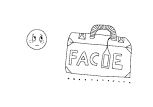

\

你说：“我知道我的羞怯不会像流星一样瞬间即逝，但是，在我掌握本书中提到的克服羞怯的所有秘诀之前，我还要继续承受脸皮不够厚带来的痛苦吗？”

任何值得达到的目标都需要一定的时间来完成，完美自信的获得也不例外。但幸运的是，有四种方法可以帮助你现在就能够与人泰然相处（还有三种调整自我心态的方法），让你不会感到那种刺骨的羞怯之痛。

\
\

我应该告诉人们我很害羞吗？

\

“什么？你脸皮薄？别逗了！”

我们都经历过这种事情。有些出于善意的亲朋好友轻松地向我们建议：“干脆你就直接坦白告诉人家你脸皮太薄好了。这样和他们相处时你就会自然多了。”

你反复掂量他们的话，脑海里浮现出如下几种情形。

\

如果我坦白相告，他们会不会说：“喔！我的小可怜，原来你害羞啊？我知道脸皮薄的感觉一定很难受。唉，让我做你的好朋友吧，我来帮你摆脱羞怯。”

\

别瞎折腾啦！

\

如果我向自己心仪的对象坦白害羞的秘密，他或她会不会说：“喔，太棒了，我发现脸皮薄的人都好性感哟。我们快点约会吧，我要你把害羞的感觉全都讲出来。”

\

少做梦啦！

\

所以，你决定暂时还是不要说的好。

聪明！要是你真说了，以我的经验，我完全知道他们会说什么。他们肯定会一笑置之，然后拒不相信：“什么？你脸皮薄？开什么玩笑！你才不害羞呢！我是说，你那么和善！那么友好！”哇啦哇啦，诸如此类的话。说的都是这一套。

且容我在此插上重要的一言：如果你正好在接受心理治疗，治疗师鼓励你向别人坦白你的羞怯，请务必遵守医嘱。医生的意见如和本书有任何冲突，务必要听从医嘱。因为每个人的羞怯都是不同的，治疗方案也因人而异。

\

我一边读研一边教书。表面上看，我一点也不害羞，但实际上，我十分胆小，常常为了不和某个人说话而刻意躲避他。在小组活动中，我喜欢静静地坐着，倾听他人侃侃而谈（从来也不插话表达自己的意见）。有时候，我告诉人们我生性害羞，但他们只是一笑了之。他们压根就不相信我害羞。没有人知道我内心有多么痛苦。

——美国阿肯色州霍普市的安琪拉

\

我吐露了自己的害羞“秘密”

高中时，我越来越没有自信，也没有朋友，妈妈非常担心。在一个星期天的晚上，晚饭后，妈妈建议我向其他女孩子开诚布公地说出自己很害羞。

什么？向她们开诚布公？那不就等于是让一个拳击手直接把脸凑上去让别人打吗？（有趣的是，这招在拳击中有时还真有用。）一旦向她们公布这个秘密，我肯定会被打翻在地爬不起来。

\

“莉儿，答应我，你会告诉别人的，好吗？”

“妈妈，我不敢。”

妈妈露出失望的表情。

“好，我答应你，妈妈。”

\

那天夜晚，我躺在床上无法入睡，两眼直盯着天花板，一边抹着眼泪，一边盘算着该在什么时候、用什么方式坦露我那“不光彩的秘密”。

这一时刻很快就来临了。第二天，在上体育课的路上，我心中盘算道：此时不说，更待何时？在这个注定不寻常的日子（开诚布公日）里，我一走进更衣室，就发现全班人缘最好的女生潘妮洛普已经到了。就在我们换上短裤和运动衣时，潘妮洛普开始了她的拿手好戏：闲聊。而这偏偏是我最弱的项目。

\

大多数人不懂如何安慰害羞者

“嗨，莉儿，周末过得还好吗？”

我立刻紧张起来，大脑开始快速运转。我是实话实说，告诉她我一整天都独自一人待在房子里呢，还是假装兴奋、煞有介事地说“是啊，过得开心极了”？不，这不是好办法，因为她很可能会反问我都干了些什么。

可这时我已经没有时间多想，交谈中的一个潜规则就是任何思考都是有时限的。匆忙间我生涩地回应道：“哦，是啊。”——总算是把球打了回去。

果然，不出所料，她回了我强有力的一击：“什么事那么开心呢？”这下我死定了。要么信口胡言，要么坦白自己的弱点。我记起了对妈妈的承诺，选择了坦白。

我低垂着头，看着自己的运动鞋，脱口说道：“我这人害羞、脸皮不够厚。”潘妮洛普一下没回过神来，不出所料地答道：“什么？你怎么可能？你一点也不害羞啊！别开玩笑啦。我是说，你和我交谈一点问题都没有啊……哦，那么，回头见。”她一边说，一边匆匆地离开上课去了。

我待在原地，不知道自己做得对不对。

几乎一分钟不差，24小时之后，我得到了想要的答案。第二天又是体育课，我到达健身房时，同学们都正站在衣物柜前有说有笑，像一群喜鹊一样。“嗨，莉儿，”其中一位同学从更衣室的另一端喊道，“我听说你很害羞，是真的吗？”

她的话像一发炮弹一般击在我的小腹上。正当我不知如何招架之时，另一位女孩又发起了攻击：“你到底有什么可害羞的呢？”

我支支吾吾地说自己有点头晕，就冲出了更衣室，跑上楼梯，躲进了一间空教室，生怕让人看见自己的眼泪。那天我没有吃午饭，也不想吃。我根本就吃不下去。

现在回头想想，我意识到更衣室里的那帮同学其实并没有恶意。事实上，她们也许只是想安慰我罢了。可是，她们和大多数人一样，并不知道怎样来应对害羞的人。还有，也许你会觉得难以置信，但其实你害羞与否，对你不太熟悉的人来说，他们是根本不在乎的。

\

> > > 羞怯克星第1招 不要告诉陌生人你害羞

> > > 通常的规则是：不要告诉别人你害羞，除非值得信赖的专业心理医师嘱咐你这样做。要告诉的话，也要告诉自己的亲朋好友等重要人物。

\
\

如何巧妙摆脱尴尬的处境

\

半真半假，点到为止

任何规则都有例外——“不要告诉别人”的规则也有例外。在某些情形下，出于某种原因，你不得不向他人坦言自己害羞。

比如，一位朋友决定邀请一些人来她家观看奥斯卡电影金像奖颁奖典礼。有人负责购买芝士和饼干等零食，有人负责搬来几把椅子，还有人负责张罗饮料和葡萄酒。你的朋友请你帮忙打电话邀请客人。

可你生性害羞，不敢和不太熟悉的人讲话，于是便陷入两难境地。是“坦白”自己害羞好呢，还是另找借口，拒绝帮忙呢？

答案是，两者都不好。正确的做法是走中间路线，以开玩笑的口气向朋友委婉地暗示你害羞。这样做，既不会让朋友感到不舒服，又能让她明白你的意思，也不会让她觉得你是怕麻烦才拒绝帮忙的。

在这种场合下，可以不必忌讳“羞”这个字眼，只管说出来好了。比如说，“哎呀，像我这么害羞的女孩一天之内怎么能和那么多陌生人说话呢？”或者说，“你要是像我一样害羞，你可能宁死也不会打这些电话的。”接着，你可以提议帮她做其他的事情。

\

> > > 羞怯克星第2招 笑着暗示别人你害羞\

> > > 有时你会觉得自己太害羞，无法应对某种局面。如果你不想让人们觉得你是在躲避责任，或者不仗义，那么最好的方法就是半遮半露。微笑着说出来，然后飞快地解释你不能答应的原因是你害羞。话尽量短一些，口吻要轻松——不要超过一句话。

\

“我就是脸皮不够厚，有什么大不了？”

你也许会发现，在某些场合下，直言自己害羞也许是最好的选择。比如说你被分配到一个项目组，和几个同事或者项目组成员一道工作，在特定情况下，最好让他们知道你害羞、脸皮薄。

这时，你应该想办法，既谈及这个话题又不会让别人觉得尴尬。比如，在随意闲聊时，你可以问他们是否容易害羞，然后就可以向他们坦承你害羞的事实。说的时候一定要笑容满面，带着一种“没有什么大不了”的态度。

坦承自己害羞时一定要神色轻松，就像说“我今天感觉棒极了”一样。人们听的往往不是你说了什么，而是你说话的口气以及使用了什么肢体语言。不过，这一点，我想你已经知道。

\

> > > 羞怯克星第3招
> > > 以“没什么大不了”的态度坦承害羞

> > > 在聊天中寻找时机主动谈论羞怯的话题。漫不经意地提及你是个害羞的人，让对方自然而然地了解你害羞的信息。以这种轻松自在的方式坦白之后，以后说不定什么时候就会派上用场。如果他们要你做某件事或者去某个地方，你就可以半开玩笑地提醒他们：“嘿，饶了我吧，我都说过我害羞了。”这要比直接说“我做不了，我太害羞了”要好得多。

\

不要拿这一招羞怯克星来逃避现实。它只是在你能够骄傲地宣示“我自信”之前所采用的权宜之计。

\
\

脸红、出汗，害羞的时候如何克服

\

有些害羞的人表现出流汗、脸红以及其他明显的害羞症状，因此，他们觉得有必要告诉人们他们害羞。“事实未——必——如——此”，弗洛伊德说。有时候流汗只是流汗，脸红只是脸红。

如果你愿意，不管你有“脸红的问题”，还是其他特定的症状，你都可以预先告诉人们，但没必要把它们和害羞联系在一起。害羞？害羞是什么东西？

\

用幽默来巧妙应对

并不仅仅是害羞的人才会有双手汗津津的症状。有些非常自信的人也会脸红、流汗、双手湿透。我的一位客户名叫伯纳德，是一个自信满满的首席执行官，但他却动不动就脸红。

地方电视台经常邀请伯纳德对当前经济状况作评论。上电视非常容易让人紧张脸红。伯纳德知道他在接受采访时肯定会脸红，但脸红对他丝毫不会造成影响。相反，他似乎还很喜欢人们拿他开涮。

他每次到电视台接受采访时，前台工作人员都会通过对讲机呼叫：“所有化妆师请注意。所有化妆师请注意。美女们，请多拿一些饼饼（指化妆用粉饼）来。大红脸伯纳德来啦！”

大厅里的人们也向他打招呼：“你好，阿红！”“最近好吗，红玫瑰？”伯纳德和他们一起欢笑着。人们知道伯纳德不介意，所以他们也不认为唐突。在不脸红的时候，伯纳德曾经告诉过人们，他随时都可能脸红。他笑着说：“我太太不喜欢脸上红坨坨的一片，所以这个罪就由我来受了。”

伯纳德自豪地称自己是世界脸红专家。下面是几条圈内人都知道的事实，其他容易脸红的人也许会对此感兴趣：脸红是一种家族遗传现象，但婴儿并不脸红。有51%的人都会脸红，其中许多人并不是因为害羞。女性比男性更容易脸红，各种肤色的人都会脸红。

伯纳德常装作嫉妒自己的财务长乔伦，因为他有美国原住民血统。“他比我还要容易脸红，”他假装抱怨道，“可是却没有人注意到。”

你手掌心容易出汗吗？和别人握手之前，你可以这样开玩笑说：“等一下，请容我擦干我的手，免得让你觉得不舒服。”也可以这样说：“和我握手的话，你可要风险自负哦，因为我的手掌总是汗津津的。”强调“总是”二字，这样就不会有人把它和羞怯联系到一起了。

害羞小贴士：每当我担心手掌心会过度出汗时，我就会在手心涂上一点止汗药和扑粉。薄薄的涂上一点即可达到效果（可不要告诉别人那是什么哦）。

\

> > > 羞怯克星第4招
> > > 拿害羞症状打趣，但不要提“害羞”二字

> > > 如果你的害羞表现出任何外在症状，可以事先以玩笑的方式提醒人们你有面颊通红、手心湿潮、身体冒汗的症状，但不必提及它们与羞怯的关系。

\
\

用心理暗示赶跑羞怯

\

自认为羞怯害死人

你该不会在厚厚的广告板大大咧咧地写上“我害羞”三个字，然后挂在身上招摇过市吧？让太多人知道你害羞就跟打广告昭告天下没什么两样。何况，给自己贴上害羞的标签并不准确。你拥有各色各样的性格特征，是一个复杂的混合体，只挑出其中一种示人只会不必要地夸大其存在的影响力。

以羞怯自居也是一种危险的自我暗示行为。当你告诉人们你害羞时，你不仅仅是在告诉别人，同时也是在告诉你自己。而你才是这其中的关键。

\

羞怯封住了我唱歌的嘴

虽然我不曾认为自己有成为超级歌星的天赋，但自从有人在七年级时给我贴了个标签，封住了我的嘴后，我就连一个音符也没有唱准过。

七年级时，我是教会唱诗班的成员。一天下午，在进行彩排时，我们唱得不是很顺利，唱诗班指挥把脸一沉，转向我说：“有人跑调了，我希望那个人只对口型，不要唱出来。”很显然，跑调的那个人就是指我。从那天起，我每次唱歌都像是一只感冒的乌鸦一样难听。直到今天，我在唱“祝你生日快乐”时仍然忸怩不安地不敢出声，只对口型。

几年前，我和一位老同学一起听收音机，她知道我跑调很严重。当时电台正在播放我们六年级时风靡的40大流行金曲。我一时兴起，情不自禁地跟着音乐哼了起来。一曲唱罢，我朋友说：

“莉儿，太棒了！”

“什么太棒了？”

“音准棒极了。”

“不可能吧？”

“确实很棒啊！”

我试探性地又哼了几首我六年级前流行的歌曲。我俩都惊呆了，因为我的音调完全准确。令人百思不解的是，在那个在劫难逃的“有人跑调日”之后的所有歌曲，我一首都唱不上来。

唱诗班的那个指挥给我贴了个“乐盲”的标签。因此，我就真的成了音乐盲——这就是自我心理暗示的结果。

\

请充满自信

美国残疾人协会（American Association of People with
Disabilities）不允许给自己的会员烙上“残疾人”的烙印。他们睿智地声明：坐在轮椅上的人并非“残疾”或者“残废”，他们和正常人没什么两样，他们只不过多带了一件行李：残障。有的会员要求人们不要对他们当面使用“残疾”一词。

不要说自己害羞。把自己看作是一个充满自信的人，你只不过多带了一件行李，一件你很快就能扔掉的行李：羞怯。

\

> > > 羞怯克星第5招 绝不给自己贴“害羞”的标签

> > > 我们内心深处都有一些小小的声音。这些声音有时虽很讨厌，但力量却很强大。他们可能会给你贴上各种讨厌的标签，摧毁你的自我价值。要立即把这些声音消灭掉。永远不要说“我害羞”，要说“羞怯克星正在发挥威力，我很快就能充满自信了。”

\

不要对我说“羞”字

别人说你害羞，这对你无疑是有害的，但这害处并不仅仅发生在儿童时期。它在各个年龄段对你的自我都是沉重的打击。想想看吧，哪怕你是天下第一大美人，如果有足够多的人都说你丑，你也会相信你确实很丑。

要消灭的不光是你自己内在的声音。还要禁止你每天都听到的那些外在的声音说你害羞——包括你的父母、姐妹、兄弟、孩子、侄子、侄女、外甥、外甥女、堂表弟兄、堂表姐妹以及朋友等。不要让他们当面说你害羞——背后说也不行。

\

> > > 羞怯克星第6招 禁止家人和朋友说你害羞

> > > 每当有人说“别害羞”，或者问“你有什么好害羞的呢？”他们其实只是在推波助澜。有时他们还会自以为是地加上一句：“你没什么好害羞的啊。”

> > > 不行！他们这样根本就不是在帮你。更糟的是，你可能会听到他们在背后告诉别人你害羞。在家里一定要禁止“羞”字，就像禁止那些脏话脏字一样。

\
\

当羞怯变得更加严重

\

寻找突破口

我已经知道我全部的音乐细胞都被那位唱诗班指挥给毁掉了，自从这个突破性的发现以来，我已经不那么害羞了，但遇到一群人一起唱歌的场合，我还是感到不那么自信。

我决心要摆脱这种只对口型的假唱痛苦，于是便坐下来，准备好纸和笔，列出了我的一串优点，以期“突破”我那乌鸦咳嗽一般的嗓音。

音乐剧演员们喜欢使用“推销歌曲”一词来形容一个演员，意思是说他歌不一定唱得好，但通过自信的神态、迷人的手势可以使自己的歌唱变得充满魅力。

\

我想，嘿，作为一个已痊愈的害羞者，我也可以这样做呀。我可以微笑，可以和人们有目光的交流。我不在乎别人盯着我看。我有勇气开玩笑，甚至偶尔还喜欢卖弄一下（这是我痊愈的真正标志）。换句话说，我也可以“推销歌曲”。我将其称为我音乐不自信的“突破口”。

\

验证这一方法的时刻很快就到了。我去参加一位好友的生日晚宴。当餐厅的灯光转暗，糕点师戴着一顶高高的帽子，端着一只比帽子还要高的蛋糕亲自登场了。我们都站起来，齐声唱“祝你生日快乐”。

哇，我表演得真是棒极了。我嘴巴张得大大的，一边“唱”一边对着每个人笑，一边还像指挥一样戏谑地打着拍子。谁也没有想到，从我嘴里发出来的竟是……无声！

\

展现你好的一面

假设你必须参加一个聚会，但又不胜羞怯，那么怎样才能减轻这种聚会焦虑症呢？建议你拿起笔，开一个清单，将自己的优点全部写出，像下面这个清单一样。

1.我在衣着方面很有品位。

2.我喜欢看电影，当前上映的电影我几乎都看过。

3.我善于骑马。

4.有人告诉我我的牙齿很漂亮。

\

写完之后，想象一下该怎样利用这些优点来应对当前局面。比如：

1.关于我在衣着方面的品位：我要穿一套新衣服，把自己打扮得漂亮动人。

2.关于我在电影方面的知识：我可以主动请人们推荐一些新片，借此来谈及关于电影的话题。

3.关于我的骑马技术：我可以问别人都喜欢什么活动或者运动，这样我就可以聊骑马的话题了。

4.关于我漂亮的牙齿：我当然要笑口常开了。

\

在与恐惧的搏斗的过程中，找到展示自己优点的方法可以成为强大的杀手锏。

\

> > > 羞怯克星第7招 列出“优点”清单\

> > > 政治人物和销售人员都善于设计方法，以带动话题朝自己有利的方向进行。以后你如果发现自己对即将到来的某个活动感到畏惧，试着列出自己的“优点”清单。列出之后，再仔细谋划怎样利用每一个优点。

\

第2章

解密：别人如何看待你的“脸皮薄”

\

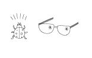

\

如果你和大多数脸皮薄的人一样，那么别人对你的看法应该是造成你惶恐不安的主要原因。不过，你现在已经知道在羞怯成为历史之前该如何与人打交道了。你已经知道该怎样应对别人谈论害羞的问题，甚至也知道怎样对自己进行心理暗示。你已经能够迂回应对复杂场面，恰当处理害羞症状。

现在让我们来看看其他人到底是怎样看待你的。

如果别人对你说“你彻底错了”，你肯定不乐意听。但如果我告诉你所有人对你的看法“全部都是错误的”，包括你自己对自己的看法，你肯定会激动不已。

请继续读下去！

\
\

人们看得出来我害羞、脸皮薄吗？

\

大多数人根本不在乎你害不害羞

你也许会想象自己额头上贴有一张标签，警告所有人：“我有社交焦虑紊乱症”（心理卫生专家对羞怯的称谓）。你以为人人都会笑话你，或者躲着你。如果你和许多害羞者一样，那么每当有人看你一眼，每当有人问你问题，每当有人向你微笑，你都会自动做出错误的解读。我说这话一点都没有开玩笑！

大多数害羞者的思维都遵循如下的套路。

\

也许他们这样做，对我那么好都是因为他们知道我害羞。

也许他们想要知道害羞的我会有怎样的反应。

他们也许并不喜欢我，因为我太害羞了，他们都想让我出丑。

\

害羞者总是觉得人人都在评判他。事实并非如此。大多数人对别人害羞与否是毫不在意的。你猜大多数人的脑子里在想什么？对了——想的是他们自己。

\

是父亲帮助我克服了害羞。在我大概14岁时，他告诉我说，一般情况下，人们都在忙着想自己的事，都在担心别人对他们的看法，根本就不会像你想象的那样注意你的问题。我恍然大悟。一旦明白了这一点，你就会发现原来事实竟是如此显而易见。

——英国伦敦市的潘南特

\

当你的心在胸中怦怦乱跳时，很难相信别人不会听到吧？他们难道看不出你的脸越来越红，像一只烤熟的龙虾？但事实已确凿无疑地证明，大多数人都不知道你害羞。事实上，他们本身很可能也害羞，脸皮跟你一样薄得要命。

\

西方国家大约有13%的人终身为害羞所困，80%的人说他们一生中至少有一段时间是害羞的，还有40%的人说他们至今仍缺乏自信，担心自己在别人心目中的形象。

——《普通精神病学文献》（Archives of General Psychiatry）

\

表面自信的人，骨子里可能也很害羞

有些害羞者非常善于伪装，以此来掩盖害羞的事实。我通常都是在宾馆开办克服羞怯研习班，而宾馆里同时进行的往往还有其他研习班。有时候，我会看到有些格外活跃、外向的人在排队等着报到。他们时而和其他排队等候的人交谈，时而和登记处的服务人员开个玩笑。看到这种情况，我通常都会走过去，悄悄地问那些“外向型”的人他们是否确定没有走错场。他们通常都会朝我灿烂地笑着，肯定地告诉我他们就是来参加这个班的。

起初，我对此困惑不解，但随着研习班的进行，我发现有许多表面看似很自信的人，或是我们所说的“自我感觉良好”的人，其骨子里都是极端害羞的，只是他们掩盖得好而已。谁也不会想到，这些看似活泼开朗的人们有着怎样饱受痛苦折磨的内心。外表上充满自信的人，其内心可能是腼腆羞怯、妄自菲薄。即使在他们谈笑风生之时，他们内心也会忐忑不安，一直纠结于别人会怎么看他们。

\

我不是那种“典型性”的害羞。我今年32岁，看上去自信而又友好。没错，我的确热情友好，但自信可能就谈不上了。比方说，在社交场合，遇到陌生人时，我也会热情地和别人打招呼，但同时又会格外紧张，甚至无法进行有意义的谈话。一见到陌生人我就寒毛直竖，但你要问我的朋友和同事，他们都会说我是个直来直去、干脆利落的家伙。实际上，在骨子里，我是个胆小害羞的人。维持自信的外表让我付出了很大的精神压力（我痛恨手心汗津津的那种感觉）。

——英国伦敦市的迈克尔

\

假装自信的人也许看起来轻松快乐，但实际上他们比大多数害羞的人还要痛苦。为什么？因为人们通常会期望他们在某一项目中帮忙，或者出席某一活动，但由于他们害羞，往往都会拒绝。可是你又能找到多少借口躲避应酬、推脱聚会呢？长此以往，人们开始不信任甚至讨厌这些看似落落大方的人。

\

别人看不出来你害羞

最近大量的研究证明，无论害羞还是不害羞的人都无法准确地判断别人是否害羞。有学者曾进行过一次社会学方面的研究，对象是一群社会关系相对紧密的人。他们挑选了住在同一栋宿舍里的48名学生。这些学生在同一餐厅里用餐，闲聊，一同上课。他们在校园里经常见面，晚上一同学习，周末甚至还一起聚会。总而言之，这栋宿舍里的学生彼此都非常熟悉。

首先，研究者对这些学生私下进行单独访谈，以获取他们真实的害羞程度。这一资料获取完成之后，他们要求每一位学生私下对室友的羞怯程度进行评估。

调查结果令研究者大跌眼镜。他们发现，很多害羞的学生被85%的室友评估为不害羞。相反，有些自我感觉特别自信的学生却被室友评估为害羞。

你以为害羞就像是鼻子上的大疱疹一样显眼吗？绝对不是。你是否害羞，别人十有八九是看不出来的。即使真的看出来，他们也不会因此而讨厌你。相反，他们还会更加亲近你，为你所受的煎熬而难过。他们也会乐于看到你破壳而出，浴火重生。

下一次与人交谈时，如果羞怯感突然袭来，记住没有人会注意它。羞怯百分百是一种内在的痛楚，就像辛辣食品吃得太多导致胃痛一样。除非你捂着肚子呻吟，否则没有人会知道你肚子里正翻江倒海。

\

> > > 羞怯克星第8招 告诉自己“没有人知道我害羞”

> > > 事实的确如此。除非你像喝了咖啡因的鸡一样抖个不停，否则没有人会发现你的不自信。重复对自己说：“85%的住在一起的人都无法判断别人是否害羞，那么我遇到的人至少有99%看不出我的羞怯。”

\
\

想要脸皮不再薄，先从自卑的枷锁中解放自己

\

与人交谈时，你试图掩盖自己的羞怯，也试图与对方保持良好的眼神交流。然而，即使克服了这两项挑战，你也很难控制自己的心神。你想象着，对方一定认为你是个傻瓜，衣服穿得像是从旧货市场上买来的便宜货，头发梳得像是刚用铁耙耙过一样。你想象她在心里嘲笑你，然后还会在朋友面前说三道四，把你损得一无是处。

不！不！不！快把这种念头扔得远远的，要知道这根本不是真的。十有八九，她根本没有在想你的事，只不过是在那里絮絮叨叨自说自话而已。就算她的思想真的和你有关，那也很可能是在想你对她有什么看法。

许多研究已经证实，人们对害羞者的负面看法，往往都是害羞者自己想象出来的。

\

一个害羞的人总是会想象出种种迹象，来认定人们对他持否定或排斥的态度，但这些迹象并非来自外界的刺激，而是来自长期的记忆和内在的暗示。因此，他们的看法并非客观，而且常常带有消极扭曲或者偏见的成分。

——《行为学研究疗法期刊》（Journal of Behavioral Research Therapy）

\

别人的排斥很可能只是你的想象

下面这个别出心裁的研究就能证明这一点。几位研究人员雇用了一些演员和一位摄影师，买了一些不同寻常的道具，然后让每一个演员单独面对镜头说“你好”或者“嗨”，就像和第一次见面的人打招呼一样。

研究者要求三分之一的演员表现出热情、友好的“我喜欢你”的神态，还有三分之一的演员对着镜头表现出中性的、不带任何感情色彩的表达，另外三分之一的演员则表现出冷冰冰的“你很无趣——我不喜欢你”的态度。

当然，花样百出的研究者并不打算仅仅仰仗演员的演技。为了得到科学准确的结果，他们在第一组演员的鼻子下面放置了一束鲜花或者别的带有芳香的道具，以激发出更为愉快、友好的神态；在第二组“中性表情”的演员身边什么都不放；在拍摄第三组演员时，则给他们鼻子下面放置了气味难闻、令人作呕的黏糊糊的东西。

影片完成后，研究者就播放给实验对象看。实验对象中自信和害羞的人各占一半。害羞者和自信者都被要求想象影片中的演员跟他们初次见面打招呼，然后用笔记下每位演员对自己的态度。

结果如何呢？害羞者觉得那些中性的面孔对他们很冷淡，甚至有些热情的神态他们也理解为彬彬有礼的拒绝。他们唯一理解正确的是那些露出厌恶表情的演员。

与此相反，那十几位自信的人则觉得大部分面孔对他们的态度都很和善，最差的也是不带任何好恶色彩。

“陪审团”最后的裁决是，在大多数情况下，人们对你所谓的“排斥”都是你自己凭空想象出来的。

\

> > > 羞怯克星第9招 拒绝凭空想象的排斥\

> > > 以后和人们相识时，如果你再觉得他们不喜欢你，请注意，这极有可能是你的错误印象，是你想象力过盛的结果。

> > > 要学会像自信的人那样，本能地、有意识地在刚认识的人身上寻找他们接纳你的神态——他们的微笑、眼中流露的热情以及友好的肢体语言。“只要寻找，就有发现。”

\
\

摆脱记忆中害羞的坏印象

\

他真的会因为你害羞，就讨厌你吗

你曾有过痛苦的、永远无法从脑海中抹去的社交经历吗？当然，每一个害羞的人都有过。那正是我们的特长。你在脑子里一遍又一遍地回忆他说了什么，你说了什么，然后他又说了什么，然后你又说了什么……如此循环往复，直想得头晕眼花。每一次在脑海里重演这一场景，情况都会变得更糟。

我在住宿学校时的最好朋友史黛拉正是这方面的专家。她非常美丽迷人，却也和我一样极为害羞。

我们女校每个月都会和附近的男校合办舞会。当然，我和史黛拉两个人总是站在角落，努力表现出冷静自若的样子。当时很多女孩都在热切关注一个名叫尚恩的帅哥。尚恩暑假时刚和我们班上最受欢迎的女生分手，这让全校女生都大受鼓舞。

在那一年的聚会上，第一支舞的曲子响起，正当我们表现出“我才不在乎男生”的态度时，尚恩站在舞台的另一边对着史黛拉微笑，接着穿越人群走到她跟前，弯腰鞠躬说：“姑娘，我能有幸与你共舞吗？”史黛拉倒抽了一口气。

尚恩觉察到她的震惊，露出微笑，温柔地牵起她的手，把她带到舞池。我躲到柱子后偷偷地观察他们。

舞跳到一半，尚恩看到认识的人，向史黛拉道歉后便先行离开舞池。史黛拉像泄了气的皮球一般，脸色立即沉了下来。她匆匆忙忙跑向我，说：“莉儿，我们快走。”

\

我那时真无趣

从舞会回宿舍的路上，史黛拉非常难过。她哀怨地说：“我就知道他不可能喜欢我。他一定觉得我很无聊。他只是对一个看起来很孤单的人表示善意而已。他只是想日行一善，才会愿意跟恐龙跳舞。说不定他已经有了新女朋友，不想让女朋友看到他和别的漂亮女孩跳舞，所以才选了我。可能他……”对于史黛拉来说，整件事从头到尾就是一场灾难。

\

患有严重社交焦虑症的人，常常受到过往不如意的社交经历影响，从而产生各种高度侵扰与焦虑性的想法，导致他们会从更加负面的角度回想当时的经历。

——《行为学研究疗法期刊》

\

几周后，我们坐在学校附近的便利店里大吃热软糖圣代。突然间，史黛拉的脸变得煞白，匆忙转向我，背对着门口。

“史黛拉，你怎么了？”

“嘘，小声点。他刚刚走过来。”

“谁啊？哪个他？”

“他啊，尚恩。就是那个害我在舞池里出丑的那个男生。”

我越过史黛拉的肩头向前看。果然，尚恩正朝着史黛拉直着走来。他稍微靠近点之后，把手指放在嘴上，示意我要噤声。

尚恩轻柔地抓住史黛拉的马尾，说：“嘿，漂亮女孩，你那天在舞台上怎么了？”

史黛拉无言以对，我赶紧替她补上：“哦，你离开后不久，我们就得，嗯，在八点半前赶到，嗯，另外一个地方。”

尚恩很是惊讶，他说：“我没有离开。我看到一个朋友，因为欠他10元钱，他就在那里摆脸色，所以我赶紧去把钱还给他，好恢复他对人性的信心。”

他放轻了声音，微笑着对史黛拉说：“然后我去餐柜帮我们俩拿点心。回来后，你却已经走了。”他把手放在胸前，低下头，表现出一副很沮丧的样子。

我看了一眼手表，扯了个谎说道：“哦，老天，现在都几点了！我得走了，不然约会要迟到了。”

“啊！什么约会？”史黛拉结结巴巴地问。

笨蛋！“你知道的嘛。”不过，当然了，我们两个都不知道。

一两个小时之后，史黛拉飘飘然地走进房间里，高兴地跳起舞来。她告诉我，尚恩已经约了她下个周六晚上见面。

\

不要妄自菲薄

可惜的是，史黛拉的喜悦仅仅维持了很短一段时间。在她与尚恩相遇的几周后，我们俩和梅根一起吃饭。自从史黛拉和尚恩约会以来，这位朋友还没见过她，所以觉得非常好奇。但是不管梅根如何追问，史黛拉始终坚称不记得她与尚恩是怎么开始的，后来甚至还气得斥责梅根。

回到宿舍后，我问史黛拉：“为什么你不肯告诉梅根你是怎么遇到尚恩的呢？”

“莉儿，我说的是实话。我真的不记得细节了。”

“那你还记得什么？”

她想了一会儿后才说：“这个嘛，我记得他比我们先离开舞池。”

现在轮到我好奇了。“为什么？你觉得他为什么离开？”

“不知道。我猜他只是觉得很无聊吧，所以不想再和我一起跳舞了。”

“史黛拉，”我禁不住嚷起来，“你不记得他欠朋友10元钱吗？他当然很喜欢你。他都约你出去了。”

史黛拉翻着眼说：“是啊，不过我不知道这种状况能维持多久。”

我的好友真是无药可救。她就是典型的害羞一族，满脑子充斥着痛苦的回忆，却一点也不记得快乐的情景。而且她还会在脑子中一次又一次地重复回忆这种不好的经历，直到她相信自己表现得糟糕透顶，直到这变成她记忆中唯一的一件事。

\

为社交恐慌症所困的人们，记得负面经验的时间超过正面的。

——《社交恐慌症：临床与学术观点》（Social Phobia：Clinical and Research
Perspectives）

\

事情不像你想的那么糟糕

“负面认知”的情绪愈演愈烈，使得害羞者在被接纳时会揣想他人排斥自己，此外更无法正确地回应社交场景。回溯起来，他们眼里只剩下未曾存在的可怕怪状。

\

害羞者对愉快交际场景的回忆远远超过事实负面。

——《行为学研究疗法期刊》（Journal of Behavioral Research and Therapy）

\

害羞的阴影从童年开始

即便是害羞的幼儿也会产生模糊负面的记忆。在《孩童对亲眼所见事实回忆的个体差异：探知智能与羞怯的影响》（Inpidual
Difference in Children's Eyewitness Recall：The Influence of
Intelligence and
Shyness）的研究中，老师针对学生的不同智力与害羞程度进行评级，然后带着所有孩子为其中的一位同学庆祝生日。庆生会完全是为儿童设计的，气球、生日蛋糕、礼物、唱生日快乐歌，一应俱全。

一个星期后，研究人员想要了解学生们对生日聚会的印象如何，便问每一位学生：“蛋糕看起来怎么样？你们玩了哪些游戏？玩得开心吗？”研究人员甚至还问了学生几个陷阱问题，例如“那个可怜的小丑把球扔在地上后，发生了什么事？”但是事实上，庆生会上根本就没有小丑。

\

别让羞怯阻断你的快乐

研究发现，智力与儿童回忆准确度之间的关系非常低。真正的决定因素在于其自信心。有自信的孩子关于事件的记忆远比害羞者的愉悦和精确。害羞的孩子专注于消极方面，尤其是和自己有关系的部分。这就好比大方的孩子隔着透明玻璃观察那场快乐的庆生会，而害羞的孩子则是透过污浊的镜子去看。负面的自我形象挡住了他们的视线。

\

社交焦虑症患者经常忘记或扭曲愉悦的经历。

——《行为学研究疗法期刊》

\

上述结论真应该再加上四个字：儿童亦然。

害羞的成年人也是如此。每回想一次，他便会感觉事情更加糟糕。若要想清楚记得某一经验的最佳方法，就是在悲观情绪大肆渲染事实前，把细节一一写下来。这样你才能清楚地记录实际发生的情景。

\

> > > 羞怯克星第10招 写下自己的快乐记忆\

> > > 每次参与社交活动后，写下你当时的印象。之后如果浮现任何负面的回忆，就回头翻阅检查笔记。只要是你未曾记录过的尴尬或不悦场景，大可把它抛在脑后，因为它根本就没有发生过。

\
\

远离给你带来“负能量”的朋友

\

你接纳我，我就不接纳你

美国喜剧演员格劳乔·马克斯（Groucho
Marx）曾经抽着烟斗说：“我不会参加那些愿意接纳我为会员的俱乐部。”许多害羞人士在潜意识上非常赞同他这一说法——尤其是那些仍为学生的年轻害羞人士。他们渴望成为那些自称为“精英”的学生团体中的一员，但是当他们不被接纳时，这些害羞的学生便会认为是自身出了问题。

所有公然否定你的人都是不值得你钦佩的。不要试图进入他们的生活圈，因为这只会让你陷入一场必败的信心游戏。

一项名为《青少年初期的人气、友情和情绪调节》（Popularity，Friendship and
Emotional Adjustment During Earling
Adolescence）的研究指出，所有来自你崇拜的人的反对，无论是真实的或是假想的，都会影响你对于自己的看法。这是人之常情。在学校里的孩子们就像农场里的小鸡，逐渐形成一种尊卑有别、长幼有序的观念。无论你问哪个一年级以上的孩子：“谁是最受欢迎的孩子？谁最不受欢迎？”他们都可以不假思索地做出回答。

许多位列前十名的孩子都很受欢迎。不幸的是，如果一个害羞的人没有入选“受欢迎者名单”，他的自我疑惑会更严重。

对于那些自认为被自己所在的俱乐部、教会和社区里比较外向的人排斥（往往是想象的）的成年人来说，这种感觉他们感同身受。

也许你很欣赏某些人的个性、穿着或者交友方式。因此，当他们不选择和你做朋友时，你就认为他们是因为你的缺点而轻视你。这样的小事就能完全影响你对于自己的看法。而这种你所假想的曲解将会持续很长一段时间，长到你都已经忘了那个你认为拒绝你的人，忘了他的姓名和长相。

\

我只爱那些不爱我的人

相对于女人而言，男人们更是“爱上不爱自己的人”的典型人群。一位害羞的先生去参加聚会，他的目光锁定在聚会上最具风采、魅力十足的女士身上。在聚会进行期间，他想着要如何展开攻势。等到他终于鼓起勇气上前打招呼时，那位女士却转向了另一边。

碰壁了！害羞先生的自尊心受到了严重打击。他像个败兵一样黯然逃回吧台，而与此同时，在另一边，一位姿色中等的女士已经关注这个害羞的先生一整晚了。如果他和这位女士交谈，对方表现出对他的兴趣，那么一定能大大提高他的自信，让他感觉棒极了。

\

> > > 羞怯克星第11招 拒绝损友\

> > > 不要和不公开接纳你的人交往，以免损害自尊心，选择给予你温暖回应的人做朋友。不要痴痴等待朋友接纳自己。和自己真正喜欢的人做朋友，和那些需要朋友的人建立情谊。

> > > 如果你所交往的朋友并不是所谓的“圈子”里的一员，那怎么办？有些人只是受欢迎但并不代表他们值得你尊重。比尔・盖茨在学校里也曾受到那些受欢迎的同学的排挤，但是他并没有因为自己不被接受而唉声叹气。在车库里组装出世界上第一台个人电脑的男孩并不属于任何“圈子”，那么又是谁笑到了最后呢？

\
\

聪明的害羞者不玩愚蠢的游戏

\

你是否碰到过舞台剧演员在演出中忘词的情况？你当时感觉如何呢？你会看不起他吗？当然不会。你只会为他感到尴尬。

这就是不害羞的人对于害羞的人的感觉。他们并不是不喜欢你。他们只是感受到了你因焦虑而手足无措。还有一些脑子不机灵的人或单纯的人会觉得这样有损自己的形象。

玩笑和嘲弄是很多人日常对话的特征，尤其在年轻人和文化程度低的人群中。但是害羞的人并不习惯于取笑别人，即使是开玩笑的方式也不行。

男生们之间特别喜欢互相开玩笑。“你一直这么蠢吗？还是你今天的表现特别突出？”或“我知道你喜欢大自然——只是不喜欢大自然对你所做的。哈哈！”他们随意地向朋友们说出这些带有侮辱性的话语，并且期望对方能够明白其并没有恶意，然后也能够幽默地反唇相讥。

当然这种愚蠢的玩笑并不只是男人们的专利，女人们也十分喜欢做类似的事情。然而她们并不会相互嘲弄，而是经常数落那些不在场的同事。很多年前，弗兰克·辛纳特拉曾称此为“与女友们一起散播流言蜚语”。这些言语并无恶意，他们只是保持了一种惯有的风格而已。

\

不善于开玩笑，就置身事外好了

取笑别人并不是一场好玩的游戏，然而对于嘲笑别人的人来说却十分有趣。对于被嘲笑的人而言也可以变得很有趣，但是只有当他们懂得如何漂亮地反击时才会有这一效果。一个专业网球选手是不会喜欢和一个从未打过球的新手比赛的。同理，开玩笑时去嘲弄那些不会反击的人也是毫无乐趣可言的。

身处笑闹的人群之中，自己却置身事外，这令人十分不舒服。你觉得自己应该加入他们，和他们一起玩笑打闹。但是受你那敏感的天性影响，你可能会认为这样做很愚蠢。你并没有对于自己不是个专业足球运动员而感到无可奈何，那么又何必因为自己不会玩这种争斗游戏而妄自菲薄呢？

\

> > > 羞怯克星第12招 远离互相取笑的人\

> > > 嘲弄取笑不是属于害羞者的游戏。在你刚开始与羞怯抗争的时期，你可能还太过于敏感，以至于还不能够让这些粗俗的言语“随风而逝”。而且你可能也不喜欢嘲弄别人。那么最好的解决方式是什么？就是远离这些爱开玩笑的人。

> > > 如果你处于一个团体中，当对话突然转向一场玩笑比赛，那么不要气冲冲地跑开或郁闷地溜走。只要话题不涉及种族和色情，那么就和他们一起笑，然后找一个恰当的借口快速离开！

\
\

一部叫作《我》的电影

\

假设你是一名导演，你用同样的演员、服装、布景和剧本拍摄两次相同的影片，由于拍摄角度的不同，你会发现拍出来的是完全不同的两部影片。同样，一个不害羞的人观察真实生活中某一情景的角度，和一个害羞者所观察的角度也是不一样的。事实上，很多人甚至根本看不出他们是源于同一情景。害羞者的思维方式会使他们用一种完全不同的角度来拍摄生活中的情景。

想象一下，你坐在电影院里，开心地吃着爆米花。你被荧幕上的电影角色深深吸引。你在心里想着你喜欢哪几个人物，讨厌哪几个人物。你希望电影里的那个好男人能够赢得芳心，而那个坏男人最好滚得远远的。你甚至对于电影里的那些小角色都抱有看法：他是个傻子，她是个美女；他很深沉，她很肤浅。

此时，你都没有在想着自己。你没有苦恼于别人对你的看法。相反，你在观察别人，你非常自得地使你自己看向外面，社会学家将此称之为“视野观点”（field
perspective）。

在很大程度上来说，这就是那些自信的人看待世界的方式。他们自在地通过自己的角度看向外面的“场地”。他们对别人产生印象，但却不急于去了解别人对于自己的看法。自信的人只会认为那些人会接受自己。

对于害羞的人来说，却不尽然。他们会很自然地认为自己不会被接受。每当害羞的人们想起一段不自在的情景，他们就会胡思乱想，用自己认为的观点来评断别人对自己的看法。

\

别再用吹毛求疵的眼光挑剔自己

那是一种奇怪的感觉，你觉得自己好像灵魂出窍一样在房间里飘浮着，观察自己，审视自己，批判自己。心理健康专家将其称为“观察者观点”（observer
perspective）——因为本质上，你的确是在用一种吹毛求疵的态度观察着自己。不过，一旦你身处非常自在的环境，你也会用视野观点看待这个世界。

\

多数人都是用视野观点来看待世界的，患有社交恐惧症的人则通过“观察者观点”……一旦踏入社会，社交恐惧症患者便会将自己想象成为一个旁观者，在头脑中描绘对自己的外表与行为举止的心理图像。

——《行为学研究疗法期刊》

\

试着回想一下你最近一次感觉自信的经历。也许是与家人的一次夏日野餐。你们一同坐在树林中的木桌边，津津有味地吃着热狗，喝着饮料。你看到你的小外甥吃得满嘴都是芥末，你偷偷地想：“这小鬼吃得真脏。”

你姐夫在一旁不停地解释着热狗的制作过程，你自言自语地说道：“他以为他什么都知道，真希望他闭嘴。”接着你闻到了身后烤架上传来的热狗香，想道：“嗯，闻起来真不错，我还要吃一根！”于是你起身又拿了一根。

如果你是这么想的，那么你使用的就是视野观点。换句话说，你正在用自己的视野观察着这次野餐，然后形成了自己的观点。

相反，如果你在一个令你紧张的环境中，例如跟你不熟的人一起野餐，你可能会这么想，大家好像都注意到了我一句话都没说，说不定他们觉得我很蠢。我肚子好饿，我是叫人家递一根给我呢，还是自己去拿呢？算了，我还是不吃了，省得他们觉得我贪心。而且说不定我还会把芥末甩得满裤腿都是，那岂不是会让他们觉得我很笨？我觉得这里根本就没人喜欢我。

下一次，当你开始想象自己给别人留下了什么印象时，试着改变一下自己的“心理摄影机”的角度，有意识地去组织别人给你留下的印象，而不是在别人会如何想你这个问题上花过多的心思。这是训练你使用自信的视野观点的绝佳方法。

\

> > > 羞怯克星第13招 强迫自己观察旁人

> > > 从紧张兮兮的演员到自信满满的导演，这种转变是十分困难的。但是，强迫你自己有意识地去观察旁人，包括他们的打扮，他们看起来是多么的自信，他们在面对不同场合中的其他人（而不是你）时是如何表现的。

> > > 将“主观判断”当作一种权利来行使。如同看电影，观察各种人物并且形成自己的观点。强迫自己去思考“我是如何看待他们的”，将“他们是如何看我的”这一想法从脑中驱逐出去。

\
\

面对“脸皮不够厚”的失败

\

面对现实

“十分感谢，莉儿。”你可能会这样说，“你让我知道自己是透过灰色的镜头看这个社会的，你还告诉我，每当我回忆过去那些失败的时刻都会十分悲观，并且越想越糟。接着，最重要的是，你说我永远只会记住那些消极的部分。非常感谢你告诉我这些坏消息！”

不是这样的，害羞的人啊，你难道看不出来吗，这些都是好消息。事实上，这些才是再好不过的消息。看看以下我向你提出的实际证明。

\

1.害羞的人会自己凭空想象别人对自己的不满或是排挤。

2.害羞的人对自己以前经历的看法比其自身的实际经历要消极得多。

3.害羞的人会扭曲或是忘记某些好的经历。

4.在某些紧张的环境中，害羞的人总是会站在一个类似于“挑剔的听众”的角度去审视自己。

\

为什么这些负面想法对于害羞的人来说是好消息呢？因为这代表了你过往所有的体验，以及你正在经历的事情，实际上比你想象中的要好得多。即使你不能回到过去，抹去缺乏安全感所带给你的伤痛，你对未来的期待与诠释依旧来得及改变。你对于未来自己的表现力及反应能力都会更有信心。

唯一的坏消息就是，你根本不知道自己的社交生活到底有多美妙。如果你了解的话，一定能好好享受一番！

\

> > > 羞怯克星第14招 坚信你比自己想象中更好\

> > > 其实只要留心学者们的研究，这件事情就一目了然了。人们比你想象的要更喜欢你。你比自己想象中表现得更好。以前那些受到的排挤，多半是你假想出来的。

> > > 下一次，当你又遇到某些使你胆怯的场景时，记得对你自己说“别人比我想象中要喜欢我”“我比自己想象中表现得更好”“那些所谓的排挤只是我自己幻想出来的而已”。重复这三点已被证实有效的信条，有助于提升信心，使你能够更加自信地面对下一个挑战。

\

第3章

脸皮厚一点，没什么大不了！

——三步走法则

\

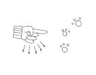

\
\

世上到底有没有具有魔力的数字呢？也许有吧。从三位一体到三个臭皮匠，数字“三”对我来说一直有着非常特别的意义。每当我碰上什么伤脑筋的事情，我总是能够奇迹般地想到从三方面着手的解决办法。我跟羞怯之间的战争也是如此。

如果你渴望打败羞怯，请遵守以下三条原则。

\

1.避免逃避问题。

2.建立属于你自己的渐进式暴露计划，具体内容因人而异。

3.至于第三点，我暂且保留，给大家一个悬念，稍后揭晓。

\
\

第一步：拒绝逃避

\

凡是脸皮太薄的人，最大的特点就是爱玩逃避游戏。但是，你要知道，逃避是有风险的，因为它会让你上瘾。你越常逃避，就越难戒掉它。

你曾经有过只是为了不想跟某个人讲话而千方百计回避他的经历吗？所有害羞的人都有这样的经历。如果我看到有个熟人向我走来，我会马上穿过街道，并且在心里祈祷着他千万别看到我。如果附近有家商店，我会冲进去直到确信那人已经走了才肯出来。

有些人告诉我，他们在喜马拉雅山的顶峰上或者在印度的佛寺里顿悟，而我却是在大街上游走时顿悟的。

那会儿我还是一个幼儿园老师。某一个星期六的早晨，当我正在逛街的时候，发现跟我同在一所学校工作的弗勒老师朝我走来。我觉得弗勒老师长得很帅，想到要跟他聊天就胆战心惊。怀着这种恐慌的心情，我冲进了我刚好路过的一家商店。

正当我以为安全时，背后却响起了他的声音：“朗蒂老师，你在这儿干什么？”顿时，我就像一只被困在玻璃杯底的苍蝇一样，挣扎着转过身，小声地跟他打了声招呼。一回头才发现这是摆满了成人情色玩具的情趣用品店。我知道我给自己带来了多大的麻烦。当我终于鼓足勇气抬头看他的脸时，看到他的嘴角满是揶揄的笑。

他朝我使了使眼色，调侃地说：“朗蒂老师，你究竟在找什么呀？”我绕过他走出大门，跑到街上，躲进一家“体面”的商店里。

不用说，在那之后，我就越发躲着他了，也不敢再与他有任何眼神接触。但是，每当我们在学校走廊里碰到，他跟我说“早上好啊，朗蒂老师”时，总带着一点在二年级老师身上罕见的色迷迷的口气。

听到他那种嘲讽的语气，我就满腔怒火。不是对弗勒老师，而是为我自己的羞怯生气。我宣布与羞怯来一次较量，并且决定战胜它。我对自己发誓说我不会再去避开那些“恐怖的人”。

履行我的自我承诺不太容易。我就像一个无可救药的吸毒犯一样，总是会有再犯的念头。我很快又掉进我的老路子里。如果看到一个让我害怕的人过来，不管路过的是什么商店，我都会假装，甚至欺骗自己，需要在那儿买点东西。每当我成功避开了那些人，我都会很庆幸。但是那种感觉只会持续几分钟而已，我知道这是在骗自己。事实上，我把自己的处境搞得更糟糕了。

\

别再从回避中得到“快感”

不仅仅是运动员，每个人在获胜之后都会产生剧烈的生理反应。胜利是一种极其奇妙的感觉，飘飘然的。不幸的是，害羞的人却是在成功避开那些让他害怕的人之后获得快感。

尽管逃避会带给你精神上的解脱，但同时也埋下了隐患。它就像吸食海洛因一样，绝不仅限于精神层面上的影响。逃避会让人越陷越深。

\

每当我在大街上躲开了一个人，我都会如释重负。我庆幸他们没看见我。我对自己说：“好了，下次我不会再这样了。”但我总是做不到。

——美国内华达州雷诺市的戴娜

\

每发生一次，我都会大大地呼口气，说：“呼，好险啊，我总算躲过一劫！”但是每逃避一次，就更难戒掉爱逃避的臭习惯。你亲手为自己挖了一个坑，让自己越陷越深。就像吸毒者，你开始讨厌自己变得那么懦弱。

\

对于那些具有社交逃避性格（socially avoidant
personality）的人，焦虑感会在做出回避反应之后逐渐消退，从而加强其回避反应。

——《行为学研究疗法期刊》

\

该怎么去解决呢？现在就开始戒掉。让羞怯见鬼去吧！不要再逃避任何一次小小的偶遇了。

假设有个不太熟的人朝你走来，不要假装你没看见他。大方地朝他微笑，并且跟他打声招呼。当然，一开始你会觉得不自然，毕竟你第一次突破了自己。但是我敢肯定，你会从对方的回应中大受鼓励，之后就会变得越来越容易。如果你看到对方热情地回应了你，你会发现那远比你之前一味逃避的感觉好多了。

\
\

走在路上发现有人从前方走来，总令我忐忑不安。不过，只要能够简单地跟他打声招呼——一个微笑、一次点头和一句“你好”，就会帮你打破尴尬的局面，甚至能给自己增加自信心。（哇！我居然跟他说“你好”了，而且一点不好的事都没发生，他还真的对我笑了！）

——南非普利托利亚市的库斯

\

> > > 羞怯克星第15招 快速戒掉爱逃避的坏习惯

> > > 下次遇到让你害怕的人，不要试着假装看不到他，不要故意转移视线，不要穿过马路，也不要压低帽檐刻意挡住脸。否则只会让你下次试图去改变的时候，更难以实行。不管怎样，你都应该面带微笑地跟对方打招呼。那样做的话，非但不是害了你，反而是帮了你。

\
\

第二步：找到适合你的“渐进式疗法”

\

我想肯定有很多人告诉过你：“你会一点一点好起来的，时间长了就不会害羞了。”他们说得对吗？或许吧。想想看，仅是简单地活在这世上，随着时间的推移，你也会接触越来越多的场合，自然而然地，你便可以学会社交的技巧。所以，从某种意义上讲，他们说得没错。

但是，你真的只寄希望于时间来让你摆脱害羞的坏习惯吗？不要再等了，从今天就开始改变吧！本书为你提供了目前为止经证实最为有效的非药物疗法，你可以不受限制地替自己规划专业疗程。

心理健康专家称这种疗法为“渐进式暴露疗法”（Graduated Exposure
Therapy），简称为GET。无数研究都证明这种疗法是最有效的，下面就是其中一种。

\

社交焦虑症患者，如能接受复合治疗，一边循序渐进地接触能激起其恐怖情绪的场景，一边学习社交技巧，那么他们在发挥社会功能方面远比接受其他疗法的患者有更大的提高。

——《咨询与临床心理学杂志》

(Journal of Consulting and Clinical Psychology)

\

我们之前提到避免逃避是迈向自新之路的第一关键点。接下来我们就来谈谈第二点：渐进式暴露，即循序渐进地让自己接触越来越恐怖的场景。请注意，这对你与羞怯作斗争，并改变害羞的自己是有极其深刻的意义的。

\

远离哗众取宠

尽管有心理学和社会学的研究证明，但是一些害羞的人仍不相信渐进式暴露疗法是战胜羞怯的真正办法。

原因有二：一是为自己不想做的事找借口是人的本性，二是一些哗众取宠的治疗专家想要靠所谓的渐进式疗法引起轰动。这里就有一个骇人听闻的例子。

一天，在浏览电视节目的时候，一个可怕至极的节目跳入我的视线。我看到的是一个电视台的脱口秀，甚至可以说是一个荒唐胡闹的节目，是专为那些饱受各种痛苦折磨的人所准备的那种节目。这个特殊的电视节目更乐于播放那些受精神或生理混乱困扰的人。那个无情的主持人表面上故作同情，实则对异乎寻常的家庭关系、奇怪的性嗜好和其他古怪反常的行为有着永不满足的欲望。当眼含热泪的来宾向上百万的观众袒露心胸时，摄制场内的观众却在叫嚣呐喊，怂恿他们揭露更见不得人的隐私。当天那集节目的来宾就承受着某种不寻常的恐惧。

“拉尔夫很怕桃子。”主持人欢欣地宣布道。

“哦。”观众们唏嘘道。

“他甚至不敢接近桃子。”

“哦。”观众们叫得更响了。这时，一大篮桃子出现在了拉尔夫背后的大屏幕上。主持人故意往后指，让拉尔夫看桃子。拉尔夫转过身，顿时吓得脱口咒骂（骂声已被消音），尖叫，甚至从椅子上跳了起来。最后吓坏了的拉尔夫冲出了摄影棚。当然这都被摄制组一一拍了下来。

观众席传来歇斯底里的狂笑声。

可怜的拉尔夫，在三个摄像头的节节紧逼下，蜷缩在后台的角落里。在主持人的唆使下，观众们开始叫喊：“拉尔夫，回来。拉尔夫，回来。”尽管害怕，拉尔夫只好摇摇晃晃地回到舞台上。

观众们报以热烈的掌声。

主持人一边向观众使眼色，一边问拉尔夫：“你为什么不喜欢桃子呢？”

“它们外面长着绒毛，里面又黏糊糊的。”然后拉尔夫用几乎听不到的声音咕哝着，大概是说他以前有个女朋友喜欢用桃子制成的洗发精。

这时，两位性感的女郎走了出来，手里提着两大篮桃子。

同时，观众们又喊了起来：“噢喔，这下他可惨了！”一看到桃子，拉尔夫又像先前一样害怕起来。不过这次，他向观众席跑去。底下的观众们抓住他将他的裤子脱了下来。最后在摄像机镜头的追逐下，他从观众中狼狈地爬了出来，裤子只穿到了膝盖。

拉尔夫再次蜷缩在演播室边上的角落里，就像一个可怜的孩子。主持人仍不肯放过他，走到他面前嘲笑道：“你知道自己现在是什么样子吗？一个6尺高、270磅重、畏缩在角落里的懦夫！”

我实在看不下去了。幸好这时电话响了。

\

“教练”包你治好各种恐惧

15分钟后，我回到电视机前，居然看到拉尔夫笑容满面地拿着一个桃子，正想往嘴里送。

镜头切换到那个所谓的恐惧症生活教练兼治疗专家的人身上，只见他慈父般的坐在拉尔夫身边。他向那些天真的观众们宣称，通过渐进治疗法已将拉尔夫治好了，并且拉尔夫将永不再害怕桃子。

\

主意很好，时机不对

不知你们是否看过这样一部自然影片，描述的是一颗小小的花芽在几秒钟内从地里钻出来的场景。两秒钟后，叶子长出来了。五秒钟后，美丽的花瓣已在阳光下展开。摄影本身需要几个星期的时间。但我们在30秒内就能欣赏到这奇妙的自然景象。如果那个主持人是一个虚伪的生物学家，而不是夸张示范表演的主持人，估计他也会试图说服我们那颗花芽确确实实是在几秒钟时间里就完全开放了的。

对拉尔夫来说，渐进治疗法是一个不错的方法，但治疗时机不对。逐步让患者暴露在他所害怕的事物或场景下，对恐惧症的治疗确实有效，但绝对不可能在一个小时的表演时间内就能达成。

\

通过适当的情境接触，社会情境将不再引发自我防御式的解读或焦虑症状。

——《行为学研究疗法期刊》

\

摆脱羞怯的真实步骤

伯纳多·卡杜西（Bernardo
Carducci）博士是一位备受尊敬的精神治疗学专家。这25年来，他一直在研究害羞的人们。他曾给我们讲述过一位名叫玛格丽特的患者的故事。玛格丽特非常惧怕蜘蛛，病情严重到除了宽敞的水泥路外她哪儿都不敢去，她甚至从没进过除了自己家以外的房子。

在治疗期间，卡杜西首先只要求玛格丽特重复写蜘蛛这个单词。几个星期后，进入下一阶段，要求她去看书上蜘蛛的图片。这是重要的一步。很长一段时间后，她就能远远地观望房间另一端玻璃盒里的蜘蛛。再慢慢地，玛格丽特就可以越来越靠近盒子里的小东西了。直到最后，就算蜘蛛在她椅子背上爬着，她也能稳坐如泰山了。

但这绝非是一个小时的电视秀节目。在玛格丽特接受治疗的第一个小时，她可能还要很吃力地握着笔去写“蜘蛛”这个单词。如果将玛格丽特的治疗过程制作成影集，可能会花上几个月之久，而且内容一定枯燥乏味至极。但这才是最真实的过程。

玛格丽特的治疗才是真正的渐进式暴露疗法。过程远比在电视节目上逼迫患有桃子恐惧症的病人吃桃子的疗法要长得多。可以说渐进式暴露疗法是目前世界上最有效的治疗恐惧症的非药物疗法。

\

渐进式暴露疗法引导患者面对自己所害怕的事物，然后让恐惧感在自然状况下慢慢消失。专家们也能借此更好地了解恐惧症结并掌握基本技巧。这使病患们不再逃避和害怕社交场合，且能给他们带来前所未有的安全感。

——《社交焦虑症：研究与临床试验》

\

制定属于自己的渐进式暴露计划

为了摆脱羞怯感，第二件必须要做的事就是制定一个专属于自己的计划。换言之，这是属于你自己的渐进式暴露疗法，借此来适应让你感到害怕的人或事。每个害羞者所害怕的事物是大相径庭的。对某人困难至极的事，也许对另一个人来说却是轻而易举的。

一些害羞者一开始就强迫自己立刻去做那些令他们害怕的事，这往往是他们无法克服羞怯的原因。他们觉得自己得去完成一些不可能的任务，譬如叫他们对公司里的大帅哥抛媚眼，邀请大美女共进晚餐，又或者现在就大摇大摆地走进老板的办公室要求升职等。

治疗专家称这种方法为“洪水法（Flooding）”。但谁又想被洪水淹死呢？还是先把大脚趾伸进去试试深度吧。

那么该如何进行呢？

\

⊙过去的恐惧：首先，将那些过去让你感觉不舒服的人或事列在纸上。比如，当有人请你在众人面前讲几句话时，你会不知所措吗？你会因为聚会上人多让你感觉不适，从而掉头就走掉吗？你是否不敢主动跟吸引你的人谈话呢？

⊙未来的恐惧：列出了过往的恐惧后，再列一些你对未来的恐惧吧。在工作时，你曾被邀请做过自我介绍吗？最近有一些令你害怕但必须要做的事吗？是否有心仪的对象却不敢接近对方？

⊙一般的恐惧：写下那些一般会使你发抖害怕的事。这些事不一定是你过去遇到的或是你即将要去面对的，而是那些让你一想到就两腿发软的事情。

\

> > > 羞怯克星第16招 列出恐惧清单

> > > 将那些过去、将来或现在令你心跳加快、四肢无力的人事物列出来。尽可能一一详细地记录下来，包括那些使你感到害怕的人的名字。

\

顺便说一句，也许你会比较自己和其他害羞的人的弱点。根据研究人员对社交焦虑症患者最惧怕场景的研究所得，与下列三类人士接触和交谈会令害羞者最为不安。

\

⊙陌生人 70%

⊙异性 64%

⊙权威人士 48%

\

现在重新排列你的恐惧清单。将最简单的挑战放在清单的最前面，最难的放在最后面。假如，你在鸡尾酒会上与一群陌生人聊天感到舒适，但是在宴会上对那种一对一的谈天如坐针毡的话，那么就将前者放在清单靠前的位置，而将后者放在清单靠后的位置。也可能你的状况与之相反，那么就将宴会上的交谈放在鸡尾酒会的前面。

\

> > > 羞怯克星第17招 将恐惧分类\

> > > 将你遵循第16招羞怯克星建议所列下的令你畏惧的项目，按照恐怖的程度重新排列。将不具挑战性的项目放在清单的最前面，一条一条地往下列，越往下的越具挑战性，一直列到那个会让你满身大汗地从梦中惊醒的最后一项。

\

发挥创意，找到最适合自己的方法\

现在轮到你发挥创意的时候了。你要设计自己的渐进式暴露计划。它将是克服恐惧、摆脱羞怯行之有效的办法。从清单的第一项挑战开始，将挑战分解成一小步一小步的，把它当作是你在攀爬楼梯一样，一步一步地往上走，一点一点锻炼你的肌肉。很快，你会发现再高的阶梯对你而言也不是什么难事。

比如说，你十分害怕和位居要职的领导接触、交谈。每次你搭乘电梯时，总是害怕总裁会踏进电梯。现在的你陷入了困境，要怎么做？该说些什么话呢？

想让你的舒适度逐渐更上一层楼，可以采取以下步骤。

\

⊙第一步：和不同部门的上司闲聊。这比和自己的上司对话来得不那么提心吊胆。

⊙第二步：和自己的上司闲聊。在和其他部门的上司闲聊过后，这会变得比较容易，毕竟他们是处在同一级别的。

⊙第三步：和部门主管聊天。在和前面两个步骤中提到的管理人员交流过之后，再和部门主管对话会变得相对轻松自然许多。

\

继续构建你的阶梯，直到你觉得，就算有一天，全体董事会成员都和你挤进一部电梯里，你也可以应对自如为止。

\

> > > 羞怯克星第18招 分解出可实行的步骤

> > > 在第17招列出的恐惧清单的基础上，将其分解成比较不恐惧的实行步骤。确保每一步都切实可行。即使你对某一个步骤相当有信心，也不要跳过。只要加快前进的脚步就好。只要你按照自己的计划去执行，就一定会打下更加坚实的基础。

\

你成功的速度比玛格丽特克服蜘蛛恐惧症的速度或快或慢。但是起码你不必坐下来将“舞会”一词写上一百遍。你也不会被强迫明天晚上就昂首阔步地走入大型舞会。你可以按照自己的步伐前进，而且也不必吞蛇胆来壮胆。

\

告别脸皮薄的主题曲：《由简入难》

就像白雪公主和七个小矮人唱“吹着口哨去工作”（Whistle While You
Work），以此来保持愉快的工作心情，你也可以哼着告别脸皮薄的主题曲来鼓舞自己去迎接每一个新的挑战。歌词是：“我从最简单的开始，一直坚持到最恐怖的挑战。”你可以给这首歌配上你最喜欢的音乐——古典、乡村或者摇滚歌曲——只要歌词一直保持不变。当你尝试书中每条羞怯克星时，将这首歌唱给自己听。

很快，你将会发现，能让你畏惧的人越来越少。你将能微笑地面对最令你恐惧的人，自如地和他们交谈——也许对方是陌生人、大老板、你喜欢的明星，甚至是曾经让你忘记自己母语的万人迷。

\

做你最害怕的事情，恐惧便必死无疑。

——马克・吐温

\
\

第三步：让信心变得疯狂！

\

活力帮你百战百胜

现在我们进入第三个克服羞怯的秘诀。这是每个人赢得每一场战役必备的特质。这是一股强大的力量，或者也可以叫作：激情、活力、乐观、勇气、信念、干劲、吸引力。总而言之，就是活力。有活力，你才能克服任何挑战。不过不幸的是，这通常不是一个害羞者的强项。

精力充沛也是吸引他人的一个特质。美国社会学协会（American sociological
Association）的研究人员曾试图探究：“哪一种人格特质最吸引人？”

他们很快就找到了答案：充满活力和乐观的人。遗憾的是，当你觉得害羞的时候，这两个特质通常不会出现。事实上，研究表明，一个害羞的人和一个自信的人最明显的性格差异就在于其活力的多少。

至于活力，并不是要你像一匹脱缰的野马似的跳上跳下，或者像个扩音器一样大呼小叫。有一种活力更让人尊重，它是一种宁静致远，却又蕴含强大生命力的力量。

无论你是否渴望成为一个活泼外向的人或进一步提高自信心，接下来的练习听起来或许都很疯狂，但是会让你每天早晨走出家门都充满活力，勇敢去对抗害羞的心理，它会让你保持自信的神态。同时，在接下来的章节中，你会看到，当你的外表和举止都显得十分自信的时候，你猜会怎么着？你的头脑也会被说服，从而使你变得自信。

\

勇敢地开始转变

你能想象一位职业体协的足球球员没有热身就跑上场吗？他一定会在第一局就负伤下场。芭蕾舞者在表演前没有拉筋，恐怕得在脚趾上绑上夹板一路跛着回家。一个歌手，唱歌前不开嗓，难保不伤害声带。那么一个害羞的人又会有什么不同呢？你也必须要在向全世界展现“我”之前，先做好热身运动。

就拿平时的每一天来说，你起床、刷牙、冲澡、穿衣、吃早餐。当你走出家门时，碰到了邻居，你轻声地打招呼，并且迅速地移开视线。

你的邻居心里会想，嗯，她看起来像个害羞的人，声音听起来很害羞的样子，行为看起来也很害羞，她一定是个害羞的人。

现在，让我们改变这种情节：你起床、刷牙、冲澡。但是这一次，只要穿上内衣裤。然后你偷偷地环顾卧室并且锁上门。你关上窗户，拉上窗帘，以至于邻居看不到你或者听不到你的动静。

当然，在这之前，你得未雨绸缪，做好预防措施。如果你与别人同住，也许是你的配偶、你的室友，或者是你的小孩，要先向他们解释下你奇怪的行为。别忘了，让小狗也熟悉你新的日常行为，以免它会攻击你。接下来……

\

像个疯子似的醒来

当自己是只疯疯癫癫的鸭子吧，只穿着内衣就在房间里乱跑，边跑还边挥舞双臂；

当自己是个疯狂呐喊的足球粉丝吧，歇斯底里；

当自己是只急速奔跑的兔子吧，上下乱窜；

当自己是个没心没肺的疯子吧，仰天大笑；

当自己是场声势浩大的龙卷风吧，爱怎么转就怎么转！

仰面躺在床上，双腿在空中乱踢，还撕心裂肺地大喊：“呼哈呼哈，我就是个疯子、傻子、残子、癫子，谁管我！”

\

好吧，现在站起来，平定一下你的情绪，整理一下你的内衣，再穿好衣服，梳理下头发，吃点儿早餐，再亲亲你的另一半、孩子和狗狗，出门上班，精神饱满地来迎接这个世界。

哦，又看到那个讨厌的长舌邻居了是吧？可现在你的身体、面部和声音都已活跃起来，充满能量，那么挥挥手跟她打个招呼也就自然而然，并没有一点儿不自在了。

嗯，他会想，如果她看起来让人那么顺眼，讲起话来让人那么顺耳，做起事来又让人那么顺心，那么她一定是个落落大方的人吧！

\

> > > 羞怯克星第19招 试试疯狂热身操\

> > > 你是不是以为我在开玩笑呢？答案肯定是否定的。每天早上一醒来，就把自己当成是个打了鸡血的疯子，越疯狂越好，越大声越好，要把自己完完全全从羞怯的束缚中解放出来。一早就把自己全部的精力呈现出来，然后让它慢慢沉淀，这可比再一点儿一点儿从洞里往外掏简单多了。

\

有谁想全裸着跳舞吗

当你慢慢习惯上面这种疯狂热身操之后，你可以试着一丝不挂地在镜子前跳舞看看。到时你想假装羞怯都难！

\

第4章 

七种入门级羞怯克星

\

\

你们中如果有人读过我写的其他书的话，就会知道我对一件事是深信不疑的。说实话，它其实就是我个人的一种意识形态、教条、信念与真理。它就是（请奏乐：铛铛铛铛——）：假装你已经成功——直到你真的成功为止。

乍看之下你可能觉得这个建议也没什么大不了的，不就是一般杂志上都会有的东西嘛。大同小异的建议多了去了，而实际上它却是千百年来智慧的结晶。

历史经验创造总结出了它，古代哲学家在探究它，完型（Gestalt
principles）心理学对它也甚为赞同。近年来，更是有福特基金会行为科学部门(Behavioral
Science pision of the Ford
Foundation)的团队对其予以更为科学专业的肯定。好吧，既然你已经掌握了怎样的行为举止才使自己看起来更为落落大方，那我们就拉开帷幕来展现一个全新而自信的自我吧。记住：要在你没有拥有完全自信之前假装自信！

\
\

① 只要10秒，释放自己的完美能量

\

像“想给别人留下个好的第一印象，机会可只有一次”或者“第一印象不可更改”这样的陈词滥调，对害羞的人其实是个好事儿。也就是说，当初次与他人见面时，你只要狠下心来鼓起你十足的勇气，释放出你所有的精神，展现出你一切的活力，10秒，只要10秒！你良好的印象就会深深地印在他人的心里，久久挥散不去。

为什么是10秒呢？因为10秒就是一般人形成第一印象的时间。即便是最死气沉沉的图书管理员也可以精神个10秒吧！

\

间歇性爆发

如果你坚持每天早上做疯狂热身操，你就能感受到那种高涨的能量在血管里流窜的快感。但是你也不需要整天都保持那么的精力充沛、活力四射，因为结果很可能会适得其反，搞不好就会被人家用担架抬着回家了。不过，一天中总是会有那么些特殊时刻需要你聚集能量来面对的。

这其中之一呢，就是抵达办公室的那一刻。在进门前，可别忘了抬头挺胸，舒缓下脸部表情，保持个轻松友好的微笑，然后精神抖擞地跟每个认识的人问好。这样一来，大家就会认为你是一个精力充沛又乐观开朗的人，而你也会因此而受到欢迎。

有了这一开始的表现之后，同事们就会相信你是个自信又友善的人，安静寡言只能说明你正在专心工作，那你也就不需要整天都保持旺盛的精力了。

\

我基本上算是个安静的人，在一群人中也没有多少话说。我在邮局工作，有个女同事，每天早上都会很热情地跟大家打招呼。同事们也都很喜欢她，于是我也想学她这样试试看。第一次这么做的时候，我能感受到大家讶异的神情。后来我一直在持续这么做，虽然除此之外，我依然沉默寡言，但渐渐地，我发现，大家对我的回应更加热情了。

——美国新罕布什尔州康科特市的提娜

\

很高兴认识你，我刚中了彩票

瞬间精力充沛对于跟陌生人的初次见面尤为重要。打个比方，如果有人在一次商务会议上把你引荐给齐先生。虽然只是“您好，齐先生，很高兴认识您”这样的话，可是如果你的语气跟中了彩票大奖一样，那么对方就会认为你是个非常有个性与主见的人，就算你接下来再怎么沉默寡言，他也只会认为你是个很好的聆听者。

在会场偶遇某人，接听电话，回复问题，跟熟人打招呼，或者称赞某个陌生人等等——你会发现其实有很多场合都需要你立刻补充好能量来面对。在这一系列的事情中，“10秒活力”都可以让你受益良久。

\

> > > 羞怯克星第20招 引爆“10秒活力”

> > > 当然这并不容易，但只需要维持10秒钟的活力，又有什么大不了的呢？你要在一个恰到好处的时机点燃你内心的激情，接着你就会发现这星星点点的激情会像野火般蔓延开来。当大家给予温暖的回应时，你就会自然而然地再一次点燃它，而你也会慢慢地变成一个激情四射的“大火球”。

\
\
\

② 让大脑的主动战胜身体的恐惧

\

大脑影响身体

你的大脑和身体能够本能地互相协调。不然，你一定整个人不对劲，会出现身心不平衡的状况。

当你的大脑判断你现在脸皮薄时，你的身体便作出反应，表现出害羞的姿态。

相反，当你的身体作出害羞的反应时，你的大脑会说：“我想我是害羞了。”

这时你的大脑和身体聊得正起劲。

\

大脑：嗨，身体啊，你怎么滑倒了？你有什么想告诉我的吗？

身体：我在告诉你，大脑，我们很害羞。

大脑：好吧，事实的确是这样。你说得对，身体，我们是害羞的。

身体：对不起，大脑，刚才你说我们害羞？

大脑：是的，身体，瞧我们滑倒还不敢朝人看的窘样。

身体：嗯，我想你的判断是正确的，大脑。好吧，我会配合你做出害羞的表现。也许我还可以加一点脸红和结巴的特征来增强可信度。

大脑和身体（异口同声）：太好了，我们又达成共识了。

\

这样一个奇怪的方式使你得到了满足。你的大脑和身体相互协调。心理学家称它为“认知协调性”（cognitive
consistency），人类就是本能地朝这个方向发展的。

那么你如何才能摆脱这样的困境呢？你有两个选择。第一个是说服你的大脑你不害羞，随之你的身体能相应地做出反应。这要花大量的时间、金钱在心理治疗上，也许还要依靠药物的辅助。

另一个选择是训练你的身体行为，让你的大脑随身体行为的变化而变化。这是专家所建议的选择。

操控身体比操控大脑要简单得多。你知道所有的基本技巧：站直，直视，微笑，发话。如此这般，一个新的对话开始了。

\

身体：嗨，大脑，让我们去参加聚会吧。

大脑：太好了，我准备好了，你看起来棒极了，走吧。

\

我曾在一些刊物上读到，消极的心态会引起一系列消极的身体语言，反之亦然——你可以采取积极的行为来培养积极的心态。我试过，刚开始时只是要求自己昂首挺胸，但还不敢直视他人的眼睛。这的确大大增强了我的自信心，到后来我可以直视他人了，还能保持简单的眼神交流，现在与我直视的人有一半都败下阵来。

——南非普罗特市的库斯

\

超级自信者是什么样的

“自信”这把伞下有许多迷人的成分。许多难以觉察的小地方都可以表现一个人自信与否，但限于篇幅，这里不能全部展示。我把它们写进了我的另一本书中：《如何和陌生人说话：成功人际关系的92个小技巧》（How
to Talk to Anyone： 92 Little Tricks for Big Success in
Relationships）。这里有一些小技巧，可以教你从身体动作出发，尽快走向自信。许多自信的成功人士都是本能地这样做的。

\

⊙参加聚会的时候，不要躲在墙后或点心台旁，径直走到房间的中心，那才是所有重要人物聚集的地方。

⊙当你走过一扇大门或双扇门时，不要从边上走，直接从中间走进去，由此展示自信。

⊙在餐馆里，除非已经安排好了位子，不然就进去坐在面向大门的位置。那是领袖的位置。

⊙开会时坐最高的椅子或是沙发的扶手——但不要高过老板的位置。

⊙动作幅度要大而流畅。自信的人会希望占据更多的空间。害羞的人则会尽可能占据小的空间，好像在说：“请原谅我在地球上占了这么大的空间。”

⊙让手远离你的脸，永远不要坐立不安。

⊙当你同意某人的意见，在点头时，头要从中间位置抬起（下巴与地板平行），不要从低垂的位置抬起。

⊙经过某人时，最后一个移开目光。

⊙对男士来说，不要像矮脚公鸡一样目中无人，而要看起来像一个领导者，走路时挥动手臂幅度要大。坐下时，将一只手臂靠在椅背上。

⊙对女士来说，让自己看起来自信，要身体端正面对对方，保持较近的距离。自然而然地露出笑容，但是注意要慢慢地笑起来。这样看起来才真诚而不紧张。

⊙当然，还有仪态问题，这点的重要性还有必要再重申吗？

\

有意识地训练这些行为，直到将其变成你的第二天性。只要你一举一动充满自信，你的大脑也会相信你已经是一个自信的人。

\

> > > 羞怯克星第21招 占据主人的位置

> > > 当你的外表又表现出“主人，揍我吧”的卑微样，马上逃出来。挺起胸膛，走到屋子中间，选最高的椅子坐，占据领袖位置。从房门中间穿过，神态自然，动作流畅——这些象征自信的身体行为一个接一个，不断训练，就能使自信变成第二天性。

\
\

③ 让眼神接触变简单的办法

\

“眼神接触”对于害羞的人来说，就像要求吸血鬼面对太阳一样。万一他停下来和我说话呢？万一我全身僵硬呢？万一他认为我傻呢？万一他看到我脸红呢？万一……算了，我还是假装没看到他好了。

听起来很熟悉吗？眼睛是帮助你走出害羞的重要身体部位。

一些好心的人建议，“看他们的眉毛”(对话时盯着人家的眉毛真的有作用吗？)，或者“看他们的鼻梁”（当然，这样他们就可以告诉他们的朋友你是斗鸡眼），小聪明是没用的。

别无二法。害羞的人必须掌握良好的眼神接触的方法。

目光直视代表勇敢、影响力、不畏风险、开创性等正面特质。不幸的是，当你避免与他人眼神接触时，这些品质都随之流失了。不懂目光交流会被误解为善变、害羞、鬼祟、势利眼，或为人不可信。

仅此一点，就值得我们认真学习目光接触技巧了。

\

宝贝，你的眼睛多么美啊

我一直惊叹于婴儿的眼睛。他们毫无畏惧的小眼睛直盯着我看，看起来是那么的自信。他们一边抓住自己的小脚趾，一边咯咯地开心地笑，一点也不担心他们的脚是太大还是太小。如果我轻轻地戳他们的肚子，他们也不会认为我是在暗示：“你的肚子胖喽。”他们从来不会因为自己多吃了一罐苹果酱或者桃酱而自责。

不管自己的外表看起来怎样，婴儿都会觉得自己很可爱，而且他们觉得别人也是这么认为的。所以他们会一直很自信地凝视着我，直到感觉无聊为止。“嗯哼，”他们想，“现在让我再来看看别的大人们的傻样。”

当然，另一方面，无论你有多害羞，你都不会害怕去看婴儿的眼睛。因此，要做到眼神接触自然，最好的学习方式就是直视婴儿的眼睛——就像他们直直地望着你一样。不管是六个月还是六十岁，眼睛就是眼睛。当你习惯面对小睫毛、小瞳孔和小虹膜后，你再看青少年的眼睛就会轻松多了。渐渐地，你便能直视成年人的眼睛、权威人士的眼睛，甚至是超级靓男美女的眼睛。

\

> > > 羞怯克星第22招 凝视婴儿的眼睛

> > > 如果你不敢和人眼神接触（哪个害羞的人敢呢），那就开始向婴儿学习吧。凝视婴儿的眼睛。小婴儿的眼睛能帮助你跨出第一步。当然，“凝视婴儿”和凝视恐怖的大人有所不同，但和两岁以下婴儿的眼神接触，可以帮助你更好地了解“面对面”的游戏规则。

> > > 顺便说一句，不要盯着小孩子太久，否则他们的妈妈就要报警了。

\

一步一步地突破

等到你能够很自然地注视婴儿的眼睛后，就可以开始转向幼儿、少年，再到青少年。但是不要以为这样就可以了。如果你已经可以和青少年直视了，那就再慢慢地与同龄人进行眼神接触。你应该可以很自然地转变。不过，如果你直视某个特定年龄群的人有困难的话，不妨试试下面的折中方法。

\

直接跳到老年群

若你和年轻群体眼神接触时会紧张不安的话，不如先忽略这个群体的人，直接跳到年龄层最高的一层——凝视老人家的眼睛。

从70岁的老人开始——乘公交、排队，任何时候、任何地方你都可以尝试。许多老年人，尤其是生活在城市里的老人都会觉得很孤单。和他们四目相对，微笑，让他们觉得自己并不孤单。这对你们双方都是有益的。

\

高中时，我不敢看任何人的眼睛。上课时，我就一个人坐着；下课时，我就躲在学校走廊的后面。一想到与别人接触，就会使我觉得“头皮发麻”。

有趣的是，我和比我年轻或是年长的人接触就不会有这样的问题——与儿童或和我父母年龄差不多的人相处时，我一点也不害羞。但和年纪相仿的人接触就会使我觉得头皮发麻。

——美国南达科塔州水城的史考特

\

> > > 羞怯克星第23招 练习与老人对视

> > > 在你从凝视婴儿中获得了自信之后，你可以开始转向年长的群体。尝试与70岁的老人进行眼神接触，然后再一步步到60岁，直到你可以很自然地与同龄人目光接触为止。

\

寻找热切的眼神

现在我们提高标准。当你完成了“婴儿眼睛”和“老人眼睛”的练习后，改为和一些不认识的人进行眼神练习，即那些期待与你有目光接触者的眼睛。

例如，百货公司的售货员站在柜台后面，按要求他们要对顾客微笑。那你就帮他们完成职责吧。他们非常渴望你的目光。与其在拥挤的大马路上盲目地寻觅，倒不如尝试与化妆品专柜或者鞋柜的店员进行眼神接触。

\

我有一段时间不敢对人微笑，也不敢与别人眼神接触。所以，我开始逼自己和不会让我觉得害怕的人有眼神接触。我上公交车时看着司机，购物结账时看着收银员，服务员为我服务时我也会看着他们。逐渐习惯以后，我就越来越敢于注视其他人的眼睛了。

——美国宾夕法尼亚州比弗科尔斯的肯恩

\

> > > 羞怯克星第24招 迎向渴望你的眼神\

> > > 在逛百货公司的时候，每一个营业员都会与你有短暂的眼神交流。他们渴望你的笑容和目光。女士们，在你感觉良好的时候就去男性服饰柜台，和那里的售货员进行眼神接触。男士们，如果你能够直视化妆品柜台的小姐时，你就能从目光接触初级班毕业了。

\

就像这本书所提及的所有练习方式一样，有人从旁监督效果更佳。如果你有朋友知道你有害羞的毛病，就找他陪你一起去购物。你们打个小赌，如果你没有完成和别人的眼神接触，那你就请朋友吃饭吧。

\
\

④ 瞬间粉碎眼神接触恐惧

\

接下来，我会告诉你我在洗手间的重大发现。它提醒我应该暂时从事“与人交流的工作”。在辞去幼儿园的工作后，我选择去了一家现已倒闭的航空公司当空中乘务人员。下面这招羞怯克星就是我的同事——现在是我一生最要好的朋友——告诉我的。

有一天，我们飞海外航班，刚刚结束了对200名乘客的送餐服务。回到厨房，我正擦着制服上沾到的烤牛肉末，她小心翼翼地问我是不是很害羞，因为她注意到我基本上不与乘客进行眼神交流。我喜欢她这种温和的提醒方式，我回答“是的”。在航班上，我们聊了很多，当阳光洒进飞机的舷窗时，我们已经成了好朋友。

\

好朋友，看着我的眼睛

黛菲妮（昵称黛菲）和她的哥哥在纽约素有小希腊之称的阿斯托利亚共用一个公寓。有一次，我去看她，她说：“莉儿，我想我有办法治好你的眼神接触恐惧症。”

“噢，好啊。”但我心里却在想，肯定不会成功的。“真的吗？快告诉我。”

“我要你看着我的眼睛，我也会看着你的。让我们来试试能坚持多久。”

我们试着做了，但每一次，我都会忍不住大笑。

“莉儿，别笑了。我是认真的。”她恼怒地站了起来，“如果你想一辈子都那么害羞，那就继续笑吧，反正不关我的事。”

这句话说服了我。经过几次笨拙的尝试，我已经能轻轻松松地直视她的眼睛长达30秒。

“哇，黛菲，你从哪儿学到这种方法的？”

“在学校里，我们学习眼神接触的重要性。一天下午，教授叫我们坐在不认识的人对面，然后注视对方的眼睛。大部分人做到一半都忍不住捧腹大笑。整个星期，他都让我们换对象，注视对方眼睛的时间也越来越长，直到我们都能坚持一分钟为止。然后，他又叫我们两人一对一聊天，在这个过程中，一秒也不能中止眼神接触。莉儿，结果真是令人难以置信。在星期一早上聊天时，大家都说自己在周末与别人聊天时有了更多的眼神接触。”

\

荷兰害羞者协会VVM成立于1988年。该协会对重度害羞者有一套非常有效的治疗方法。在治疗过程中，每个成员都被要求凝视某人的眼睛，而且时间要越来越长。这项练习对于容易害羞脸红和在对话中不够主动的人，也同样有用。

——《世界新闻评论》(World Press Review)

\

“嗯，但是你是我朋友啊，黛菲。我可不敢跟陌生人练习。”

她笑了笑说：“那就试一试吧。”她的哥哥尼克正在楼上念书。我从来没有见过他。黛菲在楼梯间喊道：“尼克，你能下来帮我们一个忙吗？”

我抬头跟他打招呼，当时，我的心差点跳出喉咙。尼克是个典型的希腊美男子。黛菲跟他说了我们在做什么，然后叫他陪我做“眼神接触练习”。凝视正常人的眼睛对我来说已经够难了，更何况是个大帅哥的眼睛，这简直就是不可能完成的任务。对于害羞的人来说，对象越有魅力，就越难直视他们的眼睛。

黛菲一说开始，我们四目接触。我的脸像烧起来一样瞬间变红，心怦怦直跳。我强迫自己凝视他的眼睛。渐渐地，脸上的红潮消退，我的心跳也恢复正常了。

当黛菲看到我的表情已经恢复正常，她说：“好了，时间到。”尼克回去学习了。我双手往上一举，说：“黛菲，我竟然做到了，真不敢相信啊。”

\

> > > 羞怯克星第25招 请朋友帮忙练习眼神接触\

> > > 首先，让朋友或者亲戚知道你的精神正常。然后要他们帮忙做凝视练习。凝视对方，时间逐渐加长。当这种凝视可以长达一分钟时，开始与对方聊天，同时继续凝视对方的眼睛。

\

我保证，当你下一次与陌生人交谈时，就不会感到紧张了。

通过重复这个练习，眼神接触（现在你会感觉有点夸大其词）很快将会变得自然。对于害羞的人来说，直视对方的眼睛就像盯着枪口一样难受。但是，只要不断练习，一切都将变得自然。

我想，潜意识里我已认识到，既然我能与在一年内所见到的最热情、最美丽的眼睛直视整整一分钟，那么与“正常人”直视又有何难呢？

\

无声的“我喜欢你”

为什么注视陌生人或者有威胁的人时，短短的一瞬间也会变得好似过了一个世纪？就好像电影中用慢动作播放的车祸或者打架的场景一样。男主角被人打了一拳，电影转为无声，场景画面变慢。男主角的头慢慢转向另一边，他的身体渐渐摔在地上。

这就是害羞者对于眼神接触的感觉。只是短暂的几秒都像一个小时那样难耐。

\

我试着微笑，并与每个人进行眼神接触，因为我知道应该这样做。但是，和别人保持目光接触对我来说真的很痛苦。有时，我觉得自己笑得像土狼一样。我的脑袋急速运转，从心底里想停止微笑，看向别处，这诱惑太强大了，简直难以抗拒。有一次，我试着数到三，但这似乎是个很漫长的过程。我不想让别人觉得我在瞪着他。可是，如果我停止微笑，不再看着他，又怕别人觉得我不好相处。

——美国福蒙特州布龙菲尔德市的克莱尔

\

克莱尔建议看着别人的眼睛数到三的方法没错。但是，重复数着无聊的数字，仍然会觉得时间十分漫长。而且，数数并不会让你面带微笑或表情温暖，而这在眼神接触过程中极其重要。

试试这种方法，打招呼时，直视对方的眼睛，心里默念着“我喜欢你”。这样做有三个好处。

\

1.说“我喜欢你”所花的时间差不多就是眼神接触所需的时间。

2.无声地说这句话可以让你给人以温暖的印象。除非你刻意努力，不然，你不可能一边想着“我喜欢你”，同时脸上又挂着“我吓得浑身僵硬”的表情。

3.你的内心独白可以让你不再胡思乱想——譬如“不知道他们觉得我怎么样”之类的想法。

\

> > > 羞怯克星第26招 目光直视，心中默念“我喜欢你”

> > > 当与某人进行眼神交流时，心中默念“我喜欢你”。这样，你就能保持眼神接触和微笑。很快，你就会习惯成自然，也就不需要再用这种办法了。

\
\

⑤ 不是所有笑容都能掩盖羞怯

\

没有微笑的目光交流就好像没有发出“砰砰砰”声音的爆破一般没有任何效果。你不能露一下牙齿，敷衍地笑一下，就觉得大功告成了。

你自以为的笑容，跟别人真正看到的笑容可能是非常不同的。你觉得自己的嘴角咧得像西瓜一样大，但是在别人看来就好像腌了的酱黄瓜。

慢动作心态在此也同样出现。你以为你已经笑得很久了，但是，实际上在别人眼中你的笑容只是瞬间的事情，一眨眼就没有了。

\

不情愿的笑容不能表达友善

也许你已经努力让你的微笑更长一点，可是，你笑得并不情愿，一点都不自然。常常有人发电子邮件跟我抱怨说，他们努力微笑，可是他们并不能从对方那得到一些回应。比如斯蒂芬，他在信中写道：

\

我不常有约会，但是在大学里结识了一些好朋友。当我因为第一份工作而移居到波士顿的时候，我很孤独，想交女朋友。我会去一些酒吧和夜店，看到迷人的女性，就对她们微笑，可是她们从来没有什么反应。所以尽管去了那里，我也还是没什么约会的机会。

后来我去了洛杉矶工作。我喜欢加利福尼亚州，因为那里的人比波士顿的人要友好得多。还有女士会邀请我和她们跳舞。我经常去长滩的一家夜店。有一天晚上，我正在和一位女士跳舞，她问我为什么看起来总是闷闷不乐。我很惊讶，就问道：真的是这样吗？她告诉我，她已经观察我好几个星期了，我看上去总是很忧愁。我想起来曾经也有其他人这么说过我。于是我决定，我要试着变得看起来快乐一些，因为有时我不难过的时候看起来也很忧郁。

——美国加州洛杉矶市的斯蒂芬

\

我没有和斯蒂芬见过面，但听起来斯蒂芬觉得他是在微笑的，可是女士们并没有发觉。

想改变这种情况，你只需要找个采光良好的地方照镜子，比如在浴室里。当然，增加点幽默感也是很有帮助的。最好关上浴室的门，免得家人看见你像个小丑一样挤眉弄眼。好，现在，你可以开怀大笑，可以微微地笑，可以性感地笑，可以苦笑，可以讥笑，可以轻佻地笑，也可以恐慌地笑。

接下来，再试试虚伪和做作的笑。为什么呢？因为你需要知道最险恶的人是怎样皮笑肉不笑的。如此一来，你才不会在试图表现友善的时候，却露出了令人毛骨悚然的冷笑。

\

> > > 羞怯克星第27招 对着镜子练表情

> > > 认识你自己的笑容。由内到外、从左到右细细体会每个笑容的感受和神情。用心感受露齿而笑和咧嘴大笑之间的区别。要知道什么样的表情看似好色之徒的谄笑，而什么时候又看起来像偷窥者的奸笑。只有当你了解了所有笑容之间的细微差别时，才能让你的笑容更加自信、更加友好、更加温暖。当你的目光里也散发出同样的光彩时，你就成功了。

\

对着内心微笑

再一次练习对不同的对象微笑，从最简单的到最令人害怕的。开始对你的猫、狗、金鱼和宝宝微笑吧。然后，就像目光交流训练一样，你可以直接跳到公车上跟可爱的老太太微笑，或者跟住在同一条街上的怪老头儿微笑。“初学者的微笑”不仅是你克服羞怯战斗中至关重要的环节，同时也给别人带去了快乐。

其实每个满脸皱纹的老太太内心里都是一个漂亮的少女，每一个衣衫褴褛的老头内心中都有一种足球明星般的勇气。每当你对他们微笑的时候，他们会觉得你是在对他们的内在自我微笑。这是件双赢的事情。

\

> > > 羞怯克星第28招 发自内心地微笑\

> > > 为避免听起来过于肉麻，让我先来说明一下。对于你碰到的人，努力发现对方的一些特别的、有趣的或善良的方面。专注于这些方面，你的微笑会更加自然。任何理由都可以！那个在银行排队的女士的孩子是不是很可爱呢？对她微笑吧。和你同行的司机打喷嚏了吗？对他微笑吧。要是有人对你微笑啦，你也要向他人微笑哦！就像做练习一样，你微笑得越多，微笑对你来说就越简单，表现得也就越自然。

\

让我们来实际地做个游戏吧。数出你在一天里微笑的次数，然后在接下来的一天里试着微笑更多次吧。

\

试着对朋友真诚微笑

现在该是真枪实弹上战场的时候了——对认识的人微笑。首先，对那些对你没有威胁性的人微笑，比如你所在公司的实习生。然后对那些让你稍微有点恐惧的人微笑，比如你的同事，或是那些长得好看但并非你中意的人。接下来是你的主管，再接下来是主管的主管。以此类推，对那些令你感到越来越恐惧的人微笑。

\
\

⑥ 因为害羞而面无表情，会被误解成傲慢

\

我们都知道水痘是会传染的，也知道长水痘的感觉，会长多久，以及该怎么治疗它。没有人会盯着一张满是红点的脸，然后说：“这些滑稽的红点到底是什么啊？”

羞怯就不这么明显了。人们看不出你头晕、恶心、四肢僵硬，或者像在桑拿室里的胖子那样全身冒汗。但是他们会把情况想象得更糟糕。如果你不微笑，双眼不注视他人，单纯的羞怯很可能被误解成高傲、势利。

\

有些人觉得害羞者就好像势利鬼那样不友善，这对害羞者来说真是个极大的误会。因为他们通常是非常关心他人的。就拿我来说，我经常担心我说的话会被别人误解或者伤害到别人。

——美国明尼苏达州小瀑布市的温蒂

\

我是一个势利鬼吗

试想，势利鬼从不事先跟他人打招呼的，害羞者也不会。势利鬼打招呼时不说对方的名字，害羞者也不会。势利鬼不合群，害羞者也不合群。所以害羞者和势利鬼很容易混淆。人们误以为害羞者是势利鬼，你还觉得这件事是不可思议的吗？

要是我在大学里就懂得了这个道理，就不会有那么多个晚上都辗转反侧、彻夜难眠了。大三时，我疯狂地暗恋上了一个美术课同学——法国帅哥雅克。我想象他戴着一顶贝雷帽，胳膊下夹着一条法国脆皮白面包棒，骑着脚踏车的模样。我想象我们在塞纳河畔纳夫桥下接吻。不知为何，我就是不觉得在家乡阿肯色河畔的格立森大桥下接吻有浪漫可言。

我喜欢他说话的方式。当我还是个少女时，我就常被外国腔调所征服。当时的我并不了解，所谓的腔调其实就只是英语发音很差而已。但是，哦，每次上课时，我唯一想做的就是躲在我的画架后面鬼鬼祟祟地偷看他。

美术课后，我们都要赶到另一个校区上化学课。每次下课铃声一响，我就放好画笔，火速冲往化学教室上课。我担心要是我们一起走去，我会哑口无言或者说些蠢话。

一次，正当我又要拔腿快跑时，我听到了身后紧跟的脚步声，接着是一口低沉洪亮的法国腔：“莉儿，莉儿，莉儿，为什么你跑得那么快啊？”

我顿时僵住了。什么话也说不出来，就像有木屑紧紧黏在我的舌苔上似的。

雅克追上我，然后问：“莉儿，我们每天走同样的路，但是你从来不和我一起走，是因为你讨厌我吗？”

“嗯……不是的，不是的，不是的，我是想和你一起走的。”

“那就好，”他说，“从今天开始，我们就一起去上化学课，好吗？”我的心脏跳得快极了，他也一定听到噗通噗通的心跳声了吧。我们默默地走了几秒钟，他一直微笑着，我的内心十分激动。最后，我情不自禁地流泪了。

“莉儿，怎么了？是我做错了什么吗？”他问道。

我再也忍不住了，脱口而出：“我太害羞了。”

“不好意思，你说你怎么了？”

“害羞！害羞！”我啜泣着。

他把手搭在我的肩膀上，说：“莉儿，我非常开心，原来你躲着我不是因为你讨厌我。原谅我这么说，以前我觉得你就是你们美国人所说的冷酷的人呢！”

“冷酷的人？”我低声咕哝着。

他笑着说：“哦，不是的，我指的是势利鬼。”

我简直难以相信。雅克居然认为我很傲慢！

\

为了别人着想，脸皮厚一点

脸皮不够厚的人，你通常比自信的人敏感很多，你特别不想被误以为你轻视别人，从而伤害到别人。多年来你一直告诉自己，不要害羞！最大的原因，当然就是害羞使你感到痛苦。

现在换个角度，从别人的立场想想，改变你的内心想法。然后告诉自己，我必须对别人微笑，这样是为了别人，而不是自己。如果你不这样做，他们可能会觉得你忽视或者排斥他们。

\

最糟糕的是高一那年，我非常害羞，甚至完全不敢直视别人的眼睛。我经常看着地上以避开看别人的脸。我常常这样不敢抬头，所以有时和同学擦身而过却完全没有注意到。于是，同学们都觉得我故意冷落他们，所以我一个朋友也没有。

——美国华盛顿州西雅图市的桑雅

\

> > > 羞怯克星第29招 为别人微笑，而不是为自己

> > > 把你的羞怯抛到脑后。避免眼神接触、转移目光、面无表情、不和朋友打招呼——这些都是傲慢的表现。这是事实。人们通常无法立刻意识到这是羞怯的表现，所以你又怎能期待他们另作他想？友好地微笑，以免伤了他们的心，把你当成是比害羞者更糟糕的人。

\

赞美代表自信

假如持久真诚的微笑对你来说仍然有困难的话，就让它们更有说服力吧。怎么做呢？最简单有效的方法就是真诚地赞美别人，找到他们身上让你欣赏的地方。“那项链真漂亮”“这件T恤真好看”“这颜色很适合你”等上百种诸如此类的赞美。你的赞美会表现出你不是势利小人。

\

> > > 羞怯克星第30招 大方称赞，以免他人误会你的羞怯

> > > 在你克服羞怯大战的开始阶段，持久真诚地微笑对你来说可能还有些困难。你可以赞美他人，以此来使你的微笑更有魅力。这样别人就肯定不会把你的羞怯误解为对他们傲慢的拒绝。

\

俊男美女更容易被误解

外表美丽的害羞者，容易被人误解为傲慢自大。毕竟，人们会觉得你已经那么美丽动人了，会觉得整个世界都是你的，你又怎么肯正视他们呢？

\

在大学时期，我遇到过一个非常大的误会。我庆幸自己外表还不错，但很多人却把我的羞怯误解为过于自大傲慢而讨厌我。最糟糕的是，我知道别人对我的看法并努力想改变我的形象，但是我又极度害怕与别人交谈。有一次我走过一个女生身边，听到她很小声地对旁边的人说我是一个高傲的人，并且觉得我比其他任何人都优秀，但事实并非如此。

——美国加州洛杉矶市的达林

\

外表美丽的人们，请记住，你们比我们这些普通人更容易遭到误解，所以必须更努力地表现你们的友善，加倍努力地和每个人打招呼。

\
\

⑦ 坚持到底，脸皮厚一点，勇敢走出去

\

一次不行，就再试一次

如果使用之前的几招羞怯克星还没有成效，一定要坚持到底。没有一样是做不到的。对自己做个严肃的承诺，说你会努力直到成功为止。我很早就知道这个经验，要是当时坚持到底的话，好几年前我就克服羞怯了。

12岁的时候，我有电话恐惧症，而且是重症患者。转交电话的时候，我会颤抖着把头转向另一面。电话对于我来说恐怖至极，而电话线看起来就像一条卷曲着的黑色大毒蛇。

电话铃一响，我就会跑开。浴室是我常去的隐蔽之处。有时我会跳进空浴缸，假装在洗澡。在那时我就意识到，一个12岁的小女孩衣衫完整地蜷缩在浴缸里，像病猫般浑身颤抖——这是一件多么可悲的事情。

每天晚上，我祷告“亲爱的上帝，请不要让我再害怕电话了”。有天晚上祷告后，我梦见自己又蜷缩在空浴缸里。突然间，浴室的墙壁开始摇晃，仿佛每一块瓷砖后面都隐藏着一部音响，一个低沉的声音透过杜比环绕系统传来：“孩子，我只帮助那些自助的人。”我从一阵冷汗中惊醒，决心要战胜敌人。

第二天早上，我走下楼，觉得自己就像跟随上帝召唤的圣徒。拿起电话，我拨了脑中浮现的第一组7个数字，但是很快挂断了。

我再试一次。铃……我挂上话筒。

我再试一次。铃……铃……

没人在家。我松了口气走开了，觉得自己好像成功了。

事实上，我成功了。虽然电话没接通，但至少我步入了正轨。不幸的是很多害羞者并不这样想。早期的失败并不代表你做不到。不要爬回自己的壳里，觉得自己注定缩在角落一辈子。成功只属于那些坚持到底的人。

\

在我童年时，我们住在佛罗里达州。我因为太害羞，没有什么朋友。但是那里有很多平坦的路，恰巧我喜欢并且擅长溜直排轮。后来我们搬到亚利桑那州的一个小镇，那里没有适合溜冰的地方。凤凰城有间溜冰场，但是我太害羞，怕被别人看到以至于不敢去那里。去过几次后，最后我还是克服不了羞怯而作罢。我很痛苦，一年没有滑冰了。最后我逼着自己去，很高兴我当时那么做了。现在我是亚利桑那女子轮滑队飙速赛（Arizona
Roller Derby Surly Gurlies）的选手，在那里你不能害羞。有志者事竟成！

——亚利桑那州钱德勒市的芭比丝

\

我的电话大战第二回合：我打了几通简单的电话，打到食品杂货店问他们的营业时间，打到车站问时间表，打到百货公司问他们是否卖拖鞋。

电话大战第三回合：下周周末，我准备打一个真正的电话。我的宠物猫路易那时行动迟缓，我打电话给兽医预约挂号。

现在路易活得长寿又快乐。这要归功于当时我克服了电话恐惧。

感谢你，上帝，你兑现了“天助自助者”的承诺。

\

不要轻易跳过困难

如果有一个特别困难的挑战，你千万不要有先跳过以后再来克服它的想法。本书所设计的每一个羞怯克星招数都是可行的。你不必每一步都照着本书的要求做，但为了有效，你得按照自行设定的次序逐一实行。第一次失败，第二次失败，甚至第三次或是更多次的失败，都是你通向成功的必经之路。

我想你一定听过这句老话：“重要的不是结果，而是过程。”棒球选手也许会不赞同，但当你开始奋斗的时候，就要带着这样的精神。倘若你因严峻的形势而失败，请不要气馁，深呼吸一口，然后发誓要在日落之前完成。如果不这样，第二天你就得加倍努力重做两遍。

\

> > > 羞怯克星第31招 绝对不接受失败\

> > > 如果你遇到一个非常困难的挑战，不要跳过或是放弃它，否则会养成逃避的习惯，然后你就会再一次对羞怯敞开大门。

> > > 为了获得信心，你要按照自己规定的次序逐一实行每条羞怯克星。为自己制订计划并发誓坚持不懈。如果你跳过一个步骤，那么第二天就要重做两遍。

\

重要的不是你现在就去做，而是设定一个目标，并且在将来一定付诸实施。

——乔治・巴兰钦（George BalanChine）

\

第5章

四种特效级羞怯克星

\

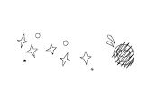

\

接下来要介绍的四种特别羞怯克星，是根据鲜为人知但却非常强大的理论原则所设计的。它们会帮助你在各种不同的场合和情况下与人互动，并且你无需担心他们是针对你进行评价的，事实上，他们根本不知道你是谁。你可以随心表现出不同的性格，就像试穿鞋子一样。这个经过验证且成效显著的理论，就是“匿名效应”（anonymity
effect）。

\

暂时性匿名对极度害羞者极具治疗效果。

——菲利普・津巴多（Philip Zimbardo）

\

搭乘长途客车时，会有陌生的乘客向你诉说他们各自的人生故事，甚至会说出一些他们永远不会透露给朋友的难为情的小秘密。他们唯一不会说的就是他们的名字。你可以好好利用匿名效应带来的这种勇气。

在第一个不同寻常的无痛式特别羞怯克星招数里，你需要一副真正的面具。在接下来的两项中，你得戴上心理面具。至于第四项羞怯克星，你会卸下心理面具，并让每个人看到你渴望成为的人，或是你潜意识里渴望成为的人。

\
\

① 把自己想象成“无名氏”

\

羞怯最大的痛苦之一，就是在意别人对自己的看法。如果没人知道你是谁，那么你便能愉快地和他人交往。你可以随心地做你想做的，说你想说的，并且不用顾忌自己被别人评头论足。

\

谁？我吗？我是无名氏

全球顶尖的羞怯心理研究学者曾运用面具伪装技巧，成功帮助患有严重羞怯症的弟弟小乔治·李巴多克服了害羞。小乔治·李巴多非常害羞，只要家里有客人，他就会跑出家门躲起来。他在学校不快乐，不敢与人有眼神交流，也从不和他人玩耍。

他的哥哥菲利普有天想到一个好办法。他建议小乔治玩一个特别的游戏。他让小乔治套上纸袋，只露出眼睛和嘴巴。小乔治非常喜欢这个游戏，开心极了，甚至要求上学也套着纸袋。老师同意了这个做法并告诉其他小朋友这是为了好玩。当其他小朋友问小乔治是谁时，小乔治骄傲地挺起小胸膛，骄傲地回答：“我是无名氏。”

在校期间，小乔治靠着纸袋带来的匿名的安全感，自在地跟其他孩子玩了一整年，甚至还参加了校庆表演。

匿名效应的有力证明是，隔年，小乔治在校庆中担任重要角色，并且脸上没有戴任何遮挡物。高中时，乔治已经有了亲密好友；高三时，他还担任了班长。

这里并非要你戴着面具出没于购物商场，而是请你思考暂时性匿名的强大作用。如果别人不知道你是谁，你与别人聊天沟通就会容易很多，从而积累宝贵的互动经验，帮助你更自在地与平常那些令你感到局促不安的人进行沟通。用不了多久，你就能像小乔治一样摘下“面具”。

有机会的话不妨参加化装舞会，例如跨年或万圣节的聚会，这会是一个很好的开始。

\

假扮兔子的一夜

我曾有过一次很美妙的经验。有一年的万圣节，那时我还在幼儿园教书，校长要我负责陪小朋友挨家挨户地玩“不给糖就捣蛋”的游戏。只要一想到敲陌生人的门，并在他们给小朋友巧克力时闲聊几句，就让我觉得害怕，但我又不能拒绝。

在礼品店替班级买万圣节聚会要用的装饰品和塑料南瓜时，我盯着墙上的面具瞬间有了个主意。我可以戴着面具陪孩子们要糖果啊，这样就没人能认出我了！

那天晚上非常成功，我伪装成兔子，我可以从容地站在门前跟人们闲聊。当他们把糖倒入小朋友们的袋子里时，甚至有一两次我还把面具摘了下来跟陌生人聊天。尽管那时我仍感到有些害羞，不敢注视对方的眼睛，但重要的是，第二年我就能够不戴面具地陪小朋友们要糖果了。

\

去年夏天，我在一家餐饮公司上班。我们必须装扮成古时候的管家、厨师和女佣的模样。我的装扮是法国女佣，穿着花边裙摆的短边连身裙和高跟鞋。神奇的是，尽管扮成这样，我却一点也不害羞。我猜那可能因为我们只是负责承办聚会的，不认识任何人，人们也不认识穿成那样的我。那时的我真不像我自己啊。

——美国密西西比州雷辛顿市的珊德拉

\

> > > 羞怯克星第32招 把自己变成无名氏

> > > 如果有机会参加化装舞会或是万圣节聚会的话，把自己打扮得让别人都认不出你来，然后跟其他宾客闲聊。用你装扮的角色来介绍自己：“你好，我是蝙蝠侠”“嘿，我是仙女教母”“你好啊，我是怪兽哥斯拉”。如果你偏好“我只是一个穿着荒诞滑稽戏服的真人”的介绍方式，就选一个听起来像是人名的假名。匿名是提高社交技巧与积累自信的宝贵且有效的方法。

\

当然，戴面具的好机会一年只有一次，那么，剩下的364天里，你该如何好好利用匿名效应呢？

\
\

② 扮演一个“不必做自己”的角色

\

你要能够把“完全匿名”上升到“几乎匿名”这个层次，可是该怎么做呢？办法就是安排一些情境，让自己和大家交流，但他们不需要认清真正的你。

找份需要经常与人交流的兼职，如出纳员、送货员、停车服务人员等。你可以和客人练习眼神交流、微笑以及闲聊。妙就妙在这个过程中，他们不会评论你，他们只会关心你找的零钱对不对，货物有没有及时送到，车子会不会被你弄坏等等。

在高中和大学期间，我曾做过便利店的收银员、餐厅的女服务员和美发沙龙里的洗头小工，每个工作都需要和客人有很长时间的交流，而且没有人会对我的长相和个性评头论足，在他们的眼里我只不过是个无名的收银员、服务员和洗头小工。

在美发沙龙打工的时候，我能和一些老顾客自在地聊天，可能是因为当那些女人头上抹着烫发药水或顶着十几个粉红色发卷时，感觉不是那么吓人。不管是什么原因，在理发店的经验进一步让我克服了羞怯。

倘若你的工作不允许你找份兼职，你也可以在周末打工，餐厅和商店会在忙碌的周五晚上和周六雇佣更多的帮手。简单的对话能锻炼你的胆量。“您需要在汉堡上涂上芥末和蛋黄酱吗？”“需要为您包装礼品吗？”“您想试下我们的一条9块钱看起来很新的裤子，还是要一条100元破破烂烂的裤子呢？”

\

我是一个身高180厘米、体重100公斤的大块头，这导致我变得更加糟糕了——害羞。我的好朋友有家迪斯科舞厅，有天晚上他打电话说保镖没有来上班，希望我能帮忙代班。我去了，并且一晚上没有觉得害羞。那晚，人们都以为我是保镖，而不是“佛莱迪”。从那时起，我代班了很多次，感觉这对我很有帮助。

——美国马里兰州巴尔的摩市的佛莱迪

\

> > > 羞怯克星第33招 找份兼职工作

> > > 找一个晚上或周末打工。找一个不必做自己，而是以你所扮演的角色被看待的兼职，百货商店的售货员、问卷调查人员、计程车司机等。这种“非真实自我”的经验是种极好的方法，它帮助人们在安全、非主观的环境里练习克服羞怯。

\

如果兼职行不通，下面这一章将介绍另一种无痛疗法，能够带来类似的疗效。

\
\

③ 把自己当成外地人

\

这一章的标题可重新命名为“请原谅，我是个无名小辈，即使做了什么傻事，也不会有人在乎”。只可惜题目长了点。

\

对不起，我是外地人\

拿出你的恐惧清单（羞怯克星第16招），你已经列出你害怕的项目，并按照从低到高的顺序排列，假设你的清单如下。

\

⊙在马路上向陌生人提问

⊙逛街却不买东西，担心让店员失望

⊙对不认识的人微笑，进行眼神交流

⊙与陌生人长时间闲聊

⊙与人谈话出现争执和不愉快

\

把清单放在口袋或钱包里，然后跳上车、巴士或火车，到一个完全不会有人认识你的小镇。接着你要像参考购物时所列的清单一样，打开你的清单，逐一完成上面所列的事情。

如果你的清单如上面列的那样，你要这样要求自己——

\

⊙找五个人问路

在路上找五个人问路，如果想要更逼真点，你可以拿张地图，装出一副困惑的表情，这样有助于你沟通一个小时左右。

⊙试穿衣服

在几家不同的鞋店分别试穿三双鞋子，但是一双也别买，大概又要一个小时。

⊙对服务员微笑

去百货公司，对每位销售员甚至是经过的客人微笑，并进行眼神交流。假装要购买的样子，并且提出针对不同商品的问题，这样你可以花费两个小时。

⊙请店员推荐产品

向药剂师询问哪种药膏是治疗过敏最有效的。把这个城里的每家药店都询问一遍。这又是一个小时。

⊙询问特色餐

吃中饭时，请服务人员向你介绍各种不同的菜色。这大概要花5分钟。

⊙同其他乘客闲聊

搭坐一班公交车，与坐在你旁边的乘客聊天。差不多10分钟左右，然后转车，重复做一次。转车，再转车。

\

再花上一个或两个小时做点其他让你害怕的事。如果没算错的话，你已经有八个小时与人不断交流的时间，经过那么长时间同外地人的交流，你敢不敢打赌第二天你能更自在地同本地人交流？

你可能会想：“如果有人问我的名字怎么办？”你可以这么理解，大多数人都能接受女人隐瞒自己的年龄。渔夫对自己捕捉到大鱼的尺寸总会添油加醋，这是人们能理解的，所以你也有权利编造个假名。这同样是有治疗效果的。

\

> > > 羞怯克星第34招 去外地旅游\

> > > 直奔到一个无人认识你的地方，这比戴上面具更管用，因为根本不可能有人认出你。现在，你可以练习每件让你感觉恐惧的事情。同销售员聊天，向路人问路，和服务人员仔细盘问特色菜。回家后，你就可以在熟悉的地方与人更自在地交流。

\
\

④ 把自己打扮得靓丽动人

\

每天一大早起来，每个人都会走到衣橱前，睡意蒙眬地问自己：“今天感觉怎样？穿什么好呢？”你一定听过“人如其食”（You
are what you
eat）这句谚语。既然如此，另一个真理也就显而易见了——你穿什么就能看出你是怎样的人，即“人如其衣”。

一家大型公司的执行总裁想要得到大家的尊重，于是穿上了他的黑色套装。一个女士想让自己看起来性感一点，那么她就会套上一件热辣的连衣裙来展示她傲人的身姿。小朋友们如果想要耍酷的话，就会穿上其他小朋友们认为很酷的服装。

\

打扮影响心情

就像其他人一样，每天早上你都会走到衣橱前，嘀咕着同一个问题：“我今天感觉怎么样？”

我用电脑在“薄脸皮者”给我的邮件里搜索“我觉得”这几个字。令人难过的是，出现的是“我觉得迟钝”“我觉得愚蠢”“我觉得可笑”“我觉得自卑”“我觉得毫无价值”以及“我觉得像小丑”这样的链接。

换言之，如果你给自己这样的感觉，那么每个早上站在衣橱前的你在潜意识里会说：“我要找一件让自己穿起来迟钝、愚蠢、可笑、自卑、毫无价值或者是像个小丑的衣服。”然后，你的双手不由得找起那些没有新意的衣服来，而别人恰恰是通过你的打扮来判断你这个人的。

\

穿上惹人注意的衣服

这有什么解决之道吗？再去找回儿时穿衣服的乐趣吧！“我要当公主”“我要当海盗”“我要当警察”，然后他们就拼了命似的从箱子里把公主、海盗和警察的衣服扯了出来。

就这样做吧。每天搜罗衣服的时候，对自己说：“我今天非常自信。”选择你觉得“自信者”会穿的衣服。如果想要感觉更好一点，可以试着穿得更有特色和有趣。穿些有回头率的服装吧。

现今，什么都可以行得通。男士们，你们是不是想披上一件《悲惨世界》（Les
Miserables）男主角冉·阿让（Jean val
Jean）的披风？女士们，你们是不是羡慕那些完美的指甲彩绘和性感的高跟凉鞋？去做吧！即使你手头紧张，你也可以在衣橱里现有的配件中寻找最有特色的来点缀自己，让自己变得自信。比如说，女士在颈上系一条优雅的大围巾，借此好像在说“我觉得这样很好”。

一旦习惯形成，你会惊奇地发现“注意我”服装给你带来的自信。

\

老实说吧，一套好西装和一双好皮鞋能让我们在社交场合信心倍增。我真的认为在好的服装上面进行投资就是在建立自信。要不然，詹姆士・邦德为什么总是穿着套西装呢？

——希腊雅典市的狄米西

\

当然了，并不一定非是西装。不过至少狄米西是热衷于自身形象的，这也正是我们应该努力的方向。

\

> > > 羞怯克星第35招 扔掉沉闷的服饰

> > > 想象你要成为哪种人。凤凰般绚丽的人？随遇而安的人？职业性的人？年轻无知的人？富有魅力的人？高贵优雅的人？

> > > 感谢上帝，我们可以自由装扮。今天，你想成为什么样的人都可以。想想你装扮后的形象。现在就穿上合适的服装吧！

\

我和丈夫结婚18年了。去年7月，我们外出旅行，我像往常一样把自己裹得严严实实。我们在餐厅的户外座椅上坐下。衬衫下面我穿了胸罩和连身裙，因为有点热，我解开了衣服上面的几颗扣子。我丈夫直盯着我的乳沟，眼睛简直像要掉出来了一样。他说：“亲爱的，你的胸部真美，为什么以前总是包得严严实实的呢？”我也不知道当时自己是怎么想的，反正那个时期也流行“内衣外穿”，我索性就把衬衫一脱，反正也没有人看到。倒是我丈夫看得津津有味。那晚我们回家之后，第一次点灯做爱，而且我一点儿也不觉得害羞。他的热情似火点燃了我。现在我在家里都可以穿着连身内衣走来走去，有时甚至只穿胸罩，而且现在我还买了一些更加性感的衣服。这的确改善了我的形象。我不再像以前那样对自己的身体感到害羞了，就连出去的时候也喜欢打扮得性感迷人。

——美国密歇根州休伦港的唐娜

\

加油，唐娜！

\

第6章

别让“脸皮不够厚”毁了你的工作

\

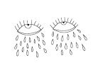

\

真是非常抱歉，此处以这样令人沮丧的事实开篇。不过，你还是希望我照实陈述的，对吗？希望你能了解，给出下列信息，是为了加强你对羞怯说再见的动力。

美国心理学会（American Psychological
Association）的一份报告指出，害羞者就算是才华横溢、天赋异禀，但在其专业领域还是会受到限制。在一篇名为《职业调试之社交恐慌与难题》（Social
Phobia and Difficulties in Occupational
Adjustment）的报告里，引用了数十项来自全球顶尖羞怯心理学者的研究成果。

大抵来说，害羞者往往被低估，而且工资待遇也与其才能不符。他们不太容易找到符合自己教育程度和能力水平的工作。而且，害羞者的职业发展道路从青年到中年，都比较不稳定。

因为“你就是脸皮不够厚！”，结果就备受冷落，这消息真是令人不寒而栗。

\
\

彻底改变，重获新生

\

马桶上的启示

还在幼儿园教书的时候，我喜欢自信地走进教室，并接受大家热情欢迎的感觉。现在的我当然知道，在四五岁小孩儿面前充满自信并不是件值得骄傲的事儿，不过和这些小东西在一起总是让我感到很自在。

可问题出现了，我说话的方式也开始像他们了。我唯一能和成人接触的机会便是每月第三个星期的家长会。一次开家长会的时候，我想要上厕所，于是我站了起来，开口便说：“对不起，我要嘘嘘。”

跑去厕所的路上，我听到了大家的窃窃笑声。

好了，就这样吧。在厕所里，我决定在期末辞去教师一职，进入“成人世界”。与六岁以下儿童的相处对我的害羞症状的改善是毫无帮助的，更不用说锻炼我的口才了。我已经适应了这样的环境，但是我知道我必须走出来，如果我还想要告别我的羞怯。

上班的最后一天，我们在教室里举行了一个小型的欢送会。我们彼此拥抱、亲吻，接着互道一声“珍重，我爱你”。接着，我转身进入了成人世界。

如果你正因为害羞而倍感痛苦，而且你的工作并不能够帮助你改善这一状况，那么是时候采取一些措施做出改变了。下面还有更多令人不安的事实。

\

在职场中受亏待，都是脸皮不够厚的错

你也许在专业领域低估了自己，据统计，你的雇主也会这样。雇主经常会给害羞者不公平的待遇。

如果你已经准备好直面你的职业生涯，就给自己进行一次专业面试。问自己以下这些严肃的问题。

\

1.这样朝九晚五的生活是否加剧了我的羞怯状况？

2.我在工作的时候是否已经充分发挥了才能？

3.我的才能和学历在工作中是否得到了充分的利用？

4.我是否能适应目前的工作？

5.我是否能找到一个与我的生活目标更加协调的工作？

\

当然，还有一个最重要的问题……

6.我现在是否有条件改变工作？

\

大多数人无法在一时半会就考虑换工作。但无论如何，你可以试试以下这些方法来克服羞怯。

\

> > > 羞怯克星第36招 重新审视你的工作\

> > > 回答上面列出的六个问题。然后根据结果，认真思考并谨慎地做出决定。可能你决定换一个工作，也可能还没到一个合适的时候，但你也可以通过对职业生涯的更深入了解，在当前的工作中做出更加正确的决定。这些答案会在你心中种下种子，并在日后发芽成长。从长远来看，这条羞怯克星真的有可能彻底改变你的一生。

\

失业的压力

除非你有一个安全的救生艇，否则就不要轻易跳船。不幸的是，我没有遵循这条原则。我毅然跳出了学校，加入到失业者的行列，我根本就不知道什么能使自己继续生存下去。更糟的是，工作面试让我感到恐惧。等到秋天来临，我必须找到工作，否则我就会流落街头——又会因为太害羞而不敢乞讨。

我勉强得到了几次面试的机会。面试官问了我同样的问题：“你有什么优点和缺点？”我没说出来的答案是：我爱小孩子，但是在成人面前我却相当害羞。

“在未来的五年里，你有什么样的打算？”我不敢告诉他们真正的答案是：不再害羞。

“告诉我一些你在短时间内完成复杂任务的经验。”若回答我必须在上课开始前五分钟之内重新组装一个米奇手机，应该不能给面试官留下什么好印象吧。

我当即意识到，读《鹅妈妈故事》和在操场上追赶20个孩子四处跑的经验，并不能让我做好面对生活的准备。

\

找到好工作的妙计

经过好几次面试，始终没有听到“你被录用了”的消息，由此所带来的压力让我像一只热锅上的蚂蚁一样焦虑不安。不过，在参加不同公司的面试过程中，我发现了有趣的经验。面试变得越来越容易，因为所有面试官的问题都如出一辙。

我怀疑是不是所有的人力资源专家都得参加“如何吓唬应征者”这样的研讨会。首先，他们会以一些非正式的问题来给你热身，有可能还会给你提供咖啡。随后，当你正感觉到舒适的时候，他们把背往后一靠，斜视着你，开始抛出所谓“有深度的”问题。

害羞者们，如果你正在寻找工作，就先去买或借一本有关面试的书。或者为了省钱，你可以直接从网上找到他们那些陈腐的“难题”。

这样，你就能轻易地知道他们在面试时会干什么了。针对“你有什么优点和缺点？”准备一些随机应变的答案。然后再准备面试官必然会抛给你的其他问题的答案。我个人难以忍受的事情是，对方得意地说“谈谈你自己吧”，然后往椅子上一靠，顿时我的大脑就会陷入一片空白。

\

> > > 羞怯克星第37招 面对羞怯场合，事先做好准备\

> > > 上网搜寻像“工作”“面试问题”或者和这个主题有关的关键字，各种各样的建议就会扑面而来。当然针对一般的热身问题，如“之前你在哪里工作”“工作了多久”“为什么离职”你得先做好准备。同时你也要关注那些不寻常的问题。这些问题其实也大同小异，例如“你最大的优点”“最大的缺点”“为什么我们要聘用你”等等。然后在家里练习你的回答。记住，准备是治疗恐惧的最佳良方。

\

到全世界你最不想去的公司面试

这些问题只是面试过程中的一部分而已。你一定听说过对求职者的标准建议：“与你的朋友和家人练习。”

当然，还要进一步做一件我会怠慢的事，那就是——作弊。

事实上是我夸张了。并不是真正意义上的作弊。它只是一种巧妙的捷径，能帮你获得工作。秘密就是，去五六家你并不想去工作的公司面试。

第一家公司的面试将令你感到恐怖。

第二家公司的面试将令你提心吊胆。

第三家公司的面试将令你觉得不安。

等到去第四家公司面试的时候，你就会从容不迫了。你会知道他们的问题，你会知道他们的举动，同样你也会知道他们的“游戏”。经过与并非你梦想的公司接触的经历后，你就已经准备就绪，可以为梦想中的工作去面试了。

\

> > > 羞怯克星第38招 去你不喜欢的公司面试\

> > > 为了确保得到你想要的工作，先去五六家薪水不符合你要求的公司面试。当你觉得已经开始了解他们的“游戏”时，再去你真正喜欢的公司，进行真正的面试。

\

在找工作期间，我脑海里不断浮现出青少年时期想要当一位空姐的梦想。那时当空姐真是光鲜亮丽，不需要发送耳机，不必严格控制发给每位乘客的花生数量。那个时候，“飞机食物”一词并不是讽刺的说法。

我越想越觉得当空姐很理想。克服羞怯是我最大的挑战，而当一位空姐正好可以解决这个问题。我必须面对一整架飞机上的成年乘客，一天说上几百次“您好，欢迎乘坐”或者“再见，谢谢搭乘我们的航班”。

进入泛美航空是我的梦想。在被几家我并不想去的公司面试后，我又到了几家像是美国航空、联合航空和环球航空这样优秀的公司面试。等到我去泛美面试的时候，我已经学会了航空公司最看重的品质，那就是不断地微笑。整个面试过程中我一直笑得像一只仓鼠，最后终于被录用了。

我开心地发现，自己能为乘客们递咖啡、送茶，并能和上千位乘客友好地交流。

\

> > > 羞怯克星第39招 选择需要经常和人打交道的职业\

> > > 在找工作的时候，要设想一下你将会与公众有多少程度的接触。接触得越多，就越能克服羞怯。你会发现只要你在工作上必须与人交流，那么在非工作场合中的对话也会变得容易很多。

> > > 当然，一旦你完全克服了羞怯，再找能让你在其他方面挑战自己的有趣工作。此外，还要确保能让你的知识和才能在工作中得到充分的发挥。

\

第7章 

让社交场合不再是害羞者的地狱

\

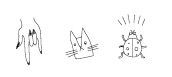

\

虽然害羞者们已经开始好转了，但是只要你一提起“聚”字，就一定会再次戳中他们的要害。

如果邀请他们到满是陌生人的聚会中去，就好比要往他们的静脉中注射催吐剂一样。如果还要叫他们对别人微笑，互相介绍，交谈闲聊，甚至打情骂俏……天哪！

稍等片刻，马上回来。我保证，只要按照接下来的羞怯克星去做，你马上就会期待各种各样的聚会和社交场合了。

\
\

积蓄力量，迎接聚会

\

在飞机上，因为我要经常面对乘客们，所以在社交方面还是有了很大的进步，但是即便如此，聚会对我来说，仍然是个活生生的噩梦。作为一名空中乘务人员，这种角色定位让我有理由不得不在那里尽职尽责。然而，让我感到浑身无力、不断冒冷汗、战栗发抖的，便是这个可怕的词——“聚会”。

不过，你肯定想象不到，我大概是经常说“请系好您的安全带”的人中最害羞的那一个，后来居然住进了一幢聚会不断的公寓。数百名空姐就住在这栋临近机场的公寓里，无数慕名而来的追求者为此还给它起了个昵称，叫作“空姐楼”。

自然而然地，如同任何一幢住满美女的房子一样，它总会引来一大群蜂拥而至的追求者。可悲的是，很多人最终落得“飞蛾扑火，自取灭亡”的下场。尽管美女市场供不应求，我仍然不敢去跟那些甚至已经被烤焦的小飞蛾们闲聊。

安妮卡和乌拉是我的室友，她们都是来自北欧的绝色美女。每次晚上不用飞时，她们的耳朵就竖得老高，一听到音乐声、欢笑声、碰杯声，就立刻喷上香水，抹上口红，兴冲冲地奔下楼去寻找聚会的源头。而我，虽然跟她们一起还没住多久，却差不多已经把不想跟着去的理由都用光了。

一天晚上，安妮卡正在专心研究航行时刻表。“哇，快看快看！我们下下个礼拜四不用飞耶。咱们来开个聚会吧！”

讨厌，我就知道这一天迟早会到来的，不过嘴上还是说：“好主意！”

那个令人恐惧的夜晚终究还是来了。快六点半的时候，安妮卡和乌拉兴奋地互相帮忙扣纽扣、拉拉链、化妆，而我却僵坐在床上，一动不动。

安妮卡看着我说：“莉儿，你不打扮一下吗？”

“我……我的好朋友得了重感冒”，我撒谎道。一边支支吾吾说着要给她送鸡汤去，一边急忙逃出公寓。

那天晚上，我一个人待在一家中餐馆里，真真切切地感受到了孤单落寞。我发誓一定要试着参加我们那幢楼里的聚会！

在接下来的几周里，我有很多次没能兑现自己的承诺。直到有一天，我灵机一动，想出了一套可以帮助自己减少对聚会产生恐惧感的神奇的计划。

现在回想起来，我称它为——

\

像鸽子一样尽情欢乐

你曾经在公园喂过鸽子吗？你往小路上扔些面包屑，一群不知道从哪里飞来的鸽子，会落在差不多离你几米外的地方。终于，有一只勇敢的小鸟，“嗖”地一下飞过来，衔住了一些，然后立刻就飞走了。其他鸽子目睹了伙伴这一勇敢的举动，并最终安然无恙。你再扔一把面包屑过去，这下就会有更多勇敢的鸽子尝试接近你了。随着它们信心的不断增加，你们之间的距离也相应地缩短了。很快，你就会被一群吱吱叫着的鸽子给围住了。它们甚至开始吃你手中的面包屑了。当然鸽子们并不知道自己已经习得了“渐进式暴露法”，而且再也不怕你了。

从鸟儿那里得到启发。放松心情，慢慢地融入聚会中。你不能仅仅只是潜入水中，什么都不做，还期待不会溺水。不要畏畏缩缩地对自己说：“我可以忍受。”这是万万不可的，因为忍耐反而会增强你对聚会的恐惧感。相反地，你应该告诉自己：“我只要在这里待10分钟就好了。”

10分钟能有多少痛苦啊？你能忍受牙医在你牙齿上钻10分钟吧？但是如果牙医说：“不要担心，我只钻三个小时。”你一定会吓得连脖子上的围兜都来不及拿掉，就拼命冲到大街上去了。

那么，一开始，不要强迫自己非得在社交场合待够一个小时，然后又像条害怕得瑟瑟发抖的狗一样夹着尾巴逃走。第一次，先花个10分钟在聚会上。10分钟一到，你就鼓励下自己，然后离开。这样做会让你感觉很好，因为你达到了自己的目标。

第二次聚会要来了，把你在那要停留的时间增加到20分钟，然后第三次时30分钟，以此类推，逐次增加。

\

我想交女朋友，我也知道社交聚会是一个主要的场合。但是转念一想，真的要我在聚会上找个女孩交往，那对我来说简直就是天方夜谭。因为聚会总让我紧张得要死，我又不喜欢去酒吧。最近，朋友邀请我去参加一个每周一次的交友聚会，说实话我真的很不习惯，很难融入其中。我就一直跟在他身边，他很不高兴，叫我不要再粘着他，然后我就跟他说我要走了。一个礼拜后，我又被他拉来了，不过这次要好一点了。现在，我每个礼拜都会去那里，每次都比前一次多待一会儿。我觉得这真的很有帮助，至少现在在聚会这天临近时，我不会抖得那么厉害了。

——美国德克萨斯州阿比林市的杰里米

\

> > > 羞怯克星第40招 “10-20-30”聚会原则

> > > 不要咬紧牙关说“好，好，我会去的，我会去的”，这样做不但让你更加畏缩，还会让你老想着随便找个理由不去。把这种考验分成一块块的。和自己做个约定，第一次，你只要在聚会上待10分钟就好了。然后下一次，争取待够20分钟。第三次30分钟，以此类推，逐次增加。渐进式暴露疗法对治疗“聚会恐慌症”也很有效。

\

提前到达聚会场所

这么多害羞者试图逃避参加聚会，一个很重要的原因就是他们不想被湮没在一大堆人之中。他们觉得在聚会上如果人少一点会更自在些。其中有一个害羞者写信给我，说他找到了一种方法，可以使大型聚会变得不那么可怕。

\

帮助我克服聚会恐惧心理的方法之一，就是提早到场。因为那时候人还不多，我不得不跟在场的人聊天。

——美国马里兰州巴尔的摩市的伊恩

\

伊恩，好主意！提早到场还有一个另外的好处，那就是，在聚会进行的时候，你已经认识了一些人了。如果你之前因为一个人都不认识而紧张不安，那么过会儿你就可以轻松地加入到他们的谈话中去了。他们还能够把你介绍给其他参加聚会的人。这总比让你跟身边站着的陌生人“搭讪”简单多了吧。

\

> > > 羞怯克星第41招 趁聚会人还不多的时候提早到

> > > 你是不是不喜欢大型的聚会？大多数害羞者起先都不喜欢。他们更希望消失在人群中，因而不愿意早点到场。对他们而言，人群才是个大威胁！但是这么做其实一点意义也没有。

> > > 妙招：趁聚会上人还不多的时候，提早到场。所谓的“场面化大为小”，就是一个很棒的方法。在那里，你可以提早认识一些人，而不是随后被动地与陌生人搭讪。你之前认识的那些人，还会再把你介绍给其他来宾。

\
\

不要拒人于千里之外

\

无论是大盛会还是小聚会，若只是跻身其中的话，是无济于事的。大多数害羞者一进入社交场合，就会双手交叉在胸前，一副失落低沉、闷闷不乐的样子，好像要拒人于千里之外。人们自然不敢接近这样的你，而你也就更讨厌社交聚会了。

女士们，试想一下，在街上看到一只小猫，你一定会忍不住上前轻轻地摸摸它。如果它看上去不害怕的话，你可能会试着抱起它。但要是小猫眯着眼，弓着腰，变成一只凶猛怪猫的话，你也许就会改变主意，马上逃开了。

害羞的人啊，显然你是不会对其他宾客发出嘘声的。但要是你吝于微笑，一副冷漠的样子自然让人不敢接近，这样会有效地把人吓跑。好似你在呐喊：“我宁愿待在西伯利亚。”

参加聚会，除非你表现出友好的肢体语言，主动和宾客交谈，否则不要给自己定太高的印象分。还有，长时间待在聚会易产生的另一个问题是，你会感到万分煎熬，不自觉讲得越来越快，一直僵硬地站着，或者是紧紧地握着拳头来遮掩内心的紧张。

心理专家称，一般人的紧张习性是一种试图掩饰羞涩的安全行为（safety
behavior），比如转移视线、加快语速、双手握拳等。一篇发表于《行为学研究疗法期刊》上以《维持焦虑和消极信念》（Maintaining
Anxiety and Negative
Beliefs）为题的研究文章指出，我们越屈从于自我防御机制，越会加重害羞症状。

一些害羞者认为出席聚会就已经足够了。然而，只是把自己置身于盛会中，其实并不算真正参加聚会。如果你紧张得像是感恩节前的火鸡一般，那就完全不起作用了。

\

> > > 羞怯克星第42招 制定明确的聚会目标\

> > > 参加一个聚会，你要为自己制定一些目标，如“注视他人的双眼”“脸上表现得轻松愉快些”“对主人、熟人及迷人的异性等人予以开怀的笑容”等。根据羞怯克星第40招，所制定的目标时间应与你在聚会的时间是相称的。10分钟内你必须要向一位宾客进行自我介绍，30分钟内两位宾客……以此类推，逐次增加。锻炼自己的社交技巧十分钟，远比你自己紧张上一个小时要更加有效。

\
\

让外向的朋友感染你

\

选择一位活泼的同伴

那些貌似迷你小恐龙的变色龙并不会根据周围环境而改变颜色，但现实中人们却会配合身边的人而改变自己。如果你的朋友外向自信，你又总在他或她身边，你就会变得更加开朗随和。如果你的好朋友和陌生人聊天，你就也能同刚认识的人闲聊。如果你的好朋友喜欢参加聚会，你很自然地也会紧随其后。这就是有样学样的简单原理。

我的朋友黛菲性格非常外向，而我羞涩得像只小猴，很想变得和她一样活泼开朗。我知道她在我克服害羞的过程中扮演着重要的角色。如果你现在还没有一位外向的同性朋友，那就有目的地去找一位吧。

\

朋友瑞吉儿是一位非常外向的女孩，和我在同一办公楼工作。有一晚，她硬拉着我去一个俱乐部跳舞，在那里可以一直跳到凌晨两点。虽然我想回去，但是得坐她的车回家。幸亏角落黑漆漆的，我可以躲在那里，默默地看着其他人在舞池中央跳舞。

瑞吉儿会直接走向那些陌生男性，和他们闲聊，接着就一起跳舞。我常常想要像她一样，但是我太害羞了。

她发现我坐在角落里，就来责备我。我向她解释了好多次我害羞。不知道她是喝多了还是其他什么，她很严肃地告诉我除非我去和那些人聊天跳舞，否则就不载我回去。我不敢上前和男士跳舞，不过还是和一位聊开了。在那儿之后，我感觉越来越好，能和更多人聊天了。我主动走向他们时，他们看上去都很开心。

——来自美国康涅狄格州格林威治市的丹妮儿

\

我敢说，下次丹妮儿和瑞吉儿一起去俱乐部时，丹妮儿不会再躲到黑暗的角落里了。效仿朋友的自信以及朋友的支持会激励你更强有力地对抗自己的羞怯。假使瑞吉儿也害羞的话，她们俩就会整晚蜷缩在角落里默默伤神了。

\

> > > 羞怯克星第43招 结交善于交际的朋友

> > > 虽然不是有意识地模仿，但如同变色龙所为人称道的一般，我们很容易受周边环境的影响。结识性格外向的同性朋友可能并不容易，但这值得花时间去做。你可以告诉对方，新环境下需要朋友的一点鼓励。不过，在参加聚会时，不要整晚总是待在他们身边，要有意识地去认识一些新朋友。

\

发挥朋友圈的作用

当然，除非你受过情报局的高难度训练，否则很难掩饰自己的不安全感。专家用“情感泄露症”（emotional
leakage）来形容当事人在刻意遮掩下却仍不经意流露的情绪。

还记得第4章提到的那位家住加利福尼亚、自以为在俱乐部里一直保持微笑的斯蒂芬吗？而有位女士竟然告诉他，他看上去不开心，这让他很诧异。另一封信来自芝加哥的迪娜，信中讲到她也遇到过类似的状况，不过迪娜提出了一个有趣的技巧：请一位朋友随时“监视”她是否一直把背挺直了。

\

我是一个长得很高的女孩，差不多183厘米。因为怕羞，所以我讨厌自己长得那么高。我习惯了弯着腰的生活，尽管有时也强迫自己去参加聚会，不过从来没有人邀请我出去。一次，有位女性朋友告诉我不要总是弯腰驼背。我在窗户边照见了自己的姿态，发现她是对的。挺直身体时，我感到舒服自信，也不太害羞了。从那时起，我请她帮我检查姿态，一旦看到我弯腰驼背的时候就用手戳我。

附注：我觉得她挺乐在其中的。

——美国伊利诺斯州芝加哥市的迪娜

\

同样，你也可以请朋友帮忙。请他或她偶尔来个检查，不单是你的姿态，还有所有习惯性的紧张动作。如果朋友注意到你态度不够友好，或是在逃避与别人目光接触，请他或她立即告诉你，甚至斥责你。

最好再实行一项奖励措施。像累加飞行里程数一样，每次朋友指出你的不足，就能获得一些积分。积分到达一定量的话，你来请吃饭或是朋友自主选择奖励方式。这能极大刺激朋友充分鼓励你，而你也能得到更大的回馈，那就是表现得更自信。

\

> > > 羞怯克星第44招 找一位监督你肢体语言的朋友

> > > 你会被误认为是在假笑吗？你同别人的眼神交流是比蜥蜴伸舌捕食还快吗？你的肢体语言是什么样的呢？看上去是带有“私人领地，闲人勿入”标记的吗？

> > > 请一位朋友定期检查你是否表现得随和自信，给他一份核对的清单：双手交叉抱在胸前、表情冷漠、姿势糟糕、回避同他人眼神交流、面无笑容等各种各样紧张性习惯或是自我保护行为。你也可以提供一些鼓励措施，物质上或其他方面，以确保你的朋友一直贯彻到底。

\
\

请别试图喝酒壮胆

\

犹如身体遭受疼痛时，人们往往寻求药物治疗，一些饱受精神折磨的害羞者们也往往求助于精神科专家的药物治疗。既然我们凡事亲力亲为，那就遵循不用药物的宗旨而用临床证实的技巧来克服羞怯。然而，对于某些害羞者来说，“亲力亲为”意味着用特定“药物”来麻醉自己。这些“药物”即啤酒、白酒，甚至药丸。

这里有份让人心情分外沉重的数据。

\

和正常人相比，那些患有社交焦虑症的患者滥用酒精和其他物品的危险概率高出了两到三倍。他们经常运用酒精来自我治疗以减轻焦虑症状，弱化参与社交场合的恐惧感，减轻回避心态。

——《行为学研究疗法期刊》

\

也许，药物和酒精能使害羞者提升自信，但那只是暂时性的。当你醉醺醺地站在咖啡桌上跳草裙舞的时候，人们在边笑边鼓掌。你要是认为他们在欣赏你，那你就错了。你可能以为人们被你的幽默风趣所吸引，但实际上，他们只是在嘲笑你而已。

女士们，当男人们捧拥着你的时候，你感觉自己就像万人迷，但你想过那是对自我的毁灭性打击吗？良宵过后，你才顿悟为什么你会以随便之人或是酒色美女而出名了。

我清楚记得曾经遇到过的一个很悲伤的例子。几年前，我去拜访家乡的一位朋友。我和朋友瑞妮在她家走廊上休息的时候，一位光鲜亮丽的红发女郎从对门走出来。

瑞妮撇撇眼睛指向她，说：“看，那是我的新邻居萨曼莎，多像一只骄傲的孔雀啊。每次我跟她打招呼，她都毫不搭理，把头一撇，高傲极了！”

“并非我想偷看她，只是无心中注意到她有很多男朋友，两三个星期就更换男朋友，一位又一位，接连不断。我看她也太挑剔了。”

“长得好看就有资本呗。”

“真不公平，”瑞妮嘟囔着，“那她也用不着对我们这些‘凡夫俗子’这么刻薄吧。”

“对喽，我有办法了，”我应道，“何不请她参加我们星期六的烤肉宴呢？好歹她也是你的邻居呀。想想吧，或许她还会把她看不上眼的家伙介绍给我们呢。”

我们在她的信箱里留了个便条，但并不指望她会来。

星期六中午，我们开始搭建烤架。刚把啤酒放进冰桶里冰镇的时候，身后传来了她的声音：“嗨，是我，萨曼莎。”

瑞妮和我惊讶地转过了身，不敢相信她居然来了。萨曼莎依旧口齿不清地说：“天哪，那些热狗闻起来太香了。配啤酒吃一定美味极了。我可以尝一下吗？”她指的是啤酒，不是热狗。没等我们回答，她就径直走向冰桶。

瑞妮弯下腰，对我小声嘟囔着：“我看她醉了，现在才中午呢！”

短短几小时，我和瑞妮每人各喝了一杯，萨曼莎喝了六杯。之后我们开始谈论起来，不外乎还是有关男人的话题。

瑞妮低声哼唱着那些通俗的流行歌曲，“所有的好男人都在何方？”我假装擦拭脸上的泪水，打趣道：“我看他们全都和萨曼莎约会去了吧。”

萨曼莎猛地应了一声，着实吓了我们一跳，“是的，但是他们最后都会甩了我。”

“嗯？”不约而同地，瑞妮和我惊诧地咽了口唾沫，我们都感到不可思议。

她垂下头，似乎有些哀愁，“我总是能在酒吧里认识男孩子。然后我们会出去约会几次，但最终都以失败告终。分手的理由很简单，无非是他们指责我，说我是个酒鬼，然后就再也不联系我了。”

“那么，”瑞妮壮着胆，试探性地问她道，“哦，你……喝很多酒吗？”

“可以说，没有酒我便变得不再光鲜亮丽，本性尽露——无趣、羞怯。我甚至都不敢跟同事交谈。”

我跟瑞妮面面相觑。

萨曼莎继续倾诉道：“打从我小的时候开始，我就很孤单。并不是因为我想这样，只是我不敢直视别人。高中的时候，没有人约我出去。直到我学会用酒精麻醉自己，放松身心。一旦感觉又紧张了，我就再饮一杯。”

我们都打从心底里同情她。

\

自信溶于酒精

从长远来看，酒精并不能使人获得真正的自信。事实上，它会使情况更糟。你不仅要承担着“酒精治疗”或“药物治疗”带来的风险，同时被剥夺了依靠自我力量战胜社交挑战而获得满足感的权利。

下一次，你会越发缺乏安全感。酒精会把你的自信心击溃到底线。更不要说会坏了你的名声，使你遭受痛苦的宿醉。

\

> > > 羞怯克星第45招 少喝酒\

> > > 每个人的酒量都不同。如果你只能喝三杯啤酒，就不要喝两杯以上；如果是两杯白酒的话，就不要喝超过一杯。如果你的“极限”是一杯，就请喝杯可乐或者苏打水代替吧。这不仅是自信的一种表现，你还会因为不需要所谓“液体拐杖”的支撑而赢得人们敬重。

\

那次以后，瑞妮告诉我萨曼莎比两三年前看到时苍老了很多。萨曼莎不再染着那头鲜艳炫目的红发了。她约会的次数也减少了。除了工作，她几乎哪儿都不去。

这里还有一份令人扼腕叹息的数据。一篇发布于《焦虑症期刊》（Journal of
Anxiety
Disorders）的研究报告显示，重度害羞者通过喝酒减轻害羞带来的精神折磨，这往往会让他们比轻度害羞者更不易踏入婚姻的殿堂。

不幸的是，这似乎成了萨曼莎的命运写照。

\

第8章

轻松掌握从容交谈的秘诀

\

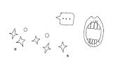

\

这似乎是个定理，越聪明、受教育程度越高的人越厌恶那些闲聊。这也在理。他们认为既然有那么多更有深度的话题可以谈论，为什么要浪费宝贵的时间谈论天气，或者讲些无用的寒暄语呢？例如，“你好吗？”要知道别人并不真正在乎这种寒暄。

你没有意识到的是，闲谈在人际交往中发挥着重大作用，是营造更有意义谈话的前奏曲。它能创造出一种“和谐”的氛围。想想那些小前奏，例如音乐声、猫咪满足的咕噜声、小孩子们欢快的哼歌声，或者合唱团愉悦的合唱声。它会使你更了解你的谈论对象，包括他们的心情、他们的性格。它能指引你怎么把握谈论的话题。

但是大多数人都忘了一件事，所有好音乐的精髓是旋律而非歌词。

\
\

别害怕自己语言乏味

\

先发制人

如果你看到认识的人向你走来，你的头脑会运转得很快。我会不会说些愚蠢的事？他肯定会认为我既愚蠢又无聊。倘若他和我说话，我的头脑一片空白，我想最好还是假装没看到吧。

换个角度想想，为什么不简单地说句“嗨，你好吗”，这当然很平常，却是我们文化中最能被接受的问候方式。朋友自然也没期望得到一个真正的答案，他并不想听你谈论你的疝气和痔疮，他只想听到一个简单的答案“我很好”。

两个朋友在街头偶遇，先开口的一方肯定是赢家，它能令对方觉得自己受到尊重和喜爱，它能够使你看起来很自信，同时也能向他们展示以下信息：你没有因为这次相遇以及接下来的谈话而感到恐惧。不管正确与否，先发言的人散发了一种积极的魅力十足的正面力量。

\

> > > 羞怯克星第46招 先开口\

> > > 在对话中，首先开口说话对克服羞怯有很大帮助。不管在哪里碰到熟人，要先开口说“嗨，你好”“很高兴见到你”“你最近还好吗”或其他类似的问候。当你热情地问候他们时，你也展现出了自己的友善和自信。记住，人们会在见到你的前十秒形成对你的印象，每次见面，你的表现也会影响他人对你的感受。为什么要浪费前五秒沉默尴尬地等待别人对你打招呼呢？

\

我很好，你呢

当有人问“嗨，你好吗？”你没必要像鹦鹉学舌那样回答“谢谢，我很好，你好吗？”否则他也只会简单地说句“我很好”，然后双方陷入沉默状态，杵在那儿你看我，我看你，最后对话因为找不到话题而被卡住，无法继续。

不要担心如果你没向对方问好会显得无礼，相反，你应该先发制人地快速回答“我很好”，紧接着通过议论今天发生的事来延长对话。比如：

他说：“嗨，你好吗？”

你回答说：“我很好，我很期待今晚的节目。”——在说完“很好”以后，立即追加一些自己的观点。

然后用一个问题“你会去看吗？”拦截住对话的球，把它丢到对方那里。现在你已经问了一个问题，对方必定会答复，我把它叫作“评论—问题”公式。

不管你信不信，这招就算用在讨论天气话题也行得通。你去听听其他人的谈话，就会发现几乎所有对话的开场白都是天气。

她说：“嗨，你好吗？”

你回答道：“我很好，据说这个周末风和日丽。”那是你的评论，然后以一句“你有什么特殊的安排吗？”继续话题，这是你的问题。

即使用天气这种平常的话题当开场白，仍然会有愉快的事发生。两个人闲聊越久，越能贴切地把它演变成一次有趣的讨论。闲聊是深谈的前身。

\

> > > 羞怯克星第47招 使用评论问题的技巧\

> > > 当有人问“你好吗”，不要只是机械地回答“我很好，你呢”那样只会使对话在没开始前就中止。你可以通过讨论当天发生的事来延长对话，然后问些相关的问题，这样你便能够立刻出现在对方“自信且友好的朋友”的名单中。

\

请注意：如果对方只是回答你“是”或“不是”，用“继续说”问题来提问。这个我们将在羞怯克星第51招中给予详细说明。

\
\

赞美能让交谈保持活力

\

你可能会想，假如今天过得很平凡怎么办？并没有发生什么有趣的事，早上没有，现在没有，晚上也没有。不要担心，不管多单调乏味的事，只要你以活泼开朗“忍不住想要告诉你”的语气述说都是可以的。在对方礼貌性地问了句“你好吗”之后，你可以热情地说“我很好，但是我找遍了整个城镇，也没找到一个令我满意的公文包。我这个人不喜欢逛街。”（评论）“你喜欢逛街吗？”（问题）\

也许他会回答，他姐夫前不久刚送他一个公文包当生日礼物。没错，这真的够无聊，但是你要做出微笑并且很激动的样子，问他姐夫住在哪里，假装对他姐夫住在庞度迪镇很感兴趣，问他庞度迪是怎样一个地方。在你意识到之前，你已经成功地寒暄了一段时间，而寒暄往往是很多害羞者最害怕的事。

\

> > > 羞怯克星第48招 再乏味的事也要表示赞叹\

> > > 不论你认为谈话多无聊，都要用“这是有史以来最伟大的事”的口气。你猜猜将会发生什么事？你生动的表达会让你的听众觉得很有趣。

> > > 同样，不论对方说的话多乏味，你都要表现出好像这是本星期最能吸引人的事。对方就会觉得你是位有趣且值得倾诉的对象。

\
\

巧妙回答陈词滥调

\

毫无疑问，在见到陌生人的五分钟之内，他会问“你是干什么的”不要每次都慌张地找合适的字眼，你可以准备一份简洁愉悦的工作介绍，让人觉得你的工作是全世界最让人欢欣的工作，你为它感到自豪。

可惜的是，很多害羞的人当被问到一些不可避免的问题时，就只会低着头看地面说：“哦，我只是个……”有次我去一家公司，在走廊迷路了，刚好一位女士路过，她给我指了路。我谢了谢她并顺口问道：“对了，你在哪个部门工作？”

她回答道：“我只是一名招待员。”

她居然如此看轻自己的工作，急得我想摇她，我温和地纠正她的说法，说道：“不，你不仅仅是名招待员，你就是名招待员。”她像看外星人那样看了我一眼。

当有人问你一些标准问题时，比如说“你的工作是什么”你应该面带微笑并且热情地介绍自己的工作。如果一位备受尊重的跨国企业首席执行官厌恶自己的职业，那么在别人眼中他仍是名失败者。但是如果你热爱自己的工作，即使你靠养蛞蝓讨生活，在别人眼中你也是成功的。生活的赢家是那种热爱并满足于自己现在生活的人，而所有人都喜欢赢家。

\

> > > 羞怯克星第49招 准备一份让你自豪的小简历\

> > > 不要仅仅用职业名称来回答“你是干什么工作的”这些不可避免的问题，事先准备一份让自己引以为傲的答案，并且在镜子前练习，然后热情洋溢地将它表现出来，好像你被问到这个新颖的问题时感到无比激动。

\
\

合适的语气能远离羞怯

\

哪些特征最能显露羞怯？或许你会回答“眼神接触”，这是对的。然而，许多害羞人士并没有意识到的是，其实声音也一样重要。从你声音的音量、音速和音色可以估量出来你是自信的还是缺少自信的。自信的人说话时声音非常洪亮，并且他们很少会不自在地停顿。

说话的方式能掩盖说话的内容。当你说话的语气很犹豫时，他们所得知的是：“我所说的话并不是那么重要。”

当你说到一半突然停顿的时候，他们所得知的是：“我的想法和你的不一致。”

当你犹豫的时候，他们所得知的是：“我不能集中注意力在你所说的话，因为我满脑子疑惑，在想你如何看待我。”

当你说得太快的时候，他们会认为：“在我又分心想自己的事情之前，我最好把这句话快速讲完。”

\

和金鱼练习对话

在这里，你的金鱼派上用场了。不要因为金鱼没有耳朵就让自己灰心。你仅仅只是用一种缓和流畅的语气对着金鱼在练习。把这想象成用乐器练习演奏音乐。每练习一次，你的音质就会变得更加有力并且流畅。

\

> > > 羞怯克星第50招 对着你的金鱼练习说话\

> > > 当然不一定只是说你的早餐吃了什么，任何话题都生冷不忌。对着你的金鱼（或者狗、猫、有袋动物或者镜子），用充满活力的声音，并且尽量不要停顿，讲五到六分钟。在与人说话的时候，你必须要有适当的停顿，这样他们才有发表意见的空间。不过，既然你的金鱼没有什么有趣的事情可以说，所以你可以一直说下去。

\
\

永远不会冷场的谈话技巧

\

比语助词还好用

尝试过接下来的这条羞怯克星后，你将不会再陷入缺少话题的困境中了。大多数人在认真听某人讲话的时候，会发出各种不同的语助词，像“嗯”“嗯哼”“好”“喔”“真的假的”。不幸的是，害羞人士不能自在地发出这些声音，因为他们很担忧听话者对他们的想法。下面有一些技巧和方法，所有的人，不只是害羞人士，都能从中受益。对于害羞的人来说，这个方法肯定能成功地推动一段即将停滞的对话。

与其哼哼哈哈地表达参与感，不如先准备好一些能帮助你继续说下去的问题。在谈话的时候，使用“谁”“什么”“什么时候”“哪里”“为什么”和“如何”这些问题可以在谈话突然中止的时候，有效地激励对方继续说话。你可以问：

“谁给你那个东西的？”

“她那时候说了什么？”

“你什么时候发现的？”

“你在哪里找到它的？”

“为什么你会选择那个学校？”

“你是怎样完成它的？”

这是一个双赢的局面。大多数的人都喜欢听他们最喜欢的音乐——自己的声音。他们会继续说下去。你也不用再承受“接下来该说什么症候群”的折磨了。

举个例子，催眠先生吹嘘着他去意大利旅游的过程。你可以问：

“你和谁一起去旅游的？”

“你最喜欢的是哪一个城市？”

“你什么时候去的？哪个季节？”

“你去了意大利哪里？”

“你为什么选择去意大利？”

最近一次我对着某个人唠唠叨叨了半天，想到那可怜的孩子一个字也没有说，就停下来给他说话的机会。可他只是说：“继续说，莉儿。请多讲一点。”

哇！我不需要他再一次的邀请说话。我立刻又滔滔不绝地讲了20分钟，离开后还想着他是一个非常健谈的人。

\

我以前很怕闲聊，总觉得别人会因为我太安静而想要远离我。有一天我了解到他们其实并不在乎我的意见，这件事情帮助我克服了与陌生人寒暄的恐惧。那么他们在乎的是什么呢？我了解到他们特别喜欢我对他们的对话顺势追问。

——美国肯塔基州格林维尔市的劳夫

\

> > > 羞怯克星第51招 善于提问，让交谈继续\

> > > 请把“嗯哼”和“OK”留给机器人吧。问一些“谁”“什么”“什么时候”“哪里”“为什么”和“怎样”之类的问题。和你谈话的伙伴会非常兴奋、激动，因为你想要了解更多，而你也不必苦于缺少有趣、恰当的话题。

\

宁要平凡也不要简短

当你回答问题的时候，做好准备回答一些不可避免的无聊话题。不要给一两个字的回答，像下面这些……

“今年你要到哪里去度假？”“佛州。”

“你父母（小孩、兄弟、姐妹、配偶、鹦鹉）还好吗？”“很好。”

如此简单的回答一定会提早结束谈话。准备好更长一些的回答，例如：“嗯，我们本来考虑去加勒比海旅行，但是我们又觉得太贵了。后来我们看到介绍佛罗里达州的旅游手册，那里可以考虑去的地方好像有很多，所以我们……”你可以就像这样地说下去。

\

> > > 羞怯克星第52招 平凡好于简短\

> > > 不要陷入司空见惯问题的困境之中，担心自己回答得是否完美。对于别人一定会问到的问题，要事先将答案准备好，并且一定要是一整段话，而不是简短的几个字。

> > > 人们真的会因为你脑子精密的运行，以及你做出去迪斯尼世界游玩的决定而着迷吗？并不是这样的。但是，如果你还记得的话，音乐的精髓是旋律，而不是歌词。一段长一点的回答就是一段友好的曲调。

\
\

称呼别人的名字能展现你的个性

\

尽管每个人的名字被喊过上百万次，但是每当他们听到自己的名字从你的口中发出时，依然会觉得温暖和陶醉。你知道这同时也展现了你自己的个性吗？他们听到的是你潜意识里说的“我有自信，我喜欢你，我尊重你，并且我们是朋友”。

就像掌握任何一门新技术一样，刚开始我们很难判断在对话中要喊几次对方的名字才适合，这并不难理解。但很快你就能掌握这个度。至于现在，先从问候和告别语下手。“早上好，某某。”“很高兴见到你，某某。”“再见，某某。”“很高兴能和你聊天，某某。”

但是要小心，如果你过多提及对方的名字，会显得缺少安全感，更别提会惹他人嫌了。

我的电脑在数月前出了问题。我打电话向系统管理人员求助，跟他们说每次我尝试着打开文件时，总会出现错误信息。那天的对话大致是这样的。

\

工程师：好的，你的名字是？

我：莉儿。

工程师：莉儿，你现在坐在电脑前面吗？

我：是的。

工程师：好的，莉儿，现在你双击“我的电脑”。

我：好了，我打开了。

工程师：莉儿，现在我要你打开“我的文件”。打开了么，莉儿？

我：好了。

工程师：莉儿，现在将屏幕下拉到档案目录上。

我：好了。（心里非常想对他喊：好了，够了，我知道我自己名字叫什么！）

工程师：好的，莉儿，现在我要你双击那个你打不开的文件。

\

此时此刻，我很想拿榔头敲击两下他的头。

经过一些练习，你很快就能掌握何时该叫他人的名字、何时不该叫的技巧。随着自信的提升，你对其中奥妙的敏感度也会增加。至于现在，两次足矣。

\

> > > 羞怯克星第53招 喊对方的名字，但要恰到好处

> > > 在打招呼和告别时喊对方的名字，能使对方感到温暖和陶醉。但要注意——如果过度使用，会显得你过于紧张，还会让对方觉得太过亲切而不舒服。

\
\

万一冷场怎么办？

\

多关注时事，不再插不上嘴

最近从一场聚会中回来后，我突然茅塞顿开，领悟到一个再明白不过的事实。那么多年以来，那天就像漫画书里的画面那样，一个灯泡突然在我头顶点亮了。聚会上几乎所有的谈话内容都是些陈词滥调：电影、婚姻状况、孩子、宠物、度假、运动、名人以及最近的重大灾难。

偶尔一些宾客会挑战学术性较强的话题，比如明朝十三陵或宇宙大爆炸学说。但是大多数的谈话内容都是平淡无奇、墨守成规的。对于那些害羞者来说，这可是超级好消息。当我思索这项发现时，羞怯克星第54招诞生了。

在心里列举出聚会中所有可能提及的话题，上网逐一查询。与时事相关的话题，就去你喜欢的媒体浏览头条新闻。电视新闻？广播？报纸？不要等到进行对话时才对最新的政治丑闻或名人离婚案形成意见。预先构想你对震撼全球的事件的观点。如果你到当时才去构思，那么等你开口时，这些早就过时了。

\

> > > 羞怯克星第54招 多列举可能的话题\

> > > 只知道“非洲有暴乱、西班牙闹饥荒、佛罗里达州刮飓风、德克萨斯州有干旱”是不够的。详细列举出谈话可能涉及的话题。你不需要像哈佛大学辩论社一样博学多闻和能言善辩，但是要对清单上的每个话题形成一个明确的观点。构想观点并且每天及时更新，这样才能使你像自信者那般轻松融入谈话，而不需等待他人正式询问意见。

\
\

换你主导谈话方向

\

大方说出自己的观点

现在我们跨越加入别人发起的话题，晋升到自己主导话题阶段。

你听到过他人抱怨某些人“过于坚持己见”吗？那十之八九不是你。大多数害羞者的问题是不够有主见。正因为如此，你可以不受限制地对各个话题培养出强烈的观点。

先从列举你的原则和兴趣入手。也许你坚信全球变暖只是无稽之谈，而电脑游戏有助于培养我们的孩子。又或许你深信全球变暖会导致地球毁灭，而电脑游戏会导致我们的后代四体不勤。

然后，开始考虑你对清单上每个事件的看法和理由。上网浏览一些事例论据。自己对自己表达出明确的观点。最后设计出能够将话题引入你熟悉领域的方法。

\

> > > 羞怯克星第55招 主动引导话题\

> > > 不要等别人引导话题，要做谈话的主导者。找到一些你有强烈主张的话题并且深入它。然后规划出能巧妙将话题引入其中的方法——再加入你的看法。谈论你擅长的领域自然会比较简单。

\

你还没有做到的事

快速回顾一下。现在的你已能：

\

⊙首先会向别人问候“嗨”或“你好吗”（羞怯克星第46招）。

⊙在回答“我很好”以后，应该立即插入一句评论（羞怯克星第47招）。

⊙随即再提出一个问题可以继续讨论下去（羞怯克星第47招）。

⊙谈话时应该用富有激情的声音语调，在别人说话时，要对别人的话语表现得感兴趣（羞怯克星第48招）。

⊙针对别人提问“你做什么工作”的问题时，给出一个富有热诚的答案“我很爱我的工作”（羞怯克星第49招）。

⊙问一些关于谁、什么、什么时候、哪里、为什么、如何的问题，以便让别人有话可说（羞怯克星第51招）。

⊙在开始谈话和结束谈话的时候要叫对方的名字（羞怯克星第53招）。

⊙在谈话时要注意聊一些你们之间的共同话题（羞怯克星第54招）。

⊙对于一些老套的问题不能用简短的回答，而是要延伸你的回答（羞怯克星第52招）。

⊙最后，计划出怎样把话题引导到你喜欢的话题上（羞怯克星第55招）。

\

但要成为一个充满自信和魅力的谈话家，你还没有完全做到。

\
\

表达自己，也要聆听他人

\

这是一项不可缺少的技巧。等你表达自己的意见后，要询问对方的想法，许多自信者都忽略了这一点，结果成了以自我为中心的令人讨厌的人。

研究人员选择了两组男性进行实验，实验名为《男性社会功能之行为评估》（The
Behavioral Assessment of Social Competence in
Males）。第一组由人缘较好、较受欢迎的男性组成，第二组则由人缘较差的男性组成。

研究人员安排所有的男性在跳舞时与其舞伴交谈，他们所有的谈话都被麦克风录了音。

总体而言，受欢迎的男性在对某件事情发表意见时会询问女士的想法，而不受欢迎的男性却不是这样的。结果，第一组男性以压倒性的优势获得约会的机会，而第二组则极少获得女士的青睐。

显而易见，这种技巧不只适用于两性之间的交谈，你应把它应用于所有的人，以赢得他人的敬意和喜爱。

\

> > > 羞怯克星第56招 询问听众的观点\

> > > 在你运用所有的羞怯克星并成为一个优秀的交谈者后，别忘了一个至关重要的技巧。确保要将话题转向，询问听众的观点，认真聆听对方的意见，然后对对方的观点提出自己的想法，之后再次重复这条羞怯克星。这正是自在沟通的关键所在。

\

如果你坚持不懈地练习本章全部的“从容交谈”羞怯克星，总有一天你会从睡梦中惊醒大喊：“太神奇了，我今天说话并没有特意去想，却自然而然地就讲出来了。”你将会欢呼着重新入睡，到那时，你将彻底和羞怯告别。

\
\

在没开口的时候就给人留下好印象

\

在此想和你分享一个鼓舞人心的事实。随着你不断练习各式各样的交谈技巧，你的交谈会越来越自在。但是，当你具备了很好的沟通能力时，请记住有时不必开口也能给别人留下好印象。

我的朋友黛菲传授给我的眼神交流训练彻底改变了我的一生，几个月后，我打电话给她说我的想法：“黛菲，我无法形容现在叫我与乘客们眼神交流有多么容易，我现在可以直视每个人的眼睛了。”

当我还在讲个不停的时候，黛菲的口气里出现了常有的她已有打算的味道。

“你能一个小时后来这里吗？”她问我。

“嗯，好的，但是……”她已经挂了我的电话。

当我到了她家后，黛菲宣布：“今天你将会向自信博士学位跨进一大步。”看得出来，她十分享受充当我的心理治疗师的新角色。

“我妈妈今天要请大家吃午饭，而且……”她一定看到了我满脸惊慌的表情，因为她继续接着说道，“莉儿，别担心，事情没你想的那么糟糕，除了眼神交流以外，你还要仔细聆听别人讲话，然后适时地微笑和点头。”

“如果那样的话，我就没办法和陌生人交谈了。”

“这就是奇妙之处，莉儿，你不必讲话，我妈妈在新移民辅导机构当义工，今天这是为14个人办的欢迎午餐，我想应该没有人会说英文。所以，你明白了吗？根本没有压力，你不需要说什么，只要微笑，举止友好，然后看着别人的眼睛就行了。”

我们到了一家热闹的希腊酒馆，里面每个人都在用我听不懂的，嗯，就像是希腊语一样的话在聊天。黛菲的妈妈和其他人一起围坐在一个大桌子旁，黛菲亲吻了她妈妈的脸颊，然后向她介绍了我，她妈妈建议我坐在她旁边，因为我不会讲希腊语。

\

不必力求表现自己

黛菲眨了眨眼睛，说：“绝不，我要把莉儿放在雷奥尼达和司寇帕斯中间。”

我感觉自己像是被抛弃在狮子笼里。

当黛菲向他们介绍我时，他们笑容满面，我笑得很不自然。

“别担心，”黛菲小声地对我说，“我告诉他们你不会说希腊语。我现在要去跟我妈妈一起坐了。”

“黛菲，不要离开我！”但是她已经走了。

服务员把一盘淋着各种冷酱的看起来像章鱼的东西放在我面前。雷奥尼达用手语问我是否喜欢这道菜。我努力地把那黏乎乎的东西咽下去，同时夸张地点头称好，我甚至轻轻地把手合起来，表示我很喜欢这道菜。

我不能相信我变得这么放松。我那自行任命、未经鉴定的治疗专家将会为我感到骄傲。有生以来第一次，和那么多人坐在餐桌前，我不想成为隐形。事实上，我坐得又直又挺，头发塞在耳后，甚至对坐在桌子另一头的希腊帅哥微笑。

后来就尴尬了。那个希腊帅哥忽然起身，向我走来。我吓呆了，万一他会说英语怎么办？万一我不得不和他说话怎么办？

他优雅地鞠了个躬，并且用希腊语做了自我介绍。黛菲跑过来为我解围。他对她说了几句话后，黛菲笑着对我说：“莉儿，泰勒想约你出去吃饭。”

“谁？要做什么？”

“他是认真的。”

“你开玩笑吧，黛菲！告诉他谢谢他的好意，我很荣幸。但是黛菲，告诉他我结婚了，告诉他我有传染病。随便说什么都可以！”

黛菲想办法让我脱身。当这个餐会接近结束时，每个人都笑着握我的手，并且用希腊语对我说“再见”，因为我是一个热心的听众，几乎没有人注意到我一句话也没讲过。大部分人甚至不知道我不会说希腊语。

在回黛菲家的路上，我说我在餐会上一点也不紧张。

“当然不会！”她说，“没有人期待你说任何话。”

我就像被浪打傻了一样。她说得对！我不需要去表现。没有人期待我说话，而且没有人会去判断我说了什么。

\

不会有人注意到你没说话

害羞的人，假如和你同桌的人不会说汉语，你也会有同样的体验。你不必担心自己会说出什么愚蠢或失当的话。假如他们是你以后再也不会碰到的陌生人，那就更轻松简单了。

你知道吗？即使每个人都能说上一口正宗的汉语，而且其中有些人认识你，你也不需要去特意表现。你不想说的时候就可以不用开口。但是你必须去倾听、微笑、并适时点头，以表示你的友善。你给他们的微笑和点头越多，他们便会有更多机会看到你的个人魅力。

\

> > > 羞怯克星第57招 只要一注视，二点头，三微笑

> > > 如果你还没准备好开口在大家面前说话，不要慌张。只需善用这一条永不失败的公式。双眼注视对方，微笑，适时点头表示赞同。我保证你肯定很受欢迎，因为大家都喜欢好的倾听者。他们会把你当作最佳人缘的先生或小姐，而你没准备好时就不必说话。

\

我有一个好朋友叫奈特。奈特不太喜欢讲话，但是不管我告诉他什么事情，他都会给我巨大的微笑，并且说“真的？”或者“那太棒了！”——仿佛我的见解真的有那么了不起。我和奈特相处得很愉快。一个美丽动人的律师黛博拉想必对他也有同感，他们最近刚结婚。

我曾经问黛博拉他们认识的场景。她告诉我奈特是她的一个客户。“我从来没遇到过这样的倾听者。他真的太有意思了。”她说，“而且他笑得很呆。”我知道她的意思是说他“好可爱”。

\
\

学会忘记“脸皮”问题

\

热情驱走羞怯

当你真的很热衷于一件事时，甚至不知道自己在讲话。你所想的就是把你的观点表达清楚。当你谈论某些你满怀热情的东西时，害羞便会被抛之脑后。事实上，它会飞出窗外蒸发在稀薄的空气中。

我无意中发现了热情对羞怯的疗效，那是在我12岁的时候。住在我家隔壁的两个男孩东尼和巴比，总是毫不留情地戏弄我。不管什么时候他们在外面玩，我便会躲到屋子里。

某个星期六的下午，我坐在前廊做作业，听到从他们家后院传来的笑声。像往常一样，我抱起课本准备跑回家，就在那时，门口传来了凄厉的叫声，我转过了身。

那时巴比正站在前方，高兴地抓着一只小猫的尾巴在摇晃，而他的弟弟用水管朝猫身上浇水。我压根没有意识到我的害羞，我当时就丢掉我的书，纸散落在地上，我像嗜血的老鹰般向他们尖叫。

他们大笑，并把猫提得更高，让我看得更仔细点。我的怒火再也止不住了，拿起车库旁边的铲子，举过头顶，朝他们追打过去。

他们在惊吓中丢掉猫逃跑了。小猫一溜烟地逃走了，我希望它能回到家人身边好好养伤。

一直等回到前廊，我才意识到自己手里拿着重型武器。我盯着手里的铲子。我对动物的热情在那一刻赶走了我的羞怯。

\

几年前，我开始在社团举办的聚会上做DJ。因为我非常专注于音乐，我可以很自在地和以前不敢说话的女士交谈。她们甚至还来找我点歌。那让我对自己更加有信心。

——美国加州洛杉矶市的巴弟

\

我整晚都没有想到我自己

书上常常建议多参加研讨会是一种改善害羞状况的有效方法。这是个好建议，的确很不错的建议。但是，如果你参加的主要目的是为了锻炼交际能力的话，你还是在看“一部叫作《我》的电影”。现在回想起来，假使我当时出席拯救受虐动物的会议，而不是坐在我家前廊上，恐怕当巴比和东尼出现的时候，我想到的全是我自己，而不是可怜的受迫害的动物。

重点是，当你对某件事满怀热情时，你会完全融入其中而忘却自我。

\

我今年48岁。11年前我刚离婚的时候，我发现自己根本无法重拾单身的社会生活。我不敢出席聚会，甚至连接近男人也不敢。我向来喜欢品酒，也对自己的鉴赏能力相当有自信。最近我去上品酒课，在那儿我遇到一些非常不错的男士。因为他们喜欢酒，我们有相同的话题，聊起天来就比较容易。

——美国西弗吉尼亚州马丁斯堡的唐娜

\

你呢？你对什么感兴趣？

环保话题吗？那就加入塞拉俱乐部（Sierra Club）。

全球饥荒吗？粮食募捐活动，食品救济会以及那些慈善饭堂也急需志愿者的加入。

医疗保健吗？捐血活动需要人组织，而且健康教育讲座也有赖能人志士的义举。

儿童福利吗？那就义务为贫困儿童募集礼物，或是回复小朋友写给圣诞老公公的信吧。

你对你的家乡有没有特殊感情？不妨加入社区管理会，阻止开发者为建设购物中心而破坏自然景观。

当你为你的理想奋斗的时候，你想的不是“别人怎么看我的”，你心心念念的全是“我能为他们做些什么”。当目标被放在最重要的位置的时候，羞怯自然被丢弃一旁。共同理想将不同的人彼此相连，而真挚的友情便也在其中萌芽并茁壮发展。

\

> > > 羞怯克星第58招 追寻你的热情与理想\

> > > 仔细思考你最感兴趣的东西是什么，哪些事情是你真的在乎的。然后在网上或是报纸上搜寻相关主题的团体或是会议。若你的居住地有其他渠道或是小报之类的，也可以去查询，那里通常都充满了各式各样的组织与会议的资讯。

> > > 但是也不要什么都参加，寻找你所热衷的事并认真投入，让你的热情把羞怯彻底地驱除。

\

热情的魔力永不止息\

热情的魔力非常强大，即使你成功变为大方的人之后，它仍能帮你不断地提升自信心。

以我自己为例，在我宣告战胜羞怯之后，一想到要发表演说，我仍会感到双腿发软。

我曾经经营过一家名为“海边演出”的公司，和合伙人奇普，一个心地善良的男同性恋者，一起承接游轮的娱乐节目。我们一起环游世界，并成了最亲密的朋友。

后来奇普感染上了艾滋病，我照顾他度过了临终前痛苦而艰辛的日子。在他的葬礼上，他姐姐问在场的人有没有谁想说几句话。三四个亲戚从座位上站起来，追忆奇普的优点。我突然意识到，他们其实并不了解奇普在事业上的成就。对他们来说，奇普只不过是珍和尼克的小儿子罢了。

我再也坐不住了，我的手像火箭一样迅速举起，我几乎是冲到告别式会场前方的讲台，热切且不自觉地聊起奇普的才华、善良与智慧，时间长达20分钟之久。

那是我第一次站在人群前讲话，但片刻不曾觉得自己是在演讲。我的目的是要让奇普的亲戚朋友知道他的优秀品质。

当然，我当时并没有想过，其实我又在渐进式暴露疗法上迈进了一大步。那次经验打开了我成为专业演说家的道路，促成我具备日后能面对万人以上听众演讲的能力。

找寻你的理想。有了热情，你就能摆脱恐惧去实现它。

\

第9章

七种大师级羞怯克星

\

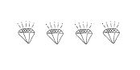

\

你玩过经典的桌上游戏大富翁吗？丢骰子时一个不小心，你选到“不可经过起点，不可领取200元过路费……”，之后便锒铛入狱。

告别羞怯的战略与玩大富翁游戏不同。假使你还尚未从羞怯克星第1～58招中取得胜利的话，不必担心会被打入大牢。但是决不可错过起点，你得翻到本书的最前头，逐一标出你已经大有所获的羞怯克星。然后琢磨它，在进入下一阶段前掌握尚未完成的部分。

从这里开始，我们将钻研林林总总的先进技巧，从朋友到小狗、从挑战到挫败、从吃饭到演戏、从购物到聆听陌生的声音……应有尽有。

这些羞怯克星包罗万象，而唯一的共同点就是，它们的功效都很强大！

\
\

① 一天天突破，驱逐羞怯

\

首先拿出你依照第三章中的第16招和17招羞怯克星所列出的恐惧清单。依据羞怯克星第16招，你已列出了一些情境，这些境况令你双手冒汗、瑟瑟发抖，甚至整个人都想要消失在稀薄的空气中。然后，在羞怯克星第17招当中，你将它们按照恐惧的程度从低到高排列。

把清单放在桌子的一边，另一边放上记事本。现在，每个星期都给自己指派一项艰巨的任务，或者每隔几天分配一项新的简单点的任务。当然，你需要考虑哪些活动是可行的。除非你敢向老板解释，你星期二得请假到美容中心是因为被按摩使你感到紧张羞怯，否则这种挑战还是留待周末进行吧。

\

按阶段提高难度

每次实现了你的目标，隔天就将它提高一个难度，尝试更加恐怖的考验。例如，如果你的最大挑战之一是与人聊天，那么你的任务也许可以类似如下。

第一周：乘着电梯，与你认识的人聊天。当你习惯后，你会主动和你不太熟悉的人对话了。最后，在乘电梯时，你就会与陌生人或比自己地位较高的人谈话了。

第二周：下班后去散步并对人们微笑。很明显，相对于那些长相凶恶的人来说，对和善的人微笑是一件十分容易的事。以你的方式，逐渐地从给好奇宝宝一个温暖的笑容，到对最令人生畏的人微笑——或是你想要进一步认识的帅哥美女。

第三周：在办公室里参加“茶水间”会话。进行几天之后，邀请一两个同事和你一块儿吃午饭。

第四周：现在你已晋级到能在大街上向陌生人问路或时间的阶段。“打扰一下，可以告诉我现在几点了吗？”当你可以轻松地做到这点时，开始和在取款机或小卖部前排队的人们进行长时间的交谈。称赞他们的穿着，或是他们漂亮的孩子有多可爱。一个在生鲜蔬果区的女士的篮子里是不是有些怪模怪样的异国蔬菜？问她那是什么、如何烹调等。

第五周：在办公室会议上大声地说出自己的想法。当你对此感觉驾轻就熟后，再在会议上提出一个新的议题。

第六周：打电话给异性，但不一定是吸引你的异性。请求对方陪同你出席社交活动。女性朋友们，现在是21世纪了，你也可以采取主动哦！

当然，等你准备好了，提升一个档次，打电话给吸引你的那个人。如果你已经结婚了，或是已有交往对象，也可以拿起电话邀请另一对夫妇来就餐。

通过安排日常的挑战，你正在打造一个个性化的渐进式暴露疗法，而这正是现有消除羞怯的方法中最具奇效者。

\

> > > 羞怯克星第59招 设计自己的“挑战日”

> > > 根据羞怯克星第16招列出的恐惧清单，每周给自己一个挑战。然后，将它分派成日常的工作，并按顺序一个个进行下去。

> > > 如果你对自己的表现不满意，将它纳入到日常挑战的第二轮。接着，第三轮、第四轮——直到你全部克服为止。害羞者们，不要忽略这一招。它是让你实现不再害羞这一目标的关键。

\

请注意：找理由逃避是人性的特点。任何借口都不被允许！为了不再逃避每日的挑战，告诉你的朋友或家里人你在做什么，并且每天都向他们报告进度。

\
\

② 利用午休时间挑战“脸皮”

\

吃掉午餐，吃掉羞怯\

这一条羞怯克星和你每日的挑战项目同时进行是十分有效的。还有比午休时间更好的阶段吗？每天中午，进行一项额外的小挑战。

假设你每天在公司的自助餐厅用餐，你的记事本也许会有以下内容。

周一：早上到自助餐厅，询问今天会有什么样的特色午餐。

周二：与自助餐厅的服务员多聊几句。告诉他们你有多喜欢昨天的南瓜馅饼，并询问他们是否还会再做。告诉他们其中的一位，有一天你想要向他们请教色拉酱的做法。此外，还可以问他们是否能用土豆泥代替玉米等等。

周三：经过同事的办公桌时，问他正在吃的火腿三明治好不好吃。

周四：在自助餐厅里，邀请别人和你一起坐。

周五：问一些你认识的人，是否可以加入他们当中一起吃饭。

这种可能性有无限多，好处也同样数不清，但是你必须坚持下去。这就像健身一样，需要逐渐地加重哑铃的重量。任意跳级进行负重训练会伤到你的背肌。如果每天都做一点轻微的训练，就能很快不费吹灰之力地举起原本会伤到背部的哑铃。

同样，如果立刻尝试巨大的挑战，就会打击到你的自信心。每天做一点小挑战，很快你就能自如地施展影响力。原谅我的反复强调，但是几乎每一位心理医师都同意，渐进式治疗法是最具效果的羞怯疗法。

\

> > > 羞怯克星第60招 午餐吃羞怯\

> > > 每天午餐时间给自己一个小小的任务。一如既往地，从最简单的进展到最恐怖的。

> > > 为了保证能够一直持续下去，不努力的话就惩罚自己。假设你的挑战是邀请某人一起吃饭，制定一个规则，做不到就不准吃饭。你会对饥饿带来的强大动力感到十分惊讶。

\
\

③ 逛街逛到不害羞

\

我只是看看\

和售货员交流是一个能够练习交际水平的极好办法，更不用说对那些购物狂来说有多大乐趣了！售货员站在柜台后面，只是在等待和那些潜在的顾客交谈。所以，好好利用你的空闲时间，练习怎么跟她们交谈，还有向她们寻求帮助——只是在店里随意浏览，只看不买。

\

我讨厌购物。因为我常常对告诉售货员我只是看看这件事感到很尴尬。我感到非常内疚，当她们向我介绍了几样东西，而我却一样都不买地离开。我买了很多邮购的东西，但是我并不喜欢，因为它们中的大多数都不适合我，我必须退回去，但至少邮购的售货人员并不认识我。

——美国俄克拉荷马州的帕梅拉

\

我发了一封邮件给帕梅拉，希望她别再感到内疚了。我告诉她，并且也告诉你，售货员并没有真的期待你会买东西。一般来说，在20个看产品的人里面只有一个人会实在地掏出钱包购买。而且现在很多售货员并不是靠回扣生活的，所以她们并不介意能否卖出东西。

即使你真的打算买一件你非常了解的商品，仍然可以让售货员向你介绍其他选项，然后咨询一下他们的建议。

你是不是认为如果你不买售货员建议的商品，他会介意和生气？可能会有一点点，但这对于坚持你自己的选择来说是一次良好的练习。

\

> > > 羞怯克星第61招 做一个不买东西的购物狂\

> > > 留出几个晚上和周末去逛街。许多人去购物中心只是为了消遣，并不会买东西，所以不要觉得有义务去买任何东西。和售货员聊聊天，寻求一些关于商品的建议，在你觉得自在的时候买件东西——然后在第二天退回去。这样你就真的是正面迎击羞怯。记住，售货员的皱眉是杀不了人的。

\
\

④ 让宠物帮你竖立信心

\

不如养一只狗

当然，和陌生人交谈的确是一种增强自信的好方法。但是如果不用你主动靠近，不是会更加简单吗？如果能让路过的陌生人欣羡地与你交谈，对你微笑，恭维你，还提出一些你很内行的问题，那不是更好吗？

我相信很多人都对你提过建议，而毫无疑问的，“养狗”必定名列前茅，但是下面这个办法比那些老掉牙的建议好多了。选择一只与众不同的狗，这样的话别人必然会在路上与你交谈，而你就可以说一说你“最好的朋友”的故事，以此来逗人开心，还有你“最好的朋友”的来源与种类，这些都是你内行的话题。

\

什么人养什么狗

更好的做法是养一条跟你的外貌或者性格相像的狗。“什么？”你问得没错。

说真的，当你和跟自己相像（或多或少）的狗走在一起时，会有一种莫名的魅力。我永远不会忘记我曾经在纽约第五大道见过的一位牵着阿富汗猎犬散步的美丽女士。她的一头茶色秀发，还有她的狗的茶色毛发，都被风吹得飘啊飘的（而且那只阿富汗猎犬还有修长的四肢，这让他们从后面看简直就像两个模特儿一样，在道路上摇曳生姿）。

女士们，你们当然得养一只有气派的狗，就像阿富汗猎犬的主人一样，试着把狗的毛发染成与你头发的颜色一样。人们会情不自禁地赞叹你们相近的发色（即使他们不告诉你）。

男士们，忘记那些法国的卷毛小狗或者是其他毛茸茸的宠物犬吧。根据你的外表，在大麦町或杜宾犬中选一种。如果你有点矮，找一只外表凶狠的斗牛犬是不会错的（但是千万别选比特斗牛犬，尽管看起来有男人味，但它可能会有反效果——让陌生人远离你）。

当然，一些特殊的品种狗价格不菲。你可以不用花大价钱买狗，因为在动物收容所里有成千上万只可爱的狗。你可以选一只无人问津的小狗，为狗界尽一份心，还能为自己选一个新的好朋友。

\

> > > 羞怯克星第62招 养只宠物提升自信\

> > > 男士牵着一只威武雄壮的狗散步，能够提升自己的男子气概；女士用精致的狗链牵着一条时髦的狗，能让自己在陌生人眼中变得更可爱。

> > > 准备好关于狗狗的谈话经吧，然后等着连声赞叹的陌生人来与你攀谈吧。

\
\

⑤ 模拟受挫疗法

\

杞人忧天综合征

害羞小姐前往公司，到为新同事举办欢迎会的餐厅用餐。但她却在门口徘徊了，心里想着：我应该和他们握手吗？如果没有人指定座位，我应该坐在哪儿呢？我的皮包放哪里好呢？接着，越来越多的假想镜头浮现在眼前：万一我不小心打翻了杯子，大家全盯着我看怎么办？万一我念错了某人的名字怎么办？万一我坐错了地方怎么办？万一……万一……万一……

就像那个紧张地向大家宣布天要塌下来的杞人，其实只是被一颗橡子砸到脑袋而已。不幸的是，不少害羞者也是如此。他们只是对一些微小的社交惯例不清楚，便担心自己将会在所有的社交场合中选择错误的时间，运用错误的方式，做出错误的事情。

我要说的惊天大消息是：其实你根本就知道在各种场合应该怎样做才能行为得体。你只是自以为不知道而已。曾经有过一项调查，内容有关害羞者会如何应对各种棘手的社交情境。然而调查结果却让研究人员吓了一大跳，害羞者的回答不仅沉着、冷静，而且答案还相当正确。

那位怀疑自己是否应该和别人握手的害羞小姐回答：“嗯，我想我应该先看看别人会不会去握手，再跟着做吧。”正确！

研究人员：“万一你打翻了水怎么办？”

害羞小姐：“我想我会尽量不动声色地把水擦掉。”没错！

研究人员：“万一你叫错了别人的名字呢？”

害羞小姐：“嗯，我想我应该只会说声‘对不起’，然后继续我刚才的话题。”对极了！

即使你知道正确答案（你八成知道），恐惧也会让你无法在灾难发生时急中生智，想到解决方案。当被你打翻的饮料流向同事的大腿，你只会感觉到自己被政敌绑在了椅子上。他们还用严厉的目光扫视你的眼睛，拷问你要如何处理这起饮料门。

症状如此，又该如何治疗呢？

\

写一部“恐怖”小说

我确信你肯定知道，并非只有运动员才能用想象训练法来提高体能表现，进而向荣誉进发，争取金牌。想象同样也能帮助你在社交灾难发生时做出最冷静的反应。

假如，你必须为公事应酬。

第一步：出门前，将自己可能做出的各种蠢事汇写成一本恐怖小说。万一我打嗝出声怎么办？万一我打碎杯子怎么办？万一我打翻汤碗怎么办？

第二步：列出各种恐怖情节后，问问自己，如果是别人在打嗝出声、打碎杯子、打翻汤碗后会怎么做。当你不受情绪影响地思考时，就会知道正确的处理方法。

第三步：闭上眼睛，想象自己正在犯错误，然后用你刚才想出的方法去应对。对于每个自己想象到的错误，都用这种方法在脑海中解决，直到紧张感完全消失。

万一这些“惨案”真的发生了，你就可以免于“我该怎么办”的恐惧。由于你先前在脑海中已做过演习，身体就会自动产生反应，让你轻松过关。

世界级的金牌游泳选手和慢跑选手，都会想象自己在观众的震天欢呼和媒体的狂热追逐下第一个到达终点。想象，如果真的能对运动员产生作用，那么对你也一样有益。

\

> > > 羞怯克星第63招 在脑海中拍摄自己优雅度过窘境的电影\

> > > 想象你可能在社交场合中碰上的所有窘到家的灾难场面。然后，头脑冷静地审视每个场景并问自己，别人遇到那种情况时会怎么做。十之八九，你的回答都会是正确的。现在，在脑海中模拟自己按照计划一一地去应对。礼仪大师万黛比（Amy
> > > Vanderbilt)的灵魂都会为你起立鼓掌，而你也将能够应对任何挑战。

\

完全束手无策之时

不可避免地，有些事情不论是大方者还是害羞者都同样感到束手无策。假设你在晚宴时不小心把叉子掉在了地上，于是，心里那些邪恶的想法便会跳出来嘲笑你。

嘿，你这笨手笨脚的家伙，还不把那该死的东西捡起来。

拜托，你有没有水准啊？应该叫服务生来捡才对。

你白痴啊，那样只会让别人注意到你干的蠢事。就让它掉在那儿吧。

等一下，把它踢到桌子下面，那样就没人看到了。用汤匙吃你的烤牛肉吧。

正当你幻想这些丢人的场景时，某人看到你脸上冻得快要结冰的表情，转向你问：“发生什么事了吗？”那时你窘迫得要死吧。

在我身上曾发生过一模一样的叉子惨案。它“扑通”一声刚好掉在我椅子下面。我知道如果我用汤匙吃青豆一定很可笑，但又不知道如何是好，那一餐我再也没有吃其他的东西。当我在家里狼吞虎咽一个三明治时，我从书架上抽出一本布满灰尘的书，那是万黛比在1956年写的礼仪大全。果不其然！在一页泛黄的纸张上，我找到了答案。（答案是：请服务生送上新的餐具。）

除非你是一个蜕变完全的大方者，并且对自己的直觉十分自信，不然的话，礼仪书可以为大多数社交灾难提供解决方案。我知道，礼仪这个词听起来正儿八经的，但是这类书所谈的已不仅是“新娘的母亲该穿什么衣服”或者“我应该选用哪一种信纸”这种老话题了。我个人的最爱《礼仪小姐新世纪社交指南》（Miss
Manner's Guide for the Turn of the
Millennium），甚至连“怎样无所事事地站着却不显得愚蠢”之类的问题都一应俱全。

朋友们，别错过这个建议哦，你也用得上的。或者，我可以这么说，这可是专门为你量身打造的呢。

\

> > > 羞怯克星第64招 找本礼仪书\

> > > 找本好的礼仪书看看。对于“万一我的咖啡洒了满桌，并像海啸般地向她涌去，我该怎么办”这一类恐怖的情境，书中会有极佳的事先准备的办法。因为了解专家的建议而产生自信，自身的焦虑就会蒸发。你不必担心礼仪警察会来抓你，或者，更惨一点——被人们嘲笑。

\
\

⑥ 登上自信的舞台

\

看到远处的曙光

在使用了前面所讨论过的大部分羞怯克星之后，我觉得使人烦恼的羞怯乌云正在慢慢散去。除了羞怯克星之外，我的“咖啡、茶或者我”的人际工作（两年里每周照顾上百位的机上乘客），对我帮助很大。

即使我能看到远处的曙光，我仍然渴望有更多“与人群接触”的专业比赛机会，以此来证明我已经“痊愈”了。持续两个夏天，我一直在一艘游船上从事联谊招待员的工作。为了得到那份令人垂涎的工作，我使用了羞怯克星第19招，在早上出门前进行疯狂的赛前集训，为的是在面对每个面试者时，自己都精力充沛。然后，根据羞怯克星第38招的建议，在去我想去的那家公司面试之前，我去参加了其他四艘游船的面试。

作为游船联谊的招待员，每次启程时让单身者们聚集在一起是我的工作（我的职责是在每次启程时举办个单身联谊会）。当糖果摆放在甲板上，岸边的挥手送行者渐渐消失在远处，我便开始欢迎单身游客们进入迪斯科舞会。每个星期，我都会看到那些欣然微笑的男士，以及那些意识到船上男女比例是一比三时怒目而视的女士。若是女士，当你乘船旅游时，不必期待那是艘爱情小艇。若是男士，那应该会是一艘爱情之船。紧接着，女士们便开始对不多的男士下手，犹如饥饿的秃鹫面对一群数量骤减的羊羔。

\

惺惺相惜

在一次聚会中，女士们冷落了一位独自坐在角落的男士。我走过去和他打招呼，他用极小的声音犹豫不决地回复我的问候，而这声音小得恐怕只有图书管理员才会欣赏。大多数人不会马上意识到这是一个害羞的人，但是，作为一个经历过辛酸斗争的人，我看到他的脸上写满了羞怯。

他叫奈德。我知道在一个星期的时间里，能为奈德做的不多，但我仍想尝试一下。我邀请他第二天早上和我一起在甲板上喝咖啡。当我告诉他有关我和害羞成功斗争的经历时，他看起来似乎轻松了一些。他告诉我，他正在考虑参加口语课程，因为他的声音听起来实在太微弱了。

当我还在上高中时，我也认为这是个有效的途径。很凑巧，我妈妈是一位语言治疗专家，我可以自豪地说，她是全国最好的语言治疗专家之一。我要求妈妈给我上口语课程，帮助我大声讲话，不要听起来很害羞。

她告诉我口语课程帮助不了我什么。她是对的。后来的研究表明，口语课程并不是正确的有效治疗羞怯的方法。有一条更加直接的渠道，可以使人们拥有流畅、强有力和自信的声音。实际上，它不仅仅是一条渠道，而好比是一条超级高速公路。

“奈德，我可以建议你使用一个更加有效的应对方法吗？”我字字斟酌地问。

他疑惑地看着我：“是什么？”

我告诉了他。

“我仔细考虑一下。”他咕哝着说。

星期六的时候，乘船巡游结束了。我和乘客们告别，在奈德走下甲板时，我给了他一个拥抱。

“奈德，保持联系！”我在他身后喊道。

我没有期望会再次遇到奈德。但是在接下来的那个夏天，当我们的船首次停靠在纽约的码头时，乘务员往我的隔间递送了一打玫瑰，并附着一张卡片。卡片上写着：“来自奈德的一点心意——一位去年的害羞乘客。你能在码头上和我见面吗？我有一些令人激动的消息要告诉你。”

我走下楼板，正打算在人群角落中寻找那位羞怯的朋友，却在喧闹的人群中听到有人喊我的名字：“莉儿，莉儿，我在这里！”一位精神抖擞的男士正挥着双手向游船跑来。

“奈德？”我惊讶地倒吸了一口气。这个充满活力的家伙不可能是那个紧张兮兮的奈德。

\

自信源于表演

我们坐在港口边的一家咖啡店里，他告诉我，他认真考虑并采纳了我所说的上好表演课的建议。他已经上场演出过三次了，而且那时正在舞台剧《欲望号街车》中扮演一个扯着大嗓门、口无遮拦、令人反感的史丹利的角色。光是想象奈德在舞台上穿着他的T恤，粗鲁地把啤酒瓶扔在桌上，然后对着他的妻子大声喊叫的情景，就足以令我瞠目结舌。

“莉儿，”他说，“这实在太令人惊讶了。”他告诉我他已经学会如何提高自己的声音，使最后一排的人也能听到，也学会了怎样做大幅度的肢体语言。“我还得和所有的演出者进行目光交流。这真的是我生命中的一个转折点。”奈德兴高采烈地说着，“如果我能对着一百位观众扮演三种截然不同的角色，那么我当然也可以在一个聚会上对二三十人扮演‘自信者’的角色。”

\

我觉得有一件事对我克服羞怯起到了至关重要的作用，那就是我最好的朋友加入了学校的话剧社，并拉着我一同加入其中。我们演出过一些场景，有一次，我被分配扮演一位艳俗又外向的女生。起先，我害怕得要死，但在舞台上尝试过那个角色之后，我开始更加自在地在现实生活中表现自己。

——美国华盛顿特区的艾丽莎

\

“那真的是我吗？”

奈德的表现令我万分激动，在随后的羞怯研讨会中，我向我的学生建议上表演课。有时候，他们会反驳道：“如果只是在舞台上假装自己是一个外向的人，那么，这不是真正的‘我’。”

当然，刚开始，你不会觉得你是以前那个害羞的自己。但是，那不正是你想要尝试改变的吗？你想成为全新、自信的自己。

即使是在表演，你还是那个真实的你，你的信仰、价值观和做事原则都没有改变。你只是将有更多的机会发言，用坚定的声音来展现自己的个性和自信，从而吸引观众聆听。一项研究认为，害羞的人经常担忧其行为是否反映真实的自己。像一个进入角色的演员一样，你必须学会消解所谓真实的你和你在戏中角色之间的区别。

一位十分害羞的著名谐星、演员、歌手与舞蹈家，就是最佳例证。她把自己的突破性进展归结为表演。

\

表演使害羞的人们走出自己和进入角色成为可能，并且可以戴着匿名的面具扮演剧中人物，亲自上场表演。

——凯洛・波奈特

\

> > > 羞怯克星第65招 演出自信来\

> > > 在舞台上扮演别人，能帮助你在一生中演好至关重要的角色——成为信心十足的自己。上表演课程，通过运用更为丰富的肢体语言，展现更为响亮的声音，以及完成很好的目光交流，你就会像昨晚闭幕演出上的表现一样生动有趣——一如你日后会在许许多多社交场合上的表现一样。

\
\

⑦ 通往自信的音乐

\

把自信下载到耳膜里

当你开车的时候，脑海里有没有掠过这样一些“歌词”？

\

我表现得如此害羞。我想每个人都知道了。

我一个人也不认识，我只是像个傻瓜一样站在一旁。

哦，太可怕了，我甚至不敢看着他的眼睛。

我不敢约她，她会嘲笑我的。

\

一些害羞的人，为了忽略来自内心的指责声，会摇下车窗，把收音机调到震耳欲聋的音量。他们觉得这么做可以分散注意力。然而，在第二首歌响起来时，这些破坏性的自言自语就会变成背景噪音。

\

关掉音乐，打开自信

你应该听说过“以火攻火、以毒攻毒”这句话吧。那么，对抗这些声音的唯一途径就是用其他声音来掩盖。数以百万的正面励志试听节目，正在等待进入你的耳朵，以把你头脑里的负面思想驱逐出去。

\

最近，我在车上播放那些有人谈论正面思考的CD，而不是放音乐。我最喜欢的，当然是《自信交谈》以及布莱恩·翠西（Brian
Tracy）的《销售心理学》（The Psychology of
Sales），它对我的工作非常有帮助，但更重要的是，它让我不再是总想着自己，而是像翠西建议的那样，去做一些积极而又有意义的事。

——美国伊利诺伊州芝加哥市的威尔

\

很高兴威尔提及我的沟通教学CD，但是，我也建议害羞的人听一些和自信或者社交技巧无关的节目。找一些有关修车、居家风水或者整理布置的广播节目——这些节目多得数不完。你可以由此学到新技能，而且听到的每一个节目都有助你成为一个幽默风趣的人，进而丰富你的聊天话题。

\

> > > 羞怯克星第66招 听正面的声音\

> > > 数千种的视听产品被放在图书馆或者商店货架上，或是隐藏在网上，它们正在等待被下载。这样当你开车、慢跑，或者仅仅是在小镇周围散步的时候，就可以听听它们。这些产品赶走了你自我惩罚的声音，然后灌输给你新的想法。现在就开始建立健康的心理饮食习惯，全面取代有害的思想。

> > > 不要忘记不计其数的有声书，它们能让你融入非常有趣的故事中，让你忘却脑海里想象的乱糟糟的社交挫败恐怖故事。

\

第10章

脸皮再薄也要谈恋爱

\

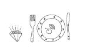

\

一般人或许认为，恋爱和性对于脸皮不够厚的人来说必定会困难重重。对于那些在自己身上过度强加表现压力的人来说，的确如此。除此之外，仅有一小部分害羞的人有恋爱方面的困难。能否找到适合自己的伴侣才是真正的挑战。

害羞的人生性敏感，因而更加需要与他人建立亲密关系。害羞的人常常对他们的恋爱关系要求更加强烈，导致他们恋爱起来很容易遭遇困难。

\

相比不害羞的人，或者和他人相处时不感到焦虑的人，害羞者们普遍晚婚。

——《英国心理学期刊》（British Journal of Psychiatry）

\

单身害羞者们，这里有一些“必做事项”，可以帮助你找到真正的另一半。那些看过我写的另一本书《人见人爱》的读者，可能会知道类似方法，不过在此也针对正在寻找真爱的害羞的人特别做出调整。我也将协助你发展属于你自己的恋爱渐进式暴露疗程，以使你在约会和交往过程中更加自信。

\
\

恋爱容易，深入却难

\

几年前，我和一位印度妇女阿斯塔一起在慈善活动中做志愿者。随着相处，我和她变得很亲密，我们经常待在一块儿，谈天说地，还包括她的性生活。

阿斯塔最近结婚了。我问她是怎么遇到她丈夫的，她告诉我说：“史蒂文和我是美术课的同学。他从来不和任何人说话。”她笑着说，“我觉得他是那种很可爱的人，于是有一天就对他说‘你好’。他没有说什么，但是我知道他感到很快乐。”

“在接下来的几堂课中，我们交谈过几次。后来莫迪利亚尼书展在我们镇上举办，我想去看，就问他要不要和我一起去。”

阿斯塔又笑着说：“他同意了。经过这件事后，我们开始约会。剩下的就不用说了。”她压低了声音，“虽然他在外人面前还是很害羞，但是他对一件事可不害羞。”她环顾周围，确定没有人在听后说道，“他简直难以置信！”毫无疑问，她说的是什么再清楚不过。

如果阿斯塔在当初没有主动，那么如今她和史蒂文便不会成为夫妇。

\

我觉得，如果我妻子不是那种主动类型的人，我们俩根本不会在一起。我们是经人介绍认识的。我和一个朋友一起打高尔夫，他的妻子和我现在的妻子在一起工作。我们第一次接吻完全是我妻子主动的。我深深地被她所吸引，如果她没有明确地说她喜欢我，我可能再也不敢打电话打扰她了。

——美国蒙大拿州大瀑布市的大卫

\

没有“保证”的爱

《精神疾病诊断和统计手册》（Diagnostic and Statistical Manual of Mental
Disorders）有心理学上的“圣经”之称，几乎被所有的精神科医师与心理学家视为至宝。有些专家这样称赞它：无论什么时候遇到困难，这本书总能给予必要的帮助。一页页翻过去，几乎所有心理学上的问题都能找到答案——诸如，为什么害羞的人寻找人生伴侣比普通人要困难得多。

\

害羞的人对潜在的拒绝、羞辱或丢脸之事高度敏感。除非获得非同寻常的保证，确保他人绝不会妄加批判或评论他们，否则这些社交逃避者绝不愿意进入社交场合。

——《精神疾病诊断和统计手册》

\

第一次约会时，你绝不会问对方：“如果有第二次约会的机会，你愿意保证爱我并且忠诚于我，直到永远吗？”然而这就是绝大多数害羞者潜意识中想要得到的保证。

当然，我们理智上都清楚，恋爱对害羞的人没有保障。不仅是对于害羞的人，对于富豪或名人也一样，尤其是对最后一类人更是如此。不过，实际上几乎所有害羞的人都有爱与被爱的能力，能与伴侣深爱，拥有终身幸福美满的生活。

\

给等待爱情的害羞者一个好消息

好消息是，当你找到另一半的时候，通常你会比那些不害羞的人投入更多。如果这样的恋情被小心呵护，并且双方都愿意接受这样的方式，很显然它将会带给双方多重欢乐，而这种愉悦往往是那些约会不断、恋爱经验丰富的大方的人所无法享受到的。

此外，假使你的恋情稳定美好，你的另一半也会更欣赏你心思敏锐的特质。

\

当（高度敏感）害羞的人最终找到一生中的伴侣，他们的配偶通常会非常欣赏其特质。害羞者的丈夫或妻子总是会这样描述他们的另一半：“谦虚的”“小心谨慎的”“有尊严的”“敏感的”“有礼貌的”“真诚的”。

——《羞怯：研究和治疗观点》

\

害羞者陷得又快又深

为什么害羞者的恋情会比普通人更浓烈？那是因为在他们的内心世界里，很多人都圈起了一个厚厚的保护环，当有人闯入那个环，就会被格外珍惜。有些害羞的人爱他们的伴侣甚至超过了爱他们自己。

为什么会更快坠入爱河呢？因为他们不常约会，只要喜欢的人回应他们，砰！他们立即陷入爱河。

这里有些你可能会问自己的问题。

\

⊙会不会由于我缺乏自信，所以渴望谈恋爱？

⊙我是不是会轻易爱上第一个对我说“我爱你”的人？

⊙我是不是有伴侣才感到生活充实？

⊙我会不会爱得太深，而让我的另一半感到窒息？

⊙会不会因为我太害羞，不敢陪同伴侣参加社交活动或者其他事情，从而使感情有所动摇？

⊙我会不会因为担心伴侣的安危，或者幻想另一半有可能出轨而焦虑不安？

\

如果你的答案绝大多数都是肯定的，那么你有一些功课要做了。首先，了解你自己有多脆弱，因为这对你的恋情有相当负面的影响。然后，集中精力来消灭不健康的思想。方法就如第二章中我们谈论过的、用来消灭其他毁灭性想法的方式一样。只有这样，你才可以轻松地实践以下“羞怯克星”，从而找到生命中理想的另一半。

\

> > > 羞怯克星第67招 给自己做一次情绪检查

> > > 追求爱情时，记得问问自己上面所列出来的严肃问题。肯定的答案可能是情感脆弱的症状。仔细斟酌这些问题——包括你的回答，因为害羞者更容易遇到这些问题。

\

简单回顾，我们发现，一个害羞的人更难找到一段好的恋情。而且，等你谈起恋爱，同样也存在着潜在危机。但若小心避开这些问题，你先前的焦虑不安会被双倍的快乐所取代。你会经历强烈而持久的恋情，这样的快乐是那些对恋情有把握的人永远都找不到的！

\

害羞同志的孤单寂寞

一个叫作保罗的读者提醒了我，其实很多同性恋者都是害羞、寂寞而又渴望爱情的。保罗，我要谢谢你的指教，也谢谢你这封深深打动人心的来信。

\

我极大地缺乏自信，这件事让我痛苦了很多年。我知道我必须提高自己的自信心。首先，我想告诉你，你的书和录像带改变了我的一生。我经常发现我很赞同你的观点，在你提供的经验和说明里，我会看见我本人的影子，以及我所存在的一些问题和曾经的错误。

然而，当我发现自己想要在那样的努力中提高自信心时，必须比你的其他读者花费更多心血。值得一提的是，我想让你考虑一下如何解决我所存在的问题，又如何向那些和我有相同处境的上百万读者交待。

如果你还没有猜到我是个同性恋的话，我会对你很惊讶的。我是一个42岁的男人，在生命的大半部分时间中都没有找到一个伴侣，也没有和许多人约会的经历。我知道许多人认为，大部分同性恋男人和别的同性恋男人相处时是没有大问题发生的。你甚至会有这样的印象：同性恋生活就是从一张床到另一张床之间，或者是从一个情人到另一个情人之间。但这对我们当中的大部分人来说都并非如此，特别是对那些老人们，以及那些不在大城市或在发展中农村长大的人。我大胆地猜想，即使只有10％的人是同性恋或双性恋，我们在如何寻找到一个好伴侣方面还是需要帮助的。

你的书和CD都很精彩，但它们是倾向于异性恋的。我理解那是因为你是异性恋并且你的大多数读者都是这样的缘故，我知道我不能要求你出版一系列关乎同性恋男人（或者是同性恋女人和别的性倾向者）的书。

但是，请考虑到让你的读者知道我们是一样的想法，而且因为同性恋的缘故，我们面临着更大的挑战。我知道我不是唯一害羞的同性恋，我们需要的帮助和其他人是一样的。尤其是那些生活在小镇和农村的同性恋男女，他们找不到可以或是愿意帮助自己的顾问或医生。很多同性恋认为他们自己是孤立而缺乏友谊的，涉及人际关系的时候，他们更需要帮助。

大多数我所知道的同性恋，还有在网上聊过的同性恋，不管他们是美国的还是世界其他地方的，都希望自己能够找到自己爱也爱自己的人。有些还想得到可以保持长久关系的情侣。我确信在美国我不是唯一一个不想孤独终老的同性恋男人。

——德克萨斯州达拉斯的保罗

\

我想要强调的是，尽管在本书中我使用了性别语言，但所有的羞怯克星同样也适用于同性之爱。英语是很麻烦的语言，所有的作家想表示通称时，都需要在“他”或“她”中选择一个来代表使用。我发现老是阅读那些“可能恋爱的情侣”变得越来越沉闷了。使用指明性别的词语，叙述会更为流畅。像“异性”这样的词语，有时候尽管使用得不很恰当，但它是我们的习惯用语。当我使用这些词语的时候，仅仅只是为了使语言更加简单明了。我希望语言能变得更切合我们每个人的需要——更甭提能让我们这些作者省点事了。

\
\

抬头向前看，爱情就出现

\

作为一个已经康复的害羞的人，现在我是一个顽强的人群观察者。不管是在飞机场、星巴克，还是在任何人口聚集的地方，我的眼睛都会像电子扫描器一样安静地扫视四周，并默默打量那些相互影响的人。令人难过的是，我几乎在几百个地方几百次地看见令人心碎的场景不断上演。

一个男人和一个女人的目光交织在一起。你几乎可以感觉到他们的心有灵犀。对他们来说，音乐声音在变大，而“我们的爱矢志不渝”这首电影插曲回荡在整个房间。

但是他很害羞，很快他的目光就移开了，假装自己对这些是没有兴趣的。她也很害羞，低头检查地板上的灰尘。大概过了30秒，她冒险抬头看他有没有在看她。哎，他的眼睛却是看往别处的。又过了30秒，吸了一口气后他终于鼓起勇气挺起胸膛，往她的方向偷瞄一眼——哎，她却已经离开了。

如果他们其中一个有与对方相视一笑的勇气，千百万类似这样的情景或许都会以幸福结尾。

\

哪怕只是看一眼有吸引力的女人，我都会吓呆。我知道如果我们相爱了，我会很容易在这段感情中受伤。她可以对我予取予求，而我只能听命并叫她别客气。我会完全失控。

因为这个原因，我不去看那些对我有吸引力的女人。我讨厌自己所做的，却又没有办法控制自己。一想到也许我会失去很多美好的恋情，我就恐慌不已。

——美国纽约州林登赫斯特市的唐

\

全因少了笑容

西方有段名言：一根马蹄钉断了，失去了马蹄铁。马蹄铁没了，倒下了战马。战马倒下了，摔伤了将军。将军没了，输掉了战争。战争输掉了，最后亡了国家。这一切的一切，都是由于少了一根小小的马蹄钉。

事实确实如此。因为缺少一个微笑，失去了一个聊天的机会。失去一个聊天的机会，便错过了一个约会。错过一个约会，导致错失一段爱情。因为错失一段爱情，两个人的快乐时光便成为泡影。而这一切仅仅是因为一个微笑的缺失。

微笑地说“你好”，可能改变你的一生。

对迷人的潜在对象微笑，是害羞者最大的挑战之一。一些单身者，无论害羞的人或是大方的人通常并不知道，当别人注意到你并被你吸引时，会想知道你是否愿意和他交流。甚至连一些大方的人也害怕被拒绝，所以你必须对潜在的对象微笑，让他知道你的答案是“是”。

\

男士专用

男士们，从你们这儿开始。你注意到自己喜欢的女性。你已经对着镜子练习过你的微笑，知道如何展露出你温暖而友好的笑意。现在，深吸一口气，放松脸部表情，对她展现你最好的一面。

请了解，万一女性移开目光，并不意味着她对你不感兴趣。自古以来，女性就被教导要眨眨眼睛，然后移开目光。对女性来说，这是调情的方式。

但是男士们不能移开目光。即使在描述人类起源的《失乐园》这幅名画中，亚当便是执着地凝视着夏娃的眼睛，但是夏娃假装移开目光——虽然她当时正在引诱亚当吃下禁果。

这几乎是自然的法则：当你的目光和女士接触时，女士就会端庄地(或策略性地)移开目光。害羞的人们，不要气馁，使用羞怯克星第9招，拒绝幻想被拒绝。就算被世界上最合适的单身汉瞥了一眼，女士们的眼睛仍会忙乱地看向地板。

现在有趣的部分来了。柏波博士（Timothy
Perper）长年研究人类求偶模式。单身酒吧就是他的实验室。他发现当女士对男士有兴趣的话，她会转移视线先看其他地方，然后在45秒内再抬起头看他。不仅如此，男士们还能从她们目光的转移方式来判断对方是否喜欢自己。

当她看你的时候，如果你的目光已经落在别处，萌芽的关系便会失败。相反，如果你继续看着她，当她第二次看你的时候，你送上温暖的微笑。我敢打赌，这次她的反应会更热情。

下一步，应该上前接近她，然后（切记，千万别用“把妹用语”）介绍自己，或者问她一些不冒犯的问题，开始闲聊。

\

> > > 羞怯克星第68招 男士们，对迷人的女性微笑两次\

> > > 对吸引你的女士微笑——而且要笑两次！要知道她们从坐在爸爸腿上撒娇时起，就被训练当男士微笑着看她的时候，要腼腆地移开目光。除非女士一点也不感兴趣，否则她不仅欢迎，而且期待你的第二次微笑。

\

女士专用

害羞的女士们，虽然现在是21世纪，但是很多女士仍然相信必须由男士在交往中迈出第一步。这种观点大错特错。在“女性的非语言求偶模式：情境与结果”（Nonverbal
Courtship Patterns in Women：Context and
Consequences）研究中，研究人员借由隐藏在天花板的摄像机拍摄了一场单身聚会。事后观看录像带，他们发现男士一般不主动接近女士，除非女士给他们微妙的非语言邀请。最常见的信号是什么？其实就是一个简单的微笑。

这些发现令研究者感到既惊讶又着迷，随后，研究人员调查了数百对稳定交往和已婚的男女。更让他们惊讶的是，受访的情侣与夫妇中，居然有三分之二是女士先对男士微笑，发出更明显的暗号，或是女士先开口说话。换言之，是女方采取主动权。

当然，对喜欢的对象微笑并不容易。但是，不必担心，因为他的男性自尊心，可能使他忘记是你用非语言暗号诱惑他。他会把功劳都算在自己身上。

\

> > > 羞怯克星第69招 女士们，对迷人的男性先微笑

> > > 对你看到的每一位迷人的男性微笑。这样你会进步得更快。如此一来，当你遇到能使你心头小鹿乱撞的男士时，你就不会手足无措了。你要用“来，快到这里来”的微笑诱惑他，吸引他乖乖就范。

\

当我碰到喜欢的男性时，我的害羞变得更严重。我暗恋健身房的两个男生，但是从来不敢正眼看他们或者与他们讲话。我甚至去书店找如何和他们调情或攀谈的书。我做了研究，然后选好一天去和他们聊天。那天到来的时候，我却什么话也说不出来。我还是无法克服严重的羞怯感，我吓坏了。我很难过，又气自己没勇气和他们讲话，就跑回家哭……而且是大哭一场。

——美国堪萨斯州托贝卡市的迪娜

\

让人无法拒绝的爱之眼神

有一件事情是毋庸置疑的。缺乏眼神的交流，爱情和欲望就难以滋长。有一点目光交流，可能性稍微大一些。注视的时间更长，可以极大地增加成功的机会。

首先，关于长时间目光接触对于爱情的重要性，你必须对此把持绝对的信心。《视线与爱情：目光交流对浪漫爱情的影响》（Looking
and Loving：The Effects of Mutual Gaze on Feelings of Romantic
love）这项研究证明，男女在闲聊时若能长时间彼此凝望，喜爱的感觉会比那些缺少目光交流的人更加强烈。

这是为什么呢？人类学家海伦・费希尔（Helen
Fisher）告诉我们，这是动物的本能。顽强的目光接触会催生出类似恐惧的高度情绪反应。当你以热切的眼神直视某人的眼睛，他体内会分泌一种类似于肾上腺素的化学物质，这种感觉就像堕入爱河一样。

研究爱情的心理学家常用著名心理学家鲁宾（Zick
Rubin）发明的量表来衡量人们彼此之间感情的深度。鲁宾在一项名为“浪漫爱情测量法”（Measurement
of Romantic
Love）的研究中发现，处在热恋当中的男女相互凝视的时间比普通人要长。当两个陌生人交谈时，他们彼此注视的时间只占整个过程的30%～60%，而自信又自在的恋人对望的时间则增加到75%。

我不能保证一开始用眼神调情会很容易。但是，假如（而且只有）你掌握了目光接触练习的精髓，即羞怯克星第22、23和24招，就不会再害怕。如果你尚未熟练掌握那些技巧，就先回头补习到得心应手为止。不然，你就得冒着调情失败的危险，甚至深感受挫。

如果你觉得眼神接触很困难，一定要使用羞怯克星第26招。当你注视对方眼睛时，在心里默默地说“我喜欢你”。

“我是真的、真的、真的、真的、真的、真的喜欢你。”

现在你要重新开始。接下来的羞怯克星能让你的双眼变得诱人、性感。虽然它适用于男女双方，但若被男士用在女士身上时，这个方法会更加有效。

当问候喜欢的异性时，把无声的“我喜欢你”延长为“我真的喜欢你。”

然后，“我真的、真的喜欢你。”

然后，“我真的、真的、真的喜欢你。”

然后，“我真的、真的、真的、真的喜欢你。”

当你重复说六遍“真的”时，你已经完成了很性感的眼神交流。你可以从对方稍微有点紧张却又兴奋的反应中得到答案。

那些额外的目光交流即使无声也很有用。不论是隔着房间凝望可能的对象，还是轻松地闲谈，延长的目光交流都能让你散发出不容小觑的浪漫讯息。

\

> > > 羞怯克星第70招 使用“真的、真的、真的、真的”目光技巧\

> > > 为了帮助自己对潜在的特殊对象延长目光的交流，在心里无声地说“我真的喜欢你”，然后“我真的、真的喜欢你”，一直重复六遍。很快你就能对着以往让你喉头发痒像砂纸、手心出汗像水龙头一样的男士或女士，施展出性感的眼神。

> > > 一旦你有了交往的对象，把“喜欢”变成“爱”。你能想象当你注视着恋人，并在心里默默地说“我爱你。我真的、真的、真的、真的、真的、真的爱你”时，对方会受到多大的震撼吗？

\
\

爱情演习

\

适者生存的爱情世界

众所周知，爱情的领域相当无情。连大方的人士都会说，爱情世界里也是适者生存。请回答下面这些难解的问题。

男士们，漂亮女人与“容貌具有挑战性”女人的区别是什么？

回答：一个美，一个不美。

女士们，王子与青蛙的区别是什么？

回答：一个是王子，一个是青蛙。

这一个问题要双方共同回答：为什么你跟前者约会会紧张，跟后者却不会？

回答：因为我们假设那些有魅力的、合意的人是不一样的。但事实并非如此。

男性特别容易认为漂亮的女性是稀有物种。完全错误。我曾在泛美航空与一大群美丽的空姐一起工作，也曾短时间地做过模特，我知道事实绝非如此。每个人内心都是孤独的，都渴望找到理想的对象。

在世界的任何角落，漂亮女人总能把雄壮威武的男人变得像口吃的笨八爪鱼。一位住在莫斯科的商人在写给我的信中这样描述。

\

我必须承认，通常我对女人很有自信。不过我对公司附近鞋店里的一位美丽女店员产生了兴趣。每天晚上我回家时，总能隔着玻璃窗看到她。有时候她朝我微笑，而我总是想：当我最终见到她时，我该说些什么呢？我准备好诗情画意的开场白，罗密欧式的浪漫接触，还有李奥纳多般迷人的眼神。我想象着她的反应，以及我该如何圆滑地把话题带到邀她出去约会上。当然这一切看似完美，直到我真的走进店里问候她。我讲话磕磕绊绊，手心冒汗，每个单词都不可思议地失去了音节。我满脸通红，还把她店里陈列的所有女士鞋子都打落在地。我落荒而逃，此后总是绕道而行，以免再经过她的店。

——俄罗斯莫斯科市的波利斯

该怎样在心仪的对象面前表现得更自若呢？你可以在那些“浪漫无感者”身上演练。

\

勤约会，补技巧

亲爱的读者，如果以下技巧听起来有些无情，还请见谅。男士们，这世上有很多你不感兴趣却很想和你出去约会的女性。很简单，你只需要睁开眼睛，看看哪些女性正在对你微笑，哪些女性过来和你说话——简言之，如果你约这些女士出去，她们会说：“好！”

然后选一位幸运的女性，下星期就回报她的青睐。带她去一个优雅的餐馆，讲一些赞美她的话，并且问问她的生活。抓住机会练习——品尝美酒，为她披上外套，让她挽着你的手臂上车。这不仅是能为约会一个出色的人而做练习，还能为平凡的女性创造美好的回忆。

当然了，这就是逐渐接触越来越心仪女性的渐进式暴露疗法。毫无疑问，当有一天你能获得心仪女士的青睐时，便能更自如地施展魅力。

同样，女士们，有一些人你并不想选择作为生活伴侣，但是你可以给他们一些生活调剂，把其中一些人作为“练习约会”的对象约出去。如果他们不主动约你，你就约他们。之后的老规矩就很清楚了。

接下来，对那些稍感恐怖一点的人微笑与调情。重复这样的行为，直到你最终能与“最抢手男性”自在相处为止。

这里只请求你一件事。请温柔地对待你的“垫脚石约会”。享受你们在一起的时光，即使你把这看成一种练习，但当你准备往下一阶段前进的时候，也要体谅对方的心情与感受。

\

一直以来，好像只有讨厌鬼才会邀请我出去，但是我不想和他们一起浪费时间。我真的觉得我值得更好的人。不管怎么说，我暗恋一个叫卡尔的人，尽管我们很少交谈过。我们在同一幢大楼工作，他在18楼，我在20楼。我觉得他也喜欢我，因为不论什么时候看见我，他都会对我笑。有一次，当我正搭电梯下楼时，卡尔碰巧走进来，我却不知道该和他说些什么。我工作的楼层很高，所以电梯下楼需要很长一段时间。那一刻，感觉时间漫长得好像没有尽头。他微笑着对我说：“你今天很安静。”我很讨厌别人这么说。

我只是低着头盯着地板，然后他说：“你害羞吗？”我想说“不”，但是我太紧张了，以至于我无法开口。然后他说，他的朋友还有他们的女朋友准备在周末去看球赛，问我是否愿意和他一起去。我很想说“愿意”，但是我从没去看过足球赛，我不知道该怎么来表达。就在那时电梯刚好到达一楼，我不敢相信我竟然就这样跑出了电梯门。这件事太糟糕了——我再也不敢面对他，而他也不再对我微笑了。

——美国德拉瓦州士麦那市的罗芮

\

罗芮，看起来，你应该可以和几位你所谓的“讨厌鬼”一起去看一场足球赛，先积累一些经验。就算是青蛙也懂美式足球的。学习如何跳上跳下，以及怎样为支持的球队呐喊尖叫，可能就会让你有足够的自信答应卡尔的邀请。

\

> > > 羞怯克星第71招 练习约会\

> > > 开始和一些你不害怕或者并不吸引你的人约会。学习适应主动交谈、邀请或暗示对方，注重着装打扮、谈心、调情、跳舞、点餐甚至弄清楚怎么使用刀叉。如果持续练习，等到和你心仪的另一半出去时，以前所有令人害怕的事情都会变得简单很多。

\

提醒和祝福

在此能给你一些提醒和祝福吗？其实它们是一体两面的。

首先，是提醒。假如你真的觉得你练习约会的对象不适合你，千万不要因为方便而“将就”。

接下来是祝福。可能你会爱上其中一个“垫脚石”。一个爱你、欣赏你，让你感觉自己很好的理想伴侣。不要忽视这个未经雕琢的钻石。与其继续孤单一人找寻不可能的美梦，不如和这个对象幸福美满地相伴一生。

\
\

网络约会：机会还是陷阱

\

我们很幸运能生活在如此刺激的年代。通过神奇的网络世界，你能在网络上找到志趣相投的人。可惜的是，这会让身为害羞者的你无法与人面对面相处。

通过神奇的网络世界，你能远距离办公。可惜的是，这会让身为害羞者的你错过和同事在茶水间闲聊的机会。

通过神奇的网络世界，你可以在网上了解各种各样的资讯。可惜的是，身为害羞者的你根本不需要社交技巧，便能遨游于广阔的虚拟空间。

\

当我用电子邮件与别人交流时，我一点也不害羞。过去三年来，我已经和许多很棒的男生通过网络联系。我可以从容地整理好想法，作出修正，然后反复阅读，以确定信件内容就是我想说的话。这样，别人就能了解真正的我，而我也能了解真正的他。

——美国马萨诸塞州北安普顿市的莎拉

\

真的吗，莎拉？当你与别人面对面交谈时，你不可能花五分钟的时间去想，再作出回答。在讨论时也不能像打电脑一样按删除或退格键。而且，个性与“来电的感觉”在网络世界也无法传达得透彻。

另外，与你通信的那些“很棒的男生”，所呈现的也许未必就是他们的真面目。每一个写信给你的高大帅气、杰出不凡、正直体面又痴心多情的男性，真的高大帅气、杰出不凡、正直体面又痴心多情吗？

我回信问莎拉，那些“很棒的男生”事实上究竟如何。她说从未见过他们。嗯……

\

对浪漫情怀害羞者的一点提醒

许多终身情谊始于小小的电脑屏幕，想必你应该很清楚其中的过程。刊登或回应交友信息，通过电脑沟通，交换照片，开始通电话，安排见面，约会交往，稳定发展，步入礼堂。

可惜，害羞者无法在网络爱情游戏上做到如他们所期待的那样。他们常会躲在网络的另一端，从来不敢与网友见面。就算他们真的鼓起勇气与对方见了面，如果没有想象中的那么顺利，他们便会坠入更深一层的羞怯深渊。其实，这种情况甚至会动摇大方者的自信心。

我的一位好朋友安，人长得漂亮、专业、聪明、穿衣极具品位——她也深知自己的优势。因为尚未找到她的白马王子，安在交友网站发布了个人信息。她收到数十位男士的回复，写信给其中六位，与三位交换照片，最后只同意与两位见面。

第一次约会是在一家知名的餐厅。她与网友约在晚上7点。她事前告诉对方，她会身穿黄色长裤套装、脖子上围橘色长围巾，这样他们就不会相互错过对方。

安准时赴约，并坐在吧台等候。等待过程中，她觉得有好几个经过的男人长得很像约会对象给她的照片，但她又不敢肯定。

她等到7点45分，付了饮料的钱后独自离开了。

8点钟时，我的电话铃声大作。隔着电话，安几乎歇斯底里地说：“那是我这辈子第一次被别人放鸽子！”安平常是很有自信的，但当我听到她说：“莉儿，他一定去了，可是看了我一眼后，就决定不认识也罢。”我知道她的自尊心受到了重创。

如果第一次还没有过于伤害她的自尊，她的第二次网络约会再次以失败告终。她在网上认识了一位医生，约好在一家餐厅见面。上饭前酒时，对方告诉她，医院有急诊病患，他必须得离开。

“他和我道歉，”安描述当时的状况，“然后说，他会‘处理好’我晚饭的账单。真是太侮辱人了！难道他以为我是乞丐吗？我知道他不喜欢我，所以便想付账走人。”

假使安没有健康的自我形象，这些失败经验恐怕早已彻底打垮她的自信了。

别在自信尚未成熟前，就让它处于被打击的境地。多练习一下调情和练习约会的羞怯克星，再开始尝试跨入虚拟的网络世界去寻找爱情。

\

> > > 羞怯克星第72招 网络交友是大方者的游戏

> > > 网络交友有一定风险。当你只与对方通电子邮件时，或许感觉轻松有趣。但等到真的见面后，情路可能就会危机四伏。一旦被对方拒绝，你的自尊心将会大大受挫。

\

当你变成一个大方的人之后，对于交往对象再无情的攻击，你都能像鸭子被水枪打到背上一样，轻松自若地把水拨开，不受干扰地继续划行。至于目前的阶段，在你按下“发送信件”之前，先仔细衡量网络交友的利弊得失。等你拿到本书的战胜羞怯学位之后，你将有很多时间享受这些新的约会类型。

\
\

选择志趣相投的人

\

有句老话叫“异性相吸”，但这只能维持很短的一段时间，物以类聚才能确保一段感情的长久。所有寻找真爱的人应该在报刊和网络上寻找与自己志趣相同的人，对害羞者来说，这点更为重要。让我们想想这其中的益处：\

1.和别人探讨共同的兴趣，可以更容易开始一段对话，并且可以拉近两个人的距离。

2.当你们有共同的话题时，相约一起参加共同感兴趣的活动会变得更加自然。

3.你不必担心别人以为你参加活动只是想要寻找另一半。是共同的兴趣让你们相互吸引。

\

爱意在蘑菇中都能滋长

几年前，我去一所大学做演讲。演讲结束后，我参加了一个教师聚餐会。我们坐在学校的草坪上聊天，吃汉堡。我注意到一个40岁左右的男人整个下午一直独坐在角落，于是在和一个老师聊天时问了他的身份。

“哦，那个是华格纳教授。”她回答，“是生物系的主任，他很和蔼，但是很害羞，很少和别人交谈，只有站在讲台上讲述他所擅长的知识领域，才会是他最自在的时候。”她笑着说，“他谈起有关蘑菇的话题就会停不下来。”

我想要认识一下这位害羞的绅士，于是就向他介绍了自己。从他的态度看来，他的确非常羞涩。

“嗯，特纳教授告诉我你是教蘑菇课程的。”我开始了对话。

“嗯……是的。”他踌躇着回答。

“我也对蘑菇有兴趣。”我对他说了谎话，“可以和我聊聊你的课吗？”

刚开始他慢慢地说着，没多久，正如那位老师所说的，话匣子一打开他便滔滔不绝了。他开始说着松茸、鸡油菌、牛肝菌等一系列我觉得是蘑菇学名的东西，我在这段独白中唯一的贡献是问了一句“如何区分蘑菇是否有毒”。

这个问题让我泄了底。很明显，我是一个蘑菇门外汉。他微笑着又回到了他一直的羞涩中，在一段很长的沉默之后他说：“我很害羞，希望你见谅。”然后给了我一个害羞者典型的“请原谅我占了地球那么多空间”的眼神。

我告诉他我正在写一本有关蘑菇的书，并且希望可以和他多聊一会儿。他很谨慎地答应了我的请求，接下来却只用单音节词回答我的大部分问题。

我把这次对话延伸到他的私人生活。他告诉我他42岁，想结婚生子，想成立一个家庭，但他太害羞，所以从来没有和女性约会过，并且他身边的女性也不多。他又说：“现在对我来说，谈论结婚已经太晚了，其他的教授都有孩子了，有的已经成年了。”

“华格纳先生，这里有蘑菇俱乐部吗？我是指一个蘑菇团，一个蘑菇协会，就是所有喜欢蘑菇的人聚在一起的地方？从生物学方面来讲，我指的是，不仅是喜欢吃蘑菇而已。”

毫无疑问，他迷惑地看着我。“嗯……我想有吧。但是我在这里面学不到什么东西，因为，嗯，他们和我知道的差不多。”

他没有明白我的意思。“华格纳教授，”我冒昧地说，“我可以给你一个建议吗？”他点头，“我认为你会很开心见到和你一样喜欢蘑菇的人，如果你可以和他们分享你知道的知识，他们一定会很感激你的，你可以分享知识而不是接受知识，我非常建议你去。”

正在这时，天空下起了毛毛细雨，这意味着野餐即将结束，是该说再见的时候了。

华格纳教授没有听懂我建议他去参加这样聚会的暗示，这让我有点难过。我想到一位从西弗吉尼亚州写信给我的害羞女士，说她自己很喜欢红酒，只有在谈论红酒的聚会上她才会觉得很自在。我本来还希望华格纳教授也能开心地和他的蘑菇迷相处。

\

共同爱好的惊喜

几年过去了，那所大学再次邀请我去演讲。演讲完之后，我问了工作人员华格纳教授的情况，并请她代我向他问好。

“我把号码给你吧，”她看着教职员通讯录说，“你可以打他家里的电话。”

我拨了他家的电话号码，是一个女士接的。她的嗓音很甜美，虽然听不大清楚。我请她让华格纳教授接电话。接着我听到她温柔地说：“麦克，亲爱的，找你的。”

他很高兴我给他打来电话。我尽量使自己不显得很八卦地问道：“那位女士的声音真好听，是你的亲戚吗？”

“是的，她是我的妻子，她很好。哦，对不起，莉儿，我应该先打给你的。在几年前我们交流过后，我仔细想了你说的话，并且参加了当地的蘑菇爱好者协会。在那里我认识了珊德拉，我们认识很久之后才敢和对方说话。她很害羞，但在一次蘑菇采摘之后我们走近了。我们有如此多的共同点……”

华格纳教授和珊德拉都对蘑菇有共同的热情。令人开心的是，他们现在对对方也有很大的热情。

\

> > > 羞怯克星第73招 结交一些志同道合者\

> > > 在网络搜索引擎上输入你的爱好。用一些词如“俱乐部”“社团”“组织”或者“活动”等来缩小查询范围，加入你所在地的名字，做进一步的筛选。如此一来，你会找到很多在你周边的志同道合的朋友。

> > > 找出这些团体有什么活动，然后去参加。不然，你永远不会结识与你有共同兴趣的人。直到今天，我还会幻想华格纳教授和珊德拉深情对望，讨论孢子的散播模式（菌类植物的性生活）。

\
\

帮你“更上一层楼”的约会小招式

\

当你已能很轻松地用深远的眼神注视着可能的另一半时，以下这个更火辣的招数就是为你准备的。

当两人已陷入爱河时，会发生一个很有意思的现象。当他们看着对方的眼睛时，一种梦幻的感觉会随之而生。即使他们被迫移开目光，他们的视线也不会离爱人太远。

\

送给害羞男的浪漫小招式

如果你觉得很难长时间注视迷人女士的双眼，尝试着“绕道走”。当你不得不移开目光时，也不要让自己的视线离她太远。尤其是不要看着她的背后，或者假装看着其他地方。你可以短暂地不看她的双眼，但目光要继续停留在她脸上。如果你总是面带充满温暖与欣赏的表情，就能格外取悦女性。

\

> > > 羞怯克星第74招 男士们，让目光在她脸上游走

> > > 男士们，在你必须暂时停止凝视心仪女士的眼睛时，不要看着离她太远的地方。视线尽量停留在她脸上。先看着她的脸颊，往下是她的嘴唇，之后再回到她的双眼。当你觉得更有自信后，可以接下来注视她的脖子和肩膀——但千万别再往下看！（当然，在你们成为情侣之后又另当别论了。）

\

送给害羞女的浪漫小招式

害羞女士同样也能使眼神更火辣起来。高度自信的女士经常使用这个淘气（又很有效）的小招数。当彼此的眼神交流停止后，她会看向他的胸前，注视着他的身体，然后再次看着他的眼睛，并给他一个赞许的微笑。

害羞女士，当你觉得自己有些自信了，就可以尝试一些更具灵巧性的形式。在与他交谈时，你只要在他的胸前部位看一会儿就行了，紧接着用一个微笑让他知道你很满意你所看到的。在这种情况下，你的微笑即使显得有些害羞也没关系，因为那表示你对刚才的行为有少许的“罪恶感”。而从他鼓起那被你默默欣赏过的胸腔的行为中，你会立刻看到他对你的正面回应。

\

> > > 羞怯克星第75招 女士们，视线稍微往下飘移\

> > > 女士们，让你的眼神在他身上稍稍往下游走一点。不看他眼睛的时候，短暂地注视他的胸前。接着重新看向他的眼睛。他将会很享受你的视线移动路线。

\

不用说，男士们，千万不要把这个小招式用在女士身上。如果不想被人认为是色狼的话，视线最多只能到女性的颈部而已。

\
\

适合害羞者的诱人服饰

\

现在我们聊聊当你寻找另一半时，应该穿着何种猎艳装。当然，绝对不能穿那些中性的衣服。

女士们，可能因为你们喜欢穿着优雅高贵的男士，就认为他们会喜欢你们穿名牌服装。然而事实并非如此。男性更易被那些穿着性感的女性所吸引。

男士们，或许因为你们喜欢穿着性感的女性，便认为她们会被你的无袖衬衣和紧身牛仔裤所征服。然而事实也并非如此。绝大多数女性更喜欢质量上乘、颜色协调及剪裁合身的服装。

这个道理并不仅仅是推测。发表在《性行为档案》（Archives of Sexual
Behavior）的一项研究表明，只要女性穿着性感迷人，穿什么对男性而言差别不大。相反，女性则更容易被穿着高贵、搭配协调的男士所吸引。

说到这里，希望你已经把那些灰暗的衣服扔到一边，每天都穿上那些引人注目的衣服。如果还没达到这一境界，那就温习一下羞怯克星第35招“丢弃沉闷的服饰”。当你养成穿衣就是为了吸引别人眼球的习惯时，再回到这一章来继续学习“通过穿衣来追寻爱情”。

\

展现你傲人的魅力

女士们，大部分男性都无法区别名牌服饰与大甩卖服饰——他们并不在乎其中的差别，但是，他们能凭直觉迅速地捕捉到女性裸露的皮肤——这边的乳沟，那边的细腿，都会被马上锁定。

当然，你肯定不想看起来像个交际花，所以有必要计划一下小露性感。比如，在保守的外套里穿件性感衬衫。如此隔着桌子聊天时，外套“一不小心”打开，嗯哼，你的傲人资本“一不小心”就露出来啦。

这种方法也可以用于长度适当的裙装。当你看见一位绅士时，如果裙子恰好撩高了一点，也没有人会怪你不检点。

千万别误解。这里绝非是叫你去伤风败俗，只是要你更具风情。

刚开始时，要你吸引别人注意是件很苦恼的事，但也必定会有益处。它不仅能帮助你吸引男性，也能让你更加欣赏自己的身体。

\

> > > 羞怯克星第76招 女士们，打扮得大胆点

> > > 要让一个害羞的女士去吸引别人的注意，这无疑是她所要面对的最大挑战之一。但请如此想想，当你锻炼时，穿运动裤；当你打网球时，穿网球裙；当你骑马时，穿骑马裤。那么，当你追求爱情时，也应该穿些有暗示性的衣服。当然不能违背自己的原则，但在适当的时候还是可以打扮得更性感一点。

\

男士们，袒胸露背好吗？

通常情况下，还是算了吧。或许你认为展现自己的身材更能吸引女性。事实可能并不是这样的。当你正在追寻爱情时，千万记得要把那些无袖衬衣和紧身牛仔裤藏好。

女性对你的穿着是十分重视的。每当我告诉研究班中的人，女性对男性穿着的重视程度高于男性对女性穿着的重视程度时，大家都十分惊讶。

“为什么？”或许你会问，“女性真的就这么重视我所穿的？”因为，绅士们，这取决于她的基因的缘故。

“她的什么？”

她的基因——也就是说，她从直觉上想了解你是不是一个值得托付终身以及能照顾未来孩子的人。当然，这是潜意识中产生的，但是，服装搭配协调能展现出一个人具有细心与洞察力的特质。而高档材质则说明你具有一定的经济实力。

\

> > > 羞怯克星第77招 男士们，穿着要注重品质和搭配协调

> > > 衣服要追求质量而非数量。女性往往善于观察穿着打扮。记得拉上家中姐妹或老妈陪你一起去购物。

> > > 买一些高档的衬衣、裤子和鞋子。如果你工作需要穿正装，即使是花了全部积蓄也要买一套高品质、持久耐穿的西装。千万要注意色彩搭配——穿黑长裤就搭配棕色皮带或皮鞋。还有，记得要穿长袜，以免一坐下就露出了毛毛腿（这才是最可怕的）。

\
\

过于放纵，也是羞怯作祟

\

有一次我回到家乡，碰见了读高中时住在我家对面的琳达。我们很愉快地在一起聊以前那些邻居，还有我们课余打工时曾经照顾过的婴儿。琳达有个很漂亮的妹妹叫凯罗琳。我在高中时就常听琳达说，凯罗琳约会到凌晨才回家。我随口问琳达：“凯罗琳怎么样？她还是住在华士大吗？”

琳达的神情变得暗淡下来，“在那附近，”琳达说道，接着还说到华盛顿特区近郊一个不太好的地方。

琳达无精打采，很气馁，显然我应该换个话题，“你妈妈怎么样了？她还好吗？”

“她很好，但是……凯罗琳不是很好。”我没有说话，意识到琳达想要跟我谈谈凯罗琳的事。

她从她的钱包里拿出一张照片，照片上是凯罗琳，一个男人，还有三个小孩。“凯罗琳现在跟另外一个男人住在一起。”我简直不敢相信她们是同一个人，照片上的她看起来比我跟琳达的年龄加起来还要老。

“哦，孩子很可爱。”我想不出我还能说点别的什么。

“他们的爸爸都是不同的男人。我知道你在想什么，莉儿。”

确实是这样。“这是怎么一回事？”

“她冰雪聪明，人也长得漂亮。”

“她真的很漂亮，也很受欢迎，很多人约她。”

“很多很多。但是她从来都不会拒绝约她的人，就算只见过一次。”琳达苦笑，“我想她是不会说不的女孩。”

\

太过放纵，还是自信不足

“我不明白，”我说，“她是太过放纵吗？”

“不是，她只是不自信。其实她跟我说过，她不喜欢这样，甚至是做爱的过程。她太害羞了，所以不敢拒绝这些男人。她怕万一拒绝了他们，他们会来找她麻烦。所以她就答应他们所有的要求。”

“我想她是觉得自己没用，以为一定要这样做才能找到人爱她。她误把性当作了爱。”

健康的爱通常会通过性达到高潮。但是，别让寂寞蒙蔽你的双眼，它会让你明白其实不是这么一回事。所有人在面对性时都应该谨慎地想一想，尤其是容易害羞的人。

\

> > > 羞怯克星第78招 不要被性爱迷惑\

> > > 害羞的人一般比其他人更敏感。同时，也因为如此，他们比其他人更脆弱，更容易受伤。性爱是男女之间很重要的一步，而你现在最不需要的就是心碎。在与别人上床翻云覆雨之前，一定要先擦亮眼睛看仔细。

\

怎么知道他是否适合你呢？通常来说这很复杂，而且需要一个很长的过程去了解。从深入去了解这个人，同时也让他慢慢了解你开始。在有进一步发展前，你要确定他是喜欢并尊重你的。

害羞的男士，对你而言也是如此。当然只有你自己最有资格进行判断，但是因为你比其他人敏感，等到彼此感觉对了再发生性关系也不迟。

\

害羞的小妹妹，还是学校浪女

琳达伤心地看着她妹妹的照片。“她是学校里出了名的浪女，没有一个女孩愿意被看见和她一起，那些男人也是。他们想在晚上的时候和她上床，但在学校的时候就不和她说话。但他们还是会去接她，带她到他们的地盘，和她做爱，事后又把她带回去。有时候他们甚至让她自己坐公交车回家。”

“可是她是多么甜美乖巧的一个女孩……”

\

第11章

和家人一起面对害羞

\

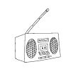

\

为什么是我？为什么我会这么害羞？我是生来就这样吗？是什么导致的？我的父母？住在同一街道的那些坏小孩？我的老师？曾祖母？还是说是上帝的意思——世上总得有人害羞，而我就是被选中的那个？

以上所有的原因都有可能（当然除了最后一个）。羞怯有具体的原因。每个人的害羞原因都是不同的。请继续读下去，探寻造成你羞怯的原因，以及可以改变你现状的方法。如果你已经为人父母，这里也可以教你一些技巧，帮助你衡量孩子害羞的风险，以及协助他们克服羞怯的方法。

\
\

是否生性害羞？

\

的确，有些人“生性害羞”，或者说与他人相比，他们更容易害羞。但是基因无法决定命运，而且实际上也不存在什么“害羞基因”。科学家们也不可能边看显微镜边说：“啊哈，有点小问题，此人有害羞基因。”但是，确实有20%～30%的婴儿一生下来，由于脑内带有的一种化学物质，导致他们更有可能成为害羞的人。

为人父母者，如果你的孩子是个容易害羞的敏感宝宝，那么在早期便会出现相应的症状。在宝宝出生一个月后，父母就能判断出他是否属于那种类似害羞虫一样喜欢寄居的新生儿。

研究表明，有些新生儿具有很高的害羞倾向。在一项指标性的实验中，两位世界顶级的研究羞怯的学者把400个刚满月的婴儿带进了实验室。他们在每张婴儿床上放置了一个模样可怕的玩具，以及沾染了恶臭酒精味的棉花棒，并用录音带播放陌生人的声音。

大约三分之一的宝宝吓坏了，挥着他们的小手小脚又哭又闹。惊吓过后，他们还紧紧抓住父母不放。几年过后，学者们发现那些特殊的宝宝变得十分害羞。本书将这种类型的害羞者称为“高度敏感害羞者”（Highly
Sensitive Shy），简称为“高敏者”。

相反，剩余三分之二的宝宝对此毫不在意。他们只是简单地把可怕的玩具和恶臭的棉花棒推开，然后对发出的陌生人声音感到新奇甚至微笑。

研究者的假设得到了证实。

\

大约三分之一婴儿受到体内化学物质的影响，对不熟悉的事和人格外敏感，因而也更有可能变得害羞。

——《科学》

（Science）

\

模拟“摇篮实验”

新生儿的父母们，你们可以重复这个实验，来了解你们宝宝的害羞倾向。

实验需要哪些器材呢？

1.一个古怪的玩具——比如一个丑陋的黑色橡胶蜘蛛。

2.一个臭东西。（当然，宝宝自己的臭尿布不行。因为他们每天都在闻，已经习惯这个味道了。）

3.邮递员、隔壁邻居，或者任何一个宝宝从未见过的人。

\

第一步：在婴儿床上面挥动恐怖的玩具。观察宝宝的反应。

第二步：在宝宝的鼻前晃动臭东西。观察宝宝的反应。

第三步：让陌生人对宝宝说“咕叽咕叽咕”。观察宝宝的反应。

敏感的宝宝会对这些新的刺激做出较为强烈的反应，但那些没有害羞倾向的宝宝则会用婴儿语说“啐”，然后把东西推开。

\

我们的女儿在婴儿时期就非常敏感，除了爸爸妈妈以外她不愿意让别人抱（甚至有的时候连爸爸也不能享有这个权利）。那是一段烦恼的时光。在刚开始时，她可能只是心思缜密，但是当她到了进幼儿园的年龄，这份敏感就变成了所谓的“害羞”。当她看见陌生人的时候不敢正视他们的眼睛，也不敢和他们说话，她甚至宁愿躲到爸爸妈妈的腿后，也不愿和人交流。

——加拿大卑诗省温哥华市的史蒂夫

\

> > > 羞怯克星第79招 做摇篮实验\

> > > 为人父母者：通过观察孩子的行为来判断他是否具有害羞倾向。如果你的宝宝对新的刺激反应强烈，长大后他极有可能变得十分害羞(不过，别担心，你可以通过本章中的羞怯克星来帮助他克服害羞)。你的孩子若是对此怡然自得，他就不太可能是个生性害羞的人。

> > > 害羞者：想知道你是否从小就敏感并具有害羞倾向，问问你的父母或者监护人，你在摇篮时期对于新的刺激反应如何。

\

对于认真的学者来说，实验远未结束。时隔四年之后，他们把400个被研究的小朋友带回了实验室。果然，大部分当时被测出高度敏感的宝宝已经显现出初期的害羞症状。

大约一半的高度敏感宝宝在进入青春期后变得极为腼腆。

\

我女儿是个心理学家所谓的“慢热型”的人。她在不熟悉的人面前会很害羞，但最终她会适应并向他们敞开心扉，因此人们觉得她只是害羞而已。实际上还有着更深层的东西。这已经影响到她生活的各个方面。如果她对某一情况很不熟悉，就算是最小的事情也会令她极度焦虑。例如，在她四年级的时候，她的班级到州政府进行校外教学。即使她从幼儿园时期开始便和这些孩子一起上学，甚至多次带他们到家里的马场来玩，但是她从来没有去过州政府，因而感到不知所措。在去之前的那个晚上，她不仅难以入睡，甚至产生恶心想吐等症状。

——加拿大卑诗省温哥华市的史蒂夫

\

天生内向，还是高度敏感害羞型

不幸的是，高度敏感害羞的人经常认为自己有问题，他们不是“看看我”的类型。如果你是高度敏感型的人，你的大脑运作方式会与性格外向者有一定的区别。你的思想更为深沉。你需要更多的时间去处理信息。你会认真聆听，通常说话的速度也比较慢。

美国人喜欢言行乖张的广播与电视人物。选举时，我们往往投票给性格外向的政治人物。我们喜欢疯狂的摇滚乐团，欣赏衣不蔽体、搔首弄姿的女孩，还成群结队地涌向剧院看夸大不实的电影明星，然后熬到半夜去看他们出席奥斯卡颁奖。

令人遗憾的是，西方世界并不像偏爱外向者一样认可或奖励内向特质，因而导致一些高度敏感害羞者认为自己不如外向者有才华。

停！方向错误！回转！无数研究驳斥了害羞即是愚笨的谬论。事实上，在许多情况下完全相反。

大多数有天赋的孩子（超过60%）是内向的人。对智力的研究表明，智商越高，内向者所占的比例也就越高。在全美优秀奖学金（National
Merit
Scholoars）获得者中，内向者比外向者多，而且他们在常春藤大学的成绩表现也更为优异。

也就是说，珍惜你的天赐优点，不要因为你不喜欢和一大群人闲聊、说长道短或不假思索脱口而出，就觉得自己比别人笨。即使是极度自信的高度敏感者，也要花费更多时间去整理他们的思想。珍视自己的内心世界，与自己的安静特质和平共处。

\

自信的内向者

近来，一个相当成功又善于言辞的女强人，雪柔，邀请我去亚利桑那州的凤凰城做演讲。在我们驾车前往会议中心的路上，我告诉她我正在写一本关于羞怯的书。几星期后，我收到了这封来自她的邮件。

\

莉儿，我们的谈话深深打动了我的心弦。我终身都在与害羞做斗争，总是觉得自己与世人有很大的差别。我无法理解为什么我的大多数同学与同事喜欢和很多人聊天，并且花很多时间去访友。我宁愿只有一两个密友，在私密的空间里促膝长谈。我无法搞懂为什么我宁愿躲在幕后并且经过深思熟虑后才说话，而其他人能不假思索便脱口而出。我无法理解为什么我的好友常告诉我，我给他们的第一印象是冷淡或冷漠，直到与我深交之后，才发现我并非如此。我很聪明，成绩优异，毕业后是一个优秀的商人。我真的很喜欢人群，但是我似乎无法掌握社交技巧。以前，我总觉得自己有问题。

——美国亚利桑那州凤凰城的雪柔

\

雪柔那感人的信中接下来提到了她自我探索的过程与结果，最后还提到她现在利用她的敏感特质经营出了成功且充满乐趣的生活模式。由于文章篇幅的限制，我把雪柔的信件全文放在附录1中。

请记住，高度敏感害羞者大都是正直与有同情心的人。或许他们并不是人群中显眼的领导者，但是他们会成为思想家、顾问或医生，通过以身作则影响人群。他们非常公正，其许多特性对社会也深具正面影响力。

\
\

羞怯会遗传吗？

\

眼睛像妈妈，害羞像爸爸\

害羞会遗传吗？这个问题就好像是在问，你是否会遗传父母的长腿和深褐色眼睛。答案是，当然会啊。但这也并不是一定的。举个例子，我有个好朋友就向我抱怨道：“我弟弟遗传了妈妈又黑又长的睫毛，而我却遗传了爸爸又短又粗颜色还很浅的睫毛。”虽然这是不公平的，但她又拿它没辙。基因的排列本来就有其自由意志。

害羞性格的遗传也是如此。它就如同摇骰子一般毫无逻辑可言。然而，一项叫作《儿童时期羞怯与母亲社交恐惧症的关系》（Childhood
Shyness and Maternal Social
Phobia）的调查发现，有着害羞母亲的孩子，其害羞的概率比一般儿童要高8倍。高达两成的害羞者有罹患社交恐惧症的直系亲属。

追溯羞怯的源头，可以帮助你实现更多有实际意义的目标。比如，那些遗传性害羞者通常天性十分敏感，这类人不必强迫自己去做一个性格开朗外向的人。研究表明只有极少一部分人会获得成功。更为重要的是，这类人心思细腻，即使变成外向也不会快乐。

\

> > > 羞怯克星第80招 挖掘家谱，寻找害羞源头

> > > 为人父母者：你害羞吗？或者说，你曾经害羞过吗？如果是的话，那可能你的孩子也会遗传你的羞涩。别的亲戚又如何呢？你的父母也是害羞的吗？注意有些特征可能会跳过一代人而又出现在下下一代身上。如果你对上述某一个问题的答案是肯定的话，那么就要特别提防小孩害羞。

> > > 害羞者：好好研究一下你们家的家谱，有出现过害羞征兆的亲人吗？如果有的话，那么进一步深入了解他们的情况能够有助你对抗羞怯。

\

你是闷骚型，还是情境式害羞者

假设你是一个一点也不害怕恐怖玩具和臭东西的婴儿，你的家族中也没有出现过害羞的人。那么，你的羞怯性格可能是受成长环境的影响。我把这类害羞者叫作“情景式害羞者”，简称“情羞客”。

\

羞怯会传染吗

你不会“染上”羞怯。不过假使你的照顾者是害羞的，即便他们不是你的父母，你也极有可能变得害羞。我们都会模仿身边的人，特别是我们的父母。

孩子们一般不会发现父母的害羞。我自己便是在多年后才意识到我妈妈就是这样一个人。在我14岁感恩节的那天，我们拜访了很多好久没见的亲戚。露西阿姨正急促而兴奋地说着话。查理叔叔戴着一顶像火鸡一样的帽子，我怀疑他是喝多了。其他一些亲戚也在一起喋喋不休地谈论着。而我妈妈却安静地坐在那里，双手交叉，就好像是一只蛤蜊，而我也像一只小蛤蜊，默默地坐在她身边。

\

我非常仰慕妈妈。就算她在露西阿姨家的新餐桌上跳爱尔兰踢踏舞，我也会毫不犹豫地跟着她一起踢腿。但实际上妈妈几乎从不在人群里开口说话，所以我也不会这样。

我们没有什么朋友，因为我们住在郊区的一个牧场里，那里也没有和我年纪相仿的孩子。别的妈妈们会安排更多时间让自己的孩子和其他小朋友一起玩，但是我妈妈却从来不会这样做。当我大一点了，爸爸告诉我妈妈是个害羞的人。回过头想想，我没有太多朋友，会不会就是因为她那害羞到连电话都不敢打给其他家长的性格导致的？

——美国新墨西哥州陶斯市的雅莉安娜

\

回想你的童年。你的爸爸妈妈有没有频繁的社会交际？经常有朋友来家里拜访吗？他们参加什么俱乐部或者出席什么聚会吗？他们经常打电话吗？他们有没有举办过任何的聚会？他们积极鼓励或是安排你和别的小朋友一起玩吗？如果都没有，这可能就是你羞怯的源头了。

\

> > > 羞怯克星第81招 别让孩子从父母身上学会羞怯

> > > 为人父母者：谨记你是孩子的榜样。即便你是一个害羞的人，也要在孩子面前无拘无束地展现你的活力。他们会乐于看见你的快乐，把你视为效仿的对象。与其他小朋友的父母建立起交往，安排郊游或到彼此家中玩耍的机会，日后你的孩子定会很感激你。

> > > 害羞者：提醒自己，作为一个孩子，你只是按照你认为正确的模式有样学样。意识到你仅仅是在模仿家庭成员的行为，这可以给你自信，帮助你打破这一既定的模式。情景式害羞者，试着回忆一些父母曾表现胆怯的场景，然后设想在同样的场景里你会有更勇敢自信的表现。

\
\

儿时的伤痛记忆

\

曾经的羞辱导致现在的羞怯

当回忆起某个极度羞辱的时刻，每一个害羞的人（或者以前害羞的人）都会忐忑不安。直到现在，只要一想起接下来要讲的这段经历，我还是会忍不住发抖。

三年级时，我在学校最痛苦的时间就是上数学课。不是因为数学对我来说太难，也不是因为我讨厌数学老师，而是因为我严重的害羞倾向。

数学老师经常给我们布置课堂练习，然后留给我们几分钟时间来计算。其他女孩儿总是在皱着眉头完成练习之后，开始像一群小鸡似的叽叽喳喳起来，直到指导老师回来为止。但是，我这只害羞的鸵鸟，总爱把头埋在书本里，假装仍在答题。

那是一个让我永生难忘的日子。老师像往常一样，给我们布置了课堂练习后，离开教室。在大家都安静做练习的时候，我突然觉得很想放屁（当时大家习惯称之为“山莓”），它在我肚子里翻江倒海，我知道我就快要忍不住了。谢天谢地，我默默地放了个闷屁，它在空气中慢慢散了开去，我也松了口气，重新埋头奋战。

不一会儿，有个女孩，桑尼亚举起手说：“我闻到了山莓的味道。”全班哄堂大笑起来。

“我不知道这是从哪儿来的。”另一个女孩说道。大家笑得更起劲儿了。

“让我们来找找事件的元凶！”桑尼亚带着福尔摩斯一般的决心宣布道。于是，我的噩梦开始了。桑尼亚就像寻找复活节彩蛋一样，开始兴奋地寻找起气味儿的源头。

她从教室的另一端开始，趴在地上，一排排地向前爬，并夸张地闻着每个人身上的味道，逗得那些知道自己无辜的女孩们闹腾了起来。

轮到我这排时，我开始歇斯底里了。我泪流满面地拿着书本夺门而出。当我跑到走廊时，听到大家那么残忍地异口同声喊着：“是莉儿！是莉儿！是莉儿！”

\

58%害羞的人都能回忆起害羞症状开始时痛苦的社交经历，44%的人则能记得一个极度不愉快的事件，并认为该事件是其害羞症状的起源。

——《异常心理学期刊》

（Journal of Abnormal Psychology）

\

在我入学前，应该是还不到5岁的样子。有一次，我得住院三四天，但这在我记忆里却是一段无穷无尽的日子。我住在儿科病房角落的一个床位，病房里除了我都是女孩，而我当时还太小，并不知道什么叫作男女有别。我不怎么爱说话，还经常哭。而病房里的有些孩子则很吵，也很活泼外向，总是一起扎堆儿玩闹。特别是在我对角的那个女孩，她一看到我哭，就会当众大声嘲笑我。然后我就会翻个身，脸朝下，假装在睡觉。

我甚至害羞到不敢问别人厕所在哪儿，以至于我每天至少尿床一次。护士为此越来越恼火，后来，她终于忍不住当着那些女孩的面大声责骂了我。

——美国威斯康星州绿湾市的纳森

\

因为害羞被欺负，错不在你

大多数小孩心地并不坏，然而他们却会不经大脑地做些残忍的事。发表于《临床儿童心理学期刊》（Journal
of Clinical Child
Psychology）上的《低年级学童同级排斥之预测因子》（Predictors of Peer
Rejection in Early Elementary
Grades）研究证实，这些早年受到伤害的经历会对孩子造成负面影响。

如果一个孩子天性并不敏感，那么只是一次受伤的经历，并不会使他变得那么害羞，但这也绝非好事。害羞的人在年幼时即使没有过受挫经历，他在学校的受欢迎程度对其性格的养成也是至关重要的。这会成为他对自己今后发展预期的范本。

对家长来说，留意自己的孩子有没有被欺负的迹象是十分重要的。譬如，衣服被撕坏、个人物品丢失、没来由的伤痕、害怕上校车、选择一条不常走的路线上学等等。如果发现了以上迹象，要及时和孩子沟通并使他相信，错在恶霸，不在他。不要让孩子直接与恶霸对打，但一定要鼓励他勇敢地面对恶霸，不能一味退缩，要适时制止。你甚至可以和孩子一起先演练一下。

如果这些恶霸欺凌的行为仍在继续，请改为向孩子的老师反映这一情况。

\

> > > 羞怯克星第82招 再现孩提时代的羞辱\

> > > 为人父母者：如果你怀疑孩子在学校被人欺负，那就应该采取一定的措施以确保孩子的自信心不受打击。你得扮演以下角色：

> > > （1）侦探（分析情况）；

> > > （2）心理医生（问问题，并与孩子沟通）；

> > > （3）顾问（提供建议）；

> > > （4）戏剧导演（扮演一些角色，模拟反应）；

> > > （5）老师的知己（常跟老师联络）。

> > > 还有，适当情况下与那些欺负孩子的坏小孩的父母联系，让他们知道他们小孩的所作所为。

> > > 害羞者：一些说话做事无所顾忌的小孩的确可能会给那些比较敏感孩子的心理造成伤害。如果你是记得孩提时代受挫经历的58%害羞者中的一个，现在试着回忆一下当时的情景。你肯定会发现，错不在你，而在于那些孩子当时的恶行。像这样静下心来仔细想想，直到你相信为止。然后，重新回溯过去的那个场景，想象自己用现在知道的技巧来处理当时发生的一切。

\
\

父母的过度保护会让孩子羞怯

\

被父母娇纵的孩子

40年前的美国，人们觉得有个心理医生是件很酷的事情。只要是有点身份地位的人（或是自抬身价者），讲起话来总会以“我的心理医生说……”来显摆。末了，他们还不忘抱怨句：“都是我老爸老妈的错。”

先不管心理医生有没有怪到父母头上，一般人的确习惯把所有的问题推到父母身上（而那些人居然还得花大把的时间和金钱，才得到相同的结论）。

但是，害羞真的是父母的过错吗？那些把毕生精力都奉献给了研究羞怯根源及其影响的学者，再次给出了正确答案：对有些人来说是的，对有些人来说不是的。

不过，那些被父母过度保护的孩子，的确有更高的风险形成害羞性格。《焦虑症状发展：早期环境中控制角色的影响》（The
Development of Anxiety：The Role of control in the Early
Environment）这项研究指出：

\

父母若全面掌控儿童的活动与决定，会对其控制自我能力的认知造成负面影响。

——《心理学研究学报》

（Psychology Bulletin）

\

我真希望我那两个多年的好友当初知道这点。史蒂夫和利迪娅是一对很棒的夫妇。在他们的独子兰尼出生之后，利迪娅失去了生育能力，所以小兰尼对他们来说格外珍贵。兰尼三个月大的时候，我去他们家做客，只要他一哭，利迪娅就会不等我把话讲完便直冲婴儿室。她对宝宝说的话传到客厅里：“是不是大黑熊来咬我们家小乖乖了呀？哦哦，妈妈在，不害怕，没事了啊。”

老实说，我觉得那有点过了。不过这并不意味着，我要有了孩子，就会把他关在婴儿室里边，任由他像草原狼一样嚎哭。但我绝对不会一听到他打嗝就奔过去。

等兰尼大点以后，大约8岁左右，我跟他们一家人去餐厅吃过几次饭。不过可惜的是，我们没办法进行成年人的对话。小王子一打嗝，就传来连连的焦虑声：“哦，兰尼，你还好吗？”“是不是讨人厌的可乐害你打嗝的呀？”

一天晚上，利迪娅跟他说：“我们来帮你点个橙汁。”

兰尼双手交叉在胸前，叛逆地说：“我讨厌橙汁。我讨厌橙汁。我讨厌橙汁。”

我快要吐了，忍不住接过话头建议：“说不定兰尼下次会喜欢在家吃饭？我认识个会做饭的好保姆。我请客。”

“我讨厌保姆！”那小兔崽子嚎道。（你能感觉到我开始有点要火起来了吗？）

利迪娅靠过来，轻轻说：“兰尼不喜欢保姆。”

“我看出来了。”我说道。

“还有没有别的饮料？”兰尼插话。

接着战争爆发了。我看着他说：“兰尼，你干吗不自己去问服务员呢？”

利迪娅与史蒂夫只是笑笑，然后把服务员叫过来。兰尼看着他妈妈大声嚷着：“我要沙冰。”利迪娅就转身对服务员说：“他要一杯沙冰。”

“人家服务员听力又不是有问题。”我咕哝道。

\

一直被保护，越来越害羞

自从史蒂夫和利迪娅搬去密歇根州后，我有10年没见过他们了。一直到最近，我因为要到底特律演讲，于是抽空打电话约了他们。当他们到达餐厅时，生平头一回，兰尼居然没跟来。

我问到兰尼的时候，史蒂夫与利迪娅满面愁容地互相看了一眼。利迪娅说：“他不想来。”

哈利路亚！“哦，真可惜。”我故作镇定地说。

接下来整整一个小时，史蒂夫与利迪娅都在连声哀叹：“他在人群里感到不自在。他没有朋友。他不喜欢参加聚会。18岁了，还没谈过恋爱。他很害羞，老觉得其他孩子不喜欢他。所以，我们让他在家上学。”

我得咬住舌头。原因很显然。因为他们为兰尼做了所有的事情，而且事事顺着他，根本没培养出他独立的社交能力或勇气。

\

引导害羞的孩子

当然，父母们，你们不必这么告诉你们的孩子。然而，你们还是应该循序渐进地给他们越来越棘手的挑战。设想一下，你和你六岁的女儿珮度妮亚在饭店里，她的面前端上一盆带有酸奶和黄油的烤马铃薯，但是小妮亚并不喜欢马铃薯配酸奶。

她开始抱怨：“妈妈啊，我不要酸奶，只要黄油，让她把这个拿走。”身为妈妈，你的正确回应应该是这样：“珮度妮亚，为什么你自己不去跟她说呢？我会帮你把她叫过来，但是你必须自己要她帮你把酸奶拿走。”一步步地，给你的孩子一些符合他年龄的挑战。

\

我和我妈妈很亲近，也许是因为我父亲在我两岁时就去世，而我又是独生女的缘故。不知道是什么时候开始的，自从我上学以后，我发现妈妈对我会比其他母亲对她们的孩子更为保护。她不允许我一个人穿过马路和其他的孩子玩游戏，但说实话我当时并不觉得这有什么不妥，因为她经常带我去看电影，每到假期，她也会带我去度假。我喜欢这样，因为我不想跟那些总是嘲弄我的人一起玩。他们一定会觉得我是个很自大的人吧。

高中的时候我非常害羞，特别是面对男孩子的时候，因此妈妈把我送进一间小的私立学校，那里一个班只有五六个学生。现在我已经34岁了，仍旧和妈妈住在一起。要是有男性在身边我会不知所措，所以我从来没有约会过。有好多次别人约我，我都拒绝了。我知道我得做点改变，可是实在很难打破原有的行为方式和习惯。

——美国俄亥俄州卡洛镇的琳达

\

父亲，你们对孩子有更好的影响吗

恭喜你们，为人父者。没错，在大部分情况下，就孩子们的羞怯性格而言，你们确实比妻子有更好的影响力。为什么？因为假如有个孩子恐吓你儿子，他带着被抓破的膝盖回来，你可能会说：“回去找他，孩子，去告诉他不能这样对你。”而妈妈可能只会安慰安慰孩子，心疼地亲亲他的伤口。

在一项研究中，父亲们会逼孩子挺身而出为自己争取权益，其心狠程度令研究者也大为吃惊。但是不得不承认，这么做是奏效的。

\

用逼迫的态度教育孩子来使他们改变，看似强硬又不通情达理，但这样却能够帮助孩子减轻个性上的怯懦。

——《发展心理病理学期刊》

（Journal of Development Psychopathology）

\

当然这绝不意味着你可以忽视孩子。父母和孩子的关系亲密（包括爱、沟通畅通、依赖感），且对其掌控程度低（换句话说，鼓励他们自己做事），这样才最有可能培养出自信的孩子。

\

> > > 羞怯克星第83招 不要“宝贝”你的宝贝\

> > > 为人父母者：爸爸妈妈们，当然，你们是非常爱你们的孩子的，但是不要帮他们打理好一切。让他们知道可以依赖你，但要逐渐鼓励他们靠自己的力量去处理越来越多的事情。如果孩子需要鼓励和练习，那么可以根据不同的情境，陪他们预先做角色扮演以练习应对技巧。

> > > 害羞者：你们了解害羞带来的痛苦，而现在，你们比你们的父母更了解如何克服它。因此，如果你有孩子，或者打算生孩了，请不要过于宝贝你的宝贝。

\

第12章

与害羞永别的终极妙法：认识你自己

\

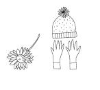

\

如果有人问：“你是谁？”大部分人也许会回答：“我是一个母亲。”“我是墨西哥人。”“我是魔术师。”“我是伊斯兰教信徒。”诸如此类的答案。

且慢！停！倒带！你并不仅仅是你生活中的那些角色，你的国籍、工作，或者宗教信仰。你是一个独一无二的，由无数想法、感觉、特质混合而成的多面体。正确地了解你是谁，以及你想要什么样的生活，是掌握终身自信的秘诀，更是永远告别羞怯的终极步骤。

这就是本章的重点，之后你就可以为自己设计举办一个毕业聚会了。

\
\

每天花5分钟了解自己

\

20世纪50年代，科技的发展使得我们能够探索外太空。现在，科技又把我们带入另一个领域，即内心世界。通过神经影像学，科学家们几乎每周都对人类脑部有进一步发现，揭示出主管神秘记忆和情绪体验的人脑部位。

你或许不想把头剃光，在进入实验室后让科学家在你脑袋上贴满感应器，通过核磁共振影像来探索你之所以会做某件事的原因。但是你可以退而求其次。深入了解自己是战胜羞怯的强大而有力的武器。这并不是一个艰辛漫长的过程，相比其益处而言，你须付出的心力简单得令人难以置信。

\

可惜的是，尽管害羞者会专注于自身，却很少有人能发展出稳定的自我认同感。大部分害羞者并没有真正了解自己。你怎么能爱一个你并不了解的人呢？

\

许多社交恐慌症者从未感觉到满足，他们不曾获得良好的“自我感”。

——《沟通教育期刊》

（Communication Education）

\

你的自我认知进展如何

你已经准备好开始自我了解的探索旅程，因为——

\

⊙你知道是什么事情让你感觉恐惧（羞怯克星第16招），并把它们从简单到复杂进行归类和排列（羞怯克星第17招）。

⊙你已经了解到，在社交场合中，你表现出来的远比你自认为的要好得多（羞怯克星第14招）。

⊙你现在知道，人们对你的看法远远好过你所料想的（羞怯克星第9招）。

⊙你已经很认真地规划过你的职业生涯（羞怯克星第36招）。

⊙你已经熟悉自己的面部表情和笑容（羞怯克星第27招）。

⊙你也已经认识到自己所要表达的肢体语言的重要性（羞怯克星第44招）。

⊙你思考过自己对于常见话题的观点（羞怯克星第54招）。

⊙你还列出一些你擅长的话题（羞怯克星第55招）。

⊙最后，你认真地问自己一些问题：“我的热情在哪里？”“我愿意花费宝贵的时间去追寻哪些方面的理想？”（羞怯克星第58招）。

⊙现在该是进入最重要的自我认知探索阶段的时候了。这是我过去经历一段人生低潮时所构思出来的策略。对我来说，羞怯克星第84招便是帮助我重获安全感和喜悦，令我享受现在每天生活的功臣。

\

“自我，你怎么想？”

自我认知是让你了解你个人对于各种深奥问题的想法。

每天选择一个安静的时间，比如在刮胡子的时候，化妆的时候，上班的途中，或是上床前的一小段时间。就像播音主持人一样采访自己几个问题。每天问一个探索心灵的问题并彻底反复深思。即使很快便得到结论，也要持续专注地思考５分钟，以便将答案深深地刻印在心里。

一些简单的问题范例如下。

\

我存在于地球上是否有意义？如果是，这个意义是什么？

我所认识的神是谁？

荣誉、成功、家庭和友谊对我的意义是什么？

\

你的自我采访可以像如下这样进行。

\

自我，如果你有很多的钱可以做些慈善事业，你想捐给哪个慈善机构？

嗯，正如你所了解的，自我，我从来没有真正思考过这个问题。但是，每次我看到盲人的时候，我都会非常难过。我总是希望能够让他们重见光明，但那当然不在我的能力范围之内。我觉得我应该捐钱支持学者做视障方面的研究，或是捐给盲人学校。

\

很精彩的自我意识。

嗯，谢谢了，自我。嘿，我就是这样嘛。

\

所以，我在本书附录2《写给害羞者的自我认知100问》里列举了100个关于自我意识的问题。它们足以供你进行一个月的自我探索之用。

\

> > > 羞怯克星第84招 探索内心世界

> > > 每天花5分钟时间，模仿广播或者电视主持人采访自己。每天选一个关于自我认识的问题，认真仔细地回答。你会因快速培养出强烈的自我意识和自我认知而兴奋不已。当你聆听自己的答案后，你会意识到自己是一个令人钦佩的人。这种认知将会极大地提升你的自信。

\

深入了解自我，是一生中给予自己的最好礼物。此外，以后的谈话中再涉及有意义的话题时，你也不会再犹豫不决。你不需要额外的时间再去思考，因为你已经做好了准备。你可以快速地回答问题，并且把你的观点自信地呈现出来。

本书的自我认知100问仅仅是个开始。当你完成所有问题后，可以列出更多的问题来回答。当你完成了这些，再列出一些有关你个人生活或者你认识的人的问题。例如，你可以自问自答：“我究竟对我那位长舌的姐夫有何评价？”——说不定你会意识到，其实他也算是个不错的家伙。

\
\

害羞者的“毕业典礼”

\

让我告诉你我确定自己“痊愈”那天晚上的事。黛菲和我在去伦敦的班机上，当我们抽空在厨房里聊天时，黛菲告诉我她很以我为荣。

虽然我笑着问：“为什么？”但实际上我知道原因。因为我已经能自在地看着顾客的眼睛问：“请问你要咖啡吗？还是喝茶呢？”（空服人员习惯用这样完善的句子问问题）

当时我觉得自己的变化已经值得表扬了。但是在伦敦短暂停留时，我在她脸上又看到了熟悉的“我有办法”的表情。

“哦。”我说。但那次我没有介意，因为她用在我身上的渐进式暴露疗法都展现了神奇的功效。她低声说道：“我们今天晚上要去一个地方，你要像对我妈妈的希腊朋友那样，友善地对待那里的每个人哦。”

我对自己的进步非常自信。“当然，黛菲，只要你想去的地方都可以。”

我们回饭店稍微休息了一下，逛了一会儿街，吃了些东西，跳上了伦敦街上随处可见的双层红色巴士。黛菲仍然不愿意告诉我她要带我去哪里。巴士每停靠一站，我都把脸紧紧地贴着窗户问：“是这里吗？”

“不是。”

“这里？”

“不是。”

下一站是公园路上的花花公子俱乐部。

“这儿？”我打趣地问。

“是的。”

我坐着不想走，“哦，不，黛菲。你不能带我来这里的。”

她硬把我拉起来。“哦，是的，我就是带你来这里的。”

“他们会让没有兔子尾巴的女人进去吗？”我小声嘀咕着被她拉到了门口。

我们跟着服务员穿过拥挤的人群，找到座位坐定。我注意到一些男人的眼光暂时挪移那些兔女郎毛茸茸的尾巴和丝滑的耳朵，转过来望向我们。受到上次在希腊餐厅成功经验的鼓舞，我自信地坐得又直又挺，把头发拢到后面，甚至冲着其中几位男士微笑。

\

从受惊的兔子变成勇敢的兔子

其中一个兔女郎一定注意到了我的兴奋。当她优雅地弯下腰为我们倒上饮料时，小声对我说，“我多藏了一副兔子耳朵在餐厅后面，如果你想要的话，我可以借给你。”

当我很开心地把兔耳朵戴在头上时，黛菲惊讶地倒抽口气：“冷静点。”她说，“现在的你已经太过了。”

我确实是，但那种感觉让人兴奋快活。我从一个惊慌的、戴着面具带小朋友去要万圣节糖果的胆怯兔子，变成了在花花公子俱乐部里明目张胆卖弄风情的兔女郎。我真想跳着尖叫：“我自由了，我不再害羞了！”

此时，我开始为黛菲的生日聚会筹划一些小小的惊喜。我自己办聚会吗？那就是我赢得战斗的最终证明。

一晚上，很多男士来我们桌边聊天。当他们请我们喝酒时，黛菲靠近我小声地说：“加油，美女，没人知道你以前是害羞的。”

我对她眨了眨眼，说：“我会一直伪装下去，直到我不再害羞。”但其实那个时候我已经不用伪装了。

\

大考时刻

把它联想成联考、律考或者技术认证。想成为护士、会计师、博士，甚至是幽灵与鬼屋研究员（Ghosts
and Hauntings
Researcher），都得经过考试才能拿到资格。所以为什么不能用考试来证明你不再害羞呢？你现在已经是获得认证的大方者。资格考试有两个部分：1.做些蠢事来炫耀你大方开朗的个性；2.给自己举办毕业典礼。

\

> > > 羞怯克星第85招 参加“自信证明”考试

> > > 当你完成所有的羞怯克星后，好好炫耀并庆祝一番。天马行空地想象，就像大部分“超级大方的人”一样，做一些安全但愚蠢的事情来证明你摆脱了羞怯。

> > > 然后为同事准备办公室聚会来庆祝生日。或者邀请男同事到家里看美式足球超级冠军赛。当你举杯庆祝的时候，没人知道其实你是在为自己已经摆脱羞怯而庆祝。这就是你从一个聚会恐慌者变成聚会企划师、从害羞变为自信的证明。

\

如果一开始不成功，不要丧气。只要重新复习一下羞怯克星即可。很快你就可以戴上毕业帽了，即使没有兔子耳朵可以戴。选择棒球帽、画家帽、安全帽、头巾、水钻冠冕或者隐形皇冠都可以。你会狂喜地呐喊：“我自由了！我不再害羞了！”当然，没有人会听见你，仅有你全新的自信自我，而那才是全世界最重要的人。

\

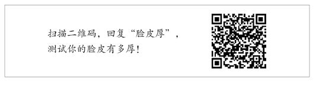\

\

附 录1

\

来自雪柔的信件全文

\

亲爱的莉儿：

我一生都在为克服“羞怯”而奋斗，总是觉得自己的频率与别人不同。以前我无法了解，为什么许多同学与同事喜欢和很多人聊天，还花很多时间四处访友。而我只想与一两位好友聚在一起，在私密的空间里促膝长谈。我不明白，为何我总是宁愿躲在幕后，说话前先想清楚，而其他人总是能不受拘束地发表意见。我想不通，为什么我最好的朋友会说，他们起初觉得我很“冷淡”或“冷漠”——一直等到对我有了较深了解后，才发现我并非如此。我脑瓜很好使，上学时成绩总是名列前茅，毕业后在商场上也很成功。我真的喜欢人群，但我好像无法搞懂社交技巧，总觉得自己有什么问题。

几年前，我开始了自我探索的过程与研究。我相信，害羞只是症状，内向个性才是源头。

内向不是疾病——恰好相反——但是在重视外向开朗的世界，内向却常被视为残缺。

为了提高工作效率（我的工作需要经常与人互动，常常一天到晚都要讲个不停），我了解到一些事情，使我能够更好地接纳自己，并且“管理”自己的内向天性。

我不存在什么问题。生性内向带给我很多好处，而且我不能、也不应该改变自己，但我能够以更有效率的方式与他人互动。

我学会根据情况需求展现外向活泼的特质。假使我事先知道自己即将面对复杂的讨论或冲突场面，而必须与人有频繁的互动时，我会先用想象或写下来的方式提前演练。不过，在几次频繁交际之后，我需要给自己安排制衡（安静与独处）的时间，以便重新充电。

在与外向者接触前，我会观察并捕捉与我互动对象的特质，并随之调整自己的言行。我不能期待外向的人来迎合我，而应该由我去迎合他们，这样才能达到更好的沟通效果。

我会把自己放在一些场合来训练自己脆弱的“外向肌肉”。比如，我自愿担任令自己不自在的领袖角色，以此来加强人际沟通的技巧。我强迫自己在会议中发言，而不仅仅是被动地坐着。

我收集那些能让自己像个外向开朗之人一样轻松愉快闲聊的技巧与诀窍。在需要的时候，我就能变得“假外向”起来。令我安心的是，通常只要我起了头，外向的人就会滔滔不绝地说话。因为我真的喜欢人群，懂得聆听，也喜欢更进一步认识新朋友。假使我不主动跨出第一步的话，我可能会失去那些机会。

我鼓励我的孩子发展外向性格，虽然偶尔会令他们感到不自在。同时，我也试图教他们要像他们的母亲一样，敏锐地面对自己生命中的内在特质。而每个人对独处时刻的需要，也是过生活的另一种方式。

谢谢你在这个领域所付出的心力。我从你的作品中学到很多宝贵的经验，更期待能早日拜读你关于羞怯的新书。

\

雪柔

\

附 录2

\

写给害羞者的自我认知100问

\

认识你自己，是与害羞永别的终极妙法。在掌握本书中的85条羞怯克星之后，再静下心好好问问自己：我是谁？

\

1.对我来说理想的关系是什么？

2.我排队时想得最多的是什么？

3.我最引以为自豪的特征是什么？最不喜欢的特征是什么？

4.假如我中了彩票，我会用奖金做什么？

5.我上一次和别人争论在什么时候？为什么争论？对方有什么好观点？

6.我通常喜欢孩子的什么特点？我不喜欢他们的什么特点？

7.从外表上来说，我最漂亮的特征是什么？最不好的特征是什么？

8.什么事业或者善行对我来说最为重要？

9.对我来说“荣誉”是什么？我是一个有荣誉的人吗？

10.谁是我心目中的神？

11.我的“成功”定义是什么？我成功吗？

12.我的父母对我有何影响？我的兄弟姐妹呢？其他亲戚呢？

13.如果我只有几个月的生命，我想怎样度过？

14.艺术对于世界有何意义？对于我有何意义？

15.我认为大多数人偶尔都会撒谎吗？经常撒谎吗？

16.谁是我最好的朋友？为什么？

17.我是早上、下午还是夜晚精力最旺盛？在不同的时段我感觉如何？

18.如果我可以生活在任何时代，我会选择哪个时代？为什么？

19.忠诚对我来说意味着什么？我是一个忠诚的人吗？

20.我认为宇宙是怎样被创造出来的？

21.我认为自己的国家对世界有何影响？是好的影响吗？

22.我觉得自己老了以后的生活会是什么样的？

23.我认为工业空气污染和进步之间有何关系？

24.对我的工作，我最喜欢的是什么？最不喜欢的是什么？

25.如果我有足够的钱来做收藏家，我会收藏什么？

26.我认为人死后会怎样？

27.我最喜爱的电影是什么？最喜爱的电视节目是什么？为什么？

28.如果我可以住在这个世界上的任何城市，我会选择哪一个？

29.我对目前的环境状况有何看法？

30.我认为大多数恋情失败的原因是什么？

31.人的一生是“上天注定”的吗？我们拥有完全的自由意志吗？

32.什么事最让我生气？为什么？

33.我认为电脑的将来如何？互联网呢？

34.领导的素质是什么？我有领导才能吗？

35.我最喜爱的书是什么？最喜爱的作者是谁？为什么？

36.我最喜欢生活在城市还是乡村？为什么？

37.古今中外我最欣赏的是哪位公众人物？

38.在我个人的生活中，我最欣赏的是谁？

39.我对“精神生活”的定义是什么？我是一个精神生活富有的人吗？

40.我最喜爱的10大网站是什么？为什么？

41.如果动物实验是为了制造对人类有益的产品，我的看法如何？

42.我有一个愉快的童年吗？

43.我认为人类的大脑能做什么？

44.如果可以免费到世界上任何一个地方，我会选择去哪里？为什么？

45.如果我可以成名，我希望自己在哪方面成名？

46.真正对我重要的是什么？家庭？工作？社区？其他？

47.我最喜欢的食物是什么？最不喜欢的是什么？我善于烹饪吗？

48.我最喜欢哪首歌曲？哪位歌手？哪个乐队？为什么？

49.我这个年龄最好的是什么？最坏的是什么？

50.在互联网时代出生、成长的孩子和以前的孩子有何不同？

51.我对自己家乡最受欢迎的报纸有何看法？

52.我最想改变自身的哪三样东西？

53.我最恐惧的是什么？

54.恋人可以婚前同居吗？为什么？

55.如果有人撒谎，我能判断出来吗？怎样判断？

56.我做事经常拖拉吗？如果是，什么事？为什么？

57.我喜欢沉思冥想吗？

58.孩子健康成长既需要母亲，也需要父亲吗？

59.如果我仅能改变自己生活中的一件事，我想改变什么？

60.我的梦想是什么？有何意义？

61.古代哲学家对现代生活方式有何影响？

62.我对校友聚会有何看法？

63.我有什么不好的模式化行为吗？如果有，该如何改变？

64.音乐在我生活中的地位如何？

65.我对电视暴力或色情有何看法？

66.我喜欢猫还是狗？还是喜欢其他宠物？

67.我对婚姻制度有何看法？

68.我对自己的婚姻有何看法？会很好吗？一直很好吗？

69.我迷信吗？如果是，迷信什么？为什么？

70.我的第一个工作是什么？它对我意味着什么？

71.我是否有恐惧症？幽闭恐惧症？眩晕？其他病症？

72.我认为我们应该限制世界人口吗？

73.我相信无条件的爱情吗？

74.如果我被囚禁而只能带一样东西，那会是什么东西？为什么？

75.我认为人之初是性本善还是性本恶？为什么？

76.信息式广告应该被禁止吗？为什么？

77.我最喜爱的运动是什么？最喜欢看的运动是什么？喜欢它哪一点？

78.我听到的电视新闻广播有多少是可信的？读到的报纸呢？

79.相对于国内产品，我们应该立法限制购买外国产品吗？

80.政治选举是公平的吗？为什么？

81.我认为常见的减肥方法有效吗？

82.我认为世界上哪一位领袖人物对人类的积极影响最大？

83.如果我能多说一种语言，我希望是哪一种？为什么？

84.我对吃荤与吃素有什么看法？

85.我对协助自杀有何看法？

86.人们应该知道其家谱吗？为什么？

87.我最喜爱的电视节目是什么？为什么？

88.我最喜爱谈论的话题是什么？

89.我父母快乐吗？

90.我相信轮回吗？为什么？

91.我对堕胎及生命权有何看法？

92.我对网络恋情有何看法？

93.我对我们的教育制度有何看法？为什么？

94.此刻我对每一位家人的真实想法如何？

95.我快乐吗？为什么？

96.我对性生活满意吗？为什么？

97.一般人应该在什么年龄退休？我呢？

98.我喜欢乘火车、飞机、大巴还是自驾旅行？为什么？

99.我最爱的是谁——父亲、母亲、兄弟姐妹、恋人、好朋友还是其他？为什么？

100.我对目前的生活有何看法？

\

现在你可以再写出更多的问题，写完后再写一些，以便每天都有一个问题可以回答。

