

<svg xmlns="http://www.w3.org/2000/svg" xmlns:xlink="http://www.w3.org/1999/xlink" version="1.1" width="100%" height="100%" viewbox="0 0 519 751" preserveaspectratio="none">

<image width="519" height="751" xlink:href="cover.jpeg"></image>
</svg>

版权信息

书名：你的灯亮着吗？：发现问题的真正所在

作者：Donald C. Gause， Gerald M. Weinberg

译者：俞月圆

ISBN：978-7-115-33563-0

本书由北京图灵文化发展有限公司发行数字版。版权所有，侵权必究。

------------------------------------------------------------------------

您购买的图灵电子书仅供您个人使用，未经授权，不得以任何方式复制和传播本书内容。

我们愿意相信读者具有这样的良知和觉悟，与我们共同保护知识产权。

如果购买者有侵权行为，我们可能对该用户实施包括但不限于关闭该帐号等维权措施，并可能追究法律责任。

 

目录

[版权声明](#index_split_002.html_filepos3930)

[献词](#index_split_003.html_filepos4712)

[序言](#index_split_004.html_filepos5079)

[第一部分：问题是什么？](#index_split_005.html_filepos5581)

[第1章　一个问题](#index_split_006.html_filepos5833)

[第2章　彼得发起了一个请愿](#index_split_007.html_filepos13093)

[第3章　你的问题是什么？](#index_split_008.html_filepos21984)

[第二部分：这次的问题是什么？](#index_split_009.html_filepos37709)

[第4章　比利战胜投标人](#index_split_010.html_filepos37969)

[第5章　比利忍住没说](#index_split_011.html_filepos45212)

[第6章　比利反思投标案](#index_split_012.html_filepos48896)

[第三部分　问题到底是什么？](#index_split_013.html_filepos55935)

[第7章　无尽的链条](#index_split_014.html_filepos56192)

[第8章　忽视不协调之处](#index_split_015.html_filepos62510)

[第9章　找到问题所属的层面](#index_split_016.html_filepos74265)

[第10章　注意你所表达的含义](#index_split_017.html_filepos81973)

[第四部分　问题该由谁解决？](#index_split_018.html_filepos93375)

[第11章　烟雾缭绕](#index_split_019.html_filepos93632)

[第12章　校园停车难问题](#index_split_020.html_filepos100072)

[第13章　隧道尽头的灯光](#index_split_021.html_filepos109229)

[第五部分　问题来自哪里？](#index_split_022.html_filepos114950)

[第14章　詹妮特·贾沃斯基遇上了混蛋](#index_split_023.html_filepos115204)

[第15章　麦特兹锡恩先生解决了问题](#index_split_024.html_filepos122212)

[第16章　找事让人做的人和领赏的人](#index_split_025.html_filepos131900)

[第17章 考试和其他谜题](#index_split_026.html_filepos141434)

[第六部分　你真的想解决问题吗？](#index_split_027.html_filepos148305)

[第18章　不怕累的汤姆被玩具耍了](#index_split_028.html_filepos148568)

[第19章　佩兴丝的计谋](#index_split_029.html_filepos162112)

[第20章　一项优先任务](#index_split_030.html_filepos167521)

　　　

 

版权声明

Original English language edition, entitled Are
Your Lights On? : Howto Figure Out What the Problem Really Is,
copyright © 1990 by Donald CGause, Gerald M Weinberg All rights reserved
Translation published byarrangement with Dorset House Publishing Co ,
Inc (www dorsethouse com),through the Chinese Connection Agency, a
division of The Yao Enterprises,LLC

本书中文简体字版由Dorset House
出版公司授权人民邮电出版社独家出版，未经出版者书面许可，不得以任何方式复制或者抄袭本书内容。

版权所有，侵权必究。

 

献词

谨以此书献给我们深爱的妻子。当我们享受写作本书的轻松时光时，她们中一人不得不忍受与我们共处，另外一人不得不忍受与我们分离。很难说她们两人谁从中受益更多。

 

序言

问题：没有人会读序言。\
解决方法：把序言作为第1章。\
解决方法带来的新问题：第1章很无聊。\
新的解决方法：删了第1章，把第2章作为第1章。

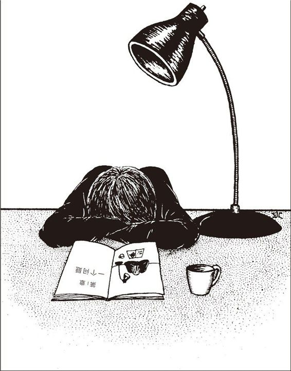

 

第一部分：问题是什么？

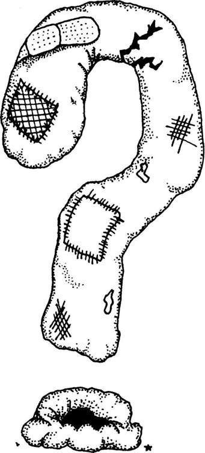

 

第1章　一个问题

在哥谭市金融区的中心地带，矗立着富丽堂皇的雷龙大厦。大厦刚落成，楼高73层。遗憾的是，尽管这座宏伟的建筑里还有未出租的空房，楼里的电梯却已经不够用了。有的租户威胁说，如果不尽快改善电梯服务，他们就要退租，搬出雷龙大厦。

这个案例的相关信息如下。

 

1.  大厦主要出租用作办公场所，工作时间一般为周一至周五上午9点至下午5点。

2.  几乎每个在楼里办公的人都与金融业有联系。

3.  租户平均分布于1层至73层，各楼层电梯使用率大致相当。

4.  为了把剩余的办公室租出去，大厦的所有人已经花血本投放了大量广告。

5.  金融区面积狭小，人口密度大，负面消息传播得极其迅速。

如何应对这一情况呢？

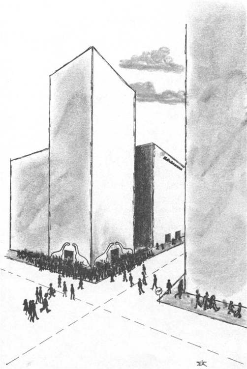

有些措施是很容易想到的，比如：

 

1.  提高电梯运行速度。

2.  在楼内开挖新的电梯井道，加装电梯。

3.  在楼外加装电梯。

4.  让业主错时上下班，分散高峰时段电梯人流。

5.  重新安排租户的楼层分布，以减少电梯总负荷。

6.  限制入楼总人数。

7.  将现有电梯的轿厢换成两三层楼高的大轿厢。

8.  在每层楼提供更多的服务设施，减少人们往返于楼层之间的次数。

9.  根据需要，为一些楼层作出特殊安排，提供直达电梯。

刚才，我们跟着解决问题的思维习惯走，直接提出了解决方案。其实，先问自己几个问题再给出答案也许是更明智的做法。

这是什么类型的问题？谁碰到了问题？问题是什么？或者说，此时此刻，问题的本质是什么？

先来看“谁碰到了问题”，这样问是为了：

 

1.  确定服务对象，也就是弄清楚解决问题是为了让谁满意。

2.  为找到合适的解决方案提供一些线索。

我们第一次列出的解决方案多种多样，但角度是相同的——都认为是电梯使用者碰到了问题。

让我们从大厦房东第欧根尼·梁龙先生的角度来看看这个问题。如果将他作为服务对象，得到的解决方案会大不相同，比如：

 

1.  提高租金，这样就不需要招那么多租客了（收取租金是为了支付建造大厦的分期贷款）。

2.  让业主们相信，正是因为电梯不够用，雷龙大厦才是一个环境闲适的适合工作的好地方。

3.  在楼内人流量大的通道贴上步行时间与卡路里消耗量的对照表，向在大楼里上班的职员宣传增加运动量的必要性。为了多锻炼身体，他们应该走楼梯而不是乘坐电梯。

4.  放火把大厦烧了，领火灾保险。

5.  将大厦建筑商告上法庭。

6.  蹭隔壁写字楼的电梯用。

前后这两组方案不完全互斥，但的确反映出了不同的倾向。这样的区别足以让我们抑制住匆匆拿出解决方案的冲动，先问一问：

问题是什么？

初出茅庐的问题解决者总在还没定义好问题的时候就仓促地给出解决方案。迫于外界环境的压力，经验丰富的问题解决者有时也耐不住性子。在这种情况下，尽管他们能找到很多方法来解决问题，但是不一定对症。大家都想让自己的解决方案为大多数人所认可，每个人都指责别人固执己见，却从不承认对方提出的也可能是一种可行的方法。

也不是所有人都栽在忽视问题定义上，有些人恰恰输在试着定义问题的时候。他们在已有的定义上没完没了地绕圈子，生怕定义不准确，结果一直不敢推进到寻找解决方案的阶段。

在实际操作中，一方面，对日常生活中自然产生的问题，不可能给出独一无二、完全明确的定义；另一方面，如果不能就问题本身达成一定程度的共识，几乎可以肯定，最后找到的解决方案无法切中要害。这种时候，一般都是在为说话嗓门最大、口才最好或者资产最雄厚的人解决问题。

问题解决者的工作是为别人解决问题。对于想成为问题解决者的人来说，入门的关键在于把单一思维模式切换成多重思维模式，即从“能解决一个问题的人”到“能解决很多问题的人”，或者说“问题解决者”。

为了实现这一切换，问题解决者应该试着趁早回答这个问题：

谁碰到了问题？

然后针对答案给出的每一个群体，分别问问：

问题的本质是什么？

 

第2章　彼得发起了一个请愿

从上班族的角度来看，雷龙大厦的问题可以说成是：

怎样花最少的时间和精力、受最少的气完成我的工作？

而对于房东梁龙先生来说，这个问题应该被归纳成：

我要怎么处理这些该死的投诉？

如果双方（还有其他相关方吗？）无法就问题本身达成一致，就不可能得出大家都满意的解决方案。尽管前景不容乐观，一个高效的问题解决者一定会致力于让双方碰个面，即使意见不能统一，也至少要让他们面谈一次。

为了把房东的注意力吸引到“这个问题”上，完美金融信托公司的邮差彼得·皮金霍尔发起了一个请愿。利用自己作为邮差的职务便利，他从完美金融信托公司弄到了很多人的签名。借助与其他公司邮差的同行关系，他又进一步扩充了名单。

请愿书恰恰是梁龙先生不愿意看到的，所以彼得需要收集很多的签名。在梁龙先生看来，他的问题就是怎样消除租户的投诉。如果人们只是私下发发牢骚，意见不被记录下来，也许他装聋作哑就可以解决这个问题。谁知道呢？说不定就大事化小小事化了了吧。所以当一份有24人签名的请愿书摆在他面前时，梁龙先生还是无动于衷。更准确地说，他在装着请愿书的信封上写上“收信人拒收”，然后把它退了回去。

想要通过拒收信件让邮差打退堂鼓，就像是在一头资产阶级的斗牛面前挥舞苏联国旗来让它泄气。房东的做法激怒了在大厦上班的职员，为了报复，他们采取了进一步行动。

一大批职员代表前来拜访梁龙先生，可他继续装作不知情，希望这样能解决他的问题。梁龙先生的秘书说：“老板不在。
”

如果梁龙先生认为采用这一策略能让请愿者就此放弃的话，那他真是太不了解邮差们不达目的不罢休的精神了。在讨论过策略之后，职员代表决定到梁龙先生家的斯卡斯代尔庄园去一趟。为了把此行的用意表达到位，他们带去了四个警戒标志、三枚臭气弹和两名移民劳工。梁龙太太对丈夫提出了严正交涉，这下问题再也躲不掉了。

与职员代表短暂会面之后，梁龙先生答应找一家咨询公司来调查这个问题。作为回应，
职员代表们撤掉了警戒标志，这帮助梁龙夫妇解决了燃眉之急。

时间一点一点过去，职员们发现情况毫无改观，说好的咨询公司也迟迟不见踪影。楼里不是应该出现几个剪短发、系领结的人，手拿活页夹找人问问题吗？梁龙先生最起码可以请他侄子过来，穿着圆领套衫、手拿计算器晃晃嘛。

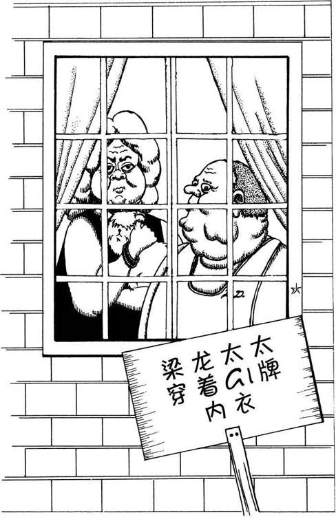

经过一番调查，彼得·皮金霍尔发现房东并没有着手聘请咨询公司。职员们可折腾不起，不能天天去拜访斯卡斯代尔庄园，于是决定采用一种新的策略。

利用作为邮差的有利条件，这次抗议行动的几位领导者开始散播谣言，说如果电梯问题再不尽快得到解决，美国劳工代表大会1就要介入此事，把所有在雷龙大厦工作的人组织起来。在此之前，雷龙大厦内各公司的高管并没有把电梯这事儿太放在心上。他们中有人来得早走得晚，有人来得晚走得早，平时有秘书送上咖啡，有专人提供午餐，有邮差传递信件和其他必需品。而且，虽然楼内每层交替安排有男洗手间和女洗手间，每层楼还都配备了一间面积不大、上了锁、设备齐全的男性高管专用洗手间（雷龙大厦里没有女性高管）。

1.
美国劳工代表大会（American Congress of
Labor），简称ACL，是作者杜撰的机构。——译者注

劳工代表大会要出面进行组织工作的传闻一出现就开始迅速传播，这让各位高管有如芒刺在背。电梯问题一下有了三个相关方。第三方，即各公司的管理人员，开始试图用自己的方式说服第二方，即大厦房东。

此前，问题双方都不认可对方对问题的定义，甚至不想听对方解释。不过现在，我们能看到取得进展的迹象了。当双方处于一损俱损的状况中时，我们就知道，问题总算是能解决了。

对这种解决问题的策略，美国印第安人有个专门的说法，叫做“穿别人的皮鞋走路”。要是皮鞋是用生的湿牛皮做的，效果就更好了：它会在另一个人的脚上慢慢变干收缩，直到合脚为止，这时候两个人就是同道中人了。

在这个时间当口，我们还无法预测问题最终会怎样解决。各租户的代理律师可能会废除租赁合同，或者把租约暂时托管给第三方；房东可能会以赔本的价格把大厦卖掉，或者从73层楼上跳下去。这些解决方案可能会带来新的问题，但有一件事是确定的：之前的问题拖不长了。

由于可能出现的结果非常多，不妨假设问题有关各方都足够冷静，可以理性行事。房东和各公司的律师见了面，以确定问题的实质。在“如果达不成协议，劳工代表大会就会出手干涉”的威胁之下，他们总算在最后一刻勉强选出了一名职员代表。起初，各方分别标榜了一番自己的正义性，之后，每个人都意识到了他们还需要进一步了解情况。

对于之前听到的那些抱怨，梁龙先生早就决定既往不咎了。但这些职员留下的总爱怨天尤人的印象实在太强烈，他没法扭转这种印象。

各公司的管理层其实还没花多少时间仔细考虑过电梯问题。管理者对任何形式的劳工联合都深恶痛绝。与之相比，电梯问题显得微不足道。不过现在，这个问题必须得解决。

而对于职员们来说，他们现在满脑子想的就是“拿下那个混蛋房东”。至于最初的目的，也就是寻求改善电梯服务，已经被忘到脑后了。

我们不纠缠这些杂乱的细节了。会谈的结果是各方达成了以下共识：

 

1.  房东感到不满是因为备受骚扰。

2.  雷龙大厦各公司高管感到不满是因为职员闹情绪而且威胁要联合起来。

3.  职员们感到不满不仅是因为电梯服务不到位，更因为大厦房东无视了他们的诉求。

这么说现在至少有三个问题。

如果从另一个角度切入，电梯问题仍然包括三个层面：

 

1.  我们该如何确定“是哪里出了问题”？

2.  到底是哪里出了问题？

3.  我们可以做些什么？

第一个问题很快就解决了：彼得·皮金霍尔被派去调查是哪里出了问题。他需要找到一个为各方所接受的问题定义，完美信托公司答应给他放一个月假让他完成这个工作。作为彼得主动出头的奖赏，现在电梯问题是他的问题了。

如果“穿着彼得·皮金霍尔的鞋”，你会怎么做？

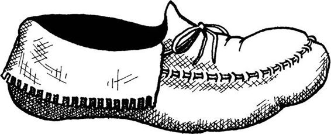

 

第3章　你的问题是什么？

不知道你有没有遇到过这样的情况，一天之中诸事不顺，让你不禁抱怨道：“天哪，我是有什么问题吗？！”其实大多数人都有过这样的经历，有些人甚至几乎天天碰上这种事。他们遇到的困难源于一种差别，也就是事情发展的方式不同于“它们应该遵循的方式”，即在某人眼里事情应该怎样发展。这时你说出“我有什么问题吗”是很自然的，因为问题恰恰就是这样一种差别。

问题就是理想状态和现实状态之间的差别。

如果你现在抬起头来，环视四周，很可能可以列出几十甚至上百项“理想状态和现实状态的差别”。为什么不试试看呢？

如果你刚吃完一顿丰盛的晚餐，坐在最舒服的椅子上，打开书，刚好看到这里，那你的幸福感可能十分强烈，想出哪怕一个“问题”都很困难，更不要说好几百个了。不过如果你稍稍敏感一点，就可以发现如下这些现实和理想之间的差距：

|  |  |
|----|----|
|  现实状态  |  理想状态  |
|  椅子旧了   |  崭新的椅子   |
|  孩子们太吵了  |  孩子们安安静静  |
|  脚疼    |  有舒适的鞋子可以穿   |
|  房间里太冷了  |   房间里很温暖  |
|  房间里太热了   |   房间里很凉快   |

“忽略问题”是一种古老但有效的方法，可以用来解决上面列出的前三个问题。这种方法其实是让我们降低敏感度。当敏感度降低到一定程度时，我们就再也感受不到事物现在的状态和理想中的状态有什么区别了。另外，既然已经意识到问题在于“房间里太冷”，你就可以把空调温度调高一点，或者鉴于当今出现了“能源危机”，干脆穿上一件羊毛衫。

但是，如果你看了看空调器，发现现在的室温是25°C——这个温度对于任何一个“正常”人来说都足够暖和了，那么问题是不是仍然存在呢？当然存在，只要你感受到的温度和你所想要的温度不一样。知道现在“实际的温度”可帮不了什么忙，除非你真的觉得够暖和了。在这个例子中，我们可以把够不够暖和的问题归结为一种幻象问题，这个问题中你的不适感主要来自你对外界的感知。

注意，不要被误导了：

幻象问题是真实存在的问题。

呆在一间室温25°C的房间里却觉得很冷，所以你觉得自己可能是生病了。你要么直接上床躺下，要么吃片药或者喝杯水，要么先吃片药再喝杯水，要么跟家庭医生预约一个就诊时间（可能要排到明年10月了吧）。

不管你打算怎么办，这个问题已经从最初的“房间里太冷了”转换成了“为什么我觉得房间里这么冷”或者“我的身体出了什么问题吗”。

“是的，是的，”你坐在旧椅子上喃喃自语，“孩子们在敲墙，我的脚疼得要命，炉子也不好使，我可没多少时间好浪费。可是我放不下这本书，我还不知道雷龙大厦的问题后来怎么样了呢。坚持下去！坚持下去！”

很好，让我们回到彼得·皮金霍尔这里吧。他正好在看一本关于问题解决的书，从书上他学到了这样一点：

问题就是理想状态和现实状态之间的差别。

有了这一深刻认识（至少对于一个邮差来说很深刻吧）之后，彼得回过头去处理雷龙大厦的问题。据他分析，理想的状态是乘坐电梯时只需要等一小会儿，现实的状态则是现在等待的时间太长了。

从这个角度看，可以通过调整理想状态或者改变现实状态来解决电梯问题。他要么真正缩短等电梯的时间，要么想办法让等待时间显得短一些。这时，彼得刚好在一本问题解决类的书籍中看到了一个相似的例子。在那个场景中，职员下班的时候从楼梯上跑下来，结果受了伤。解决该问题的办法是在楼梯的每个转角平台上都装一面镜子。由于虚荣心作祟，职员在跑向出口时会放慢脚步，以便检查一下自己的仪表，做些小的调整。

彼得想道：“也许一个类似的装置可以解决我们的问题。”听说彼得有了一些想法，他在完美信托公司的雇主感到很高兴，因为彼得不在的时候，公司的信件投递不太顺畅。梁龙先生很欣慰，因为彼得的方法花不了多少钱，于是立刻同意在每层楼的电梯旁边都装上镜子。结果可想可知，抱怨声很快减少了。老板有力地拍了拍彼得以示鼓励，给他加了一点薪水，然后打发他回到收发室那张旧桌子旁边去了。

唉，可惜哥谭市这个肮脏的世界和问题解决类书籍里那个纯洁无瑕的世界有天壤之别。不久，无孔不入的“破坏分子”发现雷龙大厦里的镜子比凡尔赛宫的还多。几周之后，彼得又被调去完成一项特殊的任务：想办法对付镜子上的涂鸦。

上次的经历让彼得养成了一个坏习惯，他接到新任务的时候正在读另外一本有关问题解决的书。从这本书里他学到了这样一个思路：可以通过“让事情变得更糟糕”来找到解决问题的办法。“啊哈，”他灵机一动，“问题不在于涂鸦本身，而在于有些涂鸦属于低级趣味，有些则很无趣。如果能让人们放慢脚步，那他们停下来之后是照照镜子还是看看涂鸦又有什么区别呢？不管是干什么，他们都不会注意到电梯有多慢了。”

于是彼得建议在大厦每层楼都准备上蜡笔（当然得用绳子系在墙上）。等电梯的时候，人人都可以在镜子上画自己喜欢的图案。老板又一次有力地拍了拍彼得，又给他加了一点薪水（额度比上次要小）。彼得带着胜利的喜悦回到了收发室。

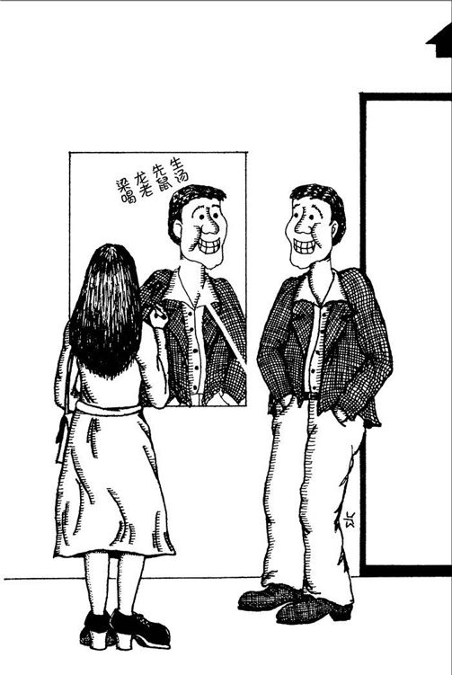

随着这一波刚平一波又起，时间一点点流逝了，不知不觉中雷龙大厦迎来了它启用一周年的日子。根据哥谭市相关法规的规定，一天上午，上进电梯公司的工程师来到雷龙大厦，进行年度检测。

大厅里，成群的员工拿着蜡笔在转悠。看到这样的场景，电梯工程师发现，他们理想中的状态和看到的现实状态存在差别。这伤害了他们的职业自尊心，因为上进电梯公司的口号是：

乘坐上进电梯无需等待

“一定是电梯的控制系统出问题了。”一位工程师对其他人说，“如果上进电梯正常工作的话，是不会有这么多人需要等待的。”

于是，工程师们开始查找是哪个地方出了问题。你瞧，他们在主控制箱里发现了一只老鼠，它一定是安装电梯系统那天就被困在里面的。这只老鼠曾经徒劳地尝试过咬开一个口子逃出来，结果它小小的牙齿用尽全力咬在了主控继电器上。240伏的电压立刻让它得到了解脱，不用忍受慢慢饿死的痛苦。就这样，它的尸体永远和继电器呆在一起了，也因此不会腐烂。把死老鼠弄出来并换掉继电器很恶心，不过这是个简单的工作。完成之后，工程师检测了系统。现在，电梯的工作情况符合上进公司的标准了。

工程师下次再来雷龙大厦，就该是一年以后检测电梯的时候了。离开之前，他们去见了梁龙先生，并把死而不朽的老鼠扔在桌上，傲慢地问：“要是你没办法把大楼打扫干净，至少可以在发现电梯运行得很慢之后，跟我们联系一下吧？难道你不知道服务质量这么差会造成租客流失吗？”

“哎，”梁龙先生想，“不管怎样，这些人还是一劳永逸地解决了问题。”这天早上，他刚收到来自市容整肃协会雷龙大厦分会的请愿书，抱怨涂鸦有碍观瞻。梁龙先生知道，这下电梯问题原有的“解决方法”很快就会土崩瓦解。他长出了一口气，亲自把工程师送到了大厦正门。马上就到五点钟了，他想看看职员们发现电梯提速之后有多开心。

一下班，职员们就开始从各自的办公室涌向电梯，每个人都想第一个跑到所在楼层的蜡笔那儿。但是现在电梯正常运行了，人们还没来得及胡乱画点东西就被送到了一楼。本来，几百名职员分散在十五到二十分钟内下楼，可现在，所有人一下都到了地铁进站口。永远熙熙攘攘的地铁换乘站根本容不下这么多人，在一片混乱中，五个人因为中暑而晕倒，七个人因被踩踏受伤而入院治疗。可怜的梁龙先生被人群一路推着走，下了楼梯，穿过检票口，一直被挤到了候车平台上。

因为没有通往斯卡斯代尔的地铁，所以梁龙先生以前从来没进过地铁站。他不知道该怎样恰当地抬肘保护自己，结果被挤下了平台，摔在一列呼啸而来的列车前面。\
http://www.ituring.com.cn/article/55703
各公司的管理人员和普通职员都参加了梁龙先生的葬礼。尽管梁龙先生是个贪婪的小暴君，但在设法解决电梯问题的过程中，人们逐渐了解了这位房东，也对他心生敬意。彼得•皮金霍尔被要求代表所有在雷龙大厦工作的人为梁龙先生致悼词，阐明虽然他们曾经和梁龙先生存在分歧，但是并未因此心存芥蒂。

彼得从去年发生的一系列事件讲起，说到他是怎么和梁龙先生认识的，并对梁龙先生的观点表示了赞赏。最后，彼得伤感地说：“就在电梯问题得到彻底解决的时候，梁龙先生却突然倒下了，这太遗憾了。我们永远不知道问题是什么，直到我们彻底摆脱了这些问题。”

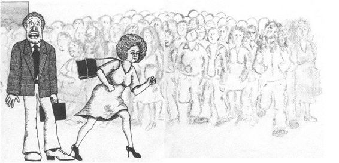

后记

彼得伤感地转身离开梁龙先生的墓。这时，一位和蔼的老人挽起了他的手臂，彼得觉得他有点面熟。“我是科威尔，我开的百货商店和雷龙大厦只隔一条小巷子。你给梁龙先生致的悼词很感人。”

“谢谢，”彼得发自内心地说，他很高兴自己的致词打动了听众，“我真的觉得我让梁龙先生失望了，他当时那么相信我解决问题的能力。”

“噢，年轻人，你不需要自责的。等你到了我这个年纪，就知道我们在生活中重要的事情面前是多么无能为力了。”

“也许是吧，”彼得回答说，“我只是后悔有些话不该跟他说的，尤其是当他认为我不够认真的时候。”

“比如说哪些呢？”

“我印象特别深的是，我提了一些不切实际的建议，比如说把大楼给烧了。他当时可生气了。”

“他不该生气的，确实有很多人烧了自己的房产领保险赔偿金。生意做成现在这样，我也得想这个办法了呢。”

“噢，把他激怒的不是这个建议，我觉得他曾经认真考虑过烧了雷龙大厦。真正让他生气的是，我建议他偷隔壁大楼的电梯用。”

“可是这很滑稽啊，”科威尔先生笑了，“为什么他听到这么好的一个笑话会生气呀？”

“他觉得那个时间和地点根本不适合说滑稽的事儿，所以把我赶出了办公室。‘你要怎么做才能偷到另外一座大楼的电梯呢？’他问我。我给不出一个合情合理的答案，他就把我赶出去了。”

“那你在提建议的时候自己是怎么想的呢？”

“我不知道。我只是突然想到了，觉得有点意思，也很滑稽，就说出来了。”

“这可不好，”科威尔先生陷入了沉思，“如果你真能让一座大楼用上另一座大楼的电梯，我可有个机会给你。”

“您的意思是……？”彼得问。

“哦，我的生意很不景气，几乎没有顾客会用电梯，这样会浪费大量的电梯运力，而我的百货商店就挨着雷龙大厦。”

“科威尔先生！”彼得兴奋地打断了他，“可以在两座大楼之间建一两条人行通道。如果雷龙大厦的电梯太拥挤了，人们就可以走通道进你的百货商店去坐电梯！唉，我们早就该这么做了！”

“要是梁龙先生还活着就好了，”科威尔先生考虑着，“我会提议完全由我出资建人行通道，因为这样也可以为我招揽些生意啊。能让你们‘偷’我的电梯，我该有多开心啊。”

彼得乐观地说：“我们还有机会呢。也许梁龙先生的继承人比他更乐意接受这个建议。”这又教给了彼得宝贵的一课：

别去费力帮缺乏幽默感的人解决问题。

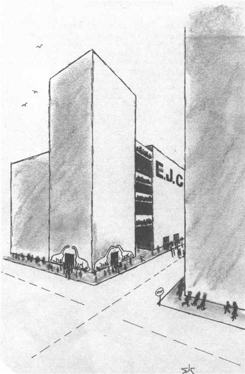

 

第二部分：这次的问题是什么？

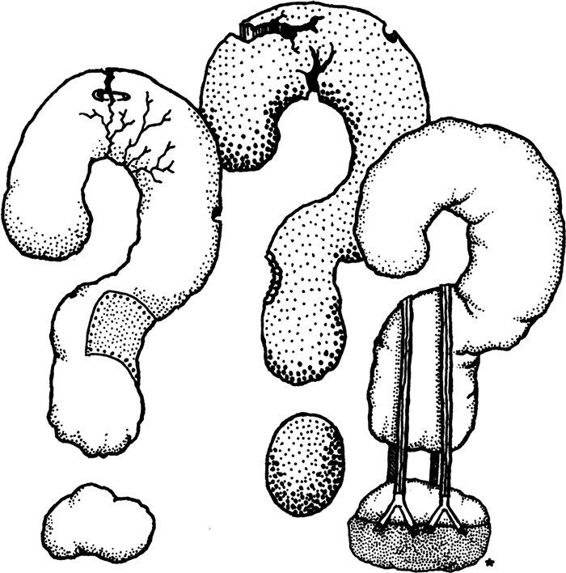

 

第4章　比利战胜投标人

计算机应用领域可以为如何定义一个问题提供丰富的素材。下一个故事中，我们的客户是一家大公司，与问题相关的人包括总裁、副总裁和审计师。问题的重要性完全配得上这样豪华的阵容：这是一桩政府剩余财产竞购，标的物总价数千万美元。

竞购采用密封投标法，由4家公司竞购11件物品。并不是所有物品都一样受欢迎，事实上，部分标的物甚至没有一家公司想要。但政府事先明智地制定了一系列规则，确保所有物品最终都能找到买家。

例如，某家公司只要想参与竞购，就得对所有11件物品投标。如果其中几件物品的投标价与其他的相比不够高，这几个价格就会被自动抬高到规定的最低价位。还有其他的规则将最冷门与最热门的标的物捆绑出售。这样，某件物品的中标方就不简简单单是对这件物品出价最高的公司，而是对一组绑定物品给出最高组合价的公司。

由于涉及金额巨大，而且不确定性强，几位公司高层都满心焦虑，同时也满心好奇——这就更糟糕了。失去了理智之后，他们轻率地接受了一名颇有商业头脑的政府官员开出的条件：支付一大笔钱，换取所有公司的全部投标信息，并获得一次修改自己投标价的机会。

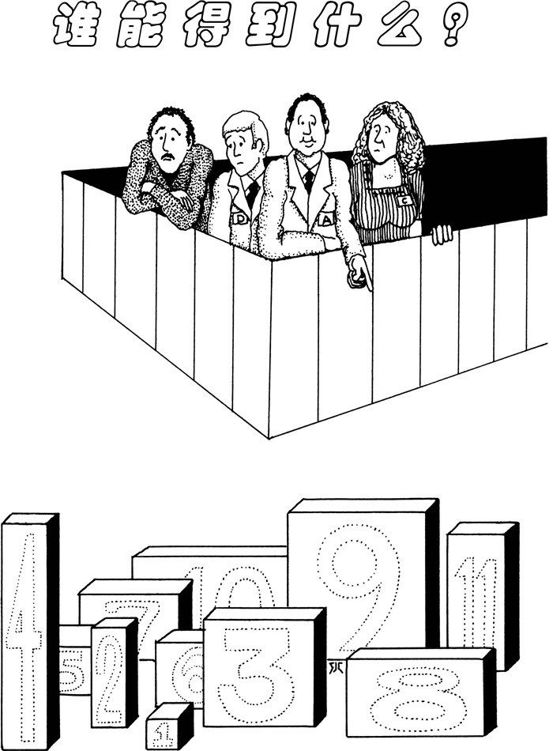

该公司支付了对方所要求的数额，之后获知了全部投标信息。令人沮丧的是，政府制定的竞购规则实在太复杂，他们拿到投标信息后仍然弄不清各家公司分别能得到哪些物品。公司领导最终心不甘情不愿地选择求援，但这时能够修改投标价的时间只剩下24个小时了。审计师来到一家计算服务机构，他虽然已经心力交瘁，但是也想好了一个计划。

该服务机构的管理人员向审计师保证他们将绝对谨慎行事，并带他见了程序员团队。团队负责人比利•布莱特艾斯仔细听了审计师目前的计划：设计一个计算机程序来解决这个伤脑筋的问题。审计师说，因为一共涉及11件物品和4家公司的投标方案，所以可能的中标组合共有411种，也就是大约4
000
000种（这样的估算能力是问题解决者的核心能力之一，本书暂且不探讨这个问题。如果你现在不明白这个结果是怎么得来的，就暂且相信它吧。你也可以找学数学的朋友求证一下）。

4 000
000种组合中的每一种都会为政府带来相应的总收益，政府当然会选择符合所有预设规则且总收益最高的投标方案。审计师打算借助计算机列出全部4
000
000种可能的中标组合，并按收益从高到低排序，然后由公司理事会从头到尾研究整个列表，找出收益最高且符合所有规则的中标组合。

一共还有24个小时，而需要借助计算机完成的工作就得用去大约12个小时，那就剩不了多少时间来讨论计划的可行性了。一旦投标结果出炉，就没法再做什么修改了。作为一个问题解决者，比利觉得这一计划显得简单粗暴，违背了他所信奉的优雅原则。比利提出，要是能向他透露一点政府给出的竞购规则，就有可能使总计算量减少到原来的十分之一，所得到的列表也会精简得多。而且如果完成计算只需要1个小时而不是12个小时，还将为公司理事会赢得更多的时间来研究更简短的列表。

审计师犹豫不决，除了必要的信息之外，不想提供额外的信息。但比利指出，如果采用速度更快的筛选方法，还可以利用节省下来的时间来预估修改投标价之后的新收益额，审计师最终被说服了。两人达成协议，一组程序员先按审计师的方案开始工作，比利则跟审计师去浏览一下竞标规则。而之前公司承诺绝不会将规则内容泄露出去。

比利走后，其他程序员有一段时间深感良心不安。这家公司居然掌握着密封投标中的投标信息，这些信息毫无疑问来自某种非法渠道。尽管审计师自始至终没有承认进行过违法操作，他们也从未听谁明确说过掌握投标信息是不合法的，但是如果参与到这样可疑的交易中的话，自己是不是就有道德污点了呢？

这些程序员大为困扰，于是向机构经理提出了这个疑虑。经理很快指出，他们忽略了另一个道德问题：这家公司是该机构的第三大客户，拒绝提供服务几乎是不可能的。实际上，要用最快、最可靠的程序在最短时间内生成有400万个条目的列表，这一过程中的技术问题深深吸引了程序员，所以最后他们还是或多或少把道德问题置于脑后了。这下，他们就像专业的问题解决者一样，绕过了道德考量这一关。不过话说回来，他们从未就如何应对道德问题接受过训练，所以才会专注于本职工作来解决技术问题，不是吗？

就在程序员们决定暂时不去考虑“良心不安”这件事20分钟之后，比利从公司高层那里回来了。大家急切地给他展示新发现的捷径，按这样的步骤做可以将工作成本降低到大约900美元。但是比利挥了挥手，示意大家安静。比利说，他用几分钟浏览了一下竞价规则，然后只用了一点点逻辑思维和一点点常识，就在5分钟内彻底解决了问题。

当然，他又用了20分钟向公司高层证明他确确实实找到了一个办法，可以解决他们研究了好几天的问题。不过花费这个时间是值得的，因为比利学到了有关定义问题的很重要的两点：

1. 不要把别人的解决方法作为定义问题的方法。

2.
如果你解决问题太过神速，别人根本不会相信你真的解决了问题。

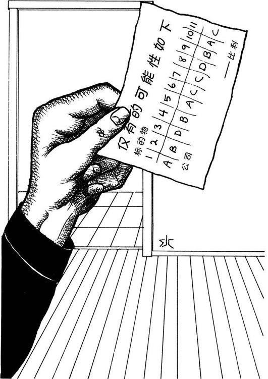

后记

如果比利目睹了程序员考虑道德问题的过程，他会从中学到另外一课，而这一课本可以应用于他自身。

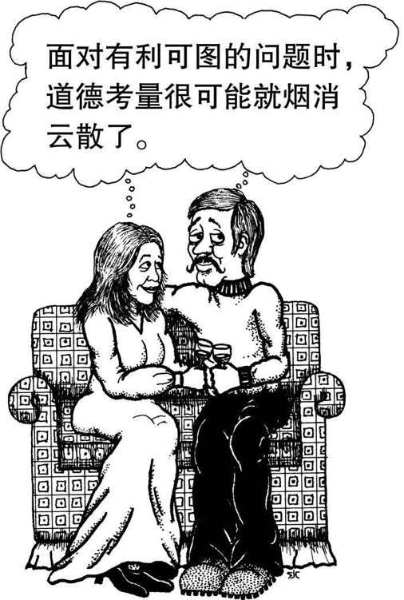

 

第5章　比利忍住没说

投标公司委派的任务刚开始就宣告结束，不用说，比利团队里的程序员非常失望。尽管比利当时没发现什么可疑的地方，但故事并没有完。第二年，比利转投另一家计算中心，与之前那家相比，这里使用的计算机功能更强大。入职那天，一位运筹学专家给他介绍了“程序包”的概念，即一组事先写好的程序，可以在各种场景中解决标准问题。

“当然，”专家告诉他，“程序包最大的优势在于可以降低成本，但有时它还有别的优点。”

“你是说它可以实现特殊功能，对数据的检验也更严格吗？”比利问。

“对，这两点可以算，但我想说的是一种更有意思的情况。有时候，拿出解决方案的速度可能非常重要。去年，有人委托我们处理一个与政府剩余资产竞标相关的问题，那是我们最重要的客户之一。他们似乎想办法弄到了其他公司尚未公开的投标信息，我们没细问，你懂的。他们想知道投标情况如何，这样，如果必要的话可以修改自己的投标价，以获得他们想要的标的物，而不至于拿到任何一样较差的东西。”

比利意识到自己曾参与其中，他尽量装出一无所知的样子，问道：“一共有几家公司呢？”

“除了我们的客户以外还有三家。但是标的物一共有11件，所以可能的组合情况非常多。”

“大概有400万种可能。”

“啊，你反应真快。是的，大概有400万种可能。因为时间特别短，不可能把所有情况都列出来，而且投标有各种附加条件，所以在短时间内靠编程解决问题太困难了。”

“那你们是怎么做的呢？”比利非常好奇。

“这就是重点，我们动用了程序包。只用了短短两天，线性编程专家就想办法把这个问题写成了适用于程序包的形式。然后，在计算机上只运行了几个小时，就得到了客户需要的答案。好家伙，这可涉及好几百万美元呢，他们开心极了。”

“真有意思。整个工作花了多少钱？”

“这是另外一个亮点。做线性编程的专员在这上面花了两天时间，这需要400美元，再加上计算机运行的成本，这部分大约是1000美元。”

“也就是说，客户只花1400美元就拿到了他们需要的解决方案。”

“而且用了不到3天！这就是我所说的程序包的价值所在。你甚至可以说，这都是些现成的解决方案，在等着问题找上门来！”

“是的，”比利若有所思地说，“完全可以这么说。”

当然，比利这时候在想的是他新学到的一课，这是之前关于问题定义所学到的那堂课的延伸：

别把问题的解决方案误当作问题的定义，当这个解决方案是由你提出的时候尤其如此。

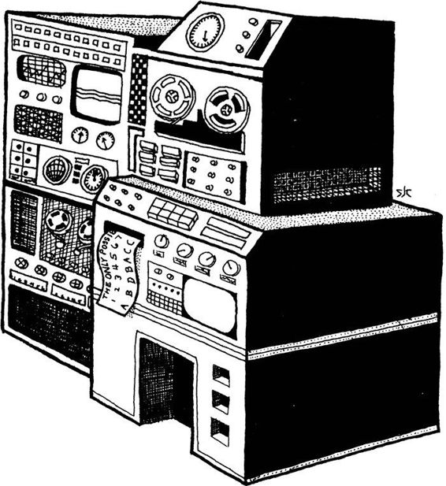

 

第6章　比利反思投标案

比利走出办公室的时候，那位运筹学专家以为他还沉浸在组合程序的世界里，其实他满脑子想的都是更吸引人的问题：

“另外两家公司是怎么做的？”

“他们找谁‘解决’问题的？花了多少钱？”

“所有投标价都改过了，最后开标的时候发生了什么？是不是所有人都很惊讶？”

“面对那些‘秘密’投标信息的卖主，这几家公司的人会说些什么？”

比利不禁想到这些。差不多一年之前，他就自认为已经了解了其中全部的奥秘，然后把这个问题放在一边了。现在，比利确定这个问题的实质和他当时所想的完全不是一回事。这不是怎样枚举400万种可能性的问题，也不是数理逻辑和常识的问题，更不是线性编程的问题。

也许问题是这样的：当其他各方都在修改投标价，并且都认为只有自己才有这种特权的时候，你该怎么修改自己的投标价？但这种假设其实不成立，因为如果有一家公司能发现其他公司也能修改投标价，那么另外三家公司也能发现一样的情况。

所以可能问题还要更深刻一点：如果各方都知道你知道他们可以各自修改投标价，也都知道你会基于此修改你自己的投标价，大家这时都在重新定价，那么你该怎么调整自己的投标价？不过如果是这样，不就和最初的密封投标法没有区别了吗？

等一下！如果一家公司知道它的投标价会被其他公司看到（这个价格以后可能会发生变化），也许它第一次会报出一个价格误导他人。会不会有一家公司为了坑其他公司，故意让他们相信所谓“秘密”的投标信息？也许四家公司都这么做了？如果真是这样，那问题就变成了：如何报出一个初次投标价，诱导其他公司往某一特定方向修改各自的投标价，同时还要确保自己的意图不被他们发现？

比利的大脑正在高速运转，就像在浴缸出水口泛出漩涡的水流一样。就在水即将放空的时候，比利头脑中又闪过一个念头：如果整个问题是个圈套，各公司第一次给出的价格只是用来误导其他公司，那最佳策略就应该是无视所有投标价，像对待密封投标一样对待这个问题。比利疲惫的大脑有些不堪重负，他在最近的一张椅子上坐下，还差点因为头晕坐了个空。他想到，换句话说，关于问题解决，真正的一课是这样的：

即使问题已经解决，你也无法确定你的问题定义是正确的。

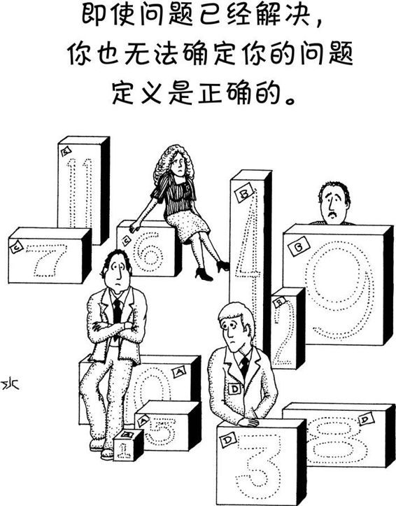

想明白了这一点，比利终于重新振作起来了。不过，在回新家的路上，他又琢磨起这堂“课”来。他想：“如果说我面对的问题是从这段经历中总结出这一课，那么假设上面我想到的的确是这一课的内容，我就没法确定我解决了正确的问题，这样，我也就没法确定我学到的是真正的一课。”比利在一段护墙上坐下来，摆出罗丹“思想者”的姿势。晚餐时间到了又过去了，日落的景象很壮观，但比利根本视而不见。路灯亮起来了，路上的车流渐渐增多，又渐渐减少，又多起来，又少下去。

最后，一名环卫工人放下水桶和扫把，轻轻问比利：“嗨，兄弟，一切都好吗？”

比利本来应该被吓一大跳的，但他没有。环卫工人的话正好解开了他的心结，他说道：“呃……不太好。不，不是一切都好，但是没关系，太谢谢你了。”

说完，比利站起身来，和疑惑的环卫工人握握手，小心翼翼地重新出发回家。“思考可真不容易，”他想，“我敢打赌，如果顺着上次投标的结果追踪下去，一定可以证明政府的计算是错误的。四家公司机关算尽，却没有一点成效。恰恰因为四家公司都作了弊，所以他们也就没有资格质疑政府的计算结果。然而，如果最初其中一家公司做出了符合道德规范的选择，他们就会问心无愧，最终也能有利可图。所以这一课值得永远铭记：

不要仓促下结论，但也不要忽视第一印象。

但是，真正让比利觉得“没关系”的是更深刻的一课，尽管他此前在考虑问题的“真正”定义上犯过好几次傻。比利已经和这样一个重要的问题纠缠了一阵了：

问题是什么？

之前，比利和其他问题解决者之所以误入歧途，就是因为他们认为，如果一个问题很重要，那么问题的答案一定也很重要。“不对，”比利一边心不在焉地从信箱里取信件，一边自言自语，“完全不是这样的。面对问题时真正重要的一点在于，你要知道，问题是永远得不到解答的，但只要你一直在提出问题，就没有关系。只有当你自欺欺人地想，你已经找到了问题最终的、正确的定义的时候，你才会相信你找到了最终的解决方案。如果这么想，你可就错了，因为从来没有什么东西是‘最终的解决方案’。”

想明白了这一点，比利放松下来了。他好好睡了一觉，然后去市中心定制了一块铜牌放在自己的桌上，牌子上写着：

你永远无法确定已经找到的问题定义是正确的，但是永远不要停下寻找正确定义的脚步。

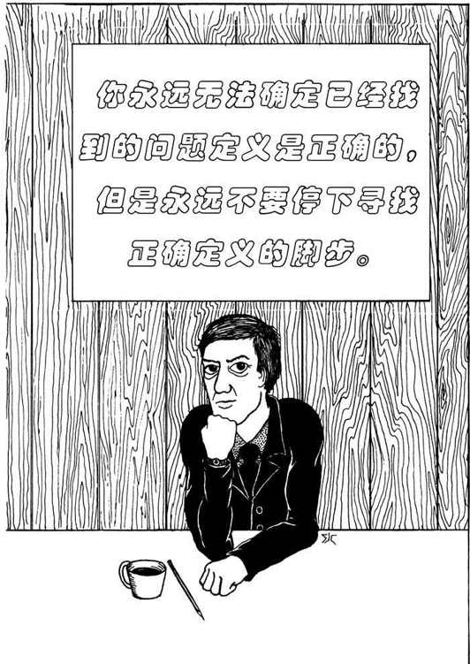

后记

比利和这场投标的故事是真实发生过的。文中进行了一些修改以免任何局外人认出这桩二十年前的公案。然而在某个地方，很可能还有至少两位问题解决者能想起这个故事。这么多年后，再把这件事写出来，正是为了继续寻找一个更准确的问题定义。另外那几位问题解决者会给我们反馈吗？谁知道呢。

 

第三部分　问题到底是什么？

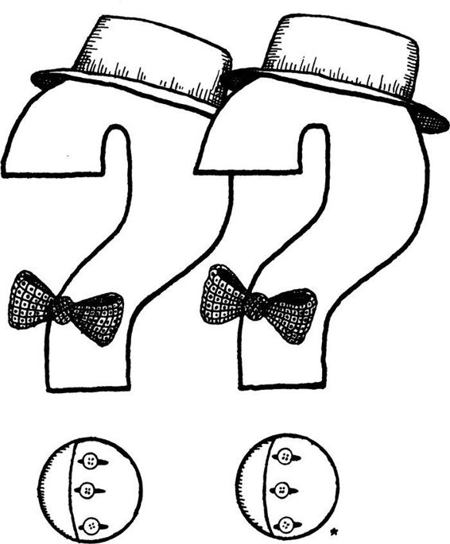

 

第7章　无尽的链条

一家大型计算机公司研发出了新型打印机，与之前任意一款机器相比，它速度更快，印刷也更精准。有新技术作保障，提高打印速度是很容易的，但工程师团队在确保打印精准度上遇到了一些麻烦。打印出的成行文字有时歪歪斜斜，有时虽然每一行文字是平直的，但在表格纸上的位置会时不时跑偏。每进行一项新的打印测试，工程师们都要花大量时间来测量输出稿的准确性，费力不讨好。

团队中最年轻也最聪明的工程师丹·德林提出，应该设计一种工具，用来在打印纸上标记出一个20厘米的间距，做印记、打孔或者其他方式都行。以得到的标记作为基准线，就可以快速而准确地找出印得不整齐的地方。

于是几名组员开始仔细考虑设计工具的事。然而大多数人都陷入了这样一种思维定势：在纸上做标记就是要把标记给印上去。鉴于他们都是经验丰富的打印机设计师，产生这样的想法是很自然的。丹·德林跟打印机打交道比较少，他想出了一个出人意料而且高效的主意，最终成品是如下图所示的铝条，上面装有小针，可以准确地在定点上扎出小孔。

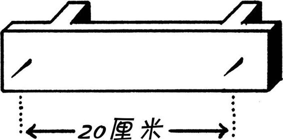

这样一件工具制作起来很容易，而且结实耐用，精确度高。这下，之前花在标记标准间距上的时间可以用来做更有意义的事情了，丹的经理为此十分得意。几周下来，新工具的功劳有目共睹，经理决定推荐丹参评一项公司特别奖。他还从店里定制了一件这样的工具放在办公室里，这样就可以一边研究它一边写报告了。
不幸的是，他没像上图那样把这件工具侧放在桌上，而是让它靠两条“腿”立着，如下图。

如果丹的经理去过印度，见过苦行僧坐在钉床上的样子，他就不会这样放置它了。如果丹的经理的主管曾经是个苦行僧，他往桌角一坐的时候也能安然无恙。那时，他正要和蔼地说起丹即将到手的大奖。哎，可惜两个“如果”都没有成立。整个部门的人都听到了部门主管发出的一声惨叫，他的臀部被扎出了间距恰好为20厘米的两个洞。

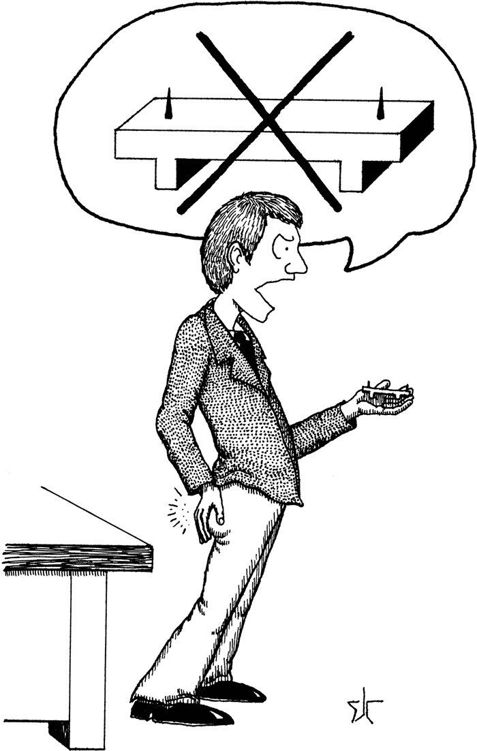

所幸，他有足够厚实的皮下脂肪。尽管如此，本来要发给丹的奖就在主管被扎的那一瞬间化为了泡影。主管真想把新工具扔出窗外，也许更想把丹连着一起扔出去。好在丹的经理救了场，他提议简单改进一下工具，把它的两条“腿”打磨成半圆形。这下，工具没法再靠“腿”立着，针尖朝上这种危险的情况也就不会再发生了。它只能侧放，如下图所示。

因为任何一个问题都是理想状态和现实状态之间的差别，当人们通过改变状态“解决”一个问题的时候，常常会新制造出一个或几个问题来。简单地说，

每一个解决方案都是下一个问题的来源。

我们永远都没法避开问题。问题、解决方案、新问题循环出现，构成了无尽的链条。能指望的最理想状态就是新问题比我们“已经解决”的问题要好对付一些。

有时，我们简化问题的方法是把问题抛给别人，这种办法叫做“转移问题”。如果使用得认真谨慎，能帮得上大忙。然而在更多情况下，新问题是无意之中产生的。这很常见，常常有这样的情况：

某些问题最困难的部分就在于发现问题存在。

一发现那件工具的危险性，人们就能想到多种多样的解决方案。事实上，工程师每天使用丹制造的工具，已经意识到如果它靠“腿”站着会很危险，所以养成了把工具侧着放的习惯。但是他们没有考虑到，其他人也可能接触到这件工具。

“其他人”和工程师不一样，他们不清楚工具的危险之处在哪里，所以很有可能不小心坐上去或者戳到手。工程师知道他们自己可能会碰到安全问题，但没能预见到别人也会碰到这样的问题——这是问题转移的另一个例子。

我们甚至不能确定，圆腿设计会不会带来新的问题。也许你愿意想想那会是什么样的一个问题。

可能应该这样说，“那会是什么样的一类问题呢？”人类生下双胞胎、三胞胎的几率可能很低，但在问题的世界里，一次产生少于三个问题才罕见。事实上，未来的问题解决者需要掌握的一条重要规则就是：

看看你对问题的理解，如果想不出至少三个可能有出错的地方，你就没有真正理解这个问题。

在任何一个问题定义中，都有几百个点有可能被忽略。如果连三个疑点都找不出来，那么你要么是不会思考，要么就是不愿意思考。

发现工具有危险之后，经理想出了他的解决方案。你能从解决方案中找出三个可能有问题的地方吗？

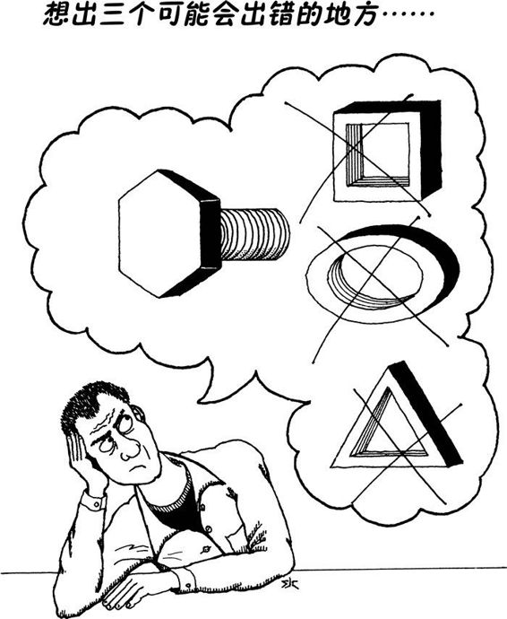

 

第8章　忽视不协调之处

每当一件工具出了问题，我们总习惯于去指责被它伤害的人（比如故事中扎伤屁股的主管），而不是工具的设计者。丹的例子比较特别，因为他的工具应用范围很窄。通常情况下，等到设计中的缺陷暴露出来，造成严重后果时，设计者早就不知去向了。如果这个打孔器制作出来不是供内部使用，而是广为销售的话，人们反而会去责怪那些弄伤自己的人，因为“他应该先看看清楚再坐下来”；或者顶多会责怪把工具竖直放着的人，因为他们“不为别人的安全着想”。如果这种工具进入市场销售了，人们会认定此前肯定有成千上万人用过它，而且都没被扎伤。要是有人受过伤，他们一定早就去投诉了，不是吗？

之所以会出现上面这样的问题转移，与设计者息息相关。设计者的工作就是事先为别人解决问题。他们和房东一样，很少体验到自己的行为所带来的后果。因此，设计者不断制造出不协调的解决方案。这些解决方案和与之相关的人员之间不匹配，有些时候甚至会产生危险。

很久以前，没有人刮胡子。后来，不知怎么地，人们发现留胡子和享受快乐之间存在矛盾，于是开始自己刮胡子或者请人帮忙刮。在装有一次性刀片的“安全剃刀”出现之前，常常有人在磨剃刀的时候割伤自己。安全剃刀发明之后，一次性刀片不用打磨，男人倒不会在磨刀时受伤了，可他们的妻子或女佣经常在处理垃圾的时候遭到殃及。小孩有时会翻出未经处理的一次性刀片，因此他们被割伤也很常见。

后来，人们造出了上面有小槽的药箱，用来回收用过的刀片。在这种药箱普及的地方，至少妇女和儿童相对安全了（直到妇女因为某些原因开始剃腿毛和腋毛）。但在几十年的时间里，男人取下刀片扔进小槽的时候经常刮伤手指。数以百万计的男人女人看着自己的鲜血滴进水槽或者滴在干净的毛巾上，想道：“没有别的办法来处理刀片真是太糟糕了。如果有可行的办法的话，别人肯定早就发明出来了。一定是我太笨手笨脚了。”

后来某一天，真的有人发明了一种办法（天知道他是怎么想到的）。新刀片用小包装装好分售，用过的旧刀片取下后也装回小包装里，小包装可以循环使用。这个发明并不复杂，很快出现了不少模仿者。这次，问题的关键就在于首先要意识到问题的存在，或者让设计者意识到有问题存在。也许设计者自己是找理发师帮忙剃须的，也许他留着大胡子没剃过，也许最初的一次性刀片发明出来之后就找不到设计者了。问题一解决，谁还需要设计者呢？

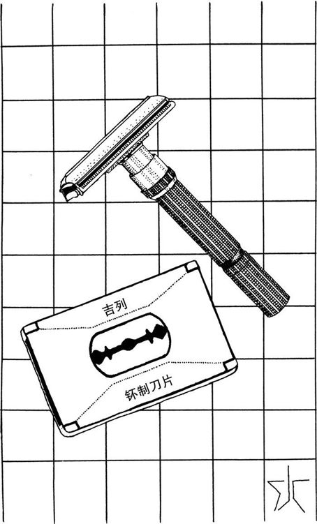

大多数不协调之处一经发现很容易解决。有些问题需要“有关部门”出马，但大部分情况下，不得不面对这些问题的人会成功找到办法。人类的适应能力非常之强，几乎可以容忍任何形式的不协调，除非他们意识到容忍问题不是唯一的办法，这时候麻烦就来了。

在最近这次能源危机中，全美范围内车速上限降至55英里每小时。每个人都认为一旦危机退去，车速上限会很快回到65英里每小时或更高水平。然而，低速行驶使事故发生率和死亡率都大幅降低，这对高速行驶时的既得利益者来说可不是个好消息。在这次大型“实验”之前，没有人确切知道为什么每年有50000人死在高速公路上。汽车制造商归罪于司机，与制酒业无关的所有人指责醉酒驾驶者是罪魁祸首，但从没有人因为立法者设定了如此之高的车速上限而责怪他们。

并非所有事故都能归因于车速上限，但事实显示，能归咎于这一原因的事故占到相当大的比例。在此后的几个月里，公众对车速上限和车辆、司机、道路之间的不协调之处有了不同的认识。这是一个什么样的改变啊！这下，车速上限得要好多年才能慢慢调回到原来的水平，如果上调太快，一定会被人注意到的。

车速上限突然改变使高速公路上的车速与行驶安全之间的不协调之处人尽皆知。在这一变化发生之前的好多年里，车速限制一直在缓慢提高，与之一起增长的还有事故率。但是没有人意识到这两者之间是有联系的。同样的道理，与最初错误地定义了问题的人相比，一个拿到了新的解决方案的人更容易看到哪里不协调。可是一旦最初的陌生感褪去，人所共有的适应能力就会忽略不协调之处。我们又一次看到这条规则有多么重要：

不要仓促下结论，但也不要抛弃第一印象。

然而第一印象已经淡去很久之后我们该怎么做呢？是每次都得向局外人（咨询顾问或者其他人）求助，来唤醒新鲜感吗？尽管找顾问（比如唐和杰瑞1）没什么问题，但你可以学点别的技巧，不再那么依赖于他们提供的服务。

1. 唐和杰瑞是Donald 和
Gerald的昵称，本书的两位作者。——译者注

一方面，要想得到一个全新的视角，几乎任何一个人都可以当帮你的“顾问”。不要找顾问“专家”，他们有可能比你更安于现状。可以试着上街问问路人，看他们对某个设计或某个问题定义怎么看。为了向一个没有参与其中的人解释情况，你自己也不得不换一个新的角度来看问题，这样也就发现了新的不协调之处。

去外国旅游的时候，你不可避免地会遇上让人觉得别扭的“新”东西。货币制度不合理，路标出现在错误的地方，厕纸不对头。不过更有启发意义的经历还是陪一位外宾在你的祖国到处走走。透过他的眼睛，你可以再次发现你自己的文化有什么奇怪之处。

为什么说是“再次发现奇怪之处”呢？因为孩提时代你曾经发现过，但后来，大人们把这样的观点反复灌输到你的小脑袋里：“眼前的世界不仅仅是唯一存在的世界，还是可能存在的世界中最理想的一个。”

第一次把美元纸币拿给一位瑞士游客看，你肯定会听到这样的抱怨：“可是所有币值的纸币大小都一样吗？那盲人怎么把它们区别开呢？”你只能尴尬地保持沉默。如果不是盲人，你永远不会从这个角度去评价纸币。永远不会吗？应该是几乎不会，至少童年结束之后是这样。但童年时你连一美元的纸币都很少见到，所以这在当时不算个问题。

瑞士游客接下来会说：“它们的颜色还都一样！人们找钱的时候不会犯下很多错误吗？”你又一次陷入了难堪的沉默，默默地想多少错误算是“很多”。因为5元纸币被错当作10元纸币，你的确有过被少找钱或者多找钱的经历。然而到了现在，你已经认为犯这类错误就像“自然法则”一样理所当然。重新意识到这个问题之后，你开始注意美国人都用了哪些办法去避免犯错。几天时间里，你认真观察自己接触到的每个收银员，但最后又把这些都忘了，回到舒服的老样子。你要是想真正锻炼一下这种意识，试试看连续几天用面值2美元的钞票付钱。

对于如何才能更好地找到不协调之处，以上经历给我们这样的启示：

借助外国人、盲人、儿童来检验你给出的定义，或者让自己设身处地地站到外国人、盲人、儿童的角度上来检验。

选一件你每天会用到的东西，比如鞋、衬衫、叉子、小轿车的门、牙刷或者上千件类似物品中的一件，给自己安排这样一项训练，以一个从没见过这件东西的外国人的角度来审视它。然后试着闭上眼睛（或者捂上耳朵，或者屏住呼吸，视具体情况而定），用用看这件物品。还可以想象你身高只有现有水平的四分之一，而且是第一次接触到这件物品。如果你不识字，或者动手能力比较差，又会发生什么呢？

你可以拿一本书试试，不要考虑内容，只看它的结构设计，并且不断变换角度思考问题所在，直到找到\*\*至少\*\*10个会在阅读时带来不便的地方，而这些地方你平时已经熟视无睹了。例如，唐在短短几分钟里想到了以下这些：

 

1.  暂时放下书时很难让它保持原状。

2.  因为没法只带上书的某一部分，即使知道只用得上书的一部分，也不得不带上整本书。

3.  书的装订方法让读者阅读时觉得太厚重，但对于长期保存来说又太容易磨损。

4.  如果不用手扶着，书就会自己合上。

5.  书页很容易被撕破。

6.  有些书页粘连在一起。

7.  纸张太光滑，反光刺眼。

8.  每一行文字太长，换行时有时会回到同一行或跳行。

9.  页边距太窄，不够写批注。

10. 缺少一个把手类的东西，不方便携带。

如果从书本结构设计这样一项古老而且成熟的解决方法中都可以找到这么多不协调之处，人们未经检验的观点又有多大可能是完美无缺的呢？可能性不太大。本书可以足够自信地说：

每转换一次视角，都会发现新的不协调之处。

在把一项“解决方案”付诸实践之前从各个视角对其审视一遍，不是比等到出现灾难性后果才意识到问题存在好得多吗？

 

第9章　找到问题所属的层面

问题一：图中所示是一个非常常见的东西，它是什么？

“一个圆。”大多数人会毫不犹豫地这样回答道。如果他们的确解决了问题的话，为什么他们解决这个小问题这么快，而另外有些问题即使能解决，也会让人花上一辈子的时间？尽管刚开始讨论问题的解决困难重重（之前的章节有不少令人费解的地方），人们的确解决了这个问题，他们也解决了成千上万别的问题。你刚才可能差点要开始相信人类是无法解决任何一个问题的了！

当你以大多数人解决问题一的速度解决了一个问题时，可能不会意识到这是怎么做到的，揭示问题解决过程的一个好办法是问一问：

如果想得到不同的解决方案，该怎样变换问题的表述方式？

在这个例子中，问题的表述方法帮上了大忙。为什么呢？很可能是因为有“常见”这个词在。现在把问题的提法改一改，检验一下上面的假说。

问题二：图中所示是一个东西，它是什么？

或者保留“常见的”，删去表示强调的“非常”，得到这样一个问题：

问题三：图中所示是一个常见的东西，它是什么？

把关键词换成它的反义词，可以让测试更有说服力，就像这样：

问题四：图中所示是一个非常不常见的东西，它是什么？

像这样在问题的表述中作出如此“微小”的改动来观察效果，可以作为派对上一个有趣的游戏，也可以作为一个科学实验。让不同的人或群体拿到不同的问题表述，各种表述之间只有细微的区别，而问题的答案都是同一样东西。在派对游戏上，人们随后就会看到所有人对问题的回答，并根据答案猜问题是什么。而在科学实验中，通过分析答案可以深入了解人们的思维过程，看看他们如何确定：

我需要解决的问题是什么？

在实验中，绝大多数人对问题一的回答是“圆”。当“非常”删去后，回答“圆”的人数比例下降。删去“常见的”之后，比例进一步下降。在“常见”前加上“不”之后，原始问题的意思发生了变化，回答“圆”的人数比例降到了零。取而代之的答案包括“洞”、“呼啦圈”、“从橡皮头一端俯视的铅笔”、“椭球体的横截面”、“镥质硬币”、“显灵板上的圆形透镜”、“赫伯怀特式靠背椅上的饰品”、“一只不守规矩的蜜蜂所建蜂窝的一部分”和“微型直升机的停机坪”。

另一方面，尽管很多人会在前三个问题下写些回答，相当多的人拒绝回答问题四。在被问到为什么不作答时，大部分参与者说，他们觉得“解决”这个问题的机会太渺茫，不值得冒险一试。你可以再改一改问题来检验上述分析：

问题五：图中所示是一个非常不常见的东西，想想它可能是什么，给出一个最不合常规的答案。

这样一来，很少有人答不上来了。因为问题看起来问的是他们的“观点”而非“正确”的答案，危险解除了。每个人（或者说几乎每个人）都有自己的观点，而且每个人对于自己的观点都是专家。

一旦确定问题，人们会先浏览一下，以便从语义层面上给它定位。如果在期末考试中出现这样一个问题：

为什么亨利八世杀了自己的妻子？阐述你的观点并评价他杀妻的手段。

看到“阐述你的观点”，学生会判断出题人真正需要的并不是一个“观点”，而是一个“正确的”答案。亨利八世沟回密布的大脑中所想的“真正”原因，只有教授才能彻底弄清楚。

只要可行，人们会首先把问题置于让自己觉得最舒适的语义层面上。如果教授是一位软心肠的自由主义者，而且学生在他讲亨利八世的整节课都在打瞌睡，那么，最舒适的情况应该是假装这个问题的确是在问学生自己的观点。考完试之后，可以试着去辩解说这是教授的错，他应该在措辞上更加谨慎。不过，如果他比较固执，循规蹈矩，学生们就不能再拐弯抹角玩诡辩术了。在“最舒适”的层面上，问题的意思是这样的：

为什么亨利八世杀了自己的妻子？他杀妻的手段如何？关于这两个问题我上课时是怎么说的？

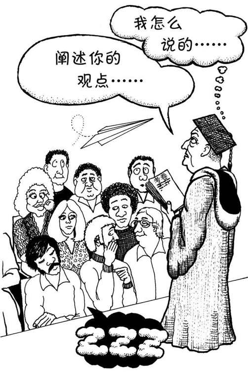

这里的“舒适感”之所以会出现，可能是因为人们知道该如何解决某个层面上的问题。人们可能知道问题的来源、问题出现的背景，或者对于问题的实质有更微妙的感觉，无法用语言表达，但人们知道它是“正确的”。

在问题一中，“常见的”一词帮我们中的大多数人排除了“椭球体”这一答案，图画的特征又排除了呼啦圈一类的东西，从而将问题定位于“平面几何”这一层面。在问题四中，由于不可能在平面几何的层面上解决问题，一些人转向了复杂度极高的层面。然而，同一个问题也使得另外一部分人根本无法确定该问题的语义层面到底是什么。

如果这个问题出现在Dick and Jane's Golden Book of
Puzzles中，人们可能会定位到“玩具”的语义层面上，因此给出如呼啦圈、没有辐条的自行车轮胎或者机械积木“万能工匠”中的一个轮子上的洞之类的答案。但由于出现在这本内容复杂的满是经验之谈、关于如何定义问题的书中，加上这本书自称对粗心大意的读者来说陷阱遍布，给这个问题确定语义层面所需要的背景信息变得异常复杂。很少有读者会从简单的几何学角度来考虑，这个角度好像太明显了。但是这样一来，对粗心的读者而言，上述问题不就是一个陷阱了吗？

后记

顺便说一句，如果你现在已经相信，这幅图所代表的是一个圆形物体，具体是什么有无数种可能，那就试着把它和一些“真正”的圆形物体比较一下。你的结论有变化吗？这下，你是不是更欣赏下面这条重要原则了？

当你沿着定义问题的道路疲倦前行时，过一会儿就要回头看看，确认自己没有走错路。

 

第10章　注意你所表达的含义

“没有什么对我们的顾客来说好得过了头。”橱窗上有这样一句标语。但是它想表达什么含义呢？是说：

“全世界没有什么东西对我们的顾客来说好得过了头。”

还是：

“对我们的顾客来说好得过了头的东西不存在。”

这是个愚蠢的文字游戏吗？难道不是每个人都清楚标语的含义吗？如果前面关于问题措辞的讨论有用的话，可能不是这样的。人们一次又一次地看到好心的问题解决者拟出看起来无比清晰的问题表述，却在“没有什么”、“可能”、“全部”、“或者”这样的词语上栽了跟头。

当然，上学的时候，我们听说纠缠这些暗藏玄机的词语是“不合理的”，学校并没有帮我们做好准备，来应对覆满常春藤的院墙之外那个不合理的世界。以上只是其中一个例子而已。任何一位计算机程序员都能举出十几个例子，说明一个被误解的词、一个放错地方的逗号、一个歧义句怎样造成了一万元、十万元、一百万元乃至更大金额的损失。

在一个案例中，程序说明里写道：

“有关例外情况的信息也存储在XYZ文件夹中。”

程序员的理解是：

“另外一个存储有例外情况相关信息的地方是XYZ文件夹。”

因此，他认为有关例外情况的信息在其他地方保存了副本，所以他正在操作的程序无需保存这部分信息。

事实上，作者的意思是：

“XYZ文件夹中保存的另一类信息是与例外情况相关的信息。”

他并没有说这些信息在其他地方存有副本，事实上也的确没有副本。结果，大量极有价值的信息丢失，无法恢复。在发现程序说明存在不同解读之前，信息丢失所造成的损失已经达到50万美元。对于一个随意安插的“也”字来说，这实在是一大笔钱。

50万美元就这样打了水漂，肯定会有人为此掉脑袋，但是应该算到谁头上呢？是说明的作者还是程序员？绝大多数英语老师会想砍掉程序说明作者的脑袋，教人解决问题的人则会瞄准程序员的脖子。难道没有人喜欢一种不那么血腥的办法吗？

你可以向写作者宣传写出清晰易懂的问题表述有多么重要，直到他们听得不胜其烦；也可以劝问题解决者仔细读问题，而他们可能读得眼睛都瞎了。即使过去的经历有用，也帮不上太多的忙。不管人们有多诚心诚意，只是加倍努力是不够的。你永远没法确定在场的每个人对同样的词句会有同样的理解。

你需要一种社会化的过程来把这些话从纸上转移到他们头脑里，方法之一是词语游戏：

一旦你将一个问题描述拟成了文字，做些文字游戏，以确保每个人对问题的理解可以统一。

几乎任何一种游戏方法都对解决这个问题有启发作用，比如也许可以揭示出人们在对问题的理解上有什么差异。看看这个简单的事实陈述：

玛丽曾有一只小羊羔。

还有什么比这个命题更清晰么？等我们尝试一些文字游戏之后，你可能就不这么觉得了。例如，试着把强调的重点依次放在每个词上，得到：

玛丽曾有一只小羊羔。（而不是约翰有）\
玛丽曾有一只小羊羔。（但现在没有了）\
玛丽曾有一只小羊羔。（和别人有几只不一样）\
玛丽曾有一只小羊羔。（和你想的不一样，不是一只大的）\
玛丽曾有一只小羊羔。（那只狗是亨利的）

你还可以强调某两个、三个、四个、五个词语，每种组合都会赋予这个“简单的”事实陈述不同的意义。

也可以试一试词典法。对于句子中的每个词，列出词典中的全部词义，然后试着把每个词义应用到原句中。

在词典游戏中，最常见的情况是小词使得句子的意义有所区别。以“had”这个词为例，在《美国传统英语词典》中，可以看到“had”是“have的过去式和过去分词”。尽管这种说法有可能造成语法上的歧义，但我们还是翻到604页吧，这里显示“have”一词至少有31种词义。很少有冰淇淋店的口味能多过这个数吧！

第一个义项符合我们此前对句义的理解：

 

1.  作为某人的财产；拥有。

不过看到第二个，我们得停下来想想。

2.与…...有关或有某种关系：have three
children（生了三个孩子）

一个古老的笑话正源于这个义项：

Mary had a little lamb, （玛丽生了一只小羊羔，）\
The event made medical history. （这书写了医学史上新的一页。）

浏览整个词义列表，我们可以根据以下这些选出的义项造出新的笑话或者新的解读方法。

 

1.  存在头脑中；容纳：have doubts （有疑问。）

2.  行贿或买通。

3.  吸引…...的注意；迷住。

4.  对…...取胜；击败。

5.  欺诈，欺骗，戏弄。

6.  从性关系上占有。

7.  接受或选择：I'll have the gray jacket.
    （我要这件灰色的夹克衫。）

8.  吃光，通过吃或喝消耗。

自己试试剩下的义项，另外试试“little”（小）和“lamb”（羊羔），不要忘了“a”（一只）和“Mary”（玛丽）。当你下一次需要表述问题的时候，不要忘了这种方法。

玩词语游戏的成本远低于得到一个讨厌的解决方案。对于一个待定的问题定义，你有必要把所有的词语游戏都试一遍。以下是另外一些词语游戏，每一个都为人节省过100万美元甚至更多——这就是词语游戏金榜。

 

1.  改变重读的方式（如上）。

2.  把肯定的换成否定的，反之亦然。

3.  把“可能”换成“必须”，“必须”换成“可能”。

4.  把“或者”换成“不是…...就是…...”，反之亦然。

5.  把“和”换成“或”，反之亦然。

6.  选择一个意义清晰的词语，在每一处都用清晰的词义替换掉这个词。

7.  对于每个表示“等等”的词，在已有的列举中再加上一个明确的例子。

8.  找出旨在说服人的词语或词组，如“明显”、“因此”、“很清楚地”或者“当然”。把每一个这一类的词语或词组换成它所取代的论证过程。

9.  试着画出某句话或者某个段落所说的内容。

10. 用等式表达本来用语言表达的意思。

11. 用语言表达本来用等式表达的意思。

12. 试着用语言表达某幅图想说的意思。

13. 把“你”换成“我们”。

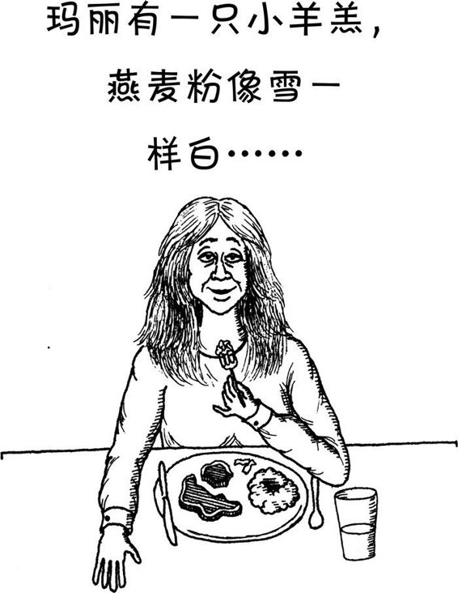

 

1.  把“我们”换成“你”。

2.  把“我们”和“你”换成“双方”。

3.  把泛指换成特指，特指换成泛指。

4.  把“一些”换成“每一个”。

5.  把“每一个”换成“一些”。

6.  把“总是”换成“有时”。

7.  把“有时”换成“总是”。

用常见的材料来玩这些游戏，比如试试这句不朽的歌词：

那里终日晴朗（WHERE THE SKIES ARE NOT CLOUDY ALL
DAY）

然后再来处理你现有的问题定义的表述，你会很快发现，游戏可以成为多么重要的利器，你会想再要至少20个游戏来补充你的武器库。

如果这个数字听起来很荒谬，试试词典游戏吧。应该把词典游戏也添加到上面的游戏列表中去。用不了多久，你就会走上成为问题定义领域专家的道路。

 

第四部分　问题该由谁解决？

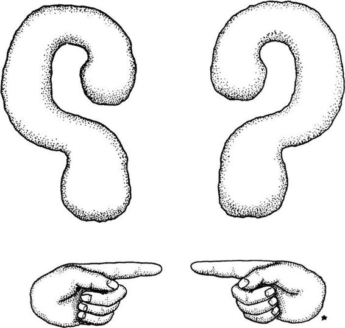

 

第11章　烟雾缭绕

某班级由11个学生组成，他们每周三下午上3小时课，讨论问题的解决方法，而且老师是个聪明人。尽管12个人中有11个不抽烟，剩下的那个人却有严重的雪茄瘾，这让大家错愕不已。

教室很小，通风不畅。那位学生的雪茄烟虽然廉价，但烟雾扩散得非常快。第一次上课时，刚上完第一节课，烟气就已经布满了整个空间，只有最矮的学生幸免于难，几个高个子的脸都已经变绿了。而吸烟的同学还在一脸幸福地吞云吐雾，完全没有意识到有任何问题。老师是个问题解决者，在他看来，显然出现了问题，或者说问题很快会出现。

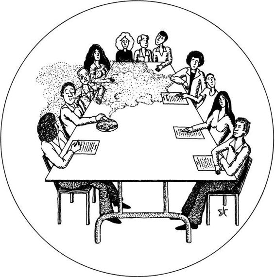

在读下去之前，想想这个例子，给下面的问题选择一个答案：

这个问题应该由谁来解决？

\(a\) 不抽烟的学生

\(b\) 抽烟的学生

\(c\) 老师

\(d\) 教务主任

\(e\) 这所大学的校长

\(f\) 以上没有正确答案

\(g\) 以上全部（包括f）

事实上，老师（选项c）并未发现有什么问题，因为他的父亲吸雪茄烟，他从小就在烟雾中长大。这位老师对空气中弥漫的烟味非常适应，甚至觉得抽烟这种恶劣的习惯很正常。和往常一样，教务主任和校长在需要解决问题的时候完全置身事外。因此，通过排除，选项只剩下(a)
不抽烟的学生和(b) 抽烟的学生。

第二次上课时，老师迟到了10分钟，学生们只好等着。一个不抽烟的学生抓住了这次机会，发起了一次解决问题的班级会议，主题是教室内的空气污染。老师抵达教室时，会议正进行得热火朝天，连那个抽烟的学生都兴致勃勃地参与其中。也许是因为这门课本来就是关于怎样创造性地解决问题，老师明智地允许会议继续进行。再说，他也寡不敌众。

黑板上逐渐列出了几种可能性，包括：

 

1.  在下午上课前，由每位班级成员打电话给还在上班的抽烟者，提醒他不能携带雪茄。

2.  由某一位有早起习惯的班级成员在凌晨4：30打电话给抽烟的同学，问他上次上课的时候为什么要抽烟。

3.  把抽烟者车胎的气放掉，抽一支雪茄就放一个车胎的气。正所谓以牙还牙，以气还气。

全班用了整整一个小时，笑场无数次，终于让抽烟的同学明白了他们的意思。这种方式让他没有被冒犯的感觉，也没有置他于被动防御的境地。

接下来，主持会议的同学问抽烟的同学，觉得哪个建议可以接受，或者经过修改之后可以接受。几乎同时，抽烟的同学说他愿意上课期间不再抽烟，转而培养其他在社交中不那么讨人厌的（甚至是讨人喜欢的）习惯。为了符合这门课“创造性”的主题，他提出每个同学每周带一些口感比雪茄更好，至少是更有趣的零食全班一起分享。

大家愉快地接受了这个建议。在教室里吸烟的情况就此告终，随之而来的是上千卡路里的奇异零食，例如甘菊饼干、胡萝卜蛋糕、烤鸡翅比萨、绿番茄派、带苜蓿芽夹心的双层巧克力软糖。这个班级平安无事地度过了整个学期，每个人都吃得胖乎乎的。

如果老师认为答案是(c)，也就是这个问题应该由他自己来解决，结果会怎样？这样想一想很有启发作用。他可能这样做：

 

1.  规定禁止吸烟，要求抽烟者退课或者逼得他敢怒不敢言。

2.  规定允许吸烟，迫使一些不抽烟的同学要么退课，要么因为受不了烟味儿而呕吐。

3.  交替设置可以抽烟和不可以抽烟的上课日期（或时间段），弄得大家都为此不开心。

他没有对此做任何规定，而是明智地遵循了自己在问题解决上的信条之一：

当别人可以妥善解决自己的问题时，不要越俎代庖。

这样做不仅是因为问题相关方对问题了解更深入、感受更真切，也因为在他们自己提出解决方案之后，更愿意参与到执行的过程中去。先期花费的时间（一个学期45小时上课时间中的90分钟）使这些人更希望方案能顺利解决问题。

另外，如果老师以权威姿态提出同样的建议，很可能不被学生接受。即使学生能接受，也不会充满热情地付诸实行。我的一位朋友是位一流教授，他生活中有时候漫不经心，在高档餐厅吃完饭之后才发现没有带钱这种事儿常常发生在他身上。这种情况下，他就对餐厅老板笑笑，说：“我们碰到了一点问题。”你能想象如果他说“你碰到了一点问题”会发生什么吗？或者即使他说的是“我碰到了一点问题”了？

如果这是别人的问题，就把它当成是别人的问题。

 

第12章　校园停车难问题

某大型州立大学有一处新建不久的校区，该校区最近遇上了自从汽车问世以来不曾绝迹的问题：停车难。学校新落成的时候，停车场还有所富余，真的，好像校园里到处都是停车场。似乎就是为了解决停车场过剩的问题，新楼接二连三地拔地而起。与此同时，学生人数上升到之前的三倍，教师人数翻了一番，行政人员人数达到之前的五倍。停车成了“问题”。

为了还权于民（鉴于我们都是人民中的一员，我们都知道此前权力归谁所有），师生理事会取消了所有预留停车位，除了供给残疾车主和校长的车位。目前仍有充足的停车位留给进入学校的车辆，但大多数车位距离办公楼和教学楼有500米至1000米远。

另一条可能与问题相关的信息是天气状况，学校所在地常常有狂风暴雨。事实上，有这样一种说法很贴切：校园里只有三个季节，雪季、泥季和尘季。

在继续往下读之前，试着回答一下：这个问题应该由谁来解决？

\(a\) 学生

\(b\) 教师

\(c\) 大学校长

\(d\) 州立法机关

\(e\) 州长

\(f\) 以上没有正确答案

\(g\) 以上全部

通过仔细思考后进行排除，可以确定(d)和(e)一定不是正确答案。(c)有可能是对的，但校长有自己的预留车位，他不会因为停车问题受多大的困扰。校长有决策权，没错，无论何时，每当所谓的师生“理事会”想做些真正重要的事情，他都可以推翻理事会的决定。但校长从未切身体验过停车难的问题，他凭什么觉得这件事很重要呢？

在社会上，很多问题源自系统的设计者和决策者，他们并未亲身体会过应该由他们“负责任”的问题。哥谭市警察局长乘坐一辆豪华轿车走遍全城，轿车由私人司机驾驶，交通拥堵和行凶抢劫对他来说意味着什么呢？在一个旧的烟灰缸变满的时间里，猛犸汽车公司的汽车设计师就能得到一个新的河马四号，保养车辆的费用和麻烦对他们来说又意味着什么呢？

在雷龙大厦工作的职员试图唤起房东注意的时候偶然用上了一种方法，它的原则在于：

如果一个人处于解决问题的位置，却并不受问题困扰，那就采取一些行动使他能亲身体验到问题。

学生将这一条原则用到了校长身上，开始把车停在预留给校长的车位上。这些车辆自然被贴了条、吃了罚单，但是学生们平摊了罚款，所以每个人支付的钱非常少。

不走运的是，校长没有以恰当的方式回应这次集体行动。他通过官方途径宣布，任何在他的车位上停车的学生将立即被学校开除。校长把他们的问题转化成了他们中的每个人的问题，从而以独裁之举解决了他自己的问题。“各个击破”法正是与“我们的问题”法相克的，为试图阻拦问题解决的人提供的最有用的策略。这是故事中的大学校长和其他暴君式人物最喜欢的花招。

大学生喜欢迎接挑战，他们花了几个星期来想办法对付校长。一天，校长的车四个轮胎都瘪了，校警被派去给轮胎充了气。可第二天，轮胎不仅又瘪了，而且都被严重划伤，没法修复。于是，校长的车设置了24小时警卫。可这项工作占用了唯一一名全职工作的停车场巡逻员，也就意味着没有人贴罚单了。人们开始到处停车，停到草坪上、车道上，甚至残疾人车位上。

这次，一些教师决定使用一种解决问题的新方法：想人所不能想。对于“这是谁的问题”，他们用第一人称单数做了回答：“这是我的问题。”

“我的问题”与“我们的问题”绝不是对立关系。与之类似，这种方法提醒人们，因为急急忙忙想把责任归到某一方面，可能忽略了一些可能性。比如，人们不断因为“污染问题”指责“政府”或者“大型企业”或者“对环保漠不关心的人”，这样，除了写信给国会议员和报社之外几乎没什么能做的。但如果人们能暂时压制一下自傲的情结，把它看成是自己的问题，可能反而可以为遏制污染做些什么。

当教授们从“这是我的问题”这一角度看待停车问题时，问题从“没有足够的停车位”转变成了以下这些：

 

1.  我太懒，不愿意走远一点。

2.  我习惯睡懒觉，所以总是不能早点到，找一个好的停车位。

3.  我没有在上班途中寻找有意思的东西。

4.  如果我比现在健康，可以骑车来上班，就没有停车的问题了。

5.  天气不好的时候我太贪图舒适。

6.  我害怕走夜路。

7.  我得有人陪伴才能长距离步行。

8.  我不愿意耗费体力，如果必须耗费也是越少越好。

9.  我害怕在冰上走会滑倒。

10. 如果我走得太远，上课可能会迟到。

以上大多数想法让他们把“停车难”的问题看成一个不存在的问题，从而改变对现实的看法，并由此摆脱问题。

有一部分教师很清楚，运动对他们有益，不过其实每个人都知道这一点。为什么要把工作和锻炼分开对待呢，比如匆匆赶回家再赶去网球俱乐部？为什么不把上班和锻炼身体结合起来呢？

有了这一理论，各位博学的教授得以将问题从“怎样能占到距离最近的停车位？”转化成“怎样能占到距离最远的停车位？”瞧，问题解决了。天气不好的时候穿运动服，就可以克服对身体不适的担心。其实，穿运动服可以提高舒适度，不只是因为停车位，还因为设计出运动服本来就是为了舒适，而不是为了穿出教授气派去吓学生。教授可以选择新的路径，沿路找找有意思的东西，让步行变得有趣。一位教授随身携带步数计，测量每天走过的路程，由此激发了对公制度量衡系统的兴趣。另外一位教授在自己的日常锻炼中增加了沿途弯腰捡垃圾这一项目，每一趟路至少要捡起十次垃圾。这样，他在把小肚子弄平坦的同时也为遏制污染做了贡献。

教授们曾经花了大量时间，去找车位、超速抢时间、为占到最近的车位而不惜咒骂他人，弄得精疲力竭，现在回头看，他们不由得好奇，为什么没早点找到解决问题的办法。教授们意识到，一旦遵循了下面这样一条简单的原则，问题就烟消云散了。

为了改变局面，试着把责任归到自己身上——哪怕只有一会儿也行。

事实上，这没法说这是为人民群众解决了问题。多年以后，仍有很多人在校园里转着圈、消耗着宝贵的燃料，气得满脸通红，只为找一个理想的停车位。说实话，很少有人真采用了上面那种方法。在校内最偏远的停车场“蛮荒之地”，停着的车辆寥寥无几。但毕竟，这种方法还是为那么一两个人解决了问题。

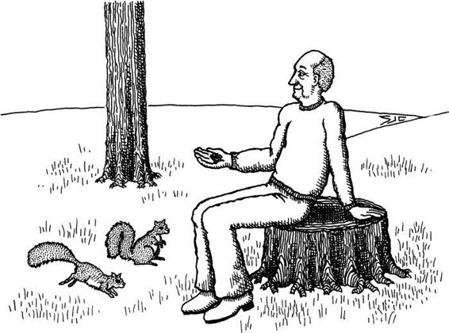

 

第13章　隧道尽头的灯光

日内瓦湖旁边的群山中，一条汽车隧道刚刚完工。就在开通之前，总工程师突然想起一件事，他忘了提示即将驶入隧道的司机打开车灯。虽然隧道内的照明条件很好，但司机必须做好万全准备，以免因为停电酿成惨剧，这在山区是有可能发生的。

于是，这样一条警示标志制作出来了。

注意：前方有隧道 ，请开启大灯。

警示标志悬挂在隧道入口外。隧道如期开通使用，每个人都松了一口气，问题终于解决了。

从隧道东端出来继续往前行驶400米，就到了全世界景色最迷人的一处休息区。这里从高处俯视湖区，可以将美景尽收眼底。每天，总有数百名游客来此处欣赏风景，活动身体，可能还会参加一场规模不大但有滋有味的野餐。但每天，总有至少十位游客回到自己的车上时才发现，尽管身体和精神都得到了放松，车上的电池却耗尽了，因为他们下车的时候忘记了要关掉车灯。警察总要使尽浑身解数，才能帮他们发动轿车，或者把车辆拖走。游客们怨声载道，发誓回去要告诉他们的朋友，千万不要来瑞士旅游。

和往常一样，请你停下来，问问自己：

这个问题该由谁来解决？

\(a\) 司机

\(b\) 车上的乘客（如果车上有乘客的话）

\(c\) 总工程师

\(d\) 警察

\(e\) 当地行政长官

\(f\) 汽车俱乐部

\(g\) 以上没有正确答案

\(h\) 以上全部

因为明确指出了“设计者”或者“工程师”，这类问题有强烈的指向性，即认为问题应由他来解决。这次的故事中，不只是司机这么想，工程师自己很可能也是这么想的。建筑师、工程师和其他设计师有一个共同的观点，即他们应该对整个工程负责到底。

在这个例子中，工程师考虑了好几种解决方案：

 

1.  他可以在隧道出口处设置一块标志牌，写上“关闭车灯”，但这样的话，人们在夜间行驶时也会把车灯关掉。

2.  他可以无视目前的状况，任人……哦不行，情况已经出现了，而且政府认为工程师的工作很不理想。

3.  他可以在俯瞰观景的地方设置一处充电站，但维持充电站运转的费用会很高昂，而且如果充电站不能正常工作的话，人们会更愤怒。

4.  他可以授权一家私人公司来经营充电站，但这就意味着让景区商业化，政府和游客是不会接受的。

5.  他可以在隧道出口处设一块语言表述更明确的标志牌。

工程师的直觉告诉他，应该可以写出一段更明确的标志说明。他试着换了几种措辞，最后得到了一个带有瑞士精准风格的作品：

如果是白天，而且车灯亮着，那就把车灯关上；\
 如果是晚上，而且车灯关着，那就把车灯打开；\
 如果是白天，而且车灯关着，那就让它关着；\
 如果是晚上，而且车灯亮着，那就让它亮着。

不管司机是谁，等读完这条标语，他的车早就冲出护栏，被水流带到湖底了，所以这绝不是一个可行的解决方案。再说了，葬礼要怎么办？一定有别的更好的办法。

借着工程师的一点点帮助，总工程师采用了“这是他们的问题”这一方法，来取代此前的种种折腾。他假设司机有很强的愿望解决问题，只是需要一点小小的提醒。他还假设，如果司机都通过了驾照考试，他们就不会是彻头彻尾的傻瓜。司机们需要的只是在隧道尽头设置一块标志牌，上面写着：

你的灯亮着吗？

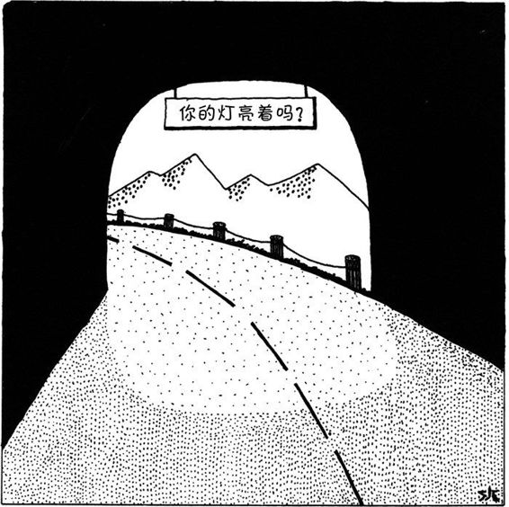

如果司机们笨到连这句话都看不明白，那电池耗尽应该只是他们所碰到的问题中最简单的一个了。

这块标志牌解决了问题。标语很简洁，所以牌子上能放得下好几种语言的译文。总工程师永远记得从这段经历中学到的一课：

如果人们真的开着车灯，一个小小的提醒可能比复杂的解决方案更有效。

你的灯亮着吗？

 

第五部分　问题来自哪里？

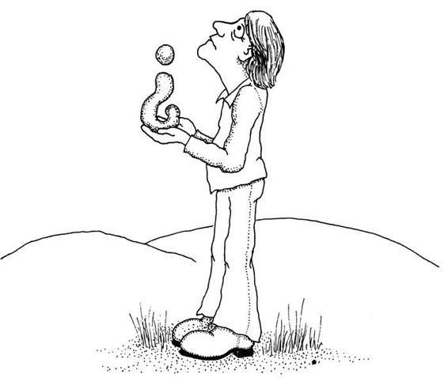

 

第14章　詹妮特·贾沃斯基遇上了混蛋

在冷战中一次局势相对缓和的时候，詹妮特·贾沃斯基决定倾尽毕生积蓄，去波兰探望祖母。她一点一点完成了申请签证所必需的海量文书工作，填写了五份各自独立的表格，到公证处去了三趟，每次等待时间从三天到六周不等，自费拨打了四通长途电话，写了九封信，向两位译员支付了报酬。有好几次，詹妮特差点要放弃了。但她的祖母已经84岁高龄了，如果整个过程要重新来过，祖母很可能没法支撑到和詹妮特相见的那天。

詹妮特终于拿到了签证，她先乘飞机到苏黎世，再转机抵达华沙。因为要审查文件，詹妮特排了三次队。之后，她被推到一间灰色的房子里，面前坐着一位灰色皮肤的官员，身上的灰色制服与周围灰色的布置非常协调。时间大概已经过去了五分钟，那位官员还在翻检着抽屉里的文件，好像并没有看到詹妮特进门。然后，似乎是突然想起了什么，他开始研究助手为他摊放在桌上的文件。他充满怀疑地扫了扫签证照片和面前的詹妮特，问：“是贾沃斯基夫人吗？”

“是贾沃斯基小姐。”詹妮特尽量礼貌而友好地回答道。

灰脸男人清了清嗓子，好像在确认自己该如何从道德上评价一位未婚女士独自旅行的行为。随后他用食指指着，一行一行浏览文件上的内容。“啊，没错，贾沃斯基小姐，”他把椅子往后移了几英寸，双手扶着桌边，“贾沃斯基小姐，你此行来波兰的目的是什么呢？”

“我是来探望祖母的，她住在奥斯特鲁达。这在那张表格上写着了。”

“嗯，我看到了，贾沃斯基小姐。但是，因为你的资料不全，我想确认一下没有弄错什么。”

詹妮特开始觉得指尖刺痛，如果这种感觉蔓延到手臂上，她就会彻底被恐惧感笼罩。“资料不全？什么资料不全？”

“很明显，”他暂时松开桌边的手，摊开做了个手势，“每一页应该有八份经过公证的副本，”他又伸了伸另一只手，“而这里只有七份。”

灰脸男人又一次双手扶在桌子边上，往后靠了几厘米，好像在示意该詹妮特出招了。詹妮特强迫那阵刺痛从手腕回到指关节上，她知道自己碰到了问题。如果她因此而慌乱了，这个问题就永远也没法解决。詹妮特从小在美国长大，对波兰的官僚并不熟悉。尽管她怀疑，全世界所有的官僚都从属于同一种高级文化，但这只是一种猜想。詹妮特非常需要一点时间来想清楚自己的问题，同时了解更多的情况，于是，她尽可能平静地说：“天哪，另外一份材料能跑哪儿去呢？我拿到签证的时候它还在，可能在我行李箱里，或者有没有可能是您的助手在拿材料来的路上把它弄丢了？”

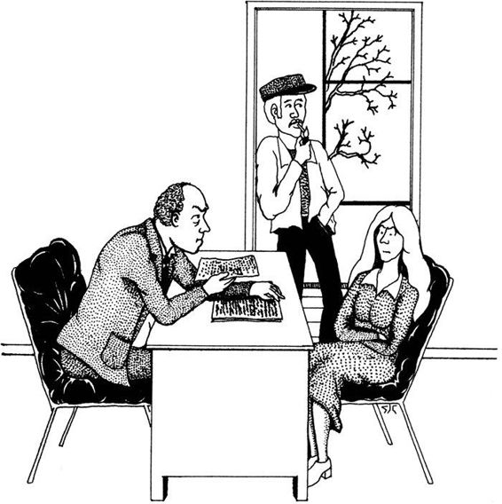

灰脸男人用波兰语厉声命令了他助手几句。助手一直在门边徘徊，詹妮特之前没有注意到他，但她现在意识到，助手在场的这个情况可能可以提示她，问题的根源在什么地方。灰脸男人有可能想索要贿赂，但助手在场时他没法这么做。当然，除了之前用过的个别单词，助手也许根本不会说英语。助手本人可能也参与索贿。但综合来看，问题不太可能来自这个方面。詹妮特想，那问题究竟来自哪里呢？

在这种情况下，人们很容易把整个问题归结于“官僚主义”，它的另一种表达方式就是耸耸肩说：“事情就是这样的。这就是自然规律，或者说是人的天性，我们没法改变它。”

来自于“人的天性”的问题是最糟糕的，因为有以下两方面原因。首先，因为问题的根源看起来很遥远，人们觉得无力解决问题。的确，人们常常把问题归因于天性，以逃避解决问题的责任。“暴饮暴食、渴求得不到的东西、虚报支出账目，这些都是人的天性使然。”

第二个原因在于天性本身总是无动于衷。当人们能把问题的根源归结到人的身上，或者归结到一件真实的物品、一个真实的行为上的时候，总有机会找到可行的解决办法。通过接近问题的根源，了解这一根源诱发问题的原因，我们就可以消灭问题或找到办法减轻问题。但是天性的特点就是它自身不具有动力。如爱因斯坦所言：“人天性狡猾，但并无恶意。”正因为天性对人们和人们的问题漠不关心，它抛给人们的问题最难解决。

当詹妮特碰到签证问题时，她意识到自己想把这混乱的局面全归咎于“官僚主义”。如果她屈从于这种想法，那就是把整趟旅行能否成行，以及她的毕生积蓄，交给命运之手去掌控了。“命运”只是“天性”的别名而已，它是世界上所有不作为行为的头号借口。詹妮特可不愿冒这么大的险，她提出了重要的问题：

问题是从哪里来的？

以此为起点，詹妮特构想了多种可能性，比如：

 

1.  是助手弄丢了第八份文件。

2.  是她把文件放错了地方，或者她从来就没有拿到过第八份文件。

3.  灰脸男人是个无能的官吏。

4.  灰脸男人很能干，但在放她进入波兰探访祖母之前还有别的计划。

5.  对于这样的状况，灰脸男人也无能为力，所以问题来自他某一个级别的上级。

詹妮特知道，这个单子还可以列得更长，但她至少将问题从“天性”的领域解脱出来，以一种建设性的眼光来看待它，并有可能采取关键行动。

 

第15章　麦特兹锡恩先生解决了问题

在现代城市的世界中，人们很少有机会面对真正的大自然。人们可以工作上一整天，却不知道，更不关心今天是不是晴天。对在城市工作的人来说，官僚体制才是“大自然”，要是不知道，也不介意大老板今天面对公司上下时是不是满脸微笑，人们几乎一个小时也过不下去。

在这种情况下，人们太容易把官僚体制看成是一种“自然”的现象了，就像阳光会把冰凉的沙子晒热，或者蛆会吞噬腐烂的鱼。然而官僚体制总是开始于某种选择的过程，这绝不是自然选择。近来，大家听说有彼得定律存在，说官员的升迁之路终止于他们无法胜任工作的时候。再后来大家还听说有保罗定律，说在一个现代组织内部，工作难度会逐渐增大，直到每个官员都显得能力不足为止。尽管这些选拔过程的确存在，但它们不过是多种方式中的个别几例，来将某些特定的人置于权力之梯的某些特定的梯级上罢了。

从古时候开始，就有人在观察这些选拔过程了，他们总是带着或多或少的道德评判的意味。罗伯特·彭斯的诗作The
Dean of the
Faculty就是一个典型的例子。在诗中，作者叙述了大学里由同事选出杰出人物的过程，这种做法现在仍在使用。在其中一节里，彭斯这样教育大学教师：

带着你们的荣耀，犹如一位君王\
 却让侍从目瞪口呆\
 他们越是无能\
 越能得到你们的青睐

换句话说，如果一位候选人缺乏职位所要求的能力，他就会格外听命于任命者。对詹妮特来说，这种想法可能没什么安慰作用，但对于该从哪里入手的确有些启发。

官僚机构的代表如机器人般静静地坐在桌子对面，等助手把包裹送过来。毫无疑问，就像某些大学学院院长、银行副总裁和其他中层干部一样，他被选出来正是因为能力不足。他在自己的工作范围内对上级负责，同时又不至于威胁到他们的职位。“这真的可能发生吗？”詹妮特想道，“灰脸男人连少了一份副本这么无关紧要的问题都解决不了？如果是这样，我应该找他的上司去告状了。”

“但是问题也许就来自他的上级呢？”詹妮特明白，有可能采用的是另一种选拔方式，即由上级选出自己的下属，选中的人能防止顾客逐级向上寻求帮助。如果下属没法制止顾客，上级就不得不放下手头的工作，自己来处理问题。“如果是这样，”詹妮特分析道，“那么灰脸男人之所以被选出来，就是因为他能够表现得愚钝而且难对付。”

但是灰脸男人还有些无礼，至少由詹妮特的美式礼仪观来看是这样。如果一位官僚表现得不礼貌，也许该再把问题拓展一下：

这种无礼是从哪里来的呢？

“他可能是想恐吓我，让我不至于越级上告。不过另一方面，他也承担了风险，我有可能因此动怒，坚持把他的无礼举动上报给他的上司。”詹妮特想起她曾经读到过，大多数公务员会因为自己无权作出重大决定（比如给只有七份文书副本的签证放行）而恼怒，并因此变得无礼。之所以表现出无礼，是因为你让他们想起，他们在生活中处于仆从般的地位，甚至都不能满足你的合理要求。

詹妮特在考虑向上级告灰脸男人的状。这时她想，不管问题的根源在哪里，试着去找找更高层的人总是最好的办法。她可以礼貌地笑笑，坚决要求见比他高一级的人。这种办法能立刻让詹妮特进入波兰境内，因为灰脸男人害怕她去惊动上司。就算不能如愿，当她见到真正负责此事的官员之后，也就最终能入境。这个负责人是不是有礼貌，是不是很愚笨都没有关系，因为第八份副本并不会超越复印机的能力范围而制造出什么差错，詹妮特觉得，只要她能见到官僚机构里某位有一点点智慧的人，问题也就能解决了。

但是，如果整个管理系统中没有一个人有一点智慧怎么办？是不是存在这样的可能，所有关于波兰人的笑话都是真的？事情最糟糕会是什么样子？灰脸男人真的解决不了第八份副本的问题吗？他真的这么愚蠢吗？

“也许我对官僚的看法是不公正的。并不是所有的选拔都由高层来进行。毕竟，灰脸男人应对和我一样的旅客的时间要远远长于他的上级。旅客对待他的方式肯定会对他产生影响。如果他面对我的问题和要求拒不妥协，也许这是因为之前有成千上万的旅客对他很粗鲁，把他当成一个阴郁的、机器人式的小公务员。也许我才是问题的根源呢？”

“首先，”詹妮特拿定了主意，“我不会再把他当成阴郁男了。让我想想，可能可以叫他好心肠先生，如果能知道他的名字可能会更好！我抱怨过很多次，因为总是被人当成没有名字的人，或者被用数字来指代。但又有多少次，是我自己没去问给我提供服务的职员叫什么名字呢？”

詹妮特往前拉了拉自己的椅子，这才意识到自己一直保持着充满挑衅意味的坐姿。“先生……呃，抱歉，我一直没问您的名字。虽然我们家是从波兰移居美国的，但我不太熟悉波兰的人名。”

好心肠先生从文件中抬起头来，表情放松了下来，带点惊讶地回应道：“我姓麦特兹锡恩，贾沃斯基小姐，简•麦特兹锡恩。”

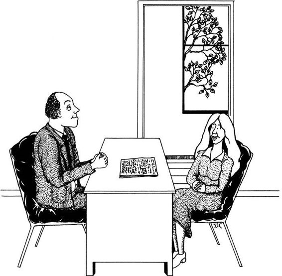

他的肩膀往前凑了凑，示意他愿意握手，詹妮特也想起了父亲告诉过她欧洲人自我介绍的规矩。她把手伸过桌子，说：“很高兴认识你，简。请叫我詹妮特。”

握手的时候，简·麦特兹锡恩第一次露出了微笑。詹妮特甚至怀疑麦特兹锡恩在波兰语中是不是笑脸相迎的意思，正是这个微笑鼓励她把对话继续下去。“我祖父的名字也是简，”她兴致勃勃地说，“我的名字是他给取的。二战后我父亲去了美国，当时祖父已经去世了。”

“啊，您的父亲是在波兰出生的？”

“对。他流亡到美国之后参军了，是一名飞行员。他在内布拉斯加州参加飞行训练时认了我母亲。我母亲一家是19世纪从波兰迁到美国的。所以父亲二战之后再也没有回过波兰。”

“真有趣。我哥哥也参加了空军，但他就没有您父亲那么幸运了。他的飞机被纳粹击落，我就成了家里的独子。我当时还没到入伍年龄，真想找机会为哥哥报仇。”

“说不定我父亲认识您的哥哥呢。我得把这事写信告诉他……”

这场对话都是关于简、詹妮特和她父亲的，本书没有必要再跟踪下去了。任何一位读者都能猜到第八份副本的问题会怎样解决，事实上问题的确解决了。如果礼貌地去和公务员接触，尊重对方的善心和能力，在绝大多数情况下，就可以激发出对方的善心和能力。在像瑞士这样的国家，从他们不再投入与别国的战争开始，类似的情况就不断上演，这现在看起来已经是自然而然的事了。银行柜员会帮助你正确填写取款单，售货员会带着你绕过拐角找到还在出售断货商品的地方，还有，就像詹妮特在波兰所碰到的一样，签证官会自掏腰包，让你使用复印机准备第八份副本。只要你确认问题到底来自哪里，一切都会自然地发生。尤其是因为

大多数情况下，问题的根源在你自己身上。

后记

这一定是整本书中最让人失望的章节之一，所以本书加上了这样一段后记来鼓励你。当你发现，恶棍原来是英雄，而英雄，也就是你，原来是恶棍，一定觉得受到了一记重击。我们很抱歉，但必须至少得这么做一次。根据本书作者唐和杰瑞的经验，在53.27%的情况下，问题其实出在问题解决者自己身上，因此就这个问题写一章说教性的内容是合理的。看完了这些说教，你可以接着看看其他人有多么愚蠢，这一定是一条有助于道德升华和灵魂幸福的道路。

 

第16章　找事让人做的人和领赏的人

并非所有官僚主义的问题都可以借助一个微笑来解决。其中一个原因是，这类问题常常以书面的形式出现，怎么能在文件中附上一个微笑呢？比如，想象一下你所供职的那家机构内部常常分发这样的文件。

> 收件人：全体工作人员及董事会成员

> 寄件人：受人尊敬的院长阁下

> 主题：在每周标点符号报告中逗号的用法

> 最近，我注意到在关于工作人员标点符号使用的每周报告中，逗号的用法让董事会的部分成员感到困惑不解。根据我的分析，产生问题的原因可能是部分工作人员没有分清这两种情况：文本中用作标点符号的逗号和文本中为说明逗号使用情况而使用的逗号。

> 我将随信提出一种解决方案，随后我会成立逗号委员会，由他们负责确定具体细节：

 

1.  > 用作标点符号时应使用普通的英国文本或美国文本格式。

2.  > 用于报告逗号在其他文本及该文本中使用情况时需加上单引号，如：‘，’。

> 2a.
> 作为第2条的另一种可行方案，用于报告逗号在其他文本及该文本中使用情况时需加上双引号，如：“，”。

> 我将本文件发送至列表上每个收件人，以获得与这一紧迫问题相关的所有工作人员的最全面的反馈，这样我们每个人都能贡献出具有创造性、革新性的点子。

在这份惊人的文件下发过程中，很多人读着读着会笑起来，但这些笑容院长阁下都看不到。那么应该做些什么呢？再问一次，看看能不能有所启示：

这个问题来自哪里？

每当我们看到一份大规模群发、充满官僚主义色彩、声色俱厉却又没有实际内容的材料，总觉得好像面对着一个不知道从何而来的问题。或者更准确地说，问题其实来自于它本身。这类问题能自我维持，一个经典例子是国际会议。

在写作这本书的时候，我们很高兴地获知，又一次国际裁军会议正在日内瓦举行。在日内瓦召开的国际会议已经成为一种高级的艺术形式。日内瓦居民猜测，裁军问题之所以这么难以解决，是不是因为裁军会议本身太吸引人了呢？

如果裁军会议每天早上六点半开始，和瑞士当地诚实工作的男男女女的上班时间一样，情况会怎么样呢？如果会场的椅子是硬木椅，而不是带有柔软羽毛垫的椅子，又会怎样呢？如果工作餐是从阿克伦市1一家路边餐馆买来的冷冻鱼条和受了潮的薯片、而不是由日内瓦乐瑟纳餐厅供应的北极红点鲑鱼和英式薯条呢？

1.
美国俄亥俄州一城市。——译者注

不要误解了，本书绝对没有反对裁军的意思，也不想诋毁与会的尊敬的女士和先生，他们为了给贫困、疲惫、生活在蜗居中的大众谋福利而辛勤工作，的确需要偶尔享乐来放松身心。本书只是想提出这种可能性：解决问题的过程、人员或者机构自身也可能成为问题。

在过去，当激进人士的观点的确很激进的时候，人们会说：“如果你不属于致力于解决问题的阵营，就属于制造问题的阵营。”其实说法可以大不相同：“如果今天你属于解决问题的一方，明天就可能属于制造问题的一方。”想想那些曾经的激进派吧，他们的的确确曾经属于问题解决方案的一部分。

来做一番猜测吧，只是猜测而已。如果世界各国突然都解散了军队，会发生什么呢？日内瓦的法式糕点会被退货吗？半数的官僚会乘坐经济舱航班返回世界各地像阿克伦市一样的城市吗？完全不可能。

一些著名的问题解决机构致力于解决的问题自己消失了，近代历史中屡有这样的例子。他们可不会就此把正装打包，搭乘下一班瑞士航空的飞机回家。绝对不会！他们会另外找一个问题来解决。小儿麻痹症被终结之后，美国畸形儿基金会（March
of
Dimes）并未终止，因为还有很多其他疾病需要攻克。停战（任何一场战争）也不会让军队全部解散。没错，军队之后就成了常规军，但这并不意味着他们无所事事。一般情况下，总会有一些国内问题，迫切需要常规军士兵的特殊才能来加以解决。

简单地说，问题的最终根源可能根本不存在。换句话说，

在问题解决者的世界中，国王或者总统或者院长是问题的制造者。

这就把我们带回到了最早的问题上——该怎样对待那份关于逗号的文件？
你的祖父可能曾经告诉过你：

“世界上有两种人，一种人做事，另一种人制造出事来让其他人做。远离那些找事让别人做的人，你就能好好过日子了。”

也许你的外祖父曾经说过：

“世界上有两种人，一种人做事，另一种人领赏。做第一种人吧，那里的争斗比较少。”

这两种独到的观察结果都可以用来解决文件的问题。方法一是回避那些会写文件的人，最理想的方式是给他们设置一小批装饰典雅的办公室，最好是安排在最高的办公楼的顶层，与单调乏味的工作区域保持距离。怎样让管理者搬到那里去呢？想想你是怎么把蜜蜂引到种有三色堇的园子里去的？又是怎么把苍蝇引到粪堆去的？根本不用费力气，管理人员就会自动聚集到大楼顶层，坐到赫曼•米勒牌的办公桌边，而把下属职员留在地下室里工作，和橙色的板条箱相伴。

在我们祖父生活的时候，复印机尚未得到广泛使用。在那个相对单纯的时代，把人和人分开已经足够，管理人员会把他们制造出来的工作交给彼此去做。在现在这个更加先进的时代，哪怕是一个傻瓜，只要掌握使用复印机的技巧，就能成为一个有广泛读者群的写手。把人和人分开不管用了。早晚有一天，工作人员会被迫去面对无可取代的问题制造者——文件。

你已经收到了题为“逗号的使用”的文件，还不知道该如何应对。既然这个问题是无源之水，不妨问问自己：“如果祖父遇到这种事，他会怎么做呢？”紧紧握住圆珠笔，在纸的右上角写下：

“真是个好主意，让我们讨论一下。”

然后将原件送回尊敬的院长阁下。（不要让复印的文件占满文件柜，让发行部门当你的文件整理系统就好。）
反馈至少进行三到四个来回之后，院长阁下才能意识到，如果只是让他的秘书给每个人打电话询问可行的时间，他永远都没办法把大家聚在一起开个会。当他最终宣布了会议时间之后，确保你在同一时间有一个牙医预约（要始终留着一个没补上的牙洞）。然后，等会议结束了，拿一份会议文件，在右上角写上：

“抱歉我没来开会，都是因为牙医。
分号的情况如何了？我们讨论一下吧。”

只要稍微有点想象力，你就知道在接下来一个月的时间里，当院长阁下发放文件的时候，你都不会再受这种来自管理层的打扰了。几乎不花一点力气，不占用存储空间，不占用处理文书的时间，还有对生活在森林中的鸟类朋友来说至关重要的一点——不用浪费一点纸张，除了给你送来的文件之外。问题从哪儿来就把它送回哪儿去，你把功劳都推给了院长，还可以省出时间来做一些别的事情。

你不敢试一试吗？别这样，那些找活让你干的人可没时间来看你在做什么。其实，他们可喜欢自己的工作了。

 

第17章
考试和其他谜题

今天，大多数学生都知道了婴儿是从哪里来的，可他们好像还以为考试题目是由鹳鸟送到地球上来的。也许是因为他们觉得讨论“问题是从哪里来的”很“不道德”？这太糟糕了，因为问题的根源对解决问题来说常常是很关键的。

想一想学生们平时为迎接期末考试而做的常规作业。聪明的学生很快就会发现，作业题总会与上一周课堂上所学习的内容有关。换句话说，如果这周学的是光和光学，就不需要用到热力学定律。如果一个教授悄悄在作业里塞进一道两周前做过的难题，那他就惨了。学生们会很快矫正他的失常行为，并由此把家庭作业系统固定下来。

所以最终，是学生们自己进一步强化了这种家庭作业的模式。尽管它简化了每周的作业任务，但当期末考试来临的时候，却让学生不堪重负。在这个关键的时刻，试卷上的问题可能来自十五周里任意一周的学习内容。学生们最离不开的一条线索就是“问题是从哪里来的”，可现在它已经随风而逝了。

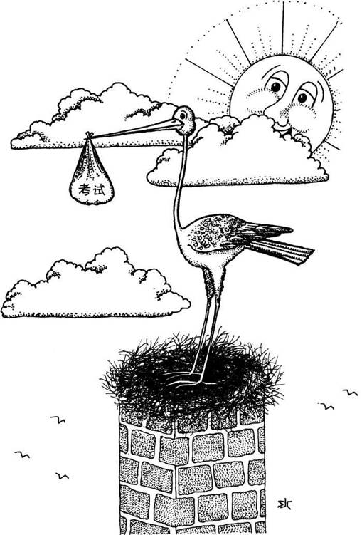

学生常常抱怨，学校没有帮助他们做好准备，应对“真实世界”（不管这个真实世界是什么），却不曾注意到，学校甚至没有帮助他们做好应对期末考试的准备。这是个多么有趣的现象。

可是考试题目并不是由鹳送到地球上来的，聪明的学生会从试题作者的角度来“读”试题。如果不给教授提供他想要的答案，那这个学生就是个傻瓜。

比如，当你参加博士资格“综合”考试的时候，可不要认为这场考试真的很“综合”。试题出自一小部分目光短浅的教师小小的脑瓜。第一个必要的步骤是推断问题出自系里哪位教授之手，他也会是这道题的阅卷人。如果略过了问这个问题的步骤：

问题是从哪里来的？

你就可能因为赞扬了罗马人而非希腊人，赞扬了彭斯而非勃朗宁1，赞扬了圣餐变体论2而非圣体同质论3而铸下大错。

1.
英国诗人。——译者注\
2.
圣餐变体论，天主教及东正教的圣餐观。——译者注\
3.
圣体同质论，路德宗的圣餐观。——译者注

因为考试毕竟是考试，问题并非来自外星世界，试题能就如何解题提供很多一般性的线索。当然，解题时间不能超过考试规定的时间长度。如果你的解题方法需要的时间超过了考试时长，那么无论这种方法有多么优雅，都应该放弃它。

另外，由于现在多项选择题大行其道，反应快的人有时无需动用出题人所设想的知识，就可以完成整份卷子。通过研究一系列的“程序员倾向性测试”，我们发现“计算能力”部分的每一道题都不需要用那些吓人的计算方法！事实上，可以在不看问题的情况下解决每一道题！

自己试试吧。一组典型的答案是：

\(a\) 31938

\(b\) 31929

\(c\) 31928

\(d\) 32928

\(e\) 31828

你知道这些答案是由一个人而不是一只鹳设计出来的。这个人希望只要你在这道题上出了一点儿错，就会最终得出错误的答案。所以只要我们研究一下选项的结构，就能看出选项(c)是“正确”的。为什么呢？试试看吧。

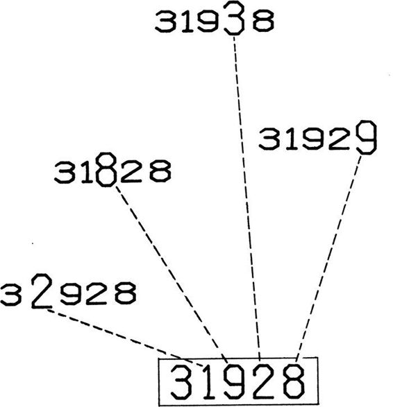

有了这样的答案，谁还需要问题呢？问题只是浪费时间，分散注意力而已，只要这样问一问，就能巧妙地躲过问题：

问题是谁出的？\
 他想对我做什么？

很多通常称作“问题解决”的情况其实是“解谜题”。谜题故意设计得有难度，但也暗示题目背后有一个出题人。你一定知道，如果谜题没有一点不寻常的困难之处，出题人就不会把这道题拿出来了。

讽刺的是，正是出题人提高难度的尝试给出了一点提示，证明我们研究中的第一步是有必要的。

考虑一下“国际象棋问题”。国际象棋问题实际上是谜题，不能通过某些“明显”的移动来解决问题，比如让国王被将军。人们一进入象棋谜题的世界，就开始下意识地问：“问题是从哪里来的？”这样就杜绝了一些“明显”的移动，因为只有有难度的问题才是好问题。那要怎样愚弄一个棋手呢？可以给他设置这样一个局面，能通过行话叫“定式”的办法解决。因为他“知道”这是一个谜题，不是一个问题，所以可能会先花上非常长的时间思考，然后才想到非常“明显”的，能解决问题的定式。当他最终发现这个奥秘的时候会非常生气，就像那些学生看到教授从倒数第二章的内容中出了一道题一样。

对于一个沉浸在问题解决思维模式中的人来说，显而易见的解决方法无异于当头一棒。在军事通信中，迷惑敌人的一种最简单的方法就是以“明文”发送一条信息。密码学家知道消息的来源，就是没法相信它字面上的意思。不过一般来说，各种军事问题比很多普通人日常生活中的问题要简单，因为对手是已知的，如果合理利用他的特点，就能大大减少需要考虑的问题定义的数量。

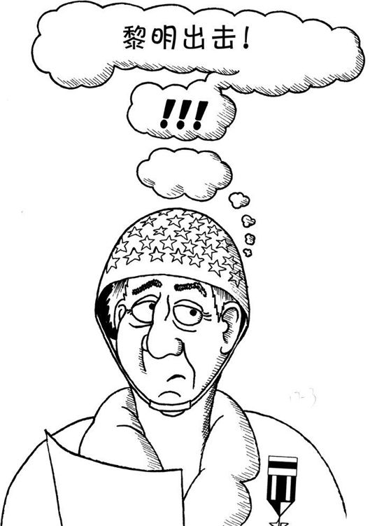

 

第六部分　你真的想解决问题吗？

 

第18章　不怕累的汤姆被玩具耍了

想必你现在已经知道，绝大多数人觉得自己绝大多数时候都在面对问题。因为人们对“问题”的定义很宽泛，即问题是人们理想状况和实际状况之间的差异，这种想法是正确的。

认为自己碰到了问题是由感觉决定的。当你认为自己碰到了问题，就是真的碰到问题了。但是要知道问题是什么，那可能就是另外一回事了。当然，很多遇到问题的人觉得自己知道问题是什么，不过他们经常是错误的。

能够佐证这一错误想法的一个例子是人们普遍相信“解决问题”是一件大事，这个例子包含着微妙的矛盾。有很多人告诉我们，“我最大的问题就是不善于解决问题。”瞎说！在大多数情况下，只要知道问题是什么，解决问题就是一件非常不值一提的事情。也许之所以学校总是培养出能力不足的问题解决者，就是因为学生们从来没有机会自己去发现问题是什么，而是老师说问题是什么就是什么，的确如此。

大多数人都接受过学校教育，而且是过量的学校教育，因此形成了一种本能，会紧紧抓住看起来像是“问题”的第一个表述，然后尽快“解决”它，因为大家都知道，在考试中，速度很重要。还有就是集中注意力。所以，当人们走出学校，不再参加考试的时候，却很难摆脱已经形成的解决问题的方法。

不要误解本书的意思。当你被困在学校中，想要努力在这样一个糟糕的环境中取得最佳收益的时候，抓住第一个问题描述，迅速进入状态并一直遵循这一描述恰恰是你应该做的事情，甚至在其他个别情况下也是。事实上，如果有人直接得出结论“电梯运行的速度太慢了，需要修理”，雷龙大厦的问题可以在瞬间得到解决。这种叫做“蒙眼跳”的办法只是偶尔奏效，刚好足以让它流传下来。如果这种方法从未成功，人们会在离开学校足够久之后最终抛弃它。

“蒙眼跳法”始终存在的另一个原因在于“解决问题”可以是一件很有趣的事。一旦我们开始解决一个很不错的问题，只有变态才会来挡路。我们都知道这个扫兴的人可能是什么样的，医生刚签发体检报告他就戒除了烟瘾；他认为别人都应该跟从他的领导；他绝不错过任何一个可以教育别人的机会。怎么了，即使我们在解决的不是“真正的”问题，由于我们想要解决它，它对我们而言也就成了真正的问题，解决的方式越像英雄越好。换句话说，让我们自己来！别人在解决问题中找到了乐趣，谁给了唐和杰瑞这个道德权利去加以干涉呢？

这真是个好问题，你最好直接面对它，因为在解决问题的过程中，唐和杰瑞是世界上最重要的两位扫兴者。本书作者的道德权利来自于这样一句忠告：

以牙还牙。

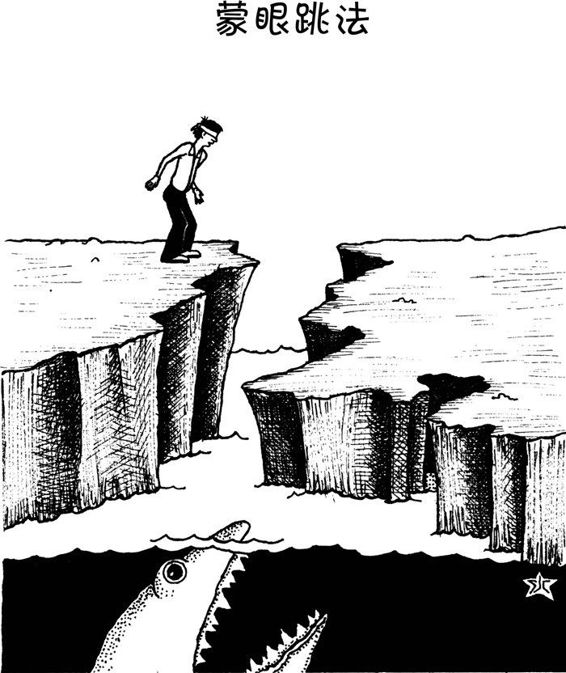

我们俩和你们中的很多人有过一样的经历，一些年纪轻轻的问题解决者怀着热切的心情，毁掉了我们解决问题的快乐，扰乱了宁静的均衡状态，正是这一点给了我们道德权利，去毁掉一部分问题解决者的快乐。

“扰乱了宁静的均衡状态”是什么意思呢？有一个来自计算机领域的好例子。当计算机刚开始大量生产的时候，可不是由人们杀出一条路，自己上门去找到发明者的。当时有一群充满热情的问题解决者，他们将计算机推到尚不情愿接受它，或者至少是对此保持着谨慎态度的公众面前，专注于将计算机应用于几乎所有问题。

这些问题解决者很年轻，带着青年人特有的冲动，这从他们的口号中可见一斑：

计算机就这样影响了青年人，或者不如说，青年人影响了计算机。

即使有着几十年积累的智慧的长者认为并非如此，每一所学校的青年学生走出第一堂程序设计课课堂的时候都相信，只要有足够的时间和一台计算机终端，就可以解决任何问题。毕竟，年轻人为什么要在意蒙尘老朽的“智慧积累”呢？

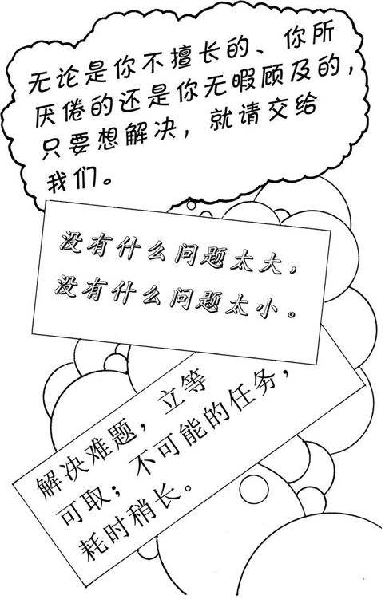

无论是你不擅长的、你所厌倦的还是你无暇顾及的，只要想解决，就请交给我们。

没有什么问题太大，没有什么问题太小。

解决难题，立等可取；不可能的任务，耗时稍长。

不过，难道这个观点不正确吗？就算别的什么也没学到，这些年轻的计算机崇拜者们通过锲而不舍地为解决方法寻找匹配的问题（我们称之为“给解决方案想问题”），会学到珍贵的一课。

对计算机来说，最无关紧要的步骤也必须描述得琐碎而详尽。这些年轻人将会意识到，要想让人们把问题表述得足够清楚，以满足计算机的精确需求，是一件多么困难的事情。起初，他们觉得这是因为人们太不善于交流，这种悲观的评价有时是正确的。但在更多情况下，交流不畅不是困难的根源。对于不了解的事情，或者不想了解的事情，人们无法有效交流。

道德说教已经够多了，说个例子怎么样？从前，有位充满热情的年轻程序员汤姆•泰尔列斯，正巧为一家玩具厂服务。他身上的热忱和活力轻松地打动了厂方领导层之外尚存戒心的人，很快，他就和三位副总裁一起，坐在一间环境高雅的会议室里了。短短几分钟之内，几位副总裁就开始贪心地盘算汤姆的计算机能给他们带来多少好处了。

汤姆先向这几位门外汉初步介绍了他的奇妙设备有多么强大的能力，然后，这位问题解决者问副总裁，有什么可能适合用计算机来解决的问题。是的，他们的确有一个非常紧迫的问题。坦格朗玩具公司共有三家玩具厂，汤姆所在的这一家在太平洋岸边，另外有一家在大西洋岸边，第三家在密苏里河畔的堪萨斯城。他们把玩具从三家工厂运送到大约50家散布于全国各地的批发商那里，大致情况如图所示。

坦格朗玩具公司的工厂和批发商

高管很自然地开始抱怨运输需要花钱，这提高了每件坦格朗玩具的实际成本。另外，由于不同的批发商与各家工厂距离不等，所有的运输成本都不相同。解释到这个份上，汤姆•泰尔列斯已经静不下来了。除了在计算机面前，他并不习惯长时间坐着，当然不习惯坐着听人说话。

汤姆早就意识到他们的问题是什么了。这是一个经典的运筹学问题，可以在他的计算机上巧妙地加以解决。当高管没完没了地解释着问题的时候，汤姆开小差了。他在解决以下这个问题：

已知一组来自批发商的订单，坦格朗公司该如何将它们分配给三家工厂生产，使得总成本（生产成本加运费）最低？

等副总裁解释完情况，说明问题的确正如汤姆所想，汤姆已经在等着索要计算机运算需要的信息了：总订单、在各家工厂生产单个玩具的成本，还有将一个玩具从各个工厂运送到各个批发商所在地的运费。

坦格朗公司的高管着实花了一些时间来为汤姆找这些信息，两周之后，所有信息整整齐齐地放到了他位于计算机中心的办公桌上。

汤姆花了一些时间对这些数据横看看，竖看看，结果发现了一件让人心烦的事儿。当他看完全部数据后，汤姆给公司高管打了电话，约他们见个面。

“我很抱歉地说，”汤姆宣布，“我发现你们的问题有些有意思的地方。如果数据是正确的，那么有可能......我们举个例子吧，在这家工厂制造一只泰迪熊，再把它运到堪萨斯城那家工厂，都比在堪萨斯城造这只熊的成本要低！堪萨斯城工厂的生产成本是3.95美元，而你们厂的成本是3.07美元。加上23美分的运费，总成本为3.3美元，也就是比堪萨斯厂单纯的生产成本还低65美分。”

汤姆双手按在会议桌上，以强调他的观点。三位副总裁叹了口气，又交换了一下眼神。“没错，”三人中最年长的那位说，“我们都知道这一点。”

“大西洋海岸的那家工厂情况也一样，这你们也知道吗？”汤姆停了停，让听众有时间想一想他的话，“你们生产一只泰迪熊并运到那里只花3.38美元，但他们的生产成本不低于4.24美元。”

“是的，这个我们也知道。你想说明什么呢，年轻人？”

“请让我再问个问题。你们是不是还知道，同样的情况在你们生产线上全部374种玩具中都存在？”

“我们当然知道。这家工厂是全世界最现代化的一家，生产效率远远比另外两家要高，而且这里的劳动力成本也更低。这就是我们为什么要在这里建厂的原因。”

汤姆被他们的迟钝给弄糊涂了。“可是你们没有发现吗？你们并不需要计算机来告诉你们如何把成本降到可能的最低水平呀。”承认这点对汤姆来说很痛苦，但他还是说了下去，“只需要把另外两家工厂封掉就行了！把所有的订单都安排在这家工厂来生产，即使不直接运输到批发商那里，而是先运到另两家工厂的装卸码头去，也会比你们现在的做法更省钱！”

“没错，但我们不能接受这种解决方法。”

“什么？解决方法可以解决问题，你们为什么不能接受？”

“因为坦格朗公司总裁居住的地方离大西洋岸边那家工厂很近，而董事长就住在堪萨斯城。他们可不会因为任何理由搬到太平洋岸边来。”

“他们一定不愿意的。”另外两位副总裁齐声赞同。

“但是这样的话，你们的问题就不是如何使成本最小化了，而是要讨总裁和董事长开心？”问题解决者愤怒了，“那你们为什么要把问题分派给我？”

仔细思考了30秒之后，年长的那位副总裁说：“你说过你的计算机能够解决任何问题，我们都愿意相信计算机能帮上忙。你发现的这些问题我们从建厂的时候起就知道了，但是没办法向两位最顶层的领导证明我们是对的。是的，如果能由你的计算机告诉他们，他们可能会相信。虽然他们不相信我们。但现在，我们想清楚了，计算机的结果看起来也不可靠。”

汤姆几乎要崩溃了，但还不愿意放弃。“为什么不可靠呢？我可以把数据在线性编程包中都运行一遍，计算机会给你们提供一份很棒的报告。虽然上面会印有很多数学符号，但不至于因此说服不了你们的老板。给我一个机会吧。”

副总裁几乎没有注意到汤姆插话了。他接着往下说：“他们就是不愿意搬家，无论公司的成本如何，反正他们能承受。不过我们三个还是希望公司能提高效率，我们还没发财呢。”

就这样，汤姆·泰尔列斯学到了问题定义上最重要的一课，这对那些想为别人解决问题的人都适用：

无论表面上表现得如何，在你提供他们所要求的东西之前，他们极少知道自己想要什么。

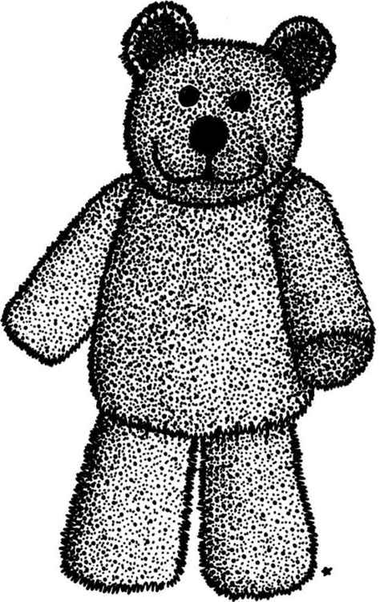

 

第19章　佩兴丝的计谋

有时候人们很清楚自己想要什么，但对那些“为解决方案想问题”的人来说，问题并未到此结束。看看这个故事，主人公是另一位计算机使用者，佩兴丝·普吕当。

美国某州州长发布了命令，要求州政府各部门都开始使用计算机。这些性能优越的机器是他出于无尽的智慧，刚刚为政府购买的。计算机自己并不反对每天18个小时无所事事，它们对此漠不关心，毕竟一台计算机只能这么做。但州长顾问提出，在大选年，这么长的“闲置”时间可是不理想的政治表现。人们评价计算机的时候，看的不是它们做了什么工作，而是它们花了多少时间在工作上。一个几分钟就能解决的问题一定不是什么重要的问题。在官僚体制能掌控的范围内，有必要尽量多地使用计算机。

州计算机中心主任指派了一名程序员作为各部门之间的联络员。佩兴丝被派到了财政部。此前有个别几个部门完全不使用计算机，财政部就是其中之一。财政部的一名助理为佩兴丝分配了她的第一个问题：将新修建道路的评估总额在可以从中受益的道路沿线各业主之间进行分配。

佩兴丝最早估计这项工作需要一周时间完成，结果延长到了三个月，这主要是因为财政部长不断做出微小的修改。当佩兴丝终于拿出最终结果的时候，已经精疲力竭了，耐心也消耗殆尽，可是财政部长仍然不满意。“这是个什么程序呀？”他傲慢地说，“你手上的总金额是13258993.24美元，可是用于分配的总额达到了13258993.25美元！”

佩兴丝努力保持冷静，回答道：“这是各个子项合并时造成的差异。有时候总额会超出1美分，有时会正好，但超出的额度绝不会多于1美分，所以没什么好激动的，这只是1300万美元中的1美分而已。”

“要为什么事情激动该让我来决定吧，女士。”财政部长插话说。不过只要有年轻女士在场，特别是能干的年轻女士，他总是显得很激动。“是我要对本州纳税人的钱负责，不是你。我必须能答得出每一美分的用途。”

佩兴丝可能被财政部长专横的做派和语调吓到了，但她也被逼到了忍耐的极限，说：“好吧，如果要问我的话，你就是不了解你的工作。为了微不足道的一美分就要全部返工重新编程，这可一点都不会给纳税人省钱。”

“不要激动嘛，”财政部长非常害怕女人发火，“不管对你和你的计算机来说有多麻烦，这有相关的法律，我必须完全遵守，一美分都不能放过。”

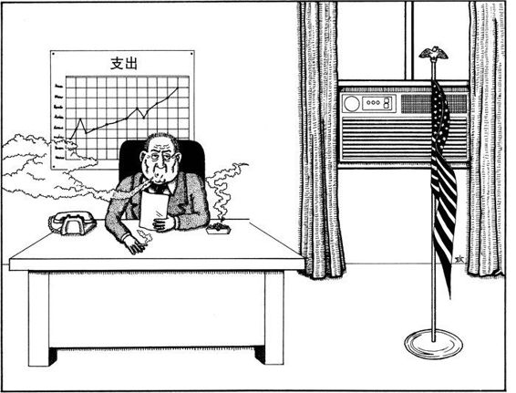

佩兴丝能感受到他的恐惧，这让她有勇气来把情况想清楚。“等等，你每年会用到这个程序多少次？”

“我可以确定地告诉你，女士，除非你能让它正确运行，直到它能正确运http://www.ituring.com.cn/article/53802行我才会用这个程序。”

佩兴丝心里已经炸开了锅，她努力让自己看上去平静一点。“就算是为了讨论一下吧，假设我最终把它调整好了，那么你准备一年用多少次？”

“州政府每年大约做10次左右这样的评估，其实我自己的时间大部分都用来计算这样的评估……”

“我知道了。”佩兴丝打断了他，伸手在皮夹里翻了翻，这让助理更加紧张了。佩兴丝找到了她想找的东西，起身准备离开。她把一张一美元的纸币放在财政部长桌上，说：“我想为州里捐点小钱。你可以晚点再把收据寄给我。”她往门口走去，犹豫了一下，温和地笑笑，用最甜的嗓音说：“我猜编程工作这样就算结束了。我捐的钱能在今后十年内满足法律要求。等钱用完了，你告诉我一声，我可以再捐。”

当然，佩兴丝从未觉得她解决了财政部助理的问题。她这么想是正确的。助理向部长汇报说，计算机无法以满足要求的准确度进行税收评估。在这个问题上浪费了三个月之后，他决定最好的办法还是彻底忘掉用计算机这回事。当然，这才是他真正的问题的解决方法。

无论是问题解决者，还是“为解决方案想问题”的人，都免不了要用这种形式来破坏佩兴丝的努力。她学到了关于问题定义的第二课：

从最后的情况看，想要真正解决问题的人并不是很多。

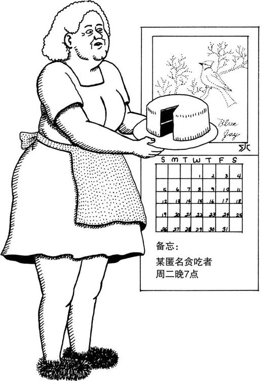

 

第20章　一项优先任务

我们认识的最好的问题解决者之一刚入行时是为一家机构破解密码的，这家机构的名称需要保密。他从事破解谜题的工作已经接近十年了，积累了大量技巧，因此获得了这份带有优先级的任务。

他的任务代号叫做“虚张声势”，是要破译一个欧洲小国在外交工作中使用的密码，这个小国和他的祖国恰好是同盟关系。“虚张声势”的工作成了一场为期两年的历险，在其中18个月里，他似乎毫无进展。最后，在全世界最强大的计算工具的辅助下，通过细心的制表工作，他逐渐确信这些外交官所使用的是一种“书码”。实际上，破译这种类型的密码是不可能的。

“虚张声势”任务的另外六个月里，他确认了支持这一密码系统的书是一本悬疑小说。他又用了两个月时间缩小包围圈，来确定作者可能是谁。最后，他终于在该机构综合图书馆间谍和阴谋题材的馆藏里找到了这本书——《贝罗纳俱乐部的不快事件》（The
Unpleasantness at the Bellona
Club），作者是多萝西·L.塞耶斯1。

1.
多萝西·塞耶斯（Dorothy L.
Sayers），英国女作家，推理小说大师，与阿加莎·克里斯蒂齐名。——译者注

他抑制不住想破解密码的急切心情，于是找出一个看起来极其紧急的密码，开始把毫无意义的数字翻译成页码、行数和词数：

|  |  |  |  |
|----|----|----|----|
|   第几页  |  第几行  |  第几个词  |  该位置上的词  |
|  112   |  25   |  7   |   二十   |
|  133  |  25  |  7  |  三  |
|  157   |  27   |  5   |  瓶   |
|  147  |  14  |  6  |  威士忌  |
|  19   |  5   |  7   |  五十   |
|  32  |  30  |  2  |  九  |
|  192   |  17   |  4   |  葡萄酒   |

“二十三瓶威士忌，五十九瓶葡萄酒……”这是一条支出账目！他大为惊讶，又尝试了一个，还是一条支出账目！两天之后，他将“虚张声势”中的57条信息全部翻译出来了，全都是支出账目！两周之后，我们的问题解决者离开了情报机构，转行做了老师。

在结束开场白之前，我们应该再提出一个问题。在正式开始解决任何一个问题之前，每一位未来的问题解决者都应该问一问：

我真的想找到解决方案吗？

尽管这个问题听起来令人震惊，但的确能看到，有时一得出解决方案，就发现它根本不受欢迎，这样的例子有很多。问题解决者也许会因此丢掉工作，比如裁军的故事。在那个例子中，希望产生的其他结果能值得问题解决者失业；又比如在“虚张声势”任务中，得到的答案如此无关紧要，让问题解决者感觉自己毫无价值。

当你在一个问题上花了很长时间，下了很大功夫时，常常陷入思维定势，根本不会想到自己可能能够解决问题，那为什么还要伤脑筋去想到底需不需要这个解决方案呢？相反，因为问题来得太快，你根本没时间好好考虑问题，更不用说考虑自己是否想找到解决方案了。当一个穷学生在逛街的时候，他口袋里的钱还买不起一包火柴。他梦想的是能拥有一艘游艇，至少是一包香烟。如果突然中了10万美元的彩票大奖，他会冲动地买下想要的每一样东西，尽管他有可能晕船，而抽烟有可能让他患上肺癌。

虽然很多问题必须迅速解决，要当心那些催你的人。在解决过程后期，急了会犯错；在最初的几分钟里，急了会遭灾。有个故事叫《渔夫的妻子》，它的翻版在现实生活中多的是。

渔夫发现渔网里缠绕进了一只瓶子。他打开瓶子，从里面跑出来一个精灵。精灵告诉渔夫，为了感谢渔夫把自己放出来，他能满足渔夫夫妇三个愿望。夫妻俩当然对美好的未来感到非常兴奋。那天晚上，他们熬到很晚，讨论自己的梦想。在快乐中两人忘了吃晚餐，到凌晨三点，妻子叹了一口气，喃喃地说：“好饿啊，真希望有香肠可以吃。”

“噗！”桌上出现了一根美味的香肠，但渔夫一点都不高兴。“看看你干了什么，你这个愚蠢的女人！你刚才丢了脑子，我们现在就只剩下两个愿望了。真希望这根愚蠢的香肠挂在你鼻子上。”

“噗！”

读者都经历过很多许愿的场景，可以想象第三个愿望用来干什么了。不过，渔夫夫妇的遭遇要好过其他一些也可以许三个愿的人，比如恐怖故事《猴爪》（The
Monkey's
Paw）1里的那对夫妻。

1.
英国短篇小说作家雅各布斯作品。——译者注

关于如何解决问题，一条古老的格言说：

人们永远没有足够的时间把它做好，但永远有足够的时间重新来过。

可是，因为并不是总有机会重新做一遍，你必须做得更好。换句话说，

人们永远没有足够的时间去考虑到底是不是想要它，但永远有足够的时间去为之后悔。

然而，即使真的想得到解决方案，人们可能没有注意到，每种解决方案都伴随着不可避免的额外后果。从古时候起，炼金术士的追求之一就是得到万能溶剂。这种液体溶解其他物质的能力非常强，地球上没有任何东西能够抵挡。就像点石成金一样，这一追求也是徒劳的。真遗憾，因为一旦得到了这种溶剂，知道人们用什么来存放它一定是件很酷的事。

如果能找到万能溶剂，它就能溶解任意一种容器，这不能不说是一种“副作用”。它可能会腐蚀出一个洞，直达地心。

然而，人们倾向于认为“副作用”是某些特定解决方案带来的结果。“它有可能根本就不会出现。即使出现了，也可以通过调整解决方案来彻底避免。”这种天真的想法多少次把人们引入灾难之中！

如果着手逐一根除导致人们死亡的因子，那么，当你看到越来越多老人无人赡养的时候，为什么还会感到惊讶？如果着手消灭导致婴儿死亡的因子，那么当你发现总人口增加的时候，为什么还会觉得震惊和沮丧？

答案可以部分归结为人类的一种倾向——习惯化，即当一种刺激重复出现时，人类对它的反应逐步递减。习惯化使人们能忽略环境中恒定不变的东西，从而简化自己的生活。当人们生活的小环境中刚出现什么新事物时，刺激性是非常强的。如果它停留一小段时间，既不制造危险也不创造机遇，就会变成“环境”或者背景的一部分，最终被完全剔除出去。

鱼总是最后一个看到水的。

在人们思考问题的时候，已经习以为常的事物总会被忽略，不纳入考虑范围。只有当解决方案出现、那些习惯了的因素被移除的时候，人们才会感到震惊。在这种现象的代表性实例里，最能触动人的一个出现在萨蒂亚吉特•雷伊1执导的电影三部曲之一《阿菩的世界》（The
World of Apu）中，当阿菩的妻子去世的时候。

1.
印裔孟加拉导演，曾获奥斯卡终身成就奖。——译者注

当阿菩听到妻子去世的消息，他一下扑到床上，几天都不动一动。雷伊展现给观众看这样的场面：阿菩静静地躺在床上，时间好像过了好几个小时。突然，闹钟停下不走了。

原本懒懒散散的阿菩突然惊醒了，观众早已习惯了闹钟的滴答声，这时也因为声音的突然消失而感受到了极强的冲击力。观众所体会到的震惊也正是阿菩所体会到的，当妻子的心脏停止了跳动，阿菩才意识到妻子在他生活中曾是多么重要的一部分。

和电影制片人一样，问题解决者也是一个和想象中的世界打交道的艺术家。从很早的时候开始，其实是从最初开始，问题解决者就必须努力看到“水”，而其他参与者都是无意识地在其中游来游去。当“问题”最终“解决”的时候，水也就变成了沙。

后记

完全投入到问题中的时候，问题解决者还有可能忽视另外一件事情。在为解决问题而惊叹不已的时候，你可能会忽略自己是不是能在道德上支持某一解决方案。一个人眼中的罪行在另外一个人眼中可能是美德。我们不敢告诉一个读者杀人是错误的，就和我们不敢告诉一个食人族的人吃人是错误的一样。也许我们应该冒着显得多愁善感的风险，引用一句波洛涅斯1的话：

1.
莎士比亚剧作《哈姆雷特》中丹麦国王克劳迪斯的御前大臣。——译者注

首先，对自己要忠实。

在这件事上，为了忠于自己，必须在接近一个解决方案，甚至是一个问题的定义之前就考虑到道德问题，并抛弃掉感性的因素。这一类的考虑永远不会浪费时间。因为，无论在从业者看来解决问题是多么引人入胜，这永远不是一项道德中立的活动。

 

Table of
Contents

[版权信息](#index_split_000.html_filepos171)

[版权声明](#index_split_002.html_filepos3930)

[献词](#index_split_003.html_filepos4712)

[序言](#index_split_004.html_filepos5079)

[第一部分：问题是什么？](#index_split_005.html_filepos5581)

[第1章　一个问题](#index_split_006.html_filepos5833)

[第2章　彼得发起了一个请愿](#index_split_007.html_filepos13093)

[第3章　你的问题是什么？](#index_split_008.html_filepos21984)

[第二部分：这次的问题是什么？](#index_split_009.html_filepos37709)

[第4章　比利战胜投标人](#index_split_010.html_filepos37969)

[第5章　比利忍住没说](#index_split_011.html_filepos45212)

[第6章　比利反思投标案](#index_split_012.html_filepos48896)

[第三部分　问题到底是什么？](#index_split_013.html_filepos55935)

[第7章　无尽的链条](#index_split_014.html_filepos56192)

[第8章　忽视不协调之处](#index_split_015.html_filepos62510)

[第9章　找到问题所属的层面](#index_split_016.html_filepos74265)

[第10章　注意你所表达的含义](#index_split_017.html_filepos81973)

[第四部分　问题该由谁解决？](#index_split_018.html_filepos93375)

[第11章　烟雾缭绕](#index_split_019.html_filepos93632)

[第12章　校园停车难问题](#index_split_020.html_filepos100072)

[第13章　隧道尽头的灯光](#index_split_021.html_filepos109229)

[第五部分　问题来自哪里？](#index_split_022.html_filepos114950)

[第14章　詹妮特·贾沃斯基遇上了混蛋](#index_split_023.html_filepos115204)

[第15章　麦特兹锡恩先生解决了问题](#index_split_024.html_filepos122212)

[第16章　找事让人做的人和领赏的人](#index_split_025.html_filepos131900)

[第17章 考试和其他谜题](#index_split_026.html_filepos141434)

[第六部分　你真的想解决问题吗？](#index_split_027.html_filepos148305)

[第18章　不怕累的汤姆被玩具耍了](#index_split_028.html_filepos148568)

[第19章　佩兴丝的计谋](#index_split_029.html_filepos162112)

[第20章　一项优先任务](#index_split_030.html_filepos167521)

[目录](#index_split_001.html_filepos1165)

