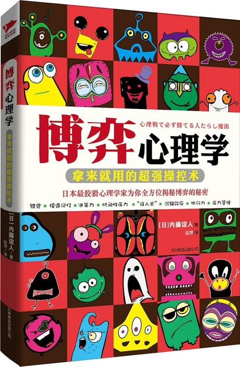

<svg xmlns="http://www.w3.org/2000/svg" xmlns:xlink="http://www.w3.org/1999/xlink" version="1.1" width="100%" height="100%" viewbox="0 0 492 751" preserveaspectratio="none">

<image width="492" height="751" xlink:href="cover.jpeg"></image>
</svg>

博弈心理学

拿来就用的超强操控术

［日］内藤谊人　著

赵萍　译

北京联合出版公司

目录

[导读　当博弈遇上心理学](#index_split_002.html_filepos14261)

[前言　抢占全“心”时代的博弈制高点](#index_split_003.html_filepos18856)

[第1章　心理博弈，无处不在的思辨之战](#index_split_004.html_filepos23579)

> > [1　情感冲动快于大脑思考](#index_split_005.html_filepos24178)

> > [2　磨炼心理博弈技巧刻不容缓](#index_split_007.html_filepos26520)

> > [3　错觉，隐藏的“杀手锏”](#index_split_009.html_filepos28971)

> > [4　人的外在形象占九成比重](#index_split_011.html_filepos31310)

> > [5　恐惧，一招制胜的说服力](#index_split_013.html_filepos33820)

> > [6　留意笑容背后的意图](#index_split_015.html_filepos36273)

> > [7　话题如何出卖一个人的内心](#index_split_017.html_filepos38569)

> > [8　捧杀，最强大的武器](#index_split_019.html_filepos41159)

> > [●　拿来就用心理学](#index_split_021.html_filepos43598)

[第2章　打赢与自己对阵的心理战](#index_split_022.html_filepos48260)

> > [9　挑战，成功者永恒的坚持](#index_split_023.html_filepos48923)

> > [10　对令你讨厌的人产生好感](#index_split_025.html_filepos51826)

> > [11　巧用别人的羞耻心](#index_split_027.html_filepos54544)

> > [12　别相信自己的估计](#index_split_029.html_filepos57377)

> > [13　记忆的自我筛选功能](#index_split_031.html_filepos59767)

> > [14　给大脑捏造记忆](#index_split_033.html_filepos62199)

> > [15　瞬间和他人搞好关系的秘诀](#index_split_035.html_filepos64560)

> > [16　好心情助你跨越障碍](#index_split_037.html_filepos67468)

> > [●　拿来就用心理学](#index_split_039.html_filepos70152)

[第3章　胜利者不说却在用的博弈高招](#index_split_040.html_filepos74798)

> > [17　塑造强大的自己](#index_split_041.html_filepos75612)

> > [18　扮演“有能力的人”](#index_split_043.html_filepos78088)

> > [19　示弱，而后强大](#index_split_045.html_filepos80680)

> > [20　反对者的自信与存在感](#index_split_047.html_filepos83315)

> > [21　感到痛苦就想“钱”](#index_split_049.html_filepos85827)

> > [22　炫耀，强者最不需要的手段](#index_split_051.html_filepos88481)

> > [23　寂寞者会买什么](#index_split_053.html_filepos90884)

> > [24　如何瞬间提高决策力](#index_split_055.html_filepos93784)

> > [●　拿来就用心理学](#index_split_057.html_filepos96417)

[第4章　心理操控术之将对方掌握于股掌之间](#index_split_058.html_filepos100027)

> > [25　恭维，安全高效的心理武器](#index_split_059.html_filepos100675)

> > [26　告诉他“你一定行”，哪怕只是谎言](#index_split_061.html_filepos103448)

> > [27　碰触，消除距离感](#index_split_063.html_filepos106312)

> > [28　限制时间，让对方甘冒风险](#index_split_065.html_filepos108661)

> > [29　“关键词”攻心术](#index_split_067.html_filepos111405)

> > [30　显示稀缺性来吸引对方](#index_split_069.html_filepos114081)

> > [31　使用人们没听惯的词语](#index_split_071.html_filepos116964)

> > [32　找对求助对象](#index_split_073.html_filepos119862)

> > [●　拿来就用心理学](#index_split_075.html_filepos122662)

[第5章　化敌为友的“诓人术”](#index_split_076.html_filepos126377)

> > [33　执行力比任何语言都有效](#index_split_077.html_filepos127055)

> > [34　褒扬在人前，批评在人后](#index_split_079.html_filepos129704)

> > [35　向你的敌人求助](#index_split_081.html_filepos132419)

> > [36　扮演笨拙的自己](#index_split_083.html_filepos135163)

> > [37　越是热络的人越会被厌烦](#index_split_085.html_filepos137980)

> > [38　眼睛是心灵之窗](#index_split_087.html_filepos140534)

> > [39　把笑“传染”给别人](#index_split_089.html_filepos143221)

> > [●　拿来就用心理学](#index_split_091.html_filepos145934)

[第6章　无往不利的高效交涉术](#index_split_092.html_filepos150467)

> > [40　道歉务必附上理由](#index_split_093.html_filepos151020)

> > [41　亮出心中的思量](#index_split_095.html_filepos153600)

> > [42　吹嘘，用得好就是利器](#index_split_097.html_filepos156229)

> > [43　黑色，威信与力量的象征](#index_split_099.html_filepos159066)

> > [44　改一个有魅力的名字](#index_split_101.html_filepos161598)

> > [45　“意料之外”带来的胜利](#index_split_103.html_filepos164152)

> > [46　香气，无声无形的动人诱惑](#index_split_105.html_filepos166977)

> > [47　让你的外国同伴代替你交涉](#index_split_107.html_filepos169551)

> > [48　制造恐惧心理，迫使对方答应要求](#index_split_109.html_filepos172197)

> > [●　拿来就用心理学](#index_split_111.html_filepos174960)

[第7章　先读心，后攻心](#index_split_112.html_filepos179240)

> > [49　不可轻信别人的拒绝](#index_split_113.html_filepos179997)

> > [50　喧哗是为了掩饰失败](#index_split_115.html_filepos182584)

> > [51　识破逢迎性笑容](#index_split_117.html_filepos185118)

> > [52　迫使对方“伪善”](#index_split_119.html_filepos187495)

> > [53　手和口一样善于“表达”](#index_split_121.html_filepos190295)

> > [54　自如操控对话过程的恶劣招术](#index_split_123.html_filepos193009)

> > [●　拿来就用心理学](#index_split_125.html_filepos195489)

[第8章　扭转对方思维的进退策略](#index_split_126.html_filepos198717)

> > [55　用赠品“收买”人心](#index_split_127.html_filepos199319)

> > [56　小恩惠带来大便利](#index_split_129.html_filepos201955)

> > [57　不可以过度相信判断力](#index_split_131.html_filepos204252)

> > [58　用与众不同的事物引人注意](#index_split_133.html_filepos206927)

> > [59　防止思维被某些语言绑架](#index_split_135.html_filepos209529)

> > [60　拿出撤退的勇气](#index_split_137.html_filepos212270)

> > [61　不要相信面前的人](#index_split_139.html_filepos214887)

> > [62　欲望会扭曲判断](#index_split_141.html_filepos217423)

> > [●　拿来就用心理学](#index_split_143.html_filepos220079)

[结语](#index_split_144.html_filepos223668)

导读　当博弈遇上心理学

一本关于心理操控的百科全书，一本让你在职场、商场、情场无往不利的制胜宝典。用最有趣的方式讲述最高端的心理学，花最短的时间全方位掌握心理博弈的秘密。是给别人洗脑，还是被别人洗脑？主导权在你手里！

所谓博弈，就是在平等的对局中利用对方的策略变换自己的对抗策略，达到取胜的目的。博弈思想古已有之，中国的《孙子兵法》就不仅是一部军事著作，也是最早的一部博弈论著作。博弈最初主要研究象棋、桥牌、赌博中的胜负问题，人们对博弈局势的把握只停留在经验上，没有向理论化发展。而随着时代与社会的进步，博弈也得到了更为广泛的引申和运用。根据基准不同，博弈有合作博弈与非合作博弈、静态博弈和动态博弈、完全信息博弈和不完全信息博弈等多种不同的分类。对于一般读者而言，“博弈”作为一个概念过于专业，而作为一项技能，却每天都在自觉或不自觉地运用。

本书作者内藤谊人是日本著名的心理学家，是日本立正大学心理学系特聘讲师。他在以说服性交流为主的社会心理学和临床心理学方面颇有建树，广泛活跃于著书、演讲、研讨会等各项活动，并经常就人才培养、促进销售等方面的心理学应用进行讲解培训。作为实践性商业心理学的第一人，他在大量详实而丰富的心理学数据的基础上，将心理学应用到了职业规划、商业活动、人际关系、经营管理等诸多领域。

本书依据大量的心理学实验和相关数据，深入浅出地阐述了许多我们习以为常却又总是忽略的心理学现象，并提出了许多切实可行的建议。这些颇具实用价值的心理学小技巧，是他提倡的“黑色心理学”的体现。从某种意义上来说，这与厚黑学的一些理念有着异曲同工之妙。今后在与他人的心理交锋中，即使不能灵活自如地运用这些技巧，但起码能够读懂对方的心理，有效地规避对方设下的心理陷阱，化不利为有利，进而掌控对方的心理，占领心理博弈的主动权。

你可以不读村上春树，但不得不读内藤谊人！

无论你是普通职员还是高级管理者，是产品生产者还是消费者，是设计师还是推销员，只要你还在与外界发生着信息交换、人际往来，你就无法阻止心与心的碰撞与较量，无法避开无时无刻不在上演的心理博弈！

美国著名管理学家、行为科学的奠基人乔治·埃尔顿·梅奥认为，想要改变或影响一个人的心理，首先就要读懂这个人的心理特征，这是对其实施心理操纵的制胜法宝。可见，读懂人心是操控人心的重要前提。在心理博弈中，想要使对方按照自己的意图办事，就必须要能够察觉对方的所思所想。当然，这并非易事。俗语有云，画龙画虎难画骨，知人知面不知心。如何掌握读懂对方心理的技巧和策略，这是重点，也是难点。内藤谊人以心理学知识为基础归纳而出的“读心术”自问世以来得到了诸多的认可与好评，本书中对此也有所涉猎。理解并运用这些心理学妙法，在准确认识对方的基础上再有的放矢地采取相应的对策，方可确保在心理博弈中立于不败之地。

在翻译本书的过程中，译者深感心理学之精妙、内藤先生见解之独到。全书图文并茂、生动易懂，不同于那些纯理论性的心理学著作。本书集科普性与趣味性于一身，相信不论是心理学初入门者还是已经有了一定的心理学知识储备的人，都可以从本书中获得启迪。同时也衷心期望，读者在阅读本书后能够更加了解自己、了解他人，从而凝聚更强大的正能量。因水平有限，译者虽尽心力，仍难免会有疏漏，还望读者指正。

赵萍

前言　抢占全“心”时代的博弈制高点

只有心理博弈的胜利者才能实现梦想

有这样一个事实，即只有那些能读懂人心的人才能实现梦想。

只有读懂人心，才能准确地判断现实情况，料敌先机、先发制人，进而如愿掌控对方的心理，从而达到自己的期望。

没错！物质、金钱，抑或权力，在这里都不是必要条件。只要看清对方的心，便可控制整场心理博弈；而只要在博弈中取得主导权，接下来的一切便顺理成章、水到渠成了。

之所以这样说，是因为我们所处的时代，是一个“心的时代”。

在物质极度膨胀的现代社会，如何掌握消费者的心，使其选择并最终购买商品——这种企业和消费者之间的心理博弈才是真正主导消费经济的所在。

从根本上来说，支撑不安定的世界经济的，是对通行世界的金钱的信任度，是判断哪种货币、股票或哪个国家是否可信的一种被称为“金钱游戏”的趋利避害的心理博弈。

客观物质、金钱、经济等一切都是心理上的运筹帷幄，即是由心理博弈的结果所操控的，这就是现代社会。

心灵的重要性得到再认识的时代

2011年3月11日，东日本大地震这样一场灾难在日本发生，于是我们开始注意到一些一直以来被我们遗忘的东西，我们重新感知到心灵的重要，以及人与人之间情感上的牵绊。

演员渡边谦作为世界经济论坛“达沃斯会议”（2012年1月）的特别嘉宾，在谈及东日本大地震时如是说：

“我们有必要建立一种并非一味竞争的、更稳定的、全新的价值观，相信来自世界各国的与会者对于这一点也十分认同。”

“并不是只有赚取金钱才是最重要的。得不到心灵的安宁，即使在竞争中脱颖而出也毫无意义。无论多大的成功、多高的名誉、怎样闪光的人生，若是没有人与人之间彼此心灵相通的纽带，便没有幸福感可言。经过东日本大地震这场悲剧，我们深切地体会到了这一点。而这一信息不仅是向日本人，更是向全世界人民传递的。”

在这个经济不断发展、世界各国携手共建和平的时代，人们越来越关注心灵的重要性，呼吁心灵的重建。

人是极为“心理化”的生物

人类是极其“心理化”的生物，在相同的客观情况下，由于心境的不同，有人觉得幸福，有人觉得不幸。

由于你无心的一句话，不经意间展示的一个笑脸，或自然而然的一个动作，别人便可能喜欢你、厌恶你、惧怕你、怠慢你，甚至爱上你。

能够打动人心的，不会是金钱或物质，而是你的真心——你的真心才是打动对方的最强有力的武器。

“我想回报那个人对我的好”，“我想给这个人提供帮助”，“我想成为你的助力”……只有当对方产生这样的想法时，才会主动托付他的真心。而这，正是“驭人术”的秘诀之所在。

事实上，人和人的接触正是心和心的接触，是你和对方之间进行的沟通交流、运用策略的过程，换句话说，就是“心理博弈”。你的期待能否成为现实，完全依赖于你的心。一个不重视心理作用的人是不可能完成梦想的。

再次强调，如果你希望在日常的心理博弈中胜出并实现梦想，万万不可忽视心理的作用。

内藤谊人

第1章\
心理博弈，无处不在的思辨之战

> > 人类的所有行为都是心理博弈的结果。不经意的谈话、和他人的接触、日常的购物、习惯性的举止、与平常毫无二致的某一天……这些都是心灵纠葛的结果，是激烈的心理博弈的最终产物。

1　情感冲动快于大脑思考

●　日常行为都极度感性

也许你认为自己是个异常理智的人，但事实并非如此。从工作中的对话到去便利店购物，你每天的行为、判断，都是由你的情感决定的。

一起来回想一下你的日常行为吧。

在着手不擅长的工作时，是否大喊一声“加油！”，你就能变得干劲十足？

为了躲避讨厌的领导，你是否宁可错过午饭？

在便利店选购罐装咖啡时，你是否会因为代言人而选择某商品？

事实上，你的一切日常行为都基于你极度感性的动机。换言之，你的行为并非基于大脑的思考，而是由你的心决定的。

在市场营销领域，人们对“能够引起深层心理欲望的产品”是十分重视的。是否能顺利捕捉到那些连消费者自己都没有意识到的内心深处的需求，正是产品是否能畅销的关键。人们购买的不只是产品本身，而且将凝结在产品中的“印象”也当作配套品一并购买了。事实上，“印象”是相当个人化的认识，但巧妙利用这些“印象”却是市场营销领域的常识，而我们这些普通人，往往就中了这一圈套。

记住，任何行为都是基于你的心理而产生的，心理博弈无时无处不在上演。

根据印象来选择是人们的普遍心理

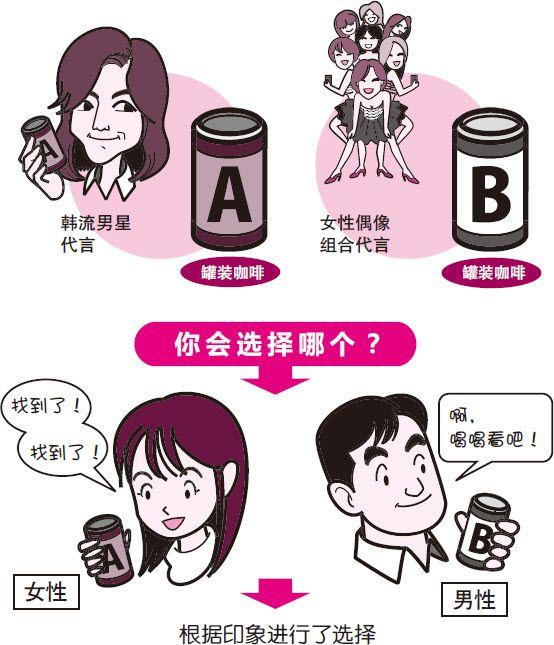

> > 不考虑罐内的咖啡，而是根据感性印象来选择商品的，正是我们这些普通人。

2　磨炼心理博弈技巧刻不容缓

●　制胜于日常的心理博弈

一切“战争”皆是心理博弈，今后的“战争”中，心理因素将变得越来越重要。

古时的战斗，往往是手持武器，靠身体的力量与敌人斗争、对抗，但是，那样的时代已经一去不复返了。今后的时代，将是一个运用“心理的武器”，与敌人进行智斗竞争的时代。

或许“战斗”、“敌人”等措辞有些夸张，简单说来，就是向对方宣扬自己的主张。例如，说服客户同意己方的要求、男女间进行难以言传的小博弈、巧妙地向给你带来困扰的邻居诉苦、买东西时讨价还价等，这些都是心与心的“战斗”。

枪支武器和强壮的身体被取代的当今社会，现代人通过砥砺智慧和心灵，探寻对方的心意，并与之进行战斗。若是赢得这场战斗，不仅能让对方按自己的预想行动，而且能令其对自己产生好感，从而维系良好的人际关系；若是在战斗中败北，事情便无法按照预想的推进，还有可能陷入被骗、被厌恶的窘境，招致惨痛的经历。如果是企业赢得心理博弈，就能提升业绩，并将其转化为具体的利益；但若输了，则会蒙受巨大的损失。

尽管比起其他因素，“心理”这一因素常被放在最后。但在今后的日子里，“人品”和“温文的谈吐”必将受到更多的重视。

在现代社会，只有主导心理博弈的人才能成为最后的赢家。

每天都在进行的心理博弈

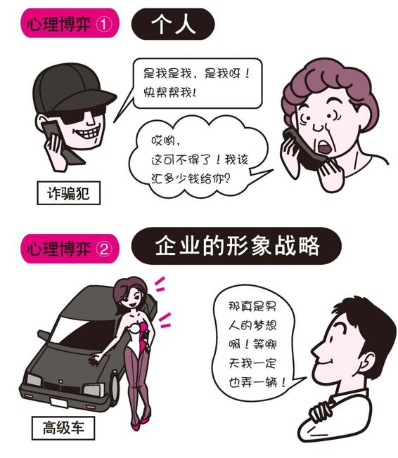

> > 在现代，不论个人还是企业，制定的战略中若忽视了人心，都将不被看好。

3　错觉，隐藏的“杀手锏”

●　心为眼睛所欺骗

在心理战中，探寻对方的心理、弄清对方的真正意图，并在对方未察觉之际掌控其心理是极其重要的。这种时候，一个行之有效的方法就是利用“错觉”。

以数字为例。我们在超市中随处可见这样的标价：豆芽98日元／袋，卷心菜198日元。这与100日元和200日元相比，仅仅2日元之差，但比起100日元和200日元的标价，感觉上却便宜了许多。4万日元的智能手机若降到3.5万日元，我们也许不禁要惊呼“好便宜！”，但11万日元的超薄电视即使降到10万日元，我们也不会太吃惊，尽管超薄电视的降价额度更大。

人的心理就是这样微妙且摇摆，一点风吹草动都可能使其动摇。或许正是因为这样，我们的心才会渴望安定，倾向于以一种“安定的形态”来捕捉事物。心理学上称之为“形态法则”，一个广为人知的法则。

请大家参看右侧图例。

假设该公司某个产品的市场占有率为40％，若要宣传该公司在这一领域所拥有的强大竞争力，图表A和图表B，哪一个更能给人以强烈的印象呢？

答案是图表B。因为这种具有稳健感的扇形图本身就能让对方在潜意识里产生一种印象，即这家公司是可以确保十分稳定的市场份额的。

呈现形式不同，即使相同内容，产生的印象也不同

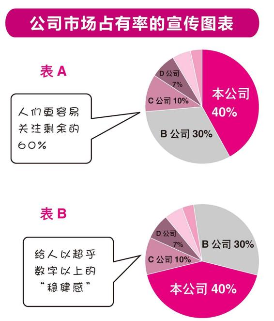

> > 一般情况下表A更为常用，但看表时更容易关注剩余部分从而产生不稳定感。

4　人的外在形象占九成比重

●　外表，不可忽视的制胜法宝

看到面容凛然的男性，我们会自然而然地认为他很能干；见到明朗清秀的美女，我们会不自觉地被其吸引，觉得她具有真性情。

尽管外表未必能反映一个人的内在，但人们的心理往往会擅自对其进行注解。

在心理博弈中，外在形象有着极大的威力。即使你不是俊男美女，也可以通过一定的手段，使自己的“外在”成为制胜的法宝。

下面介绍的是一篇发表在某一学会杂志上的研究结果。

普林斯顿大学的亚历山大·托多罗夫博士在美国参议院选举之际（2000年、2002年、2004年，共三次），就两名候选人的外貌进行了调查。他让被调查者通过观看候选人的照片选出“看上去很有能力”的一个。其结果是，仅通过“一张看起来很有能力的脸”，他就以68.8％的高准确率成功预测出了当选者，（“看上去很有能力”的候选人竞选成功）换句话说，选民们将选票投给了“看起来很有能力的脸”。

那么，什么样的外表看上去比较“有能力”呢？关于这点，德国玛堡大学医疗社会学的乌尔里奇·缪勒博士也作了一份调查研究报告。根据报告结果，要想变得“看起来很有能力”，“面无表情”是个很有效的方法。比起“微笑”和“大笑”，“面无表情”会让你显得更强大、更具支配力、更被人敬重，也更容易影响他人。

面无表情的人看起来更强大

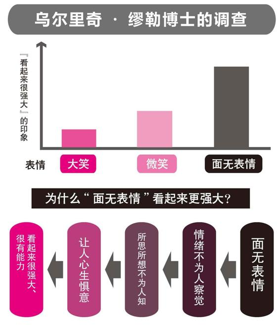

> > 缪勒博士在20年后对调查中显得“很强大、很有能力”的人进行了跟踪调查，结果显示他们果然都很有作为。

5　恐惧，一招制胜的说服力

●　语言因角度而转变

同样的事实，由于看待和选取的角度不同，得到的印象也会完全不同。心理学上将这种“选取”称为“框架效应”，这是心理博弈中的基本技巧之一。

举例来说，如果面前的玻璃杯中有半杯水，你会认为“只剩下半杯水了啊”，还是会认为“还有半杯水这么多啊”？

同样的半杯水，由于个人的观点不同、思维不同，对人的心理产生的影响也大不相同。

达特茅斯学院经济系的普南·凯勒教授，利用框架效应进行了一项以乳腺癌检查为中心的心理实验。实验中，普南·凯勒教授对其中一组被试验者进行了“若能在早期发现将会提高治愈率”的积极说明，而对另一组被试验者则进行了“若不能在早期发现将难以治疗”的说明，以引起其恐惧心理。结果证实，被引起恐惧心理的一组被试验者更容易被说服。

你不也是这样吗？当你想买一块70％都是瘦肉的牛肉时，若旁边的阿姨说了句：“哟，30％都是脂肪呢！”你也会觉得不能接受，并下意识地把肉放回货架吧？

可见，语言的含义因个人角度的不同而千变万化，并且总的来说，人们倾向于接受消极的观点。也就是说，鼓动人心的重要因素之一便是“恐惧”。

当你并不希望对方应承己方的要求时，不妨利用这种恐惧心理来打一场心理战。

印象因看待事物的角度而不同

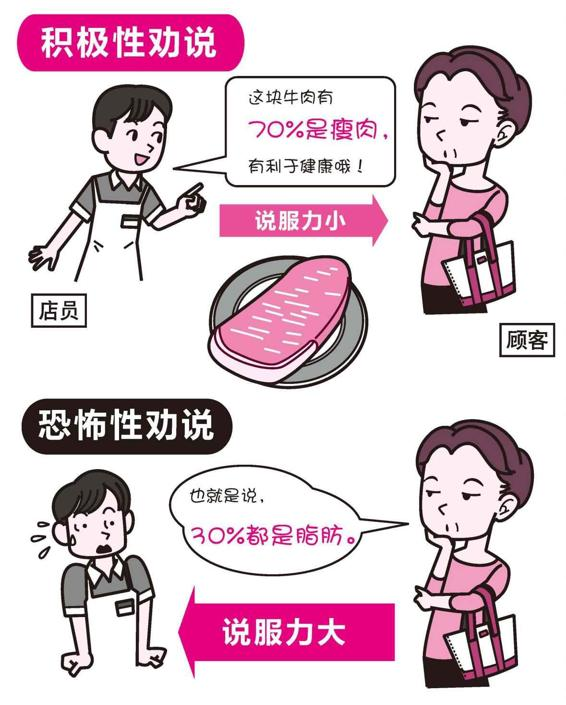

> > 同样的内容，由于框架构成的不同，产生的心理效果大相径庭。

6　留意笑容背后的意图

●　笑容是一种展示

你想过笑容究竟为什么而产生吗？

是因为内心的愉悦？是因为一时的畅快？是为了向对方传递自己“是友非敌”的信息？或者，单纯是为了构筑良好的人际关系？

上述解读都没错，但是，还有一个更具冲击性的事实，那就是，笑容其实是一种“展示”。康奈尔大学的罗伯特·克劳特和罗伯特·约翰斯顿两位教授在保龄球道上安装了针孔摄像机，将投球者的面部表情拍摄下来，并进行了观察。他们通过拍摄、分析两千多个投球者的表情，得出了惊人的结果——如果按照预想，人们在投出好球、得到高分时，自然会露出笑容，但真正这么做的人仅占4％。

那么，其他人是怎么做的呢？他们在得到高分后会先转过头、面朝同伴，然后才会笑容满面（42％）。

也就是说，人们展现给同伴的“喜悦的笑容”，并不是表达其“喜悦心情”的个人情感体现，而是一种为了向同伴进行“展示”的社会性行为。

因此，若有人对你微笑，你要明白，那不是他的情感表现，而是他向你做出的一种展示，而你，则要留心他的意图。

在心理博弈中，没有任何一种武器比展示出的笑容更强而有力。

笑容是为了“向别人展示”

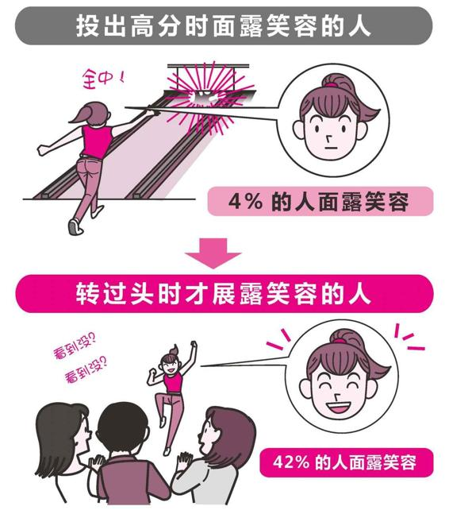

> > 只有掌握了笑容的种种运用之道，才能成为主导心理博弈的达人。

7　话题如何出卖一个人的内心

●　要不要谈论私人话题

在心理博弈中，准确掌握对方的心理状态比什么都重要。

不管对方是愤怒、悲伤还是愉快，毫不在意对方的状态，只顾着和对方搭话，想来这样的人是不存在的。

想要操控对方的心理，就要了解他的内心所想，这是基础中的基础。

但是，一个不争的事实是，很多人都难以完成这项基础内容。你身边一定也有这样的人，他们不理解对方的心理状态，因不懂得察言观色而遭到批评。

下面给大家介绍一条读懂对方心情的准则：主动谈及私人话题的人，正处于幸福的心理状态中。

谈论诸如“我小的时候啊……”“我在家里总是……”等私人话题的人，不会对你抱有警惕心理。正因为对你不设防，他们才会聊些私人的事情。

为什么说谈论私人话题的人正处于幸福的心理状态中呢？

新南威尔士大学的心理学者周瑟夫·佛格斯博士，以72名大学生为研究对象进行了调查。他让这72人全情投入到喜剧或悲剧电影的观看中，调查他们在观看影片后的第一时间会和熟人聊些什么。结果显示，因观看喜剧电影而心情愉快的学生们多会聊起金钱、健康、性等私人性的话题。

概言之，人在心情愉悦的时候会想要聊一些私人话题，有向他人敞开心扉的倾向。因此，那些愿意和你谈论私人话题的人，往往处在幸福的心理状态中，并且对你不设防。

不开心的时候不聊私人话题

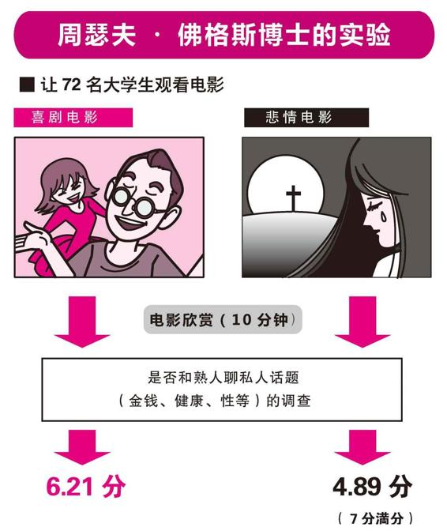

> > 只有对你不设防的人，才会和你谈论私人话题。

8　捧杀，最强大的武器

●　赞扬可以让对方不再沉默

第一章的最后，就以“捧杀”来结束吧，这也是心理博弈不可或缺的基本技巧之一。

作为谈话的一方，最难应付的就是对方沉默寡言。由于沉默，你不知道他们在想些什么，所以这类人最难交往。

但是，要和他们进行一场心理战也并非完全行不通。不管对方是什么类型的人，沉默寡言也好，能说会道也罢，有一种方法可以将他们全部拿下，那就是“捧杀”。

以下是卫奇塔州立大学的威廉·奥克斯博士进行的一项实验。

请仔细观察下方图。

威廉博士让4名学生就特定题目进行讨论，并请学者对学生的发言进行评价。但这些评价都只是信口开河，和学生们的发言内容没有任何关系。学者们不停地褒扬两名特定的学生，而对另外两名学生则不断地贬低。结果不出所料，受到好评的学生越发踊跃地发言，而不论说什么都只能得到消极评价的学生则渐渐不再开口。

因此，如果你希望对方再多说些什么，就不停地捧他，再捧他，直至将他捧晕。对方受到追捧后心情舒畅，便会愈发侃侃而谈。

相反地，如果你想让那些口若悬河的人安静下来，就给他们负面的评价，站在同他们相对立的立场上，与他们唱反调——只一样，千万不要表扬他们！

发言数量受赞誉影响

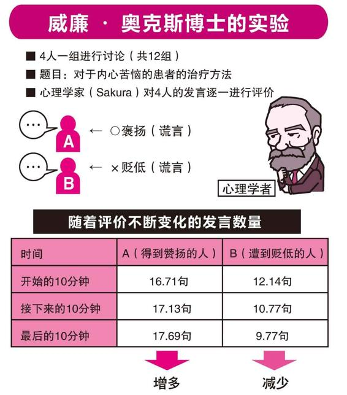

> > 自己的发言受到肯定时会增加发言量，相反地，遭到否定时便会减少发言。

拿来就用心理学

●　几乎人人都怕麻烦

现代社会中，购物、银行业务的办理、股票的交易、机票和宾馆的预定等，都可以在网络上完成，相信正在享受这些便利的人为数不少。这时便会产生一个问题，即密码的管理。

咦？密码是什么来着？

想不起来了！

为了不陷入上述困境中，人们必须想出一个容易记忆、不会忘记的密码。

纽约市立大学的约翰·特林库斯教授对数百名持有一种法式小书箱的学生进行了调查，向他们询问箱锁的密码。结果表明，有75％的学生未对密码进行修改，仍然使用出厂时的原始密码“000”。

这里既有防止忘记密码的因素，也有认为特意更改密码太麻烦的倾向。根据安保公司的调查，在经常使用的密码中，“123456”“password”“I
love you”“rock you”等谁都能想到的密码位居前列。

不要因为怕麻烦的不只有自己一人，就觉得安心，要对这一事实予以重视，多加小心才是。

●　25个“最差密码”

2011年，美国密码管理应用程序提供商飞溅数据通过分析黑客张贴在网上的数百万个被盗用户名和密码，公布了当年25个“最差密码”。“最差”是指最容易被黑客破解。

在这份“最差”榜单中，英文单词password排名第一；“123456”和“12345678”分列为第二、第三位；由键盘上位置相邻的字母组成的“qwerty”排名第四、“qazwsx”排名第二十三。

另外，受“password”一词的拖累，用户把其中的字母“o”换成数字“0”而组成的新密码“passw0rd”，排在第十八位。

●　最合适密码

密码短容易记忆，但安全性低；密码长虽然使安全性得到了提高，但不易记忆。如果要综合考虑方便、安全等因素，几位数的密码才是最合适的？

美国佐治亚理工学院的一项研究显示，12位数的密码较为合适。

研究人员假设一名熟练的黑客利用计算机每秒能生成1万亿个密码组合，那么，黑客需花180年破解一个11位的密码。但如果用户使用12位的密码，以目前的技术水平来看，黑客需要耗费17134年才能破解。

●　密码安全管理

不要认为，怕麻烦的不只有自己一人，就对密码问题不予重视。在高科技的今天，无论是网络密码还是银行卡、信用卡密码，稍不留神都有可能被破解，造成个人信息、金钱的重大损失，因此给“怕麻烦”的读者几个小建议：

1．定期更换密码；

2．选择不同类型的字符，最好是使用数字、字母以及特殊字符等的组合密码；

3．选择8位数或更长的密码；

4．如果用的是独立的单词，最好加上空格、下画线等；

5．不同的网站、卡最好不要使用相同的密码或类似组合；

6．避免用生日、身份证号、门牌号、车牌号等；

7．千万不要把所有的密码写在一张纸上，以防遗失后被不法之徒有机可乘。

密码管理无疑给压力巨大的现代人又增加了一分压力，但是除非你不使用现代化的管理与技术，否则不可避免地将要面临这一问题。

第2章\
打赢与自己对阵的心理战

> > 心理博弈中，最强劲的敌人是“自己的心”，因为人们会为了迁就自己而编造谎言。最重要的是自己，最可靠的也是自己。

> > 一起来认清这个任性妄为的“自己”的本来面目吧！

9　挑战，成功者永恒的坚持

●　没有风险就没有收益

所谓心理博弈，并非只是和他人的博弈，也包括自我内心的矛盾纠葛，并且，后者在心理博弈中占有很大的比重。

对方在想什么、有什么感受、处于怎样的心理状态……这些问题，如果自身没有切实经历过，是很难明白的。《孙子兵法》有云：“知己知彼，百战不殆。”放到心理博弈中，就是要对自己的心理有所了解，然后才能了解对方的心理。

因此，要获得成功，你必须对自己容易陷入的窘境和心理陷阱有充分的认识，使自己有能力处理一切心理上的挣扎，有效选择有利于成功的心理状态。那么，什么样的心理状态是对成功有利的呢？

波兰考明斯基大学的安娜·马科博士在大学生中进行了一项调查，具体而言，就是根据学生的性格形象，将学生分为“没有创业打算”和“有创业打算或已在创业”两类，并让这两类学生在“中奖金额高，但中奖率低”（高风险）和“中奖金额低，但中奖率高”（低风险）两种彩票中进行选择。调查结果表明，“没有创业打算”的学生往往会选择低风险的彩票，而“有创业打算或已在创业”的学生则更多地会选择高风险的彩票。事实表明，选择低风险彩票的学生，大多平庸而无所作为，而选择高风险彩票的学生，大部分都获得了非凡的成就，名利双收。

由此不难看出，越是甘冒风险、勇于挑战的人，就越有可能脱颖而出，大获成功。

其实道理很简单——不买彩票的人不可能获得中奖的机会；没有勇气挑战现实的人，也不可能获得成功的垂青。

真正的成功是建立在风险之上的，不冒风险，任何成功都只是痴人说梦！

为了成功甘冒风险

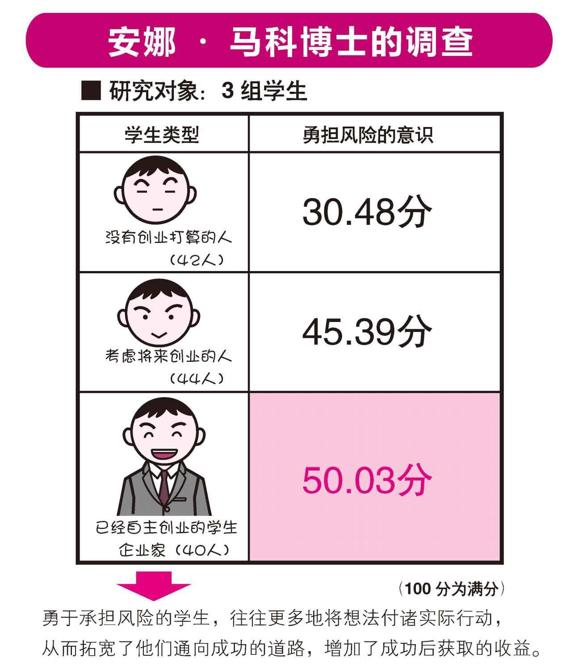

> > 在一场爱恋中，如果你始终不向他（她）告白，你们就永远没有开始；但是如果你告白，就一定会存在被拒绝的风险。你，会如何选择？

10　对令你讨厌的人产生好感

●　抵触情绪要不得

不管是谁，都会遇到难以相处或讨厌的人，都难免会产生抵触情绪。我相信，没有人会觉得，这种情绪能给自己带来什么切实的好处吧？

抵触情绪经过积累，最终会被你表露出来，并传递给对方。不管你是有意的还是无心的，你们的关系将变得更加尴尬，这是毋庸置疑的。而且，当你讨厌一个人的时候，承受这种精神压力的不还是你自己吗？所以，抵触情绪要不得，认识到这一点，并努力消除这种情绪，十分必要！

那么，如何才能消除抵触情绪呢？对于那些使我们“出于本能地去抗拒”，或者“无论如何也喜欢不起来”的人，怎样才能抹去对他们的厌恶感呢？

答案其实很简单！

想象一下和你讨厌的人肩并肩或者彼此拥抱的场景——不必真的拥抱，只要想象就行，你心中的那份厌恶感就会“嗖”地消失。或许你觉得不可思议，但是，你不妨尝试一下！

芝加哥大学市场营销系的阿帕娜·拉布鲁博士利用加入蝗虫的红咖喱罐头进行了一项调查，研究的课题是“仅凭想象能使人对罐头的印象产生多大程度的改观”（请参照下方图）。

加入蝗虫的红咖喱，是泰国东北部地区的人们经常食用的一种咖喱，但对于芝加哥大学的学生来说，却是种极为怪异的食物。不过，学生们凭借自己的想象，对罐头的印象确实得到了改观。

有时候，大脑是无法区分现实和空想的。只要在空想中消泯物理上的距离感，萌生积极的情感，厌恶感便可自然消除。

消除厌恶感的方法

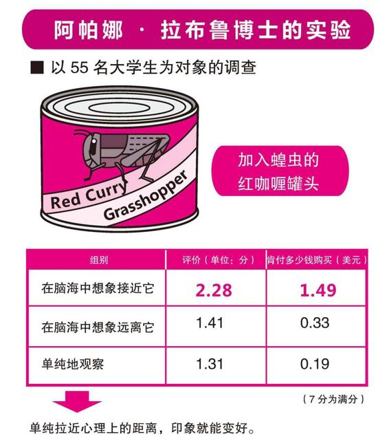

> > 当你真心想对那个令自己讨厌的人产生好感时，用想象的方式拉近彼此的心理距离吧！

11　巧用别人的羞耻心

●　感到羞耻不是坏事

在众多情绪中，我们首先要克服的当数“羞耻”。从心理学上说，羞耻是一种痛苦的情绪体验，是人们因为自己在能力、人格、外貌等方面存在缺憾，或因为自己的思想和行为与社会常态不一致而产生的。

当我们在众多比自己更有名望的人面前发言时，在公共场合摔倒时，或在超市买了某些特殊商品时，往往会觉得很难为情，这就是“羞耻”在日常生活中的具体表现。

感到羞耻是一种非常正常的心理，很多人希望自己不管做什么都能抛开羞耻，这也是事实。有人说，东方文化博大精深，其中就包括“耻文化”，因此，“羞耻”在东方人身上表现得尤为明显；欧美人即使在众目睽睽之下，也会毫不畏缩地挺起胸膛，大声表达自己的意见，贯彻自己的主张。

话虽不错，但也正是这种东方式的“羞耻”情绪，衍生出了体贴他人、和善相待的心理。下面是一项十分有趣的实验及结果。

荷兰蒂尔堡大学的艾露娜博士，以135名大学生为对象进行了一项实验。她将学生分为两组，给他们10分钟时间作答，让一组学生写“曾经令自己感到羞耻的事”，让另一组学生写“最平常的生活状态”。然后，她给每位学生10枚硬币去帮助别人，看他们如何分配这10枚硬币（参照下方图）。结果显示，回想起自己因醉酒失态、比赛失败而感到羞耻的一组学生往往会分出更多的硬币来帮助相识的人。

这是因为，怀有羞耻感的时候，人们会想方设法拿回自尊，对待他人会更加热情恳切。换言之，人们通过善待他人来填补心灵上的空缺，从而有效地控制自己的情绪。总之，感到羞耻并非坏事，你无须也不能丢弃“羞耻”。

懂得羞耻会变得更加体贴和善

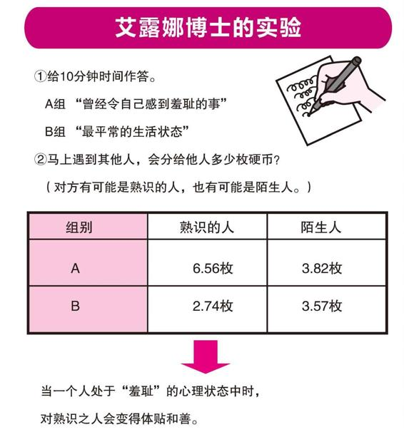

> > “羞耻”是一种十分珍贵的感情，可以唤起人们对于他人的善意和援助意识。

12　别相信自己的估计

●　不要过度信任“想当然”

假设你问一个赌徒：“总的来说，你赢的次数多，还是输的次数多？”

恐怕他会回答：“当然是赢！”

如果他能意识到在过去的日子里，自己输比赢多的事实，那么这个人就有可能金盆洗手，从赌徒的队伍中抽身而出。很多人之所以会一直赌，正是因为他们相信自己“总的来说是赢的”，尽管这或许只是他们一厢情愿的想法罢了。

纽约圣约翰大学的约翰·特林考斯博士对天气预报员进行了一项调查，询问他们在自己的印象中，自己对天气的预报准确率有多高。结果，“觉得自己准确地进行了预报”的次数比“实际上准确地进行了预报”的次数高出约2倍。

可见，人们对自己过去的行为进行回顾性估计时，会存在过高估计的倾向。不过，这种过度自信也是无可厚非的，因为如果一个人对自己的判断都没有信心，那么他将无法展开任何行动。也就是说，人会本能地过度信任自己的估计。

所以说，赌徒高估自己过去的成绩是最自然不过的倾向。鉴于这种倾向，为了对未来的行动采取更为有利的举措，在回顾过去时，下意识地低估自己的成绩是有必要的。如果你能意识到自己对过去的回顾性估计并不十分可靠，那么在制订未来计划时，就不致过高过空，从而降低失败的概率。

人们对自己的预想有过高估量

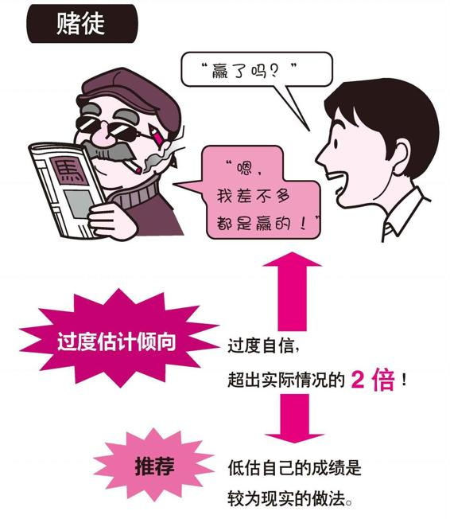

> > 人会为了迎合自己隐藏的预期而对事实进行随意注释。

13　记忆的自我筛选功能

●　不顺心的记忆会被遗忘

相信你还清楚地记得学生时代的成绩吧，尤其是好的成绩和回忆，常常会从你的脑海中浮现出来，例如在全班排前几名，对微积分特别拿手，曾在全国竞赛中获过奖……

但是，对于不好的成绩呢？能够清楚地记得自己考试不合格，在班级中排倒数第几名的人，却相对少得多。

也就是说，人都有一种倾向，即保留那些迎合自己心意的记忆，而淡忘那些不顺心的记忆。

俄亥俄卫斯理安大学的哈雷·巴里科博士通过实验证明了这一点。他让99名大一学生仔细回忆了高中时的成绩，写出自己在数学、物理、历史、外语等科目中分别得到的等级。在美国的成绩等级中，A最高，F最低。此次实验中，对得分为F的科目不作分析。然后，博士让学生们拿来实际的成绩单，比较记忆和实际情况的偏差。结果发现，对于成绩为A的科目，记忆的正确率为89％；而对于成绩为D的科目，记忆的正确率只有29％。

无论哪个国家的学生，对于自己不擅长的科目和不理想的成绩，都会选择遗忘。换言之，不好的回忆不会一成不变地留在记忆中，一段时间后，它就会被你忘却，消失无影。

所以，不管面对什么事，都应该果断勇敢地去挑战，不要惧怕失败，不要担心遭遇耻辱，因为，这样的记忆不会停留太久。

不顺心的往事会渐渐被忘记

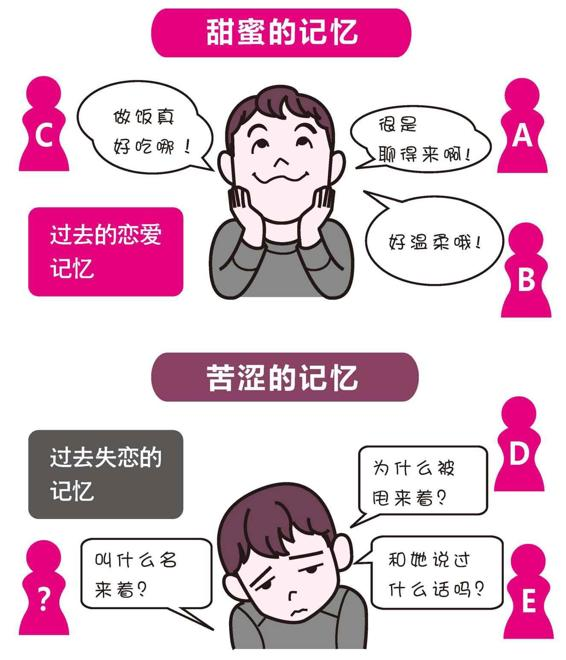

> > 如果不好的记忆一直停留，人就无法继续前行。因此，人类的大脑会自动选择忘记它们。

14　给大脑捏造记忆

●　过去可以轻易被“捏造”

上一节谈到，人类会选择忘记那些不顺心的事情。但同时，人类也会“捏造”一些迎合自我的过去。

举个典型的例子：借钱。

当你借钱给别人时，不管过了多久，你都能牢牢记住这件事；但若是你向别人借了钱，时间一久，恐怕你就很难记起了。相信你也遇到过这样的事——被催债的时候才想起这茬儿，但心里却在嘀咕：“咦？我怎么记得已经还了……”

有一项实验能证明，“记忆”是多么的不靠谱！

惠灵顿维多利亚大学的金伯利·韦德博士对20名志愿者进行了一项关于记忆错觉的实验。首先，韦德博士在志愿者不知情的情况下，通过志愿者的家人，得到4张志愿者小时候的照片。然后，她将其中一张照片与气球图片进行合成，制作出一张假照片。最后，她将照片拿给志愿者看，让志愿者描述一下自己对假照片的回忆。结果，有三分之一的志愿者回答“记得”假照片上的“气球旅行”，并详细地讲述了旅行过程（剩余三分之二的志愿者没有相关记忆）。其中一个志愿者甚至说：“那时我6岁，当时花10英镑就可以坐热气球到二十多米的空中去。我可以肯定，这张照片是我母亲站在地上给我拍的。”

给大脑“捏造”一些非真实的“记忆”就是这么简单！

即使是与事实不相符的记忆也可以伪造

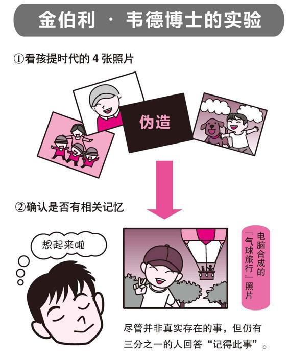

> > 记忆是非常随意的东西，对它最好持有三分怀疑。

15　瞬间和他人搞好关系的秘诀

●　通过共同的行为来施展“魔法”

交不到朋友，找不到搭话的机会，无法和别人成为推心置腹的密友……

你是否正在为这些事烦恼？接下来我要教你的这个方法，是我多年经验的总结。那就是：试着和别人一起做点什么。没错，共同进行一项工作，能使你们的关系迅速变得亲密，这就是魔法般的“密友获得术”。

回想一下学生时代的校园文化节吧！筹备文化节的过程，是青春记忆的一部分，无论何时回忆起来，都觉得就在眼前。当你和你的同学们为了同一个目标而努力的时候，无论你们平日里关系是好是坏，至少心是聚在一起的，由此衍生出一种充满凝聚力的牵挂。你们会互相关心各自手头的工作进行到何种程度，会关切地询问对方是否需要帮助，会真诚地交换意见……到了文化节前夜，所有的准备工作圆满就绪，从成就感中迸发出来的感动，会使每个人都觉得：“我们是一辈子的好朋友！”

你也有过类似的经历吧？

要想和他人搞好关系，不必勉强去搭讪，最有效的方法，就是默默地和那个人做同一件事。加入同一个社团，进行同一个项目，参加同一个酒会，甚至只是跟着集体一起去看场电影，一切能使你们产生共同行为的机会，都应该紧紧抓住，充分利用。一旦两个人有了共同的记忆，也就有了可供分享与讨论的资源，搞好关系就会变得简单许多。

得克萨斯大学的威廉姆·斯万博士将245名高中生分为两组，让其中一组学生玩“躲避球”的游戏，而另一组学生什么都不做。然后，他对学生们进行了问卷调查：“你是否会为自己的小组打架？”结果显示，回答“会”的学生中，一起玩了“躲避球”游戏的学生是另一组学生的5倍之多。可见，即使只是一场游戏，也能加深人与人之间的牵挂。

魔法般的“密友获得术”

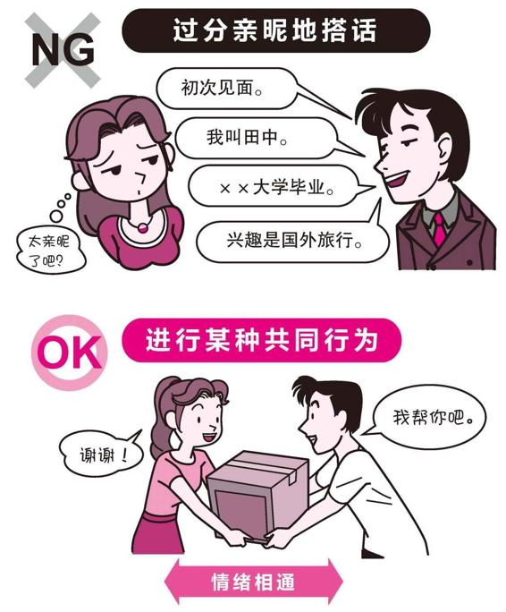

> > 共同进行某项工作，使人更容易敞开心扉。

16　好心情助你跨越障碍

●　难题要留在心情好的时候解决

每个人都有一帆风顺的时候，也有诸事不顺的时候。我们要做的，就是不断鼓励自己，解决纠葛，继续前行，这就是人生。

不过，假如障碍过于巨大，虽然你决意要跨越，却实在“没有心情”，那么，不妨暂时放下挑战，试着转换一下心情吧！

也许你会问，难道人生中这么重大的时刻，就这样交由“心情”来决定吗？但是别忘了，有一个事实是，人在心情不好的时候，不论做什么都不会顺利的。相反，心情好的时候能激发出惊人的潜力。

当你的婚期敲定，或者自己的小组在比赛中获胜，或者自己开发的产品大卖，又或者第一个孙子降临人世……这些事情将你的情绪推至喜悦的巅峰，于是一种意想不到的力量便会喷发出来，使你轻而易举地越过一直未能越过的障碍。

肯德基州立玛丽大学的泰利·格林博士以22名初中生为对象进行了一项实验。他让学生们做著名的脑力竞赛题“邓克尔蜡烛问题”（参照下方图）。这是一个相当考验人的思维能力的难题，没有一点儿想法，恐怕是无法解开的。

实验前，博士对其中11个人的服饰、发型给予了称赞，并给他们嚼口香糖，以调整他们的情绪。而对另一组的11个人，则只是稍微寒暄了几句。之后，博士让学生们去解蜡烛问题。结果，仅得到寒暄的那组学生中，只有2人正确地解答了问题，而事先很好地进行了情绪调整的一组学生中，则有7人得出了正确答案。

好的心情可以激发好的灵感，产生出意想不到的力量，助你成功跨越障碍。

邓克尔蜡烛问题

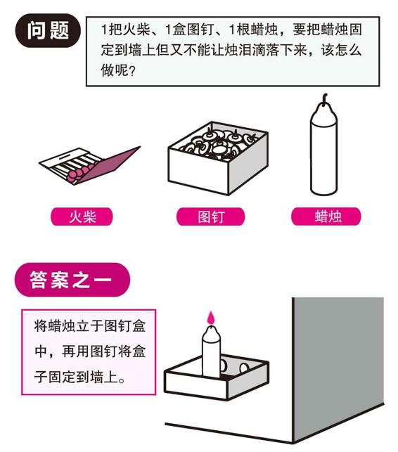

> > 这是著名的心理测验，考察思维的转换和创造力。

拿来就用心理学

●　给想要记住的东西配上旋律

“谐音”是较为常用的学习方法。在《日本史》这一科目中就有“哭吧（794年），善于歌唱的平安京”“建造一个好国家（1192年）吧，镰仓幕府”[(1)](#index_split_039.html_filepos74574)的说法。利用谐音，能使一些难记的信息融进诗歌中，若能配上旋律，将更有助于记忆。

我在学生时代，就曾利用歌曲来记忆中国的历代王朝。我把各个朝代按照顺序排好以后，配上歌曲《兔子和乌龟》的旋律，编成四行“歌曲”；

in·syuu·sin·kan·sangoku·sin（殷·周·秦·汉·三国·晋）

nanbokucyou·zui·tou·godai（南北朝·隋·唐·五代）

sou·gen·min·sin·cyuukaminkoku（宋·元·明·清·中华民国）

cyuukajinminkyouwakoku（中华人民共和国）

当然，这在心理学上也是有据可循的。

北卡罗来纳州杜克大学的汪达·华莱士博士，以64名学生为对象进行了一项记忆民谣歌词的实验。他将学生分成两组，让一组学生听配有旋律的音乐，让另一组学生听没有旋律的朗读录音。结果，不论是听一次还是听五次，都是听配上旋律的音乐的那一组学生记得更多更准确。

歌词配上曲子，总信息量增加，照理说，记忆起来会更有难度，但事实上，两者相辅相成，反而有助于记忆。

●　高效的“音乐学习法”

最初发现音乐旋律有助于提高大脑工作效率和记忆力的，是苏联的科学家。他们通过研究和比较发现，17、18世纪的作曲家们创作的某些根据古代音乐流传下来的特殊格式创作的音乐，对大脑和记忆有强烈的影响。

例如，巴洛克协奏曲中每分钟55～65拍的行板音乐，能使学习效果倍增。巴洛克音乐的作曲家们通常使用的乐器是弦乐器、小提琴、吉他、拨弦古钢琴等，创作出的音乐缓慢、舒适、宁静。

当你听着宁静而舒缓的音乐时，血压下降，心脏开始健康而有节奏地跳动，得到放松的脑波上升大约6％，从而使得左右半脑达到同步。

大脑和身体随着缓慢的旋律渐渐进入和谐状态——身体放松、大脑警觉，这正是取得优异成绩的最佳状态。

保加利亚哲学博士、精神病学专家乔治·罗扎诺夫主张利用节奏舒缓的旋律来刺激大脑，消除心理的紧张感，使音乐节奏、生理节奏（呼吸、心跳等）与信息输入节奏协调起来，从而增强大脑活力、提高记忆力。这种“音乐学习法”在西方已得到广泛应用。

法国著名听觉专家阿尔弗雷德·托马斯蒂说：“有些音乐的兴奋作用相当于两杯咖啡。”

泰丽·怀勒·韦伯指出：“某些类型的音乐旋律有助于放松身体、安抚呼吸，引发易于进行新信息学习的、舒缓的‘放松性警觉’状态。”

音乐除了增强记忆力、提高学习效率，也有助于消除大脑中的噪音，使身心得到放松。因此，当你烦躁疲惫的时候，选一种自己喜欢的轻松的旋律，找一个舒服的位置躺下，做几个深呼吸，有利于释放紧张，为生活和工作储备正能量。

————————————————————

[(1)](#index_split_039.html_filepos70607) 在日语中，“哭吧”和“794”谐音，“好国家”和“1192”谐音。

第3章\
胜利者不说却在用的博弈高招

> > 在心理博弈中，只有胜利者才能掌握大局。因而，获得并保持胜利尤为重要。

> > 但是，如果你暂时还没有这个能力，那么，扮演胜利者总能做到吧？

> > 下面我将公开的，便是如何扮演胜利者的技巧。这可是机密中的机密！

17　塑造强大的自己

●　握手要大方有力

要想在日常的心理博弈中笑到最后，克服内心的软弱，始终保持胜利者的姿态至关重要。换句话说，在你赢得战斗成为名副其实的胜利者之前，你也需要“扮演”胜利者的角色。这就是引导你成为真正的胜利者的心理法则。

以握手为例。在这个国际化的时代，相信每个人都有与他人握手的经历。那么，当你感受到对方强而有力的握手时，你会对他产生什么样的印象？反之，如果对方连握手都是软弱无力的，你又会作何感想？

阿拉巴马大学的威廉姆·卓别林博士让4名志愿者作为判定人员，分别和112名大学生进行两次握手，然后询问志愿者对握过手的大学生有何印象。结果，对那些握手强而有力的大学生，判定者们做出了“善于交际、外向、开朗”等正面的评价；而对那些握手软弱无力的大学生，判定者产生了“内向、略显神经质、似乎有所隐瞒”等消极印象。

可见，通过一个人握手的力度，人们便会对其性格加以推断。所以，即使你本身是个比较弱势的人，但与人握手时，千万记得用点力。

伸出你的手，注视对方的眼睛，自信而诚恳地说一句“幸会幸会”，或者“请多关照”，即使对方还不习惯握手，也不会拒绝你的。

在取得实质性的胜利之前，“扮演”好胜利者的角色，将你的大方与力量，通过握手传递给对方，为自己塑造一个胜利者的形象。

握手传递强者印象

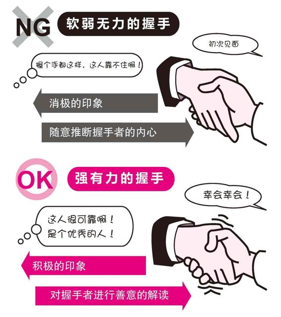

> > 强而有力的握手，可以向对方传递出自己强大、值得信赖的形象。

18　扮演“有能力的人”

●　有前途的人更容易获益

上一节已经说到，获得实质性的胜利之前，“扮演”好胜利者的角色，有利于提升自己的形象，从而对日后的合作获取一些帮助和好处。

可能有人会感到惊讶：心理学中真的有这样的绝招吗？

没错！如果你仍心存疑虑，那就来看一组实验数据吧。

荷兰格罗宁根大学的班德比特博士，将96名学生分成四人小组进行课题研究。该项目持续时间长达一年。在此期间，博士对各组员之间的交际往来进行了观察。结果表明，越是优秀的学生越容易获得其他成员的协助，而对那些不够优秀的学生，却很少有人愿意伸出援助之手。

其实，那些不够优秀的学生才是最需要帮助的，但大家却将他们排除在外，有意或无意地忽视了他们的存在。不过，仔细想一想，这也是情理之中的事，因为作为援助者，多半都有自己的盘算，例如“我先卖个人情给他，说不定什么时候他会报答我的”“以后要是有什么困难也可以让他帮帮忙”，等等。相反，对一个无法指望他能有所回报的人，帮助他就相当于做公益活动。当然，如果收到求助，我们或许也会帮忙，但终究不是发自内心的。

“帮助他人图回报”是一种普遍的心理。所以，如果你希望得到别人的帮助，首先就要以前途光明者的姿态示人，要让别人知道，你很优秀，很有潜力，你有能力回报他们。一旦获得了相应的帮助，提升实力也就变得相对容易了。

援助集中于有前途的人

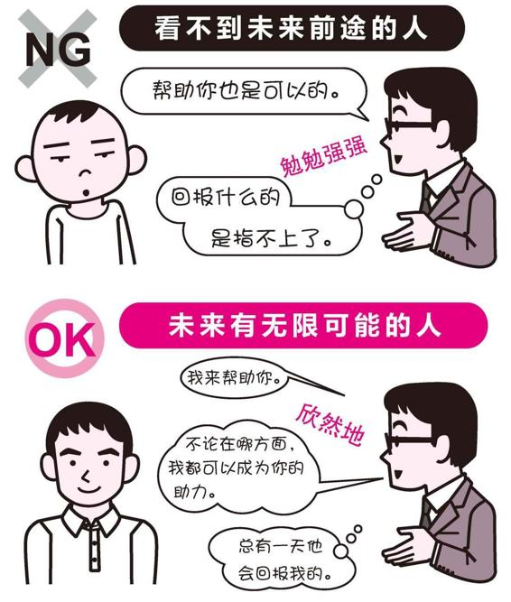

> > 对别人施以援手的一方有自己的心理算盘，比起毫无回报的行为，他们当然更愿意站在对自己有利的一方。

19　示弱，而后强大

●　即使失败也不要放弃

人有一个共性，那就是当看到别人陷于困境中时，都会忍不住拉一把，即使最终得不到任何回报。

或许你会疑惑，上一节明明提到，人们喜欢站在胜利者的一方，以期待获得好处。可是刚刚又说……不是矛盾了吗？但这确确实实也是人类心理的真实状况，心理学上称之为“败犬效应”，表现的是一种想对处于不利状况中的人伸出援助之手的心理状态。

有一项实验数据可以证明这一点。

哈佛大学的尼尔·巴哈利亚博士虚构了两家公司，并将这两家公司的情况对181名学生进行了介绍：A公司——员工有很高的工作热情，但业绩不佳；B公司——经营方面不作任何努力，但业绩很好。

博士假设这两家公司是销售洗涤剂、夹克衫、自行车灯等商品的公司，并排除顾客因商品差异而做出抉择的情况。在此基础上，他要求学生们就购买哪家公司的商品进行选择。结果，选择A公司的学生多于选择B公司的学生（5.1：4.1）。败犬效应在这里得到了体现。

假如你不幸沦为“失败者”，也不要轻言放弃。自怨自艾或消沉萎靡都于事无补。但只要你不懈拼搏，使周围的人看到你的努力，你便有可能得到想要的帮助。

除此之外，通过展示你的“弱小”而博得同情，也能使你的期待得到满足。当然，你需要了解对方的心理，掌握能博得对方同情的条件，否则只会适得其反。而一旦你成功地通过“示弱”获得帮助，那么，你已经胜利了一半。

所谓“败犬效应”

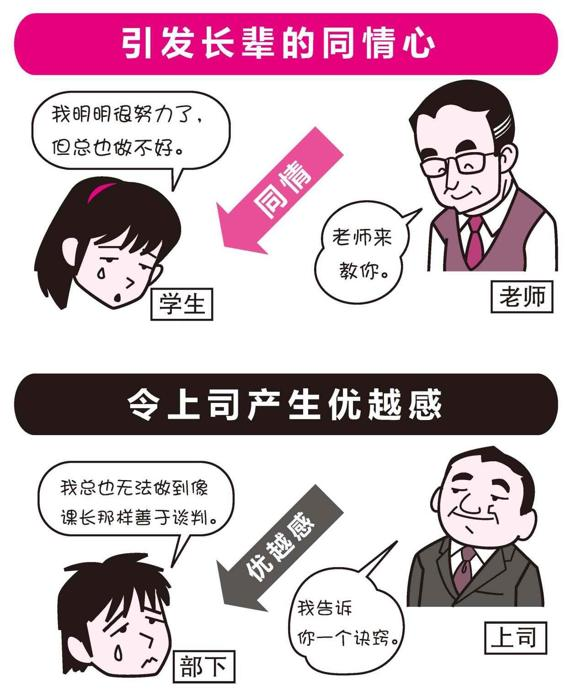

> > 示弱，从而使自己相较于对方处于劣势地位，如此，自己的要求更容易得到满足。

20　反对者的自信与存在感

●　显示存在感以求关注

大到一个国家政权的变更、一个公司政策的改革，小到一场普通的争论，只要有拥护者，往往就少不了反对者。很难说，哪一方的观点正确，哪一方的观点错误。双方主力都极力与对方唱反调，无非就是想突出己方的存在感，以争取更多的拥护者。

美国西北大学的爱丽丝·意格丽博士进行了一项调查，目的是研究人们更倾向于倾听与自己相同的意见，还是与自己不相同的意见。她让592名大学生听一段7分钟的录音，内容是关于“人流正确与否”的见解，之后就学生们对录音内容的记忆进行了调查。结果显示，调查对象更容易记住那些与自己的立场不一致的内容。

当人们听到意料之中的话时，不会表现出惊诧等情绪。与此相对，那些令人意想不到的、与期待相违背的话，或脱离常理的想法，却很容易留在人的记忆里。而且，对于那些面对面直接反对自己的人，人们会不由自主地关注他，并反复琢磨他为什么会反对。

在与人交涉的过程中，一旦对方问你：“你为什么不同意？”那就意味着他的心理防线已被你突破，自信开始下滑；同时，你获得了主动权，只要掌握得好，便可稳操胜券。因此，一味逢迎、认同只会削弱你的存在感，自然也没有人愿意认真听你说话。

当然，需要注意的是，提出反对观点可以显示自己的存在感，但前提是你对自己的观点有信心，否则不但无法获得对方的认同，反而招来厌恶。

反对即可引人注目

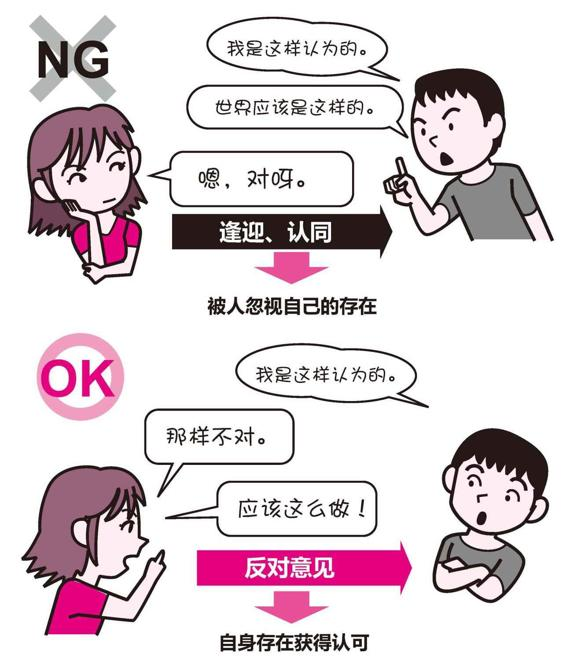

> > 即使是“失败者”，也可以突出自身作为“反对者”的存在感。

21　感到痛苦就想“钱”

●　为了钱而忍耐

实现梦想、达成愿望，对任何人来说都不是一件容易的事。在向大目标迈进的过程中，困难和忍耐总是如影随形。

想要进入一流大学，就必须先通过困难重重的升学考试；想要成为公职人员，就必须先做一个受人爱戴、尊敬的人；想要和富豪结婚，就必须先努力获得对方的好感……目标越大，追求目标的道路就越艰难。很多时候，即使感到厌烦也要积极努力，即使面对讨厌的人也要笑脸相迎，有时甚至要“扼杀”真实的自我来迎合对方。

但是，无论多么艰辛痛苦，只要想到是为了“钱”，你便能想办法挺过难关。

也许有人会说：“我追求理想不是为了钱！”不管你是为了什么，有一点毋庸置疑，那就是在现代社会中，金钱是不可忽视的前进动力。

康涅狄格大学的莎伦·贝克博士在80名女大学生中进行了一项调查，看她们将手伸入冰水后能忍耐多久。实验中，博士将女大学生分成4组：

①认知应对法小组（感到疼痛时尽力调动疼痛以外的情绪，用积极的话语来鼓励自己）；

②金钱小组（每忍耐4分钟便给其2美元）；

③认知应对法＋金钱小组；

④不采取任何举措的小组。

结果，忍耐时间最长的是第③小组，其次是第②小组（参照下方图）。可见，人在想到有钱可得时，在一定程度上能增强忍耐力。

金钱是不容忽视的动机

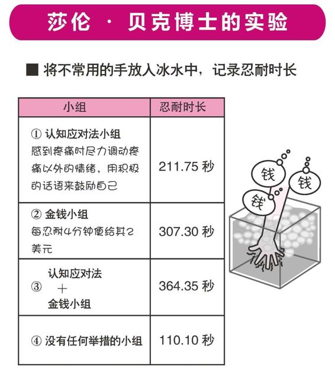

> > 如果你是领导者，为达成自己的目标，可预先准备一些钱财方面的奖励，这样有助于提高下属的积极性。

22　炫耀，强者最不需要的手段

●　大商标产生反效果

前文已经说过，平日注重塑造自己“胜利者”的形象很有必要，因为有能力的人更容易集人力、物力、财力于一身，而这能使你在心理战中占据优势地位。

假如你不擅长“扮演”胜利者的角色，但至少要避免给人留下“失败者”的印象，例如动辄战战兢兢、讲话细弱无力、精神萎靡不振，等等。此外还有一点，或许会令你感到惊讶，那就是，穿戴的服装服饰上如果品牌商标太大太醒目，也会给人留下“失败者”的印象。

宾夕法尼亚州立大学市场营销系的助教乔纳·伯杰曾做过一份报告。他募集了一些时尚相关专业的女大学生和与时尚完全无关专业的女大学生，对她们各自的喜好进行了调查。结果显示，在时尚审美方面颇有自信的学生多偏好商标不太醒目的服饰，而普通的学生则更喜欢那些有较大商标的。

那些对时尚较为敏感的学生们认为，商标不醒目反而能够体现差异化。另外，根据该助教的报告，越是价格低廉的服饰，其商标越大，而越昂贵的商品，反而不会刻意显现商标。所以，如果你企图用服饰上的大商标来吸引别人的目光，显示自己与别人的不一样，那么，我可以告诉你，你不仅达不到自己的期望，还会给对方留下“没钱”、“俗气”、“炫耀”、“没品位”等不良印象。换句话说，真正的胜利者更倾向于自然呈现，不需要刻意标榜。

品牌商标所具备的信息

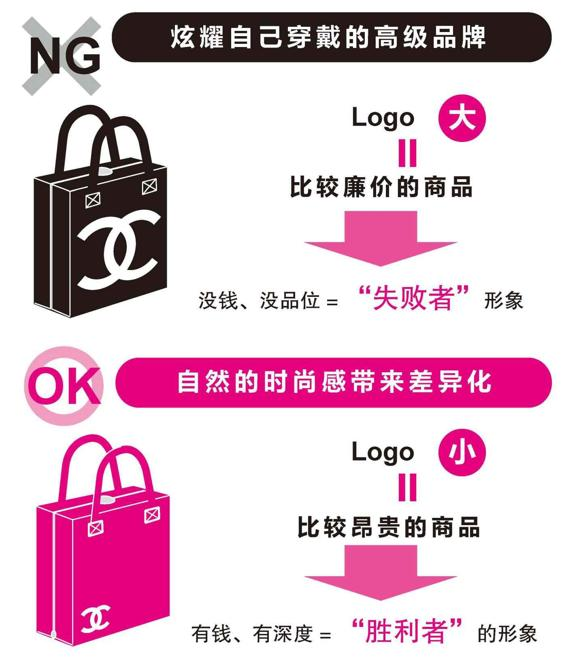

> > 高级品牌的商标，在价格越高的商品上反而越小，越不引人注意。

23　寂寞者会买什么

●　需谨慎购买的商品

从一个人所持有的物品，可以看出一个人的性格。

一名女职员，如果她的东西都是Hello
Kitty，那么可以猜测，她不在意别人的眼光，以自己的喜好为先，并且不以权力为奋斗目标。

一个人如果戴着纯金项链、纯金戒指，连他的腕表也金光闪闪，那么他往往有用金钱摆平一切问题的经历，并对事业充满了自信。

同样，有那么一类商品，若是穿戴在身上，会让人一眼看穿你的“寂寞”。

下面是荷兰蒂尔堡大学的尼科尔·米德博士对30名男女大学生进行的一项心理实验。

首先，博士告诉大学生们，他们将和Sakura进行面对面交谈，但在此之前，要先通过录像作一下自我介绍。她先让一名大学生观看Sakura的录像，Sakura在录像中介绍了自己的兴趣和梦想。接下来，该大学生以类似的方式通过录像介绍了自己。但之后，博士告诉该大学生Sakura拒绝见他，“Sakura看过你的录像后，说不想和你见面，已经回去了”。

实验到此告一段落，作为酬谢，博士让大学生们到实验专设店铺购买价值10美元的商品。结果在被Sakura拒绝的大学生中，有53％的人购买了印有大学校名的护腕等与学校有关的商品；而未被拒绝的大学生则多会买一些点心、文具等。

或许你会问，这能代表什么呢？

当被同伴排斥或遭到拒绝的时候，你是否会感到寂寞？这种时候，我们更渴望与他人保持或建立联系。

印有大学校名的商品，正是一种联系的象征。所以，佩戴员工胸牌等归属感较强的东西时，其实也在不停地告诉别人：我现在很寂寞。

抚慰心灵创伤的归属性商品

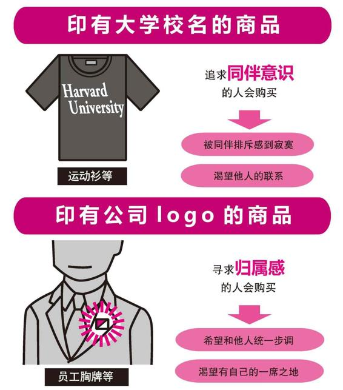

> > 越是遭到拒绝的人，寻求归属感的欲望越强烈，甚至存在勉强自己和他人保持一致的倾向。

24　如何瞬间提高决策力

●　使肌肉紧张可以提高决断力

衣橱里已经满得塞不下了，必须立即丢掉那些不会再穿的衣服，但总也下不了决心；一直关注的一款新家电终于降价了，但考虑到还有继续降价的可能，迟迟作不了决定……

相信你一定有过这种难以抉择的经历。那么，究竟为什么会如此难以抉择呢？

原因当然不止一个，不过有一个显而易见的因素是，在进行选择的同时伴随着“失去的痛”。在这种左右为难、摇摆不定的情况下，如果你能冷不防给身体注入力量，或许作起决定来会顺利许多。

新加坡国立大学市场营销系的助教爱丽丝·汉恩先假设：人们会为了别人而努力，即使要忍受痛苦。为了证明这一假设，她以54名大学生为实验对象，调查他们是否愿意为海地地震捐献自己最心爱的东西。她将学生分成两组，第一组学生什么也不做，第二组学生“用力握住笔”后再决定。调查发现，第一组学生中有7成左右表示会捐献，而第二组学生中回答“愿意捐献”的高达92％。

用力握住笔，一个极其简单的动作，便可使下决心割舍心爱之物变得更容易。

回忆一下，当你痛苦或悲伤的时候，是否也常常会通过紧握拳头来忍耐？这就是通过给身体加劲儿，使身体达到紧张状态，从而使自己保持强大的意志力，以克服内心的痛苦。

所以，当作决定感到痛苦的时候，试着给身体加把劲儿吧，或许问题就能迎刃而解了。

艰难的决断需要强大的意志力

股市失意者的典型案例

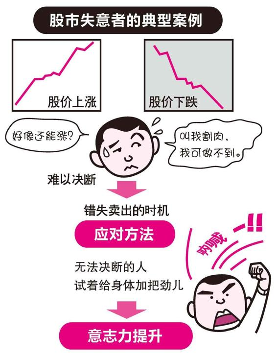

> > 身体紧张，意志力就会增强，因而容易当机立断做出决定。

拿来就用心理学

●　触碰，而后想得到

我决定今天只看不买，杜绝乱花钱！

或许你在出门前是这么想的，但一旦试穿满意，还是会忍不住掏钱买下吧？

如果你在宴会上无意间吃了某种可口的糕点，是不是会忍不住再来一点儿呢？甚至——特地询问这种糕点是在哪儿买的？

在心理学上，这种“得寸进尺”的心理被称为“Little
Puppy法”，直译为“幼犬效应”。

明明没有养狗的打算，但抚摸了小狗后便对它心生怜爱，于是也想养一只——“幼犬效应”由此而得名。在商品营销中，“免费试用一周，不满意全额退款”等策略，就是根据这种心理制定的。

威斯康星大学的琼·派克博士将一个马克杯展示给231名学生，并询问他们“若是出售，这个杯子可以卖多少钱？”结果，只是近距离观察杯子的学生给出的平均价格是3.16美元，而被允许随意触摸、检查杯子的学生给出的平均价格是3.36美元。

可见，通过触摸，人们更容易产生拥有的欲望，更容易将其视为自己的“所有物”，因而给予更高的评价。

一旦拥有就难以放手——这就是人！

●　“幼犬效应”攻心术

“幼犬效应”在营销领域的巧妙利用，为商家带来了可观的利润，行为经济学家称之为“所有权依赖症”。听起来似乎很高深，但事实上，这是一种十分常见的攻心术，你每天都在运用，而自己却毫无觉察。

例如，你和朋友商量去哪儿吃饭，朋友想吃中国料理，而你觉得某家泰国料理做得很地道，值得一尝，于是你会推着朋友边走边说：“先吃这家吧，要是不好吃以后就不来了。”结果朋友对你的选择很满意，你们进行了一次愉快的用餐，而且，下次这位朋友想带别的朋友吃饭的话，一定会用同样的方式来说服别人。

又如，当你和同事就某个方案产生分歧，如果一味强调自己的观点如何好，或许难以使对方信服。这种时候，你需要换个策略，委婉地说：“要不先试试吧？不行再改，反正也不会耽误事，你觉得呢？”

如果你的方案确实不错，“试试”之后，一般人就不会想再变革。这里既有人们普遍存在的“怕麻烦”的心理因素，也有从“试用”这一行为中得到的满足感的因素。“试行策略”就这样变成了“正式策略”。

这就是“幼犬效应”在攻心说服力方面的具体应用。虽然这与商品的“试用”在表现形式上有所不同，但本质却是一致的，都是通过“试”而使对方得到满足感，从而认可并接受你的提议。

第4章\
心理操控术之将对方掌握于股掌之间

> > 只要掌握人心的“真理”，在任何场合下都能掌握主动权，将对方操控于股掌之间。

> > 张弛有度，强弱兼用，恩威并施……助你赢得心理博弈的操控之术！

25　恭维，安全高效的心理武器

●　明知是恭维仍然很高兴

没有人会因为受到恭维而闷闷不乐。即使明知对方说的未必是真话，受到恭维时，我们仍会忍不住收起紧绷的脸，露出可亲的笑。

“太太，您看起来真年轻，一点儿也不像三十多岁的人！”

（顾客笑着摇头）

“什么？四十多了？您真会开玩笑！”

“哎呀，我都五十了！给我拿一下这个吧。”

没有比“恭维”更简单的心理操控技术了。“恭维”是安全性极高的心理武器，只要灵活运用，不仅不会增加敌人，还能化敌为友。

犹他州立大学的乔舒亚·达尼恩博士进行了一项心理实验。他为某健身器材生产商的电话直销设定了三种电话接待方式，并以88名顾客为对象，进行了调查。

三种电话接待方式如下：1）除了回答顾客的提问，没有多余的话语；2）先对顾客的来电表示感谢，然后一一回答顾客的提问；3）先对顾客的来电表示感谢，并且对客人的提问给予“您说得很对，您真细心”、“这个问题非常好，看来您对我们的商品很了解”等答复。

然后，他对包括附属品在内的商品的购买情况进行了调查。结果发现，受到第三种方式接待的顾客，购买金额远远高于其他顾客（参照下方图）。其实这个结果是在意料之中的，之所以会有这么大的差距，原因就在于“恭维”，而且是不止一次地、反复地进行“恭维”。

反复多次进行“恭维”，能增加“恭维”的可信度，令对手心生动摇。这个世界因为“恭维”而运转自如。

恭维之词重复越多次越有效果

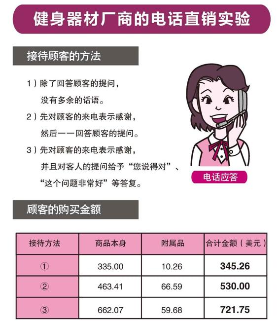

> > 不管是谁，即使明知是恭维，但反复被夸赞，仍会感到愉悦。

26　告诉他“你一定行”，哪怕只是谎言

●　被人期待可以提升能力

若你有下属，你大概会不时地烦恼该如何去对待他。

作为上司，作为领导，你有时也会因不知该作何姿态而头痛不已吧？

不合时宜地责骂或是不近人情地指导，反而可能会惹得对方一怒之下辞职而去，又或者匿名去网络上恶言中伤。我们就是生活在这样一个现实的时代。

这种情况下，你首先要对部下加以赞扬，使他相信自身潜能，令他鼓足干劲，这样的培养方式应该是比较可取的。

即使这个人身上目前没什么值得赞扬之处，但只要从长远的角度来看，就会发现许多可取之处。不是看他现在的成果，而是要让他相信其自身可能具备的能力和未来的前途，只要这样做就可以了。

肯塔基大学的内森·德沃尔博士进行了一项实验，他让49名大学生两人一组共同展开工作。实验伊始，为了分出领导者角色和下属角色，博士安排学生们接受了领导能力测试。

根据其结果，学生们被分为“适合做领导的一类”和“适合做下属的一类”，然后展开工作。但在工作开始前，学生们还进行了一项与此毫无关系的听力能力测验。

结果，比起下属角色，领导角色的学生的得分更高。

事实上，所谓领导能力测试都是骗人的，只是学生们各司其职罢了。但担当领导者角色的学生却因此提高了积极性，在和工作完全无关的测验中也变得锐意进取。

“我是被期待的。”只要这样想，人就会展现出超乎预期的能量。而重要的一点，就是要鼓起他的干劲，为此即使是撒点儿谎也没关系。

人会为回应期待而努力

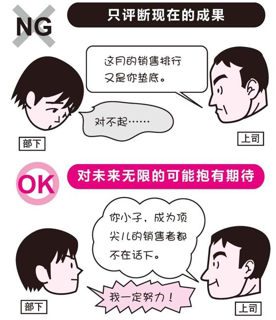

> > 即便是谎言也好，只要给予期待，对方就会为了回应这份期待而变得干劲十足。

27　碰触，消除距离感

●　不要轻视触碰效用的魔力

人都有一种倾向，即因和他人的触碰而放松对对方的警惕，心理学上称之为“触碰效用”。针对与他人物理性接触会起到什么样的心理作用，人们进行了各种各样的研究。

法国布列塔尼大学的达米安·埃尔斯博士以40名光顾二手车店的男性顾客为对象，进行了关于触碰效用的调查。

接待这些男性顾客的销售人员也均为男性。博士让销售员对其中一半顾客进行“请一定到车内看看”之类的劝说，并同时握住对方手腕1秒钟；而对另一半顾客则不做任何身体接触。

在这之后，另有工作人员询问顾客“对刚刚销售人员的接待是否满意？请做出评价”。

结果是，比起没有进行身体接触的顾客，有过触碰的客人的评价明显更高。

具体评价分数如下：

尤其，如果是不含动机、若无其事的触碰，那么任何人都不会去介意。

不仅如此，人在身体受到触碰时，甚至会对对方产生好感。也就是说，这触碰是触及了心灵的。

触碰效用有着使人敞开心扉的魔力。

用触碰来敲开对方的心门

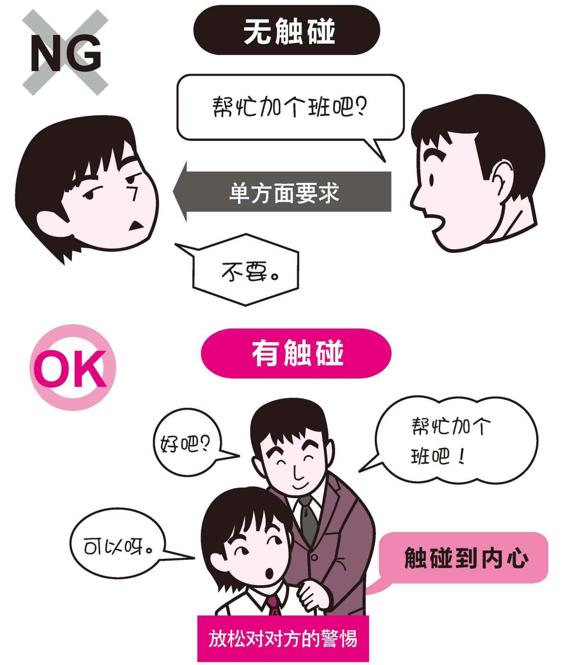

> > 无法做到心意相通时，可以尝试触碰对方身体，这也是一种可行的手段。

28　限制时间，让对方甘冒风险

●　时间性压力

假设，有一对即将谈婚论嫁的情侣，但对于何时结婚，男方却总也不作回应。对女性而言，这是涉及生育适龄期的问题，因而没有充裕的时间来悠闲地等待男方的决断。

上述假设虽然有点像八点档话题，但像这样“等待对方决断”的情况却会常常出现。什么也做不了，只能等待的时候，你的焦急感和烦躁感会不断上升。究竟怎么做才能让对方早下决断呢？

下面，将介绍瑞士弗莱堡大学的史沃德·胡贝尔博士的实验结果。

博士以40名大学生为实验对象，让他们就采取如下哪种方法拯救濒临灭绝的海龟进行选择。

①让海龟在海滨产卵（安全但产卵量小）。

②让海龟在小岛上产卵（危险但产卵量大）。

实验中，在设有时间限制来施加精神压力的情况下，学生们多选择②的高风险方案；相对的，在没有时间压力的情况下，得到的结果与前者正相反。或许是因为长时间的斟酌，学生们反而选择了①的低风险方案。

总之，在因时间紧迫而焦躁的情形下，人往往容易做出“高风险＋高回报”的选择；但在时间充裕、深思熟虑之后所做的选择，则更倾向于“低风险＋低回报”。

这样看来，当你想让对方做出高风险的决断时，只要不断用“没时间了”这样的话来煽动他的焦躁感就可以了。

“我已经不能等了。就今天。不然就再见。”若是男友收到这样的通知，他应该也会下定决心、做出决断了吧！

人是否会去冒风险因时间而定

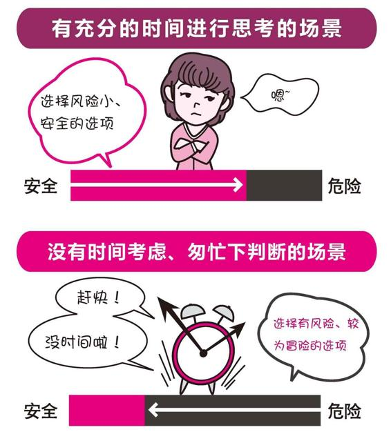

> > 给他时间，还是剥夺他的时间。仅通过这些就可以如愿操纵对方的选择。

29　“关键词”攻心术

●　自如地区分使用词语

密苏里大学的詹妮弗·阿布雷博士选取了5份美国的一流健康杂志，收集了刊登在封面上的426个标题进行分析。

她发现，使用最多的词语是“外表类”的（33％），都是些用于改善外貌的词汇。

排在第二位的是“健康类”用语（29.3％），第三位的是“减肥类”用语（19％），而第四位的则是“身体机能类”用语。

也就是说，尽管调查对象是健康杂志，但是比起健康类用语，封面上使用更多的却是多见于美容杂志上的外表类词语。

这些杂志的读者都是彻彻底底的健康意识强烈的人，但即使对这样的读者来说，更能引发他们关注的仍是“健康”之外的词语。这项调查就说明了这一点。

对方真正想要的东西是什么？能够在对方内心回响的关键词又是什么？如果能找出这些问题的答案，就可以将对方的心理操控在股掌之中。

例如，假设你是一名美容化妆品销售员。有一款新品的美容霜效果极好，具有保湿、美白、抗老化、紧致、祛皱等功效，有着诸多的卖点。

但是，根据将何种功效放在首位的不同排列，买者的心理也会发生很大的变化。对于二十多岁的女性来说，“祛皱”这类的词语大概无法引起她们的兴趣；而向堪称化妆品达人的家庭主妇们宣传“保湿功效”，想必也是收不到多大反响的。

根据不同的对象，寻找能影响对方心理的关键词，进而对词语进行区分运用，这一点是十分关键的。

使用对方比较敏感的关键词

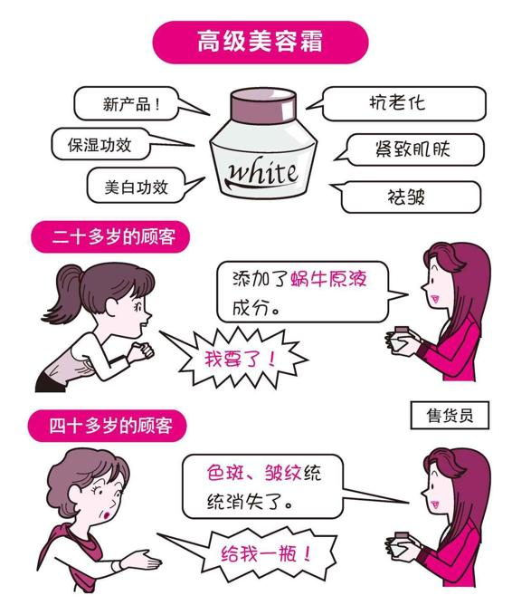

> > 同样的内容，只是改变了用词，便能够说到对方心里去。

30　显示稀缺性来吸引对方

●　珍贵的事物更有价值

没有比人的价值观更含糊不清的东西了。

这点从美术品和时尚方面就可以看出来。随着时代的不同，人们对它们的评价也大不相同。也就是说，绝对的价值标准是不存在的。

17世纪荷兰发生的郁金香泡沫中，稀缺性郁金香球根被炒出了骇人听闻的高价，但在数年后泡沫崩溃时其价格也随之一落千丈。人的价值观是十分容易转变的，这就是个典型案例。

但是，对于稀有的事物、珍贵的事物，人们总会找出其中的价值。不论其真正的价值是什么，总是会被其稀缺性所吸引，这就是人心。

“只有被选中的人才能持有的铂金卡”

“全世界仅有10辆的汽车”

“即将灭绝的纯血统”

“每天限量供应10份的拉面”

听到类似的宣传语后，会无论如何都想把东西弄到手，这就是我们人类。

意大利特伦托大学的路易吉·米顿博士通过实验证实了这种欲望。

博士对180名大学生进行了如下方图所示的实验。概括来说，就是调查他们在高价的商品和价低但无可替代的稀缺性商品中如何进行优先选择。

结果证明，人类会以“稀缺性”为优先。

运用这一事实，若能对自己作为珍贵事物的稀缺性加以宣传，则可以提高自身价值。

例如，假若你是一个外表平平的男生，在参加联谊时就应该邀请三名帅男一同前往。这样一来，身为丑角的你反而更显珍贵，便会受到大家的注目。当然，这终归是个假设……

人心难以抗拒稀缺性

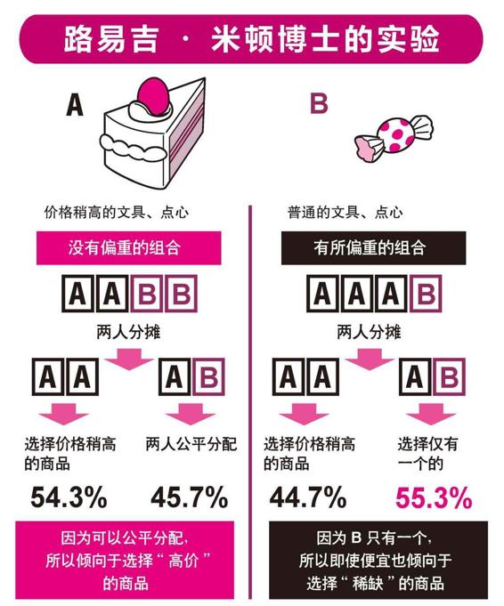

> > 仅仅因为“无可替代”，便可以焕发出极大的魅力。

31　使用人们没听惯的词语

●　日本人不善应对新词

没有哪个国家的人会像日本人这样，大量地引入外国语言，并灵活运用于日常生活中。在日本，外语（经过改造）的泛滥程度甚至令赴日留学的外国人都感到惊讶。

日本人最初从中国引入汉字，由此造出了平假名和片假名。之后，又引进欧洲的概念，衍生出了“哲学、文化、民族、人民、法律、经济、银行、物理、空间”等数量众多的“和制汉语”，并普及传送到汉字圈各国。关于“和制英语”就更不必说了。每一年、每个月都有像“ストラテジー（strategy）、スキーム（scheme）、プラグイン（plug-in）、クラウド（cloud）”这样新的片假名英语诞生。

综上所述，日本人好用“新词”是毫无疑问的事实，但是，崇尚并重用“未听惯的词语”这一点似乎是人类所共有的。

尽管是在美国进行的调查，但密歇根州立大学的一位名为R.卡尔森的心理学者所做的调查数据仍可以证明上述观点。

他分别让被实验者阅读两种文章，一种使用280个普通单词（如change）写成，而另一种则将单词改换为意义相同但较为生僻的（如transmutation）。然后，他询问被实验者分别对两篇文章的作者有什么印象。

结果表明，改用生僻词语的文章作者更受到“尊敬”，更“令人产生好感”。

我们这些能够操控语言的人类都有一个特质，即偶然碰到自己未曾听惯的词语时总会对其产生兴趣。并且，对于不熟悉的语言，总会感到一种莫名的高深感，觉得那是让人心生敬畏、心存向往的东西。

因此，当你进行某项说明时，只要使用一些对方不曾听惯的词语，即新词或新的和制英语，便可令对方刮目相看。

使用对方未曾听惯的词语来攻其不备

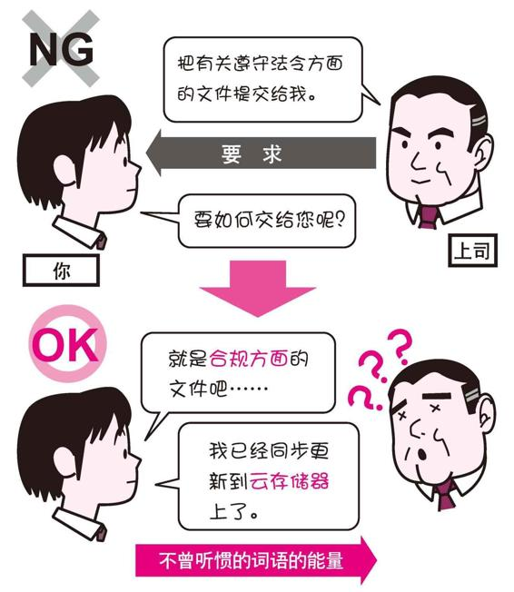

> > 有时，仅仅是知道些别人所不知道的词语就可以获得他人的尊敬。

32　找对求助对象

●　了解商讨对象的心理

渴望他人的帮助或建议的时候，人们通常会找长辈、上司或恩师进行商讨。因为难得敞开心扉与之相谈，所以也希望能够听到对方的肺腑之言。

正因为如此，你更应该选择一个能真正理解你心情的人。那些不知社会疾苦的富二代上司，还请务必回避。可以的话，最好选择那些和你有相同境遇、在社会上处于同样水平的人，抑或那些低于这一水平的人作为商讨的对象。

之所以这样说，是因为越是那些处于低层社会的人越会拥有一颗帮助他人的心。

加利福尼亚大学的保罗·皮夫博士进行了一项调查，研究社会阶层的不同会在多大程度上改变人类对于他人的援助意愿。

这里所谓社会阶层，是根据收入、学历、职业分出了10个等级。在此基础上，观察他们是否会将10枚硬币分给其他人，通过这个游戏来测定他们的援助意识的程度。

结果表明，越是社会阶层较低的人越会将更多的硬币分给其他人。

人们多会认为，经济上不富裕的人是不会去援助别人的。但事实正好相反，越是有钱人越不会对他人进行援助。

诈骗犯之所以瞄准穷人实施欺诈，也是基于这方面的原因。因为即使瞄准有钱人，由于他们警戒心太强，也是很难能够骗到的。

但是，为金钱所困扰的人却可以真正理解身处困境者的心情。利用这种同情心的正是那些诈骗犯，这也是他们的惯用伎俩。

所以，在你需要帮助的时候，最好去依赖那些尝过人生辛酸、有过许多艰苦经历的人。

有钱人未必就会进行援助

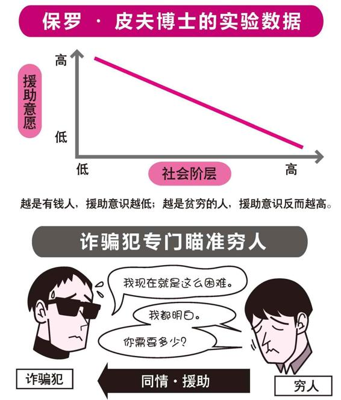

> > 想要他人的同情，就去找那些经历过相同遭遇的人，这样会更容易获得同情。

拿来就用心理学

●　渴望自己所没有的东西

据说，遭遇婚姻诈骗的人都是“很难能与人结婚”的人；被“能赚大钱”这样的吹嘘所欺骗的人也都是些“与巨款无缘”的人。

仔细想想，这些都是理所当然的。正因为结不了婚才渴望结婚，正因为没钱才试图去赚大钱。

美国西北大学的罗卡博士尝试制作了派克笔的广告，并将其展示给60名被实验者观看。

广告分为两种，一种宣传派克笔的高性能，另一种则宣传其优良的设计使整支笔显得非常高端。

博士让被实验者从二者中选择一种自己想要的笔，结果，社会地位高的人往往会选择其“功能性”，而社会地位低的人则倾向于选择“高价”的笔。

人都有这样一种心理倾向，总想补充一些自认为没有的、不足的东西。因此，越是社会地位低的人，“权力欲望”越强，越希望通过笔的力量来向周围人展示自己的力量。

因此，对于有钱人，即使你和他谈论赚钱之道，恐怕也不能引起他的兴趣。要设法探寻对方认为“不够”的东西，从那方面进行突破，这是一项铁的法则。

●　找对话题，你就赢了一半

美国著名的克莱恩咨询公司曾对世界五百强企业家进行过关于成功因素的调查与分析。接受调查的三百位较成功的管理者中，有85％的人把自己的成功归功于高人一筹的沟通能力和人际交往能力。管理之父德鲁克也有一句名言：一个人必须知道该说什么，一个人必须知道什么时候说，一个人必须知道对谁说，一个人必须知道怎么说。

人与人的沟通，其实是一场说服与被说服的博弈，而如果找对话题，你就赢了一半。当然，每个人感兴趣的东西不一样，话题的选择可以说是千头万绪。因此，在与对方“开局”之前，找出对方的兴趣所在是最关键的。

但很多时候，你的对手可能是个刚认识的人，时间也不允许你去了解对方的性格、爱好、生活工作状况，这时应该从平淡的话题入手，比如天气、籍贯、公司状况等。随着谈话的深入，对方透露给你的信息逐渐增加，有效整合这些零碎的信息，将帮助你引导话题朝着对自己有利的方向发展。

另外，在你还没有找到对方认为“不够”的东西之前，你要避免谈及一些可能给你带来失败的话题——

一是自己不感兴趣的，试想连自己都没有兴趣，又如何去调动对方的兴趣呢？

二是自己不甚了解的，如果你似懂非懂、乱说一气，只能给对方留下虚浮的坏印象。

以上两类话题不仅会使你陷入被动的境地，还会使对方觉得你不真诚。

第5章\
化敌为友的“诓人术”

> > 真的英雄，不论和什么样的强敌、宿敌、仇敌都可以成为推杯换盏的朋友，以此让对方麻痹大意、失去警戒，从而打入敌人内部，最后乘其不备取其首级。

> > 让我们也成为这样的黑色英雄吧！

33　执行力比任何语言都有效

●　用行动而非口头表现

所谓“诓人”，就是哄骗他人，蒙骗他人。比如丰臣秀吉就是以用花招使无数敌将倒戈投诚而闻名。

但是想要能够欺骗一个人，就必须具备俘获其心的相应“魅力”。而丰臣秀吉在俘获人心这方面，可以称得上十分高明。

仅凭三寸不烂之舌，以缜密的逻辑驳倒对手，煽动对方的恐惧心理来说服他……这一类的头脑游戏在这里并不需要。

成为被所有人喜爱的人，进而通过自身魅力来操控对方心理，这样的“诓人术”才是此次内容的主题。但这并非是要对你实施性格改造计划，所以你大可放心。其实只需稍加“领悟”，不论谁都是可以成为“骗子”的。

首先，诓人者都是完完全全的行动派。与其单单靠口头上的表述，不如拿出实际行动给人看，这样更能获得他人的信任。这些都是理所当然的。

伊利诺伊大学的韦恩博士和莱顿博士进行了一项长达六个月的调查，对象涉及秘书、生活顾问、编程人员等多种职业的上下级组合。他们就哪种下属更受上司欢迎这一问题展开了调查。

得出的结论是，那些受到上司欢迎的下属，往往会主动为上司冲泡咖啡，或者在对工作进行预估后提前做好准备或善后，总之都是些行动派的下属。

所谓诓人，就是能用行动来吸引人心。有行动相佐，往往可以表现出超出语言以上的真实感。

比起语言，行动更能直接传达到人的内心。

百闻不如一见

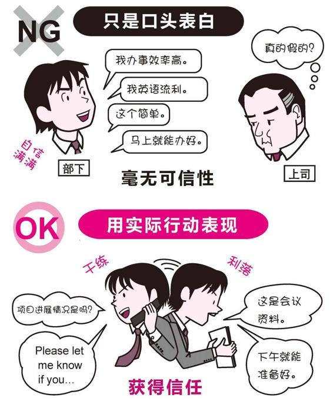

> > 只懂得耍嘴皮子的人是得不到任何人的信任的。要率先通过行动来展现自己。

34　褒扬在人前，批评在人后

●　批评只在私下里进行

绘画竞赛中获奖，作文受到好评，类似这样被表扬“做得很好”的经历，你在小学、中学时代是否也曾有过？当着全班同学获得老师表扬的学生，总会感到无比高兴，进而促使他的成绩进一步提升。

而另一方面，做了什么坏事被老师批评，也都是当着全班的面遭到训斥的吧。因为这对其他学生而言也算是一种教育性的指导，所以把这作为一种警戒也是很有必要的。

但是，在成年以后，这样的方法却会产生反作用。因为大人都有大人的面子和自尊心。

荷兰阿姆斯特丹大学的弗兰克·贝尔沙克博士从各个企业征集了107名员工，并将如下两段话读给他们听。

【好评的话语】“听你上司说，你最近成绩斐然，在部门里都是拔尖的。你上司也很高兴哦！”

【失望的话语】“听你上司说，你最近状态不太好，成绩也是最差的。你上司他很失望啊！”

对于传达这些话的时间，实验分别假设了如下两种场景。

①在有同事参加的会议中传达。

②通过私人邮件传达。

自然，赞扬都是在①大家的面前获得比较开心，而同样的，在大家面前遭到贬低是最令人讨厌的。

进行赞扬的时候，要做的像是刻意让周围人知道一样；而直言劝谏或进行斥责的时候，则应选择两人单独相处的情况。

不论何时，都没有特意与他人结仇的必要。

考虑一下对方的自尊

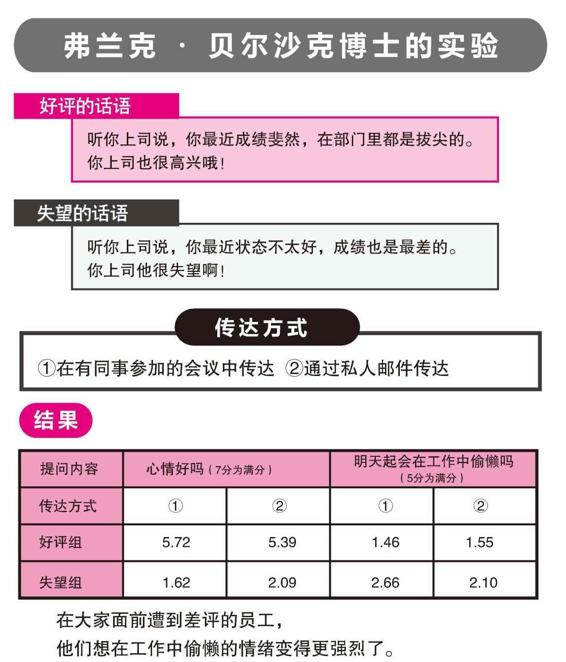

> > 赞扬还是怒斥，由于这二者的不同，场所的选择也完全相反。

35　向你的敌人求助

●　化敌为友也许只需一步

心理学上有“富兰克林效应”这一说法，出自美国独立宣言起草委员会的一员——本杰明·富兰克林的逸事。

宾夕法尼亚州议会有一名难缠且铁石心肠的议员，富兰克林想和该议员搞好关系，也就是将本是政敌的议员拉到自己一方的阵营里。那么他是怎么做的呢？他向议员提出请求，希望将其珍藏的稀世图书借来看几天。于是在那之后，那个难缠的议员开始温文有礼地找富兰克林说话。

“善待过某人一次之后，人便会想要更多地对他好。”富兰克林这样说。

得克萨斯大学的约翰·杰卡尔博士也通过实验确认了这一说法。作为实验的酬谢，博士给了参与者一些钱，但随后又请求他们“还是请将钱还给我，我不胜感激”。于是，参与者们开始对博士抱有了好感。

你应该也有这样的经历吧：一个之前你不太在意的人拜托你一件事，听过他的请求后，你会立即开始关注这个人，并逐渐对他产生好感。这就是“富兰克林效应”。

为什么会出现这样的效应呢？

人们在进行借贷时，可以通过这样的行为产生“给与拿”的关联性。这就意味着人和人的交集增加。也就是说，对方从一个原本无所谓的人变成与自己有很深联系的人。

如果别人什么事都不来拜托你，你便会觉得莫名的寂寞，甚至觉得自己没有获得他人的认可。但是，一旦被别人依赖，就会变得很开心，不是这样吗？

假若你想要化敌为友，那么这是个不妨一试的作战策略。

扭转对方心理的方法

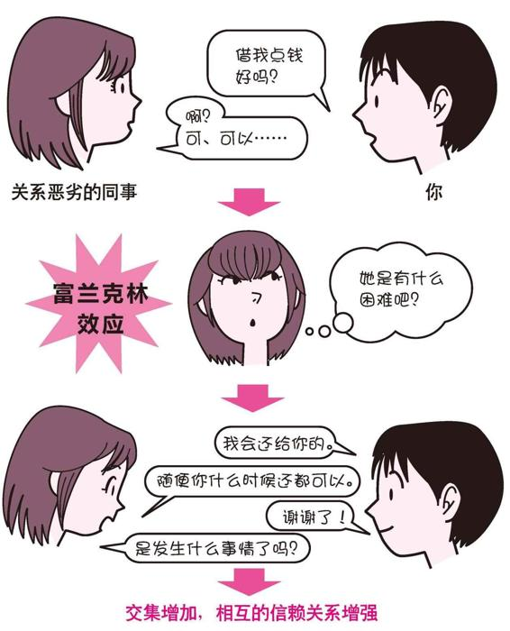

> > 如果有人与你敌对或对你抱有反感，你应向他提出请求，从而把他变为你的伙伴！

36　扮演笨拙的自己

●　一举提升好感度的方法

第35任美国总统约翰·F．肯尼迪在1961年做出了进攻古巴的决议，下达了猪湾登陆作战计划，但战役以失败而告终。可是，在此后立即进行的一项舆论调查中，肯尼迪的支持率却前所未有的高涨。

乍一看，这是非常不可思议的结果。在此之前，肯尼迪是作为超级英雄来博取声望的。外表俊朗而有魅力、颇具才干又未曾出过差错，他一直被视为这样的英雄。但是，由于那次的失策，人们反而觉得他有了人味儿，并对他产生了好感。

加利福尼亚大学的埃利奥特·阿隆索博士发表了一项实验结果，原本评价很高的人在出现了失误、展现出其愚蠢的一面后，其好感度反而会得到进一步提升。

具体的实验是这样的。博士让被实验者听一段录音，介绍一名“擅长智力答题、连续多场成功的优秀的男性”。但在录音最后，这名男性将咖啡杯打翻到了自己的新西装上，从而使被实验者对他产生了好感。

而另一方面，一名“答题正确率只有三成，经历也十分一般的男性”同样也打翻了咖啡杯，但人们对他的好感度反而有所下降。

完美无缺的超人，人们对他的好感度本身就很高。但是，因为总有一种难以接近的印象，所以很难产生亲近感和共鸣。而为了俘获人心，就必须获得大家的喜爱。

因此，高人一筹者要刻意犯点儿错，表演一个笨拙的自己给大家看，这样更能展现出有人味儿的一面，从而为大家所喜爱。“我们是一样的人，彼此之间很有共鸣”，要传达的正是这样一种信息。

因此，越是优秀的人越要偶尔试着故作愚蠢，以此来成为讨人喜欢的人。

失败可以博得共鸣

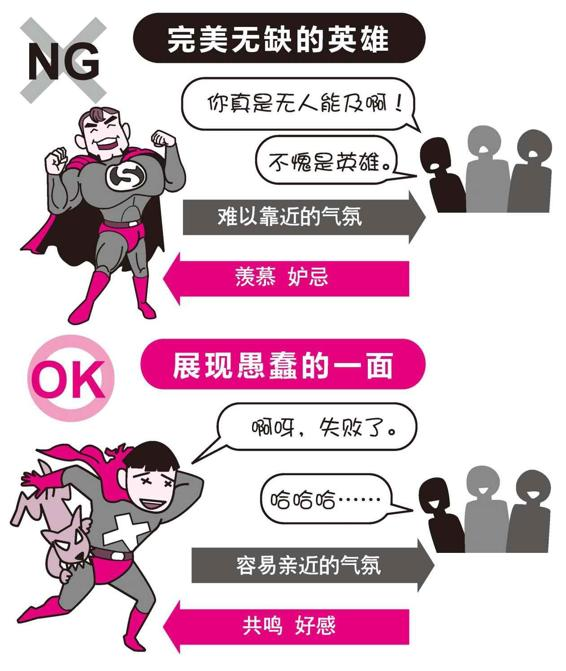

> > 为了避免那些无谓的嫉妒，失败一次给人看是十分重要的。

37　越是热络的人越会被厌烦

●　自我牺牲也要适度

普遍认为，待人亲切、热情的人会讨得所有人的喜爱。但真是这样的吗？

事实上，有一项心理实验数据表明，越是热络的人越容易让人感到局促不安，因而遭到他人的排斥。这是由华盛顿州立大学的克雷格·派克斯博士的团队查明的事实，他们自己也对这一结果感到十分惊讶，觉得过于超乎常理，因此反复进行了4次试验加以确认。

博士以104名大学生为实验对象，让他们进行一种五人游戏。这个游戏是通过个人为同伴做出多少贡献（自我牺牲）或不作贡献（自我本位）来进行的。

虽说是五人游戏，但其中四人都由Sakura的计算机充当，分别担任的角色如下：

1人——参加实验的学生

3人——担任平均型角色的Sakura

1人——担任过度型角色的Sakura（只知作贡献／只以自我为中心）

游戏结束后，博士等人询问学生们“下一轮游戏中希望谁能留下来”。结果是，自我本位型获得了4.88分，但为同伴做出过贡献的人得到的评价却低于前者，只有3.85分（9分为满分）。

越是那些为同伴竭尽全力，甚至牺牲自我的人，同伴越“不希望他留下来”。

由此可知，过度的热络反而会成为一种“善意的困扰”。过度地牺牲自我会令人厌烦，遭到大家疏远；甚至会被认为是“违反规则”，让人难以亲近。

过度热络会遭到疏远

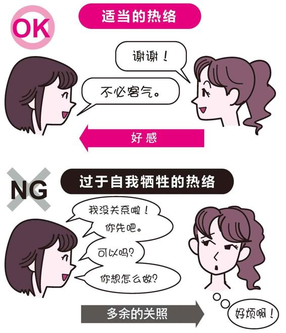

> > 任何事情都要适可而止，这一点十分重要。

38　眼睛是心灵之窗

●　对视能增加好感

人们常说，“与人交谈时要好好看着对方的眼睛”，但如何适度地注视却是一件很难的事情。

有的人会通过交汇视线来表示抵抗，也有的人会觉得一直被注视是一件很恐怖的事情。

但是，随着相互间不断地注视，彼此的吸引力与好感也会增加，这却是事实。心理学上称作“眼神交流原理”。

位于马萨诸塞州的广场恐惧症研究中心的J．凯勒曼博士和克拉克大学的心理学家们联合进行了一项非常独特的研究。

博士让参加实验者两人一组比邻而坐，但彼此间不可以搭话。因为是调查眼神交流功效的实验，所以是不允许两人进行对话的。

之后，他们将实验者分为两队，要求其中一队“数搭档的眨眼次数”以使他们目光交汇，对另一队则要求他们不要让视线相对，然后比较相互间的吸引力是如何发生变化的。

其结果，在“数眨眼次数”的一队里，两人能彼此感受到“关爱”，甚至是“尊敬之意”。

因为要数对方的眨眼数，彼此间目光交汇、眼神交流的次数自然有所增加。因此，相互间的吸引力也随之水涨船高。

所以，如果你想获得对方的好感，首先应该去注视对方的眼睛。注意不是直直地盯视，过分的注视会令对方误解，这里需要的是适度的注视。

日本人都很不擅长注视，但如果你把它当成“数对方的眨眼次数”，便可以不必那么辛苦，并能够掌握适度注视的火候了。

通过眼神交流提高好感度

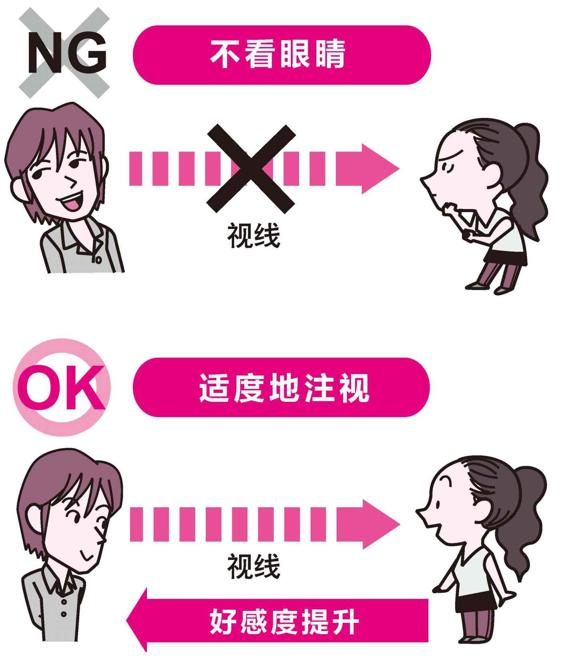

> > 数对方的眨眼次数，这样便能够很自然地注视对方的眼睛。

39　把笑“传染”给别人

●　使人觉得“性格开朗”的秘诀

诓人者的最低条件是做一个“性格开朗的人”。不论谁都不会想和一个表情阴沉、气质阴郁的人靠得太近；对那些言谈一味消极的人，人们总会抱有莫名的不信任感。

但是，那些充满朝气的人身边却总是围满了人。和他们在一起心情就会变得愉悦，他们有一种让人不由自主想去信任的气场。

“和这个人在一起工作很快乐。”

“听这个人说话总会让人变得乐观、积极。”

如果能得到这样的评价，那么你也称得上是个优秀的“骗子”了。

但是，真正做起来远没有那么简单吧，大概你会有这样的疑问。

自己根本没有那种气场使周遭变得开朗，根本不会讲些有趣的话来逗人发笑，根本做不到永远保持积极的态度——你会有这样的想法吧？

对于有上述想法的人，下面的方法可说是一大喜讯。即，想要被认为是一个开朗而充满朝气的人，只需大声地、夸张地笑出来吧。

加拿大卡尔顿大学的诺森舒克博士让被实验者戴上耳机听些小故事。但是，有半数人收听的故事录音中加入了观众的笑声。结果，那些听了有笑声的小故事的人，都很容易随着他人一起笑出声来，愉快与笑意就这样扩散开来。这被称为“情绪感染效应”。

即使是些无聊的故事，只要你夸张地捧腹大笑，对方便也会觉得可笑，快乐就这样传染开来。于是，人们就会觉得“和你在一起很开心”，“你是一个朝气蓬勃的人”。

笑很容易传染

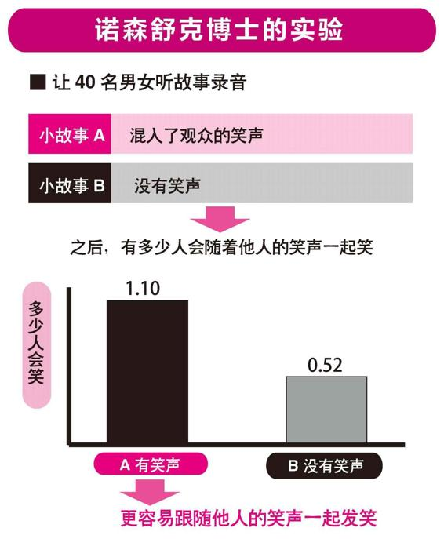

> > 即使你的笑并非发自内心，对方也会在听到笑声后变得愉悦。

拿来就用心理学

●　你对自己的性格了解多少？

准确地进行自我性格分析是了解自己的第一步。而要进行自我性格分析，你必须了解自己的性格类型。

所谓性格类型，就是指一类人身上共有的性格特征的集合。心理学中没有绝对公认的划分性格类型的标准，目前比较具有代表性的观点是：

（1）以心理活动的倾向划分，可分为内倾型和外倾型，也就是我们常说的内向型和外向型；

（2）以心理机能优势划分，可分为理智型、情绪型、意志型；

（3）以个体独立性程度分类，可分为场依存型、场独立型；

（4）以人的社会生活方式分类，可分为经济型、理论型、审美型、宗教型、权力型、社会型。

如今国际上普遍采用的是内倾型和外倾型的划分。外倾和内倾是区分个体的最基本的标准。我们以自身为界，可以将世界分为自身以外的世界和自我的世界两部分，也可称为外部世界和内部世界。外倾的人倾向于将注意力和精力投注在外部世界，即他们很关注外在的人、事、物、环境等，而内倾的人则往往比较注重自我的内部状况，即内心的情感和思想。两种类型的个体只有在自己偏好的世界里才会感到轻松自在、充满活力，而在相反的世界里则会感到疲惫和不安。

●　塑造有魅力的性格

松下电器的创始人松下幸之助有一句名言：我们不必羡慕他人的才能，也无须悲叹自己的平庸。各人都有他的个性魅力。最重要的，就是认识自己的个性，并加以发展。

每个人都有着与众不同的性格。有的人激情洋溢、张扬外向；有的人羞怯内敛、不善言辞；有的人沉着稳重、从容淡定；有的人急躁冒进、鲁莽冲撞。

一个人想要成功，首先要了解自己的性格，尤其是性格中的不足，从而有意识地塑造有魅力的性格。

有一种比较普遍的看法是活泼外向的人在职场上更有优势一些，而安静内敛的人则可能面临更多的发展障碍。

的确，安静内敛的人不善于自我表现，也不热衷于自我表达，因而容易丧失展露才华的机会，丧失提拔晋升的机会。但他们也有很多独特的优点——他们通常勤于思考、善于倾听，不易受外界环境的影响。只要他们能充分利用这些性格优点，并有意识地改善自己的不足之处，一样可以在职场上做得顺风顺水。

世界上有高达四成的领导者与企业高管——包括股神巴菲特、世界首富比尔·盖茨——都是内敛的人。另一方面，活泼外向的人虽然在一定程度上相对占优势，但与稳重多思的安静内敛的人相比，他们更冲动，待人处事更容易情绪化。如果不克服这个缺点，他们的职场之路也很难一帆风顺。

还有一种说法是，安静的人适合从事研究型工作，不适合从事需要频繁与人沟通的工作；活泼的人可能更适合承担有挑战性的工作。但是，内敛的人到底适合什么工作，安静的性格是否对工作有所帮助，要依据个人所从事的具体行业具体职位而定。

事实上，性格与成功的关系很微妙，我们只能笼统地说，自信乐观、脚踏实地、谦虚好学、吃苦耐劳、正直仗义等性格，一般来说能对我们的日常工作带来好处，而盲目自大、心浮气躁、颐指气使、自私自利的性格，则容易导致工作上的失败。

第6章\
无往不利的高效交涉术

> > 真正的交涉高手，无论要求多么无理、理由多么荒唐，都能让对方应承“Yes”。

> > 再严峻的形势，再不利的状况，都无法阻止他将胜利导向自己！

40　道歉务必附上理由

●　外在原因不可忽视

假设两名下属同时迟到，两人的解释分别是“睡过头”和“列车脱轨”。你会原谅哪一个、斥责哪一个？

对于一名普通下属而言，列车发生事故既不是他的责任，也不是他可以解决的问题。对于这样的外在原因，如果你是一名明智的上司，又有什么理由去责备？与此相对，“睡过头”却是任何一个人都能应付的个人问题，是内在原因。

研究表明，在进行劝说或赔礼道歉时，要尽可能地摆出“外在原因”。

澳大利亚新南威尔士大学的马库斯·格罗斯博士以198人为调查对象，请他们对医院的服务做出评价。

调查假设，你已向医院进行了预约，时间是下午2点，但医院却让你多等待了20分钟。对此，接待处提出了以下三种理由：

①“主治医生外出吃饭未归”（内在原因）；

②“突发交通事故，事故相关的紧急救治耽误了时间”（外在原因）；

③不作说明。

之后，在对该医院做出的评价中，评价结果按由高到低的顺序依次为②外在原因、③不作说明、①内在原因。

很明显，如果确实是因为自身难以解决的外在原因而耽误，是可以被谅解的。

还有一个小窍门，即便你是因为自己的失误而犯了错，在作自我批评与检讨的时候，不妨将外在原因融入其中。

要辩解就要尽力夸张

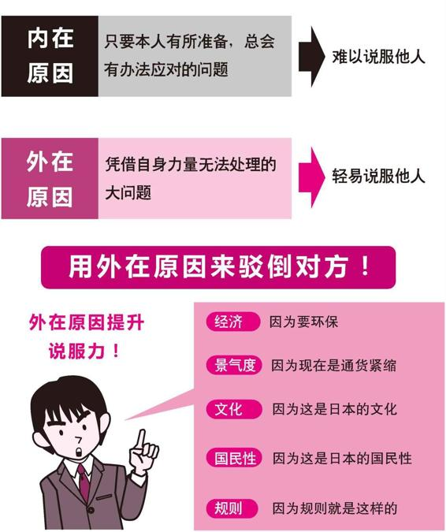

> > 若对方摆出外在原因，我们便会不由得接受，这就是人类的心理。

41　亮出心中的思量

●　用你的“真诚”麻痹对方

所有的交涉都是心理博弈。买价、卖价、薪水、福利、义务、权利，等等，不论是个人与个人之间，还是劳资双方之间，抑或国家与国家之间的外交交涉，都包含了心理层面的往来。

交涉，就是相互刺探想法，看穿对方，选择有利于自己的说辞，使自己的要求得到满足。因此，一旦开始交涉，你就要立刻端起身架，以免暴露自己的真实状况。万一被对方看穿你可以让步，所有有利的条件都将被对方夺走。

有一种战术是，在对阵之初就挑明自己内心的思量，即所谓的“底线技巧”。

“说实话吧，我可以让到这一步。”

“我也不妨直说，这就是最低条件。”

“降价一万日元的话，没问题，但再多就不可能了。”

没错，将自己的思量大大方方地亮给对方。你毫不隐瞒、直截了当的态度，将使对方觉得你实在、真诚，自然也不会再怀疑你的真实意图。换言之，你用自己的“真诚”神不知鬼不觉地麻痹了对方，迫使对方停止进一步的交涉，不再跟你讨价还价。你不仅省了许多徒劳的争论，也能使交涉按照自己最初提出的条件定下来。

主动权掌握在你手里！即便事实上，你最多可以降价两万日元，但为了将利益最大化，设定一个虚假的底线，抢先提出“一万日元已是最大限度”也未尝不可。若能如此，你就算是将这种心理战术运用到了极致。不过，为使你的“真诚”具有真实感，提出的底线一定不可进行二次更改。

更改底线就会失败

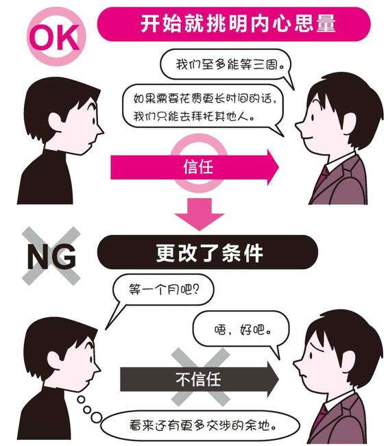

> > 要想让底线有效，就决不能更改其设定。

42　吹嘘，用得好就是利器

●　先发制人，掌握主动权

美国被称为诉讼社会。新闻中经常可以听到类似于“某集团诉讼案中，起诉人向企业索取巨额赔偿金”，或是“某名人因被指控性骚扰而支付了大笔和解金”这样的审判事件。

实际上，美国的电视剧和电影中也有许多是有关法庭的，观察其中所描写的心理战也颇有意思。

就是在这样的美国，伊利诺伊大学的格雷琴·查普曼博士编造了一个对企业提起诉讼的故事，并以此进行了一项心理实验。

具体的实验是这样的。一名叫凯西的女性，因服用一种处方避孕药而患上了卵巢癌，于是对制药公司提起诉讼。博士让80名大学生阅读了这样一篇文章，并让他们判断药厂应该支付多少赔偿金。

实验假设凯西提出的索赔金额有100美元、2万美元、500万美元和10亿美元四种价位。结果，索赔金额越高，学生们判断出的应赔付金额也就越高。

心理学上把这称为“沉锚效应”。

这种心理作用是指，在必须对不确定的事态作出判断的时候，最先展示出的判断会对之后的判断产生很大的影响，就如同沉入海中的锚（锚）一样将判断（船）局限住。

用凯西的诉讼案来说，就是文章中所写的索赔金额会成为一种基准，而之后作出的判断都不会与这一基准有很大的背离。

日本人是不善交涉的，原因是过于顾虑对手，总是会先听听对方的要求。

这种时候，你首先要做的就是夸大。要把锚远远地抛出，抢先将基准点提高上来。这样一来，对方便无法再随意定价了。

运用沉锚效应说服对方

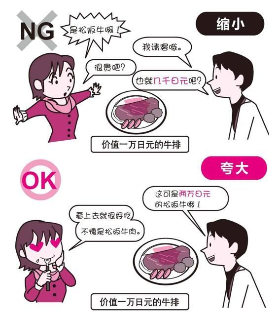

> > 在人只能作出模棱两可的判断时，早前提出的判断就会产生一种力量，来支配随后进行的判断。

43　黑色，威信与力量的象征

●　软弱者要学会利用黑色

想必你也听过新西兰橄榄球代表队的“全黑队”吧，就是那支因赛前表演“哈卡舞”（Haka）而闻名的豪门劲旅。

哈卡舞，本是传入土著毛利族的一种波利尼西亚舞蹈，作为战斗前对对手的一种威慑，为全黑队所采用。

一边高声叫喊一边炫耀自己肌肉发达的身体，同时向对手怒目而视，这样的情形有一种压迫人心的力量，即使不是与之对阵的队伍，也不禁心惊胆寒。

这个全黑队的队服自然是黑色的。黑色有一种效果，可以更加强化穿着者的力量。

康奈尔大学的马克·弗兰克博士收集了全美四大体育赛事的NFL（美式橄榄球）和NHL（冰球）的队服，调查哪种队服看上去更具实力。

结果是，黑色队服力压其他颜色，得到了“看起来很强”的评价。

另外，实验还同时调查了1970年到1986年间的犯规记录，发现黑色队服的球队犯规更多。即，黑色可以使人更具攻击性。

因此，想使自己看起来更强悍时，应该选择穿着黑色。

“今天的交涉中我要积极进取”，“这场比赛绝对不能输”……这种时刻，穿着深色套装或者黑色衣服，会提高自己的势头，并且给对方造成更大的压力。

即便是软弱的人，也可以通过穿着黑色服装达到这一效果。所以，好好利用颜色的力量吧！

利用颜色所具备的心理作用

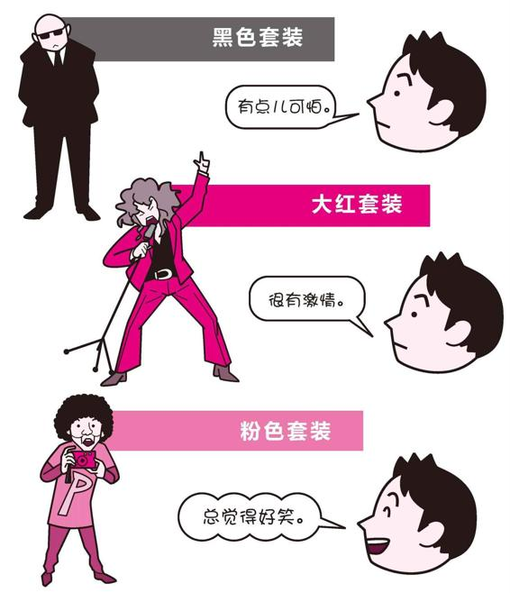

> > 仅仅通过颜色，也能读懂别人的性格。

44　改一个有魅力的名字

●　怪异的名字容易留下记忆

无论你如何卖力劝说都没人肯听——这种情况下，你就要想一想，原因是否在你的名字上。

这样说可能会引发众怒，但这个世界上就是有这样的存在：有说服力、有魅力的名字和没有说服力、平淡无奇的名字。

例如老虎·伍兹。名字居然是老虎！真是令人惊讶。似乎仅凭这一点，人们就有理由相信他是一个天才。

据北卡罗来纳州吉尔福德大学的心理学家理查德·兹瓦根哈夫特研究，怪异的名字有它自己的优势。

首先，怪异的名字很容易给人留下印象，可以让人立刻记住它。艺人们在起艺名时就很重视这一点。

举个例子来说，被称作“棒球之神”的宝贝露丝，他的本名是乔治·赫尔曼·露丝，19岁时加入美国职棒小联盟，有人调笑他的孩子气，称呼他“Babe（小婴儿）”。因这一称呼十分亲切、好记，他便将此称呼定为自己的爱称，并渐渐出名。

由于名字的改变，得到的评价甚至自身的存在感都会变得不同。因此，重新审视自己的名字也是十分必要的。

一个公司的名称如果是谁都记不住的那种，就应将其商标改成容易留下印象的。

同样，用难记的名字、常见的名字无法申明自我主张的时候，不妨考虑一个绰号加印到名片上，哪怕只是用于工作中。像这样的事，全世界无论哪个国家中都是存在的。

不要忽视名字中包含的印象

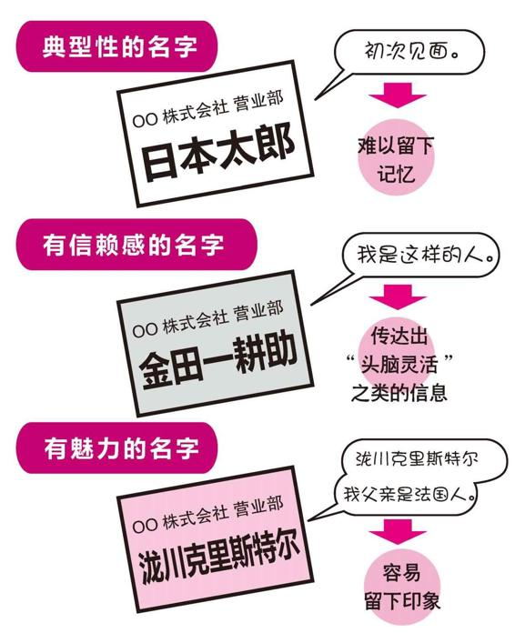

> > 即使只是一个名字，也会传达出相应的信息。

45　“意料之外”带来的胜利

●　人类不擅于应对超出预想的进展

当交涉对象十分优秀时，有时会难以将其说服。

学识渊博、经验丰富的人，能够看穿我们的内心、预料对话的下文，进而使用花招引我们上钩，将交涉推进到于他有利的一方。

对于这样的强敌，有必要制定特别的作战方案。即，抛出对方意料之外的话，或者违背对方的期望，总之要采取出人意表的行动。

匹兹堡大学市场营销系的助教凯特·伯纳进行了一项调查。

传言美国是一个盛行捐赠的国家。在这样的国家里，会选择什么样的团体作为捐赠对象呢？伯纳助教分别在高知识水平阶层和低知识水平阶层进行了调查。此次调查中，伯纳助教将实验参与者按照知识水平的高低分为人数相等的两组，即“低知识水平阶层”和“高知识水平阶层”，让他们对捐赠对象进行选择。

首先，助教列出了医疗团体、教育团体、环境团体等常规选项，让两组人进行选择。结果，“低知识水平阶层”选择常规团体（符合预想的选择）的人要多于“高知识水平阶层”，两者的比例为74.75∶61.38（以100为基准）。然后，助教又列出“中国团体”、“美国团体”等出人意料的非常规选项，让两组人选择。结果与之前相反，“高知识水平阶层”选择非常规团体（与预想相反的选择）的人要多于“低知识水平阶层”，两者的比例为82.31∶68.86。

总之，越是知识丰富、有各种经历的人，越会对意料之外的、稀有的、未曾经历过的事物动心。由于知识浅薄的人尚属初学者，他们会想要稳妥地选择一些固有的东西。但是，随着知识的加深，他们会被那些设定之外的东西所吸引，对出乎意料的事物怦然心动。

给强敌以出乎预料的选择

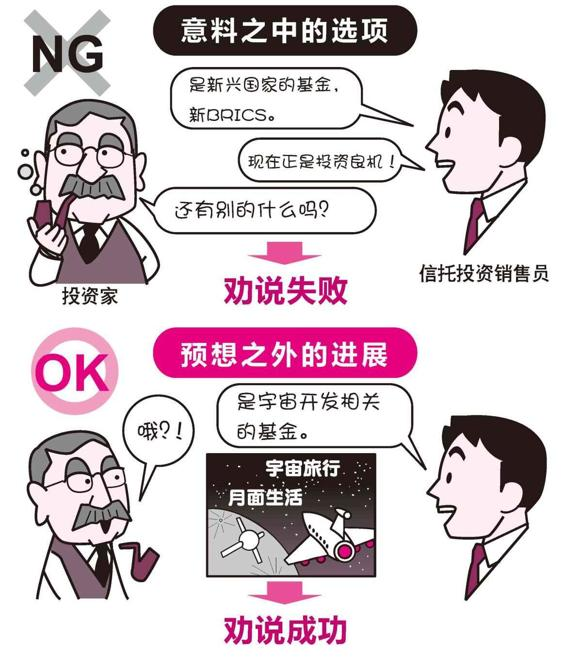

> > 推测对方的知识水平，考虑适当的选项。

46　香气，无声无形的动人诱惑

●　“气味”容易残留在记忆中

有年轻人进入人气服饰品牌“阿伯克龙比与菲奇”（A&F）的专卖店时，店员会拿出自家的香水喷到陈列的衣服上。这样一来，店铺的品牌印象就会附着在“香气”之上。

这一招的效果是立竿见影的。顾客只要闻到这种香气就会想起该品牌，穿着该品牌服装时满足的回忆也会随之复苏。这是进一步提高购买欲望的一种策略。

实际上，“气味”和记忆有很强的联系，经历的事情也好，心情也好，甚至是感情，都会和气味合在一起，作为记忆铭刻在脑海中。

你也有这样的经历吧？一闻到木耳的香气，就会想起登山或木耳浴的回忆；一闻到薰衣草的香气，已分别的恋人的记忆就会变得历历在目。

密歇根大学市场营销系的阿拉当娜·奎师那教授分别准备了多种带有松木香和不带任何气味的铅笔，并让被实验者记住各种铅笔的特征。在随后立即进行的记忆测验中，二者间并没有显现出多大的差距；但在两周后进行的测验里，带有香气的铅笔有76.8％被正确地回忆了起来，而不带香气的则只有26.6％。

正如这项实验结果所表明的那样，气味更容易被记忆，并且更容易被回忆起来。

像“阿伯克龙比与菲奇”那样拥有一款你的专用香，给你的名片染上香气，这样，每当对方拿出你的名片，便会强制性回忆起你的言谈和主张。而只是这样回忆，他所受到的心理性冲击也是很大的。

用香气笼络对方的心

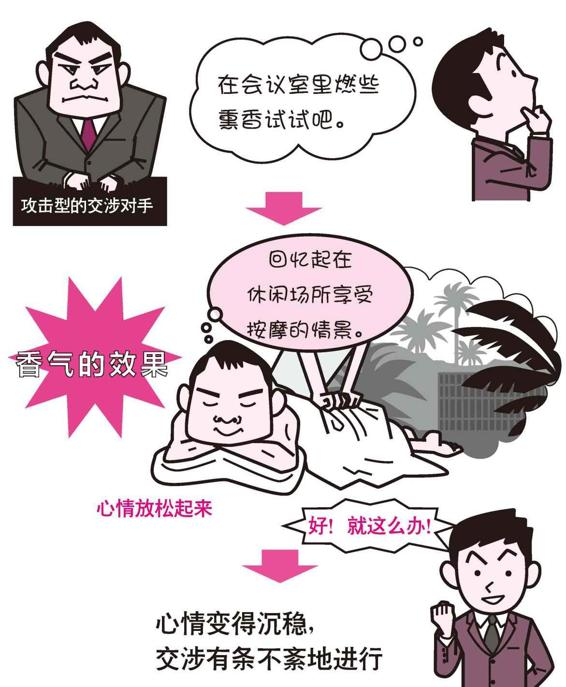

> > 香气会唤起特定的回忆，而回忆起来的情绪就那样带进了现实中。

47　让你的外国同伴代替你交涉

●　对外国人会放松警惕

先介绍一项实验数据。

土耳其加齐大学的戈希曼·亚尔赛博博士进行了一项调查，研究在买卖双方的交涉过程中，与本国人进行交涉和与外国人进行交涉这二者间会有多大的不同。

【本国人的小组】土耳其人31组

【外国人的小组】土耳其人和西欧人29组

随后，博士询问被调查人对交涉结果的满意程度，发现和外国人进行交涉的小组满足度更高（4.49分∶4.12分）。并且，在感受到交涉对象的魅力方面，也是外国人的魅力更高（4.79分∶4.23分）。（7分为满分）

由此博士得出结论，对方是本国人时，人们反而会怀疑他是否隐瞒了什么信息。

将这一结论套用于日本人身上考虑一下吧。若彼此都是日本人，某种程度上可以知道对方的所思所想，在进行交涉时，更倾向于互相试探对方言谈中的深意。因此，人有时就会变得疑神疑鬼，觉得“其实他是隐瞒了什么吧”，“其实并不是这样的吧”，等等。

这时，若在场的是一个日语说得结结巴巴的外国人，你会怎样想呢？你大概会觉得，凭他这样的日语能力，至少不会是个能在生意场上骗得了你的人。

总之，外国人是无法在同等条件下和自己进行交涉的，这样想着，人们便会大意地信任了对方。

当交涉无法进行下去的时候，不妨让你的外国同伴来试试看，这也是一种有效的手段。

对外国人会不可思议地放松警惕

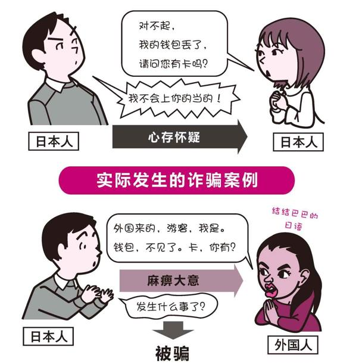

> > 在国外，遭遇类似损失的日本人不断增加，请务必小心。

48　制造恐惧心理，迫使对方答应要求

●　自尊心受挫时容易被说服

美国西北大学的心理学家劳伦·诺尔准博士进行了一项心理实验。

博士募集了71名大学生，让他们进行一项名为“赛博球”的虚拟游戏（参照下方图）。

【普通的小组】有两名对手（Sakura），三次传球中有一次可以接到球

【遭到排挤的小组】只有10％的球会传到这边

游戏后，博士询问被实验者，假如“好友召开生日派对，单单没有邀请你”或“你想和你喜欢的人约会，却遭到了对方的拒绝”，你会感到多心痛？

结果是，普通小组的心痛数值是3.65分（11分为满分），而遭排挤的小组的数值却超过了4.46分，他们更强烈地感到了心痛。

也就是说，一旦遭到同伴的拒绝，在那之后，人会对拒绝更加敏感，并十分恐惧。

由此，可以想到这样一种策略。

例如，有一个经纪人A，他要价10万日元，而你却想花8万日元买入。这时，你应让第三者先行拒绝一次10万日元的要求。于是，遭到一次否定后，A会担心东西卖不出去，害怕再次被拒绝，对于你苛刻的要求，他也会勉强答应。

伤害对方的自尊心，将其撕得粉碎，这样一来，就能以更有利的条件来迫使对方答应自己的要求。

像这样利用恐惧心理的交涉方法有许多，但比这个方法更邪恶的心理操控恐怕是没有了。

只是，这个方法如果用得过头，会有导致友情和人际关系不可修复的危险，所以请谨慎运用。

利用恐惧心理说服对方

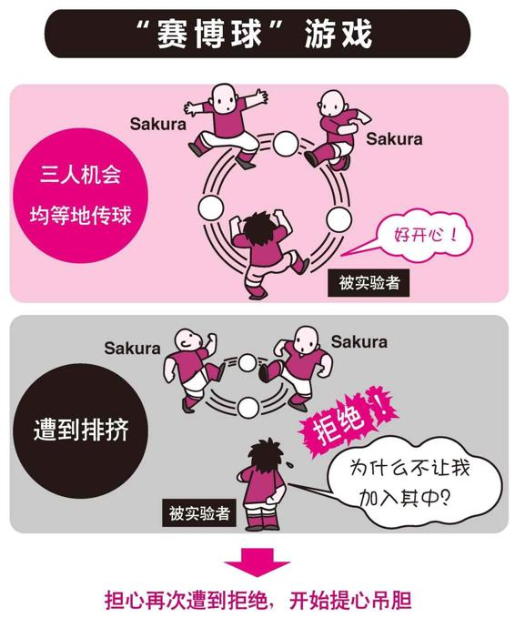

> > 为了防止再次遭到拒绝，只好放宽自己的条件。

拿来就用心理学

●　“讨厌”和“喜欢”都会膨胀

一般人都有一种倾向：即使某个人只有一点点令人讨厌，但你渐渐会觉得他越来越讨厌，整个人都很讨厌，看他做什么都不顺眼。这种心理现象有一个专业名称，即“喇叭效应”。

与此相对应还有另一种倾向，即一开始觉得某个人只有一点点讨人喜欢，但这种喜欢随着时间的推移得到强化，最后使得你对他“整个人都喜欢”，觉得他做什么都很好。这种心理现象被称为“哈罗效应”。

喜欢学习的人会越来越喜欢学习，而讨厌学习的人则会越来越讨厌学习，相信经历过学生时代的你对此深有体会。

这就是说，无论是讨厌还是喜欢，都具有膨胀的特点。这也再次验证，在与人交往的过程中，给人一个完美的第一印象是多么重要。

当然，比起“讨厌”，人们更愿意以“喜欢”之情对待他人。试想当你对某个人产生厌烦情绪时，自己是否会努力去改变这种不良的情绪？

●　单纯接触效应

如果在交往过程中对别人产生讨厌情绪，或者感觉到别人对自己产生讨厌情绪，有一个简单有效的方法可以扭转这种不良状况，即增加接触次数。

没错，仅仅通过接触次数的增加就可以消除讨厌，产生好感，这就是“单纯接触效应”。例如，在一个班级或一个公司，我们容易对跟自己坐得比较近的人、话说得比较多的人产生好感。有时即便第一次见某个人觉得他素质不高，但通过反复多次接触之后，你会渐渐发现他的优点，进而消除最初的厌恶感。这就是“单纯接触效应”在起作用。

所以，如果你给人留下的第一印象并不是很好，没有关系，只要你巧妙利用这一心理学原理，就能扭转别人对你的看法与态度。

节假日的简单问候、酒会上的碰杯致意，或者一起看电影、打高尔夫球，都有可能使你渐渐被人接受认可。而一旦使别人开始有“一点点”喜欢你，剩下的事情就交给“哈罗效应”吧。

同样的道理，当你不喜欢对方时，只要结合“单纯接触效应”和“哈罗效应”，你就能慢慢喜欢上对方。

●　人际关系的“弹性”

无论是喇叭效应还是哈罗效应，抑或是单纯接触效应，其实都说明了一个关键词：人际关系弹性。

没错，人际关系是有“弹性”的，是流动的，而不是一成不变的静态事物。

你每一次与对方接触，对方都在不断搜集你的信息，形成对你的抽象感官，比如你的工作方式、态度，好恶以及什么能够激励你或使你感到挫败。当然，反过来你也是这样。这就是人际关系建立起来的过程，也是心理博弈的关键步骤之一。

通过多次接触与交流，你与对方相互了解的程度不断提升，人际关系弹性也就越大，即使交往中偶尔出点小状况，也会因为“弹性”而慢慢恢复。相反，即便对方对你的第一印象不错，但如果你没有“乘胜追击”，那么你们之间原本就薄弱的人际关系会慢慢松弛，“哈罗效应”就在不知不觉中变成了“喇叭效应”。

第7章\
先读心，后攻心

> > 无论怎样隐瞒真相，无论怎么隐藏本心，总会露出马脚、被人窥见，这就是人。

> > 从他的态度、他的表情、他的动作、他的声音来看穿他的心吧，如同恶魔那样。

> > 人心，是可以轻易看透的。

49　不可轻信别人的拒绝

●　语言与行动之间有差距

据说京都人多使用委婉的表达方式。说起这方面的小故事，常常听到的就要数“茶泡饭”了。

“哎呀，吃碗茶泡饭怎么样？”该回去的时候，对方这样招呼你，于是你真的打算吃一碗的话，恐怕就会让对方觉得你“真是个厚脸皮”了。其实对方劝你“吃茶泡饭”的真正意图，是告诉你“你该回去了”。

虽然据说现在已经没有这种说法了，但其实不仅仅是京都话，生活中言不由衷的情况比比皆是。嘴上所说和实际行动大相径庭，这就是我们人类。

斯坦福大学的理查德·拉比尔博士和一对中国留学生夫妇一起，在美国西海岸进行了长达数月的自驾游。在此期间，他们曾提前向传闻中对东方人有很深偏见的知名酒店进行电话预约，大多遭到了回绝；但是真正前往酒店后，却都得以顺利入住。

博士他们一共到过66家酒店和184家餐馆，几乎从未被拒之门外。可是，在6个月后，他们向曾经落过脚的酒店、餐馆寄出问卷调查，得到的答复有90％都是“不欢迎东方人”。

酒店方面的真实意图并不明确，但他们口中所说和实际行动间确实存在着巨大反差。

现实情况是，有不少人都抱有这种矛盾的心理。因此，今后对于别人所说的话是不能全部听信的。

即使电话预约会遭到回绝，但面对面时却不会被拒，如果是这样，还是实际拜访一次为上，因为对方还是有可能会与我们见面的。

不要因为一次“NO”就放弃

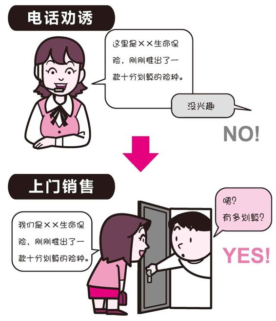

> > 人并非总是按照语言所表述的那样采取行动。

50　喧哗是为了掩饰失败

●　话不在多，而在精

如果一个人说话简短精练，而内容又极具说服力，使你产生“原来如此”的觉悟，你是否会觉得他很有实力？

相反，如果一个人说话冗长，废话连篇，尤其是为自己辩解时滔滔不绝，你还会百分百地信任他吗？这种人的心思，最容易被人看透。

康奈尔大学的托马斯·季洛维奇博士对29名大学生进行了一项实验，请他们猜测NFL（美式橄榄球）各队伍的比赛结果并进行打赌。

每场比赛结束后，博士都让大学生们对自己的预想结果进行说明。结果显示，猜中的人用于说明的平均时间是10.70秒，而猜错的人则会耗费更长的时间来进行解释，平均用时达到17.66秒。换言之，越是输，就越会辩解。

为什么人一输就要进行辩解呢？

因为不论是谁，痛快承认自己的失败都是相当困难的。每个人都会试图寻找让自己能够接受失败的理由——作出迎合自己的歪曲的解释。

“这只是偶然情况。”

“都怪××，不是我的责任。”

此种辩解随处可闻。

而成功者很少长篇大论地来解释自己为什么成功。

那些强词夺理的人，就像斗败了的狗，总是试图用声音掩盖自己的失败。如此，对于那些冗长而无聊的辩解，你就能做到左耳进右耳出了。

辩解过长就会丧失信用

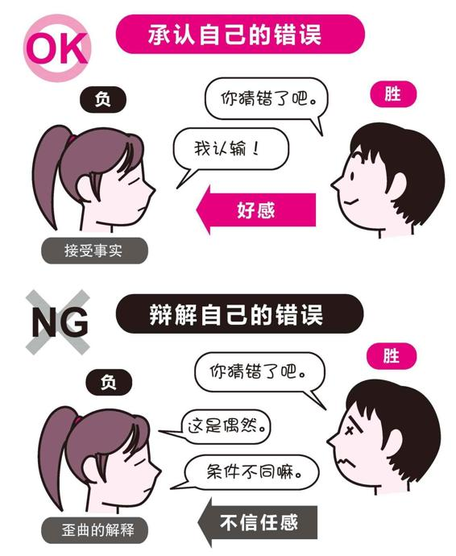

> > 有些解释，尽管自己能够接受，但在他人那里却行不通。

51　识破逢迎性笑容

●　怎样使笑容看起来更真实

无论是在餐馆，还是在商场，伴随着“欢迎光临”的，始终是灿烂的笑脸。这似乎已经成了一道必然的风景。

不过，即使日本的服务行业，也不是从一开始就如此的，所以麦当劳才会将“smile·零元”作为宣传标语。

笑容是维持良好人际关系的重要手段之一。一个有魅力的笑容，能使人际关系变得更为融洽圆通。但是，最近发现一个可怕的事实，那就是，刻意为之的笑容会立刻被人识破。

加利福尼亚大学的马克·弗兰克博士征集众多学生，让他们观看喜剧电影，并偷偷拍摄下他们看电影时的面部表情。

通过表情，能判断出他们是真的开怀笑还是敷衍了事？

博士就这一问题进行了调查。实验结果显示，人在真正觉得有趣并露出会心的笑容时，颊骨上的肌肉会向上凸起。而逢迎地笑、谄媚地笑时，笑容幅度很小，只是通过嘴角来表达笑意，因此脸颊是绝对不会凸起的。

所以，只要观察对方的脸颊，就能轻松判断出，他是发自内心地笑，还是为了逢迎你而笑。

同样，在不得不笑的场合下，若不想被人识破自己的“假笑”，那就试着把嘴角向上扬起、让牙齿露出来，平时还要多锻炼脸颊上的表情肌，让它向上凸起。

笑容要尽量放大

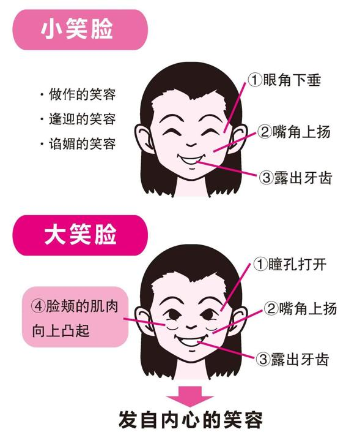

> > 有实验数据表明，笑容越大，就会让人感到越有魅力。

52　迫使对方“伪善”

●　人人都怕良心的谴责

自信地通过告诉对方：“我已看穿你的想法！”

“你心里想的是什么我都知道！”

“你现在很后悔吧？”

这是一种邪恶的心理战术，勾起对方的恐惧感、罪恶感，从而将他拉入自己的方阵。

下面先介绍一项实验数据。这是由法国普罗旺斯大学的心理学家瓦莱里·冯恩希安特博士所作的十分有趣的报告。

首先，交通安全协会的人委托135名大学生写一篇呼吁遵守驾驶规则的作文；完成之后，协会又请他们参加分发交通安全手册的志愿者活动。结果，只有10％的学生同意参与。但是，在完成作文后还被要求“写出以前违反交通规则的经历”的学生中，则有45％的人答应参加志愿者活动。

该项实验表明，在写下自己的过错时，人会受到良心的谴责，因此希望通过志愿者活动来消除罪恶感。即，这种时候，人会不自觉地成为“伪善者”。

没错，当一个人察觉到自己的错误或罪恶，便会在一段时间内实施善行。因此，只要迫使对方成为“伪善者”，就能诱使其协助自己。

例如，你手头工作过多，而同一小组的同事却视而不见，不肯施以援手。你不好指责他，但你可以试着说：“我这边还没做完，耽误你的工作进程，真是不好意思。不过你也看到了，我每天都在加班，实在是心有余而力不足啊。明天就是最后期限了，今晚不知道又要忙到几点……”

同事会说：“哪里的话，我帮你一起做吧？”

这就是你的目的！

让他人变身为伪善者的会话法

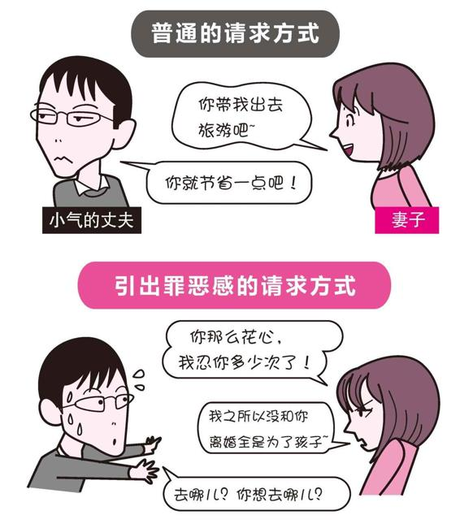

> > 在被戳中痛点时，为了反驳这一点，人往往会装扮成伪善者。

53　手和口一样善于“表达”

●　从手的动作看穿人心

当交涉对象是一个很难读懂其心的人时，不论从何出击都是极为困难的。“他对我方的提案是满意还是不满意？”搞不清楚这一点就无法制定策略。

被称为“引发销售技巧大革命”的美国人肯恩·德尔马，仅用137美元就开设了一家公司，短短数年后，他就成为年收入数十万美元的风云人物。他将自己致富的秘诀都记述在了Winning
Moves一书中。

据说他是通过“手”来读心的。

例如，下面这些动作都表示“YES”。

·手处于放松状态，并没有紧握

·手打开放在桌面上

·收拾书桌上多余碍事的物品

·用手蹭着下巴

另外，从“手的交握方式”中也可以看出对方的性格。据美国心理学家沃尔特·索瑞尔的《人手物语》所写，双手交握时，根据右手拇指在上还是左手拇指在上可以判断一个人的性格。

右手拇指在上的人是理性的、现实的、具有支配性的，而左手拇指在上的人是直觉性的、好空想的、协调的、具有从属性的。

这一现象直接体现了右脑和左脑的差异。右脑掌控着想象力和情感，操纵着左侧身体；而左脑掌控着逻辑和理性判断，操纵着右侧身体。

人在思考的时候，内心的动摇会立刻反映到动作上，正因为如此，手乃至四肢的动作会将人的内心情感明确地表现出来。所以一旦有情况发生，要注意观察对方的动作。

手的举动表现真实内心

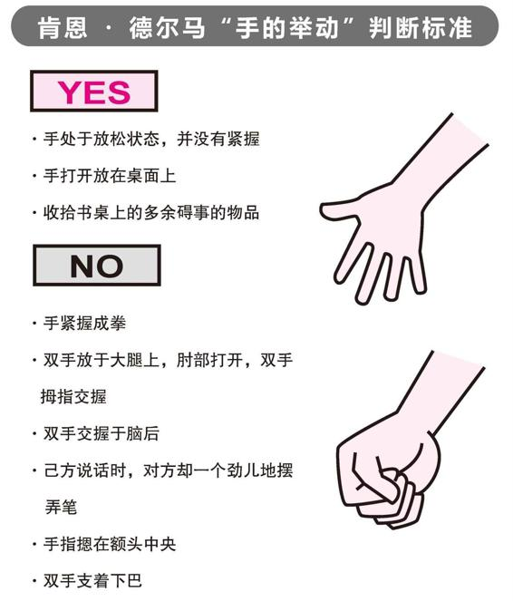

> > 表示“NO”的动作会给对方造成不快，请务必注意。

54　自如操控对话过程的恶劣招术

●　夺回主导权的两种手段

面对说得起劲儿、滔滔不绝的对手，你是否会急躁地出言制止——“你能稍微听听我的话吗？”又或者，终于结束了冗长的对话，而你却已经头昏脑涨，疲惫不堪。

其实你有很多种方式来避免上述事态的发生。不过这种心理战术多少有点“邪恶”，所以使用时多加谨慎。这里就介绍最简单常用的两种方式。

第一种是，掉落一样东西来打断对话。

那些完全沉浸在自己的世界里而喋喋不休的人，往往难以顾及他人的感受。这种情况下，无论是为了自己，还是为了周围和你一样正在活受罪的人，不妨将手中的笔或资料“砰”地弄掉，让对方受到一点惊吓。相信没有人能无视这一状况而继续说个不停。一旦对话中断，你就可以夺回对话的控制权。

另一种方法就是“暂停”的技巧，即离开现场，从对方眼前消失。

“对不起，我能去一趟洗手间吗……”

“啊，我必须出去接一个电话……”

即便你开口很唐突也不是问题。你的暂时“消失”，就是为了回来时能夺回话语权。

或许你也曾注意到，无论是在排球比赛，还是棒球比赛，当自己的队伍陷入劣势时，教练都会立刻叫暂停，通过心理上的调整来重新控制比赛进程。

对方说得起劲儿时要及时打断

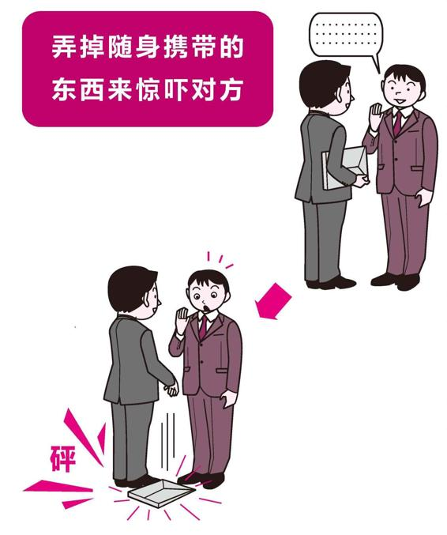

> > 受到惊吓后，对方的思维会有一瞬间的停滞，瞅准时机夺回主导权。

拿来就用心理学

●　压力管理四则

现代人面临着来自四面八方的压力。这些压力，相信你也深有体会。

适当的压力能提高生活与工作的积极性、进取心，但压力过大则会影响人的身心健康。研究发现，现代人的50％～80％的疾病都和压力有关，有的研究者甚至断言：压力和任何疾病都可以产生关系。

许多人感觉到压力存在时，在身体上容易出现异常疲劳、呼吸急促、头晕、饮食异常等不适症状；在心理健康上则容易出现厌倦沮丧、悲观失望、失去创造的感觉。

过度的压力除了对个人的身体造成危害，对于组织的消极影响也十分巨大。在美国，员工因压力过大而出现旷工、创造力下降、注意力不集中等状况而给企业造成的损失，每年超过1500亿美元。因此，很多企业管理者已经开始关注员工的压力管理问题。

作为个人，缓解压力的方式有很多，宣泄、倾诉、听音乐、旅游散心、保持充足的睡眠等，都能有效减轻压力。

这里给大家介绍四则有效缓解压力的心理学方法。这是宾夕法尼亚州库兹敦大学的伊曼纽尔·阿基拉博士推荐的方法。

（1）推卸责任

简单说来，就是把责任推卸给别人。因为即使责任真的在于自己，一味责备自己也于事无补，反而徒增压力。作为应急措施，把责任归咎于他人可以暂时缓解自己的心理压力，从而有效抑制失败、沮丧的情绪。

（2）相信这只是暂时的

许多烦恼和痛苦都会随着时间的推移而消退。当面临难题时，与其抱怨、焦躁，不如告诉自己“这种痛苦不会持续太久”、“一切都是暂时的”。在这种想法的安抚之下，你的压力暂时得到缓解，这对下一步的分析思考或采取措施至关重要。

（3）难过只限于当场

例如，当你在公司遭到上司痛斥，满心委屈却无处申诉时，要告诉自己：他只有在这种情况下才会这样。事实上，痛苦具有“临场性”，即换一个场景，即便面对同一个人，你也不会觉得难过。

（4）一切都是可控的

无论发生什么事，都不要觉得“我已经无能为力了”。任何麻烦都是可控的，要相信没有自己处理不了的事情。这种自信能使你不至于手足无措。

第8章\
扭转对方思维的进退策略

> > 心理博弈中有一种高级技巧，可以扭转对方的判断，且不会被对方发觉，悄无声息。你就像具有超能力一般对对方进行远程操控。这就是将计就计，一种巧妙利用人类心理特征的魔法般的心理战术。

55　用赠品“收买”人心

●　即使只得到一点点补偿，人也会很开心

你的钱包里装着几张积分卡？家电卖场的卡、超市会员卡、电子银行卡、美容院的卡、航空公司的里程卡……

只要累积积分就会有现金回馈，或者达到一定程度就可以享受特别优惠。

“附赠”是十分具有诱惑性的。我们就是被这些“赠品”怂恿着花钱。

康奈尔大学的理查德·泰勒博士通过实验证明了人类心理中不可思议的一面。博士以87人为实验对象，向他们提出了“下列二人中的哪一个会感到不快”这一问题。

A——在停车场发生了撞车事故，花费了200美元用于维修汽车，但当天买彩票中了25美元。

B——同样发生了撞车事故，但修理费花费了175美元。

尽管二者所花费的金额相同，但调查结果表明，绝大多数人都认为B会感到不快。他们觉得，A由于获得了一点补偿，所以他的不快程度会降低。

博士将这称为“损益两平效应”，是“如此一来，收支不相上下”的意思。

想买，但却因预算超支而不能买。这时，如果对方宣传说“双倍积分仅限今日”，我们会很开心，甚至怀着感激的念头买下那些商品，尽管事实上，这个积分要留到下次再在同一家店使用，最终也还是在为这家店的销售额作贡献。

这是一个漂亮的心理策略，不仅适用于商业，也适用于你的日常生活、人际交往。

给对方“赠品”来使他感到满足

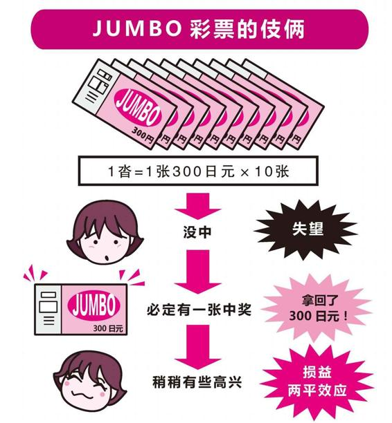

> > 对方一直输或者蒙受损失的时候，只要稍稍让他赢一点儿，就可以使他很开心。

56　小恩惠带来大便利

●　亚洲人的心理特征

亚洲人容易感受到他人的恩情，报恩意识也比较强烈。而欧洲人和美洲人则不像亚洲人这样对帮助过自己的人感恩戴德，他们习惯于采取彼此间相互帮助、相互回报的交流模式。

亚洲人很难接受这种交流模式。

我们对恩情过于敏感，容易将他人的好意当作“负担”。我们会认为，即使再小的恩惠，也是必须偿还的“债务”，而且并从一开始就不希望接受这种小恩惠。

香港大学的心理学家郝娴博士通过实验证实了这一点，详情请参见下方图。实验中的亚洲人几乎都是中国人，北美人则基本都是欧洲裔美国人。

掌握了亚洲人的这种心理特征，在进行交涉时，便多了一种策略，即“施恩”。对于那些关系较为疏远、态度较为客气的对手，抓住机会卖个人情，即使事情微不足道。

替他买一罐咖啡、开会时当众同意他的看法、在别人面前宣传他的事迹、在客户面前给他面子——总之，让他领你的情，无论是被动的还是主动的。

恩情再小，只要对手背负了“人情债”，他的心也会为你所束缚，而你提出的要求要想得到满足，也将变得容易很多。

亚洲人容易感受到恩情

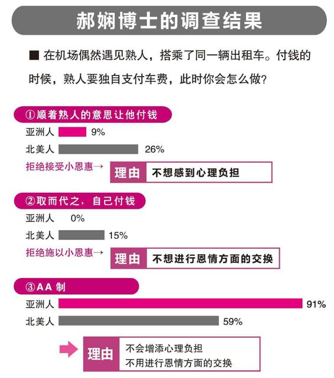

> > 据博士所说，亚洲人会因一点点的小恩情就有了心理负担，所以他们倾向于放弃接受他人的恩惠。

57　不可以过度相信判断力

●　信息多但未必都正确

人心善变，对于同样的事物，时而喜欢时而讨厌，时而相信时而怀疑。而随着心理状态的变化，思考也会出现偏差，从而影响判断。

最不安定、最不可信的就是人心。

或许有人会说：“现在信息网络这么发达，只要全面搜集客观信息，在数据与实例的基础上进行判断，不就可以避失误吗？”——但事情可没这么简单。

我们的判断力究竟是多么不可靠？

克莱尔蒙特大学的斯图尔特·奥斯坎普博士曾做过一个实验。他将名叫“基德”的真实人物的相关信息告知被实验者（临床心理学家18人、心理学专业研究生18人、心理学专业本科生6人），让他们推测基德的性格。结果，随着博士将越来越多的信息告知被实验者，被实验者对于自己预测的确信程度不断上升，而与之相对的，实际的正确率却并没有提高（参照下方图）。

人们普遍认为，掌握的信息越多，就越能得出正确的结论，但事实并非如此。不论增加多少新信息，人的思考都不会偏离最初的判断太远，换言之，人们会拽着从一开始就遭到扭曲的印象不放。

因此，像“获得的信息太少才出了差错”、“信息量不足无法得出结论”之类的说法，都不过是借口。信息的多少无法决定结论的正确与否，还不如索性根据最初的判断行事。

很多时候人类的直觉都是正确的。与其拖拖拉拉错失良机，不如抢在他人之前迅速作出决断以占得先机。

信息再多也无法作出正确的判断

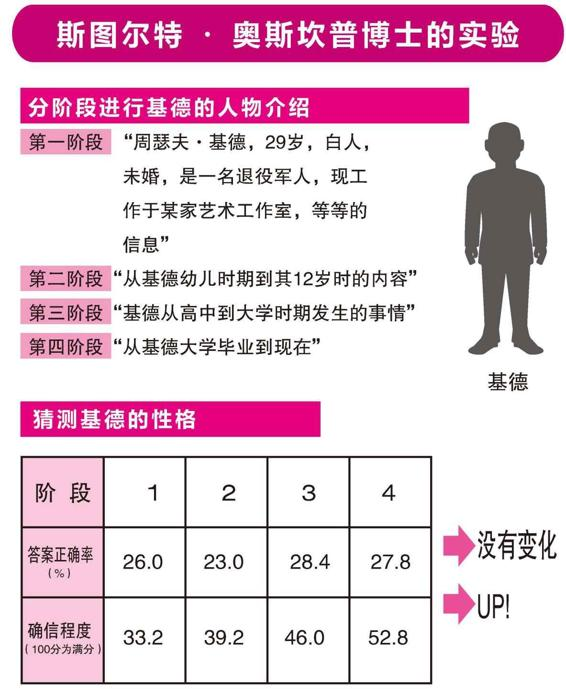

> > 随着信息的增多，只有确信程度在不断攀升；但确信程度和正确率之间看不出任何关系。

58　用与众不同的事物引人注意

●　人们喜欢与众不同的东西

首先，请看右侧的三道题，找出不同类的事物。很容易解答吧？

有句古话说：物以类聚。在漫长的演化进程中，有一种能力被植入了人类的DNA中，那就是区别同类与非同类。而正是在这种“区别”的过程中，我们又对那些与众不同的事物表现出了极大的兴趣。

不仅是我们人类，连黑猩猩也对与众不同的事物感兴趣。

位于佛罗里达的耶基斯灵长类研究中心的理查德·达文波特博士，以四只出生后18～24个月的黑猩猩，对此进行了考察。

博士将装上东西（火柴盒、缎带、软木等）的托盘放入笼子里，观察黑猩猩会对哪一个托盘表现出兴趣。实验中，三个托盘中的两个是同一种类，只有一个托盘有所不同。结果，与盘中的物品无关，黑猩猩只对与其他两个不同的那个托盘显示出兴趣。在另一场相同物品但颜色不同的实验中，结果也是如此，只有与众不同的那个才会被黑猩猩选中。

与众不同的东西，让人一眼就看出其特殊性，使自己成为最显眼的存在，从而引起人们的兴趣。人类也和黑猩猩都具有这种自然的指向性。

因此，想要引起对方的注意，就留心一些与众不同、别具一格的东西吧。

一条特别的领带、一款特殊的香水、一本同行者不太会去看的书，甚至，一枚别致的书签，都有可能成为你吸引别人的法宝。一旦别人对你产生好奇，你就胜券在握了，因为对方会主动对你进行探寻。

要想醒目就要有所差别

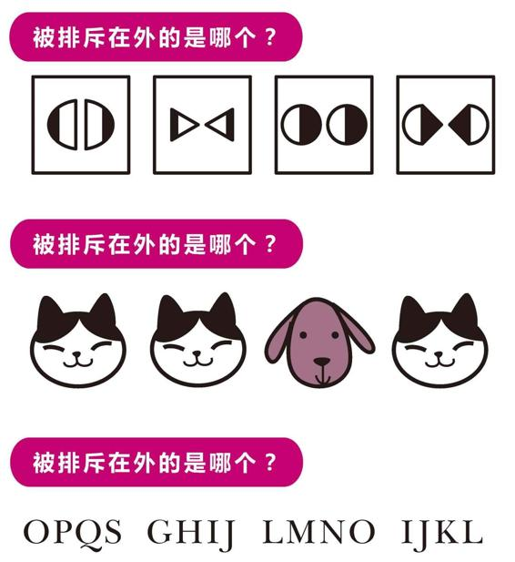

> > 人们会立即发现与众不同的东西。

59　防止思维被某些语言绑架

●　固有印象会扰乱判断

琼脂、纳豆、奇异果、束缚带、腹部减肥操……你知道这些是什么吗？没错，这些都是减肥畅销书的常用词。

尚且不论效果如何，但凡有新的减肥方法出炉，人们就会蜂拥而至，这却是个不争的事实。

看看这些年汹涌而出又销声匿迹的减肥方法，想必你也不得不承认，如今是“健康主义”至上的时代。

“无糖”、“控制卡路里”、“低脂肪”这类词得到推崇，获得了前所未有的价值。而这些词的滥用，使我们的大脑出现了固定思维，我们买一种商品，也许并不是因为该商品本身，而是受了某些词语的摆布。

芝加哥大学的研究生史黛西·芬克尔斯坦在学会杂志上发表了一组实验数据。

他以校内的51名男女为对象，在和他们打过招呼后，请他们吃一种巧克力树莓蛋糕。实验中，他准备了标签上分别印有“保健型（维生素＆食物纤维）”和“美味型（又甜又好吃）”的两种蛋糕，但二者成分上几乎是完全一致的。

吃完之后，芬克尔斯坦问被实验者：“现在还感到饥饿吗？”

结果，吃了“美味型”蛋糕的人饥饿指数为3.76，而吃了“保健型”蛋糕的人饥饿指数为5.12，远远高于前者（7分为满分）。

也就是说，吃了甜点的人会下意识地认为“我摄入了大量卡路里，自然很饱”，而吃了健康食品的人则会擅自断定“卡路里低，现在肚子还很空”。

回忆一下，你是否也有过被某个词，或者某种固化思维“绑架”的经历？

语言所产生的印象

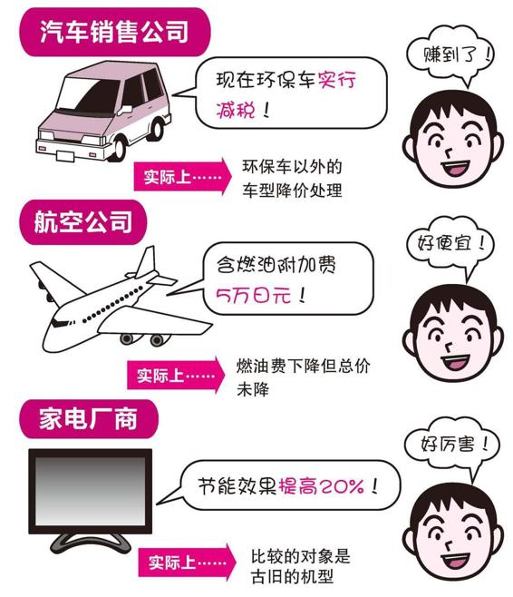

> > 语言所产生的印象不同，人的判断也会不断变化。

60　拿出撤退的勇气

●　错失脱身良机就会吃更多苦头

如果你致电某企业的顾客服务中心，自动语音提示你“现在人多繁忙，请您稍后再拨”或“请稍等”，于是你等了5分钟、10分钟，却仍未能联系到相关负责人，你是就这样算了，还是会不甘心地继续打？

“已经等这么久了，挂断就白费了，还是再稍微等一会儿看看吧。”

谁都想为自己付出的辛劳索取相应的回报，因而有很多人会继续徒劳地消耗时间。这种现象被称为“投资亏损效应”，意味着“被埋没的费用”、“投入到无法回收的领域中的费用”。

越是投入精神劳力到某项事物中，你就越是难以抽身而退，到最后泥足深陷、不克自拔。

新泽西大学的艾琳·布雷彻博士以企业市场部的员工为对象，进行了一项实验。

假设被实验者手上有2万美元的资金，然后询问他们对于某种虚构的商品“会投入多少广告费”。

（事实上，该项实验中设定，不论投入多少广告费，都无法收到预期的效果。）

结果，被实验者不断投入广告费，直到收到效果。他们已然陷入了“再来一次”的怪圈中，无法自拔。

投资量越是增加，想要收回的报酬也就越多，但也更容易陷入恶性循环，最后血本无归。

世上总有些事是我们无能为力的。当遇到自己力不能及的事情时，就需要有勇气果断撤退。

“投资亏损效应”会导致难以摆脱的困境

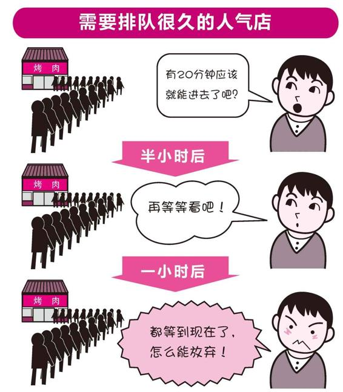

> > 时间、金钱、劳力，这些东西投入得越多，人就越是泥足深陷，无法撤退。

61　不要相信面前的人

●　人都是想要偷懒的动物

你面前的人并不一定就是你看到的那样。

工作利落、为人机灵的女同事，也许她回到家后既不会做饭也不会打扫，是个“不能自理的女人”。在公司里仪表堂堂的上司，也许夜夜流连于那些男扮女装的俱乐部。

在人前和在人后，我们的行为有时会发生180度的大转变。

加利福尼亚大学圣巴巴拉分校的柴尔斯·华林汉姆教授，偷偷拍摄了在公园里跑步的人的录像，调查在45码的路程中他们在人前和人后的跑步速度。

结果显示，跑步者们在被他人看到时会提高跑步速度，在没有任何人看到时则会降下步速。

教授将有人看和没人看时的情况进行比较，发现有的人的速度竟会相差4倍之多。

其实不论换作谁都一样，认为“有人在看”时就不会偷懒。或者说，是想将好的一面展现给别人，故而发挥了比平时更大的能力。

由此可以得出两点：

第一，眼前的事物不能保证一定是“真实的”，多多少少都应持有一点儿怀疑。

第二，人在他人的注视下不会想要偷懒。

比如，想要在严苛的训练或不擅长的工作中奋力拼搏的话，就应选择那些能被他人看到的场合。这样一来，因为不想让他人看到自己丢人的一面，就会竭尽全力去奋斗了。

真实的情形谁也不明了

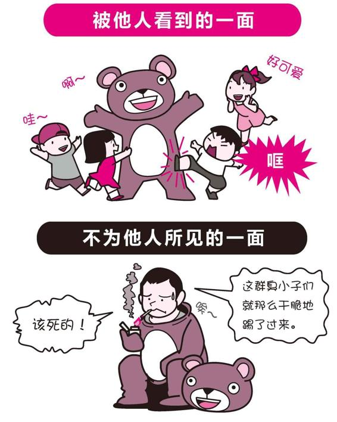

> > 会想在人前“展示自己优秀的一面”，这就是人。

62　欲望会扭曲判断

●　有时需要冷静地再度审视

随着数字地面传输的出现，超薄电视一下子在各个家庭中普及开来。早前的市场行情是“每寸一万日元”，但由于各家公司大打价格战，行市已暴跌至原先的三分之一，甚至五分之一了。

如果不降价就会在外国厂商的攻势中败下阵来，因此而落入恶性循环中无法自拔，陷入到一种“越卖越亏”的状态。

对于这种由于想要战胜对手而引发出悲剧性结果的现象，心理学家贝泽曼和尼尔称其为“非合理性逐步升级”。

其实静下心来想一想，根本没有必要不惜亏损地来拉拢顾客。如此，最好还是能够停止那些无谓的竞争。

但是，想要战胜竞争对手的欲望一旦产生，便会对自己的感觉和判断产生误导，其结果，往往会作出一些荒唐的选择，并固执于这些念头不放。

为满足渴望打赢对手的欲望而采取的行动，反而成为一种对自己的桎梏，而这一行动不断升级，就会迎来毁灭性的共同倒闭。

这是在现代商务的舞台上经常上演的一幕。为了切断这种恶性循环，企业要么相互合作，结成联盟，要么只能单方面退出，沦为败者。

以超薄电视的例子来说，有不少厂商就因耐不过消耗战而决定放弃电视机的生产。

企业间的战争就是这样的白热化。而对于个人间的竞争，则最好选择一种合作的路线来停止争斗。

总之，一定要避免因头脑发热而难以作出正确判断的情况发生。

要注意非合理性逐步升级

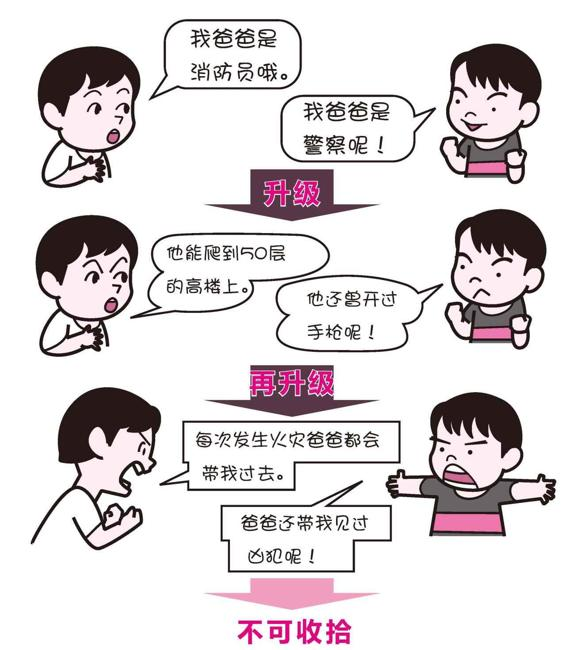

> > 人在高度兴奋时容易作出不合理的判断。

拿来就用心理学

●　直面你的对手！

随着信息化程度的提高，无论是购物、订票，还是召开会议，都可以通过互联网便捷地完成。我们沉溺在现代文明带来的高速交流中，以为通过冷冰冰的仪器设备就获取胜利。

然而，心理博弈，差之毫厘谬以千里，而电话、邮件、视频，都无法将一个人的状态完整地展现给别人。无论你是想读懂别人的心，还是想让别人读懂你的心，最有效的方式，始终只有一个——直面你的对手！

行为科学家经过六十多年的研究，发现人与人沟通交流的三大要素——文字、声音、肢体动作对结果的影响力比率分别是7％、38％和55％。换言之，单靠文字或单靠声音进行的沟通交流，其成效远远比不上面对面交流，因为后者能让你将这三大要素发挥到极致。

没错，直面你的对手，通过他的动作、眼神，甚至呼吸，就能抓住关键的瞬间，探知对方的意图，及时调整应对策略，从而稳操胜券。

面对面与你的对手博弈，首先需要强大的气场，既能沉得住气，又能压得住人。目光闪烁、支支吾吾、手脚发冷，怎能不输阵？其次，你还需要掌握娴熟的技巧，充分利用一切积极因素。选择合适的服饰、展开有效的对话、掌控好语音语调、利用微笑与眼神……总之，尽你所能把自己想传达的意图展现给对方，同时耳听六路眼观八方，神不知鬼不觉地将对方的心看透、攻陷。最后，别忘了“过犹不及”，把握好“度”，别得意忘形，反而让对方先把你看穿。

●　不会说，但要会听和会看

或许有人担心：我很内向，不善于和人面对面交流，常常会忘了自己要说什么。

那么，你至少可以做个优秀的聆听者与观察者。

理想的聆听者与观察者不会任意打断对方，即便有不同的意见，也会耐心等对方停下来后再发表。当你聆听的时候，同时也是观察者，因为保持静默使你有更多机会发现一些平时可能会遗漏的非语言线索。这是单纯通过邮件、电话等交流方式无法做到的。

如果情况逼得你非说不可，那么把说话时间的80％都用于提问吧。问题不用复杂，越简单越清楚越好，最好是是非型问题。态度要真诚，让对方能够欣然回答你。而这些答案，往往也包含着你需要的信息。

如果你不幸遇到一个语无伦次、口若悬河的诉说者，用本书教你的一些“伎俩”打断就好。

心理博弈听起来很高深很专业，但事实上，无论是谁，无论知识水平如何，每天都在进行不同的心理博弈。本篇既是本章的总结，也可以说是本书的总结。

结语

心理学家能读懂人心吗？

经常有人问我：“内藤老师，心理学家真的能读懂人心吗？”答案是“Yes”。

没错，人心是可以被“读懂”的。下面是两个简单的小实验。

※　请从红色、蓝色、绿色、黄色、紫色、茶色这六种颜色中选出你喜欢的颜色。

※　请从0至9中选择一个数字，然后在心里描摹你所选的数字。

我来猜猜你的选择吧。你选择的颜色是——蓝色！你选择的数字是——7！如果不是，就一定是8或3！

或许多数读者会感到惊讶：“真的猜中了！”

你是否也在被猜中之列？

当然，我并不是随意猜测的，而是根据一项实验数据作出判断。这项心理实验是由纽约州南安普顿大学的心理学家威廉·西蒙对490名大学生进行的。

尽管心理学不能像数、理、化那样通过精确的数值和公式来构筑理论，但也是与它们相提并论的科学。心理学完全排除了研究者的臆想和随意的推测，是一门切实累积实验数据的学问。

因此，我想刚刚的颜色和数字问题中，“绝大多数人”是被猜中了。当然，在不追求100％的心理学中，出现偏差也在所难免。

心理学就是研究“不确定的”、“模棱两可的”人心的一门“技术”。具体而言，就是探寻人类共通的心理特征，总结出适用于大多数人的心理法则。

当然，十人十色，人的心理是千变万化的，出现半数以上“例外”的情况也是存在的，但根本性的东西是不容易改变的。

因此，心理学发现的法则，是能够适用于绝大多数人的“真理”。能否掌握并运用这些法则，关系到你能否读懂自己的心、别人的心。

人的所有行动都是有理由的。基于这些理由来进行预测，这就是心理学。只要弄明白这些理由，你应该采取什么行动，自然也会明晰起来。

现代社会中，每一次与人交锋，你都不可忽视心理的作用。心理学为你提供了强大而切实的武器，让你在这个没有硝烟的战场上打赢每一场残酷的心理博弈。

最后，对一路阅读到此的读者们表示感谢。本书之所以能够付梓，都是仰仗读者们的关照。

内藤谊人

Table of
Contents

[书名页](#index_split_000.html_filepos167)

[目录](#index_split_001.html_filepos637)

[导读　当博弈遇上心理学](#index_split_002.html_filepos14261)

[前言　抢占全“心”时代的博弈制高点](#index_split_003.html_filepos18856)

[第1章　心理博弈，无处不在的思辨之战](#index_split_004.html_filepos23579)

> > [1　情感冲动快于大脑思考](#index_split_005.html_filepos24178)

> > [2　磨炼心理博弈技巧刻不容缓](#index_split_007.html_filepos26520)

> > [3　错觉，隐藏的“杀手锏”](#index_split_009.html_filepos28971)

> > [4　人的外在形象占九成比重](#index_split_011.html_filepos31310)

> > [5　恐惧，一招制胜的说服力](#index_split_013.html_filepos33820)

> > [6　留意笑容背后的意图](#index_split_015.html_filepos36273)

> > [7　话题如何出卖一个人的内心](#index_split_017.html_filepos38569)

> > [8　捧杀，最强大的武器](#index_split_019.html_filepos41159)

> > [●　拿来就用心理学](#index_split_021.html_filepos43598)

[第2章　打赢与自己对阵的心理战](#index_split_022.html_filepos48260)

> > [9　挑战，成功者永恒的坚持](#index_split_023.html_filepos48923)

> > [10　对令你讨厌的人产生好感](#index_split_025.html_filepos51826)

> > [11　巧用别人的羞耻心](#index_split_027.html_filepos54544)

> > [12　别相信自己的估计](#index_split_029.html_filepos57377)

> > [13　记忆的自我筛选功能](#index_split_031.html_filepos59767)

> > [14　给大脑捏造记忆](#index_split_033.html_filepos62199)

> > [15　瞬间和他人搞好关系的秘诀](#index_split_035.html_filepos64560)

> > [16　好心情助你跨越障碍](#index_split_037.html_filepos67468)

> > [●　拿来就用心理学](#index_split_039.html_filepos70152)

[第3章　胜利者不说却在用的博弈高招](#index_split_040.html_filepos74798)

> > [17　塑造强大的自己](#index_split_041.html_filepos75612)

> > [18　扮演“有能力的人”](#index_split_043.html_filepos78088)

> > [19　示弱，而后强大](#index_split_045.html_filepos80680)

> > [20　反对者的自信与存在感](#index_split_047.html_filepos83315)

> > [21　感到痛苦就想“钱”](#index_split_049.html_filepos85827)

> > [22　炫耀，强者最不需要的手段](#index_split_051.html_filepos88481)

> > [23　寂寞者会买什么](#index_split_053.html_filepos90884)

> > [24　如何瞬间提高决策力](#index_split_055.html_filepos93784)

> > [●　拿来就用心理学](#index_split_057.html_filepos96417)

[第4章　心理操控术之将对方掌握于股掌之间](#index_split_058.html_filepos100027)

> > [25　恭维，安全高效的心理武器](#index_split_059.html_filepos100675)

> > [26　告诉他“你一定行”，哪怕只是谎言](#index_split_061.html_filepos103448)

> > [27　碰触，消除距离感](#index_split_063.html_filepos106312)

> > [28　限制时间，让对方甘冒风险](#index_split_065.html_filepos108661)

> > [29　“关键词”攻心术](#index_split_067.html_filepos111405)

> > [30　显示稀缺性来吸引对方](#index_split_069.html_filepos114081)

> > [31　使用人们没听惯的词语](#index_split_071.html_filepos116964)

> > [32　找对求助对象](#index_split_073.html_filepos119862)

> > [●　拿来就用心理学](#index_split_075.html_filepos122662)

[第5章　化敌为友的“诓人术”](#index_split_076.html_filepos126377)

> > [33　执行力比任何语言都有效](#index_split_077.html_filepos127055)

> > [34　褒扬在人前，批评在人后](#index_split_079.html_filepos129704)

> > [35　向你的敌人求助](#index_split_081.html_filepos132419)

> > [36　扮演笨拙的自己](#index_split_083.html_filepos135163)

> > [37　越是热络的人越会被厌烦](#index_split_085.html_filepos137980)

> > [38　眼睛是心灵之窗](#index_split_087.html_filepos140534)

> > [39　把笑“传染”给别人](#index_split_089.html_filepos143221)

> > [●　拿来就用心理学](#index_split_091.html_filepos145934)

[第6章　无往不利的高效交涉术](#index_split_092.html_filepos150467)

> > [40　道歉务必附上理由](#index_split_093.html_filepos151020)

> > [41　亮出心中的思量](#index_split_095.html_filepos153600)

> > [42　吹嘘，用得好就是利器](#index_split_097.html_filepos156229)

> > [43　黑色，威信与力量的象征](#index_split_099.html_filepos159066)

> > [44　改一个有魅力的名字](#index_split_101.html_filepos161598)

> > [45　“意料之外”带来的胜利](#index_split_103.html_filepos164152)

> > [46　香气，无声无形的动人诱惑](#index_split_105.html_filepos166977)

> > [47　让你的外国同伴代替你交涉](#index_split_107.html_filepos169551)

> > [48　制造恐惧心理，迫使对方答应要求](#index_split_109.html_filepos172197)

> > [●　拿来就用心理学](#index_split_111.html_filepos174960)

[第7章　先读心，后攻心](#index_split_112.html_filepos179240)

> > [49　不可轻信别人的拒绝](#index_split_113.html_filepos179997)

> > [50　喧哗是为了掩饰失败](#index_split_115.html_filepos182584)

> > [51　识破逢迎性笑容](#index_split_117.html_filepos185118)

> > [52　迫使对方“伪善”](#index_split_119.html_filepos187495)

> > [53　手和口一样善于“表达”](#index_split_121.html_filepos190295)

> > [54　自如操控对话过程的恶劣招术](#index_split_123.html_filepos193009)

> > [●　拿来就用心理学](#index_split_125.html_filepos195489)

[第8章　扭转对方思维的进退策略](#index_split_126.html_filepos198717)

> > [55　用赠品“收买”人心](#index_split_127.html_filepos199319)

> > [56　小恩惠带来大便利](#index_split_129.html_filepos201955)

> > [57　不可以过度相信判断力](#index_split_131.html_filepos204252)

> > [58　用与众不同的事物引人注意](#index_split_133.html_filepos206927)

> > [59　防止思维被某些语言绑架](#index_split_135.html_filepos209529)

> > [60　拿出撤退的勇气](#index_split_137.html_filepos212270)

> > [61　不要相信面前的人](#index_split_139.html_filepos214887)

> > [62　欲望会扭曲判断](#index_split_141.html_filepos217423)

> > [●　拿来就用心理学](#index_split_143.html_filepos220079)

[结语](#index_split_144.html_filepos223668)

