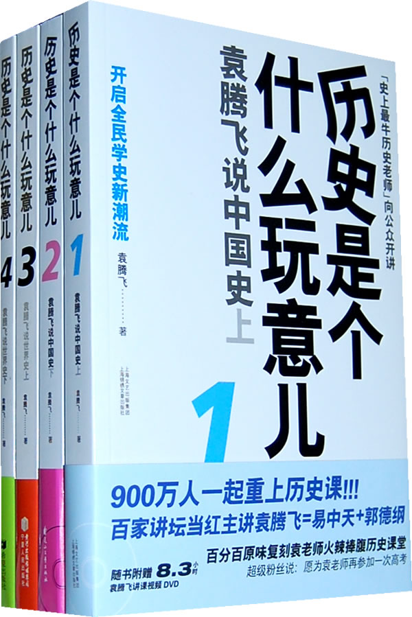
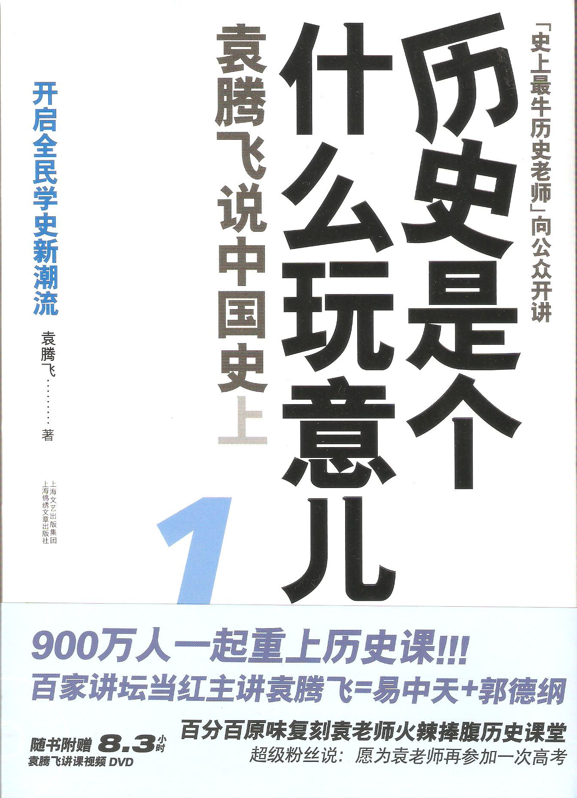
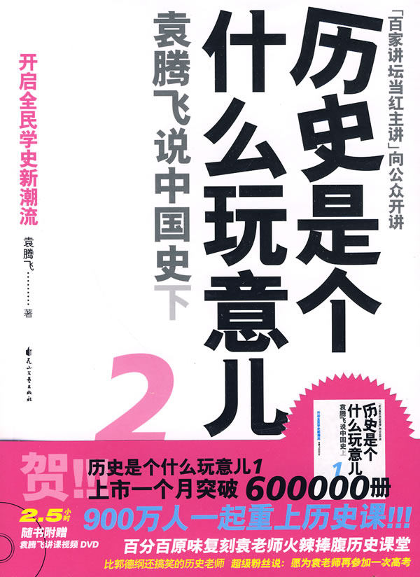
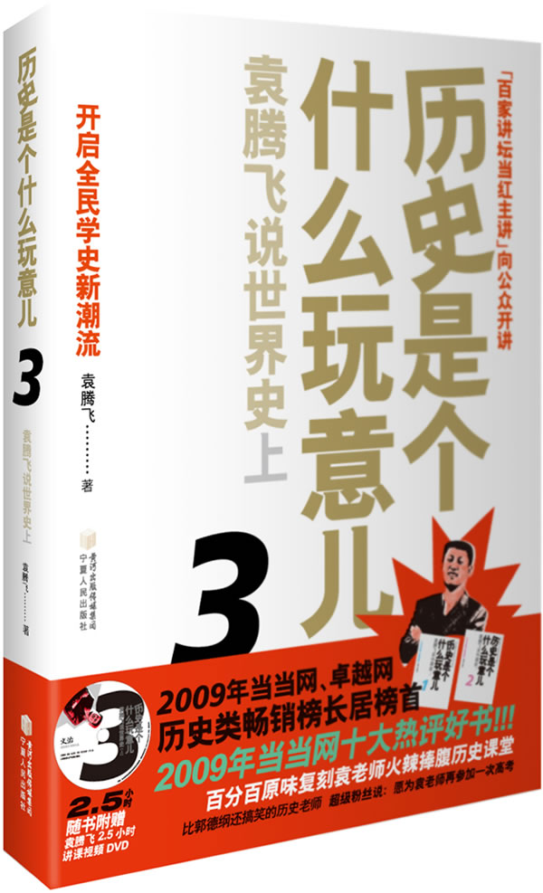
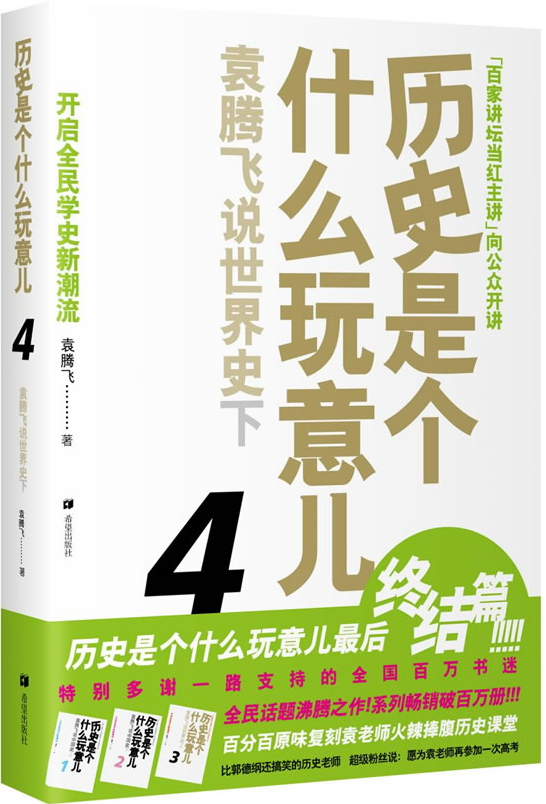

# 历史是个什么玩意儿

## 袁腾飞

### 主目录

[一 中国史上](#chapter1.html)

[二 中国史下](#chapter70.html)

[三 世界史上](#chapter113.html)

[四 世界史下](#chapter138.html)

[自序](#chapter2.html)

[第一章 青铜时代的中国人(先秦)](#chapter3.html)

[第二章 江山一统不是梦(汉)](#chapter13.html)

[第三章 三足鼎立 南北对峙(三国、两晋、南北朝)](#chapter20.html)

[第四章 忆昔开元全盛日(隋唐)](#chapter28.html)

[第五章 你唱“霸”来我登场(五代、辽宋夏金元)](#chapter37.html)

[第六章 最后的汉王朝(明)](#chapter50.html)

[第七章 异族终结者(清)](#chapter59.html)

[返回主目录](#chapter158.html)

### 自序

呈现在您面前的这本书，是由精华学校网络课程的授课视频整理而成的。它的出版，首先要感谢磨铁文化的沈浩波先生和苏静先生，是他们在网上看到了我的课程，并决定把我这些贻笑大方的一家之言整理出版，给了我一个谬种流传的机会。感谢精华教育的李峰学总裁和范开基校长，是他们的包容与开放，使我有一个大放厥词的场所。还要感谢我的课程策划刘娟小姐，我每一节课的成功都离不开她的辛勤付出。还有出版社和精华学校无数为我服务的编辑和工作人员们，他们一次次感动着我。当然，最应该感谢的还是成百上千选修我课程的学生们，以及支持、鼓励，包括批评我的网友们。

我只是一名普通的中学历史老师，从小因为喜欢历史而读历史，因为爱历史而在大学选择历史专业，最后顺理成章地教历史。不经意间，我的教学视频片段被放到网络上，点击率竟然超过了
2500万。在国外的学生告诉我，说我的视频出现在优酷首页、百度视频首页，我才知道自己“一夜成名”了，一切都已不可“挽回”……

我个人认为，中学的课堂应该是相对封闭的，不应该暴露在大庭广众之下，不像娱乐圈的明星，需要炒作，需要曝光自己，老师是需要把自己遮盖起来的，而现在这种“非正常”出名，令我感觉比较尴尬。

岂能尽如人意，但求无愧我心。我只能是这么来安慰一下自己，如果有解释的机会，就尽量去解释。我想跟大家说我绝对不是史上最牛的历史老师，希望大家不要误会。

对于我的课，有人说是哗众取宠。我感觉对于学生来讲，兴趣永远是第一位的，牛不吃草不能强按头。把学生讲笑了，总比把他们讲睡了要强些。现在的孩子有多少人喜欢看历史书？尤其是那种干巴巴的严肃的历史书？让他们自己去看书，不见得有效果，所以我喜欢用引人入胜的故事带出知识点，并加上一些我个人对历史事件的评价，以成一家之言。

历史什么人学了有用？大人物学了有大用，比如国家领导人学有用，吸取历朝历代治乱兴衰的教训，定国安邦。而现在的大部分高中生学习历史目的是很明确的，就是考上一个好大学，毕业之后找一个好工作，奔一个锦绣前程。所以我觉得历史这个学科应该是普及性质的教育，提高人文素养。我讲历史，就是培养学生对历史学科兴趣。听我的课，记住了什么是次要的，对历史产生兴趣，就是我最大的成功。

我们的历史教育，虽然情况是越来越好了，但是也没有完全达到无任何界限地研究历史。国学大师钱穆先生他在《国史大纲》前面有一段话，“当信任何一国之国民，尤其是自称知识在水平线以上之国民，对其本国已往历史，应该略有所知。”“所谓对其本国已往历史略有所知者，尤必附随一种对其本国已往历史之温情与敬意。”“所谓对其本国已往历史有一种温情与敬意者”，“至少不会感到现在我们是站在已往历史最高之顶点”。

比如说研究中国的明清时期，我们自己写的历史书把明清时期写得一塌糊涂的，封建社会到了末世了，衰落了，怎么都不行了。反过来去看西方历史书，比如剑桥历史，是高度赞扬中国的明清时期的。中国那时的白银占世界的一半；中国的农民是当时世界上最富裕的农民。为什么我们自己这么妄自菲薄？因为那是封建统治者，所谓的封建地主，我们不能歌颂他。

历史应该是论从史出，得出的每个结论应该有史实做依托的。不能先拿出一个结论，然后把对我有利的史实拿来，有选择性地遗忘，这样是很可怕的。这种东西如果不彻底改变的话，历史学的研究是很难有大的突破。我在讲课的时候，也尝试着能在这些方面尽自己的一份绵薄之力，至少让学生不要相信没有史实根据的事情。有的人说我颠覆了历史，那么想请问，你了解的那个我颠覆之前的历史，是不是被颠覆过的？如果是，那我只不过是把颠覆的东西，又颠倒过来了。

我还是踏踏实实想做一名老师，就是普普通通的，本本分分的，混同于芸芸众生的老师。我不是历史学家，我大学学的是怎么教历史，严格意义上讲并不是历史本身，所以才疏学浅，讲课难免有谬误之处，欢迎各位读者批评指正！

以上是我想说的话，权当本书的序言吧。

袁腾飞

2009-7-18

历史是个什么玩意儿

1

袁腾飞说中国史

/

上

### 第一章 青铜时代的中国人(先秦)

[1.“禅”始不能“禅”终](#chapter4.html)

[2.换汤不换药](#chapter5.html)

[3.一锅粥喝了二百七十年大国的兴起](#chapter6.html)

[4.普天之下莫非王土](#chapter7.html)

[5.五个想当老大的男人](#chapter8.html)

[6.七匹狼轮番登场](#chapter9.html)

[7.蛮夷狄戎VS中原王朝](#chapter10.html)

[8.名正言顺的变公为私](#chapter11.html)

[9.公元前21世纪什么最贵](#chapter12.html)

[返回主页](#chapter1.html)

### 1.“禅”始不能“禅”终

唐尧的“禅”始

咱们中国人一说到古圣贤王，就是尧、舜、禹、汤、文、武这六位。其实那个时候他们也谈不上什么国王，都属于部落联盟酋长的级别，只不过特别文明，不穿孔不吃人肉，统治者之间也和平共处，大公无私，采用禅让制的方式，交接权力。形式上，禅让是在位领导自愿进行的，通过多方综合考评，谁有能力，就选择谁带领全国人民奔小康，现任者和继任者之间往往没有血缘关系，尧跟舜没什么关系，充其量也就是同事兼上下级的关系。尧看中的是舜在处理家庭矛盾方面的本事，在暴戾的“顽父”、后妈“嚣母”和用心歹毒的弟弟“傲象”三人联合起来通过纵火焚屋、掘井填埋这些挖空心思的方法要害死他的环境下，舜第一是屡屡逃脱，证明了他智商突出；第二是既往不咎，仿佛事情没发生过一样孝悌两全，从而证明了他情商超卓。再加上政务功绩斐然，名声大好，尧觉得他是块好料，就把他给提升了。于是唐尧和虞舜成了禅让制的第一实践者。其后的虞舜跟夏禹也是这样，当舜年老的时候，就把一把手的位置让位给了治水有功众望所归的禹。

夏启的“禅”终

不过这种友好的制度并没有维持多久。因为当时禹正处在由部落联盟的首长在向国君过渡的这么一个阶段。

禹本来想继续禅让制，把位子传给舜的儿子伯益。但伯益是个有自知之明的人，没有金刚钻别揽瓷器活，伯益主动放弃了，建议禹的儿子启来继承。加上启也是个强势的人，特别想当老大，禹就借坡下驴，顺水推舟把王位传给了启。约公元前2070年，启在老爸的基业上建立了夏朝，这是中国历史上第一个奴隶制王朝，部落联盟首领也正式升级成了君王。启上位之后，当领导当上瘾了，爱岗敬业，以家为天下，以天下为家，等到他该禅让王位的时候，他一想我这王位是我爸爸传给我的，我凭什么传给外人，于是就不传了，禅让制到了他这一代就没有继续下去，从此演变成了王位世袭制。

后来的列祖列宗们的思想觉悟和启差不多，所以这个制度在中国一直就延续了四千多年，直到1912年2月12日，宣统皇帝下诏退位，王位世袭制才算终结，可见肥水不流外人田的觉悟是有悠久历史的。

这个王位世袭制的特点，简单说就是家天下，具体来说就是王位更替的方式采用父死子继或者兄终弟及的方式，前者比如朝鲜，后者比如古巴，这两个国家都很明显地体现出了王位世袭制的特点。

传说的王朝

夏朝建立后，传说中都城在阳城，就是今天河南的登封少林寺那个地方。它的疆域就是晋南豫西，山西南部、河南西部，其实还是部落，巴掌大的一块地方。

为什么叫传说中呢，因为夏朝这段历史不是信史，只有以前留下的诗集上有记载，没有出土文物能够证实。我们了解历史有两个途径：一种是通过文字了解，比如历史典籍。另一种是通过文物，也就是考古发现来印证。相比之下，自然考古发现更有说服力，因为口说无凭。怎么能证明夏朝存在呢？有没有出土文物来证明？像商朝，我们挖出了甲骨文，周朝也有不少文物可以鉴定，唯独夏朝在考古学上至今没有找到过确凿证据。所以像港台的历史书，一般写中国的历史从商朝开始写，不写夏朝，因为夏朝还没有最后被确定真正存在，在严谨的学术观点上只能是个传说，和大西洲亚特兰蒂斯差不多。

### 2.换汤不换药

习惯性搬家

据记载，夏朝最后的一个王叫桀，是传说中的著名暴君，荒淫无度，暴虐无道，估计比萨达姆有过之而无不及，老百姓们被折腾得死去活来，于是约公元前1600年，商汤起兵，就把桀给了结了。传说中历时五百年的夏王朝宣告灭亡。

商朝随后建立，开国君主叫汤，商汤。不知道他名字是怎么起的，因为商朝国君的名字，一般都是跟天干有关，甲乙丙丁戊己庚辛壬癸，都用这个起名，比如戊丁，中丁之类。所以商朝的这个开国君主，名字起得比较奇怪。（周朝作谥法，其中有一条“除残去虐曰汤”，看商汤的作为，倒是符合，不知是不是谥号。）

商朝取代夏朝成为新的中原王朝，它以河南北部、河北南部、山东西部为统治中心，起初以亳为都城。商朝中期的时候盘庚把都城迁到了殷，就是今天的河南安阳，因此商朝又叫殷朝。好端端的干吗要迁都呢？有一种说法是躲避水患。当时黄河经常泛滥，黄河不是咱们的母亲河嘛，咱们的母亲河脾气不太好，当时咱们驾驭母亲河的能力又很低，所以它老发大小姐脾气，都城老得避让迁徙。这种说法现在看来比较牵强。如果母亲河老泛滥的话，你为什么迁到那里它就不泛滥了，两百年都没发过大水？显然这种往客观上找原因，避重就轻的说法不是特别可靠。

比较靠谱的一种说法是，迁都的真正原因是因为商朝的王位争夺比较厉害。这个时候的商朝也是采取王位世袭制的办法来交接权力，形式上有两种：一种是父死子继，另一种是兄终弟及，交给谁都是自己家里人，但哪种形式更好呢？明显父死子继矛盾少，兄终弟及的矛盾多。比如说我挂了，传给我弟弟，我弟弟挂了传给他儿子还是我儿子？他肯定想传给他儿子，那我儿子不干了，凭什么，我爸给你的椅子你应该还给我，然后我坐完了再给你儿子坐，你儿子再给我孙子，应该是这么轮。

谁占着王位不想往下传了，另一方肯定不能罢手，管它是椅子还是沙发，就开始明争暗抢。所以王室之间的内斗就很厉害，造成迁都频繁，因为这个王把那个王杀了，都城就得换个地方。刚换了地方，他又被别的王干掉了，都城还得再换个地方，所以频繁迁都，养成了一个为了抢家具而搬家的好习惯。

据说汤建立商朝之前以部落的形式就迁徙过8次，都城则至少迁了5次，那时候也没有专业搬家公司，自然是每次都大动干戈，估计也累得够戗，所以最后迁到殷就不再迁了。

头号大坏蛋

殷朝历经几代发展之后也走向衰落，和夏朝一样，商朝的最后一任君王纣王，也是出了名的暴君，这个纣王比起夏朝的桀王更有干坏事的天赋，所以历朝历代但凡提及古圣贤王，大家就自然想到尧、舜、禹、汤，一说到暴君混账，就会想到桀纣。实际上比桀纣坏的帝王有的是，只不过桀纣干坏事起家起得早，历史一悠久就成了坏蛋的代名词了，一块儿稳坐头号坏蛋的金交椅。通常评价帝王时候，如果这个帝王无道的话，就可以说他犹如桀纣；要是贤明的话，就说他可比尧舜。如果出填空题，尧舜跟桀纣可以当反义词用的。

纣王的名字叫帝辛，“纣”是周朝给他上的谥号。当时是周公制造了谥：国君死后，后人用一个字或者两个字来概括出他一生的功过是非，这个东西就叫谥号。除了秦始皇觉得子议父，臣议君，这种做法不能取，从而废弃谥法之外，从周朝开始一直到清朝，都在用这个谥号制度。所以几乎哪个朝代都有文帝、武帝。文，经天纬地曰文。武，克定祸乱曰武、刚强直理曰武。

谥号一共就五十几个字，帝王的评价不能出了这个圈，就得在这五十个字里找，所以纣是周朝给他上的谥号：杀戮无辜曰纣。

谥号一般分成这么三类：表扬型、批评型、同情型。多半都是表扬型，文、武、德、景，这都是表扬型。批评型就像纣、炀，如隋炀帝。同情型的谥号一般就是给那种两岁继位，三岁退位，或者三岁继位，四岁被杀的皇帝，这种情况一般叫殇：短折不成曰殇。或者像晋怀帝那种：慈仁短折曰怀。刚一继位，还没有什么作为，结果他爸爸一缺德，把外族给引进来了，小皇帝身死国灭，这种情况就比较令人同情，但是为数不多。

### 3.一锅粥喝了二百七十年大国的兴起

公元前1046年，周武王伐纣，牧野激战之后，武王民心所向一路披靡地打到都城朝歌。纣王一看没戏唱了，连戏台子一起烧了吧，于是在鹿台一把火，自封为中国历史上第一个自焚的人。他这个不环保的举动也宣告经过将近600年发展的商朝彻底灭亡。同年，周朝建立，定都镐京，历史上叫做西周。

其实周武王之前还有个周文王，文王在位的时候，为周日后的强大奠定了基础。但是文王没有赶上好时光就死了，他儿子武王把商朝推翻得这么容易，除了商纣自己不要好的内因之外，也受益于文王对武王的悉心栽培。

周朝地域广袤，150万平方公里，人口据说上千万，当时最厉害的欧洲国家大城市雅典能有多大，能有北京大？肯定没有。那时的欧洲国家叫城邦，一个城就是一个邦，人口没多少。斯巴达据说有九千户。大家都知道斯巴达300勇士，等于是他们国王领着
300个人打仗，这事放在咱们周朝相当于连长干的事儿，咱们周朝，王宫里太监也不止300个。

不过当时欧洲国王能领300个人打仗，那就不少了，虽然有可能这是国王卫队，主力军没出动。甭管怎么说，反正他那九千户，按十口之家算，才九万人。相比之下，周朝就是西方人无法想象的超级大国，他们想象不出150万平方公里，上千万人口是什么概念，就像吃惯了肉丝炒饼的不知道满汉全席的概念一样，而当时的周朝就已经是个满汉全席。

城里人暴动

公元前九世纪，周厉王的时候，国人暴动。厉王，很明显是属于批评型谥号，杀戮无辜曰厉，反正就是不怎么样的一个谥号。内城叫城，外城叫郭。文天祥《过金陵驿》：“山河风景原无异，城郭人民半已非。”说明城郭是一回事。在郭里面有一个最大的就是首都。古时候首都叫做中国，除了首都就都不是中国了，后来才泛指中原地区、中华文明。古文里面讲中国，跟我们今天中国的概念绝对不一样。中国作为中华民族的代指，那是民国以后的事儿了。所以住在城里的人就是国人，国人暴动就是镐京城里人暴动了，是首都市民暴动，不是全国人民都暴动。

厉王世界观有毛病，觉得天下的东西都是他的，这倒算了，关键是他不让百姓摘采捕猎，说山里的浣熊、河里的鱼虾你们都不能动，都是“孤”的。更荒唐的是谁敢私下议论他说他坏话，一旦被举报就处死，导致城里人有怨声而不敢载道，只能道路以目。最后城里人就暴动把国王给赶走了，导致周厉王死在“外国”了。没国王之后周公、召公两位大臣联合执政，周召共和，就是公元前841年的共和元年。两个大臣执政了若干年，周厉王的太子继位，就是宣王，他是条好汉。

犬戎灭西周

周宣王在位的时候，国家一度富强，所以这是周朝历史上有名的宣王中兴，可惜宣王一死，儿子幽王继位，完蛋了。幽王，你听这名就郁闷，动祭乱常曰幽，幽王一继位西周就灭亡。这个幽王是个“颇喜欢看戏”的人，宠幸美女。美女有心理障碍不会乐，幽王为了取悦她，就说一起看戏吧，来个烽火戏诸侯，给国家造点难。

宠幸美女还罢了，关键是他想立美女生的那个孩子为王，也不怕心理障碍的遗传问题，把原太子给废了，太子姥爷一急，来个好吧你初一我十五，就把犬戎给领来了。犬戎是野人。太野蛮了这帮人。我们中原这个民族叫华夏，名字特别好听，华是美丽的意思，夏就是大的意思，是个又大又美丽的民族。第一个又大又美丽的国家就叫夏朝，周围是蛮夷戎狄。蛮夷戎狄已经是不怎么样的词儿，已经让你说得够惨的了，还不够惨？犬戎！

结果就这帮很惨很惨的犬戎把周朝给灭了，这是第一个被少数民族灭掉的华夏政权。后面当然还有，北宋、南宋都是，但第一个起表率作用的就是西周，谁也不能和它抢。公元前771年，犬戎攻破西周的都城镐京，在今天陕西西安附近。镐京沦陷，周幽王身死国灭，西周灭亡。平王迁都洛邑，史称东周。那也就是说，周朝的起止时间，公元前1046年到公元前771年，前后历经275年，终告结束。

### 4.普天之下莫非王土

各扫门前雪

周朝时候流行两句话叫“普天之下，莫非王土；率土之滨，莫非王臣”。流行的程度跟今天我们的一些房地产口号类似，这两句易学好记的流行语，毫无疑问是自上而下流落民间，因为它强调国家的土地归属问题，普天之下，土地都是周天子的，个人无权拥有，有钱想买也没有（这个是真没有）。除非是天子分封给你，获得分封之后，世代享用（这个可以有），但是不能转让买卖。

另外这个分封得来的土地，咱们拿的还是小产权，只有使用权，没有所有权。而且还不能白拿，得有一帮人给你种地，交纳供赋，这种制度叫做井田制。

跟井田制相适应的是分封制。周王把土地和人民授予王族、功臣和先代贵族。据荀子讲，周武王分封了71个诸侯国，其中姬姓诸侯53国，也有人考证是40国，姬姓就是与天子同姓，天子的兄弟、叔伯、子侄被分封，封完亲戚再封功臣，这个顺序是不能乱的。

建立周朝功劳最大者当推姜子牙，所以姜子牙的后代被封为齐国。再往后是先代贵族，比如说商纣王的叔叔，微子。这个哥们儿很识时务，归顺了周朝，所以微子被封为宋国的国君。而且微子的地位非常高，微子是公爵，姜子牙才不过是侯爵。先代的贵族包括尧舜禹后代，也不知道是真的假的都被封为国君，封了这么多国。

当然土地分给你之后你要服从命令，贡献财物，随从作战。周朝搞分封归根到底是要跟它的生产力水平相适应。那时候如果从镐京（西安）走到咱们这，估计得走上一年，因为它生产力水平低，交通不发达，距离远又没有路。从镐京驾着马车，走一百里，遇到一片沼泽，得抽干了沼泽再过去，要是遇到原始森林，得砍光了树再往前去，一没有路了就得砍树，结果树砍完了，车也散了。所以当时欧洲都是小城邦，也是为了适应生产力水平低的事实。周朝普天之下一百五十万平方公里这么辽阔的面积都是王土，但是王管不过来这些个王土，要是不靠分封制管理，单枪匹马一个人去干俩月就得累死。结果王决定只管“中国”，就是首都周围的那些地方，其他土地就分封给诸侯，你们只要自扫门前雪，管好自己的土地。

木头棒子秀

不过你还得记得土地所有权是王的，不是你的，所以你要听命令，要贡献财物，天子打仗就派兵跟着打，这是义务。最关键的义务当然是服从命令，需要经常到镐京来给天子请安，朝觐。该你来，你不来，这个事儿就大了：一不朝，削其爵，公侯伯子男五等爵位次第往下降，公爵降侯爵，侯爵降伯爵。二不朝，夺其地，又该你来，你还不来，一般人也没这么干的，胆儿肥的600里封地给你砍300里，三不朝，六师移职，第三次不来，你就别混了，天子就派兵来打你了。

周朝的制度是：天子的部队有14个师，宗周八师，成周六师。宗周就是镐京，一个师2500人，总共是20000人。洛邑6个师，一个师2500人，总数是15000人。天子一共有35000名士兵。然后大国三师、中国两师，下国一师。就是大国你可以养三个师的部队，
7500人，才养那么点儿兵。那会儿能养得起这么多兵的国家太少了。估计这7500人平时也不能脱离生产，主要任务还是种田。然后打起仗来临时凑，跟民兵差不多，挥着木头棒子就上去了。我们中国古代的五种兵器，排第一位叫“殳”，很好听的名字，其实就是木头棒子，比棒球棍做工还差点。还有另一些美词来形容它：梃，什么叫梃？木头棒子。还有杵，武王伐纣，血流漂杵，还是血河里漂木头棒子，金属就漂不起来了。一直到春秋的时候，军队的主要装备依然是木头棒子，一开战就是一帮子老百姓拿着大木头棒子冲上去了。那个时候一说起武装力量，夸耀自己的时候，总拿兵车千乘来说事，兵车千乘就是一辆车上3个人，每辆车后面跟着72个拿木头棒子的人，外加25个后勤人员，这100人算一乘。千乘就是3000甲士，外加97000拿棒子的和后勤的哥们儿，当时是这么计算的。

其实打仗的时候没那么多人，这个十万是算上全国人口，能打的不能打的全算，没钱的拿普通棒子，有钱的在棒子上钉个钉子，更有钱的镀个金，不论贵贱都来凑数，才能到十万。不能按照今天的人口来算，所以周天子三万多人的部队在当时已经很了不得，况且估计都是镀金棒子。

分封制、井田制的存在，使得每个诸侯国所拥有的人数、武装力量和木头棒子跟它的生产力水平相适应，相当程度上巩固了周王朝的统治。

拜玉的国家

夏商周的时候，咱们中国人种地就懂得用水利技术，耕地使用的农具以木、石、骨、蚌为主，青铜器是不能做农具的，因为它太珍贵，主要是用来做礼器和武器，祭祀和打仗的时候用，青铜是铜、锡、铅三种金属按比例炼成的合金，这种合金浇铸的工艺水平要求相当高，因为这三种东西的熔点不一样。锡很容易就化了，铅、铜熔点也都不一样。这一点很不好把握，而且出土的青铜器，没有任何两件是一模一样的。因为它是做一件用一个模子，完全手工制造，不可能机器生产。不像今天外面卖的假货，全是批量制造的复制品。青铜器的颜色真正做出来的时候是非常漂亮的，应该是那种黄金般的土黄色，埋在土里一生锈才变成绿色。所以严谨的电视剧里面，那个青铜器、铜瓦，都是金黄色的。粗制滥造拍的电视剧，都是绿色的或者是上锈了的，把上锈了的东西给国王用，国王很生气，后果很严重。

除了青铜之外，中国人还很喜欢陶瓷，而喜欢陶瓷的原因是因为崇拜玉。中国是世界上最崇拜玉的国家。英国马戛尔尼公爵访华，乾隆皇帝赏赐给他很多玉如意。但马戛尔尼不识货，以为是几块破石头。他在日记里写道，中国皇上真吝啬，我们给皇上的礼物价值1.6万英镑，结果皇帝给我一堆破石头，把我给打发了。由此可见，洋人不懂玉，不知道玉的价值。咱们中国人讲究君子玉不下身，小人连佩戴资格都没有。

但是玉不是任何人都玩得起的，化土为玉，这就是瓷。所以最早的瓷器是青瓷、白瓷。好的瓷器肯定得具备这么几个品质：光如镜、薄如纸、温如玉、声如罄。光如镜就是说平滑度得跟镜子似的，可以用来化妆。薄如纸就是薄得跟纸似的，跟今天的手机一个道理，越薄越贵。温如玉，玉的温度得是恒温，无论什么情况下，不管是搁雪里刨出来，还是搁冰箱里拿出来都是温的。即使把玉搁火里烧完了之后，你夹出来拿手攥没事儿，搁微波炉里转一圈再拿出来也不能烫手。如果手烫掉皮了，那烧的肯定是玻璃。声如罄，就是说真正像玉的瓷，你用手敲击它，能听到类似金属的声音，铛铛响的瓷，不是噗噗响的塑料。

因为对玉的崇拜，导致对瓷的偏爱，也使中国成为世界上用漆历史最悠久的国家，史前时代就出土过用漆制造的碗。商周漆器已达到较高的水平。周朝漆工艺大量用于车的制造，车身、车篷都用漆来装饰，这个还是很厉害的。

### 5.五个想当老大的男人

管夷吾相齐

周王室东迁之后，势力一落千丈，诸侯不再听从天子的命令，不再朝觐和纳贡。到了周平王的孙子周桓王继位的时候，郑国的郑庄公不服，不去朝觐，于是周桓王带领周军及陈国、蔡国、虢国、卫国四国部队讨伐郑国，结果郑国部队力挫联军，周桓王战败，最惨的是他还被郑国大将一箭射中肩膀。小弟造反不能惩治，反而被修理了一顿，老大的威信自然一落千丈。从此周天子只是名义上的天下共主，各诸侯不再把他当回事了。稍后，各路诸侯纷纷崛起，为了夺得更多的土地和人口，拉开了春秋争霸的序幕。

第一个起来称霸的是齐桓公。公元七世纪前期，齐桓公任用管仲为相，进行改革。管仲又名夷吾，这个家伙从小品德不太好，打仗的时候人家都是往前冲，只有他往后跑，他总是以家有老母自己又是独生子为借口，对自己的逃兵行为进行解释。就连跟朋友一起做买卖，他也老算计人家。这个人是一个特别务实的人，为了达成自己的目的，没有什么思想包袱可以限制他。

管仲尤其反感漫无边际的高谈阔论，他在相齐的时候，有一句特别精彩的论断：“仓廪实而知礼节，衣食足而知荣辱”。这段话对于今天的中国很有现实意义。用我们的话讲，你得先抓物质文明，然后再抓精神文明。穷山恶水，泼妇刁民，必然是相辅相成的。相反物质越富裕的地方，精神文明程度也就越高。齐国秉承着管仲的务实精神，加上地理位置良好，背靠大海，尽享渔盐之利，齐国很快就做大，成为诸侯各国中实力最强的国家。

齐桓公甚至建立起一支多达30000人的常备军，按照以前的规定，诸侯国的军队规模不能超过7500人，而周天子自己的部队规模也不过才有35000人。所以可想而知，其他国家哪里是齐国的对手，但是齐国要想对外扩张，也不能师出无名，所以就提出了一个口号：“尊王攘夷”。

当时中原各国处在混战状况，觊觎中原已久的少数民族政权蛮、夷、狄、戎勾结起来，对华夏文明构成严重威胁。史书记载当时是“蛮夷与戎狄交，中国不绝若线”，华夏文明，命悬一线！当时的华夏文明应该说是比较先进的，汉族的定居方式已经确立下来，农耕文明达到一定水平，同时我们还有自己的文字语言，这些都是蛮、夷、狄、戎所不具备的，如果这个时候华夏文明遭到灭绝，那么对于整个人类文明来说都是不可估量的损失。所以这个时候谁能够站出来保卫华夏文明，谁就是保卫了先进生产力的发展要求，保卫了先进文化的前进方向，保卫了当时中原最广大人民的根本利益。

民族的发型

管仲高举尊王攘夷的大旗，使得齐国一下子占据了道义上的制高点，齐桓公出动大军先是打退了山戎对邢、卫两国的侵扰，救邢存卫，在诸侯中威望大增。其后，面对楚国南蛮的北向扩张，齐国再度出兵会合中原国家的军队共同伐楚，解除了少数民族政权对中原地区的威胁。公元前651年，齐桓公葵丘会盟，周天子都派人来参加这个会盟，承认他的地位，使他成为春秋时期诸侯各国公认的第一个霸主，齐国也正式成为第一个称霸的国家。

后来的孔子孔圣人，充满深情地讲：“管子相齐，九合诸侯，一匡天下，民至于今受其赐。微管仲，吾其被发左衽矣。”意思是我们老百姓到今天都受到管仲的恩赐，如果没有管仲的话，我们就要被少数民族、游牧民族同化了。披发左衽是少数民族的服饰发式特点，披发就是披着头发，重环垂耳；左衽就是他们穿的衣服是左边压右边。中原汉族人穿衣服是右边压左边，其实哪边压哪边都无所谓，但在中国古代，这个服装发型要一变，就意味礼制的崩坏，意味着国家要灭亡，道统要灭绝。这就是头可断，发型不能乱的原因。

比如明末满人入关之后，发了一道剃发令，让汉族人改学满族人发型，一律削发留辫子，很多人不愿意，于是就遭到清兵的强迫镇压。留头不留发，留发不留头，虾和熊掌不能兼得。即使这样，江阴城为了抵制剃发令，为了留发，抵抗了八十多天，全城被清军杀得尸横遍野。有对联为证：“八十日带发效忠，表太祖十七朝人物；六万人同声赴死，存大明三百里江山。”今天看来这件事有点过于荒诞，六万人同声赴死，就为了这个发型。

以前的中国人一向把这个事看得特别重要，身体发肤，受之父母，轻易不能乱动。年纪小的时候还可以剃头，冠礼成年之后头发就不能剃了，要蓄发蓄须，直到临终。所以崇祯皇帝在煤山殉国的时候，无颜见列祖列宗于九泉之下，以发覆面，头发散开才能拖到腰部那么长。

如果没有管仲尊王攘夷，力保中原的话，当时的中原就被少数民族给同化了，发型一换，就轮不到后面这些事了。

周昭王喂鱼

继齐桓公称霸之后，晋文公和楚庄王陆续崛起。齐桓、晋文称公，因为齐国和晋国都是侯爵国，这个公不是它的封爵，而是尊称。楚庄称王是因为楚国乃子爵国，是南蛮少数民族政权，西周中期才被天子册封的。楚国国君嫌地位低，所以干脆自称为王，跟天子平起平坐。当时的天子周昭王不高兴了，亲自去楚国讨个说法。楚国人听说天子要来，准备了一艘船迎接他，周昭王特别高兴，以为楚国人害怕了，知道自己做错了。谁想到是因为楚国蛮人嫌周人扰民，设计用胶水粘的船身，昭王一上船才开了没多久就散架了，周天子一众人全部落水葬身鱼腹。可见这个楚国的南蛮是一个比较有个性的民族。

周天子的南征失败导致整个东周的神话破灭，王朝由盛转衰。到了春秋晚期的时候，吴王阖闾和越王勾践竞相称霸。吴越两国在长江流域，吴国的都城，就是今天的苏州，越国的都城就在今天的绍兴。那个时候，江南就已经开始得到了初步的开发。

陆续称霸的齐桓公、晋文公、楚庄王、吴王阖闾和越王勾践在历史上被统称为春秋五霸，个个牛叉。

### 6.七匹狼轮番登场

三晋乱周礼

据《资治通鉴》记载，公元前403年，即周威烈王23年这个时候发生了一件大事，周威烈王册封晋国大夫韩虔、赵籍、魏斯为韩侯、赵侯、魏侯，俗称三家分晋。无独有偶，齐国的大夫田氏，与此同时也废掉了姜氏取而代之成为诸侯，三家分晋和田氏代齐，使得中原地区逐渐形成了战国七雄争霸的格局。

从这一变局中可以看出，这其中分封制起到了很大作用。周王朝实施分封制的方法是：天子把土地分封给诸侯，诸侯分封给大夫，大夫分封给卿，卿分封给士，它的每一层都是往下分封的。所以天子后来能够被诸侯架空，诸侯就能够被自己国内的大夫给架空。因为这是由它的生产力水平决定的，基本上，上一级只管都城周围，底下全给分封出去，随着地方势力的逐渐庞大，等于就是中央集权走向衰落。所以以晋国为例，晋国当时有六家大夫具有相当的权力，除了韩、赵、魏三家外，还有智氏、中行氏和范氏，中行氏和范氏很快就覆灭了，韩、赵、魏联合起来又把智氏给灭了，最后这三家，索性把晋国的国君给废了，自己做了诸侯。周天子一看好家伙太无法无天了，不过我也没办法，被迫承认册封这三家为诸侯吧，晋国于是一分为三，韩国、赵国、魏国横空出世。

小时候拿板儿砖砸缸的司马光说，天子之职莫大于礼，礼莫大于分，分莫大于名。周封三晋这个窝囊事儿让天子之职彻底崩坏，礼制是国家赖以存续的纲纪，三晋居然威胁周天子封他们为诸侯，周天子还不得不承认，这纪纲大乱，就标示着周朝末日已经临近。

战国七匹狼

齐国原来的国君应该姓姜，例如齐桓公，名字叫姜小白，那会儿起名还不太讲究。结果大夫田氏强大起来把姜氏废掉之后，自己当了诸侯，齐国改姓田了。所以三家分晋，加上田氏代齐，形成了战国七雄的局面。

这个战国七雄一开始还不是就这7个国家，当时一共20多个国家都觊觎霸主地位，历经战火洗礼，这前20强大浪淘沙的一番海选PK之后，基本上就剩下燕、齐、楚、秦，赵、魏、韩，7位选手继续死磕了。

从春秋五霸升级衍化到战国七雄，可以看出春秋的时候，中原的主要矛盾是南北矛盾，体现在晋楚两国的争霸当中，晋在北边，楚在南边，一直是南北对峙。到了战国的时候，主要矛盾就是东西矛盾了，具体表现就是秦国跟关东六国的矛盾。因为关东六国位居崤山函谷关以东，对秦国形成一定威胁。尤其到了战国末期，秦朝想统一六国，进一步激化了他们之间的矛盾。

### 7.蛮夷狄戎VS中原王朝

瘦身款服饰

春秋战国时期，神州大地中原地区除了华夏儿女之外，四方还有诸多强敌如豺狼虎豹般环伺，例如匈奴、戎、越等这些彪悍的少数民族政权。有道是不打不相识，打架也是算一种主动的交流方式，总比谁都不理谁强，夫妻天天吵架没准还越吵越恩爱。于是通过频繁的战争和经济文化交流，迎来了中国历史上的第一次民族融合的高潮。

中国人先秦时代是这么认为的：“诸侯用夷礼则夷之，夷狄而进于中国则中国之”。你是天子册封的诸侯，你用夷礼，学习少数民族，大家就把你看成蛮夷。比如赵武灵王胡服骑射，当时就被看成蛮夷之人。但是客观上来说，以前汉人的服装是最笨拙的，宽袍大袖，那个大袖子能钻进一个人去，穿上那个衣服一上街，勤劳的清洁工都得下岗。上衣下裳，成年男女也是穿开裆裤的。裤，胫衣也，护腿的，相当于长筒袜。这种服装设计既不便于生产，又不便于战斗。人家少数民族窄衣小袖，死裆裤，生产战斗能力都是汉族人所不能及。

最后汉族人还是把自己的传统服装放弃了，从唐朝开始，皇帝的服饰已不再是汉代皇帝冕服的样式，皇帝上朝已经不再头戴沉重的冕冠，而是改戴乌纱，领子也变成了圆领，腰部系一条腰带，袖口也由宽变窄，相当时尚。

同化不见血

除了穿着之外，饮食方面，中原人的口味也一直在向少数民族方向调整，就像大盘鸡、拉条子这些新疆维族美食如今已成为某些人的最爱一样。行为方式方面，以前中原地区的人们进门以后习惯席地而坐，像韩国、日本至今保持这样的习惯。后来中原采用西北少数民族那种高桌大椅，据说中国人比日韩两国人民身高占优势，这是最主要原因。由此而见，中原人民其实一直在向少数民族学习，但是当时的汉族人认为，中原文明才是正统，谁要是学习少数民族，就把谁当做蛮夷对待，而少数民族学习中原文明，就把它当成中国的一部分对待。那也就是说，当时的汉族人看待这种民族融合现象，主要看重的是文化认同，而不是血缘联系。在中国古代，朝鲜、日本和越南，从来不被当成外国看待，因为那时候它们跟中国完全一样，用汉字，遵汉礼。甚至至今，韩国和日本的祭孔日都比中国要隆重，中国的儒生也从来都把它们当做中国的两个省，只不过不太听话而已。

但是欧洲国家对待民族融合现象的看法就和我们不一样。他们是看重血缘而不是看重文化认同，比如一个中国人跟德国住一辈子，德语说得比德国人还流利，都休想加入德国国籍，除非1750年的时候，你的祖先是德国人，这样的话你一句德语不会说，都可以入籍德国。中国历史上汉族政权不止一次被少数民族政权侵扰甚至终结。但是每一次都是少数民族政权最后被我们同化，所以我们这个民族非常顽强，五千年没有灭绝。快马弯刀打仗容易，但征服人心何其困难，而汉民族文化发达是民心所向，所以最后，就这样被你征服，每次都是别人在唱。

### 8.名正言顺的变公为私

锄头向外刨

春秋战国时期，铁器牛耕得到推广，生产力水平往前进一步发展，荒地开垦的数量前所未有地增多，与井田制产生了一定程度的冲突。井田制规定土地是国有土地，耕种的土地是分封来的。而且由于生产力水平低下，分封的土地尚且耕种不过来，无暇顾及其他荒地。但是随着铁器牛耕的普及，人们生产效率大幅度提高，干完分内的这块土地之外，看着其他富饶的荒地，萌生了一个大胆的想法：不种白不种，种了不白种。这些荒地可不是天子分封的，不归国家所有，我自己种了就是我自己的地，还不用交税。于是乎，大伙儿挥起锄头，多快好省地干起私活来。

这样一来，私田开垦越来越多，国家分封的土地就逐渐荒芜了，结果大家都这么干就影响到了国家的收入。所谓道高一尺，魔高一丈，国家一想既然大家都这样的话，索性无论公田、私田，一概按照规定交税。等于就是变相地承认了土地的私有状态。

土地所有制就这样由国有制向私有制进行了转变。同时为了适应这样的转变，各国纷纷相继变法，如春秋时期，齐国管仲的相地而衰征，鲁国的初税亩。然后到了战国时期，李悝在魏国，吴起在楚国，商鞅在秦国，三家相继变法，新的制度确立。但是，李悝在魏国的变法和吴起在楚国的变法均告失败，尤其是吴起在楚国的变法失败得最惨。支持吴起变法的楚王一死，当时的守旧派贵族们就要干掉吴起。最后逼得吴起趴在楚王的尸体上，以楚王的尸体做掩护，威胁贵族们，谁要是刺杀他的话就必然会犯下冒犯王尸的大忌。但是这帮贵族太恨吴起了，以至于视威胁为无物，不由分说就把吴起给射死了，楚王的尸体也给射成了刺猬。这对于楚国而言，失去了一次走向强大的机会。

木头推新法

三个改革家里唯一成功的是商鞅，正是他的改革措施最终促使秦国走向了强盛。有个成语叫徒木立信，说的就是商鞅变法成功的原因之一。当时商鞅为了让百姓信服听从自己的新法，在城南门立了一根木头，贴告示说谁把木头扛到北门就赏五十金。还真有人出来扛了，轻轻松松拿到了五十金。商鞅并不是拿五十金来教导各位天上可以掉馅饼，而是为了建立自己在百姓心中的信誉。于是秦孝公时，商鞅变法顺利实施。

具体措施如下：

第一，令民为什伍，实行连坐法。把老百姓给组织了起来。十家一什，五家一伍，一家犯罪，五家十家都受到牵连，这就叫做连坐。比如隔壁家的小三吸毒，你知情不报，被发现后一样办了你，可见当时对老百姓控制的有多严厉。

第二，重农抑商，奖励耕织。中国古代人分四等，士农工商，商居四民之末。当时重农抑商，奖励耕织的关键原因还是生产力水平太低了。有道是“一夫不耕，或受之饥；一女不织，或受之寒”。农者，天下之大本也，黄金珠玉，饥不可食，寒不可衣。不像我们今天中国多少夫不耕，多少女不织，也不会有人受饥受寒，当时可没有袁隆平这些人，如果老百姓弃农经商的话，国家就完了。所以一开始搞重农抑商是跟当时生产力水平是相适应的，政策上必须得重农。另一个原因就是当时的商品主要是奢侈品，与百姓的生活无关，要来也没用，搜罗一打翡翠玛瑙都不一定能换几串麻辣烫。直到中唐以后，民生用品才逐渐多起来，但再往后，比如到了清朝，随着国家经济水平的发展，还采取重农抑商的政策，那就阻碍经济的发展了。

第三，奖励军功，按功受爵。高官授爵在此之前是世袭世禄制，生下来就有俸禄，从商鞅变法开始改变了这种情况，奖励军功，按功受爵。秦国把爵分了二十等，其中最高的关内侯是第二十级，第一级到第八级是民爵。这一级别的晋升就靠战场上立功。砍敌人脑袋一个，爵位上升一级，所以敌人的脑袋就叫首级。秦国的这种激励制度使得秦军在战场上非常的骁勇善战，割头不倦，一般被人称做虎狼之师就是这个原因。

第四，燔诗书而明法令。这就是后来的焚书坑儒，可见商鞅是典型的法家代表，强调法制，要求大家服从命令听指挥。

第五，统一度量衡。度是长度，量是容积，衡是重量。度量衡不一样的话，会给各地的交流带来很多麻烦。比如美国人开车去加拿大绝对是会超速的，因为美国是用英制单位，汽车里程表上显示的是英里，1英里等于1.65公里。如果加拿大的交通指示牌上显示限速80，美国人一脚油门下去，准超速！再比如，咱们大陆1斤等于500克，台湾是600克。如果台湾游客来大陆买水果，就会觉得大陆人杀猪了。

第六，废分封，行县制。以前的分封制留下太多隐患，严重削弱了中央集权的力量。造成天子和诸侯的脱节，商鞅为了解决这个问题，全国设31个县，由国君委任县令。后来县上又设郡，郡守和县令都由国家来任命，从根本上加强了中央集权的作用。

第七，为田开阡陌封疆，废井田。商鞅以法律形式确立了土地私有。改变了之前大家心照不宣，国家变相默认土地私有的状态。

商鞅的一系列措施，促进了秦国政治、经济、军事的发展，使秦国成为战国七雄中实力最强的国家，为统一六国创造了条件。

### 9.公元前21世纪什么最贵

无为无不为

春秋战国时期，是中国历史上第一个文化高峰时期，正在经历社会大变革的各诸侯国，各阶层都对社会变革提出自己的看法和主张，一时间形成了百家争鸣的文化现象。

春秋时期，两位著名的代表人物是老子和孔子。首先看老子，道家创始人，这个道家跟道教不一样，道教是中国古代神仙方术、原始巫术的集合体，吸收了道家思想之后，形成了道教。道教形成之后，神话老子，把它捧为太上老君，就是在炉子里炼孙悟空的那个白胡子老头。实际上历史确有其人，但是生平事迹不详。只知道他是道家的创始人，有人说他叫老聃，也有人说叫李耳。

他的学说有两个特点，第一，朴素辩证法。第二，无为。政治上主张无为。无为好不好？老子为什么主张无为？有为什么样？谁有为？齐桓公、宋襄公、晋文公、秦穆王、楚庄王，春秋五霸这些人有为，战国七雄、商鞅变法这帮人有为，有为的结果是生灵涂炭，烽火连年。所以老子看到这种情况，提出咱们应该无为。小国寡民，鸡犬之声相闻，民至老死不相往来。这样的状态最佳，人与人之间就没有战争了。老子希望退回到原始社会，他认识不到未来有共产主义社会，所以他只能认识到我们怎么样才能够避免这种悲剧战争，所以就提倡无为，同时他认为人一定要顺应自然，自然就是天道。老子的《道德经》，上来第一句就是道可道，非常道。我说不清到底是什么东西，我只能强名之曰道，按我们的道理讲，道就是自然。道生一，一生二，二生三，三生万物，强调的就是天人合一。他认为国家有四大：道大、天大、地大、王亦大，而道最大。道才有天，天才有王，王是万人之主，还远不如道，那么普通百姓更加要顺应自然规律。

顺其自然的衍生状态叫以柔克刚，最简单的道理是水滴石穿。天下之至柔，驰骋天下之至坚。比如你嘴里最硬的是牙，最软的是舌头，你老了，掉牙不掉舌头；大树比小草高大强硬吧！七级风一来，大树连根拔，没见过草满天飞的。

杯满则溢，只有空杯才能倒进水，所以无可以生有，有就不能再生了。中国现代哲学家冯友兰先生，把人分成四种境界，天地境界，道德境界，功利境界和自然境界。咱们是在功利境界，杀人犯、强奸犯这都是自然境界。道德境界就是圣人们，他认为中国古代人达到天地境界的只有一个人，就是老子，孔子都只在道德境界。

一般我们在功利境界的人，是贵有不贵无，我们有什么比什么，比有钱，比有房子，比有车，比我爸爸比你爸爸官大。而老子是贵无，看破放下，四大皆空，六根清净，你才能成就，无为才能无不为就是这个意思。

道德境界的孔子跟他见解主张就出现了分歧。孔圣人提倡有为，所以孔子这一生很辛苦。孔子是儒家学派创始人，思想家、教育家。他在中国古代尤其元朝以后，被称为大成至圣先师。集万般礼法道统学术之大成的万世师表，老师的祖师爷，所以台湾把9月28日孔圣人的诞辰，定为他们的教师节。好多政协委员建议我们的9月10日也改到9月28日去，孔圣人诞辰做教师节，这个多好。

有爱有礼貌

“君为臣纲”、“父为子纲”、“夫为妻纲”的三纲和“仁、义、礼、智、信”的五常，这些观念一开始都是源自孔子的思想，其后才被董仲舒等人整理出来的。

孔子的中心思想是个仁，仁者爱人，己所不欲，勿施于人。这个歌都有人唱过。《大学》的第一句话“大学之道，在明明德，在亲民，在止于至善。”就让我们要亲民，也就是孔子仁者爱人的意思。人指的是别人，爱跟你不相干的人，统治者爱被统治者，被统治者要爱统治者，让世界充满爱，这不就是和谐社会嘛！这种仁爱比耶稣的观点早了五百多年，所以中国的圣诞节应该和教师节同一天，也改成9月28日。

孔子还强调礼，强调贵贱有序，尊卑有位，恪守本分。他认为春秋战国的时候下面人不把周王室放在眼里，属于礼崩乐坏，对此很不满。他认为让世界充满爱的最好办法就是每个人都遵守自己的本分，心里别存非分之想，是哪个阶层的人就要对自己的生活知足。诸侯老老实实做诸侯，大夫老老实实做大夫，别大夫想做诸侯，诸侯想做天子，那就乱套了。为了国家稳定社会和谐，势必要克己复礼。

但是孔夫子这个主张是非常天真的，中国古代的礼制森严，所有的东西都能体现出等级来。天子头戴的冕旒冠，看着好像脑袋顶一个搓板，垂着算盘珠子。这珠子都有讲究，天子要垂12串珠子，诸侯垂9串。韩国的历史剧里面韩王一出来戴的那个就是9串，我特意趴电视上数，韩国这回还真没吹牛，这个韩剧还比较真实，他们的9串是戴对的，因为他不是天子，中国皇帝才可以戴
12串。再比如故宫的大门上，九九八十一颗铜钉，屋脊上九个走兽。你说我们家屋脊上也弄九个，找死呐！我们家盖房子也用黄瓦，找死呐！这全都有等级的，皇宫九九八十一，王府八八六十四，七七四十九，你不能随便来。皇宫的大门可以开几间，王府开几间，也是有规定的。孔子就特别强调要维护这个礼。

大家知道孔子有一句特有名的话，叫“是可忍，孰不可忍”。什么事儿把老爷子给气成这样了？鲁国大夫季氏开宴会跳舞，天子跳舞可以动用64个人，诸侯48个人，大夫32个人，结果季氏居然动用了64个人，孔子气坏了，你大夫怎么能摆出天子的架势来呢，这如果都可以忍受的话，还有啥不能忍的。我们今天有些人可能会觉得孔夫子有病，人家有钱，愿意用128个人你管得着吗？但是那个时候礼制森严，不但管得着，而且必须管。所以他的思想核心，一个仁，一个礼。

推素质教育

除了思想外，孔子在教育上也功绩斐然，打破了学在官府的情况，使平民有受教育的机会。咱们现在讲素质教育，没有教不会的学生，只有不会教的老师，你不能用一种方法教学，不能千篇一律。最早孔圣人就是这种主张，孔子一生三千弟子，72贤人，它这个三千弟子里面，年龄最大的跟他差个五六岁，最小的比他孙子都小。他从爷爷教到孙子，不能用一种方法，所以当然是因材施教。那会儿没有应试，孔圣人绝对是搞素质教育的。好多教育思想对今天都很有借鉴意义，咱们现在一写教育论文，动辄苏霍姆林斯基说，或者杜威说，其实孔圣人说就已经足够了。

为了素质教育的推广，孔子编订整理了《诗》、《书》、《礼》、《易》、《春秋》，这就是后来儒家的五经，本来还有一个《乐》，隋朝的时候还有六经，后来乐这部经失传了。孔子他的标准像就是两手这么一搭，佩剑。然后一般的情况下，这幅画上边有一个题款，写的是大成至圣先师，或者万世师表，两边是一副对联：
“德配天地道冠古今，删述六经垂宪万世”。这个对联说明了孔子述而不作，《论语》虽是他说的，但不是他写的，是他弟子整理的。看来大人物都是这样，释迦牟尼只讲，也不会自己写，穆罕默德也是这样，述而不作。老子和孔子是春秋时期的两位著名的思想家。尤其孔子的儒家思想成为后来历朝历代的指导思想。

展百家歌喉

战国时候，儒墨道法百家争鸣。

首先看墨家，墨子提倡兼爱、非攻、尚贤。兼爱就是爱一切人，这个有点儿跟仁者爱人相似。非攻就是不要战争，不要打仗，保家卫国还可以。尚贤，任用贤人，进行选举，最好国君都选举产生。这个不太现实，那是美国总统的选举方法，万一选出的国君是个犬戎，肯定不让上。所以墨家思想在中国古代是最不受重视的，就因为统治者不接受。这个时候儒家代表是孟子，主张仁政、民贵君轻，政在得民。给农民土地，不侵犯劳动时间，宽刑薄税。国之根本是百姓，孟子的思想就是民本，是最闪耀人文主义光辉的。他在儒家当中被尊为亚圣，仅次于孔子。

儒家的另一位代表是荀子。主张制天命而用之。就是说古代畏天，因为当时自然科学知识有限。人们把山崩、海啸、地震、日食、月食都看做是上天的惩罚，所以荀子那会儿就提出来，制天命而用之，你可以利用自然来改造自然。后来有人把这种思想发展到极致，叫人定胜天。这个是不可能的，你胜不了天，地震它就得地震，地震完了这个地方就废了，得迁走。你说你能战胜自然，还在那盖个城市，还震，服了吧。千万少说人定胜天，要不然霸王也不会别姬，但可以利用自然规律来为人民服务。

今天更不应该强调人定胜天的思想，因为这个是非常可怕的，你如果过度开发，就会遭到自然的惩罚。比如举一个最简单的例子，长城是中国农牧业的天然分界线，我们老祖宗很明智的，长城以北的地是不能耕种的，只能放牧，风吹草低见牛羊，现在呢，风不吹都能看见黄鼠狼。哪还有草原，就因为耕地，我就不信我就种，种的结果是粮食不长，草也不长，变成荒漠了。北京干吗老刮沙尘暴，就是长城那边变成荒漠了。孟子说过，不以规矩，不能成方圆。人都要有规矩，何况自然。

战国时期庄子是继承了老子的道家学说。他有一句非常有名的话：“巧者劳，智者忧，无能者，无所求。蔬食者遨游，泛若不系之舟。”能者多劳，智者多忧，蔬食者就是平头百姓，当官的是肉食者。古诗说：“铁甲将军夜渡关，朝臣待漏五更寒。山寺日高僧未起，算来名利不如闲。”大概跟庄子的话是一个意思吧。

吓唬老百姓

战国时期，法家的集大成者是韩非子。法家咱们讲过，商鞅就是法家，法家跟儒家的区别有三点：第一，法家认为历史向前发展，当代胜过古代，要进行改革，不能以先王之道，治当今之世，就是说别拿前年的内存条来跑今年的新游戏。从统治思想上看，儒家强调的是法先王，干什么事儿得学古代。所以中国古代最牛的帝王是尧、舜、禹、汤、文、武，没有一个皇帝，敢说我比这哥六个还牛。你唐太宗也好，康熙大帝也好，他绝对不敢说，我比尧、舜、禹、汤、文、武牛，敢这么说的，那就是疯了。当然现在无所谓了，“唐宗宋祖，稍逊风骚，属风流人物，还看今朝”，那是现在。所以儒家是法先王，法家则是法后王的典型，它认为以后比现在要强，所以咱要经常不断地进行改革。可是中国古代改革总是困难重重，凡是进行改革的人最后一般都是迹近“奸臣”，商鞅还被五马分尸呢，五马分尸然后才六国一统呢，就是因为法家跟主流儒家思想违背了。得尊重祖宗，尊重祖宗的法度，所以天坛斋宫，很多地方皇帝宝座后面一块大匾，四个大字——敬天法祖。我们前面还提过一个提倡改革的人，管仲。管仲也是法家，法家一般不是很看重道德的作用，所以管仲说的话特别好：“仓廪实而知礼节，衣食足而知荣辱”。别在那唱高调，吃饱了什么都明白，以此看来法家的源起可以追溯到管仲那个时候。

第二，主张以法为本。人类近代资产阶级提倡法治是制度的
“制”，强调制度的完善和不可触犯。法家强调的法治则是以法治国，治国的老百姓，国君不受。那法律本来就是皇帝制定的，比如说明太祖颁布圣旨：“朕有天下，明礼以导民，定律以绳顽。”我拥有天下之后，让老百姓都遵守礼法，光有礼法不行，他不听话就定律以绳顽。冥顽不灵的，绳之以法。皇帝冥顽不灵没关系，因为皇帝不会不听自己的话。贵族呢，贵族有免死金牌，凭什么有金牌呢（奥运会上你又没拿第一），因为我祖先有功啊！像清朝的法律里面，贵族犯罪有八议，你如果是贵族，你犯罪，你跟八议沾边的，就可以往下减刑。比如说议功，我们家祖先有功，所以应该死刑改无期了，议功、议贵、议亲……八议议完，走好吧您，无罪释放。这个在今天看来很荒唐，法律面前人人平等，你爸爸有功关你什么事儿？比如我爸爸志愿军烈士，我犯死罪了，该枪毙照样枪毙，不能因为我爸爸是烈士，我杀人就白杀。所以法律面前人人平等跟韩非子的法治还不一样，那时候的法治就是用来治老百姓的。法家和儒家最大的区别就体现出来了，法家强调的是怎么治理老百姓怎么治国，法治。儒家强调德治，为政以德，强调仁政。法家强调轻罪重刑，不杀不刑无以树威，为了吓唬老百姓，让平民不敢作乱。第三，法家还有一个观点是要加强中央集权。韩非子主张建立君主专制中央集权的封建国家。他主张“事在四方，要在中央；圣人执要，四方来效”。明显加强了中央集权。法家思想能够被秦王嬴政接受，能成为指导思想，就因为这几点：法后王主张变革，不拘泥于古代；他主张法治；主张建立中央集权。统治者当然喜欢它了，它这个东西好，对统治者有用，秦朝当然待见它。

要坚持研究

还有些厉害的事需要说一下。

第一个，《春秋》记载，鲁文公十四年（公元前613年）“秋七月，有星孛（彗星）入于北斗”。世界上首次关于哈雷彗星的确切记录，比西方早670多年，这是一个世界之最。但是你最早记载了哈雷彗星，它为啥叫哈雷彗星，不叫鲁国彗星，显然就是你记载之后，你没有研究。

第二个，19年七闰，比西方早那么多年，这又是一个世界之最。19年七闰。世界各国的历法分为三种，阴历、阳历和阴阳历，咱中国传统农历属于阴阳历，不是阴历，阿拉伯历法是阴历，也即是回历。回历以公元622年穆罕默德创教为元年，这么算来回历的今年应该是13××年才对，但他都到14××年了，过得的那么快是因为回历一年354天，它以月亮绕地球一圈为一个月，大月30天，小月29天，叫做阴历。阳历就是地球绕太阳一圈为一年，然后一年12个月，每个月理论上应该是31天和30天，但是没谱。比如七月大，八月应该小，结果奥古斯都皇帝过生日，加一天，八月就大了。那这一天从二月拿吧，因为那个月杀人，快点过去，所以二月就少一天了，很随意的。中国古代为了指导农业生产，就尽量都照顾到，按照月亮绕一圈是一个月，地球绕一圈是一年，这样的话，我们一年也是354天，但是我们又要照顾到地球公转的周期，19年里增加七个闰年，平均就是每两年多一点就要插一个闰年，闰年有13个月，所谓的闰二月，就是这一闰年有两个二月，闰七月，就有两个七月。因为咱们现在都用公历，你不会在乎这个，要用农历的话，就经常会提到闰月。咱们中国历法属于阴阳历，不是纯粹的阴历，这个原则的确立是很早的。另外，就是世界上最早的天文著作《甘石星经》，甘德、石申这两个人写的，五大行星都有记载。如果从那时候坚持研究，说不定今天已经可以住火星了。

物理学方面，就是《墨经》，光学八条。墨子是劳动人民出身，所以他比较注意自然科学的东西，生产经验这些东西。这个直到牛顿发现光谱的时候，中间已经过去了2000多年，如果从那时候坚持研究，说不定时光机器已经出来了。

古代医学首推扁鹊。名医扁鹊，脉学之宗；望闻问切，建立了中医传统诊病法。现在中医争论得挺激烈的，民国时就有人主张废除中医。有人讲其实“中医”这个词儿不准确，应该叫传统医学，与西医现代医学相区分。中国古代没有西医，老百姓看病找中医，传统医学能一直延续到现在，自然有它合理的生存空间。

### 第二章 江山一统不是梦(汉)

[1.多米诺骨牌效应](#chapter14.html)

[2.老子天下第一](#chapter15.html)

[3.冬天里的一把火](#chapter16.html)

[4.刘氏集团上市穿新鞋走老路](#chapter17.html)

[5.豺狼虎豹全不怕](#chapter18.html)

[6.史上最牛的知识分子集团](#chapter19.html)

[返回主页](#chapter1.html)

### 1.多米诺骨牌效应

秦王扫六和

秦的统一，第一个条件，生产力提高，联系加强；第二个条件，人民渴望；台湾什么人最愿意跟大陆好？台商。联系加强，我跟你这挣钱，打仗我钱挣不着了，就是这个意思。第三个条件，秦国实力强，国富兵强；第四个条件，秦王嬴政的战略策略。秦始皇本人雄才大略，远交近攻。离他近的先灭掉，远的交好。

灭六国是这么一个顺序：韩、赵、魏、楚、燕、齐。先灭掉韩国，韩国国小力弱，一下就灭，拿杯水泼蜡烛似的。然后是赵国，再是魏国。楚国虽然庞大，但事先已经被打过一回了，首都都给攻克了，屈原都投河了，很虚弱的，所以也拿下。燕太远，多活了几年，不过也是望风披靡的。最后灭齐，因为齐最远，实力又很强。所以他跟齐王田建说，我灭那几国你别管，你看着，等灭完了之后，咱俩平分天下，我是西帝，你是东帝。田建很高兴，后果很凄惨。各国求援他都不救，就等着做东帝，结果那五国一完，他就成了最后一块多米诺骨牌。没什么东帝，关山洞扫地去！最后饿死了。山东六国十年的工夫就被挨个儿灭了，秦国的国力确实是超强，人口500万，军队100万，赶上匈奴了，打一次仗动用60万大军，倾国而出的感觉。

一起来砌墙

公元前221年灭掉了六国，统一越族地区，击退匈奴，取得河套。河套就是黄河大拐弯的那个地方，水草丰美的鄂尔多斯草原。所谓黄河九曲，唯富一套，说的就是这个地方。河南叫内套，河北叫外套。夺之，修长城。

为什么修长城？不是把匈奴打败了吗？干脆一口气把它灭了。可是灭得了吗？人家是骑兵，一下子跑没影了。咱们汉族跟少数民族打仗，花钱太多，一场仗下来，粮食供应都跟不上，国力基本上就耗尽了。少数民族没有这个负担，所以汉族跟他们打仗打不起。于是就修一个长城把你拦住，我不过去，你也别来，况且我也没理由过去，那边的地不能种，要搁那建一个城，从内地给运粮食，运物资，费用太大了，所以修个长城就完了。唐朝人说，但使将军能百战，不须天子筑长城。可是将军百战也没用，因为
“将军百战死”，所以还得靠长城，世界八大奇迹就是这么来的。

统一越族地区，击退匈奴，取得河套，修筑长城。这些都做完之后，秦朝的疆域已经北起长城（今天的内蒙、辽宁），东至大海，南达南海，西到陇西（今天的甘肃），据说达到400万平方公里，加上2100万人口，相当于400年后极盛时期的罗马帝国，人口比罗马帝国还多一百万。

秦统一六国的意义：

第一，结束了春秋战国以来，诸侯割据称雄的局面，成为一个统一的多民族国家。办公室乱了很久，终于打扫好了。

第二，社会经济恢复与发展，结束长期战乱，人民生活安定，经济向前发展。房间理好了，终于可以工作了。

### 2.老子天下第一

老子说了算

公元前221年，秦王嬴政，也就是后来的秦始皇，以咸阳为都城，建立起中国历史上第一个统一的专制主义中央集权的封建国家。他采取了一系列类似360安全卫士的措施来巩固自己的国家系统。

政治方面：

第一，他建立了皇帝制度。皇权至高无上。夏商周三代统治者，天子称什么？称王，文王，武王。王是最古老的一个汉字，甲骨文里就这么写。三横一竖，用于沟通天地人的天子。等秦王嬴政完成统一之后，他说三代统治者都称王，我要还称王，无以称成功传后世，所以你们给我琢磨琢磨，我应该叫什么？大臣一想，您德兼三皇，功过五帝，就从“三皇五帝”里取两个字吧。三五显然很二，更像是闹钟或者香烟的品牌，所以就叫皇帝，三皇五帝都沾边。

从此，秦朝开始有了大权独揽，拥有至高无上皇权的皇帝。自称曰“朕”，诏旨称制，或者称诏。值得一提的是，在秦朝统一以前，谁都可以称朕，屈原就老称朕。秦统一后，你要朕，那就把你给震了，只能皇帝可以朕。其实这个制度实在不怎么样，因为皇帝大权独揽的结果就是你这个国家的治乱兴衰就完全看皇上一人了。如果是名君圣主，国家就能够强盛，但是名君圣主是比较少的，中国历史上名君比较集中的朝代就是清朝，除了同治皇帝差点儿，都还可以。像明朝一个赛着一个混蛋。皇帝开国的都不错，到二世没准还能凑合点儿，守成还行，到三世这帮人，生于深宫之内，长于妇人之手，整天与阉竖为伍，你想想他除了“下面没有了”的笑话还能了解什么东西。一代不如一代，王朝总是逃不脱兴衰的怪圈，所以大权独揽的皇帝制度是有缺陷的。

秦始皇一开始还是很勤政的，他每天早起洗脸刷牙之后看600斤奏章。别怕，当时奏章是写在竹简上，要是看纸的，600斤能看死他。他让在寝宫里搁一个秤，每天秤约600斤，不看完不休息，累得手都翻不动竹简了，拿绸布条挂到脖子上吊着翻，太累了！这种体力活远大于脑力活的工作，让他后来终于腻味，于是开始追求长生不老，转向炼丹了。

工资都是米

第二，他建立了一整套从中央到地方的官制。这套制度就把它概括成为三公诸卿郡县制度。皇帝至高无上，其下设立三公，太尉主管军事，大概相当于中央军委，但是在秦朝太尉一般不设，是个虚衔儿。然后是丞相，相当于国务院，主管行政，总领百官。史籍上解释这个丞相的记载是“掌丞天子，助理万机”，国家大事基本上都归丞相处理。然后是御史大夫，御史大夫相当于副丞相管监察，同时负责监察百官，还要掌管百官的奏章，相当于今天的副总理兼反贪局兼检察院兼人民来访办公室主任，就类似这么一个职务。这三位称为三公。三公相当于中央一级的大官。三公之下是诸卿，相当于各部部长。诸卿在史书上叫九卿，但是一般可能不止九个。其中一些常见的比如郎中令，相当于宫廷警卫；典客，相当于外交部礼宾司；宗正，掌管皇族内部事务；少府，处理山河湖海税收和手工业制造；廷尉，是管司法的。诸卿之下，地方设立郡，再往下是县，再往下是乡，乡下面是里。乡、里的领头人，不是朝廷任命的，而是当地自己选出来的，就是村民自治委员会，跟居委会的性质差不多。这种制度就叫中央集权。从皇帝往下，一直到县，一杆子插到底。这个让后来的班主任、班长、课代表、小组长都受益，从学生会到包工队一直在效仿。

秦汉时期还没有品级，要区别一个官的大小主要看他的工资。太尉和丞相是万石，就是一年的工资是一万石粮食（好像是小米），一石是150斤，一年给150万斤粮食，你爱干吗干吗去，什么东西都可以拿粮食换。那个时候货币不是很发达，所以万石粮食很多是拿来当钱用，买机票啊什么的都用米买。所以网上说，你MP3买来多少米就是花了多少钱的意思，比Money首字母的说法更有依据。

此外区别官员大小的方法是看官服上佩戴的绶带，系在腰间一直垂到下面的大绶带。还有就看你佩戴的官印，那会儿因为官印都很小，是可以佩戴在身上的。万石的丞相和太尉是金印紫绶，印是金的，绶带是紫的；五千石的御史大夫是银印青绶（以至于到后来明清时期的很多朝代，官员加衔叫什么金紫光禄大夫、银青光禄大夫，出处就在这里。不过那时候已经有品级了，官印太大个儿，除了想锻炼身体的也不会系身上，更不会戴绶带）；再往下两千石的诸卿和郡守是铜印黄绶；千石的万户县令（不到万户的是县长）是木印黑绶。下面就没有了，它的等级制度森严，层层管理，比以前分封制的封邦建国有更大的积极意义。

第三，秦律，特点就是轻罪重刑。你随地吐痰，吊起来打。

车书成一家再来看经济：第一，承认土地私有；第二，统一度量衡；第三，统一货币（一律是那种圆形方孔钱，孔方兄）；第四，统一车轨修驰道。车轨是车轮之间的距离，轮间距。驰道就相当于今天的国道，为什么要统一这个呢？比如说现在修的驰道是并行几辆车，你这个轮间距得一致啊！要不然宽窄远近各不同，你得买保险。

文化方面：书同文。一律采用小篆和隶书。这个书同文和前面的车同轨是被后世史家津津乐道的秦始皇的两大功绩，还用文轨车书代表国家的统一，古文献、古诗词当中就经常看到这两个字。北魏孝文帝，迁都洛阳，颁布圣旨：“国家兴自北土，徙居平城，虽富有四海，然文轨未一。”唐朝诗人温庭筠《送渤海王子归国》：“疆理虽重海，车书本一家。”金朝海陵王完颜亮伐宋，作诗云“万里车书一混同，江南岂有别疆封。”车书一家、文轨未一，万里车书一混同，都是这个意思，象征国家的统一。

### 3.冬天里的一把火

给米不给权

但他接下来干的事儿就缺德了：焚书坑儒。

秦始皇在统一了国家之后，让大家伙商量商量，议一议，我大秦采取什么统治方式？丞相王绾就站出来了，诸侯初破，燕齐荆地远，荆就是楚，那地方太远，不为置王，毋以填之，请立诸子，惟上幸许。这个王绾主张搞分封。分封秦始皇的诸子。您把您的儿子分到那些地方做王，因为那地儿太远，燕齐荆您远不能制，所以封你儿子去治。始皇下其议於群臣，群臣皆以为便。大臣们都认为高啊！结果李斯这老哥不干了，他怒了。李斯当时是廷尉，是司法部长，还不是丞相。李斯就曰了：周文武所封子弟同姓甚众，然后属疏远，相攻击如仇雠，诸侯更相诛伐，周天子弗能禁止。就是说，你分封同姓？文王、武王当时海内71国，姬姓诸侯53国，全是同姓啊！结果怎么样？照打啊！你跟你叔叔的孩子很亲，等到了你的孩子跟他的孩子的时候关系就疏远了，再下一代就更远了，再下一代就根本不认识了。

李斯接着曰：今海内赖陛下神灵一统，皆为郡县（拍皇上马屁！），诸子功臣以公赋税重赏赐之，甚足易制，天下无异意，则安宁之术也，置诸侯不便。就是说您的儿子和您的功臣们，用公家的赋税赏他就完了，别让他掌权，别封什么同姓诸侯。所以自秦以来相当一段时间是封而不建，皇上封你为齐王，但你不可能在齐国建立自己的统治。你可以享受齐地的赋税，但行政、民政、军事这些东西不归你管，你的工作就是多挣点儿米。总之李斯曰了半天，意思是明确反对分封，主张搞郡县。

始皇就接茬曰：天下共苦战斗不休（打了半天架了），以有侯王（就是因为有这些侯王）。赖宗庙（靠祖宗保佑），天下初定，又复立国，是树兵也，而求其宁息，岂不难哉，廷尉议是。就是说我好不容易把六国都灭了，一统天下，马上又去封疆立国，不是吃饱了撑的自己培养敌人嘛，所以秦始皇同意李斯的观点，咱不搞分封，搞郡县。

就差水木金

后来公元前213年的一次宫廷派对上，博士淳于越（这个博士跟今天的博士不一样，是一种官职，当时负责教授五经），这老兄可能喝高了，他就跟秦始皇讲，你不搞分封，搞郡县是什么意思呢？是使陛下有海内，而子弟为匹夫（你拥有天下，你的儿子亲戚都是平头百姓）。卒有田常、六卿之臣，无辅拂，何以相救哉？万一有那种三家分晋，田氏代齐的臣子怎么办？你的子弟没有兵，他怎么救你，他怎么帮你打田常、六卿，他怎么帮你干这个？

淳于越说这话，当然是为了皇上，本来是好事，属于学术争论。但他多说了一句话：事不师古而能久者，未尝闻也。就是说办事儿不学古代你能干好？没听说过。淳于越是典型法先王的儒家，一句话把法家的李斯惹火了。李斯说，你小子什么意思？我干的事儿就是古代没有。郡县制古代哪儿有，你恶毒攻击郡县制度，你不跟中央保持一致，你不反革命吗？所以李斯建议，这些儒生，谈论诗书，以古非今，罪大恶极，干脆把他们的书都给烧了，除了秦国的历史书和自然科学的书不烧，剩下的全烧，据说当时孔子的后代，把经书藏在孔府的夹壁墙里才保存了下来，要不然就也烧。这个叫火劫。

读书人视书为生命，把书一烧，他们就在背后议论秦始皇，秦始皇听说之后就挖个坑把他们都埋了。说我闲话的460多人，全活埋。这个叫土劫，差水木金就能凑个五行劫。这是中国历史上的第一次文化浩劫。秦朝这件事儿办得不怎么样，属于文化专制。

造反靠农民

以法为教，以吏为师。严禁私学，愚民政策，这是中国古代统治者的一个策略。所谓上智下愚，就是智慧掌握在统治者手里，下面的老百姓最好傻傻乎乎木噔噔，方便统治，因为愚昧是产生专制的唯一土壤。这种以法家思想治国，严刑峻法，轻罪重刑的干法最后把老百姓逼急了，就造反，引发了秦末农民起义。

究其原因首先是徭役繁重，一年得征700万人的徭役。秦朝总人口上文提过，2100万，刨去一半女的，就1000万男的，700万徭役就是除了老头和小孩都干这个了。除了徭役，还有兵役，用来打匈奴、南越。当时的秦朝老百姓，丁男被甲，丁女转输，男的披挂打仗，或者劳役，女的送东西，运输。也就是说，基本上这个国家的青壮年，全都去干这买卖了，田地里剩下的就是公交车被让座的老弱病残孕。

这不算完，还有沉重的赋税等着你呢。你说我服劳役去了，我们家该交的税交不交？不交，你试试不交，一文不能少，否则大刑伺候你，割耳朵、挖眼睛、削鼻子、剁脚，全是肉刑。肉刑太讨厌了，随便挑一项都能被整成残疾人，刑罚严重到这种程度，完全是破坏劳动力。另外还有土地兼并，农民又没有吃的，又没有地种，有地的没力气种，这还不造反难道造飞机？

公元前209年，陈胜吴广在安徽大泽乡，发动农民起义。然后以“伐无道，诛暴秦”为口号，建立张楚政权。他们失败之后，刘邦项羽继续起义，公元前207年，刘邦至咸阳，秦亡。

“秦王扫六合，虎视何雄哉！挥剑决浮云，诸侯尽西来”。秦朝这么强大，结果十五年时间，二世而亡。《过秦论》里总结说，这是“仁义不施而攻守之势异也”。就是实行暴政。结果“身死国灭，七庙隳，为天下笑”，为什么？仁义不施，攻守之势异也。所以汉朝一建立，就吸取这个教训，怎么才能够长治久安，得重视人民的力量，重视老百姓的力量，开始减轻老百姓的负担。

### 4.刘氏集团上市穿新鞋走老路

刘邦的“刘”“邦”

秦之后的王朝就是汉朝，两汉的政治经济制度是汉承秦制，有所损益。基本上跟秦朝一样。但也有变化和增减之处。

第一个是刺史制度。汉武帝时划天下为十三州，设立刺史，由皇帝选派亲信担任，到地方监察郡守和王国。刺史是六百石的品秩，而郡守和王国丞相秩两千石。这就是皇帝高明的地方，小官管大官，内朝官管外朝官，让他们互相牵制。郡守和王国丞相比刺史品秩高，但刺史是皇上钦差，口含天宪，出纳王命。他们互相都能拿住对方，我掐住你脖子你拉住我腰带，谁也不敢造次。如果刺史的品秩高于郡守和王国丞相了，那就成了他们的上级，地方就没法牵制了。

这种办法，历代帝王经常使用，玩得炉火纯青。但到了东汉，朝廷没有认真领会老祖宗的苦心孤诣，给刺史增加了行政权和军权，刺史正式成为州的长官。地方行政区划由郡县两级变成州郡县三级，刺史变成了郡守的上级，这就为汉末的军阀割据埋下了伏笔。郡有好几十个，郡守不具备割据的能力，州就十三个，地盘太大了，具备了同中央叫板的实力。

第二个是郡县制与封国制并存，儒家法家一起来。汉实行郡县制又兼有封国制，封国分王国、侯国。王国与割据无异，侯国受所在郡监督。刘邦建立了汉朝，他就总结，秦为什么亡？他想起淳于越的话来，他认为亡秦的一个重要原因就是没搞分封。就是淳于越说的，无辅拂，何以救哉？所以我得搞分封，万一打起来，就有人挺我。

他搞分封是分封同姓王，得跟天子同姓，皇上的兄弟子侄叔伯，这些人可以封王。妹夫不行，舅舅不行，姨父也不行，因为是外姓。一笔写不出两个刘字来，所以刘邦的大哥刘肥分到山东做齐王，儿子刘长封淮南王。王国相当于一个郡那么大，实际上就跟割据没有区别，因为王国的军队是自己招募，官吏自己委任，甚至可以铸钱。那会儿的钱是铜钱没有防伪标志，只要开出矿来就能做。你们王国有矿山，你就做吧，结果可能比中央还有钱。所以刘邦临死的时候让大臣们斩白马盟誓（马就是很珍贵的，何况白马）：非刘氏而王者，天下共击之。刘邦说，姓刘的才能有邦，不姓刘的敢封王建邦，大伙儿群殴他。异姓不王的传统从汉朝就确立了，基本上在中国古代，异姓封王的例子是很少的，很多都是追封。像岳飞封鄂王，死了60多年才封，已经没有实际意义了，没有造反夺权的可能性。有个别的朝代，像唐、宋，异姓有封郡王的，但没封亲王的，王分郡亲，为了有个名义上的限制。功臣可以封侯，侯有三等，县侯、乡侯、亭侯。县侯享受一个县的衣食租税，但是你不能治民，也不能管军，你只有赋税。乡侯就低了，诸葛亮是武乡侯；亭侯就更低，像关羽汉寿亭侯，刘备早年宜城亭侯。

一般就是王侯这么两级搞分封，但还是对中央集权构成了很大的威胁。因为天子姓刘，我姓张，我要取代天子做皇帝，这算造反。天下都不同意，我心里就要打鼓。现在天子姓刘，我也姓刘，论辈分我还是叔，我哥死了轮着我了，凭什么你小崽子干？天下人也无所谓，刘家打仗关你屁事儿，谁当皇上你还不都是在家炒土豆丝，你管这个？所以这些同姓王，实际上对后来的中央集权构成的威胁更大了。

刘邦活着的时候这事不显，死了就麻烦了，吴王刘濞论辈分就是汉景帝的叔叔，爆发了吴楚七国之乱。当然汉景帝仨月就平定了，你看着军队那么多，拿木头棒子的乌合之众，不如朝廷的正规军，一下给它灭了。但靠武力手段镇压却不能从根本上解决问题，汉景帝的儿子汉武帝怎么解决的这个事儿呢？

扼杀于摇篮

第一，汉武帝颁布推恩令。

主父偃给汉武帝建议：众建诸侯而少其力。众建，多建的意思，多封几个诸侯，诸侯的力量就被平均掉了。具体操作原理我来解释一下。

中国古代的宗法制度是嫡长子即位。嫡长子就是正妻皇后、王后生的长子可以立为太子，将来继皇帝位。生个傻子怎么办？也一样。立国立嫡，不立贤。只立大的，不立能干的。除了皇后生的长子立为太子之外，其他的孩子和庶子可以分封为王。那些港台的电视剧里面有什么大太子，二太子，三太子，扯吧！太子只能有一个，有那么多太子还不相互掐？太子有一三五，皇帝就能有二四六。太子不是尊称，并非皇上的儿子都是太子，否则在大学教书的都是教授。同理，除太子之外的孩子被封的王，他们的老婆生的长子叫世子，将来继王位。除了继王位的长子，其他的孩子可以封为侯，侯之后就变成老百姓了。你看刘备是中山靖王之后，大汉皇叔在那边编草鞋，皇叔怎么惨到卖草鞋去了？就因为他的直系祖先不是嫡长子，没继承中山靖王的王位，被封为侯，侯完了就没戏了，卖草鞋。

汉武帝意思就是，你嫡长子继承了你爸爸的王位了，让你弟弟卖鞋去，多不合适。所以你把你的王国分给你的这些弟弟们，建立侯国，你做你的王，然后有几个弟分几块地，让你弟弟做侯。别忘了，侯国归所在郡管辖，只能衣食租税，无治民权，更无统兵权，因此王国越分越小，权力也被平均，就没能力对抗中央了。弟弟做了侯，对皇上感恩戴德，皇上给的侯，没皇上我卖鞋去了，我怎么会造反呢。汉武帝的推恩令让诸侯王有苦说不出，王国突然分成了若干个小侯国，这就是“众建诸侯而少其力”的操作原理。

推恩令颁布后皇上开始下刀子了，又出了酎金律。祭祀祖先时交来的黄金成色不足，就要酎金夺爵。应该祭祀祖先交24K的黄金，你们交18K的，对祖宗不敬还配当王侯？一百多个王侯的爵位就被撤了，已经分的那么小了，本就无力反抗，这一撤一百多，剩下都是乖宝宝。

然后颁布附益之法，不许诸侯王结交宾客，限制诸侯王活动，只能衣食租税，不得参与政事。楚王封在那儿，可以享受那儿的衣食租税，可以是那儿最大的财主，整个郡的财富都给你，但你不能干预朝政。

还有私出界罪。规定诸侯国王不经中央同意不得擅自离开封地，违者降为侯爵。甚至发展到明朝的时候，诸侯王不奉圣旨不许进京，随便进京就是大逆不道。妈死了，回去奔丧，你哥不待见你，不让你去你就没辙！清朝更神，王爷不奉圣旨不许出京，都在北京圈着。皇上不给你派差，你一辈子离不开北京城，想上云南旅游去，门也没有，你到那造反怎么办？身为亲王，看着是尊贵无比，也只能当宅男，胆战心惊跟坐牢没什么区别。

丰台世界公园那边是大葆台汉墓，墓志铭都没有，都不知道埋的谁，据说埋的是燕剌王刘旦。据《史记》记载，燕剌王刘旦这哥们儿是这么死的：他出游时使用了天子的仪仗，这不作嘛！天子出门金瓜钥斧朝天镫，十二对。结果他觉得天高皇帝远，北京离长安远呢，没人看得见，他也摆出十二对！王国丞相履行监视之职，一封快电寄往京师，说燕剌王违制。于是京师圣旨，特快专递，一杯毒酒，燕剌王自杀。和珅之所以被处死，说穿了也是两字——违制。你们家居然拿楠木盖房，皇宫才行。这厮贪污了一辈子，结果治罪的时候没说他贪污，说他违制。不过违制还不算最糟的，燕剌王自杀之后，儿子还可以袭爵，燕国还不至于被除国。

武帝的另一个法令：非正与乱妻妾位之律。就让很多诸侯国被除国，变成了郡县。汉律规定只有正妻的长子能立为世子，如果正妻不能生育，就要除国为郡。小老婆生得庶子再多，生个足球队也不能继承。谁敢以庶继位，就是“非正”，免为庶民。以庶充嫡，就叫“乱妻妾位”。这个法令和推恩令结合得很好，一边给正妻有子的诸侯小孩推恩，一边把正妻无子的诸侯小孩除名。有权的给你找个牵制，无权的一免到底，导致所有的王国后来都被郡县给包围，想造反也没辙。

这样一来，汉武帝就把王国对中央的威胁扼杀在摇篮里了。

内定的选秀

前面讲过先秦时代官吏是世卿世禄，龙生龙凤生凤，老鼠儿子掏地洞。从秦朝开始则奖励军功，按军功授爵。所以中国古代的有爵位的人，一般都是立下战功的，文官也一样，比如曾国藩和李鸿章，立战功了才封爵。清朝唯一一个文人没立战功封爵的是张廷玉，编了本《康熙字典》，封成伯爵，十年就给撤了。所以没有文人封爵的，你可以做到大学士，做到军机大臣，但没有爵位，爵位必须得立战功。秦朝的时候老打仗，立战功很容易，到了汉朝，国家承平日久，战功难立。而且老立战功，就导致军人老当政，所以这个玩意儿不行。汉朝有一套非常好的制度，叫做察举制。察举即选举，由下而上，推举人才为官。察举的全称叫征辟察举制，有征、辟和察举三种途径。征是皇帝听说你很贤，把你征到京城；辟就是丞相、郡守这些人听说你很贤，把你辟为僚属，但是这种人毕竟少。

有一个成语叫覆水难收，一般形容男女之间的感情。西汉有个读书人叫朱买臣，哥们儿穷，家里穷得连裤子都穿不上，然后他媳妇老踩吧他：整天在那看书有什么用，你干点有用的事儿行不行？去做买卖，炒股去。朱买臣说我不会。不会到超市搬矿泉水去，这我也不会。他媳妇一生气，离婚了，拜拜。汉朝的时候风气还挺开放的，女的可以提出来离婚，朱买臣他媳妇改嫁了，后来朱买臣太贤了，皇上听说后征为两千石郡守，衣锦还乡。朱买臣骑着高头大马，带着随从就回来了，两千石闹着玩儿的呢！他媳妇来找他，说上次跟你逗着玩儿呢！我早看出来你行，我不过激励你一下，咱俩复婚吧！朱买臣说小样，你甭跟我来这套。

马前泼水，一盆水泼在马前面，你若收回来，复婚；收不回来，玩去！覆水难收这么来的。但是像朱买臣这样能交狗屎运的人太少了，皇上都能听说，你得贤到什么程度。所以征辟不是主要途径，主要靠什么？察举，自下而上举荐人才。

东汉选拔人才，注重举孝廉。孝和廉不是才，是德。德的衡量就是大家都说你孝，你就孝；大家都说你廉，你就廉。这制度特别好，你想想，领导干部都孝敬老人、不贪污、不取不义之财，推而广之，这社会风气当然好。但反过来，我不当官当然廉，我贪谁的去！我孝，你上我们家来考察，我当然孝。四十好几岁了，我跪在地上给我爹洗脚，孝不孝！你掀起我爹的裤腿看看，昨天晚上我踢的黑印还有呢。爸爸死了，在坟墓边儿上结庐，守孝三年，结果一年生一个孩子，这叫什么事儿，能叫守孝吗？所以孝廉说实在的没法衡量。你孝不孝，廉不廉，依靠人才在地方上的声望，称为乡举里选。

所谓声望，就是钱不重要，商人有钱，但是商人唯利是图，能孝廉吗？官宦人家才有声望，于是门第望族成为选举的主要依据，到后来，当官就看你们家是不是官宦出身。欧洲人曾说过，三代时间培养一个贵族，贵族气质是需要培养的，暴发户可不是贵族。平民永远不孝不廉，官宦人家出身则老能被推举上，这样就造成了累世公卿。比如说曹操统一北方之前的袁绍，四世三公。四世三公不是世袭，并非袁绍的爷爷传给他爸爸，他爸爸传给他，而是他们家四代人声望累积，都当了三公这样的大官，门生故吏遍布天下，可见他势力有多大。就这样，一个人占有幽、冀、青、并四州之力，天下一共十三州，他占了四个州。势力大但是实力不大，靠声望混饭吃的，要不他是窝囊废呢，这么厉害的人竟然被曹操给灭了！

如此一来，这种选举制度显然有违当年的初衷，就不能给国家选举到有用的人才。

汉朝的户口

两汉对百姓的管理实行编户，然后这个被编入户籍的百姓，称为编户齐民，具有独立身份，依据财产承担国家的赋税、徭役和兵役。国家为什么要把老百姓编入户籍？好管理。另外就是，要征收这个赋税、徭役和兵役。所以你看，不管从前还是现在，咱中国是最不适合搞恐怖袭击的国家，因为中国对户籍的管理严格。你在小区里一转悠，一帮老太太追上了，你找谁啊你！你这家伙鬼头鬼脑的，进我们小区门也没有！你想安炸药，能让你安吗？所以想恐怖袭击中国不太可能。

为什么好袭击美国？美国连身份证都没有，你说你是谁，你就是谁，编一个名字进入美国了，再造一个假驾照什么的。在中国身份证都是防伪的，搞什么搞。中国这么多人不管不行，所以自古以来对户籍的管理就非常严格。当然那时主要是为了征税，田租、人口税和更赋都是老百姓要交的最基本的税种。汉朝的田租比秦朝轻多了，秦朝是三分之二，汉朝是三十税一，就是三十分之一，相当于秦朝的二十分之一。但是田租不为主，人口税和更赋为主。凡是朝廷宣布这个税我不怎么收了，想必这个税不挣钱，不为主。

### 5.豺狼虎豹全不怕

德国踢中国

两汉时期边疆各族状况是，北方有匈奴、乌桓和鲜卑；东北有夫余。今天的朝鲜半岛也有夫余的后代，就是高丽民族，高丽国家就是夫余人建立的。南方则是越族和西南夷；另外就是西域各族。除了中原王朝之外，还有这么多民族在跟中原王朝有交往。在中国古代，对中原王朝构成威胁最大的民族来自于北方蒙古高原。北方的民族是两大系统，匈奴是一个系统，东胡是一个系统。匈奴包括后边的突厥都属于匈奴系统；契丹、女真，包括后来的蒙古应该是东胡系统的。

匈奴经济生活以畜牧业为主。中原的史书非常得意地评价说，我们中原王朝先进，匈奴落后，为什么落后？他们“逐水草、习射猎、忘君臣、略婚宦、驰突无垣”。逐水草，习射猎，这都能明白。忘君臣，他们没有中原这么严格的君臣关系，也没有像中国中原这么严格的嫡长子继承制度，所以单于一死，大家就抢，谁抢到是谁的。略婚宦，侄子娶姑妈，舅舅娶外甥女，这种事非常多，爹一死，除了亲妈，所有的妈都能娶。弟弟娶嫂子这种收继婚制太原始了。驰突无垣，垣就是城，骑着马随便跑，太落后了。哪像我们中原有田土之可耕，城郭之可守。但你别看这个民族原始，打仗很厉害。秦汉之际，冒顿单于统一北方草原占领河套，内套、外套都给占了。

当年冒顿单于他爸爸老单于不待见他，想把他干掉，他的办法是送他到月氏国作人质，刚把他送到月氏国，他爸就出兵攻打月氏，等于逼着月氏王杀掉冒顿。月氏王比较厚道，没有杀他，放冒顿回去了。爸爸就给冒顿一块不怎么样的封地，因为他宠幸小儿子，想让小儿子即位。

冒顿心里有谱，开始训练自己手下的一帮死士，跟他们一块儿射箭。他的箭头是空的，射出来会响，叫鸣镝。他说我的鸣镝射到哪儿，你们的箭就射到哪儿，于是这帮人跟他射飞禽射走兽。然后冒顿拿这个射自己的爱马，对匈奴人来说，马就是老婆，这帮人有几个不敢射了，凡是不射的一律杀死，剩下的人就知道了，大哥射哪儿我们射哪儿。然后他射自己的爱妾，又有不敢射的，又杀死。此后再也没有不敢射的了。最后他射自己的爹，那帮人都跟着射，鸣镝弑父，把爹杀了。

你看这人多狠，为了权力，马、老婆、爹全干掉。所以他是草原上第一位圣主、雄主，才能统一北方占领河套。冒顿单于赶的日子也好，因为当时正好是秦末农民战争，然后四年楚汉之争，中原王朝忙于内战，没顾上，所以他占了地儿。

中原王朝跟少数民族打仗，为什么总打不过人家。第一个原因就是少数民族是全民皆兵，他的生产跟战斗是一回事。三岁能开弓，五岁能上马，打仗不就是开弓和上马这两件事吗，小孩儿都能弯弓射大雕。天上的大雕一箭就下来的，你说地下的一箭射几个？匈奴人口最多的时候150万，兵力最少的时候，叫“控弦之士三十万”，能拉弓的人有30万，算吧，5个人里
1个兵。汉朝最多的时候6千万人口，军队最多的是60万，100个人里1个兵。而且中原王朝里的老百姓手里是拿锄头的，木头棒子上装个铁片而已。要把种地的训练成拿刀枪的，这需要时间。少数民族本来就是拿弓箭的，所以他全民皆兵，你打不过他。就像现在的人写书法老写不过古人，因为古人一写字拿的就是毛笔，你一半时间是在敲键盘。

再一个原因是骑兵打步兵，那不跟德国队踢中国队似的吧，我想进几个球就进几个球。北京奥运会我给你留点脸，我5分钟进一个，我不给你留脸半分钟就进一个，180比0。那可不是，我比球跑得快，你比裁判都跑得慢，你能跟我踢吗？骑兵打步兵不就是德国队踢中国队么，想进多少进多少，人家来去如风，快如闪电，你攻不上去也跑不了。而且匈奴这些北方民族打仗不需要后勤，他每个战士三匹马，一匹战马，一匹走马，一匹驮马。平时骑走马，行军的时候，驮马是驮物资的，战马只有冲锋的时候才能骑，平时舍不得骑。这些马都是母马，渴了可以接奶喝，饿了天上飞点什么，地下过一什么，一箭弄倒一吃，就好了，完全不需要后勤。人家一出兵20万，是20万骑士，咱们一出兵20万需要
5万押粮的，粮草一断就没法打了。

打仗要轻装上阵，蒙古铁骑在欧洲草原上，俄罗斯平原上一天80公里，跟二战装甲部队的速度一样快，机动性多强，声东击西。你修个长城有什么用，你万里长城万里长，万里布兵，他几十万军队集中到一块儿，随便找一个口子就冲进来了。再者从气候原因上讲，他从北往南打，越打越暖和，那怕什么，爽，光着膀子打，咱从南往北打，越打越冷，冻得弓都拉不开，枪都握不住了。另外，中原王朝对不能耕种的土地不感兴趣，你占他的地干吗，所以从动机上说也没必要打，他跑西伯利亚去了，咱守着，不招他。但他得招你，不招你怎么活，他的生产比较落后，所以老招你。

外甥打舅舅

西汉初期国力有限，所以被迫跟匈奴和亲，原因是这样的。

公元前200年冒顿单于率40万骑兵南下，高祖刘邦率32万步兵迎战，这不是作吗，人家40万铁骑，你32万步兵，结果被匈奴困在了平城的白登山，就是今天的山西大同。白登之围，汉军也没有带帐篷，天降大雪，雨雪交加，人马冻死者甚众。将士握不住枪也拉不开弓，被围在白登山上。高祖刘邦以前是秦朝的亭长，用今天的话说就是街道居委会治保主任，最后他流氓本性发作，把帽子往地上一扔，老子跟他们拼了。如果拼的话，这个朝代三年就完了，那皇帝就一个也好记。

拼之前要焚毁珍宝，就是把随身带来的珍宝焚毁，结果谋士陈平就说别呀，您别给焚毁了，你给我，我救你。陈平带着这个去见匈奴的王后阏氏，把财宝献上，说我们皇上知道错了，把这些财宝献给大单于，请单于退兵。你们如果不退兵的话，抖开一幅画卷，上面画了一个绝色美女，说我们皇上准备把这个美人献给单于。阏氏一看说我肯定让单于退兵，这美人你别送了。于是单于退兵了，单于不知道送美人的事，要知道这事绝对不退兵，那美人我估计也是PS的，哪儿找这么漂亮的人去。

于是匈奴退兵，喘了一口气，等于是走夫人路线这才退了兵。这帮人太厉害了，不能惹，怎么办？和亲吧。就是宗室女，甚至是宫女冒充公主嫁到匈奴，两国结为甥舅之国。光嫁过去公主是不行的，得陪送东西，粮食、物品、丝帛金银。我女儿嫁给你，你就是我的女婿，然后你的孩子就是我的外孙子，我死之后，我儿即位，你的孩子就是我儿的外甥，所以匈奴跟汉是甥舅之国，那你还能打我吗？你忘了人家忘君臣、略婚宦，所以东西收了，公主娶了，打的就是舅舅，谁让舅舅怂呢。所以这个和亲解决不了问题，暴力是他们唯一听得懂的语言。

舅舅打外甥

汉武帝的时候，国力强盛了，“太仓之粟陈陈相因，充溢露积于外，至腐败不可食”，粮食多得从粮仓漏出来，都烂了，打开国库一看，串铜钱的绳都烂了，铜钱洒了满地没法数，太有钱了。关键是马，汉武帝的时候军马60万匹。高祖刘邦的时候才3000匹，所以“自天子不能具醇驷，而将相或乘牛车”。皇帝的马应该是醇驷，四匹白马拉着多漂亮，结果当初皇上的那个马白的、黑的、花的都有，将相没有马，坐牛车上朝，32万步兵就是这么来的。相比之下汉武帝的资源富庶得多，所以敢对匈奴展开反攻。汉武帝任用自己的舅子大将军卫青和卫青的外甥霍去病来攻打匈奴。霍去病17岁率800勇士横绝大漠，深入匈奴一千余里，斩杀匈奴两千多人，把匈奴单于的叔爷爷都给杀了，我们把体育比赛第一名给翻译成冠军，出处就是霍去病17岁冠军侯。于是他20多岁就成了骠骑将军，兵分两路进攻匈奴，也是深入大漠两千余里，在外蒙古击败了匈奴，匈奴被迫远徙漠北，对汉朝的威胁就减轻了。霍去病起的名比较妨他，他叫去病，结果24岁就病死了，要叫个霍感冒可能没事。他主要是经营河西走廊，常年驻军在外，皇帝赐以美酒，霍去病不敢独饮，把酒倒在泉水中，让将士拿头盔舀着喝，此地得名酒泉，今天的卫星发射中心，就是霍去病当年驻守之地。他死后陪葬汉武帝的茂陵，跟皇上埋在一起是无上光荣，所以他的坟墓修建成了祁连山的形状。

河西走廊在祁连山下，水草丰美，这地儿被夺回来之后，汉朝才有可能通西域。匈奴失去河西走廊，只好远徙漠北，导致后来内部混战，到汉元帝时呼韩邪单于归汉，才有昭君出塞之事。

孙子娶奶奶

王昭君14岁入宫做宫女，据说她天生丽质，结果因为不肯行贿画师，画师就用印象派把她画成丑女，害她在宫里一直待到25岁。汉朝人平均寿命也就25岁，唐朝人是29岁，所以当时25岁就算老太太了，还没见着皇帝。正好皇上贴出一个告示征募志愿者去匈奴和亲，王昭君想到那儿当第一夫人也一样，于是她就志愿去了。送行宴上，皇上一看王昭君眼珠子掉地下了，惊为天人，宫里怎么有这样的人？气得皇上把那画师毛延寿给宰了，跟呼韩邪说咱换一个成吗，你以为呼韩邪傻呀，不退不换，就是她。

王昭君出塞才25岁，呼韩邪奔70岁的人可以当她爷爷，所以王昭君过去没几年呼韩邪就死了。匈奴是收继婚，所以呼韩邪一死，他儿子就要娶王昭君。王昭君就上书朝廷，表示任务已经完成，申请回国。皇上说你以两国友好大局为重，再干一任吧，王昭君就又干了一任。等呼韩邪的儿子死了，他孙子又要娶王昭君。王昭君就跟他的孙子年纪差不多，估计这时候也不想走了，因为论辈分她已经是太皇太后；而且她跟第二个单于的儿子是匈奴的右贤王，就是将来能继承王位的；她的女婿是右大将，相当于匈奴的总司令，那她还回国干什么。不过她半真半假还是给皇帝上了一道表，说想回国。当时汉朝的皇帝是汉成帝，元帝都已经挂了。成帝哪儿想得起来先帝派去的人，一看表，说你再干一任吧。

最后王昭君在匈奴一干干了40多年，朝廷封她为宁胡阏氏。她是汉朝宫女远嫁匈奴，执行的政策自然对两族的友好非常有利，特别到第三代单于的时候，她等于是奶奶辈的人了。我当初跟你爷爷，跟你爸的事都这么定的，你小崽子怎么的，特别是我儿子将来有兵，我女婿有兵，你还来什么劲呢？所以昭君出塞的作用是，密切汉匈关系，互市兴旺，文化往来增多，双方和睦相处。匈奴跟汉朝打仗不就为了抢东西吗，不用抢，你要铁器、丝绸，我要马匹、毛皮，咱们换不就完了吗，这个对双方都有好处。所以史学家翦伯赞先生称赞王昭君说“汉武雄图载史篇，长城万里尽烽烟。何如一曲琵琶好，鸣镝无声五十年”。古代打仗打不起，农业经济基础薄弱，一打就没，所以汉武帝打了这么多年仗，到晚年一看，高祖、惠帝、文帝、景帝70多年的积累让他打光了，导致汉朝由盛转衰。烽烟四起，还不如昭君出塞一曲琵琶好，五十年不打仗。当然王昭君琵琶管用也是有前提的，以前没少给人送宫女，就是不管用，偏偏这时候管用，因为匈奴已经被打服了，是在战胜的基础上送过去的。

匈奴李小二

中国古代朝代的疆域跟今天版图的概念大不一样，疆域按今天的话讲就是势力范围。盛唐时期1600万平方公里，没错，也就三年。汉朝极盛的时候1400万平方公里，没错，也就汉武帝的时期是1400万。新皇帝一继位就少了，他觉得我爸我爷爷要那么大地干什么，往回撤，不要了。他有他的理由，先皇好大喜功连年战争，军队一下深入新疆那么老远，建一城堡，表示这个地归我，但归我的地种不了粮食，粮食还得中原年年往那儿运，还没运到就被路上的运粮人吃差不多了。这事不划算，这地就不要了，撤回来。

当时基本是这种格局，疆域有大有小，实际上就是势力范围的消长。不像今天说我这儿立界碑，这地永远是我的。匈奴是游牧民族，就更谈不上有什么领土了。

昭君当国，汉匈40多年和睦相处。直到东汉，匈奴分为南北二部。南匈奴与汉人杂居，咱们不定谁就是匈奴人的后代，完全有可能。北京是辽金元明清五朝故都，除了明朝，辽金元清全是少数民族，所以北京这个地方自古胡汉杂居，胡人统治的时间可能比汉人还要长。你说我是最正宗的华夏民族，不可能。孔子说的都可能是闽南话，因为北京话是满语、蒙语跟北方方言的混合种，是胡音。1928年国民政府定国语的时候，北京话以一票的优势战胜广州话，广州话差点成了国语，其实那才是古汉语。

南匈奴跟汉人融合后，北匈奴退居漠北，威胁中原。东汉初，窦固、窦宪伯侄俩大败北匈奴，北匈奴政权瓦解。他们在中国史籍上的最后一次记载是公元119年，此后踪迹不见。两个世纪以后在欧洲出现，其间200年他们在哪儿待着，不知道，他们出土文物很少，因为匈奴没有文字，所以出土了也不知道是不是他们的货，自己没有文字记载，周边的民族也没有记载，所以历史学家就只能推测。

匈奴人在西徙的时候，打败了哥特人，哥特人打败了日耳曼人，日耳曼人消灭了罗马帝国。所以罗马帝国要跟汉帝比，我们手下败将的手下败将的手下败将的手下败将，实力跟我们差N等了。当时北匈奴是很厉害的，五世纪的时候，在欧洲的匈奴人产生了一个著名的国王，叫阿提拉大王，今天在欧洲，阿提拉都是魔鬼的化身的意思。欧洲一说阿提拉或者成吉思汗，都是魔鬼的化身、上帝之鞭，意思是上帝派他们来进行末日审判，来拷打基督徒的。当时阿提拉横扫欧洲，欧洲各国的君主联合起来跟他作战都失败了，最后给他进贡了一个日耳曼绝色美女，新婚之夜才将他暗杀了。阿提拉一死，几个儿子争王位，匈奴帝国迅速瓦解。接着匈奴人就分成几支在欧洲定居下来，最主要的一支被称之为马扎尔人，他们在欧洲定居建立了一个国家叫匈牙利，一直到今天。匈牙利英文Hungary的头三个字母是Hun，在英语里就是匈奴的意思。因为上千年的混血，今天去匈牙利已经看不出匈牙利人有黄种人的模样了，看到的是白人。但是中心广场上古代国王的雕像明显是蒙古利亚人种，而且根据欧洲史籍对阿提拉的记载，不像欧洲人一样五官很分明很夸张，而是扁平脸，小眼睛，细细的眉，塌鼻梁，明显是黄种人。另外，只有中国人、朝鲜半岛、日本、越南、蒙古、匈牙利这六个地方的人是姓在前，名在后，叫李小二，其他全是小二李。匈牙利人叫李小二，也算是先辈属于黄种人的例证。据说，芬兰人，还有爱沙尼亚人，可能也有点匈奴人的血统。

点背的张骞

汉武帝为反击匈奴，派张骞出使西域，到过大月氏等国，司马迁将此行称为凿空。西域在地图上是指：玉门关、阳关以西，葱岭（就是帕米尔高原）以东。其实主要是今天的新疆地区，人种以高加索人种为主，语言是印欧语系，吐火罗语，相当于印度文字。所以当时玉门关、阳关就是国境线，天涯海角，“劝君更进一杯酒，西出阳关无故人”“春风不度玉门关”说的正是这个。

大月氏本在祁连山，被匈奴打败后，匈奴单于拿大月氏王的脑袋做酒器，两国应该不共戴天。所以汉武帝就想联络大月氏夹攻匈奴，后听说大月氏迁到了西域，就派张骞带了100多人出使，这就是通西域的目的。张骞也点儿背，刚一出玉门关就被匈奴俘虏了，因为当时玉门关被匈奴控制着。匈奴让他在这儿娶亲生子，断绝他回中原的念想，不过张骞不负皇命，不忘故国，十年之后有一天看准机会跑了。他还接着找大月氏，最后在阿富汗阿姆河流域真的找到了大月氏王，月氏王说都哪辈子的事了，我们在这儿很好，不想报仇。后来月氏人在中亚建立了赫赫有名的贵霜帝国，长达四个世纪之久。张骞没辙，只好回去复命，路上又被匈奴人逮着，扣了一年多。那个时候通信不发达，匈奴人不知道这是之前跑的张骞，要不上网一查就麻烦了。总结起来，张骞这一趟出使13年，被扣11年，没有完成任务。却了解了西域各国的风土人情，山川地理。西域30国最大的乌孙国人口62万，最小的楼兰1万4千人，这些小国都想跟汉朝往来，于是张骞第二次出使西域，与各国建立了友好的关系。

公元前60年，西汉设置西域都护，标志着西域正式归属中央政权。那时是汉武帝的孙子汉宣帝神爵三年。史实说明，新疆自古以来就是中国的领土，是中国不可分割的一部分，从公元前60年，到现在是两千多年了，怎么能说是东土耳其斯坦。后来西汉末年王莽篡汉，接着农民起义，东汉建立，国家乱套。中原王朝对西域地区鞭长莫及，西域才又被北匈奴控制，但和东土耳其斯坦八辈子不搭界。

班超号航母

东汉明帝时班超经营西域，西域与内地的联系又开始加强。班超一家子都非常牛，他哥哥班固是史学家，写《汉书》的；他妹妹班昭是皇帝嫔妃的老师，后来写女四书，就是《女诫》，很了不起；他爸爸班彪也是史学家。他自己一开始给官府抄抄写写，用的也是笔，后来想大丈夫建功立业当在疆场，于是弃笔从戎，带了36个人通西域去。

第一站到了鄯善国，国王对他特别好，大汉来使，五星级宾馆，美女服务员。过了几天，五星级宾馆改招待所，美女改老妈子了。班超一琢磨，这是匈奴来人了。就揪住服务员问匈奴人住哪儿。服务员不禁吓，以为汉使什么都知道了呢，就全吐露了。匈奴人有300多，驻在何处，全盘托出。班超一听，那不行，得把匈奴人干掉。所谓不入虎穴，焉得虎子，不是你死就是我亡，于是趁着月黑风高，一部分人在匈奴驻地放火，另一部分人手持弓箭，等着没烧死的跑出来射，36汉人杀了300多匈奴人。鄯善王吓坏了，这哥们儿真厉害，不听他话我也得完，我的军队你拿去用吧。如此，班超等于用西域各国的军队巩固在西域的统治，拿鄯善的军队一国一国打下去，把各国都打服了。

班超做西域都护期间几次上表“乞骸骨”，即希望有生之年能生入玉门关，皇上也几次批准，但是西域各国人民极力挽留他。于阗国军队总司令为了拦他的马头拔刀自杀，死他跟前，班超一看出人命了，没法走，所以他一待就是30多年。可为国尽忠了这么多年，也得尽孝，得死在家乡、埋回祖坟，所以最后皇上把他召回，他死的时候70多岁。班超死后，儿子班勇接着在这儿干，父子俩代做西域都护50多年。

东汉有两位名将，一个是班超，另一个就是平定交趾的伏波将军马援。这两位名将为中国的领土的完整作出了相当大的贡献。交趾就是今天的越南，它自古以来都是中国的领土，到五代十国的时候才独立的，在明朝一度又被并入了中国的版图，叫安南布政司，后来30多年又独立了。

班超和马援由此成为中国最早的民族英雄代表，唐人有诗“伏波惟愿裹尸还，定远何须生入关”，“马革裹尸”就是伏波将军提出来，定远侯是班超的封爵。蔡锷将军病逝的时候，孙中山先生给他写的挽联就是“平生慷慨班都护，万里间关马伏波”，用班超和马援来比喻蔡锷。这两人可说是民族英雄，而且是成功的民族英雄。中国人好像是同情弱者，崇拜的英雄大多是失败的英雄，比如岳飞、文天祥，这些英雄宁死不屈，没几个能真的救国，往那一死没用。其实应该多崇拜成功的英雄，这种人宣传得太少，像班超平定西域，薛仁贵平定朝鲜。

有人说中国的第一艘航母应该命名为岳飞号，岳飞号、文天祥号意义多不好，都是失败的英雄，不如命名为班超号。

走丢的子孙

两汉时期对外关系的一个突出特点是以中国为中心的东亚文化圈日益扩展，影响远及欧洲和非洲。东亚文化圈基本上以汉字为代表，所以又叫汉字文化圈。

先说与朝鲜的关系。

秦汉之际，“燕齐赵人往避地者数万人”，意即数十万中国人迁入朝鲜半岛躲避战乱。朝鲜历史上的第一个王朝就是商纣王的叔叔箕子建立的。商纣王有三个有名的叔叔，比干因为劝谏被挖掉七窍玲珑心，后来成了文财神；微子投降了周朝，成为宋国的开国国君；箕子带领族人出奔朝鲜，想保存殷商一脉。箕子在朝鲜被周朝封为侯爵，成了朝鲜历史上最早的国家，长达一千多年，传了20多代王。朝鲜民族至今还有箕子的遗风，商人尚白，今天朝鲜半岛传统的衣服还是白色的。商朝国王穿白，夏朝是红的，周人尚黑，秦汉也穿黑，皇帝穿黄是从唐朝开始的，此前都是黑红两色比较酷。

燕国人卫满领着族人到了朝鲜，干掉箕子朝鲜的末代王，建立了朝鲜历史上的第二个王朝，卫氏朝鲜，存在了一百多年，又被汉武帝消灭。汉武帝灭了卫氏朝鲜之后，在朝鲜北部设立了四个郡，其中有一个郡的治所叫平壤，沿用至今。汉城改名为首尔了，就是为了找点心理平衡，但是平壤没有改，用的还是中国名。

北部朝鲜本都是中国人，后来兴起了高句丽人，也是中国境内的少数民族。高句丽立国700年，前400年都城在吉林，后300年迁到了平壤。韩国现在整天跟我们争高句丽，说是他们的民族，中国把高句丽在中国的王城、王陵申报联合国人类文化遗产，把韩国气得够戗，说咱是文化帝国主义。可这东西都在我们中国境内，就是我们的地方政权。今天的韩国人就是半岛南部的土著，和北边中国的后代不断混血才形成了韩国民族。

半岛南部的三韩：马韩、辰韩、弁韩，其中辰韩衣冠文物有类中华，因此被称为秦韩。韩本身是大的意思，大族大部落，三韩就是三个大部落，每个大部落里面也分N多个小部落。他们没有文字，用中文来表音就挑中了“韩”字，战国七雄的韩国跟它没有关系。2006年夏天在工会大楼，我去参加首届中日韩和平教材交流会，一到韩国代表发言，我就把同声传译摘下来，听韩语，后来我发现了，韩语凡是高雅的词，比如说民族主义、爱国主义、谈判，全是汉语的发音；厕所、猪、狗是自己的语言。所以韩国在1970年废除了汉字，现在要恢复，最起码它的路牌上都是英、韩、汉三种文字了。要不恢复汉字的话，不说别的，韩国人同名同姓的就多了去了，姓金的就占了一半。如果用汉字不会重，用汉语搞成拼音就不行了，我从小到大认识8个叫张颖的，但是那个字可能有的不一样，有的底下是一个禾，有的是影子的影，可拼音念起来全一样。韩语是拼音文字，势必要恢复使用汉字，在古代朝鲜不懂汉字就只能种地，没法做官。

越南当时也是中国领土。

东汉初年，越南的一对姐妹俩，征侧、征贰起兵叛乱，伏波将军马援率军平定，擒杀二人，后来越南独立之后，就把二征视为民族英雄，给她们建庙。越南人说历史上我们侵略过他们，这其实就没有历史常识了，他后来独立是后来的事，当时是中国的一部分，属于中国领土，那会儿不叫侵略，叫平叛。

日本。

这个国家按它自己的皇国史观有2600多年的历史了，它第一个天皇神武天皇是天照大神的孙子，就是太阳女神的孙子，太阳女神派自己的孙子统治神国日本，也不知道她孙子犯了什么错给扔这儿了，多火山、多地震。孙子继位于公元前660年，大概与齐桓公同时，公元前7世纪。可是据考古发现，公元前3世纪，日本还在石器时代，结果石器时代再往前4个世纪他就有天皇了……从神武天皇开始算，传到今天平成天皇是第125代，这个明显有点扯。而且算出来日本前多少代天皇，都是活150岁，在位100多年，成仙了，这个别人编都不敢编。

日本在公元前3世纪，相当于秦始皇统一六国前后过渡到了铁器时代。中国的过渡用了上千年，世界主要民族从石器时代过渡到铁器时代都是成千上万年，日本不到100年就过渡完了，唯一合理的解释就是学的中国人和朝鲜人。在日本九州岛的北部，也就是日本的福冈县有两个小国，一个叫委奴国，一个叫狗奴国，这两国打仗。其中倭奴国王（其实那也不叫国王）遣使朝贺，这是东汉光武帝时。光武帝一高兴，赏他一颗金印，有印文：汉委奴国王，今天到福冈满大街都卖这个复制品。真品是日本一号国宝，
178X年的时候挖掘出土的，刨出这个的农民得了20两银子的赏金，古代日本20两银子相当于现在多少亿日元。

这个龟钮金印是赐封诸侯王的，咱们对这么一个小部落，给他一个印玩儿去吧，说明你是我的臣子。汉朝也不会去那么老远，他们过来也不容易，他们给皇上进贡了十根竹棍子，十卷麻袋片，十名生口（男女奴隶），光武帝龙心大悦，居然有身高不到1米5的成年男子，好玩儿。

中国的铁器、铜器、丝帛传入日本时，日本没有玉玺。天皇的国玺是明治维新以后才有的，天皇就凭三件神器即位：一把剑，一面镜子，一块勾玉，其实也是复制品。草雉剑（供奉在热田神宫），九咫勾玉和一面铜镜。他为什么把剑、镜、玉作为天皇的象征，可见刚刚传入日本的时候非常珍贵。现在每个新天皇即位还要接受传国神器三件，实际上据说已经不全了，早在宋朝时候他们打仗就丢了一个。所以像有良心的日本人，说中国是日本2600年文化的母亲。

再说一下丝绸之路。

从长安出发，经河西走廊、玉门关、阳关、敦煌，往南可以到达身毒、大秦；最北的那条路线可以到达里海，即今天俄罗斯、伊朗和哈萨克斯坦交界的地方。通过丝绸之路，中国的铁器丝绸、养蚕缫丝技术、铸铁术、井渠法、造纸术先后西传，佛教也通过丝绸之路传入中国。与此同时还有一条汉武帝时开辟了的海上丝绸之路，从广东沿海港口出发，然后向西，经印支半岛、马来半岛，出马六甲海峡，到达孟加拉湾沿岸，最远到达印度半岛南端。

### 6.史上最牛的知识分子集团

个个有前途

秦汉时期的文化第一个特点是统一与多样化有机结合。秦朝建立统一国家，汉朝独尊儒术建立统一思想文化，同时秦汉又是多民族国家，所以统一与多样化相结合。

第二是中外文化交流空前频繁。

第三，水平居于世界先进行列，属于第一世界的发达国家。

第四，气势恢弘。中国文明，博大精深，在广度和深度上，都是令人感到可喜的，特别是这种气势。你看韩国、英国和德国也有长城，但是他们的长城叫做Long
Dist Wall（很长的墙），只有中国的长城才能叫做Great
Wall。英国的长城叫哈德良长墙，哈德良皇帝防止北方蛮族修的，德国是罗马人防日耳曼人，韩国是防契丹人修的长城，那才几百公里，上千公里了不起了，中国的万里长城，气势恢弘，闹着玩呢！韩国人说韩国文化不追求宏大，追求的是精巧，你倒想追求宏大，别说你横着修，竖着修也修不来啊，朝鲜号称三千里江山是竖着量的，只能修十分之三，要不然就往海里修。

秦汉时期虽然没有什么哈勃望远镜，但科学技术也很发达了。

首先是天文：汉武帝时颁布太初历，正月为岁首。从前夏朝以正月为岁首，每年1月1日过新年，到了商朝改到了12月1日，周朝改成11月1日，秦朝改为10月1日。所以秦朝9月末是除夕，春节是10月1日，应该过国庆，它过元旦。陈胜吴广起义9月爆发，来年的11月失败，其实就俩月！因为9月是最后一个月，11月是来年的第二个月。要不懂秦朝的历法，农民叔叔陈胜吴广真了不起，坚持了十好几个月，扯，那会儿农民起义哪有那么长时间？

两个月就完蛋了。

到了汉武帝的时候又改回去了，还是以正月1日为岁首，一元复始，大家比较习惯。以后朝代不管怎么更迭，这个1月1日过新年，没人再琢磨改它去了，再说改它也不合适了。西汉有世界公认的关于太阳黑子的最早记录，然后东汉张衡又对月食作了最早的科学解释，那不是天狗吃月亮。张衡还发明了地动仪，遥测地震方向。今天这玩意儿没用了，地震一发生，第一时间就知道了，两个钟头之后温总理就去了。但它是遥测地震方向的，不是预报地震的，这仪器美国也没有。

东汉的华佗发明麻沸散，这是一项世界之最，世界上最早的麻药。中医好像不太主张给人开刀。但是比如说阑尾炎肠穿孔了，扎针没有用，采草药更没用，那就得开刀。欧洲那时候开刀是灌酒，灌一升，酒量小的一口气就灌死了，酒量大灌到肚子要爆还没醉，还很清醒，干脆四肢固定，给一棒子，于是盲肠被割下来了，生命也被上帝召唤走了。那时候开刀中国人死亡率比较低，非常可惜的是麻沸散后来失传了。

另有一个撰写《伤寒杂病论》的医圣张仲景，不过他好像没有华佗名气大，好多药品商标是华佗牌，张仲景牌的少。张仲景像是医药大学的教授，华佗像是临床的主刀，侧重点不太一样。

我国还是世界上最早发明纸的国家，西汉前期已经有纸了。纸发明以前，祖先把文字写在龟甲、兽骨上，叫甲骨文，后来写在竹木简和帛上。比如说书分上下册，这个“册”字证明我们祖先曾经把字写在竹木简上，一本书多少卷，说明祖先曾经把文字写在帛上。如今这种装订方式的书是从宋朝开始的，唐朝的时候，纸本书也是一卷，拉起来十几米长，所以读书的时候有一个小案子，就像一个卷书器，一点点弄出来看。孔子五十读《易经》，《韦编三绝》，竹简书形式是拿皮条给它编起来的，孔子读书把串书的皮条翻断了三回，它太沉了，也不环保，要不怎么中国的森林太少了呢。大文豪东方朔给武帝上了一道奏章，洋洋洒洒170斤，两个人抬进宫去的。这老哥写了多少字不知道，只知道170斤。当时帛很贵重，一般舍不得拿它写字，于是西汉就造纸了，虽然不太好使。

到了东汉蔡伦改进了造纸术。

蔡伦是个宦官，宦官一般没什么好人，只有两个不错的，青史留名，蔡伦和郑和。蔡伦造纸有功，封龙亭侯，侯爵的最低一级。造纸术在四世纪传到了朝鲜、越南、日本，八世纪传到中亚、阿拉伯、非洲、欧洲。中国的造纸术传入以前，印度人是把文字写在树叶上，佛经写在树叶上，叫贝叶经，谁要有那玩意儿珍贵极了，唐三藏从印度取回来的经就是这种经，这个地儿潮就烂了，这个地儿干就碎了，不便于保存。所以印度人对自己300年前的事不了解，并不是不注重修写历史，而是叶子都没了，历史最终由传说构成。欧洲人当时是写在羊皮纸上，其实就是羊皮，您写一本书，举国吃十年羊，全国没羊了。所以中国的造纸术的传播对世界文化发展的贡献是相当大的。

儒家进化论

西汉的董仲舒和王充反映了两汉时期两种截然不同的哲学观点。

董仲舒认为天和人息息相关，要用儒家思想统治天下。儒学的核心是天人感应，君权神授。儒墨道法四家，最开始得宠的是法家，结果造成了秦朝速亡，“仁义不施而攻守之势异也”。最起码不能全用法家。墨家是肯定不能用，这个选举天子制度，哪朝也赞成。那就剩道家和儒家，所以汉初70余年实行黄老之术，推崇道家思想，清静无为，任其自然发展。结果国家强大，经济恢复，老百姓安居乐业，诸侯王势力坐大，匈奴威胁。朝廷什么都不干，地方豪强什么都干，这么看来道家也不行。

于是就只剩儒家可以选择了。儒家可以煽惑百姓，仁政，民贵君轻，但是它太强调百姓，强调民，忽视了君，所以董仲舒应运而生。他把儒家思想改造了，就是天人感应。其实子不语怪力乱神，孔子不说神神鬼鬼的东西。你要问孔子人死了之后怎样，孔子会很不高兴。未知生，焉知死，儒家思想只讲究活着的时候怎么做一个君子，圣人，活得好就不错了，死后的事我们不讨论。其实也代表了孔子“知之为知之，不知为不知”的实事求是的态度，死后的事确实不知道，你对鬼神只要“敬而远之”就行了，要有崇敬之心，祭祖上坟什么的要去，然后离他远点，别老念在心头挂在口头。

所以董仲舒一不老实，把孔子的意思改造成天人感应，“道之大原出于天，天不变道亦不变”。皇帝是代表天道，任何人都要服从，皇上一看这个思想太好了，用！而法家的思想不是这么说的，它是说：“老师现在告诉你们，你们每个人都要认真听课，谁不听谁滚，因为我是老师。儒家则说，老师告诉你们，一定要听，因为我讲的高考特有用，你们准能考上一流大学。一个说的是法家思想：我是老师，所以你得听我的，不听滚；第二个是儒家思想：你要听我的，因为我为你们好。

对百姓也是这样。法家是，要尊重天子听皇帝的话，不听把你脚剁了，人跑越南去了，你怎么剁啊。儒家说，你要尊重他，他是天子，他代天行生生之道，要是不听他的，必遭天谴，一个雷给你劈了，跑南极也劈。这样一来，你得服从天子吧，皇上如果失德，苍天就会示警：干旱、山崩、地震。苍天示警了，皇上就知道自己做坏事了，于是斋戒沐浴，下罪己诏，把自己臭骂一顿。老百姓觉得这个皇上不怎么，你就祷告吧，老天爷，你儿子太坏了，你赶紧把你儿子收走吧。50年后皇上驾崩，当然你能熬上50年的话，你的祷告就算应验了。所以罢黜百家，独尊儒术很牛，跟焚书坑儒有一拼，但这个时侯的儒跟孔子的儒已经不一样了，实际上变成了外儒内法。汉宣帝的时候，就曾经非常高兴地说，汉家有制度，霸王道杂之。霸道就是法家，王道就是儒家，这已经不是孔子所提倡的那种思想了，朝廷不管那个，只强调要为巩固统治，为政权服务就行。

莫管身后事

跟董仲舒的思想不一样的是王充，王充的思想体现在《论衡》一书。他认为万物由元气构成，元气是物质，物质构成论，当然是唯物的了。他反对天人感应，反对有鬼论，反对厚葬。“天行有常，不为尧存，不为桀亡。”老天的运行是有自己的规律的，该冬天就冬天，该夏天就夏天，跟尧贤桀戾也没关系，不是说尧在位就天天风调雨顺，桀在位就天天地震，它有自己的自然规律。

他从反对有鬼论出发，反对厚葬。

中国的古墓，十墓九空，所有重大的考古发现都属于抢救性挖掘。为什么十墓九空，因为中国的盗墓事业欣欣向荣，几乎可说是中国最古老的事业了。行业如此发达的原因就是厚葬，中国人视死如生，把死人当活人对待，墓穴里微波炉热水器全都放进去，当然有人刨。埃及法老王弄那么大个金字塔，当然也有人刨，指不定能刨出几百个微波炉。

欧洲人的墓就没人刨，欧洲中世纪的国王葬在教堂里面，一个石头棺材，一身衣服，一把宝剑，刨他干吗？现在就更加简单，用膝盖想都知道，挖开之后是一本圣经，这个家家都有，然后一套西装，你敢穿吗，你知道他怎么死的？所以那边没人盗墓。

反观中国，前些年那个老山汉墓开挖，中央电视台现场直播，是重大考古发现，想着应该有金缕玉衣、黄肠题凑。最后吹了，还没进墓室就看到王后在地上躺着，成了化石，证明早就被盗了，而且不是现代盗的，恨不得刚埋完就盗。皇帝陵那盗墓的专用工具叫洛阳铲，因为洛阳周围古墓多，所以说别厚葬，没有用。隆重的葬礼其实是做给活人看的，瞧我多孝顺，我对我爸多好，他活着的时候你对他好点不行吗？有的地方那风俗，老太太一死，所有的闺女得给她做被子，绸缎的被子一床床地塞进棺材里去，最后塞的老太太搁不进去了，这何苦呢。那么好的被子，她活的时候盖过吗，活的时候烂棉絮，死了再给她盖崭新的被子，搁在地下让水沤着，让土埋着。所以王充当时就看到了事情的本质，他的唯物主义思想很有意义。

印度人东来

西汉末年，佛教传入中国。佛教创始人是乔达摩悉达多，古印度迦毘罗卫国王子，释迦部落的王子，薄王业而不为的大丈夫。他目睹众生皆苦，29岁那年舍弃一切出家，苦修六年，35岁证得无上菩提。然后在人间传法45年，80岁涅槃。

佛教在公元前2年传入中国，不知道为什么没有传开。东汉明帝永平十年，公元67年，派了几个人去求佛法。行至今天的克什米尔，遇到了两位高僧，摄摩腾和竺法兰，于是就邀请这两位高僧以白马驮四十二章经东来，并在洛阳建立了白马寺，佛教开始在中土弘传。今天印度反而没有人信佛，七世纪婆罗门教复兴，十二世纪穆斯林入侵，今天印度人除了印度教徒就是穆斯林，佛教徒基本绝迹，有也混不下去。

佛教分成南传、北传、藏传三部分。南传佛教即东南亚国家的小乘佛教；北传佛教就是像中国、朝鲜、日本、越南的佛教；藏传佛教就是西藏、不丹、尼泊尔的喇嘛教。到今天中国实际上已经成为世界佛教的中心，因为四大菩萨的道场都在中国，五台山、九华山、普陀山和峨眉山。释迦牟尼佛圆寂之后，他的遗体火化，烧出84000舍利，据说今天还有13块舍利留在人间。佛牙舍利子全世界只有两枚，一枚在斯里兰卡，一枚在西山八大处灵光寺里面。佛指舍利全世界只有一枚，安放在陕西法门寺的地宫里面，一千多年之后才被发现。佛指舍利无论拿到哪里去供奉，都是万人空巷。有人问法师，说释迦牟尼死了两千多年了，他有什么法力，他能把孙悟空压在哪儿吗？法师一指20多万人跪在路边，顶着香，燃香供佛，这就是释迦牟尼的法力。死了两千多年了，这么多人崇拜他，你换了别人试试。所以影响世界的100个名人，第一是穆罕默德，第二是耶稣基督，第三是释迦牟尼，第四是爱因斯坦。排前面的全都是教主，受影响的人相当多，穆罕默德排第一就是因为多达55个国家以伊斯兰教为国教。

司马氏日记

西汉史学家司马迁写出了中国古代第一部纪传体通史《史记》，记录了从轩辕皇帝到汉武帝两三千年间的史事。《史记》以人物传记为主，写得十分好看，其中的刺客列传有经典武侠小说的风骨。除此之外的史书还有编年体，一年年写的；还有纪事本末体，顾名思义写事的，只有史记是属于纪传体。

司马迁写事都很准确，刘邦、项羽他们俩干什么，刘邦怎么想的，项羽说了什么，司马迁都不在场，这事就等于是他虚构的。但是这个虚构的一定要符合人物的身份，不能瞎编，不能说刘邦能扛鼎，项羽怕老鼠。一定得符合人物的身份，比如秦始皇出巡天下，仪仗队非常壮观，刘邦、项羽都在“欢迎，欢迎，热烈欢迎”的人群当中。但两人看到了秦始皇的仪仗之后，说的话是不一样的。项羽是楚国名将项燕之孙，文武双全，盖世无双，所以他看完就说“彼可取而代之”。不屑一顾，没什么了不起，老子推翻你，我来代替你。刘邦是亭长，居委会治保主任，他说的是“大丈夫当如是也”，表示太羡慕了，你看人家这一辈子没有白活，我什么时候能这样。完全符合两人的身份。反观现在的有些历史剧，简直没法看，就是瞎编的虚构，不符合人物的身份。

东汉的班固，强人班超的哥哥，写了第一部纪传体断代史《汉书》，说的是从刘邦建汉到王莽篡汉的西汉一朝的历史。而西汉的《史记》从轩辕皇帝一直写到本朝的汉武帝，可见司马迁很猛，直接敢说老大的不是。

### 第三章 三足鼎立 南北对峙(三国、两晋、南北朝)

[1.三条腿的凳子最稳定](#chapter21.html)

[2.皇帝轮流坐明年到我家](#chapter22.html)

[3.“士”不可挡](#chapter23.html)

[4.“汉化”辅导班](#chapter24.html)

[5.江南经济特区](#chapter25.html)

[6.魏晋风流](#chapter26.html)

[7.和尚PK道士](#chapter27.html)

[返回主页](#chapter1.html)

### 1.三条腿的凳子最稳定

宦官斗外戚

东汉中期以后，皇帝即位大多年龄幼小，从汉和帝开始一连八个小皇帝，即位的岁数最大的8岁，最小的才100多天。还有两岁就驾崩的——就是汉殇帝，谥法里短折不成曰殇，活了不到两年，当然短折不成。这种皇权低幼现象形成了外戚和宦官轮流控制朝政的局面，政治一片昏暗。

宦官从明朝开始叫太监，刑余之人，六根不全，看着正常人娶妻生子，本来就刻骨仇恨，心理阴暗之人一旦掌权，必然疯狂报复社会。所以外戚、宦官是统治集团中最黑暗的两股势力。皇帝年幼时一般由太后主持朝政。古代女子无才便是德，二十几岁的小寡妇，头发长见识短，处理朝政只能靠父兄，小皇上自幼看姥爷舅舅的眼色做人，长大了之后自然不甘心，一门心思要干掉姥爷舅舅。

但满朝文武都是姥爷舅舅提拔上来的，支使不动，就只好靠身边的宦官。因此形成这么一个特点：皇帝年幼，外戚掌权。皇上长大后，靠宦官杀外戚，宦官掌权。没几年皇上嘎嘣儿了，小皇上一即位，又是外戚掌权，小皇上长大了，又是宦官掌权。如此循环反复。东汉后期，土地兼并严重。统治腐朽，皇帝大造宫殿，广选美女，后宫花费每天要数百万钱。汉灵帝的时候，公开卖官，公一千万，卿五百万。地方官是肥缺，定价高，州郡长官两千万，还可以分期付款。花这么大价钱买官的人，一上任跟红眼儿狼似的使劲往自己怀里扒拉，得把本捞回来。老百姓落在这帮人手里，如果不想吹灯拔蜡，就只能跟他们白刀子进红刀子出了。

鼎足而三立

老百姓活不下去了，被迫铤而走险，于是在公元184年爆发了黄巾起义。利用五斗米道，一帮农民被这些神神鬼鬼的煽惑起来，势不可当。这一幕在以后的中国历史上反复上演，玩得最火的就属清朝的所谓“天王”，小学没毕业的洪秀全了。东汉朝廷费了老劲总算把黄巾起义给按下去了，可朝廷自己也一条腿进了棺材。

东汉时的刺史成为州的最高长官，拥有一切大权，也就为分裂割据奠定了基础。在平定黄巾的过程中，州郡的长官和地方的豪强，扩充武装积聚力量，互相攻杀。今天张大帅打李大帅，明天李大帅打王大帅，杀来杀去，形成了袁绍、曹操等一些势力强大的军阀。公元200年，双方在官渡决战，只拥有一州之地，但雄才大略，“挟天子以令诸侯”的曹操打败了占有四个州的窝囊废袁绍，为统一北方打下了基础。

此后曹操陆续消灭了一些军阀，基本上统一了北方，而后积极为统一全国作准备。

官渡之战中，刘备投奔荆州牧刘表，为谋求霸业，他边组建军队，边招揽人才。刘备曾三顾茅庐，从隆中请出了历史上最厉害的农夫——诸葛亮。由此势力迅速壮大，发展成为群雄角逐中的一股重要力量。

东汉末年，孙权继承父兄基业，以江东为根据地，竭力向长江以南扩展，占据今广东、福建及湖南大部地区。

208年，曹操南征。一开始他顺利地占领了荆州的一些地方，但在关键性的赤壁之战中，曹操在终场哨音响起之前，被对方灌进一球，以二十万大军，败于不足五万兵力的孙刘联军，退回北方。

赤壁之战是我国历史上以少胜多的著名战例，它促成三国鼎立格局的初步形成。战后十多年间，曹操向西北扩大了统治区域；刘备则出兵入蜀，占领益州，控制了西南的一些地区；孙权占据岭南，在东南扩展了统治范围。220年，曹丕废掉自己的舅子汉献帝，在洛阳称帝建魏，东汉灭亡。此后，刘备、孙权先后称帝做王，魏、蜀、吴三国鼎立局面正式形成。

曹丕建立的魏，史称曹魏。曹魏延续了曹操的统治方针，建国几年以后，曹魏国力进入全盛时期。后来，曹氏大权旁落，司马氏祖孙三代相继当权。

221年，刘备在成都称帝，国号汉，史称“蜀汉”或“蜀”。电视剧《三国演义》当中，诸葛亮的军队举的旗子上，写着斗大的“蜀”字，太搞了。就好比日本人举个旗子上面写着“倭”一样。谁把别人骂自己的东西印在军旗上啊，心胸宽广之人！刘备谥号可是汉昭烈帝，不是蜀昭烈帝。

刘备死后，其子刘禅继位，丞相诸葛亮辅政。刘禅因为小时候在长坂坡被赵云闷过，被刘备假摔过，影响了大脑发育，长大后什么事儿惨就办什么，现在快成了一句骂人的词了，成了傻子窝囊废的代言。实际上蜀国建立后，诸葛亮只活了九年，而蜀国存在了四十多年。诸葛亮活着的时候，连年出兵北伐，《出师表》里也说，“今天下三分，益州疲弊”，烽火频年，“国困民虚，决敌之资，唯仰锦耳”，打仗的军费只能靠卖布头了。打仗就是打钱，兵马未动，粮草先行，没钱的干不过有钱的，人扔原子弹，你扔手榴弹，找倒霉。

诸葛亮六出祁山，姜伯约九伐中原都以失败告终，关键就是后勤跟不上，皇帝不差饥饿兵，浑身是胆的赵子龙你饿他个三天四夜，还能在长坂坡前几进几出？以诸葛亮之大才为啥明知不可为而强为之呢？他的《出师表》里有一句：“汉贼不两立，王业不偏安，不伐贼王业亦亡。”刘备建立的是汉，汉应该在洛阳，而不能在成都，如果不讨伐曹魏，蜀汉就没有生存的必要了。这就跟当年蒋介石嚷嚷反攻大陆一样，“中华民国”的总统不能老窝在台湾啊，又不是岛主，那成了黄蓉她爹了。

《三国演义》说，诸葛亮本来有几次能一鼓作气灭魏了，被弱智儿刘禅急召回来两次，说我思念相父了，特意召唤相父回来看看。诸葛亮又不是召唤兽，说来就来说走就走，就这样战事搁浅，诸葛亮一生气吐两口血，没几天就在北伐途中死于五丈原。虽然《三国演义》有虚构之处，但诸葛亮打仗晦气总是真的，失街亭、误军粮，这些都是老天不帮忙。诸葛亮死的时候五虎上将也都死干净了，姜维独力难支，于是宦官专权，国势逐渐衰弱，到263年蜀国被曹魏所灭。

孙权于222年称王，几年后称帝，建都建业。

值得一提的是，230年，孙权曾派将军卫温、诸葛直浮海至夷洲，加强了台湾与大陆的经济文化联系。这是古代文献中关于大陆人大规模到达台湾的最早记录。当时到了台湾之后，原住民茹毛饮血，断发文身，刺面凿齿。脸上刻上花纹，可能是为了吓吓野兽，把门牙凿下来就有点匪夷所思了。咋吃生肉啊！大陆最搞笑的饭店招牌——正宗台湾牛肉拉面，扯！这是正宗兰州人跑到台湾做出的拉面。台湾正宗风味应该是动物一刀砍下来分两半喝血。有史为证，只要熟的东西，一定是正宗大陆风味，都是移民过去的，陈水扁他们家就是清朝移民过去的。

孙权死后，孙吴内乱连年，日益衰落。

### 2.皇帝轮流坐明年到我家

昙花五十年

265年，司马懿孙司马炎废魏称帝，建立晋朝，史称西晋。

司马炎即晋武帝。280年，晋武帝灭吴，统一南北。西晋的统一只是昙花一现，因为晋武帝并非雄才大略的君主，他是靠着爷爷老子夺的江山。只不过他的对手比他还不如，乐不思蜀的阿斗就甭提了，吴国末代君主孙皓残忍暴戾，经常无故杀人，不杀人就吃不下饭。晋军过江，吴国老百姓就跟1949年北平人民欢迎解放军似的。

晋武帝死后，继承者惠帝是个如假包换的大傻子。傻小子有一次听宫女议论外面闹灾，不少老百姓饿死了，这厮居然说，老百姓太傻，干吗非吃粮食，吃肉不就行了。晋朝开国，跟汉高祖一样，错误地总结了前朝灭亡的教训，认为是没搞分封的结果，于是大封同姓王，司马氏的王爷们个个手握重兵，造反条件十分好。统计一下，秦统一后搞分封的朝代西汉、西晋和明，出事的概率是百分之百。

晋惠帝昏庸无能，皇后丑八怪贾氏专权，惠帝那些握有军权的爷爷叔叔哥哥们儿发兵攻打，动乱迭起。混战就在首都进行，弓箭射到傻皇帝的宝座上，鲜血溅了傻哥们儿一身。这就是著名的“八王之乱”。除了家贼，还有外鬼，一直装乖孙的南匈奴起兵了，愣说自己是汉朝的外孙，要恢复汉朝江山。立的家庙里竟然供着刘邦和刘备，这老哥俩要是知道了，得气得在棺材里打挺儿。

311年，匈奴贵族与羯族等联军攻陷洛阳，俘虏晋怀帝（谥法里慈仁短折曰怀），史称“永嘉之乱”。316年，匈奴贵族攻破长安，俘虏晋愍帝（谥法在国遭忧曰愍）。愍帝与上一任怀帝一样，一对倒霉蛋。至此，西晋灭亡。

胡搞十六国

西晋灭亡后，317年，西晋皇室司马睿，以建康为都城，在相对安宁的江南重建晋朝，史称东晋。司马睿即晋元帝。

东晋建立之初，为立足江南，抵御北方匈奴、鲜卑等贵族的进攻，统治者一方面加强内部团结，一方面实行休养生息，安抚北方南迁的流民。不久，江南出现“荆扬晏安，户口殷实”的局面。由于生活安逸舒适，一些原来还想返回中原的南渡士族，包括东晋最高统治者，再也无意北返，偏安于东南一隅。

东晋后期，土地兼并严重，农民赋税沉重。统治者为了遏制地方割据势力，大肆征兵，导致农民起义，东晋统治名存实亡。
420年，掌握实权的东晋大将刘裕，废晋帝自立，东晋灭亡。

420-589年的170年里，中国南方政权更替频繁，先后经历了宋、齐、梁、陈四个王朝。这些王朝都在建康定都，史称“南朝”。

刘裕灭晋后，建国号宋，他就是宋武帝，在位时较有作为。宋朝30年间赋轻役稀，江南民殷国富，进入东晋南朝国力最强盛的时期。

陈朝末年，陈后主不思治理，境内田园荒芜，赋税繁重，百姓流亡，他依然纵情享乐。589年，陈朝灭亡。

东晋统治南方的时候，我国的北方和西南地区先后出现过十几个少数民族割据政权，史称这一时期为“十六国”。此后，439-581年，大约与南朝同一时期，我国北方先后出现少数民族建立的北魏、东魏、西魏、北齐、北周5个政权，历史上称为北朝。北朝与南朝长期对峙，合称南北朝。

十六国后期，鲜卑族拓跋氏建立的北魏强大起来。鲜卑族拓跋氏原来生活在大兴安岭北段，东汉末南迁，逐渐成为塞上的一支强大军事力量。4世纪后期，拓跋氏首领拓跋珪建立魏国，史称北魏。后来，拓跋珪消灭后燕，占领中原，建都平城。439年，北魏统一黄河流域，与南朝对峙。5世纪中期，北魏将南部边界推进到江淮一带，实力开始超过南方。

6世纪后期，北周武帝进行了一系列改革：政治上，加强中央集权，整顿吏治。经济上，释放奴婢，严惩隐瞒田地、户口的官僚大族；强制大批僧尼还俗从事农业生产。军事上，扩大兵源，灭北齐，统一黄河流域。周武帝死后，朝政日益混乱，大权落入外戚杨坚之手。

### 3.“士”不可挡

天生是废物

前面说过汉朝选拔官吏靠察举制，到后来发展成门第族望累世公卿，这样很不好。所以到了魏晋，就变成九品中正制。

朝廷设立一名大中正，它应该既中且正（所以蒋介石起名叫蒋中正）。然后各郡设立中正，负责评定人才等级，把人才分为上上、上中、上下，中上、中中、中下，下上、下中、下下，这么九品，所以叫九品中正制。只有被评为上品，你才能当官。要被评为下品，你就当不了官了。

不过，能被评为上品的，还是那些门第比较高的人，高门大姓，世代被评为上品。最大的高门大姓就是“昔日王谢堂前燕，飞入寻常百姓家”的王氏和谢氏。比如王羲之是右军将军，又称王右军，但他一辈子拿笔，没听说过他用剑用得出神入化的。他生来就是将军，因为是王氏。这些人世代垄断官职，老是他们家当官，就形成了大士族，而老当不上官那帮人变成了庶族。不是平民，不是农民，都是老当不上官的地主。

士族一生下来就是官，你要一生下来就是官的话，你还会好好念书吗？你现在已经一个月有一万五千块钱的工资，还在这念书干吗？这一万五打着滚花也花不完，打小坐着奔驰250上学，长大就是一个笨痴250。所以这些士族是什么也干不了，文不能提笔，武不能拿枪，宴会上作首诗都得别人代笔，连智商都退化了的一帮废物。

因为士族庶族是不通婚的，甚至不穿同样的衣服，不能共坐一席，所以士族老近亲结婚。王、谢、袁、萧、顾、陆、朱、张，就这八个姓老通婚，生来生去都是表哥跟表妹，舅舅跟外甥女，姑姑跟侄儿这种关系。越生越退化，祖孙三代长一个模样，肯定会脑残。而宋、齐、梁、陈各朝的开国君主都是武将，武将肯定是庶族出身，很鄙视生来就高官的士族。所以庶族做了皇帝，不能容忍这帮孙子吆五喝六。

相互看不惯

刘宋的一个皇帝，他舅舅姓陆，非要拜访一个大士族王氏。皇上说你别去，自讨没趣。姓陆的说我是皇上舅舅，我非得去不可，就去了。到传达室一递名片，两个钟头没人理他，自个儿待着吧，在门口晒。他真有恒心搁那等，两个钟头之后，人家把买菜那个门开开了，进来吧！

进去之后，主人也没在正堂迎接他，而是在卧室，那是非常不礼貌的地方。主人背对着他，光着膀子躺着，小丫头给扇着扇子。他就在那站着，也没人给让座，也没人给递茶，站了一个多小时。主人一翻身，呦，这是谁啊？他怎么在这待着，他是谁？然后这个时候，仆人搬个胡床来，就是马扎，搁在这，给他坐下了。坐下来之后主人就问，你姓什么？他说我姓陆，陆××。过去给我们家养马的那个陆伯之是你什么人？陆伯之是我爷爷，他是养马的，后来立了军功了。怎么养马的孩子跑到我屋里来了？给我轰出去！仆人就给轰出去了。人刚一转身，就听那个士族，指那个马扎说，把这个拿出去烧了。

陆××回去就跟他外甥皇上哭诉，说你看我是你舅舅，怎么这么屈辱。皇上很生气，你打狗还得看主人呢！你管人家是不是养马的，人家现在是皇上舅舅了，你怎么这么招待人家！但是没办法，皇上只能和陆××说，你活该，我让你别去，你非去，我都惹不起他。皇上为什么惹不起他？因为姓王的一族全在朝里做大官，全天下的田，差不多60%都是他们的，他一族人经济、政治、地位非常高。

随着后来士族这帮东西越来越衰落，庶族地主崛起。尤其魏晋南北朝，那个时候更迭频繁，打仗是最厉害的，都是庶族立军功，所以庶族势力越来越强大。

### 4.“汉化”辅导班

骗你去洛阳

来说说魏孝文帝改革的措施。

第一，改均田与租调，均田制与租调制。均田就是给人民分地，授田的农民要给国家交租和交调，租就是粮食，调就是布帛。该制度的作用在于逼着你去从事农业。因为原来的北魏是鲜卑人，属于游牧民族，现在分你土地，收你粮食和布帛，不收牛奶不收羊毛，等于是强迫你从马上下来，拎起锄头去种地。

第二，三长制，促进了农业和汉化政策。意思就是在地方设立乡、邻、里，改变了原来的宗主督护制，它的作用是加强中央集权。

第三，整顿吏治，给官员俸禄。之前北魏的官员没俸禄，一是容易贪污，国家不给，我自己拿！再有一个是他们爱打仗，没有俸禄我就出去打仗，一打仗我好抢。出于这两个主要原因，整顿吏治，给官员俸禄。官员不用拿国家的，也不用抢别人的，老老实实拿俸禄享受生活就完了。

第四，迁都洛阳。北魏的都城最早在盛乐，今天的内蒙古和林格尔，然后迁到了平城，平城就是幽云十六州当中的云州，今天的山西大同，位置也较偏远，最后才迁到洛阳。但是这次迁都反对的声音很大，大多是他叔叔爷爷辈的守旧派老臣反对。他就想了个办法，说我要出兵伐宋（宋齐梁陈的那个刘宋，不是汉宋），要率30万大军征伐，各位爷爷叔叔们国之干臣，要跟我同去！于是30万大军就出发了。今天艳阳高照，大家歇歇，晒晒被子，扎营休息，明天雨雪交加，行军，要锻炼将士们耐寒、抗旱的能力。反正皇上年轻，20多岁，伺候得不错，爷爷叔叔们快散架了，走到洛阳这帮人受不了了，跟皇上说咱别往前走了，再走就死了。

皇上一听，各位王爷年事已高，若从军征讨，到长江边上还有一半的路程，万一你们到那儿死了，我对得起谁。可是要回去呢，你不是也得死吗？往南走还有一点缓和，干脆咱别走了，跟这儿定都完了。爷爷叔叔一看上了孙子的当了，那怎么办，要命不要命？咱不走了，就在这儿定都吧。

魏孝文帝颁发了圣旨：“国家兴自北土，徙居平城。”原来我们在内蒙古，后来到了平城。“虽富有四海，然文轨未一。”没有做到书同文，车同轨，也就是国家没有统一。“此间用武之地”，平城这个地方啊只适合干打仗，穷了吧叽的什么都不产（今天知道有煤，那会儿也不知道，知道了挖出来也不能吃），“移风易俗信为实难”。这个地方如果要移风易俗的话，我坚信太难了。“崤函帝都，河洛王里。”而崤山函谷关，长安那个地方是历代的帝都，河洛王里，河，黄河，洛，洛阳，都是古代帝王经常待的地方。长安是周秦汉唐11朝古都，洛阳是9朝古都。“因兹大举，光宅中原。”所以我才兴师动众，咱们定都到中原。要效法古代汉族的帝王，在中原稳坐江山。

全方位汉化

孝文帝认为自己是中原王朝的代表，所以迁都洛阳后，洛阳就再次成为中国的政治中心。之前东周、东汉、曹魏、西晋都在此定都，算上北魏，已经是第五个在洛阳定都的王朝了。洛阳是九朝古都，后面那几个就没有什么太能提得起串得来了，包括五代十国的后唐也在这儿建都。“若问古今兴废事，请君只看洛阳城。”
就因为洛阳定都，战乱，遭到兵燹，又定都，翻来覆去是这点事。

第五，移风易俗，实行汉制。实行汉制首先从汉服开始。

其实汉民族的衣服既不便于生产，又不便于战斗，以至于中国古代的服装演变的特征就是不断向少数民族学习的过程。今天你把对襟系扣称为唐装，但那却不是大唐汉人的装束，而是满装，是少数民族旗人穿的。旗袍更别说了，把旗袍作为中国的传统服装，十分牵强。中国传统服装是汉服，衣裳衣裳，上衣下裳，裳就是裙子，男女都穿裙子。在汉朝以前，成年男女也都穿开裆裤，因为外面有裙子，从衣着上看不出这个人是男是女。尤其老百姓的穿着，都是灰色、黑色、白色的衣服，更难区分性别。裤最早的意思是胫衣，护腿的，相当于我们今天的长筒袜，连裤袜。死裆裤是后来跟少数民族学的，因为他要骑马不能穿开裆裤，不能穿裙子。

我们中原人的打扮是峨冠博带，老高的帽子，老长的大袖子，一走路帽子当避雷针，袖子当拖把，既省电又干净。少数民族则窄衣箭袖，又能引弓拉箭又能挥锄耕作，他的衣服更合理，所以中原王朝就不断地向他们学。

汉族人的衣服“Y”字领，没有扣，靠腰带。少数民族是小圆领，“一”字领，唐朝的服装就很明显学他们，改成了小圆领，乌纱、幞头也取代了原来的峨冠。唐宋的皇帝穿的衣服都是这样，到了明朝的时候，皇上只有祭祖时才在脑袋上顶一个大搓板，挂一串算盘珠子，脑袋好几十斤重，平时都戴乌纱了。峨冠博带的大礼服也只有祭祖才穿，平时不穿了。到清朝更不用说，一水的都是满装，所以明朝的遗民损清朝人，说脑袋后面弄一根孔雀翎，衣服上除了飞禽就是走兽，简直就是衣冠禽兽。说归说，但是人家的衣服窄衣箭袖，打仗、生产的时候就是方便。

说了这么多，就是为了说明汉服虽然大气好看，但是不合理。所以孝文帝实行汉制到这个时候遭到一定的反对，无奈是皇上下令要一律穿汉服，穿鲜卑服的笞杖徒流死，就是拿板子抽，拿鞭子打。因此大家只好穿，解除扫街工人的痛苦。实际上汉服是不利于生产和战斗的。

除了服装外，顺便说一下饮食。原来中原人说吃饼，是汤饼，就是馄饨不放馅儿的片汤，中原人的饼就是那玩意儿。今天大家吃的饼都是胡饼，是少数民族发明的，因为他不能骑在马上端一锅片汤，要方便随身携带。中原人后来发现他的东西确实方便，今天我们爱吃的涮羊肉就是少数民族发明的。

实行汉制从强迫各位戴“避雷针”扫大街之后，皇上又让百姓改汉姓。

孝文帝拓跋宏改成元宏，唐朝大诗人元轸就是鲜卑贵族，皇室后代。步陆狐氏改成陆氏，勿扭于氏改成于氏，尉迟氏改成尉氏。包括穆桂英都是鲜卑人，从丘目陵氏改的穆氏。就这样鲜卑八大姓都改成了汉姓。

衣服和姓改完之后，皇上下旨官员都得说汉语。

30岁以上的官员年岁大的，三年内学会汉语，否则这个官别当。30岁以下的官员你们年轻，半年内学会汉语，禁止讲鲜卑语。鲜卑是历史上那么牛的一个民族，到现在连土话都不会说了。

骨灰级粉丝

还不算完，皇上快成汉室的疯狂粉丝了，还得跟汉族人通婚，进行人种改良。

皇上先把自己的皇后送进尼姑庵里，接着从北方汉族四大士族：崔、卢、李、郑，一家娶一个。李氏立为皇后，崔、卢、郑家的孩子立妃。完了之后告诉自己所有的兄弟、叔叔们（爷爷可能岁数太大了，不便参与），离婚吧，把鲜卑族元配送进庵里，崔、卢、李、郑我给你们找，一家发一个，必须跟汉族通婚，禁止鲜卑族之间通婚。

皇上娶了一个汉族皇后，太子二分之一汉族血统，太子再娶汉族皇后，再往下鲜卑族的血统以渐近线的方式无限接近于零，最后完全被汉族血统剿灭。

少数民族羡慕汉族往往是首先羡慕汉族的生活，觉得人家住的是楼，穿的是绸，吃的是油，咱们住帐篷，穿兽皮，喝马奶。不行，必须学汉人奔小康。史学家是很赞赏魏孝文帝改革的，但是你融进了汉族你就没有了，鲜卑这个民族就灭绝了。

所以汉族人得意扬扬地得出了一个结论：胡虏无百年之运。

少数民族入主中原，你的寿命不会超过100年。因为你如果不学我，你这么落后你肯定不超过100年就完蛋了，比如元朝，那么野蛮落后，撑到90年就回草原放羊去了。而你要学我你就变成我了，快马弯刀我干不过你，子曰、诗云我是祖宗，清朝就是一个典型的例子。这两个少数民族王朝正好是两个对立的例子，不学的90年完蛋，学了的旗人都不会说满语。北魏其实也提供了这么一个例子，彻底汉化，终至消失。

### 5.江南经济特区

南下大开荒

魏晋南北朝的特点是社会大动荡，民族大融合。就跟春秋战国似的，诸侯割据战争和民族融合，这是中国历史上第二个民族融合的高潮，因为越乱的时候越容易融合。

第一点，六朝的时候，江南农业的迅速开发。

六朝，指的是三国孙权建立的东吴，他定都于建业，后来东晋又定都在这个地方（就是今天的南京），改名为建康。为了避免晋帝司马邺的讳，所以改名为建康。此后代替东晋的宋、齐、梁、陈，总称六朝，所以南京是六朝故都。唐诗里“江雨霏霏江草齐，六朝如梦鸟空啼”说的就是这个。

六朝时期江南农业的发展从江东扩展到了整个长江流域。现在只听说有江西的，没有江东，其实当时江东就是江南，又叫江左。要站在长江上游往下游看，往入海口看，那就是东。要是站在长江入海口往上游看，那就是江左，是不同角度的同一个地方。长江的开发从吴越争霸时期就扩展到了整个长江流域，进而波及到了岭南，两广和闽江流域（福建）。

第二点，三吴地区最发达。太湖、洞庭鄱阳湖流域和成都平原是重要的产粮区。

江南经济开发，使南北经济趋向平衡，为以后我国经济重心的逐渐南移打下基础。原来北方的经济水平比南方高很多，现在开始平衡，但重心还是在黄河流域。江南在这个时候开始发展，有下面这些原因。

第一是北人南迁带来了劳动力和先进的技术。汉朝的时候北方人口占全国的81.2%，南方占18.8%，南方根本就没有人，开车上街随便70码。关中地区人口占据当时全国总人口的五分之二，就是五分之二的人口集中在陕西。南方生产条件比北方好，气候比北方好，但是为什么发展不起来，就因为没有人。中国历史上有两次大规模的衣冠南渡，一次是西晋末年“永嘉之乱”，再有一次是北宋末年“靖康之变”。比如现在为了躲避北方五胡十六国少数民族的战乱，束发右衽的汉族就衣冠南渡了，留在北方的全是披发左衽了。南方劳动力一多，加上北方带来的先进生产技术，您别刀耕火种了，我教你怎么种地，发展自然迅速。

第二是民族融合。南方少数民族原来也会种地，但他的方法太落后，咱们教他与汉族融合，这买卖就好干了。

第三是统治者推行了劝课农桑、奖励耕织、安抚流民、兴修水利的措施。

劝课农桑的课就是考察的意思。考察地方官的政绩，有三条标准：田野辟、户口增、赋役平。地开垦得要多，人口要增加，赋税的分量要让老百姓能够承受。当然今天不能用了，田野辟、户口增和退耕还林、计划生育对着干，早撤职了！古代因为是农耕经济，所以田野辟、户口增、赋役平可以实施。奖励耕织、安抚流民、兴修水利，南方就发展起来了。为什么早不干这事？

环保在北方

中原王朝统治中心是黄河流域，现在是被人打到这儿来的，没辙了才来开发这个地方。梦寐以求的故都洛阳被人抢了，只好南下来建康白手起家。说一个很不恰当的比喻，假如说今天是中华民国的话，你想台湾能是中国最发达的省份吗？不可能，它的中心在南京，东南沿海和上海肯定是最发达的，台湾就弯着去吧。现在想开发南京开发不了，南京被解放了，他就只能开发台湾去了。那时候的统治者重视江南也一样，因为北方被少数民族占了，成北魏的了，只能开发江南。

魏晋南北朝时期，江南得到持续的开发，经济一直向前发展，北方因为是屡经战乱，经济反而在破坏、恢复，破坏、恢复中循环。这一时期农耕规模缩小，畜牧业扩展，原因是汉人跑了，少数民族入主中原，所以畜牧业扩展。这也有好处，使得两汉时过度开垦导致的环境破坏状况有所缓解。

北方农业总体上是在恢复和发展，主要表现为新农具新技术的出现。曹魏马钧发明翻车用于灌溉。跟自行车的原理相似，就像自行车的链子，一半在水里，绑了一堆竹筒，人一踩，链条转动，竹筒就把那个水给弄上来。然后竹筒的水挨个倒到一个槽里，那个槽延伸到田地里去，就这样把水引灌翻过去。它的优点是不但可以用于灌溉，还可以用于排涝，假如地被水淹了，倒过来再弄河里去。

另外北方还兴修水利和开发边疆，开发了河西走廊和辽东地区。河西走廊就是今天的甘肃，祁连山和昆仑山之间。五胡十六国的时候，很多政权在这儿割据。里写慕容复要复国，《天龙八部》慕容氏建的那个国就是在河西走廊和辽东地区。

### 6.魏晋风流

魏晋“新浪潮”

魏晋时期的数学很厉害。魏晋刘徽提出计算圆周率的正确方法，南朝祖冲之算出圆周率在小数点七位，这个成就是个世界之最。

另外，著有《缀数》。中国古代的数学充其量就是现在小学高年级，五六年级的水平，因为没有发明代数学，代数学是从洋人那学来的。

农学上，贾思勰写了《齐民要术》。它有三个特点，第一个是重农抑商。“舍本逐末，贤者所非。日富岁贫，饥寒之渐，故商贾之事，阙而不录。”经商做买卖的事儿我不写，本是农业，末是商业。如果弃农经商，那就是舍本逐末。

第二个是系统地总结了六世纪以前黄河中下游地区农牧业生产经验。汉族是种地的，怎么能记载牧业生产经验呢？因为魏晋南北朝时期民族大融合，少数民族教的。

第三个是现存最早最完整的农书。中国以农立国，从夏朝就开始种地，不能到这个时候，种了三千年地了，才想起来写一本农书，那不可能，肯定以前就有。所以当然有比《齐民要术》更早的农书，但不完整。比如说东汉的《四民月令》就不完整。

地理学的成就有西晋的裴秀《禹贡地域图》，北魏的郦道元《水经注》。《水经注》文笔优美，内容实用，后来还被历代中国画家当做研究山体脉络的经典论文用，国画大师陆俨少就很喜欢《水经注》，这个相当厉害。

文学方面，有《世说新语》，中国最早的八卦杂志书。但和现在的八卦杂志不一样，那狗仔队除了脸皮和腿脚别的什么都不行，《世说新语》那套书的文采风度可是卓然超拔，文学思想和史料价值特别高。此外还有代表魏晋风骨的“竹林七贤”，最早裸奔的名人。

### 7.和尚PK道士

舶来者居上

魏晋南北朝时期，道教成了为统治阶级服务的宗教。

道教原来是民间信仰，多用于给人治病的。老百姓看不起病，教道士给治治，拿一张黄纸画点儿东西，用火一烧，把纸灰兑石灰喝了，包治百病。可能有的时候病是心理暗示，自己觉得好就好了，也有时候确实包治百病，因为喝死了。黄巾起义靠的也是道教，五斗米道。这种中国传统的民间宗教到这时被葛洪一改造，变成为统治阶级服务的了。原本天下名山僧占多，据说中国今天有好几亿佛教徒，而道教徒统计只有60多万，就是说历来中国古代的道士就干不过和尚，最后道教基本上就等于佛教化了。道教的这些清规戒律全都是跟佛教学的，包括它的神仙体系。佛教是宗教，道教则更原始信仰一点，它干不过佛教是有原因的。佛教宣扬人有三世，前世、今生、来世，今生你修行好了，来世能往生极乐，摆脱六道轮回。而且它容易上手，一个字都不认得没关系，你只要虔诚念佛，一句阿弥陀佛一天念十万遍，肯定往生极乐。它的教义非常简单，大家都能听懂，什么都不懂，不懂文化，不懂佛教怎么回事，没关系，不用你懂，就念吧！心诚则灵，虔诚念，有前途。

道教则认为，我今生就能成仙，肉身成仙，白日飞升，而且一人得道，鸡犬升天，我把我家里所有人都带天上去玩儿。它一般通过炼丹来修炼肉身，外炼长生不老的仙丹，内炼人体元丹。外丹是中草药跟水银炼的，你吃了丹就氧化汞中毒，炼内丹绝食已经饿得半死不活，再来一水银球，当然能升天了，多少帝王是吃丹吃死的！秦始皇、汉武帝、雍正，全是吃死的。再说一般老百姓也玩不起炼丹，上哪玩儿水银去，哪那么多钱糟践名贵中草药。明朝嘉靖皇帝炼丹，光炼丹燃料一年就20多万两银子，一般老百姓有这魄力吗？只有贵族才玩儿得起。受众太小，所以道教干不过佛教。

尤其在魏晋南北朝时期，佛教为百姓找到了一条精神解脱的道路。你这辈子这么苦，是因为你上辈子造孽了！所以你这辈子要修行，修行才能消业，才能摆脱六道轮回。佛是最高级的，佛底下是菩萨，菩萨底下是罗汉，罗汉分成两类罗汉——缘觉罗汉和声闻罗汉。缘觉罗汉，因缘际会才能成罗汉。声闻罗汉，是听佛讲法才有机会能成的罗汉。但甭管声闻还是缘觉，反正做了罗汉就摆脱六道轮回，就可以入涅槃。佛教认为有不生不死的状态，就是涅槃，和咱们认为人除了活着就是死的状态不一样。

有人说自然科学是最渺小的东西，它解决不了的东西太多了。而现在最可怕的就是，凡是解决不了的他就不相信。自然科学虽了解宇宙的东西，但能了解多少？人类望远镜能看到最远的星球距离地球有多远，宇宙相对来说是无限的。只要他没看到的他就不相信，一概称之为伪科学，这个就有点儿太绝对了。自然科学诞生才几百年的事儿，牛顿、哥白尼才多长时间，他们之前时代的人类怎么活着的？就靠宗教。

轮回的六道，指的是天、人、阿修罗、畜生、恶鬼、地狱。玉皇大帝属于天道，但天也是有寿命的，八万四千岁、十万岁，或者两百万岁，这个岁数一满，还是要进入轮回，天都这样，人就更加逃脱不了轮回。天人之后是阿修罗，就是夜叉，哪吒里面拿着钢叉的那个夜叉，这天、人、阿修罗三道还算不错。然后到畜生、恶鬼、地狱，这就惨了，尤其你要一落地狱，那就完蛋了，万劫不复，再别想代言品牌接拍广告了。

信佛的目的，说是为了上报四重恩，下济三途苦。四重恩指父母恩、国土恩、众生恩、三宝恩。三途苦就是畜生道、饿鬼道和地狱道，指引你走路小心，别堕落进去。所以佛教一跟老百姓宣传这个，老百姓豁然开朗，我这辈子苦原来是上辈子造孽了。对，我告诉你，你上辈子是个国王，杀的人太多，所以这辈子苦，成了奴隶！你好好修行，来世你还是国王，少杀点人。

这个事儿太好了！原来我上辈子是国王，我想我上辈子多美，我下辈子多美，这辈子我认了。很好的例子是印度，它贫富分化比中国严重，但是人家没见有砸垃圾桶，也没见偷井盖的，没见把公园护栏给掰走的，就因为笃信宗教。虽然印度人不是信佛教，信的是印度教，但佛教的教义很多是从它那儿吸收来的。所以多宣传点儿这个，对于和谐社会多有好处。如果都无神论，你放心没有地狱，不要相信那个，举头三尺啥都没有，那我该贪污就贪污，无所谓，反正也没有天堂地狱，不贪也不上天堂，贪也不下地狱，这就完了。

所以宗教信仰都是教人行善，像五戒：杀、盗、淫、妄、酒，不杀生，不偷盗，不淫邪，不说谎，不饮酒，那社会多好，不就和谐了吗？若人人笃信，连法律都派不上用场了。除了乡办企业不高兴，酒卖不出去，别人都挺好。所以宗教一宣传，老百姓得到一条解脱之路。统治者更高兴了，宗教教百姓忍让，忍让好，便于管理。统治者一高兴，宗教就能广泛传播，广泛到“南朝四百八十寺，多少楼台烟雨中”。

修庙卖皇帝

可是什么事儿都不能干过了，一过了就会物极必反。佛教的盛行就带来了一定的危害。首先，浪费钱财，花钱花得太多了。

中国历史上一共有400多个帝王，只有七个皇帝活过了70岁，这七个皇帝里有四个活过了80岁。第一个是梁武帝，南朝四百八十寺里面梁朝的皇帝，人称菩萨皇帝。他吃素不吃肉，所以从梁武帝开始，中国的僧人就开始不吃肉了。以前的僧人是可以吃肉的，连佛祖释迦牟尼都是，化缘的时候人家给什么他就吃什么。而且人们都认为给肉是最高级的，给肉好。所以南传佛教，就是东南亚的小乘佛教的僧人是吃肉的，西藏的僧人更吃肉，他不吃肉没别的。日本僧人也吃，吃完了还娶，可以娶媳妇。只有汉传佛教的中国僧人才不吃肉。梁武帝是菩萨皇帝，三次舍身同泰寺，出家了。大臣一上朝，见皇上已经跑庙里去了，这玩意儿怎么整，得请回来啊！请佛容易，请皇上佛可不容易，你得给同泰寺布施，说穿了就是捐钱。皇上为了修庙，想捐钱，但是皇上自己没钱，就把自个儿卖了，舍身同泰寺就是这个意思。然后让大家拿钱去赎，第一次一亿，第二次两亿，第三次三亿。皇上三次舍身同泰寺，同泰寺弄了六个亿。这个钱从哪来？老百姓身上。

其次，出家也会影响国家发展。

出家就是无家，无家就无老婆，不能繁育后代。古代要“田野辟、户口增”，理论上是要增加户口，但是出家导致的是户口往下减。打仗没人了，劳动没人了，最重要的是，交税没人了。出家就不用交税了，好多农民就是因为躲避赋税，干脆出家。如此一来，官府傻眼了，你这不麻烦了嘛！你看吐蕃帝国，我后面会讲，唐朝的时候极盛时期六百万人口，后来佛教盛行，人人出家，1950年才一百万人，还有12万喇嘛，都这么干，国家光有版图没有可用人口，朝廷吃谁去？“人人弃其亲爱，家家绝其嗣继。”这样的话，国家就没法发展了，非但国家不能发展，人种都要灭绝。

再次，寺院经济发展过度，广占田宅，侵夺百姓，与官府争夺劳动力，农民负担加重。基于以上三点，有人就起来反佛。

出家要适度

问题是怎么反。不能说你这个佛教不好，因为你跟官府争夺劳动力，这么说就没劲了，得从根本上驳你。得说你的教义就不对，就是邪教。

所以范缜他反佛，实际上就是因为佛教妨碍到了政府的行政，但是我不说原因，我只从教义上驳你。范缜在《神灭论》一书中提出人的精神和形体是统一的，他说肉体和精神的关系，就像是刀刃跟锋利的关系，没有刀刃就没有锋利，所以没有肉体就没有精神。你说得自己再锋利，如果没有刀刃，你切个蛋糕试试。他的意思就是说，没有六道轮回，什么都没有。因为南朝皇帝笃信佛教，所以当时一堆高僧都跟他辩论，但辩不过他。齐朝的竞陵王萧子良也跟他辩：你不相信三世因果、六道轮回，为什么我生下来是王爷，你生下来是老百姓，这不是前世注定的吗？我肯定是前世积福，所以我身为帝王，你前世造孽，所以你是百姓，肯定是这样。

范缜一指庭院当中一株梨树，开满梨花，芳香馥郁，说你看见那株树没有？看见那个花没有？一阵风出来，花都掉了，有的飘进了主人的卧室，主人把它捡起来，放在盛满清水的器皿里，让它继续散发芳香，这就是王爷您；还有的花吹进茅坑里去了，这就是范缜我。哪朵儿花进卧室，哪朵儿花进茅坑，这难道是前世注定的，有这个吗？不是吧！一株上的花，注定什么注定，纯属巧合而已，风从这边来，我就进茅坑，要从那边来，你就进去了。这个没有什么前世注定，前世果报。把竞陵王给气的，都把自个儿比作茅坑了，你能拿人家怎么着。所以范缜这个家伙比较厉害，他发展了唯物思想。

接着，北魏太武帝和北周武帝灭佛，这两个皇帝支持灭佛，都是为了维护自己的统治。中国佛教史上，有“三武一宗”之祸，“三武一宗”指的就是灭佛的皇帝。“三武”是北魏太武帝，北周武帝，唐武宗，一宗是后周世宗。“三武一宗”之所以灭佛，都是因为佛教的发展影响到他的统治。

周武帝为什么灭佛？“求兵于僧众之间，取地于塔庙之下。”
200万人出家都给我还俗，这一还俗增加多少战斗力？盖房子不得用耕地吗？所以我把你塔庙给拆了，拆了之后不就有了耕地了？周武帝灭齐之后，禁齐境内的佛教。“现成寺庙，出四十千，并赐王公，充为第宅。”把庙都给卖了，四十千钱卖给你。佛教的庙宇都是七殿伽蓝，一进去山门天王殿、大雄殿、藏经阁，东西配殿，不是正好一间王府吗？送给王公当别墅。“五众释门，减三百万，皆复军兵，还归编户。”五众释门三百万，该当兵的当兵，该交税的交税，还归编户。“融扩佛像，焚烧经教，三宝福财，簿录入官，登即赏赐，分散荡尽。”庙里的东西全给分了，佛像给熔了，熔完后铜的可以做钱，铁的可以做兵器，金的就更好。一般中国古代佛像都是铜像，铜像正好砸了做铜钱，所以他总结灭佛的结果说：
“自废以来，民役稍稀，租调年增，兵师日盛，东平齐国，西定妖戎，国安民乐，岂非有益？”废佛的好处是民役稍稀，租调年增，兵师日盛，所以我才要灭佛。今天连佛教界的高僧大德，都认为“三武一宗”灭佛是对的，当时佛教闹得确实有点儿过了。出家就应该修行，不应该搞经济活动，去买卖皇帝弄个五六亿。你看尤其今天的寺庙，进门烧香吧！烧香就交钱吧！没带钱我们这能刷卡。这哪里像清修之地？还有的被逮住了，你说交一百块钱吧，就当被收了保护费。但拉住你的假和尚说，这位善人，看你面相你家里人肯定是合家欢乐，钱财富足，丈夫事业有成儿子学业有成，一般按照这种大好人家至少得捐三百，这个捐出去多少和收获多少是成正比的。言下之意：我不逼你，你捐一百也行。但你丈夫事业就打个三三折，儿子也打折，家庭和睦也打折。你一听，妈的，为了家庭和谐，捐吧。结果一出门走两步路又是一个庙，又被拉进去了，五百！这不是佛的本意，捐钱的心意，本来就是自由从心，任何人不能强迫。这帮伪和尚，你捐完他拿去买新手机。对付他们的办法就是跟佛面前跪下，一边拜一边告诉佛，有人借你名声来骗钱，对你形象不利，趁早收了他去。

### 第四章 忆昔开元全盛日(隋唐)

[1.隋朝上场热身](#chapter29.html)

[2.老子英雄儿混蛋](#chapter30.html)

[3.站在亲戚的肩膀上](#chapter31.html)

[4.太阳再次升起](#chapter32.html)

[5.老板很靠谱员工很得力](#chapter33.html)

[6.小邑犹藏万家室](#chapter34.html)

[7.条条大路通大唐](#chapter35.html)

[8.先进文化的代表书生不文弱](#chapter36.html)

[返回主页](#chapter1.html)

### 1.隋朝上场热身

姥爷篡孙子

大家注意，接下去我开始说另一个阶段，也就是中国历史最强盛的时期——隋唐。

今天中华民族56个主体民族，最大的民族称为汉族，海外华人聚居地China
Town，叫唐人街，就是说汉唐这两个朝代的民族，
“雄汉盛唐”，这是中国历史上最强大的两个朝代。汉的强大已经见识过了，那么唐的繁荣是谁给它奠定的基础呢？隋。

公元581年，北周外戚杨坚，改国号隋，年号开皇，都长安。杨坚即隋文帝，隋文帝是北周的外戚。所谓外戚，就是指皇帝的母族和妻族，太后他们家的和皇后他们家的人。杨坚是北周静帝的姥爷，他废掉自己的外孙子自立，做皇帝，代周自立。

估计这个北周静帝的爹北周宣帝，他娶杨坚的闺女可能也是被迫的，外戚篡权都是这样。王莽也是皇帝的姥爷，他篡了；曹操是皇帝的老丈人，他没篡，但他儿子曹丕篡了，把自己舅子给废了，自立当皇帝。和周宣帝一样，当时汉献帝娶曹操的闺女也是被迫的，因为原来的皇后被干掉了。

杨坚在北周封的隋国公，所以他废立之后定国号隋，年号开皇，都长安。公元589年，杨坚派他的次子晋王杨广，用水陆50余万大军灭陈，统一了南北。陈是宋齐梁陈这个南朝最后一个朝代，“南朝天子爱风流，紧守江山不到头”；所以南朝政权更迭很快，文弱偏安，终致被灭。

水到渠成时

隋统一南北的原因，第一是各族的融合。

历史上，北方想统一南方曾经是有过好几次。在三国两晋南北朝时期，最大的一次就是公元383年的淝水之战。16国当中的前秦，前秦的皇帝苻坚率90万大军南下，准备灭掉东晋，完成国家的统一，结果失败了。就因为那会儿民族矛盾非常尖锐，南方老百姓不愿意被胡人统治。前秦是氐族建立的国家，而这90多万大军里面主要也是汉族士兵，氐族人口一共才几十万，所以汉族士兵把东晋看做是自己的祖国，不愿意做伪军打祖国，因此他们就不肯抵抗，出兵不出力，终于导致战争的失败。

而隋统一的时候，隋和唐这两个朝代虽然都有鲜卑人的血统，但是南方人已经不把他们看做是异族了，无所谓了，民族已经融合了。北方已经完全汉化，跟中原王朝如出一辙了，所以南人就没再把隋看做是异族，便宜了杨坚。

原因之二，北方农业的恢复与发展，奠定了经济基础。北方原来生产力水平就比南方要高，虽然经过战乱的破坏，但是这个时候它已经积极恢复与发展。打仗，说实在的一句老话，兵马未动，粮草先行，打仗就得打钱，要不然美国能这么牛嘛。战争需要有厚实的经济基础。

另外有个原因，从北向南打比较容易。

中国古代所有的统一战争，几乎都是北方统一南方，唯一的例外是明太祖北伐，但也半途而废，没能彻底把北蒙残元势力给消灭，所以明一代都受蒙古的骚扰。成吉思汗的子孙一直在做蒙古大汗，直到被皇太极打败，末代蒙古大汗是林丹汗，从成吉思汗到林丹汗，482年传了35代，整个北元政权是跟明朝相始终的，最终灭掉北元的是后金，也就是清朝人，不是明朝。甚至连解放战争也是从松花江打到海南岛，从北面南下的渡江战役。所以历史上这些统一战争都是自北向南，从上往下打。

因为古代的时候北方经济发达，打南蛮子方便。后来南方也发展了，但是北方人骁勇善战，南方人好像文采风流，也是不经打。加上南方的地形是多丘陵，支离破碎，便于割据，不像北方大平原很容易就统一，统一之后形成向心力，集中力量就往外冲。南下扫荡。这种种原因使得隋的统一是事半功倍，势在必得。

### 2.老子英雄儿混蛋

劳模隋文帝

得讲讲隋文帝的雄才大略了，文皇帝。

中国历史上的皇帝，多半嫔妃一大票。其中数量最多的可能是伪天王洪秀全，一百多个，没有名字只有编号，今天从零零一睡到零零七，明天从二百三睡到二百五。这些皇帝中，有两个皇帝没有嫔妃，隋文帝和明孝宗。

明孝宗没有嫔妃是因为他做皇子的时候就跟原配张皇后感情非常好，所以一登基就不愿意娶了。隋文帝没有嫔妃是因为太忙，顾不上了，那是真的工作努力。勤劳思政，每一坐朝，或至日昃。如果像电视剧里演的，皇上天天上朝，那就累死了，清朝皇帝是十日一朝。但皇帝每天要处理政务，那是接见军机大臣，就相当于见班干部，老师不能天天开班会，一个礼拜开一回就完了。但是老师可能天天要找班干部，找个别同学谈谈心什么的。清朝的时候，上朝不是在宫殿里面，因为搁不下那么多人，而是在乾清门，御门听政。皇上在乾清门的洞里坐着，大臣是在广场上待着。零下三十度，皇上抱一个手炉什么的，穿个貂裘，跟熊猫似的，零上三十度，华盖罩着，有人打扇子。电视里演的好玩，都在殿里面上朝。清朝皇帝处理朝政都在养心殿，那个小屋能搁下几个人，他见见军机还行，因为军机没几个人。所以乾隆、雍正、康熙这几代英主，天天坐朝，整宿整宿不睡觉地处理朝政；观书达旦，看书看一通宵，第二天不用休息接茬上朝，真来劲！

皇朝上朝的时间特别早，天还没亮，四点多钟就得起床，因为晚上睡得也早，八点半或九点肯定就寝了，那会儿没电脑没酒吧，天黑了就睡。皇帝也是一样，日出而作，日落而息，四五点钟摸着黑就起来上朝，这一上朝直接上到日头偏西，上一整天。

五品以上，引之论事，五品以上的官，皇上就叫你来就论事。清朝能见君的官是四品，四品以上的这个官才能面君。京官都是四品，地方官是三品才能面君，五品的知府不行，三品的布政司、按察司才行。隋文帝那会儿是五品以上就能引之论事，可能是因为官少，不像清朝这么多。

宿卫之士，传餐而食，吃饭的时候皇上跟大家一样吃盒饭，工作餐。一般皇帝吃饭永远是吃独食，不跟任何人一起进餐，避免下毒。比如说今天皇上邀请皇后共进晚餐，两人不在一屋，皇上在乾清宫西暖阁，皇后在东暖阁，皇上吃酱肘子不错，去给皇后送一碗去，皇后一看这个都想吐，还得谢皇上龙恩，根本不吃肉的你也得感谢皇恩浩荡。隋文帝当时是跟大家一块蹲地上吃了，你想这个皇上多勤政。而且他的皇后独孤氏也是一代贤后，就更加促使他整天忙于朝政，励精图治。

陈朝和隋文帝一比就下去了，极其腐败。陈后主陈叔宝是中国历史上有名的亡国之君，“烟笼寒水月笼沙，夜泊秦淮近酒家，商女不知亡国恨，隔江犹唱后庭花”。这《玉树后庭花》就是陈叔宝爱唱的，成了亡国之音。当隋军打进陈皇宫的时候，陈叔宝投井，隋军找不着，看井里有声，隋朝将士说，再不出来扔石头了。里面喊，别扔别扔，把我们拽上来，一拽怎么这么沉？拽上来一看仨，除了陈叔宝，还有皇后和贵妃，抱一块儿进去的。杨广看上那个贵妃了，想给收为己有，结果这个隋军的主帅韩擒虎，说陈朝灭亡不就是因为这玩意儿，你还想要！咔！一刀给劈了。

事儿精杨广

隋灭陈之后，开始进行建设。

第一，兴建两都。

隋文帝营建大兴城，不是今天北京南边那个大兴，是长安。隋炀帝营建东京洛阳。隋唐都是两京，“西京长安，东都洛阳”。

第二广设仓库。

这个仓库多到什么程度？有一个隋朝的粮仓叫含嘉仓，考谷学家在含嘉仓进行了挖掘，据不完全统计，含嘉仓有259个粮窖，其中一个粮窖里面就发现了碳化的谷子50万斤，那259个可想而知。而且这还不全，不只一个含嘉仓，还有洛口仓、京洛仓等。他修了这么多的粮仓，可见当时隋朝的粮仓储备很生猛。

粮食储备丰富到什么程度呢？能供天下五六十年。隋朝三十八年就灭亡了，所以到唐朝建国二十年，吃的粮食都是隋朝攒下来的。《文献通考》上说，古今称“国计之富者莫如隋”。从古至今，要说哪个朝代官府最有钱，谁也比不上隋朝，隋朝是典型的藏富于国。

第三，开通运河。

隋炀帝开凿的，分成永济渠、通济渠、邗沟、江南河这么四段。以洛阳为中心，北通涿郡，南达余杭，是世界上最早最长的大运河，是巴拿马运河的38倍，苏伊士运河的20倍，时间还比他们早1300年。

第四修筑驰道。这个很像秦朝。

结果隋灭亡原因和秦朝也一样，隋炀帝的暴政导致了隋的灭亡，也是二世而亡。

隋炀帝是个暴君，不是昏君，他干的那些事儿并非都没有好处。像运河，这个和秦修的长城一样大气磅礴，是中华民族的象征。但是相比秦始皇修长城，运河的作用要大得多，长城你挡不住少数民族，花这么多钱，搭进去这么多条人命，却挡不住少数民族。运河就不一样，在20世纪初津浦铁路通车以前，运河就是南北交通大动脉。因为中国的河都是从西向东流，往海里流，而南北地形的交通就不便了，这条大运河的出现正好解决了南北沟通问题，天堑变通途，这是挺好的事儿。但问题是你这些好事不能攒一块干，你受得了老百姓受不了。写两本一百万字的小说也得分几个月，你熬夜一个星期把两本都干出来，脑细胞不够用，人也完了。

所以隋炀帝在位时，三征高丽，营建东都，严刑酷法，事儿实在太多了，没几件办的风光圆满的。

三征高丽就是高句丽，中国东北的一个地方政权，也是今天朝鲜北部。它桀骜不驯700多年了，头400年都城在吉林，后300年在平壤。所以我们说高丽是中国的政权，韩国说是它的政权……反正就是没劲，韩国人什么都抢！炀帝三次打高丽，用了100多万大军，生还了2700人，因为那个高丽对付中国、对付隋军，就跟俄罗斯对付拿破仑和希特勒似的。天气晴朗万里无云的我不跟你打，我撤、撤、撤，一到冬天我反攻，还没打你，你自己就冻死了。后来为了打高丽，光从路上兴兵不行，还得走水路，走水路就需造战船。工匠整天泡在水里折腾，腰部以下半个身子腐烂生蛆，就为了造这个战船。那时候整天在海里泡着，不下去的话就斩首。

隋炀帝的暴政就是使生产遭到破坏，老百姓忍不了了，才农民起义。

### 3.站在亲戚的肩膀上

表兄弟之情

公元618年隋朝灭亡。

那时候一个叫王薄的农民，做了一首《无向辽东浪死歌》，翻译成白话文就是别去辽东白白送死歌，发表出来，把农民都煽乎起来起义。评书里什么瓦岗寨，陈咬金秦叔宝，18路反王，64路狼烟，都是被《别去辽东白白送死歌》鼓舞起来的。

最后在江都，就是今天的扬州，禁卫军哗变，隋炀帝一看时辰已到，死吧。就从身上解下绢带递给部将，让部将将他勒死了。

隋炀帝在位18年，13年待在扬州，他是中国历史上第一个在南方待的时间很长的皇帝。由于他老在扬州待着，所以有人说他修运河一个重要原因就想上那玩儿去。不是，说话要负责任，还是沟通南北为主。

隋灭之后，就是唐朝。

唐朝的开国祖宗李渊在晋阳起兵，618年称帝，即唐高祖，国号唐，都长安。李渊是隋炀帝的表弟，他们俩的母亲是亲姐俩，独孤氏，所以他们俩等于是姨表亲。李渊当时是唐国公，晋阳留守。

他一开始起兵攻进关中长安后，曾立隋炀帝的孙子为皇帝，这就是隋恭帝，遥尊隋炀帝为太上皇，然后他摄政。所以这样一来的话，李渊起兵的理就有了，因为隋唐两朝是表亲。后来他表哥隋炀帝被杀了，李渊还给他表哥发丧，隆重安葬，然后按叛变罪处理了杀死隋炀帝的那些人。

亲兄弟之变

公元626年，李世民即位，即唐太宗。

李世民即位的过程是很惨烈的，虽然惨烈但也干净利落。那就是历史上著名的玄武门之变。玄武门之变时李世民把他哥哥太子李建成，弟弟齐王李元吉全都做掉，逼着老爹退位，动作雷厉风行。然后他还篡改史书，现在那历史书一写到李建成，李元吉，就是俩混蛋、花花公子。俩花花公子怎么可能取得这么高的战功，一琢磨就是胡说。因为史书被李世民给改了，就没法看了。而且一般来说，皇帝说的每一句话，都有史官给记录下来的。那会儿虽然没有录像，但是史官在朝廷上，皇上说的每一句话他都现场记录，成为皇帝的实录。皇帝本人应该不能看这个实录的，明清的时候够专制了吧，明清的皇帝都不看实录，因为实录就是他每一句话，尤其在朝廷上跟大臣讲的每一句话（跟妃子说的不能写），实录不能改。可李世民他就看，不但看还改，这句话说的不合适，你给我删了，你不删的话，弄死你。

不过，甭管李世民即位的手段多野蛮、残酷、血腥，多么令人不寒而栗，但是他在这个历史上贡献很大。

隋炀帝是唐太宗的表大爷，不但是他大爷，还是他岳父，唐太宗有一个妃子就是隋炀帝的女儿。等于说唐太宗是亲眼看到他大爷兼岳父是怎么灭亡的，亲眼见他怎么身死国灭。所以唐太宗吸取隋亡教训，强调存百姓。

于是，这么厉害的一个隋朝，中国历史上第二次的大一统，结果也是38年，二世而亡，跟秦朝有一拼。秦朝15年，隋朝从统一到灭亡也才30年。

### 4.太阳再次升起

民为邦之本

唐太宗眼见大爷被消灭，知道是因为遭到了百姓的抛弃，秦朝、隋朝太不拿老百姓当回事儿了才会超快速灭亡，所以他强调要存百姓。

史籍记载，贞观五六年的时候，米斗不过三四钱”

“天下大稔，，一斗米是十升，才三四文铜钱，那就是粮食太贱了。表示农业生产发展得很好，有的是钱。

“流散者咸归乡里，”原来打仗逃离的人全回来了。

“岁断死刑二十九人，”一年判死刑二十九个。中国古代判死刑必须得皇上本人批准，而且大臣要求情三次，表示慎杀，不能随便杀人。一年才杀二十九个人，那证明社会治安好。“九州道路无豺虎。行旅自长安越海表，”你从长安出发到广州，不带粮食，当然也不用带钱，取给于道路焉，你走到哪儿就吃到哪儿，因为谁家都很富裕，都热情地招待你，粮食吃不了喂猪还不如喂你！出门也不用锁门，外户不闭，家家都富，我偷你干什么。这简直就和共产主义差不多。

唐太宗的政绩，政治方面，一是知人善任，虚怀纳谏。

知人善任是唐太宗的一大优点。他认为为政之要，惟在得人。这个人指的是人才，一般老百姓叫民，民为邦本，本固邦宁，人和民不一样。他的这个觉悟，使得朝里朝外冒出一大批的人才。

贤相有房玄龄、杜如晦。哥俩一个多谋一个善断，有“房谋杜断”之称。名将有李靖、李勣。李靖就是托塔李天王，哪吒他爹。中国古代十大兵书里面，有一个《李卫公问对》，卫国公说的就是他。他曾以三千铁骑大破东突厥于阴山，俘东突厥颉利可汗。李勣，就是评书里讲的徐懋功。80岁高龄挂帅，灭高句丽，破吐谷浑，所以这两位名将不得了。经济方面：“轻徭薄赋，劝课农桑，兴修水利，戒奢从简”。

长孙皇后带头，“衣不锦绣，裙不曳地”。穿衣服不穿绣花的，也不穿锦缎的，而且当时没有棉，穿的是麻布。为了节省布料，裙子做得超短，不能拖地。皇后这个样，嫔妃能越得过皇后去吗？一个比一个短吧！那文武百官能越过嫔妃去吗……太省钱了。文化方面：“兴科举，以儒为师，大办学校”。唐太宗在位时，政治清明、社会稳定、经济发展、国力增强、百姓生活改善，史称贞观之治。

臣为君之镜

唐太宗最大的优点是虚怀纳谏。

唐太宗的谏臣是魏征。魏征本是太子李建成的旧臣，魏征当时老跟太子说，要把秦王李世民干掉，
早晚必图之”

“秦王有异志，。你干掉他，不然他会坐大，会发达。结果太子不听，顾及手足之情，于是被弟弟秦王干掉了。然后秦王就把魏征抓来，你看都赖你吧，你小子挑拨离间，你想怎么死，自己挑一样死法吧！魏征说，你要是用我的话，我能像忠于太子那样忠于你。李世民觉得这个主意不错，那你就给我提意见吧！

结果魏征给皇上提意见到什么程度？庭争面折，当庭跟皇上争，撅皇上面子，气的皇上一抖袖子，不玩了，散朝。那会儿君臣坐而论道，皇上在台上坐着，大臣在底下坐着，坐得很不舒服，因为屁股压在脚后跟上，实际上跟跪着差不多。皇上不爽了转身就走，魏征就一下子站起来冲到台阶上，一把拽住皇上袖子，你别走，咱们还没说完呢！皇上说，乡巴佬，你等着，我宰了你，你信不信，我宰了你。

他是农民起义出身，所以皇上骂他乡巴佬。你听有些评书里胡说八道，中国古代总推出午门斩首，午门是杀人的地方吗？明朝在西四，清朝在菜市口，哪能动不动去午门斩首。除了明朝那些王八蛋皇帝，流氓建立的朝代，中国历史上最黑暗、血腥、恐怖的王朝之外，别的朝代哪能随便打骂大臣，皇帝是不能杀大臣也不能打大臣的，尤其有修养的皇帝。野皇上难说，开国老粗皇上赵匡胤经常打大臣，一般不能干这事儿。所以唐太宗骂完乡巴佬之后也只能回到宫里去生气。一边生气一边说，这个乡巴佬，非宰了他不可。

贤后长孙皇后问你跟谁生这么大气？皇上说，魏征，他揪着我袖子，我不宰了他行吗？然后皇后让皇上搁那生气，让女官侍候皇上。皇后回到后宫，带着嫔妃就出来了，穿着上朝的大礼服。

皇上特奇怪，怎么了？今天祭祖啊？皇后说，我向陛下道贺。皇上说我有什么可贺的？皇后说，主明臣直。魏征这么直，因为你是明君圣主。隋炀帝时谁敢这样，别说抓袖子，抓鞋带就早宰了。所以为陛下道贺。再说，兼听则明，偏听则暗，皇上本来就不容易听进不同意见。大家都拍你马屁，不敢说真话，只有魏征这样的人说真话，简直是朝廷社稷之福啊！

唐太宗一看，还是我们家政委觉悟高。于是唐太宗就重用魏征了，封到正二品御史中丞，专门负责监察，给皇上提意见，跟他结成儿女亲家，公主嫁给他儿子，儿子最后也升到二品。后来是魏征提意见就更来劲了，一生提了200多条意见。皇上玩儿鸟，没见过外国进贡的麻雀，叫鹞鹰，正玩儿呢！魏征来进宫奏事儿，皇上一看，他看见我玩鸟的话，他肯定得说我玩物丧志，就塞怀里了。结果魏征看见皇上玩鸟，不能让他玩物丧志啊，要对君主负责任，所以他就在这没完没了地说。皇上好不容易把他打发走，鸟也闷死了。

等魏征病重了，皇上过府探望，拉着他的手依依不舍，你可不能死。但是天不假年，魏征50多岁就死了。唐太宗感慨说：“以铜为镜，可以正衣冠；以史为镜，可以知兴替；以人为镜，可以明得失。朕常保此三镜，以防己过。今魏子殂逝，遂亡一镜矣。”魏先生一死，少了一面好镜子。

子为父之患

太宗皇帝在位20多年后病死，他死之后是高宗李治继位。这个高宗真的很高，血压高，经常头晕目眩，他的高血压是让他爸给吓的，这个惊吓的过程有具体的来龙去脉。

当时太宗的五儿子李佑，和太宗那个倒霉弟弟李元吉一样被封齐王，所以也不知道是他找倒霉还是倒霉找的他，有一天（贞观十七年）李佑就伙同一帮古惑仔造反了，反自己的爹。李世民那么猛，哪能被自己的儿子反，立马就镇压了。本来事儿过去了，但在审问叛逆的过程中，牵扯到了太子李承乾，顺藤摸瓜之下发现太子也在谋反。

李承乾是长孙后所生的嫡长子，两岁的时候就被立为太子，而太宗皇帝当时才20多岁，春秋正盛。太子越长越大，心里就着急，我都发育了，皇上还身体倍儿棒，我太子就是储君，你老不死的话，我储到什么时候当皇上。自力更生吧，我帮你死！于是太子就在宫里面找一帮巫师，先跟那儿集体扎针，然后密谋造反。

太宗皇帝派人调查属实后，就把李承乾废为庶人，幽禁起来。于是就剩下濮恭王李泰和晋王李治。

按照感情，太宗应该立李泰为太子，因为这小子特别聪明，才华横溢，是块当皇帝的好料，而李治是个温吞鬼，什么事都不出跳。可是恰恰因为这个原因，最后李治被立为太子。太宗是意思是，如果李泰当太子，这小子忒有乃父之风，跟老子太像了，估计一登基为了了却后患，立马会杀了李承乾和李治，这种杀兄害弟的买卖在建国之初可以干干，太平年代干多了肯定不好。而李治即位后，虽没有李泰能干，却绝不至于害死李承乾和李泰。为了社稷，太宗就把自己最喜欢的孩子李泰也幽禁了。

这样一来的话，长孙后生的儿子就剩下晋王李治，长孙后38岁就病死了，当时李治才18岁，嫡子就剩他一个，剩下都是庶出。所以皇上说该你当太子了，派人来传旨，准备册立他为东宫太子，免冠磕头。李治一看，不干不干，谁爱干谁干，我不干，吓的哭昏过去了。李治太怕他爸爸了，他爸爸多狠，杀哥哥宰弟弟，满门抄斩；逼老退位，把俩儿子（不管喜欢的还是不喜欢的）都幽禁起来。然后现在轮到他了，他害怕，所以每次看到太宗就能吓的说不出话来。太宗就更恨他，一个窝囊废，半点不像我。

妻为夫之纲

李治最后就落下这么一个病根，不能理政。不能理政就只好学武则天掌权。武则天本是先帝的才人，14岁入宫，这个丫头特别倔，皇上不喜欢她，结果太宗晚年病重，武则天侍候的时候，正好李治前来问安。既然太子前来问安，武则天就打蛇随棍上，傍上太子了。论辈分武则天是太子的妈，论岁数比太子小四岁，想来想去还是论年龄吧，论辈分不方便勾搭，论年龄就勾搭上了。太宗皇帝驾崩后，按照中国古代的礼法，明朝以前凡是先帝驾崩，不能生育的嫔妃一律殉葬，武则天也应该勒死殉葬的。

但是皇上不舍得，就给她弄到感业寺出家，暂时避避风头，后来给接回来。当然后来是皇后给她接回来的，皇后要对付萧淑妃，利用武则天来争宠。只不过武则天一得宠，淑妃就完蛋了，皇后也完蛋了。武则天把自己亲生的公主掐死，嫁祸于皇后，皇帝哪知道这女人能这么大义灭亲，当然上当，把皇后废了，立她当了皇后。

武则天当上皇后，李治哪是她的对手，一下就掌权，然后就称帝，改国号为周，灭了唐朝。就这样，她成为我国历史上唯一的女皇帝。

武则天一共生了四个孩子，给逼死了俩，后面那俩个，就是中宗李显和睿宗李旦。过去史学家骂她“牝鸡司晨，母鸡打鸣”，就是说她女人称帝是母鸡学公鸡叫，而且心狠手辣，掐死亲生女儿，逼死两个儿子。甚至，中宗李显和睿宗李旦当了皇帝之后，也很快就被废了，特别是中宗李显，被废为庐陵王，贬到江西。

李显他们家房梁上永远悬挂着一根绳，随时准备上吊。只要长安一有宫使来传旨，他第一个反应就是我妈让我死，我上吊吧！幸亏他的王妃韦氏，说你先等会儿别着急。您先听听，万一赏你麦当劳，你急着上吊不是亏了啊。

有人还说武则天“秽乱宫廷”，生活作风也不好，但是这些都是小节，关键是她心狠手辣，可是他有李世民狠吗？她生活作风不好，皇上有生活作风好的吗？武则天虽不是一夫一妻，但比洪秀全强多了。论帝王功过，关键还是看她在历史上干了哪些事儿。

女皇帝武则天的统治，是有利于社会的进步，国家的发展，她发展农业生产，破格用人，发展科举制度，使社会经济继续发展，国力不断上升，因此综合看来她应该肯定！有人说武则天的统治“政启开元，治宏贞观”。开元是唐玄宗的年号，那也就是说，他认为武则天在太宗、玄宗之间是一个承上启下的人物，她的统治有贞观遗风。武则天死了以后，并不是以帝礼下葬，而是以皇后礼，与唐高宗合葬与于乾陵。而且她本来是皇帝，“越古金轮则天大圣皇帝”，则天是她的尊号，但她最后下葬还是以皇后礼下葬。她在位15年后，让自己的儿子继位，李唐皇室又恢复了。

武则天死后给自己立了一个无字碑，她立无字碑的原因是知道自己是一个争议性人物，所以千秋功罪，任人评说。我不评论我自己，我把自个儿吹的很好，后人把我碑给磨了，多没劲。后人去评说吧。事实证明她很明智，现在无字碑头镌字满，上面已经刻满了历朝历代的到此一游，且以本朝最多。

明皇咬虫皇

武则天去世后，他的儿子中宗李显二次即位（曾被废）。中宗李显在位的时候，韦皇后和安乐公主专权乱政，临淄王李隆基起兵诛灭韦氏一党，然后让自己的父亲继位，他的父亲就是睿宗李旦，是武则天最小的儿子。睿宗在位之时武则天的女儿太平公主又作乱，想仿效她的母亲称女皇，李隆基起兵又把他的姑姑给干掉了，充分体现了他的治国之才。

公元712年，李旦颁诏，让位给皇太子李隆基，李隆基继位就是唐玄宗，又称唐明皇。唐玄宗即位后需要治国之才，他就找来了姚崇做丞相。姚崇说别忙，我有十条建议，你要听我的，我做；你不听，我闪。玄宗说你且讲来。

姚崇的十条很厉害，一是废除废苛法，施仁政。对百姓要好。

二是十年之内不与边境作战。因为之前被吐蕃打得够戗。

三是宦官不得干政。

四是皇室宗亲不能任高官。这两条都是针对之前宦官乱政，亲戚内耗乱打架乱谋反的历史教训提出来的。

五是亲近之臣犯法，要依法治罪。某个亲信宠臣犯了罪，一样要依法干掉，不能因为他陪你打乒乓球打得好，就妄纵他。

六是除了租、庸、调等赋税外，其他一切额外征收都须取消。

七是禁止建造寺观宫殿，那玩意儿太劳民伤财。这两条也是为百姓计。

八是对臣下以礼相待。

九是允许群臣实话实说，哪怕是批评类谏言也要容忍。

十是严禁外戚干政。

只要这十条您都能听，我就当丞相，要不然拜拜。

唐玄宗说行啊，你这十条不都是丞相应该提的吗，你这不是提前上位了吗，来吧来吧我都答应，明天来上班。

在姚崇的帮助下，唐玄宗开始励精图治。他选贤任能，改革吏治，亲自考核县令。唐朝得有多少个县，一天考一个县令，都得一千多天，可见皇上进贤退不肖的决心。然后他发展生产、限制佛教、实行募兵制、大兴文治。好皇帝该干的他全都干了。

有一年天下闹蝗灾，大臣跟皇上说，苍天示警，皇上您得沐浴更衣，斋戒请罪。皇上说蝗虫是我的味儿招来的吗？跟我洗不洗澡有什么关系？所以到地里看看去，打蝗虫去，到地里一看没法打。结果皇上拿起一只蝗虫，搁嘴里给嚼了，活的，腿还动呢！说“尔食朕百姓五谷，如食朕之肺腑”。你吃老百姓的庄稼，就跟吃我心肝肺似的，你吃我，我先吃你，咔，给嚼了。文武百官也好，黎民百姓也好，见到这一幕，感动地鼻涕都出来了。都来这个吧，高蛋白嘛！所以虽然闹蝗灾，没有人去反抗朝廷。

唐玄宗统治前期，政治清明，国家强盛，经济空前繁荣。史称开元之治或开元盛世。开元之治比起贞观之治来，经济上更繁荣。杜甫说，“忆昔开元全盛日，小邑犹藏万家室。”随便一个小城都有一万多户人。“公私仓廪俱丰实”，公家和私人的仓库全丰实。看隋朝富吧！但是它是官府有钱，老百姓没钱，藏富于国。开元之治则是藏富于民，对社会的发展来说，比藏富于国更有好处。再加上有一套完整的税收制度，大家就齐活了。中国古代很少有哪一朝能做到这一点，它要么就是藏富于国，像隋朝，很快就灭亡了；要么就藏富于民，像北宋，但是缺乏合理税收，下面人有钱收不上来，国家则积贫积弱。宋朝的GDP占当时世界80%，可惜钱都在底下这些大官手里，不在国家手里，也完蛋。只有唐朝的时候，是公仓私廪俱丰实，老百姓也有钱，国家也有钱，国力空前强盛。

### 5.老板很靠谱员工很得力

三省削相权

隋文帝在中央确立了三省六部制，即皇帝下设三省，中书省、尚书省和门下省。中书省负责起草政令，门下省负责审核政令，尚书省负责执行。负责起草政令的，负责执行政令的，负责审核的，这个叫做三省。在尚书省之下，设立了六部，吏、户、礼、兵、刑、工。

六部职能各不相同，吏部负责官吏的考核任免，相当于我们今天的人事部、组织部。户部负责户口和财税，相当于民政部跟财政部加上国家税务总局，类似于这种机构。这六部里边最肥的就是户部，和珅能那么贪污，就是因为他做了20多年的户部尚书。

六部尚书理论上讲是吏部尚书最大，因为它管官嘛！但是实际上在清朝的时候，按照六部尚书晋升的顺序，最后做到户部尚书才是最牛的，户部要调任吏部，则有点儿降官的感觉。你由计生委调到发改委那不得了，你管计划生育的，跟管国家经济的那能一样吗？咱们国务院的机构改革，部委的排序绝对不是按照姓氏笔画，而是按照重要程度排序的。第一个是外交部，第二个国防部，这么排，干吗不把我计划生育委员会排第一，不可能！

礼部是管礼仪和教育，甚至还承担一部分外交的职能。兵部是管军政，包括武将的考核任免，军政就是军队的招募这些东西。刑部是管刑法，司法刑狱。工部是管建设。这就是具体的三省六部制，由隋文帝开创，唐朝的时候完善。比如说，户部原来叫民部，为了避李世民的讳改叫户部。

三省的分工，使相权一分为三，削弱了相权，加强了皇权。世界史里面有三权分立，人家那个三权分立分的是皇权，总统的权，最高统治者的权，咱们这个分权则是分相权，一者为了削弱独裁，一者为了加强独裁。因为相权对皇权的威胁太大了，比如秦汉时期的丞相，权力就非常大，有“封驳谏争”之权，什么叫
“封驳谏争”呢？皇帝的圣旨、草拟的政令，需要丞相的批准，如果丞相觉得不妥，那不批准，封起来，驳回去，把自己的意见写在后面，照我这个改，这和报社编辑审稿似的，有权修改或枪毙稿子。然后皇帝跟丞相两个人春游，在外面碰上了，都要下车互相行礼，尤其是拜相的时候，宰相行礼，皇上还礼。宰相每次行完礼，皇上都要还礼。所以当时是君臣共治天下。

建立汉朝，谁的功劳最大？萧何的功劳最大。刘邦是一个痞子，无赖出身，出道的时候什么也不会。也不知道这帮人干吗保着他，他自己说，我这个人什么都不会，连军百万，攻必克，战必取，不如韩信。运筹帷幄之中，决胜千里之外，不如张良。安抚百姓，运送粮饷，不如萧何。但是这三人都听我，所以我得天下。但是，没有萧何，张良、韩信管什么用？打仗就是打钱，萧何安抚百姓，安抚后方，又给前线送粮食，把整个国家大局把握得井井有条，他的功劳是最大的。

所以萧何拜相，皇帝赐他三项特权：“见君不趋，称臣不名，剑履上殿”。见君不趋：以前皇上搁那坐着呢，你进来你得跑，小跑过去才算对皇上显示出敬重。但萧何可以大摇大摆，爷来了。

称臣不名：在中国古代，你叫人家的名，跟骂人一样，只能叫他的字。你看咱们这些电视剧里，叫谭嗣同，嗣同兄……嗣同兄非抽你不可。你这么叫，你挖人祖坟不是？《走向共和》里李鸿章那么大岁数，见了梁启超，也是卓如啊！而不是启超啊。马超给蜀国皇帝上书，孟德杀我全家百余口，他杀了你一百多口，你还得叫他孟德，要不然证明你这个人没文化。公瑾如何如何，孔明如何如何，你不能说诸葛亮怎么着，周瑜怎么着，那不行。名是自称，别人不能叫，只有皇帝是可以叫你名的，并且参见皇帝也必须要自报其名的。而萧何见驾皇帝可以不报，只要说臣见驾就完了，不用说臣萧何见驾。这也是特权之一。

剑履上殿：你可以穿着鞋，带着宝剑上殿。因为那会儿都坐地下，进门都应该脱鞋的。以后宰相一牛，皇上都赐这三个特权，所以丞相的权力太大。

丞相的属官叫十三曹，相当于国务院办公厅。这十三曹是国家的正式机构，主官秩千石，是国家给发工资的，跟县令是同级的。

皇帝的属官是尚书台。尚书，顾名思义可能就是原来给皇上管文书档案的，相当于皇上的秘书，尚书台主官秩六百石，比十三曹少四百。等于皇帝的属官比宰相的属官级别还低，不但低，还不是国家给发工资，是皇上自己掏腰包，你要不掏，你就甭雇他。

一个是国务院办公厅，一个是总统私人助理，你这个身份跟人家没法比。如此看来，还是表明相权之大。

所以皇上怎么来削弱相权呢？我就有什么事儿都跟这些尚书们商量，尚书台设立尚书，门下省设立侍中。这些人品级虽然低，但是整天跟皇上泡在一起，地位是非常重要的。发展到了东汉的时候，丞相基本上就成了一个虚衔儿了，真正掌实权的人，必然要加这么个衔儿——大将军录尚书事，大将军掌握武将，录尚书事管文官，基本上都这样。

但是这个大将军录尚书事还是一个人。它虽然不叫丞相了，实力却相当于一个丞相，对皇权还构成了威胁。那个时候君臣共治天下，丞相跟皇帝，谁的权力更大，完全靠两个人的个性，要是秦皇汉武时期，肯定是皇权大，你要赶上那个皇上窝窝囊囊，又爱玩儿什么的，又不理朝政，那就大权旁落。所以在隋朝以前，权臣篡位的事儿，史不绝书，多有记载。往往做了丞相就有机会篡位，曹操做了丞相吧，基本上等于篡位了，他儿子帮他完成了这个举动。接着曹魏几十年之后，被丞相司马氏篡了。尤其在魏晋南北朝乱世的时候，你要是做了丞相还不篡位的话，老百姓都替你着急。

隋文帝杨坚也是做了丞相后，篡了北周的位，所以他一当皇帝，就怕这种事儿发生在子孙身上，为了大隋江山千秋万代，怎么办呢？削弱相权。

名义上把相权削弱，说是一分为三，实际上不止。三省的正副长官都是丞相，都入政事堂。而只要可以入政事堂议事的官，实际上就相当于丞相。三省的正副长官大致是这些：中书、尚书两省的长官叫令，副长官叫仆射。中书令、尚书令、中书左仆射、中书右仆射、尚书左仆射、尚书右仆射。然后门下省的长官叫侍中，副长官叫侍郎。六部的长官叫尚书，副长官也叫侍郎，分左右，兵部左侍郎，兵部右侍郎。所以这样一来的话，三省的正副长官都是丞相，三三得九，一人之权瓜分为九。当然并不是每一个皇帝在位的时候，都有那么全的官制，比如李世民做秦王的时候，就当过尚书令，所以等李世民继位之后，唐代就不再设立尚书令了，因为当年太宗皇帝做过这个职务，你们谁再配做这个？就此取消。

宰相一箩筐

无论如何，宰相一般也得有六七个，七八个。到了唐朝中宗、武则天之后开始，皇帝设立了一个职务，叫同中书门下三品。这个职务是个临时性的职务，不管你现在是几品官，只要给你加上这个衔儿，你就相当于宰相。皇上若要提拔你，给你加这个衔，入政事堂议事，你就相当于宰相了。如此说来，宰相就由固定的变成了临时的。它的好处是，正式任命的宰相如果要罢免，是有一套严格程序的，现在这个是临时宰相，皇上能把这个临时工说撤就撤。比如说国家公务员晋升应该是逐级晋升。科长、副处长、正处长、副局长、正局长、副部长、正部长，应该这样有序晋升。但是后来你别晋升了，我给你加一个衔儿就完了。假如你现在是处长，我给你加一个同中书门下三品，你就一下子相当于副总理了。优点就是哪天我看不上你，我把这个衔儿一摘，你就又回去接着当你的处长去，特方便吧。所以以后，既然设立了同中书门下三品，这三省的长官就变成了虚衔。甚至不设。

中书令该退休的时候，本来要选一个新的，现在就不选，就空着不设。即使设了，也都是给那种还有两年就快死的老臣，让他荣誉一下。一把年纪了也不入政事堂议事，也议不了事，连自己姓什么都忘了，老到那个分儿上的，给你个中书令、太师中书令，位高权不重。真正掌权的，是同中书门下三品这帮临时替换，来去全由皇帝秉断的人。

中国古代的官员一二品穿紫袍。《红楼梦》里说：“昨嫌破袄寒，今嫌紫蟒长”，然后三四五品是红袍，六七品官是蓝袍，也就是青袍（江州司马青衫湿），八九品的官就是绿袍了。所以中国有一个成语，形容一家全是当大官的就说他们家满门朱紫，除了红的就是紫的。现在所说的红的发紫，意思也大致相同。

这样的话，充当临时丞相的如果是小官，是青衫的，给你加个同中书门下三品的衔，你只要换个颜色的官服穿就是了，只换件衣服，从青衫变成紫红的就完了。等什么时候皇上不待见你了，这个衔儿一扒，你还回去穿你处长的官服去，红袍的还是紫袍的给脱下来，换青的上去。

说了这么多，就为了说明隋唐时期皇帝想出来的削弱相权的办法，它不但将相权一分为三，更关键的是后来把丞相之职演变成了临时工，成了皇上的杂工仔。中国古代就是从这个时候开始，宰相由一个变成一窝，由独相发展到群相。

英雄尽白头

孔子提倡素质教育，现在我们也提倡素质教育，中间这上千年的应试教育是怎么来的，就是从隋唐开始。

当时随着士族门阀的衰落和庶族地主的兴起，魏晋以来注重门第的九品中正制无法继续。再靠士族地主垄断官职，这个已经是不行了。所以隋文帝开始想别的招儿，开科举士。隋文帝废九品中正，开始分科考试，隋炀帝始建进士科，科举制形成，从隋炀帝开始，整整1300年，一直到公元1905年，光绪三十一年，才废止科举考试。科举制虽然废止，但这一千多年的卷子已经把中国知识分子考习惯了，所以现在的学生做卷子做得脑袋大是因为隋朝的时候被摆了一道。

虽然说“纸上得来终觉浅”，但当时这个制度还是十分客观有效的。

唐朝贞观时，以进士明经两科为主。武则天创武举和殿试，不光文的可以科举了，武的也可以。另外还开创了殿试，就是皇上亲自考你。明清两朝，殿试都是在紫禁城的保和殿，像康雍乾这三代圣主，基本上都是皇帝自己出题，自己监考。

开元年间则是高官主持考试。电视剧《宰相刘罗锅》一演就老是和珅去主持考试，和珅相当于宰相。这样一来，科举制经过文帝、炀帝、太宗、武则天、玄宗几代皇帝，逐渐就形成了，它的形成在中国历史上是一件非常大的事儿。

科举制形成的作用有这么些个。第一，冲破世家大族垄断仕途，“王、谢、袁、萧”，那几大姓，以前这帮家伙是垄断仕途的。现在不行了，科举抑制门阀，扩大了官吏的来源。实际上也起到了缓和阶级矛盾的作用。因为庶族地主也能够通过科举做官了，不再嫉妒高门大阀里那些个一生下来就能当官的窝囊废，以后纯靠本事吃饭。

第二，提高官员的文化素质。它把读书、考试跟做官联系了起来，所以提高了官员的文化素质。原来那种目不识丁的人，再做官可能性就不存在了。当然唐朝实际上选拔官员还是以士族子弟为主，并不以科举制为主，而且即使科举制也有身份限制，农民就不行。到了宋朝才开始英雄不问出处，谁都可以参加，挖完煤去考一考，考上了照样飞黄腾达。

另外，在唐朝科举考试不是你想考，一考就能考上，它是非常难的。当时分进士，明经这两科，明经科就是填空，子曰什么时习之，你填一个学而就完了。但是明经好考，所以考上之后也做不了大官。

进士就特别不好考。诗词曲赋，时务策，国家大政方针，该不该开奥运，你得写一篇论文。唐朝人讲话叫五十少进士，三十老明经。30岁考中明经属于老明经，因为那玩意儿简单，50岁考中了进士却属于年轻的进士，因为那个难。唐朝人平均寿命是29，要50岁考中了进士，是什么概念，得跟人拼寿命吧。等你把别人都拼死了，你活得最长，叼着人参做完卷子考上之后，回顾起来等于是一辈子都在考试。文人全都一辈子去考试了，还有工夫琢磨怎么造反吗。读书人不琢磨造反，剩一帮被人卖了还帮你数钱的文盲，就更别反了！

所以唐太宗最爱干的事儿就是巡查考场。那个考试不像现在高考似的，是年年都考，那时考进士是三年一考。唐太宗每次去看考场，一看大家兴高采烈地来了，然后垂头丧气地回去；三年后又兴高采烈来了，然后又垂头丧气地回去，三年后再来一次。眼瞅着这帮人黑头发给考成了白头发。唐太宗就身心十分愉悦地说，“天下英雄，入吾彀中矣！”你们都上当了，掉我的圈套里了。然后唐朝人就写诗“太宗皇帝真长策，赚得英雄尽白头。”你让他考试，让他考不上，给他一个希望，他又考不上，这个哥们儿整天干这个，把头发都干白了。

毕竟像洪秀全这样干了一次没干上就造反的人特别少，因此有人说科举考试的一个重要的作用就是牢笼志士。特别是到了后来，宋朝农民都可以参加考试的时候，阶级矛盾就进一步缓和了。农民百姓想当官的话，不用去造反去抢了，只要“六经勤向窗前读”，干那个就完了。所以中国的古代传统社会，为什么顽固，为什么那么长时间不可动摇，就是因为统治阶级的力量太强大了。

后来到18世纪启蒙运动的时候，中国的科举制被介绍到了欧洲，形成了今天欧洲的近代文官制度。再后来又传回到中国，叫国家公务员考试，实际上就是科举制。比如我学历史的，结果我们党竞选赢了，我就能够担任国防部长。一个学历史的怎么能担任国防部长呢，你懂得业务吗？我不需要懂业务，副部长懂就行，因为副部长是考上来的。考试考得最高就考到副部级，正部就是政治家了，副部往下是官僚，它是职业的。

政治家不专业，不专业没关系，国防部长是拿大政策的，底下一帮考上来的专业参谋给拿大政策的提意见就行了。而且国防部长主要的任务是到国会要钱，要经费，不真指望着他去打仗去，所以谁都可以干这个。日本的内阁更迭多快，首相一年完蛋，一完蛋部长就全换，这种大换血，国家怎么没事儿？因为副部一级稳定，换再多的不专业部长都没有关系。所以近代文官都是由科举制考上来的，这让政局特别稳固。

### 6.小邑犹藏万家室

管地不管人

一开始隋朝沿用了北魏的租调制，规定“民年五十，免役收庸”。以庸代役的制度开始部分推行，但是这个有年龄限制，50岁才可以纳绢代役，不到50岁的话，该服徭役你还得去。唐朝以轻徭薄赋的思想改革赋役制度，实行租庸调制。谷物叫租，绢和布叫调，服徭役的期限内如果想不去服役的，用纳绢或布代役叫庸。唐朝的庸不再有50岁的年龄限制，甭管多大的人，只要不想去服徭役，都可以纳绢代役。本来，在农忙季节如果大规模征发徭役，就没有人种地，会误了农时，现在不愿意去的人可以纳绢代役，留着劳动力去种地，多有好处。租庸调有一个前提，我给你交租、交庸、交调，前提条件是你给我土地。你不给我地我拿什么交租子，布帛是地里种出来的，得种麻才能纺麻布，种桑树才能有绢子。但是中国古代的土地是私有的，归地主所有，那么国家要给百姓分配土地，这个待分配的土地是从哪来的，显然不能把地主的地给没收了再去分。途径只有两个，一个是新开垦的，再一个就是大规模的战乱之后，人口大量死亡所形成的无主荒地。不过，随着国家承平日久，人口增加，无主的荒地几乎没有了，新开的地也够戗，能开的差不多都开完了，那要去哪里拿土地分给百姓呢？

这时候政府有了新的应对措施，它规定，每个成年男子20亩永业田，80亩口分田。20亩永业田可传之子孙，80亩口分田，死后得归还给国家，然后国家好拿去再分配。拿口分田去再分配，想得是挺好的，问题是到了天宝年间，土地买卖和兼并之风盛行。

土地本是私有的，这些大地主大官僚们占有大量土地之后，还开始兼并农民的土地，没等农民死，他这一百亩地就没了，被兼并了。这一被兼并，国家就找不着口分田再往下分了，新出生的人就没地了。没地了，我的租庸调就交不了了，农民就只能逃亡，逃亡后，政府的租庸调就收不上来，国家就没钱了。整个连锁反应就是，政府直接分配的土地减少，均田制无法推行，租庸调制也无法维持，直接影响到了国家的财政收入。

为了解决财政困难，国家就得想招，不能再按照租庸调这种方法来收。公元780年，唐玄宗的曾孙唐德宗接受杨炎的建议，实行两税法。每户按资产交纳户税，按田亩交纳地税，然后一年分夏秋两次，两税指的就是户税跟地税。另外，还有一个意思就是一年收两回，夏天一回，秋天一回，一年分夏秋两次征税。

两税法改变了自战国以来，以人丁为主的征税标准。以资产为宗，不以丁身为本，表明封建政府对农民的人身控制有所放松。原来的租庸调制，它的收税标准是以人丁计算，每个成年男子授田一百亩，每年为国家交（比如）150斤粮食，两丈四尺绢布。有你这个人，就有国家的150斤粮和两丈四尺绢布。意思就是，哪怕当年国家分给你的地已经被兼并了，地都没了，但是只要你人在，照样得交。那你唯一的选择只能是逃亡。

那么被兼并的地到哪里去了？到我这了，因为我勤劳致富。我们家八个儿子，你们家就两个丫头，所以你们干活干不过我们家，最后我们家发了财了，把你家地兼并过来了。但我怎么交税？我还是按照我的人头走，就算我现在有四千多亩地，我还是按照两丈四尺绢布，150斤粮这么交，因为我就一个人，你也是一个人，我交的和你一样。

所以那时候是按人丁为主，而现在则按照土地财产为主，你有地的你多交，你没地的就少交，甚至不交。没有土地的商人，交总资产的1/30。这样一来就表明国家对农民的人身控制放松了，原来租庸调制、两税法不允许人口流动，你这一百亩地在海淀，你人跑朝阳去，我跟谁要税去，你的地在海淀，人必须在海淀，地在人在。现在无所谓了，你爱上哪上哪，因为谁占了这一百亩地，我就跟谁要税，你可以随便流动。如此一来，你在这没有地，可以上有荒地的地方开发，在海淀的地被兼并了，你可以去昌平、平谷，这就减轻了农民的负担，对生产发展是有利的，两税法实行的好处就在这里。

而两税法一实行，国家不再管这个地在谁手里了，你有地，你就多交，没地你就少交，甚至不交，这就意味着土地兼并不受限制了，麻烦也开始出现。从唐朝以后，田制不立，兼并不受限制，愿意兼并就兼并，农民没有土地就只能去租种地主的土地，一租种地主土地，地主就把税负转嫁到农民身上了。比如我是一个血汗工厂的厂主，是生产圣诞树的，全世界的圣诞树都是我们生产的，我厂里的工人每个月的工资是700块，每天要劳动11个小时，每个月可以歇3天，你看我够仁慈的吧！然后国家提高了我的企业所得税，那我怎么办呢，我只能让你们每天工作12个小时，
1个月歇1天，工资600块，3个月不发。实际上就是，我为国家交所得税，为希望工程捐款（我是一个多么有爱心的企业家啊），都是你们出的这个钱。我该坐游艇坐游艇，该环游世界就环游世界。其他所有负担都是你们给掏的钱，可想而知这样一来，国家虽然减轻了农民负担，地主却又给农民加上去了，客观上还是加重了农民负担。

经济大繁荣

隋唐时期，国家统一强盛，交通发达，陆上、海上丝绸之路畅通，前期的统治者轻徭薄赋，劝课农桑，让国内各民族交往密切，政府对外开放。这些原因促使隋唐两代成为中国古代经济空前繁荣的时期。

农业的发展表现在：第一，江南地区的土地资源进一步开发。魏晋南北朝的时候，南方经济跟北方的差距缩小，安史之乱以后，经济重心开始南移。但是也有坏处，围湖造田和向山要田，对自然生态平衡有所影响，所以中国的生态问题出现得很早。第二，农田灌溉和农具的改进。新的灌溉工具筒车，另外还有用于耕作的曲辕犁。第三是农产品的商品化程度提高。比如说茶叶，魏晋南北朝的时候贵族才饮茶，到唐朝，百姓也开始饮茶了。有的电视剧里，汉朝就让老百姓一进门给你捧出茶来，甚至春秋战国就捧出茶来喝，很好玩，那会儿没有的。那会儿应该一进门喝酒，不应该喝茶，唐朝才开始大规模饮茶。

手工业发达

它发达的表现是，中国能造当时世界上最大的海船。当然有的书记载说通过波斯湾时必须换小船，那个有点扯。这船主要是在洪州造，洪州是江西南昌，不靠海，在江里湖里造出来后再拖海里，这个船能有多大。我记得美国航空母舰都能进波斯湾，如果那时中国造的船进波斯湾就要卡住，那得多大，你以为波斯湾是北海公园哪。

唐三彩为后代的彩瓷开辟了道路。唐三彩其实是冥器，给死人陪葬的，大量烧制，不计其数，所以不值钱。我如果是唐朝贵族，我生前住的庄园，我骑的马，我用的桌椅板凳，侍候我的丫头，都给烧制成唐三彩，埋到坟里去接着侍候我。所以这个玩意儿在唐朝大量使用，太多了。唐三彩不像青瓷中的秘色瓷，全国就那么几件，你得一件，子孙万代吃不穷喝不穷。秘色瓷只有到了陕西扶风县法门寺的博物馆亲眼看到，才能明白它有多美，当然现在早失传了，做不出来。原来认为唐朝根本就没有，后来从扶风县法门寺地宫挖掘出来了，才看出来是有的。

唐三彩这种冥器，到了宋朝觉得它浪费，改扎纸人纸马，民国的时候，农民要刨地刨出这个来，就摔了。历史剧《孝庄皇后》里多铎戴着一个大耳环，一看就要吐。你见到过清朝王爷戴耳环的吗，以为是歌星吗？他还说我这一路到中原来，得了不少宝贝，拿出来一看全是唐三彩。开玩笑，谁把纸人纸马摆家里，应该给你爷爷烧的，你觉得特漂亮弄家摆着，你爸不抽死你。

咱们现在无神论了，无所谓，家里才摆这个。反正我们家不摆，谁给我唐三彩我坚决不要，兵马俑摆它干吗。这就好比太后寝宫里挂一幅柳永的《雨霖铃》，妓院里才挂柳永的词呢！到故宫里看一眼，慈宁宫里应该挂列祖列宗的圣训，弄一个《雨霖铃》挂着，整天让太后寒蝉凄切，太后还守得住吗？

当然，唐三彩也有它的好处，因为它相当于唐朝的历史照片。它都是真的，照着生前的样做完了埋在里面，挖出来一看就知道，原来唐朝的房子是这样的，原来唐朝的人都长这样，胖乎乎的。跟壁画的作用一样。

唐朝丝织品有波斯的风格，就是今天的伊朗。

中国现在特别常见的作为吉祥的动物有两种，一种是大象，一种是狮子。衙门口立着的狮子，皇帝宝座两边标示“太平有象”的大象，这两个动物全是波斯进口的。中国最古老的动物形象，是青龙白虎朱雀玄武，西方青龙，东方白虎，北方玄武，南方朱雀。青龙白虎大家都知道，朱雀就是三足乌鸦，玄武就是一条蛇缠在龟上，也叫龙龟。最早中国出现动物形象是这四种，没有狮子和大象。后来有一段时间倒是有，但是在文革以前，之后知识青年上山下乡插队，把大象都插缅甸去了；原来中国境内也有东北虎，现在都跑俄罗斯去了。

银行的雏形

隋的钱币，仍然铸的是五铢钱。秦朝的钱叫半两，汉朝叫五铢，一沿用到隋。学历史有一个特别重要的途径是以诗证史，因为古诗里面有大量的咏史诗。刘禹锡的《蜀先主庙》中说“天地英雄气，千秋尚凛然。势成三足鼎，业复五铢钱。得相能开国，生儿不象贤。凄凉蜀故伎，来舞魏宫前。”光复汉室天下（当然是偏安一隅），归功于诸葛亮，刘禅阿斗是一个笨蛋，所以造成蜀国的灭亡。其中他说的那个业复五铢钱，就是汉朝的钱。

唐高祖时流通的开元通宝钱到现在几毛钱就能买一个，以后历代的货币，都以它为范式。开元通宝的开元意思可能是国家刚刚建立，开辟新纪元，它不是年号，否则的话开元通宝就成了唐玄宗的钱了。以年号铸钱是北宋开始的，北宋以前的有唐一代，就是说整个唐朝，它的钱都叫开元通宝。

唐朝城市里有固定的交易场所叫市。市中有邸店和柜坊，设官员管理。

邸店，兼营旅店货栈、交易场所。电视剧《大马帮》里，他们到哪都能住的就是邸店。这个地方还可以存他带来的货，烟叶子，在现场进行交易。

柜坊，是我国最早的银行雏形，比欧洲早几百年。银行的出现证明了商品经济发达，货币需求量大。金属货币过于沉重，携带不便，才有了银行。

电视剧《碧血剑》里面，一个小姑娘背着两千两黄金，从岸上嗖一下就跳到河里的一个小船上，那是不合理的。第一，背得动吗？古时是十六两一斤（所以有半斤八两之说），那么两千两就是一百多斤，一百多斤背着还跳那么远，开玩笑，奥运会要是在那时候办，就没有悬念了。她武功高强我不怀疑，即使她背得动，但她背了一百多斤的钱从岸上嗖一下跳到河里的船上，那种跳法跟大口径榴弹炮命中了一样，那船还不沉，有鬼啊！明显违反物理定律。

另外电视剧里还有很多从袖子里摸出一锭银子的人，说这是
50两银子。第一给50两的大元宝只可能是官府的官银，百姓一般不带这样给的，他没有渠道弄不到。再者50两银子是三斤多，你搁什么袖子里，走路不打晃都会抽到自己的大腿，没走几步就把袖子扯坏了，除非袖子是防弹背心材料做的。当时真正掏得出来的银子全应该是碎银子，十两以上就要给银票了，哪见过给那么大真银子的。到清朝的时候，韦小宝动不动拿几千两银票来送给敌人，用来解围，要是他身上几十万两银票都换成银子，他得身体倍儿棒。如果这五六千斤他能抗得动，天地会总舵主就改他当了。

所以那时候大笔头买卖全是用银票，银票的意思就是我把钱存在一个地方，那地方给我开个证明，跟存款单似的，我拿这个证明到下一个地方把它取出来。所以发展到北宋，就出现了纸币，我也甭去取它了，我直接给你纸币就完了。人类接着发展，到现在连纸币的需求量都不太大了，纸币携带不便，动辄成千上万，而且容易弄脏弄破，传染细菌，于是开始刷卡。中国还没有大量普及，有些小店买东西的时候先得问能不能刷卡，你要在美国的话，买东西之前得先问人家你收现金吗？因为一般他们都用信用卡和旅行支票，很少有地方收现金的，所以欧元、美元、尤其日元，取出来都是崭新的，这就证明它很少流通。中国的人民币的纸币太旧，就是流通量太大了，净拿胶水粘的，胶带粘着，缺一个角。

超市的前身

现在你做买卖，想干到几点就干到几点，24小时没人管，那会儿不行。官府不允许，有限定，比如一些繁华的大城市里有了夜市，农村有草市。

还有一个特点是胡商遍布。那会儿中国是很开放的，没人抵制这货那货，没人抵制外商，外商来华的特别多，胡商就是外商，指的是少数民族，也有西域，还包括阿拉伯人，波斯人。隋唐两朝长安洛阳是全国最大的政治经济文化中心，也是商业大都会。长安城内有坊有市，坊市分开，坊是住宅区，相当于我们的居民小区，有围墙，有门。市是商业区，做买卖只能在市里。

市有东市、西市，你只能在这两个地方做买卖，这跟今天的情况一比，又证明了当时的商品经济不够发达。今天咱们北京就两个地方能做买卖，一个西单、一个东单，你们家如果在怀柔，想吃饺子买壶醋，打车去西单吧！打车钱都够你吃牛排了。

那么古时候的人吃饺子不吃醋吗？他也吃，自己酿的。那会儿什么都可以自己做，比如像我小时候，家里自己擀面条，自己做包子，自己蒸馒头，自己做花卷，这些玩意儿现在在超市都能买着。这就说明今天的商品经济比我小时候发达，更别说比隋唐时候。那时候的市场是一击鼓，大家就开始来做买卖，一打锣，就得散。一般太阳一下山就开始打锣，然后就开始打静街鼓，静街鼓800响，鼓声一响，赶紧往家跑。鼓声一停，你还在大街上，鞭子抽。冬天太阳走得早，四点多钟就下山了，那四点多你就回家闷着去吧！古代都是这样，一到晚上就静街了，怕你聚众谋反什么的，不在家的，上街的人都得有腰牌，比如官员什么的，才可以上街。尤其到了唐朝，晚上上街也没事儿干，因为所有商店都关门了。

长江流域的商业都市，以扬州、成都为两个中心。扬一益二：扬州第一，益州第二，益州就是指成都。

在唐朝，扬州就跟咱们今天的香港地位似的。所以你看唐朝人写唐诗写到扬州的地方太多了，比比皆是。李白的“故人西辞黄鹤楼，烟花三月下扬州”。另外比如“天下三分明月夜，二分无赖是扬州、人生只合扬州老、宁求死看扬州月，不愿生归驾九龙。”什么都是扬州的最好，月亮也是扬州的圆。那个地方经济之所以如此发达开放，是因为它不像在长安洛阳，有条条框框那么多限制。

### 7.条条大路通大唐

收编东突厥

唐朝的疆域三面都靠着海，东到大海，西到咸海，南到南海，东北到外兴安岭、库页岛，极盛的时候是1600万平方公里，可惜只维持了三年。咸海虽叫海，实际上是一个湖，在今天的哈萨克斯坦境内；外兴安岭，今天叫斯坦诺夫山脉，在俄罗斯境内；库页岛今天叫萨哈林岛，也在俄罗斯境内。隋唐时期，中央王朝的统治者，尤其是唐朝前期的统治者，比如唐太宗，比较重视民族关系，实行了开明的民族政策，交通的发达也使得中原边疆往来密切。北方有突厥和回纥、靺鞨；西南有吐蕃、南诏先后建立政权，他们开发了祖国的边疆。

突厥兴起于阿尔泰山，它可能是匈奴的后裔或者别种。阿尔泰山是今天蒙古国跟新疆交界的地方，它又叫金山，产黄金，所以蒙古人一夸你，就说你纯洁的跟阿尔泰山的金子似的。现在估计也没了，都是沙土了。六世纪中期的时候，阿尔泰山的人建立了突厥汗国。到隋朝初年，分为东突厥、西突厥，其中东突厥特别强大。

贞观初期，唐太宗大败东突厥。这是前面讲过的，唐朝名将李靖以三千铁骑，大破突厥于阴山。颉利可汗正喝酒呢，李靖神兵天将，俘虏颉利可汗，东突厥灭亡。

东突厥降众有好几十万人，这要怎么处理。魏征上奏皇帝，
“突厥狼种”，这帮人是狼的后代，因为他们的国旗就是一个大狼头，“不可以仁义教，不可以刑法威。”这帮人软硬不吃，所以建议“杀尽其酋首，分散其子民于大江南北”。另一个大臣给唐太宗建议，把他们移到内地来，好监视他们，弄到山东。就像唐朝灭了高句丽，灭了百济，都把人迁到中原内地来了。

但是要把它移到内地来，就出现了一个问题，它的故地怎么办？把突厥人从阴山那个地方移过来，阴山那个地方怎么办？那地方派汉族人去驻守，谁都不愿意。如果放弃那个地方不要，被别的游牧民族占领的话，如何保证占领该地的游牧民族一定跟唐朝是友好的。所以又有大臣给他出主意，“全其部落，顺其土俗，以实空虚之地，使为中国捍蔽”。这叫“兴灭继绝”。眼看这个国家已经快灭，要绝种了，你兴灭继绝是最了不起的，在中国古代的是最高尚的事儿。唐太宗采纳了他的建议，突厥的可汗贵族还都是在长安居住，但让当地人任都督，管辖当地自己的部落。等于我打败了你，我还让你当官，我还让你管辖，就跟诸葛亮七擒孟获一样，以夷制夷。

唐太宗不改变原有部落组织风俗，设都督府管辖，所以这些人对朝廷感恩戴德，尊唐太宗为天可汗。可汗是北方各族对君长的尊称。唐太宗自己讲，“自古皆贵中华，贱夷狄，朕独爱之如一，故其种落皆依朕如父母”。我对他们一视同仁，他们才把我当做了父母。

因为李唐王朝也是大有胡人气，皇帝都有鲜卑语的名字，本就是鲜卑人和汉人的混种。而且唐太宗说过这么一段话，“汉武穷兵三十余年，疲弊中国，所获无几，岂如今日绥之以德，使穷发之地，尽为编户乎”。汉武穷兵三十余年，长城万里尽烽烟，结果也没拿到什么好处，还不如像我一样，以德服人，把落后的少数民族地区收编，全都作为国家的编户，入了版图，我比汉武帝还厉害吧！是那么一个感觉。

其实唐太宗这话有点大了，你不是先把他打败了才收编的吗？如果不把他打败了，不先以武服人，后面哪能那么容易以德服人。没有武力光有德，谁理你呢，那帮人都是缺德人，不打服了不行。先以力，后以德，才能将他们彻底征服。

东突厥处罗部的可汗阿史那杜尔，为叔父所迫，率部投奔唐太宗，尚以南阳公主，授大将军，历侍太宗、高宗两朝，一生战功卓著，堪与李靖等名将比肩。他横扫西域，杀得那些突厥同族哭天喊地的；灭大小国二十四个，为唐朝安西、北庭两大都护府的创立者。太宗每天晚上让阿史那杜尔佩刀执槊站在寝宫门口，给自己站岗，他不在那站岗，唐太宗睡不着。阿史那杜尔拿着长矛，挎着刀戈站着，如果他心中想起国仇家恨，进去一下子，唐太宗就完了。皇上躺在那儿，一会儿一听，呼噜声响起来了，不是考验你呢！真睡着了。对他这么信任，阿史那杜尔对皇上能不是感恩戴德吗。所以阿史那杜尔为唐朝出生入死，死后陪葬昭陵，也是跟皇上埋在一块了。这就是突厥贵族。

唐王朝，开阔、宏博、多彩，各个民族，各个国家的人，都有在唐朝当官的。突厥人、契丹人、回纥人、朝鲜人、日本人、伊朗人、阿拉伯人，都能在唐朝当官。所以唐太宗一去世，北方各族君长，如丧父母。戳瞎自个儿眼的，拿刀割自个儿脸的，脑袋上点香的，自杀殉葬的什么样的都有，无法形容自己心中有多悲痛。由此可见，唐太宗时期的民族关系非常开明。

打跑西突厥东突厥灭了以后还有西突厥，西突厥当时在新疆地区，控制了天山以南各国，影响了丝路的畅通。唐太宗先征服高昌，置安西都护府，到公元657年，唐高宗派苏定方等征讨西域。苏定方是个猛人，之前曾经和李靖一起灭了东突厥，现在又俘获贺鲁，灭了西突厥。那个时候朝廷对西域特别重视，因为丝绸之路是中国对外交往的唯一通道。东南都是海，北边是蒙古大沙漠，大戈壁，你翻过去干吗去？西南青藏高原你翻得过去吗？陆上只能从西域那一块走。朝廷在西边设立的管辖机构一般叫都护府，这个就是维护丝绸之路的，用汉族担任都护。然后东边儿的一般设立的叫都督府，是任用这个当地民族，用本地人担任都督，实际上等于是一种怀柔羁縻之策。所以武则天置北庭都护府与安西都护府，分治天山南北。都护府是有品级的，正式朝廷命官。“胡天八月即飞雪……将军角弓不得控，都护铁衣冷难着。”“大漠孤烟直，长河落日圆。萧关逢侯骑，都护在燕然。”它都写这个，表示那个地方受都护府们管辖。班超就是西域都护。

北庭都护府，顾名思义，肯定是管北边了。安西都护府就管南边，主要管辖今天新疆地区，下辖四镇，疏勒、龟兹、于阗、碎叶。李白就出生在安西都护府管辖的碎叶镇，今吉尔吉斯斯坦托克马克。所以要按出生地定国籍，李白是吉尔吉斯斯坦公民，三岁才回到中原内地。但是吉尔吉斯斯坦好像没人知道李白，也不以这个为骄傲，不然可以申请一下，说他是他们国家杰出的公民李白。

突厥人被打败了之后，就往西迁了，其中的一支迁到了今天的安纳托利亚高原，也是在这个时候，他们皈依了伊斯兰教，其中的一支在首领的奥斯曼率领下建立了国家，就是奥斯曼突厥帝国，又叫奥斯曼土耳其帝国。土耳其和突厥发音很相似，其实是一回事，土耳其是英语发音，突厥是突厥语发音，就跟China和中国是一个国家似的。土耳其建国，地跨欧亚非，纵横三大洲，盛极一时，然后从17、18世纪开始走下坡路。他跟中国一样，比中国衰落的还早，苟延残喘了那么多年，属于“西亚病夫”。

到了20世纪初，青年土耳其党进行改革的时候，为了重振土耳其的国威，一部分人就提出来，历史上突厥民族曾经统治过从日本海到黑海的庞大领土，使整个日本海到黑海都是亚洲北部民族的语言，都属于突厥语系。所以它就认为，凡是讲突厥语的地方，全都应该统一建立成一个国家，等于整个亚洲北边都应该归他们管，这种思想被称为“泛突厥主义”，属于极端民族主义。后来跟泛伊斯兰主义，极端宗教势力相结合，形成了今天的东突问题。为什么现在这帮民族分裂分子，建立什么东土耳其斯坦，这个东土耳其斯坦哪来的，就是极端民族主义跟极端宗教主义相结合的产物。

实际上我们知道，维吾尔人是回鹘人后代，他并不是突厥人的后代。回鹘语虽然属于突厥语系，但属于突厥语系的语言多了。咱们汉语还属于汉藏语系，但是汉语跟藏语有相同的地方吗？

维吾尔女婿

唐朝时期，北方的民族就是回纥，后来音译为回鹘。回纥原居色楞格河一带，色楞格河就是在今天的蒙古国境内了。唐太宗的时候，设立翰海都督府，册封这个回纥的首领为翰海都督府的都督。翰海一般指沙漠，“翰海栏杆百丈冰”。

八世纪中期，骨力裴罗统一回纥各部，唐玄宗册封他为怀仁可汗，怀仁这个词明显是汉语，表示回纥可汗是受唐朝的册命。安史之乱时，回纥还助唐平叛过。当然回纥助唐平叛是有条件的，不是白帮你，破贼之日，土地城郭归大唐，金帛子女归回纥。就是说收回来的这些地归你，里面的人和东西我全拿走。连人口都拿走的话，等于收回来都是一座一座的空城，那有什么用，这就是安史之乱导致唐朝由盛转衰的原因。

唐肃宗时期，开始同回纥的可汗和亲。肃宗是玄宗的儿子，玄宗安史之乱奔蜀地的时候，肃宗于灵武登基，然后遥尊玄宗为太上皇。所以唐玄宗的晚年也是很凄凉的，因为肃宗怕他复辟，一直看着他。

回纥比较聪明，总结了从匈奴到突厥灭亡的教训，他得出一

个结论，就是不能与中原王朝为敌，因为中原王朝国力强盛。就是说，除非少数民族武力强大到一战就能把中原王朝给灭掉，如果灭不了，只要中原王朝缓过劲来，他就可以弄你，因为他经济强大。打仗就是打的经济，北方游牧民族是畜牧经济。大雪灾一来，你的草全被盖住了，牲畜没得吃，全冻死了；人住的帐篷是靠畜皮搭的，衣服是兽皮做的，喝的奶也好，吃的肉也好，都是靠畜牧，如此说来，一场雪灾或者一阵龙卷风，就能要一个政权的命，就能造成政权灭亡。

所以他们虽然武装力量强大，但是他经济基础太薄弱，离不开中原王朝的支持。回纥就聪明在，它绝不与中原王朝为敌，所以唐朝和回纥的关系，大概是历朝历代就是中原王朝跟北方民族关系最好了，双方在边境都不设防，不以对方为假想敌。回纥一百多年，一共传了十二位可汗，这十二位可汗里面，有十位是娶的唐朝公主。等于回纥的可汗都有唐朝的血统，有汉族的血统。

“是时可汗上书恭甚”，回纥可汗给唐朝皇帝上书，非常的恭敬。“合骨咄禄可汗说昔为兄弟，今婿，半子也，”原来咱俩是哥们儿，现在我成你女婿了，所以我是半个儿子，对你很恭敬吧？
“陛下若患西戎，子请以兵除之。”你要是觉得吐蕃讨厌，儿子替你打去！

公元八世纪的时候，回纥改为回鹘。

九世纪，汗国瓦解。回鹘遭到了外族的进攻，又遇到了严重的天灾，所以回鹘汗国瓦解，部分西迁新疆的回鹘人就是维吾尔族祖先；西迁甘肃的就是裕固族祖先。所以今天维吾尔族就是当年回鹘人的后代，裕固族也是。

册封南北诏

七世纪中期，黑水、粟末两部强大，黑水在北，粟末在南。

粟末靺鞨族在松花江、黑龙江流域，以渔牧为生。其实粟末靺鞨就是今天满族的祖先。粟末政权始建于公元698年，由大祚荣建立。玄宗封大祚荣为渤海郡王，忽汗州都督。这样一来，粟末靺鞨就变成了渤海政权，渤海国又叫北诏国，与南诏国相呼应。今天韩国跟咱们争这个，说渤海是他的政权，我们就说是我们东北少数民族建立的，其实应该是两个民族共有的历史。因为当时跨地而居，到底属于哪儿没法评说。渤海国一直存在了将近300年，到公元925年，被辽所灭。但是渤海人一直还是，到金之后还有渤海人，皇族姓大。当年岳飞抗金，金朝有一员名将叫大托卜嘉，他就是渤海人。

南诏国。南诏的崛起是在七世纪前期，它后来发展成了两个现代民族，彝族和白族。南诏的诏是当地语，王的意思。当时一共是六诏，其中蒙舍诏比较强大，首领皮逻阁在唐玄宗的支持下，统一了六诏，建立了南诏政权。玄宗封皮逻阁为云南王。当时皮逻阁请封，唐明皇玄宗念其地悠远，属彩云之南，所以封他为云南王，云南这个省的得名，就是因为这次的册封。南诏政权极盛的时候，领土不仅包括今天的云南、贵州，可能还包括今天的老挝、柬埔寨、泰国一部分，今天的泰国王室也是南诏的后裔，是南诏政权后来到那边去建立的。

唐蕃的和亲

吐蕃，也就是今天的西藏。

中华虽有五十六个民族，但无可否认他们的发展程度是不一样的，有些少数民族的发展程度比较落后。像1949年的时候，有的还处在原始氏族制。五十六个民族里面文明程度最高的当然是汉族，剩下和汉族文明有一拼的，其实就应该是藏族。汉文的书籍有多少，数不清吧！跟天上星星一样多，浩如烟海。藏文书也差不多，当然这是说古籍，藏文古籍非常古老，一直传到今天。藏族的神话传说当中，人是神猴和罗刹女结合生下来的，这个传说是最符合达尔文的进化论了。

而这个文明程度仅次于汉族的藏族，祖先就是吐蕃。吐蕃的王叫赞普，松赞干布就是吐蕃赞普。他统一青藏高原，定都逻些，就是拉萨，拉萨作为西藏的政治中心，到现在都没变过。他仿造唐朝官制，创制吐蕃文字。吐蕃文字是在梵文字母的基础上创制出来的。唐太宗把文成公主嫁给松赞干布，文成公主入吐蕃，代表了唐蕃和亲。金城公主也嫁给了吐蕃赞普，但跟文成公主不是一块过去的，金城是唐中宗的时候过去的，嫁的是吐蕃的尺带珠丹赞普。

九世纪初，唐穆宗的时候，吐蕃与唐会盟，史称长庆会盟。
“患难相恤，暴掠不作。”暴掠不作，证明这事儿以前没少做。唐蕃打了那么多年的仗，吐蕃四次攻入长安，安西四镇全部沦陷，都被吐蕃给占了。吐蕃帝国极盛的时候，疆域非常辽阔。当时的大食帝国，也就是阿拉伯帝国，在向东扩张的时候遭到了制止，正是由于吐蕃帝国的存在。骁勇善战的吐蕃人挡住了阿拉伯人，避免了中国被伊斯兰化。

洋人当大官

隋唐时期，对外交通发达。

陆路从长安出发，可达朝鲜。当然陆路要是往东也只能到朝鲜，再往东就掉海里了。向西经丝绸之路，可达印度、伊朗、阿拉伯、欧洲、非洲等许多国家。海路，从登州、扬州出发，可达韩国、日本。登州就是山东蓬莱，韩国人跟咱们套磁的时候，就说中韩两国隔着浅浅的一道海，天气晴朗的时候，我们能够听到山东半岛的鸡叫声，也不知道什么鸡，叫那么大声。然后从广州出发，经海上丝绸之路，可达波斯湾。海上丝绸之路在汉朝的时候只能到印度最南端，到唐朝就可以抵达波斯湾了。

唐政府鼓励外商来中国贸易，允许他们在中国居住、任官、通婚。唐朝前期强大的时候，平均每个皇帝在位时做官的外国人多达三千，波斯人官拜宰相，伊朗人官拜宰相；高丽人官拜大将军，当然高丽人我们认为是自己的民族，不过韩国人认为高丽人是韩国人，那就算韩国人吧！高丽人高仙芝是安西节度使，相当于兰州军区司令那样高的职务。

最有名的有一个日本人，阿倍仲麻吕，他19岁来华，唐玄宗非常喜欢他，给他起汉名叫晁衡，在中国任官，官居秘书监监正。用我们今天的话讲就是国家图书馆和国家档案馆馆长，从三品，这个位置太重要了，你想国家档案馆馆长，国家档案归他管，这都是绝密信息和国家机密。晁衡在中国三十多年，娶妻生子，他儿子可能二三十岁才知道父亲是日本人。原来我爹是日本人，日本在哪儿？你给我讲讲日本吧！晁衡觉得自己年事已高，就向唐玄宗辞行，想回日本，唐玄宗不放，晁卿归国真不舍得，不让他走。结果那年中秋节，兴庆宫大宴文武，群臣赋诗，轮到晁衡的时候，作诗云“翘首望长天，神驰奈良边。三笠山顶上，想又皎月圆。”我人在长安，心在奈良，我家乡的那个山，顶上的月亮也升起来了，月亮圆的时候人也团圆。所以玄宗见他既然这么想家，那就回去吧。他这才跟着遣唐使的船回国。

晁衡跟李白、王维都是哥们儿，他走的时候李白、王维都给送别，依依不舍。王维赋诗《送秘书晁监还日本国》，“积水不可极，安知沧海东。九州何处远，万里若乘空。向国唯看日，归帆但信风。鳌身映天黑，鱼眼射波红。乡树扶桑外，主人孤岛中。别离方异域，音信若为通。”晁衡一出海就遇到风暴，传回消息说晁大人遇难，李白都快哭死过去了，作诗云：“日本晁卿辞帝都，征帆一片绕蓬壶。明月不归沉碧海，白云愁色满苍梧。”后来消息传来没死，给刮到越南去了。那会儿那船是帆船，风一刮，又没指南针，就只好跟着感觉走，登陆之后一看是越南。晁衡说明身份，安南都护一看，原来您是秘书监晁大人，赶紧给送到长安去了，结果绕一圈又回去了。晁衡后来终老长安，客死在中国，终身没能回到日本国。因为你再出海，刮到印尼去就完了，好歹越南当时是中国领土，属于安南都护所管，你要是刮印尼去，当时那边不是中国地儿，麻烦了，再让土人吃了你。

晁衡是中日交流的典范，日本有很多这样到中国来做了官的留学生。

唐朝与新罗的友好往来有十分重要的意义。

新罗就是今天的朝鲜，隋朝时朝鲜半岛上还是三个国家，高丽、新罗和百济。其中高丽是最大的，在今天中国的东北都有它的领土，而新罗和百济就是在今天的韩国地区，半岛的南部。

这三国鼎立

隋朝的时候，隋炀帝三征高丽无功而返。唐太宗征高丽也是无功而返，他赫赫武功，征高丽的下场和隋炀帝相同。可能主要原因就是那个地方太冷，交通不便。唐高宗时，一开始打高丽也多次失败，曾派唐朝的名将苏定方带领猛将契苾何力多次征讨，以苏定方之能耐，虽然把高丽军打败了无数次，但最终都因为天寒路远，功亏一篑。于是唐高宗改变了外交策略，远交近攻，联络新罗去攻高丽和百济。

唐高宗娘兼老婆的武则天掌权时，派薛仁贵和李勣最后一次往伐，当时李勣已经73岁了，高龄挂帅出征，终于把高丽给灭了。灭掉高丽之后，高丽的王族勋臣这帮人就迁入中原，搁在山东，最终融入汉民族。后来朝鲜历史上又出现一个高丽王朝，那个高丽王朝是当地朝鲜人建立的王朝，跟这个高丽完全不是一回事，只不过打着高丽的旗号而已。唐朝还跟新罗联手去灭百济，唐罗联军一共是19万，其中唐军15万，新罗军4万，所以主要是唐军灭的百济。今天韩国人供奉的民族英雄，一个是李舜臣，那是抗日的，确实值得供奉，还有一个叫阶伯将军，韩国有很多他的画像、铜像，相当于韩国的文天祥，他就是百济的大将。当唐罗联军19万进攻百济的时候，百济王都投降了，就阶伯率五千勇士抵抗，最后全军覆没，战死沙场。

新罗是在唐王朝的帮助下，完成的统一，所以新罗跟唐朝的关系就非常的友好。新罗王朝的领土，不是今天全部的朝鲜半岛，当时唐朝和新罗的边界并不在鸭绿江，而是应该在大同江。今天的平壤以北，在当时还是中国的土地。中国皇上一过生日，新罗的女王都给皇上绣衣服，还得写赞诗，很恭顺。唐朝的留学生中以新罗的最多，最有名是汉学始祖崔致远，好像在扬州那个地方当过地方官。关于留学生问题，好像今天也差不多，你看哪个学校一说招外国留学生，基本都是新罗的。在韩国高考压力比咱们中国更重，所以那帮人哪儿也考不上，只好跑中国混，混好了混一个北大。其实他们的水平，别说北大了，北小也考不上。咱们中国的教育体制也不值钱，像哈佛、牛津、剑桥、麻省理工，这样学校会因为你是外国人，你有钱就能给你上吗？北大无所谓，北大、清华等于就是贱卖了，韩国人给钱就来吧！于是出现咱现在的状况，新罗的留学生最多，哪儿都有，到处听到前轱辘不转后轱辘转思密达。新罗立国，参用了唐朝制度，设立国学，教授儒学。要是在古代朝鲜，1910年被日本帝国主义吞并以前，如果不认识汉字，想做官是没戏的，扒拉土坷垃去吧！直到朝鲜王朝第四代世宗大王的时候，颁布训民正音，才有了朝鲜文字，所以韩国人特别崇拜这个世宗大王。但是他颁布训民正音的时候，当时很多大臣就反对，说夷狄才创文字，吐蕃才创文字，我们各级的制度都是跟中国一样，我们是中国人，中国人不应该另外自创一套文字。

新罗还从唐朝引入茶种，印刷术，制瓷，制铜工艺。今天到韩国某地旅游，它的什么特产，就是铜筷子、铜器、青瓷。高丽青瓷非常有名，实际上中国的瓷器最早就是青瓷、白瓷，后来才出现了彩瓷、粉彩，韩国可能一直还停留在青瓷这个水平，现在看起来显得很古拙，很古旧，实际上是因为后面的制作技法没学过。另外，读唐诗、写唐诗也是他们的一大习惯。朝鲜人写唐诗的水平确实相当高，日本人也能写，但日本人写的没有韩国人纯正，再往下的话越南人也能写，那基本上就是打油诗了。1910年，朝鲜被日本帝国主义吞并，很多志士流亡中国，其中有一位在江苏南通居住的时候，留下一首非常有名的诗篇。这哥们儿在晚上睡觉时看到天上飞过大雁，一琢磨就写下这首诗：“一声南雁搅愁眠，独上高楼月满天。十二何时非故国，三千余里又今年。”一年十二个月，一天十二个时辰，我都在思念着故国。朝鲜号称三千里江山，又过了一年，还没能光复。“弟兄白发依依里，父祖青山历历边。待到槿花花发日，鸭江春水理归船。”槿花就是木槿花，韩国的国花，等木槿花开放的时候，从鸭绿江回国，就是说我的国家虽亡，但是光复祖国的志向不息。人家也是抒发出一种抱负，但是他不是喊，不是横扫一切反动派，所以韩国人的汉诗写得很不错。

另外，在姓氏、服装、节令、风俗等方面，新罗也有浓重的中华文化色彩。

日本独立记

汉朝时日本就和中国有友好往来。

后来在日本的本州岛西南部，兴起了一个强大的政权，叫邪马台国。这是咱们汉文书籍把它翻译成邪马台国，邪马台实际上就是大和，因为大和日语是YAMATO，我们就把它音译成了邪马台。当时大和的统治者都是女王、半巫、半人、半神那种东西，终身不能结婚，等于靠神神鬼鬼来统治。邪马台国的卑弥呼女王在魏明帝在位的时候，曾遣使到中国，魏明帝非常高兴，册封卑弥呼为亲魏倭王，安东都督府都督。所以，以后甭管中原的政权怎么更迭，日本都向中国称臣，甚至中国魏晋时宋齐梁陈六代，六朝皇帝都册封日本的统治者为倭王安东都督府都督、安东将军、使持节，都督六国军事，封他类似于这些名字的官衔。

到了七世纪初，就是隋朝的时候，日本的圣德太子进行改革。圣德太子这个人在日本的地位就相当于咱中国的周公，他仿造中国的制度进行改革，国名由YAMATO改成了（
nibeng）（日语音），写成汉字就是日本。并把统治者由大王改成天皇，然后把前面几代的鬼神王都追封为天皇，实际上那会儿都是倭王。圣德太子办的这件事儿要报告给中国，于是遣隋使过来，那个使臣叫小野妹子，但是这是个男的。这个小野妹子哥们儿来华之后，给隋炀帝递上了国书，隋炀帝打开国书一看，写的是“日出处天子致书日没处天子无恙”。一下子隋炀帝就火了，你原来是臣子，臣子你现在敢自称天子，而且你日出处，我日落处，你不咒我吗？所以隋炀帝非常不高兴，但是面子上还过得去，后来就跟官员说，小邦无礼，以后别让他来了，日本人我看着烦，就别来了。

又过了几年，圣德太子再次遣使来华，这次来又给隋炀帝递国书，隋炀帝打开国书一看火更大了，因为这个国书上写的是“东天皇敬白西皇帝”，中国皇帝称天子，你称天皇，你不成我爹了吗？所以隋炀帝就派一个姓裴的侍郎，到日本去骂他们去。姓裴的一看波涛汹涌吓得没敢去，于是就绕道朝鲜，把诏书递给朝鲜人，你替我骂他就完了，回去复命去了。那时候不像今天，说中日两国一衣带水，就隔着那么浅浅的一个海，当年那浅浅的海是难以逾越的天堑，你想那个小破帆船，一百多吨，可能几十吨，去横渡那大海简直是长征。所以他必须有岛屿的，让小船可以一站一站地停，船漏了好补，人也好休息。要是没有这个，风对着帆一顿猛吹，一停发现到了西伯利亚，也可能是印度尼西亚。基于这个缘故，隋朝两次遣使日本都无果而终。

从贞观年间，日本派出遣唐使，一共是准备了十九次，成行的是十六次，有三次可能是没凑够钱。成行的十六次中，成功到达中国的是十三次，没到达的那三次估计就是吹跑了，去了西伯利亚、印度尼西亚、赤道几内亚，船散人喂鱼，这都有可能。

日本的大化改新是由留学唐朝的人回国策划的。公元646年，孝德天皇开始大化改新，日本就是从这一年开始有的年号，以前日本天皇没有年号。大化改新到1868年明治天皇的明治维新，中间这1200多年，在日本历史上称之为唐化时期。日本一直把中国叫做唐国、唐土，后来日本看不起中国的重要原因，就是他认为中国只有在唐朝的时候才可以称中国，唐朝以后中国就不配称中国了。他认为他才是中国，因为他继承唐朝这套东西继承得很好。尤其对于中国宋、明两朝被少数民族灭掉，唐汉被蛮夷所制这两段历史，日本是非常看不起的，所以他才敢出兵打中国。既然蒙古人可以入主中原，女真人可以入主中原，我日本人也可以。比如，从甲午战争日本发表的文告来看，都是以中华正统自居，号召反清复明。包括孙中山他们在日本设立大本营，也是反清复明的感觉，表示日本是中华道统之所在。以至于后来入主中原好几次没成功，他就恼羞成怒，开始篡改教科书。

中国在唐朝之后跟日本官方的往来就断绝了，一直到明朝永乐皇帝的时候，官方往来才恢复，私人往来比如商人，也开始恢复。当时日本有个足利幕府，就是一休里面的将军足利义满，他派使臣到中国来。明朝皇帝问这个使臣，日本国什么样，然后这个使臣就写了一首诗，回答明朝的皇帝，答大明皇帝问日本风俗：“国比中原国，人如上古人。衣冠唐制度，礼乐汉君臣。银瓮焙新酒，金刀脍锦鳞。年年三二月，桃李一般春。”衣冠唐制度，礼乐汉君臣，礼制风俗完全跟中国是一样的，而且年年三二月，桃李一般春，开花的季节也跟中国一样。所以有良心的日本人讲，中国是日本2600年文化的母亲，且不说日本的文化有没有2600年，中国是母亲，日本是儿子没错。

朝鲜人也是这么认为的，当年我们抗美援朝，帮助朝鲜夺回江山的时候，朝鲜的宣祖大王激动得不得了：“中国父母也，我国与日本同是外国也，如子也。以言其父母之于子，则我国孝子也，日本贼子也。”他说我们和日本都是你们的儿子，但不一样，我们国家是好孩子，日本是贼孩子。其实现在韩国更贼，狼子野心，他得亏是两半，得亏现在还小。他要是强大起来更惨，极端民族狂热，死要面子活受罪，为了赢什么缺德事儿都干得出来。日本的大化改新是由唐朝人策划的。新政中的制度，以唐制为蓝本，唐朝设立三省六部，日本设立二官八省一台。直到今天，日本的部级单位仍然叫省，防卫省、财务省、文部省，都叫省。日本都城则完全仿造长安，日本的平安京就是袖珍的长安城。学校教授儒学，这都跟中国一样。中国的铜钱在日本可以直接当钱花儿，日本战国时代有一个名将，他的家徽（日本的每个武将都有一个家徽）就是六枚永乐通宝，见钱眼开这哥们儿。日本很少发行自己的钱，都是用中国的钱。

对中日交往作出突出贡献的人物是日本的吉备真备和中国的高僧鉴真。吉备真备和日本留学生空海创立了日本文字，平假名和片假名。日本原来没有文字，没有文字怎么办？用汉字表音，但是用汉字表音的话，写出来的书虽然每个字都认得，连一块儿你却不知道什么意思了。汉字是单音节，我，一个字一个音，日语是（wataxi），写出来是瓦塔西。整句话，我是个日本人，你写出来就是一大串瓦塔西叉叉叉。单纯汉字表音行不通的话，那怎么办？他的办法是用汉字的偏旁部首，创立了平假名和片假名。日本人很有自知之明，他的字叫假名，而汉字叫真名，一个小学毕业的日本人，也能够掌握一千多个汉字，而且人家还是主要的正体字，不像咱们这种简化字。要到了日本大街上的话，基本上你不会有文字障碍。找路什么的时候，路标上几乎都是有繁体字的，感觉就像在香港，到东京什么感觉，在香港就什么感觉，因为香港和东京都只有语言障碍（这两个地方说的话你全都不懂），但是绝对没有文字障碍。

大和尚东渡

中国高僧鉴真，这个人太了不起了！

我那年去扬州比赛，当地的教育部门请我们在饭店吃饭，一进去一个横幅，把我乐坏了！纪念鉴真大师东渡日本及豆腐传入日本1250周年，要不说学历史有用，你学数理化，学那么多东西，跟人聊天用不上。吃饭的时候不会聊人的咬合力和鳄鱼的咬合力有什么区别，为什么鳄鱼生吞河马，人却吃豆腐，谈那个没劲。应该谈历史，豆腐是谁传入日本的？鉴真大师。有学问！

鉴真大师是大菩萨转世，与佛有缘，三岁出家，属于律宗的高僧。中国佛教分为十宗，律宗是持戒律最严的一派，比如律宗高僧都是过午不食，一天两顿饭，近代著名的高僧弘一大师也是律宗。

鉴真大师55岁那年，两个日本高僧，普照和荣睿，来到中国求法。日本佛教戒律不完备，僧人不能按照律仪受戒。普照和荣睿来到中国就请鉴真大师东渡扶桑，传播佛法，鉴真大师毅然答应。当时他已经55岁高龄了，今天55岁不算什么，40岁到70岁算中年，70岁以上算老年，当时是人活七十古来稀，55岁就不得了了。所以弟子们都劝鉴真大师不要冒这个险，鉴真大师为了弘扬佛法，毅然六次东渡。唐朝的法律是不允许国民出国的，出国都是偷渡，所以鉴真大师六次都算偷渡，头四次都没能成行，不是被弟子告密就是船漏了回来。第五次一出海刮大风，风一停，海南岛。

荣睿去世之后，鉴真大师在双目失明的情况下第六次东渡扶桑，成功！在日本的博多湾登陆，日本天皇动用了好几十万人来迎接鉴真大师，鉴真大师一路就是踩着鲜花进入日本，一直到的日本国都，他的脚都没有沾到泥土。鉴真大师到了那边之后，日本天皇封他为大僧都。天皇亲自登坛受戒，皇后也登坛受戒，一起做了鉴真的弟子。日本天皇还亲自给他撰写碑文，这个碑文一直保存到今天，叫《唐大和尚东征传》，和尚是尊称，大和尚更是尊称。并非是个出家人就叫和尚，就跟大学里是个老师就叫教授一样，不对，和尚、喇嘛都是尊称，高僧才能叫和尚。一般人刚进去叫沙弥，还不能算和尚。鉴真是大和尚，天皇写大和尚戒行高洁，白头不改，远涉苍波，归我盛朝，出生入死来到日本国，难能可贵。

鉴真不光到日本是传播佛法，还把中华的先进文化传播到了日本（包括豆腐怎么做）。这些都对日本的贡献相当大。日本人说原来的日本文化就是一锅豆浆，中国文化就像卤水，点进去之后才能变成豆腐。日本文化基本上可以看做是中华文化的一个分支。

九分唐三藏

以佛教为纽带，中国和天竺（印度）的交往增强。贞观时，天竺遣使来朝，中国的十进位记数法传到了天竺。

高僧玄奘和义净作用非常大。

玄奘就是唐僧，孙悟空的老师。玄奘大师也是两岁出家，精通佛法，在诵经的过程当中，他觉得佛经有些地方不对，翻译得不准确，所以他就想去西天取经，学习真正的佛经。为了传播正版，于是他二十多岁的时候偷渡出国，十九年游历印度，在印度的那烂陀寺跟106岁的高僧戒贤法师学习。戒贤法师本来要圆寂了，阿弥陀佛给他托梦，说从中土大唐要来一个高僧，跟你学法，你得等他来了把这个法教给他，你再圆寂。所以他就等等等，等了三年终于把唐三藏给盼来了。

三藏指的是什么？就是把这个佛经分成三部分，经、律、论。

经就是释迦牟尼生前讲的，佛经浩如烟海，基督教就一部《圣经》，伊斯兰就一部《古兰经》。但是佛经，跟不同的人讲不同的法，跟天人怎么讲，跟凡人怎么讲，跟阿修罗怎么讲，各有说法。

律是他制定的戒律，给僧团指定的戒律，其中最高级的是受菩萨戒。和尚是三百多条戒律，尼姑更多。

论是后来高僧大德对它的阐释，唐三藏主要就是学的《瑜伽师地论》，是弥勒菩萨在兜率天宫讲的法。精通50部，所以才被称为三藏。佛经穷尽一生都很难读懂一部，懂50部的人，太了不起了！

印度各国的国王看唐三藏这么神，就劝他别回去了，你的学问太大了，就留在这儿吧！他说我必须弘扬正版的佛法，所以要回到东土大唐。于是他满载了600多部佛经回到中国，这时候皇上也不追究他偷渡了，专门给他盖了大慈恩寺，盖了大雁塔，让他译经。佛经其实是一种文化的传承，咱们今天的汉语，两次大规模引进外来语，其中一次就是佛经。比如说心心相印，大千世界，一刹那，一弹指，醍醐灌顶，天花乱坠，这全是佛经里的。

顺便说一下另一次语言引进就是20世纪初的日语。那时候我们也大规模地把日语引进汉语中，我们今天说的话，比如军事、经济、文化、政治，这些词基本上全是日语。什么积极、消极、干部这些词还是日语，现在说的物理、化学、生物这些词也全是日语。它和佛经的引进属于两次大规模的语言引进，所以愤青应该不说这种词，愤青抵制日货不够，应该抵制日语，他应该说古汉语才对。物理是日本话，化学也是日本话，愤青要创一个词代替物理和化学的词，编一个。

唐三藏来翻译这些佛经，穷一人之力是翻译不完的，所以他得收徒弟。他收徒弟不是孙悟空、猪八戒什么的，他们只会打架。很多僧人想拜三藏大师，但是佛家最讲缘分，一看咱俩没缘，我就不收你。皇帝都有点着急了，意思就是你再不收徒弟，回头你歪过去，这事儿怎么算？但也不能催他，您看您收谁合适？三藏大师就去找徒弟，他时常漫步长安街头，慧眼炯炯。一天，他在闹市之间看见一位魁梧少年，眉清目秀，安详而行。蓦然间若觉似曾相见，前缘有识。又回想起在印度计划回程时，曾在尼犍子占得一卦，说他东归必得哲嗣，便连忙打听这少年家世。打听出来，原来是当朝开国公尉迟宗的公子。玄奘感叹道：如此灵慧的孩子生在将门，不可思议！也是有缘，我的衣钵可以传下去了！即刻前往国公府拜访。

尉迟宗得知法师来意，虽然不忍骨肉分离，但想到一代高僧如此器重，也颇为得意。那时代，佛教不仅是清庙净僧的空寂之事，还是一种普遍的信仰，鲜活的事业。所以虽贵为国公，一见大法师器重儿子，自然大为高兴，便答应了玄奘的要求。只不过三藏法师看上的那哥们儿死活不肯出家，都气晕了，你说我堂堂将门之后能出家吗？但是父命难违，这哥们儿最终还是出家了，出家的时候带着一车酒、一车肉、一车美女进的大慈恩寺，人称“三车和尚”。“三车和尚”后来成为一代高僧，就是三藏的弟子，窥基大师。

三藏大师圆寂之后，他的遗体火化，形成了舍利子。今天有人说这个舍利子是结石，扯！你烧一个！有结石的人多了，你烧完了有这个吗？黑的是发舍利，白的是骨舍利，红的是肉舍利，谁的肉烧完了能结石？玄奘圆寂于长安玉华宫，葬于白鹿原，后迁至樊川。墓地毁于黄巢起义，灵骨迁至终南山紫阁寺，公元988年被僧人可政带回南京天禧寺供奉。1942年，日本侵略军在原大报恩寺三藏殿遗址处，挖掘出一个石函，石函上刻有文字，详细记载了玄奘灵骨辗转来宁迁葬的经过。由于玄奘灵骨的名声显著，各地都想迎请供奉，致使玄奘灵骨一分再分。

1943年12月28日，玄奘顶骨舍利在分送典礼后被分成三份，

分别保藏于南京汪伪政府、北京和日本。

此后，汪伪政府把掌握的这部分又分别供奉在鸡鸣山下的伪政府中央文物保管委员会和小九华山（今南京玄奘寺的所在地）。而文物保管委员会保管的这部分，在1973年后被迎至灵谷寺佛牙塔中供奉。

北京迎请的那部分被分为四份：一份供奉在天津大悲院，
1957年被转赠给印度总理尼赫鲁，安放在印度那烂陀寺的玄奘纪念堂中；一份供奉在北海观音殿，文化大革命时被毁；第三份则被供奉到成都文殊院；最后一份被供奉到广州六榕寺，亦在文革中被毁。

被日本请回的那份，先是安奉在东京增芝上寺，后被移至慈恩寺。1955年，从这份舍利中分出一份，被迎请到台北日月潭玄奘寺供奉。而后，日本的那份又被分出一份，迎请到日本奈良的三藏院供奉。第八份玄奘舍利供奉在台湾新竹玄奘大学，1998年迎请至南京灵谷寺。2003年，西安大慈恩寺又从南京灵谷寺迎请了一份玄奘大师灵骨舍利安奉在新建的玄奘三藏院大遍觉堂中。

目前，玄奘舍利在南京玄奘寺、南京灵谷寺等全世界九个地方被供奉。相对而言，南京九华山的那份舍利，自1943年封存后，就一直留在三藏塔下，没有动过，最为完整。如今，南京在九华山原青园寺、法轮寺遗址，重建了玄奘寺，玄奘大师的灵骨舍利成为该寺镇寺之宝。

四面套交情

隋朝和波斯互遣使节。

唐朝的时候，波斯被大食侵扰，他的王和王子来中国求援。大食就是阿拉伯，本来波斯请求中国出兵，帮着他打一打大食就完了。结果当时玄宗在位，唐玄宗觉得这个事儿没法干，所以就没去，这样一来波斯就被大食所灭。波斯要是不灭的话，其实是挡住阿拉伯人入侵的最佳屏障。

波斯人信奉拜火教，就是明教，所以金庸先生写那个《倚天屠龙记》就关于明教那部分就是虚构了。因为明朝的时候波斯早就灭绝了，七世纪波斯就被阿拉伯给灭了，被他们伊斯兰化之后哪儿还来的这种东西。后来波斯的国王贝鲁斯和它的王子就留在长安定居，今天，他们的后代就在中国。

唐高宗时，大食开始与中国通使，也就是阿拉伯人与中国开始通使。

当时阿拉伯帝国在向东扩张，唐王朝为保卫自己的属国不受这帮人的蹂躏，于是唐朝的军队就奋起反抗。当时两国在怛罗斯开战，这是中国古代史上很少有的对外战争。怛罗斯这个地方应该在今天的哈萨克斯坦，当时唐军四万，大食军七万，唐军统帅就是安西节度使高仙芝，大食军统帅叫优素福。唐军里面汉族士兵只有一万多，剩下都是西域各附属国军队，虽然大食七万军队也有附属国军队，但不幸的是，开战时唐军是迎风列阵，大食军是背风列阵，所以一打起来的话，唐军睁不开眼。迎面被风吹的，所以唐军就不支，唐军一不支，属国军队就叛变了，跟着大食军一块儿打唐军，所以高仙芝只率几十名骑兵退守安西。他退守安西之后又招募一支军队，准备跟大食再战，这个时候安史之乱爆发，朝廷调安西精兵去平叛，所以这个事儿就不了了之了。很多唐军士兵在怛罗斯之战中被俘，被俘的唐军士兵里面有很多工匠，中国的造纸术就在唐朝时传入了大食。

另外，唐朝和拜占廷帝国（东罗马）有使节往还。东罗马的皇帝贵族都特别喜欢唐朝的丝绸，同时把一些医术和杂技传到了中国。

和非洲也有来往。不光史籍上有记载，更关键的是考古证据。唐墓里的唐三彩，出土的小黑脸小卷毛，就是非洲人。唐朝的时候，很多富裕的家庭大量使用黑奴劳动，这个黑奴在当时被称为昆仑奴，因为咱们中国人认为昆仑是最西面的，从那来的就该叫昆仑奴。所以唐朝传奇小说里，有很多描写昆仑奴的。

### 8.先进文化的代表书生不文弱

隋唐时期，中华文化辉煌灿烂，光照四邻。原因在于国家统一强盛，经济繁荣，其次是因为唐朝统治者开明兼容的文化政策。第三，国内各民族的交往也为中华文化增添了刚劲豪爽、热烈活泼的多民族色彩。

李唐王朝大有胡人气，所以李唐王朝的特点是中国历史上开阔宏博多彩的王朝。当时的社会风气是非常开放的，有的公主下嫁，然后生活了一段时间，回去跟他爸说，这个驸马不好给我换一个，那就换一个。寡妇再嫁，女子离婚这些事儿很普遍，妇女裹小脚这种规矩从宋朝才开始。唐朝的时候女的出门都骑马，当时最流行的体育活动是打马球，女的也都能参加。那么女的如果要打马球，能裹小脚吗？裹小脚连道都走不了。

唐朝的书生也不是文弱书生，书生文弱都是宋朝以后的事儿了。由边塞诗人所说的“将军角弓不得控，都护铁衣冷难着”可见，他也是穿上了都护铁衣，才能写出这些句子，相当于随军记者。要是没有两下子，当不了边塞诗人，那时候没有汽车没有防弹背心，一文弱书生到战场上去，你不作吗？所以这帮书生都是挺了不起的。

唐朝别的诗人，比如李白，诗仙、酒仙、剑仙。他十年学剑才得来剑仙之名，这家伙一个人云游天下，不怕劫道的。你劫他一个试试？你看李白诗里面有很多愿将腰下剑，直为斩楼兰之类的句子。而且那会儿唐朝人的风尚是“宁为百夫长，胜作一书生”，书生都特别想建功立业，所以像他这种文人的秉性脾气，跟当时多民族的色彩和文化政策是有关的。

科技潜力股

那时候的科技，第一个要说的就是雕版印刷术和火药。

我国是世界上最早发明印刷术和火药的国家。隋朝时雕版印刷术的出现和中国古代的两个传统文化有关，一个是篆刻刻印，再一个就是拓片。

篆刻就是用篆书刻成的印章。最早的时候，中国人用刀在龟甲上刻字，后来发展到在竹子、铜片、玉石上面刻。

所谓拓片，就是先把文字刻在石头上，做成石碑。然后在石碑上刷一层墨，拿纸往上一贴，揭下来之后就等于把碑文都复印了，这张纸就叫拓片。可说是最早的盗版活。就是这两样传统文化造成了雕版印刷的出现。

当然，那个雕版印刷在我们今天看起来是很麻烦的，因为书有多少页，就要制多少块板，刻错一个字就废了。要是你觉得有新的构思了，要改稿子，就得重刻。即使是这样，雕版印刷都比手抄要强多了，所以它是一项很了不起的发明。

和印刷一样重要的是火药的发明。

火药是一开始其实是炼丹家发明的，想成仙的道士们在那炼丹，结果这个炉子就炸了，所有的道士一下就成仙了。一次两次，他们就总结经验，怎么老成仙呢，最终明白了，硫黄、硝石、木炭千万别搁一块儿炼，一块儿炼就爆炸。这样的话就发明了火药，这个和X射线和青霉素的发明道理是差不多的，意外。火药发展到唐末的时候，开始用于军事。

第二，天文历法。唐朝的僧一行制定了《大衍历》，僧一行是一个和尚，是密宗的高僧，也就是今天的西藏密宗。中国古代佛经被翻译成汉语，主要靠四大译经家，除了唐三藏之外，剩下仨全是外国人：金刚智、善无畏和鸠摩罗什。这个一行和尚就是金刚智的弟子，他制订了《大衍历》。他的另一个成就是世界上第一个用科学方法测量地球子午线长度的人。子午线，就是经线，他测量这个是为了编历法，编历法是为了指导农业生产。前面我说过，任何研究都要坚持做下去，大和尚如果坚持研究经纬线，说不定就能发现地球是圆的了，那么哥白尼和麦哲伦就歇菜了。中国古代很多科技就因为没有深入研究，最后都为人作嫁衣，成为别人的研究经验。

第三，医学进步。孙思邈著的《千金方》，全称叫《肘后备急千金方》。意思就是肘子后面备用的紧急千金药方。古人什么东西都往袖子里装，他们不怕袖子一抖把东西都抖出去吗？其实他们后面系着一个口袋，有东西都是装在口袋里的。所以肘后备急，就是把千金方装在这个口袋里，跟那个手机、钱包、IC卡、公交卡搁一块儿。把千金方和那些重要东西搁一块儿是为了救急。中暑了，赶紧翻，吃什么，按着方子说的赶紧买去。别买错了，中暑买黄连素那不管用。孙思邈活了101岁，人称神仙。他从北周一直活到武则天时代，所以魏征写南北朝和隋朝的历史时，就把他叫去问，老孙，当时怎么回事儿？老孙就说，犹如亲睹，他都经历过这事儿，可不犹如亲睹。唐朝人平均寿命29，他101，所以唐朝人都说他是神仙。这也证明了人家的招儿管用，你把《千金方》天天带肘子后面，照他这个做，也能活到101。除此之外，吐蕃的元丹贡布著的《四部医典》也有一定贡献。这是藏医，今天好多的藏药都叫元丹贡布牌，元丹贡布就是著《四部医典》的吐蕃医学祖宗。然后，唐高宗时期朝廷20多个人一起编的《唐本草》，是世界上最早的由国家颁行的药典。

唐诗绩优股

唐朝是古典诗歌的黄金时代。

文学上把唐诗分初、盛、中、晚四个时期。诗坛四大天王王勃、杨炯、卢照邻、骆宾王，被誉为初唐四杰。山水田园诗人有孟浩然和王维，王维的名句“明月松间照，清泉石上流。”开创了诗中有画，画中有诗的境界。“行到水穷处，坐看云起时”特别有禅意。王维是佛教徒，字摩诘，他取的字出处是一个大菩萨：维摩诘菩萨。

边塞诗人有高适、岑参、王昌龄，多有描写边疆战场上幽怨苍凉，将士勇武豪气，以及战争给人带来的苦难。那个文学成就很高，比现在部队里的军歌歌词写得好太多了。

然后是诗仙李白、诗圣杜甫这两个传奇人物。俗话说韩柳文，迁光史，苏辛词，李杜诗就是中国文学的象征。作为一个读书人，如果要学习写文章，就看韩愈和柳宗元，学完走遍天下都不怕了；如果学历史，就学司马迁的《史记》或司马光的《资治通鉴》，学完你可以去当政客；如果学宋词，就跟苏东坡和辛弃疾学，学好了可以干掉方文山和林夕；如果学写古诗，一定是学李白和杜甫。

李白和杜甫的创作水平是不一样的，李白是浪漫主义诗人，杜甫是现实主义诗人，因为他们所处的时代不一样。李白的黄金创作期是国家最强盛的时候，到处莺歌燕舞，他写他看到的东西，大部分就是花、酒、剑、歌、月，洒脱无极限。杜甫最有名的那些诗，创作的时间就惨了，安史之乱八年，一年没差全赶上了，所以就特别忧国忧民。他说“剑外忽传收蓟北，初闻涕泪满衣裳。”收蓟北管你屁事儿，他心系国家，看这个仗终于打完了，高兴到哭。李白一写诗就特别浪漫，“飞流直下三千尺”，高兴！杜甫一写就“卷我屋上三重茅”，郁闷！总的说来，李白的诗虽然也发过牢骚，但基本上都是写自己高兴的，这小子没什么发愁的事儿；而杜甫就是动不动伤感到掉眼泪，见到老同学了，也掉眼泪，见到花瓣落了，也哭。这就好像现在的人喝酒喝醉了，有文醉武醉，李白是一醉就乐，乐了就掀桌子；杜甫一醉就愁，愁了就哭。

但是，这两个人厉害的地方并不是个人情绪，而是那种气度。并不是任何掀桌子和掉眼泪的诗人都能写出这些诗来的。李白“天子呼来不上船”的俊逸洒脱，杜甫“会当凌绝顶，一览众山小”那个胸怀抱负，一般人哪及得上！

中唐代表作是白居易的《讽喻诗》，白居易的诗要损人。可是你要损人的话，最起码得让他能听得懂。你损了半天他都不懂，你有什么劲儿？我刚在中学教书的时候，特别的搞笑，那帮孩子特讨厌，我骂他们寡廉鲜耻，底下的孩子一个个睁着眼睛看我，什么意思老师？我说臭不要脸，这下才明白了！老师不能骂脏字，好不容易找个文词来表达心情吧！寡廉鲜耻还听不懂，搞得我特郁闷。所以白居易的诗都是劳动人民语言，但是语言虽俗，意境不俗。白居易去给李白扫墓，六句诗：“采石江边李白坟，绕田无限草连云。”第一句能当导游图使，“可怜荒陇穷泉骨，曾有惊天动地文。但是诗人多薄命，就中沦落不过君。”就这六句，谁敢说我写李白比白居易写得好，你看着都是大白话，把要点都说出来了：别看这破地儿，破坟，埋这么一个伟人。所以白居易的诗意境很高，在日本、韩国广为流传（因为太复杂他们学不会）。

晚唐杜牧、李商隐咏史诗。我个人认为，唐诗最高的艺术成就就是小李杜，杜牧和李商隐。他们把律诗发展到了极致，尤其是李商隐。“蓝田日暖玉生烟”、“此情可待成追忆，只是当时已惘然，”这些句子的情感很细腻复杂，没人能说清楚。别相信书上的注解，都是胡说八道的。他感叹自己一生的境遇，不是感叹找对象没找着，小李子都是借事儿来说自己的事儿。

唐朝知识分子，感叹自己做不上官，写了一首诗：“蓬门未识绮罗香，拟托良媒暗自伤。”就是说一个穷女孩嫁不出去，“谁爱风流高格调，共怜时世俭梳妆。敢将十指夸针巧，懒把双眉斗画长。”你把眉毛画长了没有用，没有人娶你，你只能给人缝衣服，
“苦恨年年压金线，为他人作嫁衣裳。”每年辛辛苦苦做的漂亮衣服，都是给别的新娘子穿。表面上看起来是写服装行业的，其实就是写他自己，因为他做不上官。古人写诗没有直说我当不了官很痛苦的，都是托物言志。比如说，那姑娘做衣服很痛苦，所以我很痛苦；那哥们儿电脑又蓝屏了，所以我很痛苦，都是这样表达象征意义的。李商隐也是一样。

李商隐的咏史诗写得非常好，他写杨贵妃跟唐明皇：“海外徒闻更九州，他生未卜此生休。空闻虎旅传宵柝，无复鸡人报晓筹。此日六军同驻马，当时七夕笑牵牛。如何四纪为天子，不及卢家有莫愁。”你唐玄宗做了四十年皇帝，国破家亡连媳妇都保不住，你什么玩意儿。如何四纪为天子，不及卢家有莫愁。他不是损这个皇帝，但是意境在这儿摆着，所以诗歌写得好不好，就看意境。

### 第五章 你唱“霸”来我登场(五代、辽宋夏金元)

[1.不和谐的大合唱](#chapter38.html)

[2.史上代价最大的一顿酒](#chapter39.html)

[3.党指挥枪要文斗不要武斗](#chapter40.html)

[4.多余的官兵多余的开销](#chapter41.html)

[5.王安石死磕](#chapter42.html)

[6.引狼入室与狼共舞](#chapter43.html)

[7.金钱外交花钱买和平](#chapter44.html)

[8.是金子早晚要发光](#chapter45.html)

[9.前怕狼后怕虎](#chapter46.html)

[10.大丈夫能屈不能伸](#chapter47.html)

[12.岁岁年年狼相似年年岁岁人不同](#chapter48.html)

[13.汉化未升级版本的下场](#chapter49.html)

[返回主页](#chapter1.html)

### 1.不和谐的大合唱

大葱同化法

开始讲宋元了。

宋元时期是我国历史上第三个民族融合的高峰期。

先秦是第一个民族融合的高峰，第二个是在魏晋南北朝，匈奴、鲜卑、羯、氐、羌，五胡乱华的时候，把五胡都给胡进来了。

第三个就是在宋元时代。中华民族五千年来一脉相承，其他国家很多古老民族都灭亡了，为什么我们中国这些民族发展到今天能够薪火相传、子孙不绝？一个重要的原因就是中华民族是不断的融合的产物。

我们的民族是比较庞杂，比较杂就意味着相互学习的机会和各自文化交换的几率比较高，这样整个中华民族的人就都比较聪明，遗传基因越来越优秀。你看印第安人他跟我们同属于蒙古利亚人种，但为什么哥伦布发现美洲的时候，他还处于史前文明时代？其中一个重要原因就是，他太封闭，没有交流。他一千多个部落有两千多种语言，张村说的李村不懂，李村说的王村不懂，不懂还不去统一语言，各自摸黑发展。缺乏交流的后果就是张村知道螃蟹可以吃，李村还把它当毒虫；李村知道鳄鱼不能惹，王村还老有人去喂鳄鱼。如此一来，繁衍下去总是舅舅外甥女、表哥表妹、姑妈跟侄子这种系，那这不民族就完蛋了嘛。黑人也一样，他的民族这么落后，就因为他没有国家概念，只有部落的概念。

中国最大的民族汉族，本身就是一个不断经历民族融合的产物，先吸取少数民族更合理的知识和优点，然后再用自己的文化把他们同化。就像南方人来我们小区住仨月，我学习你优秀的地方，学完了之后顺便给你同化了，你以前吃的是米饭，我把你弄得和我一样吃面条烙饼，吃香菜大葱和包子。中国经过前面两次大规模的民族融合，现在迎来了第三次香菜大葱同化法。

播乱五十秋

公元907年，李唐王朝被他的藩镇宣武节度使朱温所灭。朱温灭唐之后，建立了梁。17年后，梁被后唐代替。后唐完了是后晋、后汉、后周。等于这黄河流域53年的时间换了五个朝代。梁、唐、晋、汉、周这五个朝代最长的是后梁，17年，最短的是后汉，只有4年，4年还换俩皇帝。

所以后人写诗就说“朱李石刘郭、梁唐晋汉周，都来十四帝，播乱五十秋。”50年14个皇帝，那你想这些皇帝大多数都是怎么死的？就是非正常死亡，被人做掉了那种。如果是盛世王朝，汉武帝在位就长达54年，比五个朝代加起来还多一年，康熙爷是61年，乾隆爷要算上太上皇63年，辽朝还有好几个皇帝在位四五十年的，西夏也有。一朝的一位太平天子就堪比五朝，可见这五朝有多乱。

为什么他能那么乱？就是因为他每一个皇帝都是前一朝的大将、藩镇。他们手握重兵，打仗的货全在手里，干吗不抢位子。比如那个成德军节度使安重荣他就公开讲：“天子宁有种耶兵强马壮者为之尔”。这不是说当皇帝的没种，而是说，当皇帝的难道天生就是当皇帝的吗？还不是谁胳膊粗、谁拳头大谁就当老大呗。所以这样一来，国家不像个国家，倒像个帮派，谁能打谁当头儿，当然更替得很快了。

天上掉馅饼

公元960年，后周禁军大将赵匡胤在今天的河南陈桥兵变，建立宋朝。

年号建隆，都东京。这个东京不在日本，而是指开封。宋朝有四个首都，西京洛阳，东京开封，南京应天（商丘），另一个是北京大名。

赵匡胤就是宋太祖。

赵匡胤建立宋朝的时候，中国还在五代十国这种分裂局面下，北宋建立之后，宋太祖削平了南方。宋太祖也是因为他做了禁军大将，手握重兵，才能消平南方，篡权换代。消平南方之后，公元979年，宋太宗消灭北汉，结束了五代十国。

太祖皇帝驾崩之后，皇位采取兄终弟及，由他的弟弟赵匡义（后改为光义）即位。这个人即位之后就是宋太宗，所以北宋是太祖太宗两代皇帝才算把五代十国分裂的局面结束，但是并没有完成中国的统一。

宋朝跟汉唐这样的王朝是没法比的，因为他并没有完成中国的统一。我们可以看到跟北宋并存的政权有北边的辽、西边的西夏、云南的大理，另外还有回纥和吐蕃。

这些个政权里边，地盘最大的实际上是辽，辽就是契丹人建立的。今天俄语里边的中国两个字，就是发契丹的音，念不好就听成是你大爷。所以说北宋并没有完成中国统一，他连中原王朝疆域的主体部分都没有得到。

### 2.史上代价最大的一顿酒

天才看一半

宋太祖陈桥兵变之前是后周禁军的最高统帅，他篡权的时候那叫一个水到渠成。

当时正好后周世宗柴荣驾崩，柴荣英年早逝，儿子恭帝柴宗训即位，年仅七岁。所以赵匡胤等于是欺负人家后周孤儿寡妇，这样的话他篡取政权的时候几乎兵不血刃，没有遇到什么障碍。当然，他篡权之后得保证自己的政权长久。自己是造反派，当然怕造反的人，所以他就问宰相赵普，之前的政权为什么不能长久。

这个赵匡胤本人呢是高干子弟出身，他爸爸和他爷爷都是军区司令一级的干部，然后他的曾祖也是知州、知县，就是那种地委书记或者县长之类的干部，所以他属于军区大院长大的孩子。

赵匡胤从小就整天不好好念书，打架，打到进公安局。公安局一看这是军区赵司令的儿子，不敢管，给他放出来。他又是一个比较豪侠的人，精通武艺，今天咱们中华武术里还有太祖长拳这种套路，还有64路盘龙棍，都是当年赵匡胤发明的，他是一个武将。

赵匡胤认定了一个谋臣叫赵普，这哥们儿天资聪颖，是一个典型的无师自通型知识分子。怎么个无师自通法？就是赵普这哥们儿不看书，一共就看过半本《论语》，所以人们才常说半部《论语》治天下嘛，物尽其用的话，天才看半本就够了。赵匡胤跟赵普聊天，赵匡胤问赵普，他说“为何唐季以来，帝王凡易八姓”。为什么自从唐朝末年以来，那帝王换了八个姓。“吾欲为国家建长久之策，卿谓计将安出？”你给我出个主意，咱们怎么能为把国家政权维持得久一点。这个赵普一听非常高兴，马上就跪下回答：
“陛下之言及此，天地神人之福也。此非他故，藩镇太重，君弱臣强而已。”老大，你说这话是天下所有人的福气，前面的国家更替那么快，其实没别的原因，就是藩镇权力太大的缘故。藩镇就是那种手握重兵的大将，尤其武将，他们的权力太重，比皇帝的权力还重，故而助长政权更替。“今若治之，亦无他奇巧。惟削夺其权，收其精兵，制其钱谷。则天下自安矣。”你现在要想治他们，也没别的，就夺他们权，收他们兵，控制他们的钱粮，天下就肯定没事儿了。宋太祖听到这儿非常高兴：“卿勿复言，朕已喻矣。”你不用再说了，我听明白了。所以他就开始这么做，从三个方面入手治这帮人，权、兵、钱。一个藩镇没权，没兵，没钱，能干个甚？谁还听你的，这不就完了嘛，问题解决了。

我是被逼的

宋太祖决定改变唐以来藩镇割据的局面。

唐前期实行府兵制，府兵制的意思就是，没有职业军人。唐朝以前中国的兵都哪来的，就是平时您种地，然后到打仗的时候您就上，不用为了打仗成天在那儿练兵。府兵制的基层组织军府的名称叫折冲府，一个折冲府是1800人，由折冲都尉一人管辖。如果有战事爆发，朝廷临时选将率领折冲府的部队去打仗，打完仗之后兵散于府，将归于朝。比如这次打突厥，皇帝调山东的折冲府，然后由左卫大将军指挥。下次可能打回纥，还是左卫大将军指挥，但可能调的是陇西的折冲府了。这样的话，兵不识将，将不识兵，相互有了短暂感情也能转瞬分开，就不会造成叛乱。

平时他的业余的身份是军人，他的主要身份是农民，职业农民业余士兵，平时种地，打完就散，而且兵和将之间没有长期的磨合，大将都不知道派给自己的军队有没有战斗力，这样的军队战斗力肯定不强。所以到唐朝的时候就开始搞募兵，你自己招募军队，招募职业军人。职业军人一存在，战斗力是上去了，问题就是谁招的兵他就听命于谁，容易对中央构成威胁。

安史之乱其实就是这么一码事。安禄山身兼范阳、河东、平卢三镇节度使，管辖咱今天的河北、山西、辽宁这三省，然后麾下精兵十五万，中央军才十二万，典型的君弱臣强，所以他一下就能够爆发长达八年的叛乱。后来唐朝灭亡，等于是亡在这个藩镇的手里。宋太祖一明白这个事儿，还能好吗，马上开始动手，从权、钱、兵这三个方面把叛乱的可能性降到了最低。

首先是要集中军权，解除禁军将领的兵权，这就是中国历史上著名的“杯酒释兵权”。跟太祖皇帝一块打天下那帮人都是他哥们儿，什么政治处主任的儿子，参谋长的儿子，后勤部长的儿子，全这么一帮人，原来都是军区大院长大的。太祖皇帝就召集他那帮哥们儿来喝酒，喝到高兴了，宋太祖说，我天天睡觉就睡不踏实，我睡不着觉。然后这帮大将很奇怪：“陛下富有四海，何出此言？”太祖说：因为当初你们贪图富贵把这皇袍披我身上，让我当皇帝。你们想做开国元勋，才把我逼到这份上。万一有朝一日你的部下贪图富贵，要逼着你当皇上，你怎么办？你说这话多不讲理，我当皇帝是被逼的……

当然，这帮大将一听吓坏了，跪地下就磕头。那您说我们应该怎么办？

宋朝的皇帝宅心仁厚，贵族出身的皇帝对大臣一般不错。流氓出身的皇帝全不行，像刘邦、朱元璋、李自成，洪秀全就更甭说了，这要搁明朝这些人就全被干掉了，发动一场大革命就全干掉了。

这个宋朝皇帝说干脆这样吧，咱们打仗的目的不就享受嘛。

现在你们就回家待着得了。你们也别打仗了，都这么大岁数了，回家待着去。你要房子我给你房子，你要地我给你地，你要钱我给你钱。你买几个歌儿舞女，得尽天年。然后咱们君臣之间结成儿女亲家，我的公主嫁给你儿子，你的闺女我儿子娶了，这一来的话，君臣无猜多好。

这帮大将第二天纷纷上表，我不能骑马了，脚有问题，骨裂了，或者前列腺出毛病了，于是全都纷纷上表，不来了。不能骑马了是吧，那你到外地做节度使去吧，但节度使的实权其实又是被剥夺了。岳飞后来就算身兼三镇节度使，12道金牌一调，还不乖乖地回来？回来就干掉。所以那会儿的节度使只是一个虚衔，没有任何实权了。

### 3.党指挥枪要文斗不要武斗

雇用的司机

宋太祖巩固政权的第一步是把军区大院一块长大的哥们儿都办了，第二步呢就是把禁军统领权一分为三，对皇帝直接负责，然后又设立枢密院。

枢密院的设立是为了和禁军统领互相牵制，调兵的不指挥军队，指挥军队的不调兵。禁军是什么？大家都认为这个禁军就是禁卫军，其实不是。北宋的禁军就是正规军，相当于中国人民解放军。禁军都在中央，地方上的兵被称做厢军，就相当于各地的武警部队，再往下就是乡兵，相当于民兵预备役。然后是藩兵，藩兵一般就是在边境上招募的少数民族。

所以北宋军队由这么四种构成：禁军、厢军、乡兵、藩兵。正规军的禁军统帅叫殿前都点检，相当于总司令。赵匡胤之所以能够篡权，就是因为他之前做的是这个殿前都点检，正规军总司令造反，那不是易如反掌。而且那时候他妹夫高怀德是副点检，他们俩就能够轻易把这江山给篡了。

赵匡胤深知禁军统领的厉害，所以他做了皇帝之后首先就把这个职务给废了，变成了三衙：殿前司、侍卫亲军马军司、侍卫亲军步军司。这就是把这禁军统领权一分为三的过程，等于总司令由一个变成了仨。他们仨都对皇帝负责，但是你能统帅军队，调兵不归你，归枢密院。

枢密院有点像我们今天的总参谋部，调动军队都由他负责。意思就是，38军军长虽说统率38军，但他能调动38军吗？你说我调一个连帮我回家盖房子去，那不可能，你调一个排都得中央军委批准。你38军军长能指挥38军但调动不了38军，中央军委可以调动38军但不直接指挥38军，所以统兵的不调兵，调兵的不统兵，这样的话军权才能够分散，要不然的话就容易造反。这样，禁军统领就好像是雇用司机，派不派车不归你管，车不是你的，但你能开。

而且，枢密院的长官一定是文官。北宋多半是文官治军，这个有点跟今天的西方国家相像。今天西方国家的国防部长一律穿西装，称呼起来也是什么什么先生，不是什么什么将军，而且西方审判战犯的时候，战犯一般也都是穿西装，很少有穿军装的。用文官治军，就是怕你武将来干预，武将干预政治是很容易的。所以北宋的时候就这么做了，用枢密使调兵。

缺失的精神

第三步，实行更戍法。

更戍法就是禁军定期更换驻地，但统军的将领不随军调动，以防止武装叛乱。这是什么意思呢？比如现在38军驻保定，27军驻石家庄，54军驻济南。然后现在，三个军的军部不动，54军调到保定去，27军去济南，38军去石家庄，如此一来，你指挥的部队跟你原来的部队就不一样了。他目的还是想达到兵不识将，将不识兵，这样的动作几年一换，避免军将感情一好，勾结了造反。

第四步，地方精壮编入禁军，强干弱枝。

厢军、乡兵里边的精壮之士，都被选入禁军。这样做的结果就是说凡是这个地方身高体壮，武艺高强的都被编入禁军了，那地方的部队精英一被抽调，当地的实力就变得很弱，只能捕盗根本不能打仗，捕盗还经常被盗贼给累死，基本是一帮老弱病残。

所以后来少数民族政权，金也好，辽也好，元也好，跟宋朝打仗只要一突破边防马上就能马上打到京城。那你中间这些州郡都没用，中间州郡全是老弱病残，贼都抓不到，不能抵御游牧民族的军队。

而且从北宋开始，中华民族绵延了几千年的尚武精神就越来越萧条。

中国的对外战争在近代以来屡战屡败，除了制度腐败，装备落后，最关键一个原因就是缺乏尚武精神。没有尚武精神，好男不当兵，好铁不打钉，你一心系国家的秀才去背弓拉箭，那什么玩意儿。为什么日本人几十万人能纵横中国，人家那读书人腰里是插着两把刀的，咱们读书人是插着扇子。

西班牙那个什么皇家马德里武器博物馆在故宫有一个展览，看完之后我真的觉得震惊，你看人家皇帝玩什么玩意儿。盔、剑、盾牌，整天玩这个。你看咱们皇帝整天玩什么，蝈蝈、蛐蛐，高雅一点的就是笔墨纸砚。一个民族尚武精神的集体缺失，就从宋朝开始了，原因就是宋朝怕被造反，把武将的地位压得太低了。

八十万禁军教头豹子头林冲，让高俅给欺负成那样。你说八十万禁军教头不是很牛嘛，练枪的怎么能被一练足球的欺负？不是的，八十万禁军教头不是中国那解放军武术总教练，在当时禁军教头有5700多个，林冲只不过1/5700。这教头上面是都教头、虞侯、都虞侯、指挥使、都指挥使，都指挥使是正五品，教头从八品下。古代官品每品分正从两级，四品以下的官，每级又分上下两阶，他是从八品下。县令正七品上，这一比较，搁今天的话讲是连排级干部，他要真是中国人民解放军武术总教练，他至于上梁山嘛。

宋朝的士兵经常逃亡，防止士兵逃亡的办法是在脸上刺字，但是脸上刺字是犯人，那就等于毁容嘛。在脸上刺上：第八营第一连第二排，跟刺肩章似的。宋朝只有北宋的狄青，南宋的岳飞是武将熬上枢密副使的，这个是挺不容易的。狄青当枢密副使的时候脸上还有字。皇上给他药水要他洗下去，他说我留着，我留着要激励将士，跟他们说我这样脸上带字的也能当上枢密副使。但是就你这一个，没别人了，激励不着将士。

就因为宋朝把武将的地位压到这么低，所以他对外战争老打败仗，没人尚武，打仗都让文官去。文官又不会打仗，皇上给你一个阵图，照着打。你拿着阵图到了前线，打开阵图就傻了眼了，按皇上的布置根本没法打，再请示皇上吧，没等你请示到，敌军到眼前了，下辈子再请示吧。

只要不造反

第五步，集中行政权。

参知政事做副相。宰相本来在隋唐的时候就由一个变成一窝了，独相变群相嘛，到了宋朝又设参知政事，作为副相。那这个宰相的数量就越来越多了。参知政事这个副相可以临时设立，然后设枢密使管军事。原来的丞相是“上马管军，下马管民”。因为兵部是归丞相管的，归三省尚书省管的，现在他设立枢密使，你这三省尚书就管不着了。就这样把宰相的军权给夺出来了，所以枢密跟宰相就叫“东西两相”。又设三司使管财政。原来的户部是隶属于尚书省的，现在又设了一个三司使管财政，这样一来相权就更加的削弱了。

然后在地方上，州的长官知州由中央派遣文官担任。

原来的地方官虽然也要中央任命，但他是当地自己人，比如，四川省省长是四川人，安徽省是安徽人，是从本地人的县长、市长晋升上来的。但是从宋朝开始变了，是朝廷委任京官出去当地方官。比如，我的本职是大理寺少卿，我应该是最高人民检察院，最高人民法院副院长，结果大理寺少卿知端州事，高检的检察长到端州做知州去了，我还干我这大理寺少卿吗？不干了。

所有的地方官都由中央派出来，那我知端州使的地方官就一定是端州人了。我拨来的官跟你这地方不是一处的，如此一来，地方上要想作乱就特别难。从宋朝开始一直到现在，基本上都这样。实际上你看省一级干部他都是中央往下派的。

中央派人去当地方官之后，还设了通判监督。通判监督知州，所以通判又叫监州。有人跟宋太祖说呀，你让这个文官下去当地方官，你给他们这么大的权力，他们会贪污的。你猜宋太祖说什么？他说一百个文官贪污也不如一个武将造反对国家的危害大。所以您愿意贪您就贪，只要您不造反。可见他自己造反得的江山，被自己给吓坏了。

于是知识分子最幸福的时代就来临了，只要不造反，干吗都行。汉唐很可敬，但是“一将功成万骨枯”，活在那样的朝代很惨。明清就更崩溃了，尤其是明朝，生活在那种朝代真是生不如死，属于中国古代史上最黑暗的二百多年。明清的可怕和可恶，反衬出了宋朝的可爱。宋朝的财政总收入很吓人。北宋是明朝的十倍，南宋是明朝的六倍。直到《辛丑条约》那会儿，清朝的财政收入才赶上南宋。你想两宋那富裕到什么程度，都是重商主义发展的，特有钱。如果宋朝不是被蒙古人给灭掉了，咱中国早就按部就班发展到近代社会了，可惜历史是不能假设的。

爱干嘛干嘛

宋朝是很可爱的王朝。

太祖皇帝有遗训，刻在碑上。这碑在宫中的一个秘殿里面，每一个新登基的皇帝都要去看那碑。碑上刻了三条：第一条，不得杀害柴氏子孙，咱江山是从柴家抢来的。这要搁别人，我从柴家抢了江山，我得把柴家连根刨。结果宋朝是不得伤害柴氏子孙，有罪不得加刑，何况他也不可能有罪。水浒里面有个逼上梁山的柴家后人，小霸王柴进，那个是虚构的，不能算。

第二条，不得杀害士大夫，上书言事者无罪。在宋朝你只要是读书人你就没有死罪。所以文官没有被判死刑的。这一没有死罪，你说贪污怎么办？杀还是不杀？祖宗家法是不许杀士大夫，那就流放吧，他又说士可杀而不可辱。流放就是一种侮辱，还不如杀了。皇上说那无罪释放。皇上就说哪一件快意事儿我也做不得。宰相说这种快意事你不做也罢。

不能杀士大夫，士大夫给皇上写信说事，无罪。你回头给打成右派这不行。所以知识分子最幸福的朝代就是宋朝。那待遇真高，宰相的工资一年三百万人民币，差不多是两万四千亩土地的总收入，除此之外你还可以贪污呢，那三百万是小头，大头在后边呢。所以，宋朝就是再著名的官员他的生活都是特别豪奢的，包括我们知道什么寇准、欧阳修，这帮人都特讲排场，到了可劲造，花不完的地步，如果换了你也是一样花不完。宋朝厚待士人，知识分子的生活很好很强大，所以才会有空去研究理学，去写宋词，这个宋词和唐诗的风骨就完全不同了。

知识分子有钱，皇帝可够惨。宋朝皇帝惨到都没钱给自己修坟的份上。皇陵特别简陋，在河南巩县，跟汉唐那种因山为灵，跨山连谷的皇陵没法比，跟明清也没法比。别的朝代都是皇上一登基就开始修坟，皇上不死这坟不能修完，不能说我完工了，您入住吧，那哪成。所以皇上活着的时候你不能停。而宋朝是皇上活着不能修坟，皇上死了之后七个月内必须完工，只要别豆腐渣，尽快干完就是了，要不然皇上的尸体都烂了。所以那皇陵都很简陋。祖训的第三条是不加田赋。当然这一点就没做好，要是不加田赋皇上和文武百官吃啥？何况他们还得吃得好！

没人会抵抗

巩固政权的第六步，为集中财权和司法权，在各路设转运使。

这等于是把这个地方的财政都转运到中央来了。然后地方司法人员由中央派文官担任，这就是提点刑狱使。

死刑要报请中央，一直到今天都是。比如，在安徽杀了人了，判死刑，须最高人民法院核准。当然一般不会被驳回，准能够核准，但是提刑一定要把死刑报给中央，由皇帝亲自批。在清朝，就有懋勤殿勾到。皇帝在懋勤殿给这死刑犯打钩，用朱笔将死囚姓名勾去，表示核准，又称勾决或勾到。勾决咨文下达便可执行死刑。勾一个人，大臣就要下跪三次给他求情，上天有好生之德，请皇上恩准。皇上说这家伙太坏，勾了，但大臣还是每一个人要请求三回，别杀他，有好生之德。其实也就做个样子。因为一般判死刑的都是大奸大恶之人，勾了就完了。

这么六条下来，包括大院子的藩镇在内，朝内朝外和地方上的权、兵、钱全都没了，中央集权得到大大加强。

藩镇割据的基本铲除维护了统一安定，有利于经济的发展。强干弱枝又把地方都给削弱了，所以除了清初特殊的“三藩之乱”，宋朝以后确实没再发生过关于地方反叛中央的事儿，这个问题解决得很好。但是官员冗滥，财政开支庞大，又是伴随而来的弊端。官员冗滥到什么程度？前面说了，枢密使虽然管军事，但是三省六部不能变成三省五部呀，兵部还是有的。三司使管财政，户部也还是在的。如此一来兵部和枢密使，户部和三司使的机构就重叠了嘛，重叠就会产生扯皮呗。这事是你干还是我干，所以这效率反而低下。而且由于北宋朝廷厚待士人，这帮大爷脾气大，一般人都不好弄他们，惯得这个毛病，官员冗滥造成机构重叠了，还不好处理。

再有一个毛病，就是军队的战斗力下降了。当兵的脸上刺字，当官的昨天晚上才开始看《孙子兵法》，你想想天亮这仗怎么打。

要说地方财政困难，积贫积弱。它并不是真的贫，真的弱。他有钱，他是中国历史上最有钱的王朝，只不过这钱都花得不是地方。所以说北宋初年加强中央集权那些措施有利有弊，《朱子语类》中朱熹总结的“本朝鉴五代藩镇之弊，遂尽夺藩镇之权。”兵也收了，财也收了，赏罚刑政一切收了，“州郡遂日就困弱。靖康之役。虏骑所过，莫不溃散。”就说了，你什么都收了，造成的结果就是地方的军事力量薄弱，没人有能力去抵抗，最后被外族一打就垮。北宋的灭亡，就是因为上面那些看起来可以巩固江山的政策。

进化科举制

相对于唐朝，宋朝选拔官吏的方法有所变动，科举制度得到了发展。

考试分作乡试、省试、殿试三级。

省试就是后来的会试。有些外行的书写成会考，高中毕业才会考呢。它说康有为在北京参加会考，康有为哪个中学的，康有为高二几班的？后来，他又分为院试、乡试、会试，会试就是省试和殿试。院试是最低的，中了的叫秀才，没中就是童生，古代没有毕业那一说。小孩五六岁进学，进学之后你就可以考秀才去了。你要是七岁考上就是神童，不过您七十考上也可以，范进不是五十多岁才考上秀才吗？老考老不上，老没名分的，就是老童生。洪秀全为什么造反，就是他考了一辈子秀才都没考上。你想他那学问要能考上有天理吗？他没考上说明大清不腐败，他就是考不上，搁哪个朝都考不上，从十八岁考到三十多都没达到小学毕业水平。

院试考中了秀才的可以去参加乡试。乡试在省城举行，中试的统称为举人。举人的第一名叫解元，唐伯虎就是唐解元嘛。这边你又考上了，你就可以去参加会试。三年一次由礼部主试，中试的都叫贡士。贡士的第一名叫会元，不是汇源果汁。你PK了三次都没淘汰，中了贡士，于是你就可以去参加殿试。所有的贡士去参加殿试肯定都能中，只不过就是分成三等，第一等叫甲赐进士及第，一共三人，第一名叫状元，然后榜眼、探花。第二等叫甲赐进士出身，上榜人数若干。第三等叫甲赐同进士出身，上榜人数也是若干，就这么三等。

你要乡试以上的三次考试全中，就叫连中三元。中国的一个成语叫连中三元，干吗不连中二十六元或者七十元两毛五分，它不是连续中奖可以兑换三元牛奶的意思，它三元的意思是解元、会元、状元。科举制1300多年，连中三元的只有明朝的商辂。只有哥们儿一人能连中三元，因为这太难了，哪那么巧都是你呀。有的最后拿了状元，但前面考的不一定是第一名，考场还有状态问题和发挥问题嘛。所以连中三元这哥们儿很了不起。

殿试的录取权由皇帝掌握，所以进士及第者叫做天子门生。

以前是高官主试，高官决定录取，这帮新科进士一旦被录取就对高官感恩戴德，容易跟高官结成朋党。你们都是我录取的，你们就是我的门生嘛，所以都得听我的。现在不一样，录取权由皇上掌握，你跟皇上结党去吧，不碍事。

明清两朝殿试在保和殿，尤其清朝那些康熙爷什么的，那真是亲自出题，亲自监考。那考试一考，早晨起来一直考到天黑，点着蜡接茬考，皇上也跟那坐着监考。到后来有的皇上像咸丰，到考场转悠一下，说声同志们辛苦了就撤了，意思意思。

宋朝科举实行糊名法，糊名就是我们现在的密封，你的姓名、年龄、籍贯、性别都挡上，严格保密。到了明清还得“誊卷”，考官看不到你的亲笔卷子，他是由十个中书舍人给抄一遍，考官看到的笔迹全都一样，以免万一我的学生我认识他字迹，就给个高分。当然那作弊的方法也多了去了。

在录取名额上，宋朝比唐朝增加了。特别是宋太宗他在位20年，录取的进士超过唐朝三百年的。唐朝一次录三四十个，三年一次，宋太宗是一次录五六百，年年考。三年一考很难，全国好几千万人，读书的就算有几十分之一的人也好几百万，三年一考录取那么几百人，很难办。结果宋太宗在位的时候老开恩科，今年我生了一个胖儿子，我高兴，今年科举开恩科。明年我又生一个，再开。后年娶一个小媳妇挺好，接着开，再后年我们家那树上长灵芝了，他老有事儿。恩科一般都皇上整寿的时候，今年不应该科举，但我整寿，就开一个恩科。1894年没有科举，但慈禧太后六十大寿，朝廷就开了恩科。这就为各阶层读书人进入仕途开辟了道路。

唐朝都是官宦人家的孩子能科举，白丁子弟不行。到了宋朝农民都可以去参加科举，商人子弟也可以参加。只有犯人的孩子和娼优的孩子不行。过去小孩念私塾，“朝为田舍郎，老师教你念：暮登天子堂。将相本无种，男儿当自强。天子重英豪，文章教尔曹。万般皆下品，惟有读书高。”说的是读书就能科举当官，读书的品格是最高的，那你还能造反吗。所以真宗皇帝御制《劝学篇》劝士子们六经勤向窗前读。你干吗要读书呢？因为“书中自有黄金屋，书中自有颜如玉。书中自有千钟粟，书中车马多如簇。”你只要念书，什么玩意儿都有：黄金屋、颜如玉、车马簇、千钟粟。

今天也一样，也是六经勤向窗前读。英语、数、理、化、生、史、地、政，正好六个。你连大学都没上，你就看超市缺不缺扛货的。大学没毕业工作都找不着。你读大学的，黄金屋、颜如玉、车马簇、千钟粟。不读，铁皮屋、柴禾妞、棒子面、自行车。

宋朝的科举制等于是扩大了政权基础，这么多个人都让你给吸入到朝廷里来。但是官本来就够多了，你还把这么多人都招来，招来你就得让他做官。做官你就得给他钱，北宋的知识分子待遇那么优厚，给钱还不能给少。所以造成一个结果，冗员，官吏多而杂，这帮人就更不地道了。

### 4.多余的官兵多余的开销

饿向胆边生

到了北宋初年中期，发生了很严重的社会危机。

唐以后田制不立，没人管了，百姓有多少地就给国家交多少税，没地的就甭交了。而到了宋，北宋太祖皇帝是高干子弟出身，他当上的皇帝是因为趁着人家孤儿寡妇篡的权嘛，所以他不了解民间疾苦，他也没见过农民起义的伟大力量，所以北宋还是不给老百姓分地。

特别是北宋皇帝有这样的一个认识，宋太宗说：“富室连我阡陌，为国守财尓。”有钱的人越多越好，正因为有钱的人多了，国家可以征税呀。你说的那是美国，美国的个人所得税60%是年收入十万美元以上的这些个大款们交的。中国的个人所得税主要是工薪阶层交的，你说让那公司老总交个人所得税，他交什么呀？他把自己工资定到1600，不够交税标准。你那飞机头等舱你月工资1600买得起吗？他肯定花什么钱都走公司账，我月薪1600，不交个人所得税。这在国外是非法的，比尔盖茨每月工资400美元，你信吗？

为富者不仁，所以中国不可能指着有钱人为国家出力，北宋也这样。造成的第一个社会危机就是贫富分化越来越大，差距越来越大。“富人有弥望之田，穷人无立锥之地，”到了这种地步国家还不管，你不管这个贫富矛盾，最后矛盾就指向了政府。

第二，百姓被地主剥削得饥肠辘辘，就得被逼造反。农民没得吃那行吗？他肯定反抗。

第三，冗官、冗兵、冗费，三冗。冗官就是养的这官太多没用。冗兵，北宋养兵的目的是为防止内患，宋太祖认为“可以利百代者唯养兵也，方凶年饥岁，有叛民而无叛兵。”我养兵的目的就是让你别叛乱，有叛民而无叛兵。结果每逢荒年政府都派人到灾区去募饥民当兵。那你这个部队等于根本就没有战斗力，兵全是饥民构成的。过去有这么一个口号叫“竖起招兵旗，自有吃粮人。”我一竖旗就有人来，吃粮。不是来保家卫国的，要吃不着粮，就哗变了。

所以北宋的军队爱哗变，你想他能吃得着粮吗？长官怎么着都得克扣军饷吧。你看他长官坐着奔驰600，你自行车也没有，长官一顿饭鲍参翅肚，你煎饼果子吃不起，于是这帮人就哗变了。岳家军为什么后来打仗那么棒，“冻死不拆屋，饿死不掠抢。”老百姓就支持人民子弟兵嘛。北宋别的军队老百姓不支持他，觉得他比金军、辽军还混蛋，就会抢老百姓。见着老百姓如狼似虎，见着敌人就耗子见猫那种感觉，御敌无方，扰民有术，这部队哪行。冗费就好理解了，你80%的钱花在养官，这就叫冗费。

### 5.王安石死磕

搜刮有钱人

于是，宋神宗任用王安石变法。北宋一共九个皇帝，太祖、太宗、真宗、仁宗、英宗、神宗、哲宗、徽宗、钦宗，神宗是第六代皇帝。

王安石变法有三方面。

第一，理财措施。理财措施核心是这么一句话：“民不加赋而国用饶”。不增加老百姓的负担，但是要增加国家的收入。不打老百姓主意，国家又要拿钱，这摆明了就是从有钱人身上下刀子。所以他这个改革既属于调整阶级关系，也属于调整统治阶级内部的关系。首先是青苗法。每年青黄不接时，分两次贷款给农民，收成后加息20%还官，免受高利贷盘剥，增加政府收入。相对于现在来说，20%利息太高了，现在都是千分之多少。你嫌高你可以不借，但是你要不跟政府借，只能向高利贷和地主借，那就是
200%的利息。所以这样一来的话，“民不加赋而国用饶”这一句话就把官僚地主搞惨了，这些人想盘剥百姓没法盘剥了。

其次是募役法，政府向应服役而不愿意服役的人收取免役钱。雇人服役，不服役的官僚地主也要出钱，减轻农民差役负担，保证生产时间。这样一来，原来可以不服役也不交钱的官僚地主，现在不服役就得交钱了。再次，农田水利法。复次，方田均税法。政府重新丈量土地，按每户的多少肥瘠收税，官僚地主不得例外。官僚地主的土地肯定又多又肥，农民的土地又少又瘠，那就肥的多收，瘠的少收。

最后，市易法，政府设置市易务，出钱收购滞销货物，市场短缺时再卖出。这就限制大商人控制市场，有个成语叫“囤积居奇”，本来是商人的敛财之道，现在等于是政府在干这个事儿了。这有利于稳定物价和商品交流，又减轻了百姓的负担，增加政府的收入。政府在夏季收购羽绒服二百块钱一件，以免你积压仓库，所以商人都把羽绒服卖给政府了。到冬季政府以六百块钱卖出，然后政府挣四百对吧。但如果商人卖，他可能卖八百，九百，一千。因此这样造成的结果是政府得到了钱，老百姓物价也能够便宜点，然后商人吃亏了，就这个意思。所以整体的理财措施都体现着这个思想核心“民不加赋而国用饶”。

短暂的变法

变法第二是军事措施。

首先，保甲法。政府把农村住户组织起来，每十家（后改为五家）一保，五保为一大保，十大保为一都保。然后你们家有两个男丁的，出一人为保丁。农闲时练兵，平时种田，战时编入军队抵御辽夏进攻，减少军队开支。这种兵实际上叫民兵，是保卫本乡本土的，中国最适合这样的军队。因为有人说中国人轻家国而重乡土，勇于私斗，怯于公战。打架勇敢着呢，你看我媳妇一眼我跟你没完。外敌入侵就胆小，异形打过来了，我躲着。中国人有强烈的乡土观念，一出国，你北京的，我也北京的，你上海的我也上海的，没有说你中国我也中国的，组织的也是北京同乡会，不是中国同乡会，缺乏国家概念。所以这民兵非常适合，你保卫的是你媳妇，你家乡。

将兵法。禁军驻地固定，然后固定地将官加以训练，充实边防。

变法第三是教育措施。

改革科举，废明经，设明法。明经就是死记硬背的东西，没用。整顿太学，使学校成为为变法造舆论，育人才的地方。所以王安石的作用是通过变法，一定程度地扭转了社会危机。可惜最后还是失败了，失败的原因是用人不当，危害百姓。而更主要的原因是触犯了大地主大官僚的利益。司马光当政，就是小时候砸缸的那个，王安石的新法就被废除了。

好心办坏事

王安石变法为什么用人不当？

王安石干这事压力很大呀。因为咱们中国一直是以儒家思想为主导思想，而儒家的政治主张是法先王。要尊重先朝和先王的规矩，你要改革，一般就被认为是离经叛道，大逆不道。所以王安石他就顶着雷，压力很大。他明确地表示说我这个变法是本着这么一个原则，温家宝总理在一次记者招待会上引用过的这三句话：“天变不足畏，祖宗不足法，人言不足恤。”天变不足畏。因为你王安石变法，你看地震了，7.9级，属于天变。王安石说我不相信，我接着变，弄个8.3级我看看。

祖宗不足法。祖宗之法以守祖宗之地，今祖宗之地不守何谈祖宗之法。

人言不足恤。大家都埋怨你，他们越埋怨证明我越正确，真理往往掌握在少数人手里。

所以这三条宗旨一来，往好听里说是大无畏，一往无前，往难听里说就这老哥太愣了。你谁都不怕，天、祖宗，就没人能管得了你了，那往往他的事就容易走向极端。这时候就奠定了用人不当的基础。

很多人并不见得赞成新法，但是因为王相公坚持要用新法，所以我就假装支持。我求官，为了求官我假装说我重视新法，因为那时候支持王安石的人太少，所以我一下子就当官了。当官之后我把这新法作为敛财的手段，明明那青苗法应该是20%吧，我收30%的利息。提举使以多散为功。我多收。应该是老百姓需要借钱，我才借给他们，现在是我逼着你老百姓，你借也得借不借也得借。如果借了还不上，富户为穷人作担保。你们村有地主吧，有地主就给所有的农民作担保，还不上我找你要。最后那村里不但农民跑干净了，连地主都跑了。“君子喻于义，孔圣人曾经曰过，
小人喻于利。”所以这个杀身成仁，舍生取义是君子，逐利的是小人。所谓士农工商，商人居四民之末的一个重要原因就是他逐利。《琵琶行》“商人重利轻别离，前月浮梁买茶去”。人家不轻离别没法养活你，白居易很瞧不起人家，“商人重利轻离别”，而你王安石整天琢磨的也是这个。“民不加赋而国用饶”，你整天逐利吧，你就是小人，小人怎么能治国呢？

中国古代一个最突出的特点就是“官不与民争利”。你当官了，不能做买卖跟老百姓争利。其实今天很多国家都是这样，我当了市长，我们家人要开公司，你能竞争过我吗？你一点辙没有。所以官不能干这个，不能与民争利。而王安石他干的这些事就是与民争利，“民不加赋而国用饶”。那么那些地主难道不算民，他也算呀，你这就算与民争利了。所以这些东西就成了保守派攻击他的口实。后来很多保守派讲王安石变法有种种弊端，那个并不是人家凭空编的，他确实存在这些问题。王安石变法之后，朝中的大臣就分成了新党和旧党。新党上来就打旧党，旧党上来就打新党，党同伐异，这样的结果就使得北宋大臣之间的党争越来越激烈，也是后来造成他亡国的一个重要原因。

王安石变法在历史上评价不高，但为什么在教科书上给无限拔高，因为我们误读了列宁的选集。列宁说王安石是中国的改革家，列宁这么说，其实是括弧里边的一个注解：王安石是中国11世纪的改革家。伟大的无产阶级革命导师其实没有给王安石这么高的评价，列宁是为了向俄国人介绍谁是王安石，说明王安石的身份，才说他是中国的一个改革家。

事实上王安石在很多地方都是被写入奸臣传的。历史对他的评价不是很高，“天下骚然，党同伐异，党争视同水火”。原来朝廷的矛盾没这么厉害，现在一下子各种矛盾都给王安石激发出来，所以他的变法最终还是失败了。甚至有人说这北宋灭亡都是王安石惹的祸。

### 6.引狼入室与狼共舞

草原上称帝

北宋只是结束了五代十国的分裂局面，并没有完成国家的统一。同北宋并立的少数民族政权，有契丹的辽、女真的金、党项的西夏。

契丹在辽河，当时叫西拉木伦河上游，是游牧渔猎的这么一个民族。唐末的契丹势力开始发展，汉族农民迁到长城以北，契丹人学会了种植、建城、农耕。十世纪初，契丹首领耶律阿保机统一契丹各部，提倡农业接受汉族文化。耶律阿保机明显是契丹话，他建国之后改名叫耶律亿，名字也改成汉族的名字了。公元
916年，耶律阿保机称帝，建立了契丹国，定都上京，他就是辽太祖。少数民族的领袖都有各自的叫法，匈奴叫单于，突厥叫可汗，吐蕃叫赞普，他们只有入主中原之后才会建立帝号。像五胡十六国时期，五胡也是入主中原才建立帝号。而这个契丹人在草原上就建国称帝，一切还都跟中原一样。辽有五个首都，整个游牧民族和他的皇帝就在五个首都转着住，上京是临潢府今天内蒙古的巴林左旗。

契丹人创制了契丹文。它是在汉字的基础上创立的，但比汉字复杂得多。契丹文现在已经变成一种死文字了，就是怎么都不会有人读。契丹文常用的是3000多个字，我们现在能够认出来的是500多，因为这个辽朝书禁甚严，他跟北宋的往来全是汉文，所以连北宋人都不认得契丹文。

汉字是单音节字，契丹语是多音节，所以他用汉字来记述是很不方便的。比如说天，咱们写出来就是个天，念就念作天。契丹人要念成腾格里（音），写出来也非常的麻烦。一个字念仨音很别扭，所以等辽一灭亡，这个契丹文也就随着辽的灭亡退出了历史舞台。电视剧《天龙八部》里萧峰他爹被人误杀了，在那个墙壁上刻字。香港拍的剧，萧峰他爹刻的是蒙古文，我很佩服导演，没让他刻英文。大陆拍的，刻的就是契丹文。

耶律德光时期契丹得到了幽云十六州，改国号为辽。

耶律德光就是辽太宗，辽的第二代皇帝，德光这名字已经完全是汉字了。幽云十六州的幽州就是咱们北京，今天的宣武、丰台两区。辽不是五个首都嘛，辽的南京叫析津府，就是北京；辽的西京是云州，就是山西大同；东京是辽阳，中京大定，就是内蒙宁城，出宁城老窖那地方。它五个首都，俩在幽云十六州，这是后晋皇帝石敬瑭割让给辽的。他让辽帮他灭后唐，他就把幽云十六州割让给辽，然后四十五岁的石敬瑭拜三十六岁的耶律德光为义父，就是中国历史上有名的儿皇帝嘛。辽得到幽云十六州后受益匪浅。

长城失天险首先是长城以南农耕开始发达。原来少数民族打不过中原王朝，一个重要原因就是他经济不行。你游牧经济，那玩意儿没谱，一场大雪灾就能造成你举族灭亡。那现在，我游牧民族也会种地了，而且我在长城以南。过去修长城就是为了挡住这些少数民族，现在这些少数民族都在长城以南，长城天险尽失。骑兵从北京出发，骑着马往南跑全是平原，就中间黄河挡了一下，别的无险可挡。宋辽的边境在雄州、霸州，就是北京往南300里而已，这个优势对辽有重要作用，却要了中原王朝的命了。

这样一来，辽就面临着很多新情况和新问题。

就是说我新扩充的这些地盘，我新增加的这些人口，怎么进行管理。中原王朝的华夏民族有这么一个认识——胡虏无百年之运。就是说咱们认为少数民族如果入主中原，他的统治不可能超过一百年。因为你一进入中原，你就势必面临着两个选择——汉化还是不汉化。汉化不汉化你都完蛋。

比如像匈奴、鲜卑、羯、氐、羌一入中原都汉化了。隋唐王朝都有这鲜卑的血统，鲜卑民族就没有了。满洲人实际上汉化了，还有几个满族人会说满语，认得满文的？要是不汉化你就会被打跑，那么落后的经济文化没法统治这个人口众多，经济发达，文化发达的地方。统治不了，就只能被打跑。蒙古人不汉化，90多年回草原放羊去了。而无论汉化还是不汉化，过程都超不过一百年，无百年之运道理就在这。

但是，辽很好地解决了这个问题。你说胡虏无百年之运嘛，辽一共210年，而且换了9个皇帝，每个皇帝在位的时间都很长。五代53年却换了14个皇帝，相比之下辽很生猛吧。

这么生猛，是因为一国两制。他实行藩汉分治，设立南面官、北面官。南面官统治汉人和渤海人，北面官统治契丹人和其他少数民族。《天龙八部》里萧峰就是南院大王。

辽的上京临潢府，它已经被金人给毁掉了。但是因为在蒙古草原上，遗址保存得非常好。在遗址里明显能看到上京是由两部分组成的，南部叫汉城，北部叫宫城。南部汉城的街道、房屋，有坊有市跟隋唐长安非常相似，看遗址就能看得出来，北部就是契丹人住的地方，除了宫殿什么都没有。那证明契丹人住的还是帐篷。你不能让汉族人住帐篷，契丹人又不习惯住房子，最后的协调结果是不协调，汉族人还住房子，契丹人进城还搭帐篷。以国制待契丹，以汉制待汉人，一城两制。

被海扁两次

契丹建立之后，跟北宋接壤上了，难免就会在两者之间产生矛盾。

宋太宗统一了中原和南方后为了夺取幽云十六州，向辽进攻。公元979年高梁河激战，宋军大败。高梁河就是现在的北京紫竹院公园附近，10万宋军在这个地方同辽军激战。辽国名将南院大王耶律休哥率9000铁骑把10万宋军打得全军覆没，太宗皇帝中两箭，坐驴车逃回南方。马可能都给打死了，才坐的驴车。太宗皇帝箭伤年年复发，最后就死于这个箭伤，其实他真正的死因可能是死于心病，高梁河一战在他心里埋下了永不磨灭的阴影，10万宋军被9000辽军打得几乎全军覆没，天天想着都来气。那时候宋刚灭了北汉，挟灭北汉之余威来攻辽，惨成这样。四年以后辽景宗耶律贤病逝，辽圣宗耶律隆绪即位，年仅12岁，他的母亲萧绰就是萧太后，开始执政。宋朝趁着人家主幼国疑，20万大军兵分三路二次伐辽，东路军是主力，由平定五代十国时候的大将曹彬亲自指挥，田重进出中路，潘美、杨业出西路，杨业就是后来评书《杨家将》里说的杨老令公。东路军一出遭到辽军主力的痛击，辽国名将南院大王耶律斜轸的4万铁骑把10万宋军又打得全军覆没，曹彬带了几十人逃离战场。中路军田重进吓得就没敢出去，东路军的主力都覆没了，我去不是作死。所以田重进可能在边境上扫荡了一番，砍了契丹老百姓的脑袋，提着回去冒功。说我没碰到契丹主力，只碰到小部队了，所以杀了点，我回来了。杀良冒功。西路军这边潘美、杨业他们出去之后，幽云十六州占了山西四个州，应该说是大捷。但辽军主力是骑兵，等东边的战场一平定就迅速回师西线，然后西路军的补给跟不上，潘美只能后撤，杨业就打掩护。最后西路军可能逃了一部分，杨家将全军覆没，杨业兵败被俘，关在昊天塔，绝食殉国而死。

大宋在公元979年和公元986年的两次北伐，几乎都被人打得全军覆没。第二次要不是田重进撤得快也完了。所以这样的结果，使得宋统治者确立了守内虚外的政策，把主要力量转向对人民的防范和镇压。等于宋朝就不敢再跟辽国打仗了。但是你不打人家，人家可就要来打你了。

### 7.金钱外交花钱买和平

寇老儿救国

公元1004年辽军南征。

迅速地打到了黄河岸边的澶州，澶州离东京已经是近在咫尺了。因为宋朝中央集权强化，地方实力太弱，所以外族过来非常快，一下打到澶州，简直跟吃桃子似的，一口就咬到了桃核。宋真宗召集百官问怎么办，宰相王钦若是金陵人，主张迁都金陵。宰相陈尧叟是成都人，主张迁都成都。反正这两个宰相都是一个主意，跑！陈尧叟说当年“安史之乱明皇幸蜀”，江山社稷得以保存嘛，所以咱们应该往那儿跑。王钦若说，不往那儿跑，咱们跑到南京。南京有长江天险，契丹人过不来。真宗就晕了，还有一个宰相是寇准，今天请病假，行，去问问他。他一琢磨这寇准是陕西人，八成主张我迁都长安吧。最后没想到寇准一来慷慨激昂，敢言迁都者斩！“都城乃天下之根本，根本动摇人心尽失。”你皇上都跑了，你只招别人为你卖命，别人都是二百五吗？再说咱们怎么跑，能跑得过契丹人。你两个腿，人家四个蹄。到这份上你必须抵抗，御驾亲征。

宋真宗也就真的勉勉强强御驾亲征，过黄河的时候怕死，他不愿意过河，在这个轿子里磨叽。我什么事还没办，我钥匙落家了，MP4没带，我不能走。寇准特生气，但也没辙。太尉高俅拿着鞭子抽抬轿子那帮人，瞎了眼赶紧把皇上抬过去。他不敢骂皇上，他抽那个抬轿子的，就把皇上抬过去了。

皇上没辙了，过去之后就到了澶州城。一到澶州城，皇上就躲在州衙里不肯出来。然后寇准跟他说，您上城转悠一圈，您让老百姓看看，您来了。皇上说是，老百姓都看见了，辽国人也就看见了。弄个狙击手给我一下子，我就玩儿完了。寇准说没那事，赶紧把钢盔、防弹背心给皇上准备好，金盔金甲，外罩锦袍。然后金甲武士里三层外三层围着你，保证没问题。皇上穿得跟未来特警似的，勉强到城上转了一圈，宋军将士一看到金瓜、钺斧、朝天凳、黄罗伞盖，连呼万岁，士气大振。

守城的宋军30万，围城的辽军9万。这时四方勤王之师抵达，第二天开战。辽军统帅被宋军用床子弩给射死了，床子弩就是底下是一张床，床上搁着一张弓，拿绞车绞开了并射五支箭，每支箭将近3米。那箭头就是长矛，本来是射马、射城垛子的，这次拿来射辽军主帅萧达赖，钉地下拔都拔不出来。等于一开战辽国的主帅就战死了，变成了大地标本。主帅死了，辽国有所惧怕，提出求和。辽国跟这个北宋议和，只要北宋每年送给辽岁币，然后辽撤兵。这个叫做澶渊之盟。

寇准就跟宋真宗说“一鼓作气收复幽云，以慰太祖太宗在天之灵。”真宗说你拉倒吧，这就把我吓得够戗，辽只要不让咱割地，给点钱没关系我给得起。宋朝不是最有钱嘛，花钱买个天下太平。

于是宋真宗派了一个使臣叫曹利用，你去辽营谈判，只要不割地，割地对不起祖宗，给钱我可以。一年答应给100万，岁币嘛，一年给一回。曹利用就去了，出门的时候寇准告诉他，皇上让你给100万，你要敢超过30万，回来我剁了你。所以曹利用到了辽营一番唇枪舌剑，答应了30万，每年10万两白银，20万匹彩绢（就是帛）。

然后曹利用回营复命。皇上吃饭呢，不便接见，就派了个太监出来问，给了多少钱。这个曹利用一想这么机密的事怎能跟太监说，就伸出三个手指头，太监回去就说300万。皇上吓得筷子都掉地上了，给这么多钱，300万！转念一想，嗨，300万买个天下太平没关系，我认了。等一会儿把曹利用叫来一问是30万，把皇上高兴的，授你五一劳动奖章。你太厉害了，30万天下太平了，从此之后就不打仗了。

给辽的压岁钱一开始是给30万，后来涨到了50万。

以文化扩张

澶渊之盟后，宋辽维持和平，边境安定贸易兴旺，使者往来。这个钱给的跟晚清对外赔款的概念是不一样的，因为契丹族是属于中华民族。今天这个民族已经没了，但根据基因鉴定，今天中国东北达斡尔族跟契丹人的基因是最接近的，有可能达斡尔人是契丹人的后代。末代皇后婉容就是达斡尔族。所以他是中国的民族，这个不能叫屈辱，什么丧权辱国谈不上。另外，每年给辽的岁币相当于北宋两个县的财政收入，那北宋有多少个县，得有一千几百吧，你花两个县的财政收入买一个天下太平，挺值。要是打起仗来，兵连祸结，烽火频年，那可不是这两个县的钱能够解决，搞定得了的。

所以我认为对游牧民族采取的政策其实最合适的就是两宋，两宋立国三百多年。像汉唐那样对付少数民族是不可取的，因为彻底消灭他根本就不可能。你消灭了他之后，他还有新的强大的游牧民族兴起，那打起仗来没完。

他们来这，不就抢点东西嘛。你别抢，哥们儿给你。给你之后，我给你的钱是白给吗？我往你那卖书、卖瓷器、卖茶叶，贸易一往来，很快把那钱就赚回来了，你还得倒贴呢。岁币30万的钱，我有办法弄回来，你拿什么给我呀。你不就给点牛马、骆驼、毛皮嘛，那值个什么钱，我这一个瓷瓶就应该换你几匹马。你不愿意，不愿意的话你家里就摆马吧，这瓷瓶我不给你。你说这玩意儿不平等，平等不平等我不管，这瓷瓶你做不出来，只能跟我买。所以很快这贸易往来，就把钱给赚回来了，而且双方关系和好了，119年没有战争。宋辽澶渊之盟签订之后，边境上“生育繁息，牛羊被野，戴白之人，不识干戈。”意思是头发都白了的老人，一辈子没见过打仗的。这样一来促进了民族的融合、友好。后来北宋联合金灭辽时候，属于北宋背盟，背信弃义。

辽的统治者自己说，“吾修文物，彬彬不异于中华。”这里文物指的不是出土文物，而是典章制度。我的典章制度，跟中华是一样的，你不能把我视做蛮夷，我也是中华。他要是认可了自己是中华，他待的这块地就是中华的了，这块地就并入我们中华版图，成为中华大家庭了。所以中国领土的扩张，跟美国、俄罗斯是不一样的。他们是靠军事扩张，咱们是靠民族融合，文化的认同，用先进文化和先进生产方式向边疆地区的扩张。

人多不怕打

西夏是羌族的一支党项族建立的。

党项族原来在宁夏甘肃陕西西北游牧。公元1038年党项族首领元昊称帝，都兴庆，史称西夏。

元昊建立的西夏其实叫大夏国，因为他在宋朝的西边，所以这个大夏就被称为西夏。兴庆就是今天宁夏回族自治区的首府银川。元昊并不是开国的皇帝，他的父亲德明，爷爷继迁的时候，夏朝的政权基本上就形成了。所以元昊死后庙号景宗，并不是太祖、太宗。他爸爸是太宗，爷爷是太祖，以前都是称王，到他这才正式称帝，然后往前追封。

西夏仿效唐宋建立政治制度，推行科举制，创制西夏文字。西夏文字也是在汉字基础上改造的，笔画比汉字复杂得多。西夏文也是一种死文字了，无人能念。但是1908年内蒙古额济纳旗的黑城遗址，俄国考古学家发现那里边都是西夏的文物，全给打包运走了，所以这个是敦煌第二，吾国文化之伤心史。今天中国的学者如果要研究西夏学，必须得去俄罗斯留学去。后来在考古时候发现了一本西夏人骨勒茂才编的西夏文跟汉字对照的字典《番汉合时掌中珠》，所以这西夏文现在是能够看懂了，但是音还是不会读，没有人会说西夏语。

元昊称帝，与宋交兵，双方损失重，宋更重。

只不过宋不怕，我们有的是人。地域广大，人口众多。三川口之战宋军是10万人，全军覆没，三统帅都被活捉了。好水川之战宋军也是10万人，全军覆没，主帅任福战死。但是西夏损失也很大，西夏全国人口也就三百万不到，不像宋朝好几千万可劲儿造，西夏死一万人就不得了。所以元昊请和，双方和议，夏对宋称臣，宋好歹闹了一个形象工程。因为夏虽然对宋称臣，但是人家关起门来照样，南面称孤当皇上，他只不过就是给宋朝个面子，你厉害，你人多，群殴不是对手，我称臣。

然后宋要反过来给夏岁币，只不过宋给这个岁币也是嘴上占了便宜，我每年赐给你，你是我的臣子，所以我每年给你25万压岁钱，玩去。于是每年白银7万两，茶叶3万斤，绸缎15万匹，每年都赐，谁让你穷的不开眼。

### 8.是金子早晚要发光

伏虎完颜氏

宋跟辽澶渊之盟之后对峙100多年，双方势力均衡，谁也吃不掉谁。100多年以后在东北白山黑水之间崛起了一个强大的民族，就是女真族，建立了金国，把宋跟辽两个政权全都给消灭了。

女真族由黑水靺鞨发展而来。唐朝曾经在黑水靺鞨的地盘上建立黑水都督府，粟末靺鞨建立了渤海国。公元925年，渤海国被辽太祖耶律阿保机所灭，渤海国的地盘就并入到了辽，黑水靺鞨地盘后来也归辽统治，他们是在松花江黑龙江一带居住。

女真分为很多部落，其中完颜部在11世纪的中后期统一了女真各部，但是统一之后的女真族也是受辽的统治。当时女真人是非常强悍的一个民族，根据《大金国志》记载，说女真人“俗勇悍，喜战斗，耐饥渴苦辛，骑马上下崖壁如飞，济江河不用舟楫，浮马而渡。”他们喜欢打仗，耐饥渴辛苦，这些困苦别想难住他。骑马上下崖壁如飞。不但人厉害，马也厉害，会轻功。济江河不用舟楫，过江都不用船，浮马而渡，马都能过去。这些人要参加奥运会得多厉害！在辽统治女真的时候有一句话叫做“女真不满万，满万不可敌。”女真人，当然指成年男子，不能满一万，满一万就无敌于天下，可见他战斗力之强悍。所以这样的民族是不可能永远受别的民族的压迫的。

为了反对民族压迫，完颜阿骨打抗辽。完颜阿骨打的爷爷完颜乌古迺完成了部族统一，他爷爷传给他父亲，父亲传给哥哥，哥哥传给他，到他的时候时机成熟，起兵抗辽。

天生打架王

完颜阿骨打抗辽在中国冷兵器战争史上，乃至世界冷兵器战争史上都是一个奇迹。冷兵器时代打仗完全就是靠体力，完颜阿骨打抗辽的时候只有800人，起兵对抗一个幅员万里的帝国。辽帝国比北宋大多了，东临于海，西抵流沙，北逾胪朐河，南至白沟，幅员万里。东到大海，西抵金山，今天的阿尔泰山，北逾卢朐河，在今天的蒙古国，南抵白沟，那个地方是小商品集散地。幅员万里的大帝国，人口怎么着也得成百上千万，结果800名女真人起来造反。辽军也没拿它当回事，来了2500人镇压，3：1，结果被杀得剩下一两个，跑回去报信去了。

女真人的部队发展到了2500，辽国来了2万人，8：1，又给杀的只跑回去几个的。他的部队发展到3700，辽国枢密使驸马萧十三率10万大军来镇压，当然这十万可能是虚称，怎么也得五六七八万吧，40：1。两军一开战，完颜阿骨打一箭把萧十三射死了，辽军统帅没有了，队伍就乱了，这时候他的部队就发展到了1万多人将近2万。女真不满万，满万无敌于天下。

因此，阿骨打称帝建金，都会宁，阿骨打就是金太祖，这时候他已经称皇帝了，年号收国。金史上有一段记载，为什么以金为国号，“辽以宾铁为号，取其坚也。宾铁虽坚，终亦变坏，惟金不变不坏。”所以以大金名之。也有一种说法是完颜部出处是按出虎水，按出虎的汉文的意思是金，等于用族源的发源地做了一个国号。

完颜阿骨打推行猛安谋克制，兵农合一。这种制度非常像后来的女真人的八旗制度。女真人出则为兵，入则为民，既是老百姓又是当兵的，可以做到全民皆兵。

### 9.前怕狼后怕虎

大辽灭国史

辽国在跟女真的战争中总是打败仗。

辽国的末代皇帝天祚帝耶律延禧，听说女真建国之后非常生气，所以亲率70万大军前来征讨女真。当然这个70万也是虚的，估计二三十万人应该有，女真是一二万人。两军激战于黄龙府，今天的吉林农安，天祚帝耶律延禧只率几十名骑兵逃离战场，基本上全军覆没。因为他这个部队里面，契丹人也不多，主要是渤海人、汉人，渤海人认为自己跟女真是同族，同出靺鞨，所以在战场上不愿意卖命，宋人更不愿意为辽人打仗了，这样一来就导致辽军大败。

辽一败宋特别高兴，你小子也有今天，你老欺负我，你老向我敲诈压岁钱，岁币这时候已经涨到50万了，你要那么多岁币，看现在你倒霉了吧！于是宋徽宗就派使者渡海，到金境内跟金国签订了海上之盟，说咱俩一块联手对付辽，灭了辽之后我收回幽云十六州，每年该给辽的岁币我给你。金听了当然特别高兴了，白得一笔钱。这幽云十六州谁知道在哪儿？反正也不是我的地儿，你收回幽云十六州就收回去呗，钱你给我，我还能得到中原大国相助，这事能办。金知道宋是大国，比辽还要强大，当然除了军事力量其他确实比辽要强大。他可不知道宋朝腐败虚弱到什么程度，觉得挺好，同意了，双方约好了去打辽。结果一打起来，北宋的表现应了老百姓的话有多大脸现多大眼。辽是五个首都，上京临潢府就是内蒙古的巴林左旗，中京大定府就是内蒙古宁城，东京辽阳府，金军负责占领这仨；西京大同府就是山西大同，南京析津府就是北京，正好在幽云十六州里面，所以你们宋朝是占这俩。说好了一块出兵，结果宋朝出兵日期一拖再拖。他凑不齐人，刚把兵凑齐了，南方方腊造反了，军队得镇压方腊。所以金国就看，您怎么老违约啊，你们说话算数吗？金军势如破竹，把辽那三个首都给占了，实在按捺不住了人家把西京也给占了，打到燕山脚下，就等着看宋朝怎么去打南京。宋朝这次终于出兵了，
15万大军进攻辽的南京，指挥官是枢密使宦官童贯，一个宦官太监领兵。南京的辽军是1万多人，一看宋军就火了，同仇敌忾，你都敢欺负我？我打不过关张，我还打不过刘备？于是辽军发动突然袭击，15万宋军大败300里。也就是辽国不愿意跟宋朝彻底撕破脸，所以追了一阵就不追了。

宋军退回到境内，接着整军，15万人又来了。辽国派使臣跟宋朝谈，我你打得过吗？宋说好像够戗。辽说我你都打不过，一个比我还强大的挨着你有好处吗？现在来看应该是咱俩联合对付他，你怎么和他联合对付我，这是不义的行为。他是我的臣子，他叛乱，叛乱的臣子能不镇压吗？童贯说我们大宋皇上主意已经定下来了，你给我滚吧，我不听你这一套。辽国使臣站在院里哭：
“辽宋两国，和好百年。盟约誓书，字字俱在，尔能欺国，不能欺天。”回去之后一报告，7000辽军趁夜劫营，15万宋军又败了
300里，神宗皇帝以来累朝储积扫荡无余，王安石变法攒下那点钱这两仗全打光了，刀枪甲杖堆积如山。而且他带着很多金银财宝去的，准备收复了幽云十六州之后赏人，结果金银财宝都给缴获了。

北宋一看这形势，就跟金说，能麻烦您替我打一下吗？我们皇帝有好生之德，我不愿意杀伤人命，干脆您帮我打一下吧。金国人早就看明白了，你除了会练嘴什么都不行，你练嘴练的不怎么样，说话也没溜儿。金军马上越过燕山进攻南京，辽军一看金军来攻，没抵抗就开城投降了，宋朝打我我跟你玩命，第一次1万破15万，第二次我7千破15万，等金国人一来，那是反着来的，他能一个灭我一百，别抵抗开城投降吧。

童贯见南京攻下了，就跟金国说能还给我吗，麻烦您帮我打了你能还给我吗？金国说拿100万赎城费。所以北宋又凑了100万赎城费交给金，这样一来总算把燕京六州收回来了。北京周围六个州回来就差不多了，西京那边别想了，谈都不和你谈，我占了凭什么给你？关键是这次战争当中，北宋把自己的虚弱表现得淋漓尽致。

金与北宋联合夹击辽，公元1125年辽亡，从916年太祖耶律阿保机建国，到1125年辽朝灭国享国210年，传了9代皇帝。

大金略地志

辽灭亡之后，下一步金国开始打宋了。

宋朝在和辽国的战争中，把自己的虚弱暴露得淋漓尽致，我就是无能。而且宋朝尽干没溜儿的事，双方约好了，咱们灭了辽之后各守疆界，不许招降纳叛。

幽云十六州的居民主要是汉人，所以这些汉人不愿意受金的统治。辽比金的文明程度高多了，好歹辽已经汉化了，金基本上是野蛮人，刻木结绳，所以汉人不愿意受他统治，就都往宋朝跑。但这是不允许的，双方约定谁也不许招降纳叛。

宋朝是怎么着呢？你来我就接受，等金国一要我就给你送回去，这样的结果就是你的虚弱暴露得更明显，而且幽云十六州的汉人全失望了，本来以为我跑来祖国，祖国会保护我，结果金人一要就给送回去，要人给人，要脑袋给脑袋，心一死，幽云十六州的汉人就彻底离开了宋。

之前北宋收复幽云十六州的时候说的是“念旧民涂炭之苦，复中国往昔之疆”，结果中国往昔之疆也没收复成，旧民的涂炭你也不管。这个时候金国大军兵分两路南下，一路出西京云中，一路出燕京，摧枯拉朽，很快就打到了东京。当时宋朝的皇帝是中国历史上著名的书法家、画家、词人、文物鉴赏家宋徽宗。这个人除了不适合当皇帝其他地方都非常完美，现在他的画拿出来拍卖，一幅画就6000多万人民币，还不知道是不是真的就值那么多钱。他的艺术成就很了不起，当什么都有前途，就是当不了皇上，所以金国人一打来，他第一个反应就是逃跑。

宋徽宗派了一个大臣，给事中李邺到金营去看看虚实，结果李邺回来之后说金国“人如虎，马如龙，上山如猿、入水如獭，其势如泰山，中国如危卵。”我们打不过人家，肯定完蛋了。宋徽宗一听这太厉害了，传位给他儿子宋钦宗。他儿子是骂着娘哭昏过去登基的，强行把黄袍披在身上。黄袍加身，你不登基就是不孝啊。宋徽宗说我到镇江，白娘子许仙那地界，撞钟祈福，国家长治久安。儿子说你扯吧，开封不能念经？你非跑那念经去。宋徽宗带着人就跑了，宋钦宗也没办法，接过这烂摊子死守开封，在李纲的领导下打退了金兵的进攻。金国人一看毕竟汴京城池高阔，百万军民不是那么太好打。所以金国人放下话来，行了，我饶你一马，但是我有条件，你要报销我的军费，我来了一次不能白来，你要给我500万两黄金，5000万两白银，1万头牛马，然后割让太原、河间、中山三镇，以宰相亲王为人质，然后我就撤军。

哪去凑那么多钱，宋朝马上就开始动手四处搜刮这些钱，以宰相亲王为人质给送去了。然后割让三镇也在紧锣密鼓地操作当中，金军就退了。金军一退宋徽宗就回来了，你瞧我念经管用吧，灵验了吧。结果没想到，他刚一回来金国人再度南下，又来了，因为你钱没交齐。可是500万两金子你把宋朝砸了卖了也凑不了这么多钱啊，三镇他也没割，因为三镇居民誓死反对。所以金军再度南下，又是兵分两路进攻宋朝的都城，打到黄河边上。

过黄河的金军有几万人的样子，守河的宋军是14万，金国人把羊绑在柱子上面，让羊腿敲战鼓，敲了一夜战鼓，做出一副渡河的架势。第二天金国人一看14万宋军跑的一个不剩，于是金国人就用小船运兵过河，小船特别小，一人一马这么小的船，从从容容十几天就过了黄河。金国统帅完颜斡离得意洋洋，“南朝可谓无人矣，若使一两千人守此，吾辈焉得如此从容。”有一两千人守着放两箭，我也不至于这么容易，跟自驾游一样就过来，打进东京汴梁了。

### 10.大丈夫能屈不能伸

死亦为狗熊

东京汴梁百万军民，据说勤王之师不下20万，可围城的金军不到8万人。8万金军里面女真人就一两万，剩下的是汉人、渤海人和契丹人。8万人城都围不满，围满了人不够使，只能围两面，结果百万军民的东京汴梁城就沦陷了，徽钦二帝两位皇帝都做了俘虏。公元1127年，金俘获了宋徽宗、宋钦宗，北宋灭亡，史称靖康之变。

因为那一年是靖康二年，为什么《神雕侠侣》、《射雕英雄传》里有郭靖、杨康，靖康耻，犹未雪，臣子恨，何时灭。指的就是这靖康之变。两位皇帝3000多宗室加上大臣，都被俘虏，太祖开国以来100多年的积攒，金银财宝、图书文物全都给扫荡一空。大冬天，他们这些人乘坐860多辆牛车北上。

金国对两位皇帝百般侮辱，甚至金国士兵往皇帝身上撒尿，尿厚厚的结成一层冰了，皇上真有忍性。睡觉的时候，几个人绑一块，而且我的手绑你的脚，省得你逃跑，过山的时候就把皇帝横着担在马上这么给绑过去，父子俩忍到了金上京会宁府，今天黑龙江的阿城。

忍到这个地方，金军给俩皇帝掏了两眼井，让他们在井里待着，坐井观天，估计可能不是井是半地下室吧，在里头住着看窗户。金国皇帝开宴会的时候，他的屋子里不是冷吗，铺上一层烧着滚烫的沙子，让那俩皇帝带一个狗脑袋，拴一个狗尾巴光着脚在沙子上踩，一烫就来回跳，金国君臣哈哈大笑，南朝皇帝给咱们跳狗舞，多好玩。

就在这样的环境下，宋徽宗又活了7年，47岁被捕，死的时候
54岁。宋钦宗活了34年，熬了34年！

所以北朝人看不起宋朝。宋徽宗在那住着，金国皇帝有时候赏赐一条羊腿，羊皮袄什么的，只要赏点什么他马上写个诗表示感谢，天恩浩荡啊，结果金国人特别绝，把他写的诗编了一本书
——《宋徽宗感恩诗集》，专门在南宋的互市上卖，不是发是卖，结果卖了好几十年。宋朝读书人都读过太上皇在北方的时候写的这些贺诗。气节之低，令人瞠目。北宋960年到1127年，历经168

年而亡，这个数还挺吉利。

宋金拉锯战

1127年，北宋康王赵构称皇帝，都临安，史称南宋，赵构就是宋高宗。

赵构是因祸得福，他的母亲是宋徽宗的嫔妃里面出身最低的，宋徽宗有30多个儿子他是排第9，他爸爸不喜欢他，他哥哥也不喜欢他，因此金国要人质的时候，先把他送去做人质了。结果金国人看到赵构气宇轩昂，武艺高强，开几石的硬弓，能当禁卫军军官，本事非凡。金国说我不要你，你太横了不好管，容易越狱或者带人造反，你回去，换一个稀泥软蛋来。他们点名要宋徽宗最宠爱的第三子郓王赵楷，这个人跟宋徽宗一样，是一个绣花枕头，金人就点名要换个小白脸，不要赵构。

结果赵构就被放回去了。金军二次南下，赵构主动请缨去金营议和，走到半路，被人拦下，以天下兵马大元帅的名义招兵买马，起兵勤王，招来军队也不去勤王。等到东京一陷落，宋徽宗和他儿子全被俘，他是唯一仅存的皇子，于是大臣就劝他正大位，他才继的皇帝位。当时中原好多地方还是被双方反复拉锯，金国没有信心也没有能力占领中原。因为这个地方不会治，种地也不会，汉人说的话也听不懂，书也看不懂。一开始想扶植傀儡，所以先扶植了张邦昌建立伪楚，后来又扶植刘豫建立伪齐，总之他不想直接统治这个地方。所以这个时候北方的义军就起来抗击，义军就是军民兵，他不是北宋的宋朝正规军。

义军里面最著名的是八字军，据说，结营联寨100多处，发展到70多万人。当然他毕竟是人民武装，跟正规军可能还有差距。八字军的70多万人，每个人在脸上刺着八个字“赤心报国，誓杀金贼”。脸上刺字就是毁容了，不要脸了，而金国人最怕跟不要脸的打仗。这帮人太厉害了，脸都不要，只要杀金贼。

如果这个时候南宋官军跟八字军联合起来，趁着金国站立未稳，光复故土也不是没有可能的。但是高宗皇帝就一门心思逃跑，由应天奔扬州，扬州奔建康，建康奔杭州，杭州奔越州，越州出海，到海上漂着去了。金国大将完颜宗弼，就是金兀术，以4000轻骑，从长江边一直追到海边，因为金军不习水性，所以只好望海兴叹。金军一撤，他就从海上回来了。

陨落的神将

皇帝不思抵抗，但是当时的大将们还是很善战的，最典型的就是岳飞。

岳飞的军队被称为岳家军，岳家军最主要的战役是郾城大捷，离开封已经很近了。当时的金军统帅是评书里老说的人，叫兀术，也叫金兀术或完颜兀术。完颜兀术是金国当时皇帝的叔叔，太祖第四子，封梁王都元帅，等于是金国军队的总司令。他率大军南下，在郾城跟岳家军主力遭遇。

宋军跟金军、辽军打仗老失败的重要原因是宋朝只有步兵，而辽、金都是骑兵。平原作战骑兵打步兵就是玩玩儿，除非在山区。完颜兀术的部队是3000铁浮屠、15000拐子马，铁浮屠就是铁塔，救人一命胜造七级浮屠，浮屠就是塔。3000铁浮屠就是重甲骑士，跟欧洲中世纪的骑士似的，人马都披重甲，人就露着俩眼，马就露着尾巴和四个蹄，为了冲击起来的力量大，还把五匹马拴在一起，冲锋的时候一块儿。马上骑士手持长刀大斧狼牙棒，攻击力是非常惊人的。

打仗时一般是3000铁浮屠正面冲击，15000拐子马左右两翼包抄。拐子马就是轻骑兵，人马都不披甲，精于骑射。北方民族很少跟汉族的士兵打肉搏，他们不这么打，主要靠弓箭狙射和马的冲击力自然把你干掉。比如平端战刀，马往前一冲，那个速度十分快，快到挥刀都不用挥，只要拿稳了刀就好，一行脑袋相当于自己凑上来给你切的。

原来宋军遇到这种对手无计可施，只能被人宰杀。后来岳飞一看，这好说，你不就是骑兵冲击力吗。我们挖壕沟，挖反坦克壕，一道一道壕挖起来，然后把金军引诱到既定阵地，等金军开始冲锋，一冲发现这有沟，赶紧勒马，一勒马速度没有了，壕沟里藏的宋军马上用麻扎刀砍马腿。由于五匹马绑一块儿冲的，所以只要砍掉一条马腿，五匹马全倒。铁浮屠那一身盔甲好几十斤，倒下就起不来。马本身还有几百斤呢，一倒能把人压死。

所以如此一来，铁浮屠、拐子马几乎是全军覆没，金军无敌于天下的神话就被打破了。趁着这个形势，宋军继续进攻，准备收复开封。当时中原父老给岳飞敬酒，岳飞说：“直捣黄龙与诸君痛饮”，不着急这酒留着喝，我去系统里把他个CPU拆了再和你们庆祝。结果这个时候想得好，没捣成，宋高宗命令岳飞班师，解除兵权后杀害。

宋高宗为什么要把岳飞给杀掉呢？他那叫“外患未灭先惧内忧”，就是害怕抗金力量的壮大对他们的统治不利。岳飞那么得民心，万一打完金国回头一回马枪，把宋也给挑了，那不是养虎为患。这个事情看起来很荒诞很缺心眼，但一结合北宋初年的政策就很好理解了。北宋初年自太祖皇帝以来，一直对待武将是不信任，不给兵权的。在北宋皇帝眼中，每一个武将都是潜在的反贼，不能给他兵权。重文轻武，守内虚外，要保持这样一种局势。

结果现在岳飞的部队居然被称为岳家军，你不是赵家军这个就太可怕了，两家人能好吗。而且岳飞的部队岳家军占了宋军几乎一半，宋军当时40万，岳家军就占了20万，要造反简直不费吹灰之力。特别是高宗皇帝在南渡初期经历过多次的武将造反兵变，比如郦琼叛变，带4万多人投降伪齐，所以他对武将的不相信更是根深蒂固，由来已久。岳飞这个人可能没受过正规的教育，不太懂得跟君主打交道。有才能的人往往脾气比较大，岳飞脾气就比较大，有一次上朝，他跟皇上说，早立太子，东宫虚悬不好。皇上还不到30岁呢，春秋正盛，着什么急立太子？皇上非常不高兴，说这种事不是你应该说的，你武将不该管这个，宰相都不管这事你管得着吗，打你的仗去。岳飞一听，你不听我的，爷不玩了，退休不干。皇上就派人请他，对不起我说错了你回来吧，一次两次老干这个，皇上可不是生气了吗？

原来是国家如危卵的时候用用你，现在金军被打得节节败退了，金也知道宋朝的厉害了，而且关键是宋朝能打的武将也不止岳飞一个，韩世忠、吴玠、吴璘，这些人都特别能打。尤其吴氏兄弟镇守陕西，金军根本别想从那儿进四川，非常厉害。

这样一来岳飞就被剥夺了军权，被杀掉了。表面上是秦桧害的，实际上是宋朝皇帝的授意。因为如果真要让岳飞把金给打败了的话，徽宗虽然已死，钦宗还活着哪，岳飞直捣黄龙，那有可能被金人绑架的宋钦宗就送回来了，钦宗要是给送回来，高宗怎么办啊。后来宋金议和的时候，宋跟金说，你把我爹的遗体还给我，把我妈还给我，根本就没提出他哥的事。当时金国的看守都给宋钦宗从井里捞出来了，给他盖房，对不起啊，别跟我一般见识，等你回去做皇帝的时候，每年别忘了给我寄点压岁钱，我对你还不错，封他为天水郡公。宋钦宗心里知道，肯定没戏。果然宋朝的使臣一来，要我爹的棺材，要我妈，就不要我，所以当韦太后车驾南下起程的时候，宋钦宗过去抱着车轱辘就哭，你回去告诉九弟，他只要把我接回去，我愿意出家做道士，我只要三间草屋，两亩薄田，我绝不跟他争皇位。结果一直到他死也没回成，而且他也没能归葬南宋，后来金在北方给他安葬了。爸的尸体高宗还要，哥的尸体连要都不要，不提了。正是出于这个缘故，岳飞能成功北伐的可能性几乎为零，你要打，你特别想打，但我决不让你打，十二块金牌召回风波亭干掉。

面北而称臣

然后宋金双方就开始和议。

1141年，南宋与金和议，东起淮水、西至大散关、以北的土地归金统治。陆游的《书愤》一诗：“早岁哪知世事艰，中原北望气如山。楼船夜雪瓜州渡，铁马秋风大散关。”瓜州渡、大散关，为什么是这两个地方，因为该处已经是两国的边界了，正好是中国南北方的分界线，秦岭淮河，所以这就是中国历史上典型的第二次南北朝。

可笑的是黄河流域在金的统治下，而北宋的皇陵在河南巩县。

七帝八陵都在河南巩县，以后南宋皇帝要想祭祖得申请签证。我要去贵国看望我的祖宗，麻烦您给签证。

另外南宋皇帝要向金称臣。原来北宋跟辽交往的时候，国书这么写，大宋皇帝致书大契丹皇帝阙下，还不至于太窝囊。现在写书，得说臣宋如何如何，南宋的皇帝得由金国的皇帝册封，就跟朝鲜国王得是中国皇帝册封的感觉一样。宋使使金递国书的时候都是跪着，金国皇帝坐着，而金使使宋，递国书是站着，宋朝皇帝也得站着，上国来使当下国之主。

今天韩国说汉字是韩国人发明的，孙中山是韩国人，孔子是韩国人，历史上中国是韩国领土。可是明朝的时候，咱们行人司的行人派出使朝鲜，正八品。行人司的郎中都懒得去！咱去一个八品官，见朝鲜国王的时候，朝鲜国王得给咱们作揖，作三次，大哥您来了。咱的行人还爱答不理，懒得理你。中国要去一个二品官，他们全国跟迎奥运会似的。

现在韩国总统就任的时候，咱们派外交部部长去，他还嫌中国派人的级别低。知足吧，外交部部长正一品，原来是八品去，够瞧得起你了。本应该让外交部去一个科员！宋朝的情况和朝鲜也差不多，人家金国随便来一个使臣跟你皇帝平级，所以宋朝皇帝都不想接见金使，派宰相去接。金国也能理解，双方也很有默契。每年宋朝要给金岁币50万，后来一度降到40万，之后又涨到
80万，最后几乎到100万，银绢各半。

当时宋高宗的年号叫绍兴，所以叫绍兴和议。

绍兴和议使南宋与金对峙的局面确定。双方力量均衡，对峙了将近七八十年的样子。这时候，金把都城迁到了燕京，改名中都，就是今天的北京。咱们如果生在杨家将和岳飞传的时代，就不是宋朝人了，应该是辽国人和金国人，还是首都公民。辽金两国汉化程度是相当高的，金朝到第五代皇帝金世宗的时候，基本上金国贵族都不会说女真语了，也不认识女真文，完全汉化了。后来清朝就吸取了教训，乾隆爷一再下令兴骑射，讲满语，可也没撑多久。溥仪好像都不怎么会说满语，英语比满语说得还好，因为没有语言环境，跟谁说去。金迁都燕京的时候是金国第四代皇帝，中国历史上有名的暴君，海陵王完颜亮。

完颜亮迁都用的招狠到的什么程度，金国的贵族不愿意南迁，我就把你家祖坟刨了，然后把坟迁到南边来。祖坟迁到中都，你跟不跟着来？所以太祖太宗的坟全给刨了，金朝皇帝的皇陵全弄在北京房山，到民国时候还有遗存。今天就没了，地宫入口都找不着，其实找到也没用，蒙古人太恨他们了，基本上都给盗了。

因此北京实际上有两个王朝的皇陵，一个是金一个是明，金在房山，明在昌平。清皇陵不在北京，在河北。金的中都范围主要是今天的宣武和丰台，在南三环，三环路上有很多地名都是从金中都延续下来的。比如丽泽桥，来自金中都的城门丽泽门；丰益桥来自于金中都的正门丰益门，丰益门往南5里有一个台祭天，相当于天坛，所以这个区叫丰台区。实际上金朝的统治中心完全转移到了中原，基本上被同化成中原民族了。宋金两朝对峙了将近90多年，谁也不能吃掉谁，直到北方蒙古高原兴起了一个更强大的游牧民族。

11.又一匹来自北方的狼

全人类公敌

12世纪中后期，铁木真统一了蒙古草原，这也是蒙古草原第一次得到统一。铁木真在蒙古语里是金刚的意思，很贴切。蒙古草原上有很多的部落，蒙古部只是其中之一。此外还有塔塔尔部、汪古部，篾儿乞部等，但是金刚把这些部落都灭掉了，所以草原上的民族统称为蒙古族。

1206年，铁木真称成吉思汗，蒙古汗国建立。成吉思汗的意思是拥有四海的汗。蒙古的对外战争，西到中亚俄罗斯，南到印度河，然后还打西夏和金。他们的西征一共进行了三次，是野蛮民族对人类文明的最大摧残，当然客观上也使东西方进行了物质文化的交流。

第一次是成吉思汗本人指挥20万大军灭掉了中亚的回教大国花剌子模，大概在今天的那几个斯坦的位置。蒙古军攻城有个规矩，如果这个城没有抵抗就投降的话，那么破城后超过车轮高的男子一概杀死，妇女儿童工匠留做奴隶。如果这个城市敢抵抗，破城之后，鸡犬不留，全城夷为平地，播种牧草。像玉龙杰赤、撒马尔罕这些古城就是因为这样而找不到了，因为他们抵抗了，都被后来播种的牧草所盖。蒙古人在战场上每杀死一千人就倒吊一具尸体用来计数，一场战役下来，战场上倒吊的尸体比比皆是，极其野蛮残忍。

蒙古人的货币上印的是成吉思汗，但是今天蒙古跟我们不是一个国家，我们没必要把它当作祖宗，更没必要把他的所谓西征看做是中国人的骄傲。假如当初日本人征服了中国，我们还要歌颂日本？虽然中国也有蒙古族，但成吉思汗出生在外蒙古，埋葬在外蒙古，跟咱不是一回事。中国历史上第一次亡国灭种，没有什么可值得纪念的，更不能把它当做骄傲。你被别人灭了，还说真好，属于恬不知耻。成吉思汗第一次西征，主力一直打到印度河，今天的巴基斯坦，但那太热了，所以成吉思汗班师回去了。

西征的另一支偏师由蒙古名将哲别和速不台指挥，打到了太和岭，就是今天的乌拉尔山脉。后来成吉思汗在攻西夏时死掉，他死的时候，密不发丧，直到第二天西夏投降。如果西夏知道他死了就该抵抗了，西夏的皇族也因此全被杀干净。成吉思汗的遗体被运回到蒙古老家，叫起辇谷，这个地在哪儿不知道，因为他们走了一条没人知道的路，沿途见一人杀一人，不能让你看到大汗出殡。到了那个地方埋葬之后，万马踏平，不起坟头，播种牧草。仪式完成后杀一头小骆驼，让母骆驼眼睁睁看着，来年祭祀的时候，赶上这个母骆驼，母骆驼走到这个地方自然很痛苦，哀嚎不已，大家就知道这是成吉思汗的陵，于是就举行祭祀。母骆驼一死，再没人知道他埋在哪了，肯定是外蒙古，但找不着。今天内蒙古伊金霍洛旗的成陵是成吉思汗的衣冠冢，不是他的尸身所在地。

成吉思汗是金盔金甲金盘子金碗金筷子，靠着一棵大树死的。

所以蒙古人把那棵树锯下来，抛成两半挖成槽搁里面，三道金箍一围就是他的棺材。蒙古人很环保，我来自草原，死了我要做养料，不能占用耕地，不修坟。每一个元朝皇帝都这么安葬，所以元朝的皇陵在哪你根本就找不着。

成吉思汗死后，到了1240年左右，蒙古人进行了第二次西征。这次西征是由成吉思汗的几个长孙领导的，就是术赤汗的儿子拔都，察合台汗的儿子哈剌旭烈，还有其他两个长孙，所以这次西征叫长孙西征。这一打直到了多瑙河，占领了波兰和匈牙利，兵锋直指维也纳。此时蒙古的第三代贵由汗病逝，蒙古人不像汉族有嫡长子继承制，是谁拳头粗谁老大，所以贵由汗一死这些蒙古贵族就回到草原上抢汗位去了。他们打到了多瑙河流域，心思不在一块儿，就被欧洲的联军击败，避免了整个欧洲的灭亡。但这次蒙古人确实打了一半的欧洲，特别是俄罗斯，被蒙古统治了100多年，俄罗斯人身体里每个毛孔都融入了蒙古基因，所以历史上俄罗斯是侵略成性的民族，由蒙古基因决定。

第三次西征由蒙古第四代大汗蒙哥汗的弟弟旭烈兀汗指挥，部队打到了西奈半岛，马上就踏上炎热的非洲土地了。1258年蒙古军队攻陷了巴格达，把当时赫赫有名的阿拉伯帝国灭掉。旭烈兀在阿拉伯帝国领土上建立了他的伊儿汗国。

旭烈兀本人是一个虔诚的基督徒，如果他的功业完成，弄不好伊斯兰教就没了。可他打到这个地方的时候，蒙哥汗在跟南宋作战的过程中被南宋军民击毙，按照《神雕侠侣》里面说是被杨过拿石头丢死的。忽必烈和阿里不哥抢汗位，旭烈兀就班师，结果蒙古兵在西奈半岛被打败，退兵原因和上次一样。

三次西征不到100万蒙古人，却统治了4000万平方公里的陆地面积，占地球陆地表面面积的1/3。地球陆地表面积一共1.1亿平方公里，还得除去南极，就是说，当时几乎有人居住的地方都被蒙古人给占领了。

国家终结者

当然，蒙古除了西征外，他的本部还在中国大力经营。

公元1234年蒙古灭金。蒙古建国后就不断地跟金打仗，当年英武绝伦的完颜阿骨打子孙经过100多年的汉化已经很衰落了，赫赫有名的马上民族变得文弱不堪。1219年金中都被攻陷，成吉思汗一把大火把金中都烧为白地，所以之后忽必烈营建元大都的时候就得避开金中都了。现在西二环白纸坊桥就有金中都宫殿遗址，莲花池是金中都的核心。

蒙古一打金，宋非常高兴。宋跟金的仇可比北宋和辽的仇大多了，宋辽自澶渊之盟之后，119年没打仗，而宋金老打仗，皇帝都死在金国，所以宋主动跟蒙古联络，我要跟你一块儿灭金。金国这个时候应对之道比较失策，心说我在蒙古损失的我要在南宋那里得回来，放着蒙古军不抵抗不断南下攻宋，这样一来把宋朝的火越拱越高，导致宋军跟蒙古军联合灭掉了金。

当然灭金的时候宋军主要给人送粮，就干点这个。攻金的最后一役在蔡州，金国的末代皇帝哀宗（谥法里恭仁短折曰哀）完颜守绪上吊自杀。完颜守绪自杀前告诉太监，说我死之后你把我的遗体烧掉以免被敌人侮辱，然后才自缢殉国。太监赶紧放火，那会儿没汽油，拿柴禾点，点完之后一看敌人马上要打进来了，太监也想跑，周围人也想跑，可能火没烧透就跑了。等宋将打进来一看，尸身保存的基本完好，还冒烟呢。所以宋将特来劲，拉弓给死尸来了三箭，然后把金国大臣叫来百般侮辱，你看你小子也有今天。结果金国大臣回答：“自古无不灭之朝，然我国主之丧比汝之徽钦二帝如何？”你瞧我们皇上死的够爷们儿吧，以身殉社稷，要不然就突围了。国君死社稷这是最高境界，中国历史上能够做到这一点的皇帝好像还真不多，明思宗崇祯皇帝，够爷们儿，李闯王破京城之后煤山自缢殉国。

金亡之后，蒙古人开始征服吐蕃。

吐蕃王朝灭亡之后分裂了几百年，蒙古人一来，这些人一看蒙古人杀人不眨眼，投降吧，咱用佛法征服蒙古人。征服吐蕃后，蒙古人又征服了云贵的大理国，等于这样一来，蒙古对宋就形成了包围之势。

蒙古人率先把这些地征服了，所以今天特别有意思的是，云南、贵州、四川人的语言跟淮河以北的语言同属于北方语族，北京话也属于北方语族。汉语包括粤语、闽语、客家、吴语等一共七个语族，北方话实际上是满语、蒙语跟北方方言的融合，蒙古人征服的地方说的就是北方话，所以北方话在正统汉人眼里属于胡音。而北方语族的听南方话也听不懂，不翻译还当是日语，跟外语一点区别都没有。

1928年国民政府定国语的时候，粤语仅一票败给了北京话，要不然我们都得说粤语。现在西方国家拍的电视剧、电影、一演中国人，说的也多半是粤语，他就以为那个是中国的国语，不知道蒙古人已经用北方话占领了国语。

1271年忽必烈改国号为元，定都燕京，改为大都，统治中心向中原转移。忽必烈就是元世祖，像元太祖、元太宗、元定宗、元宪宗那都是后来追谥的。实际上忽必烈正式定国的国名取自《易经》，大哉乾元，他各取一个字就是大元。以前王朝的名字都是部落名，夏部落、商部落、周部落，到后来所有王朝的国号都是开国之君的官名，秦王当然建立秦国，汉王刘邦建立汉朝，魏王曹操当然就建立魏。再然后隋国公、唐国公、宋州节度使建立的朝代分别是隋唐宋。到了元，前朝是放羊的，怎么办呢？《易经》里面拿一个吧。以后大明、大清也和元差不多，明朝朱元璋从前是要饭的更别提了，清是前朝的酋长，所以基本上元明清三朝国号跟以前的取法不太一样。

### 12.岁岁年年狼相似年年岁岁人不同

文丞相殉国

元朝建立，开始作为一个中原王朝存在，他的下一步就是进攻南宋。

蒙古灭宋的战争断断续续进行了40多年。因为蒙古人还进行西征，另外江南丘陵密布、河湖汊港、也不利于蒙古骑兵的行动，加上那个时候中国人的确有骨气，南宋人民不屈不挠可歌可泣地奋起反抗蒙古人野蛮的烧杀精神，抗暴一直持续了40多年。两宋的情况是“北宋缺将南宋缺相”，北宋没有大将，南宋名将辈出，但是奸相一个接一个，一个赛一个奸，朝政糜烂不堪。当时的宋朝皇帝只有9岁，由他的祖母太皇太后谢氏执政，所以元军南下，太皇太后谢氏和全太后，还有小皇帝宋恭帝三宫被俘北上投降。这个时候临安城被围，朝廷发出诏旨要求天下起兵勤王。但各地观望，没法勤王，因为宋朝祖制是地方不得招兵。只有当时做知府的大宋状元文天祥，变卖家产，招募了1万多名民兵勤王，可到了临安，太后已经决定要投降了。

元朝要求以宰相奉降书传国玉玺去元营投降。宰相都溜了，正好文天祥来，所以太后非常高兴，你来了好，右丞相兼枢密使总揽大权，任务是递降书和传国玉玺。文天祥到了元营之后怒斥元军统帅伯颜背信弃义，说你别看现在狂，你把临安给占了，我朝还有江南广大地区，特别是岭南、海南，夏天气温32度你行吗？渡海你行吗？北人善骑马，南人善使舟，上船吐死你。所以你好说好商量，我割地赔款可以，但是你要保全我宗庙社稷。伯颜一看这兄弟够汉子，他手无缚鸡之力的一介书生敢跟我来这个，行，你别回去了，就给扣下了，准备让他到元朝去做宰相。

当时忽必烈在上都，今天内蒙古的正蓝旗，所以三宫出降的时候就要押着这些人北上。行至镇江，文天祥在友人的掩护下脱险跑了，转战江南。陆秀夫和张世杰拥戴了一个11岁的小皇帝，颠簸死了，就又立了一个8岁的。等于宋朝末期有三个小皇帝，投降的那个9岁，立了一个11岁的挂了，又立了一个
8岁的。这个小王朝被赶到海上漂泊，称为行朝，而文天祥在陆地上领导居民抵抗。因为南方很难征服，忽必烈就命令元朝的汉人名将张弘范为蒙古汉军都元帅，率大军南下。张弘范跟张世杰是堂兄弟，但他是金国汉人，从来没出使过南宋，于是各为其主，他在广东击败了文天祥。文天祥兵败后服毒自尽，可惜毒是假药或者下雨受潮失效了，吃完没死成，被元军抢救了。元军说这个人看好，皇上点名要他，就把他押上战船去打张世杰的部队。张弘范让文天祥写劝降信，你们肯定没戏了，写封劝降信吧，文天祥写了著名的《过零丁洋》：“人生自古谁无死，留取丹心照汗青。”张弘范看劝降没戏，就发动进攻，宋军全军覆没，宰相陆秀夫背着8岁的小皇帝投海自尽。张世杰准备退往印尼、菲律宾，重整旗鼓反攻，不幸遇到台风遇难。文天祥在元军战船上亲眼目睹了祖国的灭亡，那种痛苦难以言表。张弘范得意扬扬在厓山那个地方立了一个碑，
“镇国大将军张弘范灭宋于此”。后来明朝建立，把碑上的文字刮了，写“宋丞相陆秀夫殉国于此”。

文天祥被押到了大都，在经过南京的时候，曾经有一首《过金陵驿》：“草台离宫转夕晖，孤云漂泊复何依？山河风景原无异，城郭人民已半非。满地芦花和我老，旧时燕子傍谁飞？从今别却江南路，化作啼鹃带血归。”到了大都，一开始是钓鱼台国宾馆住着。但文天祥出身富贵，状元宰相锦衣玉食惯了，别来这一套，这我都吃过见过，坚决不降。不降怎么办？关土牢里，臭虫、蚊子、苍蝇，冬天结冰、夏天长毛，就是在今天东城区的府学胡同关了三年。三年里他写下著名的长诗正气歌：“天地有正气，杂然赋流行……”用历史上这些忠臣义士激励自己坚决不降。

最后元朝听说南宋移民要暴动，而且老打着文丞相的旗号暴动，因此忽必烈亲自出马，最后努了一把力，劝他投降。文天祥一身布衣就被带到了宫殿上，见了忽必烈之后只作了个揖，没有下跪，然后就背对着忽必烈坐在地上了。忽必烈很无奈，讪笑了一下，先生何求？但求速死！忽必烈一看他铁石心肠劝不动，于是下令在柴市处死文天祥。文天祥临终之时问刽子手，哪里是南方，刽子手指给他看，文天祥向南方拜了三拜，我事已了，你可以动手了。壮烈殉国。文天祥可以讲是孟子讲的“贫贱不能移，富贵不能淫，威武不能屈”的这种完美人格的典型，是中国人儒家思想最好的实践者，这个人绝对应该是神。

元人不学好

1279年元朝完成了中国的统一。

元朝统一时，今天的新疆、西藏、云南、东北、台湾、南海诸岛都在元朝的统治范围之内。史籍记载元朝的疆域：东尽辽左，西及流沙。北逾阴山，南越海表。汉唐极盛之时不及也。汉族文人可能地理知识也不特别健全。北逾阴山，阴山在内蒙古，内蒙古一过再往北就到北极圈了，元朝的领土上你能看到北极熊吗？元帝国极盛的时候，大概有2千万平方公里，相当于解体前2240万的苏联。如果算上以俄罗斯为中心建立的金帐汗国，中亚新疆的察合台汗国和西亚的伊儿汗国，大概蒙古人占了4千万平方公里。这三大汗国后来跟元帝国本土的联系就越来越少了，到第二代、第三代汗的时候就伊斯兰化了，肯定是被当地民族给同化的。元朝疆域的广阔表现在汉人到边疆，边疆各族迁入中原。注意，这不是双方交换场地。汉族人去边疆估计是被强制拆迁或者流放的，边疆各族迁进中原是因为中原好，我们打下天下就得坐天下。

元朝人分四等，蒙古人属于第一等，二等人叫色目人。色目人的意思不是说眼珠跟咱们不是一个色，是各色各目，包括钦察、唐兀、阿速、图八、康里、畏兀儿、回回、乃蛮、乞失迷共31种，可能也有同名重出或异译并存之误。后来规定，除汉、高丽、蛮子外，俱系色目人。马可波罗为什么做扬州的达鲁花赤，他一个外国人都能做扬州市委书记，因为他是色目人。汉人是第三等，就是原来的金统治区各族人。而原来的南宋统治区各族的人叫南人，南人就是第四等。

“蒙古人与汉人争，殴汉人，汉人勿还报，许诉于有司。蒙古人扎死汉人，只需仗刑五十七下，付给死者家属烧埋银子即可；汉人殴死蒙古人，则要处以死刑，并断付正犯人家产，余人并征烧埋银。”南人不许习武、不许打猎，不许结社，汉人、南人组成的军队不得在长江以北驻扎，兵器是木头的，打仗的时候才给你发金属兵器。为防止各族人民的反抗，元朝统治者大肆搜刮民间兵器。汉人、南人民户所有的铁尺、铁骨朵、带刀子的铁柱杖，概皆没收；民间各庙宇中供神用的鞭、筒、枪、刀、弓箭、锣鼓、斧、钺等物，也均在被禁用之列；就连农家生产上用的铁禾叉也严以禁用。至元五年规定：
不成副的铠甲，“私藏全副铠甲者处死；私藏者杖五十七；私藏枪或刀弩者够十件之数的处死；私藏弓箭十副者处死”（每副弓一张，箭三十支）。至元二十二年（1285年）五月，将汉地及江南所拘弓箭兵器分为三等，下等的销毁，中等的赐近居蒙古人，上等的贮于库。

所以元朝是中国历史上最黑暗的王朝。它如果像现在那些御用的历史学家吹嘘的那么好，他能90多年就灭亡吗？清朝吸取了他的教训，汉化程度就比他要高得多。忽必烈有点汉化，但也只是粗通汉语，忽必烈的儿子皇太子真金倾心汉化，但忽必烈老东西80多该死了还不死。所以汉族的儒臣们就着急，这些人就想了一个臭招，给忽必烈上书，你该退休了，让位给真金太子，真金太子身负人望。忽必烈宠信那些色目商人，这些人能敛财，而色目人又是汉族儒臣最看不起的，所以双方争的很激烈。忽必烈看到上书之后非常生气，把真金叫来痛骂了一顿，真金就被吓死了，他可能本来身体比较虚弱，皇上一骂就哽屁了。这样一来忽必烈更恨这些汉族儒臣，离间我们父子，还把我儿子吓死了。

真金的儿子铁木耳做了皇太孙，就是后来的元成宗。皇太孙也很恨这些儒臣，想想要不是你们给我爷爷写信让我爷爷退休，我爹至于给吓死吗？所以他也抗拒汉化，自从蒙古入主中原之后，后面的蒙古皇帝基本上连汉字都不认识，不会说汉语，整个是外国人统治中原。蒙古派到各地去做镇守的这些达鲁花赤们也不会说汉语，不会写汉字。

蒙古的史书上一举例子就是波斯怎么着，亚历山大大帝怎么着，因为他在征服中原之前，他已经接触了伊斯兰教文明和基督教文明，所以就不会被儒家文明彻底征服。他不像辽金或者匈奴鲜卑，没见过别的，一进入中原，文明程度比我们高多了，得就你了，拜在你门下。蒙古人什么都见过，什么教都信，蒙古很多皇帝都是基督徒，觉得你中国也没比人家强太多。短期大一统统一的多民族国家发展特点，除了汉蒙相互渗透之外，第二个是辽金时期黄河流域的契丹人和女真人与汉的融合，他们在元时被称为汉人。但是留在老家的契丹人和女真人还是没变，女真人后来发展成了满族，契丹人可能发展成了达斡尔族。

第三个特点是，唐朝以来波斯人和阿拉伯人，大量迁入中国，在我国定居。南宋的最后一任提举市舶司蒲寿庚，他就是阿拉伯人。在南宋做了30多年的提举市舶司，相当于南宋海关的关长。当时泉州是世界上最大的商业城市，他在那做市舶司30多年，富可敌国。元军南下时，南宋行朝招蒲寿庚起兵勤王，蒲寿庚带着钱投降了元朝。他知道我在宋朝是外国人，在元朝我是色目人，接着做市舶司，那钱就高了。蒲氏家族后来定居中国，发了大财。他们和汉蒙维吾尔通婚杂居就开始形成回族。因为信仰伊斯兰教，而伊斯兰教在中国被称为回教，所以信仰回教的民族就被称为回族。

第四，西藏成为元朝的行政区。元朝在澎湖设立巡检司管辖琉球（就是台湾），元朝管辖西藏的地方叫宣政院。所以西藏是在元朝正式成为中国的行政区的，在唐朝可不是。有的说唐蕃会盟，我们嫁过去一个公主他的就是我们的了，那你干脆嫁日本去更好，每个国家嫁一个，统一世界。所以嫁人的办法不算，西藏在元朝开始才正式成为中国的一个行政区。

这么广阔的领土怎么进行管辖，就得看元朝的行省制度。

中央设中书省、枢密院、御史台三个机构。中书省为最高行政机关，相当于唐宋时候的尚书省。那时候本来是三省，中书、尚书、门下，蒙古人不会玩，变成中书省专权，一省独担。当然中书省和宰相也不是一个，中书右丞相，中书左丞相，平章政事、参知政事，左丞、右丞一大堆。枢密院是军事机关，这个是宋朝就开始设立了。御史台是检察机关，从秦朝起就有。另外设宣政院统领宗教事务和管辖西藏地区。大概就相当于今天的国务院宗教事务管理局兼西藏自治区党委。除河北、山西、山东由中书省直接管理外，在地方施行行省制度，设置行中书省简称行省或省，由中央委派官员管理。

元朝后来被农民起义给推翻了。

蒙古皇帝挺逗的。元朝一共12个皇帝，90年，清朝是12个皇帝，却将近300年。清入关之后270年10个皇帝，蒙古是90年12个皇帝，还不算前面那几个。这90年中，第一个皇帝元世祖忽必烈
30年，最后一个皇帝顺帝妥懽帖睦尔30年，中间30年10个皇帝，平均3年一届，证明绝大多数都是非正常死亡。蒙古贵族内部倾轧得相当厉害，促使国家早亡。中国历史最黑暗的一页就翻过去了，当然明朝比他也强不了太多。

### 13.汉化未升级版本的下场

为人做嫁衣

辽宋夏金元时期是古代文化高度繁荣的阶段，理学产生，宋词元曲繁荣，世俗文学出现，科学技术发达。

契丹、党项、女真、蒙古的文化与汉文化融合后，有了新的特色。实际上除了蒙古人之外，前三个民族的文化跟中国几乎一样，宋朝人说：“自契丹取燕蓟以北，拓跋自得灵夏以西，其间所生英豪，皆为其用。得中国土地，役中国人力，称中国位号，仿中国官属，任中国贤才，读中国书刊，用中国车服，行中国法令。是二敌所为，皆与中国等。”就是说这些人和汉族没区别。只有蒙古人90年之后又回草原了，以前放羊出来的，还回去放羊，白在中原待了这么多年，跟留学一样。

首先看这个时期的科学技术。有三大发明：印刷术、指南针、火药。十一世纪中期，北宋的毕昇发明了活字印刷术，然后传到了朝鲜日本和埃及欧洲。按照韩国人说是他们发明的，这个观点可以忽略。

指南针，宋代已经普遍使用。传说是黄帝战蚩尤的时候发明的，最起码祖冲之就造过指南车，所以指南针应该发明的很早了。宋代的航海上普遍使用。指南针13世纪传到阿拉伯和欧洲，为欧洲航海家发现美洲和实现环球航行提供了重要条件。当年日本国遣唐的船没谱，就是因为它没指南针，找不着北，走丢到印度尼西亚或者西伯利亚去了。阿拉伯人来华要搭乘中国的船，回国也要搭乘中国船，因为中国的船有谱。如果中国最近三年没有去他国家的船，他就在这住三年，十年没有住十年。改朝换代了永远不去了，在中国定居吧。总比死在海上强得多，所以指南针的贡献是相当大的。

还有一个火药，唐末用于军事。南宋发明的突火枪开创了人类作战史的新阶段，13世纪传入阿拉伯。这个突火枪的发明使作战进入了冷兵器、火药兵器并用的时代，到17世纪彻底进入火药兵器时代。蒙古大军当中有会造枪的工匠，在和阿拉伯打仗时发明了管形武器，射击武器。阿拉伯人学会了之后，在跟西班牙打仗的时候也使用了火枪。这是今天所有枪炮的直系祖先。

当西班牙守军发现阿拉伯人操纵一种管子状的东西时很惊讶，什么玩意儿，后来把大主教请来了，他说我来破解，这是他的巫术，挂上圣母马利亚的画像洒圣水。底下一开炮，城楼、主教、圣母马利亚都上天了。

欧洲人发现这个东西好使，开始玩，一玩就比咱们玩的好。鲁迅先生在今天那些愤青的眼里，应该是中国第一汉奸，鲁迅骂中国人那叫一狠，你说骂的对不对，你敢说哪句不对？所以愤青是最祸国殃民的，他们的爱国比卖国贼还要可怕。鲁迅先生讲，
“洋人发明了火药做大炮。中国人发明火药驱鬼、做炮放烟花。”鸟巢的花，世界最先进吧。美国国庆都得进口放咱的花，因为咱做这个最漂亮。中国人发明指南针干嘛？看风水。不吉利这不能盖房，动土不宜，洋人则用它发现了航海新大陆。反过来，洋人拿鸦片治病，中国人拿它当饭吃。这一下祖宗给我们留下多少好的东西，你都学不会，尽走斜道，你说是祖宗无能还是子孙不孝。三大发明，这显然都是世界之最，所以奥运开幕式得展示中国古代的文明。此外，北宋沈括著的《梦溪笔谈》，也是中国科学史上的里程碑。

元朝的郭守敬创制了简仪和高表。郭守敬是著名的天文学家、数学家、水利专家，他做了都水监。今天北京的京密引水渠的原理就是当年郭守敬提出来的。今天在积水潭地铁站一出来，有一片古建筑，那就是惠公祠，纪念郭守敬的，因为那会儿积水潭，包括通惠河都是郭守敬开凿的。元朝皇帝下圣旨准许官员70致仕，当官的70岁可以申请退休，括弧郭守敬除外。别人都可以70退休，郭守敬不能，所以郭守敬一直干到死在任上，在元朝历时几朝皇帝。他还创制了简仪和高表，主持了全国范围的天文测量。编订《授时历》。这就是历法，比现行公历早三百多年。我们今天的公历是罗马教皇格力高利在明朝的时候制定的，又叫格里高历，但中国的授时历比它早300年。郭守敬算出来一年是365.2425天，跟现在的实际运行时间差13秒。今天拿电脑算，当年连算盘都没有，可能是地下摆棍算的，厉害。

一朝填词人

北宋司马光编的《资治通鉴》是编年体通史，上起战国下至五代。取才重在历代政治兴衰，使君主借鉴其中的经验教训，因此他一般写的内容是政治、军事，不写经济文化。

这个时期的文学最主要的成就是词。汉赋、唐诗、宋词、元曲、明清小说是各个时期文学的代表。南唐后主李煜是五代时的词人。词就是当时的流行歌曲，分豪放和婉约，以婉约派为主。从古到今流传下来的词里面绝大多数属于婉约派。因为流行歌曲不就是生命与爱情两大永恒的主题，唱爱国的也有，《北京欢迎你》，但那不占主流。“词言情，诗言志”。所以古人认为词为艳科，尤其很多婉约词，属于反动黄色歌曲。李煜的词很多是这样的，他被宋军包围在南京，不战不和不守，不死不降不走。被包围的时候怎么解脱啊，整天填词。他的《破阵子》——“四十年来家国，三千里地山河。凤阁龙楼连霄汉，玉树琼枝作烟萝。几曾识干戈。”我不会打仗你就欺负我吧。“一旦归为臣虏，沈腰潘鬓消磨。最是仓皇辞庙日，教坊犹奏别离歌。垂泪对宫娥。”看他就那么大点出息，垂泪对宫娥。祖宗江山毁在手里，对得起列祖列宗，对得起黎民百姓吗？当然他的词比前期那些人的词写得强多了，以前都是男男女女的事，从他那开始意境始大。他虽然也是亡国丧家，又是婉约，但是很有豪放的意识在里面，后来写成“一江春水向东流。”

宋朝是词这种文学形式最发达，最繁荣的时候。宋词的繁荣，是由于经济的发展，商业和城市的繁荣，市民队伍的扩大。中国古代文学形式当中，词应该是适应市民的发展，也就是说跟后世的明清小说一样。词是通俗歌曲，它势必要适应市民的需要，市民整体就需要生命与爱情的永恒主题。当然人家这个通俗歌曲是通俗，今天的歌曲是俗，不通。

另一个原因是宋代的矛盾尖锐，宋词正好用来表现爱国精神，所以词在宋朝才能发展出豪放派。苏轼就是豪放派的创始人，前面提过这个诗是言志的，词是言情的，那么苏轼他就相当于拓宽了词的路子，是以诗入词。比如，大家非常熟悉的“明月几时有，把酒问青天。”这意境和李白的两句诗“青天有月来几时，我欲停杯一问之。”差不多。其实李后主的时候，词的意境就大了，王国维先生在《人间词话》里面提到李后主的时候说，词的意境乃大，
“由伶工之词，变成文人士大夫之词。”到苏轼就更了不起，跟他相对的是婉约派的主要代表柳永，《雨霖铃》里寒蝉凄切的那主儿。柳刘永本来已经考中了进士，宋仁宗一看他的名字，就问：“莫非填词之柳三变乎？”回答说正是，就给他一笔勾销了，名字边批上四个字，“且去填词。”你整天写这玩意儿，淫词艳曲的东西，让你做官有失朝廷的体面。所以柳永他更加放浪形骸，奉旨填词，贫病无医，还是妓女凑钱埋葬了他。所以行业里面供奉老师是供孔圣人，练武的供关云长或者岳鹏举，唱戏的供唐明皇，妓院里供祖师爷柳永，行业神。

女词人李清照应该属于婉约派，成就很高。她正好经历亡国丧家之痛，就是靖康之变，她多年收藏的古董全都毁了。辛弃疾是豪放派，所以豪放派又叫苏辛派。辛弃疾当年是北方义军，抗金义军的领袖，带着一万多人投奔南宋，一曲《鹧鸪天》，令人唏嘘不已。“壮岁旌旗拥万夫，锦襜突骑渡江初，燕兵夜娖银胡鞘，汉箭朝飞金仆姑。追往事，叹今吾。春风不染白髭须。却将万字平戎策，换得东家种树书。”他也是毕生壮志难酬，一心就是想着恢复中原，收复失地。结果这个南宋是奸相辈出的年代，其中奸相韩侂胄北伐，拉大旗扯虎皮，让辛弃疾做参谋长，老头特高兴，夜里喝高了，“醉里挑灯看剑，梦回吹角连营。”我终于有报国的机会了，当参谋长。结果北伐失败，韩侂胄脑袋都被送到金国，老头可能郁闷死了。豪放词虽然数量不多，但是影响非常大，尤其是南宋这些爱国文人的词。

最著名的还有一个叫陈亮的，陈亮是跟陆游、辛弃疾这些人齐名，他有一首叫《送章德茂大卿使虏》的词。章德茂是一个人，每年宋朝要派使者去金朝贺，所以他写了一个送章德茂大卿使虏，下阙特别有意境，“尧之都，舜之壤，禹之封。于中应有，一个半个耻臣戎”。被金占的中原地区，当年是尧舜禹的地方，这个里边应该有人耻于向胡人称臣。“万里膻腥如许，千古英灵安在。磅礴几时通？”这个地方已经被胡人给占领了，所以膻腥如许。“胡运何须问，赫日自当中！”胡人的运气，超不过一百年，太阳永远是在天上！那种意境和精神非常奋发向上，不像李煜的“一江春水向东流”，很消极郁闷。

陆游以诗为主，词也很出色。陆游的诗，可能是诗人里面传下来最多的，大概是传下来9600多首诗，100多首词。如果不算诗人，写诗最多的应该是乾隆，四万多首诗，但是他那个没法看，以文为诗，白的要命。四万多首，一天得写几首，一个人干掉全唐诗。

但是真正的诗人作品最多的是陆游。梁启超先生曾经这样评价陆游：“诗界靡靡千年风，兵魂消尽国魂空。诗中什九从军乐，亘古男儿一放翁。”就是说只有陆放翁的诗是写的最棒的！因为陆游也是文武双全，活的时间挺长，80多岁，一生壮志难酬。“遗民泪尽胡尘里，南望王师又一年。”一年一年盼不来，所以他最后死的时候都是“王师北定中原日，家祭无忘告乃翁。”什么时候驱除鞑虏，上坟的时候记得告儿我一声。当然他死后没几年金国就也灭亡了，但却兴起了更强大的少数民族政权，幸亏老头活着时没看见。

外国语骂街

接着另一个成就是话本。

话本实际上就是小说。比如说《三国演义》的故事，话本里就有，闻刘玄德败，大家就流泪，听见曹操失败，大家就拍桌子鼓掌。实际上一直到唐朝，都是以曹魏为正统。因为晋是继承的曹魏，所以陈寿写《三国志》，曹魏是正统，蜀汉和孙吴不是正统。到以后东晋南朝，宋齐梁陈，包括隋唐在内，都是继承晋的意思，以曹魏为正统蜀汉为奸逆。只有到了宋朝，才把蜀汉当做正统。因为之前是强调谁占中原谁就是正统，现在宋朝丧失了中原，难道能说自己不正吗，所以他就强调王道所在才是正统。长安洛阳不算正统，王道才是正统，现在我王道跑杭州来了，我依然是正统。那次说来，虽然刘备跑成都去了，他是汉之王道，也是正统，地处蜀地，王乃汉王。

宋朝的这种思想观念，使得《三国演义》这些本子的底稿在宋朝就形成了。你要是中午的时候打出租车，会发现十个司机可能有一半在听评书，田连元、单田芳，他们普及历史知识主要就靠评书。评书讲的那个东西，距离历史的真相其实很远，但是大家爱听，这种东西深入人心。我小时候听，现在不听了，一听就笑，太搞笑了，刘秀怎么杀功臣，那是刘邦，刘秀是不干这事儿。但是这个东西很故事化，市民就爱听闲话，所以才深入人心。

元朝文学的最高成就是元曲。元杂剧和散曲，代表作是关汉卿的《窦娥冤》。元曲为什么在元朝广泛推广，因为元朝是蒙古人建立的。这帮人快马弯刀征服了中原，就不觉得文化有用，文化有用能被我们打成这样吗。所以整个元朝90多年才开了16次科举，文化几乎没有出路了。文革时代，知识分子被称为臭老九，这就是蒙古人定的。什么叫臭老九？“一官、二吏、三僧、四道、五医、六工、七匠、八娼、九儒、十丐”。读书人比妓女低一等，比乞丐高一等而已，所以九儒，儒生就是臭老九。臭老九的时代，知识分子没有科举，就做不了官，他们想来想去，就把自己的满腔愤懑，诉诸笔端。写什么东西最能引起共鸣，元曲。

就像电视剧剧本，你写小说我不看，蒙古人不认字，你写剧本，演出来大家都能看。《窦娥冤》“你不分好歹何为地，你错堪贤愚枉做天。”这骂谁？骂朝廷，蒙古人傻，也不懂汉语，听不懂什么意思，要是搁汉化比较厉害的清朝，那完了。清朝皇帝汉话水平太高，一听就明白。你骂蒙古没关系，傻不拉叽你骂吧！反正我听不懂，我就知道羊腿好吃，这就挺好！于是上面傻统治，下面猛骂街，助长了元曲的成熟和流传。

### 第六章 最后的汉王朝(明)

[1.乞丐身子皇帝命](#chapter51.html)

[2.宁可错杀一千不可放过一个](#chapter52.html)

[3.大臣靠边站太监说了算](#chapter53.html)

[4.家天下的定时炸弹](#chapter54.html)

[5.长江后浪推前浪一代更比一代浪](#chapter55.html)

[6.闯王现身疑似非典型朱元璋](#chapter56.html)

[7.建州女真只玩真的不忽悠](#chapter57.html)

[8.鹬蚌相争渔翁得利势如破生竹](#chapter58.html)

[返回主页](#chapter1.html)

### 1.乞丐身子皇帝命

假和尚化缘

1368年，朱元璋即帝位，国号大明，建元洪武，以应天为南京。

应天就是今天的这个南京，朱元璋就是明太祖。你看那厮长得那模样，哪有一点帝王福相啊。那脸跟那个鞋拔子似的。对，就像鞋拔子，又像瓦刀，跟瓦刀似的满脸麻子。这是明太祖真容，你给他画成这样，他宰了你。你美化他，把他画得跟秦始皇汉武帝似的是吧，天庭饱满，地阁方圆，他也宰了你。所以这玩意儿没法弄。

这个明朝是中国历史上最黑暗的王朝，276年里有121年皇帝不上朝，上朝也不干好事。你看那朱元璋就不干好事，一个典型的暴君。他即帝位，就是中国历史上出身最寒酸的皇帝。刘邦在前朝好歹还是街道居委会治保主任，还是奥运会志愿者，领一帮老太太还能干这个干那个呢。你说朱元璋他是个什么东西？乞丐，要饭的，皇觉寺出家为僧，让他化缘？中国和尚是不化缘的，你什么时候见过中国和尚化缘？化缘的全是骗子。中国的僧人只要化缘就全是骗子，中国的和尚是自食其力的。你像东南亚小乘佛教，那僧人都是化缘的。这化缘在中国推广不开。就因为咱们中国人认为，这算什么呀？这不是要饭吗？那多丢人，九儒十丐比儒士还低级。东南亚那小乘佛教国家，它的僧人是过午不食，一天就吃两顿饭。中国僧人不行，因为我得干活，我吃两顿饭我下午腿软。所以你大街上碰见僧人化缘，你别理他，那都是骗子。那回我碰上一个，阿弥陀佛。得，打住，打住，你蒙谁，你蒙我？你冒充什么不好？有本事你冒充警察。我掏出十块钱，我说你把《心经》给我背一遍，他都听不懂，他说《心经》？没听懂。我说我起一头，你能往下背，十块钱就给你。你僧人哪有不会背《心经》的？那不会，我说就是那忽悠人的玩意儿。

臭要饭登基

朱元璋后来参加红巾军，慢慢地混壮了。所以这家伙贼王八出身嘛，是中国历史上出身最寒酸的皇帝。这种王八蛋一当政，必然是采用暴政。你看那个世界历史上，什么希特勒、墨索里尼不全是贼王八出身嘛。有哪一个出身高贵，受过良好教育，上台之后就搞独裁的？没有，是吧，没听说过。准都是这么一帮人，之前寒酸，我可有今天了，我折腾死你们。包括现在那贪官污吏都是，十四岁以前没穿过鞋，穷怕了，一有权就乱来。陈水扁不就是吗？从前我穷得不行，所以我一到现在，我可有今天了，搂吧，搂。真正像布什啊切尼啊这些人能贪污？人四千多万年薪不挣，人挣这十八万当这副总统，他贪污，你开玩笑啊。朱元璋原来叫朱重八，俩八嘛，朱俩八，二八一十六，是不是他们家十六个孩子，前面那些全死了，然后就剩他。也可能是十六号生的，是吧。

朱重八他当了皇帝，他爹和他爷爷不都得当皇帝嘛，所以都建了陵了，在凤阳建了陵，后来被水库给淹了，现在又露出来了。建陵的时候在这立碑，不能写肇祖原皇帝狗剩，或者铁蛋儿，你不能叫这个，还是起个名。所以他爹和他爷爷的名字，都是他给起的。你想这种东西他要是当了官，他要当了这个皇帝，他最关心的事就是我这个政权不能丢啊。千辛万苦抢过来不容易，我这皇位可不能丢了，不能让我儿子再去化缘了，得千秋万代一统江湖这么传下去。所以他要想办法在宋元的基础上进一步加强中央集权。

首先在中央废除了丞相制度，六部尚书对皇帝直接负责。这个跟蒙古人不会玩儿有关。原来隋唐三省六部，到了这个宋朝更进一步，在三省的基础上又建立二府三司。宰相、枢密、三司，等于进一步把三省的职权又给分化了，同中书门下平章事，这相当于宰相。参知政事相当于副宰相。那同中书门下平章事他一般是不怎么授予的。所以等于是这个权力分散，就这个相权就相对于皇权就非常弱。到了元朝，中书省集权，尚书、门下全都没了。中书省集权。所以在元朝是权臣辈出。咱们讲过中间十个皇帝，都不得好死吧，那尽是被这些宰相给谋杀了，伯颜、脱脱之类的，这些个奸相、权相掌起权来，来害皇帝。

### 2.宁可错杀一千不可放过一个

冤魂三万五

到了明朝，朱元璋就要吸取这个教训，不能给予宰相太大权力。洪武十三年，他说宰相胡惟庸谋反，就用这个借口杀掉了胡惟庸及其党羽两万多人，这叫胡狱。这是朱元璋的第一次文化大革命，第一次就杀掉这个胡惟庸及其属下两万多人。开国的文臣屠戮殆尽，基本上全杀光了。太祖皇帝起兵，文靠李善长，武靠徐达。李善长当时七十多岁了，风烛残年，封国公，开国功臣之首，太子朱标的老师，要上法场开刀。马皇后就不干啊，因为那个马皇后是中国历史上的贤后嘛，她就不干。不干她就不吃饭，绝食，哭。朱元璋说别的我什么都可以听你的，这件事你别管，我要为朱家开万世太平，你别管。后来这马皇后就说，你看一般的老百姓家里啊，这家长都知道尊重老师，逢年过节还给送送礼什么的，知道师恩深重。你说咱们皇家竟然要把孩子的老师杀死？朱元璋说你甭管，李善长谋反呢。马皇后听了直乐，说他七十多岁他谋什么反，他七十七了还是七十几了，他谋反能当几年皇上？他这是不可能的事嘛。朱元璋不听，最后李善长一家七十多口，全部杀掉，开国的文臣都杀光了。然后过年，借口大将军蓝玉谋反，这是第二次文化大革命。这又掀起一场大狱，杀掉了一万五千多人，这一下，开国的武将也被杀光了。所以经过这个史无前例的这两次政治运动，三万五千多人啊，开国的文武功臣屠戮殆尽，九个国公，二十多个侯全杀掉。他认为这个徐达的功劳不是最大吗？徐达背上长疮，不能吃发物啊。结果他偏偏送蒸鹅让徐达吃。徐达吃完了这个蒸鹅之后，这个疮就崩裂了，然后就死了。徐达是含着眼泪吃这蒸鹅的。想当初他跟这徐达简直就是铁哥们儿，亲兄弟那种感觉，他也下得了手。你看这王八蛋狠的！开国之后他自己写诏旨，功劳最大的，第一就是徐达嘛，“从予起兵于濠上，先存捧日之心。”就是徐达从那会儿就跟他干，徐要是把他扒下来自己来，完全可以，但一直捧着他。“来兹定鼎于江南，遂作擎天之柱。”徐达是擎天之柱，结果也难逃被杀的下场。

当初徐达的夫人进宫跟马皇后聊天，是妯娌俩的那种感觉，当他是哥们儿，一块打天下，妯娌俩聊天就没什么顾忌。说你们家房子真大，真好。那当然是说皇宫真大、真好了。朱元璋一听，马上命令人把这个徐达的夫人乱棍打死。你什么意思，你嫌我们家，你说我们家房子大，房子好，你有觊觎帝位，不臣之心。打死之后告诉徐达，说你这媳妇太坏了，这是祸害，我把她打死了，你谢恩吧，徐达还得谢恩。最后连徐达也给弄死，所以这是刻薄寡恩的一个人，你看这个贼王八出身的皇上都是这德行吧。朱元璋、李自成、洪秀全，那洪秀全就甭提了，那家伙，把他比成什么都不算是对那东西的侮辱。那就别提了。

皇帝兼宰相

这样一来六部尚书直接对皇上负责，等于皇上兼任首相。应该是宰相干的活，这个皇上给干了，这下可就怎么样啊？太忙啊，皇上忙不过来啊。朱元璋平均一天要看三百多件奏章。据说他几天要处理三千多份奏章，忙不过来，朱元璋脑袋都大了。“百僚未起朕先起，百僚已睡朕未睡。不如江南富足翁，日高三丈犹拥被。”朱元璋能写出这水平诗已经不错了，太惨。怎么办呢？设立殿阁大学士。由翰林学士入职内阁，帮助他看折子，批这个折子，对，就让他们干这个。但是这些翰林学士品级很低呀，六七品、七八品的样子，品级很低。所以不会对这个中央构成威胁，到他以后的皇帝，成祖、仁宗、宣宗，到宣宗朝，翰林学士品级就越来越高了，到后来就二品一品，到最后学士管部，由各部的尚书兼任内阁大学士。

这样一来的话，这个内阁实际上就变成了宰相。但是它比原来的宰相的权力大大的缩小了。为什么呢？因为我们以后讲军机处也要讲这问题。这个宰相是有自己的办公府邸的，对吧。宰相得有宰相府啊，丞相也得有丞相府。所以这个中国古代，文官最高的加衔开府仪同三司，让你干吗？开府，建府，这就是说明你的地位高。你有府你就可以辟僚属，像那个汉朝宰相十三曹，庞大的一个办公机构。到了这个明朝内阁学士是在内阁，我在皇宫里边办公，就是那个太和门一进去，两边的那个平房，那就是内阁办公的地方。他们没有僚属？顶多有点儿秘书什么的，基本什么事都得亲历亲为。所以等于他就不是一个国家的正式机构，他的本差是吏部尚书，礼部侍郎什么什么，就内阁学士是他兼职，但是他实际上干的事儿，等于这个宰相还是没有。朱元璋立下圣旨，皇明祖训：“后世子孙不得预立丞相，臣工敢言立相者斩。”你不能立丞相。你的大臣要建议你立丞相，你怎么办？把他杀了。你看这宋朝皇帝的祖训——不得刑戮士大夫及上疏言事者。再看这个：“臣工敢言立相者斩”。你敢说立相，我就宰了你。宋朝是最可爱的王朝，他宅心仁厚，你看明朝这帮人，就没法说了。所以中央的权力给分散了，这个中国的宰相由独相、群相到废相，彻底没有了。

三个方向盘

地方实行三司分权：承宣布政使司，管理民政和财政；提刑按察使司，管理监察和司法；都指挥使司，管理军政，统称为三司。这三司的级别是这个都指挥使司最高，正二品。然后这个布政司是正三品，按察司是从三品。他这么搞，第一是跟这个蒙古人不会玩儿有关。秦汉的时候地方行政机构是几级？郡县两级。然后到了汉朝郡国并行，郡国，也是辖县。东汉末年开始，州郡县三级。隋唐两朝为了减轻人民负担，去了一级，改成州县两级。但因为唐朝疆域太大了，州县不够，所以划天下为二十二个道，进行监察。后来的道就变成了实际的一级掌管，变成了道、州、县三级。北宋改道为路，路州县三级。北宋的路一级设立四个长官，帅司、宪司、仓司、漕司。帅司叫经略安抚使，这个实际上是权力最重的。像范仲淹，经略安抚使兼知延州，抵抗西夏。宪司就是咱们讲过的这个提点刑狱使。仓司，即提举常平使，专管水利、茶盐。王安石变法推行后，仓司也负责监督推行常平新法。漕司就是咱们讲过的转运使。

所以宋朝实际上地方就是四个机构。到了元朝他不会玩儿嘛，他又来一个行中书省。等于这个四司合一了。合一你这个权力就大了，大了之后到了明朝，等于又给分回去，从四司变成了三司。相当于省长由一个变成了仨。所以明朝一个省有三个省长，另外这省的名称变成了布政司，后来又简称藩台。你看电视剧里边老提藩台衙门，藩台就是布政司。

按察司，简称是臬台。都指挥使司简称都司。后来感觉到这个权力太分散，政出多门不好办，就由中央派出官员巡抚某地，无定期、无定员。到了明末，巡抚变成了正式的机构，就相当于省长了。然后三司就变成了巡抚的下级。到了清朝，巡抚是正二品，布政司和按察司都变成三品，成为巡抚的下级，相当于民政厅、财政厅、司法厅、检察厅。都司就更低了，成为绿营兵里边的中级官职。

五个车轱辘

中央改大都督府为五军都督府。朱元璋初置统军大元帅府，后改为枢密院，又改之为大都督府，节制中外诸军事。洪武十三年（1380）以大都督府权力太大为由，在废丞相制的同时，为防止军权的过分集中，也废大都督府，改为中、左、右、前、后五军都督府，分别管理京师及各地卫所。五军都督府各设左、右都督，正一品；都督同知，从一品；都督佥事，正二品。反正一堆都督。而且这些都督们没有调兵权。五军都督府和兵部互相制约，到打仗的时候，都督府统兵，兵部调兵，皇帝临时派你为提督军务总兵官到某地去打仗，所以像提督、总兵到后来也就变成了一个实职，一开始都是差遣。这个性质有些类似如今的市容整理办公室，一开始就是临时治事，后来这就成了常设机构了。所以这样一来的话这个兵权就也被分散了。

这是我们讲的明朝怎么在中央，怎么在官制上进行改革，废丞相，地方设三司。然后中央五军都督府分立。

遗体捐赠法

明朝律法森严，大明律增加了经济立法的内容。说明当时商品经济有一定的发展。朱元璋的时候规定，官员贪污超过六十贯，就相当于六十两白银。你贪污如果超过六十两银子，就被剥皮实草，皮扒下来，添上稻草，做成标本传递。这是贪官的下场。不许危害百姓。然后你这剥皮实草怎么弄呢？就是说，传递完了干吗？你的皮做成那个法鼓，就是那个县衙门口那个，百姓击鼓鸣冤，那鼓皮都是贪官皮。然后做这个县官的椅子的坐垫。你坐在那里你就得想想，你前任怎么死的，你小心点。然后包括咱这汉字数字的大写，这都是朱元璋发明的。你看他不认得字，能造字，省得你改啊。一两银子，你把这数变十两了，这你怎么改啊？都是朱元璋发明啊，剥皮实草，这个非常的残忍。能解决贪污问题吗？解决不了。你扒一个十个站出来，因为能被扒的毕竟是太少数了，你解决不了。杀几个贪官，表扬几个清官，解决得了问题吗？它是制度的事。

### 3.大臣靠边站太监说了算

处处有监控

另外就设立这个锦衣卫，由皇帝直接指挥，不受政府司法部门管辖。有一个官员叫钱宰。这哥们儿上朝啊，朱元璋就问，老钱啊，昨晚干吗来了？钱宰说玩儿牌，纸牌，打拖拉机。跟谁玩儿了的？我们部里的老赵、老孙、老李一块玩儿，所以结果呢？玩儿着玩儿着发现少了一张牌，玩儿不下去了。朱元璋微微一笑，从袖筒里摸出一张纸牌，这是不是你昨天丢的那张牌？钱宰一看吓的，隆冬季节内衣都湿透了。那说明跟他玩儿牌那帮人里有一个人是谁？锦衣卫，特务。你要在后边骂皇上两句，这王八蛋，得，今天让你血溅当场。写《送东阳马生序》的宋濂，吏部尚书，太子的老师。上朝时朱元璋问他你昨天晚上干吗？喝酒来着，开家宴，喝酒。你都跟谁喝？你左边坐着谁，右边坐着谁，宋濂一一回答，朱元璋很高兴，你没骗我。笑着摸出一张图，你看这是昨天你们的座次图。是吧，你看这玩意儿，这特务到无孔不入的这个地步。所以锦衣卫好歹还是国家机构，锦衣卫都指挥使正三品，还是国家机构，只不过不受这个朝廷管辖，皇帝直接指挥。

明成祖的时候设立东厂，宪宗设立了西厂，武宗设立了内行厂，东厂西厂内行厂，由宦官统领。这可就更麻烦了，大臣一旦有事要犯在宦官的手里，那可就惨了。明朝因为是贼王八建立的王朝。像唐太宗，魏征揪他衣服，抓他衣服，唐太宗说你干什么呀？你等着，我要宰了你这乡巴佬。这个唐太宗对他进行什么？威胁。唐太宗已经都给自个儿气成这样了。但是他能杀魏征吗？当然不能，朝廷律法在，你凭什么随便杀大臣，他犯什么罪了？他抓你衣服，他犯哪条罪了？朝廷有律法在，不能随便开杀戒，你随便骂大臣也不行。你骂大臣，大臣就可以抗辩。你凭什么我骂啊？你哪毕业的？你念过学吗你？你跟朱元璋说那个，哎哟，我就没念过，我是流氓我怕谁？甭来这个。朱元璋在朝廷上设立廷杖，你这个跟皇上顶嘴，一言不合怎么着啊？拉着就打。有个大臣也讨厌，给皇上上一道折子，一万七千字，你难道不知道皇上认不了那么多字？这么厚，拉下去一百板子！正打着呢，皇上看着折子，哎哟，这小子说得还有点儿道理，把他召回来，已经打烂了。你想那太监打你，可有报复你的机会了，往狠里打。当然你要有钱就另当别论，所以那时大臣上朝都身上揣着银票子，一看自己要受刑，赶紧给钱。你要给钱的话，拿那空板子打你，那板子是空的，听着倍儿响，啪啪啪，没事儿，就让你屁股有点儿淤血，然后你回家就没事儿了。重点儿的就实心板子打，最狠的是罐铅的板子，一板下去这人就完了。受杖的时候，就看监刑人的双脚，监刑人两脚分开，你死不了。双脚一闭，立毙杖下。而皇上他传令的时候也是有讲究的，这皇上要恨这个大臣，着实打，那这就打死，一般说认真打，就没事。每个皇帝在位的时候都有打死大臣的事发生，就在午门外边受杖。朱元璋这个老东西越到晚年越厉害，这家伙可能有更年期，心理阴暗，到晚年动不动一点儿小事就动用廷杖。所以那大臣上朝之前，全家抱头痛哭啊，壮士一去不复还，够悲壮的。那辞职吧，你敢吗？你什么意思？圣天子在朝，你说不干了，什么意思，立毙杖下。没办法，只有哭，哭完了之后，还得去上朝。今天我没死，我回来了，这就是运大福大造化大。明朝这黑暗，非常黑暗。

回回考一样

清朝就不这么黑了。清朝皇上特别有意思在哪呢？他恨谁让太监上你们家骂你去，堵着门骂你。奉旨申斥，就是皇上口谕，我奉旨来骂你来，你想那太监，他什么他都敢骂，你那点儿事全给你折腾出来。大臣一听，这太监奉旨申斥，赶紧地给塞钱，要不然他堵着门骂，太难听。你赶紧塞钱，他不关痛痒地骂你。你下次注意啊，你这样不对啊，是吧。就走了。你要不给钱是吧，那就有你的好看。有的那个穷官他给不起钱，被那太监骂的，太监一走就上吊了。因为那古人他最看重的就是这个，重名节，那个被骂的，上吊，他只轮到那份儿上。清朝皇帝不直接打人。骂死人这招更厉害。

控制什么都不如控制人的思想。朱元璋的文字狱厉害到什么程度啊？有一个举人叫徐夔，给他上疏：“光天之下，天生圣人，为世作则。”这话恶心到不好意思的程度。光天化日之下，诞生了您这么一位圣人，为世间做出表率。朱元璋一看：腐儒胆敢如此侮辱朕，剥皮实草。身边的人说，没看见他怎么侮辱您啊？为什么要把他做成标本啊？对，光什么意思？他不说我没头发吗？他不说我当过和尚吗？则是什么呀？就古汉语的则跟贼怎么样了？同音啊，你看今天京剧里边，“提起贼寇心肺炸”，他也这么唱。这哥们儿就拍皇上马屁啊，拍错了地方，都给做成标本了。那你要骂皇上，还不把你打成相片了？

为了严厉控制世人的思想，明朝科举只从四书五经中命题。四书《大学》、《中庸》、《论语》、《孟子》，必须以朱熹的《四书章句集注》为准。只能用朱熹的注释，别人的都没用，五经《诗》、《书》、《礼》、《易》、《春秋》，就考这九本书。这九本书“字字金玉，句句珠玑”，但您就这九本书，能把天地宇宙，世界万物都包括进去吗？那我读书就读这九本书。所以当时明朝就说科举考试这帮人，“摆尾摇头，便道是圣门高弟。可知道《三通》、《四史》是何等文章？”唐宗、宋祖是哪朝皇帝？我管他呢！唐宗宋祖又不考。李白是干吗的？不认识。反正只要是四书五经我就背，别的我不管。那个时候印行量最大的书籍就是高考满分作文选，甚至出现了缩印本，跟咱们现在复印时候的缩印本差不多，然后揣兜里进考场带进去。考试就考四书五经，不允许发挥个人见解，代圣贤立言。

文章都是八股文，八股，八个部分。破题、承题、起讲、入手、起股、中股、后股、束股，全这八个部分。然后还得一反一正、一虚一实、一深一浅、排比对偶，完全就是一种文字游戏。可以讲，中国古代的文字技巧上达到最高水平的就是八股文。但是没有什么内容，了无新意。所以你十年寒窗，就这九本书。都是代圣贤立言，都是一样的八股文体，这谁比谁能太强到哪去啊？而且这九本书，一共才多少字啊？你想那四书五经在刚诞生的时候，都写在什么上边？竹简上面，它能有多少字啊？《老子》不才五千个字嘛，搁今天一篇论文差不多。四书五经九本书能有多少字啊？一件这个衬衫就抄满了。你看这不博物馆里有吗？作弊用的那个衬衫，都抄满了。所以到清朝的时候，考生进考场还得扒光了，穿考场统一的衣服进去，跟进澡堂似的。他怕你有夹带。

就这么点儿文字啊，几百年来那么多场考试，从那个童生考秀才，考举人，考进士，那么多场考试，都从这里边出题。这个四书五经里边话用得差不多了。差不多怎么办呢？这考官真聪明啊，出截搭题。就是把四书五经里边的两句话给你拼一块。子曰：三十而立，四十而不惑，五十而知天命。现在呢，把这句话给你拆了，子曰：三十而立四十。做题吧，孔子为什么说三十而立四十。这孔子他不那么说啊，他说的三十而立，逗号，四十而不惑。你甭管，古文没标点，你看书，三十而立，底下是个四十。你写吧。或者子曰而立四十。您做题，您就得说孔子为什么说而立四十，这怎么回事。有的考官更神到什么程度？古文没标点吗？句与句之间有一个圆圈，就像现代文的句号。考官他出考题的时候，就用这圆圈出题。我今天考试题目就是这个，给我做文章吧。四书五经里绝对有这个，满篇都是，就拿这个做文章，让大家考试。结果那个考第一名的那哥们儿，神到什么程度呢？你不先得点题吗？这八股文上去不先得破题，破题就是你得用一句话破题，那哥们儿破题倍儿绝。“圣人立言之前也，空空如也。”圣人要不说话，就什么都没有。哇，这篇文章厉害，这是个大才。我们知道那个康有为康圣人，那是文采风流。但为什么老考不中呢？比梁启超中举都晚。国家正规考试的时候，天子亲试的时候可能很严肃。底下那种小考试，我怎么来判断谁第一，谁第二，我懒得看那卷子，我就扔呗。这个远，第一名。你十年寒窗，今天墨重了点儿，一扔，砸着考官脚面了，完蛋。康圣人呢因为他那字不好。这个字必须写成什么样呢？馆阁体。就跟今天电脑里印出来那个字似的，必须得写成那样，奏折都得写成那样，一笔一画必须得写得倍儿规整。康有为大概就是不爱写这种馆阁体。龚自珍也写不了，所以龚自珍他也没中进士。龚自珍就倍儿生气，最后让他们家所有人都练这个，连他们家老妈子，什么倒尿盆的都练。最后他们家所有人，除了他本人，都练得一手馆阁体。他说你看我们家全能中进士，连老妈子倒尿盆的都能。

康有为因为写不好这馆阁体，所以每一次他那卷子考官一看，就中不了，就这玩意儿你也来参加考试？最后为什么中举呢？考官把他的卷子一扔，就出去上厕所了。时间可能长了点儿，正好仆人进来收拾屋子，仆人大概也不认得字。一看那地上有张卷子，仆人不知道这什么体啊，拿起来搁在桌上，镇纸一压，仆人出去了。考官回来，俩人没照着面。一看，哎呀，这张卷子我刚才扔过呀，怎么又搁这还镇着，此乃天意，我看一眼吧。好文章，中举。阴差阳错，所以要是这样做了官，你敢对皇家有什么不满吗？这就束缚了读书人的思想。顾炎武认为，这玩意儿比这焚书坑儒都害人，都可怕。

### 4.家天下的定时炸弹

燕叔叔造反

下边，说说靖难之役和明建北京。太祖皇帝把这些个儿孙分封做藩王。他就相信自己家人，太祖皇帝一共二十五个儿子，二十五个儿子里的长子朱标早逝。因为这个朱标被立为太子，他如果能继承大业倒是一代仁君，但是他洪武二十五年就死了。洪武三十一年，太祖皇帝才驾崩，属于白发送黑发。

太子朱标一死，朱元璋剩下的这二十四个儿子里边，除了三个年幼的，剩下这二十一个就分封到各地做藩王。藩王手握重兵，其中最厉害的是宁王朱权。宁王朱权镇守东北，麾下八万六千精锐部队。然后就燕王朱棣也有三四万军队。所以这些亲王手握重兵，朱元璋认为，江山可保长治久安。那就说跟刘邦的想法一样？你就没想想，你的儿子不会反你，但是再往下可就反了。

所以，朱元璋带着他孙子，皇太孙朱允炆检阅藩王的部队，瞧你这些叔叔们，兵强马壮，万一哪儿造反，让你叔叔镇压。朱允炆小伙儿当时也二十多了，有点儿想法，他就反问了一句。我叔叔造反，谁镇压？一下把皇上问晕了，没考虑过这问题。那就靠天吃饭呗，哪能那么巧？所以老皇上一死，这个朱允炆一即位，即明惠帝。就下诏削藩，他这一下诏削藩，燕王朱棣就反了，起兵发动靖难之役，夺了江山，迁都北京。

北京不缺门

北京就是唐朝的幽州城，辽朝的南京城，金朝的中都城，基本上就是今天的宣武、丰台，元大都的这个最南边的城墙，在今天的长安街上。北城墙在三环跟四环之间，有一个元大都遗址公园，那个地方。明北京城把元大都往南移五里，往南移了五里。所以它的这个北墙，大概是跟今天的二环路齐平。然后这个嘉靖皇帝在位的时候呢开始修建外城，本来这个外城想把内城包一圈，后来没钱了，就修了南边的一部分。就变成了北京城这么一个凸字形状。北京城门是里九外七皇城四，内城是九个门，所以老北京一说就是咱这四九城怎么着怎么着。南边自西向东宣武门、正阳门、崇文门，东边是朝阳门和东直门，西边是阜成门和西直门，北边是安定门和德胜门，这是九个城门，这就今天的环线地铁。所以那环线地铁，地铁二号线，站名最多的就是门，什么门什么门什么门，当然像复兴门、建国门，这是民国以后把城墙给扒了，改建的。那就是为了方便公共交通弄出来的。整个这个老北京城就是今天的二环路。外七门就是南边仨门，左安门、永定门、右安门，东边是广渠门，广渠门原来叫广宁门，为了避清宣宗道光皇帝的讳改成广渠门了。西边广安门，北边是西便门、东便门。内城九个门，外城七个门。

皇城四个门，皇城，包括紫禁城、万岁山、太液池。太液池就是北中南三海，今天那个北海开放，中南海进不去。还有太庙和社稷坛，六部九卿的官署。这个皇城的正门，在明朝叫大明门，清朝叫大清门，民国叫中华门。它是那种歇山顶，五个门洞，中国级别最高的门。这个匾额都是非常珍贵的。所以清朝灭亡之后，民国政府呢就想把这匾啊卸下来，翻到背面刻中华门。结果翻过来一看，背面刻的是大明门！原来清朝就这么干的。这块匾，见证了五百多年的沧桑啊。

北门叫地安门，出了地安门就是钟楼、鼓楼。一条中轴线，从永定门到钟鼓楼，全长八公里，把北京城可以对折，建筑非常规整。现在那个鸟巢、水立方不也在这个中轴线上吗？所以这个中轴线就一直往北延，这个北京城，可以讲是奇迹啊，可惜的是，现在已经拆得没模样了。就像你那个天安门，天安门广场，左边一个人民大会堂，像希腊式。右边一个国家博物馆。中间一个纪念堂，仿林肯纪念堂。然后那个碑倒是中国式了，没弄一个华盛顿式的碑，还不错。大会堂边上一个水煮蛋。天安门往东走不了几步，东方广场，大玻璃墙，水泥丛林。北京三千年历史，但找得着三千年历史的痕迹吗？只能是遗址。到欧洲你去看看，一切跟几百年前都一样。联合国什么人类文化遗产，中国城市入选，只有山西平遥，云南丽江。你可以说天坛是文化遗产，故宫是，长城是，颐和园是，你能说北京是吗？东方广场，文化遗产？有十年吗？台湾人到大陆来旅游，人家说得特别好。大陆的这些古迹，除了地名是真的，其他的全是假的，都是后建的。德国人说是对西方城市简单拙劣的模仿。

### 5.长江后浪推前浪一代更比一代浪

整一个傻叉

明朝中后期政治腐败，屡出昏君啊。

比如说明武宗，就是正德皇帝。最爱干的事是调戏妇女和玩儿打仗，最爱干这两件事。他调戏妇女，是微服上街调戏妇女。后宫三千佳丽不够，还出去调戏妇女，被人逮着送县衙去了。你说君臣相见，不知道怎么脱的身。然后就是在宫里开店做买卖，神武门后边开店做买卖。手里掂着那块肉，三斤三两，你上秤不带差的。皇上整天干这个，掂肉，三斤三两。开买卖，让太监什么的来买他的东西。本来那太监俸禄就微薄吧，来买他的东西。然后他少不得贱买贵卖。就这点儿钱他都榨走，你什么玩意儿这叫。

然后喜欢的就是玩儿打仗，他给自个儿改名叫朱寿，封自个儿为镇国公威武大将军，什么大都督。后来有个大臣就跟他说，说你这个皇帝是君，都督是臣，不能混为一谈，你这太荒唐了。他说我有本事，百万军中取上将首级。然后那大臣就将他，您给我们表演一个。在教场，一千多明军将士，刀出鞘，弓上弦。围着一个被俘的绑在马上的蒙古将士，然后皇上冲进去，一刀给他脑袋砍下来。这叫百万军中取上将首级。百万军，自个儿的，上将绑着呢，也不知道是不是上将，反正绑上了。皇上就给咔嚓一刀，证明皇上玩儿过刀，没敲下他胳膊来。皇上带几万铁甲兵出关，出长城，跟蒙古人打仗。打多少蒙古人呢一百来人。他带几万人，冲啊，杀，把人家消灭，然后回去报功，自个儿又升一级。将军、大将军、都督同知、都督、提督军务总兵官往上升，就这么一个东西。十年，在位十年驾崩。昏庸无度，死而无后。

又两个傻叉

明朝的皇帝一个赛着一个混蛋，一个赛着一个短命。尽是二三十岁，酒色过度就死了，尽这种玩意儿，没有一个活过朱元璋的，朱元璋活到七十多吧，没有一个能活过他，就明成祖大概六十岁。六十在明朝皇帝里算高寿了，你看乾隆爷活了89，将近90了。明武宗死了之后继位的世宗，这哥们儿是一个道士，整天在宫里炼丹，一年之中光炼丹用的这个燃料啊，就要二十多万两白银，也不知道他烧什么玩意儿，弄不好烧蜡。二十多万两白银炼丹。不上朝，从来不上朝，大臣几十年都见不着他。他在位四十多年，十五岁即位，四十五年。有时实在国家有大事，追问他，他不耐烦了，递出一张手谕，没人能看得懂。因为他那手谕上边，几句话他能给你写成几个字。废话，皇上写的是天书，你能看懂那还叫天书吗？最后皇上终于服用仙丹，然后就成仙了。水银中毒，成仙，汞中毒嘛。世宗就是这么一个玩意儿。

世宗完了之后穆宗即位，穆宗还不错。可惜短命，七年就死了。七年之后他死了就是神宗即位，也就是万历皇帝。神宗可真神啊，真的是神。他就是干一件事，数钱，整天盘炕上啪啪啪数钱。这就是朱元璋给他的子孙弄的这些遗传基因，都是土财主。你看人家李后主、宋徽宗，在中国艺术史上都闪耀着不灭的光辉。明朝这帮皇上，你看他这玩意儿。神宗皇帝好像一辈子就出过紫禁城一回，上昌平十三陵看看自个儿坟地，一看不错，行，修得挺好，继续。就回来了，数钱。在他住的那宫殿后头挖一大坑，埋上三百万两银子。他肥胖，然后整天在炕上盘着，左腿萎缩了。所以每天晚上太监搀着他一拐一拐地，到坑边那儿看看，我那银子还在吗？还在，这能睡得着觉，不然睡不着觉。最后那点银子全让太监给偷光了。

所以为什么十三陵考古先刨他的坟呢，定陵，先刨。他的坟里边好东西多。长陵怕有《永乐大典》不敢刨。别的皇上没他东西多，他一辈子攒钱，你想想，什么都往自个儿家拿。说这个地方发现煤了，派个镇守太监，把钱弄他们家来。那地方丝绸不错，派个镇守太监，都弄他们家。皇宫里边的银子，发黑变脆氧化，国库里边除了耗子屎什么都没有。所以那时候跟努尔哈赤，跟后金打仗啊。打仗说那个，咱没钱啊，国库里没钱，请皇上开内帑。不成。这打的是国仗，凭什么开内帑啊，凭什么让我掏钱？给国家打仗，凭什么让我掏钱？我不掏。没钱你加税，你让老百姓多交点税不就行啦，我才不掏这钱。后来大臣说，这江山都是您的。皇上说江山我没看见，银子我看见了。他几千万两藏起来，国库里什么都没有，然后就年年跟百姓加税。越加税老百姓不就越造反嘛，就这么一个东西。

全都是傻叉

他一死，他儿子光宗即位。光宗这哥们儿太光了，二十九天驾崩。登基之后第一道诏书就是选美女，选了八个美女，二十九天驾崩。光宗驾崩之后，儿子熹宗即位，杰出的木匠，别的皇帝上朝他下车间。据说皇上坐的椅子，睡的床全是自个儿做的。他的手艺高到什么程度，他自己做一屏风。告诉太监，拿到前门外边给我卖了，一万两银子，不许还价。你当然不能说是皇上做的了，一万两银子，不许还价。一个小时，这太监就把一万两银票给拿回来了。就说他这个做工之精湛，值这价。

据说原来那个中华门后边有一个关帝庙，当然建房子时候都给拆了。那关帝庙里的关帝，就是明熹宗亲手做的，所以他在位的时候不理朝政，整天做木匠活。太监魏忠贤专权。明朝中后期以来宦官专权。王振、刘瑾、魏忠贤这些大宦官专权。这是朝政最腐败的体现。东汉、唐、明这三朝，宦官专权。这个魏忠贤就专捡皇上做活的时候跟他说事，哪闹灾了。你没看我这忙呢，我今天晚上没地睡呢，哪闹灾关我什么事，我这床头柜还没做好呢，你看着办吧。所以这魏忠贤独揽大权，魏忠贤一个字不认得，居然能跟孔子并列，配祀孔庙。全国各地到处给他建生祠，然后皇上一下圣旨，就是朕与厂臣如何如何。皇上是万岁，魏忠贤是九千岁，跟杨秀清一样，九千岁。所以你可想而知，他这个朝政的腐败程度。在这种情况下就爆发了农民起义。

### 6.闯王现身疑似非典型朱元璋

造反专业户

李自成和张献忠起义。张献忠是一个土匪。他屠四川，他说四川有七种人该杀。种地的该杀，经商的该杀，读书的该杀，当官的该杀，当兵的该杀，反正完了之后就是四川没有人不该杀，四川惹你了。等大清平定四川的时候，整个成都府还剩几十户。老虎在大街上走，就是那种华南虎，真的虎，不是拍的照片。

李自成原来当驿卒。皇上把这个驿站一裁撤，失业了，造反了。李自成提出一个口号叫均田免粮。这一下，老百姓都跟着他。均田我跟你干吗？分田地。免粮你还干吗？不交租，傻冒们都听。你想他均田，他又不收租，那他吃什么？他还得吃的比你好，你这不扯嘛这玩意儿，但是大家都信。包括一些落魄书生。兵势浩大，原来被官军打的剩十八名骑兵，后来又发展到百万之巨，逼近北京，沿途州县传旗而令，除了在宁武关总兵周遇吉奋勇抵抗，以身殉职外，没到遇过大的麻烦，就打到了北京。

回天已乏力

当时在位的是崇祯，自缢于万岁山，明朝灭亡。思宗皇帝十七岁承继大统。从他那木匠哥的手里接过来一个烂摊子。非亡国之君，而当亡国之运。好不容易明朝出了个好皇帝，想整治朝纲，安定天下，结果就是祖宗作恶，报应在他身上，来不及了。在他爷爷万历的时候就应该完蛋，结果这么多年报应在他身上。他十七岁即位，在位十七年，又没受过良好的教育，明朝的皇子们不学无术，不像清朝。十七年不观歌舞，不宠嫔妃。他只有一个皇后、三个贵妃吧，不宠嫔妃。然后每天都是夜里一两点钟睡，早晨四五点起，坚持了十七年。

结果天下是越来越乱，那怎么办？就是你越想办法，到处扑火，这火着的就越旺。他为人太急。你半年给我平定闯贼。能吗？能。到半年，眼瞅着要平定了，半年平不了，八个月准能平定的时候，皇上肯定把你杀掉，因为你骗我，你说半年平定没平定。皇上，再容俩月。不容，你欺君之罪。他在位十七年，内阁首辅换了五十一个，平均一年仨嘛。到最后闯军攻进北京，三百年江山社稷化作尘泥。皇后上吊了，贵妃上吊了。俩皇子放跑了，让他们将来中兴大明。然后给公主咔嚓一刀，没砍死，掉一条胳膊，就是独臂神尼，吕四娘的师傅。然后皇上带着一个太监就逃到这个万岁山，自缢殉国。拿头发盖住自个儿的脸，无颜见祖宗嘛。咬破中指，在这个衣服衬里，“朕非亡国之君，给李自成写封血书。
诸臣皆亡国之臣。”所以你不要用这帮大臣，这帮人太坏。“朕死后，任贼分裂朕尸，不要伤害百姓。”你可以杀我，勿伤百姓。

后来那棵树死了，因为清朝入关之后，就给那棵树套上铁链子，罪槐，你把皇上吊死，所以套上铁链子，枯死了。现在这棵不知是啥时候种的，那么细。民国十九年立了一个碑，上书“明思宗殉国处，故宫博物院敬立”。1944年，甲申三百年，又立了一个碑。这俩碑不知啥时候拔了。1944年立的那个碑呢，保存完好，明思宗殉国的那个碑断成了三截儿。2004年终于拨乱反正，甲申三百六十年，又重新都立在那了，明显能看出来，明思宗殉国处那碑是中间拿白水泥给粘上的。

### 7.建州女真只玩真的不忽悠

建州部发迹

明朝灭亡之后，继而建立起来的就是清朝。

第一，明朝初期，东北女真建州部归奴尔干都司管辖。明朝的时候，女真人分成了三部。海西女真、建州女真、野人女真。野人女真是最落后，建州女真呢文明程度最高，他们居住在辽宁，跟朝鲜和明朝交界，就是挨着大中华、小中华，文明程度最高。建州女真首领努尔哈赤精通汉语，熟读《三国演义》，汉文化水平很高。他们家世袭建州卫都指挥使，配龙虎将军印。这是明朝给他们封的官，行羁縻之策。努尔哈赤少年孤苦，因为他后妈不待见他，把他轰出去了。后来呢明朝打仗的时候，又把他父亲和他的祖父给误杀了。所以到二十五岁的时候用先祖留下的十三副铠甲起兵，慢慢统一了女真各部。

第二，创立八旗制度。兵民合一，这就像前面提起过的猛安谋克制，基本上是一样。一个谋克，是一百户。十个谋克是一猛安，就是说一猛安是一千户。所以猛安相当于千夫长，从四品。谋克呢相当于百夫长，从五品。他这个八旗制度呢是三百人一个牛录，设佐领一人。然后五牛录就是一千五百人，一个甲喇。每个甲喇设参领一人。五甲喇七千五百人，为一个固山。每固山设都统一人。每个固山用一面旗来表示，红黄蓝白四个旗。后来在这个旗上圈边，红旗镶黄边，其他旗镶红边，形成了镶四旗和正四旗。

在这个清朝的时候，镶黄旗、正黄旗、正白旗为上三旗，正红旗、镶白旗，镶红旗，正蓝旗和镶蓝旗叫下五旗，镶蓝旗的地位是最低，镶黄旗的地位是最高。所以像故宫里边的侍卫，一定都是上三旗子弟。后来他征服了蒙古，蒙古也被编入八旗，再后来征服了很多汉人。入关以前的汉人，也被编进了八旗。所以它实际上是三八二十四旗。清朝旗人不一定是满族人，旗汉非婚，旗人跟汉人不能结婚。但是皇帝可以娶汉旗，乾隆的母亲就是汉旗嘛。所以清朝皇帝，到后来也有汉族血统。但是，汉旗是不可能做上皇后了，皇后必须是满洲人或者蒙古人才可以。这样的话，八旗一共才多少六万人。你最后三个八旗，算上汉军旗也就是不到二十万人的样子。

第三，这个努尔哈赤自立为汗，国号金，史称后金。建立了金国。因为历史上已经有一个金国了，所以这个金被称为后金，但是他自己建的时候就叫大金。然后为反抗民族压迫，攻打明朝，太祖皇帝率兵两万，以七大恨誓师伐明，连下辽东70余城，所以一下他这个国力就越来越强大。原来在辽河西边，现在占领了整个辽河，席卷整个辽东，基本上山海关以外的土地全部被占领了，然后迁都沈阳。

李自成闯京。

努尔哈赤一死，皇太极即位。改族名为满洲，改国号为清，皇太极就是清太宗。到皇太极的时候啊，就已经有了入主中原的意思了。以金为国号容易引起中原汉族人的反感，所以他改国号为清。按照五行学说，明朝是火德，清朝是水德，水灭火，所以改国号为清。清跟金在满语里边读音都一样。1644年，李自成占北京，吴三桂降清。吴三桂是明朝的平西伯，山海关总兵。他麾下四万关宁铁骑，都是明朝的正规军。有的历史学家认为明朝灭亡就灭亡在没有攘外必先安内。如果皇帝要是明白这个道理的话，立刻跟女真人讲和，割关外土地。然后，把那个关宁铁骑调进内地，镇压李自成。你想李自成那帮人拿着木棒、钉耙、粪叉子，都拿这个，如果跟精锐的关宁铁骑作战，肯定不行。关内平贼的部队全都是不入流的部队，精锐全都在东北跟满洲人打仗，结果还全军覆没了，一再失败。如果你把关宁铁骑调进来，打李自成，那李自成说不定就完蛋了。他门都是一帮饥民，没得吃，跟着李自成跑。闯王来了不纳粮。吴三桂一看，哎呀，皇帝殉国了，就准备投降。闯王封他为侯，他到北京来参拜这个李自成，行至唐山。探马来报，你们家被李自成给抄了。

李自成们一进北京，眼珠子都掉地下了。我们的梦想终于实现了，抢吧。就跟后来洪秀全进南京那感觉一样。李自成成立一个机构，叫做比饷镇抚司，逼着明朝官员拿钱。比如你是明朝的宰相，你拿出二十万两银子来。你是明朝的部长，十万两，局长五万两。没有？一百斤大沙袋子往你身上压，看你有没有。让家里拿钱，掘地三尺也给我弄出来。一个月，李自成在北京弄了三千万两白银。明朝真有钱！皇帝最后让文武百官捐款，谁都不肯捐。结果弄得个国破家亡，最后什么也没捞着，全都让李自成给弄走了。每一个李自成手下，腰里都是沉甸甸的黄白之物啊，准备回家三十亩地一头牛，老婆孩子热炕头。得，吴三桂反了。

吴三桂降清

吴三桂听说家给抄了，说这是误会，我一去我们家产就要放还，然后接着往前跑。探马来报，你爸爸让李自成逮了。这是误会，我一去就会放回来。接着往前走。又报，陈圆圆让那个李自成给逮了，吴三桂终于发怒了！大丈夫不能保有妻子，有何面目活于天地之间！拨回马头回山海关，下令全军给崇祯皇帝戴孝。实际是给陈圆圆戴孝，皇上都死了那么多天了，你才想起来给他戴孝？所以吴伟业在那《圆圆曲》里说：“恸哭六军俱缟素，冲冠一怒为红颜。妻子岂应关大计，英雄无奈是多情”，要跟李自成决一死战。李自成听说吴三桂反了，率二十万兵马前来讨伐。吴三桂怕自个儿练不过李自成，他不知道李自成那部队是啥水平，我万一练不过怎么办？跟大清摄政王多尔衮请兵，说将来咱平贼之后，我朝之报北朝者，不只是土地啊，贼在京师一个多月，抢了那么多钱，多尔衮当然想要了。于是双方合兵一处攻打，二十万李自成的部队，跟四万关宁铁骑激战正酣。然后在这个时候，十万八旗杀出，一下就把李自成打得大败。李自成在武英殿即皇帝位，第二天撤出北京城。一把火把紫禁城烧为平地。所以今天看到的紫禁城是清朝的，清朝重建的。明朝的紫禁城让李自成给烧了，当然有个别建筑可能还是，台阶可能还是。

吴三桂降清，清军入关。一直到清朝都中后期了，后妃填的

那《九九消寒诗图》，实际上就是一部中国历史朝代歌。它最后一

句就是“三桂领兵南下去，我国大清坐金銮”。说明吴三桂入关的功劳，清朝还是承认的。李自成的部队迅速就土崩瓦解，清军入关的时候，八旗加上孔有德、耿仲明、尚可喜三顺王的部队，以及吴三桂，一共二十多万。兵分三路，以豫亲王多铎攻南京，英亲王阿济格攻西安，打李自成的老家。克勤郡王岳托攻打武汉，席卷江南，一下就把这南方全给占领了。李自成百万大军，不到一年就土崩瓦解了。他逃到湖北九宫山，被一个叫程九伯的农民拿锄头给刨死了。那哥们儿以为他是贼呢。

### 8.鹬蚌相争渔翁得利势如破生竹

明朝灭亡之后，明朝的宗室在南方又建立了五个小朝廷，史称为南明。

福王朱由崧建立了弘光政权，一年被清朝灭掉。然后鲁王朱以海在浙江建国，后来跟着郑成功去了台湾。唐王朱聿键在福州建立隆武政权，也是一年多就灭亡。然后唐王的弟弟朱聿鐭在广州建立绍武政权，不到一年也灭亡了。

最长的是贵王朱由榔，在云贵建立了永历政权，坚持了十八年。后来三桂领兵南下，永历皇帝逃到缅甸，被缅甸王给送了回来，被吴三桂用弓弦勒死于昆明十字坡。五个小朝廷就全都灭亡了。这样清朝就统一了中国。

这个南明的形势比南宋要好得多。南宋在那样的情况下，还能够坚持抗击，跟金朝并立了一百多年。而南明那么快地灭亡，就是缺乏像岳飞、韩世忠这样的名将。基本上是清军一南下，这帮兵就全投降了。整个广东省就是明朝降将李成栋带着四千一百人就全给征服了，所以清朝完成了全国的统一。

### 第七章 异族终结者(清)

[1.天朝上国初长成](#chapter60.html)

[2.系统兼容性最强的管理软件](#chapter61.html)

[3.清风不识字何必乱翻书](#chapter62.html)

[4.穷得就剩下钱了](#chapter63.html)

[5.见光就死的资本主义](#chapter64.html)

[6.身缠重病自我隔离](#chapter65.html)

[7.吉祥三宝的作用](#chapter66.html)

[8.改土归流是主流](#chapter67.html)

[9.海贼王蠢蠢欲动](#chapter68.html)

[10.明清文化淘宝](#chapter69.html)

[返回主页](#chapter1.html)

### 1.天朝上国初长成

太监偷椅子

清朝是异族入主中原，所以它更希望自己的统治要长治久安。

为此，它在官制的设置上就采取了更加集权的措施，于清初中央设内阁六部、议政王大臣会议。

太祖皇帝攻打宁远的时候，被明将袁崇焕用红衣大炮击伤，半年后，突然死去。太祖皇帝驾崩时，并没有留下遗诏由谁来即位，后来是八贝勒皇太极承袭了汗位。但他承袭汗位之后，是与代善、阿敏、莽古尔泰一块儿，四大贝勒共议国政。上朝时，皇上的那个台阶上摆四把椅子，四大贝勒坐下来共议国政。后来代善主动说，我不行，你来。

代善是太祖皇帝的二子，长子褚英早死，代善就变成了长子。他德尊望重，年高德劭，后来封和硕礼亲王。清朝有八个铁帽子王，代善一家就出了仨，一个是他自己，礼亲王，第二个是他儿子岳托克勤郡王，还有一个孙子是顺承郡王。他功劳和辈分都最大，他对皇太极一谦让，阿敏和莽古尔泰就也下去了，所以变成皇太极独尊。但是这种八旗旗主共议国政的遗风尚在，最终威胁到了中央集权和皇权。“虽至尊无如之何。”议政王大臣会议作出的决议，皇上也没辙。

所以为了加强皇权，到了圣祖康熙爷时，他设立了南书房；世宗雍正皇帝设立了军机处。军国大事，皇帝裁决；军机大臣，跪受笔录。宋朝以前，君臣是坐而论道，君臣上朝都坐着，因为那会儿也没椅子，要坐也都是坐地上，坐着不是很舒服。皇上是有个座儿，大臣说是坐，实际上就是把屁股磕在腿上跪着，脚后跟儿还得挺直了，很不好受的。到了宋朝喜欢使用高桌大椅，君臣坐而论道，太祖就觉得不好看。一天宰相范质拿着一个文件要跟皇帝说事；太祖皇上说眼花，送到龙书案前吧。宰相就送到龙书案前。宰相一站起来，太监就把宰相的座给撤了。宰相回去一看那儿没椅子，你也不能嚷嚷，我椅子呢，谁那么缺德？有种出来我大嘴巴子贴你！宰相只能跟那儿站着，其他官员一看宰相在那儿站着，你腆个大脸坐着怎么行，哗啦哗啦全站起来了，太监就把椅子全给撤了。有第一次之后群臣没提什么意见，第二天再上朝，椅子直接就不拿出来了，所以宋元两朝大臣从此以后都是站着。

内宫五汉子

到了明清就改跪着了。今天皇上特高兴，跟你单独召见了六个钟头，你就得在地上跪六个钟头。如果是老臣，皇帝体恤老臣，赐毡垫，您跪垫子上。年轻人就得跪地上，那你膝盖得好使。所以大臣上朝之前，护肘护膝都裹好了，那跪功得在家练，你跪一会儿晕了还成，像刘墉他爹刘统勋就是跪死的。当然也有说是上朝死在路上的。刘墉当老师爱迟到、早退，也不认真教书，也不看作业，所以皇上挺生气的，看在你爹的面子上让你教皇子，你怎么那德行样儿。

军机大臣“跪受笔录”，跪在那儿把皇帝命令记下来，然后以奉旨上渝的形式廷寄出去。不像电影里演的那样，真正那种“奉天承运，皇帝沼曰”的圣旨，一年发不了几回。那得是大事，譬如立皇后啊，跟外国宣战啊，选进士这些事，这才“奉天承运，皇帝沼曰”。一般就是“奉旨”或者“上渝”如何如何，军机处起草。军机处从它的设置上就能看出来，跟那个太监的值房一样嘛。

故宫是前朝后寝。这个以乾清门广场做分界线。然后太和、中和、保和、文华、武英这么五组宫殿建筑群，比较疏阔。前广场三万多平方米，可以举行大型活动，这是办公的地方。乾清门广场后边就是寝宫，东西六宫，然后中间也是三殿：乾清宫、交泰殿、坤宁宫，后边是御花园。清朝从雍正皇帝开始，住在养心殿，皇帝平时都在养心殿办公。

清门广场东为景运门，西为隆宗门，都是五间三开门。景运门内北侧排房为文武大臣奏事待漏之所，也叫九卿房，其南面朝北的房间是宗室王公的内朝房。隆宗门内北侧排房为侍卫值房及军机处，其南面朝北的房间是军机章京办公的地方。门对门五十米，一排小平房。晚上内宫一落锁，宫里只有五个男的，皇上，两个太医，两个军机章京。军机章京就在军机处值班，万一夜里来了一个紧急军务怎么办？除了这五个男的，连成年皇子都不许进内宫，只能住在王府。如果没有封王的话，就住在北五所。

### 2.系统兼容性最强的管理软件

枕边设军机

军机处有一个规定，不奉圣旨，擅入者斩。即使你是亲王，不奉圣旨擅入，也得斩。

清末的时候，湖广总督张之洞奉诏进京，商议官制改革。他走到军机处，在台阶底下，说什么都不肯再往前多迈一步。张之洞那么大的分儿，他都不敢迈一步。因为他不是军机大臣，不能进军机处。庆亲王奕劻这帮人，他们是军机大臣，就对张之洞说干吗呢你？腿抽筋了吗？快来呀来呀！哦对，突然想起来了，他们天天走习惯了，没觉得进军机处有什么不合适。张之洞真懂规矩，因为世宗皇帝遗训，没命令你敢进来宰了你。

军机大臣平时就在这地方值班，早上三点多钟起来，就得到这儿来值班。皇上一般七点钟起床，清朝的皇帝一个一个的精力旺盛，像康熙爷、乾隆爷整宿整宿不睡觉，观书达旦，一晚上一晚上地看书，精力非常的旺盛。而且清朝的皇帝都勤政，那真是中国历史上罕见的。清朝的皇帝基本上搁在以往的王朝都是不世出的圣主，比方说随便拿出一个皇帝来（同治帝差点儿），把光绪皇帝搁到明朝，那都是有道明君。可惜他赶上的时候不好，鸦片战争。但你要对比着看，要是明朝那些皇帝赶上鸦片战争，咱就印度了，彻底变殖民地了。

清朝的时候军机处都快设到寝宫里边了。寝宫里边住的是皇上、皇上家人，以及伺候皇上家人的人。这么说来这军机大臣的地位，其实跟宫女、太监还真差不多。本来军机大臣相当于宰相，相当于相国，但实际上他的地位就低到和皇上大秘书差不多。皇上并不是每天都上朝，但却每天一定要见军机，这皇帝一说叫起儿，就是叫军机。要所有人都来，六部九卿都来叫大起儿，把这帮人都叫来。所以请朝的时候，中央统治机构，军机处就进一步得到完善。

议政王大臣会议，名存实亡，到乾隆时撤销，然后我国君主专制发展到了顶峰。军机处一直到1911年才裁撤。

军机处特别有意思，这么重要的一个机构，在清朝，它却不是法定机构，《大清会典》里都不见记载。它这绝对是一个临时机构。清雍正七年（1729），雍正皇帝因西北用兵军情紧急，设立军机房，三年后改称“办理军机处”，简称“军机处”。在军机处任职者无定员，多时有六七人，由亲王、大学士、尚书、侍郎等充任，称之为“军机大臣”，又称“大军机”。其僚属称“军机章京”，通称“小军机”，掌缮写渝旨、记载档案、查核奏议等事。乾隆时定军机章京满汉两班各8人，后增至四班32人。军机处职掌每日觐见皇帝，商承处理军国事务。

军机处的设置，使中国专制主义皇权达到了顶峰。你们看电视里面演和坤与纪晓岚，纪晓岚见皇上称臣，和绅称奴才。旗人称奴才，汉人称臣。能称奴才的，那证明是皇上家里人，这是爱称。称臣是皇上跟你见外。所以中国古代的君臣关系发展到了清朝变成了主奴关系。好像是乾隆爷的时候，想要汉人也称奴才。这个汉官就是不干，汉人面子比较重要，反弹得比较大。乾隆爷恨恨作罢，下了一道圣旨，意思是说，你们虽然称臣，跟那奴才是一样的，你别给脸不要。就那意思，说你咳嗽还真喘。

### 3.清风不识字何必乱翻书

祸从笔端出

文字狱。

严酷的文字狱。朱元璋给人扒皮做成标本那个事儿，就属于文字狱。从中国历史上看，文字狱在清朝是达到了顶峰。古代文字狱，以清代为最甚。

清代的文字狱，目的在于压制汉人的反抗。大清是异族入主中原，所以它比较害怕汉人的反抗。文字狱可以树立清朝的权威，造成社会恐怖的作用，它禁锢思想，摧残人才，阻碍社会进步。文字狱主要是康、雍、乾三朝，顺治时也有，世祖7次，圣祖12次，世宗17次，高宗130多次，乾隆的时候最厉害。像前两朝，世祖、圣祖时候的文字狱，比如有一个著名的南山集案，有一个叫戴名世的知识分子，他写了一本书叫《南山集》。《南山集》这本书后来被人看出有问题，问题就是清朝以后，还用明朝的年号，用南明的年号。因为大请入关之后，南明五个小朝廷又苟延残喘了20多年，其中以桂王朱由榔建立的永历政权时间最长，永历年号用了18年。比如说，已经是康熙元年了，你的年号还写永历18年。那就等于你不奉清为正朔，按照我们今天的话讲，就是反革命宣传煽动罪，类似于这个。

比如说，你写1958年解放军炮轰金门，沉重地打击了国民党反动派嚣张气焰，你得这么写。结果你书里不这么写，写民国47年国军在金门抗击共匪，完了。你站在什么立场上？它就是这个意思。1958年中华人民共和国成立10年了，你还用民国年号，以台湾为正朔，这就肯定不行了。所以《南山集》案，被人告发。戴名世开棺戮尸满门抄斩。清朝的法律是16岁判死刑，比现在少两岁，也不像斯大林时期12岁就判死刑。清朝的法律是16岁判死刑。他的小儿子是15岁，监斩官就说，你不够岁数，你回去吧！不杀你。他说父兄皆已殉难，不愿独活，你就给我写个16，监斩官大呼，奇男子，写上吧！16岁，杀！留着也是祸害。

世祖、圣祖时候的文字狱，还多少都是这种性质。往后，世宗、高宗那就纯粹是找茬，望文生义。就跟光天圣人那个感觉似的，望文生义。金庸先生的远祖浙江提督学政查嗣庭，在出题的时候，用了这么一句话，叫“维民所止”，这是《诗经》里面的一句话，用这个做考题，结果雍正皇帝一看，你这个维加一点一横，不就是念雍嘛！止加一横不就是正吗？所以你“维民所止”的意思就是雍正砍头。好，查嗣庭处斩，全家流放三千里与披甲人为奴，幸亏没满门抄斩，不然就没金庸先生了。所以你看金庸先生写的武侠小说，无一例外反清复明。

其实明朝是中国历史上最黑暗的王朝，皇上一个赛着一个混蛋。清朝虽然也杀过一些人，也干过剃发令这样的蠢事，但却是最圣明的王朝。顺、康、雍、乾都是不世出的圣主，搁在哪朝比唐太宗都不次，尤其像乾隆爷在位60多年，康熙爷60年能那么好，汉武帝50多年，后面就不像样了。唐玄宗40多年就已经没法看了。唐太宗幸亏是短，20多年，他要是40年不一定什么样呢！康熙爷
60年都没出事，不但没事而且越来越好，所以都是不世出的圣主，放到哪朝都是没得说的。

但是金庸先生一写就反清复明，这个初衷如果是站在恢复中华汉人之道统，那还好一点。你看《鹿鼎记》里面描述的就是这样，有个反情复明的天地会。其实那个天地会是清朝时候的黑社会，也就是后来三合会的前身。天地会自称“洪门兄弟”，就因为明太祖朱元漳是洪武大帝，三合会的三合就是洪的三点水。反清复明属于黑社会反对朝廷，这玩意儿不提倡也罢，更别说歌颂了，所以没法看。但是这个事儿确实是很明确，他这么干是跟清朝有仇，我祖宗没招谁没惹谁，给咔嚓了！他祖宗不算大官，他祖宗是二品官，提督学政就是到朝廷放差，你出来做主管这一省的乡试。

乾隆年间，礼部尚书是沈德潜。礼部尚书就是大官了，从一品大官。“咏黑牡丹”，这哥们儿也是作，你说你咏什么色的牡丹不好，你非得去咏黑色的牡丹，“夺朱非正色，异种也称王。”朱就是红色，牡丹应该是红的，你是黑的，所以你非正色，你是异种称王，那让大清一看这没法不起疑心，搁咱谁看谁也觉得不对，夺朱非正色，朱是朱元璋、朱明王朝，你还说我异种，还敢说我们满洲人是异种。沈德潜已死，开棺戮尸。你看这沈德潜也算死催的，你没事儿你夺朱非正色，你不是讨厌嘛。

内阁学士胡中藻作诗，也惹麻烦。内阁学士正二品，相当于今天的国务委员。他的诗里面有这么一句，“一把心肠论浊清”，这个很好懂，我能分得浊与清，结果高宗皇帝就是乾隆爷一看大怒：“加浊字于国号之上，究竟是何肺腑？”你干什么写浊靖，所以那会儿他要横着写不就没事儿了，横着写也不行。你加浊字于国号之前，你究竟是何肺腑？所以你那玩意儿，怎么着都不行，你这儿一把心肠论浊请，最后乾隆爷下旨，胡中藻腰斩，拿一个大铡刀，拦腰咔嚓切成两半儿，当时没咽气，可能这哥们儿神经末梢比较发达，都两半儿了，还拿手指蘸着鲜血，连写了七个惨字才咽气，连写七个惨。然后乾隆爷就问那个监斩官，说那哥们儿咔嚓两半儿还写字呢！乾隆爷一琢磨是稍微惨了一点，从此大清废腰斩，不腰斩了，只砍脑袋就完了。脑袋掉了还写字的人没有，因为看不见了，往哪儿写。

文字狱这么一搞，那就人人自危了，不光是老百姓，朝臣人人自危。咱们前面讲平定回部，平定红花会那些叛乱，新疆平叛，立功最大的是定边左副将军兆惠。这个人是满洲人，定边左副将军，开宴会，大家非常高兴，这个兆惠功劳第一，文臣就拍他马屁，举起酒杯来给他敬酒：“但使龙城飞将在，不教胡马度阴山”。话一说完，乾隆爷这脸色就变了，啪！拍案而起，那个官马上就把帽子、顶戴花翎一摘，跪地上就磕头，“臣罪该万死”，磕得脑袋都裂了，血流满面，乾隆爷才恨恨作罢。什么叫“不教胡马度阴山”？大清就是胡马度阴山，你这话什么意思？幸亏这个诗不是你写的，你引用的古诗，你要自己写的，那完了，就胡中藻了。

吃力不讨好

你看四库全书，他修四库全书一个重要目的就是把这些书全都给弄掉，什么胡、夷、狄、虏这种词全不能上，全不能见，胡虏夷狄这词你要上的话，那就是作。所以你想这么一干的话，中国人本来就对科技没有任何兴趣，那个玩意儿考试不考，考试只考四书五经，考试不考这个，对科技咱就没兴趣。

研究历史容易出问题，你研究历史，研究胡虏夷狄，容易出问题，写诗也容易出问题，所以中国人只能研究，茴香豆的茴字有四种写法，就研究这个。这个不犯忌讳，这个不怕文字狱，然后就考订古字音。什么青山石径斜，应该念（xiá），不能念（xié），考订古字音，只能干这个，一下你跟世界先进的差距就拉大了。

所以现在的历史，还有一个就是什么考据学，反正我就忌讳这个。别人问我这个，烦的不得了，所谓考据学，就是考订，我算出来秦始皇到底是哪天死的。你算他干什么？我算出来秦始皇到底是哪天儿死的，秦始皇他妈到底是谁。他爱是谁是谁，他妈是谁，他哪天死的，不影响他这个人统一六国。然后怎么怎么着，要是他换一个妈就统一不了六国了，那你研究去！我算出来秦始皇他妈到底是哪天死的，文天样出使元营到底在哪几天，有人就以这为能事，很多人研究就研究这个，著一本书，文天样出使元营考，考什么你考？这个就属于文字狱遗风，要我说就是被吓傻了，干点有用的学问，这个玩意儿实在没什么意思！吃力不讨好，和现在的八卦新闻效果没什么区别。这样一来就阻碍了中国社会的进步和发展。

西方人在研究开普勒定律、解析几何、微积分，咱再研究茴香豆的茴字有四种写法，你这一下差得太远了。看道理要看大道，中国古代有太多值得学习的瑰宝，文学气象、哲学理论、科学经验，但那些人不好好做有用的学问，总拘泥于这些八卦的东西那不是舍本逐末嘛。

### 4.穷得就剩下钱了

开明的政策

明清时期，统治者调整生产关系，鼓励生产，经济继续发展。明清时期一直到鸦片战争，1840年，中国的国民生产总值不是高于英国就是跟英国持平，反正绝不比它差。

乾隆50年的时候，就是1785年，中国的国民生产总值GDP，占世界的32%，欧洲占22%，中国一国的国民生产总值比欧洲11个主要国家，高十个百分点。乾隆50年，1785年，就是200年前，美国都已经有了，那时候中国就牛成这样了。全世界人口超过50万的城市，只有十个，六个在中国，八个在亚洲，除了中国的就是日本东京，当时叫江户，印度的马德拉斯，欧洲就俩：伦敦、巴黎，剩下的全在中国，北京、南京、扬州、广州、苏州、杭州。所以中国当时的经济发展水平还是世界之最，农民富裕程度也是世界最高的。这个原因就是因为统治者调整生产关系。

第一，明朝推行一条鞭法。这是内阁首辅张居正推行的。一般最早入阁的那哥们儿，就被称为首辅。我进内阁十年了，你刚来，那当然你得听我的。张居正就是入阁的时间非常长，等于是穆宗皇帝临终的时候托孤给他。当时即位的神宗就是万历皇帝，又很小，他等于是太子太师辅政这样的大臣，就是他在全国推行一条鞭法。将原来的田赋、徭役、杂税，并为一条，折成银两，把从前按户丁征收的役银，分摊在田亩上，按人丁和田亩的多寡来分担。两税法按人丁征税征的是个人所得税，是你的财产，这个征的是役银。就是说，你本来应该去服役，服徭役，现在你不去，按规定你可以纳银代役。服徭役是按人丁服，但是现在这个役银也分摊在田亩上了，这表示人丁在税收当中的作用就越来越下降。资产在其中的作用越来越上升。役银按照人丁和田亩来分担，这叫一条鞭法。它的作用是赋役征银，适应了商品经济，然后农产品的商品化和资本主义萌芽。你得把这个农产品给卖了，你地里长不出银子来，你得卖了，卖了就有了铜钱，然后到银庄兑换成白银。这样一来，促进了农产品的商品化，等于把农民推向市场，你必须跟市场发生联系，你不发生联系的话，除非地里能长出银子来，那是不可能的。

第二，纳银代役，保证农民生产时间，减轻农民负担。农民对国家的人身依附关系有所松弛，这个跟前面讲的两税法的意思其实是一样的，你纳银代役，可以保证农民的生产时间，其实它不减轻农民的负担。因为真正收粮食，农民的负担可能轻，你收银子，他的负担可能会加重。如果丰产了，粮价就降下来了，它跟市场发生关系。这个是在调整赋税制度。

到康熙帝，开始调整生产关系的第二点，康熙帝宣布原来明朝藩王土地归现在的耕种人所有，叫做更名田，这解决了农民的土地问题。农民失去土地是因为土地兼并。在明朝的藩王们最能兼并土地，朱元障本人就弄出25个儿子，这25个儿子，每个人再来上七八个儿子，这七八个儿子再弄上七八个儿子，你算算多少个。所以到了明朝末年，朱氏皇族有好几十万人，从朱元璋一家繁衍出来好几十万。明朝是只要皇子就封王，明朝得有多少个王爷？弄不好能赶上太平天国了，封王都封滥了。所以清朝除了开国的八家铁帽子王之外，只有后来雍正爷封怡亲王，是铁帽子王。然后清末是恭王、醇王、庆王，三个铁帽王。等于清朝一共就十二家王爷是不降爵的，别的王爷都是往下降，逐级下降，你是亲王，你的儿子就是郡王，你孙子就是贝勒，曾孙就是贝子。亲王降到镇国公，郡王降到辅国公，就是一级一级地往下降，到辅国公就不再往下降了，往下世袭就是世袭辅国公，辅国公跟王爷的级别可就差得太远了。你是王爷你住在王府，等你不是王爷的时候，你得从王府搬出来，自己找地儿住去。你们家四居室改筒子楼了，你就找地儿住去吧！所以清朝一般来讲，一朝一个皇帝在位的时候，它王爷没多少，十几个了不起了，但是像明朝太多了，而且明朝又是把王爷封到别的地儿，清朝是弄到北京城里不许出去，圈死在北京。所以你看清朝的王府全在北京，什么郑王府、豫王府全在北京。明朝王府全在外地，这朱氏子孙在外地待着置产业，兼并农民的土地。比如说，明神宗万历皇帝，他本身就贪财，没事儿在皇宫里挖一个大坑，埋银子，他最宠爱他的儿子—
—福王朱常洵。他把朱常洵封到洛阳做福王，一次就赐给他四百万亩土地，河南一共封给他四百万亩。朱常洵跟他爸爸一样，最后三百多斤一大胖子，结果李闯打洛阳的时候，洛阳的守将就跟朱常洵说，现在这个闯贼围攻洛阳，重赏之下必有勇夫，您那么多钱，估计他们家上亿两银子的财产，您能不能拿出点钱来犒赏将士，将士们好跟闯贼玩命。朱常洵说我们家没钱，我们家穷着呢！就有点旧家具，我卖了犒赏将士吧！气得那个守将说您拉倒吧！一开门投降李自成了。然后李自成一进来，朱常自你不是贪财吗？行！这回让你贪个够，把金子烧化了，顺嗓子眼儿往里倒，就给他烫死了，烫死了之后就把朱常沟给剁巴剁巴，他不三百多斤嘛，正好剁巴剁巴！然后和着鹿肉，他是福王，那儿是鹿肉往下分。剁完了一块，他的肉和跟鹿肉一块分给大家吃，叫福禄（鹿）宴。老百姓恨不得食其肉，寝其皮，你弄得我们大家都没活路了。所以这些王爷，全死了。尤其到了清朝，清朝表面上对明朝皇室很优待，给祟帧皇帝建陵什么的，实际上逮着明朝王爷就得给弄死，朱氏子孙差不多都给杀光了，这些王爷占的地现在都在老百姓手里，所以康熙爷宣布更名田，原来是福王的名，这个田，现在谁种是谁的，解决农民土地问题。所以为什么农民拥护清朝，圣天子，太圣明了，同一个民族让我们没法活，还是异族让我们活的不错，那我们干什么不拥护异族？所以中国人没有这种观念，谁让我活下去，我就拥护谁，老百姓都这样。美国打萨达姆你急什么劲，你为了保卫萨达姆拼命，你不短路了吗？你的命那么不值钱？萨达姆给你什么了？所以老百姓就是非常实在的。

更名田解决农民的土地问题。

第三，康熙爷规定，滋生人丁永不加赋人头税。以康熙50年起作为固定人丁税，康熙50年，你们家10口人，从康熙51年开始，你们家就交10口人的人丁税，到康熙60年，你们家18口了，还交
10口，我们家剩7口了怎么办？我要也再交10口不就亏了吗？我们家人口越来越少就越来越亏，这儿看来也有不合理的地方。

所以第四，世宗雍正皇帝一上台，雍正推行摊丁入亩。把丁税平均摊入田赋中，人头税就废除了。人头税从世宗皇帝的时候就不要了。这个钱也没多少，三百三十五万两，朝廷当时税收入四千万，占不到十分之一了，所以咱就不要了，就跟咱们现在农业税不要了一个意思，一共两千个亿，还没有公款吃喝的钱多呢！要它干什么？不要了。自由市场的钱不也不收了吗？自由市场那个什么管理费也不收了，150个亿，一年才150个亿，开场奥运会多少钱？你何必跟这些穷苦人收，所以这个钱也不要了。这个钱你不要了以后，大街上摆摊的就少了，我犯得着在大街上沐雨栉风吗？我进大棚了。

地丁银不要了，封建国家对农民的人身控制进一步松弛，隐蔽人口现象减少。你原来藏着掖着不就是怕朝廷收税吗？现在不收税了，所以这一下隐蔽人口的现象就减少了。哥们儿不要钱了，生吧！康熙即位的时候，全国的丁额是2100万，不是说人口，有好多不懂行的写中国是2100万人口，不对！丁额是2100万，那就是说还能算上老弱病残，估计有个4000万，康熙驾崩的时候已经过亿了。乾隆20来年的时候，就2亿了，到乾隆驾崩的时候，已经
3亿了，到道光那会儿4.1亿，占世界人口的40%多。全世界10亿，中国4.1亿，那个时候的中国人更自豪，你现在不是占20%吗？那时候就已经占40%。所以中国的巨大人口压力，从那时候就开始形成了。摊丁入亩是一个很重要的事情，因为不要钱了，没必要藏着掖着。隋朝4600百万人，到唐朝一下变成1200万，相当多的人就是藏起来了，汉朝更是如此，5300百万人，然后到曹操的时候，剩700万，我的天！原子弹也没有那么大的杀伤力。我估计可能有好多是隐匿起来了，这段时期以后就又出来了。

救国的玉米

农业生产的发展。

第一，棉花的种植。棉花种植能解决穿衣服的问题。在明代，推向全国，由江南向江北，那不就是推向全国了嘛。魏晋南北朝，南朝、梁朝的时候，印度佛教禅宗第28代祖师达摩东来，建立少林寺。中国禅宗的初祖，达摩祖师东来的时候带了一件木棉迦裟，禅宗的圣物代代相传。木棉迦裟，就是棉布，特值钱。中国没见过，中国有钱人穿绸，穷人穿麻，没见过木棉迦裟。在北宋的时候，开始在福建那一代种植，南宋的时候，南方普遍种植，但是北方还没有。所以到了南宋统治时代，南方可以普遍使用棉布了，北方还是得通过互市，北方给马，南方给棉。到了明朝就全国都能种了，中国的棉花应该是从印度这边引进过来的，经过两条路线，一条是从新疆过来，一条是从海南岛过来。

最关键的是第二个：玉米甘薯。明代引进的玉米甘薯，在清代不断地推广。祟帧年间，开始在中国推广。这东西如果早来中国20年，明朝没准就灭亡不了了，因为老百姓就够吃了。陕北农民造反，就是因为没得吃，你吃我儿子，我吃你儿子，只能是这样，易子而食，换儿子吃。要不然就吃观音土，吃土肚子胀，全胀死，那老百姓只能造反。要是玉米甘薯来了，就没事儿了。这个东西原产于拉丁美洲、墨西哥。那里主要是西班牙的殖民地，西班牙还在亚洲的菲律宾有殖民地，菲律宾有大量的华侨。所以这个东西是西班牙人把它带到菲律宾，菲律宾华侨把它带回到中国，最早开始在福建种植，然后逐渐开始向全国推广。福建这个地方多山，地狭人稠，耕地面积很少，就种这个。所以这样一来，它的特点就是使贫瘠土地得到利用，粮食总产量大幅度提高。当时水稻一亩地四五百斤，小麦二三百斤，玉米怎么着也得六七百斤，甘薯是万八千斤。就是不下雨，你也不用施肥，八干多斤，你再一下雨，风调雨顺，再一施肥，一万多斤高高的。这么老粗的大白薯，你吃去吧！降血糖、降血脂，健康食品，那个玩意儿最好吃。甭管什么样的土地都可以种，不挑地方，都能生长，产量还那么高。这种东西太适合咱们中国了。所以大清200多年没有农民起义，玉米甘薯居功至伟，这个东西是最好的东西。所以它的作用，刚才说的第一点，土地得到利用，粮食总产量大幅度提高。

第二点，养活众多人口，腾出更多土地种植经济作物，然后是农产品的商品化。

第三个特点土地得到利用了，粮食总产量得到提高了，养活众多人口了，缓解了人地矛盾，就稳定了社会秩序。清朝为什么说将近200年没有大规模的农民起义，跟玉米甘薯的引种，玉米甘薯的贡献大大的有关。没有这玩意儿的话，一下子农作物产量上去了，老百姓能够吃饱了，所以中国人口也就翻着来了。不要钱了，不生干什么？实际上在清朝的时候，人地矛盾大家都能看得非常明白了。康熙登基之初，人均耕地面积是25亩，到乾隆的时候就变成6亩了，到道光的时候就变成3亩了，今天连1亩都没了。

所以那会儿就看得很明白，康熙就说这种话，本朝统一以来，六七十年，百姓俱享太平，户口日益殷繁，分一家之产，供数家之用，岂能家给人足。但是他们当时没有办法，也不懂计划生育，人口增加的结果就是巨大的矛盾，给中国造成的压力一直到今天。中国社会财富的增长跟人口的增长不成比例。而且更关键的是，中国经济欠发达地区的人增长得特别多，北京、上海人口出生率，尤其是上海，比欧洲都低，负增长，北京也是负增长。但是北京人口却年年增加这么多。中国这块土地，顶多是养活六亿七干万人，这是最合适的，现在已经多一倍了。

第三，清代前期经济作物的种植面积扩大。为什么能种经济作物呢？不是因为我们有土豆白薯了吗？我们省出地方来了，所以我们能够种植经济作物了。面积增加，形成一些专业性的生产区。比如说丰台花乡，我就产花，蜜蜂吃花，我这个花种出来是卖的，交换的。

### 5.见光就死的资本主义

手工业进步

明清时候，手工业进步很快。

第一，生产工具。纱绸机，这是手工业生产工具。

第二，生产技术。双色套印，彩色印刷品。以前印刷品都是黑白的，这个时候出现了彩色的，彩色印刷品开始出现。

第三，分工。你比如织造尚松江，浆染尚芜湖。松江的布织得最好的，就是上海。然后你这个布要去浆染，芜湖最好。它有分工了，松江这个地方，我就管织布。织完了布要卖出去，然后芜湖那儿管染，这是商品经济。

第四，规模产量的问题。这里面讲了一个广东佛山的冶铁业。佛山是黄飞鸿的家乡，中国南北两个武术之乡，河北沧州，广东佛山，这两个地方据说家家习武，武术中心。这个地方原来也是冶铁中心。北宋大铁狮子多少吨，都是沧州弄的。冶铁完了之后，人就习武，就练练刀。你弄出一把刀，给顾客表演一下，一耍就把自己手指头切了，那谁买你的刀。

第五，资本主义生产关系。资本主义生产关系这个问题，现在学术界是有争论的。中国的资本主义生产关系，到底是不是这个时候产生的，是有争论的。一般认为明朝中期以后，以生产商品为目的的纺织业兴起。它生产出来是要拿出去卖的。比如苏州，最早产生资本主义萌芽的地方，苏州出现以丝织为业的机户，开设机房，雇用机工。机房就是工厂，机工就是工人。所以机户就是早期的资本家。机户出资机工出力，这就是资本主义生产关系，雇用关系。明代，苏州机工的状况是“郡城之东，皆习机业，工匠各有专能，匠有常主，计日受值。”最能体现它的资本主义生产特点的是“计日受值”，拿日薪。“无主者黎明立桥以待”，地上摆一个小牌，装修。黎明立桥以待。“若机房工作减，此辈衣食无所矣”。如果机房的工作停了，这帮人就失业了。这跟今天的工人感觉是一样的。所以这就出现了资本主义萌芽，机户出资。当然很多学者对这个事嗤之以鼻。《史记.陈涉世家》里陈涉就“与人佣耕”，人家出钱，让陈涉帮他种地，能说秦朝出现资本主义萌芽吗？有雇用就是资本主义，宋朝普遍都是雇用关系。

资本家渐多

第二点是清代资本主义的发展。

明朝的资本主义发展就是在丝织业，就是在江南，要是再小范围点儿说，就是在苏州。到了清代工厂规模大了，分工细了，部门和地区多了。北京门头沟的采煤都有资本主义萌芽，在清代得到了进一步的发展。

明清时期中国商品经济发展的规模是很大的。但即便有资本主义萌芽，发展的速度也非常的缓慢，始终在萌芽状态徘徊，未能进入工场手工业阶段。咱们学过世界史都应该听说过简单协作，到工场手工业，再到机器大生产，是这么一个发展的脉络。清朝整个生产未能进入到工场手工业阶段，自给自足的封建经济，仍然占主导地位，原因是封建制度的阻挠。农民极端贫困，无力从市场上购买手工业品。其实中国今天也一样。你抵制日货，抵制美货，人家不害怕，人家这货主要靠本国人买。人家的沃尔玛百分之八十五的营业额是在美国，不是在中国。日本的产品主要是日本人买，中国的产品主要是外国人买。所以人家也可以抵制中国货。不买咱的鞋了，衬衫、袜子、裤权都不要了，东南沿海的经济肯定受影响。买什么孟加拉的那个更便宜，买那儿的，突尼斯的，那做的更便宜，那儿劳动力更不值钱了。越南等很多的国家跟咱们构成竞争了。为什么背心、裤子、袜子这些东西不能卖给中国人？现在什么都涨吧，物价什么都涨，唯一不涨的就是工资。今天的中国农民更是，贫困，无力购买，29寸的彩电已经都跌破一千了，还是卖不出去。

地主和商人将赚来的钱买房置地，严重地影响手工业的扩大再生产。地主商人，挣完了钱，买房置地，那就造成了资金短缺，
“以末致财，以本守之”。末是商业，本是农业，我经商发的钱财我干什么？我买房，我买地，我得干这个。以本守之，这个玩意儿，多来钱啊。所以今天中国的前100个富豪里面，51个是搞房地产的，剩下十几个是卖假药的，什么脑白金啊，什么鳖精了，是干这个的，没有一种是像比尔.盖茨这种干高科技的。这个房子，你买的时候只花了三千，卖的时候一万五，赚多少啊，这个房价达到了20年以后才应该达到的水平，入均两万美元应该达到的水平。现在北京市一个月挣两万是高薪了，二环之内，你只能买一个马桶。一平方米两万，这不就是一个马桶吗？原来能买一个厕所，现在一个马桶，连一个澡盆都买不起。澡盆一平方米搁得下吗？你两万块钱在北京，一个月挣两万，买个一平米，这不是开玩笑吗？这个房价就是炒的，“以末致财，以本守之”，那些个土财主给炒的。山西的、浙江的土财主就都来了，都拿着钱，一下子就上来了。这个影响手工业的扩大再生产，有了钱就干这个。为什么山西老矿难，老出事啊，土财主拿钱干这个了，他不会说想着去改进工人的安全、煤矿的安全、先进的采煤技术啊，他不会干这个。这个贼矿主心比炭黑嘛。

封建国家设立关卡，对商品征收重税，严格限制手工业生产规模，政府不支持你发展手工业，没有政策，所以严格限制这种规模。

朝廷实行闭关，禁止或限制海外贸易。不是说没有，但是这个规模是非常小的，有限的。所以这个造成对外无交流。

为什么中国资本主义发展缓慢？无市场，无资金，无政策，无交流。

本国不行的话，你往外国发展也行啊。赚洋人的钱也不行啊？不行，不允许，不允许民间私自跟外国人交往，只能是广州一地通过13个洋行，这是等于官办性质的洋行，跟洋人买卖。洋人要跟中国人做买卖也必须通过13行，不能跟中国的商人私下进行交易。所以《南京条约》，赔款2100万银元，这2100万银元是什么钱呢，商欠600万，鸦片烟600万，军费900万。这个鸦片烟这600万不应该给，那个军费那900万不应该给，商欠那600万就应该给人家，是历年13行欠的钱。我收的洋人货不给钱，你告，你告我，我是谁啊，我正五品，你告我，现在人家老大来了，你乖乖地给人家，你历年跟人家做生意，你欠人家的钱，所以这个东西是不平等条约，不平等条约里面的规定并不一定都是不平等的。

外国公使进北京，他该进北京，两国建立外交关系，你不让人家使节进北京哪行？你该进北京。不能说咱们跟法国建交了，跟法国递国书，你找那个临省的省长，这个不合适。那时候都找两广总督，你两广总督，你地方官凭什么管国家外交的事情？所以中国当时，民族资本主义发展始终是萌芽状态，就因为政府的重重阻挠。说穿了就是因为中国几千年一直奉行这样的经济政策
——重农抑商。咱们讲商鞅变法的时候，重农抑商有积极意义，有进步意义。到这个时候明显对中国的经济也好，社会的发展起阻碍作用了，雍正皇帝就明确这么讲吗？“市上多一工作之人，即田中少一耕稼之人”，“朕观四民之内，士之外农为最重”，士农工商。所以你不能做工，不能去经商，都给我老老实实种地，种地一辈子不出村，这多好管啊。所以说朝廷重农抑商，你这个商业根本就甭想发展起来，你资本主义经济根本就甭想发展起来。

明清时期商业的繁荣。区域间长途贩运贸易发展较快。第一，比如说中国传统商业。传统商业有两大商邦组织：晋商、徽商。一个是山西，一个是安徽，他们把货物贩向全国。晋商一直到恰克图，到俄罗斯做买卖。第二，北京和南京是全国最大的商贸城市。说明中国的商业还是跟政治靠得很近，靠近政治中心的。政治中心是商业的一个中心，还是这个意思。第三，商品经济向农村延伸，江浙地区以工商业著称的市镇兴起，原来就是一个小村，因为工商业发达，慢慢变成了市镇。这种趋势明清的时候开始出现了，尤其是在江浙地区，这些纺织啊什么的就很多。再往下就是中国古代的城市化，这个农村变成城市，这个是讲中国的内部经济，对内的经济的这种特点，商业的特点，对外经济就不行了。

### 6.身缠重病自我隔离

国家抑郁症

清政府实行闭关。

其实我们看中国古代一直是非常开放的。就是说从明朝开始，因为倭寇猖獗，就开始闭关锁国，其实主要是皇上老儿太能作。下西洋七次造出去六百多万两银子，所以这事不能再干了。你看看人家哥伦布，人家老哥，三艘小货船，弄回来多少东西，咱们可倒好，那么多船，撒出去那么多钱，这不是作嘛！不能干了这事，不能干了就开始闭关锁国。中国净干这种缺心眼的事。

中国闭关也就是四百多年，以前都是对外开放。那个宋朝最喜欢外国人来，外国人来干什么啊，给钱啊。这个宋高宗就讲：
“广南市舶，利入甚厚，提举官宜得人而久任，庶蕃商肯来，动辄百十万缗，皆宽民力也。”动辄百十万缗，动不动挣百八十万，所以皆宽民力。提举官宜得人而久任，所以广东那边的提举官，海关关长，要用好人，这个人要用好了，让他干的时间要长一些，像阿拉伯人蒲庚寿就干了半个多世纪了。所以那个时候，你想北宋朝那么点的疆土收入是明朝的十倍。南宋还是明朝的六倍，那钱哪来的啊？所以说宋朝是中国历史上最伟大的时代，最可爱的时代。有的人说中国的资本主义萌芽就是在那个时代产生的。清朝绝对是闭关锁国。闭关的意思是禁止国人出海，限制外商来华。

中国人是绝对不允许出海的，出海就是汉奸。你家从香港给你寄封信来，完了，你有特务嫌疑。换成今天，倍儿高兴，拿着到处显摆去。那会儿特嫌，有海外关系了，这还了得？禁止中国人出海，出海了都是刁民，不许还乡，还乡就处死。然后限制外商来华。来了之后只能去广州。

洋人来中国最需要中国的产品就是茶叶。茶叶主要产在福建，你要是从福建直接就装船出海多省事啊，不行，得挑着，翻过五岭，然后来到广州，然后再从广州出海，那个茶叶就烂了。你想这个成本一下子就高出去了。所以洋人在五口通商的时候弄了一个福州，就是想在那地方赶紧把茶叶给运走了，那多便宜啊。你弄到广州，这运费成本一下子就上去了，这十三行盘剥一下，可人家不干嘛。所以这样一来的话，造成了中国跟世界的隔绝，越强大的这个时代，对外就越开放，越落后的时候就越封闭。你越强大的国家越对外开放，我越充满了自信。洋人来看中国，天朝上国，有钱。

鼓励杀华侨

孙中山先生推翻满清的那个时候，他的支持者里面相当大的一块儿是华侨。华侨身在海外，跟大清没有那么深的仇，就是说，你人在海外才知道背后有一个强大的祖国给你撑着，那玩意儿多来劲儿。我感觉，一个国家不应该让人觉得你有多可怕，而应该让人觉得觉得你有多可爱，跟一个人一样，怕你有什么用？你剃一个光头儿，胳膊上刺着一条龙，上车的时候给你让座，你还挺得意是吧，一看就是刚放出来的，这个刚出来的，八年有期徒刑，有人给你让座，那是都躲着你，怕你，有什么用。所以华侨他为什么支持中山先生，因为他在国外，本国政府太不拿他们当回事了，不但不拿他们当回事，还拿他们当叛徒汉奸。

西班牙人占了菲律宾，菲律宾有很多的华人，在菲律宾当地就起义了。菲律宾在西班牙的总督就下令屠杀，一杀停不住手，没想到杀那么多。前后杀了两万多华人。西班牙总督吓坏了，他就派人渡海啊，去见明朝的两广总督报告这件事，对不起啊，我们杀错了，咱们能不能商量这件事，我们赔钱。结果把这个事报上去之后，一年就没回信，两广总督忘了这个事了。后来想起来了，菲律宾还有件事呢，报告了京师给皇帝，一年多之后，朝廷圣旨到，赏赐这个西班牙总督，两万两白银！你不是杀了两万多中国人吗？赏你两万两白银！他们都是天朝的叛徒，这都是汉奸啊。你不是汉奸你跑出去干吗？你杀他们，乃为天朝除残去秽也，干得好，杀一个奖一两白银。

人在海外，祖国不但不保护他们，还助约为虐，你想这朝廷我要你干什么啊？我们去马来西亚看当地的最大的那个华人的墓园，那个三宝山墓园，都是华人的墓园。墓碑上都是皇明什么什么年间，嘉庆多少多少年，都是用中国的这个纪元，实际上还是以中国为祖国，我是大明的臣子，大清的臣子，只不过我们那个地方不好活，福建，浙江没法活，我只能到这个地方来谋生。这边好活，没什么人，地又大，一种就能发，我在这边谋生。但是祖国在中国，可是我的祖国这么对待我，你想我能不想推翻这个朝廷吗？

### 7.吉祥三宝的作用

修建明长城

明清时期是统一多民族国家的发展。

第一，就是明清时期的民族关系，有一个重要内容是中原王朝对边疆地区的管辖。主要就是说从这么几个地方：蒙古、新疆、西藏、东北、台湾。清朝是我国统一多民族国家最终形成、版图最终奠定的时候。

明清时期统一多民族国家的发展特点。第一是中央同边疆地区的关系空前加强。

第二点，我国版图的奠定。版图，咱们讲过疆域跟版图的不同，疆域更多的是一种控制势力范围，版图跟今天的概念一样了，这个最终奠定，是在清朝的前期。

首先看跟蒙古、新疆的关系。第一个明代草原上的蒙古族分鞑靼跟瓦剌。1368年，朱元璋继皇帝位，派大将徐达，领兵北取中原，当时朱元璋发表的讨元檄文里面就有这么两句：
“归我者永安于中华，背我者自窜于塞外。”你要是听我的，你就在中国待着，不听我的就自窜塞北。等于就是对元朝网开一面。你愿意走你就走吧，所以元朝的末代皇帝顺帝妥欢帖穆尔率文武百官就逃离了大都，出建德门北逃，逃到元上都，后来在应昌病死。他的儿子，爱猷识理答腊继位又当了八年皇帝，这就是元昭宗，昭宗死了后传给平宗。等于元朝被明朝赶走了之后，他的帝位一直还是在往下传，历史上称为北元，大概有30多年的时间，传了五代皇帝。然后呢第五代皇帝就被人家给干掉了，这帮人就开始抢，回到了成吉思汗统一以前的状态。但是全蒙古一直有一个统一的大汗。

元朝这个名字是一直保留的，因为元朝皇帝本身就是双重身份，对中国人来讲是元朝皇帝。对蒙古人来讲，他是蒙古大汗，所以他一直保留了。必须由成吉思汗的后裔来出任大汗，所以成吉思汗的后裔成为黄金家族的原因就是必须由他们的后裔来出任大汗。一直传到皇太极时代，最后的蒙古大汗，林丹汗第35代蒙古大汗被皇太极给灭了。这个黄金家族传了四百多年，到此才算结束。

所以有人就讲，明朝实际上就是中国历史上第三次南北朝。第三次南北朝，因为蒙古人他们被打跑了，他还控制着蒙古的草原，大沙漠，随时南下，所以说蒙古人分为鞑靼、瓦剌，威胁明朝的北疆。明朝中期，为防止蒙古而修长城，明长城东起鸭绿江，西到嘉峪关，绵延一万多华里，折合六千多公里。现在我们一说长城就是山海关到嘉峪关，那山海关以东那会儿也是有长城的，可能大清入关之后就拆得差不多了。所以它不但防蒙古，长城还把建州女真挡在了关外，所以绵延一万多公里。

这个长城，你得到的第一印象是明长城比起秦长城来更靠南，所以明皇朝为什么把皇城迁到北京来啊？天子戍边啊，皇上给你当警卫员来了，皇上来守大门。一般部队都集中在边境和首都，这多好啊，把首都搁边境上，所以部队全集中在边境，也就集中在首都了，一举多得嘛。所以当时的北京城三大营就拥有50万军队，三千营，神机营，五军营，光这三大营就占了明军总兵力的将近三分之一。它既能保卫京师，又能戍边边疆。你像北京吧，往北走不了就是长城了，昌平不就是长城？居庸关，那个八达岭算远的了，昌平就能看见了。那儿往北就是说蒙古人说来就来的地方了，所以明朝修这个长城很管用。

与蒙古修好

瓦剌骑兵打到了北京，瓦剌是蒙古的别部，后来势力逐渐发达起来，他是臣服于鞑靼的，但是后来势力强大起来了。瓦剌在
1453年，就是说明朝建立不到80年的时候，瓦剌骑兵南下。明英宗皇帝，率五十万大兵应战，京师三大营全部调回去了五十万大兵应战，在河北土木堡，被两万瓦剌骑兵打得全军覆没，当然由于宦官王振瞎指挥造成的，明英宗本人被俘。这个就是历史上著名的“土木之变”，跟那个“靖康之变”有一拼了。皇上都被人逮着了，皇上都被人逮着，所以蒙古首领也先自称大元天圣可汗。他就是想恢复大元江山，率十万大兵南下，直抵北京，进行了一场气壮山河的北京保卫战。

明朝历史上是两次北京保卫战。还有一次就是祟帧二年，后金入关，袁崇焕，袁督师举行那个北京保卫战。第一次北京保卫战的指挥官于谦，兵部尚书于谦，他指挥的北京保卫战，打败了蒙古人。明英宗被俘之后，于谦力主立英宗的弟弟，成王监国，后来继位就是明代宗，年号叫景泰，所以北京有一种工艺品叫景泰蓝，明代宗景泰年间形成。景泰皇帝继位的时候呢，明英宗还在蒙古草原上喝羊奶呢。蒙古首领也先这个人也算不错，一看皇上没什么用，不但没杀，还给送回来了，他送回来之后就是让你们哥俩抢呗，明英宗回来以后，被关在南内。明代宗短命，他没活过他的哥哥，明朝皇帝基本上没有一个长寿的，短命，七年就死了。结果代宗断气之前，这个宦官和大臣就拥立明英宗复辟，
“夺门之变”。英宗复辟，第一个杀的就是于谦，说我当年在草原上喝奶，你立主，立我弟弟，差点给我喝死在那儿。所以我不管你与江山社稷有功，我报私仇，第一个把于谦给杀掉了。后来于谦也埋在了西湖畔嘛，跟岳飞埋在一块儿，岳于双少保，就是说他们有少保衔，岳少保、于少保都埋在那儿。

然后英宗复辟，所以明朝一共是十六个皇帝。太祖的孝陵在南京，建文帝没陵，迁到北京的是十四个皇帝，昌平是十三个陵，缺代宗的，就是景泰皇帝的这个坟。因为英宗一复辟就把他降封为王，埋葬在五泉山。现在是一个航天部的大院，他那个坟头是门球场，一帮老干部在那儿打门球。等到了英宗的儿子宪宗继位，比较厚道，我叔叔好歹做过七年天子，又把他的坟给改建了，比如说那个绿琉璃瓦，换成黄瓦，但是地儿没变。还是在那儿，规模比较小，那是个王陵嘛。今天除了一个碑亭什么都没有了，都被盗了，东西早就没有了。

瓦剌被于谦一打败就衰落了，之后鞑靼兴起，鞑靼的俺答汗与明朝修好。然后这样一来的话两族开始和平共处。这个蒙古人啊也真是没怎么长进，入主中原将近一百年，回到草原上连冶炼都不会，所以蒙古人的生活必需品完全要靠中原给提供。他又没有，他每一次南下的目的就是枪东西，一口铁锅在草原上能够值黄金百两，否则的话设法煮肉。你老烤串那个费劲啊，那个玩意儿没法煮肉，所以铁锅和所有的铁器都特稀有，锅还好说，我不行我烤串。刀怎么办啊？你不能拿木头削尖了干啊，箭头这玩意儿不成啊，所以说蒙古人打仗就为了这个。后来明朝跟俺答汗俩人一合计，你也别打我了，我干脆给你东西不就完了嘛。你不就是要铁要盐嘛，你给我马，给我奶制品，什么三鹿的蒙牛的都行，你给我点这个，不就结了嘛，所以双方就友好了，呼和浩特城就是俺答汗修建的。

第二个是明末清初的清蒙关系。

蒙古分为漠南、漠北、漠西三部。漠南蒙古就是今天的内蒙古，漠北蒙古就是外蒙古，漠西蒙古呢就是新疆的北部。新疆看着挺大的，160万平方公里，一个蒙古自治州就48万平方公里，首府在库尔勒。所以南疆要是闹的话，他要建立伊斯兰共和国，蒙古人肯定不干啊，我们大喇嘛往哪搁？你要建立伊斯兰共和国，他肯定不干。其实塔吉克、乌兹别克不闹，独立了，照样是少数民族，中国现在以汉族为主，是少数民族，维吾尔族为主的话我们还是少数民族，在哪都是少数民族我们闹什么劲啊？

17世纪中期，这就是康熙爷在位的时候，漠西蒙古的准噶尔部噶尔丹叛乱，你到了蒙古国，就有噶尔丹的雕像，人家是民族英雄。咱们一看是叛乱，民族分裂分子。然后清军平定噶尔丹，咱们这一边皇帝换了仨。圣祖康熙爷两次御驾亲征，当年三藩之乱，整个长江以南都被吴三桂占了，圣祖爷都没有亲征，说派兵点将，一看这蒙古造反，这事不得了，圣祖两次御驾亲征，而且让自己的两个哥哥，康亲王杰书，恭亲王福全都跟着他，一块儿去，而且他有一个哥哥还在战争当中战死了。1690年，在内蒙古乌兰木通大破噶尔丹，离京师七百里，第二次1696年，大破噶尔丹于昭莫多，两次战役之后噶尔丹战死。他的这个侄子，策妄阿拉布坦继位接着闹。策妄阿拉布坦死了之后，他的儿子，噶尔丹策零接着跟咱闹，他死了之后，传到他的儿子又闹，等于那边换了四代，这边到乾隆爷的时候，三代，康、雍、乾三代，花了七十年的时间，才把漠西蒙古给平定下来。

然后第三，清在乌里雅苏台设将军，掌握蒙古的军政大权。乌里雅将军的治所在库仑，今天的乌兰巴托，蒙古人的首都，清蒙关系的第四点。西迁伏尔加河下游的漠西蒙古。土尔扈特部在涯巴锡率领下，摆脱沙俄统治，回归祖国。他跟准噶尔是一部的，准噶尔漠西蒙古一共是四部，准噶尔、杜尔伯特部、土尔扈特部和硕特部，一共四部。准噶尔强大起来就欺负那三部，所以杜尔伯特部远走漠北，和硕特部奔青海，土尔扈特部奔欧洲，走太远了，没停下来。到了欧洲，伏尔加河下游，当时那个地方，处于无人区嘛，他明朝的时候去的，那个地方属于无人区，他在那就建立了汗国，发展得挺好。结果俄罗斯帝国强大起来就开始压迫他们，你得交税，你得给我打仗去，你得忠于沙皇，你得说俄语，你得信东正教，所以他们不堪忍受。在涯巴锡可汗的曾祖，阿玉奇可汗在位的时候，他就派人绕道西伯利亚走了一年，来到北京，朝见圣祖皇帝，圣祖非常高兴，派内阁学士图理琛回访土尔扈特，绕道西伯利亚走了一年。图理琛学士不辱使命，走遍了每一户蒙古牧民的帐篷，宣讲党的民族宗教政策，说你们在这是二等公民受人欺负，回国不得了啊。朝廷素崇黄教，最看重的就是藏传佛教了，蒙古人都是信仰藏传佛教了。而且我们的皇后都是蒙古格格，皇后里面有蒙古人，有满人，哪有汉人啊？汉人可以做嫔妃，但是不能做皇后。说你看皇后除了蒙古人就是满人，所以诸位回去就是国舅爷。你看这个国家，这帮人就特想回家，可惜阴差阳错，一下子又等了百十来年，那边可汗换到了这个涯巴锡，这边皇帝换到了乾隆爷。当时俄国在位的，是俄国历史上的最著名的叶卡捷琳娜，就是女沙皇，是一个德国女人，嫁到俄罗斯做沙皇，她跟彼得大帝一样享有大帝称号，沙皇就他们俩享有大帝称号，连年对外战争，她就是扩张欲望强烈。土尔扈特部四万青壮年，为俄罗斯帝国战死沙场。跟土耳其人，跟波兰人，跟瑞典人打仗，战死沙场，再打下去，土尔扈特部就灭了，没男的了。一大帮说俄语吃鱼子酱长大的土尔扈特部贵族，在圣彼得堡念书，准备用他们回来管理土尔扈特部各部，那土尔扈特部就被同化了。

这个涯巴锡可汗一琢磨这个事儿不能这么干了，必须得回去，得回国。因为土尔扈特部人散居在伏尔加河两岸，所以涯巴锡可汗决定，在冬天伏尔加河结冰的时候，两岸的部众会合，一起东归。结果那一年是暖冬，伏尔加河迟迟不上冻，而土尔扈特部人要走的消息已经传开。这个叶卡捷琳娜大帝派奥伦堡元帅率四万俄军昼夜兼程赶往土尔扈特部，再不走就来不及了。所以涯巴锡可汗，忍痛抛下北岸的九万部众，率南岸的十七万部众万里东归，这十七万人是吃奶的孩子、八十的老头都有，然后赶上勒勒车，上面是脸盆什么的，什么沐浴液全带着，举族东迁，俄军在后面紧迫不舍。所以这个涯巴锡可汗没办法，就派自己的弟弟策伯克多尔济率九千勇士断后，最后策伯克多尔济和这个九千勇士全部战死沙场，十七万部众东归，到达中国境内的有四万三千人，也就是说，比那个两万五千里长征还长。

你想从欧洲回来，那个地方天上无飞乌，地下绝人烟，那大沙漠什么的，盘古开天地以来没人进去的，他们第一拨进去，所以乾隆皇帝非常高兴，所以给他们在北疆划出了最丰美的牧场，在这居住。像这个涯巴锡可汗都是朝廷封为亲王，世袭罔替，一直传到这个民国的时候吧，末代这个亲王曾经当过郭音巴楞蒙古自治州的副州长。所以你想这个土尔扈特部，他们在那么困难的情况下，万里东归，向着祖国，太阳升起的地方，说明我们这个民族，凝聚力和向心力。十七万回来四万三，留在北岸这些人呢，后来就被俄罗斯帝国给同化了，这帮人今天还在俄罗斯境内叫做卡尔梅克人，卡尔梅克人就是在土尔扈特的另一种翻译。卡尔梅克人在沙皇时代，就是骑士嘛，“十月革命”

为这个沙皇当兵打仗。胜利之后，他们就不受待见了，和哥萨克一样，被看做是反党的代表。斯大林集团统治苏联的时候，搞农业集体化政策，所有的牧民都要入社，但是土尔扈特部人视马是自己的生命，你把他们家马拉走入社，他们不干，就组织起义，遭到了斯大林集团的清洗。等到德国人打过来的时候，这个卡尔梅克人就为德国人服务，组成了一个卡尔梅克骑兵军，专门帮助德国人作战。等苏德战争德国失败了，卡尔梅克人就整族被斯大林集团流放到了中亚，几乎遭到了种族灭绝。可能是赫鲁晓夫以后，才回到这个伏尔加河下游，包括这个车臣人都是这么一回事。所以他们今天和俄罗斯打仗就是这个原因，因为历史上遭到了他们的压迫。调兵入新疆天山南麓回部贵族，大小和卓叛乱。

那个香妃娘娘就是小和卓的媳妇，清军平定缴获了之后，献给乾隆爷的，香妃实际上是战利品，这个是第一点。回部是维吾尔人，因为咱们把伊斯兰教叫回教，信奉回教的都叫回部。第二，就是清设伊犁将军，管辖包括巴尔喀什湖在内的整个新疆地区。

下面来看跟这个西藏地区关系。第一个，明称西藏为乌思藏。人家西藏人自称就是吐蕃啊。元朝时候归宣政院辖地，明朝称西藏为乌思藏，设立卫所。明朝军队编制实行“卫所制”。军队组织有卫、所两级。一府设所，几府设卫。卫设指挥使，统兵士五千六百人。卫下有千户所（一千士兵），千户所下设百户所（一百士兵）。各府县卫所归各指挥使司都指挥使管辖，各都指挥使，又归中央五军都督府管辖。明朝在乌思藏设立卫所驻军，建立僧官。法王最高。所以说金庸先生后来把金轮法王改为金轮大王了，法王这个称呼从明朝才开始有，宋朝那时候没有法王嘛。你要是在西藏的话，僧人、喇嘛的地位最高，喇嘛就是指师。

汉传佛教，你到庙里烧香烧几炷啊？三炷啊，佛、法、僧，或者是一炷是敬佛。到雍和官藏传佛教烧四炷，佛、法、僧、上师，还要给自己上师烧香。你不懂你烧三炷也无所谓，藏传佛教分成四大派。噶举派就是所谓的白教，今天不丹王国信奉噶举派的特别多。最古老的一派是宁玛派，就是红教，当年的莲花生大师传下来的。元朝的时候势力最大的是萨迦派的八思巴国师，寺庙院墙上画三种花纹，象征观世音、金刚手、大势至三大菩萨，所以叫花教。明朝以后势力最大的是格鲁派，格鲁派又叫黄教，今天的藏传佛教，绝大多数都是黄教。明朝永乐年间，青海塔尔寺的高僧宗喀巴大师创立了黄教，雍和宫大雄宝殿的后面是法轮殿，法轮殿正中供奉的就是宗喀巴大师。宗喀巴大师圆寂之后他的两个徒弟继承了他的衣钵，代代相传。这两大徒弟后来就是达赖、班禅这两大系统。所以在西藏，佛爷的地位最高——达赖、班禅，所以你把佛爷们安抚好了，这老百姓就好了。

到了清朝，五世达赖来京朝贺，顺治帝赐予他达赖喇嘛的封号。这个称号最早就是俺答汗给他的，达赖就是蒙古语大海的意思。到了顺治皇帝的时候，正式承认他是达赖喇嘛，那封号长着呢，“西天大善自在佛所领天下释教普通瓦赤拉口旦喇达赖喇嘛”。最后四个字达赖喇嘛，大海上师，赐他金印，然后把册封的圣旨刻在金版上，金册金印。在清朝，金册金印是册封皇后的，所以这个达赖的地位相当于皇后。达赖喇嘛进京坐皇帝的轿子，皇帝把自己轿子给他。见皇上两个人对坐，以右为上首，皇上坐右边，他坐左边。王爷什么的都在底下站着，甚至是跪着。皇帝的大爷在底下跪着，达赖在这坐着，所以就是非常尊重他嘛。他的那个轿子就是在那个西黄寺放着，也就是今天安外大街，藏语系高级佛学院那个地方。达赖的轿子平时不用，等他来京的时候专门给他用。达赖、班禅，专门坐这个皇轿。康熙帝又册封了这个五世班禅，就是一、二、三、四世全都是追认的。今天的达赖喇嘛是十四世，在西藏的班禅喇嘛是十一世，大概跟这个年龄可能有关，因为连着几个达赖都二十多岁就圆寂了，所以这个他转世比较快。佛爷走得太急了。班禅、喇嘛转世比较难。按照藏传佛教的说法，达赖是观世音菩萨转世，班禅是无量光佛，无量光佛就是阿弥陀佛，未来佛。等觉是罗汉，等觉正觉是菩萨，等觉正觉无上觉，三觉圆满才能成佛。达赖主持前藏，以布达拉宫为自己的驻节地。班禅主持后藏。以日喀则的扎什伦布寺为驻节地。

这两个高僧，等于都是清朝皇帝册封的，前面的都是追认的。然后到了世宗雍正皇帝时代，清朝设立了驻藏大臣，跟达赖、班禅，共管西藏。到乾隆的时候，有一个更有意义的事，就是确立了这个金奔巴瓶制度，就是说这个金瓶掣签。因为话佛在圆寂的时候，你要去找他的转世灵童。那个活佛圆寂的时候，转世灵童有很多征兆。他要观那个圣湖，看了圣湖以后，这个圣湖里要显示这个灵童大概在这个村子什么样。然后你就要满西藏地去找，青海，西藏你要去找，甚至去到康巴区的，就是说四川、甘肃的藏区去找，找这个村子什么样，找到这个之后，我觉得这个村子可能长得差不多，一找找好几个村子，好几个村子里面都在活佛圆寂的时候有婴儿降生，这几个都是灵童，你也不知道活佛到底转在谁身上了。都是灵童就一块儿来吧。这个三大寺嘛，就是说拉萨地区的三大寺，甘丹寺、哲蚌寺、色拉寺，三大寺的喇嘛挑选这个转世灵童，挑完了之后，谁的势力大我找的那个就是灵童，其他的就是该放羊就放羊去。其他人不服就会出现问题，争执，甚至是说有一次这个西藏的这个拉藏汗勾结尼泊尔廓尔喀人，血洗拉萨，最后乾隆爷派兵，福康安大将军。把他们给打跑，征服了这个廓尔喀，把他们给打跑了，这才保住了这个他们西藏。所以乾隆爷一看，说这个事不能折腾了，给你们一个瓶，大家怎么样，抽签，抽出来谁，谁就是灵童，没抽出来那几个就是该干嘛干嘛去了。这个藏传佛教是四大活佛，西藏是达赖跟班禅！内蒙古是章嘉活佛，外蒙古是哲布尊丹巴活佛。哲布尊丹巴活佛已经不能转世了，因为蒙古在，蒙古人民革命那会控制了嘛，1924年那个独立，哲布尊丹巴活佛就不转世了。末代章嘉活佛后来去台湾了。

### 8.改土归流是主流

土司寿终日

西南地区和云责川地区，出现改土归流的问题。

明朝在西南少数民族地区，沿袭元朝的办法，任用当地少数民族首领世袭土司长官。西南地区在元朝是归云南行省管辖。朝廷虽然在云南设立行省，但是它这个行省底下，各民族地区，都是这些少数民族的头人们世袭。

云南到今天都是这样，云南是我国少数民族最多的省份，26个少数民族。它不叫云南什么族自治区，就因为它族太多了，要是把名字都冠上去，天气预报的时候云南就不用报了。二十六族自治区，没法这么说。云南省底全是各民族的自治州，比如大理白族，西双版纳傣族。所以云南都有土司，包括被征服的大理王朝的段氏，在云南世袭总管府的总管，跟行省的丞相是并立的。

另外朝廷要派梁王去坐镇云南，所以云南那个地方很不好弄。一直到洪武二十年，朱元璋二十年，明军才算平定云南。蒙古的梁王令匝刺瓦尔密投降，这个云南才算被平定。平定云南之后，太祖开国的功臣——沐氏世守云南。你看《鹿鼎记》里面，韦小宝的一个老婆就是沐家的后代。土司的特点就是世袭，实际上成了一个小王国，但是它那个对中央不会构成什么威胁，太小了，就一个村、半个村那么大。所以土司就是这么回事。

第二点就是永乐年间，贵州成为省一级单位，两个土司，当时叫宣慰司叛乱，结果永乐年间朝廷出兵平叛。平叛了之后，就取消了宣慰司的建制，这个地方就变成了朝廷的直属郡县。由朝廷设官员，设省管辖，这样的话贵州成为了省一级的行政单位，这个被称为改土归流。土是土司，土司是世袭的。流是流官，朝廷派来的官员，有任期的，不是世袭，不是永远干下去，是有任期的。所以这种改革被称为改土归流。土它就固定了，流就得流动起来，像水似的流动起来。所以这种东西叫改土归流。

流官纷起时

明朝毕竟改土归流的地区有限。所以绝大多数地方仍然还是实行土司制度。到了清朝三藩之乱，康熙皇帝平息叛乱，为大规模的改土归流就创造了条件。这个三藩之乱怎么回事，大家可能清楚。当年太祖皇帝崛起关外，跟明朝打仗。以七大恨，誓师伐明，出兵两万，连下辽东70余城。关外土地几乎全都被占领了，结果就是一个小小的宁远城，挡住了八旗军前进的脚步，因为袁崇焕用红农大炮，炮伤清太祖，所以造成太祖皇帝含恨而终。太宗皇帝继位之后，就认识到了火炮的厉害。因为明朝打仗，不跟清朝打野战，只要一打野战，肯定全军覆没，八旗劲旅马上功夫是没得说的。明朝就凭城用炮，我据城不出，你进攻我就开炮。

清朝几次打北京也打不下来，宁远都打不下来，更别说北京了，就想学这个火炮怎么做。这个时候几个明朝的降将，耿仲明、尚可喜和孔有德归顺清朝，教会了清朝人使用火炮。这样一来的话，等于清军大军入关，这三个人的功劳是非常大的，所以这三个人都被加封王爵。在中国古代兄弟叔伯子侄可以封王，皇帝的兄弟叔伯子侄，他小舅子不行，他外甥也不行，必须得是与天子同姓。那这几位，甭说不是跟天子同姓，都不同族。所以这三个人被封王，平南王、定南王、靖南王，封了这三个王，很特殊。

后来吴三桂归降，吴三桂的功劳就更大了，如果没有吴三桂开城纳款的话，就没有大清入主中原，所以他被封为平西王。后来定南王孔有德在跟张献忠余部作战的时候殉国，四个汉人的王爷就变成了三个。孔有德的女儿孔四贞孤苦伶何，被孝庄文皇后收养，封为和硕公主。这是清朝唯一的汉族公主。大清入关之后，因为八旗兵力毕竟有限，江南潮湿水热，八旗兵也不适应，于是就让三个汉族降将，镇守边陲。耿氏守福建，尚氏守广东，吴三桂镇守云南。结果他们势力太大，对中央集权构成威胁。天下财富半入三藩，一年三藩要花一千万两银子。朝廷才两千万，它花一千万，自己委任官吏，自己招募军队，这不就是一个独立王国嘛。

圣祖爷继位之后，他在柱子上写了三件事儿，他念念不忘的三件事儿，三藩、台湾、河工，一个是平三藩，一个是收台湾，再有一个就是修黄河，写了这三件事儿。圣祖爷冲龄践祚，8岁承继大统，天纵圣明，16岁擒鳌拜亲政。20岁的时候削藩，这三藩就反了。当时耿氏已经是传到儿子辈了，尚氏已经传到孙子辈了，只有吴三桂还是他本人，老家伙比较能活。叛乱之后一开始说反清复明，他这个反清复明明显是扯。南明最后一个皇帝永历帝，桂王朱由榔，就是被他从缅甸逮回来，然后在昆明十字坡用弓弦勒死的，等于末代皇帝是你勒死的，你还反清复明，所以他这个反清复明没什么人相信。

只有台湾那个郑成功的儿子，郑经派了点儿兵，骚扰一下福建，让大清给打回去了，也就不了了之。朝鲜想起兵响应吴三桂反清复明，但是兵还没等练出来呢，吴三桂就失败了。这样一来，圣祖爷平定三藩历时八年。三藩一平定，就为大规模地改土归流创造了条件。在后来世宗雍正皇帝在位的时候，雍正皇帝就是大量委派流官，代替了土司，等于雍正皇帝时候的改土归流基本上完成。到了清乾隆年间，四川的大小金川彝族叛乱，乾隆爷又调兵平定叛乱。你们今天如果去香山植物园看到里面有很多碉楼，就跟汶川地震震塌的碉楼相似，那里有那么多碉楼就是当年为了平定大小金川。因为大小金川主要是羌族、彝族，他们这帮人住碉楼，清军将士不会打，所以在那一比一的比例，建了碉楼，然后搞军事演习用。检阅西山健锐营靠军事演习，包括团城演武厅，都是当年为了练兵。好几个旗都在那。八旗在那边驻防。

改土归流，加强了清朝中央政府对西南少数民族地区的统治，改变了当地落后闭塞割据纷争的状态，促进民族间经济文化交流，有利于统一多民族国家的巩固和发展。

### 9.海贼王蠢蠢欲动

郑氏收台湾

剩下的就是东北和台湾的问题。

第一点，我来说说台湾。郑成功收复台湾，明末荷兰占领台湾，荷兰实际上是世界上第一个典型的资本主义国家。当时它的商船队的总数占世界的三分之一，号称是海上马车夫，所以它的海军力量非常强大。它先是占领了印度尼西亚作为殖民地，然后北上占领了台湾。因为中国政府对台湾疏于管辖，台湾在当时荷兰人的眼里是无主荒地。

元朝有一个澎湖巡检司，看年看月地上去看一眼，看不看谁也不知道。等再看的时候，已经被人给占了。荷兰人占了台湾之后，当时台湾归属于荷兰的巴达维亚总督府管辖。巴达维亚总督府一年的收入是30万荷兰盾，20万来自台湾，可见台湾经济的发达。另外荷兰人在台湾用荷兰字母，帮助当地少数民族创造自己的文字，让当地少数民族信奉基督教，等于在台湾进行了30多年的殖民统治，直到康熙元年。

第二点，就是清初在东南沿海抗清的郑成功，打败荷兰，台湾回到祖国。郑成功他爸爸叫郑芝龙，是当时东南沿海第一大海盗，手下三干多艘海盗船，属于郑氏海上王国。

三千多艘海盗船，那会儿你要在东南沿海做生意，你这个船上必须要插郑芝龙的旗帜，一看你这个船上有郑老大的旗帜就没入敢截你，但是你得交保护费。所以郑芝龙富可敌国，东南亚各国一提起郑芝龙都知道。郑芝龙的母亲是日本人，郑成功是一个中日混血儿。他七岁回到中国，开始脱下和服，穿上儒服，学习汉语，中国把他看做是民族英雄，在日本也把他看做是民族英雄。日本人当年占台湾的时候就是这么说的，历史上我们就占过你，郑成功最起码有我们一半吧！

后来郑芝龙被朝廷招安了。那会儿明末很多反贼都被招安了，招安之后做了总兵官，水师总兵官。思宗烈皇帝煤山殉国之后，南明建立了很多小政权。其中郑芝龙扶植在福建的唐王朱聿键，建立了唐王政权。所以唐王政权建立之后，郑芝龙官居太师。你想他本来就是一个海盗，粗鄙无知，皇上又是他立的，他跟皇上面前什么表现？据说夏天上朝光着膀子去，都不穿朝服，在皇上面前挠着二郎腿坐着，满嘴的粗话。而郑成功是受过严格的儒家思想教育，忠君爱国，他是非常懂这一套的，所以他对皇帝恭敬有礼，皇上非常感动。说你看你跟你那个贼老子真不一样，简直不像你爹。可惜我没有公主，不然的话，我一定招你做驯马。那这样得了，我认你做干儿子，赐之国姓，你可以姓朱。郑成功本名叫郑森，是皇帝给他改名叫成功。反清复明一定成功。封延平王，因为在明朝，王爵的一字王是亲王，两字王是郡王，所以有的时候书上写成延平郡王，实际上一回事。

封为延平王后让他到外地招兵抵抗清军。

清军大军南下，郑芝龙流氓本性发作，把皇上一捆投降清朝了。当时郑成功在外地练兵，不知道这件事儿。消息传来，郑成功吐血昏厥，醒过来之后，命人在军营当中竖起一杆大旗，上书四个字，杀父报国。忠孝不能两全，但忠国是大义，所以我得为国尽忠，杀父报国，跟我爹决裂。他爹一开始很被清廷很重视，封为公爵，然后就让他不断地给郑成功写信，劝郑成功投降。郑成功每次看他爹的信一来，撕毁来信，斩杀来使，连着几回，朝廷失去耐心，就把他爹也杀了，基本上他们家全给斩了。

如此一来郑成功就更没有后顾之忧了，反正你不就是拿我爹要挟我吗？现在我爹死了，行，于是开始大举反攻。据说郑成功势力最大的时候，他联合浙江的鲁王朱以海政权，兵临南京，17万大军打到了南京。

南京是明朝的故都。去孝陵卫祭祀明太祖，当时郑成功意气风发，全军将士穿白挂孝，
“缟素临江誓灭胡，雄师十万气吞吴。试看天堑投鞭渡，不信中原不姓朱！”下一步就准备打过长江去，结果中了清朝两江总督的缓兵之计。两江总督说我可以投降，我也是汉人，但是按照我们大清的军法，守城满99天我再投降，家属才不被害，所以你等我。郑成功心肠软，就等，这一等，人家趁夜劫营，结果17万大军基本上就全军覆没。

郑成功逃回到了福建沿海的根据地金门、厦门这两个小岛。今天厦门是咱们的特区，金门还是由台湾驻守着。这两个小岛要养活十万军民，那根本就不够。这个时候台湾来人请国姓爷出兵，收回台湾，拯救台湾百姓。郑成功非常高兴，毅然决然，率千艘战舰，两万大军渡海，一下子把台湾给收回来了。

第三点，郑氏祖孙在台湾发展农商，提倡文教，保境安民。

郑氏子孙他不但收复台湾，关键他还建设台湾。几十万大陆人移民到了台湾，陈水扁他们家比那时还要晚，他是18世纪移过去的，他们家原来是福建仙游的。经过郑氏的治理，台湾就发展起来。

但是问题又来了，郑成功收复台湾，建立反清复明的基地。所以这个形式跟今天就非常一样了。当时全国都是清朝，只有台湾是明朝。他不奉大清正朔，仍然使用南明永历的年号，永历皇帝都给勒死了，他仍然用永历年号。明朝那五个小朝廷里面，最后一个是鲁王朱以海，鲁王政权就飘到了台湾，但据说也被郑家软禁起来了，实际上等于是郑家占了台湾，以延平王的身份统治台湾。

朝廷几次派人去谈判，去招降。谈判跟我们今天提的政策是一样的，一国两制，只要台湾奉大请正朔，剃发改元易服，就这三个条件。剃发，改元，用大清年号，你别永历多少年了，得是康熙多少年。易服，把你的长袍脱下来，换成我们的马褂就完了。别的不管，郑氏子孙世守台湾，朝廷不派兵，不收税，司法权不用到北京，就跟我们提的都一样。

郑成功收回台湾之后，半年就病死了，他儿子郑经继位，郑经给朝廷上表，愿照朝鲜、越南等外国例，称臣纳贡，这个说白了就是要搞台独。因为你台湾是中国领土，跟朝鲜、越南不一样。朝鲜、越南在历史上也是中国领土，但是毕竟它很早就已经分出去了。朝鲜在汉朝就分出去了，越南在五代十国就分出去了，既成事实，这个台湾不行。所以你要按照朝鲜、越南等外国例，称臣纳贡，这个朝廷是不能接受的。

既然谈不通就只能打了。

小岛入版图

郑成功收复台湾后，台湾在郑氏子孙统治下，经历了郑成功、郑经、郑克爽三代。郑经在三藩之乱的时候起兵响应，结果被朝廷打败了，打败不说，连金门、厦门也都丢了，等于在沿海就没法立足了。清廷命施琅进军台湾。

台湾纳入了清朝版图，施琅是郑成功的部将。当年得罪了郑成功，被郑氏满门抄斩。所以他孤身一人投降了清朝，念念不忘要收回台湾，对清廷忠心耿耿。后来他收回台湾之后，攻到了台湾岛上做的第一件事儿，就是去拜祭郑成功的陵庙，就是拜祭先王。你当年杀我全家，我不记仇。郑氏子孙都吓坏了，当年先王杀他全家，他这一打胜仗，我们郑氏灭族了肯定是。因为当时郑克爽是11岁还是12岁，郑氏肯定灭族了。没想到他第一件事儿就去拜祭先王的陵庙。而且特别感人的就是康熙皇帝为郑成功庙亲题挽联：“四镇多异心，两岛屯师，敢向东南争半壁；诸王无寸土，一隅抗志，方知海外有孤忠。”四镇多异心，就是说当年明朝四个总兵，拥兵百万，其中宁南伯左良玉拥兵70万，结果清军南下不战而降。要不然的话，以江南之富，半壁山河，百万大军，比当年宋高宗草创南宋那个时候的条件好多了。南宋撑了一百五六十年呢，哪能那么快就让人给灭了，就因为四镇多异心。只有郑成功两岛屯师，金门、厦门，敢向东南争半壁。诸王无寸土，你那五个小朝廷，福王、唐王、桂王、鲁王无寸土。一隅抗志，方知海外有孤忠。只有台湾一隅向清朝抵抗，证明海外有孤忠。等于清朝皇帝高度评价郑成功的抗清行为。按说这是典型抗拒祖国统一的罪人，等着被我们解放吧！结果你看皇帝怎么看，可见康熙皇帝的大气。

台湾收回来之后，大多数清廷官员主张放弃，空其地，把上面的人全迁回大陆。当然汉人迁回来，别的族爱怎么着怎么着，自生自灭。空其地，不要那个地方，那个地方咱们管不了，蛮荒烟瘴，值不当管。大多数大臣是这个建议。

还有大臣主张租给荷兰，一年十万两银子，那郑成功可就白干了。这个时候只有施琅力排众议，坚决要求把台湾收回来。台湾为东南七省门户，如果台湾不保，则东南动摇。东南又是朝廷财政收入的主要来源，东南不保，动摇国本。所以最后圣祖皇帝拍板，说台湾定则海疆定，海疆定则东南定，东南定则天下大定，所以一定要把台湾给收回来。

我们今天也是这样。台湾是我们唯一面临着太平洋的省份，收回了台湾，就意味着我们冲出了第一岛链，真正进入大洋，我们的海军才能变成洋军，否则只是海军，只能在海里扑腾，所有的进入大洋的海峡要道，都被人家给封锁着。

1684年，清设台湾府，隶属福建省。当时台湾并不是一个单独的省，而是一个府，归福建省管辖。1885年中法战争之后建省，首任台湾巡抚是刘铭传，大请巡抚刘铭传。1885年就已经很晚了，当时是一府三县，隶属福建省所辖。

张学良将军后来有一首诗评价郑成功：“逆子孤臣一稚儒，填膺大义抗强胡。丰功岂在尊明朔，确保台湾入版图。”他给收回来之后，清朝再从他手里收回来。这个就名正言顺，确保台湾入版图。

流氓闯空门

然后是东北地区的对外关系。

雅克萨反击战。

明清之际，清军主力进关，东北空虚。俄国趁机强占了雅克萨和尼布楚。俄国本来跟我国并不接壤，但是历代沙皇不断扩张，好像就喜欢打仗，喜欢扩张，对土地有一种特殊的执著。关键是占了土地之后，他也不好好守，不好好建设，就一味地扩张。特别是当时西伯利亚地区是无人区，于是他们就派出探险队来探险。探险队是由杀人犯、纵火犯、盗马贼、强奸犯这些人构成，你们是服刑，还是去探险？那他们当然愿意探险了。

一个叫博雅科夫的小流氓，带着70个流氓进入中国境内探险。那是在1643年，大请入关的前一年。结果这个博雅科夫带着70多流氓进来，还没有遇到军队，就被鄂伦春猎人一阵乱箭，射死一半。剩下的人困在冰天雪地里没得吃，没得吃就吃人，吃同伴和被他们杀害的中国人的尸体。中国人看到被他们吃剩下的尸体吓坏了，这是什么东西？居然吃人？所以俄罗斯被咱称为罗刹国，俄罗斯人被称为罗刹人。世宗雍正皇帝在位的时候，俄罗斯有使团在北京，他们修建东正教教堂。这个教堂被称为罗刹庙，就在今天的东直门俄罗斯大使馆那个位置，是世界上占地面积最大的大使馆。

清军入关，满洲人一共就百十来万，这一入关走了百分之八九十。清朝又非常不自信，在清朝统治时期，东北几乎就是无人区。它没人管，又不允许汉人去东北，因为清朝担心有朝一日我还得退回来。我万一在中原站不住脚，我还会退回来。退回来的话，不能说东北这个地方全被汉人占了，那我就偷鸡不成蚀把米。这样政府有意制造的无人区，后来就让俄罗斯捡了便宜，全给占了。占了之后，等到清朝自己的事儿解决得差不多了，就要求他撤，不撤的话，就给你点儿厉害尝尝。

大败罗刹鬼

康熙帝命清军两次进攻雅克萨俄军，俄国被迫同意谈判。

1685、1686年两次进军，大清是牛刀杀鸡。第一次俄军八百，我军一万五。第二次俄军两千，清军三万。沿江而下，让你看看什么叫大国，什么叫天朝上国，打的俄罗斯最后没办法了。因为它主要力量在欧洲，不在远东，所以没办法只能跟清朝谈判，这一谈判，中俄两国经过平等协商，签订了第一个中俄边界条约《尼布楚条约》。从法律上肯定了黑龙江、乌苏里江流域，包括库页岛在内，都是中国领土。

根据中俄《尼布楚条约》，中俄两国的东段边界，以格尔必齐河、额尔古纳河和外兴安岭为界，格尔必齐河、额尔古纳河以东，外兴安岭以南属中国。这两条河以西，外兴安岭以北属俄罗斯。那么按照这种划分，大家可以明显地看到，黑龙江完全是中国的内河，跟黄河、长江、淮河一样，今天成了两国的界河。俄罗斯管它叫阿穆尔河，实际上当时它是中国的。

外兴安岭今天叫斯坦诺夫山脉，那个时候它也是中国的。库页岛叫萨哈林岛，也是中国的。当时大清在庙屯设立三姓副都统管辖库页岛。三姓副都统50年才派人上岛看一次。上岛一看，北边是俄罗斯人，南边是日本人，等于那个无主荒地全都让人给占了。今天岛上的石油储量是相当丰富的，71000平方公里，相当于台湾和海南加一块那么大。

也就是说，在大清统治时期，我们东北地区也是靠海的。当时中国东北是靠着两个海，一个是日本海，一个是鄂霍次克海。现在出海口完全在俄罗斯手里，东北出海就出不去了。我们要从东北出海，就得借俄罗斯的水道，它要一关闭你就出不去了。乌苏里江入海口，就在俄罗斯境内，离咱们只有12公里。咱们再往前12公里，就可以入海了。现在这些地方全都是俄国的了。历史上属于中国领土，所以一定要知道根据中俄《尼布楚条约》的话，黑龙江、乌苏里江全是我们的内河。今天是界河，当年是内河。

所以康熙皇帝驾崩后，庙号圣祖，皇帝的庙号，开国称祖，守成称宗。康熙帝“名为守成，实乃开创”，这些地方都是康熙皇帝给弄回来的，包括蒙古。他是千古一帝，都是他弄回来的。这是我们讲的，就是清朝民族关系和对外关系，对这些地区是怎么进行管辖的。

七面大疆域

清朝的疆域很辽阔。

秦朝疆域北到长城，南到南海，西到陇西，东到大海。唐朝则是东到大海，这个没变，北没说，东北到外兴安岭、库页岛。南到南海，这个也没变，西到咸海。而到了清朝，它就不是四个点了，秦唐两朝都是四个点。

这个时候就不是四个点了，是七个点。清朝的疆域北到西伯利亚。实际上这个《尼布楚条约》是个不平等条约，我们也作了很大的让步。像原来的贝加尔湖，那都是中国的地方，贝加尔湖就是苏武牧羊那个地方，盘古开天地以来，除了苏武在那涮过羊，没人打扰过他的安宁。贝加尔湖深1291米，是世界上最深的淡水湖，让全世界喝60年没问题。纯天然无污染，现在这个地方在我们手里的话，弄条管子通到北京来，咱现在还至于这么惨？敞开了造，往外卖。

沙特阿拉伯这些国家要水吗？一瓶矿泉水，十桶汽油就来了，咱现在的油得多便宜！三毛钱一升随便加，北京市民凭证供应。那个地方可惜现在被俄国人占着烧柴火，这么粗的原木，一斧子两半，两斧子四半，填炉子给当柴火烧了。咱们的家具都是拿锯末做的，搓完的锯末，压成板子做的。实木家具特别贵，什么宜家的简简单单一实木桌子就要五六百。人家俄罗斯就拿实木当柴火烧，资源太丰富了。你打它一个试试，所以只能表示遗憾了。

我们只能想象一下，如果这个地方在我们手里的话。

北到西伯利亚，南到南海诸岛，我们就不光是到海了，连海里面的岛都是我们的，中沙、西沙、东沙，没有北沙。今天西沙完全在中国，东沙和中沙是“国军”驻守，但是随时有弃守的可能。阿扁那会儿一直想弃，国民党估计应该不至于。南沙现在是六国七方，主岛太平岛在“国军”手里，然后咱们占了一些小礁盘，一落潮能露出来，一涨潮就没了，那些小礁盘上还盖了些高角屋。然后就是越南、菲律宾、马来西亚、印尼和文莱，算上咱们六国七方占着这个南沙群岛，一年光从咱这抽走的石油就高达一亿吨。

干嘛不把他们都赶跑，一脚一个踹海里去？因为你别看它是列弱，后面有列强撑着，而且那个地方太远，中国鞭长莫及。南沙群岛离越南600公里，离海南岛2000多公里，没法弄，鞭长莫及。你说你建一个航母打它，也不值。

所以那时北到西伯利亚，南到南海诸岛，东到太平洋，西到葱岭，西北到巴尔喀什湖，今天这个地方是哈萨克斯坦；东北跟唐朝是一样的，外兴安岭、库页岛，东南是到台湾澎湖钓鱼岛。我们得特殊提一下这个地方在那个时候是咱们的，咱们可能那会儿也没认真拿它当回事。现在就不好说了，现在你说是你的，你上面也没人，你也弄不了。不像韩国那个独岛，人家真来劲，咱也不能跟韩国人似的干那事儿，面子不如肚子管用。

所以这是乾隆25年，公元1750年，中国疆域达到鼎盛的时候，面积大概是1300万平方公里。这个非常固定了，它就不像唐朝那些王朝的疆域，一会儿有，一会儿没有，这时就固定下来了。我就这么大，每一寸土地都是我们的，谁也别想强占去。近代以后才逐渐丧失。乾隆25年的时候，这个版图就已经奠定了，就1300万平方公里这么大。这是我们说的清朝的版图，中国的疆域和版图就是清朝奠定的。

那这么大的地方不好管，于是清朝把全国划分为18个行省，5个将军辖区，两个办事大臣辖区，共25个省级行政区和蒙古蒙旗，全国划分为18个省，这18个省里没有宁夏。宁夏当时跟甘肃是连在一块的，所以无宁夏。为每个省设立巡抚一人，进行管辖。巡抚两三省或一省设立总督，在巡抚之上设立总督。清朝一共设8个总督，两江、两广、湖广、陕甘、闽浙、直隶、四川、云贵一共是8个总督。

两江总督最富，因为两江最大，两江是江苏、江西、安徽三省。直隶和四川都只一省。直隶是因为太重要。四川一个省就顶人家好几个省。山东、山西、河南没有总督，只有巡抚。另外就是大家知道这个将军辖区，前面讲过两个将军辖区一个是伊犁将军和乌里雅苏台。三个将军辖区就是黑、吉、辽，辽当时叫盛京。黑龙江、吉林和盛京。大清入关之后，盛京仍然保持了一套官僚机构，一般就是打发快退休、没事儿干，或者是政治斗争失意的官员，让你出任盛京户部尚书，那您这个就算是这一辈子进了养老院了，等于政治生命终结了。盛京又称奉天府，北京是顺天府，府尹是三品，北京当时就两个县，大兴和宛平，加上承德、曲阜，这四个县知县是六品，地位比较高。

然后中央设置理藩院，理藩院设立尚书和侍郎，掌管少数民族事务。这个一定得是由满蒙贵族来担任，汉人是不行的。

历史上很少有中国的对外战争，就大概跟阿拉伯打过一仗。跟高丽那个不算，高丽是中国的地方，就在东北打仗。明清的时候开始有了对外战争。

所以看明清时期它对外关系的特点是经济文化交流。现在《白银资本》、《大分流》这些书，说中国农民是当时最富的农民，比欧洲农民富多了。咱们书上一写，就中国农民穷，农民贫困，无力购买手工业品。那是今天，不是清朝。

那书里说中国对外贸易只占不到3%。中国用的白银是世界的一半，全世界12万吨白银，中国6万吨。中国是个贫银国，中国根本不产银子，白银都是从外面来的，从拉丁美洲来的。如果我们的对外贸易，在我们的财政收入中的比例这么小，那我们得多富啊！就靠茶叶一年就从英国挣六七百万两银子？实际上不是那么回事，那个时候对外贸易还是非常活跃的、量很大，只不过朝廷的政策是闭关，但是量很大。所以那些使节往还，文化交流，这些东西都有。

另外，还有战争。侵略与反侵略的战争。

出海去显摆

第一件事儿就是使节往还，郑和下西洋。

郑和下西洋的目的是为宣扬国威，加强与海外诸国联系，满足统治者对异域珍宝特产的需求。成祖派郑和出使西洋，说穿了就臭显摆去了。成祖的帝位来得不正，他是抢建文帝，抢朱棣，所以他总是心中有愧。成祖继位之后第一件事儿就是把朱棣的大谋士方孝孺给抓起来，削藩的主意都是方孝孺给出的。先生我现在做了皇帝了，你给我写继位沼书，方孝孺断然拒绝。成祖说，这是我们家的事儿，你管得着吗？你这个人那么死心眼，我们都是姓朱的，反正也轮不到你姓方的当，你效忠谁不是效忠？你干这个是周公佐成王，结果方孝孺问，成王安在？成王给烧死了。后来成祖说你甭管了，你就给我写沼书，结果他写的是“燕贼篡逆自立”。成祖把他鼻子给割了，割了之后让他再写，再写还是“燕贼篡逆自立”，割了耳朵。割了耳朵再写，还是“燕贼篡逆自立”。成祖说你不怕我灭你的九族吗？他说你灭我十族，我也这么写。最后就灭十族，中国历史上很罕见的灭十族，连他的学生都杀光了。谁是方孝孺教的谁惨了，全杀光。

明朝皇帝从朱元璋开始，整个家族遗传非常差，全都是心理变态，一群短命鬼，荒唐到极点了。守济南的大将被逮着之后，成祖把他的鼻子和耳朵蒸熟了让他吃，还问他好吃不好吃，回答说忠臣义士之肉当然好吃，然后车裂，家属全都没收为官妓。死了之后，报告到成祖那，下旨：“拖出去，着狗吃了，钦此。”你看故宫里的圣旨都留着呢！他就想，我的帝位来得不正的话，我就得让海外诸国知道我、承认我。让海外诸国奉正朔。你得用我们的年号，这叫奉正朔。

你看朝鲜，它没有自个儿的年号，它用的是中国的年号。我们万历多少年，它也万历多少年，我们光绪多少年，它也光绪多少年。所以用中国的年号就叫奉正朔，你不能有自己的年号。明成祖为了让人知道自己，就派郑和出去干这个事儿。史书上记载，
“成祖疑惠帝亡海外”，怀疑建文帝跑了，实际上建文帝是出家了，出家做和尚，一直活到明英宗正统年间，明英宗找到了建文帝。建文帝按照辈分论，应该是英宗的爷爷。因为成祖之后是仁宗、宣宗、英宗，所以它跟仁宗应该是平辈的，等于是英宗的爷爷，活了70多岁才死，但是成祖就怀疑他是跑海外去了。“欲踪迹之，且欲耀兵异域，示中国富强。”要去找到他，并且要夸夸我们中国有钱，因此派郑和下西洋，先后七次，最远到达了红海沿岸和非洲东海岸。

郑散财童子

对郑和的评价。

第一点，属于中国历史上空前的主动外交，比欧洲航海家早半个多世纪。问题是梁启超先生说，西方一哥伦布之后，无数继起之哥伦布，中国一郑和之后，再无郑和。为什么西方一哥伦布之后，无数继起之哥伦布？来钱啊！为什么中国一郑和之后，再无郑和？费钱。600万两白银，国库被挥霍一空。

第二，郑和下西洋的目的不是发展海外贸易，不计经济效益，给明朝造成了巨大的负担。七次下西洋，600万两银子花出去，郑和整个是一个散财童子，走到哪都给人家散钱。只要你奉正朔，看见我这船上没有，银子、绸子、瓶子随便。所以你得奉正朔，中国使臣搁那宣旨“奉天承运，皇帝诏曰”，人家酋长在地下跪着直乐，你们皇上是老大，狗屁！真主安拉才是老大。但是一看船上正往下抬东西呢！老大！郑和来一趟，各国抢着上中国进贡来。中国厚往薄来，怀柔远人，你给我进贡一毛，我还你10块，谁不来啊！最后中国就得下令，你别天天来，我受不了。朝鲜、越南、琉球，一年一贡。你让朝鲜一年来一趟，他能来四趟，他来给点儿破布片什么的，皇帝就要回赠金银财宝，然后他的使团来了，带着高丽参就开始卖，顺便赚一笔。

朝鲜、越南、琉球这三国因为跟中国是同种同文，几乎就是同一国家，所以这三国一年一贡。像泰国那些国家，8年来一次就完了。缅甸8年，阿富汗25年来一次，你别老来，你那个大胡子从来不洗，羊肉味把皇上熏着了。所以郑和下西洋，干这个事儿就是扯钱去了。成祖的时候去了六次，仁宗继位十个月驾崩，宣宗继位之后又下了一次，然后这个事儿就不能干了。到了明朝中期，炼丹的那个嘉靖皇帝的时候，国力衰退，有的大臣提议，为了耀扬国威，仿效当年三保太监故事，咱们再下一次西洋。兵部尚书刘大夏冲进兵部档案馆，拿起郑和下西洋的海图和船的图纸，付之一炬。因为这件事儿祸国殃民，绝不能再干。所以今天郑和下西洋到底路线怎么走的，不知道。船什么样不知道，据说郑和下西洋那个船，一百多丈长，十几丈宽，如果要是真的那么大，那相当于航空母舰了。你想64丈长，18丈宽，一丈是三米，你算算，顶上一艘轻型航母了。

不扯了，这个事儿不能再干了，太费钱了。而且一帮国家奉正朔，叫你老大，你还得罩着它，西班牙、葡萄牙一欺负它，它就求你保护它，你说你管不管？像马六甲那些小国都求你。咱就得到点儿犀牛大象长脖鹿、珍珠，充实了一下皇家首饰盒和皇家动物园，我们就600万两银子扯出去。

你看人家哥伦布、达伽马，什么都没有，哥几个凑钱，弄一艘小破船，带回来一个拉丁美洲，充分体现了出海的价值，你郑和跟人家没法比。

中国籍倭寇

所以打从郑和下西洋以后，这件事儿不能干了，寸板不得下海。你不下海，别人来了，日本人来了，在那时候又叫倭寇。

元末明初，日本的武士商人海盗，骚扰我国沿海，被称为倭寇，咱们国家跟日本挨着，点儿很背。这个日本国在唐朝的时候取法中国，全面仿效唐化。结果它一仿效，关键的两个东西没学中国，一个是宦官制度，一个是科举制度，你不学宦官挺好，所以日本宫廷里的所有的体力活、粗活，都女的干，女的身体一好，生的小孩也有劲儿。不学宦官挺好，但不学科举，这个麻烦大了。科举制是用来选拔人才当官的，日本没有科举制就意味着它的官全是世袭的，世卿世禄，这后来就对中央王朝构成了严重的威胁。日本天皇掌权连二百年都不到，它的政权就落到藤原氏的手里。藤原氏世世代代担任摄政、关白，就相当于宰相，开始了日本两百多年的摄关政治。摄关政治的时候，地方诸侯并起，建立庄园。庄园都需要人保卫，这些人就是武士，武士需求量一多，力量也就越来越大。

公元1192年，日本武士首领源赖朝强迫天皇封他为征夷大将军，建立幕府，日本就开始了幕府时代。第一个幕府叫镰仓幕府，设在离今天东京不远的镰仓地区。当年忽必烈打日本，就是对付的镰仓幕府。日本天皇变成了摆设。1192年到1333年都是幕府时代，1333年正好是中国的元朝，也就是它从中国的1192年南宋开始，到元朝完。这个幕府很短，然后日本进入南北朝时代。因为日本天皇对大权旁落不满，所以利用镰仓幕府衰落的机会，日本天皇对抗镰仓幕府，后来镰仓幕府就灭亡了。镰仓幕府灭亡的过程当中，镰仓幕府的大将足利尊氏建立了室町幕府，这个室町幕府又扶植了一个天皇，等于两边天皇对着干，就形成了日本的南朝和北朝。

这个时候相当于元朝末年，明朝初年，很多战败的武士商人海盗，开始骚扰中国沿海。只不过是那会儿中国国力强盛，这些海盗很快就被打回去了。到了室町幕府第三代将军，足利义满时期，完成了日本国的统一。然后明朝封足利义满为日本国王。咱都不知道日本有天皇，足利义满给中国的皇帝上书的时候，也是
“臣日本国王源义满”，这么写的。

足利义满在日本的长崎公开处决了几十名倭寇。这样的话，倭寇就销声匿迹了。结果没想到到室町幕府末年，室町幕府不稳，日本进入到战国时代。今天你看日本出的游戏，讲的都是战国时代，英雄辈出的时代，织田信长、丰臣秀吉、武田信玄全是那帮人。日本进入到战国时代，本来就是一个弹丸小国的日本，分成
66个弹丸厮杀，还不包括北海道，只是本州四国九州，66国在那打。打败的人，就跑去骚扰中国沿海了。战国时代就相当于中国明末，而这个时候明朝的国力已经衰微，无力对抗倭寇，所以倭寇猖撅，北起山东，南到广东，整个全线在闹倭寇。

而此时第二个原因是，明朝中期，朝廷误以为“倭患起于市舶，遂罢之”。私人海外贸易受到严厉管制。朝廷认为倭寇是因为私人海外贸易给招来的，所以倭寇在我们今天看起来，史学家现在新的观点看法，他可能更像是一种武装走私集团，谈不上日本侵略军。首先他们就不是日本政府的行为，这个要弄请楚。有的人为了煽动中日民间仇恨，说日本历史上就侵略过中国，比如说倭寇。那个不算，不是政府组织的，况且当时日本也没政府，66国正忙着打仗呢！哪有工夫骚扰中国，没事骚扰你干吗，所以那都是私人行为。另外，现在很多史学家看，这不是侵略战争，可能就是一种武装走私，走私不了，能卖我就卖，卖不着我就抢。后来可能一看，能抢，我干吗带东西来，我就直接抢就完了。所以这一抢，朝廷认为，倭患起于市舶，遂罢之。

问题是你这一罢更麻烦了。福建、浙江，今天你到国外看，最多的就是这两省人，他从唐朝就偷渡，你不让他偷渡有天理吗？我那个地方我不偷渡，我没法活。全是山，全是盐碱地，你让我种地，种个毛。地狭人稠，我不偷渡出去怎么办？我爷爷的爷爷的爷爷的时候就在东南亚谋生，那会儿要什么护照、签证，现在你跟我要签证，有天理吗？他们历来如此，现在你不让他出海，那他没法活。我以海为田，以船为家，你让我种地不会，从来没学过，再说这盐碱滩种什么能长？我只有打鱼贩卖，所以你不让我出海，我想来想去，你的意思就是逼我当倭寇。

这样一来在倭寇里面，就形成了两分真倭，八分假倭，或者一分真倭，九分假倭。十个倭寇里面九个是中国人。那个时候你要记住，谈不上汉奸，是日奸，日本人是给中国人打工的。那会儿日本不如我们，不是说我当倭寇就成了汉奸，而是我雇小日本去给我做买卖去，杀人越货，我干这个。中国人等于就是老板，真正倭寇的头目，汪直、徐海全都是中国人，汪直是安徽的，但是巢穴安在日本的平户岛。倭寇的巢穴在日本，老大都是中国人。

因为日本倭寇武艺高强，所以我中国倭寇雇用他们来帮我敛财，这才组成了那种组织，最后倭寇里有渔民，有落第的书生，有老科举考不上的倒霉蛋，有退休的官员，什么人都有。一帮日本人又不会说中国话，怎么抢，所以大部分是中国人的倭寇集团到中国来才熟门熟路，哪儿有钱，哪儿兵力防守虚弱，都有人勾结。

在这种混乱的情况下，出现了一个牛人，戚继光。

牛人戚继光

戚继光这个人牛，牛到什么程度？他们家建立明朝有功。世袭山东省烟台市城防司令，他17岁就担任了这个职务。17岁登州卫都指挥佥事，烟台城防司令，然后他站在城墙上眺望大海、心潮澎湃：“云护牙鉴满，星寒宝剑横。封侯非我意，但愿海波平。”你封我当官我不觉得高兴，只要国家稳定四海安宁我才爽。所以朝廷一看，满足你的要求，你不愿意当抗倭嘛，你去吧！18岁还没成人宣誓，就以参将衔赴浙江抗倭。第一仗就给戚继光上了一课，3000明军对阵800倭寇，倭寇冲来，明军一哄而散，就剩戚继光一个人了。3000人跟倭寇说好了似的，一二三——闪就把戚继光一人撂那儿了，戚继光赶紧爬上一块巨石，连发三箭，击毙三名倭酋，倭寇散去。这家伙不好惹，别理他，散吧。

戚继光一看，这个气哟！明军一无所用，没有任何战斗力。其实也不能怪他们，因为他们都是农民，农民主要都是插秧种地。明太祖特高兴，说朕养兵百万，不费百姓一粒米。你那是个屁兵啊！兵就得吃皇粮，你哪能让他自个儿养猪办宾馆，弄个歌舞团让他演去。你哪能干这个，坦克给人挖煤，鱼雷艇拉着游客，哪能干这个。军队要自己养活自己，军工厂生产冰箱摩托那还能成？所以你是养兵百万，不费百姓一粒米是扯淡，边境三分守城，七分种地，内地两分守城，八分种地，整个一帮穿军装的农民。

日本倭寇是武士。刀法精熟，训练有素。就那个日本刀，削咱那个铁片刀，砍你一百个都没事儿，宝刀东出日本国，那都是精钢打造。所以戚继光一瞅，这个兵不能用，我自个儿招。自己招兵在当时是很冒风险的，明朝跟宋朝是完全沿袭下来的，你哪能自己招兵，得向朝廷汇报。戚继光招兵，招沿海的渔民、矿工，尤其要有劲儿的，最好家里有人被倭寇杀害的，这样的人我一定招你。招募完军队组成戚家军，然后对抗倭寇。

倭寇武艺高强，刀法精熟，单兵作战能力奇强，二战的时候日军也是一样，精于白刃战。你一个一个打，上来就是送死，所以咱们最好的办法是一拥而上，以多打少，十二人一小队，组成鸳鸯阵。倭寇不懂阵法，打仗跟打架似的，拍马过来，来将通名，它还这么着呢！谁跟你通名，一枪崩下来就完了。所以12人一小队就上，小队的第一个不会武艺没关系，有劲就行。拿着一个几丈长的大竹竿子，这个竹竿子叫狼筅，抡圆了保护后面。江南多的是这玩意儿，枝枝杈杈都不切下去，还尖上抹上毒药，挑破一点皮，你小子蹬腿吐白沫沫。我这个大竹竿几丈长，你那个日本太刀也就三尺。竹子又滑，你又不好切，劈断一半，我还是你的四倍长，再劈断一半，一劈形成一个缺口，一扎进去你还有命吗？所以前面拿一个大竹竿，后面长枪、弓箭、短刀，长以救短，短以救长，这个都是戚继光琢磨出来的。

中国古代十大兵书，有两本是戚继光写的，《练兵实纪》和《纪效新书》。孙子不就是一个《孙子兵法》嘛？李靖就是一个《李卫公问对》。岳飞都没有，什么《武穆遗书》，那是小说胡扯。结果十大兵书戚继光写了俩，够文武双全的，而且后来朝廷就调戚继光来防备蒙古，因为明朝当时是北虏南倭之祸，北京这边的长城全都是戚继光修的。戚继光自己说，“南北驱驰报主情，江花边草笑平生，一年三百六十日，都是横戈马上行”，所以他堪称是明朝第一名将，平定了倭寇，属于民族英雄。

牛皮诳澳门

1553年，葡萄牙殖民者租占了澳门。葡萄牙一开始说，它是来给咱中国皇帝进贡的，结果进贡的货物被海水打湿了，上岸晾晾。咱说不同意，他说我就要一块牛皮那么大的地方。中国官员一想，一块牛皮能有多大，你的货物也太少了，那你来吧！结果人家连夜把牛皮给剪了，剪成线，搓成细绳，上岸一围，就这么大地方。中国人一看傻眼了，但是那会儿是很讲信用的，要搁今天，这事儿不会发生。谁答应你的，有合同吗？有合同拿来一撕，不就完了嘛！咱们祖宗就吃了说话算数的亏了。那会儿葡萄牙人这么一弄一撕，就要这么大一块地方。中国说我答应你，君无戏言，君子也无戏言，你就来晒吧！晒完了之后，他跟咱们说了，以后我们老得给你皇上进贡啊，老存在货物被弄湿的事儿，干脆这个地方你就租给我得了，一年500两银子。中国官员一想，就这个破地方，兔子都不拉屎，都见不到人的地方，一年500两银子，行，租给你，但是主权在中国。这是我租给你，我是房主，你给我房租，然后主权是我的。一直到1849年主权都是我的，要不然雅克萨都收回来了，那个地方能收不回来？

其实朝廷并不在乎这500两银子，只不过是因为那能了解西洋，比如说自鸣钟、怀表、鼻烟这些东西，这玩意儿能从那给弄来，有个落脚的地方好便于了解，弄明白点儿西洋的情况。包括林则徐睁眼看世界，得到夷书，夷书就是从澳门来的。跟咱们1949年不收回香港的作用是一样的，所以朝廷不收回也有点儿用那个地方的意思。所谓的主权在我手里，也就是说从1153年到1849年，澳门其实并不是殖民地，归香山县丞管辖。香山县就是中山市，香山县县丞正八品，葡萄牙总督见了香山县县丞，要单腿下跪。他叫总督，咱们给翻译成叫兵头，葡萄牙兵头，见了八品县丞你也得下跪。1849年之后，在英国的支持下，葡萄牙小崽子狗仗人势，狐假虎威把中国人的官员驱逐，捣毁香山县丞的办公署，它就变成了殖民地。咱们过去一说，分开了400多年，400多年的殖民地，不确切，真正的殖民地时间才150年，前面是租界地，被人租出去了。

### 10.明清文化淘宝

宋明“心理学”

明清时代的官方哲学是理学和心学。宋朝的哲学思想是理学。他是以儒家思想为基础，吸收了佛教、道教的思想而形成的。理学的创立者是北宋的程颐、程颢程氏兄弟。另外还有一个特别有名的就是《爱莲说》“出淤泥而不染”

这个千古名篇的作者周敦颐，
那哥们儿，也是理学的创立者。集大成者是南宋的朱熹朱文公，他是吸收了佛教和道教思想而形成了新儒学，他吸收了佛教和道教的什么思想呢？

唐朝的时候，儒学一度衰微，那时候儒学衰微的一个重要原因是佛教的盛行。佛家盛行造成了统治者崇佛佞佛，唐朝皇帝要把佛骨迎到法门寺，结果韩愈上表谏迎佛骨，你别把这东西迎进来，因为佛乃夷狄之神，中原不应该信。我们中原有自己的道统，就是我们的孔子，我们应该信孔孟，不应该信这个。韩愈竟然敢攻击佛祖，皇上一生气，你去潮州吧。今天那个地方是开发区，韩愈要去当然快乐，当年那个地方是蛮荒烟瘴之地。韩愈有一首很有名的诗：“一封朝奏九重天，夕贬朝阳路八千。本为圣朝除弊事，肯将衰朽惜残年。”我好端端地为了国之大统，结果给贬到那去。

为什么这个时候他谏迎佛骨，因为儒学受到冲击。到了宋朝，他们有个适应这种冲击的法子，就是索性儒学吸收了佛教和道教的东西。这个吸收法是这样的，南宋的朱熹是理学发展的集大成者，他认为理是宇宙万物的本源，是第一性的。气是构成宇宙万物的材料，属于第二性的。理是第一性，气是第二性，关于宇宙万物本源的问题，明显是吸收了道家的思想。道家认为万物本源是道，道可道非常道，国有四大，天大、地大、王大、道大，一切都是由道来生成。道生一，一生二，二生三，三生万物。结果现在朱熹说理才是宇宙万物之本源，把本来分离的“道”和“理”，搅吧搅吧混合成了道理。

然后，他把天理和人欲对立起来，认为人欲是一切罪恶的根源，提出存天理灭人欲，这明显吸收的是佛，佛不就是教你看破放下嘛。“一切众生，皆有如来智慧德相，但以妄想执著而不能证得。”所以佛家就教你去掉妄想，去掉执著，七情六欲全都当没有，放下四大皆空，六根清静，你就能成佛。结果朱熹说人欲之私皆不能有，都要放下才能顺应天理，那怎么成。你不能娶美女当老婆，要看破一切娶个不男不女的才能顺天理？况且你想要把自己去人欲的观点告诉别人，让别人都接受这个，这种行为本身就构成了一种人欲。等于是朱熹自己也做不到，那别的人不是更难嘛。

无论如何，他还是通过借用了道家、佛家的理论来成功创立了新的儒家。儒学本来是治身的，你用它治世，这个东西说实在有点太理想化。所以儒家讲你这个人要正心诚意然后才能够修身齐家治国平天下。你修齐治平才能做到这一点。他认为所有的欲望都是罪恶的可耻的，你贪图物质享受，贪图功名利禄，所有都是可耻的罪恶的，这样一来造成什么样的结果呢？咱们都学过世界史，很像欧洲文艺复兴之前，那种禁欲主义，他那种禁欲的目的是谁禁欲，让谁存天理灭人欲，是让底下，上面该怎么着还怎么着。皇上不能灭人欲，他该看电视还看，该吃麦当劳还吃，而让底下这么干。这叫为统治阶级来服务。

而且像儒家讲修齐治平之学，修身齐家治国平天下，你这个人要能做到这一点那你这个人就非常了不起了，问题是我做不到这一点，没有什么东西来制裁，没有任何东西能约束我，我这个人完全靠我自己自身的约束力，不像欧洲人有法律，总统犯法也要办了。咱这没有，当官的没人管你，要靠你自身的自制力，你作为官员你应该是楷模，但也只是应该，实际上背地里干坏事还是没人知道，所以相当于培养了一帮伪君子。这么一来理学思想明显对于当时明清那个时代的中国，特别是对经济发展很显然是不利的。

但是你说理学是不是一点好处都没有，也不能这么讲。它毕竟是中国传统文化当中优秀的部分，人的正心诚意，修齐治平，如果真的能克制自己来做到，那就是很不容易了，对你身边的人和对全人类都有好处。你看，民国的时候，中学学校的校歌一般都是这么唱的，“将来治国平天下全靠吾辈”。咱现在校歌基本上没人关心这个了，家国天下谁关心，只顾自己高月薪。你上大学的目的是为祖国？别开玩笑了，这么多年也就周总理说过要为中华之倔起而读书，这还被某些人笑他楞。我说你们现在念书要好好念，将来才能报效国家，你们一定会乐，觉得我脑子飘拖鞋了。搞什么搞，读书还不是为自己，爸妈都这么教育，你好好念书，将来才能赚大钱。自己就更加现实，我读书就是为了招聘的时候人事部一拿到我的简历就掉下巴，明天你来上班，就为这个。人不能这么干，要都这么自私，人才就全出国不回来了，所以理学这个东西对今天并非一点积极意义没有，他还是教人要有知识分子的气节和志向，最终还是要为了天下。

但是在当时，特别阻碍中国商品经济的发展。心学就更厉害了，心学创立者是南宋的陆九渊、明朝的王阳明王守仁把它发展到了极致。吾心即宇宙，吾心之外别无他物，一切不外求。意思是我心里想有就什么都有了，世间万物还不都是在我心里的一个印象而已，那我干嘛那么来事儿，想一想，乐一乐，来个小宇宙爆发，多逍遥。蒋介石是最推祟王阳明的，所以到台北旅游的话，一个必去的景点叫“阳明山森林公园”，阳明山原来叫草山，蒋先生到那之后把它改名为阳明山，因为他崇拜王守仁。所以理学和心学是明清时候的官方思想，这个东西对当时的现状是不利的，一个太理想化，一个太消极，但是实际上一直是官方思想。

启蒙即牺牲除了理学和心学，也有了早期的民主启蒙思想，首先一位是李贽、李卓吾先生。他的墓就在通州古塔公园底下。他指责批儒家经典，否定孔子。其实孔子就跟咱们以后讲新文化运动一样，孔子是最倒霉的，死了几千年永远不得安宁，谁有点什么事就把他拽出来，要不然就烧香，要不然就上板砖。你后世的这些思想跟孔子有关没关？你读这些书的那个人，天人感应，孔子讲过这玩意儿吗？孔子最烦这个，子不语怪力乱神。你的理学心学，难道是孔子主张妇女裹小脚吗，不可能，孔子都没见过这个，所以他否定孔子是天生圣人。

没办法，谁让儒家都打他的旗号呢，所以就得否他，这一否惹事了，当时你否孔子还了得，别说那个时候了，在台湾，最起码是老蒋在的时候，你否定孔子就得判刑，孔子是中国的基督啊，你骂万世师表，你骂神，还能留你嘛。古人经常这么讲：天不生仲尼，万古常如夜。要不是天降孔夫子，几千年来我们黑糊糊地摸去吧。李贽说，原来古代的人都得提着灯笼走路，因为没有孔子？你现在人不也提着灯笼走路吗，有了孔子，不还得万古常如夜吗。类似于这种话，后来成了李贽被关到监狱里折磨之死的因由。

哲学大爆发

黄宗羲生活在明清之际。他的打扮，头发都是包起来的，为什么？他不剃发，那时候罪过大了，留头不留发，留发不留头，剃头师傅担着担子，后面是装水盆、剃发用具，前面是挂人头的。剃头师博走街串巷，后面有清兵跟着，扛着鬼头大刀，给你剃不剃，按这一刀脑袋挂上了。剃头是奉旨，但他们穿的衣服已经是清朝的服装了。

其实大清入关之后，要求中国人（就是说汉人）学他，他也不是说什么人都学，有十不从，男从女不从，男人必须是旗装，女人可以穿汉装。生从死不从，你死了以后可以以汉装入殓，要不然你对不起祖宗，当然后来没事还给死人梳头，累不累。阳从阴不从，上坟祭祖或者人死入殓，这些习俗都可依照明朝习俗走。官从吏不从，你看当官顶戴花翎补服纱褂，吏的打扮跟明朝还是一样的。老从少不从，小孩子爱干吗干吗，一旦成年就得按旗人规矩来。另外还有儒从道不从，娼从而优伶不从，仕宦从婚姻不从，国号从官号不从，役税从文字语言不从。

而黄宗羲他就不从。他琢磨这个问题，为什么明朝会灭亡。然后一下找了一个，对君主专制制度进行了批判。他得出君主转制是天下之大害的结论，这是第一点，他得出这么一个结论。原来跟明不明朝，清不清朝没关系，就是因为君主专制，哪一朝搞君主专制都不行。第二提倡法制，反对人制，这个老哥就更厉害了，你们按规矩办事，别按人的意思走，也是反独裁的意思。第三反对重农抑商，提出工商皆本。这人很了不起，对晚清的民主思潮起了一定的影响。他的著作叫《明夷待访录》，梁启超说，想不到我们国家比卢梭早200年就有这么先进的思想问世。

另外一位著名的思想家是顾炎武，强调经世致用，理学更多的是强调人的思想修养。他就是说我只要正心诚意，修身齐家我就能治国平天下，你是一个好人，不见得是一个好官。你看中国历史上凡是作出成绩的官没有清官，包拯、海瑞这些人绝对做不出成绩来。一般都是那种介乎于清官与赃官之间的那种权臣。张居正是典型的，权臣能做出一番成绩。纯赃官也不行，光想贪污了也不行。就是说那种所谓的树立道德的楷模，没有一个是真正能够干成事的，包括中国历史上鼓吹的所有的忠臣，全都没什么大用。岳飞还算能打赢，像文天样、史可法这些人一点用没有，平时袖手谈心性，临事一死报君王。你死则死了，国家能因为你死就能改变的话，那你能多死几回吗？我们崇拜他的气节，只可惜他干的事没有实际效果。

所以顾炎武就考虑这个问题，为什么我们大明300年来养士之朝，培养这些人全没用？满清一入关，稀里哗啦300年江山社稷就全吹了，咱做经世致用的学问，做点有用的学问。所以他的著作叫《天下郡国利病书》，提出以天下之权寄天下之人，才能天下大治，这也是反对君主专制。这要是往高里说是最早的主权在民的思想。顾炎武思想挺了不起的，另外他有一句话“天下兴亡，匹夫有责”，出自《日知录》，“易姓改号，谓之亡国，”李唐变成了赵宋，这对于李唐来讲只不过是亡国，“仁义充塞而至于率兽食人，人将相食，谓之亡天下”。如果是我们中华文化的道统断绝，这就属于亡天下，国跟天下还是不一样的，所以“保国者，其君其臣、肉食者谋之；保天下者，匹夫之贱，与有责焉耳矣。”保天下那就每个人都要做，所以他认为满清入关对中国来讲，就属于亡天下。因为异族入主中原，中华文化、中华道统要断绝了。但是实际上后来看也没断，因为满清吸取元的教训，很快就汉化了。

满清入关，圣旨就说我国天下得自流寇，我是灭了李自成那个流寇，趁他捣乱的时候我乘虚而入拿下的，不是从你大明手里得的，我为尔报君父之仇，你应该感谢我才对。我与流寇争不是与大明争。他这么说很快就理解了中国政治的奥妙，你快马弯刀厉害，还是干不过四书五经，最后还得匍匐在四书五经脚下。蒙古人就没这么干，所以90年又回去放羊了，真叫水土不服不行。

船山先生王夫之，他是唯物思想家。提出“气者理之依也”，“天下惟气。”理学认为理是第一的，气是第二的。他认为气才是第一的，因为气是物质，所以叫唯物。第二，是静即含动，动不舍静。理学家的主张，像最早比如说董仲舒提出来尊王这东西是中国的道统，道统是不能变的。道之大原出于天，天不变，道亦不变。现在王夫之提出来，静即含动，动不舍静，没有什么东西是不变的。意思是没有绝对不变的玩意儿，沧海都能桑田，要是都不变，哪来这么些朝代更替。第三，发展的观点看历史。政治上叫趋势更新。这个和马克思主义哲学都是相吻合的。

中华四神作

说到文学，明清时期对后世影响最大的就是小说。明清的时候世俗文化占了主流，世俗文化占主流的原因，归根到底是经济发展。咱在宋朝那讲过，经济发展市民队伍扩大，是为了适应市民文化的需要，也就是说实际上明清小说就是在宋元话本的基础上发展起来的。我们来具体地看一下。

第一本书《三国演义》，作者罗贯中，成本时间元末明初，是价值最早的一部长篇历史小说。而且《三国演义》说是七分实三分虚，就这样大清入关之前，八旗将领还拿这个当《孙子兵法》看，看《孙子兵法》看不懂，看《三国演义》就能打仗，诸葛亮空城计，貂蝉美人计，这里面全是这玩意儿，他用这个就可以打仗。最起码我们看一点，《三国演义》是典型的尊刘抑曹，今天一琢磨曹操被人为地矮化了，刘备狗屁不会的东西被人为地抬高了，诸葛亮也被人为地拾高了神化了。你看《三国演义》仔细一琢磨诸葛亮打过胜仗吗，很少吧，除了七擒孟获。最后六出祁山，哪次不是以失败告终，诸葛亮在蜀汉建立9年就去世了，而蜀汉一共存在了43年呢，也就是说没他地球也照样转。

《水浒传》作者施耐淹也是元末明初人士，我国第一部以农民起义为题材的长篇小说。老不读三国，少不读水浒。老了就踏踏实实过几年吧，别和人动心眼了。为什么少不读水浒，目无法制，从小看这个，就是培养少年犯。李逵这样的，放今天枪毙400回了。你动不动就把人杀了，你不管那人该死不该死，自有朝廷法度在，你凭什么动不动拿斧头剁人脑袋？但水浒有他的积极意义，不但体现了封建社会的黑暗腐朽，还为之后的侠义小说奠定了基础。

《西游记》太可爱了，作者吴承恩，明朝。反映了人民蔑视统治敢于斗争，他歌颂的是孙悟空。生物分四等，神人鬼妖。人可以修炼成神，八仙吕洞宾不都是人修炼成的嘛。神仙本是凡人造，只是凡人心不牢。所以人可以修炼成神，人死可以为鬼，鬼再投胎还可以做人，人又可以修炼成神，前三个等级是互相通着的。妖不行，妖永远是妖，孙悟空属于妖，妖猴，大闹天宫造神的反。玉皇大帝，你多厉害，作者强烈传达了这么一个信息，一只妖猴可以造天上皇帝的反，那你人间皇帝算个毛啊，这个意思。当然后来他也设计孙悟空的结局是修成正果了，成了斗战胜佛。明显看得出来，吴承思崇佛抑道，笔下道士没好人，玉皇大帝是道教的最高神，妖猴造反，没辙，被西天佛祖压到五行山下，高下立判。

《红楼梦》这个太伟大了，作者曹雪芹，后来高鹗狗尾续貂续了40回；当然高鹗好歹算是狗尾续貂，别人续的简直耗子尾巴。一共110回红楼梦，后30回有人说是丢了，有的说是曹雪芹给烧了，没传下来，只留下了几个回目，所以高鹗给续了后40回。时间是清朝，描写贵族家族，由盛到衰，鞭挞了礼教制度揭示社会，他实际上有一点影射整个社会，这种包罗万象的作品非常伟大。《红楼梦》里面写的故事和那种情绪你没法把这个东西给翻译成英文。有一对西班牙夫妇用了20年的时间把它翻译成西班牙文，汉学家翻译成了西班牙文，这很了不起，头一次《红楼梦》被翻译成西班牙文，中国的记者就采访，你翻译《红楼梦》困难大不大，这不是废话吗。中国记者采访都是这种水平，从废墟里救出来，你感觉好吗，多新鲜啊，不好我还回去，你高兴吗我不高兴。你困难大不大，20年翻译困难能不大吗？举个例子，比如你遇到一个什么问题，他说红楼梦里有一个丫鬟叫香菱，香菱这个名字就没法翻译成西班牙文，为什么没法翻译？你不能音译，你要汉语拼音音译洋人不懂这个什么意思，如果意译西班牙没有菱角不知道菱角叫什么东西，最后翻译成“带香味的桉树叶”所以西班牙人一看这名字，哎哟中国人起名真土。“带香味的桉树叶”用汉语说实际上叫香菱，这名字多好听，洋人的名字只能音译不能意译。反过来把洋文翻译成中文，史密斯就成了铁匠，美国总统就是灌木丛，布什灌木丛。

总之这红楼梦可以说是一部百科全书似的东西，不说别的，单说里面的诗词，就都是曹雪芹写的。不同的人写出来的可是不一样的，同样是柳絮，林黛玉一写，“嫁与东风春不管，凭尔去，忍淹留。”薛宝钗一写，“好风凭借力，送我上青云。”你说他一个人得模仿多少人，写一诗词简单，他得模仿多少人写。很了不起。

文化之瑰宝《儒林外史》，作者吴敬梓，成书时间是清朝，揭露科举。这个有点像文艺复兴时候西班牙那个堂吉诃德，讽刺这个社会的基础。欧洲的社会基础是骑士，中国的社会基础是这帮读书人，科举制度。他就讽刺这个，范进50多中举了，不容易啊，最后还疯了。

《聊斋志异》，作者蒲松龄，一辈子参加科举，还在考。70多了还提着考篮进考场，他就没吴敬梓看得开。他是借写妖狐鬼怪批判社会，而你发现没有，蒲松龄写的妖狐鬼怪好的多还是坏的多，好的多。这个就有强烈的讽刺意义了，所谓的正人君子还不如妖狐鬼怪呢。他最大的成就是便宜了今天说相声和评书的，单口相声里面好多段子都是从聊斋里来。

明成祖时，解缙主编的类书《永乐大典》是我国现存最大的类书。2万多卷，11000多册，现在存世的是300多，中国是200。这玩意儿都是抄写的，不是印刷的，原本与正本皆毁，副本不断散失。据说原本有可能埋在十三陵的长陵里面，跟永乐皇帝一块给埋了，这是他个人的功绩了。所以长陵不敢开发有一个重要原因是怕有《永乐大典》，一挖化成灰了，跟定陵似的，一挖开，龙袍成面儿了，所以今天看到的都是后来修补的，仿制的。五十年代非要挖皇陵，现在皇陵绝对不能挖，什么时候高科技了再想办法。况且这玩意儿你挖也没用，也不能把东西卖了，还得建博物馆弄武警看着，累不累。还不如在土里埋呢。

清朝的《古今图书集成》也是类书，什么叫类书啊？像今天的网站就是电子类书，我想查康熙帝，三字Google一敲出来一大堆，《清史稿》上怎么说，《我们爱科学》上怎么说，《上下五千年》里怎么说，所有跟康熙有关的事全有，他脚板底哪个大一圈，身高三围多少没准都能给搜出来。

乾隆帝的时候纪晓岚纪昀主编《四库全书》，是我国最大的一部丛书，包含经史子集。经是儒家的，史是历史，子就是诸子百家，包括僧道，集是文学作品，比如李太白集或者苏东坡集，类似于这个。这部书也是毁得数量很大，书成之后，抄了七部也没有印，找全国毛笔字写得好的找了几千人，抄了十年抄了七部。这七部书分别放在北京紫禁城的文渊阁，圆明园文源阁，避暑山庄的文津阁，东北沈阳故宫的文溯阁。然后南方有三部，杭州、镇江和扬州。今天四库全书，七部现存四部半，镇江的鸦片战争给毁了，圆明园二次鸦片战争给毁了，然后杭州那个好像剩了半部，现在存四部半，三部半在大陆，一部在台湾。紫禁城藏的在台湾，那部是最好的。皇上要看当然看最好的，咱们现在国家图书馆放的那个是从避暑山庄运来的。四库全书号称是中国文化史上的万里长城，两亿四千万字，你要是凭你一个人一辈子全看完是不可能的。抄了七部，就花了这么多人力、物力，才弄出来这些东西，使用价值很小，不如《独立宣言》了。

再一不再二

16世纪后期，意大利耶稣会传教士利玛窦来华。这个老哥很了不起，他是耶稣会传教士，16世纪的时候正赶上欧洲的文艺复兴，新教起来了，天主教势力也衰微，耶稣会想到欧洲以外的地方弘扬政教，看看我们能不能在欧洲以外找到市场。欧洲人不信教了，我找别的地的人信教，包括往外传播，包括开辟新航路，什么法子都能想，最后他们就来到中国。

肯定先到了澳门，那时候是明朝，16世纪末，想进入中国，中国不让进。这个老哥聪明，学汉语，穿了汉服，读四书五经。给人递一个名片西儒利玛窦如何如何，我也是儒，用儒家的经义解释天主教的教义，这么一来，中国人一看原来儒教声名远播，欧洲人都信我们，好那跟你玩吧。然后他要见皇帝，得到皇帝的批准，他才能传教。他见皇帝怎么见，明神宗，万历皇帝，整天在床上数钱，所以给皇上点新鲜玩意儿。

利玛窦来华，向明朝皇帝敬献了《坤舆万国全图》，当时的一幅世界地图，当然绘制得相当精美了，八音盒、自鸣钟、怀表。皇上没见过这玩意儿，皇上连眼镜都没见过，献上这幅地图的时候，中国人第一次知道原来我们不是大地的正中央，周围也不是蛮夷戎狄，而是很多文明程度不在我们之下的国家。当然利玛窦为了拍中国皇帝马屁，以东京160度经线作为地图的正中央，这么一画中国还是在最中央，然后欧洲在最左边，美洲在最右边，我们这种绘制地图的方法，延用到今天，全世界只有中国这么画地图。你出国看世界地图都不像中国这么画，应该是以哪条线，零度经线为正中心，就变成美国在最左边，中国最右边。

利玛窦就开始在中国传播学问，以徐光启为代表的开明士大夫引进西学。那时候中国的法律很强盗，规定是洋人不准来，来了就不准走，所以这一帮人最后全都死在中国，都埋在车公庄官园批发市场旁边。北京市委党校，现在都在那儿。如果想去探究一番，就进北京市委党校看去，洋教士墓地都在那儿。

中国上一次大规模引进外来文化引进的是什么？在西学东渐之前，大规模引进的文化是佛教！佛教现在已经几乎变成了中国的一种传统文化了。不过对于天主教，明清时候的中国人就不像汉唐时候的中国人对佛教那么疯狂了，我们已经发展几千年了。佛教进入中国的时候是中国最欠缺终极关怀的时候。这个时候就不行了，特别是后来罗马教皇发表诏谕，不允许中国的教徒拜天拜祖宗拜孔子。要在中国不拜天不拜祖宗不拜孔子，你还是人吗？清明节给祖宗磕头你不磕，你是人吗？几千年下来都这么干的，结果你说不能这么干，那你在中国没法混了。

这样一来，雍正皇帝下令禁教，不允许天主教再在中国传播，
1723年下令禁教直至1844年中法《黄埔条约》才开禁的。

古代史部分就且讲到这儿，当然这都是一些大概，其实历史最有趣的都是细节，但是我要楞往细节里讲，我得活得够长，怎么的也得百儿八十年通宵达旦地干。我的初衷还是抛砖引玉，激发大家对历史的兴趣，纰漏之处还请指正。这本书副标题是“中国史上”，说的都是古代史，“中国史下”就开始讲近现代史了，应该会讲得更精彩。

[第一章 落魄挨打奈何天（鸦片战争）](#chapter71.html)

[第二章 良辰美景他家田（甲午战争）](#chapter76.html)

[第三章 紫禁城里无帝王（辛亥革命）](#chapter84.html)

[第四章 说不尽国共情仇（国共十年）](#chapter91.html)

[第五章 浴血抗倭十四载（抗日战争）](#chapter99.html)

[第六章 兄弟阋于墙（解放战争）](#chapter107.html)

[返回主目录](#chapter158.html)

### 第一章 落魄挨打奈何天（鸦片战争）

[1.穷玩火富玩烟](#chapter72.html)

[2.大敌进逼，避暑第一](#chapter73.html)

[3.太平城里太平军](#chapter74.html)

[4.潮人看世界](#chapter75.html)

[返回主页](#chapter70.html)

### 1.穷玩火富玩烟

有夷称不服

鸦片战争为什么爆发？

清入主中原近两百年，在嘉庆、道光时，社会上已经露出衰靡之象，西方资本主义的狂澜，却汹涌澎湃。自工业革命后，民族主义勃兴，西方列强都向外扩展，新大陆成为新一轮角逐的焦点。资产阶级发展的机会就像秃子头上一根毛，你抓住就抓住，抓不住就没了，西方国家玩命儿地苦苦寻觅。

英国是世界资本主义的发祥地，17世纪40年代，英国最早爆发资产阶级革命，18世纪又率先实现工业革命，一个多世纪的积累与聚集，使其一跃成为当时世界上最强大的资本主义工业国。鸦片战争前后，英国每年的煤产量达到3000多万吨；生铁产量达到140万吨；机械纺纱业所用的棉花量达到5亿2000多万磅；筑成铁路数千公里。英国2/3的劳动人口从事工业生产，曼彻斯特、格拉斯哥、伯明翰等大型工业城市迅速崛起，首都伦敦的人口发展到200多万，资产阶级勃兴之势如惊涛骇浪般席卷了整个国家。资本主义发展需要的原料与新的市场，使得英国亟待向外寻求发展的出口。从对外扩张所必需的海军力量看，1836年，英国已拥有大小船舰500余艘。

俗话说，小妞爱花，小子爱炮，不过是各有所好。鸦片战争前的大清国，好的就是万民臣服，万国来朝，外藩君王来中国必须向中国皇帝磕个头，称个臣，派遣个把贡使来京呈递表文，进呈方物，以示诚意，随即接受封赏。清朝频繁来朝的，是朝鲜、安南、琉球之类的小国。西方国家派使节来华，并不为称臣朝贡，随着西方使团而来的，还有贸易团体，做买卖是西方来朝的真正目的，但是我大清朝却将他们一概视为上贡的。

明清以来的中外贸易，一贯本着和平共处基本原则，没有什么大的冲突。成为头号资本主义强国的英国，不管如何强大，同中国人做买卖，都是赔钱的买卖，银子进得少出得多，永远处于逆差。英国是个古董贩子，眼里识货，它看中了你家的市场和原料产地，你这里有，你这里还富裕。这英国还是个无赖的贩子，看了想抢，要打你。为了市场和原料，不管了，打吧，鸦片战争就此爆发。

弓箭对火器

中国国内以自然经济为主，农业文明，男耕女织。农业文明最重要的生产资料是土地。当时的中国土地高度集中，也就是说土地都被兼并了。大量耕地在贵族、地主手中，皇帝老儿是全国最大的地主。据1812年(嘉庆十七年)统计，皇帝直接或间接掌握的土地达83万顷。乾嘉之际的权臣和珅就占田8000余顷。道光年间的大官僚琦善则有地252顷。占全国人口绝大多数的农民，只有很少或者完全没有土地。农民兄弟在封建地租、赋税、徭役和高利贷的重重盘剥下，陷于贫困破产和流离失所的悲惨境地。农民同地主之间的矛盾，是当时社会的主要矛盾。

绝对的权力必然带来绝对的腐败。君主专制的中国，军备废弛。鸦片战争前夕，清朝的八旗兵和绿营兵编制上虽有八九十万人，但武器落后，其装备水平与清朝早期相比反而有所退步。而且军队军务废弛，缺乏训练，军纪败坏，国防力量十分虚弱，每年消耗饷银2000万两以上（占当时清朝将近半年的财政收入），腐朽的程度难以想象。

当时中国的军事力量是以冷兵器为主。西方列强已经完全过渡到火器时代。当然，以冷兵器为主的话，如果你勤加操练，在战争当中也不是一点作用发挥不出来，关键是武备不修，弓都拉不出来，箭都射不出去，那个时候火枪的射速并不比弓箭快，就是射程比弓箭远些。但是清军弓都拉不开，箭都射到脚面了，这种样子就是给你洋枪也没用。

另外，财政亏空。天朝怕打仗，太花钱了，天朝国库剩不了多少银子。中国古代的财政跟我们今天不一样，今天国家要编制预算、决算，咱每年要挣多少钱，要花多少钱，要留两笔钱用于应付突发事件：一个是自然灾害，像汶川地震那样的自然灾害；再一个就是战争。这两笔钱就是国家压箱底的，这个钱完全不能动。古代没有，完全量入为出，我一年收入4000万两，支出也是4000万两，多一两没有。如果爆发了自然灾害或者大的战争，国家需要钱了能怎么办？加税，明朝为什么灭亡？为什么那么多人跟着李自成干？就是因为明朝加税、加派三饷，一加三饷老百姓全跟李自成玩去了。

清朝也看到明朝的教训，永不加赋，慈悲为怀，善待百姓，轻徭薄赋，所以绝不能再增加赋税。可不增加赋税的话最好什么事都别发生，一发生事朝廷就完蛋了。拿什么打仗？养兵十万，日费千金。所以财政亏空是一个重要问题。

千疮百孔的中国，认识到自己的问题没有？没有。外面花花世界，列强逐鹿新大陆，亚洲的土耳其日渐衰落，波斯、阿拉伯被迫屈服，印度已经被英国蚕食殆尽，神秘的中国是一块肥肉，四面八方被人包抄过来。然而，天朝自我感觉良好，盲目地认为世界上2/3的人处于水深火热之中，我们大清帝国最幸福，万国来朝，四夷臣服，没有认识到自己已经被世界先进国家远远地甩在后面了。

小孩子经常被教育，中国地大物博，物产丰富，无所不有。确实，封建经济像张三只腿的凳子，稳着呢。大清国不屑于同外来的小马仔在银子上有任何瓜葛。西方资本主义东扩势头凶猛，清朝不愿意自己的领土受到侵犯，也不愿意自己的人民同外国交往，进而危及自己的统治，清政府拿着书往前一翻，明朝的海禁制度挺好，沿用之。对外贸易本来是有五口，广州、厦门、宁波、云台和蒙古边境的恰克图，前四处是海港和西方人进行交易，后一处是陆路，和俄罗斯人往来。谁知，西洋人爱跑广州，其它地方甚至数十年都不见有洋人前往，乾隆爷一看，就关了厦门、宁波、云台三口，专限广州与恰克图两地对外往来，而且交易时间还有限制，在某种程度上，清朝闭关锁国的对外政策确实限制了外国人，大清同洋人交往彼此也相安无事。但从长远看，这一政策不可能起到抵制殖民、抵抗侵略的作用，反而限制了自身的发展。

女皇来贩烟

当然，鸦片战争还是因为销烟。为什么英国要在1840年出兵打我们？直接原因是虎门销烟。从16世纪到19世纪初，长达几个世纪的中英贸易中，中国一直处于出超地位，也就是我们在对外贸易当中是赚钱的。

拿现在说，我们每年跟美国保持着600亿美元的巨额贸易顺差，如果是倒退150年，这个战争就打起来了。现在的中美贸易，尽管我们与美国贸易顺差数额巨大，实际上我们没挣钱。美国的一些企业，像耐克等公司，产品在中国生产。中国劳动力便宜，产品通过廉价劳动力生产卖到美国，一双中国生产的耐克鞋在美国只要五六十美元，而在国内同样一双鞋却要价上千元人民币。不仅仅是耐克鞋，很多大陆工厂出口的产品出口到美国市场后，扣除关税卖得都比你还便宜。中国生产的产品经过长途跋涉，到了远在大洋对岸的美国，卖得比产地还便宜，这怎么说？而且只要从中国制造，就算是中国的贸易顺差。这里面的钱，大头让外国人拿走了。要知道在鸦片战争前，中英贸易，白花花、响当当的银子，可全都是让中国给赚了，一年大概挣英国一千万银元，当时合中国的白银700多万两。单茶叶这一项就很厉害，谁都承认中国福建的茶最好。印度也产茶，冲出来你喝吗？不爱喝！茶叶这个东西，就是中国的好。

英国同中国做买卖，有一点让人觉得特别可怕。中国并不需要英国的商品，只卖不买。中国是自然经济，生产生活能够自给自足，谁买你的英国货？英国人也没调查中国市场，当然天朝闭关锁国，它也没法调查。所以运来的商品有的就很离谱了，像餐刀餐叉，中国人看到洋人吃饭居然用铁器，拿刀切，哇！茹毛饮血，一帮远古先民！钢琴，这东西在今天的中国家庭里恐怕也不多见，大部分是父母逼着孩子学的，考完级就再不碰了，也就是有人来串门的时候弹个“可爱的蓝精灵”；睡衣睡帽，中国人没有穿这东西的传统，睡觉还穿衣服？这不暴殄天物吗！裤衩背心就好了，彻底解放更舒服！没用，不要。英国产品在中国卖不出去，所以永远出超，英国商人就怒了。怎么办？卖什么呢？那就卖鸦片吧。在英国本土，鸦片是不能种植的，英国不产，印度产。东印度公司就在印度支持种鸦片。包括现在的金三角、缅甸的鸦片最初都是英国人种的。英国人一种，当地人也觉得种这个好，来劲了。

乾隆三十八年（1773年），英商觉得鸦片是最有利可图的商品，开始贩卖。乾隆末年，输入鸦片将近2000箱。嘉庆初年（1796年），增加到4000箱，嘉庆十六年（1811年），多至5000箱。道光十五年（1835年），增至30000箱，合纹银约一千五百余万两，鸦片输入的量如同飙升的温度计，噌地一下就上去了。当然，一定要明白，英国往中国走私鸦片，绝不是英国政府行为。完成了工业革命的英国，正当亚当·斯密发表《国富论》，自由资本主义发展，政府对经济是不干预的。政府要是鼓励商人卖鸦片，那英国实际上就成了最大的贩毒集团了。英国的散商，也叫港脚商人，是东印度公司以外的自由商人，他们多是鸦片走私贩子，又是最早把英国的棉纺织品带到中国市场的自由商人。港脚商人发展很快，已经强大到要求政府取消东印度公司对华贸易的垄断权，并最终达到目的。他们的贸易活动逐渐改变了由东印度公司和广州商行所构成的垄断性中英贸易格局，使其向着自由贸易的方向发展。在鸦片战争前，他们积极鼓吹对华战争，打开中国的大门，以扩大中英贸易，特别是其中的鸦片贸易。他们发现鸦片很好很强大，好东西应该大家一起分享，如果兄弟喜欢，可以都给你。这个东西果然好，鲁迅先生都曰：洋人拿鸦片来治病，中国拿鸦片来当饭吃。中国从王爷到尼姑都抽鸦片，宫内太监也抽。皇帝在宫里闻见鸦片烟的香味，定睛一看，太监躺在床上吞云吐雾，抽鸦片呢。

英国商人强烈要求打开中国的贸易大门的时候，大清皇帝被鸦片搅得焦心，清政府把重点放在禁烟上，反正我们用不着英国的东西，谁管你贸易。道光十八年，鸿胪寺卿黄爵滋建议重治吸食者：吸者一年内戒绝，过期不戒，普通人处死，官吏处死，其子女不准参加科考。高级官员议论，21人反对，8人赞成。禁烟令压根就没什么用，鸦片走私与烟毒屡禁不止。

抽鸦片可是高消费，当官的抽上了，靠工资支应不了，就得贪污；当兵的抽上的话就更麻烦了，该冲锋陷阵的时候烟瘾犯了，得躺地上烧一泡儿，这仗还怎么打？抽食鸦片的结果是政府的财政收入和军队的战斗力受到严重影响。民国的时候，有的地方军阀的战斗力很差，士兵被称为“双枪兵”，一杆步枪，一杆烟枪。

湖广总督林则徐给皇上的奏折里面说：“鸦片流毒于天下，法当从严。若犹泄泄视之，是使数十年后，中原几无可以御敌之兵，且无可以充饷之银。兴思及此，能无股栗？”林则徐每次想到这里就大腿打哆嗦，股就是腿，栗就是抖。你说没银子没兵皇帝干什么劲？鸦片走私造成中国银荒兵弱，政权的统治基础不稳，因此皇帝很生气，气坏了的皇上派林则徐为钦差大臣赴广东禁烟。

林则徐禁烟决心相当的大，1839年3月林则徐抵达广州后，随即严正声明：“若鸦片一日未绝，本大臣一日不回，誓与此事相始终，断无中止之理。”他在整顿海防，严拿烟贩的同时，对外国鸦片贩子也采取严厉的措施。不仅缴获了人家外商的鸦片，还让人家写下保证书，保证以后来华，永不敢夹带鸦片。如有带来，一经查出，货即没收，人即正法。英国鸦片贩子被迫缴出20000余箱，美国烟贩缴出1500余箱。

林大人缴获鸦片后不肯作罢，随即上演了中国近现代史上最激动人心的一幕，即人民纪念碑上第一幅浮雕-虎门销烟，这一举动可谓大快人心。要知道，不是烧烟，鸦片烟不能烧，一烧的话提纯了，是销烟，即把鸦片集中于虎门的海滩，于高处筑起围栏，挖下长宽各15丈的两个大坑，灌入海水并倒进生石灰，待水沸腾后投下鸦片，使之彻底销毁，场面无比壮观。

虎门销烟给了英国出兵的借口。英国商人游说英国政府，强烈呼吁：政府要保护本国商人的利益。我们的货物被中国政府给毁了，得让他赔，得给腐朽的帝国以致命一击，让他们认识到我们大英帝国不是好惹的。为此，英国国会展开激烈的争论，有英国议员说，如果我们为了鸦片而战，英国不就成了武装走私集团吗？这事不能干。

没办法，最后只好请维多利亚女皇御裁。维多利亚女皇宣布，我们为自由贸易的原则开战，不是为鸦片而战。

不是自由贸易吗？我东西卖到你这里来就得买，你中国人不买的原因是政府闭关锁国。我的货都进不来，老百姓当然不买了。女皇的脑袋认为，我的货一进来老百姓就会买，她不认为老百姓没有英国货，一样能够衣食无虞。要掏钱的事老百姓不会干，女皇意识不到这一点。在女皇的支持下，英国国会勉力以271:262，支持票比反对票仅仅多了九票的微弱优势，通过对华战争的提案，英国为了自由贸易的原则决定对华开战。

就这样，4000名东方远征军，16艘战舰，540门炮，绕过半个地球，走了据说半年多，去进攻一个拥有1300万平方公里国土、4.1亿人口、90万正规军的帝国。

炮火中相逢

从中英参战人数数字对比看，英国可谓自不量力。英国的正规军总共只有13万，而且兵力分散，散布在全球。但是这支军队可是百战雄师，连拿破仑都打他不过。中国有25万八旗兵，66万绿营兵，基本上由市井之徒、流民、穷汉等构成。宋朝以后，朝廷实行募兵制，所谓竖起招兵旗，自有吃粮人。在中国，穿军装是来干什么来的？大多是吃饭来的，不是真玩命。

英国职业军人却不同，为国家开疆拓土，是帝国军人的光荣。中国90万军队在哪里？在全国。英国虽然只有寥寥数千名远征军，但中国一万多公里的海岸线，从来就是有海无防，英军指哪儿打哪儿。就整体兵力而言，英国是弱势，但其局部兵力明显占优势，而且英国后来陆续增兵。

据统计，鸦片战争中英军累计参战兵力是2万人，中国累计参战兵力是30万。当然30万是估计的，皇上派你去，你从黑龙江赶去，没等到你去，仗打完了，这也算参战。走一半仗打完了，这不怪我，也算参战。从四川调1000人到浙江参战，头期是550人，后期是450人，550人走到半道，仗打完了，那450人还没出发呢，也就不用去了，清政府全国布兵，军队调动起来就很难了。

鸦片战争就这样打了起来，1840年，由48艘舰船（海军战舰16艘、东印度公司武装汽船4艘、运兵船1艘、运输船27艘）和陆军4000人（爱尔兰皇家陆军第十八团；苏格兰步兵第二十六团；步兵第四十九团），2000~3000海军组成的英国远征军封锁了广州珠江口。

英国装备齐备，大船3000多吨，大炮100多门，风帆战列舰，前后左右哪都可以开火，三层甲板，三层炮，人家炮弹打出去是爆炸的，里面是火药。咱们小船100多吨，10门炮，炮位还是固定的，只能朝前打，要是敌舰在左方，赶快划桨赶上去。咱中国的炮弹打出去像铅球，压根打不着人家。所以林则徐一看这架势，帆船怎么进攻战列舰，这是个问题。干脆不打，直接防御。

广东防备森严，英国人一看，不在广州玩了，中国这么大，干吗跟你在这里叫板，换到了厦门。厦门防备也挺严，林则徐的战友闽浙总督邓廷桢在此镇守。洋人就奔定海而去。这样一来，林则徐傻了，这洋人怎么这么无耻？我把鸦片烟销毁了，你不找我，你找皇上，这算是什么事？你打不着我，还跑？林则徐自然也没辙，想追怎么追？拿帆船追还是骑兵追？追上能怎么着？只得赶紧600里加急快马，把消息告诉皇帝。21天到了北京，皇上召军机大臣开会，商量一个处理意见。意见发回广州，这路上来回就是两个月。

等林则徐拿到皇帝的批示，英国人已经离开此地好久，打定海去了。定海200多年没见着洋人，知县姚怀祥还带着老百姓去慰问，以为洋人是来进贡的。结果到英国军舰上一看，人家是来打仗的。英国海军司令让姚怀祥把定海城让出来，姚怀祥断然拒绝。英国军舰一舷的火炮齐射，当即就把定海城墙轰塌一片。姚怀祥目瞪口呆，活了46年，没见过这么大的船，没见过这么狠的炮，但大清官吏，自古有死无降。英国人说，密斯特姚有种，是条汉子，让你准备24小时，我再打你。姚县令急忙回去找兵，连衙役都算上了，凑了几百人，招募渔船出海迎敌，数千全副武装的英军对付连衙役都算上的几百乌合之众，渔船PK近代战舰，也堪称战争史上的一桩罕事。40分钟后，定海百人船队全军覆灭。姚怀祥登上定海城楼，向北京紫禁城方向行了三跪九叩的君臣大礼，投海自尽。

道光帝慑于英国舰队的威胁，改变了抗英态度，任命琦善为钦差大臣，赶赴广东。林则徐身处不利境地，依旧上书道光，力陈抗英的必要；同时，还建议朝廷制造坚实炮舰，坚决抵抗侵略者。道光为平息战事，以误国误民、办理不善等罪名查办了林则徐、邓廷桢。琦善抵达广州后，一反林则徐的做法，下令撤除珠江口的海防，裁减水师，遣散水勇、乡勇，对人民的抗敌热情大加打击。后来琦善得知英国不止要查办林则徐，赔款开港，还要割让香港岛，不敢答应，只得拖延时间。英国人不耐烦，炮轰大角、沙角，琦善无奈中，背着清廷同英国签订割地等条款。道光惊闻琦善签订的割地、赔款条约，认为有损国威，颜面尽失，遂查办琦善，一意主战。

一时沿海战事再起，在姚怀祥之后，清朝文武官吏殉国一百余人。提督级的军官都阵亡了好几个。广东水师提督关天培，相当于南海舰队司令员。英军大举进攻虎门诸炮台，守军才几百人，关天培在孤军无援的绝境下，决心死守阵地。英国司令向关天培发出最后通牒，令其放弃虎门各炮台，关天培不予理睬。最终，英军向清军发起猛攻，关天培顽强抵抗。在牺牲前，关天培特地委派家丁孙长庆将他的广东水师提督官印送回省城。孙长庆徘徊良久，不忍离去，待其抱印而走，到半山，回首时见敌炮已经击中关天培。关天培的尸体最后被人找到时，身体的一半已被炮火烧焦了。出葬的那天，“士大夫数百人缟衣迎送，旁观者或痛哭失声”。

中英两军再次在定海开战，定海一战牺牲了葛云飞、王锡朋、郑国鸿三位正二品的总兵，可谓惨烈。

定海开战前，总兵葛云飞发布战前动员令：“贼不足畏，可尽灭也。”并且当众宣誓，万一战事不利，我身为大将，奉天子之命镇守这方土地，城亡我亡，这才是大丈夫之义，我决不离开定海半步，葛云飞早将生死置之于外。

英军利用舢板船登陆，攻占了一条通向定海城的险道，企图攻陷定海。当此危急之时，王锡朋领着士兵抬着土炮奔赴在前，抱着必死之心堵击英军。弹药打完，王锡朋同英军近身肉搏，拼死抵抗，一次一次震慑住敌军。随着英军登陆人数越来越多，王锡朋再次近身上前，亲手杀死几名英军，不幸被敌军炮火击中，壮烈牺牲。其他将领都因寡不敌众，先后受伤阵亡。王锡朋死后，被英军残忍地剥下皮来，将尸体戳烂作为发泄。郑国鸿也在身中炮弹后，为国殉难。

失去了战友对敌军的牵制，葛云飞饱受英军三面夹击。葛云飞以死相搏，英军的枪弹接连不断地射到他的身上，全身受伤几十处的葛总兵，如他开战前起誓的那样，城存我存，城亡我亡，顽强地坚守在战斗最前线。直到最后一枚飞弹，打中他的胸膛，他站立不住，倒在岩石下，壮烈牺牲。

英军继而攻打镇海，镇海保卫战中，两江总督裕谦自杀。两江总督按照我们今天的话说就是江苏、江西、安徽三省的省委书记兼省长兼南京军区司令员，一品大员，这么大的官都投海自尽了。清朝绿营武官的等级是：提督、总兵、副将、参将、游击、都司、守备、千总、把总。如果套用国际通用的军衔体系，则提督、总兵、副将相当于将级军官。咱们在鸦片战争中，干掉的英国军官最高不过是尉官，而我们的高级将领则大量阵亡，损失惨重。

我意与君和

历来，对中原王朝、对北京的威胁来自蒙古高原。所以修一个长城挡着，外边呆着吧，别老想往里边闯！海上防御是中原王朝从来未曾想过的，因为骑兵不会从海上过来。既然英国人从海上过来，从广东一路北犯，到达天津，且打得你毫无还手之力，没办法，在这种情况下，只有议和。

局势与人心向来都是瞬息万变，清廷又不甘心如此议和，英军为逼清廷就范，从广州出发，经过东南沿海进入长江直抵南京，朝廷只得屈辱投降。为何打到南京，清政府就不得不投降认输？东南七省是朝廷命脉所系，是中国财富最为集中，最为富庶的地方，英国控制了东南沿海，意欲控制长江，断绝漕运，清廷这一下没钱了怎么打？没有任何条件可以谈，唯有签约。

1842年中国近代史第一个不平等条约-中英《南京条约》规定：割香港岛给英国。

割的香港岛不是今天整个香港特别行政区。港岛的面积只相当于香港特区的3%，因为香港特区是1062平方公里，港岛是50平方公里。割香港岛给英国，这是第一次。今天香港特别行政区是1997年回来了。它的沦陷是分为三步的：《南京条约》、《北京条约》和1898年《中英展拓香港界址专条》。《南京条约》割港岛，《北京条约》割九龙司，然后《中英展拓香港界址专条》是租新界。所以港岛和九龙司是割，加一块大概占特别行政区5%的面积；新界是租，理论上割给人家的地要不回来了，但是中华人民共和国不承认不平等条约，香港就必须回来。租的地是1898年租的，租期99年，到1997年到期，所以租期一满，我们就给要回来了。

赔款2100万两银元，这个银元是指西班牙铸造墨西哥的鹰洋。收藏银元的玩家一说银元就是“大头、小头、鹰、龙洋”，大头是袁大头，这是存世比较多的。小头是孙中山，数量比较稀少。龙洋是清朝后期的银元，光绪、宣统年间发行。鹰洋指的是墨西哥银元，一块银元，折合中国的白银是7钱2分。所以2100万两银元大概应该合中国白银1500、1600万两的样子。朝廷一年的财政收入是3000万-4000万两白银，这些钱三年还清。

需要特别说明的，2100万两银元里，赔鸦片的钱600万两银元，战争中所耗军费900万两你得报销。这1500万两是屈辱的，是不能给的，还有商欠600万两是应该给人家的，就是你欠人家的钱。原来咱只有广州一地跟英国人通商。所有的对外贸易只能通过广州的十三行进行，十三行有点海协会的感觉，表面是民间组织，实际上是官府操控。十三行历年欠人家英国商人一些钱，反正就是不给，你告我呀？他背后有人撑腰，人家政府是给农民工讨债来了，所以你得给人家钱。

第三是广州、厦门、福州、宁波、上海五口通商，中国的东南沿海地区，是今天中国经济最发达的，对外开放最早，得全国风气之先的地方。

第四，协定关税，英商进出口货物缴纳的关税率中国要跟英国商定。按照今天的双方经济往来标准来看应该不应该？应该。你看中国和美国贸易谈判，中国一般是商务部副部长，美国专门有一个谈判代表，也是部级的干部，双方谈判就涉及关税的问题。比如说美国的飞机、电脑芯片、小麦、橘子是特产，进入中国，我们要给它们优惠，关税要降低，我们中国的特产耐克鞋、芭比娃娃、圣诞树，这些东西要进入美国也要给我们降低关税。双方谈这些问题，所以关税是可以商量的。

鸦片战争以后的关税，就是英国一口价，5%。这恐怕是世界上最低的关税，而且没得商量。双方签完了条约，回去之后等着两国的领导人批准，英国不干了，说不够本。于是又签附件。《虎门条约》、《五口通商章程》就是作为《南京条约》的附件，通过这些补充条约，英国取得了“领事裁判权”、“片面最惠国待遇”，还有口岸租赁土地房屋永久居住的特权。

领事裁判权又称治外法权（抗日战争的时候，1943年重庆国民政府跟英美废除了治外法权），它破坏了中国的司法主权。外国公民在中国犯了罪，中国的法律不能制裁，由他的领事进行裁判。且不说领事裁判公正不公正（估计公正不了），就算公正你也破坏了中国的司法主权。你看美国的军队在海外驻扎，干一些伤天害理的事，像在日本、韩国杀人放火，当地法律判不了美国兵，美国兵只受美国军法的审判。

美国一个飞行员在意大利驾驶A6重攻击机超低空飞，他想玩特技，从人家登山缆车索道底下过去。结果玩砸了，把人家撞下来了，20多人全摔死了。20多人都是欧洲公民，意大利人、德国人、瑞士人，都是美国的盟国。飞机撞下来了，怎么也算交通肇事吧？最后好像没什么事，回国不了了之了，所在国法律管不了他。

补充条约中，片面最惠国待遇，是咱们要强调的问题。我们中国的特产进入你们美国零关税，你的特产进入中国零关税，这是互相给予对方最惠国待遇，结果现在是片面的，你给他，他不给你，你上哪说理去？关键片面最惠国待遇里面英国人聪明，他加了一个一体均沾原则。我们英国要了这么多利益，万一以后某一个国家比我们英国要的利益还多，则英国自动享受。你给他就等于给我了。

结果后来所有国家都要求这个，最后连拉丁美洲的香蕉共和国都要一体均沾。咱大清糊涂了，一看见蓝眼珠、高鼻子就跟人家签，到后来当然跟这些国家都废了，咱改订新约了。一看秘鲁还不如我们大清呢，你也人五人六跟我签这个？咱跟强国废不了，跟弱国可以废了，拉丁美洲的香蕉共和国可比我们中国差远了。

通商口岸租赁土地房屋永久居住，这就形成后来的租界。英租界、法租界、公共租界，租界中国法律管不了，逃里面就安全了。杀了人就往里面跑就可以了。上海滩正式进入了租界时代。香港新界是租借地，跟租界还不一样。

1844年，美国和法国强迫清政府签订《望厦条约》、《黄埔条约》。《望厦条约》使美国享有英国在《南京条约》及其附件中取得的除割地赔款外的一切特权。除了割地赔款，别的特权美国都要。同样是对外进行侵略，也有水平的高低。相比较而言，美国的“侵略艺术”水平是比较高的，它很少直接出兵去占领某个国家。有些人低能一点，弄十几万军队驻在那里多傻啊？苏联才这么干，日本才这么干，德国才这么干，这种艺术程度比较低的事，美国不爱干，他扔美元、饼干、酸奶的时候比扔炸弹的时候多，比如打伊拉克。根据这一条约，美国兵船可以在中国巡查贸易，美国人进入中国的港口，中国领海主权遭到破坏。美国人来到中国，开设医院、建立教堂。医院、教堂更多是为自己服务，我们的望闻问切，美国人不知道准不准，开设教堂，是解决美国公民的精神信仰问题。

法国《黄埔条约》使法国享有美国在《望厦条约》中的一切特权。天主教在中国自由传教。1723年，清世宗雍正皇帝下诏禁教，这时法国规定可以自由传教，即121年后天主教跟随着坚船利炮又回到了中国。基督教（广义）在中国是三起三落。在唐朝，当时尚未分裂的基督教会的一个派别聂斯托里派传入中国，称为景教，唐武宗灭佛，捎带着连它也灭了。天主教最早传入中国是在元朝，1294年意大利方济各会会士孟高唯诺以教廷使节身份来到中国，并获准在京城设立教堂传教，这是天主教正式传入中国。其主要在宫廷上层传播，后随元朝灭亡而中断。16世纪，以利马窦为首的耶稣会士再度将天主教传入中国。至清康熙年间，由于罗马教廷挑起“礼仪之争”，不准中国教徒敬孔祭祖，而遭皇帝禁教，天主教再陷低谷。这次跟着洋人的炮舰进入中国的天主教、基督教，已经是第四次进入中国了。

狮子滚绣球

鸦片战争让五千年的文明古国，受到前所未有的奇耻大辱。这些不平等条约，一个比一个要的利益多。中国的独立主权，自然经济开始遭到破坏，中国在突如其来的变故中，由传统走向现代。

柏杨先生曾经写道：“一些中国曾经听说过，或从没有听说过的弹丸小国，在过去就是前来进贡也不够资格的，现在排队而来。”葡萄牙、西班牙、比利时、普鲁士、奥匈帝国、意大利、荷兰、丹麦、瑞典等国一一和中国签订了条约，而且都享有和《南京条约》中英国人享有一样的特权。道光年间，葡萄牙人竟然驱逐中国在澳门的官吏，停付租金，公然强占了澳门。中华帝国顿时陷入半殖民地状态。

纵观《南京条约》、《虎门条约》、《中美条约》、《中法条约》同英法联军以后的《天津条约》、《北京条约》等，前四约不过是不平等条约的滥觞，后面可谓不平等条约的大成。此前的不平等条款，如协定关税及领事裁判权等，完全是由于我们的无知而自动放弃。到天津条约，外国人才有意把已得的特权变为义务。在这一过程中，随着中国同西方外交关系的深入，新鲜事物不断涌入，中国现代化进程的步伐也在加快。

鸦片战争后，清政府同外国的交往日益增多，清政府时候的中国，没有国旗，也没有国歌，只有象征皇权的黄龙旗。1889年，张荫桓出使国外，请求朝廷定长方形黄色龙旗为国旗。1896年，李鸿章作为外交特使，出使西欧和俄国，在欢迎会上，按照国际惯例，要演奏主、宾两国国歌，李鸿章灵光一闪，临时编出一首七绝诗，以充国歌。歌词让人很无语：“金殿当头紫阁重，仙人掌上玉芙蓉，太平天子朝天日，五色云车驾六龙。”在不断的交流与撞击中，中国将迎来一次前所未有的巨变。

在此过程中，中国社会的性质发生了变化。中国主权遭到破坏，卷入世界资本主义市场，自给自足的经济逐步解体。中国在资本主义世界市场里面，成为提供市场和原材料的一方。

社会性质的变化引发社会矛盾变化。由地主和农民的矛盾，变成外国资本主义和中华民族的矛盾，封建主义和人民大众的矛盾，而外国资本主义和中华民族的矛盾成为各种社会矛盾中最重要的矛盾。中国近现代史基本上都是这样，只要一有外敌入侵，中华民族到了最后的时候都能凝聚一起，“兄弟阋于墙而外御其侮”，团结在一起一块儿干，而敌人只要一打跑，内部矛盾就上升为主要矛盾了。

革命任务也发生变化，战前革命任务是反封建，就是反对本国的封建统治；战后就变成反侵略反封建，所以叫做民族民主革命。要建立民主的政治体制，立宪也好，民主共和也好，这个时期的革命是资产阶级领导的，称为旧民主主义革命。

鸦片战争使中国开始沦为了半封建半殖民地社会，那么中国的抗争与探索也就开始了。中国的国门刚刚被洋人打开，中国的斗争与探索只能是中国的传统阶级，也就是中国的地主和农民来进行。

### 2.大敌进逼，避暑第一

找来的事端

1850年，时年19岁的咸丰帝继位。中国最高统治者之间权力的交替，令国内局势以及同西方国家之间的关系，发生了微妙的变化。这位初继大统的年轻帝王心潮澎湃，大清国的妥协退让令他蒙羞，群众抗英的斗志，深深打动了这颗年轻驿动的心。他再次推行对外强硬路线，支持官员不同西方使节交往。

广东巡抚叶名琛是个传统士大夫，很是顽固。咸丰元年升任总督，在广东负责外交，常以“雪大耻、尊大体”为己任。叶总督对于洋人的态度同咸丰帝一致，四个字，“不屑一顾”。洋人的公文往来，叶总督的批示往往寥寥数字，有的根本就不作回复。

19世纪50年代，世界资本主义迅速发展，扩大国外市场掠夺殖民地成为当务之急。法、美、英三国，向清政府提出修约，要求中国全境开放，进一步打开中国的市场，掠夺中国的原料。

清政府断然拒绝修约要求，为什么朝廷拒了洋人的要求？在咸丰看来，上一次败给你，那是很偶然一不留神栽一跟头，臭不要脸又来了，还要全境开放。五口通商，哪一口皇上也没去过，也就是康熙爷、乾隆爷下过江南，别的清朝皇上就在北京待着，了不起上一趟承德，再了不起上一趟沈阳，别的地不去。五口离皇上远着呢，我们不就是很偶然打了一场小败仗，以江南百万生灵为念，不爱理你，给你签了约，你别恬不知耻又来了，还要全境开放，没门儿。夜郎自大的天朝，给了英法再次侵略中国的借口。1856年英法发动侵略中国的战争，叫做第二次鸦片战争。头一次鸦片战争想要什么？市场和原料，“二鸦”还是为了这个目的。

1856年10月，英国利用“亚罗号事件”制造战争事端。“亚罗号”本是一艘中国船，后被海盗夺取，船上所有的人都是中国人，叶名琛在该船上抓捕了一名海盗，也是中国人。这本是中国的家事，与英国人无关。只是这艘船为走私方便，在香港的英国政府处注册，挂上了英国国旗。英国驻广州代理领事巴夏礼在英国驻华公使、香港总督包令的指使下，致函两广总督叶名琛，称“亚罗号”是英国船，中国兵勇侮辱悬挂在船上的英国国旗，要求送还被捕者，赔礼道歉。广东巡抚叶名琛最初据理力争，但很快就妥协退让，将全部人犯送到英领事馆听人处置。巴夏礼为进一步扩大事态，百般挑剔，拒不接受。10月23日，英舰突然闯入虎门海口，进攻珠江沿岸炮台，悍然挑起侵略战争。接着，英军炮轰广州城，并一度攻入内城。当地军民英勇抵抗，英军因兵力不足，被迫于1857年1月退出珠江内河，等待援军。

为了扩大侵略战争，英国政府于1857年3月任命前加拿大总督额尔金为全权代表，率领一支海陆军来中国；同时向法国政府提出联合出兵的要求。法国为了换取英国支持它在越南获得的利益，便接受英国建议，派葛罗为全权代表，以“马神甫事件”为借口，与英国联合出兵。所谓“马神甫事件”，是指法国天主教神甫马赖违法进入中国内地活动，于1856年2月在广西西林县被处死一案。

英法联军每隔十分钟向广州开炮一次，炫耀武力，叶总督拒不跟洋人谈判。他的政策被后人总结为：不战，不和，不守；不死，不降，不走。叶总督的方式似乎比较符合进退失度，既怕挨打又想维护风度的咸丰爷的作风。洋人打来，叶名琛请示朝廷怎么办，咸丰皇帝圣谕：中原未靖，岂可沿海再起风波？就是不能跟洋人打仗。皇帝告诉叶总督上不可辱国体，下不可开战事。叶名琛就傻了，皇上这算什么主意？不辱国体就得打仗，不打仗就得辱国体，他也不知道这个怎么办，求吕洞宾显灵吧，亭子里挂着吕大仙的画像，吕祖显灵保佑我打退英法，直到英法联军攻进广州，叶名琛被俘，押走上船。上船的时候，叶总督心情很放松，特别高兴。顶戴花翎打扮得跟上朝似的，随从以手指海，示意他自尽以全臣节。等船开了叶大人发话了，我要到英国面见英王，与她当面论理，给她上课去。我打不过她，还说不过她吗？两榜进士，两广总督，中国差不多最有学问的人，就这样认识世界，没学问的中国人也不想知道世界是怎样。叶名琛被侵略军俘虏，解往印度加尔各答，辗转流离，不食异乡粟米绝食而亡。这位清末的官吏怎么都不会想到，自己会流亡海外，客死他乡。

打来的地盘

距离一次鸦片战争20年后，大清还是这样的，有海无防，太容易打了。一下就上来了，攻占广州。占领广州后，第二站定海，第三站就直奔天津，终点站北京，路线跟第一次鸦片战争一模一样，特快。

1858年英法联军夺取大沽炮台，占领天津。美俄两国公使也随同到达天津白河口外。皇上派人议和，英法美俄四国强迫朝廷签订了《天津条约》，内容第一条，允许外国公使进驻北京。公使进驻北京是符合国际法的，但是就这一条是皇帝最不能接受。我宁可多开几个口岸，多赔一点钱，这个公使进京绝对不允许，我不能面见外夷。外夷见我不下跪，这绝对不行。后来，答应也得答应，不答应也得答应。中国大概第一个见洋人公使的是同治皇帝，在中南海紫光阁。紫光阁是专门接见越南朝鲜这些藩属国的地方，洋人也不知道，傻呆呆地来了，见本国君主是三鞠躬，见大清君主是五鞠躬。大清直至1875年，才开始向外派出使节，第一个出使英国的是郭嵩焘，也算礼尚往来了。

条约第二点是开放十个通商口岸，这十个通商口岸已经遍及中国沿海深入长江中下游。

第三，外国舰船进长江，破坏了中国内河主权。领海早就已经破坏过一回了，又破坏了中国的内河的主权，内河绝对不能对外开放，美国军舰有访问上海的，访问湛江、青岛都可以，什么时候见过美国军舰访问武汉？长江万吨巨轮都能进去，一般驱逐舰当然可以进去，但我们不会邀请美国军舰访问武汉，内河绝对不对外开放的，但当时都开了。

第四是外国人在中国游历经商传教。最起码人家可以踏遍你的山山水水，搞间谍活动很方便。最后还得赔款。

《天津条约》签订后，英法联军从大沽炮台撤兵。1860年，联军再战天津，进逼北京，所为何事？咸丰帝一直对于英法侵略者自行退去抱有幻想。《天津条约》满足了英法联军的要求，但对于北京驻使和长江通商等条款一直没有答应。朝廷调名将蒙古僧格林沁亲王同英法联军作战。蒙古骑兵在战斗中表现得异常勇敢，冒着敌人的密集炮火，多次冲向敌军阵营进行英勇的战斗。敌军官吉拉尔在《法兰西和中国》中对清军的英勇作战做了详细的描述：光荣应该属于这些好斗之士，确实应该属于他们！没有害怕，也不出怨言，他们甘愿为了大家的安全而慷慨地洒下自己的鲜血。这种牺牲精神在所有的民族那里都被看作为伟大的、尊贵的……这样的英雄主义在中国军队里是经常可以看到的；而在欧洲则以讹传讹，竟认为中国军队是缺乏勇气的，此乃是一大谬误。八里桥之役，中国军队以少有之勇敢迎头痛击我们。他们的军队是由25000名骑兵和为数众多的民团所组成的，然而还是打不过人数较少的欧洲人，这也的确是事实。法国和英国的炮兵压倒了他们的箭、矛、迟钝的刀和很不像样的炮。尽管他们呼喊前进，勇猛和反复地冲杀，还是一开始就遭到惨败！联军此时的装备水平可比第一次鸦片战争强多了，最起码子弹是定装，不用先倒药再装弹丸了，射速比那时候快多了，我们依旧还是刀矛弓箭，还是这玩意，镫里藏身，连马都炸死了，镫里能藏什么身？联军阵亡5人，伤20人，清军却是损失惨重。咸丰帝本打算“亲统六师，直抵通州，以伸天讨而张挞伐”，但接到僧王溃败的消息，便顾不得群臣对他坚守京师的请求，让他的弟弟恭亲王奕担任议和大臣，留守北京，自己逃往避暑山庄。

留守的亲王

僧王本是打算战死沙场以死报国的，突然接到皇上圣旨，“卿以国家依赖之身，而与丑夷拼命太不值矣”。所以僧王一看皇上不让我死，那就别死了，追随皇帝去吧。皇帝奔哪儿了？承德，到木兰围场打猎去了。那个时候，洋人打到家门口那没办法，天子亲征？兵都没了，天子带谁亲征去，怎么办啊？所以宗庙社稷黎民百姓就抛给了侵略者，让自己的弟弟恭亲王奕留守北京。

恭亲王可就气着了，你说你这家伙，平时你不用我，我闲废了这么多年，等到国难临头，你跑了，让我跟这儿待着。这城下之盟，得我来签订。

恭亲王与咸丰都是宣宗皇帝的儿子。宣宗共有九子，咸丰是老四，恭亲王是老六，头三个儿子都死了，所以老四就变成了老大。

清朝的皇子读书都是很用功的，哪个皇上的字拿出来都是书法家的水平。结果宣宗的大皇子读到22岁，应该大学毕业分配工作了，皇上还让他念书，他念烦了，整天吊儿郎当。老师就批评他，你不好好读书，将来怎么君临天下，怎么做皇帝？他当时被逼恼了，跟老师说，我当了皇帝第一个剁了你，老师一听，找家长告状。宣宗就急了：“把那畜生给我叫来！”大阿哥奕纬哆哆嗦嗦地来了，跪下磕完头，刚一起身，皇上一看：“没出息的东西！”一脚踹去，没想到，躺了三天死了。然后老二老三也跟着死了，不知道是吓的还是怎么的了。

所以宣宗皇帝一直无子，他非常地后悔，怎么就把儿子一脚给踹死了呢。后来老来得子，49岁才有了咸丰皇帝，然后五六七八九就接上了，九个儿子。老四居长，老六贤德，现在历史学家给老六做智商测算，按照他的文治武功、待人接物各方面的得分跟乾隆大帝接近。要能即位的话，最起码没有慈禧太后祸国乱政这些事了。但是历史不能假设，到底立谁，宣宗皇帝也拿不准主意，那就围场射猎，考校两个人的武功吧，咸丰皇帝肯定武功不如奕，奕自创的刀法枪法，都写在中华武术的套路里了，文武全才。咸丰不行。不行怎么办呢？打猎的时候他一枪不放，一箭不发，交了白卷。等宣宗一问，他说我不忍心打，春天草木繁育，万物生长，我怕误伤母兽，使小兽失亲，小兽没有母亲，没有奶喝，也会饿死，所以我不忍心打。皇上非常高兴，我儿仁孝啊，大清以孝治天下，你对动物都这么爱护，你能不爱护黎民百姓吗。奕非常生气，你明明打不着，你说你不忍心，我费了这么半天劲，弄一个虐杀动物，哪说理去？

这个时候宣宗皇帝心思就动了，我到底要传位给老六，还是传给老四呢？宣宗道光一日病重，自觉不祥，恐怕要驾鹤西游，于是召集四、六两个儿子进宫论对，以便决定到底传位给谁，两位皇子进宫前都向老师讨教对策，老六入宫之前老师告诉他，皇上问什么，知无不言，言无不尽，一定要让皇上明白你是一个合格的接班人。所以皇上一问我死了以后，你打算怎么理财啊，六哥说得头头是道；你打算怎么治国，怎么赏罚啊，说得特别好，皇上心里是很踏实。看来这个接班人不错，但是也有一丝不快，合着我死了之后的事你想得这么清楚，什么意思啊？等咸丰要入宫的时候，四儿子的老师杜受田，后来也是谥号文正，跟曾国藩一样，清朝一共只有八位大臣死后谥号文正。杜文正公善于揣度圣意，就告诉咸丰皇帝，说阿哥见识不及六爷，皇上问什么都不要回答，皇上只要自言老病，不久于世，惟伏地痛哭尔。所以咸丰一进门就哭，哇哇地哭，皇上一开口问，四阿哥开始哭，皇阿玛死不了，万寿无疆永远健康，皇上一看，这儿子孝顺，所以最后皇帝立下遗诏的时候，皇四子为太子，皇六子封亲王，这是清朝皇帝秘密建储圣旨里唯一的一份，写两人的，四子做太子，将来承继大统，皇六子封亲王，恭亲王不是哥哥封的，是他爹的遗诏里面封的。所以这哥俩心结、矛盾就很深。

道光病逝后，奕詝即位，改年号为咸丰，封奕为恭亲王。咸丰之所以在亲王爵位前加一个恭字，自然希望这位深受父王喜爱的弟弟对自己也能恭敬服从。咸丰对奕感情很复杂，一方面对其另眼相看，曾经把京城最好的一座宅邸赐给奕，一方面对他颇为提防，基本上咸丰在位的这些年，恭王就闲废着，今天让他扫墓，明天让他守灵，整天干这个。

现在外敌打到这儿了，兵临城下，皇帝自己跑了，让弟弟去顶，多少有些不地道。咸丰死前，还留着一手，找了八位大臣看着他，所以后来为什么恭亲王跟慈禧联合起来发动政变，把这八大臣给干掉，跟这个事是有关的。皇帝归天，储君年幼，怎么着应该叔王辅政，你弄八个不相干的人（死了三个），虽然其中有几个远亲皇族，你都不用我，这就不合适了。

劫难的中华

攻占了北京城的英法联军，焚毁了圆明园，那联军是焚抢，圆明园可没毁，不过确实是经历了一大劫难。被誉为万园之园的圆明园被抢后，英国《泰晤士报》称：“据估计，被掠夺和破坏的财产，总值超过600万英镑，在场的每个军人都掠夺很多，在进入皇宫的宫殿后，谁也不知道该拿什么，为了拿金子，而把银子丢了；为了拿镶有珠玉的首饰和宝石，又把金子丢了；无价的瓷器和珐琅器，因为大得不能运走，竟被打碎……”抢劫一空的圆明园最终还被英法联军焚烧殆尽，据当年目击者的记录，接到焚烧命令后，顷刻间，就看见重重烟雾由树林里蜿蜒升腾。不久，缕缕的烟集合成弥天乌黑的一大团，万万千千的火焰向外爆发，眼青云黑，遮天蔽日。看1870年的圆明园照片，尤其是西洋建筑，还都存在。

圆明园经历了三劫，火劫，石劫，土劫。第一桩是火劫，始作俑者是联军，石劫就是咱自个儿人干的，圆明园一荒废就没有护军把守，谁家盖房子都从里面拉石料，台阶、华表全给拆走，一点不留都给端了。19世纪末，土劫，老百姓进行开荒，围湖造田，圆明园就彻底给毁了。圆明园是谁的，是皇上的，不是中国的，不抢白不抢。家天下就会出现这种结果，化国为家，老百姓就没有国家概念，这是你们家的，我抢一点是一点，没有人觉得是在保卫我的国家，我的民族。联军抢完了，老百姓大着胆子进去，拿吧，也没人管。英法联军抢劫并焚毁了圆明园之后，强迫朝廷签订了《北京条约》。27岁的奕，对于外交事务全无经验，却也不得不在皇城下，处理一个王朝的命运。条约第一承认《天津条约》有效，第二增开天津为商埠，第三割九龙司地方一区给英国，第四准许华工出国。英法两国估计缺人缺疯了，打起了华人的主意，华工出国干吗？做苦力、奴隶。很多小伙子晚上一人在街上走，后面一棍子麻袋一套，一睁眼在船上了。拿那个烙铁，烧红了给你胳膊上烫一个P，秘鲁，烫一A，澳大利亚。所以现在那边定居的华人，说我们家四代定居在美国，都不会说汉语了，那第一代不是P就是A，都是这么来的。尤其是美国修铁路，大西洋通到太平洋的每一根枕木下都有一个华工的冤魂。中国人聪明能干，一教就会，所以干活都用中国人。赔款增加，英、法军费各增至800万两，恤金英国50万两，法国20万两。《北京条约》签字不久，英法联军便离开北京，因为这次令恭亲王难堪的签约之缘，英国从此竟致力于支持由恭亲王为首的对外和平妥协派。

战争期间，俄国趁火打劫，侵占我国北方大片领土。19世纪的50年代末到80年代吃掉150多万，民国初年在政权更迭时，占唐努乌梁海、科布多又是17万。现在俄罗斯的图瓦自治共和国，独立的外蒙古，共计160万平方公里土地也被俄国划走。中国在近代史上就损失土地300多万平方公里，占中国陆地表面积的1/4。中国的版图原来像一张秋海棠叶，被北边的熊咔咔一啃，就变成瘦鸡一只了。

### 3.太平城里太平军

上帝爱疯狂

洪秀全，原名洪仁坤，广东花县人。他爹是邻近诸村的保正，家里薄有田产，社会地位和经济条件在当地是好的。他有两个哥哥，三兄弟中唯有他读书求功名。洪秀全7岁入本地私塾读书，从13岁考到30多岁，考了四次，都未能考上秀才。洪秀全学问太陋，总是达不到小学毕业水平。1857年太平天国刊印颁行的经典官书之一《天父诗》，收选了500首天王大作，其中476首是洪秀全进入南京头三年中写给后妃的，叫妻妾宫女们背诵。我们可以学习一下天父的诗，是洪天父订的“十该打”条规：服事不虔诚一该打。硬颈不听教二该打。

起眼看丈夫三该打。问王不虔诚四该打。

躁气不纯静五该打。讲话极大声六该打。

有唤不应声七该打。面情不喜欢八该打。

眼左望右九该打。

讲话不悠然十该打。（诗17、诗18）

起眼看主是逆天，不止半点罪万千。（诗197）

看主单准看到肩，最好道理看胸前。（诗237）

因何当睡又不睡，因何不当睡又睡。

因何不顾主顾睡，因何到今还敢睡。（诗294）

看毕天王创作的这些诗歌，大家就会明白他为什么四次参加科举都考不上。天王在一再落榜到公开造反期间，不止一次坐馆当私塾先生，教小孩识字和基础文化知识，私塾先生是当时相当多老童生所从事的不固定职业。一般说来，此类老童生的收入比普通农民好不了多少，只是身份不同罢了。

1837年洪秀全第三次参加科举，并再次落榜。这个一向自视极高并被族人寄予厚望的人，这回现大了。精神、心理受到巨大打击的洪秀全，回到家里，随即大病一场，发烧做梦，据说梦见了上帝。洪秀全梦里的上帝是个黑袍，背一把龙泉剑的白胡子老头。进过教堂的人看见过耶稣像、圣母像，上帝是什么模样？上帝是个灵，没有形象。洪秀全见到的大概是太上老君。全知全能的上帝，也不知道用什么语言跟他交谈，没准上帝也会讲客家话。反正就这么个人，把龙泉宝剑交给他，让他到人间斩邪留正，并且跟洪秀全说你是我的二儿子。上帝唯一的儿子应该是耶稣基督，他非说是上帝的二儿子，这容易让上帝解释不清楚，人品败坏，满口诳语嘛。烧糊涂了的洪秀全依稀记得一本宣扬基督教的小册子上有天主上帝几个字，经过本土改良，他开始小范围传播他的“教”。这应该是强烈刺激造成的轻度精神病变。

不过，洪天王勇气实在可嘉。1842年，洪秀全第四次参加了科举考试，却依旧不尽如人意，榜上无名。一起落榜的冯云山出于对考试的极端不满，从星相术角度看出洪秀全“多异相”、“有王者风”，鼓动洪秀全造反。冯的劝说，符合洪秀全烧糊涂时的梦幻，于是洪天王彻底断了科举仕进的念头。老洪决心造反之后，正式改名为洪秀全。据学者潘旭澜分析，洪先生改名是很费一番心思的，秀全拆开，是“禾(吾)乃人王”。回顾洪天王走过的这些路，简括地说，进不了学，考不上秀才，是造反的决定性原因，造反是为了做人王。做了人王，不但可以实现“等我自己来开科取天下士”，还能够“手握乾坤杀伐权”，杀尽所痛恨、憎恶的人。当然不只是造反、报复，更重要的是占有和享受：占有一切，“禾乃玉食”，“世间万宝归我有的了”。这些早期直言不讳的言志，说明了洪走上“革命”道路的初衷。

太平天国真是中国近代史上的一幕滑稽剧。甭管什么宗教都是博爱不杀生，洪秀全却不，他就创立这么一个教，叫做拜上帝教，目的是反政府。

兔子见到鹰

中国民族革命的洪流，起伏约200年，太平天国最终成在两广地区，成为汹涌的波涛发展起来有其深层次原因。英国在广东受了多年压迫，对于广东政府和人民怨气颇深，好不容易打了胜仗，对于此地人民的盘剥便开始变本加厉。此处积怨最深。加之，广东人民族观念强，性情刚毅，从第一次鸦片战争起，广东人民便自发地组织三元里平英团抗击英军。而地方官吏不能处理，压抑人民顺外夷，广西同广东交界，所以两广地区的人仇英仇官便是常事。

作为最早受到资本主义压迫的两广地区，人民一方面要抵抗外力，一方面要反抗政府，转而发展成为一种自觉。两广成为革命的策源地，有一定的群众基础，两广地区，民间自发组织的抗英活动不断，民间流传着“百姓怕官，官怕洋鬼，洋鬼怕百姓”的说法。

广东相对来说比较发达，广东人见过真的基督教，人家不信洪天王那一套，于是他辗转到了广西深山里传教。两广地区对于朝廷和洋人的仇恨，可谓一触即发，洪秀全起事的时机比较成熟。1851年老洪金田举事前，朝廷得到密报，派前云贵总督林则徐前去平定叛乱。当时林则徐正生病卧床，接到命令后星夜兼程，病情加重。其子心疼老爸，劝他休息，林则徐回答：我在新疆，两万里冰天雪地里尚且只身持戈从来没有说过苦，现在又怎么会害怕劳累？林则徐并随口写了一联：“苟利国家生死以，岂因祸福避趋之”，继而继续赶路。带病急行的林则徐最终死于半路。得知林文忠公要来的洪秀全一伙本准备作鸟兽散，结果没想到林文忠公半路离世，这下子一场大戏就开始上演了。

财色与天齐

金田起义后，洪秀全建号太平天国。刚弄一村就建国，这也太失策，一下子把朝廷的注意力吸引过来。这可不是小流氓偷鸡摸狗的行为，这可是性质严重的反革命颠覆政府的大动作，朝廷立马调集重兵进行镇压。

洪秀全在转战中攻下一乡，就自称天王。就是这个打了一个村就建国，打了一个乡就称天王的主，称天王的时候，光嫔妃就有36人，什么叫邪教，就在这里，不光骗财还得骗色，不过那个地方的色大概也没什么。到最后洪秀全80多个妃子，都认不全，只能编号，一号妃二号妃，完全实现数字化管理，清朝嫔妃最多的乾隆爷也只有50多个。

太平天国实行一夫多妻制。天国重要领导人杨秀清公开承认：“兄弟聘娶妻妾，婚姻天定，多少听天。”天王洪秀全拥有的妻妾是有准确的数字记录的。据太平天国多位人士供认，洪秀全耽于女色。1864年湘军收复南京，“幼天王”洪天贵福被俘后称：“我现年16岁，老天王是我父亲。我88个母后，我是第二个赖氏所生。我9岁时就给我4个妻子。”天王有88个后妃，已经超过了历代封建帝王的三宫六院七十二后妃的人数，天王可以日日醉卧温柔乡了。

攻下南京后的洪天王，满足于半壁江山到手，全心投入自己的天子生活，天王从41岁进南京，到1864年6月52岁时自杀，11年中从未迈出过京城一步。正值壮年的洪秀全大小事务全部交给了底下人，既不指挥杀敌，也不过问朝政。进驻南京后，洪天王每做生日，部下蒙得恩就要为他献上美女6人；每年春暖花开之际，蒙得恩还要在天京13道城门口为洪秀全选美女；后来干脆明文规定：所有少妇美女俱被天王选用。1861年太平军进取苏浙的时候，洪秀全又从李秀成选送到京城的3000名美女中挑出180人收入天王府。天王府宫中有横直均八尺的大雕花床，干什么用的，不言而喻。

洪秀全一共拥有多少个女人，恐怕永远难以准确统计。据一本叫做《江南春梦笔记》的书说，天王府连太监也不设，妃嫔加上服役的女官，总计有2300多名美女，陪侍洪秀全一个男人。

洪秀全在后妃的管理上，有他过人之处。他的88个后妃，一律没有封号，统称为妻。因妻妾太多，洪秀全自己连姓名都记不住，怎么传唤享用呢？洪秀全来了个古今中外后宫史无前例的创举，数字化依次编号，于是就有了第25妻、第73妻等旷古未闻的名目。至于上千个如花似玉的宫女，更是比妻妾还要等而下之的备用享乐工具，所以连个数字编号都摊不上。洪秀全不理朝政，把精力放在了管理后宫上。后宫女人不敢惹恼天王，太平天国成立之初，“天下多男子全是兄弟之辈，天下多女子尽是姊妹之群”的口号，多少有些可笑。曾国藩捉摸不透他的这位对手，也绝对想不到自己处心积虑剿灭的对象，日日坐享荣华，夜夜在后宫与嫔妃娘娘饮酒笙歌，生活竟是这般模样。

天国要燃烧

在永安，洪秀全重赏手下，封了五个“王”，这封王的词估计是老洪从戏台上学来的。文盲杨秀清为“东王”，“管制东方各国”，应该包括日本，东方各国都归他管；帮会头子萧朝贵为“西王”，管制西方各国，不知道英国听不听他的。军师冯云山为“南王”，当然包括马来西亚都归他管了；地主韦昌辉是“北王”，这包括俄罗斯的地界都归他管；最后“翼王”石达开，石达开是太平天国里学历最高的，武举出身，据说还能写两笔诗，应该不是秘书代笔。洪秀全智商太低，没有驾驭群雄的本领，他的朋友洪大全，谋士冯云山，勇将萧朝贵都战死，更使他失去了灵魂。洪秀全让杨秀清独掌大权，其他人都受他节制。天王称万岁，东王称九千岁，西王八千岁，南王七千岁，北王六千岁，翼王五千岁。这就是所谓太平天国的“首义六杰”。

太平天国继续北伐，洪秀全的人马占领南京，改为天京，定为都城。据说这个时候的洪秀全是拥兵50万，战舰上万艘，估计这50万一半是家属，你想他有多少个家属？这个时候，从广西那么个山旮旯里边打到了南京，应该怎么样，北上，直捣黄龙！

洪秀全若是全军北上，拿下京城，不是不可能。问题是洪秀全哪有如此政治智慧，他到了南京。南京是六朝古都，文章锦绣地，温柔富贵乡。洪秀全到那儿眼珠子都不够使，小天堂，天堂路就跟这儿开始，该开始造了。洪秀全盖起了豪华天王府，占地面积与北京紫禁城相仿佛，紫禁城可是1300万平方公里的帝国皇宫。洪秀全只占了三座城市，南京、镇江、扬州，就建这么大一个天王府。老百姓讲话叫小人乍富，就忘了自己干什么的，完全是暴发户心理。建了天王府的老洪，终日不理朝政，在天王府里，陪着那些个妃子，业余时间，编一些“天书”。他不见大臣，一见大臣，大臣就该明白天王的水平。朝政就归东王杨秀清等人来管，这腐败的程度也算得上是惊为天人。

蚊子衔秤砣

太平天国最低的官叫两司马，一共管25个人，出门要坐4人抬的轿子。25人去掉一半女人，剩下11个男人，里边还有4个得给他抬轿子，也不知道他能不能找到那轿子，不行八仙桌倒过来就扛着走。清朝七品知县两人抬的小轿，总督是8抬，皇帝是16抬，皇帝出殡的时候，那个梓宫是128个人抬的。洪秀全的轿子是64抬，杨秀清48人抬，他们一出来南京城就全城戒严，老百姓都得背对着他们的仪仗队，跪在路边，如果你冲撞他的仪仗队，斩首不留。再厉害点的，凌迟，点天灯，把你熬成油，这事多了去，洪秀全的想像力多丰富，滥用私刑。要知道清朝谋大逆才是凌迟，一般人享受不到这个待遇。

洪秀全暴虐无度，他还没有当天王时，就经常将妻子打得要死，进入南京后，参照天王的佳作《天父诗》，天王反反复复地强调，惹他发火就是死罪，他发火就要杀人，众人要一齐跪求息怒，不求就别怪洪天王大开杀戒。洪秀全对妻妾、宫女尚且如此，对他所敌视所不满的人就更不用说了。他从决心造反开始，作诗言志，订条规下诏书，动不动就是杀、诛、斩首不留、一同皆斩、该诛该灭、放胆杀妖，可以说是念念不忘，杀声连天。由于他不断号召、明确规定和直接命令，部下官兵在非战斗场合，随便杀人也如同割草。太平军打进南京清除妖人的做法令人发指。清朝官员、僧尼道士、商人、儒生乃至医生、店员、艺人，都被当为妖人，掳掠屠杀不在话下。“凡掳之人，每视其人之手，如掌心红润，十指无重茧者，恒指为妖，或一见即杀，或问答后杀，或不胜刑掠自称为妖杀，或竞捶楚以死。”不少汉族大小官员、绅士、读书人，逃不掉又不愿死在太平军手里的，全家便一同自杀。洪秀全就在这种血腥恐怖中，在太平军的跪迎之下，无限风光地进入“天京”。

王多如牛毛

天朝的人事任免制度自然就是洪天王说了算。太平天国本是有首义六杰，可是内讧不断。韦昌辉杀掉杨秀清，接着韦昌辉被处死，继而石达开率领精锐部队出走，天国几乎是朝中无人。生性多疑的洪秀全估计被争斗、猜忌伤透了心，干脆任人唯亲，用自家人。“安王”、“福王”分别是洪秀全的两个哥哥洪仁发、洪仁达担任，自家人名虽掌权，实则是洪秀全借此希望压制、监视石达开。不过这两人实在太荒唐、愚蠢了，洪秀全迫于满朝反对，不得已取消两个昏庸兄长的王位。为不引起事端，这两个哥哥虽不做王，但洪秀全依旧对他们言听计从，后来又再改封为“信王”、“勇王”，二人一直干预朝政，掌握实权。在太平天国，自家人还是最受信任。洪秀全也敢大胆提拔一些年轻将领，天京危急之时，洪秀全更是明确宣布，朝政由洪仁玕执掌。洪仁玕，是洪秀全堂弟。因为本家人可靠，又不像两个老哥那样粗鄙，就立马三级飞升。洪秀全家族十多号人，一概封王。洪秀全外甥幼西王萧有和，很受洪秀全喜欢，洪临死前不久，封他为前台发命者。洪秀全的女婿钟万信、黄栋梁、黄文胜，同样受宠信，个个封王。这些皇亲国戚，都不会打仗，不会办事，几乎个个贪暴凶横，粗鄙野蛮，胡作非为，在各地太平军中也广被厌恶却又都无计可施。

不仅是任人唯亲，太平天国全无章法可言，完全是由洪秀全说了算，任其恣意妄为。本来太平天国逼走石达开后，洪秀全把军事、行政大权揽在一身，既是皇帝又是军事长官。可是这家伙智慧有限，脑容量有限，军事、行政他一样都管不好，抓在手里也无计可施，过两天就嫌烦，而且为这些事情操心费神，不符合洪天王的秉性，转而甩手交给他人。最可怕的是，太平天国的官爵混乱到了一定地步，甚至开始大肆甩卖。等东、南、西、北、翼王分配完毕后，又出现义、安、福、燕、豫、侯六爵。1857年洪秀全曾宣布永不封王，但只过了一年多，就封洪仁玕为“干王”。反正干尽这些出尔反尔、言而无信的事。为了安抚人心，消除诸将领的不满，洪秀全封陈玉成、李秀成等主要将领为王。洪秀全一方面想削弱李秀成的力量，一方面想多捞些银两，竟然让自己的哥哥接受犯了罪而惧怕李秀成惩处的陈坤书贿赂，卖给陈一个王位，是为护王。此举一发便不可收拾，其后，王爵大甩卖，一毛钱十一个。“昭王”黄文英说，占领区不多的城镇，有王爵的人“多如过江之鲫”，达到2700多个。洪秀全兄弟甩卖王爵，将搜刮合法化，大建王府，大搞腐败。这种自毁前程的事，恐怕也只有洪天王能够干得出，而且觉得自己赚翻了。天国完全没有章法、制度可言。上层因为毫无斗志，贪图享受，追求这些华而不实的爵位，而且互相争斗，攻伐不休。下层军民则不堪搜括之苦，不胜负担之重，苦不堪言。洋洋得意的洪秀全不过是在自掘坟墓而已。

老虎住进城

太平天国王多，排场也大。所有受封为王的，不论等级，不分有职无职，一朝受封，立即修王府，选美人，办仪仗，出门时前呼后拥。天国最低级别的两司马都是乘四人抬的黑轿，开个会，王爷多得数不过来，门口的车位更是没法安排，王爷们轿子找个地方停靠大概不会方便，抬轿子服侍的人员可是多如牛毛，那场面何等威风。至今浙江还流传侍王李世贤出门坐54人抬的龙凤黄轿，轿上可以召集部下开会。因为当时王爷太多，百姓们迎不胜迎，流传出民谣:“王爷遍地走，小民泪直流。”

这么多的王爷需要大量的杂役服侍，于是就抓兵拉夫，招降纳叛。反过来为了养兵，为了营造安乐窝，他们又巧立名目，横征暴敛，诸如店捐、股捐、月捐、日捐、房捐、局捐、灶捐、礼拜捐、门牌税、人头税、犒师费等达二三十种。田赋则由天朝初时制定的每亩一斗七升五合，两年中即增加到每亩七斗。

不怪农民要跟天国闹，天国定都以后，颁布了《天朝田亩制度》，废除地主土地所有制，按人口和年龄平均分配土地，每户留足口粮，其余归国库。国库就是圣库，全交给他们家，要不然他怎么弄那么大的皇宫，88个媳妇，靠什么养活？那么多王，还有王的美人拿什么养活？那些历来为人们歌颂的天国制度和口号不可信，“有田同耕，有饭同吃，有衣同穿，有钱同使，无处不均匀，无人不饱暖”，给你地还不收粮，不收粮他吃什么，而且还得比你吃得好，满朝文武靠什么养？无非是让太平军领导，让农民成为战时打仗，平时劳作的工具，农民除了自己的口粮，其他一切都要上缴国库，尽最大可能地剥夺底层劳动人民的成果。洪秀全想通过这个方案，建立“有田同耕，有饭同食，有衣同穿，有钱同使，无处不均匀，无人不饱暖”的社会。按照当时的生产力水平，如果要建立，就是原始社会，那是开历史的倒车，中国要是这么实现了，麻烦了，就回到中世纪了。

不管是地皮刮下来，还是粮食，财宝，都进了大小王爷和地方官的腰包，太平军的各个领袖都是财大气粗，到处都是大兴土木，讲究排场，奢侈糜烂，有人曾经记录下在太平天国王府的见闻，那些人的吃穿用度远非农民可以想象，据说筷子、叉、匙羹均用银制，刀子为英国制品，酒杯为银质镶金的。“忠王有一顶真金的王冠。以余观之，此真极美精品也。冠身为极薄金片，镂成虎形，虎身及虎尾长可绕冠前冠后；两旁各有一小禽，当中则有凤凰屹立冠顶。冠之上下前后复镶以珠宝，余曾戴之头上，其重约三磅。忠王又有一金如意，上面嵌有许多宝玉及珍珠……凡各器物可用银者皆用银制，刀鞘及带均是银的，伞柄是银的，扇子、鞭子、蚊拍其柄全是银的，而王弟之手上则金镯银镯累累也。”短短时间内，太平天国的“王爷”们个个富可敌国。

家家都关门

太平天国干的事现今依旧无法想象。太平军所到之处，没别的，孔庙、岳王庙、关帝庙、佛寺一扫无余。尤其是洪秀全倾尽全城之力营造天王府，几乎将六朝以来的古建筑拆光，举世闻名的南京大报恩寺塔，是被炸掉的，明代故宫被拆毁得只剩一座破城门。好多名家藏书楼藏书全给毁了，书不是烧了，就是浇了，或者扔粪坑里，中国数千年礼仪人伦、诗书典册扫荡殆尽。中国文化彻底给连根刨，多少名家藏书楼藏书毁于一旦。洪秀全对于中华传统文化，完全是仇视的。除了极少数他所需要的，其余不分良莠一概加以扫荡。洪秀全扫荡中华传统文化，并不是不要文化，而是要用自己的一套取而代之。而洪天王推崇的一套就是自己的那套《天条书》、《天父诗》，如此之流。洪天王大量地造字，造词，采用了很多的方言俚语，而且洪天王一直有一个宏愿便是自己出题考别人。

难怪曾文正公讲，我孔子、孟子之所痛哭于九泉，凡读书识字者，又乌可袖手安坐，不思一为之所也。只要你还认字的，还坐得下去吗？坐在书斋里的，都该起来跟这帮邪教徒干一场。打着革命的旗号，干着卑鄙龌龊的勾当。你想反清，你想号召汉族人来反清，曾国藩比他棋高一着。我不谈民族，我保卫的是中国文化。要把文化毁掉，就是把中国连根刨掉。

可惜大清军队八旗绿营全是无用之兵，英法联军打不过，人家洋枪洋炮咱不说。这农民钉耙锄头粪叉子也干不过，朝廷每年数百万有用之饷，养此数十万无用之兵，正规军靠不上。朝廷号召各地办团练，曾文正公毁家纾难，组建湘军，去跟他们作战。

湘军本是地方团练，咸丰初年，各地暴乱，官兵不仅不能打仗，连乡下的土匪都不能对付，朝廷知道官兵无力承担剿匪的重任，只得奖励团练。曾国藩的湘军，强调军队素质，他招人的时候，不要地痞流氓，都是些健壮朴实之人，保持着我国农民固有的勇敢和诚实；在编制上，比较科学，有自己的营制；而且曾国藩尤其注重湘军的精神教育，维护名教伦常是曾国藩对于湘军的要求；曾国藩的营官都是任用了一些儒生，这种我不知战，但知无走，平生久要，临难不苟的精神纠正了绿营的习气；曾国藩的军饷高出绿营一倍，每次出征，曾国藩的补给都很充足；湘军多是湖南人，曾国藩利用宗族观念和乡土观念，加强队伍的团结。曾国藩的治兵之道，令整个清朝的队伍为之一新。

自有降魔人

出兵前，曾文正公发表《讨粤匪檄》，大意是说：从唐虞三代以来，历代圣人，都重名教和伦常，君臣父子关系，上下尊卑，秩序井然，如同帽子和鞋不能倒置一样。但是太平天国的那帮人，盗来外夷那套，自称崇尚天主教，自立君主，自封臣相，从君相到兵卒奴役都以兄弟相称，除了把天称为父以外，其他都以兄弟姊妹互称。而且不能自己耕作不缴纳赋税，谓之都是天王的田；商人不能自己做买卖留下余钱，谓之货也是天王的；士不能读诵孔子之经，因为有别于耶稣的新约；中国数千年的人伦礼仪，《诗》、《书》典籍，都扫荡殆尽。这不是我大清以来的变数，是名教开辟以来前所未有的事。孔孟在九泉之下痛哭，凡是读书识字的人，怎么可以袖手旁观，不思有为呢？自古以来，王道治明，神道治幽，虽然有乱臣贼子，穷凶极恶，也往往敬畏鬼神。李自成到曲阜，不犯圣庙；张献忠到梓潼，也祭文昌。粤匪焚烧所到之处，都是先毁庙宇，忠臣义士，如关帝、岳王之人，也将安放供奉他们的地方玷污，让他们的身像残缺；佛寺、道院、城隍、社坛，无庙不烧，无像不灭；这些行径，神鬼共愤，希望此次出征能够雪此之耻。

本来，洪秀全起事的时候，西方人特别高兴，罗马教廷特别派了主教到中国来考察。这玩意要成功了，世界上一下子增加四亿基督徒，多好啊。谁知，主教一到这儿就气死了，这哪叫基督教，上帝弄一个二儿子，这是什么事呀，简直是侮辱我们的宗教信仰！主教说教皇要是能管得着洪秀全，早把他绑在火刑柱上烧死了！

太平天国带来了中华民族历史上的一次灾难。仅苏、浙、皖、赣、闽五省，人口过量死亡就多达7000万。中国当时最富庶的地区，经济受到极惨重的打击。太平军所到之处，文化受到无法弥补的破坏。沙皇俄国趁清朝政府与太平军作你死我活的搏斗，东北与华北兵力空虚，侵占黑龙江以北、外兴安岭以南60多万平方公里的土地；清政府因为顾及到太平天国内战，无心与外敌对抗，英、法联军轻易地攻占天津、北京，大肆抢掠，火烧圆明园。人类历史上伤亡最大的战争是太平天国，其次才是一战、二战。太平天国使中国的人口由原来的4亿减到了2.4亿。

### 4.潮人看世界

开眼第一人

导演谢晋在90年代拍过一个鸦片战争题材的电影，纪念鸦片战争155周年，电影末尾，林则徐充军伊犁。实际上朝廷几年之后就把他召了回来，林则徐历任山西布政使、河南巡抚，最后死于剿灭太平军途中。林则徐被认为是开眼看世界的第一人，他在广东设立驿馆，组织编译《各国律例》和《四洲志》，为了对抗西方战舰，林则徐提议建设新式海军。可惜这些都没有付诸实践。

林则徐去世时，咸丰皇帝刚刚继位，咸丰帝很看重他，对于他的离世无比悲痛，亲题挽联，把他比作诸葛亮，谥号文忠。影片中，林则徐被充军时，亲朋好友去送行，路遇力主同英国人签约的琦善。琦善因为同英军签约，回头也没落得个好下场，被定为卖国贼，也被充军。林则徐上前跟琦善打招呼，琦善见到林则徐就放声大哭，说你看少穆，你充军落一个民族英雄，你看我弄一个汉奸的名声，我哪说理去，都是为皇帝尽忠啊。林则徐就安慰他，说我这一去就再没有机会见到皇上了（他后来做地方官确实就再也没有机会见到皇上），但是因为你是宗室觉罗，你还有见皇上的机会。如果你再次见到皇上的话，林则徐说着就从自个儿车上抱出一个地球仪，交给琦善，说麻烦你把这个交给皇上，告诉皇上当今世界群雄并立，不能再做类似于天朝上国的迷梦了。所以林则徐是中国开眼看世界的第一人。他认识到中国当时在很多地方，已经落后。

在鸦片战争不久后的1865年，西方铁路之父麦克唐纳·斯蒂芬在金碧辉煌的皇宫琉璃瓦下，向龙椅上的同治小皇帝提出一个发展中国铁路的宏大计划：以扬子流域的华中商业中心-汉口为出发点，修建一条东通上海，西至四川、云南等省，直达印度的铁路。为了证明自己所言不虚，斯蒂芬特意在宣武门建造了一条一里长的小铁路，试验了一列火车。当这个怪物鸣响汽笛，京华震动。而当下皇帝龙颜大怒，因火车震动了山川鬼神，不利于庙堂社稷，深感不安，没收了“怪龙”。斯蒂芬失望地离开了中国，临行前，斯蒂芬感慨，中国的火车时代尚未到来。天国从自我沉睡的美梦中醒来，终非易事。

花在墙外香

林则徐编了书给了他的朋友魏源，魏源根据《四洲志》编写《海国图志》，这是当时介绍西方历史地理最详实的专着。魏源写了这本书，因为科举不考它，在中国基本上无人问津，没什么人看，为什么没什么人看？科举不考你看它干吗，高考不考历史，谁还学它？据说十年也没卖多少本，结果被日本人拿到日本之后，翻译成日文，一年就卖了6000册，为明治维新一定程度上奠定了思想基础，所以《海国图志》可谓蜚声东邻。

《海国图志》内容非常庞杂，有点百科全书的意思。从政治到经济、地理、情报、军事、天文都有涵盖。对于鸦片战争，魏源从议守、议战、论款三方面，总结鸦片战争失败的经验教训，提出了战败之后所应该采取的防患于未然的措施，论述了“师夷长技以制夷”的战略对策，并且对严禁鸦片、广开贸易、大办工厂等问题，提出了自己崭新的见解。书中有一部分是世界地图及各国分地图，这是对“中国是天下的中心”陈腐观念的突破。该书还介绍了世界各国的地理位置、历史沿革、政治制度、物产矿藏、宗教信仰、风土人情、中西历法、中西纪年对照通表。情报、船、炮、枪、水雷等武器的制造图样、西洋技艺、望远镜做法资料、用炮测量方法及测量工具此书中也有涉猎。该书还系统介绍了地球形状、运行规律，哥白尼太阳中心说等近代自然科学知识。

魏源通过整理资料，认识到西方非但不野蛮，而且有更先进的文明。魏源在《海国图志》里非常自觉地倡导具有近代因素的思想观念，大胆提出“师夷长技以制夷”的命题，明确界定“夷之长技”有三个方面：“一战舰，二火器，三养兵练兵之法。”魏源还认为诸如量天尺、千里镜、龙尾车、风锯、火轮机、自来火、自转碓、千金秤之类“凡有益于民用者”都应当学习引进。

三郎赞西洋

魏源说：“夷之长技者何？一曰火器，二曰造船，三曰练兵养兵之法”，最初地主阶级看到的洋人的长技，只是洋人的技术，而且技术当中的还只是军事技术，基本上他们对洋人的认识还是很皮毛的。所以要学洋人的火器，洋人的造船，但你得知道那个船不是作坊里造出来的，你说我找一个铁架子弄一大炮，你不可能，他那个得在有大机器的工厂里面才可以做出来，你得明白这个，另外这些主张还得付诸实践。

姚莹是台湾兵备道，在鸦片战争当中抗击英国，写过《康纪行》这本书。《康纪行》对西南形势进行了全面考察，对于加强西南边防作用甚大。徐继畲是福建巡抚，因为在《瀛环志略》中，说外国的东西不错，而且尤赞外国制度，所以被弹劾罢官。

徐继畲盛赞华盛顿，认为他造反比陈胜吴广都牛，割据比曹操刘备都厉害，但是他不当皇上，不传子孙。非常像咱们中国的尧舜禹，尧舜禹搞禅让。华盛顿治理国家，推崇谦让，致力于培养良好的传统，而不崇尚暴力征服，这跟许多国家截然不同。徐继畲说自己曾看过华盛顿的画像，其气度坚毅，相貌雄伟，超凡脱俗。不能不说他是一位人中俊杰！美利坚合众国这个国家，幅员广大，既不分封王侯，也不搞权力世袭，公权交由公众来执掌，开创了古今未曾有过的先例，真是个奇迹！西方的历史人物，实在不能不推华盛顿为第一！徐继畲热情地歌颂了一番华盛顿，朝廷就有人弹劾，说我们大清制度不好，说我们儿子传孙子，徐继畲就惨了，可见那时候保守势力是非常大的。也就是这些个事，新思想改变没改变？中国天朝上国的观念、闭关锁国的政策改变没改变？没改变，中国是外甥打灯笼-照旧，都没有改变。

学习些皮毛

最早涉及到制度革新的是《资政新篇》，这本书具有资本主义性质。1859年由太平天国的所谓干王洪仁玕提出。他原来是拜上帝会骨干，到外地传教，朝廷通缉他，他就躲到了香港，香港当时已经是英国的殖民地，洪仁玕见过一点资本主义的皮毛，回来以后写了一本《资政新篇》。

对于《资政新篇》，学者潘旭澜先生曾指出：这并不是洪秀全主动“向西方寻找真理”的产物，而是出于压服诸将领的现实需要。从书中罗列一些外国人名字，称“与弟相善”，以自我炫耀，尤其说明这一点。洪秀全看过后批准刻印，直接原因是为洪仁玕树立威信，并表示自己善于擢拔能人之英明。还有一个深层原因是，奏章开头及贯串全文的“权归于一”、“强本弱末”，即希望天王高度集权。他防止各地将领叛乱的办法，很合洪秀全的胃口。尽管如此，洪秀全不但在几处作眉批明确表示不同意外，也仅仅将这个“以广圣闻”的奏章批准印发给将官做参阅资料而已。所以，包括李秀成在内的高级将领都对《资政新篇》不屑一顾。更值得注意的是，在1862年，洪秀全重新颁布《天朝田亩制度》这个具有根本性的政策文件，将作为参阅资料的《资政新篇》加以否定，至少是取消了.

### 第二章 良辰美景他家田（甲午战争）

[1.只记吃不记打](#chapter77.html)

[2.师夷长技不制夷](#chapter78.html)

[3.先进阶级代言人](#chapter79.html)

[4.不败而败，不胜而胜](#chapter80.html)

[5.甲午一战惊天人](#chapter81.html)

[6.装瓶变法的酒](#chapter82.html)

[7.端了洋教祭大神](#chapter83.html)

[返回主页](#chapter70.html)

### 1.只记吃不记打

女人来当权

清廷在同英法交战、剿灭太平天国过程中，皇权在不自觉中又进行了一次更替。清朝对于西方人的态度由对抗转为妥协，这同幼主登位，决策者发生变故有关。

咸丰帝在对外关系的处理上，一贯强硬。恭亲王在兵临城下的北京，几乎是别无选择地签订了《北京条约》，但一切国内外政策的重大决定仍要逃亡承德的咸丰帝作出。咸丰皇帝不太愿意妥协，经过第二次鸦片战争，留守北京的官员竟然发生奇妙的转变，他们开始对外国侵略者心存幻想，由抵制外夷转而亲近，他们创立了中国与西方关系的新秩序，并在此后的很多年内一直力图维持这种关系，这与逃亡在外的咸丰朝廷是有着很大分歧的。

历史出现了戏剧性的一刻，咸丰帝竟然病死承德。咸丰帝旁边有几位作风强硬的抵抗派，以肃顺为代表，急欲维护清廷统治，希望能够纠正政府各种弊端。肃顺作风泼辣而严厉。肃顺颇受咸丰赏识，并逐渐取得了实权。咸丰去世前，立下遗诏，立5岁独子载淳为皇储，并任命肃顺等八位辅政大臣，辅佐幼主处理政事。载淳的生母慈禧，野心勃勃，希望能够借此机会夺取至高无上的统治大权。慈禧善于玩弄权术，同恭亲王商量，发动政变，处死了护柩回京的肃顺。此举得到列强的支持，1861年11月11日幼帝即位，年号同治。皇太后慈禧垂帘听政，慈禧在此后的47年中将成为中国的真正统治者。这次政变史称“辛酉政变”。

男人来中兴

清廷经过政权更迭，平定太平天国之后，政权上在一定时期内维持着稳定。之后，清政府内有奕、文祥等主持朝政，外有曾国藩、左宗棠、李鸿章等镇抚，似乎景象一新。这段时期也被叫做“中兴”。有学者曾说过：“欧洲人的到来，中华帝国领土的扩大与中国人口增加一倍，这三个因素的相互作用，便决定了近代中国历史的方向。”外部的入侵和中国社会内部自我修复的需要，推动着中国社会向另一个时代过渡。

虽然太平军的失败给长江流域带来了安全，但另一武装集团捻军的力量却在逐渐壮大，它使华北本身面临巨大的威胁。捻军趁太平军动乱时开始由原来分散的组织发展为联合作战。清政府对其所投下的镇压力量之大不亚于对太平军的征剿。在安徽省西北角的一块农村根据地站稳了脚跟后，捻军频繁袭击了邻近各省，从而大规模地触发了各地的叛乱。令清廷很是头疼。

捻军问题越来越严重，并且有危及北京之势。他们部队使用了土炮和简单的火器，所以抵挡地方小股绿营军的能力就更强了。有些州县官员甚至出钱送他们离开辖境。

朝廷继续派出曾国藩剿灭捻军。各地动荡的局势使儒家文化建立起来的帝国制度经历了一次严峻考验。从起义军手中收复的城镇，民心需要安抚，民政需要恢复，这对于清朝统治者而言同样是一场考验。清朝出台一套抽取各省财政资源的办法，对于因战争受破坏的地方，田赋豁免。其他地方，鼓励耕作，发放粮种，安抚人民的反抗情绪。在与太平天国的对抗中，逐渐建立起来的地方武装，曾国藩的湘军、李鸿章的淮军、左宗棠的楚军都掌握有强大的军事武装。清廷收敛起一贯的傲慢气焰，大兴科举，增加考试取录名额以笼络人才，防止类似太平天国的出现，笼络更多人才维护清廷统治，客观上造成近代中国人思想进一步腐化。兴办洋务，主要在外交方面，与外国列强谋求共同合作。

### 2.师夷长技不制夷

三辩定乾坤

如果说，第一次鸦片战争未曾给中国太大的触动，“二鸦”给天朝带来的可是无限创痛。京师被洋人攻破，帝国都城三千多年来头一次被洋人占领，咸丰皇帝仓皇外逃，避难于避暑山庄，还英年早逝一命呜呼。痛定思痛，朝廷决定改弦更张。

由于对如何解决国内重重危机，是否需要向洋人学习以及如何学习等诸多问题上的差异，朝廷官吏分为顽固派和洋务派两大派别。洋务派在中央以奕为代表，在地方以曾国藩、李鸿章、左宗棠、张之洞为代表，主张利用西方先进技术来维护清朝统治，这是洋务运动的目的。两派都是要维护清朝统治，但是怎么维护在手段上是有区别的。一方主张原封不动地维持着就行了，一方说洋一把吧。洋务派跟顽固派进行了三场论战。

第一场就是华夷之辩。顽固派攻击洋务派学习西方先进技术是以夷变夏，要毁弃中国的统治和伦理道德。中国近代的探索举步维艰，小日本为什么一下就成功，甭管我跟谁学了，我都还是日本人。中国几千年都是人家跟我们学，现在我们跟他学，学了以后我还是不是我？中国人这种观念非常强烈，你如果让我们学洋人的东西，那就是以夷变夏，如果中国人都认为洋人先进，北大清华毕业生都跑美国去，这不就是以夷变夏？当然这个很容易取得胜利，因为甭管是顽固派和洋务派其目的都是一样，就是用洋枪火炮卫我尧舜禹汤文武周孔之道，保卫儒家文明。

第二场辩论是道器之辩。道是制度，器是技术。中国人是看中制度还是看中技术？当然是看中制度。顽固派高唱“立国之道，尚礼仪不尚权谋，根本之图，在人心不在技艺”，主张“以忠信为甲胄，礼仪为干橹”抵御外辱。洋人来了之后怎么抵御他，给他上课，讲四书五经，拿经书把洋人干掉，顽固派一帮人都是理学名家。洋务派说，大学士您说得太好了，但是“以忠信为甲胄，以礼仪为干橹，无益于自强实际，二三十年来，中外臣僚正由于未得制敌之要，徒以空言塞责，已致酿成庚申之变”。恭王当朝问顽固派代表倭仁老师，下次再发生庚申之变，联军打北京你敢不敢到前线去跟英国人理论，敢不敢披着你的甲胄，举着你的干橹去给人上课？如果你敢的话，则本王唯大学士之命是从，吓得倭仁二十多天没敢上朝，说我脚崴了走不了。

第三场义利之辩紧跟而上。君子喻于义，小人喻于利，王安石就是这么被攻击的，整天修工厂弄铁路，不就是一帮小人嘛。最后朝廷明白了，皇太后也明白了，光在那儿嚷嚷口号，国库里的银子能自个儿长出来？洋务运动通过这场辩论基本上是把顽固派的势力给打下去了，洋务运动兴起、发展起来。

衙门理事多

总理衙门是推动洋务运动的中央机构，但洋务派的势力主要是总督和巡抚，他们掌握地方实权。曾国藩两江总督迁直隶，直隶总督，正式官衔为总督直隶等处地方提督军务、粮饷、管理河道兼巡抚事，是清朝九位最高级的封疆大臣之一，总管直隶、河南和山东的军民政务。而由于直隶省地处京畿要地，因此直隶总督被称为疆臣之首。曾国藩一走遗缺就由李鸿章补，所以李鸿章也是两江总督迁直隶。

清中期以后对于地方大员定设八督：直隶、两江、陕甘、闽浙、两湖（即湖广）、两广、四川、云贵。另有漕运及东河、南河总督三员。两江是最富庶的地方，江苏、江西、安徽三省地盘也大。左宗棠是闽浙迁陕甘，张之洞是两广迁湖广，基本上清朝地方八个总督这就占了四个了，张之洞做湖广总督长达三十多年。总督在清代为地方最高级长官，管辖一省或二三省，兼都察院右都御史衔，正二品；加兵部尚书衔，从一品。

曾国藩在危难之时，维护了清朝统治，维护了旧文化。他虽然并未亲身参与同英法联军的战争，但是西方人的势力深入长江，在长江一带作战的曾国藩深知，旧文化并不能救中国。曾国藩注重水师，认为水上优势也能决定陆上优势，西方的军器和练兵之法在我们之上，所以他提倡自强，要购买西洋轮船枪炮，以夷器制夷。

后来的中国认识到，夷是制不了的，不被夷制就不错了，唯有自强。夷的洋枪火炮太厉害，所以，洋务运动前期“自强”为旗号创办近代军事工业，比较重要的有曾国藩的安庆内军械所，李鸿章的江南制造总局，左宗棠的福州船政局和崇厚的天津机械制造局。通过洋务运动，清朝的军队用了二十多年的时间就完成了西方国家的军队五百年才完成的由冷兵器向火药兵器的过渡。

洋务运动作用相当大。1864年平定太平天国，收复南京的时候，湘军还放箭。1884年中法战争爆发，清军已经开枪。到甲午战争的时候，中国军队的装备水平比日军要领先了，再打不过就是怂兵怂将的问题，不是装备的问题。电视剧里一演，都辛亥革命了，清兵还举两铜锤，那纯粹是瞎扯，是为了突出武打效果，抱一挺机枪怎么武打？其实清军的装备水平，已经不比列强差多少了，尤其是轻兵器。可能机枪大炮这玩意不行，枪这些东西没问题，当然起到了一定的保卫国家的作用。

洋务派后期为解决军事工业的资金、燃料运输方面的困难，打出“求富”的旗号，兴建了近代的民用工业-李鸿章的上海轮船招商局、天津的开平煤矿，张之洞的汉阳铁厂和湖北织布局。民国的时候，最大的兵工厂就在汉阳，所以那时候士兵用的枪叫汉阳造，其实就是仿的德国毛瑟枪，为什么在汉阳造，汉阳有最大的兵工厂，兵工厂为什么在汉阳，因为汉阳有铁厂。

洋务派还筹划海防，北洋、南洋、福建三支海军舰队建立后，成立海军衙门。

中国几次败仗吃的就是有海无防的亏，大海不像陆地，大海是连成一片的，朝发夕至，从哪儿都能过来，所以有海无防吃亏就吃大了。曾国藩在任两江总督期间，保举李鸿章到上海操练淮军。李鸿章提出专设海防的想法。1875年之后，朝廷任命直隶总督、北洋大臣李鸿章创设北洋水师。

1875年，李鸿章通过总税务司赫德在英国订造四艘炮船，开始清朝海军向国外购军舰的历史。

不久，向英国订造巡洋舰扬威、超勇。

因为对在英国定造的军舰不满意，经过反复比较后，李鸿章向德国船厂订造铁甲舰定远、镇远。

1881年，李鸿章先后选定在旅顺和威海两地修建海军基地。

1885年，海军衙门成立，李鸿章遣驻外公使分别向英国、德国订造巡洋舰致远、靖远与经远、来远。

1888年12月17日，北洋水师正式宣告成立并于同日颁布施行《北洋水师章程》。从此，近代中国正式拥有了一支在当时堪称世界第九、亚洲第一的海军舰队。当时美国海军是世界第十二，中国北洋水师是世界第九，还不算南洋、福建水师。

洋务运动还创办新式学校培养人才。1872年到1875年，政府每年派三十名幼童去美国留学，一去要在美国待很多年，而且这些个孩子生死各安天命，去的都是穷孩子。有钱的孩子谁敢上那儿去？不像今天去的都是有钱的孩子，有钱孩子科举做官，没事上美国干吗去？没人愿意出国的。那会儿一说出国都是去外夷，没准让那儿人给吃了，没人敢去。所以只有这些人去美国，去的时候长袍马褂大辫子，回来全都西装革履小分头，给李中堂磕头的时候都得小心磕，因为辫子是假的，别一磕头辫子掉了，大逆不道。

可惜这些人学成的非常少，大概就第一批幼童有学成的，你想这一帮人到了美国，他们看了就知道什么是好的，民主自由比这个专制要强得多，人家那儿见总统都直呼其名，咱这儿见皇上还得跪着，这多不好意思。原来咱们中国派驻在国外的使节，新的使臣来旧的使臣要归国，得到码头上去迎接，新的使臣宣读圣旨，使馆全体人员跪在那儿，接这个圣旨，外国人就跟看耍猴的一样围一堆看，怎么回事，这玩意太好玩了，念什么呢都在那儿趴着，念完圣旨以后才到使馆。后来中国人也感觉这个太有伤国体，所以就奏请朝廷，朝廷批准了，这仪式在使馆里举行，咱就别在码头上现眼了。因为搁中国肯定都得在哪儿，码头上，钦差大臣来了你得迎到码头上，你得出城多少里去迎，跟那儿就得宣圣旨，就得跪着，你不能回到衙门才跪接。公使夫人裹完小脚，晾那裹脚的白布，洋人就以为中国国丧，以为皇上死了，都来吊唁来了，惊闻大皇帝不幸去世，我们都来哀悼。中国人傻了，没这事啊。那人说你这为什么挂白布啊，那是裹脚布，洋人不懂好好的脚干吗裹起来，所以好多观念一发生冲突这一帮人就不愿意再接受清朝这种封建的统治，朝廷一看，坏了。

于是下诏，召回当年出国的这批幼童。相当多的孩子没有完成学业就回来了，有的是上了大学，也有的不回来了，就在他那个寄养家庭的掩护下跑了。中央电视台拍过一个五集的纪录片，幼童好几个跑了，跟当地人结婚，采访他的孙子，长相完全是白人，而且只能说英文，一句中文都不会。而这些回来的人，就把先进的观念带了回来。

未富先破产

洋务运动谈不上破产，它只是没能使中国走上富强，原因是什么？就是只引进技术不改进制度。李鸿章致总理衙门函：“中国文物制度，事事远出西人之上，独火器万不能及。”我们的制度比洋人好多了，独火器万不能及，就这一条不怎么样，所以“中国欲自强，则莫如学习外国利器；欲学习外国利器，则莫如觅制器之器，师其法而不必尽用其人”。我们只需要学外国的军事技术就可以了，别的我们都不用学。我们远出西人之上，用得着跟他们学嘛，他们应该跟咱们学。

而郑观应认为：你要学就学人家的制度，学人家的体，不能光学不用。咱们认为中学为体，西学为用，中体西用。郑观应明确提出来不能这么干，人家“西人立国……育才于学堂，论政于议院，君民一体，上下同心，务实而戒虚，谋定而后动，此其体也。轮船、火炮、洋枪、水雷、铁路、电线，此其用也。中国遗其体而求其用，无论竭蹶步趋，常不相及；就令铁舰成行，铁路四达，果以足恃欤”？你光学洋枪火炮轮船水雷这些根本解决不了问题。近代学习西方，日本学得比较彻底，包括1888年近代亚洲第一部《大日本帝国宪法》，甭管它多保守，也是近代亚洲的第一部宪法，日本在亚洲第一个确定了君主立宪政体的国家。

另外，对洋务运动进行一些深入细致的分析，发现洋务运动得以兴起，是在一没内忧，大规模农民反抗刚刚被镇压的情况下开始的。二没外患，列强忙于巩固既得利益，所以没有大的战争爆发，中外各种势力暂时“和好”。而这个时候的资产阶级和无产阶级都是刚刚萌发，比较弱小，所以没有人反抗朝廷。随着列强进一步提出新的侵略要求，两次鸦片战争之后的东西，他们可就不再满足。农民起义虽然被镇压，但是以后农民还要进行反抗，资产阶级随着力量的强大也会起来反抗，所以这个内忧外患只是暂时平息，洋务运动是在这样一个背景下开展起来的。

为什么到1894年大规模战争又爆发了？列强已经不满足既得利益了，他们要瓜分世界，要资本输出，所以又爆发了战争。到八国联军侵华这个要求算是满足了，然后中外又是30年和平，到“九一八”事变、七七卢沟桥事变，小日本又发起了大规模的侵华战争。中国近代史上这五场大规模的侵华战争分三波。两次鸦片战争是第一波，甲午战争、八国联军是第二波，日本侵华是第三波。中间都是三十多年，给中国喘息的机会，中国发展就是利用这三十多年。中间为什么给你三十多年喘息的机会？帝国主义在巩固既得利益。当然抗日战争是很特殊的，因为后来英美用不着这种战争手段侵略中国，欧美列强用不着，小日本因为经济落后只能用这种手段，世界经济危机一爆发它没法摆脱，这次战争可看作是上一场战争得到的利益已经不满足，提出新侵略要求，都是差不多三十年的时间。就像你吃完早点，需要时间消化，你不能早上起来油条煎饼豆浆鸡蛋牛奶吃个一斤多，二斤，8点钟刚来这么一餐，9点再让你来一顿，你就得哭了。你得12点来一顿，12点烧鸡烤鹅，再加几条鱼，一斤米饭又进去了，你再来就得晚上6点了。所以洋人两次鸦片战争就是早餐，然后需要消化，甲午战争、八国联军就是午餐，到抗日战争就是晚餐，最后小鬼子撑死算是了，就这么一个意思。西方国家需要时间来巩固既得利益，咱们钻了一个空当。

洋务大盘点

洋务运动最终是没能让中国走向富强的道路。它创办的近代工业以官办、官督商办、官商合办为主，不具备近代化企业的性质，或者说不是近代化企业。近代化企业是资产阶级企业，还应该是商人办的，私人办的。日本明治维新之后，朝廷对私人办企业大力扶持，甚至工厂国家可以半买半送地给你，大力扶持，我们呢？都是官办，甚至压制私人资本的发展，所以资产阶级就没法发展。江南制造总局的总办，正五品，上班跟上朝似的，闲人闪开，肃静回避，厂长顶戴花翎的去，工人上班不好好干，迟到了，给你50板子。

其次，力量分散，没有形成近代工业体系。洋务运动建的几个厂，就集中在长江中下游那么些个有限的地方。要想建兵工厂，首先得有钢铁厂，要想有钢铁厂，首先资源得跟上，周围得有煤矿。如果建了一个兵工厂，兵工厂建起来了，机器全是从外国进口的，要是人家不卖给你机器，你这东西就开不了。要有钢铁厂了，这煤是从外国进口的，那就更扯了，所以洋务运动没有在中国形成近代工业体系。

再看洋务运动兴办的教育。洋务运动期间，所开办的新式教育，只是培养了一些专门人才，没能建立起近代教育体系。出去了几批幼童，一百多人还没学完就全给招回来，后来陆陆续续派了一些留学生，比如说去英国学海军，但问题是就出去的这一点留学生，绝大多数的中国读书人还在干吗呢？四书五经科举八股的还在干这个。所以没有形成近代教育体系。

严复，中国近代史上有名的人物，翻译《天演论》的主。严复从英国格林尼治海军学院毕业，日本首相伊藤博文是他的同学，伊藤博文回来当了日本首相，严复一辈子最高做到天津水师学堂总教习。这不属于官，无官无品，为什么严复不可以做官呢？学历不够啊，学历怎么不够？有的留学生是美国的博士，那扯淡，你是中国的进士吗，博士管什么用，你连一个举人都不是你怎么能做官呢？所以这一帮留学生回来只能做事不能当官，回来的人还得捧起四书五经来，从头看从头考。能考上的估计也不多，你想他整天念英文华盛顿将军传，现在来这个君君臣臣，父父子子，肯定有抵触情绪，只有做事的，很少有说做官的。最大的官可能就是唐绍仪，后来做到清朝的外务大臣，民国首任国务总理，那个时候风气已经开放多了。一开始出去的一帮人都不行，没人搭理。

也就是说，洋务运动的工业和教育，解决不了中国的实际问题，海军更是装装门面，是皇太后王爷的豪华大游艇。要知道海军最主要的作用是与敌人争雄于海上，整天在港口藏着就没用。当然，洋务运动最终是失败了，但它开启了中国的近代化，引进技术，培养人才，刺激民族资本主义，抵制外国经济侵略，毕竟中国的厂子办起来，国货卖出去，洋货就少一点。

### 3.先进阶级代言人

先进生产力

洋务运动刺激了中国的民族资产阶级，中国社会就开始有了不同于以往的变化。鸦片战争后外国资本主义侵入，分解了中国自给自足的经济，扩大了商品市场和劳动力市场。它能够为西方提供市场和劳动力，就也能为中国提供市场和劳动力，只要这事你愿意干。其次，受外商企业的刺激，中国的官僚地主商人投资近代工业，不仅受外商企业的刺激，也受洋务派的刺激，他一看这玩意能来钱，比土地刨食来钱，所以他们就开始干这个事。

19世纪六七十年代，在上海、广东、天津等地兴起资本主义工业，比较著名的有上海发昌机器厂、广东南海继昌隆机器丝厂、天津贻来牟机器磨坊。继昌隆机器丝厂是纺织厂，贻来牟机器磨坊磨什么玩意，磨面。也就是说它们都是轻工业，这几个工厂跟前面洋务派创办的企业要分开了。那个名怪不拉叽的就是民族资产阶级的企业，民族资产阶级就是私人创办的，不像国企名头比较大，汉阳铁厂，湖北织布局，你就是继昌隆机器丝厂，能代表湖北吗？你们家开一个小饭馆叫做中国大饭店，工商局绝对不给你注册，你什么中国大饭店，你北京饭店他也不给你注册。北京饭店在哪儿，在长安街上，回头你这儿一干扰，外国人跑你这儿来了，这就不合适了。难的反而是洋务派的那两个军事工业和民用工业，不好区分。

光脚最革命

资产阶级是先进生产力。无产阶级是先进生产力的代表，资产阶级也曾是先进生产力的代表。西方采用近代企业管理模式，厂长不能拿鞭子抽人，敲板子也不能干。其实中国资本家也是人民大众，也是被压迫的，被谁压迫呢？也就是我们常说的三座大山，他们也压迫资本家。不像在国外，资本家就是天老爷，中国不行。资本家都受压迫，所以他有革命性。而有产者总是希望维护社会稳定，“今亡亦死，举大计亦死，等死，死国可乎？

“造反者总是无产者，我怎么着都是死，所以马克思怎么号召-无产阶级起来斗争吧，你们失去的是锁链，得到的是整个世界。为什么无产阶级他能去斗争呢？我什么都没有啊，等死，死国可乎？资产阶级不可能做到这一点，他希望社会稳定，当这个社会动乱的程度超过他忍受的能力的时候，他就往后撤了。所以现在任何一个国家，如果稳定一定是有一个庞大的中产阶级阶层，有有产者国家才能够稳定。所以资产阶级具有妥协性，根本原因就在这儿。

一般欧美国家里先有资产阶级然后才能有无产阶级，咱中国是正好相反，因为他诞生在外商企业里。工人阶级来源于破产的农民和手工业者，在洋务派和民族资产阶级创办的厂矿里也产生了中国的无产阶级。

光脚的不怕穿鞋的，无产阶级深受压迫，所以革命性是最强的。这种出身于破产农民的工人和农民便于结盟，他们集中程度高，便于斗争。

### 4.不败而败，不胜而胜

边境起纷争

中国曾经也是个有很多属邦的国家。缅甸、安南、朝鲜、尼泊尔都是。我们对于属国抱有唯一的一点希望就是它们能来朝贡，我们不去干涉属国的内政外交，更不会有殖民通商的经济政策。这些属国同中国的关系也还不错，按时纳粮，请求册封，如此而已。而且但凡属国内部有叛乱，中国都会不计酬劳、跋山涉水地前往摆平。所以，属国对于我们是拥戴的。

中国喜欢拥有自己的属国，是一种传统。因为中国文化的关系，古代圣贤君王，都追求使四夷倾心向往，然后散点钱财，传播一下文化。而这些国家多半就是我们的邻国，越南在我们的西南，蒙古在我们的西北，琉球在东南，它们基本上就是我们的边防线，属于国之门户，唇亡齿寒。

西方资本主义对清朝的侵略，除了直接攻打外，还有一种就是侵略属国。法国人侵占安南，在康乾盛世的时候就开始了。凝香手打录入。

英法对华第二次鸦片战争期间，法国开始武力侵占越南南部，使越南南部六省沦为法国殖民地。法国人因为湄公河不适合航运，把目光转向越南北部，并很快攻陷河内。越南无力抵抗，向当时驻扎在中越边境的刘永福求助。刘永福率领的黑旗军协助抵抗法军侵略。黑旗军在河内城郊大败法国，刘永福身先士卒，冒死冲锋，斩法国数百人首级，法军被迫退回越南南部。后来，法军屡犯越南，并屡次向驻守越南的清朝军队进攻。法国侵略者为实现对越南的殖民统治，及早达到据越南而侵入中国西南的目的，开始以全力来对付中国。中法之间正面冲突的危机日益逼近。

在战与和的问题上，朝廷内部纷争不休。左宗棠、曾纪泽、张之洞为代表的主战派，多次要求朝廷采取抗法方针，曾纪泽还照会法国，极力维护宗主国地位，毫不退步。以李鸿章为首的主和派最终控制了局面。

宗棠憾平生

1883年底，法军向红河三角洲中国军队防地发动攻击。中法战争爆发。1884年，法国舰队强行驶入福建水师的马尾基地，战火扩大到中国东南沿海。8月26日，清廷颁发上谕谴责法国“横索无名兵费，恣意要求”，“先启兵端”，令陆路各军迅速进兵，沿海各地严防法军侵入。这道上谕实际上是对法国侵略者的宣战书。

同年，法军侵占中国台湾。分头进犯台湾基隆和淡水，刘铭传审时度势，放弃基隆，集中兵力扼守淡水，击退侵略者。转而，法军攻占谅山，进犯镇南关。冯子材率部英勇抗击敌人，获得镇南关大捷。冯子材乘胜追击法军，清朝电令乘胜即收，并在1885年4月7日，宣布停战撤军。对此，张之洞奏请朝廷，延缓撤兵时间，以克河内。然而朝廷没有采纳他的建议，致使中法战争出现一个奇特的结局，中国不败而败，法国不胜而胜。

清政府在胜利情况下，同法国签订屈辱的《中法会定越南条款》，对此左宗棠内心悲愤不能自已，病死福州。在临终前，留下这样的话：“惟此次越南和战，实中国强弱一大关键，臣督师南下，迄未大伸挞伐，张我国威。遗恨平生，不能瞑目。”中国西南从此门户洞开，法国侵略势力以印度支那为基地，长驱直入云南、广西和广州湾（今湛江市），并使之一度变成法国的势力范围。

### 5.甲午一战惊天人

攻掠急先锋

19世纪70年代，西方资本主义向帝国主义过渡，他们要求重新分割世界，加紧争夺市场，中国成为他们的主要目标。当时的中国可以说是世界上硕果仅存的还没有被瓜分的大国，拉丁美洲基本被瓜分完了，澳洲也没了，亚洲也几乎被瓜分殆尽，剩下日本和暹罗，还有一个中国。列强都对中国虎视眈眈。同治之前，列强实行帝国主义的仅英俄法三国。在中国门户被打开后，德意志统一，意大利统一，美国中央政府消灭南方独立运动，恢复统治并加强统一。此时，东方帝国主义日本也兴起，光绪年间，我们处在帝国主义的四面包围之中。

在这个情况下谁表现得最积极？日本。

日本通过明治维新，国力强盛，可是其市场狭小，资源尤其匮乏。尤其到第二次工业革命以后，钢铁和石油百分之百依赖进口，橡胶都依赖进口，当然它国内产一点铜，产一点很有限的东西。其本身37万平方公里的国土，森林覆盖率将近70%，几千万人口都集中在7.54万平方公里的平原地带，直至今天。日本人口密度比中国大得不是一点半点，大部分森林山地没有什么人。所以它极需对外扩张，它对外扩张的目标是中国和朝鲜。明治维新使日本脱亚入欧，与欧美列强共进退，失之欧美，取之邻国。日本当时也是半殖民地，直到1910年才废除不平等条约，国力也不强于中国。它就是敢于赌国运，对中国发动这一场战争。

世界主要资本主义国家向帝国主义过渡，日本的侵略在一定程度上得到了西方列强的支持，西方列强为什么支持日本？日本独占中国，不会对西方列强的利益构成威胁？谁都想着瓜分中国，可中国毕竟不同于非洲，是史前文明时代，和拉美香蕉共和国也有区别，也不像当时的印度，从来没有统一过。中国在1840年以前是，就是到1840年中国的国民生产总值在世界上都是数一数二的。那么强那么大的国家，如果要去瓜分，就得考虑谁有这个实力。一口想把中国咬下，回头把牙硌掉了，这怎么弄？这个时候，小日本“不揣冒昧”地跳出来，我来，我打头炮，西方列强当然求之不得，因为你们俩都是亚洲国家，都是黄种人，属于黄种人的内讧，对于基督教文明没有任何的损失。你们来吧，既然日本愿意做先锋，帝国主义自然怂恿加支持，尤其是英国，表现最积极。

此刻，“帝国主义们的心情是矛盾的：它们希望战争，尤其希望中华帝国对外战争爆发，因为这不但可以削弱这个帝国的国力，而且还可以检验这个帝国目前的抵抗能力-这一点至关重要，因为自中国务实的官员致力于洋务运动后，帝国的防务实力让帝国主义们有点儿摸不着底了。只是，除了日本人之外，帝国主义们并不希望日本人真的打胜，至少是不能让日本人获得圆满的胜利。因为如果这样，中国人给日本人的好处肯定会影响到自己的利益-中华帝国的版图和市场再大也是有限的。

“水师”变“水狗”

1894年朝鲜东学党起事，清政府应朝鲜政府请求派兵，日军也趁机开进了朝鲜，挑起战争。当时的中朝关系，我们是宗主，朝鲜是藩属，是我们的藩国。藩国有难宗主出兵代为平乱，这是符合宗藩关系的。当然，这种关系完全不符合近代国际法，所以小日本说我不承认朝鲜是藩国，它是一个独立国家，你能派兵我也能派兵，清军进去两千，日军进去八千，清军一入朝鲜，迅速平定东学之乱，但是日军就赖着不走，蓄意挑起战争。

甲午中日战争有陆战和海战，陆战就是两场，平壤之战和辽东之战。海战是三场，丰岛海战、黄海海战和威海卫之战，威海卫之战实际上是海陆都有，甲午中日战争首先是在海上打起。

黄海、丰岛、平壤战役属于第一阶段，战火没有烧到中国，辽东和威海卫就是在中国本土打的。首先是丰岛海战，因为日本增兵咱也增兵，所以北洋水师济远、广乙两舰掩护商船往朝鲜增兵，当时战争还没有爆发。结果日本联合舰队三艘主力舰不宣而战，对中国发动了突然袭击。日军有备而来，我们毫无准备，因此广乙舰沉没，济远受伤。有说济远管带贪生怕死，贪不贪生，怕不怕死不好说，不死也得一块沉没，所以济远号撤退。这样，两艘没有武装的商船高升号、操江号就暴露在日军面前，操江号上官兵被俘。操江号比较小，是一艘木壳木肋的老式军舰，原属南洋水师，后借调北洋用于通讯和运输，配置官兵82人，船龄已超过20年，虽然也配备5门火炮，但也只能勉强对付海盗而已，根本不可能作为对抗军舰的战船。操江号上面有20万两白银的军饷，也被日本缴获。高升号是我们租的英国商船，结果日本人挂出信号旗要求高升号投降，船上一千多陆军将士表示拒绝，用步枪射击日寇的军舰，然后放下小艇让欧洲籍船员离开了船。日本人发射鱼雷把高升号击沉，一千多名陆军将士落水，八百多人殉国。

丰岛海战等于是小日本不宣而战，首先挑起了战争。丰岛海战第二天，德宗皇帝发布上谕对日本宣战，第三天日本天皇也下了一道圣旨，对中国宣战，战争正式打起来了。在朝鲜境内进行的第一场战争是平壤之战。平壤是朝鲜的古都，仅次于国都汉城。清军17000人，日军16000人。日本人在兵力上并不占优势，但是战争还没有打起来，清军统帅直隶提督叶志超就打算放弃平壤城，退守鸭绿江。总兵左宝贵是个回民，坚决主张抵抗。说“敌人悬军深入，正宜出奇痛击，使其片帆不返，不敢再窥视中原，今若不战而退，何以对朝鲜而报国家”。所以他是坚决抵抗。左宝贵守平壤玄武门，激战中警卫劝他摘掉红缨帽，脱去黄马褂，那一身红的黄的都跟交通信号灯似的，太明显，一看就是个高级武官。左宝贵说我穿上这一身衣服是激励士气，结果清军激励了，日军也激励了，发炮攻城，左宝贵亲自指挥重炮向敌人还击。在激战中，左宝贵腿上中了一弹，很敏捷地用一块布包好伤口站起来继续鼓舞士兵作战。最后，左宝贵以身殉国，平壤沦陷。叶志超一口气往北跑了五百多里，过了鸭绿江，连马都没下，日军尾追进入了中国境内。

只顾一人庆

几乎与平壤之战同时，北洋水师主力掩护陆军在朝鲜登陆，返航途中行至黄海，在鸭绿江入海口大东沟处遭遇了日本联合舰队，展开了一场激战。北洋水师提督丁汝昌主张坚持抵抗，战斗开始不久，北洋舰队旗舰“定远”舰由于下水12年，久已失修，舰桥被突然开火的大炮震塌，丁汝昌摔伤，信旗被毁。丁汝昌拒绝随从把自己抬入内舱，坚持坐在甲板上督战。可是他只能鼓一舰士气，战斗刚开始，北洋舰队就失去了指挥。北洋舰队一直冲杀在前的“致远”舰受到日“吉野”、“高千穗”等的集中轰击，多处受伤，舰身倾斜。“吉野”冲在最前面，正遇上全身着火的“致远”舰。管带邓世昌下令撞沉“吉野”。“致远”舰向“吉野”号右舷高速撞去。日舰官兵见状大惊失色，拼命逃窜，并向“致远”舰连连发射鱼雷，“致远”舰躲过一条鱼雷后，不幸为另一条所中，全舰官兵共252名壮烈战死。“致远”被击沉以后，邓世昌落水，他的随从刘忠抛救生圈给他，被他推到一边；左一号鱼雷艇赶来相救，他拒不上艇，并说：“吾立志杀敌报国，今死于海，义也，何求生为！”；他养的爱犬太阳犬游到他的身边，先是咬住他的手臂不使他下沉，他将犬奋力推开，犬又衔住他的发辫，使他的头露出水面。邓世昌抱定与战舰共存亡的决心，毅然抱住爱犬，一同沉入滚滚波涛之中。

除致远舰管带邓世昌外，经远舰管带林永升也壮烈殉国。北洋水师当年曾经是亚洲第一，世界第九。从综合力量上来看，不说强于日本的联合舰队，起码也应该是伯仲之间，开战的时候北洋水师是10艘军舰34000吨，日本12艘40000吨。北洋水师两艘最大的铁甲舰定远、镇远是远东第一流铁甲舰。

北洋水师自从1888年成军以来到甲午年间，6年时间不但未添一舰，甚至未添一弹，船只也没有很好地维护。海军的钱，被慈禧太后拿去修颐和园了。这样一来，北洋水师老矣。当时军舰争雄于海上，主要是比航速和火力，火力主要是看射速。北洋水师的平均航速是14.5节，日本联合舰队是18节，联合舰队主力舰吉野舰的航速高达22节。另外就是火力，日本军舰的炮虽然比咱们小，但是它有97门速射炮，我们一门都没有。速射炮是新生事物。速射炮出现的时候，海军军费被拿去修园子了。吉野舰本来是大清订购的，连定金都交了，最后没钱了退货。英国看这一艘军舰砸手里了，皇家海军也不需要，就向日本兜售，打折卖给你，你要吗？日本多穷的国家，没有钱，明治维新是1868年，洋务运动是1861年，没有钱怎么办？天皇捐了30万，那会儿的日元是银洋，不像现在的日元，30万合不了多少人民币。各级文武官吏、国会议员把自己工资的一部分捐出来，皇后把自己的首饰都献出来，以后就只能头上插樱花了。然后发行公债，老百姓踊跃抢购，甚至有日本女学生去卖身然后把钱捐给国家，就这么买的军舰。

日本是举国一致，君臣一体，上下同心，一定要把中国给打败。你再看咱们这儿，老太后拿着海军经费，过一个生日，铺张扬厉，用银700万两。700万两白银是一个什么概念？定远、镇远一艘是625000两，老太后过一个生日，北洋水师远东第一流铁甲舰能买11艘。老太太一个生日的花费再造一个北洋舰队没有问题。结果这个钱都抛出去了。慈禧太后做60大寿，翁同龢等大臣上奏请求寿诞从简，节约公众开支，补充前线军费，慈禧太后当即不悦：“谁要是令我一时不快乐，我就要他一生不快乐。”四下当即噤若寒蝉。

再看军队士气。据说日本有一个小兵出征，他妈这么跟他说，这一仗打完了，我希望在靖国神社看见你。言下之意就是没指望你活着回来。平壤之战，清军的统帅卫汝贵的老婆给他写的家信，被日本人缴获，登在日本军中的报纸上。卫汝贵的老婆给他写的家信是，老爷春秋58岁了，咱家有钱有地，上战场千万别玩命，能跑就跑。你想这人指挥的军队，不是说枪炮不如人，根本没有精气神。人家打仗将有必死之心，士无贪生之念。这可倒好，统帅都打了一上战场我就跑的主意，让当兵的给你玩命，开什么玩笑。

骇人大屠城

一样都是洋枪洋炮，清军那会儿已经使枪炮了，没有拿粪叉。刀矛弓箭都是爷爷辈的玩意，但还是不行。黄海海战中国5艘主力舰沉没，日本5舰重创。重创跟沉没的区别是重创的那个还能拉回去炼钢，咱们要炼钢得给它捞上来。我们的定远、镇远挨了二百多发炮弹都没事，是不沉之舰，主力尚存。你速射炮120毫米口径小炮，你就打，没事。

可朝廷不允许北洋水师继续出战，就此造成了黄海制海权拱手让敌。辽东之战，大清发祥之地，结果除了太原镇总兵聂士成率军抵抗之外，余皆一触即溃。这样，日军一路高歌猛进，将战火烧到中国境内。辽东之战，日本进行了惨绝人寰的旅顺大屠杀。全城2万多人，被杀得还剩抬尸的36人。

当时美国驻华使馆的武官在日军中观阵，被日本的暴行惊呆了，他给国内的报告中说，旅顺城内凝固的鲜血有一英尺厚，到处都是残肢断臂。世界人民的眼睛是雪亮的，英国人艾伦对这次屠杀有过描述：“日本兵追逐逃难的百姓，用枪杆和刺刀对付所有的人；对跌倒的人更是凶狠地乱刺。在街上行走，脚下到处可踩着死尸。”“天黑了，屠杀还在继续进行着。枪声、呼喊声、尖叫声和呻吟声，到处回荡。街道上呈现出一幅可怕的景象：地上浸透了血水，遍地躺卧着肢体残缺的尸体；有些小胡同，简直被死尸堵住了。死者大都是城里人。”“日军用刺刀穿透妇女的胸膛，将不满两岁的幼儿串起来，故意地举向高空，让人观看。”剖腹，挖心的事在当时的旅顺并不少见，多少无辜无知的儿童惨死在日本人屠刀之下，很多世界媒体都对此事进行了报道。日本在中国的暴行令世界舆论哗然，日本不是文明吗，怎么能这么野蛮？日本为了掩盖罪行，赶紧把中国人的尸体收集火化，有人可能就剩一根指头了，哪找去？甭管是谁的往一块儿堆，骨灰装了满满七口棺材。这是什么概念，你看人往那一站那么大一块，烧了就一把，不信回家试试，就一把。你想七口棺材是多少？小日本有多狠。在坟上插一碑，上写“清国阵亡将兵之墓”。里面有将和兵吗？没有，将和兵都跑了，留下的都是手无寸铁的和平居民。日军除了一路奔东北而来，还有一路就占领威海卫，北洋水师全军覆没。北洋水师是洋务运动最突出的成果，打到这个份上打不下去了，只得屈辱求和。

蚂蚁吞大象

甲午战争的失败不仅给李鸿章以致命一击，也令很多人百思不得其解。中国是大国，有4亿人口，军队95万，打的是一场自卫反击战；日本是小国，军队只有29万，后方遥远，供应不便，干的是无耻的侵略勾当。可是最终清政府竟然失败了，日本上演了一出蚂蚁吞大象的荒诞剧。

大清政府，从来都是只记吃肉，不记挨打。清政府平定了国内叛乱，列强之间又相互争夺利益，暂时对于中国无暇顾及。在签订《北京条约》后，清政府内部一些握有实权的官员同英法之间不再交恶，西方殖民者在中国几乎不用费力地享受着既得利益，中国政治家的神经稍稍松弛了一些，他们对西方国家的友善充满了感恩。对于隔壁小国日本，清政府向来没有放在心上。

小日本不知道哪根筋倔上了，几乎从没停止过打中国的主意。它很无畏，妄图以它弱小的身躯吃掉中国，吃下中国是它这辈子的梦想，不管肠胃是否能够消化。明治维新后，小日本资本主义得到飞速发展，可能是由于非良性的过快发展，加上日本的武士道精神，产生了军国主义的变种。日本变得极具扩张性和掠夺性。1855年，日本胃口大好，有政治家提出要占领台湾岛、吕宋，占领整个中国，君临印度。这种思想竟然在不久的将来成为了日本的主流思想。很快这种不切实际的想法得到具体化，并形成文字，日本出台了一部《清国征讨方略》，详细写明了征讨步伐。可怕的是，日本严格按照征讨方案，不动声色地发动了侵略战争，而且几乎完全达到了它的目的。

清朝政府无论如何都没想到隔壁的邻居，不怎么富裕，还愿意倾家荡产地花钱打仗。有好日子不好好过，动辄动武，盘算着怎样吃掉别人，不是我们的一贯作风。对于小日本毫不提防，是清政府最为失策的一步。对于国际形势一无所知的清朝，能够哄好西方列强不再炮轰，老佛爷就该在宫里暗自念阿弥陀佛了，更别说早做判断，提高警惕了。

一些有识之士，如两江总督沈葆祯、台湾巡抚刘铭传等看出“倭人不可轻视”，但朝廷和大部分政要对日本的认识还停留在小国的阶段，“不以倭人为意”。对国防负重要责任的李鸿章也认为“倭人为远患而非近忧”。在日本倾全国之力扩充军备、战争危险日益迫近的紧要关头，清政府反而放松了国防建设，以财政紧张为由，削减军费预算，从1888年开始停止购进军舰，1891年停止拨付海军的器械弹药经费。中国就是在这样一种不清醒的状态下，迎来了一场命运攸关的战争。

清政府跟洋人打了几次仗，便开始奴性十足。清廷实权人物慈禧太后、恭亲王等都是主和派，李鸿章也坚决主张“力保和局”。从战争开始到失败投降，他们一直致力于争取英俄德法美等国家的调停，以达到求和目的。朝鲜战场的失利，虽然造成了一定的被动，但还没有影响全局。这时候，清政府如果能认清形势，坚定地投入反侵略战争，并采取正确的战略，一定能够挫败敌人的进攻。外交和军事一样，都是国家政治行为的重要手段。李鸿章过于老道，他企图利用各国之间的利益冲突遏制日本，解除中日军事对峙，用心可以理解。但他毕竟同列强打交道不多，对于洋人的认识不够，对洋人寄予的希望过多，放松了自己的军事努力。他认为“列强必有区处，必有收场”，命令部下“静守勿动”，“保舰勿失”，既延误了军机，又影响了士气。

李鸿章首先请求英国调停，他考虑英国在华既得利益最多，但没有想到英国和日本已经在背后进行了交易，英国甚至对日军击沉中国商船事件保持沉默。就这样，中国被英国出卖了，李鸿章转而请求俄国干涉，但这时俄国西伯利亚铁路尚未修通，在远东争夺的筹码还不够，并不想和日本闹翻。人人都在打自己的算盘，没有国家愿意为了中国跟日本翻脸。老谋深算的李鸿章这次失算了。

李鸿章自认为武器装备落后于日本，对于战争并没有抱太多的胜算，主将尚且如此，战争的结果可想而知。果然，在中日海战中，李鸿章主动放弃制海权，黄海关系到三个半岛，即朝鲜半岛、辽东半岛、山东半岛的海上交通，所以黄海的制海权至关重要，李鸿章拱手相让。如此犹疑的战争心理，同小日本咬定中国不放松的决心，对比鲜明。

多起并发症

1895年，李鸿章和伊藤博文签订了《马关条约》，第一，割三岛，辽东半岛、台湾、澎湖列岛。第二，赔款两亿两白银。小日本穷疯了，狮子大开口，一张嘴多少，两亿！以前我们也赔，几百万，上千万，到头了。日本张嘴三亿，不许还价。兔子成精，比老虎还厉害，这下李鸿章发愁了，这三亿从哪儿筹？

李鸿章回旅馆途中被一个日本愤青给了一枪，日本愤青为什么要刺杀李鸿章呢？他认为我们能把中国灭了，凭什么跟他谈判，所以要一枪把李鸿章打死，让这个判谈不成，然后日军皇军就占领北京。哪一国都有愤青，爱国贼比卖国贼更可恶，他在道义上占了一个制高点，替国家做决定。当时日本的愤青能知道国库里除了耗子屎什么都没有了吗？

李鸿章的遇刺让日本政府非常尴尬，万一李鸿章愤然回国，这仗拖下去，就不太划算了。中国这么老大，什么时候征服完？几十年后它都没有能征服中国，甭说那会羽翼未丰满的时候。所以，日本见中堂受伤表示慰问赔款减一亿，你挨了一枪减一亿，李鸿章说那再给我两枪吧，再打我两枪，我值了，反正我七十多岁了，来日无多。七十三、八十四，阎王不叫我自个儿去，再挨两枪得了。日本人当然不干，但因李鸿章挨枪，赔款从三亿元减到了两亿。

李鸿章二十多年训练的北洋水师，就因为这场水仗，葬送海底。此后的北洋水师，几乎完全蜷缩起来，望风披靡，不能再战。淮军声望，从此算完了。当时的舆论给李鸿章的压力很大，都说李鸿章昏庸误国，媚日卖国，更有甚者希望李鸿章以死谢天下，李敖曾经质疑，历史对李鸿章公平吗？

我们一起同李敖回顾那段历史：“一八九五年《马关条约》签订的时候，日本马关当时叫下关，他们见了面，在日本的书里面，我们看得很清楚，日方代表是伊藤博文，就是这张照片，我们也看到李鸿章。”甲午战争后，李鸿章代表中国签订城下之盟，这两位被西方称为“东方俾斯麦”的人物坐到了一起。李鸿章是青年伊藤博文的偶像，年轻的伊藤博文曾经在维新时期到访中国，对这位晚清政府中倡导洋务运动，创办江南制造局、天津机器局、北洋舰队、轮船招商局、电报局、开平矿务局、派遣中国第一批学生留美，最具世界眼光和担当的中堂大人满是景仰。事隔不久，这位后辈小生同昔年偶像再次见面，双方的地位发生了戏剧性变化。“当伊藤博文提出来要台湾的时候，李鸿章谈都不跟他谈啊，你谈什么台湾啊，谈都不谈。可是形势比人强，我们看到当时日本人的口气，大家看看那几段伊藤博文跟李鸿章的对话，伊藤博文说，中堂，我此次节略，但有‘允’，‘不允’两句话而已。就是说只有答应或不答应，YESORNO两句话，你是YESORNO答应不答应？李鸿章说，难道不准分辩？我跟你辩都不能辩吗？伊藤博文说，你辩好了，但不能减少，我要的条件不能减少，随便你辩可是不能减少。你想想这是什么口气啊！李鸿章是在这种情形底下跟日本的伊藤博文谈判的。”弱国无外交，国运如此，大清国国力弱到了极点，在这个过程中间，李鸿章被推到这样一个位置上头，非常无奈。

“我们再看后来对于台湾，李鸿章说如果不肯让，不肯割让台湾给你，又将如何？伊藤博文说，如果所让之地必须以兵力所到之地。我兵若深入山东各省，将如之何？意思是说，你不给我台湾，我就要你山东了，我打到山东去了。做这个假设，做这个威胁。李鸿章有什么办法，是牺牲山东呢，还是牺牲台湾?”日本以深入山东并进入各省相胁，言外之意是你愿意牺牲台湾还是愿意亡国。李鸿章没有选择，他怎么会不知道合约一旦签下，自己的名节毁于一旦，死后仍得背负骂名。

“我们再看日本人吵着要办手续，就一个月。李鸿章说时间来不及，两个月吧。李鸿章说，头绪纷繁，两月方宽，办事较妥；贵国何必急急，台湾已是口中之物。你看伊藤博文怎么说，伊藤博文说尚未下咽，饥甚。口中之物，我还没咽在肚子里面，我肚子饿得要死。你看这什么口气啊，日本的王八蛋。”李鸿章与伊藤博文的谈判，是一场羔羊与恶狼的谈判。李鸿章全无谈判的筹码，这位73岁高龄的老人，抱着争得一分是一分的态度，拼力力争，“舌敝唇焦，磨到尽头处”，其实根本没有可商量余地，李鸿章不愿意自己的名字出现在耻辱的条约上，最后却不得不签下了中国近代史上最耻辱的《马关条约》。

《马关条约》割让台湾、澎湖、辽东三大岛屿给日本，使台湾跟祖国隔离。它大大刺激了列强瓜分中国的野心，各国争相在中国划分势力范围。如果说甲午战争以前，列强对大清帝国还有最后一丝敬畏的话，甲午战争之后这种敬畏彻底没有了。甲午战争以前我们打败仗都是输给英法。输给英法不丢人，全世界谁打得过英法？俄罗斯打不过，美国打不过，澳洲更甭提了，非洲还用说吗，拉美谁能打得过你，拉美不是从西班牙、葡萄牙这“两颗牙”手里独立出来的吗？所以谁都打不过英法，我们输了也不丢人。现在被谁打了？日本，一千多年跟我们低声下气的日本。“以寥寥数舰之舟师，区区数万人之众，一战而剪我最亲之藩属，再战而陪都动摇，三战而夺我最坚之海口，四战而威海之海军大替矣。”中国这人就丢大了，中国在亚洲称王的时期也结束了。一千多年汉唐以来形成的以中国为亚洲中心的体系被颠覆了。甲午一战颠倒乾坤，日本国力不如中国，都能把中国打成这样，那西方列强一看日本都行，咱哥几个别客气了，来吧，争相在中国划分势力范围。特别是这一仗打完，台湾就出去了，1895年台湾被占领，直至1945年抗战胜利，台湾光复，整整被日本占领了50年。这50年小日本在台湾推行奴化教育，台湾人起日本名字，按日式的起居饮食，家家不能供祖先，要建神社，供日本的天照大神。每天中午老师带着学生向东京皇宫方向遥拜，学生的课本里面的世界地图，日本、台湾、朝鲜是一种颜色。扉页上都印着这么一段话，“大日本天皇陛下对本土人民、半岛人民、台湾人民皆爱若赤子”，就这样向台湾人灌输这种观念，日本、台湾、朝鲜是一个国家，都是天皇陛下的子民。

几十年的奴化教育培养了一些像李登辉这样的卖国贼，以自己是日本人而感到光荣。

1945年台湾的经济水平确实在中国是最高的，至少它50年没打仗了，内地一直在起义，在革命，在打仗，小日本在那里搞了经济建设。这样造成的结果是，台湾的民族认同感相当低，好不容易回来了4年，1949年内战结束国民党政府逃到台湾，到现在一眨眼60年。从1895年到现在114年。这114年里面，台湾只有4年跟大陆连在一体，110年都分开，所以这种认同感需要慢慢找回来。台独势力这么猖獗，始作俑者就是谁？小日本。如果没有这一次台湾跟祖国分离，能够闹台独吗？四川怎么不独立？北京怎么不独立？

其次，巨额赔款，清政府无力偿还，不得不举借外债，列强通过贷款控制了中国的经济命脉。大清一年财政收入是8800万，要给日本两亿，后来赎辽东花费3000万，威海卫赎城费150万，八年还清，这一笔钱可就老了去了，从哪儿去找这一笔钱？只能跟洋人借。借洋债，跟英法俄德四国银行借了三亿两银子，拿到手的是两亿六千五百万，剩下的算回扣了，要还七亿两，还有很多苛刻的政治条件，还清贷款之前，铁路得我修。这笔钱折合日元是三亿两千五百万，相当于日本四年财政收入的总和，也就是说咱们赔这一笔钱，三年不吃不喝，小日本可以四年什么都不干，日本当时正好是第二次工业革命，急需资金。一下中国给了四年的财政收入总和，于是，到19世纪末20世纪初，日本一跃而成为帝国主义六强，与英法俄德美并驾齐驱了。

第三，开放通商口岸，侵略势力深入中国内地。这次战争后，中国开苏州、杭州、沙市、重庆四个通商口岸。重庆已经到了西南腹地，八年抗战时，国民政府就在重庆领导抗日战争。从乾隆二十二年，闭关锁国，专限广州一口和恰克图一城。一次鸦片战争后，到广州、厦门、福州、宁波、上海五处。“二鸦”后开放牛庄（后改营口）、登州（后改烟台）、台南、淡水、潮州（后改汕头）、琼州、南京、九江、镇江、汉口。中日《马关条约》又开放重庆、沙市、苏州、杭州为通商口岸，并且允许日本设工厂免收内地税。

第四，资本输出，在中国设工厂，阻碍了中国民族资本主义的发展。这个今天看得特别明显，巴黎春天百货商店，最好的耐克鞋也就是五十几欧元，折合人民币五百多元，法国人都不买。咱们这儿耐克鞋除非是十年前的款式，打完折也不是这价，这鞋都哪儿生产的？大部分都是中国生产的，结果中国卖得最贵，人家那儿极其便宜，二三十一双就很不错了，这个巨额利润都被洋人挣走了。咱们出口一双鞋挣2.3元，出口一件衣服挣3.51元，大部分的钱都让人家挣走。很多年前一个芭比娃娃在美国市场上9.99美元，2元从中国进的，运费1元，出口材料0.65元，等于中国做这么一个娃娃挣0.35元，大头都让人家给挣走了。最后还算咱们跟他们的贸易顺差，因为这个东西MadeinChina。你能找到美国生产的耐克鞋，开玩笑，那得多少钱一双？工人一年五六万美元，他做鞋多少钱一双，它得卖多少钱才够给工人开工资的？咱中国劳动力极其便宜，几乎跟不要钱一样了。倒退一百年，连那三块多钱你也没地挣去。

最让人哭笑不得的是俄、德、法三国干涉还辽。俄、德、法强迫小日本把辽东半岛还给中国，是出于对中国人民的同情与友谊吗？不是，俄国想把中国东北变成黄俄罗斯，它想要却被小日本给弄走了，俄国绝不答应。俄国的法国盟友，也跟着抗议。德国想占山东，也不愿意辽东变成日本领土，所以三国抗议，日本一看国库就剩耗子屎了，没法跟强国作战，那行，辽东我就不要了，但是给我钱，3000万两银子。俄国说我有功吧，我给你要回辽东，旅顺、大连归我了，强租25年，把辽东变成俄国的势力范围。结果老毛子不争气，十年后日俄战争战败，小日本又把这地给弄回来了，等于我们白花了3000万两银子，兜一圈，最后这地还是小日本的。“九一八”事变后更彻底，不光是辽东半岛，大清龙兴之地、太祖太宗陵寝所在，都成日本领土了，要是我们要不回来，扫墓得申请签证，给祖宗上坟去不了，可怜。

清政府无能，台湾人民有种，台湾人民自发进行了保卫战，前后五个多月大小百余仗，打死打伤日军三万多人，比甲午战争当中清军打死打伤的日军都多。日军主力部队近卫师团有一半被消灭，近卫师团和日本的二、三、五、六师团，并称是日军的五大主力，近卫师团在这一仗被消灭了近一半，以后历次战争包括第二次世界大战都没有出动过，就保卫皇宫。近卫师团师团长、陆军中将、明治天皇的叔叔北白川宫能久亲王被击毙，第一旅团长山根信成少将被击毙，整个近卫师团死了一个师团长，死了一个少将旅团长，这个师团长还是皇叔，刘玄德一样的人物。但可惜没能保住台湾。

### 6.装瓶变法的酒

十条之阴论

甲午战争中国损失太大，面子上也过不去，梁启超先生讲，“华夏四千年大梦之唤醒，实自甲午战败，割台湾，偿二百兆始。”这一仗可把中国人打醒了。我们为什么败给小日本，有人开始琢磨，因为我们的变革没有肥吸到根本，小日本除了人种不能变，其他全变了，完全西化。咱们是弄一点皮毛，“中国文武制度，事事远出西入之上，独火器万不能及，”得，现在火器跟人家一样，还干不过人家，而且干的还不是欧洲，是它的学生日本，跟老师打就更打不过了。这样来，中国人认识到，制度也得变革，所以有了戊戌变法。

甲午战争后帝国主义瓜分中国，中华民族面临着亡国灭种的危险。但中国自然经济进一步被破坏，大量的劳动力市场涌现，朝廷为了扩大税源，解决财政危机，放宽了对民间设厂的限制，标志着中国几千年的传统经济政策—从商轶变法开始的重农抑商政策开始改变，与世界潮流接轨，资产阶级活跃异常。

19世纪60年代，由于西方资本主义思想的传人和中国资本主义的产生，出现早期维新思想。王韬、郑观应在经济上主张发展民族工商业，与外国进行商战；文化上兴办学校。

学习西方自然科学知识;政治上实现君主立宪，突破了洋务运动的思想主张。早期维新思想没有形成完整的理论，只是就事论事。

有行动的是康有为、梁启超这几位。他们的思想为变法做了理论准备，主要是:第一，开办学堂，即广州的万木草堂。万木草堂主要讲授中国数千年来学术源流、历史政治沿革得失，涉及西方国家历史、政治，也注重体育和音乐。万木草堂创办之初，康有为就主张“脱前人之窠臼，开独得之新理”。草堂的命名，就有培植万木、为国家培养栋梁之才的意思。

1891年3月，康有为撰写了《长兴学记》作为万木草堂学规，以《论语》“志丁道，据于德，依于仁，游于艺”为纲，对学生施以德、智、体教育。在德育方面，康有为提倡厉节、慎独、主静、养心、检摄威仪、敦行孝佛、崇尚任恤、同体饥溺等传统道德修养，其中的内容仍然没有脱离封建教育，但他的目的则在激励气节，发扬精神，从而让更多的国民发愤图强。在智育方面，当时万木草堂开设四种课程:义理之学、经世之学、考据之学和词章之学。义理之学，包括孔学、佛学、周秦诸子之学、宋明理学、泰西哲学等;经世之学，包括有政治原理学、中国政治沿革得失、万国政治沿革得失、政洽应用学、群学等;考据之学，包,}中国经学、史学、万国史学、地理学、数学、格致学等;词章之学，包括中国词章学、外国语言文字学。这些课程，虽然还是以传统的学术为主干，但与当时专学八股，帖括词章的传统学堂形成了鲜明的对比。在体育方面，除规定上体育课之外，康有为又将体育与习礼结合起来，离体育于礼仪音乐之中，并举行兵操和射击练习。在弟子们的帮助下，康有为编着《新学伪经考》和《孔子改制考》，托古改制，宣传今文经说，鼓吹变法维新。起初有学生不满20人，后增至L00多人，培养出一批著名的维新变法人才，其中梁启超、麦孟华、徐勤等成为戊戌变法的骨干。1894年康有为赴北京参加会试，学堂刊贫停办。1896年后又有短期讲学活动。由于万木草堂明确提出中体西用为办学宗旨，而且采用中西并重的教育内容，对当时的书院教学影响很大。后来梁启超在湖南主讲时务学堂时，基本上承袭了万木草堂的办学精神。

第二，康有为把西方政治资本主义学说同传统儒家思想相结合宣传维新变法，撰写了《新学伪经考》和《孔子改制考》，奠定资本主义维新派进行变法的理论基础。

第三，梁启超在《时务报》发表《变法迪议》，指出“法者天下之公器也，变者天下之公理也。”指明变法有四条途径:其一，像日本，自变;其二，如突厥，他人执其权而代变者也;其三，如印度，见并于一国而代变者也;其四，如波兰，见分于诸国而代变者也。吉凶之故，去就之间，其何择焉?主张学习日本，迅速变法，避免印度、波兰那样亡国的命运。

第四，发动“公车上书”，使维新思想发展成为爱国救亡的政治运动。1895年李鸿章跟伊藤博文签订《马关条约》，签完字之后需要两国的皇帝批准，加盖玉玺，用玺之后才能生效，当时日本给的期限是十天。消息传来，康有为正好在北京参加会试，联络各省会试的举人一千三百多人联名给皇帝上书，康有为在上书里说:“闻日本索偿二万万，是使我臣民上下三岁不食乃能给之。若借洋债，合以利息扣折，百年亦无偿理，是自毙之道也。与其以二万万偿日本，何如以二万万外修战备，内变法度哉！”听说日本要赔2亿，我们从上到下上至老佛爷，下至小百姓，勒紧裤腰带三年不吃才能给它。要是向洋人借钱，不晓得几时能还清，这是死路一条。要是这两万万自个儿花多爽，你赔它干吗?所以康有为提出拒和、迁都、练兵、变法四项主张。

拒和就是拒不签订《马关条约》。康有为提议迁都到西安去，那个地方离大海远，周秦汉唐历代兴王之地，小口本登陆一定到不了那儿。练兵，练20万梢兵，拿两亿两银子练兵、买武器，跟小日本再决一死战。变法，“窃以为今之为治，当以开创之势治天下，不当以守成之势治天下;当以列国并立之势治天下，不当以一统垂裳之势治天下。”康有为引经据典，说《易经》里头说了:穷则变，变则通。董仲舒也说了，为政不调，甚者更张，乃可谓理。要是祖宗的法不能变的话，那么世祖何尝没有变太宗皇帝的法?要是用八贝勒的旧法治天下，那我消朝怎能够长治久安呢?不变法而割祖宗之弧士，到最后亡国，与变法而使宗庙得以继续，孰轻孰重，孰得孰失，皇上必能分辨的。康有为用古圣先贤、列祖列宗的例子说明变法的合理性。这一封上书，皇上是看不到的。朝廷的法度是京官四品以上，地方宫三品以上，才有权上折子。否则全国那么多官员，人人给皇上上折子，皇上不得看吐血？清朝每一代皇帝有这种专折奏事权的官员就三百多个人，三百多人一天给皇上上一折子，三百多份折子皇上从早看到晚，你老百姓上折子那不可能。通政使司衙门拒绝代奏，所以皇上没看到。但是此文在报纸上一发表，康、梁火了，成了知识分子的偶像，一夜蹿红，名震天下。

第五，创办《中外纪闻》。《中外纪闻》是资产阶级早期政治团体的机关刊物，它登载一些格致是有用的书，探讨万国强弱的原因，提出言政敷治的建议。在中国近代政抬史、新闻史上有一定地位。后来，这份刊物成为维新派的重要典论期刊，其前身是《万国公报》，由梁启超、任大燮任七编，是中国资产阶级政党报刊的萌芽。该报的出版使广大官员和知识分子渐知新法的好处，为改良派政治团体的建立月改良运动的进一步开展创造了有利条件。

第六，成立强学会。又称强学书局，或译书局。人会者众多。袁世凯曾捐银人会。帝师李鸿藻、翁同纂等也予支持。李鸿章也愿捐银2000两人会，因签订《马关条约》名声不好，遁到拒绝。英国传教士李提摩太等也加人强学会。北京强学会成立之后，康有为立即南下南京，游说两江总督张之洞。11月上海强学会成立，1896年1月12日刊《强学报》，提出开议院的政治主张，倡导维新变法。强学会之后，各地也纷纷组织会社，有湖北质学会、广州圣学会、湖南南学会、广东粤学会、苏州苏学会、陕西味经学会，上海有不缠足会、农学会、译书会、蒙学会等。强学会已具有现代政党的雏形。

第七，同封建顽固势力论战。论战中的封建顽固势力，包括洋务派。论战主要围绕三方面展开:要不要维新变法;要不要兴民权，实行君主立宪;要不要提倡西学，改革教育制度。中心是要不要让资产阶级参与政权，实行君主立宪制度代替君主专制制度。维新派同封建顽固势力的论战，是近代史上维新与守旧的论战，是资本主义思想与封建主义思想的第一次正面交锋。使一些知识分子开始摆脱封建思想的束缚，推动了维新变法运动的高涨。

第八，德国强占胶州湾，康有为再次上书光绪帝，迅速变法。康有为跟皇上讲，说现在是“万国报馆，议论沸腾，咸以瓜分中国为言，若箭在弦，省括即发。海内惊惶，乱民蠢动瓜分豆剖，渐露机芽，愁难具回惶，不知死所恐自尔后，皇上与诸臣虽欲苟安旦夕，歌舞湖山而不可得矣，且恐皇上与诸臣求为长安布衣而不可得矣。自台湾割让后，天下皆知朝廷之不可恃，人无固志，好究生心加以贿赂昏行，暴乱于上，晋役官差，整乱于下，乱机遍伏，既无强邻之逼，揭杆斩木，已可优危。”瓜分豆剖，这个时候渐露机芽，德国能占胶州湾，后来法国就能占广州湾，英国就能占威梅已，意大利都想租三门湾，中国面一比被瓜分，面临着严重的外患。同时老百姓内乱，要造反了，所以面临着内忧外患，皇上需要迅速变法。在上书中，康有为围绕召开国会、定宪法的主张，进一步提出变法的上、中、下三策。皇帝仿效彼得大帝和明治天皇，亲自主持大计，宣布变法，是上策;召集有才能的人，共商变法的具体方案和步骤，依次推行，是中策;责成督抚在各省实施新政，是下策。当时康有为中了进士，六品工部主事，闲衙冷曹一个小官，皇帝见他不行，不符合规矩，皇上给他专折奏事权，你虽然见不着我，你可以给我上折子，你不是让我变吗，咱们怎么变，大变？小变？所以康有为给皇上上了一个《应诏统筹全局折》，我奉皇命统筹全局给你来这么一个折子。

第九，1898年，康有为起草《应诏统筹全局折》，这是资产阶级维新派的施政纲领。在这份折子里，康有为写道:“今夭世界上的守旧国家，没有不被分割，不亡国的。被人家割了土地被人民推翻的有波兰;有捞权捞利被举事而亡的缅甸;有亡尽士地，人民还是人民，国家不过徒有虚名的越南;有收利权而后亡的印度;有自己握其权利而慢慢被分割最经亡国的士耳其、埃及。我朝今天没有士，没有兵，没有粮晌，没有船只，没有军械虽名为国，而土地铁路、轮船，商务、银行，只要听到洋人一声命令，任凭取之。虽然形式上没有亡国，实际上国已经不存了。以后会是怎样，我不忍心说。看世界各国，都以变法而自强，守旧而亡国。以你皇上的聪明，看各国的形势，变则保全，不变则亡，大变则强，小变乃亡。”康有为还进一步分析，“今之部寺，率皆守旧之官，骤与改革，势实难行，”所以主张‘既立制度局总其纲，宜立十二局分其事门，设立法律局，度支局，学校局，农局，工局，商局，铁路局.邮政局，矿务局.游会局，陆军局，海军局。康有为在机构设置上的提法让陈旧的中国耳目一新。康有为对当前一番形势的分析，看得光绪小皇帝很害怕，想想也崖道理。老康的话句句说进了皇帝心里。

第十，成立具有资产阶级政党性质的保国会。1898年4月12日，保国会在北京成立，拟定《保国会章程》三十条，主要内容是:“以国地日制，国权日削，国民口困，思维持振救之，故开斯会以冀保全”；以“保国”、“保种”、“保教”为宗旨，讲求变法、外交、经济，以协助政府治理国家。规定在北京、上海设总会，各省、府、县设分会，时已略具政党规模。共集会三次，意在集群策、群智、群力，发愤救亡，推动维新运动。接着，保滇会，保浙会、保川会相继组织。保国会的成立，使顽固派与维新派的斗争更加激化。顽固派大骂康有为信越妄为，非杀头不可，攻击保国会保中国不保大清，名为保国，势必乱国。光绪帝力挺康有为，所以保国会虽然连遭劫奏，但未被查禁。

甚微之成效

康有为的维新思想体系对中国思想界是一种强有力的刺激。1898年6月光绪帝颁布《定国是诏》，开始变法，史称“戊戌变法”。“国是”则指国家大计，国家的指导方针、理论基础、方针政策。《定国是沼》是光绪帝颁布的改革纲领。

诏书中说，数年以来，中外明主，讲求时务，多主张变法自强。我今天在诏书中说的，开特科、裁冗兵、改武科制度、立大刁、学堂，都是经再三审定，觉得成熟以后才打算实施的，但是这毕竟是从未有过的新鲜事，对它的评论肯定是莫衷一是。有的人老成忧国，以为必须墨守成规，循规蹈矩，新法必当摒除。试问今日时局都这样了，国势是这种状况，如果仍用不练的兵，有限的钱，没有实学的人，在强弱明显，贫富悬殊情况下，能对抗外夷的坚船利炮吗?国家大计要是不定，则号令不行，最终的结果肯定就是门户纷争，相处如同水火，走宋朝、明朝的老路子，对于状况的改善一点用都没有。最后皇上对众臣给予了很高的希望，希望各王公大臣努力向上，发愤图强，用圣贤义理之学植其根本，博采西学多多务实，改变空谈的流弊。专心致志，精益求精，不要只学皮毛，空说大话，化无用为有用，以成通经济变之才。

诏书没什么意思，颁布诏书的仪式十分隆重，历史上叫做窗金凤颁诏口。在进行颁诏仪式时，工部2。要预先在天安门正中垛口设置备有黄案的宣诏台，并准备好“金凤朵云”，金风朵云是漆成金黄色的木雕凤凰和雕成云朵状的木盘。捧接诏书的官员和宣读诏书的官员衣冠楚楚，恭候在那里。诏书放在太和殿黄案上，皇帝盖上御玺后，经过一套繁琐的礼仪，由礼部尚书用云盘承接诏书，捧出太和殿，空互放到午门外的龙亭里，然后在鼓乐仪仗的引导下拾到天安门城楼上，再将诏书放在宜诏台的黄案上。宜诏官登台面西而立，宣读诏书。这时，只见天安门下金水桥南.文武百官和省老按官位序列依次面北而行三跪九叩大礼。

诏书读完，由奉诏官把诏书卷起，放在木雕的金风嘴里，再用彩绳悬吊金凤从天安门垛口正中徐徐放下。城楼下早有礼部官员双手捧着朵云样的盘子，等在那里，这样，金凤嘴中的诏书也就落在云盘中了，此举称为“云盘接诏”。

接诏后，诏书仍要放回天安门前的龙亭内，然后由黄色伞盖、仪仗、鼓乐为前导，浩浩荡荡抬出大清门，送往礼部衙门。这时，礼部尚书早已从长安左门快步回到礼部衙署门前跪迎诏书，并将诏书恭敬地放在大堂内，行三跪九叩礼。随后，用黄纸餐金写若干份，分送各地，颁告天下。刀诩书的颁布标志着戊戌变法开始。

政府准许官民上书言事，裁汰冗员，废除旗人特权。官民上书言事是好事，皇上就靠三百多人向他汇报外面情况，他基本上两眼一抹黑。光绪皇帝并非庸君暗主，就是胆小懦弱一点，也算得上是少年早慧，受过良好的教育。结果他让人蒙成什么样子皇上平日一天吃六个鸡蛋，一个鸡蛋是三文到五文铜钱，结果内务府给他报账说26两银子一个，你一天吃六个，就是156两银子。26两银子，2000多个铜钱是一两银子，一两再乘以2000,然后除以三或者五，算算能买多少个鸡蛋?这鸡蛋打碎了皇帝能在里面游泳。皇帝一天吃这么多鸡蛋，却连鸡蛋多少钱一个都不知道。他师傅翁同解给他上课，皇上说话了:“翁师傅这个鸡蛋特别好吃，稍微贵一点，你们家吃得起吗?”翁同解自然知道这是太监捣鬼，他不能说破，“我们家吃不起，祭祖宗拿一个鸡蛋模型摆一摆。结果皇帝召见外省官员就出事了，外省官员不明就里，“朝臣待漏五更寒，”皇上早早地跟他谈完了公事聊聊家常吧，“卿这么大早就起来上朝，吃早点了吗？”“吃了厅”，“你早点吃的什么？”“臣家贫，鸡蛋三枚而已。”

皇上一听就晕了，你一月挣多少钱，称敢吃了三个鸡蛋，一顿早点，70多两银了你干进去了。然而这个官可能在京官里面混过的，一看周围太监脸色有变，狠狠地盯着他，明白是太监捣鬼，便议皇上你吃的是超里面的无公害鸡蛋，我这是早市臭鸡蛋，便宜。皇上说原来是这样，皇上不能吃臭鸡蛋去。

准许官民上书言事，民间疾苦就悉入龙眼了，这是好事。取消闲散机构，裁汰冗员，废除旗人特权，这也是好事，但问题是有相当多的人要跟你玩命了。日本明抬维新，不是减人而是增加人，原来的地方大名这时候让你做藩主，但是别掌实权，一切待遇不变，武士的体禄由国家出资，你最起码要让他活下去，生活水平还比原来好一点，就像宋太祖杯酒释兵权，你得有赎买政策。戊戌维新倒好，从明天开始你下岗了。我除了当官什么都不会，你让我下岗，我不跟你玩命怎么着2旗人是不应该寄生，问题是旗人是大消的根基你不给他钱粮，就全上颐和园找太后出来主持公道，在这事上干得太“左”了。

经济方面保护农工商业，编制预算决算，设立邮局。

军事方面改习洋操。洋操不是广播体操，是用洋人的操练得法。打仗得甸旬前进，别背着洋枪摆八卦阵，投用。诸葛武侯传下来的，诸葛六侯也没用，一炮就轰烂了，你该匍匐前进得匍匐前进，然后一二一齐步走。你得这么练洋人的操练方法。每个士兵后边背一杆旗，你不是有毛病吗，你唯恐人家发现不了你?

文化教育方面，开办京师大学堂，各地设立中小学堂，京师大学堂就是今天的北大中小学堂就是中学小学。废八股改试策论，这事又大了，读书人十年寒窗准备，一朝临考，你通知我孔子孟子改考原子电子了，我跟你拼了。谁会那个？变法的措施给自己树立的对立面大多，好是好，操之过急。

维新变法得到了民族资产阶级、开明地主、爱国知识分子的支持，只是这些人在中国是少之又少。戊戌变法失败后，变法代表人物严复说过中国守旧和维新的人是1000:1。

可能这个比例还不止，那维新肯定就要失败。

被囚与掉头

光绪皇帝支持变法，一方面是不甘心做亡国之君，另一方面也想把权从慈禧手里拿回来。慈禧26岁守寡，掌权48年，心理变态，陪伴她打发漫长岁月的是权力。慈禧善于玩弄权术，186l年，咸丰帝尸骨未寒，慈禧便联合恭亲王奕诉发动辛酉政变，除掉八位顾命大臣，宣布垂帘听政。

1873年，同治帝下旨重修圆明园，第二年，工程全面铺开，内外重臣都认为这是劳民伤财之举，恭亲王比屡谏阻止。同治帝大怒，降恭亲王为郡王并撤去其一切职务。第二天，慈禧出面，加恩赐还恭亲王一切爵位，从此以后，恭亲王对慈禧更加俯首帖耳。

慈禧的亲儿子同治皇帝被她话活逼死了，怀有四个月身孕的皇后也被她冷言冷语千般虐待自杀身亡。理论上，应该由比同治皇帝低一辈的继承大统，如此一来，慈禧晋升大皇太后，无法垂帘听政。所以她坚持立当时年仅4岁的载湉为帝，就是光绪。光绪性格懦弱，但天资聪明，受过良好的教育，一直想摆脱受制于人的局面，却苦于无力摆脱。

请朝的冲灵之主继位，应该是19岁大婚，世祖、圣祖都是这样，圣祖康熙14岁大婚，继而除鳌拜，大婚就表示已经成年。而光绪帝眼瞅19岁，还不让大婚，其实就是慈禧不愿意放权。群臣议论纷纷，慈禧没折了，只好下令光绪大婚，然后自己撤帘归政。于是八旗秀女全来参加选秀，经过初赛、复赛、决赛，最后闯进决赛的五个女孩，慈禧的弟弟桂样之女叶赫那拉氏、江西巡抚德馨的两个女儿、侍郎长叙的两个女儿，在体和殿等待太后跟皇上面试。

皇上拿着玉如意递到谁手里谁就是皇后，给荷包的就是殡妃，给50两银子的，就是给你报销往返机票走人。太后就说:“皇帝谁堪中选，汝自裁之，合意者即授以如意可也。”皇上回答:“此大事当由皇爸爸主之，子臣不能自主。”太后坚持令其自选，皇上看中了巡抚德释的长女，拿着玉如意奔向自己的梦中情人。

走到半路脑袋后面一声暴喝，皇帝回头一看，太后满脸怒容冲都统桂样的女儿努嘴，都统桂样是慈禧的亲弟弟，光绪的亲舅舅，他的女儿是光绪的表姐，比光绪大三岁。慈禧冲叶赫那拉氏努努嘴，给她！

光绪万般不情愿把玉如意交到自己表姐的手里，这就是后来的隆裕皇后，叶赫那拉氏相貌平庸，且含胸驼背，和靓丽，二字沽不着边，且已21岁，比光绪帝还年长3岁。在光绪看来，表姐当妻子有点接受不了，而且隆裕的长相又难如人意，不选其为后也在情理之中。但隆裕是慈禧指定的，光绪再不愿意也不敢违背太后鼓旨。大婚当晚，光绪自个儿回养心殿，把皇后扔到坤宁宫，两人感情一直不好，失妻失和。

慈禧将侄女立为皇后有自己的如意算盘。首先皇帝的后妃，尤其是皇后，与皇帝的关系最为密切，对皇帝的想法有特殊影响力。将自已的侄女立为皇后亲上加亲，而且这样做无异是在光绪身边安置了一个最忠实可靠的耳目和密探。其次，同治帝选后的失败对她的教训很大。慈禧与同治帝皇后阿鲁特氏有矛盾，甚至导致母子不和，慈禧自然不愿让历史重演。

婚后，慈禧太后跑到颐和园幕后操作，光绪一直耿耿于怀，变法，要不跟太后打招呼也不合适，于是去找太后。太后对光绪醉心于新思想早有耳闻，老太后沉得住气，只要大清国国号不改，辫子不剪，别的我不管你，变去吧。光绪傻傻地变，这一变把底下人都得罪了。六部堂官好几十人，成群结队往颐和园跪，请太后出来，太后一出来光绪就没戏了。

据说皇上被囚禁前，多次密诏让康有为等人来救，谭嗣同智慧火花一闪而现，找袁世凯。干吗要找袁世凯呢?变法初期，袁世凯在训练新军，表现出对变法极大的热忱，还捧过光绪帝的臭脚，骗取了维新人士和小皇帝的信任。维新人士日死一搏，想争取哀世凯的新军同老佛爷最后一战。搁咱们谁是袁世凯，咱都毫不犹豫地把他给卖了，因为你找我本身就把我怎么样，把我给搁进去了，你让我7000新建陆军打北京，杀回颐和园，杀太后，太后跟皇上谁腿粗我拿手指头都能想明白，我干这事，开玩笑吧。

我绝对不能干，搁咱谁也不会干这事，所以这一帮人就是书生误国。慈禧太后后来说，康有为要想办法干吗不找我，谁有权啊。太后有权你找皇上，人家娘儿俩的事，你说你，两姓旁人搅和这浑水，你干吗去？完了以后你又找袁世凯，袁世凯连犹豫都不犹豫就把他们给卖了。

太后一听有这事，成。维新变法百日后，百官上朝，宝座上是满面怒容的老太后，皇上坐在边上的小马扎上。太后说你看我春秋已高，六十多了，不打算干预朝政，这皇上闹得不太对，不像话了，一帮老臣劝我以江山社被为重，我不得不出来。随后，慈禧太后将光绪帝囚禁中南海瀛台，将谭嗣同等六人杀害。老太后到底还是个文化人，保留京师大学堂，其余被废。

瀛台是一个岛，四面环水，有一个吊桥，民国的时候修了石头桥。每天上朝的时候吊桥放下来，或者太监划着小船把皇上接到岸上，抬到养心殿往宝座上一搁，一言不发，慈禧太后说完了，看他一眼，皇帝你看呢，皇上赶紧站起来，亲爸爸说了算。光绪在派台，戴皇冠做了十年囚徒，那岛是当时中国最高级别的政治犯监狱。皇后说我照顾你，住在这个岛上，监视他的一举一动。十年的时间，除了跟着皇太后上西安，那时候八国联军打过来了，不跑不成。剩下就在那个岛上，看看《三国演义》，越看越郁闷。然后锻炼身体，射箭，箭靶子画一个大王八，写上袁世凯。

老太后收拾完光绪，接着收拾怂恿变法的一群人。谭嗣同要跑是可以跑的，但他慷慨表示:召各国变法无不从流血而成，今中国无人为变法流血，此国运之所以不昌也，有之请自嗣同始。口我要以颈中鲜血唤醒国人，而且告诉梁启超:“不以死者无以酬圣主，不有行者无以图将来。”你说一死酬圣主容易啊，还是逃到外地将来东山再起容易啊，当然是你难我容易，一死酬圣主，颈中鲜血唤醒国人。但国人能被你的血感动吗？开玩笑。你咔一刀被砍了，鲁迅说得好，拿着馒头蘸血吃，我管你是为什么死的，你的血能治病，这是典型的国人。你看所有留下来的历史照片，杀人的时候，老百姓围观都是一副兴高采烈的样子，好玩。

为什么要在菜市口杀人，繁华啊，闹市啊，老百姓娱乐一下，占个座啊，给我买爆米花我给你占一座，多好玩这个。你想让自己的死感动别人，根本就不可能，所以死了几乎白死。

惨死菜市口的戊戌六君子四个四品官，一个六品官，一个老百姓，康有为的弟弟康广仁是老百姓，他哥跑了，所以杀他。清朝的潜规则是杀官的时候，官越大，刀越钝，砍几刀这脑袋才能掉下来，这叫锯头。结果这监斩官是一个顽固派，刑部尚书刚毅。好，让这几个人都享受一品官待遇，拿钝刀砍。六君子临难不苟，慷慨殉节。读书人知道自己为什么死，平时袖手谈风月，临事一死报君王。我知道我为什么死，哪怕皮开肉绽，都能挺住，我有这种信念。这跟我就为吃一顿饱饭，哪给饭我给谁干是不一样的。

### 7.端了洋教祭大神

巫仙总动员

l9世纪末，洋教遍布山东。中国的文化人都受儒释道熏染，加入洋教的中国教徒就有些是地痞流氓。他们人教的目的是指望洋人罩着，见了知县可以不跪，可以横行乡里，欺男霸女。这本是教徒个人素质问题，跟宗教没有关系。而身受多重压迫的农民，满腔州良找到了一个出口，他们把创良的目标对准了洋教，进而指向洋人。这种朴素的心理发展为义和团的口号:扶清灭洋。

义和团一大特点是几乎完全靠迷信、巫术来维持群众。练功能刀枪不入，能任意请出中国古代历史或传说中的人物如关公、赵云、武松、孙悟空、猪八戒、黄天霸、樊梨花、观世音出来为自己助战。许多团民时时念咒画符，“降神附体”以“大仙”自居，声称具有魔法神力，任何洋枪洋炮者环在话下。对此，越来越多的人信以为真，全社会的迷信氛围达到顶点。

到处散发传单，传单上印有:“神助拳，义和团，只因鬼子闹中原。劝奉教，自信天，不信神，忘祖仙。男无伦，女行奸，鬼孩俱是子母产。如不信，仔细观，鬼子眼珠俱发蓝。天无雨，地焦旱，全是教堂止住天。神发怒，仙发怨，一同下山把道传。非是邪，非白莲，念咒语，法真言。升黄表，敬香烟，请下各洞诸神仙。仙出洞，神下山，附着人体把拳传。兵法艺，都学全，要平鬼子不费难。拆铁道，拔线杆，紧急毁坏火轮船。大法国，心胆寒，英美德俄尽消然。洋鬼子，尽除完，大消一统靖江山。

义和团的诗遍地都是:“弟子同心苦用功，遍地草水化成兵，愚蒙之体仙人艺，定灭洋人一扫平。”当时的官府也受洋人欺负，对于把矛头指向洋人的义和团也就睁一只眼，闭一只眼。

借员挡子弹

山东一闹，列强抗议。上头一看，闹大了也不成，于是朝廷派袁世凯着光任山东巡抚，袁世凯到任以后请最有实力的十个大师兄来抚台衙门吃饭。酒过三巡，哥们，你们真刀枪不入啊？这十人一放杯子，没间题，刀枪不入。袁世凯说拉到后面试试去。十个人这时候想反悔来不及了，拉到帅府，德国毛瑟枪一打，没一个不入的。

袁抚台用科学的方法反迷信，义和团一看，抚台大人不信邪，这地方不适合咱混，于是转奔河北，进逼京津。

皇宫里，慈禧太后正为废光绪烦心，老太太想把光绪给废了，立端郡王载漪的儿子为大阿哥，准备接光绪的班。年号都想好了，叫保庆。

慈禧为了废默光绪，对外宣称光绪得了重病，要求各地推荐名医诊治。谁料，此举弄巧成拙，遭到朝廷上下反对，外国公使对此事非常关注，并派人跟总理衙门交涉，要求为光绪帝治病。慈禧被迫带着洋医生前往演台，结果发现光绪皇帝身体很好，借病废帝的想法不攻自破。

在随后册立大阿哥的典礼上，列强公使无一到场，不给老太后面子。

列强说你凭什么把皇帝给关起来，你不合法，人家是近代法治国家。慈禧说这是我们家事你管得着吗？

既然义和团扶清灭洋，民心可用，让他们去跟西方列强斗一斗。就算打不死洋人，还打不死义和团？这玩意它最起码能挡子弹，义和闭势力就此壮大。

设坛敢宣战

义和团有了老佛爷撑腰更是不可一世。庄亲王、端郡王两位王爷都在府里设坛，两王都变成大师哥了，庄亲王领着人进皇宫要抓二毛子头，就是光绪。北京的义和团在前门外大栅栏，老德记洋药行放火，卖阿司匹林的地方，烧。五千多间房子给烧了，繁华的大栅栏一片焦土。

有人央求放火的大师哥施法灭火，大师哥装模作样地比划了一下，说有妖人破了他的“法术”，溜之乎也。义和团在北京悬赏，杀一个洋人100两银子，洋女人70两，洋小孩40两，各省遇难的主教6人，教士45人，修女40多人。修女是侵略者的可能性比较小，义和团几乎是见到洋人就杀。

教徒遇害是18000人，18000人都是中国人，谁要是教徒谁就是汉奸二毛子，汉奸这一顶帽子，扣上就完蛋了。你敢说我们中国的军舰不如日本，你敢这么说，你完蛋了，我不跟你比什么军舰吨位排水量，我不比那个你说中国不行你就是汉奸，你说我们中国的装备比美国落后，你敢这么说，你汉奸。你说中国现在宫场存在腐败，汉奸。义和团好几万人围着使馆区，打使馆。

使馆里面的各国守兵才一百多人，能拿枪的全趴在墙头上开枪。一百多天就是打不进去。当时，端郡王伪造列强遏迫慈禧退位的诏书，慈禧一看大怒，觉得列强欺人太甚，向他们宣战。慈禧应该是愤青心目中的偶像，最伟大的中国老大太，没有一个人比慈禧还伟大，她一口气向十一国宣战。大清创古今未有之举。这一宣战，人来了。

1900年，英俄德法美日意奥八国联军，从天津向北京进犯，意大利出兵53个，奥地利出兵58个，加一块儿111个，也算八国联军组成的一部分。

八国联军从天津坐火车到北京，那会儿的火车慢，不像现在半个钟头。那会儿怎么着开半天就该到了，结果联军走了四天三夜刚到廊坊，因为义和团厉害，“挑铁道拔电杆，海中去翻火轮船”，火车想走，得自己铺铁轨，联军成工兵了。

所以联军打到廊坊，进退无路，八千多义和团员在两千多爱国清军的配合下向八国联军发动了奋勇的进攻，取得了廊坊大捷，以死伤两千多人的代价打死八国联军62人。

义和团员抱着一罐子一罐子的血和尿扑向八国联军，机枪是妖法，拿血一泼它就不响了。你抱着一缺子真冲到阵地上，都洒自个儿身上了。联军被泼一身尿，很生气，后果很严重。

进京观“光”团

八国联军攻陷大沽向天津进犯，攻陷天津，直逼北京。联军被称为杂种杂牌军。杂牌不用说了，八国。杂种就是黑的白的黄的全有，联军里面法国兵八百多，主要由越南人构成的，还有什么就摩洛哥、阿尔及利亚人。英军是3000多人，以印度人为主，另外就是香港和威海卫华人，经常香浓和威海卫华人组成的中国军队被误认为是清军，实际上看军服就可以看出来是英军。可能纯一点的就是美国人。这军队，连一个总司令都推举不出来，八国谁也不服谁，凭什么你当司令，谁要你。最后争来吵去，俄国人提议谁出兵多谁当总司令，当时俄国人最多，4800人。日本马上同意，我们的福岛师团马上在中国登陆15000人，俄国人说就当我没说吧。吵完了以后，俄国人灵机一动又提了一个提议，谁军衔高，谁当总司令，因为我是中将。德国说可以，我们皇帝正在派瓦德西元帅来华，马上就到。俄国说那还算我没说吧。最后美国和稀泥，凌晨三点出兵沿运河两岸向北京进发，德国说，我不去，我得等到瓦德西元帅来，我们只听瓦德西元帅的，打北京的是七国联军，北京打完了瓦德西才到，德国兵才开始北上。

七国联军打北京三点出发，小日本两点半就起床了，反正不管几点出发，时间没一个人遵守。那感觉是来晚了就没了。16000人的联军，日军8000人，俄军4800人，英军3000人，美军2100人，法军800人，奥军50人，意军53人，北京城里面的守兵11万，还有二三十万“刀枪不入”的义和团，当然这二三十万的“刀枪不入”的义和团一听枪响，大多数就脚底抹油了。这就跟今天的愤青一样，平时嚷嚷打这个灭那个，欢极了，因为那是让别人流血，真到自己了，不知道大小便失禁不？偌大个北京城五个多小时，宣告沦陷。联军攻陷东直门，老太后赶紧跑。

老太后化装成汉族农妇，带着皇上就跑了，一路上贴饼熬粥，风餐露宿，什么都没来得及拿走。联军一进北京，花花世界，朗朗乾坤，北京城各级官员及其眷属自杀殉国的高达1100多人，洋兵特别纳闷，中国人打仗这么没本事，怎么自杀那么有勇气。你跟我玩命呗，拼一个够本，拼两个赚一个，自杀算什么意思？有的官员全家投井，那井都满了，最后一个跳下去都是磕死的，不是淹死的。还有的一家好几十口悬梁自尽，一进门都飘着了。联军士兵手持国旗，闯进胡同，东城西城的大宅院，一插，这是我们国家的，进去就抢。大宅门抢劫一空，王府烧为灰烬，庚子国难，损失惨烈。据记载，城破之日，洋人杀人无算。但闻枪炮轰击声，妇幼呼救声，街上尸体枕藉。北京成了真正的坟场，到处都是死人，无人掩埋他们，任凭野狗去啃食躺着的尸体，邓小平同志说过：中国是带着首都被敌人攻占的耻辱进入到20世纪的。

偷鸡反不成

目的是想救国的义和团，救国不成，招来大祸。也不知道是不是想救国，按他们说是想救国，结果呢，你御侮不成，反而招祸，造成了八国联军打进北京。中国在近代史上三次首都被敌人攻占。1860年北京，1900年北京，1937年南京。共三次。损失最大的其实反该是这一次了，庚子国难。北京这一次损失惨重，要说烧了圆明园抢了多少东西，还能统计，但联军抢老百姓的东西，永远无法统计。连八国联军总司令瓦德西也供认，“所有中国此次所受毁损及抢劫之损失，其详数将永远不能查出，但为数必极重大无疑。”接着就签订了《辛丑条约》。

1900年，清政府被迫与11国签订了《辛丑条约》。主要内容有：

赔款。中国赔款白银4.5亿两，分39年还清，年息4厘，本息共计9.8亿两，以海关税、常关税和盐税作担保。

划定使馆区，将北京东交民巷划定为使馆区，成为“国中之国”。在区内中国人不得居住，各国可派兵驻守。

拆炮台、驻军队。拆除大沽及有碍北京至海通道的所有烟台，帝国主义列强可在自山海关至北京沿铁路的12个地方驻扎军队。

胁迫清政府承诺镇压反帝斗争。永远禁止中国人民成立或加入任何“与诸国仇敌”的组织，违者处死。各省官员必须保证外国人的安全。否则立即革职，永不录用。凡发生反帝斗争的地方，停止文武各等考试5年。

对德、日“谢罪”。清政府分派亲王、大臣赴德、日两国表示“惋惜之意”，在德国公使克林德被杀之处建立牌坊。

惩治支持过义和团的官员，从中央到地方被监禁、流放、处死的官员共百多人。

设立外务部，将总理衙门改为外务部，班列六部之首，成为清政府与列强交涉的专门机构。

当时的东交民巷使馆区可不只是就东交民巷一条胡同，北到长安街，东到崇文门内大街，南到前门大街，跟紫禁城就一墙之隔，赔款的4.5亿两银子，39年还清，就是还到1940年。到1936年我们大概支付了6亿多两银子，这笔钱俄国分了1亿多，德国分了9000万，然而，俄国1917年十月革命一爆发就不要了，德国1918年一战战败也就不给了，奥地利也战败了，奥匈帝国也不给了，法国美国荷兰把这个钱退给了中国，美国是拿这个钱做中国公费留学生的经费，今天的协和医院、清华大学都是拿这个钱建的，只有日本，棺材里伸手——死要钱，一直赔到1936年。《辛丑条约》的签订，给中国造成了严重危害：巨额的赔款，是列强对中国空前的大规模勒索；为支付这笔赔款，清政府加紧搜刮人民，使中国人民生活更加贫困，社会经济更加凋敝。

在北京设立的“使馆界”，实际上是“国中之国”，是帝国主义策划侵略中国的大本营。外国侵略者控制京津地区，使清政府完全处于军队的控制之下，便于侵略者直接派兵镇压中国人民的反帝斗争。

按照条约规定，清朝官吏严厉镇压中国人民的反帝斗争，进一步成为帝国主义帮凶。

条约中设外务部的规定，便于清政府能够按照外国侵略者的意旨实行卖国的外交政策。

《辛丑条约》是中国近代史上赔款数目最庞大、主权丧失最严重、精神屈辱最深沉，从而给中国人民带来了空前灾难的不平等条约，确立了清政府为资本主义列强的忠实走狗地位。从此，清政府成为资本主义列强统治中国的工具。《辛丑条约》的签订，标志着中国完全沦为半殖民地半封建社会。

### 第三章 紫禁城里无帝王（辛亥革命）

[1.急需救火员](#chapter85.html)

[2.秋风秋雨闹起义](#chapter86.html)

[3.帝国倒塌天注定](#chapter87.html)

[4.城头变换大王旗](#chapter88.html)

[5.怒从胸头起，恶向胆边生](#chapter89.html)

[6.夹缝中也有花开](#chapter90.html)

[返回主页](#chapter70.html)

### 1.急需救火员

娃娃放鞭炮

19世纪末20世纪初，帝国主义加紧对中国进行经济侵略，八国联军侵华结束后，帝国主义打开中国国门，划分势力范围的目的已经达到。中国虽然不是被某一国独占，但是更惨，基本上被列强瓜分殆尽，成为多国联合殖民地。在国内，人民革命的呼声，推翻清朝统治的呼声空前高涨，真是猛一回头烽火起。

著名的民主革命家陈天华，写了两本小册子《猛回头》、《警世钟》，号召人民参加革命。他用极其通俗是懂、浅白的语言告诉大家，中国已经成为列强的联合殖民地。

19岁的四川青年邹容写出《革命军》，国学大师章炳麟为书作序，这一老一少的奇怪组合，确实在人的意料之外，是革命运动在人民之中发生着不可思议化学反应的体现。

《革命军》的内容包括了对清朝统计广泛的指控，用最富煽动性的语言号召民众进行革命，邹容的小册子倾注了对国内现状的不满，充满了对法国和美国的革命、德国和意大利的统一，以及对华盛顿和马志尼等领袖人物及卢梭等思想家的钦敬。这小孩给中国的未来开了一张处方：模拟美国，革命独立。邹容激烈的言辞和章炳麟的序，触怒了清朝当局。经过几个月紧张努力，好不容易清廷找到了二人活动的地方。当巡捕在某地正欲逮捕他们之时，章炳麟挺身而出：“余人俱不在，要拿章炳麟，就是我！”邹容趁乱从后门逃走。章炳麟一生坎坷，是坚定的资产阶级革命家，也是“七被追捕，三入牢狱，而革命之志，终不屈挠”的豪杰。章炳麟被判了三年监禁，邹容两年。

佛爷不许闹

戊戌变法失败后，康有为、梁启超仍然坚持君主立宪的改良道路，章炳麟针锋相对，驳康有为的论调。他指出，革命是除旧布新的良药，实现民主共和是不可抗拒的历史潮流。

辛亥革命爆发的根源还是中国的民族危机，告别是1904年的日俄战争，日本打败了俄国，侵略势力扩张到了我国东北，日、俄帝国主义间的战争，可战场却在中国，中国人的民族心理和民族感情已经无法承受这样的情形，对于清廷的不满已经如弦上之箭。

戊戌变法时，好多人对朝廷还抱有希望的，民族资产阶级的力量相对弱小，对皇帝还有依赖。清朝政府采用一些小修小补的办法，将国内的不满引向帝国主义，并在形式上通过一些内政改革，缓解矛盾，在列强对华投资的刺激下，中国的民族资本主义有了发展。列强侵略中国的程度加深，必然会造成中国的自然经济进一步解体，中国的商品市场和劳动力市场进一步扩大。然而，发展会受到帝国主义和封建主义的限制和阻碍。民族资产阶级革命派为开辟民族资本主义发展道路提出了推翻清政府的要求。在中国发展资本主义，首先要拯救千疮百孔的中国。革命派深感朝廷的无力，中国大地处处如救头燃，需要一次摧枯拉朽似的推倒重建。

### 2.秋风秋雨闹起义

结党做同盟

一直以来，屈辱的中国先进知识分子灵魂深处，对于保持“中学”和传统文化，的步调是一致的，顶多在学习西方什么问题上产生分歧。没有多少人产生推翻清政府的想法。学习西方的目的是为了保卫中国文化，这种观念淳朴且根深蒂固，所有的分歧都可以在这里得到统一，这是中国士大夫的终极追求。

19世纪晚期，中国留学生人数增多，足以引起政府的注意，足以在一切中国革命中人间构成人数最多、呼声最高和行动最活跃的一支力量。以孙中山为代表的先行者，发出了革命的呼喊。孙中山建立起一个组织，以推翻清廷，建立民国为己任。这在腐朽的中国打开了一个缺口。

1905年，孙中山、黄兴、宋教仁等兴中会、华中会、光复会成员在日本东京成立了中国同盟会。

中国人在甲午战争之后，对日本不是恨而是敬佩，尤其是当时中国一些知识分子，同盟会就成立在日本。孙中山很早就羡慕西方和日本，羡慕它们政府的力量和效率，它们的科技水平和经济发展以及洋溢在它们社会之中的干劲和活动意识。20世纪初中国在海外的留学生有8000多人，三分之二在日本，一来是道近，生活费比较便宜，生活习惯相似；二来，认识到学欧美不如学日本直接了当，我们跟欧美国情不同，但与日本国情相似，遭遇处境也差不多，日本一下子就能成功，所以咱学它，当时国内有相当数量的有志青年去日本探索救国之道。中日两国完全撕破脸皮，血海深仇的局面是从“二十一条”日本要灭亡中国开始。中国一看，同种同文的日本人比大鼻子蓝眼睛外藩还要狠，这才跟它正式闹掰。日本种种欲置中国于死地的做法是其政治家的短视。

推“三民主义”

在日本成立的中国同盟会，也就是今天在台湾的中国国民党的直系祖先。同盟会成立后，推举孙中山为总理，总理不是政府的职务，是国民党对最高领袖的尊称。等孙中山去世后，国民党为了表示对他的尊重，国民党的最高领袖改称总裁，然后等蒋介石去世后，为了表示对他的尊重，以后国民党的最高领袖改称主席。所以国民党一说先总理肯定就是孙中山，总裁肯定就是蒋中正。主席就多了，从蒋经国到李登辉、连战、吴伯雄、马英九。

同盟会以孙中山提出的“驱逐鞑虏，恢复中华，创立民国，平均地权”为政治纲领。《民报》为机关刊物，成立了第一个全国性的统一的资产阶级革命政党。孙中山把同盟会的政治纲领阐发为民族、民权、民生三大主义，简称三民主义。这个顺序不能颠倒。国民政府的时候中国的国歌头几句就是“三民主义，吾党所宗，以建民国，以进大同。”

“驱除鞑虏、恢复中华”就是民族主义，鞑虏只满清，就是要推翻清朝统治，虽然没有明确反帝，但推翻清朝的统治，自然也就打击了帝国主义。“驱除胡屡，恢复中华，立纲陈纪，救济斯民。”也是16个字。孙中山把前八个字照搬，后两句给改了，水平就高了。

“创立民国”，即民权主义，就是要推翻帝制，建立资产阶级共和国，民权主义是三民主义的核心。推翻了满清之后要建立一个什么样的国家？共和国。绝不能让帝制在中国大地上再次出现，要建立一个共和国，这个共和国叫中华民国。

“平权地权”是民生主义。中国最多的老百姓是农民，民生问题首先就要解决农民生计问题，让他们有土地可种。所以三民主义主张核定地价，涨价归公。

比如，给地主的土地定价，1亩地10块大洋，100亩地就是1000块大洋，随着经济发展的需要，房地产增值，土地值钱了，一亩地涨到了100块大洋，你卖100亩地应该是10000块，但是自己只能得1000块，9000块归国家。国家拿了钱买地，然后分给农民。国家认为这个东西很好，不用花钱，地主能够保本，农民能够分到土地，是三全其美的事。

可地价是市场说了算，凭什么一亩地能，卖100我落10块，这个地我可以不卖，或者是我可以通过各种手段让你黄了。比如我想卖房，我的房是单位的房该房，当初花了两万块钱买的，现在是70平当米，1平方米1万，我应该卖70万，结果单位说了，我有优先权，我给你五万，你不能卖给别人，那我出租，一个月2000块，多租几年不就回来了。只要是私有存在，农民土地问题就解决不了。

孙中山的思想是中国文化的产物，他接受了科学的训练，以欧美学说来充实自己的理论，使它系统化，具体化。孙中山在《同盟会宣言》中说明实行三民主义的步骤分为军政、训政、宪政（军法、约法、宪法）三个时期。军政是破坏时期，注重民族革命；训政是渡过时期，建设自治，促进民权，注重政治革命；宪政建设之首在民生，注重社会革命，三种革命代替欧美社会演进的三种过程。

革命敢死队

跟资产阶级改良派一个劲给皇帝上书，要求变法不同，革命党人直接武装反抗，康有为所说的那些东西在今天一看似乎都很有道理，当时的中国为什么不能搞民族？康有为认为当时中国人文化程度低，如果照搬了西方民主那一套就打起来了。可印度文盲比中国多多了，从1947年独立到现在12次全国大选，没有一次乱套，民主与文化程度的关系并非如康有为说的那般简单对应。

革命的理念

跟资产阶级改良派一个劲给皇帝上书，要求变法不同，革命党人直接武装反抗，康有为所说的那些东西在今天一看似乎都很有道理，当时的中国为什么不能搞民主？康有为认为当时中国人文化程度低，如果照搬了西方民主那一套就打起来了。可印度文盲比中国多多了，从1947年独立到现在12次全国大选，没有一次乱套。民主与文化程度的关系并非如康有为说的那般简单对应。

革命的理念已经在很多人心里生根，特别是在留学生中。各地大小起事不断。

毕业于日本士官学校的学生革命家昊禄贞，回国后在湖北的新军中服役，利用职务之便，他在陆军中安插了几位同志，在士兵中搞宣传鼓动工作。他和几位向往革命的朋友在湖北省个地方的学校举行集会，宣传革命，并散发激进的刊物和传单。他们组建了一个欣欣向荣的组织，取名为科学补习所，冒充学术团体。他们收到消息，黄兴计划在1904年秋发动叛乱，就在湖北作了安排以配合黄兴在湖南的行动。这是个雄心勃勃的计划，同时在湖南的六个城市起事，还希望能在湖北、四川、江西、南京和上海得到响应，起义的时间定在慈禧太后的70岁生日，即1904年11月16日，但清廷的耳目侦破了这一密谋，迅即予以扑灭。

1906年12月，同盟会员刘道一发动了萍浏醴起义。刘道一，字炳生，号锄非。湖南衡山人，1884年出生，早年曾就读于湘潭美国教会学校，通宵英语，后随兄刘揆一参加革命。1904年加入华兴会，联络会党，准备起事。起事失败，流亡日本，与秋瑾等在东京组织十人团。次年加入同盟会，任书记、干事。1906年，刘道一领导发动“萍浏醴起义”，义军的主要活动范围在湖南省的萍乡、浏阳、醴陵等地区。此次起义的规模很小，只有几百人左右的规模，很快就被清军镇压了下去。1906年12月，起义失败，刘道一在长沙被捕。审讯的时候，刘怒斥说：“士可杀而不可辱，死者死尔。”12月31日，被清政府杀害在长沙浏阳门外，年仅22岁。与后来的武昌起义的影响力相比，刘道一所领导的“萍浏醴起义”简直不值一提，但是，正是千万次这种小规模的反清起义星星之火，形成了后来的燎原全国之势！当时的同盟会主要领导人孙中山和黄兴都很重视此次起义，对刘道一的英勇就义，感到惋惜和悲痛！纷纷写挽诗悼念刘道一。孙中山写的七律云：半壁东南三楚雄，刘郎死去霸图空。

尚余遗业艰难甚，谁与斯人慷慨同。

塞上秋风悲战马，神州落日泣哀鸿。

几时痛饮黄龙酒，横揽江流一奠公。

看来，革命领袖孙中山除了极具政治韬略，文采也是极佳的。这首诗算得上是孙中山诗作之中的上品，可惜流传的并不广，也许是因为这只是一首挽诗的缘故！诗的一开头就气势不凡：“半壁东南三楚雄，刘郎死去霸图空。”有一种气吞山河之势，英雄壮志未酬之憾，紧接着的两句：“尚余遗业艰难甚，谁与斯人慷慨同。”对于革命事业的坚定，对于顿失战友的惋惜之情，跃然纸上。最为点睛的是五六句：“塞上秋风悲战马，神舟落日泣哀鸿。”把挽诗的特点发挥到了极致！对仗之工整，寓意之深远，堪称挽诗中的绝句！最后两句更是写的异军突起，壮志凌云：“几时痛饮黄龙酒，横揽江流一奠公”。以岳武穆的豪情自勉，“直捣黄龙，与诸君痛饮耳”。孙中山誓要推翻腐朽的清朝，实现烈士的遗愿！

女子胜似男

刘道一之后，各地起义风起云涌，秋瑾、徐锡麒领导的浙皖起义，孙中山、黄兴的镇南关起义和广州黄花岗起义。秋瑾乃一介女流，30多岁东渡日本留学，参加革命。她手里随时拿着把肋插，就是日本武士剖腹用的短剑，时时提醒自己以死明志。留日学生的革命活动吗，让清政府惊恐不安，清政府请求日本政府，限制爱过生活的活动，秋瑾带领留日学生罢课，并组织敢死队去公使馆交涉。秋瑾回国前发表演说，有人散布妥协论调时，秋瑾从靴筒里拔出短刀，插在台上，以手指道：如果有人回到祖国投降清廷，吃我一刀。

秋瑾的诗满是大丈夫之气：“不惜千金买宝刀，貂裘换酒也堪豪，”“休言女子非英武，夜夜龙泉壁上鸣”。秋瑾其人也是充满豪情。起义失败后，秋瑾明知自己要被捕，仍然拒绝离开绍兴，遣散众人留守学堂，后被清军包围，受尽严刑拷打，坚贞不屈，临行之前写下“秋风秋雨愁煞人”七个大字，慷慨殉节。

秋瑾自称“鉴湖女侠”，人说虎父无犬子，秋瑾的闺女跟她妈一样牛，牛到什么程度呢？秋瑾的闺女长大之后就找杀她妈的凶手，要把人给干掉，那个人是浙江绍兴知府叫贵福，满人。秋瑾的女儿一只要杀贵福，直到民国建立，她仍在找贵福算账。贵福隐姓埋名，躲了二十多年，到了东北，东北当时已经是伪满洲国，结果秋瑾的闺女到东北手刃仇人，给她妈报了仇。

一介书生徐锡麒，开枪刺杀安徽巡抚。如此举动让清朝官员十分费解，巡抚与他私交不错，待他很好。徐锡麒说他跟我好是私谊，我报的是国仇，最后徐锡麒被剖腹挖心而死。

在革命敢死队零星尝试和幸免一死的厄运之后，革命领袖四散逃命。这时，黄兴等人考虑另图良策来实现中国的革命了，革命党人发动的起义，前十次都失败了。他们属于典型的精英革命，流的是精英的血，起义参加者太少，多数是留学生、华侨和会党。华侨捐钱，提供财力支持。会党就是黑社会，港台黑社会历史悠久，多是天地会的分支。孙中山认为毕竟这帮人标榜反清复明，而且跟朝廷不和，讲义气，所以孙中山重用会党。他本人都加入过红帮，蒋介石加入过青帮。这些起义有点类似于今天的“斩首战”。直接进攻对方的军政首脑机关，干掉对方的政治首脑。是很时髦的战法。问题是今天的“斩首战”，或者用导弹，或者派特种兵。而孙中山手下这帮人既没有导弹，也不是特种兵。他们凭借的是一腔气血，满腔热情，但缺乏缜密的筹划和必要的军事训练，就注定了起义的失败。革命并非取几颗首级就能成功的。

革命党人的起义虽然失败了，但影响深远，震动全国。黄兴将军在广州黄花岗起义失败后流亡香港，他特别悲愤，给七十二烈士题写挽联：七十二健儿酣战春云湛碧血，四百兆国子愁看秋雨湿黄花。黄花岗起义，七十二健儿唤醒四百兆国子，孙中山在《黄花岗烈士事略序》中说：“吾党菁华付之一炬，其损失可谓大矣！然是役也，碧血横飞，浩气四塞，草木为之含悲，风云因而变色。全国久蛰之人心，乃大兴奋。怨愤所积，如怒涛排壑，不可遏抑，不半载而武昌之革命以成。则斯役之价值，直可惊天地，泣鬼神，与武昌革命之役并寿。”半年后，武昌起义成功。

### 3.帝国倒塌天注定

飘摇清廷楼

由于清王朝在义和团运动和八国联军侵华战争中几乎垮台，慈禧太后和光绪帝仓皇逃离北京。清廷的腐朽到了积重难返的地步，逃出京城的慈禧一行，睡土炕，吃粗粮。有时候一日三餐都无法保证，要向老百姓乞求玉米充饥，咀嚼秸秆解渴。这群人一旦逃离出去，到了太原，就忘记了伤痛，享用祖宗当年的行宫，令各省解送钱粮供其挥霍。到西安之后，更加铺张。第二年返回北京，大修道路、宫殿、驿站，搜刮私材，各省孝敬慈禧的奇珍异宝数不胜数。

为了继续维持自己的统治，慈禧太后在逃亡西安期间，不得不做些反省的样子，光绪发布“罪已诏”和改革谕旨，要求官员们就改革之事限期奏报。对于清政府的若干新政措施，没有人抱有希望。1901年4月，清政府成立督办政府处，作为规划新政的机构，逐步推出各项新政。内容涵盖政治、军事、文教、经济和社会等几个领域。

在政治上，清政府撤销总理衙门，改设外务部，位列六部之首。新设商部（后于工部合并，改为农工商部）、练兵处（后于兵部合并，改为陆军部），1905年增设巡警部（后改为民政部）、学部。裁撤冗衙，裁汰胥吏差役。

1895年中国的战败，使清朝清醒的认识到非常需要训练有素和具有西方装备的军队。继李鸿章之后统率北洋军队的袁世凯在华北着手组织一支“新建路军”，张之洞也在长江地区组织了他的“自强军”，两支军队都是西洋式的。清政府在军事上的改革是停止武举，命各省筹建武备学堂，其毕业生可任命为新军军官，裁汰绿营，编练新军。

学制上的改革，即停止科学。清政府下令从1906年起停止一切科学考试，并在当年12月设立学部，设学堂。早在1902年，清政府将各省、府、州、县的书院改设大、中、小学堂，颁布《钦定学堂章程》，1904年重订学堂章程，以日本教育为模式，奖励游学。选派学生出国留学，毕业后分别赏给进士举人出身，自费留学生也一样。当科学这一持续了约有一千三百年之久的科举制完全被废除时，确实是一件划时代的大事。此后，新式学堂的毕业生在政府中占有重要的职位，代替了传统的有功名的人，而且在国外高等学校水平以上学校毕业的学生也有资格取得进士或举人的功名。清政府颁布了第一个系统完备并付诸实施的法定学制，教育从横向分，包括普通教育、师范教育和实业教育；从纵向看，把整个学制分为初等教育、中等教育和高等教育三个阶段。西学课程有文学、算数、历史、地理、物理、化学、图画、体操、外语、法制、中学有《四书》、《五经》，学制改革还是有积极作用的。

清政府鼓励工商业发展，制定和完善经济方面的法律。商部成立后，陆续公布了《商律》、《公司注册试办章程》、《商会简明章程》、《奖励公司章程》、《矿物章程》、《试办银行章程》等法律法规，奖励事业。

废陋习。禁缠足；禁鸦片；废酷刑；允许满汉通婚。

新政促进了中国民族资本主义的进一步发展，资产阶级力量进一步壮大。西方思想得到进一步传播，近代化教育得到很大发展。是一场缺乏民主资产阶级领导和积极参加的具有资本主义性质的自上而下的改革运动。但增加了人民的负担，是中国劳苦大众生活更加贫困，社会矛盾更加尖锐。为了实行新政，清政府必须想方设法筹集经费，不得不向下摊派，这是清末新政经费的最主要来源。

立宪粉丝团

为了应付国内严重的危机，清朝政府决定立宪，当时世界大国里实行专制的只有中国和俄罗斯。1905年的日俄战争，日本大败俄罗斯，给清朝统治集团中一些当权者打了一针强心剂。直隶总督袁世凯、湖广总督张之洞上书朝廷，立宪国一定能战胜专制国，所以必须立宪。朝廷就派五位大臣去欧美、日本考察，考察期长达一年，细致深入，连动物园都考察了。北京动物园明显是西洋式的建筑，就是当年考察后的产物。

那会儿真的是实打实的考察，五大臣回来以后跟朝廷说搞立宪三大好处：“皇位永固”、“外患渐轻”、“内乱可弭”。但是镇国公载泽非常知道慈禧太后的心思，他会扰太后痒痒肉。太后最看重的就是手里的权利，如果君主立宪了以后太后没有权了怎么办？所以载泽说中国人傻，搞立宪不能马上搞，需要时间训练他们，多少年呢？20多年，预备立宪20年，老太后一琢磨我今年70了，再活20年的可能性不大，乾隆爷也没有活过90，所以老太后欣然允诺可以搞立宪，但需要20年预备期。后来减到了15年，12年，9年，实际上这个时候孙中山都起义了，你马上立宪来得及来不及还两说呢，你还敢来一个预备立宪，还得过这么多年才能立宪，所以这个事缓不济急了。

1908年，清廷颁布了《钦定宪法大纲》、宪法一共23条，头14条君上大权，后9条臣民的义务。大纲有宪政编查馆参照1889年《日本帝国宪法》制定，删除了日本宪法中限制君权的有关条款，充分体现了“大权统于朝廷”的立法旨意。皇帝有权颁布法律，发交议案，召集及解散议会，设官制禄，黜陟百司，编订军制，统率陆海军，宣战媾和及订立条约，宣告戒严，爵赏恩赦，总揽司法权及在紧急情况下发布代法律之诏令。并且“用人之权”，“国交之事”，“一切军事”，不付议院议决，皇帝接可独专。另外，又以附则形式规定，臣民有纳税、当兵、遵守法律的义务。在法律范围内，享有言论、着作、出版、集会、结社、担任公职等权利和自由。《钦定宪法大纲》确认了君主立宪制的政治改革方向，但由于君权强大，议院立法权和监督权非常有限，臣民的自由权利微不足道并缺乏有效保障。宪法第一条就是“大清皇帝统治大清帝国，万世一系，永永尊戴”。第二条是“君上神圣尊严，不可侵犯”。将君权神授的东西写入宪法，连推翻都不能。立宪派一直盼着朝廷立宪，结果还是君权至上，因此他们对朝廷特别失望。

1908年光绪帝和慈禧太后相继归天，现在最新研究说是被砒霜给毒死的，光绪之死是清宫四大疑案。这个问题那脚趾头都能想明白，皇上归天的时候38岁，太后73岁，哪那么好啊，两人的死差了不到24个小时。据说光绪自知不免，临终前他就见慈禧一面，说我死了以后再立皇帝的话一定要立长君，挑近支王公里面岁数大的即位。结果他一死，太后下旨让两岁半的溥仪继承大统，由光绪的皇后垂帘听政。溥仪的父亲醇亲王载沣为摄政王。一个30多岁的妇道人家抱着一个两岁半的幼童治理堂堂四亿五千万的赤县神州。简直是滑天下之大稽。

光绪帝的皇后成为继慈禧之后的又一位皇太后，按照慈禧遗命，监国摄政王必须在太后前称臣，遇到大事必须向她请示。但隆裕太后并不满意，同摄政王之间矛盾重重。

1911年朝廷裁撤军机处，设立责任内阁。同年5月8日，清政府在立宪派国会请愿运动的压力下，颁布《新订内阁官制》，实行责任内阁制，成立由十三名国务大臣组成的新内阁。以庆亲王奕匡（宗室）为总理大臣，那桐（满）、徐世昌（汉）为协理大臣，下设外务部、学部、民政部、度支部、陆军部、海军部、法部、农工商部、邮传部、理藩部十部，以梁敦彦（汉）、善耆（宗室）、载泽（宗室）、唐景崇（汉）、荫昌（满）、载洵（宗室）、绍昌（宗室）、溥伦（宗室）、盛宣怀（汉）、寿耆（宗室）分任各部大臣。十三人中，满洲贵族九人，汉族官僚仅四人，而满洲贵族中皇族又占七人。这是一个以皇族为中心组成的内阁，人们称之为皇族内阁。清政府根本无意实行君主立宪，只是借立宪之名集权皇族，抵制革命。

出任海军大臣的载洵是皇上的亲叔叔吗，当时只有25岁，清末内阁领导干部真是年轻化。这么一来，汉官离心，大清王朝可谓大势已去，就如同一间摇摇晃晃的破屋子，只要人在门框上踹一脚就塌了。其实，摄政王早已精疲力竭，多次向隆裕太后请辞，不在干预政事。这个时候清王朝其实谁都得罪不起，却把能得罪的全得罪了。你搞新政人民不干了，你搞预备立宪，立宪派不干，你来皇族内阁，汉族官僚离心了，汉族官僚也不跟你玩儿了，剩下的那些满蒙贵族，整天提笼架鸟、票戏，什么也干不了。所以武昌革命爆发，就一不小心成功，随后迅速席卷全国。

三镇响枪声

武汉三镇是武昌、汉口、汉阳。起义为什么能在这里爆发？首先，武汉三镇很早沦为通商口岸，资本主义经济发达，资产阶级力量壮大。其次，武汉有着很好的群众基础。而且有文学社、共进社这两个革命团体，深入湖北新军，宣传组织。新军完全按照西式的训练方法进行训练，教科书都是从外文直接翻译过来的，所以新军招兵的时候不要文盲，没文化不行，得具备初小以上文化水平。军官大部分都是从日本陆军士官学校留学回来的，年纪轻轻二十五六岁就能当上旅长。

日本是同盟会的大本营，这帮人一到了日本，除了满蒙贵族以外，汉人一去，基本上给同化，他们回来出任新军的各级官员。朝廷练了这么一支军队，是要给自己保驾护航，没有想到给自己挖坟刨坑。特别是湖北的新军第八镇，镇就是师，一万多人，三分之一是革命党。打响起义第一枪的新军第八镇的工程营四百多人，三百多号革命党，起义前的工程营基本上已经被革命党控制，前十次起义都不成功，参加者是人数不多的留学生、华侨、会党。这一次起义是谁干的啊？军队干的，在清廷军队内部，如此一来，等于清军哗变。

1911年10月10日，革命党人竟然在无人领导的状态下自行起义。按原定计划革命党人打算13号给清廷致命一击，结果回去自己做炸弹，做着做着炸弹爆炸，惊动了当局。革命党人四散逃窜，但把名单留在了爆炸的地方，所有革命党人都榜上有名，清廷照著名单上逮人，没有逮到的都跑了。起义时间被泄露，起义眼看即将流产。

于是新军自行起义，领导人是熊炳坤和金兆龙，熊炳坤是正目，相当于今天军队里的班长。新军的编制是镇、协、标、营、队、排、棚，镇就是师，协就是旅，标就是团，营就是营，队是连，排是排，棚就是班，一个棚正目一人，副目一人，正兵四人，副兵六人，一共12个。熊炳坤是一个班长，金兆龙是一个正兵，一个班长和一个上等兵就领着起义了，一不留神就成功了。而且起义的这帮领导人里面最大的是一个队官，就是连长了。所以成功之后他们傻了，这是怎么整的呢，还没有想到。

起义成功后湖北军政府成立，黎元洪任都督，国号中华民国。黎元洪是新军第21混成协协统，相当于旅长，混成协就是微型师，他的部队不够编成一个师，就编成一个混成协，步兵、炮兵、骑兵全得有了。

黎元洪本来不赞成革命，不赞成你也得赞成！因为我们这帮人最大的是连长，我们贴布告没人认得。黎元洪是湖北人有文化，都认得，连黎协统都参加革命，证明这个革命有号召力。革命党人非常不自信，把血拼来的权利有让给了黎元洪。

临时决定的武昌起义，极具戏剧性，革命军占领楚望台后，势如破竹，很快就拿下武昌、汉口、汉阳三镇，没想到起义成功了。更没有想到的是影响还这么大，武昌起义后各省响应，清朝统治土崩瓦解，怎么这么快朝廷就完蛋了呢？因为各省立宪派和旧官僚投机革命，控制了大部分地方政权。看着好像是15个省独立，好多都是立宪派和旧官僚投机革命，汉族官僚已经对朝廷彻底失望，我折腾半天最后你们还是想满蒙贵族集权，我汉族凭什么跟你玩儿啊，再说你已经玩儿不下去了。墙倒众人推，破鼓万人锤，所以这帮人摇身一变由巡抚改都督，就变成了民国的官了，在大清当官，在民国还当官。十几个省都摆脱清朝统治宣布独立，中国民国的建立，提上了议事日程。

破鼓“大头”捶

武昌起义爆发后，帝国主义国家准备武装干涉，走狗死了主人也会伤心，帝国主义本打算阻止革命继续蔓延。革命力量迅猛发展，是帝国主义看到，公开武装干涉难以达到目的，在严守中立的伪装下，他们决定扶植新的代理人——北洋军阀头子袁世凯。

狡猾的帝国主义看到清王朝大势已去，暗自大了算盘，瞅好了琢磨着别站错队，别跟这条船一块儿下沉。不过，这个时候帝国主义即便想武装干涉，再组织八国联军的可能性已经没有，此时已经是1911年，是在1914年的世界大战爆发前夕，同盟国、协约国剑拔弩张，擦出一点火星两大集团就能干起来。不像八国联军那会儿，协约国还没有呢，只有同盟国。两大帝国主义军事集团不可能携起手来镇压中国革命，所以就只能再找一个代理人，既然清朝不好使就找袁世凯，为什么找袁世凯呢？

袁世凯有兵，他是直隶总督兼北洋通商大臣，所以他的部队被称为北洋军。清朝灭亡前夕，全国编练新军，14个镇20万人，最精锐的就是袁世凯的北洋六镇8万人，装备精良，训练有素，袁世凯在清朝有太子太保的加衔，尊称袁宫保。每天早上起来北洋军出操，队官都站在前面，全连官兵都向我们穿谁的衣服，谁给我们饭吃，扛谁的枪，给谁卖命，北洋官兵们齐声回答“袁宫保”！

回头有人跟老太后打小报告，北洋兵只知道有军令，不知道有圣旨；只知道有袁宫保，不知道有大清国，北洋军都成了袁世凯的私人武装，朝廷花钱，都是给袁世凯添置装备。于是袁世凯被调任军机大臣兼外务部尚书，明升暗降，其实是让袁世凯离开了直隶总督任上，不掌握军队。但是北洋六镇的军队全都是袁世凯一手训练提拔的，各级文官武将都是他的亲信部署。据说光绪皇帝曾留有遗诏，要杀掉袁世凯，载沣要给他哥报仇，也想除掉袁世凯。张之洞赶紧拦着，袁世凯一杀北洋军该反了。朝廷只得恨恨作罢。不过你袁世凯不是小时候崴过一回脚吗？还没有好吧？回家养病吧，什么时候好了你再来。

就这样，袁世凯在家待了三年，朝廷的一举一动都难逃他的法眼。他们家设电报房，那可能是中国最忙的电报房。北洋六镇的长官全都是他的人，你不能连班长都给他换了吧？除非这六镇解散重新招兵。武昌起义爆发，朝廷赶紧调北洋六镇南下镇压，六镇拒绝听命，闹饷，把军饷发了才开拔了。太后把金盘子、金碗、金筷子、金尿盆化了几万两金子，给了北洋六镇。该开拨了吧？六镇磨磨蹭蹭，走两步退一步，下雨不走，刮风不走，太阳晒不走。指挥北洋六镇的大臣不干了，六镇只听袁世凯的。于是朝廷的圣旨到了袁世凯的老家，任命袁世凯为湖广总督节制六镇。袁世凯说我崴过脚我还没有好呢，于是朝廷解散了皇族内阁，委任袁世凯为内阁总理大臣。就这样，袁世凯掌握了清朝大权。

北洋军果然不是吃素的，很快攻下汉口、汉阳、武昌也在咫尺之间。这个时候袁世凯刹车喊停，他一面跟革命党炫耀武力，叫嚣武昌是我囊中之物，一面跟朝廷说，革命党太厉害，我伤亡惨重，没钱。太后发行爱国公债，从王爷贵族手里又募来600万两白银。被大炮、毛瑟枪吓坏了的革命党同袁世凯商议，如果能使清帝退位，则推举袁世凯为民国大总统，“公为中国之拿破仑、华盛顿。”如此一来，双方停战谈判。

### 4.城头变换大王旗

君子常坦荡

1911年，流亡海外的孙中山回到阔别16年的祖国，各省代表推举孙中山为民国临时大总统。1912年1月1日孙中山在南京就职，宣告中华民国成立，孙中山在总统誓词中说：“倾覆满清专制政府，巩固中华民国，图谋民生幸福，此国民之公意，文实遵之。以忠于国，为重服务。之专制政府既倒，国内无变乱，民国卓立于世界，为列邦公认，斯时文当解临时大总统之职，谨以此誓于国民。”这是真正的革命家，革命不是为了我自个儿。所以在人类的近代历史上，古代专制时代就不用说了，民主时期诞生以来，真正伟大的政治家，屈指可数，少之又少，美国华盛顿将军、中国孙中山先生、法国戴高尔将军，功成不居。孙中山为人民服务到国家建立之后，就功成身退，这绝不是软弱妥协。

民国定五色旗为国旗，红、黄、蓝、白、黑象征汉、满、蒙、回、藏五族共和，定都南京，以中华民国纪元。

南京临时政府的性质是以资产阶级为主体的政府，为了争取帝国主义的支持，南京临时政府承认清政府与外国签订的一切不平等条约。所以为什么庚子赔款一直赔到1936年，因为民国政府承认这些条约。1928年国民政府定都南京之后，跟列强谈判改订新约，但是没有成功。这个条约不平等，不合理，可它合法，可以通过谈判来协商解决。你国力强大了，你跟它谈，包括中英问题，都是谈回来的。澳门，香港谈回来的，战很容易，但这是和平年代，不要动武，要和平，人家就谈回来了。清政府当时是代表中国跟洋人签约，当年中国完全可以不承认那时候的不平等条约。

孙中山颁布了由参议院制定的《临时约法》，规定主权在民，国内各民族一律平等，实行责任内阁制。国民有人身、居住、财产、言论、出版、结社、宗教信仰等自由。确立了行政、立法、司法三权分立的政治体制，三权之间监督、制衡。权利是要带来腐败的，绝对的不受限制的权利带来的就是绝对的腐败，所以三权分立这种政治体制在当时是最好的。

小人常叽歪

中国爱打架，窝里斗，搞责任内阁制之后的结果就是立法权和行政权分开。议会里占多数的政党领袖出任政府的总理。所以责任内阁制的国家一般相对比较稳定，你看英国的首相一干就是十几年，相对来将比较稳定。当然日本是一个例外，首相来回的换，但是人家也没有乱，基本上都是自民党控制国会，自民党内不同的派系斗争。当然革命党这么做更主要是想限制袁世凯，你不是相当大总统吗？让你当，可你不掌握实权，实权在总理手里。革命派企图用《临时约法》限制袁世凯独裁，维护共和制度。这个想法太天真，袁世凯老奸巨猾，一纸约法对他无可奈何。本想当“华盛顿”的袁世凯，看着孙中山就任大总统，北洋军立刻给临时政府颜色看，让手下人在各地挑点战事。孙中山到前线视察官兵，革命军士兵衣衫褴褛，赤足草鞋，大冬天，南方的冬天阴雨绵绵，赤足草鞋，士兵的脚肿的跟馒头似的，仗没法打。

南京临时政府成立之后，帝国主义对它进行军事威胁，外交孤立，经济封锁，以此帮助袁世凯。革命政权中的一些立宪派、旧官僚也进攻，巧妇难为无米之炊，孙中山被迫妥协。孙中山跟袁世凯表示：“如清室实行退位，宣布共和，则临时政府决不食言，立即可正式宣布解职，以功以能，首推哀氏。”如果清帝退位的话，就把这个总统的位置让给你。孙中山为了防止袁世凯专权独裁，在辞职咨文中提出三个条件，定都南京，袁世凯到南京任职，遵守《临时约法》和南京临时政府颁布的一切法令。对此袁世凯都表示答应。

得到孙中山的保证后，袁世凯施加压力，北洋40多名将领上书朝廷，立定共和政体，否则大局不可收拾。然后袁世凯说民国政府优待清帝，皇帝仍能住在紫禁城内，保护私有财产，每年给400万两银子生活费，王府的东西全都保护，大清国大皇帝，照样可以选秀女、选太监。民国二年（1913年）隆裕太后驾崩，全国国丧，大安门用大白布蒙着，民国的各级文武官员都要去给太后守丧，一如清朝的时候。这优待条件哪儿找去，你还不退位，皇上那时候才六岁，什么都不知道。后来溥仪回忆，记得有个大胖子曾经跑去宫里见了太后，太后哭得眼睛红鼻子肿的，没有过多久，太后就下旨退位。

果实另入囊

看退位的诏书，皇上说他为什么要退位？“今全国人民心里，多倾向共和，南中各省既倡议于前，北方诸将亦主张于后。人心所向，天命可知。予亦何忍因一姓之尊荣，扶兆民之好恶。是用外观大势，内审舆情，特率皇帝将统治权公诸全国，定为立宪共和国体。近慰海内厌乱望治之心，远协古圣天下为公之义。袁世凯前经资政院选为总理大臣，当兹新旧代谢之际，宜有南北统一之方，即由袁世凯以全权组织临时共和政府，与民军协商统一办法。”

退位是人心所向，天命可知。所以我下遂人心，上承天命，不是我清朝怎么了，是天命已尽，所以我不干了。皇上多以大局为重啊，不能因“一姓之尊荣，拂兆民之好恶”。我为什么要退位？我天下为公，其实是革命党把他给推翻了，腐朽统治灭亡了。他不这么说，他要说天下为公。

后面那句话就更搞笑了，那句话是袁世凯给加上去的，“袁世凯前经资政院选为总理大臣，当兹新旧代谢之际，宜有南北统一之方，即由袁世凯已全权组织临时共和政府，与民军协商统一办法。”皇上的退位诏书里说，我不干了，共和国建立了，共和国的领导人我指定袁世凯。退位诏书里说了袁世凯全权组织临时共和政府，袁世凯把这句话给加上的，皇上当然不敢不同意，签字就完了。这个变成了什么意思啊？我这个大总统是谁让我干的？皇上，朝廷的恩典，所以我担任大总统，跟你孙中山没有关系，你别跟我来这套，我的法统来自于清帝禅让。要不然怎么说袁世凯是活曹操呢，虽然没有当皇上，皇上下旨我不干了，就跟汉献帝让给曹丕的感觉似的。

根据孙中山退位前提出的三个条件，南京政府派专使北上，迎接袁世凯到南京就职。袁世凯表面上盛情欢迎专使，暗中却指使其亲信部队在北京、天津、保定等地制造兵变。兵变第二天，唐绍仪去访问袁世凯，正好碰上曹锟一身戎装，破门而入。曹锟向总统请安后，大喇喇的报告：“昨晚奉大总统密令，兵变之事已经办妥矣。”袁世凯看曹锟已经说漏了嘴，恼羞成怒，骂道：“胡说，滚出去。”孙中山玩不过老奸巨猾的袁世凯，被迫在此退让，同意袁世凯在北京就职。

1912年3月，袁世凯在北京就任临时大总统，辛亥革命的胜利果实被袁世凯篡夺了。辛亥革命的意义在于：首先，推翻清王朝，给君主专制制度以致命的一击，结束两千多年的君主专制，建立资产阶级共和国，人民获得一些民主自由权利，民主共和观念深入人心。

其次，推翻了洋人的朝廷，打击了帝国主义。

第三，为民族资本主义发展创造有利条件。

第四，对亚洲各国民主解放运动产生影响。

### 5.怒从胸头起，恶向胆边生

暗枪射胸膛

担任民国大总统的袁世凯，破坏《临时约法》，控制内阁。随后加强北洋军，解散革命军。1912年，为了限制袁世凯的独裁统治，宋教仁将同盟会改组为国民党，希望通过国会选举重组内阁，不久，国会选举，国民党成为国会第一大党，占了392席。另一重要集团是统一党，其支配人物是章炳麟。此外，还有人建立了一个听从梁启超领导的党——进步党。国会中这几个党派企图平衡同袁世凯的关系。\[图注3-42\]

国民党为国会第一大党，就应该由宋教仁出任内阁总理，而这个内阁总理袁世凯是控制不了的，国会负责。袁世凯先去收买宋教仁，给了50万现大洋，折人民币得一个亿。给这么多钱，老宋你拿着花去。宋教仁不为所动。为了阻止国民党组阁，袁世凯派人刺杀了宋教仁。\[图注3-43\]与此同时，袁世凯准备用武力消灭南方的国民党，他以中国的盐税作抵押，同英法德日俄五国签订了2500万英镑的善后借款合同。

准内阁总理居然被暗杀，全国舆论哗然，警察是干什么吃的？袁世凯也装模作样，下令严查。警察不知道原因就查，大总统让严办你就严办吧，警察一严办很快就把凶手给抓住了。你想流氓有替上级扛事的吗，我们说真流氓假仗义，没有听说混黑社会的有情有义的，青帮头子他指使我，就把青帮头子抓住了，又一个“仗义”的，这个人也说不是我干的。结果查到了国务总理赵秉钧头上，赵秉钧透露，有高层授意，那能是谁？大家心知肚明。当时，老百姓门口贴对联，上联是“袁世凯千古”，下联“中华民国万岁”，对联你得对齐了，这明显是说袁世凯对不齐（起）中国民国嘛。孙中山、黄兴悲愤异常，掀起二次革命。

江西都督李烈钧在湖口誓师讨袁，但国民党力量涣散，很快革命被镇压，二次革命昙花一现，孙中山、黄兴被迫流亡日本。刚回国没有两年的孙中山，又开始流亡生涯。孙中山一辈子在国外待的时间跟在国内至少一半一半，而且这次孙中山伤心到极点了，他遭到了亲手缔造的中华民国的通缉。

地痞加流氓

袁世凯得意洋洋，在他眼中，孙、黄除捣乱外再无别的本事，嘴皮子有什么用呀，我麾下十多万北洋军一动手你就得给我滚蛋，所以袁世凯准备大玩一把，称帝。袁世凯先强迫国会选举他为正式大总统，这种事太多了，屡见不鲜了，强奸民意。这国会能选他吗？袁世凯心知肚明。国民党是国会第一大党，你把人家领袖赶到日本，全国通缉，人能选你吗？袁世凯在北京找了5000多地痞流氓，以每天一块大洋的代价，组织公民请愿团，手拿西瓜刀、自行车链、铁锹、墩布把，脑袋上绑个白布条，包围了国会。逼着国会议员选袁世凯为正式大总统。

民国的国会就在今天长椿街新华社那院里面，早上起来议员进去投票到中午投票第一轮结束，一唱票袁世凯得票率没过半数，没有选上，国会就散会了。这时候公民请愿团就拦住了议员，没选出大总统来吧，给我回去再选。“非将公民所属望的总统于今日选出，不许选举人出会议场一步。”这议员没辙了，就骂着娘地回来再选，到晚上，袁世凯得票率还是不够，议员有的都饿昏了，厕所都不让上。议员要下班，请愿团冲进国会会场，殴打国会议员，警察在边上看着也不管，一个议员边上站着几个请愿团的人，我看你写谁。袁世凯亲信梁士诒高价收买100余名议员组成的御用公民党更是积极拉票、活动。从早上8点到晚上10点，议员们忍饥挨饿，连续投票3次，最终703票中有507票赞成，选出袁世凯为正式大总统。中华民国的第一任大总统在闹剧中登场。

袁世凯在紫禁城太和殿举行了就任仪式。他选这个地就知道，这哥们狼子野心，昭然若揭。总统誓词短短十几个字，“余誓已至诚执行大总统之职务，谨誓。”就这十几个字袁世凯换了四种调来读。先高声读“余”，然后小声读“誓已至诚”，再洪亮地喊出“诚执行大总统之职务”，最后读“谨誓”的时候，声音又小得听不见了。凡是对他不利的词，他都小声读。举头三尺有神灵，我发这个毒誓的话，万一过往神仙找我怎么办？

袁世凯做皇帝的愿望越来越强烈，为了解决军费和提高个人政治地位，民国三年（1914年）开始铸造有袁世凯头像的银元。\[图注3-44\]任职后，袁世凯解散国民党，解散国会，废除《临时约法》，颁布《中华民国约法》，实际上就是袁氏约法。袁世凯规定中华民国总统一任十年，连选连任，美国总统一任是4年，不得超过两任，咱一任顶人家两任。后来袁世凯一琢磨到十年组织一请愿团也够费钱的，我干脆来个终身大总统，我不死我就是总统，关于继任总统的人选，规定由现任总统提名三人，写于嘉禾金简，藏于金匮石屋，待总统死后取出，从中选定一人为总统。袁世凯死后，大家打开金匮石屋，见嘉禾金简上写着黎元洪、段祺瑞、徐世昌三人的名字。据后人透露，袁世凯是在几天前将自己的儿子袁克定的名字换成段祺瑞，因为他意识到不会有人推举和辅佐自己的儿子当总统，害得袁克定白做了一场黄粱美梦。

到这一步，袁世凯实际上跟皇帝一样，就此打住吧。没准打着民国的牌子还好点，他就想不开。1914年日本人就用欧战爆发、列强无暇东顾之际，向中国提出“二十一条”。身为国家最高主政者的袁世凯，既不能接受，又不敢贸然拒绝，最终还是签订了“二十一条”。中国太大了，随时都是列强眼中的一道大餐，刀叉备好，上来就吃。\[图注3-45\]有人把袁世凯登基和日本扶植联系起来。其实袁世凯是典型的亲英美派，除了汪精卫那是极个别的，没人愿意做日本的走狗。因为美国跟日本谁腿粗这是拿脚趾头都能想明白的问题，你干吗不抱粗腿抱细腿。再说美国在中国除了八国联军侵华跟着起哄一把，没有在中国开国一枪一炮，没有割占我土地，没有杀害我人民，在中国通商，给我们投资建厂，所以中国人对美国人是非常友好的。近代一直到现在都有这么一个特殊的现象，就是中国留学生留美亲美，留日仇日，去美国的回来都说美国好，去日本回来的都骂日本。美国没有民族、种族歧视，机会均等，所以袁世凯不会亲日，日本也不会支持袁世凯称帝。

死都要称帝

民国初年，国内有一份销售量很大的报纸叫《顺天时报》，袁世凯平时只看此报，这是袁世凯掌握舆情的一大途径。

1915年，袁世凯感到自己登基称帝的实际已经到来，因为最近的《顺天时报》篇篇都是劝袁尽早举行仪式，择吉日举行登基大典的文章。算命先生给袁世凯批过八字，同报纸上的声音不谋而合。无巧不成书，袁氏家族的守坟人来京，更是让袁世凯相信自己称帝的时候到了。不久前，袁家守坟人匆匆忙忙赶来京城，诚惶诚恐地向袁世凯报告：袁世凯的曾祖父坟侧，夜间不时有红光出现，形同火炬，照耀方圆里许；祖坟旁边生长出一株紫藤树，形状像盘龙，长逾丈许。守坟人描述得有模有样，还将一块泥土斑驳的石块送上，石块上可有“天命攸归”四个大字，说是最近在袁氏祖茔中发现的。

袁世凯最相信《顺天时报》的言论，加上各种神叨叨的暗示，更坚定了他要做皇帝的决心，于是袁世凯日夜忙碌着准备称帝。他首先向亲信透露：如果天下百姓一定要我做皇帝，我就做。袁世凯此言一出，那些随从们心领神会，立即组织“筹安会”06，宣扬君主立宪，策动请愿闹剧。于是乎，全国各地五花八门的请愿团纷纷出笼，上自王公遗老、政府官僚、各省将军、巡抚使。下至车夫游民，无所不包，样样俱全。北京的乞丐和八大胡同的妓女也被分别组织起来，成立乞丐请愿团、妓女请愿团，手持各色旗帜，大呼小叫奔向街头，齐集新华门外，跪呈劝进表，请求袁世凯抚顺民意，尽快登基。你说你这皇帝是乞丐请愿当上的，那不成丐帮帮主了？

称帝之前，袁世凯宣布召开国民代表大会，并推定参政院为国民代表大会总代表。召开代表大会的目的是为了解决国体。为了保险，袁世凯让各省的代表从布满武装士兵的将军署大门走到投票厅，先听将军、巡抚使的代表痛诋共和、称颂君宪的演说，在杀气腾腾的监视人员监视下投票。各省国名代表共1993人，赞成君主立宪票正好1993张，没有一票反对，也没有一张废票。各省的推戴书上一致写着：“恭戴今大总统袁世凯为中华帝国皇帝，并以国家最上完全主权奉之于皇帝，承天建极，传之万世。”参政院秘书长拿出准备好的推戴书当众朗读，要求袁世凯“俯顺舆情，登大宝而司牧群生，履至尊而经纶六合”。参政全体起立，一致通过。

当天中午，袁世凯接到推戴书，一看，全票通过？立即发回，要求再选一次。大家看，皇上装孙子呢，再来一遍吧！下午5点，参政院再次开会，袁世凯的亲信提议说，既然全国上下一心，希望总统能够君临天下，众望所归，总统不愿意让民众失望，所以以总代表名义呈递第二次推戴书。秘书厅仅用15分钟就拟成2600多字的长文，参政院继续开会，大家对推戴书均无异议，于是当晚就呈递袁世凯。在这个推戴书里，称颂袁世凯有经武、匡国、开化、靖难、交乱、交邻六大“功烈”，请袁世凯称帝。

袁世凯似乎推辞不得，也发表了一番高论，大意是自己为了“救国救民”，只好当皇帝了。演出到此结束，谢谢大家配合！

1915年12月13日，袁世凯在中南海怀仁堂登基。他身着戎装，光着头顶，接受文武百官的朝贺，实现了他的梦想。

讨逆呼声起

袁世凯倒行逆施，举国一片倒袁之声。孙中山发表《讨袁宣言》，怒斥袁世凯。梁启超也发表《异哉所谓国体问题者》一文反对袁世凯称帝。梁启超是一贯鼓吹君主立宪的，撰文反对袁世凯称帝，可见梁启超也看出来袁世凯当皇帝立宪不了。

即便是袁世凯的长期追随者，也有人从故意拖延到公开反对。冯国璋、段祺瑞都是如此。段祺瑞是袁世凯北洋军中的元老，民国之后任陆军总长，但因与袁世凯政见不合，隐退还家，直到袁世凯不再坚持帝制，段祺瑞才肯出山。

云南是北洋军未驻防的省份。1915年，蔡锷、李烈钧等在云南，组织护国军，通电讨袁。北洋军节节退败，一万多护国军兵分三路北伐，十多万北洋军观战，袁世凯的手下北洋三杰王士珍隐居，冯国璋南京待着，段祺瑞西山念佛，谁都不出来领兵。\[图注3-46\]

袁世凯过着自己的皇帝日子，有一天，袁世凯的女儿让丫头给她买点五香酥蚕豆来吃，无意中发现包蚕豆的《顺天时报》与家里袁世凯每天必读的《顺天时报》论调大为不同，就急忙找来同日的《顺天时报》查对，结果发现内容根本不一样。于是她拿着那份真的《顺天时报》去给袁世凯看。袁世凯大吃一惊，然后找来大儿子袁克定，一问才知道，这些都是想当皇太子的袁克定搞的。袁世凯气愤至极，用皮鞭子把袁克定打了一顿，骂他欺父误国。其实，在袁世凯称帝前夕，看坟人来报“祖坟夜有红光，生盘龙紫藤树”的消息，也是急于当太子的袁克定一手导演的。袁世凯在内外交困下，气恼成疾，被迫宣布取消帝制，一共当了83天皇帝，帝制就取消了。但他还想赖在总统的位置上。

孙中山发表《第二次讨袁宣言》，指出“乃袁氏推翻民国，以一姓之尊而奴视五族，此所以认为公敌，义不反顾。今是非已大白于天下之人心，自宜猛厉进行，无遗一日纵敌之患，国贼既去，民国时可图安。……袁氏未去，当与国民共任讨贼之事；袁氏既去，当与国民共荷监督之责，绝不肯使谋危民国者复生于国内”。做了83天皇帝的袁世凯，尿毒症肾衰竭而亡。护国运动在形式上取得了成功，民国的国号保住了，但此后各路军阀混战，中国俨然回到了五代十国时期。

### 6.夹缝中也有花开

工业坐快车

据相关资料显示：“在1903至1918年期间，主要的长江轮船航线由四个航运公司大致均分：它们是太古轮船公司、怡和洋行的怡和轮船公司、日清汽船会社和中国官办的招商局。新英格兰的船长和苏格兰的轮机长，在英国和中国的船队中占统治地位。为了避免价格战争，这些大轮船公司常常在内部商谈航运的价格。总的来说，英国和日本的航运业控制着海外的和港口间的贸易，日本人在逐渐接近他们的对手（1910年海关记账和演算的总吨数中英国人占38%，日本人占21\$，而1919年则分别占38%和29%）。资本主义国家几乎控制了中国主要的对外贸易。\[图注3-47\]

“在汉口，英、法、俄、德、日几国租借沿长江延伸了几英里，这些微型的欧洲城市被沿江大道连在一起，在道路和人行道之间有优美的林荫大道。每个下午，外国的社交界聚集在赛马俱乐部喝茶，然后是打网球或高尔夫球。汉口有18孔的高尔夫球场，是亚洲最好的一个。有阳台的俱乐部房——内设游泳池、游戏室、衣帽存放柜和一间大茶室——有一个著名的长酒吧间，在长江巡逻的外国炮舰的军官们常常光临此地。外国人在中国享有特权。07”\[图注3-48\]

在外国帝国主义和封建政权的强压下，中国资本主义的发展满是艰辛。现代采煤工业和将近一半的棉纺织工业操在外国人手中。\[图注3-49\]然而，辛亥革命推翻君主专制，为中国资本主义的发展扫除了障碍。一战中的欧洲国家放松对中国的经济侵略，群众性的反帝爱国斗争推动了民族资本主义的发展，特别是1915年因反对“二十一条”掀起抵制日货提倡国货运动。地质运动为中国民主资本主义提供市场。那会儿这么干是爱国，现在则是祸国殃民。抵制麦当劳，下岗的大妈大嫂、打工的贫困大学生，人家跟你拼了，那是给中国创造就业机会。实业救国和民主共和是当时的两大思潮，爱国心的驱使和利润的刺激使民族资产阶级投资新式工业。当时民族工商业发展迅速，一个重要原因是，资本家爱国，也能挣钱。电视剧《大染坊》里的主人公，开办染织厂，主要跟小日本竞争。他开染厂能挣钱，比土里刨食来钱，既抵制了小日本经济侵略又能挣钱，这事何乐而不为？所以爱国心与经济利益的驱使，大大加快了民族资本主义的发展。

1912年到1919年，发展最快的是纺织业、面粉业等轻工业，始终就只有轻工业发展最快。张謇成为民族工商业的楷模。著名的实业家还有周学熙和荣宗敬、荣德生兄弟。张謇甲午科状元，授官翰林院编修08，你一进翰林院就等于这一辈子吃香的喝辣的了，翰林院为国家储才之地，像曾国藩、李鸿章这些人都是从翰林院出来的，进了翰林院几年就能升到个三四品，然后一二品就上去了。结果他干了一百多天，回家做买卖去了。这就是晚清最著名的状元实业家，中了状元不当官，自己做买卖，实业救国，而且他是晚清宪派的首领。

死守土地结

这个时期中国民族工业的发展只是“短暂春天”，还有很大的局限性，表现在它带有半殖民地半封建社会的特征。当然，民族企业中，重工业基础薄弱，没有形成独立完善的工业体系；民族资本与外国资本相比，力量十分薄弱。

尽管如此，辛亥革命期间，资产阶级虽然不是革命的直接参与者，但是革命的支持者，上海的商人就跟同盟会领袖建立的联系。在不同的城市，资产阶级的态度也会不同，有些地方，资产阶级比较活跃，有些地方资产阶级采取观望态势。

袁世凯同孙中山公开的冲突爆发后，资产阶级需要考量自身利益。他们必须小心翼翼，不敢佛能放开表示亲近或是敌视。动荡的局面让资产阶级变得短视。中国资产阶级从产生起，其革命性与妥协性总是相伴相生。

在中国，自给自足的自然经济仍然占绝对优势，一些资本家和地主在向近代工业投资的同时，不放弃土地或其他封建剥削。电视剧《橘子红了》那里头的老爷在城里面有买卖，乡下还有橘园一大片，如果把那个橘园给卖了的话，把钱投资在工业上不是更好吗？但是他认为土地最保险，最起码，地价肯定是不断地涨，不可能有跌的时候。工厂我万一经营不下去了，我就把工厂给卖了，绝对不会把地卖了。他就没想过战争一旦爆发了，地没法背着跑，工厂机械设备装船运走，到了大后方租几间房又能干起来，但是这地怎么办？小日本一来，这地就全没了，你不能把地挖出来背着走，所以中国人的土地情结很要命。你看比尔·盖茨再有钱，不会说拿着去搞房地产去。中国的民族资本发展不起来，“以末置财，以本守之”，造成发展缺乏资金。

### 第四章 说不尽国共情仇（国共十年）

[1.尽现些锦绣文章](#chapter92.html)

[2.五四乍泄春光](#chapter93.html)

[3.一个“主义”](#chapter94.html)

[4.谈合作不得周详](#chapter95.html)

[5.北上酣战一场](#chapter96.html)

[6.说破裂如此不堪](#chapter97.html)

[7.十年后有一条好汉](#chapter98.html)

[返回主页](#chapter70.html)

### 1.尽现些锦绣文章

复古一把火

列强是没什么人支持袁世凯称帝的，袁世凯印了日历送给各国使馆，那日历上写的中国帝国洪宪元年，人家都不要，人家就要民国五年的挂历。尤其是日本最反对袁世凯称帝，因为日本认为袁世凯一称帝中国就统一了，中国统一对于日本是不利的，他希望中国闹哄哄的才好。中国政治上混乱的局面，迫使先进知识分子加快脚步寻找新的出路。资本主义经济短暂的发展，西方启蒙思想进一步介绍到中国，辛亥革命后民主共和思想深入人心。为了抵制和对抗民主共和的理念，袁世凯掀起尊孔复古运动。

1913年后，袁世凯接连发布《尊孔令》、《祭孔令》，并组织中华民国首次官祭孔子活动。袁世凯粗人一个，但也知道要把经过革命震动的旧秩序重新稳定下来，巩固独裁统治，单靠恐怖手段是不够的，还必须尽力使人们不再相信革命。他要与民主主义的学说对抗，赶走这只洪水猛兽，剔除社会动荡不安的思想根源，袁世凯处心积虑地要抑制时代潮流，他所使用的武器，便是经过他改良的孔孟之道。

袁世凯推崇以忠孝节义四者为中华民族的特性，为立国的精神。还亲自跑到孔庙拜祭，据当时的记者报道，完全是就是带帝王尊孔祭天的翻版，袁世凯从始到终，三跪九叩不敢有任何的懈怠。借此机会，不少遗老遗少替袁世凯复辟帝制唱赞歌。袁世凯自己也就理直气壮地“顺天”而为。

袁世凯死后，黎元洪出任大总统，段祺瑞担任国务总理。黎叔是湖北人，参与北洋水师对日的作战，曾多次去日本考察，后随张之洞回湖北，参与训练新军。当年黎元洪对革命万般仇恨，不断企图肃清附近的革命活动，杀害革命党人。武昌起义后，革命形势陡转直下，黎元洪躲了起来，最终还是被革命党人找到。革命党人正在物色一个蜚声中外的领袖人物做统领，黎元洪刚好就是他们要找的人选。出于对革命成果的震惊和不合作就会被处决的胁迫，黎元洪担任了湖北总督。后来在南京政府中任职。黎元洪出任总统时，正当第一次世界大战爆发，美国要求中国参战。日、美两国都希望能够操纵中国参战而达到控制中国的目的，日本极力拉拢段祺瑞，美国支持黎元洪，国务院同总统府之间展开了一场旷日持久的府院之争。段祺瑞甚至通过张勋复辟帝制，以求达到自己掌权的目的。但是复古不过是一股逆流，挡不住革新的呼声，张勋复辟很快夭折，孙中山把国会合约看作共和国的真谛，举起了护法运动01的大旗。\[图注4-50\]

烈火燃烧我

中国自被西方列强打开大门，被动地经历着撞击带来的剧痛。海防时期，魏源开其端绪，徐继畲接受新知识之滥觞，提倡研究地理之学。洋务时期，学习西方的技术练兵为先，后期洋务论转而成为时务论。维新时期，革新从超痛转向民间普遍宣传，人人都感觉有改革之必要。但治其标不治其本。三民主义，集中国文化和世界思潮之大成，对科学主义迎头赶上，对民族主张心理建设。新文化运动主张全盘西化，介绍西方文艺\哲学\经济，了解西方文化，却对中国社会认识不清。\[图注4-51\]

民族资本发展，工业化更进一步，先学人家的什么，技术。fei凡结果甲午一战证明光学技术不好使，同样的洋枪快炮，同样的铁甲战船就干不过小日本，所以开始学制度。学制度问题更大了，君主立宪也好，民主共和也好，这么好的制度怎么一拿到中国来就变样，搞君主立宪各国都搞，我中国弄一个预备立宪皇族内阁，结果大总统来个下一任总统由我指定，后来中国人就开始琢磨，最该彻底改变的是中国人的思想。\[图注4-52\]

1915年陈独秀在上海创办《新青年》，标志着新文化运动的兴起。与袁世凯复古思想相对立，西方民主、科学思想是新文化运动的指导思想。蔡元培先生任校长的北大是新文化运动的主要活动基地。

1898年创办的京师大学堂，维新变法后，慈禧太后没把它废除，1912年民国建立后，京师大学堂更名为国立北京大学。老师都是前清的举人、进士或翰林，上课主要教学而优则仕，学生读书的目的是出来要做官。那时候的北京大学跟衙门差不多，北大有一个特别有名的教授，精通九国语言的辜鸿铭先生，本身就是一个传奇。辜先生是出身在南洋的华侨，在西洋上学，太太是日本人，多年担任张之洞的母料，毕生效忠清廷，一直到民国都没剪过辫子。他自己讲他自己：生在南洋，学在西洋，娶在东洋，仕在北洋。辜先生认为纳妾，缠足，这都是中国的国粹。他见到英国人就拿英语骂，见到法国人就拿法语骂，见到德国人就拿德文骂，北大一帮洋教授都被他骂得服服帖帖，成为北大一景。

后来蔡元培先生来到北大任校长，蔡元培先生前清中过进士，进过翰林院，也是最早加入同盟会的第一批会员，可谓学贯中西，论旧学进翰林院四书五经倒背如流，论新学也不逊于人，更兼推翻满清是革命元老。1912年南京临时政府一成立，蔡先生就是教育总长，蔡先生到了北大担任校长，要改造北大，你讲什么都行，只要有人听，就有课堂。这样，北大的阵地被夺了回来，从前清遗老手里给夺回来，变成了新文化运动的基地。

北大在蔡元培任校长前，开校务会多半讲英语，预料教务会更是全部讲英语，不懂英语的中国教授像聋子一样坐在角落，痛苦万分。蔡元培先生到北大后，教务会发言一律改为国文。外国教授反对，蔡元培争锋相对地回答：假如我在贵国大学教书，是不是因为我是中国人，开会时你们就讲中文。从此，大会发言，一律说国语。蔡元培担任校长期间的北京大学，可谓“思想自由，兼容并蓄”。

新文化运动提倡反对专制，提倡科学反对愚昧。新文化运动反对愚昧，与美食产生专制的唯一土壤，秦始皇以法为教，以吏为师，实行愚民政策，因为秦始皇懂得知识越多越反动。新文化运动提倡新道德反对旧道德，旧道德是指以孔子为代表的儒家传统道德，孔子真可怜，一会儿被人捧起来称为“大成至圣先师”，万世师表，一会儿扔地上，踏上一万只脚，永世不得翻身。\[图注4-53\]

“在中国思想史上，1898年和1919年通常被认为是与儒家文化价值观决裂的两个分水岭。1898年的改良运动，是一部分接近皇帝的高级知识分子在制度变革上的一次尝试。而以1919年五四运动为其标志的彻底的‘新文化’思想运动，也被看成是对传统道德和社会秩序的一种攻击。后一运动的领导来自中国新近现代化的大学和中学。除了反对帝国主义之外，它的目的是建立一种清除了过去中国封建遗留物的科学和民主的新文化。这一代中国知识分子已明显地从对传统价值核心的怀疑，转向对它的彻底的否定。02”\[图注4-54\]

请您说白话

新文化运动，提倡新文学反对旧文学，胡适发表了《文学改良刍议》，陈独秀发表《文学革命论》。胡适提倡以白话文代替文言文。中国古代，文盲比较多，庶民好多读不了书，就是因为言文不一致，文化被少数人垄断。其实咱们老祖宗是非常聪明的，如果用白话文写东西，口语的变化是非常大的，后人可能就看不懂前人写的东西，文化的传承就断了。电视剧《最后的王爷》里说的很多都是老北京的土话，有些东西就听不懂了。所以老祖宗发明用文言文写文章，用白话作为日常交流，这样让文章千载流传下来，历朝历代都能看得明白。

朱元璋的圣旨就用大白语，充满当时的俚语俗言，而且非常口语化，读来饶有趣味。因为他没文化，或者他成心给老百姓写白话，这则圣旨，是朱元璋给户部下发的清查登记户口的指示：“说与户部官知道，如今天下太平了也，指示户口不明白哩。教中书省置天下户口的勘合文簿户帖，你每（们）户部家出榜去，教那有司官将他所管的应有百姓，都教入官附名字，写着他家人口多少，写得真着，与那百姓一个户帖，上用半印勘合，比着的便是好百姓，比不着的，便拿来作军。比到期间，有司官吏隐瞒了的，将那有司官吏处斩。百姓每（们）自躲避了的，依律要了罪过，拿来作军。钦此。”这道有趣的圣旨，看起来是朱元璋亲自所写。如果让身边的官员代拟，肯定是文绉绉的，不会如此直白了。

这圣旨一念，老百姓都高兴了，这皇上跟我们说的话一样。古人写的那些笔记，也多是白话，道光皇上召见我，正事说完了，我跟皇上聊天，聊了天我把皇上说的话给记下来了：卿几刻进宫？家有几子？当未当差？就是咱们现在讲上班没上班，所以古人的言文不一致。

胡适先生认为言文应当一致，胡先生牛到什么程度，他本人是哲学博士，另外一生获有35个荣誉博士学位。时间跨度从民国24年（1935年）至1959年。按学科分：法学24个，文学9个，人文学1个，不明学科1个；按国家和地区分：美国31个，加拿大2个，英国1个，香港一个。虽然胡先生的博士学位很多就是名誉授予的，可是你要明白名誉博士要比你实际读下来的要高，你都没有跟我这儿念，我就给你一个博士，那就证明我认为你够格。所以你看剑桥大学授予金庸名誉博士，然后金庸还在那儿读博士，有人挺奇怪：你都是剑桥的名誉博士了，你还读什么？胡先生这么牛的一个人，他到北大去告诉大学生，我们要写白话文章，那大学生很反感啊。

民国时候的大学生相当厉害了。那时候初中毕业就算知识分子了，小学毕业，在街上写书信测字，你就能养活自己。胡先生去大学讲写白话文，底下学生举手，这个白话文啰嗦，拍电报费钱。电报刚传入中国的时候一个字一两银子，这个文言文拍四个字，“母丧速归。”白话文啰嗦，“胡先生你妈死了，赶紧赶回来吧。”胡适一听这个也不生气，微微一笑，说现在这样，有人请你们出山去做官，而你不愿意去，你们用文言，我用白话，咱看谁短。这一帮学生开始用文言文起草，最长一个孩子写了40多个字，最短的孩子是八个字：“才疏学浅，难堪大任。”胡先生的白话文只有五个字：我不干，谢谢。要是不讲礼貌的话，两个字就完了：不干。一个字：不！就完了。

人性本是复杂的，据说溥仪在1921年，在深宫安装第一部电话后，曾经给胡适打过一个电话，请胡适来宫里走走。胡适没几天就去宫廷与溥仪会晤。胡适的这次出行，在社会上引起了轩然大波。很多人因此指责胡适作为新文化运动的代表，不应该去见废掉了的末代皇帝。而胡适认为，他并不是见一位前朝皇帝，而只是见一个可怜的少年。事实上，胡适也免不了激动不已。在胡适见完溥仪的当晚，给溥仪的英文老师写过一封信：“我不得不承认，我很为这次召见所感动，我竟能在末代皇帝，历代伟大的君主的最后一位代表面前，占有一席之地。”很难想象胡适先生与兼具末代皇帝与可怜小青年双重身份的溥仪之间，会有怎样一番对白。

到1922年，北洋政府下令中小学教科书开始采用白话文，这造成一个严重后果就是我们今天阅读古籍非常困难。新文化运动后期，布尔什维克主义胜利，李大钊同志第一次举起了社会主义的大旗，旧民主主义革命史就此结束，进入新民主主义革命时期。

### 2.五四乍泄春光

青年敢死队

新民主主义革命的开端是五四运动。从国际上看，一战期间日美加紧侵略中国。进入帝国主义时代，帝国主义侵华的历史也是美日在华争霸的历史，美国和日本都想控制中国。中国反帝情绪高涨。其实最后美国成功了，1945年二战结束，美国完成了对中国的控制，当然4年以后这一切都完了。因为二战一结束，美国是抬中国压日本的，我们跟美国是盟国，二战我们一块儿打击过小日本，小日本在珍珠港祸害过人家，我们又没祸害人家，所以美国想让日本的工业停留在20世纪20年代的水平，让日本人民的生活水平不能高于遭它侵略的亚洲国家老百姓的生活水平，结果到1948年看得出来国民政府大势已去，所以这个政策逐渐作罢。到1949年4月南京被解放，5月美国就停止了对日本的制裁，再加上后来的朝鲜战争、越南战争爆发，小日本很快就缓上劲来。另外，俄国十月革命给中国指明了方向。从国内背景看，军阀混战，人民苦不堪言。民族工业的发展使工人阶级队伍壮大。新文化运动的开展推动了人们的思想解放，促使先进知识分子尤其是青年学生爱国热情高涨。

在新民主主义革命时期，冲在最前面的都是青年学生，学生以拯救天下为己任，初生牛犊不怕虎，勇者无畏。也有一个人吃饱、全家不饿的原因在里面。那么什么事把他们惹怒了，上街游行呢？

巴黎觅春天

巴黎和会03是五四运动爆发的导火线。80年来我们第一次以战胜国的身份出席重要的国际会议——巴黎和会。中国人压抑了80年，可算第一次大战让我们当了一回战胜国。我们派了15万劳动力去欧洲，本来想派军队参战，后来一想参战军去了也是送死，干脆派劳工，在工厂里干活。但是我们作为一个战胜国，要求收回德国在山东特权的合理要求，竟然被断然否决。就好比说我现在一个月工资五百，吃饭都吃不饱，突然电视上说春节后老师的工资一个月涨到一万二，从现在开始到春节我就没合过眼，过完春节之后宣布，对不齐没钱涨不了。我直接就送精神病医院，弄不好就上八宝山了，你要不给我这个希望，五百也凑合活了，还有三百的，咱认了。突然一下子你告诉我一万二，你这不是坑人吗？所以答应给我们战胜国待遇，到时候你不给，首先学生就怒了。

5月4日北京学生游行示威，高呼“外争主权，内除国贼”、“废除二十一条”、“拒绝在合约上签字”等口号。军阀政府开始逮捕学生，学生还不好办吗，学校开除你，你没办法了吧；你嚷嚷半天，逆反心理半天，把你扔马路上你身上没有一分钱，所以学生的游行很快就被镇压。

6月初，上海工人罢工，新文化运动的中心由北京移到了上海，工人阶级登上了政治舞台。这样一来，吓坏了政府。工人罢工可比学生罢课厉害。而且还是长江流域，英美帝国主义的大本营上海。英美跟日本在争夺中国的问题上有矛盾，所以美国的公使告诉美国外交官对五四运动的学生反抗要抱同情的态度。英美对北洋政府施压，要求给学生一个说法，不然工人都罢工了。北洋政府亲近英美，一看，大哥说话了，马上下令释放被捕学生，不在合约上签字。

兼职搞革命

五四爱国运动外争主权、内除国贼的目的全都达到了，堪称中国近代史上一次成功而且彻底的反帝反封建的革命运动。这次爱国运动以青年学生为先锋、工人阶级为主力军，李大钊、陈独秀这两位，是中共的创始人，这两位相当于咱们中国的马克思和恩格斯。这两位先生论学问没的说，大学教授，论人品没的说，论经济地位，人家那日子好到你无法想象。北洋时候教授牛到什么程度，就跟现在香港的教授似的，你看中文大学的教授都是自个儿开车去，有专用停车位，在香港你要没车，你可以领低保。你说我们家连车都买不起，你就吃低保吧，作为老师来讲，一个半月的工资就买一辆汽车，所以你要没车你可以吃低保。你要敢把这车开上街，这绝对是你经济地位的象征，一升油10.6块，香港堵车跟北京有得拼.闹市区停半个小时上百块，楼底下买一个专用停车位，三年100万，比这个车子值钱得多得多.所以香港有钱的人也是坐地铁上下班，那地铁挤得跟北京也能比一比.香港有车的，也就是周末开到深圳牛一下.你看那些教授自己开着车上班，大学院里都有专用停车位，一般来讲教授一个月20多万港币，然后还有住房各种补贴什么的，都到这种程度。民国时候的教授就这样，李大钊北大图书馆主任，一个月大洋150块，这只是他一份钱，他还有好几份活儿啦。

陈独秀一个月的进项能到多少钱？300多块大洋！300多块大洋是什么概念，北京城里买一套三合院两百块，他两个月工资三套房，鱼翅席一桌10个人8块钱，燕窝席一桌10个人12块钱，他一个月工资光吃燕窝席就能吃几十顿，你现在一个月挣12万，你去吃燕窝席能吃几顿？张国立演的《我这一辈子》里面，一块大洋能雇两辆洋车，拉着老婆孩子岳母到酒楼里，一大桌子菜，又有酒，再给拉回去，就一块大洋。那时候当兵的一个月是6块半，大街上转圈的巡警是7块，骆驼祥子估计他两块都到不了，警察局长是40块，小学老师是80块，小学校长最少是120块大洋，你要私立的可能更高。大洋绝对是通硬货，季羡林先生北大的国宝啊，22岁大学一毕业，在济南教语文一周十节课还不当班主任，160块大洋，所以他1935年到1945年在德国留学了十年，那没有公费全是自费。那钱哪儿来的，工作那么几年，能在德国待十年，你现在工作一年能在德国待十天，买什么东西折成人民币都得乘以十，你到那儿就能够待十天，可想而知，人家多么有钱。

马克思是律师，夫人燕妮是伯爵小姐，恩格斯家拥有整个特利耳城莱茵河两岸的工厂，这些人去推翻旧的社会制度，显然不是为了改善自身的生活，真正为救国救民。

### 3.一个“主义”

皈依马克思

马克思主义在中国传播并作为革命的武器并不容易。近代中国人，不断地找寻一条能够改变中国积贫积弱的道路。农民起义，地主士大夫自省，资产阶级改良或是革命，几乎所有势力的努力都已经尝试，在建立民国后，政局依旧没有好转。

中国思想界几乎陷入全面的混乱。鲁迅先生说过，拿来主义，西洋的东西不分良莠，都视作救命稻草，拿来就用，是中国知识分子在探索中无计可施的选择。马克思主义这个外来的思想，如何得以在中国这块神奇的土地上被人信服，如何转换成斗争的武器？

十月革命04的一声炮响，布尔什维克主义的胜利，给探索中的中国人似乎指明了一条新的出路。但实际上，“五四革命前后，在信仰马克思主义的人当中，只有12人是无产阶级。其余所有人都受过教育，而且有些还出身于相当富裕的小资产阶级。在地理上他们分散在北京（围绕杰出人物陈独秀和李大钊所在的北京大学）、上海（围绕创立于1923年的观点激进的上海大学和陈独秀在1919-1920年创建的工会组织）、武汉三镇（围绕中华大学及其附属高级中学，李汉俊与恽代英在那里任教）、长沙（围绕毛泽东、蔡和森与其他人组建的新民学会）、广州（围绕陈公博、谭平山与其他人在其中任教的一些学院）、广州的海丰、陆丰（围绕彭湃的农会组织）、内蒙古（容易到达苏联和北京）、陕西的榆林（围绕由李大钊的学生们入魏野畴执教的师范学校）、成都（围绕吴玉章和恽代英任教的高等师范学校），连同许多中国留学生在那里收到马克思主义影响的日本、法国、俄国。思想影响的源头主要是北京（通过广为流传的杂志《新青年》），再加上马克思和恩格斯、列宁和考茨基的着作的日本译文，以及在法国同马克思主义者和马克思主义的接触。05”

对于马克思主义重要着作的翻译，是了解、学习、接受马克思主义的重要环节。中国第一次出现马克思其名是1899年2月，《万民公报》刊载了有李提摩太译、中国教士蔡尔康撰写的《大同学》，此文介绍了马克思与恩格斯。此后，两人的名字逐渐见于报端。

大体来说，五四运动之前马克思主义理论主要译介者和传播者是资产阶级知识分子。他们出于不同的政治需要有选择地引入。十月革命后，陈独秀、李大钊等人系统地推出马克思主义的文章，推介、研究马克思主义，并以《新青年》为阵地，马克思主义的《雇佣劳动与资本》、《马克思的经济学说》、《马克思的唯物史观》等着作引起了人们的关注。

催马建党忙

中国新旧民主革命目标一致，都是以反帝、反封建为目的。而最大的区别在于它的领导阶级不同。旧民主主义革命是资产阶级领导，新民主主义革命是无产阶级领导，无产阶级在五四运动期间登上历史舞台，他们需要有自己的政党，这就是中国共产党。

工人阶级队伍的壮大和工人运动的发展为中国共产党的成立奠定了阶级基础，各地中国共产主义小组的建立为中共成立做了组织上的准备。南有陈独秀，北有李大钊，这两位中国共产党的创始人。

1921年，中国共产党第一次代表大会在上海召开。此前，1920年夏，在共产国际帮助下，陈独秀在上海建立了中国第一个共产主义小组。随后，共产主义小组在全国各地和在海外的法国、日本留学生中，如雨后春笋一般纷纷地建立起来。\[图注4-55\]当时全国是53个党员，其中13个代表参加了会议。大会成立了中国共产党，通过了党纲。党纲在内容上，确定了党的名称及奋斗目标：用无产阶级军队推翻资产阶级政权，实现共产主义。

大会明确党的中心任务：组织工人阶级，领导工人运动。同时确定党的中央领导机构。中国共产党1949年能够取得胜利，靠的是先进阶级领导和广泛的群众基础。中国革命想要成功，必须具备这两个最基本的条件，康有为和孙中山都是先进阶级的代表。资产阶级、无产阶级都是先进阶级，跟机器大工业相关联，相对于传统阶级来讲，资产阶级缺乏广泛的群众基础，康有为的变法得到民族资产阶级、爱国知识分子、开朗地主的拥护，这些人在中国是极少数。孙中山搞革命，靠的是华侨、留学生、会党。武昌革命成功靠的是新军，越看越能看明白，孙中山可能一生都没有得到过资产阶级真实的拥护。中国最厉害的资本家张謇，他是拥护袁世凯的。所以民族资产阶级革命是先进阶级领导，但是它没有群众基础。太平天国、义和团倒是拥有广泛的群众基础，但是没有先进阶级领导，这更可怕。只有中国共产党，既代表了先进阶级又有了广泛的群众基础，才能引领革命胜利。

中国共产党第一次代表大会完成了建党任务，提出推翻资产阶级，实现共产主义。资产阶级在当时并不掌权，把推翻资产阶级作为自己的目标，说明共产党人对中国国情认识不清，只是照搬苏联的经验。中国共产党第二次代表大会改变了这种局面。

1922年的中共“二大”12个代表代表了全国195个党员参加会议。大会确定了中国社会的性质和最高纲领。明确了革命的对象是帝国主义和封建军阀，不时资产阶级。党的最低革命纲领，即民主革命纲领，是打倒军阀，推翻帝国主义，统一中国为真正的民主共和国。而工人、农民、小资产阶级、民族资产阶级是民主革命的动力。

中国的国旗就是五星红旗，五星红旗中间的那个大星星显然是中国共产党，那四个小星星代表工人、农民、小资产阶级、民族资产阶级。当时国旗的设计者曾联松正是取意于此。在中国共产党第二次代表大会中，民族资产阶级不但不是革命的对象，而且是革命的动力。\[图注4-56\]

在这次会议中，中国共产党决定加入共产国际。1919年成立于莫斯科的共产国际，是世界共产党，各国共产党都是它的支部，它凌驾于各国共产党之上。

### 4.谈合作不得周详

有媒有姻缘

“二·七”罢工后中国共产党认识到，要想战胜敌人，自个单练不成，必须争取同盟，建立革命统一战线。孙中山领导的国民党共产党有合作的基础，共产党愿与其合作。

国民党在革命的政党里，有地盘、有军队、有政权。孙中山非常希望袁世凯死后的新一届政府恢复辛亥革命的象征——《临时约法》，没想到段祺瑞公开声称“我一不要总统、而不要国会、三不要约法”，气焰较袁世凯有过之而无不及。

孙中山再举义旗，掀起护法运动，联合西南军阀对抗北洋军阀，结果很快失败。孙中山败走上海，随后南下广州。广州是孙中山的重要基地，也是当年革命洪流最为汹涌的地方。海军的两艘军舰宣布拥护孙中山，北京的一百多名国民党籍党员也尾而随之。1917年的广州，不够法定人数的非常国会召开，就是这个议会上，选举孙中山为中华民国非常大总统。从1921年开始，中国就存在两个政府，北京以五色旗为国旗，广州以青天白日满地红为国旗。政府虽然建立起来，但是孙中山面临着巨大的困难，他需要掀起生机勃勃的革命运动，需要自己稳定的财政收入，需要有一支强大的能够支持革命且听命于自己的军队。作为国民党领袖的孙中山，革命总是没完没了地失败，孙中山痛定思痛，深感国民党已经丧失了当年革命的勇气。眼瞅着辛亥革命胜利十年，建党17年的国民党，党员们做了官，买了房子，娶了姨太太，生活安逸，也开始安于现状。国民党急需改组，补充新鲜血液，吸收年轻的、朝气蓬勃之人。孙中山看中了共产党——彻底革命的政党。

共产国际也希望能够在中国开展共产主义运动，他们希望国民党能够支持工人运动，能够吸引民众参加反对军阀和外国帝国主义的斗争。共产国际指示中共要同国民党合作。就这样，因缘聚足，时机成熟，共产国际做媒，从中撮合，国共两党有了合作的基础与意向。

你我的姿态

万事俱备，只欠东风。1923年，中国共产党在广州召开了“三大”，决定同孙中山的国民党合作，建立革命统一战线。共产党员采取以个人身份加入国民党的方式，帮助国民党改组为四个革命阶级联盟的政党。

共产党人的双重党籍，当两党目标一致时很好共处，一旦两党分裂，对革命领导权的问题就凸现出来。未成年的共产党，早起容易犯下“左倾”或是“右倾”的错误，新民主主义革命是由无产阶级领导完成的资产阶级民主革命，放弃领导权就是右倾；照搬外国经验，扩大了革命的对象就是左倾。无产阶级同资产阶级的关系，是同盟军。资产阶级既不是领导，也不是敌人。反对帝国主义和封建主义这个资产阶级民主革命的任务，本该由资产阶级领导完成，指示中国资产阶级软弱、妥协，它完成不了，所以只能由无产阶级来领导。

作为国共合作另一方的中国国民党，也表现出了应有的姿态。1924年，国民党第一次代表大会召开，会议的重点是改组国民党。国民党本是松散的欧美式政党，1905年成立到国共合作前，刚刚召开“一大”。但是共产党告诉他，得把党员给凝聚起来，国民党组织形式向共产党靠拢。国民党“一大”通过了国民党全国代表大会宣言，接受了中共反帝反封建的主张，把旧三民主义发展为新三民主义，确立联俄罗、联共、扶助农工的三大政策。

黄埔万人迷

国民党“一大”标志着国共两党合作的实现和革命统一战线正式建立。革命要用暴力手段，暴力就得有自己的军队。孙中山当年外号叫孙大炮，他不像康梁，给皇上上书，一再上书。孙中山明白：想要朝廷听话就得推翻它。暴力革命需要有自己的军队，不能像武昌起义那样靠新军，护国运动靠西南军阀那样。

1924年，在中国共产党和苏联共产党的帮助下，国民党在黄埔建立陆军军官学校。正式名称叫中国国民党陆军军官学校。在黄埔的三年属于速成班，一共开办了六期，半年一期。1927年迁往南京，改名叫“中央陆军军官学校”，这是一所正式的军官学校，学制三年。孙中山在黄埔6月16日的开学典礼上，亲临讲话，勉励学生：“从今天起，立一个志愿，一生一世，都不存升官发财的心理，只知道做救国救民的事业。”

蒋介石非常看重黄埔，他在就任黄埔军校校长之前，已经是中将军衔，粤军的参谋长，国民党的军队主要就是广东的粤军。黄埔军校校长编制是少将军衔，但是蒋介石宁可降级到黄埔军校当校长，因为他看得出来这是培养人才的地方。后来国民党的高级将领都是黄埔出身，跟蒋介石是师生之谊。

黄埔军校把政治教育和军事训练放到了同等重要的地位，注重培养学生们的爱国精神和革命精神。黄埔军校不但要教会学生放枪，还让学生知道枪朝什么人放。当年的黄埔军校门口一副对联：升官发财请走他路，贪生怕死莫入此门，横批是“革命者来”。黄埔声名赫赫，从东三省、内蒙古投奔而来报考的学生比比皆是，那会儿到广州，有的得走一年才到。所以，到黄埔的都是热血青年，知道为什么来流血牺牲。他们在战场上非常勇敢，以一当十，以十当百，黄埔军校为国民革命军培养了不少人才。国民党的高级将领很多都出身于黄埔。共产党的十大元帅和十大将里面共有四个出身于黄埔。就这样，两党合作，建立起革命武装，轰轰烈烈的大革命展开了。

### 5.北上酣战一场

三足乱天下

袁世凯死后北洋军阀分裂为直、皖、奉三派，北洋诸将一个个粉墨登场，三派军阀一直混战不止，中华战火不断，直系以冯国璋为首。冯国璋死后，曹锟、吴佩孚担任首领。主要地盘有直隶、江苏、江西、湖北四省。皖系首领段祺瑞，掌握了安徽、山东、浙江、福建等省的地盘。奉系首领张作霖，地盘东北。三派混战不休。

直系、皖系属北洋的嫡系，奉系是杂牌军，军阀张作霖原来是土匪招安而来。皖系头目段祺瑞一直控制北京政府，1920年直皖军阀黑吃黑，直系吃下皖系，段祺瑞下野，皖系军阀从此淡出了中国的历史舞台。两年后，直奉开始窝里斗，第一次直奉战争，奉系战败，直系坐稳自己的位置。1924年，奉系军阀卷土重来，第二次直奉战争爆发，由于直军将领冯玉祥倒戈，奉军控制北京。

1926年国民政府出师北伐，主要对象是吴佩孚、孙传芳、张作霖三个军阀。孙传芳为直系“后起之秀”，吴、孙、张一共是75万兵力，北伐军是10万人，兵分三路。北伐军战斗力是相当惊人。北伐军首占湖南，连克湖北的要地汀泗桥、贺胜桥，占领武昌，九省通衢的武汉，居全国之正中，水陆交通全得经过此地。就在两湖战场，吴佩孚的主力被消灭。吴佩孚逃到了四川，在军阀门下避难，直至20世纪30年代回到北平。

晚年的吴佩孚颇有风骨，北平沦陷后，日本人在北平建立伪政权，请军界元老吴佩孚出山。吴佩孚缺钱，又好面子，架子十足。北伐战争之前，吴佩孚自称十四省讨贼联军总司令，北伐失败后，吴佩孚无贼可讨，可司令部还留着，继续担任十四省讨贼联军总司令，家里养着好几百人，副官处、总务处、卫队，一个都不少。吴佩孚不置产业，也没房子、没地、没钱，靠着朋友、下属周济，穷得揭不开锅还死要面子。日本人觉得吴佩孚好拉拢，北平特务机关长某大佐，给吴佩孚拉去一卡车银元，五万大洋。吴佩孚非常高兴，照单全收，陪着这个大佐聊天，跟大佐吹牛，一念咒能把飞机给弄下来。日本人听晕了，没来得及跟吴佩孚说来的目的，吴佩孚就送客了。小日本回去揣度，大帅觉得这五万不够，再给他拉五万去，豁出去，为了弄一次伪政权嘛。第二天，又给拉了五万，吴佩孚更高兴，跟他聊：我查了一下我的家谱，跟你们日本天皇同宗，论辈分日本天皇该叫我大爷，把日本人气得够呛，还不敢发作。又聊了一天，送客。第三天，日本大佐拉来了十万大洋，吴佩孚陪聊一天，大佐晕了，送客。然后第四天，这人再来，门房不让进，大帅发话了，他以上将军之尊，陪着小小的大佐聊了三天够给面子了，别给脸不要，又来了。大佐回去剖腹自尽。

日本穷，在各国列强里是最穷且最小气的，能拿出20万大洋，棺材本都垫出来了，结果没法报账，于是大佐剖腹。但是小日本属于人生长恨型，记仇，1939年吴佩孚拔牙，让日本人用手术刀切断了气管，就这样吴佩孚被日本人害死。

吴佩孚昔日的老长官，直系军阀头目曹锟也是如此。在天津时，汉奸登门，要求曹锟出来组织伪政权，被曹锟骂回。国民政府对两个昔日敌人的民族气节大力嘉奖，明令褒扬，两个人去世之后，追赠为一级陆军上将。国民党的上将分三个级别，特级、一级、二级，特级上将只有蒋介石一个人，一级上将在大陆只有10个，除了这10个活着的上将还有5个追赠的上将，五个追赠的上将里就有北洋军阀曹锟和吴佩孚。

国民政府对待往日的对手相当大度。北平沦陷前，段祺瑞七十多岁高龄从北平来到南京，蒋介石亲自过江迎接。段祺瑞曾任保定军校校长，蒋介石是保定军校的学生，蒋介石很恭敬地行弟子之礼，以芝老相称。

整装欲北伐

近代中国，有一次世界工人运动史上最长的罢工——省港大罢工。为世界之最，时长达16个月，完全可以申报吉尼斯纪录。这是为了支援上海人民五卅反帝爱国运动，广州和香港爆发规模宏大的罢工。

五卅惨案后，中共中央派人到香港组织罢工。当游行队伍途经沙基路时，突然遭到沙基租借英法军警的机关枪扫射，当场打死50多人，重伤170多人，轻伤不计其数。

沙基惨案激起中国人民的义愤，各界群众纷纷声讨帝国主义罪行，更多的工人加入罢工行列。到6月底，省港罢工人数达25万。广州革命政府立即照会英、法等国提出抗议，并宣布同英国经济断交，同时封锁出海口。为了有效地领导罢工，中华全国总工会和中共广东区委发动罢工工人选出代表，组成省港罢工工人代表大会，作为罢工的最高议事机关。

工人运动为后来的北伐战争准备了群众基础。北伐战争的时候很多人工人给北伐军送粮送水，提供支援。1925年，广东革命政府以黄埔学生军为主力，两次东征，全歼陈炯明叛军。不久，国民政府统一广东、广西，为国民革命军出师北伐奠定了基础。第一次东征以后国民政府在广州成立，汪精卫任主席，军队统一整编为国民革命军。国军就是国民革命军的简称，不是国民党军的简称。这样一来，有了地盘，后方巩固了，军队完成了整编，国民革命军八个军，十多万人完成了整编，这样就可以北伐了。

战场酣斗欢

北伐军挥师北上，孙传芳部在江西被歼灭，1927年国民政府从广州迁到了武汉。不到半年时间，办法军从珠江流域打到长江流域，国民政府从偏居广东一隅到占领国土半壁。

冯玉祥原来是直系军阀，中国近代史上有名的倒戈将军，他的部下好多也都被判了他。堂堂陆军上将的冯玉祥，穿士兵的衣服，大棉袄、大棉裤，跟兵一样，让当兵的吃饱穿暖就成。带兵的只要能领兵能打仗就行，不在乎穿成什么样。抗日战争期间，冯玉祥在重庆，国民政府给他配了餐具，英国的瓷器，他非得用山东老家的粗瓷大碗，山东让日本人占着，专门让人去山东弄个粗瓷大碗，运这个碗还死一人，等碗运到重庆，运费早超出英国瓷器了，人都说，冯玉祥将军多简朴，别人都用英国瓷，他用山东碗。

北伐胜利，三大军阀倒了两人，汉口九江人民收回英租借。这是工农群众支持的结果，也是将士英勇的结果。尤其是共产党员，北伐战场上，担架抬下来的多是共产党员。最典型的是第四军的叶挺独立团，主要就是共产党员和共青团员，号称铁军。这个团一直延续至今，就在今天济南军区五十四集团军一二七机械化师。

### 6.说破裂如此不堪

归零请出局

1926年底到1927年初，北伐战争胜利进军，席卷大半个中国，全国反帝爱国情绪不断高涨。上海工人三次武装起义的胜利和两湖农民运动的发展，进一步把国民革命推向高潮。共产党与国民党因为有了共同的敌人走到了一起。北伐即将胜利时，1927年4月12号，蒋介石在上海制造了“四·一二”政变，在南京成立国民政府，与武汉汪精卫国民政府相对抗。

在大革命进行中，国民党右派不断企图同共产党决裂，蒋介石在1926年发动了“中山舰事件”，制造“整理党务案”，不断打击共产党人，始终不放弃清党。国民党内，除了少数中间派，反对共产党的声音很多。

蒋介石在南京国民征服跟汪精卫武汉国民政府，形同水火，互相宣布开除对方党籍。汪精卫是国民党元老，1910年只身前往背景在什刹海银锭桥埋炸弹，谋刺摄政王未遂，名满天下。当年的汪精卫很有革命性，抱定必死决心，孙中山去世，汪精卫起草遗嘱，以元老自居。蒋介石后来居上，掌握国民革命军总司令大权，不把一介书生放在眼里。蒋介石与汪精卫的关系，剑拔弩张。所以共产党抓住这个机会，让汪精卫跟蒋介石对着干，没想到他们多年为了争夺最高权力明争暗斗，却在反共问题上达成了一致。冯玉祥从中牵线，汪精卫同意宁汉合流，1927年，汪精卫在武汉同共产党决裂，第一次国共合作破裂，大革命失败。

### 7.十年后有一条好汉

成熟自新路

大革命失败后，国共两党合作破裂，开始了长达十年的对峙。

在对抗与对峙期，中国共产党探索了一条农村包围城市之路，由幼稚走向成熟。

一、工农武装起义，大革命失败后，共产党认识到，必须通过武装革命与国民党对抗。1927年8月1日，周恩来、贺龙等率军在南昌起义，打响了武装反抗国民党的第一枪，中共领导的人民军队在南昌起义中诞生。解放军的军旗、帽徽，很多东西上都有“八一”标志，这是解放军建立的标志。这次起义失败了。随后，毛泽东领导湘赣边秋收起义，打出工农革命军的旗号，攻打长沙，损失严重。南昌起义、秋收起义，开创了中共独立领导武装斗争，夺取政权的新局面，为中国武装革命创建人民军队，从城市转入乡村，建立农村革命根据地，揭开了序幕。这些起义全失败了，但是不是一点意义都没有？当然不是。

二、八七会议。南昌起义之后，瞿秋白在汉口召开了八七会议，纠正陈独秀右倾错误，确定了开展土地革命和武装反抗国民党的总方针。八七会议给革命指了一条路，这条路就是枪杆子里出政权。

三、三湾改编，确定党的绝对领导权。毛泽东领导湘赣边秋收起义，攻打长沙，损失惨重，只得退回文家市，改向敌人薄弱的山区进军。可一进山人就容易跑，他原来的部队工农革命军第一军第一师，4个团，5000多人。打长沙第四团叛变，稀里哗啦往山里跑，进山之后，更是走一路人跑一道，那时候还有八百多人，毛泽东决定进行三湾改编。中国人民解放军连以上单位都是双主官制，军事主官加上政治主官，军衔平级。

中国自1988年恢复军衔以来，中国没法按照国外设立准将军衔。如果设立准将的话，中国的将官数量将突破5000，美国才几百将官。在国外，穿军装的一定就是打仗的，解放军军官去美国军队参观，发现美军八十二空降师的宪兵是女兵，女兵挂着M1911手枪，比女兵屁股都大。除了炮兵、坦克、潜艇不对女兵开放外，美国战斗机驾驶员都有女的。在中国，毛泽东说过，解放军是战斗队、工作队、宣传队，我们不光要打仗，还得宣传。中国文艺兵的比重相当大。

1997年，香港回归，记者采访驻港部队的政委，有一句话让人印象深刻，驻港部队政委讲：中国人民解放军是中国共产党领导下的人民武装。咱们有一首歌叫《人民军队忠于党》，党对军队的绝对领导权从三湾改编就开始了。

四、创建井冈山革命根据地，点燃了工农武装割据的星星之火。井冈山地属江西、湖南两省交界，是三不管地带。中华民国就从来没有统一过，1928年12月底张学良在东北宣布易帜，降下五色旗，升起了青天白日满地红，表面上中国完成了统一，一面青天白日满地红覆盖全国。实际上国民党分成了五大派，蒋介石的中央系，张学良的新奉系，李宗仁、白崇禧的桂系，阎锡山的晋系，冯玉祥的西北系。另外，地方军阀和土着军阀更多，福建、贵州、云南、四川各地都有地方军阀。四川的军阀在旧中国最为厉害，他们混战的口号叫统一全川。没钱就向老百姓征税。把明年的地租先交了吧，把后年的交了吧，你把大后年的也交了吧，1930年，地租已经预收到1970年。

军阀割据，有很多的三不管地带，对于共产党开展革命最为有利。记得早年看过一个节目，北京南二怀玉蜓桥，桥北是崇文，桥南是丰台，底下一帮无照摊贩，崇文的执法队员过来，他们往丰台跑，执法人员回去，他们就回到丰台。记者采访，他们很得意的说这就是敌进我退，游击战。毛泽东的战术是“敌进我退”。本是老百姓，也无所谓扔掉军装，大军压境，你找不到敌人。“敌驻我扰”，敌军在那一驻就开始扰你，今天摸个岗哨，明天宰个哨兵，埋颗地雷，实在没招了，发一宿炮仗让你睡不了觉。中国山地多，最适合开展游击战，平原游击战，抗日战争我们也打得不错，越南人跟我们学习发明了丛林游击战。

五、军阀混战割据的中国，工农武装发展日益壮大，1928年1朱德、陈毅率部与毛泽东工农革命军会师，合编为中国工农红军第四军。红四军军长是朱德，毛泽东是党代表，后人用“朱毛”指代红军。

六、有了红军，革命的星星之火发展成为燎原之势。到1930年，全国已经建立起大小十几块农村革命根据地。主要集中在南方。

七、革命根据地的发展壮大，惹急了国民党。1930年到1931年，国民党对中央革命根据地发动了三次围剿。此时党内李立三推行左倾主张，制定了组织全国中心城市武装起义和集中红军攻占中心城市的冒险计划，号称要“会师武汉，饮马长江”。王明，夸大了资本主义在中国经济中的比重，混淆了民主革命和社会主义的界限，他认为现阶段民主革命只有坚决反对资产阶级，无产阶级才能取得革命胜利。毛泽东坚决抵制，采取“避敌主力，诱敌深入，集中优势兵力歼灭各个敌人”的方针，粉碎了三次围剿。游击战化整为零，不跟敌人进行主力决战，积小胜为大胜，运动战是化零为整。越南战争时，北越最精锐的人民军第三师一万二千人，千里南下，美国发现不了。采取的做法是全师化整为零，徒步去南方，大炮一拆，你扛一会，他扛一会，消失在茫茫原始森林中。到大战役地点集合，把大炮装好，填上炮弹，咚咚咚开始射击，一个主力师，一万多人，从地底下钻出来，这就叫运动战。

集中优势兵力歼灭各个敌人，国民党军把手伸开围剿，红军把拳头攥紧，不用把十指都砸断，砸断一个指头，攥不住，顺着缝就溜了，围剿就失败了。

八、1931年底，中华苏维埃共和国临时中央政府成立，公开跟国民政府分庭抗礼了。

九、土地革命和革命根据地的经济建设。1931年，毛泽东制定出一条土地革命路线，依靠贫农、雇农，联合中农限制富农，保护中小工商业者，消灭地主阶级，变封建半封建土地所有制为农民的土地所有制。这就调动了在根据地占人口绝对多数农民的革命积极性。

漫漫长征途

1933年，蒋介石发动了第四次围剿。这时，王明、博古掌握了中央领导权，左倾错误占统治地位，毛泽东被剥夺了中央苏区军队的领导权。王明当中共总书记的时候27岁，是共产国际领导人巴威尔·米夫的学生。米夫原来担任过莫斯科中山大学的校长，培训各国的共产党。王明能用俄语把马列主义背得滚瓜烂熟，米夫认为他理论修养很高，中国共产党就需要这种理论水平高的人，因此王明担任了中共中央总书记。王明知道国内艰苦，就把他24岁的同学博古派回来负责领导共产主义运动。

毛泽东擅长打仗，蒋介石发动第四次围剿，毛泽东已经被夺取军权，但是周恩来、朱德执行了毛泽东正确的军事路线，打退了第四次围剿。1933年，左倾错误在根据地全面贯彻。领导人强令红军去攻打中心城市，尤其是大城市，“武装保卫苏联”等匪夷所思的口号比比皆是。越是在敌人力量强大的地方，越要显示党的存在，越是在王府井，你越撒传单，我是共产党，来逮我吧，反正特务正愁拿不着津贴呢。同年，蒋介石发动了第五次围剿。德国人李德上过苏联的军校毕业之后指挥过一个骑兵旅，骑兵旅也就千把来人，这号人奉共产国际之命来到中国当军事顾问，成为十万工农红军的总指挥。他不懂汉语，连中文地图都看不懂，同敌人堡垒对堡垒，阵地对阵地对抗了一年。第五次围剿失败后，红军开始了伟大的两万五千里长征。

1934年，项英、陈毅率部掩护主力，中央红军开始战略转移，就是长征。

战略转移速度得快，前面得有先锋官，逢山开路，遇水搭桥，后面得有掩护。结果，博古、李德犯了逃跑主义的错误，八万六千红军湘江一战损失过半，只剩三万，要再往前走就要全军覆没。毛泽东及时站出来，往敌人最弱的地方打。贵州军阀王家烈的部队是中国战斗力最差的部队，因为他们都是双枪兵，一打仗烟瘾就犯，躺在雨伞底下抽大烟，一个师几千人都躺在雨伞里抽大烟，那个时候你缴枪不杀，连烟枪带步枪都缴获了。长征本想北上同北边的红军会师，现在就得被迫绕圈子了。

长征过程中，1935年1月，中国共产党在遵义召开政治局扩大会议，纠正博古、李德的左倾错误，肯定毛泽东的正确主张，确立了以毛泽东为核心的新的党中央的领导。这是中共第一次独立自主地运用马克思主义原理，解决自己的路线方针政策问题，是党从幼稚走向成熟的标志。中国共产党终于搬开了共产国际的指导，解决自己的问题。毛泽东指挥红军，四渡赤水，然后渡过金沙江，强渡大渡河，飞夺泸定桥，翻越夹金山，穿越大草地，进入陕北，离国民党越来越远了。

毛泽东偶尔得到了几张过期的报纸。一看，眼睛一亮，上面登着国民党军在陕北与刘志丹、谢子长所部红军激战，陕北有咱的人？去那儿！1935年10月，中央红军同陕北红军会师，次年10月，红军第三大主力红二方面军、红四方面军及红一方面军在甘肃会宁地区胜利会师。

长征开始时，全国三十万红军，胜利后还剩三万，中央红军出发时八万六，到陕北还剩八千，损失了90%，但是具有伟大的意义。经过长征，革命转危为安。虽然损失惨重，但保存下来了中国共产党的精华，三万人在艰难困苦中，不掉队、不投降、不叛变，意志坚定，兵贵精而不贵多，他们构成了日后人民军队的主力。长征所经之处，撒播了革命火种，产生了巨大影响。

### 第五章 浴血抗倭十四载（抗日战争）

[1.战or不战，不是个问题](#chapter100.html)

[2.斗争在最艰苦的地区](#chapter101.html)

[3.抗日民族大统一](#chapter102.html)

[4.神秘走失的士兵](#chapter103.html)

[5.贴上老本仍不敌](#chapter104.html)

[6.背后的残酷青春](#chapter105.html)

[7.今日天晴明日雨](#chapter106.html)

[返回主页](#chapter70.html)

### 1.战or不战，不是个问题

奏折引血案

不甘于处于小国境地的日本，时时都惦记着别家，希望能够用战争手段侵略和吞并中国、朝鲜等周边大陆国家，从而扩大自己的地盘，加快自己的发展。日本的侵略有它六步走策略：吞并台湾；吞并朝鲜；吞并满蒙；吞并中国；称霸亚洲；称霸世界。日本跟一部设定了程序的机器一样，一旦启动程序，就按部就班，完全照制定路线来，矢志不移地执行其计划。

1927年，日本首相田中义一给日本天皇上奏折（日本人不承认有这份奏折），确立了把满洲从中国本土分裂出来的侵略方针。当时日本军人组阁，跟日本的文官是有矛盾的。田中是陆军大将，日本的文官还算有见识的，他们认为按照奏折，日本的国力不济，会导致日本民族灭亡，明治时期的两位元老就相当反对。

田中义一在奏折上说，“我帝国欲征服世界，必先征服支那，欲征服支那必先征服满蒙。”日本别有用心，我们中国有本名它不用，用英译名，实际上是对我们的贬低。日本英文名字是JAPAN，中国叫它摘盆国也不合适。

田中要先征服的满蒙，就是东北，张学良隐约听说日本有一个这样的奏折，派出特工，找到一位在日本定居了20多年的台湾华侨，辗转找到了反对田中的两元老之一。元老希望能对军方有所制约，也乐意让中国搞到奏折。元老把华侨带进了日本皇宫，拿透明纸，蒙在奏折上一笔一笔描下来，复制了奏折。甭管这个奏折存在不存在，日本从此就按照田中这条路往下走，梦想先征服东北，然后征服中国，最后征服世界。征服东北是第一步。

转嫁“好邻居”

日本对东北垂涎已久。东北当时是张作霖的地盘，一向谁的账都不买。张作霖其人出生于草莽，颇具传奇色彩。据说张作霖生性豪爽，每年在孔子诞辰，都会脱下军装，换上长袍马褂，到各个学校，向老师们打躬作揖，称自己是大老粗，什么都不懂。特来感谢教育下一代的老师。张作霖曾在东北讲武堂给毕业生致辞，本来把参谋给他写的讲稿背得烂熟，突然看到台下黑压压的一片，鸦雀无声地看着他，紧张得僵持了半晌没说出话来。最后开口大骂，接着走下台绕着毕业生走了一圈，频繁地问学生姓名，拍人家肩膀，重登讲台：“我看到大家太高兴，许多要说的话偏想不起来了。我们都是好小子，好小子就要好好干！等你们毕业了，可以当排长，只要好好干，就可以升连长、营长，一路升上去。只要你们不贪生怕死，肯努力，想要什么就有什么，想要什么，我都可以给，但只有一样，我老婆不能给！”

张作霖同日本关系密切，也得到日本很多援助，但对答应日本的要求，多半不会履行。对于日本得寸进尺的要求，张作霖采取不合作态度。有一次，日军杀死一名中国士兵，张作霖亲自同日本领事馆交涉，提出抗议。日本领事随手写了一张5000元的关东券的支票，交给张作霖。张作霖回来后，立即下令，全军放假，遇到日本人就杀。那时正是半夜，士兵杀了两个日本人。日本领事馆凌晨找张作霖，张作霖随即交还了日本领事给的支票，另外又写了一张5000元的支票给日本领事，以牙还牙。

张作霖的种种行径，惹恼了日本人。张作霖未能满足日本在“满蒙”筑路、开矿、设厂、租地、移民等要求，还时常在日本人面前做些有性格的事儿，为日本内阁所不能容忍。1928年6月4日，张作霖带领随从，在从北京回奉天的火车上，被日本人炸死。张作霖之子张学良，满怀国仇家恨，摒弃同国民党之间的恩怨，毅然归顺国民党，打乱日本侵略东北的计划。

其实，日本大举侵华的决心已定，当时的世界资本主义经济危机波及到日本，日本政府企图借发动侵略战争，转移国内的视线。大量失业下岗，老百姓不满怎么办？打一场仗，煽动愤青的爱国主义情绪，一致对外。你这么干的话成功与失败的可能是一半一半，你要成功了，这场危机就化解了。就跟萨达姆为什么要打两伊战争、海湾战争，就是为了转移国内的矛盾。所以当年日本也是要发动一场对外战争，转嫁矛盾，你要成功了行，你要不成功马上完蛋，完蛋得更快，你还不如这么凑合着活着，想办法缓和矛盾，减少人民的痛苦，别动不动就对外打仗。

国民党就是不围剿红军，日本要侵略中国也有可乘之机。因为中国表面上看是统一的，实际上五派混战。在这种情况下，1931年，小日本关东军攻占沈阳，制造了“九一八事变”。不到半年东三省落入日军之手。对于日本帝国主义的侵略，蒋介石曾经密电张学良：“沈阳日军行动，可作为地方事件，望力避冲突，以免事态扩大。一切交涉，听候中央处理。无论日军此后如何在东北寻衅，我方应不予抵抗，力避冲突。”蒋介石公开提出“攘外必先安内”和对日不抵抗主张，刺激了日军加快全面吞并东北的步伐。张学良先生在他的回忆录里说，自己把日本意图估计错了，他没有想到日本关东军一万多人就敢动手。东北军当时是关内11万，关外20万，31万人，而且东北军是中国最强的部队，比中央军装备都强，飞机、坦克全有。

### 2.斗争在最艰苦的地区

占山为斗敌

东三省沦为日本的殖民地，随后，日本扶持溥仪在东北建立伪满洲国。

1924年，冯玉祥将末代皇帝溥仪驱除出皇宫。当年，民国政府优待清室，清室住在紫禁城内都写进了宪法，溥仪一看，民国说话根本不算数，却无可奈何地忍下这口气，1928年，对溥仪致命的打击到来了。

国民革命军41军军长土匪出身的孙殿英盗掘东陵。把慈禧从棺材里拉出来，慈禧当时是栩栩如生，刚埋了20年，尸身未腐，拖出来了之后，大夏天扔在外面长了一身毛。这下刨了溥仪家的祖坟，事发后，全国震惊。冯玉祥慌忙派人找来孙殿英，对他说：“殿英老弟，你的革命精神我很佩服。咱们是好朋友，好同志，在反对清朝这一点上我干的是活的，把称孤道寡的溥仪从故宫赶走；你干的是死的，掘开了慈禧墓，盗走了金银财宝。你革命比我彻底，我不过是把皇帝逐出宫外，你却把宣统的祖宗扔出坟外。”对于孙殿英挖坟盗墓的行径，国民政府一直没个说法，溥仪心一横，跟着日本特务去了东北，做了伪满洲的皇帝。

不愿做亡国奴的东北人民，自发组成抗日义勇军。义勇军没有统一的领导，很快被日军各个击破。义勇军最大的一股是原东北军黑河警备司令兼步兵第三旅旅长马占山将军领导，马占山出身于绿林，“九一八”事变后，张学良任命他出任黑龙江省政府代理主席兼军事总指挥。1931年10月16日，伪军张海鹏部向嫩江桥发起进攻，马占山率部将其击溃。他明确表示“吾奉命为一省主席，守土有责”，“一息尚存，决不敢使尺寸土地沦为异族”。奋起抗日，血战嫩江桥，打响了武装抗日的第一枪，成为蜚声中外的抗日名将。

为加强对东北抗日武装的领导，中国共产党派出大量优秀干部，到东北组织抗日联军。杨靖宇、周保中、李兆麟是主要的领导人，东北抗联是共产党领导的武装，在中国14年的抗日战争历程当中，最艰苦的就是东北抗联。

福地大血拼

东北是块宝地，日本人称“宁可放弃本土绝不放弃满洲”。长春伪满洲国八大部，到今天还是政府机关、医院、学校的办公场所，雄伟壮丽，坚固异常。日本人想着有朝一日把天皇迂到长春去，按照建设自己国家的热情建设伪满洲国。东北什么都好，自然资源、矿产资源丰富，有森林、有河流、有平原，除了气候酷寒。东北的冬天树叶都掉光了，树皮冻得刀都刻不动，草根都让雪覆盖，熊也冬眠了。抗联在东北坚持到1940年着实不易，日本关东军号称皇军之花，是日本最精锐的部队，人数最多的时候达到75万。抗联人数最多的时候4.5万，装备更是没法比。东北抗日联军成立之后，强有力地打击了日本侵略者，动摇了侵略者的大后方，日本侵略者不得不调集大批部队一次又一次进行疯狂的围剿，实施“三年治安肃正计划”，加之抗日联军与上级党组织失去了联系，地方党组织遭到毁灭性破坏。粮食、药品、盐等给养完全断绝，许多优秀的指战员壮烈牺牲，部队损失惨重。从1939年到1940年，东北抗日联军的游击战争转入极端艰苦的斗争阶段。1940年周保中，李兆麟将军率部退往苏联，1945年跟着苏联红军打回来的苏联远东方面军步兵第88旅，实际上都是原来抗联老战士。

杨靖宇将军不愿意去苏联，想率部入山海关跟八路军会师，结果300多人被日伪军包围，全军覆没。被敌军包围前，杨靖宇独身躲进原始森林，隐蔽了20多天，草根都没有，只能吃自己身上的棉袄。渴了抓一把雪，20多天后实在忍不下去，出山寻找食物，被日伪军包围。日本人对他很是佩服，高官厚禄劝降，饿了20多天的杨靖宇用尽最后气力喊：“量你倭寇区区弹丸四岛，断无亡我中华之力。”

讨伐队对杨靖宇实行的是逐步包围的方式，步步逼近，最终完全包围了他。日本人一直争取劝降杨靖宇，可是，他依然不停地用手枪向讨伐队射击。交战20分钟，有一弹命中其左腕，啪嗒一声，他的手枪落在地上。他继续用右手的手枪应战。就因为这样，讨伐队慢慢悟出，生擒杨靖宇也不容易，于是加强了火力。杨靖宇阵亡后，日军指挥官对这个在寒冷的环境中，几十天没有粮食供给的中国将军为何能够存活下来，很是好奇。下令将其遗体解剖，试图发现饥饿严寒条件下野外生存并战斗的秘诀，结果在杨靖宇的肠胃中发现的只有树皮、草根和棉花。侵略者大受震骇，当年杀害将军的岸谷隆一郎特意为杨靖宇举行了慰灵祭，后来这个人在日本投降前夕自杀。

1945年8月，苏军解放长春，在伪满洲军政部发现了一个泡在防腐液中的人头，准备丢弃。当时有原抗日联军的人员在旁，觉得像是杨靖宇将军的遗首，及时制止并向上级报告。周保中得知，马上驱车赶往辨认，面对战友的遗首，周保中热泪盈眶，随即派人将杨靖宇的首级好好保存，1948年末，送往哈尔滨的东北烈士纪念馆。

### 3.抗日民族大统一

秘密共产党

建立抗日民族统一战线是中国共产党为抗日做的第二个努力。民族统一战线囊括了中国的各个阶层。宋庆龄抗日，蔡元培抗日，国民党将领冯玉祥跟共产党员吉鸿昌组织察哈尔民众抗日同盟军，中国各个阶层都自发抗日。

吉鸿昌将军本是冯玉祥的部下，西北军的军长，奉命剿共，听人说红军是仁义之师，苏区是尧天舜日。于是他化装成商人进入苏区，结果他一进去就被人认出来。将军身高是1.96米，南方这种身材很少，身高说明一切，吉鸿昌一进共产党的地界，就被人认了出来，自投罗网。红军很开明，让他随便参观，吉鸿昌看完之后就申请加入中国共产党，中共欣然接受。吉鸿昌成为秘密党员，负责兵变。蒋介石发现吉鸿昌有谋反之意，便解除了他的军职，逼迫他出国“考察”。

1931年9月21日，坚定抗日的吉鸿昌将军被蒋介石逼迫下野，到国外考察实业。船到美国，吉鸿昌就接二连三地遭到意想不到的刺激，如那里的头等旅馆不接待中国人，却对日本人奉若神明。有一次，吉鸿昌要往国内邮寄衣物，邮局职员竟说世界上已经不存在中国了，吉鸿昌异常愤怒，刚要发作，陪同的使馆参赞劝道：“你为什么不说自己是日本人呢？只要说自己是日本人就可受到礼遇。”吉鸿昌当即怒斥：“你觉得当中国人丢脸吗，可我觉得当中国人光荣！”为抗议帝国主义者对中国人的歧视，维护民族尊严，他找来一块木牌，用英文仔细地在上面写上：我是中国人！也是，仨日本人放在一块有将军高吗？

察哈尔民众抗日同盟军失败后，吉鸿昌被国民党逮捕，在法庭上，吉鸿昌大义凛然，历数蒋介石不抗日的种种罪行，最后吉鸿昌在北平监狱被秘密杀害。将军临刑前留下一首绝命诗：“恨不抗日死，留做今日羞。国破尚如此，我何惜此头。”死刑犯应该是蒙上眼睛背对行刑队，跪下挨枪。将军要求坐在椅子上看射杀自己。特务不敢开枪，枪毙犯人，也是对心理素质的极大考验，刽子手端着枪直哆嗦，吉鸿昌将军高呼口号，壮烈牺牲。

华北怒难平

1933年国民党爱国将军蔡廷锴、李济深，在福建成立中华共和国人民革命政府。社会各阶层的民众都开始抗日。随着中日民族矛盾的加剧，中共提出建立抗日民族统一战线。

1935年日本帝国主义制造了华北事变，威逼平津。当年伪满洲国国境线划到长城，与北平近在咫尺。日本得寸进尺，妄图吞掉华北，把华北变做第二个伪满洲国。国民政府同日本达成了《何梅协定》，中央军撤出河北，取缔一切抗日活动。当时驻守平津的国民党29军，属于冯玉祥的西北军系统，日本盘算着冯玉祥可能倒戈，便允许29军留了下来。

29军装备落后，全军一共22000人左右。部队的枪械有1/3是西北军在反蒋战败时遗留下来的汉阳造、三八式；还有1/3是原甘肃调出来的老毛瑟枪，当时为倒蒋发给地方武装部队用的。这种老旧步枪由于当时各兵工厂早就停止制造子弹，弹药补给相当困难；另外1/3是29军枪械所自己制造的，再加上一些从孙殿英部买来的土枪。全军上下山炮和野炮一共才16门，重机枪97挺。因为部队枪支弹药不足，就为部队士兵配发了大刀。

可怜的29军装备士兵跟义和团差不多，每个人一把大刀，两颗手榴弹，在战场上跟日本人较量。长城喜峰口战役，29军将士夜袭敌营，一千名勇士出发，归队26人，974名勇士战死沙场，歼灭日寇一个重炮联队。800多个日本鬼子全被砍死，日本的报纸惊呼明治大帝兴兵以来，皇军未遇如此惨败，败在冷兵器之下。堂堂一个重炮联队，被大刀片给切了。小日本在这场战役前，军官佩带的都是华而不实的西式指挥刀，从这场战役以后才恢复日本的古刀。

日本人特别有意思，勇于自杀，羞于被杀。中国人认为自杀可耻，在战场上被敌人杀掉是勇敢的。小日本跟咱的观念正好相反，他们以被敌人杀死为耻，自杀是无上光荣。飞行员拿着指挥刀上飞机，刀是铁锻造的，带上飞机，罗盘失灵，飞机胡乱地飞。大概日本兵跟义和团的水平差不多，很迷信，在战争中被敌人砍掉脑袋的话灵魂出窍，来世没有办法投胎，所以咱们的29军大刀向鬼子头上砍去。但是大刀毕竟不是飞机、大炮、坦克车的对手，这个很危险。

日本在华北经济势力的扩张损害了英美利益，他们支持国民党的亲英美派抵制日本。东北原来就是日本的势力范围，日本建立伪满洲国对英美势力没有什么损害。华北就不同。

对蒋介石来说也是如此。东北原来是张学良的势力范围，蒋介石收不了税，任免不了官员，华北是700年故都所在，如果被占领，对全天下人没有办法交代。蒋介石也看出日本没完，永远无法满足。你要华北给它，它就要华中、华东、华南，所以必须反抗。

1935年，中共在陕北瓦窑堡开会，确立了建立抗日民族统一战线的方针。毛泽东发表《论反对日本帝国主义策略》的报告，奠定了中共建立抗日民族统一战线的理论基础。在中共这个统一战线政策的感召下，各阶层起来抗日。12月9日北平学生游行，主张打倒日本帝国主义，停止内战，一致对外，反对华北自治。

平津学生随后组织南下宣传团宣传抗日救国，抗日救亡运动掀起了新的高潮。

感召生变局

在中国共产党抗日民族统一战线政策的感召下，张学良、杨虎城多次劝谏蒋介石联共抗日，均遭到拒绝。西安事变之前，张学良奉命剿共，一打仗就从红军的阵地上飘来了《我的家在东北松花江上》的歌声。东北军占领的城镇，城门楼上拿白纸刷上三个大字一贴：山海关。关东军成天在山海关来来回回，军心自然瓦解。张学良一看仗没有办法打，就跟红军握手言欢。1936年12月蒋介石到西安威逼张学良、杨虎城剿共，张、杨扣押蒋介石，实行兵谏，逼蒋抗日，这就是西安事变。

统帅被扣，国民党内部亲日派主张轰炸西安，继而对蒋介石取而代之，亲英美派主张和平解决。中共高瞻远瞩，主张用和平方式解决西安事变引起的问题，反对新的内战，并以此为契机，联合南京的左派，争取中派，反对亲日派，以推动南京政府走向抗日。中共派周恩来赴西安谈判，蒋介石被迫接受停止内战，联共抗日主张，西安事变和平解决。

西安事变和平解决揭开了国共两党由内战到和平，由分裂对峙到合作抗日的序幕，成为扭转时局的关键。张学良在西安事变之后负荆请罪送蒋介石回南京，一到南京，军事法庭判处张学良十年有期徒刑。1947年张学良掐指一算，到了出狱时间，托人送给蒋介石、蒋夫人一对名表：到点了，该放我了。蒋介石更幽默，给张学良一本1936年的日历，给张夫人一双拖鞋，意思是1936年的事忘不了，永远拖下去。不但不放，还把他押到了台湾，一直关到1991年。1991年，李登辉解除了对张学良的管束，张学良飞赴美国夏威夷。

西安事变和平解决后，抗日民族统一战线初步形成，蒋介石停止剿共，联共抗日。抗日战争爆发后，红军改编为八路军，开赴敌后战场，华北、华中、华南。抗战八年一结束，人民解放军由3万发展到130万，陕北一个根据地发展到19块根据地，100万平方公里，人口一个亿，三年后江山易主，改天换地。所以，西安事变成为扭转时局的关键。

### 4.神秘走失的士兵

众里来寻你

国共对峙的十年，中国社会主要矛盾和中共的内外政策有一个转变过程。从1927年到1931年，中国社会以阶级矛盾为主，中国共产党的政策就是进行土地革命，反蒋。1931年到1935年，从“九一八事变”到“华北事变”，民族矛盾上升，中国共产党既反蒋又要抗日。从1935年华北事变以后，民族矛盾成为中国社会的主要矛盾，中国共产党内外政策从逼蒋抗日到联蒋抗日，1935年到1936年也就是华北事变到西安事变，这个时候是逼蒋抗日，西安事变和平解决，初步形成抗日民族统一战线。这一战线包括工人、农民、城市小资产阶级和民族资产阶级，又包括以国民党蒋介石集团为代表的英美派大地主大资产阶级。开明绅士，地方实力派，各中间党派领导人，爱国民主人士，民族工商界人士以及宗教界领袖也包括其中。1937年抗战全面爆发，国共两党携手并肩共同开始中国的卫国战争，即抗日战争。

1937年7月7日，日本挑起了七七卢沟桥事变。抗日战争共14年，前六年局部抗战，卢沟桥事变后开始了中国的全面抗战，历时八年。当时的北平，三面被日本包围，北面伪满洲国的国界一直划到离天安门八十公里。东面汉奸殷汝耕在通县成立了冀东防共自治政府，冀东22县脱离中国。北平西面，内蒙古的王公德穆楚克栋鲁普，主张蒙古独立，成立伪政府，组织伪军。北平三面受敌，古都已然处于战火的前沿。北平跟内地唯一的联系就是京广铁路，当时叫平汉路。卢沟桥是平汉路的必经之地，日军一旦占领卢沟桥，就切断了平汉铁路，北平也就成了一座孤城。

日本在卢沟桥附近有一支驻军，7月7日晚，日军在卢沟桥畔进行挑衅性军事演习。演习的时候借口一名士兵失踪，实际上那一名士兵闹肚子，没跟长官汇报，就蹿地里去了。日军就借口这个士兵失踪，要求搜查宛平城，遭到中国守军拒绝，日军炮轰宛平城，卢沟桥事变爆发。实际上日本人提出搜城无理要求的时候，闹肚子的兵已经归队。卢沟桥事变爆发的第二天，中共就发表了通电，号召全民族一起抗日。国民政府蒋介石发表庐山谈话，确定抗战方针。

美庐决抗敌

对于庐山谈话，过去有很多不同的看法。当时蒋介石讲：“卢沟桥事件能否不扩大为中日战争，全系于日本政府的态度，和平希望绝续之关键，全系于日本军队之行动，在和平根本绝望之前一秒钟，我们还是希望和平的，希望由和平的外交方法，求得卢事的解决。”

当时的中国是一个弱国不是一个强国，弱国的态度应该是应战而不是求战，牺牲未到最后关头绝不轻言牺牲，没到绝望的时刻不要放弃和平。在战和之间，如果有选择的话，负责任的统治者肯定应该选择和，而不应该选择战。中国近代动不动是拼了，拼又拼不过，一拼就败，一败就是割地赔款。当时蒋介石认为能不打尽量不打，但他也知道，日本是让了东北要华北，让了华北，可能就要华东。“我们东四省失陷，已有了6年之久，续之以塘沽协定，现在冲突地点已到了北平门口的卢沟桥。如果卢沟桥可以受人压迫强占，那么我们百年故都，北方政治文化的中心与军事重镇北平，就要变成沈阳第二！今日的北平，若果变成昔日的沈阳，今日的冀察，亦将成为昔日的东四省。北平若可变成沈阳，南京又何尝不会变成北平！”所以蒋介石也说：“我们希望和平，而不求苟安；准备应战，而决不求战。我们知道全国应战以后之局势，就只有牺牲到底，无丝毫侥幸求免之理。如果战端一开，那就是地无分南北，年无分老幼，无论何人，皆有守土抗战之责，皆应抱定牺牲一切之决心。”庐山谈话标志着国民政府已抱定抗战之心。

### 5.贴上老本仍不敌

实力大比拼

出于国内状况和战争消耗考虑，日本希望能够短时间内吞下中国。打完华北，日本挥师南下攻打上海，再取南京，给国民党一个下马威。上海毗邻南京，是蒋介石的发家处，正是他的“龙兴”之地。日军选择如此路线，国民政府无路可退。当即蒋介石发表自卫宣言，表示抵抗暴力，保卫国土。国民党开赴前线进行了著名的淞沪会战。

淞沪会战当时的国民政府可谓动了老本。中国累计参战兵力70多个师，70多万人，日军累计参战兵力12个师团，20多万人。当时中日两国的国力对比非常悬殊，日本当时一年的国民生产总值是60多亿美元，中国是10亿美元多，如此一个大国，基本上还停留在中古时代的农业社会。国民生产总值只是相当于日本的1/6，军事力量更是相距甚远。日本的海军世界第三。军舰总排水量达到170万吨。仅次于美英，航空母舰10艘，战列舰10艘。中国是只有6万多吨军舰，好多都是甲午海战打剩下的祖父级的军舰，比水兵的爷爷都老，那种船能开出海就不错了。日军约有2600多架飞机，中国只有305架，双翅膀的木头机，敞开式座舱，飞不高，飞高了飞行员会憋死，也飞不快，翅膀外边蒙着一层帆布，或者包着一层铝皮。对付中国的木头机，日本的机舱子弹全是燃烧弹，只要达到木头飞机，飞机准着，而且还只有305架。日本现役军人是50万还有300万在乡军人，都是受过严格军事训练的预备役军人，战斗力很强。中国军队加上共产党的军队当时是200万，中央军大概占1/4，剩下的部队尤其是军阀部队基本上都没有战斗力，当兵为吃粮，扰民有术，御敌无方。

日本兵基本上都是小学以上文化程度，甚至初中毕业，都会捣鼓照相机，能够操作追击炮，望远镜，能看得懂地图。中国兵基本上都是文盲，在1949年中国人的识字率是20%，1937年认识大字的更是可想而知。所以淞沪会战中国军队以27万人伤亡的代价打死打伤日军4万多人，65:1的比例。在当时已经相当不错。\[注5-75\]

中国军队的现状跟鸦片战争时候差不多，人数虽然多，但分布在全国，在交通状况极其落后的情况下，要把军队调到淞沪战场是需要时间的。当时国军最精锐的部队是3个德械装备师，36师、87师、88师。87师、88师镇守南京是卫戍部队，现在从南京去上海坐动车可能一个小时，那一会儿要20多个小时才能到，上面还有日军飞机轰炸。当年36师从西安调往淞沪战场，蒋介石给36师师长宋希濂下令，限该师几月几号之前到达上海，否则师长以下军前正法。宋师长急了，把全师组织起来直奔火车站，到了火车站，人家说对不起，运力不够，一个师我拉不了。没那么多怎么办，先去一个旅吧，一个师有两个旅，先去一个旅吧，怎么找得赶到战场，于是一个旅上了火车。火车开到宝鸡，下来吧，没铁路了，铁路就修到这儿，所以就全旅下车，下车找汽车，对不起，没这么多车拉不了一个旅，那就先去一个团，一个旅两个团先去一个团，上了汽车跑半道下来吧，没汽油了，没汽油怎么办，先去一个营吧，把那两个营的车里头的油抽出来放在这个营里头的车里，先跑，等跑到头一点油都没有的时候怎么办，就全营找身体最棒的凑成一个连举着36师的军旗，跑步进入淞沪战场。所以国民革命军陆军第36师军旗到了上海，实际上到的人数屈指可数。

国军浴血敌

淞沪会战国军第一个师填上去，日本人海陆空炮火上来，一个礼拜就打光了。可能一个礼拜都用不了，一个连一百多人，上战场一天基本上就全完了。蒋介石中央军的士兵进入上海之后，他拿灯泡点烟抽，他们肯定没见过点灯了，他觉得这是蜡，能把烟点着了，这是蒋介石中央军的士兵。所以你可以想象中国当时完全是中古的这么一个社会，兵连电灯都没有见过，士兵的素质可想而知。小日本阵地上有电网，中国兵哪懂这个，举个大刀就砍，一砍挂在那儿了，战友去救他，一下一个连全能挂在那儿，他就不知道那是电网，你不能去拉他。不懂啊，一个连全能挂在那儿，没见过电。所以淞沪会战血拼了三个多月，本来小日本想三个多月灭亡中国，光打一上海就三个多月，所以这战打得虽然是惊天地兮泣鬼神，但是能看出来两国国力的巨大悬殊。

一方占据高楼，以战车战机掩护，交叉火网设计，一方以战友尸体掩护，先前猛扑，围攻之战，国民党部队损失惨重，进展很有难度。随后日军不断派遣援军强行登陆，从1937年8月中旬到11月中国军队退出上海，日均投入兵力达到30多万人，说中国军队是在浴血奋战，毫不夸张。

屠夫没道理

日军占领上海后，直逼南京，侵华战争进一步升级。蒋介石曾经三次召集高级将领讨论守卫南京问题。国民政府首府被攻陷，多少有些丢人。不过纵使大家有保卫南京之心，但是却没有这个实力，南京城被日军重重包围，守城各军战斗多日，伤亡重大。最终，日军入城，南京陷落，国民政府被迫迁都重庆。

日军从上海向南京进攻，沿途就开始大肆屠杀中国人民，其残忍的程度令人发指。大屠杀是有组织的，完全没有道理可讲，全无人性。不接受投降，俘虏全部处死，机枪扫射，汽油焚烧，抛尸河湖，短短几天，屠杀30万南京市民，南京城到处血流成河。国民党为什么老打败仗？国军将士战斗不可谓不英勇，在这个时候，国民党士兵都是杀身成仁，舍生取义，全都是这样的。当时国民革命军的一首军歌这么唱：“中华男儿血，应当洒在边疆上。飞机我不睬，重炮我不慌，我报正义来抵抗。枪口对好，子弹上膛，冲！冲出山海关，雪我国耻在沈阳。中华男儿汉，义勇本无双，为国流血国不亡！凯旋作国士，战死为国殇。精忠长耀史册上，万丈光芒！”

国民党士兵打仗，打日本，尤其是中央军是很勇敢的，不怕死，但为什么打不过小日本呢？因为国民党是片面抗日路线，不发动人民群众，只依靠政府和军队。实际上这里面就有一个问题，国民党他为什么不发动群众？就是因为国民党的阶级属性跟群众对立，他不敢武装群众。那么什么样的政府是可以把群众武装起来的？前提一定是这个政府是人民选举出来的，他才敢武装群众，因为他知道我武装起群众来，群众不会拿枪把我推翻。不是民选的政府，绝对不敢把群众给发动起来。再者说国军打的仗是正规战，两军对垒，枪对枪，杆对杆，兵对兵，将对将，你发动群众有什么用？你发动群众，坦克上来了，让群众上去，没用啊，上去能干吗，撞，没关系，机动车负全责。你不能这么干，没用。而且这打仗说一句实在的，你都要老百姓，军人干嘛使的？你如果要是老百姓打仗，就难免会出现误伤，今天以色列打哈马斯就很明显，军民不分，那可就是我一炮下去，二楼是住人的，一楼是发射火箭的，那这栋楼我炸不炸，这个，没半分。

国民党军队再骁勇，战争的结果是，上海没守住，太远没守住，最后就连南京都没守住，日军进行了惨绝人寰的南京大屠杀。

正面大溃离

1938年日军兵力分两路，从华北和华东家公徐州。中国军队在徐州留有重兵，正面战场爆发了徐州会战。在国军五战区司令长官李宗仁将军的指挥下，取得了台儿庄大捷，这是抗战以来正面战场取得的最大胜利。李宗仁将军指挥的台儿庄战役，历经月余，我军毙伤日军11984人，俘虏719人，缴获大炮31门，装甲汽车11辆，大小战车8辆，轻重机枪1000余挺，步枪10000余支。基本上日军第10师团\[05\]就打残了，师团长矶谷廉介就被撤职回国转入预备役。日军的师团编号在20以内的，包括近卫师团、第1师团、第2师团、第3师团、第4师团、第5师团、第6师团、第7师团、第8师团、第9师团、第10师团、第11师团、第12师团、第14师团、第16师团、第19师团、第20师团属于甲种师团\[06\]。就建军比较老，尤其是1到7这7个师团，这个是甲午战争就有了，甲种师团战斗力很强。然后，编号20到50的是乙种师团，100以后的就是丙种师团，50到100的是丁种师团，他战斗力是这么排的，所以你一看日本的师团编号，你就知道他是什么水平的部队。第10师团，又称姬路师团，是日本陆军的一个甲种师团，是日军在二战爆发前17个常备师团之一，装备精良，被日军作为现代化师团的样板。后来抗日战争一进入相持阶段，咱们的对手基本上就是丙级丁级师团了，因为甲级师团都调到太平洋战场跟美国人打仗去了。但是台儿庄大捷是战斗胜利了，战役却失败，徐州失守。守军突围，保卫大武汉，爆发了武汉会战。武汉会战中国累计参战兵力110万，日军累计参战兵力35万，但是最后武汉失守。

中日作战多是如此。武汉会战中，中国军队取得万家岭大街，几个军把106师团围得像铁桶一样。眼瞅着要创造一次歼灭日军一个师团的辉煌战绩，报纸上空出头版头条准备登载消息，日军军官打仗跟中国不大一样，都是军官挥着军刀冲在最前面，所以日军军官伤亡最高。当时，106师团军官几乎伤亡殆尽，弹尽粮绝，这个时候日本飞机来了，空降指挥官，扔弹药扔补给，组织部队突围，轰炸机炸出一条血路。中国人看傻了，本觉得插翅难飞，结果硬生生从天上打开一条生路，这就是现代化战争，立体战争。我们没见过，所以最后整个会战失败，日军占领了广州和武汉。

广州、武汉的沦陷标志着抗日战争的防御阶段结束，进入到战争相持阶段。

### 6.背后的残酷青春

战火中改编

淞沪会战时，西北中国工农红军主力改编为国民革命军第八路军，简称就是八路军，当然一个月后就改为十八集团军了，但是习惯上一直是叫八路军。南方八省游击队，就是长征没走掩护主力的那些人，改编为国民革命军陆军新编第四军，简称就是新四军。八路军经过一年的扩充，这个时候人数已经发展到四万多人，下辖三个师，115、120、129师，分别就是原来红军的一、二、四方面军，人数倒是挺多，装备劣，全军大概只有十几门山炮，多一半还打不响，因为长征途中零件丢了。小日本一个师团两万多人，比我们的师要大，比我们军要小，108门火炮，24辆战车，咱们中国全国也找不着几辆战车。新四军就更别提了，全军10500人，就相当于国民党一个正规师，6200支枪，这6200支枪相当多的都是村里做的那种土枪，而不是兵工厂生产的。那个土枪土到什么程度呢，战士们“亲切”地称它为脚蹬式步枪，什么意思呢？它打一枪之后这枪栓就拉不开了，得搁地下拿脚踩，那个手没劲，搁地下一踩，弹壳出去，第二发子弹入膛，非常的低劣，你说你要用这样的武器跟日本打仗，你趴地下射击一枪，然后再站起来一踩，那你就牺牲了，就光荣了。所以我们用这么低劣的武器跟飞机大炮坦克毒气，武装到牙齿的日军作战。多么伟大啊！红军改编一完成，这就标志着中国的抗日民族统一战线正式形成了。

除了八路军与新四军，在中共的根据地，存在着另外两种类型的武装力量：地方军和民兵。大多数地方军也负有专职的军事责任，但与八路军和新四军不同，他们长期留在自己的管辖地区以内。民兵理论上包括16至45岁之间全部身体健全的人，但不同于野战军或地方军，他们不“脱离生产”而是在需要时执行零星任务。与此同时他们继续从事自己的正常业务。当然，在人们说到这种军事组织时，都感到训练和装备的不足日益明显。大多数民兵是用大刀与农具武装起来的，他们的老式鸟毓和土枪已被野战军或地方军征用了。\[注5-76\]

当时中国土地上分为稳定区、游击区和日本控制区。稳定区是中共已经创立了相当稳固的行政机构的地区，可以公开行使职权并实行改革；游击区，这里可能有多种力量：共产党人、国民党部队、地方民团、土匪、伪军。在这些游击区，中共根据眼前的共同利益寻求盟友。他们只做初步的组织工作，而且只试图进行有节制的改革。日本控制地区，是在不同程度上受到日本控制的地区。与中共核心地区相对应的，是日本人所占领的城市、大集镇和主要的交通线，边上有一些拉锯的边缘地带，在这些地带日军和伪军占上风。\[注5-77\]

允许打配合

中共的军队多配合国民党的正面战场打一些敌后战争。与淞沪会战的同时，华北日军占领平津后进攻山西，国民政府正面战场组织太原会战，八路军配合友军开赴前线取得了平型关大捷，这是抗战以来的首次大捷。平型关两山夹一谷，八路军占领两边山头，日军在谷底，正好是用兵的绝地。八路军居高临下，伏击了日寇最精锐的部队，号称钢军的第五师团21旅团。该旅团是日军在二战爆发前17个常备师团之一，是日军最精锐的机械化部队。平型关战斗中，八路军115师以600人的伤亡代价，歼灭了该旅团辎重队的千余官兵。

平型关大捷前后，中国共产党召开了洛川会议，确定抗日战争是全民族的抗战，我们要坚持游击战，建立敌后抗日根据地。

日军占领了一大批城市和中国北部大部分领土后，国内对抗日战争的不同看法就出现了。这些论调大致有两类：一类是“亡国论”，这种论调认为，中国武器不如人，和日本人打仗，必然失败。还有一类是“速胜论”，持这种论调者幻想依靠国际援助来打败日本。他们认为，国际形势一定会发生变化，外国会援助中国的，中国可以在三个月内打败日本人。共产党内也有人认为，日本人不值得一打，我们很快就会打败日本人。上述两种论调，在国内流传很广，影响着抗日大局和人们的情绪。为了驳斥亡国论和速胜论，毛泽东发表《论持久战》。指出中国抗日战争的正确方向，既不能亡国，也不能速胜，而是跟它耗，耗死它！

中国是一个大弱国，日本是一个小强国，大弱国对付小强国，就得拖下去，以空间换时间。想三个月灭亡中国的日本很是郁闷，从开战到1938年10月，16个月过去了，中国没有灭亡，日军伤亡超过40万，走了这么老远，这地咋还叫中国？搁自己国家都来回三四趟了，所以日本被迫改变了侵华方针。

日军停止了对正面战场的大规模的进攻，转而去进攻共产党的敌后战场。对国民党以政治诱降为主，军事进攻为辅。日本这一方针的变化，国民党内部顿起波澜。亲日派汪精卫集团叛国投敌。一直是以革命家政治家面貌出现的汪精卫，一念之差晚节不保，叛国投敌，永远钉在历史的耻辱柱上。叛国的汪精卫集团，1940年在南京成立了伪国民政府，国旗依然是青天白日满地红，旗杆顶上加了一条黄布，写着“和平反共建国”六个字，与重庆国民政府以示区别。外国人看中国人，觉得特别的聪明，弄出两个政府，重庆一个，南京一个，重庆政府加入同盟国，南京政府加入轴心国，谁赢了中国都是战胜国。\[注5-78\]

日本对沦陷区的压榨和奴役骇人听闻。日本侵略中国的目的就是为了掠夺，以战养战，把中国变成太平洋战争的后方。中国华北地区丧失了600万精壮劳动力，其中20多万被弄到了日本本土去做苦力。日本的右翼势力现在这么强大，他们背后有大财团给他撑腰。大财团在日本侵华战争中获利，中国劳工在日本企业，受尽虐待与凌辱，最后可能几千人生还。日本若是承认了战争罪行，大财团都得赔钱，日本前首相麻生太郎家的企业，就是用的战俘，右翼势力否定侵略战争就是在撤销责任。另外日本在沦陷区推行奴化教育，泯灭你的国家民族意识。

在日本转变侵华方针的同时，正面战场的战争仍在继续，枣宜会战中国革命军33集团军总司令张自忠将军壮烈殉国，这是抗战期间在战场上阵亡级别最高的中国将领。张自忠将军出身于29军，“卢沟桥事变”时是天津市市长、38师师长。平津保卫战，29军的副军长佟麟阁中将，132师师长赵登禹中将殉国，此时，出生于29军的原38师师长张自忠将军又殉国。所以北京、天津都有以这三位将军的名字命名的马路，北京还有张自忠小学。

钵盆响叮当

什么事儿耗的时间长了，就会疲惫。1939年蒋介石在抗日态度就转入消极，抗日战争打了一年，国军损失超过200万，特别是海空军技术兵器消耗殆尽，而八路军抗战爆发挺进敌后，开辟敌后抗日根据地，一年就从4.2万人发展到15.6万人。蒋介石开始不爽了，自己的家底都快赔尽了，要保存实力，就从正面战场同日军相持，你不打我，我就不打你。而“中国共产党和它的主要部队——八路军和新四军——都在中日战争期间异乎寻常地扩大了。战争的头3年，在1940年以前，发展是非常快的。军队扩大了5倍，党员人数增长了20倍。”\[注5-79\]

1940年正是纳粹德国在欧洲最猖狂之时，英国奄奄一息，苏联隔岸观火，其他的欧洲国家基本上全部沦陷，万字旗飘遍欧洲。日本耗不起了，急于从中国战场抽身，投入太平洋战争，作出了要跟国民党决一死战的架势，沿长江而下攻打重庆，华北的日军要过黄河进攻陕西，从陕西南下入川，走当年忽必烈灭南宋的路线，两路夹击，一路自东向西，一路自北向南，占领四川，完成对国民政府的致命一击。

国民政府当时真是穷到山穷水尽。中国政府主要收入依靠海关税收，中国沿海全部都被日军占领了，中国财政损失了90%，支出增加了好几倍，所有的汽油全靠进口，蒋介石看到小日本玩命，派人到香港跟日本谈判。\[注5-80\]外国势力在华，中国三个部门变化非常明显，海关、邮政和盐务。形式上隶属于中国当局，多是外国人把持政权，行使实际上的自主权。为了扭转抗日战场颓败不振的局面，八路军来了个刺激的。八路军一百多个团40万人在华北发动“百团大战”，到处出击。当时日军驻太原的第一军司令筱冢义男中将和他的上司华北方面军司令多田峻中将都被这种打法折腾病了，回国。百团大战一下子弄倒俩日军中将，跟诸葛亮骂王朗有一拼了。这次战役共进行大小战斗1800余次，攻克据点2900余个，歼灭日伪军45000余人，给日伪军以沉重打击，鼓舞了中国军民抗战的斗志，增强了必胜的信心。\[注5-81\]

敌后扫光光

日本在沦陷区大肆掠夺，东北的物资配给完全为日本扩大侵华战争服务。日本努力把东北变成战争服务的重工业基地。对于关内沦陷区的炼煤、炼焦、电力等工业企业，完全控制，大量发行没有准备金的伪钞，用通货膨胀的办法搜刮沦陷区民众。同时推行奴化教育，企图泯灭中国民众的民族意识，培养他们成为顺民，沦陷区人民痛不欲生。

1941年，日军对敌后根据地进行扫荡，实行“三光政策”，对敌后烧光、杀光、抢光。日本人为了搞三光，连部队的编制都发生了相应变化。日本一个中队下辖三个小队，分别是放火小队、投毒小队、抢劫小队，然后去扫荡。\[注5-82\]冀中平原“无村不戴孝，处处有哭声”，中国军民死亡人数超过80万。而这个时候的国民党发动皖南事变，伏击新四军的军部和三个直属团，新四军遭到很大的牺牲。共产党一面应付日本人的扫荡，一面解决“皖南事变”制造的麻烦，十分困难。

中国战争题材的电影，很少揭示战争的残酷性。小时候看过电影《地道战》、《地雷战》、《小兵张嘎》，让人觉得打仗是很好玩的事。日本鬼子特别蠢，随便埋个炸弹，小日本一踩就炸上天去了，日本人特好对付。实际上日本史料里说，中国的地雷炸不死日本人，炸药得是兵工厂生产的，民兵做的里头是火药，日本踩上地雷后，典型的反应是，首先肯定吓一跳，然后成大黑脸，真正炸死的不多。

智者有良方

这种情况下的反扫荡斗争是最困难的，敌后伤员动手术没有麻药，甚至没有手术锯，个个都是关云长，刮骨疗毒，没有绷带，没有被子盖，活活冻死。政府机关办公没有纸，条件异常艰苦。

为了克服抗日根据地的困难，1942年，敌后抗日根据地进行了一系列的建设。

首先，实行三三制原则，在敌后抗日根据地的政权里，共产党员、资产阶级、开明士绅，各占1/3。团结社会各阶层，形成统一战线性质的政权。当时很多人投奔民主的延安。

其次，地主减租减息，农民交租交息。在这一时期，需要团结一切可以团结的力量来进行抗战。由此提出了“地主减租减息，农民交租交息”。地主虽然收入减少，但土地所有性质没有改变，有助于稳定地主阶级，使其支持抗战。农民交租交息，虽然不能做到耕者有其田，但已经减少了农民的负担，可以有效地发展生产。

再次，后方开展大生产运动。八路军所在的后方被敌人全线封锁。毛泽东号召革命战士一手拿锄头一手拿枪，自己动手，丰衣足食，发展经济，保证供给。这样一来后方留守的部队，开荒，种地。中共中央副主席中央军副主席八路军代参谋长周恩来模范地实践了毛泽东的号召，在自己的办公室里置一纺车，工作之余劳动，天天纺线。大生产运动为抗战的爆发奠定了物质基础。\[注5-83\]

最后，整风运动。用马克思主义思想教育全党，反对主观主义、反对宗派主义、反对党八股。抗日战争在如此艰苦的环境下，能够坚持下来，关键的就是要有坚定的信念，这条路走得通，这个人行，通过整风全党达到了高度的团结和统一，统一在毛泽东的旗帜下。

当年，王明从苏联回国。回到延安，与毛泽东分歧很大。延安著名的抗日军政大学，吸引北平、上海、天津等地向往革命的热血青年投奔而来。平整出一块平地来，大家拿出一个板凳来，放一块黑板就是教室。老师其实都是共产党的领导人，到那儿轮番去讲课。王明的课很受欢迎，大家忘了他的性别，称他为“王明妈妈”。王明跟大家说，最重要的事情就是要学理论，学好理论，才能掌握马克思列宁主义的精粹，才能为革命做贡献，我们要到苏联留学，去学理论，学生们听了悠然神往。下一节课毛泽东来了，一张嘴就是我们要到农村去跟农民结合开辟敌后根据地。学生很惊讶，党的两个领袖发出了两种不同的声音，一个让我们去苏联，一个让我们上农村，听谁的？\[注5-84\]

延安整风运动，用马克思主义思想教育全党，反主观主义、反宗派主义，全党高度地团结统一，确定了毛泽东的领导地位。抗日战争爆发时，毛泽东在中国共产主义运动中的地位在同辈中居于首位。但至少有两个对手直接向他挑战，他们是张国焘和王明。共产党内部肃清思想，毛泽东拥有对党和军队的绝对领导权，这可是经历过艰苦卓绝的斗争才得以实现的。\[注5-85\]

### 7.今日天晴明日雨

强弩临其末

1941年太平洋战争爆发，美国参加到反法西斯战争中，中国与苏美英结成四大盟国。日本同美国国力悬殊，日本打美国实际上是在赌国运。

日本偷袭珍珠港时，两国钢产量是1:9，石油产量是1:25，美国二次大战的时候生产军用飞机297000架，航空母舰101艘，强大的工业实力日本难以望其项背。美国采取先欧后亚的战略，主要力量投入欧洲攻打德国。美军沿着日本，在它周围海域撒了一圈水雷，困死小日本，船一出海就触雷，如果侥幸没有触上，大洋当中，台湾海峡遍布美国潜艇。美国核动力航母服役之前，世界最大的航空母舰是日本的信浓号，信浓号处女航，6万多吨的大航母下水15个小时让美国击沉。日本与南洋诸岛的海上联系被美国切断，80万残兵败将在南洋诸岛上自生自灭，日本急于打开一条从中国的哈尔滨到越南的陆上交通线，援助南洋孤军。\[注5-86\]

日本发动豫湘桂会战，累计参战兵力51万，中国军队累计参战兵力200万。国民党消极抗日，抱着日本必败的信念，未曾料到日军临死前回光返照的一击，此战丧失失地，一溃千里，丢掉好几十万平方公里的领土，几千万同胞沦为亡国奴。

当时中国的精锐部队在一个很无足轻重的次要战场——缅甸。美国将军史迪威要求中国把军队派到印度来，加强驻印军，从印度反攻缅甸，以打破国际交通线断绝的状况。蒋经国在后方发出号召，“一寸山河一寸血，十万青年十万军”。十多万知识分子，投笔从戎、组成了国民党最精锐的青年军，大部分都送到印度。国内的部队是壮丁，草鞋军，一个排一条毛巾，一个红眼病全排红眼病。这样，豫湘桂战场大溃败。不过日本终归是强弩之末，抗战就要胜利了。

1945年，中共召开了“七大”，巩固延安整风的成果，毛泽东发表《论联合政府》的报告，主张同国民党建立联合政府。大会确立了毛泽东思想为党的指导思想。

国际风云起

国际战场的形势发生了巨大变化，早在7月，中美英三大盟国发表《波茨坦公告》，督促日本无条件投降。日本首相断然拒绝，不予考虑。当然日本陆军大臣公开叫嚣一亿国民“玉碎”。日本要战斗到底，全民动员，家庭妇女、和尚、相扑手手持弓箭、竹矛、祖传的宝刀对抗美国的坦克、战列舰、B-29重型轰炸机。美国看到日本本土37.5万平方公里的精神病院，关着7500万疯子，打这个地方要有一百万的伤亡，不划算。于是让日本尝尝第三次科技革命的最新成果，丢了两颗原子弹。\[注5-87\]

1945年春，日本在败局已定的情况下寻求迅速结束战争之途，日本为了进一步打通粤汗铁路南段，在湘粤赣边区发动一次攻击。冈村宁次还部署华北方面军进攻老河口等地的空军基地。同年4月1日，美军开始在冲绳登陆，日军战况不利。中国方面军作出部署，反攻桂林、柳州，收复广西。

1945年的8月7日晚9时，苏联外长莫洛托夫紧急召集日本大使佐藤尚武，告知准备对日宣战。佐藤听完，不光左边疼，浑身都疼了。三个小时后，苏联红军出兵中国东北，一个礼拜，关东军灰飞烟灭，日本移民东北的梦想就此破灭。

8月15日日本天皇再难坚持，发表了终战诏书。一百多年来，日本国民第一次在广播中聆听到了天皇陛下的声音，9月2号再东京湾美国密苏里号战列舰上签署投降书，9月9号，中国战区受降仪式在南京举行。八年抗战，中国军队取得了最后的胜利。

暗夜有转机

抗日战争是中国一百多年来第一次取得的反帝斗争的完全胜利，极大地鼓舞了民族自尊心和自信心。中国不仅收回了卢沟桥事变后日本侵占的领土，也收回甲午战争失败后割让给日本的台湾、澎湖列岛，雪洗国耻。

中国的抗日战争为世界反法西斯战争的最后胜利作出了自己的独特的贡献。美国罗斯福总统的儿子问，为什么要援助中国？罗斯福总统跟他儿子讲，你想一想，如果中国崩溃了会发生什么事情？几十个师团的日本兵从中国战场抽调出来，毫不费力地武装起500万同样是黄种人的中国人向我们进攻，他们可以占领东南亚，占领澳大利亚，再度跟德国人会师，如果那一切发生，将是基督教文明的末日。中国为保卫民主世界、文明世界作出了相当大的贡献。盟国对我们的帮助作用是很大，但是我们自己熬过来的这个更不容易。

中国抗日战争的胜利，从根本上改变了中日两国的关系。自鸦片战争以来，受尽屈辱的中华民族终于能够长舒一口气。中国国际地位得到了极大的提升，1945年联合国一创建中国就是五大常任理事国之一，这都是拿鲜血与生命换来的。

### 第六章 兄弟阋于墙（解放战争）

[1.落魄的民主,失败的和谈](#chapter108.html)

[2.烽火，又见烽火](#chapter109.html)

[3.攻守易置，山河易主](#chapter110.html)

[4.三战定胜局](#chapter111.html)

[5.却把新桃代旧符](#chapter112.html)

[返回主页](#chapter70.html)

### 1.落魄的民主,失败的和谈

鸟枪换大炮

二次世界大战后，根据雅尔塔系美苏两大霸权国家平分天下，中国在国民政府的统治之下，“有幸”成为美国的势力范围。美国积极扶持中国，国民政府与苏、美、英、法并列，成为联合国五大常任理事国之一，美国企图把中国变成亚洲的老大代替日本的位置。它希望日本的工业水平和人民生活水平，退回到20世纪20年代，不能高于遭到侵略的其他人民国家的生活水平。美国担心若是共产党当权中国则会被拉入苏联阵营，所以美国积极支持国民党。

在雅尔塔体系背后是美、苏和蒋介石政府间的一系列利益平衡。美苏试图为战后中国的政治发展作出它们都可以接受的国际安排。太平洋战争爆发后，美国领导人坚信，在东亚扶持起一个强大的中国，战时有利于打败日本，战后可以成为遏制苏联的屏障。美国都不希望中国发生大规模内战，内战不符合美国的战略利益。因此，美国政府从1944年夏季开始直接积极地插手国共矛盾，试图找到能维持蒋介石的地位，又能防止内战的办法。

在抗日战争如火如荼进行当中，美国政府派出两个半官方组织到延安“迪克西使团”“赫尔利使团”。前者官方的主要使命是，“为了打败日本，统一中国的一切军事力量。”后者考察后向美国政府提交报告无论从当前美国对日作战方面政策，还是从战后美国保持在远东长远利益出发，都应放弃只单纯支持蒋介石的错误政策，避免把美国的利益与蒋介石集体的命运绑在一起，可惜并未引起美国当局的注意。

后来，美国扶蒋反共，是害怕一旦共产党掌握政权，倒向苏联，中国成为苏联势力范围。这种顾虑其实是出于对毛泽东和共产党的不了解。

抗战胜利后，美国邀请中国、英国、新西兰、澳大利亚和印度执行占领日本的任务，当时给我们划定的占领区是四国岛，中国派出了一支部队，准备去占领日本，挂出牌子“中华民国占领军司令部”。虽然由中、美、英、苏四国成立了管制委员会，对日管制，实际上占领日本的是美国。英国所派军队不过是3000多人，中国派出了少量军队，两者都收到美国控制。

美国给中华民国国民政府提供了59亿美元的援助。1949年毛泽东会见斯大林，弄回了三亿美元。马歇尔计划，给欧洲100多亿，90%无偿赠与。

二战结束，美国军用飞机的产量将近30万架，坦克6万多辆，火炮110多万门。航龙母舰101艘。打完仗这些东西统统没用，美国把这些东西送人，光给国民政府的坦克就1000多辆，一辆坦克就相当于共军一个营的火力。国民党军一下子鸟枪换大炮，个个膘肥体壮。

赴渝谈统一

八年抗战，除了胜利的狂欢，满目疮痍的中华大地，更多的是衰败的经济，凋敝的民生，停滞的教育，流离的人民。抗战中直接经济损失达5000多亿美元，死亡1800多万人。抗战结束，最应该干的事是休养生息，进行建设。日本帝国主义被逐出中国后，国共之争再次成为国内外关注的焦点，人们担心内战在中国重演。

国共避免内战，和平统一的呼声很高。投降后的国民党政府面临的最大问题是恢复其在全中国的统治，包括控制中和华北被中共军队占领或包围的广大地区，以及从苏军手中接收东北。由于国民党军队在战争中被极大地削弱，龟缩于遥远的西南边陲，蒋介石根本无法实现短时间内聚集向中共军队发动战略的军事力量。另外，蒋介石需要美国的支持，美国虽然支持他“军令政令统一”，但并不赞成他使用武力统一，苏联更是如此，绝不会接受国民党用武力消灭中工。

因此，蒋介石一方面备战，一方面为安抚民心，发动和评攻势，接连三次发出电文，邀请中共领袖毛泽东赴重庆参与谈判，讨论双方之间悬而未决的问题。中共中央认为抗日战争阶段已经结束，新的阶段是和平建设，应当力争一个和平建设时期，避免内战或使全面内战尽可能地推迟爆发，毛泽东等在美国驻华大使赫尔利、国民党政府代表张治中的陪同中，从延安乘专机赴重庆。

1945年8月28日，毛泽东在机场向新闻界发表了简短的谈话，指出目前最迫切的任务，是保证国内和平，实现民主政治，巩固国内团结，以期实现全国统一，建立独立、自由与富强的新中国。毛泽东亲自到重庆谈判，中国共产党争取和平、民主、团结的诚意受到全国人民的热闹欢迎和拥护。毛泽东到重庆后，蒋介石尽管作出了以礼相待的态度，但由于国民党本来没有和谈的诚意，没做谈判的任何准备，谈判的程序、议案均有共产党方面首先提出，才使谈判筹备工作得以基本完成。

在重庆期间，国共两党整个谈判过程几经周折，充满着激烈的政治斗争，斗争的焦点是军队和解放区问题。

在军队问题上，国民党处心积虑地要取消中国共产党领导的人民军队，中国共产在长期的革命斗争中深深认识到，没有人民的军队便没有人民的一切。但为了争取和平，共产党在谈判中做了必要的让步，中国共产党提出公平合理地整编全国军队，表示中共领导的军队可以大量消减。当时人民军队人数已超过100万，共产党方面提出改编为48个师，而当时国民党的军队为263个师，但国民党方面断然否定中共的提议，苛刻地要求“中共军队之组编，以1个师为最高限度”，甚至要求共产党“交出军队”。其后共产党有进一步作出让步，同意国民党263个师，共产党43个师，比例接近7：1。经过共产党多次让步与力争，国民党方面才表示“可以考虑”。

关于解放区问题：中国共产党提出解放区民主政府的存在是革命发展的结果，它受到人民的支持和用户。谈判一开始，共产党方面就提出“承认解放区及一切收复区的民选政府”，但国民党方面则表示“承认解放区绝对行不通”，将解放区斥之为“封建割据”。争论最激烈的军队和解放区问题一直悬而未决，谈判一度陷于停顿。

为使谈判获得进展，中共方面先后做出多次让步。10月上旬，谈判获得进展，毛泽东表示国共双方在一起商量团结合作、和平建国问题具有重大的历史意义。强调“和为贵”，一定要用和平的方针来解决两党的争端。10月10日，国共双方代表王世杰、张群、张治中、邵力子的周恩来、王若飞共同签署了《政府与中共代表会谈纪要》，即《双十协定》。《纪要》就和平建国的基本方针、政治民主化、国民大会、党派合作、军队国家化，解放区地方政府等12个问题阐明了国共双方的简介。其中有的达成了协议，有的未取得一致意见。国民党方面接受了中共提出的和平建国的基本方针，承认要坚决避免内战。

重庆谈判的内容比较务虚。提出坚决避免内战，但不好操作。唯一可操作的就是召开政治协商会议，两个问题争论激烈，军队国民化，政治民主化。解放区自卫战争的胜利和国民党政治区反内战活动的高涨。迫使国民党按照《双十协定》的要求召开政治协商会议。

狗嘴扔骨头

国共还在重庆谈判期间，武装冲突就已经不断。东北、华北是中共战后战略的重点。平汉、平缓和津浦铁路沿线早是战火纷飞。毛泽东在兵力处于劣势的情况下，鼓励大家不要怕。我们希望和平统一中国，但是蒋介石来势凶猛，对我们的压力很大，除抵抗之外，别无办法。不打肯定被消灭。我们主张和平，但不屈服于武力，打而胜之的可能性很大。国共双方一面在战场上彰显自己的军事优势，另一方面在桌上唇枪舌剑，战场上的胜败，会增加或是削弱谈判桌上的筹码。而为争取社会舆论与人心，谈判不得不继续，而且为战争所不能代替。

国共双方在华北发生大规模军事冲突的时候，国共交涉暂时中断，国共两党在政治、军事上重新对抗，谈判无法继续。激烈的武装冲突和国内剑拔弩张的气氛。引起了社会各界的担忧。国内中间党派及各方力量强烈呼吁继续和谈，国美一直希望中国能够和平解决内部争端。于1945年12月，再次派出马歇尔将军来华，作为美国总统的特使。调处国民党和共产党之间的关系。

1946年1月，马歇尔、国民党外交部长、行政院长张群、周恩来组成三人调解小组，调解国共军事冲突。

中国共产党不希望再开战事，但国共两党绝无组织联合政府，和平共存的可能。将中国共产党的军队国家化，将中国共产党的部队编入国民党军队的建制，要共产党缴械，是在让共产党自寻死路。毛泽东说：“和谈是另一次战争的政治准备。”战争初期，共产党在军事上并没有占据上风，便往狗嘴里扔扔骨头，投其所好。

谈判是另一场战争，日本刚刚投降，朱德总司令马上下七道命令速遣共军往东北华北占领沦陷地区。尽最大的可能争取和平，也要尽最大的可能维护人民的利益。

至于谈判，马歇尔调停初期，共产党在军事还未占上风，但“谈判桌上的周恩来，与东北战场上的共军统帅林彪遥相呼应，中共军事失利。谈判姿态随即软化。一旦得利，姿态马上转为强硬，一松一紧，政治谈判与军事冲突交相运用。在马歇尔的调停期间，中共的会议战术，运用得出神入化。马歇尔面对周恩来这样一个足智多谋的谈判高手.在会议桌上，当然只有被牵着鼻子走的份.”

马歇尔赴华调停，手中有一张王牌：美援。马歇尔动辄以切断美援威胁国民党就范，停止军事冲突与共产党组织联合政府.当国民党再次不听话的时候，马歇尔果然下令禁运美国军火到中国，蒋介石吃尽了苦头。但中国共产党的部队却不依赖美援，所以马歇尔对我方并无拘束来力。马歇尔把自己置于了两难境地。

失败调停者

可怜的马歇尔，完全不了解中国的国情，怀揣理想来到中国。他希望把中国改造成一个像美国一样的国家。执政政府包容其他党派，包容共产党，包括其他的民主同盟，成立一个联合政府，由一党独裁，走向多党执政，双方交出军权，军队隶属于国家。这样民主国家的体制在中国基本就可以具备了.军队国家化、政治民主化，也就实现了。可惜他对中国的认识过于肤浅。

毛泽东对于这段历史有过这样的描述：“1946年1月，国民党政府的代表和中闰共产党的代表签订了‘停战协定’，发布了停战令。并组成了有美国代表参加的‘兰人小组’，和‘北平军事调处执行部’，在所渭的‘调处’期内，马歇尔使用各种狡计，首先在东北，后来又在华北、华东、华中，协助国民党军队进犯解放区，并积极训练和装备国民党军队，供给蒋介石以军火和大量战略物资，至1946年6月，蒋介石已将国民党正规军总兵力《大约二百万人》的把百分之八十调集到进攻解放区的的线，其中有五十四万多人是美国武装部队直按川军艘、飞机帮助运送的，待介石在布置就绪后，于7月发动了全国规模的反革命故争。接着，马歇尔就在8月10日和美国驻中国大使司徒雷登发表联合声明，宣布‘调处’失欣败，以便让有介石放手打内战。

马歇尔的调停并不招毛泽东的喜欢。美国不过是在帮助蒋介石争取时间调度而已。但共产党同样需要这个时间，也不希望战火再起，生灵涂炭，希望借此机会能够促成国内和平.调停的结果却并不尽如人意。而蒋介石觉得有了特使，自己时时受制于人，总有人处处与自己作对，让自己坐失良机。这位美国将军两边都讨不到好，只得败兴而归。马歇尔将军几乎是在一片骂声中离开中国。

权据调停精神

1946年l月10日在重庆召开的政协会议。国民党、共产党、民主同盟、青年党、无党派人士共38人参加。会议围绕改组政府、施政纲领、军队改编、国民大会、宪法草案等问题进行了激烈的争论。会议通过了《关于军事问题协议》、《关于国民大会问题的协议》、《关于宪法草案问题协议》、《和平建国纲领》、《关于政治组织问题协议》。这些协议的签订是中国共产党和民主党派、爱国人士与国民党斗争取得的一次胜利。但是国民党很快撕毁了这些协定，发动了全面内战。

中国从饶舜禹的时代开始，几千年了已经习惯服从一个人。在这块土地上，不可能产生华盛顿、拿破仑，只能产生刘邦、朱元璋之类人物。蒋介石坚信天无二日，国无二主，有你没我。所以写真会议无果而终，马歇尔失落地离开中国。中国失去了一次走向和平民主的机会。

### 2.烽火，又见烽火

pk要本钱

战后共产党已经发展到了130万，还有200玩民兵，解放区19块，100万平方公里，1亿多人口。当时提出，国共双方裁军，国民党维持60个师，共产党愿意把8块长江以南的根据地让出来，但在政权和军队问题上，双方未能达成协议。

国民党始终不愿容忍共产党的存在，不愿意作出必要地政治让步，自抗战结束以后，蒋介石就准备以军事手段解决共产党，暂时的和平不过是战事准备阶段。面对国民党的战争威胁，共产党自然不能就此退缩，坚守政治底线，准备武装抗争。

国民党之所以敢于再次翻脸，撕破国共关系，发动全面内战有其本钱。即便在抗日战争中，消耗巨大，但在与战争直接相关联的军事实力对比上，国民党还是大大超过了共产党。全面内战爆发前，国民党军队有陆军86个军，248个师，200万人，非正规不对74万人，特种兵36万人，后勤后方机关和军事院校101万人，海陆空军19万人，正因为国民党拥有欠打的战争机器，因此对于在同共产党的战争中有着充分的自信。当国民党军队在东北四平取得一时的胜利时，更使蒋介石颇为自得，认为已有资本与共产党进行实力较量。

对于如何打赢共产党，蒋介石有自己的一套逻辑。他认为，交通是现代战争最紧要之处。控制了都市就能控制住交通。都市是经济政治文化中心，人才、物资都集中在这里，能够供给军队，提供支持，是水陆交通的要塞。这样，共产党即使拥有大片土地，也会为国民党的交通线分割截断，后勤补给会觉得困难，不管怎样，控制了交通要塞，共产党军队永远都处于国民党部队的控制范围，始终处于被动挨打局面。没有大城市作为根据地，共产党的部队只能算是“流寇”。处于这种考虑，国民党在全面内战开始后，将重点进攻始终放在共产党根据地城市和交通线上，而共产党部队还是采取官场的运动战，很少固守城市。就国民党兵力和作战能动性，不足以凭借交通切断共产党部队的运动转移，蒋介石阻止共产党军队流窜成为空谈。

运输找队长

为了应付内战需要，国民党军必须维持一定的兵员数量，为此不得不依赖高强度的征补。国民党一贯不得民心，它的征补很困难，基本上靠强迫，抓丁拉夫就是常事啦。士兵不知为谁而战，缺乏作战积极性，并在不断的战争中投降中国共产党，是以国民党难以维持一支稳定而有战斗力的部队。而共产党发展出一线部队（野战部队）、二线部队（地方部队）、三线部队（民兵）逐级迅速递补的完整机制，并特别注意以实际利益鼓励农民参军，争取国民党士兵投诚反正。就华东野战军中，一些部队的投诚战士已经达到一半以上，技术兵种基本上都是投诚过来的。共产党的武器装备，基本上是来自缴获的国民党军队，尤其是重型武器。据统计，在三年半的全面内战期间，国民党军队有180万人起义，接收和平改编和投诚，共产党共缴获接收5.4万门火炮，机枪31.9万挺，长短枪316万余支，海军舰艇74艘，当时中共的宣传将国民党军队比作运输队长。

虽然共产党对于内战的爆发从上到下都有了较为充分的准备，但是与国民党相比，中国毕竟属于弱势，决定与国民党破裂，打一场全面战争并非易事，部分中共高级干部也对战争前景表示担心。因此，中共还是希望全国内战的时间尽量推迟，能够有充分的时间准备。这也是中共在6月的和谈中不惜作出重大让步的主要原因。但是国民党不愿意给中共以准备时间，毛泽东反复思考经过很长时间才下定决心，面对强大的对手，毛泽东有坚持到底的决心与魄力，他告诫中共干部，对美蒋的压力，我们应该有所让步，但主要的政策不是让步而是斗争。

共产党鉴于自己在战争实力上的劣势，很早就对各根据地进行战事总动员。要求各地能够迅速行动，充分准备，从和平状态转入战时状态；在军事战术上强调运用运动战，歼灭战，集中优势兵力，各个歼灭敌人，不以保有城市为目的。在作战部署方面，中共特别注意强调各战区之间的配合，并随着战争进程不断改变自己的部署。全面内战爆发前，中国以人数不多的中原部队吸引了大量的国民党部队在其周边，减少了其他地区的压力。

国民党军有不少新近的指挥官，如杜（纪律的律去掉双人旁，真不好意思，不认识这个字…）明、孙立人等人在抗日战争中就显露头角，让日本人闻风丧胆，但是国民党部队有很多裙带关系，论资排辈，人事关系复杂，这对于国民党军队战事失利影响巨大。中共注重发挥彭德怀、刘伯承等老一代战将作用的同时，放手让经过实战磨砺的年青一代战将作战指挥，40岁左右的林彪、粟裕、陈赓等成为中共在内战中崛起的新一代将领的代表，他们独当一面，运用大兵团机动作战的出色指挥能力为中外军界所公认。

国共经过长年作战，彼此将领都很熟悉。辽沈战役时，国共双方战地主帅都是黄埔学生，这次战役以国民党大败而告终，蒋介石气昏了头，大发雷霆：“林彪是四期的，而你们是一期，全是一期的，教官打不过学生，一期打不过四期！”

突围有奇兵

国共全面内战以中原战事为开端。抗日战争胜利后，新四军第五师李先念部队、河南军区王树声部队以及八路军359旅南下支队王震部队，在平汉路西的鄂北豫南会合，组成中原军区，李先念出任司令员。共产党在重庆谈判时曾经提议要让出这一区域，但是后来形势变化，要求中原部队在现在位置留守，吸引国民党部队，使得我军在北方能够得以有发展空间。但是中原根据地在此处建立时间不长，且地域狭小，回旋余地不大，数万大军再次云集，后勤明显供给不足。且此地孤悬于中共其他根据地之外，无法取得他们的呼应与支持。共产党提出中原部队转移问题，被蒋介石断然拒绝，实际上，国民党早将孤立在外的共产党的中原部队作为其歼灭对象，调动大军将其重重包围，只待时机成熟准备下手，实力远不如国民党的中原部队，处境危险，随时有被剿灭的危险。

随着东北战事的升温，国共武装对峙的加剧，中原地区的战事一触即发。蒋介石频繁调动国民党党政军高层在各种场合进行战事动员。郑州绥茎公署主任刘峙动员了数倍于我军部队的8个整编师18万人，准备一举歼灭我军中原部队。

刘峙曾任黄埔教官，一向很受蒋介石的赏识。在1930年的中原大战结束后，蒋介石就任命刘峙为河南省主席。不过刘峙好赌，同僚为其设宴饯行，刘就把第一军一个月的军饷输了个精光。刘峙只得躲起来不去上任。蒋介石终于找到了他，逼他说明原委。刘峙只得老实承认自己输光了、蒋问：是现款还是账据？要是账据，蒋介石可以凭借其领袖身份帮他赖掉，估计蒋介石也经常感谢为部下赖账的事，可惜刘峙输的全部是现款。蒋介石斥责刘峙误事，令其赶紧上任。输掉的现款蒋介石替他承担一半，又借给他一半，这才了了这桩债务。

在刘峙的猛烈攻势下，让人觉得神奇的是，中原部队获悉国民党部署后，快速突围。中原军区负责人出乎国民党意外得从国民党部署薄弱地区突围而出，转向豫陕鄂交界处的山区活动。很快，李先念部队、王震部队、王树声部队竟然分别在平汉路信阳段成功越过了平汉路。而负责担任掩护任务的部队声东击西，利用国民党空隙突出包围，向苏皖地区挺进。

中原部队的突围行动大大超出了国民党的预料，他们采取疯狂地围追堵截的措施，就这样，停战令颁布后相对平静的局面终于被中原战事所打破。内战的战火从东北烧到中原，国共之间大规模的战争在苏中、苏北和皖中爆发，华东战场举国瞩目，华夏大地又重新笼罩在全面内战的战火之中。

王牌拿来打

1946年全面内战爆发后，华东一直是国共的主战场。我华东部队在国民党优势兵力逼迫下，从苏北逐渐退向山东，山东成为华东战区的主要战场。在山东，国民党仅陆军司令顾祝同就直接指挥有24个师，60个旅，45万人。这些人集结成三个兵团，向山东中部山区推进。山东面临一场激励对抗，华东野战军在陈毅和粟裕的指挥下，积极寻找战机。

为了加强对抗，年底，国民党让4个师开进苏北，整编26师开进速度很快。由于行进速度过快，26师师长已经感觉兵力薄弱，前后没有援兵，孤立得很，希望自己能够向后撤退。陈毅抓住此次战机，集中山东和华中野战军主力，突然出击。恰逢此时师长大人不在，前方群龙无首，军心涣散。当天天降大雨，道路泥泞，快速纵队的战车完全使不上劲儿。作战当天，26师和第一快速纵队就这样莫名其妙地被全歼。此处战争刚结束，陈毅命令我军立刻向国民党整编第51师发动攻击，两师师长被俘，短短几天敌军损失惨重。

1947年2月，我山东野战军和华东野战军合编为华东野战军，联合作战。此后，我军一次次打退敌人进攻，国民党军队在各个战场上的攻势最后不得不停顿。1947年4月1日，国民党各部在山东做最后一次大规模的攻击。他们打通主要铁路干道，为大规模的调动兵力做准备，逼近华东野战军指挥中心，企图以此扭转战局，一举消灭我军。

国民党部队此次相当谨慎，稳扎稳打，并且不以一地得失轻易改变攻打计划，华东野战军几次诱导对手犯错都未达成企图。尤其是汤恩伯部队，一旦发现华东野战军稍有威胁，就调整部署，向后收缩，野战军一时无法下手，战争环境很是压抑。

战争就此陷入僵局。谁都希望能够打开缺口，华东战局能有所突破，但双方谁也不敢轻举妄动。华东战场形势，牵动着中央军委的心。毛泽东时时关注华东战场。他提醒陈毅、粟裕：忍耐、忍耐、再忍耐。遵照中央指示，华东野战军主力主动后撤，等待时机。这一行动，果然迷惑了蒋介石，他看到我军后退，认为我军攻势疲惫，无力决战。蒋介石亲自赶到徐州、济南部署兵力，并下令各部跟踪追剿华东野战军。

战场上的僵局就此打破，汤恩伯终于未能按捺住性子，机遇立功讨赏，一改此前稳扎稳打的战法，等不及各友邻兵团统一行动，就贸然发动进攻，矛头指向华东野战军指挥部。

汤恩伯之所以敢于发动进攻，是仗着有整编74师，是全美械装备，作战凶猛，机动性强，官兵素质在国民党军中堪称一流，是老蒋的精锐师，师长张灵甫更是蒋介石的宠信。自从内战全面开始后，整编74师就是急先锋，先后攻占华东的几个重要城市，气焰嚣张。国民党内部有“有十个74师，就可以统一中国”的说法。张灵甫向来不把共军放在眼里。华东人民解放军早就想灭掉张灵甫的嚣张气焰，他们一听说马上要打整编74师了，个个摩拳擦掌，一场恶战就要开始了。

汤恩伯以整编74师为骨干，整编25、83师为左右两翼配合，飞速向我部所在地突进。陈毅、粟裕一直关注74师动向，不可否认，74师进展神速，对于华东野战军威胁很大。而且74师光友部队就有十多个师，距离都很近。74师进展神速，对于华东野战军威胁很大。而且74师光友部队就有十多个师，距离都很近。74师本身战斗力超强，一旦华东野战军与其交火，如果不能短期内获得胜利，处于胶着状态，境况就会非常危急。粟裕从情报部门截获的相关信息，得知汤恩伯命令正比昂74师攻占坦阜，他认为有利战机出现了。他提议抓住整编74师态势孤立突出，骄横轻敌的弱点，利用士兵欲与74师一较高下的气势，一改我军先打弱敌的传统，迅速集中绝对优势兵力，攻其不备，歼灭整编74师。

这是一次险中求胜的战役，陈毅十分赞成，中央希望能够发挥部队作战的主动性与灵活性。华东野战军指挥部作出决定，于百万军中去张灵甫首级，部署五倍于74师的兵力进行围歼，四倍于74师的兵力担任阻援任务，誓死一战。

第二天，华东野战军权限发起攻击，经过1天激战，将74师合围于孟良崮地区。74师遭遇到华东野战军的正面攻击，而且它的左右两翼友邻部队在野战军攻击下向后撤退，自己陷入孤立无援境地。74师到这时候，才明白了野战军的战略意图，也明白了华东野战军吃掉自己的决心。张灵甫已有撤退之意，无奈华东野战军以双腿赛过汽车的速度，占领74师撤退的必经之路，彻底断了他的退路。张灵甫只得硬着头皮作战。

蒋介石听到自己的王牌军陷于重围，立即由南京飞到徐州督战。不过，蒋介石还是过高估计了自己的力量。他一面严令张灵甫固守阵地，以74师为中心，死死拖住敌人；一面紧催10个整编师火速向孟良崮靠拢，内外夹击，实现反包围，歼灭华东野战军主力，结束山东战事。这样一来，张灵甫根本是毫无退路，只得豁出去，盘踞孟良崮，等候援军。

华东野战军几乎也陷入了毫无退路的绝境，它们面临的形势十分险恶。战争不能再拖，我军必须迅速解决整编74师；还要挡住增援之敌，为歼灭整编74师赢得时间。张灵甫的援军离这要战场孟良崮不过一两天的路程，为此，陈毅、粟裕都到了第一线督战，率领部队冲锋，力求歼灭74师，活捉张灵甫。

华东野战军目的明确，方向清晰。有了指挥员的一线督战，士气高涨，5月15日，我华东野战军发起总攻。张灵甫此时差不多到了山穷水尽的最后关头，兵力不济，步炮火力不足，投补给极其困难，人员、马匹完全暴露在对方的战火之下。但张灵甫依旧负隅顽抗，垂死挣扎。孟良崮战役激烈的程度，为解放战争以来所罕见。

野战军以死相搏，志在必得的劲头把张灵甫逼上绝路。张灵甫在最后时刻，频频向各方呼救，蒋介石严令各路援军，甚至发出了死命令：“如有萎靡犹豫，逡巡不前或赴援不力，中途停顿，以致友军危亡，必定以畏匪避战，严究论罪不贷。”

蒋介石先后命令出动飞机493架次，进行侦察，轰炸扫射和空投支援，都无济于事。增援最快的整编25、83师与74师相距仅5公里，炮弹已能打到孟良崮，却依旧在占线前沿徘徊。国民党部队每次实战，临到最后关头，还是考虑自己安危，裹足不前。张灵甫万万没想到，以自身强大的实力，会在周边十万援军中坐视被歼。

孟良崮战役，华东野战军以伤亡一万多人的代价，歼灭整编74师3万多人，击毙隐藏在山洞内的张灵甫。这次战役的胜利，重创了国民党对山东的重点进攻，迫使其暂时转入守势，同时有力配合了陕北及其其他战场的胜利攻势。

在国民党重兵环伺下，华东野战军迅速撤离战场，令蒋介石再决一战的计划落空。全歼整编74师，在心理上给其沉重一击，蒋介石曾经坦言，孟良崮战役的失败是内战以来最心痛、最惋惜的一件事，是无可补偿的损失。至此，国民党在山东的攻势暂时告一段落。

张灵甫作战之骁勇是公认的。早年，对日作战中，张灵甫在战火中断了一条腿，孟良崮战役后，野战军最后从死人堆里找出一具装有假肢的尸体，得以确认其身份。对于张灵甫的死，当年国民党方面为了稳定军心，曾大肆宣扬张灵甫是“杀身成仁，为党尽忠”，蒋介石更在其《痛悼74师檄文》中说该师“饮水断绝，粮弹绝尽，全师孤立，四面受敌，即在阵地相率自戮者计有师长张灵甫等高级将领20余人，悲壮惨烈”。

怪事有一桩

抗战胜利后，国内局势持续动荡不安。国民党接收了大量的日伪资产和美军的剩余物资，一下子就壮了！有钱了就容易滋生腐败，没钱到哪腐败去。对不期而胜的抗战，国民党没有充分准备，多少有些爆发的感觉，有了钱不知道怎么用，甚至不知道怎么接受战后物资。国民党里头很多人贪污，弊端百出，民怨四起，国民党的官员做得就是激化矛盾，全无形象可言。国民党统治区，怪事有一桩，物价只会往上涨，这样国民党因抗战胜利而得之不易的威望和信誉迅速有高峰降至低谷，直接影响到国民党执政的稳定性，失人心者失天下，这也是国民党失败的伏笔。

抗战初期，青年学子满怀热情，纷纷准备复原，后方学生悦动一时较为沉寂。抗战期间，国民党在后方各大学逐渐强化党化教育，和共产党争夺学生。国民党统治时期，一直没有放松教育，各地的高等院校数量不少。共产党以严密的地下组织为骨干，加强学生工作，提出一套切中中学生思想命脉的方针。抗战胜利不久，国共武装冲突接踵而至，引起社会各界的不安。1945年底，昆明各大学生自治会组织多次时事演讲，而国民党对于学潮的残酷镇压，令社会各界人士强烈不满。

从1945年抗战结束到国民党失败退居台湾，短短几年时间，国内局势急剧变化，国内经济也走过了一段十分艰难的历程。虽然国民党在战后提出经济恢复与重建计划，但政治经济环境的动荡，计划没有办法付诸实施。

经济部为国民政府主管经济的部门，抗战胜利后，宋子文的主要工作即为恢复经济与重建。宋子文也算是哈佛经济系的高才生，本以为这哥们为拯救国民党经济而生，却在现实中不断碰壁，不过一年多，他就在黄金暴涨、经济失控的危机中下台。

国民党时期的经济，根本就是一堆烂摊子，物资供应不足，财政收支严重失衡，通货膨胀等一系列问题不断。抗战以后，工商业经济的恢复与重建集中在轻工业部门和沿海城市，农业经济的灰度与重建收到国内局势的决定性影响。大规模战争对生产环境的破坏，征兵拉夫对劳力的占用，沉重的赋税负担，对农业生产的恢复与发展极为不利，不在国内营造一个和平环境，任凭你再牛的专家恐怕也是无力回天。

国民党失败的一个重要原因，就是解决不了物价飞涨的问题。1945年抗战胜利物价跟1937年相比上涨了9400倍。

中国境内目前发现的面值最大的货币是国民党新疆省银行发行的金圆券，单张60个亿，一张钞票六后面九个零，60亿的钞票，他印了多少张呢？360多万张，360多万个60亿，你算算得多少钱，电脑能崩溃了，算这个数，360万个亿，60亿能买什么，据说能买100多粒米。所以物价涨了10多年，老百姓受不了。这物价暴涨，吃一碗面，一碗面条早上起来卖40万，到晚上再卖120万，一天的物价调7回。

剧烈的通货膨胀，钱不值钱，老百姓宁可用冥币，也不愿用国民党发行的货币。在国民党统治区，尽管国民党政府禁止金银、外币流通，强迫人民将手中黄金等值钱货兑换成国民党政府发行的纸币，但是并不能阻止金银、外币的广泛流通。实际上，金银、外币已经取代了金圆券，直接拿来交易。在乡村，由于银元、铜币都是不足额的货币，老百姓干脆实行原始的物物交换，粮食、布匹在许多地方成为市场交换的等价物，完全回到了远古时代。

国民党货币不值钱，招致外国货币蜂拥而来。除了美钞、港币广为流通外，英镑、法郎、新加坡币、越币、葡币、印度卢比、缅币等各式各样的外币，听过名字的，没听过名字的，几乎周边国家和华侨较多国家的货币在中国市场都能见到，当时的人也算是大开眼界了。

由于经济恢复与重建的困难，国民党曾经对美国寄予很大的期望。宋子文以知美和亲美着称，战时曾经在美国从事争取支援的工作，战后自然也希望得到美国的支援。可是国民党战后混乱的局面让美国人不敢再往这个无底洞里投钱了。

国民党统治区的经济在1948年陷于崩溃。财政、金融、工商、农业样样都问题百出。多米诺骨牌效应，政治影响军事，经济危机诱发政治危机，国民党的统治从内部看，就已经是命悬一线了。经济危机不可缓解，引起社会危机的不可缓解，最终导致了国民党在大陆统治的总崩溃。

美国驻华大使司徒雷登在离开中国之际，无不惋惜地对国民党的将领说：“共产党战胜你们的不是飞机大炮，是廉洁，以及廉洁换得的民心。”

### 3.攻守易置，山河易主

东北线额相

全面内战爆发后，共产党与国民党之间实力悬殊，我军前期作战，作风稳重。毛泽东曾经对于战争全局有过这样的定位：对外战争必须打持久战，拖垮敌人；对内战争当速战速决，解决敌人。国民党军队战争目标与手段极不协调，导致出现大量战略失误，屡战屡败。

国民党高级将领的心理变化是复杂的，他们由战初对战争前途的自信，对中共的傲慢与轻视，转而为中共战斗力和战绩所震撼，战场形势的不容乐观使得战斗士气极为低下。并且国民党内矛盾重重，党派纷争不断，国际援助无法取得突破，危机不断。我军坚持不重失地，重视消灭有生力量的战略战术，逐步扭转了战争初期的不利态势。粉碎了国民党军队的重点进攻后，我方适时主动地在中原战场发动了战略进攻，从而由守势转为攻势，实现了战争进程的重大转折。

在国共双方的军事较量中，东北具有代表性。抗战胜利后，东北成为战后全局工作的重中之重，中共大规模调兵首先进驻东北。蒋介石则将兵力部署的重心放在江浙等富庶地区，准备从苏联红军手中直接接管东北。当然，东北是土地肥沃、物产丰富、工业建设又比内地发达的一个区域，许多国民党将领也想在苏联部队击退日寇侵略者之后，分到一杯羹。

东北地域辽阔，国民党在东北有7个军20万人，加上特种部队和地方不对，总共不多40万人。经过战争的消耗，国民党在东北无力发动大规模的攻势，多数城镇只能以团、营为单位守备。而且国民党在关内作战不力，兵力受到牵制，一时也无法向东北大举增兵，只能依赖东北现代交通特别是铁路交通较为发达的优势，将部队集结在交通要点，随时机动增援，弥补兵力不足的窘境。

四平位于南满平原的中心，联结三条铁路线，是东西南北满间的交通枢纽，为国民党军从沈阳北上长春、哈尔滨、齐齐哈尔的要地。在国共和谈时期，我领导人希望通过谈判，和平解决东北，少打仗就少打嘛。后来共产党认识到，和谈是没有希望的，所以力求死守四平。在敌强我弱形势下，坚持打阵地防御战，这种情况在遵义会议后的共产党的历史上几乎没有。

我军在东北战场并不占优势，在国民党对我南满根据地最后一次进攻击退后，林彪审时度势，认为在东北发动反攻的机会已经到来。林彪立即部署，主动出击，实行连续攻势作战和规模日益扩大的歼灭战，希望通过一个大逆转，改变东北战局。当时正值孟良崮战役国民党南北联系将被阻断，长春、吉林态势孤立，东北防御体系将不复完整。国民党吸取以往经验，行动较为谨慎，东北民主联军未能捕捉到战机，此时四平久攻不下，攻势已经明显疲惫，难以为继，在国民党南北逼迫之下，态势显得更加不利。中共对于城市攻坚战没有太多的经验，难以达到预期目的，林彪果断决定停止攻击。

此后，林彪更多地坚守其得心应手的运动战术，我军更多地发动攻势，东北战局果然发生了重要变化。四平战役结束后不久，东北成为中共在全国范围内第一位居全面优势的战区，国民党军在东北只控制十分之一不到的地域，兵力大部退至铁路沿线极少数城市，完全处于守势。国民党内部甚至有人主张放弃东北，在关内集中兵力。蒋介石认为，放弃东北则失去了华北的屏障，必将影响到全盘战局，不断往东北派遣兵力，还对原有部队进行全面改组，新编部队战斗力不高，老不对被拆开，严重影响作战，在东北战场上，国民党军队已经显示出颓败之势。

三军进中原

华东野战军根据中共中央指示，1947年，刘伯承、邓小平率领晋冀鲁豫解放军主力，渡过黄河，千里挺进大别山，随后，陈赓、谢富治率领晋冀鲁豫解放军一部，南渡黄河，进入豫陕鄂边区，不久，陈毅、粟裕率领华东野战军主力进攻豫皖苏地区。

刘邓部队渡河南进的行动，吸引了国民党从鲁中前线调出4个整编师增援，此外，国民党从其他各地调动部队，集中8个整编师，准备围歼刘邓部队，或者将他们赶回黄河以北。刘邓部队因为连连作战，已经感到疲惫，大别山区路途崎岖，中原地区河流不少，还有很多是黄河泛滥区，战争很受环境影响。当时正是酷暑时节，还经常多雨。下雨的时候，道路泥泞，不利于快速行动；天晴时，烈日当头酷暑难当，沿途缺乏补给，刘邓部队行进得十分艰苦。

正好让国民党对刘邓大军捉摸不定，他们以为该部队是在大军压境的情况下被逼无奈，只得南窜，就跟在刘邓屁股后面，在前方也不重兵布防。直到刘邓大军走出泛黄区度过沙河，国民党部队才发现刘邓大军的战略意图。为了加快行军速度，刘邓部队都是轻装前行，对于紧随其后不过几十公里的敌军，如果不能在速度上取胜，抢先渡河则会陷入险境，形势十分危急。刘邓指挥部队在国民党权限布防之前，将重型装备全部炸毁，轻装前行，渡过淮河，到达了鄂豫皖三省交界的大别山地区，完成了突破任务。

华东野战军为了配合刘邓部队的行动，也为了调动集中在山东战场的国民党军队，寻找战机。本着只打小仗不大大仗的精神，摧毁国民党的统治基础。华东野战军外线部队因为连连苦战，兵力损失甚大，继续休息。毛泽东深感焦虑，多次致电陈毅、粟裕，要求他们尽快赶往鲁西南，指挥华东野战军外线部队兼程急进，不惜疲劳，不要休息，不要补充，立即渡河以缓解刘邓部队所受压力。

陈谢部队按照中央指示，以在豫西、陕南、鄂北建立根据地为目的，积极活动，与在大别山区的刘邓部队相呼应。

中共三路大军挺进中原，最后阻止了国民党在陕北和山东的攻势。此后，刘邓、陈粟、陈谢部队大举出击，迫使国民党不得不从山东调军大别山，从陕北调兵至关中，继续维持对这两处的攻势，国民党此时，已经是疲于应付了。毛泽东提出，以后把外线最站变为进攻，此后，中共在军事上需要解决的问题已经不是如何打破国民党军的进攻，而是如何大兵团作战消灭国民党的主力部队并攻克其坚固设防的大城市。

### 4.三战定胜局

关门取辽沈

1948年以后，国民党军事形势每况愈下，党内上下对战争局势都十分悲观。经过多年的战争磨砺，中共对与国民党的军事决战有充分的自信。

国共两军决战的第一战役仍是从东北开始。辽沈战役前，东北“剿总”总司令卫立煌，辖四个兵团，共计14个军44个师55万人。东北国民党军被分割在长春、锦州、沈阳三大孤立地域，没有战略后方，与关内联系切断，难以得到后勤补给，部队士兵士气低落，东北形势严峻。

1948年2月，蒋介石一度决定将东北主力撤到锦州，可以依托华北解决补给。蒋介石甚至有点想法，如果情况不利，可以全线撤退。卫立煌认为敌前撤退是兵家大忌，同时对与是否能够长途撤退没有十分把握，不敢担当撤退导致失败的风险，因而主张坚守。卫立煌的主张得到了大多数东北国民党将领的支持，蒋介石一时进退两难，难下决断。

后来，蒋介石急于打通沈锦线，将主力撤到锦州，只留第53军和第6军的207师把守沈阳。其余各军及战车、炮兵、装甲车、骑兵等特种兵团统编为机动兵团，归廖耀湘统率，随时准备撤退。

当时，中共在东北占据大部分的土地、人口和铁路，部队的数量接近百万，大兵团和正规化作战已经能够得以实施。最为重要的是，中共在东北长期布局，已经建起了自己的后方补给基地，这是中共当时对国民党具有绝对实力的一个战区。从战略上考虑，林彪认为长春是一座孤城，渴望在半个月内拿下。

面对东北野战军紧锣密鼓地布置长春战事，国民党驻长春守军希望能够放弃长春，撤向沈阳，没有得到蒋介石和卫立煌的同意。长春被团团围住，其间，国民党守军多次出击抢粮都被打回。国民党的长春守军饿得浑身浮肿。在围困长春的同时，东北野战军迅速部署下一步作战战略，留守2个纵队、6个师继续围困长春，在毛泽东的指挥下，全力南下，出击北宁线，全力攻下锦州，如此，辽沈战役正式拉开帷幕。

东北野战军先后攻克河北的昌黎、北戴河和辽宁省的绥中、兴城，切断了辽西走廊，完成了对锦州、义县的包围。

蒋介石本在集中精力对付华东野战军9月16日发起地济南战役，两面受敌，应接不暇。当时的情况是，蒋介石要是想救济南，就顾不上东北。除非卫立煌经沈锦路出辽西，才能解锦州之围。卫立煌在东北问题上同蒋一直意见不合，他认为锦州之围应由关内出兵直接解决，解围后与锦州部队会合出大凌河向大虎山攻击前进然后沈阳主力发兵与东进部队会合，所以就未听从蒋的命令。

据说，卫立煌有亲共嫌疑，虽然担任剿共要职，却迟迟不见行动。卫立煌在东北期间，蒋在其周围安插了大量探子，卫立煌难以全权调动部队，只得时时抗命，拖延时间，贻误战机。

锦州范汉杰被围困得难以喘息，多次电蒋求援，蒋介石借召见卫立煌开会之机，迫令他由沈阳出兵支援锦州，卫立煌相当牛，依然拒绝听命。最后，蒋介石不得不空运49军到锦州增援，当然仍然不放弃让卫立煌派兵解围，让参谋总长顾祝同亲自到沈阳督战，执行蒋介石的命令。顾祝同在沈阳期间，曾一再召集东北将领看会，要卫出兵沿沈锦路前进解锦州之围，卫立煌再次反对，对于老蒋的指示卫立煌一次一次驳回，并与顾祝同未得到蒋介石同意也决不敢同意撤至营口，两人僵持不下，顾祝同要见卫立煌出兵辽西仍无希望，只好回南京向蒋介石复命，对于东北的局面，蒋介石万分无奈。

10月2号，出气愤怒的蒋介石飞抵沈阳，召集军事会议，决定从华北到山东海运葫芦岛7个师，加上葫芦岛第54军4个师，共计4个军11个师组成“东进兵团”；由华北第17兵团司令侯镜如指挥，以沈阳地区的5个军、11个师和3个骑兵旅，组成“西进兵团”，由第9兵团司令廖耀西湘指挥，准备东西对进，以解锦州之围。蒋介石在晚上召集的军事首脑会议上，做了最后一次晚餐似的讲话：“我这次来沈阳是救你们出去，你们过去要找共匪主力找不到，现在东北共匪主力已经集中在辽西走廊，正是你们为党国立功的机会。我相信你们能够发挥过去作战的精神，和关内国民党部队一起作战，一定可以成功的。关于空军的协助、后勤的补给，周总司令、郭总司令已经同你们准备好了。万一你们这次不能打出去，那么，来生再见。”

蒋介石从沈阳临行前，还单独借鉴了廖耀湘。蒋对廖说：“这次沈阳军队出辽西，解锦州之围，完全交你负责，如有贻误，也唯你一个人是问。”廖耀湘就提出自己的疑问，蒋介石称，在撤退东北主力之前，一定要给东北共军一个大打击，一定要来一次决战，否则华北就有问题。

就在蒋介石飞抵沈阳的同一天，即10月2日清晨，东北野战军总部的列车到达郑家屯以西。这时，林彪得到报告，在葫芦岛，敌军新来了4个师。林彪担心锦州未攻下便受到沈阳、锦西、葫芦岛三方援敌夹击，到时部队油料耗尽，大量汽车、坦克、重炮撤不走，将陷入危局。于是，他命令列车暂停前进。罗、刘经过商讨，据顶按照原部署攻打锦州。

葫芦岛、塔山相继被林彪部队拿下，10月14日，刘亚楼下达了总攻令。东野炮纵向锦州城内预定目标猛烈轰击。次日，攻克锦州城，全歼国民党守军十万余人，生俘东北“剿总”副总司令兼锦州指挥所主任范汉杰上将和第6兵团司令卢浚泉中将。侯镜如闻锦州失守，也暂时退回了锦西、葫芦岛。

蒋介石眼睁睁看着锦州失守，急忙飞抵沈阳，然后给长春守将郑洞国发布命令，要其率部立即突围南撤，否则将受到“严厉之军纪制裁”。长春守军发动起义，主动投诚共产党，不费一兵一卒，长春解放。

随后，东野各部队迅速向沈阳前进，迅速包围。次日，对沈阳发起攻击。国民党军几乎全部投诚，除遇第6军207师顽固抵抗，但很快被解放军消灭。辽沈战役历时52天，东北野战军以伤亡6.9万人的代价，歼灭国军47.2万余人，其中毙伤国军官兵5.68万人，俘虏32.43万人，投诚6.49万人，起义2.6万人，俘虏国军少将以上高级军官186名。国军共损失1个东北“剿匪”总司令部，1个东北“剿总”锦州指挥所，一个冀辽热边区司令部，4个兵团部、11个军部36个师。此外，还有1个骑兵司令部，5个炮兵团、战车团等特种兵部队。损失各种火炮4709门，轻重机枪13347挺和其他枪支175361支。

东北的解放，是全境的解放，不能不说是一个伟大的胜利。他所解放人口之众，地域之广，影响之大，为未来全国的解放奠定了基础。国民党部队从东北全线撤出，卫立煌遭到了蒋介石的查办。

淮海一拖三

淮海战役，是对国民党进行的第二个战略性进攻战役。

解放战争时期，中国人民解放军，华东、中原野战军以徐州为中心，范围东起海州，西迄商丘，北起临城，南达淮河，这些跨江苏、安徽、河南、山东四省的徐淮地区，向来就是兵家常争之地，也是国民党军事部署的中心。

根据中央指示，淮海战役共分三个阶段，毛泽东在深思熟虑之后给粟裕去电：“本战役第一阶段的重心是集中兵力剿灭黄伯韬兵团，完成中间突破。”黄伯韬部队地处徐东，自己在那单练，他东边儿是滔滔大海，一看就是手歼目标。

华东野战军10多个纵队浩浩荡荡多路南下，干扰黄伯韬的联络信号，说白了就是让你来不了外援，咱关门打狗。在徐州以北，那些潜伏在国民党中的地下党也发动了起义，一下就打开了国民党运河航线。而此时的华东野战军主力也迅速南下，占据了有力地形。驻扎在徐州的国民党一发现共产党主力南下的迹象，立马就开始转移了。可人家南京国防部不干啊，非让黄伯韬等着从海州西撤的44军。黄伯韬急得脑瓜子直冒汗，人家共产党各路大军早就把我包围了。

华东野战军已经渡过不老河，攻占了徐州以东的大许家等地，完全切断了黄伯韬兵团的退路。蒋介石看到这情况，急令邱清泉、李弥两个兵团去解围，可远水解不了近渴啊。

蒋介石让黄伯韬与解放军死拼到底，为了防止黄伯韬头像，天天往阵地上空投登有黄伯韬戎装照以及蒋介石嘉奖令的报纸。黄伯韬被说成蒋介石口中的常胜将军，打仗凶狠，指挥一流。黄伯韬凭借抢修的战壕与战壕挖到对方前沿阵地上。接着利用暮色做掩护，接近敌人，逐点夺取，逐个歼灭。

1948年11月16日夜里，我军对黄伯韬部发起总攻。黄伯韬效忠到底，就是到最后一刻，还在用无线电向蒋介石表明苦战到底的决心。蒋介石算是彻底收买了黄伯韬。

激战持续到19号，身着将军官服的黄伯韬，心急如焚，犹如困兽。直到最后，黄伯韬都不曾突围出去，12万大军丧失殆尽。绝望之中那个，黄伯韬拔枪自杀。自杀前，黄伯韬拿出名片一张，在背后写上“黄伯韬尽忠报国”，交给国民党第25军副军长杨廷宴，请其转交蒋介石，也算是黄伯韬的临终遗言了。

在黄伯韬的追悼会上，就是哭得大鼻涕都流出来了，原来黄伯韬并不是黄埔的学生，老蒋是真希望黄埔的学生能有几个像黄伯韬一样战死沙场，成全黄埔军校的面子啊。

解决了黄伯韬，中共第二阶段的目标锁定在黄维军团。黄维是国民党陈诚系的重要将领，国民党五大主力中，唯一为陈诚掌握的，就是十八军。黄维从1938年开始，就担任十八军军长了。

黄维少年得志，也不知道哪点被国民党元老陈立夫看上，差点成为陈家的乘龙快婿。30来岁的小黄，就做上了军长，可谓是平步青云。不过论打仗，黄维可真是一般，黄维本来就是一介书生，木鱼脑壳，打仗一根筋，喜欢死磕，死用人海战，人称“血肉磨坊”，属于死拼到底型。

为了挽回被动局面，国民党军部命令黄维兵团增援徐州。黄维兵团12万人马，各个兵强马壮，美式装备，人称“汽车兵团”。本来春风得意的黄维，也活该栽跟头，他的队伍里竟然有人反水，自己人对他反戈一击，这也成了剿灭黄维兵团的关键所在。这反水的同志是第110师师长廖运周。黄维和廖运周在1938年就认识，那时候正是武汉战役，廖运周还在第656团当团长，全国上下打日本人都红了小眼睛，小廖直接找到十八军军长黄维借炮。说了黄维木鱼脑子，书生气，眼睛高，看重派系。自己是黄埔出身，一看，这小廖虽然素不相识，却也是黄埔学弟，也就愿意接见。他见到廖运周，果然是端着架子对人死死盘问，左问右问，最后也大呼一声：“缘分啊！”原来小廖的哥哥廖运泽是黄埔一期，和黄维是同学。再者，廖运周的确是一员猛将，来见黄维之前刚袭击了日军辎重队，缴获甚多，给黄维带来不少礼物。两人聊到最后，廖运周开口借炮。当时国民党全军也很穷，像黄维这样有炮兵建制的不多，廖运周也是穷疯了才找六亲不认的黄维拉关系。黄维拿出“呆子”劲，盘问了一番廖运周的炮兵技术，结果十分满意。自己人，加上“考试合格”，于是黄维仗义解囊。小廖用这八门炮伏击日军，利用有利地形，用一个团把小日本完整的一个27师团打得哭爹叫娘。这一战在日本的杂志上有过介绍，根据日军记录，丸山师团因为首车、尾车都被击毁，部队无法动弹，在“支那军炮兵集团”打击下损失惨重。

廖运周因此一战扬名，黄维也因为识人而名噪一时。以后，廖运周就脱离汤恩伯部队，投入黄维门下，成为黄维的心腹。

但是黄维做梦也没想到，廖运周是个老共产党，从20年代就入党了。他的直接上级是中共炮兵的创始人朱瑞将军。不仅如此，廖运周手下，暗藏大量共产党员，所以，当黄维决定突围的时候，廖运周反水是情理之中的事，不过出乎黄维德意料。当然小廖也够狠，也够绝，按照黄维此前战车、大炮，让自己先挑的指示，专挑重炮带着走，回过头来就把炮弹砸在黄维德头上。

包围黄维兵团过程中，邱清泉兵团南行援助，被华东野战军狙击，趁着功夫，国民党徐州部队就开撤。后来他们又接到蒋介石命令，决定反击以求实现突围。可怜，杜隼明，这人在国民党高级将领中也算是军事眼光指挥才能一流的人。淮海战役中，他受制于“徐州剿总”刘峙，蒋介石朝令夕改，令其焦头烂额，无所适从，错失战机，陷入困局。最终也难逃覆灭的命运。

黄伯韬和黄维，是淮海战役老蒋军队中最为善战也最为忠诚的，但也就是他们祸害了国民党。假如黄伯韬一打就垮，邱清泉根本就不会被黏在徐州，黄维也不会出来钻进我军打开的口袋，老蒋舍掉黄伯韬，最多是壮士断腕；假如黄维早早投降，杜隼明恐怕早早就车过了淮河，加上李延年、刘汝明的部队，国民党机动作战的主力尚存，保住东南半壁河山还是有希望的。

不过这些都是假设，这两位黄将军被围之后拼死抵抗，都是战到最后一兵一卒，老蒋也不好意思“弃子”，为了救黄伯韬扔进了黄维兵团，为了救黄维，扔进了杜、邱、孙三个兵团！为了救杜，又把李、刘两个兵团打残！国民党就此元气大伤，再也没有战略决战能力。两位黄将军的忠心适得其反，“二黄”唱响了催命曲，可惜没有了还魂丹啊。

淮海战役，是国共两军战略决战中的关键一战。共产党参战部队60万人，国民党先后出动兵力80万人，历时65天。共歼敌55.5万余人，蒋介石在南线战场上的精锐部队被灭之殆尽。共产党军队基本上解放了长江以北的华东和中原广大地区，国民党统治中心南京也处于人民解放军的直接威胁之下了。

稳健得平津

在北平、天津、张家口地区对国民党军队进行的平津战役，是解放战争战略决战的最后一个大战役。

华北“剿总”傅作义集团共有1个兵团13个军46个师兵力50余万人，位于东起北宁路的山海关、西到平绥路的张家口的约500多公里的狭长地带了，并以塘沽为海上通道口。“剿总”总部设在北平，可是我军想了很久的一块肥肉。傅作义在华北可是老大，要风是风，都不屑于带保镖的，他就不信有人敢在自己的地盘上动他。

在此之前，蒋介石提出要率部南撤，加强长江防线。傅作义对蒋介石的排斥异己、党内斗争身怀戒心、不愿南撤。国民党在东北的失利，给傅作义极大的压力，傅作义也被解放军在东北的漂亮表现震撼，已是“惊弓之鸟”。对于未来华北的战守之势，傅作义作出了几套备选方案。他不愿南撤，于是制定赞守平津、保持海口、扩充实力、以观时变的方针，不断收缩兵力。傅作义先后放弃承德、保定、山海关、秦皇岛等地，准备随时从海上南逃或西窜绥远。如果傅作义主动撤离，人民解放军虽可不战而得平津，但国民党长江防线就又多出了些兵力，这对今后作战是不利的。如何稳住华北敌军，使它不迅速南逃或西窜，就成为打开华北局面的关键。

对于傅作义，共产党采取又打又拉的策略，中共中央的部署，东北野战军主力在辽沈战役结束后不久，提前结束休整，特别隐蔽地指挥师入关。入关的东北野战军和华北军区第二、第三兵团一道，动作神速，“围而不打”、“隔而不围”，完成对北平、天津、张家口的战略包围和分割，截断了傅作义南逃西窜的通路。还调动部队进驻北平地区。接着，我军攻克张家口，在张家口战役前，收拾了傅作义嫡系主力第三十五军，在张家口歼敌第十一兵团和第一零五军。在战场上给华北“剿总”一个下马威。1949年初，中共中央成立林彪、罗荣恒、聂荣臻3人组成的平津前线指挥小组，继续在战略上，对傅作义施压。

随后，傅作义最大的压力来了。我解放军以强大的兵力，直逼天津。这是一场激战，刘亚楼指挥34万解放军，经过一天一夜的激战，攻下了傅作义重兵布防的城市--天津。天津国民党部队全部被歼灭，警备司令部被俘，1949年1月，天津解放。

为了使北平这座举世闻名的古都免遭破坏，解放军强大的军事力量和周密的作战部署，让傅作义毫无退路。首都和平解放的呼声之高，让傅作义承受了巨大的压力和考验。最后，共产党的诚意和耐心，打动了这位风云一时的人物。傅作义作出了民心所向的选择，命令所属部队接受共产党的改编。同样是在1949年1月，解放军进入北平，北平和平解放。

平津战役解决了国民党军队52万多人，基本上解放了华北全境。这场战役的胜利很是激动人心。

### 5.却把新桃代旧符

无望划江治

国民党军队在三大战役中接连惨败，军事上的重大失利，加上经济上因为金圆券改革失败造成的几近崩溃的局面，使得国民党内部弥漫着浓重的悲观气氛。国民党内高级官员，不少人已经有了江山易主，流亡他乡的心理准备。

国民党着手布置将军事中心转移至长江以南地区，同时开始一系列应变方案，企图凭借长江天险，占据中国的半壁江山，赢得喘息机会再次翻盘。而在管制上，蒋介石颁布了全国戒严令，国统区进入了严酷的军事管制状态。尽管如此，社会依旧是动荡不安，物价飞涨，工人失业，很多人已经离开了大陆，到达台湾、香港甚至出国，国民党的党政机关都开始向香港、华南以及西南转移，部分职员被遣散，局势已经失控。

蒋介石在国民党内的权威受到挑战，党内有关人士建议蒋介石暂时休息，不能再战，主张和谈。而对蒋介石一向支持的美国此时已有了全身而退之意，这给蒋介石以沉重的打击。当时国民党内部的反对派，社会舆论以及美国都觉得李宗仁是取代蒋介石的合适人选，反蒋呼声高涨。鉴于重重压力，蒋介石决定隐退，为了确保在引退后可以继续控制局面，蒋介石在人事上作出一系列部署。李宗仁上台后，其实困难重重。他能发挥影响的地方十分有限，不管怎样，他最迫切需要解决的问题是与中共和平谈判。

1949年4月，周恩来等代表中国共产党同以张治中为首席代表的国民党政府代表团在北平举行谈判。在谈判中，中国共产党打破国民党企图划江而治的幻想，希望在强大的攻势下，能够给国民党施加压力，能够通过和平的方式解决国民党残余统治。国民党力求能够维持其半壁江山，四处寻求援助，毫不松口。蒋介石企图在长江之南保持自己的地位和实力，以便东山再起，其心昭然若揭。双方僵持不下，谈判几成僵局。4月15日，中共代表团将《国内和平协定最后修正案》送交国民党政府代表团。但是在南京的国民党政府拒绝接受这个协定，谈判宣告破裂。

退而守台湾

长江素来是中国南北分界的天然标识。经三大战役失败洗礼后的蒋介石，剩下的都是些残兵败将。蒋介石占据长江天险，凭江据守。中国共产党的人民武装从北边杀将过来，官兵很多都是北方人，不习水性，江河作战同陆地作战又有不同，对双方而言，这不仅是关键一战，而且又将是一场恶战。

1949年4月21日凌晨5点，中国人民解放军发起渡江战役，在东起江阴、西至湖口的千里战线上强渡长江，国民党军早已经军心涣散，等部队刚刚过江，国民党长江防线几乎没有抵抗之敌，4月23日南京解放。至此，国民政府的统治覆灭，共产党继续追剿残余，到1950年2月，解放战争的大规模作战行动结束。中国大陆几乎全部解放。国民党内部此时已经是四分五裂，矛盾重重。蒋介石作出了退守台湾的决策。

1949年底，残存的国民党政府龟缩在西南一隅，直至1949年12月10日，蒋介石乘坐专机飞回台北，这是他最后离开当政22年的大陆。

建国进行时

中国共产党对于建国有一套独创性的理论，毛泽东在《新民主主义论》、《论联合政府》、《论人民民主专政》中都有表述。自1949年初始，中国共产党就开始有步骤有计划地准备建国，监管国民党统治的各大城市。

中国共产党对城市的接管是有序的，对于建国后各项工作有了初步的规划。在对外关系上，积极取得苏联的支持。

1949年9月，中国人民政治协商会议在北平隆重召开。会议被称为新政协，以区别于1946年重庆的旧政协。

会议首先确定成立中华人民共和国。共和国成立后，就采用公元纪年了。台湾把公元称为西元，我很不明白为什么耶稣诞生那一年是公元，中国应该用孔子诞生那一年作为元年，现在中国就是2560年，或者用黄帝尧舜禹纪年。中国人把耶稣的生日翻译成圣诞节，港台翻译成耶诞节，中国的圣诞节应该是9月28号，孔夫子诞生的时候。

会议通过《中国人民政治协商会议共同纲领》。《中国人民政治协会共同纲领》是新政协筹备当中最为重要的文件，是由周恩来亲自执笔经过反复讨论修改而成。在1954年《中华人民共和国宪法》颁布之前，共同纲领实际上起了临时宪法的作用。纲领总纲规定：中华人民共和国是新民主主义即人民民主专政的国家，是中国工人阶级、农民阶级、小资产阶级、民族资产阶级及其他爱国民主分子的人民民主统一战线的政权。实行工人阶级领导的、以工农联盟为基础的、团结各民主阶级和国内各民族的人民民主专政。国家保障人民广泛的民主权利，人民有思想、言论、出版、结社、通讯、人身、居住、迁徙、宗教信仰及示威游行的自由权。人民共和国的国家政权属于人民。纲领对于政权机关、军事制度、经济制度、文化教育政策、民族政策、外交政策都作出了规定。

会议选举产生了国家领导人，毛泽东为主席。国都北平改名北京。五星红旗为国旗。义勇军进行曲为代国歌。有人不同意用“中华民族到了最危险的时候”，都建国了，怎么还危险呢？其实这是居安思危。凡是那种炮火硝烟中诞生的过个都很好听。美国国歌、法国国歌、中国国歌好听，都是炮火中诞生的，激动人心。

1949年10月1日，中华人民共和国开国大典在北京天安门广场隆重举行。中华人民共和国中央人民政府主席毛泽东在天安门城楼上向世界庄严宣告，中华人民共和国中央人民政府成立了，中华人民共和国诞生。

讲到这里，中国近代史的部分我就要踩刹车了。历史总是多面的，时而波澜壮阔，时而崎岖坎坷。讲述历史，就想带着大家做一次旅行，前方时而一马平川，车辆也免不得会连续拐弯，最终在开车人这里，总会戛然而止。我照旧是讲了些历史的大概，我也会拿出些细节来咂摸咂摸，我的初衷始终如一，希望能激发更多人对历史的兴趣。免不得有些疏漏，欢迎多多指正。下面就该讲世界史了，世界史是道大餐，味道一定不错。

[自序](#chapter114.html)

[第一章 巨蛋初破（资本主义兴起）](#chapter115.html)

[第二章 东边不亮西边亮（资产阶级革命）](#chapter120.html)

[第三章 改革四处冒芽（启蒙运动后的变革）](#chapter125.html)

[第四章 革命遍地开花（工业革命的拓展）](#chapter131.html)

[返回主目录](#chapter158.html)

### 自序

呈现在您面前的这本书，是由精华学校网络课程的授课视频整理而成的。它的出版，首先要感谢磨铁图书的\*先生和苏静先生，是他们在网上看到了我的课程，并决定把我这些贻笑大方的一家之言整理出版，给了我一个谬种流传的机会。感谢精华教育的李峰学总裁和范开基校长，是他们的包容与开放，使我有一个大放厥词的场所。还要感谢我的课程策划刘娟小姐，我每一节课的成功都离不开她的辛勤付出。还有出版社和精华学校无数为我服务的编辑和工作人员们，他们一次次感动着我。当然，最应该感谢的还是成百上千选修我课程的学生们，以及支持、鼓励，包括批评我的网友们。

我只是一名普通的中学历史老师，从小因为喜欢历史而读历史，因为爱历史而在大学选择历史专业，最后顺理成章地教历史。不经意间，我的教学视频片段被放到网络上，点击率竟然超过了2500万。在国外的学生告诉我，说我的视频出现在优酷首页、百度视频首页，我才知道自己“一夜成名”了，一切都已不可“挽回”……

我个人认为，中学的课堂应该是相对封闭的，不应该暴露在大庭广众之下，不像娱乐圈的明星，需要炒作，需要曝光自己，老师是需要把自己遮盖起来的，而现在这种“非正常”出名，令我感觉比较尴尬。

岂能尽如人意，但求无愧我心。我只能是这么来安慰一下自己，如果有解释的机会，就尽量去解释。我想跟大家说我绝对不是史上最牛的历史老师，希望大家不要误会。

对于我的课，有人说是哗众取宠。我感觉对于学生来讲，兴趣永远是第一位的，牛不吃草不能强按头。把学生讲笑了，总比把他们讲睡了要强些。现在的孩子有多少人喜欢看历史书，尤其是那种干巴巴的严肃的历史书？让他们自己去看书，不见得有效果，所以我喜欢用引人入胜的故事带出知识点，并加上一些我个人对历史事件的评价，以成一家之言。

历史什么人学了有用？大人物学了有大用，比如国家领导人学有用，吸取历朝历代治乱兴衰的教训，定国安邦。而现在的大部分高中生学习历史目的是很明确的，就是考上一个好大学，毕业之后找一个好工作，奔一个锦绣前程。所以我觉得历史这个学科应该是普及性质的教育，提高人文素养。我讲历史，就是培养学生对历史学科的兴趣。听我的课，记住了什么是次要的，对历史产生兴趣，就是我最大的成功。

我们的历史教育，虽然情况是越来越好了，但是也没有完全达到无任何界限地研究历史的境地。国学大师钱穆先生在《国史大纲》前面有一段话：“当信任何一国之国民，尤其是自称知识在水平线以上之国民，对其本国已往历史，应该略有所知。”“所谓对其本国已往历史略有所知者，尤必附随一种对其本国已往历史之温情与敬意。”“所谓对其本国已往历史有一种温情与敬意者”，“至少不会感到现在我们是站在已往历史最高之顶点”。

比如说研究中国的明清时期，我们自己写的历史书往往把明清时期写得一塌糊涂，封建社会到了末世了，衰落了，怎么都不行了。反过来去看西方历史书，比如剑桥历史，是高度赞扬中国的明清时期的。中国那时的白银占世界的一半；中国的农民是当时世界上最富裕的农民。为什么我们自己这么妄自菲薄？因为那是封建统治者，所谓的封建地主，我们是不能歌颂的。

历史应该是论从史出，得出的每个结论应该有史实做依托。不能先拿出一个结论，然后把对我有利的史实拿来，有选择性地遗忘，这样是很可怕的。这种东西如果不彻底改变的话，历史学的研究很难有大的突破。我在讲课的时候，也尝试着能在这些方面尽自己的一份绵薄之力，至少让学生不要相信没有史实根据的事情。有的人说我颠覆了历史，那么想请问，你了解的那个我颠覆之前的历史，是不是被颠覆过的？如果是，那我只不过是把颠覆的东西，又颠倒过来了。

我还是想踏踏实实做一名老师，就是普普通通的，本本分分的，混同于芸芸众生的老师。我不是历史学家，我大学学的是怎么教历史，严格意义上讲并不是历史本身，所以才疏学浅，讲课难免有谬误之处，欢迎各位读者批评指正！

以上是我想说的话，权当本书的序言吧。

袁腾飞 2009-7-18

### 第一章 巨蛋初破（资本主义兴起）

[1.东西各家各有礼](#chapter116.html)

[2.我为财富狂](#chapter117.html)

[3.“两颗牙”的侵略](#chapter118.html)

[4.复兴绿芽节节开](#chapter119.html)

[返回主页](#chapter113.html)

### 1.东西各家各有礼

现在甭管是专业的还是非专业的，都爱聊聊历史，历史进入新纪元，老百姓生活好了，也爱在茶余饭后找个小板凳儿，坐在旮旯胡同里拉个老邻居唠唠；研究学者们就更甚了，“一家之言”层出不穷，历史要是个蛋，你就看吧，古代、近代、现代、当代、中国的、外国的，是个缝就有叮的。被叮得最狠的是古代史，那时候有点名气的王孙贵族，祖坟说让人盗就盗了，一来二去这古代史的研究也就没什么禁区了，一拍电视剧没有几个不歌颂皇上的，歌颂得都让人恶心了，也就这个世界史变化最大。很多搞历史研究的都有英美留学背景，大都是英美访问学者，你说你要没到英国、美国留过学，做过访问学者，你回来评教授你上哪儿评去，所以很多人的史学观点都是倾西方的。咱们现在的史学观点基本上还是受苏联影响。

所谓世界近代史基本是资本主义产生、发展、改革、壮大，影响到全球这样一个历史。这里我们先来说说世界资本主义的发展。假如今天来了一个火星人，问咱们处在什么阶段，那该说什么阶段？是资本主义阶段，不能说中国特色的社会主义阶段，那是就在咱这块地儿，除了咱们这一亩三分地哪儿都不认。世界史就是讲资本主义发展的，除了资本主义，还有两条线索
—社会主义和民族革命。这个民族革命就是民族主义，世界史就是这三条基本线索。那么咱们首先就来看这个资本主义的历史。

首先是资本主义在欧洲的兴起。

资本主义在欧洲的兴起，之前肯定是资本主义工商业在欧洲的出现，有一个问题，必须明确，学完了中国历史，也学完了世界历史，应该知道为什么中国的发展是这样的，西方的发展是那样的，根源于什么？是什么决定的？为什么制度不同？为什么会思想不同？为什么会生产不同？原因是东西方的生存环境是不一样的，其实原来很多学者都这么认为，但是那会儿都认为这是属于地缘政治学说\[地缘政治学是西方政治地理学中创立较早、影响较大的核心理论。最早由瑞典政治地理学家哲伦(1864—1922)在所著《论国家》(1917)一书中提出。他将地缘政治学定义为“把国家作为地理的有机体或一个空间现象来认识的科学”。\]，就不予采纳，在他们看来，只有资产阶级才会这么主张。

无忧无虑做“宅男”

从经济结构上看，中国文明从远古一直发展到近代是以农耕文明为主，中国文明起源于黄河流域，又叫大河文明，或者叫大陆文明。你看中国的地图、地形图，中国的特点是四周封闭，内部广阔，江河淮汉，水利资源发达，内部平原广阔，当时的人口又不是很多，所以我们在这块土地上生息繁衍，精耕细作，就没有出去的必要。

你说没必要，其实就是想出去也出不去。咱们东边是浩瀚的大海，你看那个天气预报，渤海浪高米，渤海就米，那还是内海呢，就米，那黄海得多高啊，光浪高就米，那还得了吗？东边是大海，我们出不去；北边是俄罗斯，
中国的北方是蒙古，中国北方要是西伯利亚就好了。清朝的时候是西伯利亚，蒙古戈壁，出不去。中原王朝跟匈奴、蒙古也好打仗，最远到了今天蒙古国境内，
那个时候说燕然乐明在燕然山立碑。燕然山就是蒙古国的内杭爱山，没再往北去过，出不去大戈壁你去干吗去？军粮运输给养都跟不上，所以北边更不去。

南边是两广、海南岛。今天那个地方挺牛的，尤其海南不得了。海南一直到明朝都是充军的地方；清朝一般往北，黑龙江宁古塔\[02
据《宁古塔记略》载：相传兄弟六人，占据此地，满语称“六”为“宁古”、“个”为“塔”，故名“宁古塔”。
今为黑龙江省海林县旧街镇。\]；像宋朝因为不杀大臣，因此对他们最大的处罚就是岭南过海，向海南岛流放，去玩儿去吧。蛮荒烟瘴，瘴气迷漫，原始森林，蛇虫出没，一般中原人是不敢去的。

西边有青藏高原，今天你上去都得吸氧，更甭说那个时候了。唯一的路上通道是新疆的丝绸之路，所以你看历代的中原王朝为什么苦心经营西域？西域都护、安西都护、北平都护，这是中国路上对外交通的唯一通道，只能走这条道。随着那个地方的气候的恶化和沙漠化，那条道渐渐断了，楼兰\[西域古国名，约在今中国新疆罗布泊西北岸。\]、康居\[西域古国名，约在今巴尔喀什湖和咸海之间。\]、乌孙古国\[乌孙是汉代连接东西方草原交通的最重要民族之一，乌孙的首领称为“昆莫”或“昆弥”。\]全都淹没在滚滚黄沙当中，再加上安史之乱之后，那个地方被少数民族占领，等于中原王朝的近况越来越封闭。

所以咱中国是这么一个特点：四周封闭，中间够大，足够我们折腾，如果说中间地儿不够大，再封闭也得出来。现在的地儿够大，所以中国人不愿意出去折腾，我就宅着挺好的，然后一代一代在这块土地上生息繁衍。造成的结果也不能说完全落后，
应该说我们比较安分，要不然尼克松说当中国领导人最幸福了，因为中国人最安分守己、吃苦耐劳、任劳任怨。

海盗也疯狂

西方文明起源于海洋，是海洋文明，或者叫海岛文明。欧洲文明起源于海岛，克里特岛，迈锡尼文明\[迈锡尼文明，希腊青铜时代晚期的文明，因伯罗奔尼撒半岛的迈锡尼城而得名。\]。小岛上产点橄榄，种点葡萄。橄榄油也好，葡萄酒也好，天天能为这玩意儿活着吗？需要进行交换，我要吃、我要穿，我得拿我的橄榄油、葡萄酒去换，所以它是商业文明，而且老天爷给他们这个地儿非常好，他们在地中海里。

地中海是个陆间海，欧亚非三洲环抱，你听说那里发生过地震和海啸吗？真的没有。

我在西班牙、法国、意大利都看过地中海，你眼睛盯到天的尽头了还是风平浪静，水波不兴，所以这样的条件当然是非常便于航海，弄一个独木舟就出去了。咱们这儿渤海浪高米，你什么时候能出得去？用楼船？要破浪那得是猛冲巨舰，一般小船根本不行。要扬帆出海去进行交换，东西都交换完了还是不够吃，那就抢呗。所以他们可以说是商人，也可以说是海盗。人家可不觉得海盗有什么可耻的，你看英国人家里供着祖先的画像，这手一个铁钩子，腿上一个木棍，这是我爷爷的爷爷的爷爷，什么什么爵士，伟大的什么船长，特自豪。你们家能把这样的爷爷供上吗？这是我爷爷的爸爸，湘西缴匪被解放军击毙了，你绝不敢这么说。我问你爷爷是土匪吗？你得跟我急，你爷爷才是土匪呢。甭着急，你甭说他不是，真是的话他也不承认。

从西方的商业文明比较到今天的工业文明，我们可以看出西方人的精神：冒险、开拓、对财富的渴望。中国所有作死的玩意儿不都是从西方传来的吗？什么蹦极之类的，中国人自己绝对不敢干这个。太疯狂了！好家伙，大桥一百多米，系根绳子跳下去……这玩意儿，除非后面有人踹我一脚，否则拿枪逼着我也不下去，真要拿枪逼着我，还不如就干脆抠扳机给我一个痛快，我万一摔下去没死怎么办？

纠结的“南辕北辙”

中西方人有这样一个观念差异，如果没有好处，绝对不会轻易搬家，你说我搬家了，从北京去上海，为什么？上海给的房子大、工资高，我才去。要是在北京待烦了，去上海，北京三居室，工资一月八千，上海一居，工资一月五千，你要去上海，那说明你大脑短路了。中国人绝对不会干这个事，外国人他就可以。这份工作特别好，但是我干烦了，不想挣这份钱了，我就可以不干了。外国人挣俩花仨，今天挣了钱，明天就玩儿去，后天再挣。中国人绝对不敢这么干，中国人就是安土重迁。

再说，我们中国人从事农耕文明，生产经验是从哪儿来的？种地谁教的?爸爸教的。你爸爸跟谁学的？跟你爷爷，跟他爸爸。农耕文明的生产经验来自于传承，所以中国人的骨子里就有一种服从的基因，在这样的遗传基因下，最适合产生什么？专制!不喊万岁就不知道怎么活了。除了服从还是服从，你不这么干就不行，不听老人言吃亏在眼前。另外像中国古代要从事农业生产，农业生产最重要的是水利灌溉，在中国古代生产力那么落后的情况下大规模兴修水利，必须要有一个强有力的中央政府。大禹为什么能称王？他治水，划天下为九州，等水一治好，他京允从酋长变成国王了。所以说，中国的第一个国王是因为治水产生的。你想历朝历代的中原王朝治理黄河，治理这儿，治理那儿，一上来就是几十万、上百万的人，如果没有一个统一的中央政府，很堆想象这东西能做成，包拒隋朝大运河，二百万人干这个，长城几百万人去修，所以中国这块土地必然产生这幸专制和集权。

反过来看欧洲，主要是商业文明，商业文明首先就要强调人与人之间的平等。咱俩交换，你漫天要价，我坐地还钱，凭什么你一口价?咱最好等价交换，你价出高了，我可以不跟你换，我跟别人换去，咱俩是平等的，他们特别注重人与人的契约关系，不能骗人，骗一回人就失信了，下回不跟你换了，你就天天涂橄榄油，喝葡萄酒吧，不给你麦子了，看你小子怎么活。

再有，欧洲大部分是小城邦国家，小国寡民，全国总共一万多人，有条件实行民主。像稚典最高国家权力机关—公民大会，只要是雅典公民都是这个国家的权力机关。妇女不行，奴隶不行，外邦人不行，但是本国本邦的成年男子就一万多人，大家坐在一面山坡上就够了，开会就嚷嚷，刘消大谁就撇了。咱们修国家大剧院，同意吗？不同意!好!吹了，不修。所以他们可以实行直接民主，再到现在的代议制民主，通过议会。所以中国跟西方产生这么大的差异，归根到底是生存环境决定的，是地理环境决定的。地理环境的差异决定了生产方式的差异，生产方式的差异就决定了以后的一切一切，比如说思维方式、文化方式，政治制度等差异，所以资本主义曙光首先照耀了欧洲—资本主义制度首先在欧洲兴起，而不是在文明比他高得多的亚洲，这是一个很明显的道理。

咬紧牙关护海权

你看今天世界上成功的国家除了欧洲，瑞士、奥地利，那另说
—没有内陆国，都是海洋国。亚洲国家也有一个走上了资本主义道路，也是唯一成功的一个，就是日本。因为它也是海洋国家。你再看澳大利亚、新西兰，它都是海洋国，美国那就更不用说了，两大洋环抱。

所以，包括咱们中国人今天也是，应该树立起牢固的海权意识。我们中国的海洋国土有400万，实际控制40万，剩下360万是跟邻国有争议的，尤其跟日本、韩国的争议非常大。但是韩国、日本的海军那可不是吃素的。我们中国实际上有效控制的就是渤海。这绝对没错，别人进不来，所以就40万平方公里。还有，我们陆地国土号称960万，印度占着9万，缅甸占着3万，实际控制着的不到950万，但最起码账面上是960万。而海洋国土账面上400万，实际控制的更少。

所以，这就是东西方文明的不同。西方文明起源于海洋，发展到了今天，标志它兴起的最大一件事是新航路的开辟，15～17世纪开辟的，大约相当于我国的明朝。

明朝是1368年建立，1644年即崇祯十年灭亡，所以新航路的开辟时间大概就在中国明朝的中期和后期。不同的是，西方历史学家把1500年以来的世界历史都叫做现代史，而中国的史学观点是说1917年才进入现代史，人家西方人把1500年以后都叫做现代历史，20世纪以后才是当代的历史。

如果大家有兴趣，闲着没事了，推荐一本书
—美国著名历史学家斯塔夫里阿诺斯著的《全球通史》。如果你们现在工作或者所学专业跟“外”字沾边的，比如说外语、外贸、外交，学外卖的都可以
—万一卖给外国人呢？买这个书看看。书分成两本，上册特薄，1500年以前的世界；下册巨厚，跟本大字典似的。1500年以后的世界，一共1000多页，上册好像才200多页，下册是七八百页那样子。下册书很值得一看，有什么欧洲国家的婚俗。你说我不想看，实在不想看那就算了，你可以看看底下感兴趣的章节。如果你有志跟欧洲人结婚，可以看看那个婚俗，不会受指责。这很好，应该有国际观念。

### 2.我为财富狂

小黄金大作用

新航路在什么背景下开辟的？欧洲人那么辛苦开辟新航路，为什么？那不是作死去嘛，他所需要的，第一个是黄金。一个国家要发展资本主义，四个必备的因素：资金、原料、市场、劳动力，有这些你国家的资本主义才能发展起来，或者说工业才能发展起来。排第一位的就是资金，没钱全扯，非洲为什么不发展资本主义？它能发展吗？花贝壳呢，没钱全扯，所以欧洲人要发展资本主义，首先应该解决的是资金问题。你得有钱，没钱不行。欧洲的黄金严重匮乏，所以得上东方来。中国没有，只有黄铜。咱中国古代人说金，秦始皇赠给谁60金，那是黄铜，中国哪有黄金，要不然我们干吗花铜钱，干吗不花金币？我们中国没有黄金，属于贵重金属极其缺乏的国家。

咱们国家的黄金主要依赖于进口。到现在中国外汇储备才600多吨，美国8000
多吨呢。中国是个贫金国，你说金的没有，好歹有点白的吧？嘿！白银也没有！中国古代的白银是依赖于从日本进口，明朝以后才成为普遍使用的货币。古代就是铜钱、铁钱，贵重金属严重缺乏，谁那么无聊告诉欧洲人我们这儿有的？是老马！马可·波罗\[马可·波罗（1254年～1324年），世界著名的旅行家、商人。17岁时跟随父亲和叔叔，途经中东，在中国游历了17年，回到威尼斯之后，马可·波罗在一次威尼斯和热那亚之间的海战中被俘，在监狱里口述旅行经历，由鲁斯蒂谦（Rustichello
da
Pisa）写出《马可·波罗游记》。但他到底有没有来过中国至今仍有争议。\]！那个家伙胡说！你说他没来过吧，他编得挺有鼻子有眼的，竟然还有人信，完了还依他说的画了张路线图。真能忽悠，你要来过中国，怎么写十句里有七句是错的？说什么可汗的皇宫顶上盖的是黄金，那可汗要是睡觉的时候掉一块金砖下来被砸死怎么办？琉璃瓦你说那是黄金，真是没有见识。你要是来过中国的话，怎么不记载长城？怎么不记载中国人吃饭用筷子？这是最起码的。洋人觉得中国人最神奇的就是这一点了，居然拿两根棍来吃饭，咱看洋人更搞笑，拿刀切，你吃人吗？还是生的、还流着血就吃呢，这帮人太野蛮了，茹毛饮血。

马可·波罗说中国有黄金，这帮人就误以为中国真有黄金，非
凡冲这儿来了，其实真正有黄金的是欧洲。欧洲古代就是花金币、花银币，他有黄金，他的黄金就应该做货币，他做货币就对了，他就不至于跑到这儿开辟新航路来了。欧洲那皇宫，古代的皇宫跟咱这个就没法比，跟宋江的聚义厅差不多。你看大石头垒的，渗着水，墙上插着火炬，胳膊那么粗的火炬，阴森恐怖。他的金子干吗使了？他们的黄金盖教堂了。为什么以后要文艺复兴？为什么文艺复兴要反神权？你把这个黄金全都盖教堂了。

白天看庙，晚上睡觉

我到欧洲去参观，欧洲的旅游真是！白天就是看一个一个大教堂，觉得哥特式的大教堂都差不多，晚上6点钟商店就关门了，营业的地方你也不敢去，只能睡觉。9点多天还通亮呢，睡还睡不着，很痛苦，冬天更甚，3点钟天就黑了。你看一间一间的大教堂美轮美奂，科隆大教堂，不夸张地说，你要戴着帽子想看到顶，那帽子绝对得掉下来，那个教堂170多米高，相当于50多层楼那么高，在钢筋水泥出现以前，他是用石块垒起来的，这个教堂盖了600多年。意大利米兰的教堂盖了501年，教堂的外墙上有2000多尊圣人的雕像，然后100多个尖塔，顶上一个镀金的圣母像，拿着意大利国旗，从一三多少多少年盖到一八多少多少年，盖到意大利统一，巴黎圣母院其实至今尚未完工，他就不修了，算了，没钱拉倒了，大教堂旷日持久不修了，巴黎圣母院钟楼上没有尖塔就这样得了。更逗的是法国的斯特拉斯堡的大教堂，叫独角兽教堂，就一个尖塔，另一个没钱就不修了。大教堂一修几百年，没钱了就停工，一停工能停上一两百年，然后有钱了再接着修，反正先把里面建出来。那个教堂怎么能那么花钱？因为意大利一个城市盖一间教堂的标准是盖一间教堂要全城人都能进去礼拜。你想这个教堂得多大？我们这个城有2000人就需要进去2000人，有3000人就得能进去3000人，他是按这个标准盖的。所以今天你看欧洲所有的古城，他最高的建筑物一定是教堂。村镇也是，欧洲所有的村镇最高的建筑物一定是教堂。

我到了佛罗伦萨还是住在郊区，因为城里面没法住，一晚上好几百欧，只能住郊区。天太亮了睡不着觉，站在酒店的阳台上看看吧，我看到一个城堡，很漂亮的一个中世纪的城堡，然后我就叫上几个人去遛遛弯儿，去看看，就进去了。进去之后发现那里面还有人住，还有那么几个喝咖啡聊天的，再没走几步就来到城堡的正中心，门头立了一个狮子，跟威尼斯狮子似的，插着翅膀。那个教堂是一个小镇的教堂，小镇连1000人都没有，那个教堂的柱子仨男的也抱不过来，跟人民大会堂的柱子似的，粗着呢，四根，那个钟楼绝对是你戴着帽子一抬头能掉下来那样的。

第二天上车之后，我问导游那间教堂叫什么。导游说，那个小破教堂，谁知道它叫什么。后来我执意让导游给我问问，导游拿着电话也不知道跟谁说了半天，回头跟我说那个叫圣芳济教堂。我说你问问他那个钟楼有多高？回答57米，相当于20层楼；然后我说你问问那个教堂是哪年盖的？导游烦了，你怎么那么多问题呀？你难道就是传说中的好奇宝宝？既然导游都烦了，那就拉倒吧，我也没法再问下去了。我估计它不是这两年盖的，肯定是古代的玩意儿。你想这儿就这么千把来人的小镇，盖这样一座大教堂，那钱可就花扯了，所有的钱都花在这上面了。

威尼斯圣马可大教堂，里面12幅黄金镶嵌的马赛克画，全是金箔镶嵌的，那一幅画要绘制20年，算算这12幅画也得要240年，还甭说盖这个教堂多少年，所以欧洲每一间大教堂都是金碧辉煌、美轮美奂。它要体现神的尊严和人的渺小，上帝在高高的天国俯视着你，你一进去那里面自然就轻声慢步了。人家所有的教堂里面都画着一张嘴，写着汉字简化字“禁止大声喧哗”，包括“请勿随地吐痰”、“不要拿走卫生纸”，全是汉字简化的，全是汉字，而且只有简化字，“垃圾筒在此”，很善意地提醒我们不要随地吐痰，请勿大声喧哗，出国一看真受刺激。

外来的洋和尚

黄金不能不要，香料也必不可少。西方渴望东方的商品除了黄金就是香料，香料不是香水，是做菜使的，就是花椒、大料、肉桂、桂皮这些东西。因为洋人吃肉，肉不易保存，他拿这些个玩意儿腌肉。

除了黄金和香料，他还需要传播天主教。你说他是高尚也好，是单纯也罢，
反正洋人看到不信神的民族就感觉非常可怜。中国人从古至今什么都不信，你见过中国人去求雨吧？端着猪头去求龙王爷，你给下点雨吧，然后哗哗雨真下了，
太灵验了。这龙王爷也太贱了，给个猪头就下雨，真是低要求。给一个猪头，下一场雨，再给一个猪头，雨要是没下，端着猪头边走边骂龙王爷。你见过洋人进他的庙里，哦，上帝，我明天抢银行保佑我成功，没成功，你瞎了上帝，绝对没有。中国最牛就在这一点，什么都不信。洋人包括利玛窦\[利玛窦，意大利的耶稣会传教士，学者。明朝万历年间来到中国居住。其原名中文直译为玛提欧·利奇，利玛窦是他的中文名字。他是天主教在中国传教的开拓者之一，也是第一位阅读中国文学并对中国典籍进行钻研的西方学者。\]他们那帮人来到中国，一看中国就震惊了，哦，天哪！你蹲家里干吗？读四书五经，拜佛，还炼丹，你到底信什么？我们自个儿还挺得意，其实三教合一，那不就什么都不信嘛。儒佛道三教合一\[中国固有的思想文化发展是以儒道为代表的，外来佛教在中国传播发展后，一直处在相互冲突、相互融合的复杂关系之中，这种碰撞延续到汉代以后逐渐构成了以儒家为主、佛道为辅，“三教合一”的基本格局。\]，谁家都是孔子、释迦牟尼、太上老君并排挂，
你不怕他们哥仨掐起来？！
去国外生活千万不要说自己是无神论，我不信神，你要不信神，那你就是动物。你要吃狗肉，那跟吃人一样，还不如公开承认自己吃人呢。在西方，信教是能融入主流社会的，而且人会变，为什么欧美的企业家乐善好施，助人为乐？像比尔·盖茨，一年捐好几个亿，跟基督教的信仰是非常有关的。

被逼无奈的绕行

再有就是商路危机。原来就有旧航路通往欧洲，能跟欧洲联系。海上丝绸之路和陆上丝绸之路都能到欧洲，你现在干吗吃饱撑的开辟新航路，那地儿被奥斯曼土耳其帝国给占了。

商路不畅造成了商业危机。奥斯曼帝国建立后，东西方之间的商路受阻。奥斯曼帝国就是中国唐朝称谓的突厥人，西突厥人。自从被唐王朝灭了之后，突厥人就一路西迁，到了今天的小亚细亚，安纳托利亚高原，然后皈依了\*教
。11世纪，突厥人的一支在首领奥斯曼率领下建国，这个国家就被称为奥斯曼突厥帝国，
英文翻译过来叫奥斯曼土耳其帝国。土耳其是英语，突厥是突厥语，就跟China和中国是一回事一样，不是俩国。突厥人有很多种，后来都皈依了，用自己第一个开国君主的名字命名，就跟今天的沙特\*一样，它是一个叫沙特的人在1932年建立的国家，所以这个国家叫沙特\*。

公元7世纪，\*帝国在\*半岛崛起。642年，\*将领阿慕尔带兵攻占亚历山大城。据13世纪出生在古埃及的历史学家伊本·基夫在所著《贤人史》中说，阿慕尔在占领亚历山大城之后，有学者曾斗胆进言希望保存亚历山大图书馆里的珍贵典籍，阿慕尔遂向哈里发欧麦尔\[哈里发(Khalifah)，\*教职称谓。穆罕默德及其以前的众先知即被认为是安拉在大地上的代理人、代治者。后该词被用于指称穆罕默德逝世后继任\*教国家政教合一领袖的人，\*教初期执政的四大哈里发即属此范围。其后又为伍麦叶、阿拔斯等王朝的统治者所袭用。\]请示，得到的回答是：
“把你所说的书先翻阅一下。如果其内容与经书（指《古兰经》）相同，就无需保存；如果相悖，也无需保存，不妨销毁。”于是一把大火烧了半年，亚历山大图书馆就彻底完蛋了，人类的历史很多东西全都给毁掉了。

因为这些，奥斯曼国家建立以后，对于基督徒和佛教徒之间的贸易是什么态度可想而知。首先，征收80%的重税，收了80%的税你想跑吗？骑士们把头巾一拉下来，往脸上一蒙就变成佐罗了，追上去一刀两断，所以这条商路就被堵住了。

于是咱就先想方法绕吧，这奥斯曼帝国虽然控制了东地中海，涉及欧亚非三洲，
但毕竟不是从北极到南极。

在欧洲，奥斯曼国家占领了巴尔干半岛，巴尔干半岛往北是德意志。你说巴尔干半岛我过不去，那我就从巴尔干半岛往北去德意志，包括奥地利，当时都叫德意志。往东，波兰、立陶宛、乌克兰、俄罗斯、西伯利亚，你去那儿小心被熊舔了。

所以从奥斯曼帝国如果往北绕走旧航路是走不通的，往南成不成？奥斯曼帝国控制了北非，北非南边，中非是撒哈拉大沙漠，跟巴西那么大，你进去甭想出来了，这样看来奥斯曼帝国虽然不是从北极到南极，但是它地居天下之正中，绕根本绕不过去，所以只能去开辟新航路。

其次是航海技术的进步。航海技术包括造船、指南针、火药、风帆等，你没有火药、风帆这些东西只能看着海盗干瞪眼，无法正面PK。指南针是最重要的，船一出海，跟着感觉走，心有多远咱就走多远了，那就完了，你说我从这儿出发，想上西单，倒了26趟车到了怀柔，下来就问这是不是西单，这不是捣乱吗？你得有指南针才行。

再一个，你要想航海，最起码一点就是得知道这样的船能不能远航。地中海可以，出了地中海就不行了，进大洋更不行。这儿漏了，一进水，整体沉。什么样的船才行呢？隔舱化。水密门一放下来，即使我这个舱进水了，其他的舱也进不了水，船沉不了，带着一舱水照样可以航行，这样的船才行。这样的船谁教会了欧洲人？中国人。还是中国人！因为我们渤海浪高米，都得使这种船，要是使那种一个舱的就完蛋了。

举个例子。你看泰坦尼克号，泰坦尼克号设计的是6个舱进水不沉，结果它点儿背，7个舱进水，沉了。因为船长处理出错了，船头前面看见一冰山，船过来快撞上了，他却打舵，认为能转开，结果跟冰山发生了刮蹭，要是追尾就没事了。船头最坚固，追尾肯定没事，还不如不躲，直接撞上去，撞上去之后肯定没事，它刮蹭了7个舱，正好把这边上蹭裂了，一下就沉了。这种船不能只有一个帆，大风一吹就折了。

希腊的战船就一个帆，多帆设计都是中国教的。技术的进步给远航提供了条件。

再有，西班牙和葡萄牙的中央集权，西、葡两国完成了中央集权。欧洲本来就跟中国差不多大，咱是一个国家，它50多个国家，没有统一这个概念，他们不觉得自己是分裂的，应该合并。欧洲的历史、中世纪史，罗马帝国灭亡以后的历史非常像咱们中国的夏、商、西周，封邦建国，我是法国国王政令不出巴黎。你看英国国王同时是法国诺曼底公爵，他在英国是国王，在法国有一块领地，他是法国国王的家臣。再比如说，在法国你是一个国王，可能到了香槟地区\[香槟地区（Champagne）：在法国巴黎以东，兰斯市（Reims）周围，包括马恩省（Marne）、埃纳省（Aisne）和奥布省（Aube）的一部分区域。香槟地区是香槟酒的产地，根据法国法律只有香槟地区出产的香槟酒才能称为香槟酒，其他地区出产的同类酒只能称为“发泡葡萄酒”。\]，老百姓根本就不知道法国，首先他不知道自己是法国人，其次他也不知道法国还有国王，因为他们这儿掌管事务就是香槟伯爵，波肯地公爵，当时欧洲最强大的国家就是波肯地公国，最牛的这个人就是波肯地公爵，你说他到底属于哪一个国家？好几个国家了。所以欧洲没有这种观念，只有西、葡两国在当时完成了中央集权，国家统一，因为它要驱逐半岛上的\*人，在这个过程当中，完成了国家的统一。

\*帝国后来分裂成三个：绿衣大食、黑衣大食、白衣大食\[\*教崇尚黑、白、绿三色，所以，古书上有“白衣大食”、“黑衣大食”和“绿衣大食”之称。
建都伊拉克以黑旗为标志的巴格达哈里发国家的阿拔斯王朝，称“黑衣大食”；
在突尼斯一带建立，在10世纪初迁都开罗，开罗哈里发国家的法蒂玛王朝称“绿衣大食”；
而建都叙利亚的以白旗为标志的科尔多瓦哈里发国家的倭马亚王朝称“白衣大食”。\]。绿衣大食在埃及，黑衣大食在巴格达，白衣大食在西班牙。后来西班牙基督徒就发起收复失地运动，长达800年才把这帮人给轰走，正是哥伦布远航那一年。西班牙人是在这个过程当中完成了统一，而且它有两个国王，一位男性国王是佩蒂良，
一位是女性国王伊莎·贝拉女王，这两人结了婚，才使得这个国家完成了统一。

这样一来，西、葡完成了中央集权，它有能力支付远航的费用，别的小国根本没这能力，于是，迪亚斯在这样的情况下就开始了远航。

海上大PK

1487年，葡萄牙的迪亚斯到达了好望角，到了这个地方就不再往前走了，其实不是他不想走，是水手要哗变了。大家觉得这个地方太可怕了，两洋交汇，乱石穿空，惊涛拍岸，地狱的门已经打开了，我再往前走就要被鲨鱼精给吃了，我妈叫我回家吃饭呢，赶紧回去吧。迪亚斯回去跟国王说看到了非洲最南端，实际上那不是非洲的最南端，那是非洲的西南端，再往前走才是非洲的最南端，开普角才是最南端，我把它命名为风暴角。国王一听就急了，你都不敢过去还吓唬别人，于是国王给它改名为好望角。

西班牙看着看着眼就红了，你瞧人家多牛气，咱也不能闲着，于是雇了一个叫哥伦布的意大利人也去远航，并最终到了美洲。哥伦布的远航是跟伊莎·贝拉女王两人签订契约的，他的出行不是国家给钱，是伊莎·贝拉女王的私房钱，大概意思是我给你支付远航的费用你雇人去，然后你到了美洲，弄到金子之后，咱姐俩二八开，80%归我，20%归你，你是所有新发现领土的总督海军上将，你到哪儿都要升起西班牙国旗，竖起十字架，让印度人、日本人、中国人皈依天主教。

据说女王把首饰盒都给他了，从此之后女王头上只能插花了。哥伦布一看这买卖可以做，就兴冲冲地弄船去了，到了美洲，他认为自己到了印度，还痴心不改去了六次。这哥们儿点儿背，那地方有黄金吗？黄金在哪儿？美洲盛产黄金，但是那是在南美，北美也只是在太平洋沿岸旧金山那个地方有，他老哥去的那地方没有。

哥伦布最终也没找回黄金来，最后女王急了，你个大骗子，我被你害惨了。哥伦布死后，他的一个同胞意阿美利哥证实了那不是印度而是欧洲人未到过的新大陆，所以用阿美利哥命名这块大陆，也就是咱们知道的美洲。实际上，比哥伦布早几百年的北欧海盗都到过美洲，但谁让海盗没文化呢，忘了作记载了。葡萄牙人达·伽马到达了印度卡里库特，时间是1498年，在他到达卡里库特前65年，郑和就病逝于卡里库特，郑和最后一次远航就死在这个地方。然后就是1519～1522年，西班牙的麦哲伦。

麦哲伦本人是葡萄牙人，但是为西班牙远航环球航行，结果被土著人砍死了。太平洋就是以麦哲伦命名的。中国古代的人进过太平洋没？没有。咱中国海上的丝绸之路所有的远航都是在印度洋。

### 3.“两颗牙”的侵略

赖不掉的契约

新航路开辟的影响，实际就是商业革命和价格革命。

商业革命。一言以蔽之，由地中海时代进入到了大西洋时代，欧洲是这样，整个世界都是这样，不服不成，今天还是这样。今天世界上24个发达工业国，除了日本和澳大利亚，剩下的都位于北大西洋两岸；南大西洋是非洲、拉丁美洲。北大西洋两岸是22个发达工业国，所以加入什么组织最牛？北大西洋公约组织！你说我加入了一个最不发达国家联合组织，你不丢人吗？

价格革命。价格革命标志着资本主义的发展，封建主义的衰落。价格革命带来最大的一个结果就是物价上涨，物价上涨的结果就是人民贫困，然后资产阶级发财，封建主日趋衰落。人民贫困，资本家发财好理解，为什么封建主会衰落？他们哪朝哪代不是爷啊？为什么就衰落了？

当时掌握政权的甭革命了，最关键的一点实际上跟咱们明朝搞的“一条鞭法”是一样的，因为当时的欧洲普遍征货币地租。你收货币地租，现在货币贬值了，你要收鸡蛋就没事了。货币贬值了，总不能天天坐在家里盼着货币涨起来吧，你说我不管了，我赖账，我解除契约，可是欧洲人最看重的是契约关系，一旦订立，是不能改变的，这是我爷爷的爷爷的爷爷，跟你爷爷的爷爷的爷爷签的，你要改，你还是你爷爷的爷爷的爷爷的孙子的孙子的孙子吗？我可以上主教、领主，甚至上国王那儿告你，所以契约关系不能变，因为这样，封建主就日趋衰落了，这是一个很重要的原因。

然后这“两颗牙（葡萄牙和西班牙）”就开始了早期殖民扩张。葡萄牙首先就是占据点，比如中国澳门，澳门那时候才20多平方公里，赌场多。然后就是控制商路。葡萄牙这个国家太小了，当时这个国家100万人口，9万平方公里，甭管人口还是面积，都相当于中国的1/100。所以，葡萄牙不可能有能力大规模地搞侵略，只能占点，然后控制商路。

西班牙就比葡萄牙的能力要强了，因此西班牙就干了三件大事：掠夺金银、种族灭绝和贩卖黑奴。

稳赚不赔的买卖

梁启超先生说过，西方一哥伦布以后，无数继起之哥伦布。中国一郑和之后，
再无郑和。郑和给人散钱，他就是一个人见人爱、花见花开的散财童子。600万两白银，再加绸子、瓶子，你郑和全送给人家了。人家哥伦布是胳膊肘铆足了劲儿往里拐、往里捞。你说你上哪说理去？400年间，西班牙帝国从拉丁美洲弄走了250万公斤黄金和一亿公斤白银。好家伙，这些金银要打成一米宽，多厚的桥能横跨大西洋两岸啊？400年间掠夺了那么多，尤其是白银，大量流入到了中国，所以在乾隆年间，中国使用的白银占世界的一半，万吨。咱中国没有银子，银子是拉丁美洲来的。西方人拿着银子购买中国的东西，主要是茶叶、丝绸、瓷器、药材。大量的白银流入中国，因此拉丁美洲的开发，对中国的贡献也是相当大的。一直到鸦片战争的时候，我们赔款赔2100万墨西哥鹰洋\[13
墨西哥鹰洋：
1821年墨西哥独立后使用的新铸币。它是从1823年开始铸造的。正面图案是墨西哥共和国国徽的造型：一只雄鹰，张着翅膀，嘴里叼着一条蛇，伫立在一棵从湖水岩石长出来的仙人掌上。这个造型的下边由橡树和月桂的枝叶环绕，象征着力量、忠诚及和平。\]，西班牙铸造的，用的都是美洲的金银，
当时是一种国际主要流通的货币，赔就赔这个。

接下来西班牙就是种族灭绝，把印第安人给灭了。哥伦布发现新大陆的时候，印第安人说是1800万，主要在中美洲，南美洲不知道，65年后，还剩23万。怎么在这么短的时间里能杀这么多人？主要是靠传染病。西班牙人很坏，把天花、霍乱病人用过的毯子送给印第安人，不知情的印第安人挺高兴，傻乎乎地一盖，一村人就全死了。

要说咱们得一感冒，可能都不吃药，正常周期要一个礼拜，除非是病毒\*冒，发起烧来了。印第安人可不一样，他要得一个感冒就死了，因为他没有免疫能力。几千年的大陆都那么干净、纯净，没得过这种病，没有这种抗体，所以当时主要也是因为传染病特别厉害，天花、霍乱、白喉、鼠疫，这些玩意儿一传播，印第安人就灭了。

灭了印第安人之后，西班牙就琢磨啦，干活的人都没了，不能让白人干活啊，想着想着，就想到了非洲人。黑人比较温顺，不像印第安人。印第安人跟我们一样，黄种人，脸上刺着花纹，拿着石头、斧子砍人，净这个。黑人比较温顺，你让坐着我就不站着，你让趴着我绝对不躺着。再者，抓人的成本又极其低廉，弄块儿糖，往地上一搁，黑人就从树上下来，一逮就走了。所以，400年间，非洲损失了一亿精壮劳动力，在这一亿人当中，到达美洲的却只有2000万！少的那8000万人多数在路上病了、死了的，都被扔大西洋里了。黑奴的成本低廉，贩卖黑奴的利润是8～30倍，800%～3000%。逮10个，死8个，我照样有赚，只要不都死了就不赔钱。比如说，这个小船能搁100人，我塞进1000人，然后就开走，死一个扔一个，到美洲，剩点儿就够了。今天几乎所有的美洲黑人祖先都来自非洲，包括奥巴马总统，当然他爸爸不是黑奴了。世代定居在美洲的黑人，祖先都来自于非洲。他们不是到非洲寻根吗？我们家在哪棵树上来着……

远行的收获

这样一来，新航路开辟，早期殖民扩张的作用就很清楚了。

首先就是欧洲完成了原始积累。人类的进步总是要有人付出代价的，不幸的是亚非拉国家扮演了付出代价的角色。不可能没有代价，但是我们可以尽可能让别人付这个代价。你想，那250万公斤黄金和一亿公斤白银，如果在美洲大陆上，作用顶多也就是耳朵上、鼻子上、肚脐上黄的、白的那么一点点；要不就是神庙的神像。黄金白银在欧洲大陆和美洲大陆埋了多少万年，也没有人开发，把它们开发出来，拉回到欧洲，就转化成资本，转化成轰鸣的机器，资本主义的曙光开始影响到全球。所以，站在人类历史发展的角度上看，欧洲完成资本的原始积累是推动了整个世界历史向前发展的，是进步的。

其次，欧洲开始输出自己的文化。欧洲的文明开始向外传播，而且欧洲文明本身来讲，是一种强势文明。今天你在大街上看不到几个穿中国衣服的中国人，都是穿西服的中国人。你身上穿的衣服都是西服，你见过中国的大街上有穿长衫的吗？有，那是说相声的，没换装就出来了。咱们只能说，我们也跟西方学，最后弄不好我们比你玩得还好。像日本那样就已经很不错了，日本大街上还有穿和服的呢，中国大街上绝对没有穿传统服装的。一上公交车，踩了当墩布了，这玩意儿你怎么弄？你一下车，怎么成一条条的了？都没怎么下车，挤一挤，剩一半下去了。

西方文明对我们的影响还体现在过节上。今天中国的节日，我瞧见的除了春节，就算圣诞节最热闹了，大姑娘小伙子开心着哪。去年24号晚上，我买了国家大剧院的戏票，跟我爱人两个人看戏去了，我爱人说，今天晚上是平安夜，弄不好车特挤。去的时候还行，一回来，我的妈呀，我们俩挤凸了。地铁，我的天，挤得大家像个打包的金针菇。一到西单，一帮妖魔鬼怪冲进来了，哎哟妈呀，就十四五岁这么大小丫头、小小子，弄一犄角戴着就进来了，我和我爱人一下就失散了。我们也甭找了，反正都认得家。太可怕了！什么时候你看过那么多年轻人在街上待着？没有！春节都没有，中国的节日没有，就是那洋节，全去教堂，你信基督教吗？不信。你知道耶稣是谁吗？得，一问没几个点头的。

再次，新航路开辟、早期殖民扩张开始了完整意义上的世界史。所谓完整意义上的世界史，就是在新航路开辟以前的世界历史，实际上不能叫世界史，它只是地区史，或者叫国别史。比如8世纪的时候，东亚唐帝国，南亚孔雀帝国，西亚\*帝国，东欧拜占廷帝国，西欧查理曼帝国，这五大帝国之间有什么联系吗？有互遣使节吗？可能也有，可能十年二十年、百十来年来一次。一个唐三藏取经，咱现在课本里还讲呢！你说今天要有一个和尚去印度取经，讲吗？这事儿太普遍了，一小时飞过去仨，就不讲了。

唐朝爆发了安史之乱，拜占廷帝国就是知道也不会对它的政局有任何的影响。你过你的，我过我的，爱乱不乱，但是你不可能乱到我这儿来。所以说，完整意义上的世界史是在新航路开辟之后形成的，以前是地区史和国别史。因此，这个新航路开辟，对于资本主义发展的作用，是相当相当重大的，它完成了资本的原始积累。

### 4.复兴绿芽节节开

春天里的文艺

资本主义要想发展，除了要钱之外，更关键的是在思想上扫清障碍，于是有了第二件大事
—文艺复兴！
这个文艺复兴跟新航路的开辟也有联系。人去探险才有了新航路的开辟，文艺复兴比新航路的开辟早，相当于我国元明的时候。但丁生活的时代，就是中国的元朝。

文艺复兴发生在14—17世纪的欧洲，正在形成中的资产阶级在复兴希腊、罗马古典文化的名义下发起了弘扬资产阶级思想文化的运动。发源于意大利，几个关键词：正在形成中的资产阶级，然后以复兴希腊、罗马古典文化名义下发起的。

按咱们中国话讲，这属于托古改制。《孔子改制考》\[14
《孔子改制考》，康有为戊戌变法时期的主要理论著作之一，共21卷，约34万字。其内容以“托古改制”为中心、今文经学为根据，同时参考西方资产阶级进化论思想，为其变法维新制造舆论。\]，康有为写的。康有为要变法，压力大，怎么办？咱们都是孔子的门徒，孔圣人就这么主张。当时这个复兴期资产阶级文化的兴起，压力也很大。因为资产阶级正在形成中，那我就打着复兴希腊、罗马文化的旗号，但是这不是真正的希腊、罗马文化的复兴，而是资产阶级文化的兴起。

因此我们知道了文艺复兴的性质。

首先它发源于意大利。一是意大利最早出现了资本主义萌芽，在这儿资本主义发展得最早，也就是说，有可能它的资产阶级形成的就最早；二是意大利较多保留了希腊、罗马的古典文化。中国的人类文化遗产的数量在世界上排第三或者第四，第一就是意大利。

中国的人类文化遗产，城市只有两座，云南的丽江、山西的平遥，美国还有四座呢，美国有四座城市，因为完好的保留着17、18世纪的风貌，因此它是联合国的人类文化遗产，咱们只有两座城市，你可以说长城是、故宫是、颐和园是，你能说北京是吗？那大玻璃弹儿是人类文化遗产？铁裤衩是人类文化遗产？北京已经没有一点古都的样子了。但是在意大利那些古城，像佛罗伦萨古城，一切跟达·芬奇的时代一模一样。罗马更不得了，人家随便说一个东西，就差不多相当于中国汉朝甚至战国时期的东西。比如，这是火神庙，大概2000多年；这是一个万神殿，屋大维时候的，相当于中国的汉朝；埃及艳后就是从这个门过来的，恺撒就是在这儿遇刺的，跟当年完全一样。当然他们的建筑可能是大石头的，不容易毁掉，不像咱们的砖木泥瓦，来阵风就吹倒了。还有一个原因是人为破坏也少。一说都是相当于中国秦汉时期的人物，活动的场所都真实地展现在你的面前。

我去参观一个证券交易所，里面都是电脑，闪得你都头晕，外面那个建筑是恺撒时代的。那个证券交易所就在恺撒时代的一个古建筑里面，又包了一层大玻璃、钢筋水泥，整个外墙都是恺撒时代的，还有雕像什么的，大街上走几步就是一个，随便一个东西，都可能一两千年，所以古代文明在意大利保存、传承得相当好。即使在中国，像故宫大修，首先请的就是意大利专家，意大利专门有一群文化遗产部的专家。

在咱们这儿修故宫，估计要修到2020年，说修完了之后，故宫将重现康乾盛世的景象，到处金碧辉煌，那时候门票就不定多少钱了，所以大家没去过的现在赶紧去啊，以后说不准就去不起了。

再说这文艺复兴它发源于意大利的第三个原因，是拜占廷帝国灭亡后，东罗马帝国（拜占廷帝国）的学者逃到了意大利，带去了大量拉丁文、希腊文的文化典籍。这样一来意大利就有了非常深厚的文化积淀。比如欧洲，要是看自然风光最好的是瑞士，北欧国家也还行，人文好的就要数意大利了。每一座古城，抛开政治的观点不谈，确实让人流连忘返。我去过两次意大利，说实在的，都不想回来，那儿完好地保留了中世纪的风貌，特别漂亮。

中国人去欧洲，最适合生活的国家，第一站就是意大利，因为哪儿都跟中国一样一样的。满地烟头，满街小广告，随处乱停车。意大利人被欧洲人称之为欧洲的中国人，满街小广告、办证，警察扣你的车都不罚你的款，等一天，看你有关系没有。如果有关系把车捞出来，就不罚你了。那地儿敢情比中国都\*，中国好歹是先开完罚单，再找人铲去。

人文主义是文艺复兴的核心思想。人文主义重视人的价值，崇尚人性，要求把人从宗教束缚中解放出来。是资产阶级反封建、反中世纪神学世界观的思想武器。

也就是说，文艺复兴的核心是用\*反神权。欧洲跟中国最大的不同，中国古代是皇权至上。观世音菩萨都要避李世民的讳，改叫观音菩萨了。你说我是菩萨，菩萨算什么啊？砸了你，你还是吗？皇上叫李世民，你就不能叫观世音，你得避讳！这就是皇权至上！

欧洲是教权至上！罗马教宗，这是最关键的。因为欧洲人人都是基督徒，这个宗教的教宗就变成了最高领袖。举个例子，比如我是一个博士，我学生是一个局长，你说我们俩相见，哪个身份对我来讲是最关键的？你是局长，我得给你跪下磕头，那我还是你老师呢，你说我俩谁更牛掰？欧洲不看这个，人家是教主，咱是教徒，你就得下跪，所以欧洲是教权至上、神学至上的国家。为什么欧洲各国都歧视犹太人，到二战的时候登峰造极，就是因为犹太人不信仰基督教。他不承认耶稣，他只承认上帝耶和华，因为他们有自己的传统信仰，犹太教比你早7个世纪。但不信仰的话，你在欧洲就混不下去，最起码不能够当官，你也不能当兵，也不能从事行政工作，所以犹太人只能经商。说起经商，这帮人又贼聪明，全发了财，看你发财欧洲人更生气了，异教徒发财，有天理吗？欧洲人很不爽啊。所以你越发财，越\*你，越杀你，越歧视你。

犹太人受\*就是因为他跟欧洲人的宗教信仰不一样。这个在我们中国人看来，
根本无法理解，但是在欧洲的国家，基本上都是教权至上，每个国家都是这样。教皇要靠神化自己来维护自己的权威，欧洲当时95%以上的人是文盲，只有教士掌握文化，所以他们曲解《圣经》，在思想上对你进行控制。每个欧洲农民都要给教会交什一税\[15
什一税(tithe)：欧洲基督教会向居民征收的一种宗教捐税，源起于《旧约》时代。\]，所以教会是欧洲最有钱的，直接控制了欧洲三分之一的最富庶的土地。

另外，欧洲的国家四分五裂，教权高度统一，教权、神学对资本主义发展构成了严重的阻碍，所以它要反神学。

前面说到文艺复兴为什么要用\*反神权，一个重要的原因就是欧洲国家神权至上，罗马教会为了自己的利益，宣传神权至上，另外在政治和经济上，控制欧洲的人民。如果不反对神权的话，资本主义就没法发展。就跟新航路开辟一样的问题，欧洲并不是没有黄金，它的黄金都用来建教堂了。你把希望都寄托在来世，寄托在天国，那么人世间就没有享乐，人世间就没法活了。你说西方是极乐世界，可是你去了就回不来了，一般都是单程车票，谁去过呢？是西方极乐，还是此间极乐，就说不准了。

所以他为什么宣传\*问题，他宣传\*，能不能直截了当地宣传？就宣传\*反神权，行不行？答案是不行的。因为欧洲教权至上，厉害到什么程度？神圣罗马帝国的皇帝亨利四世，就因为不满教皇太贪婪，得罪了当时的教皇。

赎罪的皇帝

历史上的教皇有二十三个叫约翰的，今天的教皇是本土十六世，前一任是保罗二世，再前任是约翰二十三世，二十三个约翰，除了第一个和第二十三个，其他的约翰没有一个好人，其中最坏的就是约翰六世，光私生子就二十多个。教皇应该是神职人员，应该是独身，应该是禁欲的，结果他光私生子就二十多个，而且把私生子封为什么枢机主教，最后立他私生子当教皇，对外掩人耳目，说这是我外甥，那是我侄子，实际上都是他的私生子。这些教皇披着宗教的外衣，骄奢淫逸，尽不干好事。《圣经》上教导人说，人生下来就是有罪的，因为人类的始祖亚当夏娃犯了罪，被上帝逐出伊甸园。人如果常怀有一颗负罪的心，那么这个人一定是好人。你老觉得我有罪，我对不起社会，那你肯定是好人，要是你老觉得社会欠我的，我该偷井盖儿偷井盖儿，我该拔垃圾筒拔垃圾筒，那就麻烦了。

教皇说可以通过忏悔、修持来赎罪，这个不解决问题。教皇卖票，卖赎罪券，你买了这个票，你的罪就得到了救赎，当金币在钱箱里一响，一个有罪的灵魂就得到了主的宽恕。那这个主成什么了？那不也成下海做生意了？实际上如果你能看懂《圣经》的话，会知道圣经是用拉丁文写的，拉丁文是罗马帝国的文字，罗马帝国已经灭亡了，拉丁文没有人懂，只有教士懂。《圣经》上说富人进天堂，比骆驼过针眼都难。教皇在德意志卖得最凶，就是神圣罗马帝国。教皇亲切地称神圣罗马帝国为我的奶牛。他在那儿卖票，所以亨利四世很不高兴，德意志的财产都源源不断到了罗马教廷，他不乐意了啊，没有这么干的呀。但人家教皇是什么角色，看出点苗头就对外宣布执行对亨利四世的破门律例，不承认你是基督徒了，开除你的教籍。这样一来，就坏了菜了，所有的德意志诸侯都起来反对他们的皇帝：绝对不允许一个异教徒做我们的皇帝，所以亨利四世没有办法，只好到罗马去向教皇忏悔，求得教皇的原谅。结果教皇还不在罗马，教皇在阿尔卑斯山滑雪，亨利四世就赶紧赶到教皇住的地方，谁想到教皇根本就不见他。

亨利四世在漫天大风雪当中，脱去斗篷，摘掉帽子，脱去靴子，光着脚在大风雪当中站了一天一夜，第二天教皇可能吃完了起来遛早儿，站在城堡门上往下一看，有一雪人，眼珠还会动，原来是亨利。教皇被感动了，教皇就是一个平民出身，当上了教皇，可亨利世世代代都是贵族，贵族来向我忏悔，一感动，打开城堡大门，走向亨利。亨利激动地就跪了下去，浑身的雪块乱蹦，盖了一层冰在身上，然后去亲吻教皇靴尖上的十字架。教皇摸他脑袋，孩子我原谅你了，你还接着当你皇帝去吧。

神圣罗马帝国的皇帝得罪了教皇都是这样的下场，可想而知如果平民百姓触犯了天主教的律例会怎么样。最通常的就是在火刑柱上活活烧死。罗马教廷有专门的宗教法庭
—异端裁判所，如果被判定是异端的话，将会被活活烧死，圣女贞德\[16
圣女贞德（1412年1月6日-1431年5月30日)，被称为“奥尔良的少女”，是法国的民族英雄、军事家，
天主教会的圣女，法国人心中的自由女神。英法百年战争（1337-1453年）时她带领法国军队对抗英军的入侵，支持法查理七世加冕，为法国胜利作出贡献。最终被俘，被宗教裁判异端和女巫罪判处火刑。\]就是被作为异端烧死的。天主教的势力太大了，直接反对不行。

在复兴希腊罗马文明的旗号下来反对天主教，我们宣扬人文主义，但是人文主义不是我们说的，是我们的祖先，希腊罗马那个时代就是人文主义的时代了。

神也失态

西方的文明同样体现在它的文化上，有三大艺术成就：建筑、绘画、雕塑。

绘画在希腊罗马时代还没有，只有墙上的镶嵌画，纸本的油画还没有，就是建筑和雕塑。希腊罗马流传至今的雕塑艺术，主要雕的首先是人，特别是\*的人。因为他们认为人体是最优美的东西，是神按照自己的形象创造出来的，艺术家的本能就是把这种美忠实地记录下来。所以你看西方雕出来的人体比例都比咱们中国雕塑强，
简直是天差地别。你看中国的兵马俑，那就是上万个搁一块儿，密密麻麻、黑压压一片，真壮观；你下来一瞅，怎么全长一个模样，没有一个个性脸。中国的雕塑大都比例失调，甚至丑陋不堪。真正使中国雕塑艺术发展起来的是佛像传入中国。而佛像还是印度的雕塑，借鉴了印度的技巧，印度是借鉴希腊的技巧发展起来的。你再看西方的雕塑，在中国相当于春秋战国时代，那时候的雕塑水平，能够把人的皮肤衣褶，用大理石什么的雕得惟妙惟肖，非常了不起。

看看西方人雕塑的人体，男性一定要强调肌肉的力量，女性要强调曲线的美。中国的侍女画则不同，人全都是“S”型，真长成这样，三级风不敢出门。

事实上，像林黛玉那样的美，有点病态了，而西方强调的则是那些健康的东西。

而且，西方的雕像，它的题材不一定是人，也有神的，但是这个神，一定都是按照人的模样创造出来的。你看咱们中国没有一个人长得跟释迦牟尼一样，但是西方的雅典娜，就是根据人的形象雕刻出来的。而且大家看到希腊也好，罗马也好，它们的神跟人毛病全一样。中国像圣人、完人才能搁到庙里面，孔子、孟子、岳飞、关羽、戚继光、文天祥……这类型的人。功业先摆在一边，人品肯定是没挑的，像岳飞，文官不爱钱，武将不怕死，不续姬妾，不攒财宝，精忠报国，得是这样的人才能被供到庙里面去。你看希腊罗马的神，宙斯是希腊的，罗马叫朱皮特，实际上都是一个人，相当于咱们的玉皇，这哥们儿只要一看到人间有美女，就下凡了，把美女带到天上，私生子就是什么酒神啊，什么农神啊，天上的神全是他生的。还有赫拉，就相当于咱们的王母娘娘，老是红杏出墙。要在中国的话，这人能供庙里去？！这太可怕了。

欧洲人为什么把人塑造成这样，很明显地体现人文主义的思想，其实也是一种心理安慰，意思是神都可以这样，我为什么不可以呢？

都来晒晒代表作

欧洲在文艺复兴的时候，用希腊、罗马的文化作旗号，来宣传人文主义，目的是为了资本主义的发展。希望大家追求现世的享乐，因为追求现世的享乐就要花钱，你花钱我就有市场，有了市场资本主义就能够发展。你不买玫瑰花，不买巧克力，全盖了教堂，那样我还怎么发展？这就是欧洲在文艺复兴时代要用人文主义、用希腊罗马的旗号来宣传人文主义的原因。

具体的代表人物有但丁和乔托。但丁的代表作是《神曲》，\|非\|凡论\|坛\|涉及天堂、地狱的情节。谁上天堂，谁下地狱，应该是谁说了算？不是上帝，上帝你也见不着，见了上帝你就回不来了。罗马教皇是上帝在人间的总督，因为第一个罗马教皇圣彼得就是耶稣的十二门徒之首，传到今天是第二百二十六个教皇。所以天堂地狱应该是教会说了算。结果但丁呢，让谁上天堂，让谁下地狱，完全看他自己的好恶，虽然《神曲》是宗教题材，但是已经突破了教会的限制。按照基督教的教义，迎接你上天堂的是大天使圣米歇尔，一个非常非常俊美的男青年，穿着盔甲，长着一对翅膀，有的书上翻译成加百列。你看欧洲很多教堂，叫做圣米歇尔堂、圣玛丽亚堂，都是用这个教母的名字来命名。但是在《神曲》里面呢，但丁让他年轻时候的初恋情人引导你上天堂，可能是单相思，一般没有恋上的情人。

还有一个引导的，就是他最崇拜的古罗马诗人维吉尔。一个是他的情人，一个是他的偶像，他安排这两个人引导你上天堂。

乔托是欧洲绘画之父。彼得拉克，欧洲的人文主义之父，最先提出来人学对抗神学；薄伽丘的《十日谈》原著有点像《\*》，少儿不宜，但是你看到的肯定宜，因为是翻译过来的。还有意大利文艺复兴的美术三杰：达·芬奇、米开朗琪罗、拉斐尔，这哥仨是永垂史册，了不起。达·芬奇代表作是《最后的晚餐》、《蒙娜丽莎》。《最后的晚餐》仍然是宗教题材，耶稣和十二门徒告别，但是耶稣和十二门徒都有人物原型，照着门徒画的，不是凭想象。不过达·芬奇画别人的时候都很容易，就是画犹大的时候很为难，他就琢磨，犹大应该什么样呢？为了30块银币，出卖了自己的导师，而耶稣是知道的，说你们当中有人出卖了我，犹大紧捂着钱袋，很惊恐。画迟迟不能完成，达·芬奇很郁闷，他就在佛罗伦萨城溜达，结果在桥上思考的时候
—那座桥本来就不宽，两边还都是金殿，金首饰，一辆马车冲过来，那匹马惊了，拉着马车直冲过来。当时一个小商人刚结完账，差点没被踩死，马车过去之后，他抱着钱袋，满脸惊恐的样子深深地印在了达·芬奇的脑海里
—哥们儿，你就是犹大了！没准永垂青史了。这个商人叫什么至今没人知道，反正后来就成了犹大的原型了。

至于蒙娜丽莎，她是达·芬奇父亲的朋友的小媳妇，续弦娶的小媳妇，只有20多岁，露出一种很古怪的微笑。现在欧洲医学研究说，因为她牙全掉了，所以她才那么乐，抿着嘴，就是一个没牙的老太太。还有人开玩笑地说，现在的卢浮宫镇馆的有三宝
—三个残疾人：断臂的维纳斯、无头的胜利女神、没牙的蒙娜丽莎。现在你去卢浮宫，会发现其中俩都是直接摆在那儿给大家观赏的，没有栏杆儿，特别是断臂的维纳斯。中国人喜欢玩复制的搁在那儿让人看，但是外国人觉得你这个太造假了。卢浮宫里所有的展品都是真的，除了法国王后的首饰，因为是真的找不着了，就做了个假的。馆内工作人员会直接告诉你，这是个赝品，可以跟它零距离接触，连一根线挡都没有。我情不自禁地摸了一下，埃及的，太好玩了。只有蒙娜丽莎，我第一次去法国的时候，放在一个小屋里面，每个人在她的面前停留不能超过30秒，如果大家都在那儿看，都呼出二氧化碳，蒙娜丽莎就化了。第二次去的时候，她被搁在大厅里，但也是专门围出一个区域来，有入口，两边有带枪的警察，卢浮宫里面只有蒙娜丽莎这个展品，带枪的保安在那儿看着，别的根本没有人管，就说这个不行，绝对不允许，等于是奇珍异宝，据说被盗了三次，又被找回来了。

然后就是米开朗琪罗，他著名的代表作是《大卫》。一个\*的男青年，将一个抛石器举着。简单介绍一下大卫：大卫是以色列的太祖高皇帝，以色列的开国之君。

被雕成那样了，要是咱大清，你把努尔哈赤弄成这样，得满门抄斩。你看人家大卫，还是以色列太祖高皇帝呢。中国人要是想看原件的话，得提前半年预约，所以一般到欧洲都看不到原件，签证办不下来。一般日本人看得比较多，但是整个意大利到处都是大卫的复制品，从几米高的到几层楼高的，到处都是这个雕像，非常精美。另外就是教皇的西斯汀小礼拜堂的天顶画，整个穹顶就是米开朗琪罗画的《末日审判》。

教皇在梵蒂冈的时候，这个小礼拜堂是不开放的，教皇不在的时候才开放，我去了两次，教皇都在，都没有看成。据看过的人说非常有意思，米开朗琪罗画画的时候，他是躺在脚手架上画，画这个画了11年。他在画完成之前，不允许任何人进来，包括教皇本人。除了给我送饭，别人谁也不许进来。他就这样画了11年，完成了之后，画笔一扔，说大家进来吧，教皇就兴冲冲地进来参观。一进来就傻了，一看这天顶画，每个人都是\*的。上帝、什么圣这儿、圣那儿，全都是\*的，教皇一看这玩意儿咋礼拜，然后跟米开朗琪罗说，你把衣服给我画上行吗？米开朗琪罗说，不会，就走了。教皇一琢磨这玩意儿怎么整啊，找画工把衣服补上吧。如果你亲眼看到那幅画的话，会很明显地看出，凡是衣服的地方，着色不怎么样，僵硬，一看就是画匠的笔法，暴露出来的皮肤，下笔什么的，一看就是大师画的。现在有人主张用高科技把这个衣服洗下去，把大师的原作露出来，有人说没有必要，这个东西正好保护大师的著作，省得粘上粉尘乱七八糟的，反正现在还是有衣服的，也许一百年、两百年过去以后就没有了。这幅画已经四五百年了。

接着是拉斐尔，最著名的代表作就是《西斯汀圣母像》。你看这个圣母是妇女吧，跟中世纪画的圣母都不一样。中世纪的圣母，5000年的沧桑都刻在脸上了，你再看这个圣母多美。圣母抱的是耶稣，在中世纪的绘画当中，圣母怀中的耶稣是长胡子的，虽然是一个婴儿，但是他长着胡子，长着一张32岁的成人脸，因为耶稣被钉死在十字架上，当时已经32岁了。所以圣母怀中的耶稣，长着胡子，长着一张成人脸，给画成这样，回归人性吧，你能想象把孔子画成这样吗？孔庙里弄一个光屁股孔子在那儿挂着，孔子一岁\*集，你能想象吗？你说孔子有没有这个时候，肯定得有。但是你看只要挂出来的孔子，一定是峨冠博带，佩剑，先师孔子，你弄一个一岁的挂上，谁敢说孔子不是从这个时候过来的，你敢吗？不可能。就跟太祖皇帝不能\*的道理是一样的。你再看人家那个，闪耀着人文主义的光辉，所以这美术三杰在建筑上很有成就，直到今天佛罗伦萨城里面的很多建筑，都是他们当时的原作。佛罗伦萨是世界上最优美的城市，一切都跟500年前一模一样，至今最高的建筑物还是百花圣母大教堂，地标式的建筑物，远远就能看到这个大教堂，整个城市西面都不允许汽车通行，要想进去参观，只能背包，估计它只有北京市海淀区的十分之一那么大。欧洲的城市都很小，你就背着包转，每一座建筑物都非常好，你也不用怕迷路，进去之后肯定晕，小巷很幽深，都是这些大师们当年的作品，非常非常了不起。

文艺复兴兴起于意大利，紧跟着就是西欧诸国。最有名的是英国的莎士比亚；还有法国的拉伯雷，代表作是《巨人传》；第三个是德意志的伊拉斯莫，代表作是《愚人颂》；还有西班牙塞万提斯的《堂·吉诃德》。《堂·吉诃德》就像咱中国的《儒林外史》。中国古代最重要的统治阶级的制度是文官制度，文官怎么当呢？

考科举，所以它损科举制度，动摇中国社会的统治基础。西欧是骑士制度，它损骑士也一样。

近代自然科学是以天文学领域的革命为开端的。古罗马的托勒密提出了地球中心说，地球是宇宙的中心，这是古罗马的托勒密。然后波兰的哥白尼创立了太阳中心说，哥白尼说太阳是宇宙的中心。哥白尼也是扯，但是总让人类认识地球的进程更进了一步。但是哥白尼比较胆小，他临死才把研究成果传出来，反正我要死了，我遗嘱里写的，因为他怕遭到教会的\*，所以哥白尼提出了日心说。

德意志的开普勒发现了行星沿椭圆轨道绕太阳运行的规律。开普勒说没错，哥白尼说得对，太阳是宇宙中心，太阳是恒星，地球是行星，行星绕着太阳转，而且还算出它的轨道。学过物理的都知道有个开普勒三定律，就是用他的名字命名的。

然后就是意大利的伽利略，自制望远镜。你看中国古代的天文学研究制造什么东西？问天仪、游仪，研究天象，我不知道这些东西跟天象有什么关系，人家是直接观察天体。然后再往下就是意大利的布鲁诺和英国的培根。布鲁诺是被教皇烧死了，活活烧死在罗马的鲜花广场，直到20世纪90年代末，刚刚去世的教宗，约翰保罗二世才给布鲁诺\*，不是异端，圣人，死了350多年了。

文艺复兴最重要的作用就是神学动摇了教会统治，直接引起了欧洲的宗教改革。

“十字架”宗教

基督教，公元1世纪中叶诞生在巴勒斯坦小亚细亚，创始人是耶稣。释迦牟尼和穆罕默德在历史上也都确有其人，耶稣是基督教创始人。基督是希腊语，救世主的意思。基督教在刚刚诞生的时候，是遭到罗马帝国\*的，因为罗马帝国崇拜多神信仰，所以基督徒老是作为殉道者被钉死在十字架上，就连耶稣不也是被钉死在十字架上吗。直到公元313年，罗马皇帝颁布《米兰敕令》，基督教成为罗马帝国的国教，开始在欧洲广为传播。公元395年，罗马帝国分裂成东罗马和西罗马，西罗马首都仍然在罗马，东罗马在君士坦丁堡，也就是拜占廷，今天土耳其的伊斯坦布尔，所以教会就分裂成西部教会和东部教会。公元1054年东西部教会正式分家，西部叫罗马公教，我们中国把它翻译成天主教，这是徐光启\[中国明末科学家，农学家，政治家，中西文化交流的先驱之一。天主教徒，被称为“圣教三柱石”之首。\]翻译的，东部叫希腊政教，中国叫东正教，
教会就正式分裂了。所以罗马教皇其实是天主教的头，《圣经》是用拉丁文写的，祈祷用希腊语，今天的东正教的中心，原来东正教的头是君士坦丁堡，是总主教，1453年君士坦丁堡被土耳其人攻占，圣索菲娅大教堂被改成清真寺了。所以东正教的中心就到了俄罗斯，就传到俄罗斯去了。今天的世界，东正教的领袖是莫斯科大牧首阿列克谢二世。

不同的教徒做礼拜的方式是不同的，如果做礼拜的时候，用两个手指头，或者是五个手指头，上、下、左、右这样画十字，那你基本可以断定他就是天主教徒；
如果是三个手指头，上、下、右、左这样来画十字，那就是东正教徒，因为东正教徒是圣父、圣子、圣灵三位一体。宗教改革改的主要是这一派，改革之后就形成了旧教和新教，旧教仍然叫天主教，新教简称基督教。基督教有广义、狭义之分。广义的基督教全包括，狭义的基督教就指的是新教。现在在北京，你如果看到教堂上挂着基督教什么堂，那就是新教的教堂，比如说缸瓦市、珠市口、崇文门的那些教堂，如果是旧教堂会写着天主教什么堂，北京天主教堂最大的就是东堂、南堂和北堂。

新教分成三派。第一派叫路德宗，是由德意志的神甫马丁·路德创立的。另外一个很有名的马丁·路德·金就是用他的名字给自己命名的，因为马丁·路德·金也是牧师。第二派叫加尔文宗。加尔文是瑞士的
一个牧师，宗教改革家。

加尔文宗作为新教的改革家来讲，比路德宗还要激进。他废除了主教制度。我们知道欧洲在政治上是四分五裂的，但是教权是高度统一的，教皇底下是枢机主教，就是红衣主教，再往下就是主教，每个教堂有司铎\[天主教神甫的正式品位职称，也称司祭。译自拉丁文Sacerdotes(单数作Sacerdos)。中国天主教最初音译“撒责尔铎德”，简称“铎德”，后来用儒家关于“施政教时振木铎”的说法，改为“司铎”。\]，有牧师，到最底层的修士，它是中央集权。路德宗还有主教，加尔文宗就彻底废除了主教制度，不同的加尔文宗之间的教堂也没有主教，每一个教堂推举10个长老，共同管理，跟丐帮似的。这个意义非常重大，推举人共同管理这种形式从政体上讲应该属于共和制了。既然上帝的王国都已经实现共和制了，那么人间还用听命于国王、皇帝和主教吗？孙悟空，一个猴子能造玉皇大帝的反，人就不能造皇帝的反吗？大家都在一个层次里，就是这个意思。

最后一个就是英国国教，英国国教又叫圣公会。这个是新教各派当中保留天主教传统最多，也就是最保守的，保留天主教传统最多的，因为当时的英国国王
—都铎王朝的国王亨利八世想离婚，他不想要自己的王后了。他的王后原来是他的嫂子，是他哥哥传给他的，江山传给你了，嫂子你也继承了吧。他嫂子是西班牙凯瑟琳公主，因为当时西班牙太强大了，所以英国急于跟西班牙联姻，是他爸爸给他哥娶的，结果公主刚一到英国，他哥死了，所以他爸爸说你哥死了，媳妇就传给你了。亨利七世一死，把王位传给了亨利八世，嫂子也传给他了，他很不高兴，这凭什么，我招谁惹谁了，凭空多一媳妇儿？他看中了凯瑟琳公主的侍从
—安妮柏林女伯爵，于是天天琢磨着和凯瑟琳公主离婚。但是他要跟安妮柏林女伯爵结婚，就必须得到教皇的批准，天主教徒都是一夫一妻，要离婚必须通过罗马教廷的批准。罗马教廷不敢得罪西班牙，西班牙多强大啊，所以就不批准。国王一生气，不批准是吧？那连你我也不承认了，我自己担任英国的教宗。

相当于天主教这套东西不变，但是教宗变了，原来效忠于罗马教廷，现在效忠于英国国王，英国成了一个政教合一的国家，英国国王兼任英国教会的教宗，这样国王就把天主教会在英国所有的财产全都给没收了，然后还可以娶小媳妇，一举两得。这么一来，他以后离婚就方便多了，想怎么离就怎么离，所以亨利八世一生总共离了六次婚，反正他自己宣布，我批准了，就离了。

圣公会是保留天主教传统最多的地方。你要到香港去，都叫圣公会什么堂，说明它都是受英国国教的影响。这样一来，我们可以看到，罗马教宗的势力就更弱小了，它也不叫教皇了，叫教宗。因为教皇太有专制色彩了，而且据说他世俗的权力一点都没有了，政教分离了。基督教国家没有太怂的，是因为政教分离的原则。宗教对于社会的事务不干涉，你干点什么事先得想这符合谁谁的教导吗？那这个事儿就甭干了，谁谁都死了几千年了，他能教导你吗？所以基督教没有这些个想法，罗马教廷仍然是世界上最有势力的影响组织，是欧洲唯一承认\*的国家，虽然只有平方公里，相当于故宫的三分之二那么大，但是它是世界上最有势力的国家，100多个国家跟它建交，而且它最有钱，当然它的钱主要来自世界各国信徒的捐赠。我在意大利听过一则笑话，也可能是故事：上一任教皇保罗二世要修缮圣彼得大教堂，没钱，就在网上发帖子，问谁愿意捐钱，然后咱们可以谈条件，不久来了一个美国阔佬，这个教宗就跟美国阔佬在花园里谈，枢机主教远远在后面跟着，不敢跟太近，怕影响教皇。听美国人说2000万美元，教皇不干，5000万不行，1个亿不行，2个亿不行，5个亿不行，10个亿不行，美国阔佬失望地走了。枢机主教冲上去问教皇，到底提了什么条件，给你10亿美元你都不答应，教皇说他提的条件没法答应。大家知道基督徒礼拜最后一句是阿门，那美国阔佬跟教皇说，以后你们就别喊阿门了，喊可口可乐，愿他的灵魂在天国得到永生吧，可口可乐。

### 第二章 东边不亮西边亮（资产阶级革命）

[1.家家窝里反](#chapter121.html)

[2.户户争独立](#chapter122.html)

[3.绅士也疯狂](#chapter123.html)

[4.浓缩的都是精华](#chapter124.html)

[返回主页](#chapter113.html)

### 1.家家窝里反

上帝很偏心

早期的资产阶级革命，主要是讲了三个国家，就是英国、法国和美国。这个阶段的第一个大问题就是资产阶级的革命，也就是它的政治状况。

首先要了解革命爆发的背景。英、法、美这三个国家革命曝发的背景是相同的:第一，资本主义经济的发展。这三个国家的状况是不一样的，首先来看英国。

英国的资本主义经济的发展，最明显表现在两个方面:一个是城市里出现了手工工厂。它的手工工厂主要是从事纺织业，最早是制造呢子。制呢业就需要羊毛，羊毛出在羊身上，所以就出现圈地运动，这一圈地就使得农民背井离乡，进城打工去了，农民摇身变成了工人。在农村的地主贵族开始圈地，圈来的土地创办农场和养殖场，资本主义化的农场和牧场开始出现，在农村也出现了资本主义生产关系，所以为什么它的资本主义发展得那么彻底。它不光城市里有资本主义，农村也有，可以说圈地运动是非常彻底的资本主义生产方式，这样生产者、劳动者跟生产资料也就逐渐分离了。

其次是北美。北美这地方太好了，我觉得上帝要不是美国人就一定有美国血统，给美国这么好的地方。东西两大洋，南北无强敌，国土到处可耕，北部是工商业，中部产小麦，南部有种植园，经济发展很快。早在它是殖民地的时代，经济发展就已经非常出色了。你看我们说美国建国是在乾隆四十一年(1776年)，同仁堂是雍正元年(1723年)，我们一个药铺比它早53年，但是你看人家现在从哪个方面讲都是世界第一强国，号称新罗马帝国。它一共有230年的历史，处世界第一的位置就120年，不是第一的时候大部分时间第四。这个国家多牛，跟它待的地儿是有关系的，搁蒙古那地儿谁都完蛋。

再次就是法国。它的资本主义工商业在欧洲大陆上排第一，没有具体的史实。其实简单，我们一想到法国最有名的产品，马上就有答案:葡萄酒、香水、Lv这些东西，也就是奢侈品为主，所以法国的工商业是在欧洲大陆首屈一指的。一个LV的包最贵的时候能卖到三十几万美元，这个东西出口当然挣钱了。但是，虽然工商业在欧陆首屈一指，但它的农村资本主义因素很薄弱，不像英国和美国，因为奢侈品制造跟农村的关系不大，所以奢侈品的制造、生产、销售都跟农村没有关系。英国圈地运动，农村彻底资本主义了。美国粮食也好，种植园也好，种咖啡啊，棉花啊，这些东西都是为了拿出去卖的，都是商品经济了，法国就不行。所以为什么你看法国在早期资本主义发展时代，它也落后于英美两国，跟它的工业有关，它的工业结构是丝绸、制瓷、香水，这些东西刘于瓦解农村自然经济所起的作用很小，跟咱中国一样，咱们中国明清时期也是制瓷、丝绸，靠奢侈品制造，但是对于农村自然经济没有什么太大的关联，这是我们讲的背景的第一点，资本主义经济的发展。

资产阶级和新贵族开始壮大了。所谓新贵族新在何处？资本主义化的原来的贵族，虽然拥有爵位，但是他不再是封建剥削的贵族。你要是还收租，还要人交贡赋，你就属于旧贵族了，给工人开工资，你才属于新贵族。土地贵族就是新贵族，现在欧洲贵族都是新贵族。我们在法国参观卢瓦尔河谷两岸的城堡，赶着马车带着我们参观的那哥们儿就是这个城堡的主人，也不知道是阿瓦尔伯爵多少世。当然法国早就是共和国了，这伯爵也是自个儿外了一下，就跟咱们这儿说你爱新觉罗什么什么一样。“爱新觉罗”管什么用啊？还不照样是每天自个儿赶着马车，天天在这儿拉客吗？他说不是，他有工作，他的工作是邮差，天天骑摩托给人送信。伯璐给人送信去，多奇怪，但是就是因为他属于新贵族，当然跟中国的不完全一样，但也差不了太多。因此，在英国反对封建统治的力量是资产阶级和新贵族。在美国是资产阶级和种植园主。法国还是资产阶级和自由派贵族，比如拉法伊特侯爵这些人法国卖给台湾的护卫舰，就是拉法伊特，就是以他的名字命名，他们就是属于自由派贵族。资本主义经济发展，资产阶级和新贵族力量壮大，发展受到了阻碍。受到英国斯图亚特王朝的阻碍。

你看，任何一个国家爆发资产阶级革命，背景都是这三点，包日还中国的辛亥革命。《辛丑条约》盔订之后，列强进一步对华输出资本，资本主义发展之后，民族资产阶级力量壮大，结果发展受到了阻碍，所以资产Ri级革命派提出了推翻洁政府的要求，任何一个国家都是这样，以照着套。只不过英国、法国受封建主朝的阴碍，美国、英国受殖民统治的阻碍，中国不幸受到双重阻碍，既有专制王朝，又有殖民统治，所以中国革命的任务最很巨，最后只能走向“革命尚未成功，同志仍需努力”的道路。

第二，导火线。

首先是英国，苏格兰人民起义。1603年，都铎王朝的末代国王—伊丽莎白一世女王驾崩。英国是在两个女人统治时期国力最强，一个是伊丽莎白一世女王，一个是维多利亚女王。维多利亚女王1838-1901年在位，长达六十多年。近代所有英国侵略中国的事儿，都是发生在她在位的时候。这两个女人统治时期，英国国力最强大。伊丽莎白一世女王终身未婚，英国历史上有名的处女女王，没有后代，所以她一死英国都铎王朝就绝嗣了，谁要向她求婚是非常危险的，外国王子向她求婚，来吧，来了之后囚禁致死，因为她觉得你娶我，不是真想娶我，是想谋得英格兰的王位，有点心理变态了。

欧洲历史上的改朝换代跟中国最大的区别就是欧洲的改朝换代绝对是因为绝嗣造成的。中国历史上改朝换代一般都是因为战争，怎么着也得宫廷政变，新王朝的皇上把老的勒死，然后假惺惺地搞个禅让；欧洲不是，欧洲当时没有国家民族的概念，只有家族的概念。一个家族一个家族的，所以哪个家族统治哪个国家，那者堤定型的天主教徒主张一夫一妻，王后如果生不出孩子，这个王朝就后继乏人，又不能离婚既如果这个家族绝嗣的话，就没有接班人了，那怎么办呢?国王可能有N个情妇，N个私生子，但私生子是没有权利即位的，所以这个王朝绝嗣了，王朝绝嗣之后就要找跟他这个家族血缘最近的来即位。伊丽莎白一世驾崩以后没有后代，就由她堂姐的儿子—苏格兰国王詹妇l斯六世到英格兰来做国王，所以人家在苏洛兰是詹姆斯六世。在英格兰就是詹姆斯一世.英国就开始了斯图亚特王朝统治，当时的英国就指的是英格兰，所以你看今天我们要是称呼英国的话，能在英国公开场合叫英格兰吗7不能。应该叫什么呢?大不列颠联合王国。你看它在联合国的席位，跟美国挨着，U.K，那边U.S.A,挨着的，它是联合王国，从什么时候开始联合呢，从这个时候开始联合。但是詹姆斯国王，他是苏格兰、英格兰两国的国王，这时候两国还没有合并，苏格兰是澎格兰，英格兰是英格兰，他是两国的国王，在苏格兰戴苏格兰王冠，在英洛兰戴英格兰王冠，高兴了俩摄一块儿戴，也不怕死舅舅。苏格兰比英格兰落后得多八另汁各兰基本上还是农村，英格兰工业已经发达了，城市欣欣向荣，他来到英格兰做国王之后，不可避免地就把苏格兰的一些落后的风俗、习惯、势力带到了英枯兰，特别是他笃信泪权神授的观念。

海盗的正名

资产阶级革命的开始，首先是英国，第一个原因就是英国的背景。大背景包括三点：大西洋航运中心线，下海开拓海外贸易，跟着是手工工厂发展；圈地运动，英国农村出现了资本主义的农场和牧场，有了受雇的农业工人，就是农村出现了资本主义，形成新兴的资产阶级，然后下边是新贵族；另外，很特殊的一点，就是都铎王朝，这里边没有包括都铎王朝削弱旧贵族，加强专制。比如它进行宗教改革，建立英国国教。中国在明清的时候，如果朝廷加强专制，对资本主义的发展是非常不利的，还记得阻碍资本主义发展的那四个因素吗？就是专制越强，对资本主义发展越不利，欧洲恰恰相反，为什么呢？中国是统一的中央集权，欧洲是分裂的，如果国王加强专制，扫除割据，最起码能够在一个国家对于资本主义的发展形成统一的市场。

第二，鼓励工商业和海外掠夺。你看中国自古以来就是重农抑商，西方就重视商业，而且鼓励海外掠夺，英国当时主要是掠夺谁呢？掠夺中国？它哪有那水平，中国那时候多强大。它主要掠夺西班牙，因为英国盛产海盗，从国王到老百姓，人人都是合格的水手，所以英国的海盗很厉害，时时出没于大洋之中。西班牙的宝船从拉丁美洲满载金银出来，就被英国海盗盯上了，西班牙就急了，你管不管，国王说管，伊丽莎白一世女王登上当时最大的海盗头目德雷克的座舰，拿出宝剑，一敲德雷克的肩膀，封你为子爵、海军上将，以后再抢的东西，咱姐俩分。德雷克摇身一变立马成了大英皇家海盗，那家伙，从此以后胆壮心更肥了
—老子这是奉旨抢劫。于是西班牙怒了，我让你管海盗你就这么管？！

第三，16世纪末，英国打败西班牙，非常有利于资本主义的发展。当时西班牙怒了，西班牙国王派出一支庞大的无敌舰队远征英国，想把英国一举消灭，当时无敌舰队有2万多人，原属陆军的万，准备在英国登陆的水手只有7000多人，英国皇家海盗奋起抵抗，当时皇家海盗9000多人，虽然总体人数少于西班牙，但都是久经沙场的水手，所以把西班牙舰队打得大败，西班牙帝国从此一蹶不振。皇家海盗这时候已经改编成皇家海军了，女王陛下非常高兴，我要登舰，慰问那些忠勇的将士们，皇家海军并不忌讳自己出身于皇家海盗，因为那海军太费钱，一般人养不起，所以平时靠海盗，这时候正式收编，由国家出钱，他们就变成海军了。实际上英国海军一直到19世纪都有海盗的传统，可以抢劫敌国的船只，可以要战利品，抢劫完之后从舰长往下，各级怎么分，舰长拿多少，鸦片战争时候它还这么干呢。现在女王说要登舰，德雷克有点儿慌，因为女王陛下虽然徐娘半老，可是风韵犹存，他想我手下这帮粗野莽汉，万一女王一登舰，谁情不自禁了怎么办？这没法交代。所以德雷克下令，陛下登舰的时候，所有的人要伸出右手挡住自己的双眼，等女王陛下一登舰，发现所有人都这样，女王就问这是什么意思，德雷克解释说这是向陛下致敬，结果你看发展到今天，敬礼就成现在这种形式了。今天英国人敬礼还是这么敬，只是不挡眼睛了。

都铎王朝时期是有利于英国资本主义发展的，后来伊丽莎白一世女王驾崩，都铎王朝绝嗣。17世纪初，斯图亚特王朝詹姆斯一世、查理一世宣扬君权神授，例行君主专制，又实行宗教专制，在1640年导致了英国资产阶级革命的爆发。

好战“无地王”

詹姆斯一世和查理一世统治期间，英国议会中资产阶级和新贵族的代表形成了反对派，利用议会有通过征税法案的权力同国王展开了斗争。我们知道，欧洲没有像中国这样的绝对君主制，它是国王跟贵族分权，像西周，天子进行分封是分权的。

英国在13世纪出现了一个著名的国王
—“无地王”约翰，这哥们儿的外号叫无地王，无地你还有脸当国王啊。据说约翰十分骁勇善战，所以连年对外战争，倒霉的是每次对手都比他强大，所以约翰屡战屡败，最后丧失了英国全部的海外领地。英国本身是法国诺曼底公爵威廉在1066年征服了英国建立的，本来在法国、欧洲大陆有很多领地，结果全让约翰这个败家玩意儿给丢光了。约翰不甘心，还要打仗，打仗最需要的就是征税，他一征税大贵族就急了，还打，再打伦敦都让人占了！于是那帮大贵族，40多个，呼啦啦冲进王宫，宝剑架在约翰脖子上，强迫约翰签署了《自由大宪章》，时间是1215年，相当于中国的南宋时期。

《自由大宪章》规定，不经过贵族们同意，国王是不能征税的，等于是人类历史上第一部成文的限制王权的法律。你不征税就没钱，没钱就没法养官、养兵，那国王岂不就白当了？1215年就有这么一部法律，这成为今天英国宪法的起源。到今天为止，英国都没有一部成文的宪法，它是700年来习惯法的总和，最早就追溯到《自由大宪章》。那它靠什么监督国王，让国王保证能这么干、保证不乱收税呢？

1265年，英国出现了议会，议会出现之后就开始限制国王的权力，尤其是国王不能征税，也就是说实际上在英国资产阶级革命之前，英国国王不是为所欲为的。在议会中，王在法律下，王权是受法律限制的，但是国王有权解散议会，不召开议会。

等苏格兰人民一起义，\*就要收税，一收税就要召开议会，一召开议会议员们不干了，革命就要爆发了。所以英国不是像中国这样，中国是绝对君主专制的情况，你想限制王权不可能，门儿也没有。像咱们明朝，想征税就征税，明朝灭亡就是因为征税征得太多了。打后金，辽饷；打李自成，先是剿饷，不够了练饷，征收三饷，结果李自成越剿越多，最后国家灭亡了，就是这个道理。

多事的茶叶

其次就是北美。美国独立战争的导火线是波士顿倾茶事件。英属北美殖民地的形成，背景也有几点：第一，1607年英国人在北美建立了第一个殖民地
—弗吉尼亚，在大西洋沿岸，一共建立了13个殖民地，殖民地的统治模式，按照英国政体建立。英国是君主立宪，君权是受到限制的。按照英国整体建立了13个殖民地，这13个殖民地，有8个是属于英王的，3个业主殖民地，还有两个就是完全的自治殖民地。到1763年，英国在北美的殖民地范围就又扩大了。业主殖民地就是大贵族、大地主们，他们从英王的手里买到特许状，来拥有业主殖民地。业主殖民地和自治殖民地，它的总督都是由议会选举的，而不是国王任命，也就是说，美国在还是殖民地的时候，就已经确立了比较先进的政治经济制度。就是因为它脱胎于它的母国
—英国，所以今天不光是印度，还包括澳大利亚、新西兰、加拿大、美国等很多发达国家，都是英帝国的碎片。所以英国的模式在当时是很先进的模式，截至1921年，英国它都还存在殖民，这在发展上不能说不起作用的，至少人家劳动力够用了。

经过多年的发展，美国统一了市场，英语成为共同的语言，产生了共同的文化，美利坚民族形成，民族意识觉醒。

比如说咱们仨，我来自英国，你来自意大利，他来自德国。当我们登上北美这块土地的时候，我们以欧洲为祖国，然后我们在这儿生活，一下子生活了20年，英语成为我们的共同语言。我们就以我们生活的这块儿土地为我们的祖国，等我们的后代诞生在这块儿土地上，我的儿子没去过英国，你的儿子没去过意大利，他的儿子也没去过德国，我们就生在北美的土地上，但是我们下一代他肯定认为北美就是他的祖国，就是他的家乡。这样一来就形成了统一的美利坚民族，甭管你原来是哪国人，现在你是北美人了，你是弗吉尼亚人，你是卡罗来纳的，你是罗得岛的，随便你是哪儿的人，在这片土地上，我们是这个地方的公民，我们理所应当成为这个地方的主人，而现在统治我们的是欧洲人，凭什么啊，所以要自治、要独立。

第二，18世纪上半期启蒙思想在英属北美殖民地得到传播，比如富兰克林和杰斐逊，英属北美殖民地的民族\*意识得到加强。富兰克林和杰斐逊很熟，为什么？美元上印着呢。1美元上印的是美国的国父，第一、第二届美国总统乔治·华盛顿；2美元上是第三届总统杰斐逊；5美元上是废除美国奴隶制的第十六届总统亚伯拉罕·林肯；20美元和50美元上分别是第七届美国总统安德鲁·杰克逊和第十八届总统尤里西斯·格兰特·葛仑。美元上的头像大都是历任有威望的总统，百元大钞上的头像不是总统，而是著名科学家、金融家、政治家富兰克林，因为他曾在美国独立战争时期起草著名的《独立宣言》，他虽然没有当过美国总统，但是他最值钱。但是美国人为什么要把华盛顿印在1美元上，林肯用在5美元上？常用，100美元不常用，一块钱天天使。天天捏着国父送人，这就是美元上面的头像。

第三，18世纪英属北美殖民地的经济发展迅速，北部工商业，中部产小麦，南部种植园。英国看不下去了啊，凭什么你发展这么好呀，于是开始压制殖民地经济的发展，双方矛盾越来越尖锐，导致了战争的爆发。英国希望殖民地永远做它的商品市场和原料产地。

战争爆发的导火线，是1773年的波士顿倾茶事件。本来北美人受英国的影响很深，茶叶也是他们必不可少的饮料。洋人因为以肉食为主，肉食下肚，腻歪死了，喝点茶既补充维生素又助消化。英国人看到卖茶叶有利可图，就垄断了茶叶的专卖权，只有英国政府可以向北美卖茶叶。如果是北美的商人自己到中国进口茶叶，走私进美国的话，虽然他那时候坐船到中国得一年时间才能把茶叶运回到美国，但就是这样，它的价格还只相当于英国政府茶叶价格销售的六分之一，你想那英国人不是牟取暴利吗？美国人非常生气，原本这么便宜的东西，你卖这么贵，强行推销给我们，你经过北美人民同意了没有？可是英国议会里面没有北美的代表，没有殖民地的代表，都是英国人，广大的北美人民没有同意，你们一拍脑门子就干这事儿不行，人民不干。因此，人民一怒把这茶叶给它倒了，说十万英镑，按照购买力的水平，当时1英镑大概相当于现在1万英镑，10万英镑就是10亿英镑的茶叶全给倒了。

倒了之后英国怒了，派来军队\*，北美人民就反抗。英国军队从克伦威尔时代，军装就非常鲜艳，高高的熊皮帽子，猩红色上衣，白色紧身长裤，两条白色武装袋，扛一杆长长的火药枪，北美人民亲切地称他们为“龙虾兵”，所以北美人们一看“龙虾兵”要来\*我们，我们要奋勇反抗，肉也不吃了、茶也不喝了，召开了第一届大陆会议，就是后来美国的国会。召开大陆会议，组织民兵，准备跟英国死磕了。

短裤战长裤

美国人反了，法国人也开始大革命了，导火线是三级会议的召开。英国的革命咱们把它叫做资产阶级革命，就是清教徒的革命。法国大革命真的是一场大革命。

原因有几点。第一，法国的专制封建等级森严，第一等级教士，第二等级贵族，第三等级就是一切平头百姓。除了教士和贵族，剩下都属于第三等级。资本家是第三等级，要饭的是第三等级，工厂老板和他的工人都属于第三等级。法国的前两个等级穿齐腿的短裤，长筒袜，高跟鞋，男的也这样，戴着假发，扑着香粉。除了这两个等级之外，剩下第三等级是不允许穿短裤的，而是穿长裤，\*裤，被讥称“\*裤汉”。\*裤汉的主要成分是小手工业者、小商贩、小店主和其他劳动群众，也包括一些富人。他们是城市革命的主力军，是大革命中几次武装起义的参加者。法国的国王就曾经公开说，第一等级就是教士，敲钟的，用钟声为国王服务，保佑国王长命百岁；第二等级用宝剑为国王服务，就是三个火枪手、三剑客这些人；第三等级都是纳税的，用钱袋为国王服务。而前两个等级，占了法国人口的3%，第三等级却占97%，所以这个制度是很缺心眼的制度，你让这么多的人恨这么少的人，一旦这么多的人翻脸，这么少的人就肯定完蛋了。

你看咱中国为什么封建制度那么牢固，就是我们士农工商这四个等级的身份是可以互换的。农民通过参加科举，便可以成为士，“朝为田舍郎，暮登天子堂。将相本无种，男儿当自强”。你读书走科举不就做官了吗，不一定非得造反，所以我们是争取统治阶层越大越好。从宋朝开始，科举做官的人60%是白丁子弟，你想大官的孩子用得着读书吗？用得着科举吗？所以那60%的人都是白丁子弟，查三代连个秀才都没中过，净这样的人去读书做官，统治阶级的队伍就越来越稳固。

法国这个制度就很缺心眼，凭什么我们97%的人都纳税，他3%的人整天就敲钟，耍剑，整天干这个，你太欺负人了，所以法国的革命很容易就成功，就是因为不革命的话，第三等级的身份就没法转变。

除了等级制度这一点，还有一个原因就是资本主义发展受到专制制度的阻碍。

1789年，路易十六被迫召开了三级会议，当时统治法国的是波旁王朝，波旁王朝在革命前的最后一个国王是路易十六。路易十六是法国历史上有名的锁匠国王，不理朝政，整天修锁、修表，就跟明朝那个天启皇帝有得一拼，咱那是“木匠皇帝”，他那是“锁匠国王”。路易十六结巴，不愿意见大臣，所以整天就是修表、修锁，他宣称欧洲没有我打不开的锁，最后他逃跑又把他堵回来关监狱里，要上断头台了，那锁他也没打开。他的王后呢，是奥地利公主玛丽·安东尼特，特雷西亚女皇最宠信的小女儿，从小惯到大的姑娘嫁给人家做王后，你想这人能是好人吗？玛丽王后花钱就跟散传单似的，债台高筑，根本没有数字这种概念。她买一条项链500万法郎，没钱就跟银行家即第三等级借钱，追债的天天去她家。王后嫁到法国王室20多年，她的生活圈子，就是以凡尔赛皇宫为圆心，20英里为半径画一圆，她压根儿就没出过这圈子。整天不干正事，尽搞些个化装晚会、宴会啊、蹦迪啊，乱七八糟，骄奢淫逸，从来没有去外面看一看她的子民们生活得怎么样，没有进过一户普通巴黎市民的家里。比如说闹灾荒，她对这些漠不关心，有人说老百姓吃不上面包，她说吃不上面包可以吃蛋糕，这就跟中国历史上的晋惠帝一样，人说没粮食可以吃肉啊，我就不吃粮食，专门吃肉。有这样的国王和王后，这国家能好得了吗？所以当时的政府债台高筑，欠债高达45亿。法国政府一年的收入就是四五个亿，连还利息都不够，更甭说还本了。这种情况下，国王只能在1789年5月被迫召开三级会议，这个三级会议有165年没开了，这次召开这个会议实际上想征税，所以一下就把人民给\*了，导致了资产阶级革命。

愣头青当道

英国的资产阶级革命比较典型，导火线就是议会斗争，苏格兰人民起义。1640年，查理一世被迫召开议会，却企图征税，当时议员都反对，要求限制王权，这样揭开了英国资产阶级革命的序幕，议会也是25年没开了，所以议员们一看国王要召开议会了，满心喜悦，请他听听人民的呼声吧，没想到国王一进来，第一句话就是，先生们，今天我把你们叫来的目的是征税。议员一听就怒了，国王的讲话立刻被打断，议员拍桌子就骂起来了，要求取消王权，要求绞死国王的几个蠢臣。国王一看你们老给我来这套，就走了，一怒之下回宫把自己的卫队叫来，包围了英国议会。200多名卫兵来的时候，议员们顺着地道跑了，让国王的卫队扑了个空。议员们跑了之后到街上敲锣打鼓，老乡们，国王要征税，咱们反了吧。于是，2万多伦敦市民包围了王宫。国王一看自个儿才200多名卫队，2万多人包围王宫，那不是把鸡蛋往石头上磕呀，于是国王也顺着地道跑了。

英国所有的古建筑都有地道，只有主人知道在哪儿，搞得跟地道战似的。国王跑回了自己的老家
—苏格兰的首府爱丁堡，并且召集了700名士兵，宣布\*国会。这不是作吗，一个国王才率领700人，中国一个营长也有这么多人，当然他不能跟中国比。谁要跟中国比人数，他一定输得很惨。查理一世率领700人挑起了内战，打到了牛津。牛津就是今天的大学城，离伦敦只有40英里，打到那儿的时候王军已经发展到了万人。各地的保王党分子纷纷加入，说明王军很能打仗吗？不是，是议会很不能打仗。议会军不敢打，当时议会军的总司令是新贵族埃塞克斯伯爵，他公开宣称，我们打败国王99次他还是国王，他只要打败我们一次，我们都得上绞刑架。因此伯爵率领的部队一看见王军来了，望风披靡，掉头就跑，不敢打。老百姓怒了，说你这小子咋这样，让你当总司令，你竟然带着大家逃跑，你也太不拿豆包当干粮了，于是找了一个“愣头青”哥们儿来代替他。

说到谁最“愣”，当数清教徒的代表人物克伦威尔\[01 奥利弗·克伦威尔（Oliver
Cromwell，1599年4月25日—1658年9月3日），英国政治家、军事家、宗教领袖。17世纪英国资产阶级革命中，资产阶级
—新贵族集团的代表人物、独立派的首领。在1642、1648年两次内战中，先后统率“铁骑军”和新模范军，战胜了王党的军队。1649年，在城市平民和自耕农压力下，处死国王查理一世，宣布成立共和国。1653年，建立军事\*统治，自任“护国主”。\]。所谓的清教徒就是要求清除英国国教中的天主教残余，比如说教士不要穿精美的法服，不要用精美的祭器。一般来说，新教教堂都非常简朴，教堂里边都没有任何装饰，而且也不供耶稣受难像，就放一个十字架。我们现在看到的天主教教堂一般都是金碧辉煌、雕梁画栋，雕像、绘画、玫瑰花窗、玻璃花窗，全都这样，很高大的哥特式建筑，清教徒坚决要求清除天主教残余影响，所以国王\*他们，\*他们就成了资产阶级的代表人物，他们只能漂洋过海往美国跑，所以今天最地道最正宗的美国人被称为WASP（殖民时代来自英国，尤其是英格兰和苏格兰的移民）。

克伦威尔这位“愣”哥们儿很勇猛。在1642年到1649年两次内战中，先后统率“铁骑军”和新模范军，战胜了王党的军队。他把国王给打败了，谁料国王被抓之后成功“越狱”，跑到了法国，于是英国政府只好花了40万英镑的大价钱才把逃跑国王赎回来，以叛国罪处死。当时的英国王室一年的收入才1万多英镑，等于国库都抵掉了。克伦威尔正愁不知道怎么处理这国王呢，正好你小子逃跑，你叛国，处死！查理一世也作为人类历史上第一个经过审判被处死的专制君主“名垂千古”。

1649年，大清顺治六年，在此之前六年，1644年，也就是顺治元年，中国也有一个皇帝死了，谁？崇祯。崇祯十七年“闯贼”李自成进京，煤山自缢殉国，那只不过又是一次改朝换代而已。人家国王是经过审判被处死的。国王上断头台都非常从容，摘下脖子上挂的圣乔治勋章，递给主教，说希望我的鲜血是英国人最后一次流血了，完了不要再打仗了，如果我的死能换来国内的和平，那就砍了我吧，然后从容殉难。国王一死，英国就宣布成立共和国，但这个共和国由克伦威尔说了算，他成为了一个军事\*者。

克伦威尔这位“愣”哥们儿还很晕乎。国王顶多是25年不开国会，克伦威尔竟然把国会给解散了。但他的统治还是值得肯定的。因为他是资产阶级，你看他干的这些事儿，发展工商业、拓展海外贸易，对英国的发展是有利的，一个人，一个集团，一个民族，一个政党，一个国家，甭管什么，看他的所作所为是不是进步的，是不是推动了社会发展，最关键的一点就是看他是不是推动了生产力的进步，从这一点上来说，克伦威尔干得还不错。但是他一死就出问题了。

说翻脸就翻脸

克伦威尔是英国的护国主，他死了谁来接班？第一个想到的，是他儿子，但是这些高级将领不干了，江山是你们家老爷子打下来的，他坐多久这都没问题，现在你家老爷子死了，你小崽子凭什么接班啊？！

从这一点可以看出\*统治最好的方式就是君主制，为什么君主制最好？接班人的顺序明确，我、我儿子、我孙子、我曾孙子，别人甭想，你要敢想谋权篡位，就是千夫所指。最怕的就是这种\*寡头，我是伟大领袖，我传位给谁谁谁，那谁想搞我，我传给谁谁谁，那谁谁谁又想搞我，还得传给谁谁谁，老不明确，这玩意儿，还不如干脆是我完了我儿子，我儿子完了我孙子。为什么袁世凯要当皇上，袁世凯很傻很天真，他就是觉得民国以来的政局太乱了，原来有皇上多好，圣旨一下，大家高呼万岁。现在可好，总统、总理、总长，全带总，听谁的？\*就是无主共和，就是不和，我来为民做主吧，我来当皇上。你当皇上遗臭万年，为什么段祺瑞都不拥护他当皇上？原因就在这儿，你当总统，你统完了我还能统，你要是当了皇上老是你们家做皇上，那可不行。

所以，这帮高级将领一反对，克伦威尔的儿子只能辞职了，他确实也没这个能力。他一辞职这帮高级将领就开始争权夺利，国家又乱起来了。大家一琢磨，老这么着怎么行？干脆我们还把皇上请回来吧，有他的时候政局还挺稳定，于是就有了斯图亚特王朝复辟，当然这个国王已经不是查理一世了，查理一世给砍了，请回来的是他的儿子查理二世。关键这帮资产阶级和新贵族，他们也不傻，他们到法国去请查理二世的时候双方是有协议的，查理二世签署了一个《布雷达宣言
》\[02
《布雷达宣言》中提出3项承诺：对于在革命期间所发生的土地和财产变动予以保障；大赦一切革命的参加者；保证实行宗教信仰自由。此宣言是对资产阶级和新贵族的让步。\]，声称分了我们家的财产就分了，杀我爸爸就杀了，我回去之后，绝不会找你们算账，
只要我能回去即位，一切好说。结果说是说得好好的，真一回来就变脸了，谁分我们家财产了，都给我还回来，我这屋里花瓶哪去了，给我还回来，谁杀我爸爸了，咱没完。据说当时有9个法官参与了查理一世的审判，这9个中活着的一律以弑君罪被杀掉。死了的就开棺戮尸。杀父大仇人是克伦威尔，所以把克伦威尔的棺材刨开，把脑袋砍下来，插在威斯敏斯特大教堂的金顶上。威斯敏斯特教堂是英国的国家大教堂，华人称它为西敏寺，戴安娜王妃的追魂弥撒就在这里边。克伦威尔的脑袋在威斯敏斯特大教堂那个金顶上一插，就插了61年，后来被人遗忘了，
你想那教堂100多米高，上边插一脑袋谁看得见，最后风干了，变成了木乃伊， 61
年之后要开奥运了，想修缮教堂，有人突然想起来上面还有一个脑袋呢，然后给拆了下来，最后被一个考古学家给收藏了。查理二世一回来，倒行逆施，资产阶级和新贵族的肠子都悔青了，怎么弄他回来了？好不容易搞到他驾崩，他弟弟詹姆斯二世即位，这小子比他哥还坏，于是在1688年到1689年，英国资产阶级和新贵族发动了推翻詹姆斯二世的统治、防止天主教复辟的非暴力政变。西方资产阶级历史学家因为这场革命未有流血，故称之为“光荣革命”。

英国的革命从1640年到1688年，长达半个世纪，中间也经历了曲折和反复。

英国资产阶级革命开始于1640年的议会斗争，结束于1688年的光荣革命，历时将近半个世纪，最后的结果是英国人从荷兰请来了信奉新教的詹姆斯二世国王的女儿和女婿
—玛丽和威廉入主英国，君主立宪政体确立。

### 2.户户争独立

偷袭总是要还的

要说资产阶级革命就不能不提到美国的独立战争。美国的独立战争是从1775年的来克星顿枪声开始，一直到1783年英国承认美国独立为止。1775年到1783年，也是8年，跟我们中国的8年抗战有一拼。但是美国独立战争的经过不像中国那么复杂，它这8年打仗打了6年，牺牲了6000多人，咱那8年，1800万。

1775年的来克星顿枪声打响了北美独立战争的第一枪，成为北美独立战争开始的标志。起因是波士顿的英国人去偷袭民兵的军火库，结果被发现了。欧美的小镇，最主要的建筑物就是教堂，1775年的4月，正好是春天，万物复苏，田野是黄色的，树是绿色的，村子是灰色的，只有英国兵是红色的，真叫一个醒目。那个时候跟现在相反，现在打仗穿的军装尽量不暴露、尽量隐蔽，那个时候是尽量鲜艳，尽量让人看见自个儿。红军装，挨一枪都不知道伤口在哪儿，他这一出来，老远就被人看到了。这个小镇上的教堂钟声一响，下一个镇子教堂钟声就跟着响了，一串沿途路线上教堂的钟声就都响了，和中国古代的烽火台有异曲同工之妙。之前已经说过，北美大陆会议，他们已经组织了民兵，有自己的武装，本身北美殖民地建立就是白人拓荒啊，跟印第安人，或者跟当地的土著人打仗形成的，所以他们开始组建自己的武装，银匠正在打戒指呢，把锤子一扔，顺炉子底下把枪摸出来了；农夫也是，不种地了，扔了耙子回家拿枪去了；老师正上课呢，一扔粉笔，孩子们我打仗去了，小孩儿兴高采烈地跟着，帮老师填子弹。

来克星顿冲突爆发，英军800多人来袭，据说这800多人被打死打伤了600多，而民兵的伤亡微乎其微，因为英国人排好了阵势，现行战术，堂堂正正地想跟北美民兵打仗，可北美民兵你找不到他，他躲在篱笆丛里，树后边，地道战啊，跟你开展这个，你英国人的武装力量再强大，等于一拳打进空气里，所以英国人恼羞成怒，大规模地增兵，准备一举歼灭北美民兵，北美民兵也知道，英国人是不会善罢甘休的，看来跟英国是彻底撕破脸了，大打肯定在所难免，于是就开始了第二届大陆会议
03。这届大陆会议，把民兵整编为大陆军，委任华盛顿为大陆军总司令。

华盛顿将军1732年生于美国弗吉尼亚的威克弗尔德庄园。他是一位富有的种植园主之子，20岁时继承了一笔可观的财产。华盛顿将军并没有儿子，只有一个女儿，他的女儿出嫁之后，庄园逐渐就无人打理了，后来传到他的外孙女婿手里。他的外孙女婿是美国历史上赫赫有名的南北战争时候的南军总司令，罗伯特·爱德华·李将军。因为李将军是南军总司令，南方战败之后，华盛顿将军的庄园被政府没收，类似于征用。今天成了美国最著名的阿灵顿国家公墓，所有在美国历次对外战争当中壮烈牺牲的勇士们，都安葬在阿灵顿国家公墓，包括今天在伊拉克，在阿富汗反恐战争当中牺牲的美国军人，只要你提出申请，都可以葬在这个公墓里。这个公墓到今天为止埋了40多万军人。从独立战争到二战，美国在历次对外战争当中大概死了100万人，有40万是埋在这个墓地里，而且这个墓地特别绝的一个地方就是从二等兵到四星上将，你的占地面积是一般大的，二等兵那么大，四星上将也那么大，只不过在十字架上刻上你的军衔。墓地排列得特别整齐，按你原来生前部队所在的番号埋，你原来是哪个军的就埋在哪个军的坟里，军长埋在最前边。还有一点非常有意思，这里一般人都是站着埋的，棺材竖着搁。唯一占了两块地儿的是肯尼迪总统，肯尼迪总统遇刺之后也埋这儿了。为什么他能占两个？是因为特种部队捐给他一个地儿，以后我们特种部队少埋一个人，让总统躺着埋，只有他是这样。所以你看真正的\*不只体现在03
大陆会议是1774年至1789年英属北美十三个殖民地以及后来美利坚合众国的立法机构，共举办了两届。1781年大陆会议的作用被美国邦联政府所替代。

人活着的时候，更体现在人死了以后。《圣经》上有句话这么说的，“当我们路过坟墓的时候，我们的灵魂完全是平等的”。

现在的阿灵顿国家公墓就是原来的华盛顿将军的庄园，当时是几千英亩土地，392名黑奴。要说将军的小日子过得真是太爽了，将军从小就喜欢打仗，羡慕军人职业，英法7年战争当中，将军在英国殖民军当中服役，累功升至上校，结果英国打败了法国之后，英国的宗主国歧视土生白人，歧视他这种殖民地出身的军官，就把他由上校降为少校，华盛顿将军一怒之下辞去军职，回到自己家乡的农场，喂猪养鸡。现在大陆会议召开，他的民族召唤着他，将军毅然决然地抛弃了舒适的生活，挥剑就任大陆军总司令，领导美国人民争取独立，争取自由。他临走的时候签署了声明，释放了他的全部黑奴，你们都是自由人了。但这些黑奴没有一个离开，那帮人出门连A都不认识，出去干嘛去，只能帮将军打理他的庄园。

第二届大陆会议成立了大陆军，由华盛顿将军担任总司令，1776年的7月4日颁布了《独立宣言》，这一天可以说是永载人类史册的辉煌的日子，就因为《独立宣言》的发表。

《独立宣言》称一切人生来是平等的，他们被造物主赋予固有的、不可转让的权利，其中有生命、自由以及追求幸福的权利，这实际上是启蒙运动的天赋\*，是造物主赋予的权利。如果有任何形式的政府损害这些权利，人民就有权力改变或废除它；第二点是社会契约论，政府跟人民是契约关系，人民是跟政府签订契约的，政府是人民雇的，是为人民服务的，人民是爷，政府是伺候爷的，所以政府不好好伺候爷，爷就换一政府。任何政府想改变，就是违反天赋\*，人民就有权力把你推翻。所以，本宣言发表之日起，英国这13个殖民地庄严宣告，北美13州跟大不列颠王国之间的一切联系终止了，不再承认乔治国王是我们的元首。北美13州赢得了国家的独立，1776年的7月4日，这天成为美国的国庆日，美利坚合众国就此诞生。

举起手来

美利坚合众国在诞生之后，它面临的困难是超长的、超乎想象的。当时的英国本土人口超过了1000万，如果算上殖民地能有四五千万人，如果算上印度就更多了。而北美13州只有300万人，还有80万黑奴，英军及其雇佣军来到北美，\*北美独立的大概有9万人，大陆军极盛的时候不到3万。英军装备精良，训练有素，一般都是职业军人；大陆军原先是种地的、打戒指的、上课的、教堂敲钟的，他们都是民兵组成的，战斗素质很差，经验也不足，装备之差更难想象。

四五个士兵合用一支枪，冬天的时候士兵在城镇行军，地上就会留下一行血淋淋的脚印，说明他们没鞋穿。士兵在冬天要御寒，就得把马毯拿下来，裹在身上，裹着马毯冲锋，衣衫褴褛，军容不整。海军就更甭提了，英国当时已经是海上霸主了，1588年击败了西班牙，17世纪三次英荷战争打败了荷兰，18世纪又打败了法国，这个时候它已经是响当当的海上霸主，光战列舰就300多艘。而美国的全部海军只有3艘武装缉私筒，和英国比起来几乎等于零，跟没有一样。

所以在这种情况下，纽约、费城、波士顿相继被英军攻陷，战争一度处于极其困难的境地，大陆军能够坚持下来，完全靠的是对国家独立和自由的渴望，所以在1777年取得了萨拉托加大捷扭转了战争局势。

萨拉托加大捷后美国军队南北夹击，一举歼灭了英将柏戈因，柏戈因率领5000名英军，向大陆军投降。更关键的是，萨拉托加大捷胜利的消息传到欧洲后，法国就开始对美国进行援助。之前美国独立时，就向法国派过大使，富兰克林到了法国之后，一年只能住旅馆，没有任何人接见他，也不接受他的国书。而当萨拉托加大捷的消息传到法国的第二天，路易十六国王就在凡尔赛宫召见了富兰克林，答应给美国提供援助，一个是军饷，要不然大陆军没有饷银，我本来是种地的，你现在不让我种地，让我天天打仗，你又不发饷，那我就得哗变了；大陆军没有海军，法国又给美国提供海军，还自己出海军，截断英国的海上运输线；另外就是拉法伊特侯爵指挥的陆军，在北美登陆，跟美军一起打击英军，拉法伊特侯爵还给大陆军带去了大量的武器装备。还给他配教官，帮助他训练士兵，所以一下子美军的战斗素质水平就上来了，打得生龙活虎，英军司令康华利率领了7000英军，在衣衫褴褛的大陆军面前，放下了武器，这样在1781年取得了约克镇大捷。

英军司令康华利他不甘心，我们这帮绅士，居然被北美农民打败了，多没面子啊，老子不爽！于是下令英国军队在投降的时候演奏了一首歌。其中有一个词，“洋基”，中国人把它翻译成汉语就是“美国佬”的意思，这首歌英文直译过来实际上就是傻帽美国佬，虽然我被打败了，但是我是绅士，我高傲地失败了，虽败犹荣，你们那帮农民不按规则打，都在玩游击战，没劲儿！所以我输了我也不服，看不上你们这帮傻帽美国佬。你看，美国人跟中国人就不一样，要是咱们中国人，你被我打败了，你还不服，我得上去抽你去，说我傻帽，你才是大傻帽呢。战胜的华盛顿将军下令，把这首歌作为大陆军的军歌，傻帽美国佬，你连傻帽都打不过，你不更傻帽吗？

美国人他有这么一个观点，我印象特深的一个镜头，就是美国拍的《珍珠港》，日本飞行员要进行轰炸的时候，发现地面上有小孩在玩，所以这日本飞行员就向小孩儿挥手，你躲开，我要扔炸弹了。美国人拍的战争电影，绝对不会丑化敌人，绝对不会把敌人刻画成干吗吗不灵的那种，敌人也是武士、也是骑士，我打败了这样的人我更厉害。我们中国拍的战争电影就是把敌人丑化得一无是处，敌人怕死、敌人愚蠢、敌人搞笑……最没劲儿的就是潘长江演的《举起手来》，小日本出了名的对眼，小罗圈腿，到投降时候才105万人，就这种人和你打了8年，要是打不过哪还有脸活呀。你要看咱们中国拍的抗日战争题材的电影，一个八路军端着机关枪都不带换弹夹的，一会儿日本鬼子死个成百上千，你那机关枪里就20发子弹，你有完没完。一个八路军轮着大片刀，100多鬼子砍死了，照那速度，几年就能打东京去了。回过头看约克镇大捷，你奏军歌，你说我傻帽，我还拿这个当军歌唱。所以美国人的意思是咱不斗嘴，赢了才是最关键的。两年以后，英美签订了《巴黎和约》，英国承认了美国独立。所以说，北美的独立战争，从来克星顿枪声开始到英国承认它独立的话，也是用了8年。

一二三 排排坐

北美独立完，我们还有必要了解一下法国独立的过程。法国的独立过程，真的是波澜壮阔、跌宕起伏，太复杂了。法国大革命，从1789年到1830年，第一个就是制宪议会召开。制宪议会是从法国国王召开的三级会议发展来的，在三级会议上，法国国王也是想解决税的问题，他欠的40多亿想赖了，可是还想接着借，所以他召开了历经165年都没有开的会议。三级会议在今天的凡尔赛宫召开，上边有一个长着人脸太阳的形象，那就是路易十四大帝的象征，太阳王。凡尔赛宫是路易十四大帝修的，一排一排的柱廊，柱廊外边坐的是第三等级的代表，柱廊内坐的是一、二等级的代表，最远处是一个王冠，穹顶王冠，王冠下边是国王陛下的宝座。三级会议召开的时候，大门是用沉重的白色镀金的橡木制作的，底下都是繁式的雕花，上边是带太阳的人脸，非常漂亮。

第一、第二等级的代表入场的时候，都是分单双号的。第一等级的代表穿着精美的法服，一般就是白色绸缎的，上面用金线绣着圣像，十字架，挂着沉甸甸的法器
—纯金制成的十字架、权杖。第二等级的代表，全都是戎装佩剑，戴着假发，扑着香粉，穿着短裤，高跟鞋，长筒袜，勋章叮当响，宝剑上的钻石晃着人眼。他们一进去，大门一关，两边小门打开，第三等级代表进场，\*裤汉们进场了。他们穿着黑色或者灰色的衣服，什么色难看穿什么色的衣服，这帮人肯定很生气，我是穿不起吗？大资本家这么有钱，国王还该我几百万呢，是法律规定我不能穿好看的，那些贵族穿的还是我借给他的呢，所以他们很生气。原来第一等级的代表和第二等级的代表是各300人，第三等级的代表是600个，你一听好像是还行啊，但问题是前两个等级的人口才占3%，第三等级的人口占97%，凭什么97%人口的比例跟3%的一边儿多啊，这就不应该了。再者，开会的时候特别逗，它采用分厅开会，特权等级的代表在一个厅开，第三等级的代表在另外一个厅开，到讨论结束最后表决的时候，不是按人头表决，是按等级表决。一个等级一票，甭表决你就知道几比几，肯定是2:1。一个等级一票，第一等级代表10人，第二等级代表10人，第三等级代表1万人，一个等级一票那就是2:1，没用。所以现在第三等级代表就要求大家在一块儿开会，不能在密室里暗箱操作，一块儿开，我盯着你、你监督我，最后表决时候按人头表决。如果按人头表决，肯定不会有第三等级的代表去支持特权等级，相反特权等级当中的自由派贵族，低级教士，倒有可能去支持第三等级，甚至高级教士都有可能支持第三等级。

支持的那拨人主张修改法律，教士也是凡人，也想结婚，可是之前的法律不允许。这下好了，新的投票方式下，教士主动支持第三等级，就想修改法律。这次会议召开，国王陛下走进来，三个等级的代表起立，脱帽，向国王陛下欢呼、致敬，然后特权等级代表戴上帽子坐下来，按照以往，第三等级代表要拿着帽子站在那里，听国王讲。结果这次第三等级的代表也把帽子戴上，坐了下来，所以国王一看，要出事儿，怎么回事儿，这帮人不服啊。于是国王心里开始打鼓，他本来就结巴，一紧张就更结巴了，一上台就说，咱直奔主题吧，先生们，今天把你们叫来，就是问你们要钱。代表们听了半天，想要什么？要钱？！跟他反了！

所以第三等级的代表首先骂着娘退场了，到王公草坪上，咱自己开，不带他玩儿。紧接着自由派贵族、低级教士也跟着出来了，剩下的大贵族和高级教士们一看，就剩咱哥几个了，那也跟着出去吧，最后，会场里就剩国王老哥一个了。王公的草坪上可热闹了，大家继续召开了会议。三级会议立刻就改成了制宪议会，要制定宪法、限制王权，把法国变成一个像英国式的君主立宪制国家。出来看热闹的国王鼻子都气歪了，马上调集军队\*，这一\*，法国人民怒了，起来攻打巴士底狱，大革命就算是彻底爆发了。

攻占巴士底狱

1789年7月14日，后来成为了法国的国庆节。法国是世界上唯一坚持每年国庆都阅兵的国家，当然人家的阅兵不像中国还得练，人家就不用练，平时怎么走现在还怎么走，我觉得他那不叫阅兵，叫\*。我第一次去法国的时候，正好是7月16日到的，阅兵式刚结束两天，坦克都没开走，就在大马路上搁着，市民可以爬上去参观。中国的军事装备跟老百姓的距离是非常远的，保密。你看东南亚国家，包括欧洲，开车路过这种空军基地，飞机一架架在那停着，不怕人破坏，也不保密，卫星一照全能看见，没有什么神秘的，最新式的沃克莱尔主战坦克就在那搁着，大家伙都可以排着队参观。巴士底狱被摧毁后，建了一个广场，相当于我们环岛那么大，上边一个青铜的纪念柱，顶上立着一个金色的自由女神像，举着个火炬，就是为了纪念1789年革命。据说这个巴士底狱的墙基还在，就是那一站地铁的墙。

为什么要费半天劲儿攻打巴士底狱呢？因为这里是关押\*的监狱，是封建统治的象征。打下来之后发现里边就7个犯人，还都是刑事犯。之后法国就开始了初步改造，就是君主立宪了。君主立宪派又叫斐扬派，因为他们在斐扬俱乐部活动，他们主张君主立宪制，反对\*共和制。君主立宪派的统治，就是斐扬派的统治，他们是大资产阶级的代表，代表金融资产阶级的利益。金融资产阶级，顾名思义，开银行的。他们开银行，就是往外放债、放高利贷，他这个债主要借给国王。国王欠45亿，不是欠老百姓，所以他们坚决要求保留国王，国王死了跟谁要账去？

另外，自由派贵族，比如拉法伊特侯爵被称为两个世界的英雄，帮助美国独立战争，还在法国领导革命，但是，有一点要明白，自由派贵族再怎么自由，他也是贵族，他跟国王最起码还有血浓于水的关系。当时拉法伊特侯爵担任国民自卫军总司令，大金融资本家巴伊担任市长，所以他们建立的统治是主张保留国王的，因此叫君主立宪派。在当时的统治机构，一开始是制宪议会，后来就发展成为立法议会了。

第三，大资产阶级统治的时候发生了很多大事儿，首先就是八月法令制宪议会宣布废除封建制度，等于对法国进行了初步的改造。但是这个改造很不彻底。

第四，制宪议会颁布了著名的《\*宣言》。《\*宣言》全称就是《\*和公民权宣言》。宣言揭示了天赋\*自由平等的原则，否定了封建等级制度和君权神授思想，成为资产阶级夺取政权、巩固政权的思想武器。《\*宣言》是资产阶级革命的纲领性文件，它把启蒙运动的政治主张，以法律的形式肯定了下来，说天赋\*，自由平等，这些东西都是神圣不可侵犯的。《\*宣言》彻底否定了封建君主专制和等级制度，有利于社会的进步和发展。这里边就又是老生常谈的一句话，说资本主义社会也不平等，财产的不平等代替出身的不平等。财产可以通过个人奋斗，而出身你通过奋斗是改变不了的。但是，《\*宣言》并不是法律，它只是法律性文件，就一张纸，不是一本书，非常漂亮，蓝底金字，彩色的，上面有两个女孩儿，右边那个一身白衣长翅膀的就是胜利女神，卢浮宫里没脑袋那个。左边那个穿蓝衣服的叫玛丽安娜，是法兰西共和国的国家象征。就其外延意义而言，她还是自由与理性的拟人表现，与代表法兰西民族及其历史、国土与文化的“高卢雄鸡”相对。她属于国妞，就跟国花、国鸟一样。

接着，法国召开了立法议会，发表了宪法，就是1791年宪法，宣布法国是一个君主立宪制国家。这时候，发生了外国的武装干涉，普鲁士和奥地利冒出来了。普鲁士就是后来的德国，奥地利当时也是德意志的一部分，所以它是普奥两国联合起来进行的武装干涉。你说普鲁士和奥地利，平白无故的干吗干涉法国革命？人家革命人家的，碍着你哪根筋疼？原因是他们怕法国革命风潮传染给他们国家。万一我们国家老百姓一看，法国人民多牛，人家都把法国国王推翻了，咱闲着干吗，哥几个上。大家都来做革命的弄潮儿，如果动摇了欧洲的封建统治秩序，那麻烦就大了。因此，普奥两国主张由欧洲这些所谓的封建国家联合起来，组成干涉军去干涉法国的革命，法国形势立刻进入了风雨飘摇之中。

原来的法国军队并不是不能打仗，但是这个时候，不想打仗了。我们知道，第二等级，也就是贵族，是拿宝剑为国王服务的。他们不愿意为了维护共和制度，维护宪法而战，所以法国的贵族们在前线倒戈的倒戈，叛变的叛变。有个海军大臣在战争刚一爆发的时候就下令全军休假，仗打起来，人没了，这不是存心瞎搅和嘛。另一个陆军大臣则带着作战计划叛逃了。国王给他的大舅子
—奥地利皇帝写信，鼓励奥地利皇帝大胆向巴黎进军，沿途有我们的人接应。可是前线老打败仗，老这么败下来，法国人民就怒了，自己组成了国民自卫军，义勇军。全国各地的老百姓都加入了义勇军，开到前线去抵抗侵略，保卫祖国，其中来自马赛的义勇军谱写了一首战歌，就是后来著名的《马赛曲》。

巴黎人民第二次起义，推翻了君主立宪派的统治，也就是斐扬派的统治被推翻。君主立宪派的统治被推翻之后，在法国就开始了吉伦特派的统治。首先，吉伦特派代表工商业资产阶级的利益，是工商业资产阶级的代表，大商人、工商人资产阶级的代表。第二，吉伦特派统治时期，国家权力机构在演变，从立法、议会到国民公会。国民公会是由\*产生的，一人一票，然后革命推翻了封建统治。法国当时占人口绝大多数的是农民。农民需要的还是土地，法国农民和中国农民一样，看到土地，那个亲切呀。所以自然革命的结果就是分配公有土地。这就是法国历史上乃至欧洲历史上著名的“瓦尔密大捷”，由迪穆里埃和克勒曼率领，主要由\*裤汉组成的法国志愿军在凡尔登附近的瓦尔密，第一次击败了普鲁士军队。“瓦尔密大捷”打退了外国干涉军，扭转了法军在战场上的被动局面，从此法军开始全线反攻。

### 3.绅士也疯狂

跟着感觉打

那个时候欧洲人的战争被称为绅士们的战争，那个仗在我们今天看来觉得很好玩，因为那个时候的士兵们所使用的步枪是滑膛枪，枪膛里边没有膛线，所以弹丸飞出去就跟着感觉走了，风一刮就偏了，不像今天枪膛里有膛线，子弹是旋转出去的。所以你看，今天如果你的身体被子弹命中，打成贯通伤，也就是把你打穿了的话，这个子弹肯定进口是个小眼儿，出口是个大洞。那会儿枪没有子弹，是打弹丸，杀伤力也没那么大。操作方法是把那将近一人高的枪斜过来，然后从身上的火药囊里掏出火药往里倒，再把弹丸填进去，拿通条垛瓷实了才能开枪。最熟练的射手，一分钟发射两到三发，还没弓箭快呢，那枪也没有准星儿，滑膛枪一枪出去，跟着感觉走，准头也不行。所以双方开枪的时候就让士兵排列成整齐的方阵，以营或者连为单位，大的能上团方阵，指挥官走到最前边，戴着高高的羽毛帽子。

那时候没有手机，为了让士兵能看见他，跟着团长走，所以要戴着这种帽子，举着军刀，戴着白手套。后边是旗手和鼓手，旗手高举着旗帜，鼓手敲着鼓，一二一、一二一，大家一块儿走，走个百十来米就把队伍拉整齐，看看齐不齐，不齐不行，走半天就停，一个方阵一个方阵地蠕动。进入双方的火枪射程之内的时候，双方士兵面对面站着开始射击，谁也不隐蔽，也没必要隐蔽，你放心，一般情况下打不着你，基本就练胆儿。

一般来讲，18世纪的战争很绅士，开枪之前双方还互相谦让，这边说：“嘿，英国的绅士们，你们先开枪吧。”英国人那边回答：“哦，法国的绅士们，你们先开枪吧，咱约好一块儿打。”为什么要一个连或者一个营为单位，排着方阵开枪？就是保证命中率。因为这个枪要单打，命中率太差了，10米都打不着人，几乎面对面它都打不着你，所以只能是大家一块儿，一百多枪开过去了，对方死仨人，命中率太低了。

双方接近的时候一般是先开炮，不要害怕，那炮更没个准儿，因为那会儿大炮没有反后坐装置，一打出去那炮就没影了。你方阵要一乱了，这仗就打输了，因为个人之力根本没法跟人家集体较量的。

中国拍的很多历史剧反映战争场面都太搞笑了，都不懂古代战争怎么打，它得是一个阵一个阵地打，哪能像咱们拍的，那不叫打仗，那叫打架。一帮人弄一块儿，你抱着我，我抵着你，谁都分不清谁了。那儿击鼓前进，鸣金收兵，都打一块儿了，你鸣金怎么收兵啊，你一收把敌人都收进来了。古代打仗强调阵，强调集体，不是说个人。

都来抱不平

普奥联军跟法国打仗，因为法国人不想打仗，基本上普奥联军一开炮，法军的方阵就散了。所以普奥联军对法军极其轻视，你们这帮家伙强调自由，军队能强调自由吗？自由就是无组织，无纪律。你们这帮家伙就是一帮乌合之众，没有战斗力。这次瓦尔密大捷还是这样，双方列阵了，然后普奥联军开炮，普奥联军一开炮，他想当然地认为法军就溃散了，于是普奥联军乐呵呵地开始冲锋。冲锋的时候，军官的战刀也没拔出鞘来，士兵的枪也没装弹，反正就上去站着就完了，鼓手也不敲了，大家爱怎么走怎么走，稀稀拉拉，三三两两，跟\*似的。冲到法军的阵前，等进入步枪射程之内的时候，普奥联军惊讶地发现，这次法国人没有跑，法国人看到普奥联军之后，把自己帽子摘下来，帽子上绘着三色国徽，扔向天空：自由万岁，法兰西万岁。然后射击，就这么长时间，扔个帽子，接着戴上，再射击，联军装个子弹都来不及，一下被打死了80多个，伤了300多人，15万普奥联军就溃散了，这就叫瓦尔密大捷。15万人的“大捷”，怎么也得歼灭个十万八万的，歼灭了八十几个敌人，受伤三百多，这就大捷了？欧洲的战争特别好玩，跟咱们中国不一样，中国古代打仗一定要歼灭敌人的有生力量，而欧洲战争不以这个为目的，他以攻城略地，勒索赎金为目的。今天你稀里哗啦把他打跑了，明天他把队伍整理齐又来找你了。

瓦尔密大捷之后，外国干涉军撤走了。干涉军一撤走，对法国最主要的威胁就消除了。于是法国的国民公会开始进行审判，审判之后处死了国王路易十六，路易十六被送上了断头台。这个断头台是路易十六本人设计的，他觉得刽子手拿斧子劈人有两点不好：一是慢，二是累。拿斧子砍人绝对是高技术活，国王要是处死个人，尤其是那种国王很不忍处死的老臣，对他最大的恩典就是给找一个老刽子手，活干得漂亮，少受罪，往那一趴，一斧子下去，没感觉疼呢，脑袋就掉了。如果要是说国王特恨你，就找一个刚入行的刽子手，17岁，一斧子剁腿上，又一斧子剁肩膀上，对不起，又剁错了。路易十六觉得这太不人道了，所以他发明了一个断头台，躺在床上，脖子那儿放一甲板，上面一龙门吊，吊一个大铡刀，米宽，一松绳下来，据说在秒钟之内就把人的脑袋切下来了，没有任何痛苦。你想啊，几十公斤重的大刀一切你脑袋，就是切不着，砸也砸下来了，所以这一下刽子手就解脱了，然后路易十六上去试了试，真挺快的。

国王一被杀，这娄子惹大了，你们法国胆敢弑君。于是英国、西班牙、俄国、奥地利就找了个理由，组成了第一次反法同盟，来打抱不平。

英国借口法国处死国王，你们弑君真是胆大包天啊。可是英国人不觉得他们一百多年前就处死过国王，还是拿斧子砍的，比法国还狠。英国自己已经是资本主义国家，现在法国搞资产阶级革命，它不但不支持，相反还遏制，明显能看出来资本主义制度的排他性。我发展起来了，就不想让你也发展起来。于是，英国和法国就开战了，很多国家都来了，像西班牙、奥地利、普鲁士，都参加到了反法同盟当中。反法同盟的形成对法国构成了致命的威胁，与此同时，法国王党也跟着起哄，开始\*。你把我们国王杀了，君父之仇不共戴天，国家一乱，引发了各种社会问题，最严重的就是物价飞涨。

物价出现问题，国家就出了大问题了。所谓皇上不差饥饿兵，你要想让老百姓跟着你去打仗，得先让他填饱肚子，他吃都吃不饱，跟你练什么？但是吉伦特派最反对限制物价，因为他代表工商业大资产阶级的利益，涨价对他们来说好的不能再好了，他不会去限制物价，可是共和国的人民都生活在饥饿中，生命都不能保证，共和国显然是虚无缥缈的，这种情况下，巴黎人民举行了第三次起义，推翻了吉伦特派，建立了雅各宾派的统治。

暴力是王道

巴黎人民就喜欢起义，只要一不满意就起义，把革命一次次推向高潮。因为巴黎老起义，咱们中国人，尤其官方的这帮人，到法国访问，最爱跟人套交情的话就是我知道巴黎人民是富有革命传统的人民，其实人家巴黎人最忌讳说这个，觉得我们当年不成熟，我们当年不懂事的时候干这事儿，我们都忘了，你中国老记着这些干吗呀。

吉伦特派被推翻后，雅各宾派上台。雅各宾派代表的是中小资产阶级的利益，上台之后采取了一系列措施来巩固革命政权。第一个措施就是给农民分地，农民一看好啊，举双手支持。当初吉伦特派也分地，但是分的是农村的公有土地，雅各宾派就是把贵族的土地全部没收，分配给农民，当然它这个分配是赎买，不是白给。而雅各宾派呢，它这个分地，就是要求农民赎买，政府提供贷款，赎买土地，这样就得到了农民的拥护。第二个措施就是限价法令，限制物价。吉伦特派就是因为反对限价被搞掉的，所以雅各宾派同意限制物价。第三个措施就是惩治嫌疑犯。第四个就是发布总动员令，号召法国人民参军，保卫祖国。征召了42万军队，打退了外国的武装干涉。

其实这些措施应该是非常时期的非常措施，如果在和平时期采用，那可能就会出事儿，但是雅各宾派的领导人，像罗伯斯庇尔这些人，他就迷恋暴力，觉得这种东西管理国家是最有效的。罗伯斯庇尔是律师出身，据说他参加三级会议的旅费都是借的，这种人对社会往往危害最大，因为他怀才不遇。你看小偷他偷公园护栏，弄个井盖，这个对社会也有危害，但是不至于那么大，因为他干不出大事儿来，他绝对会想不到，有一天我不偷了，我去推翻政府，他绝对没有这念头。

罗伯斯庇尔可不一样，这种人最可怕，还有希特勒，是中小知识分子、中产阶级出身，真正穷光蛋也不可能，没有一个是说我受过良好的教育，大学本科以上，出身比较富有的阶层，然后搞\*、杀人，绝对不可能。我见惯了钱就不拿钱当钱，为什么贪官基本都是穷人出身？好不容易有今天，现在不捞啥时候捞？罗伯斯庇尔就认为，暴力打天下，暴力治国，他认为这招最管用。

你看这四条措施里要数限制物价是在平时最不能用的了。这个措施好不好，是不是推动社会的进步，主要是要看它是不是推动了生产力向前发展，所以这个限制物价明显是最不适应生产力向前发展的，你限制物价，经济还怎么发展。我做一块面包，卖五块钱，这成本是三块，政府让我卖七毛，卖八毛就抓我，我生产一个赔两块三，再生产一个再赔两块三，我还是关门吧，谁爱干谁干。所以限制物价是最不适应生产力发展的，不能用。当然了，惩治嫌疑犯也不能用，你怀疑他是共和国的敌人，就让他上断头台，这合适吗？显然不合适。《\*宣言》也好，《宪法》也好，里面都讲过，人的私有财产神圣不可侵犯。那既然财产都不可侵犯，生命能随意剥夺吗？你说他是共和国的敌人，他就上断头台，就算他是共和国的敌人，他该死不该死，他骂了两句跟扔一颗炸弹罪过应该是不一样的。

可是罗伯斯庇尔不管这套，他怀疑你是共和国的一员，你就上断头台，到最后甚至罗伯斯庇尔的私敌，他统统都给送上了断头台。当初他当律师的时候，打官司输了，你赢了，行，共和国的敌人，上断头台。谁打赢过我的，都得上断头台。他追一个女孩儿没追上，然后他就把这女孩儿的老公一家全送上断头台，让这女孩儿在底下看，你后悔吧，跟我多好。所以当时法国的断头台，是法国最繁忙的机器。罗伯斯庇尔恐怖专政的这一年是法国最恐怖的一年，统计这一年被杀的人数，有的说5000人，有说4万人，还有说6万人的。后来法国思想家就说，“革命，多少罪恶假汝之名而行”。革命风潮说起就起，群众给煽惑呼起来就不受控制了，你煽惑完群众，再想让群众冷静下来，很难做到。这种恐怖专政，显然不可能长期下去，不然法国就玩完了，所以在这种情况下，1794年爆发了热月政变
04。热月政变发生之后，雅各宾派的统治就被推翻，罗伯斯庇尔上了断头台。法国人非常幽默，在罗伯斯庇尔碑上刻了这样一行文字：我罗伯斯庇尔长眠于此，过往的行人请不要为我哀伤，如果我活着，你们谁也别想活。

热月政变结束了雅各宾恐怖专政。雅各宾派专政搞得太过了，这应该是资产阶级革命完成的任务吗？限制物价，这哪儿是资产阶级革命，成计划经济了，他玩过了。这一玩过了就还得再回来，回到革命它应该发生的正常的轨道上来，于是，又出了一个党派
—热月党人，还是代表大资产阶级的利益，跟前边咱讲的斐扬派一样，等于转了一圈又回去了。实际上就应该是大资产阶级统治，因为它经济上实力最雄厚，政治上最成熟。第二个就是督政府。他们成立了督政府，把雅各宾派一些过激的行为和一些过激的措施加以纠正，同时维护了资产阶级革命的成果。但是，督政府软弱无能，对外老打败仗，对内王党叛乱那事儿他也解决不了。督政府有五个督政官，最高的督政官是个银行家，叫巴勒斯，直到1799年的雾月政变，自己被弄下去了。巴勒斯一被弄下去，督政府就结束，推翻巴勒斯的拿破仑就建立了执政府。

04 热月政变（The Thermidor
Reaction）：法国大革命中推翻雅各宾派罗伯斯庇尔政权的政变。因发生在共和二年热月九日(1794年7月27日)，故名。

### 4.浓缩的都是精华

矮男也神气

拿破仑是法国著名的民族英雄，到法国几乎所有的地方都有出售各式各样的拿破仑像，铜的、泥的、铁的、锡的、铝的、塑料的，什么材质都有，还有些印在杯子上、T恤衫上，挂商店橱窗，反正“出镜率”最高的就是拿破仑了。拿破仑于1769年8月15日出生于科西嘉岛的阿雅克肖。原来科西嘉岛是意大利的热那亚共和国的一个省，在1768年，被挫败的热那亚人将他们在科西嘉的权力卖给法国人，法军大举入驻该岛，这个岛才归属于法国。岛民是说意大利语的，等于说拿破仑的母语是意大利语，所以拿破仑算不上是一个法国人。在科西嘉岛归属了法国之后，拿破仑就到了法国的军校念书，因为个子矮，据说成年的拿破仑只有一米六几，这一米六几的个儿，在咱们今天黄种人的成年男子当中，找媳妇算困难了，在白人里边，几乎就相当于侏儒。南欧还好点儿，你到西欧、北欧，荷兰、比利时这些北欧国家看看，平均身高一米八三，基本上过来一个小伙子就能有一米九以上，过来一女孩儿都一米七以上，基本上见不着特别矮的人。所以西欧、北欧的人瞧不起南欧和东欧的，你长得也没我们好看，更何况你们还穷。

拿破仑小时候同学老欺负他，他激烈反抗，每次跟同学打架，实际上都是被打，但是拿破仑不服输，你打我一次我给你打回去，打我两次我也一定追着你，打你一下我再跑。后来同学们都打烦了，说你拿破仑每次都打不过我，你平时也不练习练习，学个葵花点穴手什么的。拿破仑这人很坚定地说，我总有一天会打过你，到时候你丫儿别跑。那哥们儿服了，说你真行。你看过去北京小流氓一见面，先不上去拿刀砍人，照自个儿大腿来一刀，大盐粒子一抹，对方服了。如果这你都不怕，那就用烧红的烙铁，照自个儿来一下，那流氓都是这个，现在流氓不行，现在烧完人就跑，没有“职业道德”。绑票，绑完票拿到赎金就撕票。国外都有职业道德，拿到赎金绝不会撕票，保证人质的安全。拿破仑打着打着，声名鹊起，就打进军校了。进了军校还不忘保持光荣传统，继续打，打出新水平。可是打归打，拿破仑学习也没落下，成绩特别好，尤其是数学和历史。所以他具备指挥官缜密的头脑和治国安邦的雄心大略。

说实在的，历史大人物学了有用，小人物学了也有点用。比如出去旅游能看懂介绍；吃饭的时候能跟人聊聊宫保鸡丁，哪个是宫保，能聊聊这个；看电视剧最起码能看出这是哪朝的事儿。反正大人物学了一定有大用，吸取历代王朝治乱兴衰的教训。

拿破仑16岁军校毕业了，炮兵少尉，在战争当中锻炼了自己，到大革命爆发的时候，他已经升至上尉。他加入到革命阵营当中。在打败第一次反法同盟的土伦战役中，拿破仑崭露头角。他灵活运用炮兵，打退了土伦港里的英国军舰，击败了王党分子，年仅24岁的拿破仑，由炮兵破格晋升为主将，成为人类近代历史上最年轻的将军，也是军衔制度诞生以后，最年轻的将军。

退休再上岗

校官一天没干过，少、中、上校一天没干过，直接从上尉蹦到主将去了！没料25岁那年，拿破仑将军光荣退休了，为什么呢？热月政变爆发，赏识拿破仑的是罗伯斯庇尔的弟弟
—小罗伯斯庇尔。小罗伯斯庇尔上了断头台，拿破仑也跟着受了罪，被认为是跟小罗伯斯庇尔一党的。拿破仑被开除军籍，关了一百多天监狱，他一再写信申诉才把他给放出来。放出来之后，就让他退休了，拿破仑整天穿着一个破旧的灰色军大衣，可怜巴巴地在塞纳河边溜达，思考法国的未来。那个大衣别人穿到膝盖，他穿盖着脚面。

第二年，王党在巴黎发生了叛乱，两万四千多名叛乱分子进攻督政府，督政府上的卫队不到六千，巴勒斯找谁谁不理、叫谁谁不应，怎么办？关键时刻找不到人帮忙啊，此时的巴勒斯彻底晕菜了，准备放弃巴黎逃跑。这个时候有人提建议，
说咱们还有一个退休老将拿破仑呢，要不把他招回来试试。巴勒斯一听死马当活马医吧，就把拿破仑招回来了。拿破仑一回来之后，从仓库里拖出50门大炮，对着这帮叛乱分子就轰，一下就把叛乱分子给打败了。叛乱分子琢磨这哥们儿怎么这么愣啊，在城市里面动用大炮，这可是大姑娘上花轿头一回啊。巷战开炮，一轰，不管三七二十一，叛乱马上平定，巴勒斯立刻让拿破仑重新回来服役，当时拿破仑只有26岁，立刻被提升为少将。

第二次反法同盟组成，英国唆使奥地利进攻法国，进攻意大利。当时拿破仑就向督政府建议，说咱们主动出兵，在意大利迎接奥军，喜酒在自个儿院里喝，
仗上别人院里打。当时督政府觉得主意不错，可是咱没兵啊，咱拿什么应战啊？
拿破仑马上接茬儿说自己听过一支莱茵军团整天闲着没事儿干，不用白不用，督政府一听，不错，你用吧。拿破仑到了那儿一看，三万八千多人，衣衫褴褛，面黄肌瘦，除了60岁就是16岁，脑袋上没头盔，脚底下没鞋，枪不是没刺刀就是缺枪弹，要不就是没弹药。拿破仑毫不气馁，搬过来一个弹药箱站上边演讲，要不然人家看不见他。想为祖国赢得荣誉吗？想改善饮食吗？想穿新军装吗？想发财吗？我带着你们到意大利去。这些士兵就被拿破仑煽惑起来了，在这儿几个月没发饷了，不得饿死啊，走，跟着拿破仑玩儿命去。拿破仑领着这支军队进攻意大利，欧洲的报纸上出现一幅漫画，一个大脑袋小身子男人领着一帮叫花子进攻意大利。结果拿破仑出人意料地翻越了欧洲的第一高山
—阿尔卑斯山，能做到这一点的除了拿破仑，只有古代迦太基的汉尼拔\[05
汉尼拔：北非古国迦太基著名军事家。第二次布匿战争期间，率领军队从西班牙翻越比利牛斯山和阿尔卑斯山。汉尼拔在军事及外交活动上有卓越表现。现今仍为许多军事学家所研究之重要军事战略家之一。\]
。拿破仑在翻越阿尔卑斯山顶峰的时候，感叹道，“阿尔卑斯山，我比你高一米六二”。山凌绝顶我为峰，非常高兴，一下出现在奥地利军队的背后，打了奥地利一个措手不及。奥地利70多岁的老将，我忘了叫什么了，被迫投降。因此拿破仑声名鹊起，成为欧洲第一名将，当时他才27岁。

已经晋升中将的拿破仑，建议督政府远征埃及，督政府批准了。在金字塔下，法军打败埃及军队，几乎整个埃及都被法国征服了。于是，英国又组织了反法同盟，无奈，拿破仑扔下部队就回到了法国，回到法国之后就策动了雾月政变。之后，督政府被推翻，拿破仑建立了执政府，他本人是法兰西第一执政（1799—1804年）。后来，他被选举为法兰西共和国的终身执政，所谓终身执政，就是不死不算，这一年他29岁。但是，拿破仑觉得做法兰西共和国的终身执政不过瘾，于是，在1804年把法国由共和国改成了帝国，这就是历史上著名的法兰西第一帝国。

法典传世

建立法兰西第一帝国后，拿破仑采取了一系列政策，主要是对内的。

第一，为实现稳定，拿破仑首先在政治上建立中央集权的体制。中央各部部长完全听命于拿破仑；全国88个郡的郡守由他任命，取消了地方自治机构，地方必须绝对服从中央。拿破仑对当时的\*派力量采取高压政策，剥夺人民\*，同时对王党势力也坚决进行\*。第二，为解决财政危机，进行财政改革，由中央统一管理税收。创立法兰西银行，实行重商主义的政策，增加出口，保护关税。第三，发展资本主义工商业，支持海外贸易。第四，颁布民法典，这个事儿确实是非常重要。拿破仑晚年战败，被英国人流放到了圣赫勒拿岛，在这个岛上待了6年去世。拿破仑临终前回忆自己的一生，他说我一生的光荣，并不是打了四十多场胜仗（拿破仑一生经历了52次大小战役，他赢了40场，80%都赢了），滑铁卢这一仗的失败，抹去了这一切光辉的痕迹，但有一样东西是永垂不朽的，它将永远被后人记住，这就是我的法典，拿破仑法典永垂不朽。第五，在教育上，拿破仑创办了法兰西大学和公立的中学。拿破仑的对内措施完全都是促进法国发展的。

拿破仑为什么这么自信？这部法典为什么会永垂不朽？原因是这部法典确立了资本主义国家立法的规范。这部法典的起源可以追溯到《罗马法》、东罗马帝国的《查士丁尼法典》。前面曾经说过，英国的权力法案，法国的1791年宪法，这些东西都是宪法。宪法是国家的根本\*，它并不解决民事问题。比如做买卖被骗了，怎么跟人要钱讨债；跟妻子离婚，财产怎么分割；被人打瞎一只眼怎么赔偿。这些东西宪法可不管，这得是民法、刑法、商法的范围。而这些法都是拿破仑最早制定的。封建时代的法律，它的出发点就是人与人的不平等。举个例子，比如说有一同学到衙门告我，说老师借着上我们家家访的机会，把我们家的电视机抱走了，所有人都可以作证，就是老师干的。好，你到衙门告我，状子递上去了，老师把我们家电视机抱走了，那么这个案子先不审，首先打你40大棍，为什么？因为你以下犯上，你敢告老师，然后开始查，那电视机是你抱的吗？我说是我抱的，还给人家，我还给人家完了，我什么事儿没有，你挨了40棍子，如果一查没这回事儿，不是我抱的，你家保姆抱的，你竟敢诬告老师，那么等待你的下场就是凌迟处死。因为封建法律，人与人不平等，天地君亲师
—天、地、皇上、你爸妈、老师这五种人，得罪了都是大逆不道，都将凌迟处死，所以不敢得罪老师。老师偷了电视机就等于送他了，上你家吃饭是看得起你，跟你要钱是不见外，要是搁今天，这种人人平等下的法律，老师偷了你们家电视机可能就是罪加一等，你还为人师表呢，上学生家把电视抱走了，你也不嫌沉。所以你要是想告我，你就先得掂量掂量值不值，为这一破电视，你跟床上躺仨月。不值。算了，我认了，老师抱走当我孝敬了，他没让我买个新的不错了。

对内措施说完，来看对外措施。第一点，与反法联盟多次战争，一再打败奥普俄西等国。英国打不了，因为英国有海军，有天险。1805年拿破仑派出一支联合舰队，法国跟西班牙联合舰队想去征服英国，结果在特拉法尔加角，被英国的民族英雄独臂独眼的纳尔逊海军上将打得全军覆没。但是纳尔逊上将打败了拿破仑的联合舰队之后，在战斗即将结束的一刻，被一名法军狙击手击中，在临终之际，听到他的副手向他报告，说法国舰队已经投降了，纳尔逊才闭上了双眼，所以纳尔逊是民族英雄。军人最理想的死法，就是在战争的最后时刻，被最后一颗子弹击中。独臂独眼海军上将纳尔逊，12岁参加海军，有34年的海上作战经历，死的时候46岁。今天伦敦的特拉法尔加广场，又叫胜利广场，踏广场正中心，有一根柱子，上边待着一位独臂独眼的海军上将，眼睛贴一个眼罩，那就是纳尔逊子爵。真亏得把英国打败了，要是你干不过英国，别的国家干了都没意义，因为英国是资本主义里边最强大的国家，所以英国就一再联合别的国家组织反法同盟，一共组织了七次，拿破仑打败了前五次，后两次没练过。

第二点，他在英国还没被征服的时候犯了两个大错误：侵入西班牙和远征俄国。

这两步走得是元气大伤，他不应该打这两个国家，尤其是在西班牙拖住了30万法军精锐，在西班牙还没有解决的情况下，他又远征俄国。你想，俄国能打吗？人家就一个字儿，跑。拿破仑时代法国不到3000万人口，俄国7000万人，你杀点儿算什么，跑！

拖到冬天，活活冻死你，然后俄军反攻。拿破仑进攻俄国是60万大军，最后生还的不到两万人，基本上全军覆没了。

第三点，1813年莱比锡之战，欧洲的民族主义萌发。拿破仑在法兰西帝国最盛的时候，他本人是法兰西皇帝兼意大利国王，兼莱茵同盟保护人，兼华沙大公国大公，他一个人就统治了法国，德意志，意大利和波兰，一个人就统治这么多国家。然后他的哥哥约瑟夫是西班牙国王，弟弟路易是荷兰国王，妹妹是托斯卡纳大公，妹夫是那不勒斯国王，几乎是他们家统治了整个欧洲，如果拿破仑不失败的话，欧盟早就实现了，都是拿破仑家族。现在你到这些国家参观，关于拿破仑的痕迹特别多，一说拿破仑到过这儿，拿破仑到过那儿，拿破仑住过这儿，欧洲几乎就没有拿破仑没去过的地方，他统治了几乎整个欧洲，国力极盛，结果莱比锡一战，拿破仑战败，功亏一篑。

致命的情敌

当时拿破仑打败仗一个重要的原因，就是他的情敌兼政敌贝尔纳多特。这个人原来是拿破仑手下的元帅，后来瑞典国王没有孩子，就把贝尔纳多特接到瑞典做王储，也就是后来瑞典查理十四世国王，他跟拿破仑的关系很微妙。拿破仑原来没混出来的时候，跟一个叫德希雷的女孩儿订婚了，后来混出来之后就做陈世美了。拿破仑急于打入上流社会，就娶了一个比他大6岁的有钱寡妇，就是约瑟芬。约瑟芬的丈夫是侯爵，在大革命期间上了断头台，所以拿破仑为了尽早打入上流社会，就傍上约瑟芬了。徳希雷听说之后，就来到巴黎找拿破仑。他们家正开舞会，其实就是约瑟芬家开舞会，门房不让进，这个时候正好遇见贝尔纳多特将军，贝尔纳多特就一个人，所以德希雷说你能把我带进去吗？贝尔纳多特就把她带进去了。进去之后，德希雷看见拿破仑很生气，就指责拿破仑忘恩负义，你小子没好下场，泼了一杯酒。贝尔纳多特一看，这丫头有性格，挺好，所以他俩就结婚了。

拿破仑跟约瑟芬一结婚，就发现约瑟芬这人实在是不怎么样，水性杨花，经常红杏出墙，不好，他就很怀念德希雷，老去纠缠人家。这就不合适了，人家已经是有夫之妇，你老纠缠人家算怎么回事儿呀。可以想象，贝尔纳多特有多恨拿破仑。还有一个原因，贝尔纳多特极力主张共和，反对君主制，虽然他本人后来成了瑞典国王，但是他反对君主制，所以拿破仑虽然封他为元帅、公爵，但是他对拿破仑很不感冒。

1810年他到了瑞典，毫不犹豫就把瑞典拉入到反法联盟的阵营中，他告诉反法联盟军队的指挥官，不要跟皇帝本人指挥的军队打仗，去打他手下那些有勇无谋的元帅们。

拿破仑手下的元帅们四肢发达，头脑简单，皇帝不需要他们的大脑，皇帝替他们思考，他们照做就可以了。所以联军派出骑兵，专门截杀法军的信使，让这些元帅们得不到皇帝的任何命令。后来拿破仑在战场上，他手下的好多元帅就被迫投降了。羽翼一被剪除，光剩主干就不行了。

1813年莱比锡之战，拿破仑战败，于1814年退位。他一退位，法国的波旁王朝就宣布复辟。波旁王朝复辟之后，拿破仑也玩儿越狱，一度短暂地从被看管的地中海上的厄尔巴岛逃出，领了1000多人，在法国南部登陆，路易十八国王就派军队\*。拿破仑手下看这阵势很害怕，人家来了好几个团，我们就1000多人，打起来咱不完蛋了。镇静的拿破仑看了一眼部队的旗帜，就跟他的副官们说，别害怕，我去。他把帽子一摘，把胸膛露出来，士兵们，向你们的皇帝开枪吧。就看东面来\*他的士兵疯了似的，冲向拿破仑，把他抱起来往天上扔，皇帝万岁，亲爱的皇帝，你可把我们想死了。

拿破仑一路被抬着，回到了巴黎。出发的时候1000多人，到巴黎15万大军，整师整团的人倒向拿破仑，拿破仑得意扬扬地给路易十八写了一封信：国王啊，我亲爱的兄弟，不要再派人来了，我这儿人已经够多了。这样，拿破仑复辟了，一复辟，第七次反法同盟组成。滑铁卢一战，拿破仑又一次失败，拿破仑的这次复辟只有100多天，所以叫“百日皇朝”。拿破仑被流放到了距离法国7000公里的遥远的非洲，大西洋上的圣赫勒拿岛。1821年5月5日，拿破仑在岛上去世，在礼炮声中这位征服者被葬在圣赫勒拿岛上的托贝特山泉旁。直至今日，拿破仑的死因还是众说纷纭，大不列颠及北爱尔兰联合王国医生的验尸报告显示他是死于严重胃溃疡，但新的研究认为拿破仑死于砷中毒，而且从当年贵族爱用的墙纸上，历史学家亦发现含有砷的矿物，估计是因为环境潮湿而让砷在环境中渗透出来。

1840年，法国的“七月王朝”
06把拿破仑的遗体从这个岛迎请回来，在波光粼粼的巴黎塞纳河南岸，有一座高大圆屋顶的古老建筑，这就是游客必到的荣军院。拿破仑的灵柩就安葬在那里。那个大教堂在巴黎市的任何一个角度都能看到，因为它的顶是镀金的。今天里边已经没有神像了，完全就变成了拿破仑的纪念馆，后边就是军事博物馆。拿破仑的坟墓是7层，跟咱中国一样，天子七裹。最外边是红色大理石的棺裹，周围12根柱子，就12个胜利女神像。棺材周围的地上用马赛克镶嵌着很多的地名，就是他打的那些个胜仗，滑铁卢肯定没有。

虽然波旁王朝复辟，但是并不标志着革命的结束，一直到了1830年，代表大资产七月王朝：法国君主立宪制王朝，又称奥尔良王朝。1830年，七月革命推翻了波旁复辟王朝，宣布奥尔良公爵路易·菲利浦为国王，金融资产者掌握政权。

### 第三章 改革四处冒芽（启蒙运动后的变革）

[1.瓦砾堆下冒极端](#chapter126.html)

[2.各管一摊儿](#chapter127.html)

[3.好好学习](#chapter128.html)

[4.阳光普照疗效好](#chapter129.html)

[5.比较才知啥最好](#chapter130.html)

[返回主页](#chapter113.html)

### 1.瓦砾堆下冒极端

车轮子革命

1789年革命爆发之后，是法国革命的第一个阶段，这个阶段掌权的是君主立宪派。这个君主立宪派代表大资产阶级和自由贵族，也就是新贵族，代表这些人的利益。革命进一步向前发展，接着出现了代表工商业资产阶级的吉伦特派，他们上台掌权。

然后再进一步向前发展，就是代表中小资产阶级的雅各宾派掌权。大家可以十分明显地看到，吉伦特派也好，雅各宾派也好，他们的革命已经脱离了正常轨道，要使革命回到正常的道路上来，这就得靠热月党人。

可以看出，君主立宪派跟热月党人实际上是代表一个阶层、一个阶级，都是大资产阶级，金融贵族，代表他们的利益。接着出现了拿破仑帝国，拿破仑虽然是一个资产阶级的皇帝，虽然肯定了革命的措施，但是毕竟建立起了一个帝国，等级制度、爵位、贵族、平民这些东西都恢复了。人人生而平等，这个最起码的理念就被打破了，然后等拿破仑帝国失败之后，出现了波旁王朝复辟，革命走到了最低点。你跟稚各宾派专政怎么比，等于到两个极端了，那么是不是说到此为止法国革命就完了7没完。到1830年才算完。

1830年法国爆发了“七月革命”，“七月革命”中复辟的波旁王朝被推翻，由波旁王朝的直系，奥尔良公爵路易非利浦，建立了代表大资产利益的，君主立宪的七月王朝，至此法国革命的过程才算结束。

从1789年到1830年，法国革命才算是完成轮回。我们大家可以明显地看到法国革命的特点—起点就是终点。你绕一圈最后又回来了，又是大资产阶级当政君主立宪，革命完成了。

实际上法国革命的任务1789年就完成了，它的资产阶级革命，首先是政治上要施行资本主义政治，制定宪法，君主立宪；然后是经济上发展资本主义。

1789年大革命一爆发，君主立宪派当政的时候它就已经完成了。它不像英国，英国孤悬海外，偏处一隅，没有那么大的影响，你关上门，隔起来没人理你。

法国革命不行，外国武装干涉，反法同盟，所以法国的革命是波澜壮阔，跌宕起伏，转一圈还得回来，为什么它会乱呢矛就在这儿。终点就是起点，起点就是终点。我从公主坟到建国门，最好的办法就是走长安街，长安街最近，但是长安街交通管制，或者说它堵车，红灯太多，怎么办呢？我从北二环绕过去，到建国门了，到建国门还得回公主坟吧，北二环也堵，从南二环再绕回去，就这么一个道理。

应该直线走，距离最近，但是它堵我嫌烦，就只能绕，就这个意思。法国革命也是这样的特点。

女王的同意权

接下来，看革命的结果，各国资产阶级的革命结果。你说资本主义国家靠什么？资产阶级国家靠什么来巩固革命的成果？就是立法。那就使得整个人类社会开始进入到了近代法制化社会。

早期资产阶级革命的立法成就，我们一个个来看。

第一看英国。英国革命立法的一个突出的成就是颁布了权力法案，英国革命之后就得靠着这个权力法案了。英国是通过权力法案来巩固资产阶级革命的成果。我们大家都知道今天的英国是一个典型的议会君主制的国家，有的人就认为君主立宪制跟责任内阁的共和国是一回事，因为这个国家元首没有任何权力，但这是一个漫长的过程，最先国王不是没有任何权力的。英国君主立宪，权力法案的一些内容，除经议会同意，国王不能立法；不经议会同意，国王不能征税；不经议会同意国王不能养兵，维持常备军。也就是说，议会对王权有一个限制，但王室也不是一点权力都没有，这样国家就形成了两个权力中心：一个是议会，一个是国王。这种君主立宪叫做二元君主立宪制，国家两个权力中心，议会和国王。基本上每一个国家在建立君主立宪政体的时候，都是二元君主立宪制。典型的国家有英国，一战前的德国和二战前的日本。今天世界上已经没有这种政体了，只有说国家两个权力中心：一个是君主，一个是国会，互相牵制，不是君主完全没权。但是英国的君主为什么完全权力到今天？1701年，英国国会通过了王位继承法。王位继承纳入到了法的范畴，它不再是你们家的事，而变成了国家的事。所以我们就能够理解为什么慈禧太后要废光绪，西方国家不干，这个道理就在这儿。

这个王位继承法就规定，英国王室的传承顺序，当时是威廉和玛丽在英国执政，就是威廉三世和玛丽三世。威廉三世先去世，然后他的妻子即位，就是玛丽三世，等玛丽三世再一死，没下文了，因为两人没孩子，于是就由玛丽的妹妹即位，就是安妮女王。安妮在位的12年，英国在文学和艺术装潢方面达到了繁荣时期，在历史上留下了一个坚实而闪光的印记。但她个人生活却是灰色的，她的孩子不是流产就是夭折，没有一个能够存活下来。如果安妮女王一死，斯图亚特王朝绝嗣，也就是没有后代了。没有后代了怎么办呢？绕世界挑，一挑挑中了德意志的汉诺威选帝侯乔治。这个人是个德意志人。德意志，汉诺威，这个地方的选帝侯乔治，就挑中他了，你属于斯图亚特家族的，你来英国当国王得了。乔治说一句英语都不会，我怎么去英国当国王。英国那边又说，没关系，没关系，不影响你当国王，你就放心大胆地来吧。所以乔治兴高采烈地背着包包到英国赴任了，从此，英国开始了汉诺威王朝。

这个王朝在一战的时候改了名了，因为一战的时候英德两国是敌国，英国人惊讶地发现原来自己家的国王是德国人，所以这个王朝就赶紧改了名，叫温莎王朝。今天的英国仍然是温莎王朝，用王室的驻地温莎堡命名的。但实际上今天的英国的王室都是德国人的后代。乔治一世来到英国十几年，一句英语也不会说，五十大几的人现学也来不及了，所以他从来不参加国会的会议，不出席枢密院的会议，也不接见大臣，接见也没用，一句也听不懂，还搁一翻译，你知道这翻译有没有给你瞎说啊。本来英国的内阁是国王召集大臣，在一个小房间里秘密开会，叫内阁。国王他老不干这事，他不召集大臣，所以这些个大臣们就自个儿组织起来，由第一财务大臣召集人，后来第一财务大臣有一个专有的头衔，叫做首相（Prime
Minister）。英国的内阁制便形成了，内阁直接对国会负责了，国王就逐渐靠边站了。所以这个乔治一世他只能自动靠边站，他的儿子乔治二世酷爱打仗，当时正是英法第二次百年战争，跟路易十四抢欧洲大陆霸权。乔治二世是英国最后一个御驾亲征的国王，他在欧洲大陆上待的时间远远多于在伦敦待的时间，在战场上待的时间也比在宫廷里的时间要长，所以英国人又没见到国王。到他们的第三代乔治三世，癫痫，神经病，接见大臣开始吐白沫，开始抖，咬手指头。这三个乔治统治时间特长，尤其乔治三世统治时间特长，一直到1820年，有一百多年。

英国的国王放弃了自己的职责，应该干的事他不干了，所以等到维多利亚女王时代，女王想恢复这个二元君主政体已经不可能了。今天的英国国王只有一个权力，就是同意权。内阁的法令拿来，你必须签字同意。内阁立法、国会立法判处国王绞刑，你也必须签字表示同意。你说你们判我绞刑，凭什么判我，我内心肯定不满，但是，我所有的权力，只有同意权，我签字同意，你不能不同意。所以你看今天的伊丽莎白二世陛下，每周二接见首相，她现在见的布朗首相，可能跟她孙子差不多大，最起码也比她儿子小，都是二战后出生的首相，每周二来拿着一堆文件，找女王来签字，女王连看都不看。你吃了吗？她签一张。吃的啥，几个孩子，上中学了吗？进实验班了吗？就签了，她只有这么一个权力。

记得有一次，威尔士亲王查尔斯王子给朋友发了一个E-mail，在E-mail里说这个布莱尔首相过于关心外来移民了，从哪儿哪儿划着洗澡盆过来的那帮人，给他发现了，布莱尔首相对他们的关心，远远超过了关心本国的农民。查尔斯王子聊天说的这事，最后不知道怎么在网上给公布了。不知道是朋友给说出来的，还是被人截获的，一下子英国舆论哗然，你作为王储没有资格谈论政治，你管首相关心谁呢，你没事可以想想是戴安娜好，还是卡米拉好；你可以关心狐狸是大红的好，还是白的好，你就只能关心这个。事情一出来，当时王子就很尴尬嘛，皇室的总管就出来帮王子解释了，英国讲究言论自由，王子也有言论自由。结果英国公众马上拿出法律依据，你有言论自由你说什么都行，就是不能议论国事，没办法，王子只能出面道歉。其实他不是公开说的，是给朋友发E-mail，咱俩聊天在底下说的，但是不行，你的身份在那，你就必须考虑到，你就必须道歉。所以说今天的英国王室在政治上是不负任何责任的，他是作为国家的象征而存在，就有点跟咱们中国古代的孔圣人那个感觉似的，作为国家的象征，政权的象征，道统的象征而存在。所以英国经历了一个漫长的过程，如果不是德国人到英国当国王，可能没这么顺利，就逐渐地由议会君主制代替了二元君主制。这是我们说的英国。

### 2.各管一摊儿

邦联还是联邦

第二个看美国，美利坚合众国。它的1787年宪法是人类历史上伟大的法律。美国的独立战争结束之后，华盛顿将军不知道枪杆子里面出政权这个道理，不但没趁机用枪杆子夺取政权，相反主动交出了枪杆子。战争一结束，华盛顿将军要向议会交出军权，他认为军权是人民授予的，现在战争结束了，军队要遣散，军权就要交出来，所以将军在国会里交出了自己的军权。将军进入国会的时候向每一个议员敬军礼，议员们坐在那里，并不起身，手触帽沿，轻轻地还礼，就表示文官政府保证对军人的绝对领导，军人对文官政府的服从。将军交出了军权，议长发表了一段讲话，表示你的英明不会随着你军职的退去而消退，我们后世子孙将永远记住你。讲完话，将军就由大陆军总司令变成一介老百姓了，可是你变成老百姓，你还不能回家，你还有任务。你得遣散这支功勋卓著的大陆军，把他们轰回家去，原来种地的还种地去，原来教书的还教书去，原来打戒指的还打戒指去，一分钱抚恤金都没有，以后国家要是召唤你，你还得来。为国家打仗是你应尽的义务，你是这个民族的一份子，你应该打仗，但没有抚恤金，更不会给你分一楼，娶个小媳妇，更不可能。国家没钱，国家打仗的钱还是借的呢。所以总司令跟部下见面时，动情地说，我相信你们在战场上是好战士，回到社会上是好公民。该干嘛就干嘛去吧，没钱给你们。

美国军队就这么由80万裁到了3万人，负责看守财政部金库。财政部金库有大量债券，欠债的债券，没有钱，部队都遣散了。部队一遣散，将军归隐，这时候出了问题。美利坚合众国到底是一个联邦，还是一个邦联？这个时候出现了激烈的争论。联邦英文是Federal，我们看了一个FBI，F就是Federal，邦联加上Con，联邦调查局就是Confederation。我们中文翻译的时候，如果是联邦，语气就是强调联，各邦联成一国；如果是邦联，语气就是强调邦。当时的美国是个邦联，他们认为有中央政府就意味着压迫，原来我们13个殖民地共同效忠英王，英王不地道，咱把它推翻了，现在如果上面再来一个政府，那就不行，所以大陆会议只有一个立法的职能，行政职能什么的都没有，所以美国是一个松散的邦联。

松散的邦联就会出现很多严重的问题，北卡罗莱纳州的货物运到南卡罗纳州得交税。美国打仗，参战的大陆军是由民兵构成的，民兵是各州自己招募的。在独立战争的时候经常出现这一幕，大陆军主力集结，到南卡跟英军决战，突然间北卡的民兵撤走了，因为英国人打北卡了，我得保卫我家乡去，这是我的义务，我穿的军装，我的军饷，拿的枪都是北卡人民给的钱，那儿烧我们家呢，我能不回去吗。经常出现这个情况，要不然独立战争怎么打六年呢。所以打完仗之后各州借了钱各州还，南方各州比较富裕，很快欠款还清了，士兵的抚恤金发下来了。北方各州就不行了，所以北方各州当兵的就不高兴，为什么同样为国家出生入死，都掉了一条胳膊，他有抚恤金，我就没有？于是大陆军退役上尉谢司就领到了起义，要军饷，实际就是叛乱，士兵哗变了。这时，华盛顿的一个老部下——刘易斯上校给华盛顿写信，建议华盛顿出来振臂一呼，建立美利坚王朝，或者美利坚帝国，他们拥戴华盛顿做国王或者做皇帝。华盛顿给他回了一封信，你如果对你所效忠的国家和我本人还有一点点尊重的话，以后不要说这种话了，我不认识你了，咱俩断交。这就跟那个老部下断交了，但是华盛顿将军看到国家这么乱他也很着急，怎么办呢？于是他把各州的代表叫到费城，咱开会商量商量吧。12州多数齐集费城，吵了四五个月的架，华盛顿将军就在那儿听，并不发言，让大家吵。吵吵吵，你提条件我也提条件，最后找到一个利益的契合点，就颁布了1787年宪法，美国就作为一个联邦，而不是一个邦联存在。

美国1787年宪法，第一个特点，就是建立了一个联邦制共和国，这是人类历史上最早的联邦制共和国。一直到今天美国宪法依然有效，可见美国的政治是建立在这种超稳定机构之上的。开国元勋们把规则全都制定好了，宪法是国家的根本大法，但与时俱进也得分什么事，你说大家准备坐公交车，怎么买票这个规定应该是在上车之前就制定，咱按道路的远近，你一上车你反悔了，咱按体重算钱，你这不缺德吗，所以这个东西没法弄了，道理是一样的。美国是一个联邦制共和国，1787年宪法首先确立了联邦政府有政治、经济、军事、外交大权的权力。美国它是一个国家，有一个首都、一面国旗、一部宪法、一支军队、一种货币，这叫联邦。

邦联是什么样？听说过独立国家联合体吗？解体苏联之后，产生了一批怪胎，叫独立国家联合体。这是一个典型的邦联，没有一部统一的宪法，没有一支统一的军队，各国各自为政，这叫邦联，今天世界上最大的邦联应该是英联邦，澳大利亚、新西兰、加拿大都是英女王为国家元首，但是这些国家听英国的吗？不可能嘛，英联邦就是世界上最大邦联国家，包括印度和孟加拉，孟加拉我不知道，印度和巴基斯坦都是英联邦成员国，所以首先建立一个联邦共和国，美国是中央跟地方政府分权，咱们中国是中央集权，河南省卫生厅直属中央卫生部，咱们是集权国家，美国是分权国家，联邦政府有联邦政府的权力，地方政府有地方政府的权力。

新警察故事

地方政府的权力最突出地表现在司法和教育上。司法上面，50个州，有50种警察制服，有棕的、蓝的、黑的，有大盖帽，有牛仔帽，有盔式帽，各种各样。在洛杉矶一个城市有四种制服可以对你执法：联邦特工、州警、市警、县警。四种执法者的制服都不一样，除非那种跨州的大案，才有联邦特工来侦破。有的州有死刑，有的州没有死刑，这就是问题。我在死刑州杀了人，我逃到没死刑的州就没事了，因为这个没死刑的州不会向有死刑的州引渡坏人。引渡就是让你送死去，你看国与国之间有引渡，它州与州之间也得引渡。有的州死刑是枪毙，有的是打毒针，有的是坐电椅，还有吊死的，方式都不一样。

教育方面是各州随便。里根总统的时候想取消教育部，没必要有教育部，因为各州教育都是各州的人自己搞，弄一教育部干嘛，也没高考出题的任务，也不培训老师，也不是规定老师必须考计算机、英语，没这规定，没这规定要它干嘛，取消了得了。美国人开玩笑，说罗德艾兰小州，这个州长他上厕所很着急，他冲进厕所一看就一个坑，总统在那蹲着呢，他就把总统拎起来，去，我先来。为什么？这俩有谁大谁小那一说吗？没有。总统跟州长没有谁大谁小，咱中国人就老琢磨你省长哪里有总理大，人家没有这么一说。美国是分权的国家，它没有这种集权的概念，这是它的宪法第一个特点，建立一个联邦制共和国。

第二个特点，就是在人类历史上第一个实践了三权分立的这么一部宪法，三权分别是立法权、司法权和行政权。美国的立法权由国会来掌握，国会分成参、众两院，参议院英文叫Senate。一个州两个议员，今天美国的参议院应该有100个议员了，但是它是由副总统兼任参议院院长，没有投票权，所以有投票权的议员是99个。The
House of
Representatives，咱们给它翻译成众议院，实际上就是人民大会堂。它是各州按比例产生众议员，今天美国是435个众议员，任期是四年，参议院议员的任期是六年，每两年改选1/3。所以美国拥有投票权的立法议员是534个，这些人掌握着美国的立法权。

美国的司法权由各级法院掌握，其中美国的最高法院是负责解释宪法。你打离婚官司那儿可不管，那儿负责解释宪法。最高法院的大法官们，由总统提名，国会任命，除非渎职，任期是终身的，到死算。所以里根总统时代的那个最高法院首席大法官雷蒙德98岁了，那哥儿们估计连自己姓什么都忘了，还在那当法官。然后你看什么事应该老头干？法官应该老头儿干，欧洲、美国你见过年经的法官吗？基本都是白发苍苍当法官，审案子就是看经验。你说我能把法律条文背下来，那没用，你就是一台电脑。审案子主要是靠经验，有些案子它没有法律的规定，它就是你以前审过，成立就可以作为这个，以前怎么审，我现在还怎么审，所以法官应该岁数大，咱们国家好多30多岁的，军队转业没事干了，读本法律常识当法官去了，当然这都是前几年的事儿，现在也与时俱进了。

第三个是行政权，这个权力属于总统。美国没有总理，总统跟总理是一个人，既是武装部队最高统帅，又是国家元首，还是政府首脑。美国的国务院相当于我们的外交部。美国在它刚刚独立的时候，就是第一届联邦政府组成的时候，美国的内阁只有三个部：财政部、战争部、国务院。最小的政府是最好的政府，你政府越小你的老百姓的负担就越少，所以美国有这样的一种规定，形成三权分立的政体。1789年华盛顿将军就任美国的第一任总统，那一年7月欧洲爆发了法国大革命。华盛顿将军就任总统是4月，所以就明显地看出，美国的革命比法国要早，华盛顿将军当了两任，还能接着往下当，只要有人选你就可以继续。有没有人选他？当然了，都不用选，谁敢跟他竞争，跟国父竞争你作呢。你袁世凯跟国父竞争，你这不是作吗。但是华盛顿将军说，我为国家服务了八年，没有任何功劳，犯了不少错误，所以我不能再干了，我要给我后来人以改正我错误的机会，我的错犯的太多就改不过来了。

华盛顿将军之后，继任的是副总统亚当斯。亚当斯就干了一任，再竞选的时候就有人给他泼脏水，搁在今天两人竞选，互相泼脏水很正常嘛，但是亚当斯是那种典型的老派绅士，坦荡君子，你给我泼脏水是吧，我为了证明我的清白，我走，我回家了，什么总统不总统的，我不干了。接下来的第三任总统就是杰弗逊，《独立宣言》的起草者。他干完了两任，还能不能再干？能，随便，想干几任干几任。但是杰弗逊说华盛顿将军开创了一个伟大的先例，我将追随他，有更多的先例就会成为惯例，使那些妄想延长任期的人无计可施，所以他干了两任也不干了，这样在美国就形成一个不成文的规定，总统最多只能干两任。你牛你有国父牛吗？国父干了两任就下去了，你腆着脸在那坐着合适吗？唯一的例外是二战时期的富兰克林?罗斯福，就是小罗斯福，他是连着四任。那会儿没有法律规定说不能，所以他连着四任也没人说，干满了三任，第四任刚一当上他就死了。

二战后美国的宪法修正案就规定，总统只能两任，甭管克林顿怎么优秀，布什如何如何糟糕，只能两任。所以说美国的政治结构它为什么稳定，我记得克林顿卸任那几年，就是布什刚当总统那几年，非洲有一个国家叫扎伊尔，现在改名叫刚果金，那个国家的独裁者叫蒙博托，被部下把手指头都切下来，干掉了，跟凌迟了差不多。那件事当时在非洲是挺大的事。后来克林顿总统就评价这件事说，我上大学的时候他是总统，我当律师的时候他是总统，我当州长的时候他是总统，我当总统的时候他依然是总统，我不当总统了他还是总统。你干的时间太长了，你是扎伊尔人民心中最红最红的太阳，你什么时候落山，那我要接班我就只能把你干掉，我就搞个政变之类的，争个权。你要是四年、八年乖乖滚蛋，我用得着干掉你吗？所以这种民主不光对人民有好处，对统治者也是一种保护。你说我对政府不满，我上法院告它去。你总比在政府门口扔石头，给某某局烧了强吧，没准儿判下来不定向着谁呢，所以民主不光是对人民，对统治者也有好处，是值得为之奋斗的这么一个东西。这是我们说的美国的立法成就。

### 3.好好学习

科学反愚昧

下面就是法国的立法成就。

第一，是1791年宪法。这是在君主立宪派的时候通过的，这部宪法确立了君主立宪政体。当然法国在1875年以前，政局十分动荡，平均五年左右就出一部宪法。

第二个成就是著名的《拿破仑法典》。因为它不光是民法典，后来包括刑法典、商法典，所以我们简称为《拿破仑法典》。这个《拿破仑法典》，确立了资本主义国家的立法规范，资产阶级的立法规范，由人人不平等发展到人人平等。

我们讲的革命成果，就是英法美这三国，通过早期资产阶级革命之后，他们用法律的手段来巩固自己的胜利果实，巩固自己的革命成果，达到了建立资本主义制度、发展资本主义经济这样的目的。

资本主义国家的政治状况，是我们说的第一大问题，第二大问题就是启蒙运动，思想启蒙。启蒙运动首先大家要明白它的背景有两点。第一，资本主义力量壮大，工场手工业发达。这个时候欧洲正好处在工场手工业最发达的时候，18世纪经济一发展，资产阶级的力量就壮大了。

第二，自然科学的发展。愚昧是产生专制的唯一土壤，你扫荡愚昧就能扫荡专制，所以这是一个重要的原因。举个例子，要按照《圣经》上说人是怎么来的呢？上帝造的，上帝照着自已的形象造了一个男人叫亚当，然后他觉得亚当闷，撅了他一根肋骨做成一个女人，就是夏娃。按照这样的说法男的就应该比女的少一根肋骨才对，肋骨又不是指甲，撅了还能长，千百年来人们对这个学说是深信不疑的。随着文艺复兴，人体解剖学的出现，你把这男的女的划开一看，两人的肋骨一样多。不对呀，男的应该少一根，那根用来造女人了呀。人体解剖学的出现，让人们对上帝造人说产生怀疑。你甭管达尔文那个学说是不是真的，最起码有人对上帝造人的说法产生了怀疑。所以说自然科学的发展能够扫除愚昧，扫除愚昧就能够反专制。

再就是它的性质。启蒙运动是继文艺复兴之后欧洲第二次思想解放。启蒙运动核心——理性，理性主义。理性主义是自然法则在人头脑中的反映，强调用人的思考代替神的启示和国王的谕旨。这个话其实要套成咱们中国近代史的话最简单：实践是检验真理的唯一标准，就这么个意思，你理性嘛，别他说什么你信什么，你有大脑就要会思考。所以就是这么个道理。时间是检验真理的唯一标准，甭管是国王说的话，还是《圣经》上的话，反正你要去检验一下。主要就是强调用人权反王权。这个时候的斗争矛盾就已经直指封建王权本身，不再是反神权的问题了。用人权反王权，用民主反专制，用科学反愚昧，因为愚昧是产生专制的唯一土壤。

个个是牛人

这时期出了几个著名的启蒙思想家，这些人如果你不了解的话，你甭说“神五”、“神六”、“神七”上天，你在思想上也只是停留在中世纪而已，所以这几位伟大的启蒙思想家你要了解。

第一位是英国的霍布斯。霍布斯，他有什么思想？第一，社会契约，他提出了社会契约的主张，国家是按照社会契约创造的。第二，他认为军权是民授，人授，神授不保险，人授保险。这个观念明显比君权神授这种观念要进步得多。但是它的局限性在哪儿呢？你把权力授给君主了就不能反悔，所以第三个我们给它概括就叫授权不悔。这不扯吗你说，凭什么，我授予你什么权利，伺候爷的权利，你没把爷伺候好，换个人伺候爷，这道理很简单，凭什么我授权我不能反悔，我傻啊我！这个观点就说明它有局限性。

第二位是英国的著名启蒙思想家洛克。洛克的主张比霍布斯就进步多了。第一，主张成立国家的目的是保护私有财产。欧洲它牛就牛在这个地方，罗马帝国时代这个臣犯了罪，皇帝可以把这个大臣杀掉，但是不能没收他的财产，大臣的儿子用这点家产招募私士，进攻皇帝，就把皇帝给做了，所以你杀大臣之前你得琢磨琢磨，你担心不担心人家报复你。中国皇帝没这担心，抄家没产一起三族。杀你之前先抄家嘛，全家充军宁古塔，你到那儿就披甲为奴，然后40年后新皇上登基大赦天下，回来吧，北京大杂院待着，你就由公爵变成骆驼祥子了，你还想造反，门儿也没有。所以中国皇帝为什么敢专制，因为成本低。欧洲为什么不行？你专制试试，那英国国王一专制，就让人把剑架在脖子上，所以它有这种特点。自古以来它就这样，财产是神圣的，不可侵犯。第二，分权。立法权归议会。行政和处理外交的事务权归君主。这是典型的二元君主立宪制。

第三位是法国的伏尔泰。这人长得跟老太太似的，那些个学美术的学生天天画他。他的思想主张是两点：赞成君主立宪，反对教会，反对天主教会。这个时候不是说神权就不反了，还跟它没完。反对天主教会，主张君主立宪。这个伏尔泰最神了，法国也挺神的，甭管是王室的聚会，还是贵族们的沙龙里面，伏尔泰的作品是最受欢迎的，大家以最先读到伏尔泰的作品为荣。我有文化，我读这个。伏尔泰的戏剧上演，国王在底下有礼貌地鼓掌，这一戏剧演的什么内容呢？反专制，反王权，国王还是鼓掌。国王要是拍桌子骂，那就是没素质，没文化。普鲁士的腓特烈大帝和俄国的卡捷琳娜因跟伏尔泰通信而感到骄傲。我是伏尔泰的学生，伏尔泰老先生给我回信了，真不得了。国师，教导各个君主，反封建，反专制，君主立宪。这人要搁大清死一万回了，扒皮挖眼剖腹你得这样，所以为什么挺神的在这儿。

第四位更了不起。孟德斯鸠，法国的孟子。孟德斯鸠牛到什么程度？最牛的地方提出三权分立，这比洛克的分权学说更进一步了。为什么要三权分立？权利之间互相制约、平衡。咱们中国改革开放30年，主要是在经济上面改革。法国在那时，学者精英们就给朝廷上书，要求朝廷实行宪政改革。宪政改革这三权分立是很难的，但是最起码你该做到一点，应该司法独立，你有独立的司法才可能有公正的司法。你民告官你要能告赢，有天理吗？你想想，都是他们家开的，上那儿告去，你不是贼喊捉贼，这不可能。所以司法要独立。

之前我看过陈道明演的一部电视剧叫《黑洞》，他是一个黑社会老大，贩毒，他爸爸是副市长，然后警察局长要逮他，最后爸爸就勾结法院，给那警察局长判了10年刑。这种事在国外简直匪夷所思，副市长怎么能指导法院呢，法院跟你没有任何关系，你有行政权，人家是司法权，咱俩谁不搭谁界。美国一个县法院都可以给总统下传票，你这个总统可以不来，但是你得派律师到庭。你总统说，一个破宪法，传我？！那你总统就麻烦大了，藐视法庭罪过大了。所以要三权分立，权力肯定会带来腐败，绝对的权力带来的是绝对的腐败。你说美国为什么少有贪污的？因为他不敢。黑眼珠子盯着白银子谁不动心，但是他知道那玩意儿不能拿。

你看克林顿，当年那花花事弄得满城风雨，跟那胖丫头小莱有一腿，后来让人给查出来了，查出来以后，他一开始死活不承认，后来被迫承认。国会弹劾他，就让他下台，让总统下台。你看中国自古皆然嘛，皇上就一个妃子那还叫皇上吗？但是在美国绝对不行，老百姓怎么着都行，没人管你，但是总统不行，你不忠实于家庭，怎么能忠实于国家呢，美国为什么把道德的位置摆那么高，这事你跟老婆说谎，将来你跟国民说谎还不是跟玩儿似的，你欺骗国民，你的素质就摆那儿了。总统因为这事给弹劾差点没下台，要是克林顿把几千万美元搁兜儿里会出现什么结果，那直接就送监狱了。当年尼克松总统不也是因为什么“水门事件”才引咎辞职的嘛。

所以你看孟德斯鸠的代表作《论法的精神》里面有一句名言，一个公民的政治自由是一种心境的平安状态，这种心境的平安状态是从人人认为他本身是安全的，这个角度出发，要想享有这种自由，就必须建立这样的一种政府，在它的统治下一个公民不惧怕另一个公民。什么是公民的政治自由是一种心境的平安状态？什么叫在它的统治下一个公民不惧怕另一个公民？就是人人平等。我要享有政治自由，我敢在大街喊打倒谁，前提是我认为我喊完了打倒谁，我不会被打倒，也不会被打，我心境是平安的。二次大战的时候美国的罗斯福总统讲，人的四大基本自由：言论自由，信仰自由，免于饥饿的自由，免于恐惧的自由。第一个属于天赋人权，我长这张嘴是造物主赋予我的，我除了吃就是说，你不让我说，我一项功能没了。我要享有这个自由就证明我心境平安，我认为我是安全的，因为在我们这个制度下，一个公民不惧怕另一个公民，你不会因为骂了总统而怎么样。白宫门口我举一牌子：“布什是只猴”，布什总统他可以告我，但是他不一定告赢，因为他要告我的牌子一反过来，后面还有一句，“我喜欢猴”。

心境平安是很难得的，你像1981年里根总统遇刺那事，当时美国一个亿万富翁的儿子叫欣克利，那家伙是个秧子，你想想他亿万富翁的儿子，1981年亿万富翁，那时候比比尔?盖茨还牛呢。亿万富翁的儿子追一个好莱坞明星，我忘了那阿姨叫什么了。追，没追上，人家看不上他，但是秧子穷得只剩下钱了。他说我是一爷儿们，我给你做一件惊天动地的大事看，杀总统去了。那会儿的总统保安特松懈，因为没有恐怖袭击嘛。左轮枪六枪三颗子弹打进总统衰老的的身躯，里根总统当选时69岁了，年龄最大，第二年70岁老爷子挨三枪，有一颗子弹离心脏只有不到一厘米，再打偏点总统就完了。结果总统进了医院，这哥儿们进了监狱。进监狱后就开始审他了，这哥儿们家有钱，亿万富翁，花了100万美元在当时（80年代初）请了一个大律师，各种各样的证据，最后论证欣克利开枪的那一刹那精神错乱，之前好好的，打完了好好的，他就这一刹那，医学上讲叫什么间歇性精神错乱，权威的医学鉴定证书，法官一锤无罪释放。人家总统还没出院呢，欣克利却出狱了。所以总统夫人特生气，这什么事儿啊，总统安慰她，我尊重法院的裁决，遇到神经病，我认倒霉，下次出去穿上防弹背心吧。我觉得那哥儿们也真的是脑子不好使，你正常人没事刺杀总统干嘛，你有气，你去把那女星宰了，总统又没招你。

我上小学、初中的时候，老师政治课一讲资本主义制度的腐败，就举这例子，你看美国多乱，刺杀总统都没事，现在你想民主政治就是这种东西。你穷人也不会追好莱坞影星去，用不着杀总统，真的是这种法律面前一个公民不惧怕另一个公民，所以这一点是很牛。你到国外去看的话，你很有感触。凯旋门那广场放射出13条大道来，红绿灯一放行13条大道的车都冲进去，那车在凯旋门广场上撞，保险公司都不赔你，活该，谁让你进那里面去了，你要在别的地儿撞了我赔，结果我们参观凯旋门广场的时候13条道路全禁行。你看那温文尔雅的法国人，那喇叭按的，比北京堵车的时候还厉害。北京人是有事没事按喇叭，法国人轻易不按，为什么呢？就是土耳其的不知道什么领导人来参观，那车风驰电掣的，绕一圈，5分钟不到，法国人受不了就会下车骂警察。前面一老头，推开车门就冲一个挺漂亮的小黑女警开骂，也不知道说什么，我听不懂，骂的声特大，一般大嗓门都是广东人，你看见法国人骂，骂得警察一个劲儿点头哈腰的。在中国你敢吗？你小子没事找事吗？想吊销驾照是怎么着。一个公民不惧怕另一个公民。你警察是干嘛的？你是伺候爷的，你是我纳税人交的钱养活的，你不是管我的。咱们这就什么人都是管你的，连食堂卖饭的都是管你的，他没有服务这种意识。你是为我服务的，你的工资是我交的税。动不动就感谢这、感谢那，你只要感谢你爸你妈，是你爸你妈把你养活大的，你们是纳税人，给国家纳税，是你养活了那帮不干活，没有服务意识的人，你不给他交税，谁给他发工资？他靠什么活？道理就是这样的。

第五位是法国的卢梭。这人更神，热情地倡导社会契约论和人民主权说。人民主权说，就是国家的权力属于人民。而且卢梭的观点有很激进的地方，他常挂在嘴边的就是“自由之花要不断地用暴君的鲜血浇灌，才能长得茁壮”这种话。所以法国大革命的时候有些过火、过激的行为，跟卢梭的这种宣传鼓动有很大的关系。

第六位是启蒙思想家，法国的狄德罗，他主编了一部著名的《百科全书》，这部百科全书是典型的用科学的方法反愚昧。咱们讲反愚昧就能起到反专制的作用。你别信那些愚昧的东西，有什么道理不明白的，翻翻我这百科全书就明白了。当然这部百科全书在我们今天看来，可能有的地方也挺荒谬的，但是在当时那个时代，它确实是代表着最先进的思想文化。

另外北美还有两位著名的启蒙思想家，富兰克林和杰弗逊。

### 4.阳光普照疗效好

梦想“乌托邦”

下面，来说影响，启蒙运动的影响实际表现在三点上。

第一，描绘蓝图，描绘未来理性王国。我们知道打破一个旧秩序很容易，难的是建立一个新秩序。比如文艺复兴可能更多的是在破的层面上，而这个启蒙运动主要在立的层面上。三权分立，社会契约论，人民主权说，通过这些手段坚持下来，这个国家就能够长治久安。几百年来历史的发展也证明了这一点。所以这个启蒙思想，第一是描绘了未来理性王国的蓝图。

第二，对对法国大革命的影响。对法国革命有影响，法国大革命为什么那么大规模？为什么那么波澜壮阔、跌宕起伏？原因就在于启蒙思想对它的彻底影响。

第三，是对中国、日本等亚洲国家的影响。这个最明显，比如像中国近代的什么最明显受了启蒙运动的影响？反封建的辛亥革命。今天世界上很多国家或者说主要国家，国家的国旗都由红白蓝三个颜色构成的，这三个颜色被选用得最多，是因为它们象征着自由、平等和博爱，这是启蒙运动中的精神，大革命的精神。你看法国、荷兰、塞尔维亚、俄罗斯这些国家的国旗就是红白蓝三色，卢森堡也是红白蓝三色，只不过有横的有竖的，有红白蓝，有白蓝红，有色深点，有色浅点。你看英国的国旗是不是三色，红白蓝，美国也是吧，包括中华民国青天白日满地红，仍然是这三色构成，为什么呢？象征自由、平等、博爱，就是法国大革命的那个精神。

土地公找妈妈

启蒙运动时期，资本主义经济得到发展。

首先工场手工业。16~18世纪欧洲主要的生产组织形式，是在分工的基础上以生产商品为目的的手工劳动，这是工场手工业的定义。

其次，工场手工业时期的手工业者，或者叫手工工人不是近代意义上的无产阶级。他们感到来自专制王朝的压迫与资产阶级的矛盾并不明显，而是同农民、城市贫民一道构成资产阶级革命的主力。比如说最典型的的国家法国，工人和他的老板都属于第三等级，他感觉到的都是国王的压迫最明显。工场手工业，它是工业，我们要讲农村资本主义发展，农民作为资本主义发展的代表，一个是英国的模式——圈地运动，再有一个是法国——给农民分地。英国的圈地运动是“典型的资本主义生产方式，是使劳动者跟生产资料相分离，即农民失去土地，而不是使两者结合，给农民分配土地”。就是说实际上英国的圈地运动是建立起了最典型的资本主义农业生产方式，把农民从地上赶走了，农民跟生产资料相分离，一无所有只能出卖劳动力为生，所以这是典型的资本主义生产方式。反过来看法国，法国是给农民分地了，实际上也就是把农民给固定在土地上了，农民一固定在土地上就形成了法国最典型的农业生产的模式，就是形成了资本主义小农经济，这是明显不利于工业发展的。

喝红酒就土饼

启蒙运动的思想还影响到了拉丁美洲的独立运动和亚洲封建国家。拉丁美洲独立之后和美国及北美洲不能比。一个是由于经济基础不同。原来英国统治北美，它是资本主义经济，它的政体像是总督、议会，也是英国式的那种政体。而“两颗牙（西班牙和葡萄牙）”统治了拉美，那“两颗牙”是封建国家，政治上是封建专制的，经济上是封建大种植园，所以一般来讲，殖民地国家独立之后它只会照搬宗主国的统治模式，像美国它搬的是英国，而拉美就只能搬“两颗牙”了。所以拉美国家在独立之后基本上政治上是寡头独裁，虽然是共和国，但那实际上都是军人独裁，加上独立战争又是军人打下来的江山，所以就不会产生像华盛顿那样的人，经济上就那种封建的大种植园，还保留着奴隶制度，这是很典型的。这个就是我们介绍的拉丁美洲。美洲第一个独立的国家是美国，拉美第一个独立的国家是海地。美国是世界上最发达的国家，海地却是最穷的。海地是联合国公布的14个最不发达国家之一，咱中国的警察都在那儿维和了。一看那海地人吃什么？吃土掺和做的饼，还一美元8个，土饼我没吃过，也不想吃，吃土，那玩意儿，搞不好小命儿就没了，土怎么消化嘛，你不是蚂蚁，也不是蚯蚓。看看美国，再看看海地，法属海地，你要在法国的统治下待着得多好。今天你是法国公民，你那感觉倍儿棒，放着红酒面包的日子你不过，你去吃土饼，这不是作嘛。不得不承认，西方国家的入侵确实给我们带来了深重的灾难，现在我们也承认客观上给我们传播了文明。

亚非拉各国取得民族独立的就是拉美，\|非\|凡\|论\|坛\|它能成功还有一个特点，因为它的对手比较好，是西班牙和葡萄牙。拿破仑战争的时候，西班牙的波旁王朝都被推翻了，拿破仑把自己哥哥派到西班牙做国王去，葡萄牙的布拉干萨王朝流亡到巴西去了，巴西一看你还统治我呢，你都流亡到这儿来了，所以后来特别有意思。这拿破仑战争失败，布拉干萨王朝复辟，国王就回到了葡萄牙，把自己的王子佩德罗留下来做巴西的摄政王，王子宣布巴西独立了。独立后他应该是皇太子了，应该回去继承葡萄牙王位了，不去了，不要了，宣布独立，建立了巴西帝国，它就是巴西帝国的佩德罗一世皇帝。葡萄牙王子宣布巴西独立，这事多搞，很好玩。所以它只能照搬宗主国那些东西了。

### 5.比较才知啥最好

抢来的都是宝

1760年到1870年是自由资本主义时代，这时经济的重要性就显得更加突出了。第一个大问题就是这个时期资本主义国家的经济发展情况。

第一大点就是工业革命。工业革命的重要性是无法用语言形容的。工业革命有一个前提，五个条件。一个前提是资产阶级统治在英国的确立，因为资产阶级的统治确立，才有可能发生资本主义性质的工业革命。

接下来五个条件，第一个是资本，就是钱，钱是海外贸易和殖民掠夺来的，你别一说英国的钱怎么来的，都是抢的，那就不对了。工厂、棉纺织厂没原料了，你跟厂长要，厂长说等着我上中国抢去，你抢回来得多久，海外贸易和殖民掠夺，就是他抢来的这些东西，按咱现在时髦的话讲它得洗钱，它给漂白了，它不能真抢，就像佳士得似的卖那玩意，你傻不傻，破玩意值1400万欧元，开玩笑，80年代卖才500美元一个。所以这资本就是海外贸易、殖民掠夺，这样来的，不都是抢的。

第二个是原料和市场，这个确实是通过殖民扩张，使它得到了大量的原料和市场。

第三个是自由劳动力。通过圈地运动来的。特别要注意这个，你工业发展就必须要有充足的自由劳动力。

第四个是技术积累。英国在工业革命以前是工场手工业最发达的国家，所以他有深厚的技术积淀。

第五个是市场需求。这个市场需求也是英国发生工业革命的直接原因。因为我的产品现在供不应求了，我就要想尽办法改进生产技术，让它进一步发展，如果我是供大于求，你还不赶紧转行，你还扩大生产，你就疯了。所以直接原因是不断扩大的市场需求。

一个国家要发展资本主义，必备的条件是资金、原料、市场、劳动力。而这些必备的条件，在1760年乾隆爷盛世的时候，数我们中国最多。那时中国使用的白银占世界的一半，拉丁美洲的白银全运到欧洲，欧洲给我们运来，换我们的绸子、瓶子、茶叶，我们老大，钱最多，劳动力我们也最多，谁跟我们中国比那就是作死。市场更不用说了，人口那么多，一人买条手绢那得多少钱。原料，当时中国真有原料，不像今天，什么都靠石油，什么都靠进口，那时候真有。那为什么不发生工业革命？原因是不具备前提。朝廷一而再再而三地闭关锁国，重农轻商，你不重视这个它当然就发展不起来。

铁梯子出山

1760年到1840年，英国的工业革命的完成历时将近80年，到了1840年前后它完成了工业革命，工业革命一完成就爆发了鸦片战争。你看电影《鸦片战争》，九几年拍的那部，女王这儿给新开通的铁道剪彩，我国又一条铁路通车了。女王咔嚓一剪子，镜头一换，中国600里加急快马，你骑马跟人家火车比，四个蹄子跟火车你怎么比？一个是19世纪的工业时代，一个是16世纪的农业时代，你的战争要能打赢有天理吗！机器大工厂代替了手工工场，标志着工业革命。原来是“场”，后来是“厂”，这个也是性质的变化。1785年瓦特改良蒸汽机，就进入到蒸汽时代。

英国工业革命的过程，有很多发明家，从棉纺织业，到矿冶业、采煤、冶炼金属，再到交通运输，最典型的就是火车和汽船。首先开始于棉纺织业，这个部门需要的投资量小，技术含量低，与人民生活密切，所以优先发展这个，从这个部门先开始了工业革命。机器一发明，从什么水力织布机一发明就需要制造机器，制造机器自然开始发展冶金。然后蒸汽机一发明，蒸汽机烧煤，有的人说烧水，那是二锅头。所以矿冶业就发展起来，就良性循环。然后要把产品尽快地运向市场，把原料快点拉回来，需要交通运输业。最早的交通运输业的革新都是以煤为动力，所以就有了火车和汽船，汽船又叫轮船，为什么叫轮船呢？船旁边有个轮子，蒸汽动力推动轮子转动，船前进，船仍然有风帆，有风的时候就靠风帆推进，没风的时候就靠蒸汽机推进。这个船怪模怪样的，在纽约哈得斯河口试航的时候，观众们一致认为它开不起来，等那个船开起来的时候观众们又一致认为它停不下来，结果人家用了29天横渡大西洋，如果是帆船要3个多月，它缩短了2/3的时间。今天的船可能六七天就横渡了，更不得了。然后富尔顿把这项发明呈递给拿破仑，不幸的是炮兵军官出身的拿破仑对这玩意儿一窍不通，又有骗子跟我这儿骗钱来了。那时因为拿破仑要征服英国，很多的发明家给他献上了千奇百怪的主意，有人建议他用气球把部队带过海峡，12.5万大军，几万匹战马，上千门大炮拿气球运过去，那气球得多大个儿，一阵风给刮冰岛去了怎么办？这玩意儿，拿破仑一看又来骗子，跟我这儿骗钱了。如果拿破仑接受了这项发明的话也难说，只要法军在英国一登陆，英国陆军也不是白给的，而且这个轮船没有用在军舰上，因为它这轮船水上转动的那部分做的是无用功，而且那个时候的军舰的火炮都是安在两侧的，你有一个轮子我没炮，一下就给打掉了，就是不被自己人打掉，也很容易被别人打掉，因为那个轮子是圆的，跟靶子似的。所以鸦片战争的时候英国军舰仍然是风帆战列舰，运输船有轮船，咱们中国也发明了。当时咱中国也造轮船，然后咱造出来以后拿人踩，跟自行车原理一样，英国吓一跳，中国人会造轮船，脚后头一看，原来是小自行车那种原理，脚踏船，人家是蒸汽动力，咱这是脚踏船。火车之所以叫火车是因为它烧煤，今天咱们叫它火车，它实际上是电车。我小时候坐过火车，我们小时候玩就玩地上推的模型火车，然后大人抽口烟给喷到那火车上，你看火车冒烟了。今天你还见得着冒烟的火车吗？那是着了。我小时候坐那火车就是从北京到石家庄，我印象特深刻，除了司机，还得有司炉，司炉是铲煤的，这一道儿哥几个分班往里铲煤。所以那会儿火车都乌龟爬似的，四五十公里的时速，慢的很，你想现在300多公里，开玩笑，烧煤，把哥几个填进去差不多。

### 第四章 革命遍地开花（工业革命的拓展）

[1.自身条件很重要](#chapter132.html)

[2.小树结大果](#chapter133.html)

[3.下线不稳看上线](#chapter134.html)

[4.电梯式革命](#chapter135.html)

[5.小岛事儿更多](#chapter136.html)

[6.探索与发现](#chapter137.html)

[返回主页](#chapter113.html)

### 1.自身条件很重要

名牌菜篮子

工业革命的扩展第一个是法国，法国虽然是继英国之后第二个工业化国家，但是这个老二和老大的差距很大。为什么这么大的差距？因为它的中小企业，小农经济和高利贷资本的障碍，造成它发展的缓慢。

你所法国什么产品最好？香水、葡萄酒、LV这些东西最好，这些东西能大规模生产吗？LV一天生产10万个，那是中国，中国LV的产量绝对比法国大，你看地铁里面都是，遛早市的都挎着LV。不过那都不是真的。反正那个东西在法国是贵族用的。东西都是限量的，看你护照，只能卖给你一大一小，把你护照号登记下来，你就不许再买了，它就为了保证贵族品质。你满大街都是，就不是贵族品质了。经常有中国人在那儿倒这包，他在那买了，回国卖高价，在那600欧元，回国1.2万人民币，能翻一番的价钱。这种东西你觉得生产起来很来劲，我生产奢侈品这个东西多来劲啊，我一包卖一辆车的价钱，你就忘了我假冒你怎么办？我们中国人不买真的，我们买了真的也被人认为是假的，索性我就买假的，我假冒，反过来高科技产品你能假冒吗？飞机我拿纸糊一个，谁敢坐？所以为什么法国跟它的国力不相称，道理就在这儿，法国每年出口的产品，40%是奢侈品，主要销往亚洲，东亚，大中华经济区，所以它阻碍了它经济的发展。

好运一条龙

美国发展工业革命的条件得天独厚，美国真的是地大物博，而中国是地大物“薄”。你看咱们这块土地号称960万平方公里，七山二水一分田，70%的土地不适合人类生存，中国人多并不可怕，最可怕的是分布得太不均匀。黑龙江的黑河到云南腾冲，两点连起一线，线以东占中国总人口的90%，另外一边400多万平方公里的人口数量很少。你看西藏多大，130万平方公里，人还没海淀多呢。美国真的是地大物博，得天独厚，条件特别好。东西两大洋，南北无强敌，国土几乎是到处可耕，美国没有真正的山，有一个阿巴拉契亚山在东部，然后落基山是在西侧，整个的安第斯山，落基山，两边山中间留一通道出来，就是路易斯安那地区。美国中部大粮仓，两岸工商业发达，经济发展得天独厚，资源与环境特别好。克林顿总统的时候就签署命令，墨西哥湾的石油2010年以前不许开，留给后世子孙。美国人买来石油之后埋上，一桶一桶往山里面储油罐里倒，它那个储油罐就是不锈钢的桶，三公里长，一桶一桶的油倒进去。所以美国在战争爆发，石油进口完全断绝的情况下，还可以坚持400多天，日本是180多天，中国只有7天。所以中国一打起仗来石油进口肯定断了，人把马六甲海峡给你一切，你这海军只能打海盗。你那坦克飞机，坦克可不是百公里5个油，坦克是500个油百公里。你想想坦克油箱1000升跑400公里，那油你还想民用车辆，所有的加油站全关门，都得支援军队去打仗去，没有油了你怎么取暖，你怎么发电，你点蜡去吧。所以说资源跟环境这是它经济发展的一个好处。

第二个就是少受战争之害，少受战乱。这个你得羡慕死，美国八年抗战死了6700人，中国1800万。8年他实际上打了6年，一年就1000多人，从独立战争到越战一共100万人，其中最多的是内战，死了60万，二战是30万，剩下的一战、韩战、越战加一块不到10万人，所以美国人打仗就是人命最珍贵，生命是第一位的。咱东方人打仗，胜利是第一位的，不惜一切代价，人在阵地在。美国人他不这么看，欧洲人也不这么看。阵地丢了可以再夺，武器丢了可以再造，人死不能复生。

第三个是移民。美国在1776年《独立宣言》发表的时候是300万人，1860年到1861年南北战争爆发的时候达到3100万人，80年人口长了10倍，中国人也没这么能生的。这人口10倍的增长它绝大多数都是移民，什么样的移民美国人要？两种。一种是技术，一种是投资。当然当时它劳动力也缺，主要缺技术和投资，你今天要是移民美国的话投资移民至少要80万美元。你得把80万花在美国，60万买套别墅美国给你上户口，你说我这儿存着，就不行。再一个就是技术移民，技术移民是美国非常看中的。我刚参加工作那年，我们对门是语文组，有个语文老师的先生在美国当医生。1994年我听说他年薪是25万美金，我们都算不过来，大概折合人民币有200万，天天数钱多累，他真辛苦。为什么他的工资高，因为在美国算上他先生只有三个人会做那种手术，他是在中国读完博士出去的，到了美国，就是专家了，拿了绿卡。那语文老师去探亲，探了两回，第三回再去，美国的使馆就说你不能再办探亲了，只能办移民。她说我教语文的老师，我上美国干嘛去？唐人街里教汉语去？要不就是洗尿布，就看着孩子，但是孩子也大了，用不着带看，打麻将凑不齐人，我在那儿待着干嘛？那不管，你要想见到你的先生就得移民到美国来，如果你要是办探亲签证我就拒签，因为你都来两回了，事不过三，第三回你把你先生叫回国怎么办。当然她先生如果回来，那真是疯了，放着25万美金不挣，挣5000元人民币，那不可能。你不愿意去美国，你去没事干，但是你先生有用，创造的价值养你肯定没问题，所以要把她弄去。当然美国也不是什么人都要，对国家有好处的，热烈欢迎；蛇头带着偷渡过来的，一律拒之门外。您哪儿来就回哪儿去吧，拜拜。

第四个是标准化生产。什么叫机器零部件标准化？最明显的，你身边就有标准化生产的例子——麦当劳，中国快餐休想干过洋快餐，因为洋快餐是标准化生产，全世界一个厨子就够了。我上大学那会儿还没有麦当劳呢，我在肯德基炸过鸡，鸡块往里一搁，旁边一表，一按，按下去三分钟一响捞出来，谁不能干？不需要任何技术含量。切葱丝你行吗？猪肉大葱，那可绝对是技术活；包包子你行吗？我爱吃土豆丝，各个馆子里的土豆丝味道都不一样。可是炸薯条，全世界都那味，全世界的麦当劳都味，它是标准化生产，所以你干不过来。我爱吃这口味，那个店不是这口味，我换一家；这店你爱吃这口它换厨子了，口味变了，我还得换，直到找着能合自己口味的地儿。所以大厨在酒店里最重要，中国菜谱上写着放盐少许，老外一看就晕了，少许是多少？一克还是两克，厨师讲我哆嗦两下，少哆嗦一下可能那菜就不是味儿，大厨要给你捣乱很容易。你干不过洋快餐，道理就在这儿。

我在香港学习了一个月，中文大学，香港的饭我吃不了，一根青菜特别长，不切的，好像也没搁盐，用水煮了一下，一盘四根，一桌十个人，你说怎么吃这玩意儿，吃了一个礼拜我这小身子板瘦了三斤。东北那帮大汉更受不得，都是全国各地的老师，受不了了，后来我们向校方抗议，再吃下去要死人了。校方说给大家补助吧，一天给70块港币，你们出去吃得了。我一想70块我哪吃得完呀，我这饭量，没准儿能剩50块钱买东西呢。到外面一看，好嘛，短短的一根油条要7块钱，10跟也就是半饱，完了，这回得在香港饿死了。一看那中文大学附近都是麦当劳，我一天三顿吃麦当劳，吃了仨礼拜，回北京之后甭说看见麦当劳，只要一听人说这仨字我就想吐，调了一个月才调过来。美国最早发明这个，这些全是美国人想出来的。

说完法国和美国，工业革命扩展的第三个国家是德意志。德意志跟今天我们说的德国不是一回事，不是一个概念，Germany这是英文，德语是Deutschland，我们给翻译成德意志，你看欧盟那车牌，德国人的车牌是D，不是G，荷兰也是，荷兰是N，Niederlande，它不是英文，它是用它当地的语言。德意志当时只是一个地理概念，而不是一个政治概念。当时的德意志是由34个邦、4个自由市组成的一个松散的邦联，四分五裂的政治局面阻碍了德意志工业革命的发展。

另外就是两个后期的资本主义国家，日本和俄罗斯，它们还是起步，作为后起的资本主义国家，它两次工业革命是交叉进行的。

### 2.小树结大果

小浪大浪一起上

工业革命其实最重要的事就是它的影响。

第一，特别好说的，就是推动了生产力的发展，巩固了资本主义统治的秩序，它的生产力得到了飞速提升，这个生产力飞速提升标准是什么呢？或者什么样的概念呢？中国从汉武帝到清高宗乾隆皇帝，两千年国家生产总值增长一倍，什么概念呢？就是说可以认为中国的传统农业社会基本上是一个停滞的社会，到乾隆爷的时候国民生产总值之所以能翻番，可能是外国的银子进来了，你一亩地三百斤水稻，一两百斤小麦，汉朝时候这个水平，你到了清朝也没有明显的提高，你能养活这么多人是因为土豆白薯来了，也不是指着小麦水稻起来的，所以农业社会基本上算做是一个停滞不前的社会。英国工业革命时期，国名生产总值增长了一倍，明显地看出来工业文明对农业文明的巨大优势，这是第一点。

第二，自有资本主义的发展。这个自有资本主义就是亚当斯密发表《国富论》，那么自有资本主义它肯定就是相对不自由的资本主义而言。难道还有不自由的资本主义？有，不自由资本主义就是所谓的重商主义。重商主义就是在资本原始积累时期，资本主义国家为了完成资本的原始积累，要对经济进行干预的，怎么干预呢？就是只能出口，不能进口，金银流入商品流出，把钱留下，各国都想这么干。你也想往外卖东西，我也想往外卖东西，大家都想往外卖东西，都来抢市场。市场在殖民地，所以各国为了争夺殖民地大打出手，战争就非常多，你像英法第二次百年战争主要就是这个原因，所以重商主义它是国家对经济有干预。到了工业革命之后我要往外卖商品，我需要原料，那么资产阶级认为国家对这个不应该管，我需要进口原料我就得进口原料，我想往外卖商品我就要往外卖，政府不要干涉，所以在这种思想支配下，自由资本主义就发展起来了。

第三，形成工业资产阶级和无产阶级，社会主义运动兴起和发展。社会主义运动兴起了，工业资产阶级和无产阶级促使社会主义运动兴起。先是两大对立的阶级——工业资产阶级和无产阶级形成，然后社会主义运动兴起。

第四，城市化的问题。

第五，东方从属于西方，资本主义世界市场初步形成，民族主义兴起。19世纪上半期，世界的许多地区都沦为了欧洲列强的殖民地，你看非洲，它一直到第一次世界大战的时候还被殖民者呢。所以欧洲出现了民族主义以后，亚洲也随即出现，爪哇、阿富汗、伊朗、印度，这些长期被压迫的地区都出现了民族主义情绪。工业革命后欧洲出现了三大社会思潮即民族主义、社会主义、自由主义，或者说世界三大潮流。当时欧洲代表最先进的步伐，欧洲的潮流就是世界的潮流。民族主义、自由主义、社会主义，等于都是从欧洲兴起的。

之前提到了农业资本主义，这个农业资本主义有两条道路：一个是从英国为代表的大农场，另一个是以法国为代表的小农制。英国通过圈地运动确立了资本主义的大农场。除了英国，美国通过西进运动和宅地法，也建立起了资本主义的大农场。还有一个国家德国，主要资本主义国家就六个，美、英、法、俄、德、日。德国是典型的资本主义大农场，它的农场转换的过程，是把半封建的容克庄园转变为资本主义的大农场。

资本主义大农场有几个特点。首先大家要明白资本主义的“大”农场，一个“大”字，就是规模大。规模一大必然要用机械化生产，机械化程度越高，规模越大，这样占用的劳动力就越少，农业发展速度就快。你想这一个国家资本主义工业和工业发展都需要原料、劳动力、市场，能提供充分的原料、劳动力和市场，甚至也能提供一些资金，为工业发展提供充分的资金市场、原材料和劳动力。这是大农场，跟它相反的就是小农制。小农制咱们前面讲过的一个国家就是法国，它是通过分地确立起资本主义的小农制的。俄国也是资本主义小农经济。1861年废奴，一废奴，农民可以得到一块地，你这份地还得高价赎买，这不是扯嘛，农民你自由了，国家还会让你得到一块份地，这个地国家没有，地主给你这地，你要是地主的话你会把什么地卖给农民？连仙人掌都不长的地，我卖给你，很贫瘠嘛，不好种。有的可能是森林，有的是沼泽，我给你了，给了你之后你要高价赎买，你没有钱，得国家贷给你，但是你要还高利贷，49年还清。农民1861年借了6.5亿金卢布，就是价值6.5亿卢布的黄金嘛，它为了币值稳定，到1910年还清了25亿金卢布，你说卢布不是贬值嘛，金卢布是不贬值的，25亿是几倍？4倍，国家大捞一笔，然后地主把最没用的地给了农民，最惨的还是农民，你弄了一块连仙人掌都不长的地，你怎么谋生呢？你怎么还清国家的欠款呢？还得去租种地主的土地吧。也就是说，俄国是典型的小农经济，甚至你都很难说它是资本主义的小农经济，因为它还留着地主。当然大家注意，俄国因为它太大了，地广人稀，开车开300公里你能看见邻居就不错了，可能农民占有的土地面积并不小，搁中国全是地主的水平，但它确实是小农经济，你占了那么大的地你的机械化程度越低，你那地反而是越种不过来，这是一个。

小农大农的较量

最后还剩一个国家，日本。日本确立小农是允许土地买卖，保证新兴地主的土地所有权。这个时候正是明治维新，明治维新保障新兴地主的土地所有权，农民还是没有土地，他要种的话又只能租种地主的土地，所以这就是典型的小农经济。日本为什么要保障新兴地主的土地所有权？日本明治维新为什么能够成功？中国不管是洋务运动，戊戌变法，在中国任何想触动传统制度的改革最后全失败了。因为两国的社会结构有明显的不同，日本并不同于中国，日本像欧洲，所以它很容易成功，我们看到了，法、俄、日三国是很典型的资本主义小农制，法国最典型，俄、日都很难说，而英美德则是典型的大农场。

小农制的特点就是跟大农场对着的。规模小，机械化程度低，占用大量劳动力，农业发展缓慢，无法为工业提供充分的资金、原材料和劳动力。你说中国现在是大农场还是小农制？典型的小农制。可能是毛泽东时代人民公社占点大农场，但是它生产力水平达不到，所以老百姓出工不出力，他想把农民组织起来进行生产。而现在是典型的小农制，当时咱们入世谈判最担心的就是中国农业的崩溃，还不是汽车业，你占了2.65亿亩地的农民，你怎么跟人家美国那几千英亩的农场主的农产品竞争，咱最担心的是这个。这个东西它对于今天中国的借鉴意义，你也没法确立，7亿多人你怎么确立大农场？你只能说工业更多地吸收农村劳动力，然后农村的人均耕地面积越来越多。

### 3.下线不稳看上线

无奈的连锁反应

经济基础决定上层建筑，讲完了资本主义时代的经济，接下来就是这个时期的政治状态，资本主义世界的政治状态。

19世纪六七十年代的革命跟早期资产阶级革命的不同，第一就是时代背景不同。早期资产阶级革命是工场手工业时代，而19世纪六七十年代资产阶级是机器大工业的时代，大机器生产的时代，所有的不同，根源于这个时代背景不同。

由时代背景不同——工业革命时代和工场手工业时代，还能导出领导阶级的不同。早期资产阶级革命是大资产阶级和新贵族领导的，在法国叫自由派贵族，在北美就是种植园主。19世纪六七十年代的革命是工业资产阶级领导的，商业资本已经不占主体了，是工业资产阶级领导了这个革命。

领导阶级不同，就能导出主力的不同，总得有人跟着起哄吧，主力不同了，那么你想在早期资产阶级革命时代，也就是工场手工业时代，参加资产阶级革命的主力应该是什么人呢？冲锋陷阵不能是领导人吧，不能是新贵族吧，而是那些农民和手工业者，因为那时候没有我们今天意义上的产业工人、农民、手工业者和城市贫民作为主力军，那个时代的资产阶级革命爆发的时候，手工业者也好，农民也好，首先感受到的是来自封建王朝的压迫，而不是说他的老板怎么剥削他，所以这个是早期资产阶级革命的主力军。

19世纪六七十年代的资产阶级革命，就有无产阶级参加了，就是产业工人。当然产业工人是不是作为主力，这是两说的，但是最起码我们知道，在这个时候，19世纪六七十年代的资产阶级革命，不是有工人，就是无产阶级参加的，这个是没错的。早期资产阶级革命的任务就是反封建，19世纪六七十年代的资产阶级革命的任务是扫清残余，有的不一定是封建残余，实际上就是为资本主义发展扫清障碍，扫清一切障碍，甭管你是封建的，还是工场手工业时代遗留下来的，它要为资本主义的发展扫清一切障碍。

有革命任务不同，最后还有对象的不同。方式都是资产阶级革命、暴力革命，结果跟目的是一样的，早期的资产阶级革命就是地主的命，欧洲有地主，就革封建专制的命，就是封建君主。这个时候的资产阶级革命斗争对象变成了当年革命的领导阶级——大资产阶级和新贵族，就是土地贵族，因为美国不是新贵族，是种植园主，就是这些土地贵族，大资本主义和土地贵族就成为19世纪六七十年代资产阶级革命的对象。你说种植园主在美国建立的时候有没有功勋啊？有啊！美国那时候工商业很少，基本上开国元勋、国父们全是种植园主，华盛顿、杰弗逊都是种植园主，他们为建立美国立下了很大的功劳，但是后来美国内战把他们的命给革了。道理是一样的，就是说，原来的领导阶级这个时候阻碍了发展，成为革命的障碍，要扫清。

美国的内战之前讲了两个问题：一个是领土扩张，一个是西进运动、咱们要明白领土扩张和西进运动，大家要明白这个意义所在，美利坚合众国在刚刚诞生的时候，它的国旗是环形排列的13星六角形，跟以色列的大卫星似的，有点像欧盟的旗子。以后它每增加一个州，它的蓝底上要加一个白星，因为太多了，圆形排不下，就改成横排，六个角占地方，就改成了五角，当然这个条不能增加，再增加成斑马了。

国旗一直在变，你看旗面上白星数的增加，代表了不同时代的领土扩张，美国人很会钻空子，他用1500万美元，从法国人手里购买了路易斯安那，合一平方公里才6.5美元；用700多万美元从俄罗斯手里购买了阿拉斯加，合一平方公里4.5美元，当然那会的美元比今天值钱；花250万美元从墨西哥手里购买了格兰德河以南；用500万美元购买了佛罗里达，总共美国的领土扩张花了不到3000万美元，它的面积扩张了10倍，很快变成了一个地跨两洋的国家，本来是阿巴拉契亚山脉以西，大西洋沿岸以东，很快地跨两洋。

在这个扩张的过程当中，美国进行了西进运动，土著印第安人遭到屠杀，但是广大未开发地区得到了开发，这是个什么概念呢？实际上跟咱们前面讲的西方殖民者的对外殖民扩张道理是一样的，历史的进步总是有人要付出代价，如果印第安人今天还在那个地方待着的话，那个地方也许还停留在事前文明时代。当然今天的印第安人在美国，跟咱的熊猫一样，属于珍惜濒危保护“动物”，不论打仗、征兵，印第安人可以不服兵役、可以不交税，所有贴着NO
SMOKING的地方，吞云吐雾的一定是印第安人，你亚洲人别仗着自己是黄脸也在那儿喷，你就完蛋了，印第安人可以，美国人觉得对印第安人很愧疚，觉得对不起他们。但是你要明白，西进运动实际上是为了美国的进一步发展，特别是我们前面讲的大地产、资产阶级大农场的建立是奠定了基础的。这不是挺好的事吗？领土扩张了，地大了，大家发财了，为什么干起来呢？打仗是为了什么啊？

所以内战爆发的原因，说根本是两种经济制度不同造成的，两种经济制度的不同造成了南北矛盾的激化、南北矛盾的加剧。

“北方人”的怨恨

两种经济制度归根到底是在争劳动力、市场、原料，这是传统段子。美国南方都是市场，跟英国接轨，它的原料也输往英国，400万黑奴输到了英国，使得美国发展工业的劳动力极其缺乏，美国3000多万人，少了这400万黑奴，工业就不发达了？你指着黑奴去开机器，这不是开玩笑吗？一个国家，两种不同的经济制度之间，必然会产生摩擦和冲突，除了一个要正当的市场原材料和劳动力；另外一个，最关键的是一个，就是争夺立法权的问题。

美国的1787年宪法，确立了三权分立的政治体制，美国三权分立的政治体制，它的立法权归国会，国会由参众两院构成。参议院显然就是相当于上议院了，参议院的议员一州俩，所以在美国的西部地区，就是广大的中西部地区新建领土到底是建立自由州还是建立蓄奴州，实际上决定了美国北方和南方谁控制参议院，谁控制立法权的问题。如果自由州多了，自然参议员就多，都来自自由州，对北方有利，蓄奴州多了，多数参议员就来自蓄奴州，来自于南方。所以最后，南北双方达成一个妥协，北纬35度线以北的州是自由州，35度线以南的州是蓄奴州。

美国人不像中国人，美国人心眼不活泛，堪萨斯州横跨北纬35度线，出了事了，那不能一州两制啊，一个州一半自由，一半蓄奴，这个不可能。那你划州的时候，别这么划不就完了吗？不知道为什么，它非得这么划，后来就说，那这个州到底是自由州还是蓄奴州，南北双方摩拳擦掌，马上要大打出手了，北方妥协了，堪萨斯州变成了蓄奴州，但是在内战的时候，它忠于联邦政府，没有参加叛乱。

堪萨斯州成了蓄奴州，北方人心理面很怨恨，包括对政府也很怨恨，怎么这么熊？跟南方妥协？这个局面直到什么时候结束呢？直到一个不肯妥协的总统上台——林肯。林肯是美国历史上出身最寒微的总统，跟他有一拼的大概是克林顿总统，两人经历很相似，遗腹子。克林顿好歹那会儿能够读完大学，读完研究生什么的，林肯正式学历只有小学三年级，就辍学了，然后种过地，当过邮差，码头上扛过活，什么都干过。但是人家自学成才，然后考上律师，在西方一考上律师，就标志着进入了上流社会，然后竞选联邦参议员，51岁当上了美国总统。克林顿46岁，奥巴马47岁当总统，为什么说国家领导人应该是年轻人来干？四五十岁年富力强，70多就不强了，90多岁姓什么都忘了，还领导谁？你看到民主制度下，最伟大的一点就是给每个人的机会都是平等的，你爸爸是谁不重要，爱是谁是谁，这个不重要，民主政治最伟大的地方在于大家都按照游戏规则来，只要大家都遵守规则，不用抢，不用争，是你的，就是你的。

资本主义讲的平等，不是说财富上的平等，而是创造财富的机会的平等。林肯是个穷小子，他来自于底层，自然了解民间疾苦，能够知道奴隶制度不人道、违反人性，所以当上了美国总统后，他开始主张限制奴隶制度，这样一来，把南方给惹火了。南方一火，南部7个州，后来发展到11个州公开分裂，这是合法的，因为美利坚合众国宪法规定，各州有权加入或者退出联邦。等内战打起来之后，美国国会才通过了《反脱离联邦法》，才不允许各州退出，跟咱们的《反分裂国家法》似的，它有一个《反脱离联邦法》，作为宪法的一个修正案。

当时美国南方各州脱离联邦，是合法的，但是现在北方强调，你不合法。你不知道打仗，所以内战经过第一年，仗一打起来，北方失利。美国南北战争时期，北方拥有绝对的优势，2200万人对900万人，然后工业占91%，铁路占96%，南方除了棉花多，什么都少。南方为什么敢挑起这场战争呢？因为当时世界正在搞第一次工业革命，棉花是最重要的原料，所以掀起叛乱之后，南方公开宣称，你看这根小小的棉线，3岁的小孩都可以把它揪断，但是，它能把整个世界勒死，因为他手里握有大量的棉花，他觉得欧洲国家一定会支持他。事实也正像他们预想的那样，英法不但支持南方，还派了支援。北方知道消息后马上派军队赶去拦截，这样一来的话，战争爆发。

自由的黑奴

这场战争，今天看来特别有意思。美国的北方，把这场战争叫做Civir
War，但是南方仍然坚持叫做South-North
War，看做是两个不同的国家之间的战争。一开始北方失利，美国在内战爆发前，西点军校的毕业生70%是南方人，南方人因为奴隶主出身，弓马娴熟，能骑善射。南军总司令罗伯特·李将军，是西点军校的校长，战争爆发之后，林肯总统准备委托他做北军总司令，他婉言谢绝了，他说我要为我的家乡效力，就是为弗吉尼亚效力。弗吉尼亚是叛乱州，南方的首府就在弗吉尼亚，他加入到南方，成了南军的总司令。他统帅的弗吉尼亚军团，人数从来没有超过7.5万人，但是打败了30万北军，因为北军将领都是他的学生，你排兵布阵，你的兵刚一拉出来，炮摆在那儿，我就知道你下一步要干嘛，你这套还是我教你的呢，所以我打你跟玩似的，打你个落花流水。

北方节节失利，人民群众很愤怒，林肯政府也很不满意，我们这么大的优势，老打败仗，没有办法交代，所以怎么办？为了让叛乱诸州断了念想，林肯政府搞了一个很彻底的事，就是颁布《宅地法》和《解放黑人奴隶宣言》。

这两个东西是非常有意义的，给白人土地，给黑人自由！那个时候的人最需要的就是土地和自由！你只要交10美元的手续费，还可以分3年还，那时候的10美元跟今天不一样，经济危机的时候，美国工人的年薪也就100美元，你想想，七八十年前，能有多少钱？所以，10美元还可以3年还，你就可以得到64万平方米的土地，相当于8/9的故宫那么大，连续种5年，这块地就归你本人所有。所以美国东部的下岗失业群众，赶着大车全家奔往西部当财主去了。

但是你想，这64万平方米的土地，你甭说种5年，在没有机械化的情况下，完全靠人力物力，你走五圈试试？第二天你还怕得起来吗？所以你看，美国凭什么成为世界上第一强国，你光看见贼吃肉了，你没看见贼挨打的时候。在美国230年的历史当中，世界第一的时间占了120年，它凭什么成为世界第一强国？的确非常了不起，你想，大家伙儿一块赶着车去西部，植物长这么高，带刺，土地全是黄的，地上溜达跳出来给你一剑，就是这个。几家子结对到一个地方，宿营了，这个大车围一圈，男人们端着枪站在车上，防止花纹武士的袭击，围了一圈，然后女的就在中间捡柴火，烧火做饭，防野兽，一天一天就这么过，你到西部，西部没有现成的东西等着你，完全靠你的双手。

我上大学的时候，有一部电影叫做《开拓者》，七个多小时，英文原版，也没有中文字幕，可能中国也不会放这种电影，相当于美国的那种主旋律电影。大概的历史事件都能够明白，对话也没有必要听，我大概能听懂5%。它就是讲从1730年到一战，美国西部开发的过程，是个故事片。两户人家到美国的西部去拓荒，这两家是邻居，邻居的距离在电视上看骑着马跑了有五分钟，看不出这个马在跑，因为地形是一样的，那色不带变的，五分多钟，然后一家有一个小姑娘，一家有一个小伙子，这个故事就发生了。这小伙子向那小姑娘求婚，那小姑娘大概说的意思，估计就是问那个小伙子，除了你，我也没法嫁别人，周围没人，没有别的选择，我可以嫁给你，但是你拿什么养活我，咱们怎么活？小伙子一指身后那块黄糊糊的土地，Freedom
Homeland，凭着我自由的国土，然后镜头一换，30年过去了。满眼望去，全是白色二层小楼，不知道是木板，还是什么样的小楼，高高飘扬着美国国旗，当年的小伙子，这时候已经是两鬓斑白，穿着西装、戴着礼帽，所有的人从它跟前过，都脱帽鞠躬，他是市长了。然后一会儿一个小伙子骑马过来，管他叫爸爸，挂着一个警徽，他大儿子是警长，等于他们两户人家凭着自己的力量，把这个不毛之地变成了一个小镇，而且以后还有新的拓荒者来，这儿也有人定居了，咱们找他们吧，所以慢慢地这个地方越来越大，也许再过二三十年，这里就变成了洛杉矶，变成了旧金山。

你想啊，美国一共230年的历史，它有多少世界一流的大城市？这个城市的历史能有多少年？咱们北京3000年的古都，没法比，它还没同仁堂的时间长呢。但是你想，它何以能创造这么多奇迹？真的是很了不起，所以给白人以土地，不但解决了内战所急需的民心问题，更促使了美国西部的开发、资本主义经济发展。给黑人以自由了，更不用说，黑奴一下就被煽动起来了，你不但自由了，你还可以参加联邦军队，黑奴多愿意干这事啊！昨天你抽了我三鞭子，我今天捅你五刺刀，这个事多好。所以在战场上，20多万黑奴，加入联邦军队，蹚地雷、堵枪眼、炸碉堡，全是他们干，技术活也轮不到他们，所以这样一来，战场形势迅速地发生逆转。

第三，就是著名的葛底斯堡战役。1863年成为美国南北战争的转折点，北军总司令格兰特将军打败了他的老师罗伯特·李将军，扭转了战局，从此之后，南军就开始每况愈下。其实我们大家看美国独立战争，美国独立战争打了8年，实际上战争是打了6年，1775-1781年，转折出现在1777年萨拉托加大捷，战争的第三年。美国南北战争打了4年，转折也出现在第三年。所以先败两年，然后开始转折，一转折，南军开始走下坡路了。

战争结束后，林肯总统在葛底斯堡阵亡将军公墓落成典礼上，发表了一个著名的演说，我记得我们那时候上初中就学过这篇课文，一共才600来个单词，演说不到3分钟。当时的照相机从准备好到能够完成拍摄，大概需要半小时的时间，所以摄影师把照相机支好了，脑袋钻进黑布里，没等他对好，总统讲完了，你出来吧。

谁都别记仇

林肯总统没有留下演讲的照片，但是这篇演说词在美国满大街都是复制品，羊皮纸做的，震动古今。林肯总统提出来，什么样的政府能够为人民所拥护，就是说我们发动这场战争的目的，是要建立一个什么样的政府。我们为什么要打这场战争？手足相残？因为我们的目标是建立这样一个政府，民有、民治、民享。这个三民主义真的是比孙中山那个来劲，很深入人心，干什么事得经过老百姓的同意。

到了1865年，南军宣布投降，最令人感动的一幕发生在南军投降后，电报打到华盛顿，叛徒们投降了，白宫召开晚宴，大家喝得正高兴，总统夫人致祝酒词：敌人已经投降……林肯立刻打断了他夫人的话，不对，投降的不是敌人，是我们的同胞。打完仗就完了，大家都是美国人。美国内战刚一结束，当天晚上就提出，敌人是我们的同胞。林肯要敢打断夫人的话，那真是弥天大勇啊，因为林肯跟克林顿一样，穷小子，人家夫人都是千金小姐，下嫁给他的，看他有培养前途，所以他很怕老婆，他光天化日，大庭广众之下打断夫人的发言，你想，回家得受多少罪啊？但是他不考虑后果的严重，他觉得夫人这句话说出来可能后果更严重。

南军的总司令罗伯特·李将军率领2.8万残兵败将向格兰特将军投降，双方商议投降的地点——一个农场的小木屋里，罗伯特将军来了，穿着全套的军礼服，挂满了军功章，跟阅兵似的。格兰特将军穿着被炮火硝烟熏旧了的旧军装，然后两人一来，就开始喝茶、聊天，天气怎么样？家乡的收成怎么样？扯了半小时的淡，都不切入正题。最后罗伯特将军主动提出，今天我找你不是商量我投降的事吗，你怎么不提这事啊？格兰特不忍心让老师投降，然后罗伯特将军就把佩剑解下来，交给格兰特，我打败了，佩剑你拿走吧。格兰特推回去了，在美国，没有人配接受这份沉甸甸的文物。罗伯特一看，你不要是吧？反正我不是没给你，又挂上了。挂上之后，咱说败军之将，不可言勇，人家罗伯特将军提出来，败军不受辱。我们打败了，我们认输，但是你不能侮辱我们，我所有的士兵，不能作为战犯对待，你现在马上写释放书，他们都是自由公民，让他们回家。然后格兰特马上签署了释放书，签完了就收工推印，一直印到夜里，印了2.8万多份，每个士兵一份，派出所不会找你们麻烦的，不会把你当做历史反革命处理，你放心，赶紧回家去吧。然后罗伯特将军又提出让士兵保留战马，因为士兵都是农民，回去之后，马能够种地，而且那么老远，不能让他们走回去吧。格兰特将军说，不但战马可以保留，军刀、防身武器都可以保留，你手枪、步枪、军刀都可以留着，你就把大炮交上来就完了。因为你回家的路上，有花纹武士出来跟你骚扰，带着属于他历史的荣誉，军服、勋章，什么都没有被剥夺，没有人说穿上号衣，打一个战俘，没有人干这个，回到自己家乡，该干嘛干嘛去。

战争一结束，林肯总统说服国会，首先要重建南方，可是不久，林肯总统遇刺身亡，副总统继任，上任之后提的一个口号就是不要报复，林肯总统被南方人杀了，咱们把南方干掉，这个不行。不要报复，先重建南方，南方同盟的总统戴维斯这是头号战犯，判了4年刑，实际上一年多点，就放了，成了一个著名的桥梁工程师，因为他本来也是西点军校工兵科出身。

罗伯特·李将军关了几个月还是几天，剥夺公民权，然后很快被假释了，所有的将军都给他求情。假释之后，出来是华盛顿大学的校长，这个大学现在叫华盛顿·李大学，是美国常春藤名校之一。你看华盛顿·李大学的门前，是李将军骑马挥刀的铜像，他挥刀要砍林肯，但是美国人不介意。今天美国的西点军校里，美国历史上著名将军只有4个人有雕像，第一个就是罗伯特·李将军——叛军总司令；第二个就是格兰特将军，就是北军的总司令；然后就是二战的巴顿巴顿和麦肯阿瑟，美国的四大民族英雄。排第一的就是叛军总司令，你看美国人对待这场战争的宽容，打完了，大家都是美国人。

你看美国大选完了之后，甭管你原来是共和党阵营，还是民主党阵营，大家都是美国人，一致对外。虽然政见不同，但都是一致对外，这一点，真的是特别。美国南部同盟的国旗，红底、斜着两个蓝十字，中间十字上11颗白五角星，南部同盟的国旗在南卡罗莱纳州的首府一直挂到2003年，还挂着这个国旗。

所以说，美国内战给中国人最大的启示应该在这儿：渡尽劫波兄弟在，相逢一笑泯恩仇。这样就完了，别死揪着不放。

美国内战的意义是第二次资产阶级革命，为资本主义的发展扫清了障碍，促使了美国全方面的繁荣。但是它没有消除种族歧视，美国的种族歧视，如果说法律制度上的歧视，确实是不应该。你看美国在马丁·路德·金的时代，种族歧视很厉害，厉害到什么程度呢？就是说，在南部的各州有这个规定，你黑人孕妇上了公交车也必须给白人小伙子让座，就因为你的肤色问题，这就属于种族歧视。马丁·路德·金那个时代就开始追求种族平等，到现在的美国，没有法律条文上的种族歧视，而且政府的政策还有意向黑人有色人种倾斜，就像咱们这儿少数民族高考加10分的感觉一样。但是人心里的东西你是没法来抚平的，基本上一栋公寓大楼搬进去一户黑人，白人就开始往外搬，最后一楼全黑了，你说你不能歧视黑邻居，你必须住在这儿，凭什么我必须住这？美国人不像中国人都买房，人家都是租的房，这儿的人搬走了，我就不跟这儿待了。

美国的SAT考试，相当于咱们的高考，华裔的通过率是100%；\|非\|凡\|论\|坛\|亚裔是85%；算上韩国就完蛋了，85%；白人是60%；拉丁裔是25%，拉丁裔就是墨西哥挖地道过来的那帮；黑人是7%的通过。所以黑人都不上大学，只能满街追骆驼，马拉松冠军，只能干这个，要不就是打球，要不就是摸着电门似的，音乐一响就跟着转，只能干这个，你怎么没有见过他有什么科学家？在黑人里面，像赖斯，现在的奥巴马，奥巴马也不是纯黑，他是半黑；像鲍威尔将军，这真是黑人当中的才俊，太少见了，他们能够念到博士、硕士太少见了，他的SAT考试通过率才%，有的黑人小学上了6年，连自己的名字都不会写，他就死活不认得26个字母，没给我遗传这个基因，我就不会写。

英国革命是通过议会改革。英国从1902年以后首相都是平民出任，就是再没有贵族出任首相了。今天的英国贵族你一点也看不出来他贵在哪儿，他就有个大城堡什么的，国家帮他们维修，卖点门票，赚点钱，也就这么点好处了，别的也看不出来了。他基本上不干预政治，如果贵族想当首相的话，首先必须辞去爵位，然后辞去上议院议员的席位，你才能去竞选首相，当然一般的议员也不愿意干这个。所以你看从1902年以后，英国首相都是平民，再没有这爵那爵的这些人，原来19世纪的首相都是什么什么公爵，什么什么勋爵，到了以后就没有了。这是我们说的革命。

### 4.电梯式革命

“斯基”的觉醒

咱们说主要资本主义国家，英、法、美、俄、德、日，这六国走上资本主义发展道路，是两个模式：一个是自上而下的改革，一个是自下而上的革命。英法美是自下而上的革命，俄德日是自上而下的改革。大家可能觉得有疑问，说德国不是王朝战争的方式吗？它怎么能算改革？只要是统治阶级领导、旧统治阶级主导都算改革。

美国的内战，林肯难道是被统治阶级吗？他不也是统治阶级吗？他这个为什么算革命？他打倒的是种植园主，是这个意思。打倒的是统治阶级，就完了，打倒旧统治阶级，就是革命，旧统治阶级主导的，就是改革。

所以英法美是一条路，俄德日是一条路。

首先我们来看俄罗斯，俄国的1861年改革，废除农奴制度的根本原因是它阻碍资本主义的发展，根本原因还是这个，没有别的，市场和自由劳动力的问题，农奴制度造成了国内市场狭小，自由劳动力严重缺乏，资本主义无法进一步向前发展。导火线就是克里米亚战争，这个战争有点像咱们中国的鸦片战争，30万俄军本土作战，6万英法联军远道而来，到了克里米亚半岛，2万多人感染霍乱，丧失战斗力，真正投入战斗的部队人数可能相当于俄国的1/10，从1853年打到1855年，打了两三年下来，结果塞瓦斯托波尔沦陷，纳西洛夫海军上将阵亡，沙皇尼古拉一世在绝望中死去，教科书上说是自杀，其实是心脏病突发。

去了俄罗斯我问导游沙皇尼古拉一世的死因，导游说你们中国人真敢胡说，东正教徒不能自杀，人家皇上很有骨气，一打败仗特着急，给急出的病。不像咱们皇上，鸦片战争后，身体倍棒，吃嘛嘛香，又活了10年。这一死，俄罗斯向欧洲扩张的脚步遭到了遏制。俄罗斯清楚地认识到自己跟西方大国的差距：帆船跟轮船的较量，马车跟火车的较量。西方国家用轮船运兵，你用帆船，人家登陆之后，铺了8英里长的铁轨，把炮弹什么的从船上运下来，运到塞瓦斯托波尔要塞城下，炮轰要塞。俄罗斯的每一件军用物资都要靠大车运来，靠马车运来，一下雨，满地泥泞，这车就陷在里面不动弹了。军需物资上不来，人再多，没有用。人是一堆肉，用钢铁武装起来的才是战士，所以俄罗斯痛定思痛，这场战争我们为什么败得这么惨？因为我们经济太落后，我们为什么落后？因为我们有农奴制度，所以开始进行改革。沙皇亚力山大二世在莫斯科、圣彼得堡，历任沙皇雕像最多的就是这个亚历山大二世，他解放了农奴。

1861年的改革，第一个是自由，农奴从法律上成为了自由人，自由人的意思就是你不再依附于某一个地主，你想离开土地，你可以去自由流动。第二个就是份地。你不但自由了，而且在你自由之日起，你可以得到一块份地，但是这块地你必须要出钱赎买，高价赎买。

你想，政府分给农民的地，原来隶属于地主，假如你是一个地主，你的农奴自由了，你会把你的什么地卖给他呢？最次的地。你不让他自由，他就造反，留着这个地也没有什么用，你把这样的地卖给他，还能拿到一大笔钱，对地主来讲，这个作用相当大。

所以在俄罗斯，我们为什么说它确立了资本主义小农经济，农民就被束缚在了土地上，守着自己的一亩三分地。当然俄罗斯地广人稀，他的小农经济可能占有的地并不小，但是不足以维持他一家的生活，所以他工业发展速度照样还是缓慢，你都把他束缚在土地上，他没法进城打工，所以工业发展速度还是比较缓慢。这个道理他们明白就可以了。这个是我们说的俄罗斯的改革。

吝啬的普鲁士

德意志统一。这个也属于一场自上而下的改革，就是以王朝战争的方式完成了改革。那么德意志统一，除了国内市场的因素，还有一个国际竞争的因素，你没有统一的国内市场，没法发展；你没有一个强大的国家做后盾，你在国际市场上跟外国竞争，你也争不过人家。所以它是两个因素，使得德意志必须要完成统一。第二个原因是核心邦国。完成德意志统一核心邦国的是普鲁士王国。当时在德意志联邦境内，能有资格完成统一的是普鲁士和奥地利，但是普鲁士更具有优势，说他经济发达，后来英国人说，与其说德意志的统一是建立在铁和血里，不如说是建立在煤和钢上。再有，全民族尚武，军国主义，统治阶级野心勃勃。普鲁士人最早就是日耳曼族，靠武力消灭了罗马帝国，然后他们在中欧这个地方建立起来，很多在莱茵河畔居住的军事贵族们，他们到东部波兰、立陶宛这些地方建立自己的领地，在这个过程当中，不断地跟东部民族打仗，包括跟西征的蒙古人打仗，所以这些武士们，他们的军事素质十分过硬。你看德国的贵族，姓名里面都有这么个字母，VON，翻译成“冯”，你看奥地利人的名字，只要有VON的，就一定是贵族，西班牙是堂，堂吉诃德是贵族，德国第一次大战的时候，你看那将军元帅，每一个不VON的，那个VON相当于英语当中的FROM，我从哪儿到哪儿。所以德国人的姓名、贵族的姓名一般都是我从哪个地方来的，都是这个意思。奥托·俾斯麦，奥托从俾斯麦那个地方来到东普鲁士。所以他们在常年的征战过程当中，建立起了普鲁士王国。有人这么形容，说别的国家是拥有军队的国家，而普鲁士是一支拥有国家的军队，整个普鲁士就是一个大兵营，28个成年男女里面，就有一名士兵，这个比例在周围是最高的。法国是70多人里有一个兵，英国是80多个，俄罗斯是130个人里头一个兵，普鲁士是28个人里头有一个兵。普鲁士的国王弗里德里希大帝，就是希特勒最崇拜的菲特里一世，一年四季只穿军装，从来没见过他穿便装，当然不只是一套衣服，一年四季变着花样，各式各样的军装。除非有国宾，他都睡在波茨坦王宫草坪上的帐篷里面，一年四季一条薄薄的军毯，甭管是大雪纷飞，还是骄阳似火，就是一条薄薄的军毯，晚上睡觉的时候枕着一根木头，为什么枕木头？就是拔军姿。睡觉的时候，一松懈、姿势一不正确，木头就滚了，我醒了，军姿不正确，重新拔。国王把自己按照仪仗队队长的标准去练。整个普鲁士全民尚武，跟中国的文弱之风太不一样了。我们看今天，男士的制服，袖子边有一排扣子，这排扣子什么用也没有，就是装饰作用。没有作用，干嘛不搁上面啊？原来是在上面，菲特利大帝阅兵，发现士兵的袖口很脏，他一琢磨，你肯定没事拿着擦汗的，所以给你安上一排锃亮的铜扣，你只要再擦，鼻子下去一半。后来因为这个玩意儿，一摘枪，枪袋就挂在那儿了，就不方便，说挪到底下来。但是你看，今天所有欧洲国家的军队的礼服，扣子仍然在这儿，铜扣锃亮，能照见人影，皮鞋也能照见人影，所有枪上的军属件都擦得照见人影，军人必须要整洁。军人不能跟老百姓一样自由散漫，裤腿能搁一百斤米。

德意志改革的核心人物是俾斯麦，当时的普鲁士首相奥托·冯·俾斯麦。他的政策是铁血政策，铁和血意味着战争。二战的时候，在东线杀死1个德国兵，要死10个苏联兵，在西线，杀死1个德国兵，要死3个盟军士兵，所以当时的英国记者就问蒙哥马利元帅，我们拥有这么强大的物质力量，为什么打德国这么费劲呢？蒙哥马利说，没有办法，我们打仗是国家让我们打仗，他们打仗是他们天生爱打仗，他就会干这个。咱们中国人一般说我们家三代从军，我爸爸杨老令公，我，我儿子，杨家将，很了不起了吧？我们家三代从军你觉得了不起了，你问德国人，你们加多少代从军？25代。我们家从宋朝就开始当兵，850年的从军史，所以说这些德国军官号称含着宝剑出生的，身体里每个分子都为战斗而生，你跟这些人打仗你不找死吗？所以你看小小的德国，不像日本，老豁自个儿的肚子，那没劲儿啊，你吓唬谁啊？德国人厉害，他真是800多年的从军历史。

美国军官，你问他入伍之前干吗？邮差。一问德国人，你入伍之前干吗？没事干。德国人太厉害了，一出生就是武的那种感觉，是职业军官，所以他解决问题的方式很简单，不行就打呗。三次王朝战争，普丹、普奥、普法。第一次是普鲁士联合奥地利打丹麦，占领了丹麦南部的两个德意志小邦，石勒苏益格和荷尔斯泰因，人家跟奥地利说，咱哥俩一人一个，奥地利傻乎乎地去了，你也不想中间隔了普鲁士，你怎么一人一个？然后等着普丹战争一结束，普鲁士马上就对奥地利动手了。普鲁士在战争当中，能够取得这么大的胜利，有三个发明：铁道、总参谋部和后膛枪。铁路客运使他的军队在国土上东西南北迅速调动；总参谋部是在世界上最早建立的总参谋部的军队，所以它的军队的作战计划非常周密；然后是后膛枪，别国的军队都是前膛枪，子弹要从枪口里装，前膛枪的话，没法卧姿射击，而普鲁士军队采用了后膛枪，一个上午在奥地利打仗，奥地利就阵亡了4600多人，奥地利军队没法隐蔽，你要装子弹就要停下来，一停下来，普鲁士就来了一枪。我们看拿破仑战争，打多长时间能死那么多人啊？人家拿破仑聪明着呢，意大利革命那会儿一看要危害本国的利益，马上就退出战争了。所以工业化战争的残酷性，一下就看得非常的明显。最后一次是普法战争。经过三次王朝战争，普鲁士完成了国家的统一。

德意志完成统一的作用是非常明显的，最重要的一点，它改变了欧洲乃至整个世界的格局。原来一说欧洲的强国、大国，就是英法俄奥，现在谁也不能回避德国，两次世界大战都是他挑起的，所以他改变了欧洲的国家关系格局。另外像德国这样的国家，它作为一个后起之秀，更需要海外殖民地，而殖民地一般来讲，被这些欧洲老牌国家瓜分，所以德国被欧洲称为问题儿童，经常打人家的玻璃，踏人家的门，挑衅。另外，它有军国主义传统，骁勇善战，会打仗。你看，到今天，德国的《和平宪法》颁布那么多年了，二战结束到现在，60多年过去了，联邦国防军仍然是欧洲最强大的武装力量。这个民族真是很了不起，一战挑起来，给打成那样，20年后，二战发动了，更惨，德国都被劈开了，现在又是世界第三，欧洲第一。而且从军事力量讲，是欧洲第一军事强国，它跟英法相比，出了没有核武器，它的坦克、飞机、军舰销往世界各国。

### 5.小岛事儿更多

弹丸大变身

接下来是日本的明治维新，这个明治维新又为什么能够成功？任何一个国家的政治制度的确立，离不开它的历史传统。日本国646年大化改新之后，天皇开始掌握政权。在大化改新之前，日本国的政权是由苏我氏和物部氏两个大贵族家庭轮流执政，后来苏我氏干掉了物部氏，大化改新，天皇把苏我氏贵族给干掉，然后天皇开始掌权。天皇掌权了不到200年，政权落到了日本的外戚藤原氏手中。藤原氏世世代代任日本的摄政和关白，摄政就是天皇年幼的时候，由藤原氏摄政，跟多尔衮似的。关白就是天皇长大之后，他们担任辅政的大臣，所以这二三百年，在日本历史被称为摄关政治。天皇大权旁落，完全由藤原氏说了算，藤原氏就是天皇的姥爷兼舅舅兼舅父，全是外戚，200年当中的历代天皇，都是藤原氏家的女孩生出来的。

经常出现这种情况，姐姐嫁给了爹，妹妹嫁给了儿子，经常是这样通婚，皇后跟太后原来是亲姐俩，或者说天皇娶藤原世家，能娶祖孙三代，从奶奶一直娶到孙女。整个二三百年，天皇是不掌权的，由藤原氏执政，天皇的大权旁落。结果日本的武士阶层崛起。原来武士就是给庄园护院的一帮狗腿子，后来逐渐地发展起来，两个大武士集团在日本国内展开激烈的混战，就是平氏和源氏。平氏和源氏都是日本天皇的后代，天皇的孩子太多，养不起了，降为臣级，赐给姓氏，就是源氏和平氏。混战了30年，最后源氏的首领源赖朝得胜建立了日本历史上第一个幕府，这个幕府被称为镰仓幕府，因为设在今天东京不远处的镰仓而得名。日本开始了幕府统治时期，长达600多年。

镰仓幕府的第一代将军叫源赖朝，他从天皇手中得到了征夷大将军的封号，实际上从这个时代开始，日本的最高统治者变成了幕府将军，他的时间是从1192年到1333年，就是我们国家的南宋到元朝。忽必烈征日本失败的时候，就是镰仓幕府统治时期。镰仓幕府末年，幕府混乱，幕府衰微，日本天皇想重新夺回政权，结果被室町幕府打败，天皇出走吉野地方，日本朝分裂，进入南北朝时代。

我们看《聪明的一休》，一休就是南朝后醍醐天皇的皇太子，后醍醐天皇战败之后，有的说后醍醐天皇自杀了，有的说他被流放了。无奈一休被迫出家，成为日本的一代高僧。在日本国谁都知道他，他娶媳妇、纳妾、喝酒、吃肉什么都干，也不知道他怎么能成为高僧。日本高僧的标准跟中国的标准不一样。日本进入南北朝，南北朝的动乱持续了60多年，明初的倭乱就是这帮人，60多年后，被室町幕府的第三代将军足利义满结束，然后日本的室町幕府统一了日本。

室町幕府统一日本之后的150年，本来就是弹丸小国日本，分成66个弹丸。日本历史进入到战国时代，相当于中国明朝中后期，就是倭寇最猖獗那阵子，现在的男孩玩日本的《战国时代》游戏，好多个像织田信长、丰臣秀吉这样的人物，这个时代是名将辈出的时代。最后，德川家康完成了日本的统一，建立了日本最后一个幕府，就是德川幕府，也就是从1603年到1868年，这600多年间，天皇没有任何权利。

咱前面讲过，大化改新之前，苏我氏、物部氏执政，天皇没权，改新之后，天皇有了200年的权利，开始了藤原氏的摄关政治，外戚靠边站之后，就开始了幕府时期，也就是日本有虚君的传统，为什么它能够搞君主立宪，因为天皇习惯了没权利，他有权不适应了。小日本跟中国较劲的时候，老说这个，我们大日本天皇万世一系，从传说中的神武天皇道现在的平成天皇，125代，皇统没有断绝，你们中国皇上谈不上神圣，你们的皇上老换，一会儿赵宋，一会儿李唐，一会儿朱明，你老换，所以你不是奉天承运，我们天皇才奉天承运，125代，没打乱。

问题是，你换他干吗？外面下大雨，宫里下小雨，睡一宿觉，挪几个地方，还拿盆接着，这就是天皇的皇宫。天皇卖字，宫女卖身，只能这么活了。说外地诸侯来朝见天皇，天皇第一件事是去当铺把朝服赎出来，得这样。大臣一来，天皇就哭穷，没钱啊，借我点钱吧。大臣一给钱，天皇特高兴，你说你要几品官，别不好意思，我就给你升。真正掌权的人换得很勤，100多年一换，这是日本历史上的改朝换代。天皇相当于中国的孔子，你哪朝哪代，你王朝怎么更替，孔子的后代都是衍圣公，你得尊重人家，到了中华民国，他也是衍圣公，一个道理。他的天皇不掌权，有虚君的传统，明治维新就能够最后顺顺当当地建立君主立宪政体。

造反的武士

再有，就是明治维新的背景。

第一，封建领主经济瓦解。这里面又涉及日本明治维新能够成功的一个重要原因了。日本的社会结构不同于中国，同于西方。表面上看，跟中国一样，人分为四等，士、农、工、商，但是跟中国最不一样的地方，是四民的身份不能转化，中国农工商能成为士，相互可以转化，需要通过科举来实现。

我们看山西的晋商，开药铺的，弄个四品道台，过年过节，绿呢大轿，出去显摆显摆，没问题，直接捐个官就完了。所以中国的农工商都可以转化为兵，也就是中国的统治阶级的基础牢固。我们科举制度一搞，把任何对统治阶级不满的力量都转化成了拥护统治阶级的力量。洪秀全要是能考上，他至于造反吗？清朝可能会多了一个河神第二，或者你直接盖过了和珅了，完全有可能。所以在中国古代，搞革命推翻统治不容易，因为统治阶级的基础太牢固了。想成功，有捷径，不用造反，读书就完了，再苦也必掉脑袋强吧。

日本不行，身份之间是不能转换的。日本在全面学习中国的时候，日本人说我们两个东西没学，宦官和科举，宦官没学挺好，科举没学就出了问题了。你不学科举，你怎么选拔官吏？在日本，官吏是世袭的，相当于中国的先秦，世亲世禄，就是世袭。你要想担任摄政关白，必须是藤原氏，这个藤原氏后来分了5家，一条二条九条，只有这么5家人可以出任摄政关白，你甭管他有用没用，最起码名义上是日本最高级的官位。你要想担任征夷大将军，你一定得出自源氏，室町幕府是足利氏，德川幕府是德川氏，但是他们的祖先都出自于源氏。将军必须是源氏的人来担任，姓别家姓的人不能当，所以都是世袭的，这样形成了日本森严的社会等级，像法国，三个等级。名义上高高在上的是天皇，天皇惨到什么份儿上，幕府给他年奉5万担白米，还打7折，一般不可能发，还经常拖欠，天皇要拿5万担白米养活2000多家依附于他的公卿。天皇自己生儿子都养不起，只能将为臣级，赐给姓氏，自谋出路去吧，对不起你了，你够18了，我不管了。为什么？天皇穷啊，天皇太穷了，宫殿年久失修，所以天皇只是名义上的最高统治者。

、往下就是将军，幕府将军。这是日本实际意义上的最高统治者，占有日本1/4最富庶的土地，剩下3/4，分给260多家大名。大名相当于我们先秦时代的诸侯，大名分三种，谱代大名，与将军同姓，德川氏、水户氏，跟德川同姓，从德川一家繁衍出来的。这个大名，一共就家，260家大名，跟将军同名的只有家，咱们先秦时代，周武王分封71个诸侯国，姬姓诸侯40国，就是怕异姓诸侯造反，这个可倒好，一共就7个。

第二个就是亲藩大名，亲藩大名要么跟谱代有婚姻关系的，要么就是在德川幕府建立之前。1603年以前就归德川的也不多，绝大多数大名属于外样大名。将军不待见他们，他们也不待见将军。现在你兵力强大，我暂时装孙子，有朝一日，我要起来造反。最后明治维新能够成功，西南四强藩，长洲、萨摩、土佐、肥前都属于“外样大名”。像萨摩藩的藩主岛津氏，当年对德川家康，对丰臣秀吉都不服，打仗打得很厉害，他是被迫，万般无奈，后来一有机会就反。

再往下就是武士了。武士也分等级的，分N多种，不是说是个人，腰里插两把刀，都叫武士。武士分等级，最高等级的武士叫旗本。武士不论户不论个，世袭的嘛，3200万人，武士占了200万人，旗本武士不到5000人，旗本武士可以出任幕府的各级官职，比如你们看一休里面的新右卫门，新右卫门这个官职用现在咱们的话讲，就是北京市市长兼北京市卫戍司令兼北京市公安局局长兼国务院宗教事务管理局局长，你看他整天嘻嘻哈哈，跟小和尚凑一块儿玩，其实是相当大的官。他为什么整天跟一休一起玩，他不是管寺庙的吗？国务院宗教事务局局长，相当于这个官，所以旗本武士就属于高级武士。旗本武士有的年俸能超过万担，有的跟穷大名相比，他都是有过之而无不及的，而且深受幕府信任。

武士再往下，就是御家人武士。御家人武士在日本也不到两万户，一般都可以出任大名的各级官职，打仗的时候，都是顶盔冠甲的大将。

再往下，就是通称中下级武士，最惨的武士叫足轻武士。顾名思义，打起仗来他们就是步兵。“足”就是脚丫子，“轻”就是无足轻重，死了就死了。足轻武士打仗没有盔甲，脑袋上一个斗笠，底下穿着草鞋，挺着竹枪，直接上去就跟人打仗。要是在中国，作为这样的足轻武士，也是有可能升到旗本的。岳飞不就是小兵出身吗？32岁人家就当节度使了，在战场上立军功。可是日本不行，日本各级都是世袭的，旗本的后代永远是旗本，御家人的后代永远是御家人，足轻的后代永远是足轻，那你这个玩意儿就气人了。我们今天的军队，就是没有仗打，我要是少尉满了三年，有能耐照样升中尉，中尉满三年，升上尉了，上尉满四年，我就是少校了，我得一级一级晋升啊，你不能让我永远是少尉，否则的话，没有劲儿。打起仗来，我英勇无比，在战场上立功，斩了敌人的首级，我还可以晋升，这多好。200多年，德川幕府统治太平盛世，刀枪入库，马放南山，你说足轻武士有什么机会出人头地啊？他们俸禄非常微薄。日本武士的俸禄是发白米，不是发钱，你要把这个米卖成钱，你卖米的时候，这个米价是米商说了算，显然这样就亏了。要不然你就吃米、穿米、喝米，你爱怎么着就怎么着。没办法，你就是遭人家的盘剥，得到的非常少。

本来武士是很骄傲的，他们有两个特权——称姓、佩刀。最古老的日本人，都没姓。只有武士有姓。天皇到现在都没有姓，天皇全叫什么仁，你乍一看这日本天皇们，以为都是哥俩呢。日本人的名字都是这样，明治天皇叫睦仁，你看这名字，和睦仁爱，其实最孙子了。之后的大正天皇叫嘉任，昭和天皇叫裕仁，今天的平成天皇叫明仁，日本的皇太子叫德仁，下一代日本天皇叫德仁，他都叫什么仁，没有姓。武士有姓，别的人没姓，有个名就招呼完了，三四郎，七八郎君，二百五，取数字图个吉利。

等明治维新一成功，日本政府觉得老百姓没有姓，特羞耻，不是文明国家，所以颁布了《苗字必称令》，一个月内，每个人都有了姓，没姓不给上户口。日本人姓什么的都有，他又没有中国这么悠久的姓氏传统，逮什么姓什么：山本、山上、山下、山田、田中，山田就回去种地吧，田中更是种地的；大岛、小岛、大乔、小乔，那会儿也没有冰箱，没有彩电，要不然日本人会姓这个。

中国人13亿，算上少数民族，5000多个姓氏。日本人1.3亿人，20万个姓。它要是哪个姓过百万，那绝对是大姓了。什么佐藤啊、田中啊，你要是在马路上喊张小姐，会有十个人回头，不知道你喊谁，你要在大街上喊姓，绝对就一个人回头看你，就他姓这个姓，第二个人没有，找不着，谁跟你同姓找不着。你为什么姓这个？不知道。姓犬养，他们家是养狗的，姓猪司，他们家养猪的，还有姓猪口、猪嘴这个姓的。还有姓厕所的。日本的厕所叫御手洗，以后到了日本国，看到谁家门口挂这个牌子，千万别以为是公共卫生间。我姓这个姓，姓厕所，就姓这个姓，洗手间，日语动词搁后面，你什么的干活。

武士还可以佩刀，腰里插两把刀。短的叫肋插，长的，如果是刀刃向上的，叫打刀，刀刃向下的叫太刀，看他怎么挂。

武士的头发跟正常人不一样，顶上一疙瘩，中间剃掉，后面那个编成辫子，拿身子一绑，拿唾沫一粘。他也不像契丹人，这儿一疙瘩，那儿一疙瘩，后面一疙瘩，三个辫子，他不是。他后面编成辫子拉过来了，像咱们梳满发的，这个没劲儿。看武士，武士很厉害，称姓佩刀，这是武士的特权，衣衫褴褛的武士，遇到了锦衣玉食的商人，你不给我让路，拔刀斩之，不负任何责任。你敢拦住武士的去路，你不是作死吗？武士打造出一把新刀，我要试试这个刀快不快，夜里上街砍人，流浪汉或者晚上经过的市民，一刀劈死。嘿，我这个刀挺快的嘛，第二天警察一看，这儿有一个人身首异处，这肯定是武士练刀呢，得了，哥们儿，你认倒霉吧，没人管，报了案也没人管，武士有这个特权。

武士很骄傲，日本人最崇拜武士，武士可不是说一帮莽夫，他相当于中国的士这个阶层，相当于知识分子阶层。他们能文能武，所以日本武士本来很骄傲，现在随着经济水平的下降，武士惨了，腰里还是有两把刀，肩膀上多一锄头，穿着短裤，下地了。有人说锄禾日当午，我受不了，所以我糊伞、糊扇子，日本的手工艺品非常漂亮，美轮美奂。还有的，这些苦都吃不了的，我干脆给富商当干儿子得了，或者我给富商当上门女婿。在日本，你要做上门女婿，你姓女家的姓，那跟奴隶的地位差不多，受歧视，公司都不要你，都不招你，就觉得你这个人没本事。你活不下去，自杀，像个武士一样。当上门女婿，你生活倒是无忧了，身份可就变了。

中级武士对现实的不满是日本明治维新能够成功的又一个重要原因。

内忧外患

日本跟中国最大的不一样，就是领主土地所有，土地不能买卖。它不像中国，土地可以买卖，中国有科举，您读了书，科了举，做了官，买了地，您就由农民变成了大地主了。

岳飞那么爱兵如子，那么穷，那么廉洁，死的时候抄他们家，还4000多亩地呢。像韩世忠那些大将，家里都拥有两天几万顷，原来都是小兵、穷出身。你有了钱，你就可以买地，你就变成了大地主，但是在日本不可能，在欧洲不可能，土地是领主的，领主的土地是分封下来的，相当于咱们中国先秦时代。所以你要想获得土地，你要想改变这种局面，你必须造反把它推翻，没有选择，所以日本为什么明治维新成功？咱们讲，它有虚君的传统，它是封建领主土地所有制。到这个时候，它的发展又引起了中下级武士，腰里插着刀的这帮人的不满，不像中国的戊戌变法，一帮人在这儿煽事儿，那个玩意儿没用，你看人家这个，再加上这个时候对于日本来说，既有内忧，又有外患，就是美国军舰扣官。1853年美国亚洲舰队司令、海军准将佩里率四艘军舰来到日本的舞鹤港，要求日本开港。日本闭关锁国200年，只留长崎一地与中国、朝鲜、荷兰三国通商，没有幕府的特许状，日本船是不能出海的，日本渔民出海捕鱼，被风吹到别国，如果回国，就是斩首。所以日本渔民漂到俄罗斯就不回来了，回来就是死。

200年闭关锁国，现在美国军舰要来了，要求日本开港，日本人拒绝了，日本武士穿上祖传的华丽的大铠，骑上宝马、系上宝刀，带着随从，去跟美国人干仗。美国300名海军陆战队员登陆，佩里将军下令鸣枪前进，一开枪，日本所有的战马全惊了，没听过这声，转身就跑，日本人划着小船，准备火烧“赤壁”，给美国军舰点厉害。美国人一开炮，打不着日本船，太小了，炮弹掀起的浪，把日本的船全弄沉了，所以日本人一看，面对的是前所未有的对手。

你看中国闭关锁国的时候，对外界的事情不屑于了解，英国在哪儿关我什么事，我知道这个干吗啊。日本不一样，每一艘来日本的船和日本归国的船，都要给幕府叫分说帖，哪怕道听途说的事都可以，你在国外有什么见闻，今天世界形势怎么样，你必须给我个交代。幕府利用这个来了解外部，虽然它闭起了国门，但是对外部世界并不陌生，所以日本人一看就明白了，这是工业文明的产物，我们打不过人家，人家的船是蒸汽动力，十几层楼那么高，瞧自己那小船，还没有人家一片螺旋桨大呢，干脆就别干了，所以开关，这一开，国门就被打开了，帝国主义列强就进来了，开始侵略日本。我到现在没弄明白，日本有什么可侵略的，要啥没啥，市场、原料它哪有呀。

被侵略中的日本，处境跟咱中国一样。强行签订领事裁判权、片面最惠国待遇，通商口岸、租地造物，完全跟中国的处境一样，但是你看今天，日本人提起佩里，热泪盈眶，开国恩人，没有佩里打开日本大门，我们还是那样得闭关锁国，日本国内给佩里立像啊，立纪念碑，那纪念碑上写着：北米合众国水师提督佩里登陆处，落款内阁总理大臣伊藤博文。每年将佩里登陆的日子，作为日本的狂欢节，老百姓扮演成佩里威武的样子，这是开过恩人。

倒幕行动

小日本真逗，太搞了，人家就想得开，谁打败了我，我跟谁学，我玩你剩下的东西，还能玩得比你更好。我们一说四大发明是我们中国的，我们多辉煌啊，我们发明了火药，人家打响了鸦片战争，什么都是我们发明的，但是人家都玩得比我们好，还能战胜我们。小日本挺邪乎的，它的国门一被打开，日本人就了解了外部的情况了，日本人认识到，就这样统治下去不行了，尤其是有的日本人认识到幕府是日本的最大的阻力，于是掀起了倒幕运动。

首先来看倒幕派的形成。日本的倒幕派是以中下级武士为首。1862年，一艘叫千龙丸号的日本船来到了中国的上海，明治维新前三杰：高杉晋作、吉田松因和坂本龙马。到了上海一看，你们中国人住的地方，房屋低矮、污水横流，华人衣衫褴褛，面有菜色，看见洋人就点头哈腰，你看洋人衣着光鲜、屋宇壮阔、街道整齐，下水道、排水沟什么的弄得特别科学。再一看清朝士兵装备的武器，日本武士说，给我一万铁骑，纵横大江南北，打这兵，一万人足够了。看我们的日本宝刀，日本的发型比较怪异，英国兵没见过，英国兵围着看，中国人就够搞的了，男人留根大辫子，日本人更搞，发型怪异，非主流啊。英国人上来就要
夺日本武士的刀，日本武士对刀比对他老婆都好，他就是卖老婆，也不能卖刀，祖传的宝刀，英国兵想夺，日本武士把刀拔出来，随手一挥，英国兵所有的枪都给砍断了，削铁如泥的宝刀！阳光下的宝刀，晃得周围人都睁不开眼，中国那刀砍树会崩了，所以你想，人家百炼金刚，你那个破铁片子，你怎么跟人家打仗。所以日本人认识到，我们跟中国学了一千多年了，唐化了一千多年，现在中国人被打成这样，再跟他学，没好下场，必须改弦更张，学习欧洲，打倒幕府。

倒幕派形成之后，就开始进行倒幕战争，推翻幕府的统治，建立了睦仁天皇为首的明治政府。日本所有天皇的年号都取自中国的古籍，像明治天皇的年号就是出自《尚书》：“圣人南面听天下，向明面治。”它各取一个字。今天的平成天皇的年号出自《史记》。昭和出自《尚书》：“昭明百姓，协和万邦。”然后他们学会了中国文化之后，背信弃义、忘恩负义。

明治政府成立，是通过战争的手段推翻了统治日本长达265年的德川幕府，并开始了明治维新的措施。

快带斩乱麻

明治维新的措施，我们按照日语原文，第一个就是废藩置县，原来的大名被废掉，搞四民平等。这个废藩置县能够为它的资本主义发展提供统一的市场。这个事儿实际上我们国家在秦始皇的时候就开始干了。本来日本在中国唐朝的时候取法中国唐朝的制度，执行大化改新，也是这样，中央集权，但是不到二百年，后来，尤其武士阶层崛起之后，这个长达六七百年的分裂，到了明治维新完成之后，废藩置县，日本国今天的行政区划是一督一道二府四十七县：一督就是东京督，一道就是北海道，两府是大阪和京都，然后四十七个县。督府到县的级别，相当于我们的省，实际上日本一共就中国一个省那么大，所以你到日本看，你看县长比市长级别高得多，它的县长叫知事，就跟我们知县一样，它的市长相当于咱们的区长，按二战以前，日本的官员也是有品级的，不知道现在有没有，原来有品级，知事是正二位，市长是正六位。它这个废藩置县，是为资本主义发展提供了统一的市场。四民平等，这个四民指的是原来的士、农、工、商。

后来的日本把农、工、商并成了一个族，在明治维新之后，社会上的等级划为皇族、华族、士族和平民。皇族就是皇室贵族，华族就是原来的大名，明治维新的功臣，有爵位的。原来的武士称之为士族，原来的农工商都称为平民。出了皇室不跟平民通婚之外，剩下三个等级可以通婚，身份也可以转化，所以这样一来就形成了四民平等，四民平等能够为资本主义发展提供劳动力。其实不光提供劳动力，它也可以提供资本家。你想，武士阶层，俸禄由朝廷出资赎回，那么武士的俸禄朝廷赎回之后，武士拿这个钱去经商。原来商居四民之末，这个阶层是很被人看不起的，武士又不会经商，所以中下级武士往往大量破产，破产之后又没有固定的俸禄收入，他就只能出卖劳动力。而高级武士和原来一些大名们，被国家赎回，给的俸禄比较优厚，他们就可以拿这东西投资，做买卖，这样日本的资本家阶层和劳动者阶层，通过四民平等，都得到了壮大。所以这两项措施是为日本的资本主义的发展，提供了市场和充分的自由劳动力。

咱们讲原来的日本，它的土地是不允许买卖的，这就形成了一个大问题。明治维新后，土地变成私有，承认了新兴地主的土地私有权，它等于也解决了土地问题，因为你原来土地是不允许买卖的，现在变成新兴地主所有，变成了绝对私有。我有钱，我想买几亩买几亩，我想买多少买多少，这就叫解决了土地问题。至于这地在农民手里还是在谁手里，这个不是资产阶级革命要解决的问题。当然日本也确立起了小农经济，它对工业发展是有阻力的，然后殖产兴业。1871年，日本政府派出一个高级代表团，右大臣（相当于首相）岩仓具视，主导了著名的岩仓使团，与大久保利通、木户孝允、伊藤博文等重要官员花了一年多的时间，访问欧美十几个国家，以求改革之道。这个使节团的官员总数占了明治政府高官总数的65%，所花经费占到当年日本政府财政支出的好几成。他们对于西方发达的物质文明，对于西方发达的工业文明的表现是始惊，次醉，终狂。一开始看到西方发达的物质文明，他们表现出来很惊讶，人家都过上好日子了，楼上楼下，电灯电话，咱还灯笼呢；次醉，看到这些太刺激了，然后就晕了，陶醉了；终狂，最后发狂，我们日本也要学习，也要做到这点。

你的就是我的

受了刺激的日本人，坚定不移地要把国外好的东西移植到日本过来，发展日本的经济。咱们中国在1875年派出了第一批的驻外使节，正使是郭嵩焘还好一点，像副使到了外国之后，这儿不好，那儿不好，哪儿都不如我们大清，咱们出去看老挑人家短，这样的话你跟谁学？反过来我们看日本，要全面地学习西方，发展本国的资本主义。他在发展本国资本主义搞殖产兴业的时候，最高明的一招就是扶植私人企业。我们对比中国的洋务运动，咱们的洋务运动也是学西方，但是如果大家有印象的话，洋务运动的企业都是官办，这个官办企业发起来之后，就对私人企业进行打击、打压，它怕私人企业跟它竞争。这样一来就形成了官与民争利，所以说为什么洋务运动它不具有资本主义性质呢，因为你不但对私人企业不支持，相反还压制。等到了甲午战争之后，朝廷才不压制私人企业，放宽了对民间设厂的限制。如果说朝廷彻底抛弃了重农抑商的政策，这得到新政预备立宪那块儿了。而我们看日本国，它这个在明治维新一开始，对私人企业就进行扶植。因为私人资本薄弱，所以政府兴办工厂，兴办工厂之后低价给你，基本上就跟送差不多。比如日本的兵库县造船厂，国家投资59万日元，创办了这家造船厂，那会儿日元就是大洋。若干年后，这个造船厂的固定资产有110万日元，账面上流动资金是91000日元，然后还有造好的3艘船，所有这些东西，以125000日元的价格，拍卖给了三菱，实际上就相当于白送给他了。三菱拿到了这个造船厂之后，用了半年时间，就垄断了从日本到上海的航线。过了一两年，基本上远东地区的海上航运就被三菱公司给垄断了。原来是英国的太古轮船公司。你想，政府扶植私人企业，发展起来，政府只管收钱，工人下岗了，也不会上市政府门口坐着去，那得上三菱她们家门口坐着去，跟你也没关系。这种东西应该是搞得最好的，你看二战以后，西欧资本主义国家，它也搞国有制，没有一个国有制企业能搞得好。理论就是你不是自个儿的东西谁都不心疼，就这么个道理。所以你发展扶植私人企业，对于国计民生贡献是相当大的。这一点日本人是很能整明白的。

第二个是土地私有，殖产兴业。

第三个就是新式军队。明治维新的目的就是要富国强兵，日本建立起一支所谓的皇军，效忠于天皇的。原来的日本军职被武士垄断，那么明治维新之后废除了武士佩刀的特权，变成了什么人都可以参加到军队当中，形成了义务兵。这样一来，就出问题了，武士大量破产，他们只会打打杀杀，最希望的就是在战场上出人头地，让他到工厂开机器去，或者让他到村里种地，这活他不爱干。所以武士纷纷加入到日本军队当中。日本的军队虽然是现代化的装备，但是他们思想意识水平，基本上还停留在日本战国时代，武士道精神。日本军队在战场的表现，不是以善战闻名，而是以野蛮闻名，虐杀俘虏，虐待平民，这干得最棒。你看二次大战的时候，世界各国的军纪最败坏的就是日本皇军。德国军队胡作非为的是党卫军，而且还不是武装党卫军，就是看守集中营的那帮人，那帮人在德国也是人渣。最败坏的就是日军，日本军队跟它这个民族传统、武士道精神是有关的。日本人跟我们中国人表面上看起来都是讲儒家思想，但中国的儒家思想核心是仁，仁者爱人，己所不欲，勿施于人，所以中国人不会野蛮。小日本给我们来个南京大屠杀，我们反过去再给他来个东京大屠杀，说穿了，你这也就是过过嘴瘾，真让他杀你下得去手吗？他跟你无冤无仇，站你跟前，五岁一小孩儿，把眼珠子抠出来，你干得了吗？日本人就干得了，可是中国人干不出这事儿。你知道南京大屠杀不对，你知道狗咬人不对，那人能咬狗吗？所以咱们是这样。

日本人为什么就干得出这事儿来？是因为日本的儒家思想以忠为核心，它强调忠君爱国。所以孟子在日本是最不受欢迎的，孟子讲民贵君轻，这个最不受欢迎。日本武士道是以忠为核心，而且日本传统文化当中，认为人死后就变成了神，而中国是圣人死了才能变成神，岳飞，关羽，文天祥，他们是圣人，死了就是神。日本不是这样，所以靖国神社里边供着三百多万个“神”，它既然死了就是神，神能犯错误吗？所以“神”在成“神”之前杀人、放火、强奸都是对的，都是对日本国尽忠的表现。我不觉得我这么做有什么可羞耻的，我杀的是敌人，我不觉得我心里有负罪感，我忠于天皇，忠于我的国家。所以为什么日本军队在战场上表现这么野蛮，是跟它文化传统有关系的，日本人只有羞耻感，没有罪恶感。说我干这事儿不对，他没有这种感觉，是非观念没有，所以日本军队建立起来之后，邻国的巨大灾难就到来了，这帮武士不会干别的，整天就琢磨怎么对外打仗。

第四个，就是文明开化，而这个也就是日语的原文。你看今天的日元，最大面值的是一万，接着是五千，一千，五百，再往下就钢镚儿了。一万日元上印着一个人，叫福泽谕吉，这个人被称为日本的伏尔泰，是明治维新的思想理论家。他指导明治维新，所以日元最大一万上印的是他。五千上边印的是1898年用英文写《武士道》一书的人——新渡户稻造。一千是夏目漱石，五百才是天皇呢，天皇最不值钱，才轮到五百。这个福泽谕吉的主张就是四个字儿——脱亚入欧。与欧美强国共进退，完全学欧洲。他认为我们日本是亚洲国家，但是亚洲太落后了，我们不能跟亚洲一起成长繁荣，而是要学习欧洲，特别是他在对外政策上提出来了施之欧美，取之邻国。英国在我们这儿有不平等条约，有治外法权，那我们也到朝鲜、到中国弄这玩意儿去。欧美国家怎么对付我们，我们也怎么对付其它亚洲国家。把我们定位成欧美国家的一员。这个思想对日本的影响根深蒂固，一直到现在，也许还有将来。从明治维新到现在140年了，140年的欧风美雨，已经使得日本人在心理上完全不是亚洲人了，他们永远是背对着亚洲。你看日本向来给自己定位，西方七国成员，他在地理位置上最东。他这时候不说自己是日出之国了，给自己定位成西方七国成员，太平洋沿岸国家，只是地理上位于亚洲，坚决不承认自己是亚洲国家。咱们中国人头发染得跟鹦鹉似的，眼珠给弄蓝了，最早这种风气是从日本学来的。你要到日本银座那地方，吓死个人了，我去一趟回来老做噩梦。这是人吗？男男女女浑身上下都涂黑了，嘴唇也黑，哪儿都是黑的，你一看跟幽灵似的，特别可怕。

小日本讲文明开化，就是什么都跟欧美学，说日本人在明治维新以前，我们讲一千多年，日本人是不吃肉的，日本人一千多年都不吃肉，只吃粮食和海产品，它就是白肉可以，飞禽走兽都不吃，因为有佛教信仰。明治维新之后，说身体素质不好，不能总是一米五啊，就是因为不吃肉。于是天皇带头，早点吃牛肉、牛奶，不吃寿司了。你说天皇爱吃那玩意儿吗？你要是一直不吃肉的话，猛地尝到肉的味道，还真接受不了。天皇说我们老吃海产品容易得霍乱，我们争取得疯牛病，大家一起吃肉吧。再有，日本人现在都穿西装，武士把发髻都剪掉，都改西装了。日本的建筑物也都仿效西方，你看日本国会，盖的跟凡尔赛宫似的，全都效仿法式的，文艺复兴式的，巴洛克式的，一概西化。有人跟天皇讲，应该废除日语，以英语为国语，咱们日本2009年全民说英语，应该这样。天皇觉得这主意可以啊，就开始推广了。一推广发行，不行，日本人的舌头短，舌头构造有问题，所以很多发音也发布出来，你像“see”，日本人就说“细（发音）”，但是即使是这样，日本人也坚持说英语，只不过它说的老外都听不懂。有一笑话，说日本的大使在联合国发言，主席是英国人，越听越不爽，说你能说英语吗，那大使说，我说的就是英语啊，英国人无语了；英国人越看他越别扭，说你能站起来发言吗，他说我一直站着呢。当然这个是笑话，甚至还有人跟天皇建议，禁止日本人通婚，就是不许日本人跟日本人结婚，只能跟白人结婚，改变人种。天皇可不干了，那得跟皇后离了，这很困难，你说你男的要是一米五，女的一米八，太不配套。但是不管怎么讲，日本的文明开化，全面学习方，最后成为帝国主义六强之一，如果从人种的角度说，抛开国家的民族的概念不谈，证明了黄种人不比白人差。你看我学的你，我用的你的玩意儿，结果我也不比你差，这个真是挺了不起的，所以有时候善于学习比善于传播更重要。

咱们老说我们发明了指南针，人家利用指南针，有了地理上的大发现；我们发明了印刷术，人家利用印刷术，搞文艺复兴，启蒙运动；我们发明了火药，结果你让人家打成这样。什么都是你发明的，你都没玩好，都被人家玩了之后战胜了你。而且小日本文明开化里边最重要的一点，就是对教育的重视程度超乎想象。你看日本人，在明治维新前识字率就达到54%，武士阶层识字率就达到100%。所以它对教育非常重视。

1904年日俄战争爆发的时候，日本就普及了小学，“九·一八”事变爆发的时候，日本普及了初中，当时连英国都做不到。英国三百年的殖民帝国都做不到，1904年普及小学，1931年普及初中，日本做到了。所以日本的军队在二战的时候，就是抗日战争、侵华战争爆发的时候是40万了，抗日战争转入相持阶段是60万，投降的时候是130万。1944年以后日军的素质已经很差了，精壮的都在太平洋战场战死了，130万一直保持在中国战场上进攻的事态，到它投降的时候都保持一种进攻的事态，证明它的战斗力相当强，刨去武器装备的因素，它的士兵作战能力就是很强，因为它的文化水平高。人人都鼓捣迫击炮、照相机、指南神什么的，都能看的懂地图。而咱们很多人大字不识，这玩意儿就没法比。

由于这几点措施，日本的明治维新取得了巨大的成功。

武士刀下鬼

日本明治维新之所以能够成功，有几个原因。第一，日本她有一个虚军的传统，包括英国、法国这些欧洲国家，没有日本这种军队的君主专制，王权在革命以前也受限制。第二，日本的领主土地所有制，它的土地不能买卖，不能转让，所以地主也是受压迫、受剥削的。地主想造反，这在中国不可思议。第三，身份等级制度，就是日本的四民的身份不能转化。你要想改变自己的境遇，就必须得通过革命手段。日本的统治阶级力量之所以薄弱，是因为领主土地所有制和身份等级制度，倒幕派的力量十分强大。那是西方侵略者集中进攻中国，给了日本比较宽松的环境。西方侵略者为什么集中进攻中国？因为中国又打，又弱；为什么不进攻日本？因为日本又小又强。日本人太强横了，实实在在的“小强”。西方要侵略，就是要那里的市场和原料，日本最缺的就这东西，傻子才侵略它呢。你要市场，要原料，它就缺这个。加上日本它民风强悍，骁勇好斗，中国掌权的都是文人，手无缚鸡之力。明朝末年，你要是一个秀才，带着弓箭出去，你爸能抽你，不好好读书，舞枪弄棒的，跟武夫一样。但是在日本，大学回家腰里也插两把刀。

萨摩藩的藩主，在江户城朝见完将军回来，回来的时候，这藩主的队伍过来了，老百姓应该赶紧低下头跪在路边，或者九十度鞠躬。诸侯不能平视，就是你不能平着看你的藩主，也不能仰视，天皇出来你抬头看都不行，那是太阳神，看一看，小命送，别把眼睛给刺瞎了，赶紧趴在那儿吧。可就是有这么三个人，三个法国水手，他们可不管那套，我是外国人，管你什么诸侯、天子，就跟藩主的队伍撞进仪仗队来了，结果日本的武士二话不说，拔刀斩之，把仨法国水手全宰了。这法国人可不干了，你日本人太野蛮了，我们发过提倡自由、平等、博爱，进你的队伍里参观一下，怎么给杀了？这你不能说是反侵略吧。于是发过炮舰就开来了，日本藩主傻了，杀人可能也不是藩主让杀的，这炮舰，片儿刀肯定打不过。法国领事说了，你杀了我三个人，你得赔钱给我们，另外你要用30个武士偿命，除了动刀杀人的那几个人，你还得出人偿命。藩主一听小意思，不就30个人嘛，贴一个招贤榜，征募志愿者：国家现在需要30个武士剖腹，谁愿意去？两千多人报名，这是为国尽忠，死后会变成神，像樱花一样。“花属樱花，人属武士”，多好的机会啊，两千多人报名，经过海选、初赛、复赛，决赛一层一层，最后30个武士进入决赛。你得剖腹自尽，不能给国家丢脸。胆小的、下不去手的，不能要；心理素质不好的也不能要。30个武士，在佛寺里面，释迦牟尼的面前，上演了最血腥的一幕。日本人给法国领事设一席位，法国领事们兴高采烈地坐在那看，优雅的表演结束后，30个武士走进来，穿着白色的亚麻布的礼服，每个人前边一个盘子，里边就是纸包的肋叉，拿起来轻轻的跟擦工艺品似的，把这肋叉擦干净，把衣服脱下来，袖子垫到两腿之间，然后开始剖腹。武士剖腹的时候，脸上不能有任何痛苦的表情，就是你不能让人看出你有表情，你高兴也不行。然后倒下去的时候，身体一定要向后倾倒，如果你向前倒，就证明你不是一个真正的武士。一刀插进去，刚剖俩，法国领事就晕过去了。是人吗？后边那估计剖不剖不看了，受不了了。你说在战场上他杀你的时候得什么表情，为什么日本军队残忍野蛮，笑着干自个儿，你说弄你你受得了吗？所以就是说这种民风强悍、好斗造成的结果。

明治维新最大的作用实际上就是两点，第一，日本完成了民族独立，如果不谈国家民族观念，就站在人种的角度上看，日本的成功确实是证明了黄种人的成功。它完成了民族独立，成立近代亚洲唯一走上独立发展道路的国家，也是世界近代历史上，在海外建立过殖民地的唯一的非白人国家。第二，日本开始对外扩张。当然历史不能假设，如果日本国强大起来之后，真的能像它宣传的那样，中日两国同种同文，互相提携，那真的是黄种人的幸事，我们联手对抗欧美列强，真的不错，可问题是它对待黄种兄弟，比对欧美人还狠，说的和做的完全不一样，完全不是同一回事儿。它对欧美人态度毕恭毕敬，今天日本人在世界上最听美国的话。

### 6.探索与发现

变了样的格局

改革在俄德日三国中算是一种潮流，下面看看改革的特点。

第一，旧统治阶级领导的改革，是自上而下的改革。

第二，这些国家的改革是统治阶级领导，而这些国家资本主义发展不充分，资产阶级的力量太弱，所以这些国家没有资产阶级领导。当然德国是个例外，德国只能从它的文化基因上寻找原因了。

第三，保留了旧制度的残余，最突出的就是君主，地主。英国有君主，德日是二元君主立宪，皇权实际上比什么权都大。国会可以通过法令，天皇可以颁布饬令，天皇的饬令具有法律效应，天皇可以解散国会，可以不召开过会，实际上还是皇权至上。内阁对天皇负责，而不是对国会负责，各级大臣由皇帝任命，不是由国会选举。俄国就更甭说了，沙皇不受任何限制，君主专制。俄国立宪、第一节国会召开比咱大清都晚，它有君主，另外它有地主，德国虽然没有地主，但那些贵族们，都是半资产阶级化了。

第四，这三国都有军国主义传统，对外扩张。这三国无一例外地都走上了法西斯道路。纳粹德国和苏联都是走上对内高压，镇压人民、独裁，对外疯狂侵略，所以他们生于不义，死于耻辱。

第五，德国和日本的崛起，改变了世界格局。

资本主义世界市场初步形成的根源，就是因为完成了工业革命。工业革命完成之后，资本主义国家开始对外疯狂地侵略扩张，工业革命完成之后，资本主义国家需要市场和原材料，所以它对外扩张，它又有能力对外侵略扩张，等于工业革命为它提供了必要性和可能性。这样的话，资本主义国家就占有了大量的殖民地和半殖民地，资本主义世界体系初步形成。

初露端倪

资本主义对外侵略扩张有两种模式，一种是英国的模式，一种是俄国的模式，现在咱们一般一讲到俄国不好的地方很少，因为我们船让人打沉了，不敢说俄国，英国是什么模式呢？它占着殖民地。英国人特别聪明，我打仗的目的是要发财，所以我强占殖民地，得到了市场、原料，发了财就完了，不用管了。俄国的模式就是直接扩张领土，这招最臭了，其实国土绝不是越大越好，首先这地儿得有用，其次你要能够有效控制。你像俄罗斯弄这么大的地方控制不了，车臣整天跟你闹，赤裸裸武装侵略进去的。当年沙皇俄国为了征服车臣，花了近60年时间，现在才跟您闹几年，等普京都撒大海里了，车臣还得闹呢。你说这么多年跟你闹，你平定他得花多少钱啊，这个钱从车臣那儿挣不出来，所以你必须得考虑这个问题，这不是面子的问题。大清乾隆皇帝在位的时候，菲律宾想加入中国，派遣使者来，说我们想归顺大清，咱皇上说不要，你这地儿中间隔个大海，我们管不了。大清已经够大了，疆土载于典籍，太祖皇帝那会儿没你菲律宾，根本不要。1943年开罗会议，罗斯福总统问蒋委员长，说如果将来收回台湾之后，冲绳你要不要，你要想要的话，冲绳我也给你。冲绳就是原来的琉球王国，蒋公不要，台湾是中国固有领土，我们收回来，冲绳本来就是藩属，它不是我们中国的领土，所以我们不要。你要了你怎么管，就你那海军，就在长江口能晃晃，一出海就刮沉了。你就是要了，最后也被人家夺回来，你还得跟人家干仗，所以领土绝不是越大越好。

资本主义世界殖民体系形成的作用，首先对西方原料产地、商品市场和投资场所，其次对于亚非拉国家，最突出的作用就是“双重使命”的问题。第一重是破坏性。破坏性就是它带来了一些巨大的灾难，比如说圆明园被烧，“水龙头”让人抢走卖了。第二重是具有建设性。给亚非拉国家传来了先进的技术和制度思想，这个你想咱中国就能想明白，我们向西方学习，探索救国之路，我们学习西方的道路，先学技术，然后学制度，最后上升到思想。从洋务运动，戊戌变法，到辛亥革命，再到最后的新文化运动，这些先进的技术也好，制度也好，思想也好，是从西方传来的。这个对于中国的近代化，乃至对于亚非拉地区，全球的近代化作用都是很明显的。最后一个就是加强世界各地区之间的联系，也就是说全球一体化，从这个时候开始初露端倪。

在出版体系上，我说完“世界史上”了，但是我肯定没有说完世界史上。谁都没这个本事，铁嘴钢牙磨到没都道不尽其万分之一。我说的不但不全面，而且不连贯，只像是从历史土壤里挖出支离破碎的文化细软，用刷子刷掉点儿灰尘，拿手里对你们解释说，喏，这玩意是啥啥，发明者是谁，当年时代背景是欧殴叉叉，我的感想是巴拉巴拉，诸如此类。但，见微知著是一种非凡的能力，我没别的想法，只想用自己的“见微”，提供一个让读者“知著”的可能性。所以我还会接着讲“世界史下”，接着巴拉巴拉。

[自序](#chapter139.html)

[第一章 实力角逐天下（资本垄断后的第一次世界大战）](#chapter140.html)

[第二章 坐等风云起（第二次世界大战前后的国际关系）](#chapter143.html)

[第三章 黎民泪尽硝烟里（第二次世界大战的四个阶段）](#chapter149.html)

[第四章 风云仍这般诡异（第二次世界大战后的世界格局）](#chapter152.html)

[第五章 硝烟散去并不如烟（冷战结束）](#chapter155.html)

[返回主目录](#chapter158.html)

### 自序

呈现在您面前的这本书，是由精华学校网络课程的授课视频整理而成的。它的出版，首先要感谢磨铁图书的沈浩波先生和苏静先生，是他们在网上看到了我的课程，并决定把我这些贻笑大方的一家之言整理出版，给了我一个谬种流传的机会。感谢精华教育的李峰学总裁和范开基校长，是他们的包容与开放，使我有一个大放厥词的场所。还要感谢我的课程策划刘娟小姐，我每一节课的成功都离不开她的辛勤付出。还有出版社和精华学校无数为我服务的编辑和工作人员们，他们一次次感动着我。当然，最应该感谢的还是成百上千选修我课程的学生们，以及支持、鼓励，包括批评我的网友们。

我只是一名普通的中学历史老师，从小因为喜欢历史而读历史，因为爱历史而在大学选择历史专业，最后顺理成章地教历史。不经意间，我的教学视频片段被放到网络上，点击率竟然超过了2500万。在国外的学生告诉我，说我的视频出现在优酷首页、百度视频首页，我才知道自己“一夜成名”了，一切都已不可“挽回”……我个人认为，中学的课堂应该是相对封闭的，不应该暴露在大庭广众之下，不像娱乐圈的明星，需要炒作，需要曝光自己。老师是需要把自己遮盖起来的，而现在这种“非正常一出名，令我感觉比较尴尬。

岂能尽如人意，但求无愧我心。我只能是这么来安慰一下自己。如果有解释的机会，就尽量去解释。我想跟大家说我绝对不是史上最牛的历史老师，希望大家不要误会。

对于我的课，有人说是哗众取宠。我感觉对于学生来讲，兴趣永远是第一位的，牛不吃草不能强接头。把学生讲笑了，总比把他们讲睡了要强些。现在的孩子有多少人喜欢看历史书，尤其是那种干巴巴的严肃的历史书7让他们自己去看书，不见得有效果，所以我喜欢用引人入胜的故事带出知识点，并加上一些我个人对历史事件的评价，以成一家之言。

历史什么人学了有用7大人物学了有大用，比如国家领导人学有用，吸取历朝历代治乱兴衰的教训，定国安邦。而现在的大部分高中生学习历史目的是很明确的，就是考上一个好大学，毕业之后找一个好工作，奔一个锦绣前程。所以我觉得历史这个学科应该是普及性质的教育，提高人文素养。我讲历史，就是培养学生对历史学科的兴趣。听我的课，记住了什么是次要的，对历史产生兴趣，就是我最大的成功。

我们的历史教育，虽然情况是越来越好了，但是也没有完全达到无任何界限地研究历史的境地。国学大师钱穆先生在《国史大纲》前面有—段话：“当信任何一国之国民，尤其是自称知识在水平线以上之国民，对其本国已往历史，应该略有所知。”“所谓对其本国已往历史略有所知者，尤必附随一种对其本国已往历史之温情与敬意。”“所谓对其本国已往历史有一种温情与敬意者一，“至少不会感到现在我们是站在已往历史最高之顶点”。

比如说研究中国的明清时期，我们自己写的历史书往往把明清时期写得一塌糊涂，封建社会到了末世了，衰落了，怎么都不行了。反过来去看西方历史书，比如剑桥历史，是高度赞扬中国的明清时期的。中国那时的白银占世界的一半；中国的农民是当时世界上最富裕的农民。为什么我们自己这么妄自菲薄7因为那是封建统治者，所谓的封建地主，我们是不能歌颂的。

历史应该是论从史出，得出的每个结论应该有史实做依托。不能先拿出一个结论，然后把对我有利的史实拿来，有选择性地遗忘，这样是很可怕的。这种东西如果不彻底改变的话，历史学的研究很难有大的突破。我在讲课的时候，也尝试着能在这些方面尽自己的一份绵薄之力，至少让学生不要相信没有史实根据的事情。有的人说我颠覆了历史，那么想请问，你了解的那个我颠覆之前的历史，是不是被颠覆过的？如果是，那我只不过是把颠覆的东西，又颠倒过来了。

我还是想踏踏实实做一名老师，就是普普通通的，本本分分的，混同于芸芸众生的老师。我不是历史学家，我大学学的是怎么教历史，严格意义上讲并不是历史本身，所以才疏学浅，讲课难免有谬误之处，欢迎各位读者批评指正！

以上是我想说的话，权当本书的序言吧。

袁腾飞2009-7-18

### 第一章 实力角逐天下（资本垄断后的第一次世界大战）

[1.不同的声音](#chapter141.html)

[2.集团跷跷板](#chapter142.html)

[返回主页](#chapter138.html)

### 1.不同的声音

刚出生就判死刑讲完资本主义，再看社会主义和民族解放。这里边呢，第一个内容就是马克思主义的诞生。

原来反封建的时候，民众把资本主义想得太美好了，理想王国，千年王国，最美好的制度。没想到等它一在世界舞台上确立，原来它也有弊端。所以弊端一起，大家就觉得这个制度应该被推翻，然后有人就尝试新的社会模式。像欧洲三大工人运动，标志着欧洲工人阶级登上历史舞台。这三大运动很有意思，其中最搞的是德意志西里西亚织工起义，那个事件不要说在欧洲、德意志，就是在西里西亚都没几个人知道，只有中国的历史学家敏锐地捕捉到了这个信息。为什么没人知道呢？就俩村，四个小时便被镇压了。但是，既然工人已经登上历史舞台，西里西亚织工起义了，这个阶级需要有自己的理论来指导，于是就有了马克思、恩格斯的实践活动。

我们不管这个主义怎样，那个理论如何，最起码这两个人很高尚、很伟大。

他不是说我在图书馆一月八块钱活不下去了才想革命。马克思是律师，在西方国家当到律师就是进入上流社会了，他的夫人燕妮是伯爵小姐，人家是贵族女婿，贵族应该是不跟平民通婚的，马克思家里可能也有点儿背景。恩格斯虽然中学没毕业，但是家里让他继承家产，整个特里尔城，莱茵河两岸的厂子全是他们家的。他还是长子，所以一个大律师，一个大资本家创造这个理论，最起码证明他们不是为自己。这两位就跟李大钊、陈独秀一样，是真正的革命者，我不是因为自己日子过得不好，偷地主俩萝卜，地主抽我一顿。然后便说，我年轻的时候就怀抱革命理想。你年轻时候认字儿吗？你懂什么叫理想吗？大碗吃酒肉，大秤分金银，这就是理想吗！觍个大脸还吹，我从小理想就是解放全人类，你就解放了自己，你这儿小楼住着，小媳妇娶上了，别人呢？所以像马克思和恩格斯这些人是真正地想革命。

《共产党宣言》1848年2月发表。在大清道光二十八年，马克思就判了资本主义的死刑，中国人那会儿还不知道什么叫资本主义呢。1848年到现在，160多年过去了，资本主义死了吗？活得有滋有味，正值生命力旺盛的时期。所以你说他判了资本主义死刑，怎么160年资本主义都没死啊，它判的是死缓。马克思说，资本主义必将被社会主义所代替，对不对？对，在北欧已经被代替了，北欧国家都是社会主义国家，已经被代替了。人家瑞典、挪威那些国家，从摇篮到坟墓的福利，你孩子一出生，连奶粉钱都由国家报销，已经是社会主义了，它已经被代替了。马克思说必然被代替，他说怎么代替？靠暴力革命。你看北欧是通过暴力革命吗？是通过发展生产力才代替的。资本主义国家也与时俱进。以前的那些弊端，人家一直在纠正，资本主义国家更研究资本论。道理在这儿，所以不能轻易下结论。

然后接着那两件事儿就是“第一国际”和”巴黎公社弦”。“第一国际”叫国际工人协会。“巴黎公社”是无产阶级专政的一次尝试。在资本主义还没有充分发展的时候，你判它死刑，死不了。就像在巴黎市中心，垒俩垃圾桶，弄两杆火药枪，你想推翻资产阶级统治，别开玩笑了。后来马克思去世，恩格斯就把巴黎公社彻底否了，根本不是无产阶级专政，全是流氓无产者，里边没一个真正的工人代表，老实巴交的工人谁造反去？你看农民起义的领袖有几个是真正的农民？

陈胜、吴广真是。你看黄巢、李自成、朱元璋哪个是老实农民？

最后还有一个比较搞的事儿，就是“亚洲革命风暴”。亚洲在这个时候反抗西方的殖民扩张，日本成功了。因为它学欧洲，不学的就失败了。这个“亚洲革命风暴”的爪哇、阿富汗反英，中国的太平天国，全失败了。

第二步考验

垄断资本主义时代的经济状况，这里主要就是第二次工业革命，第二次工业革命的重要程度跟第一次工业革命不相上下，或者说同等重要。工业革命的前提是资产阶级统治在英国，现在是在世界。原来在英国，现在除了欧洲，北美、亚洲都有了。

第一个条件是资本。第一次工业革命资金是海外贸易和殖民掠夺来的，第二次工业革命的资金是贸易来的。因为世界市场初步形成了。实际上就是第一次工业革命给第二次工业革命积累了资金。机器大工业产生的利润，产品弄出来之后，甭管是在国内市场还是在国际市场上卖，都是大机器生产产生的利润。

第二个是市场原料。殖民扩张，资本主义世界市场初步形成。

第三个是自由劳动力。革命和改革，产生了自由劳动力。加上日本的四民平等，美国、俄罗斯废奴，美国废黑奴、俄国废农奴，这样产生了这些国家发展所需要的自由劳动力。自由劳动力第一是本国人，你把外国人贩卖了，那是奴隶贸易，奴隶能自由吗？而且我们知道，比如像黑奴，都是在种植园里。所以你一想自由劳动力就一定要想这是他们自己国家的人。

第四，第一次工业革命是讲技术的积累，工厂手工业给它进行了技术的积累，而现在是科学的发展，自然科学的发展。

第五，这个就跟第一次工业革命完全一样了——市场需求。在第一次工业革命之后，市场需求越来越大。

第二次工业革命有几个表现：

第一，电。电力的广泛应用，使人类进入了电气时代。

第二，内燃机的使用，内燃机促使石油的广泛开采。内燃机烧石油，所以才有汽车、才有飞机。人家洋人原来那马车，就比咱中国人的马车先进，中国人没琢磨好，那车是一平板，你在里边得盘腿坐着，要从北京坐到广州，你下车还能走吗j.所以你看电视剧里一演，中国人坐马车，凡是长途跋涉的，小姐没办法，躲在车里不能出来，男的都坐在外边，跟赶车的坐一块儿，好歹腿能垂下来。洋人就特别会想，洋人的车叫轿车，你可以坐在里边，腿可以垂下来，有沙发，人家车轮跟车厢是弹性连接，中间有弹簧，咱是“刚性连接”，所以人家现在把轿车的马去掉，安上发动机，方向盘就变成汽车了，咱还管它叫轿车。你要想看世界上第一代轿车，颐和园的德和园大戏楼，一楼陈列了两辆，明黄色的，世界第一代福特轿车，崭新的，一次没开过。因为慈禧太后觉得司机跟她一样坐着属于大逆不道，司机在我前边坐着，他应该在我后边跪着开。

第三，电报、电话。这些新通信手段的发明，改变了人类的远距离通信，改变了人类的面貌。像纽约的电话装机容量达到5万门的时候，北京才有了第一部电话，也是老太后拿着玩。她在颐和园里打着玩，她打出去，小李子接，觉得好玩，她就没想到这个东西用在国防、指导国计民生上。皇宫里面、紫禁城里面装电话，是1911年以后的事。溥仪小朝廷那会儿，好洋玩意儿，在宫里骑车、吃西餐、穿西装、铰辫子、装上电话。

第四，化学工业在这个时候创立。诺贝尔发明了炸药，这是典型的化学工业。炸药跟火药是两码事，所以咱讲抗日战争的时候，埋的地雷，炸不死日本鬼子，因为里面是火药，跟礼花的原理是一样的。基本上是鬼子一踩，咝咝一喷，鬼子吓得够戗，满脸黑，就完了。你那地雷要能爆炸，得是炸药。诺贝尔真缺德，他发明这玩意儿干吗？他想开矿、修路，他没想到人类一拿到这个东西，首先用来自相残杀。所以诺贝尔很痛苦，临终前他把200万美元的遗产作为基金用作奖励。那会儿200万美元，得合现在几个亿吧？诺贝尔奖，像什么经济学奖是1968年设立的。诺贝尔遗嘱里面的奖就是物理、化学、医学、文学、和平，和平奖当时他的遗嘱里就有。中国人少有得奖，我们学了全世界、银河系、乃至全宇宙中最难的数理化。现在大学生的数学水平，到美国能够教书。我们掌握了这么难的数理化，为什么我们没有诺贝尔奖？跟我们中国人的文化传统是有关的，我们对不能马上变成钱的东西不感兴趣，所以发明一个什么东西，专利一卖，钱马上就来，这个活我就爱干，你看诺贝尔奖年轻人获得的极少，30多岁的有吗？日本获奖那个最年轻的都49岁了，一般都白发苍苍，干一辈子才能研究出一个东西来获奖，这在中国是几乎不可能的，你一年得发表三篇论文，你有工夫潜下心来研究诺贝尔吗？一辈子就为了一项成果。

二次工业革命有三个特点，和第一次工业革命相比比有三个不同点，第一次工业革命是技术革新，第二次工业革命是科学创造。科学和技术在英文和中文里都不是一个词，只不过咱们喜欢把科学和技术放在一块儿讲，其实是两码事。我发明一个机器放窗户上，一下雨自动关窗户，能获诺贝尔奖吗？这可能能获得我们的爱科学奖，属于小发明、小制造。但是这马上可以变成钱啊，很多装修公司都引用这个东西。

今天说我们中国很重视理科并不对，我们重视工科，不是理科。学数学有什么用啊？你要学建筑，盖大楼，这个能来钱。学数学有什么用啊？鸟窝你给设计一个，你弄不出来。科学跟技术不是一个词，我们现在特别重视的是技术。看你的国家理论科学的水平，诺贝尔奖是一个重要指标。再一个，你每年在美国的《科学》、英国的《自然》这两份杂志上发表的论文量的多少，也是一个指标。

中国人只要在这上面发表一篇像样的论文，你差不多能拿到中科院院士，因为我们一年大概也就是2一4篇，日本人是150篇，可能日本人英语比我们好，所以发表得多，他引英语为国语，咱赶不上他，说得不好，穷折腾。

第二次工业革命之后，发展最快的国家就是美国和德国，美国从第二次工业革命开始，就成为世界经济的领跑者。第三次科技革命是，现在第四次浪潮还是。蒸汽时代是在英国，电气时代、核能时代、信息时代，都是在美国。现在正在进行第四次科技革命，咱们现在不用这个词，叫第四次浪潮，就是这个时期。

两次工业革命，日本是两次工业革命交叉进行的国家。发展速度快，因为它直接采用最新的技术，按照我们现在时髦的词就是避免了重复建设，你做得好的，我照搬过来。我上小学那会儿，胡同有一个土操场，全是土，后来用一个机器给夯实了，我们一踩，浮土就扬起来了。北京一年刮两场风，一场刮半年，这个胡同里面整天黄土弥漫，全是我们的学校操场惹的。那会儿一年四季就一身衣裳，不过年换什么衣裳啊，回家拿掸子掸掸士，明天还得穿它，你洗了就别出来了，都这样。时间一长，胡同里的邻居受不了了。说你们的操场修一修吧。好，铺上沥青，倒是不起土了，小孩尽折胳膊折腿的，整天架着个拐来了。小孩多淘啊！今天铺塑胶了，但是铺塑胶的时候，那个沥青要铲掉，您要不铲，太阳一照，底下化了，塑胶不崴脚吗，这叫重复建设，你如果直接铺塑胶就省了一笔铺沥青的钱和铲沥青的钱。那该多好！

第二次工业革命和第一次工业革命的影响是相同的，但表现不一样。

第一，都推动和促进了生产力的发展。第一次工业革命进入到蒸汽时代，带三点水的“汽”，第二次工业革命进入到电气时代。

第二，资本主义生产关系都进行了调整。第一次工业革命进入到自由资本主义阶段，第二次工业革命进入垄断阶段。

第三，既促进了资本主义的发展和调整，又促进了社会主义运动的发展。社会主义运动的发展，表现在第一次工业革命之后，马克思主义诞生了；第二次工业革命之后，列宁主义诞生了。列宁主义叫帝国主义时代的马克思主义，你就想大胡子，一个小光头，列宁主义诞生。

第四，城市化。今天发达国家的农村，像英国这些国家，搞大农场，农业基本上不发展了，在国民生产总值当中的比例，可能连百分之零点几都到不了。英国的农业都是贵族农业，我自家办一个农场，我喝的奶，是农场里的牛挤出来的；我吃的鸡蛋是家里的农场养的。我不吃外面的，外面的有害。我自给自足，为自己服务。20世纪90年代初的英国农业，产值不如英语多，英语一年给英国挣7亿英镑，农业可能挣不了这么多钱。几年后，听说英国钢铁业的产值不如摇滚乐多了，这个国家完全过渡到以第三产业——服务产业为主了。这是城市化的问题。

第五，资本主义世界市场。在第一次工业革命之后，资本主义世界市场初步形成，第二次工业革命之后，最终完全确立。

贪食蛇的活路

主要资本主义国家进入到垄断阶段，我们说生产和资本高度集中，就产生了垄断。为什么第一次工业革命之后不会出现生产和资本的高度集中，而是第二次工业革命之后出现了生产和资本的高度集中？比如咱们说第一次工业革命发生在棉纺织业，棉纺织业部门的投资量小，技术含量低，是个人为主，拿一万块钱都能成为资本家。租一间小平房，买3台缝纫机，雇三个便宜裁缝妞，从缝袜子、鞋垫开始咱就起来了，都能成为纺织资本家。到了第二次工业革命，你还想这样，就不行了，你说想办一个炼油厂，拿出10万块钱连买个钻头都不够。所以就必须合资，搞股份。咱们大家都投资，大家都是股东，我被选举成为董事长兼CEO，然后你们就甭管了，到年底我给大家分红。一合资，规模就大了。有了钱，就可以把隔壁吞掉，把隔壁的隔壁吞掉，越来规模越大，所以生产和资本高度集中的原因在于生产的发展，这是大机器工业本身对生产一体化的要求。

在第一次工业革命的时候，你有一家织布厂，你不用管纺纱，可以从纱厂进棉纱。织完了布你也不用管染，你可以交给印染厂，印染厂再把布卖给服装厂，服装厂做衣服。我是什么环节，就管自己这个环节，买来棉纱织成白布，别的事我就不管了，有个上家，有个下家。所以这种工业的活，基本上抓住一个环节就可以了。到了大机器工业时代，我做一辆汽车，用丰田的轮、本田的壳、宝马的方向盘、奔驰的发动机，完全不配套，这车开起来很悬，得走一道捡一道零件。

所以就要求生产必须一体化，这种一体化就必然会导致垄断的出现。像是1873年的经济危机，凡是能活下来的全是大企业，带垄断性的企业。资本家们从中认识到垄断的必要性，规模才能出效益。

垄断已非昨日

垄断组织形成后的作用：第一，调整了生产关系。曾经讲到资本主义社会的固有矛盾，生产的社会化跟生产资料的私人占有之间的矛盾，就是我们说生产的无政府状态。实际上垄断组织在一定程度上可以克服生产的无政府状态。比如说咱们原来都是纺织资本家的时候，大家无序地竞争，现在咱们变成了一个公司了，最起码在咱们公司内部有了一个统一的规划。比如说服装有多少个牌子你数得过来吗？你数这个真是没事找事干，可能国家那儿都没统计，所以服装行业的竞争肯定是无序的。汽车有多少个牌子也数不上来，世界名牌轿车有几个牌子，俩巴掌肯定数不过来了。但是飞机的牌子，能像服装那么多吗？你做得了吗？所以这就涉及一个企业内部的调整问题，实际上就标志着资本主义企业的现代化的问题。

中国的乡镇企业是典型的封建家族式企业，所以说富不过三代，现在中国的乡镇企业一般富不过当代，有的自己这辈就垮掉了。我是总经理，我媳妇副总，我小舅子出纳，我小姨子会计，我妈是董事长，我爸名誉董事长，就这种封建家族式企业，我用的全是自己家里的人，开除谁我都不舍得，所以谁在我这儿都不好好干，最后这企业肯定完蛋。现代企业是股份制企业，发行股票，所有的持股人都是企业的老板。你给微软干不是给比尔-盖茨干，是给你自己干。每一个微软员工都持有股票嘛，大家都是这个企业的主人，也就是每一个持股人都是老板。这样一来，这个企业就不是完全的私有制企业了。所以资本主义生产的社会化跟生产资料的占有之间产生的矛盾，通过垄断就能解决，这不再是私人占有。

今天咱国企改革基本是股份制，现代企业股份制，让老百姓买股票。所以调整生产关系，克服生产的无政府状态，这个是垄断组织一个相当大的作用。

第二，提高劳动生产率，推动生产力的发展。比如说今天的世界500强企业基本是垄断企业、大财团，有馄饨铺吗？轻工业企业也很少，都是这种垄断性的大财团。

六巨头本色

主要资本主义国家纷纷进入到垄断阶段，来看它的特征：

第一个国家是美国。美国的外号叫托拉斯帝国主义，是因为资源环境、西部开发、移民和欧洲的投资，剩余资本涌入。这四点中的资源环境，是第一次工业革命很快发展的重要原因，还有移民，当然在这个时候美国的移民程度比第一次工业革命快多了。1865年内战结束到1913年“一战”爆发前，平均每天从自由女神像下进入美国的外国移民是3000人，因为那时移民规划署设在长岛，而移民主要来自欧洲，都是从大西洋那边过来的，像爱尔兰全国几乎有一半人移民到美国去了，所以移民数量一天3000，一个月90000，一年100万，40多年4000多万人。美国在独立的时候人口300万，南北战争爆发的时候3000万，一战前人口就接近1亿了，这1亿里面相当多都是外国移民，为国家提供了劳动力、技术和经验。

这一点西部开发得益于新运动和宅地法，那是跟美国内战有关的。

欧洲大量的资本投到美国，记得2003年，那会儿咱中国吸收外资600多亿美元，世界第二，世界第一的美国吸收了10000多亿美元，第一跟第二差非常多。那时候大家投资都想往美国投，那儿最保险。咱们中国现在拿着美国5000多亿，2万亿外汇储备里，其中光美国国债就5000多亿，咱现在不是还买着美国国债呢吗，就是因为保险，你买萨达姆的国债不是找倒霉嘛，萨达姆挂了你跟谁要钱7所以美国人是世界上最会过日子的人，他的钱是借来的。现代社会欠钱的是大爷，我问你借的钱我不还你，你能把我怎么着？

第二个国家是德国。德国经济发展迅速靠着统一的国内市场、法国赔款、法国割地和新技术，新设备。作为后起之秀，德国实际上是垄断资本在国内占主导地位的，但是德国掌权的主要是帮容克贵族们。这帮人不是资本家，相当于英国的那些新贵族、土地贵族。你看德国的宰相，一般都是这爵那爵的，甚至还有亲王，像皇族内阁似的，所以德国政治上很保守。但是资本主义发展反而高度发达，位居欧洲第一，世界第二，超过了英、法等老牌国家。美国和德国的经济发展速度很快，美国是因为南北战争，德国是因为完成统”。作为后起的国家，美国和德国技术设备很新，属于发展速度快的，英国和法国则是发展速度慢的。

英国是殖民帝国主义，作为一个老牌帝国主义国家，经济发展速度在第一次工业革命之后就慢了下来，只有金融业还算举足轻重。今天世界的主要国家，按产值划分，中国是世界第三，顺序是美国、日本、中国，然后德国什么的往下排。咱世界第三，有一个很重要的原因是人民币升值了，折合成美元就多了，所以是世界第三大经济体。如果按经济结构划分，咱们是排不上号的，排第一的是美国，提供全世界所需要的科学技术；排第二的是英国，提供全世界所需要的金融服务；排第三的是德国，提供全世界所需要的机器设备。你这机器设备里面10台机器有8台是德国的，不是德国的也是用的德国技术，你一提起德国什么东西最好？机械嘛。像德国的照相机，精美得跟工艺品一样，制造水平太高了。而英国的金融业在这个时候仍然还是举足轻重的，但是整体发展水平落后，整体发展水平落后的原因是什么呢？

第一，英国作为一个老牌的国家，设备陈旧。

第二，英国设备陈旧却不改，钱都用在资本输出了。对于英国来说是“成也殖民地，败也殖民地刀。殖民地成就了英国，也因为殖民地毁了英国。1990年的时候，美国的国民生产总值是6万亿美元，日本是4万亿美元，中国是5千亿美元。

当时美国人惊呼这是经济上的“珍珠港事变”，一个国土面积相当于美国1/25的国家，国民生产总值接近美国，照这个速度发展下去将要超过美国。中国跟美国一般大，可国民生产总值只相当于美国的1/12。那会儿中日处在留蜜月期刀，因为中国对日本不构成威胁。日本一个劲儿援助我们，给我们钱，那点儿日元贷款咱也没必要放在心上，到现在为止一共才给了300亿美元，我们一年光公款吃喝、旅游，就得多少钱了，你算算看。

到了2000年那会儿，日本眼看追上美国了。10年过去，美国的国民生产总值是12万亿美元，日本是3万多亿美元，中国1.6万亿美元。美国把日本远远地甩在了后边，反而中国跟日本的差距缩小了。今天美国大概是14万亿，日本5万亿，中国3万亿，所以中日两国老有矛盾，因为日本觉得你对它构成威胁了。亚洲从来是一山不容二虎。美国靠什么把日本甩开，这10年在日本的经济史上被称为失去的10年，产业结构出现了问题，跟当年英国的问题一样。日本玩儿命地发展炼钢、造船、汽车、家用电器这种所谓的夕阳工业，没有发展前途的工业。DVD光碟，现在谁不会做？你造它干吗？发展这种产业，将来经济的增长速度肯定会受影响。日本觉得发展这个产业好，可以出口。可是这个东西又不是什么高科技，早晚有一天连企鹅都会了，你怎么办？英国也是同样的，棉纺织在欧洲落后，拿印度去，印度落后拿澳洲，拿了个遍，大家都会了你怎么办？相较之下，发展高科技企业就不是一般人能学得会的了，所以一下把你甩下去了，就是这么一个道理。

第四个是法国。法国发展比较落后，原因有几个：第一，割地赔款，法国的外号叫高利贷帝国主义。第二，法国是小农经济和中小企业，也跟它以前落后的原因是一样的。第三，法国的高利贷资本发达。你看英、法发展缓慢的共同原因是资本输出、设备陈旧，英国的资本输出，是投资到了殖民地，可是法国更彻底，直接借出去了，它觉得我借你3000过一年你得还我7000，我比抢都容易。可是法国就忘了，如果你不还钱怎么办？我也不能拿你怎么着啊。就好像你欠银行30万的房贷不还，银行能逼得你上吊，你要是欠它30个亿呢，你就逼着他上吊了。我就是不还了，你等着关门吧。所以法国就不明白这道理，你把钱借出去了，都借给俄国了，没想到十月革命爆发，更没想到列宁同志一挥大手，概不承认沙皇政府所借的一切外债，1000多亿金法郎02，好嘛，鸡飞蛋打一场空。

就前一两年的事儿，美国什么财团告诉中国政府，新政预备立宪时候发行了股票，不知道从哪儿翻出来了，它让中国政府还。你这不开玩笑吗？朝代都更迭02金法郎（法文franc，英文g。ldfranc）：是历史悠久的一种货币单位。法郎诞生于14世纪，1795年法郎成为法兰西第一共和国货币。1803年3月28日（法国共和II年芽月7日），法国制定金币法郎法律，因此又称“芽月法郎”，与黄金的比价关系是：1法郎等于含金率为90Y0的10/31克黄金，或者等f9/31克纯金，即含金量为0.29032258克。1834年法郎真正成为法国唯一的货币。

了多少遍了，你说你宋朝借的钱，让我现在还，说那会儿中国政府借的钱，你现在中国政府得还，凭什么啊？不可能还的。

第五个是俄罗斯，它的外号是军事封建帝国主义。

第六个是日本，带军事封建性的帝国主义国家。俄国是军事封建帝国主义，日本是带军事封建性的帝国主义。那这两国谁更落后一点7显然俄国更落后。军事封建，这就是右派，带军事封建性的就是右倾。

日本的特点第一个就是军阀跟财阀联系紧密。日本的垄断财团跟国家政权的结合是相当紧密的。记得明治维新吧？私人企业是国家扶植的，好多厂子都是赠与的，所以日本的四大财阀：三菱、三井、住友、安田全都是这样产生的。“二战一后日本被占领，麦克阿瑟将军在日本进行民主改革，一个重要的措施就是解散日本的财阀，把它改造成现在的现代企业。今天的三菱公司、三井公司，不是当年的三菱、三井的后人了，松下公司的松下幸之助传给他儿子，那就成了封建家族企业了。现在基本上都是股份制了，但是一般来说，像比尔-盖茨，因为是一个典型的共产主义战士，就另说了，人家钱全捐了，回报社会。比尔·盖茨持股在微软公司最多，比如说我死了之后，我的股份都给儿子，我儿子股份还是最多的，所以他仍然能再担任CEO。但现在就是大家选了，因为我持股最多，但不传。家族企业直接可以传，给我儿子，再给我孙子，这个概念是不一样的。所以日本的特点是军阀跟财阀勾结，然后又由于国内市场狭小、资源匮乏这些原因，日本的帝国主义特征，即帝国主义对外侵略扩张的特征，表现得非常明显。

日本的第二个特点，就是对外扩张。也就是所谓征韩侵华的大陆政策。1876年，《江华条约》，日本打开了朝鲜的国门。朝鲜是大清藩属，你别看今天韩国拍的历史剧，什么《神机剑》。记得当年十几万日本兵就把朝鲜灭了，要不是大明出兵，今天朝鲜人都说日语。韩国当年就是大清的藩属。那会儿韩国人无限忠于大清，韩国的高宗大王在被日本控制之后，躲进俄国使馆藏了一年多，怕被日本人干掉。出来后，日本人强迫他跟大清脱离关系。所以1897年，朝鲜建立了大韩帝国，自建年号，以前一直用中国的年号。自建年号的时候，还专门派人渡海到天津见李鸿章，说请天朝体谅我们的苦衷，就是你保护不了我，我没办法，小日本强迫我的，但是我实际上跟天朝还是一条心，还是说这个。

1895年《马关条约》第一条就是朝鲜完全独立自主，摆脱大清藩属的地位，但实际上被日本控制了，更惨。朝鲜做咱们藩属的时候，咱们不干涉它的内政外交，还给它钱，它被日本一控制就变成殖民地了。到1905年，朝鲜就变成了日本实际上的殖民地，日本在朝鲜设立了统监府，由日本前首相、明治元老伊藤博文出任第一任驻朝鲜的统监。统监就成了朝鲜的太上皇，什么事儿都管。朝鲜的内政、外交、军队全都被统监府给控制了，连王宫站岗的士兵都换成了日本兵。所以1907年，在荷兰海牙召开首届万国和平会议的时候，朝鲜高宗派遣了三名密使到海牙去控诉日本的侵略行径。可是西方大国也不会为了朝鲜而得罪日本，只有中国政府代表替朝鲜说话，因为原来那是我们的藩属。后来没能成功，朝鲜使臣李俊自觉无颜回国，就在开会的宫殿台阶上自杀了。消息传回朝鲜国内，日本政府就强迫高宗退位，在1919年把高宗毒死了，他儿子即位，就是朝鲜李朝最后一代国王——纯宗，纯宗即位的时候，实际上已经变成日本的傀儡了。

1909年10月26日，日本枢密院议长伊藤博文公爵抵达中国哈尔滨火车站，准备与沙俄财政大臣密商国事。刚步出站台，一位身着西装、头戴鸭舌帽的青年男子（安重根），突然从欢迎人群中冲进警戒线，趁众多沙俄卫士来不及反应，朝满面春风点头微笑的伊藤博文连开三枪。一枪中胸，一枪中肋，一枪中腹。接着又击中日本总领事川上，秘书馆森，铁道总裁田中。如果安重根要跑，他有机会，因为在俄国人眼里，黄种人全一个长相，俄国人根本分不清到底谁开的枪。

你打完了，把枪一扔，背过脸，一回过头他就不认得你了，都一个长相，咱看白人不也都一个长相吗？他觉得你都一样，所以安重根要跑可以跑，结果他看着伊藤博文在地上捌气儿，这老家伙68岁了，浑身上下凡是有窟窿眼的地方都往外冒血，他估计这老东西活不了了，然后展开一面韩国的太极旗，高喊“大韩独立万岁”，这样让人逮着了。安重根被引渡给日本，在监狱里从容就义。日本人审他的时候，他就问日本人，伊藤老儿怎么样了？别打完白打了。一看日本人都缠着黑纱，起立默哀，知道伊藤公爵确实死了。今天韩国首都的朝中塔里供的一号烈士就是安重根，他的遗书已经在中国被发现，全是汉字，那会儿朝鲜人都用汉字。但是这种暗杀行为能不能解决问题？那是人家国家的政策，不是说杀了伊藤博文就能改变，你一杀伊藤博文反而给日本制造了借口，日本1910年完全吞并了韩国。

当时日本的驻韩国统监，勾结朝鲜的卖国贼，总理大臣李完用签订了《日韩合并条约》，把韩国完全吞并了，然后纯宗被废。他的妃子一直就留在日本，活到1970年才死。这样一来，韩国立国520年的李氏王朝灭亡了，韩国做了日本的殖民地。那日本也逗，都没文化，迷信嘛，为了打压韩国的龙脉，在韩国的名山大川上砸进钢钉。著名的金刚山，被认为是龙头，一米多长大钢钉砸进去，压住你的龙头。日本总督府也盖在韩国的王宫门口，压住韩国的龙脉，就相当于盖在咱们中国的天安门跟午门之间，把端门拆了，建个总督府压着。

说完这么几个国家之后，资本主义世界市场就已经完整确立了。在第一次工业革命之后，这个市场是初步形成，第二次工业革命之后是完全确立。亚洲只有三个独立国家，日本、中国、土耳其。非洲只有俩，阿比西尼亚和利比里亚。

阿比西尼亚就是今天的埃塞俄比亚，因为虽然遭到了战无不败的意大利军队的侵略，但是他打赢了。利比里亚是美国释放了一批黑奴，这些黑奴回到了自己的家乡建立的共和国。这个国家也很小，国旗是星条旗，只有一颗星，首都蒙罗维亚。2000年的世界地图上，有206个国家和地区，1900年的世界地图上只有43个国家，今天的国家大部分在当时都是殖民地，什么英属索马里，全都是被人家给占领了。这样一来，整个世界都被囊括进了这个体系。这个时期资本主义国家的政治特征是多党制和代议制，就是议会民主制。代议制就跟我们今天讲的，选举了人民代表，由这些人民代表替咱们行使权力。代议制就是间接民主，直接民主一般都是那种城邦国家，像古雅典，全国一共一万多人当然可以直接民主了。一万多人开会，谁喊得声大，谁就赢了，都不用投票。

这个时代的国际关系就是三对矛盾，两大集团，一次大战。

先说三对矛盾，三对矛盾大家都知道，法德、俄奥、英德三对主要矛盾。法德矛盾核心就是四个字——欧陆霸权，争夺欧洲大陆的霸权。俄奥矛盾是争夺巴尔干半岛，巴尔干半岛号称欧洲的火药库。这个半岛的民族、种族最复杂，主要民族是斯拉夫民族，南斯拉夫，都使用西里尔字母03，男的名字是诺夫、斯基、维奇，女的是诺娃，全是这些。英德矛盾是因为殖民地和海军产生的，就是殖民霸权，海上霸权，因为这两点，所以英德矛盾成为主要矛盾。大英帝国称霸世界长达300年，左右手就是殖民地和海军，这两点是不能碰的，谁要碰跟谁玩老命。德国恰恰是在这两点上把英国得罪了，原先英国人拥有海洋，法国人拥有陆地，德国人只在梦中拥有蓝天的时代一去不复返了，德国也要阳光下的地盘。英国的殖民地3350万平方公里，占地球陆地表面积的四分之一，本土的100倍。我阳光下的地盘最多，你也要，你跟我要，你什么意思7德国人认为自己的工业比英国发达，钢产量600多万吨，而英国不到500万吨，所以德国就大力发展海军。但是德国忽视了一点，你发展海军的同时你要保持一支欧洲最强大的陆军。英国没有这个压力，一到英吉利海峡就把它挡住了，我只要发展海军就足够了，我不需要发展陆军。另外海军是有传统的，绝不是说我工业水平上去了，我03西里尔字母：源于脱胎自希腊字母的格拉哥里字母，普遍认为是由基督教传教士圣西里尔（827-869年）和圣梅笃丢斯在9世纪为了在斯拉夫民族传播基督教（当时东西教会还未正式分裂）方便所创立的，被斯拉夫民族广泛采用，因此有时也称为斯拉夫字母。早期的西里尔字母又称做古斯拉夫语字母（现代的斯拉夫字母经过修改）。

能造船，我就能发展出海军来。咱们一般人当不了海军，除非文艺兵，整天在岸上跳舞的，这另说了。能上舰的水兵的身体素质要求很高，你不能一上船就吐，那能把肠子给吐出来，你说我不吐，废话，从天津到大连我也不吐。从海南岛到西沙你再试试看，浪高3米，你要不吐我跟你姓。没有海军传统的国家要发展海军这非常成问题，你连水手都招不够，船打沉了没关系，破船值什么钱，我钢产量多，加上造船技术高，沉一艘我造一艘。可是一艘船上的舰长可不能说沉下去，我再造一个。要知道一个合格的舰长培养出来需要20年都不止，从军校一毕业是少尉，干20年才能干到上校，才能当舰长。所以你发展海军挑战英国是非常不明智的，英德矛盾就成为了主要矛盾，你刺激了英国，这很不明智。

### 2.集团跷跷板

结盟是门艺术课第二个，两大集团。首先是同盟国，1882年，德奥意三国形成了三国同盟，核心是德国。这个德国，两次世界大战都是它挑起的。它一个人干觉得闷得慌，拉上俩朋友一块儿干。找的这俩朋友实在不怎么样，结盟是一门艺术，你跟意大利结盟就不说了，至少意大利战无不败；你跟奥匈帝国结盟，你不是作嘛。哈布斯堡王朝有一句名言，“让别人打仗去吧，咱们结婚”。哈布斯堡王朝之所以把地盘弄这么大全靠联姻，我的公主嫁给你的王子，我的王子娶你的公主，这样才把地盘逐渐扩起来，根本就不会打仗。所以当“一战”一爆发，在奥军总参谋部派驻的德国军官就给德国皇帝拍电报，亲爱的陛下啊，我们是在与僵尸结盟，他们的战争水平停留在拿破仑时代，跟这种国家结盟有什么意思7“一战一你不吸取教训吗，你跟意大利结盟，意大利一打仗就投降；你跟日本结盟，日本不投降，他豁自己肚子，那有什么劲儿，你牛你豁敌人去啊，老豁自个儿干吗？假如说德国军队的战斗力是1。0，日本顶多算10，意大利负100，你说和这国家结盟除了拖累你，只会帮倒忙，其他什么也干不了。

德国就很不幸，跟这两个国家一结盟，把强国得罪了。本来俾斯麦首相在位的时候是处心积虑地促成俄、奥、德三皇同盟，咱仨都是欧洲最反动的国家，咱们应该联合起来。结果德、奥、意一结盟，目标是对着法国的。一对法国，法国就得想招了，建立了协约国。当时有这么几步，1892年法俄首先协约，欧洲最民主的国家法国和欧洲最专制的国家俄罗斯，在欧洲意识形态最相对的两个国家，反而结成了同盟。在俄罗斯，法国的国歌《马赛曲》是禁歌，不许奏，因为这玩意儿鼓励奋起抵抗，结果这两国反而结盟了，当然前提是法国给钱。当时的欧洲除了法国和瑞士，剩下都是君主制国家，法国完全是个另类，你是个共和国，把皇帝都给废除丁，大逆不道。

朋友牌敌人

这两国结盟了，欧洲两大军事集团逐渐形成了三国协约和三国同盟。其中，德奥意是同盟国，协约国里这时只有法俄，因为有个大国还没加入进来。1904年，英法协约，1907年英俄协约，三国协约，标志着协约国正式建立。大家看到协约国的成立比同盟国晚了25年，整整四分之一个世纪，原因就是英国在调整自己的外交政策。英国奉行大陆均势政策，欧洲大陆的国家最好保持一种势均力敌，以免对英国构成威胁。英国的前首相帕莫斯顿勋爵，在鸦片战争爆发的时候是外相，极力主张对华宣战的。他有一句名言：“大英帝国没有永远的朋友，也没有永远的敌人，只有永恒不变的利益。”意思是我们的朋友和敌人是可以变的，唯独利益不变。其实这句话才是外交界的至理名言，你任何一个国家搞外交都应该是追求本国利益的最大化。

人家英国说得特别对，没有永远的朋友，没有永远的敌人，只有永恒的利益，你的外交政策要是想当欧洲大陆的老大就对我构成威胁。英法可是世仇，光百年战争就打了两回，从1337年到1453年这是第一次百年战争。然后从路易十四时代打到拿破仑时代，这第二次百年战争更厉害，不但在欧洲打，在印度、在北美都打，你想这不是世仇嘛，拿破仑战争终于把法国这个心腹大患给拍下去了，怎料法国下去了俄国又上来了。欧洲宪兵是神圣同盟保护者，封建制度卫道士对英国构成威胁，1853年的克里米亚战争，联合昔日的敌人法国，把昔日的朋友俄国拍下去了。俄国一被拍下去，立马就认识到了，欧、洲不是我玩儿的地方，于是转而向东方发展，和中国签订了一系列不平等条约——《瑷珲条约》、《北京条约》、《伊犁条约》等。占中国，新疆、西藏跟英国迎头对撞。两国的仇更大丁，你想占新疆英国也想，你想占西藏英国更想，尤其你染指西藏英国绝不允许，这跟印度隔了一座山，这是我后院，所以英俄矛盾激化。

克里米亚战争后俄国被拍下去，法国又变成欧洲老大了，因为当时就这几个大国，这个下去，那个冒上来；那个下去，这个冒上来，所以俄国一下去法国又上来了。法国皇帝拿破仑三世一心想恢复拿破仑的光荣，他又没他大爷那两下子，他整天谋求对外扩张，对英国构成威胁，没等英国动手，德国不爽地跳了出来，把第二帝国给消灭了，德国统一，一下改变了欧洲的格局，法俄普奥大陆上四大国势力均衡。

这个对于英国人来讲很高兴，很乐于看到这一点，德国太可爱了嘛，德国皇帝威廉二世是维多利亚女王的外孙，当然尼古拉二世、俄国沙皇也是，维多利亚女王号称欧洲老祖母，因为她的公主嫁到各国宫廷，全是她外孙子。本来英德是很有可能当好亲戚、好朋友、好邻居的，结果德国很不识相，在这个问题上得罪了英国，一开始他舅舅，后来他表哥。维多利亚女王去世的时候，爱德华七世是威廉二世的舅舅，威廉二世整天在宫里一提到他舅舅，这个老不死的家伙，整天这么提。然后他一死，乔治五世和他表哥，本来可以成为好兄弟的，但是因为在这两个问题上你挑战了你舅舅了，所以两国矛盾激化，英国就调整外交政策了，法国跟俄罗斯只不过想跟我这儿要点钱，德国想要我的命，要他舅舅的命，所以他舅就要调整。

全家的悲哀

爱德华七世访问巴黎，临出发前首相跟国王讲，您要做好受到法国人民不友好对待的心理准备，国王到了巴黎访问，一登陆，法国人高奏《马赛曲》，打倒暴君，国王的马车一过，鸡蛋西红柿就招呼，回旅馆能炒一锅菜。后来国王只要一听到《马赛曲》奏响，就从马车上跳下来立正，穿军装的时候敬军礼，穿便装的时候手放在胸前，向《马赛曲》致敬。10天后离开巴黎的时候，老百姓到街上自发欢送，“英法友谊万岁刀，“国王陛下万岁”，此后巴黎的报纸惊呼，说这是1848年“七月王朝”被推翻之后，巴黎街头第一次喊起“国王陛下万岁”。你看你尼古拉二世也是你外甥，你何必跟你外甥过不去呢，英俄也协约了。这样三国同盟，三国协约形成，就爆发了一次大战，1914年7月到1918年的11月，四年带三个月的第一次世界大战。导火线萨拉热窝事件，奥匈的皇储斐迪南大公，及大公妃索菲娅在萨拉热窝市遇刺。

看过电影《茜茜公主》吗？茜茜的老公弗兰茨皇帝在那个时候是84岁高龄了，茜茜公主就是伊丽莎白皇后，你到今天的奥地利、匈牙利、捷克这些国家，你看满街都是他们俩的画像。但是皇帝的画像都是皇帝老年时代，白胡子落腮，而伊丽莎白皇后的画像全是她青年时代的，所以你说这是两口子，怎么都不相信，总觉得祖孙俩的感觉。伊丽莎白皇后1870年在瑞士遇刺身亡，遭到一个无政府主义者的袭击。那个无政府主义者也不一定非要杀她，就是随便杀一个皇族就行，他们正好旅游，轻装出行，又不带随从。他们俩的独生子也就是王储鲁道夫公爵，后来因为失恋自杀了。你说这外国皇上真有意思，当了皇上你想恋谁不行？非要自杀，结果他这一死，斐迪南大公有了机会。他是弗兰茨皇帝的侄子，本来不怎么招老皇帝喜欢，但是没别人了，哈布斯堡王朝没有其他男性继承人了，只好把他立为王储。这哥们又跟老皇上顶着干，他非要娶一位宫女，这在欧洲皇室是绝对不允许的，欧洲皇室直到20世纪80年代才跟平民通婚，总说戴安娜是平民王妃，她们家伯爵，怎么是平民，祖上是伯爵，也是贵族。你纯平民，祖上是售票员，那不可能，尤其英国王室是很保守的，他不可能跟平民通婚。这样一来的话，皇帝不同意，而大公执意要这么干，所以最后皇帝没办法就妥协了，你可以娶她，但是她在维也纳得不到任何故礼遇，比如说她一进来没有人起立，没人管她叫殿下，可是人家夫妻俩感情很好。结婚那么多年，孩子也挺大的了，他就感觉很对不起自己的妻子，既然在维也纳宫廷得不到礼遇，我带着她到外地去显摆显摆吧，结果，这一显摆，俩人全死在那儿了一遭到了塞尔维亚激进民族主义者的暗杀。这个大公一被暗杀，老皇上就急了，一生见过太多亲人的非正常死亡，媳妇被暗杀了，儿子自杀了，侄子又被暗杀了，皇上那年84岁了，都已经老糊涂了，所以德国就趁机挑唆他，宣战宣战，老皇上一晕头就向塞尔维亚宣战！

一宣战，俄罗斯就不干了，我们都是“诺夫”、“斯基”，你对他宣战就是对我宣战，你敢打我斯拉夫哥们儿就等于打我，俄国就向奥匈宣战：结果德国也说了，我们都是同族，你打我日尔曼兄弟就是打我。于是德国就向俄国宣战；法国说我跟俄国是盟友，你打他就是打我，于是法国向德奥宣战一这时候已经四大国了，英国本想再观望一下，没想到德国竟然进攻中立国比利时，比利时国王是英国国王的舅舅，当时也是德国皇上的舅舅，俩外甥打仗，你没事你打舅舅干什么。所以英国说你真不像话，你敢打咱舅舅，我抽你去，于是，萨拉热窝街头三声枪响，三颗子弹，英、俄、德、奥、法五大强国就干上了。这还差一个“意”呢，威廉二世皇帝拍电报给意大利国王爱曼努埃尔，你该履行同盟义务了，该宣战了。国王回一封电报，我们很想履行同盟义务，可我们国家穷，外号叫穷光蛋帝国主义，你们也知道，我们需要点物资，您借给我。皇上一看这电报，给扔地上了。你要300万支步枪，10000门大炮，5000个火车头，我要把这东西给你，我们德国人得拿棒子打仗去。拉倒吧，你不来拉倒，不要你了，结果意大利就观望了两年。

协约国招呼意大利，你跟我干，因为意大利想要的领土都是奥匈帝国的，所以你哪能跟同盟国，你得跟我们干，我们给你领土。果然意大利乐呵呵地参战了，意大利一参战，协约国后悔了，肠子都悔青了。本来战线就很吃紧，还得抽调部队去增援意大利，连俄国和葡萄牙都各派了一个师，去增援意大利。

你想意大利军队的战斗力水平是怎么一个程度，一个连的德奥士兵挺着刺刀一冲锋，光意军战俘就抓9000人。意大利的失败被称为雪崩，见过那模样吗？几十万大军上前线，一天两天就完蛋了。可能意大利人的热情都在足球、歌剧、冰激凌上，战争是他们最不适应的一种活动。所以战后凡尔赛会议划分战利品就没意大利什么事了，那是按贡献大小来，你贡献是负的，你还想分战利品，你应该被占领才对。

### 第二章 坐等风云起（第二次世界大战前后的国际关系）

[3.不和谐的三部曲](#chapter144.html)

[1.生于不义死于耻辱](#chapter145.html)

[2.大水冲了龙王庙](#chapter146.html)

[3.脑袋里的花样精](#chapter147.html)

[4.局部也有倾盆雨](#chapter148.html)

[返回主页](#chapter138.html)

### 3.不和谐的三部曲

非正义出拳

第一次世界大战是帝国主义的非正义战争。其中只有塞尔维亚、比利时很正义，人家招谁惹谁了，当舅舅容易吗，你俩外甥打他去，比利时90%的领土被德国占领，却坚持到战争结束。

第一次世界大战是英法比对德国，东线俄国对德国和奥匈。

大战的经过，分三个阶段，1914年是第一个阶段。德国人是世界上最擅长计划的民族，作计划作得特别好，思维特别缜密。早在1900年，大战爆发前14年，总参谋长施里芬元帅就制订了德国的作战计划，因此这个计划被称为施里芬计划，伯爵设想，战争一爆发，德国无法避免法俄两面夹击，因此施里芬元帅说要集中优势兵力，各个歼灭敌人。那么集中优势兵力，首先歼灭谁呢？元帅认为俄国工业落后，铁路落后，除了人多，什么都少，所以打起仗来，从宣战到参战需要3一6个月的时间。因此德军集中主力在西线，争取3一6个月内消灭法国，然后利用德国发达的铁路网把军队调到东线，在俄国完成战争准备之前击溃俄国，结束战争。他这个设想是集中优势兵力，跟拿破仑的奥斯特利茨战役翻版一样。德国的军队一共是81个师，8个集团军，设想在东线投入1个集团军，9个师对俄国构成牵制，在西线投入72个师，7个集团军，进攻法国。于是出现了一个问题，部队如何分配？如果部署在法德边界上，法国的6个集团军70个师在这边界上，你72个他70个，边界设防都很坚固，就变成僵持了，不能速战速决。所以边界上搁1个集团军9个师，采取守势，牵制法军，然后再投入6个集团军，63个师去进攻中立小国比利时。比利时全国只有4个师，比、法边界不设防，德国人设想我一宣战他就投降，他一投降，我就可以沿不设防的比、法边界进攻法国，部队这么迂回，兜击法国，占领巴黎，封锁英吉利海峡，英国远征军渡海增援，在法军从法德边境回撤之前，就占领巴黎，从而结束战争。等于，两线作战要分散兵力，这一线又要分散兵力，一定要加强右翼。元帅在1905年退休，1913年故去，死之前他再三地告诫自己的继承人毛奇将军，一定要加强右翼，战争一爆发，计划赶不上变化。

首先俄国人拿了法国钱了嘛，一打起仗来法国就督促他，赶紧出兵，你拿了我的钱就要赶紧出兵。俄国在没有完成战争准备的情况下就投入当中，太愣了，战争准备没完成，军长带着军部先上前线，然后动员一个师，就玩完儿一个师。

逐次添加兵力是兵家之大忌，你伸一根手指头，撅了，又伸一个手指头又给撅了。9个师你挡不住我，而且这边是东普鲁士，霍亨索伦王朝发源之地，祖宗发祥之地，历代普鲁士国王都是在柯尼斯堡登基加冕，这等于是霍亨索伦隆兴之地。

东普鲁士这帮容克冯们的庄园都在那儿，这地丢了，我对得起祖宗吗，所以给皇帝施加压力，皇帝就跟毛奇将军说加强兵力，加强得不是很多，16个师，这儿就变成了65个师。问题是毛奇将军在战争爆发之后，发现法军疯了似的进攻法德边境，要打过来，所以毛奇一看这9个师挡不住，万一最后是我们占了巴黎，他们占了柏林，成双方交换场地了。这儿27个师了，这儿38个师，比施里芬元帅设计的兵力少了一半，元帅跟他说无论如何加强右翼，结果削减了一半。更没有想到的是中立小国比利时激烈反抗，战争一爆发，12岁的王子都穿上军装到前线作秀去了，12岁，你还没步枪高呢，你上前线干吗去？同仇敌忾，全国紧急动员，马上从4个师就变成12个师，一个小小的烈日要塞挡了德国人18天。德国人认为我一宣战你就投降，当天就可以进攻法国，结果等他打进法国的时候已经是8月底了，这个时候法军已经开始从法德边境回撤，所以双方爆发了第一场大战，就是马恩河战役。

巴黎东北120公里马恩河，在这儿爆发了一场大战，人类历史上最壮观的一幕。

法国打到最激烈的时候，急需要从巴黎调一个师，封堵战役缺口，如果这一个师的士兵跑到前线能累死一半，120公里，跑着去，那会儿的步兵是名副其实的步兵，两条腿，那怎么办？情况紧急，巴黎城大喇叭开始广播，所有的出租车司机放下乘客，到市政厅门口集合，拉上军人上前线，巴黎司机一停车，先生您下车，我要去参加战争了，倍儿自豪，先生给双倍车钱，祝你好运。2000辆出租车把一个师的士兵送到了前线，这是战争史上的奇迹。马思河战役打了3个月，双方的伤亡是150万人，拿破仑战争十多年也没死这么多人，欧洲人终于领教了工业化时代的战争是什么样，大炮、速射步枪、马克西机关枪，一分钟300多发子弹，割草似的，那兵一会儿全躺下了，而士兵进攻的方式跟拿破仑时代一样，没区别。一个脑袋，两手端着个枪你就这么上嘛，面对机枪、大炮、铁丝网、地雷组成的这种死亡陷阱，进攻就是自杀，无异于自杀。

双方一看，这么打不行，挖战壕吧，于是德国人先挖战壕。德国人很聪明，从瑞士边境开始挖战壕。法国人也不傻，你小样儿想干什么我不知道，你挖我也挖，双方向大海奔跑，绵延700公里长的战壕就挖出来了。这样一来马恩河战役之后转入到堑壕战，就是阵地战。这一转入阵地战对德国是非常不利的，因为实际上就是双方僵持了，人力、物力资源跟同盟国没法比，没有海外殖民地，你就是非洲有点刚从树上下来的土著，大洋洲上有点吃人的土著，棒子还不会使呢，你让他操枪弄炮，你怎么给拉来？所以说它只能死他自己人，因此毛奇将军跟德皇说，陛下我们输掉了战争，陛下一生气就把他给撤了，换上了法尔肯海因将军。

“自信”的搏杀

法尔肯海因将军一上来就要打破僵局，在大战的第二阶段就是1915一1916年，这里面有三大战役：凡尔登战役，索姆河战役，海上有一个日德兰大海战。凡尔登战役按照法尔肯海因将军的设想，攻敌所必救，进攻一个敌人绝不放弃的地方吸引他的主力来和我决战，这样的话就把阵地战变成了运动战，在运动中歼灭敌人，所以法尔肯海因把这个战役命名为“处决地行动”。要在这儿把法国人处决，他的口号是让他们把血流干。打了半年，法国人干了，德国人也干了，所以这场战役也叫凡尔登绞肉机。这么一个小城，双方的伤亡超过了？0万人，就整个凡尔登被炸得跟月球没什么区别了。之后英国人发动了索姆河战役，开战之前往德国人的阵地上倾泻了1100万发炮弹，整个德军的阵地被炮火淋了一遍，地下水都给炸出来了。一开战英国的步兵一进攻，一天之内倒在马克西机枪下的就是5.7万人，阵亡2.2万人，受伤3.5万人，再打几天英国男的就没了，就打光了。英国人投入了坦克，奇形怪状一个大盒子，过顶履带，后面两个大轮，那轮是转向轮，如果那轮打坏了坦克只能直着开，没法转向，一共做了48辆，运到法国坏了30辆，开战之前坏了12辆，真正投入战斗的是6辆，没等战争结束全都坏了。不是被德国人打了，是坏于机械故障，但是把德国人吓得够戗，刺刀捅不怕，手榴弹不怕，机枪扫也不怕，还能喷火的这玩意儿挺可怕的。这个时候大战的主动权已经转到了协约国一方。

接着轮到美国和中国参战，美国是真派兵参战了，中国是派劳工，因为协约国工厂里的人都打仗去了，中国人去到他工厂里做工，间接支援战争。俄国退出大战，最后德奥投降，大战以协约国的胜利而告终。这样一来的话，一战结束，800万人死亡，1000万人终身残废，欧洲的精英阶层几乎全完了，因为那个时候的传统军官是贵族，打仗的时候军官要冲在最前面，死得最多。欧洲的政治平民化在“一战”之后算是完成了。

小女子抖回精神

第一次世界大战的影响有几点。第一，客观上推动了科学技术的发展，战争由平面发展到立体。原来的战争只是平面化的，地上海上。现在地上、天上、海上，海底下，大战刚爆发的时候，双方飞行员见面就挥挥拳头，小子等着瞧，就这个，飞机没有武器嘛。有的哥们儿聪明，带渔网上去，带铁链子上去，缠住螺旋桨，那你得扔得准，有的时候一扔出去给人家螺旋桨套上去了，自个儿松不开的话一块儿掉下去。后来有人带手枪上去，1915年机枪开始装上，到了1918年歼击大空战的场面就出现了。今天所有的空军战术的动作，基本上在“一战”的时候就已经定型了，双机编队，四机编队，那个时候就都有了，所以誓一战一结束的时候，世界头号王牌飞行员德国的里奇特霍芬男爵，一个人就打下80架敌机。

王牌飞行员的界定就是“一战”的时候定下来，击落敌机五架，就叫王牌飞行员，十架双料王牌，里奇特霍芬男爵16料王牌，这个奇迹是德国人创造的。

第二，改变了欧洲的社会结构，女权运动兴起。原来的欧洲妇女是不工作的，在家相夫教子，战争一爆发老爷们儿上前线了，过几天都装盒里送回来了，可不嘛，800万人死了，所以空出来的工作岗位只能妇女来干。一开始教师、医生，后来邮差，再后来消防员都得是女的干。一人多高的大炮弹，女的登着梯子拧引信，为什么索姆河战役英军伤亡这么高7打了一千多万发子弹，一半没爆炸，妇女生产的，忘了装引信了，给人送块铁过去。等战争一结束你再把她们轰回厨房，人家就不去了啊。再者说800万人死亡，1000万人终身残废，多少就业岗位空出来了，你把她轰回去谁干事？所以欧洲国家的妇女普遍获得选举权和被选举权，是“二战”后，包括美国妇女，1920年代才获得这个，女权运动兴起了。

第三，资本主义政府开始调整政府职能，实施国家干预。咱一想国家干预政策就是罗斯福最早，他那思想不是从天上掉下来的，垄断之后就有。“一战”的时候，大规模开展实施国家干预，兵工厂原来都是私人的，现在最起码得驻厂区代表，国家干预你进行生产。

第四，和平主义思潮弥漫，导致30年代的绥靖政策的出现。绥靖政策说穿了就是英法这些大国怕打仗，损失太多了，吓坏了。维多利亚女王60年的积攒，4年全打光了，英国库存的炮弹只够远征军打10天的，工业化时代的战争太残酷了。

所以战争把欧洲人打怕了，所以他能不打就不打，对希特勒咱能让就让着点吧，结果你让他不让，他不怕打仗，已经豁出去了。

### 1.生于不义死于耻辱

只给九两黑面包

两次大战之间的世界，政治、经济、国际关系都有发展。

首先经济，这个时候世界的经济就不仅仅是资本主义市场经济了，还有苏联高度集中的计划经济。苏俄的计划经济，分几个阶段。第一个是战时共产主义，余粮收集制、取消商品货币、不劳动者不得食等。目的是应付战争的需要，用列宁的话说，就是一切为了前线。另外，就是完成直接过渡的这么一种尝试。战时共产主义政策，乍一看跟共产主义一样，没有货币，按需分配，你什么东西都是国家分给你的。如果这样讲的话，那么就一直搞这个战时共产主义，苏联就过渡到共产主义社会了。

但是，列宁他们当初设想的时候，忘了最基本的一点，在马克思的笔下，共产主义应该是物质产品极大丰富，生产力高度发展之后形成的。你现在是生产力严重不足，不足到什么程度？据说按需分配，前线打仗的士兵和工厂里从事重体力劳动的工人，每天只给450克黑面包，然后一勺糖，一勺盐，一小块黄油，物质产品非常匮乏。你说我现在一天吃不了9两粮食，因为你除了吃粮食，你还吃肉、蛋、奶、蔬菜，那个时候什么都没有，一天就那么9两黑面包。除了打仗，还要从事重体力劳动，说句实在的，上两趟厕所就没了，根本不够。

黑面包还不是小麦，1996年我在海参崴品尝过黑面包，一开始不懂，一桌一盘面包，两片白的，剩下全是黑的，我以为那黑的是巧克力馅儿呢，上去就抓黑的，一吃什么玩意儿，再抓，白的没了。那玩意儿很不好吃，就是俄国人讲的那个大咧巴。

你看苏联为什么统治七十几年就完了？生于不义，死于耻辱，为了这个制度，为了这么一小撮人掌权，付出了太大的代价。粮食收不上来怎么办？组织工兵抢粮队，下乡去抢粮。工人和士兵家里有人饿死，看到农民家里有粮食，我不管你是余粮还是口粮，如果你不上交，苏维埃的敌人就地枪决。所以，农民说你们把地分给我们了，粮食属于你们；把森林分给我们，木材属于你们；把河流分给我们，河里的鱼属于你们，你们真会搞。所以，这个战时共产主义政策，后来列宁他们也认识到，显然不利于经济的发展，转而实行新经济政策，可惜的是，列宁这新经济政策搞了没几年，列宁就怎么样？去世了。所以，列宁一去世，斯大林继位，对于苏联历史的发展，是一个拐点！

致命的蛮干

斯大林一上台就把列宁正确的东西，完全抛开，建立起高度集中的计划经济体制。最能代表它的特点的有这几点：

第一，工业化和农业集体化，这个没什么可讲的，工业化是发展重工业，农业集体化，相当于咱们的人民公社，把人民都圈起来，把农民由自由之身，变成国家农奴。希特勒打苏联的时候，把苏联所有的机构都解散，只保留集体农庄。

因为希特勒觉得这招太好了，农民都固定在农庄上，一帮人被监督着劳动，生产的产品全部被国家拿走，这太好了，这不是农奴制吗？这相当于在苏联恢复了农奴制，集体农庄。

第二，高度集中的计划经济。完全用行政命令来指导经济，忽视商品市场和价值规律。这个斯大林模式，高度集中的计划经济，一开始取得了成效，但是它有问题。就像某个运动员吃了兴奋剂，跑了个世界第一，这算有成效吗？如果你认为这个是成效的话，那么这个计划经济是有成效的。但实际上它的危害更大。

突出表现在，比例失调，农轻重比例失调造成了国家的发展，跟老百姓的生活水平差距太大。老百姓没有感受到经济发展给我带来了好处。斯大林原教旨主义者们，现在对改革开放以前的中国历史，充满向往，我送他们四个字就是——不明真相。你没有经历过那段时期，就是不明真相。如果有人对前苏联充满向往，那就是四个字——天真幼稚。有人会说，你看丘吉尔赞扬斯大林，他接过的是一个扶木犁的穷国，他留下的是一个拥有原子弹的强国。那么，木犁能干什么？能种出老百姓需要的面包；原子弹又能干什么？凿眼，一人发俩，这比鸡蛋有营养，吃吧，原子弹。原子弹对一个国家的作用，绝对不如木犁，你造完原子弹保卫我的政权，保卫政权为免遭侵略。一侵略我们的人民会遭到屠杀。

第二个致命问题就是只强调数量，产值，忽视产品的质量。现在咱们好像不怎么说这个了，我记得在前几年，新闻联播还说，中国的钢产量世界第一，两亿两千万吨，现在咱们钢产量一年好像四亿吨。咱也不说了，为什么？你这两亿两千万吨钢，都卖出去了没有？你如果都卖出去了，卖了多少钱？是吧？这钢如果要造航母、要造潜艇，还得靠进口。我们的钢产量世界第一，我们的钢铁进口量也是世界第”。你那个钢造不了航母，你造不了潜艇，一下水裂了，那哪儿成啊，那玩意儿太恐怖了。所以，忽视质量，光强调产量，雪花梨，亩产几万斤，五块钱四斤，你那一万斤挣多少钱？那日本水晶梨，一亩地就一百来斤，一斤一千块，那你说这多少钱？所以，如果中国的一亩地的产值是1，那美国就是？，法国是56，德国是？2，日本是142，以色列是256，所以，你仅仅强调产量是没有任何意义的，关键得强调产值，而且产值要上去，质量也得上去。你看苏联冰箱，在海参崴住的那个屋里，那冰箱一启动，我就怀疑我怎么睡铁轨上了，跟过火车的感觉一样，那冰箱还在厅里，我睡在那个房子里，门关上也不行，根本睡不着觉。你再看那电视，跟咱讲台这么大，屏幕14英寸，电子管，不是晶体管。

打开之后5分钟才能出图像，连续开四个钟头就炸了，没人敢试，危险啊。你要是有闲钱，鼓捣这么一台电视，拿来看春晚，八点钟一打开，到十二点砰一声提醒你新年到了。

优先发展重工业，资金从农民身上积累，所以以牺牲农业为代价，发展重工业。那么最后的结果你这工业也发展不起来。所以，冷战的时候，美国的间谍，在苏联大街上看到苏联的家庭主妇，天儿还没亮就要起来排队，挎着菜篮子去买面包，所以美国间谍给国内写信就说，胜利一定属于我们，连人民的温饱都无法维持的政权，是不可能长久的。

第四个就是影响人民的生活水平，使人民的生活水平长期得不到改善和提高，所以，最后的结果就是人民不认可这个政权。你的原子弹可以把人类毁灭30次，但是我的生活、我的面包都得不到正常的供应，那有什么用7那就完蛋了。

所以，你看苏联军队从德国撤回来的时候，两德统一了嘛，苏联红军要回老家了，什么都卖，一支冲锋枪，卡拉什尼科夫枪，在黑市上3美元就卖掉，苏联上校的全套制服10美元就卖给你，美国人想搞这个苏联坦克上那个红外探测仪，那个大探测仪，那个探测仪苏联研制出来的话，可能花了数千万美元，美国的间谍打入工厂里都搞不到，现在苏联红军要撤，这个东西公开卖了，50美元，卸下来给你包起来拿走。再先进的武器装备，落到倒卖武器为生的军人手里，这仗就没法打得赢。人是最根本的，忽视了这一点，就彻底完了。所以，在1990年的时候，苏联马上就要解体了，那个时候在中苏边境，新疆那块儿中苏边境，你拿两个塑料暖瓶，几个塑料脸盆，就能跟苏联人换一辆摩托车，因为他没见过这玩意儿。中国人真聪明，灌进去是开水，倒出来还是开水，太厉害了。摩托车我们有的是，集体农庄，仓库里有的是，开到离中国边境还有几步远的时候，他跳下来，摩托车冲进中国，丢了，我不能越境，我跟公社书记说，那个摩托车冲进中国丢了。书记说，没事儿，库里还有呢，明天还去换俩暖壶来，谁不明白这怎么回事。

潜藏的危机

资本主义国家的市场经济在这个时候，在这二十年，也出了很大的问题，发生经济危机。经济危机首先发生在美国，所以美国发生经济危机的背景就是世界经济危机的原因。因为华盛顿体系，甭管有这样还是那样的问题，毕竟在战后十年维持了世界的稳定。战后的十年，是20世纪资本主义发展的黄金十年，特别是美国。美国当时是柯立芝总统在位，史称“柯立芝繁荣”。收音机、冰箱、洗衣机和轿车，开始走进普通美国人的家庭。电视那会儿还没发明，那你想冰箱洗衣机进入中国家庭，应该是二十世纪八九十年代的事儿，汽车进入中国家庭是本世纪的事儿，也就是说，我们的生活水平，跟人家差了60一80年。所以，美国的经济发展速度很快，而且美国人认为这种繁荣将持续下去，但他没有看到的是其中隐含着深刻的危机。

第一个就是贫富差距加大，大多数人没有从经济发展中得到好处。这有个最典型的例子。前几年，印度、中国、俄罗斯、巴西，现在被称为“金砖四国”，这四国最被世界看好，经济发展速度很快。那么前些年印度经济发展速度惊人，赶上中国的发展速度，最后一选举，带领印度获得经济奇迹的人民党政府下台了，国大党被选上来了。后来就调查，为什么你们不投人民党的票，老百姓说在经济发展当中，得到好处的是那50万IT精英，农村没得到好处，所以，我就用选票把你给拉下来。你就照顾富人，不管穷人的死活，就下来了。所以贫富差距是一个国家最严重的问题，这个大家应该听说过，健康的社会结构应该是枣核形或者橄榄型，不健康的社会结构是金字塔形，越往下人越多。枣核型的结构，是正常的。今天的欧美国家，为什么社会结构超稳定？因为都是枣核形的，有一个庞大稳定的中产阶级队伍，尤其在西欧、北欧。那些全民福利的国家，像瑞典最穷的人，跟最富的人的收入差距只有6倍，最富的人，一年的收入比最穷的人多6倍。外国的富人是以奉献为快乐，挣100万交87万税，交得越多越光荣。

当时的美国，就是这样的一种社会结构。全国最富的1%，占了国民财富的20%，最穷的20%，只拥有国民财富的2.5%，所以，贫富悬殊，就造成了缺乏什么？穷人太多，买不起东西，就没有购买力，没有购买力不要紧，可以分期付款。所以，就跟现在一样，赊销。于是引发第二个问题。在我们现在年轻人当中，分期付款是非常流行的，出现了很多的“负翁”，负债累累的“负翁”。这个分期付款是国家现在提倡的理念，房子可以分期付，车可以分期付，手表、钢琴，什么都可以分期付，分期付款的问题在哪儿7先不说这个，你把未来的市场提前占领了，就这么简单的问题。你看过去我在中学教书的时候，比我小的老师，都买了房，开的车都比我棒，开着车，学校说咱们现在去欧洲考察，每个人1.6万，学校拿1.2万，个人掏4000，没一个敢去的。我说这1.6万我都拿得起，他们没有一个敢去的，为什么？他一想4000，我这月供4000，房子、车加起来，我还得还6000，4000是我一年的油钱，欧洲不能去，你说你这辈子活得冤不冤？不如骑自行车呢，环保还锻炼身体。

我就这么多钱，如果以后要还那么多债，别的地方我就消费不了。所以，等于是把未来的市场提前占领。这是个很大的问题，你万一还不起了怎么办？没人考虑这个。你分期付款，这车10000美元，你就付了500就开回家去了，那9500是银行给垫的，国家哪管那个，银行给垫的，银行凭什么给你垫7你本息都给不起了，我凭什么要借钱给你？你得有东西做抵押。你也没房，有房子，还至于贷款买房？你得有房，就是土地，房屋，那就是固定资产，有价证券，黄金珠宝，你得有这东西。我要有黄金珠宝我卖了黄金珠宝不就完了吗P我干嘛贷款呢？我有什么呢？我有有价证券，什么东西7股票，你看我有有价证券，我可以拿这个来做抵押。股票投机，全民炒股，美国当时全民炒股，把美国股市上的股票，都卖了的话，它的价值，相当于美国国民生产总值的24倍。所以，大家就能明白它的危险了。炒股没有说小老百姓能发财的。怎么中国没有那么多亿万富翁7反正，我坚信这一点，我比较傻，可能别人比较聪明，用一两干变成亿万富翁，也有，那就太厉害了。

所以，美国人人炒股，这一炒股出现的结果是，股市一崩，所有的玩意儿都完蛋，1929年10月，一个黑色星期四，纽约华尔街的股市崩盘了，一崩盘就引发了经济危机，经济危机就是大萧条。

谁来拯救美国

这个大萧条带来的影响，一个美国影响到整个世界，小时候学的历史书上讲大萧条的情况，时间特别长，范围特别广，破坏性特别大，特别到什么程度呢？

美国的经济倒退了20年，1933年相当于1913年。德国更惨，1933年相当于1896年，退回到威廉二世时代了。刚说完威廉二世时代人家有130条船，我们有4艘船，那是1896年，退回到那个时代。所以，整个资本主义世界的经济生产，完全停止了。所以说，它的影响非常重大。

第一个是它的内部，在1919年到l939年，这20年，对于资本主义国家最大的冲击有两个方面，社会主义和法西斯主义。经济危机一爆发，内部社会主义运动和后来的法西斯主义发展起来，特别是冲击了资本主义的民主政治。1929年经济危机那年，是美国的大选年，美国总统共和党人胡佛高票当选，因为他当时跟老百姓许诺，你们投我的票，人人家里有一辆汽车，回到家中掀开锅盖就是一只蒸熟的鸡，老百姓一看能开车能吃鸡，都投他票了。结果经济危机一爆发，胡佛总统顽固地坚持自由放任的经济政策，对经济危机他不管，置之不理，任由市场去调节，不但不管经济危机还拒绝进行救济，美利坚合众国不养懒汉，你穷是因为你懒，我怎么没失业？我的总统怎么还干着呢？所以很多原来的白领，这个时候被迫住在大电器的包装盒里，什么油毡、破塑料布搭成的棚屋，老百姓管这叫“胡佛屋”；拎一个破塑料袋，满街捡嚼剩的鸡骨头、土豆皮、烂水果，管那塑料袋叫“胡佛袋一；穿着报纸御寒，当然他不是整身都是报纸，西装里面塞上报纸，皮大衣给卖了，管那西装叫“胡佛衣”。洋人是不攒钱的，每个人都有债务，所以，老百姓的不满达到了顶点，对民主政治是一个严重的威胁。你不要以为法西斯只有德国有，英国也有法西斯组织叫“雅利安人运动”，法国的叫“火十字党”，你听听这名多恐怖，是一个现役的陆军上校，他发动了一场不成功的军事政变，想推翻法国的民选政府，建立军事独裁。

美国最大的法西斯组织叫“德国人在美协会”，就是主要由美国的德裔公民构成的。这帮人在华盛顿集会的时候，身穿纳粹的褐衫，行纳粹的举手礼，然后把纳粹的旗帜跟美国国旗并排挂，把华盛顿将军的像跟希特勒并排挂，你想这对华盛顿将军简直是天大的侮辱。所以，这个是很可怕的事情。这个等于资本主义国家内部，遭到严重的冲击。

第二个就是外部了，资本主义国家的外部也遭到了严重的冲击，这个冲击就是资本主义国家之间与殖民地半殖民地国家之间的矛盾加剧。本身资本主义国家之间矛盾加剧，因为大家都要市场和原材料，以邻为壑，都要市场和原材料，都要往外倾销商品，掠夺原料，所以，各国之间的矛盾加剧了。另外跟殖民地和半殖民地国家之间的矛盾加剧了。整个1929年到1933年的经济危机，就一个国家躲开了。

就是苏俄，他实行计划经济，跟世界市场不发生联系，所以他没事儿，但是他虽然没事儿，1990年他一解体，这一课补上了。20世纪在非战争状态下，对人类经济冲击最大的两件事儿，就是1929年到1933年的经济危机和苏联解体。这两件事儿，冲击是最大的。所以，这样一来的话，资本主义国家之间，和与殖民地半殖民地国家之间的矛盾加剧，整个资本主义世界，就是说这个经济危机，到了非解决不可的地步，怎么解决？不同的国家采取了不同的方法。但是，甭管什么方法，甭管是罗斯福新政，还是德国、日本，甭管什么方法，都离不开国家干预，这个大家一定要明白，罗斯福新政是国家干预，法西斯专政也是国家干预。

使了劲摆脱

德国和日本也是国家干预，因为他实行国民经济的军事化，这个产品是国家订货，等于给你创造了就业机会，你大量失业，我这么一干，给你创造了就业机会。重工业企业等这些企业全都复活了，就业机会就有了。你还找不到工作，不要紧，我现在扩军备战，你可以当兵去，小伙子可以当兵去，你可以参军，参军有军饷，这些问题就全都解决了。高速公路就是德国人发明的，就是希特勒那会儿发明的，咱们中国是20世纪80年代开始起步。修高速公路，那会儿美国第一，德国第二，中国第三。现在咱们好像高速公路超过了德国，因为咱们毕竟地皮大，好歹修几条就超过德国了。但德国人发明的这个，打仗的时候可以当飞机跑道。

第二个，以美国为代表的这种老牌资本主义国家，他是通过这种改革，罗斯福新政，通过这种手段，摆脱危机，不仅仅是美国这样，英国、法国都是这样。

罗斯福新政就是以工代赈，国家干预，它的核心——改革、救济、复兴，都是通过国家对经济的干预。

接下来就要开始实施了。第一个整顿银行，经济危机是金融危机。19世纪、20世纪以前，基本上是制造业，那很容易晃了半年，从19世纪，一进入20世纪的经济危机，首先都在金融领域，现在不也一样吗？金融海啸，首先在这个领域。

一旦这个领域出了问题就完蛋了，等于是经济发展的源头出现了问题，这个链最关键的那一环断了，没钱了什么也干不了。所以，罗斯福整顿银行，所有的美国银行停业三天，政府要进行评估，评估完了之后，7万多家银行，有8家被允许恢复营业，这8家银行的存款占了？万家的？0%，那就是大银行。比如大家比较熟悉的花旗，花旗是中国人叫的，美国人叫CityBank，城市银行。摩根大通这样的银行，你们去吸收资金，使出浑身解数，你能吸收来多少资金，政府给你相同的钱，有联邦储备委员会，相当于美国的央行，给你拨相同的钱。所以这样一来的话，大银行吸收了大概十多亿美金，然后政府给拨了这么多钱，一有了钱，经济就能够恢复。

第二个就是通过了工业复兴法，这个最牛。你看罗斯福干的那个事儿，你这个产品在哪儿销售，产地，产量，全由国家来限制。这个工业复兴法送到国会去了，国会议员一看就急了，一审就被毙掉，二审又给毙掉了，然后罗斯福第三次送到国会，如果这一次被毙掉，总统可以以总统令的形式，下令执行，这样一来的话，可就跟国会闹掰了，一般到不了这一步。但是，这一次罗斯福总统狠下一条心，以总统命令的形式，强行通过国家工业复兴法。国会也急了，告到了最高法院，美国不是三权分立吗？国会告总统，最高法院就要审他，最高法院那帮大法官，老得连自个儿姓什么都快忘了。再说这告总统的事不是小事，审的时间很长，然后等最高法院一下敲槌，国家工业复兴法违宪，不能再干了。罗斯福把它打扮打扮，改了个名，国家工业复兴指导计划，又送来了。国会又一审没通过，二审没通过，然后告到最高法院，相同的路又走一遍，然后又改了。他就打这个时间差，只要你不裁定我违宪，我就这么干，所以，强行通过，就这么干下去。，这样一来的话，美国的工业得到了恢复。

第三就是调整农业，两千多万头大牲畜杀掉，埋在地里当肥料，几千万英亩的农田被推倒，一千万加仑的牛奶倒进密西西比河，你那会儿要下去洗澡，皮肤准好。为什么倒了？不是三聚氰胺超标，是太多了，老百姓喝不了，整个密西西比河被倒成了银河，那全是牛奶，一千万加仑倒进去，你干嘛不把它卖了？穷人都穿着报纸，睡在冰箱盒里，你的牛肉卖多少钱一磅，他能买得起？你把它卖掉的钱，赶不上把它从农场拉到屠宰场的运费。所以，干脆就毁掉，由政府补给你这个损失，等待着市场恢复。市场怎么恢复呢？他得找到工作，没工作的话，也恢复不了，你得给他创造就业机会。

这就是我们讲的，罗斯福新政，等于是两种经济模式，计划经济和市场经济。那么，也就是说在这个20年当中，表面上看计划经济获得了成功，苏联的这几个五年计划，然后一下就从排不上号的国家，变成世界第二工业强国，但是实际上他隐含着相当多的问题。市场经济在这时候表面上看，出现了很大的问题，但是通过罗斯福新政，通过国家干预的方式，他这个修补了自身存在的这些问题，能明白我的意思吗？这是我们讲的第一大点，经济。

### 2.大水冲了龙王庙

信天不如信自己

下面来说政治，有两点：

第一，苏俄，十月革命的胜利。实际上就是两种制度对这个资产阶级的民主政治，构成了冲击，那就是苏俄的社会主义制度和德日意的法西斯道路，对这个资产阶级的民主政治，构成冲击。

第二，苏联的建立。

第三，高度集中的政治体制，也就是斯大林模式。斯大林模式的第一个特征就是个人崇拜，人们认为他是活着的列宁，比列宁还伟大。在斯大林的家乡，格鲁吉亚的主峰，1800米的主峰上，耸立着斯大林40多米高的铜像。真佩服苏联人，那时候也没有直升飞机，他们怎么给弄上去的？底座上还刻着一行字，献给我们这个时代最伟大的人物。一定要崇拜他。

第二个特征是，凡是跟我意见不合的人，都要干掉，咱没有政见之争，不许你给我提意见，你提意见就是反革命，反革命我就把你干掉。所以，在斯大林的统治下，苏联发生了一场恐怖的肃反运动，斯大林为了维护自己的统治，对昔日的战友，挥起了屠刀。本来列宁临死的时候，就已经看出斯大林有很大缺点，就建议给他撤职，不让他接班了，让托洛斯基，红军之父托洛斯基接班。结果当时斯大林羽翼已丰，他的部下切断了列宁跟外界的一切联系，连列宁的夫人克鲁普斯卡娅去看望列宁，出来都会遭到搜身。列宁去世之后，斯大林当上了苏联领导人，他一上来，先将托洛斯基赶走，托洛斯基被认为是帝国主义的间谍，驱逐出境，先在土耳其，后来940年住在墨西哥城，被人拿一把冰锥给劈死了。然后他又盯上了自己的另外两个战友，加利耶夫和季诺维也夫，这两个人当年跟斯大林、列宁都是平辈的，关进监狱里严刑拷打，打得伤口往外爬蛆，在牢房里三十七八度的时候，给你接通暖气，让你伤口无法愈合。斯大林的部下跟加利耶夫和季诺维也夫说，只要你们俩在法庭上认罪，对你们会从轻发落，这样就认罪了，这谁受得了啊？在沙皇的时候，我也没受过这么大罪。

沙皇八十年，判决的625个政治犯里判死刑的191个，斯大林枪毙了500万人。

这些人为啥，那酷刑他受不了了，就认罪吧，认罪，斯大林就在莫斯科搞了一场世纪大审判，把外国的记者都叫来，拍电影，那外国记者一边录像一边乐，没见过这么审判的，这事儿是你干的吗？不是我干的，正常人都这种反应，不是我干的，你看这儿有你的指纹，你伪造的，他是证人，他伪造的。结果法庭审这俩，加利耶夫和季诺维也夫，你们俩是帝国间谍吗？没错，我们俩是。然后你说吧，你交代吧，你反党的罪行，抢着说，这是我干的，不是你干的，这是我干的。

这作假作得太明显了，谁都能看得出来，那记者就直乐，好，你们俩承认自己是间谍了，法官一敲槌，判处季诺维也夫、加利耶夫死刑，立即执行，傻了。同志们，原来不是跟我们这么说的，不管，往外拉，拉，他们就喊，我们要见斯大林同志一面，推上囚车了，囚犯拍门，看在死去的列宁的分儿上，我们要见斯大林同志一面。囚车到了刑场了，坑都挖好了，给他俩往坑里拖。他们俩喊，看在上帝的份儿上，共产党人是不信上帝的，他连幼年的偶像都喊出来了，“砰砰”两枪，然后一埋。这个时候跟斯大林平辈的，布尔什维克党的头儿，就剩一个布哈林了，他被抓起来，刚要打，布哈林说别打，我承认我是间谍，我承认不承认都得死，别打，甭受罪了，我是间谍。我就一个要求，你崩我之前，我要见我妻子一面。斯大林说这可以，一个小时的时间，见面吧，他妻子一进来，布哈林就给了妻子一封遗书，把这封遗书背下来，然后把它吃了，因为你出门肯定被搜身，你带不出去，你背下来。那封遗书写的是，致苏共下一代党的领导人的公开信，布哈林明白，他要我的命，但无论如何你要活下去，妻子比他小25岁，所以要活下去。她把这封遗书交给了苏联最后一代党的领导人戈尔巴乔夫，戈尔巴乔夫宣布给布哈林平反。

列宁时代的政治局委员是11个，被斯大林枪毙了9个；列宁时代召开的最后一次党的代表大会，出席的代表是1162个，被枪毙了1095个；列宁时代的州委书记一级的官员，95%被处决。更惨的是在军队里面，5个元帅枪毙了3，剩下2个连作战地图都不会看，就会光着膀子给我上的主，剩下伏罗希洛夫和布琼尼两位。

然后，15个国防部副部长、大将，全部被处决，80个军长，枪毙了57个，110个师长，枪毙了87个，195个旅长枪毙了121个，苏联红军上校以上军官，被枪毙了80%。希特勒激动得要授予斯大林一级铁十字勋章，没有一场战争能够使敌方高级将领，有这么大的损失。说是斯大林中了希特勒的反间计。所以，希特勒非常得意地讲，苏联红军是无头巨人。四百多万，一万多辆坦克，看着挺神，没有脑袋，没有指挥中枢，所以在苏德战争初期，苏联红军丧失阵地，一溃千里；德军势如破竹，摧枯拉朽。原因在于你的高级将领都被清洗掉了，像西南方面军司令基尔波诺斯上将，一年之中由团长升到师长，军长，集团军司令，方面军司令，一年连升五级，坐着火箭上升，他能指挥70万大军吗？他就指挥两三千人的水平，所以西南方面军一被围，基尔波诺斯上将，第一个反应就是砸毁电台突围，底下人都跟他失去联系了，之后投降。70万人被围，66.5万人被俘，上将就领着司令部的一两千人突围，他干这个挺得心应手的，他就能指挥这点人，坦克一冲过来，上将抱着炸药包就上去了，不愧为战斗英雄，一声惊天动地的巨响，上将粉身碎骨，坦克接着往前开，没炸着……所以，你想，他这种所谓的高度集中的体制，后来我们说社会主义国家要进行改革，要改革就是改变这种模式，在政治上就应该发扬民主，在经济上就应该搞市场经济。所以，要改革，正确道路是民主和市场经济。你只要是这样的改革，就能成功，苏联、东欧的改革失败全是因为他不是这么改的。

另类的决策

两次世界大战之间，面对经济危机，德国跟日本，他跟罗斯福新政不一样的地方，是建立法西斯专政，一样的地方都是通过国家干预的方法来摆脱经济危机。

首先看德国法西斯专政建立。德国跟日本都是法西斯专政，但是法西斯专政的方式是不同的，德国的特点是：德国是属于民间政党，纳粹党，这个纳粹党是通过合法的选举手段上台的。所以他是自下而上取得政权。从前跟民主政治过不去的时候，就损西方的选举，一损西方选举，就拿这个事说事儿，说看你们的民主选举，选出一个希特勒来。

法西斯专政的建立，完全是一个民族灵魂缺失的产物，一个健全的民族是不可能崇拜这种人物的。法西斯独裁者，没有一个是出生于富有家庭，受过良好教育的。基本上是小市民家庭出身，正经的老实巴交的农民也干不出这事儿来，因为上过这么几年学。希特勒初中读了五年，他爸爸是一个海关的小公务员，他爸爸一看，这实在不是念书的料儿，所以干脆跟我一样当个国家公务员吧。希特勒也不乐意，他想搞艺术，投考维也纳皇家美术学院，结果黄了，他只能在街上流浪，给入画点风光明信片什么的。所以他对社会刻骨仇恨，我这么大学问的人都考不土，社会太腐败太黑暗了。刻骨仇恨怎么发泄出来呢？就是一旦我掌握了权力，我要对这个社会来狠的，我要报复这个社会。“一战”爆发，希特勒在奥地利申请参军，体检不合格，不知道这哥们儿有什么毛病，所以转而去投奔德军，德国人不挑食，死得太多了，自愿来当炮灰，让他到战场上去。结果希特勒在战场上表现出了令人惊讶的、近乎疯狂般的“勇敢”，别人看见子弹趴下，他挺着往上顶，敢死队一样。

所以这哥们儿很快由小兵升为班长，获得了铁十字勋章。一般来讲，很少授予士兵勋章。结果在一次战争当中，他被英法联军的毒气熏坏了双眼，在医院躺了一年，当脸上的纱布终于拿下，能看清东西的时候，战争结束了。希特勒很痛苦，想自杀，他觉得，战争要是不结束，我能升到将军。这下歇了，战争结束了，他又恢复了流浪汉的身份，去给德国的陆军情报部门当了一个密探。

因为“一战”后的德国陆军只能保留10万人，不可能给他这样一个连德国国籍都没有的人留一个职位，所以他当密探的时候，他被委派加入了一个不满百人的小党，叫做德国工人党，成了这个党的第97名党员，然后把这个小党发展起来了。他把党的名称改为民族社会主义德国工人党，你要乍一听，好像是马克思建立的，改了这么一个名字。德文的缩写，按英文念是NAZI，翻译过来就是纳粹，这个纳粹是德文缩写的音译，你要是按照中文翻译应该是民社党，民族社会主义德国工人党。这个党设计了鲜艳的党旗，红底白圆圈，中间是黑色的反万字，就是带钩的十字，古雅利安人的一种恐怖的符号象征。统一的制服，因为获得了资产阶级和下层人民的支持，势力大增，在国会选举当中，纳粹党成为国会第一大党，然后他就当选为德国总理，1934年兴登堡元帅总统病逝，他就成了德国的国家元首，集总统、总理大权于一身，德国的法西斯专政建立。之后就开始扩军备战，咱们讲扩军备战，实际上就解决了失业问题，工厂都开工了，工厂若招满，你还可以去部队。

这里面有这么几点：第一是退出国联，第二是扩充军队。陆军本来不允许超过10万，他弄到50万，后来又发展到了100多万、200多万，然后重建了空军和海军。第三个就是进军莱茵，就是所谓的莱茵非军事区，莱茵非武装区，进军莱茵。特别是当德军开进莱茵非武装区的时候，进去的德国人是3个营一千多人，主要机动靠马，骑着马进去的。而莱茵河对岸的法国人，有23个师，600多辆坦克，所以一旦法国人动手，德国肯定就完蛋了。希特勒给这些小部队的指挥官一个密令说，一旦法国人动手，赶紧跑，结果没想到法国人没动手，希特勒看穿了凡尔赛国家的色厉内荏，只提了几声微弱的抗议。这些个德国士兵在莱茵地区，受到了当地人民的热烈欢迎，一米八几的德国小伙子，骑着两米多高的马，能被花儿给埋了。十几年没有看到祖国的军队了，德国人民热烈欢迎德军占领莱茵非武装区。所以希特勒才更加放心去扩军备战，制订了国民经济四年指导计划，一般只有威权国家，才有可能制订经济发展的计划，你德国计划谁听你的，你总统制订五年计划，四年滚蛋了，你制订五年计划，这不是开玩笑吗？第四，扩军备战之外就开始进行思想控制。按照我们的话讲，叫弘扬主旋律。只能有一种思想，国家只有一个人可以思考，就是元首本人。德国的小孩，小时候要加入希特勒少年团，白衬衣、蓝裤衩、红领巾，每天早上起来，教室黑板边上，立着元首的画像，老师率领全体学生，向元首致敬，汇报自己的思想。12岁以后的孩子，要加入希特勒的青年团，在青年团当中，每一个孩子都被告知，男孩的作用就是成为一名合格的战士，女孩的作用就是为国家生育更多合格的战士。所以，德国士兵在战场上，为什么以一当十，以十当百，他从12岁开始接受军事训练，整个一个斯巴达式的黩武的国家。12岁就开始接受军事训练，他们在穿上军装之前，除了没真杀过人，各种战斗技能已经十分精熟了，上了战场之后，对着死尸开两枪，胆儿就壮了，敢打死尸的人，就敢打活人，胆更壮了。

崇拜死神的后果

在盟军诺曼底登陆之后，德国最精锐的一个部队，就是党卫军第12师，也叫希特勒青年师，所有的士兵，都是十七八岁的孩子，就是希特勒青年团团员，师长刚33岁，但是在战场上，他一个师，挡住几十万盟军，本来队伍有1.8万人，最后打完仗还剩200人，打完仗全都战死沙场，十七八岁的孩子，这帮人完全是被洗脑了。全世界的邪教组织，都是给你洗脑，让你忘了你是谁，你不是你的人，你是国家的人，你是党的人，所以你玩命去吧。你是纳粹党的人，你是这个德国的人，所以他就忘了，忘了自己是谁，你的个性，你为什么要死7全忘了。此外纳粹党最令人恐怖的，令人发指的就是搞种族灭绝。

灭什么人呢？犹太人，因为犹太人被认为是异教徒，不改宗，所以在欧洲犹太人都是遭到迫害的。另外犹太人发了财了，你异教徒发财，就更遭人眼热了，所以，犹太人在整个欧洲，都是被迫害的，尤其是在纳粹党统治时期，大概有六百多万犹太人，在集中营当中被杀掉，其中最恐怖的就是奥斯维辛集中营，三座毒气室，一天可以毒死6000人，德国人杀人的效率都是非常高的，不像南京大屠杀拿刀砍，不干那个，那是农业社会才那么杀人，德国杀人是工业化，而且是流水线方式杀人。只要犹太人一走进集中营，集中营的铁门上，刻着一行大字，劳动使人快乐。然后你进去之后，都当自己是去劳动，马上，妇女和儿童就被挑出来，直接送毒气室。青壮年男子留下来，有病的进毒气室，如果你是有一技之长的工匠，比如我是打首饰的，或者缝皮革的，这样你的生存机会就比较大。进毒气室，说让你洗澡，2000人在一个屋洗，这怎么洗？你脱衣服的时候，德国人会告诉你，大衣挂在这儿，外套挂这儿，衬衣挂这儿，鞋搁这儿，袜子脱在那儿。德国人拿回去消毒，发给德国居民使用。分好类直接运走，然后你就进了毒气室了。水龙头一开，下来的不是水，是毒气。大约20分钟之后，一屋2000人全毒死了，然后吹风机把毒气吹走，把铁门打开。有的集中营看守，一般就是犹太人中的败类，拿铁钩子把人一个个钩出来。钩出来之后，第二道工序拔金牙，凡是嘴里有金牙的拔下来，这玩意儿有用，身体上有刺青的剥下来，因为你的皮可以做成手套、灯罩、地毯，可以做成皮包，把这个弄下来，然后下一个车间负责把你的脂肪熔化，做成肥皂发给德国人使用，然后再下一个车间，把你剩下的东西烧掉，再下一个车间负责把你的骨灰，撒到田地里种植庄稼，绝对不浪费。还有一个车间是负责把人的头发剃掉，编地毯，当苏联红军打进奥斯维辛集中营的时候，来不及运走的人的头发，有7吨重，鞋有200多万双。所以，你崇拜这样一个政权，你崇拜这样一个政权的领导人，你离人的距离，大概有北京到太阳的距离5千亿倍这么远，崇拜这种东西，太可怕了。

日本，这个没人崇拜吧，这个更可怕了。他的特点，跟德国又不一样了，德国咱们讲过，是来自于民间的政党，通过合法选举，自下而上取得的政权。那么，日本的法西斯专政是怎么建立的呢？他是官僚机构。日本的官僚机构通过非法政变，因为他要选举，没人选他，哪有选军人的？日本需要不需要一个像希特勒这样的民间人士？不用。一个现成的东西摆在那儿——天皇。他们认为天皇是天照大神的后代，是至高无上的，不可能有人去挑战他的权威，所以不需要像希特勒这样的人物。

那么，天皇如果要建立独裁，就是封建君主专制，跟法西斯专政有相似的地方。所以，他这个天皇可以直接建立封建君主的专政，通过什么人来建立？咱们讲日本天皇，他在明治维新之后，走资本主义道路，1889年，颁布大日本帝国宪法，标志他的君主立宪制确立，但他的君主立宪制是典型的二元君主立宪制，日本的内阁听命于天皇，内阁总理大臣。由天皇任命，而不是由国会任命，各部大臣对天皇负责，而不是对国会负责。所以那时候天皇的权力很大，这叫二元立宪制，天皇除了领导内阁，就是领导军队，军队叫做大本营，这个机构并不是正式机构，是战时才设立的，比如跟中国打仗了，甲午战争，他设立大本营，跟俄国打仗，日俄战争，他设立大本营。天皇除了有行政权，还有军权，统帅权。大本营有这么两个机构，一个是陆军的参谋本部，一个是海军的军令部，另外就是，内阁总理大臣下边不是设有各部的大臣吗？各部大臣里面有陆军省，因为日本是陆海军分立，陆军省和海军省就相当于我们中国的国防部，他是陆海军分立，他的参谋本部和海军军令部，大概相当于我们的总参谋部，一个是军政机关，一个是军令机关，这四个机关，合称叫军部。但是，日本没有这么一个正式机构，日本军部指的是什么？属于内阁的陆军省和海军省，属于大本营的陆军参谋本部和海军军令部。

日本有一个特别特殊的地方，我前面跟大家讲过这个问题，你看今天的民主国家，所有的民主国家，国防部长一定是文官，文官治军是最基本的原则。你看什么美英法德，所有这些国家的国防部长都是穿西服的，没有穿军装的，军人绝对不允许干预政治，我四星上将，想竞选州长，你选村长都选不上，必须退役，脱去军装恢复平民之身，你才能去竞选国家公职。所以，民主国家军人的政治地位，权力是受限制的。但是，日本不一样，日本的陆海军大臣，必须由现役武官担任，他是武将掌握军权，武将掌权的危害在哪儿？武将要想立功，就得打仗。

不打仗他狗屁用没有，只看到他能喝酒了，别的什么用也没有，看到他能闯红灯，别的看不出来他有什么本事。所以，他就希望打仗，一打仗我的本事不就显出来了嘛。但是“一将功成万骨枯”，你的本事显出来了，反正你也不死，所以他只想打仗，他不考虑这个仗应不应该打，等于拿国家的命运赌博。所以，各国为什么要对武将进行限制，道理就在这儿。军人不能干政，打不打是政治家的事儿，怎么打才是你的事儿，政治家要是说不能打，你就不能打。现在可倒好，日本的政治家，陆海军大臣就是武将，而且这个陆海军大臣还有一项特权，日本的陆海军大臣，拥有帷幄上奏权，有这么一个特权，一旦陆海军大臣跟首相的意见发生冲突，陆海军大臣就会行使帷幄上奏权，直接上奏天皇。那这样一来的话，内阁就解散了，陆海军大臣跟内阁总理大臣，发生了冲突怎么办呢？就只好解散内阁，成立新内阁。陆海军大臣的人选，必须由军部推荐，因为他一定是军人来担任，所以要有军部推荐。如果军部对这个新内阁不满，拒绝推荐陆海军大臣人选，造成的结果就是新一届内阁流产，胎死腹中，你就不可能组阁，你这国家不能没有国防部长吧？你可以没有计生委主任，不能没有国防部长。而且尤其这个陆海军大臣，他都是现役武官担任，你换别人不行。所以，最后就形成一个惯例，内阁由军部说了算，军人让谁当首相，谁就能当首相，只要他不同意，你这首相就当不上。所以，整个国家的政治就跑偏了，到最后日本索性就由什么人担任首相7军人，“二战”期间全是军人。

所以，你看纽伦堡国际军事法庭绞死的12个纳粹甲级战犯，只有两个军人，剩下几个都是文官。一般军人是不会作为战犯审判的，因为军人是服从命令，只要你不犯有虐杀战俘，虐待平民，你不犯有这种罪行，你不承担这个什么反人类罪，战争罪，你只是执行命令。政治家是作为战犯审判。德国的战犯十个文官，日本远东国际军事法庭绞死的？个甲级战犯，6个都是武将，因为他武将直接掌权。所以，他要去选举的话，武将不可能被选上，你投票的话，不能选军人，那我怎么办呢？我就只能非法政变。

以下克上的反击

在日本文化里边，有一种很畸形的东西，叫做下克上01。日本的社会等级非常森严，咱们俩到这公司工作，说话不用敬语，我就抽你，我给你一个大嘴巴，你必须要对我用敬语。您如何如何，一级一级等级森严。所以为什么日本兵打仗残忍是出了名的，转嫁压迫啊。昨天班长打我了，我怎么办？我可不就杀俘虏，杀老百姓，我就干这个，也只能干这个。转嫁压迫，一级一级，上级压下级，下级只能拣软的欺负。但是，如果上级把我欺负得不行了，我可以起来把他杀了。

当然，完了之后，我也要自杀。这种行为被看做是符合武士道精神的行为。

所以，在日本这就称为下克上。这帮法西斯青年军官，就说我们为了救国，01下克上：是指下级代替上级、分家篡夺主家、家臣消灭家主、农民驱逐武士。这是日本战国大名的最大来源。

怎么办？我把内阁这些大臣全杀掉，这样的话，天皇跟军部直接统一起来，就可以领导国家走法西斯道路。于是，20世纪30年代，日本的法西斯青年军官策划了三次暗杀，全成功了。有三位日本首相，相继被杀掉。一开始犬养毅首相被杀掉了，孙中山的哥们儿。杀掉了首相之后，给所有参与暗杀官兵的处罚是，做一百个俯卧撑，锻炼好身体，下回接着杀。你说你杀个老百姓，都得判死刑吧，这首相被杀了，做点俯卧撑完事。于是第二位首相又被杀掉了，这次是要求他们，盛夏季节全副武装在操场上跑圈，结果这帮法西斯官兵刚一出去，他们的战友，这个帮他背枪，那个帮他背水壶，那个帮他扛钢盔，最后把他们抬起来，在军营里头成游行了，大家给他叫好，于是若槻礼次郎首相又被杀死了。这个时候天皇震怒了，你口口声声说，这个忠于我，那个忠于我，结果我任命的首相，你们说杀就杀，你们眼里有天皇吗？于是要求审这些人，结果法院开庭审。当时是这十几个青年军官受审，结果三十多个法西斯右翼青年，切下自己的小指头给法官寄去，法官收到一瓶手指头，如果要判他们死刑，我们几个愿意替他们死，他们为国家好。法官收到一瓶手指头之后，宣布辞职，我判他们死刑，我的也得切下来。没人敢接手这个案子，最后这个事儿不了了之。连俯卧撑都不用做了，这帮杀红了眼的官兵玩儿大了。先后发动了“九·一八事变”和“二·二六兵变嚣。

“二·二六兵变”，这个以香田清真大尉为首的一千多名法西斯右翼官兵，大尉就相当于我们的上尉，因为日本的军衔都是大、中、少这三级，大尉相当于我们的上尉。连长领着一千多人，袭击了首相的官邸。外交大臣、财政大臣、陆军大臣、陆军教育总监这些人的官邸，占领了东京警事厅，外交大臣被当场杀掉，财政大臣身中六枪，不知道是叛军的枪法太准，还是日本手枪太神，没有一枪打中要害，全是什么胳膊、腿这些地方。这时候，法西斯军官一看，财政大臣还在地上躺着抽气，还没死，于是拔出战刀想把这个人的脑袋砍下来。日本的手枪是非常“先进”的，你自杀的时候，扣扳机都扣不动，经常卡壳，世界上故障率最高的手枪。所以，日本军官都带着这个除了绊自个儿跟头管用其他什么用没有的战刀，拔出来就要砍杀老头的脑袋。这时，大臣的夫人扑在老头身上，说他马上就要断气了，你就给他留个全尸吧，这个军官可能一听是那么回事，中了六枪不可能不死，把刀往里一插，对不起给您屋子弄脏了，然后转身走了。强盗杀完主人，都跟仆人这么讲，对不起，给您添麻烦了，转身走了。很有礼貌的民族，给您屋子弄脏了，走了。然后马上把这个人送医院，奇迹般生还。此人就是日本二战中最后一任首相：铃木贯太郎。

当时的首相躲到壁橱里幸免遇难，但首相的秘书，也就是首相的妹夫，被误认为是首相被杀掉了，陆军大臣在叛军的刺刀下，俯首听命，答应把叛军的条件上奏天皇。再跟天皇上奏的时候，陆军大臣把这些叛军，称为义军，后来天皇震怒，说如果你不镇压的话，朕将亲率军团，前往讨平，这个时候陆军大臣才宣布这些人是叛军。然后也不用打仗，升几个气球，气球底下，吊着一行大标语，天皇陛下宣布你们是叛军，这些士兵一看，天皇说我们是叛军，就交出武器回营了。十几个参与政变的军官，在皇宫前广场，山呼万岁，抱成一团，在那儿自杀了。所以，这个兵变，兵不血刃地就被平息了，就升了个气球，天皇说你们是叛军，这帮人全跑了。

所以，为什么美国在战后要保留日本天皇7在日本，天皇就相当于是教主，你把他给干掉了，全日本人跟你玩命，你看一兵变，人家就升一个气球，这事儿解决了。所以，“二·二六兵变”虽然没有成功，但最起码日本人明白了一点，这帮人不能得罪，军部这帮人不能得罪，他们逮谁杀谁。于是广田弘毅组阁，也就是远东国际军事法庭绞死的唯一文官，广田组阁就使法西斯专政建立。这样的话，等于我们讲到的是，德国跟。日本建立起了法西斯专政，苏俄建立起了高度集中的政治经济体制，跟法西斯别无二致，孪生兄弟，这样的三个国家，都走上了跟英美法完全不一样的道路。所以，我们思考这样一个问题，美国与德国、日本，走上不同发展道路的原因何在？大家琢磨一下，美国跟德国、日本走上了不同的发展道路，这个原因何在？把它概括一下说就是历史传统不同。

方向决定成功

这些国家为什么走上不同的发展道路，从政治角度讲，历史传统不同，那么这个历史传统有什么不同呢？首先第一点，美国是自下而上的革命，德国跟日本全是自上而下的改革，所以这是历史传统不同的第一点，美国的资本主义发展比较彻底，或者说资本主义制度比较彻底。

德国是自上而下的改革，不彻底。从政治角度看，你像英法美这些国家，都建立起了典型的民主政治。咱们讲叫代议制民主，就是议会制民主政治，所以美国议会制民主政治比较完善。最起码人家有这个什么事儿大家坐一块儿商量，人家有这个传统，议会制民主政治比较完善。德国日本有君主的传统。咱也不能说他专制，他有着军权强大的传统，所以德国、日本就崇拜这种强人，包括俄罗斯也是。俄罗斯一直都是沙皇专制，他也是崇拜强人，包括咱中国也是，咱中国人最爱干的事儿就是喊万岁，不喊万岁咱就难受。所以，他这些国家都有这种缺乏民主政治的传统，这是第一大点。

其次就是经济水平不同，美国跟德日的经济发展水平不同，美国的资本主义经济高度发达，他自我调节能力强。日本不用说了，他经济落后，在资本主义国家，他是落后的，那跟今天的日本是没法比的。当时在资本主义世界，日本是排不上号的，他很落后，在亚洲他当然是老大了，但是在整个资本主义世界，排不上号。日本是经济落后，德国可不落后，因为他严重依赖英美投资。

德国是靠英美投资，日本是因为经济落后。所以，他的调节能力差，自我调节能力差。

### 3.脑袋里的花样精

阳关道和独木桥

美国人有什么思想？德国、日本有什么思想？思想这玩意儿不好说，因为思想这东西，他是由政治、经济决定的，还有就是“凡华体系”的影响——凡尔赛一华盛顿体系，他们受“凡华体系”的影响是不同的。美国是体系的受益者，所以他力图维护这个体系。德日在这个体系当中受到了限制，他们就想打破这个体系。因为这三点原因，促使了在20世纪30年代，美国跟德日走上了不同的发展道路。实际上非常重要的一个方面，就是领导者的个人素质。领导者的个人素质不同，决定了他采取的措施是不一样的。罗斯福为了推行国家工业复兴法跟国会和最高法院都闹掰了。所以，当时美国人说，如果总统告诉我们，国会应该一把火烧了的话，我们会举双手赞成，这把火怎么还烧不起来？那如果罗斯福当时要建立法西斯专政，在美国是具备某些条件的。但是罗斯福不是这种人，他出身富贵的家庭，受过良好的教育，治国最起码的一点，就是应该对社会充满爱心，你才能治国。你老挑动群众斗群众，那你这个人不配做一个国家的领导者。所以，你看这个世界各国的领导人，基本上应该是中产阶级以上的家庭，受过良好教育，治理国家才有可能。这样一来，由于领导者的个人素质不同，造成的结果就是走上了木同的发展道路，这是我们说的经济政治。

国际关系先说“凡华体系”。“凡华体系”这里边我们讲这么几个小问题，第一，巴黎和会召开，32个国家代表主席，顾维钧先生代表中国出席巴黎和会。

但是中国政府代表没有发言权，连意大利也没有发言权。因为在战争中，你的贡献是负的，还想要战利品？所以没有发言权，真正有发言权的是美、英、法，就是所谓的巴黎和会三巨头。在这个巴黎和会上，美、英、法各有各的想法和目的：美国想要世界霸权；法国想要欧陆霸权；英国比较复杂，想维持海上霸权，还想维持欧洲大陆均势，实际上就跟一战前他想要的那些东西一样。这样，非常有意思的一幕就出现了。任何一个国家，都跟另外两个国家产生矛盾。，任何两个国家，也都能联合起来反对一个国家，非常有意思。

三个和尚窝里斗

这样，非常有意思的一幕就出现了。任何一个国家，都跟另外两个国家产生矛盾，任何两个国家，也都能联合起来反对一个国家，非常有意思。

美国想要世界霸权，跟英法就要起冲突。新航路开辟以来，世界的中心在欧洲，西欧嘛，你北美野牛想插一杠子，门儿也没有，你暴发户谁看得起你？这样英法跟美国产生矛盾了，你怎么能要世界霸权呢？

法国想要欧陆霸权，跟英国和美国就产生矛盾，美国想要世界霸权，当然不允许欧洲大陆的势头。看今天欧洲大陆，唯一能跟美国对抗的就是法国。他就老是这么有个性，但是有个性不能当饭吃，法国要欧陆霸权，美国肯定不干，英国也不干。

你看美国跟英法有矛盾，法国跟英美有矛盾，英国呢？要的是殖民霸权、海上霸权，显然就跟美国有了矛盾，大陆军事就跟法国有了矛盾。所以任何一国都跟任何两国有矛盾，任何两国都会联合起来反对一国。所以，这巴黎和会吵了五个多月，为什么要这么吵？矛盾太多了不好解决。法国总理拿着地图追英国首相，能一直追到厕所里去，追到桌子上去，站在桌子上追人家，就是要把这个德国的萨尔盆地给我，能这么折腾。

吵出来的和约

吵了半天架，签署了凡尔赛对德和约。第二个是殖民地，第三个是军备，然后是赔款，从这几个方面对德国进行了苛刻的要求。德国丧失了1/8的领土和1／10的人口，失去了全部海外殖民地。非洲的殖民地由英、法、比利时瓜分，太平洋上的殖民地被日本继承，比如像俾斯麦群岛、贝里群岛、马里亚纳群岛。德国的陆军不能超过4万，不能拥有坦克、重炮、甚至不得拥有重机枪，只能有步枪，基本跟警察的水平差不多；德国的海军不能超过1.5万，不能拥有主力舰、航母和潜艇，只能拥有海事艇，也跟警察水平差不多；德国不能拥有空军，会飞的只能是风筝。所以德国的武装力量，基本上就被限制到了一支警察部队的水平。

赔款问题，法国代表一张嘴说了个数，1320亿金马克！德国代表气乐了，你把每个德国人的骨髓榨出来卖也不值这个钱。那你随便要，你要8干亿都没关系，反正我也掏不起。最后英、美只好给打圆场，说1921年5月1日之前，先拿200亿，金马克，没有钱的话用实物，比如说火车头，什么机器设备。你可以拿这个来顶钱，反正各国都要重建，都需要机器设备。剩下的数字，以后再商量。

这样就从几个方面限制了德国，然后就是和德国这些小兄弟们，对奥、匈、保、土的条约。比如跟奥地利签订了《圣日耳曼条约》，跟匈牙利签订的《纳依条约》，跟保加利亚签订的《特里亚农条约》，跟土耳其签订的《色佛尔条约》，这些条约无一例外，要求上述各国干吗？割地赔款，裁军。因为这些国家没有什么殖民地，最逗的是匈牙利，匈牙利竟然被协约国要求割让五分之四的领土，割完成梵蒂冈了。你想想，匈牙利本来才九万多平方公里，割五分之四还有吗？割成北京这么大了。

这样一来，凡尔赛对德条约，连同对奥、匈、保、土的条约在一起，构成了整个凡尔赛体系。凡尔赛体系的作用，表现在：第一，调整欧洲中东的政治格局。从俄罗斯帝国的废墟上，建立了独立的芬兰、爱沙尼亚、拉脱维亚和立陶宛；在奥匈帝国的废墟上，建立了奥地利共和国、匈牙利共和国、捷克斯洛伐克共和国；被俄葡奥瓜分的波兰复国，奥匈帝国的领土相当大的部分，并入到后来新建的南斯拉夫共和国。所以，等于在欧洲的几大帝国的废墟上，建立起了一系列新型民族国家，奠定了今天欧洲国家版图的基础。今天的欧洲国家，就是在一战后的基础上，进一步分裂而形成的。比如捷克和斯洛伐克，一分为二，南斯拉夫现在分七为八了。再分下去以后欧洲一个村一国挺好，旅游多好玩，开车两分钟就到一国。

第二，隐含着许多矛盾，第一个就是战胜国跟战败国的，这个特别有意思，第一次世界大战，用我们的话讲，它的性质是帝国主义非正义战争，大家都不是好人，凭什么你惩罚我？凭什么我德国受惩罚？我明白了，就因为我被打败了，犯了打败仗罪，成王败寇。那下一次我打赢就行了。所以，这个条约一签，协约国总司令，法国陆军元帅拂煦，看完了这个条约之后，仰天长叹，“二战”后德国不就被瓜分了嘛，现在又统一了。

你看今天统一后的德国，只有35万平方公里，希特勒上台前还58万呢，今天的德国比当年的德国小多了，相当大部分领土已经并入了波兰和俄罗斯。今天的德国，就很善良了，当然他仍然是欧洲第一强国，这个民族非常了不起就在这儿。“一战”给弄成这样，虽然伤了元气，但没动筋骨，所以他就舔伤口、磨爪子，有朝一日再扑上来了。德国是一头猛虎，你要招他就把他招死，要不你就甭招他。这事儿完了，咱都是欧洲人，握手、拥抱、干杯、散伙，要不你别招他，你招了他了，又没招死他，他就要招你，而且他有能力招你。他不像坦桑尼亚、老挝、越南、柬埔寨这些国家，谁去谁都是爷，他不是这种国家。你招他，他很生气。第二次大战以前，诺贝尔自然科学奖得主，70%是德国人，爱因斯坦也是德国人，希特勒不把他哄走，德国人造出原子弹了。德国的力量非常强大，你可以把他的火车头拿走，你可以把他工厂的机器拿走，人大脑中的智慧，你是拿不走的。你不让德国拥有空军，德国国内遍地都是航空俱乐部，用轻型飞机，培养飞行员，然后送到苏联，北欧国家去集训，因为他的空军都在那儿呢，在苏联呢。苏联和德国就是两个国际弃儿，所以很快就联合起来了。你不让德国拥有潜艇，人家潜艇都在西班牙造的，德国工程师到了西班牙，帮助造潜艇，造完之后，图纸设备我留着，回到德国我也能造。所以，当希特勒下令重建空军的时候，所有航空俱乐部的成员，把制服上的徽标一摘，贴上空军的鹰徽，就是空军的士兵，连军装衣服都不用换，航空俱乐部的衣服就是空军军装，换上徽章就完了，斯图加登市航空俱乐部，改成空军第八军司令部OK，一夜之间，拥有了一支三干多架战机的欧洲最强大的空军。你让德国陆军只能保留十万人，可以，这十万人全是士官，全是班长，没有兵，只要一打仗。每个人至少能指挥十二三个人。那么这十万人很快就扩充到了一百多万，然后老兵就升排长，升连长了，新兵过去又是班长，再可以招，这部队就滚雪球似的扩大。你看今天的日本，三军自卫队的队员叫自卫官，日本三军自卫队25万人，90%是军官和士官，没有兵。

也就是说一打起仗来，马上就可以扩军，可以扩充到600万。所以国家平时少养兵，骨干就够了。

据说日本在一百多个小时之内，部队就战时多出兵，道理就在这儿，我培养点德国的力量很强，你招了这样的国家，下场会很惨的，更关键的是，这些战胜国之间的意见还不统”。我们讲，你要处置德国不是不可以，你就按照法国的招，彻底肢解，让他回到统一前的状态，回到普法战争前的状态也行。但是英国不干，英国不愿意法国独大，英国要维持大陆均势，战胜国之间的意见又不统一，所以，对德国的限制能力就进一步削弱，另外一个，帝国主义与被压迫民族之间的矛盾。比如和我们中国，我们也是一战的战胜国，我们去了15万民工呢，结果最后打完仗，我们作为战胜国的权利被瓜分，你太拿我们不当人了。再有一个就是两种社会制度之间的矛盾。等于在凡尔赛体系下隐含着这么多的矛盾，这个体系它注定了不能长久，这就是凡尔赛体系。

英雄排座次

接下来是华盛顿体系。华盛顿会议召开的背景是两点：

第一，美国跟日本的矛盾，两国要争夺太平洋地区，特别是争夺中国。当时日本占了上风，因为其他国家忙于一战，无暇顾及远东，日本占了上风。

第二，争霸远东太平洋就要依靠海军，所以展开造舰竞赛。之前讲过，海军在三军当中是最费钱的。坦克几百万美元一辆，中国的坦克可能几百万人民币，因为我们劳动力便宜。飞机几千万，军舰怎么着也得几千个亿，你一艘航母，四五十亿美元吧，然后上边的飞机差不多四五十亿美元，你把护航舰艇配齐了，又得四五十亿美元。美国航空母舰的飞机起飞一次，弹上去这么一下，再回来，弹这一下就4000块，航母一年在港里待着什么都不干，一年8000万美金，所以那就是一个吞金兽。

然后，签订了几项条约。

第一，四国条约，英日同盟被拆散了。英国跟日本结盟，为了在远东对付俄国。甲午战争以前，远东亚洲老大是咱大清啊，咱大清1900年制造业的份额也比日本高得多，但是我们一算人均就完蛋了。1900年的时候，我们的工业，我们的制造业在世界上占百分之七点几，日本才占百分之三点几，我们是他的一倍，咱大清是远东的老大。第二次鸦片战争结束之后，中英是三十多年的蜜月期，后来被日本给强行拆了，英国移情别恋了，跟日本订立同盟，对付俄国。日本高兴啊，我们跟英国结盟了，佃农的儿子过继给财主了这种感觉。所以，有效期是20年，到1922年失效。英国跟日本结盟之后5年，英俄就协约了，没有必要对付俄国了，但是还可以对付德国，所以日本借口履行英日同盟义务，占领了山东的青岛什么的，等德国再被打败，英日同盟对于英国来讲，就真的一点必要都没有了，尤其是美国更不乐意英日同盟。你怎么拆散人家呢？

美国人说，咱四国同盟，小两口变成小四口，这日子怎么过7所以英日同盟，实际上就拆散了。当时日本外相有田八郎跟英国外长克莱齐酸溜溜地讲，谢谢你们为英日同盟，安排了一场体面盛大的葬礼。最后来了个四国同盟，这四国不可能真的是同盟，美英法日四国同盟，那不可能的。所以，英日同盟，日本处心积虑想跟英国同盟被拆散了。

你看第二次大战的时候，日本的那帮缺心眼的海军舰长，军舰一沉，就把自个儿绑在驾驶台上，跟军舰一块儿沉，缺心眼到极点了。这还真不是武士道这么缺心眼，这是英国皇家海军的传统，军舰沉了，舰长要与舰同沉。后来英国忽然明白过来了，我造一艘军舰1年，培荞一个上校舰长20年，不许跟军舰一起沉。英美国家，西方国家的传统，是军舰沉没的时候，舰长最后一个离舰，但是如果有逃生的机会，你不逃生，你不能算烈士，你只能算因公殉职，不能给你授勋。日本一块儿沉完蛋了，最后这个船，你说你开车上马路，你还新手请多关照，你开船能贴这个吗？你开飞机新手请多关照，打的就是你。武器不值钱，人才最重要。

第二，五国海军协定。五国海军协定的结果是，英美并驾齐驱，日本屈居第二。英、美、日、意、法、五国，比例是，5：5：3：1.75：1.75，给意大利和法国1.75这个比例，意大利跟法国很高兴，因为他们还没达到呢。意大利和法国不但不用裁军，还可以扩军，现在相当于英国海军总吨位的1.42，我能到1.75，我可以接着造。日本是超标了，日本几乎已经达到了美国的？0%，现在你要让他压缩到60%，他的军舰就得拆毁，两艘战列舰都在船头上，行将完工，行将结束了，得拆毁。而美国跟英国并驾齐驱，原来英国海军一直维持双强标准，英国海军世界第一，他的总吨位，要达到第二、第三之和，这样保障二三联合起来打不过他。现在大英帝国无可奈何花落去，工业实力不行，一战又使维多利亚女王时代六十多年的积蓄化为乌有，所以没办法，承认美国跟他平等。今天美国海军，在世界上是多少强标准，都没法算了。美国海军今天军舰的总吨位是330万吨，历史上从来没有一个国家能达到这个数字。光航母12艘，一艘10万吨，就是120万，他330万吨，排第一位的。美国海军往下排第二位的是英国海军，80万吨，然后俄罗斯海军70万吨，日本海军大概也是六七十万吨，像这加起来才相当于美国的多少？中国海军30多万吨，相当于美国的一个零头，相当于美国两三艘航母重量。我们军舰数量比较多，但是我们的都比较小，一般都是艇比较多，北海公园里冲浪。

第三，九国公约，使中国恢复到几个帝国主义国家共同支配，由原来的日本独霸，回到了各国共同支配的状态。

华盛顿会议，美国收获了巨大的成功，日本遭到巨大失败。小日本好不容易傍了个大款，让美国给拆散了。英日同盟，海军争了半天，还是个第二，人家美国跟英国并驾齐驱了，原本独霸中国，让美国给搅黄了。所以，为什么德国跟日本挑起“二战”，德国咱们前面说了，不是休战，是停战20年，你日本也一样。

1922年华盛顿会议签字，将近20年后，日本空军偷袭珍珠港，太平洋战争就爆发，就是这两国在体系下，受到遏制，他就要起来反抗。

规矩要有可操作性

国际关系的第二点，就是国际联盟，这个国际联盟的设立，是美国倡议的，实际上被英法控制了。说明世界的政治中心还是在欧洲。欧洲中心地位虽然动摇了，但没有被打破。美国的实力现在上来了，尤其是经济实力，但军事和政治影响力还不行。实际上当时的美国有点像今天的欧盟跟日本，当时的欧洲就像今天的美国，等于风水轮流转，转回来了。国际联盟确实是没有起到维护和平制裁侵略的作用。但是，他对于像对人类遗产的保护，像扶贫什么的，你说今天联合国能维护和平，制裁侵略吗？他也做不到，你看你制裁谁侵略了？你制裁萨达姆可以，美国要打谁，联合国管得着吗？也管不着。但是，今天像联合国，什么救灾啊，人类遗产保护，什么教育，这些方面不是做得挺好吗？当年国联其实也是起到这个作用，国联为什么没法维护和平？最搞的一点在于，如果一个国家发动了侵略战争，你要对这个国家进行制裁的话，必须国联全体成员过一致通过，那谁在国际上没几个朋友，是吧？你说你制裁侵略，要各国一致通过，那根本就是一句扯淡的话，所以他这个没有可操作性。

### 4.局部也有倾盆雨

又来一个“好兄弟”

局部的反法西斯战争，里边有一个西方大国的绥靖政策，绥靖政策维护既得利益，像英法，他们都是“凡华体系”的受益者，不愿意改变这个体系，他怕德意铤而走险，所以他要维护既得利益，就要牺牲弱小民族。然后把祸水引向苏联，苏联更不是玩意儿，也希望祸水西引，实际上就是在英法的眼里和苏联眼里，德国都跟对方是一伙的。在苏联眼里，德国跟英法一样，都属于资本主义国家，所以最好你们资本主义国家拼个你死我活。在英法的眼里，德国跟苏联一样，属于法西斯国家，所以最好你们俩法西斯拼个你死我活。

最突出的表现，就是西班牙内战。本来是波旁王朝被推翻，建立共和制，然后共和国政府，几经反复，共产党、社会党掌权。法西斯军官，陆军参谋长弗朗哥，发动了叛乱，结果德意支援叛军，还有一个重要原因，就是希特勒想拿西班牙练练兵。我这么多新武器、新战法，在西班牙练练，一练真棒、真好使。德国人派出5万人的秃鹰军团，到了西班牙参战，吸取了很多战争经验。英法对于西班牙采取不干涉政策，你不干涉谁干涉？所以法西斯的势力就超过了反法西斯势力，说苏联支持西班牙政府，苏联也在西班牙练练兵，斯大林也想练练兵，一练不成，屡战屡败。德国人一看，就这玩意儿，打他个兔崽子，太好打了。最后结论，苏联是这个世界上对外交往当中，毫无利人，专门利己的国家，背信弃义，翻脸跟翻书一样快，咱中国不也吃了他大亏。

眼瞅着西班牙共和国政府要完蛋了，这个苏联跟西班牙共和国政府说，我卖给你武器，你得给我黄金。西班牙政府给了苏联300吨黄金，苏联告诉他黄金没收到，他也没卖给西班牙武器，他告诉你没收到，在半道上沉了。黄金一运到，斯大林就跟他的下属得意扬扬地讲，西班牙人再也别想看到自己的黄金了，正如他们不会看到自己的耳朵一样。他告诉你没运到，300吨黄金，中国今天的黄金储备刚六百多吨，相当于咱现在黄金储备的一半，苏联再也不给了。后来西班牙共和国被颠覆，只有国际纵队，那帮傻哥们儿，真心援助西班牙。但是尽帮倒忙，来自美国共产党员和工人阶级组成的林肯营，六百多人上战场，一天下来还剩二十多个，没受过任何军事训练，到那儿你把一段防线交给他，除了失守还会有别的选择吗？

1939年，西班牙共和国被颠覆，佛朗哥建立了法西斯政府，世界上又多了一个法西斯政府。但是佛朗哥很聪明，“二战”爆发之后，德国、意大利一再催促他出兵，他宣布中立，当然明着中立，暗中支持德国和意大利。苏德战争爆发后，他派了一个师，西班牙第250步兵师又叫蓝色师团，在苏德战场上作战，战斗力很惊人，后来这个师越打人越少，最后缩编成一个团，这个团还参加了最后的柏林防卫战，就是苏联红军打到柏林了，他还帮着德国人作战。战后大批的纳粹战犯，就是经西班牙逃到了美洲，因为拉丁美洲都是西班牙语的国家，像阿根廷、巴西这是纳粹战犯去的最多的地方。希特勒的秘书马丁·鲍曼，两次被缺席判处死刑，至今对他的死刑令仍然有效，现在如果逮到他，仍然可以绞死他。我估计他得一百好几了。这个佛朗哥他没跟英美作战，所以战后安享天年，一直活到1975年才死。他临死的时候，指定西班牙波旁王朝的王子，胡安·卡洛斯做自己的接班人。今天的西班牙仍然是波旁王朝，跟法国的波旁王朝完全是一回事，西班牙波旁王朝的第一代国王是路易十四的孙子，所以，今天的西班牙是波旁王朝，但已经是君主立宪了，完全走上了民主政治的道路。

非正义聚首

第二个就是法西斯结盟，这法西斯结盟里面，建立了一个轴心国。希特勒说柏林、罗马、东京是地球的轴心，一看这家伙当年就没好好上学，地理没学好，柏林、罗马、东京连起来，那地球怎么转，这整个一个耐克形啊。

第二次大战的法西斯国家，就被称为轴心国，后来的反法西斯国家被称为同盟国，“一战”德国是同盟国，“二战”德国是轴心国。这样，法西斯国家结盟了，战争就一触即发了。

第三，慕尼黑阴谋，使得西方大国的绥靖政策，发展到顶峰。第一，德国吞并奥地利，希特勒是奥地利人，希特勒吞并了自己的祖国奥地利。当年的维也纳流浪汉，如今是衣锦还乡，德国军队在维也纳街头，受到了万人空巷般的热烈欢迎。奥地利人民把来自邻国的侵略，看成是统一，以后我们可以生活在一个强大的日耳曼国家内了，非常高兴。德国的领土扩张了17%，五万奥地利军队并入了德军。战争一结束，奥地利可就惨了，作为纳粹的帮凶，而不是纳粹的受害者的形象出现。战后奥地利也被四国分区占领，本来奥地利就没多大，再分区占领，差点儿就分成两个奥地利、三个奥地利。希特勒手下有一个非常能打的将领，就是后来的中央集团军司令，也是奥地利人。很多奥地利入是为德国卖命的，恰如侵华日军当中，有相当大比例的是韩国人，韩国人今天装得比谁都无辜，你看韩国被日本吞并了三十多年，国内爆发过大规模反日起义吗？游击战争有吗？没有。许多的韩国人，加入到了侵华日军当中。韩国前总统朴正熙，韩国经济起飞的领导者，从前曾在日军中任少校军官。也就是说韩国在二次大战当中，有部分人是日本的帮凶，奥地利也是德国的帮凶，作用是一样的。

吞并了奥地利，这是明显违反《凡尔赛和约》的，结果没有受到任何惩罚，因此这个德国的胆就更壮了，下一步就想捷克。希特勒想占领这个捷克的苏台德地区，捷克不给，希特勒调动了35个师，威胁捷克和斯洛伐克。这会儿你可找对人了，捷克和斯洛伐克是资本主义世界第七强国，国力远在意大利和日本之上，特别是他的军事工业，非常发达。我们看抗日战争的时候，最好的枪都是捷克那种，你看《我的团长我的团》里面那个捷克机枪，ZB26，前面一个喇叭口，上面一个弯弹夹，印度军队到今天还装备这个枪呢，英国军队一直装备到1991年。捷克的斯柯达兵工厂，欧洲第二大兵工厂，仅次于德国的克虏伯，现在只有捷克能造出那种，发现隐形飞机的雷达。向中国出口了两部，美国又不干，捷克又不卖给咱们了，他本来想向中国出口这个雷达，美国不让他出口，因为这个雷达能够看到隐形飞机。

捷克的军事工业很发达，你调22个师，我调35个师，跟你死磕。希特勒一看捷克不信邪，转而去威胁英法。英法是捷克的盟国，我过不来，我把你们家锅给砸了。英法害怕了，英国首相张伯伦，70多岁的老爷子，生平第一次坐飞机，飞到遥远的德国，那会儿小破飞机，飞7个钟头才能到，今天的喷气机1个小时就到了。到了德国，希特勒把跟英国首相会晤的地点放在伯希斯特加登，德奥边境的一个小镇，他的山间别墅里，相当得不正规。你应该在柏林总理府会见英国首相，你在你的山间别墅里，那感觉，简直就是一点外交常识都没有，没有礼貌到极点了，只有独裁者能干出这事儿来。英国首相坐飞机到慕尼黑，下了飞机一看，机场迎接他的是德国外交部的一个中级官员，应该希特勒本人去，你就是不去，你也得派你的副手赫斯、格林啊，结果你让个外交部司长什么之类的去迎接，很看不起人家。英国首相也顾不上计较了，下了飞机就上火车，开到这个小镇，到了小镇下了火车一看，站台上迎接他的是纳粹外交部长里宾特洛甫，希特勒还没来。然后接着上汽车，汽车开始爬山，首相这个时候已经处于半昏迷状态，70多岁的老爷子，你想想，下了飞机就是火车，下了火车就汽车，汽车还走山路。等老爷子晕头转向从车上下来，一看希特勒站在别墅高高的台阶上，俯视着大英帝国的首相。首相夹着雨伞，蹒跚地爬了上来，然后希特勒开始咆哮，把首相吓了个半死，首相什么都答应。几天后，四国就召开了慕尼黑会议，在这个慕尼黑会议上，签订了《慕尼黑协定》。

人心不如蛇吞象

为什么说《慕尼黑协定》是绥靖政策达到了顶峰呢？因为这个《慕尼黑协定》是在没有捷克代表在场的情况下签订的。张伯伦一进会场，看到捷克代表在座，张伯伦惊讶地问，你在这儿干嘛？捷克代表更惊讶，你们不是商量我们国家的苏台德领土归属吗？我怎么不能在这儿7结果张伯伦说，你隔壁歇着去吧，我们商量完了之后通知你结果。我们几个商量一下，把苏台德给德国，结果那代表当时就晕了，你们几个商量把我们家电视抱走了，哪有这事儿7凭什么啊？希特勒说，你要是不同意的话，那你们就独自面对德国，打起仗来，英法不会履行同盟义务，所以，捷克总统贝奈斯悲愤地宣布，我们被盟邦出卖了！开始执行这个《慕尼黑协定》，因为他虽然是资本主义世界第七强国，但跟德国相比，还是有很远的距离的。如果英法不履行同盟义务，捷克必然亡国。所以，被迫同意，把苏台德割让给德国。

这个张伯伦就问希特勒，你能保证苏台德地区是你在欧洲最后一块想要的领土吗？希特勒说可以，我完全可以保证。张伯伦说，你能把它写下来吗？白纸黑字的行吗？行，希特勒马上吩咐秘书打字。我说你写：苏台德是我最后一块想要的领土，骗人是小狗，然后签字。张伯伦把这张废纸，小心翼翼地塞在衬衫口袋里，带回英国，一下飞机就拿出来给大家看，照了张照片，孩子们看看我从欧洲带回来什么了，整整一个时代的和平，再也不会有战争了，都放心地回家睡觉吧。英国人民山呼万岁，把张伯伦簇拥着回到唐宁街十号，首相把和平，永远的和平，从欧洲带了回来，再也不会有战争了，英国人不用服兵役，我们可以尽情地看歌剧、踢球，吃冰激凌了。

结果《慕尼黑协定》墨迹未干，德国就吞并了整个捷克斯洛伐克。在“二战”期间，斯洛伐克，作为一个傀儡国存在，捷克就变成了德国的总督辖区。资本主义世界第七强国，一夜之间不复存在，缴获的装备可以装备40个德国师，特别是这个欧洲第二大兵工厂——斯柯达兵工厂，落到了德国的手里。当然捷克工人很勇敢，在德国占领期间，不断地进行消极怠工和破坏。德国的高射炮发射的捷克制造的炮弹，打掉盟国飞机不要紧，因为有些炮弹里没装火药，却有张纸条，捷克工人给写的：圣诞快乐。

但是，德国使用的缴获的捷克武器，一直用到“二战”结束，可见德国发动的战争有多猛。这个时候，连张伯伦这种浑蛋，也看出来希特勒没完没了了。张伯伦也明白，我得在欧洲找个盟友，共同牵制一下德国，那谁能是盟友呢？只能找苏联。巧了，苏联也想找盟友，因为这个时候，苏联眼瞅着德国一路奔东来了，自己开始担心了。于是苏联就跟英法接触，咱能不能谈谈判，咱们一块儿对付德国。苏联6月发出了邀请，英法7月组团坐了10天的船到列宁格勒，就是圣彼得堡。到了之后，先游览圣彼得堡和莫斯科市容，然后跟苏联谈判。苏联人很重视谈判，他们派的代表团，规格很高，英国派了个空军少将跟人谈，这个按照英美国家的军衔编制的话，高级军官是元帅、上将、中将、少将、准将，你派个少将，跟人差了两级呢，看不起人家。法国倒派了几个海军上将，还有三个月退休，没地儿安排，所以去跟苏联谈判，最逗的是哥儿俩一进门就宣布，我们俩不能全权代表本国政府做任何的主，我们只来听听，苏联差点儿没气死，听听，咱电话里说不行啊？你跑这儿来住我的宾馆，吃我的，喝我的。所以，伏罗希洛夫元帅说，一旦德国袭击你们，红军可以派300个师支援你们，然后他问英国的将军，英国人，如果德国人打我们，英国人可以派多少个师支援我们7英国代表拿着笔在纸上算了半天，抬起头来说两个师，一个月后，再派两个师。伏罗希洛夫气得胡子都耷拉下来了，斯大林干掉了三个元帅，都是身经百战的好元帅，留下的两个元帅，都是胡子很大，脑子很小，连作战地图也不会看的人，这样对他不构成威胁。伏罗希洛夫就是一个典型，他的脑袋，就跟看装饰差不多，农业部养马顾问，他只能干这个。所以伏罗希洛夫一下就晕了，我派300个师，你派2个师？

苏联人说，这么着吧，别的不说了，如果德国打英法的话，我们要支援你们，我们跟德国又不挨着，要经过波兰的领土，你问问波兰，让不让苏联红军过。因为波兰跟英法是盟国，所以英法就问去了，英法一问，波兰领导人斩钉截铁地回答，德国人来了，我们有丧失自由的危险，俄国人来了，我们有丧失灵魂的危险，所以我们绝不允许俄国士兵进入我们的领土。

因为历史上三次瓜分波兰，全是俄罗斯挑头干的。要说俄罗斯跟波兰，同族同门，同种同文，都是斯拉夫人，都使用西里尔字母。但两国的心结，有点跟中国和日本似的，一天二地仇，三江四海恨，几次亡国都是因为俄罗斯欺负人家，没拿人家当兄弟看。波兰在共产党统治的时代，波兰的国歌都叫跟着东部洛夫斯基，东部洛夫斯基在哪儿开车呢，东部洛夫斯基是18世纪波兰抗击俄国的领袖。

你想波兰当年被共产党统治的时候，就是苏联的卫星国。他的国歌都敢叫这个，可见波兰人民对苏联人多仇恨。所以波兰拒绝苏俄红军入境，这样一来，英法跟苏联就没法谈了，于是希特勒向斯大林伸出橄榄枝，你跟民主国家扯什么？咱俩谈，如果需要的话，我愿意飞到莫斯科，斯大林说，你名声太臭，别来了，派人来和我谈吧。

于是，纳粹外交部长里宾特洛甫，飞到莫斯科，跟斯大林握手、拥抱、干杯，签订了20世纪最臭名昭著的强盗分赃协定——《苏德互不侵犯条约》。《苏德互不侵犯条约》使这两国之间暂时避免了战争，然后这两个国家就瓜分了欧1来反抗苏联，立陶宛率先宣布独立，最后苏联被整垮，就是因为这三国人民不屈不挠，虽然被苏联统治了50年，但是依旧不屈不挠，抵抗斗争一直没有停止过。

苏德两国把波兰沿布格河、三河、维斯瓦河一线瓜分了，希特勒比斯大林还少了3000平方公里的波兰领土，只不过因为波兰的首都在德战区。所以我们说，斯大林说德国占了波兰，实际上是苏德这两个国家——瓜分了波兰。最有意思的是，德国占领的波兰领土，战后还给了波兰，苏联占领的波兰领土，就变成苏联了。那波兰不爽，我是战胜国，你凭什么占我的地？苏联说没关系，我占你的地，你去占德国的地。所以，苏、波、德三国的边界在“二战”后，被形容为向左转齐步走。苏联占了波兰，波兰占了德国，今天的德国，比希特勒上台前小了40%。那些地被波兰占了，因为苏联把波兰给占了，所以你看苏联一解体，除了极个别国家，兔死狐悲物伤其类，全世界没有一个国家同情他的。邻国没有一个没受过他欺负的，包括咱们中国。

战后《苏德互不侵犯条约》的秘密协定被缴获，当然是德文版本的，苏联人坚决认为，那是假的，没有这回事，那是德国伪造的。直到戈尔巴乔夫时代，苏联才公布了全部的档案。确实存在两个国家瓜分欧洲这种事儿。这个事非常可怕，你看去年，特别流行一本书，就是一个中国的留学生在德国，采访了很多德国“二战”老兵，写了一本叫《寻访二战德国兵》，那里边有几个德国老兵就说，你们认为二次世界大战爆发的标志是什么？回答是闪击波兰，然后那老兵说了，打波兰不是一个国家干的，是苏联跟德国一块儿干的，也就是说苏联也是发动第二次世界大战的元凶，只不过因为后来希特勒打晕头了，打苏联去了，结果希特勒还打输了。如果要是希特勒打赢了的话，那今天希特勒在教材上，绝对是正面人物。苏德战争绝对是帝国主义狗咬狗，绝对是狗咬狗一嘴毛。慕尼黑阴谋产生了这样严重的恶果，苏联跟德国又签订了互不侵犯条约。所以，德国人解除了两线作战的顾虑，世界大战就不可避免了。

### 第三章 黎民泪尽硝烟里（第二次世界大战的四个阶段）

[1.突如其来的闪电](#chapter150.html)

[2.一口吃个撑](#chapter151.html)

[返回主页](#chapter138.html)

### 1.突如其来的闪电

噩梦又降临

第二次世界大战，重要的是“二战”期间的国际关系，我们按照四个阶段、四个战场，把“二战”的主要内容理一下。

首先，四个战场指的是欧洲战场，北非战场，亚洲和太平洋战场。二次大战我们讲这么四个战场。

按照四个战场，四个阶段，第一个阶段就是大战的爆发阶段。时间是1939年的9月1日到1941年的6月22日，1939年的9月到1941年的6月，将近两年的时间，属于大战的爆发阶段。大战的爆发阶段，第一件大事，就是发生在欧洲战场，纳粹德国闪击波兰，英法对德宣战，标志着第二次世界大战全面爆发，就是“二战”

全面爆发的标志。

1939年9月1日，法西斯德国，160万大军在2800架飞机、2000辆坦克的掩护下，扑向沉睡中的波兰。德国人发动进攻的时间是凌晨3点半，这个时间正好是人熟睡的时间，12点多打你的时候，你可能还没睡，5点钟起来遛狗了，3点半一般都在那儿睡。所以德军突袭波兰开战当天，波兰的空军就全部被摧毁在地面机场，没有一架飞机能够上天，波军丧失了制空权。9月1日战争爆发，3日英法对德宣战，只是观望，宣而不战。9月6日，波兰军队有组织的抵抗都被粉碎了。9月17日，波兰政府流亡罗马尼亚，实际上就标志着波兰已经灭亡了。

在波兰军队抵抗德国入侵的时候，60万苏联红军，在斯大林的命令下，越过苏波边界，按照臭名昭著的《苏德互不侵犯条约》，两个法西斯恶魔就开始瓜分波兰了。这样一来，波兰无力抵抗来自两个法西斯强国的进攻，又亡国了。希特勒付出了10600名士兵战死的代价，用了34天占领了号称欧洲第二陆军强国的波兰。

波兰灭亡之后，德国并没有像英法所希望的那样，去进攻苏联，因为这两个法西斯国家已经达成了合作。德国人开始进攻西欧和北欧，一口气就占领了丹麦、挪威、卢森堡、荷兰和比利时这五个国家。德国人打丹麦，用了4个小时，当时战争的结果是德军阵亡20人，丹军阵亡16人，然后丹麦就投降了。丹麦知道再打下去的话，国家就灭亡了，所以丹麦是好汉不吃眼前亏，投降。

与挪威开战的当天，挪威的首都奥斯陆就被德国的空降兵占领了，挪威国王哈康十世流亡到北方的林海雪原当中，坚持抵抗到了6月份，然后乘船流亡英国，于是挪威也被占领了。卢森堡全国只有400名步兵和12名骑兵，德国一宣战，他就宣布投降了。这两次世界大战中，卢森堡都是德国一宣战，他就投降，避免了国家被战火蹂躏。所以，今天你去看卢森堡，那简直是美极了。卢森堡是世界上最富裕的国家，人均国民生产总值六万多美元，是美国的两倍，就因为他之前一打仗就投降，避免了被战火蹂躏。最逗的是他的首都中心还有一个战争纪念碑，我去看的时候问导游，他纪念什么？可能是纪念零死亡。

卢森堡是德国一宣战就投降，荷兰抵抗了5天，然后宣布投降。威廉琳娜女王，流亡英国。比利时抵抗了12天，然后利奥波德国王流亡英国。

以一隅敌一国

德国人一口气就占领了这么多欧洲国家，当时欧洲各国领导人，尤其是各国王室避难，首选英国。与此同时，德国的盟友法西斯苏联，开始对外侵略扩张，建立他所谓的东方战线，瓜分欧洲。苏联按照跟德国签订的《苏德互不侵犯条约》的秘密协定开始动手，占领了波罗的海沿岸三国、罗马尼亚的北布科维纳和比萨拉比亚，把他的国境线向西推移了400公里，然后斯大林集团就悍然出兵，侵略芬兰，苏芬战争爆发。

在苏芬战争当中，苏联可以说是有多大脸，现多大眼。芬兰是一个200万人口的小国，只有30000军队，苏联红军最后出动了百万大军，斯大林曾3易主帅。

英勇的芬兰人民，在缺少外援的情况下，浴血奋战了半年多，打死打伤苏联侵略军20多万，两个少将师长被击毙，给了斯大林沉重的打击。所以说，希特勒为什么敢进攻苏联？因为你连个小国芬兰都打不过，不打，留着你干啥7芬兰人民知道为何而战，我为了保卫我的民主制度，保卫幸福的生活方式，如果我们的国家被苏联践踏，那么我们的人民就将像苏联人民那样，暗无天日。他们有动力奋勇反抗，苏芬战争是世界战争史上，小国反抗强国暴政的一个特别成功的案例。当然最后芬兰还是战败了，毕竟，最后苏联上了100万军队，芬兰人口才200万，所以芬兰最后不得不被迫答应割地。“二战”爆发的时候芬兰就加入到德国一边作战，正义地收复了国土（但没有乘机占据苏联土地）。结果这样一来，英法就在劫难逃了。

绅士般撤退

特别逗的是，当德国进攻比利时的时候，英法军队进入比利时去援助，几十万军队刚一进去，比利时宣布投降了，这几十万军队得赶紧往回撤，撤到英吉利海峡边上的敦刻尔克，于是几十万大军就陷入了绝境，前边是白浪滔天的英吉利海峡，后面是穷凶极恶的纳粹装甲师，眼看几十万人就要全军覆没。这时上演了人类战争史上的一幕奇迹，组织敦刻尔克大撤退。被包围在敦刻尔克的盟军，以英国远征军为主。英国是典型的实行志愿兵制的国家，是欧洲大陆上唯一不实行义务兵制的国家。他的军人都是职业军人，所以尽是二十多岁、三十多岁那种老兵。如果这些人在敦刻尔克全军覆没，就意味着在英国没有人会打仗了。丘吉尔当时已经做了首相，刚一上台，就赶上这么一件恶心事儿。于是丘吉尔说，如果这支部队全完了的话，我们就得靠童子军来保卫英国了。所以不惜一切代价，把孩子们从海那边接回来，英国海军专门制订了发电机计划，由拉姆齐海军上将指挥，800多艘船舶，包括博物馆里第一次工业革命时期的明轮船都调动起来，私人游艇，英国沿海私人游艇全都去，九天九夜，33万多联军士兵被抢救回了英国，其中英军20.6万人，为未来的反攻保存下了有生力量。就是这20.6万的职业军人，回到祖国，人人都是当班长、当排长的料，如果一扩军，久经沙场的老兵，比丢失的武器装备重要程度要高得多。在敦刻尔克撤退的时候，当英国人面临亡威胁的时候，无一例外地在排队，轮到我撤我就撤，齐腰的海水，冰冷啊，在这样的海水中站上几天几夜毫无怨言，一到下午四点，绅士们在海滩上烧茶喝，这个时候，德国飞机来轰炸，一颗炸弹，溅起沙子，溅到茶杯里来，英国人第一个反应是，德国佬真讨厌，泼了再烧一杯。这叫“泰山崩于前而不变色”，英国人特有的绅士风度在战争中体现得淋漓尽致，然后大家都这么从容地排队，最后都能跑。

每一支部队撤退的时候，师长是最后一个走，当时蒙哥马利将军就是师长，他最后一个走，我确保全师每一个官兵都已经上船了，师长才上船。他不是说，打到这儿来，当官的先坐着飞机跑，当兵的在那儿不管了，那就完蛋了，军官都是最后一个才跑，士兵先跑。

值得一提的是，苏格兰的格洛斯特公爵，不知道他是国王的堂兄还是堂弟，驾驶着自己的私人游艇，到海峡对岸，接那些农民、矿工、渔民、售货员、素不相识的大兵，结果公爵父子俩，用自己的游艇，救回来300名英国兵。9天9夜，这爷儿俩，救回来一个营的英国兵，那个游艇能带几个人？9天9夜。如果我没记错的话，公爵还牺牲了，然后他的儿子，小格洛斯特勋爵又驾着船去救人了。这就是为什么英国他能称霸世界300年。

英国人被德国人包围了，只要船一出海，就被潜艇击沉，所以英国急需水手，而英国恰恰是一个生产水手的国家，从国王到老百姓，都是合格的水手。于是国家设个招募站贴出布告，国家现在需要水手，请大家去报名。每一个招募点，排着一眼望不到头的长队，而且这队伍当中，经常是祖孙三代跟着排队。谁都知道出海是九死一生，一出海就被德国舰艇打沉了，那你就回不来了。但是，大家都在那儿排队，因为国家需要我们去奉献，不要给钱，你看不到下个月发工资的时候了，大家毫无怨言。

想当年功成不居

敦刻尔克撤退，英军跑了，法国就完蛋了。号称欧洲第一陆军强国的法国，在第二次大战当中，抵抗了6个礼拜，就被德国人占领了。德国人在西线，取得了这么辉煌的成就，只付出了不到四万名士兵的代价，就占领了几乎整个欧洲。

法国的政府总理，“一战”的凡尔登英雄贝当元帅，授命向德国投降，3/5的法国领土，被德国占领，整个大西洋沿岸全部被德国占领，每年70亿法郎的占领军军费，由法国负担，剩下的2/5的残山剩水，以贝当为首，在南部维希小镇，建立一个傀儡政权，就被称为“维希法国”。这个伪政权是贝当元帅建立的，当时他内定了他的爱徒，法国当时的国防次长兼陆军次长戴高乐为伪政权的国防部长。结果，法国宣布投降的当天晚上，戴高乐将军到机场送一个英国将军回国，两个人握手、拥抱完了，英国将军上飞机了，飞机开始滑行的时候，戴高乐突然拔腿开始追这飞机，因为那会儿飞机也小，不像今天波音747，你追也追不上。那会儿飞机很小，戴高乐突然加速开始追，飞机上、还有当时跑道上，所有送行的人都傻了——将军疯了，干吗呢这是？戴高乐将军1米98，两腿也长，几步就追上了，飞机上的英国将军，醒过味来，探出身子抓住戴高乐将军的胳膊，一把就把他给提上来了，飞机已经起飞了，将军两腿还在空中蹬呢。当天晚上戴高乐将军就飞到了伦敦，立刻发表了演说，宣布成立自由法国政府，号召所有法国内地不愿意屈服的人们，组成军队抵抗，然后号召法国所有的海外自治领，那些没有被德国占领的，像北非，像越南自治领的法国军人，服从自由法国政府。

戴高乐将军当时只是一名准将，准将是将军当中级别最低的。以至于丘吉尔首相笑着说：“您能代表法国吗？”不过后来很多比他军衔高得多的人，站到他的旗帜下，维护国家的尊严。1944年巴黎光复，将军回到巴黎，他的第一个举动，就是去巴黎圣母院做弥撒，感谢上帝，拯救了法国。当他进入巴黎圣母院的时候，钟楼里面，藏着德国的狙击手，那名狙击手瞄准了戴高乐将军，已经把他的头部，套在了瞄准镜的十字线上。如果这个狙击手扣动扳机，法国的历史肯定将要改写。但是，狙击手在瞄准之后，被戴高乐将军伟大的人格魅力所感召，不但没有开枪，相反热泪盈眶，泣不成声，从塔楼上下来投降了。

接下来，戴高乐将军就开始主持战后法国的政务，他组织自由法国，两次开庭审判贝当元帅，判处他死刑，而戴高乐在国家光复之后，就功成身退了，临时主席我就不干了。临下台之前，签署的最后一道命令，就是特赦了自己的老师贝当元帅，贝当当时已经89岁了，你判不判他死刑已经无所谓了。两年后91岁的贝当元帅高龄去世。这个时候戴高乐将军就回到家中，在家里待了13年，直到l958年，法兰西第四共和国在风雨飘摇之中，他又出来领导人民建立了第五共和国。

今天的法国就是第五共和国的延续，戴高乐是开国总统，干了10年任满之后辞职，不再连任，不再谋求连任，临走的时候，他唯一的要求是带走爱丽舍富，跟了他多年，用了多年的旧书柜。他问秘书，能不能拿走，问这管理人员，能不能拿走，管理人员泣不成声，整个法国都是您拯救的，拿俩书柜算什么，你拿吧。

所以，戴高乐将军让秘书按新书柜的价格付了款，把这两个旧书柜带走，带走之后，将军拒绝领总统的退休金，他说因为要用这个钱去给阵亡将士的家属。

法国光复的时候，国会想授予戴高乐元帅军衔，被他拒绝了，理由是，他认为，胜利应该属于光荣的将士们，我就是准将，最低一级。我们看世界上所有法西斯独裁者，希特勒、萨达姆，无一例外地封自己为元帅、博士。你看民主制度下的人，跟那种法西斯恶魔的区别，就是绝对不要这玩意儿，领一个退休准将的薪金，极其微薄，他夫人是不工作的，欧洲国家尤其上流社会，夫人是不工作的。女儿三岁的时候，因为医疗事故，智障，就得靠他养活着，他的薪金要养活这么多人，很微薄，怎么办呢？老爷子就只能写回忆录，靠这个来谋生，差两礼拜不到80岁走的，实际上是活活累死的。

到这个级别的人写回忆录，用不着自个儿写吧，一般都是摇椅上一躺，香槟酒、雪茄烟，秘书在那儿给敲字……他哪儿成啊，烟酒都戒了，因为抽不起了，自己敲打字机。所以，古代不算，就是世界近代历史上，反正值得我崇拜的政治家，就三个，华盛顿将军、孙中山先生和戴高乐将军。因为这三个人是真正的政治家？他们真正的功成不居，非常伟大。

一着臭棋

不管怎么说，甭管怎么抵抗，这个自由法国，当时的影响力还是很小。法国一沦陷，欧洲当时唯一面对德国的就是英国了。用丘吉尔首相的话讲，就是大英帝国现在在全世界面前，赤身裸体了，几十万军队倒是回到了英伦三岛。孩子们都是光着身子回来的，有的运兵船上，所有的士兵，上边一钢盔，底下一裤衩，什么都没了，你几百套军装扔了，顶两个人的分量。所以，把衣服都扔了，盖在帆布底下就回来了。德国人打到敦刻尔克海滩上一看，缴获的装备能武装三十多个师，600辆坦克，2400门大炮，2.2万辆卡车，来不及破坏了，人跑了就完事，东西全送给德国人了。

所以英国当时单独面对德国是非常困难的。但是，英国有一个好处，就是他的海军仍然是世界上最强大的，你没法越过去，德国就只能用空军炸服英国，这就是著名的不列颠空战。不列颠空战，也是世界战争史上的奇迹，德国投入了2400多架飞机，要把英国人炸服，英国皇家空军只有700架战斗机。频繁地升空，飞行员一天要升空好几次，返航的时候，飞机的机头对准跑道，起落架一放下来就睡着了，飞机完全凭惯性自个儿停在跑道上，然后地勤人员上去拉开舱盖，轻手轻脚地把他拽出来，你重拽也没事，他醒不了。给他拽出来，往飞机边一扔，盖上毯子，你就在这儿睡吧。过一小时，踹一脚，又该你了，还得上去。一开始真的是给英国人炸得够戗，机场、桥梁、兵营，关键是飞机制造车间，都给炸坏了，眼瞅着完蛋了，英国人挺不住了。正好这时出现了一个很偶然的现象，挽救了英国。有两架德国空军的轰炸机迷航，飞到了伦敦上空，那时侯飞机没有雷达，靠无线电导航，他可能没收到，飞到伦敦上空，一瞧底下挺亮，他以为是什么东西呢，就把炸弹给扔下去了，他一把炸弹扔这，英国人急了，你可以轰炸军用目标，但你不能轰炸民用目标，你把小区给炸了这不行！这里边是和平居民。

所以丘吉尔首相下令，炸柏林，英国的轰炸机没有什么损失，他抵抗的是战斗机，80架英国轰炸机，列队起飞炸柏林。沿途如入无人之境，地面的德国无线电台都给英国飞机导航，他以为这是自个儿的飞机呢，以为英国人被打成这德行，还能炸柏林来？当英国的飞机在柏林扔下炸弹，大火燃起来的时候，最先赶到现场的是柏林的煤气公司，他以为是煤气管爆炸了呢，然后抢修，没问题哪儿都没出问题，这时才有人提醒，会不会是空袭啊，于是等柏林的探照灯才打开，高射炮才竖起来的时候，英国飞机早已经飞出德国边境了，德国就象征性地开了几炮，权当给英国人送行了。

希特勒和他的接班人，德国的空军司令戈林，恼羞成怒。格林是一个400磅重的大胖子，一磅是9两，400磅的大胖子，格林说一架飞机也不会飞到德国来，如果有一架飞机飞到德国，我就不叫赫尔曼-戈林，你跟我叫什么都行，赫尔曼·猫，赫尔曼·狗都行，结果是一架没飞过，飞过来80架。格林恼羞成怒，就炸伦敦，让每一个英国人都尝尝恐怖的滋味。一炸，完了，英国你不是民主国家吗？民主国家挨炸，老百姓就要上街反政府，丘吉尔就要倒台，新内阁一上台就会跟我们谈和，战争就这么结束了。

戈林想得比较好，可是没想到这一炸，英国人同仇敌忾，你太法西斯了，你居然炸和平居民。于是妇女儿童疏散到乡下，王后应该去加拿大的，可是她不走，我这老婆子这么大岁数了，我怕什么，我跟我的丈夫在一起。两位公主殿下说我要跟父王在一起，长公主就是今天的女王，伊丽莎白公主殿下，当时只有16岁，到空军里边开探照灯去，那多危险啊。这玩意儿，一看这儿有亮，德国人一打，女王就完了。二公主玛格丽特公主殿下只有12岁，到医院抢救伤员当护士，大腿刚切完就抱走，就是干这个。老百姓一看，王室成员一个都没跑，你有什么可怕的男人们全在自己的岗位上，灭火、义务救援。全英国的探照灯和高射炮都可以集中到伦敦来，反正别的地你也不炸，这样一来，什么飞机制造厂，兵营啊，桥梁啊，压力一下就减轻了。你轰炸和平居民是最没有用的，老百姓炸死了管什么用7你打仗就得打他的战争资源，这么一来，明显就是一着臭棋。经常爆炸声一停息，那大楼还着着火，摇摇欲坠的时候，一辆黑色皇室轿车冲到跟前，跳下来一个穿军装的瘦小男人，乔治六世国王陛下，指挥大家灭火，然后抢救。

大家一看国王陛下第一时间出现场救人、救火，那还有什么可怕的？丘吉尔首相是不能出来的，因为他要指导战争，国王反正也没什么用，君主立宪了，国王就是激励点士气。如果国王被炸死了，对英国人的士气提升帮助更大，把我们国王都炸死了，我跟你们玩儿命。国王也很明白自己的职责，所以，经常冲进现场，在前线阅兵、讲话，鼓舞士气。

所以，打了四个多月，德国损失了飞机1733架，英国损失了飞机915架。但德国的飞行员损失了两千多，英国的飞行员损失不到七百，因为英国飞行员在本土，掉下来之后，换一架飞机又上去了，德国飞行员掉下来可就惨了——掉到当兵的手里还行，能得到人道的对待，你变成战俘；要是掉到农民手里，我们家刚被你炸了，你掉下来了，你想想，一叉子，叉你个透心凉；要掉到英吉利海峡里，你只能喂鱼了。咱们就说了，武器装备是最无所谓的东西，你毁了可以再造，人是最宝贵的，尤其像飞行员、舰长，这些技术兵种。所以，最后打的结果就是希特勒宣布，无限期推迟对英国的进攻。等于实际上这个不列颠空战，是纳粹德国，在二次大战当中第一个没有达到目的的战役，英国人靠皇家空军的浴血奋战，保卫住了英伦三岛，免予沦亡。

这个时候的希特勒已经丧失理智了，在英国没有屈服的情况下，悍然进攻世界上地皮最大的国家，而且跟他志同道合的国家，就是苏联，所以把斯大林从历史的耻辱柱上给拯救了下来，要不这俩法西斯恶魔狗咬狗，历史就不知道怎么评价这段历史了。所以，这样一来，第二次世界大战的规模开始扩大了。

### 2.一口吃个撑

1941年的第一场雪

第二个阶段，1941年的6月到1942年的6月，大战的规模扩大。

首先是在苏联，苏德战场。德军在1941年的6月22日突袭苏联，战争的规模扩大。1941年的6月22日是夏至。我2006年夏天去过俄罗斯，晚上9点，出门得戴墨镜，不戴墨镜的话，阳光晃得你睁不开眼。凌晨1点多的时候，那个光线，在外边能看书。所以苏联在夏至那一天，基本上没有黑夜。凌晨3点45分，又是这么个日子，苏联人刚躺下，战争爆发了。德国550万大军，190个师，北起巴伦支海，南到黑海，3900公里长的战线上，对苏联发动了全面进攻。天上5000架飞机，地下4000辆坦克，5万门大炮，开战当天，深入苏联国境50一60公里，一天就打进去这么老远。苏联没有做好任何战争准备，斯大林顽固地坚持，在英国投降之前，德国不会对苏开战。苏联间谍把德国开战的情报，详细到了哪天几点多少人，多少装备摆到了斯大林案头，斯大林说这是一派胡言，这是英帝国主义在挑唆我们跟纳粹同志之间的关系，拒绝相信。6月21日9点多钟的时候，一名德国上士，游过界河向苏军投降，说我是德国共产党员，我冒着生命危险游过来向您报告，明天3点多钟，我们就要打你们了，结果斯大林下令把这个人枪毙，他还是不相信。这个战争6月爆发的，打到9月，苏联红军被歼灭了300万，其中被俘就超过了200万，德军的损失不到70万。打到11月的时候，纳粹党的机关报，《人民观察家报》头版头条就留出空，随时刊登莫斯科被占领的消息，斯大林跟英国记者忧伤地说，我们失去了列宁缔造的一切。但是老天爷开始帮忙了，俄罗斯令人恐怖的冬天到来了，10月份的俄国气温，就已经降到了零下，11月份大概就零下十几度了，到12月份，气温降到了零下34度。零下34度的严寒中大雪纷飞，德军士兵身穿单薄的夏装作战，他倒不一定是短袖，就这玩意儿零下34度扛得住吗？为什么不给发冬装啊？没做，没生产啊，因为希特勒没想到这个仗能打到冬天。所以没办法，纳粹党就号召，后方的居民给前线士兵募集冬装，你就看到德国的将军，穿着女士的狐皮大衣，上校戴着女士的羊皮手套在这儿指挥战斗，也幸亏日耳曼女子身材高大，当兵的能凑合着穿，你要放咱中国，160的尺码怎么着我也套不上。

这样的环境，精神强一些的，倒可以忍一忍，德国士兵估计都是钢打铁铸的，可是装备就忍不了。那枪拉不开栓，冻上了，一使劲儿，手指头粘上边了，坦克没有防滑链，一开就翻，早上起来，要想把坦克发动，先得拿酒精灯，把油箱的油烤化了。所以，苏联人借老天爷的发威，取得了莫斯科保卫战的胜利，粉碎了德国陆军天下无敌的神话。

这次战争最后的结果是，德国人伤亡50万，其中冻死冻伤30万。主要是老天爷帮忙，他很多德国坦克就扔了，遗弃了，开不走了，因为没有燃料，燃料运不上来。这个时候，我们看到明显的战争形势还是有利于这个轴心国，法西斯轴心国，一路凯歌猛进，连连得手。

燃烧的海港

希特勒在欧洲的成功，极大地刺激了他在亚洲的小伙伴——日本。日本就开始得意忘形了，不知道自己几斤几两了。日本人是很缺乏大战略的国家，日本人打仗的时候，什么都想得很细致，追击炮摆在哪儿，机关枪摆在哪儿，士兵在哪儿趴着，怎么冲击，刺刀怎么拼，想得都特细致，就一件事儿他不想，这仗该不该打，他不想。所以，他解决麻烦的问题，就是制造更大的麻烦。你要想吞并朝鲜，你得跟朝鲜的宗主国大清打仗，因为大清比朝鲜强大吧？一不留神你还真赢了；你想吞并中国的东北，沙皇俄国对东北还怀有野心，沙皇俄国比大清要强大吧？它跟沙皇俄国一打仗，在英美的支援下，又赢了，所以它真的就以为“皇军吾运长久，无敌于天下”，真的相信武士道精神可以战胜钢铁。所以，它要吞并整个中国，乃至太平洋地区，就跟英美打起来了，那就作死嘛。开战之前，日本的海军军令部长永野修身大将问联合舰队司令长官山本五十六，说一旦皇国对美开战，你认为有多大把握？山本说，你如果到过美国，看看底特律的汽车，堪萨斯的石油，你应该知道没有把握。永野说军部决定了，你说能坚持多久？山本说半年，永野说足够了，半年肯定能消灭美国了，你这不是开玩笑吗？半年消灭美国？你的钢产量是人家的1/9，石油产量1/25，造船能力的差别是1/450，汽车是1/600，飞机就不知道多少分之一了。打仗就是打钢铁，打仗就是打钱，没钱的就是打不过有钱的。你穷得叮当烂响，你跟美国开战，美国用业余时间打你。因为美国先欧后亚，根本没拿你当盘儿菜，没工夫答理你日本。结果日本人就不知死活，发动了珍珠港事变，挑起了太平洋战争。

日本人偷袭珍珠港，太平洋战争就爆发了。到今天好多日本人都认为，偷袭珍珠港这件事儿，美国是知道的，中国的军统局，破译了日本全部的密码。因为当年日本的前海军军令总长，他的飞机在广州失事，咱们说是被打下来的，日本人说是失事，甭管打下来还是失事，反正掉到咱们中国的占领区里边了，所以咱们把飞机上的机密文件全弄走了，包括日本陆海军的全部作战密码，咱们破译了，告诉罗斯福了。罗斯福可能不信，就是信了，他也不能说。日本的间谍，埋伏在珍珠港内，珍珠港事变前三天，港内的航母突然离开了，本来四艘战列舰从大西洋沿岸，绕过麦哲伦海峡，要来增援太平洋，走到半道，接到命令回去了，又回到了大西洋沿岸的诺福克海军基地。然后珍珠港的所有医院，接到通知，除了手术病人之外，其他甭管什么样的轻重病人，一律出院，腾出病床，然后开始往珍珠港运血浆，各个医院开始接收到大量的血浆，那就是说做好准备，我这儿要挨打。小日本一炸，美滋滋，四艘美国的主力舰被击沉。但是人家捞起来三艘后来修好了，真正沉的只有亚利桑那号一艘，现在改成纪念馆了。其中的南达克达号被炸沉了，人家捞出来修好了，还参加了日本投降仪式呢——你把爷炸沉了，现在爷又来了！

珍珠港的水才多深啊，几十米，战列舰倾覆了，拿绳一拽不就得了，损失很小，就是人员损失比较大，死了将近三千人，飞机被摧毁了将近三百架。日本只付出了29架飞机，5艘微型潜艇的代价，就这么取得了成功。然后，整个太平洋地区战争爆发，大战的规模就扩大了。

峰回路又转

大战的规模一扩大就出现问题了，到这个时候，世界主要的大国，都跟法西斯兵戎相见了，包括美国，工业最发达的国家。珍珠港事变一爆发，全世界就两个人最高兴，丘吉尔和蒋介石。这个美国工业最发达的国家，英国广阔的海外殖民地国家，这个苏联国土最辽阔的国家，中国人口最多的国家，这个你甭乐，这是资源，国土人口最多的国家，全都加入到了反法西斯的阵营当中。在这种情况下。1942年的1月，签署了《联合国家宣言》，世界反法西斯同盟形成，1942年的1月，《联合国家宣言》签署，世界反法西斯同盟形成，世界主要大国都加入到了反法西斯的阵营当中。

这样一来，第二次世界大战的转折就到来了，纳粹即法西斯国家的丧钟即将敲响。大战的第三个阶段，就是转折阶段，时间是1942年6月-1943年9月，最先出现转折的也就是交战双方势力对比最悬殊的战场——太平洋战场，一个经济巨人打一个贫弱的经济侏儒，这个战争就迅速地扭转了，太平洋战场，美日之间爆发了中途岛海战。

1942年的6月，美国以一艘航母驱逐舰被击沉的代价，击沉了日本四艘航母和一艘重巡洋舰，日本在航母上的几百架飞机，随航母沉没，上千名经验丰富的飞行员阵亡。以后美国再打日本的话，海空军打仗，打日本飞机就跟打靶一样了。

你说都是菜鸟，新手上路请多关照，全是这个了，没人关照你。关键美国的军事实力，他的工业实力太令人难以想象，整个“二战”期间，美国造了201艘航空母舰，光租借给英国的就30艘，日本连改装在内15艘，就算美国沉四艘，你沉一艘，美国都不怕，我有的是，正好拉动内需，正好来造这个军舰。

中途岛海战使太平洋战争形势出现了转折。然后就是北非的阿拉曼战役，这是很浪漫的一场战斗。阿拉曼战役，这个仗在欧洲打或是在别的地方打，都有道理，可是没事儿你跑非洲打个什么劲儿7非洲的战场，还真不是德国人要开辟，是他的盟友，意大利人，浪漫的意大利人，成事不足败事有余的意大利人来开辟的。意大利特别有意思，希特勒打法国的时候，墨索里尼趁火打劫，对法宣战，18个齐装满员的意大利师，去进攻法国，被6个残破不堪的泫国师打得大败，逃回意大利境内。当法国投降的时候，还占他意大利一块领土呢，然后法国一投降，希特勒分给墨索里尼不到200平方公里的法国领土，因为你没有贡献。墨索里尼很生气，我打不了法国，我打希腊，因为他占领了希腊的邻国，小小的阿尔巴尼亚，所以他从阿尔巴尼亚出兵百万去打希腊，墨索里尼对外声称这不是战争，这是一场军事演习，我到雅典散散步，一百万大军散了半年步，被希腊军队反攻到了阿尔巴尼亚境内，而且在英国人的支持下，希腊军队准备渡过亚得里亚海进攻意大利本土。这么一来，墨素里尼吓坏了，赶紧向希特勒求援。大哥我快歇菜了，你得救我。希特勒也没辙，他本来打苏联的准备都做好了，要4、5月打苏联，就真有可能在冬天到来之前结束战斗，结果紧急叫停，从这个部队里抽出一支部队，李斯特陆军元帅指挥，12个师一个礼拜就占领了整个希腊。这就很讽刺了，你百万大军打半年，人家上去12个师一个礼拜就搞定了。希腊军官投降的时候，就一个要求，意大利人不能在场，他们在场我们不投降，丢不起那人，向谁投降也不能向意大利投降。所以，墨索里尼的军官被请到隔壁。墨索里尼感到很丢人，看来欧洲不适合我动武：那就去北非吧。于是，40万意大利军队进攻埃及。

驻守埃及的英军3万人，还不都是英国人，主要是由印度人和南非人构成的。

英军一反攻，意大利战俘就抓了8.6万人。一个英国的坦克营，29辆坦克，在战争期间，摧毁缴获意大利坦克超过了400辆。当丘吉尔打电话给英军司令奥金莱克将军，问他，我们抓了多少俘虏，奥金莱克将军得意扬扬地说，数不清，大概5亩地的军官，200亩地的士兵，抓了这么多人。所以，墨索里尼又找希特勒，大哥你看我又完蛋了了，我们意大利人看来实在是不适合战争这个游戏，你还得帮我。希特勒没办法了，把自己手下最能打仗的将领，纳粹德国三大名将之一的隆美尔派到了北非，隆美尔将军指挥部队两个装甲师到了北非，一年的时间，就把英国人打退了1800公里，他本人也在一年内，由中将晋升到了元帅。德国军衔一般是中将、上将、大将、元帅，晋升到元帅，可见他战功之显赫。打到了离苏伊士运河不到70公里的阿拉曼，如果英国人挡不住德国，德国冲过了这个地方，占领了苏伊士运河，等于就在英国自己的脖子上，套上了绞索，英国跟他的海外最大的殖民地，印度之间的联系就被切断，那以后干什么都得绕好望角了，大洋里全是德国潜艇。所以，必须要在这儿挡住轴心国军队。因此说，阿拉曼战役的胜利，扭转了北非的战局。

放送末日拐点

出现转折的是苏德战场，也就是斯大林格勒战役，时间是在1942年的？月一1943年的2月。1942年7月，属于夏天。德国重新集结力量，向苏联发动了猛烈进攻，苏联红军上演了1941年那一幕，一溃千里。四个集团军被合围，放下武器投降。所以在1942年的？月27日，斯大林签署了一项著名的法令，不管什么原因，今后凡是红军将士丢弃阵地的，十个人抽签枪毙一个，不死于阵前，就死于军法。

你要是为国牺牲，家属分土豆，要是死于军法，家属上西伯利亚种土豆，你挑一样，你是准备吃土豆，还是准备种土豆。于是苏联红军在斯大林格勒这个地方，稳下心神，两个残破不堪的苏联集团军，拖住德国最精锐的第六集团军。城市攻坚战是最难打的战斗，德国的闪电战，要在大草原上一闪，就能把对方闪穿了。

一进城，坦克炮的射击角度是有限制的，能打45度角，打到3楼，我在6楼往下扔炸药包你打不着我。那坦克几十吨的庞然大物，一进了城，不知道怎么走了，拐弯拐不过去，到这胡同一看死胡同，还得倒出来。一个12岁小孩，抱着地雷在那儿藏着呢，你一过来，小孩往那儿一扔人跑了，坦克炸了，小孩没找着。一栋楼房特别好打，最薄弱的就是窗户，你可以瞄着窗户打，有时候打起仗来，就算窗户用沙石给堵起来，一炮也能轰下来，因为窗户和墙不是一体的建筑。一栋楼很好打，一片废墟就不好打了。废墟的每一块砖瓦下边，都可能射来仇恨的子弹，你就没法打，一片废墟，你也不知道敌人到底藏在哪儿，这废墟你瞄着哪儿开炮？所以说这样的城市，需要尽量避免。你一进城就完了。

这样一拖，就到了冬天。又到冬天了，苏联人的季节来了。苏联人一反攻，德国最精锐的第六军团全军覆没，司令鲍卢斯投降。因此，斯大林格勒战役，苏德战场形势转折，可以看做是整个二次大战的转折，因为这个苏德战场抗击的是德国，在三个法西斯国家里，德国的实力最强，如果德国人的战斗力是一百，日本是十，意大利是负一百。所以苏德战场又是抗击德国的主战场，这儿一转折，整个“二战”就出现了转折，所以“负一百”就退出了战斗。

心酸的浪漫

占领北非之后的盟军，渡过海峡，开始向意大利进攻。首先进攻了意大利的西西里岛，岛上有2个德国师和22个意大利师，两个德国师且战且退，。撤退到了意大利本土，其中包括德国最精锐的赫尔曼-格林装甲师。22个意大利师，几乎一枪不放，就投降了。甚至出现过几千名意大利军人，在一个将军的率领下，向一个弃机跳伞的盟国飞行员投降的事儿，这是战争史上的奇迹。盟国飞行员座机被击中，弄不好是己方炮火误伤，因为意大利人没开炮。飞机掉下来了，盟国飞行员就跳伞，一看跳到意大利人堆里了，想完了，肯定被俘了，结果刚一下地，伞绳还没来得及收呢，上来一个将军给行礼，说请阁下接受我们投降。几千名意大利军人就投降了，一个盟国飞行员抓了几千个战俘。

美国巴顿将军的坦克，向西西里的首府巴勒莫快速推进，坦克在行进过程当中，不断有意大利军人举着白旗从两边的小道上拥上来要求投降。巴顿烦了，弄一大喇叭广播，意大利军人，我们要快速进军，没工夫俘虏你们，请你们放下武器到指定地点集合。都不用看着，西西里岛本土的意大利人，把枪和军装一扔，回家看歌剧、踢足球、吃冰激凌去了。不在岛上的意大利军队，也自发地组织起来，组织纪律性良好，放下武器，军装搁那儿，枪搁这儿，然后就等着盟国的军队来接收。

就这样的国家，如果在世界战争史上少了它，那战争就真的显得很残酷了。

有它显得多浪漫。

笃定乾坤是我赢

从1943年的9月到1945年9月，第二次大战当中，所有的国际关系，都表现在这个阶段。首先，在太平洋战场上，召开了著名的开罗会议，通过让我们中国津津乐道的《开罗宣言》，中国的政府的领导人蒋中正跟英国的丘吉尔首相、美国罗斯福总统，在开罗开会，表示着英美两国对中国大国地位的承认，我们也是反法西斯四大盟国之一了。

《开罗宣言》，最重要的一点，就是把台湾还给咱中国。他那个原文上说我三大盟国进行战争之目的，在于制止及惩罚日本之侵略，再使日本所窃取于中国之领土，例如满洲、台湾、澎湖列岛，归还中华民国。等到1951年，美国单方面操纵，跟日本签订《旧金山和约》的时候，海峡两岸都没有代表出席，所以，这《旧金山和约》上，日本放弃对台湾的统治权。所以，今天有的台湾人，包括日本、美国人就说，你看《旧金山和约》讲，日本放弃对台湾的统治权，也就是日本不要台湾了，可没说给谁，所以台湾应该独立。我们跟他说不对，开罗宣言里明确规定，满洲、台湾、澎湖列岛，归还中国民国。比如今天在台湾，马英九先生坚持中华民国的法统，那么你中华民国统治台湾，也是符合《开罗宣言》的，你要换成了台湾共和国呢？就是非法了。

然后，蒋委员长就回国了，捎带手去了趟印度，视察视察远征军，然后回国。他一辈子就出过这么两回国。然后，罗斯福和丘吉尔飞到德黑兰去会晤斯大林，召开了德黑兰会议。开辟了第二战场，第二战场是针对苏德战场，斯大林一再跟丘吉尔强调，说红军在抗击着300个德国师，你们抗击不到十个德国师，而且几十个德国的精锐师团，在法国无所事事，所以有可能加入苏德战场，这不行，你们必须在法国登陆，开辟第二战场。结果，斯大林要让丘吉尔开辟第二战场，丘吉尔跟他的外交大臣，艾登勋爵交了个底，说我希望看到战争的最好结局是德国人躺在坟墓里，俄国人在手术台上痛苦地呻吟，他希望苏德拼个两败俱伤，都死了更好，最起码死一个，残一个。因此迟迟不肯开辟战场。直到最后，斯大林急了，1944年五一以前，你要不开辟第二战场，红军就不用你帮忙了，我们要解放自己的领土，解放波兰，解放德国，解放法国，红旗插到英吉利海峡，丘吉尔一听下一步该解放英国了，所以答应开辟第二战场。于是，有了著名的诺曼底登陆。

1944年的6月，近三百万英美盟军，在美国的艾森豪威尔将军的指挥下，在诺曼底登陆，开辟了欧洲的第二战场，德国开始处在盟国左右夹击之中。法西斯的丧钟敲响，战斗的胜利指日可待，于是，这个时候，召开了雅尔塔会议，有三个内容，战后德国的民主化，成立联合国和苏联对日宣战。苏联答应对日宣战，中国是付出了巨大代价的，我们的外蒙古就让苏联给占领了。外蒙古本来是中国领土，一直是中国领土，1911年，辛亥革命，中国政局变动，对蒙古鞭长莫及，蒙古的部分上层在沙俄唆使下，宣布外蒙古独立，拥戴外蒙古的活佛哲布尊丹巴称帝，建立了大蒙古国，十月革命爆发之后，蒙古国被迫取消了自治，结果呢，这时候两个贫苦的蒙古牧民，苏赫巴托尔和乔巴山成立了叛国的反动组织，蒙古人民革命党，在苏俄的支持下，把外蒙古从祖国分裂了出去。伟大的革命领袖列宁，在未经中国同意的情况下，派遣3000名苏俄红军，进入外蒙古，援助苏赫巴托尔和乔巴山叛匪，所以，外蒙古就分裂出去了，这是对中国领土主权的粗暴践踏！

1924年外蒙古正式宣布独立，成立了所谓“蒙古人民共和国”，当时全世界只有苏联一家承认他，这个伪政权就是苏联的一个傀儡，在雅尔塔会议上，外蒙古要维持现状，也就是说让伪政权继续存在。所以，1946年的时候，当时的中国政府派人到苏联去跟斯大林见面，斯大林明明白白地告诉蒋介石的公子，就是蒋经国先生，你们中国有本事就出兵把外蒙古夺过来，没本事别废话，就这个地方，我绝不会还给你。我们告到联合国去了，蒙古人就在联合国的监督下，在蒙古国内搞了场全民公决，其实按道理说，外蒙古独立不独立，应该是全中国人投票，你光有蒙古人投票就宣布独立，这不是搞笑吗？我在北京，发动北京人投票，北京独立了，能这么说吗？海淀一投票，海淀独立了，这不是开玩笑吗？结果蒙古人的投票，蒙古人投票结果还出现了什么情况呢？要签名，你要在选票上写名，你要不同意蒙古独立，要到公安局去陈述理由，你见过这么投票的吗？

最后，46.2万张选票，无一例外地赞同外蒙古独立，苏赫巴托尔和乔巴山匪帮，就把外蒙古分裂了出去，中华的秋海棠叶被大狗熊咬了一口，外蒙古就这样独立了。在苏联几十年的殖民统治下，今天的蒙古国，矿藏资源那么丰富一个国家，国民生产总值还没有海淀多呢，不到30亿美元，位列世界上最不发达国家之一，而且是守着聚宝盆要饭吃。随便从地里刨点什么，开俩矿就够全国人活几辈子了，但是他就干不了这事儿，苏联几十年的殖民统治造成了这种结果。

所以说，中国付出了巨大代价，苏联对日宣战。然后，德国在1945年5月8日宣布投降，然后，几个战胜国的领导人在一块儿召开了著名的波茨坦会议。这个波茨坦会议最有意思，二战的三巨头，在这个时候开始换人了，首先是美国杜鲁门总统代替了罗斯福，因为罗斯福死了，美国人十几年来第一次看见总统站了起来，美国人已经不习惯了，从来看总统都是坐着。英国还是丘吉尔首相。这个会一共12天，开了8天，然后英国国内大选消息传来，保守党失利，你没选上，下台。丘吉尔没办法，扔下一句话，英国人真是忘恩负义，然后卷包回国了。新首相艾德礼晕晕乎乎地来开后4天会，你看这个英国人，是典型的公民，国家的主人翁，我选你的目的是让你打赢德国，现在这个任务完成了，你呢就滚蛋吧。不是我们忘恩负义，你就是伺候爷的，现在伺候完了，爷就不要你了，换个人来，换个艾德礼，这哥们儿长相和思想都很像列宁，让他来，他搞什么公有制经济，英国人觉得该好好过日子了。所以这是典型的公民心态，国民心态，没必要感恩戴德！东方红，太阳升，没有你英国就完了。没必要，没谁地球都照转，英国人就是这种大国国民的心态。波茨坦会议，最后敦促日本无条件投降，日本拒绝了，于是他尝到了第三次科技革命的最新成果，两颗原子弹。所以到了8月15日，走投无路的日本只能宣布投降。9月2日签署投降书，““二战”结束。

### 第四章 风云仍这般诡异（第二次世界大战后的世界格局）

[1.爱拼才会赢](#chapter153.html)

[2.猴山论剑](#chapter154.html)

[返回主页](#chapter138.html)

### 1.爱拼才会赢

领头羊很有手段

第二次世界大战，从理论上打了六年零一天，从1939年的9月1日到1945年9月2日，战争结束后的世界，开始了延续几十年的两极格局。就是1946年口二战力结束后到1991年，世界美苏两极格局，两极对峙。那么，当时世界主要国家的经济状况是怎么样的呢？

首先是美国。战后的美国经济，经历了这么几个阶段，首先是20世纪50年代到70年代初，这个时候的美国经济，高度繁荣。原因有三，第一点是第三次科技革命，因为美国是第三次科技革命的领头羊，所以，他经济繁荣的第一个原因，就是第三次科技革命。

第二个原因，国家干预，用我们现在时髦的词儿讲，叫宏观调控。不过美国经济的宏观调控，更多政府干预是靠国家订货进行干预，比如，美国现在最著名的战斗机，叫F350现在美国最先进的F35战斗机，当初美国要生产的时候，两大航空巨头，波音和洛克希德·马丁争这个订单，700亿美元的大订单，订单到底是该给波音还是给洛马？美国政府就说，我下达了研制的指标，然后你们两家公司做出样机来，我看看谁先进，我给谁，实际上波音的飞机比洛马的先进，但最后这个订单给了洛马，为什么呢？美国政府的解释就是说，我要成熟技术，你那太先进了，万一玩儿不转怎么办？实际上是因为波音拿不到F35的订单不要紧，他还可以生产民用飞机。洛马只生产军用飞机，那个东西F35咱想买，美国也不可能卖给你，所以，洛马要是拿不到订单，他就可能倒闭。洛马要是被波音吞并，全世界就全美国一家飞机制造企业了，原来好几十家，什么共和，闪电全没了，现在就剩一家了，那你要再买飞机，波音说多少钱一架，就多少钱一架，要不然你拿这个风筝去打仗吧，所以我不能让你形成垄断，我就成心把这订单给洛马，波音其实也心知肚明，也无所谓，反正我还能生产客机什么的，下一次政府可能还会照顾到我，你得先让洛马活着。美国就是这种手段宏观调控。

另外一个就是大力开拓海外市场，说穿了就是资本输出，所以这个时候美国经济高度繁荣，繁荣之后就惨了，开始了危机和滞胀。这个是在1970年，20世纪70年代，美国开始出现危机和滞胀。要究其原因，第一个就是1973年，石油危机。1973年第四次中东战争爆发，阿拉伯人自从告别了弯刀和骆驼之后，再打仗就没赢过。所以，阿拉伯人跟以色列入打仗，屡战屡败，几亿阿拉伯人，打不过三百万犹太人，以色列人太厉害了。阿拉伯人打仗太幽默了，飞行员躺在机舱里驾驶飞机，问他为什么不坐起来呢？怕中弹，所以躺着开飞机，那你这功夫也太高了。以色列的武器是美国提供的，阿拉伯的武器也不是自己造的，是苏联提供的。苏联武器并不落后，为什么您感觉落后呢？因为阿拉伯用，它就落后了，这很简单，你小学毕业生你打硕士，你不开玩笑吗？以色列飞行员都是硕士，阿拉伯飞行员高中可能都没毕业，一辆坏了的以色列坦克，在第三次中东战争当中，挡住叙利亚一个装甲师，以色列人净创造这种战争史上的奇迹，他也就跟阿拉伯人打仗，能常创造这种奇迹，所以，阿拉伯没办法了，只好捆着炸药去炸老百姓，或者拿飞机撞人家大楼。有本事你跟军人较劲儿，你没事儿老较着老百姓的劲儿算什么？阿拉伯恐怖分子进去，平民就遭殃了，现在以色列人防范意识很强。看见裹头巾的，蒙脸的你就开枪，这玩意儿没法弄。

所以，第四次中东战争一爆发，阿拉伯国家是外甥打灯笼——照舅（旧），又被以色列打了。所以，他们手里有油，提升油价，谁支持以色列，我就涨油价，他一涨油价，世界经济就出现危机。然后，就是美国设立的布雷顿森林体系崩溃。

布雷顿森林体系是“二战”初期的世界金融体系，35美元相当于1盎司黄金，然后全世界都以这个标准，美国用美元顶黄金，世界得到了美元就等于得到了黄金，所以美元在当时号称叫美金，人民币为什么不叫人金，美元为什么叫美金？

就因为l美元等于0.95克黄金，美元就是黄金，黄金就是美元，拿美元就拿到黄金。但问题是美国人拿到黄金，发行美元，其他国家拿到了美元才能发行本国的货币，因为你的货币要跟美元挂钩，你看香港政府，每发行7.8元港币，就要存上l美元，所以，1美元等于7.8元港币，你拿到了港币，就等于拿到了美元，没必要把它兑换成美元，港币就是美元，美元就是港币。

那么，问题是，我怎么才能得到美元，这就成问题了，在布雷顿森林体系下，美国人就没考虑到这一点，我怎么才能得到美元？我印行吗？不行。所以，要得到美元，就得往美国卖东西，赚美国的钱，结果就是美国成了世界各国的市场了，这他能接受吗？他要让全世界成为他的市场。所以，市雷顿森林体系的固有矛盾决定了他最后必然怎么样？崩溃。这就是危机和滞胀。

第三个是复苏，这个是在20世纪80年代美国经济的复苏，就是里根政府上台之后，奉行新自由主义的经济政策，抛弃了国家政策，奉行新自由主义的经济政策，减少国家对企业的干预。罗斯福的时候要干预，那是因为企业的自我调控能力比较差，第三次科技革命之后，你像比尔·盖茨这个企业用得着你干预吗？人家自身的调控能力强，所以里根的时候，奉行了新自由主义。

第四，高速发展，这个高速发展，实际上就是克林顿时代，因为美国发展高科技嘛，美国发展高科技，造成他的企业高速发展。

底子好很重要

第二个西德，西德和日本他们两国经济发展有共同点。第一个就是基础好，有人讲，说你看20世纪50年代的时候，中国跟日本都是一片废墟，那个日本的东京被美国人炸到了什么程度？甭说二层楼，连街你都找不着了，你要是说回我们家，你们家肯定是炸没了，连你们家那条街都炸没了，整个东京就是一片废墟。中国也是一片废墟，但问题是，日本是被炸成了一片废墟，中国原来就是一片废墟，根本不一样。日本在成为一片废墟之前，他造过航母，你在一片废墟之前呢，造过帆船，你跟人家水平差太远了。你这个工厂可以炸掉，楼房可以炸掉，铁路可以炸，这里边的技术你是炸不掉的，只要一给钱，他就能缓过来，德国也一样，基础多好啊，咱讲“二战”前诺贝尔奖得主，多少德国人。所以，基础好很重要。

第二个就是有美国的援助，美国的大力支持。美国给他提供大量的援助，德国和日本都是这样，日本特别感谢朝鲜战争的爆发，朝鲜战争一爆发，美国在日本大量干吗？军事订货，日本一下子就获得了几十亿美元的订货，经济立马就恢复了。

第三个就是德日两国的非军事化。你看德国今天的联邦国防军，仍然是欧洲最强大的武装力量，德国的豹式坦克，行销到全世界。特别是欧洲，除了英国和法国，剩下的欧洲国家用的坦克全是豹式坦克，所以德国豹变成欧洲豹，现在正在变成世界豹，1979年中国想买豹式坦克，代替咱们的苏联战后第一代坦克，就是因为太贵，咱们买不起，就欧洲小国买个一百辆够用，他又有钱，咱一买几千辆，那么贵，根本买不起，一年军费搭里边都不够，买那个没钱喝酒了，所以不行。

第四个是教育，“二战”的时候，英国跟德国有一个默契，德国的飞机不炸牛津、剑桥，英国的飞机不炸汉堡，诺丁根，就是说你可以炸王宫，总理府，和平居民哪儿都炸，不炸大学，因为那是人类共同的精神家园，那是不炸的，就说明他们对教育的重视程度。战后，小日本9月2日签署了投降书，一周之后，日本的中小学就恢复开学，用日本的话讲就是在蓝天教室里上课。那个教室就剩一面墙了，顽强地挺立着，其他四面全没有，都空着，屋顶也没有，上面就是天。

就一面墙，蓝天教室就复课了，连咱汶川的水平都不具备，地震棚的水平都不具备。然后，日本的女工上班给孩子带饭，那个便当，一个木头饭盒，打开薄薄的一层白米饭，中间一枚红咸菜疙瘩。这什么图画，打开这个，日本的国旗，一打开饭盒，日制国旗，吃饭都要把这个饭摆成国旗的形状。咱们学不了，也没法弄，咱要摆成国旗形状，得天天鸡蛋炒西红柿。我看过一张照片，特别感人，小日本在街头做广告，白西装，白礼帽，举着一把伞，什么什么电池，我只认得电池那俩字。这哥们儿举着这把伞，沿着东京的大街小巷走，就跟在外头发小广告的一样，他都塞不起，他自己这么走，走的时候，手里还捧着一本书在读，所以标题叫走读，走着读书。下一张照片，换把大伞，有钱了，换伞了。还是那身装束，伞绑在身上，手里的书更厚了，像是一部字典，在那儿捧着这个在读，咱们街头发小广告。的那帮人有回去看书的吗？

知识改变命运，我现在在街头发小广告，君子固穷不坠青云之志，我不是一辈子在街头发小广告，也许他转这么几圈之后，一年两年之后，他就考上了帝国大学，考上了庆应大学，几年后他可能就是大公司的部长，甚至有可能是内阁的大臣，完全有可能，可惜这张照片的拍摄者没有一直跟踪下去，看看这个人最后到底怎么样，还是哪天读书让车撞了，这就另说了，都有可能。但这说明日本对教育的重视程度高。日本人在20世纪50年代的教育开支，占到政府支出的50%，今年全世界的教育开支，发达国家是占到政府开支的？aYO，世界平均数是4%，发展中国家是3.5%，中华人民共和国是1.9%，而且这1.9%里边，政府的教育开支包括政策性的投资。

第五，外向型经济。德国也好，日本也罢，发展经济的目的都是出口，所以是外向型经济。

第六，就是国民素质。这你不能不承认，他的国民素质特别是劳动者的素质，相当高，中国最缺什么人？中国不缺家，更不缺星，中国星太多了，不缺家，也不缺星，缺的是本科毕业的工人和农民，缺这些人。你科学家研究出来的东西再先进，到工人那儿他不认识，做不出来，白搭。瑞典国王一定是农学院毕业，他得这样，你像咱们，我得号召大家，咱们毕业了种地去。你怎么不去？

是，我也是不能去，所以，咱们国家自古以来就是，君子小人分得很清楚，君子动口不动手，所以体力劳动遭到鄙视。从这方面来说，中国这种未来的发展，实际很欠缺。你看德国很多这种技术专家，实际上按咱中国人的看法，就是蓝领，技工，我修飞机，我开飞机需要本科毕业，修飞机就不需要。然后在中国，开飞机的工资，远远多于修飞机的，你这不扯淡吗？我不把飞机修好了，你敢开上去吗？但是为什么这样？我受的教育程度比你高，修飞机是个人就学会了，开飞机你能学得会吗？理论是这么一个理论。但是，你想他要不修好了，你敢开吗？你开了有人敢坐吗？翅膀一上就折，你敢坐吗？

展翅欲高飞

谈到新加坡、韩国，就是亚洲经济了，新加坡、韩国的经济发展，也有共同原因。第一个是劳动密集型企业。劳动密集型企业，促使他的经济起飞。二战后，发达国家向发展中国家转移劳动密集型企业，所以，这帮哥们也都是做这个起来的。1984年中华人民共和国首次参加现代奥运会，拿了15块金牌，当时咱们国家就把这些个奥运会的运动员，宣传得个个是岳飞、文天祥、戚继光，我们连他们的出生年月都得背，痛苦极了，天天得背，什么民族英雄，你干嘛嘛不灵，只有国旗一次一次升起来，实际上为什么我们1984年奥运会能拿那么多金牌？因为在洛杉矶举行的，世界第一体育强国苏联和世界第三体育强国东德都没去，抵制洛杉矶奥运会，中国当时是社会主义阵营，是一条线，一大片外交政策是反苏的，所以我们加入奥运会拿了金牌。所以，你看2008年的奥运会，美国就反咱们反得不是特别起劲，因为美国欠咱一个人情，如果当年中国不参加的话，这奥运会就成了资本主义阵营的独角戏了，你看这社会主义大国中国参加了，这证明我们是全世界的奥运会。等1988年汉城奥运会呢？美国、苏联、东德全参加了，你看有咱什么事儿？咱5块金牌就回来了，一个是对手太强大，再一个是中国的运动员，到了韩国，撂下行李就直奔东大门还是南大门服装批发市场，就直奔那儿，耐克、阿迪狂抢购，光捡便宜，没见过。你想那会儿，1987年知道的这些牌子，耐克、阿迪，一件短袖T恤80块钱，你疯了。我妈当校长，一个月工资刚78块，您这一件T恤就一个月工资，开什么玩笑！他们到那儿狂抢购，今天你到韩国买得着耐克、阿迪吗？开玩笑，你买也给你拆了，那会儿他也造这玩意儿，也是造这个手表、服装、毛绒玩具也是造这个起家的。但是，问题是人家不能老造这玩意儿，你现在还造这个，圣诞树，全世界的圣诞树都是我们生产的，你很骄傲，你不能老造这个。所以，第二产业的升级换代，韩国什么玩意儿最有名？大家现在一想就知道泡菜，还有烧烤、汽车什么的，新加坡也一样。不过有一点，现在最起码，你就算想到泡菜，都想不到韩国跟毛绒玩具、跟耐克鞋沾边了吧？他不造这个了，现在这个中国制造了，对不对？人家韩国升级换代了。

第三个还是外向型经济。韩国也非常重视教育和提升国民素质。教育和国民素质，这一点新加坡做得相当成功。新加坡有多大你知道吗？还没北京朝阳区大呢，新加坡人逛街都带着护照，一不留神到马来西亚了，赶紧掏，我走错了，否则的话，非法越境，闹着玩儿呢。环国赛跑，两小时足够了，比香港还要小，真称得上叫弹丸小国，请你喝杯自来水都是进口的，从马来西亚进口的。我在两国交界的新山看见了，那管子跟咱教室这么粗，四根大管子，往新加坡输淡水，新加坡人阔着呢，他请你喝杯自来水都是进口的。所以，要什么没什么，想发展起来就得靠教育，人的素质！现在我们看新加坡，他大学里边有多少都是亚洲一流的。比如南洋理工大学，很多中国人留学，首选到那儿，因为他直接跟英美接轨了。另外就是新加坡的社会秩序非常安定，这跟他的严刑酷法有关，新加坡现在还保留着中世纪的鞭刑，18到45岁的男子，七种罪适用于鞭刑。举个最简单的例子，随地吐痰，一口痰600新加坡元，合人民币4200元，掏钱，掏钱饶你一命；第二次又是你，又被逮着了，5000新加坡元；第三次就是鞭刑，那一鞭子上去，相当于160公斤的重物，以90公里的时速撞在你身上，像咱们挨打一般一鞭子就昏过去了。新加坡没有一鞭子起价的。有个美国小崽子在那儿划汽车，四鞭子，罚款2500美元，克林顿总统给求情，你们怎么能保留鞭刑，那么原始，看在克林顿的面上减一鞭吧，克林顿值一鞭，就打三鞭子，啪啪两鞭子，没死，昏过去了，他那个行刑室隔壁有一个小窗口，医生在场，监督，各种仪器插在你身上，一鞭子，一看这哥们心不跳了，停，别打了，别打了，医生过来给他打强心针，把他救活，救活了怎么办？歇一个月打第三鞭，你还不如一咬牙挺过来呢，歇一个月打第三鞭，然后驱逐出境。我觉得这哥们以后甭说一辈子不能划汽车，他看见汽车就得躲，他回美国得骑驴。在咱们中国，比如说贩毒，海洛因50克，鸦片1000克是死刑，在新加坡、马来西亚这些国家，只要发现你身上有毒品，甭管多少，一律是绞刑。飞机在机场一降落，空警挨个儿问，谁身上带着这玩意儿，赶紧扔厕所里冲走。在新加坡不管你是贩还是吸，都是绞刑。咱们中国吸毒一般没有死刑，顶多给你强制劳动教养，而且戒毒的成功率，中国是世界上最高的8%。逮进去100个，出来92个，接着吸。新加坡没有，纯净的无毒国家，连吸毒都是绞刑，所以谁敢吸毒去？有一个越南毒贩子，在新加坡被逮住了，他是澳大利亚籍越南人，在新加坡被逮住了，就是绞刑，罗马教皇给他求情都没用。而且他还是从新加坡过境，还不是把毒品贩到新加坡，他要带到澳大利亚去，连澳大利亚都给他求情，我们不怕带毒品，你饶了他吧，我们国民有这需要，我们不怕带毒品，那新加坡不管，你从我这儿过，你毒品竟然从我的国土上过，绞！所以，你想他这个严刑酷法，这社会治安好到什么程度。我们学生在南洋理工大学，女孩，她晚上看电影，回来晚了，校门关了，进不去，你上前叩校门的结果是开除，你竟然晚归校，晚归校的结果就是开除，开除你就得遣返回中国，你签证就作废了。但是，法律越严酷的地方，他越有空子可钻，女孩说那我就不回学校了，就在街心公园的长椅上睡一宿，然后到24小时营业的店里买一件新衬衫穿上，我住我姑妈家了，你看我都换衣服了，这个学校就不管了。学校他也充分保护个人隐私，没人给你打电话，你姑妈家里电话号码，告诉我打一个，没有。所以，他没中国人聪明，中国人就是说，你住你姑妈家，是吗？你告诉我电话号码，那你就随便告诉他一个朋友，给打一个就完了嘛，她换一件新衬衫，你看我住姑妈家了，这个学校就不开除你了，女孩在公园的长椅上睡一宿，当然新加坡那儿很暖和，你说他社会治安得多安定。

找到好组织

第五，印度。印度什么玩意儿做得最好？软件。因为英语是他的母语，他有这个语言优势，印度人的英语说得谁都听不懂，你像印度人自己说为什么英国人允许我们独立，因为我们英语说得太难听了，他们听不下去了，所以让我们独立了。但是，最起码他语法都对，没有错误。所以，在海外对中国的留学生构成最大威胁的就是印度人，因为他们也是来自不发达国家，很刻苦用功，跟咱中国人一样，英语又是母语，人人又都虔诚，信仰宗教，你甭管他信仰什么教，他虔诚信仰宗教，在西方人眼中，不信教的是动物。你说我是无神论者，你跟驴一样，没有信仰就跟动物一样。所以，等一会儿你出国之后，第一件事儿就得找组织，什么组织？教会。一定要加入教会，你会发现那些洋兄弟，洋姐妹们，都是活雷锋，帮你，到你们家接你去做礼拜，免费教你英语，直到把你教会了为止，他觉得你发音不标准，一个字儿一个字儿地纠正你，不要钱；然后你没饭吃找他去，没地住，住他们家。然后你说你不信教，缺德不缺德。

富到根子里

接下来就是西亚。西亚产石油。这太不公平了，他们自个儿激动，真主赐给的石油，看来真主在他们那儿，要是没有石油，就那些国家，跟非洲没什么区别，那地方多穷啊，寸草不生，就产石油。埋藏浅，挖一铲子下去，油就喷上来了。这玩意儿没法比，所以，尤其是西亚的那些个君主国，就海外六国，沙特阿拉伯、阿曼、阿联酋、卡塔尔、巴林，还有科威特。海湾合作委员会那六国，富到什么程度？我记得有一次报纸上采访一个科威特中校，科威特中校的月薪8000科威特第纳尔，合美元3.2万，一个月月薪3万多美元，他还基本上花不着。他家里四个老婆，四座小洋楼，都是花园带游泳池的，一模一样，一个老婆一个。人家那个老婆不分什么大房、偏房，人人平等，所以待遇一样。不仅四座楼一模一样，还一人一辆劳斯莱斯。你看见开奔驰的，不是打工仔就是保姆。你说在什么阿联酋大街上你开奔驰，你好意思上街？你胡同里转转完了。打工仔和保姆，基本上都是那些人开奔驰，宝马趁早开海里去。一人一个，一进家门几千欧元的地毯，一万多欧元的吊灯，两千多欧元的沙发，全是这玩意儿。你问他都是政府配给的，所以他自己基本上不用花钱，二十几个孩子。这些国家现在是世界上最奢侈的国家，那老国王每年要到西班牙小镇上度假，一去仨月，一天500万美元，干吗？坐在轮椅上看海，500万，怎么能花那么多钱？他一去就把小镇上所有的西班牙人怎么样？全赶走，我给你钱，这仨月不要在家住了，整个这镇就我沙特阿拉伯给包了，你不许在家住，问你想上哪儿？你说我想上美国歇仨月。行，我给你钱，你说多少钱我给你，你上美国待着去，我们国王要在这儿待着，一待，待仨月，一天500万，这仨月西班牙挣多少钱？！所以他驾崩后，西班牙人无比的悲痛，比沙特阿拉伯人还悲痛，现在国王老去瑞士，不去西班牙了，西班牙的经济不行了，一天500万美元，那什么感觉？

所以，这些西亚国家，因为产油，但是有一点需要了解，西亚国家不是都这么发达，就那些个产油国比较发达，那个什么伊朗、伊拉克了就不行。以色列就很发达。实际上，以色列对中国的帮助是相当大的，咱们中国的农业技术，军事技术很多得益于以色列，原来咱们不承认，以色列早在1950年就承认了中华人民共和国，因为咱们中国，大概是世界大国当中，屈指可数的几个不迫害犹太人的国家，所以，以色列对中国常怀一颗感恩之心，那以色列前总理奥尔默特，他父母的坟就在哈尔滨，他访华到哈尔滨给他父母上坟去，海外最大的犹太人墓地在哈尔滨，差一点以色列就在东北建立了。本来“九·一八事变”之后，日本占了东北，国联来调查，后来就想说，干脆东北就不给中国，也不给日本，把犹太人弄来，建立一个以色列得了。差点儿以色列就在东北建立了，所以，东北有很多犹太人，遭到纳粹或者俄罗斯迫害的，都跑到这儿来，所以，以色列很感激中国，咱们的军事技术，农业技术，都得到他的援助，咱一开始不承认，坚决不承认，因为他是美帝国主义的走狗，我们不承认。直到后来，以色列要卖给咱预警机，美国不让卖，咱才急了，美国不让以色列卖我们预警机，我们才恍然大悟，原来我们以前的预警机是以色列卖给我们的，是美帝国主义走狗卖给我们的，不是我们自个儿研制出来的，才开始说这个事儿。

实际上以色列对中国是非常友好的。你看我们特别喜欢阿拉伯人，你到阿拉伯，为什么镇压我们东土耳其斯坦兄弟？为什么不允许我们东土耳其斯坦兄弟独立？他老跟你说这个，你看以色列人，他就不这样。所以，西亚国家真正的奇迹是以色列，国土比北京大不了多少，90%是沙漠，粮食不但能自给，水果还能出口，你想这个国家多牛，一共跟北京这么大，两万多平方公里，90%是沙漠，你想这国家还有啥？连仙人掌都种不出来了，人家能出口水果，人家农业技术非常先进。所以，这犹太人真的是很不得了，奉献了《圣经》，马克思和爱因斯坦的民族，很不得了。

### 2.猴山论剑

就这样无奈结束

战后资本主义世界经济的恢复，包括美国、德国和日本，再有就是亚洲新型工业国家，像新加坡、韩国，这些国家的情况，包括印度、西亚，下面就是社会主义国家的情况。

谈到苏联，首先需要了解一个内容，战后社会主义运动的三个阶段。

战后的社会主义运动，经历了三个阶段，第一个阶段是从1946年到1955年，这个阶段是斯大林模式的扩展时期，问题的形成与积累，这是第一个阶段。斯大林模式的扩展时期，也就是原来的斯大林模式，即苏联的体制，他从前只控制自己国家，随着战后东欧苏联卫星国的建立，他就不仅是控制自己国家的问题了，等于斯大林模式开始向东欧、这些个卫星国扩展。

战后社会主义运动的第二个阶段，就是从1956年到20世纪80年代中期。这个阶段的特点就是改革，苏联和东欧国家改革，突破斯大林模式，改革斯大林模式时期，但是这些改革全都失败了，没有能够彻底摆脱斯大林模式。

20世纪80年代末90年代初，战后社会主义运动的第三阶段，就是苏东剧变，苏式社会主义失败。苏联解体，东欧剧变。这个时期，伴随着苏式社会主义的失败，世界两极格局也就结束了。

错路终到头

学习这阶段历史，首先就要搞清楚我们为什么学，知道苏联是怎样失败的，就得吸取苏联模式失败的教训，比如他的改革及其失败。

主要有这么几点。

首先一个就是在斯大林时期，也就是第一个阶段，1946到1955年，苏联仍然处在斯大林模式的统治下，所以第一个就是“四五计划”。“四五计划”他很快就取得了恢复国民经济的成就。套用咱们2008年奥运会的时候，最爱说的一句话，就是社会主义国家可以集中力量办大事，发扬那种举国体制。

但是国民经济恢复的时候，从表面上看，好像很有成就，实际上蕴涵着非常大的危机。这个危机仍然是斯大林体制的弊端，实际上也代表了这个体制的弊端进一步显露，或者说是有增无减。像苏联的前身是俄罗斯帝国，我们前面讲像德国、日本之所以最后会走上法西斯的道路，因为他缺乏民主的传统，是那种自上而下的改革。俄罗斯也一样，而且俄罗斯的专制传统比德、日两国还要长。所以俄罗斯人民在“二战”结束之后的苏联时期，这个国家缺乏一种反思，或者说即便少数有良心的知识分子反思了，也很容易就被镇压下去，没有人考虑是什么给苏联国家造成了这么大的损失。苏联在二战当中，死亡的人口占全国人口的1/7，咱们中国死的人，世界第二多，1800万。苏联这个民族曾经遭受过这么惨重的打击，今天俄罗斯的男女比例都失调。今天俄罗斯是女的多，男的少，因为他死的两千多万人，主要是青壮年男子。当兵打仗的，你不能都是60岁和16岁的，主要都是青壮年男子，正在婚龄，或者正在育龄的男子，结果很多都在战场上战死了。到今天，你到俄罗斯大街上看去，甭管那男子长成什么模样，你看边上那女的漂亮极了，物以稀为贵。俄罗斯到今天，男女比例都恢复不过来，到底是什么使苏联遭受这么惨重的损失？值得深入思考。但是，在斯大林控制下，苏共的宣传机构一宣传就是正是因为有伟大的统帅斯大林，我们才战胜了希特勒。所以，斯大林的神话地位，不但没有下降，反而上升了。后来的赫鲁晓夫，他否斯大林的时候，举了个例子，他说在斯大林时代所拍摄的战争电影里边，你看不到红军将士是如何在冰天雪地中英勇战斗的，你看到是斯大林叼着烟斗在地图前走来走去，这个战争就赢了。这种战争片你爱看吗？美国战争片为什么好看？他会着重地刻画普通士兵，你看他演总统吗？演将军吗？除非是传记片。他的战争片是战壕的真实，拯救大兵，风雨战士，都是战壕的真实。

我们也怕呀

斯大林这种体制的弊端得不到改正，还由一国向那么多国家扩展。到1953年，斯大林终于死之后，赫鲁晓夫开始实行改革，这是第二个阶段。

赫鲁晓夫的改革，始于苏共二十大，也就是1956年，75个国家的共产党都派出了代表团去学习，得上老大那儿拜码头去，都去学，当时中共代表团的团长是朱德，也去莫斯科了。本来这个二十大已经开完了，会议已经闭幕了，各国代表团的成员都回去收拾行李，买了东西回去送人去了，结果大会闭幕那天晚上，突然接到苏共办公厅通知，说晚上11点多，12点，在克里姆林宫召开会议，总书记有秘密报告，是非常重要的报告。各国团长揉着眼睛，全去了，好不容易睡了，到了那儿一听就精神了，因为赫鲁晓夫作了一个关于个人崇拜及其后果的报告。

在这个报告当中，原来被看做是革命导师的斯大林，原来一说革命导师，“马、恩、列、斯”，斯大林是革命导师，被赫鲁晓夫说成是暴君，杀人犯，刽子手，人民公敌，彻底把斯大林给否了，各国的代表团都感觉到非常震惊。怎么能这么说呢？这时候，底下传上来一张纸条，传到赫鲁晓夫的主席台上，问赫鲁晓夫，说你现在这么骂斯大林，当初你说他是什么英明领袖，什么慈父，斯大林签署的所有枪毙犯人的文件，你也都同意了，你当时为什么不敢反抗？为什么现在倒反抗起来了？赫鲁晓夫看了这张纸条后非常生气，当时脸就沉下去了，拿着那张纸条问，这是谁写的？底下鸦雀无声，没有一个人敢回答。然后他提高嗓音又喊了一遍，这是谁写的？还没有人敢回答，最后嗓音高到极点喊了一遍，这是谁的！

底下还是没人敢回答，最后赫鲁晓夫说，你今天就跟我当时一样，您明白我为什么不敢反抗了吗？现在我问这个条谁写的，没一个人敢站起来，当时我们也一样，我们也怕呀！

不管怎么说，赫鲁晓夫否斯大林咱不去评价，最起码他这种行为对斯大林的体制是一种突破。赫鲁晓夫的报告是秘密报告，不许记录，更不能外传。结果没过几天，美国的《纽约时报》就刊登出报告的全文。据说是东德代表团的成员记下来之后，给了西德，西德人送给美国人，就发表了。其实赫鲁晓夫对斯大林的评价，有很多是事实。但是，斯大林干的这些事，不是以他个人名义干的，是以苏联共产党的名义、以苏联的名义干的，赫鲁晓夫把斯大林一否，等于就把苏联否了，把苏联共产党给否了。但不管怎样，总得给历史一个说法，能正确地认识历史，这样的民族才有希望，你不能因为自己是德国人，就不否定1933年到1945年的德国，这种认识是不对的。

习惯性失败

然后，赫鲁晓夫就开始改革，问题是改革的正确道路应该是什么？咱前面讲过，斯大林体制在经济上是计划经济，在政治上是搞个人专制，如果改革的话，经济上就应该是市场经济。政治上应该搞民主。也就是说，社会主义国家改革的正确方向，就是民主和市场经济，如果不这么改，改革必然会失败。你不能突破旧有的斯大林模式，不失败干吗去？很遗憾的是，赫鲁晓夫的改革，就没有利用这两个有利武器——市场经济和民主。所以他必然会失败。像赫鲁晓夫这种人，国际上专门对这种人有一个爱称，叫做“IBM”。这个是英文缩写，意思就是“国际大嘴巴”，不经过调查，张嘴就来。

民主国家不可能出现这种人，因为你要对自己说的每一句话负责，你胡说八道，会有人弹劾你，因为失言就可能下台。像斯大林、赫鲁晓夫这种人，没有人能管他们，权力不受限制，所以他想说什么说什么。这种不实事求是的做法，导致改革最后彻底失败。但是失败之后也算是不错的，他是苏联第一个下台后没有被处决的领导人。你看民主国家没有发生政变的，美国总统四年、八年自然就下台，没有说发生政变，把总统推翻我当总统的。然后，文明一点的国家，就发生了政变，比如泰国，直接就是发生政变，至于前领导人，顶多让他流放。在国外待着，你别回来了。他在国外待着，仍然可以遥控国内政局。再等而下之的国家，像非洲等国家发生政变，一定要把前领导人给弄死。这跟动物园那猴山换猴王一样，一定是新猴王把老猴王咬死，这才换猴王。但是赫鲁晓夫下台，没被弄死，这已经是苏联政治上的一大进步了。

赫鲁晓夫下台之后，上台的是勃列日涅夫。勃列日涅夫继续改革，当然他的改革也失败了。他失败的原因还是因为优先重工业，忽视民生。但是勃列日涅夫时期，毕竟是苏联国力达到鼎盛的时候，其实说穿了就是回光返照的时期，盛极就该转衰了。勃列日涅夫是一个典型的官僚。这种人非常多，你要不理解什么叫官僚，看看勃列日涅夫就明白了。勃列日涅夫最喜欢两种东西，勋章和头衔。我家有一套20世纪70年代的苏联军事百科全书，在地摊上一块钱一本买的，看着玩儿，那上面，勃列日涅夫的头衔翻译成汉语有五行半，包括伟大的无产阶级革命家、人民国务活动家、军事家、苏联部长会议主席、总书记、苏联元帅，还来一个人民艺术家，不知道从何说起。勃列日涅夫“二战”的时候，是一个师政委，只是一个上校，当上总书记，就把自己提升成元帅。二次大战最著名的苏联统帅是朱可夫，一生只获得过三次苏联英雄的称号。金星勋章只获得过3次，勃列日涅夫是唯一的4次获得者。他60岁大寿的时候，授予自己一枚。70岁又授自己一枚，活到70岁了。

苏联男人的平均寿命才59岁，因为经常酒精中毒。前苏联食品短缺，但廉价伏特加从不断货。一个冬天光莫斯科冻死几百人，喝高了往地上一躺，零下几十度，那还能醒？觉得没喝死，又授自个儿一枚。你看勃列日涅夫一出场，那勋章挂得整个一个威猛先生啊。一般勋章只能佩戴在左胸上，两排就不得了了，他左边一排，右边一排，总书记出现在任何场合都不用穿防弹衣。他去非洲访问，随行人员都问人家，能不能把你们国家的最高勋章授予我们总书记？你说非洲那勋章，能是金属的吗？弄点纸的、木头的他都要。勃列日涅夫死的时候特别有意思，一般苏联领导人去世了，棺材前边由高级将领捧着他生前获得的勋章走在前面，盘子里边天鹅绒垫子上别一枚勋章，一般的领导人，一个盘子别一枚勋章，十几个将领够使了。勃列日涅夫一个盘子别五六枚勋章，动用了44个人给他捧着，他那棺材都比别人沉。

1982年，勃列日涅夫死了。他死的时候七十五岁。死了之后继任的是克格勃领导人——安德罗波夫，跟普京的出身一样。安德罗波夫继位的时候68岁，一年多就死了，然后换上了72岁的契尔年科，一年后也死了。后来这些老人们坐在一块儿琢磨，咱别上前线冲锋陷阵去了，还是在办公室喝二锅头吧，七十多岁的老苏联，1982年、1983年、1984年，一年办一回国丧，所以找了一个最年轻的领导人上台，他们想在幕后垂帘听政，拿根线让别人当傀儡，找到了戈尔巴乔夫。

戈尔巴乔夫当时年仅54岁，在社会主义国家里面，54岁的领导人，就像高中生当领导人，这种感觉是一样的。不像民主国家，首相30多岁。戈尔巴乔夫才54岁，干嘛让他做领导人？实际上是这帮老人想在背后操纵他。问题是等他当上领导人了，还甘心受你们的操纵吗？他又不甘心了。所以，苏联改革的第四个阶段，戈尔巴乔夫的改革就开始了。

戈尔巴乔夫的改革，首先是经济改革失败了，重要原因是苏联这种高度集中的计划经济体制，搞了多少年？从斯大林模式确立，到戈尔巴乔夫1985年上台要改革，从1936年苏联宪法到这个时候，已经50年了，整整半个世纪，甚至更长的时间，所以，积重难返不好改。再加上戈尔巴乔夫很年轻，五十几岁，一帮跟斯大林喝过酒的老家伙还在那儿呢，戈尔巴乔夫一看，经济体制改革推行不下去，必须进行政治体制改革。其实他的目的就是把这帮老人们给弄下去。这帮老人们，一般都是斯大林体制的维护者，所以你要把这帮人给弄下去，就得把这个体制彻底推翻，所以他转而进行政治体制改革。结果，政治体制刚一改革就引发了混乱。他想彻底否定斯大林模式，但是这一否，实际上就否定了你上台以前的苏联历史、苏共的历史，这一下，全世界人民，包括苏联人民都看到了苏联的内幕，老百姓原来并没有看到，现在明白了，于是毫无疑问地引发了全国政治局势的混乱，特别是1940年被斯大林集团非法吞并的波罗的海三国人民，掀起了独立运动的浪潮。

### 第五章 硝烟散去并不如烟（冷战结束）

[1. “休息”到永远](#chapter156.html)

[2. 俩巨人对峙](#chapter157.html)

[返回主页](#chapter138.html)

### 1. “休息”到永远

以一敌百求独立

最先宣布独立的是200万人口的小国立陶宛，立陶宛人民为了争取民族自觉，从苏联独立出来，那干的事儿简直就是可歌可泣，气壮山河。200万人口的小国，全国一半的男女，手拉着手，站在国境线上，挡着苏联的坦克。苏联军队要开进立陶宛，要镇压，结果坦克走到那儿，面对的都是浩浩荡荡的人墙，大家手拉着手，用自己的血肉之躯挡着苏联坦克。你就轧过来吧，要是斯大林时代的苏联士兵，那就真敢开着坦克轧过去，但是，这时候的苏联士兵，也不像斯大林时代那么野蛮、什么都不懂了。再说各国记者摄像机支着呢，巴不得你赶紧轧，你轧完了马上全球现场直播。一个苏联精锐的装甲师开过来，美丽的立陶宛少女，抱着一把火红的玫瑰花，爬上坦克，给炮口插玫瑰花，人家给你献花，你拿机枪把人杀了，合适吗？你干得出这事儿来吗？所以，一把玫瑰花，挡住了一个装甲师。苏联领导人一看，这个不行，陆路开进不行，那就空降。于是，苏联最精锐的第76禁卫空降师，空降在了立陶宛的首都，维尔纽斯机场，然后开着装甲车冲出机场。你这空降不能真拿伞往下扔兵，扔兵全是靠两条腿，满市都是。他是降到机场，然后坐装甲车这么出来，结果这装甲师、空降师刚一离开机场，机场外边围的老百姓，白发苍苍的老大娘，怀抱耶稣圣像，跪在装甲车前边了，你轧吧，你轧着老大娘没关系，你要轧耶稣可不行。在西方国家，你要侮辱耶稣，你就跟畜生没有任何区别了，属于灭绝人伦的行为。所以，一个老大娘又挡住一个空降师。

200万人口的一个小国，你都搞不定，这就完了。所以立陶宛、拉脱维亚、爱沙尼亚这波罗的海三国率先宣布独立，接着苏联的主体，就是苏联的主体三国——俄罗斯、白俄罗斯和乌克兰也宣布独立，眼瞅着苏联就要分崩离析了，发生了“八·一九事件”。

谁说话最管用

1991年的8月19日，那天我印象特别深刻，我在肯德基打工，回家时正好听到新闻联播。说苏联国家紧急状态委员会，关于在莫斯科和列宁格勒戒严的命令，我听着特别晕。苏联成立苏联国家紧急状态委员会，说戈尔巴乔夫因健康原因辞职，由紧急状态委员会来接管国家政权。他这个紧急状态委员会，组成人员是苏联的副总统、国防部长、军队总参谋长，然后内政部长。内政部长是管警察的，还有就是克格勃，克格勃就是特务。等于国家权力部门发动政变。结果这个政变，3天就失败了。为什么这么快失败呢？他们忘了最重要的一条，就是要得到人民的支持。

政变发生后，那些人就包围了俄联邦大厦，叶利钦当时是俄联邦总统，所以准备捉拿他。叶利钦看到联邦大厦外边的装甲部队，拿起办公桌上的电话，惊讶地发现电话是通的，居然连电话线都没有被切断。也就是说，邮局、邮电这些部门没有执行紧急状态委员会的命令，所以，叶利钦马上就给当时的老布什总统、当时的梅杰首相、当时的科尔总理，这些大国领导人打电话，通报苏联国内的情况。各国领导人一致表示这个政变是非法的，坚决支持叶利钦，坚决粉碎这场非法政变。叶利钦一听心里有底了，保镖簇拥着他，他拿着个电池喇叭就出来了，出来之后，叶利钦爬上一辆坦克开始演说，我是俄联邦总统，你们这是非法的，我命令俄联邦境内，所有武装力量听我指挥，军队必须退出市区。他话一说完，坦克一掉头全跑了，兵不血刃，凡是国家紧急状态委员会招募来的部队全都退出去了，这个戒严进行不下去了。

于是苏联克格勃头子召见了苏联的阿尔法小组成员。苏联阿尔法小组，这个可能到目前为止，都是世界上最神秘的一支武装力量，不知道成员到底有多少人，只知道他们的年龄介于35到40岁之间，军衔全是中校和上校。他们神到天上飞的各种各样的飞机，海里各种各样的船，陆地上的坦克车辆，没有不会开的，什么样的枪都会使，徒手爬几层楼没问题，非常神秘。当时说是20个人，克格勃主席命令他们进俄联邦大厦干掉叶利钦。如果这帮人要去搞暗杀，可以讲他不用带任何武器，爬上去一拧，叶利钦就完了。结果这些人，无一例外地把军官证和苏共党证扔在克格勃主席的办公桌上，说你可以开除我的党籍和军籍，但是这个命令我不能服从，你凭什么让我暗杀俄联邦总统？你这是违法的。所以，
“八·一九”政变3天就被粉碎了。戈尔巴乔夫又回来了，戈尔巴乔夫一回来，就建议苏联共产党中央自行解散，苏共就解散了，苏共解散之后，苏联很快也就解散了。

大家分小家

1991年的圣诞节，就是12月25日，是人类历史上永远值得纪念的日子。苏联帝国终于解体，成立了一个独立国家联合体。实际上这个独立国家联合体，根本就联合不起来，最有意思的一幕，发生在戈尔巴乔夫签署他一生当中最后一份文件，也就是苏联解体文件的时候，他摸出了那杆曾经签署了无数令世界震撼的文件的金笔，签他一生的最后一份文件，一划拉，没出水。因为作为苏联总统，他已经长期靠边站了，所以没人给它灌水，很尴尬。当时世界各国都派出了记者见证这一幕，划拉半天不出水，一个美国记者，及时地递上了自己的圆珠笔，等戈尔巴乔夫签完字，他又把这支笔要了回来，然后他得意地举着这支笔向同行炫耀，说你们知道这支笔的价格吗？一支签署了苏联解体文件的美国圆珠笔，这支笔现在被美国的冷战博物馆，以2.5万美元的价格收藏，其实当时这笔只值3块钱，结果现在有了2.5万美元的身价。

这样一来，苏联帝国就解体了。解体的根本原因就是斯大林模式。直接有这么两点：一个是戈尔巴乔夫的改革，一个是西方的和平演变。这两个原因跟斯大林体制的弊端相比，根本就不算什么。

涨价有罪

在苏联帝国解体之前，戈尔巴乔夫新思维的改革，放松了对东欧卫星国家的控制，所以在戈尔巴乔夫改革之前，他的东欧卫星国，也都纷纷发生了剧变。所谓的剧变，就是放弃苏式社会主义道路，第一个发生剧变的国家是波兰。波兰非常有意思，波兰跟俄罗斯同属南斯拉夫民族。但是，这个仇恨之深，可能超过了中国跟日本的仇恨，虽然同种同文，但是仇恨很深。因为波兰历史上几次亡国都是俄国人干的，所以波兰老百姓对于苏联的仇视，可以说达到了顶点。波兰人也很厉害，历史上几次亡国，不屈不挠的反抗很激烈。你像波兰的家庭妇女，挎着篮子上街买菜，一看这个鸡蛋，或者肉类价格上涨了，自己钱没带够买不起，咱们游行去。菜篮子里搁着石头，包围市委市政府，包围苏联的领事馆、大使馆，上来第一句话就抗议鸡蛋价格上涨，第二句话就是打倒苏联，稀里哗啦地把砖头、瓦块扔过去。鸡蛋只要价格一上涨，市委就得被砸。

家庭妇女在冲击市委，没办法啊，警察就来，警察一来，警民一冲突，人家老公们可就不干了，从造船厂等等工厂冲出来了，拿着斧子、凿子、扳子就上来了，警察就顶不住了。警察顶不住就得军队上。因此后来只要是鸡蛋一涨价，坦克就上大街，在波兰就形成了这样一个传统。所以，后来波兰就吸取这个教训了，什么能涨，物价可不能涨。那你说物价不涨，符合经济发展规律吗？也不符合。于是1981年波兰肉价上涨，引发了全国的大罢工和抗议运动，整个国家就瘫痪了。在瘫痪的情况下，波兰人民军总参谋长雅鲁泽尔斯基大臣，发动了政变，出任波共中央第一书记，并且担任波兰共和国的总统。穿军装的人担任总统，就是发动了军事政变。世界各国可不干了，于是开始制裁他，你靠苏联支持，苏联还指不定活到什么时候呢。

波兰的经济在这种情况下，极其不景气，以格坦斯克造船厂工人瓦文萨为首的团结工会，跟波兰政府斗了10年，最后导致波兰政府下台，新的波兰共和国成立，波兰第二共和国成立，瓦文萨出任第二共和国的首任总统，波兰就结束了苏联傀儡的统治。所以你看1999年，波兰加入北约的时候，波兰外长深情地说，今天我们终于回家了，就是我们进入北约之后，谁也不敢欺负我了。告诉苏联，我们终于回家了。

里外都是错

波兰用了10年时间，发生了剧变，民主德国用了10个月，从出现反对派到民主德国解体，两德统一10个月，匈牙利10个礼拜，罗马尼亚10天，苏联这些卫星国，稀里哗啦就全垮了。原因有这么几点：

第一，长期受制于苏联。这些国家政府在他们国家老百姓的眼里，就是苏联的小跟班。相当于咱们看溥仪，看汪精卫那种感觉。最明显的是捷克斯洛伐克，咱们讲过捷克斯洛伐克在“二战”以前是资本主义世界第七强国，实行了社会主义制度之后，他的国民生产总值，降到了世界第42位，你说你这制度有优越性，由第七变第四十二了，你有什么优越性？这些国家长期受制于苏联，只会沿用苏联那套高度集中的政治经济体制，没有找到一条符合本国国情的发展道路。

第二，脱离群众。这些国家的改革全都失败了，他们的党和政府严重脱离群众。你说解放全人类，你消灭了人剥削人的制度，结果你干的跟你说的不一样。

你说皇上搞腐败，你有脾气吗？皇上那叫腐败吗？我打天下的目的，我就是为了建宫殿，选美女，我就为这打天下。结果这些国家的政府说的和做的不一样，说打天下为人民打，我的天啊，人民活成什么样，你活成什么样？这就非常可怕，东欧国家的党和国家领导人全这德行，最逗的是那个南斯拉夫的独裁者铁托，江山确实是他打下来的。搞笑的是他的名字，他叫铁托，其实他更应该叫“金托”，因为他身上所有的金属件都是纯金制成的。铁托一到晚年，在公开场合讲演的时候，他经常裤子会自动掉下来，因为他的腰带扣是纯金的，太沉，他扣不住。还有就是保加利亚共产党头子日夫科夫，他的私人名下的别墅40多座，豪华轿车一百多辆，你要是比尔·盖茨，您有4000座别墅人家也不说什么，因为那别墅是你自个儿挣来的，他凭什么有这么多别墅？因为他掌握了权力，就是掠夺来的。罗马尼亚那两个被推翻的独裁者更有意思，我小时候，八几年时候，听广播里经常那样说，中共中央致电罗马尼亚党和国家导人，尼古拉奇·奥赛斯库和艾莉娜奇·奥赛斯库同志，两口子，国家变成夫妻店了。男的是罗马尼亚共产党总书记、共产党总统，女的是政治局委员、共和国总理，儿子是罗马尼亚政治部主任，整个老公管党，媳妇管政，儿子管军，您看见没有？世界上任何一个国家，也没有过这种事儿吧？皇上，然后皇后兼任首相，有这种事儿吗？没有。中国古代还是后宫不得干政呢。先皇归天，幼主年少，太后垂帘，也不能说皇后去兼任首相，你看罗马尼亚共产党多有创意吧？国家变成夫妻店了。罗马尼亚当时的外债是700亿美元，建个总统府花了70亿美元，总统府的停车场能停1.6万辆小轿车。

不止这些，总统府里所有的金属配件，像门把手，水龙头全是金的。

### 2. 俩巨人对峙

老大站稳脚

“二战”后的国际关系格局，一个特点就是两极格局。两极格局又叫雅尔塔体系。在这个雅尔塔体系之下，形成了美苏冷战的局面。在冷战之下，开始了美苏争霸。

这个两极格局，实际上是从1945年就开始了，然后冷战是1947年。美苏争霸的局面是从50年代中期开始，截止到1991年，华约解体，或者说苏联解体，这一切就全都结束了。雅尔塔体系的第一点，是战后各国实力的变化。战后西欧各国普遍衰落，唯美国马首是瞻。

政治上西欧听命于美国，或者叫美主欧从，军事上美国垄断核武器，经济上布雷顿森林体系。布雷顿森林体系就是美元跟黄金挂钩，虽然今天布雷顿森林体系在1973年就已经解体了，但是，作为布雷顿森林体系的三大支柱——世界银行、国际货币基金组织和关税贸易总协定，今天都在，就是今天的这个WTO。

所以，你要从这个意义上讲，战后的世界经济体系其实仍然有布雷顿森林体系的影子。

在这种情况下，美国成了世界的头号强国，唯一能跟他抗衡的是苏联，但苏联只是在政治和军事上能跟美国抗衡，经济上不行。所以就注定了以后的抗衡也不会成功。

再来说雅尔塔体系本身，有三个特点。

第一，美苏实力均衡。你看美国军队，1945年的时候，美军1200万，1947年140万，人数一下子少下来，因为当兵的都复员了，不打仗了，国家没有必要维持这么一支庞大的军队。苏联军队就不能复员了，复员后没事儿干啊，国家没有工厂，都炸没了，你复员干吗去？所以，苏联常年维持着一支500多万人的恐怖大军。因此，苏联的军事实力强，美国的经济实力强，如果战争一爆发，苏联肯定打欧洲。

这个欧洲，今天实际上是越发达的国家，越怕打仗，也越好打赢。欧洲人说，如果莫斯科决定礼拜天晚上动手的话，礼拜一早上就能占领慕尼黑，礼拜三就能占领巴黎，礼拜六就占领雅典和马德里，这样的话，不等美国盟军从大洋彼岸赶来，整个欧洲就沦陷了。因为苏联都是装甲部队，快速推进。欧洲的公路非常好，适用于装甲部队。换到你到阿富汗，比骑驴，你骑不过塔利班；你说我装甲车要来，对不起，没路；我直升机想空降，没有能停的地方，全是大石头；我摧毁你的战争资源，你那压根儿就没有战争资源；我炸毁你经济中心，你也没经济中心，请随便炸。你说你一颗炸弹把首钢给炸了，你就赚大了，首钢多少钱？一颗炸弹多少钱？你炸塔利班一帐篷，十块钱，你值吗？你炸越南竹楼子，十美分都没有，都是自个儿砍树枝盖起来的东西。所以，落后不可战胜，先进必然挨打。

第二，两分天下。美国和苏联按照自己的战略意图，从易北河到三八线，划分了势力范围。

第三，大国强权。谁老大谁说了算，你比我小，你就是我的小二，我说你听，我指东，你不能指西。

向受难者行礼

二战后的国际关系还有一个是对德日的处理。我看过两张照片，一张是1970年西德总理勃兰特访问波兰，给大屠杀纪念碑下跪，蒙蒙细雨之中，也没人给他打伞就跪在那儿了。这个碑上的人不是勃兰特杀的，他是一个坚定的反纳粹的战士。但是，他说我为德国民族犯下的罪行，而感到忏悔，这些人虽不是我杀的，但他是被我的同胞们杀害的，所以我要忏悔。再一张是当时日本首相拜鬼的照片，什么三木武夫、中曾根康弘、桥本龙太郎、小泉，历任首相都去拜。为什么西德的总理给受难者下跪？日本的首相给杀人者行礼？除了两国的基因不同，民族的观念这不同，一个重要的原因就是两国受到的处理不一样。

首先看德国，一个是美、苏、英、法四国对德国分区占领，一个是德国的战犯得到了严惩。欧洲纽伦堡国际军事法庭对纳粹战犯进行审判，为什么要跟这个地方审判纳粹战犯？因为纳粹党的历届代表大会都在纽伦堡召开的，所以在这个地方判纳粹党的死刑，纳粹党党卫军、冲锋队，这些都被宣布为犯罪组织。如果你加入了纳粹党，或者加入党卫军，你属于犯罪组织成员，你说你现在退出了，你曾经是犯罪组织成员，你这跟那个什么青帮、红帮什么的流氓团体，性质是一样的。12名纳粹甲级战犯上了绞刑架，这些个纳粹甲级战犯上绞刑架的时候，没有一个人喊希特勒万岁，就算最狂热的纳粹战犯也顶多说句：我不该死，我不认罪。有一个纳粹战犯汉斯弗朗克在上绞刑架的时候，他说千年易过，德国的罪孽难消。这些纳粹战犯大多已经认识到自己的错误。你看日本战犯上绞刑架的时候，喊“大日本帝国万岁一、
“天皇陛下万岁一，全都是这德行，而且是一个人领头，大家齐声三呼万岁，然后上绞刑架了。就是说连德国纳粹战犯，临终的时候“人之将死，其言也善力”，也做了忏悔。

大家知道，苏占区后来就是民主德国，英法美的占领区就是后来的联邦德国。联邦德国的首任总理阿登纳先生，老爷子是盟军从集中营里放出来的，在二三十年代，魏玛共和国时代就是德国的政治家。他反纳粹，所以纳粹党一上台，他就进了集中营了。这老爷子也真耐活，那么多年居然没被折磨死。所以等他被放出来之后，他比苏联人都恨纳粹。德国的非纳粹化到什么程度呢？在德国买卖第三帝国时代的纪念品是违法行为。你从德国老兵手里买了一枚德国的勋章，戴铁十字勋章，你不是崇拜纳粹，就是觉得这勋章特好看，你带出海关了，算你小子幸运，要被人查出来，你承担责任，弄不好判刑的。如果国家公职人员要散布跟纳粹有关的言论也是要判刑的，或者比如说国家公务员、警察，如果在大庭广众之下行纳粹举手礼，都要判刑，你说我打车呢，甭废话，都要判刑。

可见德国人的悔改程度就非常明显，你看勃兰特，他能给大屠杀纪念碑下跪。而且当时世界报刊评论说，勃兰特跪下去，德国人就站起来了。每年的5月8日是纳粹德国宣布投降的日子，在德国是解放日，德国人要隆重地纪念。所以说，德国的反思非常彻底，很了不起。

谁在依旧猖狂

日本为什么就不行呢？为什么日本的反法西斯措施就很不到位呢？

首先，对战胜日本，谁的贡献最大？中国和美国。中国拖住了日本陆军的主力，但日本的技术兵器，先进的军种——海空军是被美国消灭的。所以，中国跟美国的贡献最大，因此一开始美国设想中苏美英四国占领日本，分别是苏联占北海道，美国占本州，英国占九州，中国占四国岛，是说好了的。这四国把日本给分区占领，结果先是英国表示我不去，我很困难，因为我占德国都力不从心，你再让分兵占日本我占不起。然后什么澳大利亚、新西兰、印度、菲律宾你指着这些国家去占领日本，那肯定不可能。新西兰据说派了十几个人去，派了一个排，就是我到那儿指挥指挥交通就完了。所以美国就把希望寄托在中国身上，因为美国最不希望苏联占领日本，所以给了苏联最落后的北海道。

当时中华民国的商震上将带领先遣团成员已经出发了，司令部设在仙台，牌子都挂那儿了，中华民国驻日占领军司令部。美国让蒋介石去一个军，三万多人一个军，蒋介石说去一个旅，几干人，后来讨价还价之后，准备去一个师，就是国民党青年军206师。因为那个国民党青年军，是国民党部队当中的知识分子组成的，一般士兵都有初中以上文化程度，到日本去占领。给他们做了新军装，配发了新武器，上了船之后，船没往东开，往北开，占沈阳去了，抢东北去了。所以，等于中国驻日占领最后就吹了，变成美国独占了。中国不来，英国不来，苏联想来，美国不让，美国大大咧咧地独占了日本。

美国的驻日军的总司令麦克阿瑟上将，成了日本的太上皇，他按照自己的意图，来改造这个日本。所以，很多日本战犯就获得了赦免，赦免的重要原因，就是英美国家的法律跟中国最大不同的地方——无罪推定。中国法律以前是有罪推定，我逮你，我已认定你是犯人。过去新闻里经常有这样的报道，与罪犯搏斗的过程中，某某英勇牺牲。现在咱们突然明白过来了，他是不是罪犯，法官说了算，不能警察说了算，更不能让城管说了算。所以你要证明他有罪，得拿出证据来。而我们中国八年抗战，政府颠沛流离，搜集的证据不够，日本人吸取了德国的教训，德国人做事严谨，今天我在集中营里烧死多少人他都记下来了，一投降这些全成了审判的罪状。所以，德国一投降，小日本在自己投降前的一个多月里，所有的办公机关里面，每一个办公室都火光冲天，干吗？忙着烧毁档案文件。等你审他的时候，你拿不出证据来，那就没办法了。美国人审日本战犯，一切以自己的利益出发，跟东条英机（第二次世界大战日本法西斯主犯之一，也是日本军国主义的代表人物）沾边的，绝对是战犯，跟他不沾边的就好得多。东条英机是偷袭珍珠港时候的日本首相，美国人恨透了东条，所以东条是第一个要去抓捕的战犯。结果东条开枪自杀未遂，打心脏打偏了，武士道精神没出来，你怎么不敢剖腹了呢？最后东条被美国人吊死了。

最有意思的就是日本有一个东条的参谋，叫佐藤什么玩意儿，少将，在日本的军衔体制下，少将很不值钱，有几千个。就这么个人，因为跟东条的关系过近，给定了个甲级战犯，结果这哥们儿上法庭的时候特骄傲，说我一个小小的少将，居然跟内阁总理大臣一样，弄了个甲级战犯，我感觉跟晋升似的，跟大将们站在一块儿太好了。

发动“九·一八事变”的三个元凶：板垣征四郎和土肥原贤二是甲级战犯，后来被绞死，另外一个石原莞尔却什么事儿没有。他是发动“九·一八事变”的头号人物，企图吞并中国的头号人物，他出智谋，另两个人去实施。可是人家石原莞尔和东条那小子不合，他说东条的脑子只配当个上等兵，根本就不配当大将，而且他反对跟英美开战，他主张以中国为基地，去进攻苏联，把苏联的远东部分全占了。因为日本人太多，得往那儿移民，他主要干这个，反对跟英美打仗。所以，l941年他就退出了现役，等远东国际军事法庭开庭的时候，石原去自首，去了两次都被拒绝，他说你不是抓战犯吗？我来了，怎么也得给我弄个甲级战犯吧？结果法庭不要，你不是战犯回家去吧。第二次他又来了，又被赶回家了。石原都急了，我这样的人怎么能不是战犯呢？太不给我面子了，好歹我在日本军界是有头有脸的人物，最后连个战犯都没混上，太丢人了，混不下去了，你还让不让我活了？我以后还在这一带混呢，不让我当个战犯。所以，后来那两人上绞刑架，石原莞尔却在证人席上。为什么那俩上绞刑架呢？那俩在日本投降的时候，一个是驻新加坡的司令官，一个是驻印度的司令官，有虐杀西方战俘的行为。这个石原因为反对跟英美开战，他什么事儿都没有。还有一人，就是战后日本的第一任首相吉田茂，1928年驻奉天总领事，参与皇姑屯事变，炸死张作霖，很多事都有他的份儿。东条英机内阁的时候，他是工商大臣和殖民大臣，因为他反对跟英美开战辞职，按说这个人对中国是罪恶滔天，但是因为他反对和英美开战，所以也什么事儿没有，居然还长期担任首相。

多没天理，德国这边是反纳粹的斗士当总理，日本那边你可想而知。另外就是天皇被保留了，美国人看到了天皇的威力大大的，天皇一声令下，小日本全放下武器乖乖投降，所以千万不能把天皇弄死，否则太伤害日本人民感情了。

但是保留天皇就出了一个什么问题？日本军人认为，我打仗是为了天皇，我们没罪，我们不反思。所以，日本的军国主义的余毒就没有被肃清。

争夺持久战

二战后的国际关系格局还有一个冷战政策。

杜鲁门主义，标志着政治上发动冷战，所谓冷战是指除战争以外的一切手段，就是经济、文化，政治上杜鲁门主义，经济上是马歇尔计划，扶植、复兴欧洲。人人吃饱了，不就不造反了吗？发生革命的可能性就低了。美国为马歇尔计划，拿出了130亿美元给欧洲，这130亿美元，折合成今天的美元，大概2000个亿，90%是无偿赠与，获得份额最多的是英国，其次是西德，包括土耳其。所以，欧洲国家经济迅速恢复，避免了革命的危险。

军事上组织了北约，那么苏联相对地就组织了华约。两个PK一下，华约在1991年4月解体，北约今天还存在，而且还在不断发展壮大。然后就是德国分裂和朝鲜战争了。德国分裂，美苏都有责任的，分裂成了两个国家，1990年两德统一。接下来在亚洲就爆发了朝鲜战争，朝鲜战争是热战。

甭管对于苏联而言，还是对于美国而言，欧洲都是核心利益所在。所以欧洲不能打烂了。相反像亚洲、非洲，用美国的话讲，就是共产主义的边缘地带，这些地方是可以爆发热战、可以打的，反正只要不打烂欧洲就没关系。你看，美国在二战结束后的三次大规模的热战：朝鲜战争、越南战争、海湾战争，还有2003年美伊战争，全都是在亚洲，大规模出兵都是在亚洲。

再往下就是美苏争霸了，美苏争霸分为几个时期，第一个时期是20世纪50年代中期，到60年代初期，特别这50年代中期，不是从斯大林时代开始的，因为斯大林时代不具备经济实力，所以斯大林时代他不敢惹美国，你看朝鲜战争，就最明显，中国帮北朝鲜去了。当时最应该帮北朝鲜的是苏联。美国出兵了，你苏联也应该出兵。但是他不敢惹，他让咱中国去，一开始答应给咱们派空军，后来改口了，让咱进去挨炸去。所以他不敢惹美国，谁敢惹美国呢？赫鲁晓夫的时代，因为赫鲁晓夫时代苏联的工业在逐渐地恢复，跟美国的差距在缩小。所以这个时候的美苏领导人，美国是肯尼迪总统，传奇般的人物，到今天为止，他的纪录都无人打破。他到今天都是美国总统里最年轻的，他当上美国总统的时候4l岁，克林顿是46岁，今天奥巴马是48岁。他这个纪录都没人打破，结果一任都没干完就被暗杀了。50年代先是杜鲁门，然后艾森豪威尔，然后才是肯尼迪。苏联领导人一般是干到死算完，这个时候就是著名的“IBM”—赫鲁晓夫。

这个时候有这么几件大事，第一件大事就是结束对奥地利的占领，奥地利咱们前边讲过，他在战争结束后，不是作为纳粹的受害者，而是作为纳粹的帮凶。

因此他也被美、苏、英、法四国分区占领了。像德国被分区占领，后来就形成了东西德国，等于苏联在德国抢了一块地，但苏联主动放弃了对奥地利的占领，当然他也有条件，奥地利不能加入北约。奥地利作为一个中立国，要不然他完全可以从奥地利切一块儿走，成一个东奥、西奥，弄个社会主义奥地利。奥地利独立了之后，就是一个资本主义国家了。

第二件大事，苏联承认了西德政府。西德是美英法扶植的。苏联承认西德，这也表示想跟西方搞好关系。

第三件大事，赫鲁晓夫访美。赫鲁晓夫作为苏联国家领导人，第一次出访美国，跟美国当时的副总统尼克松进行了一场著名的“厨房辩论”。两个人参观美国的厨房用品，引发话题，辩论谁的生活方式好。

挖出的自由

这三件事比较缓和，还有两件紧张的事儿。一个是柏林墙，一个是古巴导弹危机。这个柏林墙是这么回事，德国被美苏英法给分区占了，德国的首都柏林也被分区占了，形成了东柏林和西柏林，但是这个两个柏林完全都位于苏占区，或者说位于民主德国境内。东柏林是民主德国的首都，西柏林是英法美占领下的一个自由市，也就是东柏林是社会主义，西柏林是资本主义，一城两制。苏联在1948年就制造了一场柏林危机，切断了西柏林的水陆交通，想把西柏林活活地给困死、饿死，让盟国屈服。结果美国的强大在柏林危机当中表现得淋漓尽致。美国在一年的时间内，靠空运维持了西柏林200万市民的生存，一天3000架次飞机，降落在西柏林，那我们知道，一天是1440分钟，3000架次飞机降落，那就合半分钟l架，而且据说这一年的时间内，几十万架飞机的起降，只有22架失事，那这失事率低到了惊人的程度。天上的美国飞机有三层，9000米的在盘旋，6000米的准备进场，3000米的准备降落。降落之后赶紧起来，腾空跑道，6000米的要下来。

这一年的时间，200万西柏林人，不但得到了食物、煤，甚至得到了生日蛋糕，所以你想西柏林人多骄傲，瞧我们强大的盟国。

东柏林人也看到了这些，瞧人家那强大的盟国。所以160万东德人从东柏林逃到了西柏林，占当时东德人口的1/l0，而且主要是知识分子。所以东德当局，在苏联的授意下，就修筑了这条柏林墙，把东西柏林的交通完全给阻隔了，这130公里长的钢筋水泥墙，还有30多公里长的电网。有的地方是界河，你看河里没人管，想游过去，你就飘起来了。然后越是没有人巡逻的地段越危险，不是埋着地雷，就是有自动射击装置。那探头，一看见你，地底下就升起机关枪来，你就成筛子了。你只翻过柏林墙未必能投奔自由，因为柏林墙是修筑在东柏林一侧150米，就是你翻过这墙，还得跑150米才能进入西柏林。所以，这个墙硬生生地阻断了无数个家庭的联系。在柏林墙建起来的28年间，有5000多人，因为翻越柏林墙而丧命。

后来主持修建柏林墙的这些人，两德统一之后，都受到了法律的严惩。但是，也有5000多人成功地翻越了柏林墙。

有一个东德共产党政府的公务员，他挖地道，挖了19年，演绎了鼹鼠的故事，挖到那边去了。他家住的地方，离柏林墙很近，天天晚上他掏地道，拿那个吃饭的勺挖，每天挖出来的土，只要能堆满他的汽车后备厢，他就不敢挖了。他不能搞个钻头去弄，说第二天家门口堆一大堆土，你想那警察一来就知道在干吗了。每天一大早开车出去，把土倒河里，然后回来接着挖，愚公移山，可见自由对他的吸引力有多大。挖了19年，这墙一共存在28年，他再多挖9年，墙自个儿倒了。

还有一哥们儿也特神，东西柏林有的交界处是一条马路，马路中间垒起这个柏林墙，东德当局把靠街的窗户，全拿砖砌死，这个楼不许住人，有警察巡逻，就变成废楼。就这哥们儿夜里不知道怎么爬到楼顶上，绑了两大风筝，往西柏林跳，一下，两腿都摔断了，但是马上给你治好了，投奔自由去了。有一张获普利策新闻奖的照片，就是柏林墙修筑，墙体即将合拢的一刹那，站岗的东德警察，扔了枪就往西柏林跑。西柏林已经张开双臂准备迎接他了，因为还要跑150米，那速度比刘翔都快。眼瞅着就跟西柏林人拥抱上了，这个时候他被东柏林罪恶的子弹击中，这个人身体往后仰，虽看不到他的表情，但是西柏林人的那种惋惜，那种惊讶，那种愤怒的表情，看得特别明显。所以，这张照片获奖了。

香肠当导弹

再一个，就是古巴导弹危机。咱讲尼克松跟赫鲁晓夫的厨房辩论，谁的政治制度更优越，然后赫鲁晓夫呢，在尼克松回访的时候，带他参观苏联的香肠生产车间。你不是说我们苏联的经济落后吗？你看我们这儿吃得也不错。结果在参观香肠生产车间的时候，他的“IBM”本性发作了，他就指着这个香肠生产车间，跟尼克松就说，我们正在以这种速度生产洲际导弹，一下把尼克松吓坏了，尼克松没跟这路人打过交道，不知道这路人是张嘴就来，回到美国国会他就说，赫鲁晓夫跟我讲，他们在以生产香肠的速度生产洲际导弹。然后，美国一听也吓坏了，咱也得以这种速度生产啊。问题是美国当真了，他们不知道苏联是开玩笑啊，这一下美苏战略核武器的差距越来越大了。到20世纪60年代初，美国能够扔到苏联本土的核导弹，就是这个洲际导弹是200枚，苏联只有3枚。阅兵的时候，车拉着这3枚导弹，一圈一圈转。后来美国外交官看出破绽来了，这辆车的号码，怎么刚才见过，怎么又来一遍？你换个车牌子，再一遍一遍转也不迟呀。

后来，苏联就把他的导弹运进了古巴，古巴离着美国90海里，你这一千多公里射程的导弹进去，当时的第三次世界大战一触即发。美国的25万名陆军士兵，9万名海军陆战队，做好了在古巴登陆的准备，以6艘航母为核心，200艘军舰组成一个庞大舰队，把古巴岛围得铁桶一般。然后美国的轰炸机带着氢弹，24小时不着陆，就在上空飞，他不着陆，一旦接到命令，马上就可以飞到苏联。用美国的话讲，两个小时之内，让苏联变成一堆冒着烟的废墟，把苏联从地图上彻底抹掉。它那个飞机带四颗氢弹，一颗氢弹的当量是500万吨，相当于广岛原子弹的250倍。莫斯科来一下，列宁格勒来一下，苏联就没了，你剩下森林有什么用？就没了。所以，第三次世界大战一触即发的时候，苏联退让了，证明战略优势在美国那边。这个时候美苏两国的对华关系是中美敌对，中苏破裂。

朋友轮流转

到了七十年代初，美国的总统是尼克松，苏联是勃列日涅夫，这个时期美苏争霸的态势是苏攻美守时期，就是苏联占优势。苏联占优势的一个重要原因是，咱们前面讲过勃列日涅夫的改革，他主要搁在重工业，而且他不顾国力不如美国的现实，加大军事投入。老百姓没吃的都不要紧，我得造原子弹，我得放卫星，军事摆在第一位，坦克比面包多，火箭比香肠多，是这样一种策略。

美国在这个时候经济先危机，后滞胀，然后布雷顿森林体系崩溃，陷于侵略战争的泥潭，所以美国这个时候处于守势。这个时候最能体现苏攻的就是1979年苏联侵占阿富汗。

美守的表现，就是美国从越南撤军。美国在越南战争中打赢了每一场战斗，越南人民军从来没有在战场上取得过一次胜利。战争打了14年，阵亡了5.8万人，越南军队的损失是160万，老百姓的损失是1000万以上。但是最后美国不得不撤出越南，你赢得了每一场战斗，输掉了整个战争，再打下去没劲了。落后的国家是不可战胜的，再打下去就没劲了，他没有什么值得你消灭的目标，你想给他造成1美元的损失，你可能扔几十美元的炸弹。美国要想撤出越南，谁是越南的老大？谁给越南罩着呢？中国嘛，我们是越南大金主，越南打仗的钱是我们给的。

所以，这就联系到咱们中国史的内容了，就是中美关系正常化。这里边有三个时间，1971年基辛格秘密访华，1972年尼克松访华，1979年中美建交。

骗局终必收场

20世纪80年代的美苏争霸，这个时候的美国领导人就是电影演员出身的里根总统，而且是美国当选总统里边，年龄最大的，他当上总统的时候都69岁了。苏联这边就是年轻的戈尔巴乔夫，他成了当时苏联的领导人。这个时候，美国重新占有了优势，原因是美国的经济复苏了，而苏联呢，在勃列日涅夫的极盛之后穷兵黩武，极盛转衰。

这个时候主要有这么几件大事。第一件大事，是美国的星球大战计划和小规模局部战争。美国人要在地球外边放卫星，卫星上带着激光粒子束武器，苏联导弹一飞入外层空间，就被激光粒子束摧毁，这样苏联导弹就打不到美国，美国导弹仍可以打到苏联，你觉得这可能吗？这是一个神话传说，今天都不可能，更甭说当时了。布什总统搞的国家导弹防御计划，那拦截弹也是从地面发射，从军舰上发射，也不是从外层空间发射的，那个时候更不可能了。美国这么做的目的是拖垮经济落后的苏联，美国说我拿一万亿美元干这个事儿，苏联就上当了，我也拿一万亿美元干这事儿。美国拿了一万亿还有一万亿，你拿的那个一万亿里有四千亿是跟别人借的，所以你跟美国搞军备竞赛，最后肯定就被他拖垮。另外，就是打小规模战争。苏联军队多，坦克多，可美国打击拉丁美洲、非洲的亲苏政权，苏联坦克没法游过大西洋来增援。所以，这样在国际上的面子直往下掉。你看亲苏的下场，让美国给揍，苏联管不着你，你军队再多，没用，你的战略投送能力太差。再看美国打仗，就那10个师，美国打伊拉克是10个师，打阿富汗还是10个师，哪儿都是这10个师就够了。美国战略投送能力强，飞机和军舰，能把部队运到世界任何一个角落。于是苏联就被迫放弃了东欧。

另外就是对华关系，1989年戈尔巴乔夫访华，中苏关系正常化，所以这个时候的对华关系是，中苏正常化，中美曲折。中美是因为有共同的敌人——苏联，走到了一起。结果在里根总统上台这几年，基本上就把苏联给搞垮了，苏联一垮，中美共同的敌人就没了，所以中美关系注定不会好到七八十年代那样，但也不会恶化到朝鲜战争那样。而且本身来讲，里根总统实际上是美国共和党右翼的代表，他当州长的时候，四次访问台湾，跟蒋介石的私人关系很好的。所以他上来之后，从意识形态上，应该说是反共的，所以他跟当时的中国有共同的敌人，这个后来他一上台，苏联被整垮，中美关系就发展得比较曲折。

从中国史讲到世界史，一转眼，就要到说告别的时候了。真是非常多谢一直支持历史是个什么玩意儿的读者朋友们，在与诸君话别之际。我特别想说两点：第一点，我在这套书的序言里面就提到的“论从史出”，这一点，是我认为做历史研究的一个基本立足点，黄仁宇先生就提到过，搞历史就要重视“数目字”。这也是西方史学界的一个基本观点，所谓“数目字”，就是历史研究不能简单说“八十万曹军怎么怎么地”，历史研究不是评书，而是这八十万到底是什么情况，得研究军队中伙夫有多少，牵马的人有多少，弓箭手有多少，只有搞清这些个数字，我们才能据此得出正确的结论，其实也是讲“论从史出”。只有依托于“数目字”的历史研究，才能离历史的原貌更近一点。
《万历十五年》为什么好看，我想这个“数目字”起到了一些作用，有“数目字”的历史，自然就是生动的和鲜活的。当然，我知道此前读者和专家们帮我挑了很多我讲错的地方，我都一一接受，也在此表示感谢，我也从中获益良多。但是，我也再重申一下之前说过很多遍的话，那就是我只是一个中学历史老师，我想我对大家最大功用就是让大家觉得历史是可以读的，是可以看的，激起大家对历史的兴趣，起码以后出去玩，看到什么历史遗迹能说出点什么，这样自己有面子，周围朋友也受益，请导游的钱都省了，多好呢。真正做到古人所说的，
“读万卷书，行万里路刀”。

而且，让现在青少年少几个得网瘾的，让学生少几个沉迷网游的，那我也很开心了。我确实不是搞历史研究的，更不是搞考据的，就是个唯一业余爱好是读点历史书的人，当然我非常尊重做考据的人，而且我也期望，在中国，研究历史的人中特别需要多一些考据，多一些研究“数目字”，只有这样，我们的历史研究才能真正的进步。好了，说得有点多了，这些也算是一个自我辩护吧。当然，即便是给普罗大众讲历史，我也期望自己以后能做到更加准确，更少错误，这是应该的，学无止境。

第二点，再解释一下《历史是个什么玩意儿》这个书名，这个书名是策划编辑取的，他的本意是想用一种更加亲切的方式来表达，他觉得“玩意儿”这个词是来自北京话，很有地气，和老百姓有亲切感，而且所谓“玩意儿”，在北京话里头，一开始也不是贬义词，反而是对真正好东西的爱称，比如收藏古董的人都称自己收藏的好东西为“玩意儿”，所以我才用这个词语表达对历史的一片赤子心，绝没有不尊重历史的意思。

浩荡千年，终成灰土！

但就是这些灰土中，我想我们的未来恐怕很大程度上，是取决于我们从中到底能刨出来点什么东西，刨出点什么玩意儿来。正如我在序言中所引钱穆先生《国史大纲》的一段话：
“当信任何一国之国民，尤其是自称知识在水平线以上之国民，对其本国已往历史，应该略有所知。”这里面的知有两种，一种是充斥着帝王将相，才子佳人的知，看别人想让你看到的东西。一种是还原本真，以史为鉴的知。这一点，我想读者朋友都会有自己的选择。

好了，不多说了，再说我就成《大话西游》里的唐僧了。

共君一席，终有一别，各位保重，再次感谢大家对我的偏爱。

（全文完）

