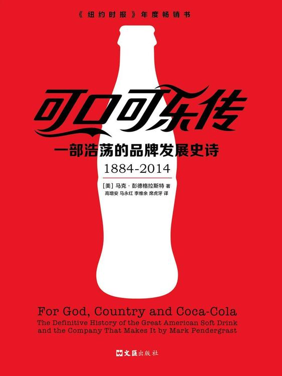

<svg xmlns="http://www.w3.org/2000/svg" xmlns:xlink="http://www.w3.org/1999/xlink" version="1.1" width="100%" height="100%" viewbox="0 0 563 751" preserveaspectratio="none">

<image width="563" height="751" xlink:href="cover.jpeg"></image>
</svg>

目录

[︱作者自序︱ 一个发生在1985年1月1日的故事](#part0004.html)

【新书免费分享微信ghw1361】

[︱第一部分︱ 最初（1886-1899年）](#part0005.html)

[第1章 时间隧道——骗子的黄金岁月](#part0006.html)

[美国——一个神经质的国家](#part0006.html_sigil_toc_id_1)

[秘方药大展销](#part0006.html_sigil_toc_id_2)

[广告风潮](#part0006.html_sigil_toc_id_3)

[君子爱财，取之有道](#part0006.html_sigil_toc_id_4)

[镀金岁月里的冷饮料](#part0006.html_sigil_toc_id_5)

[第2章 弗洛伊德、利奥教皇和彭伯顿的共同点](#part0007.html)

[中庸的教育](#part0007.html_sigil_toc_id_6)

[“甜美的南方人”香水与红疹治疗](#part0007.html_sigil_toc_id_7)

【新书免费分享微信ghw1361】

[凤凰城的生活](#part0007.html_sigil_toc_id_8)

[古柯找到了自己的位置](#part0007.html_sigil_toc_id_9)

[马利安尼酒：一代神饮](#part0007.html_sigil_toc_id_10)

[彭伯顿的法国古柯酒：精仿品？](#part0007.html_sigil_toc_id_11)

[吗啡毒瘾](#part0007.html_sigil_toc_id_12)

[早期的预警信号](#part0007.html_sigil_toc_id_13)

[禁酒令的困扰](#part0007.html_sigil_toc_id_14)

[弗兰克・鲁滨逊的降临](#part0007.html_sigil_toc_id_15)

[可口可乐实验室](#part0007.html_sigil_toc_id_16)

[在萨凡纳的演讲](#part0007.html_sigil_toc_id_17)

[历史上著名的命名之争](#part0007.html_sigil_toc_id_18)

[早期的成功](#part0007.html_sigil_toc_id_19)

[第3章 纠缠不清的产权问题](#part0008.html)

[弗兰克・鲁滨逊大吃一惊](#part0008.html_sigil_toc_id_20)

[维纳布尔和朗兹转卖可口可乐股份](#part0008.html_sigil_toc_id_21)

【新书免费分享微信ghw1361】

[约瑟夫・雅各布斯搅浑一池春水](#part0008.html_sigil_toc_id_22)

[彭伯顿东山再起](#part0008.html_sigil_toc_id_23)

[阿萨・坎德勒加盟可口可乐](#part0008.html_sigil_toc_id_24)

[查尔斯・彭伯顿主张自己的长子继承权](#part0008.html_sigil_toc_id_25)

[不为人知的可口可乐公司](#part0008.html_sigil_toc_id_26)

[阿萨致沃伦的信](#part0008.html_sigil_toc_id_27)

[最后一击](#part0008.html_sigil_toc_id_28)

[伪造签名与其他奇闻逸事](#part0008.html_sigil_toc_id_29)

[第4章 阿萨・坎德勒——他的成功和头痛](#part0009.html)

[少年学徒](#part0009.html_sigil_toc_id_30)

[工作狂老板的女儿](#part0009.html_sigil_toc_id_31)

[阿萨结缘亚特兰大](#part0009.html_sigil_toc_id_32)

[阿萨的小毛病](#part0009.html_sigil_toc_id_33)

[通往可口可乐之路](#part0009.html_sigil_toc_id_34)

[1889年的阿萨帝国](#part0009.html_sigil_toc_id_35)

[1890年：决策之年](#part0009.html_sigil_toc_id_36)

[无名英雄鲁滨逊](#part0009.html_sigil_toc_id_37)

[可卡因风波再起](#part0009.html_sigil_toc_id_38)

[神秘的配方](#part0009.html_sigil_toc_id_39)

[公司注册（再次注册）](#part0009.html_sigil_toc_id_40)

[与肯特可口可乐的冲突](#part0009.html_sigil_toc_id_41)

[可口可乐开始腾飞](#part0009.html_sigil_toc_id_42)

[坎德勒和他的儿子们](#part0009.html_sigil_toc_id_43)

[风靡全国](#part0009.html_sigil_toc_id_44)

[“直至恶贯满盈之时”](#part0009.html_sigil_toc_id_45)

[从药品到饮料的转变](#part0009.html_sigil_toc_id_46)

[成长与扩张](#part0009.html_sigil_toc_id_47)

[可口可乐人](#part0009.html_sigil_toc_id_48)

[霍华德的旅行推销生活](#part0009.html_sigil_toc_id_49)

[20世纪前夕](#part0009.html_sigil_toc_id_50)

【新书免费分享微信ghw1361】

[遗漏的一环](#part0009.html_sigil_toc_id_51)

[第5章 瓶装可口可乐——世界上最愚蠢却又最聪明的交易](#part0010.html)

[放弃瓶装权](#part0010.html_sigil_toc_id_52)

[世纪之交的瓶装](#part0010.html_sigil_toc_id_53)

[瓜分美国市场](#part0010.html_sigil_toc_id_54)

[赫克和普拉特：来自德国的叛徒，变节的小人](#part0010.html_sigil_toc_id_55)

[早期销售策略](#part0010.html_sigil_toc_id_56)

[修订合同条款](#part0010.html_sigil_toc_id_57)

[使用童工与掺假糖浆](#part0010.html_sigil_toc_id_58)

[瓶装商：是创新还是剽窃？](#part0010.html_sigil_toc_id_59)

[意外转折](#part0010.html_sigil_toc_id_60)

[︱第二部分︱ 异教徒和真信徒（1900-1922年）](#part0011.html)

[第6章 突出重围](#part0012.html)

[广告大战](#part0012.html_sigil_toc_id_61)

[可口可乐研讨会](#part0012.html_sigil_toc_id_62)

[沃伦・坎德勒主教的祝福](#part0012.html_sigil_toc_id_63)

[阿萨浮沉录](#part0012.html_sigil_toc_id_64)

[《科利尔周报》上的可口可乐](#part0012.html_sigil_toc_id_65)

[瓶装业步入繁荣时代](#part0012.html_sigil_toc_id_66)

[瓶子里的臭虫](#part0012.html_sigil_toc_id_67)

[讨厌的跟随者](#part0012.html_sigil_toc_id_68)

[哈罗德・赫希出手解围](#part0012.html_sigil_toc_id_69)

[完美的包装瓶出笼](#part0012.html_sigil_toc_id_70)

[多布斯挑战鲁滨逊](#part0012.html_sigil_toc_id_71)

[来自哈维・威利的威胁](#part0012.html_sigil_toc_id_72)

[第7章 威利博士的介入](#part0013.html)

[《纯净食品和药品法案》通过](#part0013.html_sigil_toc_id_73)

[威利向“麻醉药”宣战](#part0013.html_sigil_toc_id_74)

[基督教妇女禁酒联合会参与论战](#part0013.html_sigil_toc_id_75)

[萨姆・多布斯巧遇艾伦夫人](#part0013.html_sigil_toc_id_76)

[基布勒副主管游历南方](#part0013.html_sigil_toc_id_77)

[威利进攻受挫](#part0013.html_sigil_toc_id_78)

[最终获得批准](#part0013.html_sigil_toc_id_79)

[间谍战与反间谍战](#part0013.html_sigil_toc_id_80)

[法庭审判](#part0013.html_sigil_toc_id_81)

[威利的讨伐](#part0013.html_sigil_toc_id_82)

[物归原主](#part0013.html_sigil_toc_id_83)

[休斯法官的最后一击](#part0013.html_sigil_toc_id_84)

[毁灭危机隐现](#part0013.html_sigil_toc_id_85)

[第8章 险恶的辛迪加](#part0014.html)

[阿萨・坎德勒市长](#part0014.html_sigil_toc_id_86)

[权杖交接](#part0014.html_sigil_toc_id_87)

[战争时期的糖供应](#part0014.html_sigil_toc_id_88)

[伍德拉夫辛迪加](#part0014.html_sigil_toc_id_89)

[阿萨的苦命](#part0014.html_sigil_toc_id_90)

[反抗序言](#part0014.html_sigil_toc_id_91)

[第9章 可口可乐内战](#part0015.html)

[赫希身陷困境](#part0015.html_sigil_toc_id_92)

[由爱变恨](#part0015.html_sigil_toc_id_93)

[法庭闹剧](#part0015.html_sigil_toc_id_94)

[黑暗的1920年夏天](#part0015.html_sigil_toc_id_95)

[一丝光明](#part0015.html_sigil_toc_id_96)

【新书免费分享微信ghw1361】

[哈里森・琼斯解围](#part0015.html_sigil_toc_id_97)

[阿尔奇・李追逐理想](#part0015.html_sigil_toc_id_98)

[新董事长：罗伯特・伍德拉夫](#part0015.html_sigil_toc_id_99)

[︱第三部分︱ 黄金时代（1923-1949年）](#part0016.html)

[第10章 罗伯特・伍德拉夫——掌舵的老板](#part0017.html)

[早期跌宕起伏的职业生涯](#part0017.html_sigil_toc_id_100)

[老板其人](#part0017.html_sigil_toc_id_101)

[20世纪的变革](#part0017.html_sigil_toc_id_102)

[喧嚣的20年代广告](#part0017.html_sigil_toc_id_103)

[市场调研](#part0017.html_sigil_toc_id_104)

[加油站、六瓶盒和黑寡妇蜘蛛](#part0017.html_sigil_toc_id_105)

[可口可乐的标准化运动](#part0017.html_sigil_toc_id_106)

[海外扩张的萌芽](#part0017.html_sigil_toc_id_107)

[欠谨慎的卖空](#part0017.html_sigil_toc_id_108)

[第11章 欣快的萧条与百事可乐的扩张](#part0018.html)

[盛大的50周年庆典](#part0018.html_sigil_toc_id_109)

[利用萧条时期造势](#part0018.html_sigil_toc_id_110)

[可口可乐进军电影业](#part0018.html_sigil_toc_id_111)

[与艾达・艾伦一起享受家庭生活](#part0018.html_sigil_toc_id_112)

[为圣诞老人穿上红衣服](#part0018.html_sigil_toc_id_113)

[无线电广播充分发展](#part0018.html_sigil_toc_id_114)

[达西员工的压力](#part0018.html_sigil_toc_id_115)

[保护神圣的商标](#part0018.html_sigil_toc_id_116)

[伍德拉夫沉着的策略](#part0018.html_sigil_toc_id_117)

[斯塔布斯和法利的旅行推销生涯](#part0018.html_sigil_toc_id_118)

[美国食品药品管理局](#part0018.html_sigil_toc_id_119)

[百事可乐的复苏](#part0018.html_sigil_toc_id_120)

[沃尔特・马克接手全世界的诉讼案件](#part0018.html_sigil_toc_id_121)

[木已成舟](#part0018.html_sigil_toc_id_122)

[第12章 可口可乐的二战传奇](#part0019.html)

[为这些小伙子们建立必要的士气](#part0019.html_sigil_toc_id_123)

[可口可乐上校](#part0019.html_sigil_toc_id_124)

[普遍的嗜好](#part0019.html_sigil_toc_id_125)

[搭上特快列车](#part0019.html_sigil_toc_id_126)

[“技术观察员们赢得了这场战争”](#part0019.html_sigil_toc_id_127)

[大后方与暗号](#part0019.html_sigil_toc_id_128)

[让阿克林痛苦不堪的战争](#part0019.html_sigil_toc_id_129)

[沃尔特・马克我行我素](#part0019.html_sigil_toc_id_130)

[来自战时的证据](#part0019.html_sigil_toc_id_131)

[开幕典礼、碳酸饮料和圣酒](#part0019.html_sigil_toc_id_132)

[绝缘体、香蒂饮料和小便器](#part0019.html_sigil_toc_id_133)

[病菌](#part0019.html_sigil_toc_id_134)

[爱国也要赚钱](#part0019.html_sigil_toc_id_135)

[为苏联红军生产白色可乐](#part0019.html_sigil_toc_id_136)

[流氓、取样与女人](#part0019.html_sigil_toc_id_137)

[普遍接受可乐](#part0019.html_sigil_toc_id_138)

[第13章 关于可口可乐](#part0020.html)

[与基思和希特勒同在的景气年份](#part0020.html_sigil_toc_id_139)

[可口可乐与柏林奥林匹克运动会](#part0020.html_sigil_toc_id_140)

[反击“犹太诽谤”](#part0020.html_sigil_toc_id_141)

[进入纳粹的中心](#part0020.html_sigil_toc_id_142)

[炸毁的瓶装厂](#part0020.html_sigil_toc_id_143)

[技术观察员的入侵](#part0020.html_sigil_toc_id_144)

[伟大的白种雅利安人希望成为可口可乐人](#part0020.html_sigil_toc_id_145)

[︱第四部分︱ 乐土上的烦恼（1950-1979年）](#part0021.html)

[第14章 可口可乐公司的海外政策](#part0022.html)

[上帝，保佑这个瓶子吧](#part0022.html_sigil_toc_id_146)

[我们的拉丁美洲邻居](#part0022.html_sigil_toc_id_147)

[弗兰克・哈罗德历险记](#part0022.html_sigil_toc_id_148)

[文明的边界](#part0022.html_sigil_toc_id_149)

[第15章 打破常规](#part0023.html)

[老板的宠儿艾克](#part0023.html_sigil_toc_id_150)

[为可口可乐的5美分售价而战](#part0023.html_sigil_toc_id_151)

[关于新鞋的寓言故事](#part0023.html_sigil_toc_id_152)

[亲爱的斯蒂尔的马戏团](#part0023.html_sigil_toc_id_153)

[可口可乐迈入电视时代](#part0023.html_sigil_toc_id_154)

[兵来将挡](#part0023.html_sigil_toc_id_155)

[鲁滨逊体制](#part0023.html_sigil_toc_id_156)

[与学者们一起探究潜意识](#part0023.html_sigil_toc_id_157)

[一个全新的世界](#part0023.html_sigil_toc_id_158)

[白璧微瑕](#part0023.html_sigil_toc_id_159)

[颠覆传统的妇女、叛逆的青少年、种族冲突中不愉快的黑人](#part0023.html_sigil_toc_id_160)

[黑色星期五和“血迹未干的”椅子](#part0023.html_sigil_toc_id_161)

[疯狂年代的终结](#part0023.html_sigil_toc_id_162)

[第16章 奥斯汀喧嚣的20世纪60年代](#part0024.html)

[以广告主旨努力](#part0024.html_sigil_toc_id_163)

[最杰出、最能干的保罗・奥斯汀](#part0024.html_sigil_toc_id_164)

[压缩历史的日本人](#part0024.html_sigil_toc_id_165)

[追赶减肥狂潮的步伐](#part0024.html_sigil_toc_id_166)

[可口可乐的“黑色风波”](#part0024.html_sigil_toc_id_167)

[一个伟大时代的来临](#part0024.html_sigil_toc_id_168)

[美国的多事之秋](#part0024.html_sigil_toc_id_169)

[营养学和糖精冲突造成的恐慌](#part0024.html_sigil_toc_id_170)

【新书免费分享微信ghw1361】

[第17章 可口可乐公司寝食不安](#part0025.html)

[联邦贸易委员会的抨击](#part0025.html_sigil_toc_id_171)

[教全世界唱歌](#part0025.html_sigil_toc_id_172)

[怀古情怀](#part0025.html_sigil_toc_id_173)

[查尔斯・邓肯在阳光下的时光](#part0025.html_sigil_toc_id_174)

[托马斯公司与联邦贸易委员会共舞](#part0025.html_sigil_toc_id_175)

[逆境求生](#part0025.html_sigil_toc_id_176)

[从可口可乐公司崛起的古巴人](#part0025.html_sigil_toc_id_177)

[日本的“紫色”风波](#part0025.html_sigil_toc_id_178)

[伪装大师](#part0025.html_sigil_toc_id_179)

[与卡特总统的关系](#part0025.html_sigil_toc_id_180)

[打开世界的大门](#part0025.html_sigil_toc_id_181)

[百事可乐的卑劣挑战](#part0025.html_sigil_toc_id_182)

[祸不单行](#part0025.html_sigil_toc_id_183)

[可口可乐与血腥的暴乱](#part0025.html_sigil_toc_id_184)

[修改神圣的合同条款](#part0025.html_sigil_toc_id_185)

[大联欢](#part0025.html_sigil_toc_id_186)

[权力之争](#part0025.html_sigil_toc_id_187)

[步入20世纪80年代](#part0025.html_sigil_toc_id_188)

[︱第五部分︱ 郭思达的全球化时代（1980-1997年）](#part0026.html)

[第18章 郭思达的实力](#part0027.html)

[新秀郭思达](#part0027.html_sigil_toc_id_189)

[让昏昏欲睡的巨人动起来](#part0027.html_sigil_toc_id_190)

[玉米糖浆和“不顺从者”的愤怒](#part0027.html_sigil_toc_id_191)

[同瓶装商们一起积极进取](#part0027.html_sigil_toc_id_192)

[发现更好的健怡可乐](#part0027.html_sigil_toc_id_193)

[奥斯汀的贡献](#part0027.html_sigil_toc_id_194)

[打破神圣不可侵犯的禁忌](#part0027.html_sigil_toc_id_195)

[菲律宾：大败百事可乐](#part0027.html_sigil_toc_id_196)

[杰西・杰克逊与可口可乐](#part0027.html_sigil_toc_id_197)

[这就是可口可乐！](#part0027.html_sigil_toc_id_198)

[影视制作多元化](#part0027.html_sigil_toc_id_199)

[健怡可乐闪亮登场](#part0027.html_sigil_toc_id_200)

[辉煌的日子](#part0027.html_sigil_toc_id_201)

[1984年](#part0027.html_sigil_toc_id_202)

[第19章 世纪性营销错误](#part0028.html)

[罗伯特・伍德拉夫的愿望](#part0028.html_sigil_toc_id_203)

[“碉堡”里的思想火花](#part0028.html_sigil_toc_id_204)

[灾难性的新闻发布会](#part0028.html_sigil_toc_id_205)

[这曾经的可乐](#part0028.html_sigil_toc_id_206)

[漫长而干燥的6月](#part0028.html_sigil_toc_id_207)

[老可口可乐的回归](#part0028.html_sigil_toc_id_208)

[激烈的法庭争论与其他灾难](#part0028.html_sigil_toc_id_209)

[这都是可口可乐](#part0028.html_sigil_toc_id_210)

[昂贵的历史教训](#part0028.html_sigil_toc_id_211)

[第20章 大型红色自动饮料售货机](#part0029.html)

[客观评价20世纪80年代中期](#part0029.html_sigil_toc_id_212)

[财务奇才艾弗斯特](#part0029.html_sigil_toc_id_213)

[关注海外市场](#part0029.html_sigil_toc_id_214)

[饮料销售三要素](#part0029.html_sigil_toc_id_215)

[49％的解决方案](#part0029.html_sigil_toc_id_216)

[安抚不切实际的社会改良家](#part0029.html_sigil_toc_id_217)

[四月惨败](#part0029.html_sigil_toc_id_218)

[这次不再是闹着玩的](#part0029.html_sigil_toc_id_219)

[可口可乐无处不在](#part0029.html_sigil_toc_id_220)

[挡不住的诱惑](#part0029.html_sigil_toc_id_221)

[存在的力量](#part0029.html_sigil_toc_id_222)

[我们将为你建设一个更加美好的世界](#part0029.html_sigil_toc_id_223)

[摇滚音乐、体育运动与可口可乐](#part0029.html_sigil_toc_id_224)

[创建软饮料的天堂](#part0029.html_sigil_toc_id_225)

[振兴法国市场](#part0029.html_sigil_toc_id_226)

[宝矿力水特和慕科斯畅销日本](#part0029.html_sigil_toc_id_227)

[回归基业](#part0029.html_sigil_toc_id_228)

[默里・施瓦茨：厌倦了可口可乐？](#part0029.html_sigil_toc_id_229)

[重游“山顶”](#part0029.html_sigil_toc_id_230)

[不可忽视的产品](#part0029.html_sigil_toc_id_231)

[第21章 地球村的饮料](#part0030.html)

[全球闪电战](#part0030.html_sigil_toc_id_232)

[后院起火](#part0030.html_sigil_toc_id_233)

[可口可乐呼唤好莱坞](#part0030.html_sigil_toc_id_234)

[“阿雅可乐”的回归](#part0030.html_sigil_toc_id_235)

[可口可乐进入新时代](#part0030.html_sigil_toc_id_236)

[推进可口可乐品牌](#part0030.html_sigil_toc_id_237)

[狼性的艾弗斯特](#part0030.html_sigil_toc_id_238)

[数之不尽的机会](#part0030.html_sigil_toc_id_239)

[可口可乐奥运会](#part0030.html_sigil_toc_id_240)

[1996年：胜利之年](#part0030.html_sigil_toc_id_241)

[巅峰之亡](#part0030.html_sigil_toc_id_242)

[︱第六部分︱ 平息一切渴望（1997-2014年）](#part0031.html)

[第22章 艾弗斯特接手了一个烫手山芋](#part0032.html)

[百事可乐卷土重来](#part0032.html_sigil_toc_id_243)

[可口可乐公司的艰难征途](#part0032.html_sigil_toc_id_244)

[比利时的群众性恐慌](#part0032.html_sigil_toc_id_245)

[一切的意义就是全球化，傻瓜](#part0032.html_sigil_toc_id_246)

[艾弗斯特突然离职](#part0032.html_sigil_toc_id_247)

[第23章 达夫特进退维谷](#part0033.html)

[大刀阔斧的战略整顿工作](#part0033.html_sigil_toc_id_248)

[为黑人讨回公道](#part0033.html_sigil_toc_id_249)

[“这就是他们的最高水平？”](#part0033.html_sigil_toc_id_250)

[摇摇欲坠和失败](#part0033.html_sigil_toc_id_251)

[为了保住胜利](#part0033.html_sigil_toc_id_252)

[可口可乐和非法军事组织](#part0033.html_sigil_toc_id_253)

[印度的饮水问题](#part0033.html_sigil_toc_id_254)

[麦加可乐和美国入侵伊拉克](#part0033.html_sigil_toc_id_255)

[裁员和举报](#part0033.html_sigil_toc_id_256)

[努力跟上步伐](#part0033.html_sigil_toc_id_257)

[疲惫不堪](#part0033.html_sigil_toc_id_258)

[“业务功能失调的经典案例”](#part0033.html_sigil_toc_id_259)

[第24章 力挽狂澜](#part0034.html)

[打破沉默](#part0034.html_sigil_toc_id_260)

[可口可乐宣言](#part0034.html_sigil_toc_id_261)

[转型的一年](#part0034.html_sigil_toc_id_262)

[烽烟四起](#part0034.html_sigil_toc_id_263)

[转折点](#part0034.html_sigil_toc_id_264)

[商业间谍、农药和谈判](#part0034.html_sigil_toc_id_265)

[与瓶装商的紧张局势](#part0034.html_sigil_toc_id_266)

[撤离学校](#part0034.html_sigil_toc_id_267)

[继承人](#part0034.html_sigil_toc_id_268)

[卸下目标重任](#part0034.html_sigil_toc_id_269)

[可口可乐新世界](#part0034.html_sigil_toc_id_270)

[第25章 突飞猛进](#part0035.html)

[北京奥运会](#part0035.html_sigil_toc_id_271)

[精简、高效和积极的“快乐”](#part0035.html_sigil_toc_id_272)

[2020年愿景](#part0035.html_sigil_toc_id_273)

[积极生活](#part0035.html_sigil_toc_id_274)

[消极对待](#part0035.html_sigil_toc_id_275)

[旧事重演、报复和危地马拉谋杀案](#part0035.html_sigil_toc_id_276)

[瓶装水危机和汽水税](#part0035.html_sigil_toc_id_277)

[快乐大使](#part0035.html_sigil_toc_id_278)

[修复北美市场](#part0035.html_sigil_toc_id_279)

[赢得可乐大战的胜利](#part0035.html_sigil_toc_id_280)

【新书免费分享微信ghw1361】

[第26章 世界无止境？](#part0036.html)

[新的宗教信仰](#part0036.html_sigil_toc_id_281)

[哈维・威利的阴影](#part0036.html_sigil_toc_id_282)

[全球可口可乐文化](#part0036.html_sigil_toc_id_283)

[可口可乐政治](#part0036.html_sigil_toc_id_284)

[重生](#part0036.html_sigil_toc_id_285)

[︱附录︱ 可口可乐的35条管理经典](#part0037.html)

 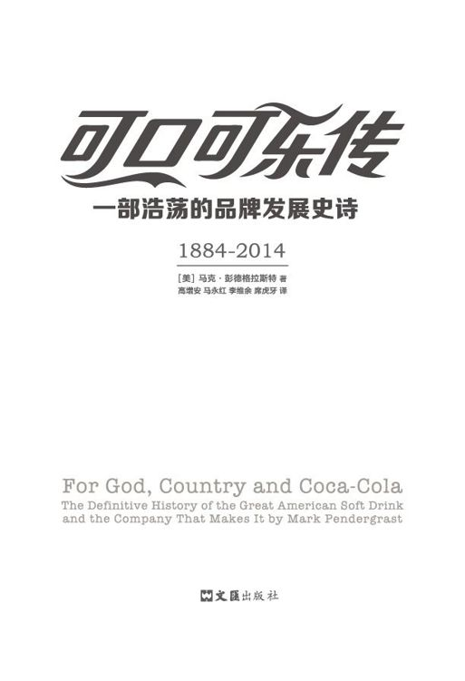

 图书在版编目（CIP）数据

 可口可乐传 : 一部浩荡的品牌发展史诗 / (美) 马

克·彭德格拉斯特 (Mark Pendergrast) 著 ; 高增安等译.

-- 上海 : 文汇出版社, 2017.7

 ISBN 978-7-5496-2146-0

\

 Ⅰ. ①可… Ⅱ. ①马… ②高… Ⅲ. ①可口可乐公司－

企业史 Ⅳ. ①F471.268

 中国版本图书馆CIP数据核字（2017）第123646号

\

FOR GOD, COUNTRY, AND COCA-COLA, 3rd Edition by Mark Pendergrast

Copyright © 2013 by Mark Pendergrast

Simplified Chinese translation copyright ©2017 by Shanghai Dook
Publishing Co., Ltd.

This edition published by arrangement with Basic Books, an imprint of
Perseus Books, LLC,

a subsidiary of Hachette Book Group, Inc., New York, New York, USA.

through Bardon-Chinese Media Agency

ALL RIGHTS RESERVED

\

中文版权 © 2017上海读客图书有限公司

经授权，上海读客图书有限公司拥有本书的中文（简体）版权

图字：09-2017-247号

\

可口可乐传 : 一部浩荡的品牌发展史诗

\

作  者 ／ 马克·彭德格拉斯特

译  者 ／ 高增安等

\

责任编辑 ／ 周小诠

特邀编辑 ／ 袁海红 姜一鸣

封面装帧 ／ 周丁乾

\

出版发行 ／ 出版社

社  址 ／ 上海市威海路 755 号

邮  编 ／ （邮政编码 200041）

经  销 ／ 全国新华书店

印刷装订 ／ 北京中科印刷有限公司

版  次 ／ 2017 年 7 月第 1 版

印  次 ／ 2017 年 7 月第 1 次印刷

开  本 ／ 680×990mm 1/16

字  数 ／ 654 千字

印  张 ／ 45

\

ISBN 978-7-5496-2146-0

定  价 ／ 168.00 元

\

侵权必究

装订质量问题，请致电010-85866447（免费更换，邮寄到付）

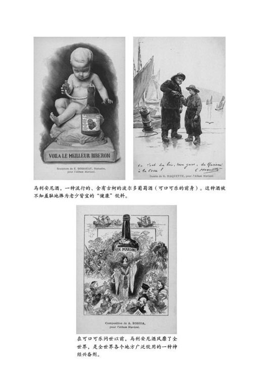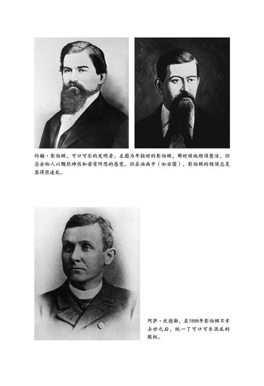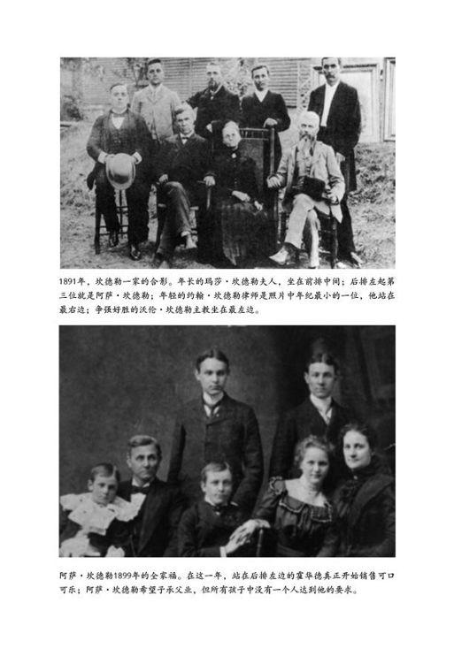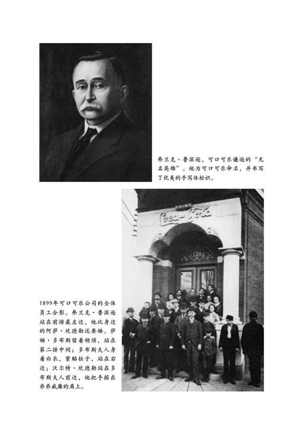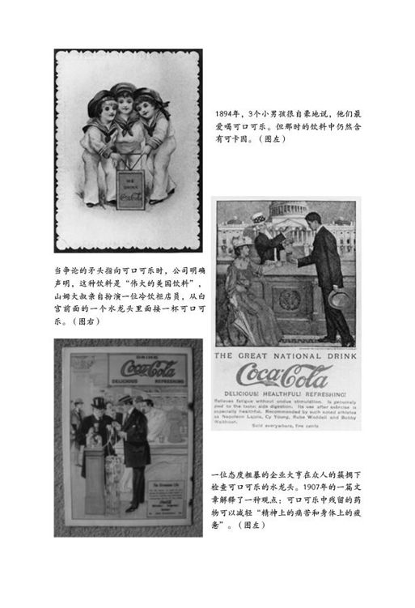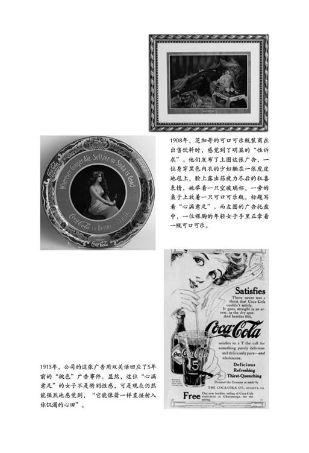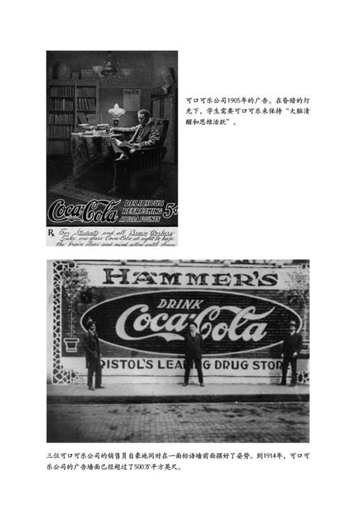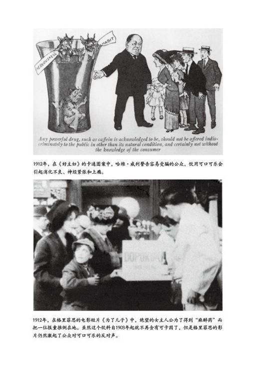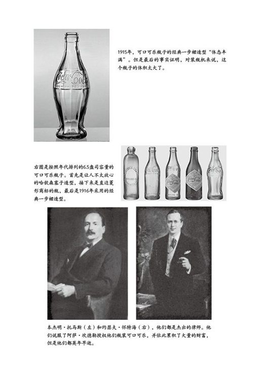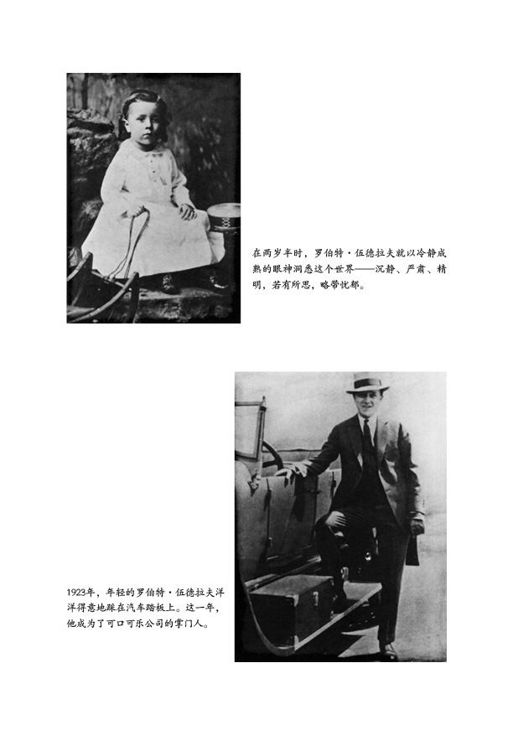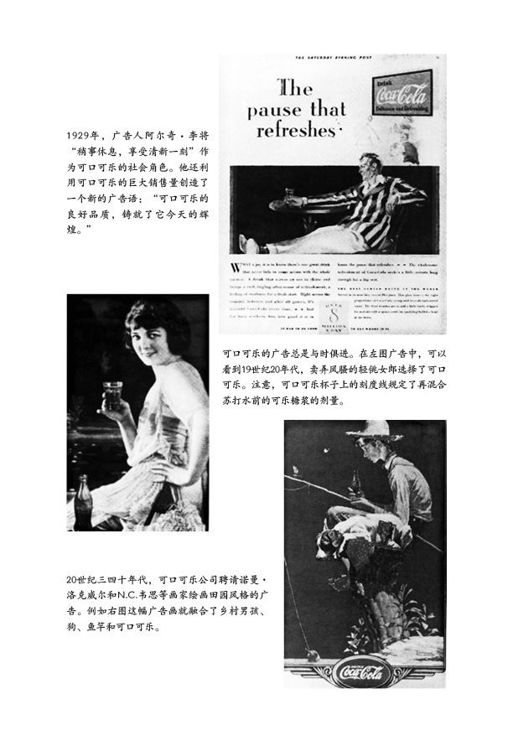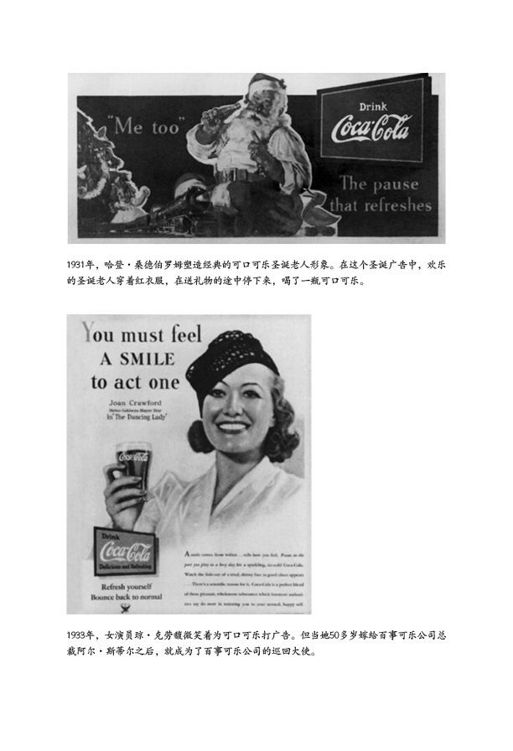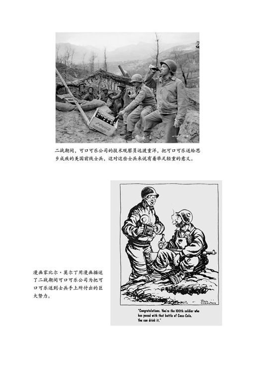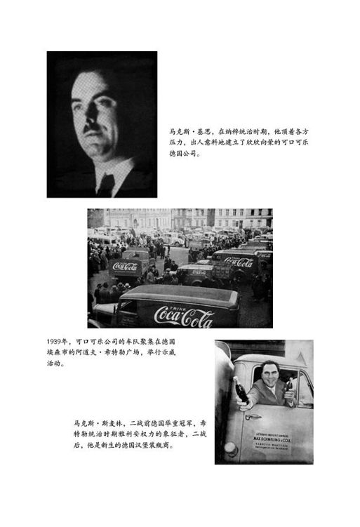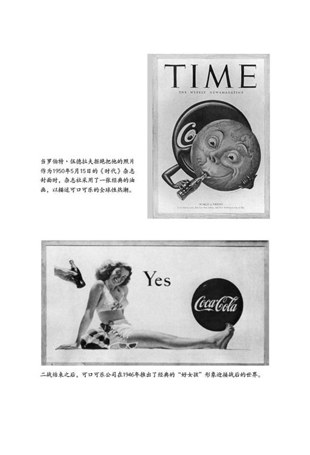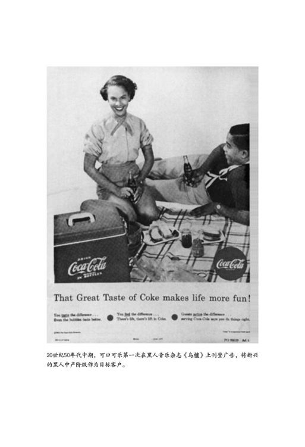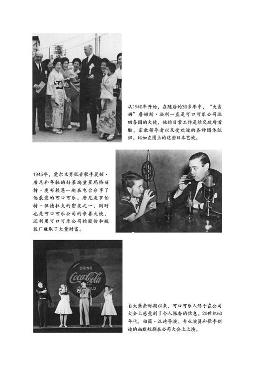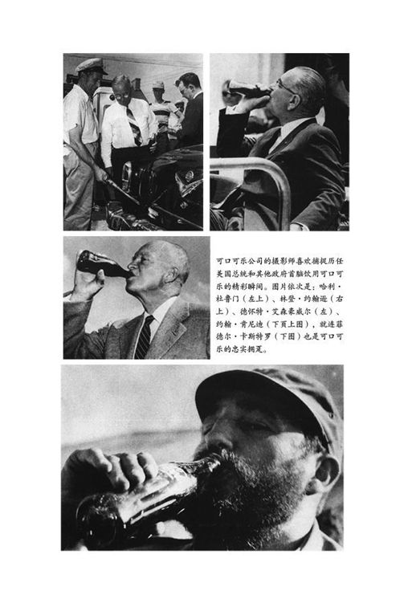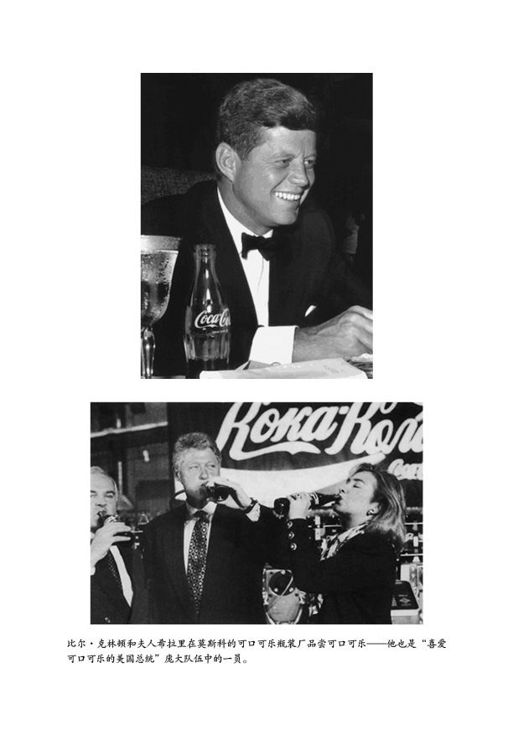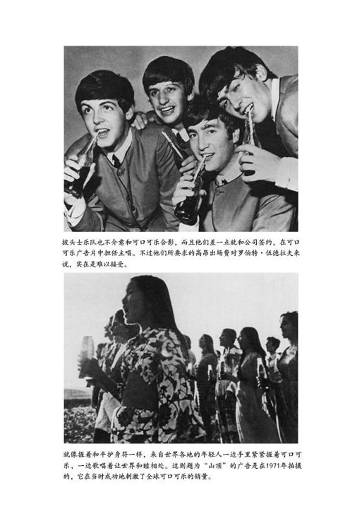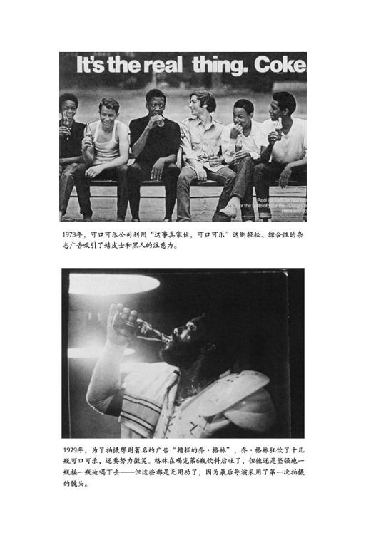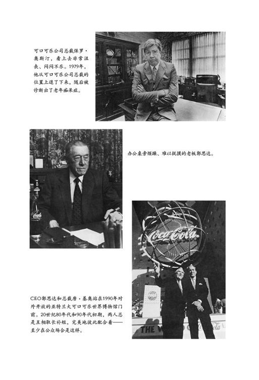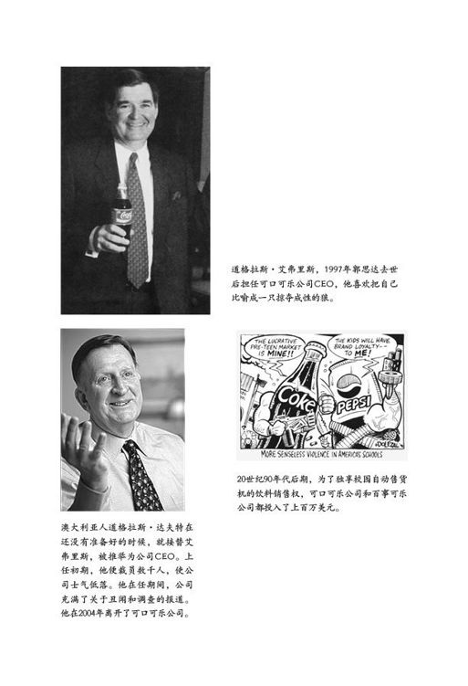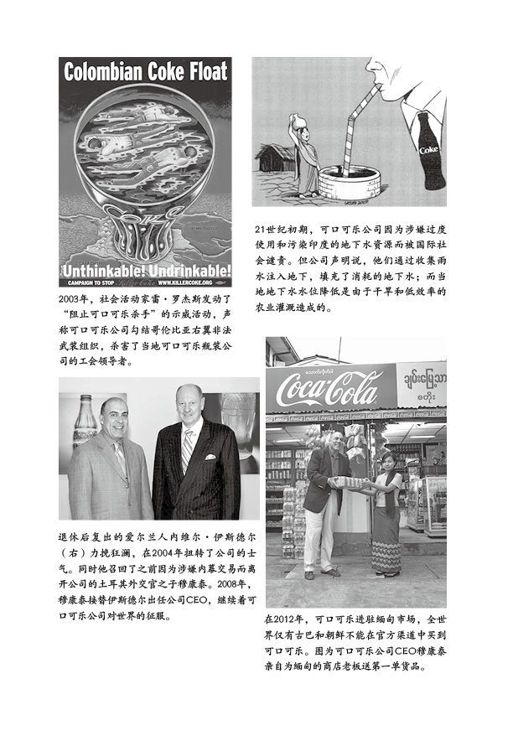

\

\

## ︱作者自序︱   一个发生在1985年1月1日的故事

\

\

老板是个行将就木的老人。他的一生都在做着各种各样的管理决策；尽管大脑现在还勉强管用，但却受到日益衰老的严重影响。他的感官在慢慢退化：视力模糊，神志恍惚，有气无力，就连嘴上衔着的雪茄熄灭了也不知道——那可是他大半辈子最重要的标志啊！他的听觉几乎丧失殆尽，他说的单词很少是超过一个音节的。

罗伯特・伍德拉夫已是95岁高龄，比起他一手打造的世界最著名的可口可乐软饮料来说，他还要年轻4岁。六十多年来，伍德拉夫一直掌控着可口可乐的命运。即使到了这风烛残年之际，随着罗伯特和他的可口可乐演变成为世纪性的标志，公司的每一个重要决策仍然需要得到他的首肯。

一个身着细条纹西服的年轻男士屏退侍从，独自走到老人床边。在作出可口可乐有史以来最具有革命性的决策之前，他希望首先得到老人的祝福。

他就是古巴籍的化学工程师郭思达，也是可口可乐公司第一位出生于外国的CEO。他计划在可口可乐一百周年诞辰的前一年改变可口可乐的配方。虽然改变世界上最为机密的可口可乐配方是一个极端冒险的行为，但是他自认为理由十分充足。现在，他正在不慌不忙、有条理地向老板解释他的理由。更多的时候，他需要大声叫喊，以确保老板能够听得清楚。

伍德拉夫一动不动地听着。

郭思达的解释充满了数据统计、百分比、市场份额分析等内容，还提到了口感盲测的事情。但其实质只有一点，那就是郭思达不断大声、清楚地重复的内容：大多数软饮料消费者更喜欢百事可乐的口感。虽然这个差别很小，但不能忽视它的存在。无论可口可乐多付出多少广告费用，无论可口可乐的营销渠道有多好，百事可乐的市场份额始终都在缓缓上升，甚至在超市的销量已经超过了可口可乐，并且正在逼近可口可乐一直占优势的喷泉式饮水器和小贩售卖等渠道的销量。

改变可口可乐口感的时机到了。它曾经有过辉煌，但这已经一去不复返，消费者的口味变了，行业也变了，商界不存在永久的神。可口可乐公司的这位化学工程师已经配制出了一个新口感的配方。在口感盲测中，这个新配方持续动摇着百事可乐的地位，甚至连传统的可口可乐也无以匹敌。郭思达强调，推出新可口可乐的时机已经成熟，而且这个机会稍纵即逝。

最后，年轻人归于沉默，等待老人的反应。老人衔着的雪茄一直没有动过。老人目光闪烁。窗外，新年第一天的雨正在淅淅沥沥地下着。

伍德拉夫的眼睛缓缓睁开，雪茄也跟着颤动起来。沉默中，时间也停滞了。最后，老板叹息一声，用刺耳的声音说道：“做吧。”然后缓缓闭上了眼睛。

郭思达笑了。伍德拉夫一直很看重他，把他当作继任者来培养。他们常常共进午餐，彼此间已经形成了特殊的默契。对郭思达来说，老板的首肯是相当有分量的。人们都说，伍德拉夫讨厌变革。但是郭思达知道，他只是需要人们用最简单的话语把事情解释清楚。这就好像健怡可乐，你只管看看它做得有多好就知道了。郭思达向老板道谢，说很快还会再来探望他，然后转身走了。

郭思达确信他的决策是正确的，这不是由于他所列举的那些事实或者数据，而是由于他的笃定。他必须是对的，但这并不意味着他的老板就要活到他的新配方可口可乐上市的那一天。不久后，老人就停止了进食。两个月之后，也就是新可口可乐上市的前一个月，罗伯特・伍德拉夫去世了。他绝不会知道，因可口可乐口味的改变而带来的喧嚣即将开始。但那并不是不可想象的，因为伍德拉夫勉强还能运转的大脑已经隐约猜到了这样的情形。

整整三个月，固执的可口可乐公司管理层成天都被成千上万的电话和信件所困扰，所有的来电来函都要求恢复可口可乐的传统口味。媒体上也尽是愤怒的报道。郭思达希望通过等待来使纷扰渐渐平息，但是事与愿违。他静观其变的结果是，一切都愈演愈烈。

很明显，可口可乐公司的这位古巴领导者和他的管理团队、市场分析人员以及广告人员都错了。他们认为。新可口可乐是否能够更顺利地赢得消费者的接受并不重要。

二战期间，在美国步兵寄给可口可乐公司的信件中很清楚地道出了可口可乐最重要的东西：可口可乐是大家的老朋友，是日常生活的一部分，是美国人的护身符，是大众的偶像。这次的纷扰与二战时的情形不同。二战期间，消费者的来信主要表达的是由衷的谢意，而这次的来信表达的却是被出卖的感受：

“改变可口可乐的口味就好比上帝要把青草变成紫色。”

“即使你当着我们的面，在屋前把公司的旗子烧掉，我也不会感觉更不安。”

郭思达和他的管理团队被人上了一堂快餐式的、尖锐无比的课，他们最终屈服了，传统可口可乐重新回到了人们的生活中，大家充满了感激。

可口可乐的问题不在口感，也不在营销调查或者焦点小组。

问题在于上帝。

问题在于国家。

问题在于可口可乐。

\

\

## ︱第一部分︱ 最初（1886-1899年）

\

\

\

\

那是1885年一个炎热的夏天。

一个高大的小胡子男人站在亚特兰大最繁华的街道之一——玛丽埃塔大街——的路口踌躇着，马车和汽车与鹅卵石地面相互撞击发出“咔嗒咔嗒”的响声；商人们匆匆而过；盛装打扮的妇女撑着太阳伞，悠闲地到转角处的雅各布斯药房去买冰激凌苏打水；报童扯着嗓子叫卖着，“快来看！亚特兰大禁酒令与万恶的赋税血拼！禁酒工人集会！歌剧院的反禁酒演讲失败！快来看呀！”

“小孩儿，给我来份报纸。”那个高大的男人摸出钱包对报童说着，然后暂时忘却了喧嚣的马路，开始看起报纸来。有一篇关于酒精饮料特许证的社论：

\

在上帝和人类之间横着累累罪行：它滋生着、培养着、祈求着、煽动着并且刺激和加重了人类对酒精的放纵。开放的酒吧里，各个角落都有人将酒杯放在嘴边做最后的怀念。

\

毫无疑问，亚特兰大将会干涸，这只是个时间早晚的问题。

玛丽埃塔大街瞬间变得清冷起来。这个男人将报纸折叠后夹在腋下，然后抢在一辆疾驰而来的汽车之前过了马路。他的实验室在玛丽埃塔大街107号。这人就是可口可乐的发明者约翰・彭伯顿。

他进入实验室后，心满意足地看了看他从秘鲁弄来的新鲜古柯叶和过滤器中盛放的古柯萃取物。他正在研究一种新的配方，希望采用这种配方的饮料和药物可以避开禁酒令的限制，从而上市销售。

约翰・彭伯顿医生当年进行实验、发明可口可乐的时候，年方54岁，但他看起来至少比实际年龄大10岁，而且已经染上了吗啡毒瘾。

\

\

### 第1章   时间隧道——骗子的黄金岁月

【新书免费分享微信ghw1361】

\

\

\

\

为了消闲解闷，我正在做一个小小的实验，准备配置一种专治火眼的药水——这种药水90%是水，只有10%是药，这种药花不到一块钱就可以买来一大桶……第三年，光在国内咱们就可以轻易销售100万瓶。在国内卖出100万瓶——纯利至少也有35万美元——那才是我们真正开始赚钱的时候……你猜怎么着，到那时候，咱们的前方总站就要设在君士坦丁堡，后方总站则要设在辽远的印度！……嗯，只有天知道：每处可以赚个几千万几万万！

——贝里亚・塞勒斯上校，马克・吐温《镀金时代》中的人物

\

\

\

毫无疑问，可口可乐钟爱它自己的历史。1990年，可口可乐公司投资1500万美元在亚特兰大建立博物馆，每天向三千多名可口可乐的忠实粉丝讲述公司过去走高科技路线的发展历史。博物馆开馆那天，新闻发布会把该博物馆称为“梦境”。从很多方面来说，事实确实是这样，比如，身着红色时装、美丽大方的导游向游客保证，可口可乐不含任何可卡因成分。

博物馆保留着可口可乐公司经久不衰的传统。公司的传奇故事几十年如一日地在那里传颂着。在官方的宣传版本中，1886年创建可口可乐公司的那段历史具有霍雷肖・阿尔杰小说的主人公身上所表现出的那些典型的成功实现美国梦的神话的特质。那些主人公是镀金时代满怀憧憬的年轻资本家的楷模，他们虽然出身卑微，但凭着忍耐、坚持不懈的努力和挡不住的好运气，一跃成为巨额财富的宠儿。

与此类似，可口可乐的发明者约翰・彭伯顿被可口可乐公司描绘成一个贫困但可爱的南方老郎中，他在一次偶然中发明了这种神奇的新饮料。当人们推测出可口可乐是诞生在彭伯顿家房舍后院的一个简陋的三脚架水壶里而不是在饲料槽里的时候，这故事就被人们看作是“贞女诞生说”的一种新注脚。可口可乐公司的第一位档案保管员威尔伯・库尔茨描述了可口可乐被发明的那一刻的情景：“他俯身闻了闻壶中酿造物的香味，然后用一个木质长柄勺舀了一点正在冒泡的棕色糖浆，稍微冷却了一下，将勺子慢慢靠近嘴唇，品尝了一下。”跟阿尔杰的小说一样，当彭伯顿无意间在糖浆中混入了碳酸盐而不是清水之后，他的辛劳和坚忍终于获得了回报，当然，其中还包含了运气的成分。顾客喜欢喝泡腾饮料，喝完之后还要心满意足地咂咂嘴。

在可口可乐公司的历史上，自那以后，这个饮料的前景就注定了。当然，这还得谢阿萨・坎德勒的帮助，是他在彭伯顿去世的时候购买了饮料的配方并且广为宣传，他也因此而成为亚特兰大最富有的人。到20世纪早期，可口可乐饮料声名鹊起，被人们反复称颂为“可口可乐罗曼史”。

但是，有关可口可乐历史的官方版本有相当大的虚构成分。约翰・彭伯顿并不是一个没受过教育、俭朴的医生，这个饮料也不是在他家的后院酿制出来的。更重要的是，可口可乐并不是如“官方版本”所说的凭空冒出来的一种饮料。相反，它是时代的产物，是地域的产物，也是文化的产物。事实上，最初的可口可乐也和许多其他秘方一样，是一种专利药品，服用以后有明显的可卡因快感。

但是，关于可口可乐的神话传说似乎有一点是事实的：可口可乐成功的可能性跟塞勒斯上校的那个眼药水一样小。马克・吐温的小说可以说是对可口可乐未来的预言。令人惊讶的是，可口可乐印证了他的说法。时至今日，可口可乐的产品出现在世界近200个国家和地区，比联合国的成员国还要多，因而成为世界上市场最广阔的饮料。除了“OK”以外，“Coca-Cola”是地球上获得最广泛认同的文字，它所代表的可口可乐饮料也成了西方人生活方式的象征。但是在仅仅一个多世纪的时间内，一种99%的成分是糖水的软饮料怎么能够取得如此辉煌的成就呢？19世纪晚期美国的国情在很大程度上决定了可口可乐的未来。

\

\

#### 美国——一个神经质的国家

\

在镀金时代，美国从一个农业社会转型成为以工厂为主的都市化社会，这是美国历史上最彻底的变革。以美国内战作为催化剂和转折点，工业主义和交通运输业的革命性变革标志着具有显著特色的美国式资本主义的诞生——它将个人不正当的赚钱手段理想化，严重依赖于广告和报纸宣传，所有这一切都服务于传播自己的信条和理念的目的。铁路成为商品市场产生的重要条件和标志，同时也是商品市场发展的主要推动力。

变革的步伐如此之快，甚至引发了一种新的疾病，其患者大多出现神经质和严重的心理不健康。当时，有一位作家将这种现象诊断为“工业化和竞争时代”的产物。我们可以把它叫作是“未来的震荡”，而乔治・比尔德在他1881年出版的《美国人的神经质及其原因与后果》一书中，给这个疾病起了个名字叫作“神经衰弱”。令人惊奇的是，被诊断为患有神经衰弱症，竟然是受过良好教育并且有很高社会地位的标志。只有那些精致的、性情柔弱或者感情丰富的人才会患这种病。比尔德推断，蓝领工人们由于无知和精力太充沛而不会遭到这种病的折磨。比尔德将这种疾患归因于“现代文明”中经济和社会的错位。

他还说，蒸汽机的发明本来是为了使工作更加便利，但后来却导致了更为狂乱的生活方式和过度的专业化，用比尔德的话来说，那“让人筋疲力尽、郁郁寡欢”。他还指出，时间观更强的美国正在变得更加窘困：“准时成为焦虑的又一个症状。”总之，在比尔德看来，过度劳作、经济兴衰的压力、喜怒无常的情绪体验、情感的压抑以及太多的思想自由导致了人的神经高度紧张。最后，“现代社会中，发现、接受和传播新真理的速度之快捷，这既是我们不遗余力追求现代文明的证据，也是我们苦苦追求的结果”。

正是在这样动荡而富有创造力、聒噪而又神经质的新美国，可口可乐就此发迹了。

与其他厂商一样，可口可乐最开始也是打着“神经滋补品”的旗号，誓将这个社会的混乱和焦虑变为它最初的资本。经历了创业之初的冲突与争议之后，便宜的可口可乐软饮料成了国民生活的一部分，到1938年，可口可乐被称作是“净化后的美国精髓”。

不过，这样的比喻仍然有失公允。可口可乐一直是美国和西方文明最好和最坏的标志。可口可乐的历史一直是一个滑稽的故事：把没有什么价值的软饮料看作是“唾手可得的欲望满足品”，大家都想不明白这是为什么。然而，与此同时，可口可乐还是美国历史的缩影，它与美国一同成长，既在塑造着时代，又在被时代所塑造。可口可乐不仅帮助人们改变了消费习惯，而且还改变了人们对闲暇时间、工作、广告、性、家庭生活以及爱国精神的态度。就在可口可乐继续用它那“咝咝”的气泡声冲击着这个世界脆弱的神经的时候，可口可乐的历史也被赋予了更重要的意义。

然而，在19世纪晚期，包括可口可乐的发明者在内，没有一个人意识到可口可乐有着如此广阔的前景。在那个满地都是骗子、到处都有商人把“秘方药”骗售给消费者的黄金岁月里，可口可乐不过是洪涛大浪中一朵小小的浪花。

\

\

#### 秘方药大展销

\

聪明的商人借助秘方药积累了大量的财富。“秘方药”在这里也许是个不恰当的用词（很多作家都指出了这点），它更准确的叫法应该是“专利药品”或者“成药”，因为满怀希望的发明者都会给秘方药的标签或者商标申请专利，但肯定不会为“秘密配方”申请专利。如果把药物的成分公开就会破坏其神秘性，让仿冒者可以进入这个领域，使公众很容易发现这个产品的成本是如此之低。更重要的是，那样做会把药品中所含的酒精、致幻毒品和毒药等公之于众。直至美国发表《独立宣言》以前，秘方药是最盛行的，也是广告界的先驱。秘方药的广告为迅速发展的美国报纸业作出了巨大的贡献，甚至在美国内战爆发前，报纸的栏目里有一半的内容都是秘方药广告。内战结束之后，工业发展呈指数化增长，这其中也有负伤的退伍军人的贡献，因为他们养成了必要时自己给自己配药的习惯。

秘方药在战后取得巨大的成功还有其他的原因。铁路、蒸汽船、电报机和其他通信工具的革新使得全美国乃至全世界市场的增长成为可能。一批又一批移民的迁入壮大了美国的消费者群体。美国的人口从1880年的5000万增长到了1910年的9100万，其中的1800万都是外来移民。移民们都没有什么钱，但他们常常不得不为了“治病”而花费1美元。

秘方药盛行的另外一个原因是，医学的发展并没有与工业革命的步伐一致。很多医生在治愈很多病人的同时，也治死了很多病人。因此，便宜的骗人疗法（特效药）有时成了病人更安全的选择。更重要的是，农村地区几乎没有什么医生，这使得病人不得不使用这些秘方药。最后还有一个原因，秘方药可以缓解当时猖獗一时的贪吃症和厌食症。到了19世纪晚期，治疗肚子痛的药是当时最基本的药物。这一点你不必大惊小怪，因为当时人们的饮食偏重淀粉和肉类食物。可口可乐之所以引起了阿萨・坎德勒的兴趣，正是因为据说可口可乐可以治疗消化不良。

\

\

#### 广告风潮

\

到了19世纪八九十年代，滋补品和调和物的广告费用数目之大已经足以使人眩晕，即使按今天的美元价值来计算，也足以让人惊讶不已。1881年的时候，圣・雅各布石油公司的广告费用是50万美元。到1885年，好几家秘方药商号每年的广告费用都在10万美元以上。10年之后，《科学美国人》杂志宣称，某些商人每年在药物广告方面的投入已经达到了100万美元。该杂志还指出，“缜密的广告使汉森公司的Pink
Pills for Pale
People药品每年的广告投入高达50万美元”。一位广告拥护者说：“没有广告，我也许只能维持生计。是广告让我发家致富，因为广告实在是一种非常普通的服务。”

1888年，全美国第一家商业广告杂志《印刷油墨》在可口可乐诞生两年后创刊，这有着极其重大的意义。《印刷油墨》创刊五十周年纪念刊认为，秘方药行业的成功正说明了商标和铺天盖地的广告的重要性。该杂志文章写道：“制造商们并不是到20世纪才开始听取利用广告作为销售工具，来获取高额利润的建议的。”毫无疑问，秘方药制造商能够支付巨额的广告费用，这与他可观的利润绝对是分不开的。比如说，市场上卖1美元一瓶的秘方药，制造商只需要付出不到10美分的生产成本，再加上他们没有重大的资本投资计划，日常开支很少，需要雇用的劳工也不多，因此再花10美分来打广告也不失为明智之举。

制造商们也清楚，如果没有铺天盖地的广告，就没有几个人会去购买那些并非生活必需的药品。制造商必须成为推销员。难怪在镀金时代，那些兜售秘方药的小贩主宰着整个广告费用的支出。秘方药制造商是最早运用醒目的广告标语、独特的标识和商标、名人签名、社会地位、“永久保存欲”的美国商人。秘方药制造商们还是最早销售人物形象而非实物产品的人。而与此同时，那些愚笨的纺织品和缝纫机生产厂家，因为没有意识到广告的重要性，虽然投资巨大，却只有很少的利润可图。广告无碍于尊严，却让他们无端少赚了大把的钞票。人们需要靠出售货物来谋生。如果再有广告助一臂之力，那给货物标上高价钱将是易如反掌。但是，那些讨厌的药品广告败坏了广告业的名声，就像《印刷油墨》所指出的那样：“大多数秘方药广告的虚假宣传使它名声扫地。广告词中宣称秘方药对癌症、肺病、黄热病、风湿和其他疾病都有绝对的疗效，而事实上，即使是对最轻微的病痛，那些药也无能为力。”

广告洪流并不局限于报纸。为了提高商标的可见度和知名度，“万灵丹”制造商们用千奇百怪的新奇药品潮水般地冲击市场。他们专注于那些可以重复使用的东西，如时钟、日历、纸板火柴、记事本、小刀、历书、菜谱、镜子、卡片等。每当消费者想看一下时间或者日期、想要点燃一支雪茄或是求医的时候，他就会看到这样的提醒：Pale
Pink Pills对血管有益；可口可乐可以缓解疲劳和治疗头痛等等。

与此同时，户外广告商们也在想方设法竞相角逐。身上挂着广告牌的男人全身僵硬地晃荡在熙熙攘攘的人行道上；一幅幅标语在街道两边迎风飘荡；到了晚上，海报张贴员无孔不入地贴着他们的广告，迫不及待地要去盖住对手前一天刚刚贴出的广告。

广告画的画家都被分配到最抢眼球的地方去画巨幅商标；我们更愿意把维多利亚女王时代看作是一个自然界还没有被破坏的高贵的时代，但就是在那个时代，为了使坐在火车车厢里的游客能够透过车窗看到竖立的巨大Helmholdt's
Buchu标志，秘方药广告商们甚至可以大费周章地把一座山的山腰削平。

1886年5月，也就是可口可乐诞生的时间，一位作家生动地描绘了这道被玷污的风景：游客可能会很喜欢“这个蜿蜒起伏的山谷，从每一片草地、每一个小树林、每一个果园里都可以闻到春天的味道”，“只要可以看到其中的一部分，就可以消除一些痛楚”。但这并不能反映真实的情况。作家还写道，这里的篱笆和小棚都是丑陋不堪的，“一望无际的田野里，矗立着畸形岩石和巨型标语，标语上硕大的文字在游客可以看到的地方闪烁着”。看着“那些层层叠叠的景色和死乞白赖在那些景色上的文字”，游客有些许的厌恶，于是“转过头背对着这景致”。因此，评论家总结道：“如果这位睿智的、来自异国他乡的远方客人不是用单纯的‘景色’二字，而是用‘美国景色’四个字来描述他的观感的话，本国人也不该抱怨他。”1886年的时候，甚至有一个秘方药制造商出资建造了自由女神像，而他的回报就是可以用自由女神像的基座来做巨幅广告。

心理学家和哲学家威廉・詹姆斯侨居他乡多年以后回到美国，他猛烈地抨击了报纸上那些低俗的广告：“在第一眼看到《波士顿先驱报》的时候……我为之一惊，几乎屏住了呼吸，就像有一桶水猛地泼到我的脸上似的。”1894年，他给美国《国家》杂志社的编辑写了一封严厉的批评信，抒发了他对“我们将来生活的缩影真实而又可怕”的愤怒。他还控诉说：“这个祸害还在以不可思议的速度蔓延着……现在这些乱七八糟的广告成了地方报纸的重要特色，甚至在我们城市的许多‘日报’上，其地位仅次于对自杀、谋杀、诱奸、打架和强奸等罪行的集中报道。”

詹姆斯还说：“如果要为这些广告找个理由，那就是，绝对没有任何东西可以为‘每一个人都有权通过自己的独创能力变得富裕’这样的宣言进行抗辩。”大多数美国人都希望，自己可以在人权和民主的名义下去容忍那些不真实的天花乱坠的广告，尤其是在可以借此获利的时候。一个流氓如果足够富有，也可以受到人们的顶礼膜拜。

\

\

#### 君子爱财，取之有道

\

秘方药大亨和安德鲁・卡耐基、科尼利厄斯・范德比尔特等实业界巨子一起，站到了新社会秩序的风口浪尖上。到1890年的时候，美国已经有大约4000个百万富翁了，而且这个数字还在飞速增长着。在不征收个人所得税或者企业所得税的情况下，他们最大的难题已经不是如何赚钱，而是如何花钱了。百万富翁成了让人眼红的时代英雄，美国伟大的新宗教面临着来自金钱的挑战。卡耐基自己成天忙于四处传播他自己所谓的“财富福音”。费城教士、天普大学首任校长拉塞尔・康韦尔进行了3000余次以“钻石之地”为主题的演讲，阐释他关于“上帝喜欢创造财富的人”的信条，他也因此过上了相当富足的生活。康韦尔曾告诉他的听众：“我敢说你应该是能够致富的，诚实地赚钱就是对福音的最好说教。”

但是，穷人的生活状况却变得越来越令人绝望。富有的实业家可以快速地聚敛财富，因为他们的工厂每天只需要支付10美分给一个8岁的童工。当人们在解释这个令人震惊的贫富差距的时候，他们会相当虔诚地被“适者生存”的观念所左右，像卡耐基一样用修正的社会进化论来解释一切。这就是社会进步带给我们的不幸结果，但却是不可避免的。卡耐基说：“今天，在我们的眼中，富翁府邸和穷人瓦舍之间的差距正好反映了社会文明所带来的变革。”卡耐基声称：“这样的状况并不糟糕，反而由于它的高收益性而为人们所津津乐道。它对……民族的进步有着至关重要的作用。”幸运的是，卡耐基说过，他把巧妙地运用慈善事业来帮助提升社会底层人士的生活水准当作是他作为基督教徒的责任。

在美国，不仅是北方人持这样的态度。马克・吐温注意到有这样一种南方人：“他们生性活泼，对迁徙和演讲充满激情，视美元如上帝，如何赚钱便是他们全部的宗教信仰。”1886年，时任《亚特兰大宪政报》编辑、新南方的代言人亨利・格雷迪告诉新英格兰俱乐部，“我们已经消除了梅森和狄克逊以前留下的界限”，因此，“佐治亚美国人”跟北方人是一样的。当时，有一个佐治亚人与康韦尔一唱一和，忠告其他南方人，说赚钱乃当务之急：“让南方的年轻人凭自己的力量崛起，在各个方面与北方佬抗衡……如果你想出人头地的话，那就去赚钱！与诚实的穷人相比，这个世界的人更尊敬有钱的流氓。让贫困见鬼去吧。但在现代社会……赚钱才是硬道理！”

后来从彭伯顿的手中买下可口可乐配方的阿萨・坎德勒把可口可乐变成了一笔巨大的财富。坎德勒并不是一个唱高调的人，但在他的演讲中，很明显是把宗教、资本主义和爱国主义精神三者等同起来了。坎德勒的可口可乐成了这个和弦的重要标志。可口可乐的成功应当直接归功于广告的作用。

美国的所有好产品的背后都有广告的烙印。广告使可口可乐成为美国经久不衰的大众饮料。阿萨・坎德勒跟他的卫理公会主教哥哥沃伦一样，是个资本主义传教士，只是坎德勒散布的是他自己的那一套资本主义。

甚至在内战爆发以前，严守教规的法国教徒亚力克西斯・托克维尔就意识到了美国人把上帝、国家和资本主义混为一谈的倾向。在他19世纪40年代周游美国的时候，托克维尔就发现了这一现象：“在美国，炽热的爱国情怀始终在点燃着人们对宗教的热情。”他在游记里写道：“如果与基督教传教士交谈，你会惊喜地听到他们如此频繁地提及尘世的产品，在几次三番想见到牧师的时候却遇到了一个政治家。”

然而，在19世纪80年代，几乎所有企图通过秘方药来快速致富的商人们都失败了。其实，他们是已经赚够钱了，“秘方药大亨们驾着富丽堂皇的蒸汽游艇在公海上乘风破浪的景象”引诱了很多未来的企业家去碰运气，可惜他们常常是血本无归。

1886年4月25日，《纽约论坛报》的记者发表了一篇关于美国秘方药行业已经饱和的长篇评论。他说“现在最普遍的看法”就是，秘方药商人们的生活“是最为奢华的”，所有进入这个行业的人都顺理成章地成了有着自己的游艇和赛马的百万富翁。但他同时指出，最后一批进入这个行业的大概只有2%的人赚了一点小钱，其他人早已潦倒不堪。就在这篇评论发表后的一个月，可口可乐面世了。很显然，在那个时代可口可乐的成功之路可谓任重而道远。

\

\

#### 镀金岁月里的冷饮料

\

可口可乐以秘方药和当时风行一时的冷饮料的身份成为第一个最受欢迎的产品。人们在回顾这个过程的时候，会不自觉地把秘方药和冷饮料的结合看作是很自然的事。毕竟，约瑟夫・普利斯特利在1767年就知道了这个被称作“锁住空气”的方法。作为滋补品和药品的人造碳酸饮料比天然碳酸矿泉水更便宜。而且，早在古罗马时代，人们就已经认识到它对身体的益处了。1839年，从法国移民来的商人尤金・鲁塞尔率先在他位于费城的香水店里出售口味丰富的汽水，很快在冷饮柜里又有了橘子味、樱桃味、柠檬味、生姜味、蜜桃味以及其他口味的汽水出售。由于冷饮料一开始就有一些医学的成分，它成了传统药店的一部分，药店反过来又成了社交中心。

19世纪七八十年代，冷饮柜的装饰越来越华丽。1891年，评论家玛丽・汉弗莱斯指出：“这些冷饮柜犹如用水晶般的大理石雕刻并嵌有银作装饰的神殿。”像“霜王”“雪块”“冰柱”“雪崩”和“北极光”之类的令人毛骨悚然的名字显示出饮料的冰镇特点；也有人用一些外国名字来给不同口味的饮料命名，其他诸如“华盛顿”“萨拉托加”的风味更是彰显出爱国情怀。还有些巨型的冷饮柜甚至可以提供用300多种饮料合成的新饮料，当然，它的价格不菲，大概在4万美元左右。汉弗莱斯写道：“为了展销这样的冷饮柜，店主几乎把整面墙都利用起来，还用了加利福尼亚玛瑙、罕见的大理石以及玻璃板来使冷饮柜显得光彩夺目。”因为尔虞我诈而备感疲惫的消费者需要更多种口味的饮料，而旧有口味的饮料经过重新混合就可以制成新饮料。但是，可口可乐是为数不多的提供全新口味的饮料之一。在那个时代，在早期竞争中存活下来的健康饮料和能够帮助人们缓解压力的饮料最后都变成了全国著名的软饮料。那些佼佼者与按部就班的冷饮料和流行的汽水不同，它们时尚而又神秘。在通常情况下，饮料的配料都是保密的，或者是从外国引进的。毫无疑问，可口可乐是佼佼者中的佼佼者。

1876年，来自费城的桂格会会员查尔斯・海尔斯在市场上出售海尔斯根汁汽水，它是由16种野生植物根茎和浆果制成的纯质浓缩物，据说可以“净化血液和让脸颊绯红”。出于他的和平主义宗教信仰的原因，海尔斯刚开始时把他的饮料命名为“海尔斯香草茶”。后来，作“钻石之地”主题演讲的资本主义传教士拉塞尔・康韦尔建议他把名字改成“根汁汽水”，以吸引嗜酒的费城矿工消费者。逐渐地，消费者开始在5加仑装的根汁汽水装入更加便宜的小包装袋，以25美分的价格出售，进而使根汁汽水成了扣响国内市场大门的第一个饮料。1895年，根汁汽水开始实现瓶装化。

1885年，马萨诸塞州洛威尔市的奥古斯汀・汤普森医生发明了“摩西养神水”并实现了瓶装化。汤普森极有推销天赋和撒谎技巧。他对外宣称，他的饮料是用一种稀有的、还没有正式命名的南美洲植物酿制的，这种植物类似于芦笋、甘蔗或者乳草属植物，味道像大头菜，其药效是他的一位很神秘的朋友，陆军中尉摩西发现的，据说摩西自己就是靠这种植物治好了他的瘫痪、痴呆、神经过敏以及失眠症的。

1885年，查尔斯・奥尔德顿也发明了他的紫色胡椒饮，这是源自得克萨斯州的樱桃口味汽水。查尔斯很快也开始瓶装销售他的饮料。他早期投放的广告的主角是一个在海边做着各种放荡动作、胯下波浪翻滚的裸体美女，广告声称紫色胡椒饮“可以帮助消化，恢复活力，让人精力充沛”。

随着越来越多的新饮料不断问世，自动饮料机被捧为可以优雅和快速混合饮料的艺术家。可口可乐早期的一个闪亮卖点就是调制的时间非常短。一位当代评论家曾经评论道：“在炎热的夏天，对于一个急需汽水的人来说，快速供应、无须久等才是最重要的。当许多顾客在柜台边你推我攘、争相抢购的时候，让他们赶紧各取所需就是源源不断的财富。”在繁荣的19世纪晚期，冷饮料第一次真正满足了美国人对快餐和快速饮料的需求。

南方是冷饮料最流行的地方，尤其是在渐渐兴旺、繁华而且炎热的亚特兰大。即使只是在3～11月这段时间里进行季节性的销售，商人们仍然可以有大量的美元进账。冒险的商人们喜欢订购一种叫作“别担心”的饮料，它其实就是以可口可乐为主，再加上其他每一种口味混合而成的汽水，通常也掺入适量的烈性酒。饮料“别担心”是“自杀”的前身，“自杀”在20世纪50年代曾经风靡一时。“自杀”也是以可口可乐为基调，添加其他所有可以加入的口味以后调制而成的。

冷饮料是美国所独有的现象。今后，可口可乐在广告中将自己标榜为伟大的国民饮料，是美国所有阶层都乐意享用的健康饮料。可口可乐形象的种子已经生根发芽，正如玛丽・汉弗莱斯1891年所说（当时没有考虑到可口可乐）：“汽水是美国的饮料，是美国的精髓，这正如搬运工是英国的精髓、莱茵河酒是德国的精髓、红葡萄酒是法国的精髓一样……汽水作为国民饮料，它的最大优点是民主。穷人喝啤酒，百万富翁喝香槟，唯一相同的是他们都喝汽水。”

汉弗莱斯解释说，经营冷饮料的商人只要以1个镍币的价格售出成本只有1.5美分的饮料，就能堂堂正正地从富人和穷人身上赚到平等的利润（汉弗莱斯还把冷饮料商人想得更高贵了一些，事实上，每一杯饮料的成本还不到0.5美分）。只需要花费很少的钱，就能看到“气泡迅速在杯壁升起又破灭”，就能从发根感受到它的芳香，就能在饮料顺着喉咙向下流淌的时候发现大脑中潜藏的裂缝，就能细细体味每一滴香气四溢的饮料，这是每个人都很愿意去享受的感觉。

新的冷饮料行业的竞争无异于是对秘方药行业的扼杀。曾经有一位作家估计，只有不到1%的新饮料能够拥有忠诚的粉丝：“这个夏天，与软饮料相关的糖浆交易者已经因为糖浆和饮料种类太多而承担了……过重的负担，因此，除非糖浆有不寻常的功效或者是糖浆发明者愿意斥巨资进行广告宣传，否则经销商通常不愿意持有新的糖浆产品。”

约翰・彭伯顿的可口可乐还有一点点机会。1886年，彭伯顿还没有足够的钱去支付大量的广告费用，但他仍然致力于证明他的饮料具有“不一样的功效”。尽管生活中有许多的不如意，彭伯顿这个天生的乐天派仍然对自己的饮料充满了自信。当然，使可口可乐得以存活下来的阿萨・坎德勒应当获得“可口可乐勋章”，因为他是最终拥有可口可乐（虽然拥有的方式非常值得怀疑）并把可口可乐做强做大的人。不过，彭伯顿也应当获得同等的殊荣。

\

\

### 第2章   弗洛伊德、利奥教皇和彭伯顿的共同点

\

\

古柯不仅可以帮助所有使用者保持健康，还可以延年益寿，让使用者在老年时代还能够演绎精神和体力的神话。

——约翰・彭伯顿医生，1885年

【新书免费分享微信ghw1361】

\

\

\

约翰・彭伯顿很着迷：他希望最终能够把药物和冷饮完美地结合起来。如果这个愿望能够现实，他就可以筹集到足够的钱，可以建造他梦寐以求的实验室，可以轻松地养家糊口，甚至还可以向慈善机构捐助。毕竟，其他学历更低的发明者都以更少的付出，凭借秘方药而赚取了大笔的财富，而大多数所谓的秘方药，除了治愈“心病”以外，几乎没有什么真正的药用功效。这位佐治亚州的药剂师清楚地知道，自己已经没有多少时间了。1879年，彭伯顿已经48岁，而当时男子的平均寿命只有42岁。在内战中负伤之前，彭伯顿就患有风湿、莫名其妙的胃部不适等疾病。在仅仅读到了有关一种很神奇的新药材——一种长在秘鲁山脉深处、有神奇功效的植物——的介绍资料之后，他就确信自己至少已经步入了正轨。

\

\

#### 中庸的教育

\

彭伯顿的整个人生都在不停地追寻完美的药物。1831年，他出生在佐治亚州的诺克斯维尔市。17岁的时候，他就近进入离家不远的佐治亚州南方植物医学院学习，在那里，他见识了萨缪尔・汤姆森的非凡智慧。萨缪尔・汤姆森本来是新罕布什尔州的一位不识字的草药执业者，他任教的课程后来为佐治亚州南方植物医学院的课程体系奠定了基础。在1822年的时候，汤姆森出版了《健康新指南》一书，它可以说是一本基于全新大纲的植物学“家庭医生”，其中还有一整套实用方法。

汤姆森的“全套”最初包括循环蒸汽浴、大量的山梗菜属植物（它还有个昵称叫“螺旋钻”和“痛苦铲除机”）和一种可以导致猛烈呕吐的草药。虽然这些昵称听起来令人毛骨悚然，但比起那些“英雄般的”治疗措施来，确实也是大有改进了。那时，医生们通常会开出三件套式的处方：用手术刀给病人放血，直到病人失去知觉；故意让病人生出硕大的脓包，然后再把它戳破；让病人服用氯化亚汞（Hg2Cl2），其主要成分是汞。汤姆森把这些医生归为谋杀者，他们用自己特有的致命工具——汞、鸦片、鼠药、硝酸钾以及手术刀等——袭击病人。汤姆森几乎是只身一人煽动群众开始进行反传统医学的革命，后来有一位医学家还称这次革命为“美国的第二次革命”。

然而，一直到汤姆森逝世前一年，也就是1843年，反传统医学的队伍都只有屈指可数的几支，而且都不成规模。这个固执的叛逆者痛恨所有“填鸭式”教育，他更愿意把自己看作是唯一的智慧源泉。在汤姆森的抵制下，逐渐有各种各样的植物学院成立。汤姆森学说在南方尤为盛行。1839年12月南方植物医学院在佐治亚州福赛斯成立时，佐治亚大学校长公开发表演讲，说“全世界的目光都在盯着我们”，因为他们正在开创一个“处在文明社会的进程中，并且即将战胜人类病痛的新纪元”。

就在彭伯顿进入这所学校的时候，很多奉行汤姆森观点的学校都纠正了对山梗菜属植物的过分依赖而变得更加“折中”，这些学校更加关注其他草药的治疗功效，还注重学习其他传统医学知识。1850年，19岁的彭伯顿大学毕业，经过传统汤姆森式“蒸汽医生”的短暂实习后，他又去费城学习了一年的药剂师，之后在佐治亚州奥格绍普真正开始了他的药剂师生涯。在奥格绍普，他认识了被大家叫作“克利夫”的安娜・刘易斯。克利夫的爸爸是当地有名的农场主，并且还是一个干货商人。彭伯顿和克利夫于1853年完婚。1854年，克利夫生育了她的第一个也是唯一一个孩子查尔斯・彭伯顿。查尔斯是一个很帅气的、早熟的男孩子。由于彭伯顿夫妇二人都狠不下心来管教孩子，查尔斯被宠坏了。后来，克利夫的爸爸还以最低廉的价格“卖”两个奴隶给他们来帮助照顾查尔斯。

1855年，彭伯顿搬到了哥伦布市一个稍微大点儿的镇上。在接下来的14年里，他与许多合伙人一起进行了无数次成功的实验。在当药剂师的同时，他还顺便进行了一些包括眼外科在内的医学实验。不过，这期间他的主要收入来自于出售他的“专利产品”，比如“桑福德医生的补药”“尤里卡油”以及叫“南方兴奋剂”的非常备药酒。1861年春天，彭伯顿给克利夫的妈妈写了一封信，信里说他的生意已经开始蒸蒸日上了，6岁的小查尔斯也“学东西很快，如果你听到他会讲话了也会被吓一跳的。我每个星期都教他主日学校<a href="#part0038.html_jz1" id="part0007.html_jz1">[1]</a>的课程，让他了解我们的宗教思想”。在热情邀请岳母来做客的同时，他还顺便描述了一下他幸福的家庭生活以及刚刚种下地的20英亩玉米、土豆、甘蔗和西瓜。他还写道：“地球上最甜美的季节就是春天的安息日前夜，院子里枝叶繁茂，群芳斗艳，连空气都弥漫着香味。”以此表达他对大自然的热爱。

在彭伯顿描述了那个一片祥和的景象后不到一个月，萨姆特要塞遇袭，美国内战爆发了。1862年5月，彭伯顿作为中尉应征入伍。他最后还组织了一支由超龄人员和被免除兵役者组成的国民自卫军，编入彭伯顿骑兵部队。1865年4月16日，也就是罗伯特・李将军在阿波马托克斯向尤利西斯・格兰特将军投降后的一个礼拜，联邦军队发动了袭击。这是美国内战最后的几场小仗之一。彭伯顿在防守护城河桥的时候，不幸中弹并被马刀刺伤。这场几乎让彭伯顿丧命的战斗给他留下了一条触目惊心的、从胸部一直延伸到腹部的疤痕，彭伯顿随身携带的钱袋救了他的命。

\

\

#### “甜美的南方人”香水与红疹治疗

\

彭伯顿很快就康复了。1865年11月，彭伯顿在纽约城疯狂大采购后凯旋，备齐了“欧洲和美洲最大最完整的药材、内服药和化学品库存”，便开始发奋重操旧业了。彭伯顿和佐治亚其他许多忙碌的商人一样，决定把内战抛之脑后，而对“北方佬”的帮助来者不拒。但后来，当他的侄子缠着他问伤疤的由来时，他犹豫了。他告诉侄子，他想忘掉一切关于内战的记忆。

在接下来的5年里，彭伯顿与当地一个富裕的医生奥斯汀・沃克合作，逐步使他的事业兴旺了起来。但是，他再也不能储蓄了。他的收入并没有用于实验和研究，而是很草率地给了亲戚和朋友。19世纪60年代晚期，彭伯顿开始进行他的专利产品实验，其中包括他的金莲花止咳糖浆、被称作“血液净化器”的木油树提取物和“甜美的南方人”香水——这些都是用当地的药草提取的。其中，金莲花止咳糖浆在接下来20年里一直都很畅销，其主要用途是治疗肺病、支气管炎、哮喘、肺出血、胸膜炎和喉炎。在另外一个广告里，木油树提炼物还可以治疗溃疡、脓包、红疹、头癣以及其他88种皮肤病。1867年，一位到哥伦布市观光的游客因为被彭伯顿以及他的事业所陶醉，向当地的一家报纸写了一封很长的表扬信。信里说：“我承认，我被该实验室的规模震撼了，我之前根本不知道南方还有如此优秀的公司。”彭伯顿是一位“绝对的绅士”，这位游客还说。彭伯顿还送给那位游客一瓶用很雅致的柳条瓶装的香水，他自己形容那瓶香水是“我所闻过的最令人愉悦、最雅致的香水”。

\

\

#### 凤凰城的生活

\

1869年，彭伯顿放弃了他在哥伦布一帆风顺的事业，启程去亚特兰大圆他的发财梦。亚特兰大起初是棚屋的聚集地，也是妓院和酒吧的大会所。那里的酒吧被叫作“终点”，因为亚特兰大恰好是铁路的最后一站。尽管亚特兰大战前已经成立了一个“道德党”，但反对派的“自由和暴力党”对当时美国的国会议员默雷尔之流的吸引力更大。即便如此，战前的亚特兰大仍然有足够的银行和铁路使它能名副其实地享有“先进”的美名。

内战结束后，亚特兰大人怀着强烈的复仇心理，从被威廉・谢尔曼摧毁的废墟上重建新城，并将亚特兰大誉为“凤凰城”。战争刚结束，目睹过亚特兰大景象的一位观察家写道：“每个人脑子里面唯一的念头就是赚钱。”1866年，来自亚特兰大乡下的一位游客写道：“亚特兰大是魔鬼之地。”他还补充说：“人们跟疯了似的，四处乱窜，急不可耐，忧心忡忡，喋喋不休，差点让我跟着发了疯。每个人看起来都快要累死了。”战后的亚特兰大是南方商业妄自尊大、如痴如醉的漩涡。为了过上一种新的生活，彭伯顿带着他的家人来到了这个疯狂而又高度开放的城市。

刚开始的时候，彭伯顿的事业进展很顺利。他跟合伙人一起成立了亚特兰大最大的药物贸易公司，地址就在金布尔会所。这是一家有6层楼、300个房间的奢华酒店，所有家具都是用黄金精心装饰过的，电梯配备了蒸汽动力，喷泉有热带植物环绕，甚至还有专门的法国厨师。后来，彭伯顿的生意却开始走下坡路。1872年，公司破产了。邓白氏的前身之一——R.G.Dun
&
Co.的一个信用调查员说，彭伯顿和他的合伙人都是“令人尊敬的勤劳致富者，但缺乏良好的经营才能”。虽然彭伯顿在后来的好几年中一直坚持新药实验并试图吸引投资商，但仍然无法从破产的阴霾中走出来。1874年和1878年，他还先后遭遇了两次大火灾。在第二场大火中，彭伯顿损失了价值2万美元的股票（保险公司赔偿了大概1万美元）。这个信用调查员还说，彭伯顿是“没落的商人”——当然，这种说法有失公允，但在那样的情况下也是可以理解的。1879年，彭伯顿终于还清了破产时欠下的所有债务，可以自由自在地花更多的时间来开发制造他的新产品了。

以后几年里，彭伯顿先后发明了印度皇后染发剂、治疗风湿的“47-11号处方”、三重肝丸、姜油水、柠檬柑橘万灵药和其他一些名字早已为人们所遗忘的秘方药和饮料。在他生命的最后一年，经过不懈的努力，彭伯顿终于再次获得了成功。1886年，一家报纸还很客气地写道，他获得了“不一样的成功”。

尽管身处逆境，但彭伯顿仍然始终保持着完美的南方绅士的形象，依旧用旧式的礼仪接待顾客。可能因为彭伯顿的儿子查尔斯是一个很难相处的孩子，时刻需要有人照顾，所以顺带着彭伯顿还照顾他姐姐的孩子。彭伯顿的外甥女回忆说：“我最早的印象之一便是，约翰舅舅的口袋里总是装着口香糖，但在我们家他从来都不吃，因为这是不受女士欢迎的……我喜欢去他们家，因为在他们家我可以备受呵护。”彭伯顿的外甥刘易斯・纽曼描绘这位忙碌的医生时说，他是个着迷的、神秘的发明家，因为他的实验室“在一个偏远的屋子里，他几乎从不让他人进去”。彭伯顿常常废寝忘食地工作到深夜。还有一位游客回忆彭伯顿时说：“他的精力比常人旺盛。他的化学实验室是个非常忙碌的地方；他常常可以在忙碌中有所收获。”

除了医生和药剂师的头衔，彭伯顿还是一个终身的学者。他不仅关注最新的药物学刊物，而且还广泛地阅读日益国际化的制药学文献。他甚至花好几年的时间编了一本药物学参考书。虽然彭伯顿在这本书出版前就辞世了，但这本书的问世证明了彭伯顿的知识面之宽，他当时的成就早已超过了可口可乐神话故事中那个平凡的药草医生的成就。这一点不奇怪。在1886年12月的一次采访中，他把一个还在研制中的产品展示给记者看，后来那个记者说彭伯顿为这个产品“大概进行了12,000次化学实验”。在研究新秘方药的过程中，彭伯顿已经不再局限于木油树、金莲花这些本地生的植物，而是开始用生长在外国的植物来进行实验。彭伯顿对其中一种外国植物尤其感兴趣，那种植物早期曾经被宣传成是包治百病的灵丹妙药，但很快就被怀疑是可能使人上瘾的毒药——古柯。

\

\

#### 古柯找到了自己的位置

\

19世纪70年代，彭伯顿第一次了解到古柯这种不可思议的新物质。古柯叶作为兴奋剂、消化帮手、春药和益寿物，已经被秘鲁人和玻利维亚人咀嚼了近2000年，它还使安第斯山区的居民能够在食物不足的情况下抵抗长途跋涉的煎熬。印加人把古柯叫作“神药”，从印加人的政治、宗教和贸易的各个方面来说，古柯都是最重要的。

大约在1876年，彭伯顿读到了78岁的大英医学会主席罗伯特・克里斯蒂森爵士的一篇文章。文章里写道，因为咀嚼了古柯，这个比彭伯顿还要老的医生爬上了3224英尺高的Ben
Vorlich峰，途中还没有进食，并且“在回到山麓的时候，我既不觉得疲劳，也没有饥饿感，甚至连渴的感觉也没有，我感觉自己还可以很轻松地再步行4英里回家”。这篇文章激起了彭伯顿的极大兴趣，他开始广泛阅读关于古柯的文章。其实，他并不是唯一一个对古柯感兴趣的人。在19世纪80年代早期，医生和药剂师们就声称，他们在使用古柯及其主要成分（生物碱、可卡因）来帮助病人戒除鸦片和吗啡毒瘾。1885年，德国人盖德克第一次把可卡因从古柯中分离出来，但进行实质性实验的仍然是美国人。

在那个典型的、世界频繁交往的时代，年轻的维也纳医生西格蒙德・弗洛伊德也读到了1880年发表在底特律药物期刊上的一篇文章。跟彭伯顿一样，弗洛伊德也被古柯深深地吸引了。1884年，弗洛伊德第一次亲自尝试使用了可卡因，仿佛可卡因是他的周期性抑郁症和失眠的完美解药；他还清楚地意识到，可卡因增进了他的性能力。

1884年下半年，弗洛伊德出版了《论古柯》一书。他在给未婚妻的信里写道：“本书是送给这种奇妙物质的赞歌。”同年，弗洛伊德的助手卡尔・科勒发现，可卡因可用作眼外科手术的麻醉剂。这个发现很快就使卡尔・科勒一举成名，它也是外科手术史上的一次重大革命，并一直沿用至今。这也引起了彭伯顿的关注，他自己就曾经就因为没有麻醉剂而不得不强忍眼外科手术中的剧烈疼痛。

19世纪80年代中期，一家药物期刊很详细地记述了由“反对大量使用酒精和吗啡”而引发的“真正的古柯热”。要不是找到了大量的有关古柯叶和古柯生物碱新用途的文章，想办一份药物学期刊简直就是痴人说梦。作为对“古柯热”的市场反应，制造商们生产了古柯药片、药膏、喷雾、皮下注射剂、葡萄酒、甜露酒、软饮料、粉末，甚至还用古柯叶制成了香烟和方头雪茄。古柯球是与嚼烟类似的一种咀嚼剂，当时曾经风靡一时。1885年，古柯球的广告更是泛滥。

\

\

#### 马利安尼酒：一代神饮

\

古柯叶最著名的商业用途是作为已经被人们遗忘了的马利安尼酒的原料。马利安尼酒是一个有胆识的、名叫安吉洛・马利安尼的科西嘉人发明的，他从1863年起就打着有益于健康的旗号售卖含古柯叶的波尔多葡萄酒。彭伯顿1884年首次打广告促销的法国古柯酒就是马利安尼酒的冒牌货。后来，彭伯顿通过改进马利安尼的古柯酒配方而研制出可口可乐，因此，马利安尼酒也算得上是可口可乐的“鼻祖”了。

马利安尼的马利安尼酒不仅在欧洲获得了巨大的成功，而且因为马利安尼的小舅子朱利叶斯・贾罗斯在纽约开了一家分店，马利安尼酒也成了美国的大众饮料。马利安尼是一个营销天才，他专门收集那些普通人高不可攀的名人对他的赞美之词。教皇利奥八世还不远万里地给马利安尼送来了刻有马利安尼肖像的金质奖章，因为他“意识到了饮用马利安尼酒所带来的好处”。利奥教皇逝世于1903年，享年93岁，这更明显地证明了马利安尼酒可以益寿延年的广告词。根据1887年利奥教皇传记中的记载，他仅食用“简单的饭菜、喝一丁点儿的酒和水”。看着利奥教皇虚弱的身体，传记作者想知道，“究竟是什么让利奥教皇的生命之灯不灭”，特别是当利奥教皇的脸色“像石膏般刷白”，而眼睛又“闪烁着虔诚的火焰和慈父般的关怀”时，传记作者更是纳闷不已。事实上，教皇的生命之灯是由马利安尼酒点燃并维持的，“闪烁着光芒的眼睛从古柯获得的能量比从自己虔诚的心灵获得的能量更多”。

马利安尼还搜集了来自世界各地的“国王、公主、统治者、牧师、政治家、艺术家以及许多名声显赫的人士”的赞美。有一次，一个崇拜者半开玩笑地说，马利安尼还忘了向上帝请求赞美词。他有两个主要的制药实验室，一个在法国纽利，一个在纽约。但是，他的主要销售中心却遍布伦敦、斯特拉斯堡、蒙特利尔、布鲁塞尔、日内瓦、亚历山大（埃及）以及西贡。

马利安尼酒究竟含多少可卡因？幸运的是，一位专门研究古柯类酒的化学家曾经在1886年的一份报告中说，每一盎司的马利安尼酒含有0.12格令（合0.00027盎司，7.78毫克）可卡因。酒瓶的标签上提示，每一次的饮用量为饭前或饭后满满一杯（小孩减半）。我们不妨冒险推测一下：假设每杯为6盎司，每天3次，那么，每天就要喝下18盎司酒，或者2.16格令可卡因（140毫克）——这个数量足以使人精神抖擞。

除了欧洲市场以外，马利安尼酒最重要的市场就是美国了。马利安尼努力抓住一切可以在美国推广古柯酒的机会。在1885年美国第18任总统尤利西斯・格兰特的最后一场大病期间，他服用了医生给他的马利安尼酒后，喉癌的疼痛得以减轻，最主要的是总统的生命得以延续，至少使他能够有时间完成他自己的回忆录。在格兰特总统重病期间，安吉洛・马利安尼“应众多著名医生的要求”来到纽约，“这些声名卓著的医师们渴望通过与马利安尼面对面的交流更好地了解……这个奇妙的神药”。马利安尼最终赶在格兰特总统下葬之前向大众介绍了他的古柯酒服用方法。

马利安尼酒的极度风靡自然会吸引大量的仿冒者，特别是在竞争尤其激烈的美国秘方药市场上。19世纪80年代的药物期刊上充斥着古柯酒处方，但大部分都是用廉价酒与纯可卡因混合制成劣质仿冒品，虽然味道不及正宗古柯酒，但服用的效果却更好。1885年，马利安尼抱怨说：“因为那些没有道德的人的白痴行为，把最廉价的号称古柯的物质（充其量不过是可卡因溶液）混入劣质酒或者其他液体中出售，败坏了本来很有用的古柯酒的名声。”1887年，一个愤世嫉俗的作家在谈到马利安尼酒及其假冒伪劣产品时说道：“从老练的药剂师到大大咧咧的养殖户，每个人都可以酿造出经专家认可的、世界闻名的古柯酒。”

\

\

#### 彭伯顿的法国古柯酒：精仿品？

\

彭伯顿的“法国古柯酒”问世的时候，虽然其质量要比市面上很多仿冒品好出不知多少倍，但它仍然只能算作古柯酒仿冒大军中的一员。1885年3月的一次采访显示，彭伯顿已经看到过有关马利安尼发明“智慧饮料”的证词。和马利安尼一样，彭伯顿坚信自己的酒对受过教育的社会上层人士是非常有益的。而在此时，新兴的神经衰弱症疾病还只是在折磨那些优雅而思想活跃的人士。彭伯顿不仅承认他给马利安尼造成了负担，还对外宣称他已经看到了马利安尼的配方。

“科学家、领袖、诗人、牧师、律师、医生和其他致力于发展意识力量的人，都是这个伟大的脑补药最自由的赞助人，”彭伯顿告诉一个着迷的记者，“巴黎马利安尼公司制造了极度畅销的古柯酒……我已经非常仔细地研究了法国最好的古柯酒配方，只要经过我自己长期的实验验证，再从聪明的美国南方记者那里直接得到信息，我就可以改进古柯酒配方了。”他还谨慎地总结说：“我深信，我的古柯酒会比马利安尼的酒更好。”

彭伯顿还打广告说，他的古柯酒中含“秘鲁和美国南方古柯树的可卡因、非洲可乐果（真正的壮阳药）的医学功效以及纯正葡萄酒的美味”。他认为，他新增加的这两种成分——可乐果和葡萄酒——就是对马利安尼酒的改进。可乐果很快就成为继古柯叶之后的又一种常用医学材料。可乐果的原产地是西非的加纳，它的主要用途跟古柯相似，咀嚼之后可以增强人的体力，具有壮阳的作用。可乐果也是几百年来非洲居民的主要建筑材料。可乐果还跟古柯叶一样，含有比茶或者咖啡更多的有效生物碱——咖啡因。

19世纪80年代中期，药物期刊上开始出现长篇关于可乐果的文章，主要是宣扬它对缓解宿醉的作用以及它的刺激性。许多文章都将可乐果和古柯进行了比较。1884年的一篇文章中写道：“可乐果跟古柯一样，可以使服用者缓解疲劳并且能经受得住长期禁食。化学成分如此相似的两种植物不可能不激起公众的强烈兴趣。”弗雷德里克・斯特恩斯公司在1883-1884年的产品目录中，把古柯和可乐果并排放在同一页中，并在页首抬头处用常用的大字标题写道：“健脑益神良药”。

第三种成分就是“达米阿那”。1885年，“摩门教老人达米阿那切片”的广告让人们对达米阿那有助于增强性欲的作用深信不疑：“它是已知的最有效的滋补品，能够帮你永久恢复因早年冲动而削弱的功能……是治疗性无能和神经衰弱的良药。”由此看来，彭伯顿在他的饮料中新加入的三种成分都被认为是催情剂了。

彭伯顿给自己的古柯酒打的广告是典型的美国化的、言过其实的宣传，它给马利安尼的原版广告带来了压力。彭伯顿将广告中艺术性的内容最小化，使用给人舒适感的包装，为的就是要把他的产品塑造成专门治疗神经衰弱、疏通血管和改善性无能的良药。他也曾把马利安尼收集的那些赞美挪作己用，还说自己的“法国古柯酒获得了世界上两万余位最有学问的医学科学家的广泛认同”。下面是1885年彭伯顿的一则广告词，字里行间热情洋溢，但却显得冗长杂乱：

\

世界上神经最紧张的恐怕是美国人了……所有曾经不幸遭遇了神经衰弱折磨的人，如今都会向您推荐服用神奇的法国古柯酒，它可以治疗一切神经问题、消化不良、精神和生理的过度虚耗、所有慢性疾病，还有胃痉挛、便秘、呕吐、头痛和神经痛等让人心烦不已的病痛。古柯酒可以让人迅速从病痛中康复，无可挑剔地成为人类社会最伟大的福音和神赐予人类医学的最好礼物。所有的牧师、律师、自由工作者、商人、银行家、女士、因长期坐立而导致神经衰弱的人、肠胃功能紊乱的人，都需要一种兴奋剂来治疗抑郁症和愉悦身心。他们会明白，无价的古柯酒可以使他们保持健康的身体和愉快的心情。在其他处方效果甚微的时候，古柯酒是最好的滋阴壮阳、改善性功能的补药。对于那些不幸染上吗啡和鸦片毒瘾的人或者那些受酒精过度刺激的人来说，法国古柯酒是最好的神恩。成千上万的人都津津乐道，对于功能日渐衰竭的人体系统来说，古柯酒是最棒的滋补良药。

\

\

#### 吗啡毒瘾

\

还有一个私人原因使彭伯顿要把古柯发展为治疗吗啡毒瘾的处方：他很可能曾经企图用法国古柯酒来帮助自己戒掉吗啡毒瘾。在彭伯顿生命的最后一年，他的三个助手都很直接地表露过彭伯顿是个瘾君子。梅菲尔德发誓说：“彭伯顿医生的健康状况非常糟糕。我们不知道那个时候他究竟出了什么事，但事实证明，他是个瘾君子。”梅菲尔德的前妻还写道，彭伯顿“染上吗啡毒瘾已经有好多年了”。最后，彭伯顿的另外一个合作者A.O.墨菲还说，当他发现彭伯顿医生有毒瘾的时候，觉得非常恶心。

那个时候，吗啡毒瘾被叫作“吗啡慢性中毒”。可是，这种毒瘾正在变得越来越泛滥，特别是在外科医生和药剂师中间。美国对鸦片的进口量从1867年的14.6万磅迅速增加到1880年的50万磅。亚特兰大的报纸上开始频繁出现有关戒除吗啡毒瘾的处方广告。在美国内战退伍老兵群体中，染上毒瘾者比比皆是，他们把这种毒瘾叫作“军人病”。彭伯顿可能是第一个使用吗啡来镇痛的人。内战中受伤时，他用吗啡缓解伤痛，后来在疾病周期性发作时，他继续用吗啡来镇痛。而且，作为发明家和药剂师的彭伯顿拥有药物使用许可证，他的某些配方不仅含有可卡因和吗啡，甚至还有大麻。

彭伯顿把自己的毒瘾隐瞒得如此之好，这似乎是一件很离奇的事情，但事实上，大部分的瘾君子都可以做到。1890年，一位医生在他的文章中写道：“就算是吸毒好几年的瘾君子也很难被发现，即使是最亲密的朋友也发现不了。”他还写道，鸦片使瘾君子“能够在日常生活中保持充沛的精力。吸食鸦片的人思维往往会更清晰，思想更有针对性，因此，单单从外表很难看出一个人是不是瘾君子”。

\

至少在很短暂的时期内，彭伯顿认为自己是戒掉了毒瘾的，因为他曾在1885年对一个记者说：有事实证据使我相信，古柯是鸦片最好的替代品，曾经一个有鸦片毒瘾的人在服用了古柯后就再也没有吸食鸦片了。古柯不仅能够发挥出与鸦片一样的功效——缓解病痛——而且还会使人在没有任何不便和痛苦的情况下戒除不良嗜好。

\

\

#### 早期的预警信号

\

正当秘方药供应商们普天同庆古柯和可卡因问世的时候，有些医生和出版物开始警告人们说，可卡因实际上是人们在戒除吗啡毒瘾后染上的另外一种毒瘾，只是把瘾君子从一个火坑里救出来，然后又推进了另外一个火坑。例如，弗洛伊德曾经向他的朋友弗莱谢尔介绍，可以用可卡因来帮助戒除吗啡毒瘾（“毒瘾”本身是很难界定的，从生理方面讲，吸食可卡因不会上瘾，即使一个长期服用可卡因的人也不会因为停止服用而产生不适症状，只是因为心理上的极度依赖，人们无法停止吸食可卡因，从而染上所谓的毒瘾），但是弗莱谢尔最终在1891年却因可卡因中毒而死，其死相令人毛骨悚然。1886年，一位德国医生发表了一篇鞭笞可卡因的文章，这篇文章还被翻译成无数种文字，称可卡因是“对人类的第三次蹂躏”，美国同僚很快地做出了回应。

早在1885年6月的时候，彭伯顿就对发表在《亚特兰大宪政报》上的一篇文章做了抗辩，那篇文章警告说：“新药可卡因是万能的……但是，对可卡因的不当使用会使人变得比饮用酒精饮料和吸食吗啡后还要残暴和堕落，其中还潜伏着一个新的危险——要戒掉一个旧的毒瘾必须以染上新的可卡因毒瘾为代价。”彭伯顿拒绝承认这点。在几天之后的一次冗长而离题的采访中，彭伯顿说，似乎很多人都因为饮用了古柯酒而变得强壮起来，他还以人们总是对新生事物存有偏见为由再次拒绝承认《亚特兰大宪政报》对他的指控。

彭伯顿承认，不恰当的使用可卡因会非常危险，但是如果使用得当，可卡因就是一种不可多得的灵药。他说：“我希望能够在自己的能力范围内，通过使用古柯或者古柯制品来帮助瘾君子们戒掉鸦片、吗啡、酒精、烟草和其他致幻毒品的毒瘾。”他还解释道：“我们美国有一支庞大的神经衰弱症患者队伍，而古柯在治疗神经衰弱方面有着非常显著的疗效。”他说，古柯可以使人精力充沛，使人的生理和思维达到空前活跃的程度，还可以延年益寿，因此，他赞成古柯是世界性的万能药这种说法。

法国古柯酒的销售人员都欢欣鼓舞。就在彭伯顿发表了关于古柯的神奇疗效的演讲之后的一个礼拜，他在报纸上登了一个巨型广告，其内容是：“本周六有888瓶彭伯顿古柯酒上市出售！古柯酒将给所有敢于尝试者带去生活乐趣，并让您切实感受到这样的乐趣的存在！如果您还对本滋补营养品心存疑虑，请不妨去听听其他人的评价。”接下来，当然是为了证明古柯酒的疗效而举出的各种例子，其中有一位来自佐治亚州的医生因为喝古柯酒而治好了他的“失眠症、抑郁症、多疑症以及其他从精神上和生理上困扰我的疾病”。他还成功地用古柯酒治愈了20个病人，“他们都是虔诚的、受人尊敬的宗教徒”。佐治亚州的那位医生还声称，古柯酒对“神经节”的作用是立竿见影的。

\

\

#### 禁酒令的困扰

\

彭伯顿的财富越积越多。他甚至已经跟那些靠秘方药发家的人一样，当之无愧地成为拥有私人游艇的百万富翁中的一员了。就在法国古柯酒盛极一时之际，万人景仰的萨姆・琼斯发起了禁酒运动，这几乎彻底毁掉了彭伯顿的一切。

新教传教士琼斯虽然性格粗犷，但他很会说话，在佐治亚州很受大众的欢迎。他还是一个改过自新的酒鬼。同时，因为他的虔诚、朴实和诙谐，他也是报界的宠儿。曾经有一位评论家甚至怀疑他是“讲大话的传教士”。为了拭去熙攘的亚特兰大的罪恶，琼斯一边谨慎地奉承亚特兰大的富人和掌管未来的人士，一边利用他的农村出身，在他位于卡特斯维尔的家中开始发起了对亚特兰大罪恶的抨击。事实上，这完全是在演戏，因为他曾经接受过良好的教育，措辞考究，巧言善辩。在后来的若干年中，琼斯领导了美国的禁酒运动，“红鼻子的威士忌恶棍”受到了冲击，立法者无权通过任何使饮酒合法化的法令，“即使是很便宜的酒吧”也不行。

\

一个琼斯复兴会的幸存者回忆道：他怎么能攻击自己的同胞呢！他在船上从头到尾进行搜查，朝我们扔葡萄、罐头盒和其他乱七八糟的东西，他辱骂、嘲笑我们，向我们咆哮，奚落我们，说我们是耷拉着耳朵的猎狗、啤酒桶和威士忌酒鬼，他还尖刻地说我们是伪君子，是谎话精……整整六个星期中，人们放下手中的一切。琼斯！琼斯！琼斯！就是全部。

\

他长期积累起来的智慧和对嗜酒者的辱骂起到了作用。1885年12月25日，受州立法会颁布的地方法案的鼓舞，亚特兰大和富尔顿县立法会经投票成为禁酒城市。为了给酒馆营业者一条活路，禁酒令在7个月后也就是1886年7月1日开始施行，时间暂定为两年。

彭伯顿意识到，这个不祥之兆不会只笼罩在亚特兰大。实际上，全美国的禁酒运动持续了好几年。在美国大城市的各个角落里都有酒馆，所有中产阶级或者更低阶层的人士都可以经常去那里饮用威士忌和啤酒，还可以享用酒馆提供的免费午餐。1874年，基督教妇女禁酒联合会成立，她们认为，酒是万恶之源，无论饮料酒还是啤酒，都是谋杀、虐待儿童、政治腐败还有工业事故的元凶。基督教妇女禁酒联合会发起的一系列群情振奋的活动使整个社会严重分化。1886年，一个主张禁酒的牧师在爱荷华州苏市领导队伍游行时，与反禁酒的队伍发生摩擦，最终以牧师被谋杀而告罄。

尽管药酒时代是否会终结仍将取决于用什么法律来为酒精作解释，但它的命运似乎在冥冥中早已注定。彭伯顿发疯似的做着改进古柯酒配方的实验。他坚定不移地相信古柯叶和可乐果的功效。他把古柯酒配方中酒的成分去掉，然后开始尝试添加各种从植物中提取的香精油来做实验，一开始他用的是天然水果香精。但是彭伯顿发现，加入了天然水果香精的饮料味道苦涩。于是，他又加入糖，以稀释苦味，这样一来，原先的配方变成了甜甜的、令人恶心的饮料。为了中和恶心的甜味，彭伯顿又添加了柠檬酸……1885年的整个冬天，彭伯顿都在殚精竭虑地研究让他满意的配方。

\

\

#### 弗兰克・鲁滨逊的降临

\

1885年的12月，两个企图向彭伯顿兜售“彩色印刷机”的美国北方佬——弗兰克・鲁滨逊和戴维・多伊来到了彭伯顿家的门口，他们想要出售的这个印刷机一次可以印出两种颜色。这两个北方佬都是在爱荷华州居住了好几年的缅因州人，他们想要向那些还没有太大平面印刷市场的农业乡村推销他们的产品。在南边观光旅游的时候，他们来到了亚特兰大，发现这里秘方药行业的发展可谓朝气蓬勃，于是断定他们会理所当然地利用广告来扩大销售。在询问了周围大量潜在的消费者之后，鲁滨逊和多伊被告知可以去找彭伯顿医生试试看，因为彭伯顿医生似乎一直都想寻找新的合作伙伴给他些新点子。

彭伯顿与原先的合作伙伴埃德・霍兰商量后，决定他们四个人一起做生意，他们还商定了一个新的公司名字——彭伯顿化学公司。霍兰是唯一有足够资本可以投入的人，但是他们四个人享有均等股份，彭伯顿以他的才能和实验室进行投资，鲁滨逊和多伊则以他们的彩色印刷机入股。很快，这个新成立的公司就在其信笺抬头处吹牛说，“世界上最大的奇迹就是可以一次在报纸上印出两种颜色”，然而，亚特兰大的出版商中没有一个人对这种新奇的技术表现出兴趣。

\

\

#### 可口可乐实验室

\

从1885年的冬天一直到次年早春，彭伯顿都在着了迷似的研究新的符合禁酒法令的古柯和可乐果饮料，并且把这些饮料送到维纳布尔在雅各布斯药房的冷饮柜出售，反复测试消费者的反响。彭伯顿的外甥刘易斯・纽曼从学校回来探望他的时候，也成了一个帮忙跑腿的：

\

我最后一次去舅妈家的时候，约翰舅舅正在实验他的可口可乐，他这次看到我的时候显得比以前要高兴得多。他殷勤地给我讲述他公司的事情，并且激动地告诉我，他的“符合禁酒法令的饮料”已经开始上市……约翰舅舅让我一定要去尝尝可口可乐，还让我在可口可乐面世的那天去雅各布斯药房聆听消费者的评论。那个时候，大概每天能卖出3～5加仑可口可乐。

\

纽曼和约翰・特纳曾同时跟随彭伯顿做过学徒，他们都记得，因为实验室没有碳酸汽水而被派去实验室替彭伯顿取可口可乐饮料，而这与可口可乐公司官方的说法相矛盾——根据官方的记载，可口可乐是大约一年之后在无意之间将可口可乐糖浆与苏打水混合在一起的。

刘易斯・纽曼在描述1886年的彭伯顿实验室时，提及了这个由药草师用壶来完成的神话是如何开始的：

\

为了改造玛丽埃塔大街的房子并添置新的实验设备，彭伯顿投入了他现有的和将会挣得的资金……至少对我来说，这个新设备最经典的地方就是由相互匹配的地板建造的一个上部宽、下部窄的大型过滤器。这个过滤器穿过了第二层房间的地板和第一层的天花板。约翰舅舅说，在这个像锤子一样的巨大容器里，装满了流经亚特兰大的查特胡契河冲洗过的沙子……把准备好的可口可乐配料从顶部灌进过滤器，经好几货车的沙子过滤后，进入到一个金属槽里。

我记得最清楚的是，该过滤器的用途在于使通过它之后出来的混合物在与空气隔绝的环境下达到“成熟”。有两个用来给糖浆加热的大壶，里面装的可能是高粱糖浆或者甘蔗糖浆……在从过滤器滤出和发酵之前，要在糖浆沸腾的时候用类似独木舟浆的金属工具搅拌……

\

这种烦琐的可口可乐工艺不久就被摒弃了，但是很显然，彭伯顿的实验室中不止有几个壶。不幸的是，经过被巨大的过滤器过滤“成熟”后，再也没有人能尝到最原始的可口可乐的味道了。

\

\

#### 在萨凡纳的演讲

\

1886年4月，彭伯顿本来计划去佐治亚药物协会的年度大会上发表一个重要的演讲，但被只差一点就可以诞生的心仪已久的配方绊住，他不能分身前去萨凡纳。于是，他找人把演讲稿带去会上宣读。他的演讲稿中包含了一个详尽的针对可卡因和咖啡因的学术性报告，其中还包括这两种药物的禁用和使用历史。他写道：“从我国的茶和咖啡中萃取出来的咖啡因，其质量要次于来自德国的默克公司从可乐果中提取出来的。”

很显然，真正让彭伯顿钟情的是古柯叶。彭伯顿曾写道：“所有医学期刊上都是对古柯叶的崇拜，我迷茫了，我不知道一个如此有意义的话题应该从哪里开始，又到哪里结束。医学史上从来没有一种药物能够在这么短的时间内，从默默无闻发展到有如此……实用。这个药物就像在全球医学界的喝彩声中发射的一枚火箭。”老练的药剂师们列举了古柯的很多作用，其中包括科勒的眼外科手术实验。有趣的是，彭伯顿跟马利安尼有个相同的观点，那就是秘鲁人并不认为含有大量可卡因的古柯叶有多珍贵，他们钟爱生物碱含量更适当、性质更温和的物质。不用多想也知道，彭伯顿又对此进行了大量的实验，最后“经过对声誉较好的多家公司的产品样本进行大量实验之后——要知道，12个实验结果里面只有1个是有价值的——我不得不说，大部分样本里面都不含任何古柯成分”。

\

\

#### 历史上著名的命名之争

\

刚好就在彭伯顿的演讲稿在佐治亚药物协会的年度大会上被宣读的那天，彭伯顿对外宣布，他的新产品研制成功了！但他仍然把这个新饮料叫作“符合禁酒法令的饮料”。他的新产品需要配上一个好听的名字。彭伯顿化学公司的四个合伙人都绞尽了脑汁。他们提出了几个候选名字，现在想来，那些名字都十分有趣，但最后敲定的却是弗兰克・鲁滨逊提出的“Coca-Cola”。四个合伙人都一致认为这是最好的名字，不只因为这个名字包含了饮料的两种主要成分（达米阿那最后被排除在了配方之外），更因为它有十分押韵的发音。

当时流行的命名方式是三个或者四个字母押头韵，尤其是在亚特兰大，这就不免要饶舌。鲁滨逊后来在他的书中写道，他之所以会想出这个名字，是因为这个名字不仅是可口可乐的两种主要成分，还因为“这个名字听起来太顺耳了，并且我对像斯威夫特可靠特效药和植物汁液香油这样的名字很熟悉”。这也使鲁滨逊和可口可乐公司后来有充分的理由来突出强调“可口可乐”名字的诗情画意，而不是仅限于普通的商品名称而已。70多年来，可口可乐名称明显源自其所含有的成分，这一事实使受尽煎熬的可口可乐公司律师多次痛苦地撰写法律诉状进行抗辩。一直到了1959年，时任可口可乐公司总裁才声明说，“可口可乐”这个名称是“凭空想出来的、没有意义但很押韵的名字”。

\

\

#### 早期的成功

\

刚开始，新饮料的销量稳步增长，至少在亚特兰大是这样。曾经殚精竭虑研制出可口可乐配方的彭伯顿把产业交给了鲁滨逊打理，自己也好喘一口气。鲁滨逊为这个饮料投入了他所有的精力，他要负责原材料发酵、产品制造和在有限的预算范围内进行推广并且出售饮料。另外，他还发现，可口可乐可以作为有双重作用的产品出售。一方面，可口可乐是可以治疗头痛和抑郁症的兴奋剂；另一方面，它还是口味独特的、新兴的冷饮料。可口可乐的第一个广告于1886年3月29日刊登在《亚特兰大日报》上，鲁滨逊着重强调了可口可乐的性质：“可口可乐，美味！清爽！醒脑！提神！可口可乐兼有奇妙的古柯叶和著名的可乐果的特色！各个冷饮柜均有出售。”为了创造出可口可乐的第一个印刷体标志，鲁滨逊花了整整一个冬天，终于构思出手写体的标识，1887年6月16日的广告首次使用了大家广为熟知的斯宾塞手写体可口可乐标志。

与同时代其他产品的广告相比，可口可乐的第一个广告相当简洁，它直指现代广告路线。可口可乐是率先使用形容词做广告的产品，“美味！清爽！”这一广告词后来实际上成了可口可乐的同义词。与彭伯顿过去惯用的绝技不同，鲁滨逊拒绝冗长的维多利亚式夸夸其谈的演说，甚至在提到某个医生的时候连名字也不讲。很明显，鲁滨逊希望把新饮料跟彭伯顿分开，不让大家觉得这个饮料是彭伯顿的又一个产品。后来，虽然彭伯顿在推介新糖浆产品的时候借用了鲁滨逊的形容词，但他的广告还是显得那样平淡无奇：

\

\

可口可乐糖浆及其提取物可以混合汽水和其他碳酸饮料。这个巧妙并且符合禁酒法令的饮料里含有珍贵的滋补提神成分——古柯叶和可乐果，它不仅是新鲜、美味、怡神、健脑的饮料（在冷饮和碳酸饮料处售卖），还是有效的大脑滋补品和所有神经性疾病（伴有呕吐的头痛、神经痛、癔症、忧郁症等）的克星。可口可乐的独特口味能使每个人齿颊留香。

\

当然，鲁滨逊的第一个广告之所以如此简洁，还有另外一个很好的理由：这样更便宜。彭伯顿和他的伙伴们资金有限，报纸广告都只有零星的几次。可口可乐面市的第一年，广告费用就只有150美元左右。尽管花费不多，却为可口可乐赢得了巨大的广告空间。巨幅油布标语每幅1美元，有轨电车标语1便士多一点，三张海报只要1美分，印刷1000张试饮礼券只需要1美元足矣。

鲁滨逊很快就弄了一块油布钉在雅各布斯药房的雨篷上——这就是可口可乐的第一个购买点广告<a href="#part0038.html_jz2" id="part0007.html_jz2">[2]</a>，白底的油布上面用红色的字母写道：“花5美分喝可口可乐。”就在一年内，佐治亚州已经有14家冷饮柜上面张贴了可口可乐的这种油布广告。他们还雇用了成千上万的人到处张贴海报，甚至在亚特兰大的每一辆有轨电车车身上都有可口可乐的广告标识。

就在可口可乐面世后的第三天，彭伯顿写了一张调侃字条给雅各布斯药房，说：“某一个东西，还是默默无闻的好。”他拒绝试饮“可口可乐”。“不要发放免费饮品”，彭伯顿写道，因为“赚钱不允许这样铺张浪费”。但是，彭伯顿也曾经承诺，如果顾客不满意的话，可以退款。鲁滨逊很快就证明，彭伯顿当初认为要赚钱就不能免费发放价值5美分一杯的可口可乐饮料是完全错误的。恰恰相反，如果要想今后获取更多的利润，现在就必须付出代价，让顾客免费试饮。鲁滨逊印刷了很多可口可乐兑换券，人们可以用这些兑换券去当地冷饮柜免费获取饮料。他还借助亚特兰大城市通信录，将兑换券邮寄给潜在的消费者，或者委托旅行推销员派送。鲁滨逊说，一旦品尝了可口可乐，新顾客就一定会成为回头客。他还向冷饮柜老板们保证，他会补偿他们因兑现兑换券而蒙受的损失。

1886年7月1日，噩梦般的禁酒令如期而至。在沾沾自喜的纵酒狂欢中，亚特兰大成为了美国最先开始实行禁酒令的重点城市。《亚特兰大宪政报》在头版写道：“亚特兰大干涸了。”还说“7月1日标志着一个新时代的开始”。可是，这样的表述还不足以表现亚特兰大的干涸程度。同一份报纸上还登载着这样的广告：“达夫纯麦芽威士忌酒，绝对纯净，未掺杂任何杂质。供医院、治疗机构和养老院等使用。对肺病、出血和所有消耗性疾病均有疗效。”很显然，禁酒令并没有影响到金布尔会所，因为它的执照上面的有效期是到10月9日为止。人们变得粗暴起来，于是，会所的管理人员不让顾客继续待在酒吧里喝酒，而是强迫他们带酒到外面去喝。金布尔会所在1886年10月5日的《亚特兰大宪政报》上打广告，提醒消费者最好囤积一些酒，因为“将会大批量售酒”。

彭伯顿也马上开始为他的法国古柯酒打广告，这是毋庸置疑的。这次，他向常客强调了古柯酒不同寻常的延年益寿功效：“资料显示，饮用古柯酒的人可以活到120岁、130岁、140岁甚至150岁以上。”他开始把自己的古柯酒称为“符合禁酒法令的饮料”。如果真的可以在禁酒时期将古柯酒作为不含酒精的饮料销售出去，那么其销售量就可以飞速增长。

他们做到了。

虽然禁酒令在1887年11月26日得以全面施行，但古柯酒和可口可乐的销量在那之前早已经有了突破性的进展。1887年5月1日，《亚特兰大宪政报》上一则新闻写道：“古柯酒的日销售量是5罗（60打）。在前几个礼拜中，可口可乐糖浆的销量大概是600加仑。可口可乐和古柯酒在全美国范围内都有出售，订货单和自发的感谢信从四面八方纷至沓来。”虽然报纸的描述无疑有些夸张，但这些数字仍然非常惊人。报纸还吹牛说：“这些厂家生产的可口可乐和古柯酒不再是任何形式的‘秘方药’了，而是有药物学依据的产品，是获得各地医学专家和精英广泛认可的。”

法国古柯酒720瓶的日销售量远远超越了可口可乐。但是，如果考虑到冷饮料的销售旺季才刚刚来临，而且每1加仑可口可乐可以分成128杯（每杯1盎司）的话，600加仑就有76,800杯。我们不得不说，可口可乐600加仑的销量也是一个足以震撼人心的业绩。

这年春天，公司人事上也有一些变化。爱空想的戴维・多伊从合伙公司中退出，并将他的彩色印刷机股份带走了。前面1887年5月1日《亚特兰大宪政报》上那篇文章中提到的M.P.亚历山大接替了戴维・多伊的股份，他是“精力充沛的、地地道道的商人，与他有关系的任何生意都因此而受益”。由于彭伯顿化学公司的股本增加了1万美元，亚历山大理所当然不但要向合伙公司投入现金，而且还要投入许多精力，这可能就是他为什么迅速登上公司总裁宝座的原因。在这期间，“初出茅庐”的伍尔福克・沃克来到彭伯顿化学公司当销售员。沃克出生在哥伦布，美国内战中曾在彭伯顿骑兵部队当过二等兵。可能由于在内战中受过伤的缘故，沃克说话有些大舌头；他将在可口可乐公司早期的创业史上扮演重要的角色。

最后，虽然5月1日《亚特兰大宪政报》上的那篇文章中没有提及，但查尔斯・彭伯顿的名字还是出现在了彭伯顿化学公司当时的薪水名册上。查尔斯・彭伯顿在学习如何制造可口可乐，以减轻鲁滨逊的负担。彭伯顿医生的独子此时已经33岁了，有很多记载都表明他喜欢玩女人和酗酒。查尔斯本来是个有天赋的运动员，回溯到1872年，他还是当地一支冠军棒球队的接球手，但现在他已经有点不受人欢迎了（据他的朋友刘易斯・纽曼说，他有一段失败的恋爱）。如今，查尔斯的天赋已经开始消耗在当地的赌场。考虑到儿子的未来，彭伯顿医生希望查尔斯最终可以继承他的事业。

彭伯顿医生可能是乐天派，他满脑子都是新计划。和往常一样，他仍然用了一个冬天研究新配方，并准备公布他的最新研究成果。他告诉记者说，新产品的名字叫作磷酸柠檬水 -
磷酸坚力水（后来又改名为柠檬橘子香药酒）。彭伯顿把这种新饮料比喻为最好的进口香槟，并断言它可以取代啤酒和葡萄酒。正如1886年的《亚特兰大宪政报》所预言的那样，彭伯顿似乎已经“驶上了致富的快车道”。他有两种畅销饮料，但更多的产品还在研制和试制之中。《亚特兰大宪政报》记者在1887年5月1日的文章中总结说，“彭伯顿化学公司的成功是可以预见的”，似乎一切都不会出错。

1887年6月6日，为了保护他对畅销一时的新饮品的合法权利，彭伯顿提出了可口可乐商标专利权申请。28日，他被授予专利权。可惜，一个星期以后，灾难降临了。

\

\

### 第3章   纠缠不清的产权问题

【新书免费分享微信ghw1361】

\

\

我们通常认为，把事情想得乐观一些是一种解脱，但正视现实更加重要。

——希莱尔・贝洛克

\

所有的真实——现实生活是唯一真实存在的——中都有争辩和否定的成分。没有什么东西完完全全是它本身。

——D.H.劳伦斯

\

\

1887年7月中旬，由于约翰・彭伯顿的公司所带来的一系列业务，世界经历了一个前所未有的一系列新公司曲折迂回的崛起过程。仅仅在一年多一点的时间里，可口可乐的配方就被分成了好几个部分，并且跟谚语中烫手的山芋一样被买来卖去。正如莎士比亚的戏剧一样，大结局之前总有纵横交错的陪衬情节，主人公在大结局之前都不能成为真正的英雄，他们往往会为诡计所害，或者为谎言所欺骗，或者落入他人的陷阱。

7月8日，彭伯顿把他持有的可口可乐股份的2/3以1美元的价格卖给了威利斯・维纳布尔和乔治・朗兹，他还向彭伯顿化学公司的其他合伙人隐瞒了这笔交易。实际上，朗兹向彭伯顿支付的价格是1201美元，其中1200美元是借给彭伯顿的无息贷款，彭伯顿将用公司未来的利润予以偿还。作为彭伯顿化学公司的发起人，彭伯顿到现在还剩下1/3的股份，当然还能取得1/3的利润。作为回报，彭伯顿把生产所需的设备以283.29美元的价格卖给了维纳布尔和朗兹，同时还给了他们一份可口可乐配方的副本。

为什么彭伯顿会出让他的股份呢？根据朗兹的说法，那时的彭伯顿又生病了，他急需大笔的钱——一方面要供养整个家庭，另一方面，染上吗啡毒瘾的他需要购买比以前更多的吗啡来镇痛。1869年，彭伯顿和朗兹共住同一个寄宿公寓，他们可谓是很要好的朋友；现在，彭伯顿需要他的老朋友购买他最大的发明专利，以帮助他渡过难关。彭伯顿对朗兹说：“朗兹，我病了，我想我可能再也不能从这张床上起来了。我唯一有的就是可口可乐了。”他恳求朗兹买下可口可乐。他告诉朗兹说：“总有一天，可口可乐会成为风靡全国的饮料。为了让我儿子以后的生活有保障，我想留下1/3的股份。”就在卖出股份之前，已经疾病缠身的彭伯顿还向外甥刘易斯吐露说，如果有足够的资金，他就能依靠可口可乐赚很多钱：“如果我有25,000美元，我愿意花24,000美元打可口可乐广告，再用剩下的1000美元来制造产品，这样我们就能成富翁。”他在心里勾画着蓝图，要用从可口可乐中获得的利润来捐赠“一所专门为贫穷人家和盟军的儿女开设的医院”。可惜，彭伯顿感觉自己将不久于人世，等不到梦想实现的那一天了。

第一个知道彭伯顿出让可口可乐股份的合伙人是M.P.亚历山大。就在股份转让合同签订后的第一天，也就是1887年7月9日，《亚特兰大宪政报》一篇小文章报道了当地法庭的一则新闻：“据来自约翰・彭伯顿、F.M.鲁滨逊和C.A.鲁滨逊（他可能是弗兰克的兄弟）等几位先生的消息，彭伯顿化学公司总裁M.P.亚历山大已经掌控了公司的所有账簿和文件，他的运作方式严重损害了他们的利益。彭伯顿和弗兰克兄弟还说，亚历山大和其他合伙人已经密谋损害公司的利益。”法官签发了一份暂时限制令，并决定7月13日再次开庭审理，尽管没有证据显示法院曾经举行过听证会或者审理过此案。

据M.P.亚历山大的孙子称，“背叛者”亚历山大深信自己法定拥有可口可乐配方1/4的权益。当亚历山大通过某种途径了解到彭伯顿以他自己的名义申请了可口可乐的商标专利保护，并且还出让了2/3的股份给维纳布尔和朗兹之后，他意识到，彭伯顿是一个不值得信赖的、狡猾的合伙人。基于这些原因，亚历山大退出了合伙，他带着公司的账簿和他的原始投资的收益重新回到了田纳西州。过了一段时间，他移居到了得州从事医药行业，直至退休。尽管没有证据证明亚历山大曾经阴谋损害公司的利益，但似乎他也没有把彭伯顿不诚实的事情告诉可怜的弗兰克・鲁滨逊。

\

\

#### 弗兰克・鲁滨逊大吃一惊

\

扣人心弦的两个礼拜过去了。7月21日，彭伯顿写了一份出让给维纳布尔和朗兹的物料清单，接受了一张150美元的现金支票，还有一张在30日内支付133.29美元余额的银行本票。然后，彭伯顿镇静地告诉鲁滨逊，他已经以唯一所有者的身份获得了可口可乐的商标专利权，并且已经转让了他的大部分股权。

这让鲁滨逊震惊不已，他曾经为可口可乐取了名字、书写了斯宾塞体的可口可乐标志、制造了可口可乐产品、策划了可口可乐的广告宣传，并为可口可乐的推销不遗余力地工作。因为可口可乐是在彭伯顿入伙彭伯顿化学公司期间发明的，鲁滨逊一直认为，每个合伙人都拥有1/4的可口可乐配方产权。毕竟，公司信笺的抬头处清楚地写着彭伯顿化学公司是经营法国古柯酒的“独资企业”，而法国古柯酒是彭伯顿在合伙公司成立之前就已经发明出来了。现在，亚历山大退伙了，他的资金撤出了，可口可乐也被出卖了，彭伯顿化学公司只剩下一个空壳。

第二天，也就是1887年7月22日，鲁滨逊小心谨慎地凭着自己的记忆重新编制了一份可口可乐公司的财务报表，因为亚历山大把以前的账簿带走了。具有讽刺意味的是，鲁滨逊使用的还是以前彭伯顿化学公司的信笺纸，上面清楚写着亚历山大是公司的总裁，还列示了彭伯顿发明的所有药物，其中包括可口可乐。根据鲁滨逊的账簿记载，从1887年3月1日到7月14日，一共销售了990加仑可口可乐糖浆，营业收入为1500美元。他估计原料成本为每加仑1美元，则销售利润为510美元。但是，他又列出了同期的薪水和费用支出共计1459.78美元，所以，最终资产负债表明显是赤字。不过，鲁滨逊仍然相信，总有一天这个饮料会慷慨地回报它的投资者。

鲁滨逊说服了另一个合伙人埃德・霍兰与他一起去咨询代理全体合伙人起诉亚历山大的约翰・坎德勒律师，“看看他是否认为我们不能够主张自己的权利”。26岁的约翰・坎德勒是一名雄心勃勃的律师，他答应调查此事。随后，约翰造访了彭伯顿。据坎德勒后来描述，彭伯顿仍然在“一个又小又破的房间里面”卧床不起。彭伯顿否认他做过任何坏事。“他们弄错了，”他说，“无论怎样，他们与可口可乐都没有利害关系。我做了他们所说的那些事，但我从来没有授予过他们可口可乐的产权，也没有给公司这样的权利。”他叹息道：“即使他们拥有所有权，那也没有什么两样。我弄不明白，他们怎么能够拿走我的东西。”坎德勒决定不接这个案子，因为无论是鲁滨逊、霍兰还是彭伯顿，都一文不名。“我笑着告诉鲁滨逊，我认为这个案子胜算的把握不大，”坎德勒说，“我是不会为了一笔成功后才给的报酬而对这个案子大费周章的……事情也就这样结束了。”

就独立而富有的埃德・霍兰来说，也许这个律师是对的。但是，弗兰克・鲁滨逊曾为可口可乐公司卖过命，也对可口可乐的未来充满了信心；他不想让这件事情不了了之，也不觉得有什么可笑之处。鲁滨逊想出了另外一个计划。就算彭伯顿真的把可口可乐的配方卖了，鲁滨逊还有一份副本，他坚信自己拥有对可口可乐配方的合法权利。鲁滨逊需要找一个资金雄厚、眼光远大的买家，把可口可乐的事业发扬光大。

\

\

#### 维纳布尔和朗兹转卖可口可乐股份

\

与此同时，威利斯・维纳布尔和乔治・朗兹用手推车把他们由彭伯顿那里购买的物品从玛丽埃塔大街107号搬到了玛丽埃塔大街和怀特霍尔大街交会处，堆放在雅各布斯药房的地下室内。维纳布尔自称是亚特兰大“冷饮柜大王”，四月份的时候，他给可口可乐公司写了一封热情洋溢的表扬信，答应生产和出售可口可乐。第一杯可口可乐就是维纳布尔卖出去的，他因此成了受人尊敬的商人。在他25英尺高的冷饮柜里，各种各样的饮料均有销售。朗兹则投资了一些资金，为另一家秘方药厂工作。由于忙于冷饮柜上的售卖工作，维纳布尔根本挤不出时间来推销可口可乐，更别说制造了。几个月后，朗兹面临着选择。他后来说：“我们只卖出去少量的可口可乐，这是事实，现在我们需要考虑费用问题了……我觉得维纳布尔没有尽全力经营可口可乐，我告诉他我们最好分开——或者他把股份卖给我，或者我把股份卖给他。”

根据朗兹的说法，维纳布尔的确把自己的股份卖给他了，但是朗兹也没有时间推销可口可乐。朗兹说：“我意识到，如果再没有人马上过问的话，可口可乐就会夭折。于是，我决定卖出手中的股份。”1887年11月13日，彭伯顿立下了字据，同意朗兹再次转让他的可口可乐股份。第二天，朗兹征得了维纳布尔的签名同意（因为最先的交易文书中有他的签名），以1200美元的价格，外加生产物料的成本，把可口可乐转卖给了伍尔福克・沃克和玛格丽特・多齐尔太太。沃克说服了他的妹妹玛格丽特・多齐尔出资1200美元购买。现在，在可口可乐配方的所有权中，多齐尔太太占2/9，沃克占4/9。这样，可口可乐的产权实际上更加分散了<a href="#part0038.html_jz3" id="part0008.html_jz3">[3]</a>。

\

\

#### 约瑟夫・雅各布斯搅浑一池春水

\

然而，令人迷惑的是，不知道是出于什么原因，维纳布尔竟然把他的同一可口可乐股权转卖了两次。很显然，维纳布尔还在1887年秋季的某一天将他的可口可乐股权卖给了雅各布斯药房的老板约瑟夫・雅各布斯。约瑟夫回忆道：“通过一些程序，我得到了维纳布尔的可口可乐股份，其中一部分钱还是用我借给他在伦敦西区修豪宅的钱来抵扣的。”即使雅各布斯的记忆已经有点模糊，甚至还有些自相矛盾的地方，但他确实没有将可口可乐股份卖给沃克和多齐尔，而是一直保留到了1888年。后来，他说：“我们购买可口可乐股份的时候，摩西正在做一笔大买卖，我们都觉得可以通过可口可乐干一番大事业……彭伯顿医生转让可口可乐股份时，我买下了一部分，我想最终我会全部买下的。”

买下彭伯顿医生的可口可乐股份后不久，雅各布斯就开始为这个饮料及它的发明者发愁了。他自己坦言，他对冷饮行业知之不多，因而经营事宜全部都交给威利斯・维纳布尔打理。在维纳布尔仅仅是继续“小规模”生产可口可乐的时候，彭伯顿就一直吵着要他预先支付自己的那份销售收入。“在原先的协议中有一个条款，”雅各布斯写道，“彭伯顿要收取每加仑5美分的专利权使用费。他似乎随时都急着用钱，所以不断要求我预付这笔费用，这让我很不舒服。”

\

\

#### 彭伯顿东山再起

\

除了折磨雅各布斯，彭伯顿自己也没有偷懒。尽管实质上已经破产，但他还是在1887年10月2日的《亚特兰大宪政报》上打了一则误导人的广告：

\

诚征合伙人：本公司获利能力强，经营状况良好，现诚征合意的合伙人，要求出资2000美元，购买本公司一半的股份。绝对没有任何风险，保证50%甚至更高的投资回报率。机会难得，欲购从速。

\

为防止债权人看到这则广告后找他讨债，彭伯顿没有写他的真实地址，而是写了住在玛丽埃塔大街的另一个朋友的地址。有这个广告作诱饵，彭伯顿很快就招揽到了三个迫切想要赚钱发财的生意人，他很大方地答应让他们三个人都投入2000美元入伙，这样一来，他其实筹集到了他做生意所需资金的150%。

其中一个合伙人是来自亚拉巴马州的化学家J.C.梅菲尔德。梅菲尔德以前就卖过彭伯顿的秘方药，彭伯顿在回应他的投资意向时再三向他保证了这个投资的无风险性。另外两个合伙人分别是来自佐治亚州巴恩斯维尔市的E.H.布拉德沃思和A.O.墨菲。虽然他们从来没有做过秘方药生意，但是却都被彭伯顿出示的秘方药销售记录深深地吸引了。经过10月、11月和12月长达三个月的联系之后，三个合伙人最后都在12月下旬搬到了亚特兰大，并做好了生产彭伯顿的一切灵丹妙药的准备工作，当然也包括可口可乐在内。然而，这位“善良”的医生却忘了告诉他们，他的可口可乐配方早已名花有主了。

\

\

#### 阿萨・坎德勒加盟可口可乐

\

1887年圣诞假期将至，但可口可乐却还前程未卜。从法律上说，可口可乐的配方权是属于约翰・彭伯顿、伍尔福克・沃克和多齐尔夫人的。但事实上，其他人很显然也拥有同样的权利，其中包括查尔斯・彭伯顿、约瑟夫・雅各布斯、弗兰克・鲁滨逊、J.C.梅菲尔德、A.O.墨菲和E.H.布拉德沃思。

还有一个人几乎已经确定要进入这个剪不断、理还乱的产权怪圈——他就是律师约翰・坎德勒的哥哥阿萨・坎德勒。弗兰克・鲁滨逊在四处搜寻可口可乐救星的时候，发现了这位既有钱又勤劳的商人。阿萨・坎德勒是典型的亚特兰大药剂师，他一直在寻找可以投资的新产品，但对于钱的事情他总是非常谨慎。鲁滨逊费了很大的周折才让坎德勒相信投资可口可乐是值得的，而最后让坎德勒真正下定决心的却是鲁滨逊描绘的未来愿景：“看见那架满载空啤酒桶的四轮马车了吗？我们以后也会让装满可口可乐的马车那样经过。”

尽管阿萨・坎德勒的名字直到1888年才开始出现在可口可乐的相关文件上，但在后来的证词中，他却坚持自己其实在很早的时候就已经拥有了可口可乐的产权：“从一开始，也就是从1887年开始，我就控制了整个可口可乐。”但奇怪的是，他又加上了一句话：“我不知道，那个时候我究竟真的买到可口可乐没有。”他解释说，某些“绅士”为了抵偿对他欠下的债务而把可口可乐股份转给了他，他也因此而得到了可口可乐，此后不久，他就开始“过问彭伯顿化学公司的经营事务了”。当人们质疑他究竟是如何成为可口可乐的一分子的时候，他总是很肯定一件事情：“1888年以前，有关可口可乐制造、销售等其他一切工作都是由鲁滨逊负责的，但应该把他叫作我的代理人才对。”

如果我们把坎德勒晦涩的陈述与他1924年在法庭上的供词进行比较的话，我们也许更能够理解他的意思。1924年，他在法庭上说，他认为自己从约瑟夫・雅各布斯那里买下了可口可乐的配方，但同时补充说“我也不大肯定”。当时他绝对确信的是，弗兰克・鲁滨逊把真实配方给了他。显而易见，在鲁滨逊给了坎德勒制造可口可乐的生产指南以后，他还必须获得可口可乐的法定所有权——这个过程不但纠缠不清，而且还相当可疑。

随着1888年3月冷饮旺季的来临，坎德勒开始合法地控制可口可乐股份。就在那年春天，约瑟夫・雅各布斯向他的朋友阿萨・坎德勒抱怨说，彭伯顿不停地向他索要专利使用费。坎德勒没有表示出对可口可乐的恋恋不舍，他同意雅各布斯用可口可乐去交换一家玻璃厂的存货和“锡管、木质药盒、空瓶子等零碎物品”。不久，这家没有投保的玻璃厂被一场大火化为了灰烬。在后来的很多年里，雅各布斯都一直为自己这笔愚蠢的交易而自责，但他和坎德勒成了毕生的朋友。

\

\

#### 查尔斯・彭伯顿主张自己的长子继承权

\

就在同一时期，梅菲尔德、布拉德沃思和墨菲迁入了亚特兰大，并于1888年1月14日和彭伯顿一起成立了一家新的合伙企业，名叫“彭伯顿药品公司”。这一次，彭伯顿很明确地将他所有专利权产品的产权都给了他们，包括可口可乐和新饮料柠檬橘子香药酒。等搬到普赖尔大街的一个更好的位置后，几个合伙人便开始制造他们的产品了。可惜他们太天真无邪，竟然不知道彭伯顿化学公司已经瓦解，可口可乐股份也已经被转让出去了。梅菲尔德管理实验室，布拉德沃思动身去做流动销售员，墨菲保管账簿。唯一的不足是梅菲尔德不和谐的婚姻——迪娃・梅菲尔德经常到实验室给丈夫当帮手，他们夫妇之间的争吵常常使墨菲和布拉德沃思很不愉快。

但是，没过几个月，查尔斯・彭伯顿就来找麻烦了。他从肯塔基州路易斯维尔市的一家药品公司回来，主张自己的长子继承权。他要求梅菲尔德把制造部分的工作给他做，可是梅菲尔德拒绝了他。梅菲尔德后来说，查尔斯“非常不满，还把这件事告诉了已经年老的彭伯顿医生。彭伯顿来找我们，告诉我们他曾经允诺要把可口可乐生意交给他的儿子，他不得不这样做。毫无疑问，这成了我们阵营中的一颗定时炸弹”。

从那个时候起，查尔斯就已经开始乱发脾气、花天酒地、坑蒙拐骗了。他还常常把父亲逼入很尴尬的境地。在梅菲尔德的心目中，查尔斯就是一个“不讨人喜欢的小酒鬼”。最后，彭伯顿告诉这帮合伙人说，他老早就签名同意把可口可乐产权给予查尔斯，只是一直忘记了，到现在才想起来。他还把自己的记忆力减退归咎于他的吗啡毒瘾。这个问题曾经一度无法解决。梅菲尔德回忆道：“在没有想出解决问题的办法之前，我们还经营了好一阵子。”随着矛盾不断激化，合伙人进一步认清了彭伯顿的本性，因为他们发现阿萨・坎德勒已经悄然掌握了可口可乐的法定控制权，并与查尔斯・彭伯顿和彭伯顿医生以前的销售员伍尔福克・沃克成立了一家新公司。更重要的是，随着冷饮销售季节的到来，坎德勒的公司正在比他们更加紧酿造可口可乐，促销力度也空前大。

\

\

#### 不为人知的可口可乐公司

\

1888年3月24日，阿萨・坎德勒、查尔斯・彭伯顿、伍尔福克・沃克以及他的妹妹在富尔顿县高等法院申请成立可口可乐公司（Coca-Cola
Company）。坎德勒很快就后悔成立可口可乐公司以及与不成熟的查尔斯合伙，因为查尔斯更多时候的是一个累赘，而不是一个帮手。尽管这些文件中的许多措辞跟“分发给各地方报纸或印刷所的铅印新闻稿”一样，但看看他们究竟有些什么计划还是不坏的：

\

公司的宗旨是……制造可口可乐；采购必要的配料和器具；销售制成品，可以是散装或瓶装糖浆药品，或者益神滋补品。希望把制造业务扩展到其他类似的特制品……本公司的股本为12000美元，其中10%以上的股本已经支付……公司主要的办公和经营场所……应该在……亚特兰大……但是申请人希望享有在其他地方建立分支机构或分厂的特权。

\

跟其他公司一样，可口可乐公司在续期前可以经营20年。据公司成立申请书上记载，1200美元股本已经到位。据推测，一部分股本是沃克和多齐尔夫人拿出来的，其余部分是坎德勒出的。查尔斯・彭伯顿可能是干股，没有以现金方式出资。

这“第一家”可口可乐公司的产权结构没有得到官方的认可，可口可乐公司的历史档案也没有提及过这家公司。一直到1892年，阿萨・坎德勒才申请成立了可口可乐公司（The
Coca-Cola，从法律上讲，这是当今可口可乐公司的前身，通常情况下字母“T”要大写）。他一定是对率先成立的公司及其合伙人的存在极度担忧，因为在1908年公司经营期限届满之前，任何一个合伙人都可能给他带来巨大的麻烦。“第一家”可口可乐公司的存在有助于解释一些以“可口可乐公司（Coca-Cola
Company）”为抬头的神秘的担保函，其签署日期最早可以上溯到1888年。在1898年宣告新的可口可乐工厂隆重开业的小册子中，坎德勒不知不觉犯了一个笔误，宣称可口可乐公司的历史始于1888年，要不是他这样明确说出来，可口可乐公司的合法性还会一直被很好地隐瞒下去。

\

\

#### 阿萨致沃伦的信

\

公司成立后不久，1888年4月10日，阿萨・坎德勒给他的弟弟、卫理公会派主教沃伦写了一封信，其时沃伦正在纳什维尔的一家宗教杂志社当编辑。阿萨在信里建议沃伦，不要接受埃默里学院的邀请去做校长，因为学院肯出的薪水太少了（沃伦没有听从阿萨的建议，后来还成了埃默里学院和坎德勒之间很好的联系纽带）。阿萨还在信中写道：

\

你可知道，我的头痛症有多严重。就在几天前，有个朋友建议我尝试喝一点可口可乐。我喝了，头痛果然减轻了很多。几天后，我又喝了些可口可乐，症状再次得到缓解。我下决心，要把可口可乐的有关情况弄清楚——我经过调查后发现，可口可乐股份为多方人士所有，他们没有能力让产品公平地呈现在消费者面前。于是，我决定投资可口可乐公司，对它施加些许影响。我第一期投入了500美元，这已经是我当时资产的相当大一部分了。

\

尽管在1887年年底的时候坎德勒已经完全控制了可口可乐，但他仍然只是到处走动、负责品尝一下口味而已，他甚至还不知道如何正确地拼写可口可乐的名称。或者也可以这样说，他仅仅是把可口可乐当作不断缓解头痛的药品罢了。极有可能的是，这500美元就是坎德勒对可口可乐公司的全部投资。

很明显，坎德勒知道自己正掌握着一种成功的饮料，他也打算要认认真真地发展自己的事业。在写给沃伦的信的最后，坎德勒希望弟弟能在纳什维尔帮他找一个冷饮柜。如果找到的话，他就会无偿赠送沃伦两加仑可口可乐糖浆作为介绍费。除了听从鲁滨逊的建议向顾客发放免费兑换券之外，坎德勒还打算恳求田纳西州的药剂师给他提供一些顾客的地址，然后拟定一份直接邮递的客户名单。“我不是想把你变成商人或者小贩，”坎德勒向沃伦解释说，也的确是这样做的，“我是想把印制好的广告单装在信封里邮寄给顾客。这是个好办法——我敢打包票。”

写信给沃伦后没几天，坎德勒的“影响”就有了结果。一直梦想把查尔斯・彭伯顿一脚踢出公司的坎德勒终于收购了查尔斯的股份，如愿以偿地让他放弃了在公司的权利。1888年4月14日，查尔斯・彭伯顿（还有他父亲的共同签名）把仅剩的1/3可口可乐股权以550美元的价格卖给了沃克-坎德勒公司，其中50美元以现金当场支付，剩余的500美元在30天内付清。沃克-坎德勒公司有三个股东：伍尔福克・沃克、阿萨・坎德勒和约瑟夫・雅各布斯，但是雅各布斯和坎德勒后来都坚持认为，他们的公司仅仅是个“虚拟公司”而已，因为收购查尔斯股份的资金事实上是坎德勒一个人拿出来的。

但是在这场交易中，如果真的是坎德勒出了所有的钱，那他后来为什么又要煞费苦心地去掩饰呢？当约翰・彭伯顿病入膏肓、无力对抗掠夺成性的合伙人的时候，他也许仍然对坎德勒怀恨在心，因为坎德勒早在5年前就买下了他的全部药品和实验室设备。这个卧病在床的发明者把坎德勒和相关人员都一并告上了法庭。彭伯顿在他充满憎恨的宣誓书中写道，他“如今已是彻底无能为力，只能完全依靠这个合伙企业的收益来维持生计了”。如果法院受理他的起诉的话，这一次股份出让就将成为他“眼前的、彻彻底底的败笔”。即便如此，彭伯顿还是输掉了这场官司，也失去了他的实验室。

1888年4月17日，也就是坎德勒以50美元现金收购彭伯顿的1/3可口可乐股份后的第三天，坎德勒的法定权利又扩大了——他以750美元的价格买下了沃克和多齐尔夫人的一半股份。弗兰克・鲁滨逊亲眼见证了这笔交易。大约也是在那个时候，坎德勒租下了彭伯顿位于玛丽埃塔大街107号的那幢早已闲置的旧房子，制造可口可乐的那些原始设备也再次沿着玛丽埃塔大街，从雅各布斯药房的地下室搬运到了它们的老地方，弗兰克・鲁滨逊就此开始正儿八经地制造可口可乐了。

\

\

#### 最后一击

\

炎热的亚特兰大夏天到了。约翰・彭伯顿躺在床上等死，因为他患了胃癌。阿萨・坎德勒在全力推动可口可乐的事业，伍尔福克・沃克则在路上替他推销。此时此刻，坎德勒一定在诅咒和查尔斯・彭伯顿一起合伙成立公司，因为查尔斯目前正在销售可口可乐的一个竞争性产品，他除了不能证明自己是可口可乐公司稳定的股东以外，一切事情都可以说得清清楚楚。1888年6月2日，阿萨再一次给他在纳什维尔的弟弟沃伦写了一封信：“可口可乐公司现在的发展非常好。唯一的障碍是，查尔斯长期以来一直在销售一种比可口可乐更便宜的极其劣质的饮料，致使购买可口可乐饮料的广大消费者错误地认为可口可乐公司是骗子。”

大约在这个时候，彭伯顿医生试图使每个人都皆大欢喜，于是便告诉他的合伙者们，虽然“可口可乐”商标是属于查尔斯的，但他们仍然可以继续使用相同的配方，只是在出售产品时必须使用其他商标。由于使用单调而乏味的“YumYum”名称销售而没有成功，他们改名为“Koke”（这其实早已经是可口可乐的昵称了）。墨菲在厌倦了这一切并发现彭伯顿染上了吗啡毒瘾以后，退出了合伙企业，回到了老家巴恩斯维尔。

于是，在亚特兰大闷热难耐的7月和8月初，三种可口可乐并驾齐驱，共同帮助人们抵御盛夏季节的口渴、头痛、宿醉以及疲劳。

即使已经濒临死亡的边缘，彭伯顿仍在殚精竭虑地进行他的研究工作。在人生的最后几个月里，彭伯顿几次三番跌跌撞撞地进实验室工作，他要为自己的最后一种饮料画上完美的句号，那就是添加了芹菜萃取物的新可口可乐。梅菲尔德说：“他不在乎已经完成了的东西，他想研究出新产品。”可惜，他再也没能了却自己的心愿。1888年8月16日，57岁的彭伯顿去世了。他带走了自己的躯体，却留下了艰苦的工作、丰富的学识、糟糕的生意头脑、破碎的梦想、毒瘾、官司和有好几个名字的很奇怪的秘方药，这些秘方药的名字在几年之后就可能会被人们遗忘。彭伯顿所宠爱的独子是个酒鬼，六年后死于自杀；彭伯顿的遗孀终身以救济为生。但是最重要的是，彭伯顿医生依然是一个绅士、一位痴迷的学者、一位富有创造力的天才。一直到临死，他都不知道可口可乐是他最珍贵的遗产。如果他活得足够长久的话，可口可乐一定会使他威震八方，富可敌国。

报纸刊登彭伯顿的死讯时，称他为“亚特兰大最年老的药剂师、最负盛名的市民……最受欢迎的绅士”。阿萨・坎德勒假惺惺地挤出几滴眼泪，呼吁他的药店的药剂师们在彭伯顿葬礼当天停止营业。“坎德勒先生非常尊重彭伯顿医生，高度赞扬他可爱的天性和众多的美德，”报纸报道，“坎德勒先生说，他表达了现场所有人内心的感受——‘我们的行业失去了一位优秀的积极分子’。”在彭伯顿的灵柩被迅速送去哥伦布市一个不知名的墓地之前，坎德勒还在亚特兰大葬礼上亲自抬了棺材。多年以后，坎德勒提出异议说：“哎，我还以为彭伯顿医生一直把我看成是他在镇里最好的朋友之一呢。”要是彭伯顿医生这样想的话，他就被蒙骗了。

\

坎德勒不失时机地巩固他对可口可乐的所有权。就在彭伯顿去世后的两个星期，即1888年8月30日，坎德勒用好几张应付票据凑够了1000美元，从伍尔福克・沃克和玛格丽特・多齐尔手中买走了仅剩的可口可乐股份。现在，除了沃克-坎德勒公司所有权中的技术投资以外，阿萨・坎德勒已经在法律上牢牢地控制了可口可乐公司。根据官方有关可口可乐产权转让的记载，阿萨・坎德勒总共支付了2300美元。到1889年5月1日，阿萨・坎德勒已经开始称可口可乐公司是他个人的独资企业。

\

\

#### 伪造签名与其他奇闻逸事

\

然而，在坎德勒一手设计的可口可乐产权链中也有薄弱的环节。甚至连坎德勒的儿子也在他爸爸的官方传记中写道：“这就是真实的可口可乐产权链，它是由律师确立的，并得到了法院的认定。其实，在这些明摆着的事实后面，可能还会有其他很有趣的东西……”M.C.多齐尔太太也承认这一点。

1914年，65岁的多齐尔太太一口咬定，她从未出卖过她手上的可口可乐配方所有权。她只有一个还在犹豫不决的证人，但她对这个大是大非问题的立场非常坚定：“我从来就没有签名同意过要将任何权利转让给阿萨・坎德勒，我从未拿到过一分钱。”她说，是她的哥哥沃克“主管所有事情”，他从来就没有告诉过她任何关于转让可口可乐所有权的事，“事实上，在沃克控制了可口可乐所有权之后，就再也没有接近我了”。

两位笔迹鉴定专家鉴定了多齐尔夫人分别于1888年4月17日和8月30日在疑点重重的可口可乐所有权文件上的签名，认定四月份的那次签名是假冒的。另外，还有三位笔迹鉴定专家分别研究了多齐尔夫人的三个真实签名——1887年12月14日在转让可口可乐股份给沃克和多齐尔夫人的文件中的签名、在富尔顿县高等法院的两份文书上的签名（这两份文件现在作者的手里）。以这三个真实的签名为标准，来自佐治亚州亚特兰大市的乔治・珀尔说，虽然不能确定多齐尔在八月份签名的真伪，但可以断定1888年4月17日的那个签名是假冒的；纽约杰克逊高地的约翰・布鲁尔曼断言，四月份的签名是伪造的。纽约市的查尔斯・汉密尔顿认为：“这些签名都是同一个人所为，大写字母M写法上的差异或者字母C写法上的一些小变化并不重要。”尽管8月的那个签名可能是真的，但至少有一位专家不敢肯定。似乎很有可能的情形是，伍尔福克・沃克伪造了他姐姐的签名，至少四月份的那份文件是仿冒的签名，也许阿萨・坎德勒对这些一清二楚。

在8月底签名把剩下的所有权转卖给坎德勒之后，沃克就消失不见了。多齐尔夫人说，他连一声“再见”也没有说，尽管她写了好几封信到传言中沃克居住的阿肯色州温泉，但从未收到过他的回信。沃克的消失对阿萨・坎德勒来说是天大的喜事，但不免令人生疑。

但是，伪造签名的事情远没有结束。1888年4月14日将可口可乐股份转卖给沃克-坎德勒公司的文书上约翰・彭伯顿的签名也是假冒的。据笔迹鉴定专家乔治・珀尔说，那个签名“完全不符合正常的签名方式。字迹不流畅、不连贯，一笔一画都写得非常缓慢和迟疑，仿佛不知道下一笔应该怎么写……这是仿冒的签名，并且是很拙劣的模仿”。

虽然没有办法肯定，但查尔斯・彭伯顿还是最有可能仿冒彭伯顿医生签名的人。当时，查尔斯还欲盖弥彰地溅了很多墨水，潦潦草草地书写自己的名字，以便证明自己没有仿冒父亲的签名。但是，查尔斯・彭伯顿为什么要伪造他父亲的签名呢？难道他真是穷困潦倒之至，不得已要仿冒父亲的签名来获得550美元吗？当然，更可能的是，他跟阿萨・坎德勒私下达成了某种交易。明显是坎德勒起草了合同文本，而且使用的是他那有别于他人的潦草字迹。

一百多年以后，尽管已经很难再查明事情的真相，但坎德勒很可能就是冒充彭伯顿医生和多齐尔夫人签名的黑手，因为这两个签名的时间之间仅仅相隔三天，都是在1888年的4月。并且，两次伪造签名都发生在坎德勒告诉他的弟弟沃伦，为了获得对可口可乐股份的完全控制权，他施加了“些许影响”之后的一个礼拜内。

另外一个关于可口可乐所有权问题的争议来自彭伯顿夫人的家族。她的姐姐埃尔伯塔深信，阿萨・坎德勒不是从彭伯顿手中买到可口可乐配方，也不是从沃克手里，而是在彭伯顿医生葬礼之后从彭伯顿夫人那里买的。埃尔伯塔・纽曼教她的孙子们绝对不要去喝可口可乐，因为她不愿意他们给坎德勒充满罪恶的财富贡献一个镍币。她后来还写信给他儿子说：

\

阿萨・坎德勒亲手从你姨妈（彭伯顿夫人）那里买下了可口可乐股份。他还告诉你姨妈说，他也是在冒险，但如果他从可口可乐公司赚了钱的话，他就会给你姨妈买一栋大房子，这是她想都不敢想的事情。可是他自始至终都没给过你姨妈一分钱。一直到你姨妈去世的时候，她都还坚信坎德勒会信守诺言。

\

彭伯顿夫人跟他父亲关于这场交易的谈话无意中被埃尔伯塔的女儿玛丽听到了。当彭伯顿夫人的父亲知道坎德勒为可口可乐配方只支付了300美元后，便劝告女儿说，她应该去找一个律师。彭伯顿夫人说：“噢！阿萨曾经说过，如果他发了财，他就会给我买一栋很漂亮的房子，还会给我一笔可观的收入。”玛丽说：“我姨妈是个虔诚的卫理公会派教徒，由于阿萨・坎德勒曾经在卫理公会主日学校受过教育，她坚信他一定会言而有信。”

有关彭伯顿家族的其他传说，都把转让可口可乐股份的罪责强加在了放荡不羁的查尔斯・彭伯顿的头上。人们猜测，查尔斯或者是在喝醉酒的时候把配方给卖了，或者是为了换取保释金而出卖所有权，因为他在监狱里成天想的还是无法无天的事情。也有其他亲戚说，查尔斯花言巧语哄骗他母亲以600美元的价格把可口可乐股份卖给了坎德勒，然后开始花天酒地，没过多久就败光了这笔钱。无论真相如何，整个家族都深信：“这场交易中有猫腻。”

1894年6月23日，查尔斯・彭伯顿被发现不省人事地面朝下躺在黄鹂饭店楼上一个狭小的卧室里，旁边的一把椅子上放着鸦片烟枪。亚特兰大喜欢煽情的报纸全面报道了这一事件：“查尔斯是不是服鸦片自杀，我们不得而知，但事发前三个小时他还出门散步，其间曾遭人抢劫和毒打，回家后便服用了鸦片。”记者继续说，查尔斯是“亚特兰大曾经最有名的药剂师、闻名遐迩的可口可乐发明者的儿子，彭伯顿在临死前把可口可乐公司交给了他的儿子”。

经过10天的“剧烈痛苦”抢救之后，查尔斯・彭伯顿死在了格雷迪医院，年仅40岁。在他受尽折磨的时候，他的母亲一直陪在他身边。他的讣告中说道，“查尔斯・彭伯顿在亚特兰大很有名气”，因为他的父亲是“颇有学问的内科医师，名声显赫”。讣告再三提到，查尔斯继承了可口可乐配方的产权，“后来以一个很低的价格把配方卖掉了……”虽然查尔斯是个公认的酒鬼，但是这还是第一次披露他吸食鸦片毒品。他的死因可能是意外过度服药，也可能是自杀，甚至是被谋杀。他的一个表兄弟后来也撰文写道：“查尔斯的死因非常可疑。”研究彭伯顿的专家门罗・金也认为，查尔斯不可能死于自杀：“请注意，查尔斯・彭伯顿跟随他父亲工作多年，他对父亲的那些药物生意相当了解，如果真想自杀的话，他可以选择更有效的方法。因此，查尔斯通过吸食生鸦片的方法自杀，而不是服用大量的吗啡，这令人百思不得其解。”无论如何，阿萨・坎德勒肯定都因为令人捉摸不透、情绪不稳定的查尔斯的突然死亡而得到了解脱。

对查尔斯死因的种种猜测很快就得到了普莱斯・吉尔伯特的证实。普莱斯・吉尔伯特是一个曾经与阿萨・坎德勒有过业务往来的律师。他曾经告诉朋友说：“如果我把我所了解的可口可乐公司早期的一些事情说出来，那将会让所有的人都非常尴尬。”他还补充说：“我绝不是为了炫耀我有多了解可口可乐公司的内幕。”就在1910年可口可乐公司的一次大搬家中，阿萨・坎德勒不顾侄子的反对，下令烧掉了可口可乐公司早期的文件，唯一完整保留的只是官方的产权记录。除了烧掉的文件，唯一令坎德勒有如芒刺在背的便是烧毁文件的证据和谣言。

尽管可口可乐的产权链已经锈蚀和脆弱不堪，但是如果可口可乐股份没有落入阿萨・坎德勒的掌心，可口可乐萃取物和糖浆将有更大的可能被当作是彭伯顿医生的一项离奇而有趣的发明。彭伯顿夫人的另一个亲戚罗布・斯蒂芬斯后来写的话可能是事实：

\

在一个斗志昂扬的男人的再三助推下，可口可乐取得了巨大的成功。如果彭伯顿没有把配方卖掉，可口可乐极有可能一辈子都只是某一地区的老牌饮料，并随着时间的推移而渐渐被人们遗忘。在我看来，我表姐克利夫一直觉得坎德勒先生抢劫了她和她的儿子查尔斯，我不知道她是否可以这样说。坎德勒付款向他们购买的其实是对他们来说毫无用处的东西，是坎德勒通过自己的努力，使可口可乐功成名就，享誉世界。

\

\

### 第4章   阿萨・坎德勒——他的成功和头痛

\

\

如果消费者跟我一样了解可口可乐的好处，我们可能就需要把工厂大门锁起来，还要招聘一名随身携带猎枪的保安，这样才能保证消费者能有序购买可口可乐。

——阿萨・坎德勒

\

即使只是过一天为赚钱而生的日子，我也无法想象。

——64岁时的阿萨・坎德勒

\

\

阿萨・坎德勒个子矮小，声音又尖又刺耳，跟大企业家的形象极不相符，但即使作为年轻人，他也仍然是个典型的资本家。坎德勒出生于1851年12月30日，在11个兄弟姐妹中排行第八。他常常喜欢画一个小木屋，描述他贫穷却幸福的孩提时代的田园生活。其实，坎德勒的父亲萨姆・坎德勒是一个富有的种植园主和商人，是他创建了阿萨发迹的那个小镇。

老坎德勒还开采金矿，他把城镇命名为“维拉・里卡（西班牙语是‘富贵城’之意）”去吸引那些淘金者。他一定想把自己的这份事业心和奋进精神传给他的子女。但是，尽管阿萨・坎德勒的父亲相对其他人来说还算得上富有，但他从不溺爱他的孩子——孩子们花的每一分钱都是自己挣来的。阿萨很快就向大家证明，他可以为了一美元而付出任何努力。他曾经为了追逐一只野貂而被狠狠地咬了一口。就像坎德勒自己讲述的故事一样：

\

我从没听说过有人卖野貂皮，但对我来说这是个很好的主意，我决定试一试。亚特兰大远在36英里以外，我们的小镇上也没有通往亚特兰大的铁路，但似乎亚特兰大是个很好的市场，所以我决定用四轮马车把貂皮运过去。我告诉自己：“也许我可以赚25美分呢！”结果我赚了1美元——这是我最早赚的1美元。

\

年轻的坎德勒异常兴奋地迅速组织了其他兄弟姐妹一起去替他捕捉野貂，他还开始有计划地在亚特兰大做生意。在回来的马车上，坎德勒还买了别针，然后去里卡别墅转卖，这让他学会了日后可以应用于可口可乐的事业的极其重要的一课：小生意可以赚大钱。“从表面上看，卖别针赚不到钱，不是吗？但是，当我再次回到学校的时候，我已因为做貂皮和别针生意而积攒了100多美元。”

坎德勒10岁的时候，由于美国内战爆发，很多学校都关闭了，因此他接受的常规教育并不多。内战结束后，坎德勒只修完了两年的中学课程便退学当了药剂师学徒。毋庸置疑的是，坎德勒从他意志坚强的母亲玛莎・坎德勒那里接受了良好的基督教式家庭教育。

坎德勒夫人同样身材矮小，身高不到1.53米，休重不过100磅。她14岁就嫁给了老坎德勒，开始为家庭操劳。虽然老坎德勒一直到晚年才经常去教堂做礼拜的人，但玛莎・坎德勒却是原始浸礼会的教徒，这个教会的信徒常被形容为严谨派，所以玛莎的孩子们也因此而有些不幸。坎德勒夫人的一个孙子回忆说：“她试图指挥她视野之内的每一个人，并且基本上都做到了。”在七个儿子的心目中，玛莎・坎德勒是一位不屈不挠的家庭主妇，她的这一形象在1891年的一张照片中显露无遗——照片上，她被所有成年儿子簇拥着，但每一个人的嘴角都千篇一律地透露着严肃。

\

\

#### 少年学徒

\

1870年，阿萨・坎德勒退学之后便去了位于亚特兰大北部的卡特斯维尔，在他们家两个医师朋友开的药店里做学徒。坎德勒就住在药店后面，每天晚上学习拉丁语、希腊语、化学和医学。还是个孩子的坎德勒梦想今后成为一名兽医：“我想要调制出我能够想象出来的那些药，用以治疗生病的鸽子、肥猪、狗、牛。”但是，经过两年的药店工作并目睹了医疗行业的运作方式后，他改变了自己的想法。他想继续做一名药剂师，但不是只在卡特斯维尔小镇上赚取微薄的收入，因为虽然他做了两年的学徒，但每个月的收入仍然只有25美元，他想改变这种状况。1872年秋天，坎德勒在日记中写道：“我想，做药剂师比做兽医更能赚钱。我还知道，当药剂师比当医生更省心，也更省力。”

1873年1月7日，21岁的坎德勒拖着行李来到了亚特兰大。在他日后谈到接下来几年的生活的时候，他更愿意讲述他是如何穿着家人缝制的衣服、兜里揣着1.75美元到大城市找工作的。但他在1909年却告诉记者，曾经“有一个药品批发商答应让他帮忙做生意”，当时他身上有2美元现金。他还告诉那位记者，他原来的老板还欠他薪水。

阿萨・坎德勒由贫致富的神话听起来很不真实。在寒风凛冽的清晨，当他意识到亚特兰大几乎所有的药店都不需要人手（其中也包括彭伯顿的药店）的时候，坎德勒不同寻常的坚忍性格体现得更加淋漓尽致。终于，在那天上午9点，他试着去了乔治・霍华德的药房，在柜台边遇到了一个百无聊赖地开处方的职员。他打断了坎德勒惯常的背诵简历式的自我介绍，直截了当地问他：“你什么时候可以来上班？”当坎德勒说他马上就可以上班后，那个职员把他带进了药房的里间，并把他介绍给了霍华德医生，同时还递上了自己的辞呈。他的辞呈立马生效，阿萨・坎德勒找到了工作，同时还找到了一个可以等他拿到第一个月的薪水支票后再付租金的寄宿制公寓。

霍华德在亚特兰大很多地方都有药房。1877年3月，他开始跟约翰・彭伯顿合伙做生意——这次合作只维持了几个月——还把一间药店卖给了他的两个职员，也就是28岁的马塞尔・霍尔曼和25岁的阿萨・坎德勒。R.G.Dun
&
Co.的一个信贷员对他们的印象非常深刻。他说，霍尔曼和坎德勒都是“聪明的年轻人……既节俭又可靠”，还积攒了3000美元准备作启动资金。这位信贷评级员还说：“他们精力旺盛，没有即将到期的债务危机。毫无疑问，他们肯定会成功的。”

事实证明，R.G.Dun &
Co.的那位职员是个很好的预言家。两年后，他再次写道，这两个合伙人全资拥有一个运转稳定的生意，他们总是按时偿付账单，还宣称公司现在已经价值1万美元了。他还补充说，坎德勒和霍尔曼都是“绝对可靠的年轻人，他们做生意谨慎小心，也没有浪费的坏习惯”。其实，他对坎德勒的评价还过于保守。坎德勒是个一心一意工作的人，滴酒不沾，在用钱方面相当吝啬。

\

\

#### 工作狂老板的女儿

\

就在这个时候，坎德勒结婚了。年仅18岁的露西・霍华德尽管看起来比实际年龄还要小，却不顾父亲的强烈反对嫁给了父亲以前的职员阿萨。吝啬的乔治・霍华德于1878年11月给他的女婿写了张简略的字条：“希望我们之间能够和解，我想我们今后可以友好相处——如果你同意的话，请回复我。”8天后，露西生下了霍华德・坎德勒。看起来，阿萨和露西有一个名副其实的美满婚姻，他们一共生育了4个儿子和1个女儿。但是长子霍华德・坎德勒后来在日记中写道：“母亲的耐力仿佛被她不得不应付的家庭琐事消磨殆尽了。父亲几乎无法顾及家庭，他一直全神贯注于处理生意场上的各种困扰和麻烦。”

阿萨全身心投入工作中的时候，露西“像个奴隶一样负责”亲戚的家务。露西的婆婆，也就是专横的玛莎・坎德勒，在丈夫去世后就搬来跟坎德勒一家住在一起，同时还带来了坎德勒反应迟钝的哥哥诺布尔和最小的弟弟约翰。阿萨的弟弟沃伦以及他的家人，还有阿萨的姐姐杰西，也都曾搬去跟阿萨一起居住过。阿萨的姐姐杰西还在搬过去不久后生下了她的第三个孩子。正因为如此，阿萨和露西于1879年买下了一幢大房子，三年之后又买了一幢更大的，这一点也不足为奇。当婆婆于1882年搬到离阿萨家两门之隔的房子去住的时候，露西・坎德勒的负担也减轻了很多。霍华德・坎德勒回忆道，在紧接着的15年，一直到她去世，阿萨・坎德勒每天上下班前都会去看望他母亲——玛莎，对她嘘寒问暖。

1881年，坎德勒出钱买下了合伙人马塞尔・霍尔曼的股份，第二年又跟岳父乔治・霍华德（也就是他以前的老板）合伙成立了一家新的公司。不久后，他们俩就买下了卧病在床的彭伯顿的工厂，这也使彭伯顿免于遭受工厂火灾所带来的损失。1886年，坎德勒买下了岳父霍华德手上的合伙股份，把公司重新命名为阿萨・坎德勒公司。

\

\

\

#### 阿萨结缘亚特兰大

\

在彭伯顿的可口可乐事业发展如日中天的那年春天，阿萨・坎德勒正在四处散发兑换券，以谋求更大的销量。坎德勒已经34岁了，但他感觉自己还像是在药店里面的那个学徒。到踏踏实实赚钱的时候了，因为他发觉全国各地到处都是赚钱的机会。作为南方的秘方药中心城市和植物汁液香油等成功秘方药的发源地，亚特兰大从仍然值得怀疑的药物产业所获取的收入超过了美国其他城市。

1869年，彭伯顿刚到亚特兰大的时候，亚特兰大正从北部联邦军西路军总司令威廉・谢尔曼带来的大灾难中迅速复苏。到1886年时，亚特兰大又开始繁荣了。1877年，亚特兰大已经是佐治亚州首府了。19世纪80年代的时候，据一个目击者说，亚特兰大是个“人口众多、地位显赫的繁荣大都市……因为诞生了众多出色的企业家而闻名遐迩”。在繁荣时期，亚特兰大的报纸上充斥着从北方佬那里引用来的热情洋溢的赞美之词。1886年，一个来自马萨诸塞州的游客在日记中写道，亚特兰大“有北方城市所拥有的干劲和活力，还有美国宜人的气候……已经成为美国拥有最多广告的城市了。四面八方的人都不顾路途遥远来此地定居”。

亚特兰大人在追逐他们所谓的“先进文明”的过程中，不可避免地为新兴的电动发电机而神魂颠倒，即便这样的发明基本上不实用。可以被传送最多1英里的直流电也被认为是唯一安全的新能源。尽管如此，在19世纪80年代中期，仍然有一个富有创造力的亚特兰大药剂师为他的电门铃做广告，说他的电门铃在“夜晚的任何时候”都可以响起，从而提醒他。还有一个广告宣称，“戴医生的著名电腰带和电悬垂装置”能够使身体虚弱的人迅速康复。1885年，亚特兰大一篇社论用“电”来隐喻亚特兰大需要的那种商人。回忆起来，似乎这正是对阿萨・坎德勒恰如其分的描述，因为他曾经满怀激情地说道：“我们现在需要的是‘电人’，也就是可以用他们的电肩膀来推动南方进步的大车轮的人。”他们的“电大脑”会随着“电子思想”的迸发而高速运转，从而“吸引大量的资金和移民到南方来”。

在坎德勒1886年的广告中，他形容自己是个“活跃、有冲劲并且可靠”的人。他新推出的秘方药被命名为“电丸”，只要50美分就能买到一瓶。跟许多人一样，坎德勒打广告显然是为了诱发他声称能够治愈的那些症状：

\

如果你觉得心情沮丧，没有食欲，或者正在因头痛而烦恼、躁动不安，或者不高兴，或者想打起精神……你就需要一种药来净化血液、增强体质、保证肝和肾等脏器的正常机能，恢复生命力，令你健康永驻，活力常在。电丸保你心想事成。

\

\

#### 阿萨的小毛病

\

如果说广告中坎德勒的模仿还算得上让人心悦诚服的话，那也是因为那些烦恼他统统都亲身经历过。他的儿子回忆说，“父亲每天努力做完药店和办公室的工作回到家里后，总是筋疲力尽，痛苦不堪，因为他的头痛得很厉害”，眼睛的疲劳还常常会加剧头痛。如果坎德勒能够活到今天，他会被诊断为“狂躁抑郁病”。即使是在事业的巅峰时期，他也常常疯狂地进行高强度的工作，因而总是患周期性的抑郁症。他还经常错过午餐时间，在家人早已经用完餐之后才回家吃饭。由于饮食起居无规律，加之囫囵吞枣的就餐方式，他落下了消化不良的毛病。

坎德勒的抑郁症加重了那些小毛病。他给家人的信里总是充满了抱怨和对身体状况的担忧。他的家人在一封回信中写道：“不要总是发脾气，也不要总是昏昏欲睡。这些症状通常会有不良影响。”他使用秘方药来治小毛病（难怪他从自己推销的产品里取样来做实验）。他的儿子霍华德回忆说：“他大体知道药物的性质，深信并践行自我治疗法，这不仅不明智，而且还蕴含着危险。”如果什么时候给他一些含有致命成分的药物，他也会毫不犹豫地吃下去。

\

\

#### 通往可口可乐之路

\

跟约翰・彭伯顿不一样，阿萨・坎德勒不是个聪明的发明家。相反，他对硬性推销（或称硬行推销）却很在行。在深谙很少有顾客会因为不满意而提出退款要求之后，他向大众做出了不满意便退货的承诺。在发现可口可乐之前，除了电丸，坎德勒还买下了其他很多秘方药的所有权。

即使在1888年买下可口可乐股份之后，坎德勒也仍然在继续找寻新的秘方药。1890年，他买下了曾经给发明者J.P.德罗姆古尔医生带来巨额财富的植物汁液香油公司。但是1889年，佐治亚高等法院深具意义的一次法庭裁定大大贬低了植物汁液香油公司的价值，因为法庭否决了该公司的主张，而偏袒用三瓶药膏治疗腿部皮疹的库珀先生的利益。根据法院的记录，库珀先生使用了推荐的剂量之后，病情本应该好转的，可是“他的头、脖子和胸部却长满了红点，口腔和喉咙还生满了溃疡”。后来，“他的头发大面积脱落”。如此下来，坎德勒在这场官司之后能以极低的价格买到植物汁液香油公司的原因就显而易见了。

\

\

#### 1889年的阿萨帝国

\

坎德勒一向积极进取，因此，他于1888年最终拿到可口可乐的法定产权也不足为奇。在一个不经意间路过亚特兰大的游客眼里，坎德勒不过是个有胆识的生意人而已。没有人预料到，他会在世纪转折点成为亚特兰大最富裕的人之一；也没有人预见到，可口可乐将会成为美国最受欢迎的软饮料。

后来，坎德勒在接受采访时说，他在1889年年初的时候，“身体状况很糟糕，背负着5万美元债务，唯一拥有的就是可口可乐”。然而，在接下来的几个月里，坎德勒克服了自己的头痛症和胃病，他的顽强精神给《亚特兰大日报》的记者留下了深刻的印象。当年5月，这位记者曾经详细描述了“有事业心的药剂师”在桃树街的生产设施：弗兰克・鲁滨逊负责管理地下室的生产作业；阿萨・坎德勒的“密室”位于底楼的后部，用来存放零售货物；配送部门在二楼，从地板到天花板大约14英尺高的空间里，“几乎塞满了”价值1万美元的各种各样的亚特兰大秘方药品；在顶楼，一群女工负责把“萃取物、药物、油等东西”装进瓶里。

坎德勒是个“不知疲倦的人，总是把自己关在办公室里”，全靠弗兰克・鲁滨逊和另一个全职的销售人员帮他叫卖产品，其中就包括可口可乐——“他们的拳头产品之一”。坎德勒曾经对记者说：“可口可乐是在一年多以前低调推出的。它的发明者不能亲自把它推向大众……”很有意思的是，虽然彭伯顿去世还不到一年，在亚特兰大的名气又很大，但他的名字还是被很小心地忽略了。坎德勒已经在尽量淡化可口可乐发明者彭伯顿的贡献了。我们还注意到，可口可乐是在1886年面市的，但坎德勒却把时间移到了1888年。

很快，又有一位销售人员加入了这家小公司。17岁的萨姆・多布斯来找他的舅舅阿萨，要求帮他安排一份工作。他将在公司早期的发展历史中扮演重要的角色。一开始，萨姆・多布斯还遭到了拒绝。但是由于黑人搬运工、坎德勒家以前的奴隶第二天去世了，多布斯便顶替了他的位置，并且很快就证明了自己是个很好的销售员——他是坎德勒众多亲戚中第一个在可口可乐公司找到工作的人。

当时，到处游走进行推销的人叫作“旅行推销员”，因为他们总是为招揽生意而四处走动。亚特兰大的硬性推销已经名声在外。1881年，一个见证人说：“亚特兰大的贸易正在迅速延伸到更广、更远的地区。旅行推销员们……为了在亚特兰大能有一席之地，蜂拥而去佐治亚和附近的州推销。”坎德勒的手下也不例外，因为1889年5月可口可乐公司收到的表扬信除了来自佐治亚州，还有来自密西西比、阿拉巴马和弗吉尼亚的。1890年，亚特兰大冷饮柜销售的可口可乐尚占销售总额的40%，到第二年时，这个数字已经降到了27%。

几个月后，退伍老兵、冷饮柜经销商福斯特・豪厄尔将可口可乐描述成“迄今为止亚特兰大最受欢迎的饮料之一”。在解释可口可乐作为宿醉治疗剂而风行一时的原因时，豪厄尔的考虑没有坎德勒周到：“头天晚上醉酒的男人在第二天清晨醒来时喝……可口可乐……它是世界上最好的精神滋养品之一。”豪厄尔接着讲述了彭伯顿的一个“精明的化学家”职员1886年是怎样向他介绍这种新头痛药的。他依稀记得，那个职员是一大清早带着一瓶“标签上潦草地写着可口可乐字样”的糖浆来推销的。当时，碰巧一个余醉未醒而非常难受的客人跌跌撞撞地走过来，豪厄尔便在他身上做起了实验。“仿佛施魔法似的。醉鬼在短短几分钟内就清醒过来了，他还在一个小时之内喝下了四玻璃杯可口可乐。”豪厄尔还说，有一位顾客一口气喝下了五杯可口可乐，然后“很遗憾地离开了，他似乎有点不高兴，因为他的肚子实在是装不下了”。

可卡因和咖啡因的结合或许可以解释可口可乐名称的由来，后来也有人表现出了上瘾的迹象，于是人们很快就把这些人称作“可口可乐鬼”。有资料显示，可卡因在可口可乐中的实际含量是早期很多猜测的主题。根据弗兰克・鲁滨逊的曾孙提供的配方（这个配方极有可能是鲁滨逊亲笔写下的），配置36加仑的可口可乐糖浆需要10磅古柯叶子。这样算下来，每杯可口可乐就含0.13格令或者8.45毫克可卡因，这只是很少的含量。但是最近的研究表明，可卡因和咖啡因有相似的生物学特性。苏珊・申克博士说：“我们最近利用老鼠做的实验显示，咖啡因会刺激大脑系统，还能增强可卡因的作用。”因此，在与80毫克的咖啡因结合后，即使是可口可乐中含有少到可以忽略不计的可卡因，也会对人体产生影响。如今，大街上“售卖”的、可以一次吸完的正常剂量的可卡因大概是20～30毫克。而在福斯特・豪厄尔的冷饮柜一次喝下5杯可口可乐的绅士们，将喝下40毫克的可卡因——即使吞食可卡因对人体的影响没有吸食那么大，他们也会摇摇晃晃、重心不稳。即便这样，豪厄尔仍然坚持说，就算喝可口可乐上了瘾，对人体也没有危害，而且不会有人“喝醉”。但他又补充说：“如果你喝了一夜的可口可乐，就不用上床睡觉了。”

整个1889年，即使坎德勒没有做很多广告，可口可乐的销量也在节节攀升。他亲自回到卡特斯维尔，邀请他最初的那些雇主参股可口可乐公司。1889年，可口可乐糖浆的销量达到了2171加仑。按每杯饮料1盎司糖浆计算，2171加仑糖浆就意味着可口可乐的销售量是61,000杯。

\

\

#### 1890年：决策之年

\

1890年1月1日，阿萨・坎德勒编制了一张个人资产负债表，估算自己的财务状况。报表显示，他不但没有负债，反而有了17326美元的净收入，其中包括他的房产。其中有一个科目记载，“可口可乐专利商标及其他……约2000美元”，这个数字可能就是坎德勒买下可口可乐股份所支付的全部代价。与此同时，坎德勒却降低了De-Lec-Ta-Lave的价值，以为它只值1000美元，而他购买时却花了将近4000美元。除了上述药物，财务报表中再没有提及其他任何秘方药的名字。

1890年1月，亚特兰大的冬天特别阴冷，可口可乐却持续畅销，这在冷饮行业是前所未有的奇迹，因为在通常情况下，只有夏季才有人喝冷饮料。整个1月，坎德勒已经卖出了168加仑的可口可乐糖浆。受这个数字的鼓舞，坎德勒2月份给药剂师们写了一封信，信中将可口可乐描绘成“夏冬季节美妙的汽水饮料”。他还声称，这个饮料“已经声名远播至美国佐治亚、阿拉巴马、佛罗里达、田纳西以及其他各州的很多地区”，足见其“真正的优点和普适性”。

坎德勒肯定看过彭伯顿以前的笔记和广告，因为他也颂扬了“古柯的医学价值和久负盛名的非洲可乐果精华”，还说“最好的内科医师都会毫不犹豫地认可并推荐，用可口可乐来缓解精神倦怠、筋疲力尽、头痛、旅途劳顿以及情绪压抑等症状”。最后，坎德勒强调，可口可乐最重要的客户群体就是商业人士和专业类工作的人，因为他们通常不愿意把钱花在没有回报的东西上。这也就是在暗示，对忙碌的商人来说，可口可乐是实用的醒脑提神饮料，这也成了坎德勒后来反复强调的卖点。

在以冷饮料的名目开发可口可乐的同时，坎德勒还直接以秘方药的名义为可口可乐糖浆做广告。他在副食店和药房出售可口可乐糖浆的单价是每瓶25美分，这大约是当时秘方药价格的1/4。坎德勒建议：“为了治疗头痛和缓解疲劳，也为了克服萎靡不振的精神状态，每家每户都应当常备可口可乐糖浆。”他建议的剂量是，一大汤匙糖浆配合一玻璃杯水服用。

1890年，可口可乐糖浆的销售量达到了8855加仑，几乎是前一年的4倍。1890年底，坎德勒意识到，如果他能够在可口可乐上投入更多的精力，他就可以获取更多的财富。他终于决定放弃其他药物生意，全身心投入可口可乐的发展之中。但心思缜密的坎德勒仍然保持了他一贯的多样化投资风格，继续持有植物汁液香油和De-Lec-Ta-Lave的股份。1891年1月，一家报纸上题为《歇业》的文章指出，坎德勒拥有的三种药物的生意已经“相当庞大了，他的全部时间都要用在业务方面”。

坎德勒深信，可口可乐就是他的未来，于是决定建立牢固的产权关系。1891年4月22日，他说服了除他之外沃克-坎德勒公司现存的唯一股东约瑟夫・雅各布斯（伍尔福克・沃克已于1888年失踪），让雅各布斯签名同意把自己的可口可乐股权转让给他。至此，坎德勒成了可口可乐公司唯一的所有者。6月5日，坎德勒把所有的相关文件都寄存到了美国专利局。

为了节约成本，坎德勒在卖掉手上的药物生意后，于1891年秋季将可口可乐的生产转移到了迪凯特大街的421/2号，生产场所的下面是一间当铺兼二手布料店和黑人酒吧。由于他使用的壶容量只有40加仑，煮沸的糖浆不时溢出来影响到楼下的店铺，所以，他是一位不受欢迎的房客。

可口可乐给坎德勒带来了滚滚财源，因此，他在整个佐治亚州都加大了广告投资力度，而在南方其他地区的广告投资稍微要少一些。他使用的是弗兰克・鲁滨逊创造的可口可乐手写体标识（该标识现在可谓尽人皆知）。很快，坎德勒又雇用了黑人乔治・科蒂赖特和他的另一个外甥萨姆・威拉德来帮忙制造可口可乐，这样，鲁滨逊便能够从生产事务中解脱出来，全力去开拓市场和推销产品。

\

\

\

#### 无名英雄鲁滨逊

\

如果有人堪称可口可乐公司的无名英雄的话，那一定非弗兰克・鲁滨逊莫属。他胡须浓密，身材矮小——比阿萨・坎德勒还要矮，不摆架子，淡泊名利。虽然鲁滨逊和坎德勒明显有许多不同之处，但他们恰好性格互补。面对困境的时候，容易动气的坎德勒常常神经高度紧张，几近崩溃，镇定自若的鲁滨逊却能泰然处之，深谋远虑。

鲁滨逊也步坎德勒后尘，去主日学校任教。二十几岁的时候，坎德勒的那些处于青春期的学生还在背后开他的玩笑，而鲁滨逊却与一群年轻女士一起潜心钻研《圣经》。有一张当时拍摄的照片，鲁滨逊被50名女生簇拥着坐在凳子上，脸上挂着微笑。

据1917年的传记纲要记载：“尽管鲁滨逊先生是个谦逊的人，不愿意争夺可口可乐的产权，但他全部有见地的朋友都会毫不迟疑地说，是弗兰克・鲁滨逊缔造了可口可乐，并让可口可乐声名远播。”事实上，鲁滨逊幕后设计的可口可乐广告标识在后来的20年里对可口可乐的名气产生了相当好的影响。要知道，当时南方很多软饮料广告都是由来自缅因州科林斯市的人策划的。美国内战期间，鲁滨逊的父亲曾经在冷港战役中身受重伤，鲁滨逊本人也曾在缅因州志愿军部队服役。除了在可口可乐公司取得的辉煌成就之外，鲁滨逊最大的荣耀来自他1872年去亚特兰大之前曾当选为爱荷华州奥斯塞奥拉县的审计员。

但是，坎德勒大概也亲自设计过广告。他以第一人称向人们讲述了他极其深刻的印象。在一则广告中，他曾经鼓吹：“有了可口可乐，你可以很快交到朋友。我们丝毫没有夸大可口可乐的功用。促销可口可乐正是上帝的旨意。”根据可口可乐公司后来的史料记载，坎德勒早期的广告设计常常使用反语：“我斗胆向全世界推介广受欢迎的可口可乐饮料，我们几乎没有做过什么广告宣传。”在这则广告里，坎德勒还说，在尝试使用可口可乐之前，他也是个“状况相当糟糕、几乎每天受头痛病折磨的人”。他还补充道：“把可口可乐推向大众之后，我感觉自己像是公共福利的使者。”

经过一年时间全身心的投入，在终止植物汁液香油和De-Lec-Ta-Lave生意之前，可口可乐糖浆的销量已经达到了19,831加仑，这比上一年又翻了一倍多。当然，这些都是在一个相对较小的促销预算支出下取得的成就。如果坎德勒真的把所有钱都投入到广告中，情况会怎么样呢？他确信自己可以借助可口可乐这个“人类的福音”赚取更多的金钱，于是断然决定全力以赴做好可口可乐生意。坎德勒迅速把De-Lec-Ta-Lave卖给了约瑟夫・雅各布斯，把植物汁液香油转给了兼职推销员J.B.布鲁克斯。1891年12月29日，坎德勒申请注册了可口可乐公司（The
Coca-Cola Company）。

\

\

#### 可卡因风波再起

\

尽管可口可乐的名气在迅速蹿升，但它含有可卡因的流言却一直没有停息过。由于流言蜚语通常要流传很多年，可口可乐的支持者常常要求提供“内幕消息”，这让坎德勒大动肝火。1891年6月12日，也就是把可口可乐产权文件寄存到美国专利局之后的一个礼拜，坎德勒在《亚特兰大宪政报》上看到了一篇文章，标题叫作《可口可乐里面有什么？可能让人染上可卡因毒瘾的一种畅销饮料》。他读到一个“关切的市民”告诉记者的内容时，胃里有种翻江倒海的感觉，头痛欲裂之感顿生，犹如一声惊雷在头上炸响。

那个愤怒的市民说，可口可乐是“一种非常危险的有害饮料”，“人们每天都要喝12次可口可乐”。该市民还说：“使可口可乐如此风行的成分正是可卡因。已经有足够的证据表明，可口可乐中的可卡因含量足以影响人，肯定能使成千上万的人染上可卡因毒瘾。”这个人还引述了他的朋友因为无法摆脱可卡因毒瘾而开枪自杀的故事。显而易见，他暗示公众，喝可口可乐是走向自我毁灭的第一步。

坎德勒通过广告回应了这些批判。他在广告中向那些认为可口可乐会使人染上可卡因毒瘾的人提出了挑战。他说：“如果我确信可口可乐对人体有伤害，我将马上停止生产。”他还声明，每一加仑可口可乐糖浆中只含有半盎司的古柯叶，“再敏感的人也不能指责一杯可口可乐中含有的可卡因会对人体构成伤害”。如果坎德勒给出更详尽的信息，他就可以顺理成章地证明，一杯可口可乐中可卡因的含量几乎可以忽略不计，它充其量不过是一粒稻米的百分之一多一点。然而，既不是坎德勒在撒谎，也不是他在配方中大大减少了古柯叶的使用量。事实上，在彭伯顿的配方中，古柯叶的用量是坎德勒透露的实际用量的10倍。事实上，以安吉洛・马利安尼和约翰・彭伯顿为首的药物专家，合法地区分了古柯和可卡因。秘鲁印第安人喜欢较温和的古柯叶，对可卡因含量更高的东西不甚感冒。由于可卡因的名声不好，马利安尼、彭伯顿和阿萨・坎德勒煞费苦心地明确界定了古柯叶的“正常”使用范围：正常使用的古柯叶是14种生物碱的混合体，它具有适度的兴奋作用；纯生物碱可卡因则具有较强烈的刺激性。

可口可乐是否有害的争辩渐渐平息了，可口可乐爱好者开始以没有明显害处为由纵情豪饮。尽管如此，可口可乐中含有毒品成分的传言在以后的几年里一直困扰着坎德勒及其饮料。然而，谣言不但没有妨碍可口可乐的销售，反而起了推波助澜的作用。由于可口可乐背负的恶名，在啜吸可口可乐的时候会不自觉地因罪恶感而浑身发抖，这样的刺激更激起了人们对它的兴趣。

\

\

#### 神秘的配方

\

可口可乐的神秘感因其秘密配方而空前增强，它的混合口味以代码的形式命名为“7X”。看到鲁滨逊提供的可口可乐配方后不久，坎德勒就进行了修改。坎德勒的儿子说，之所以这样做，是因为：“第一，彭伯顿配方的产品没有得到一致的认可；第二，这个配方还很不稳定；第三，配方的成分太复杂，某些东西太多，某些东西又太少……先前使用的一些易挥发的精油的芳香会受到另外一些成分的不良影响而变质。”但是，事实上，坎德勒修改配方的一个重要原因是要把自己的产品与雷同的其他产品区别开来。那个时候，至少十个人拥有彭伯顿最早发明的配方的使用权。另外，由于可口可乐极其畅销，仿冒者、药剂师还有骗子们都能够拿出不同剂量、不同用量范围的配方版本。用约瑟夫・雅各布斯的话说，配方的价格“从1000美元到一瓶威士忌的价格不等”。

为了保护好自己价值连城的秘密，坎德勒在每次收到原材料的时候都要精心策划一个仪式。无论是他还是鲁滨逊，都不能立刻拆掉材料上的标签，而是首先要在材料上贴上从1到9的数字编号（调制7X的精油完全不贴标签）。坎德勒还把公司所有的信箱打开，以便他自己可以抢在会计部门的任何工作人员看到以前首先截获秘密成分的发票。

最开始，7X是只由坎德勒或鲁滨逊调配的。霍华德・坎德勒加入公司后，他也学会了那个神秘的仪式。霍华德回忆道：“我人生中最自豪的一件事就是，我父亲……交给了我保密的风味配方，感觉仿佛是举行了我自己的‘成人礼’。”配方是没有笔录的，也没有说明书流传下来。装原材料的容器、摘下来的标签都“只能靠望、闻、记准确的堆放位置”来识别。最后，要么是坎德勒，要么就是鲁滨逊，会在每一批糖浆出厂前先尝尝味儿。鲁滨逊的鼻子和舌头都非常灵敏，哪怕是很微弱的一点异味，他也能够觉察出来。

\

\

#### 公司注册（再次注册）

\

可口可乐公司于1892年1月29日被授予营业执照。没有官员注意到“可口可乐公司”这个名字其实早在1888年就已经被注册过了，这一定让坎德勒长长地舒了一口气。新可口可乐公司的营业执照上注明公司的资本总额是10万美元，总资本被划分成1000股，每股100美元。

2月，坎德勒把自己的可口可乐配方权转让给可口可乐公司，换取500股股份，但只给了弗兰克・鲁滨逊10股股份。同年，为了筹集资金，坎德勒把另外490股可口可乐公司股份卖给了两个不熟悉的投资者：弗吉尼亚的J.M.贝里和马萨诸塞州的F.W.普雷斯科特。虽然贝里不久就退出了股份，但如一家报纸所载，普雷斯科特是“在各种不同市场上都地位显赫的”企业家，在波士顿地区尤其活跃。坎德勒在纽约和巴尔的摩还接触了很多股票经纪人和风险投资家。虽然可口可乐公司的盈利能力已经展现出来，但坎德勒还是举不出几个支持他那些不怎么有名气的秘方药的人。坎德勒授予了巴尔的摩达比制造公司在马里兰州的独家生产经营权，期限为10年。另外，作为激励手段，达比制造公司每购买500加仑可口可乐糖浆，就能获得1股可口可乐公司的股份（最多可得50股）。到1899年，当达比制造公司把手上的股份卖给坎德勒家族的时候，总共已经有18股了。

F.W.普雷斯科特在波士顿找到了更好的投资者。已经涉足专利药品行业的赛思・福尔父子公司买下了50股可口可乐公司的股份，同时也买下了在新英格兰的20年独家经销权。福尔的两个儿子是甘愿为可口可乐赴汤蹈火的人，他们刊发了第一份时事通讯，大肆吹嘘可口可乐产品。19世纪90年代的《可口可乐新闻》瞄准零售商，突出强调可口可乐软饮料能够带来丰厚的利润，还把它称作“滋补剂和人类的福音”。意识到骑自行车是风靡全国的一种新时尚以后，福尔兄弟又强力将可口可乐推向“骑自行车的人”和其他运动员。持续增长的可口可乐销售额很快满足了坎德勒的资本需求。

\

\

#### 与肯特可口可乐的冲突

\

1892年5月，可口可乐销售势头正火的时候，坎德勒决定注册可口可乐手写体的商标。他一直担心，在公司发展壮大、真正腾飞起来之前，会出现某种不利的威胁。令人难以置信的是，已经有人发明并且注册了可口可乐产品商标，因此，坎德勒的申请被拒绝了。这是令他头痛的另一件事，他确确实实感觉到了偏头痛。

但这并没有让坎德勒惊愕。19世纪80年代，古柯叶和可乐果时常被相提并论，势必会有人把这两种成分同时提起。因此，如果两个人不但有相同的想法，而且名字也一样，这没有什么好大惊小怪的。新泽西州帕特森市一位名叫本杰明・肯特的药剂师看到1883-1884年弗雷德里克・斯特恩斯的目录本上用两列平行记录着古柯叶（coca）和可乐果（cola），他突然来了灵感，将其新滋补品命名为肯特可口可乐（Kent’s
Coca-Cola），时间是1884年年底，比弗兰克・鲁滨逊给彭伯顿的可口可乐命名的时间早了一年多。

与彭伯顿的可口可乐一样，肯特的可口可乐也是治疗宿醉的药物。肯特对外宣称，他的药是“治疗身心疲惫、劳顿、萎靡的万灵药，适合经常性使用”。但是，跟彭伯顿的饮料不一样的是，肯特的可口可乐不仅含有可卡因和咖啡因，还含有少许被委婉地叫作“活力燕麦精华”的健康威士忌。配合着汽水喝下这种略带苦味的糖浆在帕特森市尤其流行。

1888年，肯特与帕特森市律师约翰・克尔接触，商量关于注册可口可乐商标的事。1889年1月22日，克尔着手办理商标注册手续。克尔律师的商标注册申请表上说，“从1888年6月1日起，肯特就一直使用”可口可乐商标。后来，克尔还证实，他曾经建议肯特特别注明1888年这个时间，因为根据美国商标法的规定，申请注册商标的产品必须在美国以外的地区销售。因此，他早就告诉肯特，可以通过他在加拿大的朋友出售可口可乐，在1888年6月肯特完成了此事。

不过，最终亚特兰大的可口可乐商标注册申请获得了优先批准权。彭伯顿早在一年以前，即1887年6月28日，就已经注册了可口可乐商标。根据第15753号《抵触程序》，专利局裁定，申请表上只有官方批注的日期才足为凭，因此，亚特兰大的可口可乐发明在先。新泽西州这位满怀希望的药剂师最初要价1万美元，1894年坎德勒却以400美元的价格悄然收购了肯特的可口可乐公司。

\

\

#### 可口可乐开始腾飞

\

在扫清了所有障碍、成立了可口可乐公司、拥有了合法的商标之后，坎德勒的可口可乐迎来了飞速增长的时期：1891年，可口可乐的销量还是20,000加仑；1892年，销量增长到了35,360加仑；1893年，全国经济一片萧条，可口可乐仍然增长到了48,427加仑；1894年，可口可乐的销量已经达到64,333加仑；1895年，销量更是冲高到76,244加仑。这些成就都是一小群总公司人员完成的，在可口可乐公司成立后的最初20年里，他们的人数从来没有超出过30人。正如坎德勒和鲁滨逊所说的那样，重点就是靠广告。公司第一份年度报表（核算期间为公司1892年成立以来的10个月）显示，本年度可口可乐配料购进成本将近22,500美元，广告投入超过了这个数字的一半，达到11,400美元。他解释道：“我们已经在那些至今还没有产出的地区投放了大量的广告。我们有理由相信，这些地区将在下一个会计年度中产生可观的利润。”

大部分的广告预算都花在了招牌、日历、新奇的小玩意儿和报纸广告上，所有的广告都印上了醒目的可口可乐手写体商标。最初，坎德勒曾把自己的产品名称拼错了。现在，一看到公司名称的拼写错误，他就显得非常激动：不是coco-cola，也不是cocoa-cola，正确的拼法是Coca-Cola，必须首字母大写并用连字符连接起来。他同样气愤的是，自己的名字被错误拼写成钱德勒（Chandler）。名气大了之后，坎德勒的自我意识开始膨胀，他甚至拒绝打开那些拼错了自己名字的邮件。尽管他的顾虑有时候会以很急躁的方式表达出来，但确实是有道理的，因为不同的拼法和低级的使用错误更能让可口可乐成为一个普通名词，甚至任何一个竞争对手都可以使用。

早期的广告几乎全是药物广告。不同寻常的是，彭伯顿为他的可口可乐做的第一个广告中说，可口可乐“美味！清爽！”。彭伯顿在他的公司信笺抬头处，宣传可口可乐是“美味！清爽！醒脑！提神！”，坎德勒早期的广告却没有使用这些形容词。相反，坎德勒的可口可乐“无害、奇妙、高效、快速……缓解头痛……让你立即放松”，是“大脑滋补品和神经衰弱及头痛的救星。可以使人化悲为喜，由弱变强”。很显然，坎德勒相信可口可乐确实有这些功效，尽管他一直否认这是因为加入了可卡因的结果。

这些广告主要是针对商人的，其中也有一部分是面向妇女的，“很多女士一直都在服用可口可乐，因为她们发现，可口可乐除了是滋补品和很好的饮料外，还可以缓解头痛和疲劳”。坎德勒还说可口可乐可以除去吸烟者身上的烟味，用以吸引吸烟者的注意。最后，坎德勒还发现，孩子们也是他的重要客户，因为他们可以从父母那里骗得5分钱买一杯可口可乐。于是，在早期的生意卡片上，他描绘了三个穿着水手服的小孩子举着广告牌的图像，广告牌上写着“我们都喝可口可乐”。

1894年，坎德勒又发行了一些免费的试用礼券。大约有价值7000美元的饮料在1894年和1895年被兑换，平均下来，每年被兑换的免费饮料就有14万杯。为了招揽更多的生意，坎德勒要求销售员们向分销商收集100名常客的姓名和地址，然后向他们邮寄免费礼券，并随礼券附寄面函。礼券和面函的付邮时间都经过了仔细推敲，它们寄达潜在客户的时间正好是冷饮柜老板收到可口可乐订货的时间，也是销售点或购买点进行广告促销的时间。凭借着免费的饮料和极具吸引力的海报，冷饮料经销商更容易增强自己商店的竞争力。另外，坎德勒还用“奖品”——比如说茶壶、比例尺、橱柜、盒子以及闹钟等——来刺激销售。当然，所有的奖品上都会醒目地打上可口可乐标志。

\

\

#### 坎德勒和他的儿子们

\

坎德勒的可口可乐开始赚钱了，但从他给孩子们的礼物中一点也看不出来。坎德勒跟他的父亲一样，从不溺爱孩子。他多次写信到孩子们就读的埃默里学院，告诫他们要节俭。细心的坎德勒把儿子霍华德的每一笔花销都记了账。1894年，坎德勒编制的资产负债表列示了霍华德的所有开销，连买香蕉的10美分和买牙刷的25美分都记得清清楚楚，这显然是为了对付儿子的要钱请求的。这位严厉的父亲在15.4美元的总计下面画了一条红线，并告诉儿子他本来应该把这些钱攒下来的。

坎德勒望子成龙心切，日常给他们的压力很大。1894年，他在写给霍华德的一封信中说道：“我的孩子，你不知道我有多担心你。我之所以这样做，完全是为了你将来的事业能够成功。希望你能真正、完全理解……我的一片苦心，还有我对你的在乎……我希望你是你们班上最棒的。”坎德勒的行为清楚地表明，他期盼自己虔诚能够带来成功；他写给儿子的很多信都像是训诫：“宗教信仰不能只停留在言语上，而要深入你生活的各个方面……耶稣无处不与我们同在。我们为上帝而活着。”

然而，在紧接着劝说霍华德帮助发展他所在地的可口可乐业务时，阿萨・坎德勒立马从相当感情用事的陈词滥调中跳脱，成为一个精明的商人：“今天，我用快件方式给你寄去……一些广告资料，希望你能够小心地把它们分发给牛津城的冷饮料经销商。”他还嘱咐霍华德，要注意“空瓶问题”，如果怀疑某人打着可口可乐的旗号出售古柯酒的话，要注意监视。

\

\

#### 风靡全国

\

虽然坎德勒的个性特点对培养孩子来说不是最好的，但他对细节、节俭以及成就等的执著却对可口可乐非常适用。比如，为了把回收利用的威士忌桶内盛装的可口可乐糖浆运往全国各地，坎德勒想方设法把可口可乐公司落址在铁路网络枢纽中心站亚特兰大。到1895年年末，坎德勒已经可以很自豪地告诉他的股东说：“如今，在全国的每一个州和每一个地区，都有可口可乐出售。”可口可乐公司成立后的前四个年头内，公司的分销系统就遍及全国各地，当然，绝大多数销售仍然还集中在南方。《可口可乐新闻》自我称赞道：“伟大的美国之鹰——敏锐的自由之鹰——也钟爱可口可乐，因为可口可乐已经成为全国性的饮料。”

1895年，可口可乐公司在一份详尽的财务报表中详尽披露了公司资金的收入和支出情况。76,244加仑糖浆的原材料款为44,247美元——每加仑糖浆58美分，或者说，每杯饮料不到半美分。同时，广告费用为17,744美元，折算下来每加仑糖浆的广告费为23.3美分。另外，“费用、折扣及利息”为12,054美元，其中包括工人的薪水。霍华德・坎德勒后来承认，该薪资标准是“中等水平，但在某些情况下是不够的”。

如果可以有效地把饮料直接零售给顾客，坎德勒的利润将更加不可思议，因为1加仑糖浆的销售收入为6.4美元（1加仑糖浆可以勾兑128杯饮料，每杯饮料售价为5美分），但其总成本却不足1美元。但是，坎德勒并没有加大工作强度和扩大销售队伍，而是选择了与愿意销售可口可乐产品的分销商和冷饮柜主共享利润的方法。在每个地区，他都挑选了一些可以建立长久相互信任关系的批发商，他们通常是经营糖果或者药物批发业务。1895年，坎德勒以均价每加仑1.29美元销售糖浆给他们，自己每加仑的利润为30美分，同时允许批发商和零售商们销售时大幅加价。随着总销售量稳步增加，坎德勒较低的利润率转变成了巨大的现金流。到1896年年初，公司的现金盈余近5万美元。

同年底，公司已经有了大量的资金，可以修建新厂区了。1893年，为了促进可口可乐在当铺和酒吧的销售，可口可乐公司的厂区搬到了租来的一个更大的地方，地址就在奥本大街和常春藤大街交汇处。在新厂区，容量100加仑的铜壶替代了旧式40加仑的壶，容量1500加仑的储料囤也已安装到位。但是，新厂区也很快就不能满足需要了。在1896年12月9日举行的公司年会上，公司决定：再投资1万美元，买一块地，立刻开始修建新厂房。

可口可乐的脉搏跳动一年比一年快。1896年，一首广告诗写道：

\

呼唤可口可乐的人，

强壮点！再强壮点！

饮用可口可乐的人，

思考问题时，

明智点！再明智点！

\

就在人们因为饮用可口可乐而变得越来越强壮的时候，阿萨・坎德勒却濒临精神和身体崩溃的边缘。长期以来，过度劳累已经使他精疲力竭，即使一杯接一杯地喝可口可乐也无济于恢复他的体力。因此，公司的年度报告中记载：“1897年，总裁被要求延长休假时间。”

\

\

#### “直至恶贯满盈之时”

\

1897年，可口可乐公司已经发展到了成熟阶段，其中一个重要的标志就是公司对律师的需求。坎德勒在1894年的年度报告中，曾埋怨过那些“假冒产品”。随着阿萨不断走向成功，那些追随者们也跟着走运。1896年，“为确保公司对销售可口可乐假冒产品的当事人进行的起诉是适当的，公司要求总裁在提起诉讼前都必须首先咨询律师”。这实在是一个讽刺，当初可口可乐制造者克隆马利安尼酒，在其中添加人造可乐果就生产出可口可乐的时候，为什么就表现得那么自以为是呢？

仿制品风潮是由一个叫J.C.梅菲尔德的人领导的，他曾经在1894年将彭伯顿化学公司重新注册为古柯酒公司。尝试生产了“YumYum”和“Koke”产品之后，他的目光又瞄准了彭伯顿的古柯酒。但是，他对配方进行了改进——他的目的是仿造可口可乐产品。因此，霍华德・坎德勒把梅菲尔德的假冒产品看作是“严重侵犯我们权益”的“欺诈性”产品。多少年来，梅菲尔德一直都是可口可乐公司的一根芒刺，在可口可乐公司后来的发展历史中，他甚至还扮演了重要的角色。

梅菲尔德已经再婚的前妻以出售可口可乐假冒产品为业，还自称为迪娃・布朗，专售“我的古柯”。她还声称掌握了彭伯顿的配方，尽管她的前夫曾就此事与其进行了多次争辩。事实上，梅菲尔德一直抱怨前妻企图盗窃“他的”配方。据梅菲尔德说，迪娃・布朗“精神错乱”，“贪婪无度”，尽管也有“间歇性的理智”，但总是一直垂涎于梅菲尔德手上的配方副本。一旦遭到梅菲尔德的拒绝，她就威胁说要杀了他，而且好几次都威胁要动手，可惜均告失败。不管迪娃・布朗是否精神错乱，这个“最早的可口可乐女人”堪称精明机灵、果敢坚决。她还在自己的产品标签上印刷了自己的肖像画，黑色短发妩媚无比，可谓秀色可餐。她很鄙视市场上充斥的那些欺骗行为：“市场上有大量的人模仿我的产品，可是他们至少连样子都没有做好。”

坎德勒需要对付的不只是那些假冒可口可乐的产品，还有那些被稀释过的糖浆。假冒糖浆最普遍的特点就是廉价，因此，对很多药店来说，这是个很大的诱惑。他们把便宜的糖浆加到真的糖浆里面去，寄希望于没人会发现异常。在世纪之交，坎德勒在评论那些稀释糖浆和假冒伪劣产品的生产者时说：“全国到处都是假冒伪劣的原料和产品，它们还将继续泛滥，直至恶贯满盈之时——到那时候，他们会掺杂一些好东西在里面。”1899年，有人要求公开可口可乐的配方，一位知名的杂志编辑抗议说：“我不清楚可口可乐的配方，也不知道有关配方的任何事情。不过，可口可乐的配方显然已经挫败了一切模仿的企图。即便你可以模仿，那也不会有什么结果。”坎德勒听到这番言辞一定会很欣慰。

\

\

#### 从药品到饮料的转变

\

1895年，弗兰克・鲁滨逊告诉阿萨・坎德勒说，女士们和其他消费者时常来信，反对可口可乐的药品形象定位。当顾客需要的只是软饮料的时候，却不得不服下“药品”，这令人感觉很不自在。

受这些言论的鼓舞，聪慧的鲁滨逊对可口可乐的广告做了一次战略性的改动。他意识到，可口可乐的饮料前途会比药品前途更加广阔。毕竟，每个人都有口渴的时候。鲁滨逊也曾说：“我们发现，在本应该面向广大公众做广告的时候，我们的受众却只有寥寥几人。”如果把可口可乐作为饮料来促销，他们就能成功地影响成千上万的人，而不只是“百分之一的人”。

紧接着，鲁滨逊加大了广告投放力度，广告词也只是简单地说：“可口可乐，美味清爽！”鲁滨逊本能地意识到，原先的广告词太冗长，也过分消极。由于有了更多的广告预算，他简洁的广告词潮水般涌向市场，它们不只是出现在报纸上，还出现在海报、路标、日历、餐厅碗碟、温度计、闹钟、铅笔、学生书签以及冷饮柜的玻璃盘子等上面。到1898年，鲁滨逊每年大概要发布100多万条广告。

从1891年起，可口可乐公司每年的日历上都有个迷人的美女肖像。性感中不乏端庄的“可口可乐女孩”在此后几十年里一直都是男人的梦中情人。可口可乐公司在费城的平版印刷工每年去亚特兰大总部汇报工作的时候，总会带上一大堆海报，上面印着新一代年轻美女的图片。鲁滨逊带着“好色”的目光，挑选出最可能获选的候选人，“我想，阿萨先生会喜欢这个的”。在世纪转折之时，可口可乐公司率先利用名人效应来做广告推广，其中有温柔可人的金发碧眼歌星、女演员希尔达・克拉克以及令人过目不忘的歌剧演员莉莲・诺迪卡。

美西战争的爆发间接地给了可口可乐公司不再以药品自居的理由。1898年，议会通过了对专利药品（强调一下，不是饮品）征收特别战争税的决议。国内收入署专员裁定可口可乐是药品而非饮料，要求可口可乐公司缴纳特别战争税。坎德勒一气之下把政府告上了法庭。官司一直拖延到1902年，最终以可口可乐公司的胜诉而告终，但这也标志着坎德勒对美国政府不满的开始。

但是，可口可乐公司并没有完全放弃他的药品主张。1899年，印有希尔达・克拉克图像的日历上一方面强调可口可乐“美味清爽”的特性，另一方面也依旧保留了可口可乐“缓解精神和身体疲劳，治疗头痛”的广告词。1899年，大约10%的广告中是关于可口可乐对缓解头痛的疗效和对脑力劳动者的好处，而其他广告则突出强调安第斯人对古柯叶和非洲人对可乐果的使用情况。虽然眼前的困境已经逆转，但整个企业的前途仍然未决。要不是鲁滨逊广告促销中宣称可口可乐是社交场合广泛认可的饮料，连最优秀的成功人士也在饮用，这个专利药品可能无法逃脱20世纪早期的那场浩劫，因为诸如此类的秘方药品当时都蒙受了极其沉痛的打击。

\

\

#### 成长与扩张

\

20世纪即将来临。历经磨炼的、年轻的可口可乐公司面对利润和未来的憧憬已经有点按捺不住了。尽管政府官司一直悬而未决、仿冒者无所不在，坎德勒当年的年度报告依然如其人一般自满。他在1899年1月写道：“上一年，公司的经营蒸蒸日上。”据《可口可乐新闻》报道：“以可口可乐目前的增长速度，将可口可乐在一年中的销售量汇成一条跟密西西比河一样大的河流，还需要多长时间？”

坎德勒分别在达拉斯（1894年）、芝加哥和洛杉矶（1885年）、费城（1897年）建立了分支机构和糖浆制造厂，还计划1899年在纽约设立分支机构。在可能的情况下，坎德勒会安排他的侄辈去主管这些分支机构。丹・坎德勒任达拉斯负责人，萨姆・坎德勒任洛杉矶负责人，萨姆・威拉德任费城负责人。还有一个从1888年起就做销售员的外甥萨姆・多布斯，现在也做了总部的职员和簿记员。儿子们成年之后，坎德勒同样把他送到了各个分支机构——小阿萨接管了加利福尼亚的生意，霍华德则去了纽约。就在此时，坎德勒的目光还看到了美国以外的地方。在1897年的报告中，坎德勒披露可口可乐已经销往加拿大和夏威夷，正在向墨西哥进发。他写道：“我们坚信，只要是有冷饮柜和人的地方，可口可乐就会凭它自己目前被广泛认同的优点，迅速受到大众普遍一致的欢迎。”

为了激励批发商们多销售可口可乐，坎德勒于1897年发起了“回扣运动”：每年售出的可口可乐越多，获得的回扣奖励就越多。在挂牌价是每加仑1.5美元的情况下，每售出100加仑饮料，就能获得5美分的回扣，售出2000加仑或者更多数量的话，就能获得最多可达25美分的回扣。坎德勒说：“截至本经营年度结束时，虽然实际效果还有点不清楚，但我们可以肯定地说，当我们把回扣支票给予经销商时，他们确实受到了极大的激励。”他们来年的销售更加卖力了。

\

\

#### 可口可乐人

\

1899年，15名可口可乐旅行推销员行进在美国的铁轨上，从二月份就开始推销活动。那个时候，大多数销售员冬天都做棉花购销生意，因为软饮料销售是有季节性的。不过，他们认为自己是与众不同的“可口可乐人”。在他们开始上路推销以前，阿萨・坎德勒就已经彻底向他们灌输了可口可乐公司的信条，其通常的做法是，让他们在制造部门做一些简单的工作，强调可口可乐配料的纯洁性、神秘配方的圣洁性以及产品出众的功效。

每当阿萨・坎德勒有某种信仰时，他总是表现得极端情绪化。作为一个信奉正统派基督教的照章办事的人，他在复兴布道会上是如此兴奋，以至于在他儿子看来简直是弄垮了自己的身体。“他的眼睛发亮，全身抽搐，整个身心都被……自己的兴奋所触动。”坎德勒把对自己产品的这份狂热传给了他那些可塑性极强的销售员。霍华德评论说，他的父亲对可口可乐有着“几近神秘的信念”。矮小的坎德勒也有一点儿拿破仑情结。他很喜欢穿他精心制作的佐治亚皇家骑兵卫队制服，还常常激励他的孩子和销售员要做真正的男子汉。他的儿子写道，坎德勒“在形象上不能成为……伟岸的男子，于是，愤怒和急躁在某些时候就可以替他弥补一些缺憾”。他的职员中没有一个人胆敢顶撞他。

年轻的旅行推销员在途中会面临很多诱惑。他们会编造无数有关旅行推销的奇闻轶事，还有与农夫女儿的风流韵事，等等。坎德勒下定决心，要让他的销售员成为可口可乐热情、正直的企业精神的代表，他还尽可能监视每个销售员的言谈举止。举个例子说，他曾经写信训斥一个销售员，因为“你无节制的狂热损害了可口可乐公司的名誉”。到1898年，坎德勒很满意地说：“从各个方面来讲，我们的销售员都是闻名遐迩的绅士。他们不仅维护了公司的良好声誉，还非常成功地把‘可口可乐’四个字变成了全美国最耳熟能详、最亲和雅致的名字。”

据坎德勒的儿子回忆，坎德勒让可口可乐人深信，“他们的产品是地球上最好的产品，他们的公司是世界上最棒的公司”。有了坚定的信仰，这些经过坎德勒洗脑的人受到了空前的鼓舞，勇于去克服前进道路上的任何艰难险阻。和早先的基督徒一样，坎德勒的销售员常常会面临敌意、谣言和冷漠；也跟早期的殉教者一样，在一切稀奇古怪和无稽谬论面前，他们始终坚守自己的信条。

\

\

#### 霍华德的旅行推销生活

\

1899年，阿萨・坎德勒的旅行推销员之一就是他20岁的儿子霍华德。他刚从医学校放暑假回来，他那担任卫理公会教派主教和埃默里大学校长的叔叔沃伦替他写了封介绍信，信是写给沃伦的好朋友，密苏里州州长的。阿萨常常给他在旅行推销途中的儿子写信，信中充满了对新世纪来临之际商业发展的憧憬。很多信都涉及一些微不足道的细节，比如对“假冒伪劣产品”的担心、对节俭和谨慎的再三叮嘱、对如何与当地生意人打交道的建议等。但是，我们总的感觉是，可口可乐的迅速崛起几乎摧毁了殚精竭虑的坎德勒，他正竭尽全力协调日益走向全国化的可口可乐业务。

\

1899年4月13日：我已经忙得不能再忙了……神佑我那“旅行推销的孩子”。

\

1899年4月19日：我们都很忙碌。每分每秒都要照看旅行推销员。我们现在有12个工作人员。布拉德利明天就要走了。我们要深入到俄亥俄州和印第安纳州……希望你能够在威奇托市停留足够长的时间，把应该处理的事情全部处理了，也让我们赶上你的进度。

\

1899年5月6日：你正在创造一个良好的商业记录……我们的发货量已经比订购量落后了5000加仑，而我们现在的日产量在3000加仑以上。

\

1899年5月8日：从4月20日开始，我们的产出已经赶不上需求了。

\

1899年5月9日：太多的区域需要我们去做工作，但我们的推销员太少了。看来，到更多的区域去开展工作已经势在必行了。

\

1899年5月12日：每天的销售量平均达到了2000加仑，其中亚特兰大就有1000加仑。

\

1899年5月19日：我们已经派人去了西部的各大城市，那些地方似乎有更多的商机。

\

1899年6月13日：这个星期的生意相当好。

\

1899年6月19日：接下来的两个月中，应该派人去的地方实在是太多了。就算某个地方确实值得一去，我们最多也只能派一个人去，而且停留的时间不能长……我们准备向你提供你所需要的一切，包括可口可乐和广告资料……我们更希望你能赚钱，而不希望你无甚收获。

\

夏季渐渐过去，霍华德・坎德勒用行动证明了自己是这块土地上最好的推销员。八月份，他的父亲认真地给他写了封表扬信，还谈到了对未来的考虑。事情果真会这样一直充满不确定性吗？坎德勒的信中除了表达他对派遣出去的销售员的信心外，还流露出他内心深处对企业最终价值的担忧。

\

1899年8月10日：我为你在夏天的业绩感到骄傲……我不知道是不是该让你去当医生。如果我断定这个生意能一直做下去，我相信我会在退休后把位置让给你。但是，我的孩子，我不能拿你的未来冒险。我没有权力把你的天赋局限在5美分一杯的饮料这样一个狭窄的领域。你有能力获取更大的成功……

\

坎德勒大可不必那么操心，第二年，霍华德就心甘情愿从医学校退学了。

\

\

#### 20世纪前夕

\

1899年12月28日上午10点，大约20个人在亚特兰大总部开会。所有销售员、分支机构管理层和总部职员都聚集在一起，这在公司历史上还是第一次。其他“亲密的、有帮助的朋友”也应邀前来建言献策。到场的人士中，几乎有一半是坎德勒的亲戚。他们讨论了近4个小时。

我们无法得到那个离新世纪只有几天的、具有历史意义的会议记录，但我们可以设想一下大致的情况。首先，坎德勒概述了公司的财务状况。“几乎没有公司的财务状况会比我们公司更好”。（这句话引自1900年1月11日发表的《可口可乐公司1899年财务报告》下面的场景也是根据这篇财务报告设想出来的。）他还讲，在这一年中，公司的糖浆销售量超过28万加仑。“先生们，我们今年销售了将近3600万杯可口可乐。我们现在拥有现金20多万美元，房地产价值约5万美元。我们取得这些业绩的成本支出是，去年广告费48,000多美元、批发商回扣支出38,000美元、被逼上缴战争税11,000美元。必须补充一句，我希望我们能够通过官司把那些本来不应该缴纳的战争税拿回来。”

坎德勒还对二月份超过11,000加仑的销量表示特别满意，这个数字说明了可口可乐冬季销售强劲的增长势头。在对全国的经营情况进行了总结之后，他宣布，最近在刚刚脱离西班牙殖民统治的哈瓦那雇用了一名员工。这位新招聘的员工将在古巴和波多黎各开拓可口可乐业务。目前，这些岛国的糖浆销量已经突破了1000加仑。一阵欢呼声之后，弗兰克・鲁滨逊一边静静地向大家展示可口可乐本年度的新广告，一边解释这些户外广告是如何安装的、将派送多少张免费礼券、为什么会在下一个年度的日历上继续使用希尔达・克拉克的形象，等等。

随后，会议进入了群众评议阶段。一阵尴尬的沉默之后，人们开始讨论起他们平时工作中出现的各种问题。分支机构管理层希望更多的授权；总部希望提高分支机构的盈利能力，特别是持续亏损的纽约和洛杉矶市场。旅行推销员希望获得更好的业务指导。为此，阿萨、弗兰克・鲁滨逊和萨姆・多布斯都分别介绍了自己的经验。有些时候，总部的职员相当繁忙，没有谁向旅行推销员介绍任何情况。在阿萨宣布萨姆・多布斯负责销售人员管理、弗兰克・鲁滨逊主管广告业务之后，这些矛盾都得以解决了。

接着，会议继续讨论可卡因问题。无论到什么地方，销售员都会听到关于可口可乐导致可卡因毒瘾的谣言，而且流言越来越猖獗。甚至连那些不喝酒的女士，她们本来应该站在可口可乐这边的，现在也开始起来抵制可口可乐。最后，有人问了一个问题：“难道我们就不能不在可口可乐里加可卡因吗？可卡因真有那么重要吗？”

坎德勒的手指在桌上轻敲了一下，整个房间一片沉寂。他终于开口了：“难道你们要我为了那些歇斯底里的女人而修改这个广受全国人民喜爱的饮料配方吗？你们真的想要改变这个世界上最纯净、最健康的可口可乐吗？”他声咝力竭地吼叫着，音调越来越高，喉咙都快要破裂了。“绝不可能！可口可乐没有任何错！”他深深地吸一口气，稍微镇定了一下，继续说道：“如果可口可乐真的有任何问题，你们认为我还会傻到要想方设法维护所有客户吗？可口可乐已经够好了，我不会改变它。就讨论到这里吧。”

会议结束后，所有参会人员都在可口可乐大楼里享用了公司提供的晚餐，每个人还得到一份巧克力礼品。员工们对今晚的豪华酒宴惊奇不已，因为人人都知道，阿萨・坎德勒绝不会多花一分冤枉钱。公司一定是做得非常好，他才会这样，事实果真如此。

\

\

#### 遗漏的一环

\

有一个议题显然是微不足道，不值得在大会上讨论。早在7月的时候，有两位从田纳西州来到亚特兰大的律师向阿萨・坎德勒建议，把可口可乐改为瓶装。

\

\

### 第5章   瓶装可口可乐——世界上最愚蠢却又最聪明的交易

\

\

是的，早期的可口可乐瓶装商都是些勇敢、忠厚、果敢的人……他们有信念，有勇气，有献身精神，还有风餐露宿、风雨无阻的决心和解决问题的能力，正是这一切注定了可口可乐今天如此显赫的地位。

——可口可乐公司总裁李・塔利，1959年

\

本，我就不明白，他们究竟是怎样找到世界上那些鬼东西，再把它们装进讨厌的瓶子里的。

——威廉・坎贝尔，《饮料王》一书的作者

\

\

身为律师和商人的本杰明・托马斯于1887年来到田纳西州查塔努加。正如一位历史学家所说，他被小镇深深吸引了，那里“赚钱的机会……几乎弥漫在……整个空气中”。托马斯不满足于做单一的生意，他开办采石场、针织厂、地砖公司，还出售Sofa（也是一种秘方药，它的主要成分是烘焙过的苏打）。尽管如此，他还是不满足。托马斯在寄宿制公寓的朋友萨姆・欧文还记得，他是如何“每隔几天就想出一个可以赚上百万美元的新计划”。

1898年，美西战争爆发后，托马斯在一家古巴人开的物资供应站做了个小职员。在那里，他被Pina
Frio菠萝碳酸饮料的风靡震撼了。1899年回到查塔努加后，他开始思考将风靡的可口可乐装瓶。当托马斯告诉他同宿舍的朋友关于自己的最新计划之后，萨姆・欧文还像往常一样嘲笑了他一番。但与以前不同的是，这回欧文说他可以帮他一把，因为阿萨・坎德勒恰巧是他的大表哥。欧文很快就替这位迫不及待的律师安排了与坎德勒见面的机会。

尽管坎德勒看起来对这个计划一点也不感兴趣，托马斯仍然频繁地搭乘短途火车去亚特兰大，与这位可口可乐大亨攀谈。当然，他做的这一切都无济于事。托马斯决定找一个合伙人一起，让坎德勒相信他是非常认真的。他首选的对象是萨姆・欧文，但萨姆对这一荒唐的想法也没有兴趣。在经过无数次争论之后，托马斯终于说服了同宿舍的另一个人一起冒险，他就是约瑟夫・怀特海律师。他们俩都是棒球爱好者。托马斯画了一幅生动的漫画：在两场棒球赛的中场休息时间里，赛场上正在出售瓶装饮料。他还指出，人们从冷饮柜买完饮料拿回办公室后，在与同事闲聊的过程中，饮料不知不觉就走气了。“如果用瓶子装饮料，气体就不会跑掉，人们随时都可以喝到充满气泡的饮料，那该多好！”

1899年7月中旬，托马斯和怀特海带着瓶装好的可口可乐样本再次求见繁忙的阿萨・坎德勒。

看到托马斯又来纠缠，坎德勒很不高兴。事实上，坎德勒对来自查塔努加的任何人都没有特别的好感，因为在他看来，那是个穷乡僻壤的地方。坎德勒说：“我曾经去查塔努加抓过一个逃亡的黑奴，我不觉得查塔努加会有什么好东西。”他对托马斯和怀特海的第一印象也不怎么好。38岁的托马斯体格魁伟，脸色红润，汗流不断。怀特海虽然要比托马斯年轻几岁，但走路蹒跚，仿佛1.63米的身体上背负了200磅重的东西一样。

再说，坎德勒对瓶装项目格外谨慎。他还清楚地记得，伍尔福克・沃克在1888年也曾用瓶装过可口可乐。用他外甥萨姆・多布斯的话来形容，那简直“像屎一样”。那时，坎德勒非常坚决地禁止多布斯销售瓶装可口可乐。在捍卫自己的饮料、不允许推销任何劣质产品方面，坎德勒已经遇到足够多的问题了。他太忙了，没有时间考虑瓶装可口可乐的问题。很多年以后，坎德勒回忆了当时的谈话。他说：“先生们，我不想把可口可乐用瓶子装起来，我们力不从心，无法依靠自己的力量来掌控一切，瓶装项目有太多的细节需要处理。”1899年夏天，坎德勒说，他“没有钱、没有时间，更没有足够的精力来做这个项目。很多人可以对他们一手建立起来的事业不负责任，对自己产品的名声和信誉漠不关心，但我唯恐可口可乐的名誉遭到一丁点儿的破坏”。

尽管一开始托马斯和怀特海没有博得坎德勒的欢心，但他们天生就是推销者，天生就对人友好、亲善，总是面带着微笑。他们字字句句地倾听着坎德勒的话，不时点头示意。然后，他们用很简单的语言向坎德勒描述了他们的计划，并保证维护可口可乐的纯洁性和完整性，确信无疑地把可口可乐发展成为整个美国最著名的瓶装饮料，正如坎德勒把可口可乐做成最知名的冷饮料那样。坎德勒对他们的项目逐渐产生了兴趣。托马斯和怀特海发挥他们的演讲天赋，诚恳地作了最后的总结：“坎德勒先生，我们向您承诺并保证，我们在瓶装可口可乐方面做的一切，只会使可口可乐的名声一天比一天好。”他们没有试图催促坎德勒；坎德勒应该广泛征询各方面的意见，对瓶装产品进行抽样分析，经过深思熟虑以后再做结论。他们在小镇上待了几天。

坎德勒的自尊心得到了满足，兴趣也被激发起来了。他的态度开始有了明显的转变。他不得不承认，托马斯坚持不懈的个性特征正是可口可乐人所需要的。“这是一笔大合同。为了保证可口可乐的外表美观和质量可靠，我已经做了一切必要的投资。”坎德勒告诉托马斯和怀特海，他还要再调查一下他们的背景，几天后就会告诉他们他的最终决定。同时，他还说，他们应该去准备一份合适的合同。

这两个人都是律师，这令坎德勒非常欣慰，因为他已经越来越离不开法律专业人士了。托马斯还有丰富的企业背景，其中包括在秘方药行业的工作经历。坎德勒对怀特海的父亲是浸信会主教这一点也相当满意，因为这样怀特海就可以把宗教的狂热带到可口可乐的事业中来。怀特海在税法方面的专长对悬而未决的战争税诉讼案有所帮助。最后，怀特海已经涉足秘方药行业，并担任新斯宾塞药品公司副总裁，这点让坎德勒最为满意。

\

\

#### 放弃瓶装权

\

1899年7月21日，阿萨・坎德勒打电话给托马斯和怀特海，叫他们到他办公室去签合同。他们俩把事先准备好并签上姓名的600字的合同比较随意地递给了坎德勒。仔细读完合同后，坎德勒也签上了自己的名字。托马斯和怀特海两颗悬着的心终于落下来了。坎德勒不能反悔了。他们刚想在坎德勒改变主意之前离开，又被坎德勒叫住了：“如果你们两个小子做砸了，可不要回来在我面前哭鼻子，因为我对这个项目几乎不抱任何希望。”

坎德勒一定以为，根据合同条款，他只有赚没有亏。合同规定，除了可口可乐糖浆之外，瓶装商不可以再灌装任何替代品；禁止在冷饮柜销售瓶装可口可乐，冷饮柜销售这个渠道仍然由可口可乐公司独有。另外，合同还规定，如果瓶装商不能“满足合同中所列地区的需求”，合同就告失效。“合同中所列地区”几乎包括整个美国，只有新英格兰（这个地区归赛思・福尔父子公司，但他们一直没有瓶装产品）、得克萨斯州和密西西比州（已经有未签订合同的生意人在这两个地区实施了瓶装项目）除外，难怪坎德勒告诉他们，他们已经拿到了“一笔大合同”。

如果托马斯和怀特海的计划成功了，坎德勒就可以销售更多的糖浆；倘若失败了，坎德勒既不必再在这个没有结果的冒险上花钱，也不必再投入资金。为什么不让他们去试试呢？于是，坎德勒同意以每加仑1美元的价格卖给他们糖浆，并且提供他们需要的广告。坎德勒是对的，这份合同使他销售出了更多的糖浆。但是，他显然没有意识到合同中的潜台词。这份看上去简单的合同对可口可乐来说是个彻底的变革，它将催生世界上最具创新力、最为活跃的特许经销系统（Franchise
System）。

与此同时，托马斯和怀特海没有想到的是，合同将使他们卷入可口可乐家族未来的冲突之中。坎德勒没有在合同中注明有效期。只要托马斯和怀特海圆满完成了这个项目，他们就可以永远做下去，还可以把这一权利授予他们创建的瓶装公司。（后来，坎德勒企图否认这是个永久性的合同。几个月前，赛思・福尔也曾建议，将他有效期为20年的合同延长成永久性合同，但坎德勒以“佐治亚州的法律不允许我们延展合同的有效期”为由，拒绝了他们的请求。）另外，合同中并没有规定，如果原材料价格上涨，糖浆价格是否也要作相应的调整。与坎德勒签订合同的这两个家伙将在下一个世纪时常出现在可口可乐公司，从而引来无数的官司诉讼。

有关可口可乐的民间传说中提到，一个匿名的内部人士提出，愿意给坎德勒提供宝贵的建议，前提是坎德勒须支付一笔数额不明的报酬。坎德勒支付了报酬之后，那个知情人俯身到他耳边，低声说了两个字：“瓶装。”当然，这个故事纯属虚构。实际上，在签署合同的时候，没有发生任何金钱往来。坎德勒按合同的字面约定放弃了瓶装权。尽管后来的历史故事中说，托马斯和怀特海象征性地支付了1美元给坎德勒，但合同中并没有提及这点。后来的很多年内，可口可乐公司不得不支付数百万美元，才能零零碎碎地收回坎德勒当年在不经意间签下合同时转让给他人的权利，而且这种权利转让当时并没有得到任何的报偿。那时，坎德勒并不认为这个合同有什么价值。在签署合同的当天，他还给儿子霍华德写了封信，主要讲的是如何销售专门用玻璃杯装的可口可乐饮料。他完全没有提到那两个查塔努加人，也没有提到他与他们之间的瓶装项目交易。

\

\

#### 世纪之交的瓶装

\

可口可乐史学家把托马斯和怀特海那次冒险的成功看作是瓶装饮料的真正开端。实际上恰恰相反，早在1885年彭伯顿第一次尝试做可口可乐实验时，瓶装业就已经开始兴旺发达了。1885年，一个瓶装商在自己的工厂接受访问时，“瓶子和机器堆了一地”便是那个时代工业的缩影。这位瓶装商说：“十年前我的生意就已经做得很大了，但我的顾客无一例外都是酒吧；现在我的生意比那时扩大了5倍，其中90%的客户是食品杂货店和小家庭。”他生产以黄樟油、冬青油为香料的无醇饮料、男性滋补品萨尔沙药酒、姜汁无酒精饮料、“木莓”汽水、蜂蜜酒、普通啤酒——这些产品受欢迎的程度依次递减。瓶装商还抱怨说，有时这些萃取物还会经历“一些荒唐可笑的改变，味道也很特别”，“木莓汽水受光照影响，口味随松节油的变化而变化”。

木莓汽水很快就滞销了，因为它根本不含有黑莓，而尽是些便宜的化学物质。但是，这些饮料滞销的重要原因是它简陋的密封措施，这是整个行业普遍存在的问题，由此引发了对优质塞子专利权的争夺。1885年，一份名叫《国民瓶装报》的行业杂志描绘了一系列申请专利权的塞子的设计样本，其数目多达50个。所有的设计意图都是要解决密封问题。这些设计大都有精心制作的金属丝和木塞，也有少数设计使用了雅致的内置球，这些内置球是由碳酸产生的压力来定位的。

直到19世纪80年代晚期，密封瓶子的通用行业标准都是“哈钦森瓶塞标准”：笨重的密封塞下面有一个橡胶垫圈，一个金属环依次向上穿过垫圈和密封塞。要打开瓶子，首先得把金属环压下去，在突然间“砰”的一声中，瓶内的压力全部释放出来，这也是苏打汽水名字的由来。相对来说，使用哈钦森瓶塞标准比较便宜，但是由于工人和顾客突然拉动金属环，瓶内黏黏的饮料常常会喷射而出。另外，哈钦森瓶塞的内部机械装置和被酸性饮料腐蚀了的橡胶垫圈往往使瓶子很难清洗干净。

尽管如此，截至1890年年底，仍然有3000多家瓶装商在使用哈钦森瓶塞。瓶装工业已经发展到如此庞大的规模，现在的问题不在于为什么托马斯和怀特海两位律师会在1899年产生瓶装可口可乐的想法，而在于为什么竟然没有一个人更早一点想到这个项目。实际上，的确有人想到了。萨姆・多布斯还记得，1899年以前，在佛罗里达、科罗拉多、佐治亚、南加利福尼亚、得克萨斯、密西西比和新英格兰等地的可口可乐瓶装商至少有十几家。其中还有两个瓶装商经营非常成功，他们的生意一直延续到了20世纪。乔・比登哈恩是来自密西西比州维克斯堡的糖果制造商，以瓶装汽水为副业。他曾经是可口可乐糖浆早期的批发商之一，在维克斯堡的销售业绩还不错。比登哈恩深信，在还没有冷饮柜的乡村地区，瓶装可口可乐的销售前景会跟城市的一样好。于是，他从1894年开始在乡村销售瓶装可口可乐。出于礼貌，他给阿萨・坎德勒送去了第一批产品的样品。坎德勒回信时只说了一声“好”，然后再也没把这件事放在心上。比登哈恩兄弟——共7个兄弟——一起建立了可口可乐的瓶装王国。佐治亚州瓦尔多斯塔的瓶装商也于1897年开始推行瓶装可口可乐。一个合伙人在描述可口可乐早期的经历时，提到了使用哈钦森瓶子的烦恼：“饮料被装进瓶子10天之后，塞子上的橡胶垫圈就会使饮料产生一股难闻的气味……”

1892年4月，也就是在可口可乐公司正式成立的那天，皇冠软木塞与密封塞公司成立了。虽然翻卷的皇冠瓶盖解决了哈钦森瓶塞的所有问题，但因为需要一批新的瓶子，还需要专门的皇冠瓶盖封装机械，人们对这种瓶盖的接受显得很缓慢。到1900年，人们开始有所改变了。托马斯和怀特海在适当的时机进入了瓶装市场。在接下来的几年里，其他方面的一系列创新使大批量生产瓶装软饮料成为越来越引人注目的产业。

\

\

#### 瓜分美国市场

\

托马斯和怀特海不失时机地建立了他们在查塔努加的第一家工厂。在这个地区进行瓶装项目有着相当大的风险，硬要干下去也只能将就凑合，防毒面具和笨重的防护手套是该行业的必需品。依靠人力脚踏作为动力来源的机器，每次只能给一个瓶子装上盖子。清洗这种可重复利用的瓶子时，得把一个金属球放进空瓶子里用力摇动，才能把瓶里积累已久的脏东西清洗干净。瓶装商惯常的做法是，把容量为10加仑的小桶提起来，通过地心引力将糖浆倒入瓶子里。但是，连接小桶和瓶子的软管接头处常常松动，糖浆就难免泄漏出来，弄得到处都是黏黏糊糊的。难怪托马斯和怀特海不久就决定，把实际的瓶装作业交给其他人（即瓶装厂）去做。

1899年11月12日，托马斯和怀特海在《查塔努加时报》刊登了他们的第一则小广告：“在所有车站、食品杂货店和酒吧，你只要花5美分，就能喝到一瓶可口可乐。”这个广告虽然很短，但在可口可乐未来的日子里却被重复了无数遍。“车站、食品杂货店和酒吧”是对可口可乐销售渠道的革命性发展，可口可乐的销售对象由此扩大到了一个崭新的阶层。当时，查塔努加还没有一个人注意到这点。与那则小广告同期的《查塔努加时报》上还登了一篇文章，详细列出了小镇上较活跃的公司的经营范围，还有各个行业新成立的公司以及他们的产品清单。但瓶装公司仍然没有被提及。1899年12月9日，托马斯和怀特海两个合伙人正式注册成立了可口可乐瓶装公司（Coca-Cola
Bottling Company）。

可是还不到一年的时间，合伙公司就解散了。托马斯和怀特海除了有共同的瓶装软饮料愿望外，其他观点几乎完全不一样。托马斯希望用棕色的瓶子，怀特海则喜欢透明或者浅绿色的瓶子；托马斯认为每瓶容量最好是8盎司，怀特海觉得每瓶6盎司多点就够了。更加激烈的冲突开始于跟其他瓶装商签订协议的时候：托马斯认为应该签两年期的合同，如果对方公司内部真的出现问题的话，他就可以替换它；怀特海却想要签订永久性的合同，这样可以提升其他商家的忠诚度和热情。最终，他们一致同意各自分一块区域，独立经营。为保证划分的公平性，由怀特海负责把原有经营区域分成两个，但由托马斯首先挑选。托马斯分得的地区包括人口稠密的东海岸和西海岸，还有查塔努加及其向周围辐射50英里的范围，他将面临巨大的挑战。剩下给怀特海的地区则是可口可乐的心脏地带——南方及西部部分地区。

怀特海本来可以得到最早开发的查塔努加地区，但是他没有足够的资金。为了筹集资金，他找到了他入赘豪门的朋友J.T.卢普顿，他是查塔努加药品公司的老板。卢普顿放弃了在律师事务所的工作，加入到家族企业的经营管理中，为两个畅销专利药品开拓市场。卢普顿看到了瓶装可口可乐的未来。他承诺，只要怀特海能分给他一半的利润，他就给怀特海2500美元的经济支持。怀特海重新回到亚特兰大，在那里成立了可口可乐瓶装公司（The
Coca-Cola Bottling
Company），并用大写的字母“T”把自己的公司与在查塔努加的瓶装公司区分开来。因为名称很容易混淆，人们更多地把这两家公司称作托马斯公司和东南瓶装公司。

很明显，两家公司一开始都没有足够的人力和财力在全美国范围内开展瓶装业务。因此，两家公司都匆匆忙忙地开始四处寻找有潜力、有资金的瓶装厂。那段时间，单是购买必要的灌装设备，如碳化器、灌注桌、清洗机、沉淀槽、清洗桶、瓶子和箱子等，就花了他们2000多美元。除此之外，还有人推荐他们买一匹马和一辆货车，再筹集2000美元营运资本。托马斯和怀特海与瓶装厂签订了合同，承诺出售糖浆给瓶装厂，并向瓶装厂提供瓶装专家、瓶盖及广告，而瓶装厂留下一半的利润作为回报。就这样，托马斯公司和怀特海-卢普顿公司成了著名的“瓶装先驱”“瓶装商”或“瓶装公司”，而负责生产的工厂则被称为“实际的”或者“一线的”瓶装厂。

随着时间的推移，托马斯和怀特海的生意越做越大，其他瓶装公司也从原来那两家公司中脱离而出。1903年，得克萨斯州和印第安纳州市场被托马斯放弃，转到怀特海-卢普顿名下，他们于是成立了后来名扬一时的“1903公司”（也叫作西南瓶装公司）。1905年，总部位于芝加哥、经营范围覆盖大片区域的西部瓶装公司从怀特海-卢普顿区域脱离出来。1912年，赛思・福尔父子公司签署的新英格兰地区独家经营协议到期，这给新英格兰的瓶装特许经营业务带来了转机。1916年，新英格兰瓶装公司成立。1924年，太平洋海岸瓶装公司也脱离了托马斯公司。

在怀特海-卢普顿公司，怀特海负责日常运营，年轻的簿记员维奇・雷恩沃特则帮他打理别的事务。作为“守护天使”的卢普顿提供了购买瓶子的启动资金的一半。然而，即便有了卢普顿的帮助，初期大量的瓶装项目仍然失败了。合伙人不得不再去寻找其他人来接管这个区域，一遍又一遍地向人们描绘实现概率很小的蓝图。为了找到“合适”的人来接手有关业务，卢普顿解释说：“瓶装业务是新生事物，瓶装饮料也是新兴的，但它正逐步赢得在公众心目中的地位，要不了几年就可以赚大钱。”

卢普顿是对的，他的话对他自己尤其适合。由于他对大多数瓶装工厂都进行了数目可观的投资，在紧接着的几年里，他迅速积累了巨额财富，其数目简直令人难以置信，他因此而成为查塔努加最富有的人。萨姆・多布斯后来冷笑道：“他的整个商业生涯都在谋求不劳而获。他与很多瓶装厂签订的协议都规定，他不需要付出任何代价，但必须获得某种利益。他还坚持要求尽快分红，尽管钱只有一点点。”除此之外，卢普顿还安插了数不尽的亲戚到怀特海-卢普顿区域的所有工厂做瓶装工人。后来，在可口可乐瓶装王国里，卢普顿的名字成了一个固定的符号，他们两个合伙人也都成了富翁。

本杰明・托马斯没有卢普顿的那些资源，签订合同遇到的困难更多，但他也成了有钱人。在经营过程中，他和卢普顿一起，把查塔努加改造成了几乎跟亚特兰大一样的可口可乐镇。在搜觅瓶装商的过程中，托马斯经常找熟人帮忙。

托马斯在找寻瓶装商并维护合作关系的过程中经历了无数艰难困苦，特别是在北部区域那段时间尤为艰苦。他在合同中详细规定，瓶装商只能使用棕色的瓶盖，瓶子里只能装可口可乐，绝对不能装别的软饮料。实际上，他并没有坚持那些条款，他还被迫同意退伍老兵继续使用哈钦森瓶子并维持他们原来的口味。很多年长的瓶装商都是眼光短浅、资金有限的人，他们每个季节都在当地市场上出售以次充好的水果味饮料。小说《饮料王》是威廉・坎贝尔根据早期可口可乐瓶装业发生的故事虚构的。书中描写了一位瓶装商，名叫波普・巴茨，他是一个有点自卑的可口可乐百万富翁。巴茨憎恨可口可乐侵犯了自己的饮料。他清楚自己的混合饮料里有些什么成分，但来自亚特兰大的糖浆却神神秘秘地装在现成的桶里，他一点也弄不清楚可口可乐葫芦里究竟卖的是什么药。他还对可口可乐的高售价表示抗议，那几乎是他的饮料制造成本的两倍。

《饮料王》中的一个销售员一边描述巴茨的性格，一边对坎德勒在瓶装时的疑惑作了有趣的解释：

\

就是这样的人拿到了可口可乐的专销权——很少动脑筋的小人物，几乎从来不思考问题……他们是托马斯和怀特海唯一可以找到的人——他们从来不会仔细琢磨！坎德勒先生告诉我，他不能把一个幻想实现可口可乐瓶装化的人当作是真正的生意人，他也担心那些汽水瓶装商们会毁掉他的产品。这就是他十几年来迟迟不愿意授予瓶装产品专销权的重要原因。他很清楚，药剂师通常都很讲卫生、很细心。但对汽水瓶装商，他可是怕得要死。

\

尽管在行业发展早期有很多像波普・巴茨那样的人混迹于可口可乐队伍之中，但同样也有许多睿智之人，他们能看到可口可乐的未来，并为了获取专销权而奋力拼搏。即使对于这样的人来说，做瓶装生意也不是件轻而易举的事。威廉・赫克和阿瑟・普拉特的故事就说明了这一点。

\

\

#### 赫克和普拉特：来自德国的叛徒，变节的小人

\

托马斯对纳什维尔的生意充满了期待。他在1900年告诉坎德勒，威廉・赫克是个“冷静、诚实、勤奋、节俭的德国人，对于瓶装业务很有经验”。仗着对瓶装业的丰富经验，即便是在坎德勒和怀特海都认为该用6盎司瓶子的情况下，赫克仍然坚持用8盎司瓶子。托马斯支持赫克说，“几乎全世界”的苏打汽水都是用8盎司瓶子装的。正当怀特海因为在可口可乐需求量较大的亚特兰大市场使用较小容量的瓶子而沾沾自喜的时候，托马斯和赫克做的事情已经很有竞争力了。托马斯和赫克主要瞄准的销售对象不是以优雅的吮吸姿势来品尝饮料的“上流社会”，而是广大的黑人群体——黑人是他们的主要顾客，黑人消费者注重的是容量。托马斯写道：“我有一个客人——他和另一个黑人在附近的一个小镇上开了家理发店，并注册成立了一家公司——上个星期卖出了27箱可口可乐。”另一个在通往纳什维尔的路上卖了18箱给黑人工厂的工人。而托马斯自己当时卖给当地高档酒吧的可口可乐仅仅只有3箱。

不管瓶子的大小如何，赫克最头疼的是J.C.梅菲尔德的芹菜可乐饮料。托马斯向赫克提出了“消灭芹菜可乐的有效办法”，那就是怂恿一个当地的客户“在群众中散布谣言，说芹菜可乐是廉价的垃圾饮料，厂商之所以还在兜售，其唯一的原因就是每多卖出一瓶芹菜可乐，厂商就可以多赚取一份利润”。尽管托马斯一再向赫克“保证”他的计划最终肯定可以成功，但是那位不及托马斯老练的副手亨利・尤因在1901年夏天坦率地写道：“我们并不是为了好玩而做这件事，我们是想赚钱。”

经过拼死拼活的努力，赫克终于卖出了饮料。然而，让人意想不到的是，他卖出的竟然是假冒产品，只是上面贴着以前没有用完的可口可乐标签而已。1903年年末，托马斯在年度总结中对赫克的工作勉强表示满意。无所畏惧的赫克在随后一年去了印第安纳州，他要在那里为他的仿冒产品开拓市场。托马斯写信给印第安纳州的瓶装商埃文斯维尔，向他保证赫克不会有什么危害：“赫克的可乐不是可口可乐，他的不怀好意的推销员捏造的谎言是不会有人相信的。”

威廉・赫克事件不是孤立的，它客观上推动了大部分可口可乐瓶装工厂的发展，尽管这并不容易，尤其是在北方地区。可口可乐传奇性的瓶装商阿瑟・普拉特却颠覆了赫克的运作模式。普拉特是从阿拉巴马州亨茨维尔市一个失败的可口可乐仿造商开始起步的。销售货真价实的饮料失败之后，他和他的兄弟拉斯于1901年买通了当地的可口可乐经销商，由此开始了自己日渐昌盛的事业。他们同时开动四台瓶装机，每台每小时的产能是14箱。

阿瑟・普拉特推断说，他可以“大干一番，如果有更多的潜在客户的话”。他试图说服本杰明・托马斯把纽约地区的生意也交给他做，但托马斯回答说，他想把那块“金矿”留给他最成功的瓶装商来做，于是只把新泽西州纽瓦克给了普拉特。普拉特于1902年在那里开设了新的瓶装厂，却不合时宜地落址在一个酒吧与一个基督教妇女禁酒联合会狂热者住所之间。“从零开始不是个容易的活儿，要在这座城市里把一种新饮料推向大众更是难上加难。”

普拉特历经千辛万苦还是做成了些生意，但是他渐渐发现，北方寒冷的冬天是无形的生意杀手：“从来没有人想过要在0℃的冬天销售软饮料。”为了刺激冬天的销售，普拉特与当地一个果酱制造商联手，对可口可乐和果酱产品进行捆绑式促销。最让普拉特发狂的是，纽约城附近一个接近一千万人口的城市突然冬眠了。

普拉特通过镇上大路两旁的雪茄商店，建立起了一条独一无二的销售渠道，一个旧皮箱每次就可以运送两打可口可乐。他告诉托马斯公司董事会，他已经涉足纽约市场了，只是忘了告诉他们有关他的独特销售渠道的事情。普拉特通过虚张声势的方法，进驻了整个纽约城区域，1904年还在那里新开了一家工厂。尽管纽约市场有着无限的潜力，普拉特的生意还是没有什么大的进展，直到他打入意大利人居住区附近，发现那里的蔬菜店、理发店、丧葬公司、马具制造商的营业额简直令他眩晕之后，事态才有了一些转机。他很快发现，所有的商店都在暗地里开办非法赌场。那些意大利人也发现，用可口可乐和他们自己的基安蒂红葡萄酒制成的混合饮料，每个人都可以喝一整夜——喝得更多，又不容易醉。

\

\

#### 早期销售策略

\

有了像阿瑟・普拉特这样积极进取的瓶装商，也有了现成的南方市场，早期的瓶装商们意识到，他们的生意很快就会发展壮大了。1901年春天，托马斯写信给怀特海，为他“如波似涛”的销量道喜。同时，他还宣布，托马斯区域的月销售量很快就可以达到3000箱。不久之后，位于肯塔基州路易斯维尔市的工厂开业，并发放了1万张免费饮料兑换券。稳定的利润已经指日可待。

托马斯深信，发放免费兑换券是使生意走上快车道的最佳途径，但是这样做需要大量的广告，包括在路面电车、张贴栏、日历、免费馈赠的碟子、盘子、海报上打广告，还要制作铁质、薄棉布和油布广告。托马斯在央求弗兰克・鲁滨逊多给些路易斯维尔的购买点广告的信中写道，“这是我们经营过的第一个真正的大城市”，因为“我们希望在很短的时间内到400～500个地方发放我们的广告”，手头现有的100多个广告显然不够用。尽管他在查塔努加已经有了200个销售点，但这尚不足路易斯维尔的1/6。

在生意较为冷清的冬季，托马斯也没有闲着。他劝说他的瓶装商们混进小学校去，趁孩子们下课的时候分发免费笔记本。瓶装商告诉托马斯哪份报纸发行量最大，他就在哪份报纸上打广告。最后，早期的那些瓶装商们还以“针对可口可乐质量的正面评价对开发新区域的销售业务很有帮助”为由，索要来自主要销售渠道的证明书。虽然怀特海和托马斯没有在所有问题上达成共识，但是他们一直都保持联系，并交流战略计划心得。事实上，他们俩都雇用了铁路工人做兼职可口可乐推销员。于是，在火车上和在运输列车到达之前的站台上，开始有人销售瓶装可口可乐了。

\

\

#### 修订合同条款

\

1901年，托马斯为了集中精力管理日益发展壮大的瓶装业务，把工厂转让给他人经营了。两年之后，怀特海也这样做了——他把亚特兰大1/3的工厂卖给了以可口可乐载运量最大而闻名的铁路快运代理阿瑟・蒙哥马利。蒙哥马利接管了怀特海工厂的管理工作。就在那年秋天，早在1899年签订的合同开始给瓶装商和可口可乐公司带来麻烦了。坎德勒后悔自己当初承诺承担广告费用，因为无数的经销商和瓶装商向弗兰克・鲁滨逊提出要求，要在电车上做广告，还要使用昂贵的德国平版印刷术，并制作记事簿、小玩意儿及其他能够想象出来的各种小礼品。与此同时，瓶装商们也由于公司延迟发货而陷入了困境。1901年6月，亨利・尤因在寄给亚特兰大的一封信里发了一通牢骚，他抱怨说：“我们不得不跟你做生意，至少这个夏天是做定了。”他还说：“我不必向你解释，像我们这样有固定客户的公司，如果不能及时供货会蒙受多大的损失……我们完全可以把生意做得很大，为你们开发非常有价值的客户。”

瓶装商们对他们与瓶装厂签订的合同条款也相当不满意。很明显，为每一个瓶装厂都聘请一个监督员是不切实际的。更何况，由瓶装商直接派驻瓶装厂的员工会惹来瓶装厂的强烈反感，因为瓶装厂总感觉瓶装商在他们中间安插了奸细。或者，跟孟菲斯瓶装厂一样，抱怨那位特殊的职员是从来不按时上班的懒虫。最后，瓶装商们终于意识到，如果一味坚持要求瓶装厂返还一半的利润，可能会把瓶装厂逼向破产倒闭的境地。

基于这些原因，怀特海和托马斯在1901年11月与可口可乐公司达成了新的协议。根据新协议的规定，可口可乐公司给予瓶装商每加仑10美分的回扣，并由瓶装商自己负责进行广告促销。糖浆的价格定为每加仑90美分，由瓶装商支付每加仑糖浆10美分的广告费用——但他们马上把这笔广告费转移给了实际的瓶装厂。与此同时，托马斯和怀特海不再派遣员工（或者说是间谍）到每个瓶装厂行使监督责任。他们也不再提取瓶装厂一半的利润，而是按照每箱6美分或者每瓶0.25美分的标准收取特许权使用费。倘若可口可乐的需求量持续增长，这表面上看起来很小的费率可以使瓶装商们在短短几年内就变成百万富翁，也可以确保瓶装厂、批发商和零售商们获得丰厚的利润。

\

\

#### 使用童工与掺假糖浆

\

瓶装厂以尽可能低廉的成本雇用员工，其通常的做法就是雇用童工。1902年，托马斯也帮他的瓶装厂找了一个有责任心且廉价的助手，他是一名“黑人男孩”，每周只要4美元薪水。尽管未来的工资会稍微上涨一点，但是在可口可乐瓶装厂里从事单调乏味的手工活的劳工从来就没有拿到过体面的薪水。后来几年，由于工厂的噪音和手工活的极度枯燥，很多工厂都开始以低得不能再低的工资雇用聋哑工人。

托马斯修改与可口可乐公司的合作协议后，继续和往常一样寻找各种生意场上的捷径。他开始在自己的糖浆里掺假，这是所有品性端庄的可口可乐人都嗤之以鼻的行为。1901年9月，托马斯匆匆忙忙从默克公司订购了10英镑糖精做实验。次年1月的时候，托马斯给他的瓶装厂送了一份加密的“简易糖浆”秘方。由于加入了适当比例的焦糖色、磷酸和糖浆，瓶装厂可以用1加仑的糖浆生产出144瓶可口可乐。在紧接着的几个月里，托马斯致力于研究这个新糖浆混合物的比例，因为它与正宗的可口可乐在颜色、酸度和甜度等方面只有很微小的差异。托马斯在致匹兹堡瓶装厂的信中说：“我认为，把你的可口可乐变得甜了一点并没有什么错……我保证变甜后的可口可乐味道会更好。”他还继续说，由于酸度不同，“口味也会改变”。

托马斯在他的辩护词中解释说，他加糖精不仅仅是因为糖精比蔗糖要便宜很多，更因为糖精具有防腐剂的功效。很早的时候，他就为不清澈的饮料而烦恼——饮料中总是有一些不讨人喜欢的沉淀物。刚开始，他还把这些归咎于哈钦森瓶塞，以为是哈钦森瓶塞惹的祸。但他后来发现，使用皇冠木塞之后仍然存在同样的问题。他意识到，水源被污染才是真正的罪魁祸首。只是个业余药剂师的托马斯对可口可乐胡乱地使用了加热杀菌法，结果却败坏了可口可乐的风味。最后，他想到了用明矾来净化水质，并建议在使用前先过滤糖浆。

\

\

#### 瓶装商：是创新还是剽窃？

\

托马斯之所以要一再强调他的那些努力，只不过是因为他钻了个空子——怀特海和卢普顿都没有留下他们发展可口可乐的文字记录。从托马斯和怀特海相互往来的信件中可以推测，他们两个很明显都对可口可乐瓶装业务的发展起到过至关重要的作用。由于长期加班加点地工作，怀特海总是相当疲劳，不幸于1906年死于肺炎，年仅42岁，托马斯也在1914年52岁时去世。关于可口可乐的未来，他们比阿萨・坎德勒看得更清楚。他们千方百计的努力也迅速获得了回报。他们同时扮演销售员、啦啦队长、广告代理、瓶装商、律师、谈判代表、风险资本家、化学家以及会计师等角色。他们创立了美国特许经营体制的雏形，将可口可乐推向了广大的消费者群体。

多年以后，在瓶装商与可口可乐公司进行的一场激烈的法庭辩论中，可口可乐公司官员却肆意玷污、诋毁瓶装商的功绩——他们言辞确凿地指出，总公司从来没有看到过直接发运给实际瓶装厂的可口可乐糖浆。瓶装商们凭什么可以永久收取专利权使用费？后来的实践证明，这些争辩有其一定的合理性。为了避免缴付不必要的回扣，可口可乐公司最终还是收购了瓶装公司。但在可口可乐还很年轻的时候，瓶装商们毋庸置疑地在招募新成员、协调瓶装商之间的关系、培训大批小瓶装商等方面起着至关重要的作用，而这些运作方面的投入也在日渐增长。阿萨・坎德勒和他的公司可以不动一根手指头、不投资一分钱就看到公司业务蒸蒸日上，并且还能不断向从未触及过的乡村地区发展。可口可乐的广告已经相当多了。随着可口可乐商标覆盖的区域逐步扩大，新生力量源源不断地注入公司中来。

1902年，怀特海甚至还在使用他的小容量瓶（6盎司装）之时，仅在亚特兰大一地就做成了一笔每周2400箱可口可乐的“大单”。托马斯也在这个时候注意到，瓶装饮料可以不再仰仗已有的冷饮柜来销售了。“在查尔斯顿，可口可乐没有通过冷饮柜进行销售，瓶装厂的日平均产量仍然超过了100箱。这对每个人来说都是个大大的惊喜。”

有些冷饮料经营者隐隐感觉到了威胁。一个愤愤不平的印第安纳州冷饮柜主在1904年写道：“我们已经预感到，冷饮柜主虽然已经风光了这么多年，但终究是死期到了。”他还抱怨说，瓶装饮料装在五颜六色的、分门别类的容器里运来了，它们“博得了爱幻想的、无知的和欲壑难填的”当地分销商的欢心，“摧毁了供应仿冒可口可乐饮料的酒吧”，“妨碍了冷饮料的生意”。但是，这位愤恨不已的冷饮柜主预言，尽管瓶装饮料的销售量一开始会“无限增长”，但是到最后，“任何带琥珀色的老饮料”都必定会被当作是可口可乐。可口可乐公司一位管理者一再向这位患中风的冷饮柜主保证，瓶装饮料完全不会危害到他们的生意，而且从长期来看，反倒对他们有利。这位管理者还写道：

\

在通常情况下，瓶装产品质量统一，消费者普遍比较满意，这就可以激励冷饮柜主经销质量更好的可口可乐，以维持生意。在这座城市里，瓶装饮料与冷饮料同步销售，这样的安排多年来屡试不爽，冷饮柜经营者现在的生意比以往任何时候都要好得多。

\

不过到了1904年，可口可乐公司已经没有一个人对瓶装商有微言了。5年以前，公司对瓶装可口可乐只付出了非常有限的努力，甚至还有一些漫不经心。而现在，公司已经拥有了120多台瓶装设备，几乎遍布美国各州。1904年底，公司发行了一本小册子，用以展示瓶装可乐的销售情况，同时也希望公司同仁考虑引入日益兴盛的瓶装业务的事情，因为瓶装业的确在以“显著的、很多情况下还很惊人的速度”发展壮大着。小册子作者首先指出，每加仑糖浆可以灌装120瓶可口可乐，然后就劝说读者“用你的笔粗略算一算，公司在建立了瓶装工厂的地区究竟做着多大的生意”。

刚开始时，要吸引人来做瓶装生意是件不容易的事。但事情很快就有了转机，瓶装商们现在不得不想方设法阻止急不可待的企业家进入这个领域。1912年，一位自己做广告促销的得克萨斯业主在信纸上印刷了一幅漫画，画中从可口可乐瓶子里倒出来的是美元，而不是饮料。在信纸下方，大剌剌地写着几个字：“瓶子里面有钱。”到1919年，已经有了1200家瓶装工厂。事实上，美国的每一个小镇都有一家可口可乐瓶装厂。阿萨・坎德勒相当得意，却对瓶装商们的成功迷惑不解。1904年的一天，坎德勒偶遇了维奇・雷恩沃特。维奇・雷恩沃特当时正掌管着位于佐治亚州雅典城、发展势头如火如荼的可口可乐工厂。坎德勒问道：“维奇，你的那些糖浆都卖到哪里去了？是倒进奥科尼河了吗？”雷恩沃特笑而不答。一直到后来怀特海去世，接管了亚特兰大瓶装公司的管理权之后，雷恩沃特才详细总结了瓶装公司的业绩。他说，可口可乐被“送到了遍布每个城市郊区和边缘地区的成千上万商人的手上，送进了每一个乡下小镇和村庄的店铺里，还送入了以往根本不可能进入的数以千计的家庭里”。结果，“一个巨大的市场被发掘出来了……无数以前从来没有品尝过甚至连见也没见过可口可乐的人，最先享用的却是瓶装的可口可乐”。

\

\

#### 意外转折

\

事与愿违，瓶装饮料的结局很不幸，这实在是始料未及的事情，令人扼腕叹息。可口可乐已不再只是城市上层白种专业人士的饮品，黑人中也越来越流行喝可口可乐了。但是许多骇人听闻的“可乐黑鬼”袭击白种人的故事，致使很多人开始怀疑可口可乐是否能够广泛流行开来。世纪之交，公众舆论逆转。1900年，坎德勒终于感觉自己承受着巨大的压力，不得不对他的“迷幻药”进行改良。

\

\

## ︱第二部分︱   异教徒和真信徒（1900-1922年）

\

\

阿萨・坎德勒再也无法忍受了。虽然他的弟弟约翰律师告诉他不要出庭作证，但是事态的发展确实远远超出了他所能容忍的程度。每天都在《亚特兰大佐治亚人报》上读到无耻的谎言，他已经受够了。如果让他安静地坐在法庭后面听审判，事情又会怎么样呢？

1911年4月，一个阴雨连绵的清晨，这位可口可乐公司的总裁悄悄地来到查塔努加审判席的后面。他迅速环顾四周，立刻发现可口可乐公司所有的人，包括他的儿子霍华德在内，都坐在审判席的左边。坎德勒加入到他们当中，并示意霍华德不要吱声，不要泄露他到场的消息。他弓着腰坐在座位上，尽量避免引人注目。但听到政府证人诽谤他的可乐时，内心的烦躁情绪总使他坐立不安。他发现，在审判席的另一边，大胖子哈维・威利总在自作聪明地点着头。

午间休庭的时候，坎德勒正往外走，准备迅速离开，一只手突然拽住了他的胳膊肘。“我想您就是坎德勒先生吧？”这个声音一定是政府间谍基布勒！两年前，他偷偷潜伏在亚特兰大糖浆工厂附近时，曾被坎德勒逮住过。坎德勒转身，脸红得像可口可乐红。“啊，我想一定是你。坎德勒先生，我想给你引见一下威利医生。”基布勒很有绅士风度地将坎德勒带到那个令人难忘的药剂师面前。威利伸出一只厚实的大手，声音低沉地说：“我很高兴终于见到了你这么强劲的对手。”

“先生，虽然你伸手向我问好，但你是个伪君子，”坎德勒说，“我是不会和你握手的。你不仅在迫害，而且还在试图毁掉一种有益于健康、有益于人类的饮料。不过，你是不会得逞的。”正当坎德勒准备宣泄他那满腔怒火的时候，他的弟弟约翰一把抓住了他的手臂，把他拉到了边上。“阿萨！”约翰低声叫道，“我知道你是答应过不出庭的。你正在引发一场闹剧，求你赶快回亚特兰大去吧。”

阿萨・坎德勒松弛了一下身子，也整理了一下领带。他深深吸了一口气。“约尼，你是对的。毫无疑问，我最好回去，以免伤了身体。但是，你知道，上帝关注着他的孩子，我们会成功的。”再次确保他的尊严得到保护后，这位头发灰白的小个子老头才离开了。

\

\

### 第6章   突出重围

\

\

自从可口可乐不断盛行的趋势引起公众注意后，它就成了被攻击的目标……现在，每个人都喝可口可乐。但有一小撮人——其中大部分是愤怒的竞争对手和被误导的狂热分子——却告诉人们，可口可乐比鸦片更有诱惑力，比烟草更有害处，比威士忌更加可怕。

——约翰・坎德勒律师，1909年

\

\

\

阿萨・坎德勒遇到了一个问题：时至1900年，可口可乐已经不只是一种软饮料，而更多的是一种社会现象了。然而，与成功结伴而来的却是声名狼藉和遭人非议。

一开始，饮料中含有的可卡因成分就惹上了麻烦，但这也是一个主要的卖点。如果没有可卡因轻微的刺激作用所带来的与众不同的口感，可口可乐将如何生存？同样，如果坎德勒不在可口可乐中加入可卡因，他何以合法地捍卫自己CoCa-Cola的商标？坎德勒决定不改配方，一如他不放弃商标名称的前半部分——CoCa。1898年，一位名叫林赛的热心牧师从俄勒冈州来到佐治亚州亚特兰大附近的玛丽埃塔，当上了浸信会教堂的牧师。林赛牧师从讲道坛开始，迅速发起了对可口可乐的猛烈攻击。他声称，可口可乐中至少2/3的成分是可卡因，喝可口可乐其实就是“吃吗啡”。他对可口可乐的谴责成了报纸的头条新闻，坎德勒迅速对此做出了回应：“如果我知道可口可乐对身体有一丁点害处，我都绝不会出售或者协助贩卖毒药。”坎德勒义正词严地否认他神奇的可口可乐饮料对人体有任何危害，希望能消除一切争议。

1898年的这起事件只是在当地引发了一场小风波，后来便逐渐平息下来了。但是可卡因不久就成了全国的头条新闻，其主要原因是，美国北方和南方的种族主义情绪伴随着3K党的兴起而高涨。1906年9月，亚特兰大发生了一场大规模的种族主义暴乱，主要是白人袭击黑人，起因则是报纸煽动性地报道了黑人“野兽”攻击白人妇女事件。在暴乱前的1885年，可卡因还被认为是神奇的药品。到了1900年，它却成了种族主义的根源。在南方，盛传着各种各样的故事，如可卡因导致黑人发疯一般殴打老板、强奸漂亮的白人妇女。那些耸人听闻的新闻标题背后也许有一定的事实根据。听说还有许多农场主给他们的黑人佃农可卡因以代替食物。毕竟，在这座城市里，可卡因远比白酒要便宜，花50美分就能买到一周的用量。

不管出于什么原因，反正报纸上充斥着关于黑人可卡因瘾君子的报道。佐治亚州的一个白人向《纽约论坛报》的记者抱怨说：“在亚特兰大，吸食可卡因的人数增长很快，以至于一些有色人种出资经营的酒吧面临歇业的危险。”另外，可口可乐能产生“和可卡因、吗啡类似的作用。人们一旦喝上了瘾，就很难戒掉”。1901年，《亚特兰大宪政报》写道：“黑人服用毒品已经到了非常危险的程度……据说冷饮柜出售的大部分软饮料都含有可卡因，并且这些饮料让人们在不知不觉中就上了瘾。”

在起诉美国国内收入署（IRS）的庭审作证中，坎德勒承认可口可乐中含有少量的可卡因。医生们对“可口可乐上瘾”后果的证词让他十分泄气。一位亚特兰大医生列举了一个男孩的案例：这个男孩每天都要喝10～12杯可口可乐，但突然失业后他就再也买不起可口可乐了。“他精神非常紧张，几乎面临崩溃的边缘。他来到我的办公室，告诉我他喝不起可口可乐了，而且他肯定自己已经因此而生病了。”另外一位医生说，他有一个患有神经衰弱的搭档，每当喝了可口可乐之后就发生非常奇怪的反应：“如果他喝了一杯，就找不到回家的路。”也许这个可怜的人喝了双倍或四倍的分量，因为有人证实，亚特兰大的药房店主都习惯在每杯可口可乐中加入1～4盎司不等的糖浆。

这些陈述都来自于1902年的庭审，但在第一次开庭的时候，坎德勒就已经听到过类似的证词了。虽然第一次审判在1901年7月无疾而终，但是那些证词堆积在一起，连同负面的新闻报道，还有瓶装可口可乐的黑人消费者数量不断增加，这些都迫使他放弃使用可卡因。坎德勒的第一次努力并没有取得完全的成功，因为一位化学家1902年仍然在每盎司糖浆中检测出1/400格令的可卡因。这也解释了为什么坎德勒在被问及可口可乐中到底含有多少可卡因的时候古怪而吞吞吐吐地回答说：“即使我们的饮料里有可卡因——我们也没有掩盖……”不幸的是，某位律师突然插入另外一个问题打断了他的回答。难怪坎德勒在证人席上一直感觉头疼得很厉害。

不久后的1903年8月，坎德勒与新泽西州梅伍德市的谢菲尔生物碱工厂签订合同，约定要在“5号商品”送往亚特兰大之前去除古柯叶里的可卡因。虽然坎德勒第一次尝试剔除可卡因的准确日期没有记录下来，但那很可能发生在1901年，因为那年1月，公司发行了一本为可口可乐辩护的小册子——《她是什么？可口可乐！仅此而已》，坎德勒在书里承认可口可乐中含有少量的可卡因。这本小册子还附有一张1891年的分析表，“大约30杯可口可乐中的可卡因含量……才相当于一副普通药品中的剂量”。书中还夸赞古柯叶“让人充满活力和朝气，使人能轻松完成困难的工作”。很显然，在1901年年初的时候，可口可乐中仍然含有可卡因；但在第二年，可卡因的含量就很少了。

去掉可卡因成分关系到一个棘手的公共关系问题。如果公司讲明真相去回应攻击，他们就得承认以前的饮料中的确含有可卡因。其潜台词是，因为可卡因有害健康，所以把它剔除了，这样公司很可能就会吃官司。此外，承认可口可乐从来就不是纯净而健康的饮料，其后果将是不堪设想的。当然，最后一点是，他们不想让公众知道，饮料中很具有诱惑性的一种成分现在消失了。

因此，坎德勒编撰了这段可口可乐历史的修订本，也许这样才能让他心安理得。在以后的几年中，他一再声称甚至发誓，否认他的饮料中曾经有过可卡因。尽管1903年之后可口可乐中就不含可卡因了，但直到今天，可口可乐公司都认为有必要坚持否认这一点。1900年以后，公司不再强调可口可乐中已经去除了可卡因成分，而是把重心放在广告上，突出该饮料的健康特性。1902年12月，佐治亚州立法规定，以任何形式销售可卡因都是违法行为。依靠运气、上帝的仁慈和恩典以及良好的判断力，可口可乐再一次幸免于难。不过，围绕可口可乐饮料的争论已经拉开序幕了。

\

\

#### 广告大战\

\

当案件审理期间约翰・坎德勒被问及可口可乐公司用了什么样的广告传媒时，他回答说：“我不知道还有什么东西可以用来做广告。”

到了世纪之交，弗兰克・鲁滨逊每年采取约30种广告形式，分发100多万份广告宣传品。1900年，公司的广告花费将近85000美元。到1912年，这个数字就已经攀升到了100多万美元。萨姆・多布斯明确指出，可口可乐是美国广告做得最好的产品。不管美国人往哪里看，都不可避免地要看见可口可乐的手写体标识。1913年年间，公司使用了1亿多件宣传品做广告，包括体温计、纸板剪贴画、金属广告牌（各5万份）、日式扇子和日历（各100万份）、冷饮柜托盘（200万只）、纸板火柴盒（1000万盒）、记事簿（2000万本）、棒球卡（2500万张），还有数不清的纸板和金属牌标识。仅仅在这一年分发出去的新奇广告品就足够满足从1650年以来生活在美国大陆的所有男女老少的需要。

不足为奇的是，可口可乐已经开始渗透到美国人日常生活的方方面面。马被命名为可口可乐，黄石国家公园的熊也喝可口可乐。可口可乐牌口香糖、雪茄和糖果都借助可口可乐的知名度打入了市场。由于可口可乐曾背负过可卡因的污名，这给流行歌曲的歌词增添了美味而罪恶的色彩。有这么一支小曲子，讲的是一个年轻人纵情享受着第一次在大城市里的放荡生活，他写信给家里说：“哦！妈妈，你不了解你的孩子。哦！妈妈，我快要发疯了。我正喝着可口可乐！坦白告诉你，我是一个小魔鬼。”在“跟我来，小女孩，到冷饮柜台来，做我的可口可乐小女孩！”这首小调中，可口可乐饮料变成了勾引女孩的诱饵。作曲家把这首歌曲献给可口可乐公司，因为“可口的饮料滋润着无数人的喉咙，让他们在枯燥的小镇里也能享受奢华的生活”。

在刚刚萌芽的电影行业，故事情节的风流韵事往往都是由软饮料引发的。阿萨・坎德勒吹嘘说：“户外不能拍摄电影……但是拍下可口可乐广告牌的镜头却很容易，因为可口可乐的广告牌无处不在。”布斯特・基顿在银幕上喝可口可乐，著名的无声电影明星波尔・怀特和马里恩・戴维斯也出现在可口可乐广告里。可口可乐甚至介入了好莱坞早期的一宗性丑闻，当时谣传喜剧演员法蒂・阿巴克尔曾利用一只可口可乐瓶子放纵地搞性狂欢。

阿巴克尔事件曝光，阿萨・坎德勒显然很不满意，正如他对西部可口可乐瓶装公司未经许可擅自进行广告宣传很不满意一样。1905年，卢普顿拥有的第三代瓶装公司从东南瓶装公司中分离出来。它以芝加哥为基地，但面临着来自酿酒厂的强大竞争力和北方冬季恶劣气候的双重考验。公司管理者S.L.惠滕在1907年年初写给阿萨・坎德勒的信中提到：“在我们的销售领域中，去年没有一家可口可乐瓶装公司是盈利的。”但是他又补充说：“我们正在采用一种与去年有些不同的工作方式。”

惠滕所谓的“有些不同”指的是，公开使用性广告为可口可乐做宣传。1908年，他推出的广告托盘上就印着一名裸胸的年轻女子，手拿一瓶可口可乐，旁边的文字建议人们去品尝一下“可口可乐高杯酒”和“可口可乐混合冷饮”。另外一则广告描绘了一位身穿黑色内衣的少妇躺在一张虎皮地毯上，脸上露出筋疲力尽后的狂喜表情，她举着一只空玻璃杯，一旁的桌子上放着一只可口可乐瓶，标题写着：“心满意足。”这使读者很容易联想到这个广告的潜在含义。

西部瓶装公司的广告让坎德勒大吃一惊。在通过审批的广告中，年轻漂亮的女人们用独特的方式注视着观众。这些健美的模特儿十分擅长表演，当她们假装端庄地用吸管喝着饮料的时候，眼角还流露出挑逗的神情。当时一位评论家描述说，“迷人的美女通过施展她们的魅力，引诱我们去喝可口可乐”，而且已经准备好“在警觉到观众可能上当之后，天真无邪地逃走”。男人们迷恋上了1914年日历女孩贝蒂的上百万张照片，女人们则千方百计把自己装扮成她的样子。

然而，可口可乐最显而易见、最流行的广告还是手绘的广告牌。其中一幅广告牌高达32英尺，画面上一个冷饮柜店员正从水龙头里接出一杯原汁原味的可口可乐。虽然大多数广告牌不会如此精心制作，但规格大多是一样大，要占据整栋建筑的墙面。1894年，佐治亚州卡特斯维尔市出现了第一面因为可口可乐而变红的墙体。到1914年，公司已经拥有了500多万平方英尺的广告墙面，这足以给某位不幸的消费者带来噩梦。正如1906年一位销售人员所说，“可口可乐广告牌几乎要把人逼疯了”。这个可怜的人会“在半夜惊醒，因为梦见红色壁炉上一个白色大魔鬼在身后不停地追赶，口中还尖叫着‘可口可乐！可口可乐！’，直到他下决心找个地方喝下一杯，或者有冠冕堂皇的借口逃开，否则他将会神志不清”。

\

\

#### 可口可乐研讨会

\

在如此高效的广告支撑下，一小队可口可乐人在20世纪的头10年里让可口可乐渗透进了全美各地的大中小城镇里。1903年12月，29名推销员被召集到亚特兰大，参加一个为期4天、旨在鼓舞士气的盛大促销会，这个会议被冠名为“可口可乐研讨会”。坎德勒在他的年度报告中指出：“这些人中有的还从未与公司的官员们见过面。他们彼此进行了直接接触，然后带着满腔热忱回到不同的工作区域。”

萨姆・多布斯已经牢牢地控制了公司的销售队伍。他还四处游走，监督其分布在全国各地的推销员。在1903年的会议上，他称赞他们是“优秀的人才”，具有绅士风度而且品性高洁。“不要羞于承认自己是旅行推销员。”多布斯劝慰他们。推销员们的激情被彻底激发出来了。他们大声欢呼：“为可口可乐干杯！可口可乐，强身健体又不至酩酊大醉——可口可乐，时代的饮料！”余下的数周里，他们都在彼此分享成功的推广经验，比如给橱窗里展示的模特配备一个“机械附件”，这样当它的眼睛转动时，就能把一杯可口可乐送到嘴边；或者是在太阳直射下的窗户里放置一个大型温度计，免费安装一台风扇，并提供给每人一杯可口可乐。

推销员们还讨论合理分配免费券的方案，商议相互避开住宅区域，以免大多数免费券都落在孩子们的手中，但是要抓住商业区、办公楼和大学校园。“别在地痞流氓或者小男孩面前发放免费券，但也不要过分吝啬，要让公众觉得可口可乐公司是世界上最慷慨大方的圣诞老人。”尽管有位推销员提到“女速记员和簿记员是值得重视的可口可乐消费者”，但是，除了认为妇女是劳动力队伍中的一支力量外，没有人认定她们是可口可乐的主要消费群体之一。为了防止伪造，200万张免费券全部由德国一家公司采用平版印刷技术制作。即便如此，许多冷饮柜的店主还是允许用可口可乐的免费券兑换别的软饮料。推销员杜绝此类事件的最好办法，就是用一些新奇的小物品（比如袖珍餐刀或者手表链）贿赂冷饮柜店员。

弗兰克・鲁滨逊在1903年的会议上也发言了，但他的演讲缺乏像萨姆・多布斯那样鼓舞人心的话语，而只是强调了一些细节问题，比如如何督促推销员记下冒牌可口可乐的名称。鲁滨逊还提到，他订购的“高级、美观、昂贵的广告宣传品”应该恰当地摆放，“一幅价值1美元的大幅平版画不应该放在毫不起眼的角落里，或者任凭分销商随意处置”。他这样警醒大家是有道理的，因为与那些华丽的16色艺术品比起来，即使是现代印刷品也相当逊色。鲁滨逊骄傲且略显激动地说，他已经在各大火车站安置了650幅大型平版广告，“在费城和芝加哥，大型的油布广告牌是如此显眼和众多……以至于给人们留下了可口可乐公司拥有一座城市的印象”。

到周末的时候，推销员全被彻底洗脑了。可口可乐是“来自天堂的解渴佳品，”一位员工热情洋溢地说，“是上帝赐给太阳炙烤下的地球的恩泽”。另外一个发言者建议，推销员应该把自己当作世俗宗教的传播者，像“到异国的传教士”一样去传授“可口可乐教义”，可口可乐人一定是“精力充沛、实际经验丰富的积极分子”。沃伦・坎德勒主教也几次亲临讨论会，带领大家做完早间祈祷之后再开始开会。周末，沃伦和阿萨一起带领大家演唱催人奋进的歌曲《基督教战士向前进》，从而结束整个一周的研讨活动。正如后来出版的会议记录所述：“这次会议……自始至终，与会者都倾注了不同寻常的认真与热情。”

\

\

\

#### 沃伦・坎德勒主教的祝福

\

沃伦・坎德勒主教不是简单地给哥哥帮忙，因为他真诚地信仰资本主义和宗教这对孪生的道德天使。1888年，他帮助可口可乐在纳什维尔获得了第一个立足点，自己也因此拥有了可口可乐公司的股份。沃伦和阿萨・坎德勒关系十分密切，他们有着相同的宗教价值观和金钱观。与阿萨相比，主教更像一位智者，他凭借个人的魅力、著述和布道，执掌卫理公会教派的南部支脉长达30年之久。霍华德・坎德勒形容叔叔沃伦是“个子矮小、身材如桶一般的人”，性格上“容易激动，固执己见”。主教的儿子把父亲比喻成一头斗牛犬。这个好争辩、自以为是的小个子男人喜欢激烈的辩论，他的保守观点也常常给他以辩解的机会——他经常和“佐治亚州背弃人民党”的煽动政客汤姆・沃特森一起争论，汤姆经常说他是“可口可乐公司的说客……假装虔诚，自认为正义和真理都在他的手里”。

沃伦・坎德勒深信他所谓的盎格鲁-撒克逊文化。他在1904年出版的《伟大的复兴与伟大的共和国》一书中，声称美国注定要成为全世界的领袖，因为这个国家信仰复兴运动：“天主教造就了今天的南美和南欧，新教造就了今天的英国、德国、荷兰和北美。”换句话说，上帝站在美国这一边；至少，当美国人创造财富时，上帝会微笑。

坎德勒主教积极拥护信仰复兴，他最强有力的观点之一是，复兴信仰有助于维持社会现状和防止劳工中出现不稳定的情况。他说：“如果劳工来自欧洲大陆未受基督教教化的群体，那么他们所在的行业就最容易出现劳资纷争。”最后，他强调指出，在工业时代，牧师的努力是必不可少的：“在平息日益激化的社会矛盾、推迟甚至阻止工业中出现极端无序的状态方面，他们所取得的成就无论怎么说都不算过分。”沃伦・坎德勒家长式的作风和保守的观点得到了其哥哥阿萨的附和。阿萨在可口可乐公司推行反公会主义的政策，因此，亚特兰大公司的员工从来就没有结成过任何组织。

坎德勒主教顺理成章地认为，有必要派遣传教士去传播新教教义，广为宣讲工业稳定发展的好处。“为了确保贸易的公平和商人的安全，”坎德勒主教写道，“传教士的工作必须走在国际商务活动的前面。”他亲自把福音书送到韩国和墨西哥，但是他最钟爱的国家还是古巴。1898年的美西战争为这个卫理公会传教士开辟了一片完美的新天地——古巴，一个饱受穷苦、充满压制的天主教国家。

1898年年末，美西战争要结束的时候，沃伦・坎德勒乘船到了古巴，他后来又陆续访问过古巴20次。在出访归来的路上，他满腔热忱地说，古巴是“离我们最近、需求最迫切、条件最成熟的传教地”。第二年，他协助成立了坎德勒学院，这实际上是由阿萨创建的一所古巴卫理公会教派学校。沃伦为此解释道：“我们可以断定，贸易往来将沿着由教化打开并不断掘进的通道发展起来……在这里，我们的责任和利益是一致的。”听到沃伦关于古巴是“成熟地域”的评价后，阿萨于1899年5月迅速在古巴征募了一位名叫何赛・帕雷哈的酒商，作为可口可乐在哈瓦那的批发商。

然而，古巴并不是可口可乐打入的第一个国外市场。1897年的时候，可口可乐就已经销往加拿大、夏威夷和墨西哥了。1900年夏季，当霍华德・坎德勒去英格兰的时候，随身携带了1加仑可口可乐糖浆。他欣喜地发现，美国人约翰・拉夫斯在伦敦经营着一家新式冷饮店。拉夫斯卖完了这1加仑糖浆后，又从可口可乐公司费城分公司订购了更多的糖浆。

\

\

#### 阿萨浮沉录

\

1900年，狂躁不安的阿萨・坎德勒写信给当时正在伦敦的霍华德，憧憬可口可乐成为世界软饮料霸主的那一天。虽然他在任期间没有实现这一幻想，但他确实是个不错的预言家。“我打算让你和你哥哥去分管某些重要区域。”他写道。他要求霍华德“谨慎地审视欧洲的形势”，并让巴迪（即小阿萨）负责制定在亚洲的经营战略，这大概是考虑到巴迪在西海岸的优势的原因。“我们必须共同制定宏伟的蓝图。”第二年，坎德勒向一位记者吹嘘：“可口可乐正海运至伦敦、柏林、加拿大和火奴鲁鲁，并且开始在古巴、波多黎各和牙买加的金斯敦等地大量销售。”事实上，除了加拿大和古巴以外，其他地方的销售总量可以忽略不计。可口可乐主要是通过纽约和费城的经销商销售。经销商们担心公司会越过他们直接销售产品，所以不愿意告诉可口可乐公司的管理人员真正的消费者是谁。

阿萨・坎德勒喜欢为他的孩子们勾画这些“宏伟的蓝图”，可他的身体却日渐衰弱。1901年，坎德勒写道：“我几近绝望地意识到，我的重要性只限于捍卫我的同代人的利益。我只有把可口可乐公司交给我的儿子们了，希望上帝保佑他们成为真正的男子汉。”第二年，年仅51岁的坎德勒说话的语气听起来却好像行将就木一样。“最多再过几年，我就不得不坐着等待死神把我带走，仿佛等街道清洁员扫走的垃圾一般，”他哀叹道，“近两周来，我一直感觉很不好。现在我的头又疼起来了。”

坎德勒越来越不能适应逐渐做大的生意了。虽然财富积累的速度快于他花钱的速度，但他仍然对公司的广告和劳务支出惊诧不已。1901年年初，他抱怨说：“我们的发展规模太大，要开支的地方太多，花钱简直就像流水一样。”那时，公司的现金盈余有20万美元，还拥有净值高达71000美元的房地产。

同样，他也跟不上可口可乐潜在市场的发展需要。坎德勒继续怀揣着维多利亚时代的梦想，认为可口可乐必须是高档冷饮料，坚决抵制平民化的瓶装潮流，主张“我们绝不能向低级和廉价的场所提供可口可乐”。他还不愿意接受汽车。1902年，在抱怨纽约办公室的自力推动车遇到的一些机械故障时，他表示对“这类器械”没有信心，并补充说：“就像自行车一样，汽车也不过是一种时尚而已。”

不需要马拉的车子根本就算不上是风尚。事实上，它正是坎德勒所代表的那个躁动不安的时代最恰当的象征。1901年，《亚特兰大宪政报》的一位记者写道：“我们的新朋友——汽车——正象征着这个动荡年代稀奇古怪的精神，它似乎已经演化为我们国民生活的一种传统。”每个美国人似乎都在“不停地寻找一些节省时间的新方法，生活尽可能简单化，甚至消遣娱乐活动也是以耗力、紧张和让人精神疲惫的方式来进行的”。

如果坎德勒读到了这篇社论，他一定会认为这篇文章就是他自己的真实写照。“我是如此习惯于忙忙碌碌的生活，”他写道，“以至于我好像不可能在一个地方待下来。”当有人礼貌地请坎德勒下次闲暇时听他说点事情的时候，他总是厉声回答说：“我从来没有闲暇时间，我这么忙，你能有什么事情？”在坎德勒的成功中没有一点安宁，他是那个时代的英雄，也是受害者。虽然广告宣传说可口可乐能快速补充能量，立即让人放松，但可口可乐并没有减轻坎德勒的痛苦。实际上，可口可乐是现代美国人试图把娱乐“打包消费”的一种标志。正如社论所暗示的那样，甚至连娱乐都变得紧张起来。坎德勒的侄子写道，美国文化中的“狂热”表现为“匆忙和奋斗”，这解释了为什么可口可乐这种方便提神的饮料需求量会快速增长。但对于那些包括他叔叔在内的商人来说，这种饮料却只能起到暂时的缓解作用。坎德勒只懂得工作的好处，却不能成为休闲一族的成员。数年前，他剪报收集了一首诗，诗中写道：

\

只有忙碌才能成功，

只有超越才能有神仙的感觉。

你工作吗？

好自为之吧。

\

尽管阿萨・坎德勒胜过了别人，但他却没有神仙那样的体会，因为他一直受着胃病的折磨。为了寻求宽慰，他认真地打印了霍桑的一句名言：“世界前进的全部动力都归功于那些不安于现状的人。”

财富依旧源源不断地向坎德勒涌来。他成立了坎德勒投资公司，并开始在亚特兰大购置房地产。1904年8月，他目睹了坎德勒大厦的奠基工作。亚特兰大这幢17层高的摩天大楼成了美国新南方的护身符。1906年1月4日，身着优雅礼服的女士们和西服三件套装的先生们应邀前来参观这件即将完工的作品。它有6部电梯、极富艺术性的滴水嘴、抛光效果极佳的大理石、桃花心木和黄铜制品以及璀璨耀眼的水晶装饰灯。大厦第一层是坎德勒新近组建的银行——中央储蓄和信托公司。永恒和不朽就在这里。在大厦的奠基石上，坎德勒安放了一个铜盒子，里面装着他的照片和一瓶可口可乐。

紧接下来的那个月，仿佛上帝存心捉弄阿萨・坎德勒似的，一场猛烈的大风暴从建筑上扯落了一块巨大的玻璃窗，掉在桃树街中心，砸得粉碎。坎德勒为此烦躁不安，他写道：“我的朋友也常常是我的敌人。”如果真的是这样的话，甚至连上帝都可能已经抛弃他了。“上帝已经明确昭示我，他有能力带我安全度过危险地带——可惜我不相信他，所以会迷失方向。”为了追求不朽的声名，坎德勒在堪萨斯州、巴尔的摩和纽约城都购置了摩天大楼，全部命名为“坎德勒大厦”，誓将他的名字和事迹弘扬全国。纽约坎德勒大厦紧邻时代广场，面朝西42大街，高达25层，价值200万美元，所有房间门把手、电梯门和邮箱上都铸有坎德勒的盾徽。因为注重细节和从小处节约，他还特别规定了电灯泡的瓦数。

在20世纪最初的20年里，阿萨・坎德勒事实上在亚特兰大的各个领域都有投资。霍华德・坎德勒写道：“要用文字说清楚我父亲所有的商业利益，那简直是不可能的。”由于坎德勒拥有铁路资产，他可以免费乘坐任何线路的列车，并坚持在餐车上销售可口可乐。当棉花市场价格跌落到最低谷的时候，他修建了一座大型仓库，并以低价购买了市场上所有过剩的棉花，后来在价格回升的时候抛售出去，获得了一笔相当可观的利润。在“1907年恐慌”期间，坎德勒抢购了许多濒临破产的房地产项目，稳定了房地产市场。由于大多数投资都是有利可图的，他迅速赚到了大把钞票，人们因此盛赞他为英雄。然而，在激进分子和劳工领袖的眼里，坎德勒却是一个坏蛋。1908年，有一幅政治漫画讽刺这位富有的企业家，批评他只支持既得利益群体，对穷人却永远说“不”。

事实上，坎德勒的钱财并没有让他变得慷慨仁慈。曾经有一个欠他债务的私人朋友暗示他两人之间长期的友谊，坎德勒虽然很感激，但仍断然拒绝他说：“现在我们不是在谈友谊，我们是在谈生意。”一位贫困潦倒的传教士曾乞求坎德勒施舍一些钱，以便养活他的妻子和5个孩子，并解释说乞讨是“非常丢脸的事”，但他就要死了。坎德勒给了他10美元，并附上一张字条：“希望你能理解，我经常接到许多像你这样的请求。”对可口可乐发明人的穷寡妇克利夫・彭伯顿，坎德勒甚至还没有这么“慷慨”。当一群妇女找到坎德勒，要求他每月付给克利夫50美元生活费的时候，他拒绝了。1909年7月，身患癌症的彭伯顿夫人躺在床上，奄奄一息，一个亲戚写道：“如果有人把她的情况准确地告诉那个曾经买走可口可乐配方的富人，他的心会被感动的，当然，如果他还有心的话。”两个月后，这个可怜的妇人死了。

在彭伯顿夫人去世的前一年，坎德勒让人讨厌的另外一面也暴露出来了。1908年，全国童工委员会在亚特兰大召开第四次年会，主要是抗议棉花工厂恶劣的工作环境，妇女和儿童每周工作60多个小时，吸进大量的棉花尘埃，但每天只能拿到50美分甚至更少的报酬。佐治亚州是南部各州中最后一个通过童工法的。身为亚特兰大商会的主席，坎德勒的开场白几乎让听众难以置信。“如果对童工制度进行正确的引导、严格的管理和合理的限制，地球上任何一个国家都可以获得最大程度的成功，”他说，“劳作中的孩子是我们看到的最美丽的风景。”实际上，孩子越早工作，“生活就会越美好，人生也越值得称赞”。坎德勒在讲话结束时声称，全国童工委员会的正确职能是，确保劳动能让孩子变成“一个高尚、有用、能干的成年劳动者”。

在评论坎德勒的表现时，委员会的一位官员认为，他的发言是“琢磨不透的幽默”，是他独特的性格特征使然，任何人都无权谴责。他显然是认真的。他也许想起了自己年轻时候当企业家的日子，但更可能是在为南方棉花工厂普遍使用童工的做法辩护，其中包括两年后被他卖掉的佐治亚州哈特维尔工厂，当然还有可口可乐公司及授权的各个瓶装公司。

1913年夏季，61岁的坎德勒带着妻子一起环游欧洲，这是那个时代适合有钱人的度假方式。在出发旅行之前，他召开了一个记者招待会。在会上，看着“大量预示好兆头的彩虹”，他表示“对可口可乐的商业前景完全持乐观而愉快的态度”。其实，这次招待会是用来蒙蔽公众的。坎德勒此次旅行的真正目的是为了避免身体被拖垮，正如他向弟弟沃伦坦言的那样：“我离家旅行，是为了放松一下神经。”像平常一样，他憎恨被迫闲散下来。他写信说，虽然他的妻子喜欢上了巴黎，但“我一点也不喜欢，却又不得不忍受下去”。

坎德勒只有在认为投资能带来巨大荣耀时，才会舍得大把花钱。坎德勒在欧洲旅行期间，安德鲁・卡耐基给范德比尔特大学捐赠了100万美元，其资助条件是，让这所过去一直隶属卫理公会教派的学校摆脱宗教色彩。不信神的北方资本家使卫理公会面临着失去在高等教育中的影响力的危险，教派的领导权自然而然落到了阿萨・坎德勒这位与卡耐基势力相当的南方代表手中。因为谣传他愿意捐赠200万美元把埃默里学院改造成一所著名大学，坎德勒感到非常难堪和愤怒。他根本就没打算给这所被他称为“一座正在崩溃的城堡”的学院捐一分钱。在沃伦的激励、谣言的压力和他对宗教教育信仰的鞭策下，他不得不于1914年7月赠予埃默里学院100万美元。在宣布捐赠声明时，他暴躁地说：“我的财产并不像某些人夸张想象和主观臆断的那么多。”埃默里学院随后从佐治亚州的牛津城搬迁到了亚特兰大市。不过在坎德勒去世之前，对这所学院的资助已经超过了800万美元。

\

\

#### 《科利尔周报》上的可口可乐

\

尽管坎德勒花费了很多时间管理其他的商业利益，还要为慈善事业费心，但可口可乐的广告使他再也不需要担心贫穷会降临到他的头上了。虽然比坎德勒年长几岁，弗兰克・鲁滨逊从不怀疑花钱可以招揽到新顾客。他总在美国各大报纸上买下广告版面，但在20世纪初的头几年里，新兴的杂志（及其可观的发行量）吸引了他的注意力。1904年，他第一次在一份国内杂志上刊登可口可乐广告，这年投入的广告费用刚好超过4000美元。到第二年，他将杂志的广告预算猛增到56,000美元。为了提高可口可乐广告在国内的覆盖率，他还聘请了亚特兰大的马森盖尔广告公司做广告代理。几乎所有的马森盖尔广告都用长长的弯箭头指向可口可乐——明显看得出来，早期的广告试图采取一种引起人们自动产生心理反应的笨拙方式。这种广告的典型反应就是：“无论何时，当你看见一个箭头时，就会联想到可口可乐。”

1906年年初，鲁滨逊额外增加了25,000美元的预算，用于在宗教和文艺出版物上做广告，企图动摇那些可口可乐的批评家。这些杂志有“强大的影响力”，他解释说，因此，他们的广告能够说服“国内最优秀的人才认同可口可乐，相信可口可乐饮料不但完全无公害，而且有益于健康”。鲁滨逊担保，当类似《科利尔周报》《星期六晚邮报》和《基督教先驱报》这样的报社充满“洪水一般的信件”反对可口可乐广告的时候，杂志社会自动跳出来为该饮料辩护的。

不幸的是，这些洪水般的抗议信件在卫理公会的一家杂志《卫斯理基督教拥护者》上起到了相反的效果。1906年，它拒绝再刊登可口可乐的广告。坎德勒主教极不情愿地卖掉了他可口可乐公司的股份，以避免引起争议。阿萨・坎德勒被激怒了，特别是因为《卫斯理基督教拥护者》继续为带有明显欺骗性的专利药品、电子带和减肥药刊登广告。儿子霍华德提议要“直击要害”，于是，坎德勒毫不犹豫地终止订阅《卫斯理基督教拥护者》杂志。

这一时期，人们仍然可以发现一些可口可乐的自卫性广告。的确，这种饮料爽口提神，但它的药品性质和兴奋作用也是人们关注的焦点。以1905年马森盖尔广告公司刊登在《麦克卢尔杂志》的一则广告为例：一个年轻人在一间昏暗的房间里，坐在扶手椅上看书，灯光照射在书和他正准备喝的可口可乐上，旁边手写的药方写道：“给学生和所有脑力工作者的处方。8:00喝上一杯可口可乐，能使大脑保持清醒和活力到11:00。”然而，到了1907年，可口可乐的宣传则强调，可口可乐适合脑力工作者之外的其他人群。在一则广告中，山姆大叔亲自扮演一位冷饮柜店员，从白宫前面的一个水龙头里面接一杯可口可乐。这种“伟大的美国饮料”适合“所有阶层、年龄和性别的人”。在《星期六晚邮报》上的一则广告里，最显著的位置上画了一个商人，其身后有一群女人和孩子在冷饮店喝着可口可乐。

其他广告以特殊群体为受众，这是对“市场细分”进行的第一次尝试。到1907年，广告策划部终于意识到妇女才是主要的消费群体，于是把可口可乐宣称为“购物者的万能药”，特别强调了它的药理作用。在一则广告中，“忧郁夫人”呼喊道：“噢，我太累了！没有什么比一下午的购物更让我精疲力竭的了。”然后“快乐夫人”告诉她，保持精神饱满的“秘方”是：“出门时喝一杯可口可乐，清醒头脑；回家路上再喝上一杯，缓解购物时的头疼；这样，回家时的感觉就像刚出门时一样。”剧院杂志上的广告解释说：“可口可乐就像戏剧演出一样让人心旷神怡。”《科学美国人》上描绘了一名晕倒在绘图板上的男子，在喝完一杯可口可乐之后很专业地说，可口可乐能缓解“紧张的神经”，恢复“身体和大脑消耗的能量”。至于广告的其他方面，那不过是为了激发听众的热情，使他们神魂颠倒而已。“当太阳变成一个红红的火球，你像破布一样没精打采的时候，你会感觉饥渴难耐；一旦全身只有嘴唇和喉咙两处干涸缺水的地方，你唯一想做的事就是喝可口可乐。”

1905-1907年可口可乐的许多广告得到了电影明星和运动员等名人的认可。可口可乐让埃迪・富瓦在表演时“活力十足、精力充沛、激情四射”，泰・科布和许多棒球选手则发现，可口可乐能把体力重新带回到比赛中。科布在1906年的一则广告中证实说：“当一天中要打两场比赛时，我总发觉在两场比赛之间喝一杯可口可乐能让我恢复精力，我甚至感觉好像从来就没有消耗过体力一样，因而能立刻投入到第二场比赛。”

这段时期，所有针对城市消费者的广告都称可口可乐为“都市饮料”，甚至连那些乡村主题的广告都重点强调消费者的高等教养。有这样一则广告：两对衣着整齐的夫妇，坐在停靠在路边的私家汽车里享用着可口可乐。虽然大多数冷饮柜设在城市，但可口可乐也拥有许多农村消费者。马森盖尔广告公司的人员一定认为，高档商品对那些希望四海为家的农场主和乡下人具有很强的吸引力。此外，公司塑造上层形象的另外一个原因是，尽力让可口可乐与廉价的苏打汽水划清界限。

令人惊讶的是，在这则广告以及那些以棒球运动为中心的广告中，都没有提及瓶装可口可乐的情况。毕竟，对乡下的流动消费者和体育迷来说，瓶装可口可乐更能满足他们的需要。在20世纪前10年里，虽然瓶装可口可乐的销量急剧增长，但没有引起公司的高度重视。这极可能是因为，可口可乐公司认为瓶装商应该自己承担产品广告费用。然而，事实上，原因并非如此简单。既然这段时期的年度报告中几乎从来没有提到过瓶装可口可乐，坎德勒一定认为真正的可口可乐是摆在冷饮柜里等待享用的，他不愿意认可和展示瓶装饮料。

\

\

#### 瓶装业步入繁荣时代\

\

尽管如此，1913年可口可乐瓶装商协会的成立标志着瓶装业的时代终于来临了。那时，科技已经使这个年轻的行业焕然一新。虽然一些工厂仍旧在使用马车，但大多数工厂已经购置了卡车，以保证更高效、更广泛地把产品送到日益繁多的销售渠道，如保龄球馆、理发店、台球室、水果铺和雪茄摊等。新奥尔良瓶装商A.B.弗里曼采用了最具创意的现代运输系统，用他的小电动汽艇把产品装运到各个海港。自动化装瓶、溶解、清洗机器的应用使高速生产更加统一的饮料成为可能。

现在，A.B.弗里曼已经是镇上数一数二的富人了。当地举行7月4日国庆大游行时，他赞助了插满美国国旗和可口可乐标识的彩车，还为慈善机构捐款。他拥有一辆匹配他声望的汽车——尽管真正的可口可乐人绝不会太高傲，以开着运货卡车去“送货做生意”，或者通过一系列促销活动提升可口可乐的竞争力为荣。典型的瓶装商是虔诚的可口可乐信徒，他们对可口可乐的迷信甚至超过了冷饮柜主，因为可口可乐让他们变得富有了。另外，遍布四方的工厂意味着，不管可口可乐人走到哪里，他都可以立刻交上一位讲着清爽怡神语言的热情朋友。

不久，精力充沛的可口可乐妇女就加入了新兴的瓶装业，她们展现了多年来磨砺而成的勇气。第一人首推约瑟夫・怀特海的遗孀莱蒂・怀特海・埃文斯（她在1913年又嫁给了陆军上校埃文斯）。1906年，在怀特海去世后，她曾考虑卖掉瓶装公司的股份，因为约翰・坎德勒建议她这么做，并告诉她商业“就像一个大气球——一旦在上面戳个洞，它就完了”。但后来，她还是很明智地决定继续保留控制权，因此，她一直暗中行使权力，直到1953年辞世。其他的妇女，通常也是寡妇，则直接负责瓶装厂。然而，阿瑟・普拉特的嫂子朱莉娅在丈夫拉塞尔去世前就管理过工厂。她讨厌洛杉矶（而且肯定也不喜欢待在那里的丈夫），便回到了阿拉巴马州的佛罗伦萨。从1911起，她一直在那里经营着一家极为赚钱的瓶装厂。

\

\

#### 瓶子里的臭虫

\

1913年500名瓶装商联合起来组成协会，这并非完全是出于对可口可乐的热爱，而是他们自身也需要法律的保护。从一开始，瓶装软饮料就出现了问题。因为要往大批瓶子中填充二氧化碳，有时候成品饮料会在消费者手中发生爆炸。工厂回收的瓶子里装满了虫子、蟑螂、老鼠、烟蒂、泥土和其他说不出名字的东西，而当时的洗涤机器又不能完全去除这些“异物”，于是，它们自然成了卖给大众的“可口、清爽”饮料的一部分。

早期一宗“瓶子爆炸”事件涉及一名叫作赫金斯的零售商。1905年，赫金斯把可口可乐公司告上了佐治亚州最高法院。和众多起诉可口可乐公司案件中的原告方一样，赫金斯败诉了。有事实证明是由于可口可乐公司的疏忽才导致的事故，法院却把责任推到了消费者一方——这简直不可思议。然而，这并不影响约翰・坎德勒律师坐在佐治亚州最高法院的审判席上。“异物”事件成了报纸的大新闻。在早期的一起案件中，玛蒂・艾伦夫人在可口可乐瓶中发现了“大量的臭虫和蠕虫”，由于担心“喝过这样的饮料后会中毒早逝，精神受到严重打击”，她整整一周都无法正常工作。

富有的瓶装商成了敲诈性指控的目标。他们宁愿做出巨额经济赔偿，谋求庭外和解，而不愿意冒着身败名裂的风险去打官司。1913年，邻州的两个瓶装商发现，他们竟然向同一个女人支付了庭外和解费。经过深入调查后，他们发现，她时常在乡间走来走去，寻觅可以放在可口可乐瓶中的死臭虫。这样的人还不限于她一个。瓶装商们最终不得不联合起来，向保险公司投保，这是美国第一份责任保险。随后几年里，可口可乐公司瓶装商们开始拒绝庭外和解。1913年，一个聋哑人被爆炸的瓶子碎片扎瞎了眼睛，失去了残存的一个视觉器官，但瓶装商们居然打赢了这场官司。

那些官司，连同人们最近发现的“细菌”事件，促使瓶装商们强调可口可乐是一种纯净、无污染的产品。1909年，一个瓶装商写道：“现在全国掀起了一股爱卫生浪潮。只要卫生委员会和各种纯净食品委员会发现你有一流的、无可挑剔的卫生环境，这本身就是一则非常好的广告。”当受沙门氏菌感染的牛奶登上报纸的头版头条时，一个瓶装商建议：“告诉你的顾客不要再喝牛奶了，改喝可口可乐吧。他们完全有理由确信，自己喝到的是一杯用无菌工艺生产的纯净饮料。”

\

\

#### 讨厌的跟随者

\

仿冒者仅仅生产一种假冒可口可乐的饮料，就已经搞得公司焦头烂额了，现在又有成百上千的瓶装饮料利用可口可乐的名气大赚其钱。坎德勒的侄子轻蔑地形容他们是“每天早晨迅速成长的小饮料”，并为不可能避开这些“讨厌的跟随者”而感到悲哀。

20世纪初的头几年，公司对仿冒者的有力打击产生了惊人的效果。1901年，公司起诉了彭伯顿以前的合伙人之一约翰・丹尼尔，因为他只是在标准的可口可乐配方中加入粉色西番莲或西番莲花（据说也是壮阳药），就制成了自己的西番莲可口可乐。在法庭上，约翰・坎德勒声称，丹尼尔在5加仑小红桶里销售的饮料，每加仑要比可口可乐便宜25美分，这是一种“欺骗和误导公众”的行为。丹尼尔的律师则辩护说，他并没有侵犯可口可乐公司的商标权，因为“古柯”和“可乐”是描述成分的词，并不属于侵权问题。结果，可口可乐公司输掉了这场官司。第二年，约翰・坎德勒在新泽西州提起另一个类似的诉讼，控告奥斯卡・格勒内利和查尔斯・尚克厚颜无耻地出售名为“可口可乐-可乐可口”的饮料。格勒内利和尚克没有否认自己的行为，他们准备了和丹尼尔一样的辩词：可口可乐是一个纯粹描述性的词语。坎德勒害怕再遇上这个爆炸性问题，于是撤诉了。

亚特兰大其他的糖浆生产商和瓶装商宣布了一个仿制可口可乐的公开时节。一家名为非洲可乐的公司大胆地在埃奇伍德大街上开办了一家工厂。1903年，约翰・坎德勒指派华盛顿一家律师事务所，给亚特兰大的仿冒者寄去了一封恐吓信，希望他们能知难而退，后来萨姆・多布斯还亲自登门造访。“可乐爱得”的所有者向多布斯承认他收到了这封信。“你为何不辞辛劳千里迢迢到华盛顿找一个律师呢？”他讥笑道。他继而又狂傲地补充说：“就算我是冒牌货，你又能拿我怎么样呢？”

彭伯顿生前将他的配方卖给了不同的几个人，但他的灵魂一定在忙于继续批发这个秘方，因为这一大群可乐的主人都自称，他们的饮料和原创的饮料一样好。这些仿冒品名目繁多，难怪可口可乐人干脆把它们统称为“假冒可乐”。

\

\

#### 哈罗德・赫希出手解围

\

仿冒可口可乐发展到了令人无法容忍的地步，终于出现了一位救世主，肩负起制服造假高手们的使命。毕业于哥伦比亚大学法学院的哈罗德・赫希，1904年进入坎德勒律师事务所的时候才22岁。1905年，美国颁布《商标法》，根据《10年期规定》条款，任何商标，不论是描述性的还是其他表述，只要从1895年以来一直在持续使用，就可以获得法律的认可，可口可乐商标因此而获准注册。受可口可乐商标获得法律保护的鼓舞，赫希决定给仿冒者一点颜色看看。1909年，他全面负责所有牵涉可口可乐商标的法律事务，开始了一场持续不断地打击“讨厌的跟随者”的法律活动。1913年年初，约翰・坎德勒满意地写道：“在过去的12个月里，就在1906年我们第一次提起诉讼的地方，我们至少上诉并开庭审理了10起侵权事件。”

赫希不仅仅是委托人的代理律师，还是真真正正的可口可乐人，他鼓励瓶装商、公司官员和其他律师去捍卫这个神圣不可侵犯的商标。“关于可口可乐公司，我了解每个人的情感和心灵，”他曾经说道，“我日日夜夜都在想着可口可乐。”这听起来不像是律师，更像是一位历经地狱磨难的福音传道者。1914年，他极力建议成立一个瓶装商协会，要求他们只在真正的产品上使用可口可乐商标。“如果你们辜负了我们，如果你们不支持我们，可口可乐商标就注定会走向灭亡。”他警告说。“没有任何人能够把你们从毁灭的深渊中拯救出来，即便是全能的上帝也不能，”赫希停顿了一下，让大家理解他的意思，“但如果你们协助我们的工作，可口可乐将会变得庄严而神圣。”

在法庭上，许多被告律师反驳说，如果顾客要求购买“麻醉药酒”或者“可乐”，出售可口可乐的替代品就是合法的。于是，可口可乐广告呼吁顾客“为确保买到正宗产品，购买时请使用可口可乐全称——因为简称衍生了替代品”。谁能够革除这种广泛传播的恶习，阿萨・坎德勒愿意悬赏10万美元。有一次，一位银行职员请年迈的阿萨・坎德勒和他一起喝一杯“麻醉药酒”，坎德勒暴跳如雷地吼道：“那可不是什么麻醉药酒！里面根本不含麻醉剂！它是可——口——可——乐！”一位销售人员回忆道，“对我而言，‘可乐’是一个肮脏的字眼，就像其他那些下流词汇一样，而使用绰号或简称就是亵渎和背叛”。

赫希雇用平克顿侦探到各大冷饮柜台购买可口可乐，取得店主提供的假冒饮料样品后，经过化学分析证明它们全都不是真品。1915年，他说服公司成立调查部门，并雇用全职侦探，瓶装公司同意支付一部分侦探的薪水并分摊法律费用。

到1923年，赫希打赢的官司编撰了一部650页的《可口可乐法典》，其中还创下了许多先例，后来又续编了两卷。公司慷慨地把这部法典分发给律师和图书馆，并推测那些潜在的侵权者会闻风丧胆。1926年，一位记者估计，可口可乐“盲目仿冒者”的陵墓里有7000多件“殉葬品”。

赫希赢得官司的理由层出不穷。他控告一切胆敢像可口可乐一样采用钻石形标签、手写体商标或红色小桶的可乐饮料。如果名字太相似，比如惬意可乐，他都会提起上诉。他甚至试图主张，深焦糖色专属可口可乐公司使用。经过市、县、州和联邦地方法院的逐级审理，赫希最后上诉到了最高法院。他反对美国专利局批准许多类似可口可乐饮料的注册申请，有效地防患仿冒于未然。哈罗德・赫希的职业生涯横跨了整整30年，平均每周受理一起诉讼案件。实际上，是赫希创立了美国现代的商标法。

\

\

\

#### 完美的包装瓶出笼

\

瓶装可口可乐让赫希感到沮丧。本杰明・托马斯把商标镶嵌在玻璃瓶肩部位置，尽量让瓶子做到标准化生产。如果有仿冒者也把商标贴在相似的位置，赫希就告他侵权。但是，赫希并不满足于此，因为笔直的瓶子看上去和其他苏打汽水瓶一模一样。此外，仿冒者几乎都采用相同的钻石形标签。可口可乐需要一种根本不用贴纸质商标的特殊瓶子。

1914年，在一次瓶装商会议上，赫希笼络小瓶装商，力图说服他们不要将眼光局限在换用新瓶产生的短期成本上。“我们追求的不只是今天的荣誉，我们要树立可口可乐永久的丰碑。我们希望，直到世界末日来临的那一天，可口可乐仍然是全国人民的饮料。”他提倡道，“我们要采用一种以后能称得上是我们自己的孩子的瓶子。”在本杰明・托马斯去世之前，他也希望能有一种特征分明的瓶子，以便人们甚至仅凭一只破瓶子就能轻易识别出可口可乐。

次年6月，可口可乐公司邀请几家玻璃制品厂制作这种特殊瓶子的样品。Root玻璃公司渴望从饮料的成分中寻求灵感。在印第安纳州特雷霍特公共图书馆，公司派去的审计员没有找到任何类似瓶子形状的古柯叶或可乐果图片，但在《不列颠百科全书》中，古柯词条旁边一幅可可豆荚的插图引起了他的注意。事实上，他大概混淆了可可豆和古柯两种物质。即便这样，这也是一个幸运的错误。公司的机械师厄尔・迪安受可可豆凹槽状的轮廓启发，在玻璃熔炉冷却之前，仅仅花几分钟就生产出几种瓶子样品，并立即投放到夏季市场中使用。

迪安设计的瓶子就是后来大家熟知的一步裙瓶，它是以1914年前后流行的一种裙子命名的。可以想象的是，这种裙子并没有流行很长时间，因为它在膝盖以下太过狭窄，直到脚踝部位才稍微展开一些，这妨碍了妇女行走。最初，这些瓶子的中间有一块大的凸起，后来为了贴合标准化的瓶装设备需要才收小了一些。看着这个像女人胸脯一样的凸起，有人把它取名为“救生背心”瓶，这个昵称一直沿用了多年。1916年，可口可乐瓶装商协会举行会议，一个由7人组成的委员会不容反驳地批准了这项设计，但是几年后多数瓶装商才开始接受这种成本较高的瓶子。

新的瓶子就像手写体的商标一样，终于成了可口可乐标志性的特征。虽然增加的瓶子重量不过是为了让消费者忘记可口可乐其实只有6.5盎司，但是瓶子的手感很好，拿取非常方便。商业设计师雷蒙德・洛伊强化了包装瓶的诗情画意，称这种“体态完美”的瓶子会“引起女人们的嫉妒”。另一位权威人士则认为，它有“20处巧妙而隐蔽的设计……引诱人们去取它，并感到心满意足”。

然而，当哈罗德・赫希当初建议改进瓶子时，并没有这么宏伟的想法。正如第一则广告明确指出的那样，制作特殊的瓶子是为了打击冒牌货。“我们已经控制了商标侵权者，”一则广告自夸道，“他们虽然模仿了可口可乐的旧瓶子和标签，但却无法仿制新瓶子——因为我们申请了专利。”

\

\

#### 多布斯挑战鲁滨逊

\

哈罗德・赫希并不是那个动荡的年代唯一耀眼的新星。被一位评论家誉为“家族中最聪明、最帅气的”萨姆・多布斯急切地希望接替舅舅的位置。1899年年末，从坎德勒提拔他的外甥当销售经理起，萨姆・多布斯和弗兰克・鲁滨逊之间的权力争斗就开始了。傲慢、潇洒、自鸣得意的多布斯夸耀他的销售大军“就像一台永不停息的大机器”。自从进入公司的权力阶层后，多布斯就对鲁滨逊所主张的、在他看来已经过时的广告方式感到极度不满。

1906年，日积月累的个性冲突达到了白热化的程度。多布斯指责印制的小册子公布每年度每个批发商和瓶装商的可口可乐销售量，但这正是鲁滨逊最中意的广告项目。1906年2月，38岁的多布斯在给舅舅阿萨的一份备忘录中写道：“我一直反对公开我们公司内部的经营信息”，并建议终止出版这种小册子。他解释说，广泛发行的小册子“为那些像雨后春笋一般迅速成长的仿冒者们提供了情报和数据”，还亲手送给他们一个装满潜在消费者名单的精美大礼包。他还说，那些惹人注目的销售数据会招来不怀好意的立法委员们的攻击，他们可能会恶意篡改统计数据，以证明可口可乐“魔鬼”事实上覆盖的范围有多广。当然，多布斯还有一个理由——1905年可口可乐销量突破150万加仑，比上一年增长了37%。

已经60岁的鲁滨逊温文尔雅地反驳说，小册子用“大量的证据”证明可口可乐“无止境增长的”畅销度，会鼓励经销商们相互在销量上竞争。更为重要的是，他利用哲学的辩证思维来批判多布斯的观点。他不想搞什么阴谋诡计，也不想隐瞒什么。“我们的商业活动一直是对外公开的，”他写道，“我们公司的旗帜高高飘扬，已经远远超越了所有的竞争对手，我们的财务报表已经证实了这一点。”停止出版这类小册子，就“等于降下这面旗帜，抹掉刻在我们纪念碑上的那些数据，掩盖我们的发展轨迹，缓慢爬进洞里封闭起来，拒绝展现自我。最终，疑云和不信任将会笼罩我们”。

但是最终小册子还是被取消了。除此之外，鲁滨逊在其他方面也吃了败仗。1906年，多布斯在掌管销售部的同时，也接管了广告部，并迅速做出了人事调整。出于对一直管理可口可乐公司财务的圣埃尔默・马森盖尔的嫉妒，多布斯聘请了自己的私人朋友威廉・达西及其圣・刘易斯事务所。夏季，多布斯在杂志上投放巨资，做整版广告。到秋季时，多布斯已经迫不及待地花掉了大部分的广告预算，鲁滨逊对此非常震惊。11月，这位老人要求采取一种“沉着冷静、深思熟虑、着眼长远的广告计划”，主张全年每个月都花同样多的广告费，只是在夏季畅销的月份稍微增加一些，一月份拨款3000美元，七月份拨款8000美元。他称多布斯的方法为“闪电式广告”，总是在最后一刻才做出决策，其结果是导致电报线路大量拥堵，公司一片混乱。

鲁滨逊继续坚持自己的观点，献身广告事业直到1913年退休，但却渐渐不被重视了。多布斯把可口可乐广告业绩全部归功于自己，成为新闻媒体的宠儿。1909年，他当选美国联合广告协会主席后，倡导了“真实广告”运动，赢得了公众对他的广泛认可——当然，也将可口可乐（真实可靠的优质产品）同那些专利药品（欺骗性的假冒伪劣产品）区分开来。

当多布斯谈起他的职业及其重要性时，他的自信心近乎狂妄自大。“时下的广告商就像是一位老师，”他声称，“世界就是他的教室，人们就是他的学生。”他写道，“其中有些是不情愿的学生”，但是这有什么关系呢？他们无论如何都得要学习。这位广告客户说话的腔调极其大众化，其中隐含他承认自己“没有策略，没有信条和爱好”。多布斯还把广告战役比作军事行动。他形容户外广告是重型武器，金属标识是轻型武器。

多布斯喜好自吹自擂，可他的眼界狭窄之极，简直不可思议。1908年，他反对使用大幅的电光标志牌，认为那太危险了。在犹太人居住的地区采用特殊的犹太语广告牌，他也觉得丝毫不值。尽管1909年瓶装厂已经在古巴、夏威夷和波多黎各投产，但他却没有看到把可口可乐推向海外市场后的光明前景。两年后，一家英国广告商极力主张把英国作为可口可乐的市场之一，那里“有4500万人口，购买力很强，居住地仅比堪萨斯州稍大一点，人口稠密”，可多布斯没有多大的兴趣。他甚至说：“美国的既有市场都已经让我们忙得不可开交了。”1915年，多布斯写道，“国外地区不是非常有吸引力的市场”，再一次拒绝了外国公司的邀请。

多布斯和他的朋友达西一致认为，应该在广告中强调可口可乐有益于健康的特点，但遭到了瓶装商之父本杰明・托马斯的反对。托马斯断言，把可口可乐宣传成一种简单的汽水，才会吸引“男女老少”都成为潜在的消费者。称可口可乐是滋补品，将会造成“可口可乐是烈性刺激物的印象”，还会“在一些人的头脑中形成偏见，认为至少小孩子不应该喝这种饮料”。多布斯反驳说，他和达西已经认真商议了六次，“我们反复推敲过这件事情，直到我认为这么做基本合理为止”。他说，可口可乐的确是一种饮料，但仅仅如此吗？“如果它仅仅是一种饮料，我们就没有理由声称它有任何卓越或特殊之处。”多布斯还认为，托马斯把孩子作为广告对象是不明智的。他还举例说，他不得不阻止自己的孩子喝太多的可口可乐饮料，因为“孩子们喝可口可乐太容易失去节制”。

\

\

\

#### 来自哈维・威利的威胁

\

多布斯1907年4月写下的那句话无意之间附和了哈维・威利博士的想法，而正是哈维・威利这个名字很快就使得可口可乐人浑身战栗，好像遭遇了反基督教的野蛮人一样。早在年初，这位纯净食品改革家就把他热情的目光投向了软饮料行业及其最著名的可口可乐饮料身上。在以后的10年里，威利几乎毁掉了可口可乐公司。

\

\

\

### 第7章   威利博士的介入

\

\

现在，威利成了首席巡视员、首席检察官、起诉煽动者、检举人、陪审员和法官。哪个制造商胆敢公开反对这种不公平的情形，必将遭受威利和媒体的指责：“他是造假者和预言家……”独揽大权的威利说：“我是《纯净食品和药品法案》的精神和灵魂，没有我就没有法律。”

——《美国食品杂志》，1912年2月15日

\

\

自从1883年到达华盛顿，美国化学物质局<a href="#part0038.html_jz4" id="part0013.html_jz4">[4]</a>局长哈维・威利博士就一直坚定不移地打击假货，但直到1902年“试毒小组”成立，哈维・威利的名字才开始家喻户晓。“试毒小组”的12名年轻人是威利怀疑有害于健康的食品添加剂的实验品。“实验”过程缺乏科学的控制措施，并忽略了志愿者吃五谷生百病的可能性。虽然这种调研不严谨，但他们仍然将结果公之于众，新闻记者于是创作了一首讽刺性的顺口溜：

\

我们正在搜寻一种毒药，一种必然致死的毒药，

虽然它狡猾且难以捉摸，但很快会被我们找到。

我们喝下许多难喝饮料，只为寻找致命的毒药，

但体重每天都增加一磅，只因威士忌神奇的功效！

\

第二年，威利借助他在政府部门的新地位，开始攻击专利药品行业，要求通过一部《纯净食品和药品法案》。但是所有相关提案——在过去30年中接近200例——都遭美国有产阶级协会和威士忌与食品行业的联合游说而被否决。“国会的参众两院似乎达成了某种默契，”威利回忆道，“当一方通过了一项法案……另外一方就会拖延表决，直到不了了之。”然而，舆论开始逆转，这在很大程度上归功于新闻媒体。19世纪，专利药品的广告制作商促使了全国杂志销量的增长。具有讽刺意味的是，正是这些杂志给类似哈维・威利和记者塞缪尔・亚当斯及马克・沙利文这样的人提供了场所，让他们在那里抨击自我吹嘘的广告和秘方中的麻醉药品成分。1905年10月，《科利尔周报》发表了题为《伟大的美国骗子》系列文章的第一篇——赛缪尔・亚当斯激烈的言辞和充分的调查立刻在公众和立法机构中引起了强烈的反响。

在他的第一篇文章中，亚当斯揭露了专利药品广告客户利用“红条款”勒索出版物，以求得到有利的版面位置。如果州立法委员会通过了不利的法案，广告合同中用红色印刷的条款就会让整个合同作废。“这些暴君般的广告客户是广告版面的大买主。”亚当斯评论道。他还赞扬堪萨斯州《恩波里亚报》编辑威廉・怀特不向强权低头。

给予怀特和其他编辑们这样大勇气的是其他美味产品所带来的越来越多的广告收益。专利药品曾经引领了这条路，但现在，早餐食品、缝纫机、农场机具和其他大规模生产的产品厂商都认识到了广告的价值。亚当斯1905年的鞭策促使威廉・怀特编辑用他的这份堪萨斯州小镇报纸搭建了一个平台，并成为此后40年间美国人伦理道德的心脏地带。

1901年，威廉・麦金利总统遇刺以后，难以捉摸而又争强好斗的西奥多・罗斯福继任总统。从此，“镀金时代”让位于“进步时代”。19世纪晚期发生的迅猛变革和工业化革命自然促成了一系列的改革，改革的举措突然之间获得了广泛的认同。连以前那些温顺的城市中产阶级，现在也要求确保他们购买的食品和药品的安全性与纯洁性。他们开始怀疑那些与个人无关的大公司经常利用诱骗性广告来促销掺假的产品。记者不断揭发出千奇百怪的丑闻。受此激励，消费者强烈要求各行各业进行变革。1906年2月，社会学家厄普顿・辛克莱出版的《屠场》一书曝光了芝加哥肉类包装厂里令人作呕的加工环境。辛克莱写这本书的主要目的是控诉恶劣的作业条件。正是他生动地描述了劳工掉进染缸、污染了街角商店售卖的猪油这一情景，才起了实质性的作用。他悲叹道：“我本意是想唤醒公众的良知，不料却意外触碰到一个正合大家胃口的话题。”

在揭发新丑闻事件的风口浪尖上，可口可乐不幸成了众矢之的。J.J.威拉德在《可口可乐瓶装商》一书中写道：“在过去的几年里，我们看见一股席卷全国的改革飓风，表面上假装要铲除各种邪恶，补救所有缺陷……国内成功的工业企业几乎没有几家不遭受它的侵袭。”

他指出，可口可乐公司显然也不例外地发现自己被“热心过头而知识贫乏的人、专业的酒家、最初的禁酒主义者以及无所事事的人所诽谤”。威拉德列举的名单恰如其分地总结了该饮料所有的敌人。在他看来，改革家拥有“过度的热情”和无知的头脑。酿酒商（威拉德所指的酿酒企业）深信可口可乐公司为了禁酒令而贿赂了游说议员的人，他们憎恨可口可乐自称是一种温和的饮料而实质上含有像酒精一样的刺激性成分。可口可乐也被禁酒势力（禁酒主义者）诋毁，因为它含有咖啡因，谣传还含有可卡因。最后，法官们（无所事事的人）把富有的瓶装商和可口可乐公司看作是“特别赎罪税”唾手可得的纳税人。（在此后80多年的时间里，对可口可乐公司征收特种州税成了全国范围内地方议员的一大消遣活动。虽然许多法案一看便知道是贪婪的政治家在敲诈勒索，但他们希望瓶装商拿出足够的诚意，感谢他们为阻止通过这些征税法案所付出的努力。）

\

\

#### 《纯净食品和药品法案》通过

\

1906年，亚当斯在《科利尔周报》上继续他的系列报道，辛克莱的书也十分畅销，通过一项强制性国家立法的时机终于成熟了。威利不知疲倦地在全国奔走，游说议员，劝告富有同情心的记者。他给政府的化学家写信，在妇女俱乐部演讲，为商业协会致辞，他几乎出现在任何一个地方。于是，当1906年6月《纯净食品和药品法案》通过的时候，几乎全世界都认为这是“威利博士法”。

当然，阿萨・坎德勒和可口可乐公司其他的人都警觉到了这场纯净食品运动的来临。萨姆・多布斯顽皮地称那些拥护者是“纯净食品怪人”，约翰・坎德勒则抱怨他们是“被误导的狂热分子”。在州这一层面，可口可乐公司从新世纪开始就一直在和对它不利的立法做斗争，并呼吁当地瓶装商声援它，否决几乎在南方各州都有的征税法案或禁售令。然而，约翰・坎德勒法官清楚地知道，一定形式的国家立法是不可避免的。尽管1902年被任命为佐治亚州最高法院法官，他仍然把自己接近半数的时间奉献给了可口可乐公司的法律事务。当纯净食品运动升级后，这位法官意识到，可口可乐公司需要一位全职律师。衡量利弊得失后，他于1906年1月辞去了法官职务。政治嗅觉一贯灵敏的约翰・坎德勒使他的哥哥阿萨确信，即将实施的《纯净食品和药品法案》实际上会给公司带来好处，支持该法案会让可口可乐显得道德高尚，同时也和“劣质”的专利药品划清界限。除此之外，这部法案有利于巩固可口可乐的地位，很可能把那些含有可卡因的仿冒品赶出市场。

于是，1906年春，约翰・坎德勒到华盛顿，表示同意通过《纯净食品和药品法案》。该法案一生效，公司马上刻意发布广告，宣称可口可乐绝对纯净而且有益于健康，是了不起的全国禁酒饮料。“仿佛夏天一阵清新的微风，”1906年末的一则广告宽慰地以此开头，“它帮助消化，味道纯正，给你继续工作的热情，让你享受休闲的惬意。本产品由《纯净食品和药品法案》担保。”可口可乐冷饮料销售员用这个新法案恐吓那些稀释品和仿冒品的业主，威胁说他们会把样品寄给纯净食品委员会。

这个法案的通过也迫使可口可乐公司改变配方，去除了瓶装和冷饮柜台糖浆中的糖精，因为大家都知道威利反对使用糖精，认为它是一种掺杂物。至于添加人造甜味剂的确切时间和原因，只能靠推测，但这极可能发生在坎德勒同本杰明・托马斯协商之后，托马斯以人造甜味剂更加便宜，而且能作为防腐剂为由说服了坎德勒。因为改变配方后成本增加，阿萨・坎德勒试图把每加仑瓶装饮料的价格提高10美分。但是托马斯坚决反对提价，并拿出了当初签订的固定价格合同。两人最终妥协，达成了每加仑涨价2美分的协议。为了避免引起大家的注意，可口可乐公司没有公开宣布改动了配方，但这事很快就传开了。在堪萨斯州的恩波里亚，威廉・怀特报道说：“这种饮料的大多数饮用者认为，新产品不如老产品好喝，但是冷饮柜台前仍然挤满了老主顾。”

\

\

\

#### 威利向“麻醉药”宣战

\

几个月后，似乎一切都进展顺利。但是1907年年初，阿萨・坎德勒拿起一份报纸，看到了这样一则新闻标题：“威利博士着手调查冷饮柜台出售的‘麻醉药’。”显然，威利说的“麻醉药”指的就是可口可乐。他说，尽管生产商声称剔除了可卡因，可口可乐的咖啡因含量仍然需要调查。1907年2月25日，坎德勒写信给威利，抱怨他的声明会对饮料的销量产生“严重的坏影响”，并提醒威利一个“清楚的事实”，即可口可乐是一种无害的、不含酒精的饮料。“不含一点可卡因或任何有毒药物”，他强调并补充说，一份这种软饮料的咖啡因含量只相当于一小杯茶。“比起进口使用的茶和咖啡，反对以饮用可口可乐的方式消费咖啡因显然缺乏更多的理由，”坎德勒总结道，“因此，我们无比尊敬地恳请您，认可我们投入了所有精力、理所应当受到赞赏的这项事业。”

坎德勒认为，这么做就能解决问题，这是可以谅解的，但是他并不了解哈维・威利的想法。在许多方面，坎德勒和威利有着相似的背景。两人都受正统派基督教熏陶，有着坚定的宗教信仰，而且都是在美国内战前的农场长大成人。在印第安纳州长大的威利回忆说，那时候必须严守主日，连钓鱼都被视为“罪大恶极”。坎德勒希望当一名医师，后来却转向了制药业；威利确实获得了医学学位，但从来没有当过医生，反而成了化学家。然而，他们最大的相似点在于，对自己所尊重的事业的正义性和正确性持有近乎狂热的信念。威利认真地秉承父亲的教诲：“只要你确信自己是对的，就要坚持到底。”

威利和坎德勒在其他方面几乎都恰恰相反。威利是北方人，他的父亲经常为他大声朗读斯托夫人的小说《汤姆叔叔的小屋》，还把家作为“地下铁路组织”的后勤站。威利在谢尔曼的军队中服役，但是亲身经历的战斗并不多。从外形上看，坎德勒和其他大多数人与威利相比都成了矮子。威利身体结实，身高1.83米，“身材高大魁梧”。一位记者描述他时说，“一个大脑袋稳固地摆在坚定有力的肩膀上”，他“敏锐的眼光”会让对手失去勇气。但与坎德勒不同的是，威利十分幽默，博览群书，能从生活中寻找有益于健康的乐趣。然而，当威利站在纯净食品讲坛上大发雷霆时，往日的幽默感却荡然无存。由于他的穿着和风度，他总是被人误以为是牧师，还因此得到了“威利牧师”的外号。事实上，虽然他自称是不可知论者，但儿时所有的宗教训诫都被他引入工作中了。他的崇拜者称他是一位“纯洁的传教士”，他的批评家把他叫作“狂热分子”，某位历史学家客观地形容他是一名“信奉正统派基督教的化学家”。

尤其重要的是，威利发起了一场讨伐欺诈和恶行的道德运动。“有害公众健康，”他说，“是最不重要的问题……也应该放在最后。掺假食品的真正罪行是欺骗消费者。”威利对欺骗行为甚于健康问题的担忧也体现在他的法典之中。1906年的《纯净食品和药品法案》并没有明确规定有毒的物质是非法的，只是要求它们必须在标签上予以说明。咖啡因（不像可卡因）不属于有毒物质，没有必要列在标签上，因此，坎德勒理所当然地认为，根据新的《纯净食品和药品法案》的精神，可口可乐是安全的。坎德勒仅仅是用常识进行判断，认定可口可乐的危害不会超过一杯茶。

然而，对威利来说，这之间却有着明显的差别。人人都知道茶中含有咖啡因，但是可口可乐自称是健康饮料，并以此为由向孩子销售。同时，咖啡因是茶和咖啡中的天然组成成分，但在可口可乐中却不是。1907年2月28日，威利的回复让坎德勒很不悦：“我接到许多有关可口可乐瘾的控诉……你当然可以说氢氰酸无害，因为它天然存在于桃子和杏仁里。”威利在信的末尾带有不祥预兆地向坎德勒保证：“部里不会采取任何草率或非法的行动……当我们来调查你的产品时，你有足够的机会申述”。

7月，农业部代理部长（毫无疑问是受到威利的指使，因而化学局隶属于农业部）写信给可口可乐公司，威胁说：如果不停止在广告中宣称可口可乐得到《纯净食品和药品法案》的担保，就撤销产品的序列号。身为公司律师的约翰・坎德勒礼貌地回信询问起因，结果被告知：农业部反对可口可乐广告声称它是“纯净食品”。公司同意在以后的广告中不再使用这句冒犯性的广告词。

\

\

\

#### 基督教妇女禁酒联合会参与论战

\

此时，威利在幕后阴谋反对可口可乐的行为还得到了玛莎・艾伦夫人的支持，她是基督教妇女禁酒联合会（简称妇禁会）医学禁酒部的主席，丈夫是卫理公会教派的牧师。艾伦夫人是个难以对付的高手，曾经出版过一本书，提及隐含在药品中的酒精和麻醉剂，目前已经当选为美国科学发展联合会的会员。她和威利不知从哪里弄到了1901年美国国内收入署无效审判中的旧证词，显示可口可乐含有少量的可卡因和2%的酒精。威利和艾伦夫人利用老的审判证词，获得了陆军军医处处长的帮助，对方在五月份写道：“一个士兵每天喝6瓶可口可乐，就会摄入一定量的可卡因……相当于同样数量的啤酒里含有的酒精。”基于这个诊断，美国陆军在1907年6月宣布禁饮可口可乐——这给了公司以沉重一击，公司原本打算把可口可乐定位为爱国的全民禁酒饮料。

事实上，可口可乐的确含有微量的酒精，糖浆中酒精的含量不足1%，是提炼油和榨取物的残留物。2%这个数据显然来自掺假糖浆的化验结果。为了说服陆军撤销禁令，可口可乐公司勇闯虎穴，请威利的化学局分析饮料样品，希望向威利证明饮料是无害的。1907年9月，约翰・坎德勒寄给威利一份由独立药剂师作出的化学检验报告，显示饮料中含有1.25格令的咖啡因，而一杯普通咖啡中咖啡因的含量是2格令。“实验中没有发现可卡因。”药剂师写道。对此，威利仅仅回复了一封简短的致谢信。

有影响力的政治家围攻陆军部，要求重新审议这个禁令，这显然是为了取悦他们背后强大的可口可乐选民。同时，媒体的煽动性报道把这件事闹得举国皆知。新泽西州一家报纸打出大字标题——“冷饮柜台出售可卡因”。“陆军部军区食堂全面禁止供应可口可乐——据说可口可乐不仅含有可卡因和咖啡因，还含有和啤酒等量的酒精——南方已蔚然成风。”结果，一些部门的行政长官读到这类新闻报道后，纷纷致函部队询问原委。国际主日学校协会、伊利诺伊州卫生组织和暑期讲学会都想知道，可口可乐是否真的有害健康。对可口可乐公司来说，这是一场公共关系危机。

当可口可乐里没有可卡因、酒精含量也可以忽略不计的真相大白于天下时，陆军部队在1907年11月废除了禁令，但实质性损害已经产生了。虽然可口可乐在美国的销量没有受到太大的影响，可这次事件几乎毁掉了可口可乐在古巴的业务。1902年，可口可乐公司在哈瓦那开办了自己的瓶装工厂，生意十分兴隆，主要销售给古巴人、旅游者和美国军队（从美西战争以来，为镇压叛变而被第二次派驻到古巴）。当地的竞争者发现可口可乐被军队禁售后，便四处散发传单，声称该饮料是一种“狡猾的毒药”，古巴的销量就此一落千丈。“竞争者认为我们完蛋了。”工厂经理后来写道。可口可乐第一次但不是最后一次成了美国帝国主义的象征，公司花费了多年的心血才得以重返古巴市场。

\

\

#### 萨姆・多布斯巧遇艾伦夫人

\

艾伦夫人想动员所有的美国母亲反对可口可乐。在威利的帮助下，她出版了一本小册子，暗示这种饮料仍然含有可卡因，还断定其中的咖啡因和酒精成分特别危害孩子健康。萨姆・多布斯试图安抚这位活跃的妇禁会领袖。他决定北上，仿佛参加一场决斗似的。多布斯一开始就称赞舅舅阿萨：“对一位品格高尚的人来说，生产并销售一种可能致人毒瘾的饮料是绝对不可能发生的事情。”他解释道：“为什么呢？因为他曾经慷慨地为慈善机构和学校捐赠了很多。”

艾伦夫人仍然不为所动。她只是冷静地说，英国暴君查理一世也曾因为疼爱孩子而出名。“至于资助慈善机构，多布斯先生，这是对这些年来宣传可卡因饮料的赎罪。”此时的多布斯显然情绪失去了控制。他在艾伦夫人面前挥舞着这本破坏可口可乐名誉的妇禁会小册子，尖声叫道：“你以为我们会给我们自己的孩子喝毒药吗？我的孩子也喝可口可乐，如果可口可乐有毒，你认为我还会让他们喝吗？”待他从气急败坏中恢复平静之后，艾伦夫人回答说，小册子里从未使用“毒药”一词，但她相信该饮料是有害的，“我认识一位少年，可口可乐瘾使他在学校或其他任何地方都一无是处”。最后，多布斯借揭发丑闻者的保护神塞缪尔・亚当斯之名进行反击，声称当《科利尔周报》派遣亚当斯到佐治亚州调查可口可乐时，并没有发现任何人因为饮用该饮料而受害。

显然，当两位角斗士分手时，谁都没能改变对方的想法。玛莎・艾伦随后就写信给亚当斯，询问他到佐治亚州的情况。亚当斯回信说：“多布斯先生不仅没有经过我的同意就盗用我的名义，而且在某种程度上还制造了一种假象。我对《科利尔周报》讲的意思是，我确信可口可乐不含可卡因，但我十分确切地相信它会让人上瘾……有害于健康，而且很难戒掉。正如空气中烟尘太多就会让人感觉像起火了一样。我通过书信往来和个人访谈了解到，南方所有地区的那些瘾君子必须每天喝15～20杯这种‘麻醉药酒’。”

那几年，有关可口可乐的谣言四起。在北卡罗来纳州阿什维尔市长大的托马斯・乌尔夫听到的谣言很多，但这反而使他更加钟情于可口可乐。在他的著名小说《天使望故乡》中，一段话就让美国了不起的可口可乐饮料名垂千古：

\

请喝可口可乐。据说（坎德勒）从一位山区老妪那里窃取了配方，但如今却价值5000万美元。伍德（药品店）里的麻醉药更好，这里的不带劲。（吉恩）近来品尝了这个饮料，便一发而不可收，每天都要喝四五杯。

\

\

#### 基布勒副主管游历南方

\

1907年秋季，到南方调查可口可乐的不只亚当斯一人。美国陆军只进行简单的样品分析，但威利的要求远不止于此。于是，他派出他的药品副主管莱曼・基布勒，穿越可口可乐的中心地带，大范围调查和走访陆军基地、主要城市及可口可乐瓶装厂。一位评论家巧妙地指出，基布勒的报告读起来仿佛他“到了充满敌意的异域国家，被当地古怪而危险的风俗吓得胆战心惊”。

这位药品副主管形容亚特兰大是“可口可乐的家乡和……一座冷饮柜台城市”。他观察到，几乎每个街角和所有主要办公楼里都有冷饮柜台。他说，可口可乐的饮用者包括“各行各业的人，但最多的还是办公室职员和……脑力劳动者”。他惊奇地发现，这些人工作前要喝一杯，午餐时要喝一杯，晚上还会再喝几杯。冷饮柜的店员告诉他，“可口可乐迷”每天要喝10～12杯。“我们亲眼看到，连四五岁的孩子都喝这种饮料。”他补充写道，可口可乐经常被大桶大桶地买回家，然后一家人一起喝个够。

基布勒还亲自视察了可口可乐工厂，在那里看到的场景令他作呕：“煮糖浆的锅好像随时都要溢出来，周围是各式各样的垃圾，包括棍棒、泥土、稻草及各种碎片。”他写道，虽然内堂的填充区稍微干净一些，但容器却恰恰相反。“在装糖浆的桶（无论大小）倒空之后，总能发现里面有死老鼠之类的东西。”

基布勒在调查查塔努加的可口可乐装瓶厂后，同样对工人们“懒散的工作态度和不卫生的操作方式”大为不满。“举例说，如果一些‘异质成分’出现在暗色黑瓶子中，”他写道，“工人们很可能视而不见，让它继续留在里面，然后照常往瓶子里灌装饮料。清洁工作通常都只是表面的，仅仅清除了小部分的垃圾。”在奥格尔索普城堡附近，基布勒获悉，在禁令颁布以前，可口可乐主要用来治疗宿醉。但是当地一名酒店老板说，士兵经常喝“可口可乐烈酒”——软饮料和威士忌的混合物——这让他们“非常疯狂”。

1907年晚秋的时候，基布勒终于返回到华盛顿。他深信，饮用可口可乐会上瘾，这证实了威利最初的担心。10月底，威利宣布，要组建一个特别针对软饮料的新试毒小组。报纸报道了他的12名勇敢的志愿者。他们是一群20多岁的年轻人，将要测试100种不同的饮料，包括“广告中大肆宣传的补药、精神恢复剂和大脑刺激物”，而且据了解，它们还都含有“可卡因、咖啡因、水合氯酸或鸦片”。

\

\

#### 威利进攻受挫

\

当1907年最终结束的时候，萨姆・多布斯在年度报告中写道：“在过去的一年里，我们不仅为开拓新业务而工作，更为保持已有的业务而努力。整整一年我们都在坚持不懈地与偏见、无知和嫁祸抗争。”经过1907年的多重冲击后，令阿萨・坎德勒感到欣慰的是，随后一年会平安无事地度过，糖浆销售量将近300加仑，现金盈余120万美元。

但威利并没有放弃。他正在酝酿一场大规模的正面进攻，这一行动本该在1908年11月发起，但遭到了官员们的干涉。食品和药品检查委员会成员兼法律顾问乔治・麦凯布多次否决了威利的查封建议，因为没有证据显示咖啡因有害。2月8日，在挫败中一筹莫展的威利写信给亚当斯，向他保证“我会继续监视货船，直到我被军事法庭审判或被逮捕为止”。第二个月，威利在新奥尔良查到一艘可口可乐的州内货船，并且建议将它查封。被他吵得烦躁不安的麦凯布最终决定，将此事交给委员会成员邓拉普博士来裁决。邓拉普指出，“如果所有人都强烈反对咖啡因”，他就不得不禁止进口茶叶和咖啡——不过，这是不可能的事——他驳回了这位首席化学家的建议。

被再次激怒的威利不再拿茶或咖啡与可口可乐进行比较了。他声称，这个问题已经不“值得讨论”了。他在备忘录中痛苦而清楚地表露，自己最担心的是孩子喝可口可乐。5月，他进行了又一次尝试。他写道，地方委员会的一位妇女反对可口可乐公司把广告牌树立在学校附近，诱导学生们饮用。“如果孩子们的父母知道他们在喝咖啡因，”威利断言，“他们将会恐慌。我再次重申我的请求，虽然它已经被否决了多次，但我还是要起诉可口可乐公司。”结果，他再一次被否决了。这一次，农业部部长詹姆斯・威尔逊亲自告诉威利，不要再纠缠可口可乐公司了。威利当时“既惊讶又伤心”。但他后来写道：“和往常一样，我能看见幕后有一双强有力的手在操控着一切。”他痛苦地意识到，虽然公众把他奉为名人，他也获得了当年的诺贝尔化学奖提名，但他的意见在上级面前却没有丝毫的分量。

尽管威尔逊部长曾命令他不要插手亚特兰大饮料大王的事务，但威利还是在7月派遣了检查员J.L.林奇去调查这家大工厂。林奇在那里观察到，一个黑人正在“煮”一大锅可口可乐。他报告说，这位“厨师”的脏衬衣浸透了汗水，脚趾从烂鞋子里伸了出来，还无所顾忌地把一团团的嚼烟吐在紧挨着搅拌锅的台子上。当糖溅到台子上时，他还用脚把它重新踢进缸里。

仿佛要嘲弄威利似的，1909年，阿萨・坎德勒雇了一艘载着可口可乐大标识的飞艇在华盛顿上空漂浮。同时，萨姆・多布斯和威廉・达西合编了一本《可口可乐真相》。这本自我辩护的小册子一开始写道：“这是一本增长知识的书——而不是辩护词。”在以后几年的斗争中，公司不顾本・托马斯对防御策略的反对，发行了上百万份这样的小册子。

\

\

#### 最终获得批准

\

1909年8月，约翰・坎德勒仍在吹嘘“不会再有任何一个州或者联邦起诉可口可乐公司了”。但是两个月后，一切都改变了。《亚特兰大佐治亚人报》的编辑弗雷德・西利在华盛顿质问哈维・威利，为什么没有依据《纯净食品和药品法案》起诉可口可乐公司。与《亚特兰大宪政报》和《亚特兰大日报》不同，《亚特兰大佐治亚人报》不是隶属于亚特兰大的商业组织。新泽西州人西利在1906年创立了这份报纸，他反对雇用童工和囚犯，因而被认为是激进分子。这位富有改革精神的编辑和阿萨・坎德勒早已成为敌手了。1909年5月，西利威胁说，要公布德凯特孤儿院令人震惊的照片，坎德勒正是其理事之一。

受西利问题的启发，威利挥舞着他手里有关可口可乐的调查文件，向这位编辑倾吐自己的挫败。西利直接找到威尔逊部长并警告他，除非准许威利继续调查下去，否则自己将在《亚特兰大佐治亚人报》上给他制造麻烦。就像威利所说的，“对大众媒体的恐惧心理起了巨大的作用”。第二天，威利获得了准许令。

1909年10月19日，药品副主管基布勒和检查员林奇跟踪一艘运送糖浆到查塔努加的货船。第二天，他们再次秘密巡视了可口可乐工厂。霍华德・坎德勒发现他们在酿造车间附近鬼鬼祟祟、神出鬼没时，吓了一大跳，但他仍不失礼貌地给他们提供了一份古柯和可乐混合物“5号商品”样品。当霍华德的父亲发现政府又一次派人来窥探时，像一只被激怒的大黄蜂一般扑了过去。“他非常冲动，发疯似的，神经高度紧张。”林奇回忆道。坎德勒说：“要是当时我在场，你们根本得不到样品。”坎德勒称基布勒是个“该死的木匠”，林奇对此迷惑不解。事实上，这位北方来的检查员显然误解了这个绰号。坎德勒其实是在辱骂这位政府检查员是该死的北方佬，以发泄自己心中的愤怒。

两天后，检查员林奇在查塔努加没收了37大桶和20小桶可口可乐糖浆，后来不知道为什么又多没收了3大桶。这个案子被官方称为“美国政府诉40大桶和20小桶可口可乐案”。尽管名字听起来滑稽可笑，但此案的法庭辩论却是唇枪舌剑，精彩纷呈。这是因违反《纯净食品和药品法案》而闹上法庭的第二起案件。现在，威利终于获得了农业部的支持，自然会不遗余力地奋战到底。

\

\

#### 间谍战与反间谍战

\

可口可乐公司和政府几乎花了一年半的时间进行案件审理的准备工作。威利的检查员们获悉，可口可乐打算召集著名的科学家证明咖啡因是无害的，威利于是也开始思考自己的专家证人人选。他还命令间谍们尽力收集对方科学家的把柄，但却一无所获。虽然威利强烈反对，但审判地点还是定在糖浆的查封地查塔努加，而不是在华盛顿。威利知道，查塔努加是座可口可乐城，这里的陪审团容易偏袒被告。“这无异于在亚特兰大审理此案。”威利抱怨道。

1911年3月，审判即将开始时，7位政府间谍秘密潜入查塔努加市监视陪审团成员，力图证明他们没有资格、缺乏道德或是和可口可乐有瓜葛。同时，坎德勒也雇用了自己的反间谍人员跟踪政府方面的代表们。整个事件的开始类似一部“吉斯通式的电影”<a href="#part0038.html_jz5" id="part0013.html_jz5">[5]</a>。有消息透露，一位陪审员曾经因为偷马被逮捕过，而另外一位则经常光顾酒吧。代表们解散了剩下的陪审员，因为他们的“层次十分低下”，看上去“完全不能胜任这种性质的案子”。在收集这类情报时，一个政府间谍抱怨说，他们也被“被告的间谍监视、跟踪和揭穿身份……这几乎让我们一筹莫展”。他还提到，住在市区的佩顿酒店是个错误，因为那里的老板是可口可乐公司的J.T.卢普顿。

就在审判开始之前，66岁、打了一辈子光棍的单身汉威利娶了年龄比他小一半多的图书管理员安娜・凯尔顿。为了让她知道自己嫁给了一个什么样的人，威利带她到可口可乐的审判会上度“蜜月”，那里人人都以为他是主要证人。查塔努加的报界和上流社会因为“名人”威利博士坐在他们中间而激动得浑身发抖，即便他支持有罪的一方，人们仍把威利夫妇视为前来巡视的“皇室成员”。

\

\

#### 法庭审判

\

从1911年3月13日开庭那天起，大小桶审判案就引起了全国人民的关注，成为查塔努加和亚特兰大的新闻报纸近一个月来的头版头条新闻。可口可乐公司的两条主要罪状分别是“在饮料中掺假”和“使用虚假商标”。根据纯净食品法的规定，一种食品里如果含有某种有害的添加剂，就被认为是掺假品。接下来，政府不得不证明，咖啡因既是有害物质，又是这部法律所说的有害添加剂。起诉书声称可口可乐使用虚假商标，是因为事实上它并不含有完整的古柯叶（也就是说可卡因被去掉了），而且可乐果也仅仅是微量的。当然，使用虚假商标的指控有些讽刺，因为如果饮料里面确实含有可卡因，那它早就是非法产品了。

对查塔努加市民来说，这场审判为他们在茶余饭后的消遣提供了丰富的谈资。林奇和基布勒反复强调他们在肮脏的可口可乐工厂里看到的情况，详细陈述黑人厨师汗流满面的工作场景和随地吐痰的恶习，希望能激起种族主义者的不满情绪。基布勒证明，可口可乐不仅有害，而且还致使一位已故受害者的心脏硬化，甚至用小刀也根本切不开。这时，爱德华・桑福德法官不得不训斥可口可乐公司的专家证人，因为他们没能控制自己的情绪，听到这些奇闻趣事后竟然笑了起来。另外一个政府证人说，他在没收的糖浆里发现了稻草、大黄蜂残骸以及其他昆虫的一些碎片。

知名的卫理公会传教士乔治・斯图尔特简短地陈述了自己的观点。然而，对于那些急于想听到真正耸人听闻言论的人来说，很不幸的是，由于被告律师反对，他的话不久就被打断了。斯图尔特曾在亚特兰大的讲道坛上攻击可口可乐，后来又给坎德勒主教写了一封很长的公开信，提到一所女子学校的学生大量饮用可口可乐后变成了“放荡不羁的夜间幽灵……违反校规和女性礼仪，甚至做了一些不道德的事情”。斯图尔特还说，可口可乐还让男孩子兴奋得睡不着觉，这不可避免地会诱使他们犯下手淫的罪恶。

然而，大部分的审讯都离不开专家证人的参与。不管陪审员们是否真的来自“低层”，大家都很怀疑，他们能否完全理解医生们和药剂师们在法庭上使用的那些专业术语，哪怕只是其中的一部分。

证人的口才是无可挑剔的。《国家标准药局》（1905年版）的三位合编者都在法庭上作证——亨利・鲁斯比支持政府，查尔斯・卡斯帕里和霍巴特・黑尔支持可口可乐公司。审判快要结束的时候，陪审团已经眼花缭乱了，可口可乐公司的律师们得意地公布了一份有力的证词，证人是享誉世界的德国药理学家奥斯瓦尔德・施米德贝格，因为需要翻译，审判被迫延长。

尽管他们的资历证明书让人印象深刻，可大部分专家证人还是主要依赖于有缺陷的实验证据，并带有明显的个人偏见。然而，哈里・霍林沃斯和莉塔・霍林沃斯的双盲实验是个例外，这个实验突破常规地研究了咖啡因对人体的影响，其研究文献至今仍然被引为经典。年轻的哈里是哥伦比亚大学的心理学教授，接受这项工作——被认为“多少有点靠不住”——仅仅是因为他的前辈拒绝这项研究后。莉塔指导实验的具体操作，结果显示，适量的咖啡因能提高运动技巧，同时不影响睡眠规律。在等候出庭作证的时候，哈里・霍林沃斯发觉，整个庭审过程是“一场有趣的、经常逗人发笑的争吵”。霍林沃斯被“双方讲述的传闻和误导性证词”吓坏了。一位科学家让他感到相当失望，因为这位科学家竟然用木棒敲打兔子的头部，然后得出“咖啡因能引起兔子的脑血管堵塞致死”的结论。

双方的主要人物都没有出庭作证，这在阿萨・坎德勒的案子中并不难理解。他的律师们不想让这位暴躁的可口可乐拥有者靠近审判室一步。在开庭审判的大多数时间里，坎德勒都待在亚特兰大，给查塔努加写了一连串充满火药味的信，骂林奇是个作伪证的骗子，他还通过佐治亚报纸的炒作性新闻报道来发泄自己的愤怒。他是很少受到责备的。西利的报纸曾一度打出这样的标题：《8杯可口可乐的可卡因含量足以致人死亡》。坎德勒总结道：“政府折磨我们的行径令人无法容忍，但是我相信，正义的力量最终一定会获胜。”政府的科学家花费了好几天时间来描述各种动物服用可口可乐以后出现的生理反应。当被告的辩护律师J.B.赛泽不满地指出给青蛙注射可口可乐很难构成合理的证据时，哈佛大学教授威廉・布斯博士无力地反驳说：“饲养青蛙不是一件容易的事。你试过了吗？”3月21日，阿萨・坎德勒怀着欣慰和几分藐视的心情写道：“政府快要把自己所有的老鼠、兔子和青蛙证人折磨得精疲力竭了。”

各大报纸一再预言威利会出庭作证，但他从来没有这么做。虽然威利策划了整个起诉案件，但很明显他更倾向于让专家作证，并告诉律师们他在任何一个专业领域都没有资格被称为专家。如果他的试毒小组拥有足够的对可口可乐不利的证据，威利肯定会出庭作证。但是很明显，这群年轻人都因为喝了这个饮料仅仅只是精力旺盛。

可口可乐公司最终赢得了这场官司，虽然并没有任何科学证据证明它无罪。所有的证词和对陪审员的秘密监视都没有起到作用。桑福德法官（1923年被任命为美国最高法院法官）在法官席上发表了他的看法，命令陪审团做出一个有利于可口可乐的裁决。他宣判，该产品没有做虚假广告，虽然其中的确含有古柯和可乐果，但都只是微量。桑福德没有裁定咖啡因是否有毒，只是说可乐糖浆不属于《纯净食品和药品法案》规定的添加剂范畴，而是从该饮料被发明之日起整个配方中不可分割的一部分。

\

\

#### 威利的讨伐

\

公司的职员们喜气洋洋地到处宣传这次胜利。虽然如此，可口可乐的广告也确实因为审判而立即发生了变化。原告对该饮料的指控主要基于孩子们饮用可口可乐这样一个最引人注目的现状。被告律师没有证明咖啡因对孩童的健康是否有不良影响，只是一味否认小孩子喝可口可乐这个事实。这样的手法显得有点拙劣，因为当时许多广告塑造的都是孩子和父母一起喝可口可乐的场景。“父亲喜欢，儿子也喜欢。”1907年的一则广告刻画了一个5岁的孩子兴高采烈地吸着可口可乐的情景。1911年后，一条不成文的法律规定出台：12岁以下的孩子不允许在可口可乐的广告中出现。法官的这条附带意见被强制执行，直到1986年才撤销。

由于对审讯的负面宣传报道，1912年，两项议案被送到美国众议院，建议修正《纯净食品和药品法案》，将咖啡因列入“成瘾”和“有毒”物质之列，而且必须在标签上注明。可口可乐公司通过奋力抗争，成功地否决了这两项议案。可口可乐取得了首次胜利，保住了产品中的咖啡因成分，并使它尽量远离公众的视线。

审判同样给威利博士带来了影响。他的上司千方百计要踢走这个顽固的化学家，指控威利为获取证词而非法贿赂鲁斯比医生。参议院为此展开了特别调查，报纸上充满了有关威利的漫画和社论。虽然他最终被证明是清白的，但在1912年，他感觉自己总是受到政府官员的阻挠。于是，1912年3月，当他在国内的知名度达到顶峰的时候，他果断提出了辞职，急流勇退。威利当时的名气和影响力是不可估量的，远远大于现代的美国食品药品监督管理局局长（与他处于同一职位的）拉尔夫・纳达尔。威利获准起诉可口可乐公司这件事意义十分重大，甚至在他离开化学局以后仍有影响。这也正是为什么“紫色胡椒饮”董事长寄给他一份饮料的配方（因为不含咖啡因），邀请他参观位于得克萨斯州韦科市的工厂，并向这位化学家保证自己会永远支持他。1912年5月，67岁的威利当了爸爸，他的小男孩立即被称为“纯净食品宝贝”。

如果坎德勒家族希望这位年迈的绅士（威利）安静地退休，那他们就想错了。威利开始了一场遍及全国的政治演讲。考虑到他的所有专家证人最近都坚持认为咖啡因是一种有害物质，威利就“咖啡作为美国的全民饮料的好处”问题发表演讲，这让坎德勒大伤脑筋。同时，威利担任了《好主妇》的固定专栏作家，以此作为攻击可口可乐的全国性根据地。1912年12月，他出版了《可口可乐之战》，在书里他用自己的观点对审判作了诠释。他指出，站在可口可乐公司一边的唯利是图的科学家被收买了。在书里附随的一幅漫画上，一位满脸堆笑的科学家正透过一只装饰着夸张美元符号的玻璃杯观察可口可乐。另外一幅漫画描绘的是，好心的威利博士警告容易受骗的公众提防在一只巨大的可口可乐玻璃杯里面爬行的小鬼，它们身上都写着“神经过敏、上瘾和消化不良”。

尽管可口可乐公司在审判中获胜，全国性的宣传却对它十分不利，这引起了一位年轻的说教电影制片人D.W.格里菲思的注意。1912年，距格里菲思拍摄《一个国家的诞生》并获得巨大成功已经过去了三年，但他仍然默默无闻地在纽约“传记”电影公司工作，每周艰辛地制作两部无声电影短片。其中有一部短片是抨击可口可乐的史诗，片名作《为了儿子》，剧中“麻醉可乐”的发明家看见自己的儿子深深陷入可卡因的折磨之中。一行电影字幕写道：“这种饮料已不能让他感到满足了。”最后，这个年轻人因为皮下注射过量毒品而死去。格里菲思并不关心可口可乐不再含有可卡因的事实。“传记”电影公司的专职演员布兰奇・斯威特扮演神经紧张、有药瘾的女主人公，为了得到“麻醉可乐”而把一个小男孩推开，喝完饮料后因为痛苦得以减轻而微笑叹息。在男友的指导下，她学会了往饮料中掺加可卡因粉末（这是当时的一种普遍做法，甚至在喝不含麻醉剂的可口可乐时也这样做）。

\

\

#### 物归原主

\

大小桶案被上诉到联邦地方法院，虽然判决还没有下达，但美国政府已经着手从另一个方向努力了。第一部公司税法在1909年通过，但是它的税率并不高，因此，改革者要求提高税率。“企业正在逐步汇聚成一种势力，其权力高度集中，”1909年一位评论家写道，“所以，需要集权的政治力量从各个方面去规范它。”1913年，改革者的呼声有了回应，累进制所得税法出台了。这是对那些存储现金“超过合理商业需要”的公司征收的惩罚性税赋。这部税法强迫公司支付股息，这是个人股东的应税收入，公司不得予以相应的抵扣，这就相当于双重征税。

新税法让会计师们苦恼不堪，他们不得不将阿萨・坎德勒个人的权益与公司的权益分开——这不是一份轻松的工作。“从真正意义上来说，”霍华德・坎德勒写道，“可口可乐公司就是阿萨・坎德勒，他个人和公司的产权收益界限一直没有明确划清。”从1914年年末新税法生效起，可口可乐公司账目显示盈余超过1000万美元。坎德勒对这部税法无比怨恨，他认为钱是自己赚的，只能由他决定是花还是留。除此之外，他还认为，有必要设立“战备基金”，以便应对不可预见的意外事故，特别是在那个特定的时代背景下。“他对这点反应强烈，”他的儿子回忆说，“并且还经常说，摩西在圣经时代曾尝试实行过这样的税收制度，可惜最终失败了。”

坎德勒被迫申报了高额的股息，在接下来的两年里共支付股东1000多万美元的现金和价值640万美元的房地产。公司公开发行的股票共530股，其中阿萨・坎德勒就持有400股。因此，那些年坎德勒必须缴纳个人所得税。1914年，他捐赠给埃默里大学100万美元，这无疑是试图减轻自己的税务负担。

\

\

#### 休斯法官的最后一击

\

1914年，政府在联邦地方法院败诉之后，就将案子上诉到了美国最高法院。1916年3月22日，最高法院的法官查尔斯・休斯推翻了联邦地方法院的裁定，这是他准备离任，与伍德罗・威尔逊角逐总统宝座之前做出的最后一项判决。休斯出生于浸信教会之家，曾想投身浸信教会做牧师，他对“大桶小桶案”的判决也反映了他一贯严谨的态度。令政府欣喜若狂而让可口可乐公司气愤不已的是，休斯说“可口可乐”这个名称不具有区别性特征，仅仅是两个普通名词简单地拼凑在一起而已。更重要的是，他认定咖啡因确实是一种有害添加剂，并把案子打回查塔努加，让桑福德法官重审此案，以便裁决咖啡因是否真正有害。

休斯的决定刚一公布，哈罗德・赫希就着手准备，希望通过协商来避免一场新的审讯。可口可乐公司和化学局双方都在疯狂地做实验——可口可乐公司的科学家是评估减少咖啡因后饮料的口感和风味变化，而政府的化学家阿尔斯伯格博士则试图证明咖啡因是有害物质。因为没有得出任何确定的结果，阿尔斯伯格请求延长实验时间。

1917年11月12日，此案终于庭外和解了。可口可乐公司同意对起诉书指控的罪名“不争辩”，使政府在法律意义上获胜。反过来，公司同意减少一半咖啡因含量，即每盎司糖浆中的咖啡因含量不超过0.61格令，但这仍是降低了古柯叶和可乐果含量的“5号商品”中咖啡因含量的两倍。尽管桑福德法官在和解书里没有明确说明，但是双方达成了默契——政府将放开对可口可乐的管制，威利也不再在化学局里继续追究这个问题。从最初的追查到现在已经8年了，如今每个人都已厌倦了这场官司。然而，霍华德・坎德勒在几年以后暗示说，当时一位联邦律师接受了贿赂才同意庭外和解。

可口可乐公司为打这场官司花费了25万多美元，但除了公众的抗议减少、当初被没收的那40大桶和20小桶陈腐变味的糖浆被追讨回来以外，公司显然没有从中得到任何好处。但是，这些都不重要。正如哈罗德・赫希后来写道的：“这是一起重大的诉讼案，处理不当，它完全可能会彻底摧毁整个公司所有的业务。”事实上，赫希大获全胜了：可口可乐活下来了。

\

\

#### 毁灭危机隐现

\

然而，大桶小桶案的和解并不说明可口可乐卷入的官司或者与政府官员之间的纠葛就此结束。这场混乱为年迈的阿萨・坎德勒敲响了警钟，他认为这是不公平的迫害。当他离职、把公司交给孩子们打点的时候，却引起了一系列事件，使可口可乐遭受了更加严峻的威胁。但是，威胁不是来自竞争者、政治家或改革者，而是来自公司内部。麻烦就像潜伏在人体内的病毒一样。

\

\

\

### 第8章   险恶的辛迪加

\

\

原告现在向法庭作以下陈述并宣誓一切属实：1919年夏季的一段时间里，许多发起人构想出了一套控制上述佐治亚公司股票的计划。由于战争引发的通货膨胀和人们产生的投机心理……上面提到的发起人就这样得到了公司的控制权……

——可口可乐瓶装公司诉可口可乐公司案起诉书

\

\

\

自1916年5月，当查尔斯・休斯宣布他对大小桶案的毁灭性判决时，64岁的阿萨・坎德勒认为，这是美国政府迫害他的又一证明：税收宰割他，法院起诉他，检查员折磨他。

另外，彭伯顿的最后一个合伙人J.C.梅菲尔德像芒刺一样再次出现在坎德勒的身边。梅菲尔德和坎德勒一样忙碌，但他的许多商业投机活动却没有坎德勒那么成功。除了软饮料以外，他还投资房地产、油井和醋厂。1909年，他的“芹菜可乐”因含可卡因违反《纯净食品和药品法案》而被查封。

然而，梅菲尔德是不会轻易被打倒的，没有什么能让他长期意志消沉下去。他重新启用了“Koke”名称（这是他最初使用过的名称之一），还买下了另外一个名为“麻醉药酒（Dope）”的可口可乐仿制品的所有权，不久就以“美国可口可乐公司”（Koke
Company of
America）的名义在全美大部分地区销售这两种仿制饮料。1914年，作为保护可口可乐商标的系列行动之一，赫希起诉了梅菲尔德。然而，不像其他仿冒者，梅菲尔德有足够的资金聘请律师为他打这场严酷而漫长的法庭战争。

在“Koke”案件的证词中，可口可乐早期许多可疑的活动均被暴露无遗。在证人席上，梅菲尔德讲述了约翰・彭伯顿的吗啡瘾、查尔斯・彭伯顿复出及自己独立生产“YumYum”和“Koke”的1888个日日夜夜。他有些令人信服地宣称，他合法而直接地从可口可乐发明者那里得到了原始配方。此外，他的律师们还找到了多齐尔夫人。她坚持认为，在两个至关重要的权益文件上，她的签名都是伪造的。所有这些材料在被埋藏了25年多之后又重新浮出水面，阿萨・坎德勒对此感到惶恐不安。

“Koke”案件充满了讽刺意味。多年来，坎德勒和赫希一直严厉谴责用俚语称呼可口可乐（特别是那些暗指可卡因成分的称谓），但是现在他们却发现，他们不得不召集药剂师到证人席上证明“可乐”和“麻醉药酒”是公众对可口可乐的普遍称呼，而不是指梅菲尔德所生产的饮料。

亚特兰大药剂师J.B.彭德格拉斯特证明说：“当有人到我的冷饮柜台要一杯‘麻醉药酒’时，我明白他指的是‘可口可乐’。”当顾客说出一大堆有趣的昵称，如“兴奋剂”或“坎德勒大厦的另一块砖”时，彭德格拉斯特也明白他们指的是可口可乐。

1916年过了大半，“Koke”案件仍悬而未决，梅菲尔德又为可口可乐公司制造了更多的麻烦。他向1914年成立的联邦贸易委员会控告：可口可乐对仿冒者采取的惩戒行为是非法的。在1915年秋季和第二年春季的时候，司法部的一个特工向可口可乐瓶装商和他们的竞争者询问了一些重要问题。1916年夏天，阿萨・坎德勒接到了来自联邦贸易委员会主席的一封信，正式通知他这些控状并要求给予回复。坎德勒恼怒的时候，常在信纸上潦草地写下他的辩驳之词。在1916年大多数指控的旁边，他都写着“不属实”：

\

1.拒绝向有竞争力的其他可乐饮料经销商出售可口可乐；

2.威胁起诉竞争者的客户；

3.恶意起诉竞争者；

4.如果全年购买可口可乐并做大量的广告，就会得到回扣，因此，我们认为这么做实际上是逼迫经销商只购买可口可乐公司的产品；

5.诽谤竞争者的品格和业务；

6.给可口可乐的经销商发奖金，但仅限于那些不经营其他可乐饮料的人；

7.威胁瓶盖生产商，如果不停止向竞争者供应瓶盖，就起诉他们；

8.保留间谍系统，调查竞争者的客户名单和其他商业秘密；

9.对竞争者获得的订单、签订的合同千方百计予以取消或破坏。

\

我们并不能责怪坎德勒感到深受迫害。他一定觉得美国政府疯了。作为一名精明的商人，为了保护自己产品的信誉和完整性，他采取积极的促销策略和合理的关注，却横遭毁谤。

\

\

#### 阿萨・坎德勒市长

\

几乎就在坎德勒收到联邦贸易委员会的正式通知的时候，亚特兰大的一群商人和政客支持、簇拥他竞选市长。亚特兰大市的财政收入几近枯竭，背负着15万美元的债务，学校破败不堪，街道急需修整；已经被解雇的警察局局长正准备起诉，要求回到工作岗位；电车售票员威胁要发起罢工。最初，坎德勒拒绝参加竞选——他是一个商人，不是政客——但是很快，他的自负心就战胜了一切疑惑。1916年6月19日，就在收到联邦贸易委员会那封信的第4天，他同意作为市长候选人。显然，这场市长竞选给他提供了一个退休的借口——坎德勒“心甘情愿，有时甚至是近乎渴望地想要摆脱可口可乐公司”，他的儿子说。

宣告坎德勒的候选资格后，他立刻启程去了密歇根州的一个矿泉疗养地，打算一直在那里疗养，直至竞选结束。但是他的政治顾问说，一位千万富翁一直隐居在密歇根州，甚至连假装参与竞选的姿态都没有，这实在是太傲慢了。坎德勒觉得他的话有道理，于是在离初选仅剩8天的时候回到亚特兰大，开始了紧张的、为期一周的政治演讲。“我站在这里，不是要告诉你们我对这个职位不感兴趣，甚至不想得到它。事实上，我很想得到这个职位，”他告诉他的支持者，“如果我可以为你们所有的人尽一份责任，我将会得到一顶桂冠，即使在我百年之后它还会继续带给我荣耀。”他的竞争者，某工会的一个排版操作工，对“不朽的名声”不感兴趣，而是用“人民的候选人”赢取穷人的支持。他评价坎德勒是“资本主义的化身”。

资本主义的化身明显符合亚特兰大的需要。在12月6日的选举中，坎德勒轻松获任市长一职。亚特兰大许多市民欣喜地把“阿萨叔叔”比作救世主，以为他会用数百万的家产解决这个城市的一切问题。当他把年薪4000美元捐赠给慈善机构的时候，他们备受鼓舞。可是除此之外，坎德勒在任期内竟然一毛不拔，仅仅是在自来水厂改造时赞助了一些资金。选举结束后，一位愤世嫉俗者评论说：“某个普通的家伙靠廉价商品、软饮料、药丸和安全别针发了财，成了市长的最佳人选，真是滑稽。”

作为当选市长，坎德勒兼任法律与秩序委员会主席，帮助终止电车工人的罢工运动。但伴随着电车爆炸、枪击事件及“流氓！坏蛋！”的呼喊声，亚特兰大第一起严重的劳工骚乱使整个社会秩序动荡不安。工人们要求重视工会、缩短工时和提高工资。最后，留用的司机工资稍微提高了一点，但是工会被解散了，而且工会组织者也被开除了。现在，坎德勒用更加雄辩的口吻谴责劳工动乱的领袖：“煽动者的激进举动威胁到了商业制度的稳定性……这是一种政治寄生虫，来自用无知堆积起来的垃圾，靠着大众偏见的脓液养得肢肥体胖。”他继续为资本主义制度辩护说：“商业不像许多人认为的那样自私而卑下。相反，它是世界进步的道路和带给人类无限福泽的途径。”

坎德勒市长任期满一年后，他的许多支持者都幡然醒悟了。他的内阁建议提高水费，这样势必损害穷人的利益。其他人想提高富人的税赋，坎德勒当即反对。一篇社论这样写道：“去年秋季，阿萨的支持者难道真的相信，这位老绅士会把自己的钱财当作一份免费礼物来填补城市财政赤字吗？”贝茜・史密斯夫人撰写并于1917年秋天发表的小册子《亚特兰大市民》似乎就是专门为了给坎德勒当头一棒。史密斯夫人写道。

\

在坎德勒竞选期间，他曾对我们许诺……他几乎是说，我们的灵魂可以免除罪过，他用天才般的手就能抹去我们所有的债务……迄今为止，如果说他为亚特兰大办成了什么好事，我们用最高倍的显微镜也观察不到，不过他倒是增添了自己的荣誉和利益。

\

史密斯夫人指出，虽然坎德勒主张热心公益事业的市民为提高城市的税基而高估财产的价值，但市长本人的纳税申报却减少了10.8万美元。她还极为痛快地报道说，坎德勒吝啬之极，当他从报童手里接过报纸后，快速浏览完标题就还给了报童，而不肯付区区3美分买下。

然而，坎德勒的吝啬习惯也带来了一些积极的影响。在他离任时，城市的预算已经做到了收支平衡。整体说来，他似乎是一位保守、正派、诚实的市长，即使他优先考虑的事情有时候显得有些奇怪。坎德勒市长的成就之一就是通过了一部《冰激凌和软饮料条例》，从而确保了冷饮柜台“有良好的照明和通风设施，远离老鼠、苍蝇或其他昆虫”。他还主张礼拜日尽量休闲娱乐，认为这有利于身心健康，不这样做会“陷入令人担忧的境地，甚至比德国皇帝在悬而未决的战争中取得胜利还令人担忧”。当然，批评者对他的回应也是信手拈来：冷饮柜店员在安息日忙于销售可口可乐又作何解释呢？

\

\

#### 权杖交接

\

在1916年1月21日的董事会上，霍华德・坎德勒以公司总裁的身份正式接管了可口可乐公司，但是他的父亲仍然持有大部分的股份。阿萨・坎德勒虽然忙于新的工作，但还是很快就表明了自己的立场——他并不打算放弃可口可乐公司的控股权，至少现在不会。这场斗争影响到了家族出售公司的系列计划。纽约的两位律师班布里奇・科尔比和埃德・布朗代表某个辛迪加集团，计划出价2500万美元收购可口可乐公司。除去净赚的巨额利润，出售公司将会在税收方面获得更大的好处：以投资资本形式赚取的2500万美元需要缴纳的累计收益税，比起其他形式的同值收入需要缴纳的税金要少得多，而且公司也不必再支付那些特别股息了。1917年1月15日的一封信中一一列明了收购细节。

三天后，可口可乐公司召开了一次喧闹的董事会。1920年，法庭要求呈递当天的会议记录时，这些档案和科尔比致布朗的那封信碰巧一起失踪了，仅存的一份年度报告里只有含义模糊的一句话：“阿萨・坎德勒作了一个口头报告。”我们完全可以推测，他的“口头报告”是对出售公司计划的严厉叱责。正如《纽约时报》后来报道的那样：“这场交易泡汤了，因为坎德勒家族的那个大股东拒不同意。”在董事会上，坎德勒像往常一样安静地坐着，听着建议和陈述。如果他不同意，就会逐渐变得焦躁不安，不停地抚弄拇指。然后，他用尖锐的声音急切而果断地说：“我，阿萨・坎德勒，公司股票90%的持有者，表示反对霍华德・坎德勒先生的提议。”

尽管原先计划的资本结构调整在这一年余下的时间里被拖延了，但是真正意义上的公司重组却从来没有进行过。根据1918年6月4日的会议记录：“现在看来，当初没有放弃老公司是明智的选择。”然而，科尔比和布朗已经签发了2500万美元的“实益拥有权证明书”，作为可口可乐公司出售股份的回报。科尔比和布朗威胁要起诉公司违约，最后他们得到了价值100万美元的股票，事情才算了结。到1918年夏季作出此项决策的时候，坎德勒的孩子们才完全合法地控制了整个可口可乐公司。紧随着大小桶案的解决，阿萨・坎德勒将他所有的不动产权益全部移交给了他的孩子们。1917年12月，作为圣诞礼物，他把自己拥有的股票几乎全部送给了家人，只给自己留下了象征性的7股。

\

\

#### 战争时期的糖供应

\

1918年夏，公司被迫做出了其他一些重大的调整。美国参加一战，导致糖的限量供应。可口可乐打出广告宣称“白糖应征参战”，请求公众对糖供给的减少保持耐心。另外一则爱国主义的广告刻画了一双捧着可口可乐饮料杯的手，背景是举着火把的自由女神像。公司有史以来第一次发觉，这实际是在恳求瓶装商不要去开拓新的市场，因为公司已经不能保证供应足够的糖浆。

迄今为止，白糖一直是可口可乐中最贵的成分。多年以来，白糖的批发价一直在每磅5美分左右徘徊。到1917年5月的时候，价格上涨到8美分，这就需要给每加仑糖浆加价5美分。萨姆・多布斯“命令”瓶装公司多支付一些，但哈罗德・赫希不同意，因为装瓶合同上规定了固定价格不变。赫希建议采用灵活的外交策略，而非强硬的军事命令。于是，萨姆・多布斯飞到查塔努加，同乔治・亨特商讨这个问题。自从1914年亨特的舅舅本杰明去世之后，亨特就接掌了托马斯公司。鉴于战时的“特殊情况”，亨特同意在必要的时候暂时涨价。

次年1月，霍华德・坎德勒决定终止回扣方案，一方面是想阻止大量购买，另一方面是想躲避他预感即将来临的联邦贸易委员会的起诉。（1918年2月15日，联邦贸易委员会案件最终开始审判。就连联邦贸易委员会的委员们都缺乏十分有力的证据反对可口可乐公司。1919年11月17日，案件被迫撤销。）同月，他发表声明说，工厂开始停产，直到新的糖原料送到为止。应政府的要求，软饮料生产商把产量都减少了一半。“但是，我们连减半供给的糖都弄不到。”他说道。

然而，这一切对可口可乐生意的影响并没有预想的那么大。1916年，糖浆销量接近1000万加仑。1917年，这个数字上升到1200多万加仑。第二年，又下降到1000万加仑。虽然可口可乐总的需求量在稳步上升，但由于不能获得足够的糖，可口可乐明显失去许多生意。冷饮柜台前贴出了这样的告示：“可口可乐供不应求，我们提供质量稍差一点的非洲可乐。”许多其他冷饮柜台和瓶装商没有那么诚实，由此滋生了大量冒牌货。

战争也意味着征税更多。约翰・坎德勒在美国参议院财政委员会作证时声明，反对向软饮料征收10%的特别税。他说：“我的客户都愿意付税，他们也希望付税，并无意逃税。”但是经营利润如此之低，使得可口可乐公司不能接受这项税收提议。“我们所要求的仅仅是我们不被摧毁。”坎德勒请求政客们网开一面。他向他们解释说，公司不可能让瓶装商负担这个税，因为他们签订的是固定价格合同；瓶装商和冷饮柜店主的提价也不会超过惯常的5美分，否则会引发公众的抗议。简而言之，在坎德勒看来，软饮料业将会被伤害，政府只会得到更少而不是更多的税收。

最终，参议员们还是通过了这项征收10%的税法。但一点也不奇怪的是，软饮料行业仍然存活了下来。可口可乐公司让瓶装公司支付了部分税金，瓶装公司又把税赋转嫁到瓶装厂身上，从而引起了巨大的不满。面临坎德勒家族和瓶装公司要求保持5美分零售价不变的强大压力，许多瓶装商认为这是商业自杀，于是纷纷向批发商要高价，最后导致零售价涨到6美分或7美分。一位瓶装商写道：“今年我必须赚钱，否则我的处境堪虞。我购置制冰机花了3000美元，买卡车用了6000美元，还有去年的所得税6000美元未付。”

在绝望之中，其他瓶装商为了延续糖浆供应，采用白糖的类似替代品，比如玉米糖浆、蜂蜜糖和糖精。1918年11月战争结束后，可口可乐公司自豪地吹嘘说：“成分没有改变，质量没有降低，浓度没有稀释，可口可乐从战争开始到结束一直保持不变。”但是这很显然歪曲了事实。

一战之后的1919年注定是可口可乐公司特别兴旺的一年。“那些回国的士兵会很饥渴，”一位瓶装商预言说，“他们会记起当年最合心意的东西是什么。”可口可乐糖浆的需求量迅速超出了供应能力。在2月12日的董事会上，霍华德・坎德勒建议，在北大街购买一块地，建造一座新型的生产工厂，包括一幢办公大楼、厂房、制桶厂和糖加工厂，总共耗资近85万美元。

这个新工厂计划其实是自信心持续膨胀的结果。两周后的2月24日，上诉法庭引证“不清白的手”说法，裁定J.C.梅菲尔德胜诉。这个判决表示，因为可口可乐中曾经含有“致命的药物可卡因”，所以它根本没有权利可言。此外，饮料中的大部分咖啡因都来自茶树叶，而不是可乐果。因此，法庭认为，可口可乐公司涉嫌阻止法院提供任何法律救助的做法是一种欺骗、造假、愚弄和不道德的行为。正如一位作家在《全国瓶装商公报》上指出的那样：“在这种裁决下，不管仿冒者有多么大胆，可口可乐公司都不能彻底防御他们。”他还补充说，这把公司置于一个非常尴尬甚至可能是“毁灭性”的境地。可口可乐公司立刻把“Koke”案上诉到最高法院，但对审判结果依然毫无把握，因为三年前正是这家法院在大小桶案中裁决可口可乐公司败诉。

\

\

\

#### 伍德拉夫辛迪加

\

“Koke”案的最终判决结果笼罩着公司的未来。1919年7月1日，萨姆・多布斯在纽约市的华尔道夫酒店与欧内斯特・伍德拉夫会晤，商谈出售可口可乐公司的事宜。伍德拉夫是佐治亚州信托公司的主席，在纽约交际甚广，很可能就是1917年最初企图收购可口可乐公司的幕后主使者。据他说，“某利益集团”同样愿意出价2500万美元收购可口可乐公司。除了来自“Koke”案的威胁，多布斯还意识到了公司沉重的税务负担，这也是他赞同出售公司的原因之一，因为这样做将会大大减少累计收益税以及战争期间的超额收益税。超额收益税是指政府对公司的小量资本投入超过“合理”比例部分的超额利润所征收的税赋。多布斯满腔热情地答应把伍德拉夫的提案带回亚特兰大考虑。

矮小结实、下巴突出的伍德拉夫是一个富有的面粉厂老板的儿子。像约翰・彭伯顿一样，他也从佐治亚州的哥伦比亚来到亚特兰大；但与彭伯顿不同的是，他在旧金山时就已经很成功了，一系列交易使他获得了令人羡慕（和敬畏）的地位。伍德拉夫寻找那些快要倒闭的小公司，然后把它们合并成像亚特兰大制冰与煤炭公司、亚特兰大钢铁厂、帝国棉油公司、卜纳特实验室和大陆轧棉公司这样的大企业。但他职业生涯中打得最漂亮的一仗要算这次与可口可乐公司的洽谈，到目前为止，这是发生在南方的一宗最大的交易。

在整个谈判过程中，伍德拉夫都小心谨慎、低调行事，因为他知道，坎德勒家族，尤其是竞争对手、银行家阿萨，宁愿把他们在南方的公司卖给不知名的纽约某利益集团，也不愿卖给臭名昭著的欧内斯特・伍德拉夫。尽管伍德拉夫很富有，但他对金钱的极端吝啬反倒让阿萨・坎德勒成了一名挥霍者。伍德拉夫因在小事上的过分节俭而声名狼藉。他积攒酒店的香皂，把一沓沓的债券藏在衣服里面以省去运费。曾经有一个行李生等他给小费，可伍德拉夫把身上的口袋摸索一遍后，不仅没有摸出一分钱来，而且嘴里还咕哝道：“我好像有一枚25美分的硬币。”行李生说：“伍德拉夫先生，如果你确信你有一枚25美分的硬币，那它就一定还在你身上。”甚至连一向尊重他的报纸专栏作家在赞扬他的商业才干之余，也承认伍德拉夫让人不愉快的本性。1919年亚特兰大一位编辑说：“没人知道他到底有多少钱，也没有人了解他的私事。他是一个低调沉默、不好相处的人，没什么亲密朋友。可当他需要金钱时，美元就出现了。”

伍德拉夫辛迪加包括大通国民银行和纽约担保信托公司，但是这两家银行都没有官方入股。为了隐瞒幕后买主的真实身份，多布斯带回亚特兰大的合同都没有签名。然而，不久之后，担保信托公司的副总裁尤金・斯泰森就放弃使用匿名，正式到亚特兰大参与这场交易谈判，欧内斯特・伍德拉夫则仍然留在纽约的临时办公室里，用一根专用电话线与亚特兰大保持联系。由多布斯作为中间人，经过一系列紧张的商讨后，截止至7月26日，大多数合同书都已签订。这样，辛迪加只要在8月28日以前付清2500万美元，就能获得实际拥有权证明书。

8月2日，信托公司召开董事会，“广泛讨论”有关可口可乐公司的收购事宜，萨姆・多布斯以信托公司董事的身份列席了会议。伍德拉夫陈述了他的理由：这是一个靠零散资本运作获得巨大利润的家族式小企业。只要管理恰当，规模将会成指数增长，尤其是在对外业务方面。此外，刚刚通过的沃尔斯特禁酒法案于1920年1月16日正式开始施行之后，也将会极大地提高可口可乐的销量。

当然，这次收购是一场赌博，胜负取决于具有潜在影响的“Koke”案能否获得有利的裁决。于是，公司最终决定，只有当银行的律师们在最高法院对收购可口可乐公司的把握性做出肯定表示以后，才能实施收购方案。到8月13日，司法部门可能已经开了绿灯。“兹决议，因已购得代表可口可乐公司股份的共享证书，辛迪加已经收购可口可乐公司。”欧内斯特・伍德拉夫个人得到2万股认股权，因为“考虑到他为这场交易所付出的时间和精力”。

事实上，伍德拉夫成功地完成了我们现在所谓的“友好型融资收购（Friendly
leveraged
buyout）”。佐治亚州可口可乐公司将被卖给一家新公司，即特拉华州可口可乐公司（该州以宽松的公司税政策而闻名）。股东们（比如坎德勒家族）将收到1500万美元的现金及价值1000万美元、利率为7%的优先股。此外，为了逃税，公司向公众发行50万支未规定票面价值的普通股。信托公司只筹集到450万美元现金，但需求量为1500万美元。这样推算起来，余下的资金应该来自辛迪加股份的其他签名承受者。

关于这笔资金，信托公司没有多余的储备金。它只有180万美元存款，目前是亚特兰大7家银行中规模最小的一家。即便如此，伍德拉夫仍然对转嫁成功很有信心。8月22日他公布合约的那天，《亚特兰大宪政报》用头号大标题在报纸的头版写道：“可口可乐被亚特兰大人收购：佐治亚信托公司得到了全民饮料！”同一天，银行邮寄了一封题头印着“绝密”字样的信给它的股东们，因为这封信语义含糊，股东们只有被逐一解释后才能弄清楚到底是怎么一回事。信托公司的股东们可以按照持有的银行股用1∶1的比例购买可口可乐股份，只要他们在5天之内为每股股票预付195美元定金即可。这封信还承诺说，10月1日辛迪加解散之时会实行一次财产分配。这种模糊的用语掩饰了背后的实情，那些拿钱收购可口可乐的人在清理股份时，使劲地购买了每股仅5美元的可口可乐公司股票，十月份就可得到每股190美元的返还金。8月26日上午9:00，股票公开发行的时候，每股售价40美元。到当天下午3:45，股票被超额认购14万股，股票销售大获全胜。将近半数的股票被亚特兰大人买走了。

当一切尘埃落定的时候，整个销售过程也就清楚明朗了。坎德勒家族一夜暴富，并且在以后的几年里，他们的大厦迅速遍及整个亚特兰大。萨姆・多布斯获得了新公司总裁的职位，而霍华德・坎德勒则被明升暗降，成了董事会主席。然而，公司真正的实权却掌握在“投票受托人”这个三人小组手里，他们是伍德拉夫、斯泰森和多布斯。股东在公司经营方面没有任何发言权，多布斯这个坎德勒唯一的亲属在公司里的票数也没超过其他两位银行家。

还不清楚的是，神秘的“辛迪加”究竟从这桩交易中赚了多少钱。知道内情的人显然以每股5美元的价格购买了83000股，但是没有任何记录显示欧内斯特・伍德拉夫为他的2万股付了款。信托公司清理可口可乐公司时股票，有权以5美元的价格进购24900股，从此就不用再为钱发愁了。据估计，其直接利润在200万～500万美元之间。瓶装商后来愤然抱怨不法投机者在幕后“操纵”，但除了旷日持久的美国国内收入署税收案件以外，再没有任何迹象显示他们触犯了法律。

特拉华州公司的财务报告反映出了最为重要的变化。资产负债表的开头账目显示，不动产、建筑物、机器和设备总价值不到200万美元，但是无形资产价值高达2496万美元。这些无形资产构成了可口可乐价值的核心，包括配方、商标和好口碑。以前还从来没有见过这样的会计报表。事实上，伍德拉夫辛迪加真正买下的不是原始的糖浆工厂，而是美国消费者心目中的好口碑。随后几年，这种无形的口碑效应会逐渐放大，进而产生有形的经济效益。可口可乐公司1919年的1股原始股到2000年已经分裂成了4608股。如果用这样1股原始股的股息再继续投资于可口可乐公司股票，当时40美元（或内部价5美元）的投资到2000年时的价值近700万美元。这样算来，如果谁的曾祖父在1892年购买了1股阿萨的可口可乐公司股票（面值为100美元），那到今天，收益就将近73.4亿美元。

\

\

#### 阿萨的苦命

\

在他的孩子签署收购合约前，阿萨・坎德勒对收购事宜一无所知。他的儿子在传记中写道，他当时相当震惊。在收购是既成事实后，他拒绝出席佐治亚公司的最后一次董事会。对这位老人而言，这个时机实在是太糟糕了。坎德勒夫人露西在他的市长任期结束不久后，于1919年3月死于乳腺癌。现在，这位企业界的大亨又要放弃公司。他感受到了背叛的滋味和权力尽失的苦楚，仿佛暴风雨来临时的李尔王一样。失去了可口可乐，阿萨・坎德勒迅速变成了一个可怜人。他曾真心地写道：“我的精神状态一点也不能让生活真正快乐起来。”

他说，他所有的成就都化为了灰烬，他所拥有的只剩下灰烬。他开始逐渐生活在神秘的过去里，在乡下度过的少年时期泛着无可挽回的伊甸园的光泽。“在这些年劳心、忧虑、心神烦乱的时候，我常常想起过去那黄金般的岁月。有时候，我以为我过去是住在天堂，四处徘徊却迷失了方向。”1921年，坎德勒悲哀地写信给霍华德说：“我也算得上是亚特兰大的建设者，是佐治亚州的激进分子——你们的顾问——可惜，我现在无人陪伴，公司既不需要我上班，也不再征询我的意见。”坎德勒内心充满自怜的感伤，于是决定找一个新太太。

第二年，70岁的坎德勒通知全家，他打算娶一个离过婚的天主教女人，新奥尔良的万兹玛・马歇尔。他的主教弟弟沃伦颇为尴尬和惊诧，使出浑身解数阻止他们结合。沃伦知道阿萨不会听他的话，便说服两人共同熟悉的一位朋友写了一封善意的劝阻信。坎德勒在信上潦草地写上“还有你，布鲁图”和“为什么要再刺一刀呢”，寄了回去。当阿萨最终屈从于家庭重压而取消婚约时，马歇尔小姐起诉他违背誓言，主教的一位朋友因此写道：“我越来越相信，你哥哥的一切麻烦均是有预谋的，她想为天主教会争取到他的百万家产。”

仅仅几个月后，阿萨・坎德勒娶了梅・利特尔，坎德勒大厦里37岁的速记员。“明天我将给自己找一个生活伴侣，”他写信给霍华德，“我相信，她是喜欢我的，这是对我的一个安慰。”新坎德勒夫人带着一对10岁的双胞胎女儿搬进了位于莱昂大街的豪宅。但是8个月后，她上了《纽约时报》头条，因为她被当场抓住和两个男人一起喝私酿酒。“我们正在开一个小型派对。”她告诉警察。1924年6月，结婚刚满一年，坎德勒在起草的离婚书上写道，“从一开始”，他的妻子就忽略他的“舒适和便利”，早上很早就离开家去找“一个男人陪伴一起开车到乡间”。那年10月，坎德勒夫人摇晃着在公路上逆行时，碾死了一个5岁的女孩。

1924年年底，阿萨・坎德勒受到了一连串的打击。当坎德勒最后一次被传唤到法庭上作证时（作为“我的可乐”案件的辩护证人），他为弗兰克・鲁滨逊的去世哀恸不已。“每个人都死了，只剩下我，我也应该去的，只是还没有死。我已经活得太久了，从摇篮到坟墓，一辈子经历了太漫长的岁月。”他独自在纽约比尔特莫尔旅馆的一个房间里度过了圣诞节。他写道，他“一点也不喜欢外出”，因为房间里很暖和。他恳求他的孩子们“尽量想起我以前的样子”。坎德勒再也没有恢复健康，他的精神和身体每况愈下。1929年，77岁的坎德勒与世长辞。

我们不禁要把阿萨・坎德勒的一生看作是一出道德剧，把他比作威利・洛曼（美国著名话剧《推销员之死》的主人公）一类的人物，挡不住功名利禄的诱惑，烦恼不安因此相随而生，甚至在他的事业达到辉煌鼎盛之时也无二致。由于缺乏信心，他拼命地寻找最基本的信仰，并最终在美国资本主义、卫理公会教徒的上帝、理想化的妇女和人类的福音饮料可口可乐中发现了它们。没有阿萨・坎德勒，可口可乐不会成为世界上广告做得最好的产品，也不会销往全美国。他渴望不朽，并最终在他的饮料里如愿以偿了。

坎德勒希望能活着看到他的孩子们创下伟大的事业，可他们却因专横、凡事绝对化的父亲、轻松到手的财富和多灾多难的命运而饱受磨难。小阿萨，也就是巴迪，是一个酒鬼，他在自家前院经营公共的游泳池、洗衣店和动物园。他给自己的四头大象分别取名为古柯、可乐、清新、可口，还曾因为他饲养的一只狒狒爬过栅栏吃掉邻居钱包里的60美元而被起诉。阿萨的另一个儿子沃尔特卷入了一场声名狼藉的诉讼案件，因为凌晨3:00他在一艘豪华游轮上欲强奸有夫之妇时被当场捉住。他的儿子威廉建造了一流的亚特兰大比尔特莫尔旅馆，却在佐治亚州南部开车时撞上一头迷路的母牛而身亡。阿萨的女儿露西・坎德勒的第二任丈夫海因茨死于一起血腥的谋杀案，一个黑人盗贼因此被监禁，但谣言传说杀害海因茨的凶手是他们的某个亲戚。

只有长子霍华德似乎总是符合父亲的期望。然而，站在霍华德的角度看，他却恨透了阿萨。作为公司的总裁，霍华德批准了把公司的秘方卖给伍德拉夫辛迪加的提议，尽管他知道这件事会要了父亲的命。霍华德的内心充满了罪过、羞愧、热爱和压抑等复杂情感，正是在这些复杂的情绪状态下，他写了一本关于父亲的传记。表面上看，这本传记尽用一些令人厌恶的奉承话来刻画阿萨・坎德勒，却对其违背誓言的那次起诉以及失败的第二次婚姻只字未提。但是，霍华德巧妙地在字里行间设法报复了他那位专制的父亲，令他的形象经常被损坏，特别是在弗兰克小马这则故事里尤其突出：

\

\

很多次，上完马具、备妥马和四轮车以后，父亲在座位上坐好，拉着马背上的缰绳，吆喝着马驹前进。然而，他没有办法让马驹弗兰克往前走，弗兰克最多只是撒开四蹄蹲下来，浑身颤抖。这个时候，父亲会卸下马具，右手顺势抓住马嚼子旁边的绳子，气急败坏地用左手拿起一根长长的柳条，狠狠地鞭打弗兰克，并用他尖锐而激动的嗓音训诫弗兰克听从他的指挥——但这一切都没有用。

\

在霍华德・坎德勒的内心深处，一定很渴望经常都可以像弗兰克一样反抗父亲的命令。在人兽之战中，他的同情心倾向于哪边再清楚不过了。然而，无论怎样不满，霍华德总是把自己的真情实感掩饰得很好。1919年伍德拉夫接管公司之后，萨姆・多布斯当上了总裁，他对此并不抱怨。第二年，当瓶装商发起反对新主人运动时，他用自己的实际行动证明了自己是一个优秀的可口可乐人。

\

\

#### 反抗序言

\

瓶装公司和实际瓶装厂对辛迪加动向几乎一无所知。回到查塔努加，乔治・亨特听到了很多关于纽约召开秘密会议的传闻，接着他便发电报给哈罗德・赫希，要他“挤出一点时间，写信告诉我究竟发生了什么事”。处于谈判核心位置的赫希在1919年8月8日回信时再次向瓶装公司保证：“大财团正在接管这家公司，一定能获得成功，但是瓶装商的权利一定会受到绝对的保护，无须担心。”

可是，赫希错了。很快，新的管理层和瓶装商之间就爆发了激烈的冲突，他不得不决定何去何从。

\

\

### 第9章   可口可乐内战

\

\

\

家庭争吵是最让人痛苦的事情。它没有任何规章可言，不像疼痛或者创伤，而更像皮肤上的裂痕，因为缺乏足够的养分而永远无法愈合。

——斯科特・菲茨杰拉德，《崩溃》

\

当你开始认真对待时，我们已经播下彼此憎恨的种子了。

——小塞伯特・布鲁尔，前可口可乐瓶装商

\

\

伍德拉夫辛迪加成功收购可口可乐公司之后，欧内斯特・伍德拉夫的喜悦却因与瓶装商永久合作的合同约定而变了味儿。瓶装商因在1917年首次同意临时提价而导致了合同纠纷。虽然一战已经结束，但白糖的供应却更加吃紧。1918年7月成立了美国白糖平均分配委员会，其目的就是为了确保稳定每磅9美分的糖价，但委员会却在1919年年底解散了。因为在那之前，秋季的糖价就翻了两番，政府对此已经无法控制。新总裁萨姆・多布斯十一月份致信瓶装公司，请求他们同意“按照霍华德・坎德勒先生提议的价格购买所有我们能够买到的白糖”。多布斯说，根据目前的协议，公司根本无利可图，因而请求在原有糖价基础上有一定的浮动，并强调说这是一个“临时方案”。瓶装商欣然接受。十二月份，他们还同意了公司提出的暂时性借款请求。霍华德・坎德勒写信给乔治・亨特说，他“真诚地感激……因为这是你们灵活经营方针的进一步证明”。

然而，雷恩沃特和亨特不知道的是，尽管多布斯和霍华德表面上百般讨好，实际上他们正在密谋对付瓶装商。在多布斯写那封信的前一周，公司组建了一个“调查装瓶合同履约情况”的委员会。在12月15日的董事会上，哥伦布市某厂主W.C.布拉德利经由他的老邻居欧内斯特・伍德拉夫介绍，加入了辛迪加，并成了董事之一，他还宣布了一项针对瓶装商进行“重新调整”的提案。

这年的圣诞节，气氛一片祥和。霍华德・坎德勒在1920年1月发行的《可口可乐瓶装商》中向瓶装商们送上了他的新年祝福：“朋友们，请允许我加入你们，齐心协力共同迎接崭新的一天。”在同一期《可口可乐瓶装商》里，哈罗德・赫希写道：“新的管理层由衷地感谢瓶装商们……并对这个行业抱有极大的信心。”维奇・雷恩沃特致电回复道：“我们有信心！”不到两周，当他发现公司的虚伪面目之后，他的信念一瞬间土崩瓦解。

尽管白糖的供应形势还不是特别让人担忧，赫希还是要求和瓶装公司就糖的供应问题再行磋商。然而，当维奇・雷恩沃特和乔治・亨特一起读完会议日程安排后，他们简直不恨相信。“我们发现，”雷恩沃特说，“这不是我们所希望看到的为摆脱当前困境而作的修正，而是一项改变我们整个经营方式的提议。”鉴于目前不寻常的局势，他们拒绝参加预先安排的会议，于是写信给赫希，提议再次考虑临时性提价。经过几天焦躁不安的通信联系之后，霍华德・坎德勒把雷恩沃特和亨特叫到了他的办公室。他说，“伙计们，我请你们到这里来，是要告诉你们一个坏消息。”他告诉他们，可口可乐公司董事会已经认定，“你们签订的是一种随意性合同，只要在合理时间内事先给予通知，就可以撤销”。赫希询问瓶装公司的两位老板，是否有任何建议可以“阻止事态进一步扩大”。雷恩沃特回忆说，当时他们两人“完全说不出话来”。待他们回过神来，询问赫希关于此事的态度时，这位不安的律师答道：“我想，我会置之度外的。”

\

\

#### 赫希身陷困境

\

当然，赫希不可能做到若无其事，但是他的确发现自己处于两难的境地。几年来，他是可口可乐公司和瓶装商双方共同的律师，曾经成功地为他们共同使用的可口可乐商标做过辩护。瓶装商们完全信任他，其部分原因是赫希自己也拥有一家瓶装厂。现在看来，赫希似乎被收买了。作为辛迪加收购事件的核心人物，他被“赏赐”了一个董事的职位，他的年薪也飞涨到了闻所未闻的37500美元。

但是实际上，赫希在这个问题上几乎没有选择余地。他试图说服欧内斯特・伍德拉夫，让其相信，废除装瓶合同会在可口可乐这个大家庭内部引发不可挽回的灾难，可惜无功而返。伍德拉夫接手过来的生意当前一片混乱，他简直惊呆了。从他的利益角度来看，瓶装公司根本就不算是瓶装商，而只是吸食他人利益的寄生虫。此外，萨姆・多布斯、霍华德・坎德勒和阿萨・坎德勒一致同意，可以随时终止瓶装合同。老坎德勒还坚持声称，他从来就没有打算永久放弃瓶装权。

雷恩沃特和亨特立即嗅出了瓶装厂中间的火药味，那些人早已为发生在遥远的纽约和亚特兰大的一些变故担心不已。瓶装公司对此也“英雄所见略同”，因为这显然是他们防止自己的“小店”（这是萨姆・多布斯对它们的轻蔑称呼）被摧毁的唯一保护伞。赫希向董事会报告说，所有瓶装商都拒绝参加会议。他被授权提起法律诉讼，然而，这位饱经忧患的律师并没有这样做。他与维奇・雷恩沃特协商，试图尽最后一次努力达成某种妥协。在2月12日的一封联名信中，赫希和雷恩沃特提出了一种复杂的糖浆销售滑动定价法，随信还附寄了一份装在密封袋里的可口可乐配方，并声明“万一争论涉及成分比例问题就打开它”。多布斯坚决反对这个提议。“我们从不会考虑，也不会采取任何方式泄露或者公布可口可乐的配方比例，有些事情必须依靠信念才能解决。”

到最后，双方都失去了对彼此的信任。1920年3月2日，霍华德・坎德勒以特拉华州可口可乐公司董事会主席的名义，通知瓶装公司他们的合同将在1920年5月1日到期。雷恩沃特和亨特立即做出回应，坚持维持约定好的糖浆价格每加仑97美分不变。公司被迫屈服，四月份只能眼睁睁地看着糖价飞涨到每磅超过20美分，为此公司每天都要损失2万美元左右。

瓶装商们从亚特兰大聘请了两位律师，金和斯波尔丁，他们言辞尖刻地以书面形式否认了公司有权废止合同。律师们特别谴责伍德拉夫辛迪加这一举动，并保证“我们的当事人……不会容忍这样的专横，他们会通过各种法律途径来保护和捍卫自己的权利”。原本看起来很有希望达成的妥协方案现在也失败了。4月16日，瓶装公司向富尔顿县高等法院提起对可口可乐公司的诉讼。“战争在继续，”萨姆・多布斯写道，“我们决定奉陪到底。”

可口可乐内战正式打响了。

\

\

#### 由爱变恨

\

瓶装母公司赢得了第一场较量的胜利，法院强制可口可乐公司不得在5月1日以后直接向实际瓶装厂供应糖浆。萨姆・多布斯试图利用这个禁令，便写信给瓶装厂，解释说如果公司不再向他们供给糖浆，“你们的利益将会受到实质性的影响”。尽管多布斯对瓶装母公司极为恼火，却也感到无能为力。几天后，他写信给好友比尔・达西：“查塔努加那伙人正想方设法挑拨瓶装厂对我们产生偏见。”

亨特和雷恩沃特重整队伍，于4月22日在查塔努加召集了由众多瓶装商参加的会谈。哈罗德・赫希被指名排除在外，他悲哀地写道，自己一直在努力倡导“可口可乐大家庭的合作精神”，但却归于失败。他强调，双方有着相同的基本目标——“向瓶装商持续不断、自由通畅地供应可口可乐糖浆”。然而，在这场激烈的争吵中，“这个特别目标在一定程度上因为混乱的局面而被遗忘了”。愤怒的瓶装商们集结在田纳西州，他们一味发泄对公司的指责，而不是像赫希恳求的那样保持清醒的头脑。乔治・亨特发誓：“如果我的工厂倒闭了，我将把整个行业的生意都搞垮。”

在糖浆供应被真正切断以前，可口可乐公司和瓶装商们都从他们之间的这场报复性游戏中退了出来。他们相互妥协，达成了一个暂时的解决方案，即在5月最后期限之前，同意公司以每加仑1.72美元的价格向瓶装厂供应糖浆，而且随着糖价的波动，糖浆价格也随行就市（这让公司深感欣慰）。开庭时，审判室里座无虚席。前来旁听的亚特兰大人知道，这将是一场趣味横生的审判。每磅20多美分的糖价仍然居高不下，这是古巴制糖厂联盟囤积居奇的结果，他们的生意曾经伴随着可口可乐的销售而兴隆起来。然而，在亚特兰大，冷饮柜台的可口可乐价格却涨到了每杯8分钱。

\

\

\

#### 法庭闹剧

\

毫不夸张地说，审判迅速演变成为一场拔河比赛。瓶装商的代理律师本・菲利普拿到了可口可乐公司的会议纪要，他不顾对方辩护律师的再三抗议，肆意曲解纪要的内容。最后，哈罗德・赫希几乎是从菲利普手中抢回了会议纪要。一向沉稳的赫希一反往日的律师形象，以坏脾气的口吻说：“记录不能反映真实情况，我要求归还会议纪要，把我的本子还给我。”秩序刚恢复，赫希和他的同事就极富说服力地证明，瓶装商是一群类似寄生虫的中间人，“没有起到一丁点儿作用，而只是简单地以定价买进糖浆再转手卖出，从中谋取差价——他们对糖浆甚至看都不看一眼”。在维奇・雷恩沃特的交互讯问期间，他承认，瓶装商靠可口可乐公司做的广告宣传就获得了25%的利润。东南瓶装公司几乎没有怎么投资，就在20年里赚了250万美元。

瓶装公司作了同样公正的回答，没有他们就没有瓶装业。亨特和雷恩沃特回顾了早年创业的艰辛史、失败的痛苦以及与仿冒者的残酷斗争。瓶装商在房地产、厂房和设备上的投资超过2000万美元，而可口可乐公司在整个行业起步过程中却没有出过一分力、投过一分钱。瓶装公司绝不是吸血鬼，他们经常培训和劝诫瓶装商生产统一的、高品质的产品。他们赞助聚会和培训研讨会，安排批发采购，保证使用最先进的设备。至于20年间赚取250万美元——完全靠金融诡计而非长期努力工作的辛迪加，每天赚取的利润是这个数字的两倍，这又如何解释呢？

双方的说法都有一定的道理，但都不完全正确，事情的真相似乎介于两者之间。到1920年为止，瓶装业几乎遍布整个美国。1928年，获得授权的特许经营商的数量最高为1263家；同年，瓶装糖浆的消耗量终于超过了冷饮柜台的消耗量，在以后的岁月里他们将逐步合并为一体。在瓶装业的成型时期，瓶装公司毫无疑问地提供了有价值的帮助，但到这次审判的时候，他们的角色已经变得不那么重要了。他们尝到了甜头，他们自己心里很清楚——这也是他们不打算放弃合同的原因。

在证词中，亚特兰大市民为了让可口可乐公司的股东们上缴税金，要求公司公布他们的名字，这使得形势进一步激化。但比起瓶装商律师们大胆的新策略来，这实在不算什么。“瓶装商起诉可口可乐公司，要求获得配方权”的大标题在3月15日横空出世。瓶装商故意攻击公司最引人质疑的地方，坚持认为最初的合同承认了他们对配方的所有权。假如第一次起诉失败的话，只要第二次赢了，他们至少还能自己给自己供应糖浆。

最终，瓶装商意外地于5月31日撤销了他们向富尔顿县高等法院提起的诉讼，同时上诉到了特拉华州联邦法院。“这简直是个晴天霹雳，”多布斯写道，“它就像一把达摩克利斯剑一样悬挂在我的头上。”这一举动的公开解释是，案件涉及一些“联邦问题”，但真实原因很可能是律师想找一个比亚特兰大更公正不阿的审讯环境。案件于六月份在特拉华州开审，由亚特兰大的约翰・西布利和查塔努加的J.B.赛泽为瓶装商们辩护。赛泽曾与赫希在大小桶案中通力合作，现在却站在了相反的立场上。在致开场辩护词时，赛泽精神过度紧张，以致突然昏倒了。

如果要去纠缠瓶装公司对瓶装业发展的贡献大小，那就把话题扯远了——现在主要的问题是，1899年的合同是否永久有效？1915年，在赫希的建议下，合同做了修改，从而避免了受到根据《克莱顿法案》提起的“限制贸易”起诉。佛罗里达的一个瓶装商拒绝在修改后的合同上签名，直到赫希特别再三向他保证这是真正永久性合同。赛泽和西布利情绪高昂地出示了赫希1916年写的一封信。他在信中写道：“尤其重要并且毫无疑问的一点是，新合同是永久有效的，甚至处处都比最初那份合同更具有约束力和法律效力。”

赫希在证人席上想方设法回避这个问题，他辩解说：“我是以瓶装商的律师身份写这封信的，而不是以可口可乐公司的法律顾问名义写的。”虽然如此，他承认自己一直认为这些合同是永久性的，直到1919年“重新审查”合同条款时才发现自己弄错了。其他的证词揭示，阿萨・坎德勒、萨姆・多布斯和霍华德・坎德勒不断地恳求托马斯公司废除其2年期的合同，而参考取得成功的怀特海-卢普顿公司的运作模式。雷恩沃特作证说，可口可乐公司的员工曾坚称，与瓶装商签订的永久性合同给了他们“强大的动力，让他们一直尽力做到最好”，并让他们感觉到进行必要的资本结构调整是“绝对安全的”。

\

\

#### 黑暗的1920年夏天

\

1920年6月23日，听证阶段结束了，只剩下休・莫里斯法官研读厚达2500多页的手抄本，并预计在秋季做出裁决。大约就在这个时候，霍华德・坎德勒犯了一个致命的进货错误。由于没能以合理的数量和价格从古巴买到白糖，他以每磅20美分的价格从爪哇进了一大船的货。这年夏季，古巴一个糖种植园主破坏联盟，低价抛售白糖，导致人为哄抬上去的糖价猛跌，从五月份每磅最高27美分跌至九月份每磅15美分，十二月份价格竟然还跌到9美分以下。

坎德勒和公司的其他员工都祈祷，从爪哇出发的这艘船被卷进热带风暴而沉没海底，但它却如期在12月15日满载着4100吨的高价白糖抵达了。这是佐治亚州收到的单艘最大装载量的甜味剂。一位看热闹的旁观者打趣地说，可口可乐公司患了严重的糖尿病。当其他大多数软饮料都降价的时候，可口可乐瓶装商却不能降价。他们为此遭到了消费者的指责，但这根本就超出了他们的控制能力。“很难让公众意识到我们不是糖浆的生产商。”瓶装商克劳福德・约翰逊写道。面对降低糖浆价格的请求，公司竟然还在11月往上提价，惹得雷恩沃特发来一封泄愤信。

1920年夏秋时节，愤怒的人群聚集在公司的办事处。像“Koke”案一样，瓶装商诉讼案也悬而未决。糖价下跌意味着，随后几年糖浆价格也会走低。于是，股东泄气之余开始用脚投票，公司股票价格一路走低。在这种形势下，萨姆・多布斯和欧内斯特・伍德拉夫两人之间的性格冲突达到了极点。

多布斯对喜好张扬的伍德拉夫的“反感”很快升级到了“讨厌”。诉讼伊始，多布斯就写信给达西说：“我们的朋友伍德拉夫对我们没有任何帮助，因为他不停地干涉和妨碍。他似乎很喜欢指点我们应该怎么去做，如果我们都不同意，他就十分生气。”审判期间，伍德拉夫提议，组建一家他这位企业界大亨可能获得最辉煌成就的联合大企业，这又进一步让多布斯苦恼不堪。他写道：“伍德拉夫就像一条浑身长满跳蚤的脏狗一样忙个不停，他情绪高涨，正计划把可口可乐公司、瓶装公司和所有瓶装厂合并成一个大企业，还要瓶装商们交出财产和厂房换取可口可乐公司的股票。”多布斯驳回了这个建议，他绝不同意与伍德拉夫和“卢普顿一伙”共事。

7月，在纽约召开的执行董事会上，多布斯内心的怒火终于爆发出来了。伍德拉夫不顾及战后物价上涨的因素，坚持本年度的广告费用不得超过120万美元。举例来说，刷墙工人的工资是去年的两倍。多布斯不得不告知董事会，他已经花掉了110万美元，并且到年底的时候花费还会更多（事实上，1920年最终决算时，广告费高达230万美元）。会后，多布斯把伍德拉夫叫到一旁，不同寻常地教导了他一番。事后他向达西详述说：“我尖锐地问他对广告和广告费用究竟了解多少。然后，我又问他，对自己一无所知的广告问题提出建议到底有多大的参考价值。”

当然，从那一刻起，多布斯的命运就注定了。刚从西部旅行回来的哈罗德・赫希与总裁会面时说，伍德拉夫得到了董事会的鼎力支持，要求多布斯下台。多布斯受责，不仅是因为超额的广告预算，更因为爪哇糖价崩溃事件。10月4日，他递交了辞职书，并同意对此保持沉默，等待十一月份召开的董事会做出最后决定。他向达西提到：“伍德拉夫同他办公室里的每个人都进行了密谈，这件事一定会闹得沸沸扬扬。”他是对的。关于公司内部出现纠纷的谣言让股票在一天之内就直线下跌了5美元。令众人不满的是，霍华德・坎德勒再次就任公司总裁。由于年终的股息支付延迟，股票价格跌至一个新的最低点——每股25美元。

由于管理层明争暗斗、糖价成本压力大、官司悬而未决等原因，新可口可乐公司陷入了举步维艰的困境之中。11月3日，富尔顿县高等法院宣判如下：可口可乐公司必须向亚特兰大市民公布股东的名字。5天后，莫里斯法官最后宣布了他的判决，判定合同确属永久有效合同。“在以往任何一次审判中，我从没听到过比这更有力、更富决定性的判决，”赛泽兴高采烈地说，“这给可口可乐公司公平合理地解决诉讼问题提供了一个绝好的机会。”最初，他似乎是正确的。公司在提起上诉的同时，还要求进行谈判。W.C.布拉德利和维奇・雷恩沃特被推选为双方代表，他们紧接着召开了一系列拖拖拉拉的会议。

\

\

#### 一丝光明

\

当布拉德利和雷恩沃特争论的时候，最高法院法官小奥利弗・霍姆斯发表的一项声明给了几乎快要过去的一年一点小小的补偿，否则这一年在各方看来都是苦不堪言的一年。霍姆斯在他的判决书里推翻了上诉法院的判决，裁定可口可乐公司获胜，梅菲尔德的美国可口可乐公司败诉。以后几年中，可口可乐公司的员工都喜欢引用霍姆斯的原话：

\

可口可乐是一种用独一无二的原料制成的绝无仅有的产品，并且举世闻名。很难说清楚，是饮料展现了品名特征，还是品名代表了饮料本身。

\

换句话说，饮料最初得名是不是因为它的主要成分是可卡因，或者曾经含有可卡因，这些都无关紧要了。霍姆斯法官判决“Koke”是一个仿冒商标，但是“麻醉药酒”是一个可以被梅菲尔德自由使用的普通名词。

一直在争吵中的瓶装商和可口可乐公司员工终于可以为共同的胜利而欢庆了。如果裁决结论相反的话，他们的争吵就会显得毫无意义，因为可口可乐公司自身也会蒙受巨大的损失。“这个裁决有着极其重要的意义，”赫希告诉一位记者，“它毫无疑问地确立了可口可乐公司商标和商品名称的合法性，将会保护公司不再受到侵权的伤害。”我们可以原谅赫希一时高兴之下的夸大其词。以后他还将面对许多起诉讼案，但从本质上说，赢得官司的把握性更大了。

同时，霍华德・坎德勒继续以他仓库里囤积的事后他向达西详述说，糖的进价（20美分）为基准给糖浆定价。瓶装商克劳福德・约翰逊抱怨说，他的顾客不理解“为什么要强迫我们在20美分糖价的基础上卖饮料？现在的市场价才8.25美分”。关于公司有权视察瓶装厂、瓶装商有权要求查阅公司账本这两点，雷恩沃特和布拉德利的观点是势不两立的。新年伊始，却看不到任何一点解决问题的希望。二月份，瓶装商对可口可乐公司又提起了另外一起诉讼，指控霍华德・坎德勒实施糖价欺诈。

几天后，可口可乐公司陷入了僵局，因为《华尔街日报》暗示公司的年度报告隐瞒了一些事情——当然，实际情况的确如此。“可口可乐公司的报告留下了大量的想象空间。它简直不像是从本年度一开始就有记录的报告。”股票因此再一次下跌。霍华德・坎德勒迅速赶制了一份盈亏报告，显示1920年因为糖价上涨公司损失了200多万美元。四月份，可口可乐公司为谋求媒体的正面报道，在亚特兰大的“首府俱乐部”向编辑和出版商们展示了巨幅新版广告。

1921年5月4日，仅仅在听证会举行两天之后，费城的上诉法院法官事实上已经当庭肯定了莫里斯法官的判决。审判程序非比寻常，法官把双方律师请到审判席前，建议他们为了共同的利益一致同意实行浮动计价法。后来，赫希和赛泽赞成由法院指派一位律师处理此事，因为雷恩沃特和布拉德利仍然处于僵持状态。6月底，可口可乐大家庭的这场内战终于解决了。合同全部永久有效——甚至包括托马斯公司和它的瓶装商之间签订的合同在内。从11月1日起，售给瓶装公司的糖浆定价为每加仑1.175美元，瓶装公司再以1.3美元单价售给瓶装厂，其中都包含了5美分的广告分摊费。当糖价超过每磅7美分之后，每上涨1美分，糖浆价格就提高6美分。瓶装商撤销了他们提出的其他起诉。

可口可乐公司已经熬过了最严重的危机。高价糖快用完了，尽管公司要面临一场全国性的经济大萧条，但是销量仍在持续增长。一位批发商在解释可口可乐饮料没有跟着下滑的市场行情走时说：“在数不清的低成本小买卖中，这是一宗需求广泛的大生意。”六月份，另外一起侵权诉讼官司开始了，对象是“切罗可乐”——该饮料已经控制了其原产地佐治亚州的哥伦布市——当然，审判结果仍然是可口可乐公司胜诉。

\

\

\

#### 哈里森・琼斯解围

\

两败俱伤的争斗或许已经结束，可它留下的精神创伤却永远也无法完全愈合。瓶装商再也不会真正信任可口可乐公司了。但是，有一个人却凭借其个人能力出色地弥补了双方的隔阂，他就是可口可乐公司的哈里森・琼斯，瓶装商们很快就把他奉为神话里的圣贤。身材结实、身高1.88米的琼斯总能给人留下深刻的印象。他卷曲的头发从大脑袋上散落下来，洪亮的声音可以震慑任何一场会议的任何一个角落。一位曾经邂逅过他、生性羞怯的记者回忆说，他是一位“魁梧的绅士，谈吐风趣，稍微有些威猛的外表下面隐藏着温和、耐心的性情。琼斯先生似乎一直是大刀阔斧地解决问题”。琼斯在1910年加入“坎德勒-汤姆森-赫希公司”，还参与了1919年的收购行动。也许赫希发觉琼斯更适合做销售员，而不怎么适合做律师，于是建议他转到可口可乐公司，重新组织销售力量。这位新员工把全国划分成十大销售区域，每个区域安插一名经理，还设立了年度会议制度。1921年，琼斯出版了供可口可乐冷饮柜台推销员阅读的第一本时事通讯，刊名叫《友谊之手》。他甚至成功地从欧内斯特・伍德拉夫的手中抠出钱来，购买了30辆崭新的小汽车。

同时，他意识到，瓶装商们急切地需要公司伸出一双友谊的手。作为调解双方关系的第一步，他计划在1923年召开一次所有瓶装商都参加的大会——这是公司历史上的第一次，因为以前的大会都是由瓶装公司发起的。他特别找来经验丰富的推销员罗斯・特雷塞德协助他的工作。依照特雷塞德的建议，琼斯“异常兴奋”地想让这次大会变成一件永远值得纪念的事件，希望借此建立公司和瓶装商之间“永久的亲密合作伙伴关系”。

琼斯想让瓶装商觉得这是他们自己的大会，于是四处拜访，征求他们的意见。罗斯・特雷塞德描述了一位他和琼斯拜访过的人，透露了生活在自己王国中的可口可乐瓶装商的一些情况。阿拉巴马州莫比尔的瓶装商沃尔特・贝林格拉思急不可待地发言，说可口可乐是“他的信仰，不论早上、中午还是晚上”。在谈及对可口可乐的建议时，他还不时引用《圣经》的原话。他大部分的财富都花费在建造美丽的花园上。琼斯和特雷塞德从莫比尔赶到了孟菲斯，看望“吉姆大叔”皮金，他是美国数一数二的瓶装商，每年定购10万加仑的糖浆。满头白发、精神矍铄的皮金是一个真正的可口可乐信徒。特雷塞德写道，“当你离开他的时候，任何对可口可乐及其成功可能性的担忧或者怀疑都会彻底消失殆尽。”与大多数可乐瓶装商不同，皮金的高薪吸引了忠诚的员工。每天早上，当满载可口可乐饮料的卡车到达时，他都会在司机身后大喊道：“让他们狂饮，伙计们——让他们喝个够！”在肯塔基州的帕迪卡，琼斯和特雷塞德找到了卢瑟・卡森，他常常在教堂里一跃而起，以证明可口可乐的神奇作用。卡森有足够的理由赞美上帝，因为他拥有镇上最好的汽车和最大的房子。他还喜欢炫耀他的东方地毯。

带着收集到的大量点子，琼斯和特雷塞德回到了亚特兰大，并准备好建设可口可乐“示范城”的一套完整程序。改建对象包括夫妻店、理发店、男子服饰店和鞋店。在街道的“不正确做法”一边，可口可乐展品胡乱摆放在一起，或者标识拼写有错误。在街道的“正确做法”一边，恰当放置的广告牌很好地宣传了可口可乐饮料的优越性。1923年春季推出的这套营销策略对固定线路的推销员特别有吸引力，他们不再把自己看作是一个普通的送货员，“如果他认为自己是一个推销员，他就能够做一个称职的推销员，”琼斯说，“如果他认为自己是一个卡车司机，他就是一个敬业的卡车司机。”研讨会领着司机们沿着“实质性问题大探讨”的道路前行，浏览了“特色一天”覆盖的每个方面。

哈里森・琼斯在安抚瓶装商的重要演讲中迸发出了饱满的激情：

\

这是一个伟大的日子！这是团圆的一天，家庭团结统一的一天，可口可乐坚定的儿子们。在这个古老的家园里聚首，分享和汲取灵感。

\

他继续强调公司和瓶装商之间密不可分的关系：

\

你们是可口可乐的瓶装商，我们是可口可乐的生产商，我们以某种方式相互联结、相互交织和相互依赖，伤害不是一方独受，成功也不是一方独享。各位，我们是一个整体，大家理应同舟共济！

\

琼斯称瓶装和杯装是可口可乐行业的“连体婴儿”，并且号召“有勇气、全心全意、血气方刚的男子汉们”走出去寻找顾客，要他们“去乡下街角的小店、汽车加油站、球类运动室、溜冰场、火车上、俱乐部——不能逐一列举的任何一个地方”推销产品。琼斯希望瓶装商的大脑中始终铭记这样一个信念：“让可口可乐不错失任何一个消费者。”

\

\

#### 阿尔奇・李追逐理想

\

正当哈里森・琼斯努力恢复公司的活力时，后来成为可口可乐广告改革家的阿尔奇・李开始了他在达西广告代理公司（以下简称达西公司）的首轮广告战役。不像大多数可口可乐人那样，李自省而冷静，他在认真思考了生命的意义之后，毅然加入了达西公司。1917年美国参加一战时，年轻的阿尔奇・李给父母写了一封思想认识颇为深刻的长信。他写道：“教堂的教条毫无意义，似乎没有人知道我们将来会怎么样。当我们为伊甸园沉思时，觉得那是巨大的损失。我们内心深处的某种东西启示我们，生活就意味着美丽、安宁和快乐，但我们所有的现实行为却导致了混乱和纷争。今天，拥有真切的、令人满意的梦想的人在哪里呢？也许，某位伟大的思想家可能会给我们带来一种全新的信仰。”

李继续说，他想要“做一些真正有价值的事情。只要这是一件公认的、能永垂不朽的事情，我死而无憾”。他一生中“伟大的抱负”是写几本精彩的书。当然，如果他能够借此机会也赚到不少钱的话，那就更加完美了。“财富和名誉！它们对人的影响是不一样的。”尽管两年后他没有成为一名小说家，但在达西公司，他却实实在在地踏上了获得名誉和财富的征途。他已经找到了能够寄予“真切的、令人满意的梦想”的东西。可口可乐就是他的新信仰，它给这个充满“混乱和纷争”的世界带来一个短暂的伊甸园梦想。阿尔奇・李要制作一些最有宣传力度的广告，来表达人类最基本的渴望。

1920年，阿尔奇向父母承认：“给同一个事物编撰一大堆不同的故事，这是一件非常艰巨的任务。”然而，他觉得，自己在可口可乐中找到了开启财富大门的钥匙。他从父亲那里借了1000美元，在可口可乐股票1920年跌到最低点的时候大胆购进，还明确说：“翻天覆地的变化即将到来，它将让我净赚一笔，也许这就是真正通往财富之路。”第二年，他写信说，他正在创造一项“我完成过的最出色的成果”。他已经设计了可口可乐整年的广告活动，同比尔・达西的关系也密切起来。“我确信，我得到的回报简直无法想象。”他那时还没有放弃做小说家的梦想——“至少写一本小说和几个短篇故事”——但是他根本挤不出时间。1921年末，他描绘了一幅亚特兰大的景象，里面展示了50多幅可口可乐的广告摹本，很多还是彩色的。对此，霍华德・坎德勒表扬说：“这是到目前为止最好的宣传材料。”李再也不提写小说的事了，他已经找到了适合自己发展的职业。

最初几年里，李大概负责革新可口可乐的广告。1919年他加入达西公司时，公司的广告理念已经比1907年长篇大论的“探根溯源”型广告更标新立异了。比如，1916年的全彩广告牌，画面上是两个正在喝可口可乐的女人，一个拿着网球拍，另一个手握着高尔夫球杆，寥寥数语，大量的空白给人以想象的空间，富有视觉冲击力。健康、活泼、充满生命力的女人与十年前那些饱经沧桑、略带神经质的购物者形成了鲜明的对比。1917年的一则广告强调，可口可乐是“一位好朋友……是联结共同爱好的纽带”。对药效功能的宣传和负面的广告词几乎全部被取消了。

1920年，达西公司的广告开始倾向于文字最少化的形式，这很可能是受极富创意的阿尔奇・李的影响。一幅写生广告简单地描绘了一个繁忙的街角，一面巨大的墙体耸立在大街中央，上面写着“可口可乐，可口！清爽！”。另外一则广告的背景是纽约市的地平线和海港，中间是一只手拿着一杯可口可乐。1921年的广告表现的是，一位轮廓鲜明的年轻冷饮柜店员用“一双灵巧、可靠的手”提供可口可乐，着重突出统一的优质服务和产品。

李还协助实施了一个项目，帮助瓶装商开拓新市场。他针对零售经销商和妇女，投递了一批在不同情形下均可以灵活运用的广告资料和直接邮寄信件。这些信件首次把注意力集中在外卖市场上，力劝顾客要求当地的杂货店主直接送货上门。尽管24瓶装的箱子有点笨重，但善于创新的达西公司的这套方案却开辟了一块巨大的潜在市场。

然而，阿尔奇・李真正的天赋还在于完美而亲切的广告标语。1922年，他设计了第一条大获成功的广告词：“口渴没有季节！”这句广告词被使用多年。2月和11月，达西公司的广告就是把可口可乐勾勒在栩栩如生的滑雪场中，同时加上这条标语。在1922年亚特兰大会议上，这句话也被再三引用，冷饮料推销员都以这句标语自豪。虽然公司一直把可口可乐作为一种无季节性的饮料来推销，但这是第一次真正采取的冬季营销措施。

\

\

#### 新董事长：罗伯特・伍德拉夫

\

1923年7月，阿尔奇・李写道，他正忙于同一位重要的新客户——俄亥俄州克利夫兰怀特汽车公司——谈业务。由于可口可乐公司的新总裁是前怀特公司的总经理，他的牵线使达西公司获得了这笔广告代理权。李和这位可口可乐公司新老板注定要携手合作，共同引领公司走向黄金时代。李在介绍这位和可口可乐成为同义词的人时说：

\

这位和我同龄的人，是亚特兰大一位卓越的银行家的儿子。几年前，我第一次去亚特兰大时就结识了他。当我在亚特兰大某报社工作时，他开始销售怀特卡车。由于其非凡的业绩，战后他很快就被调到了克利夫兰，不久便当上了怀特汽车公司的总经理……尽管他在克利夫兰赚了大把的钞票，几个月前他还是回到了亚特兰大，担任可口可乐公司的总裁。这个人就是罗伯特・伍德拉夫。

\

\

\

## ︱第三部分︱   黄金时代（1923-1949年）

\

\

\

格奥尔吉・朱可夫已经筋疲力尽了。此时天已经亮了，但是他还没有下达第二天的命令。他叹了口气，叫助手给他拿些东西来吃。苏联人打败了希特勒的精锐部队，保卫了莫斯科，并且将德军阻挡在了斯大林格勒（今伏尔加格勒）之外，进而解除了其对列宁格勒（今圣彼得堡）的围困，苏联军队赢得了华沙和柏林人民的拥护。从这以后，苏联人便一刻也没有停顿过。朱可夫向赫鲁晓夫许诺：“不久，我将把希特勒这个可恶的畜生关进笼子里。”尽管朱可夫圆满完成了其他一切事情，但当得知希特勒自杀时，他心里却生起了一丝失落感。

现在，朱可夫全面负责监视德国战败后俄占区内的行动，一大堆的行政事务让他脱不开身，而这却是他最不愿意做的事情。尽管他仇视敌人，但他同情处于饥饿状态、沿街乞讨食物的可怜的德国人。他藐视很多美国部队——他们自诩为战争后期世界的拯救者——但却与德怀特・艾森豪威尔在波茨坦会议上结为好朋友。

艾克（艾森豪威尔的昵称）提议朱可夫品尝一下美国人最喜爱的饮料。在苏联人看来，这黑色的碳酸饮料非常不吉利，但是，当艾克递给他的时候，他又不好得罪，因为他们才刚刚相识。朱可夫像喝伏特加一样将饮料一饮而尽，接着就感到鼻子里有一阵要爆炸的感觉。强烈的刺激让朱可夫非常难受，他以为自己被人捉弄了。这时，艾森豪威尔大笑起来，告诉朱可夫这种饮料要慢慢地小口啜饮才行。艾森豪威尔说道：“一会儿它还会让你打嗝儿，但是在堪萨斯州，人们都说打嗝儿能帮助消化。”第二次，朱可夫便喜欢上了可口可乐。

之后，每当朱可夫熬夜时，便需要可口可乐来提神。“尼古拉！”他叫道：“除了食物，再拿一瓶独特的‘红星’饮料来。”因为渴望享受这种新的饮料，朱可夫曾经向美占区的马克・克拉克将军询问，是否能为他供应和艾克一样的饮料。朱可夫曾劝告说：“这种饮料绝不能像美国的产品。不要用这种可笑的瓶子做包装，还要改变色彩。”

啊哈，食物来了。朱可夫的助手拿来了罗宋汤和一瓶看起来像矿泉水的饮料。咬开瓶盖，苏联人心目中的这位大英雄仰头猛喝了一口，然后打了个小小的饱嗝儿。他屏住呼吸说道：“啊哈！可口可乐！”

\

\

\

### 第10章   罗伯特・伍德拉夫——掌舵的老板

\

\

\

坚定信念，就能成就一番事业。有一类天才，他们也许永远都不知道自己是什么，但是他们能抓住机会。

——约翰・纽曼

\

\

\

1923年，当欧内斯特・伍德拉夫充满激情的儿子罗伯特在33岁时成为可口可乐掌门人的时候，大多数人都认为这是脾气暴躁的老银行家在遗嘱里做出的任命。事实上，罗伯特・伍德拉夫，这个当时最年轻的公司总裁，最初进公司时父亲是持反对意见的。罗伯特・伍德拉夫的官方传记中写道，他对父亲是“叛逆、尊重、挑衅、热爱、忍耐和钦佩”的。按照小伍德拉夫的说法，他的“独裁”父亲从来没有认同过他做的任何事情，“他对我比对他的其他儿子要严格得多”。

罗伯特・伍德拉夫生于1889年12月6日。如果说他是含着金钥匙出生的富家公子，那他的父亲很快就没收了他的金钥匙，并将其熔化成了金条。作为三个儿子中最大的一个，罗伯特从来没有得到过零用钱，他被期望按照父亲的斯巴达人方式来生活。虽然他在亚特兰大英曼公园里的一幢引人注目的大房子里长大，并且有很多仆人服侍，但是在很多方面，他仍然是个可怜的有钱男孩儿。家庭的气氛是严肃而苛刻的，他的行动受到了很多方面的约束。三个孩子从来不允许在房间里打闹，也不许在大厅里追逐嬉戏。罗伯特・伍德拉夫童年时的照片，甚至是两岁半的照片，就已经显现出一种早熟的镇静，俨然一副成人的面孔——沉思、严肃、精明、自信，还有深深的忧郁。他凹陷的眼睛似乎在打量着这个无情的世界，但没有表现出丝毫的恐惧。他密切注视着这个世界。

作为阿萨・坎德勒主日学校的一名学生，小伍德拉夫接受了坎德勒礼拜的方式和父亲清教徒的影响。虽然没有公开反叛，但是在与同学们一起嘲笑可口可乐这个商业巨头的时候，小伍德拉夫显得非常高兴。欺骗坎德勒和父亲一定是件非常开心的事情。欧内斯特・伍德拉夫一周给他的儿子50美分，用来喂养上学骑的小马。这个聪明的孩子与学校旁边可口可乐工厂后面的马夫成了好朋友，他每天把小马牵到马夫那里吃坎德勒的燕麦，这样就把钱省下来了。

他一直不是个好学生。13岁的时候，他参加了乔纳森夫人开办的暑期学校，乔纳森夫人很喜欢这个笨拙但认真的男孩。在她的鼓励下，他迅速成长。乔纳森夫人写道：“我非常高兴地看到你在暑期学校中所做的努力。如果你继续努力，总有一天你会成为一个让父母骄傲的男子汉。”伍德拉夫非常珍惜这段评语，并将其当作纪念品保存了下来。后来他成为可口可乐总裁的时候，每月都给乔纳森夫人寄去一笔养老金，并解释说：“您有很多学生，他们的都比罗伯特・伍德拉夫优秀，但我只有一个乔纳森夫人。”

伍德拉夫对这位好心妇人的回报可能与他对母亲的热爱有关。据说，他的母亲艾米丽・伍德拉夫是一个虔诚而善良的妇女。她温柔并且善解人意，同时鼓励孩子们热爱音乐和诗歌。在罗伯特・伍德拉夫的一生中，他继承了父亲粗暴的性格，也展现了自己独有的感性的一面。除了他众多的运动和赌博伙伴之外，他一直都在寻找有教养的女人。

尽管伍德拉夫在暑期学校中很努力，但是他还是很快就因为成绩不及格而被男子高中开除。后来，他进入佐治亚州军事学院（GMA）学习，在那里，他仍然是一个成绩很一般的学生，但是他很快发现自己很适合做领导者。因为伍德拉夫戴了难看的牙套，所以他不能参加运动会。他负责管理GMA的一切事务，包括足球队、学院刊物和剧团等，他身上与生俱来的魅力在当推销员时得到了极好的运用。当然，当欧内斯特・伍德拉夫的儿子也没有什么坏处。为了帮学校筹集资金，他直接向父亲银行业的密友寻求帮助。小伍德拉夫非常巧妙的劝说，加上他的姓氏，成功挽救了学校，使其远离破产的威胁。由于亚特兰大国家银行的副总裁詹姆斯・弗洛伊德先生准备取消GMA的抵押贷款，年轻而傲慢的小伍德拉夫拜访了他。瘦高、年仅16岁的小伍德拉夫用威胁的眼神凝视着这位银行高官，讲述学校的问题时显得“从容不迫”。当弗洛伊德知道这个闯入者仅仅是GMA的一名学生时，他准备把他驱赶出去。小伍德拉夫说出了自己的姓名，同时暗示弗洛伊德，信托公司的职员汤姆・格伦愿意在GMA票据上背书。这时候的弗洛伊德突然变得非常合作，学校终于得救了。

从GMA退出来后，罗伯特・伍德拉夫遵从父亲的意愿去上大学。1908年秋天，他启程前往埃默里大学学习。在那里，他常常逃课，出手阔绰，同时还常常写信回家抱怨很多事情，比如他没有足够的现金，宿舍的天花板漏水，最倒霉的是他还感冒了，等等。他出钱请同学帮他做数学作业，这种情况在他以后的人生中屡见不鲜。罗伯特・伍德拉夫有一句名言：“如果你能让某人把某件事情做得比你自己亲自做还要好，那么让别人去做是最好的。”这句名言被人们广泛地引用。在学期末，当欧内斯特・伍德拉夫收到一封措辞犀利的信时，他不得不承认自己失败了。这封信是埃默里学院的院长詹姆斯・狄克写的，信中写道：“我认为，他下个学期不用再回来上课了。他从来没有学会管理自己，同时还频繁旷课。他不可能成为一个好学生。”伍德拉夫的父亲十分气愤，坚持让他去打工挣钱，以偿还自己浪费了的学费和生活费。

\

\

#### 早期跌宕起伏的职业生涯

\

罗伯特・伍德拉夫对他的成年生活抱有两个幻想——要么成为百万富翁，要么成为德国王储威廉那样的人。1909年2月，他只是通用管道铸造公司一名普通的翻砂工，此时，这两个目标对于这位19岁的青年来说还遥不可及。但是，他最终实现了自己的目标。伍德拉夫当了一个星期的翻砂工之后就做了机械师学徒，学习操作车床和其他机器。一年之后，他被公司莫名其妙地解雇了，但立刻又被通用管道铸造公司的母公司——通用灭火器公司雇用，成为助理存货保管员，随后成为一名出色的销售员。但是，历史的悲剧重演，他又一次被莫名其妙地解雇了。

罗伯特・伍德拉夫干了一份又一份体力工作之后，他父亲终于为他提供了一份较为优雅的工作：亚特兰大冰煤公司的采购代理。当时，他正打算与内尔・霍奇森结婚。内尔・霍奇森出生于一个典型的雅典人家庭，因此，他需要一份稳定的工作。尽管伍德拉夫工作经验比较丰富，但是这次他太过自负了。他居然购买了白色卡车来替代马匹和马车运送冰和煤炭，这件事情让欧内斯特・伍德拉夫十分震惊。购买如此多的卡车是件极其浪费的事情。当欧内斯特・伍德拉夫听说这些的时候，神经几近崩溃，并立即否决了已经许诺的提薪计划。

罗伯特・伍德拉夫通过他的顶头上司发现，是他父亲在背后决定不给他加薪的。于是，他开始怀疑并最终确认，自己之前几次被解雇都与父亲有关。欧内斯特・伍德拉夫的初衷是，给儿子一些挫折和打击，让他懂得生活不会因为他是富人的后代而变得容易。这个恼羞成怒的儿子立刻辞职了，并且发誓永远不再和他的父亲做生意——但是，他后来却食言了。

之后，伍德拉夫进入诺里亚斯射击俱乐部工作。这个俱乐部位于西南部的佐治亚州，美国有钱的经理们都会到那里打猎、喝酒、玩牌并处理一些重要事务。他意识到，俱乐部的会员资格能使他接触到那些“非常重要且有权有势的人”。许多年以后，他奉劝他的外甥：“与身居高位的人做朋友和与普通老百姓做朋友是一样容易的。我的意思是说，不要只与有钱人做朋友。人如其事，事如其人。”伍德拉夫身边都是著名的商界人士、作家、政治人物、演艺人员和运动员，但是他一生都笃信这个信条。

诺里亚斯俱乐部的会员沃尔特・怀特对伍德拉夫的谈判方式以及在俱乐部里的行为表现印象极为深刻。沃尔特・怀特为这个年轻人提供了一份工作，成为怀特汽车公司东南片区的销售员。几乎在一夜之间，作为一名卡车销售员的伍德拉夫就引起了一时轰动。与许多销售员不一样，伍德拉夫非常直率、真诚、放松，并且充满了信心和恒心。他晋升得非常快，不久就当上了东南片区的销售经理。在一战期间，他离开怀特汽车公司，到美国军械部服役。他开发了一种部队运输车，这给怀特汽车公司带来了相当可观的收入。战争结束之后，他又重返了公司。欧内斯特・伍德拉夫劝告他的儿子，在销售卡车时候要避免“可怕的错误”。后来，他终于意识到，自己的儿子是非常优秀的销售员，于是便邀请罗伯特加入佐治亚州信托公司董事会。罗伯特参与了1919年辛迪加财团收购可口可乐公司的计划。他以5美元一股的价格购买了相当数量的内部股份，并且说服与他一同打猎的密友泰・科布购买可口可乐公司的股份，为科布的财富奠定了基础。

作为怀特汽车公司的副总裁，伍德拉夫大获成功。他的年薪是75000美元，并且还有佣金收入。同时，他也过着十分奢侈的生活。他借用了大量的资金，以支撑自己奢侈的生活需要和更多元化的投资，这令父亲十分反感。1921年大萧条期间，他好不容易才付清了他的那些账单，并且眼睁睁地看着可口可乐公司的股票价格一落千丈，这让他十分沮丧。尽管到1922年末，可口可乐公司的股价走势已经逆转，销量也在提高，但软饮料的前景仍然不可预知。可口可乐公司董事会对他们的掌舵人霍华德・坎德勒非常不满意。他缺乏干劲和领导能力，并且要为损失惨重的白糖采购事件负责任。此时，当务之急就是为公司引进一名有闯劲的总裁，罗伯特・伍德拉夫自然成为最合适的人选。起初，欧内斯特・伍德拉夫十分勉强。但最终，他不得不承认罗伯特是一个天才的推销员，因此任命他为可口可乐公司的总裁，年薪36,000美元。

这位年轻的执行官并不愿意离开怀特汽车公司，因为年薪减少了39,000美元。而且沃尔特・蒂格尔诚恳地邀请他担任美国标准石油公司的总裁，年薪25万美元，这使他更难做出决定。伍德拉夫十分讨厌纽约，却非常愿意回到亚特兰大。同时，他也看到了可口可乐公司的巨大潜力，其产品的销量在国内外都将有大幅度的提高。最终，他持有的3500股可口可乐公司股票激励了他。后来，他说道：“接受这个工作的唯一原因就是想挽回投资的损失。我考虑，如果不能将股票恢复到我买进时候的价格，我就要割肉，然后回去继续卖汽车。”

伍德拉夫提出了一个条件：他担任总裁的报酬是，基本工资加上销售额年增长率的5%。父亲拒绝了他的提议。最终，罗伯特・伍德拉夫接受了这份工作，但是有一个附带条件，那就是他必须拥有自由支配权。这非常清楚地表明，他不必再忍受父亲的反对意见了。怀揣标准石油公司的任命以及对怀特汽车公司的允诺，伍德拉夫担任了可口可乐公司的总裁。在超过60年里，这位具有超凡魅力的领导者引领这家软饮料公司走向成功，使可口可乐成为全世界最出名的产品。

\

\

\

#### 老板其人

\

即使对于他最亲密的同事来说，罗伯特・伍德拉夫都是个令人费解的人。他身高1.83米，但是居高临下的行为举止使他显得还要更高一些。他经常叼着雪茄，默默地评价他刚刚走进的房间。他的一位熟人回忆说：“你知道，当老板进来的时候，即使你背对着他，你也能感觉到他进来了。他有一种难以形容的出场方式，那是一种吸引力。”在那些年间，为了赢得他的欢心，可口可乐人不惜做任何事情，他们表现出对他狂热的忠诚。然而，从表面上看，伍德拉夫是一个令人无法理解的、无趣的人。他不喜欢读书。他的几个密友曾赌咒发誓，伍德拉夫一生都没有看完过一本书。同时，他还拒绝阅读超过一页的信件。他都是阅读助手提炼的内容摘要。他不会欣赏文艺作品、历史和艺术。有一次，到罗马的圣彼得大街仅仅塞车了几分钟，他就十分不耐烦地命令司机往回走。他的秘书大声说：“伍德拉夫先生，我们只有5分钟的路就到了！”伍德拉夫却呵斥道：“这已经够远的了。”

尽管伍德拉夫不善于演讲，尽管他尽力避免成为引人注目的中心，但是他说的很多话都被可口可乐人广泛引用，在公司里，他的语录的普及程度甚至超过了《圣经》。伍德拉夫的语言简洁、明了。例如，他有一句格言：“每一个参与可口可乐业务的人都应该赚钱。”其他的那些都是老套的归纳，例如：“如果一个人不介意他的信誉，那么这个人做什么或者去哪里都无所谓。”

哈里森・琼斯的人缘很好。当他在公司餐厅里与普通员工一起有说有笑的时候，伍德拉夫却从他的私人电梯直接走进办公室，在私人饭厅里与特别挑选出来的人一起用餐。在公司总部，伍德拉夫像熊一样徘徊潜行在走廊里，大口吸着雪茄，匆匆穿行于众人之中。他似乎察觉不到其他人的存在。当有些人鲁莽地对他说：“早上好，伍德拉夫先生。”他通常会咆哮着说：“有什么好的！”然而，这位老板可以突然变得友好而迷人，挽着欣喜若狂的员工亲切交谈。

伍德拉夫非常恐惧独处，几乎到了病态的地步，他必须确定自己周围总是围满了人。在通常情况下，下午5点，他会给员工或熟人打电话：“今晚来吃晚饭。”不管他们事先各自有什么安排，都必须服从伍德拉夫的召唤。同样，如果这个老板失眠了，他就会叫醒某些人来陪他。这些迷迷糊糊的朋友们闹不明白，为什么自己会被叫去那里，因为伍德拉夫一般是什么都不说。他喜欢默默地静坐，睡意袭来便叫陪伴的人离开。公司的一位员工回忆道：“与伍德拉夫先生太接近是十分危险的，这就像飞蛾扑火。”

在某些方面，伍德拉夫与阿萨・坎德勒很类似。他精神紧张并且躁动不安，同时还频繁地搬家。他曾经邀请一群朋友到佛罗里达州的一个旅游胜地度假放松一周。但是两天后，他却突然宣布他要走，当然其他的人都得继续留在那里，好好放松一下。他此行的任务已经完成，所以他不得不走了。“这个世界是属于不满者的”是他的座右铭之一，这与阿萨・坎德勒别无二致，他们都受到了霍桑的影响。似乎真的只有在爱查维，伍德拉夫才会像在家里一样安适自在。爱查维是他1929年在佐治亚州的西南部购买的一个农场，有3万英亩，在那里，他复制了一个规模宏伟的诺利亚斯射击俱乐部。除了在爱查，他还会频繁从亚特兰大搬迁到他纽约的屋顶公寓，稍后，再搬迁到怀俄明州的农场。

坎德勒和伍德拉夫最喜欢的诗是拉迪亚德・吉卜林的《如果》，尽管伍德拉夫通过诗的训谕设法生活得比坎德勒好。这些年来，伍德拉夫确实真正在坚守自己的意念，然而其他人却没有。尽管伍德拉夫懂得计时奖金的价值，但是他仍然像坎德勒一样，从来没有支付过过高的薪水。最后，两个男人都证明了他们对可口可乐的挚爱，而且爱到几乎盲目崇拜的程度。即使到了晚年，这位百万富翁仍会蹲在乡村加气站的售票机旁边，清点可口可乐瓶盖的数量，以此了解可口可乐的销售情况。

众所周知，伍德拉夫作为一个常在野外活动的人，其射击和骑马技术堪称精湛，但打高尔夫的技术却非常一般，这被他的朋友拉尔夫・麦吉尔戏称为他“苦难的根源”。尽管如此，伍德拉夫却从来不曾输过，甚至在高尔夫球场也是如此。他会给自己设置一个足够高的障碍，以至于他甚至能够击败他的朋友小博比・琼斯。他常常抓琼斯做他的搭档，琼斯拥有遍及美国、南美和苏格兰的可口可乐瓶装设备。同样，伍德拉夫在纸牌游戏中也从没有输过。如果有必要的话，他会一直玩到凌晨。曾经有一次，他坚持让公司的飞机在机场上空盘旋，等他打赢了拉米牌再走。

罗伯特・伍德拉夫十分重视控制，对自己也不例外。一个熟人称赞他具有“生气但不外露的能力”。这位老板对待他的敌人非常平和，但是行动却非常有效。事实上，不论在任何情况下，他都是傲慢地下达命令。他的盛气凌人是与生俱来的。他很少出席正式的社交聚会。他说：“我从不参加聚会。”他早年就意识到，真正掌握权力的人往往都站在幕后，因此，在潜移默化的影响下，他成了这方面的大师，行使着外柔内刚的权力。

然而，伍德拉夫并不是在真空中行使权力。作为一个绝好的听众，他不断地质疑自己并且征询他人的意见。在通常情况下，虽然他已经策划好了一个活动，但是无论如何他都会征求别人的意见——为了检验自己是否正确，同时也让每个人都感觉自己是活动的一部分。上至高层管理人员，下至佣人，都是他的顾问。在这个问题上，曾经有一位副总统问伍德拉夫的司机，老板是否为一个重要的事情询问过他的意见，这个司机说：“没有，但是他会的，阁下。”

\

\

#### 20世纪的变革

\

虽然罗伯特・伍德拉夫常常为“拯救”公司而贷款，但是实际上，他接手了一个管理良好的企业，可口可乐公司已经度过了最困难的时期，目前正处于恢复之际。1922年，公司年报骄傲地写道，由于白糖损失导致的840万美元巨额贷款已经在两年内全部清偿。哈里森・琼斯已经有效地恢复了士气，并且将全国划分为几个更高效的销售区域。阿尔奇・李和比尔・达西已经开始提炼可口可乐的广告。销售额迅速扩大。通货膨胀和白糖价格较为适中，这保证了价格为5美分的饮料时代的到来。

更重要的是，伍德拉夫继承了可口可乐公司的企业文化，可口可乐饮料已经带上了神秘的色彩。不论坎德勒或者伍德拉夫如何塑造可口可乐的未来，公司员工对其产品本身的信仰可谓根深蒂固。软饮料历史潮流的真正领导者是可口可乐本身。伍德拉夫的天才在于，他认识到了这一根本原则并且致力于建设它，同时抵制多样化的趋势。正如霍姆斯法官所说，可口可乐是来自唯一源头的唯一东西。同时，伍德拉夫强烈地坚持其唯一的产品保持6盎司重这一标准，直至十几年后才被迫改变。

在某些方面，可口可乐公司代表了20世纪的主要企业。20世纪是职业经理人、公共关系专家、市场研究者、心理学家和广告人的时代。可口可乐公司曾是个家族企业，由阿萨・坎德勒和他的亲戚以杰出但不专业的方式运作，现在却由一位完美的经理人——伍德拉夫——以军事化的高精准来管理。他在公司运作的每一个方面都制定了标准化手册。

罗伯特・伍德拉夫懂得如何利用公司的组织结构来使其利润、私密性和控制能力最大化，同时使税金和政府监管最小化。在这一点上，他远胜他的父亲。早在1923年，当伍德拉夫第一次当选为公司总裁的时候，他就致力于创建可口可乐国际公司。尽管冠以“国际”两字，但是这家控股公司对于国外的销售额完全无能为力；它只是简单地取代了尴尬的三人表决权而已。这家公司的目的是一致的——使伍德拉夫和他的朋友仍然享有对公司的控制权。虽然纽约证券交易所最初阻碍国际公司这支新股上市，拒绝接受不从事实际业务的控股公司，但可口可乐公司的普通股（超过251,000股）仍以1∶1的比例兑换为了国际公司的股票。

人们普遍认为，20世纪20年代的环境成就了伍德拉夫。一战后短暂的衰退之后，随着经济的复苏，美国进入了大胆、自信的爵士乐时代，可口可乐随着这个充满生机的时代而咝咝作响。热衷于揭发丑闻的激进时代已经从根本上结束了，但可口可乐公司长期以来孜孜以求的形象定位却出现了争议——它究竟是一种健康的家庭饮料，还是酒精饮料的温和替代品？那些继续攻击软饮料的人，现在看来都是跟不上时代的落伍者。

汤姆・沃森1921年最后一次担任参议员，1922年去世。汤姆・沃森曾在参议院痛斥可口可乐。他恐吓道：“上瘾的人每天喝掉14～20瓶可口可乐，这不是一个正常的现象。佐治亚州最好的医生告诉我，长期饮用可口可乐会损害大脑和消化功能，并且影响人的精神状况和妇女的生育能力。”但是没有人在意他所说的一切，正如人们毫不在意八十多岁的哈维・威利做出的疯狂预言一般。虽然南方人继续露骨地称他们的“兴奋剂”为石灰、樱桃或者氨水，但是这些仅仅是些昵称。可口可乐仍然保持着一种特殊的神秘感，它不但不会降低它的销量，反而会促进销售状况的改善。

到1929年，基督教妇女禁酒联合会发动旨在奚落可口可乐的运动的时机已经成熟。威廉・怀特以讽刺的口吻写道：“可口可乐浸透了男人们的衣领，使他们洋相百出——回到家中，殴打妻子；午夜，年幼的孩子用力地将爸爸拖出可口可乐酒吧，而我们却无动于衷。”另一个新闻记者评论说，基督教妇女禁酒联合会还不如发动一场运动来反对在公共场所使用牙签。《纽约时报》正式宣布终止对可口可乐的公开迫害，并指出未来的历史学家会发现，攻击这种软饮料是非常可笑的。最终，可口可乐公司逐渐在大企业中占据了一席之地，正如今天的情形一样。

同时，伍德拉夫也许还意识到了“持续经营”这个理念。他积极进取，详细阐述公司的核心竞争力。他也许并没有拯救公司，但是毫无疑问，他将公司带到了一个更高的层次。从一开始，他就切身参与公司方方面面的管理，审批每一个重大的决策。同时，他自己基于简单哲学思辨的快速判断被一次又一次地证明是切中要害的，这让人觉得不可思议。

伍德拉夫的一部分能力在于，他能够挑选出恰当的人选。他认为，这些人在其各自的领域里都是最为出色的。1930年，伍德拉夫的一位观察者写道：“他看人非常迅速，以至于人们都没有意识到他是在观察自己。”许多引导公司前途和命运的人都是在20世纪进入董事会的，其中包括：尤金・凯利，他负责加拿大的业务；李和约翰・塔利，他们负责提高公司的管理水平；阿尔和约翰・斯塔顿，他们是佐治亚州工学院足球队的英雄和学者；威廉・布朗利，一个果敢、公正、强硬的经理。在伍德拉夫新招募的人中，很多都是佐治亚州本地人，他们懒洋洋地说着温和的南方话，不论在纽约、蒙特利尔还是在巴黎，都能吸引很多顾客，他们敏锐的目光不会错过任何商机。

如果与伍德拉夫唱反调的人给他留下了深刻的印象，伍德拉夫通常会雇用他们。阿瑟・阿克林出生于佐治亚州，是美国国内收入署的干事，他厌倦了调查可口可乐公司的税务问题，很快就倒戈加入到了可口可乐公司的员工队伍中。约翰・西布利是金-斯波尔丁律师事务所一名有闯劲的年轻律师，他曾在最近的瓶装官司中与可口可乐公司有过交锋，很快，他便开始为可口可乐公司工作了。西布利是伍德拉夫毕生的朋友和顾问，他的实力在渐渐积累，而哈罗德・赫希的权力却在慢慢消减。西布利意识到，伍德拉夫拥有依靠直觉掌控业务的能力，正如他曾经给老板写道：

\

在国际国内业务中，领导一个有一定规模的企业需要注意两个基本点：第一，我称之为日常运作，包括良好的生产能力、产品推销方法以及从管理和行政方面管理员工的能力。第二，我称之为健全的综合政策，包括正确地维护所有的关系，这有助于准确地掌控公司的发展方向。在任何特定的时间，资产负债表都应该反映公司的经营状况，但不能说明综合政策的优点和缺点；这一切也许只有从公司内部或者鼎盛时期过后的灾难中才能看得出来。

\

\

#### 喧嚣的20年代广告

\

伍德拉夫很快就意识到，防御和消极应对都是极其差劲的政策。他禁止任何人引述施米德伯格博士关于咖啡因的论述，这是20世纪末可口可乐不再受到诽谤的一个原因。老板的声音温和，久久萦绕在办公室里，处处彰显绅士风度。他说，可口可乐饮料没有惊天动地的重要性——它只是一个非常不起眼的东西，仅仅是使人们的生活多一点轻松和愉快而已。当然，这是他谦虚的说法。事实上，他确信可口可乐是非常重要的；他工作的重点就是使这种令人惬意的饮料适应这个充满活力的享乐主义时代的需要。

阿尔奇・李和罗伯特・伍德拉夫对待饮料有着相同的态度，因此，他们很快就成了密友。李是除西布利以外为数不多的敢顶撞伍德拉夫的人。他有能力将伍德拉夫探索性的想法表述为亲切、谦逊的口号——这与那个时期的其他广告形成了鲜明的对比，因为其他广告都是重复以前啰啰唆唆的话语，使消费者感到恐惧不安。比如，胡佛电动吸尘器的广告宣称：“肮脏的地毯十分危险。”在吉列蓝色刀片的广告中，一个满脸胡茬儿的男子承认：“在我的一生中，从来没有如此困窘过！”波斯特姆刻画了一个放学后接受辅导的男孩，却“被咖啡阻止了”。然而，这类广告的极品是斯科特纸巾的广告，它展示的是医生和护士俯身在一个身患眼疾的病人身边，旁边的文字写道：“麻烦首先来自粗糙的卫生间纸巾。”在一个日益关注外表和社会地位的时代里，大多数广告害怕出现不相称的现象——当然，除非广告的特殊产品是大家习以为常的。

20世纪20年代的消费者显得困倦又焦虑，可口可乐的广告必须让他们有耳目一新的感觉。广告不再是展示刺眼的太阳下购物者沮丧和疲惫的神情。取而代之的是，阿尔奇・李在1923年向人们传达了这样的信息：“在工作或娱乐时享受口渴的感觉。”可口可乐“总是令人心旷神怡”，并且总是出现在“凉爽和快乐的地方”。文字尽量简短，图片却传递着丰富的信息——积极向上、心满意足、外形姣好的年轻成功人士尽情享受着可口可乐饮料。

达西公司雇用了当时一些最好的艺术家，他们为可口可乐创作的油画被认为是真正的艺术品。同时，插画师也非常明智，他们不会把自己的意志强加到产品之上，因为这是非常愚蠢的做法。麦克莱兰・巴克利1924年曾经说过：“插图的主题必须一下就能吸引观众的眼球。人们对此会发出感叹——这是多好的想法啊！不仅仅是这样，他们还应该记得，这就是令你恢复体力的可口可乐。”巴克利对他在《妇女家庭杂志》上的广告特别满意：一个衣着考究的女士站在冷饮柜旁边，撩起面纱，啜饮一杯可口可乐。这张图片展示了一个经典的场景——身着白衣的女士，洁净光鲜的冷饮柜，图片下面朴素的文字说明——“享受清新一刻”。可口可乐的魅力表露无遗。

伍德拉夫和李仍继续保持一个传统，那就是在广告中避免明显地涉及性方面的内容，然而却有一些这方面的暗示。1923年曾出了一件费神的事情，差一点惹上一起和性有关的官司。在一则广告上，一位金发碧眼的美女穿着白色的超短裙，脸上露出十分放荡的表情，一语双关的广告标题写道：“想的就是它。”然而，之后的可口可乐广告中，肤色较深的美女出现的次数明显多于金发碧眼的美女，但是有一点却是一样的——美女都十分丰满和性感，但一点也不俗气。

1923年，阿尔奇・李起初很不经意的一句话，后来竟成了他最出色的创作。最初他写道：“稍事歇息，享受清新一刻。我们的人民是地球上最忙碌的人民，从早到晚都在不停地工作。”这实际上又回到了1905年忙忙碌碌、忧心忡忡的消极广告模式上，因此，李不久就放弃使用了。如果可口可乐有一种神奇的魔力，让时间停滞，让人们稍事休息，摆脱其负面含义的话，却是一个正确而有用的理念。

忙碌的20世纪，美国的生活节奏已经接近疯狂。一位20世纪的评论员在描述一个典型白领的时间表时写道：“请谈谈今天的节奏！”他要忍受着“速度、欲望和刺激”，“他的大脑、血液甚至灵魂里都充满了嗖嗖声”——这是一个无止境的循环。用另一个作家的话说，那就是所有的事情都必须极其迅速地完成，“在冷饮柜前迅速地吃完午餐……快速的烹饪方法……快速编辑的小报”。1926年，李第一次设计了广告语：“稍事歇息，享受清新一刻。”在接下来的20年间，这个“稍事歇息”就成为了可口可乐的代名词，可口可乐成了忙碌的上班族不可或缺的伙伴。

20年代广告中另一个有趣的主题是倡导乡村怀旧的感觉。20世纪的一个评论家写道：“我们的生活变得越来越快，越来越浮华。”他呼吁回到“简朴的生活”。可口可乐公司在1923年《妇女家庭杂志》上的广告回应了这点。在一则广告中有一个乡下女孩，她与上层社会的人形成了鲜明的对比。一个充满朝气的乡村姑娘，梳着稚气的辫子，脖子上挂着一顶草帽，正在用吸管从玻璃瓶中吮吸饮料，显得十分惬意。李写道：“灿烂的阳光和新鲜的空气一定会让你感到口渴，你也一定会喜欢可口可乐。”不久，人们就喜欢上了诺曼・洛克威尔所画的广告，这个广告展示的是一个满脸雀斑的小男孩牵着狗，拿着可口可乐，站在古老的捕鱼洞旁，正如日益工业化的美国一样。这些巧妙的创意宣扬了田野里神秘的静谧，它们仍继续创造着可口可乐最好的广告。

20世纪，李的广告语和可口可乐公司艺术家的新杰作很快就被展示在长达60万英里的新公路两旁。总共有24块广告牌。第一块是在1925年建起来的，“丽池男孩”是一个穿着白衣服的旅馆侍者，端着的盘子上面放着一瓶可口可乐和一个玻璃杯，简短的标题写道“600万一天”。广告牌连成一片，十分“壮观”。在城市的中心区，人们用巨大的电子标牌来展示可口可乐的名字。第一个豪华的霓虹灯广告出现在1929年纽约的时代广场，那时，舆论报道可口可乐广告的制作现场是“世界上最忙碌的地方……这个庞然大物闪闪发亮，就像是地面上的宇宙，向世人炫耀着”。调查者估计，每24个小时就有超过100万双眼睛看见这个广告标牌。调查者还称，时代广场是“平民的中心，主要街道上人头攒动，他们比其他任何地方的人都吃得多，说得多，见得多，并且穿得好”。他们大概也会喝更多的可口可乐吧。

后来，为了得到“科学的”广告，公司有了一个独特的创意，即举行一场广告比赛，主题是“吸引人气的六个关键点”。竞赛中，各种各样的广告强调了购买可口可乐的不同原因：口味、纯度、恢复活力、讨人欢喜、价格以及口渴时的享受。消费者可以写信给公司，说明为什么自己偏爱的“关键点”是最重要的，写信的消费者可以得到一份精美的奖品（公司一共准备了635份奖品）。1927年的这场竞赛实际上已经成为一个大规模的市场调查工具，但是它仍然允许消费者参与，并且使消费者觉得自己参与了公司的广告策划。当年1万美元的大奖颁给了来自美国中部的一位优秀代表，那就是来自印第安纳州安德森的速记员梅贝尔・米尔斯波，但这并不是偶然的。

\

\

#### 市场调研

\

1923年，罗伯特・伍德拉夫将之前的信息部门扩展为统计部，很快，这个部门就执行了现在被称为“市场调查”的任务。在20世纪20年代的最后三年，这个部门为科学提高可口可乐的销量打下了坚实的基础，为此，他们十分激动和兴奋。在那个时候，基本上没有新的商店，每个城市只有一个瓶装厂。在美国，115,000个商店都在出售可口可乐。1929年，伍德拉夫在他撰写的一篇文章的标题中提出了这样一个问题：“全国配送之后是什么？”会不会可口可乐饮料已经达到了饱和？

当然，伍德拉夫绝不想做出肯定的回答。1927年，他指派广告部的领导特纳・琼斯去监督一个大规模的市场调查活动。在超过三年的时间里，可口可乐的外勤人员调查了15,000家商店，以确定车流量和销售量之间的关系。果然，销量最大的经销商拥有最大数量的人口流动量。这些经销商倾向于支付高额的租金，因为他们处于较为理想的地理位置。大约1/3的商店的销量占据了总量的60%，而业绩最差的1/3商店的销量只占10%。调查结果显示，在许多高销量的店铺中，无论是店内还是店外，很少有可口可乐的标志。结果，销售人员开始拜访这些配送人员，一年四次（按标准是两次），为他们提供专门的服务和帮助，并且鼓励他们。在最初这些努力之后，调查人员在全国随机调查了42,000个杂货店的消费者。他们发现，62%的顾客首先在冷饮柜前买东西，其中有36%的人要求购买可口可乐。在喝可口可乐的顾客中，22%的人继续走到其他柜台买东西。

伍德拉夫用这些信息武装自己的头脑，因此，他不仅能够更加明智地指导配送和销售业务，而且还利用一种新的方法来改善公共关系——他制作了一系列的软销售电影，比如《冷饮料销售》《顾客请进》以及《时代的变迁》，电影中的杂货店老板和配送人员都是由专业演员扮演的。零售商和连锁店经理观看了这些影片后，懂得了正确销售饮料的好处。可口可乐的最佳销售温度是34℃，此时，放入可口可乐玻璃杯中的冰块将完全破碎，最完美地与糖霜融合，玻璃杯上有标注适量糖浆的刻度。可口可乐人都装备了一种特殊的温度计，它能够测量出可能变质的饮料的温度。最后，这种碳酸饮料还应该沿着玻璃杯的杯壁注入，以避免气体跑掉，而且还不应该过度摇动。影片还突出强调了实现利润最大化和降低管理成本的方法。冷饮料的特点是周转速度快、存货成本低、利润率高。可口可乐公司的代表还向个体商店免费分发了一些手册，帮助他们估计自己各个店面的总销售量和成本分摊情况。

这些做法引起了世人的关注。可口可乐公司的调查研究质量和其应用研究成果的方法给同业协会、其他公司以及新闻媒体留下了深刻的印象。一篇文章的大字标题写道：“可口可乐与消费者同起居。”尽管可口可乐公司的这些行为也许有些令人不愉快，但这个致力于软饮料事业的可口可乐员工会不遗余力地让更多的人饮用他们的饮料，这一点是毫无疑问的。“跟着消费者走”成了可口可乐的战斗号令。由于这场不同于以前的调查活动，公司非常容易找到消费大众在哪里。

\

\

#### 加油站、六瓶盒和黑寡妇蜘蛛

\

伍德拉夫早期的决策之一就是促销瓶装饮料。很显然，伍德拉夫认为，公司的未来就隐藏在这些方便携带的绿色瓶子之中。作为怀特汽车公司的前销售人员，他比谁都明白，忙碌的美国人经常东奔西走，像国内纵横交错的柏油路和高速公路一样。伍德拉夫始终认为，应该确保在美国的任何地方都能够买到可口可乐，并把加油站作为新的主要市场。公司坚持宣称，软饮料应该永远是“近在咫尺，随处可得”。到1929年，已经有150万个汽车加油站为软饮料提供了完美的销售场所。一位记者指出，这些“为汽车司机精心准备的魅力十足的绿洲”，为吸引司机提供了极好的机会，因为他们“停下来休息一会儿，手里拿着准备好的现金，悠闲地四处探望”。

一些有创意的商人把红色的糖浆桶切掉一半，再加入一半的冰，制成十分吸引人的冷却装置。伍德拉夫注意到了市场对廉价、标准化的冷饮装置的需求。1928年，可口可乐公司年轻的经理约翰・斯塔顿接受了这个任务。斯塔顿把所有他能找到的冷却装置分解开，测试它们的耐用性和性能，然后设计出他自己的冷却装置，并且拿出来让大家投票。在广泛的商议之后，印第安纳州的芒西兄弟制造了一个正方形金属盒子，价格只有12.5美元，一年之内就销售了32,000个。

伍德拉夫也鼓励用其他的方式销售瓶装饮料。1923年，哈里森・琼斯率先发起了包装改革，在独立、有把手的纸板箱内部再置入小盒，每盒装六瓶可乐（直到20世纪50年代都叫作六瓶装）。但是直到20年代后期，公司才真正开始推广这种包装。当时，可口可乐用一张美女肖像吸引经销商。画面上，一位美女一只手拿着纸盒，另一只手将裙子提到了膝盖以上，显得十分诱人。下面的标题写道：“我的六大魅力。”虽然如此，这种六瓶装的纸盒直到十年以后才得到普及，其时电冰箱在美国家庭中已经较为普遍了。

与此同时，讨厌的诉讼官司持续困扰着瓶装商们。1923年，瓶装商联合会几近破产边缘，哈罗德・赫希的秘书竟然还要在外做兼职。那一年，赫希辞去了该组织的法律顾问一职，全身心投入到可口可乐公司，瓶装商们便雇用了拉尔夫・比奇。比奇一头短发，戴着眼镜，缺乏幽默感，但却是一个宽宏大量的人，他的加入为联合会注入了新的活力。比奇意识到自己需要法律知识，便在夜校攻读法律学位。日益增多的涉外诉讼使他备受挫折，于是他建立了大规模的举报系统，以便抓住“惯犯”。为了替瓶子爆炸案作辩护，他在法庭上设计了一个实验，从不同的高度使球掉落到无辜的可口可乐瓶子上。

但是公司涉外诉讼案的真正英雄是佩里・法廷，他是埃默里大学的生物学教授，专门研究吞咽下完全浸泡在可口可乐里的昆虫的后果。在1933年的一篇文章中，法廷郑重地写道：“我们已经用我们能够找到的所有毒性最强的昆虫和小动物做了实验。不仅是我们自己，另外还有39人，都吞下了浸泡在可口可乐里的黑寡妇蜘蛛。”他带有明显挫折感地写道，“找到志愿者太不容易了”，这一点毫不奇怪。

当然，可口可乐的律师声称，只有把瓶子打开以后，才可以把虫子装进饮料中去。即使一些小概率事件让小虫子奇迹般地进入到瓶子当中，他们也可以要求法廷为其辩护。他解释说，充满二氧化碳气体的软饮料就像杀毒剂一样，能使任何微生物都变得无害。然后，他亲自做了演示。对法廷的烹饪癖好，陪审团已经着迷了，也许还有一些震惊。他很镇静地用力咀嚼蜥蜴、蝎子、大苍蝇、蟑螂、蜘蛛、毛虫、跳蚤、蝗虫、甲虫、蜗牛、青蛙、蜜蜂、螳螂、蜈蚣、蚯蚓和臭虫，还找出一两只黑寡妇蜘蛛。在法庭上，法廷无疑是个奇才，但是在社会上他却不受欢迎。例如，拉尔夫・比奇的妻子就拒绝参加法廷的宴会，因为在宴会上，他常常在烈酒和饮料中掺入螳螂。

\

\

\

#### 可口可乐的标准化运动

\

罗伯特・伍德拉夫的一个基本宗旨就是要让可口可乐走向标准化。全美国的每一瓶和每一桶饮料的味道都应该是基本一致的。经验告诉他，每一个地方的饮料质量差别很大，这主要是由于水、碳酸饱和度、苏打水的糖浆比例以及清洁度的不同造成的。他断言，这一切是会改变的。1929年，他建立了一所培训学校，销售人员在那里正确地学习如何混合饮料、如何检查碳酸饱和度以及诸如此类的事情。他们还要将这些信息传递给配送人员。另外，适宜的温度也是非常重要的培训内容。可口可乐出售时必须冰镇，否则口味就没有那么好。老师不厌其烦地教诲，以帮助销售人员记住：“可口可乐售出时必须是冰的。”

1926年，伍德拉夫将他的全体冷饮料销售人员召集起来，召开了一个特别会议。这是一次才华横溢的心理行动。他通知他们，他们统统都被解雇了。可口可乐不再需要销售人员，因为可口可乐饮料现在可以自己推销自己了。但是如果他们有兴趣第二天再回来的话，他会组建一个新的部门，也许他们真的会感兴趣。第二天，当那些忐忑不安的人们回来的时候，他们以“维修人员”的身份被再次雇用了。他们将不再“销售”可口可乐，而是提供免费的建议和维修服务。为了确保焕然一新，并向经销商重点强调公司所作出的革新，公司为每一个人都重新分配了服务区域。

伍德拉夫也对瓶装商宣传标准化理念。由于瓶装商最近情感受到了挫伤，所以工作显得更加棘手。借助维奇・雷恩沃特的帮忙，他于1924年组建了瓶装商标准化委员会。最初，这个组织主要是处理外观方面的问题，在制服和卡车颜色等方面出台一些规定，而较少涉及产品本身。开始时，他们选择了白色和绿色相间的条纹状棉套装，但是一些可口可乐公司员工抱怨说，这种套装像是监狱里的囚服。卡车是黄色和红色的车身、黑色引擎盖和挡泥板。当然，真正的问题是，在1200个可口可乐工厂中，能否保证每一瓶可口可乐都是在卫生的条件下以标准的碳酸饱和度和糖浆浓度灌装的。遗憾的是，与瓶装厂签订的合同忽略了个别瓶子的质量，只是规定了在一个大气压下，每瓶饮料至少是每8盎司的苏打水加1盎司的糖浆。

但是合同条款并没有阻止伍德拉夫发挥他巨大的影响力。在他上任之初，有一次参观一个瓶装车间时，他觉得十分反感。机器里积满了灰尘，角落里堆积着破碎的瓶子，满地都是溢出的糖浆，苍蝇嗡嗡地飞来飞去。伍德拉夫立刻叫来了负责人，命令他最好在第二天将车间打扫干净，否则的话他将会被调离目前的工作岗位。这位负责人抗议说：“伍德拉夫先生，清理打扫是没有用的，第二天又会变成这样。”此时周围一片沉默，伍德拉夫从容不迫地将雪茄从嘴里拿出来，眼睛盯着瓶子，说道：“你难道不擦屁股？”随即他抽着雪茄离开了。

也许公司中流传的这则故事有些夸张，但有一点毫无疑问：罗伯特・伍德拉夫能够使瓶装厂明显感觉到日子不好过，他的确也是这样做的，特别是通过操纵“合作”广告的数量，现在的糖浆定额已经突破了当初规定的最低数量。瓶装商们很快就获悉这样的消息：当你和伍德拉夫一起打球时，如果你是个好孩子，你将会得到更多的广告支持、更多的鼓励、更多的经费作为奖励；但是如果你不是好孩子的话，你将会突然发现你得不到任何的支持与帮助，并且已经被可口可乐大家庭排除在外。

在20世纪20年代期间，伍德拉夫为倒闭的瓶装厂找到了另一个解决方法，那就是收购它们。到30年代后期，可口可乐公司已经拥有了25个瓶装车间，其中主要都集中在大城市。在往后的日子里，这25个瓶装车间就充当了新员工和未来经理的训练基地。独立的瓶装商津津乐道地指出，可口可乐公司自有的工厂从来没有过突出业绩，其主要原因是管理人员的频繁更替。

\

\

#### 海外扩张的萌芽

\

跟这些变革一样让人印象深刻的是，罗伯特・伍德拉夫对可口可乐未来的重要贡献是无与伦比的。他将他的精力和组织能力应用于开发海外市场。独立处事的能力和富有远见的看法使他取得了很多成就，但这些都是与董事们急于求成的意愿相悖的。

可口可乐公司董事会里的一些年长者，比如欧内斯特・伍德拉夫和他的追随者，最初就认为进军欧洲是他们最重要的任务。发布1919年收购信息的辛迪加官方新闻发布会的最后一句话是：“新的管理层将较以前更广泛地拓展业务……不单单是在美国国内，还要进军其他国家。”多年以来，萨姆・多布斯对公司老板努力想成为欧洲企业家的各种行为都非常反感。他坚持认为，在美国之外进行市场扩张的时机还没有成熟。然而，在新主子们的指示下，霍华德・坎德勒最终同意进军欧洲，在那里组建一家公司。1921年，坎德勒在他的年度报告里写道：“我们的销售部已经被全世界渴望经销可口可乐的申请淹没了。”他还写道：“我们坚信，直接建厂生产和分装我们自己的产品，就可以成功地占领海外市场。”1922年，投资了大约300万美元之后，瓶装特许经营厂在整个欧洲遍地开花，其主要资金来自可口可乐公司，但由当地人负责管理运作。

新市场随即就带来了一场灾难。六个月来，可口可乐公司策划的“优惠广告”激起了人们极大的好奇心，大家对可口可乐隆重登场充满了期望。人们聚集在咖啡馆、饭馆和商店里，品尝这种新的瓶装饮料。但他们喝了之后，恶心的感觉很快就胜过了好奇心。这种美国饮料让他们感到反胃，甚至想呕吐。咖啡馆和酒吧的地面上满是焦糖色的呕吐物，人们很快就散去了。

这究竟是怎么回事呢？尽管瓶装厂严格按照说明，在每一个瓶子里灌入了恰当数量的糖浆，并且是在正确的压力下加入足够的苏打水，操作过程中没有人干扰，水可以确保洁净和不含碱性，冠形软木塞也是经过消毒的。但是带细菌的可口可乐很快就与大批滋生微生物的软木塞发生反应，生成了一种有毒的混合物。只有法国人开的一家瓶装厂坚持了下来。乔治・德尔克罗伊克斯帮助那位法国人解决了卫生问题，然后又绕过政府禁令进口了一种“药物”，但是销售额非常小，其主要顾客是在哈里酒吧和埃菲尔铁塔的美国游客。

欧洲发生的灾难在董事会成员的脑海里记忆犹新。当年轻的罗伯特・伍德拉夫告诉他们，他打算看看是否只有美国人才能开发软饮料的口味时，他们的反应十分消极。父亲也再次出面反对，伍德拉夫于是决定亲自过问，并于1924年秋天派遣汉密尔顿・霍西上校前往英国，对事件进行彻底调查。后来，霍西报告说，长期前景看好。以伦敦的特拉法尔加广场为圆心，大约有1000多万人生活在50英里半径范围内，但是纽约市的相同范围内人口就少得多，大约只有750万人。交通和通信设施都很好。可口可乐在英国的广告与在美国的广告性质是相同的。尽管如此，霍西仍然指出一些严重的障碍。虽然当时矿泉水和冰激凌已经变得相当普遍，但英国一年到头阴冷的气候使人们更愿意喝热饮。在英国，冷饮柜是一个新兴事物，整个国家只有几千个。霍西评述说，英国人憎恶任何“展示浮华或夸耀”的事物，可口可乐应该稳扎稳打，避免“急于求成”的做法。

霍西最后建议，在伦敦范围内着手开始启动瓶装业务，前三年的引入期计划投资50万美元。他出于政治和税务方面的考虑，建议从加拿大进口糖浆，因为加拿大是英联邦成员国。另外，他还建议成立一个单独的英国子公司，但要完全受可口可乐公司的控制。因为预感消费者“第一次品尝可口可乐的时候不会喜欢上这种饮料”，霍西还预测：“英国公司第一步的工作类似于拓荒者的工作……就像在40年前的美国一样。”

直到1932年，伍德拉夫才真正在英国落实霍西的建议，这可能是由于他没有从董事会那里得到足够的资金保障。1926年，他创立了海外部，并且将霍西派回到欧洲大陆，让他在有限的预算经费内重新开展业务。同时，他还派遣其他使者到中美洲。在接下来的一年中，他自己则忙于一个为期三个月的旅行，足迹遍及整个南美洲。

伍德拉夫将欧洲大陆看作是一个至关重要的地区，直接由负责加拿大业务的吉恩・凯利分管。吉恩・凯利是怀特汽车公司以前的员工，佐治亚州本地人，还是伍德拉夫亲自挑选的唯一一个到可口可乐公司工作的卡车销售员。凯利是一个对细节固执己见的人，甚至比伍德拉夫还要倔强。他撰写了装车手册，内容涵盖了可口可乐业务的各个方面。他使得蒙特利尔的软饮料人均消费量与新奥尔良相差无几。凯利是唯一一个能拯救欧洲业务的人。伍德拉夫将古巴市场也放在了加拿大公司的管理范围之内，这导致了这个热带岛屿上建立的瓶装厂外形过分讲究——连厂房的屋顶设计都得像加拿大一样能承受大雪的压力。

到20世纪末，可口可乐公司已经在全世界范围内安装了瓶装机。同时，伍德拉夫还为新的企业提供了足够的广告保证。由于苏打水冷饮料是美国特有的产物，可口可乐公司基本上不销售外国冷饮。伍德拉夫让他的化学家研制一种特殊的粉末状浓缩物，不含糖，这比从海外运送庞大的糖浆集装箱要好得多，对公司可谓一举两得。海外的瓶装厂自己解决糖料问题，因此，即使当地白糖价格上涨，也不会殃及可口可乐公司。

伍德拉夫并没有错误地将自己束缚在长期的海外合约中，相反，他为自己保留了改变浓缩品价格、取缔实力弱小的瓶装厂的自由权。然而，在其他方面，他将当地的瓶装厂树为典型，强调公司绝不能蒙受这样的耻辱——被人污蔑为“带侵略性的美国产品”。因此，公司使用本地产的瓶子（均按照可口可乐的规格制成一步裙形状）、瓶盖、机器、卡车，甚至连员工都是本地人。无论在哪里，可口可乐公司都会促进本地的经济发展。大家都能赚钱，大家都很开心。

然而，系统地创建一个世界性的产业会遇到很多预想不到的困难。可口可乐公司不得不依赖已经建立起来的地方瓶装厂，但他们也许不能促销产品；或者依靠当地富有的企业家，但他们可能对软饮料一无所知。对于后一种情况，公司更喜欢与当地较为有名的人做生意，但这常常会使美国公司不高兴。例如，在危地马拉和洪都拉斯，联邦水果公司就拥有很多特权，因为它对当地经济起着举足轻重的作用。一家伊利诺伊州的面粉企业拥有海地、波多黎各以及多米尼加共和国的瓶装权。

在其他国家，政府的规章制度给公司带来了一些大问题。在阿姆斯特丹，卫生官员强制公司在饮料包装上标注“柠檬水（Limonade
Gazeause，荷兰语苏打饮料的意思）”字样，尽管这样做遭到了很多人的反对，因为“柠檬水”是欧洲人对汽水的称呼，它暗含的意思是：这是一种廉价、普通的饮料。在罗马，所有的广告展示都要收税，并且在展示之前要得到全体市民的批准。但这些都比在百慕大群岛好，因为那里根本不允许制作大型的户外广告。

在每一个新国家，公司都会雇用当地的律师来处理商标注册登记这类棘手的事情，这一过程有时候会被一些已经登记注册的人搞得很复杂。美国可口可乐的成功已经使很多人争相仿造。一家名叫达克沃思的英国公司调制了一种假的可口可乐糖浆，并且广泛出口到南美洲以及其他地方。1928年，可口可乐公司向英国的大法官高等法庭提交了第一份海外诉讼申请，要求切断达克沃思糖浆的销售渠道。可口可乐公司直接收购了一些先登记注册的公司，这是一种更加直接的对策，例如荷兰和秘鲁的托妮可乐。在邻国墨西哥，政局的动荡和政府的频繁更替使得商标的状况非常混乱，犹如一场灾难。同样的“可口可乐”名字已经有四种盗版注册，这说明已经有许多仿冒者办理了注册手续。1925年，公司的化学家W.P.希斯和一名律师陪同哈里森・琼斯驱车来到墨西哥，试图清理那里的混乱局面，但是就连大名鼎鼎的琼斯也没有完成这个任务。古巴同样也有大量的仿冒者，不过当地的法律制度被证明具有更强的适应性，尽管多年来法律也因美国的干预而改变。

不同的语言和文化也产生了很多问题，因此，公司制作了一个通用的分销广告，画面上只显示了一个穿着无尾半正式晚礼服的男子的部分肖像，他正在喝着一瓶有商标的饮料，瓶子的形状呈曲线形。“可口可乐”是这个广告中唯一的语言。在荷兰，“可口可乐使您恢复体力”这一口号的意思是“用可口可乐洗手”，因此，公司在荷兰设计了另外一条广告语。

在古巴，当可口可乐软饮料制造商正在测试新的广告手段，用飞机放烟在空中写字时，一场不合时宜的大风刮了一整天。“Tome
Coca-Cola（喝可口可乐）”这几个字非常模糊，以至于下面的人误认为是“Teme
Coca-Cola（害怕可口可乐）”。尽管为了适应当地的文化，公司已经尽了最大的努力来改编广告，但仍然惹了不少的麻烦。公司为古巴准备了一幅优美的版画，上面展示的是一头斗牛，但是因为这种运动在古巴是被禁止的，所以这幅广告画根本派不上用场。

即使海外市场并没有立即为公司带来较多收入，但伍德拉夫坚持认为，海外市场拥有重要的公共关系价值。他派出摄影师到世界各地去抓拍可口可乐的新风采，这显然是得到了董事会的批准。他还将这些照片刊印在1929年《红色木桶》的年初专刊上，旁白精确地指出：

\

\

几乎没有一个美国人意识到，在阳光明媚的西班牙和墨西哥的斗牛竞技场里，在埃菲尔铁塔下“欢乐巴黎”的奥林匹克运动场上，在遥远的缅甸那神圣的宝塔里，在历史悠久的罗马大剧场旁边，到处都能发现可口可乐的身影。多年来，可口可乐公司已经成为一个世纪性的机构，从加拿大到古巴，它无不受到广泛的欢迎。除此以外，在过去的三年里，可口可乐公司已经开始向海外扩张，现在销售已经遍及全世界。目前，已经有78个国家在销售可口可乐。

\

有一点是绝对真实的，那就是，可口可乐桶装糖浆和特制的有叶形装饰的金色瓶子是运往78个国家的，但是饮料实际上只在27个国家灌装——饮料的数量不大，质量也不是很好。虽然如此，伍德拉夫仍然认为这是一个非常了不起的成绩，因为时间较短。《红色木桶》的最后印着一幅世界地图，有可口可乐销售业务的国家用黑色阴影表示，它明显地激励着所有可口可乐人去填充那些白色区域。

\

\

#### 欠谨慎的卖空

\

到1927年年末，罗伯特・伍德拉夫带着满意的心情回顾他在可口可乐公司的第一个五年。销售量稳步攀升，1923年才略微超过1700万加仑，到1927年就已接近2300万加仑。因为资金源源不断地流入，伍德拉夫于1926年赎回了所有优先股，使公司没有了任何债务。公司在1000万美元的盈余之外，还有500万美元的应急储备金。从1923年开始，可口可乐公司的股票价格从65美元一路上涨到1927年的接近200美元，此时伍德拉夫宣布以1∶2的比例拆分股票。

老板预期整个股票市场会下跌，同时他也确信，股价过高的可口可乐公司股票也不会幸免。这一轮股价上涨太迅速、太容易了。当然，他对软饮料的未来充满了信心，但是没有股票能永远高涨。因此，1927年10月，罗伯特・伍德拉夫暗地里卖空了他的4600股可口可乐公司股票。换句话说，他用自己一半的财富和他的公司打赌，计划用他赌博的获利帮助他的前任老板和好朋友沃尔特・怀特，使身陷麻烦的怀特汽车公司走向私有化。

任何经历过1929年10月29日股市崩盘的人都知道，伍德拉夫对市场的总体把握是正确的。但是对于可口可乐公司来说，他错了。1927年股票被拆分之后，每股价值为96美元。崩盘的前一天，股价在137美元徘徊。崩盘当天，股价滑落到128美元附近，到这一年的年末，才恢复到134美元。在接下来的几年里，股价则一路稳步上扬。这一期间，伍德拉夫损失了大约40万美元。往后，他对可口可乐的信心便不可动摇了，只是这个信念来得太艰难了。

即使伍德拉夫没有足够的现金使怀特汽车公司私有化，他和沃尔特・怀特也没有放弃。他们一起在购买的3万英亩农场上度过了大量的时间。农场位于佐治亚州西南部，被他们称为“爱查维”，这是印第安语，意思是“鹿儿睡觉的地方”。后来，1929年9月底，沃尔特・怀特在一次车祸中丧生了，之后所有关于公司私有化的计划都搁浅了。伍德拉夫此时同时兼任怀特汽车公司和可口可乐公司的总裁，这是一个前所未有的壮举，得到了很多赞扬，也起到了很好的宣传作用。在一年多的时间里，伍德拉夫都生活在卧铺车上，在穿梭于亚特兰大和克利夫兰之间的火车上管理着两家公司的业务。几乎没有人知道，他主要的原动力之一便是他的“严重并且危急的财务状况”。这句话摘自一份秘密的备忘录，其中详细记录了他损失惨重的卖空行为。虽然如此，罗伯特・伍德拉夫和可口可乐公司在大萧条中的表现仍然非常引人注目。在后来的十年间，几乎每一家美国公司都经历了衰退的过程，因为当时的经济总量下降了一半。但是，可口可乐封面女孩有充分的理由笑对一切。地平线上唯一的乌云就是可口可乐的仿冒者，他们已经被“追杀”过7次了。这些暴发户将被证明是比可口可乐公司1929年能够预见的任何人都更有价值的反叛者。

\

\

\

### 第11章   欣快的萧条与百事可乐的扩张

\

\

无数的钱币欢快地跳动着涌入收银机，并最终进入可口可乐公司，欢乐的交响乐传遍了全国，这意味着公司有一笔非常稳定的收入……无论是在繁荣之时还是在萧条之际。你也许已经在1929年以154.5美元的最高价购买了可口可乐公司的股票，持票度过大萧条和最近的经济衰退期，在今年的低价位卖掉，包括红利在内，你仍然会得到将近225%的利润。

——《巴伦》，1938年11月7日

\

百事可乐味真好，

十二盎司可不少。

同是五分量翻倍，

百事可乐真实惠。

五分五分叮当响，

百事可乐滴滴香。

——电台广告诗，1939年

\

\

\

1932年，一位令人敬畏的记者写道：“是什么魔法让可口可乐有如此巨大的吸引力？一定有一些促进需求增长的事情。”到20世纪30年代初，可口可乐公司已经成为一个令人惊奇的神话，经济观察家既钦佩又迷惑。另一位投资分析家写道：“不管是萧条、恶劣的经济环境还是激烈的竞争，可口可乐都能保持其持续增长的销售量。”同时，他警告说：“可口可乐毕竟（只）是一种新产品。”然而，这“新产品”似乎到处都可以看到。1931年的春天，帝国大厦突破了纽约的空中轮廓线，它的外形几乎就是一个巨大的可口可乐瓶子。道格拉斯・利曾经在时代广场上修建了那个特大的霓虹灯广告牌，他建议，可口可乐瓶子的轮廓就应该像这座新的摩天大楼。

同年，警察在布朗克斯的一个阁楼里逮捕了一个伪造可口可乐的大型制假团伙，收缴、查封了一个200加仑的大桶、化学实验室、印刷机以及假冒的商标，这从侧面反映了可口可乐的普及程度。《纽约时报》把这五名犯诈骗罪、过去一年来一直钻法律的空子、设法在25个城市比法律先行一步的男子称为“瓶装团伙”。当警察包围他们的时候，他们正准备将6800加仑糖浆运出去。

1933年12月，当含酒精的饮料最终又被合法化的时候，许多股票分析家预言，可口可乐公司的末日到了。一个记者在这件事发生一年以后写道：“废除禁酒令对可口可乐公司是一个巨大的打击，试问，当人们能够合法地得到真正的啤酒和‘男人的威士忌’的时候，谁还会去喝‘软饮料’呢？事情明摆着，可口可乐公司快要完蛋了。”当然，这类事情并没有发生。“虽然喝啤酒合法化在一段时间内给可口可乐造成了一定的影响，但是影响很快就弱化了，可口可乐迷又一同回来重拾他们的老习惯。”1923年，可口可乐公司的股票已经超过了道琼斯工业平均指数。1935年，可口可乐的股价已经超过200美元。在1935年11月拆股之前，可口可乐公司就是美国最高价格的工业股票。当年，一位官员写信给公司，感叹公司的股票价格上涨得太快。当公司1936年着手准备其50周年庆典的时候，股票上涨的趋势似乎已经如脱缰之野马不可阻挡了。

\

\

#### 盛大的50周年庆典

\

两千多名可口可乐人齐聚亚特兰大，为彭伯顿的饮料举行为期三天的50周年庆典，此时，他们都非常满意地回顾着过去的历史。罗伯特・伍德拉夫的英明领导取得了巨大的成功。在这个光芒之下，瓶装商和公司之间的争斗似乎已经微不足道了。维奇・雷恩沃特把他们简称为“家庭战争”，并说因为他们要“互相依靠”，所以他们能“在任何情况下都经受得住自相残杀”。

20世纪30年代，大量的瓶装厂都不需要担心，他们都拥有简单并有利可图的业务。正如公司一位退休员工所回忆的：“工厂的工头轻按一下开关，一步裙形的瓶子就灌满了，然后，他再把开关关掉。”在那期间创建的许多可口可乐工厂，包括其壁饰、金色的镶嵌装饰、雕塑品以及圆屋顶，都是其所有者财富、稳定和虚荣心的象征。有一个瓶装商将工厂修建成泰姬陵的微缩版，以此表达对妻子的爱意。

许多瓶装商元老仍然非常活跃，比如乔・比登哈恩，一个非常著名的密西西比人，他率先在1894年灌装可口可乐。庆典上有一场名为《拓荒岁月》的演出，讲述了“无名小镇上的可口可乐瓶装公司”的故事。这场演出是献给可口可乐人的礼物，演出里有一场戏表现的是那些难以应付的零售商最终接受了可口可乐这种新型饮料。晚上，可口可乐公司员工和他们的家人应邀观看老少皆宜的拳击和摔跤比赛，妻子们为他们喜爱的摔跤手尖声高叫，叫声足以让对手肝胆俱裂。庆典会场还有一个地方，古老的机器向瓶装商们诉说着他们走过的历史。一个叫“Visomatic”的陈列室用图解的形式说明了对未来员工的科学培训方法。幻灯片会给新人灌输可口可乐必胜的理念。到他看完每一个“Visomatic”节目后，他就接受了在未来漫长的职业生涯中的第一次思想教育。他已经意识到，可口可乐人血管里流淌的不是血液，而是糖浆，这是公司员工笑着一致公认的。

罗伯特・伍德拉夫在大会上没有提到瓶装商，但是在为冷饮柜售卖商举行的特别晚宴上，他发表了简短的讲话。他称瓶装商是精英，是他的海军陆战队。他说：“我们仍然是开拓者，但是可口可乐的成功使我们经济独立，富甲一方，这很快就会软化很多人的意志。”所以，他警告说：“在此奢谈成功仍然有些冒险。在可口可乐漫长的岁月中，这半个世纪不过是弹指一挥间；但是如果我们愿意的话，我们可以借此机会点燃一座灯塔，它将指引我们和我们的追随者勇敢地走下去。”

伍德拉夫的谨慎被一阵乐观的浪潮淹没了。会议结束时，哈里森・琼斯发表了一个题为《明天》的简短讲话，内容大致是：“我们将会面临磨难和考验，我们会非常苦恼，我们的灵魂会疲惫不堪，甚至还可能会发生战争，但我们能够经受得住。可能会有一场革命，但我们仍然能够幸存。税收的重压也许会接近我们承受的极限，我们也能够忍受。《圣经》中的四骑士也许会再一次毁灭地球——但可口可乐仍将继续长存！”琼斯最后总结的座右铭是：“可口可乐不是过去，而是未来。”可口可乐人怀着沾沾自喜的回忆，带着对未来的憧憬，结束了1936年的庆典大会。

\

\

#### 利用萧条时期造势

\

参加完庆典大会回家的人们有充足的理由洋洋得意。因为到1936年年末，罗伯特・伍德拉夫和他的员工已经通过一系列的努力，对消费者施加审慎、坚决、多样化的推销攻势，设法扭转了大萧条的势头。一位《财富》杂志的记者在两年后写道，统计部的卡片精确记录了可口可乐公司的各项事务，并且能够预测下一年的销售额和利润，其误差范围在2%以内。

公司精心设计的广告受到了公众越来越多的追捧，可口可乐不仅解决了口渴问题，还扮演了一个社会角色，正如一位当代观察家所说：“在每个地方，特别是在南方，可口可乐似乎可以代替咖啡——或者其他液体——成为能让人们坐下来谈话的东西。”吮吸饮料成为一天的开始。萨姆・多布斯在1910年评论说，除了在早饭的餐桌上，我们可以在其他任何地方发现可口可乐。到了1932年，甚至有人在上午饮用这种冒着气泡的饮料。“在纽约，一大早去看一下夏夫商店，你会发现，很多人的早餐是可口可乐和面包卷，甚至就只有可口可乐”。

苏打冷饮料对所有年纪的人来说都像一块磁铁。可口可乐是获得批准的青少年饮料。在普通的摇摆舞舞会上，可口可乐软饮料被称为“天堂甘露”或“天空果汁”，可口可乐受欢迎的程度可见一斑。晚上，工作了一天的男人们和邻居的女人们聚集在吊扇下面共饮可口可乐，孩子们则拿着他们自己的瓶子——当然是可口可乐瓶——坐在高凳上，饶有兴趣地听着大人们闲谈。没有谁比可口可乐公司更了解把可口可乐置于美国社交活动的核心地位的重要性。1934年，广告部主管特纳・琼斯向阿尔奇・李建议：“努力把冷饮柜建立成一种文化，一个可以让人们聚会的地方。”达西公司的这位员工的确重视苏打冷饮料业务，但在萧条时期，他的努力远不止这些。

产品的形象远比产品本身更重要，李是较早意识到这一点的广告人之一。在海滩度假期间，李注意到，他四岁大的女儿很喜欢她的维尼熊玩具，虽然其他的玩具也很有吸引力，但是很多孩子都在争抢这个玩具。他在给罗伯特・伍德拉夫的信中，把这件事作了一个比喻：“这不是说产品本身是什么，而是看它能否吸引我们。”他开始着手设计恰当的可口可乐理念，他想让可口可乐像维尼熊一样普及和受人喜欢。在萧条时代，大量的饮料广告都是把饮料表现为一种令人愉快并且价格便宜的东西，使人们暂时从日益艰难的现实中解脱出来。每个人都能挤出一个五分镍币来“使自己恢复正常”，正如阿尔奇・李的口号许诺的那样。一位历史学家指出，在可口可乐20世纪30年代的广告中，很难找到任何证据说明美国当时处于极度艰难的时期。宣传画表现的是，人们在工作和娱乐时享受可口可乐，在他们脸上看不到一点大萧条的影子——这正是人们所希望看到的。人们不需要时时刻刻面对残酷的现实，可口可乐广告和饮料本身使人们暂时逃避现实，广告展现的是肯塔基州赛马会、四旬斋前狂欢节的最后一天、卡尔斯巴德洞窟国家公园逍遥自在的旅行者，或者是年长的基督徒稍事歇息、恢复体力之后怡然自得的神情。

\

\

#### 可口可乐进军电影业

\

与软饮料一样，电影也能让人暂时逃避现实，所以，大萧条使电影和可口可乐一并繁荣兴旺起来。阿尔奇・李派摄影师到好莱坞，他们随身带着购买可口可乐为电影布景的费用。整个20世纪30年代，很多电影明星都出现在可口可乐的广告里。1935年，李在给特纳・琼斯的信中写道：“在这个国家，电影比其他东西都有吸引力。”在同一封信中，他还为“我们在最近的电影中做了免费的广告”而洋洋得意。李说，《春风秋雨》现在“非常流行”，并且是“的确以可口可乐为基调的”。在一部电影里，蒂兹・迪安一边解说棒球比赛，一边大口吮吸着可口可乐。李非常喜欢这些电影广告，它们使得“许多人注意到了可口可乐，并且下意识地去购买”。

30年代末，公司雇用了专门的代理商，负责产品的电影广告事宜。斯坦利・巴比和阿尔・巴比兄弟俩在可口可乐界臭名昭著，他们把自己在洛杉矶的瓶装厂装修成一艘海洋游船的样子，甚至还设置了舷窗。他们雇用帕克・里德在好莱坞的电影摄影场分发可口可乐——主要明星一个月两箱，每天给所有现场制作人员5箱。里德是无声电影时代的巨星，对于他，这是一份丢脸的工作，但他仍以自己独特的风格工作着。1939年，当斯宾塞・特蕾西在《实验飞行员》里喊“请来两瓶可口可乐”时，她的6000万影迷都在注视着自己的偶像饮用软饮料的情景。《商业周刊》的记者指出：“电影能将视觉和听觉结合起来，比杂志或者收音机更能夸耀产品在使用中的显著优点。”这个记者声称，由于它的“巧妙暗示”，这种“悠然自得的售卖”方式非常有效。

大多数女电影明星在可口可乐广告里穿的泳装比20年前的游泳服要暴露得多。事实上，一系列萧条时代的广告使两位可口可乐女郎形成了鲜明的对比，一个穿着端庄的老式服装，一个穿着暴露的时髦套装。现在，要在明显的性意向和健康的魅力之间把握适当的分寸，那的确是一个真正的挑战。虽然可口可乐人并没有公开这样说，但是很多人显然都站在了诉诸性吸引力这一边。特纳・琼斯1934年写信给阿尔奇・李，建议他的好莱坞摄影师要注意：“难道他不应该拍摄一些明星穿上泳装、摆出性感姿势的照片吗？”俄勒冈州波特兰市的一位瓶装商采纳了这个建议，并做得有过之而无不及。他在一个繁忙的十字路口竖立起了一块巨大的广告牌，在一个模拟的沙滩上留出一块地方，让俄勒冈小姐和另一位大美女每天晚上懒洋洋地在沙滩上躺三个小时，为可口可乐做口头广告。那位瓶装商兴高采烈地说：“有些时候，这里必须有交通警察来疏导交通，才能保持交通顺畅。”

\

\

#### 与艾达・艾伦一起享受家庭生活

\

除了看电影和性幻想，很多美国人几乎没有更多的发泄途径。经济萧条时期的美国人多在家里用餐，这样花销要少得多。这时候，冰箱已经问世，在家里一样可以喝到冰凉的软饮料。自然，可口可乐公司开始对女人和小孩发动宣传攻势，劝他们在家时多喝可口可乐。

一位记者指出，妇女负责为“大约2500万个美国家庭采购日常用品”，可口可乐自然对于“妇女消费大军的能量有深刻的认识”。当时，可口可乐推出新包装（六瓶装），家庭主妇很容易提六瓶可乐回家，存放在冰箱里。使用新包装之后，可口可乐第一次在数千家皮格利-维格利商店和大西洋太平洋公司销售。可口可乐的家庭市场一夜之间如雨后春笋般出现了。为了确保这个新兴市场继续成长，伍德拉夫派出一队女员工挨家挨户地安装可口可乐开瓶器，并派发新包装饮料免费兑换券。

同样在1932年，公司分发了数百万册名为《如何享受休闲时光》的小册子，其作者艾达・艾伦是名满美国的节目主持人，她主持的节目名为《主妇广播俱乐部》。艾达是当时美国人家庭娱乐活动的权威，她还出版了很多烹饪小册子。为了避免在邻居或者丈夫面前失礼而陷入尴尬，家庭主妇们都向值得尊敬的艾伦女士讨教。她答应帮助她们搭配膳食结构。她并没有强行向她的读者推荐可口可乐，直到第26页，她才第一次提到：“夹鱼子的烤面包搭配可口可乐或者番茄鸡尾酒是非常可口的。”然而，推荐过一次软饮料之后，她便一发不可收拾，建议每一顿饭都要将可口可乐作为佐餐饮料，包括“戏剧化的早餐时刻”在内，她优雅地许诺，这顿饭“有没有女仆伺候你都能愉快地享用”。食谱是小松饼和水煮荷包蛋、脆皮卷、油炸小煎饼、水果切片和可口可乐。

为了在家庭中推广六瓶纸盒装的概念，可口可乐公司首度在广告里把食品和饮料搭配在一起，称可口可乐是“任何食品的好搭档”。广告还把热狗、汉堡、薯条、可口可乐描绘成典型的美国正餐。

\

\

#### 为圣诞老人穿上红衣服

\

可口可乐瓶装商早就懂得，他们必须尽早吸引下一代消费者，因而在广告宣传方面根本不避讳12岁以下的儿童。现在，孩子们可以在家里的冰箱里找到可口可乐，并且公司也在积极开发学龄儿童市场。然而，他们非常小心，从不展现任何一个小学年龄的孩子实际喝可口可乐饮料的镜头。针对儿童消费者的宣传是通过重塑美国民俗文化的哈登・桑德伯罗姆的艺术品来完成的。

桑德伯罗姆是一个酒量很大的瑞典人，才华横溢，但作品问世常常晚了一步，不管他自己的习惯如何，1931年塑造经典的可口可乐圣诞老人形象使他成了不可或缺的人物。他塑造的圣诞老人是极其完美的可口可乐人的形象——比真人高大，穿着鲜红色的衣服，永远开心地微笑着，彻夜辛辛苦苦为孩子们分发玩具，却突发奇想索要一种知名的软饮料作为回报。每一年圣诞节，桑德伯罗姆都要发布一个迫不及待的可口可乐圣诞老人广告。当他的第一个模特——一位退休的可口可乐销售人员——去世后，桑德伯罗姆就自己扮演圣诞老人。可口可乐对我们的文化产生了微妙的、渗透性的影响，也凝固了圣诞老人在我们头脑中的形象。在桑德伯罗姆之前，圣诞老人已经有各种各样的版本，衣服有蓝色、黄色、绿色和红色。在欧洲文化中，他通常是又高又瘦的，然而，克莱门特・摩尔在《圣尼古拉斯来访》里将圣诞老人描绘成一个精灵。可口可乐广告推出之后，圣诞老人永远被定格成了一个又高又胖、系着粗腰带、穿着黑皮靴、脸上永远挂着微笑的老人——同时，他的衣服颜色是可口可乐红。

公司为窗口展示制作了一系列微型场景，这主要是针对儿童的。在接下来的几年里，这些迷人的纸板剪切块儿被制作成微缩马戏团、小城镇、机场、奥林匹克运动会、杂货店的一角以及雷马斯叔叔的动物角色。数百万儿童免费将每一个场景的微缩版带回家，父母们在家里帮孩子们把这些纸板拼在一起。一个瓶装商骄傲地说，挨家挨户的取样活动同样“对年轻一代产生了巨大的影响”。孩子们“蜂拥而至，纷纷聚集在卡车周围”。

通过为小学自然课程提供一系列的卡片和小册子，公司设法帮助瓶装商进入了公立学校，可口可乐商标出现在了全国的课堂上。然而，一些地方商人做得更深入。1931年，得克萨斯州一位瓶装商骄傲地写道：“孩子们打篮球时靠在可口可乐球架上休息，使用可口可乐记事簿，看病时使用可口可乐体温计，记笔记用的是可口可乐便笺本，还有比这更妙的吗！”然而，一些学校管理者并不同意做免费广告。佐治亚州一个瓶装商发现，他的工厂里有一间空房子，权且充当“星星之火”（这是他自己的用语）。“我们用孩子们喜欢的玩具的外形来吸引他们的注意力，强迫家长们也一起参与，因为我们规定没有成人陪伴的小孩不得进入。迄今为止，允许公司分发材料确实违反了学校主管部门的一些规定。”他在工厂里为孩子们分发铅笔、削笔刀和便笺簿，这些东西确实打入了学校，那些财政困难的地区也屈服了。这位瓶装商得意扬扬地总结说：“由于宏观经济形势并不乐观，社区里几乎每一所学校都请求我们前去为孩子们发放物品。”

其他瓶装商也没有坐等孩子们到达上学年龄，而是针对学龄前儿童做了大量的工作。堪萨斯州一位名叫拉普斯利的瓶装商表现非常积极。他查询了孩子们的出生年月，在孩子生日当天寄去一首小诗表示祝贺，并随附一张两瓶可口可乐的免费兑换券。拉普斯利狂热地说道：“这令人高兴的饮料为您带来健康，为健康干杯！向后仰仰头，释放您的压力。”据推测，大多数父母都把免费券拿来自己用了，但是也有一些父母的确把奶嘴直接装在可口可乐瓶子上，喂给孩子喝。罗德艾兰州的修理工詹姆斯・德尔金就是这样做的。他写道：“我有一个15个月大的男孩。他只喝可口可乐……我的儿子几乎在学会说‘爸爸’的时候就会说可口可乐了，对此我感到十分骄傲。”

\

\

#### 无线电广播充分发展

\

到20世纪30年代末，每个家庭平均每天要收听超过四个半小时的电台节目。一个历史学家评论道：“没有一种媒体能像无线电广播那样抓住公众的空闲时间。”可口可乐公司看清了未来的潮流，1930年用差不多40万美元的预算致力发展无线电广播。格兰特兰德・赖斯是伍德拉夫的密友之一，同时也是一个知名的体育新闻记者。他开始在电台上播报体育节目，首先播报的是美国当时最出色的棒球选手泰・科布和被誉为史上最伟大的高尔夫选手博比・琼斯的访谈节目。小伦纳德・乔伊指挥着一支弦乐团，每一场演出都以一首特别的可口可乐的赞美诗开始。其实，小伦纳德・乔伊最初写的是一首探戈舞曲，但伍德拉夫不喜欢。改编为华尔兹节奏并由一支庞大的弦乐团演奏以后，深深地吸引了爱听广播的一代人，并成为由公司赞助的每一场演出的保留节目。

可口可乐的广播节目令阿尔奇・李感到头疼，因为艺术家、伍德拉夫和听众共同影响、左右着他。伍德拉夫坚持认为可口可乐的展示应该如其产品一样健康、乐观，使用有品位、温和的销售方式，而不要像其他产品的宣传公告那样充满了汽笛声、锣声、手枪射击声，商业味十足。他否认任何有负面影响的新闻，以此来保证其能用广播节目做广告。这点是毫无争议的。李谨慎地指导一个喜剧演员不仅要避免开品味不高的玩笑，而且“任何有关政治、宗教、禁令这一类的言论”——甚至能间接“引起对立”的话语——都要避免。

伍德拉夫个人最喜欢的电台节目是“唱歌的萨姆”，哈里・弗兰克尔是一个来自印第安纳州的举止优雅的乡下人，阿尔奇・李称他为“自在的印第安纳州人”，他从1937年开始为可口可乐深情地演唱，直到1942年。然而，李更喜欢安德烈・科斯特拉尼茨柔和的嗓音。令人遗憾的是，管弦乐队的指挥是首席女歌手，坚持要求使用一个45人的完整的管弦乐队。科斯特拉尼茨甚至拒绝在新的斥资百万美元建造的演播室里表演，因为管弦乐队不适合他。到1940年，阿尔奇・李认为，过去的十年是他“与广播电台一起奋斗的备受困扰的十年”，但是他认为可口可乐的节目设计是较为均衡的，考虑了各个阶层。“唱歌的萨姆”吸引了乡下人和蓝领阶层，而气质高雅的管弦乐队吸引了其他的成年人。对于热衷追求时尚的人来说，他们很喜欢一个以摇滚和爵士乐队为特色的新节目，如汤米・多尔西和吉米・朗斯福特就广受欢迎。

20世纪30年代，最具有讽刺意味的事情就是科技革命。例如，无线电广播和电冰箱改变了美国家庭的生活方式，但此时，这个国家正遭受着第一次漫长的经济危机。随着技术的进步，20世纪的冰镇可口可乐冷却器已经发展成为有滑盖的电动冷冻装置。西屋电气1934年推出了一种标准电冰箱，售价仅为76.5美元。第二年就销售了75000个，并很快就被竞争对手称为“红色魔鬼”。三年后，一种能容纳100多瓶饮料的投币冷饮柜“米尔斯47”进入了市场。

一位瓶装商写道：“可口可乐公司的冷饮商是广告经理、销售员、店员、送报员、仓库管理员，有时甚至是收银机。”在1936年的庆典上，一位表情丰富的冷饮商推出了一个大型装置，并庄严地宣布“我是瓶装商们的朋友”。不久，工厂的工人也受“红色魔鬼”的影响，用自己分得的软饮料利润购买团队制服或资助社交俱乐部。1937年，公共区域共安装了8000个自动投币冷饮柜。

可口可乐广告在20世纪30年代还利用了另一项技术革新成果，那就是航空工业的大发展。罗伯特・伍德拉夫的朋友埃迪・里肯创立了东方航空公司，在定员18人的德国“秃鹰”飞机上，空姐为所有航班上的乘客提供的饮料都是冰镇可口可乐。比登哈恩和弗里曼都是世代经营瓶装业务的家族，他们帮助C.E.伍尔曼把德尔塔航空从密西西比州一家喷洒农药的公司发展成为免费提供可口可乐的航空客运服务公司。可口可乐公司也求助于佐治亚州航空公司，利用一架名为“天空之声”的弗克尔飞机做广告，将著名的“可口可乐”商标刻在飞机巨大的机翼下面。亚特兰大市民遭受到空中“奇怪的音乐和声音”的侵袭，因为空中有播放可口可乐主题曲的扩音器。为了吸引飞机上消费者的注意力，伯明翰可口可乐瓶装公司在工厂的后院制作了一个100英尺见方的标识，美国各航空公司的乘客们在往来于阿拉巴马州的途中看得清清楚楚。

\

\

#### 达西员工的压力

\

借助于各种新技术，可口可乐公司的广告呈多元化发展之势，达西公司介入了可口可乐业务的每一个方面。在这些年里，广告代理人员还承接可口可乐公司的其他任务，其数量之惊人，远远超过了广告创作。例如，1934年，芝加哥的一栋办公大楼不允许可口可乐公司安装冷饮柜，大楼的所有者是一个名叫唐纳利的印刷商。于是特纳・琼斯向阿尔奇・李询问到：“你为什么不能找一些有可口可乐广告的杂志来帮我们做些宣传……以此打击一下唐纳利呢？”达西公司还针对可口可乐公司的消费者和经销商作了调查。感觉很头疼的广告人甚至还得计算可口可乐金属瓶盖的数量。他们通过从冷饮商那里收集到的瓶盖数量来计算可口可乐的市场占有率，这是特别具有攻击性的研究。

一个可口可乐广告策划师曾经很沮丧地得出下列结论：几乎每个人都是自己领域的专家。他苦恼地说：“甚至低能儿都会对广告发表意见和建议。”当特纳・琼斯抱怨说“这不是一件简单而有条理的作品——它把人完全搞糊涂了”时，阿尔奇・李必须接受类似的观念。可口可乐公司十分重视客户，不允许用任何方式得罪他们。当然，这并不意味着广告策划人员不能向别人抱怨。达西公司的一个员工杰克・德雷希尔曾经写信给李，建议将一张插图更换掉。

1934年12月，罗伯特・伍德拉夫写了一封信给威廉・达西，为了这个权威人士威廉・达西几乎毁了圣诞节。伍德拉夫毫不含糊地建议达西增加人手，以便更有效地处理种类日益繁多的可口可乐广告。同时，伍德拉夫还建议达西：“应更加紧密地与东部地区的广告和商业观念接触，以更新你们的观念。”显然，伍德拉夫觉得圣・路易斯太孤单了，他需要在麦迪逊大街建立一个分支机构，并且强调这个需要“十分迫切”。第二年，达西公司设立了纽约办事处。

到20世纪30年代末，受尽折磨的达西公司几乎成了可口可乐公司的一部分。应可口可乐公司的要求，达西公司制定了很多繁文缛节来处理一些行政琐事。1938年年初，杰克・德雷希尔为达西公司员工撰写了一份备忘录，详细列举了在可口可乐广告业务中应该切记的35条戒律，其中主要内容有：

\

不要将“可口可乐”这个商标拆分成两行；

“注册商标”这个短语必须总是出现在第一个大写字母“C”的尾巴上，即使难以辨认也没关系；

如果把冰箱画成开启状，那么放置开瓶器的右手边也要画成打开的样子；

商标绝不能被删去或涂抹，以免人们不能完美地整体辨认出来；

在油画和彩色照片上，如果需要使用女孩子肖像的话，应该首选肤色较深的女孩子，而不是金发碧眼的女孩子；

少女和年轻女子的形象应该是健康向上的，而不是矫揉造作的样子；

不要称可口可乐为“它”；

不要把可口可乐用拟人化——比如，“可口可乐邀请你共进午餐”；

不要明示或暗示非常小的孩子应该饮用可口可乐。

\

\

#### 保护神圣的商标

\

实际上，这些条款大多数都来源于可口可乐的商标管理部。到20世纪30年代晚期，公司防止商标替代和侵权行为的措施已经非常专业和完善了。公司的律师敏锐地意识到：如果听任商标陷入非特定的使用，他们将很快失去这个商标。阿司匹林、玻璃纸和自动扶梯都已经发生过这样的事情。一提到“可乐”饮料就会受到强烈的谴责，因为它已经被称为麻醉药物了。

1938年，刚从佐治亚大学法学院毕业的贾斯珀・约曼斯十分紧张地参加了可口可乐公司招聘调查员的面试。“当你还是一个法律系学生的时候，你是怎样定位可口可乐的？”约曼斯对这个很特别的问题事先没有准备，便顺口回答道：“深红色的麻醉药。”面试官眉头一皱说：“贾斯珀，这是你最后一次称可口可乐为‘麻醉药’。可口可乐是一种不需要改进的产品，因此，它不需要任何添加剂。”

约曼斯是骨干调查员之一，负责检验假冒可乐。可口可乐公司的调查人员大多数都是年轻的律师，他们正设法节省资金来启动一个项目。同时，公司就此事出台了严格的规定，以确保其隐秘性。密探将一个热水瓶藏在军用防水短上衣里，然后进入一家可疑的冷饮店，点一瓶可口可乐，再悄悄将可乐倒入瓶中，作为以后分析的样品。之后，他立即详细记录这次行动的时间、地点以及苏打的供应情况。样品被热蜡封在一个小瓶子里，然后运到实验室进行分析。公司的一个老员工回忆说：“我们常常称它为秘密部门。那些家伙是你看到过的联邦调查局最亲密的伙伴。”

如果可口可乐的冷饮柜真的卖了假冒的可口可乐，老板将会收到一封警告信。如果随后两个样品都证实老板继续在销售替代品（假冒产品），就会同时派两个密探一起再去调查——其中一个作为即将提起的诉讼案件的证人。这一类案子基本上都不会开庭审理，因为大多数违反者都会选择庭外和解。即使遇到少数开庭审理的情况，可口可乐公司也没有输过。公司并不要求金钱赔偿，只是要求法官命令停止这种荒唐的行为。

\

\

#### 伍德拉夫沉着的策略

\

罗伯特・伍德拉夫暗地里一直算计瓶装商、政府和竞争者的行动。伍德拉夫逐一赎回了最早的瓶装公司。在他1923年执掌实权的时候，他已经收购了实力较弱的新英格兰瓶装公司。十年过后，他收购了东南地区的瓶装厂，1935年收购了西部地区的工厂。1940年，他收购了得克萨斯著名的“1903公司”。然后，1942年，伍德拉夫几乎快要实现他收购最后剩下的两家瓶装公司的目标了。那时候，阿瑟・普拉特拥有太平洋海岸公司，这是他从乔治・亨特手上购买的，乔治・亨特则仍然在运作原来的托马斯公司。普拉特愿意转手出售，但是亨特在最后一分钟停止了交易，其目的是保持对他已故的舅舅本杰明的忠诚。作为最后一个瓶装商，托马斯公司在此后的30年中一直令伍德拉夫感到不舒服。

由于可口可乐公司的持续增长，税务人员开始关注其税务状况。1933年，佐治亚州州长尤金・塔尔梅奇宣布，他打算对无形资产执行旧的税法。对股票和债券征收“从价税”<a href="#part0038.html_jz6" id="part0018.html_jz6">[6]</a>，这是在大萧条最严重的时刻迅速筹集急需资金的一种方法，而且操作非常简单。因为是以县为单位的表决制度，贫困的农村地区主导着佐治亚州的政治。而且，这种面向富人征收的税赋对所有“外来的”公司征收的税率更高。可口可乐公司就属于“外来的”的公司。从技术上说，它不是在本州登记注册的，因此要对它的所有利润征税，即使不是在佐治亚州产生的利润也计算在内。

伍德拉夫警告州长说，他宁愿将公司搬走也不愿意上缴税款。每个人都以为他是吓唬人的，直到1934年1月1日，可口可乐作为控股公司重新注册。时间非常紧迫，以至于可口可乐公司全体员工在临近新年元旦午夜之前才结束打包，避开税务审查员，将行政总部搬迁到了威尔明顿。不过，糖浆仍然在亚特兰大生产。伍德拉夫和他的管理人员在特拉华州待了十年，直到佐治亚州修改法律。然而，哈罗德・赫希却拒绝搬离亚特兰大。结果，1935年，约翰・西布利取代了他的位置，成了公司的总法律顾问。虽然赫希仍然是公司的一个重要法律顾问，但实际上，他已经不能左右可口可乐公司的政策了。五年之后，赫希去世了。

伍德拉夫是如何设法撤销从价税的呢？这一事件生动地展示了他的耐心和不屈不挠的精神。在这次事件中，他分配给亚特兰大律师休斯・斯波尔丁一个任务——让他保证州宪法修正案废除软饮料从价税。1937年，斯波尔丁雇用记者弗兰克・劳森开辟了两个周报专栏，针对悬而未决的佐治亚州软饮料税的问题展开讨论。其中的一个专栏针对乡下的农民，模仿汤姆・沃森歇斯底里的、极具煽动性的风格，充分利用黑体字、斜体字、多个感叹号以及可能想到的每一个宣传策略。另一个专栏语气没有那么尖锐，而是平和的、社论性的腔调。佐治亚州将近一百家乡村报纸都开辟了这两个专栏。报纸还被寄给了有影响力的商人和立法会的委员们。

结果，1937年12月，立法大会否决了软饮料税。在20世纪40年代初期，佐治亚州州长埃利斯・阿纳尔请求立法机关给予软饮料公司特别的税收优待，并请求通过未决的宪法修正案，允许免征外国公司的无形资产税。表决没有任何异议，全票通过。州长指出：“有益于可口可乐公司，就有益于佐治亚州。”

伍德拉夫再三陷入税务纠纷的另一个结果就是1939年他决定将可口可乐公司交给阿瑟・阿克林。阿克林以前在美国国内收入署工作，他并不渴望得到这个职位，尤其是因为伍德拉夫明显没有放弃任何权力的打算，因为他将担任执行委员会的执行主席。如果真是那样的话，伍德拉夫就可以避开公众的视线，这正是他所喜欢的，而让那些官僚们处理日常的管理事务。除此以外，伍德拉夫怀疑美国最终会参与二战——这次他又如以往一样目光远大——因此，阿克林在政府的人脉关系将是至关重要的。

作为总裁，伍德拉夫迅速而秘密地采取行动，以保证可口可乐的原料供应，因为可口可乐的成分一直是公众争议的焦点。美国立法机构于1927年通过了一项法案，除了医学目的以外，严禁以任何理由进口古柯叶。这实际上并没有对可口可乐造成什么影响，因为公司使用的是萃取了可卡因之后的古柯叶。问题是，可口可乐消费的叶子远远大于医生所需要的可卡因。到1931年，可口可乐每年要使用20万磅的古柯叶。迫于来自伍德拉夫的压力，佐治亚州参议员沃尔特・乔治苦心想出了一条允许额外进口古柯叶的法案，条件是由此产生的可卡因将由可口可乐公司承担费用进行销毁。

然而，20世纪30年代初，美国考虑加入《日内瓦公约》，这就要求只能出于医学和科学目的进口古柯叶。另外，美国食品药品管理局局长哈里・安斯林格是一个积极反对服用麻醉品的主管，他对可口可乐的5号商品的成分表示怀疑。形势变得非常不明朗，此事不能交由政治家来处置。罗伯特・伍德拉夫秘密飞往秘鲁，在那里，他积极筹备在利马修建一家提取古柯叶中可卡因的工厂。到1937年秋天，所有设备均已备妥，尽管事实证明这一切是没有必要的。

伍德拉夫关注古柯叶局势的另一个原因是，这关系到他的海外业务。1930年，他组建了可口可乐出口公司，以此取代原来的海外部。在接下来的整个十年中，可口可乐已经建立起来的海外前哨逐渐壮大，很多新的国家也陆续加入，诸如库拉索、爪哇、特立尼达这样的小岛，还有一些大的国家和地区，如牙买加、英格兰、苏格兰、爱尔兰、挪威、丹麦、秘鲁、玻利维亚、智利、瑞士、澳大利亚、奥地利、新西兰以及南非。随着海外销售额的增长，伍德拉夫决定在世界范围内修建工厂，用以生产浓缩产品。那样的话，只用出口秘密的调味成分7X和商品5号（古柯和可乐汁）就行了。1935年，美国麻醉药品局规定，出口商品5号是违法的，但是进口完整的古柯叶以及在政府的直接监督下萃取可卡因又是完全合法的，只有政府的官员才可以理解这中间的逻辑。通过疏通微妙的关系（包括谨慎地处理对抗麻醉药品组织的资金支持），公司成功地游说政府于1937年撤销了上述规定。另外，伍德拉夫在秘鲁的工厂也变得不可或缺了。

1932年，伍德拉夫开始寻找关系渠道帮助他进口古柯叶，为自己与华盛顿政府的磋商牵线搭桥，并且帮助他为可口可乐慈善事业寻找最合适、最有用的目标。他找到了拉尔夫・海斯。海斯十分谦恭，人脉资源丰富，并且足智多谋。他是美国战争部部长（战争部是国防部之前身）牛顿・贝克的前任助手，还被认为是华盛顿为数不多的能保守秘密的人之一。在贝克退休之后，这个多才多艺的年轻人当上了纽约社区信托基金会会长，该协会是第一批非营利基金会之一。通过结识恰当的人，海斯1967年退休前为该组织筹集了超过1.75亿美元的资金。

当伍德拉夫1932年结识海斯的时候，立刻就被这个孤独、文雅的单身男人深深地吸引住了。随即，伍德拉夫取代牛顿・贝克的地位成了海斯的“继父”。伍德拉夫沉默寡言并且缺乏语言方面的知识，而海斯酷爱读书，他撰写了长长的、诙谐的并且有深刻见解的信件，信中随处可见莎士比亚的名言。他很喜欢在晚餐过后发表演讲，并且热衷于参加所有聚会，而这些聚会是伍德拉夫避之不及的。在接下来的35年间，海斯一直在幕后工作，做伍德拉夫的外交官、说客、临时发言人以及演讲稿撰写人。

\

\

#### 斯塔布斯和法利的旅行推销生涯

\

海斯能够应付美国政府的轻微挑衅行为，但是到20世纪30年代末期，与世界各国进行同样的抗争却实在让人头疼。古巴扣留了一大批进口的咖啡因；德国健康当局也抗议古柯叶的含量；墨西哥官员要求先取得配方，然后再允许浓缩产品进入该国；在秘鲁，可乐-苏打公司员工抗议美国公司企图垄断“可乐”一词的使用，因为在那个时候，古柯叶实际上是秘鲁的。来自外国的不幸事件似乎无穷无尽。

为了有效地与这些国家抗衡，可口可乐出口公司雇用了斯蒂芬・拉达斯，他是希腊人，擅长处理国外专利权和商标权等方面的事务。在接下来的25年里，拉达斯与可口可乐出口公司的法律顾问团队一起协作，共同策划全球战略。1940年，可口可乐公司雇用了说客本・奥勒特（他与拉尔夫・海斯一起，在接下来的30年中，不管是公司需要减轻舆论压力还是需要外交援助，他们都会出现）。本・奥勒特建议公司寻找一位经验丰富的律师，往来于各个国家之间，哪里出现问题，他就奔向哪里。结果，可口可乐公司雇用了一位土里土气的佐治亚州乡村律师——罗伊・斯塔布斯。

在接下来的15年里，斯塔布斯为了可口可乐在全球来回奔波。他写道：“我成了一位‘法律熟练工’，往来于拉丁美洲、澳大利亚、欧洲和中东各个是非之地。”当斯塔布斯开始他的新工作时，他已经55岁了。他证明了自己是一位无价的员工。他将自己敏锐的观察和研究汇编成令人难忘的系列丛书，一个国家一本。

斯塔布斯花费了一年的时间来处理可口可乐公司在墨西哥的注册事宜。最终，墨西哥政府同意公司不公布配方。在那段时间里，他自学了西班牙语。随后，他像一阵风一样飘到了拉丁美洲，在那里，他仔细研究了潜在的市场，并且面试了当地的专利权律师，试图找到既有能力又有政治背景的长期员工。

斯塔布斯发现，他自己必须适应拉丁美洲人慵懒的生活方式。在拉丁美洲，律师们通常上午11:00左右就开始在办公室里闲逛，中午要离开办公室回家吃饭，工作断断续续，一两个小时就要休息一会儿，每天都是这样过的。就像伍德拉夫从佐治亚州派出去的许多使者一样，斯塔布斯也感到十分沮丧和失落，但是他对异域文化异常敏感。斯塔布斯在1941年给可口可乐公司的一位律师写信时说：“在这里，开始做一件事情会花费无限长的时间。在我们的国家，这些冗长的官文和拖拖拉拉的事情通常20分钟就可以办完。你必须告诉他们正确的思维方式，告诉他们正确的时间和地点，还要告诉他们正确的做事方式——所有的这一切都要花费你大量的时间。他们完全不欣赏我们的理念。而且，不要妄想你能改变这一切。”

斯塔布斯承认，外国人通常认为美国人骄傲自大而且令人讨厌，他们是完全有理由的。他写道：“美国人往往傲视群雄，却因为自己的无知而日渐衰落，他们成天都在想象着自己是多么聪明。”斯塔布斯没有犯那样的错误，他很快就真正尊敬他的拉丁美洲同事们了，他们重视传统、文化和生活方式，有的是时间去讲究“社交礼仪”。

在斯塔布斯开始在拉丁美洲搜寻法律人才的同时，詹姆斯・法利首次正式友好访问了可口可乐公司。“大吉姆”法利是一个令人印象深刻的邮政管理局局长，他策划了1932年富兰克林・罗斯福的竞选运动。但是，1940年罗斯福总统谋求第三次竞选总统职位时，法利却与之公然决裂了。罗伯特・伍德拉夫看到了这个机会，便雇请法利担任临时设置的可口可乐出口公司董事会主席职务。很快，他又派法利以访问官员的身份而不是以可口可乐公司高级管理人员的身份出访拉丁美洲。他每天的旅行指南就是《纽约时报》。法利是随后历任美国总统的朋友。在接下来的35年里，他是可口可乐公司在全世界的利益的代表。

\

\

#### 美国食品药品管理局\

\

当斯塔布斯和法利在外国辩解与饮料有关的健康问题时，类似的问题也随着消费者运动的复苏而突然出现在美国。1934年，达西神情沮丧地告诉他的广告策划同事：“这股浪潮是和我们完全敌对的。”随着消费者运动的日渐深入，有关软饮料里的可卡因含量及其对健康的影响的传闻浮出了水面。除了健康问题之外，20世纪30年代的宏观局势及罗斯福新政的实施都给大的商业机会主义带来了危机。1935年出版的《掠夺中的伙伴》一书的副标题就警告大家注意“商业专政”，此书的作者大肆滥用可口可乐，指出这种价值一个镍币的饮料成本仅仅是半美分多一点。

罗斯福执政期间，食品药品管理局（以下简称FDA）食品管理部的官员们不得不回复成批的信件。学校官员和关切此事的父母们询问这种饮料是否有害于孩子们的健康，因为孩子们都对可口可乐充满了“盲目的热情”，常常是一饮而尽。一位老年妇女颤抖着双手询问可口可乐是否含有麻醉药，因为她的孙子是一名神学院的学生，有着“非常敏感的神经系统”，而可口可乐正使得她的孙子更加兴奋。一个来自盐湖城的女人写信，强烈要求禁止生产可口可乐。几位作家很想知道，可口可乐里是否含有人造肥料——这个问题实际上并不像听起来的那么奇怪，因为咖啡因的确可以用鸟或蝙蝠的粪便来合成。外界一直谣传，同时服用可口可乐和阿司匹林会让人很“兴奋”，或者相当于壮阳药，所以有人写信询问，后果真是这样吗？北卡罗来纳州的一个妇女抱怨额外的“配料”，因为她发现她的饮料里有一只很大的蜘蛛。她痛苦地写道：“从那以后，我一直觉得我胃里有毒。”后来，有一封信精确地描述了当时的情形：“每个人都说‘不要喝了’，但我注意到，大家还是跟以前一样照喝不误。我喜欢可口可乐。”

多疑的立法者和公众需要促使FDA官员定期往来于梅伍德和新泽西州之间，然后突然袭击梅伍德化学公司。梅伍德化学公司就是原来的谢菲尔生物碱公司，只不过名字不同而已，它是美国唯一为可口可乐公司生产萃取了可卡因的古柯叶的公司。虽然每瓶饮料里的可卡因含量相当于0.0012毫克芽子碱，但是每一次对商品5号进行的严格化学分析都没有找到一点线索。这种生物碱是一种隐匿的可卡因派生物，据目前所知没有毒副作用，所以这不是个问题，尤其是含量如此之小，更不足以造成危害。

然而，可口可乐公司的官员总是对FDA过度殷勤。到1939年，殷勤已经完全演变为阿谀奉承了。在罗斯福新政期间，消费者的自我意识逐渐觉醒，于是，在前一年（1938年），国会通过了一条有关天然食品、麻醉药和化妆品的苛刻法案，要求所有食品和饮料必须将其成分列明在商标上，这使得整个软饮料行业一片哗然。可口可乐公司尤其反对标记成分，因为这意味着公司必须公布其咖啡因的含量，而这正是伍德拉夫最忌讳的事情。

拉尔夫・海斯和本・奥勒特友好地拜访FDA的邓巴博士，但却无法使他动摇，于是，公司重新召集他们的瓶装商，组成了一个组织严密的地方游说团。接着，立法者和国家健康局官员的信件源源不断地涌到FDA，要求撤销对软饮料的含量标记要求。十一月份，美国碳酸饮料瓶装商协会的九个成员，包括哈里森・琼斯在内，与FDA官员会谈，抱怨这部法律的实施将使整个行业损失大约8000万美元，因为他们必须更换库存的瓶子。

显然，可以预见，哈里森・琼斯在这次会议中占据着主导地位。他声称，标记含量的要求会导致不公平竞争和欺诈行为的增长，因为假冒可乐也能合法地声称拥有相同的基本成分。为了强调他的观点，琼斯解释说，可口可乐瓶子的外形是非常神圣的，并且不能改变——可口可乐也不能列示成分含量。他用戏剧般的声音吟诵道：“人们一天要握它1800万次。即使盲人也能识别出可口可乐的瓶子。”

FDA屈服了，准予暂时免除标注要求，让软饮料行业有充分的时间获得一个适当的“身份标准”。一旦这样的标准是合适的——详细说明可允许的碳酸饱和度、咖啡因的数量以及酸度和甜度——标注也许就没有必要了，因为消费者能够自行查阅有关标准。饮料行业非常不愿意接受这样一个标准，他们设法延长这“暂时性”的豁免期限。起先，他们用二战爆发作为借口。多年来，虽然消费者一直都在向FDA抱怨可口可乐没有明确说明咖啡因的含量，但是他们始终都没有得到满意的答复。1966年，身份标准得以最终确立，但是公众并未发现有什么区别，因为可口可乐商标上仍然没有成分标注。

\

\

#### 百事可乐的复苏

\

然而，在大萧条时期，官僚政治的纠缠并不是可口可乐公司所面临的主要问题。历经几次绝处逢生之后，百事可乐从20世纪30年代起就成为可口可乐最主要的竞争对手。毋庸置疑，可口可乐是软饮料王国的国王。突然间，可口可乐发现自己竟然疲于应付一个年轻而强劲的竞争者。百事可乐的历史可以追溯到1894年，和可口可乐一样悠久。当时，北卡罗来纳州的药剂师凯莱布・布拉德汉姆发明了一种含有胃蛋白酶的可乐饮料，并把它作为减轻消化不良症状的补药来出售。人们最初仅仅知道这是布拉德汉姆的饮料。1898年，布拉德汉姆将其更名为百事可乐之后，它便迅速流行开来。到一战时，这种饮料已经取得了一定的成功，在大约25个国家拥有享受特许经营权的瓶装商。不幸的是，布拉德汉姆也和可口可乐一样深受剧烈波动的食糖价格的影响。到1920年，当食糖价格盘旋到每磅20美分时，布拉德汉姆买了很多。而当糖料价格跌到谷底的时候，他的公司破产了。

1922年，布拉德汉姆试图将百事可乐卖给可口可乐公司，但是伍德拉夫财团对境况不佳的软饮料没有兴趣。一位名叫罗伊・梅加格尔的华尔街投机家1923年从布拉德汉姆手上购买了百事可乐公司，两年后就陷入了困境。梅加格尔仍然希望他的投资能有所回报，因此重组了公司，艰难地挺进到1931年，此时瓶装商已经只留下两个了。第二次濒临破产的边缘时，他向可口可乐公司提议收购百事可乐公司。然而，可口可乐公司再次拒绝收购这个几近死亡的竞争对手。

在这一点上，毫无疑问，如果百事可乐没有自己特点的话，将重蹈可口可乐仿冒者的覆辙。古思是纽约人，被大家称为糖果买卖的“海燕”，他在1929年接管了糖果商店的“阁楼”连锁店，并且在第二年购买了“幸福”和“魔镜”两个商店。通过这三家连锁苏打冷饮店，古思销售了相当数量的可口可乐——他认为，他的销售业绩足够让他得到一个数量可观的折扣。然而，可口可乐公司却不这样认为。可口可乐公司的顽固激怒了古思。他在1931年的一个星期五致电亚特兰大，给秘书留下了一条信息：“我们将不会通过任何批发商购买可口可乐。我们要么直接购买，要么完全不买。除非我在今天晚上之前接到负责冷饮料销售的贾金斯先生的电话，否则，我将命令所有的阁楼商店撤出可口可乐，而且一旦撤出，将永远不得再进入。”古思一遍一遍地重复着，以确保秘书能够逐字逐句记录下来。

在这期间，古思与梅加格尔成功地进行了一笔交易。梅加格尔策划了百事可乐公司的第三次破产，以换取在“新”公司较多的股票，古思将要收购处于破产状态的公司。梅加格尔还要对每加仑饮料收取2.5美分的专利权使用费，收费期限为六年。1931年7月，新的百事可乐公司诞生了。古思的化学家删去了胃蛋白酶，并且尽可能模仿可口可乐修改配方。然后，古思命令他所有的苏打冷饮店只销售百事可乐。他宣称，这是“美国最好的5分钱饮料，是真正的兴奋剂”。老谋深算的古思预感到，可口可乐公司会设法证明百事可乐是替代品。十月份，他就提醒他的员工们：“在任何情况下，百事可乐都不是可口可乐的替代品，二者没有可比性。”另外，无论谁，只要发现他的商店将百事可乐作为其他软饮料的替代品，就能得到1万美元的奖励。

勤勉的可口可乐调查人员很快就调查了“阁楼”商店，发现有一些员工在顾客点名购买可口可乐的时候却递给他们百事可乐。在1932年的春天，可口可乐公司提起诉讼。同时，哈里森・琼斯写信给古思，索要3万美元，作为可口可乐在“阁楼”“幸福”和“魔镜”商店里证明百事可乐是替代品的奖励。古思的回应是连续提起了7个反诉。其中4起案件是，一间单独的百事可乐店和三家糖果店宣称可口可乐妨碍了他们的销售，并且不停地折磨他们的员工。另外三个反诉是指控可口可乐公司诽谤，他们宣称哈里森・琼斯的信无异于“诽谤”。

不久，古思寄给可口可乐公司一封他亲自写的诽谤信。1932年7月，他寄了一幅漫画给可口可乐公司亚特兰大总部，上面画的是一个百事可乐瓶子颠覆了一辆装有“可乐”和苹果“糖浆”的手推车，散落下来的东西被“可乐”猪给吃了。在漫画下面，古思写道：“在瓶装饮料和苏打冷饮两个领域，百事可乐将很快成为你所在的城市销售量最大的饮料。”可口可乐公司的高级管理层一定被古思的羞辱激怒了，但是没有证据显示古思对亚特兰大或其他地方构成了严重的威胁。百事可乐可谓惨淡经营，即使是在糖果商店里的“品质保证柜台”也不例外。古思第二年又与可口可乐公司接触，要价5万美元卖出百事可乐公司，但是可口可乐公司这个软饮料巨头第三次也是最后一次拒绝了对方的请求。

绝望之余，古思茅塞顿开：对于他来说，相对于6盎司的饮料，推广12盎司的瓶装饮料并不会有多大的损失。1934年，他将饮料灌入旧的啤酒瓶里，在巴尔的摩试销特大瓶装饮料。这立刻吸引了蓝领地区的人们，百事可乐由此成为人们理所当然的选择。人们对无处不在的可口可乐广告熟视无睹。不久，用回收利用的各种各样啤酒瓶灌装的百事可乐在全国范围内热销起来，古思开始盈利了。1934年，古思的总销售额达到了45万美元，净收益也达到了9万美元。实际上，12盎司装饮料的额外成本非常低，因为大部分开支都是在瓶装机器、瓶子、配送以及广告方面。到1935年，古思意识到，在百事可乐公司比在“阁楼”商店有更大的发展前途，因此，他从“阁楼”商店辞职，将全部的时间都投入到了百事可乐公司的业务中。此时，他的战场也非常清爽，因为梅加格尔已经在两年前去世了。

在新任董事长詹姆斯・卡克纳的领导下，“阁楼”商店的主管们意识到，古思留给他们的糖果坊是一个几乎快要破产的烂摊子。于是，他们决定控告古思使用“阁楼”商店的资金和员工发展软饮料。然而，他们知道，如果不迅速注入资金，等到1936年开会商讨代理权问题时，他们与古思的争夺战就会归于失败。菲尼克斯证券公司专业致力于挽救陷入财务危机的公司，他们在最后一分钟投入了必要的资金。菲尼克斯证券公司的主管沃尔特・马克通常担负管理责任，他一贯能准确地诊断公司最关键的问题所在。“阁楼”商店一案，他判定盲目追求市场规模是个错误，于是重新调整方向，把重心放在销售5美分的糖果上。他知道，只有打赢了古思的诉讼官司，公司才有真正的未来可言。“阁楼”公司继续在挣扎，菲尼克斯证券公司不断给它输血。1938年9月，案子基本上完全按照阁楼公司的意愿判决了，古思不得不让出了91%的百事可乐公司股份。

\

\

#### 沃尔特・马克接手全世界的诉讼案件

\

在人心惶惶的六个月里，由于案件还在上诉期，尽管沃尔特・马克当了百事可乐公司的董事长，但古思还是总经理，他为马克安排的办公室虽然舒适但很狭小，而且正好在锅炉房上面，他还常常把马克关在男厕所外面，这令马克极不愉快。最后，1939年4月，古思败诉了，马克完全肩负起了这个软饮料未来的命运。他发现，自己完全深陷于和可口可乐公司在24个国家的诉讼官司中，这是约翰・西布利高明战略的结果。

当西布利在1935年正式取代哈罗德・赫希成为总辩护律师时，他主持了一个为期一年的研究课题，最后判定可口可乐正面临着危险，那就是，有人正在“有组织、有预谋地企图从内部……严重损害或者彻底摧毁公司的商标”。他说，公司一半的标识正面临着危险，“可乐”正在成为一种通用的语言。过去，哈罗德・赫希只攻击那些非常接近可口可乐的仿冒者——它们通常是以大写字母“C”开头，笔迹也是大家熟悉的可口可乐体，比如克利奥可乐（Chero-Cola）。西布利觉得，公司如此宽容的态度是个重大的错误，甚至是致命的。他坚信“最终的结论”是，“可口可乐”是“一个集合词，由两个不可分割的部分组成，在公众的心目中，两个部分紧密、固定联系在一起”。换句话说，西布利认为，所有使用“可乐”一词命名的软饮料都应该被认为是侵权。1930年，一位法官裁决Roxa-Cola是一个有效的商标名，这件事情让他感到十分震惊。同时，尼艾最近将12盎司装的皇冠可乐投放市场，而且反响不错。西布利认为，在美国控告百事可乐太冒险，因此他打算在海外提起诉讼。同时，要在国内控告皇冠可乐和名字类似的其他“最臭名昭著的侵权者”，如克利奥可乐等。

1938年，可口可乐公司在世界各地同时起诉百事可乐公司，最惹人注目的案子跨越了加拿大边界。7月，加拿大法院认为，形势对可口可乐非常有利。当时，古思仍然在位，严阵以待的他立刻上诉，在美国发起了一场双管齐下的反击。古思向专利局提起申请，声称“古柯”（coca）和“可乐”（cola）都是描述性的词汇，并不能作为注册商标使用。同时，他在纽约皇后区（百事可乐公司总部）起诉可口可乐公司，指控其利用胁迫、威胁以及“陷阱订单”等“违法和欺诈”手段，阻碍百事可乐公司在纽约市和其他地方销售产品。

西布利受到了很大的刺激，他将此转化为行动，并将皇后区作为诱饵，反诉百事可乐商标侵权。世界范围内的诉讼拉锯战开始了。因为很多诉讼被延迟，考虑到下一年的形势，西布利的一个同事写道：“1939年可能会是法律部历史上迄今为止最重要的一年。”西布利不惜一切代价，在全国寻找最好的商标律师，如爱德华・罗杰和哈里・尼姆斯等，为可口可乐这个神圣的名字辩护。同时，他还雇用了休・莫里斯法官。莫里斯法官曾经审理过瓶装商一案，目前处于私人执业状态。沃尔特・马克接手的就是如此动荡不定的法律态势。

当代一位记者是这样描述马克的：“胳膊很长，眼神忧愁，充满热情……就像一条大猎犬。”马克立即着手处理旷日持久的诉讼纠纷，同时开始构想他的软饮料未来的销售量。当1941年法庭开始审理这些案件的时候，他强迫自己每天都出席皇后区法院的审判前听证会。他回忆道：“每天早晨，都会有一辆可口可乐大卡车停在法院前面，身穿制服的可口可乐人依次进入法院，他们携带着展示可口可乐胜诉案的所有书籍。势不可当，大有压倒一切之势。”

一天早晨，马克接到赫尔曼・史密斯夫人的电话，她是可口可乐的仿冒者，同时也是一个寡妇。她想博得同情：“可口可乐要让您做不成生意……我丈夫也认为他是对的，但他们仍然让他做不成生意。我还保留着他们给他的支票照片。”马克的脉搏跳动得很快，他询问是否能借用这张照片，因为这张35,000美元的支票说明可口可乐公司曾经依靠行贿取得成功。在法庭上见到这份证据时，可口可乐律师们慌忙要求休庭三天。

第二天，罗伯特・伍德拉夫致电马克，邀请他到伍德拉夫位于华尔道夫饭店的寓所共进午餐。这两个人在1934年就认识了，当然这是在马克听说百事可乐之前，当时他们碰巧都在跨大西洋远洋班轮上。喝了一些饮料之后，可口可乐巨头说：“你知道，沃尔特，我一直在思考一个问题。我们之间的这场诉讼对谁都没有好处……难道你不认为我们该就此罢手吗？”马克在酒店的信签上写下了一份协议，约定可口可乐从此以后在美国承认百事可乐的商标，伍德拉夫签名同意了。当西布利发现伍德拉夫同意以此方式了结此案时，他觉得自己被出卖了，便想从这个案子中撤出来。伍德拉夫拒绝了。1941年末，西布利写了一份痛苦的备忘录，略述了他和伍德拉夫“主要的争论”：“我这个职位的责任非常重大，工作也很繁重。在目前的情形下，我不愿意继续做下去了，除非是暂时性的。”1943年，他最终辞去了总律师这个职务，金-斯波尔丁律师事务所的律师波普・布罗克接替了他的工作。但是，西布利在之后的岁月里，仍然十分关注可口可乐公司。

当英国枢密院1942年裁决百事可乐胜诉的时候（在加拿大最高法院撤销财政部的裁决之后，加拿大的商标案也结案了），西布利肯定非常不高兴。当伍德拉夫和马克在两个月之后永远地解决了所有的商标诉讼纠纷时，可怜的可口可乐公司律师们几乎想要自杀。可口可乐保证再也不攻击百事可乐的商标权，并且在世界各地停止诉讼。可口可乐失去了“可乐”的专利权，这已经无可挽回了。西布利早就有所担心，因此，1941年他就决定保护公司名称的第一部分。在“Koke”案的判决书里，奥利弗・霍姆斯实际上已经判定“Coke”属于可口可乐公司。现在，经过深思熟虑之后，可口可乐公司颠覆了其一贯执行的政策，居然鼓励使用昵称“Coke”——公司打算在这个用法被接受之后，取得商标的专利权。

当法庭论战正酣的时候，沃尔特・马克计划让百事可乐公司吞并“阁楼”公司。为了拓展百事可乐公司的瓶装特许经营业务，他偶然发现了一个巧妙的方法。他写道：“我在周游全国时发现，每个地区总有一个富有的瓶装商，那就是可口可乐的瓶装商……所以，我走出去寻找最好的小瓶装商，并且说服他们瓶装百事可乐。”马克购买了大量的二手啤酒瓶，并以每个0.25美分的价格卖给拥有特许经营权的瓶装商。灌满百事可乐后，每瓶收取2美分押金，直接作为启动资金。当特许经营企业建立起来之后，马克设计了标准化的瓶子，每个价值4美分，并在瓶子上制作了红、白、蓝三色标识，特别是蓝色与可口可乐的红、白色形成了鲜明的对比。

马克用微不足道的广告预算达到了最好的效果，产生了重大的影响。可口可乐公司20世纪20年代在古巴惨败之后，就一直很讨厌用空中文字的方式做广告。马克并没有这样的顾虑。他派锡德・派克来回在东部沿海上空飞行，从佛罗里达州开始，慢慢地向北飞行。派克用一个受专利权保护的机械装置在天空中书写百事可乐的商标，这促使一位漫画家画了一幅漫画：可口可乐的高射炮试图射击百事的空中文字。

然而，广告歌才是马克真正最成功的杰作。艾伦・肯特和奥斯汀・克鲁姆是两个反传统的作家，他们在1939年的一天为马克拍了一张照片。他们用《你认识约翰・皮尔逊吗？》的曲调写了一首轻快的广告歌。“百事可乐就是好，”马克一听这话，就开始用他的脚尖打拍子，“百事可乐味真好，十二盎司可不少。同是五分量翻倍，百事可乐真实惠。五分五分叮当响，百事可乐滴滴香。”马克非常喜欢这首朗朗上口的广告歌，他命令他的广告代理公司不准再采用强行推销的广告语，而要改用这个30秒钟的电台广告。大的广播电台都不愿意承接他的广告歌，因为那个时代的广告一般都要持续5分钟时间，而他的这个显然太短了。但是，马克终于在新泽西州找到一个愿意播放其广告歌的小电台，因为这个电台十分需要运作资金。首次播放的广告顺口溜立即就取得了成功。不久，一些大的电台都主动要求播放。马克将它改编成管弦乐曲，一下子就卖出了100万张唱片。这首曲子很适合作为进行曲、华尔兹舞曲、伦巴舞曲以及乡村歌曲，按照一个评论员的说法，这是“美洲大陆的灾难”。1941年，这首广告歌在电台里已经反复播放了近30万次。马克引领了一个潮流。

\

\

#### 木已成舟

\

尽管罗伯特・伍德拉夫一直警告不要太呆板，要与时俱进，但是当他面对12盎司可乐的时候，仍然拒绝放弃他的均一标准的饮料。在公开场合，哈里森・琼斯极力为官方的观点辩护，但私下里，他却面临着重重问题，迫切需要伍德拉夫采取行动。他在1941年8月的备忘录里回顾了这一情况，他写道：“每天的耽误……都在使形势恶化，使得我们更难守住堡垒。”虽然可口可乐在整个软饮料市场占据了46%的份额，但是其他被伍德拉夫称为“X饮料”的市场份额已经上升到了14%，而姜汁无酒精饮料、葡萄汁、橙汁、无醇饮料以及其他饮料占据了剩下的40%。琼斯说：“床是我们搭建起来的，但床上的臭虫却肆意横行。”按照琼斯的意思，解决问题的方法是，向瓶装商“把事情的真实情况……讲清楚”，这“在很早之前就应该做了，而不是现在才做”。他建议，实施大胆的多样化战略，由公司和瓶装商一起创立一个独立的新公司，用完全不同的商标来生产12盎司装的可乐，并且还要用其他的香料来实验。琼斯希望最终能“消灭或者消除”竞争。

伍德拉夫不理睬这个警告。取而代之的是，他试着用怀特汽车公司主席这个年薪25万美元的职位贿赂沃尔特・马克，诱使他离开百事可乐公司，但是这一切都是徒劳的。现在收购百事可乐公司为时已晚，沃尔特・马克所谓的“美国最根本的竞争”已成定局。然而，这竞争最终却有利于可口可乐，正如一个先知的记者在1938年所观察到的：“如果百事可乐公司胜诉，也许对可口可乐是件好事。在百事的宣传活动最热烈的地方，可口可乐的销售额也迅速提高。”

百事可乐公司就像一个暴发户，乐意沉湎于还未解决的口味问题，以此来吸引大家的注意力。好像为了证明这一点，沃尔特・马克试图购买大力水手的专利权，希望能用有“魔力的百事可乐”来代替有“魔力的菠菜”。失败之后，他创作了“百事与皮特”，他们是连环漫画里两个冒险的警察，总是在最后时刻通过喝百事可乐来战胜邪恶。百事可乐的所有广告中都暗示着与可口可乐的竞争，否则，“真实惠”就没有意义了。可口可乐仍然是衡量成功的标准。

为了证明可口可乐这个软饮料巨头在美国文化中的核心地位，可口可乐公司赞助了1939年的纽约世界博览会，在那里，公众能够观看到真实的瓶装操作、大大的壁画和一部名字叫作《永葆活力》的彩色电影。第二年，一瓶可乐被埋在佐治亚州“文明的地窖”里，留待公元8113年再挖掘出来（也许还要饮用）。甚至连以前向FDA抱怨该饮料的健康问题的一位妇女也写道：“现在，可口可乐就是‘时间’的同义词。”1938年，中美洲之音退休编辑威廉・怀特70华诞之际，《生活》杂志为他拍摄特写镜头，他坚持要在堪萨斯州商业中心苏打水冷饮店里拍一张喝可乐的照片。后来，他写道：“可口可乐是……升华了的美国精神的象征；它是一种体面的饮料，业经多年的诚实酿造和认真改进，妇孺皆知，随处可见。”

可口可乐人对其他事物表现出很强的幽默感，但是这种幽默从来不会用在他们神圣的饮料上。二战前夕，罗伯特・伍德拉夫恰巧在珍珠港向他自己的“部队”发表演讲。他说：“我们拥有世界上最好的产品。我永远都不会将我的身体、我的情感和我的生活从可口可乐中分离出来，你们也不可以。”他警告大家不要骄傲自满，提醒大家回忆萨波利奥——这曾经是一位家喻户晓的清洁公司的名字，但现在却被完全遗忘了。他还说：“人开始自满的时候，上帝就会惩罚他们……永远不要让人说我们的企业‘是一流的老企业’。”老板提倡“年轻有为、精力充沛、雄心勃勃的人”传播可口可乐的信条。

此时，伍德拉夫可能并不知道，日本人将要给他手下那些血气方刚的年轻人以冒险的机会。

\

\

### 第12章   可口可乐的二战传奇

\

\

我不得不写信告诉你，今天是我们的特别节日，因为每个人都领到了可口可乐。在海外待了20个月的战士，双手捧着可口可乐的瓶子贴在胸前，快速跑回帐篷，像瞻仰圣灵一样望着这暗褐色的可爱精灵。没有人开始喝，因为喝完了就看不到了。他们不知道该怎么办。

——二等兵戴维・爱德华兹，1944年

\

\

到美国加入二战的时候，可口可乐已经走过了50年的风雨历程，成功地在民族文化中确立了自己的地位。1942年，美国橡胶公司在一则广告中声称，“在日常生活中”，美国士兵的战斗目标之一就是，“能很快地在街角的商店里喝到可乐”。然而，在美国之外却是另一个版本的故事。伍德拉夫千方百计地想把可口可乐推广到全世界，但是在很多地方，可口可乐的知名度并不高。可口可乐在加拿大、古巴和德国久负盛名，在别处却是刚刚立足。日本人万万没有想到，轰炸珍珠港间接地将可口可乐公司推向了世界舞台，这足以确保可口可乐公司在全球软饮料行业的霸主地位。虽然夏威夷有四个可口可乐冷饮商人在希凯姆机场惨遭杀害，但这根本不能说明日本人考虑到了软饮料的问题。尽管如此，这场战争绝对是可口可乐公司的一个关键转折点，可口可乐饮料已经成为战时“全球的暗号”。对可口可乐人来说，它已经是非常神圣的了；但对美国士兵来说，这种泡沫沸腾的饮料几乎有了几分宗教色彩。

\

\

#### 为这些小伙子们建立必要的士气

\

珍珠港事件之后不久，罗伯特・伍德拉夫就发布了一条特别命令：“不管我国的军队在什么地方，也不管本公司的代价有多大，我们一定保证每个军人只花5分钱就能买到一瓶可口可乐。”毫无疑问，伍德拉夫具有真正的爱国主义精神。然而，他敏锐的商业眼光和判断力也是促使他做出如此慷慨举动的原因之一。他当然知道，这些年轻的士兵对啤酒和可乐有着难以抑制的渴望。在珍珠港事件之前，他指派乔治・唐宁（后来在欧洲前线设立了瓶装厂）在军事演习期间向士兵们提供可口可乐。珍珠港事件之前的那年夏末，部队在酷热的路易斯安那州进行军事演习，可口可乐广受欢迎，这一切都在预料之中。唐宁回忆道：“一支队伍到当地一家小型瓶装厂购买可乐。他们已经没有存货了，士兵们就把生产线上还没有来得及加盖密封的饮料撤了下来。”甚至在美国加入二战之前，军队就迫切地需要可口可乐，这从可口可乐档案中的大量信件可以得到证明。例如，1941年9月，一位基地外科医生请求保证足够的供给，他解释道：“我不能想象，有什么灾难比停止供应可口可乐更可怕。”

珍珠港事件爆发之后，食糖配给制度导致大量的信件犹如洪水一样涌入可口可乐公司的邮件收发室。1942年1月，一位军需官写给当地的瓶装商：

\

很少有人静下心来思考可口可乐在激发和维持士兵士气中所起的重要作用。坦白地说，我们无法找到一个提神的、令人满意的饮料来取代可口可乐。

因此，我们真诚地希望，在这个非常时刻，您的公司能继续为我们供应可口可乐。在我们看来，可口可乐是最能激发现役军人士气的重要产品之一。

\

作为可口可乐在华盛顿的说客，本・奥勒特在国会和FDA早已建立起广泛的人脉关系，因此，他现在毫不费力地穿梭于政治丛林之中，圆润并且坚持不懈地为可口可乐公司游说。他力劝公司将23000袋库存的食糖卖给军队，与军队建立友好的关系，这能够使公司处于“更好的心理和公共关系的位置上”。同时，奥勒特提议帮助战时生产管理委员会的食糖部“制定政策”，通过“制定合适的政策”来管理可以得到的物品。他转交的市场调查报告显示，在军事基地有很多人喝可口可乐。他随后又拿出上百封来自陆军、海军、劳军联合组织分部、红十字分会和国防行业的信件，这些信件都“强调我们的产品对他们的重要性”。奥勒特补充说：“在这一特殊时间，有一种欠考虑的倾向，那就是不重视软饮料行业……”

为了证明这一点，他和公司于1942年撰写了一本伪科学的书，书名叫作《休息-暂停对战争收益最大化的重要性》。书的前八页简单地引用了很多权威人士的观点，说明给予工人和战士定时的休息时间，他们的劳动生产率会更高，但其中并没有提及可口可乐。当然，在第九页就展示了一副巨大的插图，图上是一个倾斜的可乐瓶子，旁边用醒目的字体写道：“体力恢复之后，人们的工作更有效率，比以前任何时候都更有效率。一个处于战争紧张状态的国家会以新的速度更加努力地生产……在眼下这个非常时刻，可口可乐公司正是这样，他们的工作是必不可少的。”

作为奥勒特“援助计划”的一部分，他设法让可口可乐高级管理者埃德・福里奥就职于军方食糖配给部；公司批准这位软饮料高级管理者延长假期，以便他能够更好地为祖国喜好甜食的那些人服务。在此期间，可口可乐出口公司新的领导者詹姆斯・法利在秘密的专用暗室里参与政治活动，他与华盛顿税务律师马克思・加德纳一起，受人怂恿实施“顺从的、便于接受的、易于管教的、温顺的”官僚政治。

所有的游说工作均取得了成效。到1942年年初，凡是销售给军队或者为士兵服务的零售商的可口可乐使用的食糖均不受定额限制。六月份，陆军总军需官萨默维尔特别点名可口可乐，要求食糖部主管领导延长可口可乐公司的豁免权期限。自从35年前军事基地禁止使用可口可乐以来，军方对待这种软饮料的态度已经发生了根本的转变，哈里森・琼斯欣喜若狂。正当其他软饮料企业不得不忍受80%的限额（基于战前数据）规定时，可口可乐则准备甩开胳臂大干一场，尽其所能地让所有美国士兵都喝上他们冒着气泡的甜饮料。形势最恶劣的时候，美国食糖配额下降了50%，附近没有军事基地的那些国内瓶装商非常不幸，他们受到了严重的影响。

\

\

#### 可口可乐上校\

\

公司本想把已经瓶装好的可口可乐成品直接出口。但是尽管他们有特权，却还是没有办法享受军需物质运输的优先权。在1942年国家广播公司的一则广播中，马丁・阿格龙斯基批评说，当澳大利亚急需枪炮和飞机的时候，大规模运输到那里的却是可口可乐。由于后勤和媒体都持反对态度，公司员工们设计出了另一套方案：仿照美军使用脱水食物的方式。为什么不能只出口可口可乐浓缩液，然后在海外瓶装呢？在前线设立瓶装厂不切实际，那为什么不能出口便携式的苏打冷饮料呢？

实际上，公司在珍珠港事件爆发之后一个月就开始尝试这些想法。阿尔伯特・戴维斯被派到冰岛雷克雅未克，为正在建设的空军基地灌装可乐。戴维斯使用符号语言，这体现了一支古代美国南方军队沉默的神秘感。1942年5月，当地瓶装商将首批碳酸饮料卖给了军队，同月，阿格龙斯基的抱怨也在NBC播出了。最初，纳粹支持者和当地居民都十分怀疑这种美国饮料，因为他们憎恶占领区内美国兵的胡作非为，但是可口可乐很快就证明了其巨大的吸引力。可口可乐之前在冰岛不为人所知，后来，首相要求将一半的甜饮料配发给平民，大家都觉得可口可乐非常可口而提神（Heilnaemt
og
Hressandi），这种饮料才开始流行起来。今天，可口可乐在冰岛的人均年消费量达到了446瓶，超过了世界上的任何一个国家，甚至还超过了美国本土。

戴维斯是首批随军的248名可口可乐公司员工之一。尔后，这批人随军辗转，从新几内亚丛林到法国里维拉那的军官俱乐部，一共卖了100亿瓶可口可乐。除了地球南北极以外，可口可乐在战时建立了64家瓶装厂。这些在海外工作的可口可乐公司员工的冒险经历将成为公司的传奇故事，他们的辛勤劳动使得可口可乐的销售量在战后迅速提高。

为了方便起见，美国军方授予这些可口可乐代表“技术观察员”的假军职，这个名称是一战期间创造出来的。在二战期间，查尔斯・林德伯格（林白）曾经一度作为美国飞机公司的技术观察员。把后方生产可口可乐的工厂与修理飞机坦克的军人相提并论，这看起来似乎有点不可思议。可口可乐公司的代表们穿着美军制服，肩章上印有“T.O.”字样英文“技术观察员”的首字母缩写词。每一个可口可乐人得到的军衔都与其在公司的薪资相称，他们因此而被称为“可口可乐上校”。

虽然可口可乐技术观察员被免除了兵役，几乎不会面临任何真正的危险，与其他普通士兵相比也算过着轻松自在的生活，但是没有人讨厌他们，也没有人憎恶他们从俘虏那里赚取利润。相反，士兵们非常感激可口可乐公司派来的这些代表，因为正是这些人在激战正酣时为士兵们送来了难忘的家乡味。技术观察员昆特・亚当斯举了一个例子来说明他们当时的待遇：

\

在那不勒斯北部，亚当斯和一个军官被警卫拦住了，要他们出示第五军的通行证，但是他们没带在身上。警卫坚持要求，那个军官就顺从地停了下来，告诉亚当斯说瓶装厂只有等他们一会儿了。警卫听他这么一说，便抱怨起来：“天啦，你为什么不早说他是可口可乐公司的代表呢？”然后就让他们通过了。

\

\

#### 普遍的嗜好

\

并不是只有普通士兵才喜爱可口可乐，将军们似乎也特别喜欢这种饮料。据说巴顿将军把一地窖可口可乐当作必需品，无论他转战何处，都要求技术观察员跟着搬迁瓶装厂。众所周知，这多半是出于他对朗姆酒和可乐的热切渴望。有一次，巴顿将军半开玩笑地建议说，有一种方法能迅速结束战斗：“该死的，我们应当把可口可乐送上前线，这样就不必用枪炮去打那些浑蛋了。”麦克阿瑟将军为在菲律宾制造出来的第一瓶可乐亲笔签名。温赖特将军是巴丹半岛的英雄，战后，他在杨基体育场拍的照片中，把美国的三个象征物都纳入了其中：棒球、吃了一半的热狗和一瓶高高举起来的可口可乐。

奥马尔・布拉德利将军有两个弱点：冰激凌和可口可乐。一位记者报道说：“即使在英国，尽管那里的气候很适合喝热饮，但是将军仍然在他的办公室里喝可口可乐。”甚至当菲律宾的将军卡洛斯・罗米洛得到一瓶可口可乐时，他“用颤抖的手”写道，这是菲律宾战役中重要的一天。他又显然不带讽刺意味地补充道：“那天，我看见人们被炸成了碎片，我还看见面容苍白的护士把他们从血迹斑斑的医院残骸中拖出来。所有这些都使世界变得苍白无力。但是，当任何一个美国人都可以在住宅区附近的商店里花5分钱买到一瓶可口可乐时，这一切都被淡忘了。”

然而，真正酷爱可口可乐的人是艾森豪威尔，他在战后与罗伯特・伍德拉夫结成了亲密朋友和高尔夫球友。1945年6月19日，哥伦比亚特区华盛顿一份报纸的头版头条写道：“热烈欢迎艾克前来阅兵”。同时，报纸还评论了这位大英雄对饮料的嗜好：

\

昨天，在斯坦特勒丰盛的午宴之后，有人问艾森豪威尔将军是否还要点什么。

“给我来杯可口可乐，好吗？”他说。

一饮而尽之后，将军说他还有一个要求。

侍者肃立恭听，结果传入他耳朵的竟然是：“我还要一瓶可口可乐。”

\

因此，不足为奇的是，1943年6月29日，艾森豪威尔从北非发了一封加急电报，要求加速启动技术观察员计划：

\

本军现急需300万瓶可口可乐以及每月600万瓶产量的全套灌装、清洗、封盖设备，请提供护航。

在不同的地方安装10套独立的生产设施，每套设备每天灌装2万瓶可乐。同时，对于600万瓶二次灌装的可口可乐，要确保足够的糖浆和瓶盖供应。每月糖浆、瓶盖和6万瓶的基本供应量必须保证自动供给。每月装运时必须充分考虑到破损率。估计最初运载量是5000吨。运送可口可乐饮料不得妨碍其他军需物资的运输。有关这些设施和实际运作的情况，这里能够获取的数据非常有限。本司令部要求货源渠道和质量必须绝对保证，并由绝对称职的人员进行查验。建议立即着手安装设备，确保20万瓶的日需求量与运输量。

\

艾森豪威尔的要求——“运送可口可乐饮料不得妨碍其他军需物资的运输”——显然是为了防止一些人提出反对意见，尽管事实上肯定不会有人对抗这位大将军的命令。同时，也有人警告美国公众，军方和可口可乐公司之间明目张胆的合作是在结成一种危险的“军事-企业联合体”。

美国陆军参谋长乔治・马歇尔迅速批准了艾森豪威尔的电报请求，并以比较圆滑的方式命令陆军部：“必须向海外部队补给适当数量的必需品和便利品。”1944年年初，在经过可口可乐公司的强力游说之后，马歇尔将军签署第51号通报，特许各地指挥官直接提出建立可口可乐工厂的要求，还可以要求派遣技术观察员负责安装和运作。

\

\

#### 搭上特快列车

\

伍德拉夫急忙派遣技术观察员阿尔伯特・托姆福德搭乘军用飞机到达非洲，以满足埃森豪威尔部队的需要。托姆福德比他的补给品先期到达，因而遇到了大多数技术观察员都要面对的困难：当地陈旧的瓶装设备、水源污染、与武器交换服务机构关系恶化等。虽然如此，到1943年的圣诞节，第一瓶可口可乐还是在阿尔及利亚奥兰生产出来了。一旦建立了立足点，可口可乐公司就迅速动员其瓶装力量进军每一个前线市场。托姆福德飞往意大利，开始在那里修建瓶装厂，其他的观察员也追随着美军在意大利军事行动的步伐。在诺曼底登陆日的第二天，他们就从英国跨过了英吉利海峡。巴黎解放后，技术观察员保罗・培根搭乘“特别快车”（敞篷的军用吉普车）一路颠簸进入了巴黎市区。随着盟军把德军击退到了柏林，可口可乐人与可口可乐瓶装厂一起涌进了德国。他们重整欧洲的矿泉水业务，同时继续向部队提供他们最喜爱的饮料。

同时，技术观察员们还进入了太平洋战场。但是由于战争地形复杂多变和阵地不断迅速转移，建厂并不像在非洲和欧洲那样可行。因此，口渴的太平洋部队士兵们喝的是由便携式“丛林汽水桶”里倒出来的可口可乐。在新几内亚的旷野，黑人士兵和白人士兵至少在这个时候还没有宗族界限——他们喝同一个可乐汽水桶里的饮料，这一点也不像在美国基地，他们各自喝着从不同水龙头里流出来的可口可乐。

\

\

#### “技术观察员们赢得了这场战争”

\

技术观察员们基本上都是兢兢业业、认真工作的。尽管困难重重，但他们都努力生产出足够数量的可乐，以保证供应。一些观察员创下了非常辉煌的业绩。例如，约翰・塔利发明了瓶装机维修技术，成功修理了在勒阿弗尔港口不慎掉入海中的瓶装机；弗雷德・库克历经1300英里，翻越喜马拉雅山，在中国建立了瓶装厂。技术观察员每天的生活更多的是与一些化简为繁的装置较劲。一位可口可乐公司员工写道：“长期以来，我一直觉得很神秘。比尔・马塞尔曼是如何保证他称之为垃圾的瓶装设备一天连续运转17个小时的？排水电缆似乎是他主要的支柱，实际上他每天还要焊接移动部件。”

军事人员帮助他们焊接机件，同时也帮助修理其他设备。在战争期间，私营企业和政府军队之间的界限逐渐模糊，因此，技术观察员吉恩・布雷恩德尔写道：“上至基地指挥官，下至普通的士兵，都极其关注可口可乐的生产情况，并且竭尽全力帮助我们，这令我们每个人都终生难忘。”另一个观察员幸福地回忆说：“每到一个新地方，我们要做的第一件事情就是，与当地部队——要么是港口建设部队，要么是海军修建营——建立良好的关系。这帮家伙十分能干。他们能制造出新的机器或者其他什么的。”美国士兵也经常到瓶装厂工作，当然，是军队应该向他们支付工资，而不是可口可乐。一个技术观察员吹嘘他的18小时工作日时说：“军需官和武器交换服务机构非常友好，他们甚至还在晚上加夜班。被派到工厂的所有军事人员都非常合作。”

依照战地记者霍华德・法斯特的说法，如果这些军人不合作的话，他们将会很麻烦。由于一个飞行员害怕得罪可口可乐，记者法斯特差点送了命。开始时，法斯特无法能理解，为什么他的运输机要降落在离沙特阿拉伯陆军部队较远的前哨，那里的温度高达华氏157度（69.4℃）。他们在那里收捡了几千个可口可乐空瓶子。当这架超载的C46飞机笨重地离开沙漠跑道时，飞行员发现飞机根本无法升空，其高度仅能飞过沙丘。这名记者急忙建议丢弃那些瓶子，这是符合人之常情的，但是他被告知这是不可能的。“枪、吉普车、弹药甚至手榴弹都可以丢掉……但可口可乐瓶子呢？绝对不行。”飞行员最后总结说，“你绝对不能胡乱摆弄可口可乐！”

战俘也被派到可口可乐的工厂里工作。可口可乐公司的员工更加偏爱勤奋工作的德国和日本战俘，因为他们的工作观念比当地的居民更强。一个观察员抱怨法国工人“对清洁和卫生这两个词没有什么概念。他们根本不在意自己是否工作、什么时间工作或者说是做什么性质的工作”。另一方面，德国战俘“工作非常努力，并且很好管理。当你说出你想让他们怎么做时，他们就立刻去做，并且做得很好”。

可口可乐公司的技术观察员同军人一样承受着危险和死亡的恐惧。长期以来，他们的生活无聊而单调，偶尔才能狂欢娱乐一下。他们的生活就像坐过山车，一会儿残酷无情，一会儿安逸舒适。在公司一份未出版的历史记录中，詹姆斯・卡恩记录了技术观察员们艰难的生活境况。他们忍受着贫穷、供给不足以及糟糕睡眠环境的折磨。他写道：“他们感染了疟疾和皮肤病，并且还被冻伤。带回家服用的疟疾平胶囊使他们面色发黄。有三个人永远也不能回家了，他们在一次空难中牺牲。”

虽然卡恩的报告也许有些夸大其词，但基本事实是真实的。然而，他忽略了一点，那就是他没有提到可口可乐人海外生活中舒适惬意的一面。技术观察员们报告说，他们常常打猎，经常无所事事地在军官俱乐部里闲逛、喝酒、打扑克牌、购买帆板，还与红十字会的护士到阿尔卑斯山共度周末。一个观察员从意大利来信说：“你们肯定羡慕我个人舒适的生活。向你们报告这些，我觉得非常惭愧。”接着，他继续描述他奢华的地中海别墅。

虽然可口可乐人在战争、贫穷和饥饿之际时常过着舒适的生活，但他们聊以自慰的是，他们知道自己的工作其实很重要，很有意义。他们了解到，有充足的证据表明，许多士兵都把可口可乐看作是个奇迹。虽然可口可乐公司很久以前就已经不再宣传可口可乐的医学功效，但是在战争期间，这种饮料又重新发挥了安慰人的作用。一个观察员评论道：“一个失去了一条腿和一只胳膊的穷人”只在有人给他一瓶可口可乐时才会重新燃起生的希望。“他叫护士不要骗他。当他喝了一口可口可乐后，他哭得像个孩子，因为这使他非常想念家乡。”新几内亚的另一个观察员讲述了那些得了伤寒的士兵是如何蹒跚着去买饮料的，这就是一种信仰疗法：“人们有的拄着拐杖，有的坐着轮椅，有的手缠着绷带，有的眼睛看不见，一共有上百人——他们排成长队等着购买可口可乐。这使你内心有一种满足感，只渴望再得到一瓶碳酸饮料……”在那样的时刻，技术观察员们一定觉得，他们分发的是一种鼓舞士气的饮料，这也使得他们演唱的《技术观察员主题歌》更加容易理解：

\

技术观察员们赢得了这场战争，怎么不呢！

技术观察员们赢得了这场战争，当然啦！

技术观察员们赢得了这场战争，那么

德国鬼子还不快投降！

\

\

#### 大后方与暗号

\

在美国的大后方，可口可乐公司的广告活动充分利用了它在海外前线的爱国举动。为了避免上缴超额利润税，公司将很多资金投入了战时宣传。有一个广告展示的是，水手们拥挤在船上的酒吧里，目的只是为了得到可口可乐软饮料，旁边的说明写道：“美国战舰到达什么地方，美国人的生活方式就渗透到什么地方……因此，很自然地，可口可乐就在那里了。”可口可乐在夏威夷、英国、俄罗斯、苏格兰、纽芬兰和新几内亚等地推出了新的广告语。例如，在俄罗斯，可口可乐的广告语为“Eto
Zdorovo”，翻译过来就是：“多么高贵啊”！广告策划人不断吹捧着软饮料的地位，把它说成是美国人的偶像：“是的，可口可乐在全球代表着‘休息一下，恢复精力’——它成为我们生活方式的象征。”

这些国际广告与战争后方的场景相协调，一派和谐、安宁的景象。在广告上，人们用可口可乐来解决口渴问题，自己种菜的英国城市居民、战争债券推销人员以及返回国内的士兵们都喝可口可乐，他们的爱妻和子女们也一边喝着可口可乐，一边好奇地睁着大眼睛听他们讲战斗故事。像大萧条时期一样，战争年代的广告要尽量避免提及令人不愉快的现实。广告里没有血淋淋的场景，只有漂亮的陆军妇女队和肢体健全的退伍老兵。1943年的一个调查显示，这些广告给男男女女都留下了深刻的印象：“前方将士和后方平民个性化的肖像取代了飞机、坦克和吉普车轰轰烈烈的战斗故事，女性读者的人数开始迅速上升。”

其他一些广告也都吹响了爱国主义的主题，但广告人的努力却受到了严厉的批评。一个士兵写了一封抗议书，《纪念“非常美丽、富有自我牺牲精神”的广告人》。在抗议书中，他嘲笑“四色过程的伪饰”，指出：“没有多少描述战场的血腥和污秽，为了避免破坏民众的好心情……”虽然可口可乐的广告也会这样“虚伪”，但却没有现役美国士兵批评它们。战争期间最流行、引用最广泛的广告是“4号上铺的孩子”，它刻画的是一个士兵躺在卧铺位上，“眼睛凝视着黑夜”，回想着“可乐、汉堡包的味道和流行音乐的感觉，并且想念着一条名叫斑点的狗”。可口可乐就是美国梦的一部分，它的广告绝不可能令人不快。

因此，可口可乐公司在二战期间狂热地炫耀着自己的爱国者形象。公司以每本10美分的价格卖出成千上万册《了解战斗机》，当时的美国小孩几乎人手一册；专门为初中生设计的《我们的美国》系列图书介绍美国的钢材、木材、煤炭和农业生产情况，其广告篇幅最少；分发军事主题的克里比奇扑克牌板扑克牌、跳棋、多米诺骨牌、标靶、宾果、乒乓球以及漫画明信片等。同时，可口可乐公司也是广播节目《胜利大游行》的赞助商，他们雇用了100多个乐队在全国各军事基地演奏。爱尔兰男低音歌唱家莫顿・唐尼在可口可乐公司赞助的广播节目里演唱，他“命中注定”要在战后可口可乐公司的事务中扮演一个角色。

尽管奥勒特试图劝告军工生产部，说可口可乐是鼓舞平民士气的必需品，但是公众的总供给是严格定量的。堪萨斯州一位编辑写道，可口可乐的短缺使国民真正意识到了战争的严肃性。据一个记者说，由于定量配给，得克萨斯州酷爱可口可乐的人们感到特别心烦。这位记者十分害怕抗议者“一手摆弄六发式左轮手枪，一手拿着用可口可乐瓶子装的TNT炸药”。一个消费者匆忙从冰箱里拿出一瓶刚刚放进去、还没有来得及冷却的可口可乐，并解释说：“那些人花了20年时间让我对可口可乐上瘾，他们不能轻易让我戒掉。”

\

\

#### 让阿克林痛苦不堪的战争

\

阿瑟・阿克林又高又瘦，温文尔雅，他在二战期间负责可口可乐公司的日常管理。大战爆发前夕，他就任可口可乐公司的总裁，显而易见，这是由于罗伯特・伍德拉夫不愿意再受到公众的关注，或者不屑于处理琐碎的事情。阿克林讨厌压力。他曾经在1934年中止工作，并且请求伍德拉夫不要让他任职到1939年，但是他的一切努力都没有用。正如阿克林自己所说，他拥有“一种气质，那就是认真对待面临的所有问题”。他发现，应付日常决策非常困难——战争期间琐碎的事情特别多，任何一位管理人员都会感到心烦意乱。以通货膨胀之后的价格为国内业务购买秘鲁糖，这令他担心不已。他与孟山都化学公司磋商，鼓励他们在巴西和墨西哥建立专门的工厂生产咖啡因。他签订了循环使用瓶盖的合约，因为当时处于金属短缺的时代。可口可乐每月消耗25000加仑香草汁，每年需要100万磅商品5号，古柯叶和可乐果的提炼液，但目前这两种成分都面临短缺的危机。

重压之下，阿克林开始感到疲倦，并日渐憔悴起来。他要求伍德拉夫组建一个“工作政策委员会”助他一臂之力，但是老板拒绝了他的请求。亚特兰大胡桃夹是可口可乐公司管理不善的棒球队，它破产了。政府冻结了工资和奖金。超过半数的公司员工被征兵了。德国人投降三周之后，阿克林崩溃了。阿克林痛苦地写道：“你们意识不到我曾经面临的大量问题，这是很自然的。这种压力造成了相当严重的后果。”作为一种临时措施，伍德拉夫不得不重新亲自担任公司总裁。阿克林设法引领国内的可口可乐公司以良好的状态顺利度过战争时期，但他自己却成了一名受害者。

\

\

#### 沃尔特・马克我行我素

\

在此期间，面临同样的压力，阿克林衰落了，但百事可乐公司的总裁沃尔特・马克却兴旺了。马克抱怨百事可乐受到了“过多的政策影响”。马克抨击食糖配给部的埃德・福里奥，向军工生产部的领导控告福里奥是一个“假冒者”，并且扬言：如果福里奥不在一个星期之内被取代的话，他就要引爆一桩政治丑闻。三天以后，这个福里奥，可口可乐人辞职了。

不管是谁在负责食糖配给，百事可乐公司都处于麻烦之中。马克极度渴望得到甜味剂，因此他绞尽了脑汁，每一个能够想到的方法都用过了。最初，他在古巴购买了一个种植园，但是古巴政府规定，战争期间禁止出口任何东西。于是，马克转到墨西哥，以略高于政府要价的价格购买了4万吨食糖。但是，这实际上并没有帮助，因为墨西哥的法律禁止出口食糖，而美国法律也禁止进口食糖。马克毫不气馁。他在蒙特雷组建了墨西哥-美国香料公司，将食糖制成糖浆——他称之为“E1号面具”，然后合法地将它运出国界，直抵他的百事瓶装厂。可口可乐公司给马克的糖浆起了个绰号“鬼鬼祟祟E1号”，然后给政府施加压力，政府最终在1944年弥补了这个漏洞。于是，不可遏止的马克又求助于新泽西州的调味品制造商，购买了150万加仑甘蔗汁，然后在政府又一次阻止他的行动之前，将这些甘蔗汁提纯为1200万磅甜味剂。

当马克抗议可口可乐公司在军事基地实行垄断的时候，虽然其敢作敢为的风格并没有助他一臂之力，但是他决定，无论如何也要引起军队采购部门的注意。于是，他在华盛顿、旧金山和纽约建立了三个大型的百事可乐服务中心，士兵们可以在那里免费领取百事可乐和汉堡包，还可以享受免费的刮脸、淋浴和熨烫短装服务。1942年，百事可乐公司购入了大量军用装备，以提供其他的免费服务。美国士兵们可以写下他们的问候语，然后寄到他们选择的任何地方。对于口齿不清的士兵，马克甚至准备了16条已经过时的信息，方便他们寄给家里的父母或者儿女。数千封请人代写的信件都真诚地这样开始：“请让我告诉你，亲爱的，山姆大叔非常关心我们，我的身体很健康，所以不要为我担心。”到战争结束时，300万个充满个性的百事录音带被投递到了士兵们的爱人手上。为了使普通士兵生活得更加快活，马克派遣专业的摔跤队到军营里，为士兵们表演节目。

同时，马克也没有忽略平民。马克利用可口可乐苏打冷饮料的不足，与6盎司装饮料一起推销10盎司装饮料。百事可乐公司赞助全国垒球锦标赛、大型方块舞以及青少年俱乐部。尽管百事可乐公司在好莱坞的势力根本无法与可口可乐公司抗衡，但在百老汇受到了热烈欢迎。在1943年《给孩子们的东西》中，埃特尔・默尔曼扮演了一个妇女，她满嘴都是电台广播的广告宣传语，经常哼唱的也都是那首著名的广告歌。当管弦乐队演奏开幕小节的时候，默尔曼大声地宣告：“百事可乐！”

通过这些策略，沃尔特・马克在二战期间成功打入了可口可乐的美国帝国，确保了百事可乐在战后市场有一席之地。然而，尽管他具有杂耍演员的才艺，但是他也拿可口可乐公司在海外市场的垄断行为没办法。在海外，能在散兵坑里喝上一瓶可口可乐，对厌倦了战争的美国士兵来说也是一个小小的奇迹。

\

\

#### 来自战时的证据

\

战争时期，可口可乐在很多方面的成功应归功于它的相对稀缺性，这不但提高了它的价值，也使人们更迫切地希望得到它。一个年轻的士兵在新几内亚给他的父母写信，描述他自己酿造的可乐：“糖浆是以前的，二氧化碳气体很少，但这仍是我们最大的奢侈品。我们用锡制的调羹将糖浆舀进铝制军用饭盒里，然后找一根棍子搅拌一下。尽管这样，我们仍然十分喜爱它。”他总结说，美国人的独创性能够创造人间奇迹。“现在，这场战争应该是小事一桩。”他的态度引起了很多有思想的年轻美国人的共鸣，对于他们来说，可口可乐有着令人惊讶的重要影响：

\

就这么一点小东西，没有什么了不起的，但士兵们为之而战，转移时充满了无尽的思念，它就像回到家乡的女朋友，或者自动唱片点唱机，或者夏季的天气。

我总是认为，这是一种令人愉快的饮料。但是，在只有少数几个白人登陆的这座岛上，它简直是上天的恩赐。在这个被上帝遗弃的地方，人们看见可口可乐时脸上都绽放出灿烂的微笑，老实说，在其他地方我还没有见过这样的景象。

我在这里看见的第一瓶真正的可口可乐，是从一位飞行员的衬衫下面拿出来的。他轻轻地抚摩着，双眼凝视，嘴唇发出咂咂声，一副快要享用的模样。我提出给他1美元买一半可乐，然后又加到2美元、3美元、5美元。

你也许认为，你的孩子在太阳下晒得太久了。但是前几天，我们三个伙伴步行10英里去购买一箱可口可乐，然后再扛回来。你永远也不会知道，那味道有多好。

最珍贵的圣诞礼物就是瓶装的可口可乐，你是怎么想到寄可乐的呢？在这里，拥有可口可乐是令人开心的事情。把瓶子倒过来，看到底部写着“西弗吉尼亚州伦斯福特”，这更令人激动。

有了这个饮料，正像家就在你身边；它真的是生活中非常重要的东西。我还记得在公园一边喝可口可乐、吃花生一边观看亚特兰大胡桃夹队棒球比赛的情景。我们大家所追求的正是这些东西。

\

一个士兵总结了这样一些情感：“如果有人问我们为什么而战，我想我们当中的一半都会回答，为再次得到购买可口可乐的权利而战。”像这样的信件源源不断地飞到公司办公室。罗伯特・斯科特在他的畅销书《上帝是我的飞行同伴》中，解释他“击落第一架日本飞机”的动机是源于“美国、民主、可口可乐”的思想，这使可口可乐公司异常兴奋。二战前夕，可口可乐公司教导员工们要坚信自己的饮料，每天都硬逼着他们出去跑销售，并在他们所到之处大肆宣扬产品的优点。当然，这就是证据：“可口可乐”是“美国”的同义词，至少在1945年以前是这样。一个名叫乔治・布伦南的下士写信给他原来在可口可乐公司工作的老板说，战争的经历使他对这种饮料有了全新的认识：“在普通平民的生活中，如果有足够的可口可乐，你确信一切都非常好，多一点少一点都没关系，仅此而已。但是，只有当你体验过可口可乐供应严重不足或者你甚至遭受没有可口可乐的不幸时，你才会真正懂得，可口可乐对于我们美国人究竟意味着什么。”

\

\

#### 开幕典礼、碳酸饮料和圣酒

\

那些国内信件表达了对可口可乐的深情厚谊，因此，它在海外销售时人们的欢呼雀跃就不难理解了。一个士兵写道：“我曾经看见四位高级军官打开一瓶可口可乐，仿佛那是一大瓶1929年出厂的法国红葡萄酒似的。”另外一个士兵写道：

\

你打开瓶盖，拿到鼻子前闻了闻。没有错，这就是可乐。现在最刺激的事就是一口喝干，但是如果你在乎自己的形象的话，那就不要了。狠命地闻一下，用拇指和两个中指灵巧地拿着瓶子，小指微微翘起，把瓶子移近焦灼的嘴唇和焦躁的舌头。然后——这就是考验人的意志和自制力的时候了——你不能痛饮一大口，而要小吮少吸，让液体轻轻地在你的舌头上流动。停一会儿，再停一会儿，再停一会儿。天哪！可口可乐！对的，就是可口可乐！最后，你拼命将一瓶饮料一饮而尽。

\

在战争期间，可口可乐已经非常普及，并且拥有了具有象征意义的影响力。可以预见，可口可乐将会从黑人市场和不正规的军事采购中赚得相当可观的利润。据报道，一瓶饮料可以从5美元卖到40美元。在伊朗的一次拍卖中，一瓶饮料卖到了1000美元。最出名（最昂贵）的一瓶饮料在意大利的拍卖会上卖了4000美元。

就像肖像和宗教纪念品一样，可口可乐已经对人产生了心理上的影响。战争结束后，很多饮料都没有打开过，公司把它们作为神圣的纪念品保存起来。温斯顿・丘吉尔的女儿玛丽・丘吉尔将一艘新驱逐舰命名为可口可乐，这似乎是非常合适的。

技术观察员莫里斯・达特拉回忆了在戛纳的军官俱乐部与两位天主教牧师一起进餐的情景。一讲到士兵们对可口可乐的态度，他们常常取笑他，这就促使他征用一架飞机飞到罗马，得到了罗马教皇对可口可乐的祝福，将其视为圣水。这些牧师是开玩笑，但是在巴迪战役期间，观察员肯・霍根真的为一个牧师提供可口可乐作为圣礼用酒。

\

\

#### 绝缘体、香蒂饮料和小便器

\

士兵们对可口可乐有着近乎宗教一样的敬畏，但这并没有阻止他们将随处可见的瓶子用在其他方面。在太平洋地区，可口可乐瓶子可以当作紧急电力绝缘体；可以扔在日本人的飞机场，用来刺破飞机轮胎，这条跑道因而被称为“可口可乐跑道”；还可以供水手们绑在救生筏上，关键时刻用来捕杀海龟充饥。英国人反感美国士兵将可口可乐和啤酒混合饮用，并将其称之为“香蒂”（一种用啤酒和柠檬水制成的饮料）。更有甚者，一个醉酒的士兵每天早晨都用可口可乐刷牙。可口可乐的包装箱被广泛用作便携式信箱和厕所。穿越莱茵河的时候，“可口可乐”就是战斗口令。

其他用法就有些伤风败俗了。就像很多在国内大后方的小伙子一样，许多士兵劝告他们的女朋友用这种泡沫沸腾的饮料洗澡。也许，最有创造性的循环使用可乐瓶的方法是在新赫布里底群岛位于西南太平洋、斐济西面，瓦努阿图的旧称。海军军官俱乐部的男厕所里，可乐瓶被当作小便器，这就将乡愁和不敬的行为结合在了一起。数百个可口可乐瓶被嵌在小便池的旁混凝土墙上，位置很低，它们的后面有很多五颜六色的灯。当小便池冲水的时候，这些灯就会发光。一个怀旧的退伍老兵回忆说：“人们从很远的地方来，目的‘只是为了在故乡撒泡尿’。”

\

\

#### 病菌

\

轴心国的强权并没有剥夺可口可乐的象征意义，同时，可口可乐不知不觉地慢慢渗透到了轴心国的各个国家。纳粹新闻官奥托・迪特里希1942年声称：“除了口香糖和可口可乐，美国没有为世界文明做出什么贡献。”日本电台声明：“伴随着可口可乐的到来，我们也进口了美国社会的病菌。然而，这些病菌是以令人愉快的方式引进的，所以我们都没有意识到。”不管如何宣传，这种“令人愉快的方式”太有用了。德国、日本和意大利的士兵都知道并且喜欢可口可乐。一张美国战俘的照片显示，他正在德国潜水艇的甲板上喝饮料——喝的当然是可口可乐。日本人也没有免疫力。在新不列颠西部，当日本人奢华的“丛林城”被占领时，他们被迫交出了很多箱以前攫取的可口可乐。夏季有一天，天气很炎热，意大利战俘们拒绝继续工作，直到他们被允许停下来恢复一下体力。技术观察员们意识到，他们正在开发的市场是极具潜力的。一位技术观察员在新几内亚写道：“我确信许多小孩子以前都没有尝过可口可乐，但是从现在开始，他们将成为可口可乐忠实的消费者。”

可口可乐人在更加原生态的文化中发现了潜在的市场。他们欣喜地宣布，祖鲁族人、澳洲丛林中的居民和斐济人都品尝过他们的饮料。即使时间不是很准确，他们的态度也常常带有种族主义的色彩，突出表现为高傲和强烈的种族优越感。例如，一位新几内亚技术观察员描述了一个土著人第一次看到可口可乐的情景——他竟然把一瓶可乐一饮而尽。“然后，好笑的事情就开始了。他开始打嗝儿。气体从他的鼻子冲出来，他忍不住泪流满面。在那几分钟之内，他就是一个被吓坏了的土著。因此，现在可以说，我们已经尝试并且开发了一个新的市场——模糊而糊涂的市场。”另一个可口可乐人拿出一张照片，上面是坐在独轮车宝座上的玻利尼西亚国王。他预言，很快他就会“坐在那些著名的红桶上，并且被冰镇可口可乐包围着，耳朵上还要挂上冠形瓶子，注明‘商标已注册’”。一名士兵从印度写信回家，说他能在陆军消费合作社买到可乐。他还继续介绍了一个六岁的印度小男孩凯欧学习美国人的习惯（喝可口可乐、流行歌曲和讲究卫生）的故事，他样样都学得很好。他写道：“他一天刷牙三四次，并且洗澡也有规律。他们告诉他，如果他频繁地洗澡，皮肤就会变得像我们白种人一样白，他确实非常努力。”

\

\

#### 爱国也要赚钱

\

当战争的创伤慢慢抚平的时候，可口可乐技术观察员销售产品的热情仍然在高涨。技术观察员项目又继续进行了三年，然后就优雅地转变为一项平民业务，其标志性事件是1948年《技术观察员文摘》的停刊和《海外可口可乐》的创刊。拥有假军职的可口可乐人处于一个非常微妙的位置。他们敏锐地意识到了自己创造的潜在利润空间和未来市场的发展前景，却不得不调低销售量。销售观念、取样技术以及易于识记的口号已经深深地印在他们的脑海里。然而，他们发现，全面、慎重地宣传产品却是比较困难的。技术观察员乔治・唐宁1946年在德国写了一系列没有公开的笔记，其中谈道：“技术观察员唯一的广告推销工具就是一句友善的口头语，而不能强调要赚取利润、提高销量、加快周转或者小额投资等。我们的目标是提供服务，美国士兵走到哪里，可口可乐就送到哪里。”然后，唐宁分两栏列出了战争期间体现可口可乐爱国情怀的语言表述：

\

正常的可口可乐语言（习惯用语）                                          
                                       

如果我们要提高销售额的话，小伙子们，我们必须采取促销措施。              
          

如果可乐要出售，必须是冰镇的。                                          
                                         

经销商先生，为了使您能有效地利用广告，我们想用这个有吸引力的标志来告诉大家，您这里有可口可乐出售。
                    

\

战争期间的行话\

伙计们，作为武器交换服务机构负责软饮料生产和分配的代表，我们愿意帮助你们处理遇到的任何问题。\

我们获悉，人们更偏爱冰凉的可乐，同时，我们也愿意向您展示我们是如何做到最佳温度的。\

伙计们，我们要给你们送去一些印刷品，它们会使你们的苏打冷饮料店、可乐吧等增添一些家乡的情怀。\

\

\

由于唐宁和他的团队实际上拥有一个垄断市场，当“大吉姆”法利和其他的可口可乐高官前来参观考察时，陆军消费合作社里俗气的广告使他们极为不爽。于是，他们催促技术观察员们修改广告，使其不要那么直白。尽管公司声明战争期间他们的一切努力完全是出于慈善的目的，但是从战后的形势来看，那明显是有利可图的买卖。因为军人们的妻子和孩子们飞去和他们团聚，军人们成箱地购买可口可乐供家庭消费，这令技术观察员们非常高兴，他们为争夺最高销售额而进行着激烈的竞争。

\

\

#### 为苏联红军生产白色可乐

\

1946年，技术观察员莫拉丁・扎鲁比察被派往奥地利，负责修建一座庞大的瓶装厂。他是应杜鲁门总统的直接要求去的，总统非常关心很多军人因为喝有毒的杜松子酒而失明的事情。扎鲁比察是战时的鱼雷快艇指挥官、南斯拉夫移民的儿子、加利福尼亚大学洛杉矶分校的全美足球运动员，他满怀激情地接受了新的任务，两年之内就在欧洲南部建造了38座可口可乐瓶装厂。他尽可能多地购买仓库的仓位，一方面是为了抵制百事可乐的侵入，另一方面是用来贮藏原材料，因为那时军队仍然要为运输付费。他最大的工厂建在奥地利拉姆巴赫，有四个城市街区那么大，并且日夜运转，每24个小时就可以灌装24000箱可口可乐。扎鲁比察回忆说：“我有一条铁路支线，因此，我能够要求在午夜将可口可乐运出苏占区（也就是偷运）。我甚至还建立了自己的二氧化碳工厂，因为我不相信当地气体的纯度。”为了保护运输物资免遭黑人强盗的袭击，500名美国士兵一路护送扎鲁比察的食糖运输列车到奥地利。

扎鲁比察野心勃勃，同时花销也非常大。在詹姆斯・法利的建议下，他把自己在贝西特斯加登郊区的一幢大别墅重新装修成一间豪华酒店，专门接待来自巴黎、伦敦和纽约的贵宾。他往往在机场接到这些有影响力的重要人物后，就直接护送他们到这里，眺望美丽的湖光山色。“想到这里来的人都排着长队——参议员、高官显贵，只要是你能想得出来的都有。”

可是，莫拉丁・扎鲁比察最让人惊叹的妙计就是白色可乐。当艾森豪威尔将这种美国饮料介绍给他的新朋友、苏联首领乔治・朱可夫元帅的时候，这位苏联人立即就喜欢上了这种饮料。朱可夫向美国战区长官马克・克拉克将军提出了一个附带条件：不能让人知道这是可口可乐。作为苏联的主要战争英雄，朱可夫知道，不能让别人看见他在喝这种饮料，因为这是美帝国主义的象征。克拉克将朱可夫元帅的请求从前线传给了杜鲁门总统，总统立刻召见“大吉姆”法利。很快，扎鲁比察就领受了新的任务，他找到了一位能够去除可乐的焦炭色的化学家。接下来，可口可乐人让位于布鲁塞尔的皇冠软木塞和密封塞公司生产了一种特制的瓶子，这种瓶子是笔直的，并且清澈光亮，白色瓶盖的正中印有一颗红色的五角星。扎鲁比察说：“我第一次给朱可夫运送的可口可乐是55箱。为苏联生产白色可乐，这是晦涩而深奥的秘密。”这种规避行为是值得的。定期来自拉姆巴赫的可口可乐必须经过苏联占领区才能到达维也纳的仓库。当其他人因为苏联人的官僚作风而不得不苦等数周才能获准通过的时候，可口可乐的运输线却从来没有中断过。

\

\

\

#### 流氓、取样与女人

\

扎鲁比察称技术观察员项目是“历史上最伟大的实验项目”。在那期间，可乐饮料实际上是自行推销的，不仅对美国人（偶尔对苏联将军），而且对德国人和奥地利人都是这样。禁止美国兵结交未婚德国女性的命令是不可能被执行的。“所以，每次士兵都搬两箱回家，女友和她的孩子们往往是一饮而尽。几乎在眨眼之间，她们就转向喝可口可乐了。”

并不是只有士兵才结交当地的未婚女人。一些技术观察员利用他们的地位，用可口可乐和金钱来交换性。一个观察者回忆说：“在黑市上，任何含糖的东西都是货币。有人开玩笑说，给女人一块好时巧克力，她就是你的了。可口可乐则是另一种用来勾引女人的东西。”另一个观察员是一位文学爱好者，在战后的德国，他总感觉自己与那些雄心勃勃的可口可乐人格格不入。他回忆起以前队伍中一个“最好色的人”：“我不明白，他们为什么要派这么低劣的人来。黑市非常猖獗。机会几乎就在你面前。”扎鲁比察证实，他们中的确有一些坏家伙，雇用没有经过任何培训的朋友当工人。他承认：“在那里，我们有很多人酗酒。”用技术观察员西斯莱先生的话说，那里也有很多流氓和雇佣兵，“我想这些人大概占我们总人数的20%。他们喜欢在不寻常的时间、不寻常的地点寻找刺激。他们的头脑中从来没有‘认真’二字。他们非常喜欢玩弄女性，但这仅仅是给沉闷的生活加点调料而已”。

\

\

#### 普遍接受可乐

\

到1947年，当占领区的海外驻军随同软饮料的销量一起逐渐减少的时候，流氓和严肃的可口可乐人都阅读了墙上的笔记。到第二年的年末，技术观察员都把他们的军装挂在衣架上不穿了，但是他们建立起来的工厂和友好关系仍然保存了下来，每个人都想要尝一尝美国士兵的这种软饮料。美国兵是英雄和解放者。在世界被炸得面目全非的时候，他们似乎还能源源不断地得到巧克力、香烟和可乐补给。羡慕常常交织着嫉妒，但嫉妒很容易转变为竞争。这个世界是为可口可乐而准备的。战后，可口可乐公司的一位官员承认，二战确实使“几乎全世界都接受了可口可乐……好战的美国人需要的和喜爱的东西也正是其他人需要的”。

在后方，可口可乐更受欢迎。每一个回国的老兵都带着这种饮料，显然这是他们的偏爱。在海外，这饮料对他们来说可谓意味深长。至少有一名士兵预见到了这样的结果，他曾经写信给从前公司的老板：“就我个人而言，我认为，可口可乐公司与军队合作，在战场上为战士们提供可口可乐，这是公司最出色的广告。”他还写道：“发生在这些人身上的事情将伴随他们度过余生。”

他是对的。《美国退伍军人协会杂志》1948年对退伍老兵进行的民意调查显示，有63.67%的人将可口可乐列为他们的首选软饮料，而只有7.78%的人选择百事可乐。同年，可口可乐的销售总利润达到了12.6亿美元，而百事可乐只有2500万美元；对比税后净利润，两者的差距则更加明显，可口可乐的税后净利润为3560万美元，而百事可乐则少得十分可怜，只有320万美元。可口可乐公司未公开的历史资料表明，战时的计划“使公司与1100万美国士兵交上了朋友，把他们变成了可口可乐的顾客。另外，公司还进行了海外取样实验与市场拓展工作。如果没有这个计划的话，这一切将要耗费25年的时间和数百万美元的投资”。战争结束了，但至少在现在看来，可口可乐赢得了这场战争。

\

\

\

### 第13章   关于可口可乐

\

\

领导者就是有追随者的人。领导者值得人们追随，他得到了普遍公认……领导者能在他人的身上重塑另一个自我。他是人的塑造者……他是思想者，也是行动者——他既是梦想家，又是实干家。

——1963年给马克斯・基思的颂词

\

\

1945年年初，一批德国战俘在新泽西州的霍博肯下船，来到一个陌生的国家。他们感到非常忧虑和孤独。当他们中的一个人看到附近建筑物上的可口可乐标识时，战俘们开始兴奋起来。他们手舞足蹈，激动无比地开始相互攀谈。看守人员非常迷惑，大声呵斥他们，要求一个会说英语的战俘做出解释。这名战俘回答说：“你们这里居然也有可口可乐，这让我们十分惊讶。”

可口可乐公司的高管们非常愿意重述这则轶事，以此作为可乐是一种世界性产品的证据。但是，这个故事真正的寓意只是在希特勒的第三帝国环境中才能被真正理解。为了在纳粹德国内部生根、发芽和兴旺发达，可口可乐公司发动了一场残酷的运动，来摆脱自己的“美国根”。这种软饮料象征着美国人的自由——这些都是美国兵为之奋斗的。德国的可口可乐在战前、战时、战后的幸存都离不开一个重要的中心人物——马克斯・基思，他是最典型的可口可乐人。

1933年，30岁的基思开始为可口可乐德国公司工作。同年，希特勒开始掌权。像很多德国人一样，基思拼命寻求财务安全和一些值得信仰的东西。尽管其他人信奉祖国和雅利安人至高无上，但马克斯・基思却选择信仰可口可乐。30年后，他回忆说：“我有实干精神，并且充满热情。占领我的全部心灵并且使我永不放弃的东西就是可口可乐。从那时起，直到永远，我都将和这个产品紧紧地联系在一起，不论发生什么事情。”

德国的软饮料产业正处于初创时期。一个移居外国的美国人雷・鲍尔斯，在1929年一战之后的欧洲，开始在德国出售瓶装可口可乐。他身高几乎有2米，并且非常强壮，几乎是一个庞然大物。他非常喜欢扮演“美国小丑”，说着混杂着英语的蹩脚德语，但即便这样，他在德国还是如鱼得水。除此以外，雷・鲍尔斯还是一个通过夸张的宣传赢得信徒的天才。他告诉未来的可口可乐公司员工说：“有朝一日，你将会在佛罗里达州拥有一幢豪华野墅，你还会成为世界上最富裕的人。”在这项业务开展的前四年，他就将可口可乐在德国的销量从不到6000箱提高到1933年的10万多箱。

鲍尔斯是一名伟大的推销员，但也是一个很糟糕的经理。他不会为财务细节而费心。当他的德国合伙人在1929年撤资的时候，他劝说伍德拉夫将整个德国的特许经营权都给他。他发狂似的跟到纽约，但没有筹集到资金。之后，他却从伍德拉夫手里想办法弄到了十多万美元。那里发生了一系列的公司注册与兼并事件，局面可谓混乱一时，其目的是要复制美国企业的组织结构形式。根据汉密尔顿・霍西的内部备忘录记载，审计师前去埃森检查账簿时，发现他们的财务状况“一片混乱”。审计师和律师写信给霍西，“建议我们对鲍尔斯先生在埃森的公司不要采取任何行动”，于是组建了一个全新的公司，负责收购该公司的资产。

在最后的收购事件中，混乱中却诞生了两个主要的实体公司。可口可乐德国公司将制造糖浆，并拥有自己的商标，而德国草药公司则担当了瓶装商的角色。管理德国草药公司的鲍尔斯被认为是靠瓶装厂的专利权使用费生活的寄生虫。不幸的是，他找不到一个愿意冒险开展瓶装业务的人，因为这需要很多现金。因此，他通过“特许权获得者”向分销商们出售产品，分销商提到货以后，就在埃森附近的专属区域进行销售。

当基思打开鲍尔斯的桌子抽屉时，他发现了未支付的账单和未曾开启的银行报表。他意识到，这确实是一个挑战。基思很快就使可口可乐德国公司的财务走上了正轨，并且利用自己不可思议的组织才能促进了公司的业务发展。然而，他缺乏美国人迷人的个性。因此，他用强硬的作风来弥补。尽管人们会嘲笑雷・鲍尔斯，但是在马克斯・基思面前，他们会不寒而栗。

基思是个令人难忘的人。他身高1.83米，有着日耳曼人特有的高颧骨，不苟言笑，嘴边有少许像小笤帚一样的胡子，激动时胡须会惊慌地颤动起来。在很多方面，基思的怪癖和领导风格就像大独裁者希特勒。当他生气的时候，他的大嗓门具有催眠的效果。他的一个助手回忆说：“马克斯・基思会严厉地斥责你，就好像你从来没有挨过骂一样。但他也能再一次树立你的信心。”当他高兴的时候，他迷人而文雅。基思一旦做出了决定，就从来没有改变过，并且他无法容忍公开的反对。在员工大会上支持一个与他相抵触的观点无异于是自杀。老员工克劳斯・普特说：“他天生就是一个领导者，一个有超凡魅力的人。虽然他很苛刻，但你仍然喜欢为他工作……哦，的确，我害怕他。我们所有人都怕他，甚至比他年长的助手还怕他。”普特还说，他的大部分追随者“都愿意为他去死”。

基思满腹经纶，才华横溢。排除了大量的偶然因素，包括在纳粹和美国征服者控制区最近发生的那些灾难性事件，他使可口可乐的业务日益兴旺发达起来。通过巧妙的虚张声势、胁迫、哄骗、影响力、营销以及绝对的意志力，马克斯・基思与他深爱的饮料一起幸存下来。正如一位助手所说，对基思而言，主导的思想不是“德国至上”，而是“可口可乐至上”。

\

\

#### 与基思和希特勒同在的景气年份

\

希特勒四处网罗贱民反叛者，组成了他的冲锋队。与此同时，基思也在搜寻那些迷失的幽灵，他们后来都成了他忠实的信徒。基思在他晚年的一次访谈中回忆说：“他们中的大多数人一生中几乎尝试了所有的工作，但显然都失败了。他们甚至在想，如果进入了可口可乐公司，那还会再失去些什么。”可口可乐公司的经理在员工方面几乎别无选择，因为实际上德国当时没有软饮料企业。不含酒精的饮料被认为是糖水，是给孩子们喝的，而不是给精力充沛的成年人饮用的。人们普遍相信，冷饮（啤酒除外）会导致胃疼。

基思决定改变人们的观念。他迫使自己和员工们一天工作12个小时以上，有时甚至在凌晨2:00才睡觉，但在太阳升起前又要开始工作。基思的特许经销商们用自行车、手推车、三轮摩托车、老式雪佛兰卡车甚至还有步行的方式提供可口可乐。1934年，他在法兰克福兴建了一个瓶装厂，而仓库设在科隆和科布伦次。基思稳扎稳打，加拿大主管吉恩・凯利却很吝啬，直到基思将零售客户增加到了600多人，他才同意购买第二辆卡车。

凯利提供了非常多的购买点广告标志，同时，他也允许基思印刷数百万张名为“可口可乐是什么”的小传单，并派员工们在体育比赛现场和餐馆里散发这些传单。基思回忆说：“我们周末到餐馆去，把传单放在每一张桌子上。”当餐馆老板发疯似的把传单扔出去的时候，可口可乐人却顽固地把它们重新放回原处。许多人捡起这些折叠的传单时，都希望能看到其成分分析，可一看到上面只是简单地说可口可乐是一种提神的饮料时，他们都很生气，但一遍又一遍地重复可口可乐的名字，自然也收到了预期的效果。

为了鼓励分销人员，基思最初雇用了三个外勤人员，负责讲解和传授适当的销售技巧，并开设新的销售网点。这些辛劳的销售人员不得不费力地拖着一个巨大的、被戏称为“累赘箱”的公文包，包里有一层锡制的内层，装有10瓶可口可乐和冰块。早先的外勤人员，例如乔・尼普，打开市场的方式是：走进酒馆，不懈地取样实验，并提供冰镇饮料。酒馆老板们也许会说：“哦，真无聊！我以前喝过，但我不会再碰它了。”但是当他们尝过冰镇可口可乐以后，他们通常会大声叫喊说，冷镇以后味道完全不一样了！

曾经有一个零售商相信可口可乐会让他赚钱，但由于超过半数的酒馆和餐馆都归当地酿酒厂所有，他们禁止销售其他饮料，因此，他常常不得不把可乐藏在冰柜里的啤酒下面。有时候，单是基思亲自到场，就可以解决问题——他出场10分钟就能够恐吓住大部分的啤酒酿造商。基思还请来了沃尔特・奥本霍夫律师。奥本霍夫1930年负责注册了可口可乐德国公司，他几乎每天都在处理业务。他通常能够做到庭外和解，并且结果一般都比较令人满意。由于基思的指导和鲍尔斯在销售方面连续不断的努力，可口可乐的销量在这10年里增长十分迅速。1934年，他们销售了24.3万箱。两年后，他们首次宣称销量突破了100万箱。到1939年，可口可乐人在德国国内差不多销售了450万箱可乐。

销量的显著增长应该归功于基思的努力。他自己承认，“我们与时俱进”。20世纪30年代的美国，冰箱在普通家庭中已经相当普遍，发达的高速公路网络也使汽车旅行变得十分便捷。1933年，在纳粹德国建立第一个集中营的时候，德国正处于相对繁荣的初始阶段。到1937年，德国的国民收入已经翻了一番。威廉・夏伊勒在《第三帝国的兴亡》中写道：“20世纪30年代中期的德国就像一个巨大的蜂巢。”忙碌的工人们需要暂停下来恢复体力。基思说：“人们的要求比以前高得多。他们不得不更努力、更高效地工作。他们需要清醒而认真地操作技术设备。”

当然，这“技术设备”是大型军用机械的一部分，它们为人们创造了新的工作机会。然而，失业率基本上没有下降。工人们和奴隶差不多，不但要遭受殴打，还要被更换工种。雇主成了小独裁者，或者是“企业的领导者”。尽管工人们的工资有意被调整到很低水平，但是很多工人都很开心，因为他们有了工作，还因为他们相信希特勒的宣传——日耳曼“民族”一定能够战胜一切困难。夏伊勒写道，大多数工人不但没有怨恨粗暴的专制制度，反而被他们对祖国未来的新希望、新信心和令人惊讶的新信仰所深深感染。如此看来，马克斯・基思手下那些忠实的工人们特别勤奋地工作就不足为奇了。到1939年，有43家德国工厂在开展瓶装可口可乐业务，还有不止9个瓶装厂正在兴建中。600多名特许权获得者是独立的受让人，他们在四处分销着可口可乐，赚取的利润比大多数德国工人要多很多。

\

\

#### 可口可乐与柏林奥林匹克运动会

\

对马克斯・基思来说，1936年的柏林夏季奥运会是他成功的标志，他为运动员和到访者供应了大量的可口可乐。希特勒对8月的柏林也非常满意。作为东道主，他骄傲地款待世界各地的来宾，炫耀他金发碧眼的雅利安运动员。在奥运会前夕，马克斯・斯麦林在麦迪逊广场花园的第12轮举重比赛中战胜了乔・路易斯。到达德国时，斯麦林一从齐柏林飞艇兴登堡号走下来就受到了群众的热烈欢迎。

纳粹的赫尔曼・戈林和戈培尔为外国客人精心准备了宴会，大多数来宾都对其所见到的一切留下了深刻的印象。罗伯特・伍德拉夫就是客人中的一个，他说服了全体可口可乐随行人员。然而，伍德拉夫却没有被希特勒的表面行为所欺骗。他的直觉告诉他，他们的企业将遭到破坏。事实上，伍德拉夫对有四个龙头瓶装机的现代柏林瓶装厂非常满意。他欣喜地看到奥运会上在出售可口可乐，但对绕在每个瓶颈上的包装带却非常不满意，因为上面的文字标明“含咖啡因”。纳粹的卫生部门坚持在可口可乐的瓶子上加上警示标志，这也许是受到了当时主流食品风尚的刺激。然而，对于很多德国消费者来说，包装物更像是广告，而不是威慑物，因为在那时的德国，咖啡是一种稀有的物品。

可是，这标志违反了伍德拉夫神圣的原则，他命令精力充沛的化学家和律师们撰写书面陈述，试图消除这些危害。约翰・西布利1936年11月写信给伍德拉夫，提到了这件事情：“那个国家（德国）以他们自己的偏见为食粮，这也是这次事件的另一个证据。我希望我们能顺利度过这一时期，不要留下任何创伤。”伍德拉夫与马克斯・基思和沃尔特・奥本霍夫会面时，不允许他们回应有关咖啡因的传言。当基思提出这个问题时，伍德拉夫戏剧化地将来访的美国人请出了房间，希望能够单独与这个德国人交谈。他说：“我不习惯向我的美国人民做出解释。不过，我会为你违反原则。你绝对不能进行自卫性的广告宣传。这不仅仅是给你的对手以尊严，还会耽搁案子的解决。”

只有这一次，基思碰到了对手。伍德拉夫下达了极其严格的命令，但他并没有提高嗓音，也没有表现出愤怒。他的一个助手回忆说：“当马克斯・基思和罗伯特・伍德拉夫会面的时候，他完全被倾倒了。伍德拉夫就是他为之工作的人，是这个世界上他真正非常尊敬的人。”伍德拉夫看到了基思身上的潜质，承认他是一个有影响力的人，完全能够打开德国的市场。这两个人成了终生的朋友。

然而，在柏林，伍德拉夫依然在处理雷・鲍尔斯的事情。作为瓶装商，德国草药公司还没有取得令人满意的业绩，鲍尔斯也未能从签订的合同中赚钱。在一个冗长乏味的会议之后，公司律师们同意解散德国草药公司，让马克斯・基思担任可口可乐德国公司的总裁，同时，所有在德国出售的饮料都要支付鲍尔斯一笔固定的特许权使用费，直到1950年。

1936年9月，奥运会结束后一个月，希特勒指定的继任者、纳粹时代德国空军的领导人赫尔曼・戈林开始负责制定一个新的四年计划，强调德国对战争的准备要自给自足。这位纳粹领导人将进口削减到一个非常小的数量，并且限制外国企业的经营活动。在给德国税务署的一封信中，奥本霍夫尽力说明可口可乐德国公司是一家德国企业，尽管事实上可口可乐公司拥有其绝大部分股份（奥本霍夫称外国资本为“贷款”）。在戈林的高压政策之下，这样的搪塞是没有用的。

伍德拉夫是公司高管层中的一员，他们很多人都非常担心德国子公司和他们的利益。战争的阴云密布，美国实业界的巨头们暗中秘密策划，保护他们自己不受各种突发事件的影响。有一些人，例如亨利・福特，事实上是纳粹的支持者；然而，其他人，例如标准石油公司的沃尔特・蒂格尔，则保持中立，但认为与纳粹经商并无不妥。像他的朋友和狩猎伙伴蒂格尔一样，伍德拉夫实行的是权宜之计。他的政治立场单纯而简单——一切为了可口可乐。

伍德拉夫通过在纽约银行业的关系，在幕后对戈林施加影响。1936年，他得到了亨利・曼恩的支持。亨利・曼恩是几家美国银行的德国代表，他说服了戈林允许进口可口可乐浓缩液。“他接受了礼物。”一位熟人私下悄悄说。为了将进口量削减到最低限度，基思开始自己生产浓缩液，因此需要从美国进口最好的商品5号和7X。如果战争爆发的话，就连在纳粹德国内部生产这些成分的想法，伍德拉夫也不会认真对待。他写信给西布利说：“或许应该考虑一下……在德国生产商品5号的可能性，如果事态发展需要的话。”但是他最终放弃了这个计划，因为这是不切实际的。

在关键的1936年欧洲之行期间，罗伯特・伍德拉夫和约翰・西布利的往来信件暴露出伍德拉夫实际上是一个高度紧张和好动的人。然而，他表面上在面对任何困难时都显得非常沉着。伍德拉夫在出访德国之前从伦敦写信来说，他是“一个神经紧张、内心寂寞的人”，但他至少睡眠很好。尽管他在德国遇到了很多问题，但他说，为期五天的访问会“过得非常快（我但愿）”。西布利意识到了伍德拉夫内心的紧张与不安，他表示希望他的朋友在苏格兰打高尔夫球的时候能得到“完全的休息”。

\

\

#### 反击“犹太诽谤”

\

伍德拉夫通过与赫尔曼・戈林协调来帮助马克斯・基思，但他却不能控制其他的隐性问题。咖啡因的传闻仅仅是论战的开始。由于可口可乐公司成为德国大型的销售商，因此矿泉水企业、酿酒厂和可乐仿冒者都紧紧抓住每一个可能的诽谤机会。他们声称，磷酸会腐蚀胃的内壁，如果将一小块牛肉在可乐里放置一个晚上，牛肉就会被漂白。一些竞争者控诉可口可乐的名字取得非常不合适，因为它里面并没有可卡因。其他一些人散布谣言说，可乐里含有“毒药”，对“大脑会产生刺激性”。即使焦糖的颜色也招致了很多麻烦，有些人说这是一种“人工染色”的结果。甚至连神圣的一步裙形瓶子也遭到了诽谤，因为它的容量是0.192公升，而德国的标准容量是0.2公升。

对于可口可乐在德国的未来，赫尔・弗兰奇先生的威胁是最具有毁灭性的。他仿造了一种饮料，名叫非洲可乐。1936年，弗兰奇和其他劳动者阵线的代表一起访问美国，亲切友好地参观了美国的工业企业。雷・鲍尔斯安排他们参观了纽约可口可乐公司的一个瓶装厂，弗兰奇在那里铲起一把瓶盖，瓶盖上面印有希伯来语，其大意是，可口可乐是犹太教允许饮用的——这并不令人惊讶，因为纽约大量的犹太人就是一个现成的市场。回到德国后，弗兰奇散发了几千张传单，上面印有瓶盖的照片。他声称，可口可乐公司是美国的犹太人开办的公司，由著名的亚特兰大犹太人哈罗德・赫希负责管理。

可口可乐在德国的销售额直线下降。纳粹总部迅速取消了他们的订单。整个企业都处于危机之中，而基思却无能为力。在科隆，沃尔特・奥本霍夫努力争取法院发布初步禁令，反击“犹太诽谤”，但是公司在伦敦聘请的辩护律师格沃特金和西布利阻挠公司采取进一步的法庭行动，因为他们担心今后这一切都会公之于众。独立的瓶装商和特许经营者感觉被出卖了，因此提起诉讼。有时，可口可乐德国公司甚至还充当联合原告。奥本霍夫写信给格沃特金，说明生活在德国之外的人谁也“不了解”该问题的范围。为了救急，基思祈求伍德拉夫将哈罗德・赫希开除出可口可乐董事会，或者至少向外界说明他并不是公司的所有者。伍德拉夫支持赫希，同时也要求法律部起草一份公告，说明公司有许多股东，而不是某一个人单独“拥有”这家公司。面对弗兰奇的诽谤，这份股东名单简直就是一个愚钝的还击武器。

\

\

#### 进入纳粹的中心

\

最终，尽管犹太教规定允许的瓶盖照片事件持续了好几年，但可口可乐公司还是经受住了这次大失败的考验。正如伍德拉夫在美国的做法一样，基思瞄准了“特殊事件”（例如爱国群众大会），并懂得了尝试是开展业务的最佳方法。可口可乐出现在自行车比赛上，广告强调它有助于运动员彻底恢复体力。在希特勒青年集会上，年轻人列队正步行走，可口可乐卡车与行进者们一起前进，他们希望这能够成功地吸引下一代的注意力。

在弗兰奇第一次提起指控的第二年，也就是1937年，基思将可口可乐置于纳粹工业复兴的中心位置。那一年，德意志帝国的“劳动人民”展览在杜塞尔多夫开幕，德国工人在希特勒统治下最初五年所取得的成就得以展现在世人的面前。一台瓶装机在展览会中央与天主教传道总会办公室紧邻的地方灌装可口可乐。赫尔曼・戈林巡视杜塞尔多夫博览会，中途停下来喝了一瓶可口可乐，公司一位思维敏捷的摄影师抓拍了这一镜头。虽然没有照片作证，但据说希特勒也很喜欢可口可乐，他曾在他的私人电影院里一边吮吸着这种亚特兰大饮料，一边欣赏《乱世佳人》。

1938年3月，希特勒的军队跨过奥地利边境，吞并了奥地利。基思和他的员工们不但不害怕纳粹的进攻，而且还迅速跟随军队进入奥地利，并于9月在维也纳建立了一个分支机构。一个月后，没有人对基思注册成立新公司表示抗议。1938年11月10日的水晶之夜，预示着纳粹对犹太人的恐怖行动到达了一个新的水平。公司的奥地利业务被破坏了，犹太教会堂也起火了。即使1938年德国吞并奥地利一事的确使伍德拉夫和鲍尔斯产生了隔阂并出现摩擦，但两人都没有感到不安。鲍尔斯认为，他的权利金应该包括所有在德国境内销售的可口可乐，而不论销售区域随希特勒军队的进驻而延伸到什么地方。伍德拉夫对此提出异议。他说，合同中明确规定了边界，应该以签订合同时的边界范围为准。这场争论结束后不久，鲍尔斯就在一次交通事故中丧身，基思毫无疑问地成了可口可乐德国公司的领导人。

虽然基思认可了过去取得的辉煌成就，但是他仍然要求员工们不要满足于现状，而要奋发前进，走向未来，直到全德国人民都是可口可乐的消费者为止。他说：“我们知道，只要我们积聚力量，共同努力，就会达到目标。我们不可思议的饮料拥有超强的持久力，能够使我们坚持下去，直到取得成功。”

\

\

#### 炸毁的瓶装厂

\

1939年9月1日，希特勒的部队入侵波兰，英国和法国最终向德国宣战，马克思・基思意识到他将惹上麻烦。虽然戈林此前已经批准流通“7X”，但战争迟早会削减原料的供应，甚至完全切断。除了原料供应问题，基思还担心，由于可口可乐德国公司是一个“外国”公司，它也许会被国有化，同时公司领导人还可能被监禁。很快，他就采取了两个预防措施，以防不测。

第一步，他策划成为德国庞大官僚机构的一部分。希特勒也许拥有最大的权力，但他却厌烦处理细节问题，因此便把很多这类问题都留给了保守的文职人员，而他们中的很多人都非常同情处于困境中的商人。对于基思来说，幸运的是，沃尔特・奥本霍夫与司法部部长是好朋友。奥本霍夫设法让自己和马克斯・基思在敌军财产办公室中任职，在德国和占领区内监管所有的软饮料工厂。德军侵占了欧洲，基思和奥本霍夫跟随德军也进入了欧洲，他们在意大利、法国、荷兰、卢森堡公国、比利时和挪威援助并接管了当地的可口可乐业务。

基思的第二步是寻找另一种产品。虽然他谨慎地为不同的工厂配给可口可乐，但他仍要求他的化学家们发明另外一种饮料，以使公司顺利度过战争时期。他们发明了一种水果口味的饮料。像可口可乐一样，这种饮料是一种独特的含咖啡因的混合物，人们无法从中轻易地辨认出橙子、葡萄或柠檬。依靠能够得到的配料——通常是其他食品行业的剩余物——这种新饮料使用乳清（它是干酪的一种副产品）和压榨苹果酒后的苹果纤维。稍后，基思称赞这种饮料是用“剩余物品的剩余物”制成的。这种水果混合饮料的成分依可以得到的意大利农产品的变化而变化，起先必须用糖精来增加饮料的甜味。但是1941年，该饮料免受糖料定量配给规定的限制，因此允许使用3.5%的甜菜糖，这就使得这种饮料远远好于战争时期任何竞争对手的产品。

在一次命名竞赛中，基思采用头脑风暴法，把员工们集中起来，让他们无拘无束地自由联想，经验丰富的销售员乔・柯尼普不假思索地冲口说出了最终获胜的名字——芬达（Fanta）。沃尔特・奥本霍夫在德国和所有占领国内注册了新商标。然而，在比利时，卡尔・韦斯特经理选择了“科比”这个名字，因为他认为，对于愤怒的比利时人民来说，芬达这个名字听起来太德国化了。另外，公司还设计了一种新型的、非常有特色的瓶子。芬达的销售情况很好。即使在美国于1941年年末加入战争，所有可口可乐的供给都被停止之后，芬达的销量仍然较高，这就足以确保公司顺利度过战争时期。1943年，基思售出了大约300万箱芬达。很多瓶装饮料并不是用来喝的，而是用来增加汤和焖菜的甜味和香味的，因为战争时期糖料供应实行严格的配给制。

同时，马克斯・基思千方百计在德国的公共场所保留可口可乐这个名字。纳粹宣布“回忆性广告”为非法，因为这样的产品已经不再有了。尽管如此，在所有芬达的广告中，他都加入了“可口可乐德国公司荣誉出品”这句话。在1942年年末可口可乐供应中断之前，他只为接收纳粹伤兵的医院供货，但德国军方的分支机构还是设法截获了一小部分。

当军队征用基思最好的卡车时，他的机修工人一直在不断修理旧卡车。福特汽车公司也一直在纳粹德国做生意，他们提供专用的煤燃料卡车。为了确保他们保留下来的卡车不被征用，基思（和伍德拉夫一样）把公司的业务与对战争做贡献联系起来，其具体做法是，把目前闲置的可口可乐瓶子装满苏打水，再把它们运到矿区的通风管里储藏起来，以躲避敌人的空袭。这样，他的卡车就成了分发免费“救灾水”的救急车辆，还维持了他与军方之间的友好关系。

基思能将他的瓶子藏起来，免于被敌机轰炸，但是却不能把工厂也藏起来。战争期间，所有43家可口可乐工厂全部遭到不同程度的轰炸，有些甚至被轰炸过好几次。公司的埃森总部和工厂遭到的袭击比其他任何地方都要多。这座城市位于德国工业的中心地带，在战争后期被完全夷为平地，一座建筑物也没有留下。尽管这样，基思仍然在继续灌装芬达和苏打水，就连轰炸最激烈的时候也不曾中断过。他解释说：“我在城市郊区建有所谓的专线工厂，在那里我们有自己的瓶装工厂。”芬达隐藏在旧农舍或奶牛场中，这种临时措施使得芬达在城区主要工厂维修期间仍然能够保证稳定供货。

基思的雇员被征兵后，他雇用了很多以前被判过刑的人，军队是不会招募这些人的。基思骄傲地回忆说：“在埃森，我们最出色的销售人员是一个曾因杀害自己的父亲而被判刑20年的人。”后来，在战争中，基思使用了“来自欧洲四面八方的人——战争把他们从各地带到了这里”。基思说“战争把他们从各地带到了这里”，是暗示他们心甘情愿地成为难民，这有些令人误解。事实上，战时的铁路不但把犹太人、吉卜赛人和其他人运到集中营，而且还运送了大约900万被强迫的外国劳工，到1944年，他们占了德国整个劳动力队伍的1/5。

很显然，马克斯・基思为了维持可口可乐的业务，乐意做任何事情，包括与纳粹政府的合作。后来，他的同事原谅了他的行为，声称当时的他也是被逼无奈，没有其他选择。克劳斯・普特承认说：“是的，马克斯・基思试图不得罪当权者。他是一个老练的谈判代表，一个小心谨慎的人。你知道，当你生活在一个被独裁者统治的国家时，你必须管住你的嘴巴，并且小心行事。如果你的邻居听到你说希特勒的坏话，他们晚上就会摸到你家去，把你带走，杀死你。这是在美国生活的人所不可能理解的。”结果，作为一家外国公司的代表，基思更好地利用了外交手腕，遇事时采取必要的变通处置办法，“走错一步，说错一句，那都可能是致命的”。

当基思对可口可乐的忠诚受到攻击的时候，他证明了自己宁愿为他的饮料去死，也不愿意屈从于纳粹。1945年年初，除了希特勒和他那些狂热的追随者以外，几乎所有人都清楚他们战败了。针对这一情况，虔诚的纳粹党人痴心妄想，希望在内部寻找一个替罪羊。同年1月，基思和奥本霍夫应召向负责商务部的将军汇报工作，并被告知他们的公司将被收归国有。将军命令他们：“把名字改了，改成什么都可以。如果你们愿意，可以叫它为马克斯・基思股份有限公司，更名必须在两天之内完成，否则你们将被送进集中营。”

基思仍然很顽固。他和奥本霍夫到司法部去拜会他们的老朋友，但这位朋友担心，如果他出面干预的话，他也会被监禁起来。这两个可口可乐人无法确定还会发生什么事情，他们准备第二天去向将军摊牌，但是他们没有成行。这似乎是天意——那位将军在一次空袭中身亡，公司也因此被拯救了。三个月后，在柏林的一个掩体中，希特勒开枪自杀，战争结束了。

\

\

#### 技术观察员的入侵

\

马克斯・基思成功了。他发电报给伍德拉夫说：“可口可乐德国公司仍在运作。”“派审计师去。”伍德拉夫感到非常吃惊，马上派遣可口可乐出口公司的纽约籍律师斯蒂芬・拉达斯去科隆，试图在沃尔特・奥本霍夫的家乡找到他。科隆这个城市遭到轰炸以后，人口已经由最初的100万减少到3.5万。拉达斯无法找到奥本霍夫，但他从邻居处获悉，奥本霍夫还活着。拉达斯给他留下一张便条，写了一些鼓励性的话语，然后回到了美国。

在此期间，紧随美国解放部队之后，技术观察员大量涌入德国，迅速霸占了尼德门迪格的一家矿泉水厂，并于四月份开始灌装可口可乐，时间正好在德国投降之前。三个优秀的技术观察员宣称，他们找到了马克斯・基思，其中的一个稍后回忆说：“无论我们战前的德国公司留下了什么，我们都能照常生产。”当他们找到基思时，他正在一个被毁掉一半的工厂里忙着灌装芬达。

对回到国内的这些高级管理人员来说，马克斯・基思是一个英雄。哈里森・琼斯在1946年对最近一批技术观察员的讲话中，告诉他们马克斯・基思是“一个伟大的人”，他在战争期间将瓶装商联合起来了。然而，在那个时候，基思感觉这些赞扬听起来并不诚恳，他觉得自己被出卖了，因而非常生气。他在战争中幸存了下来，将他的小瓶装王国保持得完好无损，但却被美国的技术观察员们侵占了。后来，他称这段战后时期“更糟糕”，他遭受的痛苦甚至比纳粹统治时期还要多。

基思的悲痛是可以理解的，身穿美军制服的技术观察员们的态度也是可以理解的，因为他们接到了命令——不得与德国人亲近。艾森豪威尔下达命令，实业界要“非纳粹化”。基思邀约沃尔特・奥本霍夫（表面上他没有受到什么影响）一起，试图与美军军官和美国可口可乐人协商。奥本霍夫稍后回忆说：“我们讨论了很多次。”技术观察员乔治・唐宁对基思厚颜无耻的行为感到震惊，他坚持称基思是“第二个希特勒”。“一个德国人在战败后的德国对美国人指手画脚，你能想象那是一种什么情景吗？”唐宁确信，如果德国赢得了这场战争，基思就会策划接管可口可乐公司的全球业务。那些也许正是基思梦寐以求的事情，但他受过很好的教育，知道在待人接物中忍耐的重要性，所以现在正试图讨好这些胜利者。起先，技术观察员们不但拒绝向基思提供任何可乐糖浆，而且还削减他的芬达产量。最终，他们妥协了，允许可口可乐德国公司开展瓶装芬达业务。此时，技术观察员们已经垄断了对美国军人的饮料消费供应渠道。

在尴尬的休战中，技术观察员们在法兰克福工厂的一边灌装可乐，而基思则在另一边灌装芬达。但是在百废待兴的战后经济中，基思无法得到足够的糖料或水果供应，同时，大多数德国人也买不起他的饮料。即使他开始灌装苏打水和名叫罗莎尔塔的新口味饮料，销售额仍继续下降，从1944年的200万箱跌到1945年的50万箱。

美国军队最终撤离时，基思决定接管他们的业务。他指示他手下的人要打入美国技术观察员队伍中，同时，这些美国人也为找到这些有经验的助手而高兴。1945年8月，驻扎在斯图加特的技术观察员报告：“在该工厂的周围，生活格局已经形成。本国的可口可乐人再一次成为这个伟大企业的一部分。来自于田间和战俘营的老员工们又回到了工厂。有了优秀的机械师，再加上他们忘我地工作，当初看上去毫无希望、一片混乱的局面已经荡然无存，取而代之的是他们辉煌的成就。”一个技术观察员说道：“我无法讨厌德国人——他们太勤奋了。”这一点也不足为奇。似乎再也没有人计较这些“本国的可口可乐公司员工”是前纳粹党人或者是卖国贼，其部分原因是，由于盟军的胜利，一夜之间就发生了不可思议的转变。本地一个技术观察员后来表示：“这非常令人惊讶，平民中没有一个人是纳粹党人，所有人都是反对纳粹党的，并且都明确反对希特勒和他的目标。”

尽管马克斯・基思的立场不稳定，但是他仍然试图与以前的这些员工保持联系，同时也为技术观察员们的工作提供一些“帮助”。在奥格斯堡，克利夫・约翰逊对他的助手西斯莱先生解释说：“那个德国人——马克斯・基思——要来参观，我们已经接到命令，要友好地对待他。”基思到达时，身穿一件皮大衣，他以前的员工们（现在奥格斯堡工作）几乎“要被迷晕了”。西斯莱回忆当时的情景时说道：“埃尔希几乎要晕倒了，因为基思先生在那里，科勒先生每到一处都要鞠躬。”基思“帝王般的举止”给西斯莱本人也留下了深刻的印象。

最后，基思在1949年抓住一个机会智胜了美国人。当时，他发现大量不新鲜的可乐糖浆供应品在战争期间利用部队军官的关系避开了世人耳目，到达了德国。他说服了当时负责管理德国技术观察员项目的保罗・莱斯科，将那些过期的糖浆卖给他，以便他能够从中提取糖料，供生产芬达用。为了预防糖浆被再次使用，莱斯科几乎把糖浆染成了绿色，但基思使他确信，这样的预防措施是没有必要的。基思一边让他的化学家们努力工作，一边秘密过滤和再加工糖浆，然后于1949年迅速推出他的第一批瓶装可口可乐。负责可口可乐公司欧洲业务的李・塔利碰巧打来电话，告诉基思他打算造访法兰克福。基思说：“那太好了，我希望您明天早晨来剪彩。我们将重新开展可口可乐业务。”10月3日，塔利如期前来参加剪彩仪式，他对基思拥有如此多的糖浆感到十分惊讶。丝带剪断之后，基思的卡车载着一幅巨大的标语不顾一切地前进，标语上写的是：“可口可乐又回来了！”莱斯科被欺骗了，他恼羞成怒，但因为有塔利的默许，所以他也无能为力。

基思选择的时机非常完美。由于美国军队的存在和技术观察员的业务逐渐减少，伍德拉夫决定将瓶装厂归还给当地人。莱斯科突然感到，他自己必须适应基思，而基思也再次大权在握。为了和这个美国人和平共处，基思把不来梅瓶装厂的管理权交给了莱斯科。不久，马克斯・基思就重振了德国的软饮料行业，他也可以免费获得可口可乐浓缩液了。但是要找到符合可口可乐出口公司制定的资本条件（在特许经营地区，每个人平均1美元）的德国人是不可能的。基思独断专行，将这一条件降低为人均1德国马克，这相当于原来的1/4，但符合这一条件的人仍然极少。基思不得不在许多人的贷款申请上连署以提供担保，同时强制要求他们宣誓终身效忠于他。他告诉他的瓶装商们：“我选择了你，我会使你发财的，但是你必须听我的话，按照我说的去做。”

基思说话是算数的。当先前的技术观察员西斯莱先生在时隔多年之后重新回到德国时，他发现埃尔希和科勒先生拥有了奥格斯堡的瓶装厂，还拥有“源源不断的财富”。他们在这座城市最好的饭店里款待他，并且笑着谈论战后那些艰难时日。然而，有一件事情始终没有改变，那就是，他们在马克斯・基思面前仍然卑躬屈膝——基思现在已经是整个欧洲地区可口可乐的总管。那些比较大胆的瓶装商私下里悄悄称基思为“大老板”。

\

\

#### 伟大的白种雅利安人希望成为可口可乐人

\

就连马克斯・斯麦林1957年成为可口可乐瓶装商时，也对基思表现出了合乎体统的尊重。1954年，这位德国英雄会见了前来埃森庆祝可口可乐在德国经营25周年的可口可乐高级管理者、二战前纽约拳击协会专员詹姆斯・法利。法利立即意识到，斯麦林是一个真正值得猎取的人。这个拳击手欣然接受了在汉堡灌装可口可乐的机会，并且愿意成为今后几年可口可乐饮料在德国的亲善大使。这位曾经在书房里保留了希特勒亲笔签名的男人，现在却加入了可口可乐这个舒适的大家庭。

\

\

## ︱第四部分︱   乐土上的烦恼（1950-1979年）

\

\

空荡荡的会场里，一副红色闪亮的标语——“和可口可乐一起走进20世纪80年代”——静静地悬挂在那里。保罗・奥斯汀曾经对这些标语是多么熟悉，但现在却感到奇怪和迷惑。为什么它们的颜色如此鲜艳，简直就像是奔涌而出的血液？他的心跳开始紊乱，他感到一阵晕眩。

奥斯汀蹒跚着走向会场旁边的酒吧，一张美女大头像映入眼帘。画中美女露出巨大的牙齿，咧着嘴大笑说：“喝可口可乐令你开心一笑！”奥斯汀斜靠着吧台，让身体保持平衡。“要一杯加冰的苏格兰威士忌。”他听到自己说。他的声音听起来有些虚幻，像是离耳朵很远，仿佛从会场的角落里反射回来似的。技术人员在会场里穿梭不停，好像有什么心事，有几对瓶装商夫妇则在漫步欣赏展览品。奥斯汀轻声说了声谢谢，一仰头吞下了整杯威士忌。

一个男人匆匆忙忙赶到他面前，恭敬地点点头，伸手道：“噢，奥斯汀先生，原来您在这里，请您到台上检查一下音响效果好吗？”这位身材高大的可口可乐总裁把酒杯斟满后，向舞台走去。也许他需要再喝一杯，这样的话他就可以冷静下来，而不显得那么慌乱。他有意拖着沉重的步伐走上台阶，站到麦克风前。他的手微微地颤抖着。和往常一样，他小心翼翼地把玻璃杯放在身边的桌子上。他弯下身子，两手抓住桌子的侧边。

保罗・奥斯汀盯着他眼前跳跃的红色空间，深深地吸了一口气。他的身体向前倾斜，声音有点含混地问道：“请问，谁能告诉我，我为什么在这里？”声音在会场里久久回荡。

\

\

### 第14章   可口可乐公司的海外政策

\

\

很明显，我们的一些海外朋友难以把美国和可口可乐公司区别开来。但我们对此不应该抱怨太多。

——1950年可口可乐公司两位高级管理者的对话

\

\

\

1945年4月，来自50个国家的代表会集在旧金山，共同商议建立联合国组织，以维护二战后的世界和平。罗伯特・伍德拉夫预感到，这是历史的关键时刻，于是立即派遣詹姆斯・法利带着美酒和可口可乐前往旧金山，不惜重金宴请手握重权的各位与会代表。“我建立起来的这种关系，”法利后来用带有鲜明个人色彩的言语谦逊地写道：“也许有助于今后在全球范围建立可口可乐瓶装公司。”

法利是一位尽善尽美的政治家。他有对所有人的姓名过目不忘的本领，回信的落款也总是用绿色墨水，显得极富修养。他曾经说：“细节决定成败。一着不慎，满盘皆输。”因此，他决心在年轻时要广结良缘，关注每个细节，极力展现自己的全部才华。1932年，在民主会议召开期间，一位记者这样写道：“不论法利出现在哪里，彩虹都会动容。”也许这种描述反映的是，在他1.88米的魁伟身躯上，巨大的、光溜溜的脑袋闪闪发光，恰似灯塔一般。“只要给他足够时间，”那个记者报道说，“他都可以叫出全美国每个人的教名。”

作为一名民主党人，法利更注重忠诚而不是政治谋略。他天生热爱社交，不抽烟不酗酒，每天只需要6个小时的睡眠。他还酷爱旅游和结识新的朋友，同时也在潜移默化地影响着他周围的人们。总而言之，法利身上具备纯粹的可口可乐精神。1941年，罗伯特・伍德拉夫的朋友、亚特兰大的著名记者拉尔夫・麦吉尔写道：“法利在可口可乐公司的新工作使他远离政治。”实际上，为了能在二战后顺利完成可口可乐公司的工作，法利需要充分运用他的每一项外交技能，所以，这份工作并没有使他真正远离政治，因为可口可乐公司正逐渐成为政治的代名词。

二战快要结束时，由于苏联和美国都属于战胜国，两国之间传统的敌对关系得到了一定的改善。1945年春天，法利与沙特阿拉伯的费萨尔、英国的贵族哈里法克斯以及来自于埃及、墨西哥、巴西和其他许多国家的代表一起共饮畅谈时，他都有意地回避苏联代表安德烈・葛罗米柯。几年之后，理查德・尼克松举报国务院工作人员阿尔杰・希斯是共产党员的事件导致了美国与苏联敌对关系的白热化。更有讽刺意味的是，法利与各国代表们在旧金山的聚会还是希斯安排的。

事实证明，法利对可口可乐公司就像他曾经对民主党一样忠诚。确实，他为能在可口可乐公司工作而感到高兴。这份工作使他成为无党派的外交官，并且更接近财富和权力。1946年，法利在三个月的环球旅行之后，很自信地告诉媒体说：“世界上所有的国家都期望着美国带领他们走出困境，每一个外国人都对美国的影响力深信不疑。”

由于美国士兵和软饮料建立的良好品牌效应，可口可乐公司迅速批准了在新的其他国家建立瓶装厂的申请，并于1948年举行了第一次国际会议，期望借此机会给海外的瓶装商们留下深刻的印象。在大会上，一位总裁非常虔诚地祈祷：“愿上帝赐予我们信念，世界上还有20亿顾客正对可口可乐翘首以盼。愿我们能为他们服务。”1950年年末，可口可乐公司已经开展了同多个国家的业务，与此同时，那些主要分布在欧洲以及南美洲的工厂早已绘制了雄心勃勃的市场蓝图，总销量也有了实质性的增长。

要开辟新的市场，第一步就是要选定一名财力雄厚、社交广泛、富有政治影响力的瓶装商。接下来，派遣主要员工到美国进行为期8个月的全国培训，培训内容包括工厂内操作、驾驶卡车、粘贴广告、正确地使用冷冻器以及学习新语言。等到培训期满回国的时候，他们就成了令人刮目相看的、掌握了多门技术的可口可乐公司员工。“他们团结一心，”一个公司员工这样写道，“他们以及整个公司都有相同的信念，相信可口可乐是诚实的，并且坚信它是整个人类社会的财富。”

30岁的意大利销售人员乔班尼・普雷蒂是1950年可口可乐公司新型国际员工的典型代表。早上翻身下床之后，他马上可以看到浴室里的镜子。镜子上贴着要求：“头发梳了吗？胡须剃了吗？制服干净整齐吗？鞋子擦亮了吗？微笑友好吗？”穿着打扮得体之后，他热情洋溢、兴高采烈地擦亮那辆红黄相间的卡车，然后驶向米兰。乔班尼对记者解释说，正是因为这份体面的工作，他现在被人们尊称为普雷蒂先生。

继续教育是鼓舞士气的途径之一，可口可乐出口公司的现场工作人员会为瓶装厂的员工们表演一些幽默小品。例如在开罗，公司组织员工观看有关巴索姆的故事。巴索姆是一位长着络腮胡子的埃及瓶装商，他因为没有掌握好可口可乐中冰块的比例而导致产品滞销。另一个饮料品牌的经销商狡猾地利用这个失误，说服巴索姆推广他的劣质产品。幸运的是，在千钧一发之际，精明的可口可乐销售人员出现了。他导入模拟器，重新设置冷冻设备，制造出了合格、可口的饮品。话剧的尾声是这样的：

当可口可乐公司的员工正要赞美可口可乐冷却器的优点时，一个很嘹亮的声音响起来了。“请稍等！让我自己来说。”机器里传来了一个男人的声音。“我是一个24小时工作的售货员，”他对这些全神贯注的开罗观众解释说，“我为产品做宣传，我冷冻可乐，我使你们的产品看起来充满诱惑。”

在海外，另外一个表演也正在进行。一个巨大的可乐瓶子声明说：“我是可口可乐，我不仅身材迷人，还对生活充满激情。”它非常骄傲地称自己是“一个高贵的、有皇室气质的瓶子……是你们努力的目标”。自从20世纪30年代在美国第一次上演以来，这种话剧在国外引起了很大的轰动。从第一瓶可口可乐从生产线上出来算起，到1950年为止，短短五年的时间内，埃及潘思四兄弟拥有的六家瓶装厂的销售量迅速增长，每年平均销量达到了3.5亿瓶。

可口可乐公司海外业务的增长吸引了美国媒体的注意。亨利・卢斯是《时代》杂志的出版商，也是伍德拉夫出外狩猎的猎友。他在1950年5月15日的《时代》杂志上刊登了一篇介绍可口可乐公司的文章。当罗伯特・伍德拉夫拒绝把自己的肖像作为杂志的封面后，卢斯采用了一幅经典的油画。油画上，在一张画着笑脸的红色可口可乐桌子旁，一只瘦骨嶙峋的手拿起可口可乐瓶子，递到非常口渴的地球仪嘴边，下面的传记写道：“世界和朋友——爱比索，爱里拉，爱便士，爱美国式生活。”这篇文章指出，人们在巴黎路边喧闹的小咖啡馆里，在暹罗塔的叮当声响处，都可以听到喝完可乐后那种特殊的“绅士嗝声”。在那个时期，可口可乐公司有1/3的利润来自于美国国外。《时代》杂志记者还解释说：“要找到这样一件东西——它彻头彻尾的美国本土化，能够以五十多种语言在全世界的每个角落叫卖，从阿雷基帕一直到兹沃勒——那是件很奇怪的事情，就像阅读法文版的《至尊神探》一样不可思议。”然后，他总结说，但这一切都是真的。

詹姆斯・法利也同意这个观点。在美国商标协会的一次演讲上，法利指出，美国的国旗本身就是“所有商标中最显赫的，它代表了产品以及服务在人类历史上的最伟大的发展趋势”。法利引用菲律宾事件来证明美国为全球进步所作出的卓越贡献。菲律宾那种原始的生活条件给法利的心灵带来了空前的震撼。“但是，在如此贫穷的地方，”法利说，“你会看到一个美丽非凡的可口可乐瓶装厂。在贫困潦倒当中，还有一座建筑考究、熠熠夺目的工厂，厂内有着最先进的现代化装瓶器、洗瓶机和污水处理设备。”法利继续补充说：“在工厂里，地板异常细致而且整洁，虽然以前当地职工不太讲究个人卫生，但是他们每天准时上班，而且都会穿上清洗干净的工作制服。如果他们生病了，会有厂方的医生替他们治疗。”最后，法利吹嘘说：“可口可乐工厂提高了这些岛屿国家的生活水平。”

由于天真和地地道道的种族主义，法利盲目地认为，他所看到的人们都很贫穷，从而轻率地谴责当地文化，并认为可口可乐公司所代表的美国式生活才是唯一的生活方式。他补充说：“这种软饮料将能有效地增进其他国家对美国的好感，并且最终能使所有民族情同手足，共同走向和平与进步。”事实也的确如此——可口可乐公司向很多瓶装厂提供纯净水技术。但是，瓶装厂都是按照当地的标准向可口可乐公司的雇员们发放非常体面的工资，并且装瓶厂本身大都由本地人持有和经营。1950年，可口可乐公司的外派员工中只有1%是美国人。一位高级管理者曾经指出：“如果工厂在德国的话，它就是德国企业；在法国的话，就是法国企业；在意大利的话，就是意大利企业。”可口可乐公司每到一个新的国家开展经营活动，玻璃瓶、硬纸盒、瓶塞和装瓶设备都是由本地的企业生产的。可口可乐公司甚至为他们提供说明书、设计图纸和经济顾问。

\

\

#### 上帝，保佑这个瓶子吧

\

可口可乐公司的员工们一直很谨慎地适应各种不同文化，特别是在宗教领袖认同可口可乐的信仰本质的地方更加谨慎。“大吉姆”法利在出席爱尔兰科克工厂开工仪式时，紧随天主教牧师祝福后，也为这个工厂祈祷。同样地，九个穿着橙色长袍的印度牧师赤足走过新建的曼谷瓶装厂，边走边把金色的涂料轻轻抹在设备和工人们的前额上。可口可乐公司的官员们确信，政府部门会宣布，为期一个月的斋戒期间全部饮用可口可乐，即使黄昏以后也有足够多的饮料供大家解渴。

“由于每个人都是可口可乐公司的客户，”一位公司高层人员解释说，“我们不能粗暴无礼，也不能只讲生意。我们不能用客户消费的饮料数量去衡量对客户的客气程度，我们不能自己首先对人不友好。”所以，只要有顾客购买可口可乐，可口可乐的销售代表们都会非常和善地提供周到的服务，不厌其烦地满足客人的要求。他们希望可口可乐“能够在每个社会中都成为不可或缺的一员，能够适应每个国家的风格和习俗”。

品行正直的公司员工经过严格培训，严禁用任何物品稀释可口可乐饮料，但是他们很快就认识到，在海外市场，最好的办法就是反其道而行之。普雷蒂先生告诉生性多疑的意大利人：“啊，请你务必品尝掺酒的可口可乐。”在加勒比海，朗姆酒和可口可乐理所当然地被称为“自由古巴”；在玻利维亚，当地人将可口可乐与本地一种叫作皮斯科的白兰地酒混合，制成了“黑人斗篷酒”；澳大利亚人喜欢在可乐里加入荷兰产杜松子酒；而英国人则喜欢用啤酒稀释可口可乐；菲律宾人将可口可乐与本地产的高度玉米酒混合，然后将混合酒装在敞口瓶里出售。1955年，在日内瓦召开的政府首脑峰会宣告冷战在某种程度上趋于缓和，于是一些苏联人建议将伏特加和可口可乐混合制成“混合鸡尾酒”。

只要可口可乐公司的销售代表们挺过了当地人最初的抵制期，就可以通过每一个可以想到的渠道来推销饮料，包括澳大利亚塔斯马尼亚的试车现场、巴西侍应生的开瓶比赛、秘鲁家庭递送、南非白种人“起誓日”周年庆典等。在发展一帆风顺的海外公司，瓶装商可以将美国国内瓶装商梦寐以求的想法付诸行动。例如，在菲律宾，瓶装商在所有学校都安装了饮料台和可口可乐冷却机，可口可乐公司的员工还将可口可乐的霓虹灯箱广告以及24英寸的巨幅广告贴满了整个马尼拉城。可口可乐创造了新的“广告模式”，使用相同的图示和广告词，广告的主角全部都是美国白人中产阶级。这样，全世界的可口可乐广告标志看起来都是一模一样的。

\

\

#### 我们的拉丁美洲邻居

\

二战期间，可口可乐公司在南美洲取得了实质性的进展，这是可口可乐公司在西半球尚未涉足的一大市场，它没有受到海外战事的影响。二战后，虽然可口可乐影响身体健康的流言满天飞，但是边境以南地区的销售形势却依然兴旺。世界银行是战后出现的一个由美国控制的机构，它与欧洲马歇尔计划相似，致力于拉丁美洲的项目开发与促进，这与可口可乐公司交相辉映。莫拉丁・扎鲁比察屡建奇功的故事说明，军方、政府和商人之间存在着紧密的联系。世界银行的新任总裁尤金・布莱克受扎鲁比察掌控奥地利庞大的可口可乐工厂的启发，询问出口公司总裁詹姆斯・柯蒂斯，他是否可以“借用”可口可乐公司的员工。柯蒂斯很爽快地答应了，这可是求之不得的好事。如此一来，扎鲁比察要承担双重责任了。在扎鲁比察从蒙得维的亚花旗银行领取工资的同时，他还要运用其丰富的银行业知识，负责调查潜在的瓶装特许经营商的情况。扎鲁比察几年之后回忆说：“不要忘了，可口可乐公司是花旗银行的重要客户。”他的调查很详细，涵盖了整个地区的每一个方面，包括年龄和性别分布、自然资源、水资源条件、文化偏见、可用的制冷条件以及气候条件等等。

根据扎鲁比察的调查结果，罗伯特・伍德拉夫的外甥莫顿・霍奇森在乌拉圭、阿根廷以及智利建立了南美洲连锁经营瓶装厂。Joroberts公司持有这些工厂的部分产权，该公司是由奥古斯塔全国高尔夫俱乐部的40位会员组成的辛迪加，其牵头人是高尔夫球爱好者、投资家博比・琼斯和纽约投资银行家克利夫・罗伯茨。佐治亚州俱乐部的大多数成员都是互相有联系的富商，他们常常从纽约飞过来，边打高尔夫球，边洽谈生意。罗伯茨的投资商中包括美国钢铁大王和通用汽车公司老板。

同时，荷兰商人比尔・贝克率先在意大利和西班牙建立瓶装厂，并且正在阿根廷筹建可口可乐帝国。与马克斯・基思在德国的管理方式一样，贝克在公司治理方面要求非常严格，简直称得上是专政。他的管理方式也被在德国的马克斯・基思所借鉴。贝克是一个狡猾而吝啬的商人。他非常憎恨纽约出口公司提供的建议，还会不留情面地否决他认为毫无价值的意见。所有为贝克工作的人都生活在恐惧之中，就连听到他的脚步声都感到很害怕。在瓶装厂的喧杂声中，员工们即使待在舒适的办公室里也很紧张，因为他们担心贝克会暗中监视他们是否在偷懒或者早退。贝克的办公室门外有一盏红色的小灯，如果灯亮着表示他在沉思，任何人都不得进去打扰。他严于律己，是个工作狂，经常加班到深夜，他也这样要求他的员工。

尽管他的工作方法粗暴而专横——但也许正因为如此——即使在条件很艰苦的地区，贝克的公司经营仍然有效益。多年来，由于当地人的购买力小，加之政府的价格管制，可口可乐公司在南美洲的利润一直很微薄。同时，贝克还要和戒备心十足的运输工会做斗争。通过停止使用普通的可口可乐卡车而采用别的运输工具，他成功解决了这个难题。结果，独立的卡车司机反而每天需要多次往返，拿到的工资也更少，但他们毫无怨言。纽约总部要求贝克把他的利润返还给北部，但遭到了他的拒绝。他重新把钱全部投入到了阿根廷的业务中。

虽然南美洲业务没有赚到很多钱，但它消除了当地人对可口可乐的大部分偏见。1953年，一位巴西智者认为，可口可乐是对黑暗阴郁面和腐朽过去的彻底颠覆。可口可乐是巴西光明、健康、清爽、率直、简约、力量和充满希望的象征。他还断言：“可口可乐意味着进步，是政治腐败、公共设施陈旧、社会治安混乱、疾病横行以及贫困等社会弊端的克星。”

\

\

#### 弗兰克・哈罗德历险记

\

可口可乐出口公司的销售代表弗兰克・哈罗德经常在世界各地视察，以激励各地的瓶装可乐销售。他保留着自己在20世纪50年代早期环球旅行的日记，里面记录了可口可乐公司不可思议的商业经营模式。开着可口可乐卡车在孟买旅行两天后，他看到的是“一群内心狂热的人为了生计而四处奔波”。虽然他们的生活非常凄苦，但是他们仍然购买大量的可口可乐，这让人觉得不可思议。那天晚上，哈罗德感到内心涌动着一种不可抑制的欲望，要把自己锁在泰姬陵酒店里，以“彻底远离所有的不幸”。第二天，他用不带明显反讽的语言描述了周围有5英亩地环绕、堪称“绝对豪华的”可口可乐瓶装厂的盛况。与周围环境相比，瓶装厂算是奢华到了极致。他自豪地说：“我被告知，在孟买，再也找不到像瓶装厂这样的地方。”在某一天的晚宴上，他遇到了几位印度电影明星。“可口可乐公司和当地的电影行业有着千丝万缕的联系。”他写道。这充分解释了为什么当地的演员都把自己视为可口可乐公司的一员。印度的电影行业规模仅次于美国，位于世界第二，这就是潜在的财富。

不论弗兰克・哈罗德走到哪里，他都发现，要真正了解一座城市，最好的方法就是穿上可口可乐公司的制服，整天跟着当地的送货员到处跑。“可口可乐的卡车每天都要跑遍整个城市的每一个角落，”他这样描述道，“既要到最豪华的咖啡厅和酒店，也要到最底层的贫民窟。”他的制服使他可以进入任何一个其他白种人不敢去的地方。

当看见菲律宾妇女和孩子们把装满可口可乐的桶、陶器、篮子、夜壶顶在头上走时，他大为惊奇。在马拉喀什，他见到了艳名远扬的高级妓女马里卡。他认为，马里卡是他所见过的有色人种中最漂亮的一位。他被卡萨布拉卡闪烁的烟火、叮当作响的铃铛、喧闹嘈杂的马戏团以及香烟的味道所征服。他还和可口可乐狮子爱奥拉合影，它可是肯尼亚可口可乐卡车的吉祥物。在开罗，哈罗德与弗劳克国王交谈时，国王还给他讲了黄色笑话。

这个来自美国佐治亚州的男人常常问自己：“你是怎样到达这里的？”答案当然是因为可口可乐——曾经的专利药品，现在风靡世界的饮料。随着其他国家的经济发展，可口可乐的销售量也迅猛增长。直到1944年，可口可乐的销量才第一次达到10亿加仑。但仅到1953年时，人们对可口可乐的需求就使它的销量又翻了一倍。

\

\

#### 文明的边界

\

可口可乐公司的员工们非常喜欢指出一点：他们每到一个地方，都会把饮料推销给每一个人，进而拓展饮料市场。一旦当地竞争者面临可口可乐公司的抽样调查和广告攻势时，他们往往会勇敢地接受挑战，其结果是，市场竞争更加激烈，但市场规模也得以扩大。人们受到含糖饮料的诱惑，喝的水和牛奶越来越少了。实际上，一位可口可乐总裁20世纪50年代指出，很多从来不喝牛奶的人也选择喝可口可乐。

然而，对可口可乐公司的员工来说，不幸的是，百事可乐公司的销售代表们充分地利用了可口可乐公司开辟全新、充满诱惑力市场的契机，紧随其后很快就抢占了一部分市场。这种情况在贫困地区尤为明显。百事可乐大肆入侵，抢夺了很大的市场。然而在1950年，可口可乐在全世界的销售量仍是百事可乐的5倍。在美国，百事可乐的销售业绩日益下降。据一位可口可乐公司的代表说，“两种饮料的差异就像是高贵的兰花和野雏菊的差别”。

在20世纪50年代早期，旅行者们无论在哪里，都可以看到红色欢快的可口可乐标志，在一位英国作家看来，它就像是麻疹在许多国家快速流行。虽然可口可乐公司的员工们可能不太喜欢这个比喻，但是他们还是非常支持这种说法的。可口可乐公司的广告也大肆宣称：“无论你走到哪里，冰凉、爽口的可口可乐都触手可及。其他任何一种软饮料都没有这样在全球流行过，也从来没有任何一种东西这样受到世界如此多民族、如此多地区的热烈欢迎。”公司职员们喜欢讲述一位墨西哥裔印度人的故事作为证据。这个印度人甚至从来没有听说过二战，但他一听到可口可乐的名字就高兴地咧嘴大笑，并大声喊道：“啊！啊！可口可乐太棒了！味道太好了！”

在环游世界的途中，一位美国人穿越撒哈拉大沙漠时问他的司机，他们什么时候才能走出人类文明。司机反问他：“你说的人类文明是什么意思？”“哎，这样说吧，我们什么时候才可以到达没有可口可乐的地方？”司机指着前方沙丘下现出的可口可乐广告牌，耸耸肩回答道：“永远也到不了。”

\

\

\

### 第15章   打破常规

\

\

变革总是伴随着障碍和不适，即使是向着更好的方向发展也不例外。

——阿诺德・班尼特

\

这或许只是感情用事，眼看着从前的做事方式被淘汰，但我们中的确有些人从来不会有丝毫的遗憾。

——罗伯特・林德

\

\

\

20世纪50年代初期，罗伯特・伍德拉夫在地方、州和国家层面都行使着前所未有的特权。全体员工都知道，他是一个和蔼可亲的老人家。1950年的时候，伍德拉夫已经60岁了，但他依然充满活力，并陶醉于其独特的生活方式。1945年，阿瑟・阿克林卸任后，伍德拉夫暂任总裁。第二年，他便委任前政府官员比尔・霍布斯作为公司总裁。伍德拉夫没有了日复一日的责任重担，了无牵挂，又重新开始了舒适的游历生活。他秋天和冬天在爱查维捕捉鹌鹑，夏天在怀俄明州的农场里狩猎。他每年都会去欧洲旅游一次，经常会抽出点时间在苏格兰的格伦伊格尔斯打上几场高尔夫球。其他时间，他主要住在亚特兰大和纽约的家里。伍德拉夫经常和歌手莫顿・唐尼一起在纽约泡吧。莫顿在酒吧里和在爱查维的行为都有点像宫廷谄臣。

不过伍德拉夫无论走到哪里，都能管理生产经营，并且受到热心员工们的拥护，大家对他的每一个命令都欣然接受。从1943年到去世，他的得力助手都是约瑟夫・琼斯。约瑟夫是一个睿智、行为得体的特拉华本地人。他负责安排伍德拉夫的日程，定制西服和雪茄，接收信件，同时也是看门人。约瑟夫・琼斯的工作时间很长，并且工作时丝毫不能松懈，一个礼拜工作7天，全天24小时待命，没有任何假期。琼斯实际上就是伍德拉夫的奴隶，因为这点他失去了两个妻子，但是直到最后，他仍然是伍德拉夫最忠诚的家臣。

毫无疑问，亚特兰大是伍德拉夫的权力中心，在那里，这个可口可乐大资本家的影响力几乎到了无所不能的程度。当伍德拉夫有了想法的时候，“你可以和其他人一起将其付诸实践”。休斯・斯波尔丁律师解释说，因为老板接下来会召开核心集团的会议，简洁地介绍这个想法。永不疲倦的伍德拉夫通常是在凌晨3:00的时候召集集体讨论。“我们并不参与讨论观点和其他事情。我们直接处理具体问题。我们全部都被分派在待完成的任务。”像其他人一样，斯波尔丁和蔼地承认了这一点，在可口可乐公司里面，他只是一个配角而已。他说：“我想，我是一个顶级配角，当伍德拉夫想要顺利完成某件事情时，只要我会做的，我一定会搞定！”

比尔・哈茨菲尔德市长最初曾经和伍德拉夫一起在一家灭火器公司工作。他告诉一个记者说：“我从来没有在不征求伍德拉夫意见的情况下做出过任何重要决定。”市长会定期到爱查维狩猎，是那里的常客。在他的办公室里最显眼的位置，摆放着一个镶有伍德拉夫照片的相框。他总是给客人一瓶可口可乐，作为南方人好客的表示。如果没有明显的利益冲突，哈茨菲尔德市长在任职期间每年都会收到可口可乐公司6000美元的薪酬。

在社会学家弗洛伊德・亨特绘制的1950年亚特兰大典型权力结构关系图中，哈茨菲尔德和斯波尔丁都处在很明显的中心位置，但伍德拉夫却游离在边缘地带。伍德拉夫通过重要点位的战略线与哈茨菲尔德和斯波尔丁两人相联系，就像蜘蛛织网总是从边缘开始一样。“最高领导人如果能够参加梯形组织结构较低层次的会议，他将受到人们的密切关注，”亨特写道，“即使是他们不赞成的嘀咕声也会被仔细地记录下来。”实际上，年迈的伍德拉夫说话越来越小。他的宠臣们日渐善于根据他含混声音的抑扬顿挫分辨出同意、犹豫不决、完全不同意等几层意思。

在那个时候，伍德拉夫又新添了两个绰号。在会议上，他有时被称作“一致同意”，这个昵称源于一个令人难忘的时刻。有一次，可口可乐公司召开董事会，但伍德拉夫一个人缺席了。主席重重地敲了一槌，宣布由于法定人数没有到齐，本会议取消。在佐治亚洲，伍德拉夫还是著名的“匿名先生”。他给埃默里大学、癌症研究中心和其他慈善机构捐赠了大量的财物，但是从来没有记在他的名下，因为他是真正的隐士，但更重要的是为了回避向他乞讨的人群。1941年，拉尔夫・麦吉尔在《星期六晚邮报》上发表了一篇关于他的朋友伍德拉夫的文章，题目叫作《不出名的千万富翁》。从那以后，要钱的请求蜂拥而至，伍德拉夫苦不堪言。

1950年，伍德拉夫统治的亚特兰大区域财政平衡，管理协调。但是，昌盛中还是存在摩擦的迹象。弗洛伊德・亨特很沮丧地发现，虽然他们建立了一个独立的社会关系网（遗憾的是不平等），但是没有黑人进入亚特兰大的官方权力结构。当亨特采访著名的莫尔豪斯学院黑人校长本杰明・梅斯的时候，这位教育家告诉他说：“我想到的第一件事情就是，一个白种暴徒正在寻找一个黑人来处以私刑。”休斯・斯波尔丁意味深长地说，种族隔离是亚特兰大面临的最主要难题。每年，亚特兰大黑人学院都有2000名申请者被推荐到北方院校。“也许这不是黑人们想要的，”斯波尔丁说，“但也许这就是他们将要面临的。”

然而，伍德拉夫并没有潜心处理亚特兰大生活中这些细枝末节的事情，而是把所有的精力都放在了一件国家和国际大事上。他告诉亨特，他想要把亚特兰大发展成为世界的中心。当然，他也的确在这件事情上做出了很大的努力。“这是谁的主意？你们工作中是如何制定政策的？”亨特问他，“是董事会的决议，还是其他什么机构的意思？”伍德拉夫毫不含糊地回答道：“是我的主意。我在哪里，董事会办公室就在哪里。我可能在爱查维，可能在船上，也可能在其他任何一个地方。”亚历山大・梅金斯基曾经把伍德拉夫比喻成俄国沙皇，当被问及在他的宫廷里哪些人是重要的时，沙皇回答说：“我跟他们谈话的那些人就是重要的，但是只有我正跟他们谈话时他们才是重要的。”

\

\

#### 老板的宠儿艾克

\

伍德拉夫令人敬畏的权力远远超出了佐治亚州的范围。1950年，伍德拉夫对社会学家弗洛伊德・亨特提问的不经意回答充分显示了这一点。当亨特问他为什么把艾森豪威尔将军（昵称艾克）的照片挂在墙上时，伍德拉夫回答说：“我们当中有人希望他当总统。所以，我们把他送到国外去学习一些处理国际事务的能力，然后又让他当了哥伦比亚大学校长，以便知识分子能喜欢上他。”又总结说：“目前还没有决定，艾克应该以民主党还是共和党的身份参加竞选。”

1948年，公众抵制提名艾克为总统候选人。但是到1952年的时候，“一伙人”已经为他的竞选做好了充分的准备——他的竞选班子是一群精明、精力充沛的商人，他们经常和艾克一起在奥古斯塔国家高尔夫球场打球。艾克和伍德拉夫是亲密好友，艾克甚至还可以取笑伍德拉夫的高尔夫球艺。艾克战争时期对可口可乐的钟情以及他的另外一些品质使他与伍德拉夫及其亲信们非常亲近。首先，他不是罗斯福新政的拥护者，而是真诚地相信股份制企业组织结构，反对激进的、极端的政府行为。同时，他还是安抚二战后美国民众反共产主义紧张情绪的卓越领导人，是促进近10年来消费显著上升的先驱。

艾克不仅是位出色的军人，也是位机敏的投资商，他时刻密切关注着证券投资组合。例如，1951年10月，他从巴黎写信给他的（也是伍德拉夫的）财政顾问，询问最近通货膨胀不断加剧之际，是否应该考虑将部分资金从债券转移到股票上去。当时，艾克将军和他的儿子投资了Joroberts公司，可口可乐公司在南美洲的瓶装厂归该公司所有。身在蒙得维的亚的莫顿・哈登遥控管理着工厂，他邀请艾克前往乌拉圭，亲自视察可口可乐工厂的经营管理状况。虽然艾克成为总统后从来没有冒险到过那里，但他还是经常派遣助手去评估南美洲可口可乐工厂的发展情况。

对于可口可乐公司的高层人员来说，艾克是富兰克林・罗斯福遗留政策的最好矫正者。艾克坚信，“要合理保护美国工业”。他宣称，对外政策的目的是明确鼓励为美国进行海外投资营造友好的氛围。不但如此，在二战中，他以公众人物的形象出现在人们的面前，其影响力堪与可口可乐媲美，他那男孩般的露齿笑容是公共关系人士梦寐以求的理想。他的一个朋友告诉他说：“艾克，凭你这张脸，总统竞选就不可能落选。”有伍德拉夫和谋士们的支持，总统职位对这位受人爱戴的竞选者而言可谓囊中之物。艾克的演说辞字斟句酌，像瓶装可口可乐一样包装精致。

艾克看起来像一个天真无邪、勇往直前、代表着美国所有优良品质的人，而不是一个政治家。实际上，艾克精心地策划着他的每一个行动。“坦率地说，”他在给克利夫・罗伯茨的信中这样写道，“我在底特律的演讲中突然脱稿演讲，这是经过我的所有幕僚一致同意的，其目的是为了给我一个完全自我发挥的空间。”

1952年，艾克竞选时取得了压倒性的胜利。罗伯特・伍德拉夫以密友的身份出现在了白宫之内。伍德拉夫后来写信给总统时，称呼语总是亲切而带点玩笑成分的“亲爱的老板”，但关于究竟谁是真正的统治者，则从来没有过多的疑问。20世纪50年代期间，艾克和伍德拉夫在爱查维狩猎过几次，也和他一起在别的地方吃午饭和打高尔夫球。1959年，伍德拉夫因为在一张照片里看到艾克用吸管喝可口可乐而责备他，因为这是一种非常女性化的饮用方式。艾克这样回答：“我打开可口可乐想要畅饮一番的话，几秒钟就喝完了。但有了吸管，在同样喝一瓶可口可乐的时间里，我可以多走很多路，多说很多话，这样，摄影师和新闻记者就能够捕捉到更多的我喝可口可乐的镜头。”

\

\

#### 为可口可乐的5美分售价而战

\

虽然伍德拉夫有着巨大的影响力，在白宫内也住着可口可乐的投资者，但是20世纪50年代还是以二战结束后的通货膨胀开始，这给可口可乐公司带来了许多隐忧。美国在二战期间经历了经济萧条期，很多经济学家都预测，二战结束后美国会面临一个经济复苏期。然而，他们都错了。美国人拿他们长久积存的储蓄款疯狂消费。与此同时，由于朝鲜战争爆发，真正的战斗并未结束。甚至在朝鲜战争结束后，美国与苏联的军备竞赛导致财政赤字不断增加。1945年，美国开始了持续的螺旋形通货膨胀，照这样发展下去的话，到1970年美元将会贬值过半。

首先，成本上升对可口可乐公司的瓶装商有益，因为他们的利润率高于百事可乐和皇冠可乐，这两个竞争对手的生存方式还停留在12盎司装的饮料仅卖5美分的价格上。在二战的最后两年，由于百事可乐公司的瓶装商们再也无法负担5美分一瓶的可乐，沃尔特・马克不得不将他著名的广告词改为“同样的量只加一美分”。一些瓶装商把价格调至6美分、7美分甚至10美分，还有些瓶装商将瓶子容量改成10盎司或者8盎司。局面开始失控，推出新广告语“量多，活力更多”也无济于事。百事可乐公司的利润从1946年的600万美元跌至1949年的200万美元。在此期间，百事可乐公司的股票价格也从每股40美元跳水到每股8美元。

与此同时，尽管1951年蔗糖价格大幅上涨，但可口可乐瓶装商与实际瓶装厂之间达成协议，双方共同承担可口可乐的成本上涨部分，罗伯特・伍德拉夫决心将可口可乐的价格控制在传统的5美分一瓶的价位上。如伍德拉夫的亲信拉尔夫・海斯所说：“维持5美分一瓶的可口可乐售价是全国人民的期盼，也是美国的传统。”不论他或者老板本人都绝不允许任何偏离这一神圣价格的情况出现。海斯这样记录道：只要有足够的信仰和热情，任何可能出现的困难都可以克服。

当然，可口可乐公司可以轻松应付这一切，因为真切体会到低零售价格压力的是瓶装商。1950年，可口可乐销售量占了美国软饮料总销售量的一半，所有和这个软饮料有关的人都过上了富裕的生活。一位财经记者这样评论说：“可口可乐公司的瓶装商及其子女的车库里都有两辆凯迪拉克。如此一来，他们都在想，如果不能继续保持高额利润的话，他们的财富优势将不复存在。”1950年，通货膨胀的压力再次加大，很多瓶装商都将可口可乐的批发价格略微提高到传统的每箱80美分以上。接着，当地大多数零售商也将可口可乐零售价格提高到5美分一瓶以上。

形势只是让可口可乐公司的瓶装商日子不好过，但对可口可乐公司的竞争对手来说却是致命的。软饮料行业杂志强烈要求可口可乐放弃5美分一瓶的价格，高声责备可口可乐公司正在做一件错误的事。伯特利瓶装厂的一位高级管理者哀怨地恳求可口可乐公司，要求其“大发慈悲”，使那些“愿意继续从事此行当的人”能够维持下去。局势变得非常令人绝望。一些竞争品牌实际上也在游说议员要求提高州软饮料税率，这样也将迫使可口可乐瓶装商放弃5美分的价格。

紫色胡椒饮公司采取了另外一种策略。1951年，该公司指控软饮料巨头可口可乐公司垄断市场，“阻碍贸易”，因而要求法院判令其赔偿75万美元损失。竞争对手公司声称，可口可乐公司威胁要切断售价超过5美分的零售商的货源。同时，一个参议院委员会也在调查“软饮料瓶装行业的危机”，认定可口可乐公司确实采取了竞争对手们指称的那些垄断措施，主张公司管理层应当“放松对整个行业的垄断，让瓶装商们在自由竞争的基础上自行定价”。然而，媒体和公众都全力支持可口可乐公司５美分的定价。“最近，几乎所有的东西价格都在上涨，这是事实，”《皮兹堡公报》的一位编辑这样写道，“但是，这个公司就应该因为其瓶装商售价比竞争对手低而受到处罚吗？”他最后总结说，可口可乐公司应该得到的是“一块奖牌，而不是一场官司”。

然而，芝加哥销售代表恳请公司，不要在当地销售的物品上加贴巨大的“5美分”霓虹灯字符，因为他意识到，公司放弃5美分价格是必然的。随着20世纪50年代劳动力、交通运输、能源、瓶子以及其他生产要素成本的稳步上升，即使是最顽固的瓶装商也被迫不理睬老板的要求。到1951年年初，公司停止了在全国播放5美分售价的广告。1955年，5美分的饮料几乎不存在了。

由于伍德拉夫坚持维持原价，可口可乐股票多年来第一次出现了下跌。一些不满的瓶装商们认为，老板已经失去了他的领导能力。1951年4月，小维奇・雷恩沃特策划了一个大胆的“起义计划”。他在佛罗里达租了一个很大的礼堂，邀请主要的瓶装商和其他股东共商对策。当他的父亲老雷恩沃特得知儿子在密谋“造反”之后，马上发电报给瓶装商们，叫他们不要前往赴会。第二天，只有一个充满好奇心的股东出席，小维奇密谋的“造反”宣告失败。

\

\

#### 关于新鞋的寓言故事

\

5美分价格战失利只是伍德拉夫被迫接受的一系列变革的开始。这位可口可乐大富豪信守几条简单的、铁的原则，凭借其卓越的才能，带领整个公司走过了兴旺的20世纪20年代，越过了经济大萧条的谷底，也度过了二战的动荡时期。可口可乐成为世界上最伟大的软饮料，迅速打入到每一个有人烟的地方。5美分的售价和6.5盎司容量的一步裙造型瓶子，是最适宜价格与最完美容器的最佳组合。通过质量控制、有效的分销布局和大量的广告促销，每一个和可口可乐有关的人都可以赚取越来越多的财富。没有必要再销售任何一种其他的饮料，也没有必要分化出其他的产业了。

虽然伍德拉夫时刻提高警惕，但是他还是沦为了自己巨大成功的牺牲者。“阿谀奉承就像是咀嚼烟草，”他喜欢这样说，“吃起来很香甜，并且让人感觉非常舒服，只要你不把它吞下去，对身体还是没有任何害处的。”然而，这位老板不可避免地被很多马屁精包围着，正如拉尔夫・海斯所说，他们一直唱着永恒的赞歌：“是的，先生。”“遵命，先生。”“您说得很对，先生。”“您做得很好，先生。”例如，律师休斯・斯波尔丁这样对伍德拉夫说：“在东南地区，您才是真正的顶梁柱。”所以，伍德拉夫很自然地认为，他永远都是对的。另外，这位多愁善感的可口可乐老板喜欢一成不变的生活方式。他如此痴迷于收藏小玩意，以至于他的办公室看起来像清仓拍卖会。一旦他找到了处理某件事情的正确方法，他就会一直坚持做下去，除非被迫要做别的事情才罢休。乔・琼斯以伍德拉夫穿的英国手工鞋为例来说明这一点。老板一直在抱怨新鞋不像旧鞋一样合脚，而那双旧鞋已经伴随他将近25年了。琼斯说：“伍德拉夫先生，请您先穿这双新鞋25年，如果到时候您仍然觉得不合脚的话，我们可以负责退货。”

伍德拉夫被迫接受5美分价格战失败的现实，然而，相对于改变他深爱的、非常适合手握的瓶子造型来说，这却是一件微不足道的事情。1948年，加利福尼亚瓶装商兄弟中年长的一位在一次会议上直接挑衅伍德拉夫，这令他的可口可乐同事们大为震惊。他举起一个棕色的小包裹说：“伙计们，我已经找到了解决我们的所有难题的方法了。”他一边说，一边撕开包裹上一层又一层的包装纸，最后举起一个特制的纸箱，里面是容量为12盎司的一步裙造型瓶子。当然，要让伍德拉夫改变主意，单靠变节的瓶装商的努力是远远不够的。最终，这个重担落在了一位不忠的可口可乐公司高级管理者身上，他就是阿尔弗雷德・斯蒂尔。

\

\

\

#### 亲爱的斯蒂尔的马戏团

\

1945年，达西公司43岁的斯蒂尔以副总裁的身份加盟可口可乐公司，主管瓶装销售业务。在哈里森・琼斯看来，斯蒂尔是一个身材魁梧、戴着玳瑁眼镜、长着铁灰色头发、充满激情并且经常能有奇思妙想的人。他时常与下属交流，并爽快地对他们说：“叫我阿尔好了。”他会有力地拍拍他们的背说：“嗨，太好了！”或者说：“兄弟，我们试一下这种方法吧！”因此，他很快就得到了一个新外号——“亲爱的斯蒂尔”。

这位可口可乐公司的新销售总管曾经经营过马戏团，他最喜欢的表演不是荡秋千，也不是驯服狮子，而是小狗跳圈。可口可乐公司的广告总监德洛尼・斯莱奇这样形容斯蒂尔：“斯蒂尔如同马戏团的人一样巧舌如簧。”同样，在公司内部员工中，他的开销也是最大的。在1948年的瓶装商大会上，斯蒂尔竭尽全力编排了一幕有史以来最鼓舞人心的话剧，以激励大家不断进取。不幸的是，音响设备出了问题，演员们在舞台上又蹦又跳却没有任何声音，瓶装商们在台下偷偷地嗤笑不止。话剧演出宣告失败。

斯蒂尔的性格激怒了伍德拉夫，但是如果他能够创造出辉煌业绩的话，伍德拉夫还是可以容忍这位喜爱炫耀的销售总裁铺张、奢侈的行为方式的。然而，话剧演出失败后，在亚特兰大的比尔特莫尔，斯蒂尔不幸又一次犯下了不可饶恕的错误。他的第二次婚姻仍然不美满，于是，他携带应召女郎到亚特兰大，并在公众场合称她为斯蒂尔夫人。这件事情很快传到了伍德拉夫的耳朵里。可口可乐公司的道德准则带有典型的南方色彩，可以饶恕通奸，但对于被人抓住把柄的愚蠢行为则一律重罚。很快，斯蒂尔就被调换了新办公室，那里是伍德拉夫眼里的西伯利亚——没有邮件，没有电话，没有会议，没有责任。伍德拉夫不喜欢开除他的员工，但是他可以羞辱他们，或者让他们自己感到无聊，从而主动辞职。像斯蒂尔这样的人，无论如何也受不了一直坐在办公室里无所事事的窝囊气，那简直是一种折磨。1949年，斯蒂尔加盟百事可乐公司，在沃尔特・马克的手下担任副总裁。他还带走了一群敢作敢为的可口可乐公司的员工，他们相信斯蒂尔对他们的承诺——在百事可乐公司不会受到任何传统的束缚。再说，斯蒂尔给他们的工资是在可口可乐的两倍之多，这也没有什么坏处。

但是沃尔特・马克并没有打算把权力移交给斯蒂尔，斯蒂尔也没有完全摆脱传统的束缚。百事可乐公司也有它独特的习惯——推崇方块舞、天空文字和艺术展，与此同时，备受打击的百事可乐公司的瓶装商却在陆续退出。斯蒂尔告知董事会，如果他不能获得完全的控制权，他就会辞职。于是，1950年3月1日的董事会会议上，马克晋升为董事会主席，而斯蒂尔则成为百事可乐公司的总裁。几个月之后，马克辞职了。

斯蒂尔发现，百事可乐过去给人的印象是量多价低，甜味太浓，适于儿童和穷人消费。这个形象给现在的百事可乐带来了非常多的苦恼。在南方，白人种族主义者认为，百事可乐是“黑鬼可乐”。甚至在美国的其他地区，人们也选择把百事可乐倒入杯子里，冒充可口可乐来饮用。就像斯蒂尔所说的那样，需要让百事可乐走出厨房，进入客厅，登上大雅之堂。为了给百事可乐注入新的活力，斯蒂尔将他的老朋友约翰・托伊戈从达西公司挖过来，安置在百事可乐的广告代理比欧乌公司。同时，斯蒂尔的药剂师调整了百事可乐的配方，降低了糖的含量，使其口感接近于可口可乐。

在人们熟知卡路里的20世纪50年代，托伊戈吹嘘百事可乐是“减肥饮料”，只要喝了它，即使不吃别的东西也依然精神焕发。百事可乐瓶子重新设计成了带有很多漩涡花纹的造型，很多身材苗条的社交名流都喝这种饮料。在电视上，新美国优雅天后法耶・爱默生身着深V形领口的连衣裙，俯身在冰镇的百事可乐瓶子上，主持了长达15分钟的百事可乐秀。当阿尔・斯蒂尔在演播室看到拍摄使用的是一个非常普通的百事可乐瓶子时，他马上跑到蒂凡尼公司，定制了一个华丽的银色香槟冷却机，然后把它放在拍摄现场。波莉・伯根自信地在电视直播上唱道：“百事可乐与关注体重的现代人同在。”

这个时候，斯蒂尔发现了自动售货机市场的巨大潜力。马克以前就把这个市场拱手让给了可口可乐公司，因为百事可乐公司12盎司的瓶子与自动售货机的标准尺寸不匹配。很明显，5美分的价格对12盎司的百事可乐来说无论如何都是不可能长久的，所以他发明了8盎司装的可乐瓶（仍然坚持同样的原则：价格相同，但数量比可口可乐更多），这个瓶子就完全可以适应自动售货机。接下来，他又借低息贷款购买机器，贷款在购买机器6个月之后开始按揭支付。这样的话，财力不是那么雄厚的瓶装商可以赊购1000美元一台的机器，并用销售利润来支付欠款。他还是开创纸杯售货机的先锋，成功地超越了可口可乐的瓶装商，因为他们无权使用纸杯售货机，并被过去的辉煌历史和既有的合同约定所束缚，不思进取，无心积极竞争。

斯蒂尔知道，除非他能够重新树立瓶装商的信心，否则他的所有创新都是毫无用处的。他汲取1948年可口可乐公司大会的惨痛教训，花重金宴请百事可乐公司的代理商，督促他们把更多的金钱投入到经营和当地广告宣传之中。他告诉代理商们：“你们可以当守财奴，直至破产，也可以用钱生钱，创造更多的财富。”斯蒂尔1952年的广告费用达到了600万美元，他用自己的行为证明了自己的这条格言。他安排他的得力助手赫布・巴尼特制定了与可口可乐公司相同的战略——坚持质量控制，身着标准化蓝色制服，制定程序手册，实施军事化管理。他按照自己的想法组织了一支管理者队伍。他对一位下属说：“在招聘高级管理者时的窍门就是先找到一个优秀的人才，然后对他进行激励。一个优秀的人才可以坚持到最后，但如果他之前就被认为是一个不招人喜欢的人的话，他有可能中途就无法继续下去。”

斯蒂尔魅力非凡的游说同样也激励了他百事可乐公司的销售人员。他告诉他们：“就算客人想要装山羊的酸汗我也能做到，如果那样的话，房间这边的人去找山羊，另外一边的人开始快速跑步。”百事可乐公司的销售人员将目标定在25个大城市，并开始全身心投入工作之中。斯蒂尔投资1300万美元，收买没能成功推销新产品的重点瓶装商，安插他自己信得过的人。二战后，可口可乐公司剥离了所有经营不善的分支机构，百事可乐则不一样。百事可乐通过直接管理工厂使其很快扭亏为盈。斯蒂尔甚至敢于涉足可口可乐公司的垄断领域。他花3万美元，在西海岸600个福克斯影剧院出口处安设了百事可乐售货机。最终，斯蒂尔把所有的国内业务都交给巴尼特掌管，他自己则开始着手开辟百事可乐的海外贸易市场。

事实证明，积极的百事可乐战略大调整是非常有效的。正如可口可乐公司的德洛尼・斯莱奇所说，百事可乐的销售像“被烫伤的猫”一样迅猛蹿长。不足5年时间，可口可乐在世界范围内的领先优势从5∶1下降到了3∶1，而百事可乐的国内市场份额则从21%上升到了35%，甚至在人人都喜欢可口可乐的亚特兰大，百事可乐的销售量也在一年之内增长了30%。斯蒂尔回到他竞争对手的家乡，建立了一座新的百事可乐瓶装厂。他要以此告诉记者们，可口可乐不是百事可乐的最大竞争对手，只有茶和咖啡才能称得上百事可乐真正的竞争者。他还补充说道：“应该感谢可口可乐公司，它以前的很多员工都加盟到我们的管理团队中，帮助百事可乐重振雄风。”这简直是在可口可乐公司的伤口上撒盐。

\

\

#### 可口可乐迈入电视时代

\

当百事可乐公司在斯蒂尔的领导下蒸蒸日上的时候，一位可口可乐公司的股东这样写道：“公司正自满于过去的成就而安静地睡着了。”当百事可乐成为饮料行业的玛丽莲・梦露时，可口可乐公司的公关顾问将可口可乐比喻为衣着简朴的家庭主妇，“谦逊、安静、优雅好长一段时间了”。“许多人都认为，它太普通了，但是仍然不能否认一个事实——他们还是很喜欢可口可乐的。”百事可乐公司的发展警醒了休斯・斯波尔丁，他立即履行助手职责，写信给伍德拉夫，说可口可乐公司的高级管理团队老龄化问题已经越来越严重了。“请原谅我这样说，”他写道，“但是我有预感，当一个男人的身体器官老化后，就会丧失雄心壮志。”就像伍德拉夫所担心的那样，从某种程度上说，可口可乐公司正在变得越来越年迈和臃肿。很多瓶装厂都在举行50周年庆典活动，许多第三代瓶装商都认为，赚钱是理所当然的。他们胸中缺乏百事可乐公司的那种进取心和竞争欲，而且像伍德拉夫一样讨厌变化。

然而，在20世纪50年代早期，可口可乐公司是不会因为政策一贯不变而受到谴责的。当得知电视超过了20世纪30年代的广播成为最具有影响力的家庭娱乐媒体时，可口可乐公司赞助了1950年感恩节的特别活动，在这个活动中，可口可乐公司的广播明星埃德加・伯根和他的木偶查利・麦卡锡首次出现在电视上。木偶向观众抱怨，说它领工资时收到的5分钱硬币是木头做的，它要求得到真实货币，用来购买可口可乐，这逗得观众乐不可支。一个月之后，伯根又在圣诞节特别晚会上登台演出。他在迪斯尼第一个电视广播节目《一小时漫游仙境记》中的演出标志着可口可乐与迪斯尼卡通形象第一次结合在一起。20世纪50年代后期，可口可乐公司赞助成立了米老鼠俱乐部。

电视的出现逐渐改变了美国人的休闲习惯和50年代的其他传统。长期以来，当地杂货店的冷饮销售量缓慢地下降，因为人们都成群聚在一起看电视，而不在公共场所聚会了。百事可乐销量最大的外卖市场现在占据了所有软饮料销售量的2/3。更糟糕的是，可口可乐极力保护的街边杂货店也由于新市郊连锁超市的出现而受到威胁。

由于可口可乐公司一直将目标客户群体锁定为儿童，二战之后的生育高峰期给公司的业绩增长带来了另一个机会。1951年播出的电视节目《基特・卡森历险记》使外形姣好、言辞谦恭的比尔・威廉一举成名。虽然可口可乐公司内部广告总监德洛尼・斯莱奇的人生观和价值观都因为他对可口可乐的喜好而有点偏激，但是他最近还是仔细研究了人口统计数据。“1951年，”斯莱奇告诉一位观众，“美国死亡人数是每年1,535,406人。尽管我们尽了最大的努力，我们的产品还是减少了这么多消费者。”幸运的是，他发现，在同一年内，几乎有400万潜在的可口可乐爱好者诞生。

斯莱奇认识到，可口可乐的广告必须覆盖任何一个客户群体。他说，“我们的产品对所有人都充满吸引力，而不论其种族、肤色、经济地位、地理位置或者宗教信仰，我们全体人员都真心相信，可口可乐是全世界最棒的饮料。我们的工作与其说是经营生意，还不如说是追求信仰。因此，对于可口可乐来说，它能在任何时间、任何地方为任何人服务。”斯莱奇有些懊悔地说：“这样的全民攻略使得公司在一些不可能成为消费者的群体上花了太多时间，浪费了财力和物力。”公司一直在寻找对所有年龄群体都具有吸引力的代言人。1951年，公司觉得埃迪・费雪就是他们的最佳人选。

每个星期，24岁的费雪都会为祖孙同堂的客厅观众演唱两次，他演唱的曲目是流行歌曲《噢，我的爸爸》和《我在你身后》，这些歌曲深受观众的喜欢。据一位批评家说，这个充满童真的歌手长着一张中年妇女最喜欢的学生脸，但是他巧妙地弄乱头发，这样对少女就有独特的吸引力。少女们都为埃迪而疯狂，显然她们正日益成为软饮料市场和其他消费品市场的新生力量。费雪在他的个人专辑《可口可乐时代》里赞扬可口可乐是软饮料行业的翘楚。他英俊的照片被制作成了真人大小的硬纸宣传画，还加贴在了可口可乐一步裙造型瓶子上，诱使消费者购买可口可乐。青少年在全美国的杂货店买可口可乐时，都开始说我要有埃迪・费雪像的。但是，没有人知道费雪充沛的精力并不是源自于可口可乐——尽管他确实每天要喝20瓶可口可乐——而是源自于维生素和安非他命皮下注射手术。为他做手术的医生是马克斯・雅各布森，也就是传说中的“神奇马克斯”“针线医生”或者“快感医生”。

与莫顿・唐尼一样，爱尔兰歌手费雪为了把一生剩余的时光贡献给可口可乐公司而退出了演艺圈。他和新婚妻子黛比・雷诺兹以可口可乐家庭成员的身份出席了公司大会。1955年，他们在亚特兰大的瓶装商大会期间度过了新婚蜜月。在大会上，首次露面的黛比・雷诺兹挽着新婚丈夫的胳膊，走到麦克风前，宣布说：“我从来不喝可口可乐，因为对牙齿不好。我喝牛奶。”然后，她非常美丽地微笑着。所有人都很惊讶，会场一片沉寂。不一会儿，所有的瓶装商都放声大笑起来。他们认为，雷诺兹刚才只是开玩笑而已。他们不相信有人会在这样的场合严肃、认真地说出如此不合时宜的话。但实际上，雷诺兹是认真的，而且她也不喜欢费雪对安非他命上瘾。几年之后，费雪与可口可乐的合同到期，并且还与伊丽莎白・泰勒传出一段绯闻。再之后，费雪与雷诺兹就离婚了。

可口可乐公司的好莱坞代理商是不会忽视电影市场的。可口可乐现在已经不满足于只是给后台提供大量的饮料了。现在，对大多数公司来说，“插播广告”的收费标准是，电影中每提及一次公司或产品名称就要收取250美元。为了避免如此高昂的费用，可口可乐公司与好莱坞订立了“对等宣传”支付协议。例如，在1950年摄制的电影《登陆月球》中，就出现了四位宇航员在太空舱中喝可口可乐的镜头。

上述这些努力与传统的购买点广告、地毯式营销、当地瓶装商促销竞赛等各种手段齐头并进。然而，在20世纪50年代早期，可口可乐的市场领地还是遭到了缓慢的侵蚀。公司股票价格从1946年的每股200美元跌到了1952年的每股109美元。1952年，比尔・霍布斯因没有为公司带来良好的业绩而被伍德拉夫开除。有流言说，比尔曾声称要摆脱伍德拉夫的控制而谋求独立，这是他最大的错误。曾经在伦敦的一个晚宴上，一位高级经理对伍德拉夫说，唯一能吸引他的是可口可乐公司的总裁职位。伍德拉夫说：“你被雇用了。”接下来，伍德拉夫问他，他准备如何经营整个公司。他的朋友回答说：“用铁腕。我要制定严格的政策，卸下你肩上的重担。我负责所有的决策，发布所有的号令。”伍德拉夫立马面无表情地说：“你被开除了。”伍德拉夫任用伯克・尼科尔森取代了比尔。尼科尔森是为可口可乐奉献终身的高级管理者，负责分管出口公司。然而，伍德拉夫从来就没有认真地把尼科尔森看作是总裁，而一直当他是一个临时的管理者。

\

\

#### 兵来将挡

\

1955年，一位华尔街分析家指出：“现在还不能说可口可乐帝国要倒塌了，它只是在摇摆而已。”一位资深观察员曾经这样尖锐地评价说：“除了罗伯特・伍德拉夫以外，几乎每一个人都认为，可口可乐的最大麻烦就是百事可乐。”可口可乐作为软饮料行业老大的地位第一次受到了威胁，可口可乐和百事可乐之间的差距会逐渐缩小，直到价格和规格不相上下为止。小个子、脸上长满雀斑的阿拉巴马男孩李・塔利1923年加入可口可乐公司，现在掌管出口公司业务。1954年秋天，他拜会伍德拉夫时说：“伍德拉夫先生，我一生中还不曾有过失败的经历，现在也不想为失败而谋划。除非您允许我加大瓶子的型号，否则，您就只能接受我的辞职信了。”第二天，伍德拉夫屈服了，这是不可避免的趋势。他没有公开批准，但是也没有拒绝。

可口可乐要在美国市场尝试销售更大容量的瓶装饮料！这条爆炸性的新闻给整个行业带来了极大的震撼。虽然这个软饮料巨人目前处于困境中，但还是占据着美国境内40%软饮料的消费市场，仍处于行业主导地位。一个行业杂志编辑这样写道：“得知可口可乐关于生产新型号瓶子的决定后，竞争者们表现出极大的关注，有的焦虑，有的在思索，有的非常恐惧，然而，关注的人不仅仅只有他们。”虽然许多可口可乐瓶装商一直在呼吁要求更大的容器，但是仍有部分瓶装商拒绝这个新举措，因为那意味着要投入大量的资金购买新设备。与此同时，绝大多数的人对小规格瓶子怀有深厚的感情。埃德・福里奥说：“采用另一种瓶子，就像是对自己的妻子不忠一样。”

对于李・塔利来说，这个试销计划来得还不够快，他急切地希望能在海外市场采用容量更大的瓶子。1955年年初，李在致董事会的一份篇幅很长的备忘录中，详细列明了他在全世界各地所遇到的麻烦。在菲律宾，虽然瓶装商们都雄心勃勃，但销售量还是比去年下降了40%。同样的情况也发生在泰国。而在埃及，可口可乐的销量正在逐年下降。只有欧洲是唯一真正的闪光点。塔利说，我们的失误在于使用“色调暗淡的磨砂瓶子”，这使我们的产品在世界各地的货架上与容量更大、色彩更鲜艳的百事可乐的瓶子摆放在一起时显得“很糟糕”。他还说，可口可乐需要和竞争者一样使用彩色商标，最重要的是要用12盎司的大容量瓶子。

二月份，可口可乐推出26盎司的家庭装和看起来几乎一样大的10盎司装和12盎司装产品，其造型都是大家熟悉的一步裙形，以此进行实验性销售。新包装迎合了时代的潮流，因为美国人当时酷爱超大型的汽车，并且消费量也很大。可口可乐公司高层人员坚持认为，调查显示“大多数公众还是更喜欢标准尺寸的瓶子”他们只为“家庭群体娱乐”提供大型瓶装可口可乐。百事可乐更了解市场，他们得意扬扬地在广告中宣称：“被人追随、被公认为领袖很有意思。”然而，多年以来，6.5盎司的瓶装可口可乐占了销售量的大部分，更换成更大规格瓶装后市场反应冷淡。到1958年时，美国81%的居民都可以购买到最大容量的瓶装可口可乐，但是传统的小瓶装仍然占据了销售量的80%。

百事可乐公司以抢占6.5盎司瓶装市场来回应可口可乐的最大容量瓶装的新举措，但是在公众广为熟知的6.5盎司装这块可口可乐领地内，他们的所作所为收效甚微。可口可乐公司风闻竞争对手的行动之后立马发起反攻，迅速把货铺满市场，以阻止百事可乐新瓶装饮料的入侵。20世纪50年代，在美国国内市场和国外市场上，可乐战争愈演愈烈。可口可乐公司的员工暗中侦察百事可乐及其发展规划；可口可乐公司的档案里充斥着假冒者百事可乐公司的会议记录、电话民意测验结果和尼尔森当时的市场评估报告。

改变瓶装大小的决定带来了一系列的变革。在李・塔利写给出口公司董事会的信中，他建议开辟第二条生产线，因为瓶装商们“很难仅靠生产可口可乐来获利了”。因此，他想要获得许可重新生产芬达，这个品牌是二战期间马克斯・基思在纳粹控制的一些国家注册的。1955年4月，意大利引进芬达橙味汽水，但是在美国，伍德拉夫拒绝提供“系列口味”汽水。“竞争者成功地通过多口味产品抢夺了本应该属于我们的市场，”1957年，一位苦恼的可口可乐高级管理者写信给伍德拉夫说，“而且，这个趋势还在继续。”第二年，伍德拉夫批准在美国试产、试销全新的芬达汽水，最终为自动售货机提供可口可乐公司的其他饮料产品。

与此同时，“预先混合”可口可乐的引进导致可口可乐公司和瓶装商之间产生了矛盾。可口可乐糖浆和碳酸水混合在不锈钢容器里。饮料混制机器在学校冷饮店门口、棒球场地和其他专门活动场地都很实用，销售员可以背着改良过的背包分别单独销售饮料。在认识到瓶装商具有更好的销售渠道之后，可口可乐公司允许他们掌握混制技术，但是必须制成特殊的“B-X”饮料，并且要比传统的瓶装饮料每加仑多收10美分。公司管理层承认，生产“B-X”的话，他们同样也要每加仑多花10美分。李・塔利写道：“这导致了价格差，因为他们可以自由商定价格，最终还可以不受旧合同的条款限制。”明尼阿波利斯瓶装商汤姆・穆尔因混制事件起诉可口可乐公司，要求法院公平裁决：原合同适用于所有瓶装的碳酸可口可乐饮料，而不论其瓶子规格大小。实际上，大的不锈钢容器只是一个大的瓶子而已。穆尔害怕会输掉官司，这个事件最终得以庭外和解。当然，阿尔・斯蒂尔和他的百事可乐员工们看到可口可乐公司的内部冲突时都非常高兴，而且还因为百事可乐没有那种麻烦不断的合同而欣慰不已。

国内连锁超市的兴起同样加大了可口可乐公司与其瓶装商之间的矛盾。为了击败百事可乐，遍布全国的可口可乐销售代表经常在没有事先征得当地瓶装商同意的情况下就给商铺提供价格激励。一位可口可乐公司的员工回忆说：“任何一个做市场销售的人都不是天使，他们做了所有他们必须做的事情。”因此，在亚特兰大总部的霸道管制下，失去了自主控制权的瓶装商们愤怒了。同时，可口可乐公司还废除了过时的瓶装商组织——至少这个组织目前还在公司的控制之下。伍德拉夫已经收购了除托马斯公司之外的所有其他公司，清除了多余的官僚机构，取而代之以干实事的销售部门。不幸的是，覆盖美国40%人口的托马斯公司依然顽固地独立于可口可乐公司之外。1941年，当伍德拉夫鼓励他的朋友兼高级管理者德萨利斯・哈里森取得对托马斯瓶装公司的控制权时，他希望他的眼中钉可以就此被拔掉。然而，乔治・亨特1950年去世后，哈里森拒绝出售托马斯公司。他已经爱上了他的王国，未经许可就踏入托马斯领地的可口可乐销售代表陷入了可怕的深渊。

\

\

#### 鲁滨逊体制

\

1955年2月，可口可乐公司推出最大容量瓶装可乐。也是在同一时期，罗伯特・伍德拉夫宣布，任命艾森豪威尔的朋友比尔・鲁滨逊为可口可乐公司新总裁。忠诚的可口可乐公司员工们对这个消息都感到非常震撼。鲁滨逊是从事销售和公共关系工作的人员，和可口可乐公司的联系少得可怜，作为总裁来说完全是个门外汉。更糟糕的是，他是北方人。不仅如此，伍德拉夫还打算授予鲁滨逊实权。刚满65岁后，伍德拉夫就正式退休，担任新成立的财政委员会主席。同年，伍德拉夫又聘请通用食品公司的科特・盖杰担任第一副总裁。鲁滨逊和盖杰可谓强强联合，他们主要在纽约可口可乐公司工作。新任总裁至少要符合可口可乐公司的标准：强悍、直率，能促进可口可乐的事业发展，勇敢地调整自己，尽力适应流行文化，引领全美国人民打消瓶装商的疑虑。另一方面，盖杰是一个体型矮小、行为举止像侦探、说着一口新奇语言的人。更可怕的是，有传闻说他曾经是通用食品公司的职业打手。

在盖杰加入董事会的同时，鲁滨逊还更换了广告代理商——终止与达西公司的长期合作关系，聘用规模更大、经验更丰富的麦肯公司。麦肯公司在纽约和全世界都设有分支机构。事实上，麦肯公司早就制定了可口可乐公司在南美洲的营销方案。

更换代理商，标志着可口可乐广告的黄金时代正式结束了。“可口可乐诗人”阿尔奇・李1950年逝世后，新的代理商突然取消哈登・桑德伯罗姆和罗克维尔的经典油画，而用闪闪发光的大型可口可乐瓶子和起辅助作用的社会名流照片作为广告张贴画。麦肯公司的马里恩・哈珀是一个工作狂，还是狂热的社会科学研究者，他使可口可乐的商业广告带上了一些当代“科学”的色彩。哈珀安排默里・希尔曼与科特・盖杰一起工作，抛弃所有传统教条，竭尽全力去颠覆百事可乐公司的成就。

实际上，可口可乐公司150万美元的广告大战与斯蒂尔的战略有着异曲同工之妙，都是旨在吸引潜在的现代上流社会消费者。广告画面上，穿着讲究的夫妇在泰姬陵和金字塔前喝着可口可乐。“在巴基斯坦，我们想出售多少可口可乐，就可以卖出多少，”德洛尼・斯莱奇对麦肯公司的工作有点异议，“但是我们也想卖给富翁们。”虽然新的广告代理商需要一段时间才能找到制胜的法宝，但是哈珀想与竞争者大干一场，这一美好的愿望还是给沉闷的可口可乐公司以很大的激励。第一个广告战役的标语口号是：“谁都喜欢最好的。”这是革新的显著标志，因为它带有竞争性，至少是含蓄地承认了百事可乐的存在。

在此之前，可口可乐公司的员工都笑着对百事可乐表示不屑。在公司内部，百事可乐这个词也从来没有人提起过。在备忘录中，也都是用“竞争者”“仿冒者”或者“敌人”来取代百事可乐公司的名称。如果可口可乐公司的员工及其家人把车开进汽车旅馆时看到了百事可乐公司的自动售货机，他们会立即开车走人。有位可口可乐瓶装商在他的地盘上看到了百事可乐自动售货机，便怒从心起，马上拿出用于狩猎的来复枪，对着售货机开火。20世纪50年代，有位可口可乐公司的瓶装商的儿子在他17岁生日时和朋友一起躲在阁楼上抽烟、喝百事可乐。当父亲发现儿子的行为时，他感到彻底失望了——不是因为儿子抽烟，而是因为儿子竟然喝了百事可乐。

20世纪50年代，可口可乐公司举办的每一次活动中都有歌手莫顿・唐尼的身影，不论是药剂师会议，还是瓶装商大会，或者美国退伍军人协会活动。他是伍德拉夫最要好的朋友之一。“每个礼拜，父亲都要出席六七个活动，”唐尼的儿子回忆道，“不论我们任何时候参加活动，父亲都要求我们合一张影，并把可口可乐瓶子放在前面。父亲是可口可乐公司有史以来最好的公关人员。”但是在孩子身上施加太大压力，容易导致他们产生逆反心理。很多年之后，小莫顿・唐尼对父亲采取了报复行动。“为了羞辱父亲”，他与他父亲拿手的伤感音乐对着干，成了一个令人厌恶的淫秽脱口秀节目主持人。“父亲希望我能够经营他手下的一家瓶装厂，”儿子回想说，“但我最不愿意做的事情就是为可口可乐公司卖命。直到今天我都只喝百事可乐。”

所幸的是，20世纪50年代没有出现类似的叛逆者。对可口可乐极大的自豪感和忠诚度偶尔也会妨碍管理者做出必要的经营决策。盖杰和希尔曼都一致认为，仅提供更大容量的瓶装可乐是远远不够的。百事可乐和可口可乐之间的差异不够大，使得人们很可能不会消费更多的可口可乐。在一次盲测中，他们发现，百事可乐的口感更淡一些，因此请求伍德拉夫同意增加可口可乐配方中的糖分，使其更加浓甜，但是遭到了拒绝。这件事情给他们俩造成非常大的恐慌。老板对可口可乐公司总部秘密口味测试的反应非常迅速，命令“永远都不要再做这种事情了”。总之，伍德拉夫拒绝在广告和市场策划方面进行任何改变。

由于瓶装商都倾向于大型瓶装可乐定价略微高于标准容量型，并且还要高于百事可乐同等容量的价格，这就使得大瓶装可口可乐的定价成了一个难题。麦肯公司的默里・希尔曼说服瓶装商们，同意在给大瓶装可口可乐降价的同时提高传统瓶装的价格。“无论如何，传统瓶装可口可乐的销售都已经处于稳定下降的趋势，”他说，“选择喝这种可乐的人都是忠实的消费者，不会在意其价格的高低。”这个建议取得了预期的成效。与此同时，希尔曼还建议，在纽约市区范围内提高26盎司家庭装可口可乐的价格，因为在那个地区，大量的犹太人是主要的消费群体。“一般来说，犹太人喜欢买大瓶的可乐放在桌子上，然后在吃饭的时候边吃边喝，”希尔曼回忆说，“他们喜欢产品有品质保证，并且要求产品是名牌。”因此，可口可乐的价格没有降低——要降价也是一个难事，因为相对于小瓶装来说，生产大瓶装可乐的单位成本要高一些——大型瓶装可口可乐的广告这样说道：“我家有个大巨人。”

然而，在另一些地区，首次购买狂潮之后，大型瓶装可口可乐的销售量莫名其妙地下降了。最典型的例子是，有顾客抱怨说，装在大瓶中的可口可乐没有以前的好喝。“你们肯定稀释了可乐，”他们猜测说，“否则的话，你们怎么可能以如此低的价格出售呢？”作为对这个事件的回应，20世纪50年代后期，麦圭尔姐妹演唱的一首欢快的歌曲在电视和广播中广为流行：“大瓶装可口可乐提供了更大容量，大瓶装可口可乐提供了更大容量，味道外形和价值都更高。”

\

\

#### 与学者们一起探究潜意识

\

希尔曼发现，消费者的行为经常是不理性的，是建立在潜意识的心理动机之上的，他的这一观点得到了很多人的认同。在20世纪50年代中期，专业学者们使“动机研究”成为主流。突然之间，社会学家、心理学家和人类学家都从各自的象牙塔里跳出来，为像可口可乐公司这样的大企业提供专业建议。这是可口可乐第一次企图探求潜意识的作用。正如德洛尼・斯莱奇所解释的那样，在录影带拍摄的长时间访谈中，心理学家“进行了足够长度和深度的探究（在某些情况下，几乎是违背被采访者意愿的）”，从而找到了激发消费者选择可口可乐或者百事可乐的代表性诱因。依照斯莱奇的说法，这个无情的问题就是：“为什么？为什么？为什么？”

当可口可乐公司的员工们欢迎专业学者就潜意识进行深入研究的时候，很多评论家都被这种新的操作性方法吓了一跳，因为它将导致社会学家们都变成宣传怎么写销售技巧书籍的“超级小贩”。在《潜在的说客》一书中，万斯・帕卡德警告说，这种奇异的新方法使人们下意识地被弄得摇摆不定。他说，最典型的例子是，动机测试人员“把我们看作是一堆虚幻而朦胧的物体，是罪恶的化身”，人是“情侣们冲动和情不自禁行为的产物”。然而，在很大程度上，这些只知道讲专业术语的学者们仅仅认识到了可口可乐公司员工很多年前就知道的东西。色彩研究所发现，红色“带有催眠性质”，对女性购物者尤其有吸引力。同样地，研究人员还解释了为什么超市里的免费试用品会带动同一个过道中其他产品销售量的增长。虽然没有以同样的方式清晰明白地表达出来，但是阿尔奇・李很久以前就认识到，图像比实物更加重要。这是可口可乐公司第一次采用人口调查之外的调查方法来更加精确地为饮料定位。

在20世纪50年代后期，关于“潜意识广告”的报道激起了公众对于操纵潜意识的邪恶行为的恐惧。连续6个星期，新泽西州一家电影院每隔一晚就以每五秒插播千分之三秒的频率在屏幕上投影出“可口可乐”和“吃爆米花”字样——由于频率太快，这些信息不容易被人记住。潜意识电影公司的董事们声称，这样播放使得可口可乐公司的销售量提高了18.1%。在特殊屏幕上，记者们观看了一个关于水下生物的短片，片中隐藏的169条可口可乐字样在鱼群中间游来游去。《纽约时报》的一位记者并没有对此留下深刻印象，因为他观看了鲇鱼和鲭鱼之后，再也没有强烈的想喝可口可乐的欲望了。他报道说：“在今天晚上之前，他的任何视觉、幻觉、冲动、想象、迷恋、倾向或者醉酒都简单的因为他想选择可口可乐之外的饮料。”可口可乐公司的员工们开始只是被潜意识广告激起兴趣，但是结果却被愚弄了，而且令人耳目一新的销量增长也不过是被捏造的幻象而已。

\

\

#### 一个全新的世界

\

正如约翰・加尔布雷思所描述的那样，20世纪50年代时美国进入了“富足时代”，当时有位销售总裁欢呼雀跃地说：“资本主义已经消亡——用户才是上帝。”而醉心于动机研究的学者们也具有那个时代的典型特征。摆在眼前的难题不再是怎样生产足够多的商品来满足人们的需要，而是如何吸引消费者来购买琳琅满目的商品。20世纪50年代中期，美国国民生产总值在15年内翻了4倍多。“我们必须消费越来越多的商品，”一位评论员这样写道：“不管我们需要或者不需要，这都是为了我们国家的经济着想。”

至少从表面上看，美国人表现得相当得意。他们生活自满，都居住在同样的小房子里，顺从地购买与日俱增的汽车、冷冻快餐和软饮料。对来自印度尼西亚的旅客默察塔・卢比斯来说，美国就是一个滥俗的地狱：“报纸、广播、电视、宣传栏里都充斥着广告。一年52周，每周7天，每天24小时，年复一年、日复一日地告诉人们去同样的地方，购买同样的车子、同样的小器具、同样的衣服，构建同样的房子，阅读同样的书籍，感受同样的东西，思考同样的问题。这就导致了相同水准的品位和对食物与政治也一致的看法。每个人都喜欢艾森豪威尔，”卢比斯继续写道，“因为他人不错。”正如万斯・帕卡德所记载的那样，那是一个全新的世界，从1950年到1959年，美国人均软饮料消费量从每年177瓶增加到了每年235瓶。

麦肯公司早期的电视现场工作人员只用“温和”这个词来形容约翰尼。他是个14岁的矮胖小孩，头发梳得发亮，长着双下巴——即使按1958年的标准来看，他也像个小傻瓜。“嘿，妈妈。嘿，姐姐，”他夹着课本闯进家门的时候大叫着打招呼，“有没有冰镇可乐？”母亲停下熨衣服，抬头回答道：“当然有了，约翰尼・金，你知道我们有的啊。今天上午你才买了整整一箱可口可乐。”这个温馨的家庭场景在他们喝可口可乐的时候结束了。这正如广告中所说的那样：“每个人都爱可口可乐。”

一位评论家说：“无所不在的超市新丛林是我们这个年代最富有代表性的事物。在超市里，家庭主妇和孩子们都争先恐后地购买各种物品，总是把各自的购物车塞得满满的。”可口可乐和百事可乐都抢着把自己设计精巧的产品摆放在最显眼的货架上。争夺超市货架空间的战争需要像查利・博顿这样英勇而忠诚的可口可乐销售人员。查利穿着可口可乐制服，走进一家有很大的百事可乐展销柜台的超市，对经理说，他正在进行商品调查。售货员说：“我给你喝一瓶百事可乐吧，这里有最新16盎司瓶装的。”查利说：“好的，我从来没有喝过百事可乐。”他举起瓶子，大口喝百事可乐，但不一会儿就呕吐起来。“我把所有百事可乐都吐在了百事可乐的展销柜上，然后不停地说，‘不知道它怎么会那么难喝’。”所有的人都推着购物车四处散开。超市经理非常苦恼，他不知道接下来该怎么做。他把所有的百事可乐都扔进了垃圾桶，然后拿出可口可乐，做了一个很漂亮的可口可乐展销台。走出超市上车以后，博顿的同事对他说：“你还能再来一次吗？”

奥齐和哈里特・纳尔逊在可口可乐赞助的电视秀中为20世纪50年代的家庭塑造了一个典型形象：一位家庭主妇，持家的时候非常节省，而当她丈夫穿着法兰西绒西服去上班的时候，她就忙着在美国消费中心购物。和艾森豪威尔一样，奥齐是一个很和善的人，但是他偶尔会可爱得有点迷糊，没有他那能干的妻子的话，他甚至会迷路。商业聚餐时，奥齐完全分不清后院烤架上的牛肉哪块是半熟的、哪块是全熟的。而哈里特为了提高可口可乐的销量一直在努力着。

广告商们开始接触这位新兴的女强人时，还是有点忐忑不安。正如可口可乐顾问夏洛特・蒙哥马利警告的那样，“1956夫人”是一类新的顾客，她们可能会被“更方便的包装、更大的促销活动或者稍微有趣的表演吸引走”。没有安全感的家庭主妇们都希望，在她们的生活区周围设有购物区，并且有小孩托管地点。同样，她们也希望，能够给邻居们留下好的印象。蒙哥马利建议可口可乐“跟上潮流”，把可口可乐描述成电视晚会和烧烤聚会的必备饮料。蒙哥马利对可口可乐公司的人员担保说，当“1956夫人”走进超市的时候，她也许会想“我是一个完全独立的个体”，但是只要有好的促销方案，“你完全可以掌控她的购物意志”。

当然，家庭主妇们只是可口可乐接近增长最快的消费群体——儿童——的渠道而已。20世纪50年代是美国历史上人口增长最快的年代，总人口达到了将近3000万。值得注意的是，新增人口中的83%都来自于昵称为“富饶土地”的市郊。一位历史学家曾经说：“在美国历史上，从来没有哪一代孩子受到过如此高度的重视并且被如此娇生惯养过。”如果孩子们注定要被宠爱的话，为什么不用可口可乐来宠爱他们呢？

20世纪50年代出现了一种把可口可乐兜售给小朋友的新方法。1954年，雷・克罗克从麦当劳兄弟的手中购买了一个小的加利福尼亚汉堡包连锁店。在20世纪50年代末，他的快餐特许经营店遍布了整个美国。克罗克给他的顾客们提供可口可乐，从此以后，可口可乐公司一直密切关注着与克罗克的合作关系。麦当劳从附近的州际高速公路吸引来了大量的驾车者，喜欢自驾游的美国人在那里找到了调剂乏味的高速旅行的新动力。按麦肯公司的行话来说，他们知道加油站经常能“在关键时刻派上用场”，可口可乐公司迅速为20世纪50年代的经销商更新了促销方案。默里・希尔曼一本名为《美国汽车》的小册子上写着一句话：“人一旦走出汽车，就肯定要花钱。”希尔曼回忆说：“那是一个大循环。他要停下来加油，然后去厕所，再喝一杯可口可乐，最后上车开走。接着，他还会继续找下一个休息站。”可口可乐公司的研究人员观察了两万个加油站的顾客后，得出结论：可口可乐的经营额占了所有交易总量的14%。

主观唯物主义时期，人们信奉慈祥的上帝，他保佑美国拥有大量丰富的物产，在他的庇护下，可口可乐也得以顺利销售出去。在20世纪50年代中期，美国国会通过立法，将“向上帝宣誓”词组也作为宣誓表忠贞的用语。美国大学和中学校园里流行起“宗教重点周”活动。比利・格雷厄姆、富尔顿・希恩主教和诺曼・文森特都在报纸媒体和电视屏幕上祈祷，向美国家庭传送福音。

当时，皮尔出版了畅销书《积极思考的力量》，并且在书中宣传一种简便的、以积极思考为基础的成功方法，因此，他成为那个时代最出名的宗教人士。皮尔还被提名为1954年“美国最杰出的12位销售人员”之一，他非常赞同比利・格雷厄姆的观点：“我销售的是全世界最好的产品，为什么它不应该像香皂一样得到充分的推广呢？”皮尔告诉他的听众说，只要避免产生消极、不愉快的想法，坚信自己就能跨越任何障碍，克服任何困难，进而获得内心的宁静、社会的认可以及财富的青睐。一位评论家说：“他把上帝变成了朋友和商业合作者。”罗伯特・伍德拉夫收到了皮尔的安慰信函，他深有感触，于是为福音传道杂志《路标》提供了大量的资金援助，并且强烈要求艾森豪威尔不仅邀请皮尔以风云人物的身份参加一次著名的社交晚会，还要公开称赞皮尔的著作。正如哲学家伯特兰・拉塞尔所说的那样：“在美国，上帝只是人的助手而已。”

\

\

#### 白璧微瑕

\

尽管如此，恶魔还是在这个上帝主宰的国家潜伏着。哈米吉多顿<a href="#part0038.html_jz7" id="part0023.html_jz7">[7]</a>战争一触即发，因此，典型的中上阶层人家里除了有两辆车外，都还有一个防空洞。孩子们经常会蜷缩在学校的课桌下进行核战争演习。1959年，电影《海滨》中就有这样的剧情：一位美国潜艇指挥官收到了一个持续的随机摩斯电码，他追查这个电码，寻找到了地球毁灭后人类的踪迹。他发现，有一个被窗帘缠绕的可口可乐瓶子被风吹得东倒西歪，而这个瓶子竟然是唯一的“幸存者”，正是布条被风吹打在瓶子上时发出了那个摩斯电码。在美国平静的消费表象下，一直潜藏着如此巨大的恐惧，以至于人们不得不故意忽略它的存在。

也许部分原因是这种恐惧的不断深化，人们还出现了其他的焦虑。被宠坏的孩子们每天大吃大喝各种糖果、可乐和冰镇食品，他们的牙都被虫蛀坏了。每次一出现新的健康问题时，可口可乐就是第一个被攻击的对象，它因此而承受了大量的舆论谴责。康奈尔大学的克莱夫・麦凯教授带头发起了对可口可乐的声讨。麦凯在詹姆斯・德莱尼领导的国会食品添加剂委员会作证时，开宗明义就断言说，可口可乐可以腐蚀美国国会大厦的大理石阶梯，如果把一颗牙齿放在可口可乐饮料中，牙齿会被软化。麦凯告诉政治家们说：“6个月里，假如每天只给老鼠喝可口可乐，老鼠的臼齿都被溶化到了牙龈的位置。”

作为回应，可口可乐首席药剂师奥维尔・梅证实说，麦凯“扭曲了事实真相”，企图恐吓那些信任可口可乐产品的消费者。梅指出，含0.055%磷酸的饮料远比含酸量达1.09%的橘子腐蚀性要小，并且麦凯的研究中忽略了唾液的中和作用。最后，他还说，橘汁和柠檬水都可以溶解10美分硬币，并且还会腐蚀国会大厦的楼梯后形成小洞。比尔・鲁滨逊的说法更有说服力，他说：“可口可乐唯一可能伤害儿童的是，可口可乐瓶子不小心从窗户中滑落出去时，有可能砸中孩子。”

\

\

#### 颠覆传统的妇女、叛逆的青少年、种族冲突中不愉快的黑人

\

可口可乐公司的高层预料到，健康问题会周期性地出现，但是社会动荡的局面却更为严峻。例如，妇女在她们郊区住宅厨房里的生活一直很忙碌而单调。实际上，越来越多的妇女已经摆脱了家庭的束缚，去参加工作。1960年，虽然妇女拿到的工资比应得的要少，并且职业只是秘书、教师、护士和生产线工人，但是她们已经成为美国劳动力大军的三分之一。就像在家里一样，妇女实际上经常在经营着企业，并且负责制定管理决策，但是她们却没有得到应有的荣誉。在可口可乐公司，这种局面尤其常见，比如克莱尔・西姆斯和玛丽・格雷汉姆这样年轻聪明的秘书掌管着公司重要的销售业务。

被溺爱的20世纪50年代的孩子同样也处处表现出对现实的不满。社会评论家把这些年轻人夸张的暴力行为称为“青少年犯罪”。目睹青少年的严峻现实，罗伯特・伍德拉夫灵机一动，想出一个解决难题的方法，但结果却失败了，还使得一群可口可乐的忠实粉丝变成了流氓无赖。1955年，比尔・哈利和彗星乐队在电影《无纪律学校》中演奏歌曲《昼夜摇滚》，这标志着摇滚新时代的来临。然而，家长们都被猫王的扭臀动作和青少年开车时的音乐声吓了一大跳。甚至后来，奥齐和哈里特的乖儿子都留着鸭尾式发型，成了摇滚明星。当伍德拉夫坚持采用麦圭尔姐妹的柔滑歌声作为可口可乐的广告歌曲时，查克・贝里和雷・查尔斯引领年轻一代成了摇滚音乐的粉丝。

黑人自己也在制造麻烦。他们在电视上看到了白人中产阶级的富裕生活。1954年，布朗诉教育委员会案的裁决使得美国南部的种族冲突进一步升级。在新成立的白人公民委员会担任要职的一些保守派可口可乐瓶装商发誓，宁可关闭公立学校，也绝不屈服于“取消公立学校的种族隔离政策”的裁决。作为回应，当地的黑人进行了联合抵制可口可乐的活动。在南加利福尼亚的一个黑人加油站里，可口可乐公司的冷冻器被贴上了恶意的纸条：“这台机器面临经济危机，投币危险。”

可口可乐公司第一次领会到要在黑人消费者身上做足工夫。1955年，出口公司总裁詹姆斯・法利在一群求学若渴的经济管理专业黑人学生面前描述了黑人市场有着150亿美元的盈利机遇。他解释说：“美国企业最近发现，在一个市场中蕴藏着另一个巨大的、尚未开发的市场。”在法利发表演说的时候，可口可乐公司第一次以黑人市场为目标，拍摄了一组反映杰出黑人运动员杰西・欧文、撒切尔・佩、弗洛伊德・帕特森、休格・鲁滨逊和哈莱姆环球队的广告。可口可乐公司在黑人音乐杂志《乌檀》的广告中采用了健康的黑人模特形象，并且设计的姿势与白人模特的姿势一模一样，其广告词是：“可口可乐，举世无双。”这个信息告诉人们，不同种族的人其实是一样的，但却被严格地区分开了。

公司还雇用了华盛顿公关工作人员莫斯・肯德里克斯，作为可口可乐的流动大使。肯德里克斯虽然是黑人，但是肤色较白，口齿清晰，并且他在20世纪50年代出席了大量的黑人活动。肯德里克斯一年之内为可口可乐公司出席了100多个会议。可口可乐公司还鼓励南部的瓶装商提拔特殊的黑人代表。年长的瓶装商，如孟菲斯市的吉姆・皮金大叔和新奥尔良的迪克・弗里曼，都不情愿地雇用了他们有生以来的第一位黑人经理。由于种族冲突一触即发，可口可乐公司的管理者们都必须循规蹈矩，表现出跟大家都是好朋友的样子。德洛尼・斯莱奇对记者说，他拍下了百事可乐公司的员工诽谤可口可乐公司资助白人公民委员会的证据，而此时流行的另一个版本则是，可口可乐公司给美国白人协会资助了15万美元。

每个人都不停地要求，保守坚定的道德立场。斯莱奇考虑到南方市场中黑人占30%的比重，抱怨说：“当然，我们会拥护并且支持，但是我们不会得罪任何一方。看在上帝的份上，就让我们老老实实地卖可口可乐吧，只要人还有咽喉可以喝可口可乐就行了。”可口可乐公司处事小心翼翼，终于没有惹上任何大麻烦。公司的公众地位一直是由其基本价值观决定的。哈茨菲尔德市长是个坚定的种族隔离主义者，他受到伍德拉夫的压力后，重新调整了他的立场，声称亚特兰大是“太忙碌而无暇产生仇恨”的城市。但是，他的转变速度很慢：他没有把“白人”和“有色人种”的牌子从机场厕所拆除，而仅仅是减小了牌子的尺寸。

伍德拉夫自己也对民权运动丝毫不感兴趣。1956年，他背叛了长期合作的同盟者沃尔特・乔治参议员。那时的乔治已经78岁高龄，伍德拉夫选择了另一位白人至上主义者赫尔曼・塔尔梅奇作为合作对象。据伍德拉夫的助手乔・琼斯称，在爱查维，伍德拉夫保留着“传统的主人-奴仆关系”。对伍德拉夫来说，黑人就是仆人而已，他对待他们时显得优雅、和善、谦虚，就像对待大部分白人一样。爱查维的农场工人唱的圣歌非常感人，艾森豪威尔特别爱听，为了听他们唱歌，他会特意从白宫打电话到农场来。然而，谁都没有料到，在伍德拉夫写给拉尔夫・海斯的信中，透露了他反对黑人平等的立场。他在信中充满讽刺意味地说，要通过“适当的民权法”，以保护“非洲黑猩猩的投票权”。

仿佛妇女、青少年和黑人问题还不够麻烦似的，20世纪50年代还爆发了劳工纠纷。虽然在充满家长制作风的总部没有人考虑过要加入工会，但是归公司所有的瓶装商和特立独行的瓶装商中很多人都面临着严峻的骚乱和罢工形势。在田纳西州，好斗的卡车司机们在当地的报纸上登出广告说：“没有参加罢工的工人还在递送可口可乐。”工会严厉批评了这种不参与罢工的行为，并且扎破了可口可乐卡车的轮胎，炸毁了当地可口可乐的储存仓库。另一方面，在休斯敦，瓶装商聘请得克萨斯州巡逻警察驾驶送货卡车，当有罢工煽动者出现的时候便予以尽力镇压。

\

\

#### 黑色星期五和“血迹未干的”椅子

\

在位于北大街的红砖房子里面，忠实的可口可乐公司员工们可以享受终生雇佣制，工作清闲而且报酬丰厚，吃35美分一份的午餐，想喝多少免费可口可乐就可以喝多少，生活安逸的他们无法想象外面竟然是如此动乱不安。大家都认为，也许在可口可乐公司的收入并不是全市最高的，但是它意味着声望和安全。1957年秋天，通用食品公司前工作人员科特・盖杰来到亚特兰大，与部门经理们进行了一系列的秘密会谈，从此之后，人们的看法改变了。

11月8日，星期五。员工们像往常一样在上午9:00上班报到，但10%的人却立刻被辞退了，公司结清了他们的工资，勒令他们把自己的办公桌清理干净并且在9:30之前离开。没有人知道具体被开除的人数，因为没有人敢公开在公司里讨论这件事情。有小道消息说，最终被解雇的人大概有1/3那么多。有些经理发现他们的办公室被锁了，他们的私人物品也被打包后放在走廊里。这一天令几乎所有的人都感到震惊，因此，人们很快就把它称为“黑色星期五”。这种解雇看起来毫无逻辑。查利・博顿后来回忆说：“有一些工作人员非常懒散，却依然能够留下来工作。”而另外一些长期以来一直任劳任怨工作的人却被解雇了。广告部有丰富工作经验、颇受人爱戴的27岁青年特洛伊・内博思就是一个牺牲者。被分配使用内博思曾经用过的办公桌的年轻人害怕了。“我是不会坐在那把椅子上的，”他说，“上面的血迹都还没有干。”

这一事件打乱了人们的生活。一个男人在斯皮维湖附近跳湖自杀。星期五晚上，当大家都离开办公室之后，一个被解雇的妇女在人事部门对着自己的脑袋开枪自杀。因为对他们来说，可口可乐公司工作人员的身份太重要了，突然被扫地出门的现实让他们惊慌失措。博顿说：“对于他们来说，离开可口可乐公司是一件非常丢脸的事情，即使是打扫厕所，他们也愿意留下来。”

可口可乐公司的档案中没有关于“黑色星期五”的任何记载，而且在亚特兰大的报纸上，也没有出现过关于可口可乐公司裁员或者员工自杀的新闻。一位可口可乐公司员工说：“那个时候，公司可以阻止一切消息见诸报端。即使罗伯特・伍德拉夫浑身是血、赤身裸体在楼顶上跑过，也不会有媒体报道。”没有伍德拉夫的批准，如此大规模的解雇是不可能的，但是他肯定会尽力让自己与这一事件不扯上关系。几个月之后，也就是1958年春天，比尔・鲁滨逊被撤销了董事会主席的职位，科特・盖杰不久也被开除了。当最近一直处于上升势头的李・塔利被任命为新总裁时，可口可乐公司的员工们都松了一口气，因为他们都信任这位可口可乐公司的老员工。塔利是卫理公会教长的儿子，他穿着红色的背带裤，说话慢条斯理，但在他那乡村男孩般天真烂漫的笑容下，隐藏的是雷厉风行的办事风格和坚忍不拔的顽强意志。

\

\

#### 疯狂年代的终结

\

当喧嚣、物欲横流、腐朽陈旧的艾森豪威尔时代向动荡的20世纪60年代迈进时，可口可乐和百事可乐都在为成为世界第一的软饮料而进行残酷的竞争。可口可乐的销售量从以前的领头地位降为仅占市场份额的1/3。一位评论员说：“可口可乐独一无二的庄严时代已经过去了。”虽然公司高层人员自我安慰说，激烈的竞争使可口可乐和百事可乐的销售量都在增加，而且其他饮料付出了惨痛的代价，但是可口可乐已经不再独占鳌头了。可口可乐公司股票恢复了稳定上升的趋势，1960年的时候还发放了每三股送一股的分红。

在损失惨重的全球推销活动之后，麦肯公司开始寻找其他有效的促销途径来提高销售量。麦圭尔姐妹在电视和广播中演唱，推荐消费者喝可口可乐以求得“真正的清爽”，暗示百事可乐的口感是绝对赶不上可口可乐的。拍摄《美国休闲》系列片的摄影师第一次为可口可乐配上了实体场景。可口可乐是“美味符号”，这一广告语具有三位一体的功能：第一要分布广泛，无所不在；第二要考虑到可口可乐消费者敏锐的感觉；第三要描绘出可口可乐的极佳口感。“美食盛宴”系列广告把可口可乐塑造成了诱人的冷盘、水果沙拉和烤鸡的最佳搭配饮料——这对超市顾客是一个直接的诱惑。当可口可乐公司给食品杂志编辑送菜单、照片和聚会活动建议时，他们还会送去与高级餐厅小饼干配套食用的可口可乐。

20世纪50年代后期，最有创意的项目是可口可乐以青少年为目标的“音响俱乐部”。DJ在装有40个顶尖音响的舞台上播放当地最流行的音乐，可口可乐公司的公关代理商希尔-诺尔顿公司与麦肯公司合作，创造了以可口可乐和流行音乐为卖点的青少年俱乐部。“DJ可能会词穷，”麦肯公司职员尼尔・吉列特回忆说，“我们给他准备一些话题，然后把一切都布置好。我们录制了名人采访的带子，他可以把自己的声音加进去。”1959年年底，可口可乐俱乐部遍布325个城市，会员总数超过200万人。当地可口可乐公司的瓶装商每个星期都举办舞会，舞会上的音乐和食品都由俱乐部提供。瓶装商和他的妻子都会出席以保证舞会的亮点，而且舞会上也不会出现可口可乐之外的其他饮料。在音响俱乐部的150万美元投资是物超所值的，因为此举使可口可乐在青少年市场中比百事可乐略胜一筹。

面对可口可乐公司的这些谋略，斯蒂尔使出浑身解数来激励百事可乐公司的瓶装商们。斯蒂尔比其他任何人都更能体现出20世纪50年代繁忙的时代特征。1955年，他与女演员琼・克劳馥结婚。具有讽刺意味的是，琼在20世纪30年代还替可口可乐做过广告代言人。他们俩结婚之后，便开始了无休止的旅游生活，一年之内航行超过10万英里，并在一个又一个的国家建立了很多新的百事可乐瓶装厂。1957年，他们访问了20个国家，每到一个地方，克劳馥都会受到狂热影迷的热烈欢迎，而她手里也总是拿着一个百事可乐瓶子。正如克劳馥的女儿克里斯蒂娜回忆的那样：“在新闻发布会上，她的身边总是有很多百事可乐瓶子。她去参加脱口秀节目时，后台也会有许多百事可乐箱子。不论她接受什么类型的采访，都会提到百事可乐的名字。”

在公众眼中，琼・克劳馥是她第四任丈夫斯蒂尔最完美的妻子，但是她的花销非常大，就连这位百事可乐总裁也深感入不敷出，负债累累，而这也就是斯蒂尔要疯狂地提高百事可乐销售量的直接原因了。1959年，他斥20万美元巨资，启动了代号为“阿达拉马”的全美旋风旅行计划，以鼓舞瓶装商们的热情。但是4月18日，就在饱含他心血的旅行结束的当天晚上，斯蒂尔因为突发性心脏病去世，而几天之后就是他的58岁生日。此后，他的遗孀迅速加入百事可乐董事会，并得到了百事可乐所有人员的认同，还被尊称为“百事可乐公司最值得珍惜、最有价值的宝贝之一”。最终，她总共为百事可乐奔走了长达300万英里的旅程。

几个月之后，美国副总统理查德・尼克松在环球旅行途中访问莫斯科时，因为美国展区的一个厨房模型而与苏联总理赫鲁晓夫就美国资本主义的优越性问题大声争执起来。尽管当时的局势很紧张，但尼克松还是履行了他对百事可乐国际销售主管唐・肯德尔的承诺。他将苏联领导人领到百事可乐的展台面前，当摄像机的闪光灯亮起的时候，他哄骗赫鲁晓夫面向公众试饮了百事可乐。

尼克松因为在厨房事件中站在自己国家的一边，与赫鲁晓夫据理力争，回国时俨然是英雄凯旋。但是在接下来激烈的总统竞选中，这位百事可乐的朋友还是输给了可口可乐的爱好者约翰・肯尼迪。在20世纪60年代肯尼迪的“新边疆”施政过程中，可口可乐一路领先了。

\

\

\

### 第16章   奥斯汀喧嚣的20世纪60年代

\

\

与可口可乐相伴，心想事成。

与可口可乐相随，事事如意。

——1963-1968年的广告词

\

做好你自己的事。

——反主流文化的非官方标语

\

\

在约翰・肯尼迪当选为美国第25任总统的就职演说中，当谈及革新、变化、活力、忠诚、信仰和献身时，他声称自己是“新一代”的代表。虽然没有人停下来质疑总统内心的真实想法，但是他在富有灵感的演说中谈到，虽然20世纪50年代的人们充满自信，却只能对活力四射的年轻人做出让步。艾森豪威尔向罗伯特・伍德拉夫大倒苦水，说肯尼迪选择的内阁人员都经验不足。一个是狂想家，另一个优柔寡断，而第三个则以“损耗国家财富的能力而臭名昭著”。艾克感到很纳闷，为什么亚特兰大记者拉尔夫・麦吉尔会如此高度地赞扬肯尼迪？

然而，伍德拉夫被肯尼迪超凡的领导潜质与魅力所吸引，早就安排了可口可乐公司与新总统联络。波伊斯菲勒・琼斯是埃默里大学的行政管理人员，还是伍德拉夫的副手。本・奥勒特长期以来一直是华盛顿政府的消息灵通人士，也是副总统约翰逊的朋友。本称约翰逊为林德，并且曾经和他以及一个选美冠军合影留念。莫顿・唐尼早已成为肯尼迪派系的密友，詹姆斯・法利是老牌的民主党员，他们迅速和白宫建立起了良好的关系。法利还承诺说，“任何时候”都可以找他跟肯尼迪总统商谈“任何事情”。1961年南美战争后，法利给总统写了封长信，讲述他的所见所闻。1963年，肯尼迪在一张他喝可口可乐的照片上署名“一个消费者”，并且把这张照片送给了法利。这位可口可乐大使回信说：“谢谢您公开宣称该产品——用广告语来说就是——可口！清爽！”有消息传闻，肯尼迪给罗伯特・伍德拉夫提供了驻英国大使的职位——这本来是肯尼迪父亲的职位——但是伍德拉夫拒绝了。

肯尼迪在他的第一次国情咨文中提到了载人登月飞行计划，这个计划鼓舞了大批跃跃欲试的企业家。1961年5月，一位密西根人在给可口可乐公司的信中这样写道：“我刚听到了肯尼迪总统的演说，我正式申请可口可乐在月球上的特许经营权。”他还非常谨慎地申请外太空所有星球的可口可乐独家分销权，并且说：“没有什么东西比可口可乐标志更能代表我们的生活方式了。”格斯・格里索姆也非常赞同这个观点，他对儿子保证说：“等你长到我这么大的时候，月球上就有可口可乐售货机了。”

申请外太空可口可乐经营权只是一句玩笑话，但是在20世纪60年代，在李・塔利的领导下，可口可乐公司在美国境内新增了橘子口味的芬达和柠檬口味的雪碧饮料销售业务，以便更好地与其他市场领跑者——百事可乐公司的七喜饮料展开竞争，可口可乐公司的业绩也因此而迅猛增长。为了迎合“方便”包装的要求，第一个不需要退还的可口可乐瓶子面世了。与此同时，塔利盘点了一下可口可乐公司大量的现金储备，以7250万美元的价格买下了美汁源公司，它是全球最大的果汁品牌。拥有了美汁源以后，可口可乐公司又收购了生产咖啡和茶叶的腾科公司。1960年，有一期《商业周刊》的头条是一个疑问句：“这是可口可乐吗？”记者在文章中写道：曾经诚实的可口可乐公司，现在变成了“扩张主义者”，席卷全国各地。可口可乐公司甚至还生产罐头产品。

传统并且忠于公司的塔利给可口可乐公司带来了务实、果断的管理方式。1961年，可口可乐公司几乎不敢停下业务来庆祝自己的周年纪念日，因为它害怕百事乐公司乘虚而入，赶超正在自我陶醉的可口可乐公司。同样地，塔利也对汽水、瓶子和混合碳酸可口可乐饮料之间的关系显得不耐烦了。他在1961年的备忘录中严厉地写道：“谁也不能贬低可口可乐业已形成的任何一种分销方式，也不能拿两种销售方式进行不友好的对比。”为了展现公司积极进取、雄心勃勃的新姿态，可口可乐公司赞助了一次环球旅行大赛，冠军可以获得25,000美元奖金。于是，当装有可口可乐瓶盖的信封雪片般飞来的时候，邮局开始抱怨说这些信封堵住了他们的新电子设备。

\

\

#### 以广告主旨努力

\

虽然这样的促销活动暂时提高了销售量，但是公司的决心并不足以奠定并且维持市场的动力。可口可乐公司迫切需要另一个阿尔奇・李。20世纪50年代有大量的孩子出生，当这些孩子们长成青少年的时候，可口可乐公司的广告策划队伍为了迎合这些年轻人无穷无尽的活力而努力筹划促销活动。他们聘请前俄克拉荷马州小姐安妮塔・布莱恩特为代言人。布莱恩特重新以基督徒歌手的身份在传统的可口可乐广告中加入了虔诚和性感的元素。作为对20世纪50年代的辞别，可口可乐公司取消了对电视剧《奥齐和哈里特》的广告赞助，转而购买电视直播时间让布莱恩特唱可口可乐的新广告歌曲。布莱恩特欢快地唱道：“只有可口可乐可以给你带来如此清爽的新感觉。噢！喝可口可乐的感觉真好。”当时的广告商看完片子之后取消了广告语中的“休息”一词，因为这对当时的时代来说显得过于沉静了。不幸的是，“噢”的曲调也带有明显的20世纪50年代曲风。与此同时，百事可乐公司也开始了促销活动，广告歌是由时髦的琼・萨默斯演唱的，曲风轻快：“现在，百事可乐是为观念年轻的人而准备的。”可口可乐和百事可乐的广告表现的都是年轻人喝软饮料自娱自乐，而可口可乐的战略是吸引每一个潜在的客户，这就限制了可口可乐对巨大的消费市场上每一个细分市场的直接影响力——虽然音响俱乐部仍然能够吸引青少年喝可口可乐。另一方面，百事可乐公司更擅长于市场定位，只瞄准一个市场，因为它的家底本来就不如可口可乐殷实，可以拿去玩命的资本也要少得多。当可口可乐公司为寻找完美无缺的广告主题而苦苦挣扎时，百事可乐公司保持与充满活力的年轻人市场同步前进的策略反倒显得更加有效。

1962年，处于郁闷之中的李・塔利要求对可口可乐的项目进行“令人苦恼的重新评估”。他发现，在努力使商业广告“经得住科学的和数学的推敲”这一点上，麦肯公司已经迷失了方向。去年，麦肯公司为了表达出清爽的感觉，将可口可乐放在雪橇上，或者将可口可乐与冰激凌一起放在浮船上，或者将可口可乐放在游泳池旁边，或者把可口可乐作为掺柠檬水的烈酒的原材料出售。“我们已经用一片柠檬或者酸橙来装饰可口可乐了。”塔利抱怨说。“我们已经迷失了自我，不知道自己是什么了，”他写道，“我们努力使可口可乐成为适合所有人的东西，这样做反而使得我们迷失了方向，并且不记得自己本该有的形象了。”塔利建议，1963年的广告采用全新的概念，以“提升可口可乐的档次，并获得更多的支持”。

麦肯公司已经连续三年进行深入调查，寻找合适的促销方案，正如《商业周刊》上所写的那样，“在幽深无比的潜意识河流中挣扎”。他们发现，可口可乐的主要作用是作为社会催化剂。麦肯公司雇用身材纤细、说话温柔的广告词作者兼抒情诗人比尔・巴克尔，把他们的研究结果编写成歌词。巴克尔来自于查尔斯顿一个富有的家庭，他经常戴名牌蝴蝶结领结，成为新一代的阿尔奇・李；在接下来的20年里，他展示了自己探究美国人的心灵世界的成功诀窍。因此，1963年促销活动的广告词是：“有可口可乐相伴，你会事事如意。”公司引进了“统一眼界，统一声音，统一销售”的方法，并且在整个20世纪60年代的销售一直处于优势地位。广告词中与可口可乐相随的定义符合可口可乐的传统。正如流行音乐与民歌组合乐队聚光灯在巴克尔的欢乐颂中所唱的：“与可口可乐相伴，佳肴更美味，玩乐更开心，心想事有成，万事皆如意。”该广告采用了全新的手法，使只知道把可口可乐放在浮船或者滑雪板上表现清新感的塔利感到舒心。正如麦肯公司的一位工作人员所说，这个广告尝试着“用足够‘时尚’来吸引年轻的成年人，且不会因为‘落伍’而疏远其他年龄段的消费者”。

可口可乐公司的广告快要把百事可乐公司的广告商们逼疯了。“‘事事如意（Things
Go
Better）’广告词简直是要逼死我们。”百事可乐公司的一个退休人员回忆说，“不论我们说什么，他们都会说，‘对，但与可口可乐相随会万事如意’。”另外，可口可乐广告的副主题强调了可口可乐不可思议的品质。例如，在一个场景中，一瓶可口可乐突然就使一个不开心的男孩快活起来；而在另一个场景中，共饮可口可乐确保了夫妻之间倾心互爱和真情付出。麦肯公司的广告确实成功地提高了可口可乐的销售量。

百事可乐采用了极具破坏性的广告，这些广告与他们单调古老的广告完全相反。在新电视直播现场，短暂、静谧的间隔时间被摩托车转弯时或者过山车开到最高点时的剧烈声响所打破。在黄铜号角响过之后，琼・萨默斯的声音渐渐增大，召唤消费者们“动起来吧！动起来吧！你们是百事一代”。新百事可乐采用创新的技术——手提摄像机，启用真实生活中的加利福尼亚儿童而不是演员，首次用直升机携带百事可乐自动售货机翱翔蓝天——新广告终于有效地使百事可乐获得了20世纪50年代出生的孩子和肯尼迪就职演说中提到的“新一代”的认同。

通过这两个蕴含生机的广告活动，可口可乐和百事可乐的未来发展方向都已经确定了。百事可乐的广告傲慢、喧闹，带有公开的色情意味，重点不是产品本身而是消费者。如果你喝百事可乐，你可以变得时髦并且成为新一代中的一员。通过对生活方式的宣传，百事可乐努力吸引20世纪50年代生育高峰期出生的7500万年轻人的注意力。可口可乐的广告则通常把重点放在产品本身上面。确实，他们的广告把生活方式与产品属性糅合在一起，以烘托主题，但是在广告的正中一定要放置一瓶可口可乐。可口可乐才是真正的明星，而绝非配角。

“事事如意”广告中首次出现了传统的广告模型中没有的亮点，包括购买点标志、新奇的小商品、广播，但是到1963年，电视促销成了最主要的方式，在5300万美元的广告预算中占有了80%的比例。现在，瓶装商们老合同上规定的每加仑5美分折扣已经远远不够了。可口可乐公司只能说服瓶装商们根据电视广告费用适度涨价，但这需要当地电视台出具的收据，还有待于经销商之间的协调，操作起来非常烦琐。尽管电视台的广告部门在解决这个问题方面非常合作，但最终还是出现了争议，因而不得不重新修订合同。

\

\

#### 最杰出、最能干的保罗・奥斯汀

\

1962年，休斯・斯波尔丁再次给罗伯特・伍德拉夫写信，因为他为如何选拔新管理层的事情感到担心。李・塔利快要到65岁强制退休的年龄了，可口可乐公司需要更加年轻的工作人员——“聪慧，精明，谨慎，并且有点怀疑精神，还必须懂得财务知识”。他还在信中重点介绍了保罗・奥斯汀，并且将奥斯汀描述得极为完美。1962年5月，奥斯汀成了可口可乐公司的第十任总裁。

虽然奥斯汀是佐治亚州本地人，但他还是常春藤联盟新管理人员中的一员。奥斯汀毕业于哈佛大学法学院，精通西班牙语、法语、日语。他可以轻而易举地成为肯尼迪口中“最杰出、最能干”的顾问。实际上，奥斯汀与总统有着许多相似点。他和肯尼迪一样都是45岁，在二战时期都指挥过鱼雷快艇。这位新的可口可乐总裁身材高大，外表迷人，有着浓密的棕红色头发，并且留着与詹姆斯・法利一样的刘海。然而，他和肯尼迪的相似之处也就限于这些了。肯尼迪注重培养自己的智慧和魅力，照相的时候总是展现他早已预备好的微笑，奥斯汀照相的时候则通常把嘴抿成一条线，以体现他的坚毅和果敢。奥斯汀在哈佛大学的时候代表美国参加了1936年柏林奥林匹克划艇比赛。“如果你想要打败保罗・奥斯汀的话，”他的教练曾经评论说，“你只能杀了他。”

奥斯汀严厉的管理方式使得一位记者曾经评论他的“行为看起来像个暴君”。即使他是继伍德拉夫后最年轻的总裁，奥斯汀依然会有意恐吓他的员工。“人们如果要想发挥出最大的潜能，”他坚持说，“一定要有某种程度的焦虑感和紧张感，好比调好音的小提琴琴弦都是紧绷的。”奥斯汀通常沉默寡言，偶尔也会冲动，变成急性子，这使得他更加令人敬畏。他说话时采用的比喻手法也发人深省。“我们真正集中精力处理一个问题时，”他曾经告诉一位记者说，“就把蜈蚣所有的脚都拔下来，然后看它剩下来的身子像什么样子。”

\

\

#### 压缩历史的日本人

\

奥斯汀或许有卡格尼电影中的强硬和喜欢挑战的态度。与伍德拉夫的很多亲信一样，奥斯汀有着丰富的海外经验。他在1959年担任可口可乐出口公司总裁职务之前，20世纪50年代主要在南非创办可口可乐企业。奥斯汀的国际视野意味着海外市场的持续发展，特别是日本市场。1957年，日本严格的进口配额限制虽然有所松懈，但是可口可乐仍然只能在面向美国游客的指定销售点出售。由于芬达缺少碳酸果汁饮料的竞争者，并且没有类似可口可乐的限制，所以非常畅销。

默里・希尔曼是麦肯公司的职员，他有着“狂热的愿望，要改变日本人生活的每一个方面”。希尔曼在1961年确认了保罗・奥斯汀于1959年对日本成熟市场的乐观调查。他在给奥斯汀的备忘录中这样描述道：“日本的经济增长实力将会成为世界第一。”大胆的青少年们穿蓝色牛仔裤，跳着扭摆舞。希尔曼写道：“今天，只要是日本人可以拷贝并加以改良的美国东西，他们都在竭力效仿并赶超美国。仿佛日本人努力在将美国过去20年所经历的一切压缩在20个月以内。”

1961年年底，由于可口可乐总裁和日本瓶装商高梨一郎对日本议员的大量游说，日本取消了对可口可乐的销售限制，这样可口可乐终于可以直接卖给日本消费者了。

二战以来，在占领军中常常可以看到可口可乐的身影，这是当地人对可口可乐的第一感觉。太平洋出口公司总裁罗伯茨将日本分为16个瓶装区域，这些区域比美国境内的瓶装区域范围更大并且更加有效。可口可乐公司非常明智地选择出身名门的日本商人作为瓶装商，包括三菱、麒麟、富士、三洋、龟甲万和三井。可口可乐公司的直接分销系统绕开了日本传统的批发商这一环节，可口可乐坚持要求现款现货使商人们大为震惊，但是这个规定推进了软饮料行业的发展进程。虽然这是美国人的行为方式，但它确实是个好办法。很快，其他的行业也迅速效仿这种革命性的新支付方式。

可口可乐公司职员把自动售货机推荐给日本人，并且将这些机器放置在学校、医院和工厂内。休闲概念很快深入到日本文化中，方便食品也开始深受日本人民的喜爱。可口可乐标志在各地闪亮的塑料广告牌和霓虹灯广告中随处可见。日本版的可口可乐广告曲比美国版本的还要枯燥无味，但却成为最热门的歌曲：“让我们喝可口可乐，冰凉的可口可乐，可口可乐，可口可乐，我们是好朋友，可口可乐，在气泡中求得清爽，可口可乐。”“在气泡中求得清爽”马上成了新的广告标语。

在1964年的日本东京奥运会上，可口可乐瓶装商购买了日本电视广告时间，可口可乐迅即席卷全球。第二年，可口可乐赞助日本相扑大赛，用与相扑选手差不多大小的巨型可口可乐瓶子作为奖品。可口可乐销售量迅猛飙升，每年都成倍增长——1962年售出262万箱，1963年售出600万箱，1965年售出将近2000万箱。可口可乐销售量的巨潮势头不减。在美国境外，每年新开张的瓶装厂大约有40个，境外销售量逐年攀升。到1966年，可口可乐的境外销量占了销售总量的45%。在奥斯汀的领导下，可口可乐在美国境外的经营变得更加标准化，管理也更加井井有条。除了英语、德语、法语之外，可口可乐的广告以60种语言在世界各地播出。正如1963年奥斯汀评论的那样，将方言撇开不谈的话，可口可乐的广告是“世界的语言——世界商业的通用语”。他还说：“过去，我们是在海外拥有分支机构的美国企业；现在，我们是真正的跨国公司。”在奥斯汀的分权式管理体系下，为了方便决策，可口可乐公司遍及全球的出口经理们享有的自主决策权更大了。

与此同时，新任可口可乐总裁还为他的高级管理人员和瓶装商们设立了管理学课程。哈佛大学的教授们采用“案例教学”的方法，将最新的商业理念灌输给有点古板的可口可乐公司员工们。“管理方法越来越多，”奥斯汀说，“它们来源于新兴的、不同的领域，比如通过一系列的组织行为把人送到月球上去。”奥斯汀极力推崇委员会制度。他把问题分解成一个一个的子问题，然后组建小型团队去逐一解决，各个击破。

\

\

#### 追赶减肥狂潮的步伐

\

回顾1962年，奥斯汀出任总裁时，他完成的第一批任务之一就是推出新减肥可乐。在此之前，可口可乐公司一直忽略了减肥品市场，因为这个市场不允许可口可乐中存在糖分和高热量。20世纪50年代，美国妇女变得越来越在意卡路里了，她们开始疯狂地效仿杰姬・肯尼迪的苗条与优雅。“腰围日益增大，中年发福的体型随处可见。”一个评论员这样写道，美国正在流行“全国性的减肥热”。1961年，皇冠可乐的医药部门研发出减肥可乐（Diet-Rite），并且将其作为一种软饮料在全美国市场上推销，这一举动对传统可乐市场产生了极大的影响，尤其是在一次市场调查显示28%的美国人时刻关注自身的体重后，可口可乐公司和百事可乐公司就开始了减肥可乐的研发竞赛。

奥斯汀将减肥可乐的研究项目命名为“阿尔法项目”，并且比登月计划投入的人力和精力还要多。可口可乐公司新成立的市场部经理弗雷德・迪克森首当其冲。与此同时，克利夫・希林劳博士也修改了传统的可口可乐配方，希望能够发明一种有适当口感并且不会留下煤油余味的含糖精可口可乐。可口可乐公司在研发适合新产品的包装以及为产品命名方面花费的精力更多。可口可乐附属芬达饮料公司的经理汤姆・劳负责销售这种新饮料，他建议将这种新饮料取名为健怡可乐（Diet
Coke）。然而，即使对保罗・奥斯汀这样充满改革精神的领导来说，这个建议也是个异类。正如一个无礼的麦肯公司职员所说：“如果上帝希望可口可乐含有糖精的话，他一开始就会那样做的。”奥斯汀用大容量的电脑随机生成了超过25万个含有三个或四个字母的单词，最后从中找到了恰当的新饮料名称。公司的职员们也提供了相关意见。经过如此煞费苦心的努力，终于选出了新名字“特伯（TaB）”——简洁、易记，并且能够和可乐完全区别开来，还能暗示消费者时刻警惕体重问题。

可口可乐公司在杂志上为特伯刊登的广告中有一句话：“热量仅一卡路里的饮料怎么会如此好喝呢？”可口可乐公司几乎是道歉般地对瓶装商解释说，公司丝毫没有“损害现有可口可乐瓶装商利益”的企图，被迫推出新的减肥可乐只是为了避免“丢失这个重要的细分市场”以及与竞争者抗衡。另外，他们还声称，由于特伯不是可口可乐，因而可以不受可口可乐瓶装商合约的限制。可口可乐公司对这种新减肥饮料的不明确态度使它未能成功地占领减肥市场的大部分份额——这个市场占美国软饮料消费市场的10％以上。到1964年为止，特伯的消费量仅占美国减肥品市场的20％。而百事可乐公司不像可口可乐公司那样受限于过多的传统约束，1964年推出百事轻怡（Diet
Pepsi）以后，市场份额也要高于特伯。

\

\

#### 可口可乐的“黑色风波”

\

然而，约翰・肯尼迪和保罗・奥斯汀都面临着比最近困扰美国人的体重问题更大的麻烦。在总统竞选中，肯尼迪曾经求助于黑人。但是在他任职期间，大多数时间却对民权运动领袖寻求联邦政府支持的请求视而不见。激烈的民权运动遭遇南方坚定的种族主义之后，不可避免地导致了直接冲突和流血事件，可口可乐公司也被卷入其中。1960年2月1日，4名黑人大学新生在北卡罗来纳州格林斯博罗市伍尔沃斯超市的午餐桌台坐下，却被拒绝提供汉堡包和可乐。他们只是坚忍地坐在那里。第二天，他们带了23个同学来到伍尔沃斯超市，静坐开始了。接下来三年发生的暴力和骚乱事件扰乱了美国的安定局面。激进的民权运动者要求享有平等的可口可乐消费权利，拒绝种族歧视行为。他们在南方的核心地区发起了罢工运动，力图动摇美国文化的核心价值观。他们还发表了要加入而不是毁灭美国中产阶级的声明。像德洛尼・斯莱奇之类能看到事情本质的可口可乐公司职员都认识到，如果不是那些顽固而情绪化的种族主义者，南方也可以将黑人作为平等消费者。事实上，格林斯博罗市的静坐因为经济关系而最终取得了成功。当伍尔沃斯超市的所有者看到他的企业在日益衰竭时，终于屈服了。

第二年，自由骑士乐队在阿拉巴马和密西西比俱乐部演出，爱查维7月4日传统的烧烤会气氛也很安静。伍德拉夫通常会为他的黑人客户及其家人举办大型的免费派对。同年，3000人收到了老板的厚礼——畅饮可口可乐和啤酒——但是也潜伏着紧张的种族主义气氛。最近几年以来，爱查维白人管理员盖伊・塔奇通都在欺凌和掠夺那些恐吓他的黑人工人，强占他看上的任何黑人女子。伍德拉夫的助手乔・琼斯得知，塔奇通的这种行为动摇了爱查维的民心，居民们对偷窃农场牛肉和木材的勾当也非常愤怒，他们曾经多次企图说服老板开除塔奇通，但都无功而终。

在欢庆宴会上，一个叫作查利・韦尔的黑人与塔奇通的一名情妇调情，结果酿成大祸。塔奇通向他的朋友“短嘴鳄鱼”约翰逊抱怨。约翰逊是当地的治安官，并且因为残忍而出名。当天晚上，约翰逊治安官来到了查利・韦尔的家里，殴打了查利的老婆之后，坐等查利回到家中。然后，他们把查利的手铐在汽车的前排座位上，治安官拿起他的无线电广播发射机，说道：“这个黑鬼拿着刀向我冲过来，我必须向他开枪！”他开了两枪，打伤了韦尔的脖子以后，继续说：“他还在靠近！”然后就朝他开了第三枪。在爱查维，这绝不是第一起种族冲突事件。1932年，伍德拉夫曾雇用了一位私人侦探，调查种植园里发生的一系列滥用私刑案件。他发现，某个白人雇员才是罪魁祸首，但为了避免白人雇员报复，伍德拉夫并没有解雇他。黑人并没有因为私刑事件而责怪伍德拉夫，但是他们与当地白人一起，仇视那些购买房屋并且阻止他们自由养殖肥猪和牛群的亚特兰大富人们。至少老板给他们提供了工作——虽然只有50美分一天。查利奇迹般地活了下来，这一事件引发了奥尔巴尼运动。这个黑人被指控恶意袭击。由于伍德拉夫没有前往支付保释金，查利憔悴地在监狱度过了1年多的时间。实际上，虽然伍德拉夫被迫在第二年“解雇”了塔奇通，但还是给了他邻近的300英亩种植园，并且为他建造了一栋房子。伍德拉夫明显没有把这个事件放在心上。

直到1963年，肯尼迪和奥斯汀都不能无视日益好战的黑人们。8月，马丁・路德・金站在林肯的墓碑前发表了著名的演讲——“我有一个梦想”。9月，“争取种族平等大会”提出要求，可口可乐电视广告和印刷广告中必须出现黑人的身影。“我们将从道德方面说服你。”节目导演克拉伦斯・法尼写信给奥斯汀说，同时他还附加了一个隐藏着的小威胁：“有选择性的采购委员会是可以站在我们这边的。”换句话说，一旦可口可乐公司拒绝响应，就可能出现抵制可口可乐的情况。

保罗・奥斯汀不能与争取种族平等大会对抗，但是如果他同时在南方播出综合广告的话，他将会失去白人消费者。在一份长篇备忘录中，奥斯汀因为争取种族平等大会的抨击而严厉地谴责了百事可乐黑人副总裁哈维・拉塞尔。另外，备忘录中还写道，“可口可乐作为一个南方的机构”一直符合群众的道德情感标准，“我们是单个产品最大的广告主；我们产品的性质使得它容易成为有组织的抵制活动的攻击对象”。奥斯汀想出了一个解决问题的办法。他建议制作一个新的电视广告，在广告中，海边沙滩上的白人服务员要依次为白人和黑人顾客服务。公司还同意拍摄一个完整的平面广告，但是“如果我们决定采用这个广告的话，我们可能只会在黑人杂志（例如《乌檀》）上刊登”。奥斯汀基本上采用的是缓兵之计，希望黑人的激愤可以逐渐消退。他还希望其他公司也采用综合广告，这样“我们就不会成为众矢之的了”。

与此同时，一个名为“面包篮行动小组”的亚特兰大牧师组织要求可口可乐公司雇用黑人作为瓶装公司流水线工人。当地一个激进主义者发现，可口可乐公司职员很有礼貌，并且看起来很具有合作精神，“在这种情况下，黑人也能做得最好”。在北方的瓶装厂里，黑人员工已经极为常见了。但是南方人依然坚信，一起喝水和上厕所会传播梅毒，所以他们不希望黑人来给他们灌装可口可乐。但是当抵制活动迫近的时候，亚特兰大的瓶装商允诺雇用黑人，并且拆除浴室门前的“有色人种”和“白种人”牌子。

1962年，小伊凡・艾伦取代威廉・哈茨菲尔德成了亚特兰大的市长，并受到了民权要求的猛烈冲击。艾伦和奥斯汀开始各自掌权，他们私下里也是朋友，而且都是英国新教徒白人组织中的成员——艾伦后来将这个组织形容为“商业性质、非政治、中庸、有教养、受过良好教育、注重实效的团体”。他回忆说：“这个组织的名字说明，它并不是一个独特的有色团体。”当这些得意扬扬的年轻领导者面对愤怒的黑人群体时却束手无策。1963年，肯尼迪总统请求艾伦市长在议会上公开表态支持他的民权法案，因为艾伦是唯一一位有勇气这样做的南方中层政府官员。艾伦对此感到焦虑不安，便决定求助于伍德拉夫。他告诉老板，出于道德和客观现实的因素，他被迫表示支持民权法案，民权运动看起来势不可当，如果不作出让步的话，更多的暴力事件将会影响亚特兰大的商业往来。

伍德拉夫考虑了市长说的话。他讨厌任何一种变化，特别是将导致社会秩序混乱的变革。仅在三年前，他曾写了些关于黑人选举权的苛刻话语。“可能你是对的。”他对艾伦说，但是他建议市长要求国会允许在农村地区适当地延迟施行民权法。同样地，奥斯汀说服伍德拉夫，雇用查尔斯・布恩作为可口可乐公司第一个黑人瓶装销售代表。毕竟，研究表明，黑人占了人口总数的11%，并且他们的消费量占所有软饮料的17%。

当可口可乐资深员工查利・博顿发现自己将要与布恩搭档6个月时，他不愿意辅助这个黑人和推荐他升职。然而，这对奇怪的搭档很快就被迫紧密团结起来了。对于白人博顿来说，这段经历具有启蒙作用。“当我们把车停在加油站时，加油站的工作人员一看到查尔斯就说他们的厕所坏了，不愿意让我们使用。”博顿回忆说：“当我们住在格林维尔的一家宾馆时，他们整个晚上每隔15分钟就打我房间的电话，说我明天早上就会死去。”在瓶装厂，布恩和博顿都必须从后门进入。佐治亚州瓶装商罗马人威利・巴伦告诉博顿，在走访社区的时候，千万不要开自己的车，“因为你离开的时候车子上会溅满鲜血”。

终于，瓶装商们逐渐接受了黑人查尔斯・布恩是可口可乐公司员工的事实，他的工作能力也非常强。布恩身材高大，声音低沉洪亮，与马丁・路德・金惊人的相像。他曾经是大学橄榄球队明星，拥有硕士学位，在加入南加利福尼亚瓶装商队伍并致力于开发黑人市场之前，布恩还做过广播节目主持人。作为一个有献身精神的可口可乐公司员工，布恩最终升职为特别市场副总裁。但不幸的是，在一个星期六的早晨，布恩在办公室突发心脏病去世。

\

\

#### 一个伟大时代的来临

\

肯尼迪总统在办公室里殚精竭虑地工作。他极力主张支持民权，建议对苏联采取和平政策。然而，令人扼腕，他在达拉斯被人刺杀了。他的接班人林德・约翰逊为“伟大社会”而奋斗，希望能够化解白人和黑人以及富人与穷人之间的矛盾。约翰逊是个完美的政治家和妥协者，他与罗伯特・伍德拉夫是志同道合的朋友。林德・约翰逊还设想有一个同样完美的美国——正如他所说的那样，“对美的向往和对安宁生活的渴望”——可口可乐的广告也是这样描述的。

此外，约翰逊非常需要一个智慧的长者来给他出谋划策。在白宫的岁月里，他经常找罗伯特・伍德拉夫喝酒，并且请伍德拉夫做顾问。表面上看，这两个人是完全不同的——伍德拉夫很冷静，是保守的绅士；约翰逊嗓门很大，如小丑一般爱吵闹——但是他们拥有类似的哲学观和南方背景。1964年，当约翰逊以绝对优势胜过巴里・戈德华特而当选总统时，伍德拉夫写信给约翰逊说：“我很抱歉您没有全票通过。”这位总统草草写了封未标明日期的信给伍德拉夫：“告诉鲍勃（伍德拉夫的昵称），只要他在城里就来看我。”有一次，约翰逊在马路边上看到了可口可乐的说客奥维德・戴维斯，约翰逊的车队马上急刹车停了下来。“嗨，你是鲍勃的工作人员吗？”总统大喊道，“请你向鲍勃转达我的问候，好吗？”

几年以前，伍德拉夫和约翰逊都没有支持黑人平等，但是他们现在都变了。不管是出自自身利益的需要还是道德使然，这两个白人领袖都在积极为中庸之道和取缔种族主义摇旗呐喊。当1964年马丁・路德・金获得诺贝尔和平奖时，亚特兰大的白人私底下都称马丁・路德・金为黑人领袖，他们拒绝出席任何与“马丁・路德黑人”有关的活动，伊凡・艾伦以他自己的名义举办的代表两色人种和谐共处的宴会也失败了。伍德拉夫考虑到国家传媒可能会使亚特兰大难堪，甚至会波及可口可乐公司，于是通过保罗・奥斯汀让大家知道，他喜欢这个晚宴，南方其他社会成员也立即表示支持。一直到1964年以前，人们都很难知道，罗伯特・伍德拉夫关于民权的真实想法是什么。联邦调查局局长埃德加・胡佛是伍德拉夫的朋友。他将马丁・路德・金列为敌人名单中的第一位，并且以反复播放这位黑人领袖的非法性爱录音带为乐。1963年8月，在金进行著名的“我有一个梦想”的演讲的同时，胡佛写信给伍德拉夫，向他保证说：“我们所有在美国联邦调查局供职的人员都会坚持继续感谢您对我们的支持。”

同时，伍德拉夫最终同意可口可乐广告中出现黑人演员。1965年，巴巴拉・麦克奈尔出现在了电视广告中，这是可口可乐公司第一次用黑人名人做广告。雷・查尔斯、至上女声三重唱等取代了聚光灯组合，充满热情地向大家传递“喝可口可乐，事事如意”的信息。每个歌手都为这首歌创作了一个有特色的版本。例如，至上女声三重唱的版本听起来就非常成功。雷・查尔斯的蓝调版本听起来则非常有力量，饱含音乐会的视觉感受。查尔斯悲伤地唱道：“我整夜唱着忧伤的歌，演出结束真好，我可以畅饮可口可乐，你不会知晓。”

但是，这个新广告并不仅仅是对好战的黑人妥协。全体美国人的情绪都摇摆不定。20世纪50年代出生的孩子们现在都长大成了反叛的青少年，他们都在披头士的革命性新音乐里寻找着人生的意义。披头士的歌手们留着长发，他们的歌曲节奏劲爆，歌词充满了暗示性。可口可乐公司不允许让百事可乐公司占领这个新一代消费群体。可口可乐公司除了增加黑人歌手之外，还雇用白人流行歌手演唱欢快、充满朝气的广告曲。虽然披头士乐队经常为可口可乐拍照，但是麦肯公司的工作人员从来没有和披头士商谈过，因为事实证明，对伍德拉夫来说他们要求的薪酬太高了。

虽然时代在日益进步，但是20世纪60年代中期还保留了很多普通中产阶级10年前生活方式的痕迹。自从1953年起，《停下来享受生活》一直是深受人们喜爱的可口可乐广告，广告中有“摆着插花和装饰品的桌子、忙于准备可口饭菜的家庭主妇、四处嬉戏的孩子和各种各样的手工艺品摆设”等内容。插花，再加上可口可乐瓶子的魅力，使得花园会和家庭经济学教程风靡全美国，编辑每个礼拜都会收到500多封信件。同样地，1966年可口可乐广告描绘了一个典型的“家庭主妇”形象，她每天都在忙碌地充当着母亲、妻子、学生的角色，只有偶尔喝上一口可口可乐才是她唯一的解脱。一个记者写道：“在可口可乐公司的每个办公室外，都坐着一位迷人而能干的秘书，她谈吐风趣幽默，而且坚定地忠诚于她的上司。”20世纪60年代，美国流行男性至上主义。可口可乐的“微笑女孩”促销广告中的美女们获得了丰厚的报酬，但是“美女路线”使得瓶装商们有些心猿意马。

可口可乐公司的律师事务所不关心翻天覆地的社会变化，却在为使用合适的商标而苦恼着。不能将可口可乐这个产品命名为“普通形容词”，例如“可口可乐晚会”这种用法，也不能用复数形式来表示这个神圣的产品。1965年，可口可乐公司职员给电台的音乐节目主持人提出建议，还提供了一份“你可以使用的吉利话”清单，其中包括“可口可乐能点燃你的激情”或者“每餐都不能缺少可口可乐”这样的句子。

1965年，软饮料销售量持续上涨，达到了平均每个美国人每年消费260瓶的水平。可口可乐占领了市场41%的份额，而百事可乐的市场占有率却跌至23.5%。可口可乐公司在保罗・奥斯汀的领导下蒸蒸日上。1964年，可口可乐公司与位于休斯敦的邓肯食品公司交换了价值3000万美元的可口可乐公司股票，并从此涉足咖啡行业。许多公司职员都猜测，伍德拉夫进行这一合并的主要目的是将朝气蓬勃、充满活力的小查尔斯・邓肯吸引到可口可乐的团体中来。在另一条战线上，可口可乐公司的广告中将美汁源作为软饮料来宣传，这使得橘子汁竞争者很不愉快。美汁源子公司总裁本・奥勒特指出，传统的广告中都力劝母亲们“注意每天早上给孩子喝一瓶4盎司的美汁源”。可口可乐公司避免了这种类似医疗处方的要求，重点突出橘子汁的“天然香甜”“自然新鲜”，然后将美汁源放在自动售货机内销售。可口可乐公司稀释了果汁，并且添加了水溶性维生素C，奥勒特就将橘子汁作为最方便的清凉饮料来促销。

同时，公司还在研发其他口味的饮料。在得克萨斯，可口可乐公司推出名为“Chime”的樱桃口味可乐与胡椒博士（Dr
Pepper）竞争，结果失败了。然而，葡萄柠檬口味的减肥饮料弗雷斯卡一夜成名，甚至连可口可乐公司的职员们都很诧异。这个饮料强调的是凉爽口感而不是低卡路里。正如一位主持人在描述弗雷斯卡的口感时说，它就像雪花慢慢飘落，逐渐变成了吹着斜风的暴风雪。“这是场大风雪！”他从哆嗦得咔咔响的牙缝中发出了呼喊。1967年2月7日，纽约当地弗雷斯卡上市的当天，仿佛顺应天意似的，纽约下起了几年来最大的一场暴风雪。一个广告工作人员突发奇想，他站在白色的地上，手里拿着一瓶弗雷斯卡，照相以作留念。照片的标题上写着：“纽约，我们感到很抱歉。”

百事可乐公司的肯德尔紧跟可口可乐公司的步伐，同时也在与其他公司共同研发新产品。1965年，百事可乐公司与菲多利（乐事薯片的母公司）食品公司合并成百事可乐公司（Pepsi
Co.）。肯德尔对合并做出的解释是，“薯条使人口渴”，而“百事可乐最解渴”。由于加入了零食，百事可乐比可口可乐更依赖于非饮料收入，这个趋势在几年之内还会持续增长。1968年，百事可乐并购了拖车搬运公司、美国货车搬运公司以及钱德勒租赁公司。

但是，可口可乐现象吸引了更多人的关注。一位受尊敬的评论家写道：“可口可乐公司不停地推出新产品、新包装，也有了新收获。”如果不是罗伯特・伍德拉夫在20世纪20年代开始就下达命令，可口可乐公司的压力不会这么大。“成长是必需的，”保罗・奥斯汀说，“我们必须以独立个体的名义发展，公司要发展，国家也要发展。”奥斯汀授权在北大街建造一栋高层大厦来弥补旧红砖屋的不足。新市场部经理弗雷德・迪克森强调说：“我们将可口可乐出售给广大的喜好无常、失忆健忘的大众。现在，某种新趋势可能会决定整个当前的局势和未来的走向。”

可口可乐公司非常清楚这种趋势是什么。一本企业杂志上面提到麦当劳、卡洛斯、汉堡王等快餐店时写道：“快餐食品店像雨后春笋般疯长。”当这些店铺销售出大量的可口可乐以后，可口可乐公司让他们坚定了扩大销量的信心。亚特兰大是世界上最大的快餐企业集中地。在训练用影片《待客礼仪》中，可口可乐公司要求柜台人员随时亲切地微笑，并且建议顾客点油炸食品时配上一杯加冰的可口可乐。麦当劳和基夫汉堡互相之间进行着激烈的竞争，势不两立。李・塔利为这个新挑战而雀跃，他鼓励这场快餐战争中的双方都要尽情享受战争的快乐，不要手下留情。导演简・汉迪与专业演员一起精心上演的可口可乐幽默故事使得可口可乐公司职员斗志昂扬。“我们激励他们在街边奋斗，在汽车快餐店奋斗，在溜冰场奋斗。”影片中的某个区域经理在1965年这样保证。

\

\

#### 美国的多事之秋

\

1968年年底，美国国内由于民众抗议日益恶化的越南战争形势而人心涣散。当战争进行到白热化的时候，可口可乐人首先认识到，与二战和朝鲜战争一样，这是将可口可乐卖给美国士兵、显示公司的爱国主义情怀的绝好机会。1965年，他们派遣安妮塔・布莱恩特到东南亚去为士兵演唱，并且还为照片加上了标题：“我们的安妮塔带着伍德拉夫的祝福为美国大兵加油打气。”同年，可口可乐公司在越南岘港和柜仁两个城市建立新的瓶装厂，以减轻西贡瓶装厂的生产压力。美国军队大量进驻越南，使得可乐瓶回收成为一个难题，所以，可口可乐公司还从美国本土运输了40万加仑的罐装可乐。在约翰・韦恩的电影《绿色贝雷帽》中，大批的可口可乐空降给了口渴的热带雨林军队。

然而，可口可乐公司很快就意识到，越南战争与二战完全不同。20世纪40年代对二战时，广告强调了战壕中的可口可乐饮料，但是在越南战争期间，广告语不再是喝可口可乐事事如意了。詹姆斯・法利不能理解民众日益增长的反战情绪，他表示对总统“毫不犹豫地支持”。同样地，罗伯特・伍德拉夫写信给林德・约翰逊说：“美国人民都支持你的决定。我支持你。”

然而，当电视将越南鲜血淋漓的丛林镜头转播给美国民众的时候，人们都不愿意聆听约翰逊对“我亲爱的美国人民”真诚的呼吁了。1968年早期的新春攻势战役宣告了约翰逊的总统任期结束。他曾宣誓要致力于统一美国、消除贫穷、促进世界和平，但是现在却面临着种族暴动和大量的反战宣言。抵制努力工作、尊重权威等美德的反文明思潮日益壮大。3月底，约翰逊彻底丧失了信心，宣布他不会以任何一个政党的身份再参加总统竞选。

凄凉的1968年同样也宣告了罗伯特・伍德拉夫的个人灾难。1月，他的妻子内尔在爱查维不幸中风，很快便去世了。虽然伍德拉夫没有经常陪伴在妻子的身边，但她始终是他的避风港。当伍德拉夫78岁高龄的时候，美国变得日益混乱，本来就酗酒成性的他现在更离不开酒精而不是离不开可口可乐了。当马丁・路德・金被暗杀的消息传到白宫的时候，约翰逊总统和伍德拉夫正在一起借酒消愁。伍德拉夫意识到，美国，特别是南部地区，会爆发种族暴力事件。他打电话给亚特兰大市长伊凡・艾伦。“伊凡，”他说，“他们明天会把金的尸体运回来——届时，亚特兰大、佐治亚州都会成为万众瞩目的中心。只要是正确和必要的事情，你都必须要做。只要是我们的城市无法弥补和修复的东西，你都必须要好好地保护着。你明白我说的话吗？”这位市长明白，伍德拉夫的意思了。他立即派遣可口可乐的喷气式飞机“帆船”号将马丁・路德・金的遗体运回亚特兰大。之后，美国超过100个城市发生了黑人暴动，但是亚特兰大没有成为主要的暴动区，这在很大程度上要归功于艾伦和伍德拉夫的协作。

在百事可乐和他们广告代理的支持下，理查德・尼克松赢得了当年年底的总统竞选。他的竞选吸引了担心美国会四分五裂的“沉默大众”。然而，尼克松的当选意味着，美国将会更加分裂。可口可乐过时的广告完全跟不上时代的步伐。可口可乐为了努力维持其清新、爽口的风格，邀请电影《无尽的夏日》的创作者布鲁斯・布朗拍摄1968年的“事事如意”广告。在广告中，加利福尼亚的冲浪选手都畅饮可口可乐。“总会有人在世界上制造风浪，”布朗的背景声音极富哲学意味地说道，“也许这就是可口可乐成为世界上最受欢迎的饮料的原因。”这个非推论的隐藏含义是，连“制造风浪的人”都喝可口可乐，但是美国新一代年轻人已经长大，不再是沙滩男孩了。20世纪50年代可口可乐广告中的呆子约翰尼也长大成了嬉皮士约翰尼。

换句话说，1968年，美国全国各地都不太平，持续了6年的越南战争也使美国疲惫不堪。为了显得中肯，可口可乐公司制作了一个广告，广告从自由女神像上的题字开始。上面写着：“美国，给我你的热情、你的渴望、你的疲倦你的儿子、你的女儿、你的冲浪运动员、你的滑雪者、你的橄榄球选手、你的崇拜太阳的人们、你的崇拜月亮的人们、你的薯片痴迷者、你的脆饼干食用者、你的真空吸尘器销售人员、你的招待员、你的嬉皮士、你的高呼着通过数学考试的高中学生，喝可口可乐，事事如意！”这表明，可口可乐理所当然地支持美国，并且吸引了所有人，但是可口可乐广告看起来很单调，并且没有说服力。

面临即将到来的20世纪70年代，可口可乐公司疯狂地寻找一个全新的主题。作词家比尔・巴克尔又一次提供了完美的方案。麦肯公司的心理研究者们报道说，年轻人轻视伪君子和假冒者，保护真实、自发的感情。依靠这些研究成果，巴克尔重新启用了1942年的广告语，并且策划了“用真心感动你”活动。可口可乐是“真实的”，不是假冒的。这就是反主流文化所寻找的可信而自然的美德。与此同时，这句口号也是在巧妙地挖苦百事可乐，影射百事可乐是假货。这句新的广告语使得嬉皮士们开始以各种各样的方式呼吁大家“做自己的事情”。的确，这句口号有这样的暗示——做手头上真实的事情。

纪录片最能够反映这首情真意切的广告歌的视觉效果，它通过电影摄像机的移动和倾斜来突出强调每一个镜头。1969年10月，第一个“用真心感动你”电视广告播出。广告以曼哈顿一群白人和黑人青少年打篮球画面开始的——这是第一个白人和黑人兼具的真正完整版的电视现场。接下来，镜头切换成周游美国，画面展示的是宁静的带有泥土的马路、风车旋转的农场、木头小屋、美丽的年轻妇女、美国国旗和加利福尼亚的沙滩。广告暗示，这就是真正的美国，而不是晚间新闻中充满暴力和不和谐的国度。

可口可乐奇迹般地创造出了成功的广告语和促销活动，这些活动吸引了强硬派和温和派，吸引了国民警卫队和嬉皮士，吸引了家长和孩子。但是，虽然这个广告具有创新性，但还是牢牢地建立在可口可乐的传统基础上。虽然广告定位为“生活方式”和感情问题，但可口可乐饮料本身仍旧是广告中最闪亮的部分。保罗・奥斯汀有点违反常规地觉得，这个新广告可以说明“可口可乐公司通过只强调产品本身而不是强调人物的方法，反映出公司了解少数民众和其他社会敏感问题的一面”。

在同一年，百事可乐公司也改变了宣传方式，力图发挥旧广告“新一代的选择”中的社会含义。

广告曲歌词是：“你会经历很多，百事可乐会给你很多。”然而，广告的重点是人物而不是百事可乐饮品。可口可乐广告很平静，几乎沉静得甚至于哀婉，但是百事可乐广告显示出了奋发向上的团队热情。这些新的可乐饮用者和新的繁荣时代饱含热情地“向你走过来，变得更加强大”。正如可口可乐公司员工自负地写道：百事可乐的确要更加努力向前走，才能赶得上领头的可口可乐。

1969年下半年，可口可乐“用真心感动你”广告在各大电视台大量播出的时候，可口可乐公司同时进行了一次“整容”活动。可口可乐公司员工们总结出，公司无处不在的商标具有非常大的作用。可口可乐公司的新广告总裁满意地指着他办公室窗户外的亚特兰大市中心说：“下面有11个商标，但是大多数人只能找到其中的两三个，他们知道他们要找的是什么。”无数的可口可乐商标融入了人们的视界中。可口可乐公司特别考虑到美国城市犹太区以及乡村地区的彩色商标的问题，便聘请纽约L&M设计事务所为可口可乐设计了“具有现代感的”标志。可口可乐公司参考著名的化妆品案例，将此次任务命名为“阿尔登项目”。正如可口可乐公司备忘录中记载的那样，这个项目要“将可口可乐的裙子剪短，要给它整容，做个全新的发型，给它一个全新的时尚造型，使它重新成为消费者所热爱的品牌”。新的四方形标志有着白色的“动感丝带”——与一步裙瓶子造型轮廓相呼应——在传统的字体下飘动。除此之外，以往简单的“喝可口可乐”词语也改成了“享受可口可乐”——这更加符合注重形象的可口可乐公司的要求。

1969年10月，在全国瓶装商大会上，可口可乐公司采用了全新的商标，并且同时推出了“用真心感动你”广告活动。同时，公司还举办了一场有声有色的演出，这成为1939年《乱世佳人》第一次上映以来亚特兰大最为轰动的事件。很多记者对这次的大宣传都留下了深刻印象，他们将其比喻成“喇叭和鼓的演奏曲——接下来是两个可口可乐瓶子一起发出微弱的叮当声”。

然而，这个新商标和广告不只是表面功夫。可口可乐公司真的有所改变了，但很多老员工都不喜欢这些变化。1965年，当商标管理系统开始实施时，通过卫星定位将不同的小组分散布置在亚特兰大。在接下来的9年里，各个独立运作的部门继续扩张，经常执行双重的职能。“只要你完成某件事情，”查利・博顿回忆说，“你就可以创造一个新的职位。”几年之内，500人以下的人员队伍都扩大到了1500人。1969年公司迁到新的地区时，玛丽・格雷汉姆秘书坐在大厅里那死气沉沉的黑色办公桌前，盯着看起来像铝片的现代墙纸，突然觉得周围环境很单调、沉闷。没有了服务员送的35美分工作餐，相反，雇员们要到自助餐厅去购买更加难吃且昂贵的食物。“这么多年以来，”格雷汉姆悲叹道，“都像生活在一个大家都彼此熟知的小镇上。现在，再也没有以前的那种亲密感了。”

\

\

#### 营养学和糖精冲突造成的恐慌

\

进入20世纪70年代才两个月，在保罗・奥斯汀的管理下，可口可乐公司已经从20世纪60年代的混乱状态进入了稳步发展的阶段。1965年和1968年，可口可乐公司股票两次送配股，每两股配送一股。1969年，可口可乐公司总销售量位居同行业首位，广告费用近1亿美元。现在，世界上已经有135个国家销售可口可乐饮料，并且海外市场的潜力是不可估量的。

尽管如此，可口可乐公司还是不会因为实施新的广告和商标策略就不思进取。这种情况在美国国内市场尤为显著，可口可乐公司在美国的销售量已经占据了总销售量的50%。越南战争人为地促进了美国经济的发展，现在则要受到累积债务的拖累了。与此同时，保护主义者将他们的视线从越南战争转移到了环境污染、贫困、营养不良、种族歧视、男权主义、教育程度低和化学添加剂等方面。

敏感的人们对可口可乐缺乏营养的指责越来越多，于是，保罗・奥斯汀授权研发富含蛋白质的软饮料萨西（Saci），其蛋白质含量与等量牛奶相同，但是口感却比牛奶要好得多。这种饮料曾在巴西试销，但是孩子们明显不喜欢这种口味。1969年，刚战胜通用汽车公司、信心爆棚的拉尔夫・纳达尔当着营养及人类需求特别委员会的面攻击可口可乐公司。“可口可乐公司在发展中国家销售高蛋白巧克力口味的饮料……”这位改革者抱怨说，“但在美国却只出售可口可乐——这个巨大的苦恼也许将来有一天会被人们描述为灾难。”

保罗・奥斯汀马上赶在特别委员会实施灾害控制之前作证。他告诉议员们：“不论可口可乐公司在哪里营业，都谨记自己是社会中的一员，担负着社会责任。”然而，可口可乐公司是不可能放弃萨西饮料的，公司必须创造出良好的商业运作模式，使萨西“对生产者和消费者都具有同样的吸引力”。奥斯汀承诺说，公司计划在所有的问题都解决后，就马上在美国面向营养不良的儿童销售萨西饮料。这位可口可乐总裁承认，“我们正在迂回探索中”。虽然萨西的口味已经调整过两次，但是依然不能获得消费者的认可。有一位议员带了两个萨西瓶子回家，送给他那些热爱可口可乐的孩子们。他告诉奥斯汀，孩子们讨厌这种蛋白质饮料。奥斯汀从牙缝里挤出了一句话，回答道：“非常感谢你的坦率。”

在未来的日子里，可口可乐总裁奥斯汀被众多问题围攻得焦头烂额。仅在瓶装商大会发布“用真心感动你”广告和公布可口可乐新商标后的一周后，食品药品管理局在20世纪70年代即将到来的时候，揭露了大量减肥饮料中存在甜料糖精这一令人震撼的测试结果。由食糖工业资助的实验结果表明，服用糖精的小白鼠长出了恶性膀胱肿瘤。美国食品药品管理局别无选择，只有将糖精从安全食品清单中删除，并且在1968年的《德莱尼修正案》中禁止使用糖精。

虽然这些老鼠消化了一个成人可能吸收的50倍糖精量，但是这已经非常严重了。弗雷德・迪克森指出，一个成人要摄入同样剂量糖精的话，每天需要喝550瓶弗雷斯卡。他告诉一位记者说：“在你得癌症之前早就淹死了。”另一位软饮料公司高管人员悲愤地写道：“在那种法律之下，连阳光都要被禁止了。”但是，由于所有媒体的大肆宣传报道，整个美国都惊慌失措了。之前人们从未听说过的糖精，今天突然与毒品相提并论了。甚至还在这些饮料被禁止饮用前，可口可乐公司就开始将特伯和弗雷斯卡从售物架上撤下来了。

可口可乐公司迅速制造这些饮料的替代商品，在弗雷斯卡饮料中添加无害糖精，而在特伯饮料中添加蔗糖。为了掩饰饮料新的卡路里数，可口可乐公司征得食品药品管理局的同意后，在特伯广告中宣传“每盎司液体只有6卡路里热量”，而没有显示出每瓶饮料以前的卡路里数。可口可乐公司员工昼夜不停地为研制新配方和商标而奋力工作。禁止糖精的条令对可口可乐公司在美国境内的经营没有产生太大的负面影响（在1969年第一季度仅造成250万美元的损失），因为减肥饮料只占销售总量的10%。皇冠公司的减肥可乐占据减肥饮料主要市场份额，因而遭受了严重损失。奇怪的是，日本的可口可乐市场处于最严重的困境，尽管根本没有在日本销售过含糖精的饮料。有谣言说，可口可乐本身包含有危险的糖精成分。日本消费者比美国消费者更加过分地讲究，更加迅速地开始恐慌，并且停止购买美国的软饮料。要想恢复以往的销售量，必须采取更有效的公关促销活动。

美国的另一个难题传到了南非，可口可乐公司在那里拥有27个瓶装厂，控制着整个软饮料市场。由于众所周知的种族问题，1968年美国国会第一次承认了种族隔离政权，这对20世纪50年代经营南非可口可乐公司的保罗・奥斯汀来说是一个沉重的打击。奥斯汀抱怨说：“这个新通过的限制令将迫使我们只能从欧洲的经营中赚取利润了。”

在这一年即将结束的时候，保罗・奥斯汀在给罗伯特・伍德拉夫的详细备忘录中列举了他对“反现存社会体制”的担心。未满30岁的一代人迫使林德・约翰逊离职，并且现在他们还在关注其他事件。奥斯汀写道，由于他们的主导地位，可口可乐公司“成为制度的缩影”，有必要开展新的项目来转移批评家的视线。“从越南退出之后，”他预测道，“舆论的目标将是治理环境污染。”奥斯汀发现，可口可乐公司使用的一次性瓶子和罐子“在很大程度上参与了制造垃圾”，更不用说海报了。毫无营养的饮料本身也是批评的重点。非常显眼的可口可乐卡车队使得可口可乐成为“完美的焦点”。这场表演中的主角——可口可乐公司——迫切需要能支撑场面的饮料和计划，以吸引这些年轻的理想主义者。奥斯汀强烈要求立即进行多方面研究。他在寻找他称为“光圈效应”的产品，他认为那比利润更加重要。可口可乐公司必须在全球表现出良好的经营态势。

事实证明，奥斯汀的预测是对的。“完美焦点”可口可乐早就被政治家和政府官员们盯上了。更糟糕的是，可口可乐公司还吸引了美国流动工人组织和卡车司机工会的组织者西泽・查维斯的注意力。对可口可乐公司来说，20世纪70年代的开局将非常糟糕。

\

\

\

### 第17章   可口可乐公司寝食不安

\

\

我们过去常说：“让可口可乐公司一直安睡吧。我们雄心勃勃地奋斗积极赶超它，但是不要惊醒了它。”

——百事可乐公司已退休的说客德克・德洛奇

\

\

\

1979年，一位可口可乐公司的高级管理者回顾了那凄惨的10年岁月。“在20世纪70年代即将开始的1969年，我们已经在亚特兰大扎根，”他对集合在一起的瓶装商说，“我们被赋予了吉卜赛能力，可以看到未来，我想我们会对看到的一切感到恐慌。”1969年的保罗・奥斯汀没有这种“吉卜赛能力”，但是当西泽・查维斯打赢了与加利福尼亚葡萄种植商的官司凯旋的时候，奥斯汀就预感到了麻烦。“他的下一个目标，”奥斯汀在给罗伯特・伍德拉夫的备忘录中悲伤地写道，“将会是柑橘类植物。他提到了我们公司的名字。”奥斯汀知道，不可能轻松地打发掉查维斯。他沮丧地写道：“他自诩是犹太人盼望的救世主弥亚赛，并且有着大将风度。”佛罗里达州美汁源柑橘种植园在收割季节雇用了6000个移民工人，这些工人中大多数是黑人，并且薪酬微薄。男人、女人和儿童都居住在没有浴室或者娱乐设施的、类似木板房的建筑物里。这种情况很容易受到查维斯的攻击。“如果我们成为下一个新闻报道的焦点，”奥斯汀总结说，“我们的下场将会很惨。”

1960年，也就是可口可乐公司收购美汁源公司的这一年，爱德华・默罗第一次在哥伦比亚广播公司的纪录片《可耻的丰收》中揭露了佛罗里达州橘子种植园里的工人们恶劣的生存环境。可口可乐公司的职员中没有一个人表现出对此很关心的样子。十年之后，仅有奥斯汀在备忘录中表达了他的担心。一个月之后，全国广播公司制作了一个更新的纪录片《移民》，这个节目显示，在过去的10年里，移民工人的生存条件没有得到丝毫改善。节目特写了可口可乐公司的种植园，镜头还捕捉到了一个愤怒的美汁源公司工头粗暴地命令电视摄制小组离开。虽然保罗・奥斯汀和可口可乐食品公司总裁卢克・史密斯解释说，可口可乐公司的初衷是为节目制作者马丁・卡尔提供更好的条件，但是在这部纪录片中没有提及这一点。

在《移民》节目播出的前几天，史密斯和奥斯汀以全国广播公司休斯敦分公司职员的身份，坐在闭路电视前观看节目的预播。他们对所看到的节目很不满意。奥斯汀愤怒地打电话给全国广播公司老板朱利安・古德曼，尖声叫道：“电视台这是在损害可口可乐公司的利益。”因为可口可乐已经在广播电台购买了200万美元的1970年季度广告，所以，公司老板只是很有涵养地听着。最后，全国广播公司同意在《移民》中为可口可乐加上一句话“可口可乐表示会改正主要的计划……但最终还是失败了”，并且删除了可口可乐是整个行业的标准的综述。

这些掩饰性的改变并没有成功化解负面的社会影响。当马丁・卡尔告诉媒体，可口可乐公司施加了“巨大的”压力，要求他修改纪录片的时候，他作为可口可乐公司的检查员形象已经深入民心。7月15日，纪录片播出之后一个星期，沃尔特・蒙代尔议员组织委员会调查移民情况。蒙代尔在他的公开声明中谈道：“在这个腐败的系统被曝光并负担起相应的责任之前，什么都不会改变。”负责调查可口可乐公司责任的菲利浦・摩尔告诉议员们说，这些移民像奴隶一样被奴役，劳动报酬相当低廉，而与此形成天壤之别的是保罗・奥斯汀，他每年赚取15万美元，并且拥有可口可乐公司55,000份股票，每年获得分红79,200美元。“我想请问奥斯汀先生，”摩尔说，“为什么有利可图的时候，公司效率很高，但是当谈到人身条件的时候，公司再努力也是止步不前呢？”摩尔嘲讽地总结说：“我刚知道，奥斯汀和可口可乐公司其他官员害怕听到这些，他们会说，‘对不起，我们为这些压榨行为道歉，给他们的工资还不够生存一个月，更不要说生存一年了。我们很抱歉，移民工人们在49岁的时候就去世了……但是，我们现在会好好改变的’。”

几天之后，奥斯汀在律师约瑟夫・卡利法诺的陪伴下出现在蒙代尔的委员会面前，他的行为完全在摩尔的预料之中。卡利法诺回忆说：“这是我走进过的最充满敌意的听诉室，里面挤满了被拘留者和愤怒的学生。一个年轻、黑发、戴眼镜的女人走上前来对我说，‘你倒霉了，你被出卖了。’她名叫希拉里・克林顿。”奥斯汀承认，美汁源公司工人的生存条件“令人吃惊”，但是可口可乐公司正在计划雇用更多的移民工人作为正式工人，并让他们享受所有的福利待遇。可口可乐公司会适当给他们提供住宿、饮食、充分的儿童保健和健康保健以及休闲娱乐机会。奥斯汀呼吁，仿照美国商人联盟的模式建立美国农业商人联盟。

在议员们刁钻的提问下，奥斯汀的表现几乎毫无破绽。他发现，移民除了营养不良、居住条件差之外，他们自身还有着深刻的无用感。他承诺给他们以“做人的尊严”，并且给予“在生产运作领域以及在公司层面的晋升机会”。这位可口可乐总裁只有一次失误，不慎泄露出了他的种族歧视观点。他解释说：“这些人缺乏工作纪律的意识。”

奥斯汀利用《农业劳动力方案》的具体成果，把最初对可口可乐公司不利的媒体反响变成了对公关有利的事情。《时代》杂志将奥斯汀在议员面前的作证发言作为头条，标题为《让人耳目一新的坦白》，黑人橘子采摘工人威利・雷诺兹在搬进他自己位于佛罗里达州弗罗斯特普鲁夫的房子之后，成了采访的焦点人物。“就像重生了一样，”他说，“我以前曾经住过这样的房子，但那是以客人的身份。我从来没有想过我自己也可以拥有这样的房子。”《商业周刊》授予可口可乐公司1970年企业公民奖。当卡利法诺安排奥斯汀和拉尔夫・纳达尔共进晚餐时，就连纳达尔都被奥斯汀的真诚所感动。当纳达尔礼貌地聆听完这位可口可乐公司总裁描述他得知柑橘种植园的恶劣环境时的震惊之后，纳达尔问道：“像您这样敏锐的、拥有哈佛大学法律学位的人，怎么会把棕色的糖浆饮料灌进人们的胃里去呢？”奥斯汀直视这位代表消费者利益的十字军战士，回答道：“我不认为出售提神的饮料有什么过错。”

\

\

环境污染\

\

然而，正当可口可乐公司勉强应付公众对他们冷血虐待移民工人的指责时，公司又面临着愤怒的环境保护主义者的攻击。在20世纪70年代开始的时候，40%的可口可乐是以不易回收的包装出售的，并且这个比例还在不断上升。1970年夏季，就在地球清洁日之后，环境保护主义者在北大街可口可乐公司总部门口堆起很多可口可乐无法回收的瓶子。1971年的一个调查显示，美国5%的固体废弃物垃圾都是可口可乐公司生产的瓶子。可口可乐公司振振有词地解释，如果可口可乐重新使用回收瓶，而百事可以不用，可口可乐公司就会在市场中损失惨重，因为消费者只是在理论上要求杜绝垃圾，实际上他们还是会随地乱扔瓶子。

为了避免批评指责，可口可乐公司强烈要求再循环，强调公司的大量瓶装厂都向可乐买主回收玻璃和废纸再重新使用。公司广告小组在广告牌上玩聪明的文字游戏，为强硬的越南不妥协者编了一首歌，要么爱上美国，要么离开。“如果你爱我，”可口可乐罐和瓶子上面写着，“就不要离开我。”为了吸引公众的目光，预防垃圾的产生，可口可乐公司自愿打破“广告中不出现公开的性暗示”的条规，呈现出一个漂亮女孩弯腰捡起可口可乐瓶子的背影，但旁白却很有挑逗性：“再弯下一点点。”

当奥斯汀明显地将移民骚动转变成了整个商业团体的问题后，他对环境问题也表示出了非常恳切的关心。在巴哈马群岛亚热带宁静的气候环境下，可口可乐的管理人员参加了由哈佛大学举办的、代表全美国最高学术水平的一系列研讨会。与标准的管理大会不同，这些人文社科会议强调更加广阔的视野、自我实现以及环境认识。他们了解到，在未来的世界里，干净的水资源比黄金更为宝贵。奥斯汀让已经掌管附属子公司的鲍勃・布罗德沃特雇用一批年轻而有热情的哈佛商学院毕业生，设计实践方法，充分运用在研讨会上所学到的知识，并且可以越过可口可乐公司的层层机构直接向奥斯汀报告。很快，这个小组就被人们戏称为“奥斯汀的孤儿们”。

布罗德沃特和他手下的“孤儿们”为能开拓新的领域而欣喜万分。他们的第一个发现就是水化学公司，它是减少盐分和水净化行业的佼佼者。由于干旱的中东地区阿拉伯国家急需工厂帮助减少水里的盐分，所以水化学公司有助于削弱阿拉伯国家对可口可乐的抵制运动。他们还购买了马萨诸塞州的天然水瓶装厂，在伊朗哈格岛用塑料容器配置溶液来培养水果和蔬菜，在威斯康星州购买塑料工厂来研发可生物降解的垃圾袋和瓶子，在墨西哥养殖虾。前哈佛大学教授、教育家斯特林・利文斯顿参加了一天的研讨会后，建议富有进取心的可口可乐公司购买他在波士顿和华盛顿建立的综合管理教育机构。“天啊，只要100万美元而已，”布罗德沃特回忆道，“在那些日子里，我们早餐前花费的钱都比那还多。”

除了天然水瓶装公司外，布罗德沃特收购的公司没有一个获得了丰厚的回报。保罗・奥斯汀显然为了他的“光圈效应”而愿意放弃眼前利益。1970年，可口可乐公司毕竟储备了1.5亿美元现金，而且直到1974年为止，可口可乐的储备金还一度增加到3亿美元。为什么不让那些理想主义的年轻管理人员尝试一下呢？奥斯汀对他们有着父亲对孩子般的兴趣。“这很让人着迷，”他说，“在三年时间内，你可以看着一个天真的小男孩变成一个精明的商人。”

奥斯汀不仅是个将新企业视为玩具的、具有家长式作风的总裁，他还是个生态学者。他在佐治亚州银行家协会的演讲题目是：“环境论的复兴或者泯灭……你往何处去？”这位可口可乐总裁满怀激情地回顾了“环境能够杀人的充足证据”，提醒人们“不能喝的水和不能呼吸的空气将导致人类灭亡”。那些自满的南方银行家听到可口可乐公司总裁的演讲和拉尔夫・纳达尔服用安非他命后所说的话如出一辙，都觉得很惊讶。“将来，我们的膝盖可能会埋没在我们自己制造的垃圾堆里，”奥斯汀继续说道，“除非我们所有的人马上停止自我毁灭行动——否则，我们的绿色大地最后将变成墓地！”

除此之外，奥斯汀还提醒人们注意“人口爆炸”问题。“按今年某个孩子降生的寿命计算，当他60岁的时候，这个柔弱的地球上早就有着150亿的居民。”奥斯汀说。“大量的游牧民族”可能是一个令人惊恐的未来，但是他的可口可乐同事们肯定认为他疯了。奥斯汀秉持的传统价值观认为，人类生活在地球上的主要功能就是消费可口可乐，但究竟是什么让他的价值观发生了改变呢？一方面，奥斯汀真诚地相信他对银行家所说的一切，但销售更多的可口可乐一直都是他的终极目标。一位评论家在很多年后发现，可口可乐公司及其职员“看起来同时有两个标准：一个是崇高的，甚至是柏拉图式的；另一个则是无情的现实”。奥斯汀讲述环境污染问题之后，对可口可乐公司的具体建议却缺乏亮点。在一些能减少碳氢化合物排放的“有效装置”面市之后，奥斯汀允诺将会在可口可乐卡车上大量安装这种装置。但这些卡车依然在马路上行驶、排放碳氢化合物、污染环境。他注意到，70%的可口可乐瓶子是可回收的。同时，他希望可以发明出燃烧时不会产生碳氢化合物的塑料瓶子。

\

\

#### 联邦贸易委员会的抨击

\

不管可口可乐公司是不是真心想要保护环境，他们所有的努力都没能转移政府的注意力。联邦贸易委员会曾在50年前起诉过阿萨・坎德勒。现在，任何一位了解历史的可口可乐工作人员都可以猜到，在罗伯特・皮托夫斯基委员的领导下，联邦贸易委员会凭借强大的消费者运动的支持，将再次攻击可口可乐公司。

第一个受到攻击的就是赫赫有名的“宾果促销活动”。特伯和可口可乐的消费者只要能够将绘有20个名人肖像的瓶盖按照正确的问题答案排列出来，就可以获得100美元的奖金。联邦贸易委员会反对这种竞赛，因为游戏规则中没有说明每个问题可能会有多种答案。例如，大多数的参赛者都能够正确地辨认出海军上将伯德，他在北极探险中牺牲。但是，要赢得奖金的话，他们还要将绘有霍雷肖・纳尔逊的瓶盖同样黏在这个问题下边。类似伍德罗・威尔逊和古列尔莫・马可尼都参加过巴黎和平会议之类的题目也存在着同样的问题。果然不出人们的意料，150万参与者中只有831人胜出。

在联邦贸易委员会表示不满之后，又出现了两个分别针对可口可乐公司和为可口可乐策划这次竞赛的格伦迪宁公司的诉讼，共索赔4.25亿美元。

虽然宾果闹剧给可口可乐公司带来了负面影响，但造成的经济损失却很小。无所畏惧的联邦贸易委员会很快发起了第二次攻击。1971年，联邦贸易委员会指控可口可乐公司，声称Hi-C广告中不幸的父亲允许他的孩子吃薯条、饼干和其他垃圾食品具有误导性。“如此糟糕的午餐！”播音员说，“但是，这个父亲唯一明智的选择就是冰镇Hi-C饮料。”他继续说道：“这种饮料是由水果制成的，富含维生素C。”但联邦贸易委员会的检举人发现，Hi-C中只有少量的真正果汁，并且其蕴含的维生素C也比橘子要少，这与广告中所说的完全相反。这个广告同样传达了孩子只要喝Hi-C、吃不吃垃圾食品都无所谓的观点。联邦贸易委员会对可口可乐公司和凯洛格食品公司联合推出的广告更为失望。在那个广告中，小女孩早饭只吃顶部撒草莓的小烘饼和Hi-C。可口可乐公司为了维护自身利益，反驳这个控诉是基于“个人和不科学的饮食观念的”。联邦贸易委员会的委员们喜欢喝天然果汁，但这并不足以成为处罚Hi-C和“打击美国公众自由选择提神饮料的积极性”的理由。1972年，联邦贸易委员会与可口可乐公司的律师达成一致，并撤销了诉讼。

但是，同一年内，联邦贸易委员会袭击了软饮料行业的中心，宣称独家特许经营制度违反了《舍尔曼反托拉斯法》，因为一个地区只有一个瓶装商，这样的垄断阻止了公平竞争。美国境内抗议声此起彼伏，可口可乐公司和百事可乐公司则联合起来与大众抗衡。联邦贸易委员会的诉讼也许会拖上很多年，这使得20世纪70年代显得暗淡无光。可口可乐公司和瓶装商们同时采取两种策略，一方面在法庭上努力辩护，另一方面游说议员出台特殊法规，为软饮料行业撤销起诉。这些法律上的纠葛与历练可以从根本上改变瓶装商与可口可乐和百事可乐两家公司之间的传统关系，但是没有人可以预测1972年将会发生什么事情。

\

\

\

#### 教全世界唱歌

\

很多反主流的年轻人为了个人宁静而抛弃了政治抗争，反战运动失去了动力，结果令人震惊。他们聚集在谈情说爱的聚会、摇滚狂欢节、社区和礼拜式上，在社交中寻找生命的意义，但是这些举动更像是颓废的自我毁灭。流行音乐反映出了他们对于平静和安全感的向往。1970年，西蒙-加芬克尔的歌曲《忧愁河上的金桥》实现了白金销量，而披头士的《顺其自然》也成为黄金唱片。与此同时，可口可乐的“用真心感动你”活动依然采用1969年的主题歌，广告也是采用美国生活的图片放映形式。一个名为《车轮》的广告将重点放在表达美国人民的困惑上，而另一个广告则在1分钟之内播放了63张离奇的照片，包括自由女神像、一个稀有的自嘲瞬间、描述母亲和苹果派的照片等。这一促销活动已经老了。这种狂热的方式与支离破碎的国家寻找安宁的现状极不相符。

为了顺应潮流，比尔・巴克尔将“用真心感动你”广告曲改为平和的民谣，其中唱到了“友善的感觉，友善的感觉，希望它们降临在你的身边”。新的歌词中流淌着快乐，描述了清爽、干净的嬉皮士们的生活状况——一个男孩和一个女孩，女孩的肩膀上悬挂着吉他，在乡村的草地上跳舞；户外结婚典礼上，一对年轻夫妇穿着绣有星星的白色衬衣，与穿着得体的黑人同伴在一起——他们都在欢笑着，享受可口可乐的美味。歌曲结束时，一个声音温和的播音员告诉观众：“可口可乐比世界上任何软饮料都更能让人们团结在一起。”最后一幕，一瓶可口可乐悠闲、舒服地依偎着另一瓶可口可乐。

通常来说，巴克尔的时机选择都是无可挑剔的。1971年2月，《好感》播出几个月之后，詹姆斯・泰勒的《你还有我这个朋友》版本的广告也是采用类似的情感路线。同时，巴克尔还在为“用真心感动你”的另一个广告作词作曲，新广告将呼吁跨越美国边境的友情和手足情谊，将整个世界团结在一起。底特律黑人制片人比利・戴维斯和4Tops乐队前成员都加入到了广告队伍之中，一起创作了一首前所未有的、最为流行的可口可乐广告曲。

在意大利的一个小山顶上，可口可乐公司从全世界各个角落召集了200个新面孔的年轻人，他们郑重地穿着各自国家的传统服饰，按照倒金字塔的顺序站立着，手中握着可口可乐瓶子，两眼平视前方，认真地歌唱：“我想给世界一个家，用爱灌溉它，种上苹果树，养上蜜蜂和雪白的斑鸠。”充满理想主义的年轻人对着疲惫的世界轻声吟唱，就像教堂的圣歌一样给人以心灵上的安慰，他们紧紧握住可口可乐瓶子象征着对和平的向往。就像可口可乐公司正在为移民工人建造房屋一样，这也意味着可口可乐以一种充满幻想的方式给世界一个家。因为嬉皮士们都回到乡村农场上生活去了，巴克尔的歌用抒情的旋律唱出了苹果慢慢长大和蜜蜂采花酿蜜的场景。

“我想教全世界完美、协调一致地歌唱，”甜美的声音还在继续唱着，“我想要给世界买一瓶可口可乐，并且伴随在它的身边。这就是用真心感动你……”1971年7月，这个广告播出后引起了很大的轰动。没有任何人对可口可乐誓志拯救世界感到荒谬，也没有人因为歌词中泛滥的情感或者因为广告歌曲是英国流行乐队新探索者演唱的、广告演员只是在对口型而感到震惊。可口可乐公司和瓶装商们被超过10万封来信和要求活页乐谱的信件淹没了。可口可乐公司将收录这首每分钟45转的歌曲唱片赠送给索取者们。当电台拒绝给这个广告做免费广播时，巴克尔重写了这首民谣，歌词中丝毫没有提及可口可乐，新探索者乐队也重新录制了唱片。当他们的唱片销量位居排行榜之首时，一个迅速组成的、名为山坡歌手的乐队灌制并发行了这首歌的乡村音乐版本。到1972年年初，这两张唱片合起来共售出了100万张。正如《纽约周刊》中不无挖苦地写道：“这是肯定会红火的潜意识广告。”虽然歌词中没有提及可口可乐，但是每个人只要听到这首歌，都自然会想起可口可乐。

\

\

\

#### 怀古情怀

\

当美国人在困境中挣扎的时候，他们不仅仅寻找全世界和谐歌唱的安慰，还天真地追忆着那个现在看起来甜蜜无忧的时代，那时候美国人坚信仁慈的上帝，反叛的孩子们最坏也只是留着鸭尾式发型而已，经济蓬勃发展，美国和美国产品在世界上占统治地位。1972年，百老汇上映的《火爆浪子》使得人们对20世纪50年代的怀旧之情席卷全美国。有点出乎可口可乐公司意料的是，这股念旧情怀还引发了人们对可口可乐的新一轮狂热追捧。

在同一年内，塞西尔・芒西出版了《可口可乐收藏插图指南》。整个美国地区，收藏者们在古董展览会、跳蚤市场偶尔碰面却一无所获，直到1975年可口可乐俱乐部的出现为止。肯塔基州建筑师汤普森是俱乐部中的一员，许多年之后他还是非常活跃的收藏者。他回忆说：“当芒西的书出版后，我们像对待《圣经》一样对待它。”这本书题献给可口可乐公司档案管理员小威尔伯・库尔茨，在一些古老的盘子和瓶子中间还摆放着他的照片。这个俱乐部在亚特兰大举行的第一次聚会上，库尔茨陪同可口可乐爱好者们到他位于北大街的书房中去。“威尔伯对我们来说就像是上帝一样，”汤普森记得，“我们在芒西的书中见过他，而在这里我们亲眼看到了他本人。他是个很好的作家，他的很多作品都是小说。”

突然之间，可口可乐的旧日历和旧盘子价格暴涨，卖到了几十美元，然后又涨到了数百美元。库尔茨开始时被这种情形惊呆了。当他发现自己成了舆论关注的焦点时非常高兴，特别是过去甚至还有很多公司管理人员企图开除他。“他们认为，我没有对可口可乐公司做出过任何实质性的贡献，”库尔茨在去世前接受采访时回忆道，“他们都是商人。他们不懂得用历史和记忆来思考。”怀旧热潮提升了这位年迈的案卷保管人在可口可乐公司的地位，可口可乐市场部的人员都来找库尔茨索要旧物品，好趁机捞一笔。可口可乐公司重新翻制了早期的产品，比如印有希尔达・克拉克头像的盘子，然后把这些产品作为商品出售，或者在瓶装商系统中作为奖品赠送。

曾经生机勃勃的城市现在却笼罩在骚动和阴霾之下，可口可乐公司的广告人员开始挖掘美国带有神秘色彩和乡村气息的历史。1972年，乡村歌手多蒂・韦斯特谱写并且演唱了另一首经典的可口可乐广告曲。“我在乡村的阳光下成长，”她用带着鼻音的嗓音唱着，“我拥有简单的东西就感到很满足，星期六晚上跳舞，一瓶可口可乐，蓝色知更鸟带来了欢乐。”这次广告一改快速放映插图的形式，讲述了一个伤感的归家故事。一个年轻女孩开车行驶在农场灰蒙蒙的路上，她的弟弟从干草仓中跳出来，妹妹从轮胎做成的秋千上下来，外祖母的眼里充满了欢悦，父亲也从拖拉机上跳下来。最后的场景是这位归家的女孩在走廊上和她青梅竹马的男孩一起跳舞，他们说着悄悄话，喝着可口可乐，同时背景音乐响起，这才是用真心感动你。这些精心制作的60秒超短篇故事都是消耗了上千卷底片后提炼出来的精华，每秒制作完成的影片都价值数千元。影片中显示出的福佑和真趣都源自于导演和演员巨大的努力。“穿条纹衬衫，”1972年一位麦肯公司导演大喊道，“瓶子举低点，这样我们才可以看得到商标。后面的金发女孩，收腹！”广告中的每一个姿势都是按照剧本来表演的，以此来达到最好的效果。

\

\

#### 查尔斯・邓肯在阳光下的时光

\

麦肯公司富有创造力的天才们正在拍摄灵感四射的广告，可是可口可乐公司自己却变化很小，发展很慢。1970年，罗伯特・伍德拉夫常从伦敦给查尔斯・邓肯打电话。作为可口可乐出口公司欧洲片区的总裁，邓肯具有丰富的国际经验。1971年年底，伍德罗夫任命邓肯为整个可口可乐公司的总裁，并且将保罗・奥斯汀改任董事会主席。奥斯汀运用他卓越的哲学思想，带领可口可乐公司顺利度过了20世纪60年代，而邓肯则为可口可乐公司提供了其迫切需要的实践经验和管理才能。这两个人一起组成了互补型团队，但是实权还是继续掌握在奥斯汀的手上。

邓肯对可口可乐出口运作方式的改变具有巨大的影响。20世纪五六十年代，可口可乐在美国境外的经营蒸蒸日上，出口公司大胆却马虎地独立运行着，他们缺乏事前准备，作决定时欠考虑，对亚特兰大后勤经理们非常蔑视。到了20世纪70年代早期，工人罢工、全世界反公司思想的负面影响等使自治的出口公司经理们陷入了困境。在乌拉圭，两个可口可乐公司员工由于参与解放运动被逮捕，他们的工友们奋起反抗，占领了整个瓶装厂；阿根廷可口可乐公司的很多官员被绑架勒索；在意大利，当可口可乐公司拥有的瓶装厂宣布破产而没有向强大的工会势力屈服时，工人们立即占领了整个工厂。回到亚特兰大，在查尔斯・邓肯就任总裁之前，一位可口可乐公司的代表听到意大利的情况时耸肩道：“事态可能很严重，但也可能不严重。人们往往喜欢添油加醋，以讹传讹。”

这种态度以及全世界工人罢工的形势迫使邓肯于1972年将可口可乐出口公司总部从纽约迁移到亚特兰大。在当时，美国境外的收入已经远远高于其境内收入了。出口公司的一位员工后来回忆说：“当时情况很危险，可能真的会小人得志。”将可口可乐出口公司总部迁移到南方势力的中心，这一举动在海外可口可乐公司员工中激起了极大的愤慨。他们都选择在离亚特兰大北大街越远越好的同城办公室工作。但是，奥斯汀的分权制度逐渐开始撤向亚特兰大。

邓肯每天时刻关注公司运营情况，奥斯汀则在更加广阔的范围内旅行，超过一半的时间都花在了巡游世界各地之中。他经常看到人们对可口可乐公司持敌视态度，这让他非常沮丧。随着殖民主义逐渐败落和民族独立运动的日益兴起，人们蔑视跨国企业的趋势越来越明显。可口可乐作为地球上最普遍盛行的产品，自然成了那些人的眼中钉。在1974年出版发行的《覆盖全球》一书中，作者谴责可口可乐是“具有市场吸引力的无营养食品”，并且声称，在墨西哥，当孩子们因为缺少蛋白质而日益消瘦的时候，人们却卖掉母鸡和鸡蛋，用凑足的钱买可口可乐送给父亲喝。非洲卫生局称当地营养不良症状为“芬达综合征”，因为他们认为这种症状与过度食用含糖软饮料有关。1975年，威廉・达菲在《甜蜜布鲁斯》中指出，人类的大多数疾病都与过度摄入白糖有关，而白糖就是可口可乐的主要成分。“销售白糖的人就是掠夺我们的人，”他写道，“他们把白糖‘诱惑物’放在我们面前，叫卖着这种甜蜜的毒药。”这位作者认为，“当人们一个接一个相继倒在《圣经》里的洪灾——不是水，而是可口可乐——中时”，只有最坚强的人才能幸存下来。

奥斯汀和邓肯在驳斥这些言论的同时，还要努力调和妇女解放运动。整个20世纪70年代初期，在可口可乐公司，妇女逐渐奋斗到了之前只有男人任职的中层职位。1973年，《清凉饮料》杂志中刊登了可口可乐公司第一位女性地区代表卡罗尔・欣基的照片。文章中谈道，“她在一个男人的世界里生活和工作着”，并且向所有感觉受到威胁的男人保证，她“女人味十足”。同一年，可口可乐公司举行了一次内部的“社会审计”，调查反优先雇用行动和解决妇女就业问题的工作进展如何。顾问们出具的报告中特别指出，已经有了“相当大的进步”，但是“仍有一段路要走”。

可口可乐公司职员第一次以小组的形式聚集在一起，讨论公司业务之外的事情。他们在“标准化的会议”里，以类似企业新小组的方式自由交谈。从1943年开始就在传达室工作的玛丽・格雷汉姆慢慢升职，进入了广告部门的管理层，并且她所在的研讨会上全是女性同胞。年轻的秘书们抱怨说，男人在称呼她们的时候总是直呼她们的姓名，却希望他人在称呼自己的时候在姓名之前冠以“先生”。格雷汉姆最终打断她们的话：“如果我和一个男子做相同工作可以获得相同工资的话，他们随便怎么称呼我都可以。”会议最终在一个男人讲的笑话中结束。一个男人有点生气地对格雷汉姆说：“我听说你要直接用我的名字打招呼了。”黛安・麦凯是可口可乐公司从国家卫生教育和福利部请来的人员，她将就如何处理消费者运动所带来的负面影响向公司提供建议。她是能获得体面薪水的少数女性中的一员。

然而，即使是有权势的男人也并不一定有安全感。1974年，奥斯汀在非洲出差，罗伯特・伍德拉夫见时机成熟，可以进行权力交接了。他立即授意一个独立的顾问提出建议，“可口可乐公司的总裁需要更多的授权”，比如邓肯应该真正行使可口可乐公司的领导权。但是，在邓肯获得董事会足够的支持前，伍德拉夫还是操之过急了。奥斯汀从非洲回来，获悉了发生的一切事情，便直接向董事会提出要求，建议邓肯辞职。经过激烈的争论之后，奥斯汀获胜了，他也因此成为第一个与伍德拉夫作对并且幸存下来的人。

保罗・奥斯汀与罗伯特・伍德拉夫之间一直是很特别的爱恨交织关系。“一分钟前他们还像两只猫一样互相吐口水，”他们的一个同事回忆说，“一分钟后他们又像儿子和父亲一样亲密无间。”现在，这个更年轻一点的人断然宣告他要脱离那位年长的可口可乐创始人。1972年，伍德拉夫刚从连续两次中风中恢复过来——自从20世纪70年代起，他的健康状况就日益恶化——奥斯汀就推荐卢克・史密斯取代邓肯的职位。史密斯于1940年加入可口可乐公司，是一个广受大家好评的可口可乐公司老员工。虽然史密斯是个聪明的人，但他不具备领导能力，而视奥斯汀为最终领导人。在奥斯汀看来，最重要的是卢克・史密斯和瓶装商的良好关系——这个关系是相当重要的。

\

\

#### 托马斯公司与联邦贸易委员会共舞

\

在20世纪70年代初期，可口可乐公司明显有太多的瓶装商。美国可口可乐各分支机构在20世纪20年代的高峰时期有1200个瓶装商，到1970年时已经缩减到800个，但是他们中的2/3都在人口为5万或者更少的城市里灌装饮料。可口可乐公司的传统依然是发展小城镇的瓶装商，但是他们的效率已经跟不上现代市场的步伐了。可口可乐公司通过合并瓶装商来促进兼并和销售。在20世纪初期，独立的分销系统有效地将软饮料销售遍布美国各地。小庙容不下大和尚，散兵游勇已经敌不过装备精良的系统部队了。高速瓶装和罐装生产线可以为整个美国提供充足的产品。类似于温迪克斯和萨福威之类的超市连锁店不想与多个服务和价格各不相同的地方瓶装商谈判。可口可乐公司不仅面临着来自百事可乐公司的激烈竞争，还面临着在连锁店中销售的其他品牌可乐的竞争。

由于永久性的瓶装合同所限，可口可乐公司实行改革的权力很有限——不像在百事可乐公司，沃尔特・马克从更大的区域着手，拥有更少的瓶装商，具有更大的灵活性。百事可乐公司可以给全国各大连锁店提供更低的价格。最后，可口可乐公司全国销售代表和超市签订折扣合约，并且没有征得瓶装商的同意。瓶装商非常痛恨这种行为，如此一来，他们的利润就更低了。在托马斯公司所在的经营区域，压力已经大到了令人无法忍受的程度。在那里，德萨利斯・哈里森还落井下石，对出售给瓶装商的可口可乐饮料征收每加仑12.5美分的抽成，这使得可口可乐的价格更加无法与百事可乐竞争。

1973年，哈里森去世，可口可乐公司马上和托马斯公司协商收购事宜，托马斯公司的消费群体占美国总人口数的2/3。虽然可口可乐公司与托马斯公司过去的协商失败了，但由于多方面原因，保罗・奥斯汀这次非常有信心。首先，20世纪70年代的通货膨胀侵蚀了托马斯公司12.5美分的固定税收。其次，因为可口可乐公司签订的都是永久性合同，像雪碧、芬达、佛雷斯卡、特伯之类的“同盟品牌”正在逐渐削弱托马斯公司的利润。越来越多的产品上市——就像1973年为挑战紫色胡椒饮而设计的产品“辣椒先生”一样——如此一来，托马斯公司的谈判筹码就减少了。

然而，联邦贸易委员会针对中心分支机构系统的未决案件给可口可乐公司带来了真正的压力。表面上，可口可乐公司和联邦贸易委员会拼命抗衡，但是有线索表明，可口可乐公司实际上想要输掉官司从而取消永久性的瓶装合同。当一位名叫塔夫脱的瓶装商控告可口可乐公司同意在他的区域出售产品时，可口可乐公司机智地做出了回应。卢克・史密斯发出正式通知，如果联邦贸易委员会诉塔夫脱公司一案胜诉，那么可口可乐公司将会利用这些裁决为借口废除永久性合同。可口可乐公司的律师声称，如果没有专属地区条款的话，整个合同都无异于一张白纸，毫无效力可言。

史密斯的威胁使得托马斯公司的管理层非常恐慌。他们从小道消息得知，保罗・奥斯汀觉得没有必要跟他们进行更深层次的协商了，因为他认为只要等一段时间，合同自然会变得一文不值。托马斯公司代表很快同意，以3500万美元的价格出售托马斯公司。1975年，这笔生意最终敲定。从很多标准来看，这个价格比1899年收购阿萨・坎德勒公司的价格还高得离谱。20世纪70年代，可口可乐总瓶装公司没有起到任何大作用。但是，从公司的立场来看，这很划算，因为按照旧合约，公司每年要支付850万美元给托马斯公司，并且这个价格每年都在提升。只要4年的时间，这笔交易的自身收益就能支付投资的费用。

\

\

#### 逆境求生

\

可口可乐广告时间越短，公司越担心瓶装商。只要他们采用了新的广告语和广告歌，麦肯公司人员就会马上开始集体讨论另一个新方案，因为瓶装商夫妇只要在电视上看到一个新的广告，就会厌烦以前地播放旧广告。但是由于瓶装商支付了广告预算的一半费用，所以，公司必须要安抚他们。因此，1974年夏天，虽然麦肯公司已经制作了非常具有影响力的广告，但是可口可乐公司还是在“用真心感动你”系列广告中加入了新的广告手法。通常情况下都很冷静的可口可乐市场主管艾克・赫伯特一把抓住比尔・巴克尔的蝴蝶结领结，对他说：“给我一个能让瓶装商打起精神的广告策划，否则，我会让你知道我的厉害。”

在那个时候，美国的国内气氛更为压抑了。因为水门事件听证会暴露了美国政治的内幕，尼克松总统待在被戒严的白宫内惶恐不安。石油输出国家组织反对美国支持以色列，对美国施行石油禁运，这使得美国的能源危机进一步恶化。美元贬值和通货膨胀给美国带来双重打击，同时也造成了失业率急剧上升。另一方面，越南战争大势已去。因为可口可乐最能代表美国，公司经理们认为，美国举步维艰的形象对可口可乐是一个直接威胁。可口可乐公司抽回在世界其他兄弟国家的投资，命令麦肯公司制作一个能重塑美国人自豪感的广告。

为了响应这个号召，比尔・巴克尔创作了歌曲《好运美国》。这首歌在播出的时候还有铜管乐器合奏。第一则广告宣扬一种爱国精神。播音员告诉视听众：“美国拥有全世界最多的美好事物，喝一杯可口可乐，向上看！”可口可乐公司人员真的相信，他们有能力将整个国家的情绪从绝望变成愉悦。一位经理告诉员工们说：“要靠我们这样的人来驱散全国人民心头的郁闷情绪。”这个广告播出一个月之后，有消息说，尼克松会在8月8日的电视直播演讲中宣布辞职，可口可乐公司于是购买了这个演讲前黄金时段的广告时间，然后故伎重施，购买了第二天所有三个电视台中杰拉尔德・福特总统宣誓就职前的黄金时段。巴克尔的歌词吟唱着，“进入生命中充满阳光的时候”，不论谁入主白宫，美国人民都应该保持优越感，继续畅饮可口可乐。

可是，这个广告没有像之前的广告那么有效。广告节奏太快了，进行曲的节拍和播音员的画外音都不如巴克尔最好的作品那样朗朗上口和令人难忘。但是，《好运美国》确实很好地迎合了美国人民不愿意承认经济摇摇欲坠、世界统治权丧失殆尽的疯狂愿望。随着1976年美国建国200周年纪念日的逼近，美国人民的爱国激情爆发了，可口可乐公司投资80万美元拍摄了《宾夕法尼亚大街1600号》，这部百老汇电影的主演是艾伦・勒纳和伦纳德・伯恩斯坦，他们希望这个历史教训能够鞭策美国人民奋勇前进。

\

\

#### 从可口可乐公司崛起的古巴人

\

1975年第一季度是可口可乐全世界销售的鼎盛时期，但是这些销售数据却隐藏着危险。美国的总销售量实际上比1974年有所下降。虽然可口可乐大胆地尝试了新的广告，但是百事可乐正在逐渐吞食美国国内市场，这使得保罗・奥斯汀更加侧重于国际市场。为了密切关注高速增长的可口可乐帝国，奥斯汀越过普通的出口部门这一层，直接依赖于像克利夫・希林劳这样的国际技术人员。克利夫・希林劳严格控制了解7X配方的员工数量，他本人则在全球巡回控制配方成分。可口可乐公司在任何情况下都只有两三个人知道这个配方，他们从不乘同一架飞机旅行。1974年，希林劳在远东收集肉桂叶子后，准备在伦敦补充欧洲的7X供应，这时突然感觉胸腔剧痛。刚到达英格兰时，他心脏病突发。

在亚特兰大，希林劳病危的消息激起了一场疯狂的权力和知识转移。当年，阿萨・坎德勒将这个秘方传给了他的儿子霍华德，他的儿子再将秘方传授给了可口可乐公司首席化学家W.C.希尔斯。1948年，希尔斯博士将7X配方给了他的接班人奥维尔・梅。1966年，奥维尔・梅将配方传给了克利夫・希林劳。1974年2月，梅博士退休后再度出山，培养了一位名为罗伯托・戈伊苏埃塔（中文名为郭思达）的年轻古巴化学家。当古巴领导人卡斯特罗准备将古巴可口可乐公司收归国有时，郭思达于1960年10月从古巴逃出。助手乔・琼斯提醒罗伯特・伍德拉夫说，梅博士告诉了郭思达“购买高度机密配方的方法。罗伯托现在有足够的资格称得上是可口可乐公司第二重要的人”。3月15日，梅博士和郭思达乘坐各自的飞机飞往伦敦，重新配制“7X”。

与此同时，协商会议结束后，鲍勃・布罗德沃特正在从莫斯科飞回美国的路上，他携带着希林劳的肉桂叶子，企图将它们走私回亚特兰大。“我很害怕被抓住，”布罗德沃特回忆说，“所以我想把肉桂叶子都塞进我穿的俄罗斯皮衣里。”虽然公司最高管理层人员都非常焦虑，但是布罗德沃特很快就转危为安了。他带着肉桂叶子到达了总部。克利夫・希林劳将郭思达带到了亚特兰大，并且向总部推荐郭思达。温顺的郭思达毫无怨言地承担起身体不佳的希林劳的大量工作。虽然希林劳及时痊愈，但他再也没能重新获得以前的权力。1979年，希林劳逝世。对可口可乐公司的未来最重要的是，郭思达打入了可口可乐公司权力圈的中心。

\

\

#### 日本的“紫色”风波

\

20世纪70年代早期，日本市场兴旺发达，成为除美国之外最大的可口可乐市场。1973年，虽然日本爆发了消费者运动，管理层也不断犯错误，但是日本市场的利润占了可口可乐公司总利润的18%。1971年，日本可口可乐公司的“皇帝”哈尔・罗伯茨死于癌症，保罗・奥斯汀任命正臣今村担任日本出口公司的总裁，今村因此成为日本可口可乐公司第一个本土管理者。但是才华横溢的化学家今村却变成了烦恼不堪的管理者。“他内心复杂，一个行动有27个计划，”一位同事回忆说，“但是他无法决定何去何从。”作为日本武士阶层中的一员，今村还拒绝与祖先是底层商人的东京瓶装商高梨一郎谈话。

更糟糕的是，偶尔发生的26盎司家庭装瓶子爆炸事件引起了日本媒体的广泛关注，可口可乐公司的美国管理人员也没有给注重传统的日本人道歉。“可口可乐公司不打算说‘哦，对不起，这位女士的眼珠掉出来了’，”一位可口可乐元老解释说，“我们担心她会起诉。”虽然保罗・奥斯汀命令要不惜成本，用具有保护作用的塑料制造大瓶子，但是日本还是发生了更大的风波。激烈的消费者运动引发了反对芬达葡萄饮料中添加人造煤焦油色素的危机。抗议者砸碎了自动售货机，可口可乐销售量直线下降。于是，可口可乐公司研发了一种新的饮料，采用真正的葡萄皮做原料。这个新饮料在冬天的测试结果良好，但是在1974年夏天，日本所有货架上的芬达葡萄饮料都发酸了，饮料中只剩下了无害但令人厌恶的沉淀物。一个可口可乐公司员工回忆说：“看起来像是瓶子里下雪了。”数以百万计的瓶装饮料被召回，饮料都被倒入了大海里，以致东京海湾的海水持续几天都是紫色的。

1975年，绝望的保罗・奥斯汀给莫顿・霍奇森打了一个电话，而此时的莫顿・霍奇森正在维珍群岛的游泳池边享受退休时光。奥斯汀告诉他：“我在日本遇到了大麻烦。我们在18个月内损失了净利润的一半，这巨大的损失足以动摇整个公司的资产负债表。”当奥斯汀刚想寻求帮助的时候，霍奇森拒绝了：“为什么不派你的年轻虎将去解决问题呢？”奥斯汀解释说，他需要一个经验丰富，能够将瓶装厂从管理不善的烂摊子中解救出来，再将其变成赚钱机器的能人。“我想要你重出江湖的真正原因，”奥斯汀承认说，“是日本人敬畏一切古老的东西，而你就是这位年长的人。”奥斯汀知道，霍奇森对任人唯亲的指责很敏感，所以他没有提及计划中的其他关键元素——霍奇森是罗伯特・伍德拉夫的外甥。

当那位给人留下深刻印象的可口可乐公司元老66岁退休后又重现江湖，领导日本可口可乐公司的时候，瓶装商们都表现得非常谦逊。这位具有传奇色彩的老人派遣他的亲信来拯救他们。今村被明升暗降，负责监控全世界的技术项目。霍奇森马上与日本瓶装商建立起密切的关系。他为芬达葡萄饮料的失败向媒体道歉，并且承诺将重振可口可乐的声誉，与日本民众和谐相处。霍奇森开始了一场口号为“回归本色”的拼搏。他运用娴熟的市场技术，集中全力为消费者和批发商提供更好的服务。他安排了“清爽旅行”活动——为期一个礼拜的畅游巴黎和其他欧洲国家的观光旅行——这是为可口可乐瓶装商和卓越的清酒商店所有者提供的。“白告空巨响”的彩票活动吸引了2000万人参与。新的广告“欢迎加入，可口可乐”描述了美国、意大利和英国的年轻人欢快畅饮可口可乐的场景。可口可乐公司还推出了含糖的罐装咖啡产品乔雅咖啡。广告中，电影《乱世佳人》的男主角白瑞德喜欢喝这种咖啡胜过了郝思嘉。当三年后霍奇森离开日本的时候，可口可乐产品在日本的销售量达到了历史最高点。

\

\

#### 伪装大师

\

1978年霍奇森第二次退休的时候，每一个亲近保罗・奥斯汀的人都感觉大事不妙了：奥斯汀总是莫名其妙地健忘。鲍勃・布罗德沃特第一次发现这种情况是在1975年年末：“我知道，奥斯汀一直都喝酒，所以，我认为他健忘是由酒精引起的。”在奥斯汀59岁的时候，他逐渐患上了使人行动迟缓的、可怕的老年痴呆症。在20世纪70年代晚期，奥斯汀的健康情况愈加恶化，他的行为也带有防御性了。布罗德沃特回忆说：“他是一个伪装大师。”奥斯汀一直是个严厉而孤僻的人，现在他只保留了最亲近的同事在身边。

由于奥斯汀只是暂时性的失忆，所以，从表面看来，他的计划成功了。虽然奥斯汀还在继续饮酒并且更加易怒，但他依然保持了发号施令的姿态，并且发挥了一个真正领袖的作用，而不是有名无实。1975年，他计划在矮小的红砖房旁边修建一座耗资数百万美元的26层高楼。1976年，为了与这个举世瞩目的大工程相匹配，他在表面上向总裁卢克・史密斯汇报之后，将可口可乐公司重组为三个营运部门。可口可乐出口公司最终转移到了北大街，完全躲在总公司的羽翼下。

所有的三个部门都是以亚特兰大为基地，并且三位领导者都非常有能力，其中的任何一个人都有足够的能力取代奥斯汀。德国人克劳斯・哈利在1976年之前一直担任可口可乐出口公司的总裁，他在马克斯・基思的独裁统治下幸存下来，并且给他的部门带来了一股彬彬有礼、小心谨慎的工作风气。南非人伊恩・威尔逊20世纪50年代在奥斯汀的调教下成为一个雄心勃勃、有修养、脚踏实地的管理者，并在当时带领经营不善的加拿大公司起死回生。唐・基奥是爱荷华州本地人，于1964年收购邓肯公司时进入可口可乐公司，他是个态度坚定的演讲者和市场商人，并很快成了最符合传统可口可乐形象的人。

\

\

#### 与卡特总统的关系

\

奥斯汀到处宣扬他与民主党总统候选人吉米・卡特的友谊，这更加突出了他对可口可乐公司的控制。1970年，农民出身、种植花生的吉米・卡特与卡尔・桑德斯一起竞选佐治亚州州长。卡尔・桑德斯是可口可乐公司长期的朋友，但吉米・卡特曾公开宣称要严惩可口可乐公司，所以，奥斯汀自然而然地支持桑德斯。但是当局势变得明朗、那位来自平原地区的农民将会赢得选举的时候，奥斯汀和他的军团捐助了6200美元支持吉米・卡特竞选。可口可乐公司还像对待以往的佐治亚州官员一样，用公司的飞机载送卡特去开会，并且为他提供豪华轿车接送的服务。卡特与他的前任官员一样，用近乎谄媚的态度经常邀请奥斯汀的委员会出去应酬。通常来说，商人们都会争取笼络当地政府人员，但是在佐治亚州，情况完全相反。正如一位评论家所记载的那样，政府官员如果能够在北大街受到招待、喝上一瓶冰镇可口可乐，那他们会感到“像平民应邀与女王一起喝茶一样荣幸”。

1972年，卡特流露出要在佐治亚州以外施展拳脚的雄心。他希望能够得到奥斯汀的支持，如果他想竞选总统的话。奥斯汀大笑着说：“那是当然的。”他做梦也没有想到，在美国名不见经传的卡特真的会参与竞选。这位佐治亚州州长到东京和布鲁塞尔出访，以提升自己的能力——表面上是为了促进两国贸易，实际上是积累国际经验和曝光率——美国各个地方的可口可乐公司员工都作为保卫陪伴他周游美国，给他提供当地政治、文化和经济的背景知识。在奥斯汀的赞助下，卡特以同事的身份加入了声望很高的日美欧三边委员会。

1974年，卡特吹牛说：“在可口可乐公司里，我们有自己的内部正式机构。他们给我提前准备……他们对我要出访的国家的性质、全国性问题、国家领导人都有敏锐的分析，每当我到达的时候，都会把我介绍给那个国家的领导人。”两年之后，在1976年的总统竞选中，保罗・奥斯汀在纽约奢华的“21饭店”举行盛大午宴，在宴会上，卡特向紧张不安的商人们再次保证说，他演讲中关于金钱和政治之间“不洁净、是能使自身永垂不朽的联盟关系”仅是说笑而已。“我将会是商人的朋友，”卡特告诉商界精英们说，“我不会做任何损害或者减少外资的事情。”当联邦选举委员会规定500美元一盘的晚餐是非法竞选费用时，奥斯汀非常窘迫，他开始低调处理他与那位民主党候选人之间的关系。

但是在竞选快要结束的时候，卡特在很多问题上态度不明确，这大大降低了他的公众支持率。于是，他聘请了为可口可乐公司制作了上百个广告的纽约媒体顾问托尼・施瓦茨。“不管是可口可乐公司还是吉米・卡特，”施瓦茨解释说，“我们没有尝试表达任何观点，但图片和声音的蒙太奇组合还是能给观众留下正面印象。”这个商业广告奏效了。卡特采用了一个拥护正义和公平并且是基督信徒的花生农民造型来表现领导力。他将可口可乐公司的很多人员都纳入自己的旗下——查尔斯・邓肯是国防部副部长，约瑟夫・卡利法诺进入卫生教育和福利部，金-斯波尔丁律师事务所的格里芬・贝尔任检察长，查尔斯・科博和杰克・沃森仍然是贴身顾问。“佐治亚州黑手党”安全地掌权了。不幸的是，卡特和他的亲信们没有将可口可乐公司长老们的政治才能带到华盛顿。他有点自暴自弃，轻视常规，疏远像尼尔之类重要的民主党成员并且远离媒体。

于是，媒体开始攻击卡特偏袒的任何事物，例如总统将百事可乐驱逐出白宫，取而代之的是可口可乐自动售货机。当伯特・兰斯发现一位秘书喝可口可乐时，有记者无意中听到他开玩笑地逐字宣布说：“你知道，小姐，我们大家都喝历史悠久的民主党饮料，可口可乐。”当报纸上没有写明国家美术馆的古董面具艺术展是由可口可乐公司以及日本瓶装商赞助时，卡特甚至不去出席艺术展。当吉米和罗莎琳乘坐德尔塔皇后号游艇游密西西比河时，记者杰克・安德森指出，这次免费宣传是要拯救德尔塔皇后号游艇——碰巧的是，这艘游艇归纽约可口可乐瓶装商所有。

但是很多报道确实都不是空穴来风，而是有真凭实据的。1977年，蔗糖价格下降，美国商务委员会建议征收2%的蔗糖进口税，以保护美国本土的种植者。可口可乐公司每年使用100万吨蔗糖，是世界上最大的蔗糖消费者。经过可口可乐公司员工约翰・蒙特组织的蔗糖使用者团体的游说，可口可乐公司最终说服了卡特，批准给美国蔗糖工业每磅2美分补贴的计划。这个计划有效地阻止了蔗糖价格的回升，相当于间接地资助了可口可乐公司。当有人评论说可口可乐公司应该采取一些措施来确保事情按公司希望的方向发展时，一些国会议员同意制定可口可乐法案。

1977年，保罗・奥斯汀悄悄飞往古巴，与菲德尔・卡斯特罗进行秘密会谈——大概是商议可口可乐公司重返古巴的相关事宜。1961年，可口可乐工厂被充公后，可口可乐公司对古巴正式拥有2750万美元债权。但是这个任务失败了，奥斯汀只拿到了一些卡斯特罗请他转交给罗伯特・伍德拉夫的哈瓦那雪茄。奥斯汀曾向卡特总统保证，这次旅行会有所回报。奥斯汀在白宫和卡特进行了一个简短的会面。当文笔尖刻的威廉・萨菲尔听说了这件趣事后，敏锐地预感到他们要密谋获取古巴的甘蔗：“卡特-可口可乐-卡斯特罗的蔗糖外交不仅仅是潜在的利益冲突，而且还有更为重要的内幕。”

\

\

#### 打开世界的大门

\

相比之下，奥斯汀为可口可乐进入葡萄牙、埃及、也门、苏丹等市场而进行的谈判顺利多了。虽然这些成功没有直接得到卡特的帮助，但是美国总统经过大力宣传所表现出来的对可口可乐明显的偏袒无疑也是谈判成功的重要因素。例如，就在美国财政部同意贷款给葡萄牙3亿美元的同时，可口可乐公司收到了等待很久的葡萄牙许可证。同样地，当奥斯汀与安沃・萨达特会面、准备在阿拉伯联合抵制可口可乐的情况下巧妙地将可口可乐工厂移回埃及时，可口可乐公司总裁问萨达特，是该将他们的商议内容保密还是该向政府报告。“如果你报告的话，我会非常高兴，”这位平静的埃及人回答说，“这才是我们会谈的原因。”

可口可乐公司背后有着卡特这个隐形的政治权势支持，在一个又一个的国家取得了胜利——只有印度是个例外（可口可乐公司因为没有将配方交给印度政府，只能在1977年被迫离开）。他们的这些成就是建立在几年前的耐心谈判和总统的支持以及鲍勃・布罗德沃特在莫斯科的沟通基础上的。虽然百事可乐公司与苏联的合作合同一直持续到1984年，但是时任苏联总理柯西金的追跟者还是决定在特殊的日子里喝可口可乐。1978年，布罗德沃特签署了一份于1979年给东欧社会主义国家运动会提供可口可乐的合同，但那只是1980年莫斯科奥林匹克运动会的热身，可口可乐公司用1000万美元购得了奥运会的独家冠名权。芬达橙汁在那个运动盛会上深受人们的喜爱，并且最终风靡整个苏联。

\

\

#### 百事可乐的卑劣挑战

\

可口可乐占据了世界各地新闻的头条，但在美国本土的经营却更加萧条了。百事可乐公司开始专攻非常有商机的外卖市场，用1.5公升和2公升容量的塑料瓶装可乐，抢夺可口可乐的客户。可口可乐花费80万美元打造的百老汇作品《宾夕法尼亚大街1600号》，在获得7期好评后宣告彻底失败，从而成为可口可乐公司失去方向的标志，正如《纽约时报》批评家克莱夫・巴恩斯所说，“冗长乏味而且单调”。当1976年可口可乐采用的“向上看”的广告失败时，百事可乐带着新的广告“拥有百事可乐的日子”卷土重来。像往常一样，百事可乐将注意力集中在生活方式上，而可口可乐则将广告重点放在产品本身。

但很巧合的是，百事可乐公司与可口可乐公司同时采取了与传统方式截然相反的广告策略。百事可乐公司员工迪克・阿尔文被派往达拉斯，其任务是将百事可乐打入当地人的生活中，但是这看起来成功的机会非常渺茫。在达拉斯，百事可乐仅占软饮料市场消费量的4%。阿尔文说服他的老板，百事可乐公司需要采取更加有效的手段，所以，他们请求百事可乐公司总部允许他们采用当地名为斯坦福公司的代理机构。鲍勃・斯坦福发现，在促销七喜可乐的口味测试中，百事可乐公司胜过了可口可乐公司，他建议采取这种方式与可口可乐公司抗衡。1975年，达拉斯电视台直播广告推荐观众“接受百事可乐的挑战”。电视中，忠实的可口可乐消费者发现他们在匿名口味测试中选择了百事可乐而非常惊讶。只有百事可乐公司才会选择这种不光明正大的手段，但是这个广告的效果却很明显：在两年之内，百事可乐在达拉斯的市场份额提高到了14%。

最开始，当地的可口可乐分公司忽略了这个低俗的新广告，他们认为这个广告效果只是暂时的、不值得回应。但是后来可口可乐开始大降价，拉开了价格战的序幕。可口可乐以《圣经》中从一场阴谋中拯救上帝子民的英雄莫迪凯为原型，将新计划命名为“莫迪凯项目”。可口可乐公司购买广播电台的大量直播时间，以阻止百事可乐的广告。可口可乐的广告上说：“只吸一口是不够的。”另一个广告放映的是，一个发脾气的得克萨斯人抱怨纽约的百事可乐“吸管又短又细……窄小的皮裤子，尖头的蜥蜴皮鞋”。为了避免种族歧视嫌疑，他最后痛饮了一番可口可乐后，说道：“伙计，你在这里的行为要检点些。”可口可乐其他的广告都很荒谬，广告中两个非洲黑猩猩在进行口味测试，或者演员们猜测两个网球中哪个绒毛更多。可口可乐的广告原意是嘲笑百事可乐，但结果却适得其反。百事可乐人员和观众都感觉到了可口可乐公司的恐慌。在亚特兰大，可口可乐公司的技术人员秘密进行他们自己的测试。让他们感到惶恐不安的是，100个消费者中确实有52个选择百事可乐。受到这个测试结果的鼓舞，处于南方可口可乐中心地区和洛杉矶的百事可乐瓶装商都采用对比性挑战广告。在20世纪70年代末，美国1/4的地区都在播放百事可乐的挑衅广告。

20世纪70年代后期，当可口可乐的美国市场份额保持不变时，百事可乐的市场份额稳定上升。1977年，百事可乐广告预算第一次超过了可口可乐公司，两个公司主要品牌的产品广告费用一年都在240万美元以上。1978年夏天，尼尔森市场调查数据表明，百事可乐最终在被百事可乐公司称为“自由选择”的舞台——超市销售量上超过了可口可乐。可口可乐公司人员带有防御性地宣称，他们的饮料仍然在零售市场上占据优势地位。好斗的百事可乐年轻总裁霍恩・斯卡利嘲笑说：“不知道他们的数据是从哪里来的。”

因为可口可乐依然在自动售货机和批发市场上占据上风，所以，可口可乐公司保持了总体的领先地位。但是公司的骄傲和自信却遭受了沉重的打击，而且这种趋势仍在继续恶化。1978年，可口可乐产品的美国市场的份额从26.6%降至26.3%，而百事可乐却从17.2%上升到了17.6%。在这种每一个数字都代表数百万美元的情况下，如此小的变化也足以为任何公司敲响警钟了。可口可乐公司的企业文化向来是严谨、认真，因此这些数字对可口可乐公司员工来说显得更加触目惊心。

\

\

#### 祸不单行

\

可口可乐公司的员工们都妄想，这些负面影响会波及整个软饮料行业，而不单单是可口可乐公司。美国食品药品管理局对使用糖精之类能够导致实验室小白鼠患癌症的物质有严格规定，并且《德莱尼修正案》明令禁止使用这些东西。为了回应食品工业的重重压力，美国国会投票“延期执行”糖精禁令，并规定禁令从1978年5月开始生效。没有人知道含糖精的特伯饮料未来的命运将会怎么样。另外，人口零增长是一个不祥之兆，代表着长期的威胁。自从1977年《商业周刊》的封面文章中警告《软饮料行业的老龄化》以来，人口统计学家就预测未来将不容乐观。人口爆炸已经成为过去，美国国内市场看上去已经饱和，价格战大行其道，未来的前进之路充满荆棘与艰辛。

除此之外，仍然占领美国软饮料消费市场60%份额的可口可乐受到了以消费者为目标的新饮料的挑战。20世纪60年代是积存实力的年代。于是，到了70年代，一场经过周密研究的、投入资金量巨大的软饮料市场分割大战爆发了。百事可乐公司的激浪饮料只是带有地区性的山地饮料，广告语是“你好，阳光；你好，激浪”。但是这种饮料却来势汹汹，“要打进约翰・丹佛的国度”。可口可乐公司迅速推出美乐耶乐（Mello
Yello）广告作为回应。

可口可乐公司没有在软饮料行业起领头作用，而是变得更加被动和分崩离析。虽然可口可乐公司还是一个巨大的赚钱机器，但看起来却漫无目的。20世纪70年代晚期，可口可乐公司只有70%的生意还是在软饮料行业。越来越糊涂的奥斯汀坚持维持他的养虾场、水工程以及类似的项目，而这些项目的利润很少，甚至要亏本。

瓶装商合并使得美国国内可口可乐分支机构的数目下降到550个，但这个数字还是太大了。1977年，可口可乐公司涉足酒类行业，但葡萄酒酿造不像可口可乐，它需要大量的资金投入，还需要适当的储存发酵时间。可口可乐公司的酒类投资从来没有赚过大钱，愤怒的南方浸信会股东也抱怨说他们纯洁的公司不应该卖酒。与此同时，百事可乐公司比可口可乐公司更加多元化，他们的菲多利食品公司业绩也很好。1978年，百事可乐公司收购了必胜客和塔可钟，这两个餐饮店在全美国范围内为百事可乐公司增添了很多独家批发点。可口可乐公司的员工们都自我安慰说：百事可乐公司变得更加复杂，而不是一个单纯的软饮料公司了。1975年之后，百事可乐公司超过一半的销售收入来源于非饮料行业。可口可乐公司解决大量难题的办法是，把空前数量的金钱投资于广告宣传之中。

\

\

#### 可口可乐与血腥的暴乱

\

当可口可乐公司与一个又一个独裁者的关系恶化时，压抑许久的外国危机终于爆发了。1978年，伊朗国王被废除后，伊斯兰教什叶派宗教领袖和法学权威霍梅尼将伊朗的可口可乐工厂移交给被压迫者协会，但是这些曾经处于水深火热之中的人们没有能力成为好的瓶装商，因此这些工厂很快就倒闭了。1979年，桑迪诺解放阵线将索摩查驱逐出尼加拉瓜，那里的可口可乐瓶装商阿道夫・卡莱罗因为与索摩查对抗而被关入监狱（后来，可口可乐公司的“朋友”吉米・卡特将他从监狱保释出来）。虽然在20世纪80年代即将来临的时候，阿道夫・卡莱罗还在继续经营着瓶装厂，但是他对领导者桑迪尼斯图的尖锐批评使他的工厂岌岌可危。

最严重的问题出现在邻近美国的危地马拉。1975年，危地马拉的可口可乐工人成立工会，发动了一系列的胁迫和暴力事件，这成了1979年5月可口可乐公司一年一度的特拉华会议中最热门的新闻。可口可乐公司每年的商务会议都是简短、不受外界干扰的，并且通常持续不过15分钟。但是1979年，体型瘦弱但意志坚定的修女多萝西・加特兰代表主顾修女会持有可口可乐公司200股股份，她递交了一份提案，要求提高可口可乐公司在全世界所有分支机构的最低劳动关系标准。加特兰修女为南非可口可乐公司雇用的、每天只有25美分报酬的黑人囚犯们感到痛心。她继续说道，在得克萨斯州的拉雷多，可口可乐公司经理给墨西哥人每小时2.4美元的工资，并且声称可以随意处置他们。但是，这位修女最关心的是危地马拉的情况。她引荐了危地马拉可口可乐公司工会前主席伊斯雷尔・马克斯来解释整个事情的经过。伊斯雷尔・马克斯是特别从中美洲赶过来亲自讲述他的故事的。

心神不安的可口可乐公司董事们都在听那位危地马拉人发表充满感情色彩的演说。由于西班牙的水灾被翻译成了各种版本的恐怖故事传到中、南美洲发展中国家，特拉华州会议室里的总裁们不安地踱着步子。马克斯告诉他们，在他离开危地马拉之后，曼纽尔・巴拉姆取代他成了新任工会书记。在董事会召开前一个月，巴拉姆从一家杂货店回收一箱可口可乐空瓶子的时候，被人切断了喉咙。“除了野蛮之外，”马克斯总结说，“现在所处的环境也是经济贫困的一个方面。可口可乐公司在危地马拉的形象已经差得不能再差了。在危地马拉，人们称‘谋杀’为‘可口可乐’。”

许久，会议室一片寂静，静得让人不寒而栗。保罗・奥斯汀很快作了总结性发言。他说，修女的劳动提案是“对成员之间内部活动的不必要干涉……”，并且可口可乐公司很难控制独立瓶装商的所作所为。“我们在为危地马拉发生的悲剧感到惋惜的同时，”他说，“还必须尊重法律和其他国家的处事方式。”董事会在奥斯汀的用力敲锤声和少数股东嘈杂的抗议声中结束了。

奥斯汀的行为与他以往的形象不相符。9年前在参议院，他表现出对移民工人的莫大关心；在那个春天，他经常表现出困惑，并且容易动怒。现在他已经进入了老年痴呆症的第二阶段。但是，他的言辞明确地表示，公司不为独立的瓶装机构担负任何责任。由于可口可乐公司在135个国家拥有分支机构，通过那位修女的提案将产生不可思议的巨大影响。如果可口可乐公司真的担负起每个瓶装厂工人的福利责任的话，那无疑是把灾难带给了人事部门——更不用说公关部门了。

\

\

#### 修改神圣的合同条款

\

当唐・基奥意识到危地马拉的局势已经完全失控的时候，一场更加靠近美国的斗争转移了他的视线。公司总裁认为，美国境内的许多麻烦都是由陈旧的瓶装合同引起的，因为合同中没有考虑到劳动力成本、广告成本、营业成本以及除蔗糖之外的原材料成本的上涨问题。1977年年末爆发了通货膨胀，托马斯公司也不再是公司的障碍了。保罗・奥斯汀命令总裁卢克・史密斯，要不惜一切代价保证合同条款修改成功。

如果说有人可以保证这样一个困难重重的任务得以顺利完成的话，那个人一定是史密斯，一个受所有瓶装商热爱和信任的、传统的、热情的南方人。虽然一些忠诚的分支机构同意公司增收一些资金来保证更加有效的宣传，史密斯提议的修改却是要强制允许可口可乐公司随意制定饮料的价格。1978年5月，史密斯和基奥带着合同在全美国举行了6次会议，试图说服犹豫不决的瓶装商签署。他们的行为被瓶装商们耻笑为“盛大的表扬”。

比尔・施密特的外祖父是1901年的第一个可口可乐瓶装商，比尔・施密特本人是一个典型的忠厚的可口可乐人。他在伊丽莎白镇、肯塔基的瓶装厂内建造了博物馆，展览具有纪念价值的可口可乐物品。首先，他以虚心的态度认真聆听可口可乐公司的演讲，但是公司一意孤行地修改条款使他非常反感。多年以后，他回忆说：“我看完后马上怒火中烧。”他写了一连串的抗议信，与他志同道合的瓶装商也越来越多。不经意间，施密特就成了这个非正式反对派的领袖。自从20世纪20年代内部大冲突以来，这是可口可乐公司发生的最不和谐的事件。那些曾经为可口可乐公司立下汗马功劳的人都被新的合同修改条款清除出局了。

他们争论说，悬而未决的联邦贸易委员会案件能够证明他们的观点。施密特的“拒绝修改条款的瓶装商队伍”声称，在联邦贸易委员会案件结束之前修改合同是不明智的，因为这可能会导致公司不得不花费更多的精力在修改条款上。但是卢克・史密斯并不担心，因为他现在拥有托马斯公司——万一联邦贸易委员会案件结果对他们不利，瓶装商们为了保证有合约可签也会同意签署修改条款。

开始掌管可口可乐美国公司的阿根廷人布莱恩・戴森也被卷入了这个大漩涡中。当他的朋友唐・基奥请求他辞去南拉丁美洲公司总裁的职位时，戴森拒绝了。“你为什么不找一个美国人？”他知道，可口可乐美国公司的系统已经乱成一团，如果他不能成功改变现状的话，这就可能是他职业生涯的终点了。但是，基奥继续劝说戴森，试图让他相信这种局势是可以挽救的。毕竟，这位阿根廷人在委内瑞拉工作的时候积累了丰富的经验。委内瑞拉是百事可乐占绝对统治地位的少数几个市场之一，戴森擅长于处理各种复杂情况。另外，他还是英国移民的孙子，身材瘦高，具有运动细胞，为人彬彬有礼。戴森1978年8月来到亚特兰大后，马上着手处理修改条款的纠纷。

第二个月，公司最终也做出让步，修改了条款，给饮料价格设置了最高上限。现在，有两种计算方法——一个是根据蔗糖计算，另一个是根据所有其他成分的“基本元素”计算，与消费价格指数挂钩。作为奖励，公司同意减少BX预先混合饮料（这种饮料的生产成本上升了），并且同意瓶装商购买浓缩饮料。由于消费价格指数上升速度比原材料更快，施密特依然拒绝了这个方案。经过艰苦的谈判，1979年，公司成功地说服了一半以上的瓶装商签署协议。最大的两个分支机构也屈服了。

\

\

#### 大联欢

\

协议签署的时候，正好是布莱恩・戴森的6月“大联欢”。那是旧金山的盛会——继“用真心感动你”广告活动之后举行的第一个瓶装商集会。这种集会还是十年前在亚特兰大举行过。瓶装商们受到合同修改的影响而闷闷不乐，百事可乐的进步也使得他们非常气馁。他们小心翼翼地聚集在一起，等着看这个南美洲人要说些什么。他们谁都没有亲眼见过布莱恩・戴森，更没有听过他讲话。和往常一样，在百老汇风格的歌舞表演之后，瘦高的戴森握着一个传统的6.5盎司玻璃瓶出现在乐队指挥台上，显得有点紧张。他演讲的时候，他的形象投影在巨大的屏幕上。

“最近，”戴森对瓶装商们说，“我们都度过了一个自我鉴定的时期。”所有人都侧耳倾听。也许戴森也承认瓶装商们的确面临着一些难题，而不是一味地在演讲中赞美可口可乐公司。在提到修改条款的纠纷时，他对这10年间发生的灾难——联邦贸易委员会、能源危机、蔗糖危机、糖精事件、退款法、消费者运动、通货膨胀、工资和价格控制等只是轻描淡写地一带而过。他承认，可口可乐公司的市场份额在10年的时间内仅上涨了3‰。“在同一个时期，百事可乐公司的市场份额从21.4%上涨到了24.2%。”全体瓶装商都惊叹不已。戴森打破了所有先例，在美国大量可口可乐人员面前提到了百事可乐的名字。戴森继续说，百事可乐公司称可口可乐公司为“怀旧、一个只知道夸耀过去光辉历史的公司”。如果真是这样的话，可口可乐公司将会走向灭亡。但是，戴森承诺：“只要是能改善我们企业的事情，我们都会去做……不论需要经过多长时间的奋斗，我们都必须一起解决难题。”

戴森无疑将情况说得相当严重，但是可口可乐公司真的会改变吗？作为第一步，瓶装商们知道，他们需要一个壮观的广告活动。麦肯公司能够顺利完成任务吗？在大屏幕上播放着新的广告，兴奋的年轻人们唱道：“一杯可口可乐，一个温馨微笑，可口可乐让我感觉很爽，可口可乐给我美好感觉，一杯可乐，一个微笑。”他们精力充沛地跳着舞。可口可乐冒着咝咝的响声，汩汩地流出。观众们用脚打着节拍。歌曲的调子很像比尔・巴克尔的曲风，而实际上他离开了麦肯公司，创立了自己的广告公司。“这是他应该有的样子，我很想看到，整个世界和我微笑。”

屏幕上广告播放的间歇，极度严肃的市场部人员比尔・洛恩解释说，就如有男人味的牛仔总是和万宝路香烟联系在一起一样，“通过可口可乐，美国人可以真正拥有充满微笑的世界”，但是“微笑必须来自于可口可乐”。与催促人们加入“神话团体”的百事可乐广告不一样，新的可口可乐广告将产品本身塑造成了英雄，“可口可乐带来微笑”。

在大多数广告中，虽然演员们的微笑都很明显地带有表演成分，但是也有一个例外。当其他的微笑都很做作的时候，有一个微笑传达了一个暖人心窝的故事。当匹兹堡钢人队的黑人乔・格林一瘸一拐地沿着露天体育馆的隧道走向衣帽间的时候，一个怕羞的圆脸男孩拿着一瓶16盎司的可口可乐羞怯地在乔・格林身后叫道：“格林先生，格林先生。”那位垂头丧气的足球运动员侧过身。“什么事？”他怒吼道。孩子结结巴巴地说：“我只是想让你知道，我觉得……我觉得你是最棒的。”格林没有被赞扬感动，他嘟哝着说：“是的，当然。”然后开始离开。小男孩着急了。他不假思索地把可口可乐递给格林，但是被拒绝了。“真的，”他坚持说，“这个给你。”格林顺从地接过可乐，顿时变得温和起来。他把瓶子倒过来，咕咚咕咚一口气喝完了所有的可口可乐。音乐与雀跃的声音同时响起，“一杯可乐，一个微笑。”孩子沮丧地转过身，而运动员现在却精神百倍，大喊道：“嘿，孩子！”然后把他的运动衫扔给小男孩。他嘴角闪过一抹微笑，然后继续向衣帽间走去。这个微笑点亮了整个世界。

乔・格林的广告创造了一种直接的感动。虽然最初并没有打算在广告推出一年之内播出，但是瓶装商在比尔・洛恩的演讲后开始躁动，要求马上播出广告。成千上万的观众给可口可乐公司写信，感谢公司让他们欣赏了有史以来最精彩的广告。媒体也非常喜欢这个广告，《新闻周刊》《人物》《运动杂志》以及《纽约时报》中都出现了大量关于乔・格林表演的文章。钢人队的队员也出现在了《早安，美国》的电视秀当中。这个广告还激发了故事片的摄制。格林透露，广告紧张地拍摄了三天，部分原因是10岁的小演员汤米・奥肯太敬畏格林，总是出错。最后一天，那位运动员狂饮了很多瓶16盎司装的可口可乐，还要努力微笑。格林在喝完第6瓶饮料后吐了，但他还是坚强地一瓶接一瓶地喝下去——但这些都是无用功了，因为最后导演采用了第一次拍摄的片花。最著名的电视花絮就是格林本来打算喊：“嘿，孩子接着！”但是他说成了“嘿，孩子”，然后打了一个巨大的响嗝儿。“最后，当乔・格林转身的时候，”一个可口可乐总裁说道，“他看起来像在饰演奥赛罗。”前百事可乐广告制作人约翰・伯金感叹道：“那确实是一个完美的广告。”

\

\

#### 权力之争

\

1979年6月，可口可乐瓶装商们从会议大厅出来以后都感觉备受鼓舞。但是不久之后，他们收到了来自保罗・奥斯汀的邮递快报，整个瓶装商系统中出现了轩然大波。奥斯汀宣布，年仅60岁、备受尊敬的卢克・史密斯由于“个人原因”退休。“董事会没有指定接班人。我将担任总裁的职务。”可口可乐大家族里关于事实真相的流言四起。每个公司成员都知道，卢克・史密斯几乎是一个人承担起重担，让大多数的瓶装商签署了修改条款合约。他用过甜言蜜语，诱惑过，威胁过，恳求过；他在整个美国反复奔走，每天打几个小时的电话。8月，他在位于亚特兰大北部拉尼尔湖自己的游艇上放松休息了两个星期。星期五，他接到了来自可口可乐财务总监费尔・艾森伯格的无线电话。“保罗希望你辞职。”艾森伯格对史密斯说。

虽然奥斯汀的老年痴呆症恶化可能是一个原因，但是没有人知道奥斯汀为什么要突然解雇史密斯。在6月的大联欢上，奥斯汀摸索着寻找演讲稿，他拒绝把自己的形象投影到大屏幕上，因为那会暴露出他颤抖的面部。1979年年底，他飞往新奥尔良演讲，到达的时候却忘记了他去那里的目的是什么。虽然奥斯汀没有就诊，但他知道自己的身体肯定出了大问题，唯一的反应就是要紧紧地抓住手中的权力。

《商业周刊》中的一个头条号称《可口可乐公司将再次成为赛马场》。奥斯汀设立了一个新的副主席职位，并且指定6个候选人，他们中的任何一个人都可能上任。这个安排在公司内部很快被称为“警察缉捕队”或者“选美竞赛”，并且对选手押注。《商业周刊》认为，唐・基奥会取胜，但是公司内部人员认为南非人伊恩・威尔逊是最有希望的候选人。事实上，威尔逊非常确信自己会被选中，因为伍德拉夫和奥斯汀两人都私下告诉他，他就是他们想要的人。一位记者写道：“至少，奥斯汀看起来不像是想要退休的人。”虽然奥斯汀马上就要过65岁大寿了，但董事会可以逐年推迟强制退休时间。

在奥斯汀越来越糊涂的时候，他的妻子趁机夺取了公司的控制权。30年前，也就是1950年，奥斯汀遇见吉恩・威德的时候，她还只是芝加哥瓶装厂的秘书。现在，她的丈夫日益迷糊，她尽力协助工作，并且对高楼旁边的工厂产生了浓厚的兴趣。奥斯汀夫人对内部装饰非常不满，傲慢地将诺曼・罗克韦尔的可口可乐油画换成了前卫的艺术作品，这些行为激怒了传统的可口可乐公司员工。不服的员工们称她为“夫人副主席”，还有人给她选中的作品评为D级或者F级。

\

\

#### 步入20世纪80年代

\

巨大而古老的可口可乐景观在之后30年内为时代增添了光彩，也增添了玛格丽特・米切尔广场的活力。1979年年末，为了建造公园，这个可口可乐公司的象征被拆毁了，公司职员的士气也被打击到了有史以来的最低点。可口可乐公司在20世纪80年代即将到来的时候一片混乱，但是在此期间也出现了一个灿烂的新广告。

瓶装商们依然处于分裂状态并且相当愤怒。联邦贸易委员会案件的法庭最终裁决对可口可乐公司不利，但最重要的法律条款却还没有通过。市场份额在减少，公司切断了与金融媒体的联系。拥有天籁之音的安妮塔・布莱恩特则投身于反对同性恋的运动之中。虽然在1977年，为了鼓励小型投资者，可口可乐公司股票每两股送一股，但是1979年可口可乐股票的价值比十年前还要少。在公司报告中，十年内可口可乐公司的增长率是12.5%，但扣除7.1%的通货膨胀率以后，就仅增长了5.4%。

即使可口可乐公司极力宣传与吉米・卡特总统之间的友谊，但也没能阻止总统宣称美国将联合抵制1980年的莫斯科奥林匹克运动会，抗议苏联入侵阿富汗。这个抵制运动使得可口可乐公司与苏联签订的合约成为一张废纸。除此之外，可口可乐公司与卡特的友谊也变成了一种负担，因为那位花生农民面对螺旋形通货膨胀以及伊朗人质危机的时候显得犹豫不决、能力欠缺。保罗・奥斯汀在北大街高楼顶层的其他高级管理人员的办公室踱着方步，见人就大喊道：“滚出我的办公室！”他的妻子则继续与大家作对。六个副主席为了宝座钩心斗角。还有报道说，罗伯特・伍德拉夫在快90岁生日的时候因肺炎去世。

没人会猜到，一位灰心丧气的秘书的一封信将带来一个充满希望的新时代。

\

\

## ︱第五部分︱   郭思达的全球化时代（1980-1997年）

\

\

\

假如有一位父亲能够为他的儿子感到骄傲的话，那这个人就是克里斯普洛・戈伊苏埃塔。当罗伯托・郭思达从耶鲁大学毕业后，他的父亲希望他能够专心经营古巴的家族糖业。然而，一年之后，这位年轻人就开始焦躁不安起来，渴望依靠自己的能力出人头地。1954年，郭思达应征了一则招聘广告，成了可口可乐公司的一名化学工程师。

在可口可乐公司，郭思达不断得到提升，取得了他和他的父亲做梦也想不到的成就。作为CEO，郭思达在短短几年里打破了这家古老软饮料公司的沉寂局面，使之转变成为一家生机勃勃的企业。

不过，克里斯普洛骄傲的同时也不无担忧。墨西哥人都在说，他的儿子犯了一个可悲的错误：他改变了可口可乐原有配方，而整个世界好像也因此变得混乱起来。尽管墨西哥城还未看到这一变化，但人们似乎都在大街小巷里谈论着此事。现在，这位内心不安的老种植园主上下打量着自己的儿子——一位55岁左右的潇洒男人，腰部一圈赘肉微微凸出。炎热的5月，可口可乐公司的新CEO正在佛罗里达参加儿子的婚礼，他看起来特别平静，似乎一切均在其掌控之中。然而，克里斯普洛还是感觉到了一丝犹豫，这是他以前从未有过的。

当这两个男人单独相处的时候，他们用西班牙语礼貌地谈论着天气变化、愉快旅行以及其他一些无关紧要的话题。终于，克里斯普洛打破了这一局面。他必须弄清楚，他的儿子为什么被那么多人疏远。“罗伯托，”他突然大声喊道，“这是很糟糕的，非常糟糕的！人们都在谈论你，你都做了些什么？”

\

\

\

### 第18章   郭思达的实力

\

\

沙漠中央，在一棵垂死的大树的树杈上，有两只秃鹰，它们徒劳地等待着某一天可能会降临的食物，可是……最终，一只秃鹰对它的同伴说：“让忍耐见鬼去吧！我们去捕猎！”

——郭思达

\

\

\

黛安尼・史密斯小姐紧锁下颌，愤怒地返回了办公室。这位金发碧眼的女秘书已经在可口可乐公司工作了十年，像其他职员一样对公司有着高度的忠诚，并以能够在亚特兰大最好的公司里工作而自豪。1972年，史密斯还赢得了“活力小姐大赛”的冠军。然而，在山茱萸花盛开的季节里，1980年5月，一个特殊的上午，她却被公司发生的一些事情给激怒了。过去，公司就像是一个亲切的大家庭，但近两年来，一些可笑的公司规定却从天而降。这一天，史密斯沿着北大街准备去小公园内吃午餐，保安人员却告诉她，公园内已经不允许任何人就餐了。奥斯汀夫人不希望看到有人在公园内就餐而引来鸽子，因为这些鸽子会破坏已修剪好的草坪。这位愤怒的女秘书小姐违抗了保安人员的指令，坚决在公园内一张长椅上坐下来，吃起了三明治。

一回到办公室，黛安尼・史密斯就立即拿起一张新的打印纸放入打印机内，然后敲击键盘开始给保罗・奥斯汀写投诉信。“我要替‘小人物们’讨回公道，”她写道，“他们不能缓解日常工作的压力，公园正好为我们提供了一个绝好的休息场所。对我来讲，我一直为能够在这家大名鼎鼎的公司里工作而骄傲，但是现在，我开始怀疑我是否应该骄傲了。”史密斯写道，她从来没有看到过公司的士气如此低落。盛怒之下，她在这封投诉信的结尾署上了自己的全名——康士坦茨・黛安尼・史密斯。“这应该会引起相关人员的重视的。”她对自己说。为了保险起见，她同时也将投诉信匿名寄给了罗伯特・伍德拉夫。最终，伍德拉夫将这个公园称为“鸽瘟”公园。

女秘书的投诉信引起了公司老板的重视。同样，就在一个星期前，伍德拉夫先生的汽车司机也没能将汽车停放在北大街。保安人员告诉他，不能在北大街办公楼前停车——“对不起，没有例外，这是奥斯汀夫人下达的命令。”之后不久，格鲁门军用飞机制造厂致电伍德拉夫，希望提供新型喷气机的定制细节。这架喷飞机是奥斯汀夫人为了方便其艺术作品研究而订购的。于是，一场暴风雨来临了。5月28日，公司宣告，新总部大楼的建设费用使得公司背负了1亿美元的债务。伍德拉夫曾经因为领导公司摆脱20世纪20年代的债务危机而自豪，但他现在也震怒了。作为公司元老，90岁的伍德拉夫将保罗・奥斯汀传唤到他的办公室，要求其引咎辞职，并坚持让奥斯汀立即任命他的接班人作为公司总裁。既震惊又困惑的奥斯汀起草了一份伍德拉夫朋友伊恩・威尔逊的任命书。威尔逊当时还在亚洲进行为期一个月的业务考察。当任命的消息传遍整个行政大楼后，相关的公司高管人员——尽管他们谁也不曾承认为自己的身份——都试图让伍德拉夫老人相信，伊恩・威尔逊是独裁的奥斯汀的帮手，他上任以后情况不会有什么两样。而且，公司目前需要的是新的发展方向。除此以外，公司任命南非白人的行为也是鲁莽的，这将会冒犯那些黑人消费者。

\

\

#### 新秀郭思达

\

5月30日的董事会特别会议上，郭思达被任命为可口可乐公司董事会主席。事实上，每个人都很惊讶于这一任命，因为继威尔逊之后，唐・基奥被认为是最佳候选人。基奥被公认为是自哈里森・琼斯之后的一位娴熟的政治家、机智的市场商人、杰出的演说家和激励者。正如一位仰慕者所说，他能够“通过电话交流使你哭泣”。相反，郭思达是一位带着蹩脚的古巴和美国南部各州混合口音且没有实际管理经验的技术人员。在许多人看来，让这位来自拉丁美洲的化学工程师经营如此庞大的生产“美国产品”的公司，简直莫名其妙。但乔・琼斯等知情人士对此却不感到奇怪。现年48岁的郭思达是一位杰出的公司管理者，自1964年加入公司以来，晋升通道一直很顺畅。更为重要的是，最近一年里，郭思达的成长与伍德拉夫先生密切相关，每天他都会在伍德拉夫先生的私人饭厅内与其共进午餐。

郭思达极为欣赏伍德拉夫先生的自信，并对他敏锐的判断力和独特的见解赞不绝口。反过来，这位公司老板也称郭思达为自己的“伙伴”，并能够从这位古巴人的身上联想起自己最初接管公司时的情景。

和伍德拉夫先生一样，郭思达也是一位富家子弟，并在家族企业以外成就了自己的事业。郭思达自幼生长在祖父的男爵公寓里，在尊重传统和老人的文化熏陶下成长起来。郭思达喜欢在别人面前提起他的祖父，谈话中经常带有从祖父那里学来的古巴俗语。对于伍德拉夫先生，郭思达同样认为他是一位智慧的长者。郭思达对这位老板的热爱不仅是诚恳的、发自肺腑的，而且对他在公司中的工作也有所帮助。伍德拉夫先生智慧的格言会使郭思达联想到他的祖父，此时此刻南美文化与他从古巴所获得的社会文化产生了共鸣。

当记者们探究郭思达的过去，试图评价这匹胜出的黑马时，他们居然发现，郭思达是一位非凡的智者。1948年，18岁的郭思达高年级时便进入到康涅狄格州著名的柴郡中学学习，当时他的英语知识很贫乏。郭思达通过一遍一遍地反复观看同一部电影，从中学习美国俚语，了解美国文化价值观。这种训练和图形记忆法一起促进了他的英语学习。“我的老师说，我的句子结构就跟教科书上的一样规范，”郭思达回忆道，“本来就是嘛，我都是从教科书上学来的！我全靠背诵，把整段文章逐字逐句地背下来。”不可思议的是，该学年结束时，竟然由他在毕业典礼上致辞。后来，他以全班第10名的好成绩毕业于耶鲁大学。

公司同事们认为，郭思达是一位忠诚的员工，每天晚上都会把工作做好后才离开。他绝不仅仅是一位优秀的研究人员，还是一位有才能的管理者。他强调工作细节的完善。“他知道办公室内每个细小的问题在哪里。”一位同事这样回忆道。郭思达良好的教养、谦恭的礼貌以及拉丁人帅气的外表掩盖了他身上那些可以视为冷酷无情的东西。他注重结果，从不把事情绝对化。他经常引用他祖父的一句格言：“一个人和解、折中的本领比其职位权力要重要得多。”郭思达曾经带着强烈的实用主义和一些愤世嫉俗的意味感叹说：“人们大多数时间都表现为利己主义，这是一种非常正确的观点。”尽管郭思达将自己的情感置于理性控制之下——但“他的心就像是一块水晶”，一位同事这样评价——不间断地吸烟和手轻微地颤抖反映出他内心的不宁静，而这些却被冷静的外表所掩盖。工作和家庭生活之外，郭思达的兴趣大多都集中在游泳和阅读上。有点不太适宜的是，这位带有古巴贵族血统的管理者同时也对美国南部乡村音乐怀有浓厚的兴趣。

当问及如果不做可口可乐公司总裁的话会从事什么行业时，郭思达给出了一个完全出乎意料的答案：“我可能会是某个管理学院出色的教师。”为什么他会给出这样的结论呢？从《追求卓越》或其他管理类畅销书籍，到《卡拉马佐夫兄弟》和《福音依路喀所传者》，郭思达的回答都说明了他不仅能够兼收上述众家之长，而且具有深邃的哲学和宗教思想。然而，作为可口可乐公司的总裁，郭思达避免使用一些鲁莽的言论。当问及哪些是他最可贵的品质时，郭思达没有提及自身对于上帝的忠诚或是机敏的思维、直觉的理解力，抑或是杰出的管理才能，“我一直坚持不懈”，他常这样说，而他认为自己最大的缺点是缺乏耐心。正是这样两种特征构成了郭思达如同寓言里秃鹰一样的性格，倾向于计划缜密的进取，而不是采取消极、被动的姿态。

\

\

#### 让昏昏欲睡的巨人动起来

\

在1981年5月从保罗・奥斯汀手中接过公司董事会主席聘书之前，郭思达度过了一年艰苦的时光。在这一年里，作为总裁的他没有绝对的权力。不过，正是充分利用这段时间，郭思达才加强了与其他高层人员之间的沟通联系，稳固了他的权力基础。意识到唐・基奥的沟通技能可以弥补自己的不足，他极力邀请对方出任公司首席运营官。此后，任何场合都可以看到郭思达和基奥一起出现的身影。在演讲中，他们彼此互相介绍着对方。在某种意义上，基奥在各种公共场合下扮演着郭思达的仪式主持人角色，或者说就像是可口可乐公司的埃德・麦克马洪——美国一位著名的节目主持人。

郭思达同时也相信，伊恩・威尔逊不会成为可口可乐公司的最高领导人。“在这一点上，我和基奥都从不怀疑，”他告诉记者们，“我认为，威尔逊不再会有任何机会了。”郭思达注意到，威尔逊所负责的加拿大和远东地区的销量只占公司销售额的15%，而且销售利润不高。当威尔逊的名字出现在丑闻中时，郭思达也没有任何澄清举动。事情是这样的，亚特兰大黑人移民办公室有意搁置了威尔逊的移民申请，使他不能及时获取美国公民的身份。因急于获得绿卡，威尔逊在被选定为CEO之前，曾与华盛顿一位非法买卖商人欧文・戴维森有所接触。而现在，戴维森涉嫌与黑手党有联系而即将被控告的消息传出以后，威尔逊也因与黑道人物相牵连而频频出现在报纸和国家电视台的报道中。对此，可口可乐公司官方发言人采取了缄默的态度。

同样，在公司内部，威尔逊突然发现自己又与20世纪60年代后期运往罗得西亚的一桩非法货物运输案有牵连，而此次运输并没有得到美国政府的批准。尽管事情发生在威尔逊管理南非事务期间，但他否认知晓这起运输事件，宣称自己是被陷害的。一位不愿意透露姓名的人士猜测，如果换作郭思达，“这里面的利害冲突也是非常明显的。如果你是一位被取代的、只被公认为在软饮料质量控制方面卓有成效的古巴工程师，当面对取代者时，你会怎么做？一面是权力和荣耀，另一面是万丈深渊”。在威尔逊离开以后，郭思达象征性地成了“桃树高尔夫俱乐部”的会员，而该俱乐部的会员资格一直被伍德拉夫长期控制着。

与此同时，郭思达着手制定他的雄伟战略规划，希望借此改革可口可乐公司的经营方式。毋庸置疑，20世纪80年代的CEO应该是公司财务的指挥者，于是，这位新总裁同样采用了学习英语的方式——坚持不懈的求知欲和像海绵一样的记忆方式——学习会计知识、币值波动和经济规律。“他过去常常一天之内来我办公室15~20次，”萨姆・阿约布回忆说，“尽管他不了解会计或者财务方面的概念，但他会不停地提问，提问，再提问。”后来，萨姆・阿约布成了公司财务总监助理。

郭思达掌握的知识越多，就越不安于公司内部的管理。以公司占有主导地位的冷饮料业务为例。冷饮料被认为是可口可乐公司的主要财政支柱，但由于不能像与瓶装商签订合同那样将价格锁定，糖浆的价格波动制约了公司的发展。但是，郭思达却注意到，20世纪60年代后期公司采用5加仑铝质汽水分装器后，冷饮料业务的资本投入稳步上升。数据显示，当冷饮料业务利润为12.5％时，成本则为16％。至少从理论上讲，公司有倒闭的趋势。不过，郭思达手下的技术人员很快就发明了一种廉价的一次性器具，帮助他们的老上司解决了这一问题。

通过上述事件，郭思达得出这样一个结论：公司过于追求市场份额就意味着忽略自己的财务承受能力。百事可乐公司就曾对良好的投资回报率这一终极目标视而不见。1980年1月，郭思达说服了罗伯特・伍德拉夫在可乐制作中用以玉米为原料的高果糖浆替代蔗糖。他用实际行动证明，他具有将自身的技术背景知识与公司的成本管理结合起来的才能。

\

\

#### 玉米糖浆和“不顺从者”的愤怒

\

卢克・史密斯和保罗・奥斯汀一向坚持认为，高果糖浆会使可乐失去原有的口味，但现在，口味测试小组成员却发现，无论使用玉米糖浆还是蔗糖，可乐的口味都没有什么差别。尽管蔗糖在自由市场上的销售价格可能会下浮，但是高果糖浆的价格只有美国征收保护关税税后蔗糖价格的80%。最初，为使伍德拉夫信服高果糖浆可以替代蔗糖，郭思达经历了一段痛苦时期。毕竟，这样做将会改变“神秘”的可乐配方。在公司财务委员会召开会议之前，郭思达这位古巴化学家给大家详细解释了更改配方的技术问题，但比伍德拉夫还要年长的约翰・西布利却思维敏捷地打断了郭思达的介绍：“还记得20世纪30年代我们使用的甜菜糖吗，伙计？这不过就是另外一种糖，仅此而已。”一旦决策是用如此基本的简单语言来表述，伍德拉夫很快就同意了。

在与百事可乐的竞争中，可口可乐美国公司总裁布莱恩・戴森采用的手段是，先通过与供应商签订长期合同来保证高果糖浆的供应，然后加大公司的广告宣传力度。之后，在推行高果糖浆的过程中，公司对瓶装商们采用胡萝卜加大棒的方式，一方面给大多数瓶装商以利润刺激，另一方面以高果糖浆为借口，打击那些不愿意签订长期合同的瓶装商。1978年的合同条款修改已经详细说明了，任何在甜料方面节省的成本都会转变成瓶装商的利润。对于那些拒绝签订合约的少数瓶装商，公司会坚决按照原有的糖浆浓缩液价格供货。

比尔・施密特原本就已经对可口可乐公司的强硬态度不满，这次更是对可口可乐公司类似于勒索的行径感到恼怒不已。难道他的长期合同中没有规定每加仑可口可乐糖浆中蔗糖含量为5.32磅吗？他们没有得到允许，就能强行销售这种高果糖浆？施密特决定铤而走险。他从肯塔基州伊丽莎白镇出发，前往亚特兰大，希望能够寻找一位律师帮助他起诉可口可乐公司。但他也不抱太大希望，因为也许没有人甘愿冒险与可口可乐公司及金-斯波尔丁律师事务所对簿公堂而接手这场官司。

也许是天意，这位叛逆的瓶装商找到了埃米特・邦杜兰特。邦杜兰特以擅长打律师们都不愿意接手的官司而闻名。例如，他曾代表美国公民自由联盟（主张公民享有完全自由的权利，没有为美国效忠的义务），打破了对佐治亚州忠诚的誓言。1980年2月，也就是在结识施密特前几个月，邦杜兰特在一起性别歧视诉讼案中对抗金-斯波尔丁律师事务所时，已经逾越了亚特兰大所规定的“行为规范标准”。“你脑子进水了！”一位律师伙伴告诉他，“起诉金-斯波尔丁——哦！全能的上帝！——在亚特兰大！”现在，邦杜兰特认定，施密特的指控是一个真正意义上的案件。1981年，他代表施密特和其他70位同样不满的瓶装商提出了集体诉讼。邦杜兰特一向很尊重和钦佩哈珀・李的作品《杀死一只知更鸟》中那位勇敢的南部律师阿蒂卡斯・芬奇，他认为自己是道德的战士，是被压迫者的最后希望。邦杜兰特锲而不舍地为这桩诉讼案搜集了大量资料。

\

\

#### 同瓶装商们一起积极进取

\

1980年6月，参议院和众议院通过了软饮料品牌间的竞争法案，最终确保了排他性的地域保护权，这样瓶装商们就不会在联邦贸易委员会上互相指责了。当然，如果没有来自基层瓶装商的支持，法令将永远不可能成为法律。然而，具有讽刺意味的是，法案的通过为布莱恩・戴森和他的激进团队加快灭绝小瓶装商的步伐扫清了障碍。

联邦贸易委员会曾一度打击过潜在的特许权购买者，但现在摆脱其威胁后，企业合并情况络绎不绝。同时，多年来人为造成的瓶装业务价格下滑趋势也开始逆转，并出现不断攀升态势。许多长期经营的家族企业也决定提前歇业，将家族名号转售出去。可口可乐公司不仅鼓励卖出弱势瓶装厂，而且积极推进瓶装厂之间的合并，有时甚至还在瓶装厂寻找新东家的过程中临时充当中介人。尽管如此，戴森、基奥和郭思达却不断承诺，他们没有获取永久产权的打算。实际上，公司已经放弃了巴尔的摩的工厂，而且戴森还承诺，公司将放弃旗下其他表现不佳的瓶装工厂。

百事可乐公司的约翰・斯卡利是与戴森旗鼓相当的竞争对手。1980年，他决定将百事可乐挑战活动推向全国，以维持公司在20世纪70年代末期的发展势头以及在超市中的领先地位。出乎意料的是，斯卡利遭到了自己阵营内部的强烈反对，惊恐的百事可乐瓶装商们请求他“停止这一疯狂行为”。他们坚信，在本行业内这么做的话，要么百事可乐公司会一败涂地，要么可口可乐公司会发起残酷的价格战。他们的担心并非空穴来风。戴森对此迅速做出了回应。可口可乐公司在举行口味测试的地区投入了大量资金。在一次挑战活动刚刚开始时，可口可乐公司还动用卡车围住了百事可乐工厂，以示威胁。甚至在可口可乐公司的聚会上，公司还雇用敏・格林挥舞着大锤敲砸百事可乐自动售货机。根据斯卡利的解释，戴森是想直白地告诉百事可乐公司的瓶装商：“如果你参与挑战活动，那就是自己找死。”虽然如此，百事可乐公司挑起的口味测试仍然继续折磨着可口可乐公司。

\

\

#### 发现更好的健怡可乐

\

早在1979年，郭思达就曾指示莫里丘・简特科和他的技术人员开展一项名为“戴维计划”的研发工作，其目的是为了改变可口可乐的配方和口感，从而打击百事可乐公司，可惜最后没有取得成功。由于在甜可乐这个品种上受到挫折，郭思达开始注重低糖饮料的研发，希望能够在这方面超越百事可乐公司。况且，低糖饮料市场份额增长迅速，不久将会占到整个软饮料市场的20％。郭思达和戴森一致认为，塞尔希奥・齐曼能够领导低糖饮料开发项目。这位杰出的、有抱负的、会讲多种语言的年轻墨西哥人是从百事可乐公司挖来的，项目中其他一些主要成员也都曾经参与过阿尔・斯蒂尔30年前领导的扭转乾坤运动。1980年2月，齐曼最先启动了“哈佛计划”，并采用编码的形式来代表他正在进行中的工作任务。如果这位墨西哥人真的提议使用这些可笑的名称，奥斯汀和可口可乐公司的其他领导人也不会有什么不安。不过，整个计划的要点还是充分利用可口可乐的品牌价值，新产品健怡可乐只是品牌的延伸。

借用具有魔力的可乐名称给其他软饮料冠名，这种想法似乎有些异端化。早在1963年，当特伯发明出来时，少数大胆的公司职员就曾有过这样的提议，但奥斯汀却严厉地谴责了他们。现在，特伯已经超越其他低糖饮料而处于领先地位。为什么公司不能够利用可乐这一历史悠久的品牌影响力，再打一个漂亮的低糖产品仗呢？难道另外一种产品使用可乐的名称就只会贬低可乐的品牌价值、混淆消费者、打击已经低落的瓶装商士气吗？

不过，齐曼、戴森、基奥和郭思达都确信，健怡可乐的引入能够给公司注入新的活力。正如齐曼在1980年2月给布莱恩・戴森的备忘录中所写的那样：“在过去的几年里，公司给人的印象是传统、僵化和保守。”大胆引入健怡可乐可以给这一固有印象以“巨大的冲击”，利用可口可乐的威名还会给瓶装商们带来新的活力。再说，这样做也将会带来利润，因为低糖饮料的生产成本不会那么高。从人口统计学的角度来讲，新产品的引入时间点也是合适的。正如预言家警示的那样，出生于战后生育高峰期的人们会继续喝可乐饮料，但是在对健康狂热的追求下，他们会转向喝健怡可乐。齐曼认为，“竞争不是简单的重复”，因为百事可乐公司已经推出了同样的产品轻怡百事可乐。可口可乐公司犹豫了很久，而大器晚成者都必须发挥巨大的催化作用，激励瓶装商们“勇敢地去战斗，真正表现出开拓进取精神”。这位墨西哥商人用一句话总结说：“这将会是被寄予厚望的新设想。”

但是保罗・奥斯汀却突然中止了哈佛计划，而且没有给出任何解释。他四月份秘密发电报给唐・基奥，此时基奥正与齐曼和戴森一起在阿根廷首都布宜诺斯艾利斯设计、策划方案。郭思达深信，该计划是正确的，也是紧迫的，于是开始向伍德拉夫寻求支持。郭思达从上次蔗糖更改成玉米糖的陈述中汲取了教训。想要赢得“长辈”的支持，用简单、肯定的语言把事情阐述清楚是非常必要的。伍德拉夫显得不太在乎，也没有多少耐心。郭思达解释说，传统可乐的市场份额近年来一直在下降，相反，健怡可乐的市场份额却在不断上升。“在不久的将来，伍德拉夫先生，如果我们什么都不做的话，就不得不将公司更名为特伯公司了。”当他信任的“伙伴”用这种方式讲话时，伍德拉夫很容易就接受了健怡可乐，但是奥斯汀仍然还站在对立面上。8月6日，公司召开董事会，郭思达当选董事会主席和公司CEO，代替了即将退休的奥斯汀——奥斯汀将在第二年，即1981年3月1日，正式退休。董事会议结束后合影时，郭思达看上去就像是个电影明星，而奥斯汀则沮丧地站在他的身后，勉强挤出一丝笑容。不久，郭思达就让齐曼继续进行哈佛计划。

\

\

#### 奥斯汀的贡献

\

奥斯汀退休后不久，就被诊断出患有老年痴呆症，之后病情迅速恶化，并于1985年过世，享年70岁。尽管奥斯汀后期在可口可乐公司的表现会影响到他的业绩，但总的来看，他还是给公司带来了惊人的发展。1962年，当奥斯汀当选为总裁时，公司饮料只有一个品种，而且广告过于陈旧，公司内种族歧视现象也相当严重。销售额高达5.675亿美元，但利润只有4670万美元，其中海外机构占30％。奥斯汀凭借自身的远见卓识和专业的管理才能领导和帮助可口可乐公司度过了艰苦的20世纪六七十年代。在他的领导下，公司开发出一系列产品，进而占据了更大的市场份额，培养了商业伦理和社会良知——尽管面临巨大的压力，制作和发布了有史以来最有影响力的一些商业广告。

不过，奥斯汀最大的贡献在于，他使公司海外业务得到了进一步的扩展。1980年年底，可口可乐公司在接近60亿美元销售额的基础上赢得了4.22亿美元的利润，将近1962年的10倍，其中65％的利润来源于海外部门。甚至连当年深得奥斯汀宠爱的那些项目——命运多舛的小农场、脱盐工厂、乳质营养饮品等——公司也表现出了好奇和大胆，这些都是从未经历过的。“奥斯汀对可口可乐公司是至关重要的，”他的朋友伊恩・威尔逊若有所思地说，他本人也在奥斯汀退休的同一天从可口可乐公司辞职了，“他视野广阔，远不只是销售有颜色的碳酸糖水。”

\

\

#### 打破神圣不可侵犯的禁忌

\

在董事会宣告郭思达接替奥斯汀成为公司CEO后不久，世界各地的管理者都被召集到了亚特兰大，参加每年十月份召开的周年例会。在会议上，各地的代表原计划都要陈述自己地区未来五年的发展规划，但郭思达认为没有人能够向前看那么远，于是就用三年计划代替了过去的五年计划。郭思达再一次显示出他刨根问底的个性。他向那些准备不很充分的与会经理们不停地提问、提问、再提问。来自各地的经理们都将这个历时两个星期的“盘问”戏称为“西班牙调查”。会议之后，郭思达感到非常忧虑。他意识到，应该做一些事情来改变现有局面，因为与会的公司代表都是从竞争的角度去设立目标，目标都集中在增加销售额、扩大市场份额上，很少有人关注资金回报率。

为打破沉寂的公司局面，郭思达夜以继日地制定着战略规划。1981年3月，也就是郭思达作为CEO的官方授权仪式举行后一个月，他在美国著名的旅游胜地棕榈泉召开了可口可乐公司最高层会议，共有50位来自世界各地的经理人参加了这次为期五天的会议。“当投入成本高于盈利回报时，公司开始担心是否能够继续成功地支撑下去，”郭思达告诉与会代表们，“在这一点上，公司过多关注了表面上的现象。”会议上，郭思达保证说，可口可乐公司处于被动的局面即将结束，“那些不能够适应变化的管理者，无论职位高低，都将被淘汰出局。”接着，他又平淡地说：“公司没有什么是神圣不可侵犯的东西。”他还强调说，他会考虑“改变我们任意一种产品或者全部产品的口味”。

郭思达精心起草的《20世纪80年代战略规划》在棕榈泉会议获得通过后，被分发至财务分析员、媒体以及可口可乐公司员工的手中。从《20世纪80年代战略规划》枯燥的文字表述中可以归纳出，可口可乐公司的盈利目标是：“利润率应该稳定在高于通货膨胀率的水平，从而保证我们的股东获取高于平均水平的投资回报率。”为了实现这一目标，规划中预警性地写道，公司有可能要进行多元化投资。郭思达认为，要取消原有的重工业投资，转换为寻求服务，因为“服务可以补充我们的生产线之不足，而且与我们在消费者心目中的形象相协调”。

最初，包括媒体在内，只有少数人重视郭思达的建议。但是不久之后员工们就发现，郭思达是一定会坚持到底的。那些忽视他的权威或者不能够有效完成工作任务的人都被无情地解雇了。“郭思达就是一位暴君。”萨姆・阿约布回忆说。通常的情况是，郭思达专横地下命令：“解雇他！”不过，阿约布通常会采取比较婉转的做法，安排那些被解雇的人员提早领取退休金。尽管从表面上来看，1981年后半年可口可乐公司就像往常一样没有任何变化，但是布莱恩・戴森却正致力于联合瓶装商和振兴国内市场，故此，一幕类似西部枪战片的电影在可口可乐公司与“蓝色一伙”百事可乐公司之间上映了。事件发生到高潮时，一桶石块会把百事可乐自动售货机砸成碎片。阿约布也曾试着通过一定的方式安抚那些不满意的瓶装商，例如允许他们选择季节性销售，或是针对本土问题快速做出回应。当郭思达宣告他的目标是振兴公司国内市场时，大多数本土瓶装商都感到很满意，因为随着国外市场的繁荣，他们感觉自己的重要性和价值一直被公司忽略了。郭思达想要在20世纪80年代末使国内市场与国外市场平分秋色，各占50%的份额。一方面，随着美元的升值，在国内市场寻求更大的利润是非常有意义的；另一方面，1980年，由于日本销售量下滑等原因，国外销售也开始出现不景气的局面。

\

\

\

#### 菲律宾：大败百事可乐

\

可口可乐公司业务在菲律宾的萧条也显示出海外市场业绩的下滑。菲律宾曾是可口可乐的天下，但现在百事可乐公司占据了70％的市场份额。小安德烈斯・索里亚诺是当地一位颇有影响力的豪门继承人，他为了发展自己的啤酒企业而忽略了可口可乐公司的特许经营业务。与此同时，百事可乐公司却在自己所有的菲律宾工厂内注入了大量资金。傲慢的索里亚诺拒绝倾听可口可乐公司委派给他的那些能够提供帮助、有远见的年轻人的意见，并以“小人物”为借口辞退了他们。

显然，采取激进的措施是绝对必要的。前所未有的是，可口可乐公司拿出1300万美元用于管理控制，这相当于公司股份收益的30％。内维尔・伊斯德尔是一位给人印象深刻的、身高1.96米的爱尔兰人，被从澳大利亚召回到了菲律宾。他迅速估计出公司1981年6月的营运状况。尽管公司拥有基本实力——1000多辆送货卡车和7500名员工——但是员工们士气低落，只是在脏乱的工厂内马马虎虎地机械工作着。于是，伊斯德尔立即着手向工人们灌输荣誉感和进取心。索里亚诺穿的是带有传统菲律宾上流社会特征的塔加拉族服饰，但伊斯德尔却与之形成鲜明对比，有意展示其不拘小节的个人形象，总是穿着带有可口可乐公司标志的T恤。伊斯德尔负责监督公司每一间盥洗室的卫生情况，这样做的目的不仅是为了保证灌装生产线的干净整洁，更重要的是向员工们传递这样的信息：他重视公司的工作环境。

借着公司产品包装改为12盎司装和公升装的机会以及美乐耶乐等新口味产品的推出，伊斯德尔想要复苏市场，给每种产品注入新的活力。以美乐耶乐为例，它的广告词为“世界上最强劲的软饮料”。为了名副其实，伊斯德尔穿着运动短裤，带领员工们做俯卧撑，围绕灌装工厂跑步。为了增加产量，伊斯德尔向大家证明，他确实乐意与员工们一起战斗在同一战壕内。伊斯德尔带领军事化的员工们奋力将百事可乐的汽水瓶投掷到墙上，事后大家都精疲力竭。

新的激励方法对员工们起到了作用。一年后，甚至在菲律宾当地经济下滑4％的大环境下，可口可乐公司的市场份额仍然上升了30％；两年后，可口可乐超过了百事可乐。20世纪80年代末期，可口可乐公司占据了71％的市场份额，而这恰恰是1981年市场份额数值的反转。伊斯德尔就像是英雄一样，很快被公司员工在内部传颂起来。更为重要的是，长期以来的禁忌被打破了。可口可乐公司能够将股份收益分给自己的瓶装商，而且效果显著。郭思达将继续汲取经验教训，领导公司进行新的尝试。

\

\

#### 杰西・杰克逊与可口可乐

\

1981年，正当郭思达和基奥想方设法向世界宣告可口可乐复苏的时候，却碰到了一件出乎意料的公共事件。杰西・杰克逊牧师是一位直率坦言却又野心勃勃的黑人政治活动家，他将自己的目光投注在了可口可乐公司身上。从某种程度上说，杰克逊现在提倡给予黑人更多的就业机会，这与20年前种族平等大会所倡导的精神相一致，但可口可乐公司和美国南部地区都不再是完全彻底的种族主义者了。实际上，可口可乐公司曾经赞助过本地的黑人大学、全国有色人种协进会以及其他的公民权利团体，并且24％的公司劳动力来源于黑人。像以前的其他人一样，杰克逊选择可口可乐公司并不是因为公司有显著的歧视行为，而是因为公司久负盛名且备受关注。6月，杰克逊和他那些来自芝加哥的拯救人性联合组织的同伴们威胁可口可乐公司，如果公司不答应他们的要求，他们将会发动联合抵制运动，并将该运动委婉地称为“收敛热情”。杰克逊抱怨说，可口可乐公司内部没有哪一位瓶装商或者糖浆批发商是黑人，董事会中也没有一位黑人成员。虽然可口可乐公司给予了少数群体的广告公司超过50万美元的业务，但是与公司每年1.69亿美元的广告预算相比，这是远远不够的。

卡尔・韦尔是可口可乐公司一位杰出的黑人主管，也曾是亚特兰大市议会的领导人。伴随着杰克逊的公开宣传活动急剧升级，唐・基奥和卡尔・韦尔开始与他谈判。后来，杰克逊宣告谈判陷入僵局，准备着手号召联合抵制运动。他还告诉媒体，亚特兰大黑人牧师们星期日将在讲道坛上公开抨击可口可乐公司。尽管这两件事情都没有发生，基奥和韦尔也都不想再和拯救人性联合组织争论下去了。8月11日，在胜利者杰西・杰克逊的见证下，唐・基奥举行新闻发布会，宣布可口可乐公司新的“道德契约”，并承诺给予黑人价值3400万美元的福利。当时，出席发布会的听众有亚特兰大市市长梅纳德・杰克逊、科雷特・金、安德鲁・杨以及其他一些知名的黑人领导人。可口可乐公司满足了杰克逊提出的所有要求，并承诺在少数群体广告上投入更多资金，增加黑人管理者的数量，寻觅合适的黑人投资者作为瓶装商。基奥坚持声称，这个新计划与拯救人性联合组织的联合抵制运动没有任何关系，只是代表可口可乐公司响应总统的号召所做出的真诚努力，因为罗纳德・里根总统近期提倡，当政府赞助行动减少时，私人企业应给予少数群体以帮助。

尽管高度保守的罗纳德・里根当选应该对他们有一定的暗示，但是无论基奥还是郭思达都没有预料到公众对他们善意计划的反应。许多美国白人已经厌烦了有关民权问题的煽动性言论，甚至连杰克逊组织的名字也是令人讨厌的——拯救人性联合组织周围到处都是高谈阔论的黑人，人们对此很反感。一位白人严厉斥责了可口可乐公司的行为。《亚特兰大宪政报》专业政治评论家刘易斯・格里扎德也抱怨可口可乐公司“没有骨气的表现”，并将拯救人性联合组织的活动者比作芝加哥强盗，还暗示可以授权杰西・杰克逊为月球上可口可乐的特许经营瓶装商。甚至连一向受人尊敬的财政周刊《巴伦》也谴责可口可乐公司同意寻觅黑人企业家作为饮料瓶装商或批发商的这一举措，因为这样做会“损害有功劳的白人”。同样，类似的抗议信件像洪水一样涌向可口可乐公司，比如田纳西州一位商人写信抗议“这个少数群体组织的勒索行径”。虽然基奥不断对这些关注事态发展的美国南方白人做出回应，并巧妙地否认公司目前的举措是一种“投降”行为，但最终，可口可乐公司总裁不得不公开承认，他犯了一个错误：在召开记者发布会时，他绝不应该让杰克逊站在一旁。

\

\

\

#### 这就是可口可乐！

\

经过一年多前所未有的研究和顾客口味测试以后，可口可乐公司发动了新一轮的广告战。当新一轮广告战——“这就是可口可乐”——在1982年2月拉开序幕以后，郭思达和基奥很快就忘记了与杰克逊之间的喧嚣争论。可口可乐新广告语的作者是约翰・伯金，他曾为百事可乐公司创作了“百事可乐新一代”和“你从生活中获取，百事可乐从奉献中获取”等脍炙人口的广告语。这位广告设计者现在在麦肯公司工作，他一面沿袭了广告语“喝可口可乐，展无限笑容”的优美基调和表现手法，一面又认为其太过“柔韧化”，缺乏真实的冲击感。伯金渴望在广告中加入比较活泼的战斗呐喊声，再次体现处于领导地位的可口可乐的自信心。麦肯公司的同事肯・舒尔曼和纽约歌手金妮・雷丁顿创作的一首加拿大歌曲帮助他找到了这种感觉。他立刻被这首具有强烈震撼力的音乐所迷住，经过逐步修改，广告宣传歌曲最终用三个连续的快速冲击波——“这就是可口可乐”——达到了铜管乐的演奏高潮。

伯金修改了歌曲中的抒情部分，以消除参考原加拿大歌曲的嫌疑，郭思达和基奥都表示非常喜欢这首歌曲。然而，就在该歌曲即将投放市场的时候，金妮・雷丁顿发表了一个惊人的声明——她最初创作这首歌曲的目的是为了宣传、推广一家电视台的新闻秀节目，音乐中三个连续的强烈冲击波是指美国全国广播公司。但是演播室负责人认为，电视台的主旋律音乐应该简单明快，而该音乐显得太过浮华，所以被拒绝了。可口可乐公司的荣誉受到了侮蔑，伯金愤怒了。“我们全身都感到了羞辱，而不只是脸上感觉到尴尬！”他回忆说。幸运的是，可口可乐公司的高层人员善解人意，因为他们觉得自己才是真正的胜利者。

2月4日晚上9:15，可口可乐公司在三家电视台的广告时段播放了该广告，与此同时，亚特兰大市中心2000名瓶装商也聚集在一起观看了该广告片。直到午夜，超过1.5亿的美国人都欣赏到了唐・基奥称之为“可口可乐公司新进行曲”的这首音乐——“这就是可口可乐”。正如广告初始画面所显示的那样，学生、家长以及牙牙学语的孩子都在忙着将板条箱或积木堆积起来。“用最充满活力的方式精心营造每天的生活，”热情奔放的声音随之唱了起来，“无论你去哪里，无论你做什么，都有一些重要的事情等着你和我。”画面上的堆积物由火炬点燃，燃烧出熊熊的篝火，歌声也随画面而出：“这就是可口可乐！你曾经寻觅的好口味。这就是可口可乐！从不让你感到沮丧。”在足球比赛中，燃烧的篝火被认为是美国精神凝聚的象征。当然，在这个时长60秒、由15个独立场景组成的广告片中，有一点是不太清楚的：在啦啦队队长的带领下，制服颜色与可口可乐相似的人群究竟是在为国家队呐喊，还是在为可口可乐欢呼？在所有“这就是可口可乐”的场景中，无论是在农夫令人惊讶的生日聚会上，还是在精力充沛的年轻舞蹈家短暂休息的瞬间，他们都会从冰柜中取出闪光的可口可乐瓶子。一口气喝下以后，他们也都会高高地举起瓶子，发出紧张得以缓解之后的赞叹，向人们表达内心深处难以抑制的喜悦。

郭思达将这次新的广告战役作为他领导可口可乐公司的序幕。他告诉瓶装商们：“这些强劲的、肯定的信息真实反映了当今美国人的特质。我们表达了我们内心的意思，我们的意思就是我们所传达的那些。”确切地说，歌词本身并没有故意告诉人们“这”是什么。正如布莱恩・戴森提示的那样：“我们不能够太过准确、太过描述性或者太过文学化。”而目前采用的这种方式恰恰能够使每一位消费者都充分展开自己的联想。“无论什么样的情感，无论什么样的需要，”戴森总结说，“这就是可口可乐！没有什么可说的！”

与此同时，可口可乐公司也推出了能够与百事可乐相抗衡的秘密武器——比尔・科斯比。这位黑人滑稽演员与可口可乐的缘分可以追溯到他的儿童时代，那时，他在下午2:00“最上瘾的时候”可以一口气喝下15瓶可口可乐。他说：“可口可乐可以帮助我顺畅地打嗝儿和清醒头脑。”早在20世纪60年代后期，可口可乐公司就曾赞助过科斯比的广播节目。后来，他还参与过可口可乐公司“喝可口可乐，展无限笑容”的广告活动，并亲自出席了1979年公司内部的高层聚会。现在，为了挫败百事可乐的挑衅，在约翰・伯金的指导下，科斯比又一次出现在了“这就是可乐！”的广告活动现场。面对台下的观众，科斯比一边做着娴熟的鬼脸，一边悠闲地喝着可口可乐。“这才是真正的饮料，真正的好口味，”他说，“现在，你知道了，如果你是另外一种可乐，比如2号或29号，你会进行口味测试和挑战吗？你会将自己比作这种可乐吗？当然会的，不要摇头，你一定会的，你这个卑鄙的家伙。”在另一次演出中，科斯比更是不可思议地站在舞台上，不断敲打百事可乐自动售货机。“如果你是2号，”他说，“你知道你发展壮大以后想要成为什么吗？是的，就是可口可乐。你在点头，不是吗？”在一则广告中，科斯比还使用双筒望远镜监视百事可乐公司的口味测试挑战，指出百事可乐公司的挑战活动中从来没有出现过选择可口可乐的消费者，这显然是在误导公众。

在反击百事可乐挑战的过程中，伯金肯定了科斯比的功劳，而百事可乐挑战也于1983年终止了。“在讥笑嘲弄中，他把事情弄得十分有趣。”公司内部高层人员聚会时，这位喜剧演员向在场的瓶装商们毫不客气地说，“我认为，在支持可口可乐的人当中，没有谁能像我一样以表演者的身份促进可口可乐的销售。”虽然此时伯金感觉科斯比异常骄傲自大，但是他也不得不承认：“摄像机开始工作时，科斯比的戏法也就开始了。这家伙是我见过最能让自己脸孔发挥作用的人。”尽管一开始很反感，这位广告经理人还是得承认：“从开始用他的时候起，我们最大的武器就是比尔・科斯比。”1983年，科斯比和另外一位黑人企业家詹姆斯・卢埃林一起购买了费城瓶装厂的部分产权，他亲自参与的可口可乐公司活动就更多了。尽管科斯比仅仅是一个没有特权的小股东，但这桩买卖还是实现了可口可乐公司对拯救人性联合组织的承诺——将一个瓶装工厂交给黑人管理。

\

\

#### 影视制作多元化

\

尽管郭思达为“这就是可口可乐”广告得到一致好评而感到高兴，但两个星期之前人们反对收购哥伦比亚影业公司却让他感到伤心。娱乐业非常具有吸引力，特别是对郭思达而言，自学生时代起，好莱坞就对他充满了诱惑。可口可乐的电视广告毕竟才只是个迷你电影。况且，20世纪80年代也正在演变成一个浮华、想象和即时复制重播的时代。一些记者称80年代的消费者为“索取的一代”，他们过多沉迷于影音录像制品，因而哥伦比亚影业公司所拥有的1800部经典电影库就好比是一座金矿。结果，可口可乐公司出人意料地以7.5亿美元的价格收购了这家电影公司，这个出价甚至令哥伦比亚公司管理人员赫布・艾伦和费伊・文森特都感到吃惊，它相当于当时哥伦比亚公司股票市值的两倍。

金融界分析家抨击了这次收购行动。他们认为可口可乐公司出价过高，而且一家软饮料公司怎么会懂得如何制作电影呢？几天之内，可口可乐公司的股票市值就下滑了10%。郭思达对此感到愤怒和困惑，因为之前他已经做过解释，公司需要多元化发展，而且他想要提高公司在国内市场的利润，使其达到公司全年总收入的一半，而在当前国内市场发展缓慢的情况下，哥伦比亚影业公司提供了一个解决方案。“为了维持公司未来的发展态势，我们现在正竭尽全力地做我们唯一能做的事情。”郭思达告诉记者。

在这一年接下来的时间里，批评家们不得不承认，可口可乐公司不是那么愚蠢。哥伦比亚影业公司通过努力连续推出了三部精彩影片：《甘地传》《窈窕淑男》和《超级玩具》。更重要的是，公司和时代公司付费电影频道、Home
Box
Office（以下简称HBO）有线电视公司签署了一份令人无法相信的有利合约。HBO同意承担哥伦比亚影业公司所有电影制作成本的1/4，并共同负担巨额的租金费用。同一时间，哥伦比亚影业公司、HBO和CBS共同组建了一家称为哥伦比亚三星的新工作室，而这些都是哥伦比亚影业公司艾伦和文森特积极行动的结果。郭思达和基奥均没有直接参与活动，但很快就与他们结成了朋友。不久，赫布・艾伦加入了可口可乐公司董事会。

虽然郭思达和基奥一直尽量避免干涉哥伦比亚影业公司的日常经营和管理，但是他们还是派出了顶级营销专家彼得・西利，出任哥伦比亚影业公司新的研究员。西利借鉴了软饮料行业的作风，开始提出一些以前从未涉及的问题：谁是公司的“主要客户”？他们真正需要什么？怎样才能使得哥伦比亚影业公司的广告更有效率？家庭录像会对电影业造成什么样的冲击？西利甚至还讨论了“前测”脚本的概念。广告业务与母公司的业务整合后，哥伦比亚影业公司立即尝到了背靠可口可乐公司的甜头，获得了大宗广告的折扣优惠。

尽管郭思达和基奥不公开干预哥伦比亚影业公司的制作内容，但可以肯定的是，他们不希望其他一些产品出现在他们的电影中。在发送给哥伦比亚影业公司管理层的一份备忘录里，就提出影片中禁止出现任何与百事可乐或菲利普・莫里斯公司（七喜的所有者）相关的事物。意料之中的是，在新东家的领导下，哥伦比亚公司的影片中出现了相当多的可口可乐形象广告。特别是在一些感觉轻松良好并且以喜剧结尾的影片中，更是如此。例如，由詹姆斯・加纳和萨利・菲尔德合作摄制的电影《墨菲罗曼史》就是一例，该片三年内票房纪录一直处于榜首。有时，影片中也会出现百事可乐的形象，但通常只出现在消极的环境中，比如在一家不近人情、拒绝为菲尔德的儿子提供工作的超市里。正如电影评论家马克・米勒描述的那样：“此时，在墙上隐约可见两个百事可乐的标志，就好像一对纳粹十字架。”

当然，可口可乐公司没有必要购买一家电影公司来促进产品的销售。然而，1982年，影片《E.T.外星人》却引起了商家们的注意。在影片中，可爱的外星人用力咀嚼瑞滋巧克力，这种产品当月的销量就因此而激升了70％。可口可乐公司注意到了这一点，于是在《E.T.外星人》中也插入了自己的广告。从此以后，各种日用消费品便成群结队地出现在了电影屏幕上。可口可乐公司专职影片代理人肯・曼森此时突然发现，他的工作变得更加困难和更富有竞争性了。当其他公司为在影片中插播的广告支付数千美元时，曼森则正在利用最棒的可口可乐苏打汽水机或运货车为影片制作提供“真正的”仿古式道具。几乎难以置信的是，他仍然能够在影片中免费宣传可口可乐。

\

\

#### 健怡可乐闪亮登场

\

1982年7月，布莱恩・戴森召开记者招待会，隆重宣布健怡可乐（diet
Coke）即将亮相——故意小写的“d”可能暗示，该产品首先是可乐饮料，然后才是其饮食功用——郭思达很快就发现，收购哥伦比亚影业公司并不是促进国内销量增长的唯一途径。尽管之前很多人已经意识到了这一点，但有关该项目的具体消息并没有泄露出来。仅健怡可乐的外包装就经过了150次设计。超过1万名的消费者参与了广泛的家庭试用和购买模拟实验活动。根据戴森的说法，“这是可口可乐公司历史上研究和开发最为认真的产品”。为了显示公司的信心，可口可乐公司决定在最难啃的纽约市场上首先推出新产品——目前，纽约市场的可口可乐销量仅占全国的10％。八月份，可口可乐纽约瓶装公司的查尔斯・米勒德在母公司的支持下，租用城市无线音乐大厅，为健怡可乐投放市场召开发布会。最后，上百名漂亮的火箭女郎表演了华丽而整齐的大腿舞，发布会成功落下了帷幕。之后，健怡可乐的宣传广告制作落在了麦肯公司的姐妹组织灵狮公司的肩上。他们在洛杉矶租用了一个礼堂，利用一天的时间，不仅动用了大量的临时演员，而且像纽约首发仪式一样邀请了大量明星出席。结果，这个62秒的广告总共花费了250万美元，成为有史以来最昂贵的插播广告。

不过，可口可乐公司的豪赌物有所值。健怡可乐的表现很快超出了公司所有人的估计。无疑，大多数饮料产品的影响力来源于其对80年代生活方式的清晰定位。与特伯专门以“芳香和美丽的形象”吸引女性消费者不同的是，健怡可乐的主题歌清楚地表明“只是因为口味而饮用它”。那些日渐担心体重、健康和外形的男士已经占据了30％的减肥饮料市场。可口可乐公司的研究表明，健怡可乐将会吸引大多数新兴雅皮士——城市职业阶层中那些需要有氧运动的年轻专业人士。罗伊・斯托特的研究同时也表明，健怡可乐对许多消费者的吸引力仅仅来源于可口可乐的品牌魅力。在采用标签方式的口味测试中，特伯仅比百事可乐略占优势。但是，当斯托特从标有“健怡可乐”字样的容器中倒出饮料时，标签上可乐的字样就使得倾向于选择健怡的比例高出百事可乐12%之多。从本质上说，消费者是带着对可口可乐公司96年历史的好感来品尝这个世界上最著名的品牌产品的。不管什么原因，健怡可乐成功了。1983年底，健怡可乐已经占据了减肥饮料17％的市场份额，并成为美国排名第四的畅销软饮料，同时还在海外28个国家上市销售。

然而，并不是所有可口可乐人都为健怡可乐的畅销而感到高兴。尽管这种糖浆饮料的生产成本明显比可口可乐低，但公司对于这种新饮料浓缩液的要价反而更高了。可口可乐公司在同瓶装商签订的健怡可乐合同中，除了增加许多限制条件之外，还规定了母公司拥有完全的定价控制权。正当瓶装商们犹豫不决时，可口可乐公司故意拖延谈判时间。与此同时，健怡可乐强劲的广告宣传攻势却极大地激发了大众购买产品的热情。最终，不情愿的经销商们被迫签署了临时合同。此时，具有叛逆精神、曾就高果糖浆事件对可口可乐公司提出诉讼的比尔・施密特和其他30位同一阵营的瓶装商一起，指示埃米特・邦杜兰特律师再次为没有修改合同条款的瓶装商就健怡可乐事件准备起诉材料。几个星期后，邦杜兰特又为部分被迫修改合同条款的瓶装商起草了另一份起诉材料。

尽管法律上看起来很复杂，但健怡可乐的案子基本上可以归结为一个存在判断的问题：什么是可口可乐？邦杜兰特和那些心怀不满的瓶装商认为，健怡可乐是老可口可乐添加甜味剂后的新产品。毕竟，公司也称它为可乐，而且广告也突出强调其与“真家伙”的相似性。如果是这样的话，可口可乐公司就不得不遵守同这些没有参加过合同修正案的瓶装商所签署的原始合同，而且从技术上来讲，健怡可乐也不合乎法律规范，因为它不含有5.32磅的糖分。对于那些参加合同修订案的瓶装商而言，案子看起来就更加清晰明了，因为在他们1978年所签订的合同修改书中，已经要求可口可乐公司负担替换甜味剂所带来的成本。

所有的诉讼案都将由特拉华州威尔明顿地区法庭的法官默里・施瓦茨来审理。施瓦茨是一位严谨而细心的法理学家，在长达十年的审理过程中，他逐渐积累了许多有关软饮料产业发展历史和产品细微区别方面的专门知识，因而也成了软饮料行业不受欢迎的法律专家。可口可乐公司公开对这些诉讼案嗤之以鼻，认为那些愤怒的瓶装商是对公司利润没有太大影响的少数群体。而公司的律师们也认为，这些不过是要求提高利润的简单合同纠纷。不管怎样，结果是至关重要的，因为他们测试了可口可乐让瓶装商们屈服于公司意志的能力。而施密特和邦杜兰特则把这场争斗视为道德运动。由于双方都不愿意庭外和解，于是，一场艰苦的法律之战拉开了序幕。

\

\

\

#### 辉煌的日子

\

1983年年底，全世界都明白了郭思达是正确的。哥伦比亚影业公司——可口可乐公司的摇钱树——在成为子公司后第一年里就赚了9100万美元。1983年，紧随着健怡可乐取得空前成功后，可口可乐公司又推出了不含咖啡因的可口可乐、健怡可乐和特伯。像往常一样，可口可乐在产品创新方面又将市场上的其他竞争对手抛在后面。菲利普・莫里斯公司早就在鼓吹七喜了——“过去不曾有，将来也不会有”——而后年，皇冠可乐公司也推出了第一瓶不含咖啡因刺激物的可乐。就在健怡可乐公开亮相的前一天，百事可乐公司也向外推出了不含咖啡因的百事可乐。最初，可口可乐公司抵制任何暗示咖啡因对人体有害的运动，因为正是这种成分给可口可乐带来了举世闻名的“振奋”作用。然而现在，郭思达证明了可口可乐也是会改变的，而且一旦巨人苏醒过来，必将会占领整个市场。

同年不久，布莱恩・戴森宣布将用纽特甜味剂（或者纽特健康糖）改善健怡可乐的口感。纽特甜味剂是阿斯巴甜的商业名称，是另外一种经美国食品药品管理局批准的新替代型甜味剂。除了对人体的影响性未知外，阿斯巴甜唯一的缺点是它的不稳定性，而这将缩短产品的保质期。健怡可乐开始将糖精和阿斯巴甜按1∶1混合作为自己的甜味剂。虽然阿斯巴甜有缺陷而且成本昂贵，但不久公司就全部使用了这种口感更好的甜味剂。健怡可乐的市场份额达到了24％，并且继续呈攀升趋势，这使得可口可乐公司坚信新产品的好口感与宣传完全名副其实。

好像是为了显示公司已经发生了巨大的变化，公司决定拆毁北大街那栋具有63年历史的红砖建筑物，改建成一座带圆形入口的华丽大厅。然而，那座稳固但并不高大的建筑物寄托着员工们的怀旧情感。虽然老员工们反对拆毁，但改建工程还是在秋天完成了。作为公司与过去联系的唯一纽带，拆下来的红砖被作为纪念品分发给了每位可口可乐公司的员工。郭思达突然成了媒体明星。1983年春季，《商业周刊》封面故事“可口可乐公司最大的市场闪电战”中将郭思达捧为主角。同年年底，在由100名市场分析家参加的一次新闻发布会上，这位自信的CEO宣布，可口可乐公司计划在20世纪80年代末将公司规模扩大一倍。为了强调决心，他特意在波士顿的瓶装工厂举行这次会议，大会背景是一个由300万瓶可口可乐叠成的25英尺的高塔。他告诉听众，这些可乐将会在48小时内送至自动售货机和百货店的柜台。作为可口可乐公司的长期追随者，伊曼纽尔・戈德曼高兴地宣告“巨人苏醒了”。《广告周刊》提名郭思达为“本年度最佳营销者”；同时，《邓恩商业月刊》也赞扬在他的领导下，可口可乐公司成为美国五家管理最好的公司之一。

\

\

#### 1984年

\

郭思达在接下来的一年里取得了更大的胜利。这位古巴CEO利用“可口可乐等同于美国文化”这一百年无形资产创立了20世纪80年代充满生命力的管理模式。自然地，可口可乐成了1984年洛杉矶夏季奥运会的官方软饮料，在那里，所有一切都围绕着可口可乐软饮料，它被设计成一种积极、健康、运动的全球形象，运动员们大量饮用可口可乐和健怡可乐，就好比在好莱坞哥伦比亚影业公司满足了人们对于娱乐的憧憬和渴望一样。甚至美国总统、以前的电影明星里根，也将这种软饮料奉为精神典范，传递出了可口可乐胜利的信号。作为保守的共和党人，里根以前是支持百事可乐的，但那又有什么关系呢？

两大可乐阵营逐渐从自动售货机、冷饮料以及商铺货架的激烈竞争中退了出来。坦率地说，众人瞩目的“可乐大战”实际上对两大可乐品牌都是有利的。可口可乐与百事可乐，就像政治上不同阵营的民主党和共和党一样，没有什么本质性的差别。里根雇用百事可乐广告负责人菲尔・杜森伯里为他1984年的竞选做宣传，这与其说是对这种软饮料品牌的认可，倒不如说是一种暗示——在美国，政治已经被迫成了特殊的广告艺术。甚至在一次竞选活动中，民主党总统候选人沃尔特・蒙代尔对里根的提出的最尖锐的批评——“牛肉在哪里？”——就是来自于一则快餐广告。

“我一直在寻觅情感的根源，”菲尔・杜森伯里告诉记者，“在一个多数产品没有什么显著差异的时代，主要的差别在于人们感受它们的方式。”在里根竞选总统的一个宣传中，菲尔・杜森伯里重点突出了老人们握手微笑、孩子们玩耍以及官员们围绕椭圆形办公室开会的场景。他们在讨论什么似乎并不重要，只要他们能够渲染出认真、能干的氛围就足够了。

很显然，由于一面倒的绝对优势，里根必然会赢得胜利。即使南方的软饮料公司传统上支持民主党，但可口可乐政治行动委员会根本没有捐助一分钱给沃尔特・蒙代尔。相反，公司为了避免遭受种族歧视的谴责，不仅捐助里根5000美元，而且向杰西・杰克逊捐赠了1500美元。为了平衡起见，公司还捐赠了1000美元给顽固的保守者杰西・赫尔姆斯。

20世纪80年代的研究人员，不管是为政治运动还是为软饮料公司服务的，都已经磨炼出一套娴熟的技能，能在一定程度上识别出目标群体的特征。假如可乐饮用者知道自己被归入档案，那他们一定会感到惊慌失措的。1984年底，灵狮公司的资深研究员们归纳出了可口可乐和健怡可乐“典型”饮用者的个体特征。根据他们的研究结果，可口可乐饮用者通常表现出坚强的个性，对饮料口味要求特别。他们生活在一个“以早期经历、陈规旧俗和文化规则为基础的传统现实中”。对一位可口可乐饮用者而言，世界应该是保持不变并受某些不言而喻的真理所统治的。研究者们还发现他们易于顺从，缺少个人控制能力。因此，可口可乐饮用者追求及时满足，并不真正担心体重的增加。

相反，健怡可乐的消费者则认为，“世界是可以改变的”，他们可以进行个人控制和一定程度上的选择。他们善于长期规划，不追求及时享乐。和可口可乐饮用者相似，健怡可乐饮用者也很重视家庭关系，有时对家庭角色的转换表现出更大的灵活性。“一个家庭中，丈夫和妻子都工作是理所当然的事。如果妻子下班较晚时，丈夫也可以去超市购物并准备晚餐。”此外，健怡可乐的饮用者极度注重个人外表。

灵狮公司的研究人员没有提到的是，在1984年，健怡可乐的消费者在寻求自我满足时可能会吸上一两口可卡因（古柯）。这种曾在1885年和1925年上层社会流行过的秘鲁毒品，现在又伴随着享乐主义雅皮士的奉行而重新流行起来了。那些用可口可乐手写体写着“可卡因”字样的T恤衫在北大街引起一阵恐慌，因为那里的职员不会讨论可口可乐中可卡因含量的多少以及是否剔除等问题。作为防御措施，公司法律部门更改了一项长期存在的禁令——除了饮料本身之外，可口可乐商标不能在任何物品上使用。但现在，公司允许可口可乐商标用于衣服、家具、玩具、手表、艺术品及无数其他物品上。这样做也使得公司在将商标使用权卖给合格制造商的时候，法律人士能够较容易地起诉违法盗版侵权者。

除了令人尴尬的可卡因问题，郭思达统治下的可口可乐公司似乎成了一个永不失败、魅力四射、令人崇拜的饮料帝国。当时，可口可乐公司已经放弃经营低利润的安克化工实业有限公司、光谱酒厂和命运多舛的农场。哥伦比亚影业公司拍摄的有史以来票房收入最高的影片《捉鬼敢死队》，给当地瓶装商提供了理想的合作机遇。一座新的可口可乐办公大楼在北大街拔地而起，免费热线及时反馈消费者意见，刚刚成立的可口可乐基金会也为公司捐赠活动树立了良好形象。健怡可乐超越七喜饮料，成为美国市场排名第三的畅销饮品。为争取美国中年妇女、外国消费者以及3000万美籍西班牙人的支持，可口可乐公司还同在全球声望仅次于猫王和甲壳虫乐队的西班牙歌唱家胡里奥・依格莱希亚斯签订了合约。

当布莱恩・戴森召集瓶装商在亚特兰大再次举行“大团聚”时，距他在1979年承诺重组业务刚好五年。如今的他自信满怀。在过去的五年里，他监管了50％以上的瓶装可口可乐重组项目。目前，可口可乐公司占据37％的美国本土市场份额。尽管1983年汉堡王脱离可口可乐公司加入百事可乐公司阵营，但可口可乐公司仍控制了高达63％的冷饮柜市场。“我们信奉以牙还牙的哲学，”戴森自夸道，“如果竞争对手给我们耳光，我们则将毫不留情地还以颜色。”他向那些与会的瓶装商允诺：“我们要进攻，准备，瞄准，开火！”

郭思达有足够理由为自己祝贺。自从1981年春他接任主席后，可口可乐公司的股票就增值了95％（包括股息），比标准普尔500指数上升了一倍多。近来，公司还重购了600万支普通股，用实际行动证明了对未来发展的信心。然而，郭思达仍感到心绪不宁。当有人说他看起来有些紧张时，这位古巴人回答道：“我们本来就生活在紧张之中。”现在，他发出预警：“像我们这样运营太好的公司总是潜伏着危机。也就是说，我们不能犯错误。我可以告诉公司每个员工，我们不能犯错误，尤其不能犯大错。”1985年4月，震惊全国的失误证明了他的判断是多么正确。

\

\

### 第19章   世纪性营销错误

\

\

\

致与此有关的那些高明人士：是谁无知至极，决定要更改可口可乐配方的？！新配方不仅糟糕、令人讨厌，甚至比百事可乐还难喝！！！

——一位可口可乐消费者，1985年5月12日

\

\

可口可乐公司以胜利者的姿态轻松步入20世纪80年代中期，但仍有一个长期困扰的问题尚未解决。公司的市场份额在20年间一直不断下滑。1984年，可口可乐公司失去了1%的市场份额。同期，百事可乐公司却增长了1.5%。可口可乐公司竭尽所能地遏制下滑趋势，如采取大量广告、积极的营销、价格促销，甚至包括改善全球分销渠道，但收效甚微。正如“百事可乐挑战”所断言的那样，问题的实质在于产品的口味，而这一点可口可乐公司是无法回避的。人们不再喜爱可口可乐刺激性的苦味，他们想要一种更甜的饮料。

1983年下半年，郭思达授命年轻有为的墨西哥人塞尔希奥・齐曼，让他担当一项绝密新计划的先锋，同时还任命莫里丘・贾恩科特加速对可乐口味的研究，以便在口味竞赛中给百事可乐以重击。在计划实施过程中，极其谨慎的齐曼从来都是自己亲自写报告，并将所有备忘录全部粉碎。像实施健怡可乐计划一样，齐曼不断改变着这个新计划的代码名称。从“佐斯”到“坦帕”，然后是“伊顿”，最终确定为“堪萨斯计划”，以纪念堪萨斯州的编辑威廉・怀特。不过，如果怀特还在世的话，他一定会反对更改可乐配方的主意，毕竟他曾称可口可乐是美国精神实质的升华。当技术部门匆忙调制出新配方后，罗伊・斯托特便着手进行了相关的市场调查，调查的目的是了解消费者对于可乐中加入使口感变“平淡”（不那么刺激）的新成分的认可程度。结果显示，在可口可乐的忠实消费者中，不喜欢新口味的占了11%。但是斯托特指出，其中一半人可能最终会接受它，只有剩下的5%可能会继续坚持讨厌态度。

没有人敢明确宣称可口可乐公司正计划改变配方。即使是麦肯公司的约翰・伯金也没有意识到可口可乐公司在进行这一重大计划，尽管他可能猜测过。1982年和1983年间，伯金和齐曼采用焦点访谈的方式对美国各地的消费者展开了市场调研，其主要目的是测试潜在市场。不过，在每个访谈的最后，主持人都会给出一个不相关的前提假设。他欺骗性地告诉与会者，可口可乐公司某个新配方产品已经引进到附近的城市并得到了广泛的欢迎，如果它来到这个城市，你会喜欢它吗？没有人反对新品种的百威啤酒，但对更改可口可乐的愤怒却叫伯金大吃一惊：“多么令人讨厌，不要告诉我你们要改变可口可乐的口味！”与此同时，对目标客户群体的调查还揭示了另外一个令人沮丧的事实，尽管许多被调查者坚定地说可口可乐是他们的最爱，但被问及平时会饮用哪种可乐时，这些人就犹豫起来了——可口可乐，有时也许会是百事可乐，或者在其他牌子降价时买其他不知名的品牌。因而，斯托特发现，虽然可口可乐在人们心目占据了一定的位置，却不是冰箱中的必需品。

1984年秋，贾恩科特终于研制出了新口味的可口可乐。他向齐曼和斯托特保证，此次一定能打败百事可乐。斯托特的口味测试结果也为此增添了足够的信心。调查结果表明，喜欢新口味的消费者超出百事可乐6%。兴奋不已的齐曼使戴森相信，行动的时机到了。“准备，开火！”这种想法由来已久，况且这次大胆创新之举也足以向任何怀疑者证明可口可乐公司的灵活性和领导能力。几乎在同一时间，斯科特・埃尔斯沃斯正在采访百事可乐公司的迪克・阿尔文，以便为史密森博物馆采写百事可乐公司的口述史。阿尔文告诉埃尔斯沃斯说，“百事可乐挑战”活动已经完全终止了，“不过，这是一件非常好的事情。你看，对他们而言，要把这件事完全摆平，他们将不得不改变一下配方——但我的意思是——很显然，他们不应该改变配方，这样做太冒险了。”阿尔文指出，可口可乐毕竟是一种很畅销的好产品，“对他们来讲，拿可口可乐产品开玩笑是一种冒险行为。”

郭思达早在1981年就曾说过，他希望改变“我们任何一种产品或者全部产品的配方”。他并不怀疑新配方的口味，但不确定是否应该用新配方替代传统的饮料。为什么不称新产品为可口可乐二代或者其他名字呢？然而，这个想法招来了大量的反对意见。无论如何，名为可口可乐的饮料必须是最好的。如果推出一种口感更好的新产品与可口可乐竞争，那后果也是无法想象的。而且，如果真的这样做的话，还可能把可口可乐的消费者划分成两个小群体，使百事可乐趁机成为行业领导者。另外，可口可乐公司也不能秘密地改变饮料配方，首先消费者会注意到饮料口味发生了变化，之后公司不得不向公众撒谎来掩盖事实，或者直接承认改变了世界上最著名的配方！因此，很显然，可口可乐公司必须大张旗鼓地推出新口味。

除了这些考虑因素之外，可口可乐公司从未公开承认用新配方替代原配方的潜在动机。新可口可乐中不再含有去除可卡因的古柯叶，从而可以使饮料中含有药物成分这一永无休止的谣言得以平息。尽管公司原材料的供应来源于秘鲁，但里根总统宣布根除南美古柯种植园的决定也同样使可口可乐公司管理者感到紧张不安。20世纪70年代末，身为公司技术部总监的郭思达就曾鼓励过安德鲁・维尔博士的计划。维尔博士计划推出一种以古柯为主要成分的药物口香糖，因为在他看来，古柯叶是“可口可乐热量的来源”。维尔甚至说服郭思达，花费1万美元资助在厄瓜多尔召开的可卡因研讨会。不过，这个计划最终没有实现。

\

\

#### 罗伯特・伍德拉夫的愿望

\

1984年圣诞节期间，郭思达、唐・基奥、布莱恩・戴森和艾克・赫伯特一同决定改变世界上这个有着近百年知名度的产品。然而，他们首先需要得到老板的首肯。几个星期前，伍德拉夫先生刚刚庆祝了自己的95岁生日。尽管耳背眼花，大脑却敏锐如昔。新年那天，郭思达来到爱查维，向伍德拉夫先生汇报了公司的现状。这位古巴总裁一边陪伴着这位古稀老人，一边简明扼要地分析更改配方的原因——缩小的市场份额以及优良的新口味。最后，伍德拉夫表示赞同，深信郭思达是对的，人们的口味确实已经改变了。可口可乐要成为世界上口味最好的饮料，这比坚持过时的配方更为重要。奇怪的是，伍德拉夫先生当晚就茶饭不思。第二天清晨，一贯丰盛的早餐他连一口也没动。一个时代就要结束，罗伯特・伍德拉夫也将随之而去。在生命的最后，他通过简单的绝食向人们表明了自己希望同那个时代一起结束的决心。

伍德拉夫生命的最后阶段是由他父亲的护士伊迪丝・霍尼卡特照料的。在埃默里医院的私人病房内，接受静脉注射的伍德拉夫拉着霍尼卡特的手问道：“亲爱的，我在哪儿？”待她回答后，伍德拉夫喃喃地说：“请你不要离开我。”霍尼卡特朗诵着他喜爱的诗句——拉迪亚德・吉卜林的《如果》——像她以前多次朗诵的那样，伍德拉夫总是在朗诵到最后一句时流下眼泪：“此外——最重要的是——你会成为一名男子汉，我的儿子！”

霍尼卡特懂得伍德拉夫为什么流泪。无论罗伯特・伍德拉夫做得怎么好，对他父亲而言都是不够的。比如，垂暮之年的欧内斯特・伍德拉夫在爱查维时，曾被数量众多的仆人和客人吓了一跳，他因此预言儿子的公司即将破产。如今，罗伯特・伍德拉夫，这位被每个人称为“老板”的老人、世界上最杰出的企业家，在行将就木之时，再次回想起了令人不愉快的童年。尽管伍德拉夫一生成就辉煌，但在父亲眼里，他从来就不算是一名真正的男子汉。

伍德拉夫很少在公众场合回忆往事。他有一次谈起了自己的青年时代，说父亲对他不以为然，他有问题不是从父亲那里寻求解答，而是咨询邻居大叔塞缪尔・琼斯，只有他能够理解伍德拉夫“对现实生活充满童真的、不成熟的追求”。某一天两人谈话时，琼斯让还是个孩子的伍德拉夫写下他一生中最想拥有的东西。伍德拉夫列出了“财富、权力、影响力、天赋”等。这位长辈点头同意，但他说遗漏了最重要的一项——内心的安宁。“我不确定，我是否达到了他建议的内心安宁的境界，”伍德拉夫说，“总有一些力量驱使我去实现目标——努力奋斗。”

1985年3月7日，95岁高龄的罗伯特・伍德拉夫终于停止了奋斗，一个多月后，可口可乐公司向外宣称正在改变产品的口味。伍德拉夫推行可口可乐全球化战略时，辞退了那些称他为幻想家的职员。“我只是好奇而已，”他说，“想要了解其他国家的人们是否也喜欢它。”尽管他生活了将近一个世纪，但对身边最亲密的人来说，他仍然是一个谜。“我不能肯定是否每个人都能够真正了解他。”乔・琼斯回忆说。伍德拉夫在遗嘱里留给他最忠实的侍从琼斯100万美元。“这是他应得的。”威尔伯・库尔茨强调说。

对于伍德拉夫的评价也一直是互相矛盾的。他是一位感性的、忠诚的、文雅的绅士，总会在朋友的生日晚会时送上一支祝福的玫瑰；但同时，他也是苛刻的、专制的、真正的讨厌鬼，经常大声呵斥令他不满的行为。他以匿名方式给有价值的事业捐助过无数资金，比如捐助2.3亿美元给埃默里大学。但他却不愿意保释曾与爱查维的白人监工发生冲突而中弹的查利・韦尔。从外表上看，身为种植园主的伍德拉夫是一位粗犷的、具有男子汉气概的猎手，嘴里总是衔着一支大雪茄。然而，在他威武的外形下面隐藏着不安和对孤独的恐惧。有时，他彻夜难眠，便会叫来亲密的朋友或者医生陪伴他到凌晨3点。

无论事实的真相是什么，这位难以琢磨的企业大亨已经将他所有的秘密带进了坟墓，只留下他的“伙伴”郭思达去面对愤怒的美国公众。也许，同意更改可口可乐配方的伍德拉夫已在天堂某个地方，带着一丝勉强的微笑，注视着他的继承人如何度过这个漫长而烦恼的夏季吧！也许他还会举着6.5盎司装的老式可口可乐祝福郭思达身体健康吧！

\

\

#### “碉堡”里的思想火花

\

1月，郭思达与伍德拉夫的决定性会谈后没几天，五名麦肯公司的员工集合在四楼一个单独的办公室里。办公室摆放着一台碎纸机，门外还站着公司的私人保安。艾克・赫伯特和塞尔希奥・齐曼要求这五名麦肯公司人员在四个月内必须秘密策划出一系列振奋人心的广告。尽管约翰・伯金和其他几位创意天才听到指示时都大吃一惊，但这个决定似乎无法更改了。起初，赫伯特禁止广告中出现“新”字，因为它可能会暗示公众产品已经彻底变了。同时，设计出的广告应该使“新”产品激发出公众的兴趣和热情。郭思达担心新口味的广告不能引起公众足够的注意，所以要求标识中的字体采用黑色粗体。很快就被折磨得变形的五位麦肯公司人员把纽约这间U形小办公室称为“碉堡”。最后，拍摄任何一个新广告的镜头都必须确保演员没有意识到这是在推广一种新口味。

“碉堡”里的讨论十分艰难。更多的麦肯公司职员加入到这个秘密团队里，但是没人能够灵光一闪，想出一个真正引起大家共鸣的好主意。他们思维受限的部分原因在于，塞尔希奥・齐曼坚持要求回避新口味广告策划的原因，即在广告中不能将新产品诠释为老产品的替代产品。无可奈何，这些创意人员只好改进了最近推出的宣称可口可乐具有“刺激”和“轰动”效果的“这就是可口可乐”营销策划方案。与此同时，在伦敦另外一间被称为“碉堡Ⅱ”的办公室内，马西奥・莫雷拉这位主管国内广告事务的巴西人正在监控运用高科技拍摄的新可口可乐广告。后来，这两组人员会把广告镜头剪接在一起，在美国制成广告短片。对英国地区的全体工作人员来讲，改变配方后的可口可乐并不意味着重大改变。当导演问及可口可乐罐子上出现的“新”字时，马西奥无所谓地耸着肩膀回答说：“这是一种新的罐装包装。”“我们封锁整个事件的所有消息，不能向外泄露任何信息。”马西奥回忆说。距离公开播映只剩下一个月时间了，急躁的塞尔希奥・齐曼肩负起直接监控的任务，以降低麦肯公司职员向外泄露消息的可能性。终于，在这种令人紧张的氛围里，麦肯公司人员完成了向外发布的广告创意版本。

\

\

#### 灾难性的新闻发布会

\

当策划人员在大西洋两岸的“碉堡”内努力工作的时候，可口可乐公司盛大的新闻发布会也即将于1985年初召开。1月，唐・基奥第一次向媒体透露可口可乐进入苏联市场的合同。之后的三个月里，公司推出了樱桃味可乐，从而打破了公司内另外一个长期固守的原则——不能在可口可乐中加入其他饮料品种。1985年4月19日，星期五，郭思达邀请众多媒体参加下周二的新闻发布会，主题是公司“近百年历史上最重要的营销战略”。他坚信，这会是一次非常友好的记者招待会。当然，提前三天通知新闻发布会的召开，也给目瞪口呆的百事可乐总裁们留出了充分的时间去准备应对措施。在星期二新闻发布会当天，国内各大报纸的头条都整幅报道了百事可乐公司总裁罗杰・恩里科致员工的一封公开信。恩里科在信中说，“另外一个伙计被打倒了，可口可乐的口味正在向百事可乐靠近”，很明显是因为“百事可乐的味道比可口可乐味道好”。最后，他甚至还宣布星期五给员工放假一天。

纽约，星期二上午，基奥和郭思达都显得疲惫不堪，精力尚未从前一天的亚特兰大瓶装商会议中恢复过来。不过，他们马上又要前往林肯表演艺术中心召开记者招待会了。在那里，不仅有700名记者和摄影师在等待着他们，而且发布会的现场实况还会通过卫星转播到洛杉矶、亚特兰大和休斯敦各媒体。会场上的灯光逐渐暗淡下来，三个巨幅银幕上显现出可口可乐公司的标志。“我们现在是，我们永远都是……”合唱团的声音缓缓响起，“可口可乐，一部美国历史。”随着音乐的变化，银幕上不断切换着大峡谷、田野、西部牛仔、运动员、自由女神像和以往的可口可乐广告的画面。对于易受气氛渲染影响的公众来讲，这些努力恐怕已经足够了。但对于对这种场面司空见惯的媒体来说，那可能就是一种轻蔑了。会场上，没有人对此表示出敬意，或者感动得热泪盈眶。

随后，郭思达郑重向媒体宣告：“最好的软饮料，可口可乐，正在做得更好。”他解释说，新口味是在健怡可乐口味测试结果的基础上发明出来的，并且公司将要向全世界推出这种新可口可乐。他相信，这是“日用消费品行业历史上最大胆的一次营销革命”，并补充说，也是“最正确的一次”。基奥也进一步强调，在19万人次的口味盲测中，喜欢新口味与喜欢原有口味的人数比例是55∶45。指明新旧两类口味之后进行测试时，比例改变为61∶39，喜欢新口味的消费者大大增多。可口可乐一直被认为是“时代的镜子”，基奥解释说，有些时候甚至可以说它塑造了一个时代。如今，新配方将“推动可口可乐进入一个新世纪”。他承诺，1986年5月可口可乐公司百年庆典时，新口味的产品将遍布世界各地。

然而，秘密一被公开，媒体不约而同地提出了各种质疑。“你们能够百分之百保证这不会是一枚烈性炸弹吗？”一位圣路易斯的记者询问道。而另外一位记者则要求郭思达能够描述一下新口味。郭思达首先采用回避的方式说：“这最好留给诗人和广告创意人员去做吧。”当他不断被记者们紧紧逼问后，只得以化学家的专业口吻结结巴巴地说：“我认为它比较平淡……但不乏味……很醇厚，是一种比较柔和的味道。”基奥接着补充说：“你一定会回味无穷！”

即使基奥和郭思达谨慎地回答着记者的每一个提问，但他们的努力似乎没有起到应有的作用。可口可乐口味的转变难道是为了回应百事可乐公司的挑战吗？“哦，天啊，绝不是！”郭思达回答道，“百事可乐公司的挑战？那是什么时候的事啊？”“难道老配方仍然在公司董事会的保险柜内？”没有了香烟，郭思达显得异常激动和痛苦，渐渐失去了耐性。“老配方还在那里。”他被激怒了。一位不友好的记者从传统的可口可乐中心休斯敦打电话来提问，但又把问题转变成了抗议：“你是说——我的意思是说，如果我们想喝百事可乐，就去买百事可乐。”她的话立即引起在场的同行记者们一阵哄笑。“好了，亲爱的，”基奥纠正了一下，没有称呼她为太太，以妥协似的口吻讨好地说，“这个新产品是比以前口味更好的可口可乐。”郭思达也突然插嘴：“它从来就不像百事可乐。根本不像，完全不像。”但令人无法理解的是，当记者们问及新可口可乐是否与百事可乐进行过口味测试时，郭思达和基奥都没有提及测试结果显示可口可乐新口味只比百事可乐口感稍好一点这一事实。相反，郭思达傲慢地回应说：“当然，我们做过。不过我们不想向他们炫耀。”

在发布会现场，记者们最后一个问题是健怡可乐是否可能更改配方？“假设这次尝试成功了，”郭思达暴躁地说道，“我们会改变其口味的。我不能假设这次是成功的，但它将是成功的。”主持人、公司的最高新闻发言人卡尔顿・柯蒂斯迅速打断了更多的提问，才结束了这场严酷的考验。对公司的高级管理人员来讲，这应该不是一个辉煌的时刻。甚至一向比较镇定的基奥也承认：“召开新闻发布会之前本该做好充分准备的。”

\

\

\

#### 这曾经的可乐

\

尽管在新闻发布会上饱受折磨，但郭思达和基奥仍然坚信，他们大胆的营销方案一定会成功。他们列出了一个简单的真理——新可口可乐，就像它注定被称为新可口可乐一样，味道要比老可乐好喝。可口可乐一定会将百事可乐打败，并重新荣登尼尔森超市销量排行榜的榜首，这只是时间早晚的问题。公司随之启动了隆重的口味测试活动，不过此次商业活动却逐渐转变成了乱糟糟的市场叫卖。“来尝一尝世界上最好的味道！”公司招揽客人的员工大声吆喝着。在纽约，公司生产线上的第一批新可口可乐被隆重送到了正在整修自由女神像的工人们手里。红白相间的气球、绚烂的烟火以及悬挂着大幅标语的飞机充斥着整个纽约上空。“你能想象得到的一切新产品宣传工具，只要是好的，我们都用上了。”一位发言人向媒体透露。

但是，任何大肆张扬的宣传活动都丝毫不能掩饰忠实的可口可乐消费者的震惊与悲哀。所有的可口可乐口味测试都忽略了一个至关重要的问题。罗伊・斯托特的调查人员从来没有告诉被调查者这样一个假设：新口味将取代原有的口味。难以置信的是，没有人考虑过原有可乐被取代所产生的心理影响。由于迫切地想要推出新口味，公司全体人员都呈现出了一种自我催眠的状态。“如果有人说我们可能做错了，那我们一定听不进去，”塞尔希奥・齐曼后来也承认，“每个人都在说，‘这不会错’。”

然而，对那些忠实的可口可乐消费者来讲，新可口可乐是不受欢迎的，而且他们从不参加公司的口味测试活动。丹・劳克是圣安东尼奥市电视台的一位新闻记者，同时也是一位忠实的可口可乐消费者。他通常什么饮料都不喝，只是准时在下午3点喝6.5盎司的冰镇可口可乐。36岁的他非常喜欢喝可口可乐，以至于有时会为空出肚子来多喝一点而不吃早餐和午餐。当听说可口可乐要改变口味时，劳克飞快地跑去买了110箱常喝的冰镇可口可乐。他从来没有想过去参加口味测试，因为他根本不想可口可乐改变原有的口味。

如果塞尔希奥・齐曼以前能够对灵狮公司的报告中可口可乐消费者的个性特征更加关注一些，那他就不会对劳克等忠实消费者的反应感到惊讶了。“世界是永恒的，是无法改变的，存在着某种不言而喻的真理。”报告中写道。而此时他们也回想起比尔・巴克尔1969年所写的：“这是它本来的面目，也是它未来的面目，今天的世界所呼唤的，是真家伙。”

客观事实迅速引起了公司的注意。一周内，每天上千个电话频繁打入公司内部的800免费专线，而电话的内容几乎都是对新可口可乐的推出表示震惊和愤怒。媒体则更加关注这一热点新闻，各种报道冲击着美国人的内心世界。“下周，他们要将特迪・罗斯福的头像从罗斯摩尔山上凿掉。”一位《华盛顿邮报》的专栏作家叹息道。《底特律自由报》嘲笑郭思达在新闻发布会上形容新口味“更滑爽、更圆润、更粗犷”，这是否在暗示老饮料口味很不怎么样呢？《芝加哥论坛报》的鲍勃・格林则对他“逝去的老朋友”进行了哀悼。“我生命中的每一部分都与可口可乐息息相关。”他写道，同时斥责了可口可乐公司的“自以为是——如果你不喜欢新可口可乐，悉听尊便”。《新闻周刊》头条宣称，“可口可乐篡夺者胜利了”，将老可口可乐视为“美国人的易拉罐特征”。在新闻发布会上，基奥曾允诺说：“你在无聊乏味时，可以慢慢地享受可口可乐。”但现在，许多消费者否定了这一评价，抱怨说很难喜欢上如此平淡的饮料。一位在亚特兰大超市接受采访的老妇人吸了一口新可口可乐后悲哀地说：“比较适合年轻人。”乔治・皮卡德，一位来自纳什维尔的另类歌手很快发行了一张名为“这曾经的可口”的新唱片。

无论正面报道还是负面报道，郭思达和基奥最初还为能够引起公众的轰动而感到兴奋和高兴。几天内，96％的美国公民都知道可口可乐的口味发生了变化。公司决定继续将新可口可乐推向全国，同时播放新的科斯比节目，并修改“这就是可口可乐”的节目内容。节目内容的修改是在秘密、匆忙的条件下完成的，所以看起来有些粗制滥造。如果按照表面意思去理解歌词，可能还会产生消极情绪或者歧义。宣传片中，当歌手激情地演唱到“一种生活方式，一种精神状态”时，画面呈现的却是一个小女孩目不转睛地望着自己刚刚掷出的保龄球缓缓滚向球槽。而当演唱到“这是星期六的晚上”时，画面显示的是一位丑陋的摔跤选手想在身体倒向地面的瞬间摔倒对手，但脚却踹到了裁判的脑袋；手里不断摇晃新可口可乐瓶的少女将溢出的饮料溅到了男朋友的脸上；一名士官正在呵斥下属士兵；印度教的斗牛士无助地在地面上翻滚，身体停止滚动时双腿正好张开，正对着大型可口可乐广告牌。可口可乐公司还总是宣扬浪漫。在宣传片中还有这样一个画面：一个女孩跳了起来，将手帕扔在了男孩的脸上，然后气冲冲地离去。与新可口可乐特点相一致的是，一些广告片都以“它不仅仅是一种味道，它是你脸上的微笑”之类的文字作为结尾，同时画面上一位冰球守门员取下面罩，露出了一张缺了四五颗牙齿的少年笑脸。

虽然科斯比这位戏剧演员的新电视节目秀在观众中受到热烈欢迎，但他的可口可乐广告却没能引起轰动。在电视智商（评价个人电视识读能力高低的指标）的名人代言排名中，科斯比在最有说服力和最有亲和力两个方面都名列第一，但这也没有给公司带来任何帮助。可口可乐的支持者经常在媒体中说，他们还是喜欢以前的口味。现在，科斯比转变了衣着风格。穿着十分好笑的宽敞外袍的他缓缓说道：“我要讲的话将会改变历史进程。我要说的就是，可口可乐有了新的口味。”不过，他对自己的讲话也不是非常有信心。“现在比以前更好，这就是可口可乐！”科斯比最后总结说，但他脸上憨厚的微笑看起来已经消失了。

\

\

#### 漫长而干燥的6月

\

最初，罗伊・斯托特的每周调查报告还显示，公众对于新口味抱有肯定的态度；但三月份新可口可乐大量运送到美国各城市时，成千上万的消费者开始挑剔并厌烦可口可乐的新配方，而且这股热浪似乎一浪高过一浪。3月中旬，可怜的公司接线员一天内要接听5000个投诉热线电话。特别是郭思达在收到父亲的消息时感到异常震惊。住在墨西哥城的父亲告诉他，新可口可乐还没有运送到那里，每个人都已经在喧闹叫嚣了。

一进入六月份，每天都有8000个电话打到公司。当然，媒体仍然还是对可口可乐公司紧追不放。57岁的西雅图投机分子盖伊・马林斯甚至创立了支持老可口可乐的协会，并以此作为他成名赚钱的阶梯。体态圆胖、两鬓斑白的他身穿带有抗议性标志的衬衫，公开将瓶装新可口可乐倒入城市下水道里。于是，这位自封为老可口可乐支持者的代言人成了媒体关注的对象，但他却多次在口味盲测中分辨不出哪种是老可口可乐。法庭驳回了马林斯的个人诉讼，他又再一次向法庭提出了集体诉讼，其目的是为了迫使可口可乐公司恢复原有配方。据一位记者所言，新可口可乐已经成为公众“共同谈论的热点话题，就像是天气、金钱或者爱情一样”。不仅如此，休斯敦的宇航员们也对体育馆大型屏幕上播放的新可口可乐广告发出了唏嘘声。存有少量珍贵老可口可乐的酒店老板贝弗利・希尔斯，趁机把价格提高了三倍。令郭思达烦恼的是，诋毁新可口可乐已经成了时尚。“我们应该出售上帝的灵丹妙药，”一位痛苦的公司员工说道，“那样就不会引起任何麻烦了。”

除了投诉电话，公司还收到了4万多封抗议信，林恩・亨克尔给每个不满意的顾客都正式回函。作为可口可乐美国公司的经理助理，他在信中向消费者保证：“我们最新的调查显示，多数消费者都非常喜欢新可口可乐的味道。”不过这样的回信对大多数消费者而言没有起到任何安抚作用。他们有的将新可口可乐的优惠券直接寄还给公司，有的将优惠券撕得粉碎。很显然，同投诉电话一样，这些抗议信都是公众发自内心的呼声，而不仅仅只是涉及对可口可乐的感情问题。一位束手无策的心理咨询学家告诉公司官员，他从信中体会到，公众对于可口可乐的情感就如同老年丧子的父母的悲痛一样。大多数写信的人以前从来没有给公司写过信——他们年龄不同，年长的或年幼的都有；社会阶层不同，上层、中层或者底层兼具；教育背景不同，受过教育的或者没有受过教育的都在内。然而，他们所传递的信息都是一致的——可口可乐背叛了他们：

\

我现年61岁，是一位忠实的可口可乐饮用者。我的记忆里最难忘的一天是父亲带我去罗阿诺克附近的磨坊山旅行，并且给我买了一瓶可口可乐和一包椒盐花生。那是我生平第一次喝可口可乐，当时我才5岁。老可口可乐的感觉是那么好，充满着活力。哦，上帝！我多么希望能在炎热的夏天跳进一大桶可口可乐中，以便喝下16盎司的可口可乐。

\

我的小妹妹因为可口可乐的味道改变了一直在哭闹。她说，你们如果不把味道改回来，她就每天不停地哭！……我已经被她哭烦了，如果你们执意不改，我就去上诉，即使我只有11岁。

\

我嗜可口可乐如命。我不喝咖啡、茶、牛奶、纯净水等任何其他饮料，只喝可口可乐。我每天从早到晚地喝，身边总是带着一杯或者一听可口可乐。现在我不得不去尝试寻找另一种我可以忍受的饮料，但它绝对不会是新可口可乐。

\

改变可口可乐的味道就像是打破了美国人的梦想，就像球赛上不再卖热狗一样。

\

我们想要原有的奇妙可口可乐回来。求你们了！如果你们想要保留新可口可乐，那就称她为“可口可乐II”吧，如果你们乐意的话……

\

很多年来，我，一个品牌的忠实消费者，一直是各家公司争夺的对象。自我记事起，我每周都至少会买两箱可口可乐……然而，我的忠诚得到的“奖励”却是适得其反。新可口可乐绝对糟糕……不要再寄给我任何产品优惠券或者其他赠品。你们这些家伙把事情搞砸了。

\

价值上百万美元的广告也不能战胜多年来的条件反射。在我看来，老可口可乐已经融入了我们的血液。除非你们把老可口可乐还回来，我才会继续喝可乐。

\

咝咝（可口可乐气泡的声音）——咝咝——咝咝声在哪里？发出咝咝声的可口可乐发生了什么事？我失去了咝咝的可口可乐！

\

我不喝酒，不吸烟，不泡妞，唯一的乐趣就是喝可口可乐。现在，你们竟然把这种乐趣也给我剥夺了。

\

郭思达是谁？他是从哪里冒出来的？塞尔希奥又是谁？他们的名字听起来不像是地道的美国人啊……这就是老可口可乐，没有其他任何事物能够替代。

\

你们那些聪明的营销人员应该会发现，你们不仅正在失去我们这群忠实的可口可乐顾客，而且没能笼络百事可乐的消费者，这与自毁公司没什么不同……你们一定是在开玩笑，对吧？就像是耍花枪，你们这样做是为了给我们大家一个教训，让我们更加谦恭、感恩……好了，现在好了，我理解了。你们从现在开始应该停止一切活动了吧！

\

可以重写《宪法》或者《圣经》吗？对我来讲，改变可口可乐的配方，其性质一样严重。

\

我的生命中只有两件事情：上帝和可口可乐，而现在你们正从我身边拿走其中的一样。

\

哦，你们把事情搞得一团糟！你们继承的可是真正的好东西。

\

你能想象有人订购朗姆酒和百事可乐吗？我一直听到有人说如此亵渎的话。

\

我最爱的可口可乐，你背叛了我。我上周就像往常那样出去，在我亲吻可口可乐时，我知道我们的爱情结束了……我记得和你在校园里漫步，一起讨论着生活、爱情和其他所有的事情……我记得无数个夏日的夜晚，我们分享着微风，只留下附在你身体上的水珠……但是，上周，我在你的嘴唇上尝到了背叛的味道：你变得平淡，而且具有像谎言般的诱人甜味……你变成了被金钱腐蚀的妓女，出卖了你的灵魂。

\

一位退休空军军官讲述了可口可乐的改变对他意味着什么。他在遗嘱中曾要求将火化后的骨灰密封在可口可乐罐装瓶子内，并安放在阿林顿国家公墓。但现在，他正在重新考虑这件事。更多的实用主义者认为，原味可口可乐可以作为医用冲洗液。“新配方的可乐也可以产生同样的效果吗？”一位有着商业头脑的记者给公司寄来一张签署的、最高限额为1000万美元的空白支票，并同时附带一张便条：“你们不再生产老可口可乐了，那么把原来的配方卖给我吧？”

自始至终，可口可乐公司对于外界的回应都是一种声音——一致宣称新可口可乐味道更好，已经替代了老配方，如此反复。直到6月底，他们近似于恐慌的焦虑仍然被这种自信的声明掩饰着。不过，瓶装商们现在也开始纷纷请求恢复老可口可乐的生产，因为他们日益被社会所遗弃。在阿拉巴马州的偏远地区，一位牧师竟然带领他的教徒为当地瓶装商的灵魂做祷告。在他们看来，那些瓶装商的灵魂注定是要下地狱的。在佐治亚州的玛丽埃塔，当可口可乐送货员准备在超市货架上堆放新可口可乐时，一位妇人用自己的雨伞攻击那位送货员。“你们这些讨厌鬼，”她大声地嚷嚷着，“你们毁灭了它，现在它的味道就像是狗屎！”一位百事可乐司机在一旁大笑，于是她又转过身来大声呵斥，“你不要瞎掺和！这是我们家的事。你们的产品还不如狗屎呢！”显而易见，必须要采取一些措施了！“我现在睡觉的时候像个孩子，”郭思达这样告诉他的朋友，“每个钟头都会哭醒。”同样，塞尔希奥・齐曼也变得十分消瘦，一个月内掉了10磅。他一直监听着公司的热线电话，惊愕地小声嘀咕着：“他们说得跟真的似的，好像可口可乐真的杀死了上帝。”绝望至极，化学家们提升了新可口可乐的酸度，使其味道更“苦”一些，但所做的一切都于事无补。6月，可口可乐销售额直线下滑，罗伊・斯托特的调查也显示出可口可乐的形象正在大打折扣。

\

\

#### 老可口可乐的回归

\

6月5日，星期五，麦克尼尔-莱勒新闻节目花20分钟报道了新可口可乐的这场灾难，并同时播放了马林斯及同伴在街上倾倒新可口可乐的场面。公众的抗议不但没有被平息，反而被媒体大肆进行负面报道。接下来的那个星期，可口可乐公司围绕着一个问题争论不休：恢复原有配方生产后，老可口可乐应该怎么称呼？戴森倾向于使用“原味”，但公司法律顾问却表示反对。因为他们突然想到一个可以从目前状况获利的方法，如果公司称它为“经典”，就像郭思达最后决定的那样，他们就有可能坚持说这是一种全新的饮料，而原有的那些瓶装合同就不再起作用了。瓶装商施密特和邦杜兰特则会被隐瞒过去。

和以往一样，经典可口可乐计划泄密，于是，在原计划召开记者招待会的前一天，也就是6月10日，公司发布了一个简明扼要的声明。彼得・詹宁斯中断了美国广播公司正在播放的肥皂剧，转入新闻播报时间，而此时阿肯色州议员戴维・普赖尔正夹在喋喋不休的争论两方之间，一方要在南非收回投资，另一方要根据安全饮用水法案对其进行起诉。詹宁斯庄严地宣告，原有可口可乐配方的回归是“美国历史上最有意义的一刻”。在可口可乐公司内部，员工们也把此刻称为“老可乐的回归”，正欢欣雀跃。星期四的早上，国内几乎每家报纸都用头版头条报道了经典可口可乐，相应放弃了对里根总统癌症手术的报道。

同一天，变得成熟的郭思达、基奥和戴森再一次在亚特兰大面对媒体，这距上次在林肯表演艺术中心首次推出新可口可乐不到三个月的时间。郭思达简单地告诉美国公众，“我们听到了你们的呼声”，基奥巧妙地接着他的话进行了发言。善于外交辞令的基奥不仅承认公司错误估计了形势，而且也提到了令公司非常惊讶的公众“热情”，并认为将这些狂热的激情称为“可爱的美国之谜”要比称为“爱、自豪或者是爱国心”更合适得多。基奥接着说，一些人将此时此刻理解为公司的退让，或者操纵大公司的小人物们的胜利。但是，“我是多么爱它啊！”他说，“我们喜欢一切退让，只要它能够确保我们向最优质的顾客提供他们最喜爱的产品。”基奥预言性地总结说：“一些评论会说，可口可乐公司犯了一个营销错误。一些玩世不恭的人会说，我们是始作俑者。但事实上，我们既不那么愚笨，也不那么聪明。”在新闻发布会的最后，一位记者问郭思达：“如果你在四月份就知道了现在这一切，你会继续实施更改配方计划吗？”这位CEO用他祖父的一句西班牙谚语回避了这个问题：“这是不可能发生的。”

老可口可乐回归带来的欢乐超过了过去三个月的绝望。当盖伊・马林斯在浴盆里四脚朝天地躺着时，周围的支持者们用可口可乐淹没了他。悬挂条幅的一架小型飞机在北大街可口可乐公司总部上空盘旋，条幅上面写着：“谢谢你，罗伯托！”丹・劳克也如释重负，因为他只剩65箱可口可乐了。在可口可乐公司宣布消息的那天，18,000个感谢电话堵塞了免费热线。淹没整个公司的电子邮件读起来就像是情书。“谢谢你们把可口可乐又送了回来，”一位68岁的妇人这样写道，“没有比这更好的事情了。”惊讶的可口可乐销售主管艾克・赫伯特说：“你们一定认为我们发明了治疗癌症的灵丹妙药。”

\

我们因为你们的人道主义精神而爱你们！你们重新找回了我们的梦想！我们深表谢意……你们提高了我们对于困苦生活的忍耐力，并给了我们创造美好明天的自信心。

\

在举行婚礼的那天早晨，我喝可口可乐使自己镇静下来……在我的两个孩子降生后，我的第一个请求就是来杯冰镇可口可乐。在前往父亲葬礼的路上，我喝了一瓶可口可乐……你们创造了我的生活，我非常感激。

\

随着经典可口可乐的回归，你们可以说，可口可乐“获得了新生”。

\

我的感觉就好像是，走失的朋友又回到了家里。

\

谢谢上帝带给我们可口可乐！在美国，有可口可乐真好！

\

上帝确实以神秘的方式工作着，感谢他回应我的祷告，把“真正”的可口可乐送还给我们。

\

对老可口可乐配方的迷恋反应出当今每一个美国人对它的热爱。世界上只有一本《圣经》，也只有一个猫王，任何人想要仿制或者模仿，最终都只能功败垂成。

\

你们怎么能说只有上了年纪的人才喜欢老可口可乐呢？我才13岁，正是年轻气盛之时，我碰巧就非常喜欢可口可乐！

\

我对你们今天宣布的决定感到非常高兴——我又可以喝到可口可乐了。自1909年开始，我就一直喝可口可乐。现在，我已经91岁了。

\

基奥那句精明的俏皮话——可口可乐公司既不那么愚笨，也不那么聪明——仅仅只说对了一半。一些分析家和消费者都确信，可口可乐公司导演这幕悲剧的初衷是为了争取宣传的机会和提醒那些忠诚的消费者，可口可乐对他们来说可谓意味深长。但很清楚的是，公司并没有做这样的事。不过，郭思达和他的同事们总是那么“愚笨”，天真地犯下了《商业周刊》所谓的“近10年内最大的营销失误”。令人非常奇怪的是，骄傲仍然蒙蔽了可口可乐公司高级管理层的眼睛。尽管经典可口可乐重返市场，但他们仍坚信新可口可乐的辉煌会提前到来。

在给公司股东的信中，郭思达不仅证实了老可口可乐重返市场的消息，而且坚持声称新可口可乐（他曾轻视过的名字）是公司至今制造过的最好口味的产品，还说他曾经就此虚心向一群“怀旧的”老顾客请教过。因而，经典可口可乐的地位应该低于旗舰产品新可口可乐。为了减少阻力，郭思达付出了明显的努力。他不合逻辑地宣称，重新生产的经典可口可乐是“可口可乐品牌阵容中最近增加的产品”，而且用他的话来讲，可口可乐品牌阵容是“软饮料行业最强大的品牌联盟”。可口可乐公司的高级管理层非常坚信新可口可乐一定会兴旺起来，于是就与《亚特兰大宪政报》的商业记者托马斯・奥利弗合作。奥利弗计划在短期内出版一本关于可口可乐口味改变的小说。1985年的秋天，他对公司的斯托特、赫伯特、齐曼、戴森、基奥以及郭思达等人进行了长久的采访。

\

\

#### 激烈的法庭争论与其他灾难

\

同时，可口可乐公司与以比尔・施密特为首的一群心怀不满的瓶装商之间的法庭斗争日趋白热化。郭思达曾发过誓，无论他或者公司曾经说过什么，可口可乐仍然是原来的可口可乐。1985年4月22日，可口可乐还是原来的老口味。但第二天，一切都改变了，口味完全不同了。而公司现在却坚持认为，经典可口可乐是一种不同名称的全“新”饮料，是为了应付将来价格变动而做的准备。埃米特・邦杜兰特称可口可乐公司的这种想法为“爱丽斯梦游仙境”，并且引用刘易斯・卡罗尔小说中爱管闲事的蛋头先生所说的话给默里・施瓦茨法官作消遣——蛋头先生用相当蔑视的语调说道：“我用一个字眼的时候，它的意思就是我要它表达的意思，既不多，也不少。”艾丽斯抗议说：“问题是，你不能拿字眼又当这个讲又当那个讲。”蛋头答得倒也干脆，他说：“问题是，谁说了算。”

8月，陪审团的裁决砸晕了郭思达和他的律师团。施瓦茨法官要求可口可乐公司提供几乎每一种可乐的秘密配方——包括经典可口可乐、新可口可乐、健怡可乐以及其他所有不含咖啡因的饮料，然后他才能判定健怡可乐是否真的与经典可口可乐或者新可口可乐相似，当然也有助于从法律上帮助那些爱打官司的瓶装商获得索赔。不出所料，可口可乐公司明确拒绝了法官的要求。“公司从未公开过配方，甚至对公司的高层法律顾问也不例外。”公司一位律师写道，“而且也不打算让一帮瓶装商们知晓”。新闻媒体也喜欢凑热闹。《美国新闻与世界报道》刊登了一篇关于可口可乐公司“厚颜无耻的蔑视行为”的报道，同时刊登了一张公司董事会成员看守存放可口可乐配方保险库的照片。接下来的8个月里，事情一直没有得到解决。据说施瓦茨法官患了一种怪病，不能继续履职。

同时，严阵以待的可口可乐公司发现，自己陷入了更多的意外纠纷之中——这是近期签订许可经营协议的结果。新款可口可乐工作服是由中国香港梅真尼公司生产的，7月初一公开面世就引发了公众追求时尚的轰动效应。“突然之间，”一位公司商标律师沉思说，“人们看起来都像是可口可乐公司产品的移动广告牌。”不仅如此，梅真尼公司还为获得这种生产特权向可口可乐公司交纳了一笔费用。然而，这同时也给可口可乐神奇的、象征性的名字带来了不利影响。甚至当美国人自豪地穿着他们自己的流行服装时，南方的纺织厂主们还在大声叫喊，可口可乐公司怎么能够一方面允许外国公司制造这些T恤和套衫，另一方面又宣传说“一切来源于美国”呢？可口可乐公司官员们迅速承认了他们的错误，保证梅真尼公司会立即在美国国内寻找生产服装的原材料。

可口可乐公司甚至连事先设计好的计划也落空了。公司曾为新可口可乐安排了一次太空穿梭活动——在不受重力影响的太空飞行中，可以在一个密封的特殊罐子里制造出新可口可乐。而这将是首次出现在太空中的软饮料。但美国国家航空航天局却反悔了之前对可口可乐公司的承诺，相反让百事可乐替代了可口可乐进行了太空遨游。不仅如此，宇航员们还抱怨说微温的可口可乐非常令人讨厌。

记者们只要一听到有关可口可乐公司的负面消息就会高兴得手舞足蹈，郭思达对此感到非常懊恼。在《亚特兰大宪政报》的办公室里，郭思达被公认为是一位非常敏感、容易激动的CEO，因为他经常给记者们送去亲自修改的稿件，卖弄似的对稿件中那些非常细小的笔误进行纠正。不过，公司人员却认为这是为了尽善尽美，而不是特地跟记者们过不去。无论郭思达是否敏感，他那条理清晰的工程师脑袋是不会理解作家们的特点和他们希望引起公众兴趣的心理倾向的。1985年10月，郭思达在面对一群国内记者时，流露出了自己的一些沮丧。发布会一开始，他就带着讽刺的口吻，针对媒体当前有关新可口可乐的宣传报道说，“对你们来讲，刚刚过去的夏季是多么枯燥乏味啊”，如果没有可口可乐改变口味引起轩然大波的话，“漫长的整个夏天，记者们只能待在办公室里无所事事”他接着责备了媒体迎合公众兴趣的行为，指责新闻报道过于强调文字的煽动性而忽略了客观的调查研究。“记者们需要记住，”郭思达教训说，“他们的言论能够影响其他人的思想。他们必须正确理解他们所拥有的这种能力。”可口可乐公司的商业广告遭到如此一致的外界批评，而且通过向媒体强调自身形象建设和快速搪塞来解决问题，这在以前的可口可乐高级管理者身上似乎是不可能发生的事情。

\

\

#### 这都是可口可乐

\

经典可口可乐与原有可口可乐口味一致，所以就是过去的可口可乐。所以，如何对它做宣传成了公司的一个难题。新可口可乐的失利使公司决定放弃“这就是可口可乐”的广告宣传片，因为该片不能清晰地反映出“这”是指哪一种可乐。《新闻周刊》头条写着：“嗨，美国！这都是可口可乐！”同时，公司也不能再依赖喜剧演员科斯比了。“难道我们现在期望在一个广告节目中看到比尔・科斯比一张嘴同时说出两件相反的事情来吗？”一位顾客讽刺地问道。1985年秋天，公司广告创意人员在同样缺乏说服力的两个口号之间进行痛苦的抉择——是选择“总有一款适合您”还是选择“属于您的可口可乐”。最后，创意人员试图把两种可乐同时推出，新可口可乐和经典可口可乐一起出现在广告宣传中。塞尔希奥・齐曼用不充分的理由解释说：“这两种饮料共同分享了同一品牌的情感，并且具有同一品牌的识别力。”埃德・梅利特是最近从百事可乐公司挖过来的新员工，现在担任可口可乐公司的营销总监，他承认说：“我们不清楚这两种含糖饮料各自的角色定位和重要性究竟如何。”

年底很快到了，在新可口可乐市场份额下滑的同时，经典可口可乐却在明显地攀升。更糟糕的是，百事可乐超过了可口可乐，赢得了美国含糖饮料销售额第一的领导地位。对可口可乐公司而言，经典可口可乐和新可口可乐的销售总量仍然略低于1984年单一的可口可乐销量。当托马斯・奥利弗匆忙完成自己的书稿后，突然感觉到可口可乐公司出现了明显的低落与消沉。他打电话时公司不再回复了，一些约会也被取消了。“可口可乐公司高级管理层给了我很多为什么要改变口味的资料，”奥利弗回忆说，“我想他们意识到了，他们提供给我的这些素材有可能是搬起石头砸自己的脚。”1986年2月，麦肯公司不再同时宣传两种可口可乐了。对于新可口可乐的宣传，他们针对可口可乐标志中那动感十足的缎带，鼓励消费者“追逐流行风”。那优美的缎带曲线将引领未来的流行时尚——新可口可乐成功前进。“这个口号代表了我们的梦想，”布莱恩・戴森强调说，“那些消费者将成为明天时尚的代表。”为了将新可口可乐定位成公司产品的代表，他提议用高科技现代成像技术对新可口可乐进行广告创意。

但是新可口可乐系列广告并没有反映出公司想要传递的产品内涵。在一些广告片中，缎带似的曲线画面经常呈现的是人们在墙面上涂鸦或者是用番茄酱乱涂乱画。另外一个广告片——“来自地平线那端的饮料”——也是一个成本昂贵而且缺乏创意、非常俗套的广告作品。在广告镜头中，一位身着比基尼泳装的妙龄少女悠闲地躺在椅子上晒着太阳，这时，一个男子将可口可乐饮料从房屋的一侧向外倒出，恰巧掉进了她的空杯子里。这个广告的制作是运用现代科技将房屋进行180度的技术处理才完成的，所以在技术上可以称为是一个杰出的作品，但实际上却忽略了主题，是一个纯粹为了展示新科技而设计的作品。而其他宣传新口味的广告也打破了以往的惯例，公开拿可口可乐与百事可乐作对比。一个广告片中的画面是这样的：一艘轮船失事后，在一个荒凉的孤岛上，一位落难者突然发现了一瓶百事可乐。这时，背景音乐莫名其妙地响起了意大利歌剧声（不知道为什么要响起这种音乐），这位绝望的幸存者痛苦地打开了瓶盖，将里面的饮料倒在了沙滩上。之后他将SOS的求救信息装入了空瓶内，并将瓶子投进了大海。当然，大海的潮汐为他送回来了6瓶新可口可乐。

随后，公司启动了主要针对青少年的一系列新可口可乐广告宣传活动。不过，在这些宣传片中，青少年被刻画成了一直玩视频游戏的、没有思想的木讷孩子，这些片子因此被认为是对消费者智力的蔑视。在其中一个广告画面中，英国电影中的主人翁马克斯・黑德鲁姆突然出现——黑色墨镜、夸张的微笑、爆炸式的头发以及令人厌烦的结巴腔。这则广告的推出在青少年中间引起了巨大的轰动。他们竞相模仿广告中马克斯・黑德鲁姆结巴的语调“追——追——追逐流行风”，紧接之后就是一声叹息或者咆哮。在一次大型的“可口可乐学者”会议上，黑德鲁姆问道：“我想知道的是，如果你正在喝可口可乐，那么谁又在喝百事可乐呢？”也正因为如此，当这些广告第一次在音乐电视节目和戴维・莱特曼主持的深夜秀节目中播出时，就引起了观众极大的反响。

同时，灵狮公司的经典可口可乐广告宣传依然与可口可乐公司的传统价值观一致，标语“红色、白色和你们”更进一步强调了饮料本身所代表的美国品质内涵，而没有将经典可口可乐作为“每日生活必备的一部分”去进行广告宣传。经典可口可乐的广告不仅插播在肥皂剧和科斯比节目秀的中间，而且出现在自由女神像、大峡谷国家公园、乡村街道以及名人周围。除此以外，可口可乐公司还着手宣传了1974年的《好运美国》运动。虽然公司对新可口可乐所花费的宣传成本远远高于经典可口可乐，但是伴随着经典可口可乐市场份额的攀升，新可口可乐的市场份额却在持续下滑。青少年消费者尽管非常喜爱马克斯・黑德鲁姆，但他们对于经典可口可乐的感情却没有改变，或者说他们没能理解马克斯・黑德鲁姆正在吹捧的是哪一种可口可乐。4月底，在可口可乐百年盛典两周之后，新可口可乐的市场份额跌到了3％以下，而此时经典可口可乐超越了百事可乐，再次赢得了甜可乐第一的宝座。最后，麦当劳转向经典可口可乐的决定严重打击了新可口可乐。

\

\

\

#### 昂贵的历史教训

\

可口可乐公司花费了400万美元研发新可口可乐，但是大量的数据、口味测试以及完善的战略计划都没能说明阿萨・坎德勒和罗伯特・伍德拉夫前期的工作是多么出色。可口可乐就像是软饮料的标志，代表了传统的价值观念。

在千变万化的20世纪末期，美国人越来越感受到精神无所寄托和生活的压力。计算机似乎比人类知道得更多。教父似的沃尔特・克朗凯特已经退休，不再每天晚上安抚国人的心灵。拉丁人也不再因自己是优秀的民族而感到欣慰。全套服务的加油站变得越来越少，而老式的苏打汽水机也只能在少数偏远的南方小镇上才能看到。

在这个瞬息万变的时代，也只有可口可乐依旧如昔。它快乐、自信、活泼、友好，能够使你立即与陌生人交上朋友，帮助精疲力竭的你重整旗鼓，也可以作为你夏日努力工作的回报。在人们捶胸顿足地指责新可口可乐的失败时，许多美国消费者和老牌瓶装商们都嘲笑郭思达、齐曼和戴森是“拉丁帮黑手党”，因为他们不是“真正”的美国人，他们怎么能够理解美国公众对于美好的可口可乐的那份感情呢？但是，他们所嘲笑的人员不包括基奥。在公司里，基奥曾戏称自己是“美国人的代表”。不过，他也同意郭思达的观点，认为新可口可乐最终会成功。所以，公司的失误并非是由于领导人地理或者文化背景的差异所引起的，而是由于20世纪80年代人们的思维方式所决定的。争强好胜、冷酷无情、骄傲自大的公司新领导团队迫切想要突破健怡可乐失利的现状，重新获得一鸣惊人的效果，然而他们忽略了人类最重要的情感——爱。

美国公众给了可口可乐公司决策者一个难忘的历史教训。就像尊敬威廉・怀特一样，美国公众保留了象征美国的可口可乐，在他们生活的各个方面——第一次约会、决定胜败之际、愉快的集体庆祝会或者独自沉思之时——可口可乐都与他们相随。正如一位得克萨斯州诗人在1985年6月给公司的“情书”上所写的那样：“无论情况变得多么糟糕，我都会克服困难把你举起，我们共同分享的那些时光让我感到安慰。还记得你陪伴我和朋友们探讨问题吗？与你共同分享的那些时光是我生命中最美丽的部分。”在这里，“你”指的是“可口可乐”。新可口可乐的惨败使公司获得的免费宣传费用远远超过了400万美元，而且有力地推动了可口可乐的市场扩张，使其重新雄踞美国软饮料业的霸主地位。郭思达和基奥在不经意间将一个惨败的营销失误转变成了一条成功的商业妙计。

\

\

### 第20章   大型红色自动饮料售货机

\

\

\

可口可乐公司的大型红色自动饮料售货机能使它的苏打饮料像水那样随处可见吗？……有人觉得美国可口可乐公司营销部门再次出现了严重问题。一架飞机降落在沙漠中，飞机上的每个人都毫发无损。他们找到了沙漠中的一块绿洲。那里有大量的食物、水以及避难所，但是唯独没有可口可乐的自动售货机。

——杰弗里・斯科特，《广告周刊》，1988年12月12日

\

\

\

\

为了百年盛典，可口可乐公司在4天时间里耗资2300万美元将亚特兰大所有的红色自动售货机重新粉饰了一遍。此时，公司总部被聚光灯照射得如同白昼，大量微型可口可乐送货车在走道上不停穿梭，可口可乐公司的一架小型飞机在空中盘旋，舞蹈者们跟随着音乐节奏狂热舞动着——所有的这一切都是为了纪念可口可乐公司创立一百年，在一百年前的今天，和善的药剂师和吗啡的食用者发明了可口可乐配方。

公司竭尽全力给12,500名来自世界各地的瓶装商留下深刻印象。首先，呈现在到场观众面前的是通过卫星实时转播的跨越六大洲的65万张多米诺骨牌逐一倒下的历史性画面。由于大量的非洲蛾可能会打翻事前小心翼翼排列好的多米诺骨牌，所以奈洛比地区提前就做好了任何可能导致连锁反应的准备。但有一点是不太清楚的，打翻第一张多米诺骨牌的原因是什么——当然可能是暗示新可口可乐“追逐流行风”的宣传，也有可能是公司全球联盟的实证说明——不过这个活动令人哑然失笑，特别是在伦敦，当最后一张多米诺骨牌倒下时引爆了一枚炸弹，并把一个巨大的百事可乐瓶子炸得粉碎。在整个会场上，名人比比皆是。迪克・凯夫特主持推倒多米诺骨牌的仪式，并通过卫星挖苦一位操着斯瓦希里语的公司发言人说：“你有什么爱好吗？”默文・格里芬也到了庆祝现场，因为可口可乐公司购买了他的电视节目《名人智力竞答》和《方块幸运轮》的股权。查克・贝里在舞台上一边用单脚站立，一边用鼻音模仿吉他表演。

艾克・赫伯特的多媒体演示以经典的方式解说了可口可乐公司的整个历史，他将可口可乐的发展演绎为一个天衣无缝的成功传奇故事，并认为这种平凡饮料的诞生具有极其伟大的意义。赫伯特是一位最出色的营销人员，他说，“那些处在偏远地方的人们甚至不知道他们国家的首都叫什么名字，但他们知道可口可乐”，因为“我们已经成功将可口可乐渗透到每个地方的每个人的思想和生活里”。于是，整个现场的观众和瓶装商们深受鼓舞，他们像歌星那样跺着脚，有节奏地不断重复喊道：“把可口可乐带给大家。”

正如赫伯特所说，聚集起来的人群是“一个能够以大胆自信的方式发出有力声音的家庭”。午夜即将到来之时，一个重7.5吨的巨型生日蛋糕被推入了会场中心。在人们同唱“生日快乐”歌的同时，一个14英尺高的可口可乐瓶子从蛋糕的中心徐徐升起，而通常放在该位置上的应该是一个高大的漂亮女孩。星期六，几乎每一个亚特兰大人都走上街头，沿着桃树街进行游行，100多辆彩车占据了整个街道，天空似乎被带有可口可乐标志的50多万只热气球覆盖了。可口可乐收藏俱乐部的两名会员（这对新人是在可口可乐庆典上相遇并坠入爱河的）也在其中一辆彩车上相互许下了结婚誓言。迪斯尼人物米奇与高飞、山姆大叔以及金发的自由女神也来到这里，一起庆祝可口可乐公司的百年诞辰。30个乐队一起奏起了进行曲，当年的环球小姐和美国小姐不断向人群挥手致意。可口可乐机器人科博特在马路上颠簸行走，同时一头来自亚特兰大动物园的小象也在附近缓慢移动。一位装扮成可口可乐瓶子模样的小姐跳起了事先准备好的舞蹈，将人们的激情推向了高潮，但仍有一些示威者打出反种族隔离的条幅，要求公司“让可口可乐远离南非”。

在这次庆典活动背后潜藏着的是公司对于新可口可乐失败的忐忑和不安。虽然公司官员允诺说，新可口可乐会在百年庆典时供应到世界各地，但事实上，新可口可乐的销售范围还仅仅局限在美国本土和加拿大。美国市场上新可口可乐销售的失利打击了全球可口可乐销售人员的信心。在私人会晤中，郭思达仍然将新可口可乐称为公司的“未来产品”，而实际上，在过去的这段时间内，它的市场份额已经从最高点开始滑落。在这次庆典活动中，作为为数不多的小插曲之一，一个可移动的新可口可乐瓶状气模在缓慢漏气。

\

\

\

#### 客观评价20世纪80年代中期

\

意识到自身所处的尴尬境地后，郭思达和唐・基奥向聚集在一起的瓶装商们强调说，可口可乐公司处于良好的运营状态。事实上也确实如此。由于新可口可乐的惨败，经典可口可乐在美国本土的市场份额已经扩大到39％，而百事可乐仅占28％。况且，这两大巨头已经开始在挤压其他的软饮料小企业。“可口可乐公司和百事可乐公司已经开始打压小公司。”1985年，《财富》杂志头条直接这样报道说。就在百年庆典的前夕，百事可乐公司扬言要收购七喜公司，而可口可乐公司也正试着收购紫色胡椒饮作为反击。不过，美国联邦贸易委员会出面干涉，制止了这两家公司的收购行为，而这恰恰是可口可乐公司所期望的，所以公司对此也并不真正担忧。不仅经典可口可乐已经超越了其他软饮料可乐，公司的柠檬味汽水中雪碧也超过了七喜。

不仅如此，可口可乐公司的娱乐部门也从音像制品和合作的电视节目秀中获取了大量利润。不过，公司投资的哥伦比亚影业公司却陷入了窘迫境地。在可口可乐公司的推动下，哥伦比亚影业公司制作了太多的电影作品，例如《至善至美》《十字街头》等等。与此相似，哥伦比亚电视节目也遭遇了同样的困境，尽管节目制作前彼得・西利团队已经作了大量的观众调查。这段时间，可口可乐公司的五部作品被取消，从而也失去了将来合作的可能性。令郭思达气愤的是，媒体并不关注公司的整个财务收益状况，而是幸灾乐祸地观望着电影票房收入的失利。“可口可乐公司在好莱坞遭遇惨败。”《新闻周刊》头条这样写着。被媒体评论刺痛的郭思达只能寄希望于耗资巨大的喜剧片《伊斯达》，这部影片由喜剧明星达斯汀・霍夫曼和沃伦・比蒂联袂出演，希望借此扭转当前电影投资的失误。

直到1986年的春天，郭思达的每一个夙愿才得以实现。公司年平均纯利润率达到10%，股票价格从1980年的35美元上升到120美元，这个数字意味着，按照复利来计算，公司的年回报率为24％，相比较而言，标准普尔500指数的回报率才13％。正如他预想的那样，现在公司在美国国内的销售利润已经占据了整个公司利润的一半。即使新可口可乐或者哥伦比亚影业公司在公众中引起了负面效应，这又有什么关系呢？“我的工作不是做正确的事情，”郭思达卖弄大道理地说，“而是要产生结果。”

\

\

#### 财务奇才艾弗斯特

\

郭思达将工作中的许多成绩都归功为一位具有卓越才能的佐治亚州人，他就是年轻的道格拉斯・艾弗斯特。1984年年底，萨姆・阿约布退休后，艾弗斯特就接替他成为可口可乐公司的财务总监。虽然艾弗斯特表面上随和、谦逊，但事实上，他是一位非常精明的生意人。直觉告诉他，策略性的负债将会给公司带来盈利，特别是如果能够循环利用借贷资金的话，就会给公司带来更可观的回报。百年庆典的时候，可口可乐公司的债务与资产净值比率维持在20％左右，但5年前这一比率还是零。除此以外，因为在计算税额时可以扣除负债利息支出，新增加的负债量将公司的企业所得税率从45％降低到了39％。同时，艾弗斯特将哥伦比亚影业公司的应收账款变现，从而为电影行业带来了融资创新。服装行业的这种“代理融通”方式还从来没有在好莱坞用过，而艾弗斯特却创新性地将其引入到了电影行业。在通常情况下，电视台只有等到节目播出后才能支付合作公司的收益，这往往要拖延几年的时间，现在通过“代理融通”的方式，卖掉公司的应收账款后，艾弗斯特可以立即套现。

通过增加负债、降低股息支出比率以及融资创新，可口可乐公司积累了大量现金，在世纪庆典的那一年，公司现金累计达到了15亿美元左右。郭思达、基奥和艾弗斯特可以兴奋地考虑该如何分配这些闲置资金了。在过去，多余的现金都被用于并购或者购买公司股票。而现在，郭思达显然想要重新关注公司最首要的使命，进行全球软饮料渗透计划。

\

\

\

\

#### 关注海外市场

\

郭思达是有理由重新审视公司全球软饮料市场的。1985年2月底，美元升至最高点。由于80年代前期美元强劲的上涨势头，注重美国投资是非常有意义的。但是，在80年代后期，美国巨额的贸易与预算赤字使得美元不断贬值。1990年年底，美元价值只有最高点时的70％。在兑换一些特种货币，比如日元时，美元也失去了近一半的购买力。尽管美元的贬值对大多数美国企业是一个痛苦的灾难，但却带给从事跨国经营的可口可乐公司一个绝好的机会。由于货币兑换汇率有利，可口可乐公司在德国和日本的销售取得了丰厚的利润。正如郭思达和基奥急于指出的那样，美国人口不足世界人口的5％，而另外95％的人口是留待开发的巨大市场。随后，郭思达决定，可口可乐公司要在全球范围内推行已在美国本土实施的强势推进战略。

等待是令人着急的。如果可口可乐在世界各地区的饮用量都接近美国本土，那公司的销量就会成指数级增长。1986年，在美国，无论男女老少，人均每年都要饮用660瓶8盎司装的软饮料。美国人均软饮料消费量稳步上升，早在20世纪60年代初期就超过了啤酒，在70年代后期甚至赶超了咖啡和牛奶。1986年，可口可乐在美国的渗透已经超出了想象。“现在，”郭思达对前来参加公司百年庆典的瓶装商们说，“在美国，人们对于软饮料的消耗要超过其他任何一种液体——甚至包括通常的饮用水。”之后，这位可口可乐公司的CEO为瓶装商们描绘了一个美好的前景。“如果我们能够充分利用机会，”他说，“在公司创立百年后的某一天，当然不需要经过很多年，我们将会看到世界各地的市场上都流行着我们的产品。直到最后，世界排名第一的饮料将不会是茶、咖啡、葡萄酒或者啤酒，而是软饮料——‘我们的’软饮料。”

从世界范围来看，可口可乐领先于集饮料、餐饮、食品一体的百事可乐，其比例为3∶1。美国与其他国家在可口可乐消费量方面的差距也给殷勤的可口可乐公司销售人员提供了机会。在非洲，人均可口可乐饮用量仅是美国的4%，经济迅速增长的太平洋周边国家也只达到了美国的8%。在西欧，可口可乐占有明显的竞争优势，但与美国本土相比，人均消耗也仅是美国的23%，拉丁美洲也只有29%。正如唐・基奥告诉《饮料文摘》的一样，软饮料行业的前途一片光明。“随着人口不断增长，饮用水会越来越难以寻觅，而且美国和外国现在到处都是反酒精饮料的呼声。”所以，冒泡的、令人愉快的、好喝的软饮料一定能够得到人们的喜爱。

基奥堪称可口可乐公司的激励者。他举出令人信服的证据，证明了可口可乐公司的力量和团结。在他的演讲中，百年庆典活动也画上了圆满的句号。他要求到场的每一个人——超过12,000人——站起来，手拉手。“这是可口可乐的世界，”他大声地对大家喊道，“目前，世界上的哪一个跨国企业能够做到这样？来自不同大洲、不同文化的125个国家的代表聚集在这里。联合国也做不到。我们不对任何人发脾气。我们彼此热爱。你们能够感觉到这股力量吗？你们能够感受到这种爱吗？你们能够感悟到这份友情吗？”最后，所有的瓶装商都带着这股振奋精神回到了世界上属于自己的那个角落。在离开亚特兰大时，他们的耳边还回响着基奥那激动人心的话语。“在我们的领域内，你们将是可口可乐公司的米开朗琪罗，”基奥告诉他们，“明天，当我们开创下一个百年时，在可口可乐这块空白的画布上，你们将会用自己的画笔去勾画出更美好的明天，因为你们都是杰出的艺术家。”

\

\

#### 饮料销售三要素

\

尽管瓶装商们都被称为“艺术家”，但基奥和郭思达仍然是非常积极的指挥者，经常直接掌控着瓶装商们手中的画笔。到1986年可口可乐公司百年庆典时，公司不仅拥有了境况不佳的中国台湾瓶装厂49％的股份，而且还宣布与英国吉百利史威士公司合伙，合伙合同将于1987年正式生效。与此同时，在受到菲律宾市场成功运作的鼓舞后，可口可乐公司还决定，20世纪80年代后期继续在其他国家实施合资战略。过去，公司一直回避“纵向一体化”。因而，市场的销售直接依赖于瓶装商的积极性和竞争能力。另外，在一些特殊国家，文化宿命论也阻碍了公司的销售增长。比如，在英国，可口可乐公司的销售者总是抱怨说，因为伦敦的下雨天气，所以销售总是没有起色。英国人喜欢喝常温啤酒，而不习惯于冰可乐。出于同样的原因，法国人拒绝可口可乐，因为他们过于热爱自己的葡萄酒，并且极力抵制美国文化。

郭思达拒绝接受这些借口。即使有文化宿命论存在，也并非不可逾越。在美国盛行的传统操作方法，只要经过适当的改变，是可以在世界其他任何地方适用的。这位古巴CEO杜撰了一个非常押韵的口号——买得到、买得起、喜欢买。

首先，在饮料销售出去之前，它必须是“可以获得的”，或者就像伍德拉夫所讲的那样，应该做到“唾手可得”。可口可乐公司应该将产品遍布到每一个能够想象到的零售店内，而且每个路口都应设置自动售货机。除此以外，运动场、工厂、办公室以及百货商场都应有可口可乐的踪迹。由于苏打汽水确实已经成为美国现象，所以，小咖啡店也应该安放可口可乐苏打汽水机。况且，麦当劳连锁店遍布全球，可口可乐汽水机也应该随之遍布世界各地。

其次，对消费者来讲，可口可乐必须是能够“买得起的”，甚至对生活在贫困线下的那些消费者而言也是如此。尽管公司需要维持较高的利润率，但软饮料不应该成为奢侈品。公司应该逐渐推出两公升或三公升的大容量包装，以确保薄利多销。不过，为满足收入较低的非洲消费者的需要，维持低价销售是很难的。在拉丁美洲，政府监管机构要检查产品价格和包装，可口可乐公司别无选择，只能以低价供应饮料。

最后，当然也是最重要的，必须确保消费者认为可口可乐是一种健康的、使人振作的、充满活力的饮料，是与美好时光、朋友、成功、运动以及爱国精神联系在一起的，从而“接受”它。可口可乐大量的广告和促销活动对提升消费者的接受程度至关重要。在公司主办的促销活动中，那些具有吸引力的、面带微笑并托着免费品尝的盘子的女孩子应该随处可见。只有这样，才能够用可口可乐美好的口感去摧毁那些负面谣言。

郭思达和基奥深知，在不同国家里，可口可乐公司所实施的战略应该是有所不同的，要依赖于当地的文化背景、经济条件以及工业发展程度而定。于是，他们又杜撰了另外一个口号：“全球化思考，本土化运作。”比如，在印度尼西亚，公司的首要任务就是要打下夯实的基础——建立果汁浓缩液工厂、可口可乐瓶制造厂、饮料瓶装厂，开拓运输渠道，创作适合于当地消费者的标语等等——用美国人的说法，时间需要倒退到1905年。相反，在德国，可口可乐德国公司已经是一个发展成熟的企业，但是就像在美国一样，主要的问题是狭小的地域内存在着过多的瓶装商。1985年，内维尔・伊斯德尔离开了繁荣的菲律宾市场来到德国，在这里，他将接受一项棘手的任务——整合德国市场内96家瓶装厂的业务。

\

\

#### 49％的解决方案

\

百年庆典后不久，可口可乐公司意外地发现，它旗下已经拥有了两大瓶装巨头。公司最早的合作伙伴怀特海的外孙杰克・卢普顿决定以14亿美元的价格出售公司，之后不久，比阿特丽斯食品公司以10亿美元的价格挂牌拍卖其所属的加利福尼亚瓶装厂。于是，可口可乐公司迫不及待地抢购了这两家公司。再加上公司所拥有的瓶装厂，可口可乐公司就控制了美国1/3的可口可乐生产业务。虽然这次收购符合公司的战略计划，但在财务方面却增加了难以控制的负债。另外，这次收购也降低了公司的利润率，因为销售糖浆和浓缩液要比瓶装利润丰厚，而且不用投入大量资金。

道格拉斯・艾弗斯特通过建立一个全新的法人实体——可口可乐瓶装公司（以下简称CCE）来解决这一问题。正如在其他的合资企业一样，可口可乐公司通常只拥有少量股权——在CCE中，可口可乐公司的股权为49％。这样做的目的，一方面是确保可口可乐公司对新瓶装公司的控制权，另一方面也是把瓶装公司的巨额债务从可口可乐公司的资产负债表中剥离出去。随后，郭思达动员可乐大战中的优秀先锋布莱恩・戴森从可口可乐公司总部退出，就任CCE的总裁。在总部的那段时间，他曾积极参与过新可口可乐的营销活动。在戴森被任命的前一周，公众心目中新可口可乐失败的替罪羊塞尔希奥・齐曼也从公司退休了，但齐曼继续担任可口可乐公司薪酬丰厚的顾问。

接下来的两年里，可口可乐公司连续吞并了一些零散的瓶装厂，并将它们纳入到了CCE阵营中，进而巩固了自己作为世界上最大瓶装商的地位。尽管CCE拥有庞大的规模而且总裁戴森也在不断地努力，但瓶装公司的运营仍然在一开始就存在错误。首先，1987年美国股市爆发了历史上最大的一次崩盘事件，每只股票价格都低于24美元，因而使得CCE处于十分困窘的境地。当股市下跌最终影响到华尔街时，CCE每股只有16.5美元，随后在上市几天内，每股又迅速下跌了2美元。由于可口可乐公司持有大量的现金，可以提高股票价格，所以艾弗斯特并没有受到当前现象的影响。然而，尽管大量的资金可以在瓶装公司内来回流通，但由于与百事可乐之间的价格战，公司的利润依然十分微薄。

不过，对于可口可乐公司而言，CCE仍然完成了它的使命。因为母公司拥有最终决定权，所以，可口可乐公司可以将浓缩液高价出售给CCE，让瓶装厂获取微薄的利润空间。埃米特・邦杜兰特轻蔑地称CCE为“可口可乐公司十足的糖浆机”。不过，道格拉斯・艾弗斯特并不介意CCE被称为什么。正如公司内部人士称这种安排为“49％的解决方案”一样，它确实在财务管理上具有一定的意义。很快，艾弗斯特又将这一戏法应用在了公司拥有的加拿大瓶装厂内，他将这些瓶装厂组建成为新的TCC饮料有限公司，而可口可乐公司仍然占有其49%的股权。

之后不久，艾弗斯特又一次展示了被《财富》的编辑称为“金融魔力”的杰出才干。他合并了公司所有的娱乐产业，并组建成哥伦比亚电影娱乐有限公司，同时换股并购了哥伦比亚三星公司，拥有其80％的股份。而且他把31％的股票作为股东的“红利”来发放，从而避免了在首次发行股票时出现尴尬的局面。所有障碍被清除后，可口可乐公司以新电影公司一半不到的股份，净盈利15亿美元——这相当于公司在电影公司上的全部投资。郭思达对此感到非常满意，因为这种财务安排不仅消除了公司账簿上30亿美元的外债，而且还降低了债务与自有资本的比率，并使其保持在适度的12％左右，同时也使可口可乐公司从哥伦比亚影业投资失利中脱离出来。他的这种做法最终还为公司构筑了《华尔街日报》所谓的“有效接管屏障”，它是一个具有“层层保障”作用的安全防卫系统。郭思达宣称，与毫无意义的传统合并（比如20世纪50年代汽车生产商与汽车配件小厂家的合并）相比，可口可乐公司则是“新兴的后集团时代”的领导者。

\

\

#### 安抚不切实际的社会改良家

\

反种族隔离主义者在公司百年庆典上示威后仅仅几个月，可口可乐公司就表示要缩减在南非的投资，因为他们受到了来自约瑟夫・洛厄里牧师和他所领导的亚特兰大南方基督教领导会议的联合抵制。而且公司还决定，要设法将瓶装厂卖给适合的黑人，同时捐款1000万美元设立“均等机会基金”，该基金将由诺贝尔和平奖获得者德斯蒙德・图图和艾伦・博伊萨克牧师等人共同管理。最后，公司的浓缩液工厂从南非德班迁到了黑人控制的斯威士兰，这一举措立即使斯威士兰这个小国家的税收翻了两倍。

亚特兰大市长安德鲁・杨宣称，可口可乐公司的行为是“反种族隔离斗争中大胆而有意义的一步”。而且，正如洛厄里牧师所说，大多数的种族隔离批评家对可口可乐公司的这一“有力的道德声明”都是大加称赞的。事实上，由于政局动荡的原因，可口可乐公司自1976年以来已经减少了在南非的瓶装厂投资，不过减少的资产总额不超过5000万美元。公司并没有打算放弃在南非软饮料市场上的统治地位，而是仍然积极地为它的独立瓶装商提供果浆浓缩液和市场营销建议。

不过，一些顽固的反种族隔离活动家却对可口可乐公司的“投资缩减”提出了挑战。例如，居住在亚特兰大的坦迪・卡巴西（非洲人国民大会前领导人阿伯特・卢图利的女儿）就一直坚持不懈地鼓动外界对可口可乐公司采取联合抵制行动，虽然她私下也承认“可口可乐公司是优秀企业的代表”。她认为，在南非，每瓶可口可乐销售价格为80美分，但通过税收返回给政府的却只有10美分，所以可口可乐仍然支持种族歧视主义。同时，她还认为，可口可乐公司1000万美元设立的“均等机会基金”对整个反种族隔离运动来讲简直是“沧海一粟”，根本没有实质性意义。当评论家指出其他企业应该是更好的攻击目标时，卡巴西耸了耸肩，固执地认为可口可乐才是理想的替罪羊，因为它是全球化企业的象征。“他们的广告是那么引人注目，那么优秀，”她进一步解释说，“因而对我们很有利。我们可以说，‘哪个企业从种族隔离中获取了利润？可口可乐！’”追求崇高理想的大学生们，积极热情地回应着卡巴西反可口可乐的号召，最终迫使可口可乐公司不得不以自己的方式进行反击。公司内部职位最高的黑人总裁斯维夫・韦尔亲自出马，到处向学生们重申公司的坚定立场。德斯蒙德・图图也在位于亚特兰大的埃默里大学毕业典礼上发表了演说。而且，图图、郭思达、基奥以及亚特兰大大主教还合拍了一张照片，照片上的四个人都笑得很灿烂。尽管卡巴西否认她完全失败了，但抵制运动最终还在匆忙中结束了。

与此同时，可口可乐食品公司在国际上也掀起了一股热潮。1985年下半年，由于不断受到低温天气的影响，佛罗里达的橘子树遭受到了巨大损失，迫于无奈，休斯敦子公司在伯里兹购买了196,000英亩的树林和草原，打算从中清理出25,000英亩用于保证橙汁产品原材料的供给。仅支付了600万美元，可口可乐公司突然间就拥有了整个伯里兹（先前被称为英属洪都拉斯）土地的1/8。虽然这桩生意得到了伯里兹新政府的帮助，但很快就被环境保护主义者、民族主义者以及愤怒的本地果树种植者演变成了轰动一时的诉讼案。

毫无根据的谣言满天飞，说可口可乐公司购买土地是为了支持尼加拉瓜的反对派叛乱活动，因为反对派首领曾是可口可乐公司的瓶装商。而且，伯里兹的其他果园主揭发说，总理曼纽尔・伊斯奎维尔通过给予可口可乐公司15年的免税期，在这桩生意中获得了大量好处，对此他们感到非常愤怒。不仅如此，美国的果园主对这桩生意也十分不满，因为可口可乐公司这样直接将原料来源地从国内转移到国外，损害了他们的利益。最后，美国柑橘种植业游说团也出面阻碍了公司正在实施的“政治风险安全保障”计划。没有了保障，可口可乐公司就不能合情合理地将这桩生意继续进行下去。

不过，可口可乐公司最大的麻烦来自于环保团体，他们高声呼吁说，这片得天独厚的原始森林为稀有野生动物提供了栖身之所。1987年，斯德哥尔摩爆发的游行示威和绿党激进者占据了德国一家瓶装厂事件，使得抗议可口可乐公司成了国际关注的焦点。9月，可口可乐公司最终表现出了大度和宽厚，将伯里兹柑橘种植计划搁置在了一旁。另外，公司还捐出其中的4万英亩作为自然保护区，并声明是为了达到生态平衡的目的。就像以往一样，公司尽力将公共关系危机转化成一笔财富。可口可乐公司，正如美国自然环境保护组织的刊物上所写的那样，“已经加入到了保护热带雨林的队伍中来”。

\

\

#### 四月惨败

\

与此同时，默里・施瓦茨法官的神秘疾病也康复了。他在1986年宣布了两个判决，从表面上来看，这对比尔・施密特领导的那些傲慢瓶装商而言是一个决定性的胜利。由于可口可乐公司拒绝提供饮料的秘密配方，施瓦茨在健怡可乐诉讼案中发布了一个“阻止命令”。在实施过程中，他允许埃米特・邦杜兰特向外声称健怡可乐与可口可乐的口味几乎相同，而差别就像是“一片纸那么薄”，只是使用的甜料有所变化而已。但对邦杜兰特来讲，不幸的是，施瓦茨没有支持以下看法：健怡可乐完全等同于可口可乐，因而可以使用相同的合同条约。

1986年年末，在玉米糖浆争议案中，施瓦茨裁定，根据可口可乐公司与瓶装商签订的原有合同，高果玉米糖浆不等同于蔗糖。因此，可口可乐公司在没有得到瓶装商的允许之前，无权将浓缩液成分改变成高果玉米糖浆。施瓦茨的总结陈词中这样写道：“双方律师的杰出表现使得本次诉讼成了一次愉快的尝试。”但他同时也认为，双方的才能都用错了地方。很明显，妥协对双方来讲是最有利的，持久而痛苦的争论又有什么意义呢？的确，这些优秀的律师应该说服他们的客户洽谈一份更合理的合同，以提高双方的盈利，而不是增加诉讼开销。

不过，法官善意的劝告却被当成了耳边风。邦杜兰特和施密特都在为表面的胜利而欢欣鼓舞，没有打算表现出自己的宽宏大量。不久，可口可乐公司也没有表现出自己的容忍和大度。接下来的三月份，一件意外的事情发生了。可口可乐公司坚持给那些没有签订修订案的瓶装商提供蔗糖糖浆，借此对施瓦茨的果糖判决进行反击，即便这样做会给公司每年增添700万美元的成本也在所不惜。除此以外，公司还冻结了与没有参加修正案的瓶装商的合作资金。“我们低估了可口可乐公司的报复行为。”邦杜兰特悲叹道。现在，可口可乐公司转换了策略，坚持说合同中是以蔗糖糖浆为标准的，因此必须按照合同规定提供蔗糖。“可口可乐公司，”他写道，“正在试图通过不公平的强制策略取得胜利，以弥补自己在法庭上同瓶装商对抗所带来的损失。”最后，可口可乐公司做出的回应是，未签署修正案的瓶装商必须于5月1日前与公司补充签署1978年的修正案，否则从此以后将不会再有机会。

许多没有参加修正案的瓶装商对此都感到惊慌失措，特别是那些依赖其他瓶装商供给瓶装罐和大型塑料容器的小厂家。他们知道，那些参加修正案的大瓶装商会切断他们的业务，而不是通过流水线将蔗糖糖浆分一部分给他们。不过，比尔・施密特这位向周边地区提供罐装可口可乐并拥有中等规模瓶装厂的瓶装商却没有陷入如此艰难的境地。尽管他现在不得不运作两条不同的生产线——一条是为那些参加修正案的瓶装商准备的，另外一条则是为那些没有参加修正案的瓶装商准备的，但他向诉讼伙伴们保证，会给他们输送罐装饮料，但他不能阻止大批瓶装商改变想法与可口可乐公司签订修正案，这些瓶装商的“变节”被他感伤地称为“四月惨败”。许多瓶装商都流着泪道歉。“我相信你所做的一切。”他们说，“但是，我很害怕。如果继续这样下去，我的整个企业就会破产了。”一个半月内，没有签署修正案的瓶装商数量由64个减少为29个。正如律师所言，两桩案子的最终判决结果仍然不明朗。

\

\

#### 这次不再是闹着玩的

\

那些誓不投降的瓶装商是对过去十年来可口可乐体系发生的翻天覆地变化的最后抵御。昔日小城镇上的瓶装商原本是当地的“国王”，如今却被一座座仓库所代替。比如，1937年，比尔・卡森在帕迪尤卡和肯塔基州建立了自己的可口可乐瓶装厂，工厂不仅有着淡棕色带着斑点的玻璃窗，而且还拥有30英尺高的大型圆屋顶。但现在，那些辉煌已经不复存在了，只剩下几间破旧的办公室；也没有人真正在帕迪尤卡罐装可口可乐了。连原先运送可口可乐的两辆单轴载重拖车现在也被当作废品放在停车厂里。过去，不仅瓶装商能喊出每个顾客的名字，而且送货司机也都与顾主甚至是小顾主有着深厚的感情。比如，查利・希菲利蒂，四十年如一日地为佛蒙特州的消费者送货。因为他的名字很拗口，所以顾主们打电话时都说找“那个可口可乐公司的伙计”，于是电话那头的接线员就会提供希菲利蒂家里的电话号码。如果百事可乐公司胆敢在那里安放冷饮机的话，可口可乐公司的瓶装商就会对老朋友表示失望，而老朋友也会直接搬走百事可乐公司的冷饮机。如今，现代瓶装商可以将产品运送到很远的距离之外，主要为著名的零售商服务，如凯马特、7-11便利店等。由于包括超市、便民店以及加油站在内的每个行业都在不断地兼并、联合，所以，现在最重要的客户都是那些规模越来越大的联合企业，而他们也越来越期望得到更完善、更有效的服务。

1988年，美国排名前十位的可口可乐瓶装厂占到了可口可乐产量的78％，而可口可乐公司则拥有了其中一半的股权。不过，可口可乐与百事可乐之间白热化的价格战却使得碳酸饮料的利润率持续下滑。正如行业评论员杰西・迈耶斯所说的那样，打折“不仅仅是生活方式，还是……生活本身”。现在，每盎司饮料的折扣比1970年还要低，而当时饮料打折只是为了抑制通货膨胀。照此下去，不可避免的是，利润的缩减会引起可口可乐公司和百事可乐公司的瓶装商签订私人“停火”协商——一种不合法的操作：定价或者限价销售。

尽管里根政府的反托拉斯检察官们一向以慈悲为怀闻名，但由卡特亲自任命的诉讼专员托尼・南尼一旦嗅出软饮料行业中的血腥气味，就变得不是那么心慈手软了。在对瓶装商的一次演讲中，他谈到自己的工作是一种“使命”，而在场听众的不安与紧张也充分说明了他的真诚和能力。1986年，在对第一个限价方案提出诉讼申请后，他又迅速披露了瓶装商的其他秘密协议案。1987年，哥伦比亚广播公司在《60分钟》节目中推出了题为“可乐贿赂”的报道。报道中说，可口可乐公司与百事可乐公司的瓶装商联合起来，在旅馆的浴室、停车场、快餐厅以及露天咖啡厅里秘密签订了价格协议。1988年年末，南尼已经提出了29起针对瓶装商的独立诉讼，并宣称正在对其他瓶装商进行调查。吉姆・哈福德是一家大型可口可乐瓶装厂的老板，1987年因秘密签订限价协议而锒铛入狱。他承认，是他制造了“一个使人们受伤害的环境。坦白地说，我们都是街头霸主。我们都过于自大，真的是过于自大。我们骄傲自负地认为，因为我们都是战争中的赢家，所以我们可以随心所欲地做任何事情”。

在这个残酷的世界里，只有恶棍才能胜出。皇冠可乐和其他小的竞争对手逐渐被两大可乐淘汰出局——他们通过逐步实施“营销协议”，迫使那些小的竞争对手没有立足之地。营销协议中规定，两大可乐公司的瓶装商只要支付给超市一大笔费用，就可以获得一块排他性的促销区域，并且一年内的具体使用时间由他们自己商定。皇冠可乐在诉讼失败后，抱怨说把营销协议称为“闭厂停工协议”应该更合适吧！

在如此变幻莫测的市场竞争中，为了获取更高的利润，绝大多数可口可乐公司瓶装商将他们的压力转嫁给了员工。以前，可口可乐公司的送货员都会为自己的工作而感到自豪，因为他们感觉自己是优秀产品和杰出公司的代表。但现在，可乐联合公司（可口可乐拥有其20％的股份）的一名送货员却认为，引用之前送货员艾伦・皮科克的话来说，工作已经变成了“心理伤害”。在公司工作的54周里，他每天程式化地从早上5点半工作到晚上11点。“如果你不能完成工作，他们就会解雇你。”他回忆说。如果产品在90天的保质期内没有销售出去，那么销售人员就不得不用自己的薪水把货物买下来。也正是这种压力，才导致了位于纳什维尔的可乐联合公司拥有每年高达260％的员工流失率。作为可乐联合公司的一名员工，皮科克一贯严格按照销售合同上的要求努力工作着，每年的销售额达35,000美元，但是与他所承受的压力和公司的苛刻待遇比起来，那实在是不值得。当他的汽车在路上抛锚时，他被公司告知，要么不得再发生诸如此类的事情，要么被辞退。第二天，老板告诉他，下不为例。“我却告诉他，我等着你来挽留呢，”皮科克说，“我从未有过不良记录，也没有耽误过一天的工作。但现在我要离开这里，而且决不再回来。”

虽然在可口可乐公司里的工作不会变得那么恶劣和糟糕，但自20世纪80年代以来，公司也确实发生了一些不受欢迎的变化。可口可乐公司的员工一直都像是在地狱里工作，甚至现代化的北大街总部也依然没有给员工们提供更多的创新空间。特别是在前百事可乐公司管理者埃德・梅利特的领导下，可口可乐公司的美国员工更是被严苛的官僚机制、繁重的文书工作以及自上而下的各种指令搞得心烦意乱。公司的老员工们对总部现在非人性化的新管理方式感到非常沮丧，并失去了信心。“曾经有一段时间，”查利・博顿回忆说，“如果在以前我围绕总部大楼闲逛，从我身边经过的人如果有谁不知道我是谁，或者我不能叫出他的名字，我很乐意给你100万美元。但现在，我再也不能叫出他们的名字了。”博顿不断地抱怨现在的员工不知道什么是对老板或者公司的忠诚，而仅仅是把目前的工作当作晋升的阶梯。“他们中的有些人根本没有喝过我们的饮料，这是不合情理的。他们是为钱工作，而不是为可口可乐工作。”1988年的一天，查利・博顿发现他的一位同事在清理办公桌，并准备提早退休。“为什么？”博顿问他，“你总是说要走，但每次都留下来了。”那个人不停地叹着气。“查利，”他回答说，“我一直向自己保证说这次不再是闹着玩的，我要走。好了，这次真的不是开玩笑的！”博顿找不到反驳他的理由，几年以后，他也提前退休了。

\

\

#### 可口可乐无处不在

\

尽管在冷饮料市场的争斗中，可口可乐仍然领先于百事可乐，但同样的集权式管理也破坏了被伍德拉夫称为最具战斗力的“海军陆战队”——冷饮料部门——的工作积极性。公司国内利润的三分之一来源于快餐店冷饮料的收入。快餐店的冷饮料销路最好，而且在美国国内共有122,000家快餐店。双职工家庭由于过度繁忙而无暇顾及家务，所以他们更多地选择在快餐店内就餐，而且近年来越来越多的离婚单身一族也加入到了这个消费群体中。麦当劳快餐店当然是他们的首选。尽管麦当劳快餐店内一直都出售可口可乐，但他们并没有同可口可乐公司签订过任何书面合同，所以，可口可乐公司对此非常担心，因为他们知道，稍有不慎，麦当劳就有可能带走公司的巨额利润。到20世纪80年代末，麦当劳每年就可以销售30亿美元的碳酸饮料。为了继续维持冷饮料的销量，可口可乐公司不得不为麦当劳提供快速、优质的服务，当然也包括巨额的利润分成。

1986年，百事可乐公司将肯德基快餐店收归麾下，这样百事可乐公司同时也成了世界上排名第二的快餐连锁店，这也为百事可乐的销售争取到了更广阔的市场空间。不过，机敏的可口可乐销售人员注意到，百事可乐公司还在打必胜客比萨店、塔可钟和墨西哥食品快餐店的主意，于是，他们利用肯德基收购事件游说温迪汉堡店。最终，温迪汉堡店倾向了可口可乐。“百事可乐公司正在用我们销售软饮料的资金去扩大他们的规模，”一位温迪汉堡店的发言人抱怨说，“我们正在支持一个竞争对手。”同样的想法也使得达美乐比萨不久之后就放弃了与百事可乐公司的合作。令可口可乐公司高兴的是，百事可乐公司现在不仅仅是软饮料企业，而且还在向快餐联合企业努力发展，因此，可口可乐公司的领导者热切地希望百事可乐公司能够将注意力从可乐大战中转移出来。

1988年，可口可乐公司决定要将产品覆盖到美国社会的任何一个角落，于是推出了小型自动售货机“闲暇伴侣”，它可以安放在任何一间办公室的工作台上。“现在，我们将目标定位在美国国内最后一个没有出现软饮料的地方——基层车间。”一位可口可乐公司的高级管理者高兴地说，尽管行业观察家杰西・迈耶斯认为这种小型机器应该是为家庭服务的。无论这种新型小玩意儿的最终目标是什么，正如迈耶斯所说的那样，可口可乐公司正在努力使自己的软饮料产品“不仅让消费者伸手可及，更要让消费者唾手可得”。人们甚至可以在一些市内公交车上买到可口可乐。“当然，在不久的将来，我们会看到，待在家里的消费者只要一打开自来水就会有可口可乐流出。”郭思达梦幻般地沉思着。

\

\

#### 挡不住的诱惑

\

1987年年初，“红色、白色和你”的广告宣传不仅没有达到预期效果，反而令人非常沮丧。虽然马克斯・黑德鲁姆在公众中拥有极高的人气，但也没能阻止新可口可乐的失败。于是，麦肯公司决定采用折中的“大品牌庇护”法，将公司所有的产品都用可口可乐的名字打广告。“当可口可乐成为你生活的一部分时，”新宣传歌曲这样唱道，“你就不能抵挡住它的诱惑。”这个相当模糊的概念应该是想说明消费者与可口可乐之间存在着某种“特殊的关系”。在每个场景的最后，都会同时显示经典可口可乐、新可口可乐、健怡可乐以及樱桃可乐，不过所有的广告都强调了经典可口可乐是公司的“旗舰品牌”。然而，郭思达仍然固执地拒绝放弃新可口可乐。1987年期间，公司在新可口可乐这个有争议的品牌上花费了超过2100万美元的广告宣传费用，而在经典可口可乐上仅仅投入了3600万美元——这仅仅比百事可乐公司宣传主打产品的费用的一半稍微多一点。

与此同时，百事可乐公司投入大量资金聘请名人做产品广告。他们再次请出了迈克尔・杰克逊，他的专辑《Bad》又一次证明了他在年轻消费群体中的影响力。电影明星迈克尔・福克斯也在一部搞笑的健怡百事新广告片中担任角色，这个广告片是由罗杰・莫思科尼指导的，他曾经是可口可乐广告片“糟糕的乔・格林”的导演。因为莫思科尼曾与约翰・伯金有过争执，所以，他从麦肯公司跳槽到了天联广告公司。菲尔・杜森伯里继续担任抨击型广告的总策划。比如，在一则抨击性广告中，未来一位考古学家竟然不能识别可口可乐的罐装瓶子。最后，百事可乐公司又重新修改了挑战计划，再次掀起了口味测试的浪潮，吹捧百事可乐大大超越了可口可乐，是“美国的选择”。

但是，没有人会再去关注两大可乐之间的口味测试了。美国消费者厌倦了口味测试，但他们仍然倾向于喝经典可口可乐，尽管这可能是他们无知的“证据”。不过，1987年和1988年，百事可乐公司却以微弱的优势重新在美国国内市场处于主导地位。究其原因，大多数分析家都认为，百事可乐广告要比分散的可口可乐广告更有效果。而且在那个时候，可口可乐美国公司的总裁埃德・梅利特几乎敌视每一个人。由于瓶装业务重组和士气低落，他一下子就裁员了200人。1988年年底，艾克・赫伯特替代了梅利特，担任可口可乐美国公司的总裁。他承诺说，会在广告宣传中注入新的活力，并恢复美国公司内部的和谐氛围。

正如杰西・迈耶斯所观察到的那样，赫伯特的第一步改革是推出“精彩的营销策略”。排名第三的健怡可乐与其他软饮料相比，其市场份额增长要快得多，所以，赫伯特决定将健怡可乐定位为打击百事含糖可乐的主攻产品，并且声称这种阿斯巴甜饮料会最终超过百事含糖可乐而跃居第二位——但从近期来看，这一说法是值得怀疑的，因为健怡可乐只占软饮料市场的8.5％，而百事可乐却占了17.7％。不过，在对健怡可乐的攻击性广告中，可口可乐公司仍然动用了著名黑人歌手惠特尼・休斯敦、大牌男明星皮尔斯・布鲁斯南以及迷人的女演员戴米・摩尔，重新展示可口可乐的美味。电视剧《迈阿密天龙》的主演唐・约翰逊，之前在为百事可乐做宣传，但现在却开始为健怡可乐做宣传。这一进攻计划被称为“曼哈顿计划”——显然是参考了原子弹开发项目。为了使这一计划的战争性质更为明显，艾克・赫伯特解释说，他已经认真地部署了自己选择的这个战场。

同时，赫伯特还放弃了对新可口可乐的宣传活动。一年时间里，麦肯公司员工只是简单地颠倒一下歌词的前后顺序，就算修改了“挡不住的诱惑”。研究表明，没有人记得或者在意无形的“诱惑”。正像一位百事可乐公司员工质疑的那样：“诱惑是什么？为什么不可抵挡？它不能表达任何意义。”不过现在，宣传歌曲倒数第二个音节的位置上提到了这个“真家伙”（“真家伙”是指可口可乐）上，歌手低声唱道：“不能克制这种感觉，不能抵挡这个真家伙。”而恰恰是这个细微的修改，才使得这部广告宣传片充满了温暖并给人留下了深刻印象，使人回味无穷。

与此同时，百事可乐公司陷入了一场意想不到的争论之中，因为自身形象问题——新潮、狂野、充满创造力，还轻微有点伤风败俗。超级流行歌手麦当娜在1989年春同意为百事可乐公司拍摄广告片，同时为她的新歌“像个祈祷者”拍摄视频录像。罗杰・莫思科尼非常乐意与麦当娜这位专业、精明、美艳的明星合作。在这部耗资500万美元的百事可乐广告片中，麦当娜遇上了8岁时的自己。不过，这部广告片不仅无法取悦美国国内公众，甚至还引起了其他40个国家的非议。在没有通知莫思科尼的情况下，麦当娜将自己在百事广告中演唱的歌曲录制成了摇滚音乐，并在音乐电视节目中播出。在这个亵渎圣教的摇滚视频中，麦当娜在焚烧中的十字架前狂舞，显示她手上的基督徒红斑，还在教堂的靠背长凳上与一名黑人教亲热。这部片子立即激起了教徒的愤怒。迫于无奈，百事可乐公司最后不得不放弃了这个广告。

\

\

#### 存在的力量

\

可口可乐公司已经开始注重产品的广告宣传。20世纪80年代末，公司已认识到，传统的电视、广播以及平面广告已经不再是唯一有效的宣传方式了。于是，可口可乐公司转变战略，经常在公共聚集场所或是一些“有名气”的地方亮相。1987年，唐・基奥在公司内部的备忘录上强调了这种“存在的力量”。“它应该出现在演出、比赛、妇女或者女学生联谊会以及药房等各种公共场合。”基奥这样写到。他还指出，“在每一个地方，每个人的眼前每天都应该呈现可口可乐的名字”，而这恰恰应该是可口可乐不同于百事可乐的地方。果然，可口可乐的独家宣传开始出现在休斯敦太空球场、圣地亚哥野生动物公园、麦迪逊广场花园、洋基体育馆、迪斯尼乐园以及其他400多个美国著名景点中，而这些也使得可口可乐公司每年要负担超过2.8亿美元的赞助费用。“通过这些巨额赞助，我们可以触及美国人的内心世界。”一位可口可乐公司的员工这样讲。

迪斯尼乐园显然是可口可乐公司触及美国人心灵世界最重要的途径，这当然不仅仅是因为它已经出现在了加利福尼亚、佛罗里达和日本的游乐园里。早在20世纪50年代，公司就曾赞助过《米老鼠俱乐部》，将可口可乐产品与活泼可爱的卡通人物形象联系在了一起。1985年，可口可乐公司再次签署了全球独家营销协议。正如公司某本刊物上所说，“就连童话故事中的仙女和巫师也很难敌过神奇的米老鼠和可口可乐”，因为两者都“面向家庭”并且都“代表一切美好事物”。1987年，为了庆祝迪斯尼乐园15岁的生日，可口可乐公司赞助了4月份与迪斯尼公司周日电影播放活动同步进行的一场竞赛。“我们一直把复活节作为产品销售的旺季。”一位可口可乐高管人员高兴地说。在“看了就赢”竞猜节目中，大奖获得者可免费前往迪斯尼乐园度假，这为可口可乐提供了绝佳的广告宣传机会。

20世纪80年代末，可口可乐公司不仅将产品广告植入在电影中，而且在出租的录影带中也打起了广告。除此以外，美国上千所剧院也成了可口可乐的主要宣传阵地。剧院管理者非常乐意可口可乐的这一举措，广告宣传促进了剧院小卖部可口可乐的销售量，其涨幅一般在80％。与以往相比，公司更注重与电影的共同宣传，也更加依赖在电影作品中植入产品广告。为弥补年初在电影《伊斯达》中的失利，可口可乐公司又转向利用比尔・科斯比进行宣传，希望这位喜剧明星利用新片《天才老爹拯救地球》在1987年圣诞节期间获得一鸣惊人的宣传效果，而科斯比本人将在剧中扮演一位间谍骗子。面对众多与影视合作宣传的机会，可口可乐人的喜悦之情溢于言表。“软饮料与娱乐事业的合作将不断增加，而且不会有终止的那一天，”一位可口可乐公司营销人员笑着说，“我们将充分利用这些合作机会。”

他不是在开玩笑。可口可乐软饮料事业部准备为《天才老爹拯救地球》这部电影投入超过1200万美元的宣传资金，其中包括促销小型间谍照相机产品，超市内堆叠着6瓶装的产品（上面展示着科斯比自鸣得意的笑容），把保时捷汽车作为中奖彩票的奖励，还有围绕科斯比和可口可乐主题制作的大量杯子、海报、套头衫和纽扣。由于科斯比的喜剧电视秀收视率一直排名第一，而且他的书也是世界最畅销书之一，所以，这部电影看起来必定会取得成功。科斯比自己也向周围的每一个人保证说，这部电影“非常喜剧化，剧中演员的对白妙趣横生。我从事喜剧行业很久了，我知道这是一部真正的精彩喜剧。”不幸的是，他错了。“观众不喜欢它，”电影编辑说，“天哪！一条虹鳟比了不起的科斯比更受观众的欢迎。”最终，《天才老爹拯救地球》彻底失败了，它的票房收入只有500万美元，而净损失达3300万美元。

不过，第二年可口可乐公司仍没有改变主意，决定继续在电影中植入产品广告。电影《新外星人》的创作灵感很明显是来源于好莱坞另外一部科幻作品《E.T.外星人》。在这部影片中，可口可乐成了外星人可以维持生计的唯一食品。当看到外星人啧啧地喝着可口可乐时，年幼的埃里克对他哥哥说：“这应该就是他们在自己星球上喝的饮料吧！”接近电影尾声的时候，临近死亡的外星人家庭成员却在喝了可口可乐后神奇地复活了。而电影最后一个场景是，来自另外一个星球的外星人在落日大道上开着敞篷车，一边咀嚼口香糖，一边喝着可口可乐。尽管这部电影剧情乏味、表演肤浅，却无疑有助于可口可乐的销售。才过了一个月，其票房总收入就超过了3400万美元。

\

\

#### 我们将为你建设一个更加美好的世界

\

当可口可乐公司为争夺国内市场的领导地位而苦苦挣扎时，真正的行动已经转移到了海外市场，而在这个过程中，可口可乐公司经常看起来有些愚蠢。与百事可乐公司相比，可口可乐公司在海外市场一直处于主导地位。可口可乐公司在经历了新可口可乐失败的困窘后，决定命令马西奥・莫雷拉着手进行新的宣传广告，重新在世界范围内为公司赢得声誉。自由作家金妮・雷丁顿再一次为可口可乐公司进行了成功的广告策划。在这个广告中，上千名不同种族、不同国籍的年轻人会集在一起，高唱振奋人心的歌曲，这令人想起了20世纪70年代那著名的山顶广告。

“我是世界的未来，”带着甜甜的纯真，15岁的金发女孩坐在桌子旁轻轻地唱着，“我是祖国的希望，我是民族的未来，我是新生的灵感。”之后，一大群同龄人涌入宏伟的大礼堂，同她一起唱起来。“让你我都拥有明天，”他们一起歌唱着，每个人的手里都拿着一瓶可口可乐，“如果我们同心协力，明天将会更加和谐、甜蜜。”一位女孩将头靠在男友的肩上。“我们承诺，我们将为你建设一个更加美好的世界。”随后，镜头从聚集的人群又一次转移到了先前那个独唱女孩身上。“这是可口可乐制造商的希望。”伴随着这句歌词，她的演唱也结束了。

这首歌曲旋律十分优美、动人，它折射出了可口可乐公司长期以来持续努力的目标。这首歌曲还饱含深情，易于打动听众，特别是那些一直饮用可口可乐的年轻人。之后，麦肯公司员工又在利物浦圣乔治礼堂拍摄了题为“聚会”的绝佳广告宣传片。利物浦这个海港城市可以很容易地会聚大量来自世界各地的年轻人。所以，在广告开拍的头两天，创作小组就完成了群众场面的拍摄工作。之后，为了满足在不同国家放映的需要，创作小组又将独唱场面用19种语言进行了反复拍摄。

“聚会”首次亮相是在1987年年初，它有效体现了可口可乐公司的全球形象：和平、友爱、团结。接下来的几年里，该宣传片经常在一些重要的场合播放，例如苏联领导人戈尔巴乔夫与里根总统的首脑会晤和1992年的奥运会。在菲律宾，被翻译成当地语言的“聚会”在两年时间内一直是可口可乐公司全方位宣传的广告片。在秘鲁的马丘比丘这座古老的山巅上，一群西班牙演员又重新演绎了“聚会”。歌手们站在曾是印加人种植可卡因的梯田上，歌唱可口可乐美好的未来。历史的车轮又转过了一个轮回。

可口可乐公司在国内推出“挡不住的诱惑”宣传片的同时，仍然保留在美国本土之外“这就是可口可乐！”的宣传攻势——这是他们惯用的伎俩，其目的是想观察国内广告战役的进展情况，同时为在国外市场验证其效果腾出时间。1988年年末，广告宣传片“挡不住的诱惑”最终被允许在海外发行，但在一些国家的言语翻译上出现了问题。对人们来说，广告语“挡不住的诱惑”要么毫无意义，要么太过猥亵。在智利，新广告语被翻译成“生活的感觉”；在意大利则被翻译成了“独一无二的感觉”；在日本，则被蹩脚地翻译成了“我感觉到了可口可乐的存在”。

20世纪80年代初，为了拍摄游泳衣广告，马西奥・莫雷拉一直环游世界，寻找性感美女。不过，他经常为可口可乐保守的宣传而感到沮丧。“性感和挑逗在国外一些地方是可以接受的。”这位巴西广告创意人员说。80年代末，莫雷拉设计的国际广告片用美国标准来看是非常具有挑逗意味的，其中不乏带有挑逗性的接吻和拥抱动作。例如，广告“第一次”就暗示了可口可乐能够带来第一次亲热时的兴奋。不过，同样是在没有告知可口可乐公司的情况下，该广告中的主题曲也被重新翻录了，一连几周内都荣登英国摇滚歌曲排行榜的榜首。

在莫雷拉的指导下，可口可乐公司的广告设计风格越来越“全球化”。在早期各地播出的可口可乐广告中，黑人、东方人以及白种人应有尽有。而现在，研究表明，除了日本和一些少数国家，其他国家播放的可口可乐广告主角都是深褐色皮肤、代表中间立场的拉丁美洲人。“采用其他演员要么过于本土化，要么会引起民族问题，以至于影响广告的播放。”莫雷拉解释说。同样，广告拍摄中使用的演员服装、拍摄场地以及舞台道具也要尽量避免“任何不必要的文化冲突”。

\

\

#### 摇滚音乐、体育运动与可口可乐

\

世界各地的广告宣传与促销活动加强了可口可乐公司与音乐和运动之间的联系。可口可乐公司要求，与公司签约的任何一个歌星都必须对世界各地的人们具有吸引力，尤其是对青年人。正当美国人逐渐衰老的时候，世界其他地区的人们整体上却变得越来越年轻，卫星发射和有线电视使得摇滚音乐成了他们日常生活中的一部分。在巴西（平均年龄17岁），可口可乐公司赞助了“里约热内卢摇滚之声”，超过百万的观众参加了这个历时9天的盛大音乐会。巴西流行歌手露露・桑托斯为表达他对公司的大力支持，在演唱时不断提到可口可乐的名字。在菲律宾，可口可乐公司招募并培训了一批当地的摇滚乐队，通过音乐会、巡回演出以及电视广告等形式来不断扩大自己的知名度。在泰国，由于演唱会的歌手非常认同该软饮料，所有粉丝们都穿着可口可乐广告衫出席水牛乐队音乐会。在法国，公司也同样开展了赞助活动，主办每天的广播/电视秀节目——“可口可乐50强”。

同样，可口可乐公司赞助的体育运动也遍布全球。公司利用美式橄榄球对日本观众的吸引力，赞助两支美国大学足球队飞往东京，成功举办了“可口可乐杯”比赛，结果俄克拉何马州队以45∶42击败了得克萨斯州队。自1982年起，可口可乐公司就在日本赞助了令人振奋的棒球训练中心。1987年，巴西足球队濒临破产，公司决定施以援助——但要求每一场比赛时每个队员都必须穿上醒目的、带有红色可口可乐标志的运动装。“这次宣传效果极好，”公司的一本出版物这样写到，“第二年，甚至连比赛用的足球都要带有可口可乐的红白相间标志。”由于所有世界杯比赛场地的中场都设立了可口可乐标志，所以，1990年的冠军赛中共有250亿观众看到了公司的徽标。在著名的环法自行车比赛中，在最终越过可口可乐终点线之前，所有参赛选手沿途每次呼啸着经过可口可乐巨型瓶罐造型或者广告宣传牌时，都会带上一个印有可口可乐标志的水瓶——这与1950年形成了鲜明的对比，因为当时法国观众曾强烈抗议可口可乐公司赞助环法自行车比赛。无论是哪种体育运动——曲棍球、篮球、排球、体操、相扑摔跤或者摩托车比赛——几乎在世界每个国家，可口可乐公司都会予以赞助。

当然，奥林匹克运动会不仅是万人瞩目的体育盛会，同时也给商家提供了绝佳的宣传机会。1988年汉城运动会，公司投资组建了可口可乐世界合唱团，来自100个参赛国家的歌手荣幸入选合唱团成员。在加拿大卡尔加里和韩国汉城首尔的旧称举行的开幕式上，可口可乐合唱团首次演唱了奥运会官方宣传歌曲《难道你感觉不到？》。尽管歌词中并没有提及可口可乐，但却与“挡不住的诱惑”有着诸多雷同之处，也向人们传递着相同的信息。正如公司一本出版物中写的那样，奥运会代表着“巨大的营销机会”，公司要充分利用这一机会来提高产品销量——将可口可乐标志与奥林匹克五环旗紧密结合起来，展开各种促销、竞赛宣传活动。奥运会举行期间，无论是高空悬挂的霓虹灯广告、赛场周边的大幅标语、建筑物顶层巨大的充气罐、遮阳伞还是小型飞机上，可口可乐的标志随处可见。而且，可口可乐公司还创建了备受欢迎的奥林匹克徽章交换中心。当然，可口可乐公司相应地也为1988年的奥林匹克促销活动支付了大约8000万美元的费用。

\

\

#### 创建软饮料的天堂

\

1988年年底，伴随着饮料销售三要素“买得到、买得起、喜欢买”，计划的顺利实施，可口可乐公司的国际战略眼光也促进了其与印度尼西亚、比利时以及荷兰等国家之间的经营合作。公司税后纯收入第一次达到了10亿美元，其中76％来源于海外市场——仅仅三年里就获得了15％的高速增长。1988年，公司的年度报告着重强调了全球业务，而且还附上了基奥和郭思达站在世界版图前微笑的照片；前所未有的是，报告在总结美国本土的销售情况之前，首先提到了海外销售业绩。

确确实实地说，展望美好的世界销售前景使得可口可乐公司的高级管理层显得过于兴奋。在挪威（每人每年消费可口可乐176瓶），排名前三位的软饮料依次是可口可乐、健怡可乐和特伯，而且三者合起来的市场占有率高达87％。中国市场的销售占到了公司海外市场销售的一半。每天早上，当地瓶装厂的外面都是排队等候的人群，可口可乐产品根本是供不应求。尽管中国消费者的人均消耗量极小——只有0.4瓶——不过公司将在上海建立一家新的浓缩液生产厂，并在随后的一年内至少建立三家新的瓶装厂。虽然可口可乐在苏联几乎还没有正式运营，但是戈尔巴乔夫的支持对私营企业经济的未来发展非常有利。可口可乐公司希望在苏联尽快超越百事可乐公司，取得主导地位。尽管有人指控可口可乐公司是通过贿赂进入苏联市场的，但迄今为止公司只接受了一次美国大陪审团调查，而且结果还不了了之。当然，无论是贿赂指控还是缺少硬通货，都不会对可口可乐公司造成特别大的影响。

作为公司首席运营官，唐・基奥一直在公众面前表现得温文尔雅。不过，现在他正表现出自己的另一面。有些时候，他会是一名失去耐性的、冷酷的经营者。尽管他会非常可爱的马上恢复和睦、友善的面目——“不被他的微笑、语调和过于情感化的本性征服是很难的。”《财富》杂志一位记者曾写——如果你的工作没有成效，他的管理方式会变得非常严酷。郭思达注意到，在那些对此感到非常震惊的区域经理中间，有一些抱怨非常有趣。“1981年那个时候，”他大笑着说，“每个人都认为我是一个脾气暴躁的管理者，而基奥是一个和善的人。但现在，我成了一个和蔼的家伙，他却成了令人哭泣的冷酷家伙。”与公司职员一起召开计划工作会议时，基奥毫不留情。一位管理者对近期百事可乐公司的进攻表示抱怨时，基奥生气地反驳道：“如果你投入的资金比他们少，你绝不可能阻止他们的进攻计划嘛！”

从长远来看，基奥和郭思达都将目光投向了亚太地区——拥有20亿人口，相当于世界人口的40％——将它看作是可口可乐公司最有希望的市场。当基奥谈到印度尼西亚市场时，他的眼睛闪闪发光。他迅速指出，印度尼西亚位于赤道的附近，而且主要人口都是不能饮用酒精饮料的伊斯兰教教徒（平均年龄18岁）。“现在，你告诉我，”基奥容光焕发地说，“其他还有哪个地方会像印度尼西亚一样是软饮料的天堂？”

\

\

#### 振兴法国市场

\

然而，在20世纪90年代初，公司美好的前景只是呈现在西欧国家，在那里，可口可乐公司已经处于领先地位。1992年年底，公司得知欧盟计划消除成员国之间的主要经济壁垒，建立一个统一有效的市场。欧盟的总人口不仅比美国人口多三分之一，而且还分布在相对小而且容易进出的区域里。所以，当美国其他企业还在担心欧盟的“欧洲堡垒”心态的时候，可口可乐公司已经掌握了进入这一领地的金钥匙。

不过，基奥和郭思达对欧洲人每年仅仅81瓶的可口可乐人均消耗量并不满意。于是，可口可乐公司将注意力放在了这块市场上。1988年秋，在重新组建公司先前三个事业部的同时，又建立了一个新的欧盟事业部。不过，无论是从地域划分或者文化差异来讲，法国都成了这个新部门最大的麻烦。尽管可口可乐公司自1920年就打入了法国市场，但该国每年人均消耗的可口可乐数量极其可怜，仅为31瓶。可口可乐公司一直埋怨总经销商保乐力加公司，认为它过于忙于销售自己的产品法奇那而忽略了可口可乐产品。在经过了长时间的诉讼纠纷之后，可口可乐公司最终于1989年年初同保乐力加公司解除了特许经营合同。在法国北部的港口城市敦刻尔克，一个巨大的罐装厂正在建设中，它将负责全欧洲的可口可乐供应。与此同时，可口可乐公司第三大浓缩液制造厂也正式运营了。1992年，法国阿尔贝维尔将举办冬季奥林匹克运动会。同年，位于巴黎附近的欧洲迪斯尼乐园也将正式对外营业。可口可乐公司希望，借此机会让可口可乐成为法国人的日常饮品。最后，公司决定由威廉・霍夫曼担此重任。

尽管霍夫曼不会讲法语——他甚至从来没有去过法国，而且20世纪80年代的大部分时间，他都在策划亚特兰大超市的促销活动——但他满怀信心地去复苏法国的市场，启动被称为“让我们敢于去想”的战略计划，激励新近洽谈的经销商共同举办欧洲最大的产品展示会。在法国的葡萄酒故乡波尔多，在路边摆放自动售货机或者展示大量的软饮料会被认为是冒犯性的无礼行为，但霍夫曼却大胆实施了他的制胜法宝——可口可乐营销闪电战。霍夫曼和他的同伴很快就让持有怀疑态度的超市经营者们相信，如果他们肯将降价后的可口可乐摆放成一面陈列墙，那么他们的利润收入就会盘旋上升。可口可乐促销活动如火如荼地展开了：一边是漂亮的促销小姐穿着带有可口可乐标志的服装，不停地对外派送免费可口可乐优惠券；而另一边，可口可乐公司促销人员也在忙着粘贴35000张不干胶标签和悬挂550幅醒目的户外宣传条幅。1989年春，波尔多的道路两旁摆放了500台可口可乐自动售货机。公司一本出版物高兴地将这一场景称为“城市风景中被认可、受欢迎的一部分”。

不过，可口可乐公司记者却错误地把公众一时的震惊理解成了接受。霍夫曼竭尽所能地向法国人展示了一种奇特的魅力。他们大声喊叫道：“他是地道的美国人！”不知道他们是被他迷住了或者被他吓住了。可口可乐公司在法国举办“乔雅周”系列宣传活动，包括美式橄榄球比赛、上映旷世电影《乱世佳人》等等，同样使得当地咖啡屋的经营者们异常震惊。他们无助地眼巴巴地看着年轻的消费者们不购买自己店内2.5美元一瓶的高价可口可乐，而转向街道两旁的自动售货机，挑选每瓶90美分的饮料。当咖啡屋老板们行动起来、一致抵抗可口可乐产品时，公司才匆忙同意将那些冒犯性的自动售货机从波尔多市移走。但是，在法国其他地区，这些投币售货机的数量却在不断增加。一位右翼政治家指控可口可乐不仅破坏了法国文化，而且还引诱年轻人远离葡萄酒，其他人也高举着冒泡的美国饮料杯附和着，声称它是“我们的反法西斯饮料”。

可口可乐公司的策略最终还是取得了胜利。在法国，1989年可口可乐销售量增长了23％。同时，为满足日益增长的需求，一家大型瓶装厂在英国北部的韦克菲尔德落成。而且，可口可乐公司还加强了与吉百利史威士公司的合作，使得英国销售量三年内翻了一番。同样，在欧洲市场，公司每年取得了超过10％的销售增长。到1989年年底，公司29％的利润来源于欧盟成员国。

\

\

#### 宝矿力水特和慕科斯畅销日本

\

和法国人不同，忙碌的日本人非常喜欢自动售货机——它是20世纪60年代初第一次由可口可乐公司引进的——而现在自动售货机可以给人们提供冰激凌、鸡蛋、啤酒、威士忌、书刊、牙刷、冷饮、热饮或者其他一些约会时需要的服务，当然，能够提供乔雅咖啡以及可口可乐公司生产的、非常受欢迎的非碳酸含糖咖啡饮料也是它的显著特点。日本饮料市场竞争残酷，任何一个时间都会有5000种不同口味的饮料在竞争，而且每年还会向消费者推出上千种新的饮料品种，不过只有10％能够在激烈的竞争中幸存下来。为了在如此恶劣的环境中生存，可口可乐公司对下属的碳酸饮料、果汁以及咖啡饮料进行了颇有吸引力的部署，平均每个月推出一种新口味。自动售货机的制造厂商也需要将机器改装成能够提供30种不同选择的设备。在日本，共有200万台自动售货机销售软饮料，其中70多万台销售的是可口可乐产品。

正如一位可口可乐公司管理者在1987年评论的那样：“过分夸大我们公司在日本的重要性是很难的。”那一年，可口可乐公司在日本市场获得的利润高于包括美国在内的其他任何一个国家。不过，20世纪80年代末，至关重要的日本市场却闪现出预警信号。虽然可口可乐软饮料市场份额仍维持在84％，但随着谣言（软饮料会引起疾病）的不断扩散，日本人均消耗量开始停滞不前，并在随后出现下滑趋势，而该谣言同时也在整个软饮料行业引起了轩然大波。结果，碳酸苏打饮料损失惨重，而那些含有纤维质、钙以及维生素的日本健康饮品和其他营养饮料开始占据日本市场。

就像往常一样，尽管日本营销人员为产品的英文名称而查遍了字典，但他们的翻译按照美国人的标准来看仍然很蹩脚。“如果你感觉身体和皮肤变得干燥，”一则日本广告这样形容说，“那么请试试波卡公司的慕科斯（MUCOS）吧！”另外有一种近似佳得乐的运动饮品却贴上“宝矿力水特”的标签。相应地，可口可乐公司推出了听起来不那么令人讨厌的运动饮料作为回应，但是产品的销售量并没有因此而回升。特别是当三得利的瑞感（Regain）饮料在日本流行时，可口可乐营销人员更加沮丧。瑞感是一种非碳酸化的咖啡因维生素滋补品，但广告将它宣传成一种提神饮料。郎朗上口的瑞感广告歌曲以CD唱片的形式公开发行，而且一直处于流行歌曲排行榜之首。在瑞感广告中，有一个画面是这样的：一道闪电自一名黑衣人的手提箱上射出时，画外音响起：“你能够24个小时一直工作吗，朋友？”

瑞感饮品广告有效地运用了约翰・彭伯顿和阿萨・坎德勒所熟知的表现手法，可口可乐公司的饮品广告展示的却是没有头脑的日本年轻人自在地享受着夏日午后的阳光——广告似乎暗示着这样的信息：可口可乐是那些懒惰的年轻人的饮料，而对那些勤奋刻苦的学生和努力工作的成年人来说并不是什么必需品。日本员工通常每天上下班坐交通车就需要4个小时，工作时间漫长而辛苦，晚上回到住处已经腰酸背痛了。他们很可能认为，可口可乐公司的广告与自己毫无关系。更进一步说，虽然之前可口可乐在美国的形象对日本来说是有启发的，但现在却令人质疑了。不佳的经济境况、居高不下的犯罪率、贫穷以及艾滋病流行等，使得日本不再景仰美国了。在日本人看来，美国工人是懒惰和自满的，而“我感觉到了可口可乐”的广告宣传无疑加深了这一印象。尽管可口可乐公司付出了巨大的宣传努力——整列火车上都是可口可乐的宣传标志；装有16英尺高视频显示器的敞篷车不断地在东京街道上巡回宣传——但销量仍然毫无起色。随着20世纪90年代的来临，垂头丧气的可口可乐研究人员开始对日本问题进行社会调查，约翰・伯金这位广告创意老前辈也临危受命，对当前所面临的不利形势进行客观评估。

\

\

#### 回归基业

\

正当日产、丰田、本田在美国高速公路上飞驰、日本企业并购美国房地产和银行企业的时候，美国本土的对抗性反应活动也在不断升级。1987年美国股灾后仅仅几天，索尼公司就收购了哥伦比亚广播公司的唱片公司，并同时获取了美国经典歌曲的版权。1989年即将过去的时候，郭思达透露说，可口可乐公司准备以34亿美元的价格将哥伦比亚影业公司卖给索尼公司，这是迄今为止日资企业购买的最大一家美国公司。突然之间，电影《史密斯先生到华盛顿》的版权也属于日资企业了。据一位评论员说，日本已经“购买了一点美国灵魂”。

郭思达忽略了交易可能会引发的骚动。公司拥有哥伦比亚影业公司49％的股权，其价值折合12亿美元，而索尼公司支付的价钱几乎是哥伦比亚影业公司创立时股票价值的4倍。对可口可乐公司CEO而言，这次交易使公司彻底摆脱了投资好莱坞的风险。虽然投资已经有所盈利，但是也存在着公共关系危机。交易之前，郭思达一直在为戴维・普特南事件烦恼。普特南为可口可乐公司工作之前，是电影《火战车》和《战火屠城》的导演，也是哥伦比亚影业公司新上任的一位性格直率的英籍主管，但现在他不仅没有制作出一部出色的电影，而且还偏离了美国电影创作的风格。所以，郭思达非常乐意为了丰厚的利润收入而卸下哥伦比亚影业公司这个大包袱。当可口可乐公司忙于将饮料产品销售拉入正轨时，娱乐业作为一个非常好的赚钱机器确实增加了公司的盈利。现在，郭思达想要通过出售影业公司获取大量现金，从而扩充公司的全球化业务。就像他刚刚接管公司时寻求多元化经营那样，这次他高兴地将目光重新投向了软饮料。“美国人一贯有着这样一种看法：拥有一家好的企业，不如拥有两个差的企业——因为那样会分散你的投资风险，其实不然。”他抱怨说。郭思达向所有不相信软饮料可以带来更大利润的人发出了挑战。

不过，投资专家沃伦・巴菲特却十分同意郭思达的观点。巴菲特是伯克希尔哈撒韦有限公司的主席，也是一位精明的奥马哈人，同时还是唐・基奥的邻居兼老朋友。在公司1986年生产樱桃味可乐时，他成为公司的金融顾问。长期以来，巴菲特没有去尝试接管企业，而只是投资股票，所以赢得了“白衣骑士”的美誉。1989年，他突然投入10亿美元，购买了可口可乐公司6.3％的股权——对于这位著名的投资家来说，这次资本注入不同寻常，因为他一直是购买价值被低估的股票。可口可乐公司的市盈率在30倍左右，价格并不便宜，但巴菲特还是敏锐地发现了它无限的上涨潜力，从而抓住了有利时机。不足为奇的是，巴菲特后来不久就进入了公司董事会。

\

\

#### 默里・施瓦茨：厌倦了可口可乐？

\

当可口可乐公司继续以一种不可抗拒的力量向前发展时，埃米特・邦杜兰特和比尔・施密特却一直等待着来自默里・施瓦茨法官的最终判决。可口可乐公司这两桩诉讼案仅庭审时间就花费了5个月之久，法庭记录也累计达13,000页之多，8年痛苦的诉讼终于要在1989年1月迎来最后的宣判了。但当双方都准备好了可能派得上用场的总结陈词后，却听说施瓦茨又患了另一种病（官方没有透露病名），而不能审判这两个案子了。邦杜兰特和施密特根本无法相信这一消息，因为58岁的施瓦茨对整个案情了如指掌，而且已经宣判了12个临时判决。在眼下这个节骨眼上，他怎么能够弃而不管呢？

尽管施瓦茨法官的疾病可能同他长期的心脏病有关，但没有人知道确切的真实状况。不过，有谣言说，可口可乐公司的这两个案子使他精神崩溃了。近十年的时间里，施瓦茨一直为这场艰苦的诉讼所困扰。谣言继续风传着，在眼前即将要作最终判决的时候，他显然不能面对这一现实。

案子随即转交给了小约瑟夫・法尔南。这位由里根总统直接任命的大法官在一开始就对诉讼双方表现出了不友好的态度。他曾经说：“本案辩护律师不能就从哪一扇门进入法庭达成共识。”当再一次为总结陈词作准备时，诉讼双方得到消息说，默里・施瓦茨的病奇迹般康复，并且重新坐到了法官的位子上——但他并不准备重新接手可口可乐案子。

\

\

#### 重游“山顶”

\

在法尔南法官为案子的复审而感到厌烦时，可口可乐公司决定在令人不快的明星广告战中重振雄风，重新夺回失去的宣传优势。那一年，仅可口可乐与健怡可乐的广告宣传，公司就动用了27位不同领域的名人和31位足球明星。百事可乐公司也不甘示弱，推出了比尔・克里斯特尔、罗伯特・帕默以及马吉克・约翰逊等一批大牌明星。“在我看来，哪位明星代表哪一方根本就搞不清楚。”一位有创意的导演作为局外人如是评论说。事实也确实如此，可是局外人的评论并没有起到任何警示作用。唐・约翰逊最初是百事可乐的代言人，随后又转向健怡可乐。佐治亚州的歌唱家雷・查尔斯最初是在为可口可乐唱赞歌，并在新可口可乐的推介会上担当主持人，而后却在百事可乐公司的口味盲测会上高声赞美轻怡百事。20世纪80年代末，广告宣传不仅费用极其昂贵，而且互相模仿，粗制滥造，缺乏创意。虽然从技术上来讲，充满特技、舞蹈和音乐的广告拍摄非常引人入胜，但最终还是达不到预期的宣传效果。少数能够真正感动人的广告都是将原来的经典广告重新演绎到另一个场景中，才获得了显著效果。

1989年9月，为了避免在广告中再次使用明星，麦肯公司广告创意人员临时决定重新拍摄1970年的经典广告“让世界唱起来”，并计划在一月份举行超级碗杯期间，作为该大受欢迎的广告诞生20周年的庆典作品隆重推出。这一次，参加庆祝典礼的人都是爱好和平者，他们与孩子们一起一边分享着可口可乐，一边用先前的同一曲调演唱“挡不住的真家伙”。但是，猎头公司仅仅找到了200名原班演职人员中的25人，其余演员只能从其他国家挑选来补足。

四天的拍摄几乎踏遍了原拍摄地意大利山区的每个角落，不过，现代时尚广告的拍摄比20年前更需要精心细致的准备。“我们不得不在早晨四点半把那些孩子叫醒，”制片人斯科特・塞尔策回忆说，“为了及时赶到那里吃早饭、试剧服、化妆、爬山。我们提供帐篷和食物供应——就像是一支流动的小部队。”早上九点半，又热又疲惫的孩子们哭着要找他们的父母，制片助理、化妆师以及剧务专员都不得不放下手中所有事务，去安抚那些哭闹不止的孩子们。“上一次录制时，只用了半天的时间。我的意思是说，根本没做什么。”这位在上次山顶广告中只需要对口形的金发碧眼独唱演员琳达・尼亚里疲倦地说。原来广告片中播出的独唱并非是尼亚里的声音，而是来自New
Seekers乐队的伊夫・格雷厄姆。重新开拍时，她向女儿告白：“你知道的，20年前事情就是在这里发生的。”她的声音被配成了美国口音。

幕后的录音工作也是一个十分辛苦的过程。当导演训练小演员们清晰地发声时，听起来却像痛苦的一年级小学生在朗读课文：“来……自……可……口……可……乐……的……感……觉……”最终，当孩子们奔向父母的怀抱时，现场人员感动不已，就连一旁向来冷酷的麦肯广告公司职员们也被触动了。山顶的广告拍摄过程也给一位40岁的美国游客留下了深刻印象。当他隐约听到山的那边传来年轻时代那首熟悉的歌曲“用爱去浇灌，长大的苹果树和蜜蜂……”时，马上不顾一切地翻越高山，要去山那边看看到底发生了什么事情。他简直不敢相信自己的眼睛。难道他来到了梦幻世界？刚刚攀上山顶，他就看到孩子们向山顶跑来。他被这激动人心的一幕所感动，禁不住流下了热泪。

\

\

#### 不可忽视的产品

\

还有哪种产品能够唤起人们如此强烈、自发的情感吗？根据兰多设计顾问公司全球民意测验的结果，答案是否定的。“可口可乐具有如此强大的影响力，以至于调查表上的其他产品几乎无法与其比拟。”一位记者惊叹道。郭思达非常喜欢引用能够给人留下深刻印象的软饮料数字来说明事实。可口可乐销量占世界碳酸软饮料总销售量的45％以上，是百事可乐销售量的两倍多。20世纪80年代，可口可乐股票增值幅度超过735％，为股东额外创造的价值大约为300亿美元，是标准普尔500指数业绩的两倍多。1989年，为了迎接新千禧年的到来，郭思达又修订了公司的战略。他写到，20世纪90年代的目标是“继续扩大公司全球业务，使日益增长的消费者越来越喜爱我们的品牌和产品”。

80年代结束之际，可口可乐公司对于10多年来的超常规发展显得非常自信。可口可乐公司投入全部力量，希望在世界上每个可能的小角落里都销售自己的产品。在巴西亚马孙河流域，37岁的印第安人谢莉・席尔瓦每天撑着一艘破旧的独木舟，沿途叫卖可口可乐。在菲律宾，傲慢的73岁老翁瓦伦汀・拉辛卡规定自己每天必须销售50箱可口可乐，虽然他一次的销量只有一瓶。在可口可乐曾经“削减投资”的南非，越来越多的下层黑人依靠沿街叫卖可口可乐谋生。环顾整个世界，可口可乐公司销售人员——有时是父子齐上阵——通过各种运输工具，比如驴子、敞篷货车、直升机或者滑雪橇，尽可能将产品运送到最偏远的地区。在通常情况下，目的地越偏远，似乎喜爱可口可乐的消费者越多。在阿根廷乌斯怀亚，居民们每年平均要饮用420瓶可口可乐。

伴随着可口可乐强劲的发展势头，实现“让世界上每个国家都有可口可乐”这一目标似乎仅仅是时间问题。科威特、沙特阿拉伯和阿拉伯联合酋长国取消了对可口可乐的禁令，这意味着阿拉伯地区对可口可乐的联合抵制逐渐解除。在拉丁美洲，墨西哥倡导开办私营企业、放松价格控制以及允许可口可乐利润与销售量挂钩等政策，也带来了经济的复苏。

1989年发生的最后一件事则完全成了可口可乐机会和影响力的象征。11月，在世人惊讶的目光下，柏林墙倒塌了。正像以前那样，公司及时派送了免费可口可乐，从而填补了在民主德国销售的空白。当公司人员驱车穿越西柏林瓶装厂时，发现排队等候领取可口可乐的车队长达几英里。当一名在观察哨站岗的年轻民主德国士兵大声向下喊叫时，机智的可口可乐销售人员迅速送给他一箱12瓶装的可口可乐。倒塌的柏林墙上随处可以看到西方文明和它所喜爱的冒泡饮料。民主德国人民多年来一直只能在电视上观看可口可乐广告，而没想到曾经可望而不可即的可口可乐现在就在他们自己的手里。

“今天的可口可乐公司比历史上任何时期都更加强大。”郭思达评论说，这话当然不容否认。“坦白地说，”唐・基奥补充道，“我们希望成为全球性企业的榜样。”如果彭伯顿和坎德勒看到自己研制的冒泡滋补品现在遍及全球，一定会惊讶得目瞪口呆。另一方面，郭思达偏执的远见卓识听起来相当耳熟。“我们的成功主要取决于全球消费者对可口可乐的依赖程度。”这位古巴籍总裁写到，无意中回应了大约70年前哈里森・琼斯的评论。

\

\

\

### 第21章   地球村的饮料

\

\

\

\

据我们了解，可口可乐就是一部永动机。

——金融分析家戴维・戈德曼，1996年

\

如果瞥一眼你家厨房的水槽，就会发现那里有一个标有C（可口可乐）的水龙头，还有另外一个标有H（热水）的水龙头，而那个标有C的水龙头应该是用来满足上帝（消费者）的需要。

——郭思达，可口可乐公司CEO

\

\

迈进20世纪90年代，可口可乐公司高效的大型载重货车随时都准备驶向世界各地，为千禧年的庆祝活动奠定基础。80年代，CEO郭思达就已经对可口可乐公司进行了重组和重新定位。而现在，他思路非常清晰，认为柏林墙的倒塌给自己传递了信息——成就光辉事业的机会到了。“每天，全世界56亿人口中每一个孤独的人都在渴望，”1994年年初，他评论说，“也就是在最近几年，国际政局的变化才使我们真正有机会接触到世界人口一半以上的消费者。”

道格・艾弗斯特是一位杰出的会计师，公司非常重视他。1989年年底，公司把他作为重点培养对象派到基层锻炼，让他担任可口可乐公司的欧洲运营总裁。之前，他曾运用自创的“49%的解决方案”建立了CCE，并引导可口可乐公司对全球瓶装厂进行投资。1990年1月8日的晚上，艾弗斯特联邦德国分公司总裁海因茨・威佐里在东柏林亚历克斯广场上漫步。建筑起重机在他们头顶上盘旋，社会主义国家的公民最近充满了活力。“我们环顾四周后说道，‘让我们大干一场吧’，”威佐里回忆道，“我们决定在民主德国市场上销售可口可乐。”当艾弗斯特跟郭思达谈及此事时，他告诉这位古巴籍CEO，他不能确保近期能获得利润。“我并不担心，”郭思达说道，“只管将产品送到民主德国去吧！”9个月以后，民主德国与联邦德国的合并以及货币流通使得公司的这次冒险投资取得了成功。

开拓民主德国市场给可口可乐公司带来了1700万新的消费者，从而也证明了郭思达的新预言——开拓软饮料市场应该快速、集中、灵活。“你们应当凭借自己的直觉和经验缩短反应时间，”郭思达强调说，“也就是说，我们应该更多地依赖本能的直觉。”而这也同时表明，可口可乐公司愿意继续同有发展前景的大瓶装商合作，强化在各国建设瓶装厂的决心。比如，20世纪90年代初期，可口可乐阿玛提尔公司是澳大利亚一家大型瓶装厂，可口可乐公司拥有一半股权，该公司决定在奥地利、匈牙利、捷克斯洛伐克、印度尼西亚、巴布亚新几内亚和新西兰投资建厂。

民主德国人民贪婪地喝着可口可乐，好像他们之前从来没有品尝过如此美味的软饮料一样——主要是因为他们确实没有喝过。在莱比锡，不仅是曾经异常恐怖的秘密警署上空飘扬起了一面巨型可口可乐旗帜，而且有上百名公众在市内第一家可口可乐销售点前排队等候。“每天我都会收到至少50封来信，询问怎样才能买到可口可乐。”民主德国一位可口可乐职员吃惊地告诉记者。

1991年2月，可口可乐公司加大了资金投入，仅仅在民主德国市场就承诺投入4.5亿美元用于改造过时的政府工厂。“可口可乐给魏玛市带来了好运，”一位市政官员在参观了那里的新瓶装厂后说道，“三四百人的就业问题迎刃而解。可口可乐公司不仅会成为固定纳税人，而且还会从其他公司购买产品和服务。”柏林墙倒塌后的两年里，可口可乐在民主德国地区销量从0上升至17亿瓶。正如一名行业分析家所言：“软饮料的重要意义可以同马歇尔计划相提并论。”

\

\

#### 全球闪电战

\

极少有营销专家会对可口可乐在民主德国的快速发展表示惊讶。那里的人们多年来一直在电视上观看西方广告，所以热切渴望那些可望而不可即的产品来到他们身边。不过，在东欧和苏联则是另外一种情形。在那里，百事可乐一直处于领导地位。为了摆脱落后局面，郭思达和他的董事会决定，1995年前投入10亿美元用于新制定的“起跳计划”。之前，可口可乐产品在易货贸易中所占的份额一直不大。现在，公司决定直接在波兰和罗马尼亚投资。一位资深罗马尼亚官员说道：“可口可乐是我们新生活的象征。它将给老百姓带来工作机会和多彩的生活。”人群聚集在华沙街头，夹道欢迎第一辆可口可乐运输车的到来，这一情景不禁让人联想起二战时人们热烈欢迎美国坦克装甲车的那一幕。1993年年底，可口可乐取代百事可乐，在原先的东盟国家中处于领导地位。阿尔巴尼亚甚至还没有制定有关外商投资的法规，可口可乐公司的法律顾问为了使软饮料顺利进入该国，热情帮助他们起草了相应的政策和法规。

当苏联解体后，可口可乐立即在乌克兰成立了合资企业，并与莫斯科的合作伙伴共同投资，建立了一家浓缩液生产厂和2000家市内销售点。为了显示双方化干戈为玉帛的诚意，那些圆形的金属摊位都是由以前制造导弹的一家苏联工厂制作的。可口可乐公司后来又宣告，它将在圣彼得堡（苏联城市列宁格勒的旧称）建设另外一家巨型瓶装厂。“我们致力于在苏联建立一条现代化的软饮料生产线，使生产出来的产品不仅能够满足整个苏联消费者的需要，而且能够获取巨大利润。”唐・基奥强调说。因为当地的经济状况不好，公司能够雇用到一些受过高等教育的新员工。公司一名曾是物理学家的软饮料销售人员现在发誓说，要将自己的全部精力投入到可口可乐的全球业务中去。

由于1977年公司拒绝向印度政府官员透露可口可乐配方，所以可口可乐被迫从印度市场上消失了16年。1993年年底，可口可乐重返印度市场，公司同当地最大的软饮料公司帕尔出口公司建立了战略联盟，并迅速改造了现有工厂。郭思达一直渴望拥有这个8.4亿人口的未开发市场。公司雇用了一些新创业者，在大街小巷蹬着脚踏三轮车，将美味的冒泡饮料销售给新的消费者。一位50岁的印度公民回忆说，在印度第一家可口可乐瓶装厂的开幕典礼上，他激动地抱着一位可口可乐公司领导人说：“20年前我曾喝过可口可乐，现在我终于可以再喝到了。”

“就像是人们本质上讨厌空虚一样，”1992年，一位可口可乐公司高级管理者评论说，“可口可乐公司讨厌看到还有未开发的地区存在。”可口可乐公司开始重返那些条件有所改善、政局有所稳定的国家。当阿富汗冲突一缓解下来，软饮料就返回到了那里。由于内战的原因，可口可乐曾经中断了在安哥拉和苏丹的业务，不过现在它又重新出现在了那里。当美国对越南的贸易禁令有松动迹象时，可口可乐就同西贡的瓶装商建立了合资企业，准备重返越南市场。

与此同时，伴随着贸易壁垒的消失和政府解除对价格和包装的管制、允许价格上扬以及采用大包装，拉丁美洲提高了对可口可乐的开放程度。1993年，墨西哥每年人均饮用306瓶可口可乐——比美国每年人均饮用数量还多3瓶。同一年，智利的饮料饮用率提升了16％。

在南非，1990年2月，71岁的纳尔逊・曼德拉在被监禁27年后最终被释放。1990年，他在美国各地举行胜利大巡游时，坚决拒绝了可口可乐公司提供的帮助，继而重新燃起了坦迪・卡巴西联合抵制可口可乐的希望。“他们（可口可乐代表）不是我们的贸易伙伴，”一位非洲人国民大会代表说道，“他们正在从我们这里携款潜逃。对可口可乐公司来讲，种族隔离对他们是有利的。”虽然南非黑人活动家德斯蒙德・图图赞扬了可口可乐，但并没有发挥什么作用。在曼德拉下榻的宾馆，可口可乐被明令禁止销售，同时他还明确表示，在参观亚特兰大期间只饮用百事可乐。

不过，不久之后，善于游说的黑人总裁卡尔・韦尔就同曼德拉交上了朋友，并劝说非洲人国民大会取消对可口可乐的联合抵制。在幕后，可口可乐公司一直致力于改善人们心目中固有的种族隔离代表形象。韦尔向曼德拉保证说，可口可乐公司会支持新建立的黑人统治政权。1993年7月，当曼德拉3年后重抵亚特兰大时，卡尔・韦尔陪同他一起从可口可乐公司的喷气式飞机上走下来。公司殷勤款待曼德拉，并为他在丽思卡尔顿大酒店摆设欢迎午宴。在曼德拉接受克拉克・亚特兰大大学颁发的荣誉学位时，校董事会主席卡尔・韦尔对曼德拉表示了崇高的敬意，此时，合唱队也唱起了歌曲《上帝保佑非洲》。在募捐晚宴上，曼德拉明确承认他欠卡尔・韦尔的情。“在我们国家存在的问题上，卡尔・韦尔先生显示出了自己的责任和义务，”他说，“他总是默默地支持非洲人国民大会。我要公开宣布，他确实做了很多工作。”

尽管20世纪90年代初全球经济出现衰退，但软饮料巨人在世界范围内仍然迅速成长。当然，总会有一些地区出现麻烦事——日本和欧洲1993年就度过了一个冰冷、多雨的夏季——但是有利于公司继续扩张的那些因素仍然在发挥着重要作用。对可口可乐公司而言，经历了一百多年的发展后，1988年纯收入才达到10亿美元。而现在，公司只用了5年时间，1993年纯收入就突破了20亿美元。

1990年，公司股票价值增长了20％以后（不过标准普尔500指数却下降了7％），可口可乐股票由一股拆分为两股。1991年，公司股票令人惊讶地增长了73％，为1992年年初股票的再次分拆创造了条件。1991年是值得标榜的一年，郭思达获得了8600多万美元的补偿薪水，根据股东签署的委托书，其中大部分是以100万股可口可乐红利形式一次性发放的。在经济不景气的大环境下，美国大部分企业CEO的收入都受到了影响，所以，郭思达如此高额的收入就排在了全国的首位。不过，那些羡慕者反驳说，如果公司股票没有上涨，他就不可能赚到这么多钱。

随着经济形势的进一步恶化，即使软饮料的销售在全球仍稳固增长，但可口可乐公司的股票在接下来的两年里渐渐失去了活力。事实上，公司总销售量增长缓慢，1992年只增长了3％，而1993年也只攀升到5％。敏感的郭思达日益急躁起来，他希望说服那些对公司持有怀疑态度的人相信，可口可乐的经营仍然十分健康，股价仍然会继续大幅上涨。

\

\

#### 后院起火

\

尽管可口可乐全球攻势所向披靡，但美国本土旗舰市场却开始亮起了警示灯，主要原因之一是华尔街神经紧张。为了充分利用经典可口可乐的历史形象，1990年，可口可乐公司在亚特兰大市区对外开放了一座引人注目的耗资1500万美元的博物馆，随后在纽约第五大街上还开设了一家销售可口可乐标志和产品徽章的店铺。1991年12月31日，时代广场上一个新的巨型霓虹灯广告照亮了新年前夕的午夜。60英里长的发光管、1英里长的氖气、13,000只白炽灯造就了一个42英尺高的巨型可口可乐瓶子，瓶子的盖子被打开了，一根吸管伸到了一张看不清脸孔的嘴里——难道是上帝的嘴巴？——当然，每当这瓶可口可乐被喝完后，新的一瓶又送上来了，如此循环往复。

尽管可口可乐公司对它的主打品牌如此颇费周折地进行宣传，但在1991年和1992年，可口可乐在美国本土的成箱销量也只增长了2％。郭思达不愿意接受公司在美国市场上的失利，决定重新将目光定位在垂死的新可口可乐上——它不幸的绰号很快就被确定下来了——可口可乐Ⅱ。亚特兰大消费者开玩笑地建议使用口号：“可口可乐Ⅱ——困窘的继续。”更名后的新可口可乐没能获得销售佳绩而再次失败了。随后，可口可乐开展的“神奇的可乐罐”促销活动也被人作了大量的负面报道，说它用饮料“奖励”代替了现金奖励，气味十分难闻，口感很差，封在瓶子里作为奖品是为了增加重量，喝起来只会刺激消费者的味觉。10万美元的促销投入就这样泡汤了。

不过，在暂时失利的背后，饮料分析家担心，既有可乐销售市场可能已经达到了饱和。一个多世纪以来，北美地区一直被可口可乐、百事可乐广告充斥着，难道营销人员还希望榨出更多的利润吗？20世纪80年代，减肥饮料市场每年以20％的速度快速增长，但随着消费者从迷恋苗条转变为重视健康，现在每年也只有3％的缓慢增长。而“新时代”的饮料新贵，比如斯纳普和清新加拿大，却悄悄地占据了一定的市场份额。一些行业专家感觉，近十年来，国内市场上可口可乐与百事可乐之间的价格战可能降低了消费者对于品牌的忠诚度，将可乐饮料产品从灵丹妙药的化身转变成了降价销售的日用品。不过，郭思达对这种意见不屑一顾。他指出，可口可乐的二线产品美乐耶乐——作为百事可乐流行产品激浪的对应产品——要比斯纳普好卖得多。

与此同时，野心勃勃的加拿大软饮料企业科特公司CEO戴夫・尼科尔积极拓展了贴牌饮料的销售，这给品牌可乐的销售造成了冲击。科特公司高质量的贴牌软饮料品种包括在加拿大销售的总统精选可乐和在美国沃尔玛销售的“山姆精选可乐”。在英国，科特公司还向超市提供大包装的“塞恩斯伯里可乐”和企业家理查德・布兰森的“维珍可乐”。“可口可乐和百事可乐都已经过时了。”尼科尔自豪地说道。郭思达咆哮着回应说：“我们在尼日利亚的销量就超过了科特公司在全球的销量。”不过，《消费者杂志》在1991年8月的封面故事中指出，口味盲测中，贴牌可乐同可口可乐或者百事可乐没有什么差别。

\

\

\

#### 可口可乐呼唤好莱坞

\

正像郭思达注意到的那样，可口可乐真正的问题在于主打品牌的广告缺乏新意，不能引人入胜。麦肯公司、灵狮公司和其他广告公司多年来一直为可口可乐产品制作宣传广告。不过，自从1985年新可口可乐策划失败后，他们创作的作品就开始缺乏活力，并失去了焦点。1990年秋，郭思达抱怨说，“挡不住的真家伙”已经不能起到宣传作用了。可口可乐公司一位营销总监指出，百事可乐广告比可口可乐广告更“时髦、流行”。郭思达气愤地说：“那就去找时髦的素材嘛！”

不久之后，可口可乐公司经验丰富的营销主管艾克・赫伯特就打电话给了彼得・西利。在西利代表可口可乐公司管理哥伦比亚影业公司期间，他就非常喜爱好莱坞和休闲的加利福尼亚生活。1989年，当可口可乐公司将影业公司卖给索尼公司后，西利就离开了可口可乐公司，一直居住在加利福尼亚。“我在海上拥有一栋漂亮的房子、温暖的浴室以及美味的夏敦埃酒。我一直享受着天堂式的生活，”西利后来回忆说，“我完全相信，我决不会再回可口可乐公司工作了。”但是，现在可口可乐公司希望他带着好莱坞的人脉一起重回公司。尽管西利不得不重返亚特兰大，而且还得为了郭思达的“卡斯特罗主义”而刮掉自己的胡须，但他还是同意了。

正值可口可乐公司再次遭遇困难的时刻，西利接任了首席全球营销主管的职位。1991年1月超级碗杯赛事期间，可口可乐在外界糟糕的动荡环境下推出了既定的广告。由于海湾战争爆发，这些无关紧要的宣传确实显得有些不合时宜。橄榄球爱好者们简直都被激怒了。一个评论家称，可口可乐广告是“不值钱的、假冒的、傲慢的、假仁假义的”。另一方面，轻怡百事开始极力推出一曲广告歌“你得到了你想要的，孩子，啊——哈”，这首歌由雷・查尔斯主唱，同时有一群年轻性感的黑人女性伴唱。这则广告很快就受到了热烈欢迎——而这却带给可口可乐公司沉重的一击，因为在佐治亚州出生的雷・查尔斯曾经为可口可乐的宣传广告唱过主题歌。甚至可口可乐先前的电视广告员比尔・科斯比也在他的电视节目秀中拿那则百事广告标语开玩笑。全国上下，无论是在办公室或者学校等场所，高谈阔论的都是百事广告片“啊——哈”——当然，可口可乐公司的大厅除外，那里是禁区。

百事可乐公司开心地在广告中模仿着可口可乐枯燥乏味的形象。在一则广告中，歌手哈默喝了一口可口可乐后，突然开始滑稽地表演起可口可乐广告的“感觉”。在另外一则广告中，当百事可乐公司员工意外抵达一家疗养院时，发现那里的老年人一边喝着可口可乐跳着布吉舞，一边嘴里还念念有词“味道好极了”。然而，大学生联谊会的年轻人喝可口可乐却是为了平静自己在玩宾果游戏时激动的心情。这则广告不仅暗示可口可乐只适合于老年人，而且还暗指可口可乐对年轻人来讲只是镇静剂，丝毫不能起到兴奋作用。

在这种紧张的气氛下，可口可乐应该采取一些补救措施了。两年后即将退休的唐・基奥不想在离职时给公司的广告竞争留下任何遗憾。1991年夏，他飞到曼哈顿，恳请麦肯公司总裁们出谋划策，帮助可口可乐公司创作一些广告精品。“如果你们不能成功的话，伙计，那你们只有眼睁睁看着生意亏本了。”他这样告诉那些总裁们。同一时间，彼得・西利正在和超级代理人迈克・奥维茨谈判。奥维兹是创新艺人经纪公司（以下简称CAA）的创始人，一直渴望与可口可乐公司结成生意伙伴。1991年秋，奥维兹飞往亚特兰大，同郭思达一起为彼此之间的合作定下了基调。“我们很荣幸，可以跟世界上最著名的可口可乐大明星合作，”奥维兹告诉可口可乐公司古巴籍CEO，“显而易见，这是世界上最赚钱的一笔合作生意。”奥维兹还提议，让CAA动用著名的好莱坞演员、导演和作家来创作可口可乐广告。

不过，可口可乐公司的高级管理层不情愿这么做。相反，他们想要CAA和麦肯公司一起，为可口可乐广告创作必胜的新主题。1991年年底，可口可乐同CAA合作的消息震动了整个广告界，尽管没有一个人确切知道CAA将会为可口可乐做点什么。奥维兹只是含糊地说，在完成任务时会发挥“丰富的想象力”。不过，彼得・西利说，CAA的工作会“与文化协调一致，他们知道将会流行什么”。

伴随着隐约可见的CAA威胁，软饮料广告闪电战仍在继续。在匆忙反击健怡百事可乐的“啊——哈”广告时，灵狮公司更是在名人广告战中技高一筹。他们让已经辞世的汉弗莱・博加特、詹姆斯・卡格尼和路易斯・阿姆斯特朗出现在了健怡可乐的广告中。这些已经作古的名人不仅披上了彩妆，而且还配合着当代明星埃尔顿・约翰唱起了“就是为了它的美味”主题摇滚乐。广告评论家鲍勃・加菲尔德却对此不屑一顾。“可口可乐过于迷恋百事可乐在美国的年轻形象，一直想要不顾一切、哀婉动人地去模仿它，”他写到，“可口可乐公司的观点是，死人包围着的当代流行文化先锋看起来更加现代。”

1992年1月，可口可乐公司决定放弃超级碗杯赛事活动期间每分钟170万美元的广告宣传，此举震惊了整个广告界。相反，彼得・西利为可口可乐首次精心安排了一个真实的全球广告宣传片“哈罗斯”。利用这则广告，麦肯公司充分证明了自己在全球范围内的实力。广告在超级碗杯开赛的同一天公开亮相，来自不同地区、洋溢着幸福笑容的可口可乐饮用者们用12种语言向各位观众表达了自己诚挚的问候。这则广告不仅在东部标准时间上午6点美国有线电视新闻网（以下简称CNN）播出，后来还在公司的奥林匹克节目频道向大约130个国家转播。

另一方面，百事可乐公司大肆宣传的超级碗杯活动广告却令人费解地偏离了之前的“新一代的选择”主题，取而代之的是平淡无奇的新口号“必须拥有它”，这暗示着百事可乐想要吸引所有的消费者，而不仅仅只是年轻人。就像言语刻薄的鲍勃・加菲尔德所说的那样：“在许多地方，百事可乐都决定要跟可口可乐一样——收买每一个人，成为所有人的可乐。”他反对新口号“放肆的暗示”，总结说“它在错误的时间给错误的观众传递了错误的信息”。

随着传统内涵型广告在世界范围内取得预期的宣传效果，麦肯公司至少是在国际上又重新找到了自己的立足点。不过，幕后的暗斗仍在继续。从一开始，麦肯公司和CAA的强制合作关系就被“猜疑、忌妒、愤恨和必胜”情绪困扰着，正如郭思达的传记作家戴维・格雷辛评论的那样。麦肯公司近来将戈登・鲍恩从奥美国际公司挖过来，想要通过他挽回国内可口可乐业务。不过，当鲍恩建议使用“生命的火花”作为新广告主题时，CAA的谢莉・霍克伦却申斥了他。“这是我听到的最糟糕的广告创意。”她说道。对此，彼得・西利也表示同意。

对鲍恩来说，1992年7月在亚特兰大举行的一次至关重要的广告创意介绍会使得事情变得更为糟糕。CAA的广告情节串联图板描述了一只狗在地下掘出了一瓶可口可乐，但并没有给人留下深刻的印象。戈登・鲍恩仍然坚持他的“生命的火花”。不过，麦肯公司元老约翰・伯金，也是基奥的老朋友，却抢出风头，他推出的展览令鲍恩感到十分惊讶。伯金说，他们都完全忽视了问题的本质，那就是可口可乐的权威性，“应该让品牌成为它自己”。他的言谈话语中展示了自己创作的歌词：“总是那里，总是新鲜，总是真实，总是你——永远的可口可乐。”伯金还带来了一个一举两得的好方法，让彼得・西利指示CAA和麦肯公司根据“总是”这个主题，分别制作自己的广告宣传片。

1992年10月15日，两个创作团队抵达亚特兰大一决胜负。这一次，郭思达将会同唐・基奥一起共同审查广告样品。不过，从一开始就很明显的是，CAA会赢。为了陪同CAA团队返回亚特兰大，彼得・西利曾亲自飞往加利福尼亚。为了吸引郭思达，奥维兹向他承诺说，著名导演比如弗朗西斯・科波拉和罗布・赖纳将会指导广告片的拍摄。在这之后，他们才开始了CAA样片的拍摄。伯金观看样片时发现，拍摄质量不稳定，散射光的处理也不尽如人意，这令他非常失望。一个广告集中表现了一条挖掘可口可乐瓶子的狗。另外一个广告是，飞行员通过询问一些关于可口可乐的琐碎事情，来判断另外一人是否是外星人。伯金认为，其中唯一一则引人入胜的广告应该是计算机合成的动画——北极熊一边赞美北极光，一边饮用可口可乐。

不过，可口可乐公司高管层的反应使伯金感到更加沮丧。据一名麦肯公司的人员后来回忆，由于已经事先计划好倾向于选择CAA的设计，所以他们在评议会上哄堂大笑，彼此用肘轻推着对方，完全表现出“陶醉”的神情。唐・基奥也对广告每个场景的最后都有节奏地响着“永远的可口可乐”表示非常高兴。在这种情况下，伯金只好匆忙写了一张纸条传给一位同事：“我们失败了。”CAA广告只保留了伯金的两个词（“总是”和“可口可乐”）主题，但没有体现他的韵律或者可口可乐的核心理念。1993年2月，双方初次展示对新可口可乐的广告创作，麦肯公司仅仅推出了自己创作的两则广告，而CAA则展示了被彼得・西利称为运用“新范例”方法设计的24则系列广告。

CAA设计的广告传递了这样一个信息：“统一视觉、统一声音、统一销售”的传统表现手法结束了。取而代之的是，每个不同的广告都应该像“步枪射击”那样面向某个特定的细分市场。对一些评论家而言，这些广告简直是不连贯的、不协调的，但是至少它们象征了新活力和新变化。尽管评论家鲍勃・加菲尔德认为CAA的这两打广告有“有瑕疵”，但仍然留下了深刻印象，并称它们是“近10年来可口可乐最好的广告”。加菲尔德非常喜欢观看北极光下的北极熊，并称该场面“甜蜜，出人意料，能够吸引观众目光，气势宏伟不凡”。虽然其他方面的努力随处可见，但是它们至少还是和鲜明的“永远的可口可乐”新主题以及20世纪50年代复兴的红色可口可乐磁盘紧密联系起来了。

传统广告协会的大多数成员都没有对CAA的作品留下深刻印象。一位广告人员嗤之以鼻地说：“可口可乐公司为了自身的良性发展乐意尝试任何事情。”一直大力吹捧由著名电影导演担纲拍摄的广告，也没有给人留下什么特别深刻的印象。事实上，弗朗西斯・科波拉失败了。“指导广告拍摄和指导电影制作完全是两码事，”一位经验丰富的广告人员评论说，“你的思维必须快于你的行动，有时还必须临时即兴发挥。”另一位广告总监称，CAA的作品是“一个没有中心思想的创新事物，不能将好的东西和差的东西区分开”。

彼得・西利并不担心评论说什么。他热情地指出，24则CAA广告成本低于一年前麦肯公司精心制作的7则广告成本。新广告发布会一开始，他既看到了观众的兴奋，又听到了他们的抱怨，所以直到北极熊广告出现时，他才确定了观众到底是怎么想的。“从那时开始，”他回忆说，“场面就是一个爱的盛会，就像是骑马来到这里的白马王子。”西利的加利福尼亚式爱的呓语好像在亚特兰大也管用。“上帝，你在这里敲响了所有人的情感之钟。”他东扯西拉地赞美着新广告。“你正在讨论社会救助、自我实现，”西利高兴地说，“这将成为我职业生涯中最有价值的经历。”多年以后，他评论说：“我一生中从来没有像在1993年年初那么高兴过。”然而，当西利好像站在了可口可乐的世界屋脊时，他却要被罢免了。

\

\

#### “阿雅可乐”的回归

\

1993年4月，唐・基奥退休的那天，也是改变西利命运的时刻，尽管他对此一无所知。曾长期被崇拜者称为“可口可乐的心脏、灵魂或者血液中枢”的基奥，将要痛苦地离开了。作为一名杰出的沟通大师和激励者，基奥能够冲着瓶装商发火，也能够用诗一般的语句去描绘自己喜爱的软饮料，或者是在必要的时候表现出严厉的领导风格。随着基奥的离去，CEO郭思达给人们留下了想象的空间，到底是道格拉斯・艾弗斯特还是约翰・亨特能够最终成为他的继承人？艾弗斯特在欧洲市场上崭露头角后，于1990年7月返回本土担任可口可乐公司北美市场部主管，而粗暴的澳大利亚人亨特目前则担任国际运营部的主管。

多数内部人士都将赌注压在了现年44岁的艾弗斯特身上，他比亨特年轻10岁，同样也充满抱负。除此以外，郭思达也非常喜欢他，把他看作是自己年轻时代的翻版。他们两个都非常注重细节，不但严格要求自己，而且严格要求他人。他们还同样都出身于技术部门，而不是营销部门。为了胜任可口可乐公司内的更高职位，一年多来，每个星期六的早晨，艾弗斯特都会拜访塞尔希奥・齐曼，向他学习营销经验。齐曼被普遍认为是无责任心的人，也是新可口可乐的“替罪羊”。在他们会面期间，齐曼瞅准机会批评了西利的广告和营销计划。这位指导老师敏锐的洞察力给艾弗斯特留下了深刻的印象，他想暂时让齐曼和鲍恩向CAA提出一个新的替代性广告创意。

既然实际上艾弗斯特是可口可乐公司的第二号领导人，他就有机会让郭思达相信，西利过于迟钝和谨慎。更糟的是，西利没能让健怡可乐的广告或者销售有所好转。放弃了在广告中使用名人复活的方法、抛弃了使用了10年之久的广告词“就是为了它的美味”之后，1993年1月他同意使用新口号“品尝它就好了”，宣传这一口号的广告片用疯狂的生活方式刻画了各年龄段的积极消费者。但是，该广告宣传并没有奏效，部分原因是产品强调得不够。“我在屏幕上看到健怡可乐的时间大概只有1秒钟。”一位瓶装商埋怨说。5月底，可口可乐公司大力消减了健怡可乐的广告预算，之后又宣布该广告将在7月中旬被修改或者被放弃。

一个星期之后，道格拉斯・艾弗斯特在下午3点来到了西利的办公室并告知他：“问题并没有得到解决。”之后，可口可乐人事主管对差点晕倒的西利说：“你打算在这里成为无用的人吗？你最好快点离开。”最后，西利把他的桌子收拾干净了。不过，在公开场合，艾弗斯特仍称赞西利将“可口可乐广告提升到了一个出色的新台阶”。第二天，塞尔希奥・齐曼接替了西利的职务。当然，得到解脱的西利又重新回到了加利福尼亚。

塞尔希奥・齐曼的归来震惊了整个可口可乐公司和麦迪逊大街上的总部办公室。以“阿雅可乐”著称、雄辩机智而傲慢自大的齐曼几乎敌视20世纪80年代曾和他一起工作过的每一个人。一位秘书一边流着眼泪，一边问道：“为什么是他？”一位长期关注可口可乐的观察家说：“他们常说齐曼需要一间办公室，他的自我也确实需要一间办公室。”一位亚特兰大广告人员补充说：“如果进行投票表决的话，不会有太多人喜欢塞尔希奥。”“我不希望再次同齐曼一起工作或者再次为他工作，”一位先前的可口可乐品牌经理直言不讳地说道，“塞尔希奥是一位非常极端的领导人，要求他人要么‘支持我’，要么‘反对我’，根本不存在中间立场。他不易接受逻辑、数字或者原因。”不过，郭思达极力维护这位新的营销主管的权威性。他解释说，时间已经使他老练了许多。事实上很明显，他并没有改变很多，因为艾弗斯特和郭思达后来还不得不在衬衫背后印上“GUTS”字样，向雇员宣传“习惯塞尔希奥的作风”（Get
Used To
Sergio，GUTS）。尽管不乐意，一位女士还是被迫与齐曼一起工作，不过几个月后她就辞职了。

\

\

#### 可口可乐进入新时代

\

齐曼的短期目标是开发新潮产品，与新时代的挑战者斯纳普和清新加拿大等竞争，同时迎接贴牌可乐的挑战。直到那个时候，可口可乐公司才开始投入微弱的力量，重新定位弗雷斯卡产品，并引入新产品日耳曼薄雾（清新加拿大的仿制品）。不过，这两种产品的投入都没有给市场增添新的活力。1993年1月，郭思达打电话给公司职位最高的两位副总裁道格拉斯・艾弗斯特和约翰・亨特，让他们到自己的办公室来，他要宣布一项新的战略规划。可口可乐公司再也不能坐以待毙，让那些竞争产品慢慢侵蚀市场份额。相反，他计划引入一系列新产品，并迅速开发和投放市场。公司在日本已经实施过该策略，在那里，新产品不断地浮出、销售、消失。为什么不能将它运用在美国？“我要这样做。”郭思达说。这位CEO还说：“我不希望它们（有竞争力的新时代饮料）成为满足少数人特殊需要的利基产品。它们是否能在竞争中全部幸存下来，这也不重要。”他想象的思路是：“新产品投放市场、赚钱，之后再从市场上消失。”

郭思达之所以如此惊慌是很容易理解的。1984年，可乐几乎占美国非酒精饮料市场的64％。1993年，该比重下滑至不到59％，而替代饮料已经占到了市场的10％。甚至在西利出局之前，郭思达就曾让塞尔希奥・齐曼作为先头部队，去开发新产品特伯清爽——百事可乐公司水晶百事的对应产品，一种想要迎合新时代年轻人的无色可乐。当齐曼在英国为特伯清爽做广告宣传时，西利却对此漠不关心。“我认为那是一种毫无价值的产品，”他后来回忆说，“我不想对它负任何责任。”特伯清爽的介绍性广告是CNN节目主持人以仿冒新闻播报形式播出的，故此招惹来了大堆观众的抱怨，他们说这带有欺骗性。无论是特伯清爽还是水晶百事最后都慢慢淡出了市场，一年之后彻底从市场上消失了。

郭思达和艾弗斯特对此并不在意。他们想要迅速推出其他新产品，而且还就担此重任的人选达成了共识——塞尔希奥・齐曼能够使这些新产品获得成功。1993年7月，齐曼被任命为全球营销总监，他旋风般随即到任。同时，郭思达还给了他一大笔广告预算，用于推进经典可口可乐、健怡可乐和其他品牌的宣传。他下定决心，要在1994年4月2日后压制新兴贴牌可乐的发展。在历史上，4月2日那天，著名烟草公司菲利普・莫里斯为了抵御普通香烟的进攻，降低了自己高档品牌万宝路的价格。不过，根据灾难预言者的臆测，以“万宝路黑色星期五”而臭名远播的4月2日预示了品牌可乐优势将被削弱的征兆。后来，当可口可乐股票也因此而受到影响时，郭思达愤怒地抗议着，不停地抱怨“非理性的市场行为”，并声称“我们受到了不公正的惩罚”。

1994年1月，财经杂志《巴伦》刊登了共同基金总裁约翰・内夫对可口可乐的负面评论，这使得郭思达愈加愤怒。内夫建议卖空可口可乐公司股票，他称可口可乐是“1994年的菲利普・莫里斯”，并评论说可口可乐公司管理者们“正在无耻地兜售他们的股票”。对此，郭思达感到非常沮丧。尽管1993年全球可口可乐箱装产品销量有了5％的增长，但近两年内公司股票价格只上升了4.5美元，在1994年来临之际甚至没有突破45美元的大关。于是，郭思达命令所有的一线人员想方设法积极扩大市场份额。

塞尔希奥・齐曼立即着手开发两种新饮料——果缤纷和OK汽水，并大力宣传新引入的产品动乐（公司针对佳得乐开发的运动饮料）。1994年3月，齐曼在市场上投放了八种水果口味的非碳酸饮料果缤纷，并自以为是地给它们起了时髦的新时代名称——热带美味、香橙美味、蜜瓜美味、法兰西风情、沁甜梅莓美味、金橙香芒美味和柠爽萄醉美味。公司在那些水果饮料瓶上印制了迷幻般的、令人胆战心惊的图案，比如身体、大脑、行星。不仅如此，公司还用箴言为果缤纷产品做介绍——“如果你不能根据水果的外表色泽来判断其好坏的话，那你怎么能用这种方式来判断一个人呢？”可口可乐公司对外宣称，将会投入3000万美元的营销预算来支持果缤纷在全国范围内迅速上市，并计划不久之后将其推向全球市场。齐曼自夸地说，这是“替代型产品的真正首次全球启动”。

在果缤纷迅速投放市场之前，公司并没有在当地进行营销测试，所以饮料界的泰斗对此感到十分震惊。不过，齐曼声称，他曾着手进行过预研，即“对基于当前全世界市场信息的假定和假设进行研究”。他紧紧追随着市场的信号和需求趋势。他说，消费者才是市场真正的指挥者。那么，他们究竟要购买什么呢？“我们发现，消费者想要一种兼具新口味（阴）和传统口味（阳）的混合产品。”齐曼解释说。不过，一些评论家对果缤纷策略却不以为然，其中一位称它为“令人难以置信的劣质品”，并嘲弄地询问说：“可口可乐公司推出的下一个果缤纷口味会是什么？腐烂蜜桃的妄想症吗？”他还讽刺说，公司可能还有机会成功。“他们有的是广告资金和分销渠道，他们可能还和许多杰出政客一样持有‘消费者民主政治’的观点——美国公众有能力购买任何东西，如果你强迫他们接受的手段足够强硬的话。”

尽管齐曼声称果缤纷能够同“所有替代型饮料”竞争，但很明显的是，它的定位是针对斯纳普的，甚至果缤纷印有凸文的宽口玻璃瓶也模仿了斯纳普的设计。不过，除了极度新潮的20世纪60年代复古形象外，果缤纷的产品线好像很奇特。斯纳普最主要的产品是茶，而果缤纷却没有提供任何茶产品。于是，可口可乐公司立即在佛罗里达州的坦帕镇与雀巢公司建立合作伙伴关系，着手培植茶产品。另外，为了保证果缤纷的口味不变，在生产工艺中就不得不采用“热灌注”的方法，这就意味着要对现有瓶装生产线进行代价高昂的改进，才能满足当前的需要。一位行业分析家评论说：“瓶装商们讨厌这种填充方式。”不过齐曼仅仅是耸了耸肩，说道：“我们将要投入更多的新品牌。我们打算先在美国本土市场一炮走红，之后再在其他一些利润丰厚的市场上获得成功，当然，我们同时也需要忍受一些打击。”

在果缤纷初次投放市场后的几个月，可口可乐公司又引入了另外一种新产品。词语“可口可乐”世界知名度排名第二，而“OK”则排名第一，所以，齐曼想要将知名度如此之高的词语“OK”也包含在自己的产品名称中。这是一个典型的齐曼式计划，OK汽水显得非常草率，跟可口可乐公司之前的产品比起来完全没有任何特色。为了吸引叛逆的新一代——玩世不恭的、没达到选举年龄的12～25岁的音乐电视一族——OK汽水的易拉罐设计违背了积极向上、简单明快的可口可乐风格，而印制了一个年轻人的肖像，他的头发黑灰或银白，脸色苍白，脸上是冷酷的后现代主义表情，前额一侧还印制着方形文字框“OK”。而且，易拉罐瓶区分不出前面或者后面。一位观察家说：“根本没有体现出OK。”而且，奇怪的饮料口味也没有体现出OK的风格。轻微加了些碳酸气，就像是老式“自杀性”饮料一样，将苏打汽水机能够提供的所有口味混合起来，带有点香橙的芳香。不过，齐曼却预言，OK汽水将要成为美国本土市场的一支劲旅，而且最终会获得10亿美元的销售额，并占到整个美国软饮料市场份额的4％。

饮料把“一切都会好起来的”作为广告语，这样的预言似乎有些荒诞。由于它有意定位在厌倦享乐主义上，所以它既不令人兴奋，口味也不美妙，甚至外表也不性感迷人，而仅仅只是OK。不过，饮料分析家汤姆・皮尔科认为，它如果能够直接吸引那些只要OK就好的年轻人的话，就有可能取得成功。国家公共广播电台主持人诺亚・亚当斯对此却表示怀疑。“如果你19岁了，你难道不会……感觉自己被人操纵？他们明目张胆地在后面控制着你，”皮尔科评论说，“是的，唯一的问题可能是，‘他们已经是完全被荒废的那一类人’。我的意思是说，他们懒散，了无生气，可能不会被任何广告信息所打动。”所以，尽管OK汽水的设计诉求是“他们的注意力、焦虑和渴望”，但可能仍然是不够的。

美国当代青年人既没有塞尔希奥・齐曼和汤姆・皮尔科想象的那么叛逆，也没有他们想象的那么愚钝。一个易拉罐上这样写到：“你明白的事情更多一些，它就会变得更好一些。”亚特兰大报纸调查显示，年轻人对此只是感到十分困惑不解。那些被调查的年轻人中，没有一个喜欢这种饮料口味的。其中最好的评论是：“它比自来水要好些。”而且，他们也不喜欢该饮料的名字，它听起来就好像苏打水不值得饮用一样。消费者应该打电话给800免费热线，诉说一下“偶遇”OK饮料的感觉。尽管有上百万的年轻人打电话想要了解这种新产品，但这些并没有给公司带来实质性的销售增长。一年多以后，OK汽水默默地退出了销售市场。

由于受到大量广告宣传的支持，果缤纷系列产品比OK汽水的销量稍微好一些。但是后来推出的新口味也没有给可口可乐公司带来丰厚的利润。可口可乐公司决定模仿肯・凯西，将全国的公共汽车涂刷成了“魔力公共汽车”，希望借此来提高果缤纷的销售量。一位20岁的年轻人对此嗤之以鼻，她说：“这样就更表现出他们的那些饮料很难销售给我们，他们将它定位成一种发狂的经历，而那些对我们来说好像已经是过去式了。”可口可乐公司与雀巢公司的合作也没有起作用。1994年，两家公司关闭了在坦帕的合作办公室，但好在双方就未来继续进行饮料合作达成了一致意见。

\

\

#### 推进可口可乐品牌

\

塞尔希奥・齐曼一面沉浸在对新时代产品的畅想中，一面还不断考虑给公司主打品牌——经典可口可乐、健怡可乐以及雪碧——注入新的活力。显然，对于后者，他的努力没有白费。齐曼继续让CAA承担公司更多的广告创意设计，其中包括广告片“催眠”。这部广告片是利用从古至今人们对于潜意识信息的恐惧来拍摄的，幕后声音低沉：“你现在非常口渴，非常口渴……不要看其他的软饮料广告，只喝可口可乐就行了。”其他广告描绘的是，逗人喜爱的北极熊从滑雪跳台上飞出，滑入大型竞技场，借此来突出公司对1994年利勒哈默尔冬季奥林匹克运动会的赞助。评论家鲍勃・加菲尔德通常是一个固执的人，很难赞同某一个广告创意，但他却对可口可乐公司的新广告情有独钟，认为它们是公司几十年来最棒的广告。由于这些广告大部分都是在西利离开之前着手拍摄的，所以齐曼不太相信他们的实力。

事实上，齐曼曾考虑过完全脱离CAA，只不过迈克・奥维茨经常拿北极熊广告来干扰郭思达的思路，因为郭思达太喜欢北极熊广告了。但是齐曼已经开始着手将一些工作转交给其他广告代理公司。最后，他雇用了大约25家不同的代理机构为公司不同的饮料品牌设计广告。很明显，齐曼是一个酷爱行使权力的人，他喜欢利用一家代理机构对抗另外一家代理机构。他也利用自己公司的营销人员——他们中的大多数不具有软饮料销售经验——将他们安插在世界各地，向他直接汇报工作。“让所有广告创作、代理机构围绕在自己周围，那是一件非常令人兴奋的事情，”一位匿名的广告人员评论说，“但是让他们反映同一品牌价值几乎是不可能的。”而另外一位评论家则称，可口可乐的这种方法是“极其有缺陷的”。

这种方法可能的确是有缺陷的，但1994年的实践却为经典可口可乐带来了很好的效果，美国本土箱装可口可乐销量年均增长率高达7％。尽管这些销量增长可能与广告本身并没有太大联系，而是同瓶子外形变化有着密切关系——塑料瓶由过去下部收缩的样式转变成了现在中间部分宽大的样式，类似于铅笔裙（旗袍裙）转变成蓬蓬裙样式。作为一名化学家、工程师和营销人员，雷・摩根1969年大学一毕业就加入到了可口可乐公司，他早已证实产品包装的差异能够对销量造成显著的影响——首先是弗雷斯卡，之后是带有凹纹的绿色雪碧瓶。1990年，当道格拉斯・艾弗斯特接管北美市场部时，他就向艾弗斯特出主意，建议将经典可口可乐可改用20盎司的蓬蓬裙瓶进行出售。艾弗斯特热情地支持了这一计划。1994年3月，产品更改罐装瓶后打入芝加哥市场做测试，几个星期内销量就高达224％，超过了任何人最大胆的预期。那一年年底，美国本土四分之三的市场上随处可以看到新包装的产品。紧接着的下一年，新包装的产品就出现在了世界各地市场上。尽管齐曼跟罐装瓶外形的改变几乎没有关系，但他仍然称它为“世界上最著名的包装”。

不过，齐曼却因雪碧的重新流行而得到了众多好评。作为一种冒泡的柠檬味饮料，雪碧就像七喜一样，由于其内在的优质口感而一直在市场上畅销不衰。齐曼将雪碧重新定位为具有某种态度的年轻人的饮料。当他“低调宣传”的方法对OK汽水失去作用时，却对雪碧产生了积极作用。广告上说：“想象有什么用，口渴才是一切。承认你口渴吧。”这则令人发笑的广告刻画了一群骆驼不停地吸吮着雪碧。除此以外，公司还用雪碧饮料赞助了美国篮球联赛。

但是，健怡可乐目前仍是一个“问题少年”。齐曼决定抛开灵狮公司这个老牌广告代理机构，转向灵狮环球公司，该公司1994年首次推出了新广告“这就是心旷神怡”。多数健怡可乐的新广告都将目标消费者定位为“知识”女性，她们绝大多数性格易怒或者热衷于自己的想法。在一则广告中，一位年轻女性将男友所有的东西都扔还给他，包括一顶被她践踏过的牛仔帽，然后痛快地喝了一大口健怡可乐。在另外一则广告中，镜头跟踪了一个激情的脱衣过程，不过在脱去外衣显示出内衣后，接下来的镜头却转向了一个沐浴盆场景，最终以一位女性一面喝着健怡可乐，一面孤独地享受着热水澡而结束。尽管公众对此宣传广告有着不同的态度，但很明显，公司并没有因此而销售出更多的产品。

尽管有着千变万化，但唯一能够取得成功的广告主题还是要依赖于老式的男性至上主义。办公室的女职员们聚集在窗边，向远处一位汗流浃背的建筑工人暗送秋波。那位魅力男子脱去了衬衫，一边喝着健怡可乐，一边冲着她们微笑。广告中那位魅力十足、现年33岁的男子勒基・梵诺斯很快就成了名人。他不仅出现在《名人》杂志上，而且还应邀参加电视节目秀。随后，梵诺斯日历以及拍摄花絮录像也出现在了市场上。利用他这颗冉冉升起的新星，可口可乐公司主办了一个广播作文竞赛活动，“健怡可乐狂想曲”文章写得最好的30名女性赢得了与梵诺斯共进午餐的机会。当梵诺斯出现在亚特兰大、准备与当地两名获胜者共进午餐时，300名可爱的女崇拜者蜂拥而至。在纽约市的午餐会上，围在他身边的女粉丝甚至更多。一位女子狂喜地说：“哇，你看他！身体多棒！他让我很冲动……”很明显，梵诺斯是一位非常坦率、没有心计的人。他告诉采访者说，他并不嗜饮软饮料。不过，他补充说：“如果我想要来一瓶的话，我会选择健怡可乐。”

尽管存在魅力男性现象和其他创新性的广告（比如一则广告表现的是，一头正在游泳的大象因为从橡皮船上偷到了软饮料而获得一些坚果奖励），健怡可乐的销量和市场份额仍然不令人满意。在战后生育高峰期出生的这一代已经渐渐不再过多担心他们的体重。20世纪80年代，健怡可乐曾占到美国软饮料市场份额的10％，但是后来却下滑到了9.7％。一位瓶装商带有哲学意味地评论说：“最终，任何一种产品——无论曾经多么受人欢迎——都会达到顶峰的。”健怡产品也会这样吗？他希望不会，但他也怀疑有什么广告能够帮上大忙。

\

\

#### 狼性的艾弗斯特

\

1994年7月，郭思达最终推荐道格拉斯・艾弗斯特担任可口可乐公司董事会主席和首席运营官，并正式指定他为自己的接班人。现年47岁、长着一张圆脸的艾弗斯特表面看起来镇定从容，是一位性格内向的会计师。与郭思达这位有着贵族血统的古巴人不同的是，艾弗斯特出生在佐治亚州，成长在新霍兰。他虽然是一位纺织厂技工的儿子，但却刻苦努力、非常优秀。如果他考试得了A，父亲就会激励说：“有人得了A＋，对吧？”后来，艾弗斯特还兼职做克罗格公司的皮包销售人员，以支付自己在佐治亚州大学的读书费用。在一次帮一家会计师事务所审查可口可乐公司账簿后，艾弗斯特于1979年加入到了可口可乐公司。在公司里，他被认为是独来独往的工作狂。跟罗伯特・伍德拉夫一样，他没有孩子，一些人认为他已经把可口可乐公司看作是自己最喜爱的孩子。一位熟人评论说：“他的爱好就是工作。”在同艾弗斯特和董事会成员参加过庆祝宴会后，郭思达晚上9点打电话到艾弗斯特家里，结果只听到电话机自动应答声。原来，宴会结束后，艾弗斯特又回到公司，继续工作到深夜11点钟。

但是，艾弗斯特很快就证明了自己不是那种内向、不善社交的人。事实上，他文雅的举止行为掩盖了自身好强、上进、追求激烈竞争的个性。1994年10月25日，在亚特兰大召开的饮料行业年会上，艾弗斯特第一次公开发表了题为“1994年全球饮料发展”的演讲。随着艾弗斯特迈步走上讲台，聚光灯渐渐地暗淡下来，咩咩的羊叫声从会场的扩音器中轻轻传出。背后屏幕上，惊恐的羊群不断地来回奔跑，而百事可乐、佳得乐以及其他竞争厂家的广告也在切换着播放。艾弗斯特在演讲中毫不留情地痛斥了其他软饮料厂家。他说：“羊只会舒适地彼此依靠着对方，它们唯一的本领就是利用自己的鼻子查看几英寸之外的情况。当有情况发生时，它们会大声呼喊着彼此，后退着互相依靠。”他说，最糟糕的是，它们很惊慌，它们打的是损人不利己的价格战。

除此以外，艾弗斯特还表达了对贴牌软饮料的极端蔑视，他称它们为“寄生物”，主要依赖品牌软饮料为它们打广告。他说：“软饮料界的那些寄生物拒绝离开正常的组织器官，它们从来没有建立过自己的企业，从来没有开发过新产品或者包装样式，也从来没有回馈过社会。”他用进化论的观点说，它们的积极作用仅仅在于“有助于消灭那些瘦弱的羊群”。艾弗斯特说，贴牌寄生物们会在1994年渐渐地失去生存领地。他确信这种趋势会继续下去，他既不会当羊，也不会当寄生物，而是要当狼——高尚、独立、忠诚，生活在草原上，欢喜吃羊肉。艾弗斯特意味深长地问道：“这里哪些是软饮料狼？我希望你们现在就看到了一只。”

可口可乐这位新主席告诉与会听众，如果他能够赢得他们的友谊固然非常好，但是这并不是他真正想要优先考虑的事情。他身体向前倾了倾说：“我真正想要的是你们的顾客和你们在全国范围内的货架，还有消费者对你们产品的喜爱。我想要潜在饮料销售增长所带来的各方面好处。”艾弗斯特以另外一个提问结束了他的生动演讲：“我希望扮演成一只羊、一个寄生物，还是一匹狼呢？在可口可乐公司，我们的回答是……”大厅里立即响起了可怕的狼嚎声。

在公司内部的第一次演讲中，他引用了麦当劳奠基人雷・克罗克所说的话：“当你的竞争对手快要溺死的时候，你会做什么？给他一个软管并塞到他嘴里。”艾弗斯特从讲台下面抽出了一根橡胶软管，说道：“我已经有了软管。我想你们知道，我要用它做什么。”郭思达后来钦佩地说：“艾弗斯特拥有一名夜盗的勇气和胆量。”

他的话确实是正确的。艾弗斯特实施了富有攻击性的营销闪电战，而不仅仅是依赖于广告宣传促进公司业务。可口可乐公司推出了改变瓶子外形的补充方案，针对大多数产品引入了新包装。像最初一样，公司在全球市场启动了样品品尝计划，派发免费饮料让消费者上钩，还前所未有地高姿态利用了体育赞助活动。

为了同贴牌软饮料相抗争，可口可乐公司销售人员详细分析了每种饮料能够给店铺带来的收益，用实际例子说明了可口可乐产品确实能够给商家带来丰厚的利润收入。随后，公司主办了可口可乐餐饮研究论坛，向快餐供应商显示了自身的价值。一方面，小型、独立的瓶装厂努力在激烈的竞争中挣扎；而另一方面，以可口可乐企业为首的十大瓶装厂却占据了美国软饮料销售总量的90％。

此时，可口可乐公司所面临的新时代威胁有所缓解。在销售量不好的情况下，斯纳普被桂格燕麦片公司收购，改变了饮料销量的分布状况。同时，可口可乐还利用一则广告对贴牌软饮料发动了强势进攻。该广告刻画的是一位男子正在试图仿制可口可乐。“无论他多么努力，”画外音缓缓响起，“最终得到的总是漏气的饮料。”1994年年底，可口可乐重新恢复了活力，并被《品牌周刊》杂志评为“本年度最佳营销者”，全球箱装饮料销量增长了10％。可口可乐公司股票也恢复了强劲势头，增长了15％，并在当年年底上升到了51.5美元，标准普尔500指数却下跌了2%。在公司年度报告中，一部分内容明显将矛头指向约翰・内夫和其他爱唱反调的人。郭思达愤怒地说：“我们绝不允许自己浪费时间去听那些怀疑者的话，或者理会他们几十年来一直玩世不恭的推理，因为他们认为我们绝不可能维持历史增长率。”

\

\

#### 数之不尽的机会

\

公司已经正常运转起来了，似乎势不可当。1995年4月，新可口可乐失败已经过去10个年头了，而郭思达、艾弗斯特和齐曼的心情也慢慢好转，现在已经可以拿那次失误互相取笑对方了。郭思达模仿电视喜剧明星戴维・莱特曼的做法，列举了自己喜爱的并产生积极作用的“十大失误”，比如购买哥伦比亚影业公司、推出新可口可乐产品等等。现在已经能够承受过去轻率行为的他指出：“跟以往几十年相比，我们公司今天运转得最为良好。”被大家公认为是新可口可乐替罪羊的塞尔希奥・齐曼，因再次受到关注而感到满足。道格拉斯・艾弗斯特讽刺地说：“那些认为新可口可乐损害了自己事业的人，还没有看到新的曙光。”

1995年的前6个月中，可口可乐公司在美国软饮料市场上获得了85％的增长，公司股票价格也超过了60美元。但郭思达仍希望，国内一些被忽略的地区以及世界各地的产品销量都能得到进一步的提升。他指出，加利福尼亚南部人均可口可乐销量就比匈牙利低。随后，一些非传统的地点，比如娱乐场、教堂、美甲沙龙、邮局等地方，也出现了大红可口可乐自动售货机。不再满足于仅仅是“买得到”，郭思达现在提倡“无处不在”。该计划的领头人由道格拉斯・艾弗斯特担任。在去罗马的一次旅行中，郭思达为这里的人均可口可乐消耗量最高而由衷地感到自豪。不过，艾弗斯特仍然发现好多地方没有可口可乐——国家公园、福特经销店、录像店以及空手道工作室。而这次旅行的录像“通往罗马之路”也引起了公司内部的轰动。

《华尔街日报》评论说：“销售可口可乐不放过每一个角落，这使得艾弗斯特先生在公司里成为一颗明星。”整个可口可乐世界对他充满了敬仰之情。南非在按品牌对冷冻饮料销量进行排名时，由于其他饮料销量根本无法与冰镇可口可乐相比拟，所以冰镇可口可乐被排除在外。一家荷兰铁路公司还利用专门设计的自动售货机，在火车上提供冰镇可口可乐。为了表示自己对可口可乐的支持，克林顿总统和第一夫人希拉里・克林顿在1995年5月参观了莫斯科瓶装厂，并摆出痛饮可口可乐的姿势让摄影师们竞相拍照。在日本银座商业一条街上，公司安装了一个93英尺长、49英尺高的霓虹灯广告。

可口可乐公司还为美国主题公园设计安装了“可口可乐冰镇地带”，它是一个由冷雾和一排排自动售货机组成的可控温凉亭。

曾经可口可乐公司一直不希望运用铺天盖地的广告攻势来吸引孩子们的注意，但是现在这一策略也改变了，广告渗透到了学校中。一位公司发言人在1995年的公司内部时事通讯上写到：“公司的指导思想是，在年轻人中间建立品牌偏好要比以后改变成人的消费习惯容易得多，可口可乐公司一直付出巨大努力来关注世界教育市场。”随着政府对教育基金投入的减少，可口可乐公司认为这是一个接近青年消费者的难得机会。卡尔顿・柯蒂斯是可口可乐渗入学校全球计划的总指挥，他说：“这是一种投资方式——目的是建立他们终生的品牌和消费偏好。”在乌拉圭，每年有4万名学生成群结队地参观蒙得维的亚可口可乐瓶装厂。公司甚至还出版了一本盲文书，向那些失明儿童介绍神奇的可口可乐。在美国，为了得到校园里自动售货机的独家安装权，公司不仅投资了巨款，而且还签署了一份许可协议，支持在学校里举行可口可乐北极熊形象推广活动。

忧心忡忡的佛蒙特州参议员帕特里克・莱希态度强硬地建议，在联邦学校实施营养午餐计划。对此，可口可乐公司不仅派出游说团游说议会反对该议案，而且还将大量的电子邮件寄给学校校长们，说明软饮料已通过了美国农业部的鉴定。国家软饮料协会的一位发言人也抗议说：“学生们每天饮用大量的水，而水本身根本没有任何营养价值。”在听证会上作证时，莱希控诉可口可乐公司官员拒绝提供事情真相，并严厉指责可口可乐广告是“误导行为”。“可口可乐公司好像更喜欢在幕后活动和推翻议案，而不是公开面对我和公众。”最终，一个无足轻重的议案通过了，要求联邦政府向州政府机构做出“示范”，禁止软饮料出现在小学校里。但是这一举措收效甚微。对那些松了一口气的学校主管来说，软饮料厂商的资助更具吸引力。同样，大学管理者也一样喜欢软饮料公司的资助。百事可乐公司用1500万美元换取了在宾夕法尼亚州为期10年的独家校园销售权后，可口可乐公司也不甘示弱，为获得在明尼苏达州立大学的独家经营权而付出了更高昂的成本。随后的学校还有罗格斯大学、得克萨斯农工大学等等。

在全球范围内，可口可乐公司向新认定的“稳定瓶装厂”注入了大量资金，以实施可口可乐全球战略。他们别无选择，因为可口可乐公司拥有大部分股份。道格拉斯・艾弗斯特向世人证明了他是有野心的，幸存下来的这些独立瓶装厂只能在自己的送货车上运送可口可乐产品。一次艾弗斯特视察越南，当地的管理者告诉他，产品无法满足当地消费者的需求。他马上打电话联系，发现新加坡港停放着一艘拥有瓶装生产线的轮船，于是马上将其调运到河内。艾弗斯特因其固执但又不失公平而声望极高。一位助手评论说：“他在每件事情上都追根究底。”一位饮料行业分析家补充说：“他可能是我见过的最能胜任饮料行业总裁职位的人。”

根据市场增值公式（市场增加值＝资产市值－累计资本投入），1995年9月的《财富》杂志把可口可乐公司称为“创造财富的新冠军”。《财富》记者总结说：“世界上最有价值的产品是糖水，或者说至少是它的一种特殊形式——被称为可口可乐的饮料。”为了维持当前这种态势，公司提供了5500万美元的奖励，用于第二届“红色激情夏季”的促销活动，又提供了另外15亿美元用于零售折扣。“发现号”航天飞机也携带着一台被称为“流体类生物处理机器”的特制移动式冷饮机飞向了太空。根据美国国家航空航天局的解释，这样做的目的是要“在失重的情况下研究冷饮机的工作情况”。为了增加饮料供应，可口可乐公司购买了伯克沙士啤酒，这是一个历史悠久、深受欢迎、形象时髦的啤酒品牌。可口可乐美国公司总裁杰克・斯塔尔有些傲慢自大地宣称，公司计划在2000年底占据美国饮料市场的50％——这是一个有点夸张的目标，因为当时公司产品占有率仅仅为42％。

1995年年底，郭思达表现得异常欣喜若狂。可口可乐公司股票已经上扬至每股74.25美元，一年内增加了44％。而公司在全球的箱装饮料销量也同样增加了8％。在美国，每年人均消耗的公司产品数量达到了343瓶——无论男女老少，几乎每人每天一瓶。正如郭思达评论的那样，公司年度报告中用了一个无穷大符号来表示“事实上我们拥有数之不尽的增长机会”。尽管在一些主要地区，比如墨西哥、日本和阿根廷，存在一些经济问题，但其他市场都拥有这种无限的发展机会。在可口可乐公司的一本出版物中，郭思达认为，人体每天至少需要64盎司的液体。他悲哀地说：“而目前我们的饮料还没有达到2盎司。”当然，他的目标是，确保地球上每人每天喝64盎司的可口可乐，或者相同数量的公司其他饮品。

随着可口可乐公司80％的利润来源于海外市场销售，郭思达正式公开表示，要通过重组公司管理结构来实现企业的全球化战略。可口可乐公司之前是由两个主要部门构成的——“北美部”和“国际部”。现在，他决定将公司划分为5个部门，而北美部仅仅是其中的一个。他写到：“我们不仅认为我们的企业是全球性的，而且要用这种方式去管理它……我们明白，公司的事业将无限发展，而我们自己则是发展过程中的关键力量。”

\

\

#### 可口可乐奥运会

\

对郭思达和可口可乐公司而言，1996年是胜利的一年，世界媒体为了现代奥林匹克世纪庆典都聚集到了亚特兰大。追溯到1987年，一位名为比利・佩恩的亚特兰大房地产律师下决心要在他居住的城市举办一届夏季奥林匹克运动会，尽管最初他被众人怀疑过，但最终郭思达还是在背后表示了支持。他认为，赞助费用来源于可口可乐美国公司和CCE瓶装厂要比来自可口可乐总公司本身好得多。他同时也为多伦多和墨尔本申办奥林匹克运动会提供了赞助。尽管如此，可口可乐公司捐助给亚特兰大用于竞标的35万美元远远超过了对其他任何一个城市的赞助。除此以外，公司的喷气式飞机可供免费使用，公司还将宴请国际奥委会成员，并提供上百名志愿服务者。

当1990年国际奥委会主席胡安・萨马兰奇宣布亚特兰大当选为1996年奥运会举办城市时，雅典和希腊的官员都流下了痛苦的泪水。在此之前，举办权花落希腊似乎很明显，因为那里曾经是古代奥林匹克精神的发源地，并且1896年那里又重新燃起了现代奥运圣火。希腊参加申奥的官员斯派罗斯・梅塔莎抱怨说：“按道理来讲，举办权应该是属于我们的。但是作为美国犯罪中心，亚特兰大也配举办奥运会。”另外一位痛苦的希腊评论者在提到亚特兰大市的高谋杀率时说道：“长期来看，我们没有获得举办权可能还更好些。”

尽管现在很多人认为，国际奥委会官员在申奥过程中收受了各种形式的好处，但可口可乐公司对所有投票人员行贿似乎不太可能。现任可口可乐公司董事、曾负责过公司第一次赞助1984年洛杉矶奥运会的彼得・尤伯罗斯公开劝告说：“请大家记住，有90人投票表决奥运会举办城市，但并非每一个人都是那么诚实和正直。”无疑，可口可乐公司作为最大的奥林匹克运动会赞助商，运用了巨大的权力。一位了解当时情况的内部知情人写到：“能够决定奥运会在哪里举办的关键性人物是可口可乐公司、美国广播公司电视频道、阿迪达斯公司等大企业的老板。”国际奥委会的两位成员，肯尼亚的查尔斯・穆科拉和法国的让-克劳德・基利，都是可口可乐公司的董事。

况且，自1984年在萨拉热窝冬季运动会上碰面后，郭思达和萨马兰奇私下就成了好朋友。他们两人都具有西班牙血统，尽管郭思达来自贵族上层社会，而身为纺织厂主儿子的萨马兰奇只是在1991年接受了西班牙“侯爵”的封号。多年来，萨马兰奇总是例行地向郭思达致拘谨的单臂举手礼。申奥期间，萨马兰奇抵达亚特兰大后就直接前往可口可乐公司总部同郭思达会面，之后又乘坐着公司专机飞往华盛顿。当比利・佩恩递给萨马兰奇薄荷糖浆时，佩恩笑着问道：“除了可口可乐以外，你能喝这个吗？”

不管亚特兰大是如何申请到1996年奥运会举办权的，郭思达和他的领导团队都下定决心，要充分利用好这次机会。一本内部杂志沾沾自喜地写到：“公司认为，亚特兰大奥运会是一个对外宣传和提高销售额的机会，是千载难逢的良机。真的，这就是软饮料营销者的梦想——在一年中最热的时间段里，来自世界各地的上百万参观者不仅被太阳烤得发焦、口干舌燥，而且还将聚集在直径3英里的体育场内，而此时此刻可口可乐产品就在人们触手可及的地方。”

作为一种理想的消费者接触形式，可口可乐公司之前就曾展开、赞助过各种体育运动。当跑步爱好者塞尔希奥・齐曼提出想要可口可乐标志出现在每一个可能的体育活动中时，道格拉斯・艾弗斯特便要求说：“我们需要将我们的赞助形式多元化。”齐曼意识到，仅仅做广告是不够的。体验式营销方法要求，“让品牌活跃起来”——前滑雪选手马克・德里斯科尔所倡导的一种观念——可以有效地接触到消费者。德里斯科尔曾面向城市里的孩子，将公司产品与NBA篮球赛紧密联系在一起，成功举办了篮球投篮比赛和绘制樱桃可乐车竞赛。为了模仿篮球比赛，他重新粉饰了老式的手动变速甲壳虫车，车的背后竖立着篮板，前面冷却机上堆满了雪碧。参赛人员通过特殊质地的弹簧可以上下弹跳投篮。后来，德里斯科尔又设立了可口可乐公路旅行比赛，在活动中，每一种运动都与产品紧密联系在了一起——消费者有机会赢得经典可口可乐。现在，公司邀请德里斯科尔为奥运火炬接力赛设计整个宣传活动。

1984年洛杉矶奥运会，美国电话电报公司赞助了美国火炬长跑，不过它要求候选者支付3000美元才有资格成为火炬手。1996年，可口可乐公司拿出1200万美元争取到奥运火炬接力赛的主办权，此次接力赛将跨越整个美国，历时84天，由1万名火炬手跑完15,000英里的全程——只要受人尊敬，每名火炬手都不需要支付任何费用。一半以上的火炬手是当地联合公益金推荐的表现优异的“社区英雄”，另外2500名火炬手是通过可口可乐公司举办的活动“分享奥运精神：你会选择谁？”产生的。在可口可乐举行的选拔活动中，消费者可以提名自己或者朋友成为火炬手——其中500名要来自于60个不同国家，而剩下的那些名额将会留给之前的奥运会选手和其他赞助商。

火炬接力活动正在精密计划和实施中。除了徒步火炬接力外，奥运圣火还将通过自行车、火车、马匹、独木船、轮船、帆船和飞机等运输工具传递。全国广播公司电视台每天都会播放火炬接力实况，而在当时能上网的人也可以通过美国在线或亚特兰大奥运会网站跟踪了解最新信息。尽管火炬手的衣服上没有印制可口可乐标志，但其他所有能做的事情公司都做了，比如火炬手旁的可口可乐“护卫人员”。民意研究中心的迈克尔・雅各布森伤心地说：“整个火炬接力过程就是一部可口可乐广告宣传片，自1928年以来，奥林匹克运动会只有三个固定不变的组成元素——运动员、爱好者和可口可乐。”塞尔希奥・齐曼对此却非常高兴。

迪尔・德里斯科尔雇用了热情四溢、朝气蓬勃的年轻人登上了被他称为“15,000英里滚动街区聚会”的大舞台。那些年轻人以及5辆运货卡车和可口可乐瓶子形状的挂斗摩托车出现在了火炬手的前面。这支“红色队伍”还为欢迎仪式搭建了一个移动舞台，大屏幕上面不断滚动播放着令人激动的奥运时刻表和可口可乐广告。一位旁观者讽刺地询问道：“我很想知道，可口可乐是否跟这些全部都有关？”一位记者评论说：“很多兴致勃勃的围观者也都高举着可口可乐奔跑着，好像它就是来自希腊的圣物。”印有可口可乐标志的各式徽章、夹克、三角棋、纪念杯、金色可乐瓶、纪念牌、棒球帽也在热卖中，当然必不可少的是冰镇可口可乐。最后，这些收入全部捐助给了当地慈善机构。

威斯康星州州长汤米・汤普森在仪式过程中说：“可口可乐公司几乎主持了一整天的奥林匹克运动会。”汤普森对高校乐队成员说：“你们每人都得到了一瓶可口可乐吗？虽然比牛奶差一些，但确实是一种美味饮料。”孩子们大声地反驳道：“不！比牛奶好！”自我感觉良好的可口可乐销售人员也对那些胆敢出现在火炬接力现场的百事产品作了严密的防范。在俄亥俄州的一个小镇上，他们拒绝某所高校学生护送火炬，因为在他们学校附近有百事可乐产品销售。当一位旁观者拒绝将百事可乐替换成可口可乐时，他们愤怒地将一箱百事可乐摔到了墙上。在佐治亚州的锡诺亚，公司主管建议，将紧挨镇礼堂放置的百事可乐公司的自动售货机用一块黑布罩起来，最后还是在它旁边放置了一台可口可乐自动售货机才算解决了问题。

这是一次真正“盛大”的可口可乐狂欢节，正像一位外国记者讽刺的那样。不过它确实也出现了一些无法抗拒的感人时刻。一位患有唐氏综合征的男孩高举着奥运圣火，而一旁陪伴着他的母亲则对着围观者骄傲地大声喊着：“这是我的儿子！这是我的儿子！”道路两旁，配合着磁带音乐，孩子们欢快地表演着“美丽的亚美利加”节目。从一所医院推出的受伤老兵也出现在了道路两旁，他们一字排开，在轮椅上兴奋地挥舞着小型美国国旗。为了欣赏这激动人心的一幕，父母们也把孩子带出了校园。在亚拉巴马州的塞尔玛，聚集在一起的黑人和白人一同走向了埃蒙德・佩特斯大桥，那里曾聚集了大量为争取民权而游行的示威者。一位紧邻墨西哥边境居住的居民大声嚷嚷道：“哦，我的上帝，火炬接力应该是这里发生的最重要事件，因为‘非法入境者’可以受到大家的欢迎。”甚至在大城市里，或者犹太人居住区，火炬接力同样引起了轰动。一位当地居民说：“这是我第一次感觉到纽约就像是一个小城镇。”正像一位记者评论的那样，火炬接力“是一个彻头彻尾的广告宣传，但同时也令人感动”。

随时随地，人们都被诚挚的感情感染着——包括那些高举奥运火炬的可口可乐公司员工们。一位年轻残疾火炬手花费了一个多钟头才艰难地行走了0.5英里。职员苏珊・麦克沃特回忆说：“他几乎就要成功了，不过最后还是失败了。”连火炬手本人都会在这种环境氛围下发生转变。一位参与者回忆说：“整个事情就像是经历了一次爬山，我把它看作同孩子出生、毕业或者结婚一样重要。”另外一位火炬手最初对此表示十分怀疑，他说：“因为以前公司上下一直大肆宣传，所以我从来都是冷嘲热讽的。但是，当时周围每一个人的反应都是那么强烈，他们不断地在大声喊叫，挥舞着自己手中的小旗，这使我非常感动，给了我真正的启示。尽管我从来没有想过我会这样做，但我最终还是买下了自己手中的火炬。”可口可乐公司大约运送了4000万围观者到接力现场，在那里他们兴奋地欢呼、喊叫并饮用着可口可乐。正如一位公司高级管理者评论的那样，整个活动就烙在了他们的脑海里。火炬接力第84天，在亚特兰大，骑着带可口可乐边斗的哈雷摩托车的迪尔・德里斯科尔引导着火炬游行队伍来到了坐落在第五大街的公司总部前，在那里，带有可口可乐标志的红色地毯已经铺满了整个广场，周围到处都是欢欣雀跃的公司员工。

1996年7月19日，拳王穆罕默德・阿里缓缓走上奥运圣坛，由他点燃了为期17天的熊熊奥运圣火。虽然滚动街区聚会表演结束了，但是正如许多记者所言，可口可乐游戏才刚刚开始。“这里到处都是可口可乐，”《亚特兰大宪政报》评论说，“在各种比赛场地，可口可乐标志到处都是，就好像大气层中一种必不可少的成分一样。”周围还有背着形似可口可乐瓶子的背包的促销人员派送饮料。可口可乐大红标志不断闪现在亚特兰大快速公交车站的地面和顶棚上空。收藏爱好者们彼此之间交易着各种带有可口可乐标志的奥林匹克徽章。成群结队的参观者们涌向了可口可乐世界博物馆。

最引人注目的当然是可口可乐奥林匹克城，那是一座占地12英亩的主题公园。每位成年游客可以花费13美元去那里一睹65英尺高的巨型可口可乐瓶的芳容，同时还可以从瓶子状的自动售货机中购买带有冰雾的软饮料。由于冰雾是从一个巨型地下瓶盖中喷出的，所以吸引了大批孩子的眼球。不过吸引更多人注意的是一个具有独创性的互动游戏。在游戏里，游人可以与奥运会运动员们一起“同台竞技”，模拟与杰西・乔伊娜・柯西一起疾跑冲刺，同棒球投手约翰・斯莫兹一起角逐，参加轮椅比赛，或者尝试脚踏通往虚拟现实路径的山地车。在主题公园出口的电视屏幕上，尖叫的体育迷还请求参观者留下自己的亲笔签名。与此同时，对于那些没能来到亚特兰大的公众，可口可乐公司投入了16亿美元的折扣和奖金，在全国超市里设置了“奥运庆典地带”，作为可口可乐红色激情奥林匹克夏季促销的一部分。

可口可乐公司下定决心，要阻止奥运会期间百事产品的闯入或者“伏击”。公司成功地说服了亚特兰大组织者，禁止百事集团的菲多利公司的产品出现在奥运会中。可口可乐签署协议，成为亚特兰大奥运会官方软饮料供应商，这也有效阻止了其他品牌饮料在奥运会期间出现在由市政府赞助的活动中，或者出现在城市建筑物上。“奥运会期间，要在亚特兰大找到一瓶冰镇（或者微温的，或者热的）百事可乐就像要在乔治圆顶屋发现圣杯一样困难。”一位记者评论说。为满足人们对百事可乐的大量需求，百事可乐公司只能提供一些“百事物品”，比如T恤或者山地车，而一件牛仔夹克的价格相当于饮用960罐饮料。

在先前的奥运会广告片中，可口可乐强调了“为了体育迷”这一主题，试图将消费者和观众联系起来。在一则广告中，一名游泳健将通过随身携带的摄像机观看到体育迷在不断地兴奋尖叫。画外音缓缓响起：“什么能够促使游泳健将超常发挥？——你们的肺活量。”最后，当然是可口可乐滋润了体育迷沙哑、干渴的喉咙。奥运会期间，公司转换了拍摄风格，在100则广告中，可口可乐被刻画成了一颗闪闪发光的恒星，135个国家仅仅在镜头前出现一次，可口可乐广告充分展现了自己的爱国主义热情。比如在乌克兰，可口可乐广告刻画了撑竿跳运动员谢尔盖・布勃卡。许多广告还来源于很久以前的作品，比如众人熟悉的北极熊广告，不过现在已经注入了国际化色彩。还有一些广告是其他国家的舶来品，比如一则广告是这样刻画的，一群印度男孩子正在玩板球，不过边门则是用可口可乐箱代替的。这些“应景广告”都是根据前几天的奥运会比赛项目创作出来的。

可口可乐公司在奥运会期间所做的努力是令人满意的，不过他们也将注意力放到了自己的利润收入上。道格拉斯・艾弗斯特这样告诉证券分析家们：“这是一项有益的投资。”如果考虑到国际影响力，“那对我们来说，这就成了一笔非常划算的买卖”。郭思达则用更为诗意的语言描述了它：“我们已经从教世界一起歌唱转向了教世界一起饮用可口可乐。”奥运会期间，郭思达和艾弗斯特问候了来自世界各地的、具有一定影响力的消费者和瓶装商，公司每位高级管理者平均至少握了2000次手。尽管奥运会本身被一些人认为组织差，而且充满广告轰炸和商业气息，但可口可乐公司的努力是值得肯定的，公司在奥运会上花费了大约2.5亿美元。法国报刊《世界报》写到：“亚特兰大奥运会触及了美国神话的一些经典主题——野心勃勃，拜金主义，金元政治。”另外一位记者也埋怨说：“亚特兰大的奥运会筹备工作完全就像美国对新可口可乐的准备一样不充分。”

\

\

#### 1996年：胜利之年

\

因为郭思达和艾弗斯特忙于庆祝活动，所以并不担忧上述批评和抱怨。奥运会结束后10天，郭思达在亚特兰大公司总部会见了奥斯瓦尔多・希斯内罗斯和古斯塔沃・希斯内罗斯，就同庞大的委内瑞拉瓶装家族企业组建合资企业一事共同签署了一份合同。投入了5亿美元，可口可乐公司拥有了委内瑞拉瓶装厂50％的产权，而那里曾经一直是百事可乐公司的天下呀！如今这出乎意料的一击严重挫败了百事可乐公司的骄傲，况且百事可乐公司新CEO罗杰・恩里科竟然还是奥斯瓦尔多・希斯内罗斯的私人朋友。恩里科愤恨不平地说：“奥斯瓦尔多卷走了他30％的资产。”近年来，由于百事可乐公司对委内瑞拉瓶装厂疏于管理，这才使得可口可乐公司有机可乘。道格拉斯・艾弗斯特一直采取非常机密的方式在酒店、飞机修理厂等场所同希斯内罗斯方面的人员进行谈判磋商。双方合同一签署，一架装有几千瓶可口可乐的727喷气式飞机就从墨西哥飞往了委内瑞拉首都加拉加斯。随即，那里的工作人员加班加点将2500辆运输车重新粉饰成了带有可口可乐标志的送货车。仅仅一个晚上，百事可乐就从委内瑞拉消失了。

不到两周以后，郭思达又宣布在另外一个百事可乐长期统治的市场——俄罗斯——取得了胜利。1994年，百事可乐公司还占据俄罗斯市场60％的份额，而现在，可口可乐处于了领先地位。1985年新可口可乐失败后，罗杰・恩里科曾写下了一本《百事称王》的书。郭思达几年后暴躁地说：“如果他认为我们公司犹豫不决的话，我们坚决对百事可乐公司予以反击。”现在，他确实是这样做的。《财富》杂志加冕可口可乐公司CEO为软饮料业的最高领导者。1996年3月，《财富》杂志封面上刊登了郭思达的特写，他双臂合拢，高坐在巨型可口可乐瓶上，好像可口可乐公司已经处于美国最杰出公司排行榜的首位了。1996年10月，杂志封面的标题这样写到：“百事可乐公司CEO恩里科被可口可乐公司压制。”相应地，恩里科的特写是——忧郁的他掉进了另外一个巨型可口可乐瓶子里，不能自已。

确实，罗杰・恩里科有很多担忧和顾虑。51岁的恩里科曾经使自己领导过的三个部门重振雄风——首先是软饮料，之后是零食部，最后又是快餐连锁店——不过现在他面临着有史以来最大的挑战。他在总裁韦恩・卡洛韦因前列腺癌辞职后，不情愿地接任了百事可乐公司CEO的职位。恩里科是在这个全球软饮料巨头不景气的情况下临危受命的。

在百事可乐公司总裁克里斯・辛克莱的强硬管理下，公司三年内主要在拉丁美洲地区投入了30亿美元，全部用于野心勃勃的扩张计划。1994年，辛克莱自豪地说：“如果可口可乐公司增长8％，那我们就会增长10％或者12％。”在墨西哥，随着比索的贬值，公司采用一次性不可回收瓶子包装产品的努力也落空了。不过，辛克莱将自己最大的期望寄托在阿根廷布宜诺斯艾利斯超级瓶装厂（以下简称贝沙）上，这是由前可口可乐公司员工查尔斯・比奇管理的。运用借贷资金，该厂迅速扩张到了巴西、智利和乌拉圭。

对此，可口可乐公司予以了反击，他们在市场开拓和冷饮设备上投入了大量精力，特别是将百事可乐封锁在了高利润的小型零售市场之外。另外，郭思达还成功游说阿根廷总统卡洛斯・梅内姆，将可口可乐公司的税收从24％降低到了4％。结果，贝沙在非可乐饮料市场上获得的大部分盈利只不过和可口可乐公司减少的税收相当。1996年上半年，开工率只有三分之一的贝沙亏损了3亿美元。比奇和辛克莱离职后，恩里科接着任命沉着老练的克雷格・韦瑟鲁普为百事可乐公司新任总裁。实际上，韦瑟鲁普放弃了可口可乐一直占有主导地位的德国、日本和南非市场，宣称将目标定位在新兴的印度、中国和东欧市场。“我们需要实际一些。”他说。1996年，百事可乐在全球亏损2.64亿美元。郭思达高兴地宣布，可口可乐在可乐战争中胜出，并解释说他已经丢弃了百事可乐公司的相关文件。他不屑地说道：“因为他们已经变得无足轻重，我再也不需要密切关注他们了。”

1996年年底，可口可乐公司销售量占据了海外软饮料市场的一半以上。五月份，公司股票按2∶1进行拆分，每股价格攀升到53美元，年度总收益率达到43％。郭思达在年度报告中写到：“如果你是在两年前投资我们公司的话，那么你的投资现在已翻了两倍多。”公司的全球年度箱装饮料销量也增加了8％，其中在美国本土市场增加了6％。在公司回购股票和CCE收购法国、比利时、英国瓶装厂的推动下，公司股票每股收益率增加了19％。CCE现在已经是美国一家庞大的支柱性瓶装厂，它于1996年迁往了西欧。

郭思达说：“世界上最有价值的企业之一即将要庆祝它的111岁生日，这听起来似乎有些不合时宜，事实上我们才刚刚起步。”刚过65岁的郭思达清晰地感觉到，他自己也仅仅是刚刚开始。“只要我有兴趣，并且对公司有价值的话”，他打算继续担任CEO。在公司年度会议上，一位股东兴冲冲地来到他的面前，滔滔不绝地称赞说：“您应该像教皇一样永不退休。”接下来的几个月里，兴高采烈的郭思达不断向人们重复着这一轶事。他想要成为另一个罗伯特・伍德拉夫，成为可口可乐公司伟大的CEO，在未来几年内继续推动公司前进。就像伍德拉夫一样，郭思达如此钟爱可口可乐公司，以至于将公司的销售记录视为人类进步的巅峰。郭思达唱诗般地吟诵道：“10亿个小时之前，地球上出现了人类；10亿分钟之前，世界上诞生了基督教；10亿秒钟之前，披斗士彻底改变了音乐的定义；昨天早晨到现在，我们可以生产出10亿瓶可口可乐。”不过，现在最重要的问题是：“我们必须做点什么，才能使从今天早晨到现在这段时间就能制造出10亿瓶可口可乐呢？”正如他自己评论的那样：“为可口可乐公司工作是一种使命感。它不是一种生活方式，而是一种信仰。”

\

\

#### 巅峰之亡

\

接下来的一年里，势不可挡的可口可乐公司仍旧继续前进。1997年1月，公司发起了“开盖有奖”的促销活动，活动由体验式营销倡导者迪尔・德里斯科尔精心部署。如果消费者购买的经典可口可乐有红色标志的话就表示中奖，中奖者可以获得T恤、照相机、优惠券或者地中海俱乐部度假游等奖励，获奖量为20万份。活动促使了大量人群涌向商店、电影院和附近的居民区。这次促销活动还表明，可口可乐公司将用全年的时间来扩大可口可乐的市场空间。夏季来临之际，公司还在选定的12瓶装经典可口可乐和樱桃可乐箱中放入了50万张价值在20～100美元之间的银行储值卡。

在超级碗杯比赛期间，可口可乐公司设置了可口可乐红色地带，在这里，球迷们可以一边参与互动的虚拟橄榄球游戏，一边享受着哈雷摩托车“车尾野餐会”所提供的可口可乐饮料。一名幸运的球迷还赢取了超级碗杯的终身门票。如同可口可乐奥林匹克城一样，这种交互式市场营销手段可以让球迷们参与进来，突破了原先仅限于到处展示可口可乐标识的营销方式。在可口可乐公司的压制下，百事可乐公司只能以昂贵的代价获得西雅图水手队和洛杉矶湖人队等少数几支队伍的独家饮料赞助权（可口可乐公司则获得了28支联赛棒球队中24支队伍的赞助权，其他体育赛事中也大多如此）。与此同时，可口可乐公司还对外开放了两处游乐园：一处是可口可乐天空地带，它坐落在亚特兰大勇士队的主场，特纳球场；另一处是怪物厅（Monster
Refreshment），它坐落在波士顿芬维公园内。两者外部一模一样，都是由三个25英尺高的可口可乐汽水瓶组成的。负责体育运动市场营销的史蒂夫・库宁说道：“五年前我们刚开始进入这个市场，而现在，我们成了球迷们的朋友，我们很愉快，而且我们赢了。”

在同样思想的指导下，可口可乐公司在拉斯维加斯新开了一家商场兼博物馆，它最引人注目的是那部高达100英尺的可口可乐瓶状玻璃观光电梯。这家商场所有的东西都与可口可乐相关，收银员们坐在巨大的可乐瓶盖里面，汗衫堆在大型的6瓶装可口可乐包装箱内，试衣间则被装饰成古老的冷饮玻璃瓶状。还有一只用玻璃纤维制作的8英尺高的可口可乐北极熊隐约闪烁在顾客面前。可口可乐公司雇用了盖璞公司以前的高级管理者克里斯・兰宁负责新的零售部门。他说：“我们通过他们对可口可乐的特殊记忆来找出最能亲近顾客的购物理念。”在拉斯维加斯的可口可乐世界，数字艺术家达纳・阿尔奇利根据他在讲故事剧场里的工作经历，创作了实时互动的故事场景，展示了令人感伤而又妙趣横生的可口可乐故事。令人难以置信的是，当公司请求参观者讲述他们与可口可乐的故事时，仅仅头三个星期内就有超过1800人响应。

可口可乐公司还通过开发新产品来向前发展。在没有正式通过市场测试的情况下，可口可乐公司就推出了Surge，这是一种与百事可乐公司的产品激浪相对应的、令人高度兴奋的柑橘类饮料。在超级碗杯赛事期间推出的第一则Surge广告刻画了一名十几岁的少年将一罐大浪放到山上一座高大的建筑物基座上，然后尖叫道“大浪（Surge）”。随后，一群疯狂的年轻人沿着泥泞的山路去争夺这瓶绿色的碳酸饮料。“慰藉匆忙的一代”是这种全新上市饮料的口号。为了打开市场，可口可乐公司向高中生们赠送了数百万瓶免费饮料，并计划投入5000万美元用于市场营销。Surge的市场定位模仿了百事可乐的“年轻花花公子”，即那些喜欢追赶潮流的年轻人在激浪的刺激下从事空中冲浪和街道滑雪运动。Surge的名称和市场定位恰恰和美乐耶乐相反，后者正是可口可乐公司弱势之所在。不久之后，可口可乐公司又引入了Citra，一种黄色无咖啡因的柚子汁软饮料，以便与吉百利史威士的同类产品Squirt对抗。同一时间，随着“服从你的渴望”活动和互动节目“雪碧游乐场”在各个州、市的展开，雪碧超越了激浪、紫色胡椒饮和轻怡百事，成为排在经典可口可乐、百事可乐以及健怡可乐之后位居全美第四的软饮料品牌。在茶饮料市场，可口可乐公司的冰茶也超越了斯纳普（由于亏损，桂格燕麦公司已经将其转卖），成为位列百事可乐公司的立顿之后排名第二的品牌。接下来，公司还试销了长期搁置的新型罐装包装，一种由高密度生产工艺加工而成的带有棱纹的铝制容器。消费者不仅认为这种新型罐装容器外表好看、手感好，而且感觉装在里面的可乐口味也更好。在海外市场，可口可乐公司在拉丁美洲和欧洲市场经过一段疲软期后终于有了转机。在俄罗斯，现在可口可乐和百事可乐的产品销售比是2∶1。不仅如此，可口可乐公司还将在1997年年底之前在俄罗斯市场追加1亿美元的投资。可口可乐公司还对外宣布，要在南非、津巴布韦以及坦桑尼亚进行总计3.6亿美元的投资。可口可乐公司会继续大幅收购或者转让瓶装公司——1997年上半年已经宣布或者完成的并购金额为70亿美元——以建立一个更加健壮的核心瓶装业务系统，并逐渐对这个系统实施控制。

连续两年，《财富》杂志都授予可口可乐公司最“令人钦佩的美国企业”称号。3月，当公司股票价格飙升至60美元后，一些金融分析家开始不止一次地迁怒于郭思达，声称如果市盈率高达37％，伴随着的必然是恶性通货膨胀。财经杂志《巴伦》的艾伦・埃布尔森评论说：“无论如何，可口可乐公司都将继续增长，甚至将来每年会以18％的速度高速增长。”著名的分析家约翰・博格尔也同意这一观点。果然，公司股票继续攀升，六月份几乎接近72美元。共同基金管理者约翰・内夫曾在1994年对可乐公司股票回落（随着事件逐渐被人知晓，该判断后来被证明是错误的）表示过轻视，现在则再一次警示说，股票回落随时都会发生。由于一直对金融媒体采取粗暴态度，因此对新闻记者而言，郭思达比以往更加令人捉摸不透了。亚特兰大《商业周刊》主编戴维・格雷辛想要为他写一本传记，他勉强同意与其合作。后来，因职业作家拒绝由郭思达控制写作内容，这位CEO马上就放弃了此次合作，而可口可乐公司也再没有人回复格雷辛的电话了。

尽管如此，郭思达已在认真地思考过去了。在事业的巅峰，他的话语听起来比通常更加富有哲学性。一名年轻的仰慕者问道：“平时你的工作是怎么样的？”郭思达回答说：“有些时候，我希望我像你，工作并不容易。你一天要工作24个小时，而且你没有太多的休假时间。”随后他又愉快地说：“不过，工作中我有很多乐趣，而且我还很感激能够拥有这么一个能够令我如此快乐的职位！”尽管多数时间仍然待在公司内，但他已经开始关注社区和世界各地的情况了。他对当前亚特兰大市区现状感到担忧，于是警告说，城市不应该在奥林匹克到来之时堕落为“集体睡眠状态”，“一座伟大的城市不能拥有一个空洞的中心”。于是，他投入3800万美元成立了郭思达基金会，准备成为一名伍德拉夫式的慈善家。而且他还非常敬仰卡迪纳尔・伯纳丁强烈要求社会公平的精神。

不过，郭思达仍然恪守着一条基本信条：“任何一家企业的使命都是为所有者创造价值。”教堂能够满足精神需要，政府能够满足公民需要，慈善能够满足社会需要。“企业在扮演好自己角色的同时，应该将生命力全部贡献给整个经济体系，不仅仅是生产产品和提供服务，也应该缴纳税收、发放薪金和参与社会慈善事业。”他说，他不仅享受到了自身对公司影响所带来的“精神回报”，而且也享受到了自身对整个社会影响所带来的“精神享受”。郭思达解释说：“我在东欧时看到，那些有了第一份真正的工作而且不久就将得到回报的人们，向我表达了强烈的感激之情。不过，他们真正应该感激的是可口可乐公司。”他赞同严谨的自由主义哲学。“令我困惑不解的是，当其他国家正在要求政府部门最终扮演好自己的适当角色的时候，许多美国人却想要我们的政府‘稳固’我们的经济或者保护我们的工作。”

郭思达认为，提升公司股价要比向慈善基金大肆捐助有用得多。仅仅一年的时间，公司就为那些持有可口可乐公司股票的非营利组织赚取了将近30亿美元的额外财富。但是，他也强调说，那些所得并不是以牺牲雇员的利益为代价换取的。他对当前企业“缩减规模”或“裁员”的趋势表示悲哀，上千名本地雇员在这次浪潮中被一些公司解雇了。“我反对不惜任何代价获取利润”，如此短视的决策必将伤害企业赖以生存的舆论环境。郭思达强调说：“我们不可能在一个病态的社会中长期、健康地发展下去。”他称赞了最近出版的一本由神学家迈克尔・诺瓦克所著的畅销书《企业是一种使命》。

作为使命的一部分，郭思达毅然决定同那些有助于销售公司产品的非营利组织建立战略联盟关系。1997年，在美国儿童群益会召开的年会上演讲时，这位CEO阐述了他对“战略性慈善事业”的看法。通过这个项目的实施，瓶装商们将在全国范围内投放自动售货机，帮助开展零售业务和处理美国儿童群益会的特殊事务。在未来10年内，可口可乐公司将帮助美国儿童群益会筹集6000万美元的活动资金。当然，可口可乐公司在向非营利组织提供部分利润的同时，其本身也在赚钱，这也是接近年轻消费者的独特途径。未来几年内，可口可乐公司还将把这一“战略性慈善事业”推广到那些经费不足的中学，以反馈部分利润的形式获得在这些教育机构安装自动售货机的机会。

郭思达对他这份工作的热情和奉献精神显然不会随着年龄的增长和时间的流逝而衰减。1997年，他担任可口可乐公司CEO已经有16个年头了，这创造了一个难以置信的纪录。一位分析家说道：“哦，上帝！想想他为股东们所做的一切，你应该让他担任一辈子的CEO。”然而，郭思达并没有满足于此。他引用祖父的一句格言说：“成功是一种过程，而不是目的。”显然，他还没有做好结束寻求成功这一过程的准备。为了公司业务，他还是坐着飞机在全世界飞来飞去。当有人问及谁会是公司CEO继任者时，郭思达没有特别强调是道格拉斯・艾弗斯特。他这样回答说：“他必须精力充沛、聪明、诚实，有一点好奇，同时具备创新思维、果断、决心和个性魅力。”他还表示自己不具备最后一点，即个人魅力，而在这点上唐・基奥一直是他羡慕的对象。1997年春，在一次晚餐后品茶时，坐落于亚特兰大市的家得宝公司主席伯纳德・马库斯向郭思达吐露了心声——他们俩都是各自公司的灵魂人物，而且永远都会是。即使马库斯的评论让郭思达感到十分高兴，但那天晚上他仍然指出，他比马库斯年轻两岁。

1997年8月，郭思达飞往蒙特卡洛，与可口可乐公司全球最大的50家瓶装商开会，会后还增加了一天的旅行，去了一趟西班牙老家。当他返回亚特兰大后，就再也没有从这次旅途劳顿中恢复过来。9月2日，在同摩根士丹利公司的分析家安德鲁・康韦共聚午餐时，郭思达向他保证，未来几年内公司产品全球销量将以每年7％的速度持续增长。在后来的闲聊中，他也承认说：“安德鲁，我感到有一点疲惫，还没有从旅行中完全恢复过来。”四天后，郭思达在埃默里大学附属医院作了身体检查，医生发现他的肺部长了一块肿瘤。郭思达还是十几岁时在古巴就是一位重度吸烟者，现在不幸患上了肺癌。

待在这家医院伍德拉夫专用病房（罗伯特・伍德拉夫曾在这里度过了他的最后时光）的两个星期里，郭思达仍然经常查看可口可乐公司的股票价格。股票价格在六月份达到最高点后开始下滑。除此以外，他还和公司高级主管们一起讨论财务状况和全球战略。隔壁房间的两部传真机负责将世界各地的报告传送到病房里。

可惜肺癌发现时已经太迟了。医生们只能尽他们最后的努力，对郭思达采用大剂量的放射性药物和化学治疗。之后，他被送回了家。在家里，他收到了一张2000名员工共同签名的祝福卡片。他要求说：“让我身边这些天才医生和家人们去操心吧！你们，我的可口可乐家庭成员们，只需惦记着可口可乐公司就行了。”意志坚强的郭思达平静地面对着死亡。每当医生和护士问他感觉如何时，他总是回答说：“好极了！”

与郭思达结婚已经44年的妻子奥尔吉塔始终守候在他的身边。他的三个孩子也经常回来看望他。奥尔加就居住在亚特兰大；罗伯托是罗约拉大学的神学教授，是从芝加哥赶过来的；哈维尔现在是宝洁公司的一名员工，也是从巴西飞过来的。郭思达对细节的敏感能力从未减弱。奥尔吉塔替他大声朗读一封信件时，试图跳过信件最后的幽默部分。她丈夫严厉地说：“不要糊弄我，现在从头开始吧！”

可能由于过量放射治疗和化疗对免疫系统造成了损害，郭思达出现了喉咙感染和发烧症状，10月7日又重新回到了医院。10月16日，17年来可口可乐公司董事会第一次在郭思达缺席时举行。第二天晚上，郭思达要求最后一次和妻子奥尔吉塔交流。午夜之后，即1997年10月18日，星期六，郭思达在妻子的怀抱中去世，而这一天距他65岁的生日只有一个月的时间。

超过1000名哀悼者出席了郭思达的葬礼，其中包括吉米・卡特、罗莎琳・卡特、沃伦・巴菲特以及其他名人。亚特兰大前任市长、现联合国大使安德鲁・杨致悼词。杨说：“对他而言，这不是工作，而是上帝赋予的使命。”这位黑人领袖还称赞可口可乐公司是南非第四大雇主，并声称：“这一定是一个优秀的团体，而实际上也是如此，因为在整个企业内所倡导的和分享的是对工作的热爱、投入和奉献精神。”郭思达不断开拓市场，不是为了结果，杨说，“可口可乐是一种生活方式”。葬礼上，郭思达的长子也致了哀悼词：“他走了，就像他活着的时候那样，还对可口可乐公司满怀着牵挂。”葬礼快结束时，大家唱起了庄严的赞美歌。当哀悼者自教堂依次退出时，赞美的歌声变得更为嘹亮，听出曲调的人们开始一起哼了起来，就好像那熟悉的声音还在他们头顶萦绕：“我想要整个世界和谐共处、齐声歌唱。”郭思达肯定喜欢这样。

对郭思达的逝世，人们表示了崇高的敬意和悲痛，在许多方面他获得的礼遇相当于国家领导人的级别。葬礼当天，可口可乐公司全球各地的办公室停止办公一天。不仅世界各地的可口可乐瓶装厂降半旗以示哀悼，22,000家麦当劳快餐店也同样降半旗。《亚特兰大宪政报》利用数个版面颂扬了郭思达，其中还刊登了一幅巨大的钢笔卡通画，画中一只北极熊掌心紧握着一瓶可口可乐，一滴斗大的泪珠正从它的眼睛里滑落。一条大标题上这样写到：“他真了不起。”

郭思达为可口可乐公司留下了一笔令人惊讶的遗产。当他1981年成为公司CEO时，可口可乐公司这个巨人还只是蹒跚前行，多元化经营就像是一锅大杂烩，许多业务都无利可图。由于被迫放弃了对便宜糖浆本应有的权利，许多瓶装商对可口可乐公司都十分不满。前任领导人保罗・奥斯汀又患上了老年痴呆症。公司股票不断下跌，而百事可乐公司却正在日益壮大。在郭思达的长期领导下，可口可乐公司剥离掉了其他附属产业，并通过购买哥伦比亚影业公司转向了娱乐业多元化投资，若干年后又高价将其卖出，为公司获取了高额利润。20世纪90年代，紧缩了公司战线，集中发展软饮料产品。基奥在郭思达去世后回忆说：“在所有我见过的人当中，他是注意力最为集中的一个。”郭思达将他所有的精力都集中在开拓可口可乐市场上。基奥说：“他既不打高尔夫球，也不玩网球，他所有的爱好均与可口可乐公司相关，那也是他的激情所在。”郭思达也曾犯过一些失误，其中最突出的是新可口可乐，但是没有人可以非议事情发展的最后结果。在他的领导下，可口可乐公司的市场价值由43亿美元暴涨到1450亿美元；美国市场上可口可乐份额提高了近10%，几乎达到了44％。全球软饮料市场上，可口可乐份额则从35％提高到了50％。

然而，郭思达本人仍然是一个不解之谜。郭思达去世几个月后，大卫・格雷辛就出版了郭思达的传记——《我愿全世界都买可口可乐》，这是一部叙述手法高超的商业故事书。格雷辛写道：“作为一名高级管理人员，他的独特天赋在于改变自己的能力，他能很快理解自己所犯的错误，并进行改正，最终取得胜利。”不过，读者从书中很难了解到他本人的内心生活。也许当你了解了他对家庭和工作的奉献精神时，你就了解了郭思达本人。然而，在他冷酷、严厉的外表之下，这个商业巨人有时也会露出温柔的一面。在和孩子们的合影中，他一边微笑，一边打开了可口可乐瓶盖。他也喜爱可口可乐北极熊，而且把领结作为徽章装饰佩戴在衣服上。

郭思达很少谈及他的过去。相反，他更倾向于向前看。但是，他从来没有忘记1960年自己怀揣40美元和100股可口可乐公司股票飞离古巴的那一天。1995年7月4日，他向一群刚刚宣誓成为美国公民的外来移民致辞说：“今天上午，对我而言，你们的眼睛看起来就像是一面镜子。”他在演讲中还对自己的好运气表示了惊讶：“它使我看到了过去，一名年轻的移民来到美国，被给予了努力工作和发挥个人能力的机会，最终还赢得了领导一家大公司的机会，而这家公司不仅仅是一家大企业，更是美国精神实质和美国理想的象征。”他透露了自己是如何取得如此成就的。“每次呼吸时，你都必须感受到这一机会；每次睡觉时，你都必须梦见这一机会。”或许，在他长眠时，郭思达仍然梦想着可口可乐。

\

\

## ︱第六部分︱   平息一切渴望（1997-2014年）

\

\

\

“内维尔，请不要答应这件事。除了头痛之外你还指望能得到什么？可口可乐公司是一家伟大的公司，我知道它曾与你的生活密不可分，但是我们已经经历过那些了，做了该做的事情。我们在巴巴多斯这儿有美好的生活，在法国有一个美丽的家。我们终于有时间放松和享受生活。你减了9斤，看起来好极了。感觉就像度第二次蜜月一样。”

女人说话时正站在瓷砖地板上，她顿了顿，打量着外面，那儿海浪正冲刷着纯白色的沙滩。她的丈夫想要用双手环抱她，她侧身躲开。

“你知道我很爱你，我会支持你所作出的任何决定，但我要把这事说清楚。该死！当然不是钱的问题。你已经证明了你是一个伟大的领导和管理者，所以不要说这是关乎自尊的事情——更别提那些人也不懂得感恩。他们应该在罗伯特死后就让你当CEO的，或在解雇艾弗斯特的时候。现在公司走下坡路了，他们就想把你弄回去拯救公司于水深火热之中。哼，让他们见鬼去吧！”

内维尔・伊斯德尔笑了，将她揽入怀中。“帕梅拉，我明白你说的一切都是真的。”他知道，如果他回到亚特兰大北大街的那座高楼里，他将再一次过上从前的生活，几乎没空见到妻子，大部分时间都在飞来飞去，开各种会，与广告人争论不休。她是对的，60岁了，他正在享受着应得的退休生活。可是……

“但是难道你不认为，假如我不回去的话，我可能会无法面对我自己吗？这是终极的挑战。我真心相信，我能够带来改变，我具有无可取代的资格去帮助可口可乐渡过难关。这是我生命的召唤，我必须去做。”

帕梅拉叹了口气，靠紧他的胸膛，强忍住眼泪。不就是一个破饮料吗，她想。为什么它总是这么重要？但她说出口的话却是：“内维尔，你会成为可口可乐公司有史以来最好的CEO。”

 

\

\

### 第22章   艾弗斯特接手了一个烫手山芋

\

\

作为一家具有113年历史的公司，我们的优势在于，我们已经走过了风雨兼程，经历过了各种挑战。

——道格拉斯・艾弗斯特，可口可乐公司总裁，1999年

\

\

\

虽然郭思达从未明确指定道格拉斯・艾弗斯特为自己的接班人，但是艾弗斯特被提升为可口可乐公司董事会主席和总裁仍在众人的意料之中。在郭思达去世后的第二天，一名记者这样写道：“既然艾弗斯特主政公司，剩下的唯一悬念就是，谁将成为他的副手。”最有可能的人选有：现年55岁的北爱尔兰人内维尔・伊斯德尔，号称“印第安纳州的琼斯”，他曾成功开拓了菲律宾市场，并将触角延伸到东欧和俄罗斯；前任财务总监和国内市场负责人，45岁的杰克・斯塔尔；52岁的塞尔希奥・齐曼，一名性格反复无常的营销部门负责人。几个月过去后，谜底揭晓，艾弗斯特根本不想找一名副手。他在50岁时掌控了公司的最高权力，并无意与他人分享。艾弗斯特的集权野心令齐曼感到失望，于是不久后就离开了公司。内维尔・伊斯德尔是公认的最有竞争力和个人魅力的二号人选，但也从公司核心领导层中退出，出任新组建的可口可乐饮料公司（以下简称CCB）的主管。CCB是西欧的支柱性瓶装厂，是从可口可乐阿玛提尔装瓶厂分离出来的。

当一位采访者直截了当地问新任总裁任命手下所考虑的因素时，艾弗斯特含蓄地回答说：“我非常庆幸的是，我有6个部下（他指的是6个运营团队的负责人），如果我现在在他们和我之间安排其他人，会有什么好处呢？”他想要的是一种“两点之间最短的沟通方式”。实际上，艾弗斯特鼓励手下的主管们同他直接进行频繁的电话和电子邮件联系。反过来，他的手下也被他成堆的电话、邮件及问题所困扰。艾弗斯特既不吸烟，也不喝酒。而且，至少在表面上，他看起来冷静而有礼貌。一天晚上，艾弗斯特在家缓解压力观看动物表演电视时对妻子凯说：“你是知道的，我没有感觉到压力。”他妻子回答说：“当然你没有，你只是一名邮递员嘛！”

虽然郭思达和艾弗斯特之间的权力交接过程非常顺利，但是当艾弗斯特开始执掌大权时，仍有迹象表明公司存在着麻烦。股票在不断地下跌，但不是由于郭思达的去世，而是因为越来越“坚挺”的美元冲击了公司的利益，可口可乐公司80%的利润来自于海外市场。除此以外，分析家们挑剔可口可乐公司的瓶装业务，抱怨可口可乐公司通过操纵销售价格和时机控制主要瓶装商，人为提高盈利数字。两名会计人员写到，“我们怀疑有关公司内部交易的报表有问题”，反对可口可乐公司基于自身影响力的单方面行为。“可以明确的是，受控瓶装商是可口可乐公司商业模式的一部分，其目的是以各种可能方式补贴公司的财政收入。”

就在艾弗斯特接管可口可乐公司之前，《金融世界》在封面刊登了一张破碎的可口可乐瓶子照片，并配上了“为什么可口可乐公司可能倒闭？”的大标题。这份投资杂志抱怨说，可口可乐公司在利用瓶装商和发行新股票去赚取利润的同时，却让瓶装商负担起了债务。“可口可乐公司把瓶装商当作‘受鞭打的小男孩’，这样的局面还能持续多久？”如果扣除了瓶装饮料销售和股票发行所带来的收益，在过去的5年里，可口可乐公司营业收入平均每年只有11%的增长，远远低于其17%～20%的崇高目标。

虽然如此，艾弗斯特在1997年仍有几处表现令人满意。就在圣诞节前夕，他做出了自CEO任职以来的最大一次动作，宣布以8.4亿美元的价格收购Fizzy——橘汁气泡型法国汽水饮料。由于CCE已经拥有了法国可口可乐的瓶装生产线，所以，这次收购如果获得执法机构批准的话，将会进一步捍卫和巩固可口可乐公司在法国的利益。尽管1997年金融危机在泰国突然爆发并随即席卷整个亚洲大陆，“亚洲奇迹”演变为“亚洲流感”，但是艾弗斯特和财务总监詹姆斯・切斯纳特仍然使分析家们相信，这场危机是一次机会，可口可乐公司可以趁机以低价收购亚洲瓶装商。艾弗斯特还将此次亚洲金融危机视为1994年墨西哥货币危机的重现——在那次危机中，可口可乐公司继续投资，从而导致市场占有率提高了10%。

1997年可口可乐公司股票价格全年提高了27％，最后稳定在67美元。全球箱装产品销量提高了9％，每股收益率达19％，正好实现了可口可乐公司管理层10年前做出的承诺。在年度报表中，艾弗斯特承认，由于美元升值，1998年可口可乐公司可能面临着一场巨大的挑战，但是“随着时间的流逝，我们将逐渐通过财务管理透明化来消除币值波动所带来的负面影响”。他再次重申了公司的目标，并明确表示：“公司已经做好了比之前任何时候都更加充分的前进准备。”

他是正确的，这个全球分布最广泛的巨头公司在面对源自亚洲的全球性危机时已经做好了准备。在印度尼西亚，1998年1月，当地币值呈自由落体运动，失业率飙升，可口可乐销量直线下降。艾弗斯特要求管理人员进行反击，而不是“简单地盘膝而坐，以求安全度过暴风雨时期”。他提醒管理人员，“我们正在进行长期投资和学习应付任何不确定性的能力”。可口可乐亚洲公司的管理人员为适应新形势，修改了他们原先精心制定的年度营销计划，建立了迎合街道销售的“市场直销小组”，以尽可能便宜和快捷的方式向零售商提供产品。经过艰辛的营销努力、促销活动以及新冷饮设备的投入，1998年上半年，可口可乐的销量得以稳住。7月中旬，可口可乐公司的股票价格冲高到89美元。

不久，金融危机几乎席卷了除美国之外的所有国家，全球经济跌入了低谷。专家们开始说，全球性的经济危机爆发了。经济界权威人士保罗・沃尔克指出：“刚开始，泰国的金融危机就好比是雷达屏幕上的一个点，不知怎么就转变成了一种经济传染病似的东西，特别是在俄罗斯和巴西。”“对冲基金之王”乔治・索罗斯也沮丧地声称：“全球资本体系瓦解了。”第三季度，可口可乐公司净收入下降了12％。到那时，即使存在外汇兑换损益问题，可口可乐公司仍有能力通过巧妙运用对冲基金，将所受影响最小化，而产品销量增长则持续不变。但现在，随着大多数外国货币的汇率下跌，有效的对冲措施也不可能扭转形势了。第四季度公司箱装产品总销售额仅增长了3％，而不是通常情况下的7％。随着经济崩溃、雅加达骚乱以及苏哈托下台，印度尼西亚变成了一座废墟。

俄罗斯政局不稳定的消息传出后，美林公司降低了对可口可乐公司股票的评级。但是八月份，卢布大幅度贬值，可口可乐公司一位管理人员却说：“我们正进行着我们的（俄罗斯）计划，我们没有退路可言。”实际上，自1994年四月份以来，可口可乐公司在俄罗斯已经耗资7.5亿美元，建立了12家工厂，其中部分开工率已达设计容量的一半左右。在货币贬值之前，一位英国瓶装商已同意将其俄罗斯的瓶装业务以1.87亿美元的价格出售给可口可乐公司。令人高兴的是，两个月后，该笔交易仅以0.87亿美元成交。

随着全球经济环境的不断恶化，可口可乐公司的计划也在不断地改变。一位分析人士这样抱怨道：“原定目标也一再被降低，就像是在接受水刑一样痛苦。”在拉丁美洲，第三季度巴西的产品销量只增加了1%；在日本则保持不变；而在德国，受恶劣天气情况以及瓶装商重组问题的困扰，可口可乐公司的产品销量下降了9％。由于在全世界近200个国家和地区开展了业务，可口可乐公司一向被视为一块安全宝地。但是在1998年全球性的经济危机面前，公司的业务也没有逃脱厄运，而是全线下滑。艾弗斯特试图以“即使在最坏情况下人们也会口渴，从而购买饮料”来说服分析人士，但《华尔街日报》的记者却评论说：“有些国家的经济状况非常糟糕，以至于当地人民无钱购买面包，更何况是饮料。”随即，可口可乐公司股票大跌，最后甚至暂时停盘。

道格拉斯・艾弗斯特表面上依然非常镇定。当年在亚马孙河上漂流时，导游意外地将一条鳄鱼抛到了他的小船上，但他也是一样的镇静。艾弗斯特向全世界可口可乐公司神情沮丧的管理人员提出忠告，建议他们不要取消圣诞节晚会，因为这样做会向公众传递错误的信息。他说：“让我们利用这一切。”同时督促管理人员在经济危机中寻求机会。一位女记者观察后，认为艾弗斯特的身体姿势和走路步伐会令人想起笨拙的北极熊，他总是流露出“过分的自信”。他坚持这样的观点：可口可乐公司的管理人员应设定具体、明确的目标。他说：“问题不是我们是否能够完成目标，而在于什么时候完成。”

1998年结束时，这些目标成了海市蜃楼。12月11日，当艾弗斯特突然提前几个钟头才通知安全分析师开会时，大家都在纳闷，他是否要宣布一场新灾难的来临。实际上，艾弗斯特只是宣布，由于货币贬值、营销开支增加以及全球经济的持续恶化，公司在第四季度的表现比他几个星期前估计的还要糟糕。在这次会议上，艾弗斯特仍然强调了可口可乐公司要继续成为全球可乐饮料霸主的决心。同时他还宣布，可口可乐公司将斥资18.5亿美元购买吉百利史威士公司在海外的多数软饮料产品。但这次收购将不包括吉百利在美国、法国和南非的产品。收购消息公布后，可口可乐公司股票立即暴跌了5％，成为当天表现最差的道琼斯股票。会议期间，冷静的艾弗斯特也承认俄罗斯市场“一团糟”。公司对吉百利产品的收购并未震惊全球，公司也无法保证相关国家的执法部门会同意这项收购买卖。毕竟，去年收购Fizzy的行动最后就是受阻于法国政府。

经过一年的大起大落，1998年年底可口可乐公司股票价格恰好是年初的67美元。虽然这一年的营业收入才下降了1%，但纯收入却下降了14％。由于大多数瓶装业务合并已在1997年完成，所以可口可乐公司不再能够依靠转售瓶装厂来提高每股收益，相反，这一年股票每股收益下降了13％。尽管如此，即使是在最糟糕的第四季度，可口可乐公司全球箱装产品销量仍然增加了6％，只比原定目标7％稍低一点。

\

\

#### 百事可乐卷土重来

\

对可口可乐公司而言，在罗杰・恩里科领导下百事可乐的卷土重来使情况变得更糟。1997年10月，恩里科将百事可乐公司旗下的餐饮企业塔可钟、肯德基以及必胜客等剥离出来，成立了百胜餐饮集团，这样百事可乐就可以专注于发展软饮料和小吃食品了。虽然此时可口可乐冷饮销售员还可以通过责问快餐连锁商“为什么要从竞争对手那里进货”来阻挠百事可乐产品的销售，但很快，百事可乐公司就和缤美竟比萨店、滚石餐厅、好莱坞星球餐厅以及华纳兄弟剧场等进行了大笔交易。尽管如此，在当时的美国，可口可乐仍占据了65％的软饮料冷饮市场，而百事可乐的市场份额仅为22％。与此同时，可口可乐公司通过扩大销售渠道、加强与汉堡王和温迪酒吧的长期合作来反击对手的进攻。

由于业务拓展受到阻挠，百事可乐公司于1998年起诉可口可乐公司。据起诉书宣称，可口可乐公司威胁餐饮业分销商说，如果他们要同时销售百事可乐的话，就停止向其供应货源，但这种做法违反了《谢尔曼反托拉斯法》的规定。可口可乐公司坦诚地承认了自己放弃销售百事可乐的分销商。实际上，可口可乐公司的合同中就明确规定，销售百事可乐的行为与公司利益相冲突。可口可乐公司也声称，它的主要竞争对手可以直接向消费者销售汽水，而自己的分销商则是“可口可乐公司本身的扩展部分”。看来，这桩复杂的官司很可能在未来几年内都无法解决。

1998年百事可乐公司在庆祝创立100周年的同时，也在积极寻找新的软饮料产品。当安赛蜜——商业名称为Sunett，一种保存期比阿斯巴甜更长的无糖甜味剂——被美国食品药品管理局审查通过时，百事可乐就推出了一种新的只含1卡路里热量的减肥饮料——Pepsi
One。百事可乐公司的产品激浪仍占据着大部分的年轻人市场，而可口可乐公司生产的Surge产品并没有引起巨大的冲击波，根本无法动摇其统治地位。为了对抗可口可乐公司非常成功的产品雪碧，百事可乐公司引入了它自己的碳酸柠檬饮料Storm。最后，百事可乐公司还以33亿美元收购了纯果乐，创立了在市场上受欢迎的自主橙汁品牌，从而与可口可乐公司的果粒橙相抗衡。

百事可乐公司的产品推广活动比任何人想象的还要成功，产品在超市的销售份额急速上升了6％，不过百事可乐公司仍在迎头追赶。虽然可口可乐公司在大多数球类赛事中都是唯一的饮料提供商，但1997年百事可乐公司还是凭借5000万美元成为美国棒球联合会为期五年的官方赞助商。在希叶体育馆，百事可乐公司的服务人员使用肩扛发射器，将印有百事可乐标记的T恤送到了体育馆的顶层看台。

在海外，百事可乐公司将目光集中在了那些有机会的市场上，同巴西最大的啤酒制造商博浪公司建立了联盟，还在挪威签署了一份特许瓶装协议。在委内瑞拉、俄罗斯、希腊、印度和中国等其他国家和地区，百事可乐公司也建立了新的瓶装厂。从1996年巨额的国际赤字中走出来以后，百事可乐公司第二年即以1700万美元的营业收入扭亏为盈。当可口可乐公司在重返印度的道路上犹豫不前时，百事可乐公司已在那里昂首阔步地前进了。在委内瑞拉，紧跟着希斯内罗斯转向可口可乐之后，百事可乐公司就开始采取了大力反攻，不仅同本地瓶装商极地公司进行合作，而且还进行大幅折扣和广告轰炸活动，并投入了大量的冷饮设备。可口可乐公司在委内瑞拉的市场占有率一度由81％下跌至70％。

在国内一线市场上，营销总监布鲁伯・斯威特在瓶装商对百事可乐公司广告效率低、市场占有率低的一片抱怨声中辞去了自己的职务。20世纪90年代，百事可乐的广告以及标语均被视为缺乏特色和说服力。“不得不要”让人觉得购买碳酸饮料是因为上瘾。“年轻、快乐，就喝百事可乐”，听起来就像是20世纪50年代古老广告词的回归，而“百事可乐，独一无二”又相对缺乏活力。1997年采用的“下一新生代”是对“X一代”玩的文字游戏，广告主要针对那些耳朵、鼻子和眼皮上多处穿孔的年轻一代，却疏远了年龄较大的消费群体。1999年，由百事可乐公司老雇员艾伦・波塔什推荐的新任营销主管道恩・赫德森引入了“可乐趣事”广告片，片中展现的是一个天使般的纯真小女孩，在被赠予一瓶可口可乐而不是百事可乐后，变得十分令人讨厌，她的声音突然低沉得像个男人。这个广告非常有趣，吸引了大量的观众。

在多年忽视高利润的自动售货机市场后，百事可乐公司开始大量投放冷饮设备，两年内设备投放量增加了240％。在商场中，罗杰・恩里科还强调百事可乐、菲多利和纯果乐三种产品之间的搭配销售，每年三者的超市销量总计会达到110亿美元。继可口可乐公司之后，百事可乐公司也将所属的瓶装商剥离出来，成立了对外公开运营的百事可乐瓶装集团公司，同时还促进其他瓶装商之间的合并。百事可乐公司1998年年度报告的封面上画了一行公司的产品，领头的是一只小鸭子。在报告中，恩里科这样告诉股东们：“你想要鸭子变成一排吗？那就立即在它们背后投入支持资金吧。”看起来，这是百事可乐公司正在做的事情。

\

\

#### 可口可乐公司的艰难征途

\

尽管百事可乐再次活跃起来，但在海外市场上，可口可乐仍以3.6∶1的优势远超百事可乐。对可口可乐公司而言，虽然需要创造一个奇迹才能使2001年美国本土的市场份额达到50％，但1999年可口可乐国内市场份额已达45％，而百事可乐却只有31％。尽管全球经济衰退使可口可乐公司这台庞大的红色机器减缓了发展速度，但长期来看它是不会停止运行的。在道格拉斯・艾弗斯特的领导下，它确实更像一台机器了。正如《财富》记者贝特赛・莫里斯所说，艾弗斯特是21世纪的模范CEO，“他对数据和人员的管理方式是前信息时代的总裁们不曾做过的或者不可能做到的”。也正是他推动了无限通信计划——可口可乐公司的超级信息网络。而且，他还雇用了一名“首席学习官”来推动可口可乐公司的文化制度建设过程。

像罗伯特・伍德拉夫习惯于去垃圾堆中清点可口可乐瓶盖的数量一样，道格拉斯・艾弗斯特喜欢在世界各地小巷中查看可口可乐是否普遍存在。他几乎花费了三分之一的时间在路上。1998年访问上海时，他临时突袭一场所，却没有发现冰镇可口可乐，对此他感到十分生气。在匆忙走进一家化妆品小店时，他也询问管理人员：“为什么这里不投放可口可乐？”正如可口可乐公司主要投资商沃伦・巴菲特所说：“任何时候，只要看到有人饮用的不是可口可乐，他就认为这是对他个人的侮辱。”

像他的前任一样，直率的道格拉斯・艾弗斯特强调“做正确的事”。可口可乐公司的每一位员工在向销售公司产品的社区提供帮助时，都必须遵守这一原则。即使是在慈善活动中，任何事情也都必须满足这一底线。他强调：“这是一件正确的事情，对于商业营销也是非常有益的。要发挥你的想象力，充分利用社区关系，避免不必要的市场行为。”可口可乐公司一份备忘录上这样写到：“要确保项目是可以衡量的。”同时，可口可乐公司也确信，这种经过“认证”的伙伴关系会有助于公众相信公司充满和善与仁慈。

然而，可口可乐公司的许多老员工却怀疑艾弗斯特这部加满油的机器的内心是否真的有仁慈。“与其说艾弗斯特残忍，不如说他无情。”《财富》记者贝特赛・莫里斯这样评价说。在可口可乐公司长期工作的人们对此深有体会。例如雷・摩根，他在公司供职了30年，不仅领导发明了创新性的自动售货机，而且还引领了可口可乐瓶蓬蓬裙的外形设计，不幸的是，他在1998年圣诞节被迫离开了总公司。尽管仍然留在亚特兰大，但摩根已经被指派到大欧洲集团工作，为了照顾87岁的母亲和7岁的女儿，他不得不花大量时间乘坐飞机。当他请求公司提供一个新职位时却遭到了拒绝。他的故事并非罕见。在1999年的一次采访中，他提到：“过去几年里，很多人都离开了可口可乐公司。”

一位CCE前任主管评价说：“艾弗斯特是一个善于算计的精明家伙，而且个性好斗。当你被他切掉一条腿时，你都不会知道。”为了他的信誉，艾弗斯特着手在可口可乐公司内部展开调查，要求雇员们回答这样一个问题：“可口可乐公司是否显得骄傲自大？”很少有人胆敢回答这个问题，但是一名合同制员工却以匿名的方式回答了一个大大的“是”字。“当一个公司员工流失率很高而又无人关心时，当人们不愿意阿谀奉承而被解雇时，这里一定存在着值得关注的原因。”

甚至在郭思达担任CEO的最后几年里，公司政策就已经打上了道格拉斯・艾弗斯特的烙印，尤其是他（艾弗斯特）主管的庞大瓶装机构CCE。尽管艾弗斯特个人说话温柔、举止文雅，但他的管理方式却不容许他人有异议。在竞争如此激烈的环境下，一些令人不愉快的言论浮出了水面。之前在CCE工作的一名司机声称，1994年8月，为了挫败一次结盟行动，两名管理人员甚至曾试图贿赂他。美国律师詹姆斯・戴切特把CCE的公司文化描述成“一个高压锅”。在当时一桩案件中，有人起诉可口可乐公司，说其广告中宣传果粒橙苹果汁是由100％的苹果原汁生产的，但实际上却加入了其他类型的甜味剂。最后，可口可乐公司以150万美元的代价庭外和解。

在被百事可乐公司起诉时，可口可乐公司声称分销商是公司的一个组成部分，但是面对自动售货机市场的巨额利润，CCE却和自己的分销商展开了激烈的竞争。一天早晨，当加利福尼亚一名本地分销商检查安放在大学校园内的自动售货机时，发现旁边摆放着一台CCE的机器，而且每罐饮料的价格比自己机器出售的价格便宜了10％。他抱怨说：“在这种情况下，我根本无法竞争。”全国各地其他软饮料分销商也遭遇了类似情况。虽然他们可以在沃尔玛山姆会员店购买到价格比CCE更便宜的可乐产品，但是CCE却要求沃尔玛限制向分销商出售产品的数量，因为1980年出台的《软饮料品牌间竞争法案》，禁止分销商从管辖范围之外购买更便宜的产品。具有讽刺意味的是，该法案企图保护的小型瓶装商在20年后却受到了威胁。在20年中，美国可口可乐的瓶装商从1980年的353家减少到1999年的96家。当失望的马里兰分销商米勒公司起诉CCE采用虚假和歧视性的要价策略力图挤压分销商时，CCE反而对这家分销商的“倒卖”行径进行了指控。最终，这桩案子庭外和解了。

与此同时，可口可乐公司过去遗留的两个问题又重新开始困扰艾弗斯特。1996年，可口可乐公司卖掉了它在佛罗尼达州的柑橘园，因为亚特兰大可口可乐世界外面有抗议者抱怨说，那里的新巴西老板正在雇用童工。

柑橘园抗议终于平息了，但是1999年4月，四个非裔美国人（美国黑人）又发起了集体诉讼，指控可口可乐公司在薪酬、提升机会以及工作评价上对他们存在歧视。这些原告的代理律师赛勒斯・梅里曾于1998年在德士古公司歧视案上帮助原告赢得了1.76亿美元，从而在律师界名噪一时。起诉书声称，可口可乐公司总部员工的薪水存在着“显著差异”，例如黑人员工获得的平均薪水比白人差不多少了2.7万美元。多数非裔美国人在职位晋升上存在着“无形的限制”，而且被“无形地隔离”于公司的要害部门（比如营销和财会）之外。如果这桩诉讼被正式认定为一桩集体诉讼案件的话，那么自1995年4月22日起在可口可乐公司工作的黑人员工都将牵涉其中。

起诉书中还罗列了大量的传闻轶事，其中包括对阿拉巴马州可口可乐瓶装厂营销主管的指控，他在1996年或1997年曾宣称自己是“伟大的希腊独眼巨人”。除此以外，起诉书还引用了道格拉斯・艾弗斯特几年前说过的话，说非裔美国员工要想大量晋升到高级管理岗位上，尚需15～20年的时间。可口可乐公司一面断然否认内部存在任何形式的种族歧视，一面针对种族差异紧急成立了相关工作委员会。

\

\

#### 比利时的群众性恐慌

\

就在可口可乐公司努力从全球危机中恢复过来时，可口可乐欧洲公司却遭受了一场灾难性的健康恐慌。1999年6月8日，在比利时博尔内姆，39名学生在收集可乐瓶盖的比赛中，抱怨因为喝了可口可乐而出现恶心和头痛症状。他们随后被送入医院接受健康检查。媒体对此进行了报道。两天后，比利时另外一所城市的学生报告说，在饮用自动售货机中出售的听装可乐后出现头晕和胃痛。媒体也对此进行了报道。

这些问题可乐是由美国可口可乐公司下属的可口可乐瓶装公司提供的，虽然瓶装包装和听装包装分别来自于安特卫普工厂和庞大的敦刻尔克制造厂。在匆忙调查事件起因的过程中，公司调查人员发现，由于一批二氧化碳被氢硫化合物污染，所以一些瓶装饮料有轻微的臭鸡蛋味道；听装工厂则是因为使用了苯酚——一种带有恶心气味的化学产品——对一些木制工作台进行消毒的原因。媒体也对此进行了报道。虽然上述问题都不会导致任何疾病，但把它们放在一起已经足够令可口可乐公司感到尴尬了。要知道，可口可乐公司素来以严格的质量控制标准而自豪。

恐慌出现时，可口可乐公司对他们的调查结果进行了官方解释。公司自愿召回受到影响的所有瓶装产品，并封存了出现问题的自动售货机。然而，6月14日，更多的学生在饮用了可乐饮料后出现了不适症状，惊慌的比利时政府命令可口可乐公司召回所有待出售产品，并禁止可口可乐公司产品的销售。媒体也对此进行了报道。软饮料有毒的传言迅速扩散。同时，还有消费者声称，正是饮用了可口可乐公司产品，他们才患了病。最终，欧洲大约有250人由于饮用可口可乐公司产品而影响了他们的健康状况。于是，法国、挪威和卢森堡也相继禁止销售可口可乐公司产品。

显而易见，可口可乐公司高层领导对这场危机如此迅速蔓延而感到措手不及。6月16日，产品被禁止销售后的第二天，道格拉斯・艾弗斯特首次发表公开声明，用一些冠冕堂皇的言语宣称公司将“采取一切必要手段”保证其产品质量。紧接着第二天，艾弗斯特亲自飞往欧洲控制事态发展。首先他在各家新闻报纸上整版刊登了亲笔书写的公众道歉信。然后，他又出现在90秒的电视节目中，承诺向总计1000万的比利时人每人赠送一瓶可口可乐。

虽然可口可乐公司在更换新产品之前必须销毁其现有库存，但是6月24日比利时和法国政府都相继废除了对可口可乐公司产品的禁售令。此次大量召回行动，使可口可乐公司及下属瓶装商花费的代价超过了1亿美元，其中还不包括公司形象严重受损。

正如一位科学家对整个事件研究得出的结论一样，可口可乐产品本身并不会使人产生不适。也许是那些难闻的气味（即使程度不明显），除此之外没有其他原因可以解释人们的恐慌、恶心以及头晕。但这些似乎又是典型的心理疾病症状。可口可乐公司发现自己卷入了群体性癔症事件或者精神病学家所指的社会性心理疾病。在比利时，紧随着“疯牛病”之后，人们最近又因媒体曝光肉类食品和家禽中含有致癌物而受到惊吓。他们很容易再次陷入恐慌之中。还有什么比攻击一家巨无霸似的美国公司更能令那些人乐于诽谤呢？正是因为可口可乐公司的规模、普遍性、影响力和声望，才使得谣言转播的速度如此之快吧！当然，这也与媒体报道时解释不充分、带有大量主观臆测和采取轻信态度有关。在进退维谷之时，可口可乐公司也不得不为一些本不属于自己的错误而致歉。尽管如此，公司缓慢、暧昧的反应也令分析家们非常费解。一些观察家质疑，艾弗斯特是不是在处理这些问题上有些独断专行？难道这还不是任命一位副手的时候吗？

\

\

#### 一切的意义就是全球化，傻瓜

\

进入21世纪时，可口可乐公司依然被一些烦恼所困扰。1999年前两个季度，公司产品全球销量10年来首次下滑，净收入在第一季度下降13％，在第二季度下降21％，接踵而来的就是比利时健康恐慌。在特拉华州威尔明顿召开的公司年度会议上，艾弗斯特承认公司业务在国外所有重要市场上均出现“停滞不前或者下滑现象”，从而降低了收入和销量。即使在国内，由于零售价格的提高，第二季度产品销量也下降了1％。

曾引以为自豪的主要瓶装商计划似乎也出现了负面结果。许多可口可乐持股的大型瓶装厂正与恶劣的经济环境进行抗争。例如在巴西，一种称为“Tubainas”的便宜低档软饮料打入了可口可乐统治的市场。结果，由于收购委内瑞拉希斯内罗斯瓶装厂，大型瓶装厂泛美饮料公司背负了大笔的债务，因而首次出现了亏损。与此同时，亚洲经济危机也波及了澳大利亚阿玛提尔瓶装厂。在一次重组中，下台的前任CEO诺伯特・科尔控告可口可乐公司，声称后者强迫阿玛提尔装瓶厂放弃欧洲市场，从而损害了阿玛提尔装瓶厂的切身利益。可口可乐公司投资于瓶装厂的资本收益由1997年的1.55亿美元下降到1998年的0.32亿美元，而且预计1999年还会有进一步的下降。原本这些大型瓶装厂应该是公司重要的收入来源，但现在却需要公司以增加市场营销投入和改善基础设施的形式输入资金。例如，1998年可口可乐公司总共向瓶装厂注入了18.4亿美元的资金，其中12亿美元拨给了CCE。

鉴于许多瓶装厂开工不足，可口可乐公司希望引入新产品Fizzy和吉百利以扩充瓶装生产线，但两笔交易均在1999年年初受到相关政府规章制度的限制。法国上诉法院否决了Fizzy交易。在澳大利亚和墨西哥，吉百利交易也被管理部门投票否决了，欧洲工会还运用自己的权力阻止吉百利交易。

这些问题也许会让其他CEO彻夜无眠，但道格拉斯・艾弗斯特似乎并未受到困扰，可口可乐公司的股东们也同样如此。股东们还在1999年公司年度会议上向艾弗斯特索取亲笔签名。艾弗斯特说：“长期来看，公司的增长趋势不会改变，我们做好了比以往任何时候都更加充分的准备，一定会将公司潜能转化为长期价值。”

毫无疑问，这位CEO的判断是正确的。即使1999年年初全球经济似乎已经跌到谷底，可口可乐公司仍然处于全世界不可动摇的霸主地位，在一种几乎无任何生产成本的产品驱动下，可口可乐成为地球上利润率最高的公司之一。可口可乐公司承诺，在未来三年内向巴西瓶装公司投入10亿美元的同时，还要购买秘鲁印加可乐20％的股份——印加可乐发明于1935年，是一种黄颜色的饮料，在摇滚音乐爱好者中较为流行。可口可乐公司宣称，计划在全球范围内推广和销售印加可乐。

为了符合相关规章制度的要求，耐心的可口可乐公司修改了收购Fizzy和吉百利的提案。在法国，可口可乐公司同意放弃Fizzy十年内的分销权，作为补偿，Fizzy的收购价格也降低到了7.58亿美元。为了安抚欧洲工会，可口可乐公司修改了收购吉百利的提案，除了英国、爱尔兰和希腊之外，其他欧洲地区都不在本次收购范围之内，故而吉百利的收购价格大幅削减为11亿美元。

通过可口可乐公司在中间牵线搭桥，日本两家较大的瓶装厂合并成立了可口可乐西日本公司，成为可口可乐第十一家主要瓶装商，其中可口可乐公司持有5％的股份。在欧洲，一家超大型希腊瓶装厂与可口可乐饮料公司合并，成立了可口可乐希腊装瓶公司，可口可乐公司持有其25%的股份，成为继CCE之后的全球第二大瓶装厂。在中东和北非地区，可口可乐公司以41％的市场份额稳超百事可乐公司，并在沙特阿拉伯、厄立特里亚以及阿尔及利亚开设了新的瓶装工厂。

可口可乐公司继续不遗余力地开拓全球市场。公司在德国推出了更大容量、更多包装的可乐产品；在南非降低了销售价格；在泰国发起了“赢取百万”的竞赛活动，活动中消费者将有机会赢取价值100万铢的黄金；在委内瑞拉则以免费产品、房子、一年薪水以及免费的疯狂购物等奖励措施吸引消费者。为了恢复比利时消费者的信心，公司决定，如果消费者能够饮用100瓶可口可乐的话，那么就有机会获得一部带有可乐雕饰的移动电话，中奖率达50％。在印度，公司赞助了轰动一时的当红歌星戴勒・门迪在全国30个城市的巡回演唱会，与此同时还以“振奋精神”为口号将雪碧投放市场。在充满麻烦的印度尼西亚市场，公司打出了新的广告标语“再来一瓶，振作精神！”

即使在经济陷入瘫痪的俄罗斯，可口可乐公司仍坚守阵地，利用俄罗斯古老的民间故事开展了“饮用神话”活动，呼吁俄罗斯人重振民族主义精神。1999年年初，道格拉斯・艾弗斯特特地飞往乌克兰，斥资1亿美元开办了一家新的瓶装工厂。虽然主打产品是可口可乐、芬达、雪碧和健怡可乐，但可口可乐公司在全世界实际拥有的品牌已达160个之多。

为了方便那些不能前往可口可乐博物馆或者可口可乐商场参观的消费者，比如纽约、亚特兰大或拉斯维加斯之外的居民，可口可乐公司将他们的部分发展历程陈列在了道路两边，就像之前举办的“可口可乐世界游”活动一样。在法国巴黎，罗浮宫甚至还为可口可乐举办了一场备受欢迎的展览，主要展出了60种新奇的可口可乐包装造型和油画作品。为了创立可口可乐服装品牌，公司还在全球范围内发起了一系列的时尚运动服装活动，希望同那些有意愿成为合作伙伴的企业签订合约。公司一位发言人说：“服装能够反映出可口可乐真实、诚恳的一面，同时也可以反映出可口可乐作为人们生活一部分的价值。”

立足美国本土市场，第三代可口可乐人查尔斯・弗伦内特在齐曼离开公司后，接管了公司全球市场营销主管的职位，并接受了艾弗斯特的指示，要提高世界各地的营销积极性。尽管广告可能发挥了重要作用，但它并不是近期可口可乐公司销售增长的主导因素。促进增长的主要原因是，公司开展了其他一系列活动，比如增加自动售货机的数量、加强促销措施、举办消费者互动体验活动等。在全美汽车比赛协会最近举行的“极地速度”活动中，车迷们可以驾驶自己的私家车参加“虚拟现实”比赛。不过，当前的电视广告没有其他方式的广告（比如在电影放映前插播的广告或者互联网上的广告）那么重要。

曾经在南非市场上展示过自己才华的弗伦内特是一位待人友好并一向以低姿态出现在公众面前的管理者，但这恰恰与齐曼的形象相反。弗伦内特精心策划了同美国电话电报公司（AT&T）的合作促销活动，在公司几百万个冷饮杯子上增添了免费名片设计项目，从而吸引了大量的年轻人。这次促销活动不仅提升了软饮料的销量，而且由于使用了设计的名片信息，从而获取了大量的重要市场信息。尽管这位新上任的营销主管并没有在短期内改变从齐曼沿袭下来的广告代理机构大杂烩的风格，但很显然，他要求那些广告代理机构改变现有的快速切换镜头、充满迪斯科激情以及时尚的高科技特效的广告设计风格，重新将注意力转向传统的、深入人心的可口可乐广告宣传上。现在，这些广告被倡导传统风格的比尔・巴克尔称为“糟糕的激情和自我沉浸”，约翰・伯金称之为“古怪的、没有交互沟通能力的”。新设计的一则广告是这样的，一个小男孩认真地观看完歌剧《丑角》后，庄严地走上舞台，献给那位残疾的歌剧小丑一瓶可口可乐。显然，这部广告推崇并沿袭了老广告片“糟糕的乔・格林”的设计。雪碧是在美国销售增长较为迅速的软饮料，广告策略继续实施低调宣传的“形象不要紧”活动。

对于一直麻烦不断的健怡可乐广告，弗伦内特最初显得有些举棋不定。1998年，任职两年之久的广告主管伊恩・罗登试图提出一些新的创意。弗伦内特从来不把自己标榜为广告创意人员，但事实上他确实是一位营销专家。1999年，他推出了关于12瓶装健怡可乐的6部畅销小说摘录。这可以称作是杰出的、创新性的宣传战略转移，也是在相关调查结果的推动下产生的。健怡可乐消费者大多是那些家境富裕、受过高等教育、如饥似渴的读者。富有浪漫主义色彩的小说主要用来为健怡可乐吸引女性支持者，其中一部摘录的是畅销书作家诺拉・罗伯茨的作品，她承认自己本身就是一位健怡可乐嗜饮者。为了吸引男性读者，一部小说摘录了埃尔莫尔・伦纳德的惊险小说片段。

最终，弗伦内特将“过自己的生活”确定为健怡可乐的宣传口号，目标公众定位在那些有文化、自信心强、苗条优雅的年轻女性消费者。于是，威登肯尼迪广告公司有了清晰的创作思路。一则广告是这样设计的：

一位年轻漂亮的女士为了得到一瓶健怡可乐而在沙漠中停下车，这时，一名英俊男士也在旁边停了下来。女士注意到男士的车没有停稳，反而从悬崖上翻下去了，于是随口问道：“你想搭便车吗？”

另外一则广告设计的是，一位干练的金发碧眼女郎在《约会》电视节目中接受访问，主持人说：“听起来你的生活很精彩啊！”年轻女士吮吸了一大口健怡可乐后，用一种从沉思中幡然醒悟的语调回答说：“谢谢你。”然后没有做完电视访谈就离开了。紧接着，宣传口号“过自己的生活”出现在了屏幕上。这传递了什么信息？其言外之意就是，你不需要男性伙伴，而只需要健怡可乐。

为了尽早吸引年轻人，可口可乐公司加强了对学校市场的渗透力度。公司在一次内部会议建议说：“无论是为了早晨提神、中午振作精神还是课后与朋友们一起聚会，学生们都希望随时随地能喝上可口可乐。”那些渴望通过销售可乐来补贴财政预算不足的学校官员们也同意这一看法。科罗拉多州斯普林斯学区和可口可乐公司签署了一份长达10年的排他性合同。假设该学区32,500名学生能够从学校自动售货机购买足够多的软饮料的话，那么这份合同将会给学校带来750万美元的经费。学区官员在写给每位校长的信中指出：“在这份合同的头三年里，至少有一年，我们必须卖出7万箱可口可乐产品。”为了达到这一目的，他不仅敦促各所学校“允许学生全天购买和消费自动售货机产品”，而且还要求增加更多的冷饮设备。“利用暑假，可口可乐公司调查了该辖区内的初中和高中学校，给出了新增设备安放位置的建议。”后来，这位教育官员因“过于亲近可口可乐公司”而被停职。

1998年和1999年，数百所学校积极参与了软饮料市场营销活动，狂热地同可口可乐公司或者百事可乐公司签署了排他性的销售合同。在同可口可乐公司签署合同时，华盛顿一所公立学校的后勤主管这样说：“这份合同真是天赐之物。”学校现在有能力为那些需要帮助的学生提供免费公交车票和新课本了。在科罗拉多州的另一份合同上，学区计划利用可口可乐公司提供的这笔“横财”建造一座体育馆，提高多媒体教学水平，促进当地的文化活动。“孩子们和老师们在学校里待了数小时后会变得口干舌燥，”可口可乐公司发言人斯科特・雅各布森说，“每次他们在家里消费一瓶饮料，学校同可口可乐公司就会丧失一次盈利的机会，因此这是‘三赢’，对我们公司有利，对那些需要用我们的产品解渴的人有利，同时也对学校有利。”

不久，可口可乐公司也收到了一份意外奖励。虽然在学校午餐时销售汽水是非法行为，但许多学校还是在午餐时发放汽水以吸引学生们在校就餐。当参议员帕特里克・莱希和其他几名来自牛奶生产州的政客建议立法堵住这一漏洞时，美国学校饮食服务联合组织则对此予以反对，以发放饮料是推动学校午餐计划的唯一途径为由进行辩护。自从约翰・彭伯顿以来，可口可乐公司就知道“示范”是开拓市场的极好途径。现在，学校为他们做了这一切！

几个新的可口可乐广告毫不掩饰地体现了希望吸引高中生的目的。在一则电视广告中，一个十几岁的男孩在参加考试时伸手去抓神奇般出现在头顶上的可口可乐，于是，他和一位漂亮的女同学一起被送到了一个虚幻的蓝色天空中。在另外一则广告中，一个十几岁的男孩一直在一个哲学问题上纠缠不清，他的女朋友厌烦了，便建议说：“要不要来一瓶可口可乐帮你解决问题呢？”在第三个广告中，一个年轻女孩一边喝着可口可乐，一边不厌其烦地试穿着各式服装。在一个名为“Machine
Teen
Central”的超现实广告中，一群活跃的青年人聚集在一台可口可乐自动售货机的周围。在软饮料的刺激下，他们开始骑脚踏车爬楼，踩着溜冰板在地面上滑行，最后还把书本扔到天空上，形成了通往天空的阶梯，而书的封面最后都变成了可口可乐标记。

百事可乐公司的广告中会出现6岁的消费者。与之不同的是，可口可乐一直坚持着一条极少打破的原则，那就是广告中不能出现不足12岁的儿童饮用碳酸饮料的镜头。不过，这并不妨碍公司传递适当的信息。在一则感觉良好的北极熊广告中，成年母北极熊用一瓶可口可乐吸引一只任性的幼年北极熊去学习游泳。而另外一则广告则是这样设计的：几只年幼的知更鸟一直在窝里打架，直到它们的母亲带着一瓶可口可乐从外面飞回来。它的一个孩子吸了一口可口可乐后，说道：“嗨！妈妈，跳支摇滚舞吧！”

郭思达一直强调，可口可乐产品应该比自来水更受人欢迎。而现在，道格拉斯・艾弗斯特则比他的导师更进一步，引入了一种新的名叫达萨尼的瓶装饮用水。显然，这个名字是带有非洲/意大利腔调的新词汇，可能它意味着高纯度吧！可口可乐公司长期以来一直在考虑生产一种瓶装饮用水，但是对如何赚取利润却不甚了解。后来，公司偶然发现了一种方法：销售给瓶装商们一种获得专利的矿物质产品，这样他们不仅可以将这些矿物质加入到日常饮用水中，而且还可以封装在蓝色轻便瓶子里。

所有的这些活动，道格拉斯・艾弗斯特并不感到担忧。他说：“有时候，当我看到一些分析家们为我们的‘全方位扩展’而烦恼时，我忍不住咯咯地笑。我讨厌告诉他们真实情况，不过这仅是个想法而已。”

\

\

#### 艾弗斯特突然离职

\

对镇定自若的艾弗斯特来说，他还不知道他的时间已经所剩不多了。艾弗斯特仍然非常能干，既无情又争强好胜，全面贯彻了可口可乐的精神，从来没有人指责他魄力过度或太过机智。9月，艾弗斯特透露说，可口可乐公司正在测试一种新的自动售货机，这种机器在炎热的天气里会自动增加收费，引起舆论一片哗然。“这是一种经典的供需情况，”这位CEO说，“如果需求增长，价格自然也水涨船高……夏季季末冠军赛的时候，人们相约在体育场共享乐趣，冰冻可口可乐的需求是非常高的。所以这很公平的，它应该更贵。”

媒体纷纷在艾弗斯特的失言上大做文章，杰・雷诺在晚间电视节目里拿这件事开起了玩笑。可口可乐公司跟消费者保证，这种机器还在测试阶段，没有在任何地方安装，但是声誉损失已经造成了。艾弗斯特仍然无动于衷。“这件事一两天就会过去的.”他跟同事讲。但它并没有很快平息下来，超过1000幅漫画嘲讽了这个假想中的贪婪的可口可乐自动售货机。

混乱一直延续到10月，艾弗斯特在重组中任命了三个高级副总裁，仍然缺一个坐第二把交椅的首席运营官。其中一个副总裁就是道格拉斯・达夫特，这个澳大利亚人负责可口可乐亚太区的业务。这次人事调整致使灰心失意的卡尔・韦尔辞职，因为他现在不再直接向艾弗斯特报告，达夫特成了他的顶头上司。韦尔是公司职位最高的黑人管理者，他宣布离开的时候正值种族歧视案升温之际。

同年11月，艾弗斯特决定将可口可乐浓缩液的价格上调7%，大大高于一般消费品的提价幅度，他期望能以此提高盈利和取悦财务分析人员。不得不忍气吞声接受涨价的瓶装商们愤怒了。大型可口可乐瓶装公司总裁萨默菲尔德・斯基・小约翰斯顿，在艾弗斯特不再与其续约之后，他投诉到了72岁的公司传奇唐・基奥那里，1998年以前基奥一直还担任着可口可乐董事会顾问。

基奥不喜欢艾弗斯特，视他为一个冷漠的人。“让一个阴沉、易怒的人来卖可口可乐是一个自相矛盾的做法。”他几乎不加掩饰地这样评论艾弗斯特。于是基奥跟小赫布・艾伦和沃伦・巴菲特通了话，这两个人是可口可乐公司董事会里权力最大的成员，也是主要的股东。

艾伦和巴菲特在1999年的12月1日赶到芝加哥，要求与艾弗斯特会面，那时这位可口可乐的CEO还在跟麦当劳高层开会。当日下午，三个人聚集在一个私人商务飞机的飞机库里。会议并没有持续多久。大家没有坐下来谈，甚至连外套都没脱，艾伦和巴菲特直接告诉艾弗斯特，他们想让他提出辞呈。

接下来的那个星期天，公司召开董事会特别会议，正式宣布了这个消息。紧接着第二天，仅仅52岁的道格拉斯・艾弗斯特就宣布在几个月内提前退休。很快，执掌可口可乐澳大利亚公司、56岁的道格拉斯・达夫特将继任公司总裁兼首席运营官。艾弗斯特离开后，他就要成为可口可乐的下一任CEO了。商界领袖，甚至可口可乐公司的其他高管都被这个消息震惊了。

道格拉斯・艾弗斯特主持下的可口可乐公司度过了20世纪最后的一段灾难般的时期，在此期间，可口可乐的股价长期在60美元徘徊不定，1999年10月一度跌至让人心跳停止的47美元低点。“过去的两年里，可口可乐公司在很多方面都呈现颓势，”一位美林证券分析师评述，“屋漏偏逢连夜雨，而它现在恰恰身处雨季当中。”比利时的饮料卫生恐慌损失惨重，收购英国吉百利史威士和法国Fizzy失败，种族歧视案，卡尔・韦尔辞职，吵得沸沸扬扬的自动涨价可乐贩卖机，浓缩液大幅涨价引起瓶装商强烈不满——董事会再也承受不了了。

在某种程度上，即将离任的首席执行官是一个替罪羊。如果郭思达还活着，他也要面临一样的灾难——从亚洲爆发而后波及全球的经济危机、美元升值带来的海外利润损失以及其他所有问题。不过可以想象的是，精明贵气的郭思达在他心爱的公司受到威胁时，反应会更加迅速，而且郭思达也会从他的首席运营官唐・基奥那里寻求帮助。

也许艾弗斯特拒绝任命一位副手最终决定了他的命运。一些股东指责他没有回购大量的股票，以遏止住股价的进一步下跌。总而言之，就像一位观察家形容的那样，艾弗斯特像凯撒大帝一样，在“千刀万剐”中倒下。而且艾弗斯特冷淡的性格，确实没能为他在公司里赢得多少亲密的朋友。

当然了，现在最大的问题是，接下来可口可乐公司会发生什么事。

\

\

\

### 第23章   达夫特进退维谷

\

\

\

乐观、骄傲和趣味重回公司体系，新的领导者已就位。

——2000年可口可乐公司年报，

CEO道格拉斯・达夫特致股东的一封信

\

\

56岁的道格拉斯・达夫特完全没有准备好，就被推上了可口可乐公司新CEO的高位。接受还是不接受？他简短地考虑了一番。他后来说，他感觉自己就像比尔博・巴金斯，那个人到中年的霍比特人突然发现自己被委以重任，获得了魔戒的强大法力。“轮到他来运行全球最著名的软饮料公司，达夫特先生显得很惊讶。”一名观察家说。

作为一个鞋店老板的儿子、前数学老师，达夫特在可口可乐公司有30年的工作经验，成为带领公司进入新世纪的CEO之前，他主要负责可口可乐中东和远东地区的业务。达夫特温文尔雅、和蔼可亲、直截了当，虽然他从未在公司最高管理层受到过锻炼，但他有着艾弗斯特所缺乏的市场营销背景。他具备日本激烈的饮料市场的营销经验，还监管了中国业务从头构建的过程。达夫特——这位来自澳大利亚的可口可乐老兵，能不能扭转公司当前的形势，重新鼓舞员工士气？还是可口可乐公司会缓慢地走向平凡？

这件荣誉的袍子能披到达夫特身上，部分原因是唐・基奥喜欢他。达夫特在20世纪80年代末到90年代初一直是基奥的下属，基奥认为他是一个高效的管理者，遇事不张扬，踏踏实实地干活。“这家伙是正确时间里正确的人。”基奥评论道。达夫特与董事会成员小赫布・艾伦私交也不错，他们两个人正好在威廉斯敦镇和马萨诸塞州这两处地方都拥有避暑别墅。不过艾伦比基奥更直白，他后来说：“当时也没什么可供选择的了。”达夫特成为CEO后不久，他就以“资深顾问”的身份将基奥回聘到公司。

《纽约时报》的记者康士坦茨・黑斯指出，达夫特被看成是“一个古怪的教授”，他曾穿着不配对的鞋子去开会。“他的眼镜和成簇的发型使他看起来活像一只猫头鹰，”黑斯写道，“但众所周知，他是一个敏锐的竞争者。”

\

\

#### 大刀阔斧的战略整顿工作

\

尽管艾弗斯特名义上还是CEO——他要到2000年4月的公司年会上才正式离职——达夫特已经行动起来，以意想不到的速度对公司进行改造。郭思达的口头禅是可口可乐公司应该有“全球化思维，本地化运作”。达夫特宣布，可口可乐公司不仅是本地化运作，思维也要本地化。与其在亚特兰大北大街的高楼里指挥这个幅员辽阔的饮料帝国，管理者们更应该到他们的前线阵地上去运筹帷幄。他承诺要重新分配数百名总部员工到海外各地去。

然而，与此同时，他又将可口可乐日本高管史蒂夫・琼斯调回到亚特兰大公司，成为公司的首席营销官，这一举动预示着可口可乐公司可能打算像在日本那样，提供更多不同的饮料类别。达夫特又迅速说服卡尔・韦尔重新考虑辞职一事，转而任命他为公司的执行副总裁，负责公司事务和政府关系。

2000年1月中旬，达夫特宣布，将当时负责公司北美业务的杰克・斯塔尔任命为公司的总裁和首席运营官，填上了这个艾弗斯特时代一直空缺的二把手职位。斯塔尔于1979年作为会计师加入可口可乐公司，曾担任公司的首席财务官。这个轮廓鲜明、彬彬有礼的人是个会把日常管理教训记下并分门别类整理的人。他对国内业务的深入了解将会是达夫特国际背景的良好互补。“毫无疑问，道格拉斯・达夫特正在闪电般地将可口可乐公司再次带回正轨。”一个对此印象深刻的雷曼兄弟投行分析师说。

接着，达夫特发了一个神秘的备忘提醒，要求员工取消假期、出差和会议，以便2000年1月26日这天能够待在办公室里，接收一个重要的通知。没人知道到底会发生什么，但听闻此事的人们都知道会有所谓“战略组织整顿”了，这是意料之中的事。接着人们发现，这个言辞委婉的通知，竟然是宣布可口可乐公司即将进行全球范围大裁员——6000人会被裁掉，这个数字占到公司劳动力的20%。亚特兰大总部有接近一半的员工——2500人将会失去他们的工作。事实上6000这个数字其实估计过高了。最终，裁员人数是5200人。

达夫特说，人员削减是有必要的，这是为了“确保可口可乐公司强健的未来”，让公司更加灵活，把重心放到营销上来。有些工作将会外包出去，比如场地维护和工资管理。他请大家放心，一切都会在“感性的关怀”下完成。

对于那些在电话答录机里听到消息，意识到自己被解雇了的员工来说，这种冷冰冰的安慰起不了什么作用。其他未收到消息的人在紧张而不确定的状态下继续工作，不知道他们是不是也会被除名。“我的未来就捏在一个三人评估组手里，”一位高管回忆道，“然后我又是另外一个三人组的成员，去评估级别比我低的人，我一分钟都不想做这种事情。”几个星期之后，他被解雇了。道格拉斯・达夫特，这位新的可口可乐领袖再也不会被比作一个亲切友善、心不在焉的教授了。公司内部给他起了个外号叫“尖刀达夫特”。

也是在那个1月26日星期三的早上，可口可乐公司发布了去年全年成绩，其中包括俄罗斯和日本因为过度建设工厂和投入设备而耗费的8.13亿美元，以及因为浓缩液过量销售，瓶装商负担加重而带来的业绩打击。公司估计，裁员遣散费和其他裁员费用又要花掉8亿美元。“公司可不是一下子损失区区几百万美元，”一位震惊的分析师说，“而是16亿美元。”通知发布当天，可口可乐的股价就降了2.8美元，第二天更是继续下跌了3.5美元。

这次大规模解雇，又带动了新一轮舆论轰动，悬而未决的种族歧视诉讼案再度被提起。律师塞勒斯・梅里要求美国地方法院法官理查德・斯多瑞在亚特兰大判决一个集体诉讼，除了梅里代表的8位原告（在原有的原告上又加了4个），这个诉讼可能覆盖到2000多名现有和前任非裔美国人员工。然而，公司要求被解雇的黑人放弃他们加入这类所谓的集体诉讼的权利，以便能得到他们的遣散费。梅里十分愤怒，他向法官和媒体抗议可口可乐公司试图“用钱堵上非裔美国员工的嘴”。

关注此事的黑人员工找到了拉里・琼斯询问他的意见，此人是可口可乐公司人力资源部门的福利经理，也是一个非洲裔美国人。于是，琼斯在亚特兰大的某个教堂里组织150名黑人工人开了一个会。两天后，琼斯会见了杰克・斯塔尔，请求他改变政策，不再迫使黑人雇员签署弃权条约。又过了一天，琼斯发现，他自己被解雇了。公司坚称琼斯的解雇跟他主持教堂会议或者为黑人辩解毫无关系，但是他可不相信。虽然公司最终在签署弃权条约问题上做出了让步，允许被解雇的黑人员工在拿到遣散费的同时仍可以参加集体诉讼，但获知公司做出让步的拉里・琼斯还是作为仗义执言的批评家和活动家，组织了更多的会议，讨论兴起可口可乐抵制运动。2月，艾弗斯特宣布他将立即辞去CEO一职，而不是等到四月份，他那被称作“黄金降落伞”的1.2亿美元巨额离职金简直是火上浇油。

为了挽救局势，已出任CEO的道格拉斯・达夫特在三月份向媒体表示：“员工多样性是我的首要任务”，但《纽约时报》记者康士坦茨・黑斯狡黠地说，公司“高层和执行副总裁里没一个是女人”，而且除了卡尔・韦尔之外也没有任何黑人。“白种男人统治着公司。”

\

\

#### 为黑人讨回公道

\

道格拉斯・达夫特，可口可乐公司的白人统帅，他上任第一年的情况似乎有些不受控制。年会召开前两周，可口可乐公司在纽约市丽晶酒店召集了一批分析师，这些人以为他们将会听到达夫特关于如何扭转公司逆势的动态计划。相反，他们听了4个小时没完没了的讲座和视频，喋喋不休地叙述可口可乐在世界各地开展的本地化营销工作，从非洲布基纳法索的足球比赛到智利的沙滩派对。最后，达夫特告诉他们，公司预计2000年会有5%～6%的销量同比增长，几乎没人相信他。“这是可以实现的，”达夫特坚持说，“而且我们有具体项目来达成这个目标。”事后证明达夫特错了。2000年可口可乐的同比销量只增长了4%。

4月19日，在特拉华州的威尔明顿，达夫特主持了他的第一届年度股东会议，这种会议一般都是心满意足的股东们集中起来，开会过程简短又公事公办。结果这次会议开了两个半小时（也成了未来更多争吵不休的年会的前兆）。达夫特被抗议的声音打断，他们要求可口可乐公司提供更多的再生塑料容器。一位股东决议反对使用转基因玉米代替高果玉米糖浆，他的决议一经提出就被驳回了。但此次会议最重要的议题是种族歧视。

拉里・琼斯带着几十个愤怒的前任和在任黑人雇员出现在会议上，他们都戴着印有“正义行动”字样的红色帽子，象征着民权运动时代的自由骑手。他们从集会的教堂出发来到会场之前，一群人曾经手拉着手唱过圣歌：“我们为正义公道而战，主啊，请来到我们这边。”一个小女孩举起一个标志，写着“真家伙（指可口可乐）会做正事吗？”

会议上，拉里・琼斯来到麦克风前，抗议公司有史以来只有一名黑人高管卡尔・韦尔。“114年了，黑人里面你们就只找到一个胜任的？我们等了多久？我们除了当底层黑人员工，其他什么都不会发生的。”接着，他的声音突然低下来，吟诵出：“让我们——停止购买——可口可乐！”这个号召着抵制的痛苦的声音，来自一个曾经忠于公司的员工，来自一个从前总是要求他的家人别的什么都不喝，只喝可口可乐的人。

杰西・杰克逊在琼斯讲完后也走向了麦克风。他同样也指责了公司，矛头直指绝大多数都是老年白人男性的公司董事会。董事会成员亦没有拉美裔人，尽管拉美消费者占可口可乐消费者总体的27%。“看来有的人还不明白发生了什么事。法律费用在上升，股票价格在下降，”他抱怨道，“可口可乐公司在这个案子上会败诉，不仅是在法庭上，更糟的是在公共舆论的法庭上也会输。”虽然这么说，杰克逊却没有认可抵制活动，可能是因为可口可乐支撑着他的PUSH/彩虹联盟集团，集团也拥有可口可乐股票。幕后，杰克逊会见了达夫特、斯塔尔和韦尔，督促他们迅速解决此案。

这场抵制活动并未闹出很大的声势，但歧视案件在一片混乱中始终进展缓慢，部分是出于杰克逊的诡计。杰克逊与非裔美国人威利・加里是好朋友，后者在佛罗里达州担任人身伤害律师。1月的时候，杰克逊把他的这位朋友介绍给了当时的CEO道格拉斯・艾弗斯特，希望加里可以充当某种法律上的和事佬。然后到了4月，杰克逊又建议一位正在寻求新律师的原告去联系加里。嗅到可以赚大钱的味道，这个佛罗里达的律师试图搅和到现有的诉讼中，但法官拒绝了他。

6月中旬，塞勒斯・梅里威胁说要提起一场集体诉讼的大型声明，声明中将写满歧视和不公的故事，可口可乐公司才尝试性地促成和解，但是和解细节依然模糊不清，而且法官理查德・斯多瑞不得不批准这个最终和解。宣判刚发出不久，威利・加里和约翰尼・科克伦（此人因在O.J.辛普森案进行辩护而出名）代表四个可口可乐黑人员工提起新的诉讼案，提出耸人听闻的15亿美元赔偿金。加里自己有个面向黑人观众的有线电视频道MBC，可口可乐在那里投了不少广告，他因此收到好几百万美元广告费，但起诉可口可乐公司似乎没给他带来什么困扰。加里奚落已达成的和解是“幽灵和解”。

直到2000年的11月，公司终于同意了总额达到1.925亿美元的和解协议。根据协议，公司将对其约2000名前任和现任非洲裔美国雇员平均每人支付4万美元现金，对剩下的四个原始原告的赔偿金更是高达30万美元。此外，在接下来的4年里，一个外部的监察小组会监督可口可乐公司里的少数族裔雇员和女性雇员待遇。

在后续的采访中，一些可口可乐官员的话只会让事情变得更糟。他们承认黑人雇员经常遭遇不足量的工资支付，而且在应该升职的时候往往被忽略。嘿，他们又说，公司对许多白人员工也是这样！“我们（在这个诉讼中）收到了血的教训，这件事上没有‘假如’‘并且’‘但是’这些废话。”卡尔・韦尔说。“幸运的是，事情已经过去了。”

实际情况并不尽然。直到第二年春天，员工们还不知道他们会获得多少赔偿金。威利・加里敦促潜在原告签署一份请愿书，说他们为梅里的努力感到“伤心和羞愧”。最后，只有23个人选择退出和解，法官理查德・斯多瑞也批准了，但这是一个饱受折磨、旷日持久的过程。

2001年4月，可口可乐公司聘请德瓦尔・帕特里克作为公司的法律总顾问。帕特里克是一位黑人律师，来自芝加哥南区，是由单亲母亲抚养长大的。他曾担任克林顿政府的美国助理司法部长。就在最近，作为德士古公司的法律总顾问，他曾帮助解决了另一个种族歧视诉讼案。

\

\

\

#### “这就是他们的最高水平？”

\

与此同时，可口可乐这台传说中的营销机器似乎也坏了。“永远的可口可乐”主题用了七年，营销力量已经日渐微弱，2000年年初公司将广告语变成“享受可口可乐”，可以预见到会出现什么电视广告。其中一个广告，一个年轻人跳入巨大的瀑布中，一直潜到水底以取得一支清爽提神的可口可乐，好与他的朋友们分享。另一个没有对白的广告展现的是海滩场景，音乐声中出现一片令人眼花缭乱的冲浪运动和帆伞运动，以人们猛喝可口可乐结束。

然后，更差的广告是“最好的朋友”，广告一开始是大学毕业典礼的场景。“我会想念你的！”一个女孩跟另一个说。“我们永远是最好的朋友！”她们同时喊道。但是当其中一人建议说用可口可乐干杯来纪念这个时刻，另外一个犹豫着说她忘记带可口可乐了。“我从来就不喜欢你，”黑发的女孩尖声说。“因为我比你漂亮？”金发的女孩还击。这场争论很快演变成一场女生之间的厮打，其中一个人眼镜被打掉后趴在地上一顿乱摸，然后又拽倒了另一个毕业生。这时可口可乐的瓶子出现在屏幕上，广告建议说：“下一次，享受可口可乐。”本来是想让广告轻松有趣，但这个广告讲述的故事不仅站不住脚，还将可口可乐跟不好的联想放在了一起。

这场短命而无效的改变在2001年4月结束，广告语换成了“活出真精彩”，参考了以前的“可乐为生活增彩”口号。新广告语没有提到可口可乐的名字，力图保持广告语的发散性和通用性。一个广告里描述了一群时尚年轻的黑人和白人夫妇（但没有混血夫妇）在快速剪辑的镜头中一边接吻、跳舞、游泳、冲浪，一边喝着可乐。“我要为此干杯，不论你在哪里。这很好理解，我毫不怀疑，活出真精彩”，背景RAP歌曲唱道。

另一个广告表现的则是五个年轻人参加完摇滚音乐会后，坐在一辆压抑的、密不透风的地铁上回家。“那时还有六个星期我们就毕业了，”一个男孩子的画外音响起，“头晕目眩，许多声音在我的耳朵里尖叫。”他从张着嘴睡得正香的同伴的包里拿出一罐可口可乐，喝了起来。“当我看着他们熟睡的样子，我心头一震：那是我一生中最好的晚上。我忽然有点希望，我们能像这样永远待在那辆火车上。”广告在一阵小曲中结束，说出：“活出真精彩，可口可乐。”青少年可能会支持这样的广告，但大多数观众会被永远困在那种地铁上的想法吓到，而且这种无精打采的气氛跟可口可乐常有的那种狂热的、欢快的节奏也不相符。

这些广告都没有起作用。“夏天已经来了，”2001年7月中旬，一个可口可乐内部人士说，“‘活出真精彩’的广告对市场没有影响，恐慌正在蔓延。”经典可口可乐的销量在6月中旬的四周周期结束时下跌了6.5%。然后，2001年9月11日，世界贸易中心遭受恐怖袭击，这个口号几乎成了一种侮辱。生活毕竟没有那么精彩。可口可乐公司撤掉了这条广告语，此后一年多再也没有提出新的来。

健怡可乐的表现也不尽如人意。短暂而蹩脚的广告语“喝下去，活出来”在2000年因为演员罢工而取消。第二年紧随其后的，是针对年轻独立女性的“那个特别的东西”。一个广告中，一个女人摔倒在泥里，因为手上还拿着一瓶健怡可乐，于是一笑了之——再一次将健怡可乐跟负面事件联系在一起。另一个广告，丈夫正在叠他怀孕妻子的内衣，述说着他对她的爱。他说：“薄薄的褪色棉质内衣中，有某种奇怪而令人安心的东西。”一个评论家说：“这真是相当奇怪的广告。首先，我们得明白，健怡可乐的这个广告，显然是希望让你感觉到其品牌就跟你的旧内衣一样熟悉。”至少广告唤起的是积极、甜蜜的情绪，除了许多妇产科医生都警告孕妇不要摄入咖啡因和甜味剂。绝望中，在2001年奥斯卡颁奖典礼前，可口可乐公司为好莱坞的高档沙龙免费提供了五天的健怡可乐，这些健怡可乐罐冷藏在装着蓝色冰块的金属盆中。

行业中的每一个人都认识到，消费趋势正在远离碳酸饮料，由于果汁、水、茶、维生素增强饮料以及其他新品的进入，碳酸饮料市场份额正在慢慢下降，饮料市场更加细分化。道格拉斯・达夫特知道可口可乐公司必须要行动起来了。“我们所处的世界发生了巨大的变化，”他说，“我们必须改变才能成功。”他详细叙述了20世纪70年代早期，他在印度尼西亚推广可口可乐时遭受挫折的故事。“然后我推出了芬达，业务涨了三倍、四倍。”

显然，教训是要寻求其他的选择。虽然芬达在海外的188个国家销售，但由于1986年以来它就没有出现在美国了，在人们印象里它是一个过时的橙味或葡萄味的苏打汽水。可口可乐的“美汁源”橙汁远远落后于百事可乐旗下的“纯果乐”品牌，1999年推出的达萨尼瓶装水也被百事可乐的纯水乐饮用水远远甩在后面。

新世纪的头两年，可口可乐的确在非碳酸饮料上有所动作。公司购买知名品牌是有意义的，这些子品牌可以充分利用可口可乐强劲的营销能力和无处不在的分销系统。2000年11月20日，道格拉斯・达夫特宣布了一项大胆的竞标，公司将出价购买桂格燕麦公司，这家公司拥有的佳得乐品牌在运动饮料市场占绝对主导地位，持有83%的市场份额，远远超过可口可乐自有同类品牌动乐。可口可乐同意以160亿美元的价格收购桂格公司，主要意图当然在佳得乐，同时还一并获得了“嘎嘣脆船长”麦片（Cap'n
Crunch Cereal）、“桂格”燕麦片（Quaker
Oatmeal）、“Rice-A-Roni”和“Jemima阿姨的混合煎饼”等品牌。法规要求可口可乐必须继续持有这些食品品牌至少两年，但分析师预计他们将以50亿美元左右的价格把这些品牌分拆出去。

第二天，达夫特喜气洋洋地跟桂格公司的CEO合了影，但是那天晚上，可口可乐公司董事会开了一个长会，最后一致投票否决了这项交易。可口可乐公司的主要股东沃伦・巴菲特显然是担心这笔交易对他持有的股票会有影响。尽管事后董事会发表了一份声明，肯定了他们对达夫特的“热情支持”，但这位新任CEO在公众面前被结结实实涮了一回，而百事可乐随后插进来买下了桂格公司。“这次交易的失败，使得可口可乐公司在推进非碳酸饮料业务上没有一个清晰的战略，”《纽约时报》称，“而这个领域正是软饮料行业中发展最快的细分市场。”

可口可乐公司确实成功进行了较小规模的收购，它买下位于纽约奥松公园的P.J.Bean公司以获得“爪哇星球”（Planet
Java）瓶装咖啡品牌，寄希望于这个产品能够成为星巴克和百事公司共同打造的“星冰乐”咖啡的有力竞争者。然后公司又买下了康涅狄格州的一家叫作“疯狂河商”（Mad
River Traders）的小公司，这家公司生产“山之风”（Mountain
Style）柠檬水、“禁果”（Forbidden
Fruit）人参强化饮料等果汁和茶类饮品。可口可乐公司最大也是最有效的一次收购是以1.81亿美元买下了水果和蔬菜汁制造商、总部设在加州半月湾的奥德瓦拉（Odwalla）公司。

公司开始推出一些全新的饮料，但比起领跑者来，这些只是迟到的模仿品。含咖啡因的能量饮料KMX与红牛的竞争就是一个失败的例子。在巴西，可口可乐推出了Kuat饮料，这是一种用瓜拉纳（产于亚马孙的水果，含有咖啡因，被认为可做催情剂）制成的饮料，试图跟巴西本地主导品牌“瓜拉纳南极洲”（Guarana
Antarctica）竞争。最重要的是，可口可乐创造了“简单橙”（Simply
Orange）非浓缩剂还原纯果汁，以挑战百事可乐的纯果乐高级纯果汁。

可口可乐公司意识到，现在的庞大规模和官僚主义可能会妨碍创新性，于是在2001年3月投资了一个新的子公司Fizzion（有“冒泡泡”的意思），该公司将对15个初创企业各提供25万美元的种子资金，希望能够把这些初创企业招募到可口可乐总部附近的孵化办公室来。这么做是想要形成有助于公司的服务和产品。但“冒泡泡”公司很快变成了“泡沫”公司，项目失败了。

可口可乐在其他方面积极进行尝试，扩大与雀巢合资的即饮茶和咖啡公司，将合资公司重新命名为“全球饮料合作伙伴”公司（Beverage
Partners
Worldwide）。可口可乐公司还宣布与宝洁公司开展联合营销，将跟饮料差不多大的品客薯片分销和填装进自动售货机中，跟自己的饮料一起销售。作为回报，宝洁将帮助可口可乐的新饮料研制添加营养补充剂。2001年5月，道格拉斯・达夫特透露说，可口可乐和宝洁正在佛罗里达州开普科勒尔试营销“欢欣”（Elations）饮料，这种营养饮料含有氨基葡萄糖，能够延缓软骨退化。达夫特称这个针对老年市场的产品是“一瓶青春妙药”，并表示，他希望最终“在美国的每一个加油站、超市和便利店”都能看到“欢欣”。

而他的这份欢欣是短暂的。可口可乐随后在怨愤中结束了与宝洁的合作，这个饮料也就不了了之了。因为可口可乐后知后觉地意识到，协同宝洁销售品客薯片和阳光每日橙C果汁是在帮助它们取代自己的饮料，而且不用宝洁公司的帮助，可口可乐自己也可以添加营养补充剂。宝洁公司的回应是起诉可口可乐公司，宝洁声称，公司窃取了它们有关钙强化的商业秘密。

可口可乐深陷泥潭的时候，一个强盛的百事可乐正在崛起。百事可乐买下了SoBe公司，旗下品牌包括ZenBlend、Tsunami、Strawberry、Carrot、Elixir以及其他“功能性饮料”，产品诉求健康养生，大多含有如银杏、蜂花粉、圣约翰草、卡瓦胡椒之类的保健成分。百事可乐又从可口可乐那里抢走了Big
Boy连锁超市的业务。为了重燃可乐大战的战火，百事可乐恢复了其声势浩大的百事大挑战活动，将百事的低卡路里可乐One跟健怡可乐放在一起做口味测试。

2001年3月，一向以打破传统著称的Motley
Fool财经对可口可乐和百事可乐进行了比较，财务顾问马特・里奇指出，尽管两家公司的销售数据非常接近，但可口可乐的市值是百事可乐的近两倍。里奇写道：“神话被打破了，百事可乐的销量增长是可口可乐的四倍；百事公司有更好的现金负债比……哪个公司经营得更好，已经毫无疑问了。”

2001年的前三个月，可口可乐是道琼斯工业平均指数表现最差的股票，一路下滑了25%。在一通与分析师和记者的电话中，道格拉斯・达夫特承认：“过去一年我们在很多层面上都有难以置信的挑战。”资深饮料分析师曼尼・高德曼将普遍反映总结为：“拜托，这是可口可乐啊！它有着世上最棒的分销系统，最美妙的品牌，最伟大的营销历史，这就是他们的最高水平？”

\

\

#### 摇摇欲坠和失败

\

看起来道格拉斯・达夫特似乎走了霉运，坏消息还在不断地来。在塞内加尔，雪碧和可乐瓶子里发现了“疑似发霉物”，公司被迫暂停生产。在法国，许多有着“包装缺陷”、可能会导致瓶身碎裂的可口可乐瓶被召回。在比利时，遵循达夫特的“本地化思维”所开发的柑柚类口味饮料——芬达柚子被撤回，因为这种饮料不仅会变色，暴露在强光下还会出现不正常的味道。距离1999年比利时发生的巨大卫生恐慌事件如此之近，这次召回尤为不幸。

2000年10月，一位可口可乐股东起诉可口可乐公司，起诉原因是公司误导投资者，通过要求瓶装商购买超过他们需求的浓缩液——又被称之为“渠道压货”（Channel-stuffing），人为地提高股价。皇冠可乐提供了艾弗斯特时期使用严厉的霸王手段的证据，在起诉可口可乐的反垄断案中获得胜诉。“可口可乐产品最少会要求100%占有整个软饮料区。”阿肯色州连锁药店在一份协议上读到。其他限制条约如“只允许竞品出现在底部的货架上”。可口可乐瓶装公司向亚利桑那州凤凰城的杂货店商提供所谓“清洁协议”，如果他们在每周折扣广告上没有为其他饮料做广告的话，批发可口可乐的时候将会得到额外的折扣。“他们管这个叫‘清洁’，”一家当地的皇冠可乐和七喜瓶装商说，“把我们都清理出去就是他们在做的事情。”

为了寻求类似活动在海外进行的证据，欧盟调查人员对可口可乐在英国、比利时和西班牙的公司进行了突击检查，与此同时哥斯达黎加反垄断委员会也对拉丁美洲最大的可口可乐灌装厂泛美饮料公司开展调查，看他们是否也用同样的手段排除竞争对手。可口可乐的业务下降，瓶装商们也跟着遭殃。泛美公司裁掉了3300名员工。美国国内占主导地位的可口可乐瓶装公司砍掉了2000名工人。

越来越多的意见认为可口可乐公司提供的是不健康的饮料。2001年，可口可乐因其称为“H2NO”的活动而遭受媒体的狂轰滥炸，这个活动敦促餐馆鼓励顾客多喝软饮料，而不是只喝白水（NO
to
H2O）。当然，对于可口可乐销售的经过特殊处理后的自来水——达萨尼瓶装水，又是另一回事了。“可口可乐现在似乎特别渴望促进水的饮用量，”一个尖刻的记者指出，“只不过不是免费的那种水。”公司签署了一项1.5亿美元的协议，使可口可乐成为电影《哈利波特与魔法石》唯一的全球营销合作伙伴，这次合作遭到了示威者抗议，尽管支持扫盲计划是营销推广计划中的一部分。公共利益科学中心的迈克尔・雅各布森说：“哈利・波特的形象被用来向孩子们兜售垃圾食品，这对（J.K.罗琳的）读者来说是一种背叛。”他还将软饮料斥为“液体糖果”。

威斯康星州麦迪逊市的公立学校在1997年与可口可乐签订了为期三年的合同，这些学校因此获得10万美元的签约奖金和51.5万美元的预付佣金。但在2000年，公众反对可口可乐的呼声高涨，即使可口可乐公司提出了丰厚的条件：不仅再提供10万美元的奖金，承诺减少高中自动售货机上的广告，还同意拨给这个地区4台自动售货机，让他们可以放入任何他们选择的营养饮料，麦迪逊市的学校董事会还是取消了续约。第二年，一项马萨诸塞州的儿童研究表明，每天多喝一瓶软饮料会让孩子们体重超重的可能性多60%。可口可乐宣布学校的自动售货机里会包括其果汁、牛奶、水等系列产品，同时有的地区会取消独家专售合同，但对儿童肥胖问题的担忧只会随着对可口可乐的批评不断强化。

国际上，可口可乐也遭到了围攻。2001年7月，国际劳工权益基金会和美国钢铁工人联合会共同在迈阿密联邦地区法院提起诉讼，起诉可口可乐公司和两家瓶装商涉嫌合谋恐吓、谋杀哥伦比亚的可口可乐瓶装厂的工会员工。此案的律师——代表国际劳工权益基金会的特瑞・科林斯沃斯和代表美国钢铁工人联合会的丹・科瓦里克引用了1789年通过的晦涩的《外国人侵权索赔法》条款，争辩说外国侵犯人权行为是可以在美国法庭受审的。

最爆炸性的指控涉及哥伦比亚卡雷帕的Bebidasy
Alimentos工厂，这座工厂属于迈阿密商人理查德・柯比。三个工会组织者在20世纪90年代中期被杀害，据称是来自工厂管理层的授意。可口可乐的发言人否认所有罪责，坚称：“我们坚持最高标准的道德行为和商业实践。”但这些指控注定要像瘟疫一样跟着公司好几年。

与此同时，在亚洲可口可乐很自然地就会被当作美国资本主义和帝国主义的象征。2001年10月，人民战争激进组织轰炸了可口可乐位于印度南部的工厂，以此抗议美国对阿富汗的入侵。一个月后，尼泊尔的毛派武装分子袭击了当地的可口可乐工厂。

为了应对这种四面楚歌的状况，道格拉斯・达夫特慌忙进行了一系列人事变动。总裁兼首席运营官杰克・斯塔尔——仍然被认为是前任艾弗斯特的追随者，曾反对桂格/佳得乐购买案——发现自己被排除在重要会议之外。他在2001年3月5日离开公司，并签署了一份协议，不得以任何方式“诋毁”可口可乐。三天后，史蒂夫・海耶，这位特纳广播公司（TBS）炙手可热的总管，以显然是达夫特接班人的身份被招进公司来，迅速从原先职位爬升到这个更高的职位。

7月，达夫特采取了应急措施，召回56岁的布莱恩・戴森，让这位已经退休的前高管担任任期为两年的副主席和首席运营官。戴森是经历了新可口可乐的崩溃和在困难时期执掌可口可乐瓶装公司的人，唐・基奥喜欢他，仍记得他在1989年对灰心的瓶装厂商发表的激动人心的演讲，在演讲中戴森说：“我们愿意做一切需要做的事情，只要能够扭转公司的局势。我们必须同心协力，解决问题。”但是可口可乐在21世纪面临的问题不会轻易屈服于戴森。他上任一周后，曾担任首席营销官，之后担任可口可乐欧洲和非洲运营总监的查理・弗雷内特辞职了，他也签署了跟斯塔尔类似的言论禁止令。

2001年10月，可口可乐宣布了一系列令人迷惑的广告任命改组计划，绝大多数的广告代理权都交给了广告传播集团IPG和品牌沟通服务集团WPP。许多可口可乐的经典广告都是跟IPG旗下的麦肯公司合作完成的。雪碧广告多年来一直由灵狮公司掌管，现在被转移给WPP旗下的奥美公司，因为他们给史蒂夫・海耶留下了深刻的印象。与此同时，健怡可乐广告又从威登肯尼迪公司手中转交给了灵狮公司。最戏剧性的转变是，动乐、达萨尼和美汁源的广告给了IPG的博达大桥公司（以下称FCB公司）。在此之前，FCB公司代理的是上述品牌直接竞争对手的广告：百事的佳得乐、纯水乐和纯果乐。百事可乐通过提起诉讼来防止这家广告公司泄露他们的营销策略。11月，FCB公司和百事公司达成协议，同意FCB公司为百事公司提供创意的广告人不得在下个夏天之前为可口可乐做广告。“好消息是，这事儿终于完了。”一个广告高管表示，“我想回去做我的商业广告，而不是在这里作证。”

可口可乐CEO达夫特上任的前两年是如此的繁杂混乱，绝望的他想起从前在亚洲工作的经历，竟然请了一位风水大师来研究北大街可口可乐总部的风水。风水大师移动家具，重新摆放镜子，将一张桌子和数盆植物从达夫特的办公司移出去，说是要为能量流动创造更开阔的空间。他还把一个大型陶瓷公鸡放在达夫特座位附近，大概是为了增加他的气场。但这些变化当然没起任何作用，除了让一些内部人士认为，达夫特（Daft，字面意思是“愚蠢的”）的确是愚蠢的。

\

\

\

#### 为了保住胜利

\

在接下来的两年里，由于达夫特的沉寂，史蒂夫・海耶在公司的名望越来越大。2002年3月，一个记者报道说海耶是“可口可乐公司中最争强好胜的力量，他可能在极力争取得到达夫特的职位”。5月，50岁的海耶成为可口可乐拉美公司的总监。12月，他被任命为总裁兼首席运营官，布莱恩・戴森再次退休。

海耶是个聪明、生硬和自信的人，人们期待他能够振兴公司。2003年春天出版的2002年彩页年度报告中，一张可乐高管的照片里达夫特莫名其妙地没露面，而海耶不仅出现在照片前排正中，还坐在一张其他人只是围坐着或环绕站着的桌子上。在种种海耶可能发动政变的推测中，他本人向大家保证，达夫特“还要领导很长一段时间”，“就我个人来说，我在事业上的野心已经得到满足了。如果这就是我在可口可乐的最后一份工作，再好不过”。但没人相信他。“显然他的策略是暂时不要跟华尔街透露太多消息，”一位投资银行家说，“我有理由相信，他即将作出改革。”

2003年，海耶领导下的切实成效显现出来。备受瞩目的可口可乐推出了新的广告语：“可口可乐……真实”，仿佛是来自可敬的“用真心感动你”时代的回声。海耶把广告活动交给了一个相对较小的新贵广告商——博林卡梅隆公司（BMU），此前这家公司只做过达萨尼瓶装水和美乐耶乐的广告。R&B歌手Mya和Hip-Hop艺术家Common（出生在芝加哥南部，原名Lonnie
Rashid
Lynn）共同演唱了一首脱胎于经典爵士歌曲的《与什么相比的真实？》。在广告中，Common为了始终平易近人，拒绝活动玩偶按照他的形象来制造。当然，这个广告的意思是他保持了真实，就像“真实”的可口可乐。

演员大卫・阿奎特和他的妻子科特尼・考克斯出现在另一个低调的广告中，考克斯与丈夫共享一瓶可口可乐，她将丈夫的杯子里装满冰块，这样自己能喝到更多剩下的可乐。另一个广告中，性感女星佩内洛普・克鲁兹身着吊带衫，走进一家酒吧，在周围震惊的眼神中将整瓶可口可乐一饮而尽。她满足而响亮地打了一个嗝儿，露出迷人的微笑。这些广告还不错，比起之前那些“令人眩晕的摄影……孩子们在街头滑雪橇；咧嘴傻笑的少数民族演员想要一睹繁华大都市”的广告有了明显的改善，评论家鲍勃・加菲不无鄙夷地说。

然而，所有的新广告都掺了一点消极成分在里面，这个新广告语跟前面失败了的“享受可口可乐”几乎一样差。这些广告的风格没有转变到理应更健康的方向。可口可乐赞助《美国偶像》节目也没有扭转形势。在这档收视率第一的电视选秀节目中，选手们会坐在可口可乐红的沙发上啜饮可乐，沙发背后是有旋转可乐瓶图像的屏幕。“可口可乐的根基在动摇，这让人有点伤感，”一位记者描述道，“现如今，作为一个旗舰品牌，可口可乐不是为了胜利而战，而是为了保住胜利，还好他们有那个总是指望得上的魔法配方。”为了遏制颓势，公司相继推出了香草味可口可乐和健怡柠檬可乐。这两个可乐类的延伸产品只是短暂地冲击了一下销量，却缺乏持久力。健怡可乐也推出了一条新的广告语“做你所想”，广告中两个青年男女根据《卡萨布兰卡》的台词对口型，最后他们在电影院的过道中翩翩起舞。很甜蜜，但是广告没有带来销量上的提升。

可口可乐公司继续在其非可乐饮料上加大力度。公司推出了另一个经典产品的新品——雪碧Remix（具有“热带口味”），反响很好。更成功的是，公司在美国重新推出芬达，引入四个肤色各异、被称作“Fantanas”的性感美女，她们穿着不同颜色的热裤来代表草莓、葡萄、菠萝、橙。广告中，性感的Fantanas湿漉漉地出现，“想要芬达吗？你难道不想……不想喝芬达，你难道不想吗？”美女们充满诱惑地唱着。可口可乐显然是要吸引饥渴的青少年消费者，在他们的脑海里“想要芬达吗？”的芬达会被另一个“F”开头的词语所取代。

公司还推出了“开始”（BeginIt）乳果饮料、“转向”（Swerve）维生素营养强化奶作为保健类饮料产品，但很少有人“开始转向”购买这些产品。古老的纯净水似乎是最有希望的“新”饮料了，于是可口可乐公司收购了瑞士的“华尔兹”（Valser）瓶装水和澳大利亚的“常胜泉水”（Neverfail
Springwater）。公司在达萨尼瓶装水的营销上憋足了劲，一改传统的强调水之纯净的风格，转而描述漂亮的年轻人们在咕嘟咕嘟喝着达萨尼的同时嬉闹、调情、跳舞、相爱。一个广告中，一对黑人情侣偷偷摸摸地在电梯中互相爱抚，监控镜头拍下了这热辣的一幕，不过事实证明他们结婚了。“我们不搞那些温泉Spa、潺潺流水或者瑜伽之类的。”达萨尼的品牌经理说。可口可乐为达萨尼瓶装水定了中档的价位，低于进口依云，高于便宜的达能，以上这两种水也是可口可乐公司分销的。公司宣布，他们计划很快将达萨尼推向欧洲市场。

\

\

#### 可口可乐和非法军事组织

\

2002年至2003年，可口可乐公司努力夺回市场份额，然而针对这个占据世界领导地位的软饮料公司的指控正在逐渐升级。2002年4月，可口可乐在麦迪逊广场花园举行年度股东大会，以显示公司与遭受恐怖袭击的纽约休戚相关。美国国内，脱口秀主持人查理・罗斯忙着主持名人如云的可口可乐事件。而在国外，卡车司机工会竖起一个巨大的蓄着可口可乐标志的充气老鼠，以谴责公司忽视哥伦比亚可口可乐瓶装厂对工会工人的恐吓、折磨和暗杀。

但迈阿密的法官和哥伦比亚诉讼案的律师一样迟疑不决，他们担心没有公众的鼓动支持，这个案子迟早会销声匿迹。“很显然，我们被困在法律空白之处，”国际劳工权益基金会的特瑞・科林斯沃斯律师回忆说，“我们需要向公司煽风点火，否则案子会按对他们有利的情况拖延下去。”2002年秋天，他在企业活动股份有限公司位于曼哈顿的破败办公室里找到了雷・罗杰斯，罗杰斯的整个职业生涯都在同那些企业违规者做斗争，20世纪70年代，他发起的第一场企业活动——打击J.P.史蒂文斯纺织公司的故事被拍成了电影《诺玛蕊》。当他读到哥伦比亚工会领导人被谋杀的事情时，罗杰斯听到了那熟悉的战斗号角声，而且一向注重形象的可口可乐公司将是个理想的斗争目标。当罗杰斯又发现，20年代70年代末，可口可乐工会成员在几乎相同的情况下被危地马拉的敢死队成员杀死，他下定了决心。罗杰斯准备向可口可乐发起挑战。2003年3月，迈阿密地方法院法官何塞・马丁内斯驳回了可口可乐哥伦比亚案，连看都没看一眼瓶装商协议或批准任何取证过程，就接受了“可口可乐亚特兰大公司对发生在可口可乐瓶装厂的事件免责”的论断。不过，法官批准此案可以继续追究两家哥伦比亚瓶装商的责任。沮丧的律师提出了上诉，他们敦促罗杰斯开始进行抵抗活动。可口可乐公司也许会将雷・罗杰斯刻画成一个唯利是图的宣传者，说他想要靠可口可乐公司来成名。但其实罗杰斯根本没有收那些律师的钱，他的抵制活动靠的是募捐而来的少量资金。这个素食主义的单身汉过着一种类似僧侣般的生活，他手下的成员包括一位退休的初中老师，一些临时工，一个有时睡在办公室里的流浪汉，还有一只从救护站捡来的猫。

罗杰斯积极准备参加可口可乐的年度股东大会，会议将于2003年4月16日在得克萨斯州休斯敦举行，在那里他将要启动“阻止可口可乐杀手”行动。会议之外，罗杰斯还纠集了50名工会支持者进行示威，他挥舞着具有煽动性的“哥伦比亚可乐漂浮物”标志，一杯可乐里飘着弹痕累累的尸体。“不可思议！不可饮用！”标志下面的文本喊道。

会议上，辛纳崔诺工会（Sinaltrainal）原告联盟中的两个哥伦比亚人凑近麦克风，在翻译下用西班牙语讲述了他们的故事。

“我是受到非法军事组织死亡威胁的65个人之一，”威廉・门多萨说，“我整天都必须有保镖跟着，有的晚上他们甚至住在我的家里以加强安全。我的整个家庭都是受害者。”

上个夏天，门多萨4岁的女儿差点被绑架。第二天，工会领导人接到匿名电话，威胁说如果他继续干扰“我们跟可口可乐的联盟”的话，就要杀掉他女儿。

一家投资基金会提交了股东决议，期望达成瓶装商必须遵守的人权行为守则。这项决议被否决，但可口可乐公司感到了压力，正如基金经理所担心的那样，抗议活动可能会损害公司的声誉，导致股价下跌。可口可乐发言人断然否认了上述指控：“这些劳工组织错误地将可口可乐公司跟右翼非法军事组织联系在一起。”但是，没人能否认发生在哥伦比亚的大屠杀。自1986年以来，近4000名哥伦比亚工会领导人被谋杀，其中有184人死于2002年。关键问题是，可口可乐瓶装厂的管理人员是否勾结非法军事组织暴徒。雷・罗杰斯很快传播了最令人不安的故事，这件事就发生在迈阿密商人理查德・柯比在哥伦比亚卡雷帕的饮料食品工厂。1994年，两名可口可乐工厂工会成员被杀，紧随其后又有一个人在1995年遇害，当着他的妻子和孩子的面被射杀在家门口。事情到了这一步，剩下的工会领导人都逃走了，但可口可乐的工会成员仍然秘密会面，商讨实施公开行动。1996年12月6日，工会成员、瓶装厂的保安伊联邦德国罗・吉尔打开铁门让一辆运货卡车开走。两个骑摩托车的男人冲进来，一枪爆了吉尔的头，又补了好几枪确保他死透才逃走。那天晚上，Sinaltrainal工会的办公室里炸开了锅。两天后，非法军事组织进入工厂，把工人聚在一起，并用枪指着他们说，要么他们退出工会，要么他们就必须离开卡雷帕，否则就会被杀死。据说有一个工厂管理者分发了事先准备好的退出工会声明，每个人都被迫签了字。然后这家可乐瓶装厂就削减了工资。Sinaltrainal工会号召人们开展世界范围内的抵制可口可乐运动，但是雷・罗杰斯知道，其他地方的可口可乐工人群体是不会支持抵制运动的，因为他们可能会因此丢掉饭碗。于是他把注意力放在那些跟可口可乐公司签署了利润丰厚的独家协议的大学校园。“年轻人，尤其是学生，是可口可乐优先级最高的营销目标，”罗杰斯在他的活动刊物上指出。他认识到这些理想主义的大学生将成为完美的激进分子，他是对的。2003年，巴德学院和森林湖学院将可口可乐赶了出去。这两个学院都比较小，但随后，有两万名学生的都柏林大学投票禁止可口可乐。“这股抵制运动简直不知因何而起，”一位茫然的爱尔兰可口可乐发言人说，但她指出，“值得庆幸的是问题现在还不严重。”可口可乐公司被负面报道搞得措手不及。雷・罗杰斯的网站（www.killercoke.org）转述了耸人听闻的哥伦比亚谋杀案细节，吸引了成千上万的访客点击观看。可口可乐公司买下了一个相近的域名www.killercoke.com，点击后会链接到可口可乐对合谋谋杀的否认，但这个回应措施是无效的。公司表示有政策来保护自己的工人，其瓶装商也应该能够提供同样的保护，但可口可乐非洲裔法律总顾问德瓦尔・帕特里克承认：“只有行为准则是不够的；我们也知道，不过是些写在纸上的话罢了。但是我们至少已经作出第一步努力了。”对于雷・罗杰斯来说，这是远远不够的。2003年10月，美国平等正义工会给帕特里克颁发了年度“正义天平”奖，这个奖项奖励那些“在工作场合倡导民权、平等和公平”的人。罗杰斯立刻散发传单，将他称为“可口可乐杀手的顾问”。在颁奖仪式上，一位观众提起了这个问题，帕特里克冲动地答应，可口可乐将派一个独立代表团到哥伦比亚以调查这些指控。2003年12月，出名保守的商业杂志《福布斯》发表了一篇文章，标题是“可口可乐的罪恶世界”，文章指出：“这些可口可乐最大的瓶装厂既不是可口可乐的子公司，也不是完全独立在可乐之外。可口可乐通过掌握大份额的股权，在工厂董事会占有重要席位，有效地控制着它们……但公司对瓶装厂总是保持持股在50%以下……以此避免任何不愉快的责任。”可口可乐公司拥有Femsa公司约三分之一的股份，许多可口可乐的高管都在Femsa公司董事会拥有一席之地。而Femsa公司刚刚买下了泛美饮料公司，同时泛美公司又是哥伦比亚案的另一个指控对象。即便这样，可口可乐公司仍然拒绝对谋杀工会员工这类“不愉快的责任”负责。

\

\

#### 印度的饮水问题

\

与此同时，可口可乐公司在地球那一半的印度也遇到了麻烦。那里的情况仿佛还处在1993年，公司拥有17个加盟瓶装厂、9个自有瓶装厂和60个配送中心。公司投入了近10亿美元，还请来宝莱坞万人迷阿米尔・汗做电视广告，才仅仅实现了平均每人每年6瓶的消费量。2002年8月，由于可口可乐和百事可乐在喜马拉雅山麓争相做广告，破坏了当地景观，印度的总检察长威胁要采取法律行动。直到那时，公司还持有印度可口可乐公司全部的股份，但几天后就被迫出售49%的股份给印度业务合作伙伴。

印度西南部喀拉拉邦帕奇马德的一家可口可乐瓶装厂出现了危机，这家工厂是2000年3月起开始营业的。开业两年来，很多村民认为工厂的六个孔眼井和两个开放井耗尽了周边的地下水，附近的当地水井除了能抽到几英尺苦味液体外几近干涸。由一个叫麦兰姆马的小老太太起头，村民们在可口可乐工厂对面修了一个大茅草屋，从2002年开始了24小时不间断的守夜抗议。一年之内，该村庄的抗议活动吸引了全国的关注，正如一位作家所说，那里成了“活动家的狂欢节”。

关于水的纪录片《流动》，包含了Plachimada抗议者们举着“用水是我们与生俱来的权利！”标语，反复高喊“可口可乐，滚开！”的画面，镜头前许多女人在愤怒地喊叫。“这家公司来之前，我们的生活是舒适而美丽的……公司在这里建厂六个月后水的味道就变了。”另一个抗议者说：“我们洗澡的时候头会痛，很痛苦，痛得我们到处抓挠。”

Plachimada村委员于2003年4月撤销该工厂的营业执照，但喀拉拉邦政府仍然维持原有决定。这个案子一直呈送到州高等法院，等待12月的判决。与此同时，BBC公司工作人员在七月份到当地采访，当地农民说，公司把水净化过程后剩下的淤泥给他们作肥料，BBC记者采集了一份样本回去。埃克塞特大学对样本进行了测试，发现它含有剧毒的铅和镉，随后自然引起一片哗然。印度可口可乐公司随即停止分发处理这些“肥料”。

一个月后，新德里科学和环境中心（CSE）召开记者会宣布，他们发现可口可乐和百事可乐中含有农药成分，包括含量很高的敌敌畏、马拉息昂杀虫剂、六氯化苯和毒死蜱。“每个样品中含有的毒素足以导致——从长远来看——癌症、先天缺陷、神经和生殖系统损害和免疫系统的严重破坏。”CSE报告警告说。

印度国会立即禁止软饮料的传播，西孟加拉邦、旁遮普和拉贾斯坦邦当局也采取了同样的行动。抗议者砸碎可乐瓶，销量直线下降。绝望中，可口可乐公司请求印度最高法院颁布禁止抵抗的禁令，因为这违反了做生意的正当权利，但法官拒绝了。美国大使馆为可口可乐和百事可乐进行了蹩脚的辩护，说“美国饮料公司的首要任务是为消费者提供安全的产品”。

一周后，印度卫生部长透露，国家实验室进行的新测试发现，虽然仍然检测出了微量的农药，但目前的软饮料“合乎现行包装饮用水安全规定范围”。印度可口可乐公司迅速向消费者分发传单，保证“可口可乐用世界级的安全产品让你焕然一新”。CSE主任说，她希望这场纷争至少能够提高人们对印度缺乏饮水标准或农药政策的关注。

就目前来看，农药恐慌是平息了，但针对所谓的“可口可乐瓶装厂消耗地下水”进行的抗议活动仍在持续和蔓延。2003年5月，恒河附近的乌塔普拉德什梅地根杰村村民在瓶装厂附近举行了第一次集会。抗议活动也同时在印度其他两个地方的可口可乐瓶装厂进行。

\

\

#### 麦加可乐和美国入侵伊拉克

\

2003年3月，美国入侵伊拉克，几周后宣布胜利。但这场拙劣的战争远远没有结束，它煽动起世界范围内的反美情绪，人们纷纷呼吁抵制美国产品，比如可口可乐。一可口可乐主要的国际广告代理商麦肯公司伦敦办公室泄露出来一份的内部备忘录里，建议美国的跨国公司巩固其“强大的本地根基”。在印度，激进团体攻击了可口可乐配送中心，并轰炸了安得拉邦的一个工厂。“这场战争是对美国文化和‘美国梦’神话的玷污。”听取麦肯公司的建议，印度可口可乐的苏尼尔・古普塔说：“公司大部分都属于印度，雇用的也都是印度人。”但这并没有什么说服力。

2002年11月，突尼斯人陶菲克・马特罗蒂在法国适时地推出了“麦加”可乐，作为比可口可乐拥有更正确“意识形态”的替代品。它红白相间的标签是模仿可口可乐的，味道也与可口可乐很相似。但麦加可乐的广告语足以清晰地把它跟可口可乐区分开来：“不要傻喝，要虔诚地喝。”麦加可乐承诺将10%的利润捐给巴勒斯坦儿童基金会，另外10%捐给法国慈善机构。

伊拉克战争打响后，麦加可乐开始在欧洲和中东销售，甚至远渡重洋运往加州和密歇根州的部分地区。很快，四个竞争者在2003年里相继加入争夺赛中——法国的“阿拉伯”可乐和“穆斯林”可乐，英国的“朝拜”可乐，还有土耳其的“土卡”可乐。伦敦可口可乐发言人将这轮新的反美式可乐潮斥为“微不足道”，他强调可口可乐不关心政治，不属于任何宗教或民族群体，但这样的声明对麦加可乐支持者来说是没有意义的。

\

\

#### 裁员和举报

\

2003年3月27日，美国入侵伊拉克之后一个星期，道格拉斯・达夫特授权了新一轮裁员，1000名员工将被解雇。“对许多部门来说，这是像诺曼底登陆日那样漫长又残酷的一天。”一名公司高管严肃地表示。可口可乐冷饮部的会计师马修・惠特利十分愤怒，毫无疑问他是被砍掉的员工里的一个。在被解雇前两个月，惠特利越级向史蒂夫・海耶抱怨了好几个一直困扰着他的问题。最近的一次是“爪哇星球”冰咖啡中发现了金属残留物，但它还在促销。

海耶跟这位冷饮部门的经理就多项指控进行了谈话，一个星期后，37岁的惠特利收到了惨淡的业绩评估。“我肯定是昏了头了，”他回忆道，“再也没人跟我沟通过。”六周后，为可口可乐公司工作了11年的他被解雇了，而他家里的人总共在可口可乐工作了75年。惠特利找到了马克・加伯，这位佐治亚州的律师专门处理此类举报案件，他的座右铭是“战斗中狗的大小不重要，战斗的大小才重要。”5月，他起诉冷饮部，称它的经营就像一个“非法诈骗公司”。可口可乐公司发表了声明，将惠特利描述为一个“心怀不满的前雇员”，试图敲诈公司4400万美元未果，但是美国有线电视新闻网（CNN）戳穿了这个故事，看起来举报人惠特利不仅仅是在虚张声势。

惠特利透露说，在2000年，公司说服汉堡王把可乐冰沙加入它的“超值套餐”，在弗吉尼亚州里士满进行市场推广实验。当推广进行得不顺利的时候，可口可乐高管出了1万美元，请一个人把数百名儿童带到汉堡王去购买超值套餐。结果，汉堡王投资了6500万美元来购买可口可乐生产冰沙的设备，并进行了全国性的广告推广，最终销量才有预期的一半，使得这家大型汉堡连锁集团不得不放弃了促销。2003年6月，可口可乐公司承认市场实验确实是被操纵了，随后支付了2100万美元给汉堡王以维持合作关系，同时解雇了冷饮部总监汤姆・摩尔。

惠特利还指控可口可乐使用贿赂基金掩盖冷饮自动控制程序的损失。公司使用了“不存在的送货量”来提高销售额数字。财政季度最后一天午夜的钟声响起之前，装满可口可乐糖浆的卡车会开到离装卸码头只有几英尺远的地方，佯装出货。为了进一步提高销售额，可口可乐公司在每个财务季度末还使用渠道压货政策，强迫分销商购买比他们实际需要更多的糖浆。最后，惠特利说公司有10亿美元的消费者“市场补贴”，但只有四分之一的钱被真正用在做广告上。该诉讼声称，其余的钱其实相当于“贿赂”，是用来留住顾客的。实际的效果就是，可口可乐公司通过虚报支出夸大其净营业收入，一年就虚增了高达7.5亿美元。

2003年10月，可口可乐公司同意以仅仅54万美元与马修・惠特利达成和解，而他的诉讼费就要花掉这笔钱的一半多。法律总顾问德瓦尔・帕特里克承认，惠特利是个“工作勤奋、有良好记录的员工”，他失望地说：“他觉得他需要提起诉讼，这样才有人能注意到他。”然而，这些被披露出来的丑事引起了反响，美国证券交易委员会（SEC）和美国联邦调查局（FBI）都介入调查渠道压货和其他不正当行为。

事实上，2003年年间可口可乐全球将解雇3700名员工。为了疯狂地提高销量，可口可乐的底线掉到了难以置信的程度，有时甚至超出了法律的限制。2002年中，在墨西哥，一个名叫“大可乐”的秘鲁软饮料号召所有有车的人收集可乐瓶，并把它们交给那种小的夫妻店，大多数墨西哥人都喜欢到那里买饮料。大可乐的价格是可口可乐的价格的一半，它正在侵占可口可乐的销量。为了还击，可口可乐推出了ABC（Anti-Big
Cola，反大可乐）计划，每交回一个大可乐瓶，就能换两瓶可口可乐。并且他们还威胁说，只要在可口可乐的冰柜里发现有大可乐，公司就要收回冰柜。

伊斯塔帕拉帕村里的小商店老板拉奎尔・查韦丝犹豫了。“我的店是自由的，”她说，“即使只有一个客户想要买大可乐，我也要卖，我要提供最好的服务。”可口可乐的销售员甚至提出一瓶大可乐换10瓶可口可乐。查韦丝拒绝了他，可口可乐公司随后拒绝跟她补单，使得她的生意遭受了显著的打击。2003年的夏天，她和五个其他的小店向墨西哥联邦竞争委员会投诉，可口可乐公司最终因为垄断行为被判罚1300万美元。

\

\

#### 努力跟上步伐

\

由于美国患肥胖症的人数日益增加，可口可乐面临着更加激烈的批评。2002年8月，洛杉矶学区董事会投票决定废除与可口可乐公司的合同，此举激励了其他地区学校采取类似的行动。不久之后，加州颁布了新的法案，禁止在所有公立学校销售碳酸饮料。可口可乐公司展开密集的游说活动，然而最后削弱版法案还是通过了，除了高中以外的所有学校都禁止销售碳酸饮料，并写进法律条款。可口可乐瓶装公司（CCE）总裁约翰・阿尔姆制作了一个面向政治家的视频，宣称对抗肥胖症是“我们公司郑重宣布的一场硬仗”。2003年6月，CCE向全国家长—教师联合协会（PTA）提供了一笔了总额保密的捐助，同时CCE的公共关系总监小约翰・唐斯加入了PTA董事会。

可口可乐公司继续与学校系统签订独家销售合同，提供各种各样的产品，学校通常在碳酸饮料上获得30%的佣金，非碳酸饮料则是15%。因此，当南卡罗来纳州高中禁止销售碳酸饮料后，自动售货机销售利润从40,000美元下降到了6000美元。“我们认为，学校里摆放自动售货机并不意味着广告走进了教室，”可口可乐健康营养部的一位女发言人说，“机器没有放在教室里嘛。”它们只不过就放在教室外面的走廊里罢了。

当年年底，CCE宣布不会在小学上课时间出售软饮料，并规劝瓶装商限制初中和高中的自动售货机贩卖时间。公司也将停止分发封面印有可口可乐标志的书籍。这都是一些象征性的小型让步，并不会对销量产生太大的影响。

2003年12月，相对很少露面的道格拉斯・达夫特告知同僚，肥胖问题是饮料行业半个世纪以来面临的最大挑战。但是试图通过单纯立法禁止软饮料来解决肥胖问题是“荒谬和令人发指的”。相反，这位可口可乐的首席执行官说，饮料公司应该提供更多选择，鼓励健康、积极的生活方式。最终，父母和教师必须帮助孩子作出“明智的选择”。可口可乐赞助了一项叫作“跟上步伐！”的学校项目，项目内容是分发红色的计步器，鼓励孩子每天至少走10,000步以上。然而，软饮料似乎越来越跟不上时代的步伐。经典可口可乐的销量在2003年下降了3%，销售总利润下降了4%。

\

\

#### 疲惫不堪

\

2004年伊始，道格拉斯・达夫特已经被自己肩扛的可口可乐世界压得不堪重负了。四年来，他面对着似乎没有止境、不可克服的问题：这一个刚刚解决（种族歧视诉讼案），另外两个就突然出现（哥伦比亚的谋杀事件、印度的水源消耗），简直像希腊神话中的多头怪物。而现在，其中一个头似乎直接冲他而来了。

1月14日，美国证券交易委员会称，针对马修・惠特利举报案指控的调查远远不是简单试探一下，他们成立了正式的调查专案。联邦调查局特工突袭亚特兰大，质问现任和前任员工有关公司在日本等国际市场进行渠道压货的情况。据两名前可口可乐员工说，FBI特工特别感兴趣的是，那时候道格拉斯・达夫特正是亚洲业务的领导。“他们在这件案子上是动真格的，”其中一位前雇员说，“他们正在收集尽可能多的信息，准备把它们呈递给美国检查机构。”一位下属声称，达夫特曾经愤怒地斥责妄图向他请示日本非法行为的人。

三个星期后，2004年2月19日，达夫特通知董事会，他计划在年底退休。尽管有猜测说他是被迫离职的，但董事会还是表现得完全措手不及。达夫特实在是疲惫不堪了，他后来说，他的身体已经被压力压垮了，如果继续担任可口可乐的CEO他就“活不长了”。

史蒂夫・海耶明显是他的接班人。2003年12月，他迫使可口可乐的北美业务的负责人杰夫・邓恩离职，由他本人接管相关职责。尽管海耶在可口可乐公司才工作了三年，他却比许多强有力的竞争者待得更久，因为公司在这段时间对高管层进行了多次大规模的裁员和削减。

然而董事会并没有立即任命海耶。相反，他们指派了一个遴选委员会，由77岁的唐・基奥牵头，这位老领导在年龄上限放松之后又重新加入了董事会。2000年，正是由于草率地决定把没有准备充分的达夫特推上来，才导致了今天的局面，为了避免事情再次重演，董事会聘请猎头公司来寻找潜在的候选人。分析师和媒体权威人士反复猜测谁会中选，这次搜寻有100名左右候选人在考虑范围内，筛选过程一直拖过了3月。

在这段旧人未辞新人堪忧的过渡时期，可口可乐公司又遭受了新的打击。2004年3月9日，在抗议者的持续呼声中，印度喀拉拉邦最高法院发出政府命令，关闭Plachimada的可口可乐瓶装厂，禁止可口可乐继续抽取井水，禁令至少要维持到6月雨季。Plachimada村委会无视法律裁决，再次拒绝更新工厂的执照。

3月初，可口可乐公司在英国推出达萨尼瓶装水，报纸发文说这种瓶装水用的就是从泰晤士河抽取的自来水，只不过随后在伦敦郊区联邦德国卡普的CCE工厂里过滤和包装一下就拿出来卖了，接踵而至的又是一场舆论哗然。“这就是真材实料，”《伦敦时报》嘲笑道，“取自联邦德国卡普的可口可乐自来水。”英国食品标准局甚至质疑公司在达萨尼瓶装标签上使用“纯净”的字样是否合法。

3月19日，产品推出后仅仅数周，可口可乐就下令在英国召回50万瓶达萨尼瓶装水，原因是达萨尼水里被检测出溴酸盐超标，长期接触这种化学物质会有很高的致癌风险。原来英国的法规要求瓶装水中必须添加钙质，于是可口可乐在达萨尼中添加了氯化钙，而臭氧消毒过程中氯化钙会发生变化，无意之下生成了溴酸盐。达萨尼瓶装水在英国彻底失败，公司在德国和法国推出的计划也一并取消了。

接着，距离年度股东大会只有9天的时候，可口可乐公司法律总顾问德瓦尔・帕特里克，作为公司非洲裔美国员工中职位最高的人，宣布他要辞职。《华尔街日报》报道，帕特里克的离开是因为某些可口可乐董事会成员不满意他对SEC和FBI渠道压货调查的处理方式。几天后，公司换了说法，说帕特里克将会继续任职到2004年年底。达夫特重申：“我和董事会都给予帕特里克充分的信心和支持。”帕特里克后来透露，他之前辞职是因为达夫特撤销了他初步批准的一项哥伦比亚案的独立调查，他十分沮丧。

2004年4月21日星期三，道格拉斯・达夫特主持的年度股东大会在特拉华州威尔明顿的杜邦酒店举行。会议开始没多久，雷・罗杰斯带着他的“可口可乐杀手抗议活动”大步走到麦克风前。“可口可乐系统，”他说，“充斥着不道德、腐败和严重侵犯人权的合谋行为，比如谋杀和严刑折磨。”他指责道格拉斯・达夫特在哥伦比亚形势上撒谎，重述了伊联邦德国罗・吉尔的死亡事故以及随后联盟屈于暴力下的解散。他还说，纽约议员海勒姆・蒙塞拉特最近刚从一个哥伦比亚的事实跟踪任务中返回，并得出结论：工厂经理可能跟非法军事组织合作过。

罗杰斯还在没完没了地讲，似乎打定主意要阻挠可口可乐的会议。五分钟之后，达夫特跟他说时间到了，不能再讲了。“请不要打断我，达夫特先生”，他继续说着，话题转向讨论印度的饮水问题。达夫特让人关掉了他的麦克风。便衣安全人员被召集过来，他们是公司特地为这种场合请来的威尔明顿的休班警察。“我遭到了可口可乐暴徒的袭击，是他们的保安人员干的，”罗杰斯在几天后参加的新闻节目“民主就在此刻！”上回忆说，“第一个人来到我身后，拧我的身子，试图让我呼吸不畅。这没起作用，然后四个人跳到我身上，把我的脚抬起来，将我扔在地上。”

60岁的罗杰只有1.7米高，但他曾经打破过新英格兰举重比赛纪录，现在仍在有规律地健身。他自然不会乖乖离开。“请你们下手轻一点。”达夫特在讲台上请求说。到了有六个保安人员跟罗杰斯缠斗的时候，达夫特命令道：“保安人员请退下！”但他们仍在继续将罗杰拖出会场。“事实是，”罗杰斯告诉电视记者，“我没有做出违反治安的行为，可口可乐公司才是行为不轨的那个”。

黑人激进分子杰西・杰克逊随后走向麦克风，说强行拖走罗杰斯是错误的，“有辱公司的尊严。”他继续抱怨德瓦尔・帕特里克的辞职，称他是“一个无比正直的人”。

道格拉斯・达夫特的最后一次股东会议变成了一场闹剧。他说那些抵制可口可乐的声明都是“既错误又不像话的”，而大学校园里的可口可乐杀手抵制活动是在“歪曲事实”。

万幸的是，会议终于结束了。

\

\

#### “业务功能失调的经典案例”

\

4月过去了，谁来当新CEO的事还是没有定论。许多华尔街分析师和瓶装商仍然希望是内部候选人史蒂夫・海耶当选。但在公司内部，海耶有着不太好的声誉，因为他是一个严厉的监工，手下有太多的秘书，又不必要地解雇了杰夫・邓恩，人们觉得他不是一个好的团队合作者。海耶抛弃了首席营销官史蒂夫・琼斯，招聘了丹帕・帕伦博，不过他自己基本上接管了这个职位的工作。

也许，正是下面这个新广告最终断送了海耶的机会。2004年的春天，博林卡梅隆公司设计了一个新的“真实”系列广告，广告中两个男孩在炎热的夏天进行激烈的一对一篮球赛。两人玩得满头大汗，其中一个孩子在厨房冰箱里发现了两罐冰凉的可口可乐。他大口灌下其中1罐，然后用另一个来给自己降温：擦脸、放在束腰带里、夹在腋窝下，然后再给他的朋友喝。当史蒂夫・海耶自豪地向公司董事会展示这个广告的时候，它已经播出了一个星期了。董事会惊呆了，海耶火急火燎地找来广告公司的人，叫他们撤掉这条广告。

备受尊敬的遴选委员会主席唐・基奥，认为这条广告代表了目前可口可乐广告中存在的一切问题，又不和谐又消极。虽然他刚到可口可乐的时候还看好史蒂夫・海耶，现在他不这么想了。他也听说过海耶的暴脾气。“在公开场合严厉批评别人——在我看来，是可憎的。”那个4月，基奥这样对记者说。

外部候选人的名单就短得多了：美泰玩具公司（Mattel）首席执行官罗伯特・埃克可特；好时食品公司（Hershey）总监里克・兰尼；凯洛格食品公司（Kellogg）的卡洛斯・古铁雷斯；可口可乐董事会成员和家得宝（HomeDepot）首席执行官鲍勃・纳德利；宝洁公司（Procter&Gamble）的克里・克拉克；还有康卡斯特电信公司（Comcast）的史蒂夫・伯克。但到了4月底，董事会又相中了吉姆・克尔兹，这位吉列（Gillette）公司的负责人曾在卡夫（Kraft）和纳贝斯克（Nabisco）这两家食品公司工作过。《亚特兰大宪政报》刊登了一篇充满溢美之词的文章，说克尔兹是“一个可靠的领袖”，他有着“对业务不屈不挠的精神”。但当董事会向他抛出橄榄枝的时候，克尔兹却拒绝了——他不想搬到亚特兰大。

鲍勃・纳德利和史蒂夫・伯克也不接受这份工作。这下看起来2001年已经退休的前通用电气领导人、传奇人物的杰克・韦尔奇可能会接下可口可乐的挑战。4月24日他在自己的婚礼上说，他会认真考虑这份工作。然后他就度蜜月去了，也反悔了。

随着动荡和优柔寡断的持续，外界开始把矛头指向可口可乐董事会本身。他们怎么能在还没有明确接班人的情况下，就允许达夫特宣布离职呢？也许董事会太强大了，吓跑了潜在的候选人。因为利益冲突，一些股东激将可口可乐的主要股东沃伦・巴菲特，想让他离开董事会。

在《财富》杂志的一篇言辞激烈的文章中，商业作家贝丝・莫里斯把董事会叫作“老人俱乐部”，说他们是“效率低下的闹剧组合”。她还引用了宝洁高管的嘲弄之语：可口可乐公司这次拙劣的新CEO大搜寻是他所见过“最奇怪的流程之一”。莫里斯称可口可乐公司是“业务功能失调的经典案例”，这个案例的特点是“拜占庭式的玩弄权术和党羽交战的故事，充满钩心斗角、积怨和人身攻击的故事”。然后她沉浸于自己的人身攻击力，唐・基奥被说成是一个醉心权术的“摄政CEO”，喜欢多管闲事，因为他自己“梦想受挫，自尊心极强，而且出了名的任人唯亲”。

其实，基奥可以说是可口可乐薪火的守护者，他是剩下为数不多的明白可口可乐曾经意味着什么，又将再次成为什么的人。达夫特在二月份宣布离职之后，基奥打电话找的第一个人就是内维尔・伊斯德尔。伊斯德尔是可口可乐的老员工了，他为这家软饮料公司跑遍了五大洲。60岁的他终于有时间与家人团聚，此时正在巴巴多斯享受退休时光。基奥想知道他是否愿意竞选CEO的位置。伊斯德尔的妻子痛恨这个主意，他自己也为是否做这个决定而痛苦，但他最后总结说：“如果我不去接受这个终极挑战，我真的可以面对自己吗？”

伊斯德尔告诉基奥他有兴趣之后又等了两个多月，他一直认为自己是个实力领先的候选者。4月28日，可口可乐公司董事会成员赫布・艾伦打电话问他，是否可以考虑在杰克・韦尔奇领导之下担任一两年的总裁。他拒绝了。几天后，韦尔奇变卦退出竞选，基奥终于打电话给伊斯德尔，给了他意向中的职位。2004年5月4日，这繁忙的一天结束的时候，公司宣布：黑马候选人内维尔・伊斯德尔将成为下一任的可口可乐CEO和董事会主席。

\

\

\

### 第24章   力挽狂澜

\

\

最好的公司合作关系，事实上也是唯一可持续的合作关系，是专注于公司的核心业务。对于可口可乐来说，最重要的问题是水……在分析师会议上受到挑战的时候，我所做的就是拿着一罐可口可乐来说明这个关键因素的重要性。

——内维尔・伊斯德尔，可口可乐内部讲话

\

\

\

经历了长时间的、尴尬的新CEO搜寻，反复筛选了超过100人之后，分析人士表示对最终的选择已经无动于衷了——他们选择了内维尔・伊斯德尔这个已经退休的终身可口可乐人。这次任命标志着对“回到1998年以前的日子”的渴求，一名怀疑者表示：“我们恭敬地表示不敢苟同。”

然而许多可口可乐观察者认为伊斯德尔可能正是公司需要的救世主。这位1.96米高的红发北爱尔兰人聪明、有魅力，是个很好的倾听者，不会严厉地催促和逼迫别人。他在1981年振兴了境况不佳的菲律宾业务，证明了自己的能力。在那里他穿上军装，一边叫骂菲律宾脏话，一边将百事可乐砸在墙上。伊斯德尔的父亲是北爱尔兰警察（弹道学和指纹专家），他10岁之前在北爱尔兰长大，直到1954年他的父亲接受了一份在北罗得西亚（1964年更名为赞比亚）的工作。

伊斯德尔就读开普敦大学期间是橄榄球明星球员和反种族隔离活动家，本来他计划成为一名社会工作者，直到他前女友的父亲——一个可口可乐赞比亚瓶装商给了他一份见习经理的工作。他后来转变志向为可口可乐公司工作，一路晋升，曾经驻扎过南非、澳大利亚、菲律宾、联邦德国、亚特兰大总部和英国。2001年他以可口可乐希腊瓶装公司副主席的身份退休。

伊斯德尔是个实践派，他喜欢说起他在一条可怕的、被称为“地狱之路”的非洲公路上驾驶可口可乐送货车的日子。尽管工作之余，他可以在普罗旺斯家中享受美好的生活，抿着法国名酒，伊斯德尔却从不介意干脏活累活。跟他一起打过橄榄球的一名队员回忆说，伊斯德尔喜欢组织进攻———“他是很棒的战略家”。

新CEO任命公告宣布后的第二天，伊斯德尔飞往亚特兰大，在2004年5月5日星期三这天下午，他会见了2000名员工。会面在北大街总部的院子里举行，广播里放着迪斯科金曲“我们是一家人”。伊斯德尔告诉大家，这是他生命中排名第三的最特殊的一天，前两名是他举行婚礼的日子和他有了小孩的日子。他说，他的新工作是“一座必须要征服的高山”。然后他飞回巴巴多斯，做好准备搬到亚特兰大，六月份他就要开始治理公司了。

在那时，他要爬的那座山看起来几乎是不可逾越的。“士气非常低落，”一位招聘人员说，“没错，可口可乐是一个伟大的品牌，但最近人们都说这里变成了令人讨厌的工作场所。”FBI和SEC的渠道压货调查、欧盟的反竞争行为调查仍在进行，可口可乐杀手抵制活动也没停止。美国的碳酸软饮料销量趋于扁平化，市场似乎已经饱和，而此时碳酸饮料销售占到公司收入的80%。除了达萨尼瓶装水、动乐和美汁源，公司过往寻找新替代饮料分支的尝试总是失败。关于含糖软饮料导致慢性肥胖症的担忧亦在不断升级。纪录片《超码的我》中，32岁的摩根・斯普尔洛克在一个月内只吃麦当劳快餐店，体重暴增24磅，这部纪录片的首次亮相就在伊斯德尔亚特兰大演讲的两天后。片里有一组镜头是斯普尔洛克在吃一份超大套餐，他用42盎司装的可口可乐把食物冲下肚子，走到停车场就吐了。

不难理解，六月份伊斯德尔回亚特兰大接手之前，道格拉斯・达夫特已经先一步逃回了他的澳大利亚老家。第一个月的工作期间，伊斯德尔保持低调。虽然伊斯德尔从前的同事说他是“我在可口可乐见过的最好的演讲者和沟通者”，这位新CEO立下了前120天保持沉默的誓言，他马不停蹄地飞往世界各地，评估覆盖面极广的可口可乐帝国的状态。

他发现情况不容乐观，正如他后来所承认的“弥漫着一种恐惧和不满的氛围”。管理人员要么脱离现状，要么不称职。伊斯德尔接管了C2可乐，这是一种新引进的中卡路里可乐，既不是无糖饮料也不是全糖饮料。墨西哥和巴西的瓶装商很不满意被伊斯德尔称为“恶劣”的公司广告。过去由于定价过高和市场推广不佳，这个产品是失败的。

史蒂夫・海耶曾经倡导C2可乐，而伊斯德尔对它的广告嗤之以鼻。更糟糕的是，海耶洋洋自得地与赛百味公司签署了一份新合同，不当暗示赛百味得到的条款可能更有利，此举极大地冒犯了可口可乐最重要的冷饮客户麦当劳公司。开始工作的第一天伊斯德尔就飞往芝加哥，当着麦当劳CEO的面保证“我将解决这个问题。”海耶似乎对自己的命运还浑然不觉，他称伊斯德尔是“了不起的家伙”，宣布他俩会成为“伟大的合作伙伴”。然而，伊斯德尔执掌可口可乐公司不到两周，海耶就被迫宣布即将离职。

伊斯德尔开始填补管理的空白。他任命也是可口可乐资深员工的爱尔兰老乡艾瑞尔・菲南担任可口可乐瓶装厂投资负责人，查克・福儒特担任首席营销官，辛西娅・麦克卡格担任人力资源总监。但他暂时没有找到顶替海耶的新总裁。“我根本不相信那时的公司有人能胜任这项工作，”他回忆道，“可见当时可口可乐公司继任的管理有多么糟糕。”

\

\

#### 打破沉默

\

当内维尔・伊斯德尔在2004年6月成为首席执行官的时候，可口可乐的股价是51美元多一点，但是到9月1日股价已经跌至45美元以下。夏季软饮料的销售额大幅下滑，部分原因是天气不好（太凉，又有很多飓风）和肥胖问题，但主要还是因为瓶装厂巨头可口可乐瓶装公司（CCE）不断提高价格，他们把提价作为战略的一部分，为的是优化利润而非提高销量。四个分析人士将可口可乐的股票降级。9月15日，星期三，美林银行将它对可口可乐股票的建议从“购买”换成了“中立”，股票继续跌至41美元。

伊斯德尔原本宣誓不到10月不进行公开发言，但在那天他打破了沉默。他的发言非常直白：“我们在数量上有很多好人，但质量上却没有人才。”没有什么灵丹妙药能扭转乾坤。重塑“取胜文化”的关键是理清事实细节，“执行每天成千上万个需要正确对待的事情”。是的，与CCE的关系充满紧张，但这两个兄弟公司正在讨论如何解决问题。“我们需要有预见性，满足日益重视健康的消费者的需求”，伊斯德尔说，但他坚持认为“碳酸饮料还可以继续成长”。它是世界上最大的饮料类别，也是最赚钱的。大部分碳酸饮料的增长将来自北美以外，特别是中国、印度、印尼、巴西和非洲。他答应在两个月内会举行一个股票分析师会议。

他的坦率没有起作用。9月17日，可口可乐的股票跌破40美元。伊斯德尔后来承认：“当时确有合理的猜测，如果股价下降得过低，公司可能会成为收购目标。”也许是一次杠杆收购，也可能被雀巢公司合并。“我们必须增加收入，提高底线，把我们的股票价格涨上去，否则公司可能就会失去控制。”

在这一幕的背后，伊斯德尔于10月中旬飞往布鲁塞尔，会见了欧盟竞争委员会专员马里奥・蒙蒂，同意就五年的欧盟反垄断调查达成和解。可口可乐公司从此允许自己的冰柜放置一些竞品饮料，连同其他让步和承诺——如蒙蒂宣布的那样——“拉平了起跑线”。公司没有承认任何罪名，也没有支付罚款。这两个人一拍即合。后来，蒙蒂离职的时候伊斯德尔邀请他加入了可口可乐国际顾问委员会。正如预料，10月下旬，公司公布了第三季度的惨淡业绩：全球销量只增加了1%，而北美还下跌了3%。11月11日，伊斯德尔在纽约的广场饭店会见了股票分析师，“没有宏大的声明，没有美好的承诺。”不要期待2005年会比2004年好很多，伊斯德尔警告说。但从长远来看，他希望销量能够达到3%～4%的年增长率。他宣布永久性增加每年4亿美元营销费用，这样年度总费用将被提高到超过20亿美元。“外面的机会绝对是数不胜数的”，伊斯德尔强调，但公司需要在全球范围内具备更好的执行，更有效的广告和推出新的产品。“我们希望我们的员工相信，他们是可以再次成功的。”

\

\

#### 可口可乐宣言

\

为了重拾信心，2005年3月起，伊斯德尔开始了为期四个月的调研项目。项目结束后，他召集150名可口可乐高管，在伦敦一家酒店里开了三天的会。经理人们震惊地看到墙上挂满字体放大的句子，这些句子是从内部员工调查中摘出来的。“我们不信任管理层”，其中一条说；“我们的营销太可怕了”，第二条评价说；“我们没有战略”，另一条遗憾地说。伊斯德尔把第一天叫作“宣泄阶段”，他将参会的高管分成许多小组进行讨论。第二天，他开诚布公地接受提问和讨论。一位高管建议，公司是不是需要收购另一个大公司，就像很久以前百事可乐收购菲多利公司那样。“我们连自己这家公司都管不好，为什么还要去买另一家公司？”伊斯德尔问道，“还是说我们需要收购另一个公司，好让他们来运行可口可乐公司，因为我们自己做不到？”

超过400名可口可乐员工参加了这次深入细致的自我评估，最终产生了一本大号字体印刷的小册子——《我们的成长宣言》，听起来有点像是马克思、恩格斯《共产党宣言》的资本主义版。“近年来，作为一家公司，我们对自身目标缺乏明确的方向和共同的认识。”手册的开头这么写道，“对待挑战，我们被动而分散，不像一个团队。我们的目光过于短浅。”

这本小册子里没有什么惊人的创新之处，只有大量老生常谈的格言。例如：“责任：事在人为，无论事情如何发展，我将承担所有责任。”或者“创新：寻求机会，发挥想象，积极创造，享受喜悦。”宣言的核心思想是5P。自然，第一个P是利润（Profit），然后是人（People）：成为能够激励员工的理想工作场所；产品组（Portfolio）：覆盖面广的饮料类型；合作伙伴（Partners）：瓶装商和消费者的“共赢网络”；以及最后一个关爱地球（Planet）：成为有社会责任感的全球公民。

宣言不涉及细节问题，至少它承认问题是存在的，并提供了未来的蓝图。最重要的是，它让员工充分参与制作，表达了管理层对员工的真心关怀。“宣言成了他们自己的计划，”伊斯德尔说，“不需要上传下达或者兜售这本手册，他们创造了它，也相信它。”

\

\

#### 转型的一年

\

正如预测的那样，2005年被证实仍是处于观望的一年，股价一直颠簸在40美元出头。3月，伊斯德尔高调地任命了两位经理。45岁的玛丽・明尼克是有22年工龄的资深员工，之前负责运营可口可乐亚洲业务，她被调到亚特兰大总部任“营销、创新和战略发展”总监，这是一个新的职位。这样，她就成为可口可乐公司有史以来最有权力的女性领导。与她强硬、苛刻的个性相对应，她获得了两个绰号：“可怕的玛丽”和“愤世嫉俗者明尼克”。一些观察人士猜测，她可能会成为伊斯德尔的接班人，不过可口可乐北美负责人艾瑞尔・菲南和唐・克劳斯同样是有力的竞争者。

伊斯德尔同时召回了穆泰康（Muhtar
Kent），由他带领一个新部门，这个部门负责管理北亚、欧亚大陆和中东地区业务，包括日本、中国和俄罗斯。现年52岁的穆泰康是一名土耳其裔美国人，他曾是伊斯德尔在东欧工作时的得力助手，20世纪90年代初冷战结束的时候，可口可乐曾在东欧迅速占领市场份额。“我们那会儿是公司的牛仔。”伊斯德尔深情地回忆道。但在1998年，穆泰康从澳大利亚阿玛提尔可口可乐瓶装公司辞职，1996年他曾经做空了该公司股票，而他辞职不久该公司就宣布了令人失望的股市结果，这使得他的辞职看起来涉及了非法内幕交易。穆泰康声称，他的财务顾问在未经他参与的情况下就做空了股票，他的辞职时机是一个“糟糕的巧合”。但是他的声誉因此事而受损，也放弃了32.4万美元的股票盈利并支付了调查费用。

从那之后，穆泰康到了艾菲饮料集团担任首席执行官，这是一家土耳其的可乐瓶装商和啤酒生产商。这起丑闻“已经是过去时了”，一位可口可乐公司发言人说，伊斯德尔称赞穆泰康“对发达国家和发展中国家的市场运营、品牌建设都有着深刻的理解”。

2005年，公司开始生产新的饮料品种。在高咖啡因的“能量饮料”市场，红牛是开路先锋，现在的领头羊是“摇滚明星”（Rockstar）和“怪兽”（Monster）。为了跟它们竞争，可口可乐推出了“全速”（Full
Throttle），营销目标是青年蓝领肌肉男，正如一个经理所说的那种“男人中的男人”。被吹捧为混合型柑橘能量饮料Vault的推出，是继2002年可口可乐推出的命运多舛的Surge失败后，对百事可乐的激浪（Mountain
Dew）的新一轮挑战。动乐系列新品动乐Option也一并推出与百事可乐果味维生素饮料Propel
Fitness竞争。

但最大的赌注压在了六月份推出的零度可乐（Coca-Cola
Zero）上，这是可口可乐公司推出的第二种低卡路里的可乐。已经取得了巨大成功的健怡可乐主要吸引女性消费者，零度可乐面向的是那些对体重很注重，但又不想喝略显女气的减肥饮料的男性。公司分发了2000万份免费赠饮，并推出电视广告。广告中，歌手加瑞特・达顿将1971年经典的山顶广告歌曲改编成了“冰爽巅峰”一曲，宣传语是“人人冰爽”。广告在费城的房顶拍摄，感觉是对原版经典广告进行了hip-hop风格的扭曲，改编曲唱道：“我想要让世界冰爽一下，停下脚步并微笑。我想要给你买一瓶可乐，让你持续冰爽。”

这次新品推进活动失败了，初期销量乏善可陈。因为要避免同样作为低卡路里可乐的零度可乐侵蚀到健怡可乐的市场，这条广告传达的信息是模棱两可的，没有突出零度可乐最重要的卖点就是“零卡路里”热量。9月，伊斯德尔指示口味研究员使用原始可口可乐配方来调制零度可乐，甜味则用阿斯巴甜和安赛蜜甜代替糖分。11月，一条新广告带着新的信息出现：“仍是可口可乐的味道，卡路里含量却为零……试着相信吧！”伊斯德尔坚称零度可乐正在逐步达到预期，但其未来仍不明朗。

经典可口可乐的营销行动也不甚明确。玛丽・明尼克推翻了所有史蒂夫・海耶时期设计的可口可乐广告，没有一条被播出。2005年7月，她在巴黎与八个广告公司开了一次会，请他们提交能够重振可口可乐标志性地位的广告。来自俄勒冈州波特兰的威登肯尼迪广告公司在这次激烈的竞争中拔得头筹，其大部分创意都取自以前的可口可乐广告——由海耶所推崇的博林卡梅隆公司完成的广告。尽管博林卡梅隆公司没有在这次广告竞选中胜出，他们创作的另一个广告《天鹅之歌》还是得到了热播，这条圣诞广告再次带回了人们钟爱的可口可乐北极熊，还有可爱地抿着可乐的小企鹅。

\

\

#### 烽烟四起

\

2005年的大部分时间里，内维尔・伊斯德尔都忙着四处救火。4月，可口可乐公司与美国证券交易委员会达成和解，同意加强内部会计控制，司法部同步结束了对公司为期两年的调查。可口可乐公司未支付任何罚金，既没有承认也没有否认关于渠道压货的指控。

但是，肥胖症带来的问题还未解决。可口可乐同意在标签上清晰地注明卡路里含量，但这并不能平息批评声，人们希望含糖的可乐饮料从学校中撤出去。6月，新泽西州第一个禁止在高中销售软饮料。8月，美国饮料协会宣布，可口可乐、百事可乐以及其余的软饮料公司将会自行禁止在小学和中学销售含糖碳酸饮料，但仍允许高中的自动售货机装载一半的碳酸饮料。

尽管有38个州都考虑是否立法规范学校营养问题，这种权宜之计仍然不能让批评者们满意。他们指出，美汁源橙汁比等量的可口可乐含有更多的卡路里，而运动饮料则含有等量汽水大约一半的热量。2005年11月，在针对烟草的集体诉讼中获胜的律师将目光投向了软饮料。法学教授理查德・戴纳德说，学校里放饮料的冰柜“就好比学校里多了一台香烟机”。律师们打算以欺骗性广告为由提起诉讼，他们认为，学校放置自动售货机会让学生以为“里面的东西无害”。咖啡因加糖是一种“孩子们很难拒绝的有毒的鸡尾酒”，另一位律师说。

公众舆论风向也跟着发生了变化。甚至在可口可乐的故乡，《亚特兰大宪政报》也发表社论称：“学校应该结束他们与软饮料行业的邪恶联盟”，认为“律师打击碳酸饮料的行为不能停”，还认为他们应该一并对付垃圾食品。

“我不认为碳酸饮料本身有什么错”，内维尔・伊斯德尔回击道，但“有些消费观念”需要重新树立。为了重树消费观念，可口可乐成立了卫生和健康饮料研究所，以支持营养方面的研究、教育和宣传，帮助创造健康的饮料。达夫特时代启动的“跟上步伐！”项目，已经有了超过100万学生参与。现在，可口可乐公司邀请自行车选手兰斯・阿姆斯特朗和其他体育明星来宣传“活力”项目，鼓励六年级学生锻炼身体和均衡饮食。项目所用的资料上没有印可口可乐的标志，但也没有在营养建议上提及饮料这一项。

肥胖不仅仅是美国的问题。据世界卫生组织统计，超过10亿成年人有超重问题，“肥胖已成为全球通病。”作为回应，可口可乐在澳大利亚举办了“活力因子”活动，在丹麦赞助了自行车比赛，在泰国积极推进“泰国孩子动起来”校园活动，并开始在韩国、意大利和中国开展锻炼计划。在菲律宾，可口可乐引导Nutribreak项目，提供果汁饮料和富含蛋白质的食品补充剂来防止营养不良。

同时，可口可乐公司又赞助了“消费者自由中心”（CCF），一个最初是为烟草行业作辩护的前沿公司组织。2005年，CCF在报纸上刊登了一整页广告，痛斥所谓“食品警察”和那些“强行灌输肥胖症顽固思想”的出庭律师。可口可乐公司的一位发言人承认，公司付钱让CCF提供“辩论中的另一种声音”，不过她又补充道，可口可乐公司“非常认真地对待肥胖问题”。

2005年4月，伊斯德尔主持了他的第一届年度股东大会，对各种恶意评价作出防御：哥伦比亚谋杀案、印度水源消耗、儿童肥胖问题和塑料瓶问题。“作为一个前学生活动家，”伊斯德尔带着明显的真诚说，“我以开放的态度面对哥伦比亚的问题。但最终我得出的结论是，这些指控都不是真的。”他引用了公司聘请的加州监测机构——卡尔安全公司（Cal
Safety）最近完成的一份调查报告。但可口可乐杀手抵制活动的雷・罗杰斯随后上来讲话，他痛斥这份报告“无异于监守自盗”，因为这份报告是可口可乐付钱写的。卡尔安全公司只看到了哥伦比亚瓶装商的当前状况，却没有看到过去发生的谋杀。罗杰斯和大学生活动人士呼吁进行一项独立调查。

密歇根大学威胁说，如果公司不委托独立审查，学校就会禁止可口可乐产品销售。公司担心独立调查结果可能会被用在未决诉讼上，提出异议。于是密歇根大学在2005年年底将可口可乐逐出校园，其他8所大学也加入了禁止软饮料销售的阵营。

此事发生前的一个月，国际劳工权益基金起诉可口可乐公司和一家土耳其瓶装商，指控该公司因为工人想要组织工会就解雇了他们。当地工人占领了一个伊斯坦布尔瓶装厂，这些人及其家庭成员遭到了警察的拷打。可口可乐公司表示，虽然他们的工作是运输可口可乐产品，这些抗议者签的都是第三方合同。

2005年全年，可口可乐在印度的用水问题持续引发冲突。Plachimada的工厂仍处于关闭状态，公司发现即使工厂完全停工，当地的水供应量还是继续减少。放眼别处，Mehdiganj的抗议活动正在升级。“我种的庄稼都不长了，我的杧果树也不结果了。”一个住在瓶装厂旁边的农民抱怨说。其实饮料行业的用水量仅仅占印度总用水量的0.02%，有81%的水都用来灌溉了。第二年，迈克尔・斯佩克特在《纽约客》的一篇文章中写到：“30年前，印度有200万口井，而今天印度有2300万口井……因为水资源枯竭，大量水井被遗弃，农民们开始互相争夺、自相残杀。”有的人甚至自杀了。但可口可乐在这里是最容易背黑锅的恶人。

“我们怎么可能会摧毁和耗尽对我们的业务如此至关重要的东西？”哈利・奥特责问，他担任可口可乐公司新设的“全球优质水源中心”主任。可口可乐不仅要用水生产饮料，也要用水来清洗和处理。公司开始进行雨水收集，声称要让大量被浪费的水返回地下蓄水层，但在旱季，几乎没有雨水可以收集。

全球优质水源中心的成立代表了《我们的成长宣言》“5P”中的“关爱地球”。2005年7月，公司印发了《向可持续发展进发》，伊斯德尔写到：“世界面临的问题比以往任何时候都更为紧迫，这些问题影响着我们所有人。如果某地正遭受着缺水的危机，我们也会有这一天。如果艾滋病病毒在公司驻扎的地区肆虐，受影响的将会是我们的员工、我们的客户和消费者。”公司将专注于饮水、艾滋病、健康卫生（肥胖）的问题。可口可乐公司开始努力在其工厂中使用更少的水，改善废水处理，并提倡使用清洁、安全的饮水途径。

作为非洲最大的私有企业雇主，当地大规模的艾滋病毒流行对可口可乐公司有着直接的影响。可口可乐公司向所有员工提供自愿体检和抗反转录病毒治疗，并支持公共教育项目，更利用其卡车在运输分销饮料的同时分发安全套，以对抗艾滋病传播。

《向可持续发展进发》中特别提及了公司在学校里开展的锻炼和营养项目，强调可口可乐生产的是健康的饮料。“我们越来越多地提供低卡路里和零卡路里的替代饮品，还有果汁饮料、水、运动和能量饮料、茶、咖啡、大豆饮料以及营养强化饮料。”

当然了，可口可乐公司就是从这些饮料中获利的，但很明显，内维尔・伊斯德尔是在追求如前首席执行官保罗・奥斯汀所说的那种“光环效应”。不过，在对每个细节的审查都越来越严格的今天，要有个好名声并不容易。例如，美国人权观察组织最近记录，为可口可乐提供甜味剂的萨尔瓦多糖料种植园正在使用童工。这些孩子只有10岁左右，因为不断挥舞大砍刀而受伤。虽然没有孩子参与炼糖工作，可口可乐公司在《向可持续发展进发》中承认：“在萨尔瓦多，的确存在家族农场或者合资农场使用童工的问题。”

\

\

#### 转折点

\

虽然挑战依然存在（新的问题还在不断浮出水面），伊斯德尔的计划似乎在2006年初起作用了。2月，可口可乐公司公布了令人鼓舞的消息，2005年销量增加了4%。就在四月份的年度股东大会之前，密歇根大学结束了对可口可乐的禁令，因为可口可乐公司安排了第三方调查，由联合国的国际劳工组织（ILO）实施，调查哥伦比亚瓶装厂的劳工情况。公司还寻求受人尊敬的非营利组织——能源和资源研究所（TERI）的帮助，请其亚洲办公室调查印度水消耗的指控。并且，伊斯德尔还聘请了资深劳工类律师埃德・波特作为公司的全球劳动关系主管。

像往常一样，雷・罗杰斯又带着他的“可口可乐杀手”论调在年度会议上第一个发言，他把计划中的国际劳工组织调查叫作“一个新的骗局”，但这一次伊斯德尔牢牢地掌控了会议。“我们正在努力成为你期望我们成为的那种公司，”这位首席执行官说，“今天我要跟你说的就是，这种转变已经完成了。”可口可乐公司第一季度利润增长了10%，销售额增长5%。为了展示对未来充满信心，伊斯德尔表示，公司今年计划要回购逾20亿美元的股票。他还低调地将穆泰康提拔到一个新的职位上，负责除北美以外所有地区的可口可乐业务，这表明穆泰康可能会是他的接班人。

可口可乐适时地推出了咖啡味可乐Blak，针对女性的Tab
Energy能量饮料将很快上市。作为与雀巢合作的一部分，可口可乐计划推出Enviga绿茶产品，这种产品据说可以燃烧卡路里，所以它实际上是一个比低糖饮料还减肥的饮料。

新的广告活动开始了：“欢迎享受可乐人生”（Welcome to the Coke Side of
Life），据《广告时代》的鲍勃・加菲尔德说，这是“很长、很长时间以来最好的可口可乐广告”，它强调“倒汽水的时候那种咝咝作响、泡泡裂开的声音……这是地球上最迷人、最提神和最让人开胃的声音。”一个可爱的广告《铃声》描绘的是，男孩坐在公园的长椅上，旁边坐着一个漂亮女孩，他试图弄出奇怪的手机铃声来吸引她的注意。然后一瓶可口可乐从他的背包里钻出来，凑近他的耳朵说：“喂？”他把可乐交给旁边的漂亮女孩，说：“电话是找你的（It's
for
you，也有‘这是为你准备的可乐’的意思）”。《铃声》成为当月最受欢迎的电视广告。

为了扭转雪碧的销售颓势，公司为这种柠檬-酸橙味汽水推出了前卫的广告。其中一个广告有两个相扑手，一个涂成绿色代表柠檬，另一个涂成黄色代表橙子，两个人撞到一起变成了一个人，创造出所谓“lymon”口味，可口可乐称这个系列叫“SubLYMONAL”广告。观众可以录下广告，找到隐藏的代码，在www.sublymonal.com上输入代码以了解更多内容或获得奖品。这类新奇广告的主要目标群体是青少年。

雪碧是第一个迈入社交网络广告时代的品牌。同时，可口可乐还推出MyCokeRewards.com网站，让消费者注册账户，通过输入瓶盖里面或者12罐装可乐纸壳内部的代码积累点数，赢取奖品。一年之内，有500万人注册了账号，公布的奖品有视频租赁、杂志订阅、音乐下载，或者更多的可口可乐饮料。平均每一秒钟就有7个代码被输入。可口可乐通过这个网站收集了大量关于消费者“心理”的数据，如他们的兴趣和口味，并加以整理和归类。由于传统广告越来越跟不上电视观众的节奏，零度可乐赞助了“淘金热”，这是一个历时七周的真人秀，参赛选手喝水的时候总是在猛灌零度可乐。

\

\

#### 商业间谍、农药和谈判

\

2006年7月5日，星期三，可口可乐公司行政助理、41岁的乔亚・威廉姆斯被捕，罪名是出卖商业机密给百事可乐。5月的时候，一封信出现在百事可乐公司总部，邮戳显示来自纽约布朗克斯区，信里说将会提供“非常详细的和机密的信息”。信件的署名是“Dirk”，自称是可口可乐高管。百事公司迅速把这封信交给了可口可乐公司，后者立即向联邦调查局FBI报案。FBI随后布下圈套，这个叫Dirk（全称Ibrahim
Dimson of the
Bronx，布朗克斯的易卜拉欣・蒂姆逊）的人上钩了，说可以提供未披露的新可口可乐产品样本，要价75,000美元，加上额外事项再要150万美元。6月，可口可乐公司的摄像头捕捉到乔亚・威廉姆斯把文件和一个装有液体的容器塞进蒂姆逊的包里。事情败露了，原来这个“蒂姆逊”是有前科的，他跟另一个叫作埃德蒙・杜汉利的人一起服过刑，现在住在亚特兰大郊区的迪凯特，而拿东西的威廉姆斯是杜汉利的朋友。

这两个男人对罪行供认不讳，但威廉姆斯坚持说她是一个无辜的受骗者。她在法庭上说，她确实是把文件和饮料样品拿回家了，但那只是为了工作的需要。她的老板哈维尔・桑切斯・拉美拉斯是个以“神圣的可口可乐”名义掌控营销的人，她经常都承受着巨大的压力。她说，可口可乐公司的客户群“大得像个没有‘那家’（指百事）公司的城市”，拉美拉斯“非常咄咄逼人、没有耐心、不允许任何错误”。她拿走的文件叫“红皮书”，是一份涵盖人口和消费者趋势的机密营销报告。庭审时法官表示，准备允许近700页涉案文件公开，可口可乐的律师当场抓狂，法官不得不作出了让步。

不出所料，威廉姆斯被判有罪，并判处8年监禁。这场出售可口可乐秘密文件的阴谋是业余而天真的，而且他们拿到的“商业机密”可能根本不算什么，但这次事件揭示了北大街总部里的高压气氛。

世界的另一边，一个更严重的商业机密正受到威胁。2006年8月，新德里科学与环境中心声称，他们在可口可乐和百事可乐产品中发现了超过允许值24倍的农药含量，这无异于是在印度原本就动荡的局势扔了一颗炸弹。因为此事，印度最高法院要求两家公司披露其产品成分，并回顾了1977年可口可乐因为拒绝揭示秘密配方而被迫退出印度的事。可口可乐公司设法避免灾难性的结果，但还是有三个州禁止在学校和政府机关销售软饮料，喀拉拉邦则完全禁止销售，抗议者们打碎了瓶子。

公司引用自己实验室的结果来否认这些指控，但仍对实际的农药含量采用含糊不清的描述，也许是因为饮料里真的含有少量的农药。印度的地下水受到严重污染，大多数食品都含有农药残留。然而，一位印度辩护者说：“你可以每天喝一听可乐，连续喝两年，摄入的农药量还不及你喝两杯茶喝进去的量那么多。”可口可乐打出一条广告标语：“有没有更安全的饮料？”公司播放的最有效的一个电视广告以阿米尔・汗为主角，他是印度极受欢迎的电影明星，以注重社会责任闻名。广告中，阿米尔指着一根试管讲解，试管由一个穿着实验室白大褂、站在可口可乐瓶装厂里的人拿住，接着阿米尔从生产线上抓起一瓶可口可乐，一饮而尽。他邀请电视观众一起来参观瓶装厂，有数千人响应。销量得到提升，危机结束了。

同时，可口可乐公司仍在设法压制“可口可乐杀手”抵制活动那刺耳的声音。可口可乐全球劳动关系主任埃德・波特打电话给特里・科林斯沃斯，就是代表国际劳工权益基金起诉的那位律师，波特恰好跟他是旧识。波特说：“特里，这件事上我们可以共同努力，我想让我的女儿高兴！”原来波特的女儿是个大学生，当他告诉女儿他的新工作时，她大声说：“爸爸，你不会要给‘杀手’可口可乐公司工作吧？”2006年8月，科林斯沃斯和波特合力促成了可口可乐公司、律师和哥伦比亚Sinaltrainal联盟之间的仲裁调停。10月，在这个案子上磨了5年的迈阿密法官何塞・马丁内斯驳回了这起外国人侵权诉讼，称没有足够的证据证明可口可乐工厂经理与非法军事组织罪犯有联系。他警告说要反对“毫无根据的针对公司实体的非法国际审查”。

科林斯沃斯同意推迟上诉申请，等待谈判的结果。为了表示诚信，Sinaltrainal将会减少抵制可口可乐的公众活动。谈判条款框架被迅速草拟出来。可口可乐公司将会补偿哥伦比亚案件受害者和他们的家人，并达成一项新的工人权利政策。律师方务必要叫停疯狂的雷・罗杰斯的可口可乐杀手抵制活动。但对精确的细节达成一致并不是那么容易，这场本来只需要六周完成的谈判，最后持续了一年半。

\

\

#### 与瓶装商的紧张局势

\

将目光再转回美国，可口可乐公司和瓶装厂之间的紧张关系越来越激烈。情况开始于2006年1月，沃尔玛超市要求可口可乐公司配送动乐到沃尔玛的仓库。在那之前，瓶装商一直是把饮料直接送到商店货架上，以确保产品得到良好的展示。但这样的服务会增加成本，沃尔玛要求新的处理办法。因为担心沃尔玛会推出自己的运动饮料来代替动乐，可口可乐公司同意了它的要求，命令其两个最大的瓶装厂从此以后只配送到沃尔玛的仓库，由这家连锁超市巨头负责将饮料上架。56家小瓶装厂联名起诉可口可乐公司和它最大的瓶装厂——可口可乐瓶装企业（CCE），声称直接配送到货架上是“成功营销的核心”。自20世纪70年代以来，公司还没有发生过这样的内战。Ozarks可口可乐瓶装厂的CEO说：“这就像起诉你的家人一样，我不能吹牛说我们的内衣上都印有可口可乐标志，但其余的一切都是跟可口可乐联系在一起的。”一年后，这个案子结案。选定的产品将继续配送到仓库，而瓶装企业能够收到一些由此产生的利润。

同时，瓶装厂巨头CCE又反过来对可口可乐公司嗤之以鼻，嘲笑他们生产非可乐产品——比如跟雀巢合作的冰爽茶，销量不佳后又推出了亚利桑那茶和新品Gold
Leaf瓶装茶。内维尔・伊斯德尔认为CCE的管理“非常差”，向CCE的首席执行官约翰・埃尔姆施压，使他在2005年年底离职了。但是新的CCE首席执行官约翰・布洛克又惹恼了伊斯德尔，他提出了一系列涨价，威胁到了可口可乐的市场份额。可口可乐公司以浓缩液涨价作为回应。“这是一个痛苦的、针锋相对的交易。”伊斯德尔回忆道。

这位沮丧的首席执行官启动了“内燃机计划”，试图将独立生产商合并到CCE，以提高成本效率。CCE董事会拒绝了这个计划。作为带有敌意的回应，伊斯德尔要求可口可乐公司董事会批准CCE收购，但董事会担心这会导致价格拉锯战或者吸引外部买家搅局。伊斯德尔只能作罢。

\

\

#### 撤离学校

\

2006年，康涅狄格州投票决定将所有碳酸饮料撤离学校，使“软饮料是否应该进入学校”的争论达到了白热化。可口可乐公司一直在与集体诉讼的律师和公共利益科学中心斡旋，希望能避免对簿公堂。同时，公司又与美国心脏病协会和前总统比尔・克林顿的基金会进行讨论，最终（连同其他饮料公司）达成一个无偿解决方案。可口可乐、百事可乐和其他饮料公司将逐步淘汰公立和私立学校里的所有碳酸饮料，这个过程需要在三年内完成。

伊斯德尔抱怨这个解决方案不合理，无糖的汽水不准卖，而高糖的运动饮料和果汁却允许销售。他的顾问告诉他说，问题在于无糖汽水里的人工甜味剂阿斯巴甜，传说这种东西会导致许多疾病，从失明到多发性硬化都有可能。伊斯德尔很是恼火，他义正词严地评述道：“没有任何证据表明阿斯巴甜会带来健康风险。”几天后，伊斯德尔出席“富布赖特奖”颁奖典礼，将可口可乐公司赞助的“促进国际交流”奖颁给了比尔・克林顿，他推荐克林顿尝了他惯常喝的健怡可乐，然后感叹说：“真是太遗憾了，孩子们再也不能在高中买到健怡可乐了。”克林顿随后介入协调，无糖的碳酸饮料又被放回了批准销售的表单中。

2006年5月这项决定被宣布之后，法学教授理查德・戴纳德呼喊道：“要是有被起诉的威胁，这就不会发生了。”公共利益科学中心的迈克尔・雅各布森抱怨说：“我想要的是完全摆脱佳得乐和低糖碳酸饮料。”但他的批评是无力的，也不会再有集体诉讼了。

\

\

#### 继承人

\

时间到了2006年年底，伊斯德尔提拔穆泰康成为公司总裁兼首席运营官，这等于明确地册封他为可口可乐王位的继承人。那一年，穆泰康的成绩是令人印象深刻的，国际销量增长率达到6%。伊斯德尔称穆泰康为“一个具有高度诚信和资深能力的人”。穆泰康为当年做空澳大利亚公司股票的行为辩解，他说那是一个“10年前犯下的诚实的错误，事情接受了全面调查并已经完全解决”。现在他计划专心重振北美碳酸饮料的销售。

此时，唐・克劳斯察觉到穆泰康继位的可能性比他大很多，于是他跳槽到高乐氏公司当了CEO。北美可口可乐业务总监的位置空出来，由资深员工J.亚历山大・“珊迪”道格拉斯补上。由于竞争无望，玛丽・明尼克也在几周后离开可口可乐公司，穆泰康现在成了两个可口可乐营销高管的顶头上司。

很快事情就明朗了，伊斯德尔和穆泰康成了真正意义上的合作伙伴，就像伊斯德尔所说的那样，他们之间有着“全心全意”的信任。穆泰康管辖的国际市场范围下，有一家收购来的菲律宾瓶装厂境况不佳。这时他跟伊斯德尔说：“你去运作一下，好不？毕竟你过去在那边积累了很多经验。”伊斯德尔称他们俩为“组成一个整圆的两个半圆，分别管理着一半的公司”。穆泰康宣称：“我们对事业有着相同的激情，相同的优先级。”

这些优先级就是要首先扭转国际问题市场的局势，比如印度、日本和尼日利亚，现在这些市场的销量都得到了二次增长。“但北美市场仍然是个短板。”穆泰康说。2007年第一季度，国际销量上升了9%，北美销量反而下降了3%。伊斯德尔指出，北美人口只占世界人口的5%，北美以外的地方才是未来的增长方向。尽管如此，国内市场仍然是至关重要的。

穆泰康承认，美国的情况让他“很不愉快地认识到有的问题是如此根深蒂固”。他回忆说，在20世纪80年代，他经常从东欧带团队到美国来，观摩可口可乐公司是如何正确地做事的。然而“今天的波兰市场看起来好太多了，管理也好太多了。”他说。这些都要落实到具体细节上。可口可乐的标志必须无处不在，包装必须能够吸引冲动型消费者，必须有正确的定价，也必须有正确的市场营销策略。

\

\

#### 卸下目标重任

\

2007年1月，可口可乐继1998年以来再次回到超级碗比赛，一个30秒的电视广告就要260万美元。这条卡通广告模仿了游戏《侠盗猎车手》，在狂野的城市大道上，一个穿着皮夹克的年轻人从车上跳下来，从商店里抓起一瓶可口可乐，然后迅速移到一辆敞篷车边，车主吓坏了。但是主人公不仅付钱给了店主，还把可口可乐给了车主，然后他又往街头歌手的吉他盒里投了钱，歌手低吟：“付出一点爱，爱会回报你。”广告情节中，这位英雄继续做着其他跟可口可乐有关的好事。

这是一个有效广告，而同年的另一个广告《快乐工厂》将成为经典，最终它为可口可乐提供了全新的主题：一个年轻人把硬币投入自动售货机的插槽中，接着广告以动画的形式展现了机器内部极尽繁复的世界：滚动的硬币促发了一系列连锁反应，惊起许多小精灵，他们抓着空可乐瓶飞到空中，然后把瓶子装满可乐、封装、冷冻。一群狂欢的队伍护送着瓶子，让它从斜坡上滚下，而我们毫不知情的消费者正好从售货机下方的槽中拿到这瓶可乐。《快乐工厂》的原始创意是由红线公司（Red
Cell）提出的，创意来自2005年翻拍的电影《查理的巧克力工厂》。不过威登肯尼迪广告公司荷兰分部以自己的方式重新演绎了这个广告。

这两个“欢迎享受可乐人生”系列广告异想天开又积极乐观，但它们却没能阻止含糖可乐市场份额逐步下降的趋势，因为这种饮料被视为导致肥胖症的主要原因。伊斯德尔发动了“卸下目标重？”活动，活动的一项内容是可口可乐高管不再说“碳酸饮料”了，他们改口为“起泡饮料”。伊斯德尔坚持认为零度可乐、健怡可乐和其他低热量饮料应该被当作健康的饮料。他说，电脑游戏的危害跟碳酸饮料一样多——哦不对，跟起泡饮料一样多。现在的孩子不能成天坐着，他们需要动起来，锻炼起来！

然而，可口可乐同时也努力让更多的年轻人待在电脑前，好将更多的饮料卖给他们。2007年3月，一个巧妙的伪纪录片广告推动了零度可乐的销售。广告中，经典可口可乐让律师起诉零度可乐，理由是“口味侵权”——因为零度可乐的味道跟可口可乐的味道是一样的，难以区分。偷拍摄像机对准真正的“可乐律师”，扮演经典可口可乐高管的人淡出镜头。“这条广告是要让可口可乐的消费者对零度可乐产生新的认知：它不是被当作单纯的低糖产品设计出来的，它的口味跟可口可乐很相近。”设计这条前卫广告的迈阿密公司Crispin
Porter+Bogusky（简称CP+B）的执行官说。由于广告主要针对年轻人，它选择通过YouTube和电子邮件而不是电视进行传播，这也是可口可乐的营销策略转变和创新的一部分。

一开始，可口可乐营销人员对如何在疯狂的、不可预测的、民主的互联网世界营销是不太确定的。2005年，玩杂耍的福瑞兹・格鲁伯和他的律师朋友斯蒂芬・沃尔兹发现，把曼妥斯糖果扔进健怡可乐后会引起碳酸喷发，加上喷嘴后爆发得更厉害。两人在缅因州乡下格鲁伯的家里做实验，并拍下实验过程。2006年6月，这两个人在www.eepybird.com上发布了搞笑视频“实验137”。视频里他们穿着白大褂，戴着护目镜，编排了一个奇妙的、变化多端的喷发表演，用掉了101瓶两升装健怡可乐和523颗曼妥斯。两分钟视频的最后，是他俩互举一瓶健怡可乐干杯，然后又笑又闹，把可乐喷了对方满身。

视频像病毒一样传开，吸引了数以百万计的观众观看，格鲁伯和沃尔兹还上了《大卫・莱特曼晚间脱口秀》和《今日秀》节目。可口可乐公司最初对这个奇怪的化学反应避而不谈，但随后就热情地接受了它。他们邀请格鲁伯和沃尔兹到北大街总部做客，演示他们的喷发实验，还请他们在可口可乐网站上主持“实验214”活动长达数月。

包装也有助于增加饮料销量。在澳大利亚，零度可乐销售额突飞猛进。为什么呢？部分原因是，零度可乐的瓶子和罐子是很独特、很有男子气概的黑色。于是零度可乐在北美也改用黑色，追求穆泰康推行的所谓“红-黑-银”策略——红色代表传统可口可乐，黑色为零度可乐，健怡可乐则是银色。2007年，可口可乐还推出了健怡可乐Plus，加入了烟酸、锌、镁、维生素B6和B12，以吸引关注健康的女性。

2007年2月，可口可乐以2.5亿美元收购了新泽西Fuze饮料公司，这家公司成立六年，生产强化果汁和茶，茶类品牌有Slenderize、Refresh和Vitalize，一般是香蕉椰奶或桃子芒果混合口味。这些茶装在长瓶子里，配有五颜六色的水果图片。Fuze公司也销售两种能量饮料NOS和Rehab，Rehab具有解宿醉的作用（这也是可口可乐最初的卖点之一）。

三个月后，另一起大型收购盖过了这次收购的风头。可口可乐公司收购了总部设在纽约州白石市的Glaceau公司，收购价达到惊人的41亿美元。1995年，创始人大流士・比科夫创造了“智能水”（Smartwater），这是一种加钙蒸馏水，然后他又推出了添加天然水果调味的“鲜果水”（Fruitwater）。2000年的一个早上，比科夫用Smartwater冲服一片维生素C，这给了他灵感创造“维他命水”（Vitaminwater），迅速启动销售。五年后，他告诉记者，健康饮料的激增趋势不是一时的流行，“这种潮流不会消失，Glaceau品牌要引领这场革命”。

穆泰康表示赞同，他亲自向比科夫示好，并同意了这场天价收购，尽管Glaceau公司去年只公布了3.55亿美元的销售额。得到可口可乐公司大规模分销渠道和营销上的支持，穆泰康预测“维生素水”及其他“水”可能会成为美国乃至海外的大品牌。受到这些收购的鼓励，CCE不再分销亚利桑那茶，承诺只负责可口可乐旗下产品。

可口可乐背负的目标重任可能小一些了，但仍需努力。公司起诉一名阿根廷博客诽谤达萨尼瓶装水，博客说那是“致癌水”。康涅狄格州司法部长发起攻击，目标是可口可乐的绿茶饮料Enviga，这种饮料号称“负卡路里”，宣传语是“能刺激你的新陈代谢，燃烧卡路里”。司法部长说这是“巫毒营养”，同时由公共利益科学中心提起了诉讼。可口可乐最终取得庭外和解，修改了Enviga的标签，澄清只喝这个饮料并不能减肥。

公司还解决了另一个与健康有关的可怕诉讼。VaultZero和菠萝味芬达中发现了可溶性易燃物质苯，这是由于饮料中的苯甲酸盐（一种抗菌、抗坏血的酸剂）产生了化学反应。而糖可以阻碍反应，所以这种反应只在添加人工甜味剂的饮料中发生。可口可乐公司后来祛除了这种抗坏血酸。

\

\

#### 可口可乐新世界

\

不过，只有少量消费者关心这些关于健康争论的小波折。现在，来到亚特兰大的游客可以参观可口可乐新世界博物馆了，它于2007年5月开业，紧邻巨大的新乔治亚水族馆，位于奥林匹克纪念公园南面。新博物馆的建筑体积是老博物馆两倍大，后者位于老旧的亚特兰大Underground地区。终于，那位吗啡上瘾的可口可乐创始人还是得到了他应有的地位，伊斯德尔委托设计师竖起一座约翰・彭伯顿的雕像，每个参观者在付15美元门票进入这个充满可口可乐广告和纪念品的幻境之前，都能在入口处的“彭伯顿区”看到他的身影。

首先，参观者会进入“快乐工厂”剧院，穿着有泡泡图案红色服装的“可口可乐大使”先做一番活力演说，接着屏幕上会放映一段8分钟的“快乐工厂”短片，带领大家进入虚幻的售货机内部世界。之后游客就可以自由参观博物馆了：体验慢动作下的可乐生产线，在4D影院中颠簸摇晃并被喷一脸水，在“完美瞬间”剧院观看经典广告，试喝全球各地的可口可乐旗下品牌饮料，得到一瓶免费的8盎司可乐，最后从可口可乐商店出门——在商店里人们可以花掉更多的钱，这里有5500种印有可口可乐标志的商品以供挑选。每年有100万人参观可口可乐新世界博物馆。

在可口可乐新世界博物馆4D影院外的交互式幕墙上，放映着许多可口可乐公益行动的宣传片，虽然这个设计不佳的展示并未吸引太多人的注意。不过，从内维尔・伊斯德尔的角度，这些行动是很重要的。2007年1月，他在瑞士达沃斯世界经济论坛上强调，可口可乐努力减少碳排放和节约用水，积极与绿色和平组织部署节能制冷机组以减少氟利昂的使用，这种碳化物导致全球变暖的作用比二氧化碳强1000倍。因为可口可乐公司在全球拥有1000万台冷柜和自动售货机，将它们替换成无氟机器将大大有助于减少温室气体排放。之后，全球援助和救济合作社（CARE）主管称赞可口可乐公司是“水资源管理的引领者”，并赞扬公司帮助成立了CARE/疾病防控中心基金，为肯尼亚农村的学校提供安全饮用水。

2007年6月，伊斯德尔在世界野生动物基金会（WWF）北京新闻发布会上讲话。在会上他宣布，可口可乐公司将向WWF捐助2000万美元，帮助保护全球七大最重要的流域，包括长江、湄公河、格兰德河和多瑙河。伊斯德尔还强调，公司承诺减少用水量，提高瓶装厂循环用水效率。在过去的五年里，可口可乐公司的用水效率提高了19%。“有太多的人因为缺水而受苦”，伊斯德尔说，因此“我们可口可乐人将成为负责任的水资源使用者视为最高己任”。批评者挖苦说，节约用水也是节省公司的资金。

不管怎样，2007年结束的时候，股东们非常开心。那年夏天，可口可乐在年度哈里斯民意调查中打败索尼，被评为“世界第一品牌”。零度可乐和Glaceau在可口可乐公司“年度零售额超10亿美元”品牌榜上，位列第12名和第13名。可口可乐的股票从长期低迷中稳步上升，从原来的40美元左右，到2007年12月达到了60美元。同月，伊斯德尔宣布，穆泰康将成为下一任可口可乐CEO，2008年7月1日起执行。伊斯德尔将继续担任董事会主席一年，以确保平稳地过渡。

力挽狂澜，伊斯德尔做到了。在2007年年度报告中，由伊斯德尔和穆泰康共同签署的一封信上写道：“取胜文化又回来了，胜利改变了一切。”

\

\

\

### 第25章   突飞猛进

\

\

我们的使命：让世界焕然一新……激发乐观和幸福的时刻……创造价值，有所作为。

——“2020年愿景”（可口可乐公司，2009）

\

\

\

\

2008年夏天穆泰康成为首席执行官的时候，美国经济正由于房地产泡沫破裂滑向衰退。整个股票市场都在下跌，拖累可口可乐的股票回落至每股50美元。随着汽油价格升至每加仑4美元，人们在加完油之后不再到加油站的便利店买饮料，达萨尼瓶装水的销售也下降了，因为人们更常喝家里的自来水。

尽管有这些挫折，穆泰康仍持乐观态度。“对应的策略已经准备就绪，”他说，“我们要做的就是更好地执行这个策略。”可口可乐公司继续抢先收购其他饮料品种，2008年2月，公司买下了Honest
Tea公司40%的股份。尽管可口可乐的销量在下降，穆泰康坚持“起泡饮料是我们公司赖以生存的根本”。不过他又强调，不能因此满足，他仍然感到“具有建设性的不满”，遥遥呼应了当年罗伯特・伍德拉夫的口头禅。

从各个方面来看，穆泰康都是终极国际化的可口可乐人，他从25岁就跟公司打交道了。穆泰康是土耳其驻美国总领事的儿子，1952年12月出生在纽约，在土耳其的私立学校接受教育，其余时候生活在泰国、印度和伊朗，因为他父亲曾经担任这些国家的驻外使节。他在英国的大学获得了MBA学位，但是不算是最好的学生。他喜欢聚会，由于棕色皮肤的好样貌和亮眼的微笑，他可以算得上是一个花花公子。1977年夏天毕业之后，他和朋友到加州游玩，他十分喜欢这次旅行。他说：“在美国，如果一件事是有意义的，人们就会去做。”第二年他就加入了可口可乐公司，绝大部分时间在欧洲工作。他能说流利的英语、土耳其语、意大利语和法语。

穆泰康成长为一个精力充沛的可口可乐人，常常长时间地工作。他在土耳其艾菲饮料集团的前雇主说：“我叫他推土机，他非常固执，从不停止推动自己和别人。”穆泰康身高1.85米，既有威严感，又有不让人感到威胁的外表，他和蔼可亲，具有社交风度。他喜欢跑车，自己开经典保时捷，是F1赛车迷。他和妻子黛芙勒育有一对子女，瑟琳和杰姆。

穆泰康的父亲内杰代特・肯特是他的偶像。老肯特总是穿着考究，是一个带有强烈人道主义倾向的国际外交官。第二次世界大战期间，作为马赛总领事，老肯特从毒气室里救下了许多土耳其犹太人。穆泰康自己是个非执业穆斯林，他与正统的基督教教派的头目保持着良好关系。

然而，肯特家对多样性的包容可没有体现在可乐大战上。他刚工作不久的时候，在摩洛哥，一个乞丐找他要零钱买可乐。为了培养他的口味，穆泰康给了他10美元，说：“拿去买一箱可口可乐吧。”

\

\

#### 北京奥运会

\

2008年夏季奥运会将于8月在北京召开，这也是可口可乐赞助奥运会的第80个年头。可口可乐为了这一盛事全力以赴，中国有13亿人，无疑是一个极其重要的市场。中国已经建立了36个可口可乐瓶装厂，拥有30,000名员工。虽然跟美国每年人均消费400份8盎司可乐相比，中国少得多，每年人均消费量只有25份，但是总量上中国已经是可口可乐第四大市场，而且穆泰康期望它在“不久的将来”成为公司最大的市场。早在2001年，北京获得奥运会举办权的那一天，可口可乐公司就准备了100万份庆祝罐装可乐推向市场。现在公司已经红遍中国，资助了58所中国农村学校并建立起良好的商誉。

可口可乐不仅仅作为赞助商对奥运隆重欢迎，公司亲自为奥林匹克火炬手铺开了红地毯，人们的目光跟着他们跑遍全中国，中国的广告里也在反复播放。可口可乐宣布2008年为“爽年”（Year
of
Shuang），官方的解释是，“爽”就是生理上和情绪上都感到振奋的状态。公司准备在这场盛事上投资大约9000万美元，包括建立一个3716平方米的“畅爽体验中心”——中国版的可口可乐博物馆，拍一部展示可口可乐赞助奥运火炬传递到世界各地的电影，等等。

穆泰康说：“我们知道，奥运会对中国和她的人民来说是一个转折点，也是我们连接这些充满活力的消费者的催化剂。”可口可乐使用埃塞俄比亚语、俄语、泰语、普通话和其他语言，发布了配合奥运主题的可乐罐和瓶子。可口可乐还推出一套纪念瓶，由中国艺术家与全球音乐家共同打造“WE8”项目，寓意是“东西方文化交融的2008”（West
Meets East in
2008）。收藏家在买下铝瓶的同时还可以下载相应的音乐，如《和谐世界》。在奥运会期间，每天有10000人参观“畅爽体验中心”，喝到完美冰镇过的可口可乐赠饮，此外还有2600万中国人在奥运火炬沿途也喝到了可口可乐赠饮。

\

\

#### 精简、高效和积极的“快乐”

\

随着经济衰退形势加重，穆泰康宣布相应计划，公司将“更高效、更精简、更快适应不断变化的市场条件”，从2008年到2011年每年节省出5亿美元，这些省下来的钱将用于品牌建设。穆泰康冻结了北美地区的招聘，裁掉了一部分IT员工，并取消了绩效加薪。他强调供应链的效率，鼓励能够节省开支并获得媒体支持的绿色行动。可口可乐公司及其瓶装厂开始使用混合动力汽车。更薄、更轻的塑料瓶节省了材料，运输成本也更低。

分散的瓶装体系显然需要精简，尤其是衍生品牌——可口可乐现在拥有超过400个品牌。2008年9月15日，雷曼兄弟（Lehman
Brothers）破产之后，整个股市一落千丈，可口可乐股价再次降到42美元。接下来的一个星期，穆泰康在佛罗里达州波卡拉顿与排名前40的世界各地可口可乐瓶装厂高管开会，“讨论未来的共同愿景”。他具有丰富的瓶装厂方面的经验，在这些人里既有公信力又有威慑力，会议没有对媒体开放。

一个月后，大型瓶装企业CCE解雇了1000名员工。随着经济持续不景气，北美市场销售额下降，CCE提高了零售价格。可口可乐公司的回击是可口可乐浓缩液涨价，并削减了原先承诺给CCE的3500万美元促销费用。紧张局势愈演愈烈，可口可乐公司与CCE经过谈判敲定一项协议，以此巩固共同的供应链活动，并商讨双方都能接受的价格。

第二年，百事公司收购了它的两个最大的特许瓶装厂，此举将节省数亿美元的开支，并且让百事可乐能够更敏捷地响应不断变化的市场需求。CCE执行官约翰・布洛克承认，这次收购将使百事可乐成为“更强大的竞争对手”。可口可乐公司继续与CCE追求在运作上的“虚拟整合”，穆泰康重申了他对可口可乐瓶装厂业务体系的信心。

2009年1月，随着金融危机蔓延至全球，美国的软饮料销售额连续第四年下降。可口可乐采取新的全球营销活动取代“享受可乐人生”，由威盾肯尼迪公司创造了“畅爽开怀”（Open
Happiness）。这个精彩的创意是从《快乐工厂》广告进化而来，它表明公司的现任首席营销官乔・崔珀迪还是狠补了一下可口可乐历史和文化的。他说：“我们的品牌也许不能带来世界和平或修复经济，但是我们代表着烦闷困难的一天中那愉悦的时刻。”就像“稍事休息，享受清新一刻”在大萧条期间受到欢迎一样，“畅爽开怀”也适合于21世纪的全球经济衰退时期。

广告的焦点是可口可乐瓶子的轮廓。在一个叫作“渴望”的广告中，天气闷热，一个年轻人总是在别的东西里看到可口可乐瓶子的样子：阴影的形状、建筑的轮廓、公园喷泉、自行车和汽车的保险杠，直到终于喝下一瓶冰爽的可口可乐缓解了口渴，他高兴地走在路上，看到天空上的云彩拼成了一个字：“爽！”另一条广告，两个少男少女在图书馆悄悄调情，男孩在他手臂上画了一个可乐瓶，然后可乐分散重新组成了女孩手臂上画的一个玻璃杯。广受欢迎的超级碗广告“偷盗团”，讲述的是瓢虫首领带着一大群穿着黄色夹克的蝗虫和蜻蜓，偷走了野餐会上的一瓶可口可乐。

这些奇思妙想的广告起作用了，博得观众一笑的同时也提醒他们，可口可乐是多么让人垂涎的饮料，这个冒着泡泡的、并不贵的饮料总是让人们（当然还有那些昆虫）很高兴。这些广告还达到了穆泰康提倡的经济节约要求。所有广告都没有对白，所以它们几乎不经改动就可以在全球范围内播出，除了广告语“畅爽开怀”需要翻译一下。两个月后，公司发布了由席洛-格林和其他摇滚明星演唱的歌曲《畅爽开怀》，这首歌曲带有可口可乐广告曲一贯的轻快旋律，但歌词中不直接提到可口可乐，类似于1971年的经典广告曲《教全世界唱歌》。虽然歌词略显幼稚——“这是全新的一天，今天也要小小开怀”——它最后上升到流行音乐排行榜第37位，排在碧昂丝之后，p!nk之前，后来又推出了多语版本在国际上发布。它在中国相当受欢迎。

公司选择这个时机，将“经典”从可口可乐的全名中去掉。这个全名本来就只在美国使用，唯一作用是提醒着1985年的那场新可口可乐灾难事件，当时不得不在“可口可乐”上再加上这两个字。

2009年的超级碗期间，公司推出了新的零度可乐广告，这个广告是对经典的敏・格林系列的一次翻拍。在这个版本中，一个男孩给受伤的橄榄球星特洛・波拉马鲁一瓶零度可乐。他还没开始喝，两个可口可乐品牌经理出现并抓着零度可乐说：“零度可乐不仅窃取了我们的口味，现在还混到我们的广告里来了！”波拉马鲁放倒两个人，然后大口喝完零度可乐，剥下他们的行头，扔给那孩子。非常有趣。

尽管穆泰康承认2009年将是具有挑战性的一年，他还是坚持认为，这是个“扩大业务基础”的好时机，因为“广播电视没那么密集了，媒体成本更低。”顺应消费者节省开支的趋势（以及‘可乐导致肥胖症’的批评者抱怨产品太大份），可口可乐提供了0.99美元一瓶的16盎司装，作为卖得最好的20盎司装的候补产品，后者由于1美元多的价格导致销量有所下降。公司还推出了“迷你罐”气泡饮料，只含有90卡路里的热量。营销人员希望消费者不会注意到，其实迷你份可乐平均每盎司的价格更高。

可口可乐公司继续促销能量饮料，“全速”（Full
Throttle）赞助了短程加速赛车比赛，全国汽车比赛协会车手凯尔・布希代言了NOS饮料。但“怪兽”和红牛仍然牢牢占据着能量饮料市场前两名，第三名“摇滚明星”跟它们有一定差距，而可口可乐的两个品牌远远落后。可口可乐公司最后与“怪兽”达成分销协议，终止了之前跟“摇滚明星”的合同。同时，“5小时”（5-Hour）能量饮料正在悄然侵入，这是一个超小容量的2盎司咖啡因加维生素饮料，要像喝烈酒一样一口闷下。学生们愿意花3美元来买这种难闻的饮料，平均每盎司价格是可口可乐的20倍。可口可乐的反击是推出NOS能量饮料的小容量装。

为了跟百事可乐的瓶装星冰乐竞争，可口可乐与意式浓缩咖啡生产商意利（Illy）合作，联合推出了即饮咖啡Illy
Issimo，在美国健康食品连锁超市（Whole Food
soutlets）售卖。可口可乐曾经大肆宣扬“爪哇星球”咖啡和咖啡味可口可乐，这次却选择谨慎推动这一新的罐装咖啡的营销。为了迅速挽回与雀巢合作产品的颓势，可口可乐公司赞助了新网剧《CTRL》，这是一个由美国全国广播公司（NBC）环球数码工作室推出的网络剧集，讲述了一个碌碌无为的小职员，发现喝了冰爽茶饮料并使用他的电脑之后，他就能穿越时空、隐身和读到他人的想法。茶在剧中被誉为“神水”，是不可或缺的道具，但《CTRL》未能带来神奇的销量。

更有希望的产品是可口可乐公司试运营的“随心所欲”冷饮机，这种机器被称为“未来的冷饮机”。冷饮机光滑的表面由意大利汽车设计师设计，消费者可以用这个机器创造出超过100种个性饮料，只要触摸屏幕自选口味，比如：桃子味可口可乐、覆盆子味零度可乐、柠檬味Pwerade、草莓味雪碧、香草味的芬达……按下按钮，个性口味的饮料就会喷射而出，装进纸杯中。这个绝密项目从2005年开始，代号为“喷射”（Jet），直到2008年年末试营销的时候终于公开，机器在亚特兰大市中心的“威利的墨西哥烧烤”餐馆与公众见面。初步尝试的结果很不错，人们排起长队想要试一试“随心所欲”。隐藏的摄像机拍到有一个女人甚至亲吻了这台机器。2009年，可口可乐公司在亚特兰大和南加州的更多餐馆中投入了“随心所欲”冷饮机进行试运营。

\

\

\

#### 2020年愿景

\

可口可乐公司2009年度股东大会于4月在亚特兰大北部的昆内特中心召开，选在总部附近，是为了让更多的本地投资者也能够庆祝权力的最终交接。内维尔・伊斯德尔以董事会主席的身份退休，这项头衔也落到了已经是首席执行官穆泰康头上，现在他要独自统治可口可乐帝国了。伊斯德尔很高兴在公司处于良好状态的时候离开。他说：“公司就像车，它已经上道了并会一直向前。穆泰康还要让它开得更快些。”伊斯德尔满意地回顾了他的职业生涯：“我已经访问了145个国家，和历史上重要的名人会面并共进晚餐，而且，更重要的是，我一直在和不同文化、处于各种经济情况下的人们打交道……我真的是在‘享受可口可乐人生’——快乐、乐观，以及任何一种意义上的清白。”

有人不这么认为。这次可口可乐股东会议上，雷・罗杰斯像往常一样跳出来，谴责可口可乐高管是“世界上最糟糕的骗子、欺诈专家、衣冠禽兽”。他又接着说了一堆指控，如中国员工劳累过度且薪水微薄，哥伦比亚工会员工遭到恐吓和谋杀。外面有抗议者的标语写着：“不要喝可乐杀手的零度可乐。零道德！零正义！零健康！”

穆泰康并不恼火。他更关心的是第一季度的收入下降了3%，因为美元走高损害了国际利润。北美成交量下跌了2%，但全球销售额增长2%。“我们的业务就是为这种时期而生的。”穆泰康说。畅爽开怀活动刚刚起步。别担心，开心起来！

随着2009年的进展，穆泰康的乐观情绪似乎是有道理的。在收购汇源果汁集团计划被中国政府叫停后，可口可乐公司在美汁源品牌上下足了工夫，推出更多口味如芦荟葡萄，搭配香港流行歌手陈奕迅的新广告。另一个果味乳加椰果的新饮料“美汁源果粒奶优”也一炮而红。公司还在中国引入了维他命水。零度可乐不仅赞助了很受欢迎的中国版“永恒之塔”网络游戏，还在游戏里植入了一个可口可乐的角色。雪碧是中国最畅销的软饮料。穆泰康宣布可口可乐公司将在未来三年额外投资20亿美元在中国市场。

可口可乐为特定的国家量体裁衣，设计特定的饮料。比如说，在印尼，公司促销Frestea“Green
My
Body”新品，这种饮料有芦荟-香橙花味或生姜-人参味，针对活跃、时髦的二十几岁年轻人。在日本，乐活瓶装水广告展示了一个超轻的瓶子（Ecoru-shiboru，日语，意思是“环保挤压”）被挤压扭曲到很扁的尺寸，便于回收。在俄罗斯，公司销售Rich饮料，这种浓缩果汁饮料是用牙膏那样的管子挤出来喝的，还有Krushka&Bochka格瓦斯，可口可乐版本的经典黑麦面包发酵饮料。在西欧，可口可乐收购了AbbeyWell瓶装水，拥有果昔和果汁品牌Innocent
Drinks的部分股份，并引入了4盎司的Burn能量饮料。在墨西哥，人均年消费达到了难以置信的665份8盎司可口可乐，公司计划在未来五年继续投资50亿美元。可口可乐的Del
Valle果汁品牌在整个拉丁美洲销售。在非洲，可口可乐公司承诺未来十年内将会投资120亿美元。

回到美国，可口可乐的高级非浓缩剂还原纯果汁——简单橙、简单柠檬、简单苹果和其他口味——一反常态地达到了年销售额10亿美元的神奇水平。零度可乐在北美持续第四年实现两位数的销量增长，同时随着007詹姆斯・邦德系列电影《大破量子危机》和打破票房纪录的史诗科幻电影《阿凡达》在全球开展合作促销活动。现在你可以在世界上133个不同国家市场买到它。

可口可乐激进的营销策略在收获销量的同时也收获了一堆诉讼案。一个澳大利亚组织说，可口可乐广告误导了消费者，向他们保证可口可乐产品不会使人发胖或者腐蚀牙齿。美国食品药品管理局声称，根据所谓的“软糖”（Jelly
Bean）规定，健怡可乐Plus属于特地添加维生素以迎合此规定，实际上还是不健康的食品，这是不合法的。两个新泽西消费者起诉可口可乐公司，抱怨这种饮料并没有广告所暗示的那样健康，可口可乐公司取得胜诉。此外，动乐新品Ion-4添加了额外的电解质，公司声称这种运动饮料远远胜过百事可乐的佳得乐：“不要满足于一个不完整的运动饮料。”百事可乐为此起诉可口可乐，虽然以败诉收场，但可口可乐公司撤掉了这条广告。可口可乐的维他命水也在抢夺佳得乐的地盘，维他命水的广告里运动员倒掉一桶佳得乐，标题是：“旧的不去……新的不来”。

公共利益科学中心提起集体诉讼，投诉可口可乐维他命水的健康功效，称它为“骗人的万灵油”和“糖水”，并指出一瓶20盎司装的饮料里含有8茶匙的糖和125卡路里热量。标签上鼓吹的“维生素+水=你需要的一切”是骗人的，维他命水这个名字也是，叫“维他命糖水”还差不多。维他命水的系列品牌如十全小补、夜游神、X-防线、醒元素宣称能够提高免疫力，促进关节健康，减少眼部疾病的风险和增强精神集中能力，百事可乐旗下的So
Be生命水也有类似品种，如B-Strong、Electrify和Immunity，但公共利益科学中心只起诉可口可乐公司，因为它是这个细分市场的领袖。这场诉讼又将悬而未决好几年。

与此同时，可口可乐却不费吹灰之力就吸引来了忠实的追随者。2008年8月，热心的29岁洛杉矶演员达斯提・索格为他最喜欢的饮料创建了一个Facebook页面。一个月内，他的可口可乐页面就有了75万个好友，到了2009年春天增加到330万个粉丝，仅次于拥有600万粉丝的美国总统贝拉克・奥巴马的Facebook页面。因为这个主页的粉丝疯长，Facebook网站管理员最终标记了“含有淫秽内容”，请求可口可乐公司接管。因为不希望被视作以强势压人的公司，可口可乐公司营销人员邀请索格到亚特兰大共同商议，并协定：索格可以继续运营网站，公司将监管是否有淫秽或暴露照片，但是亲百事可乐的评论不会受到审核。不过，公司将会在主页上发布产品、促销活动和事件的“新机会”。

2009年，全球销量增长了3%，可口可乐公司首次年度结余了超过80亿美元的现金利润。公司用15亿美元回购自己的股票，股价一路攀升，到12月接近了60美元。11月，穆泰康主持了一场面向分析家、记者和一级投资者的为期两天的展示会，在这个经过精心设计的展示会上，主打的是以可口可乐作为关键因素的美食，配的饮料是国外的可口可乐旗下饮料和“随心所欲”冷饮机饮料。穆泰康和几名关键高管共同提出了“2020年愿景”，关键目标是可口可乐公司销量翻倍，达到每天超过30亿份。

“未来十年在我们眼前展开，那是一个无与伦比的创造可持续增长的理想环境。”穆泰康慷慨激昂地比画着，从他的老花镜上看着观众。世界人口会急剧膨胀，特别是在发展中国家和全球大都市。有10亿人会加入中产阶级队伍，人均财富将增加近30%。“这将意味着有更多的人拥有更多的财富，对可选性的强烈需求也会随之增加，带来高度流动性的、忙碌的城市生活，大大促进方便快捷饮料的消费。”穆泰康继续说道。他预计，整个非酒精饮料行业的年度零售额将达到1万亿美元。“展望2020年，我相信，未来这些年将出现可口可乐公司和可口可乐系统的决定性时刻。女士们，先生们，在这个不断增长的享乐世界里，我们面临的机会是巨大的。”

不过可口可乐的首席财务官加里・雅德更为言简意赅：“我们有世界上最好的品牌，最伟大的系统。我们还有比世界上任何其他业务都更能产生现金的运营模式。”

\

\

#### 积极生活

\

巨大的现金流使得可口可乐公司有充足储备追逐光环效应，公司提出了“积极生活”计划。“想象一个更好的世界，所有人都可以安全用水，包装材料在原始用途之外能得到循环利用，人民生活健康而繁荣。”一份2010年的可口可乐公司《可持续发展总结》中这样主张。公司创办了非洲补给“雨”计划（Replenish
Africa
Initiative，简称RAIN），这个耗资3000万美元的项目计划到2015年能够为200万非洲人提供安全饮用水。在乌干达和肯尼亚，公司与盖茨基金会合作，帮助芒果和西番莲果农提高生产量，并承诺购买他们的水果来生产果汁。

可口可乐公司的达萨尼瓶装水和其他一些饮料使用新型环保材料制造瓶子，这种瓶子的成分中有30%是炼糖副产品。整个瓶身仍是PET塑料，可以回收利用但不能生物降解，但是采用新材料的主要好处是原材料不再需用石油了。可口可乐公司宣布，到2020年要达到100%采用环保瓶的目标。因为石油供应将不可避免地减少，油价会更加昂贵，这一举动具有经济和环保的双重意义。可口可乐公司还赞助高校举办的回收竞赛“Recycle
Mania”，协助南卡罗来纳州斯帕坦堡建立世界最大的PET瓶回收利用工厂，虽然世界上绝大多数的可口可乐瓶子最终会被挤扁然后扔到垃圾填埋场。到2015年，所有可口可乐公司的新冷柜都会是无氟的。公司承诺将继续减少制造过程中的碳排放，使用更多的柴油电力混合汽车。比利时的生产设备使用了地热。到2010年年底，可口可乐公司计划有效处理所有废水到鱼可以在水里生存的程度。

100多个国家都有可口可乐公司赞助的体育活动项目，免费的足球比赛“可口可乐杯”已经吸引了来自世界各地的60万名学生参加。公司承诺到2015年，在其运营的所有200余个国家和地区都开展体育活动项目。绝大部分公司产品都标明了卡路里含量，其中有750种低热量或零热量的饮料，比如Nutri
Juice橙汁，这是一种添加了铁、锌等微量元素和赖氨酸、维生素A、维生素C的营养饮料，以帮助解决菲律宾的儿童贫血和营养不良问题。

在很多“畅爽开怀”广告中，可口可乐公司都提到了它的慈善活动。其中一个广告表现的是一场高中足球赛，用的记分牌是可口可乐的。旁白说：“如果你在过去的79年里喝过可口可乐，不论是从前还是现在，你都为社区支持活动出了一份力。”另一个广告展示的是学生们在信箱和储物柜里寻找可口可乐瓶子，这是可口可乐公司赞助的学校活动的一个缩影，公司此时已经是第三次推出“回收空瓶”环保活动。

可口可乐公司也坦率地承认，公益活动是换一种方式的营销，最终仍然旨在促进销量。穆泰康指出，在肯尼亚，当地女性过去需要花几个小时去远处取用被污染的水，由于可口可乐公司钻了一口新井，她们现在已经做起餐饮生意来了。像成千上万的发展中国家的居民一样，她们使用自行车或手推车来运送可口可乐产品。穆泰康说：“公司带去了水，也解放了当地女性。”公司承诺，到2020年全球供应链上的女性员工数量要翻一倍。

可口可乐公司的“积极生活”行动说服了一批持怀疑态度的人。《纽约时报》2009年12月的社论标题是《大企业会拯救地球吗？》，《枪炮、病菌与钢铁》一书的作者贾雷德・戴蒙德写道，他曾经认为“大企业是具有环境破坏性的，它们贪婪而邪恶，受短期利润驱使”，但现在他不那么肯定了。“可口可乐公司的生存大计迫使它深切地关注水资源匮乏、能源、气候变化和农业问题”，戴蒙德评论道，“经济原因为可持续发展提供最有力的动机，因为从长期来看（通常在短期内也是），等到环境或者其他方面出问题了再去修补，比在一开始就避免出现这些问题要昂贵和困难得多。”他得出结论说：“我们应该回报那些致力于让地球保持健康的公司。”

\

\

#### 消极对待

\

戴蒙德的赞赏没有让反对者的声音平息下去。可口可乐公司委托能源和资源研究所（TERI）做的报告并没有完全免除公司在印度受到的指控，尽管报告中称可口可乐瓶装厂和废水中皆没有发现农药残留。根据TERI的报告，受检查的6个瓶装设施中有2个位于地下水“过度开发”地区。1600万美元的卡拉德拉瓶装厂对当地水供应有“重大影响”。TERI对卡拉德拉的设施建议了几个选择：从其他地方运水，储存剩余的水（如果有的话），搬迁工厂，或者关闭工厂。“可口可乐公司从没在这种极端状况下运行过瓶装厂，我们也不知道为什么他们一开始会选在这里开设工厂。”印度资源中心的抵制可乐者阿密特・斯利瓦斯塔瓦抱怨说。喀拉拉邦政府委员会建议可口可乐公司为已经关闭的Plachimada瓶装厂支付4700万美元相关赔偿，不过这个判决没有法律效力。

与哥伦比亚上诉律师和工会领导人的谈判在2008年破裂。可口可乐公司提供了1200万美元赔偿金，包括一项反工会暴力受害者基金，但契约同时要求原告从可口可乐瓶装厂离职，所有工会必须遵守言论禁止令并不再发布反对可口可乐的言论，以及废除可口可乐杀手抵制活动。“你们跟这些犯罪行为有关，就必须承认和赔偿。”Sinaltrainal联盟的首席谈判代表埃德加・派斯不依不饶地说，“真相必须要水落石出。”然而，这一次可口可乐公司没有那么热忱了。“我们在平息这场纷争中处于有利地位。”可口可乐公司的埃德・波特说。特里・科林斯沃斯最后一次以外国人侵权索赔为依据提出上诉，重审哥伦比亚谋杀案，但2009年一个三名法官组成的判决小组驳回了上诉。

第二年，一部加拿大纪录片《可口可乐案件》又重新翻出了哥伦比亚案的旧账。这部纪录片大部分是跟随美国钢铁工人联合会的丹・科瓦里克律师的视角，他是此次谈判的关键角色，科林斯沃斯、罗杰斯、哥伦比亚工会领导人亦有出镜。观众们看到科瓦里克的兴奋——“我认为这是一个历史性的协议！”——转化为挫败和沮丧。可口可乐公司以诽谤的名义抗议这部电影，并表示它打破了谈判协议中的保密条约，但这只会让人们更加关注这部纪录片，原本这部片子为了避人耳目只在特定放映场合放映。

国际劳工组织（ILO）对哥伦比亚瓶装厂的调查报告上没有发现明显的侵犯劳工权利行为，但ILO也没有试图要调查从前的谋杀指控。然而，这个事件确实提高了人们了对工作外包的担忧，外包使得可口可乐系统支付更少薪资，还能免责解雇员工。2009年在美国出版的《喷出个魔鬼》一书中，英国谐星马克・托马斯记录了这类哥伦比亚式的“租用工”（fleteros，西班牙语，字面意思是“雇用运输者”）。他采访了卡洛斯・马多纳多・阿纳亚，这位工人穿着可口可乐的制服，25年如一日地运输可口可乐产品，签的却是外包合同并且领的是最低工资。他被告知，如果他加入工会就会被解雇。《可口可乐案件》的制片人采访了两位年轻的“租用工”，他们1小时只能挣1美元，一天工作15个小时。可口可乐公司CEO的时薪是这些哥伦比亚工人两年的薪水。可口可乐的高管鼓吹说近三分之一的哥伦比亚可口可乐瓶装厂都有工会，理论上好像是这样的，但这种说法忽略了约占全部劳动力80%的“租用工”。

托马斯用一种插科打诨的风格写作，但观点很尖锐。“要想让可口可乐公司直接回答问题，就好像在老年痴呆护理所里进行智力竞赛问答一样。”哥伦比亚之后他去了土耳其，在那里发现了类似的外包合同工付薪不足的问题，他采访了抗议者，他们曾遭受过催泪瓦斯驱逐、挨过棍子、被警察踢打过。托马斯又到了萨尔瓦多，在那里他看到童工为甘蔗田工作。他想，可口可乐公司的饮料在“儿童摄入了过多糖分”这个问题上已经惹了够多的麻烦了，人们肯定不知道他们竟然还用童工来帮助生产糖分。在萨尔瓦多内贾帕镇，托马斯听说当地可口可乐瓶装厂污染了溪流，杀死了里面的鱼，在溪水里游泳的孩子发了皮疹。然后他去了印度，抗议可口可乐公司对水资源的占用，2008年的纪录片《流动》也提到此事，那部片子强调的是“世界用水霸权集团”。

可口可乐公司的高管告诉托马斯，内贾帕镇排放的废水符合国际环保标准，而且公司还为当地两所学校提供干净的饮用水。托马斯的书中没有记录到的索赔似乎更严重，2009年，可口可乐在加州美国大峡谷拥有的子公司AMCAN饮料，因为污水违规付了759万美元罚金。不过可口可乐公司不可能支付任何远在萨尔瓦多的罚金。

2010年，另一本批评可口可乐公司的书《可口可乐机器》出版。在书中，记者迈克尔・布兰丁再次披露了哥伦比亚谋杀案、印度的用水问题、可口可乐与学校的专卖合作、肥胖问题和其他富有争议性的话题。

\

\

#### 旧事重演、报复和危地马拉谋杀案

\

同年，特里・科林斯沃斯在纽约州最高法院起诉可口可乐公司，指控危地马拉可口可乐和速溶咖啡制造商Industria
de Café
S.A.（INCASA）涉嫌同谋威胁、谋杀、强奸和折磨员工及其家庭。INCASA在危地马拉城有一家咖啡和可乐浓缩糖浆厂，在西部城市雷塔卢莱乌有一家可口可乐瓶装厂。

这个案子涉及两名工会员工，使人想起了另一桩20世纪70年代末的危地马拉悬案，当时据说可口可乐瓶装商雇用敢死队追杀工会首领。2004年年初，危地马拉城工厂老员工——27岁的何塞・阿曼德・帕拉西奥斯在加入工会后受到了死亡威胁，消息是从INCASA人事经理那里来的，随后他差点丧命。2005年4月，两个人闯入他家，把他的儿子绑起来，并用枪指着他的妻子和女儿，威胁说如果帕拉西奥斯不退出联盟就要杀死他们。下个月里他就被解雇了。帕拉西奥斯拒绝接受遣散费，他抗争着要夺回自己的工作。6月，美国劳动教育项目（美洲部分项目，简称USLEAP）通过向美国政府请愿，呼吁对帕拉西奥斯的案件的关注。

可口可乐公司间接而谨慎地介入此事。公司全球劳动关系主任埃德・波特建议USLEAP的前董事会成员斯坦・加采克创办一家咨询公司，然后聘请加采克与帕拉西奥斯谈判。2006年1月26日，加采克证实，可口可乐公司愿意为帕拉西奥斯支付安全保护金，但前提是他放弃复职权利。他拒绝了。

两天后，帕拉西奥斯回家的时候，一个长得很像他而且开红色车的人（帕拉西奥斯的卡车就是这个颜色）被枪杀，事发地点离他本人只有不到1米远。帕拉西奥斯得知枪手本来是要打死他之后，他退缩了。在谈妥了遣散费后，代表可口可乐公司的罗德里戈・罗梅罗律师找他接洽，并说：“我们可以安排付你一笔钱。”如果他签署了那张空白的支票，就等于是跟可口可乐公司达成合约，同意放弃所有法律要求，保持沉默。帕拉西奥斯拒绝签署，并在2006年2月6日逃到了美国。因为他的家人还在危地马拉，他不敢发起诉讼。2008年年末他们终于能够来美国与帕拉西奥斯团聚的时候，他联系了特里・科林斯沃斯。

第二个案子比上面这个案子早几个月爆发。2008年2月，雷塔卢莱乌工厂的工会代表何塞・阿伯特・维森特・查韦斯卷入了与INCASA管理层之间激烈的劳资谈判中。韦森特随后抱怨公司违反了谈判协议，他被叫去危地马拉城开会。3月1日1点左右，他的家人在雷塔卢莱乌汽车站等他，四个武装分子出现，杀害了韦森特的儿子和侄子，轮奸了他16岁的女儿。袭击者之一被警察击毙，其他的被抓捕和定罪。没有调查出可能联系到可口可乐瓶装厂的嫌疑，虽然凶手之一有两个兄弟和一个叔叔在可口可乐工厂工作。韦森特和他的家人躲了起来，但是他仍然为INCASA工作。

在特里・科林斯沃斯的2010年投诉书中，他断言“可口可乐公司是有权预防或纠正外国瓶装厂对工人和工会领导人的暴力事件的。”他引用埃德・波特在2005年的声明：“可口可乐公司确认可口可乐的员工有权成为工会成员，在集体劳资谈判时应该不受外部干扰和施压。行使权利的同时不必担心受到报复、镇压或任何其他形式的歧视。”然而这场诉讼又要拖延好几年的时间才可能会得到解决。科林斯沃斯仍然充满希望，虽然还没有外国人侵权索赔在美国法庭胜诉。

\

\

#### 瓶装水危机和汽水税

\

比起人权问题来，亚特兰大的可口可乐公司高管们更关心对瓶装水和气泡饮料不利的活动。自2006年以来，企业责任国际组织（CAI）模仿以前的百事大挑战，在全美开展了饮用水大挑战。消费者发现，在盲品测试中，他们并不能区分达萨尼瓶装水、阿夸菲纳瓶装水和当地自来水的差别。2007年9月，中央佛罗里达大学举行新足球场落成仪式，当时的气温接近38℃。体育场内没有直饮水设备，3美元一瓶的达萨尼瓶装水被抢售一空。18名球迷因为脱水和中暑住院。

负面宣传迫使大学安装了直饮水设备，但关于瓶装水的争议才刚刚开始。CAI举办了“打破瓶规”活动，倡导人们只要有可能就多喝公共饮用水。2008年美国市长会议通过了一项决议，禁止在市政大楼和政府会议中提供瓶装饮用水。到那一年，瓶装水行业在美国的消费量接近90亿加仑一年，是30年前的25倍还多。啤酒、牛奶和瓶装水中，美国人喝得最多的是水。

水已经成为可口可乐公司的现金牛产品，但达萨尼瓶装水的销售额正在下降。因此，公司支持竞争性企业研究协会在2008年发起了一项“享受瓶装水”活动，号称自来水不安全，并贬低瓶装水的竞争产品。不过，达萨尼瓶装水2009年销量还是下降了16%，第二年，美国已经有44个城市要么禁止瓶装水，要么积极鼓励使用自来水。伊利诺伊州、纽约州、科罗拉多州发起了全州范围内的项目。大峡谷国家公园计划禁止瓶装水，但国家公园管理局的负责人在2010年的一封电子邮件提醒说：“这样做会导致不好的后果，因为可口可乐公司是我们循环利用项目上的主要赞助商。”于是这条禁令不再被提起。

瓶装水可能会遭受非议，但是作为一个价值数十亿美元的全球性产业，它是不会消失的。“忽然之间，公共直饮水设施都消失了，瓶装水到处都是。”彼得・格莱克在他2011年出版的《瓶装出售》书中写到。虽然，事实证明，销售水这种无色无味的液体是很难建立起消费者品牌忠诚度的，加上经济的衰退，很多人更愿意选择便宜的品牌。

2009年出现了更严重的危机。参议院财政委员会讨论是否对含糖饮料征税来帮助支付医疗改革费用。公共利益科学中心提议在12盎司汽水上征收12美分的税，这样预计未来十年可以产生1600亿美元的税收。这个想法的初衷是为慈善事业筹集资金，同时通过降低消费来减少肥胖的发生。

2008年由哈佛公共卫生学院进行的一项研究显示，由于软饮料的价格提升了35%，波士顿布莱根妇女医院在软饮料的购买量上下降了26%。一场医院的健康教育活动本身影响不大，但随着价格的上涨，此举进一步减少了消费。“一个非常突出的变化——如汽水的价格显著增加——在引导人们作出更健康的选择上是很有必要的。”执行这次研究的杰森・布洛克博士总结说。

而真正突出的变化来自可口可乐公司内部，它显著增加了用于游说联邦政府的财政预算，从2008年的300万激增到2009年的1200万。可口可乐公司资助了软饮料贸易团体美国饮料协会（ABA）和美国反食品税公司——后者是一个企业性质的合法组织，这个组织在电视上投放反对食品税这种落后的“有罪的税”的广告，认为受到食品税影响最深的是低收入消费者。

虽然经过很多努力，联邦汽水税最后还是不了了之。2010年，纽约州州长大卫・帕特森提出“1盎司1美分”的汽水税，但在压力之下他也放弃了。纽约州议会规则委员会提交了一份类似的法案，ABA在广播、电视和报纸上登出大量反对广告，该法案被否决。2010年6月，华盛顿州议会通过了一项预算平衡法案，其中包括对12盎司含糖饮料征收2美分税的条款。三个月之内，ABA就组建起“阻止食物和饮料加税联盟”，凑够了足够的签名，在11月投票期间启动华盛顿州废除税法修订计划。ABA花了近1700万美元推动它的通过，最终汽水税被取消了。在哥伦比亚特区、得克萨斯州、堪萨斯州、夏威夷、密西西比州、费城和其他地方的类似征税努力都被击败了。

2010年6月，尽管进行了大量的游说工作，一项对汽水、瓶装水和啤酒征收每瓶2美分的税收法案奇迹般地在马里兰州的巴尔的摩通过了。注意到这项税收将会在三年内到期，ABA的发言人安慰自己说：“所以不能说我们完全失败了。”另一方面，可口可乐公司也能够聊以自慰，因为拯救儿童组织本来为了防止儿童肥胖支持软饮料税收，在2010年10月却放弃了这种努力。这个非营利组织表示，政策上的变化与他们跟可口可乐公司讨论的主要问题无关。第二年，可口可乐公司基金会捐给拯救儿童基金会75000美元用于安全用水计划。

\

\

#### 快乐大使

\

也是在这争议纷扰的2010年里，三个年轻人作为可口可乐公司的“快乐大使”，开始了疯狂的全球急速旅行。这场“快乐征程206”（Expedition
206）的设想是派出三个可口可乐代表，前往销售可口可乐产品的全部206个国家和地区。作为“畅爽开怀”活动的一部分，这三位代表配备了笔记本电脑、iPhone、黑莓手机和摄像机，在每个地方他们都会问当地人一些深入而有意义的问题，比如“什么会让你开心？”或“你做什么事情的时候会感到快乐？”。

从活动初期起，可口可乐营销人员就不断寻求消费者的在线参与，来自150个国家的公民通过投票选出竞赛获胜者——托尼・马丁，30岁，美国人，在德国幼儿园教学；凯莉・法瑞丝，23岁，来自布鲁塞尔的一名大学生；安东尼奥・圣地亚哥，24岁，来自墨西哥城的一名大学生。营销人员从线上征集建议：他们要去哪儿，去做什么。在他们环游世界的过程中，三个快乐大使会在Expedition206.com网站和有超过500万粉丝的可口可乐Facebook页面上传照片，发送Twitter新消息，并在YouTube上发布视频。

虽然很难量化这次活动对销量的影响，但是它在现实世界和网络上都获得了大量关注，全球媒体提及次数达到6.5亿次。在中国，有十亿在线追随者交换他们的“快乐征程206”印章。这些笑容可掬的可口可乐大使是在构建“品牌之爱”，可口可乐营销人员这么说。2010年12月29日，当他们旅途结束回到亚特兰大的可口可乐总部时，三个快乐大使都筋疲力尽，但友情常在。他们最后只走了186个国家，绕过了一些有安全风险的地方如索马里、伊拉克和阿富汗，因为天气或运输问题放弃了其他一些地方。不论如何，他们一共走过了442,569.6公里路程。他们获得的信息是？家庭、食物、饮料，还有足球（不分先后）会让人快乐。

“我们做了以前从未做过的事，”可口可乐首席公关克莱德・塔格说，“基本上是把品牌公共关系交给消费者来做了。”哈哈。当然，这场环球旅行是经过精心设计和计划过的，为的是获得尽可能多的对可口可乐的积极宣传。然而塔格的话有一定道理，可口可乐引领了一种新的营销方式。快乐大使活动是可口可乐积极尝试消费者交互式营销的一个实例。

其他的例子还有，2010年雪碧发起了第一次全球性营销活动，粉丝可以在线混音和混搭歌曲，创建自己的动画短片。这次雪碧活动针对的是青少年，到2020年他们会占到世界人口的三分之一。“我们能不能在起泡饮料上取得长足的发展，取决于我们与青少年连接和共同成长的能力，他们是未来的主人。”穆泰康强调。第二年，可口可乐推出全球青少年音乐活动“24小时专场”，在24小时内，美国流行乐队魔力红身处伦敦录音棚中，根据来自世界各地粉丝提供的灵感现场谱写录制出一首歌来，之后这首歌可以在可口可乐的官方网站上免费下载，歌名叫作《有人在那儿吗？》，公司知道有很多青少年听众“在那儿”。乐队唱到：“你正是我想要的，我需要你。”可口可乐希望这种情绪能够传递到其产品上。

当歌曲下载量达到10万次的时候，公司会向非洲安全用水行动捐款，这样就将营销活动跟慈善事业联系在了一起。同样地，快乐大使到访了2010年温哥华冬季奥运会，呼吁大家关注可口可乐的宣传的“零浪费”奥运会。所有采用环保瓶材料的可口可乐产品都使用混合动力卡车或电动车运输，采用无氟冰箱冰冻。压缩机将空瓶压扁并送入回收利用设备，废料可以变成衣服，公司把它们捐赠给流浪汉避难所，所有的可口可乐员工也有一件这样的回收瓶衬衫。

三个快乐大使也出现在南非2010年世界杯上。用可口可乐营销总监乔・崔珀迪的话来说，可口可乐公司在这场体育盛事上执行了“世界上任何公司都没有做过的最大的一次整体营销活动”。这场活动揭幕于克南（K'Naan）的歌曲，这是一位1978年出生在索马里的歌手兼作曲家，原名凯南・阿卜迪・瓦萨米。13岁的时候，他离开饱受战争摧残的祖国，移民加拿大，后来写成了《飘扬的旗帜》一歌，苦乐参半歌曲表达了他对故土的希望和爱。

\

我们挣扎着，为了一口食物而战。

我们也期待着，我们获得自由的时候。

……

当我长大以后，我会变得更强。

人们唤我以自由之名，就像那飘扬的旗帜。

\

可口可乐广告人非常喜欢这首歌活泼的节奏和副歌部分，其中“哦——哦——哦——哦——哦”的那一段旋律跟“畅爽开怀”也很搭调。他们请克南重新修改了歌词，变成了为世界杯量身定制的积极乐观的“庆典”主题曲：“走上街头，挥舞双手，所有忧愁，抛之脑后。欢乐祥和，这里聚合，没有隔阂，一起庆贺……当我年龄增长，我会变得更强，人们唤我希望，就像那旗帜飘扬”。

这首歌取得了轰动的效果，可口可乐将它改编成17个不同语言的版本，分别经由当地摇滚明星和性感舞者进行了不同的演绎。它的歌词里没有提到可口可乐，但是每个版本都以带有可口可乐纹饰的足球和克南的歌声开场。这首歌带着明显的可口可乐印记，在墨西哥、奥地利、中国、德国和瑞士都拿下了歌曲榜榜首的位置，并成为世界流行歌曲。在世界杯开赛之前，克南带着纯金打造的大力神杯前往84个国家，为可口可乐歌唱。

世界杯有260亿的累积观看人次，这个数字是超级碗观众人数的好几倍，比奥运会的观众还多。足球——快乐大使已经记录过了——让人们快乐，至少在你喜欢的球队赢了的时候。可口可乐也借鉴了1990年世界杯的一段经典，在那次世界杯上，喀麦隆著名球员罗杰・米拉每次进球都跳一段自创的庆祝舞蹈。公司请到现在已经退役的米拉大叔，拍摄了他站在看台上跳着进球庆祝舞蹈、喝着可口可乐的广告。动乐也在世界杯宣传上分了一杯羹，这是动乐的首次全球营销活动。

乔・崔珀迪承认：“热爱足球运动不是我们大力宣传的原因，我们这样做是因为我们认为足球运动是最好的宣传渠道。”他称这是“可口可乐视觉系统”，结合了活力、节奏、庆祝和快乐——其中心当然是可口可乐。“我们想要确保我们在可持续发展上有所作为”。因此，可口可乐公司奖励每场比赛中的最佳进球庆祝球员，由他把这笔钱捐赠给一所非洲学校用于安全用水工程。“我们只讲一个简单的故事，引人注目而真实的故事，”崔珀迪说，“然后把它传遍全世界。”他将这种方法称为“液态链接”（Liquid
and
Linked）——“液态”是因为宣传可以像液体那样向不同的方向流动，采取不同的方式，同时又都为一个共同的主题服务，以“庆典”这个主题链接起来。

\

\

#### 修复北美市场

\

尽管可口可乐在国际上遍地开花，振兴北美市场仍然是穆泰康面临的最大挑战。2009年，碳酸饮料在北美市场的销量连续第五年下降。2010年第一季度，全球可口可乐的销量上升了3%，但北美下降了2%。“国内市场的增长不是可有可无的，”穆泰康说，“这对我们整个全球体系未来的健康是至关重要的。”

振兴计划的一部分震惊了分析家们。穆泰康在2010年2月底透露，一项划时代的谈判已经达成，可口可乐公司将以123亿美元收购可口可乐瓶装企业北美部分。去年百事可乐买下它的两个最大的瓶装商时，穆泰康还强调了他对特许瓶装系统的信念，但现在他推翻了自己的观点。通过对交货系统的简化、去除重复步骤，可口可乐公司估计能够在四年内节省3.5亿美元。交易完成后，CCE北美的59000名员工被收入可口可乐公司新命名的“畅爽单元”。合并非常顺利，几乎没有裁员。这场交易允许CCE继续保留运行良好的欧洲可口可乐瓶装厂，包括从可口可乐手里获得的挪威和瑞典瓶装厂，以及未来购买德国瓶装厂的权利。

公司全盘控制了美国几乎全部的分销渠道，它不仅专注于让产品填满市场的每个角落，还注重将产品放置在合适的地方。没错，可口可乐和雪碧要占领超市饮料区走道货架，但是达萨尼瓶装可能应该被放在农产品区，维他命水则在有机食品货架上，健怡可乐出现在药店的冷柜中，芬达则在一元店出售。为了刺激冲动型消费，公司要把饮料放在熟食区或者靠近半成品食品区的地方。可口可乐商店业务代表必须填写红色“正确执行日表”（Right
Execution Daily，RED），由区域经理打分。

并购CCE让可口可乐公司能够更快捷地在北美饮料市场推出新品，公司的风险新品（VEB）小组已经准备好提供创意了。南非人德里克・范・伦斯堡是这个15人团队的领导，他强调VEB正在努力“识别下一个大品牌”，团队既引进有希望的可口可乐海外品牌，又与公司外部反应灵活的企业合作。其中的某个产品可能会成为下一个年销售额上10亿的大品牌，但大多数面向的仍然是利基市场。仅仅在美国就有超过3500种非酒精饮料，这个数字以每年300个新品牌的速度增加，选择的过程简直是大海捞针。VEB负责的产品有：Illy
issimo罐装咖啡、进口俄罗斯格瓦斯、碳酸脱脂牛奶Vio、樱桃和醋栗口味的法国发酵起泡饮料Cascal、针对白领的英国能量饮料Relentless以及日本的无热量混合茶Sokenbicha。VEB还促成了可口可乐对Zico椰子水的部分购买。

截至到目前，VEB的最成功案例是参股Honest茶，后来可口可乐公司直接买下了这家公司。除了帮助规划分销渠道，可口可乐公司在这桩收购上采取了不干涉的方式，仍然由创始人赛斯・高德曼管理Honest茶。然而，问题出现了，Honest茶的标签突出显示：“不含高果糖玉米糖浆”，而这恰恰是可口可乐使用的甜味剂。公司不赞成这种对可口可乐甜味剂的影射批评，因为从化学成分上讲高果糖玉米糖浆和蔗糖几乎是一样的。高德曼拒绝更改标签，最后可口可乐公司作出了让步。

迈克尔・波伦在他2006年出版的书《杂食者的困境》中指出，“产量高而且用途广泛”的玉米被加工成各种食品添加剂，其中高果糖玉米糖浆是最有价值的，平均每个美国人每年要消耗65磅。“在这个国家，高果糖玉米糖浆有补贴，”他写到，“但胡萝卜就没有。”虽然高果糖玉米糖浆和蔗糖对肥胖症负有同样的责任，许多消费者还是喜欢选择“自然的”蔗糖，而不是这种经过加工的玉米甜味剂。可口可乐和百事可乐都在寻求天然低热量甜味剂的“圣品”，但最好的选择——甜叶菊喝过之后会留下发苦的余味，所以只能用在某些特定饮料上，如Powerade
Play或维他命水Zero。

暂且不论更有效的甜味剂的问题，2010年第二季度，北美市场终于出现转机，实现了2%的增长。穆泰康坚称：“这不是偶然的增长，我们已经努力了两年，我就知道这一天终于会来的。”当下一季度再次取得了类似的增长率时，这位可口可乐首席执行官高兴地夸赞道：“大家对北美业务的信心又回来了。”

即使在出差中，穆泰康一直备有一张最新的销售趋势表，表里有可口可乐、雪碧、能量饮料、运动饮料、果汁、咖啡、茶和其他饮料。2011年2月，他说：“很长一段时间以来，这张表上终于没有飘红（下跌）的数字了。”第三季度，北美销售额继续增长。“两年前，当我说要让实现美国市场增长的时候，人们觉得我是异想天开，想要开着滑翔机去月球呢。”穆泰康得意地说。

\

\

#### 赢得可乐大战的胜利

\

2011年3月，软饮料行业杂志《饮料文摘》（Beverage
Digest）发表其年度汽水排名，健怡可乐超过百事可乐，成为美国第二大饮料。尽管头号饮料可口可乐的销售在2010年下降了1%，健怡可乐也下降了1%，但百事可乐的销量却下降了4.8%。对于“万年老二”百事可乐来说，这是个耻辱的结果。“就在刚过去的这周，百事可乐输掉了可乐战争。”《广告时代》杂志说。

距离1886年5月8日彭伯顿在雅各布药店售出第一份可口可乐，已经过去了125周年，在这个值得庆祝的时刻，再次复苏的可口可乐公司再一次证明了它强大而不可阻挡的力量。就在那一周，海豹突击队找到并击毙了本・拉登，发现他竟然在地堡里喝过可口可乐。

2011年5月，作为125周年庆祝的启动仪式，可口可乐公司推出了纪念瓶，并打出广告庆祝“125年的快乐分享”，此外MyCokeRewards.com网站上进行了125天的免费礼品发放，可口可乐600全美汽车比赛协会（NASCAR）比赛到第125圈时也放出相关庆祝信息。亚特兰大北大街26层的总部大楼围上了白色的幕布，一到晚上，灯光秀会把整栋建筑变成一个巨大的装满冰镇可口可乐的杯子，随后会播放许多经典的广告。

2011年剩下的时间里，可口可乐公司高歌猛进。3100万美元的可口可乐日本地震-海啸重建基金进一步擦亮了公司的公益光环。公司又与世界野生动物基金会合作，承诺捐款200万美元帮助保护北极熊栖息地，并发誓要争取追加100万美元的消费者捐助。

两个新的可口可乐品牌加入了年销售额超10亿美元队伍：DelValle和美汁源果粒橙，后者的巨额销量首次由新兴市场贡献——中国。对于芬达这个已经达到每年120亿美元的品牌，可口可乐公司推出了一项针对青少年的全球广告活动，卡通广告的主角是各个国家的年轻人，广告语是“多点芬达，少点严肃”（More
Fanta，Less
Serious）。主创人员强调说他们基本上就是讲故事，在这次的芬达广告中，讲的是活泼好玩的故事。

在这一年里，超过1500台“随心所欲”未来冷饮机扩散到美国的80个市场，提供125种口味，并且每天都会传回消费者的选择数据。五分之一的受访者表示，为了能够使用这种冷饮机，他们甚至愿意更换常去的餐馆和便利店。

可口可乐公司已不再是一家只经营软饮料业务的公司。2011年12月，可口可乐公司斥资近10亿美元买下了半个Aujan
Industries公司，这家沙特阿拉伯的公司生产Rani系列果汁饮料，这种收购行为几乎已经成为常态了。公司在全球各地出售3500种非酒精饮料，拥有500个品牌，是十年前的三倍。

可口可乐公司已经超脱出了可乐大战，但“可口可乐”这个品牌仍然是最具有标志性的，“快乐”是这个旗舰品牌一贯的主题。“如果一个东西能够唤起人们心中的这种强烈的情感，那它一定是非常强大的。”乔・崔珀迪说。2011年底，公司做出一个非常聪明的举动，从太阳信托银行中取出自1925年就沉睡在那里的可口可乐神秘配方，移入位于亚特兰大的可口可乐新世界博物馆的地下保险库中。如穆泰康所说的，此举会“释放配方的魔力”，强化它那神圣的地位。到这一年结束的时候，可口可乐的Facebook页面有超过3000万粉丝，这个数字还会在未来12个月内翻倍。

可口可乐的股东当然乐坏了，股价在2011年年底达到了70美元，第二年更涨到将近80美元，股票以2∶1进行分割。2011年全年公司获得了465亿美元的收入，其中有近30亿美元的广告支出。营业收入——现金利润——跃升至102亿美元。穆泰康透露，公司计划未来五年投入超过300亿美元在全球业务上。

可口可乐公司挺过了一次次危机：管理灾难、士气下跌、肥胖问题、人权诉讼、环境破坏指控等等。处于大萧条以来最严重的经济衰退时期，公司反而得到了蓬勃的发展。“我们打算还要再干125年，也许更久。”穆泰康表示。然后，不带一丝讽刺性，他坚定地说，“可口可乐让人们团结起来，它是这个世界上最伟大的主意。”

\

\

### 第26章   世界无止境？

\

\

您可以逃避，但您无处躲藏。无论离开舒适方便的现代社会有多远，可口可乐迟早还是会找上门。无论是爬上喜马拉雅高耸的山麓，还是航向远离尼加拉瓜海岸的那些风暴肆虐的捕鱼小岛——您可以一直走到遥远的文明诞生地。可口可乐都会在那儿，等着您。

——1991年，《纽约时报》社论

\

\

\

\

亚特兰大北大街可口可乐总部，这座传统意义上被虔诚的员工称为“圣地麦加”的高楼里，集合了全世界可口可乐的脉动。而总部仅仅是不断扩大的可口可乐世界的冰山一角。全球有近15万人直接为可口可乐公司工作，如果把那些可口可乐瓶装厂的员工也算进去的话，这个数字会一下子超过70万。这还没算上2000万饮料零售商，更有无法计数的间接通过可口可乐谋生的人，他们生产和提供饮料容器、卡车、净水器、托盘、电脑、无数赠品和促销产品。2012年，可口可乐连续第13年获得Interbrand全球最佳品牌榜第一名。

有一件轶事说明了这种饮料的影响范围有多么惊人。1991年5月21日，当时我正在采访道格拉斯・艾弗斯特——几年后他就会接替郭思达成为CEO——忽然被一则新闻打断了：参与印度总理选举的拉吉夫・甘地，在一场竞选活动后数小时内被刺杀。我们暂停了访谈，悲伤而沉默地看着电视里的CNN新闻。当我们往回走继续进行采访时，一个务实的可口可乐高管说了一句：“嗯，这事对我们可不太好。”给我的感觉是，世界上发生的任何重大事件都会对可口可乐产生影响，同时又没有什么事件能阻碍可口可乐长久而必然的发展。虽然他们很快就与新一届政府达成协议，可口可乐在1977年被迫离开这个国家之后，于1993年再次卷土重来。2020年之前，公司将继续投资30亿美元在可口可乐的印度业务上。

同样，当2012年年末美国政府与缅甸专制政权初步建立外交关系的时候，可口可乐公司迅速进入这个国家建立市场，现在世界上仅剩两个国家——古巴和朝鲜——可口可乐没有进驻，只能在黑市上买卖。

一开始写这本书的时候，我就断言可口可乐在受到时代的影响的同时也影响着时代。显然，公司官员能够在事件造成影响之前就作出反应。例如，公司并没有事先预知到《食品和药物法》会对可口可乐不利，或者为大萧条和第二次世界大战做了预案，但是在这些历史性的时刻，可口可乐都发挥了重要作用。可口可乐人一直坚持认为，自己的饮料只是带来了一点“小快乐”，如果完全有必要的话，没有它人们肯定也活得下去。“没人会觉得离了可口可乐这世界就不转了。”一位高管告诉我。

然而，毫无疑问，这个冒着泡沫的甜饮料比可口可乐高管试图让人们相信的还要重要。对一些人来说，可口可乐确实意味更多的东西——它是一种生活方式，一种迷恋。北大街总部大厅里曾经放着一面大奖章，奖章表现的是一瓶可口可乐位于地球之上，有待征服的其他星系众星拱月般环绕着它。这些人简直成了传教士。在他们家里，许多人都开辟了一片被私下称之为“可口可乐神龛”的地方，摆放着罗伯特・伍德拉夫的签名照片，黄金做的经典可口可乐瓶，以及其他有关的个人纪念品。

可口可乐国际收藏家俱乐部的成员对他们的圣地就更沉迷了。初期他们的藏品放在地下室或车库，到后面越来越多，直到占领了他们的卧室甚至整个家。在一次聚会上，收藏者挤满了一整间亚特兰大酒店，一个成员跟我说：“这有点像嗑药上瘾。”在静拍卖上，人们不是叫价，而是把出价放到想要的物品上，当然也有可能会被更高的出价盖住，紧张的气氛一触即发。“我担心得不行，这让人很不舒服。”一个特拉华州的女人嘟哝说。这次活动一直到深夜还在进行，收藏家俱乐部的成员们在房间里穿来穿去，继续讨价还价和进行物品交换。

这些着迷的收藏家对可口可乐的热情也许只是显得有些滑稽可笑，但严肃对待可口可乐的还大有人在。社会评论家、政治活动家、营养学家和人类学家们对可口可乐群起而攻之，仿佛它是恶魔的化身。一位愤怒的观察家称可口可乐的历史是“自建造金字塔后，人类为无关紧要的目的消耗劳动力的最难以置信的历史”，他说，“这是美国梦出了问题的体现。”大部分的批评集中在可口可乐的广告上，据一位痛心疾首的临床心理学家的看法，这些广告传达的观念是“只要你喝了可口可乐，生活永远不会无聊，你会变得做梦都想不到的性感和受欢迎，而且你还会永远欢歌载舞”。

可口可乐官方不跟这些说法纠缠。事实上，公司已经表现得相当克制了。从约翰・彭伯顿、弗兰克・鲁滨逊、阿萨・坎德勒时代起，可口可乐的制造商开始把这种软饮料/专利药吹捧为神奇的药水，随着时间的变迁，宣传的内容已经改变，原有的药用观点被放弃，变成了积极的、愉悦的以及其他让人浮想联翩的属性。尽管如此，它仍然和传说中炼金术士寻找的长生不老药有着惊人的相似之处。在18世纪的参考书中，“长生不老药”被定义为一种“由许多成分组成的深色药剂，溶解在强溶剂中”——完全是这种酸性的、焦糖色的软饮料的写照。

\

\

#### 新的宗教信仰

\

在本书中，可口可乐一直被半开玩笑地视为一种宗教信仰，但这一概念实际上并不算牵强附会。毕竟，发明于公元1世纪的世界上第一台投币自动售货机就是用来发放圣水的。这个隐喻不断地在我进行的采访中若隐若现。“可口可乐是圣杯，它是有魔力的。”一个可口可乐人告诉我，“无论我走到哪里，当人们发现我为可口可乐公司工作，那感觉就像是我来自梵蒂冈，接触过上帝一样。我总是觉得很惊奇。人们对这个产品竟然如此敬畏。”郭思达临终时甚至明确指出：“为可口可乐公司工作是一种使命。这不是一种谋生的方式，这是一种信仰。”

可口可乐公司在户外投放超大号可乐瓶，崇拜者把它们当成某种偶像来朝拜，除了出于宗教信仰式的动力，还有什么能解释这种现象呢？具体的表现有：可口可乐新世界博物馆上方9.14米高的可乐瓶，一到夜间就熠熠生辉；或是赫然耸立在亚特兰大特纳球场上方的15米巨型可乐瓶，LED灯可以放射出1670万种不同的颜色，每次勇士队本垒打的时候瓶口还会喷出耀眼的焰火；又或者是有6层高、重达30吨的纽约时代广场可口可乐瓶，需要百万美元级别的计算机系统才能控制它的显示，这样的耗电量可以给10个家庭供电了。

让我们再来看看媒体针对可口可乐公司得出的神奇的统计数字。“如果把有史以来生产的所有可口可乐装在8盎司可乐瓶里，从头到尾连接起来，其长度可以在地球和月球之间来回2136次。”再有：“如果让所有已经生产出来的可口可乐都从黄石公园的老忠实间歇泉喷出来，以它正常每小时7525加仑的速度，要喷7498年才喷得完。”还有：“如果把所有可口可乐都倒进一个1.8米的游泳池里……”打住。除非你也是一个可口可乐教信徒，否则想想用蛙泳的姿势游过13公里宽、79公里长、又黑又甜的碳酸河是挺恐怖的。

人类学家克利福德・格尔兹将宗教信仰定义为：“由信条组成的系统，通过系统地表述一系列有序存在的理念，并将这些理念置于情感和动机的唯一现实氛围中，以建立强大的、普遍的、持久的人类情感和动力。”这个概念非常拗口，但它相当精准地刻画了可口可乐世界。这种“畅爽一刻”的饮料面世的时候，正是传统宗教组织受到查尔斯・达尔文、阿尔伯特・爱因斯坦和其他科学家的著作冲击的时候。可口可乐充当了现代宗教的替代品，它弘扬一种特定的、令人满足的、包罗万象的世界观，拥护那些永恒的价值观，如爱、和平、幸福和世界大同。当生活变得艰难、苦恼、支离破碎和令人困惑的时候，它就像一支灵丹妙药。作为一个神圣的符号，可口可乐引发了多种“崇拜”情绪，从兴奋到沉思，从亲密无间的愉悦到追逐的刺激。

大多数宗教都依赖某种掺了药的饮料。基督教尊崇的是圣餐葡萄酒，其实可口可乐已经在梵蒂冈的圣餐上取代葡萄酒很多次了。希腊诸神喝的是琼浆玉液，狄俄尼索斯被封为酒神。日耳曼人的神则喜欢豪饮蜜酒。信仰伊斯兰教的苏非派僧侣用咖啡来保持午夜祈祷的清醒。在印度，苏摩植物的汁液能够安抚众神。纵观历史，萨满巫师靠古柯、烟草、咖啡因和其他致幻药物来催眠和通神。《人类、神话和魔法》杂志的一位撰稿人说：“人是一种不满足的动物，摇摆在无聊和精神需求之间，受到心理和生理上的双重困扰，世界各地对药物的广泛使用就是例证。”就像罗伯特・伍德拉夫和穆泰康说的那样，世界属于不满足于现状的人。

深究起来，可口可乐最大的吸引力不在性或生理上，而是一种社会群聚感：可口可乐的广告常常暗含着这样的意思：如果你喝可口可乐，你应该属于一个温暖、友爱、包容的大家庭，和谐友爱，欢歌笑语。假如你没能成功地找到这样一个无忧无虑的社会，不要担心——明天你就找到它了。可口可乐会为我、为你、为大家创造一个更好的世界，尽情畅爽开怀吧。2011年的一个广告中，两名卫兵在局势紧张的边界巡逻，分享了一瓶可口可乐后，笑容在他们的脸上绽放。这个广告含蓄地传达的意思是：只要人人都喝可口可乐，世界将变得和平又和谐。这是一个美好而诱人的信息，因为我们都想要这样的生活。一名苛刻的可口可乐批评家也承认，虽然“山顶”广告让她很烦，但是它传达的信息“几乎不可抗拒”。

对于道德家来说，操纵人类的基本欲望是邪恶的。郭思达最喜欢的书之一《卡拉马佐夫兄弟》里，极其虚伪的主教大法官嘲笑人类是“可怜的生物”，“这些可怜的生物所关心的不只是要寻找一个我自己或者另一个人所崇拜的东西，而是要寻找那可以使大家信仰它，崇拜它，而且必须大家一齐信仰和崇拜的东西。正是这种一致崇拜的需要，给每一个人以致从开天辟地以来的整个人类带来了最大的痛苦。”在大法官眼里，我们是如此可悲，欠缺安全感的灵魂永远在苦苦追求着任何形式上的意义。正是因为如此，我们必须找到生存的秘密和奇迹——可口可乐有7X神秘配方，我们则要为灵魂洞察到生活的“7X神秘配方”。

1992年2月，十个喇嘛参观了亚特兰大的可口可乐博物馆。站在无穷无尽的瓶装模拟生产线旁，穿着栗色长袍的喇嘛点头微笑，用他们的语言窃窃私语。翻译解释说，他们为发现“现代发明”而高兴，而且可口可乐是最伟大的现代发明之一。这些佛教徒似乎很高兴来到这个伟大的美国饮料的殿堂——也有评论者讽刺地把它称之为“消费主义的教堂”。也许在潜意识中，他们都把博物馆看作某种信仰的表现形式，一种冥冥中的必然需求。佛教上说，所有这些需求都是“空”，皆是幻境，但这不代表它不重要。艾克・赫伯特退休前不久曾跟一群冷饮销售员说：“像所有伟大的爱情故事一样，很大程度上，我们也是在为消费者创建一套独特的幻想和情感。可口可乐就是可口可乐，无论在任何时间、任何地点、卖给任何人。”长期掌管麦肯广告公司的保罗・弗利作了一个最好的总结，他常常提醒他的创意员工们说：“广告卖的是幻象。人们喝的不是饮料，而是意境。”

\

\

#### 哈维・威利的阴影

\

难怪我母亲不让我喝可口可乐，它简直是精神鸦片嘛。她认为这种饮料对我不好：会腐蚀我的牙齿，让我晚上睡不着觉，还在我的身体里传播化学物质。然而，这种深色的泡沫饮料是有它的神秘感和诱惑性的。上高中的时候，当读到《麦克白》中女巫的咒语，我自然而然地假设她们正在坩埚里煮着可口可乐。跟上几代人一样，我渴望着这种被禁止喝的饮料。那时候，我和比利・科伦森踢完足球，一起去他家里，他妈妈常招待我们喝加了碎冰块的可口可乐。没有什么比这种当年带着负罪感喝下的饮料更好喝的东西了。另一个偷偷喝可口可乐的人描述说：“那股汽又冲又涩，像刀子一样锋利；有种阿拉伯腐败香料的味道，或许——还带点硫黄的气味。”

从哈维・威利开始，改革者们就认为可口可乐是来自魔鬼的诱惑，特别是对于那些天真的孩子来说。如今，公共利益科学中心的创始人兼执行董事——迈克尔・雅各布森，痛心疾首地说12盎司的可口可乐含有相当于10茶匙的糖，“光是”提供卡路里了——20盎司瓶装则含有16茶匙糖，7-11便利店的超大瓶装含糖量还要再加一倍。在他2005年的出版物《液体糖果》中，雅各布森指出，含糖饮料提供了美国饮食中9%的卡路里，在青少年饮食中的比例更高，为13%。他写到：“1977年至1978年，男孩子们喝的牛奶是软饮料的两倍多。”二十年后，数据正好相反。雅各布森特别关注女孩的数据，她们喝汽水的量也是牛奶的两倍，而她们全身骨骼的92%都会在18岁之前长好。美国软饮料消费量的峰值在1998年，但时至2011年，美国人平均每人每年8盎司装软饮料的消费量仍达到714份——也就是说，在美国，无论男人、女人、成人还是小孩，每个人平均每天都要喝差不多2瓶软饮料。

对前首席执行官道格拉斯・艾弗斯特来说，这当然是值得庆祝而非担心的好事。他说：“其实，我们的产品是很健康的。补充水分是健康的关键。可口可乐做得好，因为它鼓励人们补充更多的液体。”2012年的年度股东大会上，我听到穆泰康自豪地宣称：“人们每天接触我们的饮料180亿次……我们提供的每一份饮料都很好，它们丰富了消费者对非酒精饮料的选择，增强水合作用，创造快乐的时刻。”事实上，五分之一的美国学龄前儿童一天平均要喝7盎司软饮料。

那又如何？为什么大家这么担心？当人们主要靠获取葡萄糖来提供即时能量时，就影响了维生素、矿物质、纤维素和其他必需的营养的补充。虽然这些重要的营养可以从其他食物中摄取，但雅各布森认为，你喝越多的可口可乐，身体储存健康食品的空间就越少，而一个典型成人每天需要2500卡路里的“预算”。于是，喝可口可乐——特别是一边喝一边吃垃圾食品——会导致过多的卡路里摄取，截至2012年，有三分之二的美国人超重，这当中又有一半人可被称作“肥胖”。

这就是为什么纽约市长迈克尔・布隆伯格征收汽水税失败之后，又让纽约市卫生委员会颁布了禁令，2013年3月起这条法令生效后，所有城市里的餐馆、食品车、快餐店、电影院、体育场馆都不允许销售大于16盎司的含糖饮料。但7-11便利店或杂货店还是可以销售超大瓶装的软饮料。尽管这条卫生法令相对来说是既无力又无效的——任何人都可以多买一瓶16盎司饮料——但软饮料行业还是大声抗议，说这是暴政和对自由选择的威胁。

肥胖症却是真实存在的，并且还在不断扩大。自这本书的上一版出版之后，我写了《爆发内幕》，讲的是传染病情报部（EIS）的历史，这是一家亚特兰大的机构，职责是为疾病控制和预防中心（CDC）提供疾病的最新情报。那本书主要专注于写传染病，但写到快结尾的时候，我发现因心脏病和中风而去世的人数占全世界死亡人数的三分之一，而两者通常由糖尿病演化而来，而且都与肥胖有关。“人类最严重的问题都是自己造成的。”我写到。

2012年，我接触到铺天盖地的关于肥胖原因和影响的报道。公共卫生医师、EIS校友理查德・杰克逊出演了一部纪录片《构建健康社会》并出版了同名书籍，他指出：“如果我们不做点什么，大约三分之一的孩子会（由于肥胖）患上糖尿病，平均寿命将会减少15年……寿命出现缩短的趋势，这在美国历史上还是第一次。”

杰克逊重点强调了健康环境的构建，因为现在人们经常用汽车代步，缺乏运动，提供健康食品的渠道不足。另一部HBO播出的纪录片《国家的重量》更是专门攻击了软饮料。同年，旧金山加州大学的儿科医生罗伯特・拉斯帝格在著名的《自然》杂志上发表文章《真相：有害的糖》，敦促征收惩罚性“含糖税”。拉斯帝格在电视节目《60分钟》上也强调了同样的事情。

《国家的重量》陈述：“最简单也最好的减肥方法是停止饮用含糖饮料。”在这部HBO的纪录片里，耶鲁大学路德中心负责食品政策的主任凯利・布劳内尔宣称：“软饮料里没有任何对你有好处的东西……卡路里随着饮料喝进来，你的身体几乎不加辨认地就吸收了。对抗肥胖很难，不仅仅是饮料的问题，但停止喝饮料是一个良好的起步。”

布劳内尔大概从来不喝可口可乐，如果他自己不是那么胖的话，也许他的话会更有说服力一些。穆泰康的身材看起来更健康。他抱怨说：“我认为这是不对的，把责任推到某种成分、某个产品、某种食物类别上是不公平的。”他也承认：“肥胖是严重而复杂的全球健康问题，需要耗费巨大的金钱和精力。它会破坏个人、家庭乃至社区的福祉。”穆泰康为可口可乐公司辩护——3500种饮料中，有四分之一是低卡路里或零卡路里的，人们可以自由选择。他说：“我们提供23个可口可乐的变种，任何人、任何场合、任何一种生活方式都能找到合适的品种。我们有可口可乐、健怡可乐、零度可乐、无咖啡因版，还有樱桃味的可乐呢。”

穆泰康自然不会成为2012年6月举办的“苏打饮料峰会”的座上宾了，这是一个由公共利益科学中心发起的反软饮料会议，前可口可乐营销人员托德・普特南是主讲人。他忏悔说：“我花了10年才明白，过去我销售给这个国家不计其数可口可乐，是会有报应的。”他回忆起为可口可乐公司工作的时候，说：“太兴奋了，甚至可以说是陶醉其中。我觉得我是世界之王。我们怎么才能够推动更多的人、更经常地买更多的可乐？”他一定不是唯一有过这种想法的人。

几个月后，曾经为零度可乐设计过广告的离经叛道的CP+B公司创始人阿历克斯・博古斯基，为公共利益科学中心做了一个灾难性的4分钟动画广告。这个广告叫《真实的熊》，北极熊一家喝着可乐一样的饮料，用披头士歌曲一样的轻快调子唱着：“甜心（也是糖的意思），我想让你快乐……糖，糖，真好，真好。”北极可乐自动售货机上贴着“请快乐哦”，但是这些北极熊有的发胖了，有的牙齿掉了，得了糖尿病，因为勃起功能障碍不能享受性爱，爸爸甚至因为得了严重的糖尿病被链锯截肢。广告尾声，他们看到电视上还在播着“该死！请快乐！”的饮料广告，坐着轮椅的熊爸爸带领着大家，把可乐倒入了大海。

根据迈克尔・雅各布森的说法，除了糖分之外，可口可乐中的另一个主要敌人是咖啡因，尽管12盎司的可乐里含的咖啡因只有等量浓咖啡含量的三分之一。跟哈维・威利一样，雅各布森极力反对孩子摄入咖啡因。科学家告诉我们，咖啡因能够促进胃酸分泌，使血压短暂升高，加快血管的扩张和收缩。咖啡因会缓慢上瘾，如果过度使用会导致“咖啡因中毒”，并伴随有神经衰弱和失眠。1980年到1981年，咖啡因成了导致胰腺癌、流产、先天缺陷的罪魁祸首，但这些结果没有一个经得起时间的考验。事实上，许多最近的研究表明，长期摄入咖啡因可以减少患帕金森病、肝脏疾病、结肠肿瘤以及心脏病的风险，还能减少自杀率。而且它似乎还能降低II型糖尿病的风险，这样咖啡因就平衡了引起糖尿病的过量的糖分。

雅各布森认为，一般来说女人每天喝10罐以下可乐才没有危险，而孕妇则应该减少或直接取消咖啡因的摄入，因为这种化学物质会通过母体传给胎儿，也会通过母乳期女性的乳汁传播。出乎意料的是，并没有证据证明咖啡因对儿童有害。然而，雅各布森更担心的是咖啡因的戒断症状。一些研究中，被剥夺咖啡因摄入的孩子们出现了表现力差和注意力下降的问题。

除了咖啡因和糖之外，批评人士一直抱怨的还有让可口可乐有了传说中的叮人口感的磷酸。自然课老师们一次次地把牙齿模型浸入到可口可乐里，来展示可乐让它软化、变黑的过程，他们也展示了汽水确实酸到足够很好地清洁挡风玻璃、氧化铬和电池电极。尽管如此，可口可乐的酸度跟橙汁是差不多的，也不会伤害已经是酸性环境的消化道。事实上，有一些医生还在药方里用可乐来缓解反胃。然而有一些研究却把软饮料里的磷酸（不是柠檬酸）与肾结石联系起来。

其实只要不是长期把酸含在口中，唾液会中和掉酸性。但是对于一天要喝好几瓶可乐的人来说，门牙承受了大量的酸液，确实会造成牙釉质的腐蚀，尤其是那种喜欢把可乐抿在嘴里还要在牙齿间转一转的喝法。牙齿间的细菌吸收了糖分，制造出更多的酸和斑块，最终导致蛀牙。换句话说，软饮料是能够造成牙穿孔的。它会侵蚀牙齿，促进蛀牙的形成。对老鼠的研究表明，酸性含糖饮料比普通糖水更容易造成严重的牙齿伤害。因此，用吸管喝可乐对口腔卫生是最好的，让饮料直接深入口腔，避免接触牙齿。

其他的健康问题也困扰着可口可乐。虽然高果糖玉米糖浆和蔗糖都是相似的果糖和葡萄糖混合物，很多人却不信任高果糖玉米糖浆，因为它是由玉米经过化学提炼而来的，玉米糖浆是否和蔗糖有完全一样代谢过程，谁也说不准。不过两者都可能导致肥胖。直到最近，仍有制造商使用一种汞基物质将玉米淀粉从玉米粒里分离出来。2008年的一项由农业与贸易政策研究所（IATP）研究中，发现可口可乐中含有少量的汞，但高果糖玉米糖浆生产行业在2012年声称，他们已经解决了问题。然而，无论是IATP还是美国食品药品管理局（FDA）都没有再检测过可口可乐里的汞含量。

化学物质双酚-A（BPA）被广泛用于防止污染物和延长保质期，它也遭到了批评。这种物质存在于罐装可乐中，曾有几项关于它的安全性的股东决议被提出（并且全部被驳回）。2010年，FDA表示“担心BPA对胎儿、婴儿和儿童的大脑、行为、前列腺的潜在影响”，并建议采取合理的步骤来减少食物中的BPA。可口可乐在官方网站上坚称没有问题：“可口可乐和其他饮料罐中含有的微量BPA对公众无害，这是有明确科学共识的。”

美国国家卫生研究院（NIH）下属的国家毒理学规划处的科学家们发现，喂食了4-甲基咪唑（4-MEI）的老鼠会发展出肺癌，这又给可口可乐的焦糖上色剂带来了新的问题。生产可口可乐所需的焦糖的化学过程会产生4-MEI和其他副产品。公共利益科学中心呼吁禁止可口可乐着色，希望到2012年，如果可口可乐公司不尽快在加州的可乐中通过使用天然焦糖来减少4-MEI含量，就必须强制要求可口可乐把“可能致癌”的警告贴在瓶身。“我们打算在全球扩大改良焦糖的运用。”公司发言人说。

自从彭伯顿发明了可口可乐之后，人们就从未停止攻击它造成的各种所谓的不良健康影响。公司官员对这些批评通常只是置之一笑。他们发问，可口可乐卖了125年，我们什么时候发现有重度消费者牙齿掉光、神经兮兮、身患癌症或是濒死在街角？郭思达曾拿所谓的“愤世嫉俗的精英们固守的规律”开玩笑，他们总是觉得“这么方便、这么便宜、这么多人如此喜欢的东西……肯定不是什么好东西”。也有人把垃圾食品和可口可乐放在一起，指责它让人们放弃了传统饮食，造成了营养不良和肥胖流行，可口可乐高管的回复是我们提倡喝饮料只是平衡饮食的一部分。如果人们吃得不够好，不去运动，这不是可口可乐的错。此外，可口可乐旗下饮料有四分之一是低卡路里或者根本不含卡路里，公司正致力于研发更多营养丰富的饮料。穆泰康说：“一切由消费者来决定，我们只是为他们提供多种选择，并正确地营销这些选择。”如果个案能说明一切的话（当然不能），可口可乐也许还真是彭伯顿所宣称的长生不老药。看看罗伯特・伍德拉夫自己，享年95岁，他肯定喝了不少的可乐。1959年，一名亚拉巴马州妇女庆祝她的97岁生日时，将她的长寿归功于自1886年以来每天上午10点准时喝一瓶可口可乐。但她还是无法与传奇人物卢克・金斯利相提并论，这位孟菲斯的汽车推销员在1954年告诉记者，过去的五十年里他常常一天要喝超过25瓶可口可乐。“我已经参加了五六个预言可乐会让我送命的医生的葬礼。”这位65岁的老人哈哈大笑。采访结束时，口干舌燥的记者想要一杯水喝。“喝什么水！”金斯利吼道，“那是拿来洗脸的。来瓶可乐吧！”

\

\

#### 全球可口可乐文化

\

可口可乐不可能为所有现代生活问题负责，即便如此，大多数知识分子仍然对可口可乐持续的全球化趋势持反对态度。在许多评论家眼里，可口可乐代表着最糟糕的西方文化。20世纪70年代末，一个德国人嘲笑说：“可口可乐是美国的燃料，就像电视是美国的灵魂。”二十年前，阿德莱・史蒂文森问道：“超市就像我们的教堂，载歌载舞的商业广告就是我们的祷歌，我们是不是要让世界充满这种不可抗拒的美式意志和激昂的生活方式呢？”现在看来，问题的答案似乎是一个响亮的“是！”，可口可乐确实教会了世界与它一起歌唱，或者说它正在尽快这样做。

可口可乐友情“客串”了数百部电影（付费植入或无偿出镜都有），从1933年的《金刚》到2006年的《皇家赌场》，它是电影历史上出现在银幕里次数最多的产品。一些电影人方便地把可口可乐拿来作为西方文明的象征，比如《奇爱博士》和《海滨》，这两部电影都使用可乐瓶作为讽刺意象，代表人类在末日大战时肤浅的价值观。在《上帝也疯狂》里，从天而降的可乐瓶掉到卡拉哈里沙漠腹地，作为一种具有图腾意义的现代文明标志，它完全改变了住在那里的原始的布须曼人的生活，就像伊甸园的苹果之于夏娃。《可口可乐小子》讲述的是发生在澳大利亚类似的故事。在所有这些电影里，软饮料均象征着邪恶的力量或危险的预兆。除去这种明显带政治立场的隐喻，在艺术家安迪・沃霍尔、萨尔瓦多・达利和罗伯特・劳森伯格那里，可口可乐瓶成了唯物资本主义觉醒的标志。学术派民俗学家更是创造了“可乐民俗学”分支，科马克・麦卡锡在他的著名末日小说《路》中醒目地描绘了可口可乐，为这一学科添加了资料。

不管可口可乐是否应该得到这样的评价，它无疑已经渗透到了我们的生活的方方面面。许多年前，有个可口可乐高管告诉他的下属：“你们是在进入他人的生活……影响人数之多，远胜其他任何产品或意识形态，甚至超过基督教的影响。”这一真相随着时间的流逝显得越发的深刻。尽管谷歌、苹果和其他全球品牌正在崛起，可口可乐仍然是世界上分布最广的消费产品。今天，穆泰康和其他可口可乐高管在北大街总部操纵着电脑，调出任意国家人均消费增长的历史数据，就像《星际迷航》里的指挥官可以轻易获得不明行星的详细资料一样。

可口可乐营销人员谈论“消费者胃口空间”之争，高管讨论“消费者思维份额”，这都是令人紧张不安的话题。不过可口可乐在我们思绪中的“份额”确实在不断膨胀，占领着那些可能有其他用途的大脑细胞。可口可乐还要赢得你的心，激发“品牌之爱”。卫星、有线电视、手机、互联网和Facebook把“真实的可口可乐”带到千家万户，走进他们的生活。可口可乐总是在那里以它无比的魅力让人们“畅爽开怀”。郭思达曾经说过：“如今，世界各地的人们通过品牌消费品彼此联系在一起。”这也解释了为什么可口可乐高管必须成为世界公民。“在可口可乐，我们愈加关注舒适地生活在世界各地的人，不管在孟买还是德国，或是肯尼亚内罗毕。”穆泰康说。

历史学家芭芭拉・塔奇曼在1980年写到：“广告是美国人呼吸的空气，从婴儿到成年人，我们一直在不知不觉地吸收它的信息。漂亮的图片和容易达到的幸福目标萦绕在每个人的脑海中。”几十年后的今天，广告弥漫在空气中，充斥着网络上我们能看到的一切东西。举个例子，喝可口可乐就可以“畅爽开怀”的信息让墨西哥人不断消费公司产品，买可乐的钱通常占到他们日常工资的一大部分，这也直接使墨西哥在2011年以人均每年消费728瓶饮料高居世界饮料消费之首。墨西哥也有世界上最高的肥胖率，也许这不是个巧合。

无论有益还是有害，这些不断在卫星之间传输、奔跑在电缆之中的广告信息确实深入人心。1990年，一位研究人员试图定义“全球性年轻人”，他抽取了来自阿根廷、巴西、中国、埃及、英国、危地马拉、印度、以色列、肯尼亚、俄罗斯和泰国的年轻人代表进行调查，最后发现只有40%的人可以正确识别联合国标志，而82%的人都知道可口可乐的标志。现在这一数字可能已经接近100%，通过2012年伦敦奥运会的“随乐而动”（Move
to the
Beat）等活动，可口可乐营销人员积极开发他们称之为“融合全球青少年的两大激情——运动和音乐。”

这种趋势让许多观察家感到惊慌，他们担心人类文化的多样性和趣味性会被可口可乐文化的全球入侵所摧毁。政治学教授本杰明・巴伯1996年出版的书《圣战vs麦当劳世界》（Jihad
vs
McWorld）中认为，可口可乐会潜移默化地浸淫和扭曲文化。越南战争期间，美国宣传机关鼓吹要赢得人的心和灵魂。巴伯说：“可乐大战就是关于人的心和灵魂的，通过说服人们，让他们一直买你卖的产品……比仅仅拿下一座城池赢得战争更持久。”

但是，可口可乐对文化的影响力、对人们的饮用习惯、对地区（和少数族裔）民俗的改变，远比许多评论家认识到的还要强大。例如，在墨西哥恰帕斯州等地区，可口可乐和百事可乐代替了传统的酒精饮料Poch被用于玛雅宗教祭祀，评论家们吓坏了。那个场景肯定是让人惊讶的，穿着传统玛雅服饰的印第安人在宗教仪式上倒了一杯可口可乐进行供奉。但事实是，他们仍然穿着传统服饰，传统仪式仍然存在。

某本人类学教科书中有一个章节，题目是“人类的未来”，章节插图描绘了身穿黑色长袍、灰色胡须的主教在希伯来语的可口可乐标志下阅读经文。标题写道：“像可口可乐、牛仔裤这样的产品在全球的蔓延说明了单一化、同质化的世界文化正在形成。”不过，另外一些人并不慌张。作为许多文化阵列都已经接受的一道风景和生活方式，可口可乐似乎并没有对它们造成破坏。就像人类学书中那张图片，犹太主教依然套着他的黑色长袍，读他的经文，虽然也穿了蓝色牛仔裤，他还是在做着传统的事。

换句话说，我们应当将当前的文化交融认同为一种文化进化，而非同质化。正如《世界是平的》作者托马斯・弗里德曼说的那样，世界在某种程度上确实是平的，但冲撞和差异仍然存在。而且弗里德曼也承认，在某些方面，互联网的发展导致了更广泛的个人主义和反抗意识。已故的澳大利亚随笔作家罗伯特・休斯评述道：“种族、民族、文化之间的差异和各种历史之间的不同，至少跟它们之间的相似性一样深刻而持久。”他预言未来属于那些“思维和行动上能够游刃于不同种族、文化和语言上的人”——这简直就是当今可口可乐公司优秀经理的真实写照。

可口可乐公司的发展体现了全球化的微妙之处。如穆泰康所说，经典的可口可乐品牌仍然是公司的“氧气”，但汽水的销量正在下降。《饮料文摘》编辑约翰・泽薛问：“我们是在见证一场缓和的、持续多年的、最终会跌至谷底的下降过程吗？还是我们在经历消费趋势从碳酸饮料转移到其他饮品的历史性开端？”现在就下定论还为时过早，但可口可乐目前在世界各地售卖超过3500种不同的饮料，有碳酸的，也有非碳酸的。这当中有一些是可口可乐收购的当地饮料，另一些是可口可乐研发出来吸引特定口味的饮料。既然公司有全球进发的决心，就必须强迫产品具有多样性、适应性和尝试性，尽管公司无疑更希望每个人都来买经典可口可乐。

可口可乐所取得的巨大成功，彰显了文化根源差异下的人类共同体验。唐・基奥有一次告诉我：“有许多社会学家可以指出文化的差异，但无论我走哪里，男孩和女孩都会约会见面、去公园散步、恋爱、结婚生子、家庭聚会。他们享受生命中乐趣的方式，跟你和我并没有什么不同。”正是如此，可口可乐的全球性广告能够吸引几乎所有人类。

一位美国随笔作家就可口可乐的全球可用性评论道：“在某种意义上，这是非常非常令人欣慰的。这意味着当我们在世界各处游历，总能找到那种安全的熟悉感。”这听起来像“丑陋美国人”的自作多情，但是对于其他背井离乡的人来说，相信他们也常常体验到相同的感觉。无论你来自德国、希腊、日本、阿根廷还是尼日利亚，看见熟悉的可口可乐标志总是让人安心的。当然，少数种族支持者比以往任何时候都更忠诚，在宗教派别、民族热情的前提下，可口可乐是不太可能全盘同化世界文化的。

郭思达是对的，他对一群热情的高中生说：“企业既不像我可能试图告诉你们的那样美好，也没有传说中的那么邪恶。事实上，它处于这两者之间。”

\

\

#### 可口可乐政治

\

正如传教士认为所有人类灵魂都已准备好接受真正的福音，可口可乐营销人员也很少区别对待不同国家。唐・基奥曾经写到：“我们对（所有）国家的未来都充满信心。无论政治或经济状况怎样，我们都会奋力前进。”因此，可口可乐并未撤出皮诺切利当政的智利，事实上，公司庆幸南美洲在独裁者的统治下蓬勃发展，经济稳定。公司也没有因为苏哈托的暴政就离开印尼。一个可口可乐的经理告诉我：“我们有社会良知，但不参与政治。我们从未在选举中失利因为我们根本就没参加过。我们的工作就是为消费者提供快乐的时刻，无论他们生活在什么形式或类型的政府之下。”他停顿了一下，笑容满面。“我们给生活带来多一点光明，可口可乐为人道主义服务。”阿萨・坎德勒泉下有知，也会为这段话鼓掌的。

然而，声称可口可乐决不参政似乎有些虚伪。至少自第二次世界大战以来，这种高度依赖二氧化碳的饮料也具有高度的象征意义，可口可乐被政治化了。

尽管不断受到活动家们的抗议，可口可乐仍然在2008年北京奥运会上大放异彩，2011年可口可乐公司的产品在中国的人均年消费上升到38瓶。穆泰康期待着中国成为可口可乐最大市场的那一天。他钦佩地说：“中国就像一家管理良好的公司，那里的外国投资的机构都是一站式服务的……在中国和世界其他地方的市场，你能够看到对业务如何开展、如何创造就业的细节的注重。”

可口可乐公司的高管认为，保住实力的唯一方法是保证可口可乐无处不在。此外，如果可口可乐退出，只会让百事可乐畅通无阻地乘虚而入。

1986年可口可乐官方从南非撤资是不带政治考虑的例外情况，不过民意显然是支持这个决定的。在南非，可口可乐官员确实在为人道主义服务。可口可乐公司高管实行一种企业穿梭外交政策，不断会见纳尔逊・曼德拉和其他黑人领袖并向他们保证公司反对种族隔离，确保可口可乐的新秩序。一旦发生种族流血冲突，可口可乐的销量必然会下降。曼德拉担任南非总统期间，可口可乐一直与他保持着稳定的关系，并在南非重新建立了一些浓缩液生产厂。

可口可乐宗教里不谈真正的道德，也没有什么清规戒律，只关注饮料消费的增长。因此，纵观其历史，可口可乐愿意跟各种情况共存：希特勒、珠光宝气的王公贵族、贫困的农民工、营养不良的非洲人、危地马拉敢死队、伯利兹雨林的伐木工……然而，与大多数政府不同的是，可口可乐公司是以开明的利己主义为宗旨的。因为公司重视公众形象高于一切，它对负面宣传的反应比任何权力机构都要快。

坏消息无疑还是会源源不断地到来。2012年4月，在亚特兰大郊区举行的年度股东会议上，再次遇到“可口可乐杀手”抵制活动的雷・罗杰斯，他和同伙一再打断穆泰康的讲话，用事先演练好的口号一问一答：“问题就在于——你在撒谎！”穆泰康对这些带有敌意的问题一一作答，如废弃的饮料瓶、墨西哥工人遭到恐吓、焦糖化学成分、高果糖玉米糖浆和印度水损耗问题等等。最新的危机是关于纽约两家可口可乐工厂对黑人和拉丁裔工人的种族歧视，指控包括令人不快的工作任务、不公平的纪律和报复，还有对种族歧视的语言不闻不问的工作环境。穆泰康直接在台上作出回应，他让四位从纽约工厂来的黑人雇员从听众中站起来，并建议雷・罗杰斯会后跟他们详谈，但是这四位雇员后来拒绝跟罗杰斯说话。

我们可以说是公众在监督着可口可乐的企业行为。面对规模足够引起重视的抵制和抗议活动，相当一部分纪录片，还有持股量达到话语权的股东提出的决议，可口可乐公司必须采取行动了。有时候，它甚至会采取先发制人的行动以避免这些麻烦。然后，当然也出于自身的目的，可口可乐公司致力于促进其广告中倡导的和平与和谐。

公司为了追求光环效应而发起的公益活动，确实取得了好的结果。内维尔・伊斯德尔发明了“关联资本主义”（Connected
Capitalism）一词，意思是“政府、非营利组织和全球化企业之间联手对抗疾病和贫穷、治愈地球、改善教育，最终——提高公司的利润。”穆泰康把这种关系称之为“商业，政府，社会构成的金三角关系”。通过与盖茨基金会、世界野生动物基金会等组织建立伙伴关系，可口可乐公司帮助提供安全饮用水、发放疫苗、向穷人提供驱虫蚊帐、改善气候变化、保护濒危物种等等。公司提倡促进教育、加强体育活动、环保回收和节水管理。2011年，公司主要通过可口可乐基金会，总共捐款1.235亿美元用于慈善事业，占到公司总营业收入的1.2%。

年会上，穆泰康再次讲述了他最喜欢的趣事之一，关于印度农村姑娘普瑞缇・古普塔在自家的客厅开小卖部的故事。可口可乐公司送她一个太阳能冷却器，这样她不仅可以出售冰镇可乐，她的小孩还能在晚上有灯来学习，可口可乐的销量也变得更好了。公司大力宣传“5
by
20”项目，旨在到2020年，让500万名妇女自主创业——销售可口可乐产品，回收废品，种植芒果。通过Kiva.org（该网站跟可口可乐完全无关），我帮助发展中国家有需求的企业申请小额信用贷款，然后我注意到，从饱受摧残的刚果民主共和国发来的请求中，有不少由妇女运营的业务申请资助去卖芬达。

2006年，当时我正在写关于公共卫生的书《爆发内幕》，我参观了肯尼亚西部的农村学校。在那里，饮用水来自受污染的河流和池塘，孩子们因此染上疾病甚至死亡。简单又创新的“安全供水系统”来到学校，为他们提供添加了稀释漂白粉的干净水，这些水从特殊的窄口龙头喷出来，教孩子们要勤于洗手。在那个十分偏僻的地方，我看到可口可乐商标就贴在厕所外面的洗手池上，因为可口可乐捐助了这项活动。

在可口可乐高管梦想的完美的世界中，最大的冲突大概就类似于1995年世界小姐和环球小姐之间的争斗——后者与可口可乐公司签署了广告合约，而前者则为百事可乐摇旗呐喊。或者，2008年贝拉克・奥巴马在丹佛市的百事中心接受民主党总统候选人提名，可口可乐只能放置回收桶回收空瓶；而当奥巴马在丹佛景顺球场发表获胜演讲的时候，可口可乐的产品随处可以买到。在这个完美的世界里，全球政治不是由眼光狭隘、战争倾向、民族中心主义的人所控制的，而是由温和善意的跨国公司所主导，它们只希望你能买他们的饮料。可口可乐公司的瓶装商们，无论他原籍何处——塞尔维亚人、阿尔巴尼亚人、胡图人、图西族人、印度人、巴基斯坦人、中国人、德国人、法国人、俄罗斯人、美国人、阿拉伯人——都会无一例外地阻止冲突的发生，因为这样才可以提高人均消费量。喝瓶可乐，打个通畅的嗝儿——这就是你恢复平静所需要的全部。

不幸的是，对于可口可乐来说（也许对于我们来说也是），世界并不如期望的那般理想。20世纪90年代中期冷战结束后，人们欢欣鼓舞，认为建立在自由运营的国际企业基础上的经济可能会一片大好。但90年代末爆发的经济危机动摇了这样的信心，2001年恐怖分子劫持飞机撞击了世贸大厦，2008年世界经济猛然跌入长期衰退。战争、暴力和动荡仍在继续。

考虑到如此严酷的现实，对“可口可乐公司是毁了世界的禽兽公司”的责骂，我真是不敢苟同。如果要在这瓶咝咝作响的汽水和自杀式炸弹袭击者中选一个，我将永远会选择可口可乐。

\

\

#### 重生

\

二十年前，当我开始着手为这本书作调查时，我惊讶于这家美国软饮料公司的官员竟然有那么多机会接触世界上的伟人们。现在，我再也不会感到惊讶了。毕竟，可口可乐公司一年的销售额甚至超过了某些生产和销售其饮料的国家整年的经济收入。幽默的琼斯・哈里森曾经说过：“可口可乐公司就像一头大象的屁股，你往任何方向扔一块石头，都有可能会打它。”最近，另一个评论员写到：“可口可乐比罗马帝国更持久、更强健、更善于自我改善。这种产品注定要比美国还长寿。”再者，抛开关于营养、肥胖、文化、广告、政治、水消耗、劳工问题、敢死队等等争议问题不谈，可口可乐公司一直是这世上的一股“善”的力量。

当地震、洪水、火灾、饥荒等自然灾害发生的时候，虽然动机主要是为了自己的公众形象，可口可乐公司及其瓶装厂毕竟总能为大众供应新鲜、干净的水（或饮料）。比如，1998年波多黎各遭受乔治飓风的侵害，可口可乐公司在那里帮助无家可归的灾民。“他们特别喜欢和感激我们发的可口可乐、雪碧和水。”可口可乐员工写道，“帮助他人的感觉好极了，即使只是以这种微薄的方式。”同样，2011年，可怕的海啸摧毁了日本，穆泰康在几天后就飞往日本并宣布提供3000万美元的重建基金。

遗憾的是，可口可乐游说团体极力反对“退瓶返押金”立法，他们建立了一个叫“无党派基层”的组织，形成市民行动网络，抗议这类法案的通过和反对汽水税。只要比较一下佐治亚州路边堆着的垃圾和我住的佛蒙特州的退瓶返押金设施，集中回收法案的作用就很明显了。但可口可乐公司合理地指出，他们确有积极地促进产品的回收。瓶子回收改造后，能够制成人们身上穿的软毡衣服。

在美国和其他地方，可口可乐公司还大力支持教育改革，由公司直接或间接提供的慈善馈赠不计其数。除了公司层面上的投资，伍德拉夫、怀特海、卢普顿、托马斯、布拉德利和郭思达都为公众慈善事业提供过巨额资助，更不用提无数美国当地的慈善机构的国外的瓶装商的捐助。罗伯特・伍德拉夫的话很对，每个接触到这种神奇饮料的人都会赚钱——幸运的是，大部分的赚来的钱也花得明智，特别是在亚特兰大。

有人可能会认为可口可乐对当地文化和饮食习惯带来了冲击，但即使是平常时期，散布在世界各地的可口可乐都证明了自己是带来经济增长的福音。南卡罗来纳大学的研究人员对可口可乐1991-1994年期间进入波兰和罗马尼亚发生的事情进行了研究。他们得出结论，可口可乐瓶装系统每增加1个工作，零售的就业岗位就会增加10个。从本质上讲，可口可乐公司帮助当地创建了从前没有的创业阶级。这种“翻倍效应”在其他国家也有记载，其中，意大利2012年的一项研究估计，可口可乐以1∶13的比例间接影响着就业增加。

我有一个从高中起就认识的老朋友，上一版书时他还在为可口可乐公司工作，现在已经退休了。戴维除了头发鬓角渐渐斑白，他看起来几乎和以往一样，我们多年来一直保持着联系。有一次戴维给我看他和家人去海滩度假的照片。对着镜头微笑的他穿着一件可口可乐T恤。我笑了：“天啊，你度假的时候就不能脱了它吗？”他也笑，然后简短答道：“我不想。”那一刻，我意识到我的朋友已经发生了微妙的转变。有人称之为“换血”，他的身体里流的不再是血液，而是焦糖糖浆。戴维获得了重生，虽然他从未试图向我“传教”，但我知道他一直坚守着一种信仰，一种在我的不断探索中呈现出有趣又令人警醒的特质，并始终带着神秘感的信仰。他已经成为一个真正的可口可乐人。

但我必须在这里加一条谨慎的备注。当另一位退休的可口可乐人得知我在写这本书的新版时，他感叹说：“我不确定这本书的标题是否还讲得通，虽然20年前确实是很合理的。有很多原因让我觉得现在的‘可口可乐人’不如20年前多了，不管是男人还是女人。”

恐怕他是对的。为可口可乐公司工作已不再像从前一样，是一种“更高的使命”。许多人只是来可口可乐公司工作一段时间，把它当作职业的跳板。但是围绕着公司的那些魔法和信仰仍然存在，至少比大多数公司要多。在这一版书中，我采访了一位前可口可乐营销人员，他是21世纪初大裁员潮中的某一次被裁掉的。谈起这段经历，他仍然有点难过，不过他显然喜欢谈论可口可乐。当我指出这一点的时候，他愣了一下，然后说：“有趣，不过可口可乐似乎已经流淌在我的血液里了。”

\

\

## ︱附录︱ 可口可乐的35条管理经典

\

\

\

在研究可口可乐公司的悠久历史的时候，我受到了深深的触动。自从那位绅士风度、染上吗啡毒瘾的天才约翰・彭伯顿最初发明可口可乐开始，可口可乐的历史中就一直贯穿着一个引人入胜的观点。彭伯顿认为，他的饮料能够让人长生不老，是个可以治疗男人疾病的神经滋补品。1888年彭伯顿去世之后，阿萨・坎德勒秉承了他对自己产品的狂热信仰，老板罗伯特・伍德拉夫和贵族出身的郭思达也如出一辙。可口可乐公司现任CEO穆泰康，他也向世人展示了同样的传教士本色。

那么，除了前面附录中的可口可乐原始配方外，读者们还能够从我这既冗长又带着调侃的可口可乐公司历史中，收获到哪些信息呢？有没有可以为现代企业家所用的信息呢？我把可口可乐曲折发展史的精髓提炼成为35条管理经典。其中大部分看起来都很浅显，像那种由老板们说出来、被可口可乐生动阐述过的显而易见的金科玉律。不幸的是，它们还没有简单到可以完全付诸实践的地步。其他的一些观点，是在经历了比如“新可口可乐崩溃”这类令人苦恼的事件后，被人们不情愿地接受的。现在，我就将这些由可口可乐偶像级大师们一语道破、经受住了时间考验的管理经典，罗列如下：

\

1\. 销售品质优良的产品

如果产品中含有一两种很少剂量、让人上瘾的药物的话，整体效果就更好了。产品本身并不需要会说话，甚至会飞，但是它必须具有实用的、能够被广泛认可的功能。一旦习惯了可口可乐的口味，你会觉得它的口感非常好，这种饮料逗弄着你的鼻孔，缓解了口渴，还带来一点点咖啡因的愉快刺激。更有人遵从和它的发明者约翰・彭伯顿一样的想法，认为可口可乐可以治疗头痛、缓解宿醉、防止胃痛。哎呀，现在可口可乐虽然不再含有一丁点儿的可卡因了，但这不影响它继续作为优质的产品。早期的时候，可口可乐的瓶装条件很不理想，导致某些场合下出现了“变种”产品：有绿头苍蝇的、蠕虫的、混进玻璃碎渣的。但是现在，可口可乐拥有标准化和卫生的瓶装过程，即使在世界上某些当地水源可能致命的地区，仍然能够生产出安全卫生的饮料。

\

2\. 对产品保持信心

这句话人人都懂，但我的意思是要把你的产品当成偶像来崇拜，把你的工作看作是宗教使命。给员工灌输这样的观念：我们的产品是地球上最优秀的产品，我们在为最好的公司工作。你的销售团队必须是传教士，而不只是收取酬劳的雇用工。在可口可乐公司的黄金年代里，流传着这样一个玩笑，当你为可口可乐工作后，你的身体里流淌的不再是血液，而是可口可乐的糖浆。

\

3\. 培育产品的神秘感

神秘莫测加上些许的罪恶感，让产品在这种氛围中销售出去。正如一位可口可乐公司官员对我坦白的那样，神秘配方对他们其实已经没有多大影响了。真正造就产品大获成功的，其实是过去那一又四分之一个世纪建立起来的“品牌价值”。假如有人照着这本书中的配方，生产仿制的可口可乐又能怎么样？配方的神秘感一直是可口可乐巨大吸引力的重要组成部分。又有谁能真正知晓，那个深色的、吱吱作响的饮料中，究竟暗藏了什么玄机呢？

\

4\. 销售价格低廉的产品

可口可乐总是以每份低于1美分的成本生产，甜味剂（绝大部分美国之外的地方使用蔗糖，美国国内则用高果糖玉米糖浆）是成本的大头。和当时（1886年）的大多数专利药物一样，可口可乐不是资本密集型产品，其高度保密制度下的生产既不困难，也不费多少人力。

5\.
在被出售给最终消费者之前，任何参与了产品制造、运输或销售环节的人都能够获得巨额利润

这条规则人们自然会照做。如果你的产品生产成本低廉，就可能在零售端产生大量的利润。可口可乐具有一种点石成金的品质：多年以来，所有跟可口可乐沾边的人都变得富有了，包括瓶装商、股东、批发商以及那些提供卡车、瓶子、托盘、自动售卖机等等的商家。当然，这些成功培育了人们对可口可乐的感激之情和持续奉献精神。

\

6\. 让所有人都买得起你的产品

从1886年一直到20世纪50年代，在这段前所未有的时间里，可口可乐一直卖5美分一杯，而且它在世界各地都保持着相对低廉的价格，一个发展中国家的居民并不会因为买了这饮料就破产。因此，作为一个“买得起的奢侈品”，可口可乐总是能够长盛不衰，甚至在经济困难的时期仍然得到蓬勃的发展。

\

7\. 使你的产品无处不在

罗伯特・伍德拉夫一直致力于让他的可口可乐饮料“唾手可得”，这是个有趣的说法，而执行这种狂热的具体方式就是，让可口可乐的网点出现在任何地方。正如旧时代可口可乐传道者哈里森・琼斯在1923年说的那样：“让我们把‘远离可口可乐’变成不可能发生的事情。”

\

8\. 广泛开拓市场

听起来很简单，但是在什么时间、什么地点、以什么方式开拓市场和进行广告宣传，才是最终决定产品成功与否的关键。到1911年，阿萨・坎德勒花了大于100万美元来发掘公众对产品的需求，使可口可乐成为世界上广告做得最好的产品。两年后，公司发行了超过1亿个新奇物品——温度计、日历、纸板火柴、记事簿、棒球卡、日式扇子和招牌，所有的东西上都印着显眼的可口可乐标志，并且在重复使用时都会一再让顾客看到。难怪早期的一个可口可乐销售员报告说，有一个新消费者“受到可口可乐标志的包围，已经到了要犯糊涂的地步”。这个人反复地做着噩梦，梦里披着大红色披风的白色魔鬼一直追着他，以刺耳的声音尖叫着“可口可乐！可口可乐！”今天看来，到处都是可口可乐，这已经不是什么惊人的新闻了。

\

9\. 广告一种形象，而非产品本身

正如一个可口可乐广告商喜欢常常提醒他的创意员工的那样：“广告卖的是幻象。人们喝的不是饮料，而是意境。”20世纪20年代到30年代是可口可乐广告的黄金时代，这段辉煌的缔造者阿尔奇・李在目睹了4岁的女儿和她的朋友为争夺旧维尼熊打架之后，他总结道：“重要的不是这个产品是什么，而是它代表了什么。”李将“畅爽一刻”的可口可乐定位为令人备感亲切的产品，它是联系社会的纽带。喝可口可乐的人通常是开心的、健康的、精力充沛的、待人友善的。每一个可口可乐的广告商都以多种多样的形式不断传递和美化着这样的信息。

\

10\. 欢迎竞争对手

虽然有些可口可乐的员工不大愿意承认，但百事可乐的存在对可口可乐终归是有好处的。“如果百事可乐不存在的话，我也会尝试去发明出一个宿敌来。”郭思达曾经这么说，“竞争使得双方都时刻保持警惕，促进我们不断精益求精。我们都是强大的竞争者。”看见人们津津乐道“可乐大战”中的故事，两家公司睿智的市场人员都意识到，无论任何一方在任何一次竞争中取胜，公开他们之间激烈竞争的故事始终有益于促进销量。

\

11\. 请名人代言是明智的，但要有所节制和谨慎

还在早年的时候，可口可乐公司就聘请了名人做赞助，希望消费者会在识别出伟大的棒球手泰・科比或者女演员希尔达・克拉克的同时记住产品。到了20世纪30年代，从男电影明星克拉克・盖博和加里・格兰特，到女电影明星珍・哈露和琼・克劳馥，他们都被请来推动可口可乐的宣传。60年代末，著名的歌手尼尔・戴蒙德、莱斯利・戈尔、雷・查尔斯和艾瑞莎・弗兰克林等人都吟唱过“软饮料使生活变得更美好”这样的主题。然而，过于依赖名人代言也存在风险。原因之一是，观众可能会更多地记住这个明星，而不是产品。不过可口可乐一直都是自己的广告中那个真正耀眼的明星。

\

12\. 要用名人代言时，用本地的名人

既要有世界通用的诉求，又要使用精心挑选的本地音乐人或演员名人来推广你的产品。在2010年世界杯期间，可口可乐将克南演唱的主题曲《飘扬的旗帜》改编成17个不同语言的版本，尽管它们都以带有可口可乐纹饰的足球和克南的歌声开场，却分别经由合适的本国摇滚明星和性感舞者进行了不同的演绎。

\

13\. 迎合全世界人的心愿

从20世纪50年代起，可口可乐公司就创造了自己的“广告模式”，这种模式能够迎合全世界的任何文化，很少或根本不需要作修改。如今的可口可乐营销人员称这是一种“液态链接”的方式。可口可乐的广告语具备世界通用的价值——“喝可口可乐，你会更自信、更快乐、更流行、更性感、更年轻、更和谐。”为了加强广告语的影响力，可口可乐尽可能地赞助所能想到的一切体育赛事和活动，从相扑比赛到足球比赛，再到世界各地的音乐盛典上，都能看到它的标志。

\

14\. 抓住年轻消费者

当然，可口可乐在体育和音乐活动上的宣传受众广泛，但相较其他群体来说主要还是为了吸引青少年。很显然，如果产品能获得年轻消费者的忠实拥护，就培养起了他们终身消费的可能性。1894年，可口可乐的明信片上描绘了三个身着水手服的5岁男孩儿，他们宣称：“我们都喝可口可乐。”1911年美国政府起诉可口可乐公司——部分原因是饮料中含有容易让人上瘾的咖啡因，而公司却将它出售给儿童。可口可乐公司随后暂停了所有面向12岁以下儿童的公开广告。然而，这并没有让瓶装商停止发放刻着可口可乐标志的免费表格和尺子，也没有阻止可口可乐公司在20世纪30年代打造了“圣诞老人”，这个鲜明的形象是一个胖胖的、活泼可亲的老绅士，穿着可口可乐红色的衣服，并对某种软饮料——可口可乐有着坚定的偏好。

\

15\. 加强地域文化敏感性

如果想要在全世界范围内销售你的产品，就不要让你自己陷入“丑陋的美国人”这样的形象之中。20世纪20年代，当罗伯特・伍德拉夫授权可口可乐的全球销售时，他力图让可口可乐在德国就成为德国人的饮料，在法国就成为法国人的饮料。公司与当地著名的瓶装商签署合同，并鼓励和帮助发展当地的软饮料系统结构建设，这样一来，从卡车、瓶子、托盘到商标全都是本地企业制造的。可口可乐公司唯一出售的东西，也是本土公司唯一只能靠进口的，是可口可乐的浓缩液。这样可口可乐公司可以很骄傲并且很准确地指出，它为当地经济做出了多大的贡献。年复一年，可口可乐公司形成了一批精通业务、具有高度文化敏感度的经理团队，他们来自世界各地，公司又将他们进行频繁的调动，以便把世界性的可口可乐价值观渗透到不同地域，同时也为这些管理者提供一个更广泛的跨文化管理背景。

\

16\. 雇用敢作敢为的律师

一旦取得了成功，公司毫无疑问地需要律师来捍卫商标权利，保卫商业信誉，在潜在竞争对手中树立声威。可口可乐的律师哈罗德・赫希创造了现代商标专利保护法。第二次世界大战前后，可口可乐在世界各地都聘请了当地律师，旨在扼杀仿冒者和竞争者，在可口可乐对健康不利的谣言广泛流传的情况下捍卫公司的权益。可口可乐一直是诉讼缠身、好打官司的公司之一。

\

17\. 遵纪守法

尽管可口可乐公司的官员或瓶装商的确有行贿过，也干过收受回扣的事情——甚至有指控称，拉丁美洲的瓶装商曾经雇用职业杀手除掉不受欢迎的人——但总体来说，公司保持了无可指责的干净的形象。可能玷污公司名声的非法勾当并不会给公司带来多大好处，不值得用大型跨国公司的声誉来冒险。

\

18\. 成为主导影响力

不触犯法律并不意味着你必须袖手旁观，像个天使一样。罗伯特・伍德拉夫就有着强大的幕后影响力。他控制着佐治亚州参议院沃尔特・乔治和亚特兰大的市长威廉・哈兹菲尔德。伍德拉夫还是多任美国总统的朋友。实际上，他和他的密友很可能一手操纵了艾森豪威尔总统，甚至连他是以共和党人还是民主党人的身份来参选总统都由他们来决定。同样，可口可乐的CEO保罗・奥斯汀在吉米・卡特入主白宫的过程中起到了重大推动作用。但是，不要滥用你的影响力去涉足过多的政事。只要证明你的产品是服务于国家利益的就行了，甚至不要试图得到特殊关照。比如说，仅仅是可口可乐公司与卡特总统结为好友这样的形象，就足以带来很多机会了。

\

19\. 具有坚忍不拔的耐心

做好长远的打算。可口可乐的管理者们知道，总有一天他们会将这种冒泡的饮料卖到世界上的任何角落，一切只是时间的问题。由于战争、饥荒或者政治的原因，可口可乐公司可能会遇到暂时的挫折，但是他们总是会维护好关系，保持本地联络，时刻准备抓住任何转瞬即逝的机会。正是这样，在20世纪60年代，可口可乐曾经因为向以色列授予特许经营权而遭到阿拉伯国家的联合抵制，但公司立刻采取了重新开拓市场的行动，并在卡特总统当政期间获得了埃及市场的回报。1977年被迫撤出印度市场后，可口可乐公司仍能够卷土重来。同样的劫后重生发生在中国、苏联、尼加拉瓜、越南和缅甸。也许将来还要在古巴和朝鲜发生。不要被眼前利益所迷惑而放弃了长远的愿景。前进的道路是不平坦的，但请将目光放在远处的地平线上。

\

20\. 坚持简单的戒律

罗伯特・伍德拉夫的指导原则没有一条是极尽繁复的，大多数都已经在这儿列举了出来。伍德拉夫本人几乎没有受过什么教育，据他的助手说，他一生中甚至没有读完一本书。他的天才来自于观看宽银幕电影以及对几条基本常识的专注。

21\. 保持应变能力

你必须在传统与变革中找到良好的平衡。如果可口可乐真有什么致命弱点的话，那就是不愿意调整自己以适应现状。阿萨・坎德勒最终决定去掉饮料中最后的一丝可卡因之前，已经浪费了太多的时间。伍德拉夫曾经强烈地抗拒变革，即使这些变革都是有必要的：20世纪50年代推出超大容量的可乐，引入其他口味的可乐，在广告中使用摇滚音乐，提高5美分一杯的价格线，等等。20世纪80年代，郭思达决定要让古板保守的公司振作起来，他深谙改革的必要性。在他推出健怡可乐的时候，这个产品一度因为使用了神圣的“可口可乐”名号而被视为异端，但随后发生的事证明他的决策是对的。1985年他篡改原始配方的行为导致了新可口可乐的失利，但是郭思达以灵活的应变能力又及时将可口可乐改回了原先的配方，以避免更大的灾难。一点点神经衰弱有助于保持这种极富价值的灵活性。像伍德拉夫常说的那样，“世界属于不满足于现状的人”。

\

22\. 不要使用防御性的消极广告

也许对安飞士租车公司或者百事可乐公司来说，对比性的广告更有意义。只是也许。其实在与你的竞争产品作对比的时候，你也给了它们同样的曝光机会。每次可口可乐屈尊降贵采用这样的战术，总是使它看起来很愚蠢。阿萨・坎德勒妄图证明饮料中含有咖啡因是正当的就是一个例子。可口可乐曾经做过一个广告，广告中黑猩猩们想要确定哪个网球的绒毛更柔软，借此类比嘲笑百事公司为测试口感而举行百事大挑战，可口可乐公司的这个行为简直比让黑猩猩来作决定还不如。

\

23\. 只在必要时才多元化

1981年郭思达接任CEO时，他买下了哥伦比亚影业公司，这个多元化举措在当时看来还是有道理的。不过在20世纪结束之前，他就把这个公司转手卖给了索尼并取得了丰厚的利润，再次集中全力在饮料事业上。可口可乐的股票长期以来保持着非凡的表现，而且它是世界上多元化程度最低的几家公司之一。郭思达曾经说过：“有这样一种普遍的看法，涉足两个令人头痛的行业也比只专注在一个运行良好的产业要好，因为这样你就能够分散风险。”但是当软饮料产生的边际利润高于其他产业的时候，这种说法就愚不可及了。

\

24\. 注意财务底线

这似乎是个显而易见的观点，然而在郭思达接管之前，可口可乐公司并没有很好地考虑过这一点。在偏执地对抗百事可乐的文化中，可口可乐人一味地追求市场份额，对利润置若罔闻。郭思达发现，别的不说，因为装5加仑饮料的金属桶成本过高，备受推崇的冷饮部竟然是亏损的。

\

25\. 让员工敬畏你

这样似乎有些强硬，但是从阿萨・坎德勒到可口可乐的现任CEO，无一例外都推行着这种充满尊敬和畏惧的氛围。不苟言笑的保罗・奥斯汀很好地阐释了这个道理：“一定程度的焦虑和紧张必须要有，它们能够激发人们在潜力的最高水平上工作。”当然，老板伍德拉夫激起了员工的恐惧和崇拜。内维尔・伊斯德尔和穆泰康是比较温和的人，唐・基奥则是个过分友好者，但惹恼他们中的任何一个都不是闹着玩的。

\

26\. 内部提拔

可口可乐公司里最好的经理几乎无一例外，都是通过内部排名被提升的，他们都接受了公司使命的反复教导。这些人完成了可口可乐对他们的换血。被推荐为公司管理者的人，通常都必须参加可口可乐训练营，就任者在一天的瓶装线锻炼后遍体鳞伤、腰酸背痛。唐・基奥在20世纪60年代从邓肯食品跳槽到可口可乐公司，但是他用了20年时间才晋升到公司高层，那时候，他已经比任何人都更像一个软饮料业内人士了。内维尔・伊斯德尔，这位退休了的可口可乐的老兵，为了扭转公司的局势于2004年再度出山。

\

\

27\. 所有的曝光都是有益的，至少在还能够保持良好商誉的情况下都是好的

因为可口可乐对许多人来说都是如此意义非凡的东西，1985年的口味变换过程虽然浪费了400万美金，最后实际上还是对公司有利的。当公司管理层屈服于舆论压力，将可口可乐改回经典口味之后，这失而复得的传统饮料狠狠地打击了百事可乐。重新换回来的经典可乐，和推出新口味前的产品是一模一样的，然而在新可口可乐出品后的20年里，它的市场份额一直在下降。这种有如差点失去亲切老朋友的体验，再度唤起了许多消费者对可口可乐的忠诚——因此有的观察者认为，郭思达和公司管理层共同策划和导演了整个事件。但是唐・基奥承认，他们并没有那么聪明。不过从这件事上，他们确实学到了经验，那就是有时候甚至是负面新闻，最终也能给已经根深蒂固的产品带来好处。

\

28\. 有效地使用资金

罗伯特・伍德拉夫1923年接管公司的时候，也曾因为公司的债务而惴惴不安，然而他最终积累起足够的现金储备并引以为豪。自那以后，这家兢兢业业经营的公司就再也没有陷入债务危机中。但在郭思达的治理下，公司终于开始有了合理的债务负担。在不触动财务底线的指导思想下，郭思达和金融奇才道格拉斯・艾弗斯特发现，如果可以拿赚取的利润进行回报率可观的再投资的话，贷款也不失为一个创造资本的好办法。一个简单的方式是：回购你自己的股票，然后以此拉动股票价格进一步爬升。内维尔・伊斯德尔和穆泰康掌管公司的时候，可口可乐已经不断投资和购进其他生意兴旺的饮料了。

\

29\. 组建合资企业

另一个合理运用现金的办法是，打破一条公司长期流传下来的教条：“你们不可拥有瓶装厂。”自从阿萨・坎德勒在1899年将瓶装权拱手他人后，公司一直以生产浓缩液糖浆的龙头老大自居，这使得边际利润低于可口可乐的瓶装企业得到了蓬勃发展。公司只有选择性地持有一些工厂，不过这些工厂仅仅是为培养经理人轮岗时作为培训场地用的，经营效益也不怎么样。传统的智慧认为，瓶装商作为独立的企业的经营表现更好。1981年，郭思达被迫在菲律宾打破这个教条，因为当地的百事可乐拥有了70%的可乐市场。可口可乐公司购买了另外30%的特许经营权，通过协商拿到了瓶装厂的管理权。短短几年，内维尔・伊斯德尔使用传统的、积极进取的营销策略扭转了局面，将百事的市场份额扳回到可口可乐的手里。有了菲律宾的先例，郭思达和艾弗斯特开始积极寻求世界范围内的成功合资伙伴。2010年，穆泰康带领可口可乐公司谈判并收购了标杆瓶装企业CCE的北美部分。

\

30\. 全球化思维，本土化运作

这句流行语最早是郭思达说出来的，不过由于其在20世纪80年代广受流传，其他的CEO们便把它拿来做了自己的格言。不管这句话究竟源自何人，它都验证了可口可乐公司的智慧，融入了可口可乐公司自身的历史教诲中。例如，在中国和印度尼西亚，首要任务是建立起强大的基础设施支持系统——集成工厂、玻璃制造商、瓶装厂、卡车、售卖点广告——一切都按美国的条件来，时间仿佛又回到了1905年。另一方面，在前联邦德国和日本，公司已经有了完善的业务系统，但是就像20世纪70年代的美国一样，瓶装商过多，往往为很小的领地展开激烈的竞争。在这样的地方，可口可乐公司的任务则是合并和巩固。

\

31\. 追求光环效应

在20世纪70年代的多事之秋，可口可乐CEO保罗・奥斯汀为公司创造了所谓的“光环效应”。他的意思是，公司应该成为环境保护运动的先锋，在种族关系上成为先行者，为美汁源的移民工人创立模范项目，研发营养的软饮料等等。奥斯汀的这些辅助性的善事几乎都没有赚到什么钱，但是公司仍然执著于提升光环效应，这是很有意义的。通过进行慈善事业、教育支持、自然灾害后赈灾援助，在涉及公共健康卫生的安全用水、回收利用和其他绿色环保项目上作出努力，可口可乐公司确实提升了自身形象，收到了良好的社会效益。

\

\

32\. 化敌为友

拉拢敌人的一个好方法是把他们招进来。内维尔・伊斯德尔邀请了前欧盟反垄断官员马里奥・蒙蒂加入可口可乐国际顾问委员会，他还让监视公司种族多样性的专案组主席、美国劳动部前黑人女部长亚历克西斯・赫尔曼成为公司董事。

\

33\. 面临危机反应迅速

当媒体或互联网的流言蜚语中爆出一个关于你公司的负面消息，谣言和影射会像野火一样蔓延。1999年，比利时的学生认为是可口可乐害他们生病的，而首席执行官道格拉斯・艾弗斯特以为这场危机会平息下来，反应迟缓。就算可口可乐很可能根本没有导致任何人生病，他的道歉还是来得太晚了。郭思达在新可口可乐灾难后换回经典可口可乐的时候，也几乎是差点就来不及了。

\

34\. 没有所谓市场饱和点，特别是对一个可以被喝掉的产品来说

可口可乐公司及其瓶装商通过推陈出新的市场营销、产品布置和产品选择，仍然在不断做大市场，甚至在美国本土都还在取得增长，这真是卓越非凡的成绩。公司专注于饮料行业，但是如今它拥有500多个品牌和3500多种不同饮料。寓意是什么？不要耽于荣誉而不思进取，建立雄心远大又可以实现的目标。

\

35\. 让消费者参与进来

现在，可口可乐的营销人员谈论着他们的“液态链接”方法，这种方法的意思是，可口可乐的宣传广告会以一个共同的主题链接起来，同时又可以像液体那样向不同的方向流动。营销的重点在于强调交互性，让消费者真正参与进来。例如，2010年可口可乐公司派出三个年轻的“快乐大使”去往世界各地，可口可乐迷们可以在Facebook主页上关注他们，并向他们建议去哪里。第二年，公司推出全球青少年音乐活动“24小时专场”。在24小时内，美国流行乐队魔力红身处伦敦录音棚中，根据来自世界各地粉丝提供的灵感现场谱写录制出一首歌来，之后这首歌可以在可口可乐的官方网站上免费下载。

<a href="#part0007.html_jz1" id="part0038.html_jz1">[1]</a>基督教教会为了向儿童灌输宗教思想而在星期日开办的儿童班。\

<a href="#part0007.html_jz2" id="part0038.html_jz2"
class="calibre8">[2]</a>购买点广告，又叫POP广告。是指在购买的时候出现在购买地点的广告。具体来讲，这种广告就是在有利的时间和有效的位置上，为宣传商品，吸引、引导顾客了解商品的特性或商业性事件，从而诱导顾客产生参与动机及购买欲望的商业广告。\

<a href="#part0008.html_jz3" id="part0038.html_jz3"
class="calibre8">[3]</a>朗兹拥有可口可乐股份的2/3，而沃克和多齐尔商定，他们从朗兹处购买的股份，沃克占2/3，多齐尔为1/3，于是就有了这样奇怪的分数。\

<a href="#part0013.html_jz4" id="part0038.html_jz4"
class="calibre8">[4]</a>美国食品药品管理局（FDA）的前身。\

<a href="#part0013.html_jz5" id="part0038.html_jz5"
class="calibre8">[5]</a>美国20世纪早期无声电影中一群无能警察的称呼。在流行文化中一般指在大费周章之后还错误百出的团体。\

<a href="#part0018.html_jz6" id="part0038.html_jz6"
class="calibre8">[6]</a>从价税指以征税对象的价格或金额为依据，按一定比例征收的税收。增值税、营业税、房产税等都属于从价税。\

<a href="#part0023.html_jz7" id="part0038.html_jz7"
class="calibre8">[7]</a>《圣经・启示录》中的预言，在人类末期，将有一场旷古绝今的战争，而救世主将会在此刻显现，平息这场战争，然后上帝将会对人类审判。审判后幸存的人类会随上帝进入一个新世界。\

\

