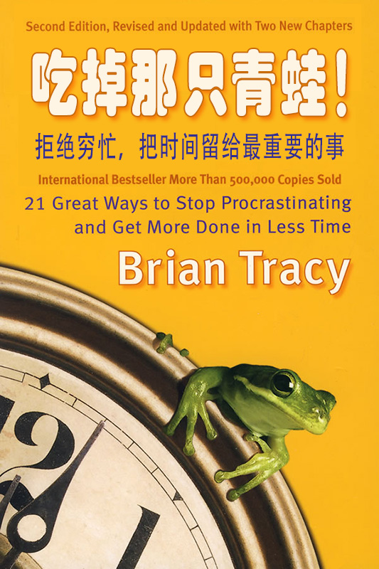
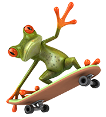
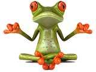
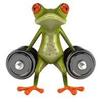
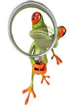
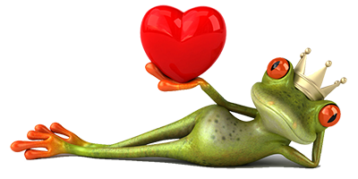

<svg xmlns="http://www.w3.org/2000/svg" height="100%" preserveaspectratio="xMidYMid meet" version="1.1" viewbox="0 0 533 800" width="100%" xmlns:xlink="http://www.w3.org/1999/xlink">

<image height="800" width="533" xlink:href="../Images/cover.jpg"></image>
</svg>

博恩·崔西是最具代表性著作最新升级版，全球销售500000册，已被翻译成23种语言，全球最值得阅读的时间管理领域经典之一。

　　

博恩·崔西教会了我们如何去思考。

——比尔·盖茨

博恩·崔西的思想是如此深刻，值得所有年轻人在制订人生规划时参考。

——沃伦·巴菲特

从博恩·崔西的身上，我了解到什么叫追求卓越——他告诉我们如何去做一个有智慧、有灵魂、有方法的商业领域的领导者。

——迈克尔·戴尔

博恩·崔西是一位成功学大师，他的思想太值得认真学习了！

——陈安之

没有人能给出比博恩·崔西更完美、实用的建议。

——马歇尔·戈德史密斯

超级畅销书《魔鬼管理学》作者

# 目　录

<a href="../Text/Introduce.xhtml" class="hl1">作者介绍</a>

<a href="../Text/Foreword.xhtml" class="hl1">前 言</a>

<a href="../Text/Preface.xhtml" class="hl1">导 言</a>

<a href="../Text/Section01.xhtml" class="hl1">第1章 明确目标</a>

任何成功者都不讳言目标对于自己的意义。实际上，目标越清晰，就越能激发我们的动力和创造力，促使我们不断采取行动。然而，有很多人目标模糊甚至没有目标。本章就为你提供一个简单而有效的方法，让你设定并实现自己的目标。

<a href="../Text/Section02.xhtml" class="hl1">第2章 精心计划</a>

在制订计划上花费一分钟的时间，可以让我们在行动过程中节约10分钟的时间。如果能精心计划每一天的工作，那么每天的工作就会进行得非常顺利，工作起来会更加得心应手。当这成为习惯，你会对自己充满信心，变得更有力量。

<a href="../Text/Section03.xhtml" class="hl1">第3章 运用80/20法则</a>

80/20法则越来越为人们所熟知。在时间管理这方面同样也存在着80/20法则：20％的工作体现80％的价值。我们要做的就是将精力用在那些“举足轻重的少数事情”上，而不要在那些“无足轻重的多数事情”上浪费时间。

<a href="../Text/Section04.xhtml" class="hl1">第4章 着眼未来</a>

成功者是那些愿意延迟享受的人，他们不急着“吃手中的棉花糖”，而是将目光投向未来。越有明确的愿景，就越能准确衡量出眼前行为的价值，并确保其与愿景相符合，从而使自己的效率更高。

<a href="../Text/Section05.xhtml" class="hl1">第5章 学会说“不”</a>

我们的时间精力都是有限的，必须将其用在最重要的事情上。然而，世事纷繁芜杂，我们必须学会放弃，对任何无足轻重、虚度光阴的事情，都要坚决说“不”！

<a href="../Text/Section06.xhtml" class="hl1">第6章 使用ABCDE法</a>

面对纷繁芜杂的世事，我们要关注的是那些最为重要的几个，因此必须将其加以区分。ABCDE法是一个简单而有效的方法。记住，标记为A的事情，永远都是你应该立即着手去做的事情。

<a href="../Text/Section07.xhtml" class="hl1">第7章 抓住关键</a>

每件工作都不是单独的个体，而是由若干部分环环相扣结合而成。每一个环节都不可或缺，但是必须要弄清楚工作中的关键环节是什么，同时在薄弱环节上也不能有疏漏。

<a href="../Text/Section08.xhtml" class="hl1">第8章 抓大放小</a>

不仅事情有大小和轻重缓急，我们的一份工作中也有不同任务之分，其中，只有三项核心任务最有价值。要做那些真正重要的，并腾出更多的时间去做那些能给你带来最大的幸福感和满足感的事情。

<a href="../Text/Section09.xhtml" class="hl1">第9章 精心准备</a>

你还在等待什么吗？不要等了，在开始做事之前，把一切都准备就绪，蓄势待发。这之后只需要一点点动力，你就能发动起来，着手处理最重要的工作了，犹如离弦之箭，势不可挡。

<a href="../Text/Section10.xhtml" class="hl1">第10章 循序渐进</a>

不要指望一口吃成个胖子。而吃掉一只大“青蛙”的最好办法之一，就是一口一口地吃。只要你朝着自己的目标迈出第一步，然后一步一步地不断前进，最终就能到达目的地。

<a href="../Text/Section11.xhtml" class="hl1">第11章 精益求精</a>

社会从不会停下它的脚步。要想不被其抛弃，你就要不断学习，提高你在自己领域内的技能，精益求精。要做到这一点，只需要三个步骤。

<a href="../Text/Section12.xhtml" class="hl1">第12章 施展才华</a>

我们每个人都拥有与众不同的特殊天赋或才能，使我们与他人区别开来。你要找出自己不同于他人的独特之处，然后努力成为该领域内最优秀的人。

<a href="../Text/Section13.xhtml" class="hl1">第13章 突破瓶颈</a>

在现实与你的目标或者理想之间，存在着一个瓶颈。80％的制约因素产生于内部。准确地找出制约因素，然后对症下药以突破瓶颈、解决问题。

<a href="../Text/Section14.xhtml" class="hl1">第14章 自我施压</a>

不要期待他人推着你前进，你要学会自己给自己施加压力，因为命运掌握在自己手中。自我施压的方法有两个：一是把自己当成他人学习的楷模，二是为自己设定最后期限。

<a href="../Text/Section15.xhtml" class="hl1">第15章 挖掘潜能</a>

人的身体好像一台机器，需要添加“燃料”，适当进行休息，来为自己补充能量。只有让自己时刻精力充沛，才能获得高效率。

<a href="../Text/Section16.xhtml" class="hl1">第16章 说干就干</a>

无论你的真实感觉如何，也无论生活中发生了什么事情，你都要保持心情愉快、积极乐观的心态。你必须成为自己的拉拉队长，为自己鼓劲、加油助威。

<a href="../Text/Section17.xhtml" class="hl1">第17章 避开科技陷阱</a>

高科技帮助我们比以前更高效地完成工作，更便捷地与他人进行联系，也很容易让我们沉溺其中。必须让高科技成为你的仆人，而不是你成为它的仆人。

<a href="../Text/Section18.xhtml" class="hl1">第18章 化整为零</a>

重大而艰巨的任务像一个庞然大物，令人望而生畏。那么一次就只做它的一小部分，就像把撒拉米香肠切片，或者在瑞士干奶酪上挖洞。

<a href="../Text/Section19.xhtml" class="hl1">第19章 创造大块的时间</a>

许多重要任务都需要大块的时间。要经常开动脑筋，尝试各种不同的办法来节约时间，安排或者创造大块的时间，让你的每一分钟时间都发挥作用。

<a href="../Text/Section20.xhtml" class="hl1">第20章 培养紧迫感</a>

我们的大脑存在一种最佳状态，在这种状态下，头脑清醒，工作热情高涨，事情有条不紊，工作效率非常高。这种状态可以用“紧迫感”去激发。

<a href="../Text/Section21.xhtml" class="hl1">第21章 全力以赴</a>

人类历史上，任何一项伟大的成就都是经过长期、艰苦、不懈的努力取得的。所以你一旦开始做一件事情，就全身心地投入进去，决不受外界干扰，直到工作百分之百地完成。

<a href="../Text/Colophon.xhtml" class="hl1">结束语</a>

<a href="../Text/Acknowledgements.xhtml" class="hl1">致 谢</a>

<a href="../Text/Info.xhtml" class="hl1">制作信息</a>

# 作者介绍

博恩·崔西（Brian Tracy）

博恩·崔西是美国首屈一指的励志成功学大师，是当今世界个人职业发展方面最成功的演说家和咨询师之一。

博恩·崔西演讲的主题涉及个人成功和领导能力、管理效率、创造力以及销售等，每年约数十万人参加他的讲座。他还是畅销书作家，出版的图书已经达到30多本，其中很多已经被翻译成多国语言，传播到50多个国家。博恩·崔西的教学训练课程在美国连续14年创下有史以来的最高销售记录。他还主持了300多家电台和电视财经节目，这些节目风靡全球，成为最有效的学习工具。

博恩·崔西有着极为坎坷的经历。高中辍学后，他一度靠体力劳动维持生计。期间，他洗过盘子，堆过木料，挖过井，还做过苦力。20多岁时，博恩·崔西开始从事销售工作。通过学习并实践他所发现的每一个方法、技巧，博恩·崔西逐渐在商界崛起。他曾在22个不同的公司和行业里工作过，这为他提供了丰富的学习机会。30岁以后，博恩·崔西进入大学深造，先后获得学士学位及MBA学位。

博恩·崔西白手起家，通过个人奋斗实现人生梦想，是他不断学习、借鉴成功者的结果。博恩·崔西相信，毎个人身上都有无穷的潜力，而这些潜力并没有被挖掘出来。他还相信，只要你也使用那些成就非凡的成功者所使用过的方法、技巧和策略，你能取得的成就远非目前的成就可比。

本书是博恩·崔西根据自身经历总结出的让效率倍增最终取得成功的21个方法。每个方法他都曾身体力行。他不但把自己从挫折失败、心灰意冷的状态中挽救了出来，踏上了生活幸福、事业成功的道路，还挽救了不计其数和他一样处于困境中的人，使他们同样跻身成功者的行列。

# 前　言

感谢大家阅读这本书。本书中所介绍的方法不但帮助过我本人，也帮助过成千上万的其他人，希望这些方法对你同样有所帮助。说实话，我希望读完这本书之后，你的生活会从此改变。

在我们的日常生活中，由于要处理的事情实在太多，你永远没有足够的时间办完所有事情。你每天都淹没在做不完的工作、数不清的私人事务、看不完的杂志和图书之中。你多么希望自己能尽快摆脱这一切！

但事实是，你永远不可能摆脱这些事情，你也永远无法完成你要做的所有事情。对你来说，完成所有任务，然后身心放松、尽情地享受休闲时间，似乎只是一个遥不可及的梦想而已，无论如何也不可能实现。

单纯通过提高工作效率来解决上述问题，只不过是纸上谈兵而已，并不现实。无论你要做多少事情，也无论你掌握了多少提高工作效率的方法和技巧，你都无法在现有的时间里做完你要做的所有事情。

无穷无尽的责任犹如滔滔江水一般，你只有改变自己的思维方式、工作方式以及为人处世的方式，才能自如地驾驭你的时间、掌控自己的生活。你只有学会放弃，把时间和精力放在那些能够改变你生活的重要事情上，才能有效地安排你所要面对的那些事情。

在过去的三十余年中，我花费了大量的时间和精力，来研究如何合理有效地利用时间。我曾经潜心钻研了彼得·德鲁克、亚历克·麦肯齐、阿兰·拉金、史蒂芬·柯维以及其他许多人的相关著作。我还阅读过上百本关于提高个人效率的图书以及成千上万篇与此相关的文章。本书所介绍的方法和技巧，就是我对上述图书和文章进行深入研究的结果。

每当我想到一个时间管理的好办法，我就立即把它应用于我自己的工作和生活中。如果事实证明这种方法的确奏效，我就在我的演讲和研讨会中对它加以推广，把它传授给更多的人。

伽利略曾经说过这样一句话：“你无法教会别人他原本不知道的东西；你只能让他注意到他本来就知道的东西。”

由于每个人的知识水平、生活经历都不相同，本书中介绍的各种各样的方法和技巧，对你而言，可能多多少少听起来有一些耳熟，有一些甚至像是陈词滥调。本书所要起到的作用就是，强化那些最有效的方法在你脑海中原有的印象。当你学习了这些方法和技巧，并不断加以应用，直至养成习惯之后，你的生活就会发生积极的变化。

## 制订书面目标的重要性

下面，我首先向大家介绍一下我本人过去的经历，然后再说说我为什么要写这本书。

初出茅庐的时候，除了拥有好奇心，我没有任何其他的优势。上学的时候，我的学习成绩很差，因此还没有毕业就辍学了。后来，我从事了几年的体力工作。总而言之，刚刚步入社会的时候，我的前途看起来非常渺茫，我感到十分沮丧。

由于年轻，我找到了一份货船上的工作，并且由于工作关系而周游世界。在接下来的八年时间里，我一边工作一边旅行，游历了许多国家。最终，我游历了五大洲的八十多个国家。

随着年龄的不断增长，我再也找不到这样的体力工作了。于是，我就开始从事销售工作，每天挨家挨户地去推销公司的产品。我不断地从事各种各样的销售工作，为了生计而到处奔波、苦苦挣扎。直到有一天，我开始观察周围的其他人，并且问自己：“为什么别人比我做得出色？”

然后，我开始采取行动，从而彻底改变了自己的生活：我去拜访那些成功的销售人员，向他们请教成功的秘诀。他们都不吝赐教，介绍了自己事业成功的经验。我如法炮制，自己的销售额果然直线上升。由于我的业绩突出，我很快就成为销售经理。

作为经理，我再一次使用了上述方法。这一次，我去拜访的是那些成功的销售经理，然后，我把他们的成功经验运用在自己的工作当中。

这种不断学习，并将之付诸实践的做法逐渐改变了我的生活。直至今日，我仍然对此感到匪夷所思，因为这一方法如此显而易见，却又如此卓有成效：只需要找出成功人士是怎么做的，然后如法炮制，直到你也取得相同的成就，就这么简单。哇塞！多么奇妙的主意。

## 成功可以预见

简单地说，有些人之所以比其他人表现得更出色，是因为他们的做事方法与别人不同，因为他们用正确的方法做正确的事情。更重要的是，他们安排、利用时间的方法远远优于普通人。

由于自己没有任何成功的背景，我一直有强烈的自卑感，总感到自己比不上别人。那个时候，我满脑子都是这样的念头：那些比我成功的人确实比我优秀，他们有得天独厚的优势。但是，后来我才发现，事实并非如此。那些成功者只是做事情的方法不同而已，而他们学到的那些方法，只要合乎情理，我也同样能学会。

对我来说，这无疑是一个重要的启示。我为自己的这个发现而感到惊讶，甚至兴奋。虽然我还是原来的我，但是我已经意识到，只要找出某个领域里的成功者是怎么做的，然后不折不扣地效仿他们的做法，直到我自己也取得他们那样的成就，我就能改变自己的生活，实现自己确定的任何目标。

从事销售工作后不到一年时间，我已经是一个一流的销售人员；成为销售经理一年以后，我就一跃成为一家员工95人、业务遍及6个国家的销售公司的副总裁。而那一年，我年仅25岁而已。

从初出茅庐到现在，这么多年以来，我曾经从事过22份不同的工作，自己也创办了几家公司，并且获得了一所重点大学商务专业的学位。我还学会了法语、德语和西班牙语，曾经从事过演讲、培训等工作，并为1000多家公司进行过咨询服务。现在，我经常要到各地巡回演讲，举办研讨会，每年的听众人数超过25万人。有时候，一次演讲的听众人数就达到2万人。

## 一个简单而朴实的道理

纵观我的整个职业生涯，我总结出一个简单而朴实的道理：集中精力去处理那些对你而言最重要的事情，并把它彻底做完、做好，只有这样，你才有可能获得成功与地位、取得成就、赢得他人尊重、拥有幸福生活。这一观点也是这本书的灵魂和核心所在。

这本书介绍了我总结的21条最重要、最有效的提高工作效率的方法，能够使你的事业获得更快的发展。

这些方法、技巧和策略业已证明切实有效、操作性极强。为了节约大家的时间，我没有解释导致做事拖沓、不善于安排时间的各种心理或情绪上的因素。同样，本书也没有花费大量的时间进行理论或研究方面的介绍。本书介绍的是能够立即学以致用的方法，这些方法能使你取得立竿见影的成绩。

书中的每一种方法都旨在提高你的工作效率，改善你的业绩，旨在使你在各个方面都变得更加出色。其中的许多观点同样适用于你的个人生活。

这21种方法和技巧各自独立，同时又彼此联系、缺一不可。这些方法就好像提高个人效率方面的自助餐，你可以根据自己当时的需要，随心所欲地进行选择、组合，并加以利用。

成功的关键在于立即采取行动。书中介绍的这些方法和规则能够迅速地改善你的生活。你学得越快，应用得越快，业绩提高得也越快，这一点是毋庸置疑的。

学会如何“吃掉那只青蛙”之后，你的成就将不可限量！

　　

博恩·崔西

写于加利福尼亚索拉纳海岸

# 导　言

现在，我们正生活在一个黄金时代。在这个时代里，我们通过努力实现自己目标的可能性和机会，比以往任何一个时代都多；在这个时代里，我们被生活中不计其数的选择所淹没，这种情况可以说是前所未有的。事实上，由于你可以做的事情实在太多，你在其中选择、决策的能力，就成为你一生成就如何的决定性因素。

如果你像芸芸众生一样，就会被各种事情所淹没，而你的时间永远不够用。在你挣扎着做完手头这些工作的时候，新的任务和责任又像潮水一样，源源不断地向你涌来。因此，你永远没有足够的时间去做完你要做的所有事情，永远都在各种任务和工作之间忙于应付、疲于奔命——没完没了的任务和责任永远在前面等着你。

## 学会选择

鉴于此，与其他的能力或者技巧相比较，时刻选择对你而言最重要的工作，并迅速地、保质保量地完成这些工作的能力，可能对你成功与否更加重要。在我们所处的这个时代尤为如此。

如果一个普通人习惯于分清事情的轻重缓急，并且迅速完成最重要的事情；而一个天才总是夸夸其谈，制订各种美妙的计划，却很少把这些计划付诸实施，那么，假以时日，前者将把后者远远地甩在身后。

## 关于青蛙的真理

马克·吐温曾经说过，如果你每天早上醒来之后所做的第一件事情是吃掉一只活青蛙的话，那么你就会欣喜地发现，在接下来的这一天里，再没有什么比这个更糟糕的事情了。

对你而言，“青蛙”就是最重要的任务，如果你现在对它不采取行动的话，你很可能会因为它而耽误时间。你的“青蛙”也可能是会对你的生活产生最大积极影响的事情。

关于吃青蛙的第一个规则是：

“如果你必须吃掉两只青蛙，那么要先吃那只长得更丑陋的。”

换言之，如果你面临两项重要的任务，那么你应该先处理更重要的那一项。要养成说做就做的习惯，而且一旦开始就坚持到底，做完一项工作之后再做另外一项。

把这个当做一个“测试”，当做对自己的一个挑战。处理事情的时候，要抵制住先易后难的诱惑。要不断地提醒自己，你每天要做的最重要的决定之一，就是决定先做什么事情，后做什么事情。

关于吃青蛙的第二个规则是：

“如果你必须吃掉一只活青蛙，那么即使你一直坐在那里并盯着它看，也无济于事。”

改善业绩、提高工作效率的关键在于，每天早上要做的第一件事情，就是对你来说最重要的那件事情，并使之成为终生的习惯。你必须养成不假思索就“吃掉那只青蛙”的习惯。

## 立即采取行动

大量的研究表明，对那些薪水丰厚、升职迅速的人来说，无论男女，“说做就做”是他们最显著的共性。这些事业成功、做事高效的人总是直奔最重要的工作，然后一心一意、持之以恒地去做这项工作，直至全部做完为止。

在我们这个社会，尤其是在商业界，你的薪水多少和职务高低取决于你的业绩如何。你之所以能领到薪水，是因为你对自己所在的公司做出了某种贡献，尤其是做出了你应该做的贡献。

“只说不做”是当今社会存在的最大的陋习之一。许多人把行动与成就混淆在一起。他们总是夸夸其谈，没完没了地召开会议，制订各种各样美好的计划，却没有做具体的工作去实施那些美好的计划，因此，这些计划永远只能是镜花水月。

## 养成良好的习惯

一个人的成就大小取决于他做事情的习惯如何。分清轻重缓急、克服拖沓、先处理最重要的事情的习惯是一种技巧。要想培养这一习惯，可以通过实践来学习，然后不断重复，直至它深深地印入你的脑海，根深蒂固。一旦养成这个习惯，它就成为一件自然而然、轻而易举的事情。

这种先处理重要事情的习惯会给你带来立竿见影的好处。从心理和感情的角度来看，完成一项任务能给人以成就感。它会让你感到心情愉快，让你感觉自己是一个赢家。

无论什么时候，无论你完成一项什么样的工作，你都会感到精力充沛、热情高涨，心里充满了自豪感。你所完成的工作越重要，你就会感到越快乐、越自信，你会有一种成就感，无论是对你自己还是对你所处的世界。

完成一项重要的任务，将使你的大脑中释放出内啡肽，使你自然而然地感到心情舒畅、情绪高涨。这种伴随成功完成一项工作而释放出来的激素，会让你更加自信、富于创造力。

## 成功也上瘾

这里包含着一个所谓的成功秘诀。也就是说，你可以培养自己这种“积极的瘾头儿”，即对内啡肽以及由此触发的自信与才能的瘾头儿。一旦在这方面上瘾以后，你就会不假思索地用这种方式来安排自己的生活，你会不断地去做那些更重要的事情。你确实上瘾了，不过是一种积极的方式，即对事业成功和做出贡献上瘾。

要想拥有美满幸福的生活、成功的事业和良好的自我感觉，关键因素之一，就是从事重要的工作。这一行为本身就将赋予你力量，你会发现，完成这些工作比不完成他们更容易。

## 成功无捷径

你一定还记得那个故事：一个人在纽约的大街上拦住了一个音乐家，问他为什么能够在卡内基音乐厅进行演出。这位音乐家这样回答，“练习，老兄，是练习。”

勤学苦练是掌握任何一种技巧的诀窍。幸运的是，你的大脑就像一块肌肉，通过使用会变得更加强壮、更加灵活。通过练习，你可以学会任何一件事情，或者养成任何一种习惯，只要你想学习，或者认为有必要学习。

## 养成良好习惯的3个D

为了养成精力集中的习惯，你需要具备三种品质。不过，这些品质都可以通过后天的学习获得。他们分别是决心(decision)、自律(discipline)和坚定不移(determination)。

首先，下定决心养成做事善始善终的习惯。其次，约束自己反复练习那些想要学习的原则，直至完全掌握为止。最后，无论做什么事情，都要坚定不移，直至养成这种习惯，并使之成为你个性中不可分割的一个部分。

## 心想就能事成

要想更快成为你理想中的高效率、能干的人，这里有一种特殊的方法。你可以不断地在大脑中想象：如果你是一个踌躇满志、说做就做、处事果断、精力集中的人，你的回报和收益将会如何。你要经常把自己想象成为一个扛大梁的人，而且总是能够迅速而又圆满地完成你的各项工作。

你头脑中为自己勾画的蓝图，对自己的行为有着至关重要的作用。因此，一定要把自己想象成为你理想中的人。你为自己刻画的形象，以及你对自己的评价，在很大程度上决定着你的外在表现如何。正如职业演说家吉姆·凯斯卡特所说的那样，“你能看到什么样的人，自己就能成为什么样的人。”

事实上，你学习新技能、养成新习惯、培养新能力的潜力是无穷的。如果你能通过反复练习，培养自己克服拖沓、迅速完成最重要的工作的习惯，你就将进入工作和生活的快车道，踏上成功的加速器。

小贴士：

我们面临着太多的选择，而选择的能力是我们一生成就如何的决定性因素。每天我们要做的，就是选择最重要的那件事情去完成。只有这样，我们才能进入工作和生活的快车道。

第1章\
明确目标
=================================

为了获得成功，一个人必须具备这样的素质，即拥有明确的目标，知道自己想要得到什么，同时拥有实现这一目标的强烈愿望。

——拿破仑·希尔

在你确定自己的“青蛙”是什么并开始吃它之前，你必须首先弄清楚，你在生活中究竟想要得到什么。在生活中，无论做什么事情都要有明确的目标。一些人之所以比另外一些人工作效率高，首要的原因就是，他们非常明白自己的目标究竟是什么，并且决不偏离自己的既定目标。

你越清楚自己想要什么，越清楚如何才能实现自己的目标，就越容易克服拖沓、吃掉“青蛙”，越容易完成你的工作。

做事情拖沓和缺乏动机的主要原因之一，是对自己应该做什么、应该先做什么后做什么、为什么做这些事情，感到既茫然而又混乱，没有一个清晰的概念。对很多人来说，这种情形司空见惯，你必须加以克服，做任何事情都要有一个明确的目标。

小贴士：

越清楚自己想要什么，越清楚如何才能实现自己的目标，就越容易克服拖沓，越容易完成你的工作。

## 成功的法则：将想法付诸笔端

在我们的日常生活中，只有很少的成年人对自己的生活和工作有明确的目标，而且能以书面形式把自己的目标表达出来。与那些教育程度和能力与他们相当，甚至比他们更高一筹的人相比，他们的成就是后者的5～10倍，而后者出于某种原因，从来没有花费一点儿时间，把他们到底想要什么写下来。

这里有一个方法，对设定并实现自己的目标非常有效，你也可以在自己的生活中运用这一方法。该方法包括7个简单的步骤。如果你现在尚未使用这些方法，那么，使用其中任何一个步骤都能使你的工作量提高2～3倍。许多人在参加过我的培训项目之后，立即把这简单易行的7个步骤付诸实践，然后在短短几年时间之内，甚至几个月之内，他们的薪水就直线上升。

第一步：确定你究竟想要什么。你可以自己决定你究竟想要什么，也可以和你的老板坐在一起，就你为自己设定的目标进行讨论，直到你彻底弄清楚自己应该做些什么、应该按照什么顺序来做这些事情。令人难以置信的是，很多人都在日复一日地做着那些毫无价值的工作，因为他们从来没有就此与他们的上司进行认真的探讨。

规则：

最糟糕的利用时间的方法之一，就是把根本不需要做的事情做得很圆满。

斯蒂芬·柯维曾经说过这样一句话，“在你开始攀登成功的阶梯之前，首先要确定你的梯子没有搭错地方。”

第二步：把你的目标写下来。也就是说，将你的想法付诸笔端。当你把目标写在纸上以后，你为自己制订的目标就清晰化、具体化了。你为自己创造了一个能看得见、摸得着的东西。另一方面，如果一个目标没有以书面形式记录下来，那它就只是一个愿望和一个空想，没有任何生命力。没有以书面形式记录的目标将导致模糊、混乱、迷失方向，以及不计其数的错误。

第三步：为你的目标设定一个完成的最后期限。一个目标或者决定如果没有应该完成的最后期限，就没有紧迫性，没有真正的起点和终点。如果没有一个最后期限，以及相应的应该完成的任务，你做起事情来就会不由自主地拖沓，工作效率自然也就非常低下。

第四步：把你能想到的、实现目标所需要做的所有事情都列出来。每当想到新的内容，就立即把他们添加到你的清单上。不断充实你的清单，直到完整为止。这样一份清单能让你眼光更为长远。它为你的生活提供了一条轨迹。由于你把这些目标付诸笔端，并设置了实现目标的最后期限，你就大大提高了实现自己目标的可能性。

第五步：对你的清单进行整理，使之成为一份计划。根据轻重缓急来安排处理事情的顺序。花上几分钟时间，来考虑应该先做什么、后做什么，哪件事情在前、哪件事情在后。相比较而言，一个更好的办法是，利用方框和圆圈等特殊符号使你的清单更一目了然。当你把你的目标分解为一个个具体的任务时，你会惊讶地发现，实现自己的目标并非一件非常困难的事情。

制订了书面目标和实现目标的行动计划之后，与那些只是把想法放在脑子里的人相比，你的工作效率将会大大提高。

第六步：立即根据自己制订的计划采取行动。你应该马上就做点什么事情，做什么都行。即使你的计划平淡无奇，只要你满怀热情地去实施这个计划，也胜过制订一份出色的计划，却不付诸任何行动。无论做什么，要想获得成功，将计划付诸实施才是最重要的。

第七步：下定决心，每天做一些能够接近你目标的事情。把这一行动列入你每天的日程安排之内。比如，就某一领域阅读几页相关的图书，拜访几个客户或者潜在的客户，做一些健身运动，学习几个外语单词。无论如何，不要虚度任何一天。

目标确定之后，就要朝着这个方向不断前进。一旦开始行动，就要尽量保持这种状态，不要中途停下来。仅仅凭借这种决心和自律，就能使你成为同辈人中事业最成功、工作最高效的人之一。

## 书面目标的魔力

清晰的书面目标对你的思想有着不可思议的影响力，它能激发你的动力，促使你不断采取行动；能激发你的创造力，释放你的能量，帮助你克服做事拖沓的不良习惯。

目标是成就这个熔炉中的燃料。你的目标越远大、清晰，你实现目标的动力就越足。你对自己的目标想得越多，你实现目标的欲望就越强烈。

每天都温习一遍你为自己制订的目标。每天早晨开始工作的时候，先着手处理那些有助于实现你最重要目标的、最重要的任务。

吃掉那只青蛙！

1．现在就拿出一张纸来，列出你下一年度想要实现的10个目标。写这些目标的时候，你可以想象这一年已经过去，这些目标已经成为现实。

用第一人称、现在时、肯定语气来写，这样，这些目标就能立即进入你的潜意识中。比如说，你可能会写，“我每年赚多少多少美元”或者“我体重多少多少磅”或者“我开什么什么样的车。”

2\.
然后，回顾一下你列出的10个目标，从中挑出一个，这个目标一旦实现会对你的生活产生极大的积极影响。无论这个目标是什么，把它写在另外一张纸上，设定一个实现目标的最后期限，制订一份相应的计划，然后就你的计划采取行动，而且坚持每天都做一些有助于你实现这一计划的事情。仅仅这一做法就能显著改变你的生活。

第2章\
精心计划
=================================

计划就是把未来变成现在，这样你现在就可以未雨绸缪。

——阿兰·拉金

你一定听说过这样一个老掉牙的问题，“怎么才能吃掉一头大象？”答案当然是，“一口一口地吃！”

那么，你怎么才能吃掉你那只最大、最丑陋的青蛙？当然是用同样的办法：“一口一口地吃！”也就是说，首先把我们要做的事情分解为一个一个的具体步骤，然后从第一步开始着手。

你的大脑以及你思考问题、制订计划、做出决策的能力，是你克服拖沓、提高工作效率最有力的武器。你确定目标、制订计划以及根据计划采取行动的能力，决定了你生活的轨迹如何。思考问题和制订计划这些行动本身释放了你心智力量，激发你的创造力，增加你的脑力和体力方面的能量。

相反地，正如亚历克斯·麦肯齐所说，“没有计划的行动是所有失败的原因。”

你采取行动之前精心制订计划的能力，是衡量你综合素质的一个基本尺度。你的计划越周密，你就越容易克服拖沓、采取行动，吃掉青蛙，并且不断保持这种行动的状态。

小贴士：

完成任何一项工作，都应该事先制订一个计划。花10％的时间制订计划，可节约工作过程中90％的时间。

## 提高回报率

在工作过程中，你的首要目标之一，应该是尽可能从你的脑力、体力和感情投资中获得最大限度的回报。令人欣慰的是，制订计划时花费的每一分钟时间，都能使你在行动过程中节约10分钟的时间。计划每天的工作只需要花费你大约10～12分钟的时间，但是在接下来的一天里，这点时间能够为你节约近两小时的时间以及精力。

你可能听说过6P原则，即“事前的适当准备，能够避免糟糕表现”(“Proper Prior
Preparation Prevents Poor Performance”)。

当你意识到，认真计划每一天对于提高工作效率、提升业绩帮助有多大以后，你会感到不可思议，因为能这么做的人实在是寥寥无几。而制订这样的计划实在是再简单不过的事情。你所需要的只是一张纸和一支笔而已。最复杂的掌上电脑、最复杂的电脑程序或者时间管理器都是基于同样的原理：在开始工作之前先坐下来，把你要做的每一件事情都列出来。

## 每天多完成两小时的工作

无论你准备做什么，都先列出一份清单。每次想到什么新的事情，着手做之前都先把它写下来。如果你一直坚持这么做，那么，从一开始你的工作量就能提高25％——相当于每天多工作了两个小时，甚至更多。

每天的工作结束以后，就开始制订第二天的计划。把尚未完成的事情，第二天应该做的所有事情，都添加在你的计划清单上。列出清单之后，整个晚上，你的潜意识都在围绕这份清单转。通常情况下，第二天早上醒来的时候，你的脑海中就会迸发出灵感，从而使你能更快、更好地完成你的工作。

你事前花费在制订计划上的时间越多，你的工作效率就越高。

## 目标不同，计划不同

你需要为不同的目标制订不同的计划。首先，你必须列一份主清单，在这份清单上，你把自己想要做的每一件事情都写下来。只有这样，你才能记下脑海中闪现的每一个念头，以及你要面对的每一项任务或责任。之后你可以对你的清单分门别类地进行整理。

其次，你应该在每个月末的时候，为下一个月要做的工作列一份月清单。这份清单上的项目可以是主清单上分离出来的。

再次，你要提前列一份每周清单。你可以在每周的工作过程中酝酿这份周清单。

这种自觉而又系统的安排时间的方法对你非常有帮助。许多人都告诉我，他们每个周末都会花费几个小时的时间来安排下一周工作。这个习惯大大提高了他们的工作效率，并彻底改变了他们的生活。这种方法同样适用于你。

最后，你要把每月以及每周的清单落实到你的日清单上，也就是你每天应该做的事情。

在你每天的工作中，把那些已经完成的任务从清单上划掉。这样你每天的成就如何就清晰可见了，它能给予你成功的喜悦和前进的动力。对照清单，看到自己在不断取得进步，心中的自信和自尊之情油然而生。持续不断的、看得见的进步能够驱使你不断前进、克服拖沓。

## 为项目制订一份计划

不论你要完成一项什么样的项目，着手之前都应该先制订一份计划，把你完成项目的过程中，从头到尾所需要进行的每一个步骤都写下来，然后根据它们的轻重缓急来安排先后顺序。把这份项目计划写在一张纸上，或者输入电脑，这样方便你随时看到。然后，一步一步地遵照执行。通过使用这种方法，你会惊讶地发现，自己的工作效率竟然提高得如此神速。

在你按照既定清单进行工作的过程中，你会感觉自己的办事效率越来越高，信心也越来越足。你会觉得，生活尽在自己的掌握之中。这样，你就会自然而然地想要做更多的事情。你的思维将会更缜密，想法更具创造性；你会有更敏锐的洞察力，从而能够更迅速地完成自己的工作。

在循序渐进的工作过程中，你会油然而生一种前进的动力，从而克服做事拖沓的习惯。这种动力将使你终日精力充沛，保持高涨的工作热情。

个人工作效率中最重要的法则之一是10/90法则：工作前花10％的时间用于制订计划，在工作过程中将节约90％的时间。只需尝试一次，你就能证明它是否有效。

如果你能精心计划每一天的工作，就会发现工作进行得如此顺利，你在人生和事业上也远比以前得心应手。你会对自己充满信心，变得更有力量，最终你会变得势不可挡。

吃掉那只青蛙！

1.从今天开始，对每个月、每一周、每一天的工作预先进行安排。拿出一个记事本或者一张白纸（或者用你的PDA或黑莓手机），把你未来24小时内要做的所有事情都列出来。随时添加你想起来的新的项目。把关系到你未来的重大项目列出来。

2.把所有的目标和任务都列出来，然后根据其轻重缓急来进行排列、整理。从最重要的事情开始入手。

把你的想法付诸笔端！无论做什么事情，都先列出一份清单。这只不过是举手之劳，但是，这样做了以后，你会发现自己完成的工作量直线上升，吃掉那只“青蛙”也变得更加容易。

第3章\
运用80/20法则
======================================

只要合理使用，我们总会有充足的时间。

——约翰·沃尔夫冈·冯·歌德

80/20法则是时间管理和人生规划中最重要的概念之一。这一法则又被称为“帕累托法则"，是以它的创始人、意大利著名经济学家维尔弗雷德·帕累托来命名的，此人1895年首次提出这一法则。帕累托注意到，他所处的社会上的人自然分为两类，一类是“举足轻重的少数人”，另外一类则是“无足轻重的多数人”，前者在金钱和地位方面声名显赫，约占总人数的20%；后者生活在社会底层，约占80%。

帕累托后来还发现，几乎所有的经济活动都受到“帕累托法则”的支配。举例来说，根据这一法则，20%的努力产生80%的结果；20%的客户能够带来80%的销售额；20%的产品或者服务带来80%的利润；20%的工作体现80%的价值，等等。这就是说，如果你有10件事情要做，其中2件事情的价值，比另外8件事情加起来的价值还要大。

小贴士：

时间管理实际上是对人生的管理和规划，其实质就是控制事情的优先顺序，确定先做什么再做什么。

## 举足轻重的少数事情

通常情况下，在你的工作清单上，一项工作的价值要比其他9项工作加在一起的价值还要大。毫无疑问，这项工作就是你要首先吃掉的那只“青蛙”。

你知道一般人通常可能在哪些事情上拖拖拉拉、拖延时间吗？很不幸，大多数人都会在那些对他们来说最重要、最有价值的10%或20%的事情上拖沓，也就是那些“举足轻重的少数事情”。与之相反的是，他们终日为那些没有什么价值的、80%的事情而忙碌，即那些"无足轻重的多数事情"。

## 切忌重过程而轻结果

你经常可以看到这样的人，他们看上去终日奔波忙碌，却没有什么作为值得人们称道。原因通常是，他们总是忙于那些微不足道、琐碎平常的小事情，却耽搁了对自己、公司来说真正是举足轻重的事情。

你毎天要做的最有价值的事情，往往也是最困难、最复杂的。但是，一旦你高效率地完成了这些事情，其回报也是相当可观的。因此，如果你有20%的重要工作要做，决不要先去做那80%的微不足道的事情。

在开始任何一项工作之前，首先问自己：“这是属于20%的高产出部分呢，还是属于80%的低产出部分？”

规则：

处理事情的时候，一定要抵制住先易后难的诱惑。

记住，无论你做出什么样的选择，久而久之，都会形成一种牢不可破的习惯。如果你选择了先处理那些没有价值的事情，你很快就会养成这个习惯，尽管你并不是期望培养或保持的习惯。

万事开头难，什么事情都是如此。一旦你真正着手做一件对你来说很有价值的事情，你就会顺理成章地一直做下去。从某种程度上来说，你乐于从事一些重要的、能够让你感觉不同凡响的工作。因此，你有必要不断满足你的这种情感上的需要。

## 给自己动力

只要想到自己即将开始处理并善始善终地完成一项工作，你就会动力十足，不再有片刻迟疑。事实是，完成一项重要工作所需要的时间，和完成一项琐碎的工作所需要的时间是相等的。区别在于，前者能给你一种自豪感和满足感。但是，如果你用同样的时间和精力完成了一项琐碎的工作，你只能得到极少的满足感，甚至毫无满足感可言。

时间管理实际上是对人生的管理和规划，其实质就是控制事情的优先顺序。时间管理能决定你下一步做什么。虽然你有权利自由选择下一步做什么，但是，能否对事情的轻重级别细加甄别，在很大程度上决定了你生活和工作的成功与否。

工作效率高的人总是先处理那些最重要的事情。他们强迫自己吃掉那只“青蛙”，无论那只“青蛙”是什么。这样，他们总是卓尔不群、遥遥领先，因而也比一般人更快乐。你也应该这样安排自己的工作。

吃掉那只青蛙！

1.现在，把你生活中的主要目标、工作和责任列成一张清单。其中哪些是能够体现你80%（甚至90%）价值的那20%（或者10%的）任务？

2.下定决心，从今天开始，把更多的时间花费在那些能让你不同凡响的少数工作上，尽量不在那些不创造多少价值的工作上无谓浪费时间。

第4章\
着眼未来
=================================

一个人的成就与他在某一领域付出的努力成正比。

——奥里森·斯韦特·马登

思维超前者的标志，在于其有能力精确预测做或者不做某一件事情的结果如何。任何一件事情的潜在结果，都决定了这件事情对你的公司或者你本人究竟有多重要。这种衡量一项工作重要性的方法，能够帮助你确定下一只青蛙是什么。

来自哈佛大学的爱德华·班菲尔德博士经过50余年的研究，得出一个结论，即在美国，是否具有“长久愿景”，是判断一个人在社会和经济方面前景如何的一个精确标准。事实证明，在决定你事业和生活能否成功的诸多因素中，“长久愿景”这一因素要比家庭背景、教育程度、种族、智力状况、社会关系等任何一个因素都更加重要。

你对待时间的态度，即时间观念，对你的行为和决定有着重大影响。与目光短浅的人相比，那些对自己的生活和事业有长远规划的人，在时间和行为安排的决策方面往往更加明智。

规则：

制订长远目标有助于你确定自己的短期决策。

成功人士对自己的未来都有一个清晰的目标。他们能够想到5年、10年甚至20年以后的情景。他们分析自己当前的选择与行为，以确保它们与自己预期的长远目标协调一致。

## 合理安排时间

在你的工作中，清楚地知道什么是对自己的未来最重要的，有助于你对短期的行为进行决策。

我们知道，重要的事情对未来都有显著的潜在影响；相反，那些无足轻重的事情对未来的影响小得多。在开始做任何事情之前，你都要问自己：“做这件事情对我来说会有什么长远影响？如果不做结果又会如何呢？”

规则：

长远目标影响并常常决定你目前的所作所为。

你的长远目标越清晰，它对你此刻所作所为的影响就越大。如果你有明确的长远打算，你就能准确衡量出眼前行为的价值，并确保它符合你的长远打算。

## 目光长远、着眼未来

成功者是那些愿意推迟享受、做出短期牺牲的人。从长远的角度来看，他们这样做能享有更大的回报。相反，失败者总是更多地看到眼前的欢乐和短暂的满足，很少去顾及未来将会怎样。

丹尼斯·魏特利是一位励志方面的演说家，他曾经说过这样一句话：“失败者总是只想缓解自己压力，而成功者则致力于实现自己的目标。”举例来说，每天早展早早地去公司上班，定期阅读图书杂志，了解自己所在领域内的最新动态，参加各种培训班以提高自己的工作技能，以及专注于能够体现自己价值的重要工作，所有的这一切都有助于创建你的未来。相反，最后一分钟才走进办公室，工作时间里看报纸、喝咖啡、与同事聊天，这些事情短期内的确令人感觉轻松愜意，但是从长远来看，会导致你升职缓慢、成就平平，甚至在职场遭受挫折。

如果一项工作能够对你产生重大的积极影响，那么，就要把它列为最优先考虑的事情，然后立即着手去处理。

如果某件事情不马上处理就会产生极大的负面影响，这件事情也同样要当作优先考虑的事情。无论你的青蛙是什么，都要下定决心立即把它吞下去。

行动离不开动力。一件事情对你的生活产生的积极影响越大，你克服拖沓、迅速着手处理这件事情的动力就越足。

要想使自己不断进步，就要把精力集中在那些能对个人和公司产生积极影响的重要工作上去。

无论如何，时间的脚步永远不会停止。因此，关键就在于你如何利用你的时间，在于到每个周末、每个月末的时候，你期望自己取得什么样的结果。你能取得什么样的成就，在很大程度上，取决于你对自己行为可能产生的短期结果考虑是否充分。

在你的工作和个人生活中，不断考虑自己所做选择、决定和行为的后果如何，是确定该优先考虑什么事情的最好方法之一。

小贴士：

“愿景”是决定一个人生活和事能否成功的重要因素。成功者有着未来的规划，所以能够放弃眼前的快乐和短暂的满足，从而在未来享有更大的回报。

## 效率是逼出来的

效率是被逼出来的。“你永远没有足够的时间做完所有的事情，但是，你总是有足够的时间去做那些对你而言最重要的事情。”

换言之，你不可能吃掉池塘里所有的蝌蚪和青蛙，但是，你可以吃掉那只最大、最丑陋的青蛙。这就足够了，至少，对于目前来说已经足够了。

如果你的时间已经所剩无几，但一项任务完不成的后果却相当严重，你总是能千方百计地挤出时间，来设法完成这项任务，通常是在最后一分钟时间里。你可能着手很早，但是拖延到很晚，然后，为了避免任务没有完成可能造成的负面影响，你会逼着自己在规定的时间之内做完这项工作。

规则：

你永远没有足够的时间去完成你要做的所有事情。

事实上，当今社会，一个普通人、尤其是职业经理人，每天要调动自己110%～130%的精力。尽管如此，他们面临的工作和责任还是越堆越多，没完没了。我们每个人都有堆积如山的资料需要阅读。最近的一项调查显示，一个普通的管理人员在家里和公司里有相当于300～400小时的积压的工作和资料需要处理。

这一事实说明，你永远无法按时处理完所有的事情，所以，最好不要存有这个念头。只要能把最重要的工作做完，就已经万事大吉了，其他事情只能暂时靠边站。

## 最后期限只是一个借口而已

许多人说，他们在最后期限的压力之下往往会工作得更出色。但是，多年的研究表明，在大多数情况下，事实并非如此。

这种最后期限给人带来的压力，往往是由于拖沓和耽搁而产生的。在这种压力之下，人们往往会感到更紧张，工作时更容易犯错误，因而返工的可能性也更大。为了赶在最后期限之前完成工作而犯下的错误，往往会导致瑕疵和成本上升，从长远来看，这将造成重大的经济损失。有时候，人们拼命赶在最后一分钟完成任务，结果却不得不返工，最终的结果是欲速则不达。

有鉴于此，更为明智的做法是提前把时间安排好，并给自己留出一定的余地，以免意想不到的耽搁打乱你的全盘计划。具体的做法是，无论你的工作需要多长时间，你在制订计划时都额外安排出20%甚至更长的机动时间。或者，让自己做一个与时间赛跑的人，力争在最后期限到来之前提前把工作做完。使用这种方法之后，你会惊讶地发现，自己在整个工作过程中都非常放松，而且也能更加出色地完成工作。

## 3个问题助你提高工作效率

为了让自己总是把精力集中在日程表中最重要的事情上，你可以经常问自己3个问题。

第一个问题是：“对我而言什么是最有价值的事情？”换言之，什么是你必须吃掉的，对你的公司、家庭以及生活贡献最大的那只青蛙？

这是你应该经常自问自答的最重要的问题之一。什么是对你而言最有价值的事情？首先，自己把这个问题考虑清楚。然后，带着这个问题去拜访你的上司，并询问你的同事和下属，朋友和家人。就像照相时调整焦距，在开始工作之前，你必须弄清楚，什么是对你来说最有价值的事情。

你应该经常问自己的第二个问题是：“什么事情只能由我来做，而且关系重大？”这个问题是管理学方面的权威彼得·德鲁克提出来的，是改善个人业绩方面最经典的问题之一。

这是指非你来做不可的事情。如果你不做，其他人谁也做不了。但是，如果你做了，而且做得尽善尽美，就会对你的生活和事业产生巨大影响。这到底是什么事情？你工作中的青蛙究竟是什么？

每一天、每一刻，你都可以这么问自己，总会有一个确切的答案。你的任务就是对该答案了然于胸，然后专心致志地去做这件事情。

你要问自己的第三个问题是：“此时此刻，怎样利用我的时间最有效？”换言之，“这一刻，我要吃的最大的靑蛙是什么？”

这是关于时间安排方面最重要的一个问题，它是克服拖沓、提高自己工作效率的关键。每一天，每一刻，这个问题都有一个确切的答案。你的任务就是反复问自己这个问题，然后，再根据当时的答案来安排自己的工作，无论这个答案是什么。

只做最重要的事情，毫无意义的事情坚决不做。歌德曾经说过这样一句话：“最重要的事情永远不能让步于最不重要的事情。”

你对这些问题的答案越准确，就越容易确定优先顺序、克服拖沓、着手处理对你来说最重要的事情。

吃掉那只青蛙！

1.定期回顾你清单上所列的目标、工作和责任。不断问自己这个问题：“如果我及时而出色地完成哪一项工作，会对我的生活产生极大的积极影响？”

2.每一天、每一刻，都找出当时对自己而言最重要的工作，然后合理安排自己的时间，全力以赴地完成该项工作。无论是哪一项工作，都要把它当做一个目标，然后制订相应的行动计划，立即着手实现这个目标。记住歌德说过的话，“一旦开始，你就会充满激情；坚持到底，你就能完成任务！”

第5章\
学会说“不”
===================================

好钢用在刀刃上；最精华的时间留给最重要的工作；早上先摆平燃眉之急的小问题；然后着手解决大项目，毕其功于一役。

——《董事会报告》(Boardroom Reports)

创造性拖沓是提高个人业绩最有效的技巧之一，它能够改变你的生活。所谓创造性拖沓，就是经过深思熟虑以后，确定哪些事情现在不会立刻去做，即使这些事情非做不可。

事实上，你不可能做完你要做的所有事情。因此，有些事情必须向后拖延！那些体积较小、不太丑陋的“青蛙”，可以向后推迟一段时间再吃。相反，一定要先吃那些最大、最丑陋的“青蛙”。

每个人都有做事拖延的时候。业绩突出者和业绩不佳者的区别，在很大程度上取决于他们在什么事情上拖延。

既然无论如何都要拖延，那么，现在就决定，推迟做那些无足轻重的事情。下定决心，对那些没有意义的事情，或者有意拖延时间，或者委派、托付给其他人去做，甚至可以干脆不做。不要为了“小蝌蚪”而分散精力，而是要专注于自己要吃的“大青蛙”。

## 优先事件与非优先事件

这里有一点非常关键。在确定优先事件的同时，你还要确定非优先事件。前者是你要花费更多时间、尽快处理的事情，后者则是即使要处理，也是费时不多、可以推迟处理的事情。

规则：

只有不再去做那些无足轻重的事情，你的时间和生活才尽在掌握之中。

在时间管理方面，最强有力的一个词语就是“不！”对那些虚度时光、浪费生命的事情，一定要学会说“不！”你可以彬彬有礼地对他人说“不！”但是，一定要说得明白无误，不会产生任何歧义。要经常使用这个词，并使之成为你在时间管理方面的一个常用词汇。

对任何无足轻重，虚度时光、浪费生命的事情，都要坚决说“不！”你可以说得很优雅，但是态度一定要坚决，以免人云亦云，从而违背自己的意愿。必要的时候，要说得越早越好，而且要常挂在嘴边。因为事实上，你没有多余的时间可以浪费，你的日程已经安排满了。

为了处理新的工作，你必须先处理完以前的工作，或者不再为以前的工作费神。有得必有舍，着手一项工作就意味着放下另一项工作。

小贴士：

要学会说“不”。对任何无足轻重的事情，都要坚决说“不”！否则就是在浪费生命。

## 故意拖延时间

大多数人都在不知不觉中拖延时间。这样做的后果就是，他们拖延的事情是大宗重要而又艰巨的、有价值的工作，而这些工作将对他们的生活和事业产生重大的长远影响。因此，你必须想尽一切办法，避免这一司空见惯的现象出现在你身上。

你的任务就是，推迟去做那些无足轻重的事情，从而可以腾出更多的时间来处理那些让你的工作和生活面目一新的事情。

不断回顾你所从事的工作和承担的任务，确定哪些要耗费大量时间的任务和活动可以干脆放弃，同时又不会给你带来什么真正意义上的损失。你必须经常这么做，而且永远没有结束的时候。

比如说，我有一个朋友，他单身的时候，酷爱高尔夫。那个时候，他每周去都要挥杆三四次，而且每次都要打三四个小时。

这样过了几年，他有了自己的生意，还结了婚，有了两个孩子。尽管如此，他的这种生活习惯并没有改变：他仍然每周都要去打上三四次高尔夫球。久而久之，他终于意识到，他花费在高尔夫球上的时间过长，导致他无论在家里，还是在工作上，时间都非常紧张。因此，只有大大缩短他每周花费在高尔夫球上的时间，才能使他的生活重新步入正轨。

## 浪费时间的事情少做甚至不做

回顾一下你工作以外从事的活动，看看哪些费时的事情可以少做或不做。你可以缩短你看电视的时间，把节省下来的时间用于陪伴家人、读书、做运动，或者做一些能够提高你生活质量的事情。

回顾一下你所从事的工作，确定哪些事情可以交给其他人去做，哪些事情可以干脆取消不做，这样你就可以腾出更多的时间，来处理那些至关重要的事情。现在就开始使用创造性拖沓法，无论何时、何地，都要确定哪些是可以推迟处理的事情。这个决定本身就能改变你的生活。

吃掉那只青蛙！

1.在生活中的各个方面，你都可以应用“零起点”的思维方式。应该经常这么问自己，“如果我还没有开始做这件事情，而且我已经知道这么做的后果，那么，我现在还会再这么做一次吗？”如果你知道某件事情的后果，而且现在不会再那样做一次，就意味着这种事情应该被拖延或取消。

2.根据你目前的状况，重新审视、评价你工作和生活中的所作所为，挑出其中至少一项，立即放弃，或者至少故意拖延时间，直到你完成那些更重要的事情为止。

第6章\
使用ABCDE法
====================================

成功的首要法则是专心致志，是把所有精力集中在一点上，然后径直向那一点前进，既不向左看，也不向右看。

——威廉•马修斯

在开始处理任何一项工作之前，你花费在制订计划、设定优先事件方面的精力越多，你所做的事情就越重要，工作起来就越得心应手。你所从事的工作越重要、越有价值，你克服拖沓、全力投入该工作的劲头也就越足。

ABCDE法是一种极为有效的、设置优先事件的方法，目的在于分清事情的主次。你每天都可以使用这种方法。这一方法虽然极为简单，却非常有效。

## 将想法付诸笔端

这一技巧的特点是非常简单。其方法如下：先把你第二天要做的所有事情列出来，把你的想法付诸笔端。然后，在开始采取行动之前，在每一项前面分别标上字母A、B、C、D或者E。

标有字母A的项目是非常重要的事情，也是你必须要做的事情，如果这件事情不做，后果就会十分严重。这样的事情包括，拜访一个主要客户，或者是为你的老板准备一份报告（她要在即将召开的董事会上使用这份报告）。这样的事情永远是你的“青蛙”。

如果这样的事情不止一项，那么，你应该分别用A-1、A-2、A-3等来区分这些事情。任务A-1就是你要吃的最大、最丑陋的那只“青蛙”。

小贴士：

为事情设置优先次序可采用ABCDE法，这种方法简单却极为有效。

## “应该做”还是“必须做”

标有字母B的项目是你应该做的事情，但是，如果不做这些事情，后果并不十分严重。它们是你职业生涯中的“蝌蚪”。换言之，如果你不做这些事情，可能会让一些人不高兴，或者感觉到不方便，但是，这些事情无论如何没有标有字母A的事情重要。这样的事情包括，回一个不太重要的电话，或者浏览你信箱里的电子邮件。

在这里，你要遵循的一个原则是，如果你的清单上还有A项目没有完成，那么，决不要先去做B项目。换言之，当你还有一只大青蛙要吃的时候，决不要先分心去吃一只小蝌蚪。

标有字母C的项目是令人愉快、但是做不做都无关紧要的事情。这类事情包括，给朋友打电话，与同事一起吃饭或者喝咖啡，或者是在工作时间里处理一些私人事情。这些事情对你的职业生涯没有任何积极的作用。

标有字母D的项目是可以委派给别人做的事情。这里旳原则是，你应该把所有别人可以做的事情交给他们去做，从而腾出时间来做那些只有你能做的、标有字母A的项目。

标有字母E的项目是完全可以不做的事情，这些事情对你来说没有任何意义。比如，一件曾经对你重要、但是现在已无关紧要的事情。你通常是出于习惯或者乐意去做，尽管它真的没有价值。

使用这种ABCDE的规划方法之后，你的生活和工作就会变得井井有条，能够有时间做更多意义重大的事情。

## 说干就干

要使这种方法发挥作用，你必须培养自己先处理标记为A-1的事情的习惯，这件事情没有做完之前，决不动手去做其他事情。运用你的意志力，全神贯注地做这件对你而言最重要的事情。你要一□气把这只“青蛙”吃完，不要有任何拖延。

要想获得更大的成就，享有更强的自信心和自豪感，通盘考虑并确定A-1事件的能力就是跳板。当你养成这种集中精力完成对你来说最重要的A-1事件——吃掉你的“青蛙”——的习惯之后，你的工作量会超过周围两三个人的工作量之和。

吃掉那只青蛙！

1.现在，温习一下你为自己列出的清单，然后在每一项任务之前标上A, B, C,
D或者E。选择标记为A-1的工作或者任务，然后立即着手去处理。切记，在这项工作完成之前，不要去做任何其他事情。

2.在下一个月的时间里，每天都练习使用ABCDE法来处理你的每一项工作。这样坚持一个月以后，你就会养成先处理最重要的事情的习惯，你的未来就会尽在你的掌握之中！

第7章\
抓住关键
=================================

一个人向着目标全力以赴的过程，就是他解决问题的能力成倍增长的过程。

——诺曼·文森特·皮尔

“我为什么能拿到薪水？”这是你职业生涯中应该再三问自己的最重要的问题之一。

事实是，在我们这个社会中，大多数人并不十分明白，他们为什么能拿到薪水。但是，如果你不清楚你的名字为什么会出现在公司薪水册上，不知道自己究竟应该完成什么工作，那么，你就很难在工作中有上乘表现，很难不断地获得升职、加薪。

简单地说，你之所以被老板雇用，就是要为你所在的公司完成一些具体的工作。工资或者薪水是对你完成的满足一定质量以及数量要求的工作的回报，而这份工作与其他工作结合起来，应该能提供一种客户愿意购买的产品或者服务。

每一项工作一般都可以分解为5～7个关键环节。为了承担起对工作的责任，对你的公司做出最大贡献，你必须依照这些环节去完成你的工作。

关键环节就是为了自己事业的成功必须胜任的工作。在这一领域，你全权负责；如果你不去做，没有人能完成这项工作。这个环节完全在你的控制之内。在这里，你工作的终结就是他人工作的起点，你的工作为他人的工作提供了便利。

上述这些关键环节，就好像人体的某些主要功能，如血压、心率、呼吸频率、脑电波活动等所反映出的人体功能。上述功能如果缺少其中任何一项，都将导致机体的死亡。同样道理，你工作中任何一个环节的失败，都有可能让你丢掉自己的饭碗。

小贴士：

每一项工作都可以分解为5～7个环节。找出自己工作的关键环节所在以及自己在这些环节内的优势，确保自己在这些环节万无一失。

## 管理和销售工作中的7大要素

管理工作的关键环节是计划、组织、人员安置、委任、监督、衡量和报告。作为一名经理人，必须胜任上述所有环节的工作。如果任何一个方面存在缺陷，就会导致工作上的失误甚至失败。

而销售工作的关键环节是寻找客户、建立自己的关系网并树立起自己的信誉、了解客户的需求、向客户推销他们需要的产品、解答客户的疑问、达成交易、争取回头客并发展新客户。如果在上述任何一个环节中表现不佳，就会影响到你的销售额，甚至会导致你销售生涯的彻底失败。

无论你从事什么工作，都必须具备这项工作所需的最基本的知识和技能，这样才能在工作中做到游刃有余。而对这些知识和技能的要求，是随着时间变化而变化的。在职业生涯伊始，你已经培养了胜任工作的必备素质。但是，那些关键环节是你工作中的关键，它们决定着事业的成败。你工作中的关键环节是什么？

## 明白自己工作中的关键环节至关重要

要想在工作中表现出色，最根本的一点就是，必须弄清楚自己工作中的关键环节是什么。你应该就这个问题与你的上司进行讨论，然后，把你的主要职责范围在纸上列出来，并确保你的上司、下属和同事与你的看法一致。

比如说，对一个推销人员而言，寻找并建立新的客户关系，就是他工作中的关键环节。这一行为是整个销售过程中的核心。成交则是销售工作中另外一个关键环节。成交之后，其他人就要进行产品制造和提供服务的环节了。

对于一个公司老板或者主管来说，就贷款问题与银行进行交涉，是他们工作中的一个关键环节。招聘合适的员工并对其进行合理分工同样是非常关键的环节。

对于一个秘书或者接待人员来说，你的主要职责就是，迅速而高效地打印信件、接听电话或者转接电话。他们在这些方面的表现如何，在很大程度上决定着他们的薪水高低和晋升机会如何。

## 明确自己的定位

—旦确定了自己的主要职责范围，接下来，你就要对自己的优劣势进行分析，然后明确自己的定位（1为最低的一档，10为最高的一档）。你的强项是什么？弱项是什么？你哪方面擅长？哪方面薄弱？

规则：

你工作中最薄弱的那个环节，将决定你发挥自己技能和能力的限度。

根据这一规则，在所有的7个环节中，即使你在其他6个环节中都非常出色，如果你在第7个环节中的不佳表现，仍然会影响你的业绩，并最终决定你的成就大小。这个薄弱环节将影响你的业绩，并成为你遭受挫折的长期根源。

比如说，人员委任是一个经理人的主要职责。这一技能是他进行有效经营管理的关键所在。如果这位经理做不到知人善任，让每个员工都能最大限度地发挥自己的才能，那么，他就无法充分施展自己其他方面的才能。仅此一项就能导致他工作上的失败。

## 薄弱环节导致工作延误

在工作中造成拖沓和延误的主要原因是，人们总是避免去做那些自己不擅长的工作。他们不是想方设法提高自己在该领域的能力，而是干脆逃避这些事情，结果只能是雪上加霜。

与此相反的情况是，你在某一领域内做得越出色，你的干劲儿就越足，决心就越大，就越不会拖泥带水、耽误时间。

事实是，人无完人，每个人都既有强项，又有弱项。不要为自己的弱项进行辩护，或者拒绝承认该弱项。相反，要清楚地认识自己的弱势在哪里，然后为自己设定一个目标，制订相应计划，来不断充实、完善自己，使自己在各方面都变得十分优秀。想一想吧，也许你只需在一个领域内有所改进，你就能成为业内最出类拔萃的人。

## 一个重要问题

这里有一个极为重要的问题，你应该经常问自己：“精通哪一种技能将对我的职业生涯产生最积极的影响？”

在以后的生活中，你应该用这个问题来指导你的事业。在自己身上找答案。你应该知道答案是什么。

问你的上司、同事、朋友和家人这个问题。无论答案是什么，你都要立即付诸行动，从而改善自己的业绩。

不过，你无需担忧，因为任何工作技能都可以通过学习来掌握。如果别人能够在某一领域表现出色，那就证明你也一定能够做到，只要你有这个决心。

克服拖沓、做事更迅速的最好办法之一，就是做一个在工作上出类拔萃的人。在你的生活和工作中，这和其他任何一件事情同等重要。

吃掉那只青蛙！

1.找出你工作中的关键环节所在。这些职责是什么？把它们写下来。找出自己在每个环节内的优劣势。然后，确定一种技能，如果你在这方面首屈一指的话，对你的工作将有极大帮助。

2.带着这张清单去拜访你的上司，并与他就清单上所列的工作进行讨论。请对方做出诚实而又中肯的评价。你只有虚心听取他人提出的建设性意见，才能不断完善自己，不断取得进步。

此外，还要与你的同事、配偶就此进行探讨、交流。在你以后的职业生涯中，应该养成定期进行这种分析的习惯。要不断前进。这个决定本身就能改变你的生活。

第8章\
抓大放小
=================================

无论何时何地，倾其所有，尽其所能。

——西奥多·罗斯福

在你的所有工作中，只有3项核心任务对你所在的公司或者机构最有价值。如果你希望在自己的工作中有出色的表现，就必须明白这3项任务分别是什么，然后全力以赴地把它们做好。下面我就给大家讲述一个真实的故事。

辛西娅曾经在圣迭戈参加过我的培训课程。在参加培训3个月后，她给大家讲了一个故事。她说：“90天之前，当我来参加这个培训的时候，你告诉我说能够让我在一年之内薪水翻一番，同时闲暇时间也能翻一番。这听上去根本就不可能实现。不过，我还是想尝试一下。

“参加培训的第一天，你让我列一份清单，把我一周或者一个月之内要做的事情全部写下来。我一共列了17件事情，这些都是我职责范围之内的事情。我的问题在于，我几乎要被自己的工作淹没了。我每天都要工作10～12个小时，每个星期要工作6天。因此，我很难抽出时间来陪丈夫和两个年幼的孩子。但是，我对此却无能为力。

“在过去的8年时间里，我在一个高科技领域的公司里就职。这个公司的发展很快，可是，我总是有做不完的工作，时间也好像总是不够用。”

小贴士：

在所有工作中，只有3项核心任务对你最有价值。每天把所有的精力全部放在这些任务上。

## 每天只做一项工作

她继续讲述自己的故事：“当我按照你的要求列出清单之后，你接下来问了我一个问题：‘如果你每天只能做其中一项工作，那么，哪项工作对你的公司贡献最大？’这个问题对我来说轻而易举，我很快就把这项工作找了出来，并在上面画了一个圈。

“接下来，你又问我：‘如果除此之外你只能再选择—项工作，那么，哪项工作对你的公司来说最重要？’

“我再次做出选择之后，你又问了我同样的问题，让我选择第三项重要的工作。

“你接下来的一番话当时让我震惊不已。你说，你对公司90%的贡献都来自这三项最重要工作，无论这些工作是什么。你所做的其他所有工作都是辅助性或者补充性的工作，这些完全可以交给别人去做，或者少做一些甚至一点儿都不做。”

## 马上行动起来

辛西娅还在讲述自己的故事。“看着自己选择的这三项任务，我很快就意识到，这些是在公司里最能体现自己价值的事情。那天是个星期五。在接下来的那个星期一的上午10点钟，我遇到了我的老板，并把我上周五的发现向他解释了一下。我告诉他，除了那三项最重要的任务，我希望其余的工作都能够交给别人去做，但是，要做到这一点，我需要他的帮助。我认为，只要我在工作时间内把自己的精力全部用在这三件事情上，那么，我对公司的贡献至少可以翻一番。接着，我又告诉他，如果我的贡献能翻一番，我希望他付给我的薪水同样能翻一番。”

辛西娅接着说道：“我说完这番话之后，老板一句话也没说。他看了看我列出的清单，然后抬头看看我，然后再看一遍我的清单。最后，他终于对我说：‘没问题。’当时，他身后的时钟显示的时间是10:21。

“接着，他对我说：‘你说得没错。这些的确是你在公司里做的最重要的工作——也是你做得最出色的工作。我会帮助你把那些次要的事情交给其他人去做，这样，你就可以全心全意做自己最擅长的工作了。如果你对公司的贡献能够增加一倍，我会同样付给你双倍的薪水。’”

## 改变你的生活

辛西娅最后说道：“老板的确说到做到。他把那些对我来说琐碎的、无关紧要的工作交给了别人去做，这样，我就能专心致志地做擅长的工作了。我也没有让他失望，在接下来的30天时间里，我完成的工作量翻了一番。他也付给了我双倍的薪水。

“在此之前，我已经辛辛苦苦工作了8年时间；然而，一旦我把自己的时间和精力全部放在最重要的三项任务上之后，仅仅用了一个月的时间，我的薪水就翻了一番。我的改变还不止这些，以前，我每天都要工作10～12个小时；而现在，我每天从早上8点工作到下午5点，晚上和周末的时间我都用来陪自己的丈夫和孩子。可以说，这个做法彻底改变了我的生活。”

在职场上，最重要的可能就是“贡献”这两个字。对于一个职场人士来说，无论是经济上还是感情上的回报，都与自己所做的工作或者说贡献成正比。如果你想增加自己的收入，就必须提升自己对公司的价值。你必须为自己的公司做出更大的贡献。你所做的最重要的三项工作就是你的价值所在。

## 迅速列出清单

在举办培训班之初，我们经常让参加培训的人做这样一个练习。我给他们每个人发一张纸，然后告诉他们“在30秒之内，把你此刻生活中最重要的三个目标写下来”。

通过这个练习我们发现，如果只给人们30秒钟的时间让他们写下3个最重要的目标，他们的答案非常准确，就好像经过了30分钟或者3个小时的思考一样。他们的潜意识好像进入了一种“超光速”状态，三个最重要的目标不假思索就进入了他们的脑海并被付诸笔端，速度之快，经常让做这个练习的人自己都感到惊诧不已。

经过统计我们还发现，80%的人拥有同样的三个目标：第一个目标是经济和事业方面的；第二个是家庭或者人际关系方面的；第三个是健康或者身体方面的。当然，这个答案在我们的意料之中，因为这本来就是我们生活中最重要的三个方面。如果把每个方面又分为从1到10的10个档次，你立刻就能知道自己哪方面做得还不错，哪方面还需要适当的改进。你可以自己试着做一下这个练习，看看结果如何。你也可以让配偶或孩子来做同样的练习，答案一定会对你有所启发。

在我们后来进行的培训中，我们又把这个练习进行了扩展，从而包括了以下一系列问题：

1.此时此刻，在事业方面你最重要的三个目标是什么？

2.此时此刻，在家庭或者人际关系方面你最重要的三个目标是什么？

3.此时此刻，在经济方面你最重要的三个目标是什么？

4.此时此刻，在健康方面你最重要的三个目标是什么？

5.此时此刻，在个人或者职业发展方面你最重要的三个目标是什么？

6.此时此刻，在社交方面你最重要的三个目标是什么？

7.此时此刻，你面临的三个最重要的问题是什么？

如果你逼着自己在30秒之内回答这些问题，你的答案可能会让你自己都感到目瞪口呆。无论你的答案是什么，它们都是你此时此刻生活状态的真实写照。这些答案会让你知道，生活中究竟什么对你最重要。

无论是制订自己的目标和计划，还是全心全意完成那些最能体现自己价值的工作，永远不要忘记，你的最终目标是生活得幸福、健康、长寿！

## 时间管理是实现目标的一个方法

学习时间管理技巧的一个主要目的就是，你可以从此去做那些真正重要的工作，并腾出更多的时间去做那些生活中能给你带来最大的幸福感和满足感的事情。

生活中有85%的幸福感来自与他人和谐的人际关系，尤其是那些与你关系最密切的人，以及你与自己家人的关系。决定你人际关系质量的关键因素就是，你与你所爱的人以及爱你的人朝夕相处的时间长短。

学习时间管理的目的在于提高你的做事效率，这样你就能有更多的时间去陪自己所爱的人，有更多的时间去做那些能最大限度地给自己带来快乐的事情。

规则：

在公司里，时间的质量最关键；在家里，时间的长短最重要。

## 工作的时候就全心全意地工作

要想在生活中保持平衡，工作的时候就要全情投入。上班之后，就要抓紧时间，自始至终都埋头苦干。早上上班比别人早一点儿，晚上下班比别人晚一点儿，工作时间比别人更努力一点儿。不要浪费工作时间。如果你把时间浪费在与同事闲聊上，那么，为了保住自己的饭碗，你就必须想方设法把这些时间补回来。

更糟糕的是，你工作时间浪费的时间越多，你陪伴家人的时间就越少。因为你要么必须留在公司加班，要么晚上下班后要把工作带回家里干。如果工作时间你的效率低下，那么，你不但给自己制造了不必要的压力，还会破坏自己在家人心里原本美好的形象。

有这么一个故事：一个小姑娘问妈妈：“妈妈，爸爸为什么每天晚上都把公文包带回家来工作，却从来不陪我们？”妈妈回答：“亲爱的，你要知道爸爸在公司干不完所有的工作，所以只好带回家来干。”于是这个小姑娘就问：“如果真是这样的话，他们为什么不把他分在慢班呢？”

## 时刻保持平衡

有这么一句著名的谚语：“凡事要适度。”（Moderation in all
things）你需要在工作和你的个人生活之间保持平衡。在工作中，你应该分清主次，然后集中精力把最重要的工作做好。与此同时，你应该永远记住这样一个事实，那就是，你提高工作效率的目的就是与家人一起享受高质量的生活。

有人曾经问过我这样一个问题：“我怎么才能在工作和家庭生活之间保持平衡？”

每当有人问我这样的问题，我总是反问对方：“那些走钢丝的杂技演员怎么才能在钢丝上保持平衡？”思索片刻之后，他们几乎都这么回答：“他们一直在努力。”于是我对他们说：“在工作和家庭生活中保持平衡与走钢丝有异曲同工之处。你也必须不断努力。你永远不可能达到一种完美的平衡状态，只能朝着这个方向不断努力。”

你应该为自己确立这样的目标：工作的时候就全力以赴，只有把自己的工作做到最好，才能获得最高的回报。与此同时，也要记得去“闻一闻路边鲜花的芬芳”。永远不要忘记你为什么这么卖力地工作，也不要忘记你投入那么多时间所获得的一切是为了什么。你和自己所爱的人共同度过的时间越多，你的生活就越幸福、快乐。

吃掉那只青蛙！

1.找出你工作中最重要的三项任务。你可以问自己：“如果我每天只能完成一项任务，哪项任务对我的工作贡献最大？”把这个问题再问两遍。找出工作中最重要的三项任务之后，每天把所有的精力全部放在这些任务上。

2.确定你日常生活中各个方面最重要的三个目标，然后根据优先度进行排序。为这些目标制订相应的计划，然后全力以赴去实现自己的计划。在接下来的一段时间里，你会为自己所取得的成就感到惊讶。

第9章\
精心准备
=================================

无论你的能力如何，你的潜力永远大于你一生所表现出来的能力。

——詹姆斯·T·麦凯

克服拖沓、提高做事效率最好的方法之一就是，在开始做事之前，把一切都准备就绪。换言之，工欲善其事，必先利其器。如果你准备工作做得很充分，那么，开始工作的时候你就会像箭在弦上，蓄势待发，只需要一点点动力，就能着手处理最重要的工作了。

这就好像做一顿大餐之前，先把做大餐需要的所有配料都准备齐全一样。你应该先把所有的配料都放在面前，然后按部就班地把晚餐准备好。

你可以从清理办公桌开始，这样，你一次只需面对一件事情。如果有必要的话，你可以把所有需要的东西都放在地板上，或者放在你身后的桌子上。要把你工作所需的所有信息、报告、文件、资料等，全部收集在一起，然后，把这些东西统统放在你身边，这样，在整个工作过程中，你无需站起来或者走太远，就能拿到所需要的东西。

你要确定，工作所需所有的书面资料、电脑软盘、密码、电子邮件地址，以及其他所有东西都已经准备妥当。有备才能无患。

为自己布置一个舒适、方便、适于长期工作的办公环境。最重要的是，要给自己准备一张舒适旳座椅，这样你可以靠在上面，还可以把双腿伸直、双脚平放在地板上。

小贴士：

工欲善其事，必先利其器。如果一切都准备就绪，并有信心迈出第一步，之后的一切都会迎刃而解。

## 创造一个舒适的工作环境

工作效率最高的人不惜花费时间，为自己布置一个舒适的工作区，从而把工作变成一种享受。在开始工作之前，你旳工作区越干净、越整齐，你就越容易着手工作并坚持下去。

克服拖沓最有效的技巧之一，就是提前把一切都准备就绪。如果一切都井井有条，你就会有情绪开始工作。

## 立即着手工作

令人震惊的是，由于人们没有着手提前做准备，很多书永远未能写出来，很多学位没有完成，很多原本可以改变一生的工作都没有做。

洛杉矶吸引了美国各地热爱电影的人，这些人都梦想写一个轰动性的剧本，然后把这个剧本卖给一个电影公司。为了实现自己的梦想，他们不惜背井离乡，搬到洛杉矶去住，然后长时间在那里从事低层次的工作，内心深处却还在梦想着写一个成功的剧本，然后把它卖出去。

最近，《洛杉矶时报》派了一个记者到威榭尔大道，去采访那里来来往往的行人。当人们走过来以后，这个记者就问他们同一个问题：“你的剧本写得怎么样了？”四分之三的人都回答说：“快要写完了！”

不幸的是，“快要写完了”很可能意味着“还没有动手写呢”。千万不要让这样的事情发生在你身上。

## 为梦想而奋斗

一旦一切准备就绪，你就应该朝着自己的目标努力。现在就行动起来，无论如何，先开始做些什么事情。

我个人的做事原则是“只要大方向正确就行，然后边干边改”，反正车到山前必有路。不要奢望第一次就能把一切都做得尽善尽美，甚至不要奢望前几次能做好。在事成之前，要做好反复失败的准备。

在通往成功的道路上，我们面临的最大敌人不是没有能力，也不是缺乏机遇，而是害怕失败，害怕遭到拒绝，以及由此导致的对自己的怀疑。克服这种心理的唯一办法就是“迎难而上”。正如爱默生所写的，“这样一切都会迎刃而解”。

著名的曲棍球运动员韦恩·格雷兹基曾经说过，如果你不射门，那你100%没有机会。一旦一切都准备就绪，而且你有信心迈出第步，之后的一切都会迎刃而解。要想让自己充满信心，就要表现出信心十足、志在必得的样子。

## 迈出第一步

当一切准备就绪，你坐下来开始工作的时候，你要表现出工作效率很高的样子。挺直腰杆，上身向前倾，后背离开椅子的靠背。你要把自己当成一个能干、高效、表现出色的人。然后，拿起第一份资料并对自己说“让我们开始工作吧”，之后全身心地投入工作。一旦开始就坚持到底，直至完成这项工作。

吃掉那只青蛙！

1.看一看你公司里或家中的办公桌，然后问自己：“什么样的人在这样的环境中工作？”你的工作环境越干净、越整齐，你就感觉越积极、越自信、越高效。

2.下定决心，今天就把办公桌和办公室收拾得干干净净、整整齐齐，这样你会感觉自己很能干、效率很高，只要一坐下来就愿意投人工作。

第10章\
循序渐进
=================================

只要一步一个脚印、不屈不挠地不懈努力，即使是资质平平的人也能取得非凡的成就。

——塞缪尔·斯迈尔斯

有这样一句古老的谚语，“伟业并非一日功。”

克服拖沓最好的办法之一就是，不要把自己面临的工作当做一个庞然大物；相反，一次只处理力所能及的一部分。吃掉一只大青蛙的最好办法之一，就是一口一口地吃。

中国古代思想家老子曾经说过这样一句话，“千里之行，始于足下。”这是一个极为有效的克服拖沓、提高工作效率的方法。

## 穿越撒哈拉大沙漠

很多年以前，我曾经驾驶一辆破旧的路虎汽车穿越撒哈拉沙漠的中心地带坦尼兹洛夫特（Tanezrouft），即现在的阿尔及利亚的偏远地区。那个时候，这片沙漠已经被荒芜废弃了多年，原来设在沙漠里的加油站也已经空空如也、关闭多时。

那片沙漠方圆900公里，是不毛之地，既没有水、食物，也没有一片草叶，甚至连一只苍蝇都没有。它一望无垠，就像一个广阔无边、直达天际、黄沙铺就的大停车场。

在过去的岁月里，曾经有1300个人试图横穿这片沙漠，结果却被埋葬在这里。流沙经常淹没了前人的足迹，导致旅行者在夜里迷失方向，而这些失踪的人无一生还。

以前，为了解决这片沙漠没有任何标记的问题，那些法国人当年用许多黑色的、容积为55加仑的汽油桶来做标记，每5公里一个，因为这正好是人们横穿大漠时视力所及的最远距离。再远处，沙路继续蜿蜒延伸，无边无际。

白天，无论在哪里，我们总能看见两个汽油桶，一个是我们刚刚经过的，另外一个是5公里之外的那一个。这就足够了。

我们所要做的，就是朝着下一个汽油桶不断前进。结果，我们仅凭着“一次一个汽油桶”的方法，就横穿了世界上最大的沙漠。

小贴士：

千里之行，始于足下。路是一步步走出来的。

## 一步一步来

你也可以用同样的方法，一步一步地完成生命中最艰巨的任务。你的任务就是，向自己视力所能达到的最远的地方前进。这样，你就能越走越远了。

要完成一项艰巨的任务，你必须实实在在地迈出第一步，而且能清楚地看到第二步。记住这个建议，“大胆向前，然后自有贵人相助！”

要想拥有美好的生活或辉煌的事业，就要心无旁骛地一次只做一件事情。在这件事情圆满完成之后，再去接着做下一件事情。

要想实现经济上的独立，就要坚持每个月都存一点儿钱，然后年复一年地不断进行储蓄；要想拥有健康的身体，就要日复一日、年复一年地坚持少吃一点儿、多锻炼一点儿。

只要你朝着自己的目标迈出第一步，然后一步一步、一次一个汽油桶地不断前进，就能克服拖沓、取得非凡的成就。

吃掉那只青蛙！

1.选择一个曾经被你耽搁的目标、任务或者项目，现在就着手迈出第一步。有时候，要开始一件事情并不难，你只需坐下来，把所有必要的步骤都列出来就足够了。

2.然后，从第一步开始，一步一步来，循序渐进地去做这件事情。最终你会为自己取得的成就感到惊喜。

第11章\
精益求精
=================================

无论你从事什么样的工作，坚持提供比预期更多、更好的服务，都是确保你获得事业成功的不二法门。

——奥格·曼迪诺

“精益求精”是提高个人工作效率的重要原则之一。也就是说，应该通过不断学习，掌握必要的工作技能，从而出色地完成自己的工作。你越擅长吃某一特殊类型的“青蛙”，你就越容易投入并完成一项工作。

导致拖沓和耽搁的一个主要原因，是在某一关键领域缺乏自信，感觉自己不能胜任这项工作，或者认为自己在能力方面有所欠缺。只要在其中一个方面感觉自己难以胜任，就足以导致你失去着手处理这项工作的勇气。

因此，你要不断提高你在自己领域内的技能。记住，无论你今天做得多么出色，你的知识和技能都在以极快的速度变得过时。正如篮球教练帕特·莱利所说：“不进步就意味着退步。
”

## 学无止境

在所有关于时间安排的技巧中，最重要的一条就是，在自己的工作领域内能够做到精益求精。个人生活方面的完善和工作技能上的改进，是节约时间最有效的方法之一。你对自己所从事的工作越精通，你投入该工作的动力也就越足。你做得越出色，你的热情就越高涨，精力就越充沛。如果你知道自己能够圆满完成一项工作，你就会发现，你能更容易地克服拖沓，更圆满、迅速地完成那项工作。在工作过程中，一条有益的信息或者一种额外的技能，就能使你的工作状况大为改观。找出你所做的最重要的事情，然后制订一份计划，不断提高你在该领域的技能。

规则：

在任何一个领域，要想获得成功，都要保持学无止境的精神。

不要让任何一个方面的劣势或者能力方面的欠缺妨碍你的前进。任何一件事情都是可以学习的。别人能学会的东西，你也同样能学会。

我开始写第一本书的时候，对自己感到十分气馁，因为我不会盲打，只能像小鸟啄食一样，一个字母一个字母地去敲击键盘，所以打字速度特别慢。这样写了没多久，我就意识到，如果我想写一本300页的书并对它进行修改，我就必须学会盲打。于是，我购买并安装了盲打的程序。在接下来的三个月时间里，我每天都花20~30分钟的时间来练习打字。三个月以后，我的打字速度已经达到每分钟打40~50个单词了。有了这一技能，我顺利地写了许多书，现在，这些书已经在几十个国家中出版了。

令人高兴的是，为了提高工作量和工作效率，你可以学会任何一种必要的技能。如果必要的话，你可以成为各种类型的人才，比方说：打字员、电脑操作高手、优秀的谈判者或者超级推销人员，你可以学习在公共场合演讲，熟练地进行写作。这些都是你可以通过学习获得的技能，一旦下定决心要学习某种技能，就把这些作为优先事件来安排。

小贴士：

“精益求精”是提高工作效率的重要原则之一。不要停止学习，学得越多你对自己就越自信，对工作也就越胸有成竹。

## 精通一种技能的三个步骤

首先，每天至少阅读一个小时，以了解业内的最新动态。每天早上提早起床，阅读30~60分钟的相关图书或者杂志，其中应包含有助于你提高工作量和工作效率的有益信息。

其次，参加有助于你提高自己工作技能的任何课程或者讲座。参加业内的研讨会和业务会议。更不要错过高水平的培训和讲习。坐在前排并认真记笔记。购买此类活动
的录音带。下定决心，把自己培养成为业内知识最渊博、能力最出众的人。

最后，在开车的时候收听那些录音带上的内容。在美国，有车一族平均每年有500~1000小时的时间是在路上开车。因此，你要学会把每天开车的时间转化为学习新技

能的时间。如果你在开车的时候收听那些教育性录音带上的节目内容，你就能成为业内最聪明、最能干、薪水最高的人之一。

你学得越多，知道得越多，你就对自己越自信，对自己的工作就越胸有成竹。你做得越出色，你的能力就越强，也就越能干。

学无止境，你学得越多，需要学习的东西也就越多。就像你可以通过体育锻炼来增加自己的肌肉一样，你也可以通过脑力锻炼来提高自己的智力。除非你为自己的想象力设置限制，否则你的成就将无法限量。

吃掉那只青蛙！

1.下定决心，今天就为自己制订一个“自学”计划。在自己的工作方面，做一个“活到老，学到老”的学生。对于工作来说，学习永远没有结束的时候。

2.确定哪些技能对你提髙业绩帮助最大，以及自己最需要具备哪方面的能力才能使自己成为领域内的翘楚。无论是哪方面的技能、能力，你都要确定一个相应的目标，并为此制订一份计划，然后开始在这些方面培养并提高自己的能力。下定决心，让自己成为业内的出类拔萃的人物。

第12章\
施展才华
=================================

做好你该做的工作。但不是完成工作就万亊大吉、决不多做，相反，要多做一点点——很多时候，区别就在这多做的一点点上。

——迪安·布里格斯

你是一个与众不同的人！你具有特殊的天赋和才能，从而不同于这个世界上其他的任何一个人。有的“青蛙”对你来说轻而易举，吃起来不费吹灰之力；而有的你通过学习就能知道如何吃。无论如何，这都会让你成为同时代最重要的人物之一。

毫无疑问，你可以做一些事情，或者学着做一些事情，这能体现你对于自己、他人不同寻常的价值。你的任务是找出自己的独特之处，然后，努力成为该领域内最优秀的人。

小贴士：

每个人都与众不同，有着自己特殊的天賦和才能。你要做的就是找出自己的独特之处，然后努力在这方面做到最好。

## 提高自己赚钱的能力

从金钱的角度来看，你最有价值的财产就是你“赚钱的能力”。只要你具有工作的能力，并把自己学到的知识和技能运用于你的工作，你每年就能赚取成千上万的美元。

你可以失去你拥有的任何物质财富——房子、汽车、工作、银行存款，但是，只要你还拥有赚钱的能力，那么，你不但能重新获得失去的这一切，而且还能获得更多。

你必须经常对自己所拥有的独特的天赋与能力进行分析与评价。你什么事情做得最好？你最擅长做什么事情？什么事情对你来说轻而易举、不在话下，对别人来说却十分困难？回顾你的职业生涯，迄今为止，是什么让你获得了生活和工作上的成功？在过去的职业生涯中，你吃过的最重要的“青蛙”是什么？

## 做自己喜欢做的事情

人类的天性就是，总是乐于去做那些自己做得最出色的事情。那么，你最喜欢自己工作的哪个方面？你最喜欢吃哪种“青蛙”？如果你喜欢做某件事情，那就意味着你有能力成为这方面的佼佼者。

在你的一生中，你最重要的任务之一就是，确定你究竟喜欢做什么，然后全身心地投入这项工作，把它做得无可挑剔。

回顾一下你过去所做的事情。你做过的什么事情为你蠃得了最多的赞誉？你做过的什么事情对他人的工作影响最大？

成功人士就是那些肯花时间来考虑自己最攛长做什么、最喜欢做什么的人。他们知道自己做的什么亊情最重要，然后一心一意地去把这件事情做得精益求精。

你应该把自己的全部精力投入到那些对你来说最重要的事情上去，这些事情能够让你充分施展才能，做出自己最大的贡献。你无论如何也不可能做完所有的事情，但是，你总可以做自己最撞长的少数事情，做那些最重要的事情。

吃掉那只青蛙！

1.你要经常询问自己下面这些问题：“我到底擅长做什么事情？我最喜欢工作的什么方面？我过去为什么能获得工作上的成功？如果我可以任意选择一份工作，我会选择什么工作？“如果你买彩票中了大奖，或者意外地获得一大笔财富，而且你可以随心所欲地选择一份工作，或者选择一份工作中的某一环节，那么，你会选择什么工作？

2.为自己制订一份个人发展计划，使自己能够把揸长的工作做得尽善尽美。集中精力去做能够发挥自己特长的事情，这样才能,最大限度地发挥你的潜力。

第13章\
突破瓶颈
=================================

集中精力去处理眼前的工作。阳光如果不聚焦在一点，是不会燃烧的。

——亚历山大·格雷姆·贝尔

在现实与你的目标或者理想之间，存在着一个瓶颈。只有突破这一瓶颈，你才能实现自己的理想或者目标。你必须明白这个瓶颈是什么。

是什么妨碍了你事业上的进步？是什么限制了你实现自己目标的速度？是什么决定了你从一个目标到另一个目标的前进速度？是什么阻止或者影响了你吃掉那只举足轻重的“青蛙”？为什么你还没有实现自己制订的目标？

在你事业发展的道路上，你应该经常问自己这些问题。无论你做什么，总会有一个因素制约着你顺利实现自己设定的目标。你的任务就是，定期对你的工作进行分析，找出那个制约因素。然后，你要想方设法将其消除；否则，你很可能处处受其限制。

## 找出制约因素

可以说，任何一项工作，无论其规模大小，总会有一个因素制约着你实现目标或者完成工作的速度，甚至会让你举步维艰。这个因素究竟是什么？无论答案如何，集中全部精力去解决这个问题，这样，你才能最有效地利用你的时间，施展你的才华，游刃有余地完成你的工作。

这个因素可能是某一个人，因为你需要获得他的帮助和决定；可能是你需要的一个主意；可能是公司内部存在的某种缺陷；也可能是其他的什么原因。但是，这个制约因素总是客观存在，你的任务就是把它找出来。

比如说，做生意的目的就是不断建立并保持客户关系。只有拥有大量的客户，一家公司才能够持续盈利，并不断发展壮大。

在任何一个商业领域，都存在着一个制约公司发展的制约因素或者瓶颈。这个因素可能是公司的营销能力，可能是销售额，可能是销售队伍本身；也可能是运行成本或者生产技术；还可能是资金或者成本运转方面的问题。一个公司能否获得成功，取决于竞争状况、客户关系，或者现在的市场状况。上述要素中的任何一项，都将制约一家公司业绩增长和盈利情况的速度，可以说只要一着失算，就会导致全盘皆输。

在任何一项工作中，如果能精确地找出那个限制性因素，并专心致志地去解决这个问题，通常就能在更短的时间里取得更大的进展。

小贴士：

在现实与目标之间，存在着一个瓶颈。找出这个瓶颈并专心致志地去解决，通常能在更短的时间里取得更大的进展。

## 制约你前进的80/20法则

80/20法则同样适用于生活和工作中的各种制约因素。也就是说，制约和妨碍你实现自己目标的80％的因素来自内部。这些因素是你自身的原因造成的，比如说，你的个性特征、能力大小、做事习惯、自律性以及综合素质等等；也可能是你公司内部的原因。

只有20％的制约因素来自你或者你所在公司以外的地方。这20%的因素可能来自外部竞争、市场行情、政府决策或者是其他公司的因素。

制约你的主要因素可能微不足道，并不起眼。有时候，你需要把工作中的每一个步骤都列出来，然后仔细检查每一个环节，以确定究竟是什么在阻碍你前进。有时候，来自客户的负面反馈或者提出的异议可能会影响到整个销售速度；有时候，缺乏特色会影响一种产品销售额的增长，或者服务体系的发展。

实事求是地对你所在的公司做出评价。观察你的上司、同事和下属，确认其中是否有制约你们公司发展、影响你们实现目标的因素。

## 在自己身上找原因

成功人士经常对自己的弱项进行分析，他们首先问自己这样一个问题，“什么是影响我发展的内在因素？”他们总是勇于面对现实、承担一切责任，在自己身上寻找问题所在，并努力寻找解决之道。

在你自己的生活中，你也必须诚实地面对自己，找出自己身上存在的、制约你实现人生目标的因素或者技能。经常问自己这样一个问题，“是什么制约着我实现自己的目标？”

## 找准病因，对症下药

你只有准确地找出那个制约因素，才能对症下药，决定用什么方法来解决问题。如果你没有找出这个制约因素，或者在这方面判断失误，那么，你就会误入歧途，最终该解决的问题没有解决，不该解决的反而解决了，结果只能是白费力气而已。

我的一个客户是一家规模很大的公司，该公司的销售额有一阵子每况愈下。公司的领导者认为，他们的主要问题出在销售队伍和销售管理方面。于是，他们斥巨资对管理人员进行重组，并且对销售人员重新进行培训。

然而，经过调查，他们后来发现销售额下降的真正原因是，一个财务人员不小心把他们产品的价格标得过高，从而使他们在激烈的市场竞争中失去了优势。于是，公司对产品价格进行了调整。之后，销售额开始逐步回升，公司开始再次盈利。

事实上，一个制约因素或者瓶颈问题解决之后，新的问题又会不断涌现出来。无论是早上按时上班，还是创建一项成功的业务，都存在着制约因素，都会影响你前进的速度。你的任务就是，及时找出问题所在，然后集中精力尽快解决这些问题。

每天开始工作的时候，先解决一个制约你工作的瓶颈问题，会让你一天都充满活力、情绪高涨。这样你就能一鼓作气地把工作进行到底。无论如何，制约因素总会存在。通常，这样的因素就是你当时要吃掉的那只“青蛙”。

吃掉那只青蛙！

1.现在就确定你生活中最重要的目标。这个目标是什么？哪个目标实现以后会对你的生活产生极大的积极影响？你工作中的哪个成就会对你的职业生涯产生极大的积极影响？

2.一旦你明确了自己的主要目标，你可以问自己这个问题，“是什么制约着我实现这个目标？我为什么还没有实现自己的目标？是什么在妨碍我前进？”无论你的答案是什么，都要立即采取行动，做点儿什么事情，什么都行，但是必须马上就动手。

第14章\
自我施压
=================================

成功必备的首要条件就是，孜孜不倦地投入一件事情，决没有任何懈怠。

——托马斯·爱迪生

世界上有很多这样的人，他们总是期待着能有贵人来到身旁，然后给予自己动力，使他们变成理想中的自己。问题在于，这样的贵人是不会出现的。

等待贵人的这些人其实是在根本没有汽车经过的大街上等车。因此，他们如果不自己掌握自己的命运，如果不给自己施加压力，那就只能永远这样空等下去，从而虚度光阴。大多数人就这样白白耗费着自己宝贵的生命。

只有大约2％的人能在完全没有监督的情况下工作，这样的人可以说寥若晨星。我们称这些人为“领导者”。只要你愿意，并且下定决心，你也一定能成为这样的人。

为了充分发挥自己的内在潜力，你必须养成给自己施加压力的习惯，而不是等着别人来给你施加压力。你必须选择自己的“青蛙”，然后根据其重要性来依次吃掉他们。

小贴士：

我们的命运都掌握在自己手中。为了充分发挥自己的内在潜力，必须学会给自己加压，否则就会在等待中虚度光阴。

## 把自己当成他人的楷模

你应该把自己看做是他人仿效的典范，时刻以身作则。你为自己的工作和行为设定的标准，应该高于他人对你的期待值。

你可以和你自己做这样一个游戏：早上上班更早，晚上下班更晚，白天工作更努力。此外，还要不断寻找超额完成任务的方法。

心理学家纳撒尼尔·布兰登把你的自尊和个性特征定义为“你自己树立的声誉”。你的所作所为能够提高或者降低你的声誉。但是，无论何时，只要你敦促自己全心全意地做一件事情，或者是你做到了常人做不到的事情，你就会对自己感觉信心百倍。

## 为自己设定最后期限

这里有一个办法能帮助你克服做事拖沓的毛病：假设自己距离完成任务的最后期限只有一天了。

每一天都想象自己接到了紧急命令，第二天必须离开所在城市，外出一个月。如果你必须外出一个月的时间，离开之前你一定要办完哪些事情？无论答案是什么，立即着手去做这件事情。

除此之外，还有一个能给自己施加压力的办法：假设你因为业绩突出而受到了公司的奖励，从而获得一次外出度假的机会，所有费用都由公司来负担，但是，你必须明天就出发，否则这个机会就会转让给别人。那么，走之前你必须先做完什么事情才能去度假？无论答案是什么，立即着手处理这项工作。

成功者总是不断给自己施加压力，从而总是有出色的表现；与此相反，失败者总是等着别人来指挥、监督自己，等着别人来给自己施加压力。

通过给自己施加压力，你的工作效率会更高，工作量也会大大增加。你会成为一个表现出色、成就不凡的人。你的自我感觉会越来越良好，逐渐地，你会形成快速高效完成工作的习惯，这将使你受益终生。

吃掉那只青蛙！

1.为自己的每一项任务和工作设定最后期限和各个阶段的期限。制订自己的“施加压力计划”。不断提醒自己这个最后期限，从而不让自己有丝毫松懈。一旦设定最后期限，就要坚持按照这个期限去工作，甚至试图提前完成工作。

2.在开始工作之前，把你要从事的重大任务的每一个步骤都写下来。然后确定完成每一个步骤具体需要多长时间。在你一丝不苟地完成这些工作的过程中，让自己不断与时间赛跑，并尽量提前完成工作。你可以把这个当做一个游戏，并决心一定要赢得这个游戏。

第15章\
挖掘潜能
=================================

发挥你的所有智力，施展你的所有才力，集中你的全部精力，运用你的全部能力，使你自己至少在一个领域内成为佼佼者。

——约翰·哈盖

一个人在工作上的表现如何、效率高低，取决于他的脑力、体力和情绪怎么样。你的身体就好像一台机器，通过定期摄入食物和水、适当进行休息，来不断为自己补充能量。只有这样，你才能圆满完成生活和工作中的各项重要任务。当你获得充分的休息之后，你的工作效率就可以比疲惫不堪的时候提高2倍、3倍甚至5倍。

保持生活快乐、工作高效的一个重要因素就是，让自己时刻精力充沛。

## 工作过度意味着效率降低

人体运转的一般规律是，工作8～9个小时以后，工作效率就开始逐渐下降。正因为如此，如果长时间工作，甚至直到深夜（尽管有时候这是必需的），就意味着你花费的时间越来越多，而完成的工作却越来越少。

你越感到疲惫，表现就越不佳，犯的错误也越多。到了某一点，你就会像电量耗尽的电池一样，无法继续工作下去。

## 保持自己的工作节奏

事实上，你每天都有状态最好的时候。你要知道自己什么时候状态最好，然后利用这些时间来处理最重要、最具挑战性的工作。

大多数人都是早晨状态最好，因为这个时候刚刚经过一个晚上的休息，可以说是养精蓄锐。而有些人下午状态最好。晚上或者深夜时创造力最旺盛、工作效率最高的人可以说屈指可数。

导致拖沓的一个主要原因就是在疲惫不堪的时候试图开始一项工作。因为在这个时候，你根本没有精力或者工作热情。就好像早晨冰冷的发动机一样，你很难迅速发动起来。

无论什么时候，如果你感到特别疲倦，或者时间太少，而要做的事情却太多，你就停下来，对自己说，“我只能做这么多了。”

有时候，最好的利用时间的办法就是，早点儿回家，然后早点儿上床睡觉，一觉睡上10个小时，直到天亮。这样，第二天你就能精力充沛。与你持续工作到深夜相比，得到充分的休息之后，你的工作量能提高2～3倍，工作质量也会更高。

## 充足的睡眠

大量的研究表明，与他们的工作量相比，美国人普遍睡眠不足。数以百万计的美国人在工作时间里，大脑一片混乱，如置身云雾之中，因为他们工作时间过长，而睡眠时间则过短。

你能做的最明智的一件事情就是，在工作日中，每天晚上一到10点钟的时候，就关掉电视，上床睡觉。有时候，每天晚上多睡一个小时，就能改变你的全部生活。

这里有这样一个规则。每周选择一个整天，也许是周六，也许是周日。在这一天，坚决不读书，不回复信件，不做任何与工作有关的事情，也不做任何增加你大脑负荷的事情。相反，你可以去看场电影，去做运动，和家里人一起享受天伦之乐，出去散散步，或者参加任何一项能让你的大脑放松的活动。正如一句谚语所说，“改变生活方式和适当的休息同样有效。”

每年都定期让自己休假，来使自己身心放松，无论是周末一天的放松，还是为期一两个星期的休假。经过这样一个周末或者一个假期之后，你永远是工作效率最高的人。

工作日里坚持每天早睡早起，周末则让自己睡个懒觉，每周选择一天完全放松，不做任何与工作有关的事情，这样就能保证你每天的精力比别人更加充沛。由于精力充沛，与疲惫不堪的时候相比，你更有决心克服拖沓，从而更快进入工作状态。

小贴士：

一个人在工作上的表现如何、效率高低，取决于他的智力、体力和情绪怎么样。保持生活快乐、工作高效的一个重要秘诀就是，让自己时刻精力充沛。

## 关注身体健康

此外，为了让自己总是保持最佳状态，除了保证足够的休息时间之外，你还要格外注意自己的饮食情况。每天的早餐应该由高蛋白、低脂肪、低糖分的食物构成。午餐应该吃含有鸡肉或者鱼肉的沙拉。尽量少吃糖分、盐分、精加工面粉含量过高的食品，少吃甜食；少喝碳酸饮料，少吃糖或者甜点。在饮食方面，要像对待一个即将参加比赛的世界一流运动员一样对待自己。因为，从某种意义上来说，工作之前的你就应该像运动员比赛之前一样处于最佳状态。

要想保持身体健康，人们公认的标准是每周锻炼200分钟，这相当于每天锻炼30分钟。要实现这个目标，你可以每天上班之前或者下班之后步行30分钟，也可以在工作的间隙抽出一点儿时间来散步。你也可以游泳、使用健身器械，或者做其他运动。总而言之，要把运动当做一个商务约会，使之成为你日常生活的一部分。

只要饮食合理、营养均衡、定期锻炼，你就能更快、更好地完成自己的工作，业绩也会大大提高。

你开始工作的时候感觉越良好，你就越不会拖延时间，越渴望完成这项任务，从而着手进行其他工作。要想业绩更突出、生活更幸福、各方面都更成功，都离不开旺盛的精力。

吃掉那只青蛙！

1.对自己的精力情况和健康状况做一个分析。下定决心，今天就改善自己的健康状况，使自己精力更旺盛。首先问自己下列问题：

我应该在哪方面加强体育锻炼？

我应该减少哪方面的活动？

如果我想保持最佳状态，从今天开始应该做些什么？

什么事情影响我的健康，从此以后不应该再做？

2.选择一项能够立即改善自己健康状况和精力的活动，反复实践，使之成为自己的习惯。然后再着手进行另外一项活动。

无论你对这些问题的答案是什么，今天就开始采取行动。

第16章\
说干就干
=================================

只有在对冒险、成功、创造性活动的极度渴求中，人才能感觉到极度的乐趣。

——安东尼·德·圣埃克苏佩里

为了达到最佳状态，你必须成为自己的拉拉队队长。你必须养成习惯，不断训练自己、鼓励自己，从而让自己在人生的比赛中总能发挥出最佳水平。

你95％的情绪都取决于你每时每刻与自己的对话，无论是正面还是负面的情绪。决定你感受的不是你遇上了什么事情，而是你怎么看待这些事情。在很大程度上，你看待这些事情的方式，决定了它们是给你动力还是让你泄气，是让你充满活力还是让你丧失信心。

为了给自己以动力，你必须让自己成为一位乐观主义者。你必须以积极的态度来面对周围的环境、他人的言行举止。生活中的挫折和困难是不可避免的，但是你决不能让这些影响你的情绪。

## 心态决定一切

你对自己的评价如何，对自己喜欢和尊重的程度，在很大程度上决定着你工作的动力如何，能否坚持不懈地工作。你应该总是以乐观向上的态度面对自己，从而不断增加自己的自信心。经常对自己这样说：“我喜欢自己吗？当然喜欢！”反复说这些话，直到你完全相信自己所说的话，并且言行举止像一个能力出众、处事果断的人。

为了给自己以持续的动力，克服怀疑、恐惧等情绪，你要不断告诉自己：“我能做到！我能做到！”如果别人问你此刻感觉如何，你一定要告诉他们：“我感觉好极了！”

此时此刻，无论你的真实感觉如何，也无论生活中发生了什么事情，下定决心保持心情愉快、积极乐观。正如维克多·弗兰克尔在畅销书《追寻生命的意义》中所写的：“人类最后的自由就是在现有的任何一种环境中选择自己的态度。”

不要向别人抱怨你的困难，而是把这一切都埋在心里。幽默大师艾德？佛曼曾经说过这样_段话：“永远不要把你的困难告诉别人，因为80％的人对你的困难不感兴趣，而另外20％的人则对你的遭遇感到有点儿幸灾乐祸。”

小贴士：

决定我们感受的不是我们遇上了什么事情，而是我们怎么看待这些事情。做一位乐观主义者，以积极的态度来面对世界。

## 积极应对一切

心理学家马丁·塞利格曼在宾夕法尼亚大学进行了长达22年的研究，并在自己的《学会乐观》一书中对他的研究结果进行了总结。他认为，“乐观”这一个性特征是事业成功、生活幸福所需要的最重要的品质。在生活中几乎每一个方面，乐观的人做事效率都更高。

乐观主义者似乎有四个引人注目的特征，而这些特征都是通过反复的实践学来的。首先，乐观主义者在任何情况下都寻求事情好的一面。无论出现什么状况，他们都努力寻求好的一面或者有益的一面。毫不奇怪，他们总是能如愿以偿。

其次，乐观主义者总是从挫折或者苦难中总结经验，吸取教训。他们相信，“困难的出现不是为了挡住去路，而是为了指明出路”。他们相信，每一个挫折或者障碍中都蕴含着有益的教训，他们下定决心从中吸取教训。

第三，乐观主义者总是极力找出每个问题的解决办法。出现问题的时候，他们不是指责他人或者牢骚满腹，相反，他们总是尽自己的最大努力去寻求解决问题的办法。他们提出的问题是：“这个问题的解决办法是什么？我们现在应该怎么做？下一步应该怎么做？”

第四，个性积极、乐观、向上的人一言一行总是离不开他们的目标。他们总是在思考自己究竟想得到什么，以及如何才能如愿以偿。他们所想、所说的是未来，是他们想要实现什么样的目标；而不是过去以及他们曾经得到过什么。他们总是向前看，而不是向后看。

如果你在脑海中不断想象自己的目标和理想，并且总是保持一种积极乐观的态度，你就会更专注、精力更旺盛；你会对自己更有信心，会更具创造力；你对自己的人生更有把握。

你的态度越积极，动力越足，就越渴望尽快开始工作，就越有决心坚持不懈地做下去。

吃掉那只青蛙！

1.控制自己的思维方式，从而让自己总是保持积极乐观的生活态度。记住，你大多数时候想象自己是什么样的人，你就会变成什么样的人。确定你所想、所说的事情都是你希望发生的事情，而不是不希望发生的事情。

2.勇于面对现实，承担责任，从而使自己保持积极乐观的心态。无论遇上什么事情，都不要去批评或者指责他人。下定决心不断取得进步，而不是给自己找借口。把你的思想和精力集中在那些能够改善你生活的事情上，不断向前看，其余的事情则一概不去理会。

第17章\
避开科技陷阱
=====================================

生命的意义不仅仅在于加快其速度。

——甘地

科技可以是你最好的朋友，但是也同样可能成为你最糟糕的敌人。进入21世纪之后，我们每天都被大量的信息所包围，许多人好像总是在与他人进行联系，没完没了，无论是日常生活中还是工作中都是如此。他们即使不是被逼无奈，至少也是身不由己。

这种无休止的与他人保持联系的冲动，几乎让人们从心理上累得喘不过气来，因为人们因此而不断使用各种通讯工具：手机、PDA、互联网（无论是有线还是无线）以及各种相关软件，如Microsoft
Outlook，等等。这样一来，我们没有时间思考，也没有时间停下匆匆的脚步，去闻一闻路边玫瑰的芳香。

## 自己的事情自己决定

与此同时，许多精力充沛、工作努力、效率很高的人尽管也被各种通讯工具所包围，但是他们却不为所动，无论工作还是生活都安排得井井有条。

比尔·格罗斯管理的固定收益基金高达6000亿美元。除了事业成功之外，他还有一个非常著名的习惯：为了让自己能够集中精力工作，他每天都抽出一定的时间用于沉思，而且，不用任何现代化的通讯设备。他关掉自己的电话，把手机丢在办公室里，这样，他就可以专心致志地思考事情，而不会被那些总想与别人保持联系的人打扰。尽管如此，他说他从来没有错过一个重要的信息。

对你来说，要想保持沉着冷静、头脑清醒、做事高效，就有必要远离某些现代化的通讯设备；否则的话，一不小心你就会被它们所淹没。

## 千万别上瘾

就在不久之前，我去华盛顿参加一个商务午宴，前来参加这个午宴的全都是高级经理人。宴会开始之前，其中一个组织者站起来做了一个简短的饭前祈祷仪式。在这个过程中，每个人都低下头来一起做祈祷。仪式结束之后，宴会正式开始了。

但是，在我坐的那张桌子周围，八个人中有四、五个似乎还沉浸在刚才的祈祷之中。他们依然低着头，双手放在自己的腿上，甚至一直到侍者把菜端上来还保持着这个姿势不变。他们似乎在思考当天会议上的一些问题。

后来我才反应过来，他们压根儿就没有做祈祷。事实上，他们都在使用自己的黑莓手机收发电子邮件。就像那些着迷于掌上游戏机的少年一样，他们双手熟练地在小小的键盘忙碌着，非常投入地收发信息，已经完全忘记了周围的一切。其中的一些人就是在与这个房间里的人在联系。此时此刻，他们已经陷入了科技的陷阱，沉浸于收发信息，并且被这些信息所淹没。

## 科技是我们的朋友

现代科学技术的主要目的是提高各种信息传播的速度、效率以及准确性，是为了帮助我们比以前更高效地完成工作，更便捷地与他人进行联系，从而改善我们的生活质量。

与此同时，人们也很容易沉溺于使用各种现代化的通讯设备。自从我们的生活中有了这些高科技的设备，人们每天早上起床之后就会立即查看自己的手机上是否有未接电话或者未收听的语音信息；然后，他们会冲向电脑，查看前一天晚上有没有人给自己发电子邮件；接着，他们会往自己的办公室打电话，确认在此之前是否有人说了什么、做了什么，生怕自己错过什么信息。不仅如此，为了保证自己不错过任何事情，他们每隔几分钟就会查看一下自己电脑上的日程安排，查看PDA、黑莓手机以及任何形式的通讯设备。人们必须停止这一切，否则一切都会乱套。

## 找回属于自己的时间

我有一个客户，在19个州都有自己的分销商。他发现自己已经被电脑束缚了，因为他每天都要花上好几个小时的时间来收发电子邮件。他在电脑上花费的时间越多，他完成的工作就越少。那些未完成的工作越堆越多，相应地，他的压力也滚雪球般越来越大，巨大的精神压力已经开始影响到他的性格、健康状况甚至他的睡眠习惯。

我们告诉他80/20法则，以及如何将这一法则运用在电子邮件上。事实上，在他收到的所有邮件中，足足80%的邮件没有任何价值，根本就不应该打开来看。这些邮件应该立即删除。

在其余20%邮件中，只有20%需要立即回复，也就是说，在所有邮件中，只有大约4%的邮件比较重要，需要立即处理。其余16%的邮件可以暂时忽略，或者放在另外一个文件夹里，留待以后处理。

## 该放手时就放手

这个客户认为，他每天收到300封电子邮件，没有人能帮他分类，因此，无论花费多少时间，他都必须亲自处理这些邮件。我们鼓励他和秘书一起坐在电脑前面浏览这些邮件，并告诉秘书哪些邮件重要，哪些不重要，以及如何处理常见问题和要求。

让他感到惊讶的是，秘书仅用了不到两个小时的时间就学会了如何处理大部分邮件。从此以后，秘书每天早上都将毫无价值的80%的邮件删掉，然后将需要老板亲自处理的邮件放在一个特定的文件夹里。对那些拿不准如何处理的邮件，秘书会放进一个“待处理”的文件夹里，留着老板在方便的时候处理。

我们再次见面的时候，这位客户告诉我说，这样做之后，他发现自己每周可以节约23个小时的时间，他可以利用这些时间去吃他的“青蛙”，处理那些最重要的事情。这个小小的举动改变了他的生活，减轻了他的精神压力，改善了他的健康状况和精神状况。现在，他整个人变得更加放松，生活态度也更加积极。

你可以问自己这样一个问题：如果你每周都多出23个小时的时间，而且你可以利用这些时间来思考问题、专心工作、制订计划、与员工进行沟通，或者与你的爱人一起出去散步，那么，你的生活将会发生什么样的变化？

## 不要成为高科技的奴隶

最近，《财富》杂志的一个记者写到，当他结束了为期两周的休假回到办公室之后，发现邮箱里有700多封电子邮件在等着他处理。他意识到，要看完所有的邮件，他要花上一个星期的时间，而且，在此期间，他将无法处理那些重要的事情。

于是，在他的职业生涯中，他第一次深深地吸上一口气，然后移动鼠标点了一下“删除所有邮件”，永久删除了这些邮件。然后，他开始着手处理那些对自己、公司真正重要的事情。

他这么做的理由很简单：“我意识到这样一个事实，我不能因为某个人给我发了一个邮件，就去花费时间回复邮件，从而让他浪费我的生命。除此之外，我还意识到，如果某个邮件确实非常重要，那么，发件人一定会再发给我的。”事实证明，他说得一点儿都没错。

要想让自己集中精力去做极少数真正对自己的事业和生活有意义的事情，你就必须让高科技成为你的仆人，而不是主人。科技是为了帮助你，而不是成为你的障碍。应用高科技的目的是使你的生活更加顺利、便捷，而不是给你带来混乱和压力。

对待高科技，我们应该采取的原则就是“随它去”。一定要克制自己每天早上起床之后就打开各种通讯设备的冲动；关掉收音机和电视机；关掉自己的手机；关掉电脑，直到你把全天的工作都安排得井井有条。在生活中，给自己留一些安静独处的时间。在这段时间里，没有人能找到你，也没有什么事情能打扰你。在繁忙的生活中，经常停下来去“听一听寂静的声音”，从而保持自己内心的安宁。

有时候，要想做那些更有价值的事情，你就不得不放弃一些次要的事情。要经常问自己这个问题，“这件事重要吗？”你要确定以下问题的答案：什么事情有助于你在工作中取得成就？什么事情能让你的生活变得充实？如果你只能做一两件事情，你会做些什么？

小贴士：

应用高科技的目的是使生活更加便利，而不是带来混乱和压力。所以有必要远离某些现代化的通讯工具，否则一不小心就会被它们所淹没。

## 没有必要随时保持联系

你应该知道这样一个事实：如果你外出度假或者出差一天、一个星期甚至是一个月，而且不携带任何一种通讯工具，这没什么大不了的。无论你是否与他人保持联系，地球都照转不误。所有的困难都会有解决办法，所有的问题都会找到答案，所有的工作都有人做，生活就像密西西比河那样不停地流淌。很少有什么事情是迫在眉睫的。

在我举办讲座的过程中，总是有人问我这样的问题，“但是，难道你不需要看电视、听收音机、读报纸来了解时事吗？”

我总是这样回答他们，“如果真的有什么重要的新闻，总会有人告诉你的。”无论是家里、公司，还是国内、国际，如果真的发生什么重大的事情，总会有人花费大量时间关注这些新闻，并且在第一时间告诉你。

从此以后，很多人不再订阅报纸，不再看电视新闻，也拒绝再听收音机。不可思议的是，他们并没有因此而错过什么重大事件。总会有人把重要的新闻告诉他们。你也应该这么做。

吃掉那只青蛙！

1.在你的日常生活中，给自己留出一定的独处时间。每天上午和下午各安排一个小时的时间，在这段时间里，把所有的通讯设备都关掉。你会惊讶地发现：什么问题也没有！

2.每周都给自己安排一整天的时间。在这一天里，不碰电脑，不用手机，也不使用任何方式与外界联系。一天结束的时候，你会发现自己的心灵异常平静、思路格外清晰。这样做就等于排除外界过度的干扰，让自己的头脑有充电的时间，之后你的心情会更放松，精力也也会更加充沛。

第18章\
化整为零
=================================

一个习惯养成之初就像一根看不见的细线，但是我们每重复一次，这根线就增加一股，变得更结实了一点，最终它会变成一条粗大的缆绳，把我们的思想和行为牢牢地捆在上面。

——奥里森·斯韦特·马登

许多人之所以在重大而艰巨的任务面前拖延，主要原因之一是，这样的工作乍一看像一个庞然大物，令人望而生畏。

完成这样一项庞大的任务的技巧之一，是用“撒拉米香肠片”（撒拉米香肠是一种意大利咸味腊肠——译者注）的方法来把它分割开来。换句话说，你把这项任务分解成很多部分，一次只处理其中一部分，就像吃一卷撒拉米香肠一样，一次只吃其中一片——或者像吃一只青蛙一样，一口一口地吃。

从心理层面来说，你会发现，一次只做一项大工程的一小部分，要比从整体入手容易。通常情况下，一旦你做完了其中一部分工作，你就会想要再去做“另外一片”。这样一次进行一部分，很快你就会发现，你已经在不知不觉中完成了一项庞大的任务。

小贴士：

一次只做一项大工程的一小部分，要比从整体入手容易。可采用“撒拉米香肠片”法或“瑞士干奶酪”法。

## 结束工作的冲动

这里有一点很重要，那就是你内心深处有一种“完成工作的欲望”，人们通常称之为“难以抗拒的、结束工作的冲动”。也就是说，无论你着手并完成一项什么样的工作，你都会感觉更愉快，感觉到对自己更有信心。你会觉得完成一项工作或者一个工程是潜意识里的一种需要，你必须满足这种需要。就是这种感觉驱使你去完成一项接一项的工作，直到彻底完成任务。正如我们前面所提到的，这种结束工作的感觉会让你的大脑释放出内啡肽。

你所从事并完成的工作越庞大，完成之后你的感觉就越良好。你所吃的“青蛙”越大，你就觉得自己的能力越强，精力越旺盛。

当你开始并完成一项任务的一部分时，你会想要去完成第二部分、第三部分，以此类推。每前进一小步都会增加你的动力。这样，你就获得了一种内在的驱动力，促使你不断前进，直至完成任务。完成一项工作能让你感受到极大的快乐和满足，正如任何一种成功能带给你的感觉。

## 运用“瑞士干奶酪”法

另外一种促使自己开始工作的方法被称为“瑞士干奶酪”法。换句话说，你下定决心在你的庞大任务之上挖一个洞，就像一块瑞士干奶酪上那样的洞，从而开始着手你的工作。

每当你下决心要工作一段时间的时候，你就用这种方法。这段时间可以只有5分钟或者10分钟，然后你就停下来去做其他的事情。也就是说，你一次只吃一口“青蛙”，然后就休息或者去做其他的事情。

这种方法和“撒拉米香肠片”法同样有效。一旦你开始工作，你就会产生一种前进的欲望，和一种想要完成工作的感觉。你会变得精力充沛、情绪高涨。你能感觉到，有一种内在的动力在驱使你不断前进，直到完成工作为止。无论你做什么工作，如果这项工作让你感觉望而生畏，无从下手，你就应该尝试上述的“撒拉米香肠”法或者“瑞士干奶酪”法。这些技巧对于克服拖沓极有帮助，会令你为之惊叹。

我有好几个朋友，他们都是畅销书作家。而他们刚开始写作的时候，只是下定决心每天写一页，甚至只写一段，直到最后写完一本书。你也可以这么做。

吃掉那只青蛙！

1.立即将这些技巧付诸实践。选择一项你本来推迟的复杂而又艰巨的任务，无论是用“撒拉米香肠片”法也好，“瑞士干奶酪”法也好，立即着手处理这项任务。

2.成功而快乐的人的共性之一是，他们总是说做就做。他们只要听说一个好主意，马上会将它付诸实施，以证明这个主意对他们是否有帮助。不要迟疑。今天就试试这个方法！

第19章\
创造大块的时间
=======================================

如果你把全部精力都集中在有限的几个目标上，你的前途将不可限量。

——尼杜·库比恩

许多重要任务都需要大块的时间，从而可以不间断地来工作。你能否找到大块的、可利用的时间，关系到你能否在工作、生活中取得大的成就。

成功的销售人员每天都会抽出一段固定的时间，来给潜在的客户打电话。他们不会拖延或者推迟自己不喜欢做的工作，相反，他们下定决心，每天雷打不动地给客户打一个小时的电话——比如说，上午10点到11点之间——他们会约束自己一直这样做下去。

许多商业主管每天都会抽出一段固定的时间，给客户打电话，以直接了解他们的反馈意见。有些人每天抽出30～60分钟的时间用于锻炼。许多人把每天晚上睡觉之前的15分钟时间用于阅读精品图书。这样，日积月累，他们最终能阅读大量优秀的书籍。

小贴士：

能否找到大块可利用的时间，关系到我们能否在工作、生活中取得大的成就。可以把时间安排成一个个固定的时间段，然后按照这些时间段来处理重要工作。

## 安排特定的时间段

要成功地使用这一方法，即每天在一个特定的时间段处理特定的事情，关键在于提前计划每一天的工作，然后找一个固定的时间段，来处理特定的工作。

你可以跟自己的工作定一个“约会”，然后约束自己来守约。你每天抽出30分钟，60分钟或者90分钟的时间段，来处理并完成重要工作。

许多高效率的人都是这样做的，他们总是提前安排每一天的工作，安排特定的时间段来处理特定的事情。他们的目标是一次完成一项重要工作，并根据这一原则来规划自己的职业生涯。正因为如此，他们的工作效率越来越高，最终能达到普通人工作效率的5～10倍。

## 安排日程表

一份提前安排的，具体到每一天、每个小时，甚至每一分钟的日程表，是提高个人工作效率最有效的工具之一。根据这份日程表，你可以安排大块的时间，专心致志地进行某一项工作。

在这段工作时间之内，你关掉电话，不受任何来自外界的干扰，不间断地进行工作。最好的工作习惯之一就是，每天早早起床，然后在家里工作几个小时。在这段时间里，没有人打搅你的工作；而在忙碌的办公室里，你的周围人满为患，电话也狂轰滥炸地响个没完没了。相比之下，你在家里可以完成3倍的工作量。

## 抓住每一分钟

如果你要乘飞机出差，你可以在出发之前精心地安排你的工作，从而把飞机变成你的空中办公室。飞机起飞以后，在整个航程期间，你可以连续不断地进行工作。由于这里没有任何干扰，你会为自己在飞机上完成工作之多备感惊讶。

业绩突出、工作高效的诀窍之一在于，要让你的每一分钟时间都有所值。要充分利用被称为“天赐时间”的旅行和中转时间。你可以利用这些时间来处理一些庞大任务中的一小部分。

记住，金字塔是一块一块石头建起来的。美好的生活、成功的事业也是这样由一项一项的工作积累而来的，甚至是由其中大大小小的环节积累而来的。在时间管理方面，你的任务就是，把你的时间安排成一个个固定的时间段，然后按照这些时间段来处理重要工作。

吃掉那只青蛙！

1.经常开动脑筋，尝试各种不同的办法来节约时间，安排或者创造大块的时间。用这些时间去处理那些重要的、能产生长远影响的事情。

2.让你的每一分钟时间都发挥作用。提前计划并做好准备，从而能够持续不断地、不受干扰地进行工作。最重要的是，把精力集中在那些对你来说最重要的工作上。

第20章\
培养紧迫感
===================================

不要翘首等待，时机永远不会“恰到好处”。从你立足的地方开始起步，用你能找到的任何工具，在前进的过程中，你一定能找到更好的工具。

——拿破仑·希尔

也许，在那些成功人士身上，最容易识别的特征就是“说做就做”。

那些工作效率高的人愿意花费时间，来思考、制订计划、确定优先事件。然后，他们就行动迅速、意志坚定地投入工作，朝着自己的理想和目标前进。他们从容不迫地、循序渐进地进行工作，在一般人漫无目的地社交、浪费时间、从事那些空泛无谓的工作的时候，他们却完成了不计其数的工作。

## 进入最佳状态

当你精力旺盛、活力四射地投入自己的工作的时候，你会觉得自己的大脑进入了一种激情高涨的状态。几乎每个人都有过这样的经历。而真正成功的人，体验到这种状态的频率要比一般人高得多。

这种状态是一个人工作和业绩方面所表现出来的最佳状态。在这种状态下，你的大脑和感情上通常会发生一些近乎奇迹的事情。

在这种状态下，你会感觉自己头脑格外清醒，工作热情格外高涨，无论做什么事情似乎都不费吹灰之力，而且准确无误。你感到自己兴高采烈、充满活力。你感到自己做事情有条不紊，工作效率非常高。

早在几个世纪以前，人们就发现了这一现象，并且一直在讨论这种情况。在上面描述的这种状态下，你的确会变得头脑更清晰、更具创造力，才能也发挥得更充分。在这种状态下，你变得更加敏感，也更加敏锐。你的直觉和洞察力变得无比精确，令人感到难以置信。你能看到自己周围的人和事之间存在的内在联系。你经常会有出其不意的奇思妙想，这些想法能让你更迅速地前进。

## 培养紧迫感

为了激发自己进入这种理想状态，方法之一就是培养一种“紧迫感”。这是一种内在的动力和渴望，是想要尽快开始并完成一项工作的冲动。这种动力是一种迫不及待的情绪，能促使你立即行动起来，并把这种状态一直保持下去。这种紧迫感就好像是自己在和自己赛跑一样。

一旦产生了这种内在的紧迫感，你就会迫不及待地想要采取行动。面对一件你即将着手处理的事情，你会立即采取行动去完成它，而不是口若悬河地来谈论它。你会集中所有的注意力，去关注那些能够立即实施的步骤。为了达到你自己预期的目的，实现预计的目标，你会一心一意地处理那些能够立即做的事情。

所有的成功似乎都离不开快节奏。要形成这种快节奏，你必须行动起来，然后一直稳定地保持这种状态。

小贴士：

我们的大脑存在一种激情高涨的状态。在这种状态下，头脑格外清醒，工作热情格外高涨，无论做什么事情似乎都不费吹灰之力。激发这种理想状态的方法之一就是培养“紧迫感”，即内在的动力和渴望，想要尽快开始并完成一项工作的冲动。

## 动量法则

当你变成一个“说做就做”的人以后，你就激活了关于成功的“动量法则”。这一法则的具体内容是，尽管要克服惯性进入运动状态，需要大量的能量；但是，要继续保持这种运动状态，所需要的能量却要少得多。

对你而言，有一个好消息，那就是你行动的速度越快，你的能量就越大；你行动的速度越快，你完成的工作就越多，你的工作效率越高；你行动的速度越快，你积累的经验就越多，学到的知识也越多；你行动的速度越快，你的工作能力就越强，才能就越出众。

来自内心的紧迫感能让你自然而然地进入事业的快车道。你的工作效率越高，完成的工作越多，你的自豪感就越强，自信心就越足，自我感觉也就越好。

## 现在就行动

要想让自己立即投入工作，最简单、也最有力的方法之一，就是不断对自己重复这样一句话：“马上行动！马上行动！马上行动！”

如果你觉得自己的工作速度逐渐放慢，或者因为别人的谈话而分心，或者正在从事那些没有什么价值的工作，你应该不断对自己说：“继续工作！继续工作！继续工作！”

总而言之，在你的职业生涯中，你应该不断努力，使自己成为一个能迅速而圆满地完成重大任务的人，而且努力从别人那里获得这样的声誉。对你来说，没有什么比获得这种声誉更重要的了。这样的声誉能使你成为业内身价最高、最受人尊敬和爱戴的人之一。

吃掉那只青蛙！

1.下定决心，从现在开始，无论做什么事情都要培养一种紧迫感。选择一个自己最有可能拖沓的领域，决定在这个领域内养成说做就做、决不拖泥带水的习惯。

2.如果你发现一个机会，或者发现一个问題，立即采取行动；如果你接受了一项任务，或者承担了一个责任，迅速完成并及时向你的上司做出汇报。在你生活的各个方面，都养成行动迅速的习惯。这样做了以后，你的自我感觉会更加良好，完成的工作也更多，你会为之惊叹不已。

第21章\
全力以赴
=================================

一个成功的诀窍是：节约使用你的资源，然后在特定的时刻把它集中使用在特定的事情上。这一习惯要通过反复实践才能形成。

——詹姆士·艾伦

吃掉那只青蛙！无论是提前准备，确定优先事件，还是时间上的统筹、安排，都是出于这个简单的目的。

要提高自己的工作效率、改善业绩，关键就在于选择对你而言最重要的工作，然后着手去处理它，全身心地投入直至完成这项工作。

人类历史上，任何一项伟大的成就都是经过长期的、艰苦的、不懈的努力才取得的。

小贴士：

一旦开始做一件事情，就应全力以赴，决不受外界干扰，也决不转移自己的注意力，直到工作百分之百地完成。

## 一旦开始就全力以赴

全力以赴地投入一项工作就意味着，一旦开始做这件事情，就全身心地投入进去，决不受外界干扰，也决不转移自己的注意力，直到工作百分之百地完成。每当你想要停下来，或者想要做其他事情的时候，你可以不断对自己重复“继续工作”这句话，从而敦促自己不断前进。

只要你能全身心地投入对你最重要的事情，就能把完成工作所需要的时间缩短50%甚至更多。

根据有关测算，如果你处理一项工作的过程中干干停停，也就是说先做这件事情，中途又放下去做另外一件事情，然后再继续做这件事情，将把完成工作所需要的时间增加500%之多。

每次你重新回到一项工作上的时候，你都必须首先让自己熟悉一下上次中断的那部分工作，以及接下来应该做些什么。你必须先克服惰性，然后才能继续工作下去。你必须先获得开始工作的动量，然后才能适应快节奏的工作状态。

但是，如果你提前精心做好准备，然后开始工作，工作过程中决不中断，决不三心二意，直到工作彻底完成，你就会精力充沛，热情高涨，劲头十足。你会觉得渐入佳境，工作效率越来越高。你的工作速度越来越快，成效也越来越好。

## 不要浪费时间

事实是，一旦你确定了对你来说最重要的事情，可以这么说，你所做的其他任何事情都是浪费时间。相对于你自己确定的最优先事件，其他任何事情都没有你要做的这一件有价值，没有这一件重要。

你的自律能力越强，全身心投入一项工作的能力越强，你就越能沿着“效率曲线”不断前进。你高质量、高效率完成的工作会越来越多，而所用的时间却越来越少。

但是，每一次你中断一项工作的时候，你就打破了这—良性循环，回到了“效率曲线”的低谷处。如前所述，每次你重新回到原来工作上的时候，工作难度都会加大，完成工作所耗费的时间也变得更多。

## 自律是关键

《给加西亚的信〉的作者阿尔伯特·哈伯德将“自律”定义为“在应该做某件事情的时候，约束自己去做那件事情，无论自己当时想做还是不想做”。

归根结底，在任何一个领域内，要想获得成功，都需要极强的自律能力。自律、自制和克己能力是一个人性格塑造和业绩卓著的基石。

在确定一项优先事件并着手去处理它之后，能否坚持不懈地投入这项工作，直到彻底完成，是对你性格、意志力和决心的真正考验。

坚持不懈就是自律能力的外在表现。这里有一个良性循环：你的自律能力越强，越能坚持不懈地投入一项重要工作，你就越喜欢、尊重自己，你的自尊心也就越强。反之亦然，你越喜欢、尊重自己，你就越容易约束自己坚持不懈地完成自己的工作。

只要你能全心全意、始终如一地去做那些对你而言最重要的事情，直到彻底完成这项工作，你就重新塑造了自己的性格，使自己成为一个出类拔萃的人。

你会成为一个性格更坚强、能力更出众，更自信、快乐的人。你会觉得信心高涨、行事高效。

最后，你觉得自己可以设定并实现任何目标。你会成为自己命运的主人。你把自己置身于一个事业蒸蒸日上的螺旋中，从而使自己的未来尽在掌握。

所有这一切的关键在于，在任何时间，确定对自己而言最重要、最有价值的事情，然后“吃掉那只青蛙”！

吃掉那只青蛙！

1.行动起来！现在就确定对你来说最重要的工作或者任务，然后立即全身心地投入这项工作中。

2.一旦开始工作，就约束自己在工作过程中要心无旁骛，决不受外界干扰，也决不分散自己的注意力，直到工作百分之百地完成。把这个当做一个测试，看看自己是否是那种言必践，行必果的人。一旦开始工作，就要坚持到底，工作没有完成决不停止。

# 结束语

生活幸福、事业成功、自我感觉良好的关键在于，每天开始工作的时候，养成首先吃掉“青蛙”的习惯。

所幸，这种技巧可以通过反复实践来学习。一旦你养成这种先完成最重要工作的习惯，毫无疑问，你一定能获得成功。

在本书的最后，我将对书中介绍的克服拖沓、用最短时间完成最多工作的21种方法做一个总结。你应该经常复习这些规则和方法，直到它们在你的头脑中根深蒂固，而且你也养成了遵循上述规则来处理事情的习惯，这样你的前途将不可限量。

方法1.明确目标：确定你自己究竟想要什么。目标清晰至关重要。在每天开始工作之前，把你的目标全部写下来。

方法2.精心计划：把你的想法付诸笔端。你花费在准备工作上的每一分钟时间，都将使你在工作过程中节约5～10分钟的时间。

方法3.运用80/20法则：20%的活动能产生80%结果。因此，尽量把你的精力集中在那20%的活动上。

方法4.着眼未来：对你来说，最重要的、应该优先处理的事情就是那些将对你以后的生活或者工作产生最重要影响的事情，无论该影响是正面的还是负面的。首先全力以赴地处理这些事情。

方法5.学会说“不”：既然你没有时间去做所有的事情，你必须学会推迟处理那些没有什么意义的工作，从而腾出时间来处理那些少数的、重要的工作。

方法6.使用ABCDE法：根据自己列出的工作清单开始工作之前，先花费一点儿时间，根据轻重缓急对这些事情进行安排，从而确保你先处理最重要、最有价值的事情。

方法7.抓住关键：要想圆满完成自己的工作，你必须具备哪些能力和技能？找出这个问题的答案，然后通过日复一日的努力来解决上述问题。

方法8.抓大放小：找出你工作中最重要的三件事情，你对公司90%的贡献都来自这三件事情。无论如何，先把这些事情做好，然后，你才能腾出更多的时间来安排你的生活。

方法9.精心准备：着手工作之前，先把一切都准备就绪：所有的资料、信息、工具、办公用品，以及你可能用得到的数据，然后，你就可以全心全意地工作了。

方法10.循序渐进：如果你下定决心一步一个脚印地前进，那你就能完成最艰巨、最复杂的工作。

方法11.精益求精：你在自己的领域内知识越渊博，技能越娴熟，你动手就越快，任务完成得就越早。

方法12.施展才华：确定你最擅长做什么事情，或者说你能把什么事情做得最好，然后全身心地投入这些工作，精益求精。

方法13.突破瓶颈：确定影响你实现自己目标的瓶颈所在，或者是主要障碍，无论是来自外界还是来自自身，然后集中精力消除这些障碍。

方法14.自我施压：假设你即将离开你所在的城市，外出一个月的时间，离开之前必须把所有重要的工作都处理完。

方法15.挖掘潜能：确定你每天什么时候处于脑力和体力的最佳状态，然后据此安排自己一天的工作，尽量在这段时间里处理那些最重要、最紧迫的任务。要注意充分休息，从而保证最佳状态。

方法16.说干就干：做你自己的拉拉队队长。在任何情况下，都寻求事情积极的一面。把精力集中在如何解决问题上，而不是问题本身。要保持乐观向上的态度。

方法17.避开科技陷阱：你可以利用高科技来提高自己的通讯质量，但是注意不要让自己成为科技的奴隶。要学会偶尔把所有的通讯设备都关掉，切断自己与外界的联系。

方法18.化整为零：把复杂而又艰巨的大任务分割开来，变成许多部分，每次只处理一小部分。

方法19.创造大块时间：为自己安排一份日程表，然后集中精力用那些大块的时间来处理对你来说最重要的事情。

方法20.培养紧迫感：养成迅速处理重要工作的习惯。把自己培养成一个能迅速、圆满完成工作的人。

方法21.全力以赴：根据事情的轻重缓急来安排优先处理的事情，然后立即着手处理最重要的、必须优先处理的事情，全心全意地去做这件事情，决不中途停止，直到百分之百地完成为止。这是工作高效、业绩突出的关键所在。

下定决心，每天都实施这些规则，直到它们成为你的第二本性。一旦你在时间管理方面养成上述习惯，使之成为自己个性中一个不可分割的部分，你的前途将不可限量。

说做就做！吃掉那只青蛙！

# 致　谢

感谢<a href="http://www.hi-pda.com/forum/forumdisplay.php?fid=59"
class="hl">“Hi!PDA论坛”</a>网友：

<a href="http://www.hi-pda.com/forum/space.php?uid=447188"
class="hl">午夜月蚀</a> 提供制作资源并校对整理第3章。

<a href="http://www.hi-pda.com/forum/space.php?uid=696499"
class="hl">liffey</a> 校对整理第4章。

<a href="http://www.hi-pda.com/forum/space.php?uid=585967"
class="hl">livy99</a> 校对整理第6、9、11、12章。

<a href="http://www.hi-pda.com/forum/space.php?uid=650402"
class="hl">winderp</a> 校对整理第7、8章。

<a href="http://www.hi-pda.com/forum/space.php?uid=606444"
class="hl">dgs1234</a> 校对整理第16、18章。

<a href="http://www.hi-pda.com/forum/space.php?uid=588787"
class="hl">zyzy512</a> 校对整理第20、21章及结束语。

# 制作信息

书名：吃掉那只青蛙

作者：\[美\]博恩·崔西

译者：许海燕

类别：成功·激励

软件：EmEditor＋Sigil

博客：<a href="http://weibo.com/oicqgod"
class="hl">http://weibo.com/oicqgod</a>

版本：

V1.00 (2013.03.25)，初版完成。

