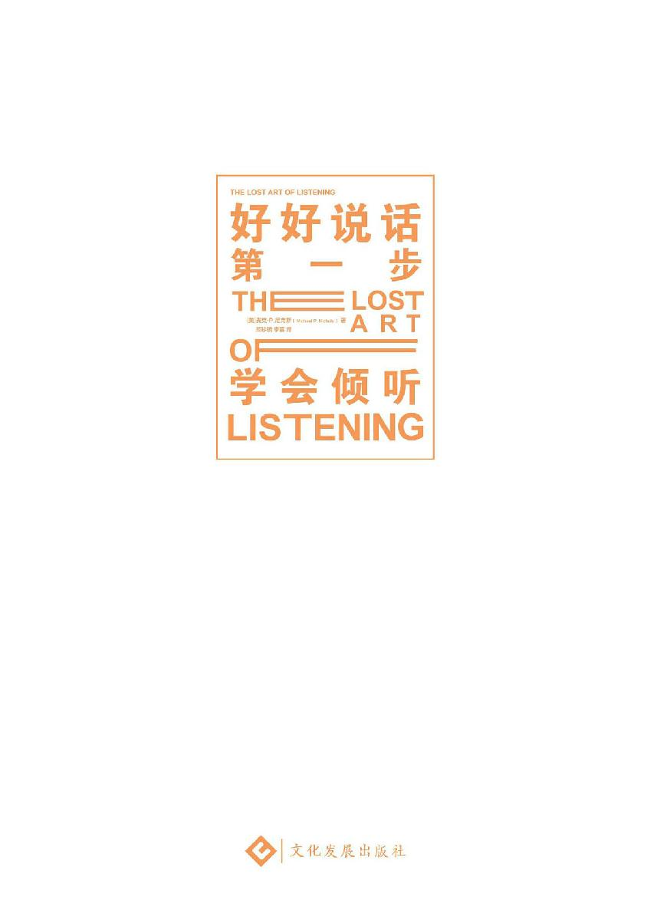
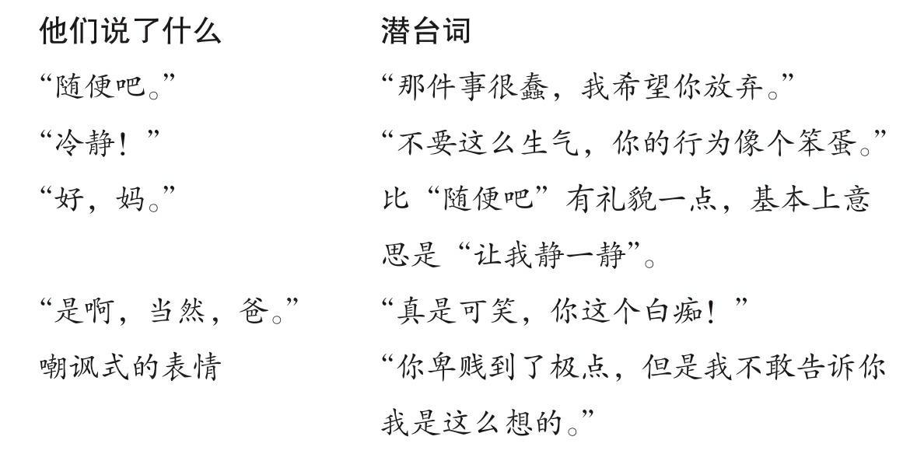

<svg xmlns="http://www.w3.org/2000/svg" xmlns:xlink="http://www.w3.org/1999/xlink" version="1.1" width="100%" height="100%" viewbox="0 0 889 1186" preserveaspectratio="none">

<image width="889" height="1186" xlink:href="cover.jpeg"></image>
</svg>

**图书在版编目（CIP）数据**

好好说话第一步：学会倾听／（美）麦克·P.尼克斯著；邱珍琬，李葚译．—北京：文化发展出版社有限公司，2018.5

ISBN 978-7-5142-2241-8

Ⅰ．①好…　Ⅱ．①麦…②邱…
③李…　Ⅲ．①人际关系－口才学－通俗读物　Ⅳ．①C912.13-49

中国版本图书馆CIP数据核字（2018）第090865号

著作权合同登记号　图字：01-2018-2739

The Lost Art of Listening: How Learning to Listen Can Improve
Relationships by Michael P. Nichols, PhD

Copyright © 2009 by Michael P. Nichols, PhD

Published by arrangement with The Guilford Press through Big Apple
Agency, Inc., Labuan, Malaysia.

Simplified Chinese translation copyright © 2018

by Beijing Xiron Books Co., Ltd.

ALL RIGHTS RESERVED

**好好说话第一步：学会倾听**

著　　者：［美］麦克·P.尼克斯

译　　者：邱珍琬　李　葚

------------------------------------------------------------------------

责任编辑：肖润征

特约监制：赵　菁

产品经理：梁珍珍

出版发行：文化发展出版社（北京市翠微路2号　邮编：100036）

网　　址：www.wenhuafazhan.com

经　　销：各地新华书店

印　　刷：河北鹏润印刷有限公司

------------------------------------------------------------------------

开　　本：700mm×980mm　1/16

字　　数：200千字

印　　张：20

印　　次：2018年6月第1版　2018年6月第1次印刷

ISBN：978-7-5142-2241-8

定　　价：48.00元

# 对本书的赞誉

“什么是真正的倾听？为什么人们不听？”作者问。难道它已经成为现代生活的珍稀宝贝？尼克斯告诉我们如何利用这项艺术来改善与修补伴侣、亲子、朋友与同事关系，甚至告诉我们如何提高我们自己的“听力”！他也解释“什么不是倾听”，解释我们为什么不听以及倾听的障碍为何（特别是“防卫是因为过度的情绪反应”）。幽默、真实的生活案例与简单的练习，让本书成为一部实用又有趣的自助手册。

——《出版家周刊》（*Publishers Weekly*）

有力且知性的一本书。

——《当代心理学》（*Contemporary
Psychology*）

一本将许多“倾听基本原则”做了重要回顾的书，这些原则是我们在生命中的某些阶段已经学到，却又很快遗忘了的。本书的优势之一是：尼克斯直接针对读者说话的能力。

——《家庭心理治疗学报》（*Journal of Family
Psychotherapy*）

老牌演员莉莉·汤姆林（Lily
Tomlin）曾给予忠告：“只要认真听，就可以省掉说话的时间。”这本《好好说话第一步：学会倾听》告诉我们倾听的方法。这是一本非常特殊的书，它将几十年如何改善我们的重要关系，以及最终目标是“改进我们自己”的临床智慧，淬炼为实际可用的忠告。通过“每个人都想被听见”的重要角度，尼克斯博士告诉我们：真诚的倾听是如何避免让关系破裂与干涸的。在他的建议之后，他还举出清楚、熟悉且相关的真实家庭问题与挫败案例作为对照，这种呈现方式，让我们可以更开放地接受与使用他所提供的讯息。他强调不要让被伤害后的气愤、焦虑与害怕等情绪阻碍了我们倾听的能力，也列举了许多故事，让我们知道如何处理从“批判”到“沉默”与“侵犯”的诸多事件。同时，他也提供了改善自尊、减少直接情绪反应的线索。这不只是一本书，对于我们来说，更是一部重要的手册，不管我们是想在有生之年让自己对关系感到满意，或是避免关系死亡。

—卡罗·安德森（Carol M. Anderson, MSW,
PhD），匹兹堡大学韦斯顿精神医学研究院及治疗中心

一部文辞优美又条理分明的倾听指南。这本书是对“无价值感”的一帖解毒剂，我们有太多人是因为社会文化切断了我们“与人互动”的需求，而感到“无价值”。尼克斯博士运用他个人与病患的生活故事，提供了如何“倾听亲友”的清楚步骤。这本《好好说话第一步：学会倾听》很好读，也是治疗师的重要工具。

—马瑞欧·所罗门（Marion F. Solomon,
PhD），《自恋与亲密关系》（*Narcissism and lntimacy*）作者

尼克斯博士写的书，就好像直接跟我们说话一样，他说话的方式，让我们不仅能够，也热切地想聆听。他把倾听的关键元素，具体展现在读者面前，依循这样的方式，我们可以学到更多。

—提尔马·戈瑞奇（Thelma Jean Goodrich,
PhD），卫彻斯特家庭学院

我用这本书来上研究所第一学期“精微咨询技术（counseling
microskills）”的课，学生认为这是我所用过最好的教科书。《好好说话第一步：学会倾听》使用真实生活中的实用案例来说明“主动倾听”是怎么一回事。这种方式让教材变得鲜活，很适合初学“主动倾听”的学生，而对于已经熟悉“主动倾听”的人而言，不啻为一本较棒的复习教材。此外，我经常会向来诊所的伴侣们推荐本书。

—艾沃生·伊肯（lverson M. Eicken,
PhD），加州州立大学咨询系讲师

这本书值得一读再读。只需提醒你自己一件很简单的事：停下来，听一听你生命中重要的人说话。这本书曾在不同的时段对我耳提面命，也协助我改善了与配偶、孩子及朋友之间的关系。

—道格·O（Doug O.），加州胡桃溪

# 译序

“沟通”是我们常常挂在嘴边的词，也习惯把许多问题归咎于“沟通不良”。尽管坊间有许多着力于亲子、夫妻、家庭、师生或工作场合的沟通书籍，但是可以把理论与实际加以糅合，然后由浅入深呈现出来的，并不多见。这本麦克·P.尼克斯（Michael
P. Nichols）的著作《好好说话第一步：学会倾听》（*The Lost Art of
Listening: How Learning to Listen Can Improve
Relationships*），是我在美国求学时“发现”的一本沟通的好书，它自沟通的第一步倾听着手，从“如何真正听到对方所说的”入门，然后层层铺叙倾听可能会遇到的障碍，又如何“破解”，读来有条有理，例子平易鲜明，是一本很好用的“工具书（tool
guide）”。更重要的是，尼克斯虽然是心理学家，但全书之中绝不“掉书袋”，许多想法是用最言简意赅的方式呈现的，没有佶屈聱牙。

在进行家庭或个人心理治疗的工作中，我把这本《好好说话第一步：学会倾听》（*The
Lost Art of Listening: How Learning to Listen Can Improve
Relationships*）介绍给病人，有时也当成家庭作业，获得了很多正面的回响。回国之后，有机会把这本书翻阅多次，发现可以把好书译出来，让有心者一起分享，的确是一件很棒的事。接触了许多的学生、家长或一般民众，许多人的共同心声是：很难被别人了解，不被了解，常常是“沟而不通”，没有把沟通的功夫真正做好。尤其是家中有青少年的父母，常常被“卡”在沟通的问题上，不知所措，让我觉得有必要把这个管道打通。我不仅将这本《好好说话第一步：学会倾听》（*The
Lost Art of Listening: How Learning to Listen Can Improve*
*Relationships*）的重点放入治疗现场使用，而且也在亲子教育、亲师互动的相关演说中运用，获得了相当好的反响。最近看到不少企业或EMBA课程也将倾听列入，我认为的确有更多的人也注意到了倾听的重要性，希望这本书不只是在业界受到青睐，而是可以推广到社会不同角落与关系上，让我们彼此可以更靠近，也可以更自在地做自己。

通过进行第二版修订，也有机会将此书重新阅读一次，许多沟通重点依然值得玩味。感谢好友杨美慧读过之后还圈选了一些需要厘清与解释的地方，特地寄来让我在修订时做参考，她的参与让本书更有可读性。

我把“沟通（communication）”这个词做了新的诠释，正好把它介绍出来，在开始看尼克斯的本书时，可以有“开胃”效果：

**·有意识的努力（conscious
effort）：**沟通的功夫不是自然天成的，而是要刻意去努力、去学习的。

**·开放（openness）：**指的是姿势、态度、想法的开放，还有问“开放式（open）”的问题。

**·双向的　过程（mutual
process）：**沟通是“说者（speaker）”与“听者（listener）”两个角色互换的过程，说的人可能是下一刻的听众，听的人可能下一刻就会发言，所以，管道是双向的。

**·讯息（message）：**沟通是讯息的交换，讯息又分“报告（report——说什么，就指什么）”及“要求（command——在表面说的之外有更深一层的意思）”。中国人善于“间接沟通”，也就是使用“要求”的机会很多。

**·特殊的个人（unique
individual）：**每个人都是特殊、独立的个体，有不同的内在经验世界，有不同的感受、想法以及行为方式，当然，也有不同的沟通方式，不一定要局限于语言上的互动。

**·需求（need）：**人有被了解的需求，也有被认同的需求，所以，要借由沟通来让别人了解（认同），也了解（认同）别人。

**·真诚（ingenuity）：**真诚可以赢得信赖，也才会有真实不欺的沟通可能。

**·内容（context）：**说话的内容要就事论事，不要东拉西扯，尤其最忌讳做“历史学家”——把之前的陈年老账又搬出台面；另外，也要注意“环境”及“时间”，如果在家谈孩子，发现丈夫如东风射马耳，不妨约在餐厅或咖啡店来谈。有些环境是可以避免被打扰的，而且能够让人更专心听的。沟通需要时间，如果手边正在忙，不能用心听，那么就另外约个时间，千万不要敷衍。

**·接受（acceptance）：**接受对方是他自己有表达的权利，听他说完就是接受，也是“尊重”对方的表现。

**·容忍（tolerance）：**因为每个人不同，自然就有不同的想法及意见。容忍不同的声音，可以明白不一样的看法，欣赏人与人之间的差异，也会拓展我们的见识与胸襟。

**·解释（interpretation）：**每个人心中都有一把尺，或一层滤网（filter），所以同样的信息，听在每个人的耳朵里会有不同的解释及效果，这也表明了每个人的不同以及沟通的难度。

**·观察**（observation）：沟通不只是语言文字上的，而且还有我们的“身体语言（body
language）”——姿势、动作、语调、脸部表情等。除了接收语言文字之外，还要配合观察到的线索，这样才可以让沟通变得顺畅。

**·非批判性的态度**（non-judgmental
attitude）：沟通时，记得不要把“自己”放在前面。许多人在还没有听对方说时，心中早有答案或意见，只是“等着”把它说出来而已。在做“听众”时，请把舞台让给说的人，不要让自己的成见蒙蔽了我们倾听的能力，这就是所谓的开放、没有批判性的态度。

“不被了解”是沟通踢到铁板，很多人在试着用自己的方式沟通，但没有得到预期的效果之后，就会退缩，甚至懒得沟通了。结果是自己砌了一面隔绝的围墙，不被了解，也不想去了解他人，于是，我们看到这个人一直在萎缩。既然沟通是个人成长的一个主要元素，那么想要突破阻碍、畅通管道、丰富生命，何不自这本《好好说话第一步：学会倾听》开始呢？

# 前言

最伤我们心的，莫过于我们意识到，自己在乎的人没有真正倾听我们说话。不管年纪多大，我们都需要他人了解我们的感受。这就是为什么一双具有同理心的耳朵，在人际关系中的作用巨大。同样，这也是为什么不被理解的挫败会那样伤人。

三十五年来，我在担任心理咨询师和家庭治疗师的经历中，完善了关于倾听的见解。我调解过亲密伴侣间的争吵；指导过父母进行亲子沟通；在病人与病魔缠斗时，我努力让自己报以同理之心。从中，我得到了一个很重要的结论：生活中的诸多不顺及冲突，都可以归结为一个简单的原因—我们没有真正去听对方在说什么。

只说不听，就好像从中截断电线，还希望它能导电去点亮什么一样。当然，大多数情况下，我们并不会刻意去阻断与他人的联结。事实上，我们常常不清楚发生了什么，没有一点办法，从而丧失了沟通的勇气。

随着现代文明的发展，衍生出了许多个人主义的概念。按照这些概念的描述，我们需要去找寻内在安身立命的方向，从塑造我们的重重对话网络中挣脱开来，从而成为独立的个体。这就像是说，我们长大成人后，就不再需要获得注意了，它就像辅助轮一样，一旦你学会了就用不着了。当然，我的意思并不是在自主做决定（哪怕是未经思考的），或者说自主思考、行动的层面上，人们都无法自立。而是说，沟通是一种我们无法摆脱的“生而为人”的条件。离开沟通，我们便无法获得安全感和满足感。沟通，从广义来说，就是人与人之间的一种互动与交换。

很遗憾，现代生活的压力，压缩了我们日常的注意范围，也让倾听的质量恶化了。我们生活在瞬息万变的时代，晚餐是微波炉“叮”一下的快餐，追新书新剧也只是读读书评剧评而已。我们的时间只够做这些！我们每天奔走于必须完成的义务之间，练出了一身“不听”的本事。比如，开车放着广播，有趣的地方我们还会注意一下，其他时候我们必须留意路况，或是又转念想起其他什么事。时间很快过去，我们什么都没听进去。又比如，我们在看电视，结果却进广告了，有一半的时间我们根本没有在听。

我们被许多的图像轰炸，从电视、电子邮件、垃圾邮件、网络、手机、传呼器到传真机，这也分散了我们的注意力。我们总认为自己善于同时做好几件事，我们可以在讲电话的时候查看电子邮件，看电视时，也翻一翻购物目录，找一找要买的东西。结果，我们欺骗了自己，误以为自己可以同时做很多事。而事实是：我们只是差劲儿地赶完一件又一件事而已！

我们可以得到前所未有的庞杂信息，却失去了一件很重要的东西—我们丧失了专注的习惯。从体育馆放的流行音乐，到电视或收音机播的广告，我们被各种噪声轰炸，也成了“转移注意力”的达人。如果一个节目一开始就不能吸引我们，那么我们就会转台；如果某人说起我们感兴趣的事物，但说不到点上，我们就会自动合上耳朵。

虽然我们为家人朋友保留了极为有限的时间，但即使是在这种时候，那种没完没了的被动型分心又抢了先。我们已经累得没有精力去说，也没有精力去听，而只是把自己安顿在五光十色、声画并茂的屏幕之前。是这样的生活方式让我们忘了怎么倾听吗？也许吧！但或许现代人过上这种生活，是对话意义渐失的“果”，而不是“因”。我们之所以这样活，是因为我们在寻求某种慰藉，以用来抵消没有人倾听的那种失落感吧！

“我们怎么遗失了倾听之道”，的确是一个值得讨论的话题。唯一不容否认的是这种失落，在我们的生命中造成了好大一个破洞，它呈现为说不清道不明的不满、悲伤，或是一种被剥夺了什么的感受。我们怀念真诚倾听他人时的快慰，也怀念他人用同样方式回应我们的慰藉。但是，我们却不明白现在到底是哪里不对劲儿了，又该怎么去修补。长此以往，这种“缺乏聆听”就破坏了我们最重要的人际关系。我们因为不了解对方在说什么，而给彼此造成了不必要的伤害。不管在什么场合，由于我们经历过这种“没有被人听见”的失意，就会认为没有人关心我们。

即使我们去了解彼此的观点，也并不意味着就能消除冲突。然而，可以肯定的是，如果不去了解对方的看法，冲突就只会更严重！所以，我们为什么不花点时间去聆听彼此呢？要知道，“倾听的基本之道”可一点也不简单！

“倾听的基本之道”常常会成为一种负担。日常生活中，我们会迁就彼此，其中一部分，就是例行公事般地给予对方关注。这当然不能说是负担了。但是，维持专注、仔细地倾听，就需要尽全力、无私心的自制力。要想好好倾听，我们就必须先搁置自我，以对方寻求关注的需求为先。

尽管对话更容易让人听下去，但对话毕竟是在两个人之间发生的，结果如何，两人都有责任。而很不幸的是，如果我们无法了解彼此，就会怪东怪西：是他的错，他自私又鲁钝；或者，是我的错，我太依赖别人了，我没有说清楚自己想说的。

人们无法了解对方，大部分原因不是太过于以自我为中心或没有诚意，而是我们总觉得自己有必要说点什么。所以我们往往就对方说的话做反应，而没有去提炼对方要表达的是什么。情绪反应令我们不经思考就做反应，也让了解与关心变得不可能了。我们每个人都有个性化的防卫式反应。一旦说话者所传达的讯息伤害、激怒或惹急了我们，我们就什么都不想听了。

很不幸，这世上并没有一个有关“主动倾听（active
listening）”的忠告，能帮我们克服防卫式反应这种疯狂习性。要想成为一个更好的聆听者，并改善我们的关系，我们必须就先确认及掌控那些会引起我们焦虑，并引发误解及冲突的“情绪扳机（emotional
triggers）”。

如果你觉得这个任务很艰难，那么请记得：我们大多数人都比自己认为的更有能力。我们在工作上尽心尽力，而且依然能与朋友共享真诚又开放的谈心时刻。事实上，与朋友的交谈也是一种对话：人们既能放心地谈论彼此关心的事，也能关切地倾听；既能坦白地说出实话，也能得体地知道何时应该闭嘴。事实上，还有更多的人际关系也可以这样啊！

在着手写这本书期间，我不管是在个人生活，还是在工作上，也一直努力去做一个更好的聆听者，我更认真地倾听老婆的抱怨，而不做防卫式反应；我在提出个人的建议前，先尽量听一听孩子怎么说。尽管如此，我仍然在几次的对话中感到受伤与挫折。我太太严厉地指责我该承担更多家务，或者训我没有听她说话，这都让我觉得受到了非难。或者，我打了太多电话向编辑抱怨写作的压力，她也让我感到自己是个抱怨鬼，成了别人的负担。而我的朋友瑞奇会喊我不雅的名字，好像我当之无愧似的。在这些时刻，我不仅没有倾听（指听到且明白别人在说什么），而且还觉得自己受到了伤害，也很生气，甚至完全不愿意在有生之年再跟那个人说话！

上述这些不被了解的情形，你一定明白多么令人痛苦。当我太太“吼”我、我的编辑对我很“刻薄”、我的朋友捉弄我的时候，我会受伤、退缩。然而，其中最为难受的是，就在我自己正努力学习当一个更好的聆听者的时候，这些挫折把我整个推回原地！我并不会想到，既然事情进行得不顺，那么就需要好好修补。相反，我只觉得自己彻底失败了，而且也很无能。我在自己生活的圈子里都不能跟人好好相处，那么又有什么能耐来写有关倾听的书呢？我又怎能教导别人如何对话？

也许你知道这种感觉！我们在试着改变生活中的一些方面，不管是饮食方式、工作习惯也好，或者是倾听技巧也好，而历经挫败时，我们往往会觉得无望，甚至会放弃。突然之间，我们以为的进步也成了自我幻觉！如果我只是在阅读一本有关倾听的书时，碰到了这些挫折，那我肯定会放弃。但是，我是在写这本书！在一阵痛苦的沉默静思之后，我回头同刚刚吵过架的人又谈了谈。正是在这个时候，我带着解决问题的决心，在陈述自己的看法之前，先倾听他人的说法。在这一整个过程之中，我明白自己与别人的关系是怎样经历了由“亲近”到“疏离”的周期。更重要的是，我学会了改善自己的倾听质量，进而影响了这个周期。

所以，这本书发出了一份邀请，请你来考虑一下，我们该如何与他人说话，又该怎样听他人说话。为什么倾听在我们的生命中有这么大的影响力？我们要如何融入别人的经验世界，进而听得更深入？我们又该如何避免不良的倾听习惯破坏了本来顺畅的倾听？

在成功沟通的秘诀中，我会谈论到下面的议题：

·真正的“对话”与“轮流发言”之间的差异。

·听懂别人话里的意思，而不只是表面的意思。

·怎样让一个从来不好好听人说话的人，来了解我们要说的。

·如何减少争论。

·如何获得你想要的支持，而非你不想要的忠告。

·如何让不懂沟通的人开口说话。

·如何说出不同的意见，同时，避免让他人感觉受到了指责。

·如何在激烈的讨论中，让双方都明白对方的观点。

·说话的人如何搞砸了他们所要传达的讯息。

·人际关系的好坏如何影响了倾听。

·如何让别人听你说话。

《好好说话第一步：学会倾听》一书共分为四篇。第一篇说明为什么倾听在我们的生活中占了这么重要的地位，甚至远比我们所了解的更重要。对于大多数人来说，比起压力过大或工作过度，缺少同理心的倾听，更能让人丧失生活中的热情与乐观！

第二篇探讨了那些隐蔽的预设、潜意识里的需求以及情绪化的反应，这些才是造成我们未能倾听的真正原因。我们会发现是什么使得听者防卫过度，因而听不见别人要说什么；为什么你有重要的事要说时，别人却并不爱听你想表达的。

在解释了阻挠倾听的主要障碍之后，我会在第三篇里检视，在了解及控制情绪化反应（emotional
reactions）后，如何成为更好的倾听者；我也会说明，在最难沟通的情况下，如何让他人听你说话。

最后，在第四篇里，我会探讨在一些重要的人际关系，包括亲密伴侣、家人、亲子、朋友及同事关系中，倾听是怎么失败的。我也会说明，由于各种关系是变动的，所以倾听的情况也会有所不同。然后，我会解释，当我们认识到这一点后，如何去突破阻碍，进而听见彼此。

在每一章的最后面都有“练习”的部分，专门协助你成为一位更好的倾听者。事实上，这些练习也可以将被动的阅读过程转化为主动的改善倾听能力的过程。

不管我们认为倾听多么理所当然，它的重要性都是不能低估的。我们如果具备关注他人、了解他人的这种才能，就能使他人获得认同感和被重视感。我们如果能去倾听，或认真倾听，那么所带来的善意也会回到我们自己身上。有效的倾听，通常也是最好的办法，让我们能与他人愉快相处，从他人身上学习，并让他们的陪伴有趣起来。我希望这本书可以带领我们向前迈出一小步，让我们勇于表现出对彼此的关心吧！

# 目 录

[对本书的赞誉](#part0002.html_pre1_1)

[译序](#part0003.html_pre2_2)

[前言](#part0004.html_pre3_3)

[第一篇　为什么倾听这么重要](#part0006.html_isbn9787514222418_1)

[第一章　为什么倾听这么重要](#part0007.html_isbn9787514222418_1_1)

[第二章　倾听可形塑自我及人际关系](#part0008.html_isbn9787514222418_1_2)

[第三章　沟通是如何瓦解的](#part0009.html_isbn9787514222418_1_3)

[第二篇　我们为什么无法倾听](#part0010.html_isbn9787514222418_2)

[第四章　“什么时候才轮到我说？”](#part0011.html_isbn9787514222418_2_4)

[第五章　内在的期望损害了我们倾听](#part0012.html_isbn9787514222418_2_5)

[第六章　情绪化让我们具有防卫性](#part0013.html_isbn9787514222418_2_6)

[第三篇　倾听的技巧](#part0014.html_isbn9787514222418_3)

[第七章　倾听的核心：暂时搁置自己的需求](#part0015.html_isbn9787514222418_3_7)

[第八章　同理心自开放做起](#part0016.html_isbn9787514222418_3_8)

[第九章　如何化解情绪化反应](#part0017.html_isbn9787514222418_3_9)

[第四篇　人际关系中的倾听艺术](#part0018.html_isbn9787514222418_4)

[第十章　亲密伴侣间的倾听](#part0019.html_isbn9787514222418_4_10)

[第十一章　家庭中的倾听](#part0020.html_isbn9787514222418_4_11)

[第十二章　倾听儿童与青少年](#part0021.html_isbn9787514222418_4_12)

[第十三章　倾听朋友及同事](#part0022.html_isbn9787514222418_4_13)

[后记](#part0023.html_pos1_1)

# 第一篇　为什么倾听这么重要

在多重的人际关系中，说与听是联结并维系双向关系的重要纽带。被倾听就是被认可，也就是我们的表达在别人身上得到反应，使我们的感觉、行动及用心有了意义。

如果一个人在说话时没有人听，那么说话者便无法满足传递想法与表达情感的目的；也因此，在说话者的心中产生了一种被拒绝、被忽视的挫败感。

表达及被认可是自我生命与他人生命互动、互惠的过程，自我的生命在这个过程中得到了完整，人际关系在这个过程中得到了平衡。

# 第一章　为什么倾听这么重要

【被听见就是被重视，它满足了自我表达及与他人沟通联系的需要。悦纳的倾听者容许我们表达自己的所思所感，他人的倾听与注意协助我们在肯定自己的过程中，厘清思绪及感受。被了解的需要是滋养人心的养料。】

很多时候，人们似乎都不听彼此说话。

“他希望我能听听他的困难，可是却对我的难处不闻不问。”

“她老是在抱怨。”

“我唯一一次知道他发生了什么事，还是在他告诉别人的时候不小心听见的。他为什么从不对我说这些？”

“我没法子同她说话，她太挑剔了。”

太太们抱怨丈夫把她们所做的一切视为理所当然，丈夫们抱怨老婆唠叨聒噪，说话从来都没有重点。

她觉得他破坏了他们之间的关系；而他才不认为构建关系有什么用呢。

人一生有种种的动机，“被听懂”这种渴望可以说是其中最强烈的了。被倾听意味着对方认真对待我们，觉察我们的想法及感受。归根结底，也就是说，他们认可我们所说的话是很重要的。

渴望被倾听，就是渴望逃离孤立，进而建起孤岛之间的桥梁。我们接近彼此，透露我们的所思所感，试图以此来克服与他人之间的分隔感，以求得理解。获得这样的理解貌似很简单，而实际上并非如此！

乔安娜看中了一件职业套装，她犹豫要不要花这笔置装费。“亲爱的，”她开口道，“我在商店里看见了一件还不错的套装。”

“那不挺好的吗。”亨利敷衍了一句，便接着看新闻去了。

贾斯汀开车时发生了擦撞，使他心烦意乱。他担心，要是让丹妮丝知道了，一定会揪着这事不放。于是，他闭口不提，只纠结着该怎么修好汽车。丹妮丝察觉到了贾斯汀的距离感，猜他是为了其他事在生自己的气，但她不想引起争吵，就什么都没有说。

良好倾听的要素是“同理心”。同理心只有靠我们搁置对自我的过度关注，进入他人的经验世界，才可能达成。同理心有一部分是先天的直觉，而有一部分则要经过后天的努力，其是人际关系的诀窍。

倾听者的同理心，是领会他人说的是什么，再表现出这种理解。它建立起了解的桥梁，让我们与愿意聆听和关心我们的人相连，由此证实我们的感受是合理的，是被认可的。同理的倾听就是改变关系的力量。那些我们深有感触而又没有表达出来的感受，用言语说出来，在收到明确回应后，我们就会心生宽慰，觉得有人理解我们，并产生一种“人性相通”的感激之情。

倾听巩固了人与人之间的联结，增进了彼此的关系，同时，它也增强了我们对自己的观感。在一位愿意接纳的倾听者面前，我们可以厘清自己的想法，发现自己内心的感受。因此，在向愿意倾听我们的人讲述自己经历的同时，我们也更能聆听自己的声音。我们的生命版图就是在这种对话中日渐清晰的。

### 不被倾听是一种伤害

我们需要他人认真对待，需要对方有所回应，但这种需求在我们的日常生活中经常遭遇到挫败。父母抱怨孩子左耳朵进右耳朵出；孩子埋怨父母只知道责怪或说教，根本不听自己的说法；即使是平常可以彼此分享和互相信任的朋友，现在也由于太忙了，没空听彼此说话。如果我们在私人领域中都得不到同情或理解，那么也就不再期待在公共生活里能够得到别人的尊重及注意了。

我们需要被人倾听的权利常常遭到侵犯，这种情况数不胜数，哪怕他人是不经意的，但也并不表示伤害较小！

我有一个做精神科医生的朋友，我告诉他我正在搜集有关“不被倾听的痛苦经验”时，他发过来了这么一个实例：

“我打电话给一位朋友，并在他的答录机上留言，问他能否找个时间碰面。他没有回话。我有点焦急，也很困惑。我该不该再打电话去提醒他呢？毕竟他也很忙。或者我应该等上一两天，那时他会回我电话吗？是不是我一早就不该约他？这些都让我很不安！”

看到这个案例时，我很吃惊，第一个念头是，没回电话这么一件小事，竟然可以让一个人感到不被理会而深受困扰！然后，我惊醒过来，仿佛被人甩了一个耳光，我意识到朋友是在说我啊！突然间，我觉得好丢脸，开始想要辩解！我没有回电话是因为……唉，已经不重要了，我们总能找出不回电话的理由。重要的是，我没能及时回电话伤害到了朋友，也让他觉得困惑，但我却一点感觉也没有！

如果这种不经意也能造成伤害，那么很难想象，当要说的事对说话者而言既紧急又重要时，那种伤害造成的痛苦又有多深啊！

倾听这么基本的事，我们都觉得不必多说。

然而，在当一名倾听者这件事上，大多数人都高估了自己。

你出差回来，想跟丈夫说一说路上的见闻，他听着听着，但一两分钟之后，就好像要睡着了，你很伤心，有一种被辜负的感觉。又比如，你赢得了一项荣耀，打电话告诉父母，但他们好像并不在意，你觉得很泄气，也觉得自己有点愚蠢—自己高兴就好了，为什么还要期待别人的赞美！

上面说的情况是，当你为了一些特别的事而感到兴奋时，没有人听，你会很难过。还有一种情况是，某个人对于你来说很特别，你期待他会在乎你，但你觉得他没有倾听你，这时，你也会有受伤的感觉。

罗杰大学时的好友是德里克，他们都主修政治，也对政治极为热衷。他们一起追踪水门事件发展的细节，品咂每一条新披露的线索，就像在津津有味地追看连载的黑暗连环漫画一样。他们在享受尼克松“水门丑闻”被披露出来的那种辛辣、痛快的感觉时，彼此之间的情谊也超越了单纯对政治的热爱。

罗杰记得与德里克促膝长谈的美好感受，那是由一种深刻、无以言喻的同理心所激发出的！他感受到了一种双重的喜悦，他既能说出自己想说的，也能听到朋友说出自己一直在思考，却没有表达出来的！德里克不像罗杰的其他朋友，他不是一个爱出风头的谈话对象，他是真正在听。

即使后来他们在不同城市的研究所，也仍维持着良好的情谊。至少每个月他们都会去看望对方，打打台球，看看电影，或上中国馆子，接着，不管多晚，他们都会秉烛夜谈。

然后，德里克结婚了，情况就变了。德里克并不像一些人那样，一结了婚就疏离了以前的朋友，德里克的太太也很喜欢罗杰。然而，罗杰觉察到的距离虽然微乎其微，却造成了很大的差异。

“这个真的很难描述，我在跟德里克说话时，老是觉得很别扭，也很失望。他是在听我说话，但不知怎的，他好像不是真的那么在意。他没有问问题，以前他不仅是单向接收，而且是全心投入。这种情况让我很难过。我对自己生活中发生的事满怀热情，但是告诉德里克之后，只会让我觉得我的生活仿佛与他不相干！”

罗杰的难过，说明了倾听的重点。我们渴望的并不只是不被打断或干扰。有时，人们看起来是在听，事实上却没有真的听进去。许多人在听我们说话时，善于用沉默来伪装。但那些四下张望或摇来晃去的动作，透露出他们并不走心。有时哪怕他们并没有流露出不专心，但我们仍然可以感受到他们没有在听，觉得他们并不在乎。

德里克的消极表现，对罗杰的伤害特别大，因为他们曾经那么亲密。现在，他们的友谊遇到了瓶颈，罗杰无法再像以前那样对朋友敞开心扉，德里克也为他们渐行渐远的情谊所扰。

友谊本身是自愿的，所以要不要就它坐下来谈一谈，也要看双方的意愿。罗杰不想对德里克有所抱怨或要求，何况我们又该怎么告诉朋友，我们觉得对方已经不再关心自己了？因此，罗杰没有告诉德里克自己有被疏远的感受。可惜的是，当两人之间的关系变差时，“谈论它”也许是唯一可以挽救的方法！

与你关系亲密的人，你尤其渴望他们能理解你，这时，不被倾听的伤害也就格外严重！

大多数人有过这种经历后，都会以成人的姿态来伪装自己，不再把那些琐碎或误解的事放在心上。在这个过程中，我们可能会变得冷漠一些，那好吧，这就是我们在这个世界上生存所必须付出的代价。但是，得不到响应会让我们备受伤害，一气之下，我们有可能在人际关系中退缩起来，甚至达数年之久。

有一位女性发现丈夫出轨了，她痛心到像是被人狠狠踢了一脚。在悲伤与气愤之下，她找了一位很亲近的人倾吐心声，那就是她的婆婆。虽然婆婆试着理解她、支持她，但是一个做婆婆的，真的很难听进去媳妇编派自己儿子的不是。她尽力了，但是显然，她提供的支持仍然不够。最后，危机过了，这对夫妇重归于好，但媳妇却认为在最需要支持的时候，婆婆没有为她做什么，从此便不再与婆婆说话。

遗憾的是，这位婆婆拿媳妇固执的沉默也没有办法。我们常常认为他人的反应是无理取闹，但是从得不到响应而受伤的人的角度来看，他们的反应却是很合理的。

倾听就是要报以专心，引出兴趣，热切关怀，用心体会，及时确认，细心察觉，为之感动，表示赞赏。事实上，倾听是人存在的核心，以至于常常不为我们所察觉。也可以说，倾听本身又常以不同的伪装出现，以至于我们不容易发现它是如此重要的一个需求。就像是前面的罗杰，还有那位与婆婆疏离的媳妇一样，我们平常也没有意识到他人倾听有什么大不了的，只有当自己被剥夺了这个权利后，才豁然明白了它的重要性！

偶尔的情况下，我们能意识到他人倾听我们的重大意义。比如，你无法决定是否接受一个新的职位，便打电话和一位老友商量。她没有告诉你该怎么做，但是她在听，她真正在听，这已经能协助你看得更清楚。再举个例子，你喜欢上了一个刚认识的人，在餐馆享受了一顿很棒的晚餐之后，你鼓足勇气，邀他到你的住处喝杯咖啡，他却拒绝说：“不，谢谢，我明天必须早起。”被拒绝的滋味够你受的，你说服自己说他不是真的喜欢你，于是开始躲避他。可是，几天之后，他又来关心你发生什么事了。你再次鼓足勇气，告诉他你伤心的原因。出乎意料地，他没有反驳什么，反而很认真在听，也接受你所说的。他坦白道：“我可以理解你为什么有这样的感受，但是事实上，我想再见你。”

生活为什么不能一直像这样呢？我说，你听，不就那么简单吗？然而，事与愿违。说话与倾听之间有一种很特殊的关系，说者及听者都在不断交换角色，设法抢占有利位置，用自己的需求压过他人的需求！如果你怀疑这个说法，那就请试着告诉某人你目前所遭遇的困扰，然后看看过了多久之后，他会忍不住打断你的话，告诉你他曾遇到过类似的问题，或给你一个可能适合他本人，却不适合你的建议。

一位正在接受心理治疗的男子，在探讨自己与疏远的父亲之间的关系时，突然忆及父亲与他一起玩电动火车的快乐时光。那可是从他父亲和他父亲的父亲手里传下来的一套Lionel牌的火车组。沉浸在回忆中，他再次感受到与父亲传承家庭传统的光荣之情，变得越来越兴奋。当他说得正高兴时，治疗师突然接过话头，滔滔不绝地谈起自己小时候的玩具火车，还有他让邻居小孩带上各自的装备，在他家地下室铺设火车轨道的情景。治疗师说了好一通，病人终于按捺不住被中途打断的愤怒，喊道：“你的玩具火车，关我什么事！干吗老是要告诉我？”治疗师迟疑了一下，就像吐露心事一样，用一种克制过的、不带个人情感色彩的口吻，讪讪地说道：“我只是想表示友善而已！”

分享一种感受，需要两个人，一个人说，而另外一个人听。

治疗师本身犯了一个常见的错误（实际上，他犯了好几个错，不过，谁让本周是“请放过治疗师周”呢），他想当然地认为，分享自身的经验就等于同理心。事实上，他已经把焦点转移到了自己身上，病人就会觉得自己不受重视、不被认同、遭到误解，而这就是伤害！

同理心这个字眼已越来越为人所熟知，但这个词语的意思，还没有充分强调出“认同另一个人的内心世界”的作用。同理的倾听就像仔细地读一首诗，消化每一个字，去了解文字背后所要传达的意思。个中区别在于，尽管同理心也是一种主动的想象，但它基本上是接纳多于创造。当我们欣赏一件艺术作品时，我们每个人的独特反应都有它的意义。但是当我们去听别人说话时，重要的是理解力，而不是创造力。

### 倾听也是一种见证

倾听有两个目的：一是吸收信息，二是见证他人的经验。真正的倾听者会搁置自己的参考架构，进入我们的经验世界，他不仅能理解我们所说的话，而且还予以肯定。这种肯定对维护自尊是很重要的。如果没有人听我们说话，我们就会把自己关在心中的孤城里。

今年三十六岁的玛丽，在为一个小意外而不安，她甚至怀疑自己可能需要心理治疗。事情是这样的：玛丽是某公共政策机构的副所长，她安排了一场与副州长的会议，会上，她将提出一个有关大型州立工厂的管理方案。出于礼节，她邀请了老板出席，尽管如果他不来的话，她会表现得更好。但老板反过来，请了该机构的主要游说人员与会，因为他们得靠这位游说员，来向国会议员说明这个管理方案的必要性。会议的开场，完全在玛丽预料之中，老板天马行空地说了一大堆没有重点的话。但他在结束开场白之后，并没有请玛丽上台，反而让那位游说员做了报告！玛丽震惊之余，游说员已经开始讲了起来，直到十五分钟后会议结束，玛丽连提及自己方案一个字的机会都没有！

玛丽忍不住要告诉丈夫今天发生的事。谁知道丈夫出差去欧洲了，要三天之后才会回来。她早已习惯了丈夫因为生意常要出差，但还不习惯这种沟通中断的经验，她的确很需要同丈夫谈一谈。夜幕低垂，玛丽越来越绝望，整个人都乱了。她现在不仅是觉得挫败而已，而且也开始感到无能。自己为什么这么依赖丈夫？为什么就不能控制自己的情绪？

玛丽认为自己的问题是缺乏安全感，如果她更有安全感，那么也就不会这么需要某人在身边，就不会这么脆弱了。她靠自己就行。

玛丽埋怨自己，想不通自己为何要苦求他人倾听。她自我总结了一下，她认为如果自己更有自信，就不会那么依赖他人的响应了。事实上，她的抱怨和结论是一般人通常都会有的。我们需要别人有所反应，这反过来也让我们相信：只要自己够坚强，就不会那么需要别人了，而别人也就无法让我们失望了。

“被倾听”为我们的成长提供了安全感。与一些人所想的相反，我们不会像一个完成品，比如雕塑或纪念碑那样完整无缺。如同其他生物，人类不仅需要养分来茁壮成长，而且也需要养分来维持体力及活力。而倾听滋养了我们的价值感。

我们越觉得不安，就越需要别人的保证。但是实际上，对所有人来说，无论我们感到多么安心或适应良好，都需要别人的注意力来支持我们。如果你对这一点还有不清楚的地方，那么就请试着观察我们是怎么用自己偏好的方式来宣布一些消息的。举例来说，我太太如果有什么消息要告诉我，那么她可能在我工作时就打电话来，或是我一回到家，她就立刻说出来。她是一个有话就说的人，而我就不是了。如果我有什么好消息，我会先按住不表，然后以一种很夸张的方式宣布出来，恨不得小题大做。

有一段时间，我辛苦了好几个月，想敲定一个出书的计划。我太太知道我在忙一本书，但是我没有告诉她出书合约已经不远了。我殷切地等待着，企盼着，也让自己不要期望过高。我产生了很多有关得到好消息，或者说，是分享好消息的夸张幻想，而告诉我太太就是最大的回报！我最最不想做的，就是简简单单地告诉她。我想要，也需要把宣布这个消息当成天大的事来做。合约敲定的那一天，我的心情好极了，最棒的是，终于可以让我太太知道了！我打电话到她办公室，说要给她一个惊喜，要带她去吃一顿很棒的晚餐。她答应了，没有多问什么。（好吧，她“只”认识我三十年而已。）

我回到家时，太太已换上丝质礼裙准备出门。她看出我很兴奋，但还是耐心地等待谜底揭晓。在餐厅里，我叫了一瓶香槟，香槟送上来时，她终于耐心地问了：“你要告诉我什么吗？”我把合约拿出来，摆在桌上，像个十岁的小孩显摆自己的成绩单一样。她看出了那是一份合约，脸上的笑容好灿烂！那个模样，掺杂了爱与骄傲，有一种说不出的甜美！我喜极而泣！

为了迎接这一刻，我们彼此不知隐忍了多长的时间。我这种要安排特殊场合宣布好消息的人，与我妻子那种不需要费事精心设计的人，共同分享了好多喜悦！等着宣布好消息的那段时间，充满了焦虑的期待，我们可以感受到不断积累起来的紧张。我们都有一种想要影响他人，并得到回应的冲动，无论我们是要去表白、对峙、炫耀，还是提议，而这都会导致紧张。其中的兴奋来自希望获得正面的回馈，而焦虑则出于害怕被拒绝，或别人不关心。

你选择告诉什么人什么事，正说明了你与自己的关系，以及你与生活中其他人的关系。把自己展示出来，事关骄傲与羞耻，也与你选择分享的人有关。那么，你觉得跟谁在一起，可以放心地大哭、抱怨、生气、吹牛，或透露出特别丢脸的事呢？

一位好的倾听者是见证人，而不是评断你经验的人。

一旦你能说出自己心中所想，而且有人听到了并认可了这些想法，那么你一下就轻松了，仿佛身上的某处疼痛突然消失了。如果这个过程很快，就像日常我们跟他人对话时那样，那么你也许都察觉不到自己有被了解的需要。但是，别人没有听你说话的那种失望，以及你等待与期望对方能听你时的那种紧张感，正说明了被倾听是多么重要的事。我们总会有想把心里话全部说出来，与别人沟通或分享的时候，这时，我们就知道被人忽视、陷入沉默是很痛苦的，而说出来就是想减轻那种痛苦。

**“想想看”**

你还记得上一次有一件很棒的事发生时，自己等着要告诉某个人的情景吗？那时，你选择了谁？事情的经过如何？

### 倾听还是一种尊重

前面提到，我们认为被人倾听是理所当然的，后来发现它是人生中强烈的动机之一。被人倾听是一种媒介，借由它，我们可以发现自己是否能够被人了解与接受。所以，虽然我们关心听我们说话的人，甚至爱他们，但是偶尔，我们也是在“利用”他们。

当我们有被欣赏的需求时，我们会把别人当成与我们有关的“自体客体（self-objects）”。“自体客体”这个概念是精神分析学家海因兹·科胡特（Heinz
Kohut）提出的，指的是给我们反应的“他者（other）”，我们没有把他当作独立的个体，而是看成“为我们而存在”的人（someone-there-for-us）。

把听众当成“自体客体”的想法，可能会让你想起那些老是谈论自己，看起来并不关心你说话的讨厌鬼。他们在听他人说话的时候，心思却不在那里，只是等着把话题再转回到他们自己身上而已。

这种不被欣赏的情况，如果发生在我们与父母之间，尤其让人痛苦！如果父母不接受我们是拥有自主权利的人，也就是说，我们有自己的想法及理想，那简直令人抓狂。而父母在我们面前认真听别人说话的样子，会更让人生气！为什么他们就不能专心一点地听我说话？作家哈罗德·布罗德基（Harold
Brodkey）在《逃家的灵魂》（*The Runaway
Soul*）这本书中，很戏剧化地借由一个年轻女子与男友的一段对话，描述了这么一种令人生气的经验。下面，首先发问的是那位男友。

“你爸爸听你说话吗？或者他只是在自说自话？”

“他只顾说自己的。难道我爸给你机会开口了吗？”

“除非是我坚持要说的时候。然后，我们就轮流自说自话了。”

“就是这样子！现在我爸爸对你说的话，比跟我说的话要多了！”

当然，这个女子的爸爸会和她的男友说更多话了，因为她的男友是一个新的听众嘛！

伤我们最深的人，往往是那些我们认为很亲密的人，他们让我们觉得，对他们而言，我们的关注及了解十分重要，直到有一天，我们发现，他们是那么轻易地就把注意力转到别人身上了。在跟我们谈心事的过程中，他们又注意到了别人，然后草草结束与我们的谈话，转而去同另一个人说话。我们发现，原以为是只跟我们分享的事，而他们老早就告诉过许多人了。所谓的“推心置腹”，也不过如此。这种“滥情”的“知己”最伤人的地方，不是他们利用了我们，而是他们剥夺了那种他们看重我们、视我们为特殊的感觉！

虽然没有人愿意遇见那种不在乎别人感受的超级自恋狂，尤其是在我们自己的身上。但是，事实上，我们不就常常这么无法自拔地沉浸在自恋中吗？而“自恋”也成为探讨倾听之道的一个重要主题。我在这里提到“自恋”，是想说明“我们需要他人”的这个诉求，就某方面而言，是全然自私的。“被倾听”可以维持我们的自恋，或者简单来说，可以让我们自我感觉良好。

入学报到那天，罗珊与她的父母把行李从车上卸下来后，她突然有一种前所未有的消沉情绪，第一次意识到自己缺失了什么。她不安地看着其他学生和他们家人一窝蜂地拥入宿舍，放下精致的枕头被褥、iPod、DVD、发卷、笔记本电脑、网球拍及曲棍球杆。要知道，罗珊从没有见过什么曲棍球杆。父母驾车离开后，留她一个人独自站在宿舍前面，那种初进大学的兴奋，已然消失无踪。

大一那年，她一直无法克服孤立感，每个人好像都可以很轻易地交上朋友，除了她。她常常打电话回家，试着告诉父母情况有多糟，但是他们却说：“别担心，亲爱的，每个人刚开始的时候都会有一点寂寞。”“你应该交更多的朋友！”或者说：“也许你应该更用功地学习！”如果事情真的这么简单就好了！

安抚他人，并不表示你就在聆听。

没到第一个寒假，罗珊开始逃课、厌食、哭着入睡。濒临承受边缘时，她终于预约到学校心理咨询中心就诊。

治疗师请罗珊直接喊她“诺琳”时，她很吃惊，完全不习惯大人的这种开放姿态，而诺琳是罗珊见过的最富有同情心的人。她没有告诉罗珊该做什么，或是去分析罗珊的感受，而她只是听。对于罗珊而言，这是一种全新的体验。

在诺琳的帮助下，罗珊度过了大学的第一年，以及接下来的三年。诺琳协助她发现了自己的不安全感，正来自她从未真正被父母所关爱的感觉。罗珊一直认为自己的父母很好，但她现在明白了，他们并不是很了解她。罗珊的父亲总是很忙，而母亲则没有把她当成一个真正的成年人。

诺琳逐步让罗珊认识到，除非她能与父母厘清问题，不然她就永远无法摆脱自己的愤怒情绪，这也容易让她陷入沮丧。诺琳征得罗珊的同意之后，建议她与我联络，做几次家庭治疗。

第一次见面，罗珊及她的父母先后到达。虽然他们都面带微笑，但三个人看起来就像猫绕着蛇看那么警惕。我事前已经在电话中建议罗珊，在第一次见面时，尽量放慢步调，也请她不要一下子将太多的愤怒施加到父母的身上，而是要先尝试与父母取得一些共识。同时，她要建立共识的，应该是自己想要建立什么样的关系，而不是自己有什么样的感受。

但实际上，她首先拿父亲开刀，说自己小时候虽然很爱他，但长大后发觉父亲很可笑，对别人漠不关心。（她的父亲是一个努力工作的人，理个小平头，为共和党投票，是一个忠党爱国者，做事果断。）在听完女儿并不友善的评论之后，罗珊的父亲只说了一句：“你就是这么看我的？”然后就不说话了，沉默是他保护自己的盔甲。

然后，罗珊转向母亲，她用“肤浅”“虚假”来描述自己的母亲。而一个孩子对母亲最最残酷的指控就是，她说她母亲“只关心自己”！

罗珊的母亲想尽力听下去，但是她做不到。

“那不是真的！”她说，“你为什么凡事都要这么夸大其词？”

这只让罗珊更火大！母女两人就这么一来一往，用越发尖锐的声音互相指责。

我试着安抚他们，但没有什么效果。罗珊一心想沟通，但她所谓的“沟通”，不是相互迁就的旧式“聊天”，而是“传达”。这可是一个重大的进展，尤其是其中一位家庭成员执意要告诉其他人一些重要的讯息，当面用尖锐的事实与他们对质，而不管对方听不听。

结果，罗珊的母亲哭着离开了会谈。

接下来的那个星期，我单独与罗珊见了面。她为会谈最后变成那样而感到抱歉，不过，她很高兴把自己的感觉发泄出来了。她认为，母亲已经表现出自己是个不能接受事实的人，正如她以前对母亲的看法一样。罗珊已经不与母亲说话了，但是她不在乎。

六个月后，出乎我的意料，罗珊打电话来说，她与父母想再预约一次会谈。这次，他们交谈的气氛虽然很友善，但却是不着重点。罗珊夸奖母亲的鞋子很好看，又问候了妹妹的近况，她母亲也关心她过得如何。可是罗珊已经克服了那些痛苦吗？罗珊再度觉得自己是被人施惠的对象，被草草打发了事，她不想发作，却又忍不住。

一发不可收拾地，她生气地指责母亲并不是真的关心她的感受，只是表现出形式上的礼貌而已。我的心陡然下沉，但是这回罗珊的母亲并没有像上次那样发火，或阻止女儿说下去。她没有说太多话，同样，也没有为了替自己辩驳而打断罗珊。是什么原因让她这回可以安静地听女儿的指责了呢？我不知道，但是她的确在听。

一个母亲所承受的最大压力之一，就是当子女在“需求”及“愤怒”这两种本能之间来回时，充当一个靶子。气愤会直接扑向那双推动摇篮的手，不管母亲是多么慈爱，这也是孩子寻求独立自主必经的历程。罗珊的母亲似乎感受到了这一点，想起在某些方面，她的女儿毕竟还是个小女孩。

罗珊似乎在期待母亲的回击，但是当她所预期的情况没有出现时，她明显冷静了下来。她想要的也许只是被听见而已！

那次会面之后，罗珊与家人的关系也有了戏剧化的转变。以前，他们只限于独白或沉默的沟通方式，现在已进入“对话”的状态。罗珊会打电话与写信给家人，也会与母亲分享秘密。虽然不是每次都这样，也不是每次都很成功，但是罗珊已经以更为成人的方式向母亲打开心扉，而不只是单纯地视她为“该把什么事都做对”的母亲而已。相应地，罗珊也没那么孩子气了，她更像一位可以自己独立生活的成熟女子了。

罗珊“被倾听”的需要无法满足，这也让她与他人失去了交流，进而心里产生不满。她能说出口来，就像是推倒了那堵阻挡她与别人联系的墙！正是因为长期都没有机会说起，所以，她的感受才显得有些幼稚。与诺琳谈话时，诺琳不设防的态度，才使得罗珊愿意开口了。

我们时不时在家人之间看到，因为某个人的一番话而扭转了整个局面，就像罗珊与父母第二次会谈时的场景。但是，带来转机的，并不是罗珊说了什么，她以前也说过这些话；而是因为她母亲搁置了争执自己才正确的念头，只是好好地听着。

他人的愤怒和焦躁之下，隐藏着没有说出来的感受，如果我们学会倾听这些感受，那么就具备了消除痛苦、拉近人与人之间距离的能力。稍稍用心一些，我们就能听出敌意后面所隐藏的痛苦，逃避后面所隐藏的悔恨，以及让人们害怕开口去说或专注去听的脆弱。了解倾听的治愈能力后，我们甚至可以听进去那些让我们不自在的事了。

被听见就是被重视，它满足了我们自我表达及与他人相连的需要。包容开放的倾听者能接纳我们表达的想法和感受。他人的倾听与关注有助于我们确定自我意识，进而厘清我们的思绪及感受。倾听者让我们相信，他人能够认同我们，由此，也让我们印证了“人性相通”。无人倾听，只会让我们觉得受到忽视、不被认可、被隔绝、被孤立。我们需要被人了解，需要有人能听我们说话，理解并认可我们的经历，这是滋养人心的养料。

如果生活中没有足够的带有同理心的理解，那么我们就会被笼罩在一种无形的不自在当中，焦躁又孤独。那种感觉可不好受，于是，我们用消极的逃避方式寻求慰藉，比如坐在电视机前看肥皂剧，捧着冰激凌大吃特吃，或缩进虚构小说世界里，沉浸在主角们的刺激生活中。当然，放松一下没什么不对的，但是为什么在没有什么可看的时候，我们仍然要打开电视呢？为什么不打开车上的广播，我们就会觉得不自在，即使广播里只是噪声而已？

我们通常混淆消极逃避的方式与舒解压力的方式。许多人常常在一天接近尾声之时，觉得精疲力竭，但也许不是工作过劳让我们疲惫，而是生活中缺乏了解所致。其中缺失的一个最重要的要素，就是给予我们关注与认可的“自体客体”，也就是那些关爱我们、用心听我们说话的人。

当我们与他人的关系不足以维系平衡及热忱时，或者是我们无力维系的时候，我们就会从病态的自我意识中寻求庇护。我们追求刺激、兴奋、响应及享乐，这些感觉也可以从与我们关心的人交心对话中获得。然而，如果没有他人与我们说话所带来的稳定感，我们可能就会持续躲在沉默里面，就像是少了那些可以让我们分心的电子娱乐产品，我们便能听到绝望低沉的轰隆声。

#### 练习\
成为更好的倾听者

·在你认识的人当中，谁是最好的倾听者？作为一个好的倾听者，他具备哪些素质？（不打岔？提出有趣的问题？认可你所说的？）跟这样的人在一起，感觉怎么样？从他们身上，你能够学到什么，从而成为一个更好的倾听者呢？

·什么事情是你迟疑不敢跟伴侣谈论的？为什么？这些压抑不说的想法与不敢表达的感受，之后怎么样了呢？你不说出来的后果如何？对于两人关系的影响呢？

·如果你改善了自己倾听的方式，那么你希望谁能注意到？什么样的对话是你最希望换个方式进行的呢？

·如果有人认为你没有真正听他们说话，那他们会得出什么结论？这个结论的结果可能会如何？

·如果别人认为你在听他们说话，那他们又会得出什么结论？结果会如何？

·下一次当你在烦恼某件事时，请留意你对于找人谈一谈是做何感想的？有什么原因让你打住不说吗？你在担心什么？如果你跟某人分享自己的感受，又会发生什么事？

# 第二章　倾听可形塑自我及人际关系

【和一个对我们所说的话表示非常有兴趣又有反应的人在一起时，我们仿佛生意盎然，整个人都活了起来！倾听对我们的生命，就如同工作及爱一样，是十分重要的。了解倾听所散发的动力，使得我们可以更深入且丰富与他人的关系。】

我们通过与他人对话来定义自我、维系自我。被认可（或者说，被倾听）就是别人给我们以回应，让我们的经历有了意义。这样，我们就能真实地认识到自己的行动能力（agency）和自主能力（authorship）。然而，如我们在第一章所讨论过的，表达及被认可对我们身心健康是这么重要，但它也是一种双向、互惠的过程。我们的生活是在对话之中与别人合作完成的，因此，我们要想让他人倾听我们、认可我们，以此来定义和维系自我的话，就必须也给对方认可。维持好表达（说）及认可（听）之间的平衡，我们才能与所关心的人站在平等的立场互动。

如果你的生活，或生活中的某个重要关系是不平衡的，也就是说，你无法充分表达自我或相互认可，那你只会更难以调节这种平衡。倾听对于塑造坚强而健全的自我，以及稳定而良性的人际关系都是非常重要的。

倾听之所以对塑造个性有重要作用，主要在于比对或分享经验，或者是否定或歪曲经验时，话语发挥出了力量。你被了解与被接受的地方，像是别人说出“是啊，那不是很棒吗”时，成为你“社会自我（social
self）”的一部分，也就是那个你承认及分享的自我。而不被欣赏的地方，比如别人说“你一开始就不应该有那种感觉！”，成为你“私下自我（private
self）”的一部分，你知道这个自我，但不会与人分享，或是又否认又隐藏，甚至连自己都没有意识到。糟糕的是，很多不被接受的部分就成了你“否认的自我（disavowed
self）”，也就是精神分析家哈里·斯塔克·沙利文（Harry Stack
Sullivan）所谓的“非我（not
me）”。有些父母太焦虑了，以至于不愿意承受孩子发脾气；有些则认为太丢脸了，不允许子女有性感受。我们每个人的成长过程中，都有一些受焦虑所害的自我经验，这些经验无法与我们人格中的其他部分同化。倾听能塑造我们，而缺乏倾听就会扭曲我们。

一位穿着粗布衣服的年轻母亲，因为年幼的女儿想买芭比娃娃而指责她：芭比娃娃这么蠢的东西，不值得买；小女孩应该为自己而感到羞愧才是；她得更自重。我听了真是难过，这位母亲用那种伤人的嘲讽，不停打压小女孩的自尊心，教她所谓的“自我尊重”，真是想逃也逃不掉！这位母亲该不该随大流，让女儿像其他女孩一样拥有芭比娃娃？这是她个人的决定。但是，她也应该尊重女儿有自己想法的权利。

在父母与子女的合作下，部分以孩子的自然经验为基础，部分基于父母加诸的价值观，再经由语言及倾听将之组织起来，“自我”就慢慢成形了。成长过程中被倾听的小孩，长大后会有安全感，人格也完整。相反地，不被倾听的孩子，由于缺乏他人的了解来强化自我认同，他的自我就会因别人的期望与焦虑而变形、扭曲。这便是著名心理学家卡尔·罗杰斯（Carl
Rogers）所说的：孩子生而具有“自我实现”的倾向，但这种内在倾向（innate
tendency）因为讨好他人的需求而毁坏了。

从未被倾听，不仅造成了“社会自我”和“私下自我”的差别，而且，还导致了“真我（true
self）”及“假我（false self）”的分裂。

倾听的种子是在幼年期就种下了的，主要植根于亲子关系的品质。善于倾听的父母使子女觉得自己有价值、被欣赏。被倾听能让孩子建立一个更有安全感的自我，让他们有足够的自尊去发展自己的独特才能及理想，自信地与他人建立关系。

“了解”塑造了自我肯定，这已经不是什么最新发现。我们完全可以想象出一个面带微笑的母亲，很热切地听孩子兴奋地描述得奖的情景，或是一位父亲安抚因为小小伤心事而哭丧着脸的孩子。我们也都知道，看见一位家长因为孩子犯了错而数落、贬低他，让孩子羞愧地哭起来，是多么令人痛心难过！这些情景一再重复，当然会对孩子产生影响。然而，我们看不见的是，倾听的质量好坏在更早之前，就已经开始深深地影响一个人的性格了。

### 倾听如何塑造自尊

首先，我们要了解“自我”不是既定的，像天生的红色头发或高大体形那样，而是一种受人际关系互动影响的认知。“自我”就是将“我是谁”人格化（personify），而我们体验到的他人回应则形塑了这一过程。一个人的个性是在与他人的关系中形成的，“自我”的生命力也有赖于我们接收到的倾听质量。

在有关倾听重要性的科学发现中，影响最深的莫过于丹尼尔·斯特恩（Daniel
Stern）对婴儿所做的研究。他最为重要的发现是，婴儿从未彻底地与母亲分化（undifferentiated），也就是说，婴儿与母亲是共生（symbiotic）关系。

玛格丽特·马勒（Margaret Mahler）最具影响力的“分离与个体化（separation
and
individuation）”理论，主要是依据一个假设：随着成长，我们逐渐脱离了关系，而非在关系之中更积极主动、更有掌控权。然而，如果我们接受说在开始生命之旅时，我们并不是一个“未分化的统一体（undifferentiated
unity）”的一部分，那么问题就不在于我们要如何脱离父母，而在于如何学会联结。备受挑战的就不是我们要如何脱离人群，而是如何在关系中获得了解。

表达及被认可是人的基本需求，这种关于自我的看法，不只可以从观察婴儿的行为中发现，咨询室里也能看到，咨询师就常常在成人口中听出孩子的哭声。

孤单、空虚、无法与他人联结的烦闷感受，让我们不禁会问：“到底要怎么做才能让自己感觉到完整？”绝大多数的答案都是倾听。

在描述孩童的发展期时，斯特恩划分了四个渐进式强化的自我意识层次，每一层次都界定了个体经验与社会关系的不同范畴。同时，仅次于食物、庇护的需求，就是“被了解”的需求，即使是婴儿，也需要聆听才能健康成长。倾听婴儿，听起来好像很夸张，但这么说，正是因为父母回应的多少与好坏，在我们成为自我的过程中扮演着决定性的角色。

现在，让我们来看一看这四个自我意识层次，以及倾听是如何塑造我们的个性的。

**1．“我在这里！”：浮现的自我（emergent self）（出生至两个月大）**

婴儿需要倾听，这个需求很简单，却极为必要。突来的生理需求压力，就可以使生命从美好变到紊乱得不可收拾。饥饿的感觉传遍全身，好像一场可怕的暴风雨，刚开始时，速度很慢，婴儿觉得好像有什么东西不对劲儿了，然后，那种急躁就变成了大声的哭号，这时，婴儿想把那种痛苦赶出体外。那种哭号像是一种灾难的讯号，如警报器一样提醒着父母，并要求父母对他有所反应。

父母在这个阶段的工作其实很简单。我记得，那时我太太和我两个人，经过多个月的睡眠不足，敏感度已被磨得像剃刀一般锐利，即使只是个小小的动静，我们也会马上行动。我们的第一个孩子，性情生得就像南美的吼猴那般“沉静”，从不温和地喊醒我们，表示她晚上要吃奶了。我这个“敏捷”的老爸往往是第一个有反应的：“亲爱的，”我牙齿打战地咕哝道，“想一想办法。”老婆十分“感谢”我的支持，立刻赶到婴儿旁边，去解决该解决的事。唉，父母啊！

婴儿看起来好可爱、好无助，但是他们的微笑、烦躁及哭泣都是下达命令的讯号—他们必须被听见。在这个阶段，大部分父母亲首要想的都是满足孩子的需求，却没有意识到这个过程中也蕴含着“社交互动”。在婴儿达成“自我意识”之前，其实父母亲已经在其中投注了期待及渴望。从婴儿出生的那天起，父母就开始与婴儿的实际自我及潜在自我产生联系了。

我们渴望被了解的那种动机是不可抵挡的。发展心理学家艾丹·麦克法兰（Aidan
Macfarlane）研究了女性在生产完之后，第一次看到自己小孩时跟婴儿说话的情景，观察到母亲们如何诠释孩子的每一种讯号及声音。“这样皱着眉头表示什么？这个世界对你而言，有点可怕是不是？”即使母亲不相信孩子听得懂，但她们还是很自然地就诠释了婴儿的动作，而且也做出了相对的反应。最终，她们创造出互动的模式，共同建构起了一个小小世界，这便是孩童有生以来所接触的第一种文化。

父母很快就总结出孩子的意图（“哦，你要那个啊”）、动机（“你这么做是为了让妈妈快点来喂你，对不对”），以及自主行为（“你故意这么做的，对不对”）。这么做的同时，父母既是在回应，也是在帮助小孩塑造一个“浮现的自我（emergent
self）”。这些动机及意图，使得人类行为变得可理解，而父母也一直认为自己的孩子是可以被理解的，也就是说，父母照着自己期待孩子成为什么样的人去理解他们，只要孩子成为父母想要的模样。

我们是谁，我们说了什么，都会引发他人的不同回应。

这些回应及我们与他人的联结，攸关我们的心理健康。

孩子还太小不会说话时，父母必须理解小孩说不出来的感受。小孩哭了，父母必须想出是什么地方不对劲儿了。该喂奶了？要换尿片了？要抱抱吗？想象一下孩子的感觉，他与两个大人之间的间隔又有多大啊，神经质的造物主把这两个人分派给他，做他的仆人，但他们明白他要的是什么吗？当小孩长大了，学会说话，他能用语言更好地表达自己的需求和感受，这时，情况虽然好些了，但也并不完美。有时候，要被人了解，我们还需要一些小小的帮助。

婴儿是这么无助地依赖着他们的父母，当父母不在身边、生起气来或不做反应时，孩子就会觉得孤单、害怕，感觉好像整个世界崩裂了一样，这种与他人最初的联结就成了攸关生死的事。婴儿时期的我们，可是一点办法也没有的。慢慢地，我们才意识到（有些人可能还会更慢一些），我们只是等式成立的一半—就是我们可以掌控的那部分。

我们已经试想过了，你只有靠哭才能让父母听见，并意识到你是一个有需求和感受的人这种情形。那么，这个阶段对于倾听的依赖，就已成人的我们来说，又有什么意义呢？

成人不像婴儿那样，需要通过被倾听来确认自己“生而为人”，也就是说，自己是发起种种动作的生命体。作为成人，倾听可以让我们厘清及统合更深层面的自我。倾听者给予的关注和认可，创造出了一种人际体验，从中我们可以敞开自己，发现更完整的自己。被倾听促进了不同方面的经验得以开放，但是这些经验一旦未经分享或认可来激发，大门就会立马关上。对于婴儿来说，倾听让我们确认了自己是个体；对于成人来说，倾听让我们的个体持续发展，因为我们能展开更全面的自己，也能让多面的自己得到更多认同。

艾德里安娜认识克里夫的时候，已经和菲利普在一起三年了。谈了这么久的恋爱，虽然她并没有承诺非菲利普不嫁，但和另一个人约会，她也觉得不妥。她不知道该怎么做，纠结了一个月，她终于向自己的朋友朱莉吐露了烦恼。

朱莉结婚已经有一段时间了，所以，她完全明白，你永远无法预料一段关系会如何发展。艾德里安娜将克里夫的事告诉她时，朱莉做到了倾听。她问了几个问题，比如艾德里安娜想要的是什么，她害怕的是什么，她希望发生的又是什么；但大多数的时候，她让艾德里安娜尽情说了下去。

直到聊天结束，艾德里安娜也没有做出最终决定，但她更清楚自己想要的是什么了。她不愿意孤零零一个人，但又不想被拴住。菲利普人很好，可是她没那么爱他；克里夫就更让人着迷了，但是他靠得住吗？她很高兴，自己的生命中有了菲利普；不过，既然她不认为自己要和他共度余生，那为什么还要对其他机会说不呢？如果她一方面和克里夫时不时约个会，另一方面，也不与菲利普分手，虽然容易生出事端，但她打算冒险一试。

我们在受伤或生病时，就会像重新回到了小时候一样，生出一种依赖感。这时，我们对他人有所需求自然是不用说了。我们感受到他人的回应，无论是认可也好，否定也罢。

瓦莱丽突然偏头痛起来，只好告诉丈夫，自己头实在太疼了，没法出门去吃晚饭了。丈夫为她身体不舒服而感到遗憾，并建议她吃点阿司匹林，好好躺着。难道他到现在都不知道，阿司匹林对她不起作用吗？而且，她只想待在楼下，用冰袋冷敷前额。瓦莱丽松了口气，至少不用硬撑着出门。但丈夫让她上楼躺着的建议，只会让她感到自己被推开没人管了。他是喜欢带她出门吃晚饭，带她一起去健身，让她听自己的问题和成就。但这么看上去，他就是不愿意在自己生病时陪在自己身边。

我们都会渐渐长大，但是我们摆脱不了想被认真对待的这种需要，也就是说，要让我们的感受得到认可。

**2．“嗨，看着我！”：核心的自我（core self）的意义（两至七个月）**

在长到八至十二周大时，婴儿变得更喜欢与人互动，社会性意义的笑容开始浮现，他们开始发出语音，与别人有眼光的接触。当婴儿仰头打望、微笑、咕咕发声或是在浴缸内拍水玩儿、快乐地咯咯笑时，你又怎能不爱他？当然，我们会认为，所有的父母亲都会凭着直觉回应这些沟通的方式，然而，事实并非如此。有些父母心中记挂着什么、情绪低落或心不在焉，以至于忽略了他们的小孩。而我们更容易见到的是，许多父母回应孩子的方式，并没有把孩子当作是有个人节奏与心情的小人儿，而是把他们当成父母自己需求的一种衬托。

每个婴儿都有自己的“最佳兴奋标准（optimal level of
excitement）”，超出这个标准的活动，就会造成“过度刺激”，从而变成不适的经验；而达不到这个标准，刺激就不会造成任何反应。父母亲需要学会了解自己的小孩，把小孩真正当成一个人来看待，对他们的感受做出反应，而不是把自己的感受强加在小孩身上。父母传达出自己的认可，小孩接收到之后，就能转化成“自我尊重”。

下一次，当你看到一位大人与小婴儿互动时，留心一下大人是否配合小孩的兴奋标准来做出反应，或者他只是强行把自己的情绪加诸在孩子身上，请注意这二者之间的区别。如果你看见父母亲带着鲁莽粗率的情绪，忽视了双眼睁得透亮的小孩时，要知道，你正在目睹一个冗长而悲哀的成长过程的开始。在这个过程中，没有反应的父母是在让孩子的生命热力凋萎，就像没有灌溉的花朵。

我在办公室里，已经见过太多太多没有浇水的“花”了，因此，算了吧，我可不想再在我的家里留下没有被照顾的“花”。我记得自己在黄昏时蹑手蹑脚走进女儿的婴儿房，她那时正在打盹儿（或假装打盹儿）。我的男性直觉告诉我，她真正想要的不是休息，而是被高高地举在半空中，然后俯冲向地板，就像不带降落伞去高空跳伞一样，就像要我这个老爸把她从大鲨鱼口中拉出来那么惊险刺激！哇！

果然，她兴奋得说不出话来，尽管她的脸笼罩在蓝色阴影下，但我从她睁大的双眼里看得出，她快乐极了。

过度兴奋说起来更不让孩子沮丧了，但这并不表示孩子会给予更强烈的反应。我们每个人都看过大人“爱小孩”的表现，那种过分夸大的音调、甜蜜的用语、无止境的惊喜及惊呼，都是一种过度的表现。婴儿还小时，这种情况几乎是自发的，由于他们总是那么精力十足，也加强了我们的反应程度。然而，当大人的热情超过了孩子的热情时，结果可能就会造成一种不协调的中断情况。疼爱孩子的父母会分享子女的心情，而且会表现出来。

要传达出那种充满关爱的认可，并不是情绪充沛就可以，或是用上什么其他的情绪，而是给人“被了解”及“被认真对待”的感受。

孩子没有那个心情的时候，父母去挠他的痒、戳他、逗他笑或摇晃他，跟父母忽视他一样，都孤立了他的真我。父母强加议程的行为，就如同精神科医师莱茵（R.D.Laing）所谓的“经验政治（politics
of
experience）”，在这种令人困惑的情况下，孩子丧失了现实感。如果我们没有被当成一个“有自主权利的人”，并得到了解与认真对待，即使在幼年阶段，也会成为孤独感及缺乏安全感的根源。套一句心理分析家欧内斯特·沃尔夫（Ernest
Wolf）的话，就是“孤独，心理上的孤独，是焦虑之母”。

埃莉诺很欣慰，孩子们在母亲节这天送来了花束，但她希望他们能抽出更多时间，时不时打个电话来问候一下。

泰德跟凯蒂说，自己累瘫了，只想在家看看电影。凯蒂却声称，出去散个步会让他觉得好一点。

尼基在员工会议上讲话时，公司里一位年纪稍长的同事老爱打断她。她虽然不想搞得场面很难看，但也希望能讲完自己想要讲的。她跟父亲提起了这件事，父亲建议，下次同事再这么干，她就该叫他闭嘴，告诉他自己还没讲完呢。尼基谢过父亲，转移了话题。

上面这些案例的共同之处，在于对方只是凭个人的好恶来回应我们，而并没有站在我们的立场上。给人的感觉是，他们并不了解我们，不清楚我们是什么样的人，或者说，他们并没有真正在听。

**3．“妈妈，我好冷，你不需要一件毛衣吗？”：主观的自我（subjective
self）的意义（七至十五个月）**

大约在一岁左右，孩子明白了自己有一个内在、隐私的精神世界，并且还拥有渴望、感觉、想法及记忆，这些东西除非自己揭露出来，不然别人是看不见的。能不能与人分享这些看不见的心思，就是人类快乐及痛苦的根源。

想象一下你自己是一个还没学会说话的婴儿，你想要一块饼干，这时，你看到了饼干却拿不到，你会怎么做？很简单，你会让妈妈读你的心思！

这种读心术看似夸张，但这不正是沟通所依赖的吗？婴儿必须让母亲注意到他，传达出自己心中所想，然后让母亲可以“接收”并“了解”那个讯息。

“我要一块饼干”是个很简单的讯息，即使不用言语，也能容易地传送或接收。然而，当讯息变得更复杂时，婴儿（就如同你我）则必须更努力地表达他们的想法，最好他们的听众也能更努力地去了解。

能够分享经验，也就有机会去确认“自我”能被了解与接受，同时，也让那种渴望彼此了解的“亲密”变成可能。关键是要发现我们内在经验的哪些隐私部分是可以与人分享的，哪些部分不是一般人可以接受及认可的。

感觉被人认可，感觉被人孤立，这两者之间的差别，正是有没有人倾听造成的。

与他人分享内心世界的同时，也让误解的概率升高了。举例来说，小孩子是急于要探索周遭世界的。哪怕是坐在爸爸或妈妈的腿上，小孩子也会把手指探到父母的口中或鼻子里，或拉扯一缕头发，看它会不会松掉。如果父母把这种因好奇而探索的行为视为侵犯，可能就会觉得烦，或对孩子不友好。果真如此，父母接着就有可能会责怪、拍开，或用其他方式拒绝小孩，其实，无辜的小孩只不过是做了一些他们这个年纪自然会做的举动而已。

被误解的孩子对父母的不谅解感到困惑，也因为被指责，而觉得不安、害怕。孩子会认为，也许自己做错了。然而，如果此时孩子持续地探索，想要弄清那种困惑，或挑起父母不同的反应，孩子就会更起劲儿，也更执意地去做他想做的事，父母就更确定他们当初的误解是对的：这个孩子的确是具有攻击性的！

倘若这种情形一再发生，那么父母的曲解也可能成为婴儿（甚至当他长大成一个孩子）正式接受的一个想法—探索就是侵犯，这是不好的行为。孩子也许会认为自己是有攻击性的人，甚至是与他人为敌的人。把别人认为的现实，内化成自己认为的“现实”。误解不只破坏了我们对他人的信任，而且也破坏了我们对自己觉察力的信赖。

分享经验可以用“主体间性（intersubjectivity）”这个词，这个特殊名词就是我们一般所谓的“沟通”，但这里提起来，是为了提醒我们，“了解”是共同合作所达成的结果。一个人要努力表达他所想的，而另一个人企图要了解、解读。解读孩子的想法就是自“调谐（attunement）”开始。

“调谐”就是父母分享孩子情感状态的能力，这是亲子互动的普遍特性，却也影响深远。“调谐”是同理心的先备条件，也是人类沟通的重要元素。“调谐”是从父母分享小孩情绪，并表现出来的本能反应开始。孩子很兴奋地伸出手，抓到一个玩具，当玩具在他的手中时，他开心地发出“啊”的一声，同时，也看看自己的母亲。母亲慈爱地回应孩子，分享他的喜悦，而且笑着点点头说“是啊！”，以此表现出来。这位母亲已明白，也分享了孩子的心情，这就是“调谐”。

还有一个可以用来说明孩子需要“调谐”的反应，就是“静止的脸部表情（still-face
procedure）”。如果在互动过程中，父母亲的脸上没有变化，既冷淡，又没有表情，孩子就会不安而退缩。婴儿在两个半月大之后，对这种面无表情就会有激烈的反应。他们张望四周，先前的笑容消失了，皱起眉来。他们会不断用微笑、手势及呼喊来重新唤醒母亲，如果没有成功，那么他们最后会转开头，露出一副悲伤、迷惑的表情。当我们伸出手去接触某人，却没有得到任何反应时，是很伤痛的经验。

**4．“不，我不要睡午觉，我要玩！”：说话的自我（verbal
self）的意义（十五至十八个月）**

学会说话创造了成人与小孩间一个新的联结方式。语言能力的获得一贯被视为我们成为单独个体（separate
identity）的主要一步，是身体可以自主活动之后的下一步。但反过来说也是对的，语言能力的获得是达成互动与亲密的有效力量。

发展心理学家阿诺德·塞默罗夫（Arnold Sameroff）和罗伯特·埃姆德（Robert
Emde）汇总大量文献，证明情绪上的无反应能导致婴儿“受限的情绪表达、模糊的讯息产出，以及一种在与人互动时产生不投入、苦恼，或逃避的倾向。在这些情况下，临床专业人员会看到婴儿拒绝情感互动，极端情况下，会出现持续的沮丧或悲伤”。换句话说，孩子在沟通的方式不被欣赏、得不到回应时，就会放弃，然后退缩到自己的内心世界里。

当我们看到某人悲伤或沮丧时，我们往往猜他可能出了什么事。

其实，也许只是没有人听他说话而已。

### 被倾听的小孩有自信

孩子长到四五岁时，得没得到过同理心已经塑造了他的性格，这种影响是看得出来的。被了解的孩子，长大后自然认为，他人能听他倾吐心事，并且会接纳他。这一点，可以从孩子如何有效“使用”幼儿园老师上得到验证。被倾听的小孩在学校生病或受伤时，会毫不犹豫地转向老师求助。相反，同样的情形发生时，没有安全感的小孩就不会寻求这种联系或接触。比如，一个小男生很失望，双臂环抱在胸前，一副不高兴的模样；一个小女生在桌子底下碰伤了头，爬出来之后，自己一个人待在那里；一个小孩在上课的最后一天很不安，她面无表情，呆呆地坐在沙发上。对于没有人倾听的孩子来说，这些反应是很典型的，也不会因他们长大了而有太多的改变。

学龄前的孩子如果有人带着同理心去倾听他们，那他们就会与同伴相处得更融洽、更自在。他们期待正向的互动，因而也更渴望去互动。他们会交更多朋友，也更快乐，他们也会是很好的倾听者。如果在四五岁时，没有同理心的经验，这不是说孩子受过凌虐或残酷的待遇，而是每天缺乏被了解，都会导致自我的疏离及不安全感，他们会害怕被拒绝，因此，不愿意认识陌生人，也不愿意寻求新的经验。

**“他从来不跟我说！”**

有些男性不爱说话，这与性别有关，但同样也与他们是否有过同理心的经验有关。要让不沟通的人说话，需要相当大的努力，我们要展现出我们能接纳他们的情绪，当然，也包括他们当下不想说话的情绪。

五岁的塔米从没有被了解的经验。她告诉自己的小玩伴一个幼儿园小恶霸的事：“他推开我，把我的蜡笔都抢走了！”这时，一块小乌云就笼罩在她的朋友莱恩的小脸上。莱恩不喜欢那些恶霸，但是他知道，如果好好听人说话，只表达同情，就是娘娘腔的表现。他深信自己的愤怒一旦被激起，他甚至可以一拳就把葡萄捣碎，于是，他提议动用武力：“你应该在他这么做的时候，把颜料泼在他的头发上，用尺子打他！”

这两个相似的小小心灵，终于达成了共识。“谢谢你，”塔米很感谢地说，“不过，我好像听到我妈妈在叫我了。很高兴跟你说话。”

被倾听的需要，部分植根于维护自我重要感的需求，倾听者的了解就如同“自体客体”的功能，可供满足我们要他人注意及欣赏的需求。但是，如果说倾听只是某人给另一人的，那么只说对了一部分，另外一点很重要的是—倾听是双向的。

### 倾听拉近人与人之间的距离

“双向”不仅是觉得被了解、有价值，还有“分享”的成分（和某人站在同一阵线上）。“双向”不仅是一种“被理解”感，而且还是一种“分享”感。在双向的沟通过程中，不只是有“我”，更重要的是“我们”；我们自己的经验因与人分享而充实圆满。

当我想与他人“分享”一些对于我来说意义重大的想法或感受时，我真的想被了解、被认真对待，而且被欣赏。这里说“分享”还太委婉了些，我们真正要的是表达自己，而且想让对方真正听到。是那个“我”想要被确认与肯定！就比如，我看到《纽约客》（*The
New
Yorker*）杂志上一则很有趣的漫画，立刻就想要与某人分享。那么在这里，“分享”是很恰当的，因为这是一种寻求双向互动、互通的经验。我没有想要别人尊敬或肯定我的价值，我只是想分享欢笑。

如心理学家朱瑟琳·乔塞尔森（Ruthellen
Josselson）在《我和你：人际关系的解析》（*The Space Between
Us*）一书中所说的，“双向”具有重要作用，却常被人们忽略。在我们还年轻、精力充沛的时候，在生活还没有磨钝我们的神经末梢之前，那种追求彼此了解的渴望，在我们急切地想要找寻一位心灵伴侣中表露无遗。我们在人群中寻觅或臆造出一位特别的人，希望可以与他分享快乐的时光及深沉的思想。

“双向”就是指我们每天在生活中互相交换，比如交换有关总统最近失态的评论，抱怨天气，天南地北地闲扯一天当中所发生的事。不是什么重大事件，就只是生活，分享一些人类共同的经验。有位女士说：“这就是为什么出差期间，我会在睡觉之前，打电话给我的丈夫，告诉他会议开得不错，这里在下雨，或者我忘了带一双好一点的鞋来了。”这位女士其实不需要任何东西，她打电话只是分享每天的生活所得、想法及抱怨，不然的话，那些东西就会累积起来，最后成为隔离开我们的重负。

大部分有关人际关系的理论，都只强调了与人联结的某个或某些方面，不管是双向也好，或是“自体客体”的功能也好，或是依恋关系、抱持（holding）、关爱。这些联结的模式都是拉近你我间距离的途径。所有的联结模式都说明了一个事实，语言是联结双方的主要方式，而被倾听是被了解与认可的主要途径。“被认可”并不是指“被仰慕”，而是别人能认同、接受我们的自我感受。当我们谈到自己处于低潮时期，别人如果告诉我们说我们有多棒，那也是无济于事的。我们只是要让别人知道我们的不如意，我们想要“被了解”。

我们偶尔会想起自己被误解或被伤害的程度，这远比别人所知道的还要多。没有一个人能真正看穿我们，他们也只是看到了他们所能看到，也愿意看到的，他们也只知道我们告诉他们的部分，其余的部分就属于隐私的、神秘的了。

我们是经由“同理的反应”（empathic
responsiveness）来被人了解的，也就是科胡特所谓的“镜映”（mirroring）。好的倾听者，或者说“镜映的自体客体”（mirroring
self
object），能认可我们是谁，接受我们所表达的感觉及想法。在这个过程中，我们觉得被了解、被承认，也被接受。

同理心（人与人之间的呼应）是健康情绪中不可或缺的要素。经由适当“镜映”的部分，就会成形于我们真实、体认的自我。被人倾听、认可的孩子，有更好的机会成长得更完整，而被人倾听、认可的成人，也因此更能保持这种感受。

### 没法分享的想法，会折损我们自身

有些人很容易获得别人的赞赏，但是他们太刻意这么做了，反而没有全然面对自我。因此，只有他们秀出来的表面上的东西能被欣赏。人的秘密一多，就什么安抚都没有太大作用了。

那么，为什么有些人对自己的事透露得这么少呢？答案是：生活经验教他们要有所保留。我们天真地将急于被欣赏的渴望带入早期的人际关系中，也让自己赤裸裸地面对这样做的后果。有些人比较幸运，得到了他们所要的注意，因此，能在往后的人生路上怀着自信前进。而其他人的运气就没这么好了。他们没有被听到，结果就不愿意对他人开放。有时，人们表面上看起来是在自我谦虚，其实只是因为不愿意再度暴露自己的旧伤口。因此，许多人学会把自己想被欣赏的需求，转化成个人野心，或是照拂别人。

不被倾听是很大的伤痛，因此，或多或少，我们会用防卫机制（mechanism of
defense）来遮掩我们那种渴望被了解的需求。

有些人成了“逃避专家”，努力去开发自己独处的能力。“孤独之美”在英国一位精神科医师安东尼·斯托尔（Anthony
Storr）的诠释下，能给我们宁静、反省的空间，以及探索内在自我、激发创新的时间。独处提供了远离日常喧嚣社交生活的避难所，我稍后会讨论独处如何留给我们机会去倾听自己的想法。然而，有些人偏好独处，却是出于防卫，是因为不被倾听而受伤所做的一种调适（accommodation）。这种防卫形塑了独居者的性格，并引发了一种幻象，即我们可以自给自足。如果我们能够检视一个人自我反省时的思考，那么就会发现那种独处的沉默中，常常充满了臆想出来的对话。<a href="#part0008.html_jz_1_49"
id="part0008.html_jzyy_1_49">(1)</a>

莎伦发现唐别有一番魅力，原因之一是唐总是表现得很冷静、从容。办公室其他人总是在抱怨或争论什么，不过，唐可以安静又有把握地做他的工作，他好像从来不会与任何人起争执。

但是有一天早上，莎伦无意中听到一位资质较浅的女同事艾伦到唐的办公室询问他，他是否因为什么事在生自己的气。唐用一种不加克制的语调说，他根本不在乎她在员工会议上和他争辩时说的一切。“哦，”艾伦带着嘲讽的语气说，“你要我怎么做？同意你所说的一切吗？”就在这时，唐的脾气爆发了！他说艾伦自从进入这个公司之后，从来没有尊敬过他，她从不考虑他的想法，他对艾伦总是不同意他所说的，已经很反感了，也厌倦了！他的声音愈来愈尖锐，说艾伦只是为了唱反调而已！这时，艾伦受不了了，从办公室走了出来。

“嗯，”莎伦想，“唐毕竟不是一个泰然自若的人啊！他只是企图保持冷静，好避免与人发生正面冲突而已。”

无法与他人分享想法，就会折损我们自身。它不仅让我们觉得自己不真实、不完整，就如我们前面所讨论的，更会不断地侵蚀我们。压抑可不是说把什么东西放进柜子里，然后就把它给忘记了。压抑会不断地耗损我们的精力，然后慢慢地把我们磨蚀掉。

不被了解的感觉是人类最痛苦的经验之一。不被欣赏、没有反应，会掏空我们的精力，让我们缺乏生气。当我们与一个不肯听我们说话的人在一起时，就会把自己封闭起来。而跟一个对我们所说的话极富兴趣又有反应的人在一起时，也就是说，在遇到好的倾听者时，我们会兴致勃勃，整个人都活了起来！

倾听攸关我们生命的热力，就如同工作及爱一样重要。对于成为一个好的倾听者来说，也是如此。了解倾听所散发的动力，使得我们可以深入且丰富与他人的关系。这也涉及学会暂时放下自己的感受，理解真诚的同理心所有的功效。当我们的倾听被他人所引发的情绪阻断时，我们就想孤立自己。但是，事情其实不用到这个地步的！

#### 练习\
成为更好的倾听者

·有没有谁希望你可以更专心地听他说话？是什么阻碍了你这样去做？如果你能更仔细地听那个人说话，那么这会影响你们的关系吗？你的倾听是如何影响对方关于你的感受的？你同理他人的能力又是如何影响对方的幸福感的？

·请在一张表上列出不值得倾听的事项。其中可能包括车内一直开着的广播；花时间跟你不喜欢的人在一起；随意瞄着电视，不看看窗外风景；只要有时间就抓点东西来读；强迫式地听音乐，而不是倾听自己的想法。

·有没有某个你不会告诉他某些事情的人，因为他总是以同样的方式来回应你？事先计划好，下一次针对他的这种倾向，做一个温和的评论。

注意，如果对方对你的评语感到不快，那么准备好不要做情绪化的反应。这个练习的目的，是要让你学着让别人注意到他们扰人的倾听习惯，又不会把场面弄得针锋相对。在评论他们对你的反应时，不要聚焦在他们做错的地方，而是把重点放在你喜欢什么样的反应上。

------------------------------------------------------------------------

<a href="#part0008.html_jzyy_1_49" id="part0008.html_jz_1_49">(1)</a>　在如今的电子时代，一些独处的人也会躲进网上聊天室，对着自己感觉安心的听众来练习对话。

# 第三章　沟通是如何瓦解的

【人格是一直在变动的，没有所谓的“固定性”，这种人格的“动力说”指出人是可以改变的，我们所要做的就是改变对别人的反应方式。我们不是受害者，事实上，我们都是参与者，而我们参与之后的结果，影响深远！】

艾伦发现，整天在家陪着两个小屁孩，比她想象的要困难得多。她以前还计划着，等孩子出生后，就重回工作岗位，但后来又决定一直陪伴小孩到上小学。她最怀念的不是工作本身，而是有人可以跟她说话。听小孩子嚷嚷着要饼干、要尿尿，这么下来一整天实在很烦。没想到，艾伦的丈夫一点也不理解她的处境。他会帮忙让孩子上床睡觉，在周末时，也会陪孩子玩，但是他下班回来后，连关心一下妻子今天过得怎样的兴致也没有。她很生气，也很伤心。

“我知道格瑞在工作上很努力，也想好好休息，但我也在努力做好自己分内的事啊！我只是要和一个成人讲几分钟的话而已，但是我一旦打扰他看六点钟的新闻，跟他说说话，他就会生气。太没劲了，我现在觉得自己受够了！”艾伦眼泪汪汪地说。

### “你有没有听到我说的话？！”

为什么我们不听别人说话？人们常常会给出过于简单的答案，大部分都将责任落在听者的身上，比如丈夫就是出了名的没有同情心的坏听众。艾伦对格瑞“没空”的解释，虽然并不全然是在挑剔（“我知道他需要时间轻松一下”），但毕竟还是把箭头指向了他。格瑞没有倾听，就表现在他的行为上。

事实上听（或不听）是两个人的互动过程。就格瑞来说，同艾伦谈孩子的事很让人受挫：“她总是抱怨，说孩子们不放过她，甚至连她去浴室也要烦她。但是，是她自己鼓励孩子这么做的啊！她就是不肯让他们自己玩，也不让自己有独处的时间。我最烦的是，她总是偏爱小的那一个，特丽做的每件事都可爱，而查尔斯做的就是不对！如果我要说什么，即使是很有技巧地说，她也都会哭起来，说我在挑她毛病！所以，我就学会闭嘴了。”

艾伦觉得自己被忽视是因为格瑞不肯跟她说话，但她的问题在于不肯听一听他的意见。格瑞的立场和她的不同，甚至带有批判，这使得她更难听进去他说的话。然而，两个人如果在很重要的事情上起了冲突，那么除非能了解到对方的观点，否则结果可能是一种情绪断绝（emotional
cut off）。

格瑞觉得自己不受重视，因为艾伦只知道抱怨她自己制造的问题（他是这么认为的），又不肯听他的看法。但是，格瑞既没有尽力去听，也没有设法让艾伦了解他的看法。如果格瑞在忠告之余，匀出时间来好好听一听，也许艾伦就可以得到一丝被理解的感受，而他也可以更有效地表达自己的观点。当然，对于他而言，按捺住自己的情绪去倾听妻子的感受，特别是在他有强烈感受的事实上，是很困难的，但这并不是一位丈夫与父亲因此而退缩不理的好借口。

别人不听我们说话，我们想当然地会认为是对方的错，是别人自私、不体贴。而当我们不去听时，是因为我们觉得无趣，或者累了，或者不喜欢别人居高临下的口气。事实上，倾听是一个复杂的过程。虽然失败的倾听都是以“没人要听”这种痛苦体验收场的，但人们不听，却是各有理由。

许多年前，一对年轻夫妇来我的诊所，抱怨他们在沟通上的许多困难。当我问到困难在哪里时，那位丈夫说：“是我太太，她这个人太无聊了！”（谁说男人对自己的感觉总是闭口不谈的？）我克制住自己先别对这个浑蛋发火，要他解释为什么。原来这个男的是位律师，在州长选举中担任竞选顾问的工作，他每天忙个不停，不是参加策略商讨，就是撰写会议演讲稿、与候选人会面、接受电视访问、安排跨州活动出席、应付对手的攻击，以及计划反击，等等。夜里，当他回到家里，脑袋里还转着一天的困挫及兴奋，含含糊糊地跟太太打了个招呼，就窝在沙发里喝点酒，看看报纸。

我问他，为什么反而不愿意谈一谈自己一天发生的这么多事，他说他老婆对这些不感兴趣。她是一个动画设计师，一点都不关心政治。她抗议说，虽然自己对政治不是那么了解，但是她对他及他所做的事感兴趣。然而，他却不买她的账。

我请这位先生想想某个他知道对选举有兴趣的人，而他可以与这个人热烈讨论。我请他思考一下，在与这个人一道时，自己又有什么不同？他承认，确实大不一样。然后我就要求他，不妨做个实验，给自己一个星期的时间，回到家里，假装他的太太就是那个热心政治的人，是他可以一起热烈谈论的人，他答应说试试看。

第二个星期，他们夫妇俩是笑着来的。“你知道吗，”他说，“她没那么无聊了！”

这位年轻律师的“沟通无能”，正是男人总爱沉默的一个例子。男人是不是情绪上的文盲？只是一味地做，一直在劳作、玩乐、完成，他们就没有情感的语言吗？这样的刻板印象忽略了沟通的互动本质，以及“期待（expectation）”所发挥的重要作用。人们不太说话，并不表示他们没想什么，而是他们不相信另一个人乐意听他们要说的。我对上面那位律师的建议是：假装太太是关心政治的人，鼓励他打破沉默。真正关键的是他对她的态度，那种热忱同她谈话的兴致，打破了“逃避”模式。事实上，当我们假设倾听的对方是感兴趣的同时，我们自己也会变得更有趣。

### 你以为你说了，为什么别人却没听见

有时候，别人没有听到我们说的话，是因为他们那天过得很不如意。他们也许仍然在气某人所讲的话，或者在想着许多必须完成的额外工作。他们屏蔽我们的原因，有许多因素。比如，他们认定我们跟他们说话，只是要向他们索求什么，或是要教训他们，或是根本就不关心他们。听的人不爱听，通常是因为他们已经预料到我们想说什么，或者是因为他们无法暂时搁置自己的需要，或者是因为我们所说的，只会引起他们的焦虑而已。简而言之，虽然我们感觉受伤后，会很轻易地把这种失败归咎于听者的抗拒，但事实上，人们不听的理由，又多又复杂。

沟通一旦瓦解，我们站在自己已经尽力的立场上，就很容易认定是对方没有说出他想说的，或没有听见我们所说的。通常产生误解时，双方都是这么想的。如果我们能明白，说者及听者都有筛选意义的不同管道，那么可能就会对沟通有一些帮助。

说话一方的意图就是传达出自己想说的，他所发出的讯息会对接收的听者产生一种影响。

好的沟通，意味着说者能达成自己想要的影响，也就是说，他产生的影响与他的意图一致。但是每一个讯息都需要通过两道筛选过程：首先，说者明确地表达；其次，听者能理解对方所说的话。然而，在许多情况下，我们的意图并没有达成我们所要的影响，个中原因，其实很多。

有些误解的原因很单纯，学会了技巧就可以加以改善。举例来说，通过反馈，听者可以告诉说者，他们传达讯息所带来的影响是什么；这样，也给了说者一个机会，澄清他们所要表达的。但是，也有许多造成误解的原因，不是那么单纯直接，也不是简单改善就可以修正的。比如，前面提到的那位年轻律师，他认定太太对他的工作不感兴趣，这只是心理学上所说的“倾听并发症”的一个案例而已。

**移情作用**

说话的人容易在倾听者身上投注一些期待，这种动力（dynamic）是精神分析学派所谓的“移情（transference）”。为了简单起见，人们常常将移情简化为如下情况：病人假定那个沉默的心理分析师是他父母的翻版，就如亲生父亲一样严厉批评他，或如母亲一样以他的成就来劝诱他，希望他更努力。事实上，“移情”指的是：所有个人经历的关系都受个人的“主观性（subjectivity）”影响，包含过去的经验、期待、感受、希望与害怕。移情并不只限于治疗领域，也不只是一种歪曲（distortion）而已。

克里斯成长的过程中，有个善妒又爱争的姐姐，她总想证明他是错的。姐姐会问一些听起来“无害”的问题，但是结果都一样：证明克里斯错了，或者他很笨，或者既错又蠢。现在，不管克里斯向女友解释什么，只要她反问他什么问题，他都觉得自己被攻击了！

移情就是说者对于听者的经验是无意识地依据先前建立的期待而组织起来的方式。

沃尔特很不喜欢妻子停不下来的批评。几乎他所说的每一件事，妻子都要反驳他。结果，他就不再多说了。但是，根据朱莉娅的说法，沃尔特这人太过敏感。他虽然承认自己有时候是这样，但是他坚称他的老婆是一个挑剔、喜欢掌控的人。“她总是叫我做这做那，”他说，“她就不能让我清静一下。”如果你觉得沃尔特的抗议像是一位青少年在抱怨他的母亲，那你就明白了，这是一种“移情”的现象。

不管沃尔特的老婆要求他替她做什么事，他都觉得她是在指使他。对于许多女性来说，被迫扮演一个“控制型”母亲的角色，这种经历可是再熟悉不过了。那么该怎么办呢？这可是个难题。其中一个解决方法是，女性需要好好考虑到男人过度反应的倾向，小心避免让对方觉得自己在抱怨个不停。事实上，沃尔特的妻子也这么试过，她知道丈夫很敏感，曾有过几个星期都没有要求他做什么。但是，对于她来说，照顾家庭与庭院负担实在太大，她忍不住抱怨说，她需要丈夫分摊一些责任。因为积累过久，她的话音里难免烦躁起来，他因此觉得被指责了，也很气愤，那个恶性循环就又重新开始了。

另一个解决方法，是人际分析学派创始人哈里·斯塔克·沙利文使用过的一项技术。沙利文以治疗严重困扰的病人而著称，他的许多病人都有偏执幻想，也就是最严重的投射行为（projection）。只要沙利文感受到某位病人可能会投射一些期待在他身上，那他就会采用他所谓的“反投射评论（counterprojective
comments）”，明确否认被投射的那个角色。这种评论的重点在于，要稳定好另一方的情绪。例如，治疗师用指责的口吻说：“我不是你妈！”这就不恰当了。更能安抚人心的说法是：“我不是要挑刺，但是你可不可以帮我一个忙，不要把事情弄得更复杂？”

移情常被视同“歪曲”，但它还涉及说者当下对听者的需求。举例来说，一位女性正聊到电视上看到的一个节目，她可能并不希望从听者身上得到什么。然而，假如这位女性遭遇了车祸，那她也许就需要听者担任一个同理的“自体客体”了，并将这个需求投射到听者身上。在案例一当中，她也许乐于与听者分享自己相似的经验；而在案例二里，除非她自己的感受被理解了，否则，她可能不希望中途被打断。

精神分析学派的另一个名词“反移情（countertransference）”，指的是听者这一方所带来的一种复杂状态，即听者的主观性歪曲了他的对话经验。如同前述的移情一样，“反移情”不是一种单纯的歪曲而已，我们对他人的期许，实际上塑造或重塑了人我关系。一个女人如果期待男人只爱谈自己的事，那么就会追问起他来，而不提自己的事，这也因此更证实了她的期待；一个男人如果期待他太太“流水账”的一天单调乏味，也就不会去问一些能让事情有趣起来的问题，结果，他在谈话中所获得的，和他所投入的是差不多的。

多萝西对她的弟弟建议说，他们应该问一问母亲，希望怎样安排父亲的葬礼。罗恩火很大地回应道：“我总不能抛开一切，就这么飞过整个国家去吧？我可没有一个星期时间，待在那里什么都不做，只是哀悼啊！我在这里有事要忙，很多人还指望着我呢。”多萝西不曾对弟弟有过这样的期待，也不清楚他为什么会对自己这么生气。

反移情就是：听者的情绪反应干扰了他听人说话的进程。

当听者陷于反移情之中时，成熟的反应，比如说同理心、洞察力、幽默感、智慧与关心他人，都在经过了听者的“情绪三棱镜”时受到歪曲。

虽然“移情”与“反移情”这两个名词不能解释所有我们不明白的地方，但却提醒了我们：无论是听者，还是说者，都可以破坏倾听。事实上，区分两者是有点武断的（除非你误解了我之前所说的），因为沟通过程总是存在主体间性（intersubjective），这也反映了双方的主观现实（subjective
realities）行动与互动情况。

造成听者筛选信息的主要因素，是听者自身的需求、成见、期待，以及防卫式的情绪反应。

**听者的成见**

1992年夏天，阿列尔·多夫曼（Ariel
Dorfman）的名舞台剧《不道德的审判》（*Death and the
Maiden*），由格伦·克洛斯（Glenn Close）、理查德·德莱福斯（Richard
Dreyfuss）及吉恩·哈克曼（Gene
Hackman）担纲演出，在百老汇上演，造成了空前的轰动。这部剧带有政治惊悚片的寓意，故事发生在一个腐败的独裁政府上台后的国家（可能是指智利），地点是在一栋海滨房里，一个名叫吉尔拉多（理查德·德莱福斯饰）的律师，受命调查近来发生的政治犯罪案件，包括他的妻子波利娜（格伦·克洛斯饰）被强暴的事件。当罗伯特·米兰达（吉恩·哈克曼饰）在吉尔拉多车子爆胎之后送他回家时，波利娜从对方的声音认出他正是强暴她的医生。波利娜拿枪把医生绑在一把椅子上。然而，她丈夫却不相信她，认为她怎么可能只根据声音就能认出那个强暴她的人。他不相信这么一个停车来帮助自己的好心人，怎么会是那个对他妻子做出可怕事情的恶人。她向他保证，自己不会错，她永远也忘不了那个声音，但是她的丈夫仍然不相信。剧情在妻子的绝望及丈夫的怀疑中发展下去，最终，电影在一个开放结局中结束。

我第一次听说这出舞台剧，是从一位病人口中听到的。她把它当成一则妻子急迫求助，但丈夫没有听见的讽喻，她说自己很明白那位女子的感受。我的回答却是：即使是作为关于误解的隐喻，这个故事也只说明了事情的一面，强调的只是做丈夫的没有听懂，而忽略了做妻子的本身没有清楚地表达自我。我并不熟悉这出剧，但是我希望我的病人不要再把他们夫妻的问题归责给自己的丈夫，而是要把他们之间的沟通，看成是一种在两人之间进行的过程。

一直到后来，我才意识到，自己不是正在制造一个相似的故事吗？一个女人正试着要告诉一个男人一些事，这时，这出剧尤其扰人，它提醒了这个女人，自己的丈夫没有倾听，而面前这个男人也没有听进去。

当我最后终于有机会看到这出剧时，我的反应一如我的病人。这正是关于一个女人亟须被了解，却大失所望的有力故事。

我没有好好听我的病人说话，哦，我是听见了，但是我太急于给她上一堂有关倾听的课，而没有真正去了解她所说的内容，比如，那出剧让人难受，提醒了她自己的处境。我的反应“是啊，但是……”，使得情况看起来是她错、我对，而倾听之所以会失败，也正是因为如此！

好的倾听必须暂时放下自己所想的，仔细去听对方所说的，虚伪的专心，起不了什么作用。

记得罗杰吗？他的朋友德里克在婚后与他越来越疏远了，但是如果罗杰用心表达清楚自己的感受，而不是去指责德里克或强迫他为此给出解释的话，其实还是可以好好地同德里克谈一谈的。如果你在表达自己的感受时，不去逼迫对方有任何想法或行动的话，那么你就更可能被听见，也更能够听到对方的感受。

韦恩听不进去珍妮丝的抱怨，已经好几年了。她总会为了什么事不开心，搞得似乎自己必须为此做点什么才行。由于她的抱怨只让人感受到胁迫，韦恩总是很难听进去她说的话。事实上，每次珍妮丝需要韦恩做什么的时候，她都讲得很清楚明白。其余的时候，她总感觉韦恩一点都不关心自己的感受。

直到后来，珍妮丝的母亲患上了帕金森病，这对夫妻之间的关系，才由此有了转变。当珍妮丝在抱怨自己的烦恼时，韦恩有了同理之情。因为他清楚，这一切可不是自己造成的。他能察觉出她此时的脆弱，也能倾听她、安慰她，这种感觉好多了。

使情况出现转机的，并不是他们有意去做了什么，而是韦恩变成一个更出色的倾听者，只是因为他意识到，自己不用为珍妮丝的感受而负责。而在她更直白地展露出自己的脆弱后，她说的话，他也更容易听进去了。

可惜生活出现了危机，人们才得以正视一直存在的问题。我会在本书后面的部分讨论“如何在双向的理解中营造转机”无论你是竖起防卫的听者，还是困扰于无法让他人听你说出感受。

**先入为主的想法**

打从青少年时代起，我们大部分的人就变得自我保护起来。我们知道自己最敏感的部分在哪里，绝不轻易暴露。我们选择性地开放自己，会从不友善的交际中退出来。当情绪的压力迫使我们向自认为可信任的人开放时，“不被了解”就像被视为笨蛋那样难受！

赛斯的儿子贾斯丁告诉他，自己已经从大学辍学。赛斯极力掩饰自己的失望，但是他仍然很生气，需要有人听他说说话。于是，他给哥哥拨了电话，希望哥哥可以理解他的感受。对于赛斯来说，说出自己的感受并非易事，因此，他先扯了一些小事，拖了几分钟之后，他才告诉哥哥贾斯丁辍学的事，而自己感到很沮丧。停顿了一阵子之后，他的哥哥就开始谈其他的事了。赛斯很惊讶，哥哥怎么可以这么漠不关心？内心一阵挣扎之后，他直接质问哥哥说：“你没有听到我所说的吗？”他哥哥回答道，他从来没有想过赛斯也像其他人一样，需要情感上的支持。

如果他们可以对彼此开放，听一听彼此怎么说，也许就有机会分享一种更深层次的理解，也可以重新建立起像多年前那样的亲密关系。但是，这些都没发生。

正如我们看到的，我们带着期待去接近彼此，就是我们使自己能被听到的诸多方法之一。这个过程不能简单地看作是双方的行为，也就是说，语言的交换。因此，也就不能只靠技巧训练、假装有兴趣或其他精心谋划的策略来加以改善。对话不只是两人之间耳朵与舌头的活动而已，还包含心灵及头脑，以及里面涉及的所有复杂因素。

理解他人的态度，并不是指想去知道某人的想法及感受，而是指愿意开放自己去倾听、去发现。

**情绪化的反应**

正如我在前言中提到的，我们在一些特定的人际关系中，会有一些特别的情绪反应方式。关系越是亲密，在听到拒绝或受到攻击时，我们就越是脆弱，即便对方并不是这个意思。关系中的动力或我们对他人的期望，使我们变得具有防卫性，而这种防卫性也使得我们不会去倾听及了解对方所说的。

“你把垃圾拿出去了吗？”这样一句简单的话，可能会被某人当作是指责，因为他的父母从来没有指望他能做对一样事。那么，他的回答可能会是一种过度的反应：“你能不能让我静一静？”

当然，不只是听者的防卫性会加剧过激反应，有时说者也会挑起。

“为什么总是要我说三次以上，你才会动一下？”这句话真正的意思其实只是：“请你把垃圾拿出去好吗？”毫无疑问，这会引起一种防卫性的反应。以同一例子来说，即使只是简单的一句“你还没有把垃圾拿出去吗？”也会激起一种情绪上的反应。如果你不留意自己是怎么说的，还有你说了什么，那么就很容易激怒你所爱的人。

有些敏感话题的确容易引爆情绪，我后面会在第六章、第九章中做说明。有些话题在夫妻之间，是很具火药味的，像金钱、小孩及性生活。为了让这些话题的讨论有建设性，让两个当事人真正听进去，的确需要一番工夫。你不仅要注意自己想说什么、怎么说，而且也要注意地点、时间及说的原因。

我并不是暗示说，我们一辈子都要对别人小心翼翼、不敢冒犯。而是说，如果我们真的想了解彼此的话，我们都需要退一步思考，让自己冷静下来，想一想是什么让我们动怒的，又是什么引发了对方的火气。

如果我们不想了解彼此，那么许多谈话就沦落成了一种“便捷的对答”，像是：“你这个畜生！”和“喂，长大吧！”然后，在一切还没有崩溃之前，其中一人已经愤怒地冲出房间。

### 了解倾听的游戏规则，跳出直线思考的局限

在日常生活中，我们很少停下来检视误解是如何造成的，因为我们卡在自己的想法里。误解很伤人，当我们受伤时，我们会从自身以外去寻求解释，然而，问题并不是发现事情不对了，找个人来怪罪就可以解决的。问题是出在我们“直线思考”的方式上。我们把人与人之间的互动简化成人格上的问题，比如“他不听，是因为他太自恋了！”“我总是听不进去她讲话，因为她一直不停地讲，没有重点！”或许，有些人会责怪自己（“也许我不是那么有趣吧”），但是通常，人们更喜欢“欣赏”别人的“贡献”。

责怪别人因个性问题而缺乏理解力，是维护我们自己的无知及被动的最好借口。仅仅因为有些人在与人接触时，一直重复烦人的沟通方式，并不能证实他的性格中有“缺乏反应”的缺陷。这只能说明，他们主导了一出“双方不和”（two-part
disharmony）的戏码，引发他人也参与到互动中。

这种“固定性格论（fixed-character）”假设“人要改变是很困难的”。但我们不是经由改变他人，才改变我们与人的关系的，而是借由改变“自己与他人的互动方式”而改善关系的。人格是一直在变动的，没有所谓的“固定性”。这种“人格的动力说（dynamic
personality）”指出，人是可以改变的，我们要做的就是改变“对别人的反应方式”。我们不是受害者，事实上，我们都是参与者，而我们参与之后的结果，影响深远。

为了能有效地参与，我们必须明白一些游戏规则。

我记得自己第一次看曲棍球赛时，很不能理解场中人在做什么。从我的位子上看下去，好像是一些孩子们闲待着没事可做，而剩下的一些人，在场地里跑来跑去，用他们手上的棍子把球传来传去，绊倒对方，或相互使绊子。我慢慢知道了一些窍门，这就像摔跤手在踢足球一样，只是还有很多事我弄不明白。举个例子来说，让球出界的那支球队，为什么有时能把球拿回来，而有时又不能？为什么有时候有人用棍子绊倒了人，所有人都欢呼，而有时候裁判要判犯规呢？当然，问题在于我看不到全场的活动，也不懂得比赛规则。

同样的问题—没有看到全貌，又不懂比赛规则—也让我们不能了解沟通为何成功或失败。

前面提到过倾听是两个人之间互动的过程，但是，这样似乎太简化了。事实上，即使是那种不复杂的沟通，也有许多要素牵涉在内，至少有听者、说者、传达的讯息、各种隐藏的讯息、语境，而且由于这个过程不是从“说者”到“听者”的单向沟通，因此，还要加上听者的反应。即便大致考虑一下倾听过程中的这些因素，也能说明误解是有很多原因的，而不只是听者不够用心而已。

**“你要说的到底是什么？”**

“讯息”就是说话者所说的观点，但是传达出的“讯息”，并不一定就是那个人想要表达的。

一位父亲带着一家四口，应邀去朋友的湖边小屋度周末。正值青春期的女儿问，她可不可以带她的朋友一起去。这位父亲说：“我们是应邀去吃晚餐，我想，我们不该带其他的客人去。”女儿看起来很受挫，但是她的妈妈接着说：“你怎么这么笨！他们才不介意有其他的客人呢！”做父亲的发火了，不再说话，沉浸在他自己的情绪里：他认为太太总是偏袒孩子，从来就没有听他说话。

上面这个问题很平常：那个讯息并不是那个人真正想说的。不幸的是，我们学会了一种“礼貌”、不“自私”的方式，就是不要直接说出我们真正想要的。我们不说“我想……”，而是说“我们应该……”或“你想要……吗？”我们开车去旅行，如果觉得肚子饿了，就会说：“天色很晚了……”我在成长过程中学会的是，客人不应该麻烦主人。如果到某人家去，想要喝水，你不能开口要水喝，只能做出看起来很渴的样子。如果他们真的要给你喝什么，那么你需要有礼貌地拒绝。只有在他们坚持说“没关系”的时候，才可以接受。一个懂事的孩子，会一直等到别人至少问了两次之后，才会接过水来。

这种“不直接”的传统，是那么普遍，所以，它并不会常常制造出问题。当房间中有人问：“你觉得冷吗？”你通常就明白了，他的意思是：“我好冷，我们可不可以把暖气开大一点？”但是，牵涉个人的强烈感受时，这种“间接”方式就会引起问题。在前面的例子中，父亲不要女儿带朋友一道去度假，也许他的太太是对的，主人并不在乎多一个人来，但是这位父亲的确“介意”。他也许希望女儿更多的是作为家中一员，而不是与自己的朋友相处时，作为一个独立的个体；也许他希望她能参与成人间的对话，而不要总是跟她同龄的朋友一道。他也发现谈论孩子做什么，比谈他自己做什么要容易得多了。间接沟通的问题在于：总是有太多的“可能”“也许”。

当我们彼此的需要互相冲突时，我们也许会（错误或正确地）认定别人不想听我们的想法，因为我们不同意他们的想法。“不直接”所造成的误解这么多，当然是坏处多于好处。夫妇间在“要不要搬去另一个城市”这个问题上，只要扯起“去或留哪样对孩子更好”来遮掩，就永远不能坦承分歧。<a href="#part0009.html_jz_1_64"
id="part0009.html_jzyy_1_64">(1)</a>

当别人与我们争论时，我们总会觉得对方在否认我们的感受，这也许是因为我们分不清感觉与事实的差别在哪里。上面那位父亲没有直接说：“我不想让她带朋友来。”而是试图遮掩自己的动机，用“应该”来支持自己的观点。当他的太太驳斥了他所说的而不是他想说的，他就觉得自己被否定了。

如同每位听者，他用“别人所说的”，或者“自己听到的”来评估别人的动机，却要别人以他“想说的”来评估他。

作为一个说者，我们希望被听懂，这不单只是被人听到而已，我们想要别人了解我们认为自己说出来的话，或我们想说的话。但是，当我们坚持我们说的是一回事，别人听到的是另外一回事时，同样的困境就出现了，我们不会说：“我想要说的是……”仍然坚持：“我说过……”

**“你为什么不说出你想说的？”**

潜藏的讯息比说出来的话透露了更多的消息，也就是说，这些讯息告诉我们要如何解读我们所听到的话。说话的人依情况而有不同的表达方式。“我们吃个中午饭吧！”可能是指“我饿了”，或“我想再见你”，或“我可不想和你共进晚餐”，或“请马上离开，我很忙”。可想而知，“我爱你”“我很抱歉”当然有更多的意义了。了解对方，可以更容易地解读潜藏的讯息；怀疑对方的动机，则会把事情弄得更复杂。

根据家庭治疗的创始者格雷戈里·贝特森（Gregory
Bateson）所说，所有的沟通都有两层意义：报道（report）以及要求（command）。报道（或讯息）是经由文字传递的信息，而要求，也就是贝特森所谓的“元传播”（metacommunication）所传达的信息，则是报道被接收的方式；要求同时也声明了双方关系的本质。

太太指责丈夫洗碗机内的碗只放了一半就清洗，丈夫只说了个“好”字，扭头就走，却在两天后，又重复原来的行为，她因为他不听自己的话而恼怒。她所指的是“讯息”本身，但他不喜欢的是所谓的“元讯息（metamessage）”，就比如，他不喜欢她像自己老妈一样，总是告诉他该做什么。

在界定人我之间的关系时，我们会斟酌动作、脸部表情和语调。举例来说，如果把下面这句话里的“故意”加重语气，“你故意这么做的”，就由一个指责变成了一个质问。一句话的影响力，可以因为在不同的用语上加重语气而有所改变。想一想下面两句话的不同之处在哪里：“你是在告诉我这不是真的？”以及：**“你是在告诉我这不是真的？”**（粗黑体字表示强调语气。）停顿、手势及注视，都在告诉我们该如何解读已说出来的话。虽然，我们也许不需要用“元沟通”这么郑重的字眼来描述，但讯息是如何被接收的，确实是倾听发生问题的一个主要因素。

有一年冬天，我十分努力工作，但是也为自己感到委屈。我写了一封信给一位很具同情心的友人，在信中，我开玩笑地写道：“我躲到加勒比海一个无人的小岛，在白色沙滩上过了两个星期。”问题就在于，我不是用“说”的，而是用“写”的，对方没有注意到我信中带着的“嘲讽”意味，而这封信又没有包括可以让讯息更明显的因素，比如我说话的语调变化或脸部表情。结果，我没有得到我（间接）期待的同情与安慰，我收到的是一封带有被激怒意味的短笺，她说：“真好！竟然还能知道有些人有时间及金钱去放纵自己！”

我们知道自己想要表达什么意思，但如果我们也期盼别人能明白我们要表达什么，那么问题就出现了。别人要如何看待我们的沟通呢？是闲聊？是剖白？还是情绪宣泄？如果听的人不知道我们很烦，而我们又很需要别人听听我们的感受时，我们又要怪谁呢？

一位女士告诉丈夫，她的老板说了一些话，她不禁担心起自己的工作会出状况。丈夫却说不会，他不这么认为，听起来不像是那个意思，诸如此类的话。当她回嘴说他没有在听她说话时，他们两人都发火了。她气的是他没有听到她的感受，他觉得受伤的是，他的确在听啊。他只是不了解她到底有多烦而已！

对于某些人来说，这位女士生气的理由是很明显的，也许她的一位朋友就明白，她只是要别人认同她的感受，而不是被否认。可惜她没有嫁给这位朋友啊！她嫁给了一位不会“自动”了解她想要被听见的男人。下面这些提示，有助于把事情弄清楚：“我在担心一些事，我需要谈一谈。”“我需要你的建议。”或：“我只希望你听我说话。”

电子邮件让通讯更便捷，但人们以“私人心境（a personal frame of
mind）”寄出讯息，读到它的人，常常又在“公事心境（a business frame of
mind）”下。

异地恋爱中的男友早上发给他的女友一封邮件，上面写着：“早安。”当时她在工作，没有回应。他稍后又发了一封信，询问一个特别的问题，然后她回复了那个问题。于是，他接着回了一封信，对女友稍微早一些响应一下“早安”的时间都没有觉得很受伤。他们在电子邮件中没有传达的是：“我在家觉得很孤单，我想你。”以及：“我现在工作很忙，我知道这个周末会与你见面。”

虽然不像许多人所认为的那么频繁，但是偶尔，在沟通中隐含的讯息，是要求说话的人做一些事的。一位青少年说：“我饿了。”这并不是说说而已，要知道，一位青少年的胃口可不是随随便便的事。通常人们话中最重要的隐含讯息，正是在内容背后的“感受”。

小时候，在学会像成人那样掩饰自己的感受之前，我们的沟通中充满了掩饰不住的情绪。你不必是一位语言学家，就可以猜出小孩子说话时的感受，就像：“有个怪物在我的床底下！”或是：“没有人要跟我玩！”同样的情绪常常暗含在成人的话里，尤其是在没有明显说出来时。比如，他们会说：“明天我有个大会议要开”，或：“我打电话来，是想知道弗雷德要不要去看电影，但是他没有回我电话。”有效改善双方沟通的方式是：倾听人们所说的内容里隐含的感受。

沟通中大部分讯息是隐含的，人们如果在同一个频道，就能自动“解码”。通常隐含的讯息被大家视为理所当然的，但是这些讯息并不是每个人都清楚。如果我们学会两件事，一是意识到别人的视角，二是厘清隐含的意义，那么许多误解就可以消除了。

**“现在这个时机对吗？”**

沟通的语境就是说话的场所（setting）：包括时间、地点，与其他在场的人；同时，沟通无法简化成明显的讯息，因此，还要加上人们的期待。我们常常是想都不想，就自动调适我们说话及倾听的内容。比如，我们不会在别人刚进门时就告诉他们坏消息，不会在公共场合大声打电话，不会在孩子面前吵架。（你没有看见我很嘲讽地在眨眼睛吗？）

不管别人有多关心我们，有时，他们也没有精力及耐心听我们说话。如果一个丈夫在太太工作时打电话给她，又说起一大堆无关紧要的话，那么她也许会比在家听到同样的话更不耐烦。与之相反的是，即使她丈夫通常下班回来就只是看报纸，做太太的可能会这么来表示她的需求，以引起丈夫的注意：“亲爱的，我想告诉你一件事！”

遗憾的是，在许多人际关系中，人们说话时有不同的“偏好时段”。他喜欢在上完一天班之后，找人说说话；她也许想待一会儿再说，比如看电视或准备就寝时。在不适当的时段想赢得对方的了解，就好像想在日正当中的时候钓到鲑鱼一样。

不要在你的伴侣需要一点空间或时间独处的时候，去找他说话。

“时机（timing）”会影响倾听的质量，这是很明显的。然而很不幸，当双方的需求起冲突，造成了“没有被听懂”的结果，这是让人十分痛苦难受的。一天工作完后的那个时段，尤其困难。亲密伴侣觉得疲惫不堪、有挫败感，因为一天的工作已把他们的精力消耗光了。在这一天中，他们试着要讨好别人，参加死气沉沉的会议，在忙乱的交通中杀出活路，或追着孩子跑，回答永无休止的问题，他们已经没有多余的精力去听彼此说话了。

很讽刺的是，家庭对话本来可以提供我们需要的情绪上的养料，却因我们都太累了，而不能进行。听人说话及对人说话都能使我们活力充沛，重新充电。如果我们把倾听视为理所当然的，那么就会假定只要我们想说话时，我们在乎的人都会愿意听。但好的倾听不是自动产生的，而是你需要找出适当的时机来与人接近。

场所也会显著影响倾听效果，例如隐秘度及噪声，就像“条件线索（conditioned
clues）”那么有影响力。熟悉的场所，比如治疗师的办公室或一位朋友的厨房，就是允许我们开放畅谈的安全地点。还有其他熟悉的地点，像是你自家的厨房或卧室，却独独不太能谈话。有些地方有着令人误解及分心的记忆，就像闻到狗身上湿湿的味道一样难受。

在许多场合中，对话是依据不成文的规定进行的。有些规定很明显，至少对于大部分的人来说是这样的。举例来说，在鸡尾酒会上，对话的小团体成员常常在改变，对话也会很温馨、坦白甚至很亲密，但一般说来，都是很简短的，这也解释了为何它是温馨及坦白的。如果想要在这种场合说太多太冗长的话，那么就会考验到听众的礼貌与修养。

礼貌的规则是基于人们的一种共识，也就是人们认为什么是最适当的，这大部分始于现实的考虑，像是不要干扰别人、在特殊场合保持肃静。因此，在教堂里、火车上或戏院内喧哗，就会让别人不高兴。<a href="#part0009.html_jz_1_69"
id="part0009.html_jzyy_1_69">(2)</a>因为礼节的规则是隐含的，又受到大家的认可，我们很容易把它视为理所当然的，而注意不到事实上我们已经这么做了，直到有一天，有人破坏了这些规则，我们才会发现。

除了一些礼貌的通则之外，大部分的人都有自己偏好的、可以自在谈话的场所。比如有人喜欢讲电话（为什么？我想不通），有人喜欢在坐车时说话，而其他人喜欢看书或欣赏窗外的风景。当然，我们也可能在一些特殊场所，产生或失去说话的心情。通常要得到某人注意的最好方法是，请他离开某个熟悉的环境，比如去散散步，或到一家餐厅。人们的偏好通常比较明显，我们能自动去调适，比如我们知道不要在晚上打电话到某些人家里，我们也知道在何时何地可以得到我们所需要的注意。当我们需要别人倾听而又得不到时，就会觉得受伤了，责怪别人没有听我们说话，或者是他们考虑不周，在不对的时机，强找我们说话，让我们感觉自己被利用了。

不管说话的当时有没有其他人在场，有时，我们会过于强调倾听的一些层面，而抑制了其他层面。如果一对夫妇外出用餐，男人讲起工作上的困难，女人也许会比在家时更用心地听他说话，因为那种场合意味着“亲密”。如果他们是带孩子同行，那她就更难专心听他说话了，也更不可能谈起她所关心的事。这就是为什么有时候我们总是带孩子同行。“在一起”既是“呵护亲密”的一道保护墙，也是“维持孤独”的保护墙。

我们大多数人有过这种令人困扰的经验：跟我们说话的人的专注力，仿佛因为某些人的出现，就消失不见了。有时候，这种情况似乎不能避免。两个人一起吃饭，有第三者加入之后，是不太可能维持之前较为隐私的谈话的。但是，另一些情形下，在某人叙述重要的事情时，就期待听的人不要允许他人来打扰，比如对打电话来的人说：“对不起，我现在在忙，不能讲电话。”或者是两个人在公共场合有些亲密性的对话，其中一方就会希望对方跟恰好经过的熟人打个招呼就可以了，而不是因此中止了原先的谈话，或鼓励第三者加入。

第三者对于亲密对话而言，绝对像野餐时下的雨那般令人讨厌。

有时，第三者也会发挥出相当不同的作用。一位正在跟孩子谈话的成人，可能会因为另一位成人在场观看，而对进行中的谈话更感兴趣。同样地，一个常常在家里打断太太说话的丈夫，也许在与另一对夫妇一道出去时，会对太太表现出更多的尊重与容忍。

### 为什么我们听不进去有些人说话

即使你照着游戏规则走，仍然很难听进去某些人讲话。在某些情况下，这是因为对方的谈话像荷马史诗那般冗长，他们对细节大肆描述。你只是问他们度假的情形如何，他们就告诉你是怎么把行李装上车，又怎么在路上迷了路及转错弯，等等；他们告诉你天气如何，途中谁说了什么，他们在哪里用了午餐，以及晚餐吃了哪些东西……他们说个不停，一直到你用某种机智让他们闭嘴为止。有些人也许不说他们自己的事，却大谈其他人如何如何，而这些人又有多么不体贴、多么令人头痛。

一直只谈自己关心的事，确实很难让人听下去。一位妈妈有一个很难管教的小孩，她除了谈儿子，别无其他；一个只知道工作的人，只会谈他的工作；一个有过敏毛病的人，总是抱怨自己的鼻子不好；一个人的头痛，可能也会变成别人的头痛，如果这个“别人”必须一直听这些事的话。那么让我们烦躁的，并不仅仅是因为说话的人一直在重复，而是我们需要扮演那种无助的角色，被强迫去听一个无解的问题，或者那个抱怨的人，压根儿没有考虑过我们提出的解决方案。如果抱怨的人不期待任何解决之道，只是要别人知道他的感受，那么简单的“哇，真是太糟糕了”，可能就可以满意地结束了话题。

有一类话多的人，基本上对谁都话多。但还有很多情况下，我们可能没有意识到，有些人对我们说这么多话，只是因为他们对别人说得太少。像除了太太之外，没有其他朋友的丈夫，又能对谁说呢？压力过大的太太，除了看似陪伴在身边的朋友，她又能对谁说呢？有些人需要我们的关心，然而，如果对话持续变成了单方面的独白，那么一部分原因，也许是因为我们的反应太被动了。

有的人说话别人很难听进去，是因为他们不知道自己到底说了什么，或是这些话又蕴含了什么令人气愤的暗示。当听者对没有说出的事做了反应时，那么说者的表现就是义愤填膺，觉得被听者的“过度反应”所伤害。一位母亲对青春期的女儿说：“你要这样穿去学校吗？”女儿哭着道：“你总是对我不满意！”母亲可能会认为女儿的反应是不理性的：“我只是问你是不是要这样穿去学校而已，你怎么会对这么简单的问题发火？”这些“简单的”问题，就如同要求父母不带批判，而孩子又不会过度敏感那般困难！

我父亲有一种包装语言的方式，他把许多的贬抑之词变成了简单的一句无心之话，常常让我气急败坏。如果我告诉他某件事怎么怎么样，即使是一件很平常或没有争议的事，他都会这么说：“也许吧！”唉！我认为他这么做的原因，是他忍受不了摆在台面上的冲突。因此，如果有人告诉他某些他不知道，或他根本不相信的事，他就会说：“也许吧！”对于我来说，这比跟他争吵还要糟糕。吵架的时候，你可以跟对方争论，而“也许吧”却让你觉得别人不相信你。这些情况造成的一种结果是：我对自己的看法极为坚持！因为早已受够了被怀疑的滋味，我在陈述一个事实时，绝不能忍受不被相信的感觉，就同我坚信尚普兰湖是五大湖之一一样！<a href="#part0009.html_jz_1_71"
id="part0009.html_jzyy_1_71">(3)</a>

如果你认为我在避重就轻，不提说者本身，却把责任扔到听者身上，那么你说对了！理论上，我们可以区分开说者及听者，但事实上，他们彼此关联纠结，不可分割。倾听是双方“共同决定（co-determined）”的一种过程。

有的人说话很难让人听进去，是因为他们总是说得太少，至少不是个性使然。如果说我们渴望“说出真正的感受给富有同理心的人听”，这是人类的基本需求，那为什么有这么多人如此麻木而沉默？那是因为他们在生命中遭受过轻视、伤害、暴击、嘲弄及羞辱，这些事对心灵的伤害是很严重的。

我们带着伤痕来到关系中，即使渴望获得别人的关注，却不一定会得到；想要别人认真对待我们，但人们不是与我们争论，就是忽视我们；想与人分享感受，却招来批判或是不想要的忠告；打开心房，却没有得到响应，更糟的是，还会换来羞辱，就好像走在黑暗中又撞到墙一样。如果这种情形常常发生的话，那么我们就会封闭自己，从而筑起一道包围自己的墙。

虽然说者的沉默常常被视为一种个人特质，但这种特质事实上不过是一种习惯，主要是从过去的经验里形成的期待而来。

不跟我们说话的人，也不期待我们会听他说话。

治疗师在遭遇病人的“阻抗（resistance）”时，会进行所谓的“防御分析（defense
analysis）”，指出病人有所保留，又是怎么保留的（比如，只谈一些琐碎的事），并推测他心中所想的是什么，以及他为什么迟迟不敢说出。治疗师拥有一般人所没有的许可证，可以问这样探索性的问题。但是，询问友人很难说出自己感受的理由，或指出他似乎是不太想谈他自己，这样做，也并不违法。我们是借由自己的反应来塑造彼此关系的。

**“没事，一切都很好。”**

如果你询问某人是不是出了什么问题，当对方回答说“没事”，而这并不能说服你，那么你要如何回应？一个普通的反应是说“你看起来不像没事”。这么说，是打算发起一种邀请，但是对方不一定会接招。强迫一个沉默的人开口，或是因为对方不愿意对你开放而懊恼，主要的原因是认定对方没有理由不告诉你出什么事了。但人们做任何事，都有理由。

当某人似乎不想对你开口说有什么烦恼时，那么你可能猜到了那个人为什么不想说—“你是在紧张我的反应吗？”如果你认为那个人不想说起，那么你可以问：“有什么事让你迟疑不敢说吗？”但也不要逼他太紧。如果有人告诉你，他不想跟你说某件事，你却一直逼他，那他也许就认为自己的想法是对的，你不可信任，也不会理解他的感受。

一个对你不太坦率的人，有理由相信你会关心他的想法及感受吗？你会仔细听而不打岔吗？你可以忍受不同的看法吗？或者你会容忍他人生气吗？“开放”，是互动的产物。

### 男人来自火星？

在21世纪的此时，社会的性别角色结构（男人这么做，女人那么做），将性别关系两极化，其程度前所未见。以往的“互补”情况，已由新的“对称”情况取而代之，冲突似乎成了争取平等所必须付出的代价。

近年来，有许多书籍广受欢迎，这些书告诉我们男人和女人的沟通方式是不同的，也解释了这些不同是什么。最有名的应该算是约翰·格雷（John
Gray）的《男人来自火星，女人来自金星》（*Men Are from Mars, Women Are
from
Venus*）这本书了。作者在书中认为，女人渴望有人陪伴，而男人却需要有自己的空间。如果我们试着理解两个住在一起的人之间，有不可避免的差异，那么归结为性别的缘故，而不是固执或恶意，也许是一件好事。如果我们学着去富有同理心地回应伴侣所说的话，当然，这么下结论也不坏。然而，最重要的不是学会如何对这些“外星生物”做反应，而是学会不去做过度的反应，学会倾听。要回答弗洛伊德最有名的一个问题：“女人要的是什么？”最好的答案是：“你为什么不去问一问，然后听一听她要的是什么呢？”

一旦男人女人之间的差异被认为是与生俱来的，那么这种生物决定论就会被用来“正当化”所有的不公平。在多年致力于摧毁这些不公平之后，新一拨的女性主义学者已再次承认，他们以前反驳过的“性别歧视”的确存在。米勒（Jean
Baker
Miller）强调“反应（responsiveness）”和“互惠（mutuality）”在女性人际关系中的重要性，卡罗尔·吉利根（Carol
Gilligan）也提及对于女性而言，“关爱（care）”和“联结（connection）”的质量对她们的自我、自尊及道德发展，是很重要的。依照吉利根的说法，男人是在筑塔，而女人则是建立网络。

到目前为止，女性主义心理学家最新成果的最大影响，是再度肯定了性别差异的存在，只是这一次，也促进了女性心理学的建立。南茜·乔德罗（Nancy
Chodorow）在1978年出版的《母职的再生产》（*The Reproduction of
Mothering*）一书中指出：由于女孩与男孩主要仍由母亲抚育长大，所以，他们长大之后，也会向“依恋（attachment）”与“独立”两个不同方向发展。男孩子必须离开母亲，以宣示自己的男性气概，这就是为什么男孩子到了某个年龄，就开始自母亲的拥抱中退缩，也是为什么“娘娘腔”及“妈宝”仍然是威力无比的责骂。另一方面，女孩子并不需要为了成为女人，而否认母亲的关爱与联结，她们经由“联结”而成为她们自己。

紧随乔德罗和吉利根，天生的性别差异成为讨论男女问题的基调，许多作家确信不疑地认为，女人在根本上就不同于男人，从而导致她们比较善于倾听。对于接受这种前提的人来说，生命很简单：所有关系的复杂性，都可以用一个通用的解释来解决—男人这么做，女人那么做—就是这么简单！

这种新的角色刻板分类，反映在这类书籍被普遍接受的态度上。在书里，许多男女之间对话中的些微差异及两极化，被简化为一种“性别差异”：男人追求权力，女人追求与人之间的联结。很悲哀的是，现在，好多人都认为这是理所当然的。

改善男女间倾听质量的最好方法，也许就是不再制造出“不同”。我的意思并不是说男女之间没有对话上的差异，而是说遏止夸大甚至赞颂这些差异的情况，现在正是时候。

为什么有这么多人愿意认定男女之间有很大的性别差异呢？为什么他们相信我们说不同的语言，命运也因此而不同？女人的天性真的是关怀他人、寻求与人的联结吗？男人的天性真的是独立及寻求权力吗？还是说，这些两极化反映出我们的文化形塑了我们追寻认同的普遍愿望？

社会及政治方面的因素，给所谓的性别差异提供了一个潜在解释。举例来说，代表着性别差异的“关心”，如果理解为是低位阶的人寻求妥协的一种方式，是否更准确呢？也许有些女人（及男人）之所以表现出关心，是为了讨好别人，而这源自缺乏个人力量的感受。因此，我们可以看到，一位女性跟丈夫争论起来，其实是想要丈夫多关心她；但在与孩子争论时，她却仍然强调原则的重要性。社会中，根植的鼓励关爱的习俗，有时也会令一些女性很难察觉到自己的需要。我们曾欢庆我们之间有性别差异，但现在与其感到抱歉，更有用的方式是：互相谈一谈话，不是谈论对方如何如何，不是朝着两极化的方向，而是朝着“伴侣关系（partnership）”的方向前进。

我们开始倾听彼此的同时，内在与人际关系也可能获得更好的平衡。也许女人被教养成相信幸福在于无私地为他人服务，然而，她们也可以学会更尊重自己追求独立成就的努力及能力。也许男人只在成就中寻求自我，现在，也可以学习尊重以往所忽略的关心及关怀的部分。在我们为男人、女人的严苛定义松绑时，为人父亲者也可以学着把他们在周遭所立的墙降低一些，并缩小为顾及男性气概而与他人之间形成的鸿沟；母亲们在学着更尊重自己的需求时，也要学会尊重与子女间的界限，并且容许子女有更大的空间成就自己。

如果我们不认为性别差异是固定不变且与生俱来的，那么就可以容纳这个可能性：男孩子可以认同母亲的慈爱与关怀，成为更完整的男人、更优秀的父亲。同样，我们也会开始看到女孩像认同母亲那样去认同父亲，同时，认识到自己可以拥有独立人格与想要的成就。或许上帝创造了双亲，就是要让孩子可以从他们身上学到最好的。

怪罪对方因固执、不敏感、性别的关系而缺乏谅解，也许可以安抚我们一阵子，但我们无法倾听彼此的原因实际上更为复杂。我们不听人说话，别人也不听我们说话，这不是因为自私，而是因为个性及两人之间关系的复杂性。全面认同倾听的动力，会使我们更容易倾听彼此。是不是有必要把每个误解的形成依讯息、潜台词、语境、说者、听者及反应一一加以分析呢？当然不是！只要从我们受伤的感受中勇敢地退一步，考虑一下别人的观点，就是一项莫大的成就！

我们无法了解对方的想法，因而造成了误解，但为什么我们对此这么敏感呢？要回答这个问题，同时，继续努力让彼此都可以听到对方的心声，就让我们在下一篇中，仔细看一看让倾听变得复杂的情绪因素吧！

#### 测验

为了协助你更清楚自己倾听的习惯，请完成下列问卷。为了真实地回答每道问题，同时，考虑到倾听习惯会因为对象不同而有差异，请你先设想一个跟自己有关的特定人士，然后再回答这些问题。你可以做两次测验，一次以家中成员为对象，另一次以同事或朋友为对象。

**你是一个好的倾听者吗？**

当有人跟你说话的时候，你是：

1表示“从不”；2表示“有时候”；3表示“时常”；4表示“总是如此”。

（　）1．让别人觉得你对他们及他们所说的很感兴趣。

（　）2．在别人说话时，会思考自己想要说些什么。

（　）3．在你提供个人的意见之前，会注意到说话者所说的内容。

（　）4．在别人还没说完之前就插嘴。

（　）5．允许别人抱怨，而不与之争论。

（　）6．在被询问之前，就提供忠告。

（　）7．专心了解对方要说的是什么，而不单是响应他们使用的字句。

（　）8．分享自己类似的经验，而不是请对方说得更详细一点。

（　）9．让别人告诉你许多有关他们的故事。

（　）10．在对方还没有说完之前，就认为自己知道对方要说的内容。

（　）11．会重述内容或指令，以确定你的理解是正确的。

（　）12．判断谁说的话值得听，谁说的不值得听。

（　）13．集中精力在说者，努力了解他要说的是什么。

（　）14．在对方开始无目的地闲聊时，就漫不经心，而不会试着投入，让对话更有趣。

（　）15．不加防卫地接受批判。

（　）16．认为倾听是本能，不是需要努力才能获得的技巧。

（　）17．主动让对方说出他们对事情的看法与感受。

（　）18．假装在听，事实却不然。

（　）19．尊重对方所要说的。

（　）20．觉得听别人抱怨很烦。

（　）21．运用有效的提问，邀请对方说出想法。

（　）22．在别人说话时，提出不相关的评论。

（　）23．认为别人视你为好的听者。

（　）24．告诉别人你知道他们的感受。

（　）25．在某人对你生气时，保持冷静。

**计分**

单号题答“总是如此”得4分，“时常”得3分，“有时候”得2分，“从不”得1分；双号题则反向计分，“从不”得4分，“有时候”得3分，“时常”得2分，“总是如此”得1分。

85～96　优

73～84　标准以上

61～72　标准

49～60　标准以下

25～48　劣

1．如果你在测验中得到高分，恭喜你！继续读本书有助于你巩固现有行为，或许你也会有不断改进的想法。如果你的分数不理想，那么一次挑一个坏习惯，练习让对方完整地讲完话，然后在你说出自己的想法之前，让他们了解到你认为他们说了什么。只要做到这点，就会让你受益无穷！

2．在接下来的几天里，挑出一些对于你来说是很重要的关系，试着找出阻碍你倾听的两三件事。普通的干扰项包括：心里在想别的事、想同时做两件事、对说话的人有负面看法（“他总是抱怨”）、对主题不感兴趣、想说些关于自己的事、想给忠告、想分享类似的经验，或喜欢批判他人。

一旦你找出自己的两个或三个坏习惯，用一周的时间来练习，减少其中一个坏习惯，但请只在你认为是重要的对话中练习。

------------------------------------------------------------------------

<a href="#part0009.html_jzyy_1_64" id="part0009.html_jz_1_64">(1)</a>　有时，即使你最有效地传达出自己想要什么，但还是不够直率。那么，对于无法说“不”的人来说，与其解释自己为何不愿这么做，不如直接说“我也希望如此，但是我做不到”，要来得更容易一些。

<a href="#part0009.html_jzyy_1_69" id="part0009.html_jz_1_69">(2)</a>　如果你因为别人在电影院聊天而感到不快，不要忘了，DVD租赁时代的到来，模糊了电影院和自家客厅的区别。同时，我们还要考虑到，为了让剧中的对白更好理解，这种聊天也具有当下情景中的优先权。且不说，在电影院聊天的人也需要被考虑，他们不该被痛批。

<a href="#part0009.html_jzyy_1_71" id="part0009.html_jz_1_71">(3)</a>　译注：尚普兰湖（Lake
Champlain）是美国第六大淡水湖，不在著名的五大湖之列。

# 第二篇　我们为什么无法倾听

先入为主的预设、潜意的自我需求及情绪上的防卫，这都是我们无法倾听的真正原因。

先入为主的预设常使我们以自己的主观认知来揣测说话者的意思，使我们无法真正听进对方所说的话。听者也可能急于将自己的同样经验告诉对方，甚至兴致高昂地谈起自己的感受、建议或批判，这种无法暂时搁置自我需求的结果，破坏了倾听。

有时，说话者所说的内容触发了我们的伤痛、怨气或恐惧，这些情绪化反应启动了我们的自我防卫本能，也因此阻断了了解的通道。

# 第四章　“什么时候才轮到我说？”

【倾听最关键又最困难的是：真正的倾听者需要对说话的人本身以及他所说的话感兴趣。要想对某人感兴趣，我们就必须先搁置自己的兴趣。倾听不只是主动的过程，它通常需要刻意努力，以搁置我们自己的需求及反应。】

四十年前，我上了第一堂“如何成为一个好的倾听者”的课。那是我研究生的一门课，叫作“临床方法入门”。在课堂上，我们学会如何做眼光接触、提开放性的问题，以及如何避免当事人询问一些侵犯治疗师隐私的问题，比如用众所周知的借口：“你为什么问这个问题？”通过互相演练，我也因此知道了许多有关同学的趣事。后来，我们去州立医院实习，在与病人“过招”之后，我认为自己也许不适合这份工作。

那是我第一次去精神病院，充满了幻想与恐惧。我预期会看见一位用斧头杀人的人，或者是电影《蛇穴》（*The
Snake
Pit*）中的某一幕。事实上，在镇静剂还不普遍的当时，有些长期病房真的就像“蛇穴”。但是，在我们被送去的那个新病人住院的病房里，病人大部分只是很不快乐的人。

我的第一位病人是一位年轻母亲，她生了第二胎，从医院返家之后，就很沮丧。她看起来不大整洁，又寂寞，我很替她难过。我问她为什么来医院，又为什么觉得没有希望，以及她在哪里长大等问题。虽然她回答了我的提问，但是那次晤谈只是在原地打转。每一次我问问题，她就简短一答，然后等我再开口。一旦我没有什么话说，等待就令人不安。

我的第一次晤谈进行得很不顺利，令我很失望。后来，我终于学会不去问这么多的问题，当对方没什么好说的时候，我就谈一谈那种沉默，邀请对方解释，这往往比用提问来对抗沉默要更好。在第一次晤谈中，真正的问题不在于技巧，而是我并不是真的对那个女人有兴趣，我只是对成为一位治疗师感兴趣而已。

这个令人困扰的经验说明了，倾听最关键又最困难的所在：真正的倾听者，需要对说话的人本身，以及他所说的话感兴趣。

“有兴趣”很容易被认为是真诚或关怀。真诚及关怀的确是很好的个人特质，但倾听并不是个人特质的问题，也不是好人自发的行为。要想对某人感兴趣，我们就必须先搁置自己的兴趣。

“倾听”是一门艺术，我们用同理心来拉近与他人之间的距离，被动的注意是不管用的。

倾听不只是主动的过程，它通常需要刻意地努力，我们要搁置我们自己的需求及反应。就像前面提到的例子，罗珊的母亲勇敢地证明了自己，她在女儿强烈的谴责下，很长时间内控制住了自己的感受，只是倾听。要好好地倾听，你必须把你想说的话先搁置下来，并控制自己想打岔或争论的冲动。

凯安娜现在更爱去健身房了，她已经找到了一位可以一起健身的伙伴。玛丽琳知道很多运动和拉伸方面的事情，也总是有许多有趣的话题可以说。她们之间的情谊是很轻松愉悦的，但是也仅限于健身房里。

有一天早上，天下着雨，玛丽琳来晚了，说她住处的地下室漏水了，她必须跟修理工人约时间。凯安娜原本也想说自己有同样的漏水问题，但是她忍住了没有说，而是先确定玛丽琳说完为止。

玛丽琳从她的漏水问题一直谈到她跟孩子之间的问题，凯安娜真的很感谢玛丽琳愿意对她开放，也感受到两人的情谊更进了一步。在健身之后，玛丽琳问凯安娜要不要跟丈夫一起来吃晚餐？凯安娜起初就不是非要谈她家天花板漏水问题不可，现在，她很庆幸自己当时没有说。

下班之后，詹姆士告诉哈利感觉自己快要耗竭了。他需要长时间工作，对工作已失去了兴趣，也很少有机会认识新朋友。哈利完全了解詹姆士所说的，但是他忍住冲动不说，而是选择了继续听下去。在抱怨了一会儿之后，詹姆士开始畅想如何让生活更有趣。“我需要的是，”他说，“有一件自己为之兴奋的事，不一定是工作，但可以是重新投入的嗜好。”哈利只是倾听，而没有打岔说：“我也一样。”哈利觉得自己可以容许詹姆士去思考一些做法，而不光只是抱怨而已。而詹姆士也说，他需要重新探索让自己有兴趣的事，让他了解到自己生命中所失去的东西。

倾听之道是要先放下自己，融入别人的世界中，这可不是简单的工作。我们也许有兴趣，却因太关注于指导或改善他人，未能真正开放对待他人的看法。父母如果不能搁置急于纠正孩子的渴望，那么就会在倾听孩子的过程中发生问题。治疗师即便被认为是了解别人的好榜样，但也常常只顾改变别人，而不能真正地倾听（然而，大部分人也不想被那些不愿意了解他们的人所改变）。这种在心理治疗中发生的理解上的失败，也常出现在其他场合，但又常常被治疗师所忽略，因为他们沉溺于自己的理论。不让自己融入他人的世界中，误解就常常会产生。

虽然治疗师不像一般人那样爱打断别人的话，但有些治疗师却急着想要被认为是“有同情心的”，因此他们故作多情，而不是真正的同情。“哦，是啊，”他们的眼睛这么说道，“我了解你的感受。”且不说这是不是富有同理心，一位施恩的人所表现出来的屈尊的善意，跟倾听毫不沾边。表面上敏感的治疗师都不必去听，因为他早已知道他要说的只是：“哦，是啊，我了解。”倾听，其实是一种很费力又沉默的活动。

表现感兴趣与真正感兴趣，有很大的差异！

把自己搁置在一旁并不意味着要“失去自我”。后者听起来的确像某些人所害怕的，否则他们为什么毫不保留地一直重述自己的论点？事实上，哪怕只要单纯地认可对方想说的是什么，就是通往相互了解的第一步。这就好像说“我了解你想说的”，就表示“你是对的，我错了”。或者说，向一个对你发脾气的人说“我明白你为什么对我不满”，意思就是“我投降了”一样。很讽刺的是，如果你害怕轮不到你说话，那么这种感觉尤其强烈的时候，你就听不进别人在说什么了，也就变成了“自我实现预言（self-fulfilling
prophecy）”。

玛蒂娜向扎克解释，她之所以生气，是因为她需要的是有人听她说话，而不是要他再度伤害她。“我从不觉得我在烦恼时，你愿意听我说话。”她说。

“是啊，但是，”扎克回道，“我不了解你在烦什么，我又该怎么帮忙？”

“我不需要你分析情况给我听，”玛蒂娜说，“有时候我只要你听我说，这样就行！”

“我很乐意听，”扎克道，“但是我不了解你为什么觉得烦，我怎么知道问题在哪里？”

我们可以看到，玛蒂娜与扎克做了很好的情绪表达，却都没有好好倾听。

在第七章里，我会针对如何打破这些模式，给出一些具体的建议。但首先更重要的是，了解“倾听的基本之道”难在哪里。

真心的倾听涉及要暂时搁置自己，但你不会一直留意着要这么去做，因为它是反射性（reflexive）的，甚至是理所当然的，而且在许多对话中，我们都是轮流这么做的。但是，也许你会发现自己在对方说话时，心里一直在演练着你想说的。对方说话时，你按捺住不说，并不表示你在倾听。真正的倾听，是必须把自己的计划放在一边，忘掉自己要说的，而专心做对方的“接收器（receptive
vehicle）”。

说者会主观地体验到听者的反应，至少就他们说话的当下而言，因为他们希望感觉到自己被了解、被当成一回事。而听者也会感受到这种压力。

### 倾听的负担

倾听是把负担放在听者身上，我们能感受到需要倾听对方的责任，因此，必须用心。

但是，有些人也许会不同意，所谓的同理心，不就是自我的自然表现吗？倾听不就是我们自动推及他人身上的人性之常吗？可以说是，也可以说不是。同理心是“投入（engagement）”的一种主动形式，有时，我们对别人所说的感兴趣，倾听就不费吹灰之力。但是不可避免地，也会有那么一刻，当我们不再全神贯注的时候，我们觉得兴味索然，一直想要打岔。这个时候，倾听就需要自我克制了。

真诚的倾听是指把自己的记忆、渴望及批判搁置在一旁，至少在某些时刻，我们是为他人而存在的。

克制自己想说话的渴望，听起来比做起来容易，毕竟你也有自己的想法。要想好好地倾听，你必须控制自己不表示反对、不给予建议，或不分享自己有关的经验。至少，倾听暂时是偏向一方的关系。

在日常对话中，你可能不会觉得倾听有负担，但是当有人需要和你谈话，而且时间超过几分钟时，你就可以感受到需要用心去听的压力。即使你关心那个人，也对他所说的感兴趣，但你还是被困住了，你要保持沉默，也需要表现得无我。

多琳邀父亲出去用午餐，这样，两个人就有机会谈一些私人的事，至少比她母亲在场时更方便一些。但是，他们在餐厅坐下之后，父亲就开始像往常一样，大骂公司的官僚制度，诸如他老板是低能儿，除了混日子等退休之外，他的同事什么也不关心之类的。

多琳以前早就听过这些，她点着头，也表现得有兴趣，心里却想着自己即将参与的销售会议。有一两次，她开始打岔，但是父亲比平日更带感情的说话方式，却让她有所触动。她不去想销售会议的事了，开始听他说话。在她这么做的时候，她也听出了他吹毛求疵背后的受伤及无奈。此时，她为父亲的孤单感到一种深沉的悲哀。那种悲哀与他工作上的不顺利无关，而是来自他永无休止的抱怨，使得家人不再听他说话。多琳本来觉得无趣的心情，被强而有力的同情及与父亲的亲情联结所取代，这是她第一次了解父亲有多么孤单！过了不久，当她表示她能体会父亲的孤单时，她父亲热泪盈眶，也感谢了她仔细倾听。

有时，我们被别人所说的事感动，倾听就自然而然发生了。当你的孩子冲进来高兴地嚷嚷道：“猜猜看，发生了什么？”你不需要费力，就能去倾听。

我儿子昨天生病在家，在中午午休时，我打电话问他感觉如何。我不需做任何努力，就把自己的事搁在一边听他说话。任何人处在我的位置上，也是同样的。我关心他的感受，我想听他说话，而且我也做到了。我们每天需要这么倾听不下二三十次，而且每一次至少持续几分钟。

然而，倾听通常不是这么容易的，倾听通常需要努力经营。

我工作完后回到家，看到儿子正躺在沙发上看电视，我再次问他的感受，但这回要倾听他，就不像在讲电话时那么容易了。一如往常，他没有穿衬衫，也没有穿袜子，我必须强忍住那股要唠叨的冲动。他正在看两个没长脑袋的青少年卡通人物为录像带打分，他们的评语只是“很酷”或“恶心透了”，而我必须尽力忽略这一幕。我心中已有盘算要说什么，也想在晚餐之前先看一下信件。不过，这些事都不急，也没有什么特别的，我只要花一点精力压抑一下，听听我儿子说话。万一他需要谈很长一段时间的话，我就得多花一点心思，搁置一下刚才想好要做的事，不然我就不能好好听了。

当然，搁置我们自己的需求去倾听，并不只是指让别人有时间说说话而已，也不是说拨出一定时间让别人说话，等对方说完了，就马上聊起自己早已计划要说的话。

我们不会被一个假装用心的自恋狂所愚弄，他也许会拨给我们一些发言时间，却是等着来接手这个表演的舞台。另一方面，如果我们期待某人有兴趣听一听，并能对他开放自己，而他只听了一下子，就把主题转到他自己身上，那么我们就会觉得被辜负了。这就好像被当面掴了一巴掌一样，我们觉得他根本不在乎我们所说的。

艾琳娜在脱离学校生活六年之后，重回学校攻读硕士学位，但她心里一点也没底。她一直想继续进修，已获得硕士学位的朋友戴维，也总是鼓励她这么做。当她告诉戴维自己很担心进修这件事时，戴维突然插话打断了她，说自己非常高兴，她终于往前迈进了一大步，而且说她可以为自己做这样的决定真是太棒了，她加入的项目也特别好！艾琳娜突然安静下来，改变了话题。

戴维的鼓励，不是真的有鼓舞的作用，在艾琳娜试着要告诉他她很担心的时候，他却告诉她那是很棒的事，这让她觉得没有被了解。讽刺的是，戴维表达他相信艾琳娜的方式，感觉起来却像是在施压，叫人不可辜负。

同戴维一样，许多人认为自己在倾听方面，表现得比实际的更好。他们最多只是允许别人说说故事，然后就自行解读别人说的是什么。最糟的情况是，他们在别人还在说话时，就开始准备自己的意见了。

戴维认为他是在听，然而，他却不能搁置自己的需求，像是他想让艾琳娜不要担心，或是想让自己成为一个支持她的人，因此，没有花足够的时间听她说话。如果倾听意味着只是静静坐着，与某人分享不安，那么对于大多数人来说，这是一件很困难的事。我们总觉得我们必须说些什么，好消除那种焦虑。

要想好好倾听，我们必须了解说者的需求是什么，以回应对方所说的内容。

举例来说，父母亲问：“你今天在学校做了些什么事？”小孩子通常会回道：“没什么。”接下来就是一连串问题与索然无味的回答了。父母想知道学校里发生了什么事，却不听孩子说些什么。其实，孩子说的是：“我不觉得有什么有趣的事，我现在没有什么想说的，我只想一个人静一静。”

小孩在学校的一整天都暴露在人前。其他的小朋友看着你，对你的穿着、朋友、说话、发型及任何你做的事品头论足；老师们检查你是否做了功课，有没有专心，看看你有没有在走道上吵闹，或就是确认你有没有玩得很高兴。整天被这样监视之后，大部分的孩子只想一个人静一静，别无其他。他们的“没事”不是害羞或有所保留，只是自我保护而已。

父母这边的情形也不难理解，他们对孩子生活中发生的一切很好奇，他们想要知道一切是不是都很好，孩子是不是在做他“应该”做的事。他们不想被隔绝在孩子的世界之外。

但是，有时候，孩子说“没事”，却是真的有话要说，你必须让他们知道你真的有兴趣听，并说服他们对你开放。问一问孩子有关他们一天的生活，准备好倾听，这能表现出你的关心。尊重他们回应方式的权利，既展现出你的尊重，也说明你有兴趣，也就是说，你对他们有兴趣，也尊重他们的感受。孩子如果感受到父母对他们所说的有兴趣，而不是像审问或侦查那样，那么就会在他们准备好时开放自己。

**“发生了什么事？”**

以下的问题能表现出对另一个人感兴趣与关心，可以让沉默的人打开话匣子。

\*　注意：大部分无效的社交型开场白，都可以用“是”“不是”或“没事”作答。

同孩子在一起时，我们都很难搁置自我。想想看，如果我们是跟另一位成人在一起，而且我们都不想迁就、纵容对方（尤其是我们还有自己的一摊事要处理时），那么就更难把自我搁置在一旁了。

有时候，我们会养成一种不费力的倾听习惯，因为我们在其他事情上投注太多心力了。我们工作到精疲力竭，只会想到自己所担心的事，根本没有余力去关心别人。一旦我们没有得到自己想要的注意时，就更难去听别人说话了。以下就是一个例子：

有一位妻子在办公室度过了晦气的一天。此时，她多么希望自己可以在家里陪她那个五岁的孩子！她嫉妒起在大学任教的丈夫，现在正值暑假，他可以整天待在家里陪孩子。回到家后，她没有抱怨自己这天过得如何，而是问丈夫过得怎样。他却抱怨说，要讨好五岁的孩子，真是好大的负担，还要考虑如何打发空闲的时间。做妻子的很不耐烦地听了一两分钟，然后说：“你有什么好抱怨的？你运气这么好，可以休息一段时间，想想你可以做多少事啊！”她的丈夫觉得受伤了，是她先问他这一天过得如何的，接着，她又挑剔他所告诉她的，而妻子本人也很懊恼。

在这个例子中，妻子之所以无法听丈夫说话，是因为她不能暂时搁置自己的需求，好好地听对方说话。在与治疗师说完这件事之后，那位妻子的结论是：她必须更努力地克服或控制工作带给她的压力。对于她而言，更合理的方法是意识到，在工作不顺利回家之后，她可能需要先谈一谈自己一天的情况及感受，才能准备好去倾听别人。

一位好的听者需要将自己的需求暂搁一旁，而融入另一个人的故事里。

然而，全然无私的人，并不能成为好的倾听者，你必须先让自己被听到，这样，才可能开放自己去听别人所说的。

### “可是，我在听啊！”

无私、真心的倾听，是很难维持的，而我们也以各种方式愚弄自己，让我们以为自己在听，而事实上，并非如此。

**“那件事让我想起了那段时光……”（潜台词：“我的故事更精彩！”）**

好友闲聊时，会选一个特别的主题，然后轮流说起故事。也许卡罗尔会说她养的猎犬在冬天不肯出去上厕所，因为它的脚掌一触碰到冰冷的雪，它就会抓门，哀求着要进来。然后穆雷就会提起，他的俄国狼犬沙夏在死神门前徘徊了两天，直到他们发现它长毛底下的芒刺，在拔除之后，它就奇迹般地复原了。接着，我也许会提到更精彩的（至少对于我来说是如此），有关我的猫拉菲的“最后旅程”。

在这种友善的讯息交换之中，轮流说是不错的。某人谈起一件不经意的逸事，也并不需要一个热烈的响应。然而，有时候，当某人的确有重要的事要说，除非他有机会说完发生了什么事，并得到别人的认可，要不然，他不会想听你的故事。他要的是一点时间及别人的注意。一个正在叙述自己车子刚被拖走的妇人不想被打岔，就算此事三年前也发生在你身上。

打断说话者，述说一个类似的故事，这是听者不加克制的典型范例。这种举动比较明显的情况是，人们为了引起注意，插嘴说：“这让我想起了当……”但是，在很明显地看到某人真的很想说话时，大多数人是不会这么做的。如果某人要说什么，那么我们就听。然而，如果说话的人不是显然需要别人注意，那么我们就从投入地倾听，转而依据我们自己的需求去做反应。一位朋友告诉我们他发生的一桩车祸，我们为了表现出同理心就打断他，告诉他我们也遭遇过的一次意外。那起车祸虽然发生在半年以前，却依然令我们更为懊恼。

**“我也是。”**

“我昨天整晚都没有睡着！”

“我也是！整晚翻来覆去的。”

当别人告诉我们这些故事时，我们自然会想起自己也有过这样的经历。在你说故事的时候，最常听见谁说“我也是”？这样的反应在什么时候，又是如何让你感受到对方富有同理心，能够理解你？而又是什么时候，同样的反应让你觉得焦点转移到别人身上了？

为什么我们要这么做呢？为什么我们要打断别人，说自己的故事呢？大部分的对话是互动型的，我们投入其中，而别人所说的事，有许多会触发我们想到自己的一些经验。如果我告诉你我的父亲做了一件让我很烦的事，那么你也会想起一些类似的经验（只不过，肯定还是我的父亲更烦一些）；如果我告诉你我的初恋故事，那么你也会想起你的。分享这些故事，会让人觉得双方是在努力建立一些共通的基础，但倾听表示听对方说完，给他们足够的时间说出心里所想的，同时，以极高的兴趣了解并认可他们的经验。

**“哦！真是糟透了！”（潜台词：“可怜的小东西，我们该怎么办呢？”）**

另一个听者不加克制的例子是，以过度的同情做反应。这种馈赠，相对于接收者，反而对给予者的意义更大。过度的关心看起来没有那些把话题围着自己转的人自私，但是表现出沮丧，也不等于倾听。倾听是“听进去”，而不是“取而代之”。

真正的倾听是需要“调谐”的，也就是要了解及解读说话者的经验，而不是夸大感受。过度的情绪表现也许可以愚弄小孩子，但对于成人来说，却让人觉得很虚伪，有一种被施舍的感觉。一个总是小题大做的人所表现出来的关怀，就像电视音效中所使用的人工笑声一样，毫无意义。

问题又再度落在“搁置自我”这点上。不能够把自己所想的暂时放在一边，也没有花足够的时间倾听，这种“过度反应者（excessive
responder）”就插了进来，表示同情与关切，像是说：“哦，我懂了……”潜台词是，你不必再说下去了。

如果倾听是真诚的，重点应该放在说者身上，而不是听者身上。

事情出了差错之后，克里斯汀不再打电话给母亲，以博取她的同情了。她明白如果她感冒了，或孩子弄断了手指，不告诉母亲是唯一避免过度关心的方法。这些事也许无关紧要，但她还是很想与人分享，只是她不想告诉母亲，因为每次母亲总是说：“哦，真是糟透了！”把事情搞得很严重。她觉得自己不被了解，而她母亲的担心，就好像母亲本人才是那个遇到这些问题的人。

同理的反应是克制的，大体上也是沉默的；它是一种跟随，而不是引导；它能激起说话者深入他的个人经验里。

出现这个问题的部分原因，是把同理心与同情混为一谈。同情是有限的，也会限制我们；它是指有同样的感受，而不是了解。同理心却不然，不是像许多人认为的，就是担心、赞美、打气、宣泄、安慰，甚至是鼓舞。同理心是指“了解”。

**“嗯，如果我是你的话……”（潜台词：“不要拿抱怨来烦我了，采取一些行动吧！”）**

根据一些专家的说法，男人爱用建议的方式来表现他对话题的兴趣，女人则以分享相似经验来表示。“不请自来”的忠告，是很烦人的，感觉上好像是某人在告诉我们该怎么做，并且告诉我们自己的感觉是不合理的，因为只要接受了这些“很有帮助”的建议之后，我们才不会有那些感觉了。（如前所述，以类似经验做反应，同样不受欢迎，尤其是他人打断了你正在说的故事，或者只是一直讲，不理会你说了什么）如果我告诉某人一桩经历或一个困扰，而他却用一个不受欢迎的忠告响应我，我就会说：“谢谢，但是我不需要任何建议，我只要有人听我说话而已。”至少这是我想要说的。男人真的要比女人更爱提供别人不想要的忠告吗？也许是吧，可能你所经历的正是如此，但在我的经验里，不是这样的。

几年前，我做了一件不像我会做的事，我加入了一个男性团体。原本我是去找朋友的，却演变成了一段美好的经历，也许是因为里面的成员相当有趣也很体贴的缘故。有一天，我们谈起在朋友告诉我们困扰，大家会如何回应时，我很惊讶地发现，大部分的人提到他们通常会试着给予忠告。我认为朋友是不会那么做的，朋友只是倾听、试图去了解而已。我想，“不给忠告”也许是因为我受过专业训练的结果。

当然，有些时候，我们真的需要忠告。有些人总是要别人给他忠告，仿佛其他人对他们遭遇的不幸应该有个解答，也应该减轻他们的不幸。这种情绪上的需求，让我们误以为对方是期待我们给予忠告的。即使忠告没有用，或对方没有遵行，给予忠告也说明听者很重视说者的困扰。

在倾听中，重要的不是我们给了对方建议没有，而是我们是不是真的听懂了对方的感受，并且做出了适当的反应，还是说我们只是在处理自己的感受而已。告诉一个有困扰的人“做一些有建设性的事”，反映出听的人无法忍受自己的焦虑了。同样地，催促别人“表达你的感受”，或用一些命令式的句子，像“你必须跟他面对面说清楚”的之类，也是这种情况。倾听的功夫好或不好，其间的差异在“接纳，有反应”和“过度反应，引进自己想说的话”之间。不能搁置自我听听别人的故事，只能说明这个人缺少自主性，与人之间的“界限”也很模糊。

**“你听过那个有关……”（潜台词：“我可不介意你所说的，你所关心的事是很无聊的。”）**

另一个典型的听者不克制的例子是，跳出来当一个“插科打诨”的逗乐者，总是妙语如珠，为了缓和自己的焦虑，把别人的注意力转向自己。有时候，你觉得这位饶富机智的朋友很有趣，而你也不在意他的玩笑。然而，有时候，当你试着要说话时，他的这种俏皮话就很烦人了。这种“逗乐者”角色提供的是肤浅、不可靠的花言巧语，来替代真诚的情感卷入。尤其是当你跟某人谈得好好的，他却突然介入，被打岔的感觉尤为强烈。问题在于他没有加入进来，他没有融入你说的什么，只是用你所说的话来制造笑料。

总是开玩笑的人，多多少少是很烦人的，而他们烦人的程度，就视他们到底有多好笑而定。如果我们认识到，他们之所以一直开玩笑，只是因为有许多紧绷的压力，他们学会用开玩笑抗拒无趣，那还可以理解。然而，跟不能克制自己的其他例子一样，总是用插科打诨打断我们谈话的人，结果就是招人厌。

**“不要放在心上！”（潜台词：“我想被别人感激，我为这种想法而感到羞愧。”）**

你记不记得上一次某人帮了你很大的忙，你非常感激，想以一种特殊的方式表达谢意？也许你送了花或一瓶好酒表达感谢，也许你将感谢化为文字，对方接受你的谢意或说了：“喔，没什么啦，不要放在心上。”你了解对方也许是觉得不好意思，但是这也让你有一种被打发的感觉，就如同被告知你的感谢不必要，而你的感激之情是不正当的。如果你可以看着对方的眼睛，然后说：“谢谢你！”而对方也看着你说：“不客气！”这不是很棒的吗？

**“别那么想！”（潜台词：“不要用你的事来烦我！”）**

当你告诉某人你很生气或害怕某个东西，对方却一味打包票地说“别那么想”时，就像道谢却没有被接受一样，你会有相同的“被忽略”感，只是这次来得更加强烈。有许多人不懂得倾听，是因为他们总是告诉别人“别那么想”。当别人告诉我们，我们不该担心、愧疚或害怕时，的确让人很灰心。他们的用意或许是好的，却敷衍了我们，并没有认同我们的感受。许多劝人摆脱困扰的企图，事实上就是“打发”，也就是说：别用你的事来烦我。

在一个人很担心、很烦恼，必须说出来才行的时候，倾听他说话，了解他的感受，就是最佳的反应。向某人保证说没什么好担心的，并不是在回应他，而是对听者自己的不自在做反应而已。

假如有人告诉你，他很担心自己的未来，而你刚好可以掌握他的未来，那么请尽你所能地协助他。要不然，就听听对方说了些什么吧。即使你知道（或你认为你知道）事情（在未来）会有转圜，但这么说（预测未来），并不会消除他（目前）的忧虑。只顾安抚而不听完对方说的话，可能会让他宽心一点，但是没有被认真对待的那种不安全感，往往才是对方更强烈的反应。告诉某人别担心，并不能说服他停止忧虑，反而会让他不想把自己的感受告诉你。

简而言之，告诉某人“别那么想”，就是没有听他们说话，就是敷衍了事。然而，有时候，得到安抚是管用的。比如，你对自己的新发型不满意，而一位朋友说：“看起来很棒！”又比如，你觉得自己没什么成就，但是别人提醒你，你已经做了哪些事，你就好受一些了。要区分别人是想“被安抚”还是“被听见”，也许不是那么容易。说话的人如果以一种质疑、试探的方式，表达自己的怀疑、忧虑或关切时，他可能需要被安抚。但是，如果他的那些感觉越强烈，他就越可能更感激别人听他说并认可他的感觉。所以，当你不能确定时，那就倾听吧！

**“我们之前不是谈过了吗？”（潜台词：“你怎么还在提呀？”）**

总是听同样的抱怨或担忧，着实辛苦。我的建议是，自己失去了耐心，也不要怪说话的那个人。别人一直说个不停，可能是因为他觉得你不了解他的感受。你觉得烦躁，也许是因为你发现自己无法让对方好过一些。当你有怀疑时，还是先不要把你的感受都怪到别人的头上。

**“你知道吗……”（潜台词：“别在意你想的了，我脑袋里想的有趣多了！”）**

杰克在跟盖尔谈到工作上的一些问题时，伍迪过来插话说：“你们知道吗……”然后，他就开始说一些与他们所谈的话题无关的事。他们的对话完成没有？他们对伍迪所说的有兴趣吗？谁又知道呢！伍迪当然不知道！

伍迪打断了两个人的谈话，转而谈自己脑袋里所想的事，这很明显是一个不体贴的行为。那么，如果有人正在跟我们谈某件事，而我们并不确定对方是否说完了，就转变了话题，这与伍迪的打岔又有什么不同呢？

### 虚应故事的听者

一个好的听者是你想跟他相处的人。好的听者不只是注意你所说的，而且也会鼓励你去拓展你的想法与感受。

不管是用什么措辞来说，一个好的听者的反应都会让你觉得被了解，也会让你说得更多。

我们都希望被视为好的听众，所以，有时候，我们会虚应场面。我们对对方说的不感兴趣，或者在等着对方说完时，甚至是根本就没有听对方在说什么，就用点头或“啊哈”带过。我们有时都会假装在听，但有些人则是习以为常。

不认真的听者以许多形式出现，也许你会注意到以下的一些状况。

**假装的人**

这些人假装很注意地在听，在你说话时，他们也把自己的眼光放在你身上。他们的凝视是如此灼热，反映出他们一心要给你留下专心在听的印象，而不是用心在真正的倾听上。如果你不曾遇到过这样的人，那么恭喜你！跟政客打打交道，或者上一次电视，你就懂了。

我记得，有一回接受一位晨间节目女主持人的访问。这位四十出头、很具吸引力的主持人，对我写的书表示出极大的兴趣。她坐得很近，眼光一直在我身上，也问了许多很好的问题。她是一位活力四射的女子，全神贯注于我所说的话，让我很是得意。但是在进广告时，她脸上的光芒一下子就消失了，就像摄影机上的红灯一样，我好像不复存在了。休息过后，访问继续，主持人的兴趣也恢复了。她的这种表现，在观众（及我易感的心）之前，是很令人困惑不解的。但这毕竟是她的职责所在，她不得不“表现出”浓厚的兴趣啊！

**自我意识很强的人**

自我意识很强的听者，也想让人们认为他是在听，但是他比较注重外在，而不是倾听的本身。他们会看着你，心里面却想着：“我做得好吗？我看起来不错吧？说话的人认为我很有智慧吗？”总想着自己，让他们无法听见你说的话。

**业余的治疗师**

业余的治疗师想扮演好倾听者的角色，但他们更感兴趣的是那个角色，而不是倾听。这些人误将倾听中的“配角”视为“主角”了。

年轻的治疗师通常会重述当事人说过的话，这个听起来很符合我之前所讲的优秀倾听者的条件，但这通常是治疗师企图从自己的角度，在整理与当事人的沟通，像是将其分为感受、事实摘要，或是分析之类的。

卡门告诉丈夫自己在安排一场会议时遭遇到了挫折。丈夫没有让她解释当时的情况，以及她的感受如何，而是一直做批判性的总结：“是啊，这些事情就是要事先安排妥当。”“所以，你的主管不负责。”“我了解，不应该让那么多人参与计划过程。”他也许是想帮忙，但对于卡门来说，这些评论感觉像是岔题，他说的是“事情应该如何”，而不是针对她对事情变成那样的感受做响应。

业余治疗师的问题，不在于没有注意到说话的人所说的内容，而是当他这么做时，反而将焦点放在了听者的“无助”上，而不是说者的“感受”上。

“我知道事情出了差错！”“这是我睿智的分析！”

**主动的倾听者**

“主动的倾听”是相当有用的技巧，虽然也会重述说话人所说的，但其目的是协助听者专注去听，也去了解对方所说的。然而，当“主动倾听”被解读为单纯的摘要时，焦点就从“说话者的表达”转移到“听者的感知力”上了。

我并不是说“主动倾听”有问题。注意到说者所说的，是构建“好的倾听”的一部分。问题在于，当倾听被简化成一张“如何操作”的清单时，有些人就会努力“表现出”他们是在听，事实上，却不然。维持眼神的接触、点点头、说“嗯嗯”、重述每一句话、这些是所谓的“机械式”倾听技巧。在你真正倾听时，这些技巧就会自然出现，但重要的是专心倾听，而不是“表现”。

有个关于“主动倾听”的一个老笑话：

一位沮丧的病人，他跟一位正在练习主动倾听的治疗师谈话。病人说：“我很沮丧。”治疗师就呼应道：“你很沮丧。”

病人回道：“不，我是说真的！我真的真的很沮丧。”

“你真的很沮丧！”治疗师说。

病人恼火极了，他说：“我好沮丧，我想要自杀！”

“你想要自杀。”治疗师说。

“我做给你看！”病人说，然后站起来，走到窗户旁边，然后跳了下去。

治疗师走到窗口，往外看了看，愣了一会儿之后说：“砰！”

显然，这是将“重述”技巧机械化的一则讽刺笑话。重点在于，不要去重复对方所说的，而是要了解他的感受。

**聚焦在自己身上**

倾听往往就毁在了这个小罪过上。听者聚焦在自己身上，也许看起来他们是在听，但是他们只是等着说出自己的故事，或是提供他们的意见而已。

说者：“我恨我的主管！”

听者：“我也是。我老板也太居高临下了……”

**如何克服“聚焦在自己身上”**

唯一可以做的就是专注听完对方所说的。你想说的也许非常有道理，但是说得太早，就无法好好听完对方要说的，更无从去了解对方了。

如果有人告诉你“我恨我的主管”，正好你也想说你讨厌自己的老板，那就等轮到你的时候再说吧。

“我恨我的主管！”

“啊，真是太糟了，她做了什么让你这么讨厌她？”

对方有机会描述事情的始末之后，就换你说了。

然而，如果对方想被倾听的愿望太强烈，那么这样的努力可能无效，你就找别人说吧。

### 女人听的与男人听的不一样？

我秉持真正的倾听者必须搁置自我的说法，这与知名的语言学者德博拉·泰南（Deborah
Tannen）的想法正好相反。她说：“在非正式、友善及寻求和谐的场合中，许多女性之间的交谈是使用‘合作式的重叠（cooperative
overlapping）’的方式；也就是听众是顺着说话者的方向走，来表现她们的参与及支持。”

是的，有时候双向沟通，以及与他人联结所带来的喜悦，胜过了镜映的自体客体倾听我们的需求。然而，泰南声明女人进行“和谐的谈话（rapport-talk）”，男人专精于“报告式的谈话（report-talk）”，这是把性别给刻板化了。依泰南的说法：“对于大多数的女人而言，对话使用的语言主要是‘和谐的语言’，一种建立联系与协调关系的方式。”“对于大部分的男人而言，说话的主要目的是维护自己的独立，以及维持个人在社会阶层中的地位。”

泰南举了一个两性之间冲突的例子，这也是许多人认为不可避免的：一个男人说自己要自掏腰包，以弥补收款机内现款不足的情况。听他说话的女人“一直用同情的说法及表情重复他的故事，说那对他好不公平什么的”，依泰南的说法，这就是“和谐的谈话”。但是，那个用同情的表情打断别人的女人（甚至可以是男人），也许并不是那么接纳你所说的，她持续做出同情的表情和借题发挥，是想要表现她自己。她不是以一种竞争性方式，而是表现得像一个极富同情心及有眼力见儿的一个人。许多“表示支持他人的人”就像这个样子，他们不会说：“嘿，看看我，我好棒啊！”他们说的是：“看看我，我是很支持你的哟！”

当人们在谈自己的感受时，比如谈他们因为什么兴奋，觉得困扰的是什么，他们是想被倾听、被了解的，而不想得到建议、被其他人类似的经验打岔。他们要听者花时间来听、来了解他们所说的，而不是把焦点转到听者自己的身上。

不能暂且搁置自己的需求，好好听别人说话，是个人性格、当时的精神状态，以及与说者的关系交互作用的结果。有些人总是把谈话的焦点绕在自己身上转，自恋狂、疑病症者（hypochondriasis）或不成熟的人，为他人设想的能力有限。有些人很少谈自己，但是在听别人说话时，几乎对每件事都有自己的意见。这些人也许不是太自我中心，也就是说，他们不是只关心自己，但他们是很自我的，他们卡在自己的想法里。当然，同他们说话是很无趣的。

一个我们喜爱的人，却以偏见或焦虑的态度来倾听时，我们就会觉得孤单、寂寞，好像我们的感受是没有价值的，好像我们是不重要的。孩子如果不幸生长在一个只有偏听的环境中，那么就会变得与他们自己的经验疏离，他们对自己的看法是由被扭曲的镜子投射出来的。而成年人在不能对他人经验开放、很自我的听者面前，也会觉得自己被人拒绝了，他们很生气，也很泄气，于是，就会远离这些人际关系。

那些不愿意采取接纳态度的听者，在发现自己不受欢迎时，通常不明白真正的原因是什么。他们不能与别人有联结，是因为他们跨越不了与他人之间的距离。在第七章里，我们会看到听者该如何学会接收及了解别人所说的，而不必让他们的反应充满了“我讯息（me
message）”。

#### 练习\
成为更好的倾听者

1．请某位你信任的人，协助你检视自己的倾听技巧。在下面练习对话的过程中，请在对方说完之后做摘要。借由摘要的方式，你可以觉察出你倾听的功力如何。重要的是，不要只是重复对方所说的，而是要说出你认为对方所要表达的是什么。

如果你不能准确地抓住对方想要表达的意思，那么思考一下：到底是什么原因妨碍了你？当时在走神？在思考自己应该怎么响应？在介意某事？感觉很无聊？想到了别的事情？对对方所说的一些细节感兴趣，而无法专注于对方试着要表达的主题？如果你想要尝试成为一位好的倾听者，那么这些都是必须克服的习惯。

2．以下是一些人们表达感受的陈述，勾选出你最可能做出的反应。注意，不是选你认为“应该”说的，而是你在一般情况下会说的：

A：“我整个下午头痛得要命！”

（1）也许你该吃些阿司匹林。

（2）也许你不该喝那么多咖啡。

（3）嗯，真遗憾啊。

（4）嗯，真遗憾啊，头痛是什么时候开始的？

（5）我也有过头痛。也许跟气压的变化有关。

B：“我不知道该穿什么。”

（1）你为什么不穿……

（2）没有人会在乎你穿什么的。

（3）我知道，人们很难决定穿什么。

（4）我知道那种感觉。你本来想穿什么？

（5）我知道你的意思，我也无法决定自己该穿什么。

C：“昨晚我几乎彻夜难眠。”

（1）也许你该多运动一下。

（2）你每天晚上都在电视机前睡着了，怪不得你会睡不好。

（3）这可不妙。

（4）这可不妙，你有没有想过是什么原因？

（5）我自己昨天晚上也没睡好。

D：“我讨厌员工会议。”

（1）你只是坐在那里干无聊，还是试着参与？

（2）这是你工作的一部分，不是吗？

（3）喔，我知道你的意思。

（4）我听过这种事。你们的会议又是怎样的情形？

（5）在我们的员工会议上，每个人都必须贡献自己的意见。

E：“我做得比别人多，却没有人注意到。”

（1）也许你应该少做一点。

（2）这是你的错，你总是为别人做事。

（3）这不公平。

（4）这样的情形有多久了？

（5）我知道你的意思，我也是第一个上工、最后一个离开的！

F：“我今天几乎都没有什么进展！每一次我开始着手了，就有其他的事情插进来，让我不得不偏离目标。”

（1）你为什么不试着把办公室的门关起来，然后也把电话关掉？

（2）如果你继续让自己一直被打岔，那么你永远也没有办法完成！

（3）真是太遗憾了。

（4）你要继续偏离目标吗？

（5）我最近也是这样。不管有多重要的事要做，我都会发现似乎还有更多其他的事要完成。

在这些案例中，选（1）是给忠告；选（2）是批评；选（3）是同理的评论，让对话结束；选（4）是同理的评论，可以开启对话；而选（5）是自言自语。其中，有没有一些你自己常常出现的模式？

练习同理的评论，也邀请对方叙述得更详细或更深入。

# 第五章　内在的期望损害了我们倾听

【不要用概括性的否定字眼形容自己，我们只有某个部分是有倾听困难的。运用一点想象力，把我们的那个特别部分看成是“次人格”，也就是早期“客体关系”的残留物，则可能会引领我们找寻到病源。】

如我们所见，倾听需要努力经营。然而，有时候，这种努力也会有偏见。我们自己内在的偏见，会筛选我们所听的及所说的，它往往呈现为先入为主的期待，以及防卫的情绪化反应。在这一章里，我会解释我们期待听到什么是如何筛选了我们所要听的，下一章再谈到情绪化的反应。不过，我们需要理解，就像要分辨到底是说者还是听者造成误解并不容易，要区分影响倾听质量的到底是我们的臆测还是情绪，也是很难的。

### 听者对说者的态度，误导了倾听

想要了解是什么影响了倾听质量，其中一个方法是：听故事的两面。

露茜是一名特教老师。她有一次与校长会面，却令她备感羞辱。

校长要为新进的阅读老师找办公室，她只递给露茜一张便条纸，就要求露茜移到地下室一间曾作为储藏室的小房间去。露茜一向很为自己的能屈能伸自豪，但是一听说要她迁到地下室去，她就觉得很受羞辱，而校长也没有顾虑到她的学生的特殊需要。

露茜打电话想与校长讨论这个令人不满的安排，校长约好在当天下午见她。但当露茜准时在约定的时间出现时，校长已经去开另一个会议，只留了张字条说下次再找时间谈。十天之后，校长才有空接见她。在这时候，露茜必须按捺满腔的怒火，才能好好谈这件事，她尽量保持冷静，表示她不能接受让她搬到地下室。校长没有听露茜说话，她早已有了定见，而且表现得很具防卫性。露茜抗议说，那间有特殊设备给学生的房间，一直是她的办公室。校长很狡猾地回道：“哦，是吗？是你从家里带来的？”露茜哭着离开了校长室。

她一回到家，就打电话给妹妹凯特琳。母亲过世后，凯特琳是露茜仅存的家人了。当露茜试着解释发生了什么事时，凯特琳却一直用问题打断她：“你到底说了些什么，让那个女人这么具防卫性？你一定是说了什么让她发火的话！”露茜简直不敢相信，自己的亲妹妹非但不支持她，反而还怪罪她，她仿佛被狠狠甩了一记耳光！“听我说，凯特琳，好吗？”她要求道，那句话让凯特琳闭嘴了一阵子，但是露茜感觉到妹妹一点也不同情她，也没有真正想听她说，因此她就说了再见，挂掉了电话。

两天后，露茜告诉了我这件事，她说凯特琳从来不曾在她最需要的时候给予任何支持。听起来事情好像也是那个样子。但仿佛正是命运的安排，我在接下来的那个星期，也听到了凯特琳对同一事件的描述。

根据凯特琳的说法，她一直觉得跟姐姐谈话有困难：“露茜总是主导我们的谈话，她喜欢谈自己，很少听我说。如果我停顿一分钟，她立刻就插进来自己的不满或批判！”但最让凯特琳感到困扰的是，露茜总是抱怨：“她总是告诉我，她同某人的一些口角，像其他老师、邻居、超市收银员，甚至是在中国餐馆里工作的那个老好人！而且她总是编派别人的不对！我以前会试着听，毕竟她是我姐姐嘛，但是当我渐渐长大，我已经没有时间再听她的悲观论调了！”依凯特琳的说法，露茜很难让别人静下心来听她说话，因为她已经信用破产了！

说话的人因为可信度低而不被人倾听，这种情况是很普遍的。举例来说，一位父亲的可信度，可能由他的妻子或孩子的想法而决定，比如他是否会去了解家里发生了什么大事，或只是专注于自己的工作，而对家里发生的事毫无所觉？如果他有婚外情或酗酒，那么即使他对孩子讲大道理，孩子仍然不会尊重他，好好听他的话。一位家长在外面世界的地位，也会影响到他的信誉。一位被暂时解雇、没有工作的父亲，有可能会失掉他的信誉。这并不是因为家人挑剔什么，而是因为自认为自尊不保的人，常常会表现出尖酸、难以相处的模样，因此，使得别人很难听他们说话。倾听通常是双方共同决定的过程。

当你拿起电话、听见某人声音的那一刻，你就开始警觉了！对方问你日子过得好不好，你却在等对方把球投过来。因为他们只有在向你要求什么时，才会打电话来。即使你很想跟他们做朋友，但是单方面的友谊经不起时间的考验，没多久就会消失殆尽。你接起电话，对方说“喂”时，他们或许已听到你口气中陡降的热情，他知道是为什么吗？

是否在特定场合扮演了适当的角色，也会影响一个人的信誉。一位对工作不太热衷的同事，即使要说什么值得一听的话，别人也不会费力去听。一位仍然把自己青春期的孩子当成是六岁毛头的母亲，也许会觉得与孩子脱节，也无法得到应有的关切。

许多祖父母在提出如何照顾婴儿的忠告时，却没有人听得进去。他们所犯的错误不在过于干涉，而是跟不上他们初为父母的孩子“没有安全感”的情况。他们的孩子将他们的忠告，视为在损毁自己摇摇欲坠的权威感。在这样的情况下，祖父母错在太把他们的孩子当成大人了，而孩子本人却没有这么强的责任感和自信感。

说话者的信誉，也取决于他所传达的讯息是否清楚、适当。如果你的公公（或岳父）传达的讯息中，混合着口误和扯得太远的隐喻，那么虽然你试着了解他，部分原因是你想与夫（妻）家建立关系，但是如果每一次你都必须花很大的力气才能弄清楚的话，过一阵子之后，你也许就放弃了。如果你的老爸总是改变话题，谈他自己，你也许就不再听他说话了。滥用倾听的人，像是说个不停，或总是改变话题，都会给听者造成“预期”：倾听他们太费力了，所以，何必麻烦自己听呢？

说话的人虽然丧失了信誉，但是仍然与他人维持着很好的关系，那么听的人仍会注意他所说的，即使他们并没有真正在听。你可能仍然保持礼貌，给一向对你很好的阿姨应有的注意，即使你不够尊重她，也没有真正听她说了什么。然而，如果说话的人无止境地重复，那么你可能就会退缩，从而转换成讨厌或疏远的态度，也不去理会礼貌上应该如何了。

就比如，一个朋友不停地谈她的前任男友，你可能就不耐烦听了，甚至因为她不愿意放下而泄气。同样地，一位刚离婚的朋友什么都不想谈，除了句句提到前妻，骂对方脏话！你也就不想听下去了。

### 客体关系理论：期待让我们极为敏感

我们有一种超越当下经验的能力，是在脑内复刻这些经验，由此一来，就制造出很多可能性。而我们彼此的关系，也取决于这种能力。一个简单的例子就是：婴儿借由保存母亲在身边的记忆，以及期盼她回来的渴望，学会忍受母亲不在场的时刻，这种心理重现的经验（mental
representation of experience），既是适应的灵活性（adaptive
flexibility）根源，也是僵化反应（rigid
inflexibility）的根源，而后者会让人们与周遭世界格格不入。

从出生开始，我们的生命就在与人的关系中慢慢演变，而这些关系的残留物，也留下了我们对自己、对他人及与他人关系的内在影像（internal
images）。长大成人后，我们不只对真实存在的他人做反应，也同时在对“内在的他人（an
internal
other）”做反应。客体关系理论就是着眼在这个“内在的他人”。我们对其他人存有的心像，是从过去经验及期待中慢慢塑造起来的。<a href="#part0012.html_jz_1_106"
id="part0012.html_jzyy_1_106">(1)</a>

在解释我们先入为主的预设及情绪上的敏感度时，客体关系理论还要依据个例具体分析。然而，它的主旨很简单：我们目前与他人的关系，是植根于我们过去经验所形成的期待。比如，一个刚刚脱离少不更事年纪的男人，他习惯了看到父亲在母亲面前独裁傲慢的现象，即使发誓自己要好好善待、体贴自己的妻子，却老是在不断地挑剔、发表建议。

当下的人际关系与早期的人际关系（也就是从内在客体世界所解读出的），以循环的方式在互动。现实生活的情境，既维持了内在的期待，也按照这些期待来筛选和诠释。

有时候，爱丽丝因为生活中有太多人要仰赖她了，而觉得自己快撑不下去了。虽然弟弟住得离父母家更近，但她是负责照顾年迈双亲的人。她有个三十岁的女儿，每个星期给她打电话不下三四次，不是抱怨什么，就是需要她的建议。即使她手头也有自己的项目要做，一起工作的几个伙伴也总是要求她协助不同的事情。爱丽丝忘记了，自己喜欢为别人做事，因为这让她感觉很好，她也总是找机会帮助别人。她是在被夸耀为“好女儿”的过程中长大的，而她也一直在扮演这样的角色，包括对待最先教她这么做的双亲在内。

泰瑞过着相当丰足的生活，却没有真正的朋友。小时候，他也有过朋友，但是跟他们都不熟。他不想失去掌控，也不想失去可以独来独往的自由。进入大学之初，他很投入于自己所做的事，但是很少交朋友。他不想跟别人闲聊，因为他认为这样占据了他做重要事情的时间。慢慢地，他没有了与人社交互动的习惯。最后，他终于意识到自己生活中根本就没有朋友，但是大部分他想交往的人，不是因为工作太忙，就是因为有家庭，已经无法抽出太多时间来建立友谊了。

“过去”仍然“活”在我们的记忆中，它对我们生活的操纵，远比我们所知道的更多。

如果要进一步了解某些人害怕犯错的“过度敏感”，那么我们需要借助梅兰妮·克莱恩（Melanie
Klein）提出的“抑郁心位（depressive
position）”一说。这个发现令人痛心地表明，爱与伤害是携手共行的。而如果要了解了某些人为何被人批判就会盛怒，那么我们就要考虑到罗纳德·费尔贝恩（Ronald
Fairbairn）的理论。他把“神经质自我（neurotic's
ego）”分成“兴奋自我（exciting ego）”及“拒绝自我（rejecting
ego）”两部分，前者渴望完完整整的爱，而后者期待着自己会被拒绝。因此，在这个框架下，人际关系处于不是“全好”就是“全坏”的极端状态，并在两个极端间戏剧化地来回。如果要解释为什么在受伤时，某些人会采取攻击，而有些人却选择退缩，我们可以看看家人是如何回应他们想获取关注的自恋需求的。有些人是因为表现好，而受到注意，在他们的家庭中，生气及过度自信是不被容许的；而另外一些人只能因为有所成就而受瞩目，脆弱或软弱是不被容忍的。

这些“客体关系”框架的共通点是：神经质的人在与他人交往时，没有站在平等的立场上，而是像一个害怕的小孩。他们不是被现实生活里的其他人吓坏的，而是被自己想象的负面反应给吓到了。由此看来，我们大家多多少少都有一点神经质。

### 我们怎样学会了反应过度

我们在与人谈话过程中带入的期待，是建立在我们早期经验里与某些特定人士的关系上面的。我们期待听见的，是自己人格深层结构中的那个部分，也就是我们早期人际关系的残留印象。要了解倾听与人际关系的动态，我们除了要考虑到人与人之间的情况之外，还要了解人们内在的状况。

我们没有意识到，自己仍然继续生活在所成长的家庭阴影底下。

有时候，“说出的话”与“想表达的想法”之间的差距，比起我们“说出的话”与“被听到的话”之间的差距，就是小巫见大巫了。不管在什么时候，如果某人的反应是很不合理的，那么我们可以这么发问：在什么情况下，那个反应显得更合理？一旦你开始这么想（因为，人们的反应总是有理由的）时，你就会明白他们之前在父母那里遭遇过什么。

为什么我们身上带有原生家庭留下的过度敏感，而没能解决掉这些问题？一个解释是：我们大多数人，大概在青少年过渡到成人的期间，就离家了。在我们忙碌的二十来岁时期，我们开始工作、谈恋爱。我们也假设在这种疏离父母的情况下，我们无法真正和他们聊天，并据此做出回应。然而，在三十多岁时，我们往往决定去填补与父母之间的代沟，再度与他们建立关系，只是这一次，我们是以更坚定、更成熟的步调来进行。

决定努力重建与父母关系的人，常常有一种不好的期待。他们想弥补以往的过错，就像复仇天使一样，或突然之间就唤醒了沉睡已久的亲密感。好像家人间的联结，不管是曾被珍惜、被抑制，或被隔断的，都可以在一夜之间完全修复一样。事实上，当你回到家时里，你就更像自然界谦卑的造物，必须保持清醒，才能避免再次陷入家庭的情感旋涡之中。

佩吉跟父母对很多事物的看法是一样的，包括努力工作的价值、要为未来做准备，以及认可家庭的重要性。寻求意见的一致，是子女及父母共同努力就可以做到的，然而，佩吉和父母每每一见面，就吵成一团。大部分时候，刚开始时，情况还不错，彼此关爱，谈谈最近发生的新闻，可以让他们安然度过前几天。但是不可避免地，冲突就像定时炸弹一样，在那里已安置了三天，只等着爆炸而已。

就像许多人一样，佩吉也期待父母亲会幡然转变。她爱他们，他们也爱她，她只是希望他们能够长大！她妈妈说话很大声，又爱挑衅，总是要人做伴，却又总是抱怨，而且对别人没有一句好话。相反，她父亲安静多了，他很镇定，也很冷漠，有时候甚至让人感觉很疏远。他用提供忠告表示他的关爱，不管你有没有向他征询建议。此外，他也用修理家里的东西来传达爱，而不管那些部件需不需要修。佩吉发现父亲是个无法交流的人，当她试着告诉他自己生活中发生了什么事时，他却没有真正仔细听。

有人虽然承认每每家人来访时，自己就会一团乱，却没有发现自己也是原因之一。佩吉却不同，她很愿意审视与父母冲突时自己所扮演的角色。首先，她发现了父母做了什么会让自己有过度反应：她的母亲认为自己有权利批评任何人和事物，然而，她最尖酸刻薄的话，却是针对那些自主行事的家人说的。比如，当佩吉的弟媳妇决定自己创业时，母亲就说：“她以为她是谁呀？”在佩吉堂姐离婚时，母亲完全不予支持，即使这桩婚姻从一开始就是一场灾难。而当另一位未婚的表妹要搬出父母家时，母亲就会说：“一个二十岁的女人要拥有自己的公寓，只能有一个原因，但我偏偏就是不赞成！”

接着，佩吉学会去看母亲的负面态度及干涉，是怎么点燃自己的焦虑和怒火的。事实上，是她学会抱有这样的期待，才让她这么敏感的。在母亲开始挑剔某人时，佩吉同时就开始恼怒、焦虑、生气，她觉得自己被逼着加入母亲的小心眼，如果她不跟母亲一个鼻孔出气的话，那么她就觉得自己好像才是被攻击的那个人！她总是忍住不说话，但终究还是会爆发。她压抑得愈久，火气就愈大。最后，她终于爆发了，她母亲就会觉得受伤而退缩，让佩吉也感到无助又内疚。

佩吉也开始发现，即使她反抗母亲的吹毛求疵，她也已经将母亲的习惯纳为了自己的一部分，因为她将别人的感受及反应视为自己的责任。虽然她的母亲太爱批判，或是控制欲太强了，但佩吉也有一种善意的控制倾向，像是过度担心自己的孩子，总是为人做嫁衣。这种分辨不清自己与所爱的人之间界限的情形，在女儿与母亲身上都有，只不过表现方式有异。佩吉表现得越亲切、越靠得住，就越期待与自己所关心的人之间没有阻隔。她为自己做得不够多而感到罪恶，还要把自己因缺少回报而气愤给压抑下来。最后，当她的子女、朋友或丈夫做了什么，让她觉得自己被排斥在外时，她的怒气就会突然爆发，就像她对母亲那样。这些情况，根本没有改变什么。

你不难发现，发泄怒火和表达自己的感受让人听见，是截然不同的两回事。佩吉第一次向我咨询她与母亲之间恶劣的关系时，说她已经试过各种方法。她所谓的“各种方法”，只是老三样，从姑息到当面冲突。但是，另一个变通方式，也就是冷静地陈述自己的看法，却是她没有想过的，因为当她最后忍不住回应母亲的吹毛求疵时，往往已经是怒火高涨，完全失控了。

那种失控的情绪化反应，就是“孩子气”。我们学会（或没有学会）控制自己情绪的地点是在自己的原生家庭中。但这并不是说，脱离了儿童时期，我们就克服了孩子气。

小时候，我们仰视父母。那时，我们还小，对什么事都得“仰视”。稍微大一点之后，假如他们说了什么激怒我们的话，我们不是承受着，就是哭！青少年时期，我们开始看穿自己的父母亲，不要再忍受他们所说的让人生气的事，开始懂得反击！

许多青少年变得对自己的父母过度敏感，他们会因一点侮辱性的小暗示就爆发，就像被雷电点燃一样。如果你正好有个青春期的孩子，那么就会明白我的意思。倘若青春期是“成为自我”的一个关键时刻，那么青春期后期，就是亲子关系从孩子气转变为成熟的时期。然而，我们大部分的人在这个转型期间就离家了，“距离”让我们误以为自己长大了。但是对于大部分在十八岁左右离家的人而言，我们与父母的关系仍然停留在青春期的形态中。

唯一能让超人失去力量的，就是“氪石”，即超人故乡星球“氪星”的一块小碎片。有很多成年人，即使只是短暂地拜访自己的父母，也同样感到无助。超人与氪石接触之后，就会成为凡人。而我们这些生命有限的人类，在与父母接触之后，就又变成了青少年。因为我们没有完全学会如何抗拒父母的挑衅，一焦躁，就倒退回孩子的角色。

父母也许就是我们生命中最重要的“未竟事业”。

### 分裂的自我

我们不太能面对自己的缺点，而要我们面对事实，承认自己没有倾听的能力，更是痛苦。我们很自然地就变得沮丧起来：“我是个糟透了的听者！”“我很自私。”“我控制欲太强了！”但是，请不要用这种概括性的否定字眼来形容自己，我们需要了解到，我们只有某个部分是有倾听困难的。运用一点想象力，把我们的那个特别部分看成是“次人格（subpersonalities）”，也就是早期“客体关系”的残留物，这可能会引领我们找寻到根源。

举例来说，一位丈夫发现，每当太太告诉他自己很需要他的时候，他就会自动关闭掉耳朵。他反省了一下，发现自己的某一部分像个小男孩，期待着会迎来母亲的责难。小男孩并不想听到这些指责，他母亲的吹毛求疵让他觉得自己被人管教，也不受赞许。他只想一个人静静待着。这个丈夫如果了解到，他的妻子不是他的母亲，那么他的“小男孩”部分就会冷静下来。她没有想要控制他，即使她听起来是在挑剔他，但她真正想表达的是她很孤单，也很需要他。我们不是不敢去听的人，只是我们内心里害怕的部分一旦被触发了，我们就会变得像孩子一样，觉得不安全。

有些“次人格”会在内心里，用一种敌对的心声来彰显自己，这个声音充斥在我们和自己冗长又痛苦的交战中。那种敌对的声音，通常只有我们在冲突状况时，比如面对一个困难的决定或两难之境时，才会显现出来。此时，最明智的是记住，冷静可以造成统一，而冲突只会分化自我。下一次，当你发现自己陷入内在的冲突时，考虑一下每个立场的感受及想法，它们并不是暂时性的情境使然。这些互相竞争的声音也许有好多话要说，或许它们在你这一生中一直在说同样的事情，也或许长久以来，它们也在同其他不变的论点争论不休！我们通常只听到一部分声音，也就是那个代表我们人格中过度发展的那个部分。下面就是一个例子。

一年中总有那么一两次，理查德会从大学教书的工作中抽空休息一下，在朋友位于科德角附近的别墅里，独自过一周。他喜欢离开目前的生活，花些时间专心写作，轻松一下。但是每次去度假，他就会跟自己争论：这次该把大部分时间花在工作上呢，还是放松一下呢？有个声音会说，他真的该专心工作，因为那是最重要的！而另外一个声音会反驳道，他一直都在工作，此时是他唯一可以放松一下的机会！每次的争论都一样，每次都令人丧气。他真的想两项都做，可以完成很多工作，同时，也可以花几天时间游泳、钓鱼。尽管争论看起来激烈，但告诉他工作的那个声音总是赢家。

了解我们的人，总能预测到我们的选择会是什么，即使我们自己仍然很苦恼。在理查德的例子里，他太太就知道，那个叫他工作的声音，总会胜过叫他玩乐的声音。经过很多尝试错误之后，他太太学了一招，她和孩子唯一可以唤醒理查德身上那个“玩耍”部分的方法，就是安抚他心系工作的那个部分说，工作会按量如期完成的。举个例子来说，她知道，在全家一起度假时，理查德如果带点工作在早上的时间做一下，那么就能放松下来；如果她想要他在周末去看看岳父母，她总会先帮他找时间做一些工作。她不只体贴，也很聪明。

**征询意见**

下一次你去征询某人的意见，就是一个好机会，让你知道自己内心有哪些反对的声音。征询意见这种需要就是一种象征，说明互相竞争的声音已经获得了你同等的注意。这些声音的本性如何？比如，要不要参加一个不重要的会议，是否正代表了“孩子气”的你尽责部分与叛逆部分之间的争论？如果你请教了某人，那你有没有预料到对方会说些什么？你会根据某一部分的自己想听什么，来选择能做出如实回答的咨询对象吗？

而这些与倾听又有什么关系呢？不管什么时候，有人向你寻求什么建议，或躲开你，或对你不耐烦时，你都可以想想看，这个人的哪些部分正在交战。当你很想给某人忠告时，像是告诉他们不要再喝那么多酒了，该开始运动了，该做功课或戒烟了，最好考虑到这些互相冲突的声音，而不是只顾着听出那些人真正想从你这儿得到什么。难道你可以告诉这些人他们所不知道的事吗？如果不能，那么为什么不试着体谅他们目前的处境，而不是逼他们去做你认为他们该做的事？

给青少年一些他们听惯了的忠告（像是叫他们不要做对他们不好的事），这是成年人常犯的毛病。我们早就知道青少年会发出那个说“不”的声音。更有效地了解他们（或是有自毁习惯的人）的方法，是采用较中立的态度，只是问问他们正在做的事会有什么后果。不幸的是，当这个问题出自急于要孩子改变的人的口中时，就不容易被听进去了。青少年远在一里外，就可以嗅到“控制”的味道。

追寻自毁行为的冲动，可不是用一些迂腐的忠告就能轻易打败的。这不只是因为抽烟、喝酒、暴饮暴食让人感觉很好，同时，人们内心也有声音支持说：“继续呀，这是你应得的！”有时，我们内在的声音像一支球队一样运作，收放自如。自责的声音从处罚中堆积起来，而处罚所施加的控制，最后又会导致另一个叛逆式的发泄。

这种“去做吧”与“不能做”两种声音的交互作用，被心理学家称为“垂直分裂（vertical
split）”，和所谓的“平行分裂（horizontal
split）”，也就是压抑所不同的是，“垂直分裂”并没有让我们意识不到我们的愿望，而只是将它放到了次要位置。比如，一个妇人花了太多钱买衣服或是酗酒过量，是因为在她的“垂直分裂”中，说“去做吧”那一方的声音没被听见。没有人对她说：“你很特殊，你应该被好好对待。”这也是为什么她要照那个声音所教唆的行事。这时，就需要有人以同理心说出那句话，安慰那个害羞的声音说：“去呀，你需要这个，你值得的！”她也许就不会再做出伤害自己的行为了！

针对激烈的讨论，用“次人格”的说法来思考会更加有效。有时候，想着自己是与某人在争吵，不如考虑一下，是不是自己内心的某一部分想改变另一部分，可能会更有用。

一个典型的例子是，青少年很晚才回家，父亲火气很大，要孩子说出到底是怎么一回事。他那种控诉的语调，让孩子觉得自己受到了攻击。孩子很生气地反驳，更令父亲怒火中烧，这时，妻子也不得不出来要丈夫冷静下来，别那么大声嚷嚷。这位父亲再也难以抑制怒火，离开了房间。如果你是那位父亲，那你可能会认为孩子不尊重你，而太太又太爱干涉。如果你是那个孩子，你也许会认为父亲的控制欲太强。不过，我们可以这么想，那个冲突是他们内心的某些部分在争战，男孩反抗的部分，触动了父亲控制的部分，转而激起了母亲护子的部分，要来袒护孩子，以免被父亲的怒火所伤。如果你是三个人之中的一位，而且又能从这个角度来思考问题，那么要控制自己的某个部分有多难？如果每个人都可以冷静下来，不让自己那个有所反应的部分主导一切，那么对这个问题又会有什么影响？

再举个例子，该不该拿困扰自己的事质问伴侣，所代表的是一个抱怨的小孩心中相互冲突的声音，而这个小孩认为她不应该抱怨，否则，别人会对她生气。如果这个问题，代表的是一个受伤的部分或生气的部分呢？这两者之中，哪一个更害怕说出自己的感受？为什么？你能不能找出方法来肯定它？如果你告诉那个你很怕同他说话的人，关于你心中害怕的那个部分，那么可能会有帮助吗？如果你请他协助你表达你的这个部分，那么他会更体谅你吗？

让我们使用“次人格”的观念，再看看亲密伴侣间常见的一种互动情形。有个女人很受不了她丈夫说话，因为他常常长篇大论。她听到的，是她嫁给的那个敏感、脆弱的男人，还是长久以来累积的焦虑及危险的一个回音？谁又是那个正在倾听的“她”？是她那个坚强又深深关怀丈夫的部分，还是那个战栗地在听父母为了父亲的火暴脾气争吵，而母亲因此在别人面前抬不起头来的小女孩部分呢？

找出那个阻碍我们学会接纳的“部分”，像是障碍或束缚，将这些束缚松绑，而非责怪我们自己不成熟、自私或无能，这是一种截然不同的思路。要知道，并不是因为我们不是好的听众，而是因为我们潜隐的情绪，阻碍了谅解及关爱。如果我们可以清除一些自动的情绪反应，像是挑剔、害怕、受伤，那么就可以感受到同情、好奇及温柔。不要责怪自己是不好的听众，相反，我们可以学会分辨及疏解那些干扰我们的部分，这么一来，我们就能更有效率地倾听了！

#### 练习\
成为更好的倾听者

1．挑出三位你经常碰面的人，写下通常你会期待他们对你说的话，然后写下你一般会做出的反应。你要怎么做，才能搁置自己的期待，让下一回你们碰面时进行更有深度的对话？

与我们在乎的人最满意的对话，就是谈论个人关切的议题，双方轮流说话。如果你与某人的对话，通常是谈一些你比较不在意的事，像是天气、新闻、其他人之类的，那你可以直接就你喜欢谈的议题来提问。轮到你说话时，采用引导方向的评论，像是：“有些事情我一直在想……”或是“我想告诉你有关……”

2．你的父母亲各做了什么，让你觉得他们没有真正听到你说话？那些经验又怎么影响你现在与别人的对话？

3．下一次，你会以哪种全然不同的方式跟父母亲联络？是什么因素让你害怕这么做的？

4．从以下案例中试着指出并人格化那个妨碍倾听的防卫部分，比如害怕、生气、受伤：

·伊万的老板在描述他们应该如何处理一个特殊企划，但是伊万听不进去任何细节，因为他认为老板的整个计划都是错的。

·莫妮卡与夏洛蒂正在一家中国餐厅用午餐。夏洛蒂在说话时，莫妮卡却忍不住在想，隔壁桌那个男人讲电话太大声，真是太烦了！

·“亲爱的，我可以跟你谈谈吗？”托妮问。“现在不行，我正在忙！”鲍伯说。

·洛兰告诉父亲一个她正在进行的计划，而她的父亲却打岔要谈另外一件事。虽然洛兰没说什么，但是她也听不进爸爸说的任何一句话。

·你想告诉某人她对你有多么重要，却担心这样的亲密会让双方觉得尴尬。

·贝芙对迈克尔解释说，他买回的烤面包机牌子不对，并告诉他该换哪个牌子。迈克尔没有留收据，也希望贝芙不要为了一架烤面包机而小题大做。当他抵达商店时，他不记得贝芙要他更换哪个品牌了！

·米蒂的父亲在说明他将重要文件放在哪些地方，哪些事在他死后需要米蒂去处理。她知道这些事情很重要，但是她的爸爸还很健康啊，所以，她没有真正注意他说的话。

·莎朗认为，她与卡罗应该去做夫妻咨询，但是她担心如果提起这件事，卡罗会有什么样的反应。

不知道上面这些人的背景信息，会对你指出干扰倾听的部分带来困难吗？这个练习的重点不是在“得到”正确的答案，而是让你思考，有哪些事情可能隐藏在你与其他人倾听问题的背后。

------------------------------------------------------------------------

<a href="#part0012.html_jzyy_1_106" id="part0012.html_jz_1_106">(1)</a>　对于人际交互关系来说，“客体关系”这个用词听起来有些冷血，但“客体”指的是他人（我们行为的客体）的心像，而不是他人本身。

# 第六章　情绪化让我们具有防卫性

【他人疏离我们，并不是因为“害羞”或“有所保留”，而是因为他们是针对我们靠近他们时的情绪做出反应。学会抵制不自觉的情绪化反应，可以让你更强韧，也可以改变你与他人的关系。保持开放、冷静，这是最困难的部分，尽你所能努力吧！】

我们之所以不听，其中一个主要原因是：我们变得很情绪化！有时，说者的话触发了我们，让我们伤痛或气愤。而这些情绪启动了我们的自我防卫本能，因此也就阻断了了解的通道。情绪化的反应，如同打开开关，虽然电流通过，但你没有听到音乐，只得到一连串的电波干扰，那个干扰的电波就是“焦虑”。

### “真正让你心烦的是什么事？”

也许对于我们来说，倾听时最难做到的，就是听到批评却不带任何情绪化反应。我们大多数人都认为，自己可以接受所谓的“建设性批评”。然而，我们相互也都认识那么一些做不到的人。

荆棘崖精神病院门诊的精神科同人，每个月会回顾一些病人的病历，以评定门诊所提供的治疗效果如何。这个听起来似乎不错的想法，在实际运作时，却变得越来越冗长又乏味。同人们不得不监督官僚体制，这大大压缩了思考病人所接受的医疗质量的时间。在最后一次会议中，同人们发现，有些被选出来讨论的病历是以前早就讨论过的。当主任向秘书提起这个情况时，秘书却说：“那么，你自己去找吧，我不能什么事都面面俱到。”她气呼呼地走出了会议室。

如果你认为这种反应在这个女人身上是很正常的，那么你也许会轻易地认定，她是那种不能忍受批评的过度敏感的人。然而，换个角度来看，如果你知道她并不是一个容易发脾气的人，那么你也许就会认为，她只是这一天过得不顺。你说对了。由于秘书助理生病请假了，为了准备要讨论的病历，她在开会的前一天晚上加班三个钟头，隔天又早来了两小时，当然她情绪会不太稳定。

当人们反常地反应过度时，我们通常会假设他们正为某件事而心烦。如果我们与他们一直有很好的关系，那我们会从轻发落他们，试图找出问题所在。但是对于那些常常有不适当反应的人呢？他们的人生就这么糟吗？

科琳娜是个很聪慧的女子，她从不允许自己犯错。她平时总是看《福布斯》《巴伦周刊》及《华尔街日报》。不过，她还看ESPN体育台，也看《体育新闻》。她尤其喜欢棒球，还为她所喜爱的队伍亚特兰大勇士队撰写了一篇新闻稿，在办公室内传阅，她自己非常享受这事。当勇士队的一个明星投手肩部受伤了，科琳娜写道：如果可以让一位替补投手上场，证明他足以胜任先发投手的话，就能一扫圈内人对这位投手的怀疑，那么这反而成了一件好事！科琳娜在电话里，把初稿念给堂弟德鲁听了。堂弟说，除了一个小缺点之外，其他都写得很棒。那位明星投手是在对匹兹堡队比赛时受的伤，不是像科琳娜所写的，对阵费城队。科琳娜很高兴及时弄清了事实，更正了她的错误。新闻稿出来之后，一位资深的同人告诉科琳娜，他很欣赏她所写的文章，但是投手应该是在对费城队时受的伤，而不是对匹兹堡队。

科琳娜因这个小错误而感到羞愧，心情一下就不好了。她哭了，为自己像傻瓜一样，甚至伤心到第二天也不能去上班。

她是个害羞的人，比较喜欢用写的，而不是用说的方式来表达自己。对于她而言，被倾听就是她所写的东西有人欣赏。写错了，让她十分羞愧。她不气堂弟提供了错误消息，她气自己没把事情弄清楚，觉得没脸见人。没有人喜欢犯错，但是科琳娜的反应是激烈了一些。

下面一个反应不当的例子，有关形式，而不是强度，大家可能更常见到。

雷尼是个尽责的丈夫，他供养家计，分担家务，也很融入家庭生活。他的妻子对他的唯一抱怨是：他太爱挑剔别人了。

引起我注意、让我觉得不寻常的是：雷尼的太太席拉对雷尼的埋怨照单全收，没有反驳，也没有抱怨。他仿佛就是上帝、主人，而迎合雷尼就是她的工作。雷尼说：“你在开车之前，要把车上的雪全部清除！”席拉很无力地回嘴说：“我正急着去找清理的工具啊！”雷尼反驳道：“你总是很忙啊！”席拉就投降了：“我想，你是对的！”

经验教会我，不要只听人们说出来的，也要去听他们没说出来的。我很快就发现，为什么席拉总是不敢抗辩了。有一次她说：“你不认为自己有点不公平吗？”雷尼马上发火，开始吼她：“你从来就没有听我说话，你不尊重我，你说你爱我，真是他妈的说谎！”

情况简直糟透了！我无法记得他所说的全部内容，因为坦白说，我也很生气。更糟的是，同样的事一再发生。如果席拉对雷尼说了什么挑剔他的话，他的反应总是太过激烈，以致别人听不清他说了什么。

看过这两则故事之后，你也许料到了科琳娜及雷尼的共同感受是什么。但是很明显，他们反应的强度就当时的情况而言，是很不适当的。我也想提醒大家，这两件事也说明了，在书面上看，要比目睹现场情况简单多了。科琳娜的卑屈懊悔及雷尼的气愤，使得他们的对话无法倾听。又是什么原因造成了我们反应得这么不得体呢？罪魁祸首是我们的长期记忆。

从上述的简单描述中，有些人可能会说，科琳娜没有安全感，雷尼则有未解决的侵害，因此而痛苦；有些人也许会说，科琳娜把怒气内化，而雷尼则发泄出来，这是两性的典型表现。事实上，这种说法太笼统了，也带有批判意味，就像无意义的教条一样。为了更精细地了解一个人的过度反应，我们需要了解是什么因素触发了这些反应。

听者的情绪化反应，要是看起来不恰当，那是因为我们看不见他脑中的记忆。

作为一位治疗师，当我看到某人反应“不恰当”时，我会反问自己：在什么情况下，这些反应会看起来恰当一些呢？当然，在我个人的生活中，我就像其他人一样，只顾生气。那么，只因为犯了一个小错，一个女人就觉得无望、没有价值，但是在什么情况下，这种反应是合理的呢？提示：我们大部分的人都能度过童年，但并不是每一个人都能摆脱它。

科琳娜是四个孩子中的老幺，他们一家人不乏天赋，又有壮志。她的三个哥哥“总是妒忌别人，好胜心强”，也“从来没有爱过我”；父亲是个理性又冷漠的人；母亲则没什么成就，失意沮丧，酒又喝得太多。虽然是老幺，但是科琳娜从来没有享受到受宠的滋味，事实上，她是最被忽视的。早先，她认为自己之所以不受宠，是因为她不是一个完美的孩子，也就是说，不是一个温顺而平凡的孩子。所谓的“温顺”，就是不成为父母的负担；“平凡”就是不挑战她的兄长。兄长们可以接受她扮演的“乖乖女”角色，但是他们从不承认她的成就。他们自己不受认可后，就把怒气转向小妹，贬低她的成就，嘲弄她的错误。他们喊她“笨驴”“猪小妹”“蠢货”“智障”，即使科琳娜不小心说溜了嘴，也会引起他们嘲讽的大笑。多年以后，科琳娜仍然对羞辱十分敏感，即便只是犯了小错，她都会跌入失望的谷底。那个指出她错误的人，并没有说出“智障”这个字眼，但那正是她所听见的。

当你还是小孩时，你很难去反击别人；当你长大成人后，被人小看时；虽然反击也是有难度的，但这并不是不可能的！

又是什么原因让雷尼对别人这么挑剔，却不能忍受别人的批评呢？

不是你想象的那样，雷尼并没有受到过残酷的待遇。雷尼的父母很有修养，也很慈爱。然而，由于他们很少与外界接触，使得他们不管是对彼此或对孩子的期待都很高。当他们得不到他们所要的时，就会批评、抱怨。如果单单只是这个原因，那还不会让雷尼那么不能忍受别人的批评。他的父母虽然是天性善良的人，却从来没给过他一些同理心，让他感受到自己的价值。雷尼不曾拥有美好的记忆，也没有被人欣赏或认真对待，也不期待别人对他有更多的了解，他内心深处尤其恐惧无价值感。努力工作，为家庭奉献，阻止了这些感觉，然而，只要某人稍微说了一些让他害怕的话，像是他不好，就一发不可收拾！

以前我有一只灰白色的猫，名叫提娜。除了偶尔会凶猛地用它的爪子攻击人之外，大体说来，它是只很温顺的猫。这些攻击完全不是因挑衅而引发的，前一分钟，它可能还在享受主人抚摸它的头部，并发出“咕咕”的满足声，下一刻，你的手背上就有它抓的血印子了！我们后来带它去兽医那里，才知道它的臀部有一道旧伤口，也许是它年纪还小时因车祸受的伤。也因此，在我们看来是无关紧要的触摸，对于它而言，可能是很痛的！

羞耻感及没安全感，就像一道伤口，让我们对批评有强烈的反应。有些人是在自受伤的感觉中撤退，其他人则是采取攻击的方式。对丢脸很敏感的人，可能很小的一个批评都会让他火冒三丈。要想和这些人共同生活，的确很难。然而，对批评产生受伤及生气的反应，却是每个人都会有的，其间的差别只在于临界值的程度而已。

一般人在批评面前很脆弱，这也许跟我们普通人都渴望爱与赞同有关，我们真正想听的是我们好棒，有时候“不错”也是可以的！

我们对批评的敏感度也会因情境而不同。我们在批评中最容易受伤的，主要是在那些我们认为重要的事情上，像是我们的动机，或是我们创造力的产物，或是青春期（甚至稍微超过这一时期）时，我们所在意的外表。那些我们很在乎的人，来自他们的批评，更是让我们敏感。某个我们在意的人说了什么不对的话，给自我带来的那种刺痛，就像用针刺破气球一样。

**该怎么听别人的抱怨？**

在别人批评你时，你会打断他，不让他有机会说完吗？这么做是可以理解的，却也是非常没有建设性的方式，因为你剥夺了对方被倾听的机会。要知道，你不需要同意对方所说的，也可以听下去。

要避免自己的防卫性反应，就专注地听完整个抱怨吧，然后不带嘲讽地问道：“还有吗？”最后就对方在说什么，再说出你的理解。注意，你不是要重述对方所说的，而是要讲出对方试图要表达的。

**为什么别人对我们抱怨？**

在每个抱怨的背后，都是一个请求。听到那个请求，然后问问这是否正是对方所想的？你可以用接受或是反向提出请求的方式来回应，但主旨都是给予对方他所要求的。

**什么事让我们难以容忍？**

当你厘清为什么自己或别人会反应过度时，要记得“理解”这件事中的反讽之处，就是我们在多大程度上接受了自己，也就能在多大程度上接受他人。这也是为什么在被尊重的环境下长大的人，会是比较好的倾听者。然而，我们不必因此自我局限。如果我们学会尊重别人的感受，那么就能在这个过程中学会如何善待自己的感受。

我们不能容忍他人的地方，就是我们不能容忍自己的地方。

只要我们投射那些错误的想法，比如我们的部分自我是不够好的，因此，不值得被疼爱、被尊重及公平对待，我们就无法好好倾听别人说话。对人类尊严的广泛尊重，来自我们对自己的尊重，这也能反过来增进我们的自尊。容忍、认可自己及别人的感受，能协助我们去倾听，并了解那些必然隐藏在生气和悔恨背后的伤害。当没有人听见我们的感受时，我们的心灵就被压抑、扭曲了。

### 对话为什么变成了争论？

对某人说的话产生情绪化的反应，正是让对话变成争论的首要原因。

如果你不清楚什么是情绪化的反应，那么可以留心观察自己的感受，好比你匆忙从浴室冲出来接电话，却发现是推销员打来的，那种气愤、恼怒，让你直想摔电话，这就是所谓的“情绪化反应”。这是不对或不合理的吗？不，当然不是，但正是这种感觉，在我们看重的关系中，使得倾听变得很困难，思绪难以厘清，想说的话也很难说出。

“直觉反应（reactivity）”就像小孩打断大人的谈话一样，并不是不好，而是时间不对。我们那种具有侵犯性的情绪需要安静下来，但是也需要事后被人听见。我们为什么有直觉反应？我们会有直觉反应的部分又是什么？而这些部分又是对什么有反应？破坏性感受是从我们内在心灵传出来的讯息，告诉了我们生命中一些必须改变或注意的事。我们的直觉反应会引导我们走向自己也不熟悉的部分，比如生气憎恨及害怕孤单的部分。

就像前面提到的，科琳娜告诉朋友，她觉得自己好蠢，竟把新闻稿给弄砸了，朋友也许会告诉她别担心，毕竟每个人都会犯错，不是吗？话虽然这么说，但是当科琳娜犯了错，她仍会听到自己鲁莽的哥哥们嘲笑她是“笨驴”“智障”。她再次感受到自己这辈子一直在逃避的事实：她丑陋、愚蠢、没有人爱，也永远不会有人爱她！

雷尼总是批评别人，但是从来不能接受别人的批评。不过，要是你明白他内心深处也认为自己没价值、不重要之后，就不会觉得他的反应有那么不合理了。在他的内心里，有一个黑暗又丑陋的声音，让他急忙掩住耳朵，以免接触到自己的那一部分，否则，他觉得自己仍然像是父母眼前那个不够好的小男孩。

对于有些人（常常是母亲）来说，把好好的对话变成争论，不是因为他们内在的一些东西，而是他们不能忍受亲近之人的一些事。

我的一位病人，她不想听自己女儿生活中所发生的事，因为那实在是太烦人了。她的艾莉森在十五岁那年，就因卖淫被抓。不管做母亲的如何努力，她依然麻烦不断，嗑药，跟飙车族鬼混，每晚都是醉醺醺地回家！终于，在她十八岁那年，父母坚持要她搬出去找公寓住，他们在财务上支持了她一阵子，然后渐渐停止了付钱。艾莉森现在是酒吧女侍，尽管她有正经工作了，但她父母仍相信她没有改掉嗑药的恶习，而且还在偶尔从事色情交易。他们知道她偶尔仍因酒驾或行为不检而被逮捕，因为他们必须在半夜去监狱把她保释出来。当然，她母亲仍然爱她，但她也发现，自己必须借由较少的拜访，同时，不去听女儿生活细节的方式，来重新调整亲子之间的关系，因为自己听到这些事都很烦。

这位母亲的逃避做法，依据的是对自己弱点的正确评估，她要逃避的不只是担忧，还有自己的冲动，在听到女儿有麻烦的同时，她会忍不住想要改造女儿。她想劝告女儿停止嗑药、不要和危险人物鬼混（好像这些都是什么新点子），这种冲动干扰了她的倾听能力。如果她真的说出来了，反而会引起母女俩争吵。

直觉反应最糟的是，它有传染性。当焦虑从说者身上传到听者身上时，经由一系列的动作及反应，变得更加剧烈，最后造成情绪上的中断。这种中断动作也许很简单，你要做的只是走出房间。悲哀的是，你可能走出了另一个人的生命。同时，它也完全令人沮丧。

下一次，如果你不幸目睹两个人没有听见彼此说话，在互相争论时，注意是他们什么样的行为，让争论持续下去了。如果你是当事人之一的话，只需要注意对方在做什么，否则要注意的事就太多了。然后，也请注意，一旦其中一个肯放手了，争论又是如何结束的。在争执失控的逻辑里，当事人双方都觉得自己有必要扔出最后一句话。

世界之所以分裂，是因为我们都认为自己是对的。

在面对他人不同的立场时，我们能否抑制情绪性反应的冲动，决定了我们的倾听能力。为了减少或避免焦虑，我们越是感到自己有必要采取更多行动，在人际关系中就越是没有弹性。

在把焦点转向更令人焦虑的个人情境之前，我们先来看一个在公共场合比较常见的例子。下一次你去参加一场演说或观察一场记者会时，请注意那些具有敌意的问题。你会发现许多所谓的“问题”，并不是真正的问题，而只是想在修辞上证明说话的人是错的，听的人是对的。观察一下说话的人是怎么处理这些问题的。有些说话者会找出一些论点来附和，借此保持自己的镇静；而另一些说话者则变得具有防卫性，甚至反击！

如果说话者觉得，提问的人是要证明他是错的，而自己才是对的，通常就会自我防卫：“对不起，但你是不是忽略了……（你这个笨蛋）”但是，这种“听众”往往并不是真的想要一个答案，他们只是要证明自己是对的。自我防卫的说话者会想反驳，事实上，是在贬低提问的人，好在对话中占上风，他会说出“不，事实上……（我是对的，你是错的）”这句话。在极少的情况下，一位聪明的说话者可以凭他的聪明才智，或是对某个领域的知识，成功地贬低一个有敌意的提问者。更常见的是，一个想说出观点的发问人，可能会因此觉得被人草草打发了，认为自己表达的机会被剥夺了。

对话双方，如果没有任何一方愿意打破这种反应循环的话，那么结果就是两人都很生气，都觉得自己被误解了。

**如何减少争论**

我不知道你喜不喜欢，反正我很讨厌争论。为什么有些人总是抱有与我们相反的意见呢？为了便于了解，我列出了一些人们发生争论的理由：

**·他们记性不好：**“我的老婆总是跟我争论谁说了什么，或没说什么，我希望可以记录我们的对话。我当然知道我说过什么，不是吗？”

**·他们很自私：**“我的男友坚持与他的父母一起共度圣诞节。为什么我们不能跟我的家人一起过圣诞节呢？”

**·他们无知：**“上个星期，我们与三位求职者面谈。我认为其中一位无疑是最好的，当三分之二的委员投票赞成另外一位时，我的确吓到了！”

**·他们是老古板：**“我爸没有语音信箱，我常常要打好几通电话，才能告诉他一个很简单的消息。我建议他去装个答录机，他却说：‘我要那个干吗？’”

**·他们很固执：**“我的太太说我们应该再开一年旧车，再买新车。我提醒她，现在买新车比明年再买花的钱要少，但她坚持说，以长远的眼光来看，如果我们目前开的车可以再跑个25000英里的话，当然会比较便宜。”

**·他们无知：**“我的女儿想要去念大学里的创意写作。她压根儿就没想过，作家要维持生计有多么困难！”

**·他们太情绪化：**“我告诉我的男友说，我们每个星期为了去看对方，花费太多了，他却觉得受伤又生气！”

**·他们太霸道：**“我的丈夫几乎每晚坚持出去吃饭，我们为什么不能偶尔在家用餐呢？”

**·他们没有真正听我们所说的：**“每次我要男友做一些他不喜欢的家事，还说我们不需要马上就去做时，他从来就没有听到我说的那个‘不需要’，还总是没必要地乱生气！”

我们不难看出这些辩解的共同点，它们都强调一个事实：别人与我们争论，那都是他们的错。当然，把事情搞清楚是我们的责任。

坚持公平原则的人可能会想道：难道我们就从来不自私、固执或无知吗？那是因为我们所说的都是合理的！

当然，每个争论都有两个立场。但是，当我们与人争论时，我们会坚持重复自己的观点，而不去听对方的立场。

“反应式倾听（responsive
listening）”是一个用来减少争论的技巧。在发表自己的想法之前，先听听另一方的故事。反应式倾听容许你从敌对的立场，也就是说，反射式地抗辩对方所说的，转为接受的立场，也就是说，暂时按捺住自己的感受，容许对方表达他的感受。反应式倾听是用来解决争论的。你在接下来的章节会看到：几乎在所有的情境下，反应式倾听都会让你改进倾听的能力。

**反应式倾听**

1．在发觉有争论迹象时，抑制住自己想反驳的冲动，专注地倾听对方的故事。

2．以不加防卫、不予反对的方式，邀请对方表达他的想法、感受与期望。

3．用自己的话重述对方的立场，说明你认为他想到与感受到的是什么。

4．请对方纠正你的印象，或更详细描述他的看法。

5．把自己的反应保留到稍后再说。在针对重要或有争议的议题时，等候一两天再说出自己的意见。在小事上，可停顿一下，询问对方愿不愿意听听你的意见。

在某人就方才你所说的事，开始与你争论时，你的第一个冲动就是解释或重申立场。然而，当两个人都坚持要说话时，没有任何一方是想要听的。

为了在争论激烈之前打破这个模式，提醒自己：在反应自己的感受之前，要先让对方说出他的感受。不要引发争论，用倾听让自己冷静下来。

争论就像乒乓球赛，需要靠两个人才可以让球赛继续。

要想真正听到另一个人在乎的事物，你必须搁置自己想要说的。如果你只是等着好做反应，是无法有效倾听的。这可能需要一些努力，然而，决定延搁反应，探索对方想的是什么，就是打破争论连锁效应的第一步。

“我不记得说过那些，但也许你是对的。在这种情况下，你想怎么做呢？”

什么时候争论不再是争论了，就是你不争论回去的时候。

在大部分人的期待中，争论各方往往聚焦在结果上，因此，你需要一点时间，让他们知道你真正有兴趣的，是了解他们的感受。在最初几次的场合里，你试着采用“反应式倾听”，但对方也许急着想要个解决办法。此时，要想有抗拒的能力，不让自己太快就被拖下去做决定，就要先做一个清晰的决定，首先聚焦在对方的感受上。

“我们需要每天晚上都出去吃饭吗？”

“亲爱的，你为什么不想出去用餐呢？”

别人不相信我们了解他们感受，原因之一是：我们没有让他们知道，我们听见了他们所说的。沉默是很暧昧的。用你自己的话重述对方的立场，是让他知道你在了解的最佳方式。不要随意地总结你所听到的，好像是对方已经说完了一样。如果可以，请对方做更详细的描述，好让你真正去了解。

“让我看看我是不是了解了，你不喜欢每天晚上出去用餐，是因为我们去的餐厅都没有蔬菜可选，你认为我们吃得不够健康？”

注意，这个重述是以问号做结束的。重点不在于传达你了解了，而是让对方知道你很努力地想要了解。

“反应式倾听”的第四步骤与第三步骤是直接相连的。我将它们分开，为的是要强调：让对方详述他的立场，这是很重要的。反应式倾听的重点不在于达成结论，或是中断讨论，而是容许对方说出自己的故事，并感受到你在倾听。对方说得越长，你就越可以避免争论的恶性循环。我们的目标是在“沟通”。

“我想我了解你所说的，但是我想确定一下是不是这样，你是指……”

“我不是很确定我了解你所说的，你是说……但是我希望你可以多谈谈（你的立场），那么我就更清楚了。”

有时候，在表现出你了解对方不同意你的理由之后，你想做的是重申立场。这时，对话就从“了解”转移到“达成决定”了。此时，除非提到个人意见或倾向，否则任何想为自己立场辩护的尝试，都可能引来更多的争论。你只要说：“这就是我现在的感受。”接着如果需要达成决定，你们两人可协调出一个共同的意见，最好是将彼此的倾向纳入考虑。我也将在稍后谈到“协调”这个议题。

在对话中，尽可能分开你试着要了解的部分与你必须达成决定的部分，这是比较理想的做法。这么做，可以让对方感受到你在考虑他的立场，也让你有时间在较无压力的情况下，重新思考自己的方案。“反应式倾听”不是魔术，它不会减少不同意见间的差异，只是一种用来减少因不同意见而产生争论的方式。如果你明确你的目标是让对方说出意见并真正倾听，那你就会发现这是个非常有用的方法。

要鼓励听者去了解说者的感受，还有其他不同的方式。然而，大部分的方式是让对话尽快达成结论。

“我了解你的感受，但现在我想告诉你，我是怎么想的。”

这个“是的，但是”的方式不是很有效。“反应式倾听”不是用来归总对话的，而是让对方开放自己说出来。即使你的目标只是让对方接受你的立场，给他机会谈谈他的观点，是让他愿意接纳其他看法的最好方式。只是敷衍地认可对方的感受，通常没有什么用。

在你试着同理对方的感受时，光说“我了解”并不是真的同理，这暗示着你早就知道对方要说什么。既然你已经知道他的感受，那么根本就不需要再劳驾他说了！

想象一下，如果你担心即将要做的口头报告，你对你的伴侣说，“亲爱的，你知道吗，我有点担心，不知道要怎么处理我一直在做的计划”，而他用肤浅的同情来说：“是啊，我了解你的意思。”就转过头去继续做他的事了，你的感受会如何？

事实上，当你试着表达你了解对方的感受时，更有用的方式是说：“我不了解。”

“我不确定我是不是真的了解你的感受，你能不能解释给我听？”

“我想我了解你的感受，但是我不确定，你可以告诉我吗？”

说“我不确定你的感受”与“我知道你的感受”之间的区别，就是表现出有无兴趣倾听的区别。

“反应式倾听”的关键，不在于你抓住对方所说的重点进行重述，而在于让对方说话。说话本身是一种沟通行为，是我们要表达感受给某个在乎的人听，让我们觉得被了解，而不是听者的感受是否正确。如果谈话是真诚的，反应式倾听就可以避免争论，甚至进入对方的内在感受中。

**以紧闭的心去倾听**

倾听者如果急着想要避免冲突，也许就不会去听，因为他们太忙于保护自己了，所以，不能开放地去倾听别人要说的。同样地，听者如果想要说服说者挣脱不快感受或独立倾向，也听不到说者的想法，因为这可能具有威胁性。即使说者所说的值得一听，但他让别人觉得被批评或被误解的话，也就不会被人听见了。听者这时比较容易变得有防卫性，或者开始气愤、反击或退缩，使得倾听变成最不重要的一件事。如果对话的一方一直在想另一方的糟糕行径，最后，他们各自找别人抱怨，那么误解就永远不能消弭了。

**很难处理的棘手问题**

已婚夫妇最常见的沟通问题就是孩子、性及金钱。矛盾不在于观点的不同，而在于观点不同所引发的情绪化反应。即使两位当事人有同样的情绪反应，他们也可能以不同的方式表现：一位可能亟待理性分析；另一位则感到压抑，急需更真诚的情绪。每个人都对轻视、伤害及批评极为敏感，而有些人的雷达系统偏偏就是太好了，好得连讯号还没发射，就已经感受到了。

唐在与莎伦大吵过后，变得很冷漠。虽然过了一会儿之后，他冷静了下来，也试图补救。他为自己所说的话道歉，但是莎伦却从来不道歉。她要不接受唐的歉意，要不就是真正生气了，把唐的道歉当作一种许可的表示，也就是说，允许她说更多有关他让她生气的原因。唐最不喜欢的就是这句：“你总是这样，我恨死你了！”

最后，唐告诉莎伦，他真心为他们吵架觉得抱歉，他也看到了自己在争吵中扮演的角色，但真正困扰他的是：她从不道歉！“一切都是我的错，好像你在我们的问题里一点责任也没有，这是不公平的！”

莎伦就爆发了：“我应该说什么？‘你那么别扭是我的错？’‘很抱歉，你不喜欢我开车？’还是‘很抱歉，孩子生病了？’”这时，唐只有举手放弃，走出了房间。

是什么原因让某些人难以开口道歉？罪恶感而已。在莎伦的内心深处，她会为了两人关系出差错的每一件事而责怪自己。因为唐的心情不好，她责怪自己，如果她是个好太太，他就会很快乐；她怪自己在与唐的亲密行为中，不能更去享受那种亲密感，她必须有节制；她甚至会因孩子生病而责怪自己，如果她是个好母亲，那她的孩子就不会发生什么不好的事了。她来自一个擅长责备的家庭，任何人说的任何事，都可能会触动她内在的自责，结果造成她极度敏感。这就是过度反应的本质。

我们对暗暗自责的事特别敏感。

### “为什么你就是不听我说？”

丈夫及太太常常抱怨，配偶从不听他们说话，而回家时，自己却宣称听到了一件很有趣的事，而“那件事”正是配偶早就告诉过他们的。

举例来说，当玛莉莲告诉丈夫，要去看一位朋友的推拿师，瞧瞧她背部的毛病时，丈夫却发起脾气来：“这么多年来，我不是一直叫你去看推拿师吗？现在你那个宝贝朋友伊丽莎白突然告诉你，你就听进去了？你怎么都不听我说话？”玛莉莲被丈夫的举动吓了一跳，一时之间不能言语。然而，即使她知道要说什么，她丈夫也不会乖乖地听她说完。他冲出去，摔上门。不久之后，她终于在自己心里回了丈夫好长的一段话，这也是我们大多数人所做的最佳反击。

的确，他告诉过她去看看推拿师，但是当时她并没有征询他的忠告。在她抱怨她背部的问题时，她想要的是同情，而不是忠告。他总是告诉她该怎么做，而他为什么就不能只是好好地听一下呢？

玛莉莲告诉我这件事时，我认为她的推断没错，也就是她要从丈夫那里得到同情，而不是忠告，但其中似乎还漏掉了什么。果然，问题是每当她丈夫想给建议的时候，总是用一种很急迫的、施压的方式，他那种焦虑是她的抱怨所激发的反应。她常常忽略他的忠告，不只是因为她不想要忠告，还因为那个忠告总是在很大的情绪压力下传达出来的，让她不免有防卫的反应。

讯息会被扭曲的典型原因，不是因为内容让我们听而不闻，而是内容所盛装的压力。说话人的急切或焦虑，在听的人看来，常常是一种压力，让他们觉得自己是错的，或要他们改变想法。缓和自己的反应，已经够不容易了，双方的关系则往往让反应更难以平抚！

### 倾听者的难处

我们都碰到过一些听者，他们的情绪化反应使他们具有防卫性或想争论，因而听不进我们所说的。同样地，说者的情绪也是妨碍倾听的一个重要障碍。说话时带着高亢的情绪，会让听者很不安，他们自然也就很难听得进去什么了。

有些人不明白自己的语调是多么具有压迫性及挑衅意味，他们就像魔鬼牙医一样，向你猛扑过来！

我们最听不进去的，是那些不理会我们情绪、以独裁的方式对待我们的人。倍感压力的说者，也许不知道自己给人的印象如何，但是他那种紧急、焦虑的说话语气及手势，或每每句末就来个“对吗？”（隐然是在恳求别人的同意），让我们有一种被逼到墙角的感觉。

**一种充满紧张的气氛**

说者与听者之间的情绪气氛，与他们相互了解的程度有很大的关系。如果气氛平和，特别是向来如此，听者通常可以了解说者想要表达的意思。如果空气中有焦虑的成分，甚至只是一种紧张的感觉，那么听者可能都会因为太过紧张而听不进去。听者担心会受到责难、被迫改变，或证明自己是错。说者一旦以一种发泄情绪的方式，触发了听者这样的情绪，而让听者觉得没有退路的话，那他说的话就不会被听见了，即使他有很重要的事要传达也没用。难以启齿的事该“怎么说”，通常就是决定对方有没有听到的关键。

一段关系里的情绪状态，不只依赖于每个人表达的方式，也要看每个人保持他自我的“分化（differentiated）”程度而定。

“分化的个体”是成熟又自主的个人，明白自己与别人的界限在哪里。在情绪上不能分化的关系中，焦虑就很容易传染开来，而当事人对彼此的反应就更剧烈，特别是在一些“烫手”的话题上。

对有些夫妇来说，“钱”是个很棘手的话题，一提起“钱”这个字眼，就能看到漫天飞的火星了！一位不能与自己女儿分化开来的母亲，在听到孩子反驳说“我不爱你”时，就会觉得受到了威胁，她也许会放弃自己坚持的原则，或者卷入以“但是我爱你……”开头、毫无目的的争论之中。而更为分化的父母，不会因为子女的抗议而受到威胁。这种父母会拉长适度的距离，了解所谓的“我不爱你”，只是指“我气你不让我做我想做的事”。区分自己所想的和自己所感受的，在做自己的同时，也尊重别人有权利做他们自己，这样，就可以实现“分化”。

当人与人之间的界限变得模糊时，个体之间的情绪就容易互相感染，说者的任何激动情绪几乎都会让听者有所反应。在“分化性”降低时，个体化（individuality）就模糊起来了，而情绪化的反应就更为强烈了。弱分化以及反应过度的人，容易在情绪上需求过多，或是回避。

一位“独立自主”的丈夫也许能察觉到“依赖他的”妻子的情绪反应，却看不见自己的情绪反应。他看得见她的“依赖”，是因为她直接展露出来了。而当他想独处，她又不肯放手时，他就发火了：“你怎么这么依赖我！你为什么不去找一些自己的嗜好？不要总缠着我！”她哭了，指责他太自私，而他却认为是她不成熟。她是那么依赖他，连他的抱怨都会让她歇斯底里。但他没有看见的是：他多么依赖她能对他有积极正面的感觉啊。因此，他听不出她的抱怨，事实上，就是她在表达自己的感受。他把她所说的，听作威胁和约束，为此大发脾气，也深深陷入一种理所当然的气愤之中，因为他认为自己的妻子就是没有办法对他不做情绪化的反应。

盖尔需要和里昂谈一谈，请他帮忙家事。她知道这是个恼火的问题，因为他们俩的成长环境都教导他们“家事是太太该做的事”。可是，他们两人都在工作，孩子又需要照顾，这个家是供不起家庭主妇这种“奢侈品”的。在开始新工作三个月以来，盖尔一直不敢要求里昂协助家务，因为她不想引发战争。但是，她发现要在孩子饿坏以前，把晚餐弄好是不太可能的，她必须找他商量了。

那天晚上吃过饭后，盖尔告诉里昂，她觉得自己现在有工作，又要负责做饭、清理一切，这是很不公平的。在她说话的同时，积累了三个月的气愤及挫折就倾泻而出了。

里昂知道自己没有分担家务，于是听着盖尔说他不帮忙让她很是受伤。但是，当盖尔说到自己做了多少，他什么也没做的时候，她说话的速度越来越快，也越来越有压迫感。她的手在半空中挥舞着，好像她说话的速度赶不上她的感受一样，里昂就越听越烦了。

刚开始时是一个合理的要求，后来却变成了长篇大论。里昂再也听不下去了，也没有意愿要合作，他觉得自己受到了攻击，而且产生了防卫心理：“你为什么每件事都这么一直说个不停？你为什么那么夸张？你什么事都做了，而我一件也没做吗？在这个家里，谁在真正赚钱养家？”

就是这样，盖尔突然大哭，里昂再也受不了了，冲出房间摔上门，留盖尔一个人在客厅里哭着。她觉得好不公平，里昂真的太自私了，一点也不关心她！

有时候，说者的情绪会引发听者的焦虑，使得听者不太能像说者所想的那样，接纳说者所要传达的。当轮到你说话时，特别是两人之间关系一向紧张的情况下，能让对方听进去的最好方法是：先让自己的情绪降温，即使你没有犯责怪起对方这种错误，但以一种焦虑或压迫的方式表达自己时，对方也会觉得受攻击。然而问题是，有时候，这真的很难做到。

我们没有意识到自己语调的影响力，是因为我们听到的，是我们感觉起来如何，而不是我们听起来如何。

艾尔莎觉得很烦，因为杰总是在她提出的每件事上持相反的立场。这是很平常的抱怨，因为大部分议题的复杂程度，都能分出正反两个立场：当某个人指出一个看法时，我们自然而然会想到另一面。问题是，我们说“杯子是半空的”，却被指出“不，杯子是半满的”，这并不好受。杰总是站在相反的立场，艾尔莎不只觉得他不同意她的看法，也觉得自己被否定了。

有一次，她认为邻居前廊的栏杆做得不好，可能会倒下来伤到别人。杰看看屋顶，部分屋顶还是完好的，他说：“我不认为如此，我觉得还好。”艾尔莎试着告诉他：“我讨厌你不同意我说的每一件事。”这时，杰觉得自己被攻击了，他反驳道：“难道我就一定要同意你说的每一件事吗？”就像很多夫妻一样，他们讨论事情时，没有提高音调，却也没有听见对方说的话。

艾尔莎了解杰的感受，要他同意她所说的一切是不公平的，但这也不是她想要的啊。她只是要他明白她的感受而已，而他“好像”听到了她说的话，却又不知道该怎么做。“如果你说那个走廊的栏杆好像要坏了，而我不认为如此，那我又怎么知道你只是在表达自己的感受，我所要做的，只是去了解而已？你不告诉我，我又怎么会知道你要的是什么？”

杰很难听进艾尔莎的话，原因之一是：她常带着强烈的焦虑情绪来表达，即使是清楚又有意义的讯息，也充满了紧张的情绪，因此，杰只对她的焦虑做了反应，而不是对她所说的内容。因为不被了解，所以，艾尔莎的话就成了对方想防范的东西。

艾尔莎之所以变得很激动，也提高了声音，是因为她已经压抑了很久，希望一吐为快。但是一旦她开始焦虑不安，杰就变得神经紧张了。比起艾尔莎试图告诉她的话，他更清楚自己的胃部开始不舒服了。当她告诉他因为他总是持反对态度，带给她多大的困扰时，让他变得有防卫性的，是她所传达的气愤，而不是她真正想说的内容。

即使两人都努力试过了，但艾尔莎和杰总是无法在激烈的讨论中听见彼此要说的话。只有在我打断他们，和他们一对一交谈时，两人才能在没有防卫反应的情况下，听听对方说了些什么。后来我才发现，原来艾尔莎的父亲严格要求孩子遵守他的原则，却贬低孩子的看法。而艾尔莎与杰都想起了艾尔莎的哥哥，他对很细微的不同意见的习惯反应，就像是宣战一样：“你最好同意我，否则就是在反对我！”

杰和艾尔莎与许多亲密伴侣一样，时不时也会因为没被对方听到而失望。如果你想被听见，想想自己的情绪及焦虑程度如何。或者当你谈一些特定的事情时，自己又会有多少情绪在翻搅。听的人是针对情绪做反应的，如果你可以减少自己情绪的强度，那么即使话题很不容易被听进去，也能让别人听见你说的话。记住：比起你“说的内容”，你“怎么说”更能决定你是否会被听见。这也是为什么我们总是较能接受自己阅读的东西，而不是人们说的话（至少我是这么希望的）。

让我们再看看杰及艾尔莎互动的情形。杰不太能听进妻子说的话，因为她总是带着焦虑的情绪在表达，她用的句子好像狂风中的旗子一样，直接甩在他的脸上，她的声音让他觉得心痛，所以他就退缩了。他听到的声音，并非来自当初他坠入情网时那个甜美又热情的女孩子，而是长久以来那个令人刺耳的回音。那个在听妻子说话的“他”，不是强大又爱妻子的部分，而是“小男孩”的部分，那个小男孩无法忍受一个刺耳又强势的声音告诉他，他不能出去玩，他必须整个下午都关在屋内，被家事活埋掉。

但是，被美杜莎（Medusa，希腊神话中的蛇发女妖，男人一看她就会变成石头）变成石头的，是那个男人，还是在他们心中的“小男孩”呢？

### 受伤的感觉和中断的沟通

作为一位家庭治疗师，人们常常向我咨询如何处理关系僵局。太太抱怨丈夫不关心她们的感受，丈夫抱怨太太唠叨，父母抱怨孩子回避他们，兄弟姐妹觉得自己在家中被不公平地排挤，成年后的子女惋惜他们不能同自己父母亲近。这些人之中，有许多人是独自来找治疗师的，因为他们关心的人拒绝谈论那个问题。

迈克尔的妹妹苏珊历经了一场痛苦又丑恶的离婚事件之后，搬到美国西岸去了。她从洛杉矶打电话来时，她的前夫正好路过迈克尔的住处，便接起了电话。苏珊很生气，她觉得自己被出卖了，因此，不再与迈克尔说话。

苏珊不回迈克尔的电话，这让他很心烦，于是，他第二天就搭机去加州，要跟苏珊把事情说清楚。但是当他抵达时，她正好出城去度周末了，因为她没有准备好要与迈克尔谈话。迈克尔脸都绿了！他可以理解她为什么生气，但是他又没有做错什么！而他千里迢迢飞来加州找她，她又拒不见面，他认为这简直不可原谅！

修补一段破裂关系的第一步，就是了解彼此的观点。试着了解对方可能有的感受，然后说出来，并请他说得更详细一些。除非你能了解对方的立场，否则，他是不太会对你开放的。他也许看起来好像在听，但却没有听进去。

当你展现出最少的防卫和批评，以及愿意耐心倾听的态度时，你就获得了理解的能力，也同时为自己赢得了相对的待遇。

迈克尔想向妹妹道歉，但他也不是真心想这么做，毕竟他不认为自己做错了什么。因此，虽然他说很抱歉让苏珊生气了，却只想加上一句“我没有做错”的话。然而，某人觉得受委屈了，为自己的行为找任何正当理由，不管那个理由是多么无辜或友善，都让你无法了解对方的感受。苏珊不见他这件事让他很生气，但是苏珊的直觉猜准了，他企图弥补的动作，带给她“必须原谅他”的压力。如果苏珊不那么烦躁的话，也许迈克尔想弥合两人嫌隙的努力就会奏效。然而，当某人真正受了伤，她唯一想听的是真心的道歉，而不是带有自我辩护意味的道歉。谦卑最伟大的功课，也许就是学会说“抱歉，我伤害了你”，而不为自己的无辜辩护。

我在几个月之中只见过迈克尔三次。第一次晤谈时，我犯了自己刚刚正在纠正的错误：我没有试图了解他气愤的感受，而是建议他主动联系妹妹。由于他觉得自己已经这么做了，而且还被赶走了，他拒绝再接受我的建议。

我们的第二次晤谈是在五个月之后，他的生活如意，对与妹妹之间的嫌隙也释然了，时空的因素软化了他的气愤，而他也准备好接受建议，以弥补他及苏珊间的裂隙。我建议他写一封信给苏珊，以传达出自己了解她受的伤害及被出卖的感觉，然后说对不起。我提醒他，那封信必须去掉会使这封信无效的两个因素：不要表明或暗示他在为自己辩护；也不要表明或暗示妹妹必须对他的道歉采取任何行动。这必须是无条件的道歉，“我很抱歉伤了你的心！”不多不少。我也警告他，他妹妹的第一个反应可能是生气，而这种反应，也是我们在道了歉之后比较难接受的。他说他了解，也能接受即将发生的事。

在迈克尔写信给妹妹的四天之后，他收到了苏珊的回信，上面说当她的前夫在她自己哥哥家接电话时，她觉得被出卖了，迈克尔怎么会那么迟钝？接着，苏珊的语气就缓和多了，她提到自己在加州的工作，以及新的朋友，也问起迈克尔最近的情况。自此之后，他们相处融洽。

### “他从来不跟我说！”

当某些人似乎对你有所保留，或抗拒你想与他们亲近的一切努力时，你又怎么能好好地倾听呢？

我们在与他人的关系中保持沉默，是因为不想受到伤害。内向的人终其一生活在“保持心理距离”的防护气泡内，并不是因为他不需要别人的注意，而是因为他不让自己感受到那个需要。在那个有保护系统的“监牢”里，他用其他的事占满自己。他一直很忙，忙着阅读、思考，在自己脑袋内进行冗长的对话，而那个小小的空间内，没有其他人可以来捣乱。如同许多受刑人一样，他可以在自己有限及受保护的例行工作中安然自处，反倒是“假释”，也就是进入有其他人及各种情绪的广大世界的想法，吓坏了他！

虽然你关爱的人在情绪上的缄默很让人沮丧，但是沉默者本身并不认为自己有那么大的影响力，他们觉得自己很脆弱，还容易受伤害。别人对我们有所保留，是想试着隔绝自己对批评或拒绝的过度敏感。但是，这也不能全赖他们。在试图接近一个不太爱说话的人时，我们通常会发展出一种“追逐者—疏离者”式的互动关系。

**追逐者与疏离者**

亲密伴侣间最常见的沟通方式之一是：追逐者与疏离者的互动方式。

你也许已注意到，去追逐疏离者，只会让疏离者倍觉压力，而更加疏远你，这是一种伴侣间的舞蹈，一个前进，一个后退。这种“追逐者—疏离者”的互动关系是由情绪化的反应所推动的，是两个参与者的互动。他人疏离我们，并不只是因为“害羞”或“有所保留”，他们是针对我们靠近他们的压力来做反应。我甚至可以听到有人在抗议：“我没有对什么施压啊，他就是不肯开放嘛！”

我们很少能感受到我们加诸他人身上的情绪压力，我们感受到的只是别人对这些情绪压力的反应。不想跟我们谈话的人，也许的确比一般人沉默，但他们的退缩并不是习惯，而是一种反应方式。

不幸的是，我们倾听时最难搞定的，偏偏是生命中最重要的人，包括我们的配偶、父母、子女、上司或同事。他们会激起我们的过度反应，主要是因为我们的需求赋予了他们极大的权力，以此来满足我们或挫败我们。当我们试着去倾听，或是需要被听见，却总是失败时，我们可能就会放弃。

面对令人焦虑的冲突，能测试你的成熟度。如果你有勇气面对挑战，厘清事实真相，它就会让你更坚强。但是，如果你陷入情绪性反应及防卫性动作时，它就会让你更脆弱。接触他人，继续做自己的同时，也让别人做他们自己，学会抵制不自觉的情绪化反应，可以让你更强韧，也可以改变你与他人的关系。保持开放、冷静，这是最困难的部分，尽你所能地努力吧！

也许你觉得这些是不用多说的，像是要好好倾听，要抗拒过度反应的冲动，这只是因为你站在客观立场上，这么做，确实是不言自明的。但是，亲身经历其中，当你感觉到要把话说出来的压力，或不想听某人说的内容时，“客观”可就供不应求了，而情绪马上就取而代之，从而掌控一切。

#### 练习\
成为更好的倾听者

1．在接下来的这一周里，练习“反应式倾听”两次。第一次是与某个容易谈话的人练习，你也许不用平息争论，只是运用反应式倾听，让对方说得比平常多一些。第二次是找个容易与你争论起来的人，事先计划好使用反应式倾听，以避免说出你的争议点（至少保留到一天之后）。

2．下面的方法，可以测试你在“追逐者—疏离者”关系中的弹性，请先试一周。如果你是个“追逐者”，那么试着退后一点，看看会发生什么事。其间，不要将情绪写在脸上，或者采取消极抵抗，你只需要多花些时间独处。如果你是个“疏离者”，那么试着在追求者有机会靠近你之前，先提议某种彼此都喜欢的活动。

注意：这些实验不会造成关系模式上的永久改变，只是协助你开发让自己更具弹性的可能性而已。

3．练习处理批评。找一个场合引发别人的批评，提早计划如何做反应，而不要有防卫表现。只是倾听，不要争论，让批评者说更多，然后让对方明白你如何理解你所听到的内容，邀请对方详述，或是修正你所理解的内容。

# 第三篇　倾听的技巧

倾听是需要学习的，而有效的倾听则需要用心、欣赏及肯定。

想要成为一位好的倾听者，你必须懂得适时搁置自己的需求，让说话者充分地将自己想表达的想法或情绪抒发出来；全神贯注在倾听这件事上，表示好奇及关心；要有同理心，也就是对他人的感受，采取一种开放的态度，欣赏他的观点，肯定他的情绪，而不加入自己的批判；控制自己情绪化的反应，但不要等到怨气积沙成塔了才谈，清楚地描述你不高兴的原因，找到你过度反应的源头。

# 第七章　倾听的核心：暂时搁置自己的需求

【当没有任何被了解的讯号时，说者会开始怀疑他所说的是不是有意义，是不是值得说出来。好的倾听有两个步骤：首先，听进去说者说的，然后让他知道我们听见了。一个失败的反应，就像一封寄出去却没有得到回应的信，你永远不知道信是否寄到了对方手中。】

有效的倾听需要专注、认可及确认。这一整个过程中，可以从注意听他所说的开始，就不在两人之间设立阻碍。你可以关掉电视机，放下报纸，要孩子们到另一个房间去玩，关上通往办公室的门，直视说话的人，专注于他想沟通的事物上。

不论任何时间，当你的伴侣、家人、朋友或同事跟你说话的时候，练习一下自己倾听的能力。你唯一的想法是：了解对方要表达的是什么。

### 专注

我们需要说话，需要被听见，感受到被了解，与别人有联结。你可以采取这第一个步骤，成为一个更好的听者：有意识地搁置脑中徘徊很久的东西，专心听对方要说什么。

对于汤尼和乔安妮来说，在孩子出生以前，倾听彼此根本不是一个问题，他们总有好多事要谈，而更重要的是，他们有时间去谈。然后，孩子出生了。身为父母的压力，似乎把他们之间的亲密给挤压出去了。他们不再像以前那样一起出门，而晚上在家紧张忙碌的短暂时光，也似乎没有精力去谈话了。

汤尼也努力过，他询问了乔安妮一天的生活，而她只是淡淡地响应，他也就不再问下去了。反正他回到家也很累了，不介意看看报纸，让自己放松一下。他们没有对彼此生气或恼怒，但就这样越来越疏远了。

汤尼向我询问有关婚姻中缺乏亲密的问题，他说他每天晚上都试过与乔安妮说话，但是都失败了。我在他试图与乔安妮对话的过程中，看到两个错误的地方。第一个和时机有关，他试着在一踏入家门的那一刻开始，就谈很正经严肃的事，当时乔安妮正忙着煮菜，而孩子又像上了发条的闹钟一样吵闹，这样是行不通的嘛！第二个错误是，乔安妮没有兴致回答概括性的问题，比如，“你今天过得怎样？”也许在一个人已经放松下来，或准备好要谈话时，这样的问题才能奏效。但是，当一个人已经精疲力竭或分心乏力的时候，这些问题是很不高明的。乔安妮希望他问的是比较具体的问题，像是：“小儿科大夫怎么说？”或是：“今天孩子表现得如何？”诸如此类的问题是很具体的，而且也表达出他想要了解她的生活中都发生了什么。

不过，我并没有告诉汤尼这些。我反而转向乔安妮，问她是不是觉得很孤单？她说是，然后我问她觉得汤尼真的关心她每天的生活吗？“也许吧，”她柔柔地说，“但我没有感受到。”

我想，我只需要对汤尼说一句话：“你最好再努力一点！”

我对汤尼提出的这个挑战，竟然一语奏效！他真的更努力了。他并没有问比较具体的问题，而是不再轻易放弃。他不是只给乔安妮短暂的注意力而已，他开始表现出他真的关心她的感受和幸福。相应地，乔安妮也开始觉得自己再度被爱与被关注，她与汤尼再度亲密了起来。

更好的倾听不是始于一连串的技巧，而是真心地关注对方私人经验世界里所发生的事。

当你试着跟一个很少透露自己想法及感受的人说话时，富有同理心地猜猜他内心的感受，也许会有一点帮助。像是评论说：“今天很累吧？”“你在担心什么吗？”或是：“你在烦恼什么吗？”这样说，会让对方觉得你真的是有兴趣去了解。但是某人开口说话，并不是因为任何特别的评论或技巧，而是你得真心地关心某人所说的才行。

听者假装对我们所说的话感兴趣，通常骗不了我们多久，即使他们有时骗过了自己。不自觉的微笑、问过就完的问题，以及在我们开始说话时，他们眼中的不安，这些都泄露了他们更关心“当个好听众”，而不是我们所说的话。真正的倾听指的是，把一切都搁在一旁，好的倾听者不会表现得好像自己被需要一样，他们不会引人注意，不会奉承，不会挑衅或打断别人，不会有那些“看我啊”“听我说”“崇拜我”或“欣赏我”的举动，他们会先把自己搁置在一边，然后仔细聆听。

### 欣赏别人的观点

互相了解是一种施与受的过程，想要他人倾听自己，最好的方法就是先让对方觉得自己有被人听到。

大部分人并没有真正对你的观点感兴趣，除非他们深信你已经听到，也认可他们所说的。

即使你是那个开启话题的人，最能确定别人会听你说话的方法，还是在表明自己的看法前，邀请对方先说说他的观点。把自己想说的先搁置在一边，先听对方说完，这样可以让你明白他所想的，让他觉得自己被了解，也让他更有愿意听你的看法。

要想让对方知道你对他说的感兴趣，你只需要邀请他说出他在思考什么、他的看法如何、他认为这件事怎样就可以了，然后全神贯注于他所说的。

“我们能不能谈谈有关……你认为我们该怎么做？”

“我不确定我真的了解你的感受……你的看法又如何？”

“我很抱歉有这样的误解，我真的很想听听你的看法。”

“你看起来好像有点生我的气，是不是这样？”

问一些具体的问题，能表现出你抓住对方说话的重点，也能鼓励他说得更详细一点，这样就可以引发对方说出对这个主题的看法及感受。

“所以，你说的是……是这个样子吗？”

“我想我明白你所说的，但是我想确定一下，你认为我们应该……”

“我不确定我清楚地了解你的意思了，你是说……但是我希望你能再讲一下，那样我就可以更清楚了。”

“我想我知道我们意见不同的地方在哪里了，但是我不能确定，你的意思是……”

当别人在说话时，如果你觉得自己开始不耐烦或出现防卫心了，记得有一点是很重要的：控制一下自己要反应的冲动，一直到你听他说完为止。只是把嘴巴闭上，假装在听，总比打断对方说话要好，但这并不等于真正的倾听。真正的倾听，需要努力体会对方的感受。你要想象一下，如果你是他，你又会觉得如何呢？

当你在听别人说话，却在思考自己该做什么反应时，那么你只是对自己说话，而不是在倾听。

暂时搁置自己的需求，直到听对方说完，就是成为一位好的倾听者的条件之一。但是，“搁置需求”并不等于“没有自我”。

有时，你得承认，在自己的需求没有被满足之前，你无法有效地把自己搁置在一边。你不妨告诉另一方，你乐意听听他的一天是怎么过的，但是你必须先说出自己的困扰，这看起来好像很自私，其实不然。同样的情形，你没兴趣听对方说话时，你能说的最诚恳又最体贴的话就是：“我现在真的不能专心听你说话，我们可不可以在晚餐之后再谈？”在你没有心情，而又必须听对方说话时，便只会耗损我们同理的能力。

有些听者害怕从自我中抽离出来，他们认为这样会变得没有自我，而陷入他人的世界，一头就栽入义务与责任的框框内。这些人发现，比起去处理冲突、争论、别人的不如意，或是去担心被拒绝，相比较而言，妥协要容易多了。他们焦虑、要求又多的另一半，常常不知道自己的伴侣为了维持两人之间的和谐，是怎么努力妥协的。他们把这些视为理所当然，而要求更多。这些看起来很顺从的人，似乎是很好的听众，但如果你只是一个被动的接收器、一块被动又没有主见的海绵，那么你并不是真正在倾听。

好的“倾听”常常是沉默的，但绝不是被动的。

不同于被动倾听，甚至好像觉得自己被困住了一样，倾听者会主动问一些问题，以协助对方表达他的感受，或详细讲出自己的想法。

“他做了什么最让你反感？”

“你认为他应该做什么？”

“听起来不错，最棒的部分是什么？”

“你最想对他说什么？”

“你最想听到他说什么？”

真正的倾听意味着，想象自己进入他人的经验中，也就是要专心，要提问题。只是知道了（说“我了解”），并不算是真正的了解，了解还要靠“调查”，像是要求对方说得更详细一些，具体询及对方的特殊经验等。好的倾听者不是被动的接收者，而是主动、开放、询问，并配合对方的步调。

当你不断地重复问相同的问题，像是：“有什么新鲜事吗？”“你好吗？”那么你自然会得到相同、肤浅的老答案。如果你真的关心对方的事情，那么这里有一些问题可供你参考：

“工作进行得如何？学校方面呢？你最近在忙什么？”

“你这个星期想做什么吗？下个月呢？”

“你在担心什么？”

“告诉我你家的事。”

“这几天最让你兴奋的是什么？”

“你喜欢做什么？什么是你最擅长的？”

“目前你在家或在工作上要面对的是什么？”

“到目前为止，你这个星期发生的最棒的事是什么？”

“你想在什么事上做出贡献？你的贡献会增加什么样的价值？你带来了什么样的改变？”

“哪些人对你影响深远？又是怎样的影响？”

“你有哪些梦想或理想？其中，有哪些是你已经放弃的？”

“你记得什么？”

“请告诉我一个你关心的计划。”

### 确定你了解得对不对

偶尔我们没有在听的时候，会假装自己在听。尽管如此，当某人为此指责我们时，我们还是会吃惊。别人怀疑我们的原因之一是：我们没有让他们知道我们的确听到了他们说的。沉默是很暧昧的。

没有任何被了解的讯号，说者就会开始怀疑他所说的是不是有意义，是不是值得说出来。于是，许多疑虑就浮出台面了，像是：“也许我让他觉得无趣。”“也许我不应该这样抱怨。”如果没有事能证明我们的同理心，那么别人就不会相信我们，就不会告诉我们他真正的感受，更不会透露可能有危险性的事实。每个人在这方面都很脆弱，而每个人又以各种方式有所保留。

在一般情况下，我们会轮流说话，说者及听者的角色自然互换，如果把其中一个人说的话，定义为“听者的反应”，反倒有点不自然了。“反应”能让听者变成说者，但是好的倾听有两个步骤：首先，听进去说者所说的，然后让他知道我们听见了。没能给出反应，就像一封寄出去却没有得到回应的信，你永远不知道信是否寄到了对方手中。

用自己的话重述对方的立场，是表现“我了解”的最好方法。但在有效的倾听中，总结对方所说的，并不是因为好像就该这么结束似的，而是一种手段，用来邀请他说得更详细，从而让你可以真正了解。

有效的沟通，不是轮流说话就能达成的，它需要全神贯注地努力，以达成相互的了解。

提升了解的最好方式，是用自己的话来重述对方的论点，然后请他更正或确定你了解他的想法及感受。记得：关键不在于你的重述，而在于邀请对方针对他说的做更详尽的说明。如果你在这过程中提供了回馈及确认，直到对方认为你已抓住他的论点，那么他就会觉得被了解，也更愿意开放自己，去倾听你想说的。

“所以你是说，你不认为凯文应该加入棒球队，因为这可能会增加他额外的压力，而且由于你要送他去比赛，也不能分身？”

“让我确定一下我是不是明白你说的。你觉得都是你打电话提议我们约会的，你怀疑我不是真的想跟你一起消磨时间，是不是这个样子？”

“好，我想确定一下自己是不是真的了解了。你说我们应该雇用葛洛莉亚，但是我们必须先跟她说清楚我们期待她做什么，让她也要慎重对待这个试用期，如果她不能胜任，那我们就应该在六个月后让她走人。我这么理解，对不对呢？”

“所以，这么久以来，你一直认为我在生你的气，所以不跟你亲昵了。难怪你会这么生气，这段时间，你一定觉得很受伤吧？”

**“你就是不懂，对不对？”**

当有人说“世界是圆的”，而另一个人却说：“不，是平的。”我们可以清楚地看出，第二个人明白第一个人说的是什么，并表示不同意。然而，当话题更涉及个人时，“不同意”，尤其是没有认可对方的观点在先，感觉起来，就像是在忽略说者的感受。如果我们用治疗中的行话来聊天，那我们可能会说：“我明白你说的，但我不同意。”然而，我们大多数人说话，不像对照着自助手册那样，更常常做出剧烈及仓促的反应，使得许多对话出现双方不协调的情况。

连对方说什么都不能意会，这就说明了生活中为什么会有那么多的摩擦。

对话越热烈，明白对方所说的就显得越重要。当两个人在谈论重要事情时，任何一方都觉得有必要让对方知道自己的想法。若是对方不明白，那么每个人都会继续重述自己的立场，同时想着：“一旦他能够听懂我说什么，我们就不需要再继续这么争论下去了！”

某个周五的晚上，在冗长又疲累的工作日结束之后，席拉对罗伯抱怨说：“我们从来都没有出去过！”罗伯觉得自己受到了攻击，回嘴说：“才不是呢！我们上个星期才出去过！”这句话只会让席拉更火，于是，她再一次澄清自己的立场，好让罗伯了解她的感受。

“你是说我们同琳达、约翰一道出去吃比萨的那一次？我不认为那叫‘出去’，除了坐在那里看那个愚蠢的电视之外，你什么都不想做！”

现在，罗伯真的火大了：“听好了，我整周都很辛苦地工作，如果我想在沙发上轻松一下，又有什么不对？”这时候，席拉觉得自己说的话，对方完全没有听进去：“你就是不懂，对不对？”她说完之后，就上楼进入房间，“砰”地关上门。

也许你同席拉或罗伯一样，或者对他们俩都深有同感。我们常常在外出活动及什么都不做之间做选择，然而，在这次争吵中，让席拉及罗伯觉得自己被误解的是：他们之中没有任何一人肯花时间去了解另一个人的想法。

你不需要为别人的感受负责，只要去察觉，去了解，就够了。

当席拉说“我们从来都没有出去过”时，其实她是在表达一种感受，她觉得无聊又有点寂寞。同时，她也在提出请求，她希望可以和罗伯找些乐子，一起做些事，让彼此更亲密一点。但是，她陈述的方式（或他所听到的），使得罗伯心生防卫。他没有表示他了解她的感受，只觉得自己在被挑剔。他听到她说他懒惰、自私、冷漠，而这就是他担心自己可能会变成的样子，因此，他没有听到她的感受，当然，也就没有冷静地回应她的请求。

**意见的两极化**

当两个人一直在重述自己的立场，而不去了解对方说的，结果就会造成意见的两极化。人们很容易以为，两极化只是因为缺乏沟通技巧，尤其是在治疗师看来，只要在反应之前，把对方说的再重述一遍就好了。这种把沟通视为技巧的看法，漏掉了“冲突”和“焦虑”这两个因素，而这两者正是使彼此了解变得困难的主要原因。不去认可对方说什么的人，害怕自己一旦认可了，就是一种让步，就表示：“你是对的，我错了！”然而，就像恶性循环一样，他们努力想用“重述我方立场”突破对方的防线，却只会让误解胶着在原地不动。

如果话题不是很情绪化，那结果只是令人有点不满意而已。即使对方没有了解，至少我已经说出自己想说的。然而，当感受更强烈时，声明双方陷入两极化，就会恶化成痛苦的误解。

专家的建议往往是，伴侣只要学会沟通，就可以好好相处，包括用“我语言（I-statement）”等。这当然很好，不过，也忽略了真正的冲突。

虽然没有和休认真讨论过，但夏洛蒂认为一旦休修完博士学位，他们就会搬回纽约。不过，休喜欢他们现在住的地方，当他宣布他可能会在自己毕业的那所大学担任教职时，夏洛蒂觉得自己被出卖了。

住在哪里对于两人来说，是那么重要，他们发现，如果不贬低对方的想法，他们就无法讨论！当休说要留下时，夏洛蒂就会反驳说他有责任弥补她，为了他的生涯规划，她牺牲了原来的城市生活。他却回道：那么他为她所做的牺牲又算什么？在好几个月的冷战之后，夏洛蒂说，如果在这个过程中，休了解她为他的学业放弃了很多，或者表示说下一回该轮到她为自己的事业打拼了，她也许都能同意留下来。然而，休没有听进去，也不承认她有权利有这些感受，反而说他的事业比她的更重要。

另一对夫妇也碰到了同样的问题。两个人都想搬家，问题是：搬去哪里？雷蒙是会计师，乔伊思是一所小学院的女子教务主任，两个人都同意，既然他可以更轻易地找到工作，那么她可优先考虑另一教务主任的职位。但是，雷蒙很坚持自己要住哪里，问题不在于他喜欢哪个区域，住在大城市或乡村都可以，只要不在郊区，因为这样会有太多草坪要照顾。有大半时间，当乔伊思告诉他她看到了招聘启事，他就会说：“我才不要住在那里。”她觉得沮丧又生气，认为他不可理喻。

为什么休要说他的事业比夏洛蒂的更重要，以此来贬低夏洛蒂呢？为什么雷蒙要那么快地拒绝乔伊思所提的各种可能性呢？是什么原因让这两位丈夫这么难认可太太的感受呢？

很明显，休害怕一旦认可夏洛蒂的感觉后，可能会导致他要退让，要跟着她的感觉走。同样地，雷蒙似乎对自己没有自信，他担心在与乔伊思看过一个可能的新住处之后，他没有勇气说“不要”，否则他为什么连看一下也不愿意呢？为什么这两个男人都不能好好倾听老婆说话呢？单纯是因为“自私”“男性不敏感”或“不成熟”阻碍了人们倾听彼此吗？也许休及雷蒙之所以很难倾听伴侣说话，是因为他们在焦虑自己坚持立场的能力，没有安全感。也许我们，包括男人女人，总是有理由不去倾听，不去了解对方。

倾听很难，因为其中牵涉到“失控”。

如果你害怕将要听到的事，放弃控制权就会让你不安。

**他说，她说**

他说：“你早就该发表一些意见的！”她说：“你早就该问的！”两个人都觉得对方没有听见自己所说的。她提到她想做的事，而他谈的是自己很累。做这些事对她有什么意义，他从来没有听进去，而她也从来没有听见他说讨厌他的工作。争论一激烈，感受就得不到认可了。只要我们在回应对方，在说出自己想说的话之前，没有了解对方要说的是什么，那么我们的心灵就永远不能契合。

他说，她说——但两个人都不了解对方所说的。

行为治疗师教导已婚夫妇，在说明自己的观点前，先重述伴侣说的话。这是用来避免夫妇互相抱怨的模式，以免他们觉得没被了解，而一直处于冲突之中。事实上，这并不是要针对双方的抱怨而做些什么。如果丈夫告诉妻子，他希望晚餐可以变换不同的菜色，那么妻子听了，就抱怨他很难讨好。于是丈夫就会变得有防卫性、退缩，心里计较着她非常不公平。他们两个都觉得没被了解。这种误解与双方不能容忍冲突有关，而不是说他们没有能力解决冲突。

比起采用防卫或攻击的方式，如果其中某一位能了解对方所说的，那么言归于好，也许就不会这么不容易了。

即使冲突很严重，只要我们至少能说出自己的感受，比如说出困扰我们的或我们期待的是什么，而对方能说出“我了解”这三个有魔力的字眼，那么我们都会好受一些。

跟我谈过话的人有不少，但其中很少有人拥有满意的性生活。也许我的抽样有偏差，然而，我见过的许多病人，他们结婚十多年了，却一个月只有一次或更少的性生活。即使他们来见治疗师，也很少有人谈到性生活这档子事。不只是因为羞于启齿（就像大部分的人认为别人都是很成功的父母，也有很满意的性生活），更是因为他们早已放弃希望。他们在这件事上已经努力了好久，仍然觉得气愤又丢脸，这种隐私又痛苦的事，为什么还要谈它呢？

一旦我们可以鼓起勇气谈论性关系，那么有些夫妇就会有所改善，虽然其他夫妇依旧如故，但是大多数在谈过之后，都觉得好过些了，即使生活仍然没有任何改变。是什么因素让他们觉得好过呢？主要是因为他们能够说出自己的感受，像是他们不喜欢什么、他们又期待什么，或承认自己有做得不好的感觉（这是夫妻不免会有的感受，但是一般人却不知道，对方也有同样的感受）。

为什么我们需要和治疗师谈这些事呢？如果我们能够谈谈对性关系的感受，而对方又能够在说出自己的感受之前，倾听我们且明白这些感受，就不需要找治疗师了。

我们大多数人在谈到“性”时，会变得很激动，反应过度，但有些人却是对许多事都会过度反应，使得他们无法了解其他人说的是什么。如果你对那些总是要跟你争论，又不听你说话的人抱怨这些，那他们可能会抗议，说你不过是要他们同意你的看法而已。他们不知道，哪怕我们感受到别人并不同意我们的看法，也需要他们至少给予一些认可，让我们觉得自己得到了倾听。

### 放手的重要性

如同前面说的，我不喜欢别人在我说话时打岔，不管对方是要给我建议，还是要“分享”一些类似的经验。打岔就是打岔，它缺少的是表示了解，像是“啊，真是糟糕”之类的。在提供建议、分享经验或其他情况中，问题在于听者“不肯放手”让对方接手。很多人相信自己是好听众，因为我们说了对的话，但我们真的是如此吗？通常说者觉得自己没有被听见，因为我们真正做的只是装了一下样子而已。

**“你为什么就不能……”**

有一次，我为一个害羞又过胖的年轻人做治疗时，遇到了瓶颈，没有进展。一位很有智慧的主管告诉我，这是因为我在让这个人觉得我能了解他之前，就试着要改变他。对于我来说，就是这么简单：这个人如果肯多花点力气主动与他人对话就好了，同时，我就可以发掘他觉得不安全的根源，那么他就能同时进行两方面的改变了。然而，他却觉得，我建议他立刻从他认为最困难的事情着手，证明了我并不了解他那种痛苦的感受。那位主管给我的技术性建议，有关“移情”及“反移情”，简单来说，就是：“闭嘴，然后仔细倾听！”

**中间的沉默**

如果每个人都可以听从我那位主管的建议，那么这个世界会更好！但如果倾听只用消极的方式就能达成，我们集中在不打岔上就好了，就像很多治疗师或扮作治疗师的人做的一样。这样一来，说者可能会很满足，他们说出了自己所想的。但是，他们也会因为听者缺乏好奇及欣赏，而觉得沮丧。这就表示，只看“闭嘴，然后仔细倾听”这句话的字面意义，并不能诠释了解其真正内涵。如果你在宴会上告诉某人你的工作状况，而她在听你说话，没有打岔，但眼睛却瞄来瞄去，那么你很难感觉到自己得到了倾听。

是不是真的在倾听，只有当事人知道。然而，从另一方面来说，如果你觉得别人没有在听你说话，那你就是这么觉得的！我们是由我们见到的一些迹象，判断对方是否在听我们说话，比如，他们是不是排除了干扰，转向我们，以此表明自己已经专注在听？

在别人对我们所说的做点评之前，他们会用眼光的接触、高兴的微笑、关心的皱皱眉，或是插入一些感叹，像“啊哈”“真的吗”，来表明他们对我们所说的感兴趣。点头说明他们在留心听，用力地点头或一直点头就表示同意。你不需要上“初级临床技巧”课程，就可以学会这些反应，这些反应是随着我们对话题的兴趣自然出现的。

**引导式的问题**

提问题也是在表达兴趣，然而，有时候，我们传达的兴趣，与对方要说的相去甚远。有的情况下，这种分心是很明显的。如果你告诉一个朋友有关你丈夫在度假时一些不体贴的行为，而对方却用很多问题来打岔，比如你们在哪里过夜的，你当然觉得对方没有听进去。还有的情况下，人们好像是在听，却又忍不住要去引导，这些听众把他们要说的事强加在我们的经验上，他们的问题是“假设”我们的故事“应该”符合他们的脚本。我们每说完一句话，他们就用问题来轰炸我们，不然就是要我们说出他们想听的话，比如，“问题应该加以否认，或者把它赶走！”“每个人都应该团结！”“男人是不敏感的！”“必须对抗那些恶霸！”有控制欲的听众，剥夺了我们诉说自己故事的权利。

### 良好倾听的指导原则

1．专注于对方说的

·把让自己分心的事搁在一旁。

·暂时搁置自己要说的。

·尽量不打岔。如果要打岔，应该是鼓励对方说更多。

2．试着抓住说者要表达的重点

·不要针对字面上的意义做反应，而是听到字面底下所隐藏的想法与感受。

·试着让自己设身处地去感受。

·试着了解对方要说的。

3．让说者知道你了解

·利用沉默、安抚与重述技巧。

·做出富有同理的评语。

·使用开放性陈述，如“再说多一点”“还有什么吗”。不要使用封闭式陈述，如“我知道了”“我曾经也碰到过相同的情况”。

### 如何得到你应得的倾听

有个恶魔在我耳边窃窃私语说，也许上面的标题应该是“你想要的倾听”。他还说，也许我们早已得到我们应得的倾听了，但是我不要听那个老恶魔的话。

**怎么请求支持，且不会听到你不想要的忠告？**

有个让你被听见的方法是，告诉对方你要的是什么。

“我很烦，很想跟你说说，你只要听就好了，好吗？”

“我有个困扰，必须找个人谈谈，你可以听我说吗？这就是帮了我一个大忙！”

如果你不想要一个直接或冒昧的回应，想想：你的听众期望什么？

“我没有要你同意我的看法，但是你能了解一下我为什么是这样想的吗？”

“我要告诉你一件事，我不想让你对我发脾气。只是听一听，然后想想我所说的，好吗？”

“我想听听你的意见，但我还是得自己弄明白该怎么做。你可以给我一些忠告吗？即便我不会完全依照你的建议去做。”

如果有人在你想要他倾听的时候，偏偏开始给你建议，那么不管用什么方式，一定要这么说出来。记得把重点放在你要的是什么上，而不是他的打岔上。

“谢谢你的建议，但是现在我只想告诉你发生了什么事。”

这比下面两句的效果好多了：

“我没有要你的建议。”或：“你能不能好好听一次？不要总是告诉我该怎么做。”

**怎么处理别人打岔**

当你开车时，突然有辆车超到前面，你能怎么做？你也许会按喇叭，或奉送他一些脏话，但是多半你会退让，除非你甘愿冒着出车祸的危险。同样的情况发生在对话上，结果可能就不同了。你说话的时候，除非你容许对方这么做，要不然别人是不能打断的，因为说话的人最大！如果有人想打岔，你可以：

·举起食指阻止。

·说：“等一下，我还没有说完！”

·一直重复：“我想说的是……”

如果对方已经打断了你：

·不要表现出不耐烦，练习试着说：“我还没说完，请听我说完。”然后从自己方才说到的地方开始，说完你要说的。

·谈谈被打岔的感受，但不是说教，也不是攻击：

“我希望你让我说完我想说的。”

“很抱歉，我没有注意听你说的，因为我还没有说完我的故事。”

“我一直试着告诉你一件对于我来说很重要的事，当你突然提起其他事的时候，我觉得你好像并不关心我或者我说的话。”

### 如何应付总是谈论自己的人

如果不幸遇到一个总是谈论自己的人，那么你也许很需要一些如何改变这个人的忠告。我能提供的最好建议是：做系统化思考。

一般人不能忍受话多的人，但是他们真的很需要我们的注意。他们的这种需求是一种负担，但是别人也不应该让他们觉得羞耻。耻笑别人的需求，让他们觉得自己很糟糕，就更强化了他们的需求。即使我们没有批评别人话太多，但是我们不听他们说话的这种行为，所造成的唯一后果是：他们更渴望被听到。

我们说别人以自我为中心，或说他总是谈他自己，事实上，我们只说出了关系中的部分事实。在从事婚姻咨询的四十年里，就亲密关系中相互倾听这件事上，我碰到的人里面，很少有人认为双方公平地分担了这个责任。这并不是说，没有人会谈论自己比谈论别人要多，而是说如果我们没有顾虑到自己所爱之人的需求，那么我们就成为问题的一部分了。

要想和我们生命中一些很难相处的人共处，秘诀之一是：了解如何打好我们手上的牌，而不是为手头拿到的牌而烦躁。我们生命中有些人之所以有偏见或一意孤行，是因为我们纵容他们，所谓的“一个巴掌拍不响”。你的岳父总是谈他自己，部分原因可能是你很少听他说话，或只是漫不经心地听。只要他觉得自己没有被听见，就不太可能对别人想说的话感兴趣。我不是要你畏缩在焦虑之中，裹足不前，而是如果你可以多听一下话多的人说话，那么你就会发现你们之间关系转换的平衡方式。即使只是个小小的转变，也会造成很大的不同。

### 如何忍住想要逃避的冲动

有时候，我们不想让别人靠近我们，而不去注视对方。一个正看着电视的男人，也许就不会与跟他说话的老婆有眼神接触。同样地，一位女侍因为太忙了，就会避开一位顾客的目光，以免对方提出自己一时顾不过来的要求。

这种“反应无能”的矛盾情形，在精神分析学上也存在着。当治疗师坐在躺下来的病人后面，而没有让病人看到他时，就会令病人很不安。由于病人看不见治疗师的任何反应，因而不能确定治疗师是不是了解他所说的，是不是同情他的处境。同样地，由于未能向病人提供自己感兴趣的，及看得见的证明，治疗师可能同样也会觉得不自在。然而在后来，这种约束性的安排却变成一种解放。病人相信他不会被打扰，因此，学会了跟着自己的想法走，也能更自在地表达自己。治疗师也发现，他可以四处张望。没有了要对病人展现出感兴趣的压力，让他能够更自在地去听、去想病人说了什么。

治疗师可以不用表现出关心后，能够无拘无束地倾听，我们从这里又可以学到什么呢？我们知道，良好的倾听要暂时搁置自己的需求，包括必须做些什么的冲动，像是解决问题、说恰当的话，甚至表现出很用心等。最好还要更专心，表现出兴趣，而且用心听，克服希望因倾听而赢得好名声的需求。

我们会用完美而沉默的倾听，鼓励接受心理分析的病人，去自我吐露、重建自我。在日常生活中，要提供这样的倾听，也许不太可能。但是，如果别人已经知道，他可不能期待我们会仔细倾听，我们就必须告诉他们：我们有兴趣听他们说话。一旦我们仔细倾听，他们就会慢慢信任我们。不打岔，也不把头转开，只是倾听。但是在建立这种信任之前，仍然有很长一段路要走。

#### 练习\
成为更好的倾听者

1．下一次，当你关心的人要跟你说些什么时，给他完完整整三分钟的注意力。这三分钟感觉起来有多长？要保持专心，需要多大的努力？要压抑自己想说的冲动，需要花多大的力气？投入那段专注倾听的时间之后，结果又如何？

2．注意下一次有人不听你说话，却给了你忠告，然后针对对方不能听你说完的事，写下你的感受及你认为的原因。

3．有没有这样一个人，你可以听他把话说完，不会用忠告或纠正来打断他？如果有，那是为什么？与尊重有关吗？

# 第八章　同理心自开放做起

【敏感是对别人的感受有反应，不是假定你知道他们要说的是什么，而是以感兴趣、开放的心，来了解对方要说的。另一方面，敏感是要用你自己对他人的了解，来了解他们的观点，也尊重他们的个别性。】

对倾听的期待中，最没有帮助的就是先入为主的想法，我们认为自己知道说话的人会说些什么，以及沟通该怎么进行。自以为我们知道某人要说的是什么时，表示我们懒得听了。

我们常常不自觉地去预设应该怎么对话，这也是从成长过程中学到的。如果我们总爱假设自己的沟通方式是对的，那就说明，在面对不同说话方式与敏感度的人时，我们可能会遇到各种不同问题。我们的假设通常是以正反对立的方式呈现的，像是：

“委婉提出要求的人，都是有礼貌的”vs. “直接说出他们想说的人，都是诚实的”。

“解释应简洁而婉转（唠叨不休很无聊）”vs.
“解释应周全而完整（确定对方了解你说的）”。

如果倾听者只满足于证实自己的期待，那么他就如同某一类常去博物馆的人，他们欣赏画作时，只是瞟一眼，能看清画家大名就够了。他无法接近他人的经验，因为他没有架设了解的桥梁，也没有任何接触。反过来说，一个开放的听者，在不时发现自己的假设被推翻之后，会体验到惊奇与喜悦，因为他对说者（无论是孩子、伴侣或朋友）有了更深入、更完整的了解。

良好倾听的核心是同理心，我们需要接纳他人说的内容及方式；同理心是对他人的感情抱有一种开放的态度。

虽然多数人通过暂且搁置自己的成见，以及接纳说者的话，能够改善自己倾听的能力，但完全没有预设立场，其实也是不可能的。预期有其功用，预期某人可能的反应，可以协助你更有效地表达。预期说话者的需求及沟通方式，有助于听到对方发出的各个层面的讯息。所以，我到底想说什么呢？对于倾听而言，期待到底是一种助力，还是一种阻力呢？

如果预期是出于固执己见的立场以及自我中心的观点的话，那么就是有碍沟通的。这种期待没有经过检视，而且会让我们闭塞起来，看不到不同的观点。期待如果是出于对他人的沟通方式保持敏感度的形式，则是有助于沟通的。这种敏锐度使我们能觉察、体谅及接纳，而没有偏私。

### 创造彼此了解的氛围

我们与人对话，特别是在家里时，常有的一种期待是，我们很自然、随性地就可以沟通。然而，这种自动导航式的倾听往往是很肤浅、不深入的。正是这种漫不经心的倾听，使得我们与他人的关系不如预期中的圆满。如果你想让人际关系更好，那么请练习“反应式倾听”。

“反应式倾听”指的是：听别人说完话，然后告诉他你所理解的。如果你听得很正确，对方就会觉得自己被了解，心存感激；如果你没有听明白他的意图，那你的响应也让他有机会解释。

如果你愿意试试看，反应式倾听就像其他的技巧一样，是可以练习的，我是说，“如果”你愿意试的话。

**倾听需要练习**

为什么我们可以承认自己不会跳舞或画画，却羞于承认（甚至对自己承认）自己不善于倾听呢？因为作为一个好的倾听者，似乎不像是一种技巧，而是一种个人特质，与“我是一个好人”有关，是关心他人的意思。如果你不是一位网球好手，那是因为你没有练习；但如果你不是一个好的倾听者，好像则意味着你是一个“坏人”。

想一想有多少场合下，你因为太过熟悉、紧张或分心，而不能专注与体谅，也就是说，去关心。下一次，伴侣忙了一天回到家，或者孩子跑来告诉你什么，或是某个同事想谈些议题的时候，请试着努力注意听。专心需要花好长的时间来培养，你只要愿意多花一点时间，更仔细一点地倾听，就会引发你人际关系的正螺旋效应。

### “我知道你要说什么！”

“见鬼去吧！”你想不想对抢了你“台词”的人这么说？

开口说那句话的人，有权把他的话说完。

然而，妄下结论是我们偶尔也会做的事。你也许不会说“见鬼去吧”，但是过早地假设别人接下来要说什么，是一个不良的倾听习惯，确实需要改进。

瑞秋原本答应六点回来，却在六点半才赶到家，她说：“很抱歉，我回来晚了，我……”“没关系，”帕特里克打断说，“孩子跟我一起煮了通心粉，可以准备吃饭了。”

瑞秋很感谢帕特里克，因为她不用做晚餐了，但是她仍然觉得自己被打断了。她本来是要告诉帕特里克，她之所以回来晚了，是因为老板在最后一分钟，又丢了一项工作给她。然而，帕特里克却认为，她是因为麻烦了他而道歉，这个假设让她觉得他不关心她。对于她来说，他关心的似乎只是他的晚餐而已。

她原本可以告诉他的，不是吗？也许吧。但是如果他已经习惯了打断她的话，那她就不再勉强逼着他听她说话了。

打断某人而主导整个谈话过程，自然令人反感。但是，在说者未说完之前，就急着说一些鼓励、同意的话，或叙述类似的经验，同样令人反感。

起初汉克很感谢莎伦在跟他说话时，会插入一些表示支持的话，她说的“哇哦”“天哪”“好可惜啊”之类的话，让他以为她感同身受。但是没过多久，这些表达方式就变得老套又好猜，让他觉得她只是想给人“支持他人”的印象，而不是真正在听他说话。

表示支持，既不是预期说话者的感受，也不是要超越其感受。我认识一位女子，她是那么热情洋溢，又善于表示她的支持，就像烤炉的热气一样，散发着热力。她也许一直试着要表示她的敏感，但是不久之后，她就让我想起了艾尔·弗兰肯（A1
Franken）式“克制”：“你很好，很聪明，大家都喜欢你！去你的。”

“哦，我明白你的意思，”希莉亚说，“我的校长也是这么对我的。”虽然她试着表示同理心，而托德却觉得很烦。他怀疑她的校长怎么会像他的老板一样，总是在最后一分钟才把工作派给他。除此之外，他的重点也并不在这里。他从来没有机会讲到重点，因为希莉亚会打断他，说她了解。

防止自己打断别人的方式是：专心听他们说话，让他们有机会说出自己的观点，明白他们说的，再表达你的意见。不要在对方一停顿下来时就急着插嘴，抑制住想把焦点摆在自己和自己想法上的冲动，也不要把你脑中所想的一切都说出来（我在写这句话的时候，有点心虚）。停下来，然后仔细思考：你说的话会鼓励说者说得更多，还是会掌控这次谈话？

**“什么时候轮到我？”**

有时候，我们没有在听，是因为我们已经养成了直率地干扰他人的习惯。我们预设立场，反应情绪化，将焦点放在我们要说的事情上。我们看起来好像在听，却忍不住要告诉对方我们的感受、经验、忠告或意见。

我们该怎么克服只关心自己要说的这个习惯呢？你需要努力一点，虽然通常说出你要说的事没什么关系，但不要略过倾听和“了解对方说的”这两步。

不是：

“我讨厌我的工作！”

“是啊，我也是。”

而是：

“我讨厌我的工作！”

“哎呀，真是太糟了，怎么回事啊？”

总是把倾听摆在第一位，然后明白对方说的。何时轮到你说话、该不该开口，要视关系是否平等而定。如果你的孩子在抱怨什么事，通常只要倾听就可以了。如果对方是朋友，就需要先听对方的故事，然后再说自己的。但所谓的“平等”，在某一方生气时，就不成立了，这个人有权利先说话，就如同与你生活的某人生病了，他需要别人的注意，这时，暂缓一下你的需求也无妨。

不是：

“在公司宴会上，当你离开我半小时去跟老板谈话时，我觉得很孤单。”

“我又能怎样呢？他付我薪水呀，他要跟我说话，我没有选择嘛！”

而是：

“在公司宴会上，当你离开我半小时去跟老板谈话时，我觉得很孤单。”

“我很抱歉。”

如果你有插嘴的毛病，那么其他人就会认为你冒犯了他们。一旦你太过兴奋，在别人还没说完之前就打岔，可以立马停下，有礼貌地退一步说：“请说。”或说：“我很抱歉，没让你说完。”

即使你真的知道对方要说什么，但是在他感受到自己已得到了解之前，他仍需要说出来，需要你明白。如果谈话就像空中混战一样，那么你预期对方下一步的举动，尽快开枪击中目标，无疑是很明智的了。然而，对话并不是那个样子，说话的人需要说出他的想法及感受。用开放的态度去倾听，你就有了一个发现别人想法的机会，而他也有机会厘清自己的想法及感受。你的专心让你能够去了解，而另一个人也能觉得被人了解。

### 抛开预设，开放并且同理

精神分析学家威尔弗雷德·比昂（Wilfred
Bion）说：为了好好倾听，我们必须“把记忆、渴望及评判搁置一边”。这句警语是开放的信条，呼吁听者搁置自己的成见、假设及需求。真正的倾听，是一种自我超越（self-transcendence）的行为。

我们生命中的那些人，不管是多么关心我们，他们仍然先入为主地抱有许多自己的想法，像是担心、困扰、计划、怨恨、希望和梦想。这些私人想法即使没有说出来，或者说，尤其是那些没有说出来的，仍然很具压迫性和侵占性。只要这些先占观念（
preoccupations）没有公开，那么就有可能让我们彼此隔离。换句话说，分享想法及感受，是接近彼此的一个方法，而同理心就是那座桥梁。

一位具有同理心的听者会提问，并且明白我们所想的、所感受的，因此，就能确认我们的经验。这种接纳的倾听者，借由情感参与及反应激发了我们，也补足了我们有时觉得不完整的经验。

人生活在自己私人、主观的世界中，为了让彼此相遇，特别是真正的相遇，必须开放自己一部分隐私世界，与他人分享，并且被他人所接受。在很多情况下，我们隐藏了自己真正的感受，甚至有时连自己都不知道。结果我们的对话就像与别人的关系一样，在共舞时，就总是有阴影存在。

同理心让你我之间的距离有了联系的桥梁，但是它需要人们努力去开放自己。太多的假设不利于人们相互理解。如果你只是在等轮到你说话的时机插进去，那你就很难听进去他人丰富的经历。

同理心需要自制力，也需要努力才能达到。

有同理心的倾听者，提供了深度了解的联结桥梁。这可比你从发型师那里得来的“职业”同情更有意义，那是一种了解的深度共鸣。也许你记得自己受伤或觉得害怕时，一位朋友把手放在你的肩上安慰你，同理心就像那样。

用同理心倾听意味着，在你要求对方也这么做之前，先试着努力了解对方。你可以用一些话语来引发对方的思想及感受，展现你的了解，比如：“嗯！”“我明白了。”“是啊。”简单的同理心反应，表达了我们的理解，也有助于对方说出尚未表露的经验。这样，我们就能打破那种将人我隔开的抑制感，因为我们不必对那些关心、了解我们的人有所抑制（或保留）。

有同理心的倾听者乐于认可他人真实的感受：“难怪你那么生气！”

也会帮对方克服不敢说出来的意向。

同理心是要放置自己的假设，用心听对方说话，留意他人说的及情绪中的潜台词，也就是说，要去倾听，而不是要急着去掌控。

同理心需要两种活动的配合。首先是“开放自己去接纳”，就像看电影的人完全投入剧情之中，被演员打动；其次是“在思考及感受之间取得平衡”，也就是需要在权衡之后，从“感同身受”转而“为他人设想”：他说了什么？意思是什么？感觉又如何？

假使另一半回到家说，他今天过得不如意。你知道他的感受，非常同情他，你关心他发生了什么事。他说他下星期又得出差了，老板要他代表公司出席水牛城的会议，但是他不想去。

你明白他的感受，出差并不好玩，而水牛城这个地方又那么恐怖！

但这也许只是你自己的感受：你不想出差，因为你不想离家那么远。

我们自己的感受让我们有同情心，但是真正的同理心需要第二种活动：为他人设想。他“不想去”，但他的感受是什么？也许他因为被选为公司的代表而感到兴奋，这是向老板展示他办事能力的好机会。但是，这也可能令他紧张，在大庭广众下说话，要比证明自己有能力困难多了。

不管另一半是不是想谈这些，要厘清与分享他的感受，全赖于你同理的倾听。如果你想知道某人的感受如何，就去问他，然后听他诉说。

你是全靠同情，自以为自己了解，还是真的借由同理心，努力去了解？

保持开放去听对方要说的是什么，在没有冲突的情况下，还比较容易做到。和某人意见不合，就意味着你有自己想说的事，冲突已经让你越发压抑不住那些想法了。但是要知道，势不两立，即使你只是在客观地表达自己的想法。这时，最有效的方法是先听完对方怎么说，让他觉得你能了解他，能认真对待他。这里有一个例子：

几年前，我有个同事换了工作，需要我接手一本心理分析治疗法的书的编辑任务。本来我很高兴，但当我看到大部分的章节写得都不是很好时，还是颇感为难。我这么一个年轻又不具知名度的心理学家，要说服那些很大牌的作者改写自己的文章，简直是不知天高地厚。其中一位很是上心的作者，还每个星期打电话来问书的进度，甚至毛遂自荐想与我合编。我读到他写的那一章，虽然写得不是最差的，但是也相去不远了。我试着很有礼貌地寄回那份手稿，夸赞它好的地方，并提出一些要改的小错误，三个月过后，我收到一封谢谢我“建议”的信，但是他也提到，他的一些朋友看过他写的那一章后，看法和他一样：原本的写法已经很完美了。

啊！在让自己冷静下来之后（我从1数到10，大概有20次），我写信说，他看起来似乎因某些事不爽，我很想听听看。他在接到信的那天，就打电话告诉我，他在写这一章时有多困难，以及前一位编者又叫他重写了多少次。我并不需要说些什么，在他抱怨完后，感激我听他说话，也谢谢我明白他的感受，他会依我的要求，然后做些改动。

坦白说，我并不是真正关心这个人的感受，但是我为了与他达成协议，必须先听他说完，否则，他永远不会接受。

和某个你真正关心的人相处时，同理的开放绝不仅仅是一种有效的策略。它是一种最重要的方式，让我们得以窥探从某人的内心世界来看，事情是怎样一番模样。

琳达知道安德鲁不想花时间陪她，他已经娶了他的事业做妻子，这就是为什么她这么多年来，努力发展自己在家庭以外的兴趣。现在，孩子大了，进入了外面的大千世界，琳达开始觉得，他们的婚姻已进入第二个死胡同了，也许现在是叫停的时候了。她向往自由。当初结婚时，她期待的又是什么？是关注、共同的兴趣、热情及对话。但她最后还是只有靠自己。

那么安德鲁呢？追逐事业成功多年之后，他变成了一个孤寂的失败者。他想与琳达走得更近，一起分享家事以外的想法。他想要爱，然而，他们之间已经没有对话的习惯了，因此，他埋头工作，以一种漠不关心的盔甲保护自己。

琳达来找我咨询。她原本认为，或许治疗师会告诉她一些她中意听的话。我试图指出，她受困的原因在于，她不够开放，不去寻找与丈夫谈话的可能性，或试着重建两人能相知相守（除了孩子之外）的一些基础。

琳达却已认定情况不能改变，跟安德鲁谈也只是浪费时间。当琳达试着开放自己，和安德鲁谈话时，她发现他已认定她不想跟他有任何瓜葛了，所以，他什么也没有说。

这些假设都是为了自我保护。假设让我们免于受伤，免于失望，但是也让我们无法了解彼此。

我们大部分有关“沟通为何会瓦解”的假设，都是关于对方的，我们把自己认为的视为当然。

在琳达与安德鲁谈过话后，他们两人更亲近了一些，虽然进展不大，但是已经能带来改变了。彼此理解是沟通的第一步。

“开放”是倾听之钥，但我们说的，不是像空白屏幕那样的全然开放。真正的接纳，必须具有能感知对方的“敏锐度”。

### 敏锐度：最好的一种期待

我们知道，不同的人有不同的情感需求。举例来说，在你有压力时，你需要独处的时间，那你可能就会忘记，也许在同样的情况下，你的伴侣最需要的是谈一谈。同样地，不同的人也有不同的沟通方式。作为一位好的倾听者，你必须对他人的沟通风格有敏锐度。一个人沟通风格的韵律及微妙变化包括：对事情的描述是详细还是简略，说话的语调是快还是慢，当下想谈的是“谁对谁说了什么”还是“我现在着手什么工作”。

对于娜奥米来说，声音大、重复性又高的谈话，表示热情及相互的投入；但对于沃德尔而言，却是无礼又没有听进去的表现。

汉娜想知道细节，伊凡却觉得自己像是在受审。

瑞克要雪莉说重点，她却觉得他对她说的不感兴趣。

维罗妮卡想把事情说完，她抱怨切特总是离开房间，不听她说话；切特却说，他已经回应了维罗妮卡说的话，但是当他要去做自己想做的事时，她就生气了。

亲密伴侣间的倾听常常随着时间而被削弱了，因为他们唯一知道解决问题的方法，就是摊开来说一说。但是当沟通方式有冲突时，多说无益。不试着改变方向，做得越多，越把事情弄得更糟。

比如，用间接方式沟通的人，觉得与他们亲近的人应该知道他们的感受；直接沟通的人则认为，“我们应该告诉彼此我们要的是什么”。

对别人的沟通方式保持敏锐度，不是说你必须弄懂所有的路数，而是说你应该更能接纳。如果你已习惯了纽约市的步调，那么你在听一个懒散的南方人说话时，就会觉得他像逢树必停的老猎狗一样。别紧张，要有耐心，你甚至会慢慢学会欣赏彼此之间的差异。

不幸的是，沟通方式不同，会产生更多误解。如果某人已经深信自己是对的、别人是错的，那么就很难把误解厘清。

伯琳达和丈夫去公婆家参加圣诞宴会。宴会过半时，伯琳达的婆婆走过来，对她耳语道：“放轻松点，好好享受一下！不要这么正经八百的！”

伯琳达有点不解，她一直很乐在其中啊，她跟丈夫的堂表兄弟姐妹们相谈甚欢啊。她不是那么正式、拘束，她只是在做她自己啊！

伯琳达很是火大：那个女人认为她是怎么样的人呀？我可还没有说她，在别人开了点小玩笑就花枝乱颤、歇斯底里的！事实上，伯琳达发现婆婆特有的尖细嗓音、夸张表情，根本就不是她喜欢的样子。

这两个人展现的是一种“自证（self-evidently）”的适当行为模式，这是她们各自在原生家庭养成的方式。

有些人认为，他们说话严谨是“有礼貌”，而勇于表达的人，则很粗俗、刺眼、做作、低级；有丰富表情的说者，也许会认为他们自己是开放、诚恳、温暖、友善的，而拘谨的人则是冷漠、旁观、疏远的。

顺便请注意一下，伯琳达及她的婆婆各自是如何描述她们的不同个性的。婆婆是诚实还是粗俗的，伯琳达是有礼貌还是疏远冷漠的，全看你怎么想。

敏锐度是指对别人的感受有反应，是以感兴趣的态度去发现，而不是假定你知道他们要说的是什么。另一方面，敏锐度是要用你自己对他人的理解来明白他们的观点，也尊重他们的个体化。

这里有一些方法可以用来表现你的敏锐度：

·注意对方说的是什么。

·了解对方的感受。

·在发表意见之前，先倾听。

·不给予建议，只是倾听。

·不立刻表示同意与否，只是倾听。

·注意对方表现出来的感受，然后询问他。

·在对话最开始和最后，询问他一天下来过得如何。

·尊重对方想要安静时间的需求。

·尊重对方想要解决问题的需求。

·倾听对方的感受，不去强迫对方一定要表达出来。

以自己惯常的方式接近对方，也许不能达到了解对方的目的。

**我们对自己所爱的人最不敏锐**

为什么有些人对其他人所说的缺乏敏锐度？要了解一个人为什么不去倾听，反倒是有过度反应，我们需要先想一想，这个人的焦虑可能来自哪里。有时，焦虑来自真实的或想象的压力。我们会抗拒改变，无论是实际发生的，还是预示着凶兆的。我们也总是认为，强势的人掌控着人际关系，因而他们不愿意去倾听。事实上，常常是那些弱势的人有倾听的困扰。一个男性觉得妻子不尊重自己对孩子的看法，可能就会抗拒与她谈论孩子的事；一个女人认为自己没有权利说出她想要或不想要什么，也许就会抗拒丈夫想谈论他们性关系的尝试。大多数的人，一旦了解到自己在人际关系中的影响力时，就能够更好地去倾听。

另一方面，有时，在一段关系中明显更有掌控权的一方，比如说父母或较强势的配偶，却依然不会听对方说的话。这通常是一些潜隐的情绪在作祟，这让他十分焦虑。

某天下午，汤米从学校回到家，但是仍有用不完的精力，于是，他决定去割草。割草机切割开茂密的草坪，散发出熟悉的清新气味。但是才割了不到十英尺，割草机就停了下来，刀刃卡进湿草堆里。在来回启动开关多次失败之后，他只好把这个不听话的机器推回车库。他跺着脚走进门，一边诅咒，一边上楼到自己房间，“砰”地摔上了门。

这时，汤米的父母都在家，听到他发脾气，父亲问他怎么回事。汤米说自己今天在学校很不顺，回到家割草机又不能用，他觉得很受挫，很生气。

他老爸没有表现出同理心，反而把他数落了一顿：“在你有困难的时候，失去控制或大吼大叫根本无济于事。你必须停下来冷静一下。你很烦的时候，是一件事也做不成的！”父亲这么说的时候，汤米的头慢慢地垂到了胸口。

“草长一英尺高的时候，你不可能在很短的时间内就把它割下来，你要很慢很慢地推过去才行。你在任何事情上都不能这么莽撞，包括你的人生！”

汤米试着解释：“是啊，但是我在学校已经很晦气了，回家又诸事不顺，我的火气自然越来越大，我必须把这股气发泄出来呀！”

“记得我们昨天晚上才谈过的没有？有关处理问题的事？我说了什么？”

“你说要忍气吞声！”汤米已不奢求同情了，现在，他只是想保住自己的一点尊严而已！

但是老爸还是没完没了：“我也告诉过你，把问题混在一起，会使麻烦更大。但是，如果把大问题拆开，再把个别的问题一个个处理掉，你就可以很轻松地解决了。记得我们谈过吧？”

汤米最后放弃了再为自己解释，对话就这么结束了。

这是有关一个父亲没有倾听儿子的故事。父亲问儿子为什么那么生气，然后在小孩试着要告诉他时，父亲却没有听，反而在“生气无用”上大做文章，来了一场小孩不想听的演说。汤米试着要解释自己的感受，因为他希望被了解，却变成了一个被逮到的听众，被迫去听自己为什么那么无能。

在这种人与人的交往中，最伤人的不是父亲与儿子的看法不同，而是儿子的行为激起了父亲的感受，因此，他想把自己的看法强加在儿子身上，借此缓和自己的焦虑。在这一幕里，父亲无所不知，而汤米的看法一点也不重要，也没有被了解。由此一来，这位父亲所上的为人处世课的真正影响，可能就是汤米在长大成人之后，会成为像他父亲这样的人，总是教训别人，却不会倾听。

但是，为什么父亲不能听儿子解释一下生气的原因呢？是什么胁迫他这么做的呢？气愤而已！

情绪低耐受（Emotional
Intolerance）是倾听的一大阻力。有些人就像汤米的父亲，容易受情绪的影响，以至于这种人类基本情绪的正常量，他们都耐受不了，反应极大。还有些人正好相反：只要有个小小的挑衅，他们就像点燃的火柴一样，马上就爆发。在下一章，我们会看看如何处理愤怒，又如何防止愤怒妨碍倾听。

不幸的是，越是我们亲近的人，我们的反应往往越大。这是因为亲密的关系，牵涉了我们更多的个人需求。而我们的需求越多，就越难做到接纳。

**对他人内在声音的敏锐度**

对他人需要被听见缺乏敏锐度，还有一种案例，就是给对方不想要的忠告。当你试图要给某人一些建议时，想一想他可能有的那些矛盾的内在声音。这么做，不只可以免于浪费唇舌，或损害信誉，也可以给你提供一个新的观点来看待一个人的感受，以及了解在谈论敏感话题时如何接近对方。

但是，如果此时话题已经成为一种冗长的指责了，那么又该怎么办呢？对方在就某事发火时，最好的反应是了解他的感受是什么。他正为什么事生气，而他正试着告诉你呢！不过，有时候我们也发现，听一个贬低我们的人说话，真是太难了！因此，问题不在于要去平息怒火，而是要怎么做事后补救。这时，当你以“次人格”来思考对方的愤怒及你自己的反应时，或许就可以获得一些同理心及洞察。

把对方的冗长责难看作是小孩子闹脾气，可能有助你了解到，他觉得自己很脆弱、很无助、处于弱势。强势的人不会尖叫，但是如果尖叫把你吓坏了（欢迎加入“怕尖叫俱乐部”），在你冷静下来时，想想那个尖叫把你变成什么了，好比说，一个害怕的小孩。那么在往后提起这件事时，你就能从这个小孩身上找回你“客观的成人自我（objective
adult self）”。

**“你有空吗？”**

要想用你的敏锐度好好去倾听，有一个方法是：先看看你要找的谈话对象是不是在忙。我们以姿势来展示出我们对话题开放与否。比如，在你进门时，别人很期待地抬头看着你，或走上前来问好，可能是有空跟你谈话的。而某人低下头去，在你走近时转头看别的地方，或翻书，盯着电视节目，或者心不在焉，也许就是不想同你聊天了。如果你真的想跟这个人说话，先问问对方是否有时间，比如：“你有空吗？”这就像敲门进屋一样。

由于新工作时间表出来了，最近格伦比往常早了一小时回到家。调整的第一天起，他就想跟十六岁的儿子在晚餐前谈谈话。他踏进家门，说了声“嗨”，但是没有听见回应。真是不巧，杰里米一定是放学后留校了。但是几分钟之后，他听见杰里米楼上传来收音机的声音。

格伦楼梯爬到一半，叫：“嗨，杰里米！是我，老爸！下楼来好吗？我想跟你说话。”

几分钟之后，杰里米走进客厅问道：“现在我又做错什么了？”

格伦很难过，这就是他们现在的父子关系吗？

不是，真的不是这样的，杰里米只是觉得毫无防备，而误解了父亲的意思。从此以后，当格伦想早点回家或花时间和儿子度周末时，在早上的时候，他就会对杰里米说：“我会在五点半左右回家，也许我们可以在晚饭之前，去附近散散步什么的。”

沟通应如何进行，又该在何时进行？

这样的期待，不是用来验证对与错的，而是用来彼此分享的。

### 自我反省的觉察

为他人考虑，足以让你敏锐起来，从而成为更好的倾听者。但更重要的是，发展自我反省的觉察。当你听他人说话或让他人听你说话有困难时，就要退一步看看你与别人的沟通过程。注意，单纯看那个“过程”。你要考虑人格以外的因素，注意其中的行为表现与反应。你需要摆脱直线思考的方式，也就是说，认为是别人这样，你才有那样的反应，而是将其看作是一个循环的过程。

如果说你那个青春期的儿子从来不跟你说话，噢，他总会让你知道何时他需要新球鞋，或是想搭个便车。但是你很怀念他在年纪更小时，你们常有的谈话情形。现在，他是那么郁郁寡欢，如果你愿意的话，你可以注销他这种“不沟通”的青春期特权，或者将其看作是循环过程的一部分。

在这个过程中，你需要反省自己的角色，问问自己：是什么原因让儿子这么沉默的？或者说，让他更沉默的原因为何？你有没有去窥探青少年通常想保持隐私的事呢？像他的哪些朋友们要在宴会场合吸大麻或喝酒之类的？你有没有在他要缩回自己房间独处时，用一连串的问题轰炸他？当他好不容易开口说话了，你有没有尊重他的意见？或者他说的每一件事，你都要与他争辩？

**你倾听自己的功夫又如何？**

尊重他人的感受，让你能够倾听别人说话。反过来说，也可以让你倾听你自己。你是否尊重自己思考及感觉的权利？你倾听自己的功夫又如何？

凯特一直有头痛的毛病，但是她已放弃了再去看医生，因为他们什么都医不好。没有一个医生能够检查出究竟出了什么差错，也几乎没有人仔细听她的抱怨。最后，在她妹妹的怂恿之下，她还是决定去波士顿一家顶尖的医院，看看专治头痛的门诊。

医院给凯特做了脑部的X光断层扫描。做完之后，凯特焦急地等待放射科医生来解释检验结果。放射科医生终于来了，很明显，他十分匆忙。他介绍了自己是谁，但是凯特没有听清楚他的名字。然后，他给她看了X光片，她看到片子上有一个小白点。“这只是你松果体的正常钙化现象，”他说，“没什么好担心的。”

在医生忙着走到门口要离开时，凯特仍然不太满意，也希望彼此的对话可以长一些，但是她不知道要怎么提出自己的问题，而且她也觉得记不住医生的名字是很尴尬的事。

在快要走出门时，医生转过身来问道：“还有其他的问题吗？”

凯特很微弱地答道：“没有。”

凯特听得出医生急着要离开，却没有意识到自己的需求。她的恐惧及不确定，加上医生忙碌的那种态度，使得她更搞不清楚自己的需求了。

如果你不倾听自己，那么其他人就更不可能听你说话了。

倾听自己并不只是意味着尊重自己的感受而已，更是要了解你自己的沟通方式。这项工作并不容易，也不总是令人高兴的。

举例来说，我很清楚自己在社交场合里，爱开玩笑，说一些俏皮话。也许我的有些笑话很有趣，但有很多也是言不及义的。开玩笑可能是防御社交焦虑的一种方式，也可能是为了宣泄一些用不完的精力。不管理由是什么，我常常努力压抑住脑中蹦出的机智评论，不要说出来。

你也许会发现，要了解别人的谈话习惯，并希望他们改变，这是比较容易的。但是，努力去了解自己的沟通方式及习惯，则会让你更有效地与他人联结，不管他们有什么沟通习惯，都好说。

在第二章里，我提到人们偏好孤独的原因之一是，在周遭有人的情况下，不知道如何处理自己的焦虑。然而，孤独有其功用。独自一人不受打扰，可以让我们有时间倾听自己，听听自己的想法，也仔细思考这些想法。在这当中，你也许会发现自己未曾觉察的感受，而一些与人的对话，也不如自己预想的那般顺利。

我们大多数人每天都为事务而奔忙，我们常常被驱使着去做出行为，而不是出于自己的觉察。当你被许多义务捆绑时，你的生命就好像淹没其中，被推着前进。

**“我根本喘不过气来！”**

给自己一个喘息的机会。在接下来几天，找机会坐下来，不受任何打扰。调整你的呼吸，专注在自己的吸气跟吐气上，吸气，然后吐气，放轻松地呼吸。当你安静下来之后，听听你内在的声音。

“孰能浊以静之徐清？”——《道德经》（第十五章）

我常常很后悔，自己在研究生毕业之后，没有去精神分析机构继续进修。因此，在执业多年之后，我决定重新回到学校圆梦。我在学院修课，也接受个案督导。在督导中，你会发现自己早该怎么说，这样，下一次就能做得更好。督导经验让我成为一个更好的治疗师，也让我每个星期都觉得自己有点愚蠢。我为什么这么说呢？我为什么没看见这个？

在完成课程之后，我重新执业，也成为自己的督导。那时候，我在每一次会谈之后，都更清楚自己没做什么，或自己当时该说些什么。与其后悔自己有多蠢，我开始在下次与当事人会谈之前，写信给对方。如果我认为自己没把某件事说清楚，我就会做会谈摘要。而有时候，我也会把自己在会谈时没有想到的事，写到信里。

也许你也一样，可以成为自己的督导。如果你也觉得在某些对话中，你该说不同的话，或是希望自己成为一位很好的听者，那么你下一次可以试着去改善。如果你与某人有未解决的事务，那你可以再试着听听他说的，然后厘清你真正想说的是什么。

#### 练习\
成为更好的倾听者

1．在接下来的这一周内，试着预想一两次你将要做的事，以及你会跟谁谈话。预测一下，如果你非常用心地听这些人说话，会发生什么事？选一个你关心的人，想想有什么事会让你分心，而不能听见对方所说的。在一天结束之前，花五分钟反省在这些对话中发生了什么事。你觉得自己倾听的水平如何？是什么因素造成了倾听的困难？你努力的成果如何？

2．别人在跟你说话时，练习不去打断。想出两三句话，用来邀请对方说完他们想说的话。你可以说“嗯嗯”，或是“再多讲一点”，或者另外发现哪些句子是很有用的。你也许不觉得这个练习有用，但重点在于“不打断”，以培养自己的耐心。

3．试着在告诉别人你的想法之前，先问：“你有空吗？”这么做了之后，对你获得的倾听质量有何影响？

# 第九章　如何化解情绪化反应

【试着控制你的感受，会导致更多的过度反应。不要等到你的挫折已积累成愤怒了才谈，清楚地描述你不高兴的原因，当冲突来临时，就公开谈一谈。早点说出来，对于你来说，更容易降低声调，进而减少一些指控的用语。】

我们接下来将谈到自己不愿倾听的首要原因—“情绪化反应”。我们在第六章看到，某人说了某件引发我们焦虑的事，“了解”就被抛到脑后了。如果不了解对方说的是什么，那么讨论就会变成打乒乓球式的对话，而过度反应只会让对话变成战争。

如果说你觉得“战争”这个比喻太过夸张了，那么下一次在遭受一连串剧烈的攻击和反击之后，好好检视一下你受伤的感受吧。

有些人本来就爱挑事，以至于每次听他们说话，你的内心都无法平静。但是，不管对方说了什么，真正的问题在于你是如何反应的。

那么，遇到那些特别敏感、动不动就因别人说些小意见而发火的人，又该怎么办呢？当然，他们是反应过度了，但是除非你能舍弃这段关系，不然你的挑战就是找出与他们相处的方法。

### 同理心扭转了防卫性

在某种程度上，我们都有不安全感，因此，在觉得自己受到威胁时，就倾向于做防卫性反应，而不会对他人的观点开放。

我们花好多钱看心理治疗师的理由之一是：我们只是希望被人听见（当然，好的治疗师不只是倾听而已，但他们至少必须做到倾听）。当我们抱怨生命中的其他人时，治疗师不会感觉自己受到了责怪，因此，也就不会做出防卫性反应。但是，当你跟亲近的人谈到自己的不安时，他们会觉得你是在暗示他们什么。这也是为什么他们通常会过度反应，说：“不行，不要这么想！”而此时，一种接纳、适度的反应应该是：“是，那是你的感受吗？请再多说一点。”

**我们防卫的原因**

当某人说“你对你的父母亲比对我更用心”时，过度反应可能是：“因为我很少见到他们啊！”

那么，反应过度的伴侣想象中的威胁是什么，才会有防卫性举动出现？

“你对你的父母亲比对我更用心。”对这句话的同理反应可以是什么？

同理的反应会将你置于更不利的处境吗？或者，会将你置于更有利的处境吗？

同理心就是给予他人的一种许可。一位接纳、不设防的听者容许我们发泄出自己的情绪，说出我们身上不讨喜的部分。这样一来，我们自己也可以这么做。同理的倾听者了解，即使在某些场合，我们说了一些有关他们的事，而这些事不一定是真的，但我们的感受却是真实的。

对于我们来说，感受即是事实。

“不过度反应”这种行为看似简单，实则很难做到，但它对人际关系有莫大的影响。它有助于你处理困难的对话，在压力情境下，也能让你更能控制自己。

### 如何避免他人引起的情绪化反应

当提姆做得不够好时，娜丁常常把她的挫败感表现在情绪的爆发上：

“你自私又不体贴！”

“你从来没有想到别人，只想到你自己！”

“你不关心我，你要的只是性而已！”

提姆受不了这些攻击性评论，如果她是那么不快乐，那为什么不说出来呢？不要总是骂我！他试着听她抱怨，但是当她一一数落他时，他只想走开，躲得远远的！

每次戈登抱怨珍管教孩子的方式，珍就很火大。首先，他什么事都交给她，然后又在她认为自己做得对的事上批评她。他总是对的，而她总是做错！因此，她就是要让他知道她的感受是什么。

这两个例子中，四个主角的感受都是合理的，问题是：没有一个人在听。要想不发脾气，好好地听，你就必须培养一种忍受适当焦虑的能力，而且要抗拒自己“战或逃”的冲动。

**“不要那么有防卫性！”**

这句著名忠告里的问题是：比起停止不做某件事，还是转而做其他事要简单一些。如果你一直试着要少喝咖啡，比较容易的是给自己倒杯茶，而不是坐在那里不喝咖啡。如果想停止吃垃圾食物，那么比较容易的是抓一个胡萝卜来啃，而不是试着压抑住打开一包薯片的冲动。如果要减少情绪化的反应，那就专心努力去倾听。

被人用生气、具攻击性的方式谴责，被善于批评却一点忙也帮不上的人挑毛病，都很不好受，但是过度反应只会让事情变得更糟而已。提姆认为他的问题在于娜丁的情绪太夸张了，但对这个问题的更完整描述是：当娜丁觉得被忽视时，她忍着不说，一直到她再也忍受不了了，她的感受就如火山一样爆发了出来。而提姆在她脾气爆发之前，意识不到她不快乐的一些号，在她情绪发作时，又没办法做到不生气或不退缩，好好听她说话。同样地，珍的问题不只是戈登把孩子留给她照顾，然后又抱怨她不会管孩子而已，她的反应，无论是生气，还是反击，都是让戈登不想涉入其中的原因之一。

任何有关倾听问题的完整描述，都需要把双方都包括进去。

打败我们的，不是一个说话挑衅的人，而是我们自己的防卫性反应。

控制情绪过度反应的最好方法是：在自己有所卷入时，勇敢地处理让你情绪紧张的情况，并容忍随之产生的焦虑。逃避这些情况，只会产生你很能自我控制的幻觉而已。

金妮在车祸之后，没有打电话告诉母亲，因为她不想面对母亲让人发狂的质问及夸张的关切，所以，她为了保守这个秘密，又多了一个负担，因此，她更无法去处理情绪压力了。

我们要学会抗拒自己习惯性的防卫性反应，像是逃避、争论、责难、叛逆、操控，或不惜任何代价的妥协。这些反应受焦虑所驱使，常常以反抗、逃避、藐视或讨好别人的方式来伪装。面对你想逃避的人及情境时，学会节制自己的反射反应，在稍假时日之后，就会减轻你焦虑的程度。

在第六章里，我谈到过带有敌意的问题。说者所说的某些话，或者仅仅是坐着听人讲话这件事，就可能让听众里的某个人蠢蠢欲动，用一种升华式的问题来攻击说话的人。

“对不起，”那位“破坏专家”正好在听众席间，“但是你刚才所说的每件事不都是一派胡言吗？”好严重的用词！当然！

不幸的是，光是站在听众前一个多小时，一股脑儿地倒出自己的意见，此时，有的演说者不免变得暴躁起来。我也曾注意到，大多数说话者都有一种不太好的趋势：爱“好心”地回答听众的问题。

“哦，是啊，你的确提了个有趣的论点，但你是个十足的浑蛋，跟你骑的马一样！”又是很“伟大”的字眼！

响应有敌意问题的较好方式是，运用“避免过度反应第一招”：听对方说完。不管你同不同意对方的说法，邀请发问的人都尽量多说一些。有敌意的发问者不是真正在问问题，他们只是想说而已。那就让他们说吧。

同样的策略也可以运用在每天的谈话中，用来防止过度反应的恶化。这里有一个案例，我的一位朋友使用这个忠告，减少了威胁他第二次婚姻的敌意：

罗伯和卡拉结婚时，两个人相处得很好，唯一的例外是在罗伯的女儿梅兰妮的问题上。根据卡拉的说法，罗伯把梅兰妮给宠坏了，像是借给她钱，让她随时用车，即使她每次说要把车开回来，但都没有做到。但是每回卡拉有任何反对的意见，罗伯就觉得她在攻击女儿，因此，没有听卡拉说什么，他就反击了。不少人的第二次婚姻就是在这种情形下瓦解的。

当罗伯明白事情已经发展到危机阶段时，他决定下次在卡拉抱怨梅兰妮时，至少先听一听。两天之后，机会来了。梅兰妮答应在八点以前把车开回来，这样，卡拉就可以去买菜。但是梅兰妮一直到九点半才回家，商店也已经关门了。卡拉在对罗伯抱怨时，他觉得他的胃又在打结了，而抗议的声音在他的脑海中翻腾。但他没有显露出任何防卫性反应，而是说出他早已准备要说的：“再多讲讲你的意见吧！”

卡拉说，过分溺爱对梅兰妮没有好处。罗伯也坚持了自己前面的决定，没有打岔，一直在听，而卡拉也继续说了下去。她说，她在自己家里却总觉得像是个外人，她知道罗伯及梅兰妮的关系特别，她也尊重这种关系。她并不是想扮演梅兰妮母亲的角色，或是告诉罗伯该怎么做，她只想在她觉得有必要时，能够同他谈谈。

在决定不与卡拉争论后，罗伯发现倾听真是太容易了。卡拉起初说的前几句话，确实触发了他的情绪。但是之后，他在卡拉的话中，不再听见像前妻一样蛮横的声音了。他的前妻总是对孩子吹毛求疵。相反，他开始听到他妻子被隔离的感受了，也听到卡拉没有坚持他要做什么改变，而是只要求他听听她的想法。自此，事情好像有了转变。虽然他们在如何对待梅兰妮这件事上并不是很有共识，但是现在罗伯知道他可以听听卡拉的意见，而不需要照着她说的去做，他们之间的差异已经不会让他们的关系破裂了。

**为紧张的碰面预做计划**

消除过度反应的最好方法是：自己不要开始做过度反应。但有时候，真的是说的比唱的好听。不过，计划可以帮助你，就像罗伯一旦了解他与卡拉之间的裂隙已经很严重的时候，他就能立刻履行计划。你可以先预想一下生活中的许多冲突对话，如果你不再纠结老板或青春期的孩子会说什么而引发你的焦虑，你就可以有所准备。

“预期”可以助你免于过度反应。

保持冷静的一个方法是：训练自己问一些问题，而不是对一般的挑衅产生情绪化反应。这是“再多告诉我一些”政策的一种变化形式。另一个有效缓和情绪的方法是：练习仅仅就字面上的意义，去回应修辞上的质问及嘲讽。不要一遭到挑衅，就防卫性地回嘴。

“除了性，你难道没想过其他的事吗？”

“不，这是我的一种嗜好，就像做木工一样。”

“你一定要挑剔我说的每一件小事吗？”

“是啊，我这么做，主要是为了帮你变成我认识的那个完人嘛！”

**如何了解说者的愤怒**

每当有人哭了，我们都有想安慰他们的冲动，好让他们停止哭泣。这是因为我们把哭泣看成与痛苦一般无二。事实上，哭并不等同于痛苦，它是我们缓解痛苦的方式。同样的情形也适用于人们表达愤怒时，只是我们常常忘了这一点。

有一次，我观察了一位治疗师访谈一对再婚五年的夫妇，他们很难决定如何平衡他们对三批孩子的义务，因为孩子们分别来自两人之前的婚姻，以及两人结合之后。更难的是，如何不让讨论的场面变成相互争吵。那个太太在为自己辩解时，一直说个不停，她翻起旧账，抱怨个没完。就在这个时候，她丈夫的脚开始抽动起来了，这感觉可不妙。我坐在单面镜前很担心，我仿佛看到爆炸即将发生，但是又不能做什么。

幸好，那个治疗师做了他应该做的事：他认同太太所说的，然后让丈夫说话。他很小心地引导丈夫对自己做反应，而不是对着太太。不同之处在于，他会听，但太太显然不会。即使如此，丈夫仍然爆发了，夹带着强烈的情绪。他反驳太太所说的，解释他所看到的事实，但是他说着说着，由于治疗师避免了让他太太来做反应，可以很明显地看出，他慢慢冷静了下来。他的下巴松弛了，紧张已自他肩头卸下，他的脚也不再抽动了。得不到机会表明他的愤怒，只会让火气升高。而一旦能发泄之后，即使他是用生气的方式，仍然纾解了他的火气。

最困难的部分是，如何指导这对夫妇以后要听对方说完，而不是要动怒。要知道，了解“表达愤怒”有助于纾解气愤是一回事，但是身为接受的一方时，可又是另一回事。

这对夫妻中的太太很生气，是因为她的丈夫质疑她的动机。她认为其中一个孩子（正好是她自己的儿子）需要一些财务上的支持，但是她的丈夫却嫉妒她对这个儿子的关注，觉得她忽略了自己：“他都二十三岁了，可以照顾自己！”然而，他们之间的问题不是意见不同造成的，而是他们彼此都反应过度，朝对方大吼大叫。如果他肯用心了解她的感受，不做防卫性反应，那么他就会了解到，她是在担心她的儿子。事实上，她给不给儿子一点钱，也只是她的一个想法，是她表示关心而已。她的丈夫不在意钱的事，却在意妻子不像从前那样关心他了。然而，他没有谈过自己的感受，反而责怪起她来。

当人们用愤怒来表达自己不被了解的感受时，听听看，不要掩住耳朵或还击，这是让事情缓和下来的要诀。

金知道自己回到家后会面对什么。恩尼希望她开车进城的时候，告诉自己一声，但是她什么都没说就去购物了。她想在晚餐前回到家，而此刻却陷在车流里，当车阵如蜗牛般前进时，她的脑袋却片刻不得闲。

当然，她一走进家门，恩尼就质问道：“你去哪里了？”

“我在梅西百货买了一些东西，然后遇上堵车了。”

“你没有告诉我你要去买东西。”

她一时之间不想要说什么，所以就没有回话。

恩尼继续说道，他以为她同意过让他知道她去哪里了的想法。因为没有任何借口，金只是听着，没有说话。恩尼抱怨了两分钟左右，就冷静下来了，谈起了其他的事。

金一向很怕这样的冲突，但是她很惊讶地发现，她不需要防卫。她唯一需要做的就是倾听。

感受不会一听上去就让人觉得合理。如果人们不是以控诉来表达感受的话，那么的确更容易让人听进去。但是，如果它真的是以控诉的方式表现出来了，那么只需要记得它们只是“感受”而已，而不是科学的事实陈述。别就这么吼回去，或骂对方脏话，甚至把旧账又翻出来。

丹妮丝从停车场倒车出来时，感觉到另一辆车撞到了她车的左边。她打开车门，听到那辆车内的妇女对她大吼：“你怎么开车不看路？你这个笨蛋！”丹妮丝在整个过程中，努力地让自己镇定下来，不管是与对方交换保险信息，打电话给拖车公司，还是随后跟着牵引车去修车行，都是如此。当她终于回到家时，她告诉了亨利刚才发生的事，开始哭了起来。

“那个女人根本没有权利对我吼！”她情绪升腾了起来。

“冷静下来。”亨利说，“你没有必要生气，告诉我发生了什么事。”

此时，丹妮丝就失控了。“别叫我冷静！”她说，“你不是那个车子被撞的人，你也不是那个受屈辱的人！”就在此刻，她的气愤已经从那个“愚蠢的女人”身上，转移到了缺乏同情的丈夫身上！

别叫正在气头上的人冷静下来，这么做，只会让他们觉得你在否认他们生气的权利。

如果有人很生气地厉声骂你，你该如何才能不合上心门，做到倾听呢？显然，答案是情绪冷静下来，好好听对方想说什么。话虽如此，但做起来可不容易！当挫折、气愤涌入关系之中时，我们的自然反应是焦虑及防卫。倾听一个以自我感受来攻击你的人，不是一件容易的事。为了不再退缩，不再以防卫姿态来应付，你可以做的是：焦虑的人心中往往有一个不快乐的小孩，听听小孩想被听见的声音吧。

如果我们的焦点不是放在说话的人有多么难缠上，而是集中在倾听的功夫上，不做过度反应，那么关系中的焦虑就会开始和缓。焦虑就像电流，需要传导及增幅。如果你听了，并且保持冷静，那么生气的那个人就会觉得有人在听自己说话，便开始冷静下来。

在激烈的讨论中，可以用自己的话重述对方的看法，表示你已了解。这样也能阻止自己产生防卫性反应。如果气氛胶着，你已开始快要发火了，试着紧紧扣住自己的拇指和食指，这能暂时分散你的注意力，也比“咬紧舌尖”更安全。这么做，或许能帮你舒缓紧张情绪，维持在可控的水平上。

如果这样无效，或者说者太情绪化，把你贬得太过分了，那么你也许就必须抗议了。但你必须在怒气爆发之前提出抗议，同时不要攻击对方，不要火气过大，你可以这么说：“很抱歉，我现在没办法听下去，我太生气了，我们待会儿再谈吧。”

**如何在不过度反应的情况下接受批评**

他说：“你总是迟到！”

她说：“你总是催我！”

他得一分，她也得了一分，但总分是零分。

他人批评你的时候，在回应自己的看法前，要让另一个人先说出他的看法，这一点很重要，却又很困难。如果你开始过度反应，那就先问问自己：那个人真的关心这件事吗？如果答案为“是”，那么就继续听下去吧。

如果另一半抱怨你在车道上停车，你也许认为她这么说是合理的。但是，如果她批评你对老板说话的方式，那么你可能就会觉得要怎么对老板说话是你自己的事。这时，要进一步想想看，记得先听听伴侣的看法，不要觉得自己需要防卫，这样会让事情变得更轻松一些。

如果有人批评你，要想着他是在关心你，不要转而自己也批判起来，要避免互相抱怨。

“哦，是吗？你自己又怎么样呢？我要你把垃圾拿出去，你从来就没做到！”

“我不在乎你晚餐讨厌吃什么。要是你能像我所要求的，偶尔打扫一下你的房间，我可能会更愿意煮一些你喜欢吃的！”

在让批评者说出他的抱怨后，找出你可以同意的表示赞成，或者，至少表现出感谢他的关心。

“是啊，我最近真的有点别扭，对不起。”

“所以，你认为我一直更喜欢辛迪一些，胜过乔舒亚？”

“是，我的确撞倒了你停在车道上的自行车，我会买一辆新的给你。”

所以，我要说的是：当某人开始批评你时，你最好在为自己辩白前，先听他说完，认同他的看法。不过听上去，这就像是在说：“减掉十磅很容易嘛！不吃甜食就可以了！”当某人开始批评你时，特别是跟你很亲近的人，要你笑着点头说：“哦，所以你认为我是一个自私又不敏感的畜生？我明白了，你可以再多给我讲讲吗？”可不是那么简单的！

倾听别人对你的批评，对于任何一个人来说，都非常之不易。然而，变得防卫起来，只会让事情更糟。为了避免你这么做，试着训练自己成为一个有反应的倾听者，也就是说，用心去听，感谢对方所说的，并认同他所说的。这需要练习，但是你可以让它成为一种习惯。主动用心倾听，能帮助你避免过度反应。

把焦点放在讨论的事情上，试着倾听别人的批评中有没有要求你为他做什么，而不要去听污蔑了你的部分。

席德对南希建议：“我希望我们不要每个星期都吃鱼！”她却开始抱怨他是多么挑剔、难讨好。“你总是抱怨。”她说，“有一阵子你不吃肉，现在不就是你想要的？”

席德很震惊，他从来没有抱怨过南希的烹饪技巧，他只是不喜欢她煮的鱼而已。他难道没有权利说他喜欢什么吗？能够真诚相对不是更好吗？

这种内在的对话，正是阻止我们欣赏对方看法的障碍，也增加了我们过度反应的可能性。

如果席德可以用一分钟听南希说，而不是听自己受伤的感受，他也许就能了解，每天想晚餐要吃什么是很麻烦的一件事，再加上还要考虑配偶及孩子的口味，而这些口味又常常会变，也许他就能明白妻子的处境了。如果她以一种“非常”烦恼的方式表达自己，那就说明她已积攒了很多愤怒。这时，要记得：表达出来是可以纾解愤怒的。

如果不管你多努力成为一个很有耐心的倾听者，而批评仍然出现，你仍然感到遭到了攻击，那又该怎么办呢？

如果批评是以一种不雅或冒犯的方式表现出来的，那你当然有权利去反对这种表达态度。如果某人以一种攻击的方式指责你，而你实在是听不下去了，这时只要说出你想躲开的原因就好了。

“我不喜欢被人叫作蠢蛋。”

“如果你不用这么讨人厌的方式说话的话，我会试着听听你的建议。”

这种说法会让事情降温，使你们了解彼此吗？也许不会。但是有时候，你必须让别人知道你的底线是什么。

**“为什么他总能把天给聊死了？”**

只要在一天内听不到弗雷德抱怨办公室没人欣赏他的话，杰西就感到千幸万幸了！有时候，她觉得自己想要大叫。如果他不是只想着自己宝贵的职场生涯，也许他就能赢得她和孩子们更多的感激。当然，她没有这么说。他只会发脾气，闷闷不乐。因此，每当弗雷德捡起这个头号话题时，杰西只是静坐一边，陷入痛苦的沉默中。

山姆希望雪儿每次因为家事和孩子感到负担太重时，不要像搞抨击一样。这不是说她没有权利抱怨，只是她一直不断地说，好像停不下来！有时，他想表示同情，可是这并不容易。她会说房子乱死了、孩子令人头疼，然后就一直说一直说，说了每个细节，却没有真正说到重点。最糟的，也是山姆担心的是，她总是抱怨同样的事情！“苏西没有朋友！”“苏西对谁不好。”苏西这个，苏西那个，为什么她就不能让那个可怜的孩子静一静呢？

被人们一再提起的事情，表示这就是他们很关心的事。当然，他人关心的重点，不一定就是你的缺点。一个人越是觉得有人了解和接受他，在深入谈论这些事情时，就越有安全感。有些人机械、重复地抱怨，部分源于他们很少得到别人同情的倾听。当对方需要别人抚慰他的感受时，倾听是你可以提供的最佳礼物。弗雷德觉得没有人欣赏他的成就，而雪儿对孩子很是担心，这些情况也许永远无法完全解决，而这就是为什么他们经常谈论这些事的原因。

当某人一直重复提起一些事时，我们也许会很烦地反驳道：“我们到底要谈多少次？”如果你觉得说者的抱怨意味着你是有责任的，或解决他抱怨的问题是你职责所在，那么这样反驳还算合理。然而，解决母亲抱怨妹妹，或伴侣抱怨孩子这类的事，真的是你的职责吗？一旦你了解了，谈论自己烦恼的事会让他人感觉好过一点，你就可以放轻松了，同时，明白你只用倾听，而不必有过度反应，就可以让你们双方都觉得好过一些了。

分担困扰让我们觉得被了解。

倾听就是我们为他人平抚情绪、建立亲密关系的不二法门。

那些不再责怪别人“惹他们生气”的人，能够发现究竟是什么造成了他们过度敏感。而这也将引导他们思考这样一个问题：“我的情绪化反应从何而来？”

### 找到过度反应的源头

过度反应是为防范个人攻击而发展出来的。我们的父母越常倾听我们，越认真对待我们，越尊重我们的意见及感受，我们就越有安全感和自制力。反之，如果他们听得越少，就越不宽容，越是挑剔，而我们也会变得越没有安全感、越焦虑。如果我们总是预期着会遇到攻击与争论的话，那么就会变得更具有防卫性。

在你的家里，人们觉得焦虑时会发生什么事？会形成对吼的局面吗？会不跟对方说话或躲避对方吗？那就是你所继承的祖产了。

**回到过去**

与父母亲和好，意思是指：在情感上与他们联系，但是要做你自己，也要让他们做他们自己。改变你与他们的关系，并不是指改变他们，而是改变你对他们反应的方式。留意他们做了什么事会让你发狂，注意你是怎么反应的，那就是你可以改变的。在他们激怒你时，你越是能控制自己爆发的冲动，就越能在与其他人的关系中控制自己，也越不容易生气。情绪化反应最终的考验，就是在面对自己父母的时候。

记得第五章里的那个佩吉吗？母亲的否定态度激起她与母亲对吼。佩吉学会了去审视母亲的否定态度是怎么引发她的怒火的，也了解到正是这种期待让她过度敏感了。而看到这个模式是一回事，改变它又是另一回事。

当佩吉不再试图改变母亲后，她开始了解她母亲并不是真的很刻薄，她只是一个很重视家人在一起的人，因此，当其他人要自立门户了，她就觉得受到了威胁。佩吉对母亲看法的这个简单转变，使得下一次她听到母亲批评某个家人时，不那么难受了。但是她也发现，只是单纯地保持沉默，也会让她按捺不住，因此，她不保持缄默，也不批评母亲太吹毛求疵，而是尽量冷静地说她了解母亲的看法，但是她不同意。

刚开始时，虽然佩吉努力厘清她的立场，而不是要批评母亲，但还是让母亲会错意了：“哦，所以你认为我全错了，是吗？”

还得归功于佩吉能够保持冷静，坚持不过度反应的立场。即使内心情绪翻搅，她也一直听着，直到母亲说完，她没有反驳，也没有还击。

佩吉最后开口说话时，她说：“不，妈，你没有听我说。我不是说你错了，我一点也不这么想。你有表达自己意见的权利，我只是说我的意见跟你的不同，仅此而已！”

接下来的几个月，当佩吉不同意母亲不友善的意见时，仍力持镇静地说话，她试着厘清她是在宣誓自己的立场，而不是不爱或不尊重母亲。相反地，在她学会容忍母亲的批评时，两个女人便开始更亲近了。佩吉仍然有时会退缩，回到责怪或疏离母亲的模式下，但是时间都不长。当这种情形发生时，她不再认为母亲是不可理喻的，而自己是无助的。她明白她只是又过度反应了，这也使得她更能自我控制了。

她和母亲偶尔还是会有争论，但是现在，佩吉在情绪高涨到沸点之前就会说出来。同时，不批评母亲、厘清自己立场的方式，使得争论少了很多火药味。

在她与母亲之间的关系缓和下来之后，佩吉决定也经营与父亲的关系。一直以来，她认为父亲是个又疏远又遥不可及的人，就像是一个在家庭的边缘打转、巨大而慈爱的影子。她记得在她和母亲准备晚餐，或是在早餐桌上闲聊时，他总是静静地坐在打开的报纸后面。现在她想跟他更亲近，但是不知道该怎么做。你要怎么跟一个影子说话呢？在她结了婚，有了孩子之后，她就照预定计划，努力跟他亲近。当她告诉他孩子们最近做了些什么时，他会很有礼貌地听着，但是只要她说到她的工作或朋友，他的眼睛就向电视的方向瞟去，或是突然记起他要做的什么事了。佩吉担心的是，他也许会甩她一个耳光吧！

佩吉感受到父亲的拒绝，事实上，这是父亲对亲密关系的焦虑。她努力亲近他的方式，就像“追逐者—疏离者”一样，这也是她与丈夫间所形成的一种沟通模式。

亲密有不同程度的强度，从最简单的接触，到闲聊一些中性的话题（像天气），到半个人化的话题，到对于你来说，极为重要的个人对话，到谈论你与他人的关系。每个人在这个分量表的某一点上，都会产生焦虑，这主要是看你是什么样的人，以及你跟谁在一起而定。佩吉的父亲正好是这种人，只要跟任何人进行些许亲密的谈话，他都会焦虑。这并不是说他不爱女儿，他只是不知道该怎么跟她说罢了。

为了与父亲更亲近，我建议佩吉花点时间，单独跟父亲独处，也就是说，轻轻地把他拉出他所藏身的电视之后，远离那些孙子辈。然后，把对话慢慢自亲密的一个阶段，推进到另一个阶段，只要他们任何一方开始焦虑时，就停下来。强力拽父亲走出他自在的领域，只会诱发他采取疏远的动作，也会让佩吉觉得沮丧，仿佛自己就像让一条大鱼跑掉的渔夫一样。

佩吉降低了自己的期待，决定单纯花一些时间跟父亲在一起。在这时候，她会让对话变得轻松。她主要关心的是避免自己焦虑，或让父亲有焦虑的感觉。她发现父亲相当接受这种新的无所求的方式。因此，她希望下一次拜访双亲时，能稍稍把对话提高到更个人化的程度。

她抱怨过父亲不关心她的生活，但是现在她了解，她也没有对他的生活表示过关心。我建议她试试大部分人都会有反应的开场白：“你这一阵子在忙什么？”

佩吉的父亲很欢迎女儿的关心，相应地，他也表示了对她生活的关切。有一两次，她试着谈到让他不自在的事，像是他的退休金是怎么领的，他就出现了以前的回避动作，佩吉再度觉得被拒绝了。但是，现在她不再执念于这种感觉了，因此，这种感受也就没有持续太久。她也许永远无法对父亲真正吐露心声，她父亲也不可能成为那个人，但他毕竟是她父亲，而她也爱他。更重要的是，现在，她已能与他的沉默相处了，她明白他有多爱她！

**“我试着改变与双亲的关系，但是都没有用！”**

某种体系往往是固定的，也很抗拒改变。用更人性化的说法来讲，你的父母亲以一种特定的方式跟你沟通，已经有好长一段时间了。要是你试图改变这种方式，那你就会紧张，他们的反应也是一样的。在你拜访双亲之前，先计划一下。记得当你重新踏入家庭的情绪力场时，你思考的能力就受损了。因此，要先想好，定出合理的目标。而在你预备采取新的行为方式之前，先从走一小步开始。

我们亲近的人常常玩不出什么花招，他们的行为会让我们觉得意外，只因为我们一直期待他们这么做，而他们却那么做。一旦了解到这一点，你就不会觉得意外或生气了。你可以让他们做他们自己，你也可以做你自己，反正他们也一直爱怎么做就怎么做啊！

当你容许对方做他自己的时候，一个关系就成熟了。如果你母亲批评每一个人，而你接受不了她这个样子，企图阻止她这么做，那你的生活就可能被这个想法所主导，甚至你也想阻止其他人这么做。但是，一旦你容许母亲做那个吹毛求疵的人，换句话说，接受她是她自己，那你就不需要反击或被这个想法困住了。

一旦你接受别人可以做他们自己时，你就不会企图改变他们，而当他们表现出一贯的行为时，你也不会有过度反应了。

佩吉以一种较轻松的方式接近父母，并没有因此让母亲不再挑刺，或让父亲不再退缩，但却减少了自己对父母的过度反应，甚至对她生活中的其他人也是如此。

学会倾听，而不做过度反应是一种练习，我们需要接受每个人都是不同的，是独立的个体，你甚至可以学会享受、欣赏那些差异。一旦你让别人做他们自己，那么一般认为“很难相处”和“不讨人喜欢”的人，也会渐渐软化，你一定会感觉到这一点。

### 为什么关系进展会激化情绪化反应

在早期阶段，大部分的关系是相当自在的，我们可以在不太紧张的情况下谈话、倾听，否则，这段关系就不会长久。不过，这种和谐状况是短暂的，人与人之间的关系就像不稳定的化学合成物一样容易变坏。一旦发现关系中情绪化反应激化了，我们就必须用情感疏离的方式让彼此冷静下来，比如躲开对方，或至少先回避一些恼人的话题。但是，如果双方是很私密的关系，或是要讨论一些容易引起情绪反应的话题，那么其中一个人或两人的焦虑就会溢出来了。

一个人可能为了维持和谐而退让，全程担任倾听的角色；而另一个人则没有意识到这种差异。但即使是这种不平等关系，也需要两个人才能维持。和事佬所犯的错误是：混淆了“自我否认”和“自我控制”。“自制”策略会带来双赢的结果，而“自我否认”却让两个人都沦为输家。如果其中一方臣服于另一方的情绪化，而后者又继续用一贯的方式表达自己，那么两个人就保持了不愉快的平衡。

在一段关系中，情绪的温度是会改变的，在白热化到冷淡、混乱到稳定、安全到不安全之间变动。冲突一旦得不到解决，就会造成暴风雨般的骚动不安。举例来说，有些关系伴随着“在一起”或“独立自主”间的摩擦，任何一方说的任何事，像是要做什么、跟谁一起，都会引发冲突，进而带来焦虑。

当某人开口就很刻薄地批评你，或只是假装在听时，很自然地，我们会归咎于他的人格问题。当某人对你说的事突然爆发情绪时，我们也会责怪对方。但是，过度反应就像关系中发生的每件事情一样，是彼此交互影响的。你唯一可以改变的部分，就是你自己的那部分。

试着回避或控制他人，并不能化解你自己的过度反应。

一位听者由于先入为主地认为自己给得太多或获得太少，而让自己的过度反应恶化、滋长。然而，他的过度反应使得别人回避他，也就加剧了他自己的被孤立感，这又会让他的过度反应情况更加恶化。当我们的情绪不再沉着时，就会更仰赖于他人，需要他们为我们提供幸福感。这种需求更胀大了期待，也加重了过度反应。

为了减少过度反应，请尊重你做你自己、别人做他们自己的权利。

自主的人，不会因情绪完整性（emotional
integrity）有所缺失就轻易受其威胁，因此他们与人的关系很有弹性，能接受偶尔的亲近及疏离。每个人都可以自由地让别人亲近，或追求自己的兴趣，并不会被对方的需求所威胁。否认自己的情绪反应，将责任推给别人，借由回避或追求别人来减少焦虑，这些都是任由情绪控制的行为，也会让关系的弹性受损。重点不在于要否认自己的感受，而是选择如何去做反应。

成熟的听者会为自己的反应负责。他们不会考虑“这样那样是不可能的”，而是会去听对方说了什么，感觉自己的反应是什么，然后决定怎么反应。

而“听”到他人还没准备好要开口，是指明白对方不想说太多。如果那个沉默的人是你关心的人，那你也许会觉得遭到了拒绝。但是，你要是对那种被拒绝感做反应，逼迫对方开口，就是将自己的焦虑投射了出来，让他人感觉受到了威胁。

逼某人开口，并不是倾听。你也许真的想听对方在想什么，你也许认为自己帮得上忙，或者你相信如果他说出更多的话，对于他与你之间的关系来说，是有好处的，但逼迫就是逼迫。

接近情绪沉默的人的最好方法是：接触时，要避免逼迫到他们。采取开放的态度，不去施加压力，有助于对方放下“此时开口不太安全”的假设。尊重情感界限的完整性，让你可以做你自己（比如，你是想亲近某人的人），让对方做他自己（比如，他是那个想慢慢来的人），就不会加重焦虑了。

把自己从卑屈的、没有回报的义务中解脱出来，可以让你从耗损精力的非重要关系中重新振作。但是，既然我们大部分的关系都很重要，那么为了避免卡在情绪反应的乱麻中，最该做的是保持冷静，做你自己。保持开放，是说尊重对方的“个体化”。保持接纳，是指不要否定你自己的“个体化”。

自主的倾听者不是孤单的或没有感觉的，而是不会做过度反应。

### 缓和自己的讯息，让别人听见

我们都知道，没有被听见是多么令人挫败，但又有多少人会停下来想一想：可能是我们表达的方式，让别人听不见我们所关切的事？

几年前，我的朋友约翰试着教我，怎么检修我那辆发神经的英国产摩托车。约定的那天，他一看到我紧张的模样就说：“你要做的第一件事，就是冷静下来。”冷静？当你知道你这辆价值一万五千美元的摩托车就要被解体，而稍后你又要以超过一百英里的时速骑它时，你怎么冷静得下来？但他是对的，我的手抖成那个样子，根本不可能做任何精密的组装。所以，我们就到厨房喝了罐啤酒。我很满意，我知道自己这下不至于太紧张，而没法把车子重新组合起来了。只是……我天生就笨手笨脚的罢了！

为什么我们面临关系出现问题时，很少有人会听从约翰的话，在开始之前先冷静下来呢？

如我们所见，说者要毁掉他们想传达的讯息，一个方法就是生气地说，使听者变得很焦虑，这样就根本听不清他要传达的内容，也更不可能牢记在心了。这个过程所传达的只是说者的气愤而已！举例来说，假设每隔几个月，做太太的就因为丈夫总是把浴室弄得乱七八糟而心烦，然后对他发脾气。令她生气的是，尽管她告诉了他，她有多么气他这么做，但他都不记得了。这是因为，他只记得太太吼他而已。

当你觉得被攻击时，是很难听进去对方说了什么的。这就是为什么即使我们已抱怨某件事好多年了，对方仍然不了解。我们已告诉他们一百万遍了，他们就是不能理解。焦虑是倾听的敌人！

最能激怒某人的是，指出他花钱大手大脚的情况。以下是伟大的幽默大师佩雷尔曼（S.
J. Perelman）阐述的技巧：

我们厌倦了在酒吧间闲逛，而期待再度享受求偶期的热情，于是，就留在家里算账。很多账单是新的，一如往常，充满许多精彩的惊奇。如透支了，我可爱的老婆瞒着我的女装店或女帽制造商的账单了，还有一些赊账单，自十字军东征以来就没付过。如果我碰上了犯愁的地方，狡猾如我，自然是不会承认的。我把口袋翻出来，假装破产，像犹太戏剧中的传统一样，发疯似的猛敲前额，然后引用破产法中的摘要。但是那位凭邪恶的女性直觉，很快就看穿了我真正的意图。就在我发现一张高奢品牌的丝绸工作围裙的账单，拿着它在她鼻下挥舞时，我太太突然生起气来。“十六块钱！”我叫道，“你要一片锦缎丝织物干吗？你以为你是谁呀？英国王后凯瑟琳？你为什么不干脆把大厅掀开，铺上孔雀石算了？”我以一个戏剧化的手势撕开我的衬衫。“来呀！”我叫着，“挤我的奶！把我吸干吧！把我关进马夏尔西债务监狱吧！贫民的坟墓！”“在你溃疡还没穿孔以前，安静下来，”她阻止道，“你会吵醒孩子！”

“你以为十六块钱是长在树上的？”我说，企图唤起她最粗浅的羞愧。

注意到佩雷尔曼是怎么运用心理学知识的。让某人羞愧，是引起其注意的必用方法！

下面，佩雷尔曼则说明了如何漂亮处理给小费这种棘手的问题。他们要搬出目前居住的公寓，而他面对的挑战是，如何适当地表达他对这些搬家公司员工的感谢：

在门口弯道上，有十四箱的特大号行李，这还没有算上汽车后备箱里的。在屋后，站着一排清洁工、搬运工人及电梯操作员。他们的手无言地向我伸过来，我看得出他们是太激动了，以至于说不出话来。我知道，这些人可不是想谈谈自己付出劳力的代价，他们不只是要受我们的气，而且还得往货梯里塞满废物。最后，有个灰白头发的退伍老兵，比他的同僚胆子大一些，他一脸谄媚，拉了拉他额前的头发，向前迈出一步：“我们不会忘记这一天的，先生。”

这个诚实的家伙，粗糙的手在绞扭他的小圆帽，说：“是吧，伙计们？”那群人里响起一阵此起彼伏的应和声音。“我们带你走过好多次那个通道，你身上发出的杜松子恶臭，五英里外的人都可以闻到。我们也看到屋里一些奇怪的景象，不得不处理了一些讨人厌的东西，你可以说它就像个小宇宙一样。但是，我们要让你知道，即使在智利的硝酸盐矿田，或在内华达的炼制场，或是人口众多的东区的血汗工厂，都不会有那么一个人——”他的声音断了，我轻轻地阻止他：

“朋友，”我粗哑地说，“我在这个物质世界里并不富有，但让我这么说吧，我所有的东西，无论多少，都是我的，如果你想要什么，不管是珠宝、金钱或有价证券，记得这句话——你看错人了！老头儿！”

注意：即使佩雷尔曼的讯息也许不那么受欢迎，但他是以一种冷静的口吻来说的，使得他可以胜利地扬长而去（至少看来如此）！

不过，严格说来，如果某人开始过度反应了，你该怎么做呢？哪怕你只是说了一点点带有批评性的话，对方就生起气来，封闭自己。这时，尽量不要太过计较自己有没有被听见，而是站在关系中对方的立场上，保持开放。你不必委屈自己就能做到，而这就是“自我否认”（屈服）及“自我控制（等待轮到你的机会）”之间的不同。

举例来说，当一个太太对丈夫说，他不该把一些碟子扔进洗碗机里时，即使她是好言好语地说的，他都会露出一种受伤的表情，而且退缩不说话了。同样的情形，也发生在她埋怨他时，他明明答应要修好房子里的一些东西，却没有做到。这时，他也会不高兴。她觉得自己好像跟一个大孩子住在一起。但是，如果她冷静下来，问问自己：她的挑剔来自何处？她也许会发现，她之所以那么挑剔，是因为她抱有不切实际的期待。

与我们住在一起的人，有优点，也有缺点。如果我们把期待放在他们的优点，而不是缺点上，那么我们说的话就更有机会被听进去。在与你所亲近的人达成共识时，不要因为“他跟你不同”这样的事实而苦恼，就可以降低你自己的过度反应。

在了解是什么原因让某些人有过度反应之后，可以用预先准备好的话，减少对方的过度反应：

“我不是说那是你的错，但是我已经不想再看到孩子们把玩具丢得到处都是了。”

“我不确定该怎么说……”

如果你是想提出一个要求，而不是发起一次攻击，那么就可以像上面这样说。但或许你该更仔细地检视自己的动机，在你说孩子不该把玩具乱放时，你真的认为是伴侣的不对？是他容许这样的情况发生的吗？他对你的推论做了反应，但这个推论是对的吗？即使你没有清楚地表现出自己的批评，通常，他们也还是认为你是在批评。

如果你有想说的话，希望某人好好听一听，也不想激怒他们，那么别忘了你的音调及时机。你是不是挑错了时间？你的声音里有批评性的语气吗？

如果你认识的某人在你提出忠告时表现得很烦，那么在提出忠告前，你大可先问一下：“你想要一些建议吗？或者你希望我只听着就好？”如果你想提出一个令人困扰的话题，那么最好先给听者一些警示。事情会变得不可收拾，主要是因为对方不堪重负的缘故。一旦对方没有准备好，则很容易就受不了。如果你预料听者会有更多的过度反应，那么准备工作就更加重要了。给你想谈话的人发一个通知或打一通电话，告诉他你要谈的是什么，可以协助他预先做准备。

虽然听起来有些“作”，但是用通知写下很难启齿的事，是防止过度反应的一个有效方法。

当然，让你困扰的不是某人的过度反应，而是你该如何就此去做反应。在某人有过度反应时，你不必生气。

当情绪化的过度反应阻碍了倾听，记得这常常是你处置态度的问题。要别人改变，或是一直说到对方改变为止，这种想法虽然可以理解，却没有建设性。有时，你的确应该切断生活中不重要又没有回报的关系。如果一个人很敏感，无论你说什么，都会引起他生气的反应，那么费力与他交往就不太值得了。然而，不幸的是，许多人反而轻易地放弃了我们生命中很重要的关系，像配偶、父母、同事，因为这些是最难处理的。

**“他是哪根筋不对劲儿了？”**

下一次，当某人对你说的话有过度反应时，问问你自己：“这个情绪化反应从何而来？”“我刚刚碰到了他哪个痛处？”而不是“他是哪根筋不对劲儿了？”

下列的一些说法都可能在火上浇油：

“你简直是一个长不大的小孩！”

“今天一定是有人心情不好！”

“你连个简单的建议都不能接受吗？”

“你听起来就像是你妈！”

“你那么不成熟！”

“你‘大姨妈’又来了？”

“你吃错药了？每次我一开口，你就严厉地斥责我！”

克莱尔说，她的儿子杰弗里太敏感了，她只是跟他说一些微不足道的小事，就能让他大为光火！有一次，她告诉他，如果他在班上表现得更成熟一点，老师就不会总挑他毛病了。他哭着跑进了自己的房间。“他总是发脾气！”克莱尔说。

一个哭着跑进房间的孩子，可不是在发脾气。孩子又不笨，他们生气，如果是为了要你顺从他们的期待，那他们会直接在你面前发脾气。你要是想缓和孩子的脾气，就需要把观众支开。

化解过度反应的方法是去了解它，而不是去批评它。想象一下，一个孩子在母亲说了某些事后冲出房间的情景，为什么孩子会这么生气？通常是因为母亲说了让孩子觉得丢脸的事。当一个人觉得被羞辱了，他会生气地跺脚，说：“我被误解了！”伤自尊的痛楚堪比被抢走了心爱的东西。如果你问他怎么了，他也许会说“妈妈吼我了。”或“没事，让我静一静！”

我们很少有人愿意，尤其孩子更不可能，为自己的经验打上“丢脸”的标签。然而，不了解丢脸反应的人，或不能忍受孩子生气的父母，只会让事情变得更糟。他们想知道什么地方不对劲儿了，就好像期待着因情绪激动而痉挛的孩子还能说出话来一样。

我们要给一个觉得丢脸的人一个房间躲起来，好让他舔自己的伤口。羞愧是那么痛苦，使得孩子暂时失去了情绪的控制力，他需要时间重新振作起来，那么就让他去吧！

如果有人因你说的话而大发脾气，想想：你可能冒犯了他的尊严吗？你有没有把他当成小孩来看待？有没有暗示他是不对的、不值得的？或者暗示他的感受不合理？想解读“过度的”情绪反应，就不要责备对方（或你自己），而是去想想对方的哪根神经被触碰到了。

### 试着控制自己的感受却成错

有些人害怕在丧礼或喜宴上说话，因为他们担心自己会哭，就好像哭是脆弱的表现，而不是同情的表现。但是，有一位女士在我试着告诉她哭没有错时，这么抗议道：“如果我哭了，我就不能把我想说的说完啊！”

如果你哭了，还要告诉自己这样很糟糕，试着不要哭，也许是不太能说出话来。一心二用是很难的。但是，如果你随心而动，表现出你的感受，这又有什么不对？

有些人为了克服正式公开演讲的焦虑，使用的办法就是接受并认同自己的紧张感受，而不是对抗这些感受。“早安，我的名字是……我想让你们知道，我在这么多人面前说话是有点紧张的。”这种坦白会得到观众的同情。我们都知道在公共场合演讲时会很紧张，但更重要的是，接受你自然流露的感受，而不是对抗它。

更重要的是，试着抗拒你的感受，可能会导致更多过度反应。如果你情绪爆发、宣泄出满溢的挫折，以此让别人知道你有多么生气的话，别人就很容易觉得你是在攻击他。如果对方也很生气地反击你，或转身走开，你也许更加会认为，说出自己的感受是不对的。这种结论就导致了一种“控制—宣泄”的循环：你什么事都忍住不说，一直到情绪爆发。这种解决方式并不表示你更能控制情绪。

早点说出来，你就更容易降低声调。

不要说：“你从来没做什么事！”试着说：“我的家务负担太重了，我需要你的帮忙。”

别把讨论变成一种“零和游戏（zero-sum
game）”，也就是说，只有一方是赢（对）的，另一方是输（错）的。

然而，“表达你的感受”和“宣泄情绪”之间是有差别的。最近，我跟一位女士有过一次争论。她已厌倦了自己公公那种瞧不起人的说法，正打算伺机责骂对方。我建议她在和公公说话之前放缓情绪，她却对我发火了：“生气有什么错？”

这位女士的确有生气的理由，公公的苛责让人很难接受，但是如果她被自己的愤怒所淹没，就无法说清楚自己的抱怨，对方也就听不见她声音了。而且，这样，她的公公就不会把她当一回事了，反而认为她是一个“过度敏感”或“今天过得不顺”的人。

我不是建议我们要保持情绪上的疏离。愤怒有助于我们保留自己的完整性及自尊感，但只是宣泄愤怒，常常不能解决问题。我试图指出的，不是“情绪”与“理性”之间的差异，而是“冲动反应”及“谨慎行动”之间的分别。情绪没有错，指责某人也没有错，如果你想这么做的话。让我们觉得自己很孩子气、很笨拙的，并不是带着自己的感受去做反应，而是“失控”。

#### 练习\
成为更好的倾听者

1．在一周的时间内，记录你在与他人沟通时以下这些情况发生的次数：

A．批判或指示

B．逃避

C．热情或赞赏

然后，请试着改变关系的气氛，从A、B改变到C，看看会发生什么事。

这种看似简单的练习，做起来可能不容易，但是试试也无妨。这有助于你开始思考，你是怎么面对你在乎的人的。

2．怎样的互动方式会让你失控？你有愤怒管理的问题吗？当你谈到自己的感受时，会开始哭吗？在与人争论时，你会慌乱吗？

下个星期或其他合适的时候，找一个相当安全，而且你通常会有情绪反应的场合。举例来说，如果你有青春期的孩子，你可以预期他们喜欢挑战家庭规则的底线；如果你有小孩，你可以预期他们会跟你要东西吃。要想确认哪些情境会让你有过度反应，最简捷的办法是：想一下你会习惯性地逃避哪些情境？不要对自己期待太多，只需专注于别在那个情景中失控（提示：避免失控的一个方法就是专心让对方说出来）。

3．下一次有人反应过度时，想一想：那个反应从何而来？如果你在与人冲突时能做到这一点，就把我给比下去了。你当然可以在冲突之后思考。假使你运用这种敏锐度，对他人的感受表达出同理心，那么你在这项作业中，就可以得高分了（记住：你永远可以找到那个人并做出补偿）。

4．你也许觉得某些人可以善用本书内的建议，何不买几本“有策略性地”放在某些地点？

# 第四篇　人际关系中的倾听艺术

夫妻关系的日渐冷漠、亲子关系的沟通不良、朋友同事间的疏离，这些人际沟通的障碍，大都肇因于倾听。倾听可能因不同关系的特殊互动形态而复杂化，因此，不同的关系，需要不同的倾听艺术。

亲密伴侣间的倾听在于了解彼此真正的需求，唯有认清彼此的差异，才能平复失衡。关爱、同理心是亲子沟通的主要关键，霸权的父母，容易让孩子产生不被了解的苦闷，怀疑自我生命的价值。而在与朋友、同事的交往中，平衡的互动才是友谊长存的秘诀。

# 第十章　亲密伴侣间的倾听

【较实际的伴侣，不会在他们不能取得共识的主题上打转，他们不会越来越疏离，或在情感上隔离彼此，而是会寻找联系的可能途径。倾听以及适应彼此的现实情况，需要在“容忍”及“选择性的相聚”之间取得平衡。】

一开始，并没有发生什么。玛琳在一个办公室的派对中遇见了阿瑟，他们只是聊了聊天而已。但是当玛琳回到家，丈夫问起有没有碰到什么有趣的人时，她发现自己很不愿意提到阿瑟的事，好像这是她不愿透露的一个秘密一样。第二天，阿瑟打电话来邀她一起用午餐，然后午餐就接连不断，后来又演变成下班后喝点小酒什么的。接下来的那个星期，他们开车去了公园，谈着话，看着太阳西沉到山谷下。

这些都没什么，除非你把那短暂的一刻算上的话。当玛琳的目光从阿瑟的眼睛移到他的唇上时，她的身体不禁颤抖起来。

在这个时候，玛琳来找我咨询。她觉得自己正处在某个边缘。阿瑟身上有她丈夫没有的成功与自信。最重要的是，当他们谈话时，他真的在听。在告诉我这件事时，玛琳明显很紧张。她仔细审视我的眼睛，好像想从中找寻谅解，又好像期待着我的评判，或者是要我容许她做她一直想做的事。

我问她，婚姻中的热情已经消退了吗？她撇开头，然后揉揉眼睛说，她的丈夫雷蒙是个好人，他们只是……越来越疏远了。他不再跟她说话了。

我很同情这个女人，生命给我们的选择太少了，而最重要的，就是在满足欲望及自身安全之间的选择。然而，我仍然目睹了太多没有生气与活力的婚姻，双方总是互相指责。

我建议她在第二次咨询时带丈夫一起来。玛琳很不愿意这么做，她说自己不是来做婚姻治疗的，而且她很担心雷蒙会发现阿瑟的事。最后，让她不再犹豫的是，她希望我看看雷蒙是怎样的一个人，这样，我说不定就能了解她为什么想离开他了。

雷蒙果然一起来了。玛琳告诉他，她不满意他们的婚姻。他看起来似乎富有同情心，就好像已习惯了这种礼貌的态度，但他并不是真正地投入。他是有在听，但也没有说太多。只有在我问到有关工作的情形时，雷蒙才表现出活力。我们谈了几分钟，直到玛琳打断我们的谈话，抱怨说他从来没告诉她这些事。为什么他从来不与她分享他的感受呢？雷蒙对这个问题没有一个很好的答案。我起了干劲儿，感觉正可以就此处着手。

我告诉他们：如果两个人不说话，就是有事情不对劲了。然后，我把他们的椅子移动了一下，让他们面对面。我要雷蒙同玛琳说话，谈谈有关工作以及他关切的事，并让玛琳仔细倾听，并协助雷蒙说出自己的感受。

雷蒙提到了自己的顾虑。他担心在经济衰退期间开新律师事务所这件事，因为很少有生意上门，但是他相信，如果他可以再坚持个一年左右，情况也许会有所好转。这时，玛琳打岔了，说除非他甩掉那个白痴合伙人恩尼，不然情况永远不会好转。他们争执了一会儿，雷蒙就闭嘴了。

这对夫妇不说话的一个原因是，当雷蒙谈到他在想什么的时候，玛琳就会跟他争论，或给他建议。他会微弱地抗议一下子，然后就退缩了，不再发言。也许她对这么一来一往的谈话很自在，但他不是。也许他听不进去她的意见的原因是：他不相信自己有能力去决定做什么。不管怎么说，这是一个很具体的问题，可以着手进行讨论。

在我能协助这两位厘清他们的关系之前，我必须私下先同玛琳谈谈。我提议，先不要试着分居，而是不见阿瑟一段时间，然后把她的精力放在改善婚姻上，那么她就能发现，他们的婚姻是不是可以改善。

但是，在我见了雷蒙之后，玛琳松了一口气。“现在，你看到了，”她说，“我们的关系很差！这是永远改变不了的！”玛琳很相信“来电”，这种我们大家都知道的吸引力，显然更偏向于刺激，而不是持久。我提议她等待几周之后，看看婚姻能否改善，然后再做决定。但是，这个建议根本就毫无效果！同一周内，玛琳又开始与阿瑟碰面了。接着第二周，雷蒙发现了玛琳跟阿瑟的事，他与大多数的丈夫一样，原谅不了她。

在我同时见到他们两位的一年零一天之后，也就是玛琳与阿瑟的婚外情炽热起来的十一个月之后，也就是这段婚外情结束八个月之后，他们的离婚终于生效了。这件事，给玛琳留下了他们原来住的房子、两个孩子、她无法如期给付的房屋贷款，以及那一段让她颤抖的回忆。

玛琳视她的婚姻为一种困境、一个物体，或有一定历史的东西，还是随着时间自生自灭的那种。我们大部分的人有时也是这么觉得的，但关系并不是一个东西，也不是一种静止的状态，它是一种相互影响的过程。关系并不是你拥有的某个东西，而是你“做”的某件事。

带着谅解与宽容，学会去倾听彼此的夫妻，就会发现他们并不需要改变对方。

我天生都有想改变事情、让事情更完善的冲动，大体上这也是具有建设性的。但是，任何人只要把婚姻想成一个永远可以改善的安排，那就错了。追求完美的理想，也是孕育挫败的温床。许多问题是可以解决的，但其中不包括与一个看法不总是和你相同的人一道生活。有时候，婚姻不必解决两人之间的差异，而是要学会与差异一道生活。

**因果报应**

在我上小学三年级的时候，我的老师哈洛威小姐用了一种频闪观测器，向我们展示光线怎么影响了我们所看见的东西。那个冬天的午后，太阳拉长了许多东西的影子。哈洛威小姐拿出一个有金属扇叶的小风扇，通上电，打开开关，扇叶开始转动，并发出呼呼声，然后她打开了频闪观测器。当她调整了闪光的速度时，扇叶就慢了下来，然后停止了转动。扇叶看起来是那么平静无害，我想，这多么让人想伸出手去碰一下啊！

扇叶看起来是静止不动的，哈洛威小姐解释说，那是因为频闪观测器只照亮了圆圈中的一点。我后来才了解，原来我们也是这么来看待我们与他人的关系的。

了解夫妻的第一件事是：“互补”是一段关系中的指导原则。行为不会无中生有。在我们的关系中，我们有所举动，相互反应，行为就从这些场景里产生了。在任何关系里，一个人的行为都是跟另一个人有关的，都是有作用的。如果我们有时只看到了圆圈中的一个点，举例来说，一个朋友没打电话来，或伴侣对我们所说的不感兴趣，并不表示关系就不再循环往复了。

在亲密关系中，最阻碍彼此了解的，就是被“不公平”感所伤害。这让我们向外寻找失望的根源。我们忍不住希望，当我们谈论自己的事时，另一半能比较感兴趣一点；而我们在谈到他们时，他们能少一点防卫性。大概在这个时候，婚姻中的浪漫想法就会被“八点档”家庭通俗剧给取代了。婚姻不幸的人，他们的故事里只剩渣男渣女和受害者，他们不仅这么告诉自己，而且在情况糟透了的时候，还这么告诉愿意听的人。

许多夫妇对彼此期望太多，并且把他们之间的问题看得像命中注定一样，但实际上并没有这么严重。这种悲观看法真正带来的悲剧在于：我们看清事实的能力是打了折扣的！就像玛琳一样，我们认为那些伤人的事都是伴侣所做的，而且我们的困境不可避免。

当所有伤人的话都说了，伤人的事都做了时，婚姻及其棘手之处仍然还有希望，只要你们专注于一点：两个人之间基本的互动模式。先从伴侣所做的让人伤心的事开始，无论是逃避、自私，还是易怒，然后问问你自己：这个模式互补的另一半又是什么？

**探戈要两个人才能跳起来**

当你与某人之间发生问题时，注意对方做了什么令你困扰的事。然后，考虑一下这个模式的另一半是什么，这可以帮你找到解决问题之钥。

公式的另一端，也就是你的那部分，可能不是你做了什么而造成的，只是因为你维持了原来的方式。

### 改变伴侣关系中的旋律

尽管人类生活的周期可能是有秩序的，但它并不是稳定、持续地发展着。发展及改变的阶段过后，接着而来的是相对稳定期，在这段时间内，改变也能得到巩固。好消息是：生命不是一段只往上爬的挣扎过程，有时，我们会到达一种稳定状态，可以保持惯性滑行。坏消息是：我们不可能永远停留在一个地方，而伴侣关系也是如此，有它的周期和季节。

“求偶期（courtship）”，多美好又古老的字眼，这是开放自我、测试彼此是否合适的时期。在浪漫的吸引力下，伴侣全部心思都投入到对方身上。对话顺畅，而倾听自然也就容易。他们发现彼此是那么新鲜又令人愉悦，那么周到又有趣，让人兴致盎然。

爱情的魔力让他们忽视了倾听中的代沟。她想到高中时代的一些事，就问他的高中生涯如何？他热烈地谈起他的经历，但是没有反问她同样的问题，她认为这只是一时疏忽，待会儿就轮到她说了。

当我们年轻又在热恋中时，是那么喜欢彼此为伴的感觉，理性已接受了心的指挥。恋爱是一种想象力的创造。不久，我们的心也许会萎缩，而我们倾听的渴望也会跟着萎缩。但那是后面才会发生的事。现在，虽然我们遇到与我们相像的伴侣时，也许会更谈得来，但我们天生有一种融合基因的冲动，让我们更为他人的不同之处所吸引。

求偶期的最大挑战是：在一起，但是仍保有我们自己。

在爱情濒临危险时，我们会撒一点小谎，一点无伤大雅的谎言，一点保护自己的谎言，以及更多自欺的谎言。有朝一日回头看，我们也许希望自己当时可以更诚实一点，而不是那么努力地让伴侣中意我们。

求偶期的伴侣会往他们想要的方向发展，试试看可以一起走多久，但通常也是前进两步，倒退一步。有十来对男女朋友，在过去这些年曾来找我做婚前咨商，这真是个好主意！我以前曾这么想。然而，这些面谈通常变得很令人气馁。来求助的人不是因为他们很谨慎，而是因为他们很不相配。尽管如此，大部分的人已经无法回头了，无论情况如何，他们都想结婚。在他们将要克服的障碍中，有一项正是自己的判断力。

如果在求偶期更小心谨慎一些，我们也许会更注意对方倾听的质量如何。

在寻觅伴侣的过程中，最重要的事情之一是：找个可以谈得来的人。可以做朋友，真正谈得来，远比好看的外表、聪明的才智，或令人眩晕的感受（人们所谓的“恋爱”）更为可靠。

### 他需要空间，她想要亲密

他想一个人独处，而她想要他的注意。所以，她给了他注意力，而他让她独处了。

杰克及艾琳正值三十来岁，两人是郎才女貌的一对。艾琳是个漂亮的女人，有金灰色的头发、神采奕奕的外表。他们来见我的那天，她穿着麻纱套装及丝质衬衫。杰克尽管长得高大修长，却穿着牛仔裤。她似乎是盛装而来，而他却不是。这只是因为来晤谈的态度不同，还是他们对生活的态度不同呢？

“是什么风把你们吹来了？”我看着他们两个人，问道。

杰克先回答：“嗯，我有点受不了了。”

“艾琳做了什么事，让你很难忍受？”

他们互相看了一眼，艾琳对杰克淡淡笑了一下，他转向我：“她总抱怨，她总是有一大堆假设，而我根本做什么都没用，我是说对于她假设的事情，所以我就放弃了，继续去忙我自己的事。”

“你是说，你就此抽身了？不管了？”

“嗯……是。”

他继续形容自己不是一个很情绪化的人，但是娶了这么一个很情绪化的老婆。

我转向艾琳：“所以，杰克正在学习的是更包容，而不对你做过度反应。那么，你又学到了什么呢？”

“我很努力地向他澄清，表达我的感受，但他总是想知道我为什么烦。有时候，你不晓得原因，你就是很烦嘛！”

杰克对艾琳沮丧的反应，与一个强迫型的人试着去安抚一个情绪化的人所用的方式，几乎是如出一辙。他用一连串的问题问她，而且全部是根据他自己对情绪的看法，也就是说，你要去标记和区别情绪。

而艾琳常常无法用语言来表达出她的强烈情绪。在这个时候，通常只要丈夫在场，就足以安抚她了，或者是抱着她，但绝不是只要求她不哭，然后再要她解释一下自己的情绪。事实上，当艾琳哭了的时候，杰克认为一定是跟自己有关，所以，他觉得自己被指控了。他的安慰是要求她确认那不是他的错。“怎么回事？”这句话真正的意思是：“告诉我，你不是在生我的气。”

杰克继续谈到，艾琳的气愤是他不能好好地听的原因。当艾琳以一种兴奋的态度对杰克说话时，他变得很焦虑，就会用理性分析的方式来响应。如果这个方法失败了，那他就把自己抽离得远远的。他的疏离更加重了她的情绪化，而这又把他推得更远。他们不能倾听彼此，并不只是因为艾琳的情绪化或杰克的焦虑，而是因为两者的结合。

杰克认为只要艾琳减少她的情绪化，就能打破那种模式。艾琳则认为杰克应该学会更包容她的感受。即使在他们谈话的时候，他们依然展现了那个熟悉的模式。艾琳一直攀升的压力，使得杰克焦虑起来，又具防卫性，或者说，他抽离出来，从另一个角度来看待这个循环的模式。而杰克不能接受艾琳所说的，也使得她更加情绪化。

最后，我打了岔，告诉了他们一个北风的故事：“有一天，北风和太阳在争论，谁是自然界中最有力量的。‘我可以翻海造浪，引发大风雪！’北风说。‘是啊，但是我可以融化冰雪，让洪水干涸！’太阳回道。这时，正好有个穿厚外套的人经过。‘我知道怎么办了，’太阳说，‘让我们来看看，谁能让那个人脱掉外套！’北风就吹得更厉害了，但是他吹得越厉害，那个人就把自己裹得越紧。最后太阳说：‘该我了！’太阳以热力照射，那个人就解开了外套纽扣。太阳照得更猛，那个人就把外套脱了。”

艾琳和杰克都笑了。

“艾琳，有时候你就像北风。我不怪你这么做，因为被拒绝的滋味很难受。但是，撇开这种挫折感不谈，你要不就放弃，要不就是变成了北风。”

“你是对的，我从来没有想过这个。”

在这个时候，杰克松了一口气，也开放了自己，开始说到他需要空间的事。他在工作上有很多压力，当他回到家后，他需要时间疏解一下压力，而艾琳却不给他所需要的呼吸空间，或是其他自由，不管是看书、散步，还是与朋友聚在一起。

“杰克，”我说，“我可以看出，你能区别艾琳是北风还是太阳。但是你知道，故事里还有那个穿着外套的人。这个故事与他和北风都有关。北风一吹，他就紧拉住衣服，因此，北风就吹得更猛了，而他就裹得更紧了。他裹得那么紧是有很多合理的理由，他有他的情绪、工作压力，他需要空间，喜欢看书……我尊重他的这些权利，但是，裹得紧紧的，也是问题的一部分。”

“我了解。”杰克说，然后继续说他已努力过了。但是他承认：“对于我来说，与某人亲近不是件容易的事。”

现在，谈话的气氛开始改变了，杰克跟艾琳已经开始看清，他们是怎么被锁在一个模式里，互相强迫对方用他（她）不喜欢的方式来回应。

一旦艾琳看清，对杰克施压只会把他推走，而杰克也了解了保持距离只会让她更焦虑、更固执，他们就可以想出要如何打破自己的模式了。而这会奇迹般地改变每一件事吗？如果你吻了青蛙，那他会变成王子吗？也许不是立刻就会有变化吧！

### 平衡亲密与独立

伴侣为了适应彼此，必须协调两人之间的距离，以及他们俩与其他人之间的距离。当你与某人从生理上及情感上都很亲密时，你便打开了自己的私人界限，让另一个人靠近。在恋爱中，我们希望两人之间没有距离，并且有一堵墙，以防止外面世界入侵两人的私人世界。这种亲近及隐私，让对话变得很亲密，这其中既有显著的回报，也有冒险。

当双方一直打电话到彼此工作的地方，当没有任何一方有自己单独的朋友或自己的嗜好，也就是说，他们只是视自己为“一对”，而不是两个独立个体的话，这时，他们的自我依赖处于最低限度。在这种“在一起”的压力下，两人的谈话会因为怕起冲突而受到限制。好比当你与另一个人单独待在一艘救生艇里时，最好就不要有争执了。

相反地，如果伴侣两人更看重自主胜过相互联结的话，那就不会常常在一起了。他们有各自的房间，各自去度假，有独立的银行账户。比起彼此的关系，他们对事业及外面的人际关系投注更多，而且也不会说太多话。这种情况下，倾听是有限的，因为他们有那么多让他们分心的事。

大部分的伴侣不是一开始就这么疏离的，他们之间逐渐筑起的那堵墙，正是没有解决的冲突的产物。他们常常不是犯了什么特定的过错，而是没有倾听，彼此都觉得对方好像并不在乎自己。但是，他们确实是很在乎彼此的，只是因为太怕冲突而不能倾听，因此无法阻止那种不被欣赏的感觉。有些人为了维持和平，付出了太多的代价。

很典型的是，伴侣分别来自不同的家庭，每个家庭中“分离（separateness）”与“聚集（togetherness）”的程度不同。每个伴侣都觉得，在成长环境中习惯的那种关系模式下自己较自在。既然期待不同，挣扎就继之而起：要分享多少？又有多少要留给自己？也许学会去倾听一个新伴侣，最难的是对不同的谈话方式发展出不同的敏感度。

在伴侣关系的早期阶段，狂烈的热情可以掩饰沟通的困难。有时两人是从原生家庭逃脱出来的，他们急于建立联结，但这样的急迫却未经检视。这种结合，这种不设界限，这种年轻情爱的迫切梦想，都是很难持续的，特别是当他们脱离了家人、朋友，而自隔在这种束缚中时。他们希望一段履行承诺的关系能满足自己所有的需求，但面临的却是最可怕的觉醒。有太多的人没能从亲密关系中得到什么，原因之一就是他们期待得太多了！

伴侣间的紧张情势，可以用下列任何一个方法解决：努力解决，发展三角关系，或疏离。如果两个亲密伴侣之间渐行渐远，却不划清他们关系之间的界限去做检视，常常就会越加疏远。

布莱登和吉娜结婚时都深爱着对方，当时两人都很年轻，并不明白彼此的背景有多么不同：她来自一个关系紧密的大家庭，家人的口号是“要常常聚在一起”；而他则来自一个分裂式的小家庭，独立及个人成就是最高荣耀。

布莱登认为吉娜“依恋成瘾（addicted to
attachment）”，她总是想说话，即使他们在看电视或看书的时候，她也会常常打断，告诉他她突然想到的某些事。这让他分心、生气，他会试着委婉地用叹气或很微弱的“啊”来表示，但是吉娜就是没有意识到。

吉娜认为亲近是再自然不过的事，她从布莱登的“冷漠”及“疏离”中感受到的是自私又刻薄。他为什么总是拒绝她呢？

布莱登和吉娜各有看法，只能偶尔同情对方。这是个悲哀但又熟悉的故事，两个年轻人的期待有太大的差异，却很快地结合在了一起，他们甚至没有处理类似事情的经验。

两人在一起的头几年是如此痛苦，但这并不是他们之间的差异所造成的，而是因为他们无法谈论这些差异。一周有一次左右，吉娜觉得自己受够了布莱登的疏远。这种时候，布莱登也很震惊，认为她的指控刻薄又夸张。他最受不了的是她说：“你一点都不关心别人，只关心自己！”她怎么可以说出这种话来？他当然听不下去！然而，吉娜觉得自己没有被听到，很有挫折感，就提高了声音，却只使得布莱登更退缩。最后，吉娜崩溃地啜泣道：“为什么你对我这么坏？”布莱登也有同样的疑问，但他只是想了一下，顶多一天想这么一次吧。

就像许多“不登对”的伴侣一样，布莱登和吉娜也慢慢学会与对方一起生活。一阵子过后，他们有了小孩来缓和夫妻的关系。慢慢地，他们学会了去适应对方。吉娜习惯了布莱登的沉默，偶尔也跟他的朋友打打高尔夫球；布莱登也学会了多花时间去陪她及孩子。他们没有学会的是：如何对彼此说话。布莱登不跟吉娜说话，是因为他觉得她的期待不可理喻，而她也不尊重他有自己喜好的权利。吉娜偶尔还是会表达一下她对布莱登投入太少的失望，但是他永远没有真正学会倾听。他只是听一听来安抚她而已，像是说：“我很抱歉。”“是啊，亲爱的。”这不足以了解她的感受。他希望她可以不一样，他希望自己可以逃走，但是这些想法却让他永远不能真正了解、接触到他娶的这个“真实”的女人。就像监狱里的囚犯，除了逃跑之外，什么都不想。布莱登从来没有真正适应婚姻关系中的现实情况。

### 追逐者与疏离者

追逐者想要更多的联结，却让疏离者觉得有压力。她追得紧，他的疏离就更严重；他的疏离越严重，她就追逐得越紧！这是一种没完没了的游戏，只是偶尔中断一下而已。

当追逐者受够了被阻止，他们就会在伤心及愤怒之下退缩。但是过一阵子之后，他们开始觉得寂寞的时候，又会重启那种循环。

**“你为什么不跟我说话？”**

你要如何说服一个疏离者，让他相信你能开放地接纳他的想法与感受？你又要如何说服一个疏离者来相信你的开放态度不会带给他额外的压力？

退缩的人不相信所有的好结果都是经由讨论而来的。如果你与一位疏离者住在一起，那么你必须说服对方，你会接纳他想要的任何东西。事实上，你不用这么做嘛，你只要继续按照你原来做的就可以了，就如同大部分正常的、不快乐的已婚夫妇一样！

她想要多谈一些话，他想要少吵一点架。

为了达到各自的目标，他们都需要朝着对方的意愿多做一些。

如果你是个追逐者，试着退一步，一段时间内，不要太过注意对方。这种有计划的疏远不同于过度反应而产生的疏远，你不是觉得受够了，然后不理会对方。故意冷落不同于忽视一个人，故意冷落是一种用沉默惩罚对方的方式，当然，也就无法减少你对他人的成见。不要进行被动式攻击（passive-aggressive），而是要把你的情绪投注在其他事情上。

当你停止了追逐，注意一下接下来发生的事。你可能会发现，你的焦虑情绪在高涨。这是很重要的。想一想：为了应付你的焦虑，而生活中又没有其他方式来满足你，你是否因此在不停地追逐？

同时，你也要接受疏离者接下来的举动，即使他是在抱怨，而这也是很重要的。追逐者常常说，希望伴侣同他们分享感受，但他们通常指的是正向感受。追逐者在试验着改变模式时，无论疏离者表达出什么，都要避免自己产生防卫性行为。疏离者也是有感受的，但他们把感受深锁在一个密闭的空间里。如果一位疏离者开始表达他的感受了，那么就请试着倾听，而不要做任何过度反应。

如果你是疏离者，你知道自己很难与追逐者一起生活，他们让你变得有防卫性。当你觉得有人在追逐你时，是很难停下来不跑的。但你首先要了解的是：不只是他在追你，而是一种环环相扣的“追逐”与“退缩”的模式。不要躲开追逐的伴侣，试着以你的方式展开接触。在一天中，找个时间打电话给你的伴侣，邀他去散个步，说出你的想法，也问问他在想什么。

**三个步骤就能改变！**

如果你试着用一周的时间，改变你在“追逐—疏离”模式里的角色，那你会发现改变有三个步骤：首先是你有所改变；然后是你伴侣的反应，但这通常让你喜忧参半；最后是你对伴侣的反应所做的反应，不管你是恢复原状，或是依然保持步调。

通常在什么时候你会放弃？你会怎么做，让自己坚持下去，进而改变你们之间的关系？试着坚持一个小改变，也留意一下当对方试着要你回复原状时，会发生什么事，而你又有什么感受。记住：不是因为对方做了什么而挫败了我们，而是我们对对方所做的反应使然。

如果一个追逐者努力不去追逐伴侣，对方也许不会立刻做出靠近的反应，所造成的距离可能让追逐者觉得自己受骗了。自己有所改变了，但是对方没有。在这个紧要关头，也就是改变的第三步骤，他也许会恢复到以前的反应方式，或继续坚持下去，仍然努力保持镇静，发展其他的兴趣，给伴侣空间去发现自己的需要。

相反地，如果一位情感上的疏离者决定打破这个“追逐—疏离”的模式，而向伴侣靠近，伴侣也许不会立刻做出他所希望的反应。举例来说，他开口说出了自己的烦恼，但她也许没有抱持接纳的态度，她也许很是挑剔。如果伴侣的反应让他焦虑了，那他就会回到过去的疏远方式，他也许会说：“我试过了，但她永远不会改变！”要是他真的改回到原来的反应方式，并不是因为伴侣的反应，而是因为他对伴侣的反应做出了反应。

“追逐—疏离”的动力关系不是那么容易解决的，还有另一个原因是，追逐者及疏离者本身就有不同的行事风格：追逐者喜欢花时间构筑关系；而疏离者要不就是喜欢独处时间，要不就是一起做活动（这就是为什么有些人是情感上的疏离者，却是性欲上的追逐者）。追逐者喜欢表达他们的感受，疏离者却回避感受。追逐者有渗透性强的界限，可以很快地与许多人接触；疏离者则只对少数选定的人不太有防卫性。

虽然我们每个人都有一种主导的行事风格，但互补的动力关系，却可以在不同关系里引发不同的角色。一个男子可能对于他的伴侣来说是个疏离者，面对他的母亲时，却是个追逐者；一个女子对她的伴侣而言可能是个追逐者，对她的继父却是个疏离者。

疏离者在关系中并不确定自己是谁，他们借由隐私来保护自己，追逐只让他们觉得自己被猎捕。

如果你想接近一个疏离者，那么要慢慢地靠近，不要急！

先敲敲门再进去，给他时间期待有人来，不要急！

疏离者遇到对他有威胁的事件，常常用与之隔绝的方式来处理。而这些事件所引发的焦虑也许不会被察觉到，但它总是隐藏在表面底下。那种说不出来的焦虑造成了紧张，常常会触发关系中的冲突，或是会引发其中一位伴侣情绪的困扰。

情绪上的追逐者在处理敏感问题时，会以一种焦虑的态度一再地重复述说。而那些敏感的问题不会因此结束，随之而来的情绪也没有得到处理。对于他们的伴侣来说，这种令人厌烦的重复，就像在伤口上撒盐一样可怕。

如同大部分的互补模式一样，无论是功能太过还是不足的、严厉的，还是宽松的、快节奏的，还是慢半拍的，“追逐—疏离”的动力关系没有一刻休止。任何关系，很少是静止不动的。

### 适应彼此的差异

亲密关系，是将两个人的生活重新建构成一个新共同体的过程，也就是说，成为一对伴侣。朋友邀请“这对伴侣”来共进晚餐，“这对伴侣”也一起积累他们的财物。两个单独的个体当然没有消失，但他们的关系现在已是一个系统，他们的命运互相纠缠着。

亲密伴侣关系的首要工作是相互调适，以便处理好每天生活中的许多细节。每位伴侣会依其熟悉的方式，强迫另一方调适，重组他们之间的关系。他们必须在重大事件上立场一致，像要住在哪里、是否要有孩子、什么时候有孩子。比较不明显却一样重要的是：他们必须协调每天的一些习惯，像要看什么电视节目、晚餐吃什么、什么时候就寝、该做什么事，等等。然而，在“调适”及“投降”间，只有一线之隔。

琳的母亲过世时，她只有十九岁。在经历了最深沉的哀痛之后，她只觉得空虚，因此，决定离开纽约，迁往蒙大拿。下飞机时，她被眼前所见的灿烂阳光震慑住了。最后的冬雪已在融化，整个山谷开满了花，夏天来了，伸个懒腰打个哈欠，就是初秋了！当寂寞来临时，琳开始想：自己要怎么过日子？就在这个时候，她遇到了特拉维斯。她认识的许多纽约男孩子只会一直谈他们自己，因此，她视特拉维斯的沉静为优点。她认为他是一个很棒的人，当他要她搬进他住的活动房屋时，琳认为这似乎是可行的。

一年之后，他们的关系不好也不坏，也许结婚可以改变现况，因此，琳就给特拉维斯下了最后通牒，要不结婚，要不她就搬出去。但是即使婚礼在进行中，琳也发现自己在想着：“这不会持续太久的。”之后，她灌醉自己，希望能麻木自己，好朝着未知迈出一大步。

琳在蜜月期间怀孕了，两周之后，特拉维斯就入伍去了。特拉维斯后来被派往韩国，他先过去安顿一切，琳就暂时与公婆同住。那段日子并不好过。因此，六个星期之后，她搭机前往仁川，心情是既担心又轻松。

时差调过来之后，要开始面对现实生活了，琳发现自己整天与孩子孤单地待在小小的公寓里。她之前曾写信给特拉维斯，要他买辆自动挡车，因为她不会开手动挡车，但是他不听。她不能开车出门，只觉得自己好像受困在孤独里。她试着告诉特拉维斯这件事，他却说：“你会熟悉这里的，别像个大孩子一样！”那她又能说什么呢？

然而，琳既没有坚持让特拉维斯听她说自己的感受，也没有问他有什么感受。“我一直唠叨，”琳说，“我很生气，又很暴躁！回想起来，我也不确定自己的感觉，而挫折感就越积越多，一爆发就变成了攻击！我没有告诉他我的感受，我只会抱怨：‘我们从来没做过什么！’‘你从来没带我去什么地方！’他会回嘴道：‘你又是怎么一回事？’那就是他对我所有抱怨的反应。”她不记得特拉维斯抱怨了什么，只记得他没听她说话。

结婚之后，琳认为只要她什么事都做对了，特拉维斯就会变成那个她想要的男人，一个可爱又热情的人。她的父亲只关心自己，她跟在他身边长大，一直问自己：“我要怎么做才能让爸爸快乐？”而和特拉维斯一起时，她一直在扮演好妻子的角色，希望对方会以热情及关切回报她。但是，没有热情，只有性。琳没能满足自己的需求，一直忍着，因为她不确定该怎么说。

当琳的沮丧转为痛苦时，她与特拉维斯的对话就变成了战争！两个人都觉得被欺骗、被误解了，便只好防卫自己。在忍受这么多忽视之后，她试着说出自己的感受，只是她已经快要抓狂了！她一开口，用很尖酸的话指责他时，他的胃就好像打结似的难受，再也听不下去了。有一两次，当她把他逼得没有退路时，他就会爆发潜藏已久的怨气，反击她的指控，然后他们又像往常一样，开始回避对方了。

在韩国因为时空的逼近，也许还可以让他们在一起久一点，否则，太大的压力会让他们这种动荡的关系更岌岌可危。后来，特拉维斯被调回美国本土，琳也开始重新上学，婚姻就破裂了。琳有学校功课、自己的朋友，她觉得自己更坚强了，也不愿再忍受一种她不满意的关系。讽刺的是，当琳开始抽离时，特拉维斯要求她留下来。这也是从婚姻关系初期以来，他第一次试着听她说话，但是已经太迟了。

琳说：“他需要一个母亲照顾他，煮饭、打扫、处理所有家务。我很愿意做，他也很高兴。但是当我要从他身上得到更多的东西时，他就受不了了，他开始恨我。然后，我的独立自主给了他所需要的空间，他又开始喜欢我了。但是现在我知道，我们的关系一开始就是个错误。”所以，他们结束了夫妻关系。

特拉维斯和琳也许可以更轻松地适应对方，也许不行。第二次或第三次的婚姻不是因为总是选错了伴侣而宣告失败的，也不是因为双方之间的差异所造成的，而是如何妥协这些差异所造成的。也许琳妥协得太多了，也许特拉维斯又很少妥协。他是那种需要男性气概被肯定的年轻男子，而不是为了成就恋爱事业。也许他害怕一屈服就丧失了自我。问题是：他们两个人都不敢听对方的想法。

如果他们可以用不那么情绪化的方式处理，也许能找出方法，谈谈彼此之间的差异。如果不是忍着不说直到情绪爆发，琳也许能用比较冷静的方式，告诉特拉维斯（她并不需要“觉得”冷静了以后，才能冷静地“说”出来）：“我在烦某件事，我需要跟你谈谈，现在可以吗？”

让情绪冷静下来的最好方法，不是不去谈那个问题，而是要在情绪爆发之前公开讨论。

特拉维斯认为，如果他不去听琳的抱怨，他就不需要处理它，也就可以避免因她的指控而引发的焦虑。但是他发现那些感受，就像其他形式的能量一样，如果不直接表现出来，也会从其他地方冒出来。

减低防卫性反应的方法是，保持冷静，也保持开放，别打岔、反驳、提出证明，或改变话题。如果你有不了解的地方，那就要求对方澄清，否则，就闭上嘴巴听吧。

**为什么女人不能更像男人？**

当原本吸引双方的差异变成不能忍受的事时，我们也许会认为，只有跟我们很相像的人，才可能与我们发展出最好的伴侣关系。事实上，并非如此。跟相像的伴侣在一起，有可能会综合双方的弱点并放大，甚至有可能造成破坏性的不平衡状态。两个脾气火暴的人，或两个花钱大手大脚的人，通常会凑成更悲惨的一对。

琳告诉自己嫁错了人。特拉维斯帅气又聪明，但是他不知道怎样以自己的真实感受去相信人。一个重视自主的人，娶了一个重视相聚的人。特拉维斯也认为自己选错了人，他从来没有想过那个他深爱的、钟情的可人儿，有朝一日，会变成一个唠叨的女人！

### “我第一次听你这么说！”

在生活里，男人们听得最多的就是女人的抱怨。如果你认为某人很唠叨，那么可能是因为有很长一段时间，没有人听她好好说话了。当我们觉得有人在听了，就会感到被了解般的轻松。如果没有人听见，我们就会觉得孤单。

“他从来没有注意到我做了多少事，如果我不哀求他，他根本就不会帮我。”

没有被听见，也会让我们愤恨、不满，怪不得有人会认为这是唠叨。

“她的一举一动就像我妈，她难道不知道我每次都做完了分内的家务吗？”

罗德讨厌凯西唠叨。

“不要让卧房的窗户开着！”“不要把冷气开到二十六摄氏度以上！”“做这个！做那个！”“她对每件事都有意见！”这些是他对自己说的，他根本没有发表意见的余地。

凯西讨厌罗德不听她说话。“我凭什么要一直告诉你同样的事情啊？”“你为什么连一个简单的请求都不听？”这些是她常常对他说的。她向朋友萨蔓莎抱怨说：“我试着告诉他某件事，他没有预警地就躲开了，留我自己一个人在那里，好孤单啊！”

**如果你被认为是一个唠叨者**

在一连串的对话中，每一次的交会都会承担之前的成果以及负担。持续的批评会带来负面气氛，最后造成的后果是对方不愿意听一个唠叨者说话。这就好像漫画中看到的一样：一个人对他的狗解释某件事，而这只狗只听到“巴拉巴拉巴拉”的声音。

唠叨的人会变成讨厌鬼，但是如果你不断地请求别人把脏衣服放进洗衣篮内，或是使用过浴室后要记得清理，却都没有人照做时，那么你该怎么办？

如果你明知道有人不记得该做什么事，还是继续在他耳边叮咛；如果你要求什么，绝对不会只说那么一次；如果你用批评或抱怨的方式对某人说话；如果某人做的许多事情你都觉得很烦，也一直要他知道这点；如果你要求什么事“应该”完成，而不是你“想要”完成某件事；如果你提出要求时，对方却退缩了……以上种种情况中，你都被限制在了爱唠叨的角色里。你也许不认为自己唠叨，但这是别人的感受，对方就是不想听！

在听的人耳朵里，唠叨就是唠叨。

**“为什么都是我的错？”**

减少你要求别人做事的次数，以及你提醒他们的次数。你会说“这不公平”吗？说你有权利抱怨吗？你是对的，但是要求少，就会得到更多。

挑出几件你最关心的事，将你的请求说清楚，让它们听起来像是请求。

倾听很难，因为其中涉及失控，如果你在担心你将要听到的事，那么就不会安心地去听了。一旦某人觉得自己被人唠叨了，哪怕他前十二次都没有听到，但他最不想听到的，还是责怪与看起来不容商量的请求。

在沟通中，我们都努力想维持自主性，抗拒被他人操控，同时，不愿牺牲掉我们的投入，或是他们对我们的爱。别人听到你的要求或抱怨，如果他感觉到你的力量是凌驾于他之上的，可能就会抗拒。这不是因为他不想做你要求的事，而是他不愿意接受那个“元讯息”，不管是隐含的，或暗示的，这个讯息传达出的都是“你是老大”。

为了避免对方听起来觉得你有傲慢的感受，在提出要求或建议之后，加上一句“你认为如何”就可以让气氛开放，有利于对话继续进行。你可以强调那个要求对你有多么重要，也要去理解对方的观点，比如问：“你认为如何？”然后确定协议真正达成了。如果你不愿意接受“不”的答案，那你就无法信任“是”的答案。

我们亲密伴侣之外的人，往往更能倾听我们大谈挫败的感受，因为他们知道那不是他们的错误所造成的。如果你想要家人更多地听你说话，那么就要试着告诉你的伴侣：“我知道这不是你的错。”“我不是在怪你。”如果对方确实认真听了，也要让他知道你很感谢他：“我可以跟你谈这个，真是轻松多了！谢谢你听我说。”

对别人说：“我真的感谢你能听我的感受，这对我来说，意义重大！”

这样可以鼓励别人更愿意倾听。

最后，如果你想摆脱唠叨的角色，还得听听故事另一面的反抗声音。也许某位丈夫没放满衣服就开洗衣机了，是因为他认为自己有权利这么做。或许某位太太去购物时，总是需要丈夫提醒她顺便买些酒，是因为她根本不想带酒回家，不管是出于希望丈夫少喝一点的原因，或是她在为其他事而生气。

某人没有按照你的请求去做，你也不同意他们提出的理由。但是如果你能听听他的看法，或许他也会愿意妥协。

**你应该更常说“不”吗？**

那些常常被唠叨的人，通常是不太会说“不”的人。如果一位女士要求她丈夫把垃圾拿出去，而对方却没有做到，也许是因为她一开始就有“对方同意去做”的错觉。有些人的确需要更常说“不”。

### 如何抱怨却不引发争吵

与唠叨直接相关的，就是“抱怨”。问题在于你期待事情会有所不同，这通常是合理的，然而，如果对方觉得你是在攻击他，可能就会引发你不想见到的火爆场面。

首先，你要决定对方所做的事是否对你有直接影响。像是家里的脏碗盘，对你当然有影响，特别当你是负责清理的人时。然而，你的伴侣比标准体型重十磅，却不会影响你，除非你正好“拥有”他的身体。

考虑一下，你与你正在挑刺的对象之间是什么关系。告诉你十二岁的孩子每个月至少要除草两次是一回事，对你先生说同样的事情，可能就会让他立即产生反应：“她以为她是谁呀？我妈吗？”

伴侣们希望对方以成人来对待他们，因此，在被告知该怎么叠衣服、放碗盘，或停车时，态度就不会表现得那么“友善”。如果你希望做这些事情的方式有所不同，那么最好自己动手。

如果你认定你有权利抱怨，请想一想对方可不可能改变？研究已经证明：在适当的动机下，有些男性“人类”可以学会如何将脏碗盘放进洗碗槽里，却极少有人因为别人认为“你应该减肥了”，而开始减肥或运动。

如果你已经告诉伴侣无数次了，“不要把脏碗盘放在客厅”，也许你就该放手不管了。有时候，最好是放弃一些东西，而不是做一个“永远的挑剔者”。即使这很不公平，但你的挑剔只会让别人学会“耳聋”而已。

**如何抱怨**

你有没有这样的倾向，就是不说出自己的抱怨，直到你受够了的时候，就会朝另一个人发飙？

如果你看出这种冲突的结果，会让你这样的倾向更严重吗？下一次，你还是会忍到自己受不了了，才会出手？

那么，该怎么抱怨呢？从温和地说出来开始。

你“如何”表达批评是很重要的。提醒对方，你想开口说些什么了！

“我在烦一件事，我需要跟你谈谈。今晚下班后可以吗？”

“我碰到问题了，需要跟你商量，我们晚餐之后可以去散个步吗？”

事先通知，可以让对方了解有事情将要发生，他们可以先做准备。要注意时间与地点。谈棘手的问题，最好是在两个人都很冷静、轻松，而且可以独处的时候。

批评最好是在私下场合进行，然而，许多人会在朋友或孩子面前挑对方的毛病，最终激怒了伴侣。另外一个常见的错误是：批评伴侣的家人或朋友。他抱怨自己母亲是可以接受的，但如果你这样做，就叫作“越界”！有些人会在跟另一对夫妇出去时，趁机抱怨自己的伴侣，他们通常会拿伴侣所说的话开玩笑，而这可一点也不好笑！

如果你有话对某人说，那就告诉他们。

如果你想说有关某人的朋友或家人的事，那么自己知道就好了，不必说出去。

比起一上来就直接批评，告诉某人“我碰到问题了”，或是“我需要你帮忙”，那么即使你的问题是有关他正在做的事，对方也更有可能听进去。一般人最不想听到的，就是以“责怪”“贬低”“假道学”或是“惹人厌的比较”等方式出现的批判。

“你为什么总是……”

“你从来就不……”

“你应该……”

“你为什么就不能像……”

你要强调你的“感受”，而不是对方的缺点：“我希望我们出门时，你可以穿得正式一点。当你把最好的衣服穿上时，我觉得自己好特别！”这一句话比下一句要好：“为什么你总是这么邋遢？”

你可以描述情境会怎么影响你，而不是指控对方。只谈行为的表现，说清楚这只是你的“喜恶”，而不是“对错”。聚焦在对方可以怎么“帮助”你，而不是对方“做错”了什么。

即便你是那个抱怨的人，也要记得给对方说话的机会。指出你关切的事物，并且在详细说明之前，先问问对方的感受。要记得你刚刚才告诉她她做错了，因此，如果对方有防卫性的表现，也不要立即做反应。

如果你要求对方改变，而他没说什么就同意了，可见他是不可能做到的。但是，如果你先询问他，知道他为何不想改变，或者是改变对他而言难处在哪里，也许效果会更好。

温迪告诉汉克，她需要他帮忙载孩子去参加活动。汉克同意了。这时，温迪进一步问：“我知道你不想这么做，要不然你会自告奋勇的。告诉我吧，你什么时候最不想开车？”

汉克真的很感谢她能体谅他的感受。这让他感觉说“不”是可以的，因此，说“是”也就更容易了。他告诉她，他不介意周末或是傍晚带孩子去参加活动，但是他讨厌在上班日子的晚上九点之后出门。他也提到，要是让他提早一天知道要载孩子去哪里，那就更好了。

然后，温迪又加一句：“还有什么吗？”

汉克停顿了一下，然后开口道：“对，还有就是坦白说，我认为你常常载他们去太多地方了。我不认为我们应该这么做，好像他们不管什么时候，或者要求去哪里，我们都要载他们去。”

温迪原本不知道汉克有这样的想法，她说汉克下一次不同意的时候，应该说出来，即使他不想载孩子出门，她也愿意开车。“但是，”她接着说，“也许你是对的，也许我真的做得太多了。”

在看完电影走出来时，拉尔夫转向卡门说：“噢，真是难看死了！不是吗？”他接着就描述起来，一个很好的故事，却让罗宾·威廉姆斯的夸张演出，以及导演的伪善、假道学给搞坏了！

卡门没说什么，她认为电影很好看，她很喜欢罗宾·威廉姆斯。拉尔夫对电影的贬低之词，让她心情变差。

既然是卡门提议要看那部影片，她觉得拉尔夫是在批评她的品位。她感到当她在欣赏电影的时候，对拉尔夫来说，却是感觉糟透了。

事实上，拉尔夫当时没有想到影片是卡门选的。她也许稍早之前提过，但是他自己也想看。而且他并不觉得糟透了。恰恰相反，他还很喜欢里面的几个片段，而且觉得很好笑，有时候差点笑岔气了。

当你走出电影院时，你不喜欢那部电影，但是同行的人却很喜欢，那么你该说些什么？什么都别说！如果你们两人都讨厌某部电影或某场音乐会，一起批评，会让你们感情更好，因为一起分享经验和感受是件很棒的事。但是如果你喜欢那场表演，却听到别人批评它，就会毁掉你的喜悦情绪。

批评我们喜欢的电影或餐厅，感觉就好像在批评我们的品位。如果你认为食物很差或那出剧很无聊，你的同伴却很喜欢，那就让他好好品尝喜悦的滋味吧。你可以把批评保留到稍后的时候再说出来，甚至是在更晚的时候说。

**你说“西红柿”，我说“洋柿子”。**

你的伴侣没有权利说，现在是这样，就永远都是这样；或者说，谁是对的，谁又是错的。即使他这么说了，也不表示情况会如此。但是，如果你的反应如他所期待的，你就是给了他这样的权利。

你不用非要同意对方的观点，才能了解他所说的。

在提出你的个人意见之前，不明白对方所说的，这种失误可能就是彼此了解的最大障碍。如果我们感觉没有人听自己说话，我们也就不会去听对方说了什么，而是会回避开来，或提高自己的声音。我们想，也许对她大叫，她就听得见了。

带有情绪的讨论，应该越短越好。不要想一下子说出所有的事，这样只会让听者觉得自己被淹没了，快要窒息，仿佛他只有两个选择：不是战，就是逃！

感觉没有退路，正是许多不快乐的人对关系的看法。他们觉得自己与一个固执的人一起陷在了关系里。“调适”就意味着找出方法让彼此“契合（fit
together）”，但是许多人误把“契合”，视为“要么全有，要么全无”的情况。

聪明的伴侣会接受彼此的差异，也会做调适。但是“调适”并不是指他们必须变成一模一样的人。也许她永远都对政治提不起兴趣，而他也不会喜欢她的父母亲，但是他们不会因为这些差异而争吵，或是全然屈服，不忠于自己的感受。敏锐的伴侣不会长久停留在彼此不同意的议题上，他们不会逐渐疏离或是彼此孤立，而是会寻求联结的可能途径。

调节彼此的现实情况，需要在“容忍”与“取舍”之间取得平衡。伴侣通常不想再听到彼此的工作情况，但在一天结束之前，他们还是会花几分钟倾听彼此。况且，问问题通常会让熟悉的故事更令人感兴趣。然而，伴侣也必须思考“什么样的话题最值得一起谈论”。同样地，这种平衡也适用于一切活动上，而不只是谈话中。

星期天早上，丹尼斯从高尔夫球场回来时，罗琳仍躺在床上。所以，他脱掉衣服，钻到她身边。当他吻醒她时，罗琳给了他一个怀疑的表情，这不是他所期待的。不过，经过了这么多年，他已经学会了分辨罗琳发出的红灯与黄灯讯号的区别。他们刚结婚时，丹尼斯希望罗琳随时准备好要做爱。当她试着让他放慢步调，最后却说“不”时，他就觉得被拒绝了，一直躲着她。现在，他看她的表情，好像是说她很高兴看到他，但是她没有做爱的心情。他们用眼光交谈了好一会儿，他逼自己说：“我们拥抱一下吧。”他们真的这么做了，一阵子之后，罗琳放松下来了，也变得更热情了，最后，他们很温柔地亲热了。

午餐过后，丹尼斯提到他要看一下美式足球转播。有一个星期天，他想看整天的美式足球赛，而罗琳来自一个没有跟着全国疯狂的家庭，就很气丹尼斯对美式足球的狂热。多年以来，他们轮流在“他想看球赛，她发火”与“他不看球赛，怨恨不已”之间打转。这天，他在看前半场球赛时，她跟一个朋友电话长谈，然后看了报纸，偶尔在观众起哄时抬个头。半场休息时，她问他想不想去看场电影，他说好。电影是他们之间唯一不需要妥协的。他们看完电影后没有去买菜。他知道她喜欢买菜，而她也知道他不喜欢。晚餐之后，他们看了一会儿电视，一直到罗琳去另一个房间看书为止。这一天过得很好。

如这个例子所显示的，倾听的全部意义是“考虑到对方”。丹尼斯听到罗琳表明了她的情绪，然后她听到他想看美式足球赛，他们在两人的分离与相聚间找到了平衡点。

不管有多强的情绪牵涉在内，婚姻并不是不朽事件的组合，而是由一些小事件所组成的。它有关于每天要做的事，有关于你知道第二天早晨醒来时，你有新的机会努力使婚姻更好，或让它更糟。

### 克服婚姻之痒

有过婚姻濒危经验的夫妇，会越来越成熟。但他们仍要经过亲近及疏离的循环。有些冲突解决了，有些躲开了，有些仍偶尔会露出来。虽然仍有争执，但是这些争论的本质随着时间而改变了。他们变得不那么痛苦，不那么激烈，也不那么爱责难，并且有较强烈的同舟共济感。如果争论次数没有变少、变缓或变短，伴侣就会看到，他们所做的不过是维持愤怒情绪，而没有倾听。

成功的伴侣知道，那些试图引起单方面改变的方法，像是一些情感操纵，比如抱怨、哄骗、甜言蜜语、唠叨、引发对方罪恶感、故意生气等，并不会有很好的效果。同理心不是那么容易培养的，成功的伴侣懂得去努力经营，即便是在很难专心倾听的情况下，也要让自己倾听。你不需要在倾听时感觉自己能同情对方，有时候，表现出你的关切，就可以由外影响到内，像是你微笑的方式就可以让你有好心情一样。

当伴侣有太多秘密时，问题就来了。他们在想说“不”时说“是”，或因为怕引起争论，而不说出真实感受。由于害怕说“不”，而没有信守承诺，这种逃避比起真诚地争论来说，所要付出的代价太大。学习说“不”，可以让你更愿意说“是”，而且心口如一。如果你希望伴侣明白这一点，先问问自己：为什么别人要对你说谎？

信任会让我们卸下防备，做真正的自己。诚恳是建立这种信任的主要因素，就如同“开放”一样。你需要倾听并认可伴侣所说的事，即使它很难理解。爱从自尊中来，爱也让我们成为完完全全的自己，而不是只成就片面或小心挑出来的部分自我。不太敢说的人是在担心，倘若由自己提出一些议题是不是不太安全。而那些从来不对你开口说话的人，其实早已决定不说了，因为说出来是不安全的。

如果我们要从某人那儿知道真相，我们必须让他觉得说出真相是安全的。

然而，即使用意很好，许多伴侣也仍然会碰到一个瓶颈，觉得自己好像深陷在痛苦的泥淖中。追逐者厌倦了追逐，疏离者则痛恨那些压力，直到一方或双方都回到家庭治疗师盖朗（Phil
Guerin）所谓的“刀枪不入之岛（island of
invulnerability）”的地步：气愤变成苦涩的悔恨，两个曾因彼此快乐而激动的人，现在却放弃了对方，撤退到这个“刀枪不入之岛”，寻求一种冷漠的慰藉。但是，即使是孤单，有时也比不断的冲突感觉要好。

伴侣陷在痛苦之中，仍然能迈出一步，让自己从已然冻结的希望中解脱出来，只要他们愿意好好地看看那些希望。如果你愿意放下责难，找到重新复合的回头路，那么就检视一下你的期待：你是不是想要一个与你目前的配偶全然不同的伴侣，而你们的冲突也由此而生？你很气你的伴侣，只因为他是这样一个人，而不是因为一些特定的行为？如果是这样，那么你就可能真的选错人了！唯一值得一搏的是“可能会有所改变”的地方！

亲密伴侣往往带着成对的又自相矛盾的期盼进入关系。我们希望伴侣能同时“复制”自己家人的优点，又可以弥补不好的地方。让事情变得更糟的是：这些期待常是指向伴侣的短处，而不是他的优势。

不要参照你的长处来衡量伴侣的短处，而是要衡量他的优势。我们都希望别人认可我们是谁。

当弱点或缺点变成两人关系中的焦点时，没有人能得到好处。

为了避免痛苦，你需要专注在伴侣的优点上。客观地看看对方那些令你不满意的地方，事实上，是不是你很欣赏的特质的另一面？而这个特质当初可是很吸引你的。如果你的伴侣跟你喜欢的不一样，那么他不喜欢的，也可能跟你不一样。你可以请求对方改变一些行为，但是不要惩罚对方那些“你认为”不好的行为。找出方法来接纳，温柔就会随之而来了。

人们随着成熟的程度，会开始从外向内探索自我，从征服世界，到自我挣扎。这个过程汇总起来，使我们成为我们自己，同时，与别人联结。找寻爱情的同时，我们会再创过去，也会修补过往。我们抓住某个人，然后希望一切都很美好。

新的伴侣关系中充满了各种可能性。一段时间之后，他们就慢慢地形成了一个系统，由住在一起的需求，或是成立家庭的需求而组织起来。如我们所看到的，基于“调适”和“设立界限”，两个人会转变成“一对”。

起初，一对伴侣的行为模式是可以自由改变的，随后才开始确立起来。但是，即使是这样，改变仍然是可能的，要诀在于“互补”。那些想再造新机的人，必须先学会了解：伴侣所做的一些令人很烦的事，只是模式的一部分。在这个模式中，双方借由“行动”与“反应”的循环，相互联结。因此，检视一下你自己的部分吧。

我在这一章中要说明的是：要想更好地理解亲密关系中的欢乐与难过，你需要去审视互动的模式，而不是不同的个人特质。如果你从改变自己的反应着手，比起去改变对方所做的，更能解决问题。一旦你发现你指东他打西，或是他有意跟你对着干，那么只要你们其中一人改变自己的行为，就能改变那个模式。不过，当“两个人的事”变成“三个人的事”时，问题就更复杂了。

我会在下一章里解释，如何了解一个家庭里的情况。除了两人互动的动力结构以外，我们还有必要考察“整个组织”的运作模式。我希望这些考虑会让你更明白，也更了解你与每位家人之间的互动情况。

#### 练习\
成为更好的倾听者

1．指出你关于伴侣的三个负面假设，在下周内，找出与这些负面假设相反的证据（提示：思考动机，而不只是行为）。

2．回头看看过去几天里，列出你的伴侣为了增进彼此关系所做的三四件事，但是你却没有让他知道你的感激之情。

3．在你的关系中，你是一个追逐者还是疏离者？你为何这么做？你害怕改变吗？或者你害怕冲突吗？在你追逐时，你在追求什么？你是在找寻互惠的利益，还是主要让你获利的改变？你在逃避什么？为何你所逃避的事会让你焦虑？偶尔改变一下，不要逃避，而是靠近，你又会有什么收获？

如果你的伴侣是一个疏离者，那么你认为他在逃避什么？你要怎么做，才可以确保对方所害怕的事不会发生？

如果你的伴侣是一个追逐者，那对方想要的是什么？你又要怎么提供对方所要的，同时，又不让自己觉得是受害者？

4．你跟朋友在一起时，可以感受到轻松，也可以做你自己。你可以请朋方帮忙，你可以依靠她，也可以同她谈话。对于女性来说，这种对话通常是面对面的。而对于男性来说，通常与朋友的对话是在做某些事的时候。

如果你暂时以友人的身份跟伴侣互动几天，会发生什么事？你为何不试试看，然后看看结果如何？

5．列一张表，写出你与伴侣之间的差异，而这些差异是对方很难接受的。针对每一个差异思考：如果对方较能接受这些不同，那么又会对你们的关系造成怎样的影响？

列一张表，写出你与伴侣之间的差异，而这些差异是你很难接受的。针对每一个差异思考：如果你努力去接受，那么又会对你们的关系造成怎样的影响？

# 第十一章　家庭中的倾听

【“被倾听”创造了一种“被谅解”及“有价值”的感受，不被倾听则造成不安全感。阻碍倾听的最大障碍，是来自我们自己想对某人告诉我们的事“采取行动”。作为一个较好的倾听者，父母应该少引导，多跟随。】

人与人之间能否很好地相互了解，并不取决于性格，而是依靠他们之间互动的过程。了解人际关系的过程，最大益处是制造“弹性”，也就是说，彼此影响的模式是可以改变的。但是有个吊诡之处：一旦孩子进入现场，只是用伴侣的动力结构，就无法解释家庭里的情况了。现在不是两个人的互动造成了解的问题，而是整个家庭组织的影响，涉及了里面的个人与不同成员的结合。家庭里的沟通模式很难改变，因为这些模式深植于强有力却看不见的“结构”里。

### 家庭的子系统与子团体

家庭与其他团体一样，可以满足人许多需求的可能性。我们结婚生子，不就是为了快乐吗？这种愿望清晰而单纯。诗人惠特曼说：“我宽阔无垠，我包容万物！”同样的说法，可以用来阐明家人之间的关系。可悲的是，许多的可能性很快就僵化成了有限的模式，同时，也限制了其他模式的发展。

倾听是一门艺术，我们须对彼此的独特性保持开放，并包容差异。

如专家一直强调的，在与家人的互动中，我们期待着建立持久的模式。一旦这些模式建立起来，家人只会使用可选择行为的一小部分而已。小孩子第一次哭了，或是岳父母首度来访，这时，谁会做出什么行为是不确定的。要分担这些责任吗？会吵架吗？一个人会包揽了所有任务而不能脱身吗？但是很快地，模式就建立了起来，角色分配好了，事情也会依一定的、可预测的方式进行。

比如，母亲告诉孩子把玩具收起来，而孩子不理会，一直到父亲吼他了才动手收拾。这样，一种互动模式就启动了。如果这种模式一再重复，就会形成一种结构：父亲担任管教者，而母亲则是一位纵容的家长。

家庭成员各自的功能是互惠互补的。

父母其中一方为小孩做得越多，那么另一方就可能做得越少；如果其中一位家长较弱势，那么另一位就较强势。

**每对成员亲密的可能性**

家庭系统经由“子系统”来区分彼此及履行其功能。每个人就是一个子系统，而成对的组合，像夫妻、母子，或是大一点的团体，也可以形成其他的子系统。而子系统是依照辈分、性别及功能而组成的。

个人、子系统及整个家庭，都是由人与人之间的“界限”和情感障碍来划分的，这些界限和障碍也决定了各方之间的接触度。界限保障了家庭本身及其子系统的自主性。像是晚餐时间不准接电话的原则，就建立起了一种界限，隔绝了外界对这个家庭的打扰。又比如，如果允许孩子随时打断父母间的谈话，就会模糊孩子及父母之间的界限。

如果子系统没有界限的适度保护，就会限制了这些“子团体”的潜能。如果父母总是干涉子女间的争吵，那么孩子就不能学会为自己挺身而出。同样地，如果岳父母过多地干涉夫妇俩的生活，那这对夫妇就很难发展自己的资源。

现在的生活中，工作与课后活动占据了我们太多的时间，我们就更少有时间给自己与家人了。在我们与家人相聚的有限时间里，很少能有单独共处的时光，比如父亲带女儿去参加篮球赛，或母亲与儿子一起去看电影，我们无法排开其他一些家庭成员，这真的不太妙。

单独在一起的时间，让家中的每对成员都有机会说话，自在地倾听。

没有时间单独在一块儿，最明显的伤害就是在夫妻关系上。

路易斯觉得他已经把老婆输给孩子了。以前，爱瑞丝是他的妻子、朋友及爱人。他们一起做出生育孩子的决定，随后的怀孕和生产，以及早期照顾孩子的那段令人惊喜又精疲力竭的日子，这些事都让他们彼此更亲近。然后，就如路易斯所看到的，爱瑞丝好像是当母亲当过头了。一定程度上，他们仍然像朋友，但是更像父母了。他们很少听彼此说话，因为他们根本很少谈话。当路易斯决定不再诅咒命运、责怪别人时，他发现，只是花时间同爱瑞丝单独一起的简单动作，就是让他的婚姻复活的第一步！在这个单独相处的过程中，他发现两个人之所以没花时间单独相处，并不只是因为忙碌，而是因为他们不满意彼此倾听的质量。

父母也需要匀出时间，与每个小孩单独相处。父母要倾听孩子，最好的方式之一是：与每个孩子安排一些外出时间，一周一次应该不难办到。即使小孩同父母亲关系很好，最好也远离每天的一些纷扰，这样更容易进行谈话及亲密接触。父母亲同孩子出去吃个晚饭、健行或搭车进城，也许正是他们双方生命中最美好的时光。每对家人都有亲密的可能性。

现在，让我们来看看，我们熟知的一些结构缺失如何造成了倾听的问题。

**当界限模糊时**

父母在听孩子说话时，所犯的两大错误都牵涉到模糊的界限：其一是无法管束孩子的行为；其二是太过干扰孩子的生活。

切记，当你在听孩子说话时，允许他们说出自己想说的，以及允许他们做自己想做的，两者之间有明显的差别。当一个孩子说“我不想睡觉”时，他是在表达一种感受，也是在提出一个请求。一位明智的家长会分辨这两者间的差别，而且在裁决这个请求之前，会先认同孩子的感受。

孩子当然不想上床睡觉啊！他们担心也许会错过什么嘛！保持清醒，是他们把握生命的方法。父母如果分不清表达与行动间的差别，就会与孩子陷入愚蠢的争论中。他们说：“我才不管你要的是什么，你就是要给我去睡觉！”或者他们会试着说服孩子，说他们累了，就好像孩子必须同意父母亲的看法，这样，孩子才会去遵守规则。

父母如果把爱与纵容混为一谈，常常就无法贯彻规则。误把纵容视为了解，误把民主当成尊重，这种父母就会让孩子很困惑，不知道谁是老大。最后，为了能听进去孩子们的感受及想法，他们又会急于管束孩子的行为。父母的“权威”及“了解”这种二分法是不对的，事实上，它们是一体的两面。

父母最常见的另一种选择是“唠叨”。一直跟孩子争论，就会伤害他们的自尊，让他们产生更多的不安全感，这不是树立父母权威的方式。高效能的父母，在孩子生命的早期时，就已经获得掌控，而且很谨慎地不去唠叨。

孩子们通过行为的结果来学习。

如果每三到四次他们做了什么，父母都会唠叨，那么孩子们就知道父母是唠叨鬼，而他们是讨人厌的小孩。

“界限”有助于父母倾听孩子说话，因为父母知道自己站在主控的地位。但“界限”也涉及倾听的一个重要因素：在说出你的想法之前，要先认同对方所说的。

记得那个汤米吗？那个老爸训他说“生气无用”的男孩？只要父亲先认同他的感受，那么汤米也许就能更开放地接受老爸所要传递的讯息。目睹汤米冲到楼上，摔上了门，他的父亲也许可以说：“割草机不管用，真的很令人生气，不是吗？”或者说：“听起来好像你今天过得不顺！”

作为一个获得了主控位置的家长，并不能让你成为一个好的倾听者，但的确能免除你的焦虑感，至少你不会那么急于去控制阻碍倾听的障碍了。

假如一个小女孩跑进厨房说：“看！我抓到毛毛虫了！”母亲却回答道：“赶快去把你的脏手洗一洗！”很显然，这就等于在孩子的兴头上浇了一盆冷水！不过，如果母亲说：“是啊，很好。但是，先去洗洗手！”也不见得就是很好的反应。

光说“是啊，但是……”是不够的，那个“但是”，把“是”的含义全都抹杀掉了！

“是啊，但是……”不是真正的“认同”。就如成年人一样，孩子对新的想法开放以前，也需要感受到自己被别人听见了。

如果一位母亲可以花一分钟的时间认同孩子的兴奋，她可能会说：“哇！好可爱的毛毛虫啊！”或者说：“嘿，哇！你真棒！”那么小女孩就会觉得有人在倾听自己、欣赏自己，可能不需要母亲吩咐，她就会去洗手，特别是当她知道家中有这个规定的时候。

如果亲子之间的界限太模糊，不只孩子会从中受伤，父母也是一样的。

父母太主动涉入孩子的生活，就会减少对彼此关系的投入。

对于某些父母来说，这可能并不明显，因为他们要一起做的事太多了。

但是，有多少事情是他们真正单独一起做，没有孩子跟着的呢？

**情感的三角关系**

马歇尔下楼时，很诧异地看到自己那个青春期的女儿宝拉还在家里，她正坐在早餐桌旁喝热巧克力。他还没来得及问她为什么还待在家，宝拉就跳了起来，胳膊环在他的脖子上叫道：“不用上学啦！”马歇尔看看窗外，前院满覆白雪。

在这种情况下，可能不太容易开车，因此，马歇尔决定等到九点以后再去工作。到那个时候，道路上的雪可能已经清除，就能避开最差的交通状况了。在他烧开水、磨咖啡豆的时候，宝拉在壁炉里生了火。咖啡泡好了，炉火也正旺时，他们坐在沙发上看着炉火，也一起分享长久以来他们不曾做过的事——花时间单独相处。

就在这时候，前门突然打开了，宝拉的男友杰瑞走进来说：“你猜怎么着？学校不上课了！”

“嗨，杰瑞。”马歇尔冷冷地打了个招呼，就上楼回自己的书房了。他没有摔上门，但也绝不是轻轻关上的。

宝拉与父亲曾是那么亲近，却在宝拉高三那年彼此越来越疏远。马歇尔闷坐在那里，不满杰瑞出现之后，宝拉似乎放弃了所有的事，包括她的家庭作业。马歇尔知道自己这么想是不对的，女儿长大了，有了男朋友，做父亲的必须接受这些事实。他知道自己反感杰瑞是不对的，现在，他必须独自承受这个痛苦了！

宝拉出生时，马歇尔发誓自己决不要像其他父亲那样，总是对孩子说：“我明天再陪你玩！”做爸爸是很棒的事，这是一种恩赐，也是自己甘心承受的一种全然的喜悦。宝拉渐渐长大后，他们仍然会一起做一些很特别的事，但是他也发现，宝拉对于他陪伴左右所表现出的喜悦，已不是那么自然了。他明白，现在有时候他们总在一起，只是因为女儿想让他开心而已。

两周之后，杰瑞与宝拉分手了。她哭过，但是没有表现出悲痛欲绝。这些情形早晚会发生，不足为奇。马歇尔私底下忍不住地觉得轻松多了，他也把他的感受告诉了妻子艾琳。

星期一这天，宝拉说她无法去学校，问她可不可以待在家里，只待一天而已。情况好像是多问也无益，父母就同意了。那天下午，艾琳决定早点回家，带宝拉去买点东西，让她心情好过些。艾琳发现宝拉躺在自己的房间睡觉，身上还穿着睡衣。这一点也不意外，毕竟对于一个心碎的十七岁女孩来说，失恋并不好过。不知道是出于什么原因，艾琳偶然走进走廊尽头的浴室里，在垃圾桶中发现了一个装阿司匹林的空罐子。

宝拉在双橡园的青少年之家待了四个星期，在那里，她学会了说出自己的感受。她发现了自己的愤怒，开始对母亲发火，因为母亲总是要求每件事都“完美”，还认为只要买东西，就可以解决她的问题！她母亲做了一件很令人惊讶的事——她只是倾听。然而，宝拉把矛头指向了马歇尔，告诉他对人对事不公平，他怪她长大了、有了男友，这时，马歇尔开始防御。世界上没有什么事比真相更伤人的了！

宝拉待在医院的最后一个星期，杰瑞来看望了她。她出院之后，他们又继续交往了。马歇尔不太高兴。

除了早期反对杰瑞的理由之外，马歇尔并不认为太快复合是什么好事，宝拉让自己回到了那个依赖又容易受伤害的位置。他的脑海中充满了一些痛苦的想法，也许这个曾伤害他女儿的臭小子又故技重施了呢！还有，宝拉不肯原谅他的那种愤怒。唉，也许这些痛苦的想法总比手足无措要好吧！一个手足无措的父亲，总是想着怎么才能放手让女儿成长。

现在，每当杰瑞来了，马歇尔就很不礼貌。他想告诉宝拉不要那么依赖杰瑞，告诉她同时有许多朋友的重要性，但是他怕她生气，也怕自己会生气。因此，他开始对艾琳抱怨。

宝拉也开始对自己母亲抱怨：“为什么爸这么不公平？”

时间过得很快，那个“危机”（马歇尔是这么说的，他不敢让自己说那是“企图自杀”）开始淡化，仿佛已是好久以前发生的事了，一切又恢复原状。真正令人紧张的时刻是，当宝拉想同杰瑞去什么地方的时候，马歇尔就会表情严肃，什么话也不说。如果宝拉逼他说话，他就会很讽刺地说：“去问你妈！”他觉得又生气又难过，但是这种情绪后来慢慢没有这么强烈了。

冬天过了，已经是春天。毕业之后，宝拉与杰瑞分手了，她说她想在家里，与朋友们一起度过高中生涯的最后一个暑假。她已经学会了：男人很会吃醋，又很有占有欲。

在D.H.劳伦斯的《儿子与情人》一书中，那位年轻的艺术家保罗一直到他敬爱的母亲快过世了，才真正觉得自己从她忌妒的爱中解放了出来，可以自由做自己了。在最后一幕，当保罗心爱的女人米里亚姆问他是否可以结婚了，他说不，他现在终于可以自在地走自己的路了，他不希望进入另一种束缚。

在文学作品里，有个重要的主题是“恋母（父）情结（Oedipal
Complex）”，也就是说，小孩依恋母（父）亲，而对父（母）亲采敌对态度。在真实的家庭中，小孩常常在爱与不爱父母之间徘徊。西方文化中，人们预期父亲与儿子之间必然存在着对立，随着成长，便会摆脱这种关系。但是当一位父亲与女儿很疏远，就如马歇尔一样，我们就会从性格和环境中找答案。也许是马歇尔与女儿太亲近了，以至于不能忍受对手的出现；也许是他太固执了，不肯放手；也许我们可以更宽宏大量一点地认为，鉴于发生了某些事后，他只是太担心宝拉及杰瑞之间的发展，这是再自然不过的了。

这些解释的问题在于：它们也许可以说明冲突为什么会发生，但不能说明冲突为什么无法得到解决。大部分家庭中的冲突，最后都能解决，如果相关当事人都愿意听听彼此说些什么的话。

**家庭治疗中的“共同治疗师（Cotherapist）”**

就像你所注意到的，有时候家庭会陷入沿袭已久的规则里，他们的问题因为牵涉一人以上的连锁反应，而变得更严重。这也是为什么早期的家庭治疗师形容家庭是“恒定系统”，这个系统会抗拒治疗师做任何改变的努力。经过这么多年的临床经验，我学会从家庭中找出一个可以合作的“共同治疗师”，也就是一个愿意把责难摆在一边，从改变自己开始，踏出改变家庭模式第一步的人。一个家庭成为现在的模样，是很多人通力达成的，不是靠一个人就可以的，但是一个人可以引发一连串的改变。你愿意成为你家里的这个人吗？

宝拉认为父亲误解了自己，她觉得无辜又生气，转而向母亲求援，这再自然不过了。同样地，当马歇尔担心宝拉又与杰瑞见面时，他向妻子抱怨也是很合理的事。避免彼此面对面，而借由艾琳做一种迂回的争论，宝拉与父亲就创造了一个“三角关系”，这也是通往倾听之路的一大障碍。

花一分钟想想，你在家中与谁的关系最有问题？也许你会想到你的伴侣，也许是父母亲中的一位，也许是你的孩子，或是与你有姻亲关系的人。事实上，你想到的关系大致上肯定是你与对方，以及另一个（或多个）第三者之间的事。

事实上，所有重要的两人的关系中，常会有一个第三者如影随形，如亲戚、朋友或记忆。

最恶名昭彰的三角关系就是婚外情了。婚外情是为了弥补婚姻中的不足，但是只要其中一个人的感情能量投注在别的地方，那他们就几乎没有机会去改善最重要的关系。同样地，如果一个年轻的丈夫或妻子，仍然很依附他（她）的父母，常常跑去向父母抱怨自己的配偶如何如何，那么这对年轻夫妇永远不可能解决他们之间的问题。有些三角关系看似无害，我们几乎很难注意到它们的破坏力。许多父母忍不住在子女面前，偶尔抱怨一下自己的配偶：“你妈总是迟到！”“你老爸从来不让别人开车！”这些对话似乎不具伤害力，反正人在很烦的时候，总是想说一说，对吧？

只要有人向你倾吐故事，你听到其中一人是受害者，另一人是恶棍时，你就被邀请进入一种三角关系中了。

如果你真的为某件事烦恼，但是又怕直接谈论它，或是怕没人听你说话，就会忍不住想向另一个人吐露心声。三角关系的问题不是说寻求同情是不对的，而是在于三角关系会形成一种长期的转移，破坏和分散了家人关系里的倾听。

玛丽是一个二十岁的单亲妈妈，她来我的诊所咨询，因为她无法控制她那个三岁大的孩子。在陈述了四十分钟后，玛丽开始坦承说她一直在打小孩，但也怕自己会伤了孩子。我很震惊，要求玛丽下一次把女儿塔玛拉也一起带过来。

玛丽独居，只有很少的一些朋友，她同女儿的关系就像玩伴一样。在孩子用积木堆高塔时，玛丽也会拿一些积木建自己的高塔，她坚持女儿要与她“分享”。在晤谈的后期，当我试着与玛丽谈单亲妈妈的生活时，塔玛拉开始扔起积木，玛丽对她吼道：“安静下来，可以吗？我在跟医生说话！”但是塔玛拉并没有遵从，她仰了一下头，继续扔着。她好像已经习惯了忽视自己的母亲。

在接下来的两次晤谈中，我协助玛丽了解“由母亲主控”是怎么一回事。父母是以家长的姿态来进行主控的，其中包括教养及控制两件事，后者也会让前者更容易实现。玛丽学会了不去控制孩子所做的每一件事，但是在执行规定时，她必须用一种清楚、直接的讯息，而且要贯彻到底。玛丽发现，当她对自己的权威更有信心时，她就更能容忍塔玛拉。小孩子的语言就是行动，倾听他们就意味着让他们在玩耍时做主导。

玛丽是个很快上手的人，她与塔玛拉的关系也快速获得了改善，她们相处得更好了。但是第五次来诊所时，玛丽说在家的时候，她仍不太能管束塔玛拉。也就是在这个时候，玛丽告诉我，在塔玛拉被处罚时，会跑到走廊尽头她外婆的公寓里。外婆没有支持女儿为人母的权威，反而试着安抚塔玛拉，要她不必担心，说“外婆爱你”之类的话。

外婆干预女儿的管教角色，你也许很震惊。你明显可以看出这是一种误导，却看不出这与你生活里的倾听问题有什么关系。但是，我们不是常常在玩这种游戏吗，拉拢某人来反对另一个人？

大部分的家庭问题就发生于这种三角关系中。只是在当事人双方身上努力，效果极为有限，其原因正在于此。教一位母亲如何管教儿子，不能解决问题，因为她是与丈夫情感疏离，才过于投入儿子的生活中的。同样地，针对一对伴侣的沟通方式做治疗时，只要他们的优先目标是孩子或事业，就不一定会因此而变得更亲密。

三角关系一直是个问题吗？不是的，有时候，你就是必须找别人谈谈。举例来说，我会向我的朋友抱怨，老婆唠叨我没倒垃圾，这是因为我太太并不了解为什么我不是每次都想去倒垃圾。除此之外，如果我试着要同她直接讨论的话，那么我们可能会陷入冗长又不必要的争论，就像公平不公平这些事上面。

**僵硬的界限使我们彼此疏离**

有些人设立了僵硬的界限，这些束缚只允许他们与外界有一点接触，因而就造成了“疏离（disengagement）”的情况。疏离的人尽管独立，但也孤单。从好的方面来说，这可以培养自主性。如果父母没有一直守在子女身边，告诉他们该做什么，或是调解子女间的战争，孩子们就会被迫去开发自己的资源。另一方面，“疏离”也限制了爱与滋养的发展。

借助父母的倾听，孩子建立起在与人沟通时的自信。父母也许不是一直都在倾听，但是，对于一个要同时管理八个幼儿的保姆来说，除了听个大概，更不可能长时间去倾听。

去看看孩子的学校，你也许能清楚地了解到：我们的孩子是很少被人倾听的。这也许会激励你在孩子以学校为主的生活里，重新扮演一个主要的角色。花些时间陪孩子，而不要让每一件事都变成争取控制权的情况，这能代替孩子感受到的来自同辈的压力和教训，他们可能会在胁迫之下，选择顺从或反叛，而这两者都会影响他们为发现自己所做的努力。

协助孩子了解自己是谁的最好方法是：倾听他们。

“疏离”所描述的，正是一种缺乏“投入”的行为，也就是说，人们没有花时间在一起，分享一些活动或谈谈话。疏离的人并不一定是不关心别人的，即使他们看起来好像花了很多时间去追求私人利益。通常，他们是用“距离”及“取代”的方式，隔离了自己的感受。

苏珊及瑞克很担心小儿子交不到朋友。小男孩没有朋友，这件事的结果并不太严重，仅仅是刚好值得来看心理治疗的程度。事实上，苏珊更担心她及瑞克两人之间缺乏亲密关系。她抱怨瑞克疏远、不顾虑她的需求。但是，她讲述的方式焦虑又很含糊，只是翻来覆去地说自己的感受，而没有明白地说出她真正的意思。

瑞克试着听她说话，但还是不行。也许他是听到苏珊抱怨底下的哀鸣而退缩了。苏珊也“顺便”提到她正在接受个人治疗，我问她原因，她说她需要一个了解她感受的人。这下可好了！我想，她是在利用一位治疗师做她的知己，同时，又试着要创造一个与丈夫彼此更信任的关系！

苏珊与瑞克的亲密关系发生问题，不是因为他们很忙，或是以前热烈的快乐已消逝，或是他们已没有彼此亲近的习惯了，而是在于他们彼此在说话及倾听上都出现了问题。她不说出自己的抱怨，却用情绪爆发的方式发泄出来。瑞克没有好好听出苏珊抱怨里的深层意思，没有听见她的孤单，他也没有说出自己的委屈。他只是自己在做一种典型的、不自觉的交易：如果他无法满足她的要求，那他自己最好也不要有任何要求。

过了一阵子之后，他们开始互相了解。苏珊可以更直截了当地表达自己想要的，她已经明白自己是在观察到母亲不断的抱怨之后，才学会不去要自己想要的。瑞克更努力去听，也学会说出来了。后来，苏珊也说出了一些类似自白的话。这么多年来，她每天花好几小时的时间，在日记里表达自己的想法与感受，她把日记当成孩提时一位看不见的朋友，而这个朋友就成了瑞克的敌手。

向治疗师抱怨你的配偶是不对的吗？写日记错了吗？当然不是。但是，如果我们把自己的感受，透露给那些并非我们想亲近的人去听，越是这样，就越没有动力去改善关系。

“疏离”的关系不是无中生有，要想拉近你及你所爱的人之间的距离，就必须记住两件事：其一，悦耳的话语比尖锐的言辞更加管用；其二，如果你想改善与一个人已经疏离的关系，就要准备好听到一些抱怨的话。疏离不只是关于“距离”的问题，而且还涉及一种有保护性质的距离。

**亲近使亲密窒息**

有时，分隔“家人”与“外面世界”的界限，会僵硬到造成彼此的关系过分纠缠（enmeshed），这是为了彼此亲近而牺牲独立自主的代价。与外界隔绝，广义来说，就是不跟外面的其他人谈话，这会使每一种关系都承受莫大的压力。亲密关系的成长，既需要彼此在一起的时间，也需要分开的时光。

有些人倾向于“聚集（togetherness
oriented）”的，他们重视“亲近”与“联结”，但是这些价值观念如果变成必须遵守的压力，事实上，就会减少亲密感。要想达到真正的亲近，我们必须尊重每一位家庭成员个人独有的经验，以及他们拥有自己感受与观点的权利。

“过分纠缠”的关系，可以像寒天的温暖外套那样舒服，也可以像酷热夜里的羊毛毯子一样令人难受。与父母过分纠缠的孩子，会变得依赖，他们不够自主，与家人以外的人相联结时，也容易产生问题。

我们通常会认为，父母参与孩子的生活是件好事。如果孩子有问题，一定是父母不够投入、关心。这种想法在某些情形下是对的，但是在其他情况下，问题就出在父母过度参与上，父母剥夺了孩子做自己的空间，包括遇到问题、犯错及规划自己的生活。

每一代人之间具有清晰的界限，这样才能让父母来主控的同时，孩子也拥有自己的权利及隐私权，也能让父母尊重孩子在自己轨道内的自主性。

当家庭治疗师遇到与子女过分纠缠的母亲时，当然不想因为她做此安排而责怪她。这么做，就好像家庭结构是靠其中一位成员单方面努力维系的一样。哦，不，他们不会那么做的。

然而，过分纠缠的关系常常得责怪那些母亲，否则又能怪谁呢？她们就是让孩子窒息的人，不是吗？不理会她们被丈夫忽略，因此，过分参与子女的关系，却为了家庭的结构而责怪母亲，就好像在说没有火花塞的车子不能发动，是因为活塞没有点燃的缘故一样。即使婴儿与母亲沉浸在母子的愉悦亲密之中，仍亟须父亲参与。他们需要一个支持者及知己，而不是一个令人丧气的竞争者。

只有孩子们需要依恋？他们的父母也同样需要。

过度认同孩子的母亲，有的是因为太投入于“无私的照顾者”的角色之中。批评者通常会建议这种“过分纠缠”型的母亲多拥有一点自己的生活，意思是指让她们去工作、参加活动，或与朋友在一起。但是，她们需要的可能只是有人倾听、同理的经验而已。如愿得到他人倾听，就会让人更坚强，感觉不再是一人独行。

父母亲需要结盟，然而，大部分父母亲在牵涉孩子的议题时，会有不同意见。那么他们该怎么做？他们应该谈谈自己的想法，也听听对方怎么说，然后再决定怎么做。

**形成联合阵线**

要形成有效的联盟，父母双方都必须在一些议题上做让步，才能取得同盟。“调适”是我们调整彼此的差异而结合在一起的过程，它是一种妥协的机制，有时，它是仔细考虑后的协议结果，有时，是直觉上的调整结果。统整的家庭领导关系建立在父母双方的沟通与协议上，然后以一种政策的方式告知子女。大部分的父母最后会发现，为了形成一致的战线，调适彼此的不同，是多么重要的事。同样地，很多人也会发现，学习接受彼此，而不是改变配偶，能让夫妻关系更长久。

当孩子的不良行为一直持续时，那么你可以断定，他的父母彼此不支持对方。

如果你认为伴侣没有支持你作为父母亲的角色，而你才是那个总在承担家务或是执行家规的人，先不要什么事都责怪你的伴侣。也许他并不同意你所做的，你可以试着先问问他的看法。

“我觉得，你似乎不同意我处理这件事情的方式。也许你认为我不关心你的看法，但不是这样的。我真的很想听听你是怎么想的！”

亲子活动也提供了一个绝佳的场合，可以观察“互补”的另一面，也就是“两极化”。

父母在有些事情的看法上，非但不能达成一致的协议，而且根本就是南辕北辙。如果一方太严厉，那么另一方可能会更宽容；一方对孩子很严厉，那么另一方就试着以纵容的方式补偿。

两极化的情形，就像你那床电热毯的操控装置突然被调换了，无论两人中任何一人的第一个动作是要让毯子温度更暖还是更凉，都会造成一连串的彼此不适。

即使是小小的差异，也会导致有些夫妇彼此坚持对立的立场。比如，在吃饭时，孩子很难安静下来，一个母亲对此的容忍度只比她丈夫的高了一点点，但如果在她觉得有必要阻止之前，丈夫总是抢先让孩子不要吵，也许她就永远没有机会管教她的孩子了。每次丈夫责骂孩子时，她都觉得他太严厉了。如果她抱怨他没有耐性，他就会生气。如果父母没有紧靠在一起，而成为一场没有赢家的游戏里的对手，那么家庭生活就会变成战场。

为什么夫妇在某些事情上可以互相调适，在其他事情上却有两极化的表现呢？因为我们总是在自己能力所及的地方做调适，但在面对我们内在的冲突时，就有两极化的反应了。

把我们内在冲突变成两人之间冲突的动力，就是“投射”。我们有成对的、互相冲突的冲动，比如依赖—独立，情感表露—情感拘束，渴望—焦虑，需要隐私—需要陪伴。要是解决它们之间的矛盾平衡，是靠投射自己的动机在对方身上，那就会形成转换冲突的动力结构。比如，一个很怕惹怒对方的男人，也许会借着“被动控制（passive
control）”的方式来表达他的担忧，但这又会激怒伴侣。他们吵架时，她总是发火，而他则总觉得受伤。但实际上，受伤的他内心也燃烧着怒火，不过他有一个“体贴”的伴侣帮他发起火来，他也就察觉不到自己的那些感受了。在这个过程中，那个表现出生气的伴侣，也借此不用面对自己内在软弱又无助的感受。

两极化的伴侣，是在他们“不接受自己的部分”上，与对方吵架。

投射及两极化让夫妇反目成仇，也阻碍了他们统整自己的潜在可能性，因为这些“补足”的部分已由对方表现出来了。强硬的男人由于妻子情绪化和无助的表现，而无法统整自己相对柔软的部分。他否定了自己依赖以及脆弱的部分，因为他认为那些是属于妻子的领域。她也因此变成了一个依赖又索求的妻子。男人也有一种无尽地渴求母爱的依赖，但他们报复自己这种依赖的方式之一，就是在妻子公然表现出他们不敢表现的需求时，报之以恫吓与贬低。

在我们这个时代，性别差异已渗入大家的意识里。我们不再相信男人很坚强，而女人是脆弱的。刻板印象已经更新换代，否则，我们现在又流行拿什么来“庆祝”女性的独特性呢？对于丈夫及妻子而言，如果周遭都在议论说女人说法方式有所不同，而男人沟通方式则很奇怪，他们也就很难形成伴侣关系，进而彼此合作。

难道我们要再一次相信“生理结构注定了一切”？有这么多夫妻对彼此失去了耐心，有的甚至不再抱有要达成谅解的希望了。这种失望盘桓的感觉，时不时地向我们所有人扑来。生理结构的命定论或许可以帮助一些人，他们可以把误解都怪罪到无法解决的性别差异上，如果这样做可以抵御绝望的话，那还好一些。但是，如果刻板印象将异性抽象化，或只是简单归类，因此，回避了真诚的接触，我认为这就是很不幸的。夸大性别之间的差异，是人们喜欢找的一个支撑理由，因为他们无法找到谅解—不，是不能达成谅解。

我们这个时代受创的自恋及无休止的野心，不利于我们去自我奉献、妥协及建立合伙关系。在这个艰困及多难的时代，塑造及维系家庭和谐的必备价值观，比如忠诚、容忍、合作及互补，都被大大地贬低了。我们现在常常听见，曾经一度被视为“团队合作”的行为，却被描述为“相互依赖（codependency）”。

我们不再见得到互补的关系。相反地，我们看到的是控制及屈服、权力及软弱、加害者与受害者的关系。在试着为两性创造出更有弹性的空间时，最危险的是，我们忘了互补是可以互相提升的。自我实现并不需要不断地自我肯定，那个健全的自我可以忍受差异，且在差异中茁壮成长！

#### 练习\
成为更好的倾听者

1．列一张表，写下某位家人常常困扰你的三件事情。接着，针对所列的每一件事，写下你认为对方希望你如何来看待。看看你是否能够在下一次与对方互动时，跟着他所喜爱的方式走。换句话说，对待他人，要按照他们所倾向的自我认知来进行。

2．选出一个你在家里不喜欢的界限，譬如你太太过于干涉孩子，或你丈夫过于疏离。要记得“界限”是相互作用的，过分纠缠于某一处，与另一处的疏离是有关的。试着分辨出你在这样的界限中所扮演的角色为何。先不要急着改变什么，只用观察就好。

3．试着找出你涉身其中的两三个“三角关系”。如果在某个三角关系中，你是个不舒服的局外人，那就试着不要靠近那位你想亲近的人，而是靠近另一边的那个人或是举动。举例来说，如果你是一位父亲，但是讨厌妻子总是跟孩子在一起，试着靠近孩子，看看会发生什么事。

4．你与孩子之间是比较纠缠，还是疏离？跟你的伴侣呢？做个实验：试着亲近或是远离一点，并留意一下，如果有阻抗或不易撼动的例行公事阻碍了你的行动，它们发出的讯息有哪些？

# 第十二章　倾听儿童与青少年

【只有当父母不再认为孩子是自己未完成的作品及手中待塑的陶土之后，才能开始真正听孩子说话。放下我们想控制、改造、操纵以及改善他们的这些企图，专心听他们说话。】

新科父母离开医院，带着自己的第一个小孩回到家里，那个他们自己创造出来的“微笑的奇迹”，让他们不禁想道：“现在，该做什么呢？我们又怎么知道该做些什么？”父母亲很快就会知道了，婴儿的需求很简单，哭声就是在提醒他们，并且压倒了一切。

一旦婴儿吃饱了，换了尿布，有了足够的睡眠，父母就会用拥抱或陪他玩来回应孩子。在这么小的年纪，倾听主要是去“读”孩子的心情，而不是把父母的情绪强加在孩子身上，就好像孩子是父母的延伸一样。

早在孩子会说话以前，他的父母就展现了他们倾听的能力。同样地，充满灵活性，乐于去反应，更具包容个体差异性的意愿，就叫作“敏锐度”。

### 父母亲具有同理的天赋

家长的同理心，也就是去了解孩子的感受并表现出来，搭建起了解的桥梁，让孩子可以与一位愿意倾听他、关心他的人产生联结，也因此肯定了孩子的感受是合理的。分享情绪经验是真正的联结最重要的特征。

如果有一个成天缠着你的小孩，就好像他是宇宙的中心，所有人都得围着他转，你不能忙自己的事，该怎么办？解决之道是：不要把“同情”误为“同理”。“同情”是感同身受，而不是“了解”。同情这种情绪，让我们能与他人一同承受，还会让父母亲去跟孩子谈感受，或是为孩子做些什么，但这并不是“同理”孩子。

倾听最大的障碍在于：因为别人告诉我们了，所以我们需要“做些什么”，不管是自我防卫、不同意，或解决别人的问题。父母亲都很喜欢给建议，仿佛这就是“家长”的岗位说明。但如果一位父亲对儿子晒伤的反应，是建议“你应该擦防晒乳液”，儿子就会感到被责怪，而不是被安慰。同样地，如果一个小女孩抱怨她没有朋友，母亲却告诉她：“如果你表现得友善一点，其他小朋友自然会对你友善。”那这个小女生的结论可能是：连母亲都不喜欢她！

心理学家使用“同理融入（empathic
immersion）”一词，来形容治疗师了解当事人经验时那种“热情而聚焦的倾听”。这种比喻具有启发性，当然，也有点夸大。也许关于“同理”更好的比喻是，“握着某人的手”。两只紧握的手，自然还是单独的两只手，但它们相互接触，有彼此碰触的温暖与脉动。

作为更好的倾听者，父母亲应该少引导、多跟随。如果有个孩子表现出不愉快，一句简单的陈述，像是：“你觉得很糟，是不是？”比逼迫他解释自己的感受，更能让他觉得自己被了解。如果一个正在气头上的孩子说他想一个人待着，那就让他去吧，他也许需要时间让自己振作起来。如果某人不太能说出自己的感受，更同理的说法是：“这很难解释，对不对？”而不是去猜对方想说什么。一位替孩子说完想法的家长，所做的就是与“同理”完全相反的行为。

“好好地听”比较像助产工作，而不像牙医。

在一位同理的听者面前，孩子能够厘清他们的想法，而不会因为他人期待自己“应该”表现出什么感受而抗拒或屈服。

无法同理会削弱一个人的自尊，但又不在我们熟知的“虐待儿童”之列。这种“缺乏反应”的状态是默默进行的，却容易激起人们的怨恨。无法同理不会砸得稀烂、留下瘀伤，或是伤害孩子，它只会让孩子泄气而已。

而同理心让人焕发活力。“被听见”可以将我们从全神贯注于自我中解放出来，从而调动我们与周遭世界交流。如果没有得到足够的同理心，孩子长大之后就只会顾虑到自己，他们想引起注意的需求从未满足，就会继续增长。没被听见的孩子会持续封闭着，将自己关在内心的沉默对话里，因为太焦虑了，因此，也不得自由。

### 倾听年幼的孩子说话

被倾听创造了一种被关照的感受，不被倾听则会引起不安全感。然而，实际上，不被倾听的方式有很多，可能并不那么明显。下面是一些暗示，说明你没有在听孩子说话，不管事实上你多么关心他。

**“小心！别碰那个！”**

有些父母看起来似乎很用心，但他们更关心外在环境，胜过自己的孩子。他们徘徊在孩子身边，发出同情的声音，但是没有在听。他们的注意力放在桌子坚硬的边缘、地板上尖锐的东西、吹出冷风的通风口，或太烫嘴的食物上。他们担心太多东西了，因此，看起来很关心孩子。但是，他们太想让这个世界更安全，太焦虑了，以至于不能好好地分享孩子的经验。这些以“孩子为中心”的父母亲，几乎没有提供所谓的“主体间性”，即一般说的“沟通”。他们所传达的亲近只是一种幻觉。孩子永远被家长罩着，却没有得到倾听，因而就会变得很依赖别人，表现出来的，就是在独处时会不自在。这不是因为他们已习惯了亲密，而是因为他们承受着一种普遍的孤独感，这种感觉简直令人无法忍受，于是，他们就用一些肤浅的人际关系来分散这种痛苦。

**“安静！去洗手！天哪！别碰你自己那个地方！”**

比起“缺少调谐”，更常见的是“选择性调谐（selective
attunement）”。也就是说，父母传达给孩子什么是可以分享的，以及什么是丢脸的。以这种方式，父母的渴望、害怕、禁忌及幻想，就会影响孩子的“自我系统（self-system）”。而孩子也确信，他是（或不是）一个值得尊重的人。

选择性调谐决定了可被接受及不可被接受的行为。用玩具敲击地面弄得砰砰响，把自己弄得脏脏的，触碰自己是可以的吗？它也包括可以喜欢谁及可以不喜欢谁。比如对祖母生气是可以的吗？或有时候喜欢跟祖母玩而不跟妈妈玩，是可以的吗？当然，它也包括可以在某种程度上，与另一个人一起经历的内在情绪，不管是快乐、悲伤或是喜悦。在孩子稍微长大了，还能像小时候害怕时找父母哄他高兴一样，回头去找父母吗？

调谐从宽容到严苛的范围，决定了孩子是否觉得自己不错，是否有较多或较少范围的经验。

假设一个学步时期的孩子，正在快乐且兴奋地听着《彼得与狼》的故事，他深深被其中的音乐所感动，也很想知道母亲是否有同样的感觉。他抬头看时，妈妈回他一个微笑，她的眼睛发亮，而且还点着头。“是啊，她也是这么觉得！”借由这种“调谐”方式，孩子知道自己可以与人分享感受，它不是某个需要抑制的东西。他的感受被认同了，既然感受是他的一部分，那么他也被认同了。

**“不要自己夸自己，这是不好的！”**

父母除了刻意安排的教导之外，也会用反面的情绪反应塑造孩子的经验及行为。小孩子很自傲地向父母炫耀，父母却以没心情或没有兴趣的态度响应，这就像是在孩子健康的自恋上甩了一个大耳光！这是很可惜的！

孩子用炫耀以博取父母的赞同，并不只是表示他们能做什么而已，同时，也在表示他们希望自己成为怎么样的人，他们又有什么样的梦想。他们不小也不脆弱。哦，不，正好相反，他们是又大又强壮的！如果父母压制了这些很棒的梦想，只为了给别人什么好印象的话，那么孩子也许就会认为自己是没有价值的，或者他必须去成就什么大事业，别人才会注意到他。

你让一些负面的直觉反应表现出来时，想一想：你为什么这么苛刻或不赞成？你的孩子真的需要你告诉他什么不该做，还是说你更关心的是别人的看法？有时候，太早把一些社会礼仪灌输给孩子，就会践踏孩子的自尊。听听孩子是怎么说的吧！一个小女孩叫道：“我跳得比罗比高！”她不是瞧不起她的朋友，而是想要你的赞许，你为什么不给她呢？

你的告诫，从根本上来说，是在强迫孩子符合你的期望吗？

小女孩跑向母亲说：“妈咪，妈咪，你知道吗，我拼字得了A！”

“很好，亲爱的。”母亲说。她听起来是高兴的，但不是“很”高兴。

小女孩又试了一次：“有二十九个小朋友，我是第二高分呢！”

“那很好啊，甜心。”

这样的对话又持续了几分钟，小女孩很自傲、很兴奋，试着让母亲也高兴起来。母亲很高兴女儿表现得不错，但是她不希望女儿太执着于自己的成就，像她老爸一样。而小女孩一直坚持，母亲最后终于说：“不要自己夸自己，甜心，这是不好的！”

有那么一分钟，小女孩因这个刺激而颤抖起来。得到A是很棒的事，她跑回家来告诉母亲这个好消息，是为了“圆成”她的这个经验。你可以说她被误解了，但是实际情形更糟！孩子在寻求“被欣赏”的经验，她主动开口，展露自我，而一个失败的反应，就是给她的情绪迎头一击！

缺乏同理心的表达，可以是一些刻薄的话语，比如：“别像个小娃娃一样！”“别再吹牛了！”但即使只是单纯地缺乏热忱，也会伤害一个急于得到注意的小孩的心。孩子犯错后，很怕被我们发现。然而，真相揭露时，他们倔强的想法及意志力，就是在考验我们了。

**“为什么我说的每一件事，你都要争论？”**

没有什么比孩子不断的争论更让父母生气的了。“我一定要这么做吗？”“不公平！”“我不想要！”当然，还有：“为什么？为什么？为什么？”谁想整天都听到这些啊？

排除争论的最好方法，就是区分沟通的“表达性功能（expressive
function）”与“工具性功能（instrumental
function）”。让孩子抱怨，用倾听来表示出你的理解。如果你有最终决定权，倾听就不会太难。然而，一般的经验公式，像是“我了解，可是……”的效果不是很好。重述孩子所说的，或者告诉他们“我了解”，不足以让他们觉得被当成一回事。你需要让他们表达自己，而这也只有倾听才能办得到。

反应式倾听之所以有效，是因为它会让孩子说出自己的感受，鼓励他们谈论自己想要什么，并且，情况允许的话，可以延后再做决定。越是鼓励孩子表达自己的想法，越是不在这些对话中定出条条框框，那么孩子就越愿意按照我们说的去做。

**解除孩子抗阻，让他们按照我们说的去做，最好的方法是什么？**

答案是：你不需要解除孩子的抗阻。你只要接受“抗阻”也是孩子合理表达自己感受的方式之一，就可以了。

孩子的感受值得认真对待。他们不需要冗长的解释，企图对四岁的孩子解释为什么他要上床睡觉，这种良善美意其实是被误导了。解释这样的决定，暗示着这些决定“必须被证明是正当的”，从而也就留下了辩论的空间。但是，对于青少年而言，情况就不同了。向青少年解释规则，表示尊重他们渐渐成熟的地位。而年幼的孩子并不需要知道父母为什么定了规则，他们只需要知道“父母在掌控”就可以了。

**耍赖**

小孩子没得到想要的东西时就会耍赖。他们乞求或请求，直到自己得到想要的，或是让父母亲无路可退了才会停止。

每个人都知道耍赖屈服是无效的，他们错了！

向耍赖屈服，事实上，非常有效。“屈服”可以阻止无谓的纷扰，也会强化孩子继续做下去的想法。此外，因为孩子安静下来了，父母亲也会强化继续屈服的想法。心理学家称之为“负强化（negative
reinforcement）”。“正强化（positive
reinforcement）”是借由奖赏来增加行为次数。比如，鸽子压了杠杆之后，给它一颗饲料，孩子停止耍赖后，给他一块饼干，就是“正强化”的例子。“负强化”则是靠减少不舒服的刺激，像是鸽子压杆之后，就把对着它“呼呼”吹的强风给关掉了，家长为了得到安静，而屈服于耍赖的孩子，就是“负强化”的例子。

儿童心理学家建议，父母亲应杜绝被耍赖的孩子所操纵。最有效的策略是忽视他，不予回应，不做强化。如果孩子在公共场所耍赖，不要责骂孩子，也不要跟他争论，只要将他带离现场就可以了。孩子学到的教训是：耍赖只会造成被排斥。

如果孩子在家耍赖，建议父母亲不需给予关注。他们只需要做自己的事，不用去说教，也不要小题大做，不然只会给对方争论的理由。“忽略”一个耍赖的孩子，不只是不跟孩子争论，而且还不能叹气或做出生气的表情，这些非语言讯息也是反应，而且同责怪一样，会让孩子持续耍赖。

如果你想要减少孩子耍赖的次数，那么“忽略他”是不错的忠告。消除任何行为最好的方法，就是“不做任何反应”。但是，你仅仅是想减少孩子耍赖的次数吗？

耍赖具有操控性，但它刚开始并不是这样的。最初，这只是孩子表达感受的方式，借由反应式倾听，你可以同理耍赖孩子的感受，然后将你们的互动由“缠斗”变为“对话”。

耍赖是在要求得到注意。如果你停下来，聚焦在孩子身上（“你想说什么啊，甜心？”），耍赖通常就停止了。

爱丽丝想跟母亲谈谈为父亲找一间疗养院的事，四岁的艾米却一直在干扰，也许她感受到了母亲的焦虑。爱丽丝叫她走开，自己去玩，但干扰还是持续不断。最后，爱丽丝发脾气了，打了艾米的屁股，赶她去睡觉。

可行的方式：爱丽丝想跟母亲谈谈为父亲找一间疗养院的事，四岁的艾米却一直在干扰，也许她也感受到了母亲的焦虑。爱丽丝叫她走开，自己去玩，但是没有效果。爱丽丝弯下身，把艾米抱起来问道：“怎么了，宝贝？”

“我为什么不能跟奶奶讲话？”艾米问。

“我知道，宝贝。你想要看奶奶。”然后她牵着艾米的手，走到摆玩具的地方，说：“十分钟之后，你可以带奶奶出去，让她看看你荡秋千。”

孩子耍赖不是要讨人嫌，他们有正当的理由。他们耍赖，是因为他们无法以更成熟的方式表达自己。他们觉得挫败失望，也累了，因为他们年纪太小。父母亲如果以惩罚的方式回应他们，像是说：“停止吵闹！”那么正好就给对方提供了很好的争论借口。如果父母忽视耍赖的孩子，他所传达的是：“你生气的时候，我不想听你说话。”或者，更糟的是：“我不想听你说话，除非你真的生气了！”

**发脾气**

当孩子不得不放弃去要求他们想要的，并感到沮丧时，“耍赖”就会升级成“发脾气”。现在，他们不再请求了，他们开始跺脚、声嘶力竭地大叫。

使性子的孩子可能是想为所欲为，他太生气了，以至于无法说出他的感受。在孩子陷于怒火中时，反应式倾听这个原则依然奏效，但你必须考虑到孩子已失去控制。首先，不要以争论的方式去回应孩子发脾气。其次，也不要一再重复最初触怒孩子的话，像是：“我说‘不行’就是‘不行’！”也绝不要告诉正在发脾气的孩子“冷静下来”。

告诉一个正在生气的孩子“冷静下来”，就是在暗示他“没有权利”拥有自己的感受。

在处理发脾气的孩子时，记得：争论就像拔河。

“是啊，你就是会！”

“不，我不会！”

避免争论升级的方式，就是不要继续出言反对孩子，像是说：“我不在乎你做什么，反正我改变主意了。”也不要告诉孩子：“好好控制你自己。”而是先试着从认同孩子的感受开始。既然他可能因为太生气了，无法用言语说出自己的感受，那么你可以帮他：

“噢，你真的气疯了，是不是？”

注意要以“提问”的方式来陈述，这样就可以邀请孩子同意你的说法。但是，这也许不是个好主意，因为“邀请”某人同意，也留下了争论起来的可能性。更好的做法是：反映出孩子可能有的感受，而不问他是否同意。

“噢，你真的气疯了！”

我在这里建议的，看起来似乎违背了“提出问题，让人们详述自己的感受”这个原则。此外，“噢，你真的气疯了”又怎么算得上是反应式倾听呢？

反应式倾听的核心是“给予允许（permission
giving）”，这个理念是允许孩子感受他们的感受，并表达出来给在乎他们的人知道。孩子正在发脾气时，不要问有关他们感受的问题，是因为他们已经太过激动，根本无法解释。此时，你反映出他们的感受，可以让孩子知道你了解，同时，他也得到了允许，可以详细谈谈，或是可以不同意你。

大部分正确的情感反映，末尾总带着感叹号。请试着大声说出来：“噢，你真的气疯了。”然后以加上感叹号的方式再说一次，看得出差别了吗？我的意思是说：“差别好大呀！”

反映一个发脾气孩子的感受，并不会奇迹般地让他冷静下来，但这会让他知道“你了解他的感受”。更重要的是，它可以避免与一个失控孩子陷入争论的拔河拉锯战。

**为他们自己说话**

孩子在五岁到十二岁之间，花了很多时间在学习规则。他们学会遵从身边人的期待，比如，老师、校长、餐厅服务人员、校车司机、足球教练、童子军领袖、教堂牧师，当然，还有父母亲。孩子在学龄期时，父母必须确保孩子早上准备好了去上学，晚上做完功课，换下了脏衣服，做了家务，关掉了计算机，好好刷牙，准时上床睡觉，等等。“争论”早就已经是规则之一了。

当孩子挑战规则时，有些成人的反应就像是自己受到了攻击一样。权威型父母与老师通常期待孩子毫无疑问地遵从，争论就是公然冒犯了他们的权威。而一个想要有更多灵活性的孩子，可能无意挑战任何人的权威，他只是想有更多的自由而已。但是，如果成人坚持要“尊重他们的权威”，其意思是指“毫不迟疑地遵从”，那么孩子就会为了挑战规则，而被迫不尊重对方。因此，孩子为自己说话是正当的自我表达，还是攻击，全依成人如何“诠释”这个行为而定。

“为自己想要的挺身而出”，跟“不尊重”是两码事。如果父母与师长尊重孩子提出争议的权利，那么孩子就会尊重成人做决定的权利。然而，如果你不认为孩子的感受是正当的，那么孩子可能就会从为自己的观点“争论”，变成“挑战”你控制他们的权利。因此，即使时间上不是很方便，也要倾听孩子想说的，这就是在表示“尊重”。

针对家里有五岁到十二岁孩子的家庭，研究者发现：鼓励性的“施与受”，跟沟通技巧有关。权威型的父母亲，爱说“因为我说了算”，这阻碍了孩子做出反应，因此，带来了更多的口头争执。你可以带回家的课程是：倾听是双向的。

想发展出合作性的关系，唯一重要的方式就是：倾听孩子想说什么。

一旦孩子有机会说出自己的想法，同时，也得到了认可，那么就更能接受你所说的了。

如果孩子并没有做他答应要做的事，则不要唠叨，而是去找出原因。

“我注意到你没有像你说过的那样，把功课拿给我看。”

“我忘了。”

“也许你有忘记的理由。是不是你讨厌做功课，还是你不喜欢拿给我看？”

**同理心的维系**

想到哭丧着脸的孩子，很难不触动我们。我们想把手臂搭在他们肩上，好好爱他们。我们明白他们的感受。但这里却是我们很容易搞混的地方。同理心是宽容的，因此，很容易被误解成说好话的一种方式。同理心是可亲的，但并不是指说一些很感性、很支持、很有帮助的话，或者其他什么好话。有些父母很可亲，但是他们所表达的爱是那么强烈，令人透不过气来，抑制了小孩子主动、创新的才能，这就绝不是同理心了。

父母肯定了孩子的意愿后，更容易听到孩子想要什么。

父母亲若允许孩子侵犯两代间的界限，他们就不是“掌控的成人”，而是孩子的同侪与玩伴。这样一来，他们就失去了强调应有界限的权威，也失去了安慰与保护孩子的信用。比起说“是”，说“不”要更不顺耳，也因此，它常伴随着许多“言辞上的调味酱”，就像有人要让孩子吃青菜，就得在菜上盖上许多奶油或加盐一样。即使有人教这些父母怎么运用“金星勋章”或“思过椅”等管教方法，他们也不可能就此奇迹般地掌控一切了。

设定界限、执行规则这两项工作，如果在孩子还小时就开始了，就会从维持两代间的清楚界限中自然地延续下来。而这也允许了同理心的出现，并促进了同理心的发展。

当孩子还小时，同理心的最大阻碍是：父母之一并没有站在主控的地位。而孩子稍微长大些了，同理心最困难的部分是允许孩子做他们自己。大部分的父母在孩子还小时，可以同理孩子，他们对彼此的亲近也感到很自在。但是维持同理心，就是允许孩子分化，从而发展出他们自己的期许、兴趣及感受。孩子不只是可爱的或倔强的，他们是人，也有人的渴望，就如同你我一样，渴望被认真对待。

也许父母亲可以带来的最重要的转变是：从期待孩子成功，变为乐于跟孩子们在一起。现在就爱他们，享受与他们在一起的时光，接受他们的模样。他们是与我们分开的不同个体，他们是他们自己。只有当父母不再认为孩子是自己未完成的作品，或手中待塑的陶土之后，才能真正开始听孩子说话。这么说，并不是指我们不应该限制孩子的行为—有时，加以限制，是为了我们自己的方便，也是为了他们好。一旦我们接受了他们是谁这个事实，不管怎样，我们都不必那么担心他们，从而放下我们想控制、改造、操纵以及改善他们的这些企图，专心听他们说话。

### 倾听青少年说话

父母不够专业的原因是：一旦你掌握了技巧，孩子却又长大了一些，又丢给你一大堆新的问题了。成功的父母学会改变他们的亲子形态，以适应孩子的成长。

玛莉莲几乎不敢相信，她的小男孩已经十五岁了。似乎才在不久之前，迪伦还跟着她在家里到处走，想跟她一起做每一件事，现在，他已经是一个瘦高的青少年了，不想跟她扯上任何关系。几乎是一夜之间，她的小男孩身高就突然拔高了，脸上冒出了胡楂，而且态度也不一样了。

迪伦仍然偶尔容许母亲陪伴在身边，但是他很难搭上话。前一分钟他们可能亲切地聊天，而下一刻，迪伦就退缩到抑郁的沉默里了。

迪伦不会公开与父母争论，就像许多青少年那样，但是父母越来越难跟他说话了。大部分时间，他所做的似乎只是喉咙发出轻微的咕噜声而已。

对于一个家庭来说，青少年这个阶段是公认的困难时期。大部分的青少年会经历一段叛逆期，借由反叛父母，来定义自己的独立。有些甚至会公然与父母争吵，而其他的就像迪伦一样，转入地下，把自己隐藏起来。

如果把家庭看作是一个转变中的系统，那么我们就可以看到青少年站在改变的前线。为了争取独立自主，他们想要挣脱捆绑他们的绳索，也想重新定义与父母亲的关系。冲突在所难免，因为父母想让改变的速度缓慢一些（“我还是你爸爸”），而青少年却想要加速（“你不相信我吗”）。

在孩子十二或十三岁时，不服从的早期征兆就出现了。青春期前期的孩子，开始为每一件事抗争，像是垮裤、短衫、刺青、饮食习惯、家务活、脏乱的房间、功课、手机、计算机、电视、限制级电影、派对等。我们一般会说，这些“努力”的结果如何，要看亲子之间沟通质量的好坏。这么说，从某个程度来说是对的，但是根本的问题在于“态度”。

问题不在于宵禁或服装，真正的问题是青少年在挑战管理家庭关系的规则。他们不想再被视为孩子一样，他们想以一般人的方式被对待。

作为父母亲，我们会透过自身经验的棱镜来看事情。但我们并不像现在的青少年那样有优势，我们当时可没有手机或计算机，父母亲也不会像我们这样花钱在孩子身上。现在青少年的处境好多了。他们什么都不用做，只等身体里奔窜着狂暴的荷尔蒙，然后突然就长高了，体形变了，毛发从最不可能出现的地方冒出来了。好吧，我不是说真的站在一边没事干。不过，他们刚刚高中毕业，也就是忙着思考要怎么过一辈子，拿到好成绩，做义工，谈恋爱再心碎，交朋友，失去朋友，还要从以前的小孩转变成大人。这会有多难？

青春期对全家来说，几乎是不能避免的困难变迁，但是我们也不必这么悲观。对每一位家人来说，它可能是愉快的，甚至令人兴奋的时光。青少年会为家庭带来新的流行、新的态度，以及新的信息，他们会让父母亲跟上时代的潮流，也时刻准备着行动起来。虽然有些父母亲有防卫反应，也拒绝孩子做任何改变，而其他家长则是很欢迎新鲜想法加入进来。

**收手与放手**

父母亲可能会犯一两个方向性的错误：太早也太轻易地放手让孩子离开，因此，失去了对孩子的支持与引导；或是抓得太紧或时间太长，因而成为孩子对抗的力量。弹性的界限能给青少年探索的空间，同时，也能保持沟通渠道的畅通。要怎样才能找到正确的平衡秘诀呢？倾听的效力惊人。

但倾听不是被动地接纳就可以了，也需要积极努力调谐，去倾听孩子所说的。这就是“联结”。

**“我的孩子不再跟我说话了！”**

“今天在学校过得如何？”

“很好。”

“你在做什么？”

“没做什么。”

作为青少年的父母，最难过的一件事就是他们不再向你敞开自己的心门。大概在十一岁时，有些孩子开始慢慢从父母身边逃开，退回他们自己的世界里。十四岁左右，大部分的青少年对于父母而言，就是一个谜团。

青少年不跟父母亲说话，是因为他们并不期待父母会倾听自己。如果你预期对方会给你批评、质问或忠告，还会向对方开放吗？

**不要窥探**

最快遭到封锁的方法，就是问一些侦查式的问题。花时间与孩子相处，但是要有耐心，要一直等到贝壳开口为止。

青春期是对批评异常敏感的时期，因为此时发展的不只是“浮现的自我”，还有一个“蜕变的自我（changing
self）”，不管是接受或拒绝，后者都很容易受到影响。青少年被暴露，也被局限在自己的身体里，脑海中盘旋着跟性有关的想法，要不然就是受欢迎程度、成功、自我实现、自我放任与自我否认等，他们也为此而烦恼。那青少年整天在学校都像是在公开展示，他们觉得自己随时都被检视着，怪不得他们对父母亲所说的特别敏感了。

孩子能否对父母开放，主要是由他们期待被接受的程度而定。

如果他们预见他们的感受会被否认，那青少年就不愿意对父母开放了。

“不可能那么糟。”

“你太夸张了！”

“没有人这么刻薄。”

“你一定是做了什么事，才会让他有这样的反应！”

不只是语言可以表达“不接受”，改变话题、转转眼珠，或是完全忽略孩子的感受，这些也都表示“不接受”。

青少年在外面待到很晚时，他们在做什么？大部分的父母亲都很想知道答案。但是父母亲问了太多问题，却得到很少的答案，这是因为孩子并不喜欢被盘问。

“你做了什么？”

“谁在那里？”

“你为什么要那么做？”

“你起初在那里做什么？”

同样地，这一类父母亲也会抱怨，因为孩子不愿意与他们分享朋友或是学校方面的事。

“你今天过得好吗？”

“你为什么待在房间里？”

“你为什么不去那个舞会？”

“你的朋友有没有人吸毒？”

“问问题有什么不对？”你反问道。没有不对，并不是因为问题太多，所以青少年不想说话，而是因为父母亲要孩子说出他们的感受，但他们本身却不想说起自己的感受。这样的感觉就像质问一样，而不是相互交流（mutual
exchange）。

**当你的孩子跟你说话时，发生了什么事？**

这个问题有没有让你想起，你的孩子跟你说话时在做什么？而你又在做什么？

你给了孩子全部的注意力吗？你有没有关掉电视或计算机？你放下报纸了吗？你们有没有眼神交会？

如果你只给孩子一半的注意力，你所传达出的他们对你的重要性有多少？

噢，你给孩子全部的注意力了？事实上，你很想他们跟你说话？但是当你接近他们时，你是用开放、接纳的态度吗？你准备好要听他们在想什么吗？或者你有没有逼他们谈谈你所想的事？

青少年有所保留的另外一种方式就是“沉默的争论”。

托德走进客厅，看到儿子丹尼尔正躺在沙发上看电视。“丹尼尔！”他说，“明天是丢垃圾的日子，可不可以请你在上床睡觉之前，把垃圾拿出去？”

“嗯嗯。”丹尼尔回道。

第二天傍晚，托德下班回到家，看到他昨晚放在那里的垃圾袋还在厨房，觉得很生气。他生气的原因不只是垃圾没有拿出去，更因为丹尼尔又破坏了与他的另一项协议。

事实上，很明显，托德并没有真正与儿子订下协议。他在丹尼尔看电视时要儿子做某件事，丹尼尔就随便应了一句，只要老爸不要烦他就好。丹尼尔也许并不是有意不把垃圾拿出去，但是他也没有真正承诺要这么做。

虽然有些青少年不会公然与父母亲争论，但是他们也不会去做被要求的事。他们之所以同意，只是为了避免被烦。他们的“好吧”并不是真正的“好吧，我会去做”，而是“好吧，我听到了，现在让我一个人静一静”。

**沉默的争论**

你可以认得出“沉默的争论”的模式，也就是说，青少年不会做你期待他做的事，而且一般说来，他们会逃避与你讨论的机会。当你质问他时，沉默的争论者会说：“我忘了。”或者说：“好吧，我等一下会去做。”

当某人一直没有做到你期待他做的事时，那么可以很确定“他根本不想做”。这里能明显看出的是，已经发生这么多次了。但比较不明显的是：沉默的争论者常常“忘记”，是因为他们并不认为“真正需要”去做某件事，或者他们不认为要他们做是公平的。要想搞清楚，方法只有一个：问清楚！

沉默争论的理由是：不相信对方会接纳你的看法。

“我好像总是要提醒你去割草，你会不会是讨厌割草？”

“我要你早上铺床，你认为不公平吗？”

“你一直没办法找到时间做功课，我猜你一定有很好的理由。你知道吗，我真的很想知道你对这件事的感受。”

在生意场上，反应式倾听是克服抗拒最有力的工具。如果你想说服某人相信某件事，最好的策略，就是先让他表达他不愿意的所有原因。一旦你听完他考虑的因素，这些原因就不再是“沉默的障碍”，就不会阻碍对方听你的想法了。

你可以运用同样的策略，克服来自孩子的抗拒行为。但是你真的想像对付敌手那样，以智取的方式来对付孩子吗？或者你只想真诚地听听孩子的想法？你愿意考虑一下他们所说的“公平”吗？

在母女关系中，青春期的女孩最看重的是什么呢？研究者发现：女儿很愿意母亲倾听她的想法，并分享母亲自己的感受，使关系演变成“施与受”的结果。在有机会表达她的想法之后，女儿也更愿意听听母亲的建议。

有些青少年在形容父母是“专横”的同时，也用“顽固”来描述自己：“我们不想承认对方是对的。我是说，她也许是对的，我也许会相信她说的，但是我嘴上不会讲出来。”

反应式倾听正好可以克服这种“准备好要抗拒掌控”的态度。青少年如果有机会参与协调的过程，就更愿意为协议好的事一起合作。但是，倘若父母亲并非真的愿意妥协，青少年很快就会发现，所谓的“协调”，只是另一桩骗局，是父母亲施加个人意愿的另一个诡计。

“如果你周一要交的功课没做完，星期天就不能去溜冰。”

这不是一个契约，因为其中没有妥协的余地。

“如果你要去溜冰，那你对你的功课有什么打算？”

“我回来之后再做。”

“你从溜冰场回来的时候，已经是晚餐时间了。”

“好吧。在我们去溜冰之前，我就把功课做完如何？那么我就可以去了？”

“当然，这很好。”

为什么达成一个显而易见的解决方法，需要这么麻烦啊？因为要让孩子提议。如果是家长擅自做决定，青少年就会生气，也不太会有动力去遵守。

当讨论快要变成争吵的时候，家长可以在争吵爆发之前，使用反应式倾听。但是，要知道何时从“协调”转为单纯的倾听，而且全程保持冷静，就非常不容易了。更好的策略是“主动反应（proactive）”，而不是“被动反应（reactive）”，不要等到协议破裂了才采取行动。父母亲可以规避许多争论，只要在问题出现之前，先发起讨论来制定家庭规则。

拨出时间跟孩子在一起，鼓励他们提出要求或抱怨，这种主动的方式会营造出不一样的氛围。

**避免争夺控制权的战争**

我们常常听说，现在的孩子不尊重权威，他们与父母争论，对老师说话不礼貌。是谁教会孩子争论的？是那些卷入不必要的“控制权战争”的成人。

**“你是对的！”**

大多数人能理解，青少年的叛逆是正常的，但是成人的我们，会首要依孩子与我们的关系来诠释孩子的经验。父母如果认为青春期的孩子是“反抗的”，就会把他们为独立自主所做的努力与倔强混为一谈。大部分的青少年有很强的意志力，不是为了反对而反对。他们的努力，不是为了去反抗自己的父母，而是想要得到尊重与自由。他们到底要努力多久，他们的行为又会有多极端，主要是要看顽固的父母抗拒的程度如何。父母不认同孩子的声音，主要是为了维持自己的掌控力。

太多父母因为害怕而不敢说“你是对的”，他们担心一旦孩子“对了”，就表示他们自己“错了”；也担心孩子“赢了”，就表示自己“输了”。而事实正好相反！

女孩如果没有赢得“穿什么上学”的主控权，也许会试着在离开家门后，以化浓妆的方式来表达自己的不满。如果她不能赢得胜利，也许就会让冲突更白热化，比如故意晚归、与母亲对吼，或者用抽烟、入店行窃、嗑药的方式来反抗父母。进行鲁莽的试验、制造不安的人际关系，全都是为了证明她有权做主自己的人生。听她的不就成了吗？何必弄得这么复杂呢？

反应式倾听运用在青少年身上，为什么如此不容易？

因为他们不再只是感激自己的感受被认同，现在他们还期待自己的意见也被了解。

青少年最常抱怨的，是父母不听他们说话。青少年对别人的不尊重特别敏感，他们要求得到像别人一样的待遇，并有表达自己意见的权利。父母常常不了解情况，就以对待幼小孩子的权威态度，对已进入青春期的孩子说话，这样自然就挑起了青少年的情绪。他们那种“粗鲁”的反应，是在抗拒对方“以瞧不起的方式”对待自己。父母可以避免让这种白热化的争论演变成权利之争，只要能容许孩子表达他们所想的权利，即便是他们用了父母不喜欢的语言。

**不要上当**

你如何避免被青少年的笑话所激怒？就像鱼如何避免上钩一样——不碰那个诱饵。

不碰那个诱饵？说的比唱的好听！你面对的可是一个满口贬抑之词的“鉴赏家”啊！这种技巧是青少年与朋友对骂时发展出来的，他们学会了用贬低别人来保护自己。但是当青少年用挖苦或嘲弄的方式来对待父母时，他们通常并不是那个意思。

我们总是很难抵御这些尖酸刻薄的话语攻击，毕竟他们很少越过最后的警戒线。为什么青少年不能有话直说呢？因为他们担心父母亲的反应。

如果你的青少年孩子对你无礼怎么办？你可以反击、走开，或是谈谈这件事。当有人伤害你时，最直接的说法是：“很痛！”但是记得，你是父（母）亲，比起避免反击，你可以做更多。你可以使用反应式倾听，找出你孩子嘲讽评论背后的东西。

“你觉得我不公平吗？”

“我做了什么，让你这样对我？”

你必须说服孩子，让他相信你是真的想听到这些问题的答案。愿意倾听孩子的父（母）亲，即使在面对很难处理的事情时，也可以较好地处理无法避免的亲子争论场面。

**认可分开的需要**

青少年与父母之间缺乏沟通的一个主要原因是，父母接受不了一个不可避免的事实：孩子要长大，就必须与年长的一代分开。批评父母，是青少年的工作。以前他们尊崇父母是不会犯错的巨人，而现在却瞧不起父母，并且视父母为无事不错的守旧派。这种轻视的态度，是家庭进化及自我发展的自然阶段，也是成为自己的必要过程。

听到青春期的孩子批评每件事、每个人，也许不是很愉快，但这是建立自尊的必经过程。父母批评孩子太过挑剔，就是用汽油救火，只会把情形弄得更糟。

父母越没有弹性，青春期的孩子就越反抗。太多的贬低，会让孩子的自尊受损，也逼得他们反对父母。有些人是那么以父母为耻，因此，他们花了一辈子的时间，努力让自己“不要像他们”，结果他们太忙着“不要像自己的父母”，也就没有空做自己了。

在找寻“为人”新楷模的过程中，青少年常常抓住自家以外的人为学习对象。他可以是任何人，只要他与家人不同就可以了，也许这个人比他的父母更愿意把孩子当一回事。当这种情形发生时，孩子听父母说话的能力就会打折扣，虽然他们仍然开放了一个公平的渠道给父母。如果父母亲可以冷静地听，并对孩子要说的话表示了开放与接纳，然而，孩子却没有同样的反应，那么父母可以说：“你对我不公平！”孩子也许就会开始听了。青少年尊重公平，特别是“双向”的公平。

**打破彼此的敌对**

父母与青春期的孩子无法倾听彼此的原因之一是：他们都只听得到对方反对自己的声音。想要被尊重及渴望自由的青少年，如果只期待着受到批评及控制，那他们就会捂住耳朵，不听父母说话。他们也会做出反射性反应，不是抗拒，就是被动地遵从。造成冲突的，不是亲子之间的互动，而是他们各自“诠释”互动的意义使然。

“很抱歉，我对她吼了，但是她对我所说的事毫不尊重！”

“好，我说谎了。但是我父母从不让我做什么。”

当父母亲认为他们青春期的孩子是“反抗的”，那他们就有了所谓的“视野狭窄”（tunnel
vision），导致他们只注意到，也只记得那些吻合“叛逆少年”故事情节的事件。因此，如果一位父亲认为儿子“自私”“不负责任”，就会记得他儿子没有做家务、喝酒被逮到的情况，而忘了儿子自愿除草或协助准备晚餐的事。每一件儿子违规的事，都会让这位父亲更确定“儿子真的不负责任”。反过来说，那个儿子也会深深记得父亲不愿意载他去商场、跟朋友去派对的情况，因此他就慢慢地发展出“我永远不能让父亲满意”的故事，使他不再在乎父亲的想法。父子两人卡在这样的循环里，就不单单是“控制”与“反抗”的问题，而是只注意到控制或反抗的事件。

这种封闭又僵化的故事结构，让父母亲与青少年对彼此极其敏感，进而很快就会争吵起来。

马莎十五岁的儿子约翰逊想在朋友家过一晚，但是彼此的家长都没有碰过面。

“我不要你去一个我们不认识的人家里过夜，你早就知道，问都不用问。”马莎很气愤地护卫她的决定，好像儿子的要求是一个自私、不考虑任何合理期待的行为。

约翰逊的脸涨红了，他早就准备着开战了，可以肯定的是，战场就在这里。“为什么不行？”他说，“我今天放学后会带他过来，这样你就可以看到他了，如果这对你是这么重要的话。”现在，马莎说什么都已经不重要了，不管母亲说的理由是什么，约翰逊已经准备好要驳倒了。

马莎真的说不出理由，现在，儿子“粗鲁”的又一行径让她快气疯了，因此，她只能唾沫横飞地乱说：“因为我不要你这么做，这就是理由！”

“妈！搞什么，你真是不可理喻！”

“让我静一静，我累了。”马莎说，她的双颊泛红，“因为我不想等你最后一刻才告诉我，就是这样而已。”

“我为什么不能见我的朋友！”约翰逊痛苦地抱怨道，“我不想在这里。”

注意到这场争论是如何受到“以偏概全（totalizing
views）”影响的：母子彼此都只看到了对方一系列“挫折”反应。约翰逊生气的原因，不只是因为母亲不让他在朋友家过夜，他气的是母亲“从不让他做什么事”，母亲是“全然不公平的”。父母亲不都是这样吗？

同样地，马莎不只是因为约翰逊想去朋友家过夜而生气，她气的是儿子“很粗鲁”“很自私”“要求很多”“不尊重别人”。青少年不都是这样吗？

当父母亲只聚焦在令他们失望的事情上，就会将孩子简化为刻板印象的样子。孩子不想做你要他做的事，在定义上，就是“顽固”，对不对？父母亲认为孩子“顽固”“不负责任”，就像这是他们“全部个体”的存在一样，反过来，也会被孩子视为“不公平”“要求太多”！当这种情形发生时，双方都受了许多委屈，就好像在攒什么礼券一样，为的是什么？

父母一般认为青少年“懒惰”，这是完全扭曲的看法吗？不，的确许多青少年在家是很懒惰的，这是因为在“家”这个场所里，他们可以自然表现出依赖或是孩子气的部分。青少年独立与体贴的一面，通常表现在家以外的地方，不是父母亲可以看到的。

**那个孩子怎么了？**

在青少年似乎表现得很不合理的时候，想想“父母亲如何看待这些行为才能让它们看起来合理”，可能会有帮助。

找一个你跟孩子都比较放松的时间，问问你的孩子：“你是不是像……一样看待我？”如果那个孩子够勇敢，给了你一个诚实的答案，那你可以试着说：“很抱歉，也许我需要好好努力。”

我们已经看到，青少年的叛逆与父母亲的掌控有关，也看到“控制—叛逆”的循环是因为亲子两代用“对立的刻板印象”来看对方而造成的。因此，我们已经从“责怪”青少年“叛逆”而与我们发生冲突，到慢慢看见这些挣扎是“人际模式”中的一部分。我们首先看到“行为”，然后进入“认知”的部分，从而了解到我们的“行为”建立在我们的“预期”之上。

“爸，拜托，可以借我车吗？我答应你在十点半以前回到家。”

本来准备说“不”的爸爸，停顿了一下，想到这个情况，就像自己在这个年纪时周末夜晚急需一辆车的情形。带着很多的同理去了解青少年是怎么一回事之后，他叫道：“噢，天哪！”然后就把儿子铐住，锁在了床边。

定型的故事模式只会激起敌意，要打破它虽不容易，但也并非不可能。要打破“以偏概全”，就要问问你自己：对方希望他人认为自己是怎样的人？他希望别人怎么看待他？一旦你开始这么想了，你就会从比较合理的角度来看待别人的行为。

**一定程度的掌控**

只是倾听青少年的观点，并不一定能减少冲突。除非你愿意输一点，这样才可能会赢。换句话说，只有放弃掌控一切的想法，父母才可能对青少年保持一定程度的掌控。而且，因为对象是青少年，所以，你也只能希望可以有“一定程度”的掌控而已。

那些父母亲根本不希望孩子做的事，像抽烟、喝酒、性行为、逃学、跟不良的人鬼混，不管父母亲怎么说，大部分的青少年都想尝试一下。事实上，情况还更复杂一些。

青少年的家长早已经是孩子的一部分，以一种发展中的“良心”的形式。这个内在的声音从现在开始，会在青少年做决定时发挥影响力。然而，如果父母亲仍然在做掌控或处罚，那么这种影响力就不会有所发挥。青少年只有在没有人严密监控、告诉他们该做什么的时候，才会思考对错的问题。

**在自主与联结之间取得平衡**

尽管青少年会反对父母，并热切地追寻成年的冒险活动，但他们仍然需要家人。

青少年需要父母听他们的困扰、希望及抱负，即使有些是遥不可及的梦想。父母表现得越宽容，越能保持开放态度听孩子说话，也就越有可能与孩子维持联结。

“我不想上大学。”

（在数到十之后，而且是在心中用汉字写出来哦！）“听起来很有趣，那么你想做什么呢？”

青少年在了解他们可以不同意父母的看法或与父母争论之后，就能分辨传统上对家庭生活的看法（没有冲突），以及更实际的看法（有冲突与对抗），并认识到处理彼此间的差异，也是健康关系的一部分。

青春期的男孩子，仍然期待父母的支持及了解，但更重要的是，他们想要有独立的自由。另外，青春期的女孩子，常常有更复杂及矛盾的人际关系，特别是与母亲的关系。莎朗·瑞奇是卡罗尔·吉莉根“青少年女子关系世界研究小组”的成员之一，她发现母亲如果依赖女儿，就会令女儿很困扰，也使得母亲更加难以接受女儿独立的事实。女儿要母亲支持她们，但是也要信任她们，接受她们的独立，以她们的选择为荣。但是我们一再地听到女孩报告说，她们与母亲在一起时不快乐，并形容母亲是很差劲儿的听众。莎朗·瑞奇指出：

“这些女孩形容她们认为母亲没有在听她们说话时，她们接收到两种讯息：她们的母亲不在乎而且也不支持自己，她们的意见不重要。”

研究小组的一个女孩子说：“我觉得，我不太想让她知道我太多的事。我不是说每件事都会保密，而是更想做自己，不是她企图塑造的我。因此，有很多事我没告诉她，因为我早就知道她会说些什么……我不想听。”

觉得自己没有被倾听的青少年，会在一种很气愤的悔恨情绪中突然爆发，然后就退缩到沉默和隐秘之中，这是他们所知道的用来保护他们脆弱、独特的声音及自己的最好方法。在试着保护自己、避免糟糕感受时，青少年也许会切断可以改善关系的最重要方式—沟通。

没有被倾听而离家的青少年，并没有真正获得自由。为了保护自己而维持的距离，让他们有一种幻觉，认为他们已经长大了，但这只是一种幻觉。

许多家庭有困扰，不是因为人们哪里不对劲儿了，而是因为他们都卡在那里了。家庭比个人更抗拒改变，因为把他们合在一起的结构，需要依靠家中每个成员的行动来支撑，这就是为什么这个系统会如此顽固。我们不能忘记的是，即使家庭像系统般在运作，但其中仍然是“个人”在行动，而家庭里的成员，诚如你所见，有时是很勇敢的。

#### 练习\
成为更好的倾听者

1．拿出一本笔记本，记录你对孩子的批评次数，持续一周左右。就这样而已，只是注意一下，如果你有一个以上的孩子，就分开记录。切记，你也记下了“开始时是说正向的话，而后来却是以负面的话作结”，像是：“我很感谢你洗了碗盘，但是我希望你记得下一次洗掉肥皂残留物。”

注意一下，“从正面转为负面”的评语，对你与孩子的沟通造成了什么样的影响？孩子在你说一些正面评语时，是不是说了更多话，也更愿意听你说话？

2．选一件即使你经常提醒，但孩子还是常常不去做的事。找一个你们两个都比较轻松的时间，跟孩子谈谈，说你相信他没有做那件事一定有很好的理由（也许孩子认为那对他不公平），说你希望听听孩子的感受。如果你够幸运，孩子开口说出了他的感受，那你就好好听吧！但是不要放弃原则而结束谈话。

3．在你的青少年时期，曾经发生过哪两件最糟糕的事？你告诉父母亲了吗？你为什么（不）告诉他们？结果如何？

4．想象一个家长与青少年孩子发生冲突的场景。然后根据以下的分类，写下家长会说的话。

5．记下几天你与孩子的互动，预估你花时间倾听与说话的百分比各有多少？如果你的孩子似乎不想跟你说话，那么都是他们的错。看吧，你这就轻松多了！

# 第十三章　倾听朋友及同事

【对朋友表示同理心，是指听他们的意见。友谊不需要全然地一边倒或完全中立，因为在表示不同意或给予忠告之前，好朋友是会倾听的。与他人相处应该是：依他们是谁——而不是我们“需要”或“想象”他们是谁——做出反应。】

朋友往往是最好的倾听者。他们也许不像家人那么爱我们，但是他们也不需要从我们身上得到太多东西，这反而解放了他们，让他们更能倾听。不管与朋友之间多么亲近，我们仍然需要保持某种程度的自主性，因此，我们在倾听时，并不需要控制他们或保护自己。

### 为什么朋友是最好的倾听者

珊蒂刚从一个高中生咨询工作室回来，她与好友罗贝卡约好了一起吃午餐。珊蒂相信罗贝卡会全然无私地支持她，因此，她毫不犹豫地告诉了罗贝卡她正在思考的一件事，而这件事可能会破坏她们的午餐聚会。她们俩已在同一所学校教了九年的法文，现在，珊蒂决定重回学校，拿个辅导咨询的硕士学位。这可是个重大决定，珊蒂既害怕又兴奋，她需要和一个能了解她的人谈谈。

对于珊蒂的计划，罗贝卡感到很是惊讶：放弃终身教职重返学校，似乎是件很冒险的事。珊蒂又是怎么知道自己喜欢咨询的？她是不是在冒一个很大的险？除此之外，罗贝卡无法想象，自己如何在没有珊蒂共事的情况下继续工作。珊蒂是那个地方唯一头脑清楚的人，如果她离开了，那简直是糟透了。但是罗贝卡没有说这些，不管她如何质疑珊蒂的决定，那仍是珊蒂的决定。罗贝卡可以看出，珊蒂为自己的新梦想感到多么兴奋！因此，她就仔细地听珊蒂说话。

然而，珊蒂却花了两天的时间，才有勇气对丈夫戈登提到她要重返学校的想法。“我不相信你会想到这种事！”这是他的回答，“你疯了吗？你现在有份很好的工作，我们又要怎么支付你的学费？”珊蒂开始抗辩，但是她真的太伤心了，也不想自找麻烦，于是，他们就在沉默中吃完了晚餐。

珊蒂的朋友所具备的倾听能力，正好是丈夫所没有的。罗贝卡能听，是因为她没有受到威胁，至少不是处于被威胁的状态。

很明显，妻子是否回学校，攸关戈登自身利益，他有权表达自己的顾虑。一定程度上，最终的决定，是双方共同做出的。但是他甚至连珊蒂的计划都听不进去，就不只剥夺了她表达的机会，也让她在最后做决定时更难将他的感受考虑进去。

不论是金钱、孩子，还是公婆关系，在所有的家庭关系中，总有一些“不安全”的话题。比如，一个女人不敢对信天主教的亲戚提到要堕胎的事。同样地，因为担心丈夫会生气，甚至连这个可能性都不予考虑，她也许就不敢贸然告诉他，如果他们分床睡，那她可能会睡得好一点。由于担心她会回以自己并不想要的建议，他也许就不会告诉她工作上的困扰。他也许还不想让她担心财务上的问题，或不想与她分享决定的过程。问题不在于保守秘密，虽然大部分家庭成员都有一些自己的秘密，而是在于我们即使住在一起，也很难说出所有的事情。但是和朋友在一起，不可以谈论的话题就少得多了。

朋友之间的谈话，即使有一些小误会，也会因联系的中断而被忽视或遗忘。但是，住在一起的人之间若有不同意见，却很难忘怀。

朋友之间的关系是自愿的、有选择性的。如果你愿意，你可以离开，也正因此，朋友间最好要“诚实”。你可以谈一些令人痛苦、尴尬的话题，说出你的疑惑，表现不同方面的自己，同时做你自己。

我们倾听的质量，表现在我们关心及尊重的态度上。会倾听的朋友，让我们觉得自己说得很有趣，而他们感兴趣的态度，可以激发我们说出更多有趣的事。朋友让我们觉得自己更强大、更有活力，这就是友谊的光辉。

**好朋友是绝佳的倾听者**

当你想跟朋友说话时，你会在说出自己的想法前，先问问对方过得如何吗？这个习惯性的礼貌，通常会造成对方敷衍地倾听而已。你问过，你听完了，现在，该换你说了。

大部分人更关心自己想说的，而不是别人告诉他的。要做一位好朋友，最好是学习如何更好地去倾听。试一试吧，带着“想知道他在想什么”的心，跟朋友接近，然后仔细倾听一段时间。

所谓的朋友，就是我们与他几乎无话不谈。与这样一位朋友在一起时，我们会轮流成为“自体客体”，也就是说，我们愿意在一段时间内，暂时忘掉自己，不去打岔，陪伴着对方。友谊是借由相互剖白而成长的，我们自己的成长也是如此。在朋友听我们分享胜利或担心时，他们所提供的热情，让我们的经验更为深刻，他们的了解，让我们不再孤单，也让我们更加了解自己。

友谊不仅可以让我们更有深度，同时，也拓展了我们的广度。友谊拓展了我们对自己的定义，唤醒了我们自己也不觉察的潜能，而那些潜能不是我们在家中所扮演的、被规划的角色。和许多不一样的朋友在一起，我们可以表现出不同的自己。友谊的亲密性，或者说，其中自体客体的功能，让我们更强壮。而友谊的相互性，或者说，分享的功能，让我们的自我获得了扩展。

**“我希望我有更多的朋友！”**

写下在未来一周内，你要做的最重要的五件事。

“花时间跟朋友相处”，有包含在里面吗？“试着与工作场所或健身房里的某人做朋友”，也有列在里面吗？“表达你对一位朋友的情谊”“巩固一段已经建立的友谊”，也列在里面了吗？

和朋友在一起，我们很自在，但悲哀的是，我们不容易拨出时间给友谊。当我问别人：最干扰我们跟朋友谈话的是什么？最常见的回答是：“我太忙了！”在这种拥挤又匆忙的生活中，贪婪的义务与责任常常挤占了全部，让我们没有选择，像是花一点时间与朋友相处。但即使我们许多人现在都很忙碌，损害我们友谊的，也绝对不只是“没有时间”这一个因素而已。

### 当朋友偏袒一方时

离婚后，玛吉向朋友倾诉，作为依靠。他们帮她度过了分居的打击，及接下来几个月。因此，虽然她觉得漂泊无依，但是她并不孤单。

玛吉的朋友丽兹也离过婚，看透了一切。她也了解再次恢复单身是怎么一回事，也就是说，你必须一切从头开始，包括面对一些侮辱及误解。两个女人在那次的工作室见过面后，已认识彼此九年了。后来，她们常常各自翘掉下午的疗程，却在商业区的艺廊里碰到对方。

丽兹是个很容易交朋友的人，她以她的温暖及智慧拥抱玛吉，也用她锐利的眼光帮助玛吉识破伪装及愚蠢。她们常常一起用午餐，或是下班后一起喝个饮料什么的，谈论永无止境的话题，像工作、家庭、朋友、读了什么书、她们的感受，等等。如果说有什么话题是不能谈的，那么她们目前还没有碰到过。

在离婚三年后，玛吉碰到了多米尼克。也是机缘巧合，他就住在丽兹的同一栋楼里。有不少次，玛吉在楼下前厅与他不期而遇。她觉得他很吸引人，但是从没想过自己会跟他说话，因为他看起来像是一个不容易亲近的人。而令人意外的是，在某个周六下午，他同她说话不及五分钟之后，就约她出去。玛吉自己也很意外，她竟然接受了邀请。

如果说“性格相反的人更有吸引力”的话，那他们正是这样的一对。玛吉有红润的肤色，及来自苏格兰祖先的含蓄。而多米尼克是希腊人，有深色头发及橄榄色皮肤，还有开放的天性。她喜欢他思考的方式，凭直觉，又有自信。朋友们为她安排认识了许多苍白、肤浅的男子，见过他们之后，能够碰到多米尼克这样的人，真令人松了一口气。

那种从多米尼克身上感受到的热情，连玛吉自己也很震惊。不幸的是，她很快就发现，这种热情的代价是一连串激烈的争吵。多米尼克对她的时间、朋友、任何事情都很在乎，虽然他自己有时也会忙个好几天，却期盼在他要见她的时候她都有空。万一她没空，就会有妒忌的狂风暴雨出现。

当玛吉告诉朋友自己与多米尼克的问题时，他们都很同情她。而丽兹却很生气。她认为多米尼克那种占有欲的妒意，是有侮辱意味的，而且她认为玛吉不该容忍这一点。“我永远不会让一个男人这样对我！”她说。

在一次火山爆发式的大吵之后，玛吉决定暂时不要跟多米尼克见面。只要玛吉和多米尼克还在约会，丽兹就一直不敢说出最苛刻的批评。但是，现在玛吉正考虑结束与多米尼克的关系，丽兹就大声说了起来：玛吉没有他会过得更好。丽兹不是唯一说这些话的人，玛吉所有的朋友也是这么觉得：如果多米尼克让她这么不快乐，那她就应该甩掉他。

不幸的是，同情可能会阻碍同理。这些朋友没有搁置自己的情绪化反应，他们想将玛吉从她分享的悲伤中拯救出来，因此怂恿她结束这段让她不快乐的关系。在我们抱怨一个人的时候，朋友们常做的就是，站在我们这一边，逼我们去报复对方。

尊重朋友的快乐是一回事，但更难的是，如果她决定为爱而战，我们要尊重她忍受不快乐的权利。

朋友的同情鼓励了玛吉，但他们怂恿她去与多米尼克做了断，也让她倍感压力。虽然跟别人分享感受是很令人安慰的事，但是别人就此告诉我们该怎么做，就不一定令人自在了。

因此，过了一阵子之后，玛吉就不再与友人谈多米尼克的事了。她不只是气多米尼克而已，她也爱他。我们批评我们所爱的人没什么不对的，但是朋友这时附和起来就不对了。我们不舍得放手，就表明了我们矛盾心理的一面，也给我们留出空间，好去自由地决定如何处置这段关系。但是，一位朋友同意你说“跟你亲近的人是个可怕人物”的话，这个做法就破坏了“界限”。

同理的反应没有一个标准公式，但是请记得，每一个冲突都有两个方面。因此，了解，或者说同理心，常常是指察觉到“不确定”的因素。如果一个人没有采取任何行动来解决问题，可能是有原因的。

丽兹也许可以这么说：“你听起来好像很不快乐，但是我猜你不确定该怎么做吧？”然而，她说的却是：“多米尼克配不上你，如果你现在就回到他身边去，你会恨自己的！”

有些东西在友谊中是不容存在的，批评就是其中之一。

对朋友表示同理心，并不是指关心他们而已，而是指要听他们的意见，不管你同意与否。友谊不需要你全然地一边倒或保持中立，但是，在不同意或给予忠告之前，好朋友是会倾听的。

这里有个例子，取自保罗·奥斯特的小说《巨兽》，是关于一位朋友努力要表达他的同理心的故事。彼得的朋友沙克告诉他，自己出了个意外，从四楼防火梯上摔了下来，沙克试着解释说他觉得自己有责任：要不是他同一个女人搭讪，就不会发生这个意外了。

那时，我有些问题想问他，但是我没有打岔。沙克能说出那个故事已不太容易了，他在说的时候很犹豫，也带着一丝让人不自在的沉默，我怕万一自己说了什么，他就不再说下去了。老实说，我不是很了解他说的是什么。自四楼摔下来当然是个很可怕的经验。但我不明白的是，他为什么花那么多力气在描述意外发生之前的一些小事上，他跟那个女人玛丽亚说了什么，对于我而言是细枝末节，是打交道的老套路，不值得一提。然而，在沙克的心里，这些事有直接的联系，环环相扣，也就是说，他不认为那次摔下来是意外，或只是他运气差，而是一件很奇怪的惩罚！我想告诉他，他错了，他对自己太苛责了。但是我没有，我只是坐在那里，听他分析他自己的行为。

有人说：男人跟女人对友谊有不同的期待。女人基本寻求“依恋”，而男人则追寻“独立”。因此，对于男人来说，他们很难听进去有关依赖及依恋的主题，而女人也很难接受朋友我行我素的决定。一般来说，这也许是真的，但是“关系”并不是建立在“一般性”的原则上，“关系”是两个人之间所发生的事。这些人随着成长，可能习得了不同的期待，但人际关系的命运，并不取决于一些受制约的性格特质，而取决于我们选择如何做反应。

与他人真诚相处，也就是说，依他们是谁做反应，而不是依我们“想要”他们是谁做反应。这并不是简单的事。要想获得这个能力，我们必须觉知自己是一个独立的个体，并了解到我们是借由倾听与接纳其他独立自主的个体，而相互产生联系。

玛吉及丽兹的依恋行为建立在她们共同的兴趣上。当玛吉开始感觉不对时，友谊就开始褪色。这两个朋友不知道如何忍受她们之间出现的差异。玛吉觉得她的快乐，就是背叛了丽兹。她们两个人都不知道如何谈论这些感受。而丽兹觉得被玛吉抛弃了。她们之间出现了差异，加上她们无法谈论这些差异，就造成了两人之间更大的鸿沟。就像在许多情况下，当朋友间的差异不能摆上台面谈时，两人就越来越疏远了。

玛吉最后终于处理好了与多米尼克之间的事，但她也不再见丽兹了。若干年后，她也许会不经意地对某人说：“哦，我们只是失去了联系而已！”

### 解决朋友之间的冲突

多米尼克善妒又苛求，玛吉却能跟他把事情说清楚，那么丽兹与她心灵相契，又互相欣赏，难道她不能解决与这个朋友之间的冲突吗？这里正是朋友之间倾听的一个讽刺之处：朋友之间可以无话不谈，但这种良好的关系，也使得他们不太可能去谈论横阻在他们之间的问题。

家人之间天然的紧密联结，让我们更急着想要说出彼此关系中的不愉快。虽然朋友有时也会对彼此抱怨，但他们不太会去触碰较严重的问题，像是羡慕、嫉妒或悔恨。这是因为朋友间的联结，不像家人之间那样有约束力。而且我们担心，如果我们对他们抱怨，他们就会抛弃我们。悲哀的是，当这些感觉很强烈时，朋友常常就渐行渐远了。

如果对某人有怨言，而你们之间的关系是可以舍弃的，那就让它去吧！

但是，如果那是你很关心的人，而你又觉得自己有委屈，那么找个方法去说说。

那些心中有事却迟迟不敢说出来的人，常常会想象那些敢于说出来的人，仅仅是因为他们对自己更有自信。但是据我所知，愿意告诉朋友他们在烦恼什么的人，跟那些保持沉默的人一样，也在担心说了之后的后果。是什么原因让他们愿意冒险？不单只是为了尊重他们自己，以及自我感受的权利，也是为了尊重彼此的关系，以及尊重他们的朋友。

你越是不告诉朋友你在烦什么，比如说你希望朋友不要常带第三者来聚会，你就越是只顾想着自己的苦恼。你的内心在争辩是否要抱怨，你也许在想象，如何让自己的抱怨更具说服力，让你的朋友更愿意倾听。事实上，要说明朋友之间存在的困境，最有效方法是：考虑一下朋友的立场。

了解朋友的立场，就能让对方从闷闷不乐中走出来，同时，也会让他开放自己，听听你的看法。

假定你总是那个打电话找朋友一起聚会的人，虽然你不是那种计较的人，但是她却从来没有邀请过你一起做什么，这让你很苦恼。你开始怀疑她是不是真的喜欢你。你迟迟不敢说什么，因为担心她也许会觉得受到了攻击。那么，该怎么办呢？告诉她这一切！用你的能力设身处地，预想朋友对你所说的可能会有什么感受。

“有件事让我很苦恼，但是我一直不敢说，因为我不想让你认为我是在责怪你。事实上，这也许跟我的不安全感有关……”

有时候，真诚的抱怨可以拯救友谊。

米雪儿已经厌倦了艾琳娜不断的抱怨——有关她那个混账老板，她数不清的痛楚，以及她一箩筐的男友问题。但是米雪儿不想说什么，因为她不愿伤害艾琳娜的感受。这不就是我们不想对方对我们发脾气时，告诉自己的话吗？因此，她只是在每次艾琳娜打电话来时就说自己没空，友谊就这么凋零、死亡了。

当朋友们不谈横亘在他们之间的烦恼，委屈就会腐蚀两人之间的关系。彼此听听对方的立场，虽然不一定会解决冲突，却能带来很大的不同。谈起朋友之间的瓶颈，最好是先考虑对方可能有的感受，邀请对方说得更详尽一些，这样去试着了解，而不是先说明自己的立场。

如果朋友之间有一方一直向对方抱怨，很少有友谊能在这种情况下维持长久。我们心中都有困扰，但是请记得，倾听别人，尤其是听他们抱怨，是一种负担。如果有个朋友因为你愿意听而占你便宜，却没有也听听你的抱怨，那么你可能一直在接收这些情绪负担，直到你受够了为止。这就好像凑够了飞行里数，让你有充足理由走出这段友谊一样。或许，你也可以说些什么的。

我一位一起跑步的朋友，以前常常抱怨他和继子之间的问题。我很同情地听，偶尔也会提出忠告（没关系，我有心理师的执照）。但是我的朋友说了几分钟之后，他就会自己意识到（也许正因为我有执照），并向我道歉。我会提醒他，在我们之间的关系中，抱怨是个双向道，我不介意听他的困扰，因为我很感谢他也愿意花时间听我的困扰。

当两个人困在沉默却不满的痛苦中，打开话题的最好方法，就是问问对方的感受，这特别适用于彼此有误解的时候。别太急着说出自己的看法。为了避免更大的误解出现，首先，要把注意力放在倾听对方的想法上。暂时放下你的感受，待会儿再说。当然，如果你的朋友已经伤害了你，但是他并不知情时，说出你的感受，也许是防止你的怨恨毒化了彼此关系的唯一方法。

爱丽丝和她的丈夫两人都很独立，他们常常各自做自己的事，像是独自出去吃晚餐或看电影。而爱丽丝的朋友玛莉正好相反，她如果没有丈夫陪伴参加一些社交场合，就会感到不自在。因此，这两个朋友虽然有时会单独聚在一起，不过，她们常常是偕丈夫成对出现，就如玛莉喜欢的那样。她们两人都明白彼此的情况不同，但双方却都认为自己让步较多。慢慢地，她们见面的次数就越来越少了。

玛莉觉得受伤，她很失望，爱丽丝竟不同情她的处境。她们见得越少，玛莉就越会想到自己伤得有多重。她越这么想，就越想跟爱丽丝当面说清楚。爱丽丝也可能这么认为吗？她没有这么想过，但是她决定冒险试一试，看是否能让她们的友谊死灰复燃。

玛莉打了电话，告诉爱丽丝说：她可以想象到，爱丽丝一定对她每每要两对夫妻一起做什么觉得很烦。爱丽丝在玛莉了解了自己的感受之后，松了一口气，说：是啊，那是真的；而她内心深处，也担心玛莉可能不是真的喜欢她，所以才不愿单独跟她行动。

一旦玛莉表示了她很关心爱丽丝的感受、打破彼此间的僵局之后，两位朋友就可以谈她们的误解和悔恨了。人们常常觉得这些感受太有威胁性，无法去谈论。虽然她们最根本的冲突并没有消失，但爱丽丝仍然喜欢单独同玛莉一起，而玛莉没有与丈夫同行，仍然觉得很不自在，但是她们已不再觉得难过了。现在，两位朋友了解彼此，而友谊也就持续下来了。

### 如何向朋友提供建设性批评

有些时候，对一个你觉得正在犯错的朋友，只是倾听似乎不够坦诚。然而，如果你想给忠告，最好先问问朋友想不想听。

“你想要听听有关这个的建议吗？”

“你有兴趣听听他人的意见吗？”

“你已经决定要……吗？”

“忠告”意味着“批评”，即使用意良善，也可能会导致相反的结果。你也许想更诚实，或者只是没想太多，但是不管怎样，你的批评都可能让朋友觉得受到了攻击。如果你建议朋友改变他没兴趣（或不想）改变的地方，不管你的批评用意多好，也可能让朋友觉得愤恨。

有时候，我们提供了意见，如果朋友不采纳，我们就会觉得自己被拒绝了。

“如果你不听我的建议，为什么又要我说呢？”

“接受忠告”的意思是“考虑考虑”，不必一定要遵从。最好的忠告是没有附加条件的，一位好的听者，容许朋友接受或拒绝自己的建议，而不会像是自己受到了轻视。

在你继续说下去前，先看看你的朋友对你刚刚起头的评论反应如何。不要太执着，想说服朋友认为你说的—尤其是关于他的决定—就是对的，这样，你反倒不尊重他做决定的权利了！如果朋友似乎对你的建议有防卫，那么就退一步，先让他说完。

若朋友建议你该怎么做，但你不同意他的时候，你可以强调你自己的看法。

但是，同样的情形发生在朋友身上时，你可不要强迫他接受你的看法。

如果你不能确定朋友对你的忠告有什么感受，就问问他：

“你觉得怎么样？”

“你要我多说一些有关这件事的意见吗？”

“我应该继续说，还是你差不多已做好了决定？”

### 朋友为什么不再倾听

朋友是长大了不需要彼此，还是单纯地忘了倾听？

有太多人的友情故事是断了线的。失去朋友，也许不会像失去那些住在一起、共享命运的人那么难过，但过程却是相似的。我们在一些特别的情况下交到朋友，像是进入大学、开始新工作，或像玛吉与丽兹一样，两人都离了婚。然后，我们其中一人或两人变了，生活继续往前，却越来越难维持联系。

我们在二十岁时结婚的理由，与我们三十岁或六十岁仍待在婚姻里的理由，是不一样的。但是对于朋友，我们比较少用限制绑住他们，也就更不可能好好维系了，尤其是在经历了人生的一些重大改变后。要维系情谊，得花许多工夫，包括尊重彼此的差异、学会倾听，而这些并不容易。

吉尔和罗伊是高中时代的好友，两个人都打篮球，而且都是好学生，因此，就很自然地黏在一起。这份友谊建立在共同的兴趣上，以及青少年们用来挑战自己的俏皮话上。他们倾听彼此，或者你也可以这么说：他们是在轮流炫耀。

当他们年纪渐长后，吉尔发现罗伊那种不停的玩笑令人生气，但常常又叫人精神抖擞，而其他人只是觉得很烦。他们三十多岁时，有一次，在看篮球赛，罗伊喝了几瓶啤酒。这一时期，杰出的球员卡里姆·阿布杜尔-贾巴尔才刚刚从本名刘易斯·阿辛多尔改为现在这个名字。不知怎么的，贾巴尔竟然成为罗伊损人幽默的目标了。每次贾巴尔没有投中时，罗伊就大喊：“嘿，刘易斯，投得好，刘易斯！”他真的已经让周围的人觉得很烦了，但是吉尔没说什么。在球赛结束后，有些家伙就来找罗伊的麻烦，他们辱骂了他，还把他的眼镜给打掉了。不久之后，吉尔拿这件事逗他，罗伊大为生气，两个人就不再讲话了。

若干年后，罗伊打电话给吉尔，友谊又重新开始了，只是现在这种关系似乎比较浅薄，至少对于吉尔来说是如此。罗伊仍然像长不大的青少年一样，总像是在摆姿态、找角度、转身、跳投。

他们一起参加了高中毕业二十周年的同学会，以前的回忆及情绪向吉尔席卷而来，然而，罗伊仍然是原来那个如假包换、爱说俏皮话的小子。后来，他们与吉尔以前的女友贾尼丝一起出去喝了一杯。

贾尼丝仍然动人、漂亮，让这两位老友又摩拳擦掌，想要竞争了。他们两个人在酒吧里用讽刺的话一来一往地闹着，但吉尔不认为贾尼丝会很喜欢他们的这种表现。事后，他也觉得有点尴尬。

后来，吉尔得知罗伊那晚带贾尼丝回了家，两个人有了绯闻。他之所以会发现这件事，是因为罗伊打电话给他，很生气地告诉他贾尼丝甩掉自己的事。吉尔很生气，觉得罗伊做了一件既狡猾又不友善的事，不仅是因为他赢得了自己前女友，而且他还隐瞒了这件事！为什么？如果罗伊没有做什么见不得人的事，他为什么不对吉尔说？而当罗伊转向吉尔求助时，吉尔仍然原谅了他，就像朋友都会那么做的那样。

下一次，两个朋友再聚会时，是吉尔邀罗伊参加公司的周年宴会。而罗伊这次又喝了一点酒，就开始拿吉尔的一些私事开玩笑，其中包括吉尔对公司某些人的看法。吉尔真是尴尬极了，试着要让罗伊闭嘴，但他仍然停不下来。接下来的那个星期，吉尔写信给罗伊说自己不再相信罗伊了，而且也不打算再同他见面，也不想罗伊同自己联络。

吉尔后来结束了第一次婚姻，他也想通了。他再看待自己刻意隔断已变成累赘的关系的做法，感到这么做，相当令人轻松，就像在宣称自己的尊严又回来了。想到结束了这段友谊，吉尔记得伍迪·艾伦说过：世界上最有意义的事和最令人愉快的事，往往自然而然就来了。你不能强求。

但这只是我们偶尔会有的感受，事情并不总是这样子的。也许在我们小时候，友情来得很容易。而一旦年长，我们就要努力经营了。努力交朋友、维持情谊，也许不合你的本意，但许多值得一做的事都是如此。吉尔与罗伊的友情，也许会变成出于习惯而长久保持下去的关系，即使这基本上没有什么好处。然而，许多建立在更坚固联系上的友谊，也还是需要偶尔修补一下的。想要友谊与你一起成长，你就必须得付出一些努力。

要想得到你应得的倾听，其中一个重要因素是：根据“相互交流”的原则，经营自己的人际关系。这是指保持足够的开放去建立新的关系，同时，有选择性地放弃一些不值得努力的关系。要使情谊更深厚，需要在“自我坦白（self-disclosure）”及倾听两者中取得平衡。然而，不可避免地，我们许多人发现自己卡在关系里，且对方才是有倾听困难的一方。不要觉得痛苦，或归咎于宿命，你可以教他们学会倾听，你只要做好示范，必要时，也要求对方这么做。

交朋友也意味着要拨出时间给他们。如果朋友只是次要的，而你的工作太忙，无法与朋友一起消磨时光，那你为的是什么呢？保有朋友是指愿意去经营与朋友之间的关系。当然，这不是指把所有时间都花在这上面，而是当倾听不容易做到时，你还是得听；有必要时，你还是得说出你的感受。

要想友情更滋长，必须给予它优先地位，也就是为彼此找时间，努力听对方说话。然而，在工作上，有许多事是比关系更重要的，不是吗？

### 让同事了解你的看法

玛莉安应聘这家小出版公司时，深深为马歇尔及史蒂夫这两个人着迷，他们一个是发行人，一个是资深编辑。他们问了一些很平常的问题，有关她的专业训练、经验等，但是花更多的时间在谈她将要工作的这里有多好。其实，玛莉安根本不太需要别人的说服，她觉得在任何小出版社工作，也会比在一家大公司工作要好。在大公司里，编辑只是一味在谈盈利或亏损，而有内容的书，却是被怀疑及嘲讽的。

玛莉安觉得她可以从马歇尔及史蒂夫身上学到很多东西，她知道自己有成为好编辑的本钱。但是她在大公司担任助理的经验，还不足以让她能够轻松胜任合约谈判或主导其他事务。

玛莉安在面试一周后，接到了录取通知。她欣喜若狂，她为这一刻已经努力了好久，终于如愿以偿。

玛莉安的责任很快变得繁重起来，她很吃惊。谁会想到要吸引这么多聪明的年轻作家（有些是年纪较大的）来公司，得这么费力呢？

马歇尔和史蒂夫似乎很高兴玛莉安在公司工作，但是她很快就发现：他们认为自己是主子，而她只是个印度来的女佣！表面上，他们很友善，但他们没有真正把她当成自己人。在会议中或与人约谈时，他们会互相讲话，却没有对她说上半句。他们会谈到她不认识的人，交换一些内幕笑话。他们一直在炫耀，只是为了好玩或留下好印象，让她觉得他们只是需要她当听众而已。

当玛莉安发现他们每周三会一起出去午餐，却没有邀请她时，她感受到了羞辱，有一种被疏远的强烈感受。不久，她得知是这家公司的小型董事会逼他们雇一位女性编辑，而马歇尔和史蒂夫很讨厌有人要侵入他们的领地。

让玛莉安觉得被孤立的另一个原因是：马歇尔和史蒂夫是很好的朋友。他们是那么要好，所以，别人就直呼他们“马歇尔—史蒂夫”，好像他们是不可分割的一对。人们邀请“马歇尔—史蒂夫”去参加宴会，书商也要他们担任书评委员，作者及经纪人也认为他们是这行最机智、最投入的人。事实上，他们广受作者、文艺界及其他行业人士的欢迎，这些更凸显了玛莉安的孤单。

他们这么受欢迎的原因之一是：他们很平易近人。他们喜欢出版事业，爱书，喜爱作者仰望他们的那种全然信赖的感觉，这些作者把自己投入作品之中，就是为了等待那些欣赏他们作品的人。因此，当她因为手稿的问题登门请教时，马歇尔和史蒂夫的反应让她很困惑。他们假装在听，眉头深锁，神情就好像机械的政府人员，但是他们没有问任何问题。在她说完了之后，他们只是告诉她继续做好她的工作。

这些情况不只让玛莉安失望，而且也让她觉得屈辱。但是，她并不生气，她只是耻于向别人求助。她不是真的需要别人帮她很多忙，她真正想要的只是一些支持。她需要比忠告更重要的东西：互信共治——那种共同承担企业的自在感，这种自在，曾协助她撑过学生时代及在出版业做实习生时的艰苦岁月。

只因为要求回馈，而被人在社交上孤立，然后被认为“不胜任”，这让玛莉安变得冷漠又有敌意。她不想暴露自己的被否定感，让对手因此沾沾自喜，于是，她就以轻蔑作为掩饰，而且用沉默惩罚他们。

办公室里的气氛变得很不愉快，玛莉安想辞职，但是单亲妈妈的身份不容许她这么任性。

在这个时候，玛莉安开始与另一家出版公司的发行人奎恩交往，他是一个高大、有灰色眼睛、精力十足的人。奎恩是个很有耐心又和善的人，但他也离过婚。起初，他与玛莉安只是试探性地交往，然后，爱情就掌控了一切，工作也变得次要了。

玛莉安现在也开始看到问题出在哪里了。她一开始就对马歇尔和史蒂夫期待太多。在面试的时候，她误把他们的友善当成了友谊，当那个期待落空了，她就觉得痛苦。她既希望得到欣赏、能力被认可，也需要像新手一样的指引。这些动机之间虽然有些矛盾，但并不是不合理的。玛莉安的痛苦，部分是因为她的过度期望，部分是因为她的同事希望过自己原有的生活，而不能对一个新人开放。

玛莉安不再担心马歇尔和史蒂夫之后，工作上也发生了变化。现在，她很满意自己的个人生活，不那么关心他们的友谊，甚至是赞同了。现在，她自我感觉好多了，也不愿意再忍受明显的不公平了。

当马歇尔填好年度绩效考核，把她评为“普通”之后，玛莉安拒绝签字。“我想谈谈这件事。”她很平静地告诉他。马歇尔说他没有时间，她坚持说：“你必须跟我谈，找个时间！”他很戏剧化地叹了一口气，但是同意了。

“你知道我理应有个好的考评。”当他们最后碰面了，玛莉安问他，“问题在哪里？”

“就我所知是这样啊！”马歇尔回答，站起来打算要走了。

“请坐下，”玛莉安说，“关于这个，我们必须谈谈。”

他们好好谈了谈。玛莉安坦承她在刚来时，也许期望太高了，但她也指出，她像个二等公民一样被对待，她已经受够了！他们没有必要成为朋友，她说，但是他们必须好好相处。她用很有尊严的口吻说出这些话，也带有强硬的意味。

当玛莉安说完了她想说的，马歇尔道了歉，也修改了考评。自此之后，他和史蒂夫开始比较尊重她了。玛莉安也不再采取备战的姿态，但她也不愿再忍受不被人倾听了。

为什么玛莉安的同事这么久都没有反应，而现在又突然开始听她说话了？她所要做的真的只是说出来吗？

马歇尔和史蒂夫被迫要雇用一位女性，他们把那股怨气转变成敌意。他们不愿跟自己的老板对抗，因此，就把所有不快投向玛莉安，拒绝她，视她为一个看得到却听不见的人。他们不明白的是，那种敌意是不能在办公室中存在的。

保留对工作伙伴的怨恨，既处罚了他们，也惩罚了自己。

也许这是老生常谈了，但是在一起工作，就是一个团队，有时，必须放开会妨碍团体运作的私人情绪。

虽然玛莉安抱怨过，但她的期待反而阻挠了她。就像我们许多人一样，她想被人喜欢，希望与别人做朋友。如果真是如此，那当然很好，但是玛莉安把“想做朋友”的期待摆了在工作的前面，并且坚持被公平对待。

由于担心马歇尔和史蒂夫不喜欢自己，玛莉安犹豫着不敢说出口，她以一种紧张又具有试探性的方式对他们说话。另外一个极端就是，用尖锐的声音说出来，也不会为你赢得尊重。没有人教导玛莉安该说什么、怎么说，但是她与奎恩的关系给她带来了安全感，使她降低了音调，也能更直接地说出来。她不只是要宣泄她的感受，也要让事情有所改变。

在秘书节的时候，马歇尔和史蒂夫送给接待秘书一打白色康乃馨，还有两人签名的卡片。玛莉安很生气，他们却说这是社交礼节，而且他们可以做他们想做的。她告诉他们，这里是办公室，不是社交场合，她不要这样被排斥在外。第二天，他们就道了歉。

记得，“不同意”及“反抗”虽然同样是对不公平待遇的反应，却是有区别的。“反抗”是因为意见不同，而攻击另一个人的立场；“不同意”则是因为意见不同，而为自己相信的挺身而出。这就是说“你错了”和“这是我认为的”之间的差异。

反抗是一种被动反应，是在服从的诱惑下一种“逆恐”（counterphobic）反应。“不同意”的讯息，比一个“反抗”的讯息，更容易被人听进去。

玛莉安现在明白，她有被听见的权利，因此，在重大事情上，她会坚持。知道自己可以做有效的还击，让她觉得轻松多了，因此，也更不需要常常去反击了。她不再焦虑地想要得到马歇尔和史蒂夫的赞同，就好像她是孩子，而他们是父母一样。这样一来，玛莉安不再依赖，也不再需要讨好别人，她是个独立自主的人了。同往常一样，那家公司在那一年出版了一些很好的书，而玛莉安介绍进来的一位作家，无论在口碑上或销量上都很成功。她、马歇尔及史蒂夫就选了一个晚上，同这位作家好好庆祝了一番。他们的喜悦是真诚的，也彼此分享。

玛莉安在办公室的不愉快经验，有两个教育意义：第一，她的同事不体贴，说明了资深人员在工作场合的一个最大错误—没有听部属说话；第二，同事的不敏感，让玛莉安倾向于认为自己是受害者，并以自己的遭遇指责那些“坏蛋”，认为他们应该负责。玛莉安是在两个男人手下受苦的女人，这个事实也被有心者视为又一个“男人是暴君，女人是殉难者”的例子。下面，我们将依次看看这两种情形。

### 倾听是好主管的必备条件

人们期待主管能领导手下的人。然而，不幸的是，有人升职不是因为他们证明自己是经理人才，而是在工作上表现很好。事实上，根据“彼得原则”（Peter
Principle），人们会一路晋升到他能力所不及的位置为止。许多管理者花更多心力在产品上，而不是制造产品的人身上，结果造成两者都受到伤害。

越有能力、越受尊崇的老板，底下就有越多的人宁可保留自己的意见，也不愿冒激怒老板的危险。好的管理者会让每个人都觉得提供想法与意见是很安全的，即使想法好像是错的，或与他们的信念不合。这种“开放”成就了两件事：其一，增加了信息量，可以做更周全的决定；其二，也让职员觉得参与了决策过程。想法越多，最后做成的决定就越有可能更好。而有更多人觉得自己参与了决策过程，他们也就更愿意参与已决定的行动。

有效能的管理者是主动的倾听者，他们不会等职员来找他们，就会主动先问职员，发现职员的想法及感受。

常常与职员见面的经理人一直很清楚状况，而更重要的是，他们能与大家沟通他们所关心的事。

一个“开放”的政策，是允许人进入的，它也不会取代主动出击的尝试，像是“接近对方”及“倾听别人说话”。经理人不问问题，表示他不关心。而如果他没有倾听，表示的是“我不会支持你的”。即使经理人已决定不采用一位下属的建议，或不给某人加薪，但是他认真、关切地倾听，传达出了尊敬，也使得员工觉得自己被欣赏。

当马歇尔和史蒂夫雇用玛莉安时，他们对她的成熟稳重印象深刻，他们认为她是一个自足自立的人，可以分担工作。你也许认为，作为有经验的人，他们应该对新进同事“需要支持”这件事更为敏感，但事实是，这些有经验的人，在办公室外的工作表现最好。在他们坐下来奉承那些经纪人或作者时，他们可是很敏锐的。马歇尔和史蒂夫没有给玛莉安任何督导，是因为他们自己也没有被督导的经验。他们没有想到的是：他们两个人的友谊，就已经满足了他们彼此支持的需要。他们与玛莉安相处时，所犯的错误是：只把她当成一个“工作者”，而不是一个“人”。同辈之间，相互关心是很自然的。然而，即使不是那么自然，资历深的人也必须稍微关心一下资历浅的人，因为把工作做好的可是这些人。

以备忘录或电子邮件等方式沟通，并不能取代人与人的接触，因为它关闭了倾听的机会。

只是跟人见见面，是没什么效果的。虚伪的听者无法愚弄任何人，他们很少有目光接触，脚动来动去，双手也停不下来，回应得又很敷衍，像是“那很有趣”和“是这样吗”，这些都暴露了他们。不认真的主管缺乏谈话的兴趣，泄露了一个更大的问题：他对正在沟通的对象不感兴趣。

“未能倾听”不一定是自私、不敏感的结果。焦虑、压力及先入为主的偏见，都可能折损你的倾听。重点是：在工作场合，如同在其他生活场合一样，真正的倾听都需要努力。

有效率的经理人发展出了一套处理公务的流程，而“沟通时间”是其中不可或缺的一环。他们与职员见面，问问题，在事实搜集完整以前，不会立即做反应。如果他们不知道手下的人在想什么、感受又如何，那他们会问，也会倾听。

**为赋能（empower）而听**

一个家庭治疗学院邀请该领域中的六位领导人物担任顾问。在初次会议时，就有五位专家建议该学院如何改进他们的课程。第六位成员却采取了全然不同的态度，他要求每位职员谈谈他们最想成就什么，而他们认为他可以怎么做来协助他们。这是一个相当有建设性的方式，能让职员提出最好的想法。

### 如果老板不听，怎么办？

如果关于“如何在工作场合倾听”的讨论就到此为止，我们就会掉入一个“简单粗暴”的习惯里，也就是说，把一个很复杂的主题总结成一个简单的公式：设想周到的经理人会倾听员工所说的话。这样一来，在工作上没有被听见的人，又扮演了什么样的角色呢？

如果我们觉得上级主管没有听我们说话，我们很少会就此放弃。我们会写备忘录，要求与他们见面，试着把我们的需求及意见表达出来，然后我们才会放弃。最后，我们会像玛莉安做的那样：对其他人抱怨。

一旦玛莉安得出结论，觉得那些资深同人既不关心，又没有空，她就开始抓住愿意接纳她、听她说话的人了。

“说闲话”是一种有意识地贬低别人的方式。游戏规则很简单：玩游戏的人可以任意诋毁任何一个不在场的人。（提示：如果你在玩这个游戏，千万要在场。）

“三角关系”在工作场合很是流行，人们对第三者宣泄挫败的感受，而不是在问题的根源厘清冲突所在。借着抱怨其他人的方式来宣泄怒气，是人之常情，问题在于：习惯性地抱怨上司，会把我们自己锁在被动及愤恨里。我们也许早已放弃跟那些浑蛋讲清楚了，但是天知道，我们根本不介意说出我们对他们的看法，只要不在他们能听到的范围内就行了。

我有一阵子在一家诊所与六个治疗师共事，除了主管之外，大家都一起用午餐。猜猜看我们谈论的主题是什么？当然就是那个主管，他是个多么迂腐不通的人！猜猜那个团体的人在做什么？经常互相抱怨，就好像他们是一股抵抗力，而主管是纹丝不动的东西一样。

但是，有些读者可能还是认为，我的老板真的是很不敏感的人，我试过跟他说话，他就是不听！

对此我一点也不怀疑。人们并不会因为是好的听众而获得升迁，他们得到升迁是因为他们是好员工，或者是很会说话的人。而且，“权威”的位置会鼓励人性中“指挥”的那一面，因此，通常牺牲掉了“接受”的那一面。人们试着让不能接纳意见的上司做到了解，就像我们大多数人在生命中遇到一些难相处的人时，所犯的错误是一样的：我们试着改变他们，若不成功，那我们就放弃了。

不要借由改变别人来改善关系，而是改变与他们有关系的“你自己”。

开始检视你对别人的期待：你要的是什么？你期望如何得到你想要的？你是不是像玛莉安一样，希望在办公室里满足你个人的需求？你努力工作，而且耐心等待老板告诉你你做得很好，像个乖小孩一样？你试过表现得聪明而不是有能力吗？你得到的反应如何？或是讨好而不是有作为？得到的反应又如何？

工作场所毕竟不是家里，然而，我们很多人跟老板的关系，就像把他们当成了自己父母一样。你的选择可以是：将你们双方仅仅看作是在同一办公室中、担任不同职位的两个“自重”的成年人。

玛莉安要马歇尔和史蒂夫认真对待她，但她自己却并没有看重自己。太努力让老板喜欢我们，耐心地等待他们认可我们的价值，就是不看重我们自己的例子。

精神医学科的主任有一次对我抱怨，说他的一些同事把他当成父亲一样，我忍不住笑了。一旦谁取得了担责任的地位，就自然地变成了人们对待权威的一个目标。我想，这就是心理学上的“移情作用”吧。上司在与下属见面时，应该提醒自己，当员工被老板召见时，他期待听到责难的话（不然老板为什么叫你们进来），而不是期待公开的讨论。上司必须问一些表示关心的问题，打破这些焦虑，也听听员工的回答是什么。

### 在限制之内倾听

秘书唐娜向她抱怨家中的问题时，莱丝丽很同情她。一旦唐娜发现莱丝丽是个愿意倾听的人之后，她就占用了更多的时间谈论自己的问题，进而开始干扰到莱丝丽的工作了。莱丝丽觉得很烦，她想表现出谅解，但不想当唐娜的母亲，该怎么办呢？

你跟某人在工作上的关系很好，而对方有个人问题，如果你愿意倾听，已经是减轻了他的负担。但是，有些人的问题是那么多，就占了那些愿意听他们说话的人的便宜了。

当私人的谈话已经让你无法工作时，就要以坚定友善的态度打断他们：

“我很想再多听一点，但是我必须回去工作了。”

“这些听起来很痛苦，我希望你能找别人谈谈这些？”

“抱歉，我想我听到我妈在叫我了！”

倾听在工作场合上很重要，因为它让人们了解彼此、一起相处，也能完成工作，但是，不要太个人化了。不要因为你的热情，或想被感激的渴望，而允许某人一直谈自己的问题，干扰了工作。如果你是他唯一谈话的对象，或他是想利用你的同情做借口，而不想把工作做完，那这种情况就可能会发生。一个好的上司会让（工作上的）沟通管道保持开放，并聚焦在手边的工作上，要求对工作进行的情况给予反馈。

“在这里工作，什么是你喜欢的？什么是你不喜欢的？”

“你认为有什么我们应该做些改变，以便让事情进行得更顺利的吗？”

“你对……的感觉如何？”

“你对……的反应是……”

记得，对于下属来说，给予批评或建议是有点可怕的。如果你要让他们放心开口，就要向他们保证你很感激他们的点子。

“我很高兴你说出来了！”

“谢谢你让我知道……”

“我不了解……我很高兴你告诉我。”

倾听同我们一起工作的人，是不同于和他们成为朋友的。许多人担心：如果我们在办公室带入一些私人情谊，那么事情可能就变得很棘手了。但是那些认为“有效率的团队合作，就是把事情做好，与倾听无关”的人，他们错了。没有被听到，我们就会变得不重要，不管是作为工作者，或是作为一般人。

#### 练习\
成为更好的倾听者

1．你下一次与朋友谈话时，注意：当对方在说话时，自己在什么时候会心绪飘离？要专注多听两分钟，需要多大的努力才行？而那份友谊又值得你花费多少心力？

2．列一张表，写出你想与他们更亲密的朋友的名字，然后写下你知道这些人喜欢做什么。选出其中一位朋友，试着安排与他一起做某个活动。

3．成为一个主动的倾听者。如果你是一位主管、经理、老师、治疗师、父母，或在一个权威的职位上，在下周内，找个时间问一位部属：他对你们共同的事业有什么想法或感受，而这些是他以前从没有机会告诉你的？确定因对方对你开放而感激他。如果对方没说什么，就告诉他，没关系，如果稍后他想到了什么，你会很愿意倾听。

4．想想一位难缠的同事或督导。你跟对方的互动情况通常如何？你会怎么办？下一次你再见到这个人，就计划好专注于倾听，让他说出他的想法。然后，评估一下你的倾听能力，以及它对你们彼此关系的影响。

# 后记

到了后记，人们也期待着作者变得富有哲理起来。举例来说，在这里，我也许会告诉你，更好的倾听不只改变了个人关系与职场关系（的确是如此），也在不同性别、种族隔离、贫富差距，甚至国与国之间搭起了解的桥梁。这些可能是真的，但是如果我继续耽溺在说教层面上，那就是我的分外之事了，我也许该把自己所说的局限在“家”的上面，毕竟我只是一个心理学家，而不是哲学家。

读了前面那么多内容，也许其中有你熟知的事，我只不过是又提醒了你一遍。但或许你也发现了：倾听远比一般人理解的更重要也更困难。想要被人听见的渴望是如此强烈，以至于我们真的在听了，但通常不是因为我们想了解对方，而是我们想回答。而且，我们在遇到愤怒和冲突时，还得铆足劲儿来克服，或者至少得抑制一下，以免情绪化反应让我们陷入焦虑，无法同情对方，这也会让倾听更有难度。

要想在人际关系中取得彼此的了解，反应式倾听是最有用的。也就是说，在发表你自己的看法前，先听到并认同对方的想法及感受。你可以将反应式倾听变成一种习惯。然而，就像任何一种新习惯一样，反应式倾听也需要练习。

我最不喜欢听的一句话，正是出自为了改善关系而来做治疗的某些人，他们在抱怨，而我也带着同情的心情听了，然后建议他们可以着手做一些事，这样就能给予对方理解，也能得到他们渴望的了解。然后，这句“评论”就出现了：“为什么每件事都要那么不自然？为什么我们就不能互相谈话？”我无休止讨厌别人这么说话！他们是“在”说话啊，但是没有用啊！

有人说“在还没有弄明白对方说的是什么之前，不要急着回答”，这样是很不自然的，我就会很烦。因为这种抗议看起来是那么顽固不通，又自暴自弃。但这句话真正让我生气的原因是它说得对：良好的倾听并不是自然天成的。

倾听是一种技巧，就如同其他技巧一样，是需要发展的。我们可以这样来看，倾听就像表演一样；但也可以从另外一个角度来看，它又是从在乎、关心他人之中自然养成的。

关心他人无须刻意，它是你的感觉。如果你关心某人，那么你几乎是自动地表现出体贴的行为。这种体贴不全然无私，因为关心某人，就表示你的福祉是与此人有关的。当你爱的人出了事，也就是你自己出了事。然而“表现”出你关心，搁置你自己的利益，让你可以接纳他人，并不是容易的事。

听得“用心”一点，也就是说，扩展我们的自发性以及自我，是对待彼此最好的方法。多用一点心在别人身上，至少在听到别人的感受时，考虑他的想法，这一点也需要努力。

关怀地倾听别人，并不是说“没有自己”或“随传随到”，而是保持敏感，注意到你所在乎的人想被倾听的特殊情境。

讽刺的是，在面对亲密的人时，我们倾听的能力通常最难发挥。冲突、习惯及情绪的压力，让我们在最需要倾听的地方却听得最少！当我们踏出家庭圈子之外，面对我们关心但是没有生活在一起的人，我们会比较开放，更能接纳，也更有弹性。因此，我们有时被控诉为“关心朋友更甚于家人”，但事实并非如此，只是因为这些关系少有冲突与悔恨的负担。

所以，如果我们不处理自己的情绪化问题，纵使想努力成为更好的听者，也是徒然。更好的倾听所需要的，不只是对他人更开放，也要对自己更觉察。我们表达自己的方式，是不是让听者焦虑且具防卫性呢？如果是这样，我们又该怎么做呢？如果答案是“不做什么”，你能期盼的改善也就只能那样了。什么情况下我们不会听，而且开始过度反应，给人建议、打岔或开玩笑呢？

关心别人本能地表达出人性中最美好的部分。然而，我们常常自家庭中感受到挫折感，在广大世界中也倍感无力，说明了我们不是总以宽容、关怀的心去行事的。

我们所置身的环境，无时无刻不在鼓励我们宣称自己是“受害者”，有权去自怨自艾。这种受伤的权利，可以理解为情感缺乏滋养的产物。渴求注意却不得，就是一种受苦、冷落或受辱。某种程度上，他人让我们认为自己被倾听的需要不过是奢求。这将我们置于何种境地—更渴求注意！因此，倾听的困难，就如同所有人类的问题一样，是环环相扣的：他人不够了解我们，就会让我们的内心没有安全感，也更加不能对他人开放。我们没有得到的倾听，就是我们没有给予的倾听。

没能得到渴望的注意，我们心生无力感。由于我们所处环境中的经济衰退、贫困、污染及官僚体系的愚行等，使这种感觉也增强了。因此，我们对自己的能力丧失信心，不相信自己能做出改变，也就不那么令人感到意外了。对公众的幻灭及对个人的失望，把我们挖空了，也让我们沮丧。我们觉得浮沉不定，很自然地，就会把悔恨向外发泄，把同情转向自己。

在我们觉得被围攻、没有安全感时，自然会想替自己打算。然而，对自我的偏执就是自我挫败。陷在过度的自我意识中，我们就变得极端又愤慨了。可悲的是，生气及失望融合起来，就会造成我们越发不去关怀，直至退缩到自我偏执的死角里。

我们不可能简单地就倒转误解的过程，但我们可以理解，人际关系的问题是循环式的，而循环的形式是可以打破的—如果有人愿意走出第一步的话。

走出第一步的最大酬赏是：好好地倾听使得我们更开放、更宽容、更与人联结，因此我们可以接触别人的生命，并在这个过程中丰富了他们，也丰富了我们的生命。倾听，尤其是同理的倾听，促进了听者和说者的成长，也促进了两人关系的成长。

更好的倾听增进了我们的身心健康，这是心理学自然抱持的观点，按照其想法，人类的所有行为都是由“自我”促动的。但是，如果你把人类各种各样的关系，缩小到“自我的集合（a
collection of
selves）”，并且将自我缩小到孩童早期的情境，最后你剩下的就只是固定的人物特征，而你就也卡在那里了。

美国人的生活信条是：“所有的行为都是受到自我利益（self-interest）的驱使。”但是这个信条错了。从个人主义的观点来看，我们在地球上的生活，就会让我们看不清一个更宏观的观点：我们其实只是大系统中的小系统而已，比如国家、社区、家族、家庭，等等。事实上，我们在内心省察，只能看到我们觉得空虚、不足的一部分原因而已。

自我利益的想法中应该包括他人的利益吗？是的，个人的利益是和他人的利益息息相关的。但是，只有“开明的”自我利益才会顾及他人利益吗？

“折中（trade-offs）”在生活中有其存在的价值，但在说明人与人之间的联结时，只是从功利主义的观点来看，就会遗漏许多人情世故。

关心他人，不管是出于政治上的公平、痛苦的缓解，还是出于对家人与朋友之爱，都是让我们感受自己是谁、是什么让我们的生命紧紧结合在一起的根本。任何阻碍或模糊这种动力的做法，不仅矮化了我们，也伤害了我们。

对人类尊严的尊重，并非只是说要同情他人或为他们做事，而是指要尊重他们，听他们说话，倾听并欣赏他们发出的声音，也就是说，要视他们为值得倾听的主观个体，而不是满足我们需求的客体。

倾听他人，在道德上是良善的，部分是指与他人公正、公平地交往。倾听也是我们彼此道德承诺的一部分。

在倾听我们亲近的人时，如果我们记得我们是分开的不同自我，事情往往就会更容易一些。“开放”及“自主”是相关联的，如果我们有勇气做我们自己，敢为自己挺身而出，那么我们也必须接受其他人理应有他们自己的看法。这个想法并不是要疏离我们与他人，而是在我们继续做我们自己时，让别人也做他们自己。

学习倾听涉及自我控制的一种吊诡情况是：控制你自己，但不去控制与人之间的关系。这就好像让别人来开车一样。要倾听，那你必须得“放手”。

试着了解别人的观点是需要努力的，但这不是一门需要研究与练习的技巧。听人说完，就是在表达你有足够的关怀。

我一直希望这本书能做到一点：恢复我们对人际关系看法的平衡。首先，我们将人际关系看成是“双向协定”的，这样一来，我们要是想改变从其中所得到的，就要去改变我们所投入的。其次，我们知道我们生活在人际网络中，而我们的生命也因此富有意义而充足，这就可以激励我们对他人更宽容，也更关怀。

重新平衡人际关系，再发现对他人的关怀，是不是听起来有点神圣的意味呢？毕竟，你之所以挑中这本书，是想多学一些有关倾听的事，而不是读一段善行的布道。对不起！但是我们天生自然地拥有对他人的同情，也必须提醒自己要常常表达出来。

我们都相信公平，并且尊重他人的权益。我们相信热情、公正，以及每个人都有被听见的权利。当然，这些标准常常被违反，但它们仍然是有效的标准，也常常激励我们采取行动。就像在一场热烈的讨论中，我们总会想办法去听而不是争论一样。或者，我们会记得多花一点额外的时间，去听听别人生活中所发生的事。

倾听的义务可能是一种负担，而我们有时的确也是这么觉得的。但是，当我们感受到生命中的那些人是那么值得我们倾听，当我们感受到他们的尊严和价值时，这种被撼动的经验是全然不同的！我们还可以添彩的是去做到理解——尊重、热情及公平这些重要价值，都借由倾听来传递。

如同我在本书最前面所说的，我们这么渴望被倾听的原因是：我们从来不会因为长大了就放弃了沟通的需要，我们需要与他人交流自己的私人经验世界。然而，却没有哪种需求与倾听同等重要！也许这就是为什么倾听有时看起来是供不应求的样子。倾听不是我们所拥有的一种需求，它是我们送出去的礼物。
