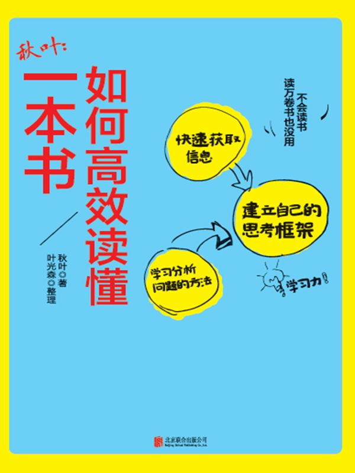

<svg xmlns="http://www.w3.org/2000/svg" xmlns:xlink="http://www.w3.org/1999/xlink" version="1.1" width="100%" height="100%" viewbox="0 0 600 800" preserveaspectratio="none">

<image width="600" height="800" xlink:href="cover.jpeg"></image>
</svg>

版权信息

秋叶：如何高效读懂一本书

作　　者：秋　叶

责任编辑：夏应鹏

装帧设计：红杉林文化

品　　牌：磨铁数盟

 目录 

[版权信息](#index_split_000.html_filepos217)

[序篇](#index_split_002.html_filepos9843)

[一、没空读书？再忙也可以一年读上百本书](#index_split_002.html_filepos9925)

[二、怎样读书？这10个误区你也困惑吗](#index_split_003.html_filepos16816)

[三、读了就忘？我的10种读书方法](#index_split_004.html_filepos38479)

[四、不会分享？怎样做读书笔记和拆书](#index_split_005.html_filepos82834)

[上篇
知行合一](#index_split_006.html_filepos107878)

[一、尽信书不如无书](#index_split_006.html_filepos107975)

[1.长尾理论](#index_split_006.html_filepos108426)

[2.《免费：商业的未来》为什么是错的](#index_split_006.html_filepos118874)

[3.你真的理解六度空间理论吗](#index_split_006.html_filepos128414)

[4.为什么小米的“参与感营销”你学不会](#index_split_006.html_filepos136077)

[5.谁在引爆趋势](#index_split_006.html_filepos148686)

[6.引爆点模型](#index_split_006.html_filepos160031)

[二、建立思考模型](#index_split_007.html_filepos171799)

[1.时间紧急重要度模型](#index_split_007.html_filepos172763)

[2.SWOT分析法](#index_split_007.html_filepos180059)

[3.波士顿矩阵分析法](#index_split_007.html_filepos183674)

[4.组合矩阵分析法](#index_split_007.html_filepos190989)

[5.回馈模型：如何处理他人的抱怨和批评](#index_split_007.html_filepos194405)

[6.心流模型：为什么我们做事没动力](#index_split_007.html_filepos199947)

[7.后果模型：为什么我们不能当机立断](#index_split_007.html_filepos208084)

[8.技术周期循环的模型](#index_split_007.html_filepos217376)

[9.影响力模型](#index_split_007.html_filepos225655)

[10.马斯洛需求模型](#index_split_007.html_filepos232148)

[11.减少错误的瑞士奶酪模型](#index_split_007.html_filepos241762)

[12.肯定式探询模型：微笑着解决问题](#index_split_007.html_filepos250573)

[13.《零秒思考》：快速决断力应该如何训练](#index_split_007.html_filepos255767)

[三、反思世界观](#index_split_008.html_filepos261854)

[1.你真的读懂了《黑天鹅效应》吗](#index_split_008.html_filepos262239)

[2.读《一以贯之》学经济思考](#index_split_008.html_filepos271203)

[中篇
学以致用](#index_split_009.html_filepos283175)

[一、工作方法论](#index_split_009.html_filepos283272)

[1.怎样打造完美的团队](#index_split_009.html_filepos283726)

[2.你团队的软肋在哪里](#index_split_009.html_filepos294998)

[3.如何培养你的团队成员](#index_split_009.html_filepos299920)

[4.六顶思考帽怎么玩](#index_split_009.html_filepos306130)

[5.怎样实施项目的迭代优化法](#index_split_009.html_filepos313287)

[6.李善友教授的“颠覆式创新”理论对不对](#index_split_009.html_filepos319211)

[7.你会用定位图吗](#index_split_009.html_filepos326602)

[8.如何留住你的灵感](#index_split_009.html_filepos329721)

[9.如何做一份好的会议记录](#index_split_009.html_filepos336415)

[10.戴着镣铐才能更好地跳舞](#index_split_009.html_filepos339840)

[11.如何运用减法思维创新](#index_split_009.html_filepos346155)

[12.如何运用除法思维创新](#index_split_009.html_filepos352038)

[13.表达行动的MORS法则](#index_split_009.html_filepos358820)

[14.一起来学丰田的5S管理法](#index_split_009.html_filepos363239)

[15.从《腾讯方法》里我们能学到什么](#index_split_009.html_filepos368268)

[二、创业方法论](#index_split_010.html_filepos375702)

[1.刘强东为啥能做大](#index_split_010.html_filepos376223)

[2.周鸿祎的互联网思维](#index_split_010.html_filepos382013)

[3.从王兴的九败一胜看创业](#index_split_010.html_filepos387686)

[4.为什么我们很难成为褚时健](#index_split_010.html_filepos398049)

[5.如何从马云演讲中学到干货](#index_split_010.html_filepos405737)

[三、生活方法论](#index_split_011.html_filepos416547)

[1.你的碎片化时间用途越多，你的生活选择就越多](#index_split_011.html_filepos416965)

[2.一起来玩曼陀罗九宫图](#index_split_011.html_filepos428015)

[3.如何用冰山模型发现你的潜意识](#index_split_011.html_filepos431446)

[下篇
延伸阅读](#index_split_012.html_filepos437204)

[《奇特的一生》系列随笔](#index_split_012.html_filepos437301)

[1.你知道柳比歇夫的时间统计法吗](#index_split_012.html_filepos437410)

[2.为什么你不能像柳比歇夫一样自律](#index_split_012.html_filepos442424)

[3.如何像柳比歇夫一样知道时间的长度](#index_split_012.html_filepos451375)

[4.怎样记录时间清单才有用](#index_split_012.html_filepos453979)

[5.如何用时间框架来安排时间](#index_split_012.html_filepos459014)

[6.紧张的工作和享受生活有矛盾吗](#index_split_012.html_filepos465645)

[7.如何才能更好地成长](#index_split_012.html_filepos471829)

序篇

一、没空读书？再忙也可以一年读上百本书

从前慢，我读大学时，没电视没网络，大家业余时间都只好看书，先是金庸、古龙、琼瑶、席慕蓉，然后三毛、沈从文、张爱玲、王小波、村上春树，一个个、一本本，都到碗里来。

如今快，人们忙上班，忙加班，忙带娃，忙聚会，忙旅行，忙到一年看不了十本书。好不容易翻本书，又常常觉得现在的书是盛名之下，其实难副，对生活、工作没啥帮助，看书的时间和买书的金钱都打了水漂，不如工作或聚会来得实在。

但读过书的人，特别是读过好书的人，内心深处总觉得看书是件快乐而且重要的事。总之，读书成了一件纠结的事，我看很多人弥补这纠结的方式就是赶着网店大促销买一堆书，然后就那么堆在家里。

我想告诉大家，其实你该工作就工作，该玩耍就玩耍，每年照样可以读上百本书。

事实胜于雄辩。先给大家介绍一个厉害的前苏联大叔柳比歇夫。

柳比歇夫是生物学家，一生出版了70多部学术著作，探讨科学史、农业、遗传学、植物保护、哲学、昆虫学、动物学、进化论、无神论。此外，他还写过回忆录，追忆许多科学家，以及谈自己一生的各个阶段。

在所谓的业余时间，作为“休息”，他研究跳蚤的分类。仅仅是到1955年他就收集到35箱跳蚤标本，共13000只，他对其中5000只公跳蚤做了切片，这个工作量和成果已经足以让普通人惊叹了。

他一年还有大量的通信，比如在1969年，他收到419封信，回复了283封信，发出69件印刷品。他回复的信件中大部分都是认真的长信，而且内容题材无比广泛、文笔引经据典——这是因为他大量地读书。

他能够读但丁的原著，背诵但丁的原文。他能够凭记忆援引李维、塞涅卡、柏拉图的话。他也熟悉雨果、席勒和歌德，俄罗斯文学更不在话下。他还看很多历史和哲学书，例如康德的三卷《纯粹理性批判》。他对读过的大部分学术著作都做了摘要，有的还做了分析研究。

再举秋叶大叔（其实就是作者我啦）的例子。我是一个工作模式接近柳比歇夫的人。晒晒我2014年11月底一周的行程和一些重要的工作吧。在这一周，我几乎是把上海—武汉的Z25/27火车当的士打。

11月23日：深圳内训，晚上见某上市公司朋友。

11月24日：深圳内训，晚上飞回武汉。

11月25日：武汉六节课，晚上乘卧铺去上海。

11月26日：上海内训，晚上去上海外国语大学做讲座，乘卧铺回武汉。

11月27日：武汉六节课，晚上乘卧铺去上海。

11月28日：上海内训，晚上和朋友聚餐，乘卧铺回武汉。

11月29日：和武汉朋友约会，去学校讲两节课。

11月30日：在武汉商贸职业学院做讲座，晚上带学生团队参观华中科技大学“Dian”团队并列席例会。

除此之外，我还：

写了两篇“秋叶PPT”的微信原创文章；

看了电影《地心引力》；

接待弟弟全家一次；

每天在微信“秋夜青语”答疑至少2个小时，多的话需要4个小时，我回复了25封QQ邮件，12封Gmail邮件，微博回复94条私信；

落实了朋友演出的50张赠票派送工作；

落实了去河南农业大学、河南理工大学、武汉工程大学邮电学院、上海海洋大学、长沙理工学院、华科文华学院的讲座行程和往返订票；

落实了年底学生创业团队报销所需的票据和团队一周活动安排；

落实了华中科技大学“Dian”团队参观访谈预约；

落实了团省委新媒体调研表统计工作；

落实了微博粉丝通运营的策略和合作人选；

落实了微信“秋夜青语”的小助手，并指导他们开始工作；

落实了网易云课堂的周五内部付费会员在线讲座人选；

为网易云课堂付费课程策划“双十二”推广方案；

写了对网易云课堂付费课程功能的改进意见；

我还通过QQ和微信，和至少30人有一次就各种问题较为完整的对话，至于其他的聊天，就不统计了；

我发布了20多条原创微博，转发了100多条微博，用小号一一点评了40多个学生在微博上提交的PPT作业；

我还无耻地偷空玩了好多次打飞机游戏，但由于疲劳，状态不好，最高分只有400多万。

那么，这一周我读书了吗？当然，我在火车上阅读了三本书——我喜欢读书，现在一年至少会看100本书，很多书读完我觉得有收获，会写各种读书心得，今天你们看到的这本书，就是我这两年读书心得的合集。

“信心比黄金更重要”，看了两个中外大叔的例子，想必大家可以放弃没有时间这个理由，重拾读书的信心了，接下来我们要解决的是如何忙里偷闲读到书的方法问题。

二、怎样读书？这10个误区你也困惑吗

问1：你说自己一年读100多本书，怎样做到的？

我最近几年每年的阅读量在120～180本之间，属于读书比较勤的人，另外我偏好读纸质书，电子书一般是因为没有纸质版本才去读，我喜欢手握着书的感觉。

很多人怀疑我根本不可能在这么忙的时间下看这么多书，其实，这里面有一个概念需要澄清，怎么样算读完一本书？非要一个字一个字看过才叫读完一本书么？

比方说一本小说，主要情节都看到了，一些章节快速翻过，算不算看完？

比方说一本专业书，大部分内容都是知道的，只有一点点不知道的，我就只看这点内容，算不算看完？

又比如说一本书，我快速翻过，主要观点我都记住了，等到需要时马上就能翻到具体章节细查，算不算读过？

再比方说一本诗集，看了一半，看不下去，算不算读过？

反正对于我，这都算读过。

我觉得大部分人不要刻意去和别人攀比读书的数量，每个人阅读层次不同，方法不同，不适合去攀比。有些人读书读得多，但一直停留在阅读观点而不是批判性思考的层面上，读得多收获未必大，还不如那些把一本好书读通透的人，所以古人说读通“半部论语治天下”，就是这个意思。

不过我认为在现代社会，一个成年人，一个月读两本口碑还不错的书还是有必要的，只要不刻意去攀比数量就好。

我读书多，但一个月能看到两本让我有推荐冲动的书，我就觉得很幸福。

问2：你哪里有时间读那么多书？

其实这首先是个如何管理时间的问题，推荐大家看看本书中篇里的文章《你的碎片化时间用途越多，你的生活选择越多》以及分析柳比歇夫时间管理方法的系列文章，你就能明白挤出时间读书并不是问题。

其次，这也是个读书态度的问题。对于不爱读书的人而言，你把这个问题换成“你哪里有那么多时间打游戏、打麻将、谈恋爱、逛淘宝、做头发”，其实本质是一样的。做喜欢的事情你就会付出足够多的时间。

如果你早早培养了阅读的习惯，读书是你生活中的一部分，你不需要太刻意去安排，书随时随手就可以读。

最后，这还是个读书环境的问题。我出差的旅途上一定会带书，我床头一定会放书，我家里一定会不断添置书柜，我觉得，如果你生活的环境里到处都是书，你就会慢慢爱上读书。

为了逼自己养成爱上读书的习惯，不妨咬咬牙试试花费3000元钱买上100本书，让家里、身边到处都是书，这笔投资肯定值。如果你对自己读书没有信心，请为你的孩子花上这笔投资，只是记得不要拔苗助长，先推荐适合孩子年龄段的好书即可。

问3：你是如何选书的？

关于选书，我推荐大家读读台湾出版人郝明义写的《越读者》，非常好的一本书，我在阅读方面受他启发很大。

下面我还是聊聊我选书的体会。我看书很杂，不挑食，好书也看，烂书也看，我看的烂书绝对比好书多十倍以上。加上我书评写得还不错，各家出版社编辑经常寄书给我，希望我能写几句书评，这样的书现在一年总能收到五六十本，人情要还，我就是想看得不杂都不行。

但我也不认为书读得越多越好，我觉得比较好的说法是：读书的类型要丰富，而不是仅仅追求读得多。

我觉得应该合理搭配四类书：

第一类：工具书。

在我的案头，永远有词典一类的书，这是参考书，不管是语言类还是专业类的，都不可少，但是不一定随时要看。对这样的书，我从来不吝啬购买，但是我会尽量选择一个好的版本，遇到不懂的随手翻查。

第二类：专业书。

在现代社会，每个人都得懂一门技术作为安身立命之本，那么这一类方向的专业书你得通读，不管是经典原著，还是最新趋势，你都得长期跟踪学习，不要指望每本买回来的书都是干货，只要能让你在现有基础上收获一些，都是值得阅读的。这样的专业书，你每年都应该结合自己的专业方向看几本。

比方说我专注PPT领域后，定期都会把这个领域出版的新书全部买回来研究，其实对我而言，大部分书里有几页能给我启发就不错了，但是作为专业积累，我必须要知道这几页的新内容。

第三类：视野书。

只有一种专业思维的人是很可怕的，我们应该能用不同维度去解释现实中的现象。比如一个社会现象出来了，我们不能非黑即白地去评判，假如我们能够用社会学、心理学、经济学、管理学、传播学等多个维度去观察和思考，也许我们就能有更深入的领悟。

如果你只有一种思维模式，你就很难和别人换位思考。要了解其他的思维模式，打开你看世界的视野，主要靠读点其他专业的杂书。

第四类：潮流书。

社会在与时俱进，你要保持对时代的感觉，总得读一些新书。

所以有些名人写的随笔我也买，当休闲书看看，也学习他们写随笔的文风，学习他们分析问题的思维，收获还是有的。

另外我要特别说明一点：一个人在不同成长阶段选书也是有侧重的。

比方我们读小学时，识字不多，主要是买工具书；读大学时应该多看专业书，快速成为专业人士；刚上班，很多业务不懂不明白，也只能多买多看专业书，以便快速成长；等有了一定工作经验，就需要多看打开视野的书，拓展自己的思维；当然在任何时候，我们都可以看一点潮流书，和时代保持同步。

我看有的人读书，最大的问题是偏门，杂书看了一堆，自己专业领域的好书新书却读得太少。其实专业领域读通一本专著，再看其他类似的书，会越看越明白，越看越快，花的时间也不多。

什么都懂一点儿真不如先看懂一门比较好。

问4：读书是速读好还是精读好？

对于问这种问题的人，我觉得很无奈。

像《高等数学》这种专业书，我能速读么？只能一页页慢慢看啊。而没有营养的书，有时候我半个小时就可以翻完，因为里面都是一些废话。内容是我非常熟悉的专业书，我也可以半小时翻完，因为我只看重点。

真有营养的书我会根据自己的时间安排，有时间就争取慢读，一次读到位，做好笔记，以后需要时再翻。如果没有时间我就选择速读，或者跳着读我最需要的一部分，以后有时间我还需要补功课。

我必须说：好书一定要精读，你对自己加以研究的某个方向一定要学会主题阅读。

关于如何略读、跳读、精读以及进行主题阅读，我推荐大家看看《如何阅读一本书》。

我这个人好奇心特别旺盛，好多书是为了满足好奇心而读，谈不上有什么特别的目的，大部分书是买回来草草浏览一遍，让自己对某个领域有个概念，当然也许有些概念将来就变成了我的一个兴趣关注点。像对管理学、经济学、心理学、历史类、人文类书籍的阅读兴趣，我就是这样慢慢培养出来的。

问5：读书是不是开卷有益？

每个人的时间都是有限的，大部分人能分配给读书的时间就更有限，与其讲开卷有益的大道理，不如承认人都有想一步到位读到好书的心理。

由于现在出书不难，没有足够干货的书的确太多，所以开卷不像古时候那么容易做到本本有益，“开卷有益”更适合信息稀缺的时代，在信息泛滥的时代，开卷往往让你湮没在信息的海洋。

所以我不认为开卷有益，但读一本没有营养的书也未必是无益的，这得看你读书的目的和方法。比方说我准备研究一个题材时，我会把能搜集到的这个题材的书都买回来研究，好书我就摘录观点，梳理作者的思考框架，慢慢变成自己内化的思维，这当然是开卷有益。但看到不好的书，我会思考和好的书相比，作者差在哪里？为什么他只能写出这样的书，他的思维缺陷在哪里？我应该如何避免也写出这样的书？有了这样的思考，一本不好的书，也许对我写书的启发更大，因为一个好作者的优点往往很难学习到，但一个差作者的缺点反而是很容易发现并能有意识去避免的。

还有些不好的书，虽然整体不行，但是其中一个章节、一个单元还是有可取之处的，通过这个章节我思考了，顿悟了，甚至学到新的分析工具和方法，这还是有收获的。考虑到一本书的价格，能用这样低的成本学到东西真是超值。

问6：能推荐一套经典阅读书单吗？

很多人希望我推荐一份经典书单，这是让我很为难的一件事情。我觉得读书是一件很私人的事情，我喜欢的经典你不喜欢很正常。

另外我觉得花一点时间选书是很值得的付出。在这个过程中你不但要学会各种搜索技能，对比各种推荐书单的优劣，识别各种书托，甚至因为书评认识一些书友。更重要的是你要开始为自己的阅读做出独立判断，做出选择。你的选择也许让你满意，也许让你失望，但是你也学到了更重要的经验——人要为自己的选择负责。

好的选择可以让你开心，坏的选择也会让你总结教训，争取下一次做出更好选择。这种选择成本很低，却可以锻炼你的判断力，很值得。

经典书籍也要分类对待，就好像教育分通识教育和专业教育，通识教育部分的经典书籍可以适应面很广，甚至每个人都可以看，专业面的经典书籍就受众小。而文学类因为有细分品种，不同的人口味不同都很正常。

我给大家一个建议，在网上搜索关键词“书籍类型+书单”，比如“管理学经典书单、历史经典书单”，可以看到很多人推荐的经典书单，你们可以试着去搜搜看。

问7：别人推荐的经典书籍我看不懂、看不进去怎么办？

其实这很正常，有些书经典是经典，但也需要你具备理解经典的阅历和知识积累。

比如在经济类图书的作者里，哈耶克的名字经常被人提起，但他的书，不知道是翻译的原因还是我个人水平的原因，反正读起来很吃力，我了解他反而要更多通过他人的评论性文章。

又比如王阳明的心学，很多人评价很高，但到目前为止，我还读不太明白。读不太明白的意思就是每次读一点点就没有耐性读下去。

再比方说，有的朋友说对哲学类的书籍不怎么有天赋呢，怎么也看不懂，看不下去；名著也是，感觉有点生涩呢……

我得说，有些书你不喜欢，是缘分没到。我高中不爱看《论语》，过了30岁再读，不得不觉得《论语》风靡两千年，是有理由的，一句“己所不欲，勿施于人”包含多少道理！

我的建议就是，别人的经典阅读体验未必就适合现在的你，如果你发现所谓经典好书你读不进去，又不是你的专业必修书，不必强求去读，放一放，等以后缘分到了再读。一辈子都没有缘分也没有关系，人类历史文化博大精深，我们每个人能汲取一小部分就已经受用无穷了。

再说了，成长的法门并不唯一，读书并不是让一个人获得智慧的唯一通道。我曾经写过一系列关于“如何让孩子爱上阅读”的文章，影响很大。我觉得让孩子过早阅读经典未必就是好方法，也许先看看童书漫画更能激发他们的阅读兴趣，如果你们对这个系列文章感兴趣，不妨去我博客翻翻：http：//blog.sina.com.cn/s/blog_4c4cee110101cwd5.html，也可以扫一扫下方的二维码。

问8：有些书只读没有感觉，怎么办？

越是实用技能类的书，越需要和实践结合起来阅读。如果你只是看，没有和其他行动结合，读过也往往是过眼而已，收获不了什么。

即便是一些理论性的书，也要主动结合现实来思考，这也是最最重要的。把读完的书中的一些理念，马上和现实印证，或者直接引入现实思考和行动。否则，读书的心得会遗忘得很快，不会成为你的内容。

我曾经问过学经济学的同学，有没有读过经济学领域的经典？如果看到国内报道的财经新闻，比如股价涨跌，某些行业遭遇整体性危机，一些政府行政指令效果不佳，能否用学过的经济学知识做个分析？——答案往往是没有想过。

这样读书就把自己变成一个容器，而不是搅拌器。容器的特点是只能装一点点东西，要进来新东西，就得扔掉一些旧东西，否则装不下。而搅拌器可以把不同的内容重新组织，变成更容易吸收的饮料，化为自己身体需要的营养。

读实用的书，第一层境界是你看得懂别人的道理，第二层境界是自己能照着讲出来，第三层境界是自己能有意识去运用，第四层境界是能用自己的话总结出来。达到第四层境界了，恭喜你，这道理总算属于你了！

读书这件事，看来的东西不是自己的，写下来的文字也未必全是自己的，只有反反复复讲，把看的写的讲到潜意识了，成为一套方法论了，成为自己的工作习惯了，也许才是自己的。

至于那些让你感到醍醐灌顶的书，也不是真的带给你成长。有些书之所以让你感觉收益大，也许只是因为它是你处于改变临界点时恰好出现的那一本。看书只能打开视野，解开思维盲区，但是一个人要改变自己必须通过行动。

所以即便没有感觉，还是建议大家坚持读书，厚积薄发，不期速成，功不唐捐。

问9：我没有时间读完整本书，只订阅经典博客，经常看看，比如秋叶老师的，够吗？

阅读博客、微博、微信文章这样的阅读方式，和阅读整本书最大的区别就在于前者是不系统、不严谨的碎片知识，后者是系统的整体性知识。

如果一个人没有建立系统性思维，长期做碎片阅读，只会让自己的大脑充斥各种碎片思想、各种有趣的段子，但是就是没有自己的思考体系，而这样的思考体系必须通过阅读有质量的好书慢慢培养。

等你培养出框架思维能力了，再看碎片文章，就可以把看到的信息点整合到自己的框架里面，让自己的框架更加丰富饱满。

所以，我不提倡大学生或者年轻人过于依赖网络阅读模式，还是要读整本书，做书摘，做笔记，做练习，锤炼自己的整体思维能力。不要以为看了很多网络文章，貌似也做了很多思考就是读到书了。

年轻人读书应该考虑是否能为自己建立一个完整的思考框架，这个是无法通过网络阅读系统建立的——当然一些特别优质的网络课程例外。

虽然我也提倡大家关注一些优质专业博客，但我不提倡用这种快餐阅读代替读书。

问10：你读书时有什么乐趣？

古人说：“书中自有黄金屋，书中自有颜如玉。”是真话也是假话。说它是真话，是因为我读书学到知识本领，成就我现在的人生；说它是假话，是因为读书的过程并不是一件轻松的事情，越是要读好书，越要坐冷板凳，下苦功夫。

不过我自己在读书过程中的确创造了很多属于自己的小乐趣，我也给大家分享一下：

1.推荐好书给熟悉的朋友，朋友也喜欢，能够加深友情。

2.好多作者开微博，我写了书评后@作者互动转发，挺有成就感。

3.读书时找亮点，然后晒到微博上，和读过这本书的朋友们在微博上互动。

4.写书评冲排行榜，我最喜欢做的事情就是为经典畅销书写好书评，然后看着自己的书评后来居上，排名第一，充满了成就感。

5.书评写得好，很多出版社编辑主动联系送书给我，希望我也给他们的书写书评，也很令我欢喜。

6.看过的书不想要了，送给需要的小伙伴，也是雅事。

7.我的朋友@萧秋水曾经采访了19位互联网上活跃的读书人选书和读书的经验，其中就有我的心得（百度“他们是如何选书和读书的”就可以找到），这又是一种玩法。

8.我自2014年坚持每周读不同的书，写不同的拆书书评，变成了今天大家看到的这本书。但这样做，更需要坚持的力量。

三、读了就忘？我的10种读书方法

通读法：我是如何培养思考框架的

现在很多朋友好奇我一年怎么能看一两百本书，其实我早年读书，很是贪多，翻得多翻得快，一年下来看书破百都不是个事。我记得在2002年到2003年一年间，我囫囵吞枣看了近500本书，多的时候一天可以看十来本。看完有没有收获呢？坦率说，没多大收获。

其实，阅读时我最大的收获就是，读一本新书时经常看到一些过去看过的观点，有似曾相识燕归来的感觉，但如果你问我是在哪本旧书里看到的，我真不记得。再一个收获就是偶尔大脑灵感一来，冒出一些妙言，可能文字是自己的，但思想其实是别人的碎片。

这是为什么呢？

我当时读书的心态就好像是一个贪心的胃，想把什么好吃的食物都试一遍，结果却消化不良。后来我渐渐明白，如果一个人一开始没有扎扎实实读几本书形成思考框架，书读得越多头脑越乱，脑袋里完全是糨糊，今天听这个人说有道理，明天听那个人说也有道理，到最后就是没有自己的道理。

说来惭愧，我第一次系统读书是在2000年。当时从事产品数据管理软件实施工作，必须要了解这个信息管理系统的来龙去脉，我就买了所有可以买到的关于这个领域的书，还下载了2000多篇这个领域的论文，全部看了，做了总结。读完后的结果是写了一系列文章，叫《水煮信息化》，当时在一个刊物连载，反响还不错。

通过这一轮读书，我基本明白了什么是数据，什么是信息，什么是信息化，什么是业务流，什么是知识管理，遇到这个领域的问题，我就有一个知识框架去梳理了，再吸收新东西，就十分轻松了。这次最大的收获是学会了从概念定义出发，慢慢理解现象，读书要把一些基础的东西读透。

2004年我正式开始做项目经理，需要系统了解项目要如何管控，还要带人，没有人教，只好继续读书。那时上班也忙，就只买了两三本业内推荐的项目管理领域还不错的书。其实到今天我也不知道这些书是否真的是经典，但是老老实实反复读了几遍，结合自己的工作实践，反思，总结。到了2005年，单位搞封闭讨论，讨论了三天三夜，我突然就开窍了。

所谓开窍，就是我自己的头脑里形成了一套分析问题的框架，只要是和这个领域相关的问题，也不管合适不合适，我可以先拿这个框架去套用一遍，大概也还能得出一个结论。这次读书很重要的一点收获就是，反复读几本相对结构化、体系化的关于某一领域框架和业务的入门经典书，反复读，读透了，就打下今天做事的方法论底子了。

这和我大学读书就完全不一样了，大学时读得多，看得多，也忘得快，为啥，就是没有把一本入门的书反复读，读透读烂读懂别人的方法论，化成自己的，“浅尝辄止”说的就是我那种读书方法。那时拼的是年轻，记忆力好，能够混过及格线，等一毕业，要走入社会，大脑就一片茫然了，不知道自己有什么本钱面对社会。

到2006年的时候，我觉得自己这两个分析问题的框架用了蛮多遍，已经开始形成了自己思考问题的结构，再看什么内容，都会有一个定心锚，看到别人说相关的内容，有用的，就吸收到自己的知识框架里面，而不是变成各种碎片。碎片知识的特点是看到了激动一下，过几天又被新的碎片冲掉了。

其实，这和管理电子文件夹的逻辑是一样的，如果一个人的文件夹分类条理清晰，又有合理的编码导引，那么再多的文件进来，也可以很快梳理好，后续查找也井井有条，十分方便。而有的人来了新文件就随手放桌面或者下载区，不分类也不归档，时间长了，硬盘里全是这种碎片化的文件，貌似有价值的电子文档，其实真要用起来，一点头绪都没有。

人的大脑好比是硬盘，而且可以看作是容量无限的硬盘。会读书，就要学会给硬盘建立索引，然后往里面放资料，但是很多人没有先给硬盘分区，直接把吸收来的东西一股脑儿丢进去，以为反正容量大，结果悲剧了。

还有一种情况是分了区却也无法很好地整合信息，就好比一个360G的硬盘，只分了两个区，一个区4G，一个区356G，然后基本全部的信息都塞在4G的区，填满了后面的就冲掉前面的，人的大脑看起来在不断更新，整体的潜力却完全没有发挥。

2010年前后我大量读经济学和心理学的书，这就是出于兴趣阅读。这两类书都有个特点，畅销书特别多，可读性特别强，说服力也好，读多了，好像自己也懂一点经济学和心理学，但是又不能系统说清楚问题。这里面业余和专业的区别，我觉得就在于有没有反复系统读通几本经典教程，再陆续进化。

我的确有心读几本这两个领域的经典书，也确实读了，但是我得老实承认，由于精力限制，我没有像研究知识管理、研究信息化、研究项目管理、研究PPT、研究新媒体一样做完整的结构化阅读和修炼，所以在这两个领域，我采取的阅读策略是经常读新书，不断刺激过去的阅读经验，这样在这些领域也不至于完全外行，但也绝不敢冒充专业人士，偶尔借助书中的理论观点想清楚了一些问题，就写一篇书评自娱自乐。

2011年我发现自己思考问题时还是有缺陷，经常被别人的逻辑谬误绕进去，于是我就开始系统学习如何阅读和思考，当时是先看《如何阅读一本书》，后来又看《学会提问：批判性思维指南》，这一看我才发现，在发达国家的高中就需要普及的批判性思维训练，我到30多岁大脑依然一片空白。

也不好意思告诉别人，我就自己尝试写读书笔记、做读书PPT、和朋友交流，在微博上尝试用批判性思维写微博，包括吵架，统统悄悄练起来。我会告诉你类似的图书我买了40多本，看了30本吗？

这样做很辛苦，但是我的确发现自己的逻辑思维能力提高了，也能看出别人文章里面的一些问题和错误了。到了2013年，我大概能够系统建立自己的批判性阅读、思考、写作的框架了，真不容易。

我觉得，现在的高中生、大学生有时间可以先系统读一读这个批判性思维领域的经典作品，耐着性子多读几遍，一辈子受益。不要像我，36岁了，才发现还有这门好玩的学科。

不过我36岁读这种思考框架的书，也有一个优势，就是我过去积累的读书框架，还有阅历，有助于我更快理解这些知识。

用一个词总结——功不唐捐。

树读法：我是如何去做主题阅读的

如果觉得某个方面有必要了解学习，我至少会看十本同类书籍，然后仔细想想那些专家的看法是否一致，慢慢得出我在这个领域的思考框架。这种阅读方式叫主题阅读。

但绝大部分请我推荐书的人似乎都认为在某个领域一定有一本最好的书，只要看懂这本书，其他书就可以不用看了。比如我经常被问到：“你觉得学项目管理看哪本书最好？”我觉得这些人不是爱读书，是想走捷径。

我自己是不贪心，如果我想学项目管理，我会老老实实多看几本项目管理领域的书，慢慢看，慢慢做功课，不会只看一本求速成。

如果一定要我推荐书，我向来都是推荐多读一些，最好不要只看一本。特别是对大学生朋友，我常常建议，大学这个阶段时间多，各种方向的好书多读几本，读它几百本，是人生的重要积累。

因为一次工作机缘，我发现了主题阅读的好处。

2007年我开始做网络推广的工作，这个时候我就有意识学习网络营销方面的图书。凑巧这个时候我开始写自己的第一本书，叫《超越对手：项目售前售后的18种技能》（后来改名叫《超越对手：大项目售前售后的30种技巧》），这个时候我就学到一种新的读书方法，用写书的方法去做主题阅读。

怎么理解主题阅读？

主题阅读就是先圈定一个感兴趣的领域，然后搜集这个领域可以找到的图书、论文、网文进行阅读。

一般我决心要做一个领域的主题阅读，是准备快速成为这个领域的专家。要成为一个领域的专家，我就必须先建立像专家一样的视野和格局来思考整个领域有哪些需要我去学习的问题。

做起来其实挺简单，就是我准备了解哪个领域，就先写一个大纲，就像我自己要写这个领域的图书一样，然后开始大量买这个领域的图书。

先看一本经典的，对照我的大纲，梳理充实完成后，开始读其他的图书，大部分内容相同的，跳过，然后看到不同的想法，自己思考一下，认同的，可以整合的，就列入我的大纲。很快，我就完成一个领域的主题阅读，并有了对这个领域的系统认识。

这个方法可以让一个人在很短时间内深入研究一个领域，所以后来我要做大的研究，都是用的这种读书方法。

关于树读法，下面是我的一个案例。

2015年2月初，我准备系统总结和研究一下职场技能领域的在线学习知识，所以我希望自己用三个月的业余时间对这个领域进行一次系统性学习和思考。

在买书和找文章之前，我先让自己列了一个提纲。我列提纲干脆就是按写书目录的方式来做的，提纲名就叫《中国在线教育商业化模式探讨》，内容如下：

1.中国在线教育市场全景式分析

1.1　什么是在线教育

1.2　在线教育兴起的演化历史

1.3　在线教育市场格局分析

1.4　在线教育主流商业模式分析

1.5　在线教育的误区

2.在线教育的商业化机遇突破口

3.在线课程内容开发

3.1　在线学习的特点

3.2　如何选择内容和老师

3.3　在线课程开发模式和流程

3.4　众包模式下的迭代改进

3.5　教材课程作业答疑考核一体化设计

3.6　交互式课程的设计

3.7　如何引入学员测试

4.在线课程的营销

4.1　如何做版权保护

4.2　如何定价

4.3　如何推广

5.在线课程的服务

5.1　作业设计——标准化管理

5.2　答疑设计——社群管理

5.3　考核设计——证书

6.在线教育的技术平台选择和构造

6.1　自建网站还是和平台合作

6.2　选桌面端还是移动端

6.3　好技术或平台资源清单

7.在线教育的融资渠道介绍

有了提纲，我就开始买书和找文章。然后我会边看文章边把其中的观点结合自己的理解写到对应的条目下，迅速把别人的思想变成我的体系内容。

如果发现别人的观点颠覆了我的结构，或者发现我的结构遗漏了重要的内容，我会马上调整或者修改我的结构，让自己的思想体系先成型，再去吸收。

这样读书就好比是养一棵小树，主干枝丫都有了，我就是从不同资料里获取养分浇灌它，让小树长大，长出更多枝丫，如果发现有些枝丫影响整棵树生长，我就剪掉它。

如果在一个领域有一些积累的话，用这样的方法读书的确能让人很快成为一个领域的专家。

图读法：我是如何去啃硬书的

我所谓的硬书是指口碑好、内容多、思想含金量高的书，作者在其专业领域名声在外，但是要读懂作者原著或者译著，相当困难。

像《如何阅读一本书》这本书，虽然名气很大，但是内容庞杂，结构不清，作者也是想起一节就写一节，要把他的脉络理清楚是很难的，至少按他的目录去整理框架非常辛苦。

好在小学时我们都学过一个笨办法，先把作者每一段、每一节、每一章的中心思想概括出来，或者摘录出来，然后一段段把作者的大纲拼出来。

现在有一个工具叫思维导图，所以，这个阶段我就会努力把作者的思维画成导图，这就是所谓的图读法。

不仅仅是书，视频也可以这样处理，我在网上看到柴静的视频《穹顶之下》，我也尝试画了一个她的演讲结构图解。

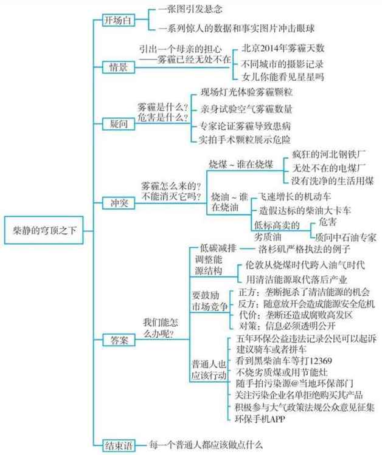

两个小时的视频内容，一段段记录下来，再借助一定的演讲结构框架梳理，会发现柴静其实应用了麦肯锡金字塔原理里推荐的SCQA结构。

情境（Situation）：由大家熟悉的情景引入……

冲突（Complication）：这会带来怎样的矛盾？

问题（Question）：那我们应该怎么办？

答案（Answer）：提供可行的解决方案

不过SCQA结构可以在实际使用的时候调整顺序，柴静用的其实是SQCA顺序。

在SCQA的一个小单元里面，还可以嵌套其他表达结构。比如柴静在介绍解决方案时，其实用的是平行展开结构，从加强执法、更新能源结构、引入市场机制、普通人也要参与这四个点展开。柴静在解答中国推广天然气有什么困难时，使用了正反对比的小框架来表达。

整个演讲的语言是煽情的，但是内部结构一直引导观众按照柴静的演讲思维去走，去产生认同，做得非常高明。

用这样的方法去读硬书，就比较容易跟得上作者思路，思维导图这样的工具又能很快帮助我们把思路图形化表达出来，是事半功倍的方法。

图读法的更高阶段是做读书笔记PPT。读一本书有很多消化它核心思想和精华的方法，把一本书的内容梳理成一个读书笔记PPT，无疑是立竿见影的方式，也是非常有挑战的方式。

做一个读书笔记PPT，不仅仅要求开动你的左脑，发挥提炼抽象概念的逻辑思维能力，也要求开动你的右脑，发挥你的形象化表达和展示的能力。

一般而言，做过读书笔记PPT的书，读者很难遗忘其中的内容，而且把一个好的读书笔记PPT分享出去，不仅仅帮助别人快速了解一本书，还能提升你的个人品牌影响力。

我常常鼓励我的小伙伴用做读书笔记PPT的方式去消化一本书，愿意这样做的小伙伴也非常多，我们把这些漂亮的读书笔记通过微博账户@读书笔记PPT分享。有兴趣你们可以去下载这些原创的PPT，不但可以了解一本书，还可以学到制作PPT的方法。

关于如何做出好的读书笔记PPT，我有一些建议送给你。

建议一：选对书。

做出喜闻乐见的读书笔记PPT的关键在于选书。一本书越有知名度，大家的关注度就越高，它的读书笔记PPT关注度也会水涨船高。内容太冷门的书，比如你非要谈《流体力学》（秋叶我其实是学这个专业的），就别怪没人有兴趣看。

这个世界上有两种书。

一种是流行快餐书，其中的营养价值不高，但是宣传到位，很多人想看，却没有时间看。你读书PPT做得好，会比较容易引发看过或者没有看过的人共鸣，比如我做的《魏斯曼演讲圣经》PPT。

另一种是干货书，哪怕真正的读者很小众，如果你能深入浅出把它讲明白，干货自己就有传播效应，比如我做的《如何阅读一本书》PPT。

总之，要么很主流，要么有深度。

建议二：选对人。

有些书的作者和出版社非常重视新媒体宣传，在微博上也很活跃。如果你选择他们出版的书做PPT，而且做得很好，他们会主动转发，这会给你带来传播的能量，引起更多人关注。

建议三：选对路。

读书笔记有三种做法：

1.抄录精华，做警句体，适合心灵鸡汤书。

2.梳理框架，图文讲解，适合学科体系的书。

3.切入角度，重点讲解，适合结合现实吐槽的书。

不过读书笔记PPT最容易变成摘抄警句陈列鸡汤的快餐PPT。很多初次尝试做读书PPT的朋友，往往会从书里面摘几句自己有感触的话，配上一些大图，搞一点点小排版，看起来一张不错的PPT就完成了。有的书适合这种风格，比如柴静的《看见》，这种散文类的书适合找一些佳句做出全图型效果。

我一直认为文学类的书不适合改成PPT，做成所谓图文并茂的PPT反而破坏了书的整体阅读美感。要做文学作品的PPT，应该做成文学赏析的形式，围绕书做外围分析，例如书的时代背景、作者生平、书的口碑、逸闻花边，这才是可以考虑的方向。

比如有个朋友努力用PPT介绍《平凡的世界》的内容，我倒觉得读书笔记应该围绕作品的外围去介绍：作者路遥的故事，此书的传奇性（销量和影响力），为什么这书能影响一代人？简单介绍主人公的经历，分析他代表了当时怎样的人？对当代青年有什么启发？我们如何在平凡的世界去努力做一个不平凡的人？谈一点自己的思考，结尾戛然而止。这样我觉得也是佳作PPT。

刚开始做读书笔记PPT，你可以选择任何一种方法去做，关键是能方便自己动手，哪怕只是警句摘抄，慢慢有了经验，你可以尝试做更复杂的读书笔记PPT。做的过程也不必贪大求全，一定要把一本书写完，哪怕一次写一章都可以。

我的小伙伴@水蓦做的《互联网思维》的读书笔记，结构化提炼得非常好，非常受欢迎，如下图。

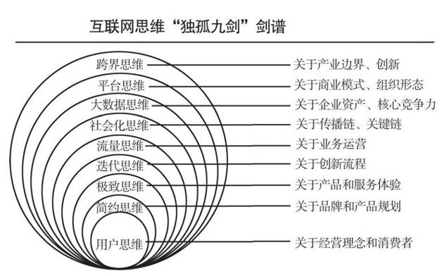

这个PPT最后得到了@罗振宇的转发，一天就突破了400次转发。

好的PPT必须能把书里面的思想用图形结构化显示出来，这才叫水平！

建议四：选对势。

好书的价值在于它能呼应时代，做读书笔记PPT完全可以跳出书的框框，主动和时代或者生活中的现象进行互动思考。把做书摘的过程变成对照现实问题进行学习思考的过程，会比单纯的书摘PPT更有含金量。

建议五：选对法。

做读书笔记第一步是写文案大纲。可以先用Word写PPT上每一页的内容要点，顺便构思下大概的版式和素材。

这个阶段你可以采取“抄录+点评”的模式，为书的内容加入你的思考，把提纲打好，理顺，找到一个切入口，并考虑从不同的角度来组织你摘抄的材料，找对最恰当的表达框架。

这些构思清楚了，你再开始做PPT效率才快。在设计PPT时可以借鉴书的封面风格，例如字体、配色，使PPT和图书风格一致，感觉会更好。

如果整个PPT和图书的设计风格一致，文风统一，内容裁剪详略得当，就是佳品。

做一个好的读书笔记PPT也许能给你带来很多新朋友，打开你了解世界的新窗口。比如有的朋友通过PPT认识了同行，有的朋友通过作品认识了PPT高手，有的朋友通过PPT和名人进行了互动，有的朋友通过PPT得到了出版社的赠书。当然最重要的是，在这个过程中，你收获了成长。

框读法：我是如何读经管书的

框读是我对于有一定难度的书采取的阅读方法。

比如经管类图书，我恰好过去读到一点经管类图书的思考框架，我试着用自己学到的思考框架去理解作者的逻辑，然后写出书评。

比如《一以贯之》这本书，我就是这样尝试的。全书内容太多，而且是传记，我得自己找一个框架，把涉及作者经济思想的部分梳理出来。

我的小伙伴@Molly_Rabbit分析了我解读《一以贯之》这本书的框读法模式。

1.介绍作者（社会地位、人生重要经历、此书写作时间、此书写作目的）。

2.分享精彩片段。

（1）直接分享书中的精彩片段，然后讲述自己也有过的共同经验。

（2）特别交代作者所在时代的特点、弊病，有针对性地叙述作者的经历，总结作者通过此事是战胜困难还是被打败，然后分析造成最后结局的关键要素，思考解决问题的方式、手段是什么。

3.最后总结本书的价值（本书适合的人群、所涉及领域的深度等）。

因为《一以贯之》其实是一本经管人物传记，所以我就用上述的框架去介绍这本书，先交代作者和背景，再分析一些特别有感悟的点（书太厚，无法完全展开），然后谈谈这本书适合谁看。

这个读书框架其实适合很多书的书评结构，所以是一种常用的框架。

我常用的另外一种框架也被小伙伴归纳出来了。方法如下：

1.列出本书想要解决的问题。

2.作者看到目前社会存在的状况是怎样的。

3.作者认为此问题存在的原因是什么。

4.作者提出解决此问题的方法（不要照搬书上的，要先自己梳理成简单易懂的句子、段落）：

（1）写出总结句；

（2）解释“总结句”；

（3）你认为这个方法可行还是不可行；

（4）不可行的地方在哪？或者哪个观点让你产生了共鸣？比如，根据作者提出的观点列举自己身边相关的事，再分析作者的观点是否客观等。

5.以后遇到这种情况，你会如何解决？（请描述事实，不要表达你的感觉。）

我在读《零秒思考》一书时用的就是这种框架。

你掌握的框架越多，读书的角度也可以越多，比如试试心理学的框架、历史学的框架、管理学的框架、社会学的框架，乐趣无穷。

还可以尝试利用一些读书框架速读一本陌生领域的书籍。首先，我有两个经验想和大家分享下。

第一个经验是，你阅读一本书的动机越明确越强烈，最终能化为己用的知识就越多。

第二个经验是，梳理出全书的框架再去读书收获更快。

阅读陌生领域的图书，你需要一个相对有整体感的框架。比如先通过阅读书籍前言、后记、目录部分，初步了解本书存在的目的是要解决什么问题，大概有几种解决问题的方法，还可以速读一遍建立对这本书的初步阅读框架。如：

背景（时代背景、作者等）；

本书主要解决的问题是什么（一种还是多种）；

造成问题的原因（都有哪些）；

解决问题的方法（都有哪些且具体如何操作）。

然后再开始阅读书本内容，在阅读中丰满自己之前建立的框架。如此下来，就可以对全书有个整体的认识。

炼读法：我是如何读畅销书的

现在我工作越来越忙，暂时很难有时间做系统阅读、主题阅读，所以，我不得不更多地采取碎片化阅读模式。我做碎片化阅读还有收益，其实是依赖过去打下的结构化思考的底子。

下面就给大家具体说说我碎片化阅读的模式。这个模式，其实很简单，就是一句老话——不动笔墨不看书。当然值得你动笔墨的书才动，不是什么书都去动。

我始终以为读书要先消化，再内化，然后输出。很多人读书不消化，只是翻书，而动笔就是主动消化的过程，内化的开始。怎样知道你内化成功？要输出，可以写书评，可以做分享，可以做读书PPT，这都算输出，不做这个功课，书只算看过。

不同的书有不同的读法，同样的书也可以用不同的读法。下面就聊一下我最喜欢用的方法——炼读法。

一本书写出来，作者一定有他的逻辑。要把作者的逻辑从一本书里提炼出来，变成自己能够说清楚的核心观点，这是非常难的事情。我读小米的《参与感》，读《周鸿祎自述》，都在做这种努力。

《周鸿祎自述》一书中周鸿祎的观点，我归结为三句话并略加解释：

第一，互联网时代，要先做用户再做客户，这是互联网时代的商业模式。

什么是用户？就是使用你产品的人。什么是客户？是愿意为你产品的各种增值业务付费的人。

传统生意会把潜在用户直接转换为付费用户，而在互联网思维下是先用好的免费服务吸引足够多的用户，再海选出愿意付费的客户。甚至一开始根本不考虑是否有客户，只考虑是否有足够多的用户。用户多了，赚钱的方式就慢慢会从用户痛点需求中挖出来。

第二，没有一定规模效应的用户，是没有付费客户的，这是互联网时代的赚钱模式。

如果用户数量不能快速形成一个规模，那么，这个用户其实也很难成为后续运营的基础。

360运营是从找到查杀流氓插件这个痛点入手，快速做大规模的，有了规模，慢慢才发现更多需求。先是查杀木马，后是查杀病毒，最后做安全浏览器，结果在浏览器市场上找到了盈利模式。这些都需要用户规模的支持。

第三，要吸引海量用户，杀器之一是免费服务，杀器之二是极致产品体验，这是互联网时代的推广模式。

免费只是互联网产品、服务吸引用户的第一步，极致的产品体验才是吸引大规模用户并将其留下来的真正法宝。

所谓炼读，就是把一本书读薄的过程，但是不能仅仅满足于此，还得看出作者的思维逻辑才是成功。

当然如果作者水平高，我们也许炼读到最后，也未必全部理解正确，但是这样的努力会大大提高自己的思考能力。

逆读法：我是如何读“传道书”的

“传道书”就是作者貌似“大牛”，或者观点很有名但其实有偏颇的书。这样的书有很多观点我不同意，或者认为在某种条件下是不成立的，我就故意反着读。一些没趣儿的书我也这样读，好像自己在秒杀作者，颇有乐趣。

《金字塔原理》这本书，我就故意逆着读，其实是想讽刺有些人神话金字塔原理，我还特意用完全不金字塔的结构写书评，结果在豆瓣排名靠前，我很开心。

这种写法其实蛮简单：列出你认为书中错误或者在现实中不适用的观点，说出理由，一条条反驳。

比如《金字塔原理》说：“要提炼中心思想，把结论写在前面。”我就反驳：在文章段落中亮明观点至少有四个位置：1.标题，2.开头，3.文章，4.结尾。很多人以为一定要把结论写在前面，这个一旦教条化，很有害。

又比如《金字塔原理》说：“文章要有结构、有层次才有说服力。”我写的《金字塔原理》书评没有结构、没有层次，就是一口气吐槽27条，但居然在豆瓣书评被顶到第二名的位置。

不过逆读的话最好还是学一点儿批判性思维的方法，这样你就比较容易看出哪些问题是有隐含价值观冲突，哪些是隐含不同的假设，哪些是有逻辑错误，哪些是论据不可靠。

没有这些积累，就容易变成为了抬杠去抬杠，就不是学习心态了。

抄读法：我是如何读“大牛书”的

有的书作者高你太多，你就别装内行写书评了，老老实实把别人的观点抄下来，先有个印象，将来好有机会反刍，像《孩子，把你的手给我》这本书的书评，我就是这样做的。

“对孩子努力的行为进行赞扬，而并非对结果进行评价，这样孩子才不会总是向其他人寻求认可，这样孩子更可能对于艰难的任务坚持不懈。”看了这句，我才恍然大悟，为什么那么多人在乎别人的评价胜过自己在过程中付出的酸甜苦辣，因为他们从小就没有被给予正确的评判坐标。

“只能夸奖孩子的努力和成就，不要夸奖他们的品性和人格，赞美的话语应该让孩子看到他的成绩和真实情况，而不是他品格的扭曲变形。”这句话很有见地，中国人习惯为做了正确事情的人标注光荣的道德标签，而真相是一个伟大的人也会常犯低级的错误，一个庸俗的人也可能在某个时刻闪耀人性的光辉，小时候能就事论事评价一个人，长大后就不会因为装×活得累。

不过在摘录的时候，适当写写自己的感受或者感悟，会更有互动感。

仿读法：我是如何读工具书的

有些书介绍一些方法，我也不知道是否有效，不管它，先读起来，然后照着做。比如我看PPT工具书，上面讲的方法，没有什么好说的，一步步操练起来。

这样的书一般是工具书，或者操作步骤写得特别清楚的书，看一百遍不如动手学一遍。我看懂这种写书方法后，系统地借鉴了很多应用到我的在线课程开发中。

诵读法：我是如何读文艺书的

我喜欢读诗，觉得诗要朗读出来才有味道。读完后偶尔写篇好评论，有和作者天涯共此时的感觉，就会有大欢乐在心中。

不过文艺书要写读后感最好的方法是对比阅读，两边一对比，差距马上就出来了。我的小伙伴@Molly_Rabbit也分析了我写文艺书评的方法。

要读懂好诗真的是需要生活阅历支撑的。有些诗词，我读的时候，只是觉得诗人写得真好，若是要问我它怎么个好法，又或者要我写个诗评什么的，我却说不清楚。若要问我这首诗表达了什么，我大概只会说“全诗用生动形象的词汇描绘了作者是怎么从一个地方去到另一个地方的过程”（这……这到底是什么啊）。

特别是前一段时间，网络上突然热起余秀华的《穿越大半个中国去睡你》，激起了我想要好好提高自己阅读诗歌能力的热情。没有生活经历难道就不能好好欣赏一首诗了么？难道“小白”就不能感受诗歌里的爱恨情仇了么？

在我很纠结的时候，秋叶大叔很合时地在微信上发布了《怎样看余秀华的诗歌爆红》。读完大叔的这篇文章，他教会了我两个方面的内容：一个是如何欣赏一首诗，另外一个就是如何写诗评。

下面是我从秋叶大叔文章中挖掘的写诗评的方法。

一、交代背景。

首先，老老实实地交代一下你的阅读背景。比如，你是在怎样的情况下偶遇这首诗的呢？是因为在网络上突如其来的爆红引起你的关注还是因为你在哪本书上看到，然后被深深吸引了眼球？

以此为开头，虽然保守，但不会让你的文章显得突兀。

二、交代基本信息。

毫无疑问，一般人都知道要有针对性、有选择性地介绍一下诗的名称和内容，诗人的名字及一些基本信息（性别、年龄、生活的时代背景或者是传奇的人生经历……）。

三、表达感受。

然后，交代一下读了这首诗之后，你有什么感受；你喜不喜欢这种描述、这种文笔风格；等等。

像我这种初学者，我会先选择单个观点开始练习。功力不够深就不要装，不要贪心，多未必就是好。没有清晰的逻辑，评论写得越多越乱，反而学不到东西。

四、陈述支撑你观点的依据（这个部分就是很主观的感受了）。

诗中哪些句子撞击了你的心灵？描述一下到底是什么原因让你产生触动的？是被作者脑洞大开的想象力所震撼，还是因为相似的经历让你产生了共鸣？（此处最好描述一下你们的相似经历是什么，你的感觉是否与诗人描述的相同。）

五、进行客观对比。

上面的部分，纯粹是从你个人的感觉、经历出发对作品做评价的。单单只说这些会使你的点评略显单薄，也会让人觉得不是很专业。虽然，我们只是一个“小白”，但是还是有方法可以让我们显得更专业一点的。

那就是客观对比。可对比的对象是很多的。比如，你可以拿这个作品跟其他诗人的作品相比较（相互对比的两个作者最好有个共同点，可以是生活时代相似，或者是经历相似，例如二者都是突然爆红的之类）。也可以是拿这个作品和作者以前的作品做对比，相比之下，作者的写作能力是越发娴熟了还是倒退了？这些都是可以从一个很客观的角度去评价的。

对比之后，当然会有一个综述，就是这首诗到底好不好？好的地方在哪？是文字提炼方面，还是思想层次方面？又或者是视野范围更加有优势？如果是写得还不够好的话，别人的优点是什么？哪里可以学习借鉴？如何会写得更好？

六、友情分享。

如果你愿意，可以在文章的最后宣传该作者的个人网站或者个人社交账号信息，列出作者的作品集或者官方版的作者简介，这也是对这位作者的支持！

七、模仿学习。

无论学习什么，最后的目的都是为了化为己用。读完诗、写完诗评并不代表结束，还有很多事可以做，如果能模仿作者的风格造句写首小诗，那是更好不过了。

闲读法：我是如何读快餐书的

我也不是读什么书都是为了有收获，有时候就是放松一下大脑，不怎么思考的。女儿看网络小说看得乐不可支，我觉得毫无营养，但是有时候我当段子手合集看看，换换脑筋，轻松一下。

通过这样的阅读，我可以了解现代人都看什么书，这类书怎样写受欢迎，尽量学一点别人的长处，就是大收获了。

以上种种读书方法，实际读书时很难分得那么清楚，有时候需要交叉使用。大家熟悉这些方法，活学活用才好。

四、不会分享？怎样做读书笔记和拆书

我鼓励大家看书，还鼓励大家多读书，多做各种笔记。我一直在坚持看书，坚持写书评，坚持做拆书。

很多人请教我看哪本书好，我往往回复：“你不要仅仅看我读什么书，也要看我怎样读书。一周一篇书评（拆书）的功课我一直在坚持，这比简单选一本好书读要重要得多，这才是我读书有所得的关键所在。否则仅仅是看得多，不代表你收获多。”

我是怎样写读书笔记的

我建议大家，读好书一定要做笔记。

阅读好书，我自己的做法一般是以下几个步骤，当然，有时候看时间和心情，我也会跳过一些步骤。

第一步：看作者简介、摘要和目录，快速了解一本书的框架，越了解作者的经历背景往往越有助于你深入思考这本书的一些观点。

第二步：快速通读一遍，我的习惯一般是速读。

第三步：看到启发性或者精彩的单元，我马上停下来做记录。

我做记录的方式包括：

1.写旁批，直接在书空白处写自己的想法。

2.把给自己启发的要点的页码标注出来，写到书的扉页或者尾页，变成后续汇总的索引。

3.马上把感悟心得发一条微博，回头复制粘贴也方便。

4.直接拿出笔或者笔记本，做摘录。

5.用手绘的方式画出书中有价值内容的逻辑框图。

我自己比较喜欢用手写的方式，不太喜欢用电子笔记类的工具。我并不反对用这样的工具，只是我认为手写图解效率更高，还可以调动自己的全部感官去阅读一本书，记忆效果更好。用拍照和扫描的方式记录书的内容，我是不提倡的，那样记忆不深刻，只是给自己一个安慰。除非你在拍照和扫描的同时完成内容归类，便于后续检索。

第四步：对有感觉的书，记录了足够的素材，我才会考虑做读书笔记。

大部分书我不做读书笔记，因为没有什么必要，几句话就可以把这本书的核心提炼完。

我做读书笔记的方法很灵活，比如：

1.直接一段段摘录精华，对特别有感触的内容加一句话点评。

2.针对书的内容、价值写书评。

3.写读书心得笔记。我这里说的读书心得笔记和书评有一点不同，类似我们小时候读书做举一反三的功课。把书中一个知识点、一个思考框架拿出来反复练习，看看能否把作者的主要思想、观点、逻辑、推导过程都理顺。这样学习才能深刻有效，才能将书中的知识化为自己的东西。

对于一些有思想的书，有严密推导过程的书，写读书笔记的效果比思维导图要好。比如我读了秦晖先生的《田园诗与狂想曲》，就很认真做了读书笔记去思考。

4.做一个读书笔记PPT，这需要在完成读书笔记的基础上才方便进行。把文字内容视觉化，往往也完成了你对这本书理解框架的重构，完成了你对这本书内容最后的内化过程。说到读书笔记PPT这个事情，我鼓励很多人去这么做，后来他们分享了非常多的好作品。你如果感兴趣，不妨去新浪微博关注@读书笔记PPT，下载我们学员或朋友分享的读书笔记PPT作品看看。

5.模仿作者的思维，在自己的博客或微信文章中写类似的文章，或者尝试用作者的思维推导其他的现象。如果这样的思维方式很有效，可以尝试引入自己的工作实践。

6.等有了一些心得，我就找个机会和一帮学生或者朋友聊聊，把自己看来的思想结合自己的体会再讲一遍，这是一个加深理解的非常好的办法。反正我是一有机会，就跟别人“吹牛”，其实很多人不知道，有些牛是我现学现卖的。

我觉得上面这些都是我写读书笔记的过程，不是说只有写笔记，才是做读书功课，毕竟“纸上得来终觉浅，绝知此事要躬行”。

我是怎样拆书的

很多朋友好奇我是如何坚持拆书的，先简单聊聊我自己。很多朋友不知道这个微信的运营者秋叶到底是干什么的，其实我是武汉工程大学机电工程学院的副教授，学机械，只教机械制图，在网上因为会做PPT被一些朋友称为“PPT大神”。

其实我不是什么“PPT大神”，PPT只是我的业余爱好之一，读书看世界、思考人性、研究各种营销手法，才是我业余最大的爱好。没有十几年的关于这些领域的阅读和思考积累，我是写不出拆书系列的。

一、我为什么想到拆书

我做拆书，是受到赵周老师的启发，就是提出“拆书帮”概念的赵周老师，他还写了一本好书《这样读书就够了》。

我觉得赵老师的理念有三点特别好：

1.一本书并非只有通读才有收获，读明白一段就可以有大收获——这点特别适合我们碎片化学习。

2.读书一定要联系自己的实际进行分析、总结和分享，这样才能真正通过读书提高自己的能力。

3.好的读书方法，能把任何一本30块钱的书，读出参加三万块钱培训的效果。反之，有人读了500本书，还是苦恼为什么找不到工作。

赵周老师提出一个重要的现象——现代人越来越忙，也的确越来越没有耐心看书，参加培训又太贵，有没有办法只看一小段书，也能像参加培训一样，收获到干货？

赵周老师提出的解决方案是RIA拆书读书法：

1.R（reading）阅读图书片段；

2.I（interpretation）拆书家引导促进；

3.A（appropriation）学习者拆为己用。

具体说，就是大家就一本书的一段话进行阅读和思考，然后由一个有经验的阅读者引导大家从这一段话中归纳出有效的工作思维或工作方法，变成自己可以应用在职场里面的技能，拆为己用。

赵周老师认为，必须有个“拆为己用”的环节——通过学习改变行为，把知识转化为自己的能力。要在快速变化的职场中生存，需要的基础能力就是学习能力。

大家可以随便找一本书，小说也可以，比如赵周老师就找了一段杜拉拉向领导汇报工作的对话做案例，让大家分析杜拉拉是如何给领导汇报工作的，有没有效果？为什么她汇报的方法有效果？我们平时工作中做汇报和杜拉拉的差距在哪里？杜拉拉的汇报方式还能如何改进？我们能否在下一次工作中借鉴她的模式？

拆书家的作用就是引导大家从被动阅读转化成主动思考，我的理解是：一个好拆书家关键是有结构化提问的能力和相关专业领域的一定积累，能够帮助大家快速梳理出一段话里面的框架。

赵周老师的拆书模式还能引导大家在交流过程中碰撞出火花，然后拆书家还能引导汇总这些灵感，变成更系统的思维分享给现场所有的人，让大家拿着收获去活学活用。

由于一次只需要拆一段话，整个阅读活动可以做到定向、紧凑、高效，很适合现代职场人。

我认为拆书的方法本来就有，不过赵周老师精确提炼了“拆书”这个概念，并提出了一套可以操作和分享的方法，形成了一个活动范式——拆书帮。

赵周老师的方法帮助很多企业、学校丰富了自己的读书会活动。

我认识赵周老师后，联想到我的微信“秋叶PPT”的很多读者都爱读书，微信也不能只讲PPT，毕竟没有人愿意天天看PPT，所以我就想在自己的微信导入拆书这个模式。微信的内容多样化以后，会吸引更多的订阅者，也有助于留下已有的订阅者。

同时我也希望能把这样的拆书方法分享给我们的读者，让大家也能学到一些实用好玩的读书方法，爱上阅读。

其实，我很早就是这样读书的，只是没有赵老师这么清晰，整理出一套完备的方法，我纯属误打误撞。所以我觉得与其让我来指导大家，不如让赵老师来指导大家读书，帮助大家掌握真正的自学能力。我把这个想法和赵周老师一沟通，他非常乐意来秋叶PPT主持拆书频道，他出题目，大家去微博交拆书作业。

第一期大家的热情很高，然后坚持者就少了。主持了三期后，我感觉将赵周老师的模式简单复制到微信上有些问题，于是我就亲自上阵。

从第四期开始就变成我亲自摸索，每周五分享一期拆书，没有想到这个栏目还很受欢迎，后台数据显示打开率很高，就慢慢坚持到了今天。

二、我在学习拆书的过程中发现什么问题

赵周老师的拆书法很好，但是如果移植到微信，会存在几个问题。

1.赵周老师的目的是培养可以长期合作的合格拆书家，这种拆书需要大量现场互动引导，这个在微信上操作比较困难。

2.赵周老师的拆书方法是选取一本书的精华，引导学员自己拆，然后分享。这需要学员在短时间内高度集中注意力，在微信碎片化阅读模式下，这对大家的要求太高。

3.赵周老师拆书时不在意是怎样的书，他认为只要学会拆书，所有人都可以从书中的一段话联系现实学以致用。这样做的缺点就是书的连续性不够好。

于是我对赵周老师的拆书法做了很多改造，在某种意义上我用的可能已经不完全是赵周老师倡导的拆书模式，而是一种借用赵周老师品牌的创新。

我做的改造有三点：

第一，选择一本书坚持拆，这样大家有连续感，有些人也会买书一起看，这样效果更好。

第二，我把引导大家拆书变成我拆书给大家看，向大家展示我的思维模式，期望大家通过我的展示得到启发慢慢地自己也去思考，不强调一定要交作业。

我没有花太多心思去考虑如何引导大家互动，这样也符合微信的特点。说实话交PPT作业的人已经很多了，我都有一一回复，工作量非常大，我实际上在刻意控制交作业的量。

第三，我努力提高拆书内容和现实话题结合的趣味性，争取写得好玩一点儿，更适合碎片化阅读。

三、如何选一本书来拆

选择怎样的书来拆是一个难题，有些书特别有名，大家都看过，你拆起来会比较有共鸣，但是这样的书也许结构化程度很高，拆起来对你的学识积累要求也很高。所以我选择的标准是：

1.话题能够引发群体共鸣的，内容有一定的连续性，又容易结合现实的。像心理、营销、经济、管理模型是我觉得很适合连续拆书的方向，其实拆历史类的书也不错，不过这不是我强项。

2.书本身未必要好，最好就是那种整合型的书，书的内容不够深入，正好留下我进行发挥改造的空间。越是经典，我越不优先选。

3.书的内容一定是我自己原来有积累，能够快速抓住重点的，比如我很想拆心理学，但是感觉自己的积累不够，还是等闲暇多的时候，再来玩。拆书其实拆的不是书，是自己，是积累。

按照这三个标准，我选的《史上最简单的问题解决手册：高效能人士做决定的51个思考模型》（以下简称《史上最简单的问题解决手册》）恰好符合条件，这本书其实是有一点点拼凑感的作品，一些表达我个人认为还不够清晰，但这恰好给我的发挥留了空间。

当然写到某个阶段，也可以适当带一些书进来，比如写到管理模型，我可以从这本书引申到管理类的经典著作，这是自由发挥的空间。

四、我拆书的写法特点是什么

我的写法分三个部分：知识介绍+扩展思考+互动练习，这个结构也是模仿赵周老师的拆书结构。

知识介绍部分我主要是抄书，再补充一些资料，主要是确保知识面介绍相对完整清晰，并把一些绕口的翻译改成简明易懂的语言。

我觉得真正的亮点是第二部分——扩展思考。我会仔细考虑这个管理模型的应用面、适用面，甚至是不适用面。

要感谢赵周老师，他提出读书要联系自己的实际情况，拆为己用，所以我写拆书也会试着把看到的观点和我自己的实践或观察到的现象对比，看看作者是否正确。这个过程也许就是所谓的隔空过招的感觉，这其实也是我写拆书的乐趣。

这个过程其实不是我在教大家拆书，是我在全面复习和批判性思考这个管理模型，是一次自我学习的过程，只不过我把这个过程分享出来了。

另外，我的长处是善于把抽象的内容可视化，毕竟做PPT做得多，所以，我会努力把管理模型变成结构化可视化的图形，让大家看起来多一点点乐趣，这也是在积累我的PPT管理框架模型库。

在互动部分我会提供一些引申思考，甚至提供一些场景，鼓励大家思考，写下自己的拆书心得去微博和我互动。这个方法也是我借鉴赵周老师的。

《史上最简单的问题解决手册》这本书里有很多内容我并不喜欢，但是有一些知识点还不错，所以，我把其中一些知识点按照自己的理解去拆读，我写的《如何用冰山模型发现你的潜意识》就是一个案例。

我的小伙伴@北方锈才和@Molly_Rabbit总结了这一次我用的拆书框架：

1.背景介绍（大众普遍的问题、自己遇到的问题、作者的问题），也可以是有针对性的简介（书籍内容、类型、作者），顺便还可以提一下你对本书的整体感觉，用比较流畅的文字引出书中你觉得好的某个观点（这部分最好简洁明了，赘述无益）。

2.知识点介绍：摘取原文片段，包括一些必需的概念、定义以及简化版的案例（作者讲了什么，你的理解，分析一下有什么利弊优劣，作者是如何解决问题的，给你带来什么启发）。

3.知识点应用：结合你自身，列举一些你自己的案例，并写出用书中的观点、模式、方法分析自己案例的过程。

（1）回忆过去的经历或者思考将会面临的此类问题；

（2）描述经历、问题；

（3）使用知识点分析你会遇到哪些问题，看看原文作者是如何解决的；

（4）把这一思考学习过程的心得分享出来。

4.总结反思：

（1）对于作者的观点，它的优点是什么？缺点是什么？是否可以升级做得更好？

（2）对于自己，以前为什么没处理好？你觉得以后可以在什么时候、哪些方面用到新学到的思考方式？

我觉得他们总结得很好，你们也可以试试这个拆书框架。

五、如何找到拆书的时间

可能有的朋友好奇我哪里来的精力坚持写拆书文章，下面我就聊聊这个话题。

我目前是每周五早上7点发布每周的拆书文章，本来每周要写一篇文章对我就完全不是压力。但是自2014年11月份一直到12月12号，我几乎保持了每天出现在一个城市进行讲课或内训的节奏，还要每天给大学生答疑300个问题。这两个月我还做了27场公益讲座，顺便还完成了在网易云课堂上的在线付费课程的推广。这个推广做得很不错，已经有超过1000名在线课程的付费学员。这个事情背后的策划其实是非常复杂的，连网易云课堂运营员工都觉得神奇，他们实在想不通我是怎么做到这一点的。

其实在一开始写拆书，我就预见到我会遇到这样的高度压力时刻，所以我做了三个安排。

第一，我在固定的时间发布，形成约束我养成写作习惯的心理暗示。

第二，我在固定的几个时间段写稿，我选择了几个碎片时间：周四早上、周四晚上、周五早上。只要有一个时间段有空我就可以动笔，由于我写东西是快手，写一篇拆书一般不需要一个小时，所以时间都是足够的。

第三，我会提前翻翻书，找到下一期的话题，大概在心里留个印象，这样平时在路上我随时可以构思，可以节约正式写作的时间。其实用这个方法，我同时在构思周六的时间管理心得的随笔。

我个人觉得，写作是一种习惯，有了这个习惯，比如萧秋水，一晚上写个七篇八篇的是常事，我还不如她。不过我不攒稿，就是坚持每周一篇，保持稳定节奏比突击写一堆然后存着发要好，习惯比突然爆发更有力量。

这是我对时间利用的一点看法。

六、目前拆书写作过程中的问题是什么

其实我写拆书也有问题，最大的问题是文章发布后，微信评论还是有的，但是在微博上交作业的情况就不如PPT那么热闹。也就是说，看起来我拆得轻松，但引导大家动手时，大家并不轻松。

我觉得一是因为管理模型看起来简单，读者自己活学活用举一反三并不容易；二是因为我出的题目诱导性一般，不够给力，导致拆书是我一个人自娱自乐成分多，不如赵周老师引导更多人成为拆书家更有能量。

关于这一点，就是我拆得不亦乐乎，看的人也很多，可自己动手的人很少，大家怎么看？

七、“剧透”下我坚持拆书的目的是什么

很多人好奇我为什么要拆书。

对我自己而言，拆书是一种脑力训练。人一定要坚持一定强度的思考练习，才能保持思考能力不会退化。

对我的微信而言，拆书是一种干货分享。这种高强度思考其实也是大家喜欢看的，反而有助于留下订阅者。要是微信没有粉丝，大家还折腾个啥劲呢？

对我的伙伴而言，拆书是一种书稿积累。有的出版社已经表示，希望将来能合作出书，这个事情，我还没想好怎么运作，先做下去，以后积累多了，很多事就会水到渠成。

拆书也是我的一个习惯，为一件事情找到三种以上的用途，可以大大节约我的时间成本。

此外，拆书只是第一步，我们最终要用这种能力拆世界！

小伙伴@Molly_Rabbit指出：“拆”其实是思考、反思的过程，而不是简单的一种方法。我们可以将其引申到生活中的其他方面，除了通过拆书来获取对自己有帮助的知识，我们还可以拆图、拆电影、拆经历……这些都能实现appropriation。比如：

拆图：当你看到一幅优秀的海报时，通过分析其设计理念和设计方法，将其运用到自己的PPT设计制作上。

拆项目：通过拆现实的商业项目，从别人的经验中，学习分析对方的思考方法，从而完善自己的思考模式、思考框架。

像萧秋水，搭Uber、学摄影、发红包……样样都拆，什么都能让她写反思写总结，拆出可为己所用的经验知识，可真是拆中之高手！

只要你有心，世界皆可拆，每天拆一点，进步可不只一点点哦！

Tips

如果你读了本书有启发，请分享你的读书感悟，欢迎去新浪发微博@秋叶老师，记得带话题#和秋叶一起拆书#，好文章必转！

上篇　知行合一

一、尽信书不如无书

“博学之，审问之，慎思之，明辨之，笃行之”，这是古人治学的方法。学习风行一时的观念或理论，关键是结合更多的现象对其进行验证。用书印证你看到的世界，用你感知到的经验和作者的心得进行互动，是读书的大乐趣。

1.长尾理论

互联网里的经济行为带有信息社会的特征，其原理与主要针对工业社会的传统经济学有所不同，传统经济学探讨的是如何最有效地利用稀缺的资源（物质和能量），而在互联网里知识的复制是零边际成本的。为此，学者和观察家们正在逐步开发互联网经济学。

《长尾理论》这本书我反复读了三遍，有自己的一些看法。

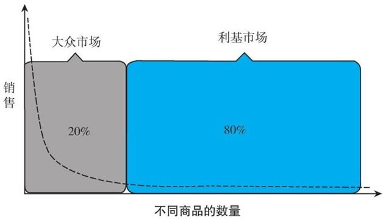

■知识介绍

帕累托法则的一个经典案例是“20%的产品创造了80%的营业额或利润”，这个理念影响了很多企业的运营。企业在经营时总会努力找到这20%的产品，追求规模最大化或利润最大化。

但是在2004年，美国《连线》杂志总编辑安德森宣称，在数字经济时代，所有在互联网上贩卖的商品几乎都能卖掉——就算再怪异、再没有必要的商品也会有人购买，而且他们甚至愿意为此支付更高的价格。把这些过去人们认为不热门的商品总量汇聚到一起，是一条惊人而且没有终点的长尾，这就是“长尾理论”的由来。

在安德森的长尾需求曲线最左端，需求曲线陡峭向上，这里是最热门和最畅销的20%商品，占领市场份额的80%。接着这个销售曲线开始缓和向右下滑，这里是不太热门的商品。这个曲线比高峰部分长得多，而且越来越平坦，似乎永远没有终点，几乎涵盖了所有市场上能提供的商品。

安德森宣称来自亚马逊这样的网站数据显示：不是帕累托法则起作用，不是20%的商品创造了80%的营业额，无数长尾商品加起来的份额其实超越了少数几个畅销品。

安德森甚至认为在长尾商业世界里，商业逻辑其实是这样的：由于消费者可以方便地找到更多个性化的商品满足自己个性化的需求，因此激活了很多潜在的需求，而这些个性的、小圈子的需求通过那80%的商品被满足，创造出和热门商品一样多的，高达50%的营业额。

安德森指出：大众市场需要畅销商品，但是也有小众商品的需求。个别小众产品需求也许更低，但是整体而言，小众商品的价值可以超越畅销品。

■扩展思考

安德森在一次跟eCast首席执行官范·阿迪布的会面中，后者提出一个让安德森耳目一新的“98法则”，改变了他的研究方向。

范·阿迪布从数字音乐点唱情况的统计中发现了一个秘密：听众对98%的非热门音乐有着无限的需求，非热门的音乐集合市场无比巨大，无边无际。听众几乎盯着所有的东西！他把这称为“98法则”。

安德森意识到阿迪布那个有悖常识的“98法则”，隐含着一个强大的真理。于是，他系统研究了亚马逊、狂想曲公司、Blog、Google、eBay、Netflix等互联网零售商的销售数据，并与沃尔玛等传统零售商的销售数据进行了对比，观察到一种符合统计规律（大数定律）的现象。这种现象恰如数量、品种二维坐标上的一条需求曲线，拖着长长的尾巴，向代表“品种”的横轴尽头延伸，长尾（The
Long Tail）由此得名。

“长尾”实际上是统计学中幂律（Power
Laws）和正态分布（帕累托法则）特征的一个口语化表达。这两个数学特征也出现在很多人类行为特征中，有兴趣进行数学建模的朋友，可以好好研究一下。

长尾市场也称为“利基市场”。“利基”一词是英文“Niche”的音译，意译为“壁龛”，有拾遗补缺或见缝插针的意思。其实当年这个词如果直接翻译为“小众市场”就通俗易懂了。

安德森的逻辑认为：过去由于成本和效率的因素限制，消费者不可能接触到全部的商品。但是在互联网上，商品储存流通展示的场地和渠道足够宽广，而且数字化商品生产成本急剧下降，以至于个人都可以进行生产，并且商品的销售成本急剧降低，那么几乎任何以前看似需求极低的产品，只要有卖的，就会有人买。这些需求和销量不高的产品所占据的共同市场份额，可以和主流产品的市场份额相当，甚至更大。

既然存在一个更大的市场，那么互联网企业必须重视这样的需求存在，并可以通过满足这样的需求获得利润。

看起来安德森的逻辑非常有道理，比如在搜索引擎领域，热门词搜索量很大，但是把全部搜索关键词合并在一起，冷门词搜索总量未必比少数几个热门词低。而且这些冷门关键词恰恰因为有更加明确的搜索需求，反而更有助于广告商投放精准广告。

简单地说，由于互联网带宽和存储成本的降低，商家展示无穷商品的成本接近为零。同样是由于互联网接入和搜索功能的发展，我们消费者找到自己个性化商品的成本接近为零。加上便利的在线支付手段和物流的发展，原来无利可图的小众市场开始蕴含着巨大的商机。

很多互联网企业受此鼓舞，开始把注意力放在长尾上。不过他们很快发现，长尾的确存在，但是根本赚不到钱！

我对长尾恰好做过深入思考，安德森的长尾理论要在商业上成立，必须满足非常严格的条件，否则那些看起来很美的长尾，只能作为一个统计现象，不能作为经营基础。

这些严格的条件是：

1.所有的商品必须是基于互联网支付的数字化产品，没有线下的存储、配送、消费需求。

像长尾理论经常讲的“书店只能摆放10万本书，网络上则是无穷”的理论，其实因为有现实的仓储、配送成本，还有营销带动效应，网店还是愿意销售热门书。

作为一个写过畅销书的作者，我也可以告诉你们一个真实的情况：每年的京东“6·18”大促，天猫、淘宝的“双十一”大促，网店都会提前和出版社进行商谈，对数据显示可能有销量的热门书进行预采购（要求提供特殊折扣），提前进货配仓，以争取最快响应读者的购书需求。比如我的《微博控微信控》套装书，三大网店采购了1300套备货“双十一”前后的促销大战。

既然有了这样的真实成本，你想不受物理限制的约束都是不可能的。

2.所有的商品品类必须是足够多的，而且是有个性的商品。

不是所有的商品都能打造出一个长尾市场，最经典的就是汽车。不管汽车市场多么热闹，全世界进行销售的汽车也不过几千种而已。因为汽车的生产成本太高，作为一个复杂商品它不是一个人能够创作和生产的。所以根本不可能存在一个满足所有人需求的汽车产品长尾市场。但是在音乐、艺术，包括未来的电子书市场上，的确存在这样的空间。

3.所有的商品都必须通过一个渠道进行销售，而不是分散在无数个小平台里面。

用淘宝做例子吧，从整个淘宝上看，把所有满足大家需求的淘宝店放在一起，真的是一个长尾市场，看起来长尾市场是对的。但且慢，对淘宝网的每个商家而言，根本没有所谓的长尾效应，只有红海效应。

每个淘宝店长都只能切分长尾的一小块，其实还是一个传统的细分市场。在这个细分市场里面，他不仅得和其他淘宝店长竞争，还得和京东、当当、易迅等很多其他的电商平台上的店长竞争。

那么一个淘宝店长就不得不考虑，是做走量的女鞋还是更个性化更小众的男鞋市场？毫无疑问，女鞋市场更大，当然竞争对手也更多，这是一个同质化的红海市场。

那么作为一个平台商，当然希望通过垄断流量入口，打造出一个完全属于自己的长尾市场，但是竞争的平台商绝不会让你如愿，他们会找到一个足够大的小众市场开始撬动你的利基市场，瓜分整个市场份额。

所以在这样的格局下，做出长尾商业模式很难，倒是“小而美”更可能。

■拆书建议

请利用长尾理论分析下面的问题：

1.中国各地的电视台运营能用长尾理论解释吗？

2.千万淘宝店是否构成了一个长尾市场？如果是，为什么阿里要开设天猫？

3.亚马逊真的是一个长尾市场吗？

2.《免费：商业的未来》为什么是错的

上次的拆书聊到安德森的“长尾模型”，这次就聊聊这位《连线》主编引起关注的另一本书《免费：商业的未来》（以下简称《免费》）。这本书引起很多人共鸣，但是大部分人读得一知半解，没有注意到实施免费战略的种种条件，这害死了很多人。

■知识介绍

传统经济学认为：商品的价格等于市场充分竞争后的边际成本，这成本通过竞争可以降到最低，但永远不会是零。而一种成本不是零的东西，你通过免费的方式出售，那就是扰乱市场的价格。

不过安德森在2009年出版了一本叫《免费》的书却宣称：一种新的免费商业模式正在基于互联网产生，而且即将挤垮很多传统市场，它代表数字模式的未来。

安德森说：“新型的‘免费’并不是一种左口袋出、右口袋进的营销策略，而是一种把货物和服务的成本压低到零的新型卓越能力。在上世纪，‘免费’是一种强有力的推销手段，而在21世纪它已经成为一种全新的经济模式。”

不知道是这老人家的话说得太绕，还是翻译得太绕，我帮各位整理一下他的核心观点：

1.传统的免费更多是一种促销手段或营销噱头，新型的免费是一种长期的产品价格策略，也就是说企业的核心服务永远不收费。典型的例子有QQ的聊天、百度的搜索、360的杀毒服务，这种核心服务永远不收费。

2.在竞争性行业，产品的定价等于边际成本。而由于互联网信息非常充裕，各种力量生产出大量的信息，信息成本相对很低，而且可以以近乎为零的成本来传播，因此信息可以做到零定价。这种以信息服务为核心服务的企业就可以考虑将服务完全免费，当然也要求这种提供虚拟化服务的企业具备卓越的技术研发和管理控制能力，使得自己的成本越来越接近于零。

3.很多传统的企业将面临巨大的挑战。一旦企业的产品可以完全数字化，那么就可能出现崭新的商业模式颠覆现有的运营模式。这种企业要清楚，今天的挑战是：过去是企业核心的收费业务今天要完全免费，那如何在免费前提下构建一个新的商业模式？

对这一点有痛苦认识的行业，已经有了一个，就是报纸。过去人们获得新闻的方式是买一份报纸，现在很多人已经完全不看报纸，因为网上有免费的版本。

4.安德森归纳出四种基于核心服务完全免费的商业模式：

（1）直接交叉补贴，比如电信运营商已经坚持很久的存话费送手机；

（2）三方市场，广告商付费而消费者免费，比如Google、百度的竞价排名广告；

（3）免费加收费，即部分用户免费，另一部分用户收费，比如网易邮箱的免费用户和收费用户，新浪微博的会员收费和非会员免费；

（4）纯免费，比如维基百科，由热心人捐赠运营费用。

其实前三种模式都是交叉补贴的例子。

■扩展思考

安德森自认为《免费：商业的未来》是对《长尾理论》的深入思考，业内更多人认为安德森是想破解谷歌成功之谜。

安德森认为采取免费定价策略会让消费者更有动力了解自己的服务，有利于快速培养基础消费人群。

等到消费者对产品有了忠诚度，形成了足够的规模，企业就可以在其中找到有足够的支付能力，或想得到更多便利服务，或想节省更多时间的目标用户群，企业再创造交叉补贴的方式来获得实际盈利。

这个逻辑看起来很美好，中国很多互联网项目大抵都是这个模式：先想出一个在网上能吸引人的点子，然后运营到一定规模，然后找风投融资，然后继续烧钱做规模，然后靠流量设计出商业模式，然后趁着规模还在增长，讲个好故事到股市上圈笔钱继续烧。

这其实就是拿一部分想投机的人的钱交叉补贴大量使用免费服务的人。

我最近遇到一个大学生，拿着一个网站策划案非要找我谈他的创业梦想，他的创意是做一个帮助大学生交友和结伴旅游的网站。我问他将来怎么盈利，他说等有了足够的规模可以靠广告盈利。你看，这就是一个典型的交叉补贴的构想。

但是我马上告诉他这个策划很难走通。他根本没有想到两个问题，第一，在中国服务器和带宽成本是国外的很多倍，一旦规模起来了，运营成本会非常高；第二，假如他的模式没有核心技术门槛，只是一个好创意，一旦有技术或规模上更具竞争力的对手跟进，他就做了先烈。

你的想法的确是免费的，免费帮互联网巨头做了市场测试，还是用实现你自己梦想的名义。

要理解免费商业模式的存在，必须理解免费的商业模式有巨大的门槛，这里有哪些门槛呢？

1.规模：免费模式如果能做到交叉补贴，就必须拥有足够的用户规模，否则，就无法找到足够的付费人群维系运营。这一点就可以解释为什么真正实施免费策略又能生存下来的，在一个行业领域只有几只领头羊。比如网游行业，都是免费策略了，但是没有运营到一定规模的游戏，一定会惨淡失败。

2.原创：免费的服务不等于低质量服务，实际上还应该提供比过去付费服务更优质的服务。这种服务要么依赖你的技术优势，比如谷歌的搜索、360的杀毒、Facebook的交友；要么依赖你的专业优势，比如财新网的新闻、秋叶和他的小伙伴的PPT系列在线课程。

原创这一点由于在中国缺乏知识产权保护环境，做得尤其艰难。但这只是导致了原创者的收益降低，倒逼原创者不得不创造更好的东西才能获得和国外市场同样的回报。

3.资金：为了实现你的交叉补贴梦想，你不得不在前期投入足够多的资金进行规模推广，否则你的免费会变成速死。像京东商城推出购书打折活动，苏宁易购就推出0元购书噱头。他们一方面逼出版社让出利润，另一方面自己真金白银从其他利润里面补贴，其实承担了大量的运营成本。

如果企业的现金流情况不理想，这种模式根本坚持不下来。很多打免费旗号的网站都死在这一点上，要么被兼并，要么被湮没。

4.产品：很多人在设计免费商业模式时，一开始就忽略了付费产品模式的设计——不能都学Facebook，那是在美国！在中国你要做免费商业模式，一定要在不断吸引足够注意力的基础上推出定制的标准化商品。没有这个策划，你的免费就是给别人做嫁衣！所以玩来玩去，最后就变成一个给别人打工的导流量的渠道。这就是新浪微博没有抓住最佳时机推出收费产品的悲剧。

■拆书建议

思考一下下面的问题：

1.搜狗输入法、搜狗浏览器都是免费的，请问它们靠什么盈利？

2.360　手机杀毒软件是免费的，请问它们靠什么盈利？

3.我的公众微信“幻方秋叶PPT”（微信号PPT100）的分享一直是免费的（将来也会一直免费），请问我靠什么得到回报？

4.你所在的行业有可能被“免费”（交叉补贴）模式颠覆吗？

一定要记住，“免费”意味着巨大的前期投入，免费模式其实是最贵的模式，是绝大部分公司玩不起的！

3.你真的理解六度空间理论吗

互联网的本质是连接，连接一切信息，连接所有人，这会对社会关系造成重大冲击，各种新的社交理论纷纷登场。这次的拆书模型“六度空间理论”还是来自《史上最简单的问题解决手册》。

■知识介绍

六度空间理论（Six Degrees of
Separation）来自一个数学猜想，说的是：你和任何一个陌生人之间所间隔的人不会超过六个，也就是说，最多通过六个人你就能够认识任何一个陌生人。这也叫六度分隔理论，或小世界理论。

关于这个理论有很多文章介绍，最经典的一个故事是一家德国报纸接受了一项挑战，要帮法兰克福的一位土耳其烤肉店老板，找到他和他最喜欢的影星马龙·白兰度的关联。结果经过几个月，报社的员工发现，这两个人只经过不超过六个人的私交，就建立了人脉关系。原来烤肉店老板是伊拉克移民，有个朋友住在加州，刚好这个朋友的同事，是电影《这个男人有点色》的制作人的女儿在女生联谊会的结拜姐妹的男朋友，而马龙·白兰度主演了这部片子。

这个理论提出后一直很难得到普通人的认同，即便有这样传奇的故事，这也和普通人的经验不相符。普通人的感受是这个社会是有等级的，怎么可能有这样的奇迹？

上世纪60年代，哈佛大学的社会心理学家米尔格兰姆设计了一个连锁信件实验。他将一套连锁信件随机发送给居住在内布拉斯加州奥马哈的160个人，信中放了一个波士顿股票经纪人的名字，信中要求每个收信人将这套信寄给自己认为比较接近那个股票经纪人的朋友，朋友收信后照此办理。最终，大部分信在经过五六次传递后都抵达了该股票经纪人手中。

这是第一次用实验的方式证明了六度空间理论的科学性，但是对于普通人，这个实验显然忽略了一个现实：如果不是因为实验，普通人谁愿意用这么麻烦的方式去寻找这样的联结关系？

直到出现了互联网社交网络，很多人开始真的相信这个理论了。事实上，很多社交网站就是基于这个理论构建的。像Facebook网站、QQ空间、新浪微博，都会显示你有多少好友，你的好友又关注了哪些共同的好友，甚至它会告诉你是通过谁认识了这些朋友的。

而很多人也的确通过这样的SNS社交网站认识了一些原来在线下完全不能认识的牛人和名人，这样的经历我身边就很多。通过PPT，我认识了像@小巴_1990、@秦阳、@汤是一门PPT、@鱼头PPTer、@花生PPTer这样的大学生PPT高手，我们之间的经历，也是一次六度空间理论的展示。

■扩展思考

1.有哪些特质你才能借助六度空间传播？

六度空间理论一流行，最先打主意的就是商家。这种人际关系链在商家的眼里就是口碑的传播链。

迄今为止，借助六度空间理论最成功的营销，是谷歌Gmail的邀请注册。在邀请码刚刚出现的时候，一个Gmail邀请码甚至可以卖到60美金，很多人惊呼这是最伟大的营销。

一开始，Gmail邀请码是稀缺物品，所以价值高昂，加上Gmail当时带有Google的品牌影响力，拥有Gmail成了荣誉的象征，被追捧不奇怪。

正是这种荣誉成为Gmail邀请码在六度分隔网络中疯狂传播的激励。然而随着Gmail的高度普及，这种荣誉感逐步下降，最终降低了激励，从而使传播陷入了停滞状态。到了今天，谁还在意这些邀请码？

这恰恰说明所有的传播背后有一个重要的品质：稀缺性。没有稀缺性的传播根本不会成功。理解了这句话你就可以理解为什么微博上大部分转发活动难以成功，一些成功的转发至少有好的创意，而好创意从来都是稀缺的。

2.为什么你无法经过六次传递认识克林顿？

在理论上你的确可以经过六次传递就联系到克林顿，这是真的，但是假如在现实中这的确是真的话，那么最苦恼的人就是克林顿，因为无数的信息会瞬间秒杀他。

每一个微博大号都有这样的经历，私信充满各种奇葩请求。无数求广告、求关注、求帮转的私信成为我的骚扰信息源，以致我都不愿意通过新浪微博私信轻易推送文章，害怕成为骚扰。

所以正常的逻辑是克林顿会设置防火墙，没有经过他认可的人，无法轻易和他建立联系。这就是用六度空间理论建立人脉会遇到的问题，最终能够传递信息给克林顿的人，其实很有限，也就是不足250人的核心社交圈。

六度空间理论并不是扁平化联系的，真相是大部分人和一个名人的联结，是通过有限的人送达的。也就是说每个人和别人的联结权重是完全不同的。我们在社会上认为一些人交游广阔，是指他们可以善用资源整合很多不同的人脉关系，和这些人建立可信赖的联结关系，你找到这样的人，就找到和你真正要接触的人交往的大门。真正值得交往的人并不多，这些人才是真正的人脉——他们必须是有能量的人。

而很多人以为加入组织和社团认识很多人就叫有人脉，这是肤浅的认识。真相是：认识100个人不如得到一个有影响力的人认可。否则你即使获得见克林顿的机会，也只会换来一张和他的合影，这样的机会，对你个人的成长也许有激励作用，但不会有太大的意义。

建立传递链和把你的信息送达给别人是完全不同的概念，不懂这个概念的人就是那些在微博、微信上求私人号、求电话、求关注的人。

■拆书建议

其实利用六度空间理论，加上一点点权重分析，你可以对你身边的人脉做一个很好的梳理，你会看到，谁是你身边真正有价值的人。

总之，重点不是你认识多少人，而是你认识哪些人。而要和有能量的人建立长期的良好关系，根本方法是建立你自己的价值。只有你对他产生价值（比如经济学家对官员来说是有价值的），他才乐意和你分享他的能量——对等原则是人际关系中的黄金法则。

4.为什么小米的“参与感营销”你学不会

互联网消除了距离，其中包括消除了（至少是缩短了）企业与顾客、老板与员工的距离，才让“参与感”在营销和管理中成为可能。

2014年《参与感》这本书很火，因为小米太火了，作为小米的联合创始人之一的黎万强出书介绍小米成功的秘诀，自然能引起大家学习的欲望。

■知识介绍

黎万强把消费者选择产品的过程分成了三个阶段，分别是：

1.产品稀缺时期——功能型消费；

2.消费文化时期——品牌型消费；

3.个性至上时期——体验型消费。

小米认为现在的消费者进入了更高的阶段，希望能参与到自己喜欢的品牌的发展中来，他把这叫作“参与式消费”。

按黎万强的说法，构建参与感就是把做产品、做服务、做品牌、做销售的过程开放，让用户参与进来，建立一个可触碰、可拥有，和用户共同成长的品牌。构建参与感的三大战略是做爆品、做粉丝、做自媒体。在具体战术上是策划开放参与节点，设计互动方式，扩散口碑事件。

■扩展思考

这些观点很新鲜，也发人思考。不过我看了以后，想给很多做参与感的朋友泼一桶冷水：做参与感，小米行，你不行！

作为一个自认为早就深入研究了小米模式，并一直在努力学习小米模式的人，我对雷军提出的“专注、极致、口碑、快”这七字诀做了以下分析，如有不妥，欢迎探讨。

首先，不是所有的产品都能培养出有参与感的粉丝。

小米的手机是智能手机，智能手机本质是一台小电脑，这种产品具有足够的空间让消费者体现自己的个性，并分享自己的个性玩法引起大家的认同。比如手机可以设置桌面、屏保，下载各种APP，玩法太多太多了。

假如你的产品是一台普通的微波炉，请问你想怎样让粉丝制造出参与感？其实微波炉还不是最惨的，至少还能分享做菜的攻略，可能性还是很多的，但是洗衣机和冰箱呢？

拥有能够诱发参与感的产品，的确是一件不容易的事情。

化妆品能做参与感营销吗？有的有希望，有的很难。更多是玩品牌轰炸或社交口碑传播。

杜蕾斯的卖萌互动营销算小米式的参与感吗？我看也不是，但人家至少在努力做一个有个性的品牌。

我觉得杜蕾斯这么努力，也很难成为小米的原因，就是它的产品本身很难有太多使用内涵，只能靠话题吸引粉丝热爱这个品牌的形象设计，而不是靠参与感。杜蕾斯的微博内容更多也是靠团队运营，来自网络奉献的目前还不够多吧？

这么说起来，我觉得目前能打造出参与感的产品并不多，简单说，如果一个产品自己能形成一个论坛进行交流讨论，那么这个产品就可能具有培养参与感粉丝的机会。这样的产品，似乎是汽车、电脑、手机、相机、各种工具软件……

做爆品，前提是做一个好单品。做一个好单品，前提是这个单品有足够的空间容纳不同人的想象力。

所以在很多行业，不得不搞细分市场，比如空调，各种规格，各种马力，各种外形，你没有办法简单做单品。因为空调目前并不是智能商品，无法去做一款产品打天下。产品线一长，只能简单做赔本价格战的爆品，而不是玩粉丝营销的单品。

你可以拿钱赌一把，做一个极致的单品，但问题是赌输了怎么办？所以你想做参与感营销，请先想想你的产品让粉丝们参与的点在哪里。如果你把微博转发就当参与感，那就算了吧。

其次，小米论坛从无到有，从小到大，黎万强自己在书里也说经历了很长的时间。

在小米发布第一代手机时，MIUI用户已有50万。而为了积累这50万原始潜在用户，小米用了一年多的时间。

做到这一切，黎万强在书里面也坦承：老大带头，亲自泡社群、和用户互动，每天至少15分钟，一般是一小时，从高管到员工都不例外，整整一年。这个在今天有几个公司学得到？

全员粉丝化，哪里是那么好学的！一般的企业高管生怕员工上班不务正业，而小米要求所有的员工都必须上论坛。

黎万强强调雷军这次创业心态很成熟，雷军早已功成名就，不差钱，不差人脉，就是想实现自己的一个梦想，可以自由尝试自己的构想。和他一起创业的联合创始人，没有一个是自己生活上还有巨大压力的，都是牛人。

所以这样的老大发烧友，想做一个社群，已经具备了建设“社群”最关键的条件——慢养。社群是慢慢养出来的，想靠金钱短期砸出来，做不到。产品的社群，学习的社群，文化的社群，兴趣的社群，凡是能运营得好的，往往都是在开始运营一年后才能慢慢找对感觉，慢慢做大的。

我们不能简单说小米成功是因为创业者有钱，关键是小米的确因此拥有普通人不具备的心态——从容。

在社群运营上，从来都是“少就是多，慢就是快”。

早年玩论坛，一开张就开几十个分论坛的，死得快。好论坛都是慢慢做起来，慢慢找到新版主，慢慢扩张的。

后来写博客，一开始就列一堆目录写N个方向的，往往写不出名堂。专注一个领域的，倒是成就一批专业博客。

再后来流行微博，真正的微博红人，哪个不是身上有一个明确的标签？不管这个标签叫“公知”还是其他。

积累品牌的过程是很慢的，但是积累起来了，就可以加速成长。问题是在这个瞬息万变的互联网时代，太多的人担心“快鱼吃慢鱼”——我想慢慢长大，问题是市场会马上绞杀我。

雷军总结的关键词“专注”，说起来很对，但做起来并不容易。因为想在一个方向做出足够大的深度和影响力，光坚持专注就很不容易，还要找到足够大的市场让我们专注更不容易。

所以很多企业的运营策略其实是多元化，借助自己的资金和经验，在不同但相关联的领域，甚至是不相干的领域做多元化投资，可能是获得商业回报的更好方式。

但不专注，也就无法做到极致。专注首先就得要求创始人专注，领导不够专注，员工表示要专注也一定只是口头的拥护者。

雷军团队能把产品做到极致，一个重要的原因就是他们能专注。他们之所以能足够专注，我觉得一个关键原因是，他们都足够有钱。

钱不能买来一切，但是钱用好了，可以买来从容。

太多的企业，特别是创业者，不是不想专注，是没有办法靠专注自己能做好的事情熬到有商业回报的那一天，因而不得不先去做一些其他的事情曲线救国，但往往一曲线就回不来了。

如果你的产品有足够的包容度，你和团队也有足够的积累去打造一个极致的产品，那么是不是你们就可以玩有参与感的粉丝经济了呢？我的答案依然是否定的。

发烧的人很多，但是又发烧又会玩的人才是王道。

怎么叫发烧？是你比别人更专业。

怎么叫会玩？是你比别人有创意。

两个加在一起，你才会做到“快”，你总是快粉丝一步，粉丝才愿意追随你一起玩，你才能引导粉丝追随，并激发粉丝的创意，做出更有趣的群体创意。要知道，独乐乐不如众乐乐。

看到小米的各种经典营销案例时，你敢问自己，如果你是雷军，你会和他一样把“致青春”玩得这么有情怀吗？如果是你，你会想到做一个晒一晒用过的手机拼图发微博的创意，并能够马上找到人做出来上线吗？

再说一点，小米的很多员工具备互联网创意实现能力，包括程序员、美工、文案，甚至是摄影师。他们不仅仅是手机发烧友，也是各种好玩发烧友。如果没有这样的员工，仅仅靠老板发烧，创意也玩不起来，如果交给外包，那一般也快不起来。

没有一个“快”字，就是企业追随会玩的粉丝，而不是粉丝追随企业了。

有了“专注”，才能“极致”，有了前两者，才能“快”。三者合一，才能积累“口碑”。

而粉丝的口碑，第一能带来购买力，第二能带来成就感，这就让投入其中的人更加热爱自己的产品和工作。然后业务发展得越来越快！这就是一个正循环。

这个正循环什么时候会被打破呢？答案很简单，规模是社群的敌人。

■拆书建议

写到这里出个题目吧，秋叶我自称学习了小米模式，那么我的网易云课堂的社群运营是否借鉴了小米的经验呢？比如你可以思考：

秋叶老师的在线教育，以PPT/Excel/Word为代表的办公职场工具是否具备多元化参与可能性？

秋叶老师的在线教育，有没有耐心培养小伙伴一起愉快地玩耍？

秋叶老师的在线教育，有没有在品质上精益求精不断改进？

秋叶老师的在线教育，有没有在各种反应上比你们更快一点点？

……

那最后秋叶老师有没有可能学到小米的参与感？

这些问题同样可以用来思考你自己公司的产品或服务。

最后说一句，“专注、极致、口碑、快”的法则对于职场人实现升职加薪目标也是颇有借鉴意义的。

5.谁在引爆趋势

每个人都被潮流裹挟着向前走，人们在服装、发型、电影、手机上的消费往往是从众的，哪怕自命为雅士，喝的茶、看的书也是被潮流影响的。

关于潮流的诞生有两本书比较值得一看：一本是《引爆点》，一本是《引爆趋势》。《引爆趋势》这本书想解决一个问题：为什么有些流行潮会变成一个大趋势，有些流行潮只能是昙花一现？

■知识介绍

《引爆趋势》指出流行都是人创造的，要发现流行趋势其实就是要关注那些创造新元素或是能提出创新风格的人。

发现流行趋势是可能的，不论是在现实生活中还是在网络上，推动流行的一个关键元素就是观察。如果潮流缔造者能进行观察，那么我们也可以模仿他们的方式进行观察。

一股新潮流在真正流行开之前，肯定有一个逐渐升温的过程。如果一种创新风格在两个行业中流行开来，那么它很可能是一种流行趋势。一种流行趋势往往是那些已经成为主流或是在市场上流行多年的风格的升华。当然，流行的风格可以突然从一个极端跳到另外一个极端。要成为一个明察秋毫的潮流缔造者，你就必须对细微的潮流变化时刻保持着高度关注。

在一股潮流中，最重要的人是潮流的创造者和缔造者。一个潮流创造者往往难以追踪，但一批人跟随他的创意，就能把他的创造变成一个小气候，并吸引更多的人关注，甚至追随。

潮流的缔造者往往来自设计师、艺术家、男同性恋者、有创造力的年轻人、有个性的名人或一些长久存在的亚文化圈。

依据对待潮流的不同态度和反应，《引爆趋势》一书把人群分为6种。

潮流缔造者：对于风格和偏好，他们最具有想象力和好奇心，能够接受变化，喜欢变化，敢于在其他人认可之前就尝试创新。

潮流追随者：他们需要有人先行尝试，自己才会效仿，他们对于时尚也很有想象力，但是他们更多是从潮流缔造者身上寻求灵感。

早期的主流文化者：在新的时尚被主流群体接纳之前，他们开始接受新的风格，他们比主流大众更容易接受新鲜事物，但是比潮流跟随者更犹豫一些，他们需要看到有一批人做了才会行动。

中期的主流文化者：他们行为模式很保守，追随新潮流的原因不是尝试，而是认为别人都在做，不希望自己看上去像个落伍者。

晚期的主流文化者：这个群体总是慢半拍，不得不接受某些风格或者行为才肯改变原有的风格或行为模式。他们意识到自己再不改变就会在人群中显得格格不入。

保守主义者：他们总是质疑改变，甚至会坚持自己的风格几十年之久。极端的人会顽固地反对一切改变。

潮流创造者和保守主义者其实在女性这里可以得到一个非常明显的对比，因为女人对衣服的态度是研究流行趋势的最佳范本。

《引爆趋势》指出喜欢创造潮流的人对于衣服的态度是：

具有新的风格是很重要的；

我对自己衣柜里的衣服很快就厌倦了；

我愿意接受新的时尚。

而保守主义者或者抗拒改变者的态度是：

我永远也不会第一个去尝试穿着某类衣服；

我不喜欢变换风格。

不同的人群在潮流演进过程中所占的比例不同，我们可以得到一个菱形的截面图。

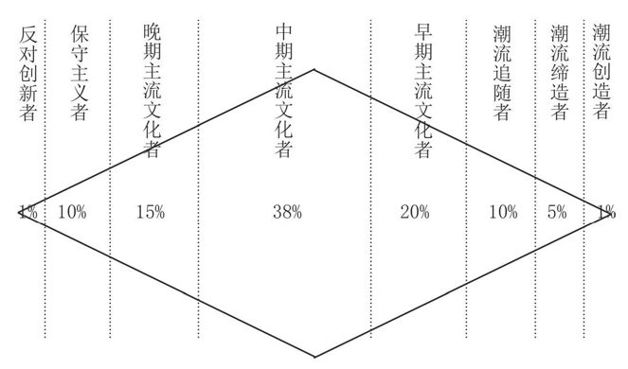

依据这个菱形图，我们可以选择一个流行文化做一下分析，看看哪些人是潮流的缔造者，哪些人是潮流的推动者。写到这里，你应该明白了，分析这个图，其实就是在分析你的产品营销方案的推广思路。

■扩展思考

一个潮流缔造者在他熟悉的领域可能是一个潮流领先者，但是在他不熟悉的领域也可以是一个潮流保守者。比如很多互联网极客，玩软件、玩手机、玩智能设备是不惜成本，但是他们的穿着打扮却一直停留在比较低端的水平没有进化过。

当然，一个产品用这样的角度来思考一下，也是个很有趣的过程。比如微博和微信，我们可以看看，两个产品演化的过程，是否也经历了这样的阶段。

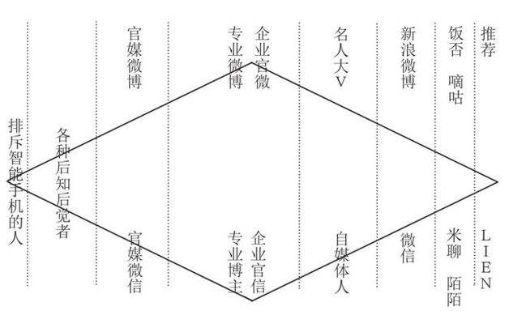

你看，用一个模型结合目前中国流行的互联网产品做分析，判断一下不同的产品处于何种阶段是一件有趣的事情。那么说说易信的推广吧，他们要成功，必须找到早期的主流文化者合作。如果只依赖贪图300M流量的草根推广模式，那么易信最可能的结果就是变成一个贪小便宜者扎堆的平庸软件。

我断言为了一点儿流量就长期使用易信的人反而是最容易被骗的人，而那些因为好奇心去尝试的人，如果得不到潮流追随者的热捧，他们很快就会因为缺乏认同感而放弃使用，回到所谓的大潮流中去。

当然这只是我的一家之言，有了一个模型，你分析世界的难度总可以变得简单一些，或者看起来有逻辑一些。

■拆书建议

不同的人对流行的观察是不同的，其实我的观察侧重点是人群的阅读和思考模式的变化。我相信阅读模式的变化必然带来思考模式的变化，这两种变化必然深度改变两个行业：在线培训行业和在线阅读行业。

在2014年，我注意到网络上不管是微博还是微信开始流行信息图表，比如大家都喜欢看“一张图教你读懂×××”这样的长图。于是我就开始留意这方面的人才，考虑开发这样的教程。

我发现最擅长做高效率信息图表的网友往往是90后新人，他们有很多这种风格的阅读经验，也偏好这种快速图表化阅读方式。其中一些优秀青年非常有想象力和好奇心，愿意动手尝试在自己的微博、微信内容中使用信息图表，而且加入他们自己的创意后，非常受欢迎。比如我在微博上发现的@simon_阿文和@嘉文钱，他们不仅仅擅长使用信息图表，而且还形成了自己的扁平化设计风格。阿文和嘉文就是潮流缔造者。

阿文和嘉文在微博上发布自己的信息图表长微博或者干货教程后，很多人喜欢，纷纷动手模仿他们的创意，甚至把自己的头像换成和他们一样的风格，这些小伙伴觉得自己设计一个酷酷的头像比用魔漫相机或者脸萌这样的软件生成要酷得多。这些小伙伴就是潮流追随者，这样的追随者不会太多，但是只要达到1000人，就可以在一个小圈子内形成引爆的种子用户规模。

当潮流的追随者到了一定规模，我们会注意到越来越多的小伙伴询问这种风格是跟谁学的，很快这些人就会成为“早期的主流文化者”。我们可以看到的是，阿文的微博粉丝数量一年内从不足2万快速增加到了5万多，嘉文的微博粉丝也增加到了4万多人。

正是基于对趋势和数据的观察，我们判断信息图表课程会有足够大的市场。因此在2014年年底，我们让阿文和嘉文悄悄合作研发“和阿文一起学信息图表”教程，我们的目标就是瞄准这群“早期的主流文化者”，想通过教程快速复制出一大批能够做出信息图表的潮人。然后借助前1000名核心成员的口碑让更多处于观望模式、不知道自己该不该学信息图表的人也加入进来，这些人就是中期的主流文化者，也是我们课程的最大基本盘。如果成功撬动这个市场人群，那么课程就会获得巨大的成功。如果课程不能撬动这个人群，那么就只能获得很有限的回报。

从覆盖早期主流文化者到中期的主流文化者，营销上存在巨大的鸿沟，并不是你覆盖了前者就一定能影响到后者，除非你让他们看到不学会这样的新技能，的确在工作中会处于竞争劣势。这就要求我们在课程开发时积极和实际业务结合，鼓励他们做出在工作中能让人眼前一亮的信息图表风格的汇报、演示，或者新媒体传播素材。

要用大家感兴趣的点去吸引他们投入学习，让他们通过自己感受到的趋势说服自己，而不是我们自己创造一个趋势，这个其实还是蛮困难的。从这个角度上讲，在在线教育领域，我们是信息图表课程的潮流领导者，但是从整个传播格局来看，我们是一流的潮流追随者。

至于晚期的主流文化者或者保守主义者，我们根本不把其当做目标客户。我们认为放弃这些人群，在成本上更合适。

如果你对某个行业有兴趣，也想了解这个行业潮流变化的趋势，那么你不妨也用这个模型，做一个细致的分析。

小米创始人雷军说：“站在台风口上，猪也能飞上天。”学会分析潮流发展变化的趋势，有助于我们一飞冲天。

6.引爆点模型

和《引爆趋势》这本书的看法不同，《引爆点》认为流行的制造更多是依赖关键的人物、传播的载体还有环境的暗示。

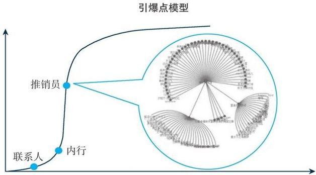

■知识介绍

关于流行，美国才华横溢的作家马尔科姆·格拉德威尔在《引爆点》一书中提出了一个全新角度的分析模型。

他认为，思想、行为、信息以及产品常常会像传染病暴发一样，迅速传播蔓延。正如一个病人就能引起一场全城流感；如果个别工作人员对顾客大打出手，或几位涂鸦爱好者管不住自己，也能在地铁里掀起一场犯罪浪潮；一位满意而归的顾客还能让新开张的餐馆座无虚席。这些现象均属“社会流行潮”，它爆发的那一刻，即达到临界水平的那一刻，就是一个引爆点。

为此，格拉德威尔走访了宗教团体、成功的高科技公司以及全球最优秀的推销员，他剖析了种种典型的传播事件，如各种风尚、吸烟现象、儿童电视、商业邮寄广告等，试图阐明其背后的导火索。

他提出在所有的流行潮后面，起作用的都是流行三法则——个别人物法则、附着力法则和环境威力法则。

个别人物法则：

社会流行浪潮是由屈指可数的人驱动起来的。在驱动社会浪潮方面，这些人能够主动发现潮流趋向，通过自己的社交、活力、热情和个人魅力把趋势传播给大家。

格拉德威尔认为下列三种人导致了流行的发生。

联系员：就是那种“认识了很多人的人”。这类人把朋友当做邮票一样地搜集，随时与人保持联系。这个角色可以把信息快速地散布出去。

内行：就是那种“什么都懂的人”。他们对某一种知识可以说是“达人”，不厌其烦地把相关的知识与朋友分享，但是却没有很好的说服力。这个角色对某件事情的狂热，使他们所发掘出来的事情具有价值。

推销员：就是那种“什么人都能够说服的人”。这种人没有很深的知识，但是有特殊的能力让见到面的人在短暂的时间内就交付信任。这个角色能够把内行发现的东西以简易的语言和人们沟通。

附着力法则：

有些话我们“左耳进右耳出”，但是另一些却让我们听过了再也忘不掉。附着力法则所说的就是当被传播的信息是容易被注意、记忆的，就容易形成流行。

环境威力法则：

人对自己周围环境的敏感度比他们所表现出来的更为强烈。流行的趋势需要一个发展的温床，当一个环境形成的时候，个人的因素就不重要了。比如说有实验证明，在一个非作弊不可的环境中，不论是哪种家庭出身的学生都会作弊。

格拉德威尔认为只要一件物品或一个观念拥有适当的条件，就可以形成一个风潮，而掌握到了这个趋势，就可以让一个趋势引爆起来。

■扩展思考

读这本书的时候，我正好发布了一系列关于大学生知识地图的微博，所以我想分析一下这些微博，看看是否符合引爆点三原则。

2013年9月2号我发布了一条微博，是大学生知识地图第一季：大学生推荐书单。截至本文写作时已被转发了156次。

9月3号我发布了大学生知识地图第二季：推荐大学生最值得关注的十个微信公众账户。截至本文写作时，已被转发了759次，这是一个相当惊人的成绩。

9月4号，我发布了大学生知识地图第三季：90个城市博物馆清单。截至本文写作时已被转发了43次。

三条微博都是针对大学生受众，都是干货，为什么只有第二条微博转发次数非常高？我用流行三法则解释一下第二条微博转发高的奥秘：

1.第二条微博讨论的话题是最值得关注的微信，第一条讨论的是值得阅读的书目，第三条讨论的是值得参观的博物馆。

在开学季，大家本来最关注的话题应该是可以读的书，不会是博物馆（这是一个旅游季的话题，但即便在旅游季也是一个冷门话题）。但微信是当时（2013年9月）整个大环境下最热的话题，所以更容易被关注——读书其实始终是一个不红不紫的话题。

所以这三条微博的转发量是符合环境威力法则的。

2.第二条微博文案写的“最值得关注的十个微信公众账户”中，“十个”和“最值得关注”两个词都是诱发大家注意的信息，这样的关键词会让更多人产生兴趣。这条微博文案更符合附着力的原则。

3.最重要的是个别人物法则。

在第二条微博里，涉及十个微信账户，这十个微信账户的运营者有七个都对微博进行了转发。

在促进转发的过程中，我作为其中两个微信的运营者和微博的发起者进行了多轮转发不说，还私信和短信通知其他六位微信大号转发，这样我就起到了联系员的作用。

而这些微信大号，本身微信运营得都非常成功，客观上他们的推荐都具有内行的性质。再加上其中有一个超级推销员罗胖罗振宇，他一条微博就带来了超过500次转发。当然还有拥有百万级粉丝的古典老师的三次转发，也是威力惊人，这样一下子就把整个微博转发量提升上来了。

如果没有这些个别人物的转发，很难制造一条有传播力的微博。

在9月4号，有一条类似的微博出现，恰好可以作为对比。@人力资源分享汇做了一个推荐：2013年最值得关注的微信平台，转发只有145次，这其实是一个不错的成绩，但和我那条相比明显还是能量不足，区别在哪里？

首先我发最值得推荐的微信，显然我更具有内行性质，因为像我这样了解大学生，并玩转微信的人并不多。@人力资源分享汇这一点先天不足，而且它的推荐也没有得到在微信界有影响力的大号转发，如果有大号帮忙转发，可能转发量会高一点。

在被推荐的账户中我和@数据化管理两个人转发就带来64次转发，也从侧面说明大号的威力，这也说明个别人物法则的影响是存在的。

如果谈到文案，其中过多的描述冲淡了对“2013年最值得关注微信”的强调，也降低了信息的附着力，某种意义上我觉得“最值得关注”这个话题太大，还不如走精准细分路线效果更好。

这个微博推出的时机也没有借助环境威力，我发的微博是掐准新生开学季，这是一个好环境点，而这个“2013年最值得关注的微信”，唉，它发布的时候2013年还没有结束呢。

关于内行这个话题，又有另外一个案例：我的微信推荐没有带二维码，一个大学生主动做了一个二维码版本。你们猜猜他的转发量有多少？

很遗憾，只有27次，而且这里面还有我的18次转发贡献，现在你们应该明白了个别人物法则的作用了吧。

一个优秀的个别人物，应该是把联系人、内行和推销员三个身份进行合体，那么，优秀的内容通过他的传播会产生极大的推广效应。微博上的传播案例很多都能用这三条原则来解释。

所以，上面那位同学的微博，虽然内容更好，有二维码，但是他不是内行身份，也没有足够的联系人脉，更不具备推销员的能量，即便他在同样的时间，做同样的事情，得到的回报却很小。

在微博上很多人总想着制造一条火爆的微博，其实答案还真可以从三大原则中去找。别仅仅指望制造一条好内容，关键是谁帮你转发，为什么他觉得你的内容值得转。

■拆书建议

关于《引爆趋势》和《引爆点》这两本书的观点，我个人认为有很大不同。我觉得就长期趋势而言，《引爆趋势》总结的扩散模型比较合适，就短期热点话题的爆发而言，用《引爆点》的三原则分析更贴切。

在2013年9月5号这天，我想继续测试下《引爆点》三原则的可信度。@人民日报曾发布“一个大学生可考的证件指南”，转发超过7000次，我准备了一个更全的版本，我觉得这依然是一个在开学季可以传播的具有环境威力的题材。

但是这个大学生知识地图第四季，我不准备通过自己的账户来发。我是通过@小贤爱百度的账户来推送的。

你们猜猜看，最后转发量能否超过200（这会是一个不太容易做到的转发量）？如果最后能做到，怎么解释？如果做不到，又怎么解释？

最后说一句，大家看我拆书，不是看我的结论，应该学习我是如何读书的。我每次读完书，觉得有道理的都反复用我看到的现实加以印证，直到成为我自己可以理解和应用的东西。但是我觉得，很多人都没有行动起来。

宋、明时代的理学家认为，只有实际上已经行孝的人才能说知孝，只有尝过苦味的人才知道什么是苦。因此，真正的知是对认知上的理解做经验的验证，知而不行的人不能说自己已经知道了。拆书的意义也许就有这样的道理在里面吧。

二、建立思考模型

阴阳、五行、八卦都是思考模型，它们对中国几千年的历史有着深远影响，思考模型的重大意义由此可见一斑。这一部分的拆书文章都是在分析探讨各种经典的管理类思考模型，相信大家会有所启发。

在这个板块上，我主要选择《史上最简单的问题解决手册》这本书继续拆下去，帮大家举一反三读完这本书。

我将从这本书中连续拆出许多个通俗易懂，大家学了就能用于工作，而且可以图形化表达的思考模型（部分模型放在其他板块）。这些模型都能帮助你有效解决在生活或者工作中常常遇到的问题，帮你在混乱局面中快速找到可行的对策。

1.时间紧急重要度模型

大家都知道做事要分清轻重缓急，在这方面“紧急重要度模型”是很适用的工具。

■知识介绍

紧急重要度模型也有人称之为“艾森豪威尔矩阵”，这可能得益于艾森豪威尔曾说过的一句话：“最紧迫的决策通常都不是最重要的。”

在工作中常常有很多必须立即处理，不能拖延的事情，我们把这个称为紧急性工作。还有一些事情可能未必很紧急，但是对你的生活和工作却是最有价值的事情，这就是重要性工作。

依据紧急性和重要性，我们就可以把自己每天的工作清单归类到四个矩阵区间里（下图为参考）。

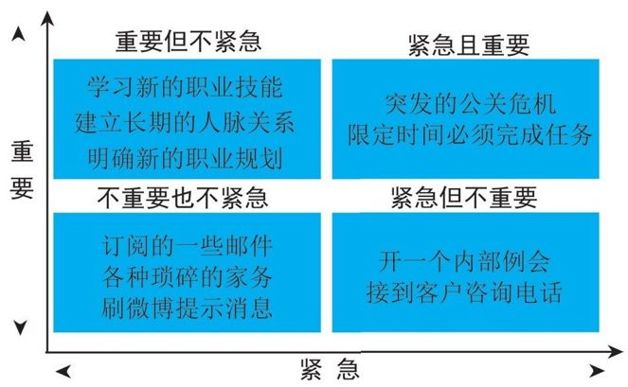

■扩展思考

虽然人人都知道需要优先处理紧急重要的工作，但实际上不同的人对待工作的方式是不同的。

因为承担紧急且重要的工作往往也意味着巨大的风险和责任，对自身能力也有较高的要求，所以很多人往往会想办法逃避紧急重要的工作，推诿给别人去做。但在职场里一个人看起来没有事情做是不行的，所以他们的选择是：装一个忙人，去做一些不重要也不紧急的事情，让自己看起来很忙的样子。如果摊上一个有交情或比较糊涂的领导，这种人在单位也未必不吃香。

这种人慢慢在职场就变成了老油条，成为懒人。他们总是在应付一些杂事，看起来很忙，但没有一件事情是关键的，他们习惯用忙掩饰自己的无能，或者缺乏明确目标的现状，这样的人在职场其实有很多。

还有一种人也无法响应真正紧急且重要的工作，他们是职场新人，但是他们可能是压力最大的一群人。因为是工作中的新手，不知道到底哪些事情更重要或紧急，又害怕领导同事笑话自己没有能力，不好意思主动沟通，于是每件事都当重要或紧急事情优先响应，到最后自己很累，反而耽误了真正重要的事情。这种人我叫他压力人。

如果新人慢慢度过适应期，能力越来越强，会成为业务骨干，但是也往往因为具有一些专长的技能，总被单位要求响应一些救火的工作。他们会发现自己越来越忙于紧急的事情，看起来很重要，到处都不可或缺，但是他们忽略了更重要的事情：不要总是在救火，而是要搞明白为什么会起火；学会让自己能适当抽离事务性工作，为自己的未来做更长远的规划。这种人我叫他忙人。

如果忙人能度过职业生涯“瓶颈期”，就会成为闲人。闲人不是真的闲，而是他总能有条不紊地去完成有价值的工作，并投资时间给自己的未来。他并非真的闲，他只是给别人的印象是看起来很悠闲而已。

闲人在单位如果不是老大的话，要注意避免让别人觉得你很闲，而被安排或牵扯入很多所谓紧急，但其实不重要的事情中。一旦你的工作节奏被破坏，你就会失去对时间的控制，重新变成忙人。

作为职业人，大家当然都希望自己能成为一名闲人。不过闲人往往是因为他熟练掌握了几种忙人的技能，建立了对业务的全局观，才能举重若轻地对待工作和生活。

因此，从压力人到忙人，再进化到闲人，是一个人职场成长的三阶段。

当你成为一个闲人后，你也许还是会对现在的工作和职业产生厌倦感，你想去迎接新的挑战。在新的环境中你又变成了一位新人，你还是要经历“压力人——忙人——闲人”的三阶段变化。只不过在你有了各种职业能力的基础后，你进化的速度会比刚刚入职的新人快很多。

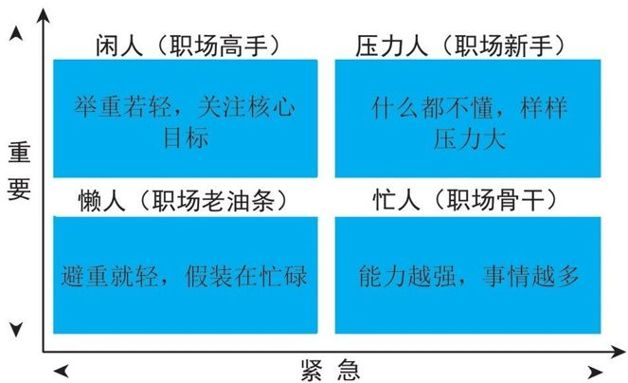

人生在不同的阶段，需要面对的重要或紧急的事情往往是不同的。比如在大学阶段，最重要的事情是学习解决问题的能力，但它看起来不如谈恋爱那么紧急，结果学习这个最重要的事情大家反而都忘了。

而到了工作阶段，最重要的事情往往是建立家庭，但大家往往都把事业误认为是自己的最高目标，而忽视了人之所以存在不是为了工作。

事情的紧急性往往是很容易判断的，真正麻烦的是如何判断一件事情的重要性，你需要仔细思考你现阶段最重要的目标，然后才能评估哪些是对你最重要的事情。这是很难的一件事情，也是很多人知道这个模型，依然难以用好的原因。

搞清楚自己的现状和症结所在，才能突破困局。

■拆书建议

1.写下你明天要做的事情清单，按照紧急重要度模型归类，想好响应对策并落实到工作计划中。

2.写下你未来一周的主要事情清单，按照紧急重要度模型归类，想好响应对策并落实到工作计划中。

3.写下你未来一个月的主要事情清单，按照紧急重要度模型归类，想想有哪些重要的事情你遗漏了？

4.写下你未来一年的主要事情清单，按照紧急重要度模型归类，想想你认为重要的事情真的是你的目标吗？

你对你的未来设想越细致，你就越可能过上你预想的生活，当然仅仅靠想是不够的，还得有行动。

如果你发现你的日、周、月、年的紧急重要度模型里面的重要不紧急事件区别很大，你就要想想，是不是你的时间安排在哪里出了问题。

时间是每个人最根本的资源，很多人习惯于稀里糊涂地工作和生活，导致根本资源的利用效率极低。养成使用紧急重要度模型的习惯，将对人生的结果产生重大的积极影响。

2.SWOT分析法

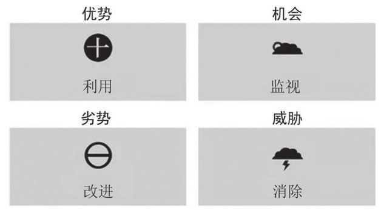

继续拆《史上最简单的问题解决手册》这本书，本节介绍SWOT分析法。说明一下，我拆书会借鉴原书框架，但信息量远比原书大，所以，不要误会为我的拆书内容就是原书的内容。

■知识介绍

SWOT分析方法中，“S”代表优势（strength），“W”代表劣势（weakness）；“O”代表机会（opportunity），“T”代表威胁（threat）。

这个方法是评估工作项目中的优势、劣势、机会和威胁，发现自己核心竞争力所在。这个方法是根据斯坦福大学基于20世纪60年代财富500强企业数据分析研究而来的（也有说法称是20世纪80年代初由美国旧金山大学的管理学教授韦里克提出的），现在被广泛应用于企业日常运营分析、企业战略制定、竞争对手分析等场合中。

这项研究的初衷是为了解决企业实际完成任务和设定目标往往有35%的差距问题，研究者发现很多时候不是员工没有能力，而是目标设定得过于模糊，员工对企业战略目标缺乏认识。所以他们发明了这项工具帮助员工更好地理解自己所从事的工作，更好地发挥个人能动性。如下图所示：

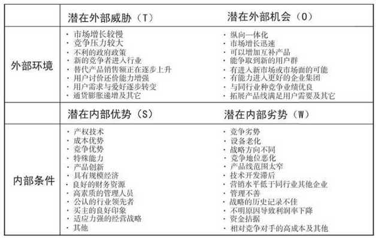

结合不同的优势和劣势，企业就可以选择不同的战略模式，如下图；

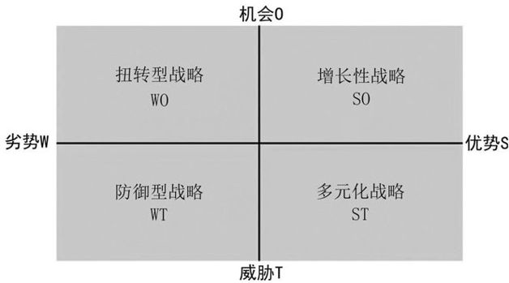

■拓展思考

如果我们把不同企业放在一起对比，就可以同时比较它们的优势、劣势，了解它们的竞争战略区别，并可以评判它们的战略是否合理。

我们把中国的三个购物平台做个对比：

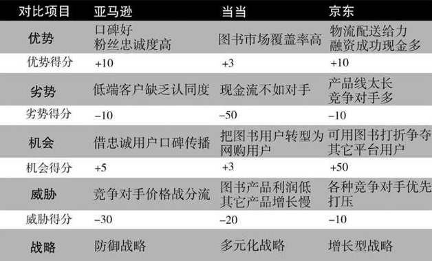

我曾对中国的三个传播平台做过比较分析，制定了自己的行动策略：

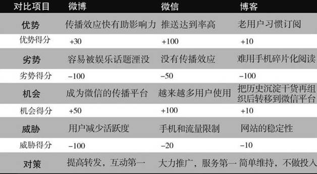

■拆书建议

真正有趣的是，SWOT分析绝不仅仅局限于企业决策，也可以用于个人决策。比如很多人在求职就业、跳槽选单位时都会遇到选择的困难，该采取何种策略？不妨试试用SWOT分析帮自己理清思路。

关于人生中的优势、劣势、机会、威胁，重点是发挥优势、抓住机会，而不是把重点放在补足劣势上。这是个分工合作的年代，你有一项能拿得出手的优点，就可以和别人一起协作，获取成功——样样都会但样样普通，真的不如做到一样精通。作家王蒙说：“所谓天才，就是集中时间、集中精力。”

3.波士顿矩阵分析法

波士顿矩阵分析法也是常用的商业逻辑思考框架，有助于我们把复杂的事情简单化。

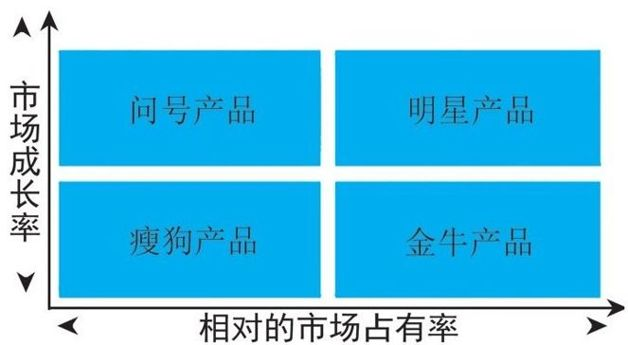

■知识介绍

波士顿矩阵（BCG
Matrix），又称市场增长率-相对市场份额矩阵、波士顿四象限分析法等，是由美国著名的管理学家、波士顿咨询公司创始人布鲁斯·亨德森于1970年首创的一种用来分析和规划企业产品组合的方法。

波士顿矩阵认为决定产品价值的基本因素有两个：市场份额和市场增长潜力。

依据这两个维度，波士顿矩阵把企业的产品分为四种：

金牛产品：市场占有率高，但增长缓慢的产品。这往往意味着产品营销成本开始固化，投资回报率很稳定。随着竞争的加剧和消费市场的变化，大部分金牛产品迟早会变成瘦狗产品，企业的运营就是尽量延长金牛产品的生命周期，并创造金牛产品的品牌。

明星产品：往往是企业研发出来的，正在快速占领市场的新产品。这种产品虽然取得了领先的市场份额，但是还远远没有达到成长的天花板，很可能因为要追求成长而需投入大量的时间和资金运营，所以企业要努力让明星产品成为金牛产品。

问号产品：看起来具有高成长潜力，但实际上市场接纳度很低的产品。这对企业来说是一种痛苦的选择，是投入更多时间和现金让其成为明星产品，还是放弃？

瘦狗产品：销售增长率和市场占有率“双低”的产品。其实已经缺乏存在的理由，有的企业之所以还存在瘦狗产品，往往是因为人事原因或者历史情感因素，所以，对于这类产品最佳的建议是清算。

■扩展思考

一个企业没有金牛产品，现金流会出现问题；

一个企业没有明星产品，未来就没有希望；

一个企业不敢投入问号产品，就不会诞生明星产品；

一个企业不能裁减瘦狗产品，就会被拖入倒闭深渊。

所以企业要促使四类产品之间形成一个良性转化的关系，也就是“销售一代，贮备一代，研发一代，规划一代”的产品规划战略。

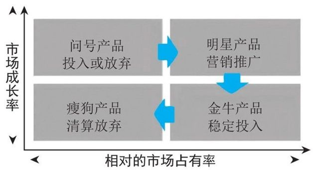

早在波士顿矩阵还没被提出来的1966年，波士顿咨询公司通过实证研究获得了一个重要发现——经验曲线。经验曲线的基本结论是：

1.经验曲线是由学习、分工、投资和规模的综合效应构成的。

2.每当积累的经验翻一番，增值成本就会下降20%～30%。

3.经验曲线本质上是一种现金流量模式。

其实波士顿矩阵就是规模效应的经验学习函数。企业某项业务的市场份额越高，体现在这项业务上的经验曲线效应也就越高，企业就越有成本优势，相应的获利能力就越强。

按照波士顿咨询公司的经验，如果一个企业某项业务的市场份额是该项业务竞争者市场份额的两倍，那么这个企业在这项业务上就具有比竞争者低20%～30%的成本优势。这就是波士顿矩阵选取市场份额作为一个重要评价指标的原因所在。

波士顿矩阵认为市场份额能导致利润，这其实就是所谓的“通过规模效应创造成本领先的竞争战略”。

波士顿矩阵一直认为规模优势很重要，因为市场份额大的公司不仅获得了更多的收入，还实现了更高的单位运营利润，获得了更高的价格（边际利润）及在广告和分销上更低的单位支出。

随着物质的极大丰富，个性化消费时代正在到来，规模效应在很多定制行业已经不再被奉为王道了，精准定位的小而美的消费品公司将会越来越多地出现。关于市场占有率，管理学家波特在分析日本企业时就已说过，规模不是形成竞争优势的充分条件。

即便不考虑个性化定制需求，波士顿矩阵的局限性也很明显。比如许多公司的业务是紧密联系在一起的，如果金牛类业务和瘦狗类业务是互补的业务组合，那么放弃瘦狗类业务，金牛类业务也会受到影响。另外，波士顿矩阵评估时没有考虑到在变化的时代，市场占有率与利润率的关系并不稳定，所以，一定要记住波士顿矩阵背后的假设是“成本领先战略”。当企业在各项业务上都准备采用（或正在实施）成本领先战略时，可以考虑采用波士顿矩阵；但是如果企业准备在某些业务上采用差别化战略，那么就不能采用波士顿矩阵了。

■拆书建议

波士顿矩阵的精髓在于把复杂的企业产品评估行为用两个重要的衡量指标简化了，用四个相对简单的产品类别来应对复杂的战略问题，帮助人们做出快速决策。

该矩阵能帮助经营多种产品的公司确定哪些产品宜于投资，适合操纵哪些产品以获取利润，应该从业务组合中剔除哪些产品，从而使业务组合达到最佳经营成效。

如果我们把自己看作是一个公司，把自己的技能、时间、工作看成是产品，也可以画出属于自己的波士顿矩阵。

下面是秋叶我为自己画的波士顿矩阵。

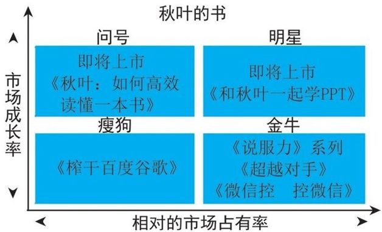

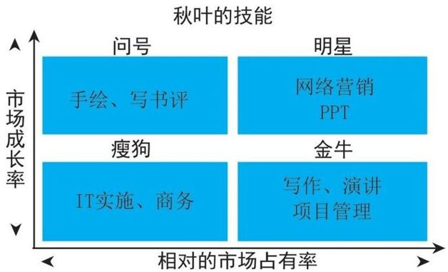

欢迎你用波士顿矩阵思考你的工作技能、你的产品、你的公司业务，并用到你的市场经营汇报PPT中。

4.组合矩阵分析法

当你得兼顾多个项目计划时，是否会感到疲于奔命？这时你需要一套分析工具。《史上最简单的问题解决手册》介绍的组合矩阵分析法就挺好用的。

■知识介绍

如果你在一段日程内只能做一件事，那么你很难培养复杂的管控能力，这也意味着他的收入很难增加；如果你不能合理规划你的项目成本和时间安排，要么你是月光族，要么你是更悲催的穷忙族。

通过绘制你的项目时间成本投资组合矩阵，你可以把目前的项目按资金投入和时间投入分类。因为你要管理你的工作和生活，必须考虑金钱成本，还有你的时间成本、人脉扩展以及相应活动的心理承受压力。

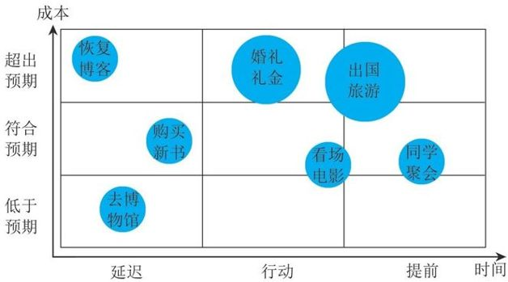

■扩展思考

成本和时间只是两个例子，我们可以根据自己的需要，调整X轴和Y轴中的相关指标，就可以得到你想要的矩阵，项目需要的工作量可以用形状面积来表达。

比如你工作中的项目，你可以设定X轴是“对我达到目标有帮助的项目”，Y轴是“对我能力成长有帮助的项目”，就可以把项目按照“达到目标”和“能力成长”进行分类。

怎样解读你分析的结果呢？

1.假如这项活动对你的能力成长并无帮助，和最终目标关系不大，那就从你的日程安排中拿掉。

2.如果项目有可以帮助你成长的地方，但是和目标关联度不大，考虑延期，或者重新考虑如何设计项目使其变成能够帮助你达到目标的武器。

3.如果项目能实现你的目标，但是对你能力成长没有帮助，那么可以请别人来执行，比如我可以委托朋友帮助我更新微信。

4.如果有既能够让你学到东西，又能让你实现愿望的项目，那是中大奖了，必须紧紧抓住，投入时间。

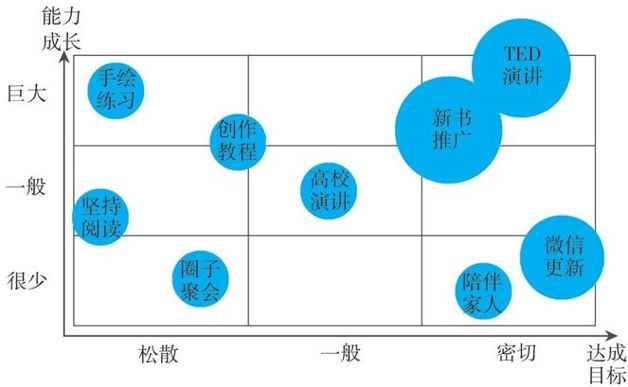

■拆书建议

你可以尝试列出你最近想做的十件事情，然后列出影响决策的两个最关键的坐标轴，比如时间和成本或能力和目标，然后试试绘制你的项目投资组合矩阵。

下面是我做的普通人能考虑的理财风险和回报矩阵，看起来现阶段真挺难的（2014年下半年起，中国股票市场出现牛市，投资回报率比较高）。

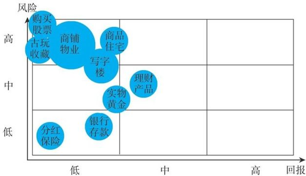

5.回馈模型：如何处理他人的抱怨和批评

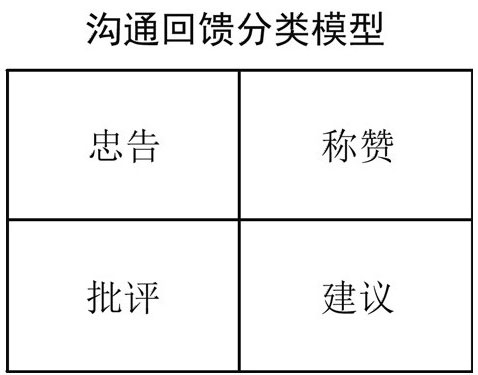

意见反馈是团队或团体中最困难，也是最容易引起矛盾的事情。《史上最简单的问题解决手册》的沟通回馈分类模型有助于我们比较理性地分析别人给的各种反馈，以及更好地给别人提供反馈。

■知识介绍

批评的话容易伤人，虚假的称赞更是组织的毒瘤。不当的赞美和批评都容易让我们自满或者自尊心受伤害，进而做出不理智的决定。

回馈分类模型能让你把得到的反馈加以分类，不同的反馈放在不同的区间，可以让你对工作有一个更清醒的认识。

我的新书《不要等到毕业以后》刚刚上市，我得到很多反馈，正好可以用这个模型试试。

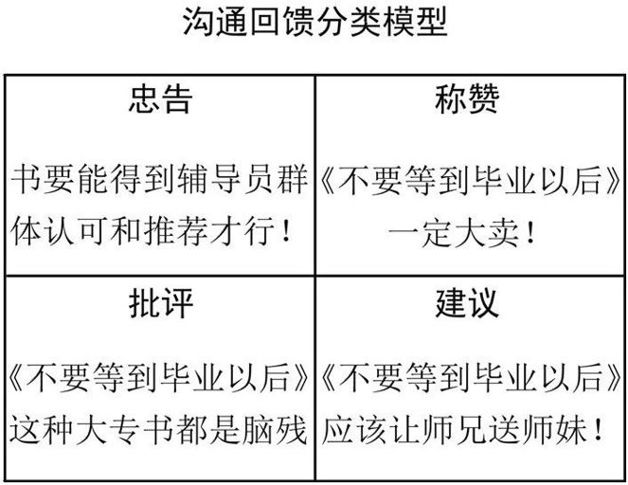

依据沟通回馈模型，我们就能把得到的反馈进行合理化划分，看看分别属于哪种类型。分好类后，要想想哪些忠告或建议是你想听从的？哪些批评会让你采取行动？哪些称赞是真实的？背后的成功原因到底是什么？

让这本书得到大学辅导员群体的认可的确是一个好建议，首先，辅导员本身就是这种书的一个主要购买群体；其次，一旦他们认可这本书就可以成为非常重要的推广力量，而传统的大学生书籍营销往往都忽略了这个人群在传播上的重要性。

并非所有的批评都是需要重视的，但是我们需要仔细思考批评背后的原因，是误会还是另有原因？我想最近盛行各种励志鸡汤，导致任何书一进入励志分类就会被人先入为主看轻，这很可能是社会阅读心理特征造成的。我们不能改变别人的成见，但也说明我们需要做大量的工作，耐心积累口碑换取大家的认同。

为此我要求出版社在宣传文案上去掉所谓“导师”“几百万人认同”的说法，这不符合事实，也不符合我写作的期待。我希望去偶像化，让大家学会思考的方法，进而建立独立思考的能力，而非相反。

建议需要斟酌，不过网友提的这个建议非常有趣，让即将毕业的师兄给师妹发微博晒遗憾，就是我们送书给有趣的师兄，让他把书赠给师妹，并祝福师妹在大学不要留下更多遗憾。这是一个好点子，我会启动这个策划。

相反，赞美这个东西是最没有价值的，因为没有说出好在哪里的赞美除了满足人的虚荣心，对工作帮助并不大。当然，如果是赞美加购买晒单，那就完全不同了，那是口碑了。

我们有时候是成功了，但问题是我们归纳成功的原因往往是错的，但是我们总结失败的原因往往都是正确的。

■扩展思考

反过来，我们给朋友反馈意见，也可以从这四个角度去思考：我们是选择称赞还是忠告？我们是选择批评还是建议？这需要考虑和朋友之间的关系、交往的深度、所谈事情的重要性，但是有了这个模型，我们可以更快组织自己的对策和语言。比如我在微信“秋夜青语”里面的回答，有些会选择批评的方式，因为我觉得有的人需要当头一棒，而不是忠告。

下面的说法你们可以参考，也许下次沟通时你就会有更多选择，而不是被人当作直筒子脾气。这绝不是圆滑，而是能站在把事情做好的角度进行更深入的思考。

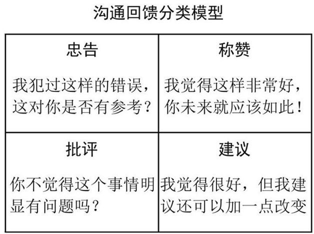

■拆书建议

你可以想一个最近你希望和朋友沟通的话题，按照这四种方式列出你的说辞，看看哪种选择更好。你也可以想想最近你遇到的麻烦还有朋友的建议，按照四种方式归类大家的看法，想想哪些是你应该听取的。

当然在制作PPT的时候，我们并不一定需要画这样的模型，但是你得想想，你在PPT中提出的观点，对别人属于哪一种反馈模式呢？在这一次沟通里，哪种模式会更有效呢？所谓的PPT逻辑，就是想清楚这些细节。

儒家鼓励人们当诤友，道家待人喜欢走曲线，各有各的道理，各有各的用处。再高明的哲学家也需要趁手的工具，这个简单的沟通回馈分类模型有助于我们在“开口”之前想清楚。

6.心流模型：为什么我们做事没动力

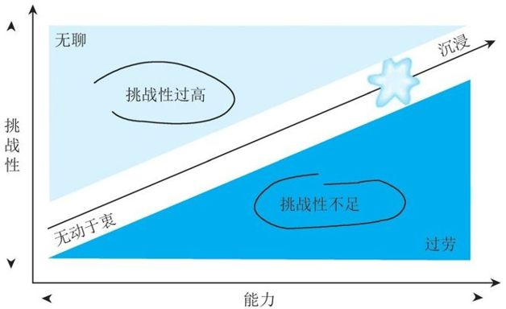

我们毕业后花三分之一的时间睡觉，三分之一的时间生活，三分之一的时间工作，工作是否快乐对人生幸福的影响程度可想而知。但上班如上坟，正是职场人的常见多发病。《史上最简单的问题解决手册》的沉浸心流模型告诉我们快乐上班的秘密。

■知识介绍

2000多年前，亚里士多德就提出一个大家都会观察到的现象：人最想要的是“快乐”。1961年美国心理学家米哈里·契克森米哈赖想为真正的快乐做一个定义，他提出一个名词叫“全心沉浸的心流”。

他认为心流是人们全身心投入某事的一种心理状态，人们处于这种情境时，往往不愿被打扰，即抗拒中断，比如艺术家在创作时。当一个人将精神力完全投注在某种活动上就会拥有某种心流，同时会有高度的兴奋及充实感。

米哈里访问了1000多人，询问他们什么事情让他们快乐，发现所有回复有五大共同点：

1.这些活动是自己的选择。

2.这些活动要求专注。

3.这些活动不会缺乏挑战性，也不会挑战性太高。

4.这些活动具备清楚的目标。

5.这些活动能够得到立即的回馈。

米哈里发现沉浸在心流中的人们不但会感到深深的满足，也会无视时间的流逝，而且因为全神贯注于手中的工作而彻底忘了自己。

无数人，包括音乐家、运动员、演员、医生和艺术家都说，当他们沉浸于往往会让人筋疲力尽的工作时，反倒是他们最快乐的时候——这彻底颠覆了一般人认为一定要放松才能快乐的想法。

■扩展思考

我们常常说在工作中，身累不可怕，心累才是累。如果身体疲劳但看得见自己的工作有条不紊地在被推进，不但不会觉得疲惫，还会产生巨大的动力坚持做到底。

而看起来轻松却看不见成效或者未来的工作，反而会让人觉得迷茫，因缺乏方向而纠结不已。

我每天至少工作14个小时，经常就是1点睡觉，6点起床，然后中午不休息，也不锻炼，我这样坚持很久了。很多人问我累不累，其实当我做我想做，而且相比其他人我能做得更好的工作时，我觉得是在玩一个游戏。如果不是因为考虑到不休息第二天不能更好地玩这个游戏，我根本不想休息，我不累。

就是真累了，我睡一觉，很快就能补充体力，精神焕发地去战斗。在133天内用业余时间搞定93个三分钟教程的工作量不是普通人能想象的，但是如果你知道这个微信工作量还不如我在“秋夜青语”上答疑的工作量大，你一定会更加诧异我哪里来的动力。我觉得我进入心流区了，至少在现阶段我是。

进入心流区后时间可以变慢，或者工作很长时间而不觉得时间流逝。很多优秀运动员都描述自己进入关键时刻、心无旁骛去比赛时，赛场上对手的动作好像突然变慢了，他可以轻易判断对方的动作并完成自己的有效得分，这是一种奇妙的状态。在工作和学习中经历这样的状态，人才能享受真正的快乐。我承认，当我有创作一个PPT欲望的时候，我就进入了这种状态。

对于普通人，制作PPT只能带来不好的心流，或者觉得挑战性过高，或者觉得缺乏挑战性。而容易带来心流的活动有：

1.棋类活动（要棋逢对手才行）；

2.篮球等集体运动；

3.双人舞、街舞PK；

4.攀岩等极限运动；

5.绘画、音乐、写作等艺术创造活动。

坚持进行这样的文体活动，会锻炼你专注于其他事情的能力，所以，当你发现自己难以专注时，试试这些活动，让自己重建心流区。一个心流区一旦建立，我相信大脑会暗示我们可以在其他类型的活动中找到类似的体验，并促使我们更加重视发展技巧，这也能促使我们获得更好的结果，然后新的心流区覆盖领域又诞生了。

在中国，你们知道的，所有不利于高考得分的运动，大都会被父母和学校阻止。那么，学生进行学习就不是靠对学习产生的兴趣带来的心流，而是依赖外部的纪律和同伴环境的约束。

一旦进入高校，外部纪律和同伴环境瓦解，又没有人天天敦促，很多大学生马上就陷入无所事事的无聊状态，对学习得过且过，难以投入。找不到投入心流的状态，一部分人就会很自然地从无聊发展到对学习无动于衷。

米哈里也提出过能让一群人在一起工作时，每个个体都更容易达到心流状态的方法：

1.创意的空间排列。

2.游戏场的设计。

3.以视觉化增进效能。

现在你们应该知道为什么谷歌的办公室允许这样设计了吧？

■拆书建议

心流模型有两个坐标轴：挑战性和你的能力。你可以在图形上反思你最近几次失败的挑战，看看哪些属于挑战性不足，哪些属于挑战性过高，哪些是可以让你全力以赴的工作。

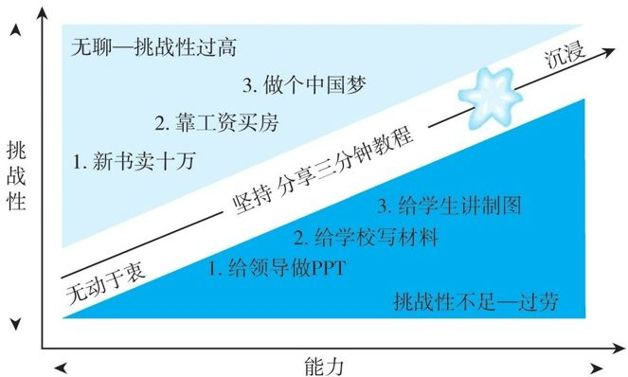

了解你的心流区，你可以：

1.检讨你工作失败的原因，有针对性地加以改进：挑战性不足的工作要为其找到新的目标，刺激自己的兴奋度；挑战性过高的工作要进行分解，确定在自己能力范围内。

2.可以努力让你的工作目标、项目计划、重点时间安排分配在能让你产生心流的工作上。

3.了解自己的能力区间，慢慢提升能力，把挑战性过高的工作变成你的心流区工作，使得自己的能力不断进步。

注意力高度分散是互联网时代的通病，这是多年来快速刷屏、同时打开多个页面等行为养成的心理习惯，在这个时代，善用心流区工作的人无疑会有竞争优势。

7.后果模型：为什么我们不能当机立断

进入互联网时代，科技的指数型发展和世界的普遍连接，使得工作和生活节奏越来越快，这意味着短时间内要做出的决定越来越多，这对很多人构成了巨大挑战。《史上最简单的问题解决手册》的后果模型值得大家借鉴。

■知识介绍

我们常常要在信息有限而且模糊的情况下做出决定。譬如项目开始之初还没有什么明确的细节，我们就得大胆决策——这些初期决策对项目可能影响最为深远，比如买地这个初期决策基本决定了一个房地产项目最终的成败。项目进入尾声，我们拥有的信息越来越多，也没有什么疑虑，但这个时候也没有什么关键决策需要做出了。

这个模型体现的就是决策者的两难：短时间内，信息很少，但做出的决策对结果影响很大；随着时间的延长，信息增加了，但此时做出的决策对结果的影响也小多了。

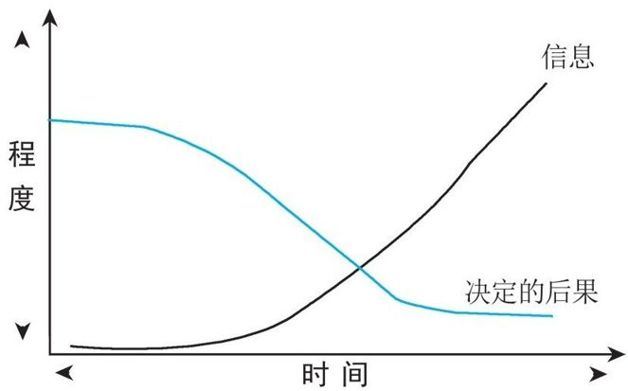

所以最重要的问题是：我们怎样才能弥补怀疑和马上做出决定之间的隔阂？

我们之所以迟迟无法做出决定，通常是因为心中对后果存有疑虑。不过，不做决定本身就是一个决定。如果你犹豫不决，跟随你的团队成员会陷入无方向感。假如你真的无法马上决定，你必须明确地和大家沟通。

管理学家鼓励我们要有勇气，信息再少也要大胆做出决定。

■扩展思考

在缺乏信息的情况下做出明智的决定是一个巨大的挑战，但是因为缺乏信息就不做决定，带来的后果一点儿也不比做错决定好。

比方说，很多在“秋夜青语”里向我咨询问题的大学生们，他们常常为这些问题苦恼：

我的专业好不好，要不要坚持？

我该不该考研？

我暑假想学习，不去实习会不会影响求职？

我到底该不该表白？

……

这些问题如果不能当机立断，他们会为此苦恼很久甚至几个月。犹豫不决耗费的时间成本和机会成本一点儿也不比做出一个所谓错误的判断更少。

我个人觉得人之所以无法快速做出决策，一是因为对所要决策的事情缺少判断的依据，二是因为过去的经验对所要判断的事情缺乏迁移性，三是很多人并没有感觉到当机立断的性格为自己命运带来的价值。

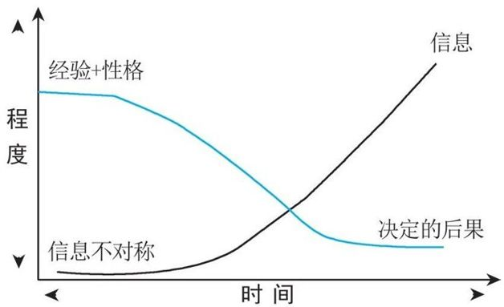

我们要去思考的是：明明知道优柔寡断不能带来好处，为什么我们不能当机立断？

一个人对一件事情了解的信息越充分，就越容易做出快速决策；

一个人对同类事情实践得越多，就越容易做出快速决策；

一个人对事情做决策的习惯是勇于承担后果，就越容易做出快速决策。

如果你也同意以上三点，那么你可以试试下面三个建议：

1.培养自己在最短时间内搜集相关信息的情报检索能力；

2.在年轻的时候有意识地让自己经历各种不同的事情，做这些事情最重要的不是决策质量，而是让你了解做出各种不同行为决策会带来的后果，一旦一件事情的后果可以预期，你就不会对做出决策感到害怕；

3.找一些后果可控的事情，逼自己在时间节点前做出决策，慢慢培养自己的行动力。

比如我规定自己每周五必须写一篇拆书文章，这也是一种建立行动力的方法。谁都有懒惰的时候，我也不例外，特别是在连续三天只睡四个小时的时候，我周五早上就得爬起来写一篇干货分享，这不容易。

如果你能够坚持做到以上几点，我觉得还有一种模型可以选择，就是你总是能更快预见后果（因为你的经验带来的直觉和你有能力搜集到比别人更多的信息），你完全可以在早期就做出好的决策。

就好像下面的蓝色虚线：

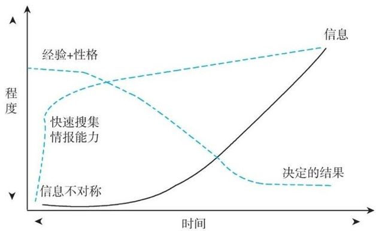

我举一个例子说明：2012年8月18号，微信发布了微信公众账户平台，就是你们现在订阅的这些推送账户。其实我是第一时间就知道这个消息了，我就必须做出决定，我是开通还是不开通这个账户？

当时我并不清楚这个账户的运营规则，也不清楚我是否有能力吸引大家来关注，更不清楚吸引很多人我是否有回报？那么，我很难下决心去开通一个微信公众账户运营。

不过依据经验，大互联网门户推出一个大的产品，谁先占据一个山头谁就更容易成功，如果你吸引了足够多的粉丝，总有办法找到将你的影响力变现的方法。我最大的问题就是能否运营好这个微信公众账户，于是我和@萧秋水还有@油杀臭干、@刘健亮等朋友花费了半年的时间做了大量的研究和测试工作。到2013年2月中旬的时候，我们的研究成果甚至写成了一本书《微信控控微信》。

在短短的半年内，我们直接从一无所知变成了专业人士，这个时候再看如何运营微信我们就非常容易做出各种判断了。事实是我们几个人每个人都选择了不同的定位和模式运营，目前的发展都非常好。

我想这里面的一个重要经验就是我们都拥有快速学习、搜集信息并整合分析的能力，使得我们能够领先别人半年甚至一年了解事情的更多可能性，这就为我们快速做出决策奠定了基础。

运营一个账户是长期行为，所以半年的投入期一点儿也不长，而且我们在研究期间已经注册账户开始各种测试，这本身就是一个当机立断的决定，更何况我们的研究结论还有成果展现——《微信控控微信》。

在生活中我们可能只有很短的时间做出决策，不过别忘了，你现在生活在移动互联网时代，很多原来属于信息不对称的领域，现在已经可以随时随地获得重要的信息，但是现代人往往都忽略了互联网生存的基本能力——搜索。

■拆书建议

找出自己最近做出快速决策的一件事情，还有不能快速决策的一件事情，想一想是否符合当机立断模型——越是早期的决定（包括不做决定这个决定）对事情的发展带来的影响越大。

想一想自己能做出快速决定背后的原因是什么，写下来。

想一想自己不能做出快速决定背后的原因是什么，写下来。

请思考你该如何强化你的哪些能力以帮助自己能快速做出决定，写下来。

送给大家我的一个经验：不要因为害怕遇到糟糕的后果而不做决定，也不要指望做出一个好的决定事情就会自动变好，你需要不断努力，让你一开始正确的决定真正得以实现。

在不少事情上，互联网公司常用的迭代模式比较适用。先快速做出一个决定，然后根据事情的发展变化不断调整自己的行动策略，最终收获一个相对较好的结果。

8.技术周期循环的模型

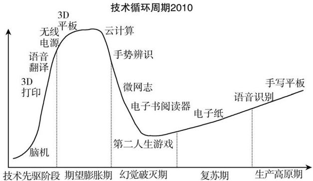

科技是第一生产力，因此我们要重视科技。但如今的科技是“长江后浪推前浪，前浪死在沙滩上”，我们该重视哪些科技才是真问题。本节给大家介绍技术循环周期模型，也是来自《史上最简单的问题解决手册》这本书。

■知识介绍

即便是规模最大的企业的员工也会好奇，自己任职的企业会不会有一天垮台？比方说，Facebook会不会生存下去？谷歌公司会不会衰败？微软是否会重新成为霸主？下一个重大发明是什么？

没有人知道这些问题的答案，不过斯坦福高德纳咨询公司发明了一套技术循环周期的模型，为我们提供了一套研究所谓改变世界级别的新技术出现之后，人们的兴奋以及通常在这之后会产生的失望情绪的模型。

新的技术出来，人们对它的反应一般会经过5个阶段：

1.技术先驱阶段：产品已经上市，到处都在谈论这项产品：“你看过这个产品没有？”

2.期望膨胀期：兴奋的情绪达到高峰，可是人们开始发现疏忽之处，你会听到这样的话语：“对啊，是很棒，可是……”

3.幻觉破灭期：这项产品达不到期望，都是些不怎么酷的人在使用，你会听到类似“这已经是4年前的东西了”的话语。

4.复苏期：媒体不再介绍这项技术，兴奋的气氛已经消失，许多技术就是在这个阶段从市场上销声匿迹的。不过有些公司可能还会继续实验，他们可能会改变原来的版本，并为这项技术找出更多新的用途。你会听到人们这么说：“我从来不曾这么想过，不过你们可以以不同的方式来用……”

5.生产高原期：技术的好处已经广为展示和接受，通常都是要从实验阶段进展到2.0版或3.0版才会成功，这时已经没有人讨论它，大家都在默默地使用它。

让我们想一想，好像自工业革命以来，完整经历这些阶段的有火车、飞机、电力网络、电话网络、互联网、宽带、浏览器、门户网站、博客、IM工具，还有一代代突破格局的手机……

■扩展思考

结合目前中国流行的互联网产品做一下分析，判断一下不同的产品处于何种阶段是一件有趣的事情。

下图是我的一个分析：易信是否在技术先驱阶段？这个还不清楚。但是“菜鸟”物流绝对是技术先驱，在攒能量。微信已经到了一个高点，不过还有一些想象空间可以上升，而可怜的微博同学，已经开始玩过山车。在过山车的底部，其实有三条路线。

路线一：进入复苏期，直到变成大家习惯的产品。我觉得百度、淘宝、支付宝都是这样的产品，当然他们还有机会结合新的大趋势变化，比如移动互联网，重新构架自己的产品，进入新一轮产品循环。

路线二：没有复苏期，就是跌到谷底，但仍有一批用户在继续使用，能维持存在，但是再也没有当初万人追捧的能量了，比如曾经被认为能改变世界的博客。

路线三：直接挂了。有一个游戏，曾经很火的开心农场，人人网很不开心地宣布，让它死吧。其实类似的互联网应用太多了，比如谷歌订阅器，说起来都是泪啊……

事实上，我们也完全可以考虑将这样的思维移植到自己的职业能力规划上。如果把我们这些年掌握的能力包装成产品，哪些是你开始贮备的能力？哪些是你正在被人看好的能力？哪些是你开始跟不上时代的能力？哪些是为你的生存稳定提供能量的能力？

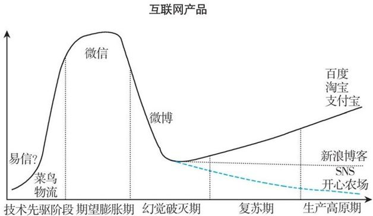

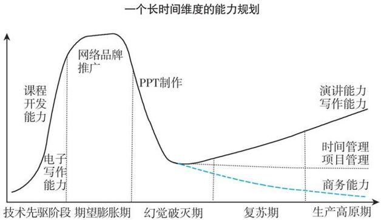

我给很多人说过，我不是靠做PPT生存的，按照我的产出为这些能力排名，PPT其实排在第七位。今天，用这个模型，我想可以比较清晰地描述我的能力维度。

让我获得稳定收入的能力是演讲和写作，这两个能力我还有上升的空间。

让我能有效协调各种商业机会的能力是项目管理和时间管理，这两个能力我没有退化，但是也不会有太多的提高空间。

现阶段使我有限的能力得到放大的其实是网络品牌推广的能力，而大家关注的PPT能力，我的评价是已经要走下坡路了，这是年龄和精力限制的必然结果。当然如果在5年前，PPT制作是我技术先驱的能力；在3年前，是我爆发的能力。

我已经在两年前就在准备两个新能力，一个是快速开发在线课程的能力，一个是快速写作电子图书的能力。我相信这两个能力加上现有的能力会让我在未来的职业生涯中获得一个突破。

如果一个人的职业规划总是依赖几种固有的能力，我相信在一个充满变动的时代，他会错失一些机会。

不仅仅是个人能力，即便是你过去的一些工作成果，也可以用这种思维看看。

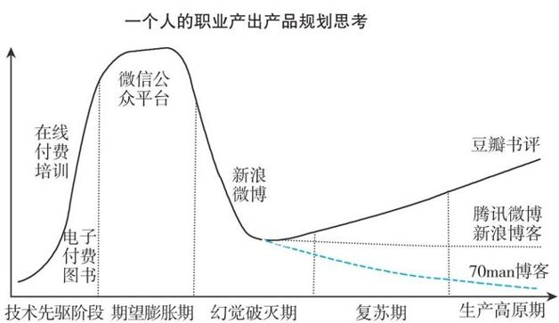

目前微信公众平台是一个亮点，但是迟早要走下坡路，我的工作是维持其影响力。新浪微博在下滑，但是运营得好，可以和豆瓣书评一样，成为一个稳定的个人品牌，不像我的新浪博客和腾讯微博，不死不活。而我的独立博客www.70man.com已经成为一个鸡肋，我准备正式放弃这个博客了。

如果有一天微信也不行了，我怎么办？你们已经看到，我其实已经在打造两张牌。这两张牌，我要告诉大家的是，其实已经磨了两年了，出手的时机快到了，但在没有真正到来之前，我们需要继续攒能量。

■拆书建议

把一个技术的循环周期模型放在不同的宏观环境里思考，可以帮助你形成思维迁移能力。

有人说这个太难了，其实，难的是你的思维太局限。好用的逻辑框架往往也很好玩，你可以用这样的逻辑框架分析你的产品、你的员工、你的事业、你的能力，甚至是你的爱情。

我示范一下吧，其实爱情往往也符合这个模型的：

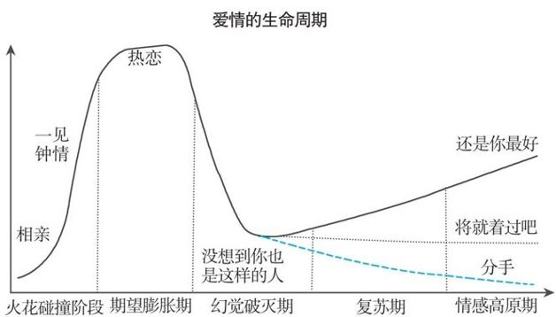

有没有中枪？期待你用自己的生活或者工作经历一起来拆书。

9.影响力模型

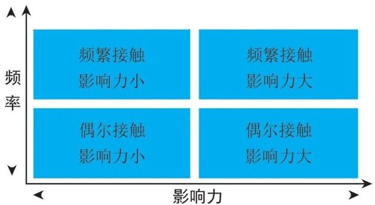

人是社会动物，这句话的含义之一是我们必然受到他人的影响，没有谁能独善其身。本节介绍的影响力模型还是来自《史上最简单的问题解决手册》，照旧进行秋叶式改造。

■知识介绍

管理者经常困惑为什么有的团队能顺利合作，有的团队却内耗重重。在这些团队之间到底存在怎样的细微差异，以致结果完全不同？

美国麻省理工学院媒体实验室为了找出这些问题的答案，对某大银行的创意小组进行了观察：谁对谁说了些什么？谁经常发布意见？发布的频率多高以及对谁发布？用什么口吻说话？谁的压力很大？谁看起来很累？

这项实验的结果并不出人意料：内部沟通良好，经常通过电子邮件进行私人或相关工作沟通的团队成员，一般比那些只会埋头于工作的同事，似乎更加开心，而且工作效率也更高。

下面的沟通频率和影响力模型图，有助于发现你跟谁经常沟通，接触的频繁度如何，你们的讨论有没有影响力。请把你的同事纳入这个矩阵中试试。

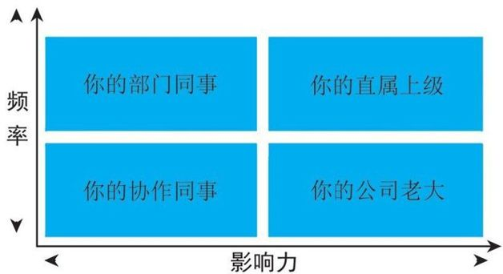

上图是比较正常的职场人沟通模式，对你影响最大的人应该是你的直接上司，但是你公司老大的个人魅力往往也能深度影响每一个员工，哪怕你和他接触并不多。而部门同事接触虽然频繁，但是更多是合作关系，对你个人能力成长、业绩提升未必有关键的影响。

但是对于职场新人而言，也许更准确的影响力模式是这样的：

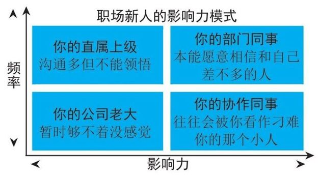

因为害怕出丑，所以他们并不愿意主动和领导沟通，而是本能依赖身边“看起来”对自己不错的人，而且将来也很可能因为听信了这些“过来人”的意见而吃亏。

在职场里，一个人的影响力取决于权力中心人物：他最经常和谁谈话？他最重视谁的意见？

如果你把影响力模型的核心人物换成你们公司的老大或部门领导，看看他和别人的沟通频率和执行力度，你大概就能了解一个公司的政治结构和生态。

■扩展思考

不仅仅是在职场，在生活中我们也可以用这样的模式来观察自己的思想到底受谁的影响。

以大学生为例，他们的个人判断受影响的方式往往是这样的：

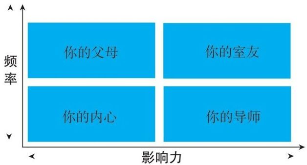

在读书阶段，父母虽然频繁地和孩子沟通，但是他们实质上缺乏对孩子的影响力，孩子可能更受同学的影响。假如遇到一些好老师，虽然接触频率不高，也会深受影响。但是有一个沟通很少，影响力也很弱的对象，那就是自己的内心。

到了毕业季，这个影响力模型图又会改变。也许这个时候父母能对你的就业产生巨大的影响，他们也许能帮你找到一些不错的工作，而你的同学在这个阶段能提供的影响就很小了。当然，还是一样，很多人在这个决策过程中，始终没有和自己的内心对话。所以他们总是感觉不幸福。

和内心对话，并非就是要满足内心，而是诚实和内心沟通后，开始认真权衡愿望和现实的差距，选择自己能接受的但不一定是最理想的结果，然后慢慢去努力改善。

■拆书建议

把你身边的人填入这个表格，切记把自己的内心对话也作为一格填入，看看你自己的决策到底受谁的影响更多。

他是一个值得重视的人吗？他是你未来可以依赖的人吗？如果不是，干吗要把他放在这么重要的位置？要学会即便是和别人频繁接触，也能坚守自己的内心。

晒一晒我自己填写的结果吧：

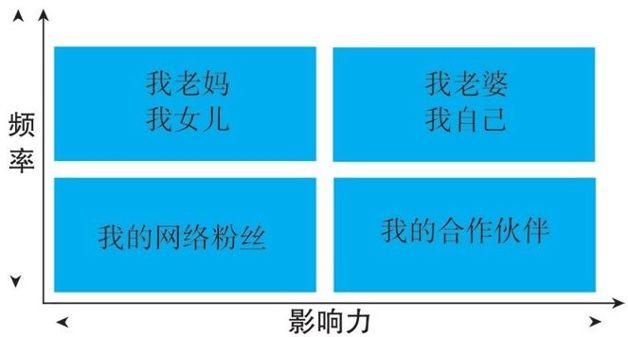

我接触最多的人是我老婆，她对我影响很大，而且都是非常正面的影响。

我的妈妈和女儿虽然和我接触很多，但是对我基本上没有太大的影响力。

我和我的网络粉丝接触有限，对我的影响力也有限。但是我和一些重要的合作伙伴，虽然每一两周才深入沟通一次，但是我们足以完成一些漂亮的工作。

在某个特定的时刻，和我接触最多的人，对我影响力最大的人，也许不是我老婆，而是我的合作伙伴。

要说明的是，我一直在提醒自己，每天问问自己：我到底要什么？这才是真正影响你的那个人——你的内心。

学会使用影响力模型，其实是为了更好地和自己对话。

分析一下某个人为什么对自己影响很大，也有助于自己进一步成为有影响力的人。

10.马斯洛需求模型

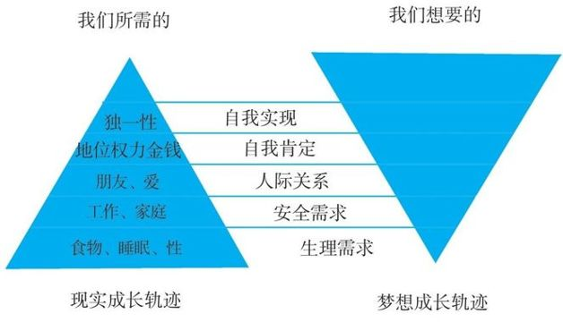

“认识你自己”是古希腊最著名的哲学格言，认识自己有个不错的工具——马斯洛需求模型。基本内容还是来自《史上最简单的问题解决手册》，照旧进行秋叶式改造。

■知识介绍

对一名中国的丈母娘而言，有三个问题很重要：（未来的女婿）有房子吗？有份稳定的工作吗？他的父母能帮忙带孩子吗？如果三个问题的答案都是YES，那么男生就能过上天堂般的生活；如果具备两个，这对情侣还是快乐的；但如果一个都不具备，那么男生连生活的基本需求都不存在。

丈母娘的问题其实就是一个很重要的命题：人到底在追求什么？

美国心理学家亚伯拉罕·马斯洛于1943年在《人类激励理论》一文中提出“人类需求层次模型”。他把人类的需求分为五种。

1.生理上的需求：吃饭、睡觉、温暖、性；

2.安全上的需求：有属于自己的地方住、有工作保障、身体健康、不受坏人的侵犯；

3.情感上的需求：朋友、爱人、亲人；

4.尊重上的需求：有社会地位、权力、金钱；

5.自我实现的需求：个人的独特性、个人潜能、追求卓越。

另外还有两种需要：求知需要和审美需要。这两种需要未被列入马斯洛的需求层次排列中，他认为这二者应居于尊重需求与自我实现需求之间。

马斯洛在晚期时还提出一个超自我实现（Over
Actualization）需求。这是指当一个人的心理状态充分地满足了自我实现的需求时，出现的短暂的“高峰经验”。通常都是在执行一件事情时，或是完成一件事情时，才能深刻体验到这种感觉，一般都出现在艺术家或者音乐家身上。例如，一位音乐家，在演奏音乐时，所感受到的“忘我”的体验；一位艺术家在画图时，感受不到时间的消逝，画图的每一分钟，对他来说跟一秒一样快，但每一秒却活得比一个礼拜还充实。这其实就是本书前面介绍过的心流模型。

最前面三种需求是人类的基本需求，如果这三种需求得不到满足的话，人们就不会考虑其他的需求。

马斯洛和其他的行为心理学家都认为，一个国家多数人的需要层次结构，是同这个国家的经济发展水平、科技发展水平、文化和人民受教育的程度直接相关的。在不发达国家，生理需要和安全需要占主导的人数比例较大，而高级需求占主导的人数比例较小；在发达国家，则刚好相反。

中国正在向发达国家迈进，90后、00后在相对富足的社会中成长，他们的人生将主要被高级需求所主导的。

■扩展思考

1.人的五种需求像阶梯一样从低到高，按层次逐级递升，但这样的次序不是完全固定的，可以变化，也有种种例外情况。比如古代的贤人，往往并不追求物质丰裕，而直接追求高质量的精神境界或政治抱负。

2.需求层次理论有两个基本出发点，一是人人都有需要，在某层需要获得满足后，另一层需要才出现；二是在多种需要未获满足前，首先满足迫切需要，在该需要得到满足后，后面的需要才显示出其激励作用。这个发现对管理学而言有重要的启迪作用。

举一个例子，中国的劳动法要求提供最低工资保障，要求企业承担大量的员工福利支出，但现实是，社会依然存在大量的隐形失业。如果要求企业承担过重的社会福利，就会导致企业经营成本增加，反而不利于扩大企业规模或者激励创业，甚至可能导致企业外流到人力资源成本更低的国家，导致我们国家隐形失业的情况更严重，结果造成更多的低收入人口。这就是基本需求没有满足，我们就开始追求更高层次的需求，拔苗助长造成的。

3.一般来说，某一层次的需求相对满足了，就会向高一层次发展，追求更高一个层次的需求就成为驱使行为的动力。相应地，获得基本满足的需求就不再是一股激励力量。

比方说，我现在做的很多事情，是为了追求自我实现，仅仅用物质激励来刺激我，很难让我产生动力，除非能让我实现一些有挑战性的目标。当然我也不排除实现这些挑战性目标后可以获得更高收入，但这不是我出发的起点，我也不会用这个点来衡量自我实现的高度。

4.这五种需求可以分为两级，其中生理上、安全上和感情上的需求都属于低一级的需求，这些需求通过外部条件就可以满足。而尊重的需求和自我实现的需求是高级需求，它们是通过内部因素才能满足的，而且一个人对尊重和自我实现的需求是无止境的。

一般来讲，前三种需求培养人们对他人、组织和环境的依赖性，会让人厌恶改变，抗拒风险，而后两种需求会让人培养独立性，使人更愿意独立思考，挑战风险。

普通人要成为能实现自我高级需求的人，相应地就需要满足两个条件。第一，尽快满足前三个层面的需求；第二，摆脱在满足前三个需求过程中形成的依赖性。大部分人觉得最难的是前三个需求，但是真正走到后两个需求层面的人才会知道，打破依赖性才是最难的，因为你要主动破坏你过去的安全感，才能进入新的平衡，但是这种打破并不总是带来好的结果。

5.马斯洛认为同一时期，一个人可能有几种需求，但每一时期总有一种需求占支配地位，对行为起决定作用。任何一种需求都不会因为更高层次需求的发展而消失。各层次的需求相互依赖和重叠，高层次的需求发展后，低层次的需求仍然存在，只是对行为影响的程度大大减小。

■拆书建议

1.结合你的职业写下你的马斯洛需求模型，把你的具体目标填写到三角模型中，这样你就可以观察到你离梦想的距离。

2.你也可以把马斯洛需求理论引入你的管理或者营销工作。比如：

（1）生理需求：满足最低需求层次的市场，消费者只要求产品具有一般功能即可，这就是国产低端车的定位。

（2）安全需求：满足对“安全”有要求的市场，消费者关注产品对身体的影响，这是国产高端车的定位。

（3）社交需求：满足对“交际”有要求的市场，消费者关注产品是否有助提高自己的交际形象，这是国产引进车型的定位。

（4）尊重需求：满足对产品有与众不同要求的市场，消费者关注产品的象征意义，这是豪车的定位。

（5）自我实现：满足对产品有自己判断标准的市场，消费者拥有自己固定的品牌需求，层次越高，消费者就越不容易被满足，这是个性改装车的定位。

在经济学上，“消费者愿意支付的价格≌消费者获得的满意度”，也就是说，同样的洗衣粉，能满足消费者需求层次越高，消费者能接受的产品定价也越高。市场的竞争，总是越低端越激烈，价格竞争显然是将“需求层次”降到最低，消费者感觉不到其他层次的“满意”，愿意支付的价格当然也低。

最后说一句，按照哲人的观察：我们最渴望的东西其实是我们最不需要的东西。当然这句话是针对心灵层面的，所以我把马斯洛需求理论叫作现实成长轨迹，它的反面就是梦想下滑轨迹。人生有时候就是如此讽刺，我们努力获得的东西，我们觉得能让自己有安全感的东西，其实都不是我们想要的。

11.减少错误的瑞士奶酪模型

是人就会犯错，有些人会从错误中学习，有些人会重蹈覆辙，有些人甚至犯错后一蹶不振。本节介绍的可降低失误率的瑞士奶酪模型是从错误中吸取经验的典范，模型还是来自《史上最简单的问题解决手册》，照旧进行秋叶式改造。

■知识介绍

说起来，因为缺乏对错误的正确认识，我们往往混淆了不同类型的错误。我用大家都知道的感情为例来具体说说错误可以分为几种。

1.真正的错误：执行错误的流程时发生的，比如离婚就是因为当初在错误时间和错误的人结合。

2.中断：忘记部分流程时发生的错误，比如分手，你忘了如何对待一个人，如果你想起他的好，还可以复合。

3.疏忽：虽然流程正确无误，但执行不当的话，就会犯这样的错误。比如表白，流程是对的，但是选错了对象或者时间，结果一样是失败。

造成错误的原因也不同，下面以追求女生失败为例子具体讲解下：

·因为缺乏技能训练，比如缺乏搭讪技能；

·因为缺乏规则培训，比如见面几次就毛手毛脚；

·因为缺乏有关知识，比如情人节给女孩子送什么礼物好；

·因为缺乏正确心态，比如我注定就没有人爱。

造成错误的诱因也可以分几种：

·跟人员有关，比如又被女神拒绝了；

·跟技术有关，比如不会玩微信，错过查找在附近的人；

·跟体制有关，比如分在大机械学院，没有妹子怎么办；

·跟其他因素有关，比如时机、气候、情绪，等等。

针对这些错误，詹姆斯·瑞森提出了瑞士奶酪模型。瑞士奶酪模型也叫Reason模型或航空事故理论模型，其主要思想是：组织活动可以分为不同层面，每个层面都有漏洞，当不安全因素像一个不间断的光源，刚好能透过所有这些漏洞时，事故就会发生。这些层面叠在一起，犹如有孔奶酪叠放在一起，所以被称为瑞士奶酪模型。

一个完全没有错误的世界，就好像没有洞的奶酪一样。可在真实的世界里，把奶酪切成薄片，每一层薄片都有许多洞，这些洞就是发生错误的管道。如果所犯的错误只是穿透一层，就不会被注意到或是造成什么影响。如果这个错误造成的洞穿透多层的防卫机制，就会造成大灾难。这个模型适用于所有会因为错误造成致命后果的领域。

需要高度可靠性的组织机构，会主动收集和分析涉及人为失误的所有环节，努力控制这种多样性，不断地对可能的失效模式设计预防对策。瑞士奶酪模型就是在航空业为了降低商用飞行故障率，在航空维修人为因素管理模型基础上总结出来的。

瑞士奶酪模型提出后在航天、航空、海事、交通、医疗等行业引起了广泛关注和重视，这些行业的研究人员围绕这个模型的核心理念发表了大量的论文。

瑞森的理念核心是将维修差错因素进行分级管理，认为事故的发生是由非安全的组织因素、非安全的监管因素、非安全的预先处理导致的，这个人为事故分析模型后来成为了工业标准。

■扩展思考

人犯错误是难免的，所以瑞士奶酪模型就是要为人为失误建立一个系统保障，尽量创造一个不容易犯错的环境。

奶酪中孔洞的来源无非是两种：主动失效和潜伏失效。主动失效是人所做的不安全行为，比如我们前面提到的各种错误，例如苏联切尔诺贝利核事故中，工人用违法程序把不间断电源关闭了，从而导致核反应堆芯发生灾难性爆炸。

潜伏失效是系统内不可见的原因，来自设计师、程序员或者高层人员的决策。这些设计、决策也许是错误的，或者本可以设计得更好。这些设计或决策可能会在工作时带来人为失效，成为引发错误的因素。

潜伏失效会一直隐藏在系统中，直到与系统中的主动失效因素结合造成事故，就好比光线终于穿过了一组瑞士奶酪的孔一样。

20世纪90年代，美国的一位医生在忙乱中错将乙醚当氧气输给病人，造成病人当场死亡。病人家属很不满，对医生提出指控。医院领导出面解释说：“这不是医生的错，问题是由乙醚接头与氧气接头可以通用造成的，在紧急情况下医生难免出错，这是医院的管理有问题。”病人家属表示理解，放弃了对医生的指控。

通过这个案例，全美的氧气插管接头从此均换成了专用接头。这样，医生即使在慌乱的抢救中抓错了氧气插管也无妨，因为那是插不进去的，从此，全美再也没有第二例类似的悲剧发生。

在中国，将氯化钾当氯化纳进行静脉推注而造成病人死亡的案例，就重复发生过多起，发生后就将药师和护士抓起来判刑。

其实，要防止类似悲剧继续发生是很容易做到的，只要将氯化钾和氯化纳注射液的外包装和安培的颜色与标志做个醒目的区分就行了。但我国就是没有人要求厂家做这方面的改进，致使类似悲剧不断重复发生。

假如用瑞士奶酪模型进行事故分析，那么分析过程将接近下图：

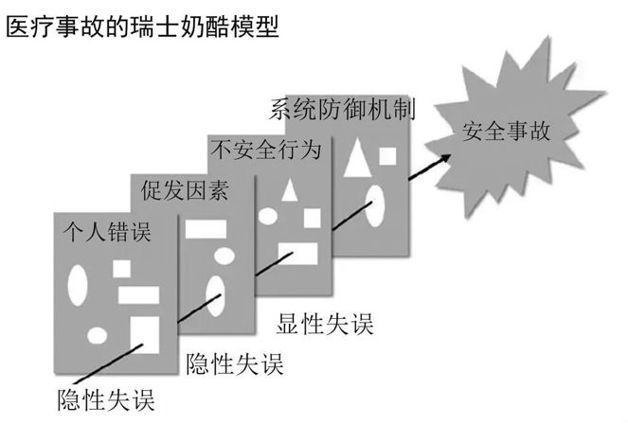

瑞士奶酪模型告诉我们，我们犯的大部分错误并不必然导致最坏的结果发生，除非我们犯了一连串的错误。所以在我们犯下一个错误的时候，冷静下来，也许就能避免更多的连锁错误。

如果真的发生最坏的结果，那么一定有一系列错误需要我们找出来修补，务必要找到系统里面的隐性失误。

■拆书建议

瑞士奶酪模型是系统思维的一个运用，对于我们系统分析出现的问题颇有启发意义。

1.结合你的职业或行业想想，有无可能应用瑞士奶酪模型分析一个错误背后的隐性原因，而不仅仅停留在显性责任人上？

2.结合你找到的原因，能否建立错误的分级对待机制，不同的错误可以应用不同的处理流程和响应速度，比如软件行业的BUG，并不是发现了就会第一时间响应，这之间需要有一个评估。

3.当你看到一个错误时，想一想到底谁才是真正的责任者，是一定会犯错误的人，还是设计或者决策中产生的隐性错误，导致一定会出现犯错结果的那个人？还有，哪些发现的错误其实对最后责任而言，是一个无关的错误？当然，它完全可能在下一次造成其他类型的失误。

用王尔德说过的一句话作为结尾：“‘经验’是每个人为自身错误所赋予的称谓。”

12.肯定式探询模型：微笑着解决问题

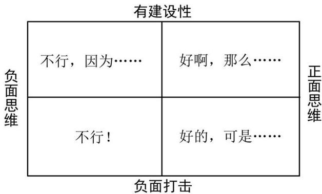

并不是只有拍桌子才能解决问题。肯定式探询模型告诉我们如何在解决问题的同时营造良好的沟通氛围，该模型还是来自《史上最简单的问题解决手册》，照旧进行秋叶式改造。

■知识介绍

AI是肯定式探询（Appreciative
Inquiry）的缩写，这是美国管理专家大卫·库柏里得开发的方法，他希望人们在沟通时把焦点放在个人本身的长处、正面的特质和潜力上，而不是弱点上。

他建议用“目前什么进行得很顺利”取代“有什么问题”的提问，他认为如果在会议时一味专注于弱点，会一开始就营造出负面印象。

每个人、每个体系、每个产品、每个点子难免都会有瑕疵，了解这一点，在最理想的情况下，可以促使人们下定决心追求完美。但是人们往往过于专注产品或者点子的缺陷，以致难以创造开放和正向的心态让产品和点子持续完善下去，导致一开始就选择放弃。

人们讨论的方式也是他们性格的体现，根据人们对意见的反应，可以将其划分四个基本的类型，下面的四句话结构分别对应了四种反应：

1.吹毛求疵型：这个点子很好，但是……

2.刚愎独裁型：这样是绝对不可行的！

3.过度理性型：不行，这个点子不够好，因为……

4.AI思维型：是的，我们是不是可以再……

比如下面这个暗恋表白咨询示意图，正面建设性意见总是能鼓励别人走出下一步。

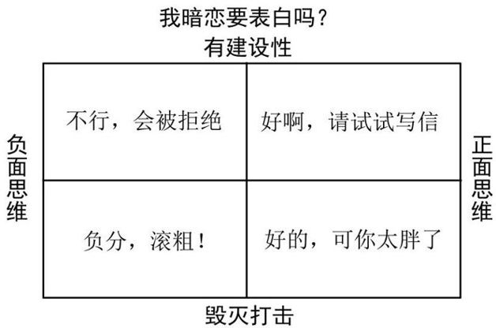

提出批评很容易，一个普通员工都能看出一堆问题，但是提出改进的建议才是真本事。而肯定式探询鼓励人们去研究、讨论并建立有效用的沟通方式，而不只是提出批评。

■扩展思考

我认为，在企业或者个人沟通中，不是什么时候都适合肯定式探询的，越是开放式、需要激发创造性的场合，越适合肯定式探询。

如果是在需要问责、需要找到可能的漏洞的时候，还是带着挑刺的眼光比较合适。找到问题之后，再用上文谈到的瑞士奶酪模型找到系统性错误产生的原因，用肯定式探询解决问题，才是一个比较完整的流程。

肯定式探询模型认为，每一个充满活力的组织系统都有许多尚未开发的、激动人心的积极资产。发现这些资产将赋予组织生命新的动力，为组织创造未来提供能量。

每个组织当中总有某些事情管用——而这些事情赋予了这个组织生命并且让这个组织最有朝气、效能，不仅带来成功也让所有与组织相关的人通通连接在一起。这就是肯定式探询的假设。

一个最简单不过的道理就是：若想集聚和保存变革力量，一种积极的影响力和社会亲密感是非常重要的，如希望、振奋、鼓舞、关怀、友谊、工作的紧迫感，以及完成任务后的愉悦感。

肯定式探询的实践经验还发现，工作中提问的方式越积极，我们的变革努力将越成功与持久。用那种和世界充满矛盾的消极态度提问，结果往往是于事无补。

■拆书建议

我觉得在孩子教育中应该多用用肯定式探询，我们可以把自己教育孩子时的话语用这个肯定式探询模型做分析，看看自己是否可以有不同的对话选择。比如孩子成绩不好，你觉得哪一种对话方式可能效果更好，更有正面影响？请把你和别人的对话用肯定式探询框图分析一下，看看是否能有更好的效果。

随着90后进入职场，肯定式探询的用武之地将越来越多，因为90后往往是“吃软不吃硬”的。

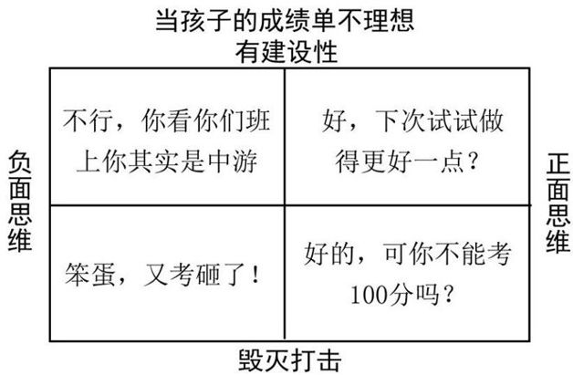

13.《零秒思考》：快速决断力应该如何训练

《零秒思考》是日本麦肯锡顾问写的新书，这本书提出一个很深刻的问题：为什么很多人乐于各种方式的交流，却很难组织起有质量的讨论？

■知识介绍

作者赤羽雄二的见解是，即便是在麦肯锡公司，新人也缺乏瞬间掌握信息、整理出问题点并考虑解决对策的能力；即便你进入了麦肯锡，也缺乏足够的训练来提升解决问题所需要的快速抓住关键信息的能力，因为麦肯锡往往认为这是你一开始就应该具备的能力。

但是赤羽雄二认为这种能力并不是能轻易具备的，需要经过反复的训练。他打了一个比方，一个棒球运动员在对手挥棒的一瞬间就必须完成信息判断，并做出动作。如果他需要用0.5秒思考身体应该如何反应，那一定得被淘汰出局了。

但是一名职业选手要建立这样的能力，需要长期和大量的练习。雄二先生认为，一位顾问或者一个企业的经营者，是可以通过训练获得瞬间做出（合理）判断的能力。

那应该如何做呢？这本书的前两章提供了一个训练方法，我把这个方法梳理成三步。

第一步：把你想的写下来。

这是我非常赞同的习惯，当你就什么问题纠结时，请先试着把关于这个问题的想法记录下来。

赤羽雄二先生还特别强调，不要在意自己的一些想法不太道德，也不要在意冒犯别人（反正别人也看不见），更不要在意自己的表达是否流畅，关键是把自己的想法都用文字的方式写下来。

我觉得这是非常重要的一点，当一个人只是停留在想的状态，而没有尝试把他想到的感悟变成文字，那么，他所谓的想，就只是一种非常浅的思考模式，甚至是非常没有质量的思考模式。而且这些想法中的大部分会因为缺乏记录而被遗忘，更谈不上被整理。

在移动智能手机时代，记录的便利性大大提高，我们有任何想法，可以借助微博、微信，以及手机上的笔记软件、手绘软件，甚至录音功能快速进行记录，养成有想法就分类记录的习惯是非常有价值的。

第二步：尝试用准确的语言表达自己的想法。

雄二先生的体会是，语言表达能力强的人，看问题、抓重点也是一把好手。我很认同雄二先生的看法，一个人只有能用准确的语言表达自己的想法，才能深刻理解自己的想法，理解别人语言里面的正确意思，而不是停留在表面。

我的体会是，如果你开始用文字交流，你会遇到两个困难：

第一个困难是词穷，不知道如何表达自己的想法了。现在网络聊天流行用表情，看起来方便，其实表情的优点是含义丰富，缺点就是不够精确，在正式场合无法使用。很多人习惯表情聊天后，会发现自己逐步丧失用文字表达想法和情绪的能力了，所以在我的团队内部，是不提倡工作中用表情聊天的。

第二个困难是文长，就是为了准确表达自己的想法不得不加很多定语和修饰，结果增加了阅读的困难、理解的难度，也不是好现象。但把文字写得简洁、干脆、明确，真不是一件容易的事情。

所以一次次写出准确简洁的文字的过程，其实都在逼你提炼自己看到的现象。这样的训练多了，自然就有雄二先生说的语言表达能力强的人，看问题、抓重点也是好手的效果。

第三步：避免肤浅的交流。

赤羽雄二先生还指出很多人对问题的交流停留在很肤浅的层面，缺乏结构化陈述，对问题停留在条件反射式的表面触碰。

■扩展思考

要想自己的思考不变得肤浅，一个好的方法是学会结构化提问。雄二先生建议平时要积累大量问题，形成问题库。把这些问题库复制到不同的领域，就可以很快让自己进入深度思考模式。

在我知道雄二先生的方法之前，我已经把这个思路带入我的群管理中，我要求每次交流的主题必须带一组问题引导大家去思考，一旦有了主题加上结构化提问，很多人都能写出有质量的交流意见，这样整个交流的节奏就可以控制得非常好。

■拆书建议

你真的会相信雄二先生，有机会就把自己的想法记录下来吗？

还是你自信自己既然想到了，那么下次应该能想起来？

好记性不如烂笔头，相信自己的记忆力往往是自我安慰。股神巴菲特从小到老一直是将想法马上记在随身携带的笔记本里，然后时常翻阅和思考，这是他成功的方法之一。

三、反思世界观

中国人做事追求“天时、地利、人和”，就是说人与环境的匹配度、融合度越高，做事情的成功率就越高。理解世界运行的基础规则，才能更好地调整我们的行为，实现高度的匹配。

1.你真的读懂了《黑天鹅效应》吗

《黑天鹅效应：如何及早发现最不可能发生但总是发生的事》是一本由纳西姆·尼可拉斯·塔雷伯所著的关于随机和不确定性的书，是世界级的畅销书。

■知识介绍

17世纪之前的欧洲人认为天鹅都是白色的，但随着第一只黑天鹅在澳大利亚被发现，这个不可动摇的信念崩溃了。黑天鹅的存在寓意着不可预测的重大稀有事件，它在意料之外，却又改变一切。

所谓“黑天鹅”，是指极不可能发生，实际上却又真的发生了的事件。

和大家的印象不同，这样的黑天鹅事件看起来很罕见，但其实比比皆是。“9·11”事件的发生、禽流感的暴发、东南亚的海啸、美国的次贷危机、日本的大地震，都已经证实这一点。

之所以存在黑天鹅效应，是因为人类总是过度相信自己的历史经验，而不知道一只黑天鹅的出现就足以颠覆一切。

黑天鹅事件主要有两大特性：

1.这种事件超出我们过去的全部经验，比如在“9·11”之前，没有人相信本·拉登会策划飞机撞大楼这样的恐怖袭击。

2.这种事件一旦发生，会给我们的某个现实领域带来极大的冲击，比如2008年的金融危机。

有趣的是一旦这样的事件出现，人们的天性就会努力解释这样的事件，使得它可以被预测、被理解，变成一只白天鹅。但是上天总会在你以为搞定所有的事情后，又放出一只新的黑天鹅。

要想理解这一点，你只需要想想专家对股市的预测，政府对宏观经济的决策，或者普通人投资理财的盲区，你就不得不承认，黑天鹅是你无法提前预测的不确定性风险。

■扩展思考

黑天鹅效应给我们这样几个重要的启示：

1.极端事件虽然发生概率低，但是对未来影响很大。

恐龙占领了地球，但是一次小行星的撞击就造成了整个生物进化圈的全面转向，在这种超级小概率的极端事件中，我们人类其实是最大的受益者。

用相对通俗一点儿的话来表达就是：人的一生很长，但是关键处只有那么几步，生活只是少数黑天鹅事件影响的累积结果。

决定你人生轨迹的可能不是你的努力，而是一些偶然事件。比如我就是32岁才突然接触了PPT，并成为大家眼中所谓的PPT达人的，我做PPT培训是我职业生涯的前十年里想都想不到的，这也是由一个非常小概率的事件引发的。

2.罕见的不确定性事件出现的次数比我们以为的要多得多。更要命的是，这种极端的事件并非那么罕见，如果我们能留心观察，会发现黑天鹅事件比我们以为的出现概率高得多。

股市的崩盘，经济泡沫的破灭，在当时都是一次黑天鹅事件，但是就历史发展来看，太常见了。比方说我们现在很多人都没有经历瘟疫的大流行，但是从人类历史上看，一场导致无数人意外死亡的大瘟疫概率是很高的，特别是在越来越久没有暴发的情况下，这种概率会越来越高。

另一个我想吐槽的是当下持续了十年的考公务员热和自1992年起持续了差不多十年的公务员“下海热”，它们是就业方向的两种极端。放在一起看，这种就业方向的社会风潮全面转向，并不少见，而是非常常见——从2014年开始，随着“八项规定”的落实和持续的反腐，“公务员热”开始降温了。

人的想法通常受限于自己的经历、知识和视野，但是真实的世界很大，能包容很多可能性。很多在一个地方或者某一历史阶段中并非是黑天鹅的事情，到了另外一个地方或时间点上，因为超出人们的想象力，就变成了黑天鹅。

比如我们很多人很难接受一个人经常不洗澡，会觉得有异味，但是在很多缺水的地方，很多人一年只洗一次澡。

理解这一点，可能对我们调整做事心态会大有裨益，至少我们在遭遇意外的时候，会多一点儿平常心，而不是只会埋怨为什么上天对我特不公平。

3.真正重大的事件是无法预知的。

人类都喜欢生活在确定性中，而且努力用计划和确定性来改变自己的生活，这当然是对的。在一个相对平稳的环境里，你这样的努力也总是有成效的。但是在如今这样快速变动的时代，这样的努力往往容易遭遇挫败，你不能总指望你的计划战胜现实。

“黑天鹅”的逻辑是：你不知道的事比你知道的事更有意义。你努力寻求一个确定性的未来，却不知道你所有的努力都可能被一次不确定性事件击败。

这让很多人觉得既然未来前途不定，为何我还要努力？我也曾为这个问题

苦恼过，现在我的看法是：虽然未来不可预知，但我们总可以努力提高自己的能力，使得自己能在不可预知的事件降临时，更好、更快地适应它。

4.哪怕是真正的专家都会有靠不住的时候。

专家是依据过去的经验来预测未来，但是黑天鹅效应是超出所有人的传统经验的。

承认黑天鹅效应，这不仅仅是一个知识点的问题，更是涉及你生活哲学的一个根本命题：你是否认为人类永远处于有限的知识里面？

西方的哲学大师们折腾了几千年，终于承认了人类认知能力的有限性。如果你也认为人类一定是不能把握全部真理的话，你就会选择相信那些承认自己有所不知的人，而不是无所不能的大师。

■拆书建议

我认为黑天鹅事件对个体而言，可以分为两类。第一类是真正超出群体经验的黑天鹅事件，比如“9·11”事件，比如2008年金融危机。这一类事件我们人类很难提前进行有效准备，只能调整好心态适应。但是还有一类是只超出你的个体经验的黑天鹅事件，比如一个特别严谨的女孩子突然发现身边有一个非常豪放的女同事。她觉得完全不能接受这种人的存在，但是这样的人总量未必很少，只是完全超出她的生活经验而已。

对于第二类伪黑天鹅事件，我觉得我们还是能做点什么的，比如通过阅读、旅游、交流扩大自己的视野，让自己知识里面的黑天鹅尽量少一点。

比如我就曾经为这些事情震惊过：

1.有的投资可以完全血本无归，不管它叫股票、基金还是保险分红。

2.有的房子价格居然会狂跌。

3.国家会让一些银行破产。

这些黑天鹅事件，让我自学了不少经济学知识。这些知识当然不能帮我解答经济中的全部困惑，但是至少对于一些解释得很明白的事件，我可以少一点儿困惑。

你也可以想想你曾经以为什么是黑天鹅，然后你为消灭这只黑天鹅做了什么？

2.读《一以贯之》学经济思考

这本《一以贯之》是根据戴立宁先生的口述采访写就的。

要了解这本书，先得介绍一下戴先生。戴先生在台湾地区的公务员体系里也是异类，有独立见解，敢于担责，仕途也两起两落。他历任“财政部”次长、“证管会”主委和“财政部”金融司司长，对推动台湾证券市场改革做出了重要贡献。

有趣的是，戴先生在改革中遇到的问题，几乎就是20年后大陆遇到的困境翻版。考虑到这层因素，大家才能理解，为何我读这本书会津津有味，因为我读的是台湾地区金融改革史，想的全是大陆现在的故事。

■知识介绍

本书内容很精彩，我想整理一段戴先生在1993年治理台湾股票的经历给大家分享一下。

台湾地区正式的股票交易市场是1962年2月成立的，这个市场一开始就是一个不太正常的“浅碟市场”，也就是上市公司少、规模小。到1990年，台湾股市经过28年的发展，上市公司总数也不过199家。这就意味着只需要很少的资金，就可以在市场上掀起股票价格的大起大落。

在浅碟市场，股票市场的特点是换手率高，市盈率高，股票价格波动大，波动之中券商赚手续费，上市公司融到资本，政府得了税收，庄家套住了散户资金，最后损失的全是中小投资者。

造成这种局面的原因，除了台湾当时经济规模有限，更重要是台湾当局有保姆心态，担心上市公司质量不好，总想替民众选出好公司让他们投资，甚至是经常依据经济的景气程度来控制股市的首次公开募股（IPO）的数量，以此来制造股市的繁荣。——读到这里，不用我说，你们都会想到什么？

但是随着台湾经济的发展，出口导向经济积累了大量的外汇，这些外汇又因为固定联系汇率制度紧盯美元，最终结汇转化为大量的新台币，这些过剩的货币在寻求投资机会。

20世纪80年代的台湾地区，金融业也是“政府”管制的，没有放开，投资的机会很少。这样就导致大量的资金涌入了股市，推高了股市泡沫。1985年台湾地区股市还只有600多点，到1988年就攀上了8789点的高峰，1990年更是创造了12682的历史高点，等到股票泡沫破灭，直接跌到了2560点，一直到今天，都没有恢复到历史高点。——读到这一段，你是不是又想起了中国大陆2008年的6124点？

那些股市投机客，特别是大庄家是如何赚钱的呢？当时台湾甚至总结出了四部曲——“圈、养、套、杀”。

圈：用人头账户在不同证券公司悄然买入股票建仓。

养：不同账户之间对倒，将价格逐步拉升。

套：通过价格拉升吸引其他投资者购进股票，特别是早期进入者还能随着庄家养股票的时间段有账面收益，吸引更多人入市。

杀：股价进入高位，庄家悄然出货，把仓位全部让给跟进者，当股价崩盘时，庄家已经完成杀猪出场。

你敢说这总结的只是台湾股市么？怎么有一阵阵眼熟感？其实别说台湾股市了，当年华尔街早期庄家做股票，也是这样干的。

而当时台湾的股市还和政治紧密相连，历届领导人选举为了讨好选民，把“股市破万点”当作口号吸引人气。一些炒手甚至还在政界拉帮结派，给行政当局施压，企图获得有利于自己的投资环境。

在台湾股市早期，证券管理委员会没有执法权，股票内部交易是缺乏管理的，也给别人做庄留下大量的可乘之机。加上决策层往往不希望查处股市庄家带来股市崩盘效应，影响选情，整个股市其实不是自由市场，而是处处需要审批、需要平衡、需要管理的市场。——好吧，越看越像大陆的股市了。

读这本书的价值，不在于看台湾人如何骂庄家投机，而是看他们最后是如何解决这个问题的。

戴先生因缘际会，成为台湾地区解决这个问题的关键人物。——要说到他能解决这个问题，不得不先说五点。

1.戴先生家境不错，所以一辈子不看重钱，可以保持独立自我，专心做事。

2.戴先生年轻时有很多在美国进修学习经济管理的机会，这些积累大有用处。

3.戴先生早期在政府做公务员，虽然仕途不顺，但也积累了工作经验，有了对业务的认识，特别是后来做事需要的人脉，也在这个阶段打下了基础。

4.戴先生一直是一个直言不讳、敢作敢当的人，他愿意冒风险做事，不愿意看着事情在自己手里拖下去玩击鼓传花的游戏。

5.戴先生坚持在媒体公开发表自己的看法，有足够大的媒体能量可以直接对台湾百姓讲述自己的观点，也使他的看法能透明、快速地传递给民众，影响民众对问题的判断，取得民众支持。

我相信没有戴先生，台湾股市也会因为时代需要发展到该发展的位置，但是进程也许更曲折、更漫长。——他做事的经历和经验，也是中国大陆证监会聘他做顾问的重要原因。

戴先生解决股市问题首先是基于他提出的“五指理论”：政府不应该包办一切，必须依靠市场的各方共同参与管理，建立完善的市场。管理工作应该进行有效分工，不同的事情给不同的合适的机构去做，政府只做自己能够做到的事情，就像人有五指，政府只能是其中一指。

大拇指：证券市场最主要的参与方是投资人，投资人好比大拇指，首屈一指，最重要最有力也最有效。

食指：食指是指方向的，也最能干，什么事情都要用到食指。它是服务类的手指，在证券市场，证券公司承担食指的角色。

中指：中指是五指中最高也最中间的，在证券市场中什么人立场不偏不倚高瞻远瞩呢？戴先生认为是媒体人、会计师和律师，确保市场信息尽量真实有效就靠他们。

无名指：戒指为什么要戴在无名指上？因为无名指通心，最珍贵。所以戴先生认为上市公司是最值钱的一部分，上市公司就是无名指，要承担对股民的责任，管理好公司。

小拇指：传统意义上的管理者——监管机构，戴先生认为只是小拇指，没有力量的。但是人们合掌礼佛时，小拇指永远站在最前面，最靠近佛。所以小拇指是靠佛法管理市场，而不是直接干预市场，这佛法就是法律。

戴先生的“五指理论”很形象，但是和当时台湾的主流证券思想不容，等戴先生离职后，他的管理思想也和现在的台湾股市监管思想有距离。

根本原因就是“小拇指”监管者很难接受自己没有力量的地位。他们总想替股民操心，避免股民投资失误，想通过监管创造出一个良性市场。结果越管越累，越管事情越多，事情越多越要加人管，结果权力越来越大，审批越来越多，寻租空间越来越大，市场反而越来越乱。

戴先生治理股市，其实主要靠三招：

1.加深股票深度：说白了就是把股票从审批制改成注册制，而且尽量降低有融资需求的企业的上市门槛。

2.用活柜台市场：台湾的柜台市场（相当于大陆的创业板）对高科技企业上市要求极松，几乎是有需求就可以上市。

3.鼓励投资绩优蓝筹股：台湾股市早期爱炒作小盘股、新股，因为盘小好炒。结果导致一些大盘股、蓝筹股无人问津。怎样激活对大盘股的价值投资？戴先生的做法是引入外资，特别是一些偏好中长期风险对冲投资的外资，这样带动本地人群走向大盘股价值投资。

似乎在大陆也可以看到和这些做法相似的案例。

■扩展思考

不仅仅是股市，在银行业、保险业，戴先生都做过直接管理层，甚至是运营层，里面的经历看起来也像是今天大陆的预演。

所以这本书的价值不仅仅在于分享戴先生的智慧，而是我们真的可以做到“他山之石，可以攻玉”。在此我再次推荐学金融、经济、管理、社会学的同学读一读这本书，结合你所学的知识，收获想必更多。

就算你是个理工男，看看这书，也许将来做投资，你也会视野开阔地去分析，这不是很好吗？

再放大一点来看，中国新一届政府正在力推简政放权，降低市场准入门槛，增强市场活力，同时依照法律加强对市场的监管，保障消费者与社会的利益，这与股票市场的发展规律是高度一致的。简政放权的时间一长，促进经济发展的效果就会显现。

■拆书建议

在独生子女时代，很多父母的核心教育理念是“圈养”，精心培育，全面呵护，后果之一是很多孩子缺乏情商和逆商。请大家思考台湾股票市场的发展史对教育子女的启示是什么？

在很多企业，高层有强烈的亲力亲为的倾向，导致企业的中层和基层缺乏思考力，最终的结果是企业缺乏持续创新的活力，面临不断变化的市场带来的巨大压力。请大家思考台湾股票市场的发展史对企业管理的启示是什么？

Tips

如果你读了本书有启发，请分享你的读书感悟，欢迎去新浪发微博@秋叶老师，记得带话题#和秋叶一起拆书#，好文章必转！

中篇　学以致用

一、工作方法论

在2015年的全国两会上，“互联网+”成为国家战略。“互联网+”的核心作用是提升企业的运营效率，包括产品效率、组织效率、商业模式效率等方面。这一部分的拆书围绕如何提升工作效率来展开，比较契合时代潮流，实用性比较强。

1.怎样打造完美的团队

人是社会动物，从小到大我们都生活在各式各样的团队中。能够大规模“团伙作案”是体力不占优势的人类超越其他生物的根本原因。俗话说得好，“不怕神一样的对手，就怕猪一样的队友”，我们都希望自己处在完美团队之中，那么，打造理想团队的诀窍就是我们每个人都应当了解和践行的。

本节的拆书内容“德雷克斯勒—西贝特团队绩效模型”还是来自《史上最简单的问题解决手册》，照旧进行秋叶式“面目全非”的改造。

■知识介绍

一个项目必须由一个团队来执行，有人说一流的项目遇到二流的团队也只能执行到二流的水平，但二流的项目遇到一流的团队，完全可以提升一个境界。

要打造一个项目团队，应该经历怎样的步骤比较合适呢？德雷克斯勒—西贝特团队绩效模型就把团队参与过程分成比较细致的七个阶段，总结了每一个阶段都会遇到的一些代表性问题。

如果你在领导某个团队，应该在项目一开始时就想想这个模型，常常询问参与者“我们现在到哪个阶段了”“我们该怎样做才能进入下一阶段”，这样会让大家清楚地知道如何去接近项目目标。

德雷克斯勒—西贝特团队绩效模型把项目团队生命周期分为七个阶段：1.导向，2.建立信赖，3.厘清目的，4.承诺，5.执行，6.高绩效，7.更新。下面我给大家说说这七个阶段的内涵。

1.导向。

在这个阶段需要解决团队存在的目的，找到成员，还有建立团队成员的身份认同。这个阶段最大的问题就是不清楚团队的方向，大家对团队设定的意义不清楚，缺乏参与的欲望。

2.建立信赖。

这个阶段需要团队的成员建立一种互动的关系，熟悉各自的工作风格，内心愿意建立合作关系。在这个阶段，团队最大的问题就是不得不引入不合适的成员。比如在大学，老师划分几个人做大作业，有些同学就永远是等别人做完了抄的那种人，那么愿意做事的人就非常郁闷，如果没有外力强行约束，这个团队迟早要解散。

3.厘清目的。

这个阶段需要团队成员建立非常清晰的合作目标，树立共同的愿景。也就是要团队成员回答：我们为什么要在一起？我们在一起要解决什么挑战？

这个阶段，实际上是团队非常危险的一个阶段。因为每个人对回报的期待可能完全不同，如何用一个统一的目标让大家都愿意全力付出，又兼顾到每个人的具体利益，形成一种平衡的格局，这是非常需要周全规划的。

4.承诺。

这里的承诺其实是找到合适的执行策略的意思。团队的目标一旦确定，用怎样的路径去实现就非常重要，走错了方向，可能要做很多无用功。在项目管理里面，这就是所谓的“关键路径规划”。

5.执行。

知道接近目标的路径了，那么谁来做、何时做、怎么做，就是项目管理所谓的计划，也就是要做WBS计划分解了。需要明确每个人的分工和配合，保证工作成果的顺利衔接，将团队的创意纳入纪律的管理中。

6.高绩效。

在这个阶段，团队成员高度磨合，在固定的工作程序外，经常碰出灵感的火花，一些随性的互动甚至能创造出远远超出正常效果的绩效，让完成工作变成一个享受的过程。

7.更新。

团队的目标一旦达成，那么就必须回答：为什么要继续下去？就像美国大片，老队员找上门来请主角再出江湖，总要给主角一个无法拒绝的继续下去的理由。

■扩展思考

仔细看看德雷克斯勒—西贝特团队绩效模型，并没有什么新意，在项目管理里有一个项目团队四阶段发展模型，就是“形成期——风暴期——规范期——绩效期”模型。

形成期：组建一个团队，但是大家还是刚拼凑到一起，互相之间还缺乏了解和协同的方式。很多美国大片开场就是如此，五湖四海拉高手抱团行动。

风暴期：不同人的工作方式、工作习惯、个性都不同，在一个团队里面需要经过磨合才能找到协同工作的方式。在风暴期，团队要经历冲突才能找到内在的配合节奏。如果你的团队遭遇了猪一般的队友，那么团队内部的怨气和冲突有可能导致一个团队解散。在美国大片里，刚刚成立的团队里面一般都会有两个人干一架，就是在表达这个阶段。

规范期：经过冲突团队找到协同工作的方式，团队核心也树立了自己的领导权威，大家可以服从领导，互助配合完成任务了。

绩效期：经过磨合的团队，已经形成内部的默契，可以高效又灵活地完成各项工作，业绩提升是水到渠成的事情，大家也都不愿意离开这个团队。

我们会发现德雷克斯勒—西贝特团队绩效模型只是对项目管理团队四阶段模型的一个细化，并没有本质的突破。

■拆书建议

我想用这七个阶段分析一下我打造的“和秋叶一起学PPT”虚拟网络推广团队。

1.导向。

很久以前我就决心利用网络找到我需要的人才，建立一个虚拟化组织来进行网络推广，所以，在三年前我就开始有意识地寻找我想要的人。一开始我更多地想找成名高手，后来发现培养有潜力的大学生，比找成名高手更靠谱。我觉得PPT能力可以快速提高，关键是找到更适应网络化生存的有创意的人。

2.建立信赖。

在不到两年的时间里，我把国内的高手都加入了我的核心群。但实际上我发现大部分人加入群却很难发挥作用，所以慢慢地我把很难发挥实质性作用，哪怕是和我私交不错的朋友，都毫不客气地从群里面踢了，留下的都是节操比较低的——你们懂的，节操和创意能力往往成反比关系。经过近两年的贮备，我们内部的信赖关系和互动已经达到有默契的程度了，现在我们很自觉地把群里的人数稳定在69，简称“69群”，要进一个就得先踢一个。

3.厘清目的。

一个QQ群长期存在的理由不是因为节操，而是因为有共同的目标。在2013年8月，我提出一个目标——要打造网络PPT培训第一品牌“和秋叶一起学PPT”，而且等课程形成规模了，一定要利益共享。做一个平台，让大家的才华都有变现的渠道。

4.承诺。

提出好的愿景激励人心还不算难，空口开支票也不麻烦，但选择哪个平台合作，采取怎样的模式推广，这些都需要斟酌。最后我们确定的策略是“联合品牌门户（网易云课堂）+不砸广告砸服务做口碑（小米模式）”，我们相信这是正确的道路。

5.执行。

一旦团队开始执行，分工就得明确。我们这里有的人是老师，有的人是客服，有的人是策划，有的人是创意。一个人能出多少作品呢？但是有了虚拟团队，利用大家的碎片化时间，一切都可以掌控。

6.高绩效。

事实上，我们很多工作感觉不像是工作，就是和大家一起玩，在玩的过程中锻炼了头脑，做出了业绩。要知道，我们没有一个人在专职推广网易云课堂的“和秋叶一起学PPT”课程，都是利用碎片化时间去执行，但是我们做到的绩效是：成为网易云课堂付费课程第一名、OFFICES在线付费教育领域第一名，学员五星口碑超过95%！

7.更新。

在2013年8月初，我提出开发课程的目标，要求10月底看到东西，结果大家提前完成。11月初我又提出年底突破1000人，结果提前完成。2014年我们提出在2月底争取达到2000人的目标，达到这个目标并不容易，但如果实现了，我们肯定要提出更高的挑战。这就是团队任务的不断升级。不过这个升级背后需要解决利益分配的问题，否则团队也会分崩离析。

在某种意义上，团队从成员到目标到策略到执行，也是一个不断动态更新、动态成长的过程。

这是我的一个团队分析，你可以试着分析分析你的团队处在哪个阶段，主要问题是什么，以及如何去解决，如何进入下一阶段。

最后插一句，我的这个团队一直运营良好，到2015年3月底，我们网上系列课程报名人数已经突破了20000人，我们真的实现了团队能力和个人收益同步成长。

“天下难事，必作于易；天下大事，必作于细”，先把建设完美团队这件看起来挺有难度的“大事”细致拆分成几个阶段，就能让你感觉轻松不少。“拆”字诀的用武之地可不只拆书哦。

2.你团队的软肋在哪里

工作效率的提升往往不是通过个人努力就可以实现的，而是要看团队整体的状况。本节的拆书模型还是来自《史上最简单的问题解决手册》，给大家介绍团队能力的分析工具。

■知识介绍

如何知道一个团队里是否有恰当的人员配置，能够胜任挑战呢？

本节的团队模型就是告诉你一种方法，让你能够判断团队有没有能力或者相应的人才去做大家想要从事的工作。

首先要把大家认为对项目团队攸关重要的技能、专家、资源进行界定，列举项目所需的技能，区分软性技能和硬件条件。

我们可以把每一项技能从0～10打分，并界定每一项技能的关键界限。比如英语可能是某个项目的工作语言，那么英语交流就必须全部达到6分以上，否则团队成员就会成为项目中的软肋。

接下来要做的就是根据这些标准来评估你的团队成员，用每个指标为团队成员打分，用线条把这些分数连起来，看看这个团队的弱点是什么，长处又是什么。

然后你还可以让团队中的每个成员自行评估这个打分表，看看他们对自己的认识是否和你的认识一致。如果一个团队的领导和成员对其能力的判断完全不一致，那可不是一个好兆头。

下面来分析一个优秀足球队的构成。

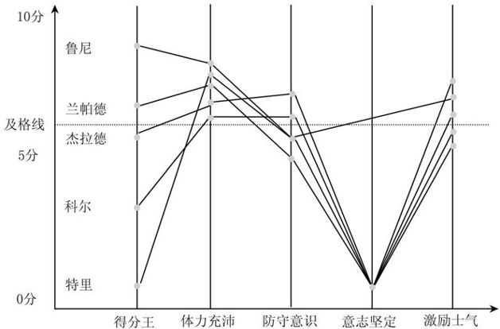

■扩展思考

搞清楚团队人员应该具备哪些必需的关键能力，是这个模型是否具备可操作性的关键。这些能力是由组织或者团队负责人来认定的，所以组织或者个人的经验会决定整个团队的素质。就好比美国大片里的犯罪小组，他们得要一个特别会开车的，一个特别会玩计算机的，一个特别会打的，还有一个特别会泡妞的……

不同目标的团队，应该采用不同的打分项，这样才适应不同的项目管理的需求，所以不应该追求某个统一的标准。

你可以想想，你的团队里面，到底谁有关键能力？如何让拥有关键能力的人得到应有的肯定和回报？

史玉柱曾经有一个内部评估团队的方法，他让团队成员为自己给团队的贡献打分，总分100分。如果每个人的分合起来低于200，说明有人贡献不足；如果总分超过250分，那么说明团队内有人在膨胀。这个打分思维，可以结合团队评估模型一并参考。

■拆书建议

我想用我在构建网易云课堂的课程开发和运营团队做一个能力分析的例子。

在构建这个运营团队时，我认为这个团队特别需要六种能力：

1.战略远见；

2.课程开发能力；

3.充足的上网时间；

4.一对一的PPT指导能力；

5.基于良好网感的营销策划力；

6.服从大局的快速反应力。

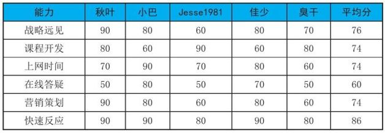

我自己做了一个能力评估表，在这个团队里面，除了答疑时间，每个技能都有特别出类拔萃的人，还有能够理解和跟上的人，所以基本上不用太担心。

如何解决为学员答疑的时间问题，是整个团队工作负载的关键点。事实上，我们做了很多细致的工作来尽量控制和延缓答疑的工作量。但是显然，只有真正解决了这个问题，我们团队的生产力才能得到释放。

你也可以试试，把这个方法套用到你的团队管理中去。

3.如何培养你的团队成员

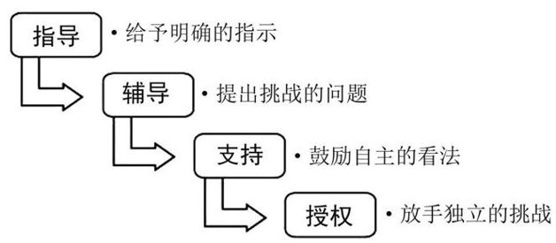

过去100年来，组织管理理论出现了许多巨大的变化，员工也由流水线型进化到知识型。对于流水线员工，只要能够按照规定的操作程序进行工作，就能够解决问题。但是对于知识型员工，关键要培养他们随机应变的能力，仅仅通过规范性操作来解决问题是远远不够的。

那么如何培养知识型员工呢？《史上最简单的问题解决手册》介绍的“情境领导模型”可供参考。

■知识介绍

赫塞和布兰查德提出的“情境领导模型”由四个部分构成：

1.指导：刚刚开始工作的时候，员工需要强大的领导。作为新人，他们往往投入有余，但是专业能力不足，需要领导提供明确的命令和指挥。

2.辅导：在辅导阶段，员工的专业度有所提升，对新工作的忐忑不安和畏惧也开始消失。但对工作的积极态度也会衰减。这个阶段，领导要善于给员工提出问题，引导他们思考，让他们自己去找答案。

3.支持：这个阶段的员工的专业技能足以应对工作，但对工作的态度因人而异，有的还可能想离职，但更多的是希望获得更大的发展空间。这个阶段，领导要鼓励员工提出自己的看法，并多多加以采纳。

4.授权：此时员工足以独当一面，领导需要对他们进行授权，让他们培养自己的团队。有自己负责的项目，他们的士气就会保持在一个高昂的状态。

■扩展思考

我个人觉得这个四阶段模型，对培养知识型员工或者需要综合软技能的岗位员工，是非常合适的。但是对于流水线模式的员工，这种培养模式并非是必需的，除非你准备培养他逐步走上管理岗位。

在职场，老板往往希望招来的员工马上能解决问题，但即便是有经验的业务人员，也必须从第二个阶段“辅导”开始，不能一开始就过度授权。

任何人不先圈一圈，就马上放出来，即便短期内他冲出一片业绩，但从长远来说，也会带来公司管理上的隐患。因为你不清楚他会用怎样的方法去解决问题，以及这种解决问题的方法是否在你公司的容忍范围或底线之内。

对于新人，往往有两个极端。一是希望自己能早早独当一面，被别人重视，却忽略了自己是否具备独当一面的能力。仅仅掌握技能往往并不足以解决问题，因为还需要具备沟通技巧等软能力才行。另一个极端就是极度不自信，畏手畏脚，不好意思请教别人，怕别人看出自己的不自信。新人就是要大胆去观察、模仿、请教，减少你在指导阶段消耗的时间，尽快进入辅导阶段，这样就能比别人更快进步。

■拆书建议

如果你是刚刚毕业的新手，能够完整经历这四个阶段，对你的职业成长非常有好处。我本人的成长经历差不多就是如此。

机械硕士毕业后，我的第一份工作是做IT信息化。是的，我不是学IT的，我是学机械的。但我做了这份工作，算是专业大换行。我凭着读研期间学会的安装服务器、数据库和会写几句代码这几项微不足道的计算机知识，也混进了IT行业。这个公司自然不能放心我，给我安排了长达三个月的培训。在培训期间，我只是被老员工带着做了一个小项目。这个阶段，我是在被指导和学习别人中渡过的。

然后我有机会被调去做软件测试工作，这需要我们模拟用户的思维。这个时候也有老员工启发我们如何去做极限测试、流程测试，鼓励我们自己开发大脑。这个工作很适合我，我模拟了很多奇怪的操作，发现了大量的bug，然后我被请出了测试部——因为正常人是不可能这样操作的。

测试部的经历让我对软件的熟悉程度达到了一个高度。让一个信心爆棚的新人成长或者毁灭的最佳方式，当然是让他出差去做一个项目服务，总部在后面支持。这就是我的支持阶段，这个阶段，我信心满满出去，被折腾得死去活来，一肚子怨气回来，心想这都是什么破软件？我当时的主要想法是离职，这也是第三阶段，员工开始有自己的想法后最容易犯错的阶段。他们会高估自己的能力，高估自己的业绩，而低估了总部或者团队对自己的支持。结果一出去碰壁才发现，自己的能力是依附于平台的。

经历了这种炼狱般的过程还能活下来的人，就可以真正独立做项目了。做过两个这样的项目，我就被提拔为项目经理，在这个阶段我才能够一个人独立带团队做点事情。这就是经过考验的我，才能使公司放心，得到授权。

如果你是职场人，你可以想想，你的职业成长是不是经过这样的阶段？你现在处于哪个阶段，又该如何进步？如果将来有一天，公司要你培养新的小伙伴，你又该如何做？

4.六顶思考帽怎么玩

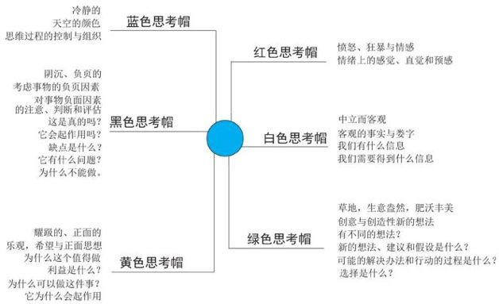

创意思维大师爱德华·德·博诺在1986年提出六顶思考帽时，很多人认为他的观念哗众取宠，但后来六顶思考帽却成为提升团队决策水平的经典方法。《六顶思考帽》这本书也被翻译到了世界各国，畅销多年。

■知识介绍

博诺的方法其实源自一个简单的信念：在一个团队里面，必须要有不同的声音。

博诺建议在对重要议题进行讨论时，特别是进行创意头脑风暴时，把团队成员分成六组，每组都选择一个不同颜色的帽子，也就是代表一种不同的意见。每个组员都必须戴着选定的帽子，以提醒他们自己的角色定位。

每一个颜色分别代表不同的特点：

白帽：理性的、客观的思维，重点在于事实和可行性。

红帽：情绪的思维，主观的感受和意见。

黑帽：质疑的思维，评估风险，找出问题。

黄帽：乐观的思维，相信有最好的局面。

绿帽：创意的思维，新的点子、建设性意见。

蓝帽：结构化的思维，纵览全局，提出整体意见。

为了保证每种颜色代表的意见都有声音，需要提醒团队成员记住自己的身份去思考，这样的会议需要一个冷静的主持人，以确保团队成员不偏离被分配的角色。

■扩展思考

我们可以对每一类帽子提出一些常用的问题。

绿色思考帽提出自己的创意：

1.有什么不同的想法？

2.有什么新的假设？

3.有什么新的行动方案或者选择？

红帽做一个主观判断：

1.这个想法感觉靠谱吗？

2.你觉得这个可以试试吗？

可以请黄帽乐观预测一下：

1.这件事的价值是什么？

2.我们做了这件事会得到的收获是什么？

白帽得提出一些事实要求：

1.我们有什么数据支持想法？

2.有什么成功的事实吗？

泼冷水的是黑帽：

1.考虑到这些负面因素了吗？

2.真的会起作用吗？

3.有不能做这个事情的理由吗？

最后让蓝色做一个冷静的总结：

1.我们现在的共识是什么？

2.我们可以确定的是什么？我们还需要明确的是什么？

如果要用好六顶思考帽，仅仅给团队的每个成员分配一个帽子是不行的，仅仅有一个主持人提醒他们记住自己的角色也是不够的，真正的要害在于你得为每个角色提出一系列诱导性思考的好问题。

每个角色一旦进入这些问题的提问模式，会很自然地变成那种角色思考模式的人。否则他们还是会更多依赖自己的习惯模式去思考问题。这就要求我们平时开类似会议的时候，多积累相关的好问题，把自己变成问题库才行。

另外一个可选的方式是，依据团队内每个人的个性，把他们归类成六种类型的人，依据他们自身的性格倾让他们向展开思考。

在一个团队内部，最大的危机就在于老大喜欢找和自己意气相投的人，好处是容易达成一致，风险是容易集体选择性失明。

■拆书建议

如果你现在有一个创业的主意，你又很难找到一个团队来做六顶思考帽的思考，其实还有一个选择，就是自己整理好问题集，一项一项把问题过一遍。

比如我做网易云课堂的在线PPT图文教育课程，这是我的一个绿帽思维的灵感，我的红帽告诉我这个事情有戏，而且黄帽马上冒出来激励我说这是一个前途光明、能够把握未来趋势的机遇。

但白帽思维会问：

1.在线教育有成功的收费案例吗？

2.请问这些案例除了语言教学，有职业技能方面的案例吗？

3.他们的收费回报目前已经超过线下了吗？

4.他们的扩散是可持续的吗？

而黑帽思维会问：

1.有没有和你一样类型或者内容的在线课程？

2.他们成功了吗？为什么别人的尝试失败了？

3.你能规避他们的失败因素吗？

4.你能承担转型失败的风险吗？

这样一来，很多梦想就会被我们自己扼杀了，这可真是一件纠结的事情。

很多人会想，要不下次我们干掉白帽、黑帽好了，直接绿帽、红帽、黄帽、蓝帽多开心！

不愿意一开始就正视潜在的风险并想出解决方案，以为遇到困难的时候自然有办法，这就是很多人最后走向失败的原因。运用六顶思考帽应该成为我们的习惯。

5.怎样实施项目的迭代优化法

项目管理的方法很多，大部分都侧重于如何达成一致。也就是说，在一段时间内，人们会搜集、整合各种点子，选择最佳的策略去执行。

但是在现实世界里，我们知道时间总是有限的，而且项目里总是有无法预期的事件让时间变得更加紧迫。如何快速决策、快速执行，最后还能得到圆满结果呢？

本篇介绍的结果最优化迭代模型还是来自《史上最简单的问题解决手册》，它可以为你解决此类问题提供一种新的思路。

■知识介绍

最优化迭代模型时把可以用的时间分为三段等长的间隔，再让项目经理把项目分成三次来完成。项目通过三次迭代连续改进，这样做的好处是不仅仅可以在最后得到一个输出质量更好的项目成果，而且项目团队成员也会因为不断看到项目成果的进展而充满士气，整个项目有可能获得原来3倍的成就感。

以常见的策划模型而言，可以分为“完成草案——精进完善——最优化定案”三个阶段来执行。

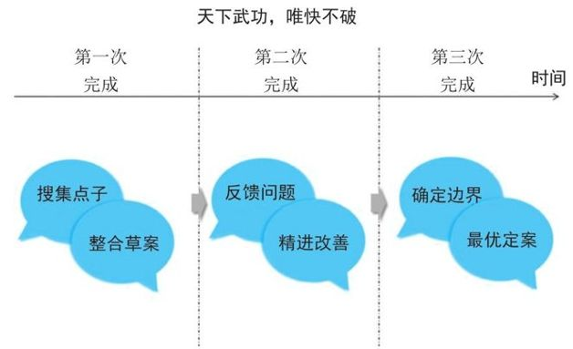

■扩展思考

在工业化时代，企业的利润来自规模效应，如果没有规模，很难得到合理的回报。因此，在工业化生产时代，策划一个项目需要比较长的周期。因为一个产品、一个创意的生命周期都比较长，一旦发布就需要大规模营销推广，所以前期必须反复论证、反复考量，才能避免投入后出现大的偏差。

在互联网时代，个性化需求已经成为主流。信息爆炸又强烈分散你的创意对受众的吸引力。比方说，你昨天刚想到一个好的微博营销的话题，只要稍微慢一点点，等你策划出来，又不知道微博上大家在玩什么了。所以有人说：“互联网时代，唯快不破。”

从传播的角度讲，这非常有道理。如果还是按照“策划立项——项目策划——申请预算——落地执行——总结经验——下一个策划立项”这样的流程执行，一个项目策划没有三天时间是搞不定的。可是在微博微信这样的互联网媒体上，三天的变化，顶得过原来的三个月！

所以越来越多的人开始接受不完美的策划，其实你做什么完美策划都是不现实的。在互联网时代，要么你是乔布斯，认为所有的客户都不知道自己真正需要的是什么；要么你干脆承认自己的无知，与其猜测客户需要的是什么，不如快速将你的想法做出原型，小范围收集反馈意见，然后马上改进，最后快速放大定案的内容。

我现在做各种微博策划的方法就是，几个小伙伴头脑风暴一下，马上就做一个原型出来，比如我们准备在春节做一期疯狂猜图的PPT通关游戏，于是马上就请我们的@jesse1981老师用PPT做了一个样品。

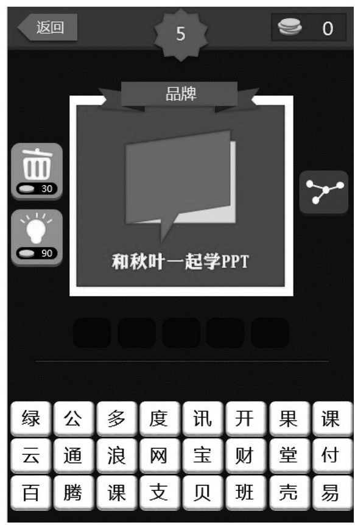

这个创意一出来，我们就转入内部小伙伴群交流，测试大家的反馈，收集各种意见。一旦发现我们的创意有不足的地方，能够改进就改进，如果大家完全无感，我们也会毫不留情地砍掉这个创意。一般而言，经过小伙伴挑刺过的创意，最终搞出来的效果都还不错。

这样做的成本其实很低，但是有效控制了项目风险，让项目在迭代改进过程中得到了完善。最最重要的是，万一这个项目突然要提速，我们至少还有一个不那么完美，但也够用的方案来响应工作不是？

跟上响应速度，这一点其实在互联网上非常重要！

■拆书建议

想一想你现在做的项目，特别是做移动IT项目的朋友们，你真的能完全把握用户的需求吗？有没有办法做出一个试错的原型来快速迭代改进呢？

我举三个我本人帮朋友做过的案例。

案例一：网页设计。

我用PPT快速设计出几种风格的网页首页，请客户确认，确认后再针对某种风格细化设计，避免了大的反复。

案例二：手机APP开发。

我还是用PPT快速设计出高仿界面，请朋友参考，确认后再请专业人士细化设计，节省了专业人士的高薪设计费。

案例三：领导的PPT。

我不得不做好几个风格请领导把关，确认后再精细化设计，最后领导选择了一开始就被否定的那款（说多了都是泪）。

一句话：完美的事物都不完美。

6.李善友教授的“颠覆式创新”理论对不对

李善友教授讲的颠覆式创新非常有名，也吸引了很多创业企业家去学习。而且他完全不按传统套路出牌，把他的中欧商学院培训做得风生水起，变成了品牌课程。每一期培训还都成了他的个人社群扩展的口碑传播途径，令人真心佩服他的厉害。

■知识介绍

Q1：为什么现在被颠覆的大企业越来越多？

A1：在现代商业史上，其实一直都有大企业被小企业颠覆。但是现在的科技进步是人类历史上最快的时期。技术进步是如此之快，而且是加速度进步的，以致越来越多患上恐龙症的大企业难以转身，被小企业颠覆——几年前还如日中天的诺基亚，突然就没了。

Q2：难道那些大企业老总都是傻子吗？有钱不能任性？为什么还要把机会留给颠覆者？

A2：李教授认为，颠覆者之所以能够颠覆，不是因为他抢占了大企业的利基市场，而是做了大企业根本看不上的鸡肋市场。但恰恰是这种在大企业被认为难以获利的市场，如果颠覆者能够通过创新找到盈利的办法，就找到了颠覆大企业的命门。

李教授把这种市场叫“屌丝市场”，他说与其分蛋糕，不如去吃一块没有人吃的蛋糕。

Q3：大企业都赚不到钱的市场，为什么小企业可以？

A3：靠创新。李教授认为创新分两种。一种是对原有模式、产品进行改良的创新，这种叫渐变式创新，它是无法产生一个颠覆式市场的。这种渐变创新一般都是拥有丰富资源的大企业笑到最后的。一种就是破坏式创新。破坏式创新只能来自非主流市场，在大企业的眼光之外，通过满足某一特定人群的需要，通过不断改进，最终形成一种颠覆式能力，取代大企业的市场。

李教授说持续性技术着眼于技术，颠覆式技术着眼于产品，这个说法也挺绕的，我的理解是持续性技术是用技术提升现有的产品，颠覆式技术是直接面向需求创造出新的更好的产品。

Q4：为什么那么多人沉迷于颠覆式创新？

A4：仅仅是“颠覆”两个字就能让很多创业者心动，谁不想自己的事业做成一个颠覆性的事业呢？然后李教授又确凿地告诉小企业，和大企业竞争，要打不对称战争，抓住大企业业务上的盲区，做减法，单品突破，最终逆袭。这是成功的唯一路线，这更是给创业者的强心剂。至于他们有没有颠覆式的技术和能力，这个恐怕是很多人吃了亏以后才能去反思的。

Q5：李教授到处讲颠覆式创新，图书也公开出版了，不怕大企业看到了警醒，采取反制措施吗？

A5：不怕，李教授认为大企业之所以无法阻止被颠覆，就是因为过去成功的经验形成了组织性的系统依赖。这种依赖导致大企业即便看到机会，也难以转型。我倒是可以补充一个例子，前几年服装行业扩展的成功经验是发展地面品牌直营或者加盟店，一时间全国服装行业加盟连锁成风。没想到才五年时间电商就成为潮流，这些加盟商直营店不论关还是开，都成了巨大的负担。

Q6：大企业真的没有机会吗？

A6：李教授认为除非大企业也愿意在内部采取破坏性竞争，以产品为核心，用全新的逻辑打造全新的市场，取代原来的体系——甚至，李教授悲观建议，你做不好的事情，不要做了，让别人做，你去做他的投资人就好了。

不过在管理案例上，大企业做到颠覆式创新的也不少，比如谷歌，他们一次次推出引导技术潮流的新产品，从谷歌搜索到安卓操作系统，以及现在的智能眼镜、无人驾驶汽车，还有未来的人工智能。他们在很好地保持了固有市场之外，还能借助自身搜索优势不断扩大新的业务领域，这些领域完全来自企业领导人的想象力。

再说苹果，苹果颠覆了智能手机，这得感谢乔布斯，还是领导人的个人魅力。

在中国，海尔正在进行全面的互联网管理模式再造，了解海尔近两年战略转型力度的人都知道，这是一场革命，这还是得感谢张瑞敏先生的远见。

即便是在国内顶级的中欧商学院，也是因为有了李教授，才出现了颠覆式的教学模式。

我的看法是，如果在一个企业拥有一个充满想象力的领导人，而且他又愿意挑战现状的话，企业太大并不是不能做颠覆式创新的理由。

■扩展思考

那李教授的理论到底对不对？

在书的开头，李教授就说了，一切管理理论都有其边界，你认为我是对的，也许我都是错的——这算是免责申明吗？

下面给大家分析一下李教授的颠覆式创新在哪些领域很难适用吧。

1.需要长周期才能获得的产品——农产品，想想褚橙，你要颠覆它的口感，容易吗？

2.技术创新突破缓慢的行业——煤炭、石油行业，好像到目前为止都没有谁去这些资源型行业谈互联网思维吧？

3.和政府审批权紧密相关的行业——工商代办，我觉得这种业务最适合互联网模式了，但是你看目前的进展还是很慢。

■拆书建议

最后我要提醒大家，李教授的书虽然好看好懂，但是真能看懂的人，怕是不多。看懂李教授的书，前提是你至少有分析一个行业宏观走向的能力，没有这个能力，大部分人只怕都只能被牵着鼻子走。

“互联网+”已经成为国家战略，你的行业也可能出现新的玩法。建议大家多看一些颠覆式创新的案例，分析其思路，并找到行业里思考力比较强的高手一起探讨。

7.你会用定位图吗

《整理的艺术3：创意是整理出来的》（以下简称《整理的艺术3》）介绍了一种常用于市场战略的工具，它可以描述各种品牌的定位，所以叫定位图。

■知识介绍

比如在汽车行业，各个品牌商在市场上到底处于怎样的位置？如果用文字描述就非常复杂，用一张定位图就一目了然。

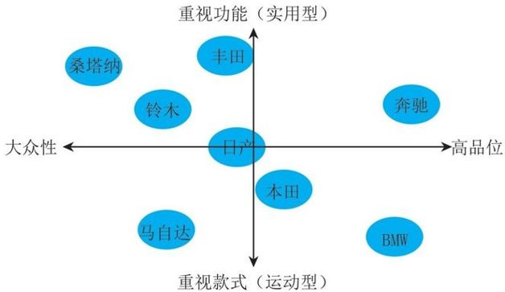

实际上在我分享的大量拆书文章中，很多时候都是在用定位图，比如时间的重要紧急度模型、人的能力意愿模型和财富新贵的分化模型。

那么，什么时候可以考虑使用定位图？作者的建议是：

1.想表达某种独创性的定位；

2.想从宏观上把握整个目标市场；

3.想确认自己的视角在哪些领域还有空白。

一种最传统的定位图就是性别+年龄，两个坐标就可以把人群划分为不同的类别。你可以尝试把你看到的读者、商场用这个方式做定位。

■扩展思考

要想做出好的定位图，关键是巧妙找出二元对立的坐标，使你的定位组合让人眼前一亮，又在情理之中。

比如你在设计新款手机，如果定位坐标是功能和价格，就跳不出传统性价比的路子。但是如果你把好玩和好看作为定位轴，那么整个手机的设计思路就改变了。如果乔布斯来划分手机行业，你们猜他的定位图会是什么？我猜是“产品品种+整合用户体验”。

看别人的营销打法，你可以模拟他的定位图，这样就是一种高级的换位思考。一旦看准别人的定位模式，你往往也就找到了他的软肋。

■拆书建议

你可以用定位图的思维分析你关心的任何市场。比如在在线教育市场，将横坐标设置为平台规模，将纵坐标设置为课程质量（或品牌），就可以画出新的定位图。

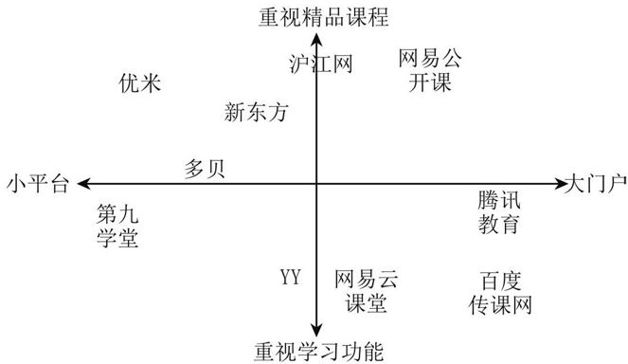

如果改变坐标轴的设置，你就会得到不同的思维视角（这就是定位图的关键所在），找到一般人思维中的盲区，找到你的细分市场。

8.如何留住你的灵感

创意往往是在让你意外的空间和时间里跳出来的点子，如果不加以特别留意收集，很快就会消失。本篇拆书介绍的创意整理方法，还是出自《整理的艺术3》。

■知识介绍

作者小山给我们分享了很多创意收集的方法，我对他的建议做了一次整合，形成了一个创意的整理方法框架，如下图：

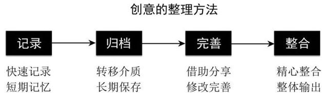

两位作者的意见是人在一天里会有很多想法，其中一些想法特别有价值，但是这些想法往往贮存在大脑的“临时记忆区”，如果不马上记录下来，就会很快遗忘，所以要创造随时随地可以记忆的环境，帮助自己记忆。

而且这些信息如果不马上记下，始终还停留在大脑里面的话，就好比电脑的内存没有清空，会导致新的想法、新的问题不能进来。马上记下的目的其实也是为了马上忘记，好腾出大脑想别的问题。

但是我们的临时记忆即便记录下来也是零碎的、散乱的，需要用一些方式归档，比如粘贴、写成小博客、发邮件分享给朋友等方法，从而把这些临时记忆变成可以检索的长期介质保存。

为了更好地利用这些灵感，作者还建议我们主动分享这些想法，这样就可以让灵感逐步完善，成为可以执行的方案。

最后，经过实践的方案就可以成为你工作方法库中的武器弹药了。

■扩展思考

一、关于记录。

小山在书里面的建议是马上手记，他还建议你制作一些名片大小的空白卡片放在名片夹，这样记录起来会非常方便，而且也很好携带。

不过在有了手机APP的时代，利用印象笔记这样的工具，也很方便。因为无论是记录还是手绘，包括拍照录音，印象笔记这样的工具都更强大。唯一的缺点就是你的手机需要保持有电状态，所以随身带笔和纸张还是有必要的。

二、关于归档。

说说我归档的一些方法，其中一些方法也是作者推荐的：

1.马上存进记事本。

比如我在微信公众号后台给“秋夜青语”的大学生们答疑时，如果觉得问题还比较有价值，我会马上把提问和回答复制到不同类别（比如爱情、就业、考研，等等）的记事本里面，以后归档梳理就很快了。

2.写邮件。

比如我接到《电脑爱好者》的约稿，在和编辑QQ聊天时会产生一些灵感，我会马上把这些灵感敲下来，写一封邮件给我的各个合作者，询问他们的意见，这些临时的碎片灵感就变成可以检索的邮件交流记录了。

3.写博客。

比如我在读《整理的艺术3》的时候，我会很快把读书过程中的一些灵感要点手写下来，或者写在书的前面空白页，或者写到笔记本上，然后变成我写博客的灵感点或者提纲，本篇文章就是如此得到的。

4.纳入知识库。

比如我们在写《微信控控微信》时，@萧秋水和我提前策划了一张书的思维导图，很全面。看到哪个信息符合这个导图的某个分支，我们马上就归类进去，慢慢积累到足够多的素材时，这个导图就成了一个知识库。

不同的人，也许有更多不同的归档方法，但总的逻辑是把碎片变成更容易检索的数据，这样灵感就开始变成可利用的信息了。

三、关于完善。

完善的本质在于两点：一是延时思考，二是分享交流。延时思考可以让自己有机会从不同的角度，在不同的心境下重新思考自己当时的观点是否合理、正确、靠谱；分享交流可以获得他人对问题的建设性或批评性意见。

■拆书建议

先介绍一个我自己的完整的案例。

年前我们在QQ群聊时说可以搞一个微信猜图游戏，这是一个灵感。我马上从QQ记录里抓出这个灵感和@Jesse1981老师通过QQ小窗单独沟通，相当于从聊天刷屏中记录到了QQ一对一聊天记录里面。然后我们的@Jesse1981老师马上根据这个灵感用PPT做了一个高仿，相当于用PPT做了一个模板归档了。

这个PPT在内部一分享，大家都觉得这个“马上猜图”特别好，于是请@Jesse1981老师继续完善，然后我又征求老婆和朋友的意见，我搞开发的朋友就告诉我微信的“匹匹扣微信管理后台”就支持这种操作啊！

我老婆的建议是你的猜图不要太难，就是让大家开心一下就好，过年嘛，娱乐一下，也不要搞什么抽奖，抽奖总抽不到红包，会把大家乐一乐的心情搞得不开心。我觉得很对，得听老婆大人的。

我觉得这个“猜图”游戏就是一个很好的从灵感到记录到归档到完善到整合的过程，因为经过一轮猜图游戏，我们基本知道了猜图游戏的标准化玩法，未来肯定有更有趣的猜图游戏被打造出来。

建议大家也按照这样的流程充分发挥出创意的能量。

9.如何做一份好的会议记录

在工作中经常要做会议记录，如何在会议上把每个细节都一目了然地记录在案，而且又能突出重点信息？《整理的艺术3》里有个不错的方法。

■知识介绍

把会议过程像流水账一样记录，例如谁来了讲了什么，其实并没有意义，职场里做好会议记录只需要三点就够了：

1.要清楚记录会议的结论；

2.要清楚记录得出结论之前的讨论要点；

3.要清楚记录会议的“下一步安排或建议”。

如果把会议进程和要点记录结合起来，就会得到漂亮的会议记录。

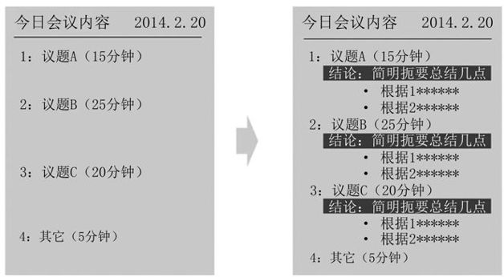

这种记录的好处就在于，理解了会议的核心——“为了决定某件事而进行讨论”。

如果因为种种原因不方便写会议记录时，也应该在会后马上做记录，因为那时信息还是热气腾腾的，还有鲜明的记忆，会比第二天再去回想遗忘得少很多。

■扩展思考

说到马上记录这个事情，我很有体会，不仅仅是因为延期记录会有遗忘的问题，马上记录也会发现一些自己没有在会议上搞明白或疏忽的内容，这个时候趁着大家的记忆都在，马上沟通、马上确认、马上反馈，能给别人热情专业的印象，也有利于工作的安排。

不仅仅是会议记录可以使用结构化记忆方式，读书做笔记也可以。我读书有个体会，读到冲动处，来了灵感不在当时马上把这些灵感写下来，很快就会忘掉，下次明明记得自己在这里要做点什么，但就是想不起来自己到底要干什么。我在读这本书时，就想到可以摘取一部分变成读书笔记或自己的随笔分享，但是如果不马上记录下来，我也会忘记。

现在就把自己在春节期间做的记录晒给大家看看。

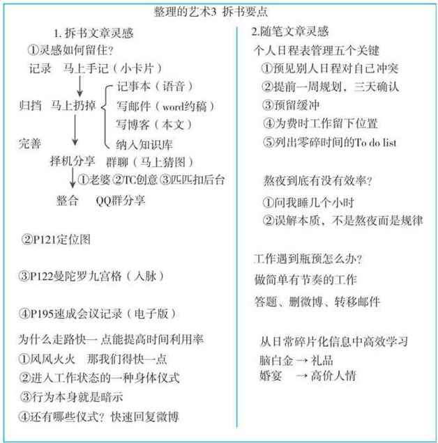

还是一句老话，不动笔墨不看书。

■拆书建议

最后，我想说一点，现在很多APP只提供记录功能，而没有提供结合工作情景的记录模板功能，如果在这方面下点工夫，会出现有价值的产品。当然这样的产品如果和知识达人的个人品牌结合，那会是非常酷的一个产品。你们觉得呢？

这是把读到的知识转化为生产力的一个例子，大家读书时也要多做这样的思考。

10.戴着镣铐才能更好地跳舞

看到《微创新：5种微小改变创造伟大产品》（以下简称《微创新》）的书评不错，就买了，一看，这书的确非常不错。本节主要谈一谈：如何在约定的框架里找创新的点子。

■知识介绍

有句话不知道大家听过没有，说解决问题的方法是“新问题试试老办法，老问题试试新想法”，前者说的是技能的横向迁移，后者说的是用创造性思维解决问题。这句话也给一般人带来一个惯性思维，认为要创造性解决问题，必须要跳出原来的条条框框。

我过去也是这样以为的，但这本书用扎实的分析说服了我，看起来很多颠覆式的创新，恰恰不是因为你颠覆了过去，而是在原来的框架里做了很多渐进式改变，慢慢成为一个新的思路。

作者举的是跳高技术的例子。最早的跳高技术是剪式跳法，然后越来越多的人喜欢用跨越式跳法，成绩更好。直到福斯贝里采取了背越式跳法，石破天惊，一下子让跳高成绩突飞猛进。

在后来的体育创新评比中，“福斯贝里式跳高法”成为所有专家一致认同的体育史上最有创新思维的重大革命。但福斯贝里发明这个跳高的方法，不是跳出传统的思维模式，而是恰恰在他本来很熟悉的剪式跳高法里发展出来的。

最开始福斯贝里是用剪式跳高法的，但是成绩不如他人，他就开始学习跨越式跳法。但他学得很不顺利，和教练商量回到剪式跳法。在剪式跳法训练过程中，他发现一个缺陷，选手很容易在过杆时背部撞杆。为了弥补这一缺陷，福斯贝里就尝试压低臀部，这样会使他过杆时不自觉压低自己的肩膀。他保持这种姿势把自己的成绩又提高了15cm，当时还没有人注意到他的动作改进，因为他的技巧是逐步进行的，每次都只是稍加改动。

当福斯贝里开始在赛场崭露头角时，其他教练才发现他的动作与众不同。但教练也无法指责他的跳法不对，因为福斯贝里不过是对已有跳法稍作改进，而不是发明了一种新跳法。

作者通过这个案例告诉我们：过去研究创造力的事例都是证明福斯贝里摆脱了传统方法的桎梏，但事实是福斯贝里是在剪式跳高的框架里思考的，不断微创新才发现了背越式新跳法。

所谓在框架里思考，我的理解是：在寻求答案时，你的解决方案对原有的资源利用越充分，也许越接近最创新的答案。

■扩展思考

作者提醒我们，要培养创造力，我们先得学会在框架里面去思考，这才是解决问题的关键。

举一个有趣的例子：如何擦掉白板上的永久记号笔的痕迹？课堂上很多学生提出找一块抹布，用啤酒试试？弄点酒精？去买一点化学除污剂？这些点子都很不错，但是不如最后提出来的答案好。那就是用永久记号笔沿着笔迹再写一次，然后赶紧用黑板擦去擦，果然可行！

作者提出的在框架内创新的含义，我的理解是，要充分利用已有的条件解决问题，而不是为了解决问题创造出新的必要条件，这往往会使得问题越来越复杂，而不是得到一个简单的解决方案。

这个观点我深有同感，在运营网易云课堂《和秋叶一起学PPT》课程的时候，我们遇到一个很奇葩的问题：我们根本无法和我们的学员互动！

作为老师，我们无法在网易云课堂内给关注我们的学员发私信或者发任何东西，甚至我们连他们的全部名单都看不到。这个问题到今天依然如此。我们几乎没有办法和我们的学员沟通，也无法将一些信息通知给学员。然后我们决定建立一个QQ群，但问题很快就变成了：如何让学员知道我们建群的消息呢？网易方面的反馈是要开发！那算了。

我们最开始想的解决方案是将这则消息放在免费的第一课说明里，但是很多人根本不看免费的第一课！

最后的解决方案非常简单。云课堂评论有个与众不同的功能，你可以反复发评论（但永远是一条记录，不会刷记录），而且你的评论发了以后，就可以默认置顶到评价榜第一条！

这就简单了，我们现在每天会去评价榜看看，发现评论有变化，马上更新一下自己的评论，然后我们的通知就出现在首页最显眼的位置，这个变化果然让入群达到率大大提高。

你看，一个功能逆向使用，就非常简单地解决了问题，不需要开发什么公告板，操作也不麻烦，还灵活。

■拆书建议

大家可以想想如何在自己的工作中用框架内方法或工具解决问题。

建议大家多搜集别人在工作、生活、恋爱、婚姻、旅行等事情上用框架内方法或工具解决问题的案例。微信里、图书中、生活中这类例子是不少的，案例收集一方面为了学以致用，一方面也能让自己脑洞大开，提升这方面的想象力。

11.如何运用减法思维创新

在《微创新》这本书里面，提到的第二个创新策略就是减法思维。

■知识介绍

作者建议我们遵循以下五个步骤做好减法：

1.列举产品或服务的内部组成部分。

2.选择一个基础部分并想象将它删除，删除的方式有两种，即完全删除或部分删除。

3.想象删除之后的结果。

4.考虑以下问题：

·删除以后对产品有哪些好处？

·能满足什么样的市场需求？对哪些客户有价值？

·在解决具体问题时，它是如何发挥作用的？

·在认真考虑这些问题后，考虑从框架内寻找一个功能“替代物”，这个替代物可以是内部构件，也可以是外部构件，然后考虑这个调整后的产品有何好处？有何价值？

5.如果你认为你修改后的产品有创新，那就考虑一下可行性。问问自己，真的能生产出这样的产品吗？真的能提供这样的服务吗？为什么？怎样才能让它变得切实可行？

实施减法策略取得巨大成功的代表产品：索尼的随身听、飞利浦的轻薄DVD、苹果的iPod、推特的微博模式……

另外，作者有几个建议非常有价值：

1.不要只删除有缺陷的部分，必须删除基本的部分才能产生好创意。

2.“低配”不等于是“减法”，低配是降低某个功能的价值，减法是为这个功能找到替代的解决方案，这里面还是有不同的。

书里有一个让我印象深刻的故事。当年摩托罗拉以色列分公司推出了Mango手机，这是一款低成本手机。为了和竞争对手竞争，这款手机删除了拨号功能，只保留接电话的功能。

一款只能接电话，不能打电话的低价手机，会有市场吗？结果是，手机推出后意外地受到特定人群的欢迎。

这群人是孩子的家长。对家长而言，这款手机没有拨号功能，孩子们就不会制造高额的通话费，而接听电话则可以让家长掌握孩子的行踪。这款手机价格极其便宜，即便被孩子丢失也没有多大损失，更没有被呼叫的通话费用。

不仅仅是家长，连一些公司都选择这款手机和外勤人员联系。凭借这款低价手机，有些公司就和自己的销售人员建立了一个单向联系的网络，既减少了费用，又可以随时联系到员工。公司用户喜欢这款手机的原因还在于，对于一款只能接听的手机，手机占线的可能性非常低。

最后的结果是这款手机在一年时间占据了当地市场5%的份额，1995年，这款手机被评入全世界最具创意的12个营销策略。

■扩展思考

减法策略不仅仅可以用在产品上，也可以用在服务或者生活上。

比如我是不会开车的，也没有考虑过考驾照。没有车我出门可以选择走路、坐公交、打的，或者租车服务，不愁没有替代品。而且现在预约服务很发达，如果提前做好时间规划，也不用担心重要用车时刻没有车。

拥有车的两大好处是节约时间和扩大生活半径，我思考后认为：

1.开车节约时间，但堵车和停车花费的时间足以抵消你节约的时间，而且开车的时间很难用来做需要复杂思考的事情，但坐车可以。

2.扩大生活半径不是因为有车，而是因为你在市场上被其他人需要，会得到各种邀请。那个时候，车都没有用，得坐高铁飞机。

因为没有车，我得到的好处是不需要为堵车停车操心，不需要每个月额外支出一笔费用，可以把买车的预算投入到其他投资换来回报……

一直到今天，我对买车都实施减法策略，反而简单。

■拆书建议

不买车谈不上是什么创新，但是减法策略类似某种逆向思维，可以让你看到更多的选择可能性。在消费社会，我们被各种广告和软文洗脑，拼命购买各种东西，其实停下来想想，很多东西是可以做减法的。

减法策略也是很多时间管理的密码，大家可以想想自己的生活和工作中有多少事情是可以减去不做的。

关于减法思维，建议大家百度一下“奥卡姆剃刀”，你们会有更多的收获。

12.如何运用除法思维创新

《微创新》这本书提到的除法思维也是蛮有用的，发明史证明了这一点。

■知识介绍

1988年，莱斯·保罗入选摇滚名人堂；2005年，他因为对实体电吉他的发展所做的贡献入选国家发明家名人堂；2007年，在去世前两年，92岁的保罗被授予美国国家艺术奖章，这是美国政府授予艺术领域从业者的最高荣誉。

保罗能取得最高荣誉，原因之一是他发明了多轨录音技术。这个技术使得音乐家可以先录制主音乐，再录制和声，最后加入歌者的声音，通过把磁带上不同音轨的声音混合在一起，音乐家可以充分利用磁带的宽度。

在这个技术之前，音乐家必须一次录制全部声音，录制完美声音难度很高。这个技术使得录出高质量的音乐的难度大大降低，促进了音乐的繁荣。

《微创新》告诉我们，保罗的创新策略正是除法策略。除法策略是把产品的某个功能或部件分解为多个部分，然后以新的方式把分解后的部分进行重组，找到其可能具有的优点。

把产品功能或服务分解成多个部分，会带来两个结果：一是产生一种全新的功能，比如把原来在电视上的功能放一部分到遥控器上；二是以一种全新的方式呈现某个已有的功能，最典型的是把笔记本电脑的光驱、硬盘、显卡都做成可拆卸组装的部件，从而造出更轻薄的笔记本。

应用除法策略有三种方法：

1.功能型除法：挑出产品或服务中的某个功能，改变其位置。最典型的案例就是空调窗机改成了空调柜机，实现了静音设计。

现在一些航空公司把登记流程放在微信里完成，也是一种功能型除法，让大家可以利用碎片化时间随时完成登记选座业务。

2.物理型除法：将产品按某种原则分解成若干部分，像乐高的玩具就是一个典型，把形状变简单，反而可以提供任意可能的组合结构。

房间装修时，把一个大房间隔离成几个特定功能的小房间，也可以看作是这种物理型除法的应用。

3.保留型除法：把产品按原样缩小。大家最熟悉的案例就是U盘。

在食品行业，推出小包装的品种，也是这种思维的延伸。一些酒店和公寓采取“分时收费”服务，你可以租特定的一个星期，这也是一种除法思维。

■扩展思考

除法策略非常适合改进现实生活中流程复杂的业务：把你的业务流程写下来，然后看看能否将某个流程步骤合并到其他步骤里面，想象一下，这种流程改变能否带来新的创意。

在早期电信运营商的业务中，开通业务是这样的：

1.选择运营商；

2.填写某种业务申请表；

3.使用设备打电话；

4.月底收到话费单；

5.支付账单费用；

6.从第三步开始循环。

美国休斯敦移动电话公司把第五个步骤调整到第一步，一种新的业务诞生了，预存话费服务。

《微创新》作者建议按如下步骤做除法策略：

1.列出产品或服务的内部组成部分。

2.以上文提到的三种方法之一分解产品或服务。

3.设想新组成的产品或服务的细节。

4.设问：新产品或服务有什么潜在的优势和价值？它有没有市场？哪些人需要它？为什么需要？在具体情况下它是如何发挥功效的？

5.如果你确定有价值，就继续问自己：有没有可行性？能否付诸实践，为什么？能否调整提高它的可行性？

作者举了一个例子，他在美国通用电气公司培训时遇到一次刁难，学员问：能对冰箱进行除法型策略吗？

他问学员什么部件是冰箱里不能去除的呢？——压缩机。

那把压缩机从冰箱里移掉会怎样呢？——这不可能！

且慢，能不能想想把压缩机从冰箱里移除后的好处？——节约了空间，压缩机放室外，散热量变小。

对了，我想到了，可以用一台压缩机管理所有的制冷设备！

不管你信还是不信，几年后，把冰箱分解成独立的小冰盒，并放在厨房的不同位置的独立冰镇抽屉设备在市场出现了。这也是作者最得意的培训案例。

写到这里，我想到一个有趣的除法型思维的产品：从按键手机到智能触屏手机，就是除掉按键，解放了空间。

■拆书建议

你能想出哪些产品或服务用了除法策略？

为了实现这个除法策略，它还做了哪些调整来适应？

你所在公司的产品或服务能否采取除法策略？建议你发动小伙伴们一起思考和讨论，有了点子之后做一下可行性分析，没准会有大收获哦。

13.表达行动的MORS法则

很多人被提拔到管理层之后，心中比较忐忑，不知该怎么带人。《带人的技术》提出一个观点：带人要具体告知下属应该采取的行动，而且必须用可感知的语言提出要求。

■知识介绍

什么是可感知的语言？作者提出了MORS法则：

可测量（Measurable）——可计算或写成数据；

可观察（Observable）——无论是谁都能知道结果应该如何；

可信赖（Reliable）——无论是谁都能够辨识行为是否一致；

明确的（Specific）——如字面含义，一清二楚无歧义。

作者认为，如果不满足以上条件，你的要求只能算建议，而不是行动指南。例如“请后期加强密切沟通”“请提升营业额”这样的说法都不符合MORS法则，无法指导行为。

作者的建议是做如下修改：密切沟通——针对每一位客户每三个月打一次电话，询问对公司服务的意见或每两周寄送一次电子报；请提升营业额——每周派发20份海报，在XX网站上刊登广告，每个月赠送300份试用品。

作者认为只有这样写出具体的行为，才能教会下属应该做什么，也能在事后检视自己的指导，并客观评估下属的工作效果或者工作态度。

作者认为，你很难要求一个新人“要待客如亲”，他根本就不理解什么情况下叫待客，什么叫如亲。要解决这个问题，除了要明确你的语言，还得由主管先做好“行为分解”，比方说“待客如亲”，我们可以这样解释：

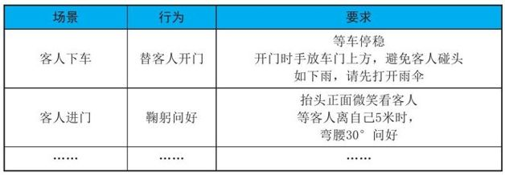

这也恰好说明很多日本人的思维模式：他们希望你把平时认为理所当然的要求用具体的行为解释，并加以量化评估，这样他们就可以精确管理后续的行为。

■扩展思考

我自己的看法是：对于新人，工作要求越具体明确，越细分到简单好懂的层面，他们上手越容易，这样做是非常有价值的。对于流程型规范的工作，也应当如此。

像大学生，你把工作要求细化到什么程度，都不用担心，有些大学生你担心他们不懂，他们就会不懂到让你吃惊。为了避免你经常吃惊，你就要好好分解行动，细化要求，量化说明。

对于有工作经验的人，会处理越来越复杂的工作，对具体的工作指示中容忍一些模糊的部分、弹性的部分，反而会有更好的处理效果。

比如对于一个项目经理，我们应该多沟通目标的明确性。例如，你可以要求他在年底12月25号前把XX项目的尾款都要回来。至于怎样搞定这笔回款，具体的行动建议太明确往往会让下属感觉你在乱下指导棋。

■拆书建议

项目管理WBS计划分解的一个关键是，计划分解到什么程度合适？答案是看人。

如果你是管理者，请思考一下你以前的指导方式，有没有做到“因材施教”？你可以想想今后对每个下属的不同指导方式，磨刀不误砍柴工，这样你也轻松，他们也轻松，团队绩效还能更好，何乐而不为呢？

如果你是职场新人，要学会和上级沟通，争取更细致明确的指导，以加速自己的成长。

14.一起来学丰田的5S管理法

最近看了一本《丰田高效工作法》，对丰田的5S管理有了新的理解。很多人都知道丰田的5S，现在还有6S，但是真正理解5S内涵的人并不多。

■知识介绍

先看看什么是5S吧。

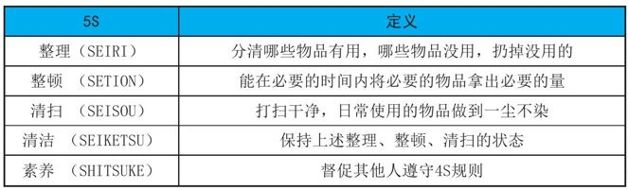

丰田的5S是围绕杜绝浪费展开的，为了杜绝浪费，丰田提出了很高的要求，丰田对浪费的定义是从两个维度上展开的。

一是避免空间的浪费，这包括物品对空间的占用。物品合理的规划陈列能减轻我们取用的负担，进而达到第二层次的避免浪费，也就是对时间的节约。

丰田要求要在10秒以内取出办公的文件。如果上司找你要一份文件，你还需要花费大量时间寻找，那么丰田就会认为你的工作中存在大量的浪费。要解决的方法就是从整理开始，丰田的规定就是：当天不用的文件不要放在办公桌上。

我觉得这一条真的非常有道理，丰田规定今天用不到的文件就放在固定的位置，总之，办公桌上不要放和当下工作无关的任何杂物。

长期不用的文件，丰田的建议是扔掉。因为真正重要的数据会保存在电脑，纸质文件会锁在抽屉，贵重物品也有保管的地方。如果你的办公桌上有一些长期无人问津的物品，那么扔掉也不会有什么损失。

■扩展思考

学习丰田管理法，不能只看书，要学以致用，还要马上用，所以我马上用这个方法整理了一下我的电脑桌面。没有整理前我的桌面已经不错了，是这样的：

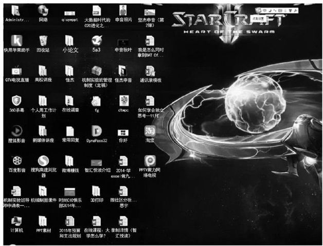

整理后变成这样：

这样整理真的能节约时间，因为我每天真正都要用的重要文件就是两个：一个是常用回复，一个是日程管理表。

其他的资料都可以收纳到几个文件夹里面，需要的时候再打开，至于不需要的文件，我都毫不留情删除到回收站。要是在回收站一个月还没有想起要捞回来，其实直接清空也不会有什么损失。除此之外，我还更换了桌面背景，纯色背景其实更有助于找到我们需要的东西。

在底部的工具栏，我还修改了任务栏通知状态，顺手调整了我最常用的软件快捷键放在底部工具栏，其实我用到的常用软件很少。

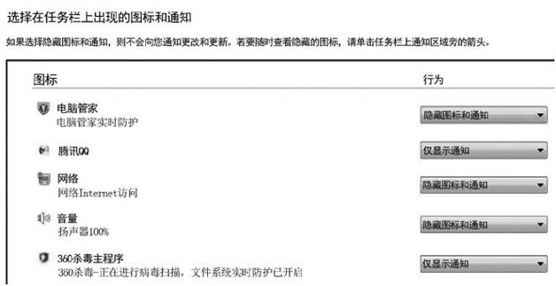

经过这样的整理后，我的任务状态栏就如下图：

底部只有文件夹、浏览器、PPT、Word、画图和计算器六个常用按钮，右边只有输入法，自定义信息全部被隐藏了，这样我就不会在工作时被随时弹出来的消息分散注意力，可以大大节约时间。需要查看信息的时候，我点一下显示隐藏的图标，就会看到系统目前最新的消息。

这样收拾后我的心情大好，于是决定再整理下我的浏览器，我只保留了我最常用的九个访问网站，还照顾了我老婆的需要。而且对网站的排序，我有意识按照每天的使用频率进行排序，这样的话，我的上网速度也得到了提高。

仅仅是学会了一点点整理，效果就很明显。

对了，写到这里，我把截屏的文件，全部都删除了，因为丰田整理法里面最关键的一条是要保持。

■拆书建议

你也可以按照上述思路整理你的电脑，此外，整理贵在坚持，你可以和其他小伙伴每周互相监督，看看能否保持住。

15.从《腾讯方法》里我们能学到什么

《腾讯方法：一个市值1500亿美元公司的产品真经》（以下简称《腾讯方法》）这本书不厚，但是居然让我一口气读完了三个腾讯产品研发案例，而且让我大受启迪，这可不多见。

究其原因，因为这本书很鲜活，鲜活到书中的案例刺激了我的记忆，也激活了我的经验，还正好与我现在的在线课程研发模式紧密呼应。

■知识介绍

我在传统IT公司工作过近七年，深知传统软件企业开发产品的模式：产品规划——需求调研——锁定需求——形成需求规格说明书——系统接口——代码实现——单元测试——系统测试——产品发布。一环扣一环，整个流程严谨规范，属于流水化作业。

但是这种开发模式的弊端也很大，就是周期长，一旦需求锁定，系统就形成了自我维护需求的倾向。如果需求是对的那还好，但如果大家都偏离了用户真实的需求呢？

这就是传统软件工程开发模式下的困境，我们怎么确定自己做的东西就是用户需要的，而不是产品经理把自己的个人品味替代成了用户的品味？

在腾讯“摩登城市”开发过程中，大家一开始以为目标用户是大学生，结果是三四线城市的小白领；在“天天连萌”的游戏页面设计中，美工精心设计的内部评估最得意的“猫脸”图标却是用户首先抛弃的图案；在QQ会员运营过程中，谁能想到有15%的用户会因为一个会员点灯的催促情怀图变成了付费会员？

这一点我在开发在线教育课程的过程中也深有体会：

我们原来以为学员一定会倾向于视频学习模式，结果发现他们根本没有耐心看完；

我们原来以为学员购买学习课程不像买衣服，应该是理性购买行为，结果发现很多人是冲动购买；

我们原来以为学员不交作业是因为课程没有讲清楚，结果发现是如果完成作业要准备很多素材他们就会放弃；

我们原来以为愿意付费学习的人应该更会自我学习，但结果发现“小白”比比皆是，但是他们真的想改变自己。

怎么办？关键经验：

“我们常常以为自己有科学的方法了解用户，真相是我们不了解用户，要了解用户最好的方法不是去调研，而是直接和他们泡在一起。”

即便找准了用户需求，万里长征也只是走完了第一步。再好的产品，也需要好的团队来执行。

《腾讯方法》这本书第一次把过去腾讯产品经理的神话接地气了，不再言必称张小龙，好像腾讯产品好，就意味着腾讯每个团队都好，腾讯每个产品经理都牛一样。

在“腾讯手游”这个案例中，作者介绍了团队从组建到转型到机构调整面临的挑战，一个特别有意思的细节就是：为了改变上海团队的作风，腾讯手游负责人马上决定抽取自己负责的项目组的30个人到深圳上班。

上班的风格也是惊人的恐怖，在第一个月，没有一个人在晚上12点之前下班。且慢，加班未必就是好事，有目标有推动的加班才是有意义的，否则就是领导无能，员工苦耗。

显然“天天兄弟”团队是成功的，在半年内他们目标明确，选择了几个产品方向，并成功把这几个产品做成了亿元级别的手游精品。他们加班加得有所值，以致项目完成后上海团队得从深圳回去，大家都舍不得离开——我非常理解这种心情，因为我也经历过，大家熬夜死拼但是做出有价值成绩的那种成就感，是金钱也换不来的体验。

在“摩登城市”团队中，团队管理者在顾问帮助下，发现团队对目标缺乏认识和认同，虽然每个人都在忙，但是每个人都不清楚自己在忙什么。结果就是一半工作时间忙死，一半工作时间闲死，这样肯定是会出问题的。

■扩展思考

说实话，我现在管理的团队面临的问题比腾讯产品经理的更复杂。

第一，我要做的课程没有太多现成模式可以参考。《腾讯方法》介绍了两种创新模式：一种是概念式创新者，一种是试验型创新者。概念型创新者要大胆提出新思路，是天才人员；试验型创新者要迭代改进，在不断的失败中找到前进的方向。

像我们这样的创业团队，做在线教育这样的事业，恐怕要把概念型创新和试验型创新相结合，那么就需要有领军人物做概念设计，还要培养一帮能进行战斗的小伙伴迭代改进。

第二，我的难处在于我的小伙伴完全是虚拟的，没有组织，没有工资，如何让大家能为一个共同目标明确奋斗？

这是一个全新的组织挑战，也需要概念型创新，当然我们已经找到了一些办法，我的办法是慢慢调教，在合适的时间，我邀请他们加入“秋叶时间”。

什么是“秋叶时间”？就是我要用系统影响力，用多维交叉群体影响一个人加速成长，从而使他们做出过去根本想不到的高质量工作。这样的经历已经发生很多次，但是显然还不够，我还需要更多的人“进化”，为今后的艰苦工作贮备人才。

而且我也要学习《腾讯方法》，一旦发现领军人才，马上委以重任，放手让他们成长。

■拆书建议

选择你经常待的一个社群，为天天泡在一起的人开发一个产品（比如一款实用工具或一篇文章），进行概念型创新或试验型创新，也可以和小伙伴一起做。

想想你公司的产品研发模式是传统的，还是互联网公司模式的？如果是传统的，有没有可能借鉴“腾讯方法”（比如和用户泡在一起或迭代改进）？

二、创业方法论

我读一个人的传记，特别是当代人物的传记，关注的是两个点：

1.他成功前积累了什么，哪些是可以复制的，哪些是不能复制的。

2.他现在的成功让他哪些话是光环效应，哪些话是不得不说，哪些话是发自肺腑的。

1.刘强东为啥能做大

最近读了一本书——《年轻就是要活出你自己：刘强东的商业新逻辑》，谈的是刘强东成长和成功的故事。

■知识介绍

这本书让我了解了很多刘强东早期的经历。

刘强东是一个苦孩子出身，所以非常珍惜读书的机会，他听从老师建议，考上中国人民大学，准备将来从政，就选了社会学专业，后来才知道这个专业找工作不容易。

进了大学，刘强东为了不向家里要钱，就勤工俭学。因为知道学社会学找工作不易，他就想学一样实用的而且有前景的技能，将来行走江湖还能混口饭吃。结果他就自学计算机，凭着超人天赋，居然成了编程高手，给企业没日没夜打工，赚了第一桶金。

有了钱，他野心膨胀，承包了学校附近的餐馆，却只做甩手掌柜。结果呢，手下坑他，赔了本不说，还背上了20万的债务。

刘强东没有办法，去日资企业打工六年。这六年一是还清债务，二是让他通过学习日资企业的管理，明白了自己在管理上的很多不足。

无债一身轻的刘强东再次创业，卖的是刻录机，靠的是抓住市场空白的能力和果断的执行力，加上不卖水货的坚持。几年下来，他占有了中关村刻录机批发市场60%的份额。

然后他主动下沉，建设门店做直销，短短几年拥有十几个门面，而且个个赚钱，有了几千万积累。正当他准备大干一笔时，“非典”来了，他一周就损失800万，看起来他要顶不住了。

于是他尝试通过网络卖东西，发了很多帖没有人理。直到有一天在一个论坛发帖，帖主不但没有删帖，还留言说这是他在中关村见到的唯一不卖假货的人。结果这条留言为他带来了六笔交易，也让他开始领悟网络的力量。

“非典”结束后，他主动选择关闭线下门店。六个中层干部四个反对，可他坚持，最后大家妥协。

京东转型做电商，这个时候，刘强东亲自写了京东电商平台早期的ERP系统代码，这些代码居然在修修补补下支撑了京东近十年的运营！

后面的商业故事就是刘强东不断融资，不断和市场对赌。其实刘强东做电商没有钱的时候，拿到的第一笔融资是很亏的，因为代价太大，但是幸亏投资人遇到经济问题，主动撤回投资，给他再次融资的机会，否则也没有今天的京东。

■扩展思考

读完刘强东的故事，我的体会是：

1.一个人做事的韧性比他做事的才华更重要，很多人有才华，但是几次失败就能彻底把他击垮。刘强东出身穷苦，反而培养了他能吃苦、能坚持、不怕打击的韧性。

2.一个人的成功离不开时代的大背景。“非典”看起来是一个偶然因素，但是即便没有“非典”，电子商务也是时代趋势，不可避免，“非典”不过是加速了这一进程。京东的成功离不开这个大背景。

3.在早期的发展中，运气很重要。就好比我们说遇到贵人，这种事情可遇不可求，但一个人自己修炼得越到位，遇到贵人的概率越高。

4.绝大部分人都不能和刘强东比智力，但是你们也不能和他比努力。刘强东的工作强度是普通人不愿意承担的。

5.假如刘强东没有读大学，就不会有机会进入日企，学到先进的管理思想；要是刘强东没有自学IT并成为高手，就不会在京东刚开始规划时就想到用IT技术节约成本。知识能改变命运，问题是很多人没有学到知识，他只是读了大学，或者上了几年班。

6.刘强东每一次决定转型之前，并不全是赌博，他内心都经过计算——至少我的资金还能撑两年，有两年时间，我可以全力争胜。

7.你可以狡黠，你可以圆滑，你可以装傻，但是你一定得坚持一些底线，日积月累，这个就叫人品。人品这个东西，平时没有什么大用，但是关键时刻，出现一次，也许就能救你的命。刘强东坚持不卖假货，这点我觉得很棒。

■拆书建议

成功没有偶然，但是成功也不能轻易复制。

学习了刘强东的经历，在你自己要创业的时候，可以问问自己：知识贮备够不够？资本积累够不够？人脉关系够不够？核心团队有没有？最重要的是，如果遇到失败打击，你能不能站起来，你有没有后手站起来？

2.周鸿祎的互联网思维

周鸿祎是一个争议巨大的人，他做的很多事情大家都未必喜欢，流氓插件他是原创，说后来的人比他更流氓那是五十步笑一百步。搞3Q大战，绑架用户，更是让人气愤。

但是就是这样让人气愤的一个人，被视为同行公敌的一个人，他的产品还是成为了互联网上的装机必备软件。这是为什么？

我们可以通过他新出的《周鸿祎自述：我的互联网方法论》来观察他思考问题的方式。

■知识介绍

总结周鸿祎的逻辑，我归结为三句话。

第一，先做用户再做客户，这是互联网时代的商业模式。

什么是用户？就是使用你产品的人。什么是客户？是愿意为产品的各种增值业务付费的人。

传统生意把潜在用户直接转换为付费用户，而互联网思维是先用好的免费服务吸引足够多的用户，再海选出愿意付费的客户。甚至是一开始根本不考虑是否有客户，而是是否有足够多的用户。用户多了，赚钱的方式就会从用户的痛点需求中慢慢挖掘出来。

第二，没有一定规模效应的用户，是没有付费客户的，这是互联网时代的赚钱模式。

如果用户数量不能快速形成一个规模，那么这些用户其实也很难成为后续运营的基础。

360运营是从查杀流氓插件这个痛点入手，快速做大规模的。有了规模，慢慢发现更多需求，先是查杀木马，后是查杀病毒，最后做安全浏览器，结果在浏览器市场上找到了盈利模式。

这些都需要规模的支持。

第三，要吸引海量用户，杀器之一是免费服务，杀器之二是极致产品体验，这是互联网时代的推广模式。

周鸿祎认为数字化产品必然要免费，将来甚至连硬件产品都可以谈免费（至少是免利润）。

因为免费，用户就能无障碍使用，这样人就都来了。有人就会提出更多要求，这些人会变成付费用户。但是免费就能吸引用户吗？不能，周鸿祎特别强调的是即便是免费产品也要极端重视用户体验。

当好的产品抓住了用户的痛处，这种痛点被解决的体验就会导致用户变成你口碑推广的种子，你就节约了巨大的营销成本。

周鸿祎举了一个例子，说用户装了360，发现开机慢，往往会骂360杀毒不行，但是实际原因往往是用户开机项装得太多，需要优化。360就做了一个优化开机项选择，而且都是一键优化模式，能带给“小白”用户特别愉快的体验。

一个好的产品应该让对这个事情不怎么懂的用户都能上手，这才是成功。这一点我非常赞同，用户使用成本越低，产品推广越容易成功。

有了这三点，整个商业链条就打通了，商业模式、赚钱模式、推广模式就都出来了。

■扩展思考

做出一个有极致体验的产品，不是说说就可以的。周鸿祎的建议是像“小白”一样去思考，这一点的确非常重要。

我做在线课程就体会很深，“高大上”好不好，当然好，但是学不会啊。对“小白”而言，“高大上”只会让他佩服你，学得到才是在线教育的根本目标！

熟手有时候都忘了自己当初学不好、学不会、学不到的经历，做出来的东西往往就特别不接地气。

某种意义上，我的模式也是有周鸿祎说的这个路线轨迹的，我的微博、微信、电子书这种数字产品的分享是免费的，但是在线课程（包括答疑、分享、作业批改）是收费的。

■拆书建议

我和周鸿祎商业模式的不同在于，他是一个全民性市场，我是一个小众市场。我要达到规模效应并衍生出更多商业模式，其实空间相对小很多。这也导致我需要更快走到付费模式，因为小众市场无法吸引资本投入，只能靠自己造血生存。

请思考：

你所在公司的产品能运用周鸿祎先免费再收费的模式吗？

你的公司所处的是全民性市场还是小众市场？

你公司的产品体验如何？可以怎样改进？

3.从王兴的九败一胜看创业

虽然《九败一胜：美团创始人王兴创业十年》这本书的书名有模仿日本新首富柳井正《一胜九败》的嫌疑，但我看后还是感悟很多，也许是我正在创业的缘故。

有时候一本书好不好，不仅仅看文笔、看内涵，更要看你和书的主人公，是否有经历上的契合。越是有同样的经历，越能理解他的一些话。

■知识介绍

王兴是国内有名的连续创业者，第一个项目校内网卖给了人人，作价千万，团队几个小伙伴倒也不亏，他后来总结这个项目没有坚持下去是因为没钱。

第二个项目饭否网刚有起色，但因网络监管的问题被迫关闭，他总结是不懂政策。

第三个项目海内网是没有把握白领的需求，没有游戏基因，输给了开心网，他总结是不懂用户，产品不行。

直到第四个项目美团网，他才慢慢走上正轨。美团目前是国内最大的团购网站，发展前景看好。

王兴早期创业虽然名气很大，却是屡战屡败，难得的是，他的小伙伴对他不离不弃，早期创业团队的人，绝大部分依然和他一起多次创业，最后终于做出了美团。

个人创业时代已经过去，现在创业需要能力互补的团队。

第一，王兴团队的很多人最看重王兴的深度逻辑思考能力，这种能力转化为王兴对行业的战略思考能力。而王兴也慢慢认识到不能什么事情都亲力亲为，必须交给更有执行力、更有相关能力的人去操作。

但是他的习惯是，“你做事情我不管，但你做事情的逻辑一定要给我说清楚”，否则他的理工男脾气就纠结了。这一点和我倒是很像。如果一件事情，我想不清为什么，我不会轻易去做，起码得自己把事情想明白了才能做。

王兴本人后来对柳传志的管理九字法“搭班子，定战略，带队伍”也很认同。但是为什么他的班子认王兴这个班长呢？这就是第二点，怎样的老大才能让大家感觉放心？

第一有信用，给小伙伴的承诺一定要兑现。

第二有远见，能看到小伙伴看不见的东西。

第三有决断，想清楚的事情能够马上执行。

第四有原则，能坚持自己说的核心价值观。

我觉得做到这几点很不容易。先说信用这点，王兴的小伙伴在美团发展顺利时都没有书面股权承诺，但是他们相信王兴。这种相信绝不是因为王兴发誓赌咒，而是在过去一次次金钱分配的场合，他们看到了王兴对钱的态度。比如王兴经常领最低的工资，这里需要交代一点——王兴家庭条件很不错，不差钱，他就是想做成一件事，我想这也是他更愿意做事的背景。

王兴有一个很有趣的管理细节，他精打细算现金流，坚持给员工发工资，哪怕低一点，有工资让大家不担心有一顿没一顿。做事业需要长期心态，短期心态是不行的。

有些人创业，一开始看不见前景，往往许诺美好条件拉人入伙。结果，要么做不到，大家失望；要么稍微有一点起色，又后悔分给别人太多，想赖账。这两种都是不可取的。但是利益面前，真能淡定的人不多，所以人品不是说出来的，是你去一步步做出来的。

再说说远见，远见这个东西是大家和你一起就未来做判断，每次你都判断得准，看得更深，发现问题更快，那么大家就会服你。

现在是移动互联网时代，都说商机无限，传统行业存在转型需求，但是具体怎么做？方向是什么？业务形态是什么？如何一步步做到？如何提防竞争对手夹击？你能不能先人一步看清楚，想明白，发现未来的市场蓝海，这种战略判断力是成为老大必备的。你做事可以不如手下，但你的判断力一定要能高人一筹。

不过现在“口炮专家”一堆，真能解决问题的人很少。要是王兴缺乏以身作则的执行力的话，那也不行。很多事情就是说清楚了也得做到位，这不是平时饭桌上的“口炮党”能解决的，这就是书生和企业家的区别。也许有些人写文章谈趋势比企业家说得还明白，但是企业家是那个有能力带队伍整合资源做出来的人。没有执行力，战略也是空谈。

一执行就会遇到挑战，遇到各种困难，那么哪些策略要坚持，哪些需要调整？这种随机应变除了拼创造力，很多时候是要做舍弃的。靠什么舍弃？其实就是一个人的价值观。

王兴做美团做了两个重大价值判断：第一，公司是高投入、低利润行业，这样必须靠科技解放生产力，抓成本控制；第二，消费者第一，商户第二，公司第三，必须做好消费者服务，让他们变成重复消费者，进而给商户创造价值，最终做大公司。

很多事情有了这个价值判断，做决策反而简单，不容易陷入细节。

■扩展思考

我带着小伙伴做在线教育，现在愿意和我合作的人越来越多。说实话，也和上面四点有关系。

我和小伙伴经常一起玩小合作，每次小合作我都要论功行赏，大家都知道我的风格是不亏待小伙伴，而且打款永远是第一时间，往往是别人给我的钱还没有到账，我就先把小伙伴的钱打过去了，这样做，就是积累信用。

后来我说做在线教育，大家并不是特别看好，认为网上有一万人付费学PPT不太现实；我说图文模式是好的学习模式，大家也是半信半疑；后来我做Word课程，大家也觉得这种课程没有人会去学。但是最后的结果大家也看到了，至少到目前，我的判断还是对的。

这就让大家对我的判断力建立了信心，有了这个信心，加上分钱积累的信任，大家就愿意和我合作，我相信哪怕别人给他开更好的条件（我觉得这个也很难），他也愿意和我合作。

我每个月都会提出月度目标，到目前为止，每个月都完成了目标。虽然有好几个月目标完成得非常艰难，但是想尽千方百计，都完成了。我为了目标，全国到处跑，也是拼了。

没有执行力，大家也不会跟着你，领导就必须以身作则，而不是颐指气使。

将来价值观也是我们的重要考验，如果真有机会做大了，尊不尊重契约？信不信守承诺？钱好赚了，要不要坚持亲自服务你的学员？

这些问题都是一开始就要变成公司内在文化的东西，变成内在血液的东西。

我和小伙伴讲，我们创业是进入一片看起来是蓝海但是还没有找到开启阿里巴巴宝藏大门的领域，所以：

第一年，我们的工作是找到可行的模式，生存下来，就很成功；

第二年，我们的工作是解决利益的分配，大家认同，夯实内功；

第三年，我们的工作是确定公司的文化，发展团队，积极拓展。

在这个过程中不能着急，不能因为担心别人做得比我们快就想冒进。任何一个创业者都要看到，别人的成功是积累了很多很多挫折才实现的。

我们没有王兴的清华背景，没有他那么高的知名度能量，没有投资人青睐，我们就更不能大意自满，只能兢兢业业，先生存，再发展。但无论如何，只要我们还有收入，就一定先照顾好小伙伴，这就是我们的核心价值观——留住最好的老师，尊重有才的人，他们自然给你带来最好的课程给学员。

■拆书建议

本书总结王兴个人的一个能力——快速学习的能力，我非常同意。

我常常对很多找我合作的70后同龄人讲：“好好做你现在能做的事情吧，关于网络，你们是彻底Out了。”很简单，不管他们承不承认，他们都是拿着自己的逻辑去理解互联网，而不是带着初心重新理解互联网。

在一个快速变化的时代，在一个全新的领域，你过去的所有经验都可能是负担，不快速学习，快速进化，你就会被淘汰。以此与大家共勉！

4.为什么我们很难成为褚时健

最近读了好几本关于褚时健的书，其中《褚时健：影响企业家的企业家》是唯一得到他本人认可的版本。

■知识介绍

褚时健这代人和80后、90后生活在完全不同的时代。他们幼时贫困，自小就对生活有极强的忍受力。褚时健因为堂哥的建议选择去昆明读书，那时的昆明因为有西南联大，正是生活清贫但思想繁荣的时刻。褚时健能够有后来的成就，这种成长背景不可忽视。

褚时健这代人的个人荣誉和国家存亡是天然交织在一起的。如果没有日本侵华战争，云南断不会有这样一段文化人汇集的日子；如果没有西南联大和这些从北方、南方逃难到昆明的文化人熏陶，褚时健也很难形成边陲少年所稀缺的视野和格局。

一个人能成为影响企业家的企业家，一定有着普通人没有的视野和格局。褚老这代人，初中生阶段讨论的话题就是如何救国兴亡，恨不得把一天当一年用。

我们现在的孩子，更多关心的是我能不能如何如何，觉得有钱就可以任性，这样的人是不会有大出息的——我始终相信，一个人心胸格局越大，能成就的事业格局也越大。一个只想着自我成就的人，是很难让更多的人跟随他一起创业的。

仅仅是有格局还不够，必须还有能力。褚时健自小就表现出了惊人的商业天赋，虽然他只是一个初中生，却能够把一个学校的伙食管得妥妥帖帖。经营是褚时健的天赋，他的天赋最开始的来源就是因为穷，他痛恨一切浪费，恨不得让一分钱变成两分钱，并为此不顾一切动脑筋琢磨事情，这成就了他的经营思想。

现在的孩子生活在一个富裕社会，不当家不知柴米贵。我看到很多创业公司，收益还没有见到，刚做起事情就入驻高档写字楼，提供免费咖啡点心，晒各种福利——我不是说这不是吸引人才的一种方法，但是在这种环境下工作的人，很难建立那种发自内心的节约成本的意识。

我现在自己创业，小伙伴都是那种非常珍惜物资的人，我个人也是最讨厌浪费。但这不等于我们不舍得花钱，该投入的钱我们舍得砸，比如对我的小伙伴，我是力所能及提供最高的回报。

有才华的人是财富，但是养成骄娇二气的人不是财富。

新中国成立后褚时健因反右被牵连，在深山农场耽搁了20年岁月，等有机会出来做事，已经是50岁出头，但这20年，磨砺了他的性格。用褚老的话说：“经历对每一个人都是一笔财富，但一个被经历的苦难压倒的人，是无法获得这笔财富的。”

很难设想，如果没有这段经历，褚时健会有怎样的人生轨迹，至少这段“反右”经历让褚时健下定决心远离官场，专心做企业。

后来褚时健在经营糖厂时业绩出色，被调任玉溪卷烟厂，从此开始了他作为企业家的辉煌之路。红塔集团在鼎盛时期，也就是1997年，一年上交国家利税就达到了300亿人民币。中国房地产公司领头羊万科集团做到300亿利税，还是在2013年，而且1997年的300亿购买力，可是远远超过了2013年的300亿。

再后来褚时健60多岁因挪用公款入狱，女儿自杀，人生又一次陷入低谷。所有人都以为褚时健会从此沉沦，哪想得到，他因病假释后专注农业经营，2012年“褚橙”横空出世，成为励志的首选礼品。现在他打造的现代农业，已经帮助当地很多农民脱贫致富。

从褚老的经历我们可以看到，一个人如果没有经历过磨难的考验，那么当他在事业中一次次遇到磨难的时候，他又如何有面对磨难的心智和勇气？

褚时健能做成事业，最对我胃口的是他从来不搞价格战，他做的东西就是要比别人贵，当然也要比别人好！

他做卷烟，首先强调产品的品质。产品的品质如何保证？褚时健的做法是从原料产地、设备工艺、内部管理三管齐下。

没有先进的设备、先进的工艺，是做不出好产品的，也无法提高劳动生产率。但再好的设备也需要好的原料匹配，所以褚时健一早就投入巨大精力做烟田投资，教烟农种烟草，在技术上指导，在资金上帮扶，从而成就了自己的核心资源产业链。再加上好的内部管理机制，褚时健有效调动了员工的责任心和积极性，大家有奔头，自然努力干，好好干。

一个濒临破产的企业居然在十余年时间里成为全国第一纳税大户。

■扩展思考

这些简单的道理，放在今天依然成立。

现在网上流行的互联网思维、产品经理思维，说白了就是褚时健当年做的事情。

1.必须做出让用户用了说好的产品，你做到极致，自然有好的口碑。

2.重视科技的力量，相信科学。

3.一手抓市场，一手抓产业链。

4.用利益共享、利益捆绑的思维调动整个产业链的积极性。

这些管理思想不新鲜，但真正做到的人才能成为真正的企业家。我们现在的企业开口融资，闭口上市，谁真的在意产品？谁天天关注科技？谁让自己的产业链也因自己的成就受益？

一个企业家不能仅仅是用财富来衡量，而是要看他是否用好的产品和服务提升社会品质，让更多人因为自己的事业过上好的生活，我也相信，这样的企业理论上应该成为最好的企业。

没有格局，没有理想，没有吃苦，没有利他，这才是我们和褚老的差距。

■拆书建议

所有的经历都是积累，但你得先成为那粒能从积累中吸取营养的种子。

现在“吃苦教育”经常被提起，说白了就是因为现在的孩子没吃过什么苦。在学校没进社团、不擅表达、追“女神”失败、被同学笑话就恨不得死去活来的孩子，怎么可能因为挫折获得人生的经历。

5.如何从马云演讲中学到干货

马云在中国企业家中的影响力不用多言，所以马云当年的内部讲话被改编成书后，很受欢迎，这似乎是第二本。

马云的内部演讲，如果你一篇篇通读下来，会发现一个特点：

他其实是在不同的场合反复强调一样的意思，很多演讲里面的内容都是差不多的——都是认为电子商务拥有光明的未来。

企业家演讲集的内容接近是常见现象，那么怎样读收获会更大呢？在这里，我分享一个简单四步读书方法。

第一步：通读全文；

第二步：标注金句；

第三步：分类归纳；

第四步：点评感悟。

一开始我会快速阅读，发现雷同内容就跳过，然后我会做记号，标注对我有启发的内容，等读完我会摘录全部文字内容，然后分类。

分类这件事情很重要，可以把不同时期、面向不同对象，马云就某一问题的论述集中起来，可以系统了解他的观点，看看有无矛盾之处。

最后要结合自己的实际，对马云的讲话做一些点评，让马云的观点和自己的观点碰撞一下，收获才会更大。

■知识介绍

1.马云论战略：战略不是战术

企业在竞争中失败主要是四个原因：第一是看不见对手，第二是看不起对手，第三是看不懂对手，第四是跟不上对手。

战略就是活下去。要活下去，你必须要想清楚三件事情：第一是你要做什么，第二是怎么干，第三是干多久。

通常的战略，要用一个月评估，三个月检查，一年微调，三年才能看到结果。如果明年就要检验今年的战略效果，那不是战略，而是战术。

带兵打仗，有些毛头将军看到自己的一个营被吃掉，恨不得马上冲出去，到了最危急的时候，就没戏了。优秀的将军绝对不在冲锋陷阵的时候出现，而是在撤退的时候出现。什么时候该下手，什么时候不该下手，这才是公司的治理和发展之道。

武功高强的人都深藏不露，一旦暴露，人家就会防你。等人家防你，知道你很聪明、很厉害的时候，你的武功基本上就没用了。当你的口袋里并没有枪的时候，所有人都开始防御你，这是很可怕的。

2.马云谈运营：能干不如反应快

让我们感到骄傲的是，刚刚创业的时候，我们几乎不打出租车。我们今天花的钱都是投资人的钱，当你有一天能花自己的钱的时候，才可以大胆地花。所以这两年，我们以小气而感到骄傲。

我们成功是因为我们能干吗？大家看看周围，比我们能干的人有多少。我们是很辛苦，但是比我们辛苦的人不知道有多少，很多人比我们更起早贪黑，他们什么也没有得到。

不创新自己，阿里巴巴将会消亡。我们不改变自己，竞争对手就会改变我们，市场就会改变我们。

作为创业者，不能等机会好了以后再做，没有机会，就要创造机会。

互联网时代最有意思的商业现象是以小打大，小企业不是靠规模取胜，而是靠附加值取胜，靠品牌取胜，靠增加价值取胜。

我们认为企业不是越大越好，而是越灵活、反应越快速越好。

我们不是帮人省时间，我们是帮人赚钱。

3，马云谈团队：领导要有胸怀

领导者胸中要容纳千军万马，最怕的是跟员工比谁聪明。找专家的话，最好让他当助手，不要让他当领导。

领导者必须承担责任，我觉得我只有在两种情况下才是CEO：第一，做决定的时候我是CEO，平时我不是；第二，团队犯错误的时候我是CEO，这是我的错。

领导者要达到一个目标，必须有一个良好的团队。如果你发现团队里有人出现错误，怎么办？有三个办法：第一，让这个出现错误的人继续留在原来的位置上，这样一来，这个人肯定会继续制造麻烦；第二，重新训练他；第三，开除他。

你不可能找到最优秀的人才，只能找到最合适的人才，把他变成你最优秀的人才。

我们的困难之处在于，我们没有人可以模仿，没有人可以拷贝，没有人可以教我怎样做。谁能帮你？你的团队、你的客户能够帮你。

只有自己去学习的人，才是高手。

4.马云谈目标：量化还得激发斗志

我认为只要突破一亿访问量，后面几年就会活得非常滋润，而第二名、第三名就会累死。

做102年的企业！

十年超过沃尔玛！

一家市值5000亿美元的公司！

淘宝每天卖出2.8亿元的商品，每分钟卖出手机300多部，每分钟卖出衣服34000多件，每分钟卖出宝石30块。

帮助4300万家中小企业成长的目标。

淘宝十天的交易量就相当于王府井一年的交易量。

希望在有生之年能看到淘宝网一年的交易量突破10万亿元。

■扩展思考

1.点评马云的战略观

首先，我相信一个企业再小，也有战略。战略反映了一个企业领导人的格局，也决定了他的企业未来成长空间到底有多大。

马云坚信电子商务改变未来，这一点成就了他企业未来巨大的发展空间。后面阿里巴巴的各种动作对他只是战术，大战略已经确定了，不会动摇——就是服务中小企业用户做好电子商务，围绕这个核心目标不断努力，把这个目标变成企业的使命感，变成内在的价值观，就可以让企业不会轻易在机会面前摇摆，做自己必须做的事情。

2.点评马云的运营观

不得不说马云的最后一句话“我们不是帮人省时间，我们是帮人赚钱”，谈出了现阶段在中国做大事业的关键营销诉求点。

在一个慢生活蔚然成风的国家，省时间是有价值的，因为可以拿出更多的时间陪伴家人和休息。但是在现阶段的中国，所有的人都被各种压力驱使着去赚钱。所以帮别人赚钱，帮别人找好工作，帮别人找到好老公，都是热门生意。

3.点评马云的团队观

领导要做员工做不了的事情，而不是证明自己可以比员工做得更好！

4.点评马云谈目标的三大特色

第一，具体，非常具体量化；

第二，出人意料，102年，这样的词汇让你难以想到；

第三，目标非常伟大，伟大的目标才能激发价值观。

■拆书建议

大家可以试着把马云的思维方式运用到自己的工作中。还是以我自己的网络课程运营为例吧。

关于战略：

我现在做在线教育，也是相信未来在线教育也是一个万亿级别的市场，有足够的空间容纳我们这样一个虾米增长。我们的使命就是让大学生、职场新人用最低的时间和金钱成本，学到他们需要的干货！

做好这一件事，就足够让我们发展壮大。这也就是所谓局布好了，即便战术上犯一些错，也输不到哪里去，何况到目前为止，我们没有犯什么大错。

关于运营：

与其找一门绝招，不如在变化来临的时刻，我们比别人领先半步。一个个半步赢下了，就会形成巨大的竞争壁垒。

现在在PPT这个学习领域，要挑战《和秋叶一起学PPT》课程，难度会越来越大，我们还需要耐心成长一段时间，做好运营，控制成本！

永远要记得控制成本！

关于目标：

我也曾说过，一门课程销售破万后，日子会比较好过，目前看来，的确是这样的。现在就开始让第二门课程走上破万销售之路吧！

三、生活方法论

生活是一门艺术，就像弹琴、画画、下棋，常人和高手的差距可达千百倍，这一部分将拆解高手是如何活得精彩的。从时间利用、说服技巧、创意整理到心理调适，每件事都有好方法、大学问等着你来学习。

1.你的碎片化时间用途越多，你的生活选择就越多

现代人的很多焦虑源自事情太多而时间不够，我在《不要等到毕业以后》这本书中分享了我的碎片化学习和工作的方法，今天我用拆书的模式为大家介绍这个方法。

■知识介绍

我在网上答疑时常被学生问一个问题：你是大学老师要带课，又在外面做讲座做培训，又在网上教我们做简历，还有时间玩微博微信，一年还能出几本书，我们做学生的都觉得时间不够用，你是哪里来的时间做这么多事情？而且我们觉得像写书这样的事情，离不开大块的时间，你一天到底睡几个小时？

这个问题也是很多职场人共同的苦恼。上班后要兼顾工作和生活，你的时间会变得支离破碎，想做一点正经事情都抽不出整块的时间。

还有人抱怨像微博微信这样的新媒体工具，本来是想用来打发碎片化时间的，慢慢上瘾后，总是忍不住去刷屏，结果导致你很难静心完整地只做一件事，本来想用碎片时间发微信、发微博，结果我们习惯让时间碎片化，失去了长久专注做一件事情的能力。

如何解决这一困境？有的人提出要恢复专注做事的能力，这是一条出路，但我认为绝大多数人不能奢望通过重新获得大块时间来解决问题。

读大学时你还有找到大块时间做事情的可能，但在职场，你不要指望能轻易挤出大块时间做工作。有句老话：计划不如变化快。在现代职场，总的趋势就是工作时间越来越、碎片化，没有微博、微信的时代，我们的工作时间早就被电话、邮件、QQ、会议打断成了碎片，而微博、微信这样的移动新媒体只不过加剧了这一趋势而已。

认识到这一点，我觉得真正的问题是：人有没有办法利用碎片化时间完成系统的工作？或者说在碎片化时间工作模式下，我们能否依然保持连续和整体化的思考，同时又不丧失快速反应能力？

大多数人会有一种误会，认为重要的工作一定需要大块的时间来完成，比如写一篇文章，不就是需要至少一个上午不受打扰的时间吗？

事实上我们仔细回忆写文章的过程，有两种情况：第一种情况是下笔如有神，给你一个安静的时间段一蹴而就；第二种情况，你写了好几个开头，都无法深入下去，只能换个时间再写。

为什么会有这两种不同的结果？其实答案很简单，文章写起来顺畅往往是因为你原来对这个问题有很多的积累，所以有一个安静的时间段就能下笔千言。假如你对要表达的问题缺少积累，有再多的时间也无法写好。

明白了这一点，你就会意识到，有些工作的确需要大块的时间，但如果不是提前做够铺垫，这些大块的时间并不会有效果。

我自己的写作习惯是“五分钟文章法”，也就是说：

一份完整的文章=5分钟构思+……+5分钟构思+半小时提纲+5分钟构思+……+5分钟构思+半小时提纲+5分钟构思+……+5分钟构思+2小时高效率写作+5分钟修改……

当我需要写一篇文章的时候，往往没办法安排一个白天甚至一个上午的时间，即便安排了也没有灵感动笔。我会预定一个写作时间，在此之前，我会利用一切可以利用的碎片化时间提前构思。

这里讲的构思可以是带着问题查资料、找素材、请教他人，也可以是随手写下一些灵感，这样的构思片段多了，我就会抽出相对完整的半小时，把碎片化灵感整合成一个提纲，或者一个小段落文章，然后继续积累素材。攒的内容多了，自然有写的欲望，那个时候我两个小时就可以一口气写完5000字，甚至10000字的文章，而且质量还不错。

写文章如此，很多其他的工作其实也是如此。比如营销策划、项目计划、书籍出版，很多智力劳动都可以这样利用碎片化时间加以完成。

■扩展思考

再说一个案例吧，其实我第一时间就注册了微信公共平台，但一直没有公布，因为我没有想清楚该怎样推广。我就利用零零碎碎的时间想了很多问题：

1.微信的使用人群是谁？他们希望看到什么信息？我们应该提供怎样的微信内容才有可能抓住他们？

2.微信和博客有什么区别？微信和微博有什么不同？我们应该以何种节奏、何种时段、何种形式发布微信，才能不让收听者讨厌？

3.微信如何才能借助收听者的力量转发？微信又如何能够借助制作者的影响力来传播？

4.如何维护微信的内容？

5.我们如何和微信粉丝互动，甚至让他们能够彼此互动？

6.我们维护一个微信得到的回报到底是什么？

以上种种问题，让我思考了很久，也观察朋友的、名人的、企业的微信运营，在大脑里一遍一遍预演我可能会遇到的问题和麻烦。这些思考，绝大部分都是利用碎片化时间来完成的。

在思考的过程中，我会和朋友简单聊一些想法，几分钟的碰撞往往又会激发我更深入的思考，等酝酿到一定程度，我就会集中一个时间快速形成系统文档，然后对照文档开始进行正式实施。

这就是现代人必须建立的一种时间管理能力：利用碎片化时间完成大块的工作。我的很多朋友都有这种能力。我们可以完成大块的工作，而且是利用碎片化时间组合完成的。

我的第一个建议：认真思考你认为需要大块时间完成的工作，看看能否分解成可利用碎片化时间完成的工作。

鲁迅先生说：“哪有什么天才，我只是把别人喝咖啡的时间用在了工作上。”我觉得这句话还有一层含义就是，鲁迅先生一定也是具备了利用喝咖啡这种碎片化时间工作的能力。

我给很多朋友介绍完碎片化时间利用的经验后，他们觉得非常有道理，但是实施起来往往效果不明显。这里面的一个重要原因是他们没有为自己的碎片化时间建立结构化管理思维。

下面我简单介绍一下我的方法：学会给每一种碎片化时间单位寻求多元化用途。

现在你可以问自己一个问题：你可以利用的最短时间是多长，是1分钟还是3分钟？

你的1分钟可以干什么？

你的3分钟可以干什么？

你的5分钟可以干什么？

你的10分钟可以干什么？

……

大部分人面对这个问题往往很难给出超过3种以上的回答，有的朋友甚至回答全部刷微博。

当你的碎片化时间找不到合理的用途的时候，它最大的可能就是浪费在无意义的事情上。

■拆书建议

我要求你为每一样碎片化时间单位找3～5种有价值的用途，比如3分钟时间内可以回复一条短信，回复一个消息，收看一下不重要的邮件，刷一下微博，用手机练习一下手绘笔某个单点技巧，构思一条微博，查找一个方案素材……

然后你要进一步思考在公交上3分钟能干什么？在教室里的3分钟能干什么？在卧室里的3分钟能干什么？

我的建议是动手做一张表格：把你碎片化时间的用途和你生活中的情景关联起来。

这样在任何场合你一意识到有碎片化时间，马上就可以安排零碎时间完成一件小工作，而不是临时去想你能干什么。碎片化时间用途越多，你的时间支配自由度就越高，你就越能在自由组合时间碎片完成不同的工作。

这样慢慢你就能够学会把每天的碎片化时间串联起来完成一件重要的工作。比如我这篇文章就是利用路上的时间一点一点攒灵感，然后花上1个小时整理出提纲，再通过各种交流途径得到大家的反馈意见，然后又在上班路上继续攒灵感。等到一个相对不忙的时间封闭自己，一口气把内容写出来的。真正写作的时间大概只花了1个小时。

总之，我的意思是，与其养成依赖大块时间才能做大工作的习惯，还不如提前训练职场真正需要的碎片化时间利用能力。当然我并不是说有些工作不需要大块的时间，而是利用好碎片化时间，可以大大节约大块时间，或者提高大块时间的利用效率。

在不同场合你有哪些碎片化时间段？你觉得最适合你的用途有哪些？好好思考后把答案填入下面的表格里。

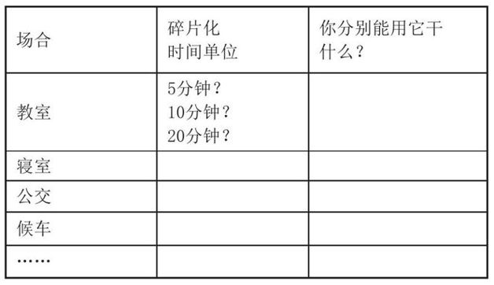

2.一起来玩曼陀罗九宫图

本节的拆书内容来自《整理的艺术3》，其中的曼陀罗九宫格是最适合形象思维法的工具之一，能逼着你提高创造力。

■知识介绍

先画出一个3×3的空格，然后围绕这个空格填写和某个主题相关的内容，就可以从最初的主题中衍生出各种各样的创意了。

曼陀罗九宫格的优点是：普通人在构思创意的时候，不会逼迫自己去想八个之多的点子，总是在想出两三个点子后草草收工。一旦使用了曼陀罗九宫格，我们就会想方设法去填满空格，绞尽脑汁硬逼自己去想点子，这样我们就会发现新的信息组合方式。

之所以被叫作曼陀罗九宫格，可能是因为这种九宫格形式来自佛教密宗，密宗非常重视图像式思维方法。

当我们思考问题的时候，我们可以这样做：

1.把问题填写在中心；

2.填写中心的上、下、左、右的四个空格，尽量写二元对立的项；

3.以这四个答案为坐标轴，填写其他的空格。

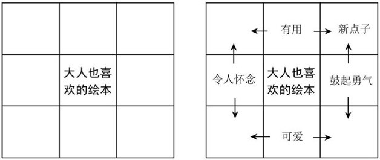

总之填写空格的时候，不要盲目填写，一定要有坐标轴的意识。

■扩展思考

对于没有想法的主题，你可以尝试画一个九宫图，这会逼迫你启发思考。

这种九宫图很适合手绘，喜欢用便条纸思考的朋友，也应该注意按九宫格方式排列，它会诱导你用结构化的方式去思考。

如果有一些主题，你通过九宫格总结出一些很不错的框架，那么你完全可以把这种九宫格分类方式固化下来，成为你长期借助的结构化思考工具。比如网上流行九宫格日记，还有介绍人脉的书也介绍了九宫格人脉图，这就是固化了的、比较方便的九宫格图。

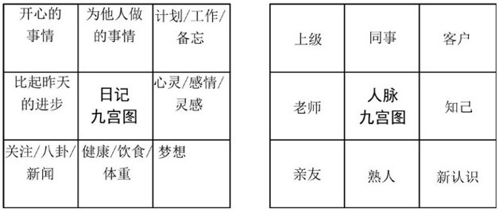

■拆书建议

很多人不知道如何管理名片，如果你按人脉九宫图进行分类，把2015年影响你的人、新认识和交往的人按这个格子进行分类，逐步把新认识的人转化为其他类型，你其实就是在进行人脉的分类和管理。

有了这种思维，你随时可以创造性地开发九宫格图。比如你可以画出你的单位时间九宫格用途；比如给你3分钟时间，你能做什么？又比如试试把你的花钱途径做成九宫图，思考一下是否可以优化。

3.如何用冰山模型发现你的潜意识

《亲密关系的秘密》的作者杰夫·艾伦被称为世界著名的知见心理学大师，我查了一下，原来“知见心理学”是结合心理学和灵修学的一门实践学科，是恰克·史匹桑诺博士（美国心理学者）在20世纪70年代所提倡的，看到这里我大概就明白了，这本书肯定有心灵鸡汤的嫌疑。

不过对书不要先有成见，翻到第一章，我倒是发现一个有趣的冰山模型法，可用来分析潜意识。

■知识介绍

我当然不会完全同意作者“所有的结果，都是你自己引来的”这个观点，但是在某些问题上还是可以试试冰山模型分析法的。

让我们先来看看什么是冰山模型。

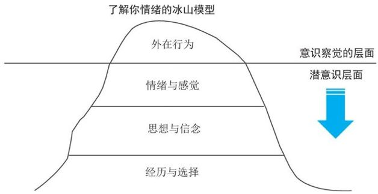

如上图所示，作者认为一个人的外在行为是由内在的潜意识决定的，所以，要解释一个人行为的矛盾或者纠结，就得分析他的潜意识。

潜意识怎么分析？作者提供了一个冰山模型，看不见的潜意识，可以通过“行动、感觉、信念、经历”一步步找到。

比如一个女孩害怕游泳，原来是因为她童年有过恐怖的经历，这个经历进入她的潜意识，让她对游泳产生恐惧感。

这个模型怎么使用呢？作者的建议是：

1.思索一个你想要改变的行为；

2.为自己画一个空白的冰山模型（很简单，可以参考我的图手绘）；

3.在最上层写下你要改变的行为，凭直觉往下写；

4.所有的念头没有对和错，只需要诚实面对，就算你觉得不合理，也请信任第一个出现的念头；

5.最后做一个新的选择，看看是否可以有不同的反应。

■扩展思考

我想起小时候怕狗，于是我用这个方法分析一下我怕狗的原因。

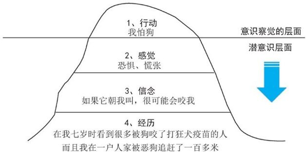

我的确一直不喜欢狗，喜欢猫。后来我的女儿想养狗，我被迫为她做了一个不同的选择——我们养了一只贵宾犬（很小的泰迪），这种狗黏人，又体型小，看起来像玩具，所以不是那么让人害怕。

养了狗以后，我的确对狗没有那么恐惧了，只是偶尔碰到大狗内心还是会有点恐惧，但我还是能假装镇定。

我们也可以试试用这种方法分析别人，比如有的人生活很压抑，因为要在人前人后装出很乖的样子，但是这不是她的本性，为什么她不敢对人释放自己的态度呢？

我们试试用冰山模型抽丝剥茧。

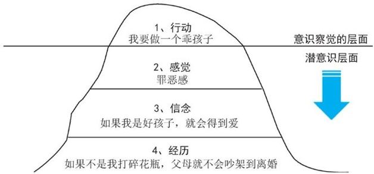

也许真相就是这样的。

■拆书建议

当然，我认为冰山模型未必就能帮到你，原因有三：

1.遗忘：有些影响你一生的事情虽然你早已遗忘，但它却在你的潜意识里，所以，有些人相信催眠可以帮助回忆；

2.忽视：有些让人内心伤痛的回忆，人会选择主动忽视它，不去想它，从而让自己能逃避它，这样的话，你在写冰山模型的时候，选择性遗忘防御机制会挫败你通过回忆造就自己潜意识过程的努力；

3.错位：不是所有的错都是你造成的，不是所有的结果都是你过去的选择造成的，把潜意识泛化，我以为也是不科学的。

但是用这个方法的确可以分析一下你遇到的负面情绪根源。

负面情绪好比是个气球，你可以费尽力气把它压到水里，但只要稍稍一松懈，它就会从水里反弹造成水花四溅。

情绪是有能量的，必须进行适当的管理，给它出口，而不是假装它不应该存在。

冰山模型并不能帮你找到出口，但是也许能帮你自己分析一下，你那么莫名其妙的情绪，到底是哪种原因造成的。

Tips

如果你读了本书有启发，请分享你的读书感悟，欢迎去新浪发微博@秋叶老师，记得带话题#和秋叶一起拆书#，好文章必转！

下篇　延伸阅读

《奇特的一生》系列随笔

1.你知道柳比歇夫的时间统计法吗

柳比歇夫这个前苏联人为世人所知，不是因为他在自己专业的生物领域的高超造诣，而是因为他56年如一日的时间统计法。

柳比歇夫的时间统计法最大的特点是，他不仅仅坚持每天写自己的时间清单，还做了时间不同用途的分类详细清单，每天每个周末每个月每个季度每年，他都会汇总统计自己的时间支出，核算自己用在工作上的有效时间是多少。

比如在1963年，统计显示他出现了最高的有效工作时间总和，2006小时30分钟，平均每天的有效工作时间达到了5小时29分钟，而在一般年份，他的统计显示他有效利用在工作上的时间是4小时40分钟。

他之所以能够做出这样的统计，是因为他从1916年开始坚持记日记，他的日记习惯也别具一格，其格式如下：某年某月某地某事，花费多少小时多少分钟。

没有形容词，没有情感，没有任何波动，他就像时间机器一样，忠实记录着自己每天每周每月每年的工作和生活，任何事情都不遗漏，包括给别人写信、和朋友聊天，还有自己的科研工作，全部记录消耗了多少时间。比如写一篇论文花了多少时间，在柳比歇夫这里，时间记录得清清楚楚，一点儿也不马虎。

1942年，他的儿子阵亡，连这都没有反映在他的日记里，日记里只是冷静记录他的工作、通信时间，包括为儿子悲伤的时间。

本书开头曾提到，他的一生是高产的，出版70多部学术著作，而他一年还有大量的通信，比如在1969年，他收到419封信，回复了283封信，发出69件印刷品。

柳比歇夫的工作成绩引起了很多人的惊叹，也引起很多人对他的时间统计术的好奇。

应该说，柳比歇夫的日记不是传统意义上的日记，而是他自己的时间清单，可以理解为他管理时间的一种工具。把这个完全当日记看是一种误解，一个人的日记怎么会完全没有情感呢，而柳比歇夫恰好是一个情感丰富的人。

作为一个在时间管理方面略有心得的人，我对柳比歇夫的时间管理法可能有着与众不同的认识和共鸣，很多看起来常人无法理解的行为，在我看来，非常合理，我想我更能理解他为什么要这样做。

我虽然比不了柳比歇夫，但有几点和他的习惯是一样的：

1.我有记录自己的工作量和每件具体工作大概花费时间的习惯，当然我达不到他的分钟精度，我的误差在正负五分钟到十五分钟，这要看我当时的注意力集中程度；

2.我有分类和统计自己工作类型和耗时的习惯；

3.我也经常控制不住自己，把时间浪费在对我的目标达到并没有直接意义的事情上；

4.最重要的一点是，我也有一些普通人看起来非常厉害的工作产出。

其实在看到《奇特的一生》这本书之前，我只是听说过柳比歇夫这个人，并不特别知道他的工作方法到底是什么，但是通过这本书，我深深地找到了共鸣。

要理解为什么柳比歇夫工作法有效，我觉得你们不能指望听我的现身说法，你们应该先认真看看《奇特的一生》这本书，这是一本非常值得一看的书，听一个人做二道贩子，不如直接先仔细看看书，再听我来说道。

看完书之后，我相信，我列出的下面的话题，你们会很想了解：

1.为什么柳比歇夫能如此自律？

2.如何像柳比歇夫一样知道时间的长度？

3.怎样记录时间清单才有用？

4.用时间框架来安排时间，而不是事件驱动？

5.紧张的工作和享受生活有矛盾吗？

6.如何才能更好地成长？

2.为什么你不能像柳比歇夫一样自律

柳比歇夫时间记录法让人惊奇的一点就是，他把这种详尽记录自己时间长度的方式坚持了56年，这让很多人难以想象。

我相信你们看了以后，只会是敬佩柳比歇夫，而不是效仿，因为实在太难说服你们，年复一年、日复一日对自己的一切加以记录，然后分类，然后统计，然后做出所谓的成果，这真的有意义吗？

《奇特的一生》的作者给出的解释是，坚持他的方法必须有一个前提，你要有一个伟大的目标。

我理解这句话背后的逻辑是：如果你没有一个伟大的目标，很难做到如此自律。因为伟大的目标往往是耗尽一生精力也无法完成的，所以你不得不思考如何最有效地利用你的时间，这样才能让你征服伟大的目标，或者尽量靠近你的目标。

在这样的工作挑战下，你最理性的选择就是坚持每天都合理利用自己的时间，让自己更加接近你的终极目标。对于柳比歇夫，他选择的时间记录法，正是他做出选择后自律的一种明证。

我对这一点是深表赞同的。我读高中时，有一个伟大的目标，就是考大学。那个时候这就是我全部人生的奋斗动力，我也看到身边的同学努力程度，加上老师的鞭策，很容易天天早晚自习，自觉钻进题海，虽然高考发挥一般，但读个大学不是问题。

但是进了大学，我很快就没有了奋斗目标，就业还遥远，恋爱没人要，读书没人管，很快我就陷入晚睡晚起，无所事事混日子的状态，一直混到了研究生一年级。

后来我在企业读研，因为天天要求打卡，就恢复了良好的作息习惯。同时，这个时候导师要求我们研发一个新产品，这个产品对我当时就是一个伟大的目标，不需要说什么，我们每天都过得忙碌而充实，因为不懂的太多了，必须抓紧时间学习和解决问题。

等我工作后，我发现我对时间的自律性是越来越强，而不是随着生活的安逸、家庭的幸福而自我放松。

我深深感谢因为有一个不操心的家庭，可以让我全力以赴探索个人的成长可能性，当然我这种成长也是有一个伟大的目标在背后驱动。

至于这个伟大的目标，也许在别人看来根本不重要，但是我自己知道，我的目标需要我付出一辈子努力，也无法做完万分之一。但是我还是希望，我能完成我的万分之一，甚至经过精心规划时间，创造性组织时间的用途，我能完成到百分之一。

我想说：这个世界上有两种人，一种人是很容易找到使命感的，一种人必须被有使命感的人驱动才能前进。

如果一个人内心不是天天装着自己身边的一亩三分地，其实是很容易看到世界的广阔，人类的伟大，宇宙的浩渺，你会深深叹服这个世界的神奇，并愿意为这个世界做点什么，而不仅仅是看着你身边的爱呀恨呀这点小恩怨。吃好喝好、找一个人过一辈子的追求，对于有伟大目标的人而言，是不够的。

一旦你真正想征服或者彻底融入这个世界，你就不得不反思你的资源瓶颈。除了时间，几乎所有的资源都可以去争取去创造，但是时间一旦流逝，就无法弥补。

柳比歇夫致力于昆虫分类，这个工作的工作量是如此巨大，以致他不得不一再压缩他的野心，把分类的目标从昆虫压缩到一个小门类，即便这样，也让他做了一辈子。

只有拥有伟大的目标的人，才能真正感受到浪费时间的可耻。因为人的生命只有一次，浪费的时间永远不会回来。所以我每天不需要励志，也不需要打鸡血，我到点就起床，到点就睡觉，因为好的休息会让我更有能量去迎接新一天的战斗。

我甚至从很多牛人的经历中受到启发，学会了在最短时间内恢复精力的方法。想想每天睡四个小时的拿破仑，想想最近被广泛报道的高强度工作了二十年的许家印，还有85岁高龄还一直工作的李嘉诚，你们怎么就没有意识到有些人可以一直高强度高频率工作，甚至长寿呢？

所以我的体会是，只要学会充分休息，保持规律的生活习惯，你可以让自己的自律性得到完美的延伸。

比方说我的睡眠质量一般很高，一般不会失眠，也不怕噪音灯光，我让自己的身体学会尽量在最短时间内恢复作战状态，而不是一累就倒下，需要调整好几天才能恢复。实际上我比一般人更注意关心自己的身体细节，我甚至琢磨出了一些方法，让自己在讲课嗓子哑了的情况下，还能一边连续讲课一边恢复。这都是因为有目标要做，被逼出来的能力。

但对普通人，是很难要求他们拥有伟大的目标的，他们也很难像柳比歇夫一样，可以让自己天天自律。

所以对普通的人，最合理的选择是和拥有伟大目标和自律性的人在一起，和他们在一起，利用他们的能量激励自己坚持。这就是所谓的“打鸡血”疗法。

打鸡血最大的困难在于，别人有目标，有动力，坚持不是问题。你缺乏目标和动力，往往走着走着就累了，就怀疑自己的坚持是否有意义有回报，然后就慢慢掉队了，需要下一次打鸡血，如是循环几次，你就慢慢接受自己就是这样一个人的现实。

一个人放弃了自己，往往是从生活上失去了自律性开始的。所以我常常建议大家保持有规律的生活，其实是一种保持精神状态的诀窍。这也是学习柳比歇夫的时间记录法为什么有效的一个解释。

柳比歇夫的时间记录法，背后其实体现这个人高度的自律性。

这种自律性的可怕，在于一旦你选择这个人当对手，他摧毁你的方式不是一次爆发，而是用你无法还手无法逃避无所不在的压力把你击倒。这就是世界杯上德国队的逼迫式打法，如果你不是足够强，对手能用意志力打垮你，而且这种意志力会让对手的能力始终得到正常的发挥。

在微信里，特别是给大学生答疑的微信“秋夜青语”里，很多人问我为什么天天答疑，这样的问题几乎每隔几天就有人问。问这个问题的人，不妨想想柳比歇夫，他为什么要天天解剖昆虫切片？要知道他一辈子解剖的昆虫切片，是好几万啊！

这就是另外一个要谈到的问题，所有伟大的目标，必须分解成为一系列可以看到的步骤，你每天推进一点点，就会离目标近一点点，这种不断推进的感觉会让你更好地坚持你的目标。

之所以我说很多人的目标是空想，就是因为他们只有目标，却没有找到接近目标的路。或者他们想了一条路，然后半路上又不停地怀疑自己是否走对了，是不是有更快更好的路，这样的人，都很难真正拥有伟大的目标。

想学柳比歇夫，还是一句话，就是聪明人肯下笨工夫。祝你早点找到伟大的目标，或者和拥有伟大目标的人同行。

还有，别问我的伟大目标是什么，我的伟大目标也许对你不值一提，但它是我的梦想。要活出你的伟大，而不是到处打听别人的伟大目标是什么。

3.如何像柳比歇夫一样知道时间的长度

2014年12月12日河南农业大学卢老师早上送我去火车站，他说时间快到了要进站吧？我说现在七点二十，来得及，他一看表，七点二十四分。这时，我告诉他一个秘密，要对时间建立感觉，最简单的训练方法是在需要看时间之前，先问问自己现在几点钟了，然后再看表。

如果我在有意识注意时间的话，对时间的判断误差不超过五分钟。

由于我自己可以随时随地意识到现在的时间，不但可以节约大量因为看时间而被浪费的时间，还能预判我的时间机动余量，从而更好地安排下一步的工作。

有朋友问我如果做到柳比歇夫那样事事都记录时间长度，得浪费多少时间啊？

我觉得那是一种误会，对于柳比歇夫这样有意识训练过自己对时间长度的第六感的人，他不需要钟表就能感受到他完成一样工作花费的时间长度，而且他的时间精度可以达到一分钟。

如果你从来没有训练过时间感，你永远也不知道这一点。

比如时间感弱的人会问：“我们明天见面？”时间感稍好的会问：“我们明天上午见？”时间感再好点的问：“明天九点左右见？”而我一般会说：“明天九点十分准时见？”

你看，和别人一句对话你就能预判这个人的时间管理水平，并采取不同的行为模式沟通，比如和时间感弱的人见面，我一定要留够余量并安排等待时间的备选方案。

如果你对时间流逝没有建立一种生理上的第六感，你对时间的管理也永远会停留在很低的水平。而且你永远不会理解，像柳比歇夫这种记录时间长度精确到分钟的方式，就是一种训练自己身体对时间流逝长度感知能力的有效方式。

如果你觉得柳比歇夫的时间记录能力很神奇，不妨先试试秋叶老师的方法，看完这篇文章，你觉得现在几点几分？和实际时间的误差有多少？

4.怎样记录时间清单才有用

很多人都知道“时间清单”的时间统计法，就是把自己一天的时间详细记录下来，看看自己的时间都浪费在哪里了。

很多人不记录不知道，一记录才发现从早到晚的日程里，那么多时间浪费在无效的工作、无聊的等待、无所谓的闲话里面。

大部分时间清单记录法都要求你分类统计各种时间用途总和。你应该看看你的大部分时间用在哪里，比如一天睡几个小时的觉，运动几个小时，学习几个小时，生活几个小时，工作几个小时，每个大项还应该继续细分。比如工作中准备多少小时，开会多少小时，业务多少小时，等等。

这样下来，你对自己的时间支出会有一个总的印象，一般人的印象就是我的很多时间都被浪费了，现在我总算知道浪费在哪里了。

但是如果只是记录一下时间清单，并不能从根本上解决问题，最多就是励个志，发誓要改变一下，坚持不了几天，就原样重来。因为知道时间被浪费了不是新鲜事，通过记录时间清单找到浪费的时间段也不是结果，除非你做了什么动作保证你的时间能被重新利用起来。

如果你仔细分析柳比歇夫的时间记录法，你会发现他和我们普通人最大的不同不是详细记录了时间清单并进行分类，而是他在记录时间清单的基础上做了两个很细微的调整。

第一个调整是他非常明确找到自己时间管理的目标——那就是统计每天有效工作的时间长度。

柳比歇夫非常有兴致统计自己每日时间清单里面真正用于工作的有效时间长度，这是从3个半小时到5个半小时之间浮动的一个值。柳比歇夫发现，即便是自己这样珍惜和擅长利用时间的人，能够做出如此高产成果的人，每天用于有效工作的时间也很难超过5小时！

我们这些普通人对这一点能受到的启发就是，大部分人的每日真正有价值的工作时间其实并不超过2小时，只要你每天确保有2个小时时间安排在真正有价值的事情上面，并且肯坚持日积月累做下去，你的目标就可以通过2个小时不断推进到完成，当然这得是一个合理的目标才成。

所以各位如果仔细了解柳比歇夫，你会发现他有一个管理时间的KPI，如果每天有效工作时间没有达到4小时，他会觉得这一天耽误了工作进度，反过来说，如果一天有效工作时间达到了4小时，那么他也很明白，并不需要再逼自己在有效工作上过度投入，因为不管怎么努力，你也无法一天内有效产出太多，所以可以把其他的时间用于看歌剧、写回信、做一些自己觉得开心的事情。

明白这一点，你们大概可以明白为什么秋叶大叔每天工作那么忙，还能陪小伙伴们聊天、写微博、写微信，还能给妹子们答疑，因为PPT这个事情，平均算起来，每天花费我有效工作时间的一个小时都不到。

我只需要坚持得足够长，就足以秒杀国内大部分真正有天赋的牛人。反过来我很早也发现，做出我目前这样的一点点成绩，真正有效的工作时间每天2个小时就够了，其他的时间用在一些看起来不重要的事情上，可以让自己更开心地利用好有效时间，这就够了。

我每天能否安心上床的标准不是有没有熬夜做完事情，而是我有没有每天为要做的事情付出超过1个小时以上的有效工作时间，这一点做到了，我就知道，未来的某天，我要的，终将是我的。

关于时间清单的第二点，是柳比歇夫通过时间清单发现了自己工作中大量的时间碎片，他利用这些碎片时间安排了其他的种种用途。

大家要发现自己时间清单中不可避免的碎片，比如早上起床到吃饭，中间必然有个十分钟到二十分钟的碎片时间，从吃完饭到去单位上班，可能有个1小时甚至2小时的时间，这个时间段你要充分利用起来，把一些无效但必须要做的工作全部解决了，这样才能保证有大块时间做好真正要做的工作。

5.如何用时间框架来安排时间

如果你仔细观察《奇特的一生》里提到的柳比歇夫的时间管理法，你会发现柳比歇夫和普通人的不同之处在于，他把一生的时间当一个整体的框架来利用和规划，而不是仅仅规划明天、下周，或者是一年的工作。

这是一些伟大的时间管理者才拥有的特征，具有从较大时间跨度上规划时间的能力。这种能力也不是一下子就能获得的，其实你可以从一天的时间管理框架开始建设。

一天的时间无非用在不同的事情上，昨天一个朋友问我，秋叶老师你每天用什么记时间清单？用什么APP记录好？我回答说：“手记。”

基本上每天的重要工作，我会提前在笔记本上手记，这个本子一年一本，已经坚持很多年了。之所以手记，主要的好处是印象深刻，不容易忘，用印象笔记这一类的时间管理软件，本质上的问题是让人觉得有软件提醒自己就可以把事情放心交给软件了。

而我以为这恰恰是时间管理的大忌。一件事情如果在你心里，一有碎片化时间，你自然会想起它，并利用这些时间去完成你的工作的一小部分，比如我会利用一点点碎片时间，构思一小段文章。但一件事情你交给软件，自己不去记着，到了有碎片时间可以利用的时候，你也想不起来利用，除非软件那个时候提醒了你。

这就是一直到今天，我都坚持用最笨也是最原始的手段管理时间的原因——这样印象深刻。

其实我觉得不仅仅是管理时间，我做很多事情都是用看起来最笨的方法，但结果其实是最好的。

不走捷径，就是捷径。

不过时间清单只是一天的时间管理方法之一，如果仅仅局限在一天的时间管理上，你很难去响应变化，除非你有更长的时间管理框架。

其实除了每天的时间清单，我每周都要做一个周时间表，格式就是依据教学日历，我们大学老师都是一周周执行教学日历的。

比如这样的格式：

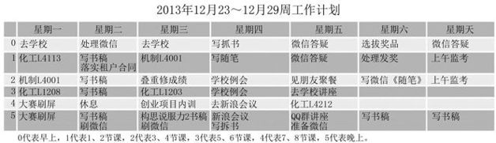

我从2004年3月份开始严格坚持用周日历做每周的工作计划，就是从一个简单的word周教学日历改过来的。

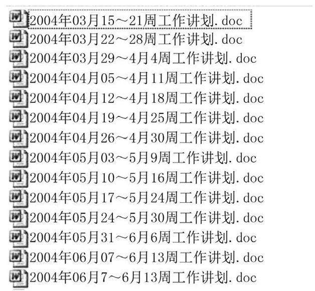

这个word的特点有三点：

第一，暗含我的工作节奏，我们大学老师的时间周期是按周驱动的，所以我把我的生活作息按周驱动，符合我的行业特征。

第二，这个要完成的内容事项是逐步填满的，一开始我只填入必须完成的工作，比如有些时间我要上课，有些有讲座，有些有内训。提前写好，但是其他的单元格空着，可以插入各种临时事项。

一般在一周开始的时候，我这个表格空余的部分可以达到三分之二。

然后每天的事情我还是手记，每周或者每隔几天我会把手记的工作，填入到周计划中。到了周末，就填满了。

第三，我把一天的时间看作是六个单元，早上一个小时，上午分两个两小时，下午分两个两小时，晚上分一个四小时，其实中午我也是看作一个小时的，但是一般都作为机动余量，不安排。

由于我把时间高度单元化，我就非常容易想起来我一天中哪个时间段可以利用。

这就是我一天和一周的时间管理框架。不过到了2010年，我发现自己培训业务日益增加，基本上一年在外培训有40天，讲座不会少于10场；在2013年，我在完成教学任务外，还做了60天内训或公开课，还有50场公益讲座，这个太恐怖了，如果按照周管理时间，我的视野就被局限了。

所以从2011年开始，我开始以年为维度设置时间框架图，按照年月安排时间，这样我对一年的工作任务分配有了一个更宏观的感觉。

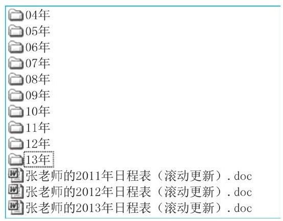

而且在2011年我就开始用更长的视野预判我未来五年的工作安排，在2011年初，我基本知道这五年我大概要得到的最终目标是什么，然后一年年去努力接近它。

事实上，有了时间整体框架，我很容易看出我有多少可利用的时间接近我的最终目标，如果太慢，我会考虑调整目标或者改进时间利用效率。但实际上，因为你有了整体框架，你实现目标的周期并不一定是依赖某天某日的努力，你反而可更从容安排工作和生活。

事实是，有了时间框架，我做有效的工作接近目标的能力是变强了，而不是变弱了。比如我如果发现哪一个月工作任务太重，我会拒绝接受新的任务。在2014年元月，我因为要写书，所以我拒绝了大量培训业务，虽然写书赚的钱的确不如培训，但是从长期目标来看，书更容易帮助我达到最终目标，所以牺牲短期回报，争取长期利益是完全值得的。

而且有了长期的时间框架，你还能够更合理解决工作和生活的冲突。很多人问我，你那么忙，有时间生活吗？下篇文章就聊聊这个话题。

6.紧张的工作和享受生活有矛盾吗

时间管理的高手，他们的产出在常人看来往往是惊人的。比如《奇特的一生》提到的柳比歇夫，一生成就无数，不是凡人能赶上十分之一的主。

我也曾在微博晒了我的2013年年终总结，很多人看了以后也感叹我的成果好丰富，我又在微信里说女儿说我是“不管”爸爸，结果很多人又好心建议我要多陪陪家人。

我觉得普通人对时间管理的认识有两个误区，第一个误区就是以为一个人工作一多，就没有时间享受生活。这是你的状态，不是时间管理高手的状态。比如柳比歇夫，他博览众书，爱看歌剧，还经常陪老婆散步，还热衷给全国书友写信，讨论的话题无所不包。如果他那个时代有互联网，他早就是网络上的大神，以长篇干货灌水著名。

事实上除了因为战乱或政治迫害，柳比歇夫一年内看的书和歌剧、写的信件都远远超过普通人。要记住，这些都和他的主要成果产出领域无直接相关性。

我也说过在2013年除了我获得的成果外，我还原创了10多个PPT，回复了3000多封邮件，简装了100平米创业中心，主持学生团队例会6次，看了122本书，影院看了12部电影，陪老婆小孩旅游了10天，回老家看了4趟父母（单程3小时车程），有260天在家吃饭睡觉，给女儿买了60多本新书。

单看任何一项娱乐或者精神活动，我都可以和任何一个家庭的人比一比，我未必就比一般人少多少。

我想说的第一点就是，越是紧张的工作，越是压力大，越需要工作之外的活动来排解压力，让自己获得能量继续投入工作。

普通人对待时间管理的一个误区反而是，越是觉得压力大，越把时间全部用于对付压力；越是把时间全部用来对付压力，越是觉得生活了无乐趣；越是觉得生活了无乐趣，越对压力索然寡味无力挑战；越是无力挑战越是整个人身心疲惫，效率低下。

而真正的高手一定懂得劳逸结合的道理，越是压力大，越要忙里偷闲安排别的事情。第一，可以放松大脑，不要让大脑总是陷入一种思维模式，就是放松大脑的手段；第二，在别的事情中得到放松了，工作起来面对压力也有动力，没有动力的压力只是压力，直到把你拖垮，有了动力，压力可以被我们慢慢克服，变成成就感；第三，大脑在转换思维模式的过程中，往往能启发出新的灵感，让你的工作变得更加有创意，更加有效果。

所以我工作累了，往往是停下，看闲书，做杂事。慢慢地我又开始积累对于工作的激情了，积累到一定的点，我自己也感觉到能够进入工作的状态了。这个时候，我也许会熬夜，我也许会连续闭关几天，我也许会推迟吃饭，总之，我会用普通人难以投入的激情和状态快速搞定有压力的工作。当然，每次我未必要搞定太多，搞定一点点就好。

你们知道的，压力往往是因为你坚持了很久，却没有进展造成的。所以我每次都会设定一个小阶段目标，看到目标被我拿下，压力就变成了一定要一鼓作气拿下的决心了。

写到这里，顺便说个事情，我原来计划2014年1月15号写完《说服力》系列三本书的升级版，结果提前十来天搞定了。

事实上，这个工作2013年年中就确定要做，我一直缺乏动力，拖到了12月24号才开始，在这十天，我展示了惊人的工作状态，普通人觉得一年才能完成这些工作，我在这十天内就完成了，这十天仅仅我个人直接完成的书稿就多达65页，还不包括20多个页面零碎的修改。

这十天我要上完最后一周的课（用了四个半天），做了两场分享（用了两个半天），两场监考（用了两个半天），响应550个大赛活动的奖品快递，在微博上发起了两次赠书活动，在网易云课堂内部学员群策划了赠书、写读书笔记活动，还主持了一期内部福利分享，参与了一起群内分享。我还策划了三个推广活动（其中的内部PPT预告片一片叫好），设计了一个完整调研问卷和调研流程，写了一份团队工作总结，陪小孩玩了一天，看了一场电影，看了一本书，还有很多乱七八糟的杂事……

这就是普通人不能理解时间管理高手的第二个误区，你们只看见工作量，只会用自己的工作效率计算，结论就是这个人没有生活。

真相是你要用一百个小时才能做到的事情，也许我只用十个小时就搞定了，还完成得比你质量更高呢。

现在回到开头的题目“紧张的工作和享受生活有矛盾吗”，我的答案是不矛盾，在一个大时间维度里，我可以很好地把这些都相容到一起。

不过要走到这一步，你必须经过很多细致的练习才行，别指望一步就成为柳比歇夫这样的高手，你可以看看《奇特的一生》，但真正能理解他生活状态的人，首先也得是一个超级自律、超级有效率并且超级爱生活的人。

7.如何才能更好地成长

很多人看了柳比歇夫的时间管理法，感觉这个人活得太累，每天都记录自己干什么，不折腾吗？也有的人对这个人太佩服了，简直就是个无所不能的人，一辈子的时间能完成那么多工作。

这种矛盾的评价也出现在我身上。看了我晒的2013年成果，有的人说我是大神，有的人说我是工作狂，不陪家人。

其实这都是一种误会，柳比歇夫也好，我也好，我们关注和研究时间管理，出发点很简单：我们想搞清楚自己想成为怎样的人，然后想搞清楚要成为这样的人应该如何利用时间，效率才最高。

事实上我比任何人都清楚自己的弱点、缺点，还有不满之处，幸运的是我也比别人更早认识到我内心到底在追求什么。

对于柳比歇夫，他早早就决定献身生物学研究，但他评估完生物科学后就意识到穷其一生也只能在科学上完成很少的一部分工作，虽然这个工作对于其他人已经是天文级别的成果。所以他选择心平气和地前进，日积月累地巩固，这是最佳的工作策略。

他用这样的策略度过一生，很好实现了他的人生目标。但是对于其他人，用他的方法管理自己的时间，是否就是恰当的策略，答案可不一定。

比如说一个艺术家，每天记录自己工作的分分秒秒有必要吗？更随性、更随意、更夸张的生活方式，也许有助于艺术家的灵感诞生。

再比如说我，我的工作策略是记录事件清单，但不刻意记录我的事件耗时，我只从比较长的时间段统计我做一个工作需要花费的有效时间，进而更加合理地组织我的碎片化工作时间，以求整合这些碎片时间达到更多的劳动产出。

这是我的工作方法：利用碎片时间大量产出多元化的工作成果。这种时间管理法背后的逻辑其实是整合思维。

柳比歇夫的时间管理法背后更多是积沙成塔。

如果按照他的方法工作，我就很难做到在几个领域内都游刃有余地跨界，并利用这些跨界碰撞出更多的机会，这些机会往往又能够加速我的前进。

柳比歇夫也跨界研究了大量话题，这些话题虽然和他的专业无关，但是陶冶了情操，开拓了视野，放松了大脑，其实也有助于他有效开展工作。而我不太一样的是，我表面上看起来完全不相干的工作背后，有你们看不见的线在组织和串联，一如地火运行，等时机到来，我自然会让它们显性化。

我这样说也是想告诉各位，我们研究别人的时间管理方法，其实本质上是通过种种对比分析，找到自己的时间管理方法。

所有的这些分析，甚至模仿，都是为了让我们自己变成一个更好的、更加符合自己内心期待的人。

我总觉得时间管理的最高境界就是：你总是可以浪费一些时间做没有什么目的的事情，只要你开心，没有负罪感，你就是一个幸福的人。

Table of
Contents

[版权信息](#index_split_000.html_filepos217)

[序篇](#index_split_002.html_filepos9843)

> > [一、没空读书？再忙也可以一年读上百本书](#index_split_002.html_filepos9925)

> > [二、怎样读书？这10个误区你也困惑吗](#index_split_003.html_filepos16816)

> > [三、读了就忘？我的10种读书方法](#index_split_004.html_filepos38479)

> > [四、不会分享？怎样做读书笔记和拆书](#index_split_005.html_filepos82834)

[上篇 知行合一](#index_split_006.html_filepos107878)

> > [一、尽信书不如无书](#index_split_006.html_filepos107975)

> > > > > > [1.长尾理论](#index_split_006.html_filepos108426)

> > > > > > [2.《免费：商业的未来》为什么是错的](#index_split_006.html_filepos118874)

> > > > > > [3.你真的理解六度空间理论吗](#index_split_006.html_filepos128414)

> > > > > > [4.为什么小米的“参与感营销”你学不会](#index_split_006.html_filepos136077)

> > > > > > [5.谁在引爆趋势](#index_split_006.html_filepos148686)

> > > > > > [6.引爆点模型](#index_split_006.html_filepos160031)

> > [二、建立思考模型](#index_split_007.html_filepos171799)

> > > > > > [1.时间紧急重要度模型](#index_split_007.html_filepos172763)

> > > > > > [2.SWOT分析法](#index_split_007.html_filepos180059)

> > > > > > [3.波士顿矩阵分析法](#index_split_007.html_filepos183674)

> > > > > > [4.组合矩阵分析法](#index_split_007.html_filepos190989)

> > > > > > [5.回馈模型：如何处理他人的抱怨和批评](#index_split_007.html_filepos194405)

> > > > > > [6.心流模型：为什么我们做事没动力](#index_split_007.html_filepos199947)

> > > > > > [7.后果模型：为什么我们不能当机立断](#index_split_007.html_filepos208084)

> > > > > > [8.技术周期循环的模型](#index_split_007.html_filepos217376)

> > > > > > [9.影响力模型](#index_split_007.html_filepos225655)

> > > > > > [10.马斯洛需求模型](#index_split_007.html_filepos232148)

> > > > > > [11.减少错误的瑞士奶酪模型](#index_split_007.html_filepos241762)

> > > > > > [12.肯定式探询模型：微笑着解决问题](#index_split_007.html_filepos250573)

> > > > > > [13.《零秒思考》：快速决断力应该如何训练](#index_split_007.html_filepos255767)

> > [三、反思世界观](#index_split_008.html_filepos261854)

> > > > > > [1.你真的读懂了《黑天鹅效应》吗](#index_split_008.html_filepos262239)

> > > > > > [2.读《一以贯之》学经济思考](#index_split_008.html_filepos271203)

[中篇 学以致用](#index_split_009.html_filepos283175)

> > [一、工作方法论](#index_split_009.html_filepos283272)

> > > > > > [1.怎样打造完美的团队](#index_split_009.html_filepos283726)

> > > > > > [2.你团队的软肋在哪里](#index_split_009.html_filepos294998)

> > > > > > [3.如何培养你的团队成员](#index_split_009.html_filepos299920)

> > > > > > [4.六顶思考帽怎么玩](#index_split_009.html_filepos306130)

> > > > > > [5.怎样实施项目的迭代优化法](#index_split_009.html_filepos313287)

> > > > > > [6.李善友教授的“颠覆式创新”理论对不对](#index_split_009.html_filepos319211)

> > > > > > [7.你会用定位图吗](#index_split_009.html_filepos326602)

> > > > > > [8.如何留住你的灵感](#index_split_009.html_filepos329721)

> > > > > > [9.如何做一份好的会议记录](#index_split_009.html_filepos336415)

> > > > > > [10.戴着镣铐才能更好地跳舞](#index_split_009.html_filepos339840)

> > > > > > [11.如何运用减法思维创新](#index_split_009.html_filepos346155)

> > > > > > [12.如何运用除法思维创新](#index_split_009.html_filepos352038)

> > > > > > [13.表达行动的MORS法则](#index_split_009.html_filepos358820)

> > > > > > [14.一起来学丰田的5S管理法](#index_split_009.html_filepos363239)

> > > > > > [15.从《腾讯方法》里我们能学到什么](#index_split_009.html_filepos368268)

> > [二、创业方法论](#index_split_010.html_filepos375702)

> > > > > > [1.刘强东为啥能做大](#index_split_010.html_filepos376223)

> > > > > > [2.周鸿祎的互联网思维](#index_split_010.html_filepos382013)

> > > > > > [3.从王兴的九败一胜看创业](#index_split_010.html_filepos387686)

> > > > > > [4.为什么我们很难成为褚时健](#index_split_010.html_filepos398049)

> > > > > > [5.如何从马云演讲中学到干货](#index_split_010.html_filepos405737)

> > [三、生活方法论](#index_split_011.html_filepos416547)

> > > > > > [1.你的碎片化时间用途越多，你的生活选择就越多](#index_split_011.html_filepos416965)

> > > > > > [2.一起来玩曼陀罗九宫图](#index_split_011.html_filepos428015)

> > > > > > [3.如何用冰山模型发现你的潜意识](#index_split_011.html_filepos431446)

[下篇 延伸阅读](#index_split_012.html_filepos437204)

> > [《奇特的一生》系列随笔](#index_split_012.html_filepos437301)

> > > > > > [1.你知道柳比歇夫的时间统计法吗](#index_split_012.html_filepos437410)

> > > > > > [2.为什么你不能像柳比歇夫一样自律](#index_split_012.html_filepos442424)

> > > > > > [3.如何像柳比歇夫一样知道时间的长度](#index_split_012.html_filepos451375)

> > > > > > [4.怎样记录时间清单才有用](#index_split_012.html_filepos453979)

> > > > > > [5.如何用时间框架来安排时间](#index_split_012.html_filepos459014)

> > > > > > [6.紧张的工作和享受生活有矛盾吗](#index_split_012.html_filepos465645)

> > > > > > [7.如何才能更好地成长](#index_split_012.html_filepos471829)

