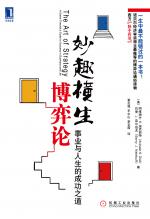

目录\
Content
=======

- [中文版序](#article_394055.html)
- [导读 艺术的修炼](#article_394056.html)
- [译者序 博弈的艺术](#article_394057.html)
- [前言](#article_394058.html)
- [导言 人们在社会中应如何行动](#article_394059.html)
- [1选数游戏](#article_394060.html)
- [2以败取胜](#article_394061.html)
- [3妙手传说](#article_394062.html)
- [4领先还是不领先](#article_394063.html)
- [5我将坚持到底](#article_394064.html)
- [6策略思维](#article_394065.html)
- [7巴菲特困境](#article_394066.html)
- [8混合出招](#article_394067.html)
- [9别跟笨蛋对等打赌](#article_394068.html)
- [10博弈论可能会危害你的健康](#article_394069.html)
- [该你了，布朗](#article_394070.html)
- [策略互动的两种方式](#article_394071.html)
- [决策树与博弈树](#article_394072.html)
- [“幸存者”的策略（1）](#article_394073.html)
- [“幸存者”的策略（2）](#article_394074.html)
- [非理性与关注他人的理性（1）](#article_394075.html)
- [非理性与关注他人的理性（2）](#article_394076.html)
- [非常复杂的树](#article_394077.html)
- [一心二用](#article_394078.html)
- [案例讨论](#article_394079.html)
- [多种情景，一个思想](#article_394080.html)
- [一段小小的历史（1）](#article_394081.html)
- [一段小小的历史（2）](#article_394082.html)
- [以牙还牙](#article_394083.html)
- [较新的实验（1）](#article_394084.html)
- [较新的实验（2）](#article_394085.html)
- [如何达成合作](#article_394086.html)
- [康德定然律令解](#article_394087.html)
- [商界中的困境](#article_394088.html)
- [公财悲剧](#article_394089.html)
- [自然界的腥牙血爪](#article_394090.html)
- [捷足先登](#article_394091.html)
- [案例讨论](#article_394092.html)

## 中文版序

在美国，有人会惑于本书标题中的“艺术”一词。他们可能会想，这是不是一本描述策略的绘画图书呢？哦，当然不是了。不过，在中国就不会出现这样的疑惑。我们在《妙趣横生博弈论》中的意思，恰如孙子在《孙子兵法》中的意思。我们旨在教会大家策略的原理。

因《孙子兵法》英译为The Art of
War（即《战争的艺术》），故作者才有此一说。在此我们站在读者的角度，将书名译为《妙趣横生博弈论：事业与人生的成功之道》。——译者注但从这个视角看，本书的标题又可能给中国读者带来另一个疑惑。也许有人会认为，策略完全就是如何击败他人的计谋，谋划策略就如同赢得战争。这一观念未免过于狭隘。任何策略的目的，都旨在实现你的目标。有时，你需要与他人合作；有时，你需要克服他人的异议。在本书中，我们将努力教会大家如何合作，也将努力教会大家如何竞争。正如孙子曾言：“不战而屈人之兵，善之善者也。”

但凡翻译，都有挑战。英文与中文的互译尤其如此。我们的朋友（也是昔日的学生）芮成钢用“龙”这个词来形容这一问题。在美国，龙是一只喷火的邪物，它被一个勇士杀死。而在中国，龙是带来吉祥、迎接新年的神物。同一个词，却有两种截然不同的含义。这种观念差异揭示了博弈论中最重要的教训：一个人必须理解对方的想法。在本性上，人们都倾向于以自我为中心，只关注自己的理解和自身的需要。但策略的艺术要求，不要以自我为中心，要理解他人的立场、观念以及看重什么，并运用这种理解来指导行动。

大约65年前，约翰\&#8226;冯\&#8226;诺依曼（John von
Neumann）和奥斯卡\&#8226;摩根斯坦（Oskar
Morgenstern）以其著作《博弈论与经济行为》开辟了博弈论的现代领域。岁月荏苒，而今博弈论的应用已变得日益广泛——现在的标题也完全可以改为“博弈与人类行为”。当然，孙子早在大约2500年前就已熟知这一理论了。能够将博弈论带回它的祖籍，我们深感荣幸。

阿维纳什K迪克西特

巴里J奈尔伯夫

## 导读 艺术的修炼

差不多15年以后，迪克西特和奈尔伯夫的非常成功的博弈论著作《策略思维》，升级成为新的博弈论著作《妙趣横生博弈论》。我想跟大家说说自己对于为什么叫做“艺术”的理解。

原书名为The Art of
Serategy，直译为“策略的艺术”。——编者注从《策略思维》到《妙趣横生博弈论》，固然大部分材料是新的，但是书名的改变，主要是因为作者有了一个全新的视觉。事实上，两位作者自己就写道：“在创作《策略思维》的岁月，我们还太年轻，当时的精神思潮乃是以自我为中心的竞争。后来，我们才彻底认识到合作在策略情形下所起的重要作用，认识到良好的策略必须很好地把竞争与合作结合起来。”从“策略思维”的提法到“策略的艺术”的提法，准确地体现了人类认知的这个深刻进步。

正如作者强调的，博弈论给我们最重要的教训，就是必须理解对方的想法。人们在本性上倾向于以自我为中心，只关注自己的理解和自身的需要。但提高到“策略的艺术”的层次，那就不能囿于自我中心，而是要理解他人的立场、他人的观念以及他们看重什么，并运用这种对对手的理解来指导我们的行动。在这种理解的基础上，怎样很好地把竞争和合作结合起来，就是一种艺术。这是我对于“策略思维”升级为“策略的艺术”的第一层体会。

大约在10年前，我们中山大学岭南学院的本科学生希望我给他们的毕业纪念册题词。我题词的大意是：“经济学是一门科学，经济学的运用是一种艺术——科学的本领有赖于训练，艺术的才华讲究悟性和心得。”现在我感到高兴的是，作为一位教师，我的这个体会有点接近迪克西特和奈尔伯夫在《妙趣横生博弈论》中对于博弈论所说的一些话。

迪克西特和奈尔伯夫说，“科学和艺术的本质区别在于，科学的内容可以通过系统而富有逻辑的方式来学习，而策略艺术的修炼则只有依靠例子、经验和实践来进行”；“博弈论作为一门学科远非完备，（所以）大量的策略思维仍然是一门艺术”。他们写作《妙趣横生博弈论》的目的，是把读者“培养成策略艺术的更佳实践者。不过，对策略艺术的良好实践，首先要求对博弈论的基础概念和基本方法有初步的掌握”。

具体来说，“面对如此之多很不一样的问题如何进行良好的策略思维，仍然是一种艺术。但良好的策略思维的基础，则由一些简单的基本原理组成，这些原理就是正在兴起的策略科学——博弈论”。他们写作的设想是：“来自不同背景和职业的读者，在掌握这些基本原理以后，都可以成为更好的策略家。”

迪克西特和奈尔伯夫还告诫我们，许多“数学博弈论学者”倾向于认为，一个博弈的结果完全取决于与博弈相关的各种抽象的数学事实——参与者人数、可供每个参与者选择的策略的数目，以及与所有参与者的策略选择相联系的每个参与者的博弈所得。他们说：“我们不这样看。我们认为由社会中相互影响的人参与的博弈的结果，理应也取决于博弈的社会因素和心理因素。”

在因为博弈论的贡献而获得诺贝尔经济学奖的经济学家当中，就论述风格而言，1994年获奖的约翰\&#8226;纳什（John
Forbes Nash， Jr.）和2005年获奖的托马斯\&#8226;谢林（Thomas C.
Schelling），可以说是这个绚丽光谱的两个端点。纳什“惜墨如金”，他的论述全部见于匿名审稿论文，数量不多，每篇的篇幅都很短，完全是数学形式的讨论。相反，谢林则以出版学术著作著称，而且这些著作多半都以老百姓能够字面理解的日常语言写出来，与时下经济学主流的论述风格大相径庭。纳什天才地提出并刻画了博弈的均衡的概念，并且在很宽泛的条件下，证明了博弈的均衡的存在性，为博弈论的发展奠定了基础。谢林的著述，不但提供了许多深刻的思想（哪怕这些思想未能刻画为数学形式的经济学模型），而且为博弈论的应用开拓了广阔的天地。我们这个世界在20世纪经历了可怕的核竞赛，可是幸运地没有发生过核大战。现在许多人把核大战最终没有发生，看做过去这个世纪发生的最伟大的事件。曾经几次眼看要发生核大战了，最后却还是有惊无险，从学理上说，这是因为谢林提出的思想武装说服了人们。

迪克西特教授，是美国普林斯顿大学的经济学大师。他是经济学模型的高手，在微观经济学、发展经济学、公共经济学、国际贸易理论、产业组织理论与市场结构理论领域都有卓越建树。博弈论在20世纪下半叶发展很快，但除了谢林的著述以外，几乎所有论文都采取数学形式的讨论，这使得博弈论在很长时间里都只是象牙塔里面的学科。在经济学大师的行列里面，是迪克西特教授首先认识到，“让博弈论离开学术期刊真是太有趣太重要了”，因为博弈论的洞见在商业、政治、体育以及日常社会交往中有广泛的应用。迪克西特教授和他的合作者身体力行，将博弈论的重要洞见从原来数学形式的理论，转换成日常语言的描述，用直观的例子和案例分析取代了理论化的命题，献给广大读者和广大学子。他们“想要改变大家观察世界的方式，通过引入博弈论的概念和逻辑以帮助大家策略性地进行思考”。第一本这样的著作，就是差不多15年前迪克西特和耶鲁大学奈尔伯夫教授合著的《策略思维》，出版以后很快就在世界范围赢得读者的青睐。

就博弈论而言，可以说迪克西特教授很得纳什和谢林的真传。纳什那样数学形式的讨论，他驾轻就熟，因为他本科学的是数学。而像谢林那样日常语言的著述，使他的读者比谢林还多，因为谢林非常成功的著述，旨在影响学界和政治家，而迪克西特他们则专门为社会科学和人文学科的学生和其他关心博弈论的读者写作。如果不是迪克西特他们的努力，我们真是很难想象，今天的MBA学生、政府官员和企业老总怎么能够理解博弈论的一些深邃思想和精彩篇章。

我个人与迪克西特教授的交往不多。1991年在普林斯顿向他请教一个国际贸易问题，他对于提供曲线（offer
curve）的看重，对我有很大启发。2004年，也是在普林斯顿，我陪尔山与他共进午餐，他广泛的兴趣、渊博的知识、深厚的文化素养，给我留下非常深刻的印象。我更多的是从阅读迪克西特的论著中得到教益。相信广大读者也一样能够从阅读他的著作中得到许多教益。

大家都知道猜拳的“剪刀-石头-布”游戏吧。就在现在这本《妙趣横生博弈论》中，迪克西特和奈尔伯夫会和你玩剪刀-石头-布博弈，而且把它升级为如果是“布”赢就得5分，因为“布”需要张开5个手指，如果是“剪刀”赢就得2分，因为两只手指表示剪刀，如果是“石头”赢则只得1分，因为只有一个端点。你说，这样的博弈论著作，是不是很有吸引力？

就学科范畴而言，本书的特点，是展开信息经济学激励理论的许多有趣的内容。信息经济学是与博弈论联系最密切的学科，专门对付信息不对称给人们和市场带来的新问题。例如“怀才不遇”，就是信息不对称的一个后果，原因是人家不知道你的本事。为此，你需要发送一些特别的“信号”，告诉人们你有本事这个事实，学位、证书、论著、身手敏捷、行为举止大方得体等，都是这样的信号。于是，信号发送成为信息经济学的一章。但是迪克西特和奈尔伯夫进一步告诉我们，因为人们普遍在意发送自己有本事的信号，结果最有本事的人反而不做发送这种信号的事情，例如比尔\&#8226;盖茨。上升为理论，那就是通过不发送信号来发送信号，叫做“反信号传递”。有人统计加州26所大学的语音邮件系统的电话留言，结果发现：来自有博士生项目的大学的电话留言中，只有4%的人会留言告知自己的头衔，而来自没有博士生项目的大学的电话留言，却有27%的人使用自己的各种头衔。本来，这些人都拥有博士学位，但是向对方提醒自己拥有的学位和头衔，恰恰表明这个人觉得需要一个“凭证”来把自己从芸芸众生中区别出来，而真正令人印象深刻的教授因为已经非常有名，却无须发送这种信号。我们这里偶尔会看到一些人的名片上印着一大堆头衔，也是同样的道理。间谍故事充斥着信息不对称，自然应该是信息经济学的题材，但是以我非常有限的阅历所及，只有迪克西特和奈尔伯夫，会带领读者细细品味新世纪以色列间谍的故事。

我们在前面谈到谢林的著作多半都以老百姓能够字面理解的日常语言写出来，迪克西特和奈尔伯夫这本《妙趣横生博弈论》也是这样。必须提醒的是，能够字面认识一段话，也就是说能够把这段话顺利地读出来，并不等于就能够理解这段话的内容，并不等于能够理解这段话的思想和方法。所以，我们在阅读的时候还是要仔细地跟着作者去思考，这与看小说有很大不同。即使对于选修博弈论课程的大学生，也不能因为这本书是“普及读物”，就掉以轻心。有本事你尝试把前面说过的升级版的“剪刀-石头-布”游戏研究清楚，就知道这本书的博大精深了。

最后需要指出，这本书涉及的知识面非常宽，把本书翻译好，需要对于世界文化特别是美国文化有深入的了解，还要具备历史、经济、政治、军事等方面的广博基础。按照严复的说法，翻译的境界讲究“信、达、雅”。面对这样的标准，我们自忖功力不逮。读者如果发现这个译本有什么不妥当的地方，诚盼不吝指出，以期我们共同把这本那么好的博弈论著作，出版得更好。

王则柯

## 译者序 博弈的艺术

我曾经写过两本博弈论的通俗读本，读者还算喜欢，所以常收到一些来信。其间很多人问及这样一个问题：在现实生活中如何运用博弈论帮助我们做出成功的决策？

《身边的博弈》（2007，2009）和《无知的博弈：有限信息下的生存智慧》（2009），两本均由机械工业出版社出版。

本段文字意思参见亚里士多德《形而上学》第一章。回答这个问题对我来说是一个很大的挑战。我深深知道，成功的博弈需要经验。

早在两千多年前，亚里士多德就论述过知识与成功的关系：人类的知识可分为经验、技术和智慧，但个人的成功必须依赖经验；有经验的人可以比有技术而无经验的人更成功；不过，有经验之人只知事物之然而不知其所以然，而有技术之人则兼知其所以然，所以有技术的人更聪明。

亚里士多德所谓的“技术”，其实就是我们所谓的“理论”。而从其论述我们甚至还可以推论：成功与聪明无关。掌握理论者确实更聪明，但他们不如有经验者更容易成功。譬如一个从不练球的物理学家，他比一个乒乓球选手更聪明，更懂得击球的力学原理，但是他却几乎注定在乒乓球项目上会输给长期训练有素的乒乓球选手；乒乓球选手要获得成功也并不需要大量学习力学原理，只需积累经验足矣。理论的功用在于，通晓力学原理的乒乓球选手可能更明白为什么要这样做，从而更快地提炼经验并创造性地悟出新的打法，形成新的有效经验。

所以，成功以及成功的博弈，需要经验支撑。然而经验却是需要在人生的漫长旅途中逐渐积累的。只有经历过的人生，才给我们以经验；未曾经历的人生，就没有经验。年长者比年少者在处理竞争与合作问题时往往更能举重若轻、游刃有余，倒不在于他们掌握了更多的博弈理论，而在于他们有着更丰富的经验，更加深刻地领会了策略的艺术。

所以，那些读者向我提出的问题，对我是一个挑战！因为我还只能算是一个通晓博弈理论的年轻人，仍然需要在漫长的人生中积累经验并领悟策略的艺术。我常常想，再过20年，让我再来写博弈论的通俗读物，我一定可以不单介绍博弈的理论，而且也一定可以与读者分享诸多博弈的艺术。

其实不用等二十年了。因为已经有两位优秀的博弈理论家和策略艺术家为我们带来了现在这本书，我们可以分享他们在其漫长的人生中所领悟的博弈的艺术。

年龄的增长让人思想更趋成熟，也可以让人更加明白人生成功的艺术，我想事实可能确实如此。当著名的《策略思维》一书出版时，奈尔伯夫与现在的我同龄，他的老师迪克西特刚刚47岁；我们看到的是一本（有些锋芒毕露的）强调人际竞争的更关注于博弈理论的通俗著作。光阴荏苒，当他们再度联手完成这本《妙趣横生博弈论》时，迪克西特已经六十有四，奈尔伯夫也五十出头；而我们也明显地感受到这本新书不再锋芒毕露，而是韬光养晦，充满了宽容、温情以及对他人的关心和理解，更多地强调了人际合作（虽然也有竞争），在关注博弈理论的同时更多地关注了博弈的艺术。

是的，博弈论本来就是科学的理论和行为的艺术。它不应该是沉闷的，而应该是生动的；它不应该只是乏味公式，而应该拥有丰富的情感；它不应该只局限于竞争，更应着眼于通过竞争展开合作。博弈论不应该被理解为阴谋诡计，不应该被理解为小聪明，不应该被理解为厚黑学，不应该被理解为你死我活的权谋术。博弈论应该是展开有效竞争与合作的理论，应该是大智慧，应该是个人理性融入社会的艺术。对于那些试图探求真实世界现象之因缘的人们来说，博弈论也是理解高度互动的人类社会的一种思想方法和分析工具。

如果只想着把博弈论用于人际斗争，那只是博弈之术；只有理性地融入社会，才是博弈之道。“术”的博弈只是嵌入在“道”的博弈中的一个小博弈，关注于“术”而忘却于“道”，无异于只见树木、不见森林，或可一时得利，却可能对个人的长期利益和更大的成功产生至为糟糕的影响。正如两位作者在本书中屡屡提到：人生中总是存在更大的博弈，因此个人的决策不应该只着眼于一个小博弈的胜负。能够看到多大、多远的博弈，取决于个人的胸襟和眼光。从某种意义而言，他们所谓的小博弈与更大的博弈之分，正是博弈的“术”与“道”之分。

我读这本书，总是心有戚戚焉。迪克西特和奈尔伯夫在中文版序中写道：“在本性上，人们都倾向于以自我为中心，只关注自己的理解和自身的需要。但策略的艺术要求，不要以自我为中心，要理解他人的立场、观念以及看重什么，并运用这种理解来指导行动。”我想起自己在《无知的博弈》一书最后有类似的意见：“以更理性的方式融入到一个互动的社会之中，而不是试图单方面地把个人意志强加或凌驾于社会之上。?想，这也许就是博弈论能够告诉我们的最为重要的思想。”

不同的读者当然会关注一本书的不同方面。你的兴趣也许与我不同，但我敢说，无论读者是追求阅读的趣味，还是思维的愉悦，抑或希望洞察世事和追求个人成功，这本《妙趣横生博弈论》都值得阅读和收藏。其中很多有趣的问题我相信会令绝大多数读者耳目一新，比如，如何运用博弈论帮助人们减肥？为什么变更法律的提案常常要求2/3以上票数通过，而不是1/2，也不是3/4？为什么有些看起来残酷竞争的策略（比如承诺全市最低价）实际上防止了商家之间的竞争？……

也许会有读者朋友认为我是在刻意鼓动你购买和阅读本书。No！出版社给我的翻译报酬是固定的，跟销售量无关，所以你买不买或读不读本书跟我没有利害关系，我也没有必要诱惑你购买本书。我只是觉得，我从本书获益甚多，作为对原书作者的一种互惠回报，我乐意在适当的时候帮他们宣传一下而已。毕竟，错过一本好书，是你们自己的损失，我并不会因此得到什么，也不会因此失去什么。既然如此，在当前是否买书的局势中，你的最优策略是什么呢？

最后，我们必须提及，本书约有1/3的内容与其前身（《策略思维》）内容相同，对这1/3的相同内容，承蒙王尔山女士同意，我们沿用了她的译文。这样做一方面是为了缩短本中文版的面世时间，另一方面也因为那是由王则柯老师校对过的值得信赖的译本。本书也有幸获王则柯老师作序。在此，我们和原书作者对王尔山女士和王则柯老师深表感谢！

董志强

2009年5月9日

## 前言

我们不曾宣称要写一本新书。原计划只是对我们1991年的《策略思维》一书进行修订，但结果却远不止于此。

创作修订版的一个榜样是博尔赫斯笔下的皮埃尔\&#8226;蒙纳。蒙纳决定重写塞万提斯的《堂吉诃德》，经过艰苦努力，修订工作最终以字字句句皆与原本相同而告终。而今，自《堂吉诃德》以来的文学和历史，包括《堂吉诃德》本身，已历经300年沧桑。尽管蒙纳只字未改，但其行为现在看来已另有深意。

哎，可惜我们的著作不是《堂吉诃德》，所以修订版确实需要改变一些内容。事实上，本书的绝大部分内容都是全新的。既有理论的新应用、新发展，也有新视角。面对如此多的新内容，我们决定还是另起一个新书名比较好。尽管内容是新的，但是我们的意图却一如往昔。我们想要改变大家观察世界的方式，通过引入博弈论的概念和逻辑来帮助大家策略性地思考。

如蒙纳一样，我们有一个新的视角。在我们创作《策略思维》的岁月，我们还太年轻，而彼时的精神思潮乃是以自我为中心的竞争。后来我们彻底认识到一个重要的内容，即策略情形下的合作对局，以及一个良好的策略如何需要混合竞争与合作。

对这一路线的追随，使我们两人中的一个写了一本关于上述理念的著作；见Adam
Brandburger and Barry Nalbuff， Coopetition （New York:
Currency/Doubleday，
1997）我们曾在原版前言的开篇写道：“策略思维是战胜对手的艺术，请牢记你的对手也正做同样的算计来对付你。”现在我们要在这句话后面继续补充：策略思维也是发现合作途径的艺术，即使他人受利己心而不是仁慈心的驱动。这是一种解释的艺术，对于你自己而言，也要说到做到。策略思维是设身于对方的立场以便推测和影响他人行动的艺术。

我们相信本书涵盖了上述虽然古老但更加明智的视角。不过传承性还是有的。尽管我们啰嗦了太多的故事，但我们始终保持着引导读者的目的，以便读者发展出自己的思维方式去对付可能面临的策略局势。本书并非《确保策略成功的七大步骤》之类的在机场候机时的读物。读者将面临的局势各不相同，掌握一些基本原理，并将其应用于正在对局的策略博弈，将有助于你更好地获得成功。

公司和企业家必须开发出良好的竞争策略以谋取生存，并寻求合作机会以做成大蛋糕。政治家必须设计竞选策略和立法策略以实现他们的愿景。足球教练必须为场上的选手制定策略。父母想要诱导孩子的优良行为，就必须成为业余的策略家（孩子们可是专业的）。

如此多的分散背景中，良好的策略思维仍保留了一种艺术。但其基础则由一些简单的基本原理组成，这些原理就是正在兴起的策略科学——博弈论。我们写作的前提是，来自不同背景和职业的读者在掌握这些基本原理后都可以成为更好的策略家。

有人质疑，我们何以能将逻辑和科学应用于人们非理性地采取行动的世界。这种质疑排除了研究愚蠢行为也有惯用方法。事实上，我们已从行为博弈论的新近发展获得了某些最为激动人心的新洞见；行为博弈论融合了人类的心理和偏见，并因而给博弈论注入了社会元素。结果是，博弈论可以更好地将人以其本来的样子而不是我们希望的样子予以处理。我们把这些洞见整合到我们的讨论中。

博弈论是相对年轻的科学——迄今才70余岁。它业已给实战策略家们提供了大量的有益洞见。不过，与所有的科学一样，它已经被数学和行话封装起来。这是精要的研究工具，但它们却阻碍了非专业人士理解博弈论的基本思想。我们创作《策略思维》的一个动机，就是认为让博弈论离开学术期刊真是太有趣太重要了。博弈论的洞见在很多应用（商业、政治、体育，以及日常社会交往）中被证实了其有用性。而我们则将这些重要洞见转换成文字描述，用直观的例子和案例分析取代理论化的命题。

这是2007年10月的搜索结果。译者翻译本书时候顺便搜索了一下，已超过2700万条了。可见有关博弈论的信息增长有多快。——译者注我们很高兴地看到，我们的主张已成主流。博弈论课程在普林斯顿和耶鲁以及其他开课学校中是最受欢迎的选修课之一。博弈论充实了MBA项目的战略课程。用Google搜索博弈论得到的结果超过600万条。读者在报纸新闻、专栏文章以及公共政策争论中都可以发现博弈论的影子。

当然，上述发展多半归功于其他人：归功于诺贝尔评奖委员会，它在1994年将经济学奖授予约翰\&#8226;海萨尼（John
Harsanyi）、约翰\&#8226;纳什和莱因哈德\&#8226;泽尔腾（Reinhard
Selton），又在2005年将奖项授予罗伯特\&#8226;奥曼（Robert
Aumann）和托马斯\&#8226;谢林；归功于西尔维亚\&#8226;纳萨（Sylvia
Nasar），她撰写了《美丽心灵》，该书是关于纳什的畅销传记；归功于那些创作了获多项奥斯卡奖提名的同名电影；归功于所有撰写通俗读本使该学科大众化的人。我们也沾了一点点功劳，因为《策略思维》一书出版发行了25万册，并译成了多种语言，其中日文译本和希伯来文译本甚为畅销。

还有3届诺贝尔奖授予机制设计与信息经济学，这两个领域均与博弈论有密切联系。分别是：1996年授予威廉\&#8226;维克瑞（William
Vickery）和詹姆斯\&#8226;莫里斯（James
Mirrlees），2001年授予乔治\&#8226;阿克尔洛夫（George
Akerlof）、迈克尔\&#8226;斯彭斯（Michael
Spence）和约瑟夫\&#8226;斯蒂格利茨（Joseph
Stigliz），以及2007年授予莱昂尼德\&#8226;赫维奇（Leonid
Hurwicz）、埃里克\&#8226;马斯金（Eric
Maskin）和罗杰\&#8226;迈尔森（Roger
Myerson）。我们特别受益于谢林。他关于核战略的著作，特别是《冲突的战略》和《军备与影响》，非常著名。事实上，谢林在将博弈论应用于核冲突的过程中，创立了大量的博弈理论。而迈克尔\&#8226;波特（Michael
Porter）的《竞争战略》也同样重要并且影响深远，该书推动了博弈论知识与商业战略的结合。在“深入阅读”部分，我们列出了谢林、波特及其他许多人著作的简明导读。

在本书中，我们没有把思想囿于特定的背景。相反，对每一条基本原理，我们都列举了广泛领域的例子加以阐释。从而，来自不同背景的读者皆可以在本书中见到某些熟悉的内容。他们也可以见到同样的策略原理如何应用于不那么熟悉的环境。我们希望带给大家一个全新视角去观察世事，无论新闻抑或旧史。我们也从文学、电影以及体育运动等诸如此类的例子中提取读者们的共识经验。正儿八经的科学家可能会认为这些策略不值一提，但我们却认为影视和体育运动中的为人熟知的例子也是重要思想的有效载体。

写一本通俗层面的读物而不是写一本课程教材的想法来自哈尔\&#8226;范里安（Hal
Varian），他现在供职于Google和加州大学伯克利分校。他还对本书初稿提出了评论和很多颇有价值的建议。诺顿（WWNorton）出版公司负责《策略思维》一书的德瑞克\&#8226;麦克费利（Drake
McFeely）是一个优秀而严谨的编辑，他付出了非同一般的努力将我们学术化的语言变为生动活泼的文本。《策略思维》的诸多读者给予了我们很多鼓励、建议以及批评，所有这一切都对我们创作《妙趣横生博弈论》产生了有益影响。在这极易遗忘的时刻，我们必须提及值得特别感谢的人。我们在相关或无关的著书项目上的其他合作者，安\&#8226;厄尔斯（Ian
Ayres）、亚当\&#8226;布兰登伯格（Adam
Brandenburger）、罗伯特\&#8226;平迪克（Robert
Pindyck）、大卫\&#8226;瑞尼（David
Reiley），以及苏珊\&#8226;斯凯丝（Susan
Skeath），他们慷慨地给予了我们诸多支持。在本书中继续发挥影响的其他人士包括大卫\&#8226;奥斯腾-史密斯（David
AustenSmith）、艾兰\&#8226;布林德（Alan
Blinder）、彼得\&#8226;格兰特（Peter
Grant）、塞斯\&#8226;玛斯特尔斯（Seth
Masters）、本雅明\&#8226;波拉克（Benjamin
Polak）、卡尔\&#8226;夏皮罗（Carl Shapiro）、特里\&#8226;沃恩（Terry
Vaughn）以及罗伯特\&#8226;威利格（Robert
Willig）。诺顿出版公司负责本书的杰克\&#8226;瑞切克（Jack
Repcheck）是一个积极、宽容而令人尊敬的编辑。手稿编辑珍妮特\&#8226;伯恩（Janet
Byrne）和凯瑟琳\&#8226;皮克托（Catherine
Pichotta）精心纠正了我们的失误。每当大家难以发现错误，这都要归功于她们。

我们特别感谢《金融时报》的书评人安德烈\&#8226;圣\&#8226;乔治（Andrew St
George）。他将《策略思维》列为其1991年最乐于阅读的书籍，他说“这简直是在推理器材上的健身之旅”（《金融时报》周末版，1991年12月7/8日）。这也带给我们一份灵感，我们把本书对读者提出的有趣问题贴上了“健身之旅”的标签。最后，加州大学伯克利分校的约翰\&#8226;摩根（John
Morgan）曾向我们提出强烈的刺激和威胁：“如果你们不写修订版，我就会写一本与你们竞争的书。”在我们免却了他的麻烦之后，他提供了很多灵感和建议，向我们提供了不遗余力的帮助。

阿维纳什K迪克西特

巴里J奈尔伯夫

2007年10月

## 导言 人们在社会中应如何行动

人们在社会中应如何行动

我们的答案并不涉及道德和礼教。我们也不想与哲人、牧师和父母为敌。我们的主题尽管谈不上高尚，但却与美德和礼貌一样影响着每个人的日常生活。本书讨论的是策略行为。我们每个人都是谋略家，不管我们喜不喜欢这个称呼。成为优秀的谋略家总比成为糟糕的谋略家要好些，而本书的目的就在于帮助大家提高发现和运用有效策略的技能。

工作，乃至社会生活，是充满决策的涓涓细流。追随何种事业，怎样经商，跟谁共结连理，如何抚养子女，乃至于是否竞选总统，都是重大决策的例子。这些局势的共同元素是，你无法在真空状态下行动。相反，你的身边围绕着积极的决策者们，他们的选择与你的选择相互作用。这种行为互动对你的思维和行动也有着重要影响。

为了阐明这一点，不妨考虑伐木工人和将军之间决策的差异。当伐木工人决定如何砍伐树木时，他不必担心树木会反击；其面临的环境是自然的。但是，当将军试图消灭敌军时，他必须料及并克服阻止其意图的反抗力量。如同将军一样，你必须意识到你的生意对手、潜在配偶，乃至你的子女都是富有谋略的。他们的目标与你的目标既可以相互冲突，也可以完全一致。你的决策必须求同存异并充分利用合作。本书旨在教会大家策略性地思考，并进而将思想转化为行动。

研究策略性决策行为的社会科学分支叫博弈论。博弈论中的“博弈”，范围涵盖从下象棋到养育小孩，从网球赛到企业兼并，从广告战到军备控制，几乎无所不包。正如匈牙利幽默大师乔治\&#8226;米克斯（George
Mikes）所说，“许多欧洲人认为人生乃游戏（博弈）；英国人认为板球赛才是游戏（博弈）”。我们认为双方都是对的。

“博弈”的英文表达是game一词。game的中文也可译作游戏。——译者注参与这些游戏（博弈），需要许多不同类别的技能。其中一类是基本技能，比如篮球中的投射能力、司法中的先例知识，或者扑克游戏中不动声色，等等。另一类是策略思维。策略思维始于基本技能，并且需要考虑如何运用基本技能。熟悉法律之后，你还必须制定为委托人辩护的策略。了解了己方球队传球和跑位的能力以及敌方球队对我方每个选择的防守能力之后，作为教练你还要决定要不要传球或跑位。有时候，比如核武器边缘政策的情形，策略思维还意味着知道何时放手。

科学理论远非博弈的全部，大量的策略思维仍然是一门艺术。我们最终的目的是把你培养成策略艺术的最佳实践者。不过，对策略艺术的良好实践要求对科学方法和基本概念先有初步的掌握。因此我们组合了两种方法。第1章从策略艺术的例子开始，展示不同的决策中策略问题是如何产生的。我们指出了某些有效的策略、某些无效的策略，甚至某些明显糟糕的却被人们在这些真实博弈中所采取的策略。这些例子先提供一个概念性框架——科学的基础。在后续章节中，第2～4章通过例子构筑起理论基础，每个例子都是精心设计用以引出一条原理的。然后我们转向更具体的概念以及对付特定局势的策略——在任何规律性的行动都将被对手利用的时候如何采取混合行动，如何改变博弈以利于自己的优势，如何在策略互动中操纵信息。最后，我们着手讨论几大类策略局势，讨价还价、拍卖、投票以及激励机制设计，在这几章中，大家将在操作层面见到博弈论的原理和策略。

科学的内容可以通过系统而富有逻辑的方式来学习，而策略艺术的练习则只有依靠例子、经验和实践来进行，这是自然而然的。我们对于科学基础的阐释得出了一些原理和通行法则。比如，第2章提出的逆向推理方法和思路，第4章的纳什均衡概念。但是，在不同局势下所需的策略艺术则还需大家多多努力。每种局势都有特定的性质，需要大家结合科学的原理加以考虑。提升策略艺术技能的唯一途径就是归纳法，多多了解在大量的例子中它们是如何得以实现的。这也正是我们试图提升大家策略IQ的方法：在每一章以及结论章的案例研究中集中提供了大量的例子。

例子涵盖的范围既有大家熟悉的、琐碎的或逗趣的，它们通常取自文学、体育运动或影视；也有令人恐惧的，如核军事对抗。前者只是博弈论思想美妙愉悦的载体；而后者，一度有很多读者认为核战争是如此令人担忧的问题以至于难以运用理性分析。然而，冷战已结束多年，我们希望军备竞赛和古巴导弹危机博弈论方面的问题可以由它们的策略逻辑在某种程度上与其情绪内容分离而得到检验。

案例分析与大家在商学院课程中遇到过的案例类似。每个案例都设置有一个特定的环境并要求你应用该章讨论过的原理去找出该局势下的正确策略。某些案例是结局开放式的；不过那也正是生活的特性。在没有明确的答案时，只有以不完美的方式去处理这些问题。在?读案例讨论之前，先努力想透每个案例，与单单大量阅读正文相比，这是理解博弈论思想一种更好的方式。为了有更多训练，最后一章提供了一个案例集，案例的难度大致呈递增顺序。

在本书最后，我们希望大家可以成为更优秀的管理者、谈判家、运动员、政治家或父母。我们提醒大家，达到上述目标的良好策略中，有一些并不能够帮你赢得对手的爱。如果你想公平对局，那么请你把这本书告诉你的对手吧。

## 1选数游戏

我们从来自生活不同方面的十个策略故事开始，就如何发挥最佳水准提供一些初步思路。许多读者一定在日常生活中遇到过类似的问题，而且，经过一番思考或尝试，犯过错误之后，也找到了正确的解决方法。对于其他读者，这里的一些答案可能出人意料。不过，让读者感到惊讶不是我们提供这些例子的主要目的。我们意在指出，类似的情形普遍存在，而且形成了一系列相互关联的问题，系统地思考这些问题可能会让大家取得事半功倍的效果。

在随后的章节中，我们将把这套思维体系发展为有效策略的良方。请把这些故事当做主菜之前的开胃菜。它们的作用是增进大家的食欲，而不是马上把大家撑饱。

1选数游戏

不管你信不信，我们将邀请你与我们玩一场游戏。我们已从1到100之间选出某个数，而你的任务是猜中这个数。若你一猜即中，我们将付给你100美元。

实际上，我们不会真的付给你100美元。那样做的话对我们来说代价太高，更何况我们是想以这种方式为你提供某些帮助。不过，当你在玩这场游戏时，我们希望你假想认为我们确实会给你金钱，而我们在玩这场游戏时也会这样假想。

对这个数字一猜即中的机会很小，仅为1%。为了增加你赢的机会，我们可以让你猜五轮，且每轮猜错后都会告诉你猜得太高还是太低。当然，越早猜中则奖励也越丰厚。若你在第二轮猜中，你将得到80美元；第三轮才猜中，赢利就降为60美元；然后第四轮将为40美元，第五轮将为20美元。若五轮皆未猜中，游戏便会结束，你将一无所获。

准备好出招了吗？我们也准备好了。如果你不太清楚如何跟一本书玩游戏，这可能会有一点挑战性，但也绝非不可能。你可以访问artofstrategyinfo网站，交互式玩这场游戏。或者，我们预想你正在玩这场游戏并做出相应的回应。

你第一轮猜的数是50吗？这是绝大多数人第一轮的猜测，不过告诉你，这个数太高了。

或许你第二轮会猜25？猜过50之后，大多数人都会猜25。但是抱歉，太低了。很多人接下来就会猜37，但恐怕37也太低了。那么猜42如何？还是太低了。

让我们暂停，退回一步，分析一下现在的情况。这是你即将迎来的第五轮猜测机会，也是你赢得我们金钱的最后机会了。你已知道那个数将大于42而小于50。存在着七个选择：43，44，45，46，47，48和49。你认为它会是这七个数中的哪一个呢？

迄今为止，你的猜测方式是把区间二等分并选择其中间数。在数字以随机方式抽取的游戏中，这是一个理想的策略。你可以从每一轮猜测中获得尽可能多的信息，从而你可以尽快收敛到那个数。确实，据说微软的总裁史蒂夫\&#8226;鲍尔默曾以此游戏作为其面试题目。对鲍尔默而言，50，25，37，42……就是正确答案。他感兴趣的是要看看候选人能否用最符合逻辑和最有效的方式去分析所探求的问题。

此种搜索方法的技术术语叫最小化平均信息量。我们的答案则有所差异。在鲍尔默的问题中，数字都是随机挑选的，所以工程师们把数集一分为二加以攻克的策略完全正确。从每一轮猜测中得到尽可能多的信息，会减少你猜测的次数，因而也可以让你赢得最多的钱。但在我们这个游戏中，数字不是随机挑选的。请记住我们曾说过，我们是像真的要付钱给你那样来玩这场游戏的。假如我们需要付钱给你，将没有人补偿金钱给我们。尽管因为你买了我们的书而令我们非常喜欢你，但我们更珍惜自己的利益。我们更乐于保留这些金钱而不是把它们馈赠给你。所以，我们当然会挑一个你难以猜中的数字。请想一下，若挑选50作为这个数字，对我们意味着什么？那可是会让我们损失一大笔钱的。

博弈论的关键教诲就是，将自己置于对方的立场。我们站在你的立场上，预计你会猜50，然后是25，接着是37，42。弄清楚了你会怎样玩这场游戏，我们便可以降低你猜中我们数字的机会，从而也大大降低了我们需要付出的金额。

在游戏结束之前对你所做的这一切解释中，我们已经给了你很大的提示。所以现在你弄清楚了所玩的真实游戏，你要为20美元做最后一猜。那你将挑选哪个数？

49？

恭喜。不过是恭喜我们，不是你。你刚好落入我们的圈套。我们挑选的数字是48。实际上，整个关于选取一个难以根据分割区间规则找出的数字的长篇大论，都是刻意要进一步误导你。我们想让你猜49，这样我们选定的48才不会被猜中。谨记，我们的目的是让你赢不到钱。

要想在游戏中击败我们，你必须比我们更进一步：“他们想让咱们猜49，那咱们就应该猜48。”当然，如果我们早料到你如此聪明，那我们可能就选了47甚至是49。

这场游戏的重点，不在于我们是自私的教授或狡诈的骗子，而在于尽可能清晰地揭示是什么使得某些事件成为一场博弈：你必须考虑到其他参与人的目标及策略。在猜测一个随机挑出的数字时，这个数字不会被刻意掩饰。你可以用工程师的思维将区间一分为二，尽可能做到最好。但在博弈对局中，你需要考虑其他参与人将如何行动，以及那些人的决策将如何影响你的策略。

## 2以败取胜

2以败取胜

我们承认：我们看过《幸存者》这个节目。但我们从不曾在孤岛上参加这种节目。因为如果我们不先挨饿，其他人肯定会因为我们是专家而投票让我们离开。我们面临的挑战是要预测比赛结果。当那个矮矮胖胖的理查德\&#8226;哈奇（Richard
Hatch）机智地战胜对手，最终成为哥伦比亚广播公司（CBS）系列节目的首届冠军得主，并获得百万美元奖金时，我们毫不意外。他之所以获胜，是因为他具有不动声色地开展策略性行动的才能。

理查德最巧妙的一招表现在最后一个环节。当时比赛进行到只剩下三个选手。理查德的对手还剩两个，一个是72岁的海豹特种部队的退役海军鲁迪\&#8226;伯什（Rudy
Boech），另一个是23岁的导游凯莉\&#8226;维格尔斯沃斯（Kelly
Wiglesworth）。在最后的挑战中，他们三人都需要站在一根柱子上，一只手扶在豁免神像上。坚持到最后的人将进入决赛。而同样重要的是，胜出者要选择他的决赛对手。

大家的第一印象可能认为，这只不过是一项体能竞赛。再仔细想想，这三个人都很清楚，鲁迪是最受欢迎的选手。若鲁迪进入决赛，他就极可能获胜。理查德最希望的就是在决赛中与凯莉对阵。

这种情况的发生可以有两种方式。一种是凯莉在柱子站立比赛中胜出，并选择理查德作为决赛对手。另一种是理查德胜出，然后选择凯莉。理查德有理由认为凯莉会选择他。因为凯莉也知道鲁迪最受欢迎。她只有进入决赛，并与理查德对阵，才最有希望最终获胜。

事情似乎是这样：不论理查德和凯莉两人谁进入决赛，他们都会选择对方作为自己的对手。因此，理查德应该尽量留在比赛中，最起码也要等到鲁迪跌下来。唯一的问题是，理查德和鲁迪之间有持久的盟友关系。若理查德赢得此次挑战却不选择鲁迪，就会使得鲁迪（和鲁迪的所有朋友）反过来与理查德为敌，这可能葬送理查德的胜利。扭转“幸存者”局势的方法之一是，由被淘汰的选手们投票决定最终的获胜者。因此，选手在如何击败对手的问题上，必须深思熟虑。

从理查德的视角来看，终极挑战会以如下三种方式之一呈现：

（1）鲁迪赢。然后鲁迪选择理查德，但鲁迪最有可能成为赢家。

（2）凯莉赢。凯莉很聪明，知道她只有淘汰鲁迪，与理查德对阵，才最有希望获胜。

（3）理查德赢。若他选择鲁迪继续对阵，鲁迪就会在决赛中打败他。若他选择凯莉，凯莉将击败他，因为理查德将失去鲁迪及其诸多朋友的支持。

比较这几个选择，理查德最好先输掉比赛。他希望鲁迪被淘汰，但倘若有凯莉替他做这种有点卑鄙的事情，那就更好了。懂行者的赌注皆押在凯莉身上。因为在此前的四个挑战环节中，她有三次获胜。并且身为一个导游，她的身材是三个选手中最好的。

作为额外的收获，放弃比赛使理查德免去了在烈日下站柱子的煎熬。比赛刚开始，主持人杰夫\&#8226;普罗博斯特（Jeff
Probst）为每个声称愿意放弃的选手提供了一片橙子。理查德从柱子上下来，接了橙子。

4小时11分钟后，鲁迪在改变姿势时跌了下来，他松开了抓在豁免神像上的手，最终失败了。凯莉选择了理查德继续对决。鲁迪投出了关键的一票，最终理查德\&#8226;哈奇成为《幸存者》节目的首届冠军。

事后醒悟过来，一切似乎都很简单。理查德的比赛之所以令人印象深刻，是因为他能够提前预料到所有不同的行动。在第2章，我们将提供某些工具，帮助你预测一场博弈的结果，甚至为你提供分析另一场“幸存者”比赛的机会。

理查德若能预测到他赢得100万美元奖金后不缴税的后果，那就更好了。2006年5月16日，他由于逃税被判处51个月徒刑。

## 3妙手传说

3妙手传说

运动员究竟有没有百发百中的“妙手”这一说？有时候，乍看上去，篮球明星姚明或者板球明星萨钦\&#8226;坦度卡（Sachin
Tendulkar）真的是百发百中，永不落空。体育比赛解说员们看到这样长期存在、永不落空的成功事迹，就会宣称这名运动员具有出神入化的妙手。不过，按照心理学教授托马斯\&#8226;吉洛维奇（Thomas
Gilovich）、罗伯特\&#8226;瓦隆（Robert
Vallone）和阿莫斯\&#8226;特维斯基（Amos
Tversky）的说法，这其实是对真实情况的一种误解。1

他们指出，假如你抛硬币抛上足够长的时间，你也会遇到在很长一段时间里全是抛出同一面的情况。这几位心理学家怀疑体育解说员们其实是找不到更有意思的话题，只好从一个漫长的赛季中寻找某种模式，而这些模式与长时间抛硬币得到的结果其实没什么两样。因此，他们提出了一项更加严格的检验。比如，在篮球比赛中，他们只看一个运动员投篮命中的数据，据此考察这名运动员下一次出手仍然命中的概率究竟有多大。他们也用同样的方法研究这名运动员在这次出手没有命中却在下一次出手时命中的情形。比较命中一次之后再出手仍然命中的概率与这次没有命中而再次出手命中的概率，假如前者高于后者，那就表明妙手一说不无道理。

他们选择了美国NBA费城76人队（Philadelphia
76ers）进行检验，结果与妙手一说相矛盾：一名运动员在投篮命中之后，下一次出手就不大可能命中了；假如他在上一次没有命中，再出手时反倒更可能命中。就连拥有“得分机器”之称的安德鲁\&#8226;托尼（Andrew
Toney）也不例外。这是否意味着，我们谈论的其实是“射频观测器之手”，因为运动员的水准有起有伏，就与射频观测器的灯光忽明忽暗一样？

博弈论提出了一个不同的解释。尽管统计数据否定了一朝命中、百发百中之说，却没有驳倒一个“鸿运当头”的运动员很可能在比赛当中通过其他方式热身，渐入佳境。“得分机器”之所以会不同于“妙手”，原因在于攻方和守方的策略会相互影响。比如，假设安德鲁\&#8226;托尼真有那么一只妙手，对手们一定会对他实施围追堵截，从而降低他的投篮命中率。

事实还不仅如此。当防守一方集中力量对付托尼的时候，他的某个队友就无人看管，更有机会投篮得分。换句话说，托尼的妙手大大改善了76人队的团队表现，尽管托尼自己的个人表现可能有所下降。因此，我们也应该通过考察团队合作连续得分的数据来检验妙手一说。

许多其他团队项目也存在类似的情况。比如在一支橄榄球队里，一个出色的助攻后卫将大大改善全队的传球质量，而一个拥有优秀的接球才能的运动员则有助于提高全队的攻击力，因为对方将被迫将大部分防守资源用于看管这些明星。在1986年的世界杯足球决赛上，阿根廷队的超级明星马拉多纳自己一个球也没有进，不过，全靠他从一群联邦德国（原西德）后卫当中把球传出来，阿根廷队两次射门得分。明星的价值不能单凭他的得分表现来衡量；他对其他队友的贡献更是至关重要，而助攻数据有助于衡量这种贡献的大小。冰球项目排列个人表现名次的时候，助攻次数和射门得分次数占有同等分量。

一个运动员甚至可能通过一只妙手带动另一只手热身，进而变成妙手，帮助他提高个人表现水准。比如克利夫兰骑士队的明星勒布朗\&#8226;詹姆斯（LeBron
James）用左手吃饭和写字，但他喜欢用右手投篮（虽然他的左手投篮技术同样远在大多数人之上）。防守一方知道勒布朗通常用右手投篮，自然会不惜集中一切兵力防他的右手。不过，他们这一计划不能完全奏效，因为勒布朗的左手投篮技术亦实在了得，他们不敢大意，非得同样派人看守不可。

假如勒布朗在两个赛季之间苦练左手投篮技术，又会怎样呢？防守一方的反应就是增派兵力阻止他用左手投篮，结果却让他更容易用右手投篮得分。左手投篮得分提高了，右手投篮得分也会提高。在这个案例中，左手不仅知道右手在做什么，而且帮了大忙。

再进一步，我们会在第5章说明左手越厉害，用到的机会反而可能越少。许多读者大概在打网球的时候已经遇到过类似的情况。假如你的反手不如正手，你的对手渐渐就会看出这一点，进而专攻你的反手。最后，多亏了这样频繁的反手练习，你的反手技术大有改善。等到你的正反手技术几乎不分上下，你的对手再也不能靠攻击你的弱势反手占便宜时，他们攻击你的正手和反手的机会就会渐渐持平，而这可能就是你通过改善自己的反手技术得到的真正好处。

## 4领先还是不领先

4领先还是不领先

1983年美洲杯帆船决赛前4轮结束后，丹尼斯\&#8226;康纳（Dennis
Conner）的“自由号”在这项共有7轮比赛的重要赛事中暂时以3胜1负的成绩排在首位。那天早上，第五轮比赛即将开始，“整箱整箱的香槟送到‘自由号’的甲板。而在他们的观礼船上，船员们的妻子全部都穿着红白蓝相间的背心和短裤，迫不及待要在她们的丈夫夺取美国人失落132年之久的奖杯后参加合影。”2可惜事与愿违。

比赛一开始，由于“澳大利亚二号”抢在发令枪之前起步，不得不退回到起点线后再次起步，这使“自由号”获得了37秒的优势。澳大利亚队的船长约翰\&#8226;伯特兰（John
Bertrand）打算转到赛道左边，满心希望风向发生变化，可以帮助他们赶上去。丹尼斯\&#8226;康纳则决定将“自由号”留在赛道右边。这一回，伯特兰大胆押宝押对了，因为风向果然按照澳大利亚人的心愿偏转了5°，“澳大利亚二号”以1分47秒的巨大优势赢得这轮比赛。人们纷纷批评康纳，说他策略失败，没能跟随澳大利亚队调整航向。再赛两轮之后，“澳大利亚二号”赢得了决赛桂冠。

帆船比赛给我们提供了一个很好的机会，观察“跟随领头羊”策略的一个很有意思的反例。成绩领先的帆船，通常会照搬尾随船只的策略。一旦遇到尾随的船只改变航向，那么成绩领先的船只也会照做不误。实际上，即便成绩尾随的船只采用一种显然非常低劣的策略时，成绩领先的船只也会照样模仿。为什么？因为帆船比赛与在舞厅里跳舞不同，在这里，成绩接近是没有用的，只有在最后胜出才有意义。假如你成绩领先了，那么，维持领先地位的最可靠的办法就是看见别人怎样做，你就跟着怎样做。

一旦竞争者超过两个，这一策略就不再适用了。即使只有三条船，如果一条船偏向右边，另一条船偏向左边，成绩领先者就要择其一，确定自己要跟哪一条船。股市分析员和经济预测员也会受到这种模仿策略的感染。业绩领先的预测员总是想方设法随大流，制造出一个跟其他人差不多的预测结果。这么一来，大家就不太可能改变对这些预测员的能力的看法。另一方面，初出茅庐者则会采取一种冒险策略；他们喜欢预言市场会出现繁荣或崩溃。通常他们都会犯错，以后也没有人听信他们，不过，偶尔也会有人做出正确的预测，一夜成名，跻身名家行列。

产业和技术竞争提供了进一步的证据。在个人电脑市场，戴尔的创新能力远不如它将标准化的技术批量生产、推向大众市场的本事那么闻名。新概念更多是来自苹果电脑、太阳电脑和其他新近创立的公司。冒险性创新是这些公司脱颖而出夺取市场份额的最佳机会，可能也是唯一的机会。这一点不止在高科技产品领域成立。宝洁作为尿布行业的戴尔，模仿了金佰利（Kimberly
Clark）发明的可再贴尿布黏合带，再度夺回了市场统治地位。

跟在别人后面采取行动有两种办法。一是一旦看出别人的策略，你立即模仿（好比帆船比赛的情形）；二是再等一等，直到这个策略被证明成功或者失败后再说（好比电脑产业的情形）。而在商界，等得越久越有利，这是因为，商界与体育比赛不同，这里的竞争通常不会出现赢者通吃的局面。结果是，市场上的领头羊们，只有当它们对新生企业选择的航向同样充满信心时，才会跟随这些企业的步伐。

## 5我将坚持到底

5我将坚持到底

天主教会要求马丁\&#8226;路德（Martin
Luther）公开悔过，收回他抨击教皇及其顾问班子的主张。他拒绝公开认错：“我不会收回任何一点主张，因为违背良心做事既不正确，也不安全。”而且他也不打算寻求妥协：“我将坚持到底，我不能屈服。”3路德拒不让步的态度是以其自身立场的神圣为基础的。在确定何为正确的问题上，根本没有妥协的余地。长期看来，他的坚定立场产生了深远的影响；他的抨击最后引发了新教改革运动，从根本上改变了中世纪的天主教会。

与此类似，查尔斯\&#8226;戴高乐也借助拒不妥协的力量，在国际关系竞技场上成为一个强有力的参与者。正如他的传记作者唐\&#8226;库克（Don
Cook）描述的那样：“（戴高乐）单凭自己的正直、智慧、人格和使命感就能创造力量。”4不过，说到底，他的力量是“拒不妥协的力量”。第二次世界大战期间，他作为一个战败且从被占领的国家逃亡出来的自封的领导人，与罗斯福和丘吉尔谈判时仍然坚持自己的立场。20世纪60年代，他作为总统说出的“不！”迫使欧洲经济共同体多次按照法国的意愿修改决策。

在讨价还价当中，他拒不妥协的态度怎样赋予他力量？一旦戴高乐下定决心坚持一个立场，其他各方只有两个选择：要么接受，要么放弃。比如，他曾经单方面宣布要将英国拒于欧共体之外，一次是1963年，一次是1968年；其他国家不得不从接受戴高乐的否决票和分裂欧共体两条出路中做出选择。当然，戴高乐非常谨慎地衡量过自己的立场，以保证这一立场会被接受。不过，他这么做往往使法国独占了大部分战利品，很不公平。戴高乐的拒不妥协剥夺了另一方重新考虑整个局面、提出一个可被接受的相反建议的机会。

在实践中，“坚持到底，拒不妥协”说起来容易做起来难，理由有二。第一个理由在于，讨价还价通常会将今天谈判桌上的议题以外的事项牵扯进来。大家知道你一直以来都是贪得无厌的，因此以后也不大愿意跟你谈判。又或者，下一次他们可能采取一种更加坚定的态度，力求挽回他们认为自己将要输掉的东西。在个人层面上，一次不公平的胜利很可能破坏商业关系，甚至破坏人际关系。实际上，传记作者戴维\&#8226;舍恩布伦（David
Schoenbrun）这样批评戴高乐的盲目的爱国主义：“在人际关系当中，不愿意给予爱的人不会得到爱；不愿意做别人朋友的人到头来一个朋友也没有。戴高乐拒绝建立友谊，最后受伤的还是法国。”5一个短期妥协从长期来看可能是一个更好的策略。

第二个理由在于达到必要程度的拒不妥协并不容易。路德和戴高乐通过他们的个性做到了这一点。不过这样做是要付出代价的。一种顽固强硬的个性可不是你想有就有，想改变就能改变的，尽管有时候顽固强硬的个性可能拖垮一个对手，迫使他做出让步，但同样可能使小损失变成大灾难。

费迪南德\&#8226;德\&#8226;雷塞布（Ferdinand de
Lesseps）是一个能力中等的工程师，具有非同一般的远见和决心。由于他在外人看来几乎不可能的情况下建成了苏伊士运河，从而名噪一时。他认为没什么不可能，完成了这一伟业。后来，他照搬同样的思路，试图建设巴拿马运河，结果却演变成一场大灾难。尽管尼罗河的沙子让他倍感得心应手，热带瘴气却打了他一个措手不及。费迪南德\&#8226;德\&#8226;雷塞布的问题在于他顽固强硬的个性不允许他承认失败，哪怕战役早已输掉。

我们怎样才能做到有选择的顽固强硬呢？虽然我们没有一个完美的解决方案，却有几个办法可以帮助我们达成承诺，并且维持下去；这是第7章要谈到的话题。

苏伊士运河是一条位于海平面的通道。由于地势低且又是沙漠，挖掘起来相对容易许多。巴拿马运河的海拔要高得多，沿途分布着许多湖泊和茂密的原始森林，费迪南德\&#8226;德\&#8226;雷赛布打算一直挖到海平面高度的计划落空了。又过了很久，美国陆军工程兵采取一种完全不同的思路，建起一系列船闸，充分利用沿途的湖泊，最终取得成功。

1磅=04536千克。

## 6策略思维

6策略思维

辛迪想要减肥。她只知道该怎样做：少吃，多运动。她非常了解食物金字塔，也很清楚各种饮料中所含的卡路里。可是这一切都没有用，没有对她的减肥大计产生任何效果。她的第二个孩子出生后，她的体重增加了40磅，而且一直都没有瘦下来过。

这就是为什么她接受了美国广播公司为她提供减肥帮助的原因。2005年12月9日，她来到了曼哈顿西部的一个摄影工作室，在那里她换上了一件比基尼。从9岁起，辛迪就再没有穿过比基尼，而且现在也不是再开始穿比基尼的时候。

摄影室感觉就像是《体育画报》泳衣发行拍摄的后台一样。到处都是灯光和照相机，而辛迪只穿了一件小小的淡黄绿色的比基尼。制作人还十分细心地为她准备了一个隐蔽的供暖器为她保暖。咔嚓！笑一个；咔嚓！笑一个。此时，辛迪到底在想什么？咔嚓。

如果结果如她所愿，那么，将没有人会看到这些照片。她和美国广播公司黄金时段节目组签订了一份协议，如果她能在接下来的两个月内减掉15磅，他们就会销毁这些照片。美国广播公司不会为她提供任何减肥帮助。它们不提供教练、不提供培训师、也不提供专门的减肥食谱。她已经知道自己该怎样做。她需要的仅仅是一些额外的激励，以及从今天而不是从明天起开始减肥的理由。

现在，她已经有了额外的激励。如果她不能成功减肥，美国广播公司就会把这些照片和录像展现在黄金时段电视节目上。她已经和美国广播公司签订了合约，授予他们这个权力。

两个月减掉15磅是安全的，但却不是一件易如反掌的事情。在此期间，她将面临一系列的假期派对和圣诞大餐。她不能冒等过完新年再开始减肥的风险。她必须现在就开始行动起来。

辛迪清楚地知道肥胖所带来的危险——患糖尿病、心脏病和死亡的风险会增加。但这还没有恐怖到能让她立即采取减肥行动。她更担心的是，她的前男友可能会在国家电视台上看到她的比基尼照片。而且，几乎毫无疑问的是，他一定会看这个节目。因为如果她减肥失败了，她最好的朋友就会告诉他。

罗莉讨厌自己的体型和肥胖的感觉。她在酒吧做兼职，整天被20岁左右的辣妹包围着，但这对她减肥没有任何帮助。她曾经去过轻体减肥中心，试过迈阿密减肥套餐、速瘦减肥套餐，还有你能想到的其他方法。她走错了方向，需要有什么事能帮她改变这一错误方向。当罗莉告诉她的朋友她要参加这个节目时，她们认为这是她做过的最愚蠢的事。照相机捕捉了她这个“我到底在干什么”的表情，还有许多其他动作。

雷也需要减肥。他才二十几岁，刚刚结婚，但看上去像40岁了。当他穿着泳衣走在红地毯上时，拍出的照片一定不好看。咔嚓！笑一个！咔嚓！

他别无选择。他的妻子想让他减肥，并愿意帮助他减肥。她还和他一起节食。所以她决定冒险，也换上了比基尼。虽然她没有像雷那么胖，但她也不适合穿比基尼。

她的协定与辛迪的有所不同。她不必在比赛前称重，甚至也不需要减肥。她的比基尼照片只有当雷减肥失败时才会展出。

对雷来说，这个赌注更大了。他要么减肥，要么失去他的妻子。

摄影机前总共有四位女士和一对夫妻，他们几乎是什么也没穿。他们在做什么？他们并没有裸露癖。美国广播公司的制作人很小心地把照片筛选出来。他们几个人中，谁也不希望看到这些照片在电视上出现，也不愿意去想这种事情会发生。

他们是在和未来的自己博弈。今天的自己想让未来的自己节食和运动；而未来的自己想吃雪糕和看电视。但大多数时候是未来的自己获胜，因为人们总是最后才行动。解决这一问题的方法是，改变对未来自己的激励，从而改变他的行为。

在希腊神话中，奥德修斯想听海妖塞壬唱歌。但他知道，如果他允许未来的自己听塞壬的歌，未来的自己就会把船开向礁石。所以，他绑住了自己的手——确实绑了。他命令船员们（把自己的耳朵塞住后）将他的双手绑在桅杆上。这就是减肥中的让冰箱空空的策略。

辛迪、罗莉和雷比奥德修斯多走了一步。他们把自己绑住了，只有节食才能把他们松开。你可能以为有更多的选择总是一件好事情。但在策略思维里，去掉一些选择往往能让你做得更好。托马斯\&#8226;谢林描述了雅典的将军色诺芬背对没有退路的峡谷时是怎样奋力作战的。色诺芬故意让自己的部队处于这种困境，这样，士兵们无法选择撤退。6他们顽强抵抗，并最终取得胜利。

类似地，科尔特斯（Cortes）在到达墨西哥后毁坏了他所有的船只。这一决定得到了其军队的支持。由于敌众我寡，所以他的六百将士做出决定，要么打败阿兹特克（Aztecs）的军队，要么自取灭亡。阿兹特克的军队可以往内陆撤退，但是对科尔特斯的士兵们来说，根本不存在逃跑或者撤退的可能性。科尔特斯使作战处境变得更加严峻，反而增加了取胜的机会，而且他们确实最终获得了胜利。

阿兹特克军队把科尔特斯误认为凯兹\&#8226;阿尔克\&#8226;阿多尔——某个白皮肤的神，这也帮了科尔特斯的忙。科尔特斯和色诺芬的策略对辛迪、罗莉和雷同样有效。两个月后，刚好是情人节那天，辛迪减掉了17磅。雷减掉了22磅，腰带松了两扣。虽然公开照片的威胁是让他们开始减肥的动力，但一旦他们开始减肥，接下来的努力就得靠自己。罗莉在第一个月就减掉了所要求的15磅；她继续努力，在第二个月又减掉了13磅。罗莉减掉了28磅，相当于减掉了她14%的体重，她因此能穿上比以前小两码的衣服。这时，她的朋友们不再认为参加美国广播公司这个节目是个愚蠢的想法了。

此时，当你得知我们中有一人曾参与这个节目的策划时，就不会感到惊讶了。7或许，我们该把这本书叫做“策略瘦身”，这样销量肯定会更高。唉，我们没有这么做，我们会在第6章再次对这些类型的策略行动进行研究。

## 7巴菲特困境

7巴菲特困境

在一个推进竞选经费改革的专栏中，被称为“奥马哈先知”的沃伦\&#8226;巴菲特提议，将个人捐款的限额从1
000美元提高到5
000美元，并禁止其他所有形式的捐款。禁止公司捐款，禁止工会捐款，禁止软通货。这个提议听起来很不错，但永远都不会通过。

1992~2000年，丹\&#8226;罗森考斯基是唯一一个再选失败的在职国会议员。连任的比例是604/605，或998%。他之所以失败，是因为受到了敲诈、妨碍司法以及滥用资金等17项指控。

虽然单人囚徒困境更常用到，但我们更倾向于研究多人参与的情况，因为，只有涉及两个或更多的囚犯，才会产生困境。竞选经费改革之所以难以通过，原因在于，如果通过这个法案，在位立法者的损失最大。筹资带给他们的好处在于，这能为他们提供职业保障。你怎么能要求人们去做有悖于自身利益的事情呢？我们可将其置于囚徒困境中进行分析。根据巴菲特的说法：好，暂且假设有某个古怪的亿万富翁（不是我！）给出以下提议：如果这一法案没有通过，这个人（古怪的亿万富翁）就会通过法律允许的方式向对该法案投赞成票最多的政党捐赠10亿美元（软通货使得这一切成为可能）。有了博弈论的这一恶毒应用，该法案在国会一定能顺利通过，而这位古怪的亿万富翁根本用不着花一分钱（这说明他其实并不古怪）。8假设你是民主党立法者，考虑一下你自己怎么选择。如果你料到共和党会支持这一法案，但你却选择极力反对，那么，如果你成功了，就相当于你白白奉送给共和党10亿美元，等于把未来十年掌握的资源交给他们。所以，如果共和党支持这一法案，你反对这个法案将得不到任何好处。现在，如果共和党反对这一法案而你却采取支持的态度，那么，你就有可能获得10亿美元。

所以，无论共和党的立场如何，民主党都应该支持这一法案。当然，同样的逻辑也适用于共和党：无论民主党的立场如何，共和党都应该支持这一法案。结果，双方都支持这一法案，而我们的这位亿万富翁免费获得了其提议的通过。作为额外的收获，巴菲特还注意到其计划有效性这一事实“恰好支持了金钱不会影响国会表决这一谬论”。

上述情况称为囚徒困境，因为双方都采取了背离其共同利益的行动。在经典的囚徒困境版本中，警察们对两个嫌犯隔离审问。每个嫌犯都有动机率先坦白，因为如果他保持沉默而另一个人坦白，他受到的处罚就会严厉得多。因此，他们都发现坦白比较有利；尽管若两人都保持沉默，他们得到的结果会更好。

虽然积极博弈的参与者们失败了，局外人却得到了好处。同样，虽然在职政客们可能对竞选经费改革感到不满，但我们这些局外人的处境却变得更好了。

虽然他们两人都认为坦白会带来较轻的处罚，但在这个例子中，这种状况不会发生——两人都被判处死刑。杜鲁门\&#8226;卡波特（Truman
Capote）在《冷血》（In Cold
Blood）一书中生动地描述了囚徒困境。理查德\&#8226;迪克\&#8226;希考克（Richard
Dick Hickock）和佩里\&#8226;爱德华\&#8226;史密斯（Perry Edward
Smith）因无情杀害克拉特（Clutter）一家而被捕。虽然这场犯罪没有目击人，但一个监狱告密者向警察告发了他们。在审问过程中，警察采用了离间法。卡波特把我们带到了佩里的思维中：那只不过是让他感到不安的另一种方式，就像他们捏造出一个目击者那样——“一个真实的目击者”。不可能有目击者！或者，他们的意思是——要是他能和迪克谈谈就好了！但是他和迪克被分开了；迪克被关在另一层的小牢房里……迪克？或许那帮警察也对他使了同样的花招。迪克是个聪明人，是说谎高手，但他的“胆量”不可靠，他太容易恐慌了……“在你离开那房子之前，你杀了里面所有的人。”如果堪萨斯每个有犯罪前科的疑犯都听过这种话，他就不会感到惊讶了。他们肯定已经盘问过数百人，而且毫无疑问地指控过几十人；他和迪克只不过是另外两个而已……而关在楼下牢房的迪克也无法入睡，他同样渴望能和佩里交谈——看看那废物到底跟警察说了些什么。9最终，迪克先坦白了，接着佩里也坦白了。这就是上述博弈自然而然的结果。

集体行动问题是囚徒困境的一个变种，常常涉及两个以上的囚徒。在《给猫拴个铃铛》的童话故事中，老鼠们意识到：假如可以在猫的脖子上拴一个铃铛，那么，它们的小命就会大有保障。问题在于，谁会愿意冒陪掉小命的风险给猫拴上铃铛呢？

不仅老鼠会遇到这样的问题，人类也会遇到这样的问题。不得民心的暴君怎样才能长期控制一个数目庞大的人群呢？为什么一个暴徒出现，就足以让整个校园陷入恐慌？在这两个例子里，只要大多数人同时采取行动，其实是很容易取得成功的。

不过，统一行动少不了沟通与合作，偏偏沟通与合作在这个时候变得非常困难；而且压迫者深知群众的力量有多大，所以还会采取特殊的措施，阻止他们的沟通与合作。一旦人们不得不自己行动，希望积沙成塔，集腋成裘，问题就出来了：“谁该率先行动？”担当这个任务的领头人意味着要付出重大的代价——流血甚至死亡。他得到的回报是荣于身后或流芳百世。确实有人在责任或荣誉面前热血沸腾，挺身而出，但大多数人还是认为这样做得不偿失。

每个人都按照自己的利益来行动，结果对集体来说却是灾难性的。囚徒困境可能是博弈论中最广为人知且最令人棘手的博弈。我们将会在第3章重温这个话题，讨论如何才能走出囚徒困境。有必要强调，我们从不先验假定博弈结果一定对参与者有利。许多经济学家，包括我们自己在内，都在鼓吹自由市场的好处；这一结论背后的原理依赖于引导个人行为的价格体系。但在大多数策略互动中，并不存在价格这一看不见的手来引导面包师、屠夫或者其他任何人的行动。因此，我们没有理由指望博弈的结果一定对参与者或社会有利。正确地参与博弈可能远远不够——你还必须确定你参与的博弈是正确的。

## 8混合出招

8混合出招

看起来桥山高志（Takasi
Hashiyama）很难做出决定。作为拍卖公司，索斯比（Sotheby）和克里斯蒂（Christie）都提供了极具吸引力的条件，可以负责拍卖他公司中价值1800万美元的艺术收藏品。桥山高志没有在两家公司中做出选择，而是让两家公司玩剪刀、石头、布的游戏，以此决定胜出者。没错，剪刀、石头、布。石头可以砸烂剪刀，剪刀可以剪布，而布可以包住石头。

克里斯蒂出剪刀，而索斯比出布。剪刀可以剪布，所以，克里斯蒂公司赢得了这次艺术收藏品拍卖的机会，获得了将近300万美元的佣金。赌注那么大，博弈论在这里有用吗？

此类博弈中，很明显的一点是，参与者无法预测对方的行动。要是索斯比能预先知道克里斯蒂会出剪刀，那么，它就会出石头了。不管你选择什么，总有另一个可以赢你。因此，使对方无法预测到你的选择，这一点非常重要。

在准备阶段，克里斯蒂请教了本土专家，这些专家其实就是公司员工的孩子们，他们经常玩这个游戏。据11岁的爱丽斯说：“每个人都知道你第一次总是出剪刀。”
爱丽斯的双胞胎妹妹弗劳拉补充了爱丽斯的见解：“出石头的动作太容易被看出来，而剪刀可以赢布。因为是第一次出，所以，出剪刀一定是最安全的。”10

索斯比则采取了不同的方法。它认为这只不过是一个碰运气的游戏，因此，根本不存在策略的空间。出布与出剪刀或石头，最后的结果都差不多。

在这里，有趣的是，双方都只对了一半。如果索斯比公司随机选择策略，出石头、剪刀和布的机会相等，那么，克里斯蒂公司无论选什么，结果都一样。每个选择都有1/3的机会获胜，1/3的机会失败，以1/3的机会打成平局。

但是，克里斯蒂并没有随机选择策略。所以，索斯比最好还是先考虑一下克里斯蒂可能得到的建议，然后再出招，战胜克里斯蒂。如果每个人都确实知道你第一次会出剪刀，那么，索斯比应该先出巴特\&#8226;辛普森（Bart
Simpson）最爱出的石头。

这样说的话，双方也都错了一半。如果索斯比随机选择策略，那么克里斯蒂再努力也没有用。但如果克里斯蒂仔细思考该出什么，那么，索斯比的策略性思考就很有用。

在单次博弈中，随机选择并不难。但如果博弈是重复进行的，随机选择的方法就复杂得多了。混合出招并不等于说按照一个可预期的模式交替使用你的策略。若是那样的话，你的对手就会观察到一个模式，从而最大限度地利用这个模式还击，其效果几乎和你使用单一策略一样。实施混合出招的关键在于不可预测性。

事实证明，绝大多数人都会陷入可预测的模式。你可以进行在线自测，网络上有很多电脑程序可以发现你的模式，继而把你打败。11在混合出招时，参与者通常过多地循环使用他们的策略。这导致了“雪崩”策略的意外成功：石头、石头、石头。

人们还往往受到对方上一次行动的影响。如果索斯比和克里斯蒂同时出了剪刀，则双方打成平局，需要再赛一局。根据弗劳拉的说法，索斯比预计克里斯蒂会出石头（来赢他们的剪刀）。这样一来，索斯比就会出布，所以克里斯蒂应该坚持出剪刀。当然，这种死板的方法也不可能正确。不然的话，索斯比就应该出石头并且获胜了。

设想一下，假如存在某个尽人皆知的准则，用以确定谁将受到美国国税局的审计，那么你在填写报税单时可以套用这个准则，看看自己会不会受到审计。假如你推测你会受到审计，而你又找到一个办法“修改”你的报税单，使其不再符合那个准则以避免被审计，那么，你很可能就会这样做了。假如审计已经无法避免，你就会选择如实相告。国税局的审计行动若是具有完全可预见性，结果将会把审计目标确定在有过错的人群身上。所有那些被审计的人早就预见到自己的命运，早就选择如实相告，而对于那些逃过审计的人，能够监视他们的就只有他们自己的良心了。假如国税局的审计准则在一定程度上是模糊而笼统的，那么，大家都会有一点面临审计的风险，人们也就会更加倾向于保持诚实。

随机策略的重要性是博弈论早期提出的一个深谋远虑的观点。这个观点本身既简单，又直观，不过，要想在实践中发挥作用，则还需要精心设计。比如，对于网球运动员，仅仅知道应混合出招，时而攻击对方的正手，时而攻击对方的反手，这还不够。他还必须知道自己应该将30%的时间还是64%的时间用于攻击对方的正手，以及如何根据双方的力量对比做出选择。在第7章，我们会介绍一些解决上述问题的方法。

最后，我们还想向大家说明一点：在剪刀、石头、布游戏中，最大的失败者不是索斯比，而是桥山高志先生。他做出的剪刀、石头、布游戏的决定，使这两家拍卖公司都有50%的机会赢得这笔佣金。与其任由这?个竞争者达成共识平分佣金，不如他自己经营拍卖。这两家公司都希望甚至渴望接下这项佣金高达销售额12%的拍卖项目。获胜的拍卖公司将会是那家愿意接受最低佣金的公司。我听到的是11%吗？11%第一次，11%第二次……

标准的佣金是先支付20%，即80万美元，之后超过80万美元的部分按12%的比例支付。桥山高志先生的4幅画一共卖了1780万美元，所以总佣金应该是284万美元。

## 9别跟笨蛋对等打赌

9别跟笨蛋对等打赌

在《红男绿女》（Guys and Dolls）一片中，赌棍斯凯\&#8226;马斯特森（Sky
Masterson）想起他父亲给自己提的一个很有价值的建议：孩子，在你的旅途中，总有一天会遇到一个家伙走上前来，在你面前拿出一副漂亮的新扑克牌，连塑料包装纸都没有拆掉的那种；这家伙打算跟你打一个赌，赌他有办法让梅花J从扑克牌里跳出来，并把苹果汁溅到你的耳朵里。不过，孩子，千万别跟这个家伙打赌，因为就跟你确确实实站在那里一样，最后你确确实实会落得苹果汁溅到耳朵里的下场。这个故事的背景是，内森\&#8226;底特律（Nathan
Detroit）要跟斯凯\&#8226;马斯特森打赌，看看明迪糕饼店的苹果酥和奶酪蛋糕哪样卖得比较好。正好，内森刚刚发现了答案。（苹果酥！）他当然愿意打赌，只要斯凯把赌注押在奶酪蛋糕上。

我们应该补充一点，斯凯从来没有认真听取过他父亲的教诲。一分钟后，他就和内森打赌说内森不知道他的蝴蝶领结是什么颜色。如果内森知道是什么颜色，他一定愿意打赌，并且取胜。结果是，内森不知道什么颜色，所以他没有跟斯凯打赌。当然，这不是他们真正所赌的。斯凯赌的是内森不会接受这个提议。

购买股票与把赌注压在期货合同上不同。在购买股票时，你投资到公司的资金让股价上升得更快，因而你和公司可能会双赢。这个例子听上去也许有些极端。当然没有人会打这么一个愚蠢的赌。不过，仔细看看芝加哥交易所的期货合同市场吧。假如一个交易者提出要卖给你一份期货合同，那他只会在你损失的情况下得益。

如果你恰好是一个将来有黄豆要卖的农民，那么这份合同可以提供保值，避免将来的价格浮动给你带来损失。类似地，如果你是生产豆奶的厂家，所以需要在将来买入黄豆，那么，这份合同就是一份保险，而不是一个赌博。

但是，交易所中的期货合同交易量表明，大部分买者和卖者是商人，而不是农民或者制造商。对他们来说，这个交易是一个零和博弈。当双方同意交易时，每一方都认为这个交易会给他带来收益。肯定有一方错了。这就是零和博弈的特性：不可能出现双赢的情况。

这真是矛盾。为什么双方都认为自己比对方更聪明？肯定有一方是错的。为什么你会认为错的是对方，而不是你？让我们假设你不知道任何内幕信息。如果有人愿意卖给你一份期货合同，那么，你赚多少，他们就损失多少。为什么你自认为比他们聪明？记住，他们愿意和你交易，意味着他们自认为比你聪明。

在扑克牌游戏中，当有人增加赌注时，玩家们就开始在这种矛盾中挣扎。如果一个玩家只在牌好时投注，其他的玩家很快就会发现。当他增加赌注时，其他大多数玩家的反应都是弃牌，这样，他永远也赢不了大的。那些跟在后面加注的人，通常牌会更好，所以，我们可怜的玩家最后却变成大输家。为了让其他人投注，你必须让他们觉得你是在虚张声势。为了令他们相信这种可能性，适当地频繁下注会很有帮助，这样他们会认为你有时只是在虚张声势。这会导致一个有趣的困境。你希望你在虚张声势时他们弃牌，这样牌不好时也能赢。但这不会让你赢得很多。要让他们相信你，跟着你加注，你还需要让他们知道你确实是在虚张声势。

随着玩家们越来越老练，说服他们跟着你下大赌注也变得越来越困难。考虑下面艾里克\&#8226;林德格伦（Erick
Lindgren）和丹尼尔\&#8226;内格里诺（Daniel
Negreanu）这两个扑克牌高手之间的高赌注的智慧赌博。……内格里诺感觉自己的牌比较小，他加注20万美元。“我已投了27万，还剩下20万，”
内格里诺说。“艾里克仔细察看了我的筹码，说，‘你还剩多少？’然后把他的全部筹码投进去”——他所有的赌注。根据特定的赌局规则，内格里诺只有90秒的时间决定是跟注还是弃牌；如果选择跟注，而林德格伦并不是虚张声势，他就可能面临输光所有钱的风险。如果选择弃牌，他就要放弃已投注的大笔金额。

“我想他不可能这么蠢”，内格里诺说。“但这不是蠢。这像是向上迈了一步。他知道我知道他不会做蠢事，因此，他通过做这种似是而非的‘蠢事’，实际上使这个赌博变得更大了。”很显然，你不该和这些扑克牌冠军赌博，但你该什么时候赌一把？格劳乔\&#8226;马克斯（Groucho
Marx）曾经说过，他拒绝任何接收他为会员的俱乐部。同样的道理，你可能不愿接受别人提供的赌注。即使你在拍卖中赢了，你也应该为此感到担忧。因为，你是最高的出价者，这一事实意味着其他人觉得这件物品不值你出的那个价。赢得拍卖后却发现自己出价过高，这种现象称为赢家的诅咒。

一个人所采取的每一个行动，都在向我们传达他所知道的信息；你应该利用这些推论和自己掌握的信息来引导自己的行动。怎样出价才能使自己赢的时候不被诅咒？这是本书第10章的话题。

某些博弈规则有助于你获得平等的地位。使信息不对称交易可行的一种方法是，让拥有信息量较少的一方选择把赌注押在哪一边。如果内森\&#8226;底特律事先同意，无论斯凯\&#8226;马斯特森选择押在哪一边，他都会参加赌博，那么，内森的内幕消息就没什么用了。在股票市场、外汇市场和其他金融市场，人们可以自由选择把赌注押在哪一边。确实，在有些交易市场，包括伦敦股票市场，当你询问一只股票的价格时，按照规定，证券商必须在知道你打算买入还是卖出之前，同时报出买入价和卖出价。如果没有这样一个监察机制，证券商就有可能单凭自己掌握的私人信息获利，而外部投资者对受骗上当的担心，可能会导致整个市场的崩溃。买入价和卖出价并不完全一致；两者的差价称为买卖价差。在流动市场，这个买卖价差非常小，表明所有买入或卖出的订单中包含的信息都是微乎其微的。在第11章，我们将再次讨论信息的作用。

## 10博弈论可能会危害你的健康

10博弈论可能会危害你的健康

在耶路撒冷的某天深夜，两个美国经济学家（其中一个就是本书的合著者）在结束学术会议之后，找了一辆出租车，告诉司机该怎么去酒店。司机立刻就认出我们是美国观光客，于是拒绝打表；却声称自己热爱美国，许诺会给我们一个低于打表金额的价钱。自然，我们对这样的许诺有点怀疑。在我们表示愿意按照打表金额付钱的前提下，这个陌生的司机为什么还要提出这么一个奇怪的少收一点儿的许诺？我们怎么才能知道自己没有多付车钱？

另一方面，除了答应按照打表金额付钱之外，我们并没有许诺再向司机支付其他报酬。假如我们打算开始和司机讨价还价，而这场谈判又破裂了，那么我们就不得不另找一辆出租车。但是，如果我们一直这样等下去，那么，一旦我们到达酒店，我们讨价还价的地位将会大大改善。何况，此时此刻再找一辆出租车实在不易。

于是我们坐车到达了酒店。司机要求我们支付以色列币2500谢克尔（相当于275美元）。谁知道什么样的价钱才是合理的呢？因为在以色列，讨价还价非常普遍，所以我们还价2200谢克尔。司机愤怒了。他嚷嚷着说从那边来到酒店，这点钱根本不够用。他不等我们说话就用自动装置锁死了全部车门，按照原路没命地开车往回走，一路上完全无视交通灯和行人。我们被绑架到贝鲁特去了？不是。司机开车回到出发点，非常粗暴地把我们赶出车外，一边大叫：“现在你们自己去看你们那2200谢克尔能走多远吧！”

我们又找了一辆出租车。这名司机开始打表，跳到2200谢克尔的时候，我们也回到了酒店。

毫无疑问，我们不值得为300谢克尔花这么多时间折腾。不过，这个故事却很有价值。它描述了跟那些没有读过本书的人讨价还价可能存在什么样的危险。更普遍的情况是，我们不能忽略自尊和非理性这两种要素。有时候，假如总共只不过要多花20美分，更明智的选择可能是到达目的地之后乖乖付钱。

这个故事还有第二个教训。我们当时确实是考虑不周，没进一步细想。设想一下，假如我们下车之后再讨论价格问题，我们的讨价还价地位该有多大的改善。（当然了，若是租一辆出租车，思路应该反过来。假如你在上车之前告诉司机你要去哪里，那么，你很有可能眼巴巴看着出租车弃你而去，另找更好的雇主。记住，你最好先上车，然后再告诉司机你要到哪里去。）

在这个故事首次出版数年之后，我们收到了以下这封信。亲爱的教授：

你一定不知道我的名字，但我想你一定清楚地记得我的故事。当时，我是一个学生，在耶路撒冷兼职做司机。现在，我是一名咨询师，偶然间读到了您二位大作的希伯来语译本。你大概会觉得很有趣，我跟我的客户们也分享了这个故事。是的，那件事的确发生在耶路撒冷的一个深夜。但是，至于其他方面，我的记忆跟你们谈到的略有出入。

在上课和夜间兼差当出租车司机之间，我几乎没有时间和我的新婚妻子在一起。我的解决方法是让她坐在前排座位上，陪我一起工作。虽然她没有出声，但是你们没在故事里提起她是一个很大的失误。

我的计程表坏了，但你们好像不相信我。我也太累了，懒得跟你们解释。当我们到达酒店时，我索要2500谢克尔，这个价格很公平。我当时甚至还希望你们能把费用涨到3000谢克尔呢。你们这些有钱的美国人付得起50美分的小费。

我真的不敢相信你们竟然想骗我。你们不肯支付公平的价格，使得我在我妻子面前难堪。虽然我穷，但我并不缺你们给的那丁点儿钱。

你们美国人以为我们无论从你们那里得到点儿什么就会很开心。我就认为我们应该给你们上一课，教教你们什么叫生活中的博弈。现在，我和我妻子结婚已经20年了。当我们想到那两个为了节省20美分而花上半个小时坐在出租车里来回折腾的美国蠢蛋时，仍不禁失笑，呵呵。

您真诚的，

（不留名字了）说实话，我们从未收到过这样一封信。我们捏造这封信的目的在于说明博弈论中的一个关键教训：你需要了解对方的想法。你需要考虑他们知道些什么，是什么在激励着他们，甚至他们是怎么看你的。乔治\&#8226;萧伯纳（George
Bernard
Shaw）对金科玉律的讥讽是：己所欲，亦勿施于人——他们的品位可能与你不同。在策略性思考时，你必须竭尽全力去了解博弈中所有其他参与者的想法及其相互影响，包括那些可能保持沉默的参与者在内。

这使我们得到了最后一个要点：你可能以为自己是在参与一个博弈，但这只不过是更大的博弈中的一部分。总是存在更大的博弈。

以后的写作形式

前面的例子让我们初步领略了进行策略决策的原理。我们可以借助前述故事的“寓意”归纳出原理。

在选数游?中，如果你不清楚对方的目的是什么，就猜48吧。再回想一下理查德\&#8226;哈奇，他能够预测出所有将来的行动，从而决定他该怎样行动。妙手传说告诉我们，在策略里，就跟在物理学中一样，“我们所采取的每一个行动，都会引发一个反行动”。我们并非生活于一个真空世界，也并非在一个真空世界中行事。因此，我们不能认为，当我们改变了自己的行为时，其他事情还会保持原样。戴高乐在谈判桌上获得成功，这表明“只有卡住的轮子才能得到润滑油”。不过，坚持顽固强硬并非总是轻而易举，尤其当你遇到一个比你还顽固强硬的对手时。这个顽固强硬的对手很可能就是未来的你自己，尤其是遇到节食问题时。作战或节食时，把自己逼向死角，反而有助于加强你的决心。

你可能听过“吱吱作响的车轮”这个说法——卡住的车轮更需要润滑油。当然，有时候它会被换掉。

1平方英寸=00006平方米。《冷血》以及《给猫拴铃铛》的故事说明，需要协调和个人牺牲才能有所成就的事情做起来可能颇具难度。在技术竞赛中，就跟帆船比赛中差不多，后发的新企业总是倾向于采用更具创新性的策略，而龙头企业则宁愿模仿自己的追随者。

剪刀、石头、布游戏指出，策略的优势在于不可预测性。不可预测的行为可能还有一个好处，就是使人生变得更加有趣。出租车的故事使我们明白了博弈中的其他参与者是人，不是机器。自豪、蔑视或其他情绪都可能会影响他们的决策。当你站在对方的立场上时，你需要和他们一样夹杂着这些情绪，而不是像你自己那样。

我们当然可以再讲几个故事，借助这些故事再讲一些道理，不过，这不是系统思考策略博弈的最佳方法。从不同角度研究一个主题会更见效。我们每次只讲一个原理，比如承诺、合作和混合策略。在每种情况下，我们还筛选了一些以这个主题为核心的故事，直到说清整个原理为止。然后，读者可以在每章后面所附的“案例分析”中运用该原理。

多项选择

我们认为，几乎生活中的每件事都是一个博弈，虽然很多事情可能第一眼看上去并非如此。请思考下面一道选自GMAT（工商管理硕士申请考试）的问题。

很不幸，版权批准条款禁止我们采用这一问题，但这并不能阻止我们。下面哪一个是正确答案？

a 4π平方英寸b 8π平方英寸c 16平方英寸

d 16π平方英寸e 32π平方英寸

好，我们清楚你不知道题目对你有点儿不利。但我们认为运用博弈论同样可以解决这个问题。

案例讨论

这些答案中较为奇怪的是c选项。因为它与其他答案如此不同，所以它可能是错误的答案。单位是平方英寸，这表明正确答案中有一个完全平方数，例如4π和16π。

这是一个很好的开始，并且是一种很好的应试技巧。但我们还没有真正开始运用博弈论。假设出题的这个人参与了这个博弈，这个人的目的是什么呢？

他希望，理解这个问题的那些人能够答对，而不理解这个问题的那些人答错。因此，错误的答案必须要小心设计，以迷惑那些真正不知道正确答案的人。例如，当遇到“一英里等于多少英尺？”的问题时，“16π”的答案不可能引起任何考生的关注。

1英里=16093公里。

1英尺=03048米。

1英寸=00254米。反过来，假设16平方英寸确实是正确的答案。什么问题的正确答案是16平方英寸，但又会使有些人认为32π是正确答案？这样的问题并不多。通常，没有人会为了好玩而把π加到答案中。就像没有人会说：“你看到我的新车了吗——1加仑油可以走10π英里。”，我们也认为不会。因此，我们确实可以把16从正确答案中排除。

现在，我们再回过来看看4π和16π这两个完全平方数。暂且假设16π平方英寸是正确答案。那问题就有可能是“半径为4的圆的面积是多少？”正确的圆的面积公式是πr2。但是，不太记得这个公式的人很可能会把它与圆的周长公式2πr混淆。（是的，我们知道，周长的单位是英寸，不是平方英寸，但犯错误的人未必能意识到这个问题。）

注意，如果半径r=4，那么2πr就是8π，这样的话，考生就会得出错误的答案即b选项了。这个考生也有可能混淆后又重新配成公式2πr2，从而得出32π或者e选项为正确答案。他也有可能漏掉π，结果得出c选项；或者他可能忘记将半径平方，简单地把πr用做面积公式，结果得出a选项。总之，如果16π是正确答案，我们就可以找到一个使所有答案都有可能被选的合理的题目。对出题者而言，它们都是很好的错误答案。

如果4π是正确答案（那么r=2）又会怎么样？现在，想想最常见的错误——把周长和面积混淆。如果学生用了错误公式2πr，他仍然能得到4π，虽然单位不正确。在出题者看来，没有什么事情比允许考生用错误的推算得到正确的答案更糟糕了。因此，4π是一个很糟糕的正确答案，因为它会令太多不知所为的人得满分。

至此，我们分析完了。我们信心十足地认为正确答案是16π。而且我们是正确的。通过揣摩出题者的目的，我们可以推断出正确的答案，甚至常常不用看题目。

现在，我们并不是建议你在参加GMAT或其他考试时为了省事甚至连题目都不?。我们认为，如果你聪明到足以了解这一逻辑，那么，你很可能也知道圆面积的公式。但是你却一直都不知道这个公式。有时候还会出现一些这样的情况：你不明白其中一个答案的意思，或者这个问题的知识点不在你的课程范围内。当你遇到这些情况时，回想一下这个考试博弈可能有助于你得出正确答案。妙趣横生博弈论

## 该你了，布朗

该你了，布朗

连环漫画《史努比》中有一个反复出现的主题，说的是露西将一个足球按在地上，招呼查理\&#8226;布朗跑过去踢那个球。到最后一刻，露西拿走了足球。查理\&#8226;布朗因为一脚踢空，仰面跌倒，这使得心怀不轨的露西高兴得不得了。

任何人都会劝告查理不要上露西的当。即便露西去年（以及前年和大前年）没有在他身上玩过这个花招，他也应该从其他事情了解她的性格，完全可以预见到她会采取什么行动。

虽然在查理盘算要不要接受露西的邀请去踢球的时候，露西的行动还没有发生。不过，单凭她的行动还没有发生这一点，并不意味着查理就应该把这个行动看做是不确定的。他应该知道，在两种可能的结果中，让他踢中那个球以及看他仰面跌倒，露西偏好于后者。因此，他应该预见到，一旦时机到了，露西就会把球拿开。露西会让他踢中那个球的逻辑可能性实际上对他毫无影响。查理对这样一种可能性仍然抱有信心，套用约翰逊博士描述的再婚特征，是希望压倒经验的胜利。查理不应该那样想，而应该预见到接受露西的邀请最终会不可避免地让自己仰面跌倒。他应该拒绝露西的邀请。

## 策略互动的两种方式

策略互动的两种方式

策略博弈的本质在于参与者的决策相互依存。这种相互作用或互动通过两种方式体现出来。第一种方式是序贯发生，比如查理\&#8226;布朗的故事。参与者轮流出招。当轮到查理的时候，他必须展望一下他当前的行动将会给露西随后的行动产生什么影响，反过来又会对自己以后的行动产生什么影响。

第二种互动方式是同时发生，比如第1章的囚徒困境故事。参与者同时出招，完全不理会其他人的当前行动。不过，每个人必须心中有数，明白这个博弈中还存在其他积极的参与者，而这些人反过来同样非常清楚这一点，依此类推。从而，每个人必须将自己置身他人的立场，来评估自己的这一步行动会招致什么后果；其最佳行动将是这一全盘考虑的必要组成部分。

一旦你发现自己正在参与一个策略博弈，你必须确定其中的互动究竟是序贯发生的还是同时发生的。有些博弈，比如足球比赛，同时具备上述两类互动元素，这时你必须确保自己的策略符合整个环境的要求。在本章，我们将初步介绍一些有助于参与序贯行动博弈的概念和法则；而同时行动博弈则是第3章的主题。我们从非常简单、有时候是刻意设计出来的例子开始，比如查理\&#8226;布朗的故事。我们故意这么做，是因为这些故事本身并不太重要，正确的策略通常也可由简单的直觉就能发现，而这么做却可以更加清晰地凸现故事中蕴涵的思想。我们所用的例子将在案例分析及以后的章节中变得越来越接近现实生活，也越来越复杂。

∷第一条策略法则

序贯行动博弈的一般原则是，每一个参与者必须推断其他参与者接下来的反应，并据此盘算自己当前的最佳行动。这一点非常重要，值得确立为一条基本的策略行为法则。

法则1：向前展望，倒后推理。

展望你的初始决策最后可能导致什么后果，利用这个信息确定自己的最佳选择。

在查理\&#8226;布朗的故事里，做到这一点对所有人来说应该都不费吹灰之力（只有查理\&#8226;布朗例外）。查理只有两个选择，其中一个选择会导致露西在两种可能行动之间进行决策。大多数策略局势都会涉及一个更长的决策序列，每个决策又对应着几种选择。在这样的博弈中，涵盖博弈中全部选择的树图作为一种视觉辅助工具，有助于我们进行正确推理。现在我们就来演示一下如何运用这些树。

## 决策树与博弈树

决策树与博弈树

即使一个孤立的决策者，置身于一个有其他参与者参加的策略博弈中，也可能会面对需要向前展望、倒后推理的决策序列。例如，走在黄树林中的罗伯特\&#8226;费罗斯特（Robert
Frost）：两条路在树林里分岔，而我，

我选择人迹罕至的那一条，

从此一切变了样。1我们可以对此图示如下：

到此未必就不用再选择了。每一条路后面可能还会有分岔，这个图相应地会变得越来越复杂。以下是我们亲身经历的一个例子。

从普林斯顿到纽约旅行会遇到几次选择。第一个决策点是选择旅行的方式：乘公共汽车、乘火车还是自己开车。选择自己开车的人接下来就要选择走费拉扎诺（Verrazano）桥、霍兰（Holland）隧道、林肯（Lincoln）隧道还是乔治\&#8226;华盛顿（George
Washington）桥。选择乘火车的人必须决定是在纽瓦克（Newark）换乘PATH列车，还是直达纽约Penn车站。等进入纽约，搭乘火车或公共汽车的人还必须决定怎样抵达自己的最后目的地，是步行、乘地铁（是本地地铁还是高速地铁）、乘公共汽车还是搭出租车。最佳选择取决于多种因素，包括价格、速度、不可避免的交通堵塞、纽约市最终目的地所在，以及对新泽西收费公路上的空气污染的厌恶程度，等等。

这个路线图描述了你在每个岔路口的选择，看起来就像一棵枝繁叶茂的大树，所以称为“决策树”。正确使用这样一张图或一棵树的方法，绝不是选择那个第一个分支看上去最好的路线。例如，当各种方式的其他方面相同时，你会更喜欢自己开车而不是乘火车，然后“到达下一个岔路口的时候再穿过费拉扎诺桥。”相反，你应该预计到以后将面临的决策，然后根据这些决策做出你的早期选择。举个例子，如果你想要去市区，那么乘PATH列车会比开小汽车要好，因为乘PATH列车可以从纽瓦克直达市区。

我们可以通过下图来描述一个策略博弈中的选择。不过，现在图中出现了一个新元素。我们遇到了一个有两个人或更多人参与的博弈。沿着这棵树的各个决策点，可能是不同的参与者在进行决策。每个参与者在前一个决策点做决策时必须向前展望，不仅要展望他自己的未来决策，还要展望其他参与者的未来决策。他必须推断其他人的下一步决策，办法就是想象自己站在他们的位置，按照他们的思维方式思考。为了强调这个做法与前一个做法的区别，我们把反映策略博弈当中决策序列的树称为博弈树，而把决策树留做描述只有一个人参与的情形。

∷足球赛和商界中的查理\&#8226;布朗

尽管本章开篇提到的查理\&#8226;布朗的故事非常简单，不过把故事转化成以下的图示，你就可以更加熟悉博弈树。在博弈起点，当露西发出邀请时，查理\&#8226;布朗面临着是否接受邀请的决策。假如查理拒绝邀请，那么这个博弈到此为止。假如他接受邀请，露西就面临两个选择，一是让查理踢球，二是把球拿开。我们可以通过在路上添加另一个分叉的方法说明这一点。

正如我们先前所述，查理应该预计到露西一定会选择上面那个分支。因此，他应该置身于她的立场，从这棵树上剪掉下面那个分支。现在，如果他再选择自己上面的那个分支，结果一定是仰面跌倒。因此，他最好选择下面的分支。我们用加粗的带箭头的分支来表示这些选择。

你是否认为这个博弈太微不足道？以下是它在商业领域的一个版本。设想以下情景，已成年的查理目前正在（假设）弗里多尼亚国（Freedonia）度假。他和当地的一个生意人弗里多（Fredo）聊了起来，弗里多谈起了一个只要投入资本就可以获利的绝妙机会，他大声地说道：“你给我10万美元，一年后我会把它变成50万美元，到时候我和你平分这笔钱。所以，你将在一年内获得两倍以上的钱。”弗里多所说的机会确实令人向往，何况他很乐意按照弗里多尼亚的法律规定签订一份正规合同。但弗里多尼亚的法律有多可靠？如果一年后弗里多卷款潜逃，已经返回美国的查理能向弗里多尼亚的法院要求执行这份合同吗？法院有可能会偏向自己的国民，或者可能效率很低，又或者可能被弗里多收买。因此，查理实际上是在和弗里多进行一场博弈，博弈树如下图所示。（注意，如果弗里多遵守合同，他会付给查理25万美元；这样，查理获得的利润等于25万美元减去初始投资10万美元，即15万美元。）你认为弗里多会怎样做？在没有十足把握相信弗里多承诺的情况下，查理应该预计到弗里多一定会卷款潜逃，就像小查理确定露西一定会把球拿开一样。事实上，两个博弈的博弈树在本质上是相同的。但是，面临这样的博弈时，多少“查理”做出了错误的推理？

有什么理由可以让查理相信弗里多的承诺？或许，弗里多同时也和其他一些企业做交易，这些企业需要在美国融资或者出口商品到美国去。那么，查理很有可能会毁坏弗里多在美国的声誉或者直接扣押他的货物，以此向弗里多实施报复。所以，这个博弈可能只是更大的博弈的一部分，或许是一个持续的互动过程，这一点确保了弗里多的诚信。但是，在我们上述说明的一次性博弈中，这种倒后推理的逻辑非常明了。

我们希望借助这个博弈得到三点结论。第一，不同的博弈可以采用相同的或者极为相似的数学形式（博弈树，或者在以后章节中提到的用来描述博弈的图标）。用这种形式来进行思考反过来又突出了它们的相似之处，使你更容易将你掌握的关于一种情形下的博弈知识运用到另一种情形中去。这是所有学科理论的重要功能：它提炼出各种明显不同背景的本质相似性，使得一个人能够以一种统一而简单化的方式对各种情形进行思考。许多人本能地讨厌所有理论。但我们认为这是一个错误的反应。当然，理论确实有其局限性。特定的背景和经历通常能大大扩展或修正一些理论方法。但是，抛弃所有理论就相当于抛弃一个有价值的思维出发点，一个克服难题的立足点。当你进行策略思维时，你应该把博弈论当做你的朋友，而不是一个怪物。

第二，弗里多应该认识到，具有策略思维的查理一定会怀疑他所说的话的可靠性，而且根本不会投资，这样，弗里多就失去了赚取25万美元的机会。因此，弗里多有强烈的动机使其承诺可以置信。作为一个生意人，他对弗里多尼亚国脆弱的法律体系几乎没有任何影响力，因此并不能以此来打消这位投资者的顾虑。他还有其他办法让自己的承诺可信吗？我们将会在第6章和第7章考察常见的可信问题，并介绍一些达到可信的方法。

第三，或许也是最重要的一个结论，涉及对参与者不同备择选项不同结果的比较。一个参与者获得更多并不总是意味着另一个参与者获得更少。查理选择投资而弗里多选择遵守合同这种对双方都有利的情形，优于查理根本不投资的情形。和体育比赛或者其他比赛不同，博弈不一定非要有胜出者和失败者；用博弈论的术语来说就是，它们并不一定是零和博弈。博弈可以出现双赢和双输的结果。事实上，共同利益（比如，若弗里多有办法给出一个遵守合约的坚实承诺，则查理和弗里多双方都能获益）和冲突（比如，若弗里多在查理投资之后卷款潜逃，查理就要付出昂贵的代价）的结合同时存在于商界、政界以及社会交往活动的大多数博弈中。这正是使得分析这些博弈如此有趣并具有挑战性的因素。

∷更复杂的树

我们从政界找到了一个例子，用来介绍更复杂一点的博弈树。有一幅讽刺美国政界的漫画谈及，国会希望增加建设经费支出，而总统们则希望削减国会通过的这些巨额预算。当然，在这些经费支出中，有总统们喜欢的也有总统们不喜欢的，而他们也只想削减那些他们不喜欢的经费支出。要达到这个目的，总统们必须有削减一些特定预算项目的权力或者逐项否决权。1987年1月，罗纳德\&#8226;里根在国情咨文讲话中口若悬河地说道：“给我们和43位州长一样的权力——逐项否决权，我们就可以减少不必要的经费支出，削减那些永远不应独自存在的项目。”

乍一看，似乎拥有法案的部分否决权只会增强总统的权力，而永远不会给他带来任何不好的结果。但是，总统没有这个权力可能会更好。原因在于，逐项否决权的存在会影响到国会通过法案时的策略。以下这个简单的博弈说明了逐项否决权将如何影响国会的策略。

为便于说明，假设1987年的局势如下。有两个支出项目正在考虑中：城市重建（U）和反弹道导弹系统（M）。国会喜欢前者，而总统喜欢后者。但相对于维持现状来说，双方都更喜欢让两个法案都通过。下面的表格展示了两个参与者对可能出现的情况的评价，其中4代表最好，1代表最差。结果国会总统U和M都通过33只有U通过41只有M通过14U和M都未通过22当总统没有逐项否决权时，该博弈的博弈树如下图所示。总统会签署同时包括项目U和项目M的法案，或者只包括项目M的法案，但会否决只包括项目U的法案。国会很清楚这一点，所以会选择两个项目都包括的法案。同样，我们还是用加粗的带箭头的分支来表示每一个决策点处的选择。注意，我们有必要在总统必须做出选择的所有决策点处都做这样的标记，即使其中一些决策点处已经标记了国会的上一步选择。这么做的理由在于，国会的实际行动深受其对每种选择之后总统将如何行动的算计的影响；要说明这一逻辑，我们必须把所有逻辑上可能的情况下总统的行动选择表示出来。我们对该博弈的分析结果是，双方都只得到了自己次佳的结果（评价为3）。

接下来，我们假设总统拥有逐项否决权。于是该博弈变成了如下所示：现在，国会预料到若自己让两个项目都通过，则总统就会选择否决项目U，只留下项目M。因此，国会的最佳行动是，要么只通过项目U，然后眼睁睁地看着它被否决，要么哪个项目也不通过。或许，如果国会可以借助总统否决获得政治积分，那么国会可能会倾向于前一种行动，但总统同样也有可能通过拒绝预算而获得政治积分。我们假设两者相互抵消，于是这两个选择对国会来说是无差异的。但是，这两个选择只给双方带来了第三好的结果（评价为2）。甚至对总统而言，他得到?结果也因其拥有的额外选择自由而变得更糟。2

这个博弈阐述了一个重要且具有一般性的观点。在单人决策中，更大的行动自由可能永远没有坏处。但是在博弈中，它却可能对参与者不利，这是因为行动自由的存在会影响到其他参与者的行动。与此相反，“绑住自己的双手”可能会有帮助。我们将在第6章和第7章探讨这一“承诺优势”。

我们已经将博弈树的倒后推理方法运用到一个微不足道的博弈中（查理\&#8226;布朗的故事），之后又扩展到一个更复杂的博弈中（逐项否决权）。无论博弈多么复杂，基本的原理仍然是适用的。但是如果在博弈树中，每个参与者在每个决策点上都有几个选择，而且每个参与者都要开展多次行动，那么，博弈树可能很快变得太过复杂，以至于难以画出或者使用。举个例子，在象棋博弈中，有20个分支从第一个决策点发散出去——白方可以将自己的八个兵中的任何一个往前走一格或两格，或者两个马中的任何一个往前走一格或两格。对应于白方的每一种选择，黑方也有20种走法，因此，我们就已经得到400种不同的路径了。从以后的决策点处发散出的分支可能会更多。要运用博弈树的方法使象棋问题得到完全解决，是大多数现存的乃至往后数十年内可能发明出来的最强大的计算机也力所不能及的。在本章后面部分，我们将讨论象棋大师是如何解决这一问题的。

在这两种极端的情况之间，还有很多中等复杂的博弈，这些博弈出现在商界、政界以及日常生活中。有两个方法可以用于解决这样的博弈。第一，电脑程序可以构建博弈树并计算出结果。3或者，很多中等复杂的博弈可以通过树逻辑分析得到解决，而无须明确画出博弈树。我们将借助一个电视游戏节目中的博弈，来说明这个方法。在这个博弈中，每个参与者都尽力去比其他人玩得更好、更聪明且持续得更久。

## “幸存者”的策略（1）

“幸存者”的策略

哥伦比亚广播公司的《幸存者》节目以许多有趣的策略博弈为特征。在《幸存者：泰国》的第六集中，由两个小组或两个部落参与的游戏，无论在理论上还是在实践上，都不失为一个向前展望、倒后推理的好例子。4在两个部落之间的地面插着21支旗，两个部落轮流移走这些旗。每个部落在轮到自己时，可以选择移走1支、2支或3支旗。（这里，0支旗代表放弃移走旗的机会，是不允许的；也不允许一次移走4支或4支以上的旗。）拿走最后1支旗的一组获胜，无论这支旗是最后1支，还是2支或3支旗中的一支。5输了的一组必须淘汰掉自己的一个组员，这样，该组在以后的比赛中的能力就会削弱。事实证明，这次损失在这种情况下非常致命，因为对方部落的一个成员将继续参加比赛，争夺100万美元的最终奖金。因此，找出比赛的正确策略一定非常有价值。

这两个部落名为Sook Jai和Chuay Gahn，由Sook
Jai先行动。它一开始拿走了2支旗，还剩下19支。在继续读下去之前，先停下来想一想。如果你是Sook
Jai部落的成员，你会选择拿走多少支旗？

把你的选择记下来，然后继续往下读。为了弄明白这个游戏应该怎么玩，并且把正确策略与两个部落实际上采取的策略进行比较，注意两个十分有启迪性的小事件通常很有用。第一个小事件是，在游戏开始前，每个部落都有几分钟时间让成员们讨论。在Chuay
Gahn部落的讨论过程中，其中一个成员泰德\&#8226;罗格斯（Ted
Rogers）——一个非裔美国软件开发人员，指出：“最后一轮时，我们必须留给他们4支旗。”这是正确的：如果Sook
Jai部落面临着4支旗，他们只能移去1支、2支或者3支旗，与此相对应，Chuay
Gahn部落在最后一轮中分别移去剩下的3支、2支或1支旗，最终Chuay
Gahn部落在游戏中取胜。实际上，Chuay
Gahn部落确实得到并正确地利用了这一机会：在面临6支旗时，他们拿走了2支。

但是，还有另外一个有启发性的小事件。在前一轮，就在Sook
Jai从剩下的9支旗中拿走3支返回后，他们中的一个成员斯伊\&#8226;安（Shii
Ann）——一个好辩的、能言善道的、很为自己的分析能力感到自豪的参赛者，突然意识到：“如果Chuay
Gahn现在取走2支旗，我们就糟了。”所以，Sook
Jai刚才的行动其实是错误的。他们本应该怎样做呢？

斯伊\&#8226;安或者Sook
Jai部落的其他成员本来应该像泰德\&#8226;罗格斯那样推理，除了实践在下一轮给对方部落留下4支旗这一逻辑推理之外。你怎样才能确保在下一轮时给对方留下4支旗呢？方法是在前一轮中给对方留下8支旗！当对方在8支旗中取走3支、2支或1支时，接下来轮到你时，你再相应地取走3支、2支或1支，按计划给对方留下4支旗。所以，Sook
Jai本来可以只在剩下的9支旗中取走1支，从而扭转局面。虽然斯伊\&#8226;安的分析能力很强，但为时已晚！或许泰德\&#8226;罗格斯有着更好的分析洞察力。但确实是这样吗？

Sook Jai怎么会在前一轮面临9支旗呢？ 因为Chuay
Gahn在前一轮中从剩下的11支旗中取走了2支。泰德\&#8226;罗格斯的推理本来应该再倒后一步。Chuay
Gahn本来可以取走3支旗，留给Sook Jai 8支旗，这样，Sook
Jai就会面临输掉比赛的局面。

同样的推理可以再倒后一步。为了给对方部落留下8支旗，你必须在前一轮给对方留下12支旗；要达到这个目的，你还必须在前一轮的前一轮给对方留下16支旗，在前一轮的前一轮的前一轮给对方留下20支旗。所以，Sook
Jai本来应该在游戏开始时只取走1支旗，而不是实际上取走的2支。这样的话，Sook
Jai就可以在连续几轮中分别给Chuay Gahn留下20支、16支……4支旗，确保取胜。

是不是在所有博弈中，先行者总是能确保取胜呢？不是。如果在旗子游戏中，开始时的旗子是20支而不是21支，那么后行者一定获胜。另外，在一些博弈中，比如3×3的连环游戏，每个参与者都可以通过正确的策略确保打成平手。

这两个核心人物的命运也很有趣。斯伊\&#8226;安在下一集时又一次严重判断失误，并因此出局，在16个参赛者中排名第10。泰德显得更加冷静，或许在某种程度上也更有技巧，他在倒数第五集时出局。现在来考虑一下Chuay
Gahn部落在第一轮应该选择多少支旗。他们面临着19支旗。如果他们当时充分地利用了倒后推理的逻辑，他们就本应该取走3支旗，给Sook
Jai留下16支旗，也就踏上了必胜之路。在比赛中局，无论对方在哪一个点犯了错误时，接下来轮到的那个部落都可以抓住主动权，从而获胜。但是很遗憾，Chuay
Gahn也没有很完美地玩好这个游戏。

下面的表格对博弈的每个决策点上的实际行动和正确行动进行了对比。（“不行动”表示若对手的行动是正确的，那么任何行动选择都必然失败。）你可以看到，除了Chuay
Gahn在面临着13支旗时的选择是正确的之外，几乎所有的选择都是错误的。而当时Chuay
Gahn一定是偶然选对的，因为在下一轮面临11支旗时，他们本应该取走3支旗，却只取走了2支。部落移动前旗子数拿走的旗子数获胜应取走的旗子数Sook
Jai2121Chuay Gahn1923Sook Jai1721Chuay Gahn1513Sook Jai1412Chuay
Gahn1311Sook Jai121不移动Chuay Gahn1123Sook Jai931Chuay Gahn622Sook
Jai43不移动Chuay Gahn111

在你苛刻评价这两个部落之前，你必须意识到，即使学会怎样玩一个非常简单的博弈，也是需要时间和经验的。我们已经在课堂上让各组学生玩过这个游戏，结果发现，常青藤联盟的一年级学生需要玩三次甚至四次后才能进行完整的推理，并且从第一步行动开始就一直采取正确的策略。（顺便问一下，当时我们叫你选择的时候，你选择了多少支旗？你是如何推理的？）顺便提一句，人们似乎通过观察别人玩博弈比自己玩博弈学得更快；也许这是因为作为一个观察者比作为一个参与者更容易把游戏看做一个整体，并冷静地对其进行推理。

为了加深你对推理逻辑的理解，我们给你提供了我们的第一个“健身之旅”——你可以练习一下这些问题，以此磨炼你对策略思维的运用技能。答案请参阅本书健身之旅题解。

既然你已通过这些练习而深受鼓舞，那我们就继续来考察整个博弈课堂中普遍存在的策略问题吧。

博弈何以能完全逆推可解？

21支旗博弈的一个特殊性质有助于该博弈完全可解，那就是它不存在任何不确定性：不论是某些自然的机会元素，还是其他参与者的行动和能力，或者是他们的实际行动，都不具有不确定性。这似乎是很容易得出的结论，但仍需要详细阐述。

首先，在博弈的任何一个决策点处，当轮到一个部落行动时，该部落清楚地知道当时的情况，也就是还剩下多少支旗。而在许多博弈中，存在一些纯偶然的元素，这些元素是自然产生的或者由概率之神决定。例如，在许多卡片游戏中，当一个玩家做出选择时，他并不确定其他人手中持有的是什么牌，虽然其他人先前的举动可能会露出一些蛛丝马迹，他可以据此推断他们手中的牌。在接下来的一些章节中，我们的例子和分析将会涉及一些包含这种自然机会元素的博弈。

## “幸存者”的策略（2）

第二，当一个部落做出选择时，它清楚地知道对方部落的目标，那就是最终取胜。而查理\&#8226;布朗也本应知道露西喜欢看到他仰面跌倒。在很多简单的游戏或体育比赛中，参与者也能清楚地知道对手或对手们的目的。但是在商界、政界以及社交活动中的博弈未必如此。在这样的博弈中，参与者的动机是自私和利他、关注正义或公平、短期考虑和长期考虑等的复杂混合体。为了弄清其他参与者将在博弈中随后的决策点处做出何种选择，有必要知道他们的目标是什么，以及存在多重目标的情况下，他们如何权衡这些目标。但你几乎永远都无法确切地知道这一点，所以你必须做有根据的猜测。你不可以假定对方有着和你一样的偏好，或者是像假设的“理性人”那样行动，你必须真正地考虑他们的处境。要站在对方的立场上并不容易，而且你的情绪卷入到自己的目标和追求常常使情况变得更复杂。我们将在本章后面部分以及本书的不同要点中，继续讨论这种不确定性。在这里，我们仅仅指出：对于其他参与者动机的不确定性问题，向客观的第三方（策略顾问）索取建议可能对你会有所帮助。

最后，在许多博弈中，参与者必然面临关于其他参与者选择的不确定性；为了将这种不确定性区别于机会的自然方面，如牌的分发次序或者球在不光滑的表面上反弹的方向，我们有时候把这种不确定性称为策略不确定性。21支旗博弈中不存在策略不确定性，因为每个部落都能看到并清楚地知道对方之前的行动。但是在很多博弈中，参与者同时采取行动，或者由于轮换的速度太快，参与者无法看清对方到底采取了什么行动，然后再据此做出反应。足球守门员在面对罚球时，必须在不知道射门员会把球踢向哪个方向的情况下，决定向左移还是向右移；一个优秀的射门员会一直隐藏自己的意图，直到最后一微秒，而那时守门员已经来不及做出反应了。同样的道理也适用于网球和其他运动中的发球和传球。在密封投标拍卖中，每个参与者都必须在不知道其他投标人选择的情况下做出自己的选择。换句话说，在很多博弈中，参与者们同时行动，而不是按预先规定的次序行动。在这样的博弈中，选择自己行动的思维方法不同于，甚至在某些方面要难于像21支旗这样的序贯行动博弈中的纯粹的倒后推理方法；每个参与者必须意识到，其他参与者是在进行有意识的选择，而且反过来也在考虑他自己在想什么，等等。在接下来的几章中，我们考虑的例子将阐述同时行动博弈的推理和解决方法。但是，在本章，我们只集中讨论序贯行动博弈，比如21支旗博弈，以及我们后面将讨论的更复杂的象棋博弈。

∷人们真的是用倒后推理来求解博弈吗？

沿着博弈树倒后推理是分析和求解序贯行动博弈的正确方法。那些既没有明确地这样做也没有直觉这样做的人，实际上是在损害他们自己的目标。他们应该读一读我们的书，或者聘请一位策略顾问。但那只是对倒后推理理论的一个咨询性或规范性的运用。该理论是否跟大多数科学理论一样，有着更普遍的解释价值或者积极价值呢？换句话说，我们能否在实际参与博弈时，得到正确的结果？从事行为经济学和行为博弈论这两个新奇有趣的领域的研究人员已经进行了试验，并得到了各种各样的证据。

看起来最具破坏力的批判来自最后通牒博弈。这是一个最简单的谈判博弈：只有一个“要么接受，要么放弃”的提议。最后通牒博弈中有两个参与者，一个是“提议者”A，另一个是“回应者”B，还有一笔钱100美元。博弈开始时，参与者A先提出一个两人分割100美元的方案。然后参与者B决定是否同意A的提议。如果B同意，就实施这一提议，然后每个人将获得A提议的份额的钱，博弈结束；如果B不同意，那么两个人都将一无所获，博弈结束。

暂时停下来想一想。如果你是A，你会提议怎样分配100美元？

现在考虑一下，如果两位参与者是传统经济理论观点下的“理性人”，即，每个人只关心自己的自身利益，且总能找到追求自身利益的最优策略，那么博弈会怎样进行下去？提议者A会这样想：“无论我提议怎样分，B都只能在接受提议或一无所获之间进行选择。（这个博弈是一次性博弈，因此B没有理由建立一种强硬的声誉；或者在将来的B可能成为提议者的博弈中，对A的行动针锋相对；或者任何诸如此类的事情。）所以，无论我的提议是什么，B都会接受。我可以给B尽可能少的钱，使自己得到最好的结果，例如只给他1美分，如果1美分是博弈规则所允许的最低金额的话。”因此，A一定会提议给B这一最低金额，而B只能选择接受。

这一论证是无须画出博弈树来进行树逻辑分析的另一个例子。再停下来想想。如果你是B，你会接受1美分吗？

关于这个博弈，人们已经做过大量的实验。6通常情况下?实验者让24个左右的受试者聚集在一起，并让他们随机组对。每一对都要指定一个提议者和一个回应者，然后进行一次博弈。接着再次随机组成新的组合，重新博弈。通常，参与者们不知道他们会在博弈中和谁组对。因此，虽然实验者能从同一个群体的同一种试验得到几个不同的观察结果，但其中并不存在足以影响人们行为持续关系的可能性。在这个一般性框架内，实验者尝试了许多不同的条件来分析这些条件对结果的影响。

你对自己作为提议者和回应者应该怎样行动的内省，可能已让你认识到，这个博弈的实际结果应该与上述的理论预测结果不同。的确，它们之间有差异，而且通常差异很大。给予回应者的金额随着提议者的不同而不同。但是，实际提议1美分或1美元，或者低于总金额10%的情况非常罕见。平均提议金额（一半提议者提议的金额比这个金额少，一半的提议者提议的比这个金额多）在总金额的40%~50%之间；很多实验中，50∶50的分割比例是唯一最常见的提议。给予回应者少于总金额20%的提议被拒绝的概率是50%。

## 非理性与关注他人的理性（1）

非理性与关注他人的理性

为什么提议者会给回应者相当大的份额呢？有三个原因可以解释这一现象。第一，提议者可能不知道如何正确地倒后推理。第二，除了尽可能赢得更多的纯粹自私的欲望之外，提议者可能还有一些其他的动机；比如他们倾向于利他的选择行动，或者关心公平问题。第三，他们可能担心回应者会拒绝较低的金额。

不可能是第一个原因，因为在这个博弈中，倒后推理的逻辑实在太简单了。在比较复杂的情况下，参与者有可能无法完全地或正确地进行必要的估算，尤其是当参与者初次参与这个博弈时，就像我们在21支旗博弈中所看到的那样。但是，最后通牒博弈实在太简单了，即使对初次接触的参与者来说也是一样。所以，一定是第二个或第三个原因，或者两者兼备。

早期的最后通牒实验得出的结果倾向于第三个原因。事实上，哈佛大学的艾尔\&#8226;罗斯（Al
Roth）及其合作者发现，如果大多数受试者的拒绝临界值一定，提议者将会选择使获取更大份额的可能性与遭到拒绝的风险达到最优平衡的提议。这表明，提议者身上具有明显的传统意义的理性。

然而，我们对第二个和第三个可能性的区分，得出了一个不同的观点。为了区分利他主义和策略主义，我们使用该博弈的一个变种做了一些实验，该变种称为独裁者博弈。在独裁者博弈中，提议者独自决定怎么分割这笔钱；而对手（回应者）对这件事情根本没有发言权。结果是，独裁者博弈中提议者分给回应者的平均金额大大小于最后通牒博弈中他们所提供的平均金额，但他们分给回应者的金额又明显大于零。因此，上述两个解释都有其道理。在最后通牒博弈中，提议者的行为既有慷慨的一面，也有策略性的一面。

慷慨的一面是出于利他主义还是出于对公平的关注？上述两个解释是所谓的人们关心他人的偏好的两个不同方面。这个实验的另外一个变种也有助于把这两个可能性区分开来。在之前的基本博弈中，受试者先随机组对，然后通过一种随机的方式指定提议者和回应者，例如通过抛硬币的方式。这可能使参与者有一种公平或公正的感觉。为了抛却这种感觉，该实验的一个变种通过举行一场初赛来指定受试者的角色，例如一个常识测试，然后指定获胜者为提议者。这会使提议者有一种权力感，导致他们给回应者的金额平均减少了10%。然而，平均金额仍远远大于零，这表明，在提议者的思维中有一种利他主义的元素。要记住，他们并不知道回应者的身份，因此，这一定是一种普遍的利他意识，而不是一种只关心个人福利的意识。

个人偏好实验的第三个变种也是可能的：奉献可能会受羞耻感的驱动。伊利诺伊州立大学的杰森\&#8226;达纳（Jason
Dana）、耶鲁管理学院的黛莉安\&#8226;凯恩（Daylian
Cain）以及卡内基-梅隆大学的洛宾\&#8226;道斯（Robyn
Dawes）用如下的独裁者博弈变种，做了一项实验。7实验者要求独裁者对10美元进行分配。在独裁者做出分配决定之后，还没有把钱交给回应者之前，独裁者得到了如下提议：你可以得到9美元，而对方将一无所获，并且他们永远也不会知道自己曾是这个实验的一部分。大多数独裁者都接受了这一提议。他们宁愿放弃1美元，来确保对方永远不知道他们有多贪婪。（一个利他的人会更愿意给自己留9美元，把1美元给对方，而不是给自己留9美元，却让对方一无所获。）甚至当独裁者只能拿到3美元时，为了让对方一无所知，他也宁愿拿走这点儿钱。这就像为了避免给乞丐一点儿施舍，而花大笔钱穿过别的街道那样。

观察一下这些实验的两个要点。第一，它们都遵循科学的标准方法：通过设计合适的变种实验来检验理论假说。人们在这里提及几个主要变种。第二，在社会科学中，多个原因通常同时存在，每个原因都能解释同一个现象的一部分。假设不一定是完全正确的或完全错误的；接受其中一个假设并不意味着排斥其他所有假设。

现在，考虑一下回应者的行为。在知道接下来的提议额可能甚至更少的情况下，他们为什么还会拒绝这个提议呢？他们这么做的理由不可能是想要建立一个强硬谈判者的声誉，以便在以后的博弈中或其他分割博弈中得到较好的结果。同一对参与者不会重复地博弈，并且以后的搭档也不会获得参与者以往的行为记录。即使建立声誉的动机是隐含地表现出来的，它也必须采取更深刻的形式：回应者遵循了某个一般的行动规则，而无须在各种情况下都进行仔细的思考和算计。这种形式一定是一种直觉的行动，或者是一个情感驱动的回应。而这也的确是事实。在实验研究新诞生的一个分支领域——神经经济学中，当受试者做出各种经济决策时，实验者用功能性核磁共振成像（NMRI）或正电子发射断层扫描仪（PET）扫描了他们的大脑活动。?最后通牒博弈实验在该情形下进行时，实验者发现，当提议者的提议越来越不公平时，回应者的前脑岛（anterior
insula）也越来越活跃。由于前脑岛对情绪（如生气、厌恶）敏感，所以它有助于解释回应者为什么会拒绝不平等的提议。相反，当接受不平等的提议时，回应者左边的前额皮质会更加活跃，这表明他在进行有意识的控制，在做自己厌恶的事和获得更多金钱之间进行权衡。8

## 非理性与关注他人的理性（2）

许多人（尤其是经济学家们）认为，虽然在实验室实验中，回应者可能会拒绝实验室提供的微小总额的微小份额，但在现实世界中，利益总额通常大得多，回应者再拒绝微小的份额就非常不可能了。为了检验这一说法，人们改在几个比较贫穷的国家做这个最后通牒博弈实验，在这些国家，实验金额相当于参与者几个月的收入。拒绝的可能性确实变得微乎其微了，但是提议者却没有明显变得更加吝啬。对于提议者而言，遭到拒绝的后果变得更加严重了，比他们的行为给回应者带来的后果还要严重，因此，担心遭到拒绝的提议者可能会更加谨慎地行事。

虽然一些行为可以通过本能、荷尔蒙或者大脑中的情感得到部分解释，但有些行为随着文化的不同也有所不同。在不同国家所做的实验中，实验者发现，关于怎样的提议才算合理的观念，不同的文化中的差别度高达10%，但是像侵略性或强硬性这样的性质，不同的文化中的差异较小。只有一个群体与其他群体有明显的不同：在秘鲁亚马孙河畔的马奇根加部落（Machiguenga），提议者提供的份额很小（平均为26%），却只有一个提议遭到了拒绝。人类学家解释说，那是因为马奇根加人以小家庭为单位生活，他们和社会隔离，而且没有什么分享准则。与此相反，在两个国家中，提议额超过了50%；这两个国家有一种习俗，那就是当一个人好运降临时，他会十分慷慨地赠予其他人，而接受者有义务在将来更慷慨地给予回报。这个准则或习惯似乎也影响了这个实验，虽然参与者们并不知道他们将要把钱给谁或者谁将要把钱给他们。9

∷公平和利他主义的演化

从这些最后通牒博弈实验以及类似最后通牒博弈的其他实验的结果中，我们应该学到什么？基于每个参与者都只关心自身利益的假设，运用倒后推理理论所得到的结果与实验结果大相径庭。正确的倒后推理和自私自利，哪一个是错误的假设？或者是否有一个组合？它们暗示了什么？

我们首先考虑倒后推理假设。在《幸存者》节目中的21支旗博弈中，我们看到，参与者没能正确地或彻底地进行倒后推理。但那是他们第一次玩这个游戏，甚至在当时，他们的讨论也显示出了短暂的正确推理。我们的课堂实验表明，学生们在玩或看别人玩这个博弈三四次之后，便学会了彻底的倒后推理。许多实验不可避免地或者基本上是有意地选择那些初次接触博弈的人作为受试者，这些人在博弈中的行动通常也是学习这个博弈的过程。现实的商界、政界和专业体育比赛中，人们对他们参与的博弈十分有经验。我们希望参与者们能积累更多的经验，不论是利用推理，还是依靠训练出来的本能，他们都能采取大体正确的策略。对于一些稍微复杂的博弈，有策略意识的参与者可以使用电脑或聘用顾问来进行推理；这种做法虽然比较少见，但一定很快就会推广开来。因此，我们相信，倒后推理仍然是我们分析这类博弈以及预测其结果的出发点。接下来，我们将在特定背景下对第一步分析做出必要的修改，我们必须认识到初学者可能会犯错误，而且某些博弈可能会变得太过复杂，以至于无法独立解决。

我们认为，从这些实验性研究中得到的更重要的教训是，人们在选择时，除了考虑自身利益之外，还会考虑到许多其他因素和偏好。这使我们超越了传统经济学的范畴。在进行博弈论分析时，我们还应当考虑参与者对公平或利他主义的关注。“行为博弈论延续了理性假设，而不是抛弃了理性假设。”10

这一切都在向好的方向发展；更好地理解人们的动机，可以加深我们对经济决策制定和策略互动的理解。而且这的确实实在在地发生着；在博弈论的前沿研究中，正日益将平等、利他主义及类似的动机纳入参与者的目标（甚至还包括参与人对奖励或惩罚那些遵守或违背这些规范的参与者的“第二轮”关注）。11

但我们的推理却不应就此停步；我们应再前进一步，考虑一下为什么利他主义和公平动机，以及对违反规范者的生气或厌恶感，对人们会有如此强烈的影响？这把我们带入了思辨的王国，不过我们在演化心理学中可以找到一个看来比较合理的解释。那些向其成员灌输公平主义和利他主义准则的集团，比那些由纯粹自私的个人组成的集团更少发生内部冲突。因此，他们的集体行动更容易取得成功，例如提供有利于全体成员的商品，或者保护公共资源。而且，在解决内部冲突时，他们花费的努力和资源也要少得多。结果是，无论是在绝对意义上，还是在与其他没有类似准则的集团竞争时，它们都会做得更好。换句话说，某种公平和利他的措施，可能具有演化的生存价值。

拒绝不公平提议的某个生物学证据来自特里\&#8226;伯纳姆（Terry
Burnham）做的实验。12在他的最后通牒博弈版本中，利益总额是40美元，受试者都是哈佛大学的男研究生。分割者只有两个选择：给对方25美元，自己保留15美元；或者给对方5美元，自己保留35美元。对于那些只提供5美元的提议，有20个学生接受了提议，6个学生拒绝了提议，结果自己和分割者都一无所获。现在，来看一句点睛之笔。结果证明，拒绝提议的那6个人的睾丸激素比那些接受提议的人高50%。就睾丸激素与身体状况和攻击性相联系这一点来说，这可能提供了一个基因联系，可以解释演化生物学家罗伯特\&#8226;特里费斯（Robert
Trivers）所谓的“道德攻击性”的演化优势。

除了潜在的基因联系，社会团体在传递社会准则时还会采用非基因方式，即对家中婴儿和学校中的孩子的教育过程及社会化过程。我们通常能看到家长和老师教育易受影响的孩子们关心他人、与人分享和友善的重要性；其中一些教诲无疑会一直牢牢印在他们的脑海里，并影响他们一生的行为。

最后，我们想指出，公平动机和利他主义都有其局限性。一个社会的长期进步和成功需要不断地创新和改变。这反过来又要求人们有个人主义观念以及向社会准则和传统观念挑战的意愿；因为自私自利通常伴随着这些性格特征。我们需要正确地权衡利己行为和利他行为。

## 非常复杂的树

非常复杂的树

当有了一点倒后推理的经验后，大家会发现，日常生活或工作中很多策略局势都可以遵循“树逻辑”加以处理，而不必专门画出博弈树来进行分析。其他许多中等复杂的博弈可以通过越来越完善的专门电脑软件包来处理。但对于像象棋这样的复杂博弈，想通过倒后推理完全求解几乎是不可能的。

理论上而言，象棋是一个理想的可以通过倒后推理加以解决的序贯行动博弈。13在这个博弈中：参与者交替行动；参与者之前的所有行动都是可观察且无法撤销的；局势和参与者动机没有不确定性。如果相同的局势重复出现，比赛就算平局，这一规则确保比赛能在有限次行动后结束。我们可以从最末端那个决策点（或者终点）开始倒后推理。然而，理论和实践完全是两码事。据估计，象棋中的决策点总共大约有10120个，也就是1后面加120个零。一台比普通计算机速度快1
000倍的超级计算机，也需要10103年才能把这些决策点全部考察完。等待是徒劳的；即便是可以预见的计算机改进，也不可能对这有太大的帮助。而与此同时，象棋选手和电脑象棋程序员都做了什么？

临近比赛结束之际，象棋大师在刻画最优策略方面一直做得非常成功。一旦棋盘上只剩下很少几个棋子，大师级选手就能展望博弈的结局，然后通过倒后推理来判断一方是否一定取胜，或者另一方能否确保打成平局。但在博弈中盘阶段，当棋盘上还有好些棋子的时候，预测局势就困难得多了。向前展望十步，这与象棋大师们在适当的时间内所能展望的步数差不多，也不可能使局势简化到可以使当时的局势直到终局都得到完全解决。

实用性的方法是将展望分析和价值判断相结合。前者属于博弈论科学——向前展望，倒后推理。后者属于象棋艺术，能够根据棋子的数目和棋子之间的相互联系判断出所处局面的价值，而无须从某个决策点开始向前展望，明确找出这个博弈的解决方法。象棋选手们通常把这称为“知识”，但你也可以把它称为经验、本能或者艺术。我们通常可以根据象棋选手掌握“知识”的深度和精度，来识别出谁是最佳的象棋选手。

我们可以通过对大量的象棋博弈和象棋选手进行观察，提炼“知识”，然后总结出规律。对此的大部分研究都集中在开局，即棋局刚走了10步或者15步时。有很多书籍对不同的开局进行了分析和比较，讨论了它们的优缺点。

计算机是怎样做到这一点的？编制电脑象棋程序曾经被认为是新兴人工智能科学的组成部分；它的目的是为了设计出能像人类一样思考的计算机。可惜研究了很多年都没能成功。后来，人们的注意力开始转向利用计算机做它们最擅长的事情——数字运算。计算机可以向前多展望几步，而且展望得比人类更快。到20世纪90年代末，像菲兹（Fritz）和深蓝（Deep
Blue）这样的象棋电脑，已经可以利用纯粹的数字运算，与人类最优秀的象棋选手进行较量了。再后来，一些中盘局面的知识也被编入电脑程序，这些知识是由一些最优秀的人类棋手所传授的。

但是，优秀的象棋选手可以利用他们掌握的知识，立即区分出哪步棋不该走，而不需要向前展望四五步棋来预测其结果，这样他们就省下了推理哪步棋比较好的时间和精力。人类棋手的等级是根据他们的业绩评定的；最高等级的电脑已经达到了相当于2800等级分的级别，这相当于世界最强的象棋大师加里\&#8226;卡斯帕罗夫（Garry
Kasparov）的水平。2003年11月，卡斯帕罗夫与最新版的菲兹电脑X3D进行了一场四轮赛。结果是双方各胜一局，打平两局。2005年7月，Hydra象棋电脑在一场六轮赛中，以五胜一平的成绩打败了世界排名第13位的迈克尔\&#8226;亚当斯（Michael
Adams）。估计在不久的将来，电脑可能会成为顶级高手，然后它们之间开始相互较量，争夺世界象棋冠军。

大家将从中学到什么呢？它说明了考虑复杂博弈的方法，这些复杂博弈是大家可能会面临的。你应该在你的最大推理范围内，把向前展望、倒后推理的规则和引导你判断中盘局面价值的经验结合起来。成功源于对博弈论科学和具体的博弈艺术的综合，而不是来自它们其中之一。

## 一心二用

一心二用

象棋策略说明了向前展望、倒后推理方法的另一个实用性特征：你必须从参与者双方的角度来进行博弈。虽然根据复杂的博弈树来估计自己的最佳行动比较困难，但预测对方的行动比这还要困难得多。

如果你和对方真的可以分析出所有可能的行动和反行动，那么，你们俩就会事先在整个博弈的结果将会如何的问题上达成一致。但是，一旦这个分析只限于考察整个博弈树的某些分支，对方就可能获得一些你没有的或者你错过的信息。这样，接下来对方就可能采取一个你未曾预料到的行动。

要真正做到向前展望、倒后推理，你必须预测对方实际会采取什么行动，而不是你站在他们的立场将会采取什么行动。问题在于，当你尝试站在对方的立场时，要忘掉自己的立场，这虽然不是不可能，但也是非常困难的。你太清楚自己下一步的行动计划了，而且当你从对方参与者的视角观察这个博弈时，你很难将自己的意图抹掉。的确，这解释了为什么人们不自己和自己下棋（或玩扑克）。你肯定不能向自己虚张声势，然后再出其不意地攻击自己。

这个问题不存在完全的解决方法。当你尝试站在对方的立场上看问题时，你必须知道他们知道的信息，不知道他们不知道的信息。你的目标必须是他们的目标，而不是你所希望的他们的目标。在实践中，试图对潜在商业场景中的行动和反行动进行模拟的公司，通常都会聘请局外人来扮演其他参与者的角色。这样一来，他们可以确保他们的博弈搭档不会知道得太多。通常，最大的收获来自于看到了未预料到的行动后，找出导致这个结果的原因，以避免或者促进这一结果。

在本章结束时，我们回到查理\&#8226;布朗是否该去踢球的问题。这是足球教练汤姆\&#8226;奥斯本（Tom
Osborne）在锦标赛最后时刻面临的真正问题。我们认为他也做错了。通过倒后推理分析，我们可以知道他错在哪里。

汤姆\&#8226;奥斯本与1984年度橘子杯决赛的故事

在1984年的橘子杯决赛中，战无不胜的内布拉斯加乡巴佬队（Nebraska
Cornhuskers）与曾有一次败绩的迈阿密旋风队（Miami
Hurricanes）狭路相逢。因为内布拉斯加乡巴佬队晋身决赛的战绩高出一筹，所以只要打平，它就能以第一的排名结束整个赛季。

在第四节，内布拉斯加乡巴佬队以17∶31落后。接着，它发动了一次反击，成功触底得分，将比分追至23∶31。这时，内布拉斯加乡巴佬队的教练汤姆\&#8226;奥斯本面临一个重大的策略抉择。

在大学橄榄球比赛中，触底得分一方可以从距离入球得分只有25码的标记处开球。该队可以选择带球突破或将球传到底线区，再得2分；或者采用一种不那么冒险的策略，将球直接踢过球门柱之间，再得1分。

奥斯本选择了安全至上，内布拉斯加乡巴佬队成功射门得分，比分变成了
24∶31。该队继续全力反击，在比赛最后阶段，它最后一次触底得分，比分变成了30∶31。只要再得1分，该队就能战平对手，取得冠军头衔。不过，这样取胜不够过瘾。为了漂亮地拿下冠军争夺战，奥斯本认为他应该在本场比赛取胜。

内布拉斯加乡巴佬队决定要用得2分的策略取胜。但欧文\&#8226;费赖尔（Irving
Fryar）接到了球，却没能得分。迈阿密旋风队与内布拉斯加乡巴佬队以同样的胜负战绩结束了全年比赛。由于迈阿密旋风队击败内布拉斯加乡巴佬队，最终获得冠军的是迈阿密旋风队。

假设你自己处于奥斯本教练的位置。你能不能做得比他更好？

## 案例讨论

案例讨论

星期一出版的许多橄榄球评论文章纷纷指责奥斯本不应该贸然求胜，没有稳妥求和。不过，这不是我们争论的核心问题。核心问题在于，在奥斯本甘愿冒更大风险一心求胜的前提下，他选错了策略。他本来应该先尝试得2分的策略。然后，假如成功了，再尝试得1分的策略；假如不成功，再尝试得2分的策略。

让我们更仔细地研究这个案例。在落后14分的时候，奥斯本知道他至少还要得到两个触底得分外加3分。他决定先尝试得1分的策略，再尝试得2分的策略。假如两个尝试都成功了，那么使用两个策略的先后次序便无关紧要了。假如得1分的策略失败，而得2分的策略成功，那么先后次序仍无关紧要，比赛还是以平局告终，内布拉斯加乡巴佬队赢得冠军。先后次序影响战局的情况只有在内布拉斯加乡巴佬队尝试得2分的策略没有成功时才会发生。假如实施奥斯本的计划，这将导致输掉决赛以及冠军头衔。相反，假如他们先尝试得2分的策略，那么，即便尝试失败，他们也未必会输掉这场比赛。他们仍然以23∶31落后。等他们下一次触底得分，比分就会变成29∶31。这时候，只要他们尝试得2分的策略成功，比赛就能打成平局，他们就能赢得冠军头衔！

而且，这将是尝试取胜的努力失败之后导致的平局，因此没有人会因为奥斯本一心想打成平局而批评他。我们曾经听到有人反驳说，假如奥斯本先尝试了得2分的策略，却没有成功，那么他的球队就会只为了打平而努力。但这样做不是那么鼓舞人心，并且他们很有可能不能第二次触底得分。更重要的是，等到最后才来尝试这个已经变得生死攸关的得2分策略，他的球队就会陷入成败取决于运气的局面。这种看法是错的，有几个理由。记住，如果内布拉斯加乡巴佬队等到第二次触底得分才尝试得2分的策略，一旦失败，他们就会输掉这场比赛。假如他们第一次尝试得2分的策略失败，他们仍有机会打平。即使这个机会可能比较渺茫，但有还是比没有强。激励效应的论点也站不住脚。虽然内布拉斯加乡巴佬队的进攻可能在冠军决赛这样重大的场合突然加强，但我们也可以指望迈阿密旋风队的防守也会加强。因为这场比赛对双方同样重要。相反，假如奥斯本第一次触底得分后就尝试得2分的策略，那么在一定程度上确实存在激励效应，从而提高第二次触底得分的概率。这也使他可以通过两个3分的射门打平。

从这个故事中可总结的教训之一是，如果你不得不冒一点风险，通常是越早冒险越好。这一点在网球选手看来再明显不过了：人人都知道应该在第一次发球的时候冒风险，第二次发球则必须谨慎。这么一来，就算你第一次发球失误，比赛也不会就此结束。你仍然有时间考虑选择其他策略，并借此站稳脚跟，甚至一举领先。越早冒险越好的策略同样适用于生活中的大多数方面，无论是职业选择、投资还是约会。

更多关于向前展望、倒后推理原理的实际运用，请看第14章的一些案例分析：“祝你好运”、“红色算我赢，黑色算你输”、“弄巧成拙的防鲨网”、“硬汉软招”、“三方对决”和“糊涂取胜”。

## 多种情景，一个思想

多种情景，一个思想

以下的情景有何共同点？


位于同一个街角的两家加油站，或者同一片街区的两家超市，有时会彼此展开激烈的价格战。


在美国大选活动中，民主党与共和党通常都会采取中间政策，以吸引那些处于政治光谱中翼的选民，却忽略了他们那些分别持极“左”或极右态度的核心支持者。


“新英格兰渔业的多样性和生产力曾经是无可匹敌的。然而在过去的一个世纪，由于过度捕捞而最终导致物种相继灭绝已成为一种趋势。大西洋比目鱼、海鲈、黑线鲟和黄尾比目鱼……（均被列入了）商业灭绝的物种行列。”

答对了也没有奖励——毕竟，囚徒困境是本章讨论的主题。但是，正如我们在第2章中所做的，我们借此机会指出，博弈论的一般概念性框架，可能有助于我们理解各种各样的变体以及看似无关的现象。我们还应该指出的是，毗邻的商店并不经常忙于打价格战，政党们也并非总是围绕权利中心而战。事实上，分析和说明这类博弈中的参与者如何能避免和解决困境，才是本章的一个重要部分。
在约瑟夫\&#8226;海勒（Joseph
Heller）的著名小说《第22条军规》结尾，第二次世界大战胜利在望。尤塞里安不想成为胜利前夕最后一批牺牲者，因为这对于战争结果毫无影响，他向上司丹比少校解释道。丹比问：“可是，尤塞里安，如果大家都这么想呢？”尤塞里安答道：“那么，我若是不这么想，岂不就成了大傻瓜？”

答案：这些都是囚徒困境的实例。就像《冷血》第1章中讲述的对迪克\&#8226;赫克考克和佩里\&#8226;史密斯的审讯，当人人都按照自己的个人利益行事时，每个人都有其个人动机，最终采取了对各方都不利的行为。若其中一个人坦白，那么另一个人最好也坦白，以免因抗拒从严而遭到严厉判决；反之，若其中一个人坚持沉默，另一人却可以通过坦白从宽大大减轻自己的刑罚。的确，促使坦白的力量实在太强大了，以至于每个囚徒都有坦白的动机，不论双方是真有罪（正如《冷血》中的情况），还是明明无罪却被警方诬陷（正如电影《洛城机密》中的情况）。

价格战也是一样。如果奈克森加油站的汽油定价较低，那么卢纳科加油站最好也降低自己的价格，以免失去太多的顾客；如果奈克森加油站的汽油价格较高，那么卢纳科加油站可以通过制定低价，将奈克森加油站的一些顾客吸引过来。但是，当两家加油站的价格都较低时，它们谁也不会盈利（虽然顾客的情况得到了改善）。

在美国大选中，如果民主党采用吸引中间派的竞选策略，那么，共和党要是只迎合他们那些处于经济和社会右翼的核心支持者，就很可能失去这些中间派选民的支持，从而导致大选失败；反之，如果民主党只迎合其在少数民族和工会中的核心支持者，那么共和党可以通过采取更加中间的态度，赢得中间派的支持，从而赢得绝大多数的选票。在过度捕捞案例中，如果所有其他人都有节制地捕捞，那么单凭一个渔民的过度捕捞并不会在很大程度上造成渔业的消耗殆尽；但是，如果所有其他人都过度捕捞，那么任何一个试图单枪匹马保护渔业的渔民都是傻瓜。这样，最终结果就会是过度捕捞和物种灭绝。而在《第22条军规》中，尤塞里安的逻辑，正是使得人们很难继续支持一场败仗的原因。

## 一段小小的历史（1）

一段小小的历史

对于这个涵盖了经济、政治和社会诸多活动的囚徒困境博弈，理论家们当时是如何构造和命名的呢？这要追溯到博弈论学科早期的历史。作为博弈论先驱之一的哈罗德\&#8226;库恩（Harold
Kuhn）在1994年诺贝尔奖颁奖典礼的专题讨论会上，讲述了下面的故事。那是1950年春天，埃尔\&#8226;塔克（Al
Tucker）在斯坦福大学学术休假，由于办公室紧缺，他住进了心理学系。有一天，一位心理学家敲开了他的房门，问他正在做什么。塔克回答：“我正在研究博弈论”，心理学家就问他能否就他的研究举办一次研讨会。为了那次研讨会，塔克发明了“囚徒困境”作为博弈论、纳什均衡以及与之伴随而来的非社会意愿均衡的例子。作为一个真正富有创意的例子，囚徒困境博弈激发了许多学术论文乃至几本巨著。其他人的说法则略有不同。据他们所说，囚徒困境的数学架构早在塔克之前就形成了，这可以归功于两位数学家，即就职于兰德公司（美国冷战时期的智囊团）的梅里尔\&#8226;弗勒德（Merrill
Flood）和梅尔文\&#8226;德雷希尔（Melvin
Dresher）。塔克的才华在于，他发明了这个故事来阐释数学原理。之所以称它为一种才华，是因为它的展示方法可以形成或者打破一种思想；一种令人难忘的展示方法能够传播开来，并被大多数思想家更好更快地吸收，而一种乏味枯燥的展示方法可能会被人忽略、遗忘。

∷一个直观的展示

我们用一个商业实例，来提出表示和求解该博弈的方法。彩虹之巅（Rainbows
End）和比比里恩（BBLean）是两家互为竞争对手销售服装的邮购公司。每年秋天，它们都要打印出其冬季产品目录单，并邮寄出去。且每家公司都必须遵守其产品目录上印刷的价格。由于产品目录的准备时间比邮购窗口开放的时间长得多，因此，两家公司必须在不知道对方价格的情况下，同时做出定价决策。它们很清楚，产品目录是给一些共同的潜在顾客看的，而这些顾客很聪明，他们不断追求低廉的价格。

这不仅包括了从中国供应商那里购买衬衫的成本，也包括运送至美国的运输成本、出口税以及存货成本和订单履行成本。换句话说，总成本包括所有与该产品相关的成本。这样规定的目的是为了全面度量经济学家所谓的边际成本。两家公司的产品目录上通常都重点突出一件几乎完全相同的商品，如高档格子衬衫。对每家公司而言，该衬衫的单位成本为20美元。它们估计，如果它们都对这种商品定价80美元，那么，每家公司将销售出1
200件衬衫，这样，每家公司都将得到（80－20）×1 200＝72
000美元的利润。而且，事实证明，这个价格能使它们的共同利益最大：如果两家公司合谋起来，统一定价，那么80美元是使他们的联合利润最大化的价格。

这两家公司还估计出，如果其中一家公司把价格降低1美元，而另一家的价格保持不变，那么降价的公司将得到额外的100名顾客，其中80名是从另一家公司转移过来的顾客，20名是新顾客。他们可能决定买下价格较高时未买的衬衫，也可能从当地购物中心的某个商店转移到这家公司。因此，每家公司都有动机制定低于对方公司的价格，以得到更多的顾客；我们给出这个故事的主要目的在于，找出这些动机是如何影响双方的行动的。

首先，我们假设每家公司只有两个价格选择：80美元和70美元。如果一家把它的价格降至70美元，而另一家公司仍然定价80美元，那么，降价者将得到额外的1
000名顾客，而另一家则失去800名顾客。这样，降价者售出 2
200件衬衫，而另一家的销售量降到400件；降价者的利润为（70－20）×2
200＝110 000美元，而另一家公司的利润为（80－20）×400＝24 000美元。

这个规定，尤其是只有两种可能的价格选择这个假设，只不过是为了以尽可能简单的方式，构造出这类博弈的分析方法。在以后的章节，我们将允许公司有更大的价格选择自由。

托马斯\&#8226;谢林在区分哪个赢利属于哪个参与者时，发明了这种用同一个表格表示两个参与者的赢利的方法。他用过分谦虚的笔触写道：“假如真有人问我有没有对博弈论做出一点贡献，我会回答有的……我发明了用一个矩阵反映双方赢利的方法。”事实上，谢林提出了很多在博弈论中至关重要的概念——聚焦点、可信度、承诺、威胁与承诺、颠覆，等等。在接下来的章节中，我们将会经常引用他和他的研究成果。如果两家公司都把价格降至70美元，结果会怎么样？如果它们都降价1美元，虽然现存的顾客数量不变，但它们各自都得到了20名新顾客。这样，当它们都把价格降低10美元时，就能各自在原先1200件的基础上多销售200件。即每家公司的销售量是1
400件，获得的利润为（70－20）×1 400＝70 000美元。

我们希望能够直观地展示?利润结果（即公司在博弈中的收益）。但是，我们无法运用第2章中的博弈树来做到这一点。因为在这里，两个参与者是同时行动的。参与者在采取行动时，都不知道对方做了什么，也预料不到对方将如何回应。相反，每个人都要考虑对方同时在想什么。这种想对方之所想的做法的一个出发点是，列出双方所有同时选择组合的所有结果。因为每家公司各有两个价格选择：80美元或70美元，所以总共存在四个这样的组合。我们可以用一种由行和列组成的类似电子表格的形式简单地把它们表示出来，通常我们称之为博弈表或者赢利表。彩虹之巅（简称RE）的选择表示在行中，比比里恩（简称BB）的选择表示在列中。在这四个单元格中的每个单元格，我们都展示了与每个RE行选择和BB列选择相对应的两个数字——衬衫的销售利润，单位是千美元。在每个单元格中，左下角的数字属于行参与者，右上角的数字属于列参与者。在博弈论术语中，这些数字称为赢利。同时，在这个例子中，为了清楚地区分哪些赢利属于哪个参与者，我们把这些数字用两种不同的阴影表示出来。

一般来说，对参与者而言，赢利数字越高越好。有时则不然。比如对接受审讯的囚徒而言，赢利数字指的是监禁的期限，因此每个参与者都希望数字更小。同样的情况也适用于赢利数字代表排名时，在那里，1是最佳结果。当你观察一个博弈表格时，你应该先弄明白该博弈的赢利数字的含义。在“求解”这个博弈之前，让我们先来观察并强调一下该表格的一个特性。比较一下这四个单元格中的赢利组合。对RE而言较好的结果，并不总是意味着对BB而言是较坏的结果，反之亦然。具体地说，它们在左上角的单元格中的赢利，都优于它们在右下角单元格中的赢利。这种博弈无须分出胜者和败者；因为它不是零和博弈。我们在第2章也曾经指出，查理\&#8226;布朗投资博弈不是零和博弈，我们在现实生活中遇到的大多数博弈也不是零和博弈。在很多博弈中，比如囚徒困境博弈，主要问题在于如何避免出现两败俱伤的结果，或者如何促成双赢的结果。

## 一段小小的历史（2）

∷困境

现在我们来考虑一下RE经理的推理。“如果BB选择80美元，那么我可以通过把价格降至70美元，得到110
000美元的利润，而不是72
000美元的利润。如果BB选择70美元，那么，若我也定价70美元，我的赢利是70
000美元；但是，若我定价80美元，我只能得到24
000美元的利润。所以，不论在哪种情况下，选择70美元都优于选择80美元。不论BB如何选择，我的更优选择（实际上是我的最优选择，因为我只有两种选择）都是相同的。我根本不需要考虑他的想法；我只管直接把价格定为70美元就好了。”

在一个同时行动博弈中，如果存在这样的特性：对某个参与者而言，无论其他参与者如何选择，他的最佳选择都是一样的，那么这种特性将大大简化参与者的思考过程以及博弈论学家的分析过程。因此，为了简化博弈求解方法，深入探讨并找出这个特性将很有价值。博弈论学者将这种特性命名为优势策略。如果对于某个参与者而言，无论其他参与者选择什么策略或者策略组合，他的同一种策略总是优于所有其他可选策略，我们就说这个参与者拥有优势策略。于是，我们得到了一个简单的同时行动博弈的行为法则。

在第2章中，我们已经提供了一个简明的法则来制定序贯行动博弈的最佳策略。那就是我们的法则1：向前展望，倒后推理。在同时行动的博弈中就不是这么简单了。不过，同时行动所需的想对方之所想，可概括为三个简单的行动法则。这些法则依次依赖于两个简单的思想——优势策略和均衡。此处列出了法则2，法则3和法则4将在第4章介绍。

事实上，80美元是给双方带来最高联合利润的共同价格；若它们能联合起来，组成企业联盟，这也是它们会选择的价格。这个论点的严格证明需要一些数学知识，所以，暂且先记住我们说的话。希望知道该证明过程的读者，可登录本书的网站。

公司降价的获益者当然是顾客，他们并不是此博弈中的积极参与者。因此，社会常常有更大的利益动机阻挠公司解决其价格困境。这就是美国和一些其他国家反垄断政策的作用。法则2：假如你有一个优势策略，请照办。

囚徒困境是一个更为特殊的博弈——不仅一个参与者，而且两个（或者所有）参与者都有优势策略。BB经理的推理与RE经理的推理完全类似，你应该自己练习运用这个法则，来巩固上述思想。你将发现，70美元也是BB公司的优势策略。

博弈结果是如博弈表右下角单元格中所示的结果。即两家公司都选择了70美元的定价，且每家公司均获得70
000美元的利润。正是优势策略使得囚徒困境成为如此重要的一个博弈。当参与者双方都选择他们的优势策略时，他们得到的结果劣于它们联合起来共同选择另一个策略（劣势策略）时得到的结果。在这个博弈中，它们本来都应该定价为80美元，从而得到博弈表左上角的单元格结果，即每家公司获得利润72
000美元。

只有一方定价80美元是不行的；这样的话，这家公司将损失惨重。在某种程度上，它们必须都制定高价，但在每家公司都有动机制定低于对方价格的情况下，这个结果很难达到。每家公司都追求自身的利益，并没有导致对双方都是最好的结果，这与亚当\&#8226;斯密（Adam
Smith）教给我们的传统经济学大相径庭。

由此产生了很多问题。有些问题属于博弈论的更一般的方面。如果只有一个参与者有优势策略会怎样？如果参与者都没有优势策略又会如何？当每个参与者的最佳选择取决于对方的同时选择时，他们是否能看穿彼此的选择，然后解决这个博弈呢？我们将在以后的章节中继续讨论这些问题，那时我们会介绍一个更一般的解决同时行动博弈的概念——约翰\&#8226;纳什的美丽的均衡。本章我们集中讨论关于囚徒困境博弈本身的问题。

一般情况下，每个参与者可选的两个策略分别被记为“合作”和“背叛”（或者有时候称为“欺骗”），我们将沿用这个用法。对每个参与者而言，背叛都是优势策略，而对双方而言，他们均选择背叛的策略组合得到的结果，比双方均选择合作得到的结果更糟。

∷解决困境的初步思想

深知囚徒困境危害的参与者，有强烈的动机达成联合协议，避免陷入这种困境。例如，新英格兰的渔民们可以达成协议，限制捕捞，为将来储备鱼类资源。困难在于，当大家都面临欺骗的诱惑时，例如都想得到超过分配限额的鱼，怎样才使这样的协议比较稳固？关于这个问题，博弈论是如何解释的呢？在实际的这种博弈中，又会发生什么？

自从囚徒困境发明50年来，其理论已经有了很大的进展，而且积累了大量证据，这些证据不仅来自对真实世界的观察，还来自实验室中的可控实验。让我们来考察一下这些资料，看看能从中学到什么。

达成合作的另一面就是避免背?。通过给予参与者一个适当的奖励，将可以激励参与者选择合作而不是选择最初的优势策略“背叛”；或者，通过制造一种适当的惩罚的可能性，亦可以吓阻参与者选择背叛。

基于以下原因，奖励方法可能会有问题。奖励可以是内部的，一方对另一方的合作进行奖励。有时也可以是外部的，可以由从双方合作中获利的第三方对双方的合作进行奖励。不论哪种情形，都不能在参与者做出选择之前给予奖励；否则，参与者一定会把奖励揣入口袋，然后再选择背叛。如果奖励仅仅是一个许诺，那么这个许诺可能是不可信的：在受诺方选择了合作后，许诺方有可能会食言。

尽管困难重重，有时奖励还是可行的、有用的。发挥最大的创造性和想象力，参与者可以同时、相互许诺，然后通过把许诺的奖金存入由第三方控制的托管账户中，使这些许诺显得可信。更切实际的是，参与者可以在多个方面相互作用，一方在一个方面的合作可以换来对方在另一个方面合作的奖励。比如，在雌性黑猩猩群中，分享食物、帮忙照看幼崽，可以换来梳理毛发的帮助。有时候，博弈第三方可能有非常强烈的利益动机促成合作。例如，为了结束世界范围内的各种冲突，美国和欧盟不时地许诺向战争国提供经济援助，作为对它们和平解决争端的奖励。1978年，美国以这种方式奖励了以色列和埃及，因为它们合作签署了戴维营协议。

惩罚是解决囚徒困境的更为常用的方法。它可能即时见效。电影《洛城机密》中有这样一个场景，警官埃德\&#8226;埃克斯利向他正在审讯的嫌犯之一雷若伊\&#8226;方丹许诺，如果他为国家作证，就可以比其他两个嫌疑犯少判几年。但雷若伊知道，一旦他出狱，他会发现另两个人的朋友正等着报复他！

然而，在这种背景下自然而然想到的惩罚，产生于这样的事实，即大多数此类博弈都只是一段持续关系的一部分。欺骗可能使一个参与者获得短期利益，但却会损害这种持续关系，产生更长期的成本。如果该成本非常大，这就可能从一开始就起到了阻吓欺骗的作用。

由于发展了重复博弈中隐含合作的一般理论，罗伯特\&#8226;奥曼（Robert
Aumann）于2005年被授予诺贝尔经济学奖。一个引人注目的例子来自棒球比赛。美国联盟队的击球员被投球击中的概率是11％，而国家联盟的击球员被击中的概率是17％。据道格\&#8226;德林恩（Doug
Drinen）和约翰-查尔斯\&#8226;布拉伯瑞（JohnCharles
Bradbury）所说，这种区别的主要原因在于指定的击球手规则。在美国联盟队，投球手不击球。因此，攻击击球手的美国联盟队投球手，不必担心对手队的投球手会直接报复。虽然投球手不太可能被击中，但如果他们刚刚在上半场攻击了某个人，那么，他们被击中的机会就会增加1/4。担心遭到报复是显然的。就像王牌投球手科特\&#8226;谢林（Curt
Schilling）所解释的：“当你面对兰迪\&#8226;约翰逊（Randy
Johnson）时，你还会郑重其事地向某个人投球吗？”

大多数人在考虑一个参与者如何惩罚对方过去的欺骗行为时，就会想到“以牙还牙”的说法。这的确是关于囚徒困境最有名的实验结果。让我们详细叙述在实验中发生了什么，以及我们能从中学到什么。

## 以牙还牙

以牙还牙

20世纪80年代初，密歇根大学政治科学家罗伯特\&#8226;阿克谢罗德（Robert
Axelrod）邀请了世界各地的博弈论学者以电脑程序形式提交他们的囚徒困境博弈策略。这些程序两两结对，反复进行150次囚徒困境博弈。参赛者按照最后总得分排定名次。

冠军是多伦多大学的数学教授阿纳托\&#8226;拉普波特（Anatol
Rapoport）。他的取胜策略就是以牙还牙。阿克谢罗德对此感到很惊奇。他又举办了一次比赛，这次有更多的学者参赛。拉普波特再次提交了以牙还牙策略，并再次赢得了比赛。

以牙还牙是“以眼还眼”行为法则的一种变形：人家怎么对你，你也怎么对他。说得更准确点，这个策略在开局时选择合作，以后则模仿对手在上一期的行动。

在《旧约\&#8226;出埃及记》（Exodus，21：22）中，我们看见，“人若彼此争斗，伤害有孕的妇人，甚至坠胎，随后却无别害，那伤害她的，总要按妇人的丈夫所要的，照审判官所断的，受罚。若有别害，就要以命偿命，以眼还眼，以牙还牙，以手还手，以脚还脚，以烙还烙，以伤还伤，以打还打。”《新约》则提倡更具合作精神的行为。在《新约\&#8226;马太福音》（Matthew，5：38）中，我们读到，“你们听见有话说：‘以眼还眼，以牙还牙。’只是我告诉你们，不要与恶人作对。有人打你的右脸，连左脸也转过来由他打”。我们从“以其人之道，还治其人之身”转到“你们愿意人怎样待你们，你们也要怎样待人”（《新约\&#8226;路加福音》，Luke，6：31）的金科玉律。假如人们当真遵守这一金科玉律，也就不会存在什么囚徒困境了。此外，只要我们看得更深远一些，不难发现，虽然合作可能在某一特定博弈中降低你的赢利，但是以后可能带来的回报却足以使一个自私的人相信，合作应该算是一个理性策略。你认为不存在以后吗？帕斯卡尔的赌博说明了，在此假设基础上行动的后果可能相当惨烈，所以这就是冒险的原因。

因为每个失败者都必须和一个胜利者组对，所以结果一定是某个参赛者的胜利的次数大于失败的次数，不然就是失败的次数大于胜利的次数。（唯一的例外就是每个单场比赛都打成平局。）阿克谢罗德认为，以牙还牙法则体现了任何一个有效策略应该符合的四个原则：清晰、善意、报复性和宽容性。再也没有什么字眼会比“以牙还牙”更加清晰、简单。这一法则不会引发欺骗，所以是善意的。它也是报复性的——也就是说，它永远不会让欺骗者逍遥法外。它还是宽容的，因为它不会长期怀恨在心，而愿意恢复合作。

以牙还牙一个非常引人注目的特征在于，它在整个比赛中取得了突出的成绩，虽然它实际上并没有（也不能）在一场正面较量中击败任何一个对手。其最好的结果是跟对手打成平手。因此，假如当初阿克谢罗德是按照“赢者通吃”的原则打分，以牙还牙的策略只可能失败或是打成平手，而不可能取得最后的胜利。

不过，阿克谢罗德并没有按照“赢者通吃”的原则给结对比赛的选手打分，只有比赛结束才算数。以牙还牙策略的一大优点在于它总是可以将比赛引向结束。以牙还牙最坏的结果是，以遭到一次背叛重击而告终，也就是说，它让对手占了一次便宜，此后双方打成平局。

以牙还牙策略之所以能赢得这次锦标赛，是因为它通常都会竭尽全力促成合作，同时避免互相背叛。其他参赛者则要么太轻信别人，一点也不会防范背叛，要么太咄咄逼人，一心要把对方踢出局。

不过，尽管如此，我们仍然认为以牙还牙策略是一个有缺陷的策略。只要存在一丁点儿出现错误或误解的可能性，以牙还牙策略的胜利就会土崩瓦解。这个缺陷在人工设计的电脑锦标赛中并不可能，因为此种情况下根本不会出现错误和误解。但是，一旦将以牙还牙策略用于解决现实世界的问题，错误和误解就难以避免，结局就可能是灾难性的。

以牙还牙策略的问题在于，任何一个错误都会犹如“回声”一般反复出现。一方对另一方的背叛行为进行惩罚，从而引发连锁反应。对手受到惩罚之后，不甘示弱，进行反击。这一反击又招致第二次惩罚。无论什么时候，这一策略都不会只接受惩罚而不做任何反击。

举个例子：假设弗勒德和德雷希尔都采取以牙还牙策略。没有人先发起背叛，一段时间内，一切都顺利进行。然后，到了第11轮，假设弗勒德错误选择了背叛，或者选择了合作但德雷希尔却误以为他选择了背叛，不论是哪种情况，德雷希尔在第12轮都会选择背叛，而弗勒德却会选择合作，因为德雷希尔在第11轮中选择了合作。到了第13轮，角色就会转换过来。这种一方合作而另一方背叛的模式会继续反复进行下去，直到又一个错误或误解的出现恢复了合作或导致双双背叛。

在西弗吉尼亚与肯塔基的交界处，哈特菲尔德家族（Hatfields）与麦科伊家族（McCoys）家族的长期争斗可谓令人难忘。而在虚构世界中，马克\&#8226;吐温笔下的格兰杰福特家族与谢泼德森家族的世代仇恨，为我们提供了另外一个生动的例子，说明以牙还牙的行动是怎样导致循环报复的。当赫克\&#8226;芬恩试图了解格兰杰福特家族与谢泼德森家族世仇的源头究竟是什么时，他却遇到了“鸡生蛋还是蛋生鸡”的难题：“这究竟是为了什么，巴克？——为了土地吗？”

“我估计是——我不知道。”

“那么，究竟是谁开的枪呢？是格兰杰福特家的人还是谢泼德森家的人？”

“天哪，我怎么会知道？那是多久以前的事啊。”

“有没有人知道呢？”

“噢，有的，老爸知道，我估计，还有其他一些老头子，不过现在他们也不晓得当初究竟发生了什么事。”以牙还牙策略缺少的是一个宣布“到此为止”的方法。它实在太容易被激发起来了，而且不会轻易地宽恕。确实，后来的阿克谢罗德比赛的版本考虑了错误和误解的可能性，结果表明，其他那些更宽宏大量的策略优于以牙还牙策略。

2004年，诺丁汉大学的格雷厄姆\&#8226;肯德尔（Graham
Kendall）为了庆祝阿克谢罗德首届比赛的20周年，举行了一次比赛。“胜出”者是来自英格兰南安普敦大学的小组。南安普敦小组总共推荐了60个参赛者，包括59只“雄蜂”、1只“蜂后”。他们所有的参赛者都以独特的模式开始，这样他们就可以辨认出彼此。接着，雄蜂们牺牲了自己，以便让蜂后得到好的结果。蜂后也拒绝了与任何对手合作，以降低对手们的得分。虽然让一群雄蜂为了你的利益而牺牲自己是增加你的赢利的一种方法，但它并没有教给我们许多关于如何进行一个囚徒困境博弈的知识。在这里，我们甚至可以从猴子那里学到一些东西。棉头狷猴被置于一个博弈中，每只猴子都有机会拉动一个杠杆，给另一只猴子喂食。但是拉动杠杆需要力气。对每只猴子而言，最理想的策略就是自己偷懒，而它的搭档拉杠杆。但是为了避免遭到报复，猴子们学会了合作。只要一个参与者不连续背叛两次以上，棉头狷猴的合作就会一直持续下去，这种策略类似于以牙还牙策略。9

## 较新的实验（1）

较新的实验

成千上万的关于囚徒困境的实验是在课堂和实验室进行的，这些实验涉及不同参与者人数、不同重复次数以及其他方面。下面是一些重要发现。10

首先最重要的是，合作发生得相当频繁，即使每对参与者只达成一次合作。平均而言，几乎一半参与者选择了合作。确实，对此最引人注目的例证来自游戏秀网络产品“朋友还是敌人”。在这个节目秀中，两人一组，每组都被问了一些琐碎问题。答对的人赚得的钱存入“信托资金”，在105集中，资金总额为200~16
400美元不等。为了分配这笔资金，参赛者双方进行一个单次囚徒困境博弈。

每个人私下里写下“朋友”或“敌人”。当双方同时写下朋友时，他们平分这笔资金。如果一方写了敌人而另一方写了朋友，那么，写敌人的那个人将得到全部资金。但若双方都写敌人，他们都将一无所获。不论对方写什么，你写敌人得到的钱至少等于或者可能大于你写朋友所得到的钱。然而，几乎一半参赛者写下的是朋友。甚至当资金总额增大时，合作的可能性也没有改变。资金低于3
000美元时人们合作的可能性，与资金高于5
000美元时相等。以上就是从菲利克斯\&#8226;奥本豪泽尔-吉（Felix
OberholzerGee）教授和乔\&#8226;沃德弗格（Joel
Waldfogel）教授，以及马修\&#8226;怀特（Matthew
White）教授和约翰\&#8226;李斯特（John
List）教授所进行的两项研究中发现的一些结果。11

如果你还在疑惑看电视如何算得上是学术研究，可结果已有过700
000美元的资金分给了参赛者。这是史上奖金最多的囚徒困境实验。我们能从中学到许多东西。实验结果表明，女性比男性更倾向于合作，在第一季，女性和男性合作的概率分别是475%和537%。第一季的参赛者不具有可以在决策前看到其他比赛结果的优势。但到了第二季，前40集的结果已经公布了，这个模式变得显而易见。参赛者可以从其他人的经验中学到一些策略。当某一组是由两个女性组成时，合作的概率增至55％。但是当一个女性与一个男性组对时，这个女性的合作概率降到了342％。而这个男性的概率也降到了423％。总体而言，合作率降低了10个百分点。

如果一群实验对象集中起来进行几次配对，且每次的配对不同，那么，选择合作的比率一般会随时间下降。不过，它不会降至零，而是总有固定的一小部分人坚持合作。

如果同一对实验对象重复进行基本的囚徒困境博弈，他们常常逐渐达成连续的相互合作，直到其中一个参与者在临近这一连续重复博弈结束时选择了背叛。在第一次进行的困境实验中就发生了这样的事。弗勒德和德雷希尔一设计出这个博弈，就立即招呼他们的两个同事进行了100次这个囚徒困境博弈12。其中60次双方都选择了合作。较长的一次连续相互合作是从第83轮持续到第98轮，直到其中一方在第99轮偷偷背叛。

事实上，按照博弈论的严格逻辑，这种情况本来不应该发生。当这个博弈恰好重复100次时，它就是一个同时行动博弈序列，我们可以用倒后推理的逻辑来解决这样的博弈。展望一下在第100次博弈时会发生什么。因为往后不再有更多的博弈了，所以背叛不可能在以后的任何一轮遭到惩罚。根据优势策略的推理，双方都应该在最后一轮选择背叛。但是，一旦确定了双方都会在最后一轮选择背叛，第99轮实际上就成了最后一轮。尽管后面还有一轮，在第99轮的背叛也不会在第100轮遭到对方的选择性惩罚，因为对方在第100轮中的选择是预先注定的。因此，优势策略的逻辑也适用于第99轮。我们可以用这个序列逻辑一直倒后推理到第1轮。不过，在实际博弈中，不论是在实验室还是在真实世界中，参与者似乎忽略了这个逻辑，结果反而受益于相互合作。事实证明，只要其他人同样都是
“非理性”的，那么，乍看上去可能是非理性的行为，偏离参与者的优势策略却是一个正确的选择。

针对此种现象，博弈论学者做出了一种解释。现实世界中存在一些“互惠主义者”，只要对方合作，他们也愿意合作。假设你并不是这些相对友好的人中的一员。如果你在一个有限次重复囚徒困境博弈中按照自己的风格行事，那么你会从一开始就欺骗。而这会向对方参与者暴露出你的本性。为了掩盖真相（至少掩盖一会儿），你不得不表现出友好的样子。为什么你愿意这么做呢？假设你一开始就表现得友好。那么，即使对方参与者不是一个互惠主义者，他也会认为你可能是周围少有的几个友好的人中的一员。合作一段时间将会带来一些实实在在的好处，于是对方会打算报答你的善举，以获取这些好处。这对你也有好处。当然，你正计划在临近博弈结束时偷偷欺骗，就像对方一样。但你们仍然能够在最初阶段维持一段互利互惠的合作。虽然各方都假装善良等着占对方便宜，但双方都会?这种共同欺骗中获?好处。

有些实验不是将一群实验对象两两配对，进行几个双人囚徒博弈，而是让所有人进行一个多人囚徒困境博弈。下面我们介绍一个来自课堂的例子，它非常有趣并具有启发性。得克萨斯A&M大学的雷蒙德\&#8226;巴特里奥（Raymond
Battalio）教授让班上27名学生进行以下博弈。13假设每一个学生都拥有一家企业，他必须决定（同时且独立地做出决定，并把决定写在一张纸条上）是生产产品1，帮助维持较低的总供给及较高的价格，还是生产产品2，在损失别人的利益的情况下获利。根据选择1的学生总数，将收入按照下面的表格分配给学生：写1的学生分配给写1的学生的钱（美元）分配给写2的学生的钱（美元）0050100405420080583012062………251001502610415427108

## 较新的实验（2）

把这个表用下图表示出来，我们可以看得更加清楚，效果也更加明显：

这是博弈“事先设计好”的，目的是确保选择2（欺骗）的学生总是比选择1（合作）的学生多得50美分，不过，选择2
的人越多，他们的总赢利就会越少。假设全体27名学生一开始都打算选择1，这样每个人将得到108美元。现在，如果一个学生打算偷偷改变决定，选择2，那么，选择1的学生就会变成26名，每个人将得到104美元（比初步计划少了4美分），而那个背叛者将得到154美元（比初步计划多了46美分）。不管最初计划选择1而不是2的学生有多少，他们都一样。选择2是一个优势策略。每一个把选择1改成选择2的学生都使自己的赢利增加46美分，却使他的其他26个同学每人少得4美分，结果全班损失58美分。等到人人都采取自私的行动，都想使自己的赢利最大化时，他们每人得到50美分。如果他们成功地合谋起来，协同行动，不惜将个人的赢利减到最小，他们将各得108美元。如果是你，你会怎么选择？

演练这个博弈的时候，起初不允许集体讨论，后来允许一点讨论，以便达成“合谋”，结果愿意合作而选择1的学生总数从3到14不等。在最后的一次带有协议的博弈里，选择1的学生总数是4，全体学生的总赢利是1582美元，比全体学生成功合作可以得到的赢利减少了1334美元。“我这辈子再也不会相信任何人了。”领导合谋的学生这样嘟囔。那么，他自己又是怎么选择的呢？“噢，我选了2。”他答道。尤塞里安一定早就知道这一点了。

新近的关于多人囚徒困境博弈的实验室实验，采用了一种叫做捐款博弈的形式。每个参与者得到一笔初始资金：10美元。每人可选择保留其中一部分，再把另一部分捐给共同储金。然后，实验者把累积的共同储金翻倍，在所有参与者之间平分，捐款人和非捐款人都同等对待。

假设在这个组中总共有四个参与者：A、B、C和D。不论其他人怎么做，A只要向共同储金捐献1美元，共同储金翻倍后就会增加2美元。但是，增加的2美元中，会有15美元分给B、C和D；而A只能得到50美分。因此，A提高了其捐献量，最后却亏了本；相反，他减少捐献量反而会获益。不论其他人捐多少（如果有捐款的话），这一点都是成立的。换句话说，对A来说，一分钱也不捐是优势策略。对B、C和D来说亦是如此。这个逻辑是说，人人都应当希望成为一个分享别人成就的“免费搭车者”。如果四位参与者都采取他们的优势策略，共同储金便空空如也，每个人只保有他们的初始资金10美元。当人人都想成为免费搭车者时，车就会停滞不前。如果人人把他们所有的初始资金捐给共同储金，那么，翻倍后的共同储金将是80美元，每个人将分到20美元。然而，每个人都有背叛这样协议的个人动机。这就是他们的困境。

捐款博弈不仅仅是实验室或理论上的奇事；它还发生在现实世界的社交活动中——只要群体成员自愿捐款就能共同受益，但却不能阻止没有捐款的人也能享受到这些利益。村庄对洪水的控制、自然资源的保护就属于这种情形：不可能建了堤坝后，洪水就会有选择地绕道而行，只淹没那些没有捐款帮忙建设堤坝的人的田地；拒绝以后把鱼分给那些过去消耗太多的人，也是不可行的。这就产生了多人囚徒困境：每个参与者都有偷懒或保留贡献的动机，却指望能享受别人的贡献带来的利益。如果大家都这么想，总的贡献量就会很少甚至为零，结果大家都遭受了损失。这些情形普遍存在而且如此严重，以致所有社会理论和政策都需要深入思考才能走出困境。

在该博弈中的最有趣的变体中，参与者有机会惩罚那些背叛隐含社会合作契约的人。但是，他们必须为此承担个人成本。在捐款博弈结束后，参与者被告知其他参与者的个人捐款量。然后开始第二阶段的博弈，参与者可以采取降低其他人赢利的行动，而其他人的赢利每降低1美元，他自己要付出33美分的成本。也就是说，如果A选择把B的赢利降低3美元，那么A这样做之后，他的赢利就会减少1美元。这些减少的赢利不会再分配给其他任何人；而是返还到实验者的总资金中。

实验结果表明，人们对“社会欺骗者”实施了大量的惩罚，惩罚的可能性也大大提高了博弈第一阶段的贡献量。这样的惩罚似乎是促成合作、增进群体利益的一个有效机制。但是人们实施惩罚的事实首先就是令人惊讶的。以私人代价惩罚他人的行为，本身就是对集体利益的贡献，所以它是一个劣势策略；如果它以后成功地引导欺骗者采取了更好的行为，这将对整个集体有利，而惩罚者将只得到该利益中属于他的一小部分。所以，惩罚不是自私估计的结果。情况的确如此。在关于该博弈的实验进行的同时，参与者的大脑接受了正电子放射扫描仪的扫描。14结果表明，实施惩罚的行为会刺激某个大?区域，该区域被称为背侧纹状体，它与体验快乐或满足有关。换句话说，人们从惩戒社会欺骗者的行为中，实际上得到了心理上的受益或满足。这种本能必定有着很深的生物根源，而且可能是因为其进化优势而被选择出来的。15

## 如何达成合作

如何达成合作

这些例子和实验已经说明了成功合作的几个先决条件和策略。让我们更系统地介绍这些概念，并利用它们解决更多的现实生活实例。

成功的惩罚机制必须满足几个要求。下面我们逐一列出。

觉察欺骗惩罚欺骗之前，必须觉察到欺骗。如果觉察快速而且准确，惩罚的实施就能够即时无误。这在提高欺骗成本的同时，减少了欺骗的好处，从而提高了成功合作的可能性。比如，航空公司时常监视对手的票价；如果美国航空公司打算降低其纽约至芝加哥的票价，联合航空公司可以在5分钟内就做出反应。但是在其他情况下，想降价的公司可能会跟顾客秘密交易，或者通过一笔涉及飞行时间、服务质量、安全保证等许多方面的复杂交易来掩饰其降价。极端情形下，每个公司只能观察到自己的销售和利润，它们不仅取决于其他公司的行动，还取决于一些机会元素。比如，一家公司的机票销售量还可能取决于需求的变化，而不是仅仅取决于其他公司的秘密降价。这样，觉察和惩罚不仅变得缓慢，而且也不准确，更增强了欺骗的动机。

最后，当同一个市场上有三家以上公司同时行动时，他们不仅需要找出是否存在欺骗，还要找出欺骗者是谁。否则，惩罚不但不能针对性地惩戒坏人，而且会变得迟钝无效，或许还会引发价格战，以致伤害所有人。

惩罚的性质接下来是惩罚的选择。有时候，参与者会采取惩罚他人的行动，这些行动会被欺骗行为激发起来，即使在单次互动博弈中也是如此。就像我们在《洛城机密》中的囚徒困境中指出的，如果雷若伊因为替国家作证而从轻判刑，那么，他出狱后将遭到苏格和蒂龙的朋友的报复。在得克萨斯州A&M大学的课堂实验中，如果学生们可以觉察出是谁背叛了所有人的合谋而选择了1，他们就可能对欺骗者施以社会制裁，比如排斥这个欺骗者。这样，就不会有几个学生愿意为了多得50美分而冒这个险了。

在博弈的结构里还存在其他类型的惩罚。一般而言，这种情况发生的原因在于这个博弈是重复进行的，这一轮欺骗的所得将导致后面几轮的损失。这些是否足以觉察出哪个参与者打算欺骗，取决于得失的大小以及将来相对于现在的重要性。我们很快就会继续讨论这个方面。

清晰性可接受行为的界限，以及欺骗的后果，对潜在的欺骗者而言应当是清晰的。如果这些是复杂的、含糊不清的，参与者就可能因为失误而欺骗，或者不能做出理性的计算，而是根据某种直觉行事。举个例子，假设彩虹之巅（RE）和比比里恩（BB）正重复进行定价博弈，RE决定，如果RE过去17个月内的平均折扣利润比同期产业资本的平均真实回报率低10％，它就推断BB欺骗了。BB不能直接知道这个规则；它必须通过观察RE的行动来推断RE所采用的规则。但是，这里陈述的规则太复杂了，BB根本无法弄清楚。所以，这不是一个阻吓BB欺骗的好方法。而像以牙还牙这样的策略就表达得相当清楚：如果BB欺骗，它就会看到RE在下次降低价格。

确定性参与者应该确信，背叛将受到惩罚，合作则会得到回报。在像世界贸易组织（WTO）贸易自由化这样的国际协议中，这是一个主要问题。当一个国家投诉另一个国家违背了贸易协定时，WTO就会发起一个行政诉讼程序，而一拖就是几个月，甚至好几年。案件真相几乎对判决没有任何影响，判决通常更多地取决于国际政治规定及外交政策。这种强制执行的判决程序显然不可能发挥什么作用。

规格这样的惩罚应该有多严厉？似乎没有限制。如果惩罚严厉到足以阻吓欺骗，惩罚就无须实际执行了。因此，要阻吓欺骗，最好把惩罚设定在尽可能严厉的水平。比如，WTO可以这样规定，任何国家要是违背了其将保护性关税维持在协定低水平之内的承诺，都会遭到核武器袭击。当然，大家会被这个规定吓得退缩不前，不敢欺骗；但大家至少部分会认为某个失误也可能导致核攻击的发生。在大多数情况下，当失误可能发生时，正如实际中常会发生的那样，惩罚的规格应该保持能够成功阻吓欺骗的尽可能低的水平。在极端情况下，原谅偶然的背叛甚至可能是最优的策略，例如，一家明显为生存而竞争的公司的对手可能会允许它降一点价，而不会进行报复。

重复性现在来考察一下RE和BB之间的定价博弈。假设一年又一年过去了，它们彼此相处愉快，一直都把价格维持在其联合利益的最佳点，80美元。有一年，RE的经理考虑降价至70美元的可行性。他们估计，70美元的价格将会给他们带来额外的利润110
000美元－72 000美元＝38
000美元。但是这可能导致彼此信任关系的瓦解。RE应该预计到，以后几年内BB也将选择70美元的价格，每家公司将每年只获利70
000美元。而如果RE遵守了最初的协议，每家公司本可以获得 72
000美元的利润。因此，RE的降价行为将给它带来以后每年72 000美元－70
000美元＝2 000美元的损失。为了38
000美元的一次性赢利值，BE值得以后每年损失2 000美元吗？

决定现在与未来的报酬是否均衡的一个关键变量是利率。假设年利率为10％。那么，RE可以把它赚的额外的38
000美元存进银行，然后以后每年赚取3 800美元的利息。这远远超过了以后2
000美元的年损失。因此欺骗符合RE的利益。但如果年利率只有5％，那么，在以后每年，38
000美元只能给RE带来1 900美元的利息，它小于协议瓦解后的2
000美元的年损失；这样，RE就不会欺骗了。使二者均衡的利率应为2/38＝00526，即每年526％。

这里的关键点在于，利率较低时，未来相对更有价值。例如，如果年利率为100％，那么未来相对现在而言价值很低，一年后的1美元只值现在的50美分，因为你可以在一年内把50美分变成1美元，另外赚到50美元的利息。但是，如果年利率为零，那么一年后的1美元的价值与现在的1美元相等。

如果大家读读财经报刊，就一定经常会看到如下表述：“利率与债券价格反向变动。”利率越低，债券价格越高。债券是未来收入的保证，反映了未来的重要性。这是牢记利率作用的另一种方法。在我们所举的例子中，当实际利率稍高于5％时，对每家公司而言，把他们的最佳联合价格80美元降低10美元的动机非常小，重复博弈中的合谋可有可无。我们将在第4章中探讨，如果没有对未来的顾虑，且欺骗的诱惑无法抗拒，价格会降到多低。

另一个需要考虑的相关因素是关系延续的可能性。如果这种衬衫仅仅是风靡一时的时尚商品，第二年可能根本卖不出去，那么，任何未来损失的可能性都不足以抵消今年欺骗的诱惑力。

但是除了衬衫外，RE和BB还销售很多其他商品。在衬衫价格上欺骗，将来会不会招致对于对其他商品的报复？这种极大报复的可能性是否大到足以吓阻背叛？唉，对维持合作关系而言，多产品相互作用的方法是否有用没这么简单。多产品报复的可能性，伴随着立即从所有其他方面的同时欺骗中获益的可能性，而不仅仅是指一个方面。如果所有的产品都有完全相同的赢利表，那么得益和损失都会增加相同的量，这个量与产品的数量相等，因而，不论最后的均衡赢利是正的还是负的，这种变化趋势都不会改变。因此，在多产品囚徒困境博弈中，成功的惩罚必须以更微妙的方式，这取决于产品之间的差异。

第三个需要考虑的相关因素是经济规模随着时间的预期变化。这种变化包括两个方面——稳定的增长或衰退，以及波动。如果预期经济会增长，那么，现在想要背叛的公司就会认识到，由于合作关系破裂，它很可能在将来损失得更多，于是对欺骗更加犹豫。反之，如果经济正走下坡路，那么，企业知道将来没什么可拿来冒风险的，就会更倾向于欺骗。至于在经济波动期，公司更倾向于在暂时的繁荣到来时欺骗；欺骗能为它们带来更多的即时利润，但是根据平均的定义，在将来经济容量只达到平均水平时，由合作瓦解造成的利润下滑会打它们个措手不及。因此，我们预计在需求旺盛时期会爆发价格战。但情况并不总是如此。如果某时期的低需求是由普遍的经济萧条造成的，那么，顾客的实际收入就会降低，结果他们可能成为更精明的购物者，他们对某家公司或其他公司的忠诚度可能会降低，而且可能对价格差异反应更加灵敏。这种情况下，降价的公司就可以指望从其对手那里吸引来更多的顾客，从而从背叛中获得更大的即时利益。

最后，参与者群体的构成十分重要。如果结构稳定而且预期会这样保持下去，就有助于维系合作。合作协议中无关的或没有参与史的参与者更可能违约。如果当前的这群参与者预计将来有新成员加入，从而动摇这种心照不宣的合作关系，这就会增加他们自己欺骗的动机，谋取一些额外的利益。

## 康德定然律令解

康德定然律令解

有时候人们认为，在囚徒困境中一些人之所以选择合作，是因为他们不仅在为自己做决定，而且也在为其他参与者做决定。实际上这种说法错误的，但某些人的行动好像确实是这样。

某些人真正希望的是对方也合作，并且推测对方也和他一样正经历着同样的逻辑决策过程。所以，对方一定得出与他相同的逻辑结论。因此，如果这个参与者选择合作，他推测对方也将合作，而如果他选择背叛，他推测这会导致对方也背叛。这与德国哲学家伊曼纽尔\&#8226;康德（Immanuel
Kant）的定然律令非常相似：“只采取那些你有望看到它成为普遍法则的行动。”

当然，事实远远不是如此。在此类博弈中，一个参与者采取的行动对另一个参与者没有任何影响。但人们仍然认为他们的行动或多或少会影响其他人的选择，即使他们的行动是隐藏的。

由艾利达尔\&#8226;夏弗（Eldar Shafir）和阿莫斯\&#8226;特维斯基（Amos
Tversky）对普林斯顿大学生进行的实验，揭示了这种思维的力量。在他们的实验中，他们把16名学生置于囚徒困境博弈中。但是与普通的困境博弈不同，在某些处理方法上，他们会告诉其中一方另一方做了什么。当学生们得知对方选择背叛他们时，只有3％的学生选择了合作作为回应。而当他们得知对方选择合作时，这会使选择合作的水平增加到16％。结果仍然是大多数学生更愿意采取自私的行动。但是，很多人愿意报答对方表现出来的合作行为，即使这会让他们自己付出代价。

当学生们对对方的选择一无所知时，你认为会发生什么？合作的比率会在
3％~16％之间吗？不是；而是增加至37％。从某种程度上来说，这毫无道理。既然你在得知对方背叛的情况下选择不合作，在得知对方合作的时候也选择不合作，那么，你为什么会在根本不知道对方的选择时选择合作呢？

夏弗和特维斯基把这种现象称为“准神奇式”思考。它是说，通过采取某种行动，你能够影响对方的行动。一旦人们被告知对方的选择，他们就会意识到自己不可能改变对方已经做出的决定。但是，如果对方的选择仍然悬而未决，或者是保密的，那么他们就会假设自己的行动也许会对对方产生一些影响，或者对方也正采取与自己相同的推理链，并得出相同的结果。既然合作-合作优于背叛-背叛，这个人当然选择合作了。

我们想要说明，这种逻辑是完全不合逻辑的。你做了什么，以及你是如何推理做出决定的，对于对方的思维和行动根本没有任何影响。他们必须在没有读懂你的想法或者看清你的行动的前提下，自己做出决定。然而，这种说法依然成立：如果社会中的人都进行这样的准神奇式思考，那么，他们就不会成为许多囚徒困境的牺牲者，反而都能从彼此之间的相互作用中获得更高的赢利。人类社会团体有可能为了这样一个最终目标，有意地向其成员灌输这种思维方式吗？

## 商界中的困境

商界中的困境

有了前几节实验发现和理论思想的工具装备，现在我们可以走出实验室，去看一看现实世界中的一些囚徒困境实例，并尝试克服这些困境。

让我们先看看某个行业竞争企业之间的囚徒困境。通过行业垄断或组成卡特尔，维持高昂的价格，他们本可实现共同利益最大化。但是，每家企业通过背叛这种协议，秘密降价以从对手那里“偷”走生意，都可以得到更大的赢利。这些公司该怎么做呢？一些有助于成功合谋的因素，比如，不断增长的需求或者缺少破坏性的进入者，可能至少有一部分不在他们的掌控之中。不过，他们可以利用侦查欺骗的手段，设计有效的惩罚策略。

如果这些公司之间定期召开会议进行沟通，合谋便更容易实现。这样，它们便可以就什么是可接受的行为，以及什么行为构成了背叛的问题，进行谈判和妥协。谈判的过程以及谈判记录，有助于保持惩罚的清晰性。如果某种行为乍看起来像是欺骗，那么下一次会议就可以澄清，它是某个参与者不小心犯下的无关紧要的、不伤大雅的错误，还是蓄意的欺骗行为。因此就可以避免不必要的惩罚。而且，这个会议还有助于集团实施适当的惩罚。

并非所有的政府都非常关心大众的利益。有些政府只看重生产者的特殊利益，于是无视卡特尔组织，甚至为它们提供便利。我们不打算指明任何一个这样的政府，因为我们担心它们可能会禁止本书在该国出现！问题在于，企业集团成功地解决了自己的困境，却伤害了公众的利益。消费者必须支付更高的价格，而这些公司却为了维持高价而减少供给。就像亚当\&#8226;斯密说的那样：“同一交易的人们很少全部聚在一起，即使是对于娱乐和消遣的交易也是这样，但对话总是最终以对抗公众的合谋或提高价格的诡计结束。”17政府想要保护公众的利益，于是加入博弈，制定反托拉斯法，规定公司以这种方式合谋是不合法的。在美国，《谢尔曼反托拉斯法案》禁止“以限制贸易或商业为目的”的合谋，在这些合谋中，价格配合或市场份额配合是最基本的，也是最常发生的。事实上，最高法院已经规定，不仅这种明确的合谋协定是被禁止的，而且公司之间的任何有价格配合作用的显性或隐性的协定，无论其主要意图是什么，都违反了谢尔曼法案。公司一旦触犯这些法律，其执行总裁就会有牢狱之灾，而不仅仅是作为法人的公司缴纳罚款。

这些公司努力想规避对非法行为的制裁。1996年，ADM公司——美国主要的农产品加工商，与其日本竞争对手味之素公司陷入了这样一场合谋官司。它们商定了各种产品的市场份额和定价协议，包括赖氨酸（它由玉米制成，用于养鸡和猪）。这样做的目的是以顾客利益受损为代价维持高昂的价格。它们的理念是：“竞争者是我们的朋友，顾客则是我们的敌人。”由于ADM公司的某个谈判代表当了联邦调查局（FBI）的线人，他对多次会议进行了录音或录像，于是这两家公司的恶行得以曝光。18

在反垄断史和商学院案例分析中，一个著名的案例是关于大涡轮发电机的。1950年，美国市场有三家公司生产涡轮发电机：通用电气公司最大，占有大约60％的市场份额；其次是西屋电气公司，占大约30％的市场份额；爱科公司则占10％的份额。它们采用了一种很精明的协调方法，来维持各自的占有率，并获得高价。下面是这种方法的运作过程。电力公共事业为打算购买的涡轮发电机招标。如果招标在历月的1~17日发布，西屋和爱科必须各自提交一个非常高的竞价，且该竞价必定失败，这样，通用就会以最低的竞价（但仍是可获得高额利润的垄断价格）成为合谋推举出来的胜出者。类似地，如果招标是在18~25日发布的，西屋就是指定胜出者，而爱科则是26~28日的指定胜出者。由于电力公共事业并不根据月历发布他们的招标计划，因此久而久之，每家生产商都得到了协议的市场份额。任何违背协议的公司很快会被对手发现。但是，只要司法部门不把胜出者跟月历联系起来，合谋就不会被法律觉察。不过，当局最终确实找出了这种规律，这三家公司的一些执行总裁锒铛入狱，有利可图的合谋就此瓦解。稍后我们还会讲到其他不同的合谋阴谋。19

后来，1996~1997年，无线电波段拍卖的竞标中出现了“涡轮机阴谋”的变体。一家公司如果想得到某个特定地区的许可权，它就会通过把该地区的电话区号作为其出价的后三位数字，向其他公司暗示自己争取该许可权的决心。这样，其他公司就会让它胜出。只要同一个公司集团能长期在大量的这种拍卖中相互影响，只要反垄断当局没有察觉出这种规律，这种阴谋就可能继续维持下去。20

更普遍的情形是，某个行业中的公司会尽力达成，并维持未经明确沟通的、隐含的或心照不宣的协议。这消除了反托拉斯犯罪行为的风险，尽管反托拉斯当局可以利用其他方法束隐含的合谋。不利之处在于协议不够清晰，且欺骗难以觉察，不过公司可以设计一些方法来改善这两个方面。

公司可以按照地域、生产线或某种类似的方式协议分割市场，而不是协议定价。这样，欺骗就更加显而易见，一旦其他公司“偷”走了分给你的部分市场，你的销售人员很快就会知道。

借助于“匹配竞争或殊死一搏”政策或最惠顾客条款之类的方法，商家可以更加简便地察觉降价，而报复也将得以迅速、自动地执行；在零售业尤其如此。许多销售家用产品和电子产品的公司高调地宣称，其价格将低于任何竞争对手的价格。有些公司甚至保证，如果你购买产品后一个月内发现其他同类产品价格更低，它们会退回差额，有时甚至双倍退回差额。乍一看，这些策略似乎以承诺低价促进了竞争。但只要有一点点博弈论思维就会知道，实际上它们所起的作用恰巧相反。假设彩虹之巅（RE）和比比里恩（BB）都采取了这样的政策，且它们的隐含协议是将衬衫定价为80美元。现在，每家公司都知道，如果它偷偷降价至70美元，对手很快就会发现；事实上，该策略最精明的地方在于，它让那些对低价最敏感的顾客承担了侦查欺骗的职能。而且潜在的背叛者也知道，对手会立即降低自己的价格来报复它，甚至不用等到明年的产品目录印刷出来。因此，这就更有效地吓阻了背叛者。

　匹配竞争或殊死一搏的承诺可以是灵活的和间接的。在普惠公司（P&W）和劳斯莱斯公司（RR）争夺波音757和767的喷气式飞机引擎市场的竞争中，普惠公司向所有潜在购买者承诺，它的引擎相对于劳斯莱斯公司的引擎可以节省8％的燃料，否则它将赔付燃料成本的差额。21

最惠客户条款是说，所有客户将享受公司向最惠客户提供的最优惠价格。从表面上看，这些生产商是在保证最低价。不过，让我们深入考察一下。该条款意味着，这些生产商不能展开竞争，不能通过提供一个带有选择性的折扣价格，将其对手的顾客吸引过来，同时却只向它的熟客提供原来的较高价格。否则，它们必须一起降价，而那样做的代价会大得多，因为它们卖出的所有产品的利润都下降了。你可以看出这个条款对一个卡特尔有什么好处：欺骗所得小于欺骗所失，因此卡特尔也更容易维持。

美国反托拉斯执法系统的部门之一，联邦贸易委员会曾经评估过这个条款，杜邦公司、乙烷基公司和其他生产抗震汽油添加剂的公司都被指控使用了该条款。联邦贸易委员会裁定其存在反竞争效果，并且禁止这些公司在它们与客户签订的合同里使用这个条款。

这一裁决并非没有争议。委员会主席詹姆斯\&#8226;米勒（James
Miller）就不同意。他写道，这个条款“按理说能够减少买家的搜索成本，使他们能够在众多卖家里找到具有最佳性价比比的卖家”。要想得到更多关于此案例的信息，请参阅“In
the matter of Ethyl Corporation et al”FTC Docket 9128，FTC
Decisions，pp425~686。

产权确立问题实际发生在英国。两次“圈地”浪潮，第一次由都德王朝时期的地方贵族发起，第二次由18~19世纪的议会行动发起，使得过去的公有土地归私人所有。一旦土地成为私有财产，那只“看不见的手”就会恰到好处地把门关上。土地所有者将收取放牧费，使其租金收入最大化，而这降低了土地的使用率。此举将提高总体经济效益，但也改变了分配状况；放牧费将使土地所有者更加富有，使牧民更加贫穷。即使不考虑这种分配的后果，这种方法也不总是可行的。公海或SO2、CO2排放的产权很难在缺少一个国际政府的前提下界定和执行：鱼和污染物会从一个海域漂流到另一个海域，风会携带SO2越过国界，任何国家排放的CO2也升到了同一个大气层中。由于这个原因，捕鲸、酸雨或全球变暖问题都必须通过更直接的控制来解决，但是保障这种必要的国际协议的执行并非易事。

## 公财悲剧

公财悲剧

在本章开头所列举的例子中，我们提到了过度捕捞之类的问题，这些问题产生的原因在于，人人都想拿走更多，从中获益，而他的行动却危害了其他人甚至以后几代人。加利福尼亚大学生物学家盖勒特\&#8226;哈丁（Garrett
Harding）把这种问题称为“公财悲剧”，他在他的例子中引用了15~16世纪英国公有土地上的过度放牧问题。22现在，“公财悲剧”这个名字已经使这个问题变得非常有名了。如今，全球变暖的问题是一个更为严重的实例；没有一个人能从减少二氧化碳排放的行动中得到足够的私人利益，但若每个人都只追逐自身利益，所有人都会遭受严重的后果。

这正是一个多人囚徒困境，就像《第22条军规》中尤塞里安在战争中所面临的生命危险那样。当然，社会团体已经认识到对此类困境放任不管的代价，开始尝试一些努力，试图达到更好的结果。这些努力能否成功取决于什么呢？

印第安纳大学政治科学家埃莉诺\&#8226;奥斯特罗姆（Elinor
Ostrom）与她的拍档和学生们，实施了一系列令人印象深刻的研究，试图克服公财悲剧困境，即从整体利益角度使用并保护公共财产资源，避免过度开发和快速损耗。他们研究了某些成功或不成功的做法，并得到了达成合作的某些前提条件。23

第一，必须有清晰的规则界定谁是博弈参与者群体中的一员——那些拥有资源使用权的人。界定的标准通常是地域或住所，但也可以以种族或技能为基础，成员资格也可以通过拍卖或支付报名费获得。

第二，必须有清晰的规则界定所允许和所禁止的行为。这些规则包括对使用时间（狩猎/渔业开放及禁止的季节、可种植的作物种类、特定年份休耕的要求）、地点（近海捕捞的固定位置或指定轮作）、技术（渔网大小），以及资源量或份额（允许每个人从森林砍伐并拿走的木材量）的限制。

第三，对违反上述规则的惩罚机制必须明确，并让各方了解。这不一定是详细的书面准则；稳定社区中的分享准则同样也可以清晰有效。对违反规则者的制裁，可以是口头警告或者社会排斥、罚款、剥夺未来权利，以及在极端情况下的监禁。每种惩罚的严厉性还可以适当调整。对于第一次疑似欺骗的行为，处理方法通常只是与违规者直接面谈，要求其解决问题。?且第一次或第二次违规的罚款较低，只有在违规行为持续发生，或者变本加厉时，惩罚才会升级。

第四，必须建立一个察觉欺骗的有效机制。最好的方法就是在参与者的日常生活过程中建立自动侦查机制。例如，有好坏区域之分的渔业，可以指派渔民轮流在好的区域捕捞。被分配到好区域的人会不自觉地注意是否有人违反规则，并且他们有最强的动机向其他人检举违规者，让集体能够实施合适的制裁。另一个例子是关于一条规定：必须以集体的形式从森林及类似的公有地区收割；这个规定有利于大家共同监督，而无须雇人看护。

有时，规定什么是允许行为的规则，必须按照可行的侦查手段来设计。比如，渔民的捕捞量通常难以精确监督，即使是善意的渔民也很难准确控制其捕捞量。因此，基于捕捞数量配额的规则很少被使用。当数量更容易、更精确地观测时，数量配额规则就能更好地发挥作用，正如储水供应和森林砍伐一样。

第五，当上述几项规则和执行机制设计好后，事实证明，具有前瞻眼光的使用者可以轻松获得的信息特别重要。虽然每个人都有事后欺骗的动机，但他们有共同的先验利益，去设计一个优良的制度。他们可以充分利用自己对资源及资源开采技术，察觉各种违规行为的可行性，以及在集体中实施各种制裁的可信度的认识。事实证明，集中式和自上而下的管理模式会让此类事情大量出错，不能很好地发挥作用。

关于人们可以利用局部信息及规范机制，找到许多集体行动的解决方法这个问题，虽然奥斯特罗姆和她的拍档持总体乐观态度，但她给出了事情并非完美的忠告：“困境永远不会彻底消失，即使在最佳的运作机制中……监督和制裁无论怎样也不能将诱惑降低至零。不要只想着如何克服或征服公财悲剧，有效的管理机制比什么都管用。”

## 自然界的腥牙血爪

自然界的腥牙血爪

正如你所料，除了人类，在其他物种之间也会发生囚徒困境。在搭建住所、采集食物、逃避捕食者之类的事情中，动物的行为可能是对自己或直系亲属有利的自私行为，也可能是对较大的群体都有利的行为。什么样的环境能促成好的集体结果？进化生物学家们已经研究了这个问题，并发现了一些有趣的例子和观点。这里给出一个简单的例子。24

曾经有人问过英国生物学家JBS霍尔丹（Haldane）这样的问题：他是否会冒着生命危险去救一个同伴，霍尔丹回答：“如果是救2个以上的兄弟，或者8个以上的堂兄弟，那么我会的。”你和你的兄弟拥有一半相同的基因（同卵双胞胎除外），和堂兄弟有1/8的基因相同；因此，你这样做，会使复制到下一代的你的基因数的期望值增加。这样的行为具有很大的生物学意义，因为进化过程会促进这种行为。这种近亲之间合作行为的纯基因基础，解释了在蚁群和蜂房中所观察到的令人惊叹的复杂的合作行为。

在动物中，没有这种基因纽带的利他行为非常罕见。但是，如果一个动物群体中的成员之间的相互作用足够稳定和长久，那么即使没有太多的基因一致性，互惠的利他行为也有可能发生，并持续下去。结群猎食的狼及其他动物就是这样的例子。下面的例子有点儿可怕，却令人吃惊：哥斯达黎加的吸血蝙蝠通常12只左右群居在一起，但是单独猎食。每天，总有一些吸血蝙蝠运气较好，而其他蝙蝠运气不好。幸运的吸血蝙蝠饱餐后飞回到整个群体居住的洞穴，可以把他们从猎物吸食的血液反刍出来，分给其他蝙蝠。三天没有吸到血的蝙蝠会面临死亡的危险。这个群体通过这样的分享，形成了相互“保险”、对抗死亡危险的有效方法。25

马里兰大学生物学家杰拉尔德\&#8226;威尔金森（Gerald
Willkinson）将不同地区的吸血蝙蝠集中起来放在一起，探讨了这种行为的原因。他有规律地扣留其中一些蝙蝠的血，观察其他蝙蝠是否会把血分给它们。他发现，只有当蝙蝠快要饿死时，才会有其他蝙蝠把血分给它。蝙蝠似乎能够将真正的需要和暂时性的坏运气区分开来。更有趣的是，他发现只有在以前群体中彼此相识的蝙蝠才会相互分食，而且它们也更愿意分给以前帮助过自己的蝙蝠。也就是说，蝙蝠能够认出其他蝙蝠，记住它们过去的行为，从而形成有效的互惠利他制度。

## 捷足先登

捷足先登

加拉帕戈斯群岛是达尔文雀的故乡。在这些火山岛上生存十分艰难，因而进化压力巨大。即使雀喙的一点微小变化，也会使得生存竞争变得截然不同。

这个例子最先出现在乔纳森\&#8226;韦纳（Jonathan Weiner）的著作The Beak
of The Finch: A Story of Evolution in Our Time（New York: Knopf，
1994），详见chapter 20: “The Metaphysical
croosbeak”。每座岛的食物来源都不同，雀喙正反映了这些差异。在戴费尼岛上，仙人掌是主要的食物来源。在这个岛上，名为仙人掌雀的鸟已经进化出理想的喙，很适合在仙人掌开花时采集花粉和花蜜。

鸟类不会有意识地彼此博弈。然而，每种鸟喙的演变都可以看做它生存的策略。有利于采集食物的策略，将促进生存、配偶选择和繁殖后代。雀喙是这种自然选择与性别选择相结合的产物。

即使看来一切正常，遗传也会给这种结合带来些许波折。有句老话说得好，早起的鸟儿有虫吃。在戴费尼岛上，是早起的雀儿有花蜜吃。很多雀鸟不是等到上午九点仙人掌自然开花的时候去采集花粉和花蜜，而是尝试一种新方法。它们会掰开仙人掌花，抢占先机。

乍一看，这样做似乎使这些雀鸟比它们晚到的对手们更有优势。唯一的问题在于，在掰开花的过程中，雀鸟们往往会弄断花柱。正如温纳解释的：［花柱］是中空管的顶端，它像一根直长的吸管那样从花中心伸出来。花柱断了，花就会绝育。因为花粉中的雄性细胞触不到花蕊中的雌性细胞。于是，仙人掌花没有结果便枯萎了。26仙人掌花一旦枯萎，仙人掌雀的主要食物来源就没有了。你可以预测这个策略的最终结果：没有花蜜，没有花粉，没有种子，没有果实，于是就没有了仙人掌雀。这是否意味着，进化导致雀鸟陷入了囚徒困境，而这个困境的最终结果是灭绝？

## 案例讨论

案例讨论

不完全是这样，原因有两点。由于雀鸟是区域性的，所以那些仙人掌灭绝地区的雀鸟（及其后代）结果会成为失败者。不值得为了今天能多采一点儿花粉，就切断来年邻近地区的食物供给。因此，相对于其他鸟类来说，这些变异的雀鸟看起来不具有适应优势。但是，如果该策略能得到普遍运用，结论就大不相同了。变异雀鸟可以扩大它们的食物搜寻范围，即使是那些等在那儿的雀鸟也救不了仙人掌花柱。假定接下来一定会发生饥荒，那么最有可能生存下来的是那些从一开始就处于最强势地位的雀鸟。额外的一点儿花粉可能会导致这种差别。

我们这里讨论的是癌扩散式的适应性。如果这种适应性一直很微弱，它可能会消失。但是，如果它变得很强，它就会成为处于正在下沉的船只上的最佳策略。一旦这种策略变得有利——即使是相对有利，解决它的唯一方法是淘汰整个种群，重新开始。戴费尼岛上没有了雀鸟，就不会有鸟弄断花柱，仙人掌就会再开花。当两只幸运的雀鸟飞落在这个岛上，它们就有了重新开始进化的机会。

关于卢梭的猎鹿博弈，还有一些其他的解释，我们将在第4章再继续讨论。我们接下来讨论的博弈类似于囚徒困境，它是关于哲学家让-雅克\&#8226;卢梭分析的“猎鹿”博弈的一个生死攸关的例子。在猎鹿博弈中，如果人人合力捕鹿，他们就能成功，所有人吃得很好。但一旦某些猎人在猎鹿过程中突然碰上野兔，问题就产生了。如果太多猎人转而追逐野兔，就没有足够的猎人去捕鹿。在这种情形下，每个人都最好去追逐野兔。当且仅当你有信心确定大多数人都会猎鹿的时候，你最好的策略才是猎鹿。你就没有任何理由不去猎鹿，除非你缺乏信心，不确定其他人会怎么做。

结果就成了一个信心博弈。博弈进行的方式可以有两种：齐心合力，生活美好；或者，各为己利，生活穷困短缺。这不是经典的囚徒困境，因为在经典囚徒困境中，不论别人怎么做，人人都有欺骗的动机。而在这里，只要你相信别人跟你做的一样，就不存在欺骗的动机。但你能信任他们吗？即使你信任他们，你能相信他们也同样信任你吗？或者，你能相信他们会相信你信任他们吗？就像富兰克林\&#8226;德兰诺\&#8226;罗斯福（在不同的背景下得出）的名言：除了恐惧本身之外，我们没什么可恐惧的。

更多关于囚徒困境的实例，请参阅第14章中的案例研究：“1美元的价格”和“李尔王的难题”。

