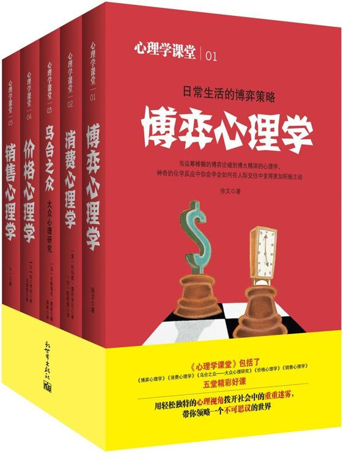

<svg xmlns="http://www.w3.org/2000/svg" xmlns:xlink="http://www.w3.org/1999/xlink" version="1.1" width="100%" height="100%" viewbox="0 0 563 751" preserveaspectratio="none">

<image width="563" height="751" xlink:href="cover.jpeg"></image>
</svg>

# 总目录

<a href="#part0001.html" class="calibre1">博弈心理学</a>

<a href="#part0012.html" class="calibre1">消费心理学</a>

<a href="#part0037.html" class="calibre1">乌合之众：大众心理研究</a>

<a href="#part0059.html" class="calibre1">价格心理学</a>

<a href="#part0082.html" class="calibre1">销售心理学</a>

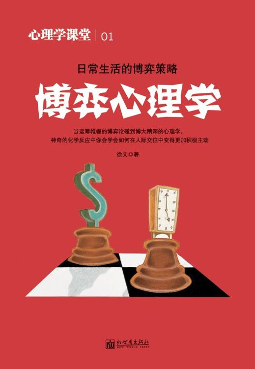

# 

当运筹帷幄的博弈论碰到博大精深的心理学，神奇的化学反应中你会学会如何在人际交往中变得更加积极主动

如何驾驭他人心理，如何选择优势策略，如何看穿他人欲望，如何洞悉他人需求，是每个人的生存必修课。

# 序　言

在一个风雨交加的晚上，有一个饥寒交迫的穷人到一个富人家乞讨。

“滚开！”仆人嚷道，“不要来打搅我们。”

“你让我进去吧，我只想在你们的火炉旁把淋湿的衣服烤干。”穷人哀求说。

仆人认为这点要求不算什么，也不需要什么花费，就让他进去了。

穷人进到屋内后，请求仆人借给他一口锅，以便让他“煮点石头汤喝”。

“石头汤？”仆人一听，很是惊讶，“我倒是想看看你怎样把石头做成汤。”于是他答应了，从厨房拿出一口小锅递给了那个穷人。

穷人在富人家的庭院中捡了一块石头，洗净后放在锅里煮。

“可是，你总得放点盐进去吧。”穷人以一副商量的口气向仆人建议道。仆人觉得他说得有道理，就给了他一些盐巴。

厨房里还有一些做晚饭剩下的碎菜叶，以及一些碎肉末，仆人也一并给了穷人。穷人欣然接受，把它们一一放进了锅里。

故事讲到这里，你应该能猜到了：这个既可怜又可爱的穷人把石头捞出来扔回院中，美美地喝了一锅肉汤。

为什么仆人不能拒绝穷人的一再要求呢？

这就是博弈论中的加法策略和心理学中的“登门槛效应”共同作用的结果。

穷人的目的是在富人家中讨得一口饭吃，但他没有直插主题，而是采取了迂回策略：先提出一个不损耗对方丝毫利益的小要求，待对方接受之后再一步步“加码”，还原目的的本来面目，获得自己想要的结果。

套用一下心理学原理，就是人们常说的“登门槛效应”——当一个人先接受了别人一个小的要求之后，再拒绝对方就变得很困难了。为保持形象的前后一致，他可能会接受一项重大、更不合理的要求。这就好比登门槛，只要你稍稍打开了一个门缝，让对方登了门槛，那他就有可能进入室内了。

穷人成功地从富人家的仆人那里讨得了饭食，决不单单只赢在策略的选择上，还赢在对对方心理的把握上。因此，对所有人来说，学习博弈策略只是整个制胜计划的一部分，更重要的是，我们必须具备上佳的洞察他人心理的能力，并能熟练地将这些能力应用于实践中。

介绍博弈论的书籍非常多，其方法大多是假定的理想化的理性行为者参与博弈；描述心理学的书籍也不少，其依据往往是单调而无味的专业术语的堆积。而本书的出发点却是独特的，它在生活化了的策略行为中融入了相关的心理学原理，将运筹帷幄的博弈论与博大精深的心理学进行了感性的糅合和深层次思考，对您全面理解策略思维具有很大的指导意义。

如果您崇尚博弈策略，那希望您从本书里尝尝与他人进行心理较量的滋味；如果您喜欢与他人进行心理较量，本书将指给你看博弈策略的风景。

人生之旅，流光溢彩，追求卓越，求胜防败。如何选择优势策略，如何驾驭他人心理，是每个人的必修课。因为人生就是一场精彩的心理博弈。

# 目录

# Contents

<a href="#part0003.html" class="calibre1">序　言</a>

<a href="#part0005_split_000.html" class="calibre1">Part
1　加减博弈：如何让他人接受自己</a>

<a href="#part0005_split_001.html_sec001"
class="calibre1">◇“加法三毛”：让潜在的顾客流向自己</a>

<a href="#part0005_split_002.html_sec002"
class="calibre1">◇猕猴做加法：本质不变，变的只是形式</a>

<a href="#part0005_split_003.html_sec003"
class="calibre1">◇要一个，还是两个</a>

<a href="#part0005_split_004.html_sec004"
class="calibre1">◇为什么年终奖少了，员工们依然兴高采烈</a>

<a href="#part0005_split_005.html_sec005"
class="calibre1">◇得寸为什么能进尺</a>

<a href="#part0005_split_006.html_sec006"
class="calibre1">◇自降身段：维多利亚女王的减法策略</a>

<a href="#part0005_split_007.html_sec007"
class="calibre1">◇请求他人帮个小忙——帮助他人维护“自尊心”</a>

<a href="#part0005_split_008.html_sec008"
class="calibre1">◇怎样借钱最省事</a>

<a href="#part0005_split_009.html_sec009"
class="calibre1">◇一个9岁小孩的谋略</a>

<a href="#part0006_split_000.html" class="calibre1">Part
2　信息博弈：如何诱使对方判断失误</a>

<a href="#part0006_split_001.html_sec001"
class="calibre1">◇聪明的费尔南多</a>

<a href="#part0006_split_002.html_sec002"
class="calibre1">◇智勇角逐：孙膑VS庞涓</a>

<a href="#part0006_split_003.html_sec003"
class="calibre1">◇暗示错误前提会使人判断失误</a>

<a href="#part0006_split_004.html_sec004"
class="calibre1">◇别拿别人当笨蛋</a>

<a href="#part0006_split_005.html_sec005"
class="calibre1">◇让对手暴露弱点</a>

<a href="#part0006_split_006.html_sec006"
class="calibre1">◇食品会变质，信息也会过时</a>

<a href="#part0006_split_007.html_sec007"
class="calibre1">◇适时地吹嘘一下自己的实力又何妨</a>

<a href="#part0006_split_008.html_sec008"
class="calibre1">◇“狼来了”——制造虚假的“心理映象”</a>

<a href="#part0006_split_009.html_sec009"
class="calibre1">◇巧施离间，智取长平</a>

<a href="#part0006_split_010.html_sec010"
class="calibre1">◇呆若木鸡，引而不发</a>

<a href="#part0007_split_000.html" class="calibre1">Part
3　皮洛斯的胜利：“吃力不讨好”的事你还要继续做下去吗</a>

<a href="#part0007_split_001.html_sec001"
class="calibre1">◇成本＝“会计成本”＋“机会成本”＋“沉没成本”</a>

<a href="#part0007_split_002.html_sec002"
class="calibre1">◇伤人一千而自损八百</a>

<a href="#part0007_split_003.html_sec003"
class="calibre1">◇别让“趋合心理”主宰了你的消遣活动</a>

<a href="#part0007_split_004.html_sec004"
class="calibre1">◇协和谬误：欲罢不能的困局</a>

<a href="#part0007_split_005.html_sec005"
class="calibre1">◇看1美元如何拍卖成205美分</a>

<a href="#part0007_split_006.html_sec006"
class="calibre1">◇做个不完美但快乐的非“99族”</a>

<a href="#part0007_split_007.html_sec007"
class="calibre1">◇“焦土政策”：增加对手的行动成本</a>

<a href="#part0007_split_008.html_sec008"
class="calibre1">◇不能取胜，就该谋和</a>

<a href="#part0008_split_000.html" class="calibre1">Part
4　囚徒困境：大家好才是真的好</a>

<a href="#part0008_split_001.html_sec001"
class="calibre1">◇陷入困境：合作还是背叛</a>

<a href="#part0008_split_002.html_sec002"
class="calibre1">◇人性的弱点</a>

<a href="#part0008_split_003.html_sec003"
class="calibre1">◇精明不等于高明</a>

<a href="#part0008_split_004.html_sec004"
class="calibre1">◇走出困境：搭便车的小猪</a>

<a href="#part0008_split_005.html_sec005"
class="calibre1">◇诚信的收益</a>

<a href="#part0008_split_006.html_sec006"
class="calibre1">◇教授的“圈套”</a>

<a href="#part0008_split_007.html_sec007"
class="calibre1">◇把别人想象成天使，你就不会遇到魔鬼</a>

<a href="#part0008_split_008.html_sec008"
class="calibre1">◇哈里逊是傻小孩吗</a>

<a href="#part0009_split_000.html" class="calibre1">Part
5　纳什均衡：为什么对手总喜欢做你的邻居</a>

<a href="#part0009_split_001.html_sec001"
class="calibre1">◇每个人都不能容忍别人比自己强</a>

<a href="#part0009_split_002.html_sec002"
class="calibre1">◇为什么对手总喜欢做你的邻居</a>

<a href="#part0009_split_003.html_sec003"
class="calibre1">◇假如没有竞争，老虎也会失去霸气</a>

<a href="#part0009_split_004.html_sec004"
class="calibre1">◇互相牵制的螃蟹</a>

<a href="#part0009_split_005.html_sec005"
class="calibre1">◇聪明人，靠脑袋存活</a>

<a href="#part0009_split_006.html_sec006"
class="calibre1">◇牧师的忏悔</a>

<a href="#part0010_split_000.html" class="calibre1">Part
6　破窗理论：对人对己都有效的心理暗示术</a>

<a href="#part0010_split_001.html_sec001"
class="calibre1">◇既然是坏的东西，让它更破一些也无妨</a>

<a href="#part0010_split_002.html_sec002"
class="calibre1">◇撩开衣服看自己</a>

<a href="#part0010_split_003.html_sec003"
class="calibre1">◇囚禁我们的不是别人，而是我们自己</a>

<a href="#part0010_split_004.html_sec004"
class="calibre1">◇毒蛇的心理威慑</a>

<a href="#part0010_split_005.html_sec005"
class="calibre1">◇“说你行，你就行”是怎么回事</a>

<a href="#part0010_split_006.html_sec006"
class="calibre1">◇算命先生为什么会屡屡言中</a>

<a href="#part0011_split_000.html" class="calibre1">Part
7　选择博弈：鲜花为何插在了牛粪上</a>

<a href="#part0011_split_001.html_sec001"
class="calibre1">◇怎样找到一个好老婆</a>

<a href="#part0011_split_002.html_sec002"
class="calibre1">◇鲜花为何插在了牛粪上</a>

<a href="#part0011_split_003.html_sec003"
class="calibre1">◇霍布斯选择：切勿钻入别人设计的“马圈”中</a>

<a href="#part0011_split_004.html_sec004"
class="calibre1">◇今天的生活来自昔日的选择</a>

<a href="#part0011_split_005.html_sec005"
class="calibre1">◇重大选择时，学会倾听自己的声音</a>

<a href="#part0011_split_006.html_sec006"
class="calibre1">◇布利丹的驴子：学会选择，懂得放弃</a>

<a href="#part0011_split_007.html_sec007"
class="calibre1">◇做好人生的第一次选择</a>

<a href="#part0000.html" class="calibre1">返回总目录</a>

# Part 1　加减博弈：如何让他人接受自己

宇宙的一切道理，都是一加一减，非常简单；好像天平一样，一高一低，这头高了，另一头就低了，所以只有加减，包括了乘除，也包括了一切数理。

——南怀瑾

## “加法三毛”：让潜在的顾客流向自己

在南方的一个小镇上，有两个报童——三毛和小拉里在卖同一份报纸，毫无疑问，他们俩是名副其实的竞争对手。

小拉里踏实勤奋，每天扯着嗓门沿街叫卖，不管刮风下雨从不间断。可结果却不尽如人意，自己每天卖出的报纸数量相对于三毛来说并不多，而且还有减少的趋势。

三毛也很勤奋，也沿街叫卖，但他比小拉里多做了一件事——每天坚持去一些人员集中的固定场所，先将报纸分发给大家看，过一会儿再来收钱。虽然偶尔有几个只看报纸而不掏钱买，甚至把报纸损坏的人，但这些损耗相对于此种做法带来的收入而言，是小巫见大巫，完全可以忽略不计。

渐渐地，三毛跟这些人的关系越来越熟，卖出去的报纸也越来越多。而小拉里能卖出去的报纸也就越来越少了，最后不得不另谋生计。

这就是三毛的加法策略：通过让顾客先看报纸后付钱，而让潜在的顾客流向自己。

该加法策略的奥妙之处如下：

◎**利用人们的互惠心理，让顾客无法拒绝你的好意**

人是三分理智、七分感情的动物。大量研究发现，人际关系的基础是人与人之间的相互重视与相互支持。也就是人们常说的“给予就会被给予，剥夺就会被剥夺。信任就会被信任，怀疑就会被怀疑。爱就会被爱，恨就会被恨”。

这就有了互惠原则：当他人做出友好姿态以示接纳和支持我们时，我们会觉得“应该”对别人报以同样的回应，进而产生一种心理压力，迫使我们对他人也做出友好的举动。否则，我们以某种观念为基础的心理平衡就会被破坏，我们也就会感到不安。

丹尼斯·里根教授（Dennis
Regan）做过一个关于互惠原则的经典实验，他让实验人员化装为彩券销售员，在彩券正式销售前先发放免费可乐给顾客。结果发现，事先获赠一杯免费可乐的顾客，后来购买彩券的张数，比未获得免费可乐的人要多两倍。

尽管赠送免费可乐和推销彩券并不是同时进行的，而且实验人员在向顾客兜售彩券时也并未提及免费可乐的事，但顾客还是记住了他先前的好意，并愿意对此礼尚往来。

三毛把报纸先免费发给顾客看，这在一定程度上使顾客产生了一种受人恩惠的亏欠心理。为了追求心理上的平衡，顾客掏钱买报纸也就在情理之中了。

这种效应在日常生活中也存在。顾客在选购衣服时，精明的售货员为打消顾客的顾虑，“慷慨”地让顾客试一试。当顾客将衣服穿在身上后，她极力称赞衣服很合适，并周到地为你服务。在这种情况下，当她再劝你买下这件衣服时，很多顾客就难以拒绝。

◎**免费阅读报纸，让顾客有占便宜之感**

应该说，人天生就有一种占便宜的心理。推销人群中也流传着这样一句话：“客户要的不是便宜，而是要感到占了便宜。客户有了占便宜的感觉，就容易接受你推销的产品。”

三毛就是利用了顾客的占便宜心理，让顾客免费阅读报纸，满足了普遍存在于其潜意识中的渴望得到“更多剩余”的心理体验，成功地把报纸卖了出去。

在美国芝加哥的一条热闹的大街上，一对开服装店的德鲁比克兄弟就利用人的这一心理，靠装聋子对服装进行推销，竟发了大财。

德鲁比克弟弟把顾客引进店里，劝说顾客试穿衣服是易如反掌的事。再加上德鲁比克弟弟修炼到炉火纯青地步的奉承语言，大多数顾客都经不住其甜言蜜语的狂轰滥炸，最后总要问道：“这套衣服多少钱？”

德鲁比克弟弟把手放在耳朵旁，一脸茫然地问道：“您说什么？”

“这衣服多少钱？”顾客提高嗓门又重复了一遍刚才的问题。

“哦，您说价格啊，好商量，我问问老板。对不起，我耳朵不好使。”

德鲁比克弟弟转过身，向坐在柜台后面的德鲁比克哥哥大声叫道：“德鲁比克先生，这位小姐看上的这套服装的定价是多少？”

“老板”站了起来，向顾客微微一笑，不紧不慢地答道：“那套吗？72美元！”

“多少？”“耳背不好使”的德鲁比克弟弟伸直脖子又问。如果你不知道事实的真相，你绝对不会怀疑眼前这位“耳背”的售货员是冒牌的。

“七——十——二美元！”“老板”德鲁比克哥哥加大音量一个字一个字地重复了一遍。

“聋子”德鲁比克弟弟回过身，微笑着对顾客说：“小姐，您也听到了，是42美元！绝对的物超所值。”顾客自认为走运，生怕“老板”发现，赶紧掏钱买下，溜之大吉。

其实，42美元正是那套服装的真实价格，顾客并没有占得便宜。也正是由于价格公道，德鲁比克兄弟的“聋子”促销手段才没有惹来什么麻烦。

这种经营手段虽不足取，但其经营理念却值得借鉴。营销回归到原点就在于其策略运用得得当与否，但前提是不欺诈顾客。

◎**多见面，和顾客混个脸熟**

中国人讲“一回生，二回熟”。天天见面，混个脸熟，就可以快速拉近彼此之间的距离。顾客会毫不犹豫地拒绝一个陌生的报童，但是他很难拒绝天天送报纸给你看的一个熟悉的男孩。理所当然地，三毛就把一次性交易的小买卖变成了可多次交往的固定客户关系。

在一个固定地区，对同一份报纸来说，读者客户是有限的。买了一个人的，就不会再去买另一个人的。三毛先把报纸发出去，拿到报纸的人肯定不会再去买小拉里的报纸了，等于是在无形中占领了市场。

三毛发放的报纸越多，他的市场份额就越大。与之相应的，小拉里的市场就越小了。即使有些人看了报纸，退报不给钱，也没什么关系。因为他已经把该期报纸的信息浏览完了，肯定也不会再去小拉里那里买一份相同的报纸了，他还是自己的潜在客户。

这就是卖报小童三毛的加法策略，既通俗易懂，又奥妙无穷。

## 猕猴做加法：本质不变，变的只是形式

战国时代，宋国有一个老人，十分喜爱猕猴。他在家中院子里养了许多猕猴，人称狙公。狙公与猕猴相处久了，人猴之间竟然能沟通讲话了。

因为狙公养的猕猴太多了，每天要消耗大量的瓜果和粮食。然而一个普通家庭哪有财力物力满足一群猕猴对食物的长期需要呢？几年之后，狙公家里的经济就越来越不景气了，而猕猴的数目却越来越多，此时的狙公意识到了缩减猕猴口粮的必要性。

猕猴们的口粮是减下来了，但新的问题又出现了：食不果腹而富有灵性的猕猴们并不像猪、羊、鸡、犬等家禽那样，吃不饱时仅仅只是哼哼叫叫，或者外出自由觅食。它们像一群顽皮的孩子，一会儿把厨柜里的碗搬到院中，一会儿把晾绳上的衣服扯到地上，借以向主人示威。

为了不再让饥饿的猕猴们肆意捣乱，狙公只好另想办法去安抚它们。狙公家门外有一棵高大的栎树，一到秋天，栎树上就结满了猕猴们爱吃的形似蚕茧的棕红色坚果——橡子。用橡子代替短缺的口粮来给猕猴们解馋充饥倒是一个好办法。

于是，狙公就和猕猴们商量说：“从明天开始，每天饭后我再给你们吃一些橡子。标准是朝三暮四——早上三颗橡子，晚上四颗橡子，你们觉得怎么样？”

猴子都是急性子──出了名的猴急，一听早饭后只有三颗橡子，还没有晚饭后吃得多，个个立起身子，龇牙咧嘴地对着狙公叫喊发怒：“不行不行，太少了！怎么早上吃的还没晚上多？”

老谋深算的狙公一看到这个情形，连忙改口说：“别急别急，有意见好商量。既然大伙儿都不同意，那我们就朝四暮三——早上四颗橡子，晚上三颗橡子，这样总可以了吧？”

众猕猴一听大喜，认为早上的橡子数量由三颗变成了四颗，自己取得了胜利。它们眨着眼睛，挠着腮帮，高兴地在地上滚来滚去。

这个故事改编自《庄子·齐物论》，是个成语故事，名叫“朝三暮四”。其实橡子的总数并没有变，不管是三加四，还是四加三，每天可以吃到的橡子数量仍然是七颗，只是变化了一下分配方式，猕猴们就转怒为喜。

这则故事可以看成是心理学上的一个成功策略。喂养猕猴的狙公在没有增加财政支出的情况下，通过对猕猴运用心理战术而让它们接受了自己的安排，避免了一场可能的猕猴骚乱。

那么什么是心理战术呢？

心理学家告诉我们，心理战术是一种抓住对方心理，通过影响对方的潜意识，改变其意识和认知，以达到自己目的的心理征服战术。心理战术具体可以分为沉锚效应、趋合心理、参与定律等等。

故事中的狙公到底是运用了哪种心理战术呢？让我们耐心看下去。

一杯温水，保持温度不变。另有一杯冷水，一杯热水。先将手放在冷水中，再放回温水中，会感到温水热；先将手放在热水中，再放回温水中，会感到温水凉。同一杯温水，出现了两种不同的感觉。这是“知觉对比”（Perceptual
Contrast）对人们产生的影响，简单来说，就是通过对比影响人们的认知。

心理学家扎卡里·托马拉（Zakary Tormala）和里查德·佩蒂（Richard
Petty）为了验证“知觉对比”对人们的影响，做了下面这个实验。

研究人员虚构了两家商店，一家是“布朗百货”，另一家叫“史密斯百货”。实验分两组进行，第一组：先介绍“史密斯百货”六个部门的情况，再介绍“布朗百货”的三个部门；第二组：先介绍“史密斯百货”一个部门的情况，之后再介绍“布朗百货”的三个部门。

结果证实，当先介绍“史密斯百货”的六个部门，再介绍“布朗百货”的三个部门时，人们会认为对“布朗百货”的了解不够；但当先介绍“史密斯百货”的一个部门，再介绍“布朗百货”的三个部门时，人们对“布朗百货”的认知又有了变化，觉得基本上了解了“布朗百货”。就是说，放在前面介绍的“史密斯百货”的部门越少，人们就认为自己对后介绍的“布朗百货”的了解越充分。这就是“知觉对比”产生的影响。

“知觉对比”对人们具有很大的影响力，将它用在销售中是有很大威力的。假设你认为公司的某个产品特别适合某位客户，那你就可以通过重点介绍该产品，同时对其他产品一带而过的方式来增大该客户购买的可能性。

还有的商家只是巧妙地在两件商品间形成对比，就促进了两者的销量。这里有一个真实的例子。

日本有一家专门经营电子玩具的商店。商店新引进了两种不同型号、质量相差无几、价钱一样的电子游戏机。可是摆在柜台上的这两种游戏机却很少有人购买，这令商店老板一筹莫展。

这时店里正好新招了一位女店员，她为店老板出了一个好主意。她建议把型号小的那种游戏机的标价从80元提到160元，型号较大的游戏机标价不变。

这样一来，当顾客进到店里，看到型号又大、价格又便宜的游戏机并不比标价高的那种质量差，以为捡到了便宜，机会难得，便毫不犹豫地将其买下。而另外一些有钱人在看到型号小，价格反而比型号大的游戏机更贵时，以为遇到了“真货”，赶紧慷慨解囊，买回去当作上好的礼物送给亲朋好友的孩子。很快，几千台两种型号的游戏机就被抢购一空。

原本无人问津的两种游戏机，在价格没有降低反而有一款略有提高的情况下，竟然变得出奇的畅销。这其中的奥秘就是商家恰当地对顾客运用了“知觉对比”的心理战术。

养猕猴的狙公就是应用“知觉对比”效应制造了一种实同形异的假象，迷惑了那群辨不清“朝三暮四”和“暮四朝三”孰多孰少的猕猴，赢得了它们的认可。

## 要一个，还是两个

在街道的两旁有两家卖粥的小店。两家店每天都是顾客盈门，人进人出，客流量相差无几。然而，晚上结算的时候，左边这家店总是比右边那家的营业额多出百十来元，天天如此，让人有些纳闷。

原来这里面的奥秘就在于两家服务小姐的说话方式。当客人进入右边那家店时，服务小姐微笑着迎上去，盛了一碗粥，问道：“您加不加鸡蛋？”如果客人说“加”，服务小姐就给客人加一个鸡蛋；如果客人说“不加”，服务小姐也就不再多问。客人有说加的，也有说不加的，大概各占一半。

走进左边的那个小店，服务小姐也是微笑着迎上前，盛上一碗粥，问道：“您加一个鸡蛋还是加两个鸡蛋？”客人笑着说：“加一个。”再进来一个顾客，服务小姐又问一句：“您加一个鸡蛋还是加两个鸡蛋？”爱吃鸡蛋的就说加两个，不爱吃的就说加一个。很少有人说不加的。

在右边的小店里，客人考虑的是“加还是不加鸡蛋”的问题；而在左边的小店里，客人考虑的是“加一个还是加两个鸡蛋”的问题。客人在考虑问题时接受到的第一信息不同，做出的回答也就不同。

这样一天下来，左边这个小店总要比右边那个小店多卖出很多个鸡蛋，难怪他们的收入会比右边的小店多。

心理学家将这一现象归结为卖粥小店里的服务生对顾客运用了“沉锚效应”的结果。

沉锚效应，心理学名词，指的是人们在对某人某事做出判断时，易受第一印象或第一信息支配，就像沉入海底的锚一样把人们的思想固定在某处。

我们用中国成语“先入为主”来解释的话，相信绝大部分的人都可以很好地理解了。关于沉锚效应，心理学家做了两个著名的试验。

**实验一：**

1957年，美国心理学家洛钦斯设计了四篇不同的短文，分别描写一位名叫杰姆的人。第一篇文章整篇都把杰姆描述成一个开朗而友好的人；第二篇文章前半段把杰姆描述得开朗友好，后半段则描述得孤僻而不友好；第三篇与第二篇相反，前半段说杰姆孤僻不友好，后半段却说他开朗友好；第四篇文章全篇将杰姆描述得孤僻而不友好。

洛钦斯请四个组的被试者分别读这四篇文章，然后在一个计量表上评估杰姆的为人到底友不友好。结果表明，篇幅的前后是至关重要的。开朗友好在先，评估杰姆为友好者的比例为78％；孤僻而不友好在先，则评估其为友好者的比例降至18％。

**实验二：**

一位心理学家让两个学生A、B都做对30道题中的一半，让学生A做对的题目尽量出现在前15道题，而让学生B做对的题目尽量出现在后15道题，然后让其他人对这两个学生进行评价：看谁更聪明一些。

实验结果发现，多数人都认为学生A更聪明。

为什么会出现上述的这两种现象呢？这就是典型的沉锚效应。最初接触到的信息所形成的印象往往会对我们以后的行为活动和评价产生影响，实际上也就是“第一印象”的影响。

第一印象对人们如何判断一个人有着重要的影响。两个素不相识的人，如果第一次见面时彼此留下的是正面的、良好的印象，人们会希望继续交往，增进关系；而如果是负面的、不好的印象，人们则拒绝继续交往。

所以，留好第一印象是一个妇孺皆知的道理，为官者总是很注意烧好上任之初的“三把火”，平民百姓也深知“头三脚”的作用，每个人都力图给别人留下良好的“第一印象”。第一印象总是在别人的心目中挥之不去，不管你发生了怎样的变化，有了多大的进步或者退步，对方还是很难忘记对你保留的原来的印象。

在前面我们讲到的“朝三暮四”的典故里，狙公的做法同样也可以归为“沉锚效应”的作用。在狙公给猕猴列出的“朝三暮四——早上三颗橡子，晚上四颗橡子”的标准里，猕猴得到的第一信息是：它们早上可以得到三颗橡子，至于晚上可以得到四颗橡子的“第二信息”却没有引起它们的重视。三颗橡子的“第一信息”相对于四颗橡子的“第二信息”来说，明显是少了。所以自作聪明的猕猴们当然不同意狙公的这一分配方式。

而在“朝四暮三——早上四颗橡子，晚上三颗橡子”的标准里，早上四颗橡子是猕猴们接受到的“第一信息”，这对于晚上只得三颗橡子而言，显然是沾光了，它们自然乐得屁颠屁颠的。

这种方式很值得人们在做广告宣传或向别人推销产品时借鉴，充分利用第一信息的力量，既给别人留了选择的余地，又为自己争取了更多的领地。只有这样，才会于不声不响中获胜。由此看来，做生意绝不仅仅是方法的问题，更多的是对消费者消费心理的琢磨与操纵。

## 为什么年终奖少了，员工们依然兴高采烈

经济不景气时期，有一家向来营运很好的公司，盈余大幅滑落，老板为只能发给员工一个月的年终奖金而忧心：“许多员工都以为可以拿到至少两个月的奖金，恐怕飞机票、新家具都订好了，只等拿了奖金去付账呢！”

经理也愁眉苦脸：“就像给孩子糖吃，每次都给一大把，现在突然变成两颗了，孩子一定会吵。”从经理的这句漫不经心的话里，老板找到了解决问题的切入点。

两天后，公司传出消息：“由于运营不佳，公司年底不仅要裁员，就连年终的聚会晚宴，可能都要取消。”听到这个消息，公司上下顿时人心惶惶。每个人都在猜，被裁的那个会不会是自己呢？

过了几天，又有消息宣布：“公司虽然艰苦，但大家在一条船上，要同舟共济，再怎么艰难，也绝不会牺牲共患难的同事，就是年终奖金，不可能发了。”

听说不裁员，大家放下了心头的大石头。不至于卷铺盖的喜悦，早压过了没有年终奖金的失落。

突然，老板召集各主管开紧急会议。员工们面面相觑，不知道又有什么状况出现。几分钟后，主管们纷纷冲进自己的部门，兴奋地高喊着：“有了！有了！还是有年终奖金的，整整一个月，马上就会发下来，让大家过个好年！”刹时，整个公司淹没在一片欢呼声中。

公司“年终奖事件”之所以会有一个皆大欢喜的局面，在很大程度上得益于老板的这一加法策略的成功运用。先把夸大了的最坏的结果告诉员工，有目的地先给他们做好前期的心理铺垫，降低他们的心理预期。然后再一步步地“加码”，还原目的的本来面目，获得自己想要的结果。

人的感受就是这样微妙，想要的越多，失望也越大。如果事先有最坏的打算，得到的意外惊喜度也就加倍高。

有一个公式可以对其进行佐证：

失望＝心理预期－现实

喜悦＝现实－心理预期

现实（公司到年底只能发给员工一个月的年终奖金）是一个定量，失望或喜悦将随着心理预期的变化而变化。其中，失望与心理预期成正比，喜悦与心理预期成反比。心理预期越低，失望的程度越低，而喜悦的程度越高。

参透这一心理策略的调皮学生，如果有一次考试不好，在告知父母成绩之前，会先给父母打“预防针”——我这次考得不好，可能只得60分。也许当时他的父母会很郁闷，但是经过他多次暗示之后，他的父母会逐渐觉得：考60分也没有什么，总比不及格强吧。而当他们看到自己孩子70分的考卷时，会觉得非常高兴。

让我们再来看看美国的一则征兵启事：

来，快来当兵吧。当兵有两种可能，有战争或没有战争，没有战争有什么可怕的？有战争有两种可能，上前线或不上前线，不上前线有什么可怕的？上前线有两种可能，受伤或者不受伤，不受伤有什么可怕的？受伤有两种可能，能治好或者不能治好，能治好有什么可怕的？不能治好更不可怕，因为已经死了。

据说这则幽默的启事一出，原来应征者寥寥的局面马上改变了。因为启示中已经把最坏的结果告诉了人们，把人们的心理预期降到了最低限。而一旦人们知道了事情的底线，做好了最坏的打算，心情就会释然。

有人曾问一个将军：“为什么你能在多次残酷的战争中生还？”将军说他的经验只有一个，那就是“每次战争前，我都告诉自己，大不了老子死在这场战争中，反正杀的人多了，也够本了”。其实有些事情，只要我们做了最坏的打算，抱有一种“大不了如此而已”的想法，我们就会勇气倍增，就能够积极而勇敢地面对它。

在社会交往中，我们常常需要伙伴、邻居或同事的帮助，但因为某种原因，他们也许并不喜欢我们。所以我们不愿开口向这些人求助，害怕会引起他们的反感。在这种情况下，人们常对是否开口求助犹豫再三，最终耽误了手头的急事儿。其实这样的担忧完全没有必要。向讨厌自己的人求助确实需要些勇气，但只要想想，既然这个人对你没有好感，那开口求助最坏的结果，还是没有好感而已。所以试着开口吧，你不会有什么损失。

## 得寸为什么能进尺

在一般情况下，人们都不愿意接受他人提出的较高的要求，因为它既费时又费力并且还难以成功。相反，人们却乐于接受较小的、较易实现的要求。令人感到奇怪的是，在实现了较小的要求之后，人们又往往会慢慢地接受较大的要求。心理学家解释说，这是“登门槛效应”对人产生了影响。

明代洪自成也曾谈到过这个问题，他在《菜根谭》中说：“攻人之恶勿太严，要思其堪受；教人之善勿过高，当使其可从。”

登门槛效应（Foot In The Door
Effect）又称得寸进尺效应，是指当一个人先接受了别人一个小的要求后，为保持形象的一致，他可能会接受一项重大的、更不合意的要求。犹如登门槛时要一级台阶一级台阶地登，这样更容易登到高处。

说白了，“登门槛效应”就是我们常说的“蹬鼻子上脸”。美国著名社会心理学家弗里德曼（J．L．Freedman）在1966年做了一个验证“登门槛效应”的经典性研究。

研究第一步，先让助手到各家各户向家庭主妇们提出一个小小的要求，请她们支持“安全委员会”的工作，并在一份呼吁安全驾驶的请愿书上签名，这是一个小要求。

研究第二步，两周以后，由原来提出要求的那个助手重新找到这些主妇，问能否在她们的庭院里竖立一块不太美观的大告示牌，上写“谨慎驾驶”。该招牌大而不美观，这是一个大要求。

结果表明，先前在请愿书上签过名的大部分（超过55％）主妇都同意竖立这块大告示牌，而没有签过名的主妇，只有不到17％的人接受了这一要求。前者比后者高三倍。

无独有偶，加拿大心理学家也做了一个实验：

如果直接提出要求，多伦多居民愿意为癌症学会捐款的比例为46％；而分两步提出要求，前一天先请人们佩戴一个宣传纪念章，第二天再请他们捐款，则愿意捐款人数的百分比增加了一倍。

从这两个实验中，我们可以看到：一下子向别人提出一个大要求，人们一般很难接受，而逐步提出要求，不断地缩小与大要求的差距，人们则比较容易接受。用“登门槛”来形容这种心理现象简直是太形象了。

登门槛效应在日常生活中也普遍存在。销售商就常常使用这种技巧来说服顾客购买他的商品。

在二手车市场，销售商卖车时往往把价格标得很低，等顾客同意出价购买时，再以种种借口加价。据有关研究发现，二手车销售商的这种方法往往可以使人更容易接受较高的价格。如果销售商在一开始就开出这种高价格，顾客则很难接受。

既然登门槛效应对人们心理的影响如此巨大，那我们就有必要深入分析登门槛效应形成的原因，弄清其所以然，把握它，运用它，让它为我们服务。

登门槛效应的形成，有着深刻的心理机制：主要是由于人们在不断满足小要求的过程中已经逐渐适应，意识不到逐渐提高的大要求已经偏离了自己的初衷。此外，人们都希望在别人面前保持一种比较一致的形象，不希望别人把自己看作是“喜怒无常”的人。

因而，在接受别人的要求，对别人提供帮助之后，再拒绝别人就变得更加困难了。如果这种要求给自己造成的损失并不大的话，人们往往会有一种“反正都已经帮了，再帮一次又何妨”的心理。于是，登门槛效应又发生作用了。

需要提醒大家的是，在利用登门槛效应达到自己的目的时，也要看住自己的“门槛”，如果你要答应别人一个小要求，先想想有什么后果。该拒绝的时候一定要拒绝，切勿打肿脸充胖子，给自己带来不必要的麻烦。

## 自降身段：维多利亚女王的减法策略

维多利亚女王（Alexandrina
Victoria）的名字，象征着一个时代。她是英国历史上在位时间最长的君主，在位时间长达64年。在维多利亚统治期间，英国国民空前团结，英国成为一个强大的“日不落”帝国，并不断发展壮大。

特别值得一提的是，维多利亚女王是一位事业爱情双全的完美女强人。维多利亚女王与其丈夫阿尔伯特亲王（一位德国王子）相亲相爱，感情甚好。阿尔伯特亲王是一个极具魅力、举止优雅的男人。他学识渊博，被称为“走动的百科全书”。

可俗话说：“牙齿和舌头再好，也有磕着的时候。”即使是恩爱夫妻，相处的时间长了，也难免会遇到不愉快的事，难免会有相互顶撞的时候。

一次，维多利亚女王与阿尔伯特亲王吵了架，阿尔伯特亲王独自回到卧室，把自己反锁在屋内。处理完王国军机大事之后，维多利亚女王回到家里，来到卧室，准备就寝。但卧室的门关着，进不去，她只好敲门。

“谁？”屋里面的阿尔伯特亲王故意问道。

“英国女王。”屋外面的维多利亚女王神气地答道。

阿尔伯特亲王没有理睬。维多利亚女王等了一会儿，见里面没有反应，她只得再敲门。

“谁？”阿尔伯特亲王又问。

“维多利亚。”维多利亚女王放低声音回答道。

门还是没有开。这时，维多利亚忽然明白了，家是一个只讲爱的地方，这里没有什么女王和臣民，只有妻子和丈夫。维多利亚不得不第三次举起那只刚刚放下王笏的玉手继续敲门。

“谁？”阿尔伯特亲王再次明知故问。

“你亲爱的妻子。”维多利亚女王那带着一丝惭愧的声音谦卑而轻柔。

维多利亚女王的话刚刚说完，卧室的门就开了，迎接她的是满含深情的阿尔伯特亲王。

维多利亚女王运用的策略就是加减法中的自减法，她通过不断自降身段，终于敲开了被丈夫反锁的门。虽然世界上绝大多数门是专门为金钱、为权力、为尊荣而开放的，但总有一些门，只有摘下你的王冠、抖落掉外面世界涂在你身上的金粉的谦卑者才能进入，比如爱之门。进不了这扇门，女王就有国无家了。

## 请求他人帮个小忙——帮助他人维护“自尊心”

本杰明·富兰克林（Benjamin
Franklin），美国著名的政治家、外交家、科学家、发明家及哲学家。作为政治家，他起草了《独立宣言》和美国宪法；作为外交家，他是美国第一位驻外大使（法国），在美国独立战争期间为美国争取到了法国的支持，在世界上享有较高的声誉；作为科学家，他在电学上的成就显著，其创造的许多专用名词如正电、负电、导电体、充电、放电等成为世界通用词汇；作为发明家，他创造了双焦距眼镜、里程表和避雷针……

然而，除了以上种种发明之外，富兰克林还发现了可以用“麻烦”来赢得对手的尊重。

富兰克林在宾夕法尼亚州立法机构任职时，一位不友好的立法者常让他头疼不已。那位立法者还公开发表了一篇篇幅很长的诋毁富兰克林的演说辞，措辞尖锐。在那位立法者眼里，富兰克林简直一文不值。

面对这种状况，富兰克林真的有点手足无措了。但几乎是只用了一夜时间，富兰克林就成功地让那位反对自己的立法者转变为了他终生的朋友。

他到底用了什么方法呢？在解释如何赢得那位立法者的尊重与友情时，富兰克林这样说：

我从没想过要委曲求全来博得他的好感，但一段时间后，我萌发出了用其他方法的念头。在听说他收藏了几部稀世奇书之后，我给他写了一封短信，表示我十分想读一读这些名贵而罕见的书，希望能借其中一本书拜读几日。他一接到我的信，立刻把书给了我。一周后我把书还给他，同时夹了一封十分热情的信，表达了我对书的喜爱之情以及对他的衷心感谢。后来，我们再在国会见面时，他对我说话了（这在以前是不可能的），态度还很礼貌。此后，他表示愿意随时为我提供帮助。我们成了好朋友，这样的友谊一直维持到他去世。这真是应了那句格言：“为你做过好事的人，比之受过你恩惠的人，更能为你提供再次的帮助。”

多年后，乔恩·杰克（Jon Jecker）和大卫·朗迪（David
Landy）通过实验证实了富兰克林的说法。他们先把参与实验的所有人分为两组，让两组人都从乔（乔恩·杰克的实验助手）那里赢一些钱。然后乔向其中一组实验人员提出了归还所赢的钱的要求，而另一组人员则未被提以这样的要求。最后，由所有参与实验的人以匿名方式表达是否喜欢乔。

杰克和朗迪发现，那些被要求还钱的人对乔更具好感。实验表明，富兰克林的这一心理策略是正确的，虽然他的观点看上去并不符合逻辑。

这是为什么呢？其实，答案很简单。

不知道你注意到没有，当他人拜托自己帮个小忙时，自己通常会非常高兴，特别是当他人所恳求的东西又恰恰是自己最拿手或最得意的东西时，尤其会感到高兴，人就是这样。

富兰克林的这一策略正好契合了普遍存在于人类天性中的这种潜在的需求，所以，它才取得了如此巨大而明显的成效。

富兰克林通过向那位立法者借书这一小小的举动，已经在向对方暗示自己十分推崇他，从而主动将自己放在了一个相对较低的位置，无形中抬高了对方在自己心中的地位。这样，那位立法者就好比是高高在上的惠恩于天下大众的救世主，而富兰克林只是乞求他给点帮助的普通民众。这就很好地满足了对方“受尊重的心理需求”（马斯洛需求层次理论把人的需求分成生理需求、安全需求、社交需求、尊重需求和自我实现需求五类）。

从心理学的角度来解释便是：富兰克林通过借书激发了对方的“自尊心”，而维护“自尊心”的欲望是人类所有欲望中最强烈的。所以，在既能让他人满意，但又不会很麻烦他人的情况下，我们主动请求他人的帮助，就能获得他人的好感。

## 怎样借钱最省事

加减法策略被人们广泛地运用于各种谋略之中，如果说“登门槛效应”是加法策略的一个表现形式的话，那与之相对应的将其道反而用之的“留面子效应”就是一个不折不扣的减法策略。

“留面子效应”（Door In The Face
Effect），是指人们在向别人提出自己真正的要求之前，先向别人提出一个大要求，待别人拒绝之后，再提出自己真正的比较小的要求来，别人答应自己要求的可能性就会增加。

向别人借钱不管对谁来说都是个难题，然而如果能够巧妙运用“留面子效应”，你就会发现它比你想象的要容易得多。

试想一下你找朋友借100元钱的情景。你可以这么问：“嗨，老朋友，借我100块钱花花吧？”

照这样问，你得到的回答很可能是：“借钱做什么？我还缺钱用呢！”

可是，如果换种说法：“老同学，我最近手头很紧，借1000块钱给我救急，行吗？”

“什么？我哪有那么多，我也正用钱。”

在朋友拒绝了这个要求后，你再提出只借100块钱的要求。这样一来，朋友就比较容易答应借给你了。

美国心理学家查尔迪尼曾经进行过这样一项实验。

在实验中，查尔迪尼先要求20名大学生花两年时间担任一个少年管教所的义务辅导员。这是一件很费神的工作，大学生们断然拒绝了。

随后，查尔迪尼又提出了另一个要求，让这些大学生带领少年们去动物园玩一次。结果这次有50％的人接受下来。而当他直接向另一些大学生提出这个要求时，只有16.7％的人同意。

其实，带领少年们去动物园玩是一件很费神的工作，这从被直接提要求的大学生中只有16.7％的人表示同意便可以看出来。但为什么把这个要求放在另外一个较困难的要求之后，就会有50％的人接受呢？

这其中的原因就在于，首先，第一个很大的要求与后面一个小一点的要求形成了对比，让人更容易接受那个小一点的要求。其次，当一个人拒绝别人后，心里总会有一种歉意，而此时你再提出另一个请求，作为对你的让步做出的回应，他也会做出相应的让步。

现在我们又学到了一点，那就是——如果对某个人提出一个很大且被他拒绝的要求后，接着再向他提出一个小一点的要求，那么他接受这个小要求的可能性就大得多。这就是我们所要讲的“留面子效应”。

世界十大文豪之一鲁迅也曾提到过这一效应，在杂文《无声的中国》里，鲁迅这样写道：

中国人的性情是总喜欢调和，折中的。譬如你说，这屋子太暗，须在这里开一个窗，大家一定不允许的。但如果你主张拆掉屋顶，他们就会来调和，愿意开窗了。没有更激烈的主张，他们总连平和的改革也不肯行。那时白话文之得以通行，就因为有废掉中国字而用罗马字母的议论的缘故。

许多人正是利用这种策略去影响他人，当他们想让别人为自己处理某件事情之前，往往会先提出一个令人难以接受的要求。待别人拒绝且怀有一定的歉意时，再提出自己真正要对方办的事情。由于前面的拒绝，人们往往会为了留住面子而接受随后的要求。

精明的商家也经常使用这种策略。每逢新装上市，各品牌都贵得让人咋舌，毕竟，并不是每个人的腰包都那么让人有底气啊。可你偏偏就信赖这个牌子。凭心而论，薄薄的一件衣服不值那么多钱，但权衡一下，若能便宜一点，就冲着这牌子也要把它买下来！

你的这点心思商家是非常清楚的。他们适时制造出各种名目，使出他们的杀手锏——打折。5折、7折，折扣打花了你的眼，也平衡了你的心理：毕竟只花了一半的钱就买了名牌产品呢！打折正是商家屡试不爽的“法宝”。

## 一个9岁小孩的谋略

中国男人的长辫子和中国女人的小脚板是富有鲜明中国特色的历史“特产”，但中华民族作为一个历史悠久、有着深厚文化底蕴的文明古国，其遗产远远不只是这些象征着中国愚昧、落后的旧的传统道德观念，还有先辈留给我们的几乎人人都会用的谋略。

从前，有一对中年夫妇收养了亲戚家的一个男孩。一天，男孩看见自己的养父坐在院子的角落里一边抽着闷烟，一边唉声叹气，便关心地上前问道：“爹，你遇上什么烦心的事了吗？”

“一个9岁的小毛孩，告诉你也无济于事，去找伙伴们玩吧，别管大人们的事。”

“你还没告诉我呢，怎么就知道不管事。说给我听听嘛！”男孩哀求道。

经不住男孩的再三纠缠，养父道出了自己心中的苦水：“我特别想有个自己的孩子，跟你也可以做个伴啊，可你娘怎么也不同意。”

“原来爹是为这事发愁啊，这好办，我有办法，保证娘明天就会同意。”男孩一说完，就连蹦带跳地跑出去找同伴们玩耍了。

第二天早晨，刚吃完早饭，男孩就拿着一把尺子一本正经地在屋子里量来量去。养母从外面进来，看见忙忙碌碌的养子很是不解：“你在干吗呢？”

“我先量量这屋子的大小，看等我长大了，这房子能卖多少钱。”男孩头也不抬地回答道。

“你把房子卖了，那我和你爹住哪儿啊？”养母继续问道。

“那我可管不着了。”男孩放下手中的尺子，抬起头看着养母脸上诧异的表情，他知道自己的方法管用了。

就在当天晚上，养母宽衣上床，小声地对丈夫说：“孩他爹，我们要个属于自己的孩子吧。”

这就是一个9岁小孩子使用的谋略，他用一个预期要用的减法（不孝顺养父母），成功说服了自己的养母去做一件她原本不愿意做的事情。

# Part 2　信息博弈：如何诱使对方判断失误

笨人的可怕不在其笨，而在其自作聪明。

——李敖

## 聪明的费尔南多

没钱的犹太人费尔南多在星期五傍晚抵达一座小镇。他没钱吃饭，更住不起旅馆，只好到犹太教会堂找执事，请他介绍一个可以提供安息日食宿的家庭借宿一晚。

执事打开记事本，查了一下，对他说：“这个星期五，经过本镇的穷人特别多，每家都安排了客人，唯有开金银珠宝店的西梅尔家例外。只是他比较吝啬，一向不肯收留外地客人。”

“他会接纳我的。”费尔南多十分自信地说。

在执事的路线指示下，费尔南多来到了西梅尔家门前，他举起右手轻轻地在紧锁的漆红色大门上敲了三下。等西梅尔一开门，费尔南多就神秘兮兮地把他拉到一旁，从大衣口袋里取出一个砖头大小的沉甸甸的小包，小声问道：“西梅尔先生，请问砖头大小的黄金可以卖多少钱呢？”

西梅尔眼睛一亮，这可不就是自己日盼夜盼想要做的大买卖吗？可是，现在已经到了安息日（“安息日”是犹太教的古老节日。犹太教古老律法规定，一周的第七天是“安息日”，也就是休息的日子。因为犹太人日历的一天是从黄昏开始到第二天下午结束的，所以星期五傍晚是一周第七天的开始。“安息日”具体是指星期五黄昏到星期六下午耶稣不工作），不能再谈生意了。但西梅尔又舍不得让这上门的大交易落入别人手中，便连忙挽留费尔南多在自己家中住宿，到明天日落后再谈。

于是，在整个安息日，费尔南多都受到了珠宝店老板西梅尔的盛情款待。好不容易等到了星期六晚上，西梅尔满面笑容地催促费尔南多赶紧把“货”拿出来看看。

“我哪有什么金子啊？”费尔南多故作惊讶地说，“我不过想知道一下，砖头大小的黄金值多少钱而已。”

人们通常会将自己看到、听到、感觉到的经验，组织成自己感兴趣的事物。对他们来说，所谓的真实，只不过是他们将自己从外面世界里获知的部分信息，赋予了他们自己的意义，构建成了他们的知觉经验而已。

犹太人费尔南多正是利用了人们的这一心理，引出话题，设计了故事的前半部分，让珠宝店老板西梅尔根据自己之前提供的信息去进行一些“合理”的推想，从而达到了自己的目的。

## 智勇角逐：孙膑VS庞涓

战国中期，位于中原地区的魏国逐渐强大起来，不断对邻国用兵。公元前341年，魏惠王以韩国没有参加当年的逢泽之会（公元前344年，魏惠王所召集的一次诸侯盟会，试图确立魏国在列国间的统治，但遭到了韩国等国的抵制）为由，派太子申和庞涓率兵大举进攻比它弱小的兄弟之邦——韩国，企图一举亡韩。韩国自然不是魏国的对手，在魏军的强大攻势下，弱小的韩国岌岌可危。韩哀侯异常恐慌，危急之中遣使奉书星夜向齐国求救。

齐威王早就想伺机攻打魏国，所以接受韩国求救后，便召集大臣商议此事。宰相邹忌充当了反对派，认为韩魏相煎，是齐国之幸，可以隔岸观火，以不出兵相救为宜。大将田忌则认为，魏韩相斗，韩败魏胜乃必然结果，魏国势力就会因此而大增，齐国将会成为他的下一个进攻目标。因此，绝不能袖手旁观，理应发兵相救。齐威王征求军师孙膑的意见，孙膑谈了自己的看法：

“魏国自恃国力强盛，在讨伐了赵之后又起兵伐韩，由此可以看出他是不会放弃伐齐的。如果坐视不管，那么韩必败于魏，这只能使魏国更加强大，这样对齐国的威胁就更大，因而弃韩不救是不明智的。但是，若过早地出兵相救，就等于是我国和魏国交战，韩国则坐享其成了，主客颠倒，如此对齐国也是十分危险而且不利的。而应‘深结韩之亲，而晚承魏之弊’。首先许韩必救，促使韩国竭力抗魏以自卫；等到魏韩两军厮杀到实力消耗殆尽的时候，再发兵直驱魏都大梁，这样就可迂回地拯救危亡中的韩国。”

齐威王听了孙膑的分析之后，非常高兴，许以韩国使者说：“齐救兵旦暮将至。”韩国在得到齐国答应救援的允诺后大喜，人心振奋，竭尽全力抵抗进犯的魏军。然而毕竟弱不胜强，结果仍然是五战皆败，不得不再次向齐告急。当然，魏军在激烈的战斗中遭受一定的伤亡也是必然的。

齐威王抓住魏、韩皆疲的最佳时机，任命田忌为大将，田婴为副将，孙膑为军师，率领齐兵数万、兵车数百乘经曲阜、亢父（今山东济宁），由定陶进入魏国境内，矛头直指与魏都大梁近在咫尺的外黄（今河南民权）。

魏惠王眼见攻韩胜利在望之际，齐军又从中作梗，杀气腾腾地直扑大梁而来，鉴于13年前桂陵之败的惨痛教训，再也不敢让魏军在韩恋战，决定放过韩国，急忙下令调回魏军主力指向齐军。魏惠王待攻韩的魏军撤回后，命太子申为上将军，庞涓为将，率雄师10万企图与齐军进行一场殊死决战。

孙膑见魏军来势凶猛，且敌我力量众寡悬殊，只能智取而不可力敌。于是，他决定因势利导，利用魏军求胜心切的弱点，采用欲擒故纵之计，诱敌冒进，再图取胜。孙膑拟施了这样一条计策：在退兵途中，第一天挖10万个做饭用的灶坑，第二天减少到5万个，第三天再减少到3万个。造成在魏军追击下，齐军士卒大批逃亡的假象，从而助长对手骄傲轻敌的思想，然后再以计取之。

依照计策，当齐军前锋与魏军刚一接触时，孙膑就命令齐兵由外黄向马陵（今河南范县西南）方向撤退逃窜。庞涓整顿兵马，紧紧追赶。开始追击时庞涓还唯恐齐兵有诈，比较谨慎，各队之间联络照应有致，行军速度也不算快。

为了诱使魏军进行追击，齐军按孙膑预先的部署，施展了“减灶”策略，有意造成军力不断削弱的假象。庞涓果然上当，当看到齐兵用以做饭的灶坑越来越少时，不禁得意忘形起来，心中暗喜，武断地以为齐军斗志涣散，闻魏兵将至竟怯战，撤退了三天，兵士就逃亡过半，这是报桂陵之辱的天赐良机。处于亢奋之中的庞涓当即传令，步兵留后继行，自己亲率精锐之师日夜兼程猛追。

田忌与孙膑从容地率兵撤退，并派出许多侦探，沿路观察并随时报告魏军的行军动态。当侦探告知魏军已过沙鹿山时，孙膑屈指计程，算好魏军天黑时必赶到马陵，而马陵地势险峻，在两山之间夹有一条窄道，窄道两旁杂木丛生，实在是打伏击战的绝好处所。

于是孙膑下令全军停止前进，砍伐树木，堵塞道路，设置魏军逃跑的障碍，又选择齐军中1万名善射的弓箭手埋伏于道路两侧的杂木中，规定到夜里只要看见火把就一起放箭，一举围歼追敌。孙膑还特意命士兵把路旁一棵大树的皮剥掉，在白色的树干上用黑煤书写了八个大字：“庞涓死于此树之下”。

果然如孙膑所料，庞涓所率骑兵果真于黄昏时分追到了马陵。庞涓隐约看见一棵树上的砍白处有字迹但看不清楚，就命兵士点火把照明，只见此树上清晰地写着“庞涓死于此树之下”八个大字。庞涓顿悟中计，刚要下令退兵，齐军万名弓箭手一见火光立刻万箭齐发，喊声四起。魏军阵容大乱，被齐军四面围住，进退两难，死伤无数。

庞涓自知厄运难逃，身中数箭，大叫一声“吾恨不杀此刖夫，遂成竖子之名！”便拔剑自刎而死。齐军乘胜追击，大败魏军主力，并俘获魏军主将太子申，歼灭魏军10万。魏军轻重军器、车马粮草尽归于齐，齐军大获全胜。

这就是历史上著名的“马陵之战”。虽然魏国实力胜齐国一筹，但齐军却在交战中重创了魏军。原因无他，就是齐国作战方针的正确和孙膑指挥艺术的高明。军事家孙膑创造性地运用了孙武的“避实而击虚”“攻其所必救”“示形（‘减灶’就是这场战争中‘示形’的主要方式）动敌”等作战指导思想，发展成为“减灶诱敌”这一高明战术，诱使对手庞涓收到了虚假的齐军逃亡的信息，进而做出了错误的谋略，招致了自己的惨败。

可见，与敌交战不仅要算用什么对策，还要选用最恰当的对策。而决策的依据——信息的掌握就显得格外重要了。获取尽可能多的信息，而把敌人蒙在鼓里，使其因缺乏信息而被事物的表面现象所迷惑，观察失误，判断失当，进而谋略错误，我方则趁机将敌人一步步引入失败的深渊，可以说是一种很好的谋略方法。

## 暗示错误前提会使人判断失误

一位心理学家做过这么一个实验，他请一群受试大学生都回答以下两个问题：

1．土耳其的人口超过5000万吗？

2．你认为土耳其的人口是多少？

再请另一组人回答两个相似的问题：

1．土耳其的人口超过1亿吗？

2．你认为土耳其的人口是多少？

实验结果表明，受试人在回答第二个问题时都受到了第一个问题的影响，第二个问题的答案随着第一个问题中数字的增大而增大。

我对土耳其的人口数量没有一点概念，当我看到第一组的第一个问题后，感觉土耳其的人口可能就在5000万左右；但是如果让我首先接触第二组的第一个问题，我的判断可能就变成人口在1亿左右了。

以这个实验为基础，心理学家又做了一个更有趣的实验，他向被测试者展示了一张画面简单的图画，然后说：“请大家睁大眼睛仔细看，尽量记住画面提供给我们的所有信息，等一下我会询问有关画面信息的一些细节问题。”

画中图案特别简单：在一条笔直的马路上，一辆载有两人（包括司机）的轿车和一辆只装有三件行李的卡车相撞了，卡车上的三件行李全部掉在地上，但画中三人无一人受伤，马路旁边的大楼时钟正好指着10点。

被测试者看过图画之后，心理学家便开始询问。心理学家若问：“画面中的时钟指向几点？”大部分被测试者都回答正确了。但若问“画面中的时钟显示的是10点还是2点？”答对者的比例开始减少。若是问“画面中的时钟是指向9点还是3点？”回答正确的人更少了。

结果表明，被测试者在回答问题时会受到心理学家提问角度的重大影响。心理学家暗示错误的前提，会使被测试者判断失误。

依据这一原理，如果你想达到某一目标，只需根据希望目标变换一下提问角度或是重新设计一下提问问题，就会诱使对方做出错误的判断，结果肯定对你有利。

## 别拿别人当笨蛋

芒西和莫克是很要好的朋友，他们都是杜克大学工程学院物理选修课的优等生。两人在学校月考和期中考试中都表现甚优，成绩一直是A。面对马上就要到来的期末考试，他们非常自信，并于考试前的周六参加了弗吉尼亚大学的一场高中同学聚会。聚会太尽兴了，等他们回到学校寝室的时候已经很晚了。结果周日这天就睡过了头，来不及准备周一上午的物理期末考试。

为了不使考试成绩出现意外，破坏掉自己往日的好学生形象，他们俩没有去参加考试，而是向教授撒了一个谎，说他们本来已经安排好了复习时间，但是在从弗吉尼亚大学往回赶的路上，汽车轮胎爆了。由于没有备用胎，他们只好整夜待在路边等待救援。现在他们脑袋胀胀的，实在是没有精神，请求教授允许他们周二补考。

教授想了想，同意了。芒西和莫克不敢懈怠，三步并作两步地冲回寝室，抱起物理课本从头到尾仔细地复习了一遍。第二天，他俩胸有成竹地走进了考场。令他们感到奇怪的是，教授把他们分别安排在了两间教室做答。“管它呢，只要我答好我的题就好了。”他们谁也没有多想。

考卷第一页只有一个题目，10分。非常简单的一道题，他们很快都写出了正确答案，心情舒畅地翻到了考卷的第二页。第二页也是只有一个问题，90分。题目是：“请问破的是哪只轮胎？”结果不言而喻，芒西和莫克乖乖地向教授承认了错误。

在经济学领域，这种信息不对称的例子也举不胜举。

经济学家大多假定，“经济人”在进行与自身利益相关的成本及效益分析时，都掌握着充分的信息。然而，在实践当中，市场主体因种种原因不可能占有完全的市场信息，大多数情况都是处于信息不对称的博弈之中。

信息不对称理论认为：市场中卖方比买方更了解有关商品的各种信息。一般而言，掌握信息较多的一方往往处于有利的地位，可以通过向信息贫乏的一方传递非真实信息而在市场中获益；而信息贫乏的一方则处于不利的地位，但他会努力地从另一方获取相关信息。

曾有这样一种说法：市场上有两种买家，一种是不知道自己在做什么的人，另一种是不知道自己不知道在做什么的人。前者因为考虑到自己缺乏决策的依据，不明白价格与质量存在的可见联系暗示着什么，有时能够限制自己的损失，而后者就没有这么明智，或者说没有这么幸运了。

一个古董商去一个偏僻的农村淘宝。在一个农户家里，他突然发现农户家地上搁着的猫食碗是一个极其珍贵的茶碟，商人的奸诈使得他并未将这一信息表露于脸上，而是装作若无其事的样子逗起边上正在闭目养神的猫，一副对这只猫极其喜爱的样子。过了一会儿，古董商就向这家主人表示他非常喜欢这只猫，想买下它。

猫主人不卖，古董商迫切地想得到那只珍贵的猫食碗，不惜再次提高本来就已很高的价钱。最后，古董商出了买猫的“天价”，猫主人才同意将猫卖给这个古董商。

买猫生意成交之后，古董商装作很随意的样子对这家主人说：“这个猫食碗它已经用惯了，一只碗也值不了多少钱，就一块儿送给我吧。”猫主人这次坚决不干了，一口回绝说：“这可不行，你知道我用这个碟子已经卖出多少只猫了！”

看似愚痴实则很聪明的人，往往将计就计，等骗人者相信自己已经上当后，再反过来利用骗人者的策略，使自以为很聪明的骗子反倒成了被别人耍弄的傻子。

这就是一个典型的“信息不对称博弈”的例子。古董商掌握了“猫食碗是古董”这个信息，还自作聪明地认为猫主人不知道，这种“信息不对称”对他有利。可事实恰好相反，猫主人不但知道，而且还将计就计，利用古董商“认为对方不知道”的错误信息大赚了一笔，这才可谓是真正的“信息不对称”！

任何一个人都不可能对所有的事全知全觉，碰到“信息不对称”的困境几乎是不可避免的，那么应该怎样减少信息不对称造成的劣势呢？最有效的一点就是博弈参与者在行动之前，要尽可能多地掌握相关信息，建立自己的“信息库”。比如，人类拥有的知识、经验等，都是十分有用的“信息库”。虽然我们并不知道将来会发生什么情况，但是掌握的信息越多，正确决策的可能性就越大，决策成功率相应地就越高。

## 让对手暴露弱点

春秋初年，郑武公去世后，太子即位，他就是郑庄公。郑庄公出生时，因脚在先，头在后，让母亲武姜几乎难产丧命，所以武姜十分讨厌他，而偏爱他的胞弟公叔段。兄弟俩长大之后，武姜曾几次请求郑武公改立公叔段为太子，但武公碍于传统习惯，没有答应。对于这事，武姜和公叔段一直心怀不满，所以武公一死，他们便加紧了夺权步伐。

武姜先是以母亲的身份为公叔段要封地，要求庄公把制邑封给公叔段。制邑是军事要塞，庄公没有答应。接着，武姜又替公叔段要求易守难攻的京城，庄公只好答应了。

公叔段一到京城，就加高加宽城墙。郑国大臣们对此意见纷纷，负责国家礼制的大臣对庄公说：“对于都邑城墙的高度，先王都有规定。如今公叔段不按规定修城，您应及时阻止他，以免后果难以收拾。”庄公何尝不明白这个道理，但他心里另有打算，说：“我母亲希望这样，我又有什么办法呢？”

公叔段见庄公没有对自己采取限制措施，便更加放肆起来，下令让西部、北部边陲守军听命于自己，并私自占领了周围的城邑来作为自己的封地。这种举措使郑国将士们愤愤不平。大将公子吕对庄公说：“应及早下手制止他，否则军队慢慢就会被他掌握了！”郑庄公还是不紧不慢地说：“用不着。不仁不义的事做多了，就会自取灭亡。”

公叔段看到哥哥还没有反应，更加肆无忌惮起来，聚集粮草，修缮盔甲兵器，扩充步兵和车卒，并且还暗地准备攻打庄公的国都，并约好了母亲作为内应。听闻此事之后，举国上下的百姓都义愤填膺。

庄公派人探听到公叔段起兵的日期后，说：“时机到了！”于是立即调派公子吕率领两百辆战车攻打京城。京城军民纷纷倒戈，而公叔段却没有做好防护的准备，只好撤退，跑到鄙地。庄公派大将打到鄙地。公叔段无奈，只好逃亡到他国，不久便被逼自杀。

对于一般敌人，只要自己实力上不处劣势，就好对付。但郑庄公的敌人不是别人，而是他的生母和胞弟！这就让他有些犯难了。用什么方式与他们斗争才好呢？

郑庄公的高明之处，就在于其遇事能忍善藏。当他的母亲姜氏与胞弟公叔段串通一气，给他制造麻烦的时候，他能做到隐忍不发。公叔段想占好的地方，他就把易守难攻的京城封给了他；公叔段贪欲不足，大修城邑，图谋不轨，他也能克制隐忍，装出一副漫不经心的样子，藏起自己的智慧和意图。如此这般，使得公叔段对自己产生了错误的判断，错把自己表现出的妥协退让认为是懦弱无能，于是步步紧逼。

这样一来，一是使公叔段过低地估计了庄公的实力而疏于防范，二是让他一步一步地暴露自己的弱点，向世人昭显那足以致命的滔天罪行。如此，郑庄公既能一出手就轻松地置对手于死地，又能使自己不背上“不孝不悌不仁”的罪名，反而会赢得“大义灭亲”的声誉，何乐而不为呢。

能忍善藏之后，第二步便是抓住最佳时机，该出手时就出手。一旦时机到来，便以迅雷之势出手，重拳出击，让对手再无翻身之时。

郑庄公在胞弟逼宫问题上的隐忍，说到底不是单纯的隐忍或退让，而属于韬光养晦，不愿过早地和对手摊牌。如果早早动手，就是抓住了胞弟也不能将他处以死罪，留下无穷后患。所以，郑庄公在确定了最适当的时机之后，给予对手以迎头痛击，“克段于鄢”，一举端掉了动乱的祸根。

这一历史故事告诉我们：不管是在工作还是生活中，若是与他人竞争，时机不利，要能忍善藏，暗中观察、谋划，静待最佳时机的到来；一旦时机成熟，就要及时出手，以迅雷之势，直扑目标。不要拖延，也不要含糊。否则，便会如古人所言：“当断不断，自取其乱。”

正所谓：“真功夫不可告人，自有其理由。”有时是时机不成熟，必须像猎人一样耐心潜伏，等待猎物出现；有时是为了让对手充分表演，完全彻底地暴露出他的全部招数，然后再抓住其要害给予致命打击，让他领略后发制人的厉害。

## 食品会变质，信息也会过时

从前，有一个以靠卖草帽养家糊口的人。有一天他叫卖归来，感觉很累，刚好路边有一棵大树，他就把草帽放在树下，靠在树边打起了瞌睡。等他醒来时，吓了一跳，放在身旁的草帽全部不翼而飞了。他抬头一看，发现树上有很多猴子，并且每只猴子的头上都戴着一顶草帽。

怎样才能从猴子手里夺下帽子呢？硬抢肯定不行，追不上猴子不说，就算追得上，可那么多猴子呢，它们总不会等着自己一个一个去追吧？

突然，他想起猴子有一种习性——喜欢模仿人的动作。于是，他试着举起自己的左手，果然猴子也学他一样举起了左手；他两手举起，做了一个伸懒腰的动作，猴子也跟着照学。接下来，他以一种漫不经心的姿态把自己头上的帽子摘下来丢在地上。众猴哪知是计啊，同先前一样，也跟着纷纷将自己头上的帽子丢在了地上，卖草帽的人高高兴兴捡起帽子回家去了。

回家后，他将这件事作为笑话讲给了他的儿子和孙子。若干年后，卖草帽人的孙子继承了他的家业。爷爷与猴子的事又重演了，当他也在一棵大树下休息时，猴子又抢走了他的草帽。孙子想到爷爷曾经告诉他的方法，就不慌也不惊地取下自己头上的帽子扔在地上。可是，结果却不是爷爷告诉他的，猴子非但没有照做，反而把他扔下的帽子迅速地捡走逃开了，跳到树上得意地对孙子说：“骗谁啊！你以为只有你有爷爷啊！”孙子傻眼了。

在一局博弈中，决策主体对决策事件所掌握的信息越多越好，但信息是一个变量，它处于不断变化之中，博弈参与者千万不要死守着“信息越多越好”这个规则不放，而要具体问题具体分析，及时更新信息，淘汰已经过时的信息。

这则寓言就告诉我们要不断淘汰过时信息、获得最新信息的重要性。其实，古人所说的“知己知彼，百战不殆”中的“知己知彼”强调的就是博弈中的信息对称，这是正确决策的前提；而紧接其后的“不知彼而知己，一胜一负；不知彼，不知己，每战必殆”中所说的“不知彼而知己”或者“不知彼，不知己”都指的是我们在博弈中所说的信息不对称的情况，在此基础上所做的决策恐怕就难以取得胜利。

“知己知彼，百战不殆”是一种现实的人生智慧，是一种决策制胜方略，它适用于社会生活的各个领域。当身处生活当中的每一局博弈中时，我们都应该放开耳目，多渠道获取对方的信息，而不能僵化保守，像刻舟求剑，或者说像上则寓言中卖草帽的人的孙子那样使用静态不变的思维和运用已被淘汰的信息，做出令自己失败的决策。

## 适时地吹嘘一下自己的实力又何妨

虚张声势，在通常情况下都被人们当作贬义词来对待，人们都不希望自己跟它沾有一丝一毫的关系。但作为一种“虚而显实、弱而示强”的假装出强大的声势来吓唬人的策略，我们却不可小觑它产生的强大威力。

唐太宗李世民在少年时，就曾用虚张声势之计，吓退了敌军。事情发生在隋朝大业年间。有一次，隋炀帝率军与突厥作战失利，被困于雁门关外。在突围无果的情况下，隋炀帝只好命人将求救诏书刻在一块木板上，并投入河中顺水漂流，希望有人拾到，募兵来救驾。

木板漂到下游，果然被人拾到，并被送到了太原留守李渊之子李世民手中。那年李世民才16岁，却已经是一个上过战场的将军了。待了解了前方敌情之后，李世民顾不上召集更多军队，就带领自己手下的几万人向雁门关进发。

当时的情况是，围困隋炀帝的突厥兵有几十万，而李世民只有区区几万人，副将云定兴看到敌我力量悬殊，不知如何下手。一向富有谋略的李世民临危不乱，冷静分析道：“硬拼肯定不行，只能智取。如果我们将军队分成几路，拉开数十里的行列，高举大旗，鸣鼓进军，敌军不知虚实，一定会以为大批援兵迫近，这样，就可以不战自退。”

果不其然，突厥的侦察哨兵远远地看见隋朝大军浩浩荡荡，连绵不绝，立刻飞报突厥可汗。可汗火速爬上山头观望，只见多路军旗招展，蜿蜒数十里，向雁门关包抄而来。可汗大惊，急忙撤去了包围隋炀帝的军兵，窜回大漠。隋炀帝的围解了，李世民的声誉也借此虚张声势之计大涨，为自己的毕生事业奠定了坚实的基础。

俗话说“商场如战场”，将此计用于商战之中，同样颇具功效。

美国著名实业家洛克菲勒就曾经说过，虚张声势这一策略在其成为石油大王的过程中起了很大作用。自23岁来到钻出美国第一口油井的宾夕法尼亚州之后，洛克菲勒就与石油结下了不解之缘。但直到35岁，他于多年之前就创办的美孚石油公司依然是美国众多石油公司中的普通一员。就在这时，机会悄然降临了。美国石油行业进行了一次前所未有的大洗牌，洛克菲勒抓住这一机遇，使得自己的美孚石油公司的发展有了一个质的提升。

大家可能会发出一些疑问，以美孚石油公司当时的实力，它怎么可能在众多石油公司中异军突起？这就是洛克菲勒的传奇之处了。

虽然财力有限，但洛克菲勒凭着虚张声势这一绝妙的策略，在不到两年的时间内成功收购了同行的许多工厂。在美国工商界，这是人尽皆知的一大奇迹。

众所周知，在诸多收购事宜当中，收购款项的交割常常是关乎收购成败的最关键一刻，而财力不足的洛克菲勒却轻松地给予了妥善处理。在谈到自己当时的境况时，洛克菲勒这样说道：

“因为资金有限的原因，我不得不用我的支票簿向人虚张声势。现在想起来觉得有些好笑，但在当时确实是十分严肃的。我随手抽出我的支票簿，以一种傲然且全然不在乎钱的神气和语调对被收购工厂的股东们说：‘你们想要支票，还是美孚的股票？’结果，大多数人都选择了要美孚的股票，这正是我想要的……”

就是因为具备了财虽不大，但气却很粗的唬人架势，洛克菲勒不仅成功掩藏了自己当时的困境，还在一定程度上赢得了他人的信赖——选择资本雄厚的这个新“东家”应该是明智之举。洛克菲勒不愧是运用这种艺术的杰出大师。

## “狼来了”——制造虚假的“心理映象”

东汉末年，黄巾军进攻北海。北海太守孔融被黄巾军围困在都昌。孔融打算向平原太守刘备求救，但由于敌人围兵重重，无法出城，孔融一筹莫展。正在这时，名士太史慈求见，请求突围。他胸有成竹地对孔融说：“现在敌军围困严密，如果硬往外冲，无异于羊入虎口，要想成功，须用奇计。我如今已想出了一条妙计，定可为您搬来救兵。现在军情紧急，请您别再犹豫了。”孔融虽不愿让太史慈去冒险，但见他胸有成竹的样子，便答应了他的请求。

第二天天刚亮，太史慈匆匆地吃完早饭，就提了弓箭，骑上快马，扛起一个箭靶，打开城门直冲了出去。城外的敌军见城中有人冲出来，以为是来挑战的，急忙调动人马准备迎战。谁知太史慈却下了马，来到城边的一个壕堑里，栽好靶，一个人不慌不忙地练起箭来。太史慈练了好一阵，然后扛起箭靶，又进城去了。围观的人嘀咕了一阵子，起初都感到奇怪，远远地站着不动，后来见他只是练箭而已，这才放下心来。

第二天，太史慈又骑上马，扛着箭靶来到堑壕里照样练箭。这一回，围观的敌兵对太史慈不那么警惕了。他们有的躺着不动，有的还围上来闲看，相互间耳语一番，评论他的箭法如何如何。太史慈足足练了两个时辰，最后又扛起箭靶，骑马进城了。

到了第三天，太史慈又扛着箭靶出城了，围观的人以为这个古怪的人物又出来练箭了，便不再理会他。谁知太史慈这次却把箭靶一丢，扬鞭策马，径直冲向城外。当围城大军清醒过来时，太史慈已经冲出重围。他们气急败坏地派人追赶，太史慈却早已跑得无影无踪了。

太史慈来到平原郡，向刘备求救，请他救援。刘备派出精兵强将3000名，跟随太史慈去解都昌之围。围城大军得知刘备的援兵到来，再也无心攻城，四散退去了。

人们对司空见惯的事情常常不会产生疑惑。太史慈正是利用了这一点，以熟视无睹的常见现象来麻痹对手，扼杀了对手思想的灵敏性，而后突然行动，突出重围。

在美国进攻伊拉克之前，美军在伊拉克边境的海湾反复进行军事演习。起初，伊军总是积极戒备，生怕美军发动突然袭击。接连几次，美军总是重复搞“狼来了”的故事，甚至有一次，美军的登陆演习差一点就登上了伊拉克的领土，也撤退了。伊军对此常见不疑，见怪不怪了。在伊拉克士兵看来，美军的动作再大也只是说说“狼来了”而已。最后，美军发动全面进攻，“狼”真的来了，而伊军则成了没有戒备的、只能任人宰割的“羊群”。

太史慈、美军将领使用的就是一个反复模式的诡计——以重复的行动展现在对手面前，让他们相信自己会继续保持同样的行为模式。待其松懈不备之时，就是我们采取真正行动之际。

## 巧施离间，智取长平

比决策者信息不足更让人头痛的是，现有的信息往往并非“真实而有用的信息”。

公元前265年，范雎为秦国客卿，提出了著名的远交近攻的外交策略，秦兵就此拉开了连续四年不间断的攻韩战争。公元前262年，秦昭王派大将白起攻打韩国，占领了野王城（今河南沁阳），使韩国上党郡（今山西长子西南）和以韩都城新郑（今河南新郑市）为中心的韩本土完全隔绝。

韩桓惠王在秦军凌厉的攻势之下焦头烂额，想献出孤悬的上党向秦求和。韩上党郡守冯亭不愿降秦，但又无力抗秦，为促成与赵国联合抗秦的局面，就把韩上党郡十七县献与了赵国。赵接受上党的降附，遣名将廉颇麾重兵进驻战略重镇长平（今山西高平市），以便镇抚上党之民。赵国虎口夺食置秦国霸权于不顾，深深激怒了强秦。于是秦以此为借口派左庶长王龁率大军转而进攻长平。于是，秦、赵长平大战爆发了。

老将廉颇率赵军主力抵达长平后，立即向秦军发起攻击。由于秦军势大，赵军连战不利，二鄣四尉皆失，损失颇大。极富实战经验而老成持重的廉颇鉴于敌强己弱、初战失利的形势，及时改变战略方针，决定转攻为守，将军队有组织地撤回丹河东岸，准备依靠占据的有利地形（除有水宽谷深的丹河可凭外，还有大粮山、韩王山两大制高点，可鸟瞰数十里丹河两岸，敌我动静，了如指掌），构筑城垒固守，以图挫动秦军锐气，使其陷入疲惫之中。

秦兵虽然勇武善战，多次挑战，怎奈廉颇行军持重，坚筑营垒，迟迟不与秦兵决战。廉颇的策略获得成功，两军对峙于长平近三年，仍难分胜负。秦军的进攻势头被极大遏抑，秦国君臣将士个个焦躁万分，却又束手无策。

秦军远道而来，粮草辎重补给维艰，难以持久；而赵军则以逸待劳，补给可源源而来，又有上党吏民的全力合作与支持。这就决定了秦军最好采取速战速决的策略，赵则以打持久战为上策。

秦相应侯范雎清醒地认识到两军继续相持下去的严重性，作为出色的谋略家，他很快找到了问题的症结。秦军若想打破僵局，速战速决，就必须设计除掉老将廉颇。于是，范睢遣一心腹门客，从便道进入赵国都城邯郸，携千金向赵国权臣行贿，且散布流言说：“秦之所恶，独畏马服子赵括将耳，廉颇易与，且降矣。”（“秦军最惧怕的是马服君赵奢之子赵括，如若拜他为将，秦恐难胜之。廉颇老而怯，容易对付，现已不敢出战，就快要投降了。”）从这时起，秦国与赵国之间的信息博弈便开始了。

赵孝成王年少气躁，军事知识贫乏，对于先前廉颇连吃败仗、损兵折将早已不满，又认为廉颇后发制敌、坚壁固守的战略为不敢战，更加怒不可遏，因而听信于秦散布的谣言，疑心大起，竟不辨真伪便走马换将，派“纸上谈兵”的赵括取代廉颇为上将。

此时，秦、赵双方就正式进入了信息博弈的对局中。赵王所接受的信息是：为战胜秦军，应该任用赵括为上将，做了不对称信息博弈中虚假信息的承受者。而这正是范雎所用反间计要达到的效果，秦国实际上是真实信息的掌握者：赵国若继续任用廉颇为上将，则秦国取胜之路就十分艰辛。

赵括虽精通兵法，但却不知变通，只会空谈兵法，毫无实战经验，而且赵括本身就是刚愎自用、好胜逞强之辈。他刚上任，就一反老将廉颇的部署，全盘废弃廉颇坚壁固守的战略战术，而且还任意更换了将校，调换防位，一时弄得全军上下人心浮动，战力下降。

范睢探知赵国已入圈套，便与昭王奏议，暗中派武安君白起为上将军，而表面统帅王龁却为尉裨将，并约令军中：“有敢泄露武安君为将者斩！”范睢之所以要秘密调换将帅，目的就是使敌松懈其志，以期出奇制胜。

白起是战国时期久经沙场的名将，一向能征惯战，智勇双全。这样，战争形势就由以久经沙场、老成持重的廉颇为主将的赵军，对以年轻气盛、缺乏实战经验的王龁为主将的秦军的格局，转变为由以年轻气盛、缺乏实战经验的赵括为主将的赵军，对以久经沙场、老成持重的白起为主将的秦军的格局。这就注定了战局向着利于秦而不利于赵的方向急转直下，弱赵与强秦三年的僵持、平衡的局面终于被打破。

两军交战，白起命秦军佯败撤退，赵括大喜过望，在不明虚实的情况下，率兵穷追不舍，结果中了秦军的埋伏，断了粮草。赵军被秦军围困于长平之中达46天之久，士兵饥饿不堪，甚至割死尸，宰战马，自相杀戮以取食，惨不忍睹。在轮番突围不遂之下，赵括本人也被乱箭射死。

长平一战，秦军获得了空前的胜利，俘虏赵兵40万人，大大挫败了雄踞北方的赵国的元气，赵国从此一蹶不振，国势一天不如一天。

统兵打仗不仅是力量的交锋，更是两军主将智力的对峙。为了取得胜利，每一方都会设下各种各样的陷阱，若稍有疏忽，便会全军覆没，赵王正是中了范雎所施的离间计，改换久经沙场的老将廉颇为毫无实战经验的赵括领军，在关键的信息一环上输给了秦国，战争的结局就可想而知了。

## 呆若木鸡，引而不发

引而不发，是最具威慑的力量。因为，别人总想象不到你会从什么方位出剑攻出致命的一击。在《庄子》中，有一个典故叫“呆若木鸡”，讲述的正是这种境界：

纪渻子是春秋时期训练斗鸡的名家，鉴于他响亮的名声，斗鸡爱好者周宣王把他召来，专门负责训练即将上战场的“鸡战士”。

训练10天后，周宣王迫不及待地催问道：“‘勇士’可以上‘战场’了吗？”纪渻子摇摇头，回答说：“不行，这只鸡还很骄傲，自大得不得了。一看见别的鸡或听到别的鸡叫，就跃跃欲试，没有达到我想要的那种境界。”

又过了10天，周宣王问训练好了没有。纪渻子皱皱眉头，说：“还不到火候，这只鸡目光犀利，盛气凌人，斗气还没有完全隐藏，心神还相当活跃。”

再过了10天，周宣王有些不高兴地问：“现在怎么样啦？该训练好了吧？”纪渻子胸有成竹地说：“好了，骄气没有了，斗气深藏了，心神也安定了，可以上‘战场’了。”

周宣王高兴至极，马上去看斗鸡的情况，查验训练的成果。只见那只鸡好像木头似的，面对别的斗鸡挑衅的鸣叫，它毫无反应，不动也不惊，好像没有听到似的。周宣王有些纳闷了，鸡都被训练成呆鸡了，何谈取胜啊。

纪渻子笑了笑，说非也，呆并不是傻，它只是把浮躁和妄动收敛起来，把力量凝聚于内罢了。果然，当纪渻子把这只木鸡放进斗鸡场后，那些存心挑衅、争先恐后的对手，碰到一动不动却内蕴真气的木鸡，根本不得近其身，还未出手就吓破了胆，转身就逃，斗也不敢斗了。

原来，呆若木鸡不是真呆，只是看着呆，其实可以斗，可以应战，可以吓退群鸡。活蹦乱跳、骄态毕露的鸡，不是最厉害的。目光凝聚、纹丝不动、貌似木头的鸡，才是武林高手。“望之似木鸡”，这是斗鸡追求的境界。不是骄气，不是盛气，而是呆气。纪渻子训练鸡的最佳效果就是要达到这种“呆若木鸡”的程度。让其精神凝聚在内，不为外面的光亮声音所动，用霸气震住对手，既可以起到吓退对手的作用，也可以起到麻痹对手的作用，从而达到不战而胜的效果。

“呆如木鸡”的这种境界，常读武侠小说的人应该能体会到：在双方比拼中，高明的剑客总是保持着静止不动的姿势，等待着对方的急躁与分神，静候着对方的慌乱与心理的崩溃。于是，那种看似平平的一剑，一旦击出，就有着雷霆万钧的力量，无可阻挡。

所以，兵法曰：“善战者，不战而屈人之兵。”就是因为那种蓄势待发的威慑，令对手胆寒。而战争一旦展开，那种紧张便不复存在，双方也就互不畏惧，一切都变得透明可见，实力尽显，如何应对各自也就心中有数了。

# Part 3　皮洛斯的胜利：“吃力不讨好”的事你还要继续做下去吗

人生最大的效率在于：真正有勇气来改变可以改变的事情，有度量接受不可改变的事情，有智慧来分辨两者的不同。

——佚名

## 成本＝“会计成本”＋“机会成本”＋“沉没成本”

我们常常会谈到成本，但究竟什么是成本呢？经济学家给出的定义是：为了得到某种东西而必须放弃的东西。先来看一则小笑话：

农场上一只母猪与一只母鸡在谈慈善。母猪把无可奈何的猪脸一扬，叹口气说：“我多想有一个方法能帮助那些没有饭吃的穷人吃上饭，但我是心有余而力不足啊。”

母鸡两只鸡眼骨碌一转，凑到猪耳朵旁神秘地说：“这有何难，我来成全你，我们可以合作，各贡献自己的一部分，做一个火腿蛋来给他们吃。”

母猪听后，头摇得跟拨浪鼓似的说：“就你狡猾，你只拿出了自己一个副产品，而我却要少一条腿，用我一条腿来换取穷人一顿饭，太不划算了。”

我们所作的任何选择，都不可避免地要为之付出代价，这个代价就是经济学中所说的“成本”。因为成本的构成非常复杂，种类也是多种多样的，所以我们并不能简单地说“成本”就是指“花了多少钱”。

比如说你周日去看了一场电影，看这场电影的成本就并不单单指你买这张电影票花了多少钱，它还包括你去电影院的车费以及为了看这场电影而花掉的时间。这些客观存在的显而易见的有形支出在经济学里被称为“会计成本”。

这还不算完，因为你利用周日去看了电影，那就意味着你将不能再用这段时间去干别的事情，比如走亲访友，洗衣服，或者读一本书等等，这都是你看这场电影所含的成本。你为了看电影而放弃做其他事情的价值在经济学领域里被称为“机会成本”。

成本除了构成复杂、种类多样之外，有时也是让人看不太清楚的，因为它可能不是一次性支付的，而是一项漫长的“分期付款”。举例说明，你买一件衣服，把衣服质量与其价钱进行对比，马上就可得出买它是合算还是不合算的结论。但是结婚就不一样了，也许新婚时，你觉得他（她）是如此的完美，值得你付出一切，可是共同生活了一段时间后，你便发现了他（她）的许多缺点，根本就不值得你对他（她）付出如此高昂的代价。但是为了这场婚姻，你已经投入了太多的成本：有形的如财产，无形的有青春年华、感情……这时，你又该何去何从呢？

这就涉及到了一个新概念：沉没成本。通俗地说，“沉没成本”就是指你已经付出了，且无论如何也收不回来的支出。还以上面所列举的看电影为例，你花35元钱买了电影票，也花了相应的时间和“机会成本”去电影院看电影，可是到了电影院门口，你发现揣在口袋里的电影票不翼而飞了，这时，你又该怎么办呢？

此时，你的心理斗争就开始了：看这场电影花掉35元钱还值，要是花掉70元钱（因丢了电影票，所以要看成这场电影，你必须再花35元钱买一张票）实在是不划算，还是自认倒霉，怏怏而归吧。

如果真是这样，那你就陷入了“沉没成本”的圈套中了。既然你开始愿意花掉35元钱去看这场电影，那就说明你认为进行这笔交易对你而言是划算的，所以，你就应该走出丢掉的那35元钱的阴影（因为不论你看不看电影，这35元钱损失已经是不可挽回的“沉没成本”了），再花35元钱买一张电影票去看电影。

如果你还背着这个“沉没成本”不放，不再买票而选择回家，那么你的损失会更大：去电影院来回的车费以及为看这场电影而花费的时间都将计入你的损失之中。权衡一下，还是再掏腰包买张票去看电影吧。

## 伤人一千而自损八百

西方有一个成语叫“皮洛斯的胜利”，它起源于古希腊时期的一场战事。

公元前303年，在古希腊国王伊庇鲁斯出使他国期间，国内发生政变，迫使伊庇鲁斯逃赴埃及。在埃及避难期间，伊庇鲁斯娶了埃及公主，做了埃及国王的女婿。6年后，在岳父等人的扶持下，伊庇鲁斯返国复位。

公元前280年，伊庇鲁斯国王应邀援助意大利南部的塔兰托，大将皮洛斯奉国王之命率领不到3万名士兵和20头战象出征意大利，在赫拉克里亚与罗马军队进行了一场血腥的战斗，最终取得了胜利，但自己的损失也相当惨重：士兵大量战死，战象所剩无几。望着尸横遍野的战场，皮洛斯感慨道：再来一场这样的胜利，我也完蛋了。

后来，“皮洛斯的胜利”就成了代价惨重、得不偿失的胜利的代名词。

“皮洛斯的胜利”留给我们的启示是：在做任何决策之前，我们必须经过仔细的“成本估算”。如果采取此决策之后，所得大于所失，那我们就大胆地放手去做；但如果所得等于所失甚至是所得小于所失，那我们就应该果断地放弃这个决策，千万不要干这种“吃力不讨好”的事。

宋人沈括算过一笔战争细账：动用一支由10万人组成的军队到远方作战，其后勤补给人员至少需要30万名，而运送辎重的兵员最少也要3万名，其最多也只能行军16天。如果改用牲畜代替人力运送粮草，虽然效率大大提高——负载的粮食多而耗费的人力少，但牲畜很容易在路途中生病死亡，这样牲畜和其所载的物资都要白白丢弃，因此牲畜运送与人力运送相比，利弊各半。

在《孙子兵法》这部传世之作中，也并不是以直插主题的战略或战术问题探讨揭篇，而是先提到了战争成本：无论胜败，一次军事行动的成本都是“日费千金”的人力、物力投入。孙子说：“食敌一钟，当我二十钟。”说的就是“因粮于敌”（从敌人那里获取给养）的重要性。因为长途运输一份军粮在路上的消耗相当于好几份军粮。

在日常生活中，我们经常会面临一个个成本与收益的问题。最理想的状态，或者说是最有效的策略就是增加对方的投入成本，以己方尽可能小的成本，换取尽可能大的效用。

田忌赛马就是一个通过增加对方的付出成本而改变双方实力对比，并最终取得胜利的范例。田忌的上、中、下三等赛马都比齐王的同等级赛马略差，但是在著名军事家孙膑的指导下，田忌运用“下驷对上驷、上驷对中驷、中驷对下驷”的策略，在总体实力处于劣势的情况下赢得了与齐王赛马的胜利。

仔细想想，田忌之所以能获胜，其关键就在于输掉的第一场。齐王虽然不费吹灰之力胜了这一场，但却为此付出了巨大的成本——上等马与下等马之间的实力差距被白白浪费掉了，并因而输掉了后两场比赛。

通过成本—收益分析，我们还可以解释市场上为什么会发生“劣币驱逐良币”的现象。

“劣币驱逐良币”现象是指这样一种情况：如果市场上同时流通有面值相同的成色较高和成色较差的两种货币，结果一定是成色较差的劣币逐渐将成色较高的良币驱逐出市场。

出现这种结果的一个重要因素就是良币的铸造成本较高，但流通面值却和劣币一样。在与成本较低的劣币的竞争中，良币自然就处于了不利地位，人们更倾向于铸造成本付出较低的劣币以获取更高的利润，而成本较高的良币也就成了牺牲品。

## 别让“趋合心理”主宰了你的消遣活动

从理论上说，在做某件事情之前，我们可以进行全面理性的成本—收益分析，然后根据分析结果来决定要不要做这件事。但是在实际生活中，由于思维定式、心理暗示等因素的影响，人们常常会身不由己，不自觉地将某件并不值得继续做的事进行到底。

由于受到刚看过的一本编织书的影响，你突然爱上了编织。每天下班或放学回到家的第一件事情就是拿起编织针，煞是正经地织着毛衣。虽然织毛衣的过程只是一个极其无聊的重复动作的堆积，但你却被它搞得茶饭不思，日织不辍。如果中途有别的事情打断，只要一有机会，你就能接上。尽管织完了也并不着急穿。或者，你被一本武侠小说迷住了，哪怕明天早上有一个十分重要的会议要开，你仍要读到凌晨4点还手不释卷。

为什么会出现这些现象呢？心理学家说，这是因为人们天生有一种办事有始有终的驱动力。我们可以形象地将其称之为“完成欲”。

1927年，心理学家蔡戈尼做了这样一个试验：她将受试者分为甲乙两组，让他们同时演算一道相同的数学题。甲组受试者未受到任何打扰一直演算完毕，而在乙组受试者演算中途，蔡戈尼突然下令停止。然后让两组受试者分别回忆演算的题目。其结果是，乙组受试者的记忆成绩明显优于甲组。

这是因为人们在解决问题时，尽管全神贯注，但一旦问题解决了，“完成欲”得到了满足，便会松懈不再在意，因而很快忘记。而对尚未解决或者正在解决的问题，那种未完成的不爽感将深刻地留存于人们的记忆当中，久搁不下。

我们把这种对于解答未遂的问题，人们会深刻地潜藏于大脑里的心理效应叫作蔡戈尼效应。

对大多数人来说，做事情的时候都需要一定的“蔡戈尼效应”，因为它是推动我们完成工作的重要驱动力。但若是把握不好“蔡戈尼效应”的度，它很容易使人陷入两个极端：

一个是驱动力过弱，拖拖拉拉永远无法彻底地完成一件事情，总是在做这件事情的同时还去做另一件事情；另一个是过分强迫，非得一口气把事情做完不可。一日不把事情完结，一日便不得解脱，甚至偏执地将其他事物置身事外。

这两种人都需要在心理上调整他们的完成驱动力。

如果你经常走到“蔡戈尼效应”过弱的一端，那么你一定是一个做事容易半途而废的人。心理医生为有这样心理的人提出了一个简单的解决方法：“如果你精力集中的时间限度是10分钟，而工作需要1小时才能做完，那么，当精力集中的10分钟一过，脑筋开始散漫时，你就要停止工作，用3分钟时间活动筋骨，比如跳几下，或者去倒一杯水，等等；活动过后，再把另一个10分钟花在工作上。”

如果你经常走到“蔡戈尼效应”过强的一端，那么你很有可能是一个十足的工作狂。过分强烈的“完成内驱力”使你每天都处在忙于完成任务的紧张劳碌之中，它很有可能正在渐渐主宰你的消遣活动，导致你的生活没有规律、太狭窄、太单调。你不妨试着缓和一下过强的“蔡戈尼效应”，在做事情的同时也享受一下人生乐趣。比如下班跟同事一起去看看电影，周末和朋友去郊外游玩等。

此外，一个非把每件事都做完不可的人为了避免半途而废，很可能会把自己的精力浪费在一件“得不偿失”，不值得继续做下去的事情上，或者把自己封死在一份没有前途的工作上。所以，对于某些事情，我们真的不应该害怕半途而废。正所谓拿得起，也要放得下。放下不必要的心理抱负，从而使自己步入柳暗花明的新天地，做出另一种有意义的选择，我们又有什么可惆怅或遗憾的呢？

## 协和谬误：欲罢不能的困局

20世纪60年代，英法两国政府联合投资开发大型超音速客机，即协和飞机。该种飞机机身大、装饰豪华并且速度快，其开发可以说是一场豪赌，单是设计一个新引擎的成本就可能高达数亿元。难怪政府也会被牵涉进去，竭力要为本国企业提供更大的支持。

项目开展不久，英法两国政府发现：继续投资开发这样的机型，花费会急剧增加，但这样的设计定位能否适应市场还不知道，但是停止研制也是可怕的，因为以前的投资将付诸东流。随着研制工作的深入，他们更是无法做出停止研制工作的决定。协和飞机最终研制成功，但因飞机的缺陷（如耗油大、噪音大、污染严重等）以及运营成本太高，不适合市场竞争，英法政府为此蒙受很大的损失。

在研制过程中，如果英法政府能及早放弃，本来可以使损失减少，但他们没能做到。最后，英国和法国航空公司宣布协和飞机退出民航市场，才算是从这个无底洞中脱身。这也是“壮士断腕”的无奈之举。

经济学上被称为“协和谬误”的这种欲罢不能的困局，博弈论专家潘天群教授将其称为“骑虎难下博弈”。

在日常生活当中，我们也往往会陷入类似的误区：在决定是否继续做一件事情时，我们不仅是看它对自己有没有好处，而且更多的是过于注意自己是不是已经在这件事情上有所投入。这就回到了我们之前讲过的沉没成本的问题上。

沉没成本代指那些已经发生了且不可收回的支出。如果人们在做决策的过程中，对沉没成本念念不忘，过于眷恋，就会继续原来的错误，给自己造成更大的损失。

付钱买票进入电影院后，发现这部电影并不对自己的胃口，但为了不浪费买票的钱，仍强迫自己看完，等到散场再走；做错了一件事，明知是自己的原因，却怎么也不敢承认，反而花双倍的时间为自己找借口推脱；被人骂了一句，花无数的时间生气难过……所有这些都是人们无法从沉没成本中自拔的表现。

大多数经济学家认为，如果你是理性的，那就不该在做决策时考虑沉没成本，而是应该忘记已经发生的行为和已经支付的成本，只考虑继续这件事情需要耗费的精力和它能够带来的好处，再综合评定它能否给自己带来正效用。

如果答案是肯定的，那你就要毫不犹豫地将这件事进行下去；反之，你还是及早放弃为好。然而，我们常常由于想挽回或避免沉没成本而做出很多不理性的行为，从而陷入欲罢不能的泥潭，而且越陷越深。

忘记在哪看到的一句话，我觉得特别好，特摘抄过来与大家共勉：

人生最大的效率在于：真正有勇气来改变可以改变的事情，有度量接受不可改变的事情，有智慧来分辨两者的不同。

希望所有的朋友都能不断提高自己的人生效率，活出自己应有的价值。

## 看1美元如何拍卖成205美分

一张既不具有由于错版而导致的意外收藏价值，也不具有特殊的历史纪念意义的普通的1美元钞票，竟然能够拍卖出远远大于1美元的价格，谁会相信呢？但事实却是如此。

这里讲述的是由美国著名博弈论专家马丁·舒比克于1971年设计的经典的“1美元拍卖”游戏。

在这个游戏里，如果你对成本没有清楚的认识，就极有可能进入设计者设计的“骑虎难下”的圈套之中：开始你参加竞价是为了获得利润，但随着竞价的一步步上升，你发现自己已经为此付出了极大的代价，眼看就要进入到一个得不偿失的阶段，但还是看不到胜利的曙光。渐渐地，游戏就演变成了如何避免损失。

在某个大型拍卖场，拍卖师举起一张1美元（1美元=100美分）的钞票，请大家轮流给这张钞票开价，并设定10美分起拍，以5美分作为每次叫价的增幅单位，出价最高者得到这张1美元钞票。但与一般拍卖规则不同的是，除了出价最高者按价付钱得到拍卖品（这张1美元钞票）之外，次高者也要向拍卖人无偿地支付与出价数目相符的费用，尽管他什么也得不到。

这样别开生面的1美元拍卖会引起了大家浓厚的兴趣。你可能会想：只要我的出价低于1美元，我就赚了，我最高出到95美分就行了。

事实果真如你所想的这样容易把握吗？并非如此。

随着拍卖价格的慢慢提升，大多数人都退出了竞拍活动，拍卖场上只剩下汤姆和彼得两个人还在继续角逐。假定目前汤姆的最高叫价是85美分，而彼得的叫价是80美分。若此时彼得停止叫价，则汤姆净赚15美分，而自己却要损失80美分。彼得百分之百不会就此罢手，而会追加竞价，叫出90美分。

汤姆当然也懂得这个道理，也会同彼得一样选择继续加价。“100美分”，迫于汤姆的“95美分”的叫价，彼得立刻做出了回应。只见汤姆也未就此示弱，毫不犹豫地喊出了“105美分”。彼得咬咬牙，叫出了“205美分”的高价，汤姆盘算半天，无可奈何地退出了竞价。

“1美元拍卖”的最终结果是：彼得以205美分的最高价赢得了那张作为拍卖品的1美元钞票，净亏损105（205－100＝105）美分；而次高者汤姆按照拍卖规则，无偿支付给拍卖人105美分，净损失也是105美分。拍卖人共得到310（205＋105＝310）美分，抵消作为拍卖品的1美元，净赚210（310－100＝210）美分。

你也许会有这样的疑问：当彼得叫出100美分时，为什么汤姆明知道再叫下去注定是亏损的，却还要叫出105美分呢？这就是舒比克设计的这个拍卖的特色所在——次高者也要向拍卖人无偿地支付与出价数目相符的费用。如果汤姆不继续叫出105美分，选择退出，那么1美元钞票归彼得，汤姆作为次高者什么也得不到但却要付出95美分的代价，而叫出105美分时，若彼得不再加价了，他就可以获得1美元钞票，净损失只有5美分。

你肯定又要问了，彼得为什么没有按照常理叫出110美分，而是叫出了205美分呢？因为彼得已经明白他俩都滑入了陷阱，若两人继续较真下去，他的损失可能更大，所以被迫决定付出一个沉重代价来结束这场博弈，从而避免更大的损失。那为什么他不选择200美分或者是210美分而单单要选中205美分呢？

因为在这个价格上，双方的损失是一样的。

其实，这个游戏有一个均衡点，那就是当一个竞投者第一次就叫出“100美分”的竞标价，且没有人去搞恶作剧地再追加叫价，拍卖即告终止。因为当一个竞投者叫出100美分的价格后，另一方（当然是经济学意义上的理性人）会发现，如果他选择“叫价”，无论最后他是否得到该拍卖品，他的收益均是负的，而选择“不叫价”，则他的收益为0（得不到作为拍卖品的1美元，同时自己也没有损失）。所以，他的理性选择应当是“不叫价”。让出价100美分的第一个竞投者得到1美元。

在现实生活中就有不少人正在为“1美元拍卖”认真地叫着价，其目的就是要博取可能属于自己的区区“1美元”。作为处事的上策，我们最好能避免进入骑虎难下的“1美元拍卖”中。如果基于某些原因我们不小心陷入了这样的博弈，那我们就要想方设法地诱使对方先退出，使对方承担退出的损失；如果确实无法迫使对方退出，那么自己就应该悬崖勒马，及时抽身。

## 做个不完美但快乐的非“99族”

从前有一位国王，照理说，天下财富、权力、美女尽在手中，他应该很满足，很快乐才对，但是，他就是高兴不起来。国王自己也很纳闷，更加令他不解的是，他的下人——御膳房的一个普通厨师，每天快乐地哼着小曲，全身都散发着幸福的气息。

国王把那个厨师招来，问道：“你为什么会这么快乐呢？”

厨师答道：“陛下，我虽然只是一个小小的厨子，但我一直在尽我所能地让我的妻子和孩子快乐。我们所需不多，家里有间草屋，肚里不缺暖食，便够了。每次我回到家中，妻儿都欢笑相迎，我带回家的任何一个微不足道的小东西都能让他们满足。所以，我很知足，天天都沉浸在快乐里。”

听完厨师的快乐解说之后，国王又向学富五车的宰相细说了此事。宰相分析道：“陛下，这个厨师之所以这么快乐，是因为他还没有成为99族。”

国王诧异地问道：“99族？什么是99族？”

宰相答道：“陛下，想确切地知道什么是99族，请您先做一件事情。把一个装有99枚金币的包放在那个厨师的家门口，您很快就会明白什么是99族了。”

按照宰相所言，国王命人将装了99枚金币的布包放在了那个快乐的厨子门前。

晚上，厨师回家的时候发现了门前的布包，他好奇地将包拿到了房间里，惊诧地发现包里面装的全是白花花的金币。这一意外所得让他狂喜不已。他把金币全部倒在桌子上，开始清点起来。1枚、2枚……98枚、99枚，怎么会是99枚呢？他又仔细地数了几遍，没错，的确是99枚。

他心中顿生疑惑：没理由只有99枚啊，没有人会只装99枚金币啊，肯定还有一枚金币不知到哪里去了。

于是，厨师开始四处寻找他认为遗失的那一枚金币。然而他找遍了整个房间，又找遍了整个院子，还是没有看到那一枚金币的影子。他彻底绝望了，心情也沮丧到了极点。为什么不是100枚呢？

为了早日拥有那第100枚金币，厨师开始拼命工作。从此，他的生活里再也没有了笑容，既不哼小曲也不吹口哨了，每天只是埋头苦干。就连平日里的好脾气也消失不见了，有时为了一些小事就对妻子和孩子大吼大叫，还会责怪每一个影响到他宏伟计划的人。

看到厨子的情绪变化如此巨大，国王大为困惑，再次向宰相请教。

宰相答道：“陛下，这个厨师现在已经成为了一个十足的‘99族’。为了追求一个虚拟中的圆满，他抛弃了原先快乐无忧的生活状态。为了得到那个额外的‘1’，他牺牲了生命中用多少金钱也换不到的东西。”

“99族”有着标志性的族群特征，那就是他们已经拥有了很多，但却从来不会满足。为了自己所谓的“完美”，他们拼命工作，努力赚钱。原本生活中那么多值得高兴和满足的事情，因为出现了凑足“100”的可能性，一切都被打破了。为了追求那个并无实质意义的“1”，他们不惜付出失去快乐的代价。

追求事事完美没有错误，但是像“99族”这样为了实现自己永无休止的欲望把自己折磨得筋疲力尽，为了满足而失去快乐，即使得到了完美，付出的代价却是极其昂贵的。

宁愿不做“99族”，不完美但快乐。

## “焦土政策”：增加对手的行动成本

“焦土政策”的本意是指，在战争期间，一方由于战势对自己不利而打算撤退时，把本土的建筑设施、有用资源等不动产全部自行破坏，不给对手留下任何有价值的东西，同时也断绝自己的后路。

“焦土政策”衍生到市场竞争中，指的是竞争处于劣势的目标公司大量出售公司的有形资产，或者破坏公司的无形资产，以挫败实力强大的蓄意收购人的收购意图。

总的来看，“焦土政策”有两个作用：一是破坏将要属于对手的东西，增大对手的行动成本；二是显示自己决不妥协的立场，退路我都堵死了，我只有奋勇向前，和你对抗到底。当然，我们并不是要鼓励这种意味着巨大浪费的破坏行动的出现，而是在于揭示这些策略的本质，以便更好地运用它们，或者说教会人们如何避免使用它们。

现在我们就以家电领域里的一个“焦土政策”为例，让你变抽象的概念为真切的感知。

国美、永乐、五星、苏宁、大中、百思买等均为国内外颇有影响力的几家大的家电销售连锁企业。其中，国美、永乐实现了国内的强强联合；而五星则被全球最大的家电连锁零售商百思买以耗资1.8亿美元的代价收购，百思买以控股五星电器的方式宣告进驻中国家电市场。

虽然全球家电老大百思买作了抢滩中国家电市场的宣言，但却尚未在中国市场迈出实质性的步伐。即使这样，也没有消除刚刚成为一家人的国美、永乐对它的警惕性。

国美、永乐决定先下手为强，在百思买未采取行动之前，就宣布要在北京市场发动连续的市场攻势，以“焦土政策”抬高北京家电市场的门槛，想以此迫使对手百思买知难而退，彻底放弃北京市场。

2006年8月16日下午，作为本周“国美永乐旗舰起航战役”总指挥的国美电器副总裁李俊涛，在位于国美北太平庄店3层的国美北京分公司的一间被辟为“总指挥部”的会议室内精神高度紧张地盯着不断被刷新的ERP系统纪录。当看到系统上显示着与永乐联合采购的产品全部到达物流基地后，才稍微松了一口气。

这是国美与永乐一直筹备的零售终端联合作战的第一战，也是国内家电零售市场上，连锁巨头首次在采购、物流、销售上的联合作战。其目的不仅是要在信心上给百思买等外资对手以重创，打消其进入北京市场的野心，使北京成为百思买的滑铁卢，而且还要实现真正意义的消费者、厂家、商家的三方共赢。此次价格大战并不是靠过去单一压低供应商进价制造低价的做法，而是一反平时的常规操作手法，转而致力于整合供应链价值，提升供应链效率，获得真正的利润优势。

国美与永乐此举的重点就是通过价格战提前将北京、上海等家电市场变成“焦土”，抬高市场门槛，使对手百思买不战而退。国美电器华北地区老总王辉文的一段话足以作为证明——“200万像素手机跌破900元，摩托罗拉、诺基亚特价机1折起，价格最低为40～60元，液晶电视全场4.5折起，再加上399元的冰箱和499元的洗衣机，这样的价格百思买能做到吗？”

……

在大多数人的惯性思维里，可能都认为不把自己逼上绝路，给自己保留选择余地终归是有好处的。但是，在充满着逻辑和悖论的博弈论世界里，这一点却并不成立。选择这样的“不带退路”的策略，虽然对策略实行者而言少了利益，但却在策略上赢得了空间。因为这样做就打乱了对手对你以后可能采取行动的预期，而你也可以充分利用这一“信息不对称”为自己谋利。“置之死地而后生”“破釜沉舟”“背水一战”等俗语说的都是这个道理。

## 不能取胜，就该谋和

在实际生活中的许多比赛都是“零和”性质的：一方赢，另一方输，且一方赢多少，另一方就要输多少，将胜负双方的“得”与“失”相加，总数为零。但随着全球经济一体化进程的加快，WT0时代公正、公平的竞争规则的进一步贯彻和市场秩序的越来越规范，那种“你死我活”的“绝杀”式的竞争行为正在逐步退出历史舞台，从“地球上抹掉敌人”的情况少之又少，“零和”观念正逐渐被“双赢”观念所取代。

毫无疑问，当处于吃掉一方的“零和”对局中时，任何一方都希望取胜，但是在取胜无望之时，千万不要持着“宁为玉碎，不为瓦全”的一根筋想法，硬着头皮撑下去。“我得不到，你也休想得到”，最终使对局变成两败俱伤的“负和”局面。而要退一步想问题，既然难以“毕其功于一役”，那么我们就应该把目光放长远一些，争取到“平局”也不错啊，至少比自己输掉要强好多吧。

人与人之间的关系就是一种特殊的对局。如果想让自己的人际关系向健康的方向发展，就必须采取非对抗的方式，秉承合作的态度，使交际呈互利互惠的“正和”对局。

博弈论告诉我们：当人们必须长期共处时，适当妥协往往是最明智的选择。“妥协”是指双方或多方在某种条件之下达成的共识，是用让步的方法避免发生冲突或争执。它不是解决问题的最好办法，但却是在没有更好的办法出现之前的最好的选择。原因有如下几点：

◎**适当妥协可以避免人力、物力、时间等“资源”的继续投入**

也许你会认为“妥协”是“弱者”的专利，因为“弱”，所以“资源”有限，后勤物资无法保证前线与“强者”的持续抗衡，而“强者”是不需要妥协的，因为他“资源”丰富，承担得起与对手打“持久战”带来的消耗，那么你肯定还没读过“皮洛斯的胜利”的故事，相信读过之后你就不会这样认为了。

当“弱者”以飞蛾扑火之势咬住你时，纵然“强者”最后还是会取胜，但也是损失不少的“惨胜”，再来几次这样的“胜利”，恐怕“强者”也要沦为“弱者”队伍中的一员了，所以“强者”在某种状况下也是需要做出适当“妥协”的，这不是为了道德正义，而是为了避免狗急跳墙，是有利害权衡的。这样做就给了对方、也给了自己一个喘息、整补的机会。

◎**可以借“妥协”之便，扭转对己方的劣势**

当对方提出“妥协”时，表示他有力不从心之处，或是战争物资缺乏，或是人员兵力不足，他需要暂时的透气，还有一种可能就是他有放弃这场“战争”的打算。如果是我方提出“妥协”，而对方也十分乐意接受，并对你提出的条件没有异议，就表示他有心终止这场“战争”，否则他是不会放弃唾手可得的胜利果实的。不论是哪方提出“妥协”，都可能会创造一段“和平”的时间和空间，而你就可以充分利用这段时间来引导战争态势向着有利于自己的一方转变。

◎**可以维持自己最起码的“存在”**

如果你属于对局双方中的弱势一方，此时若你主动提出“妥协”，就极有可能要付出相当大的代价作为与对方谈“妥协”的资本。在这种情况下，你要有不惜玉石俱焚的决心，割肉求和，相信对方会接受你的条件的。因为在这种情况下你若不提出“妥协”，就有可能被对方彻底消灭掉。

“妥协”的代价虽大，但却换得了自己的“存在”。“留得青山在，不怕没柴烧”，“存在”是一切的根本，没有存在便谈不上未来。也许作为与对方“妥协”的损失对你来说是极不公平的，甚至是让你感到委屈或屈辱的，但“不吃苦中苦，难为人上人”，用屈辱换得存在，换得有朝一日你重新翻牌的希望，也是值得的。毕竟人要生存，靠的是理性进退，而不是意气用事。

“妥协”并不是常人想当然地认为的屈服、软弱的“投降”动作，而是非常务实的、可以通权达变的智慧之举，是现代社会关系中的一种可以改变现状、转危为安的重要谋略。一个不知进退的人早晚会在盲目前进中碰壁，他迟早是会尝到失败的苦果的。

# Part 4　囚徒困境：大家好才是真的好

一切利己的生活，都是非理性的，动物的生活。

——列夫·托尔斯泰

## 陷入困境：合作还是背叛

有一天，某富翁在家中被杀，财物被窃。警方在侦破此案的过程中，抓到了汤姆、杰克两个犯罪嫌疑人，并从他们的住处搜出了被害富翁家中丢失的财物。面对真实呈现在眼前的物证，他俩承认了自己的偷窃行为。但是，他们却矢口否认杀害富翁，辩称是先发现富翁被杀，他俩只是顺手牵羊偷了点儿东西而已。

针对两人的狡辩，警方采取了将两人隔离审讯（由地方检察官分别与汤姆、杰克单独谈话）的审讯方法。为了分化瓦解对方，检察官分别对两人说了以下一段话：

“本来你们的偷盗罪证据确凿，可以就此判你们1年刑期。但是，根据将功赎罪制度，如果你主动坦白并且揭发同伙的杀人罪行，我们将对你进行从宽发落，判你无罪释放，但你的同伙要被判30年刑期。如果你顽抗到底，拒不坦白，而一旦被同伙检举出你的杀人行为，那么你就要受到严惩，将被判30年刑期，你同伙将无罪释放。当然，如果你们两人都坦白，那么你们都将只被判15年刑期。”

这两个嫌疑犯该怎么办呢？他们面临着两难的选择——坦白还是抵赖。很显然，他们俩最好的选择是两人都抵赖，得到最好的结果——只判刑1年（杀人罪按照“疑罪从无”原则，证据不足无法成立，只能是以偷盗罪各判每人1年徒刑）。但是由于两人处于隔离的情况下没有串供的条件，所以他们不得不仔细地考虑对方可能采取什么策略，对方采取的策略对自己有什么影响。

心理较量就这样开始了，汤姆和杰克都是绝对的精明人，都只在乎减少自己的刑期，并不关心自己的选择会对对方产生什么影响，对方因为自己的决策又将被判多少年徒刑。

汤姆会这样推理：假如杰克选择抵赖的话，我只要坦白，马上就可以无罪释放，获得自由；而我若抵赖则要坐牢15年，显然坦白比抵赖要划算得多；假如杰克选择坦白的话，我若抵赖，则要坐30年牢，坦白却只坐15年牢，显然还是选择坦白为上策。所以说，无论杰克选择抵赖还是坦白，我的最佳选择都是坦白，还是坦白交代了吧。同样，杰克跟汤姆一样会算计，也会如此推理。

最终结果是汤姆和杰克两个嫌疑犯双双选择坦白，皆被判刑15年，得到了一个“双输”的结果。

“囚徒困境”之所以称为“困境”，就是因为这个博弈的最终结局对两个参与者来说是很坏的结果。这对他们个人来说是从自身利益出发的最佳选择，符合他们的个体理性选择。因为坦白交代者可能会无罪释放（前提是对方选择抵赖），显然要比自己抵赖可能会独自承受30年徒期（前提是对方选择坦白）要好。而原本对双方都有利的策略（两个人都抵赖）和结局（每人被判1年徒刑）就不会出现。

在“囚徒困境”中，最好的策略取决于对方所采取的策略为发展双方合作留出多大的余地。独立于对方所用策略之外的、从利己目的出发的最好的决策是不存在的。

实际上，“囚徒困境”是现实生活中许多现象的一个抽象概括，有着广泛而深刻的意义。

同一行业不同企业之间的激烈的价格竞争就是典型的“囚徒困境”现象，任何一个企业都以对方为敌手，只关心自己的利益。在价格博弈中，只要以对方为敌手，那么不管对方采取怎样的决策，自己总是认为采取低价策略会占便宜，就如同“囚徒困境”中的犯罪嫌疑人始终认为自己选择坦白为最佳决策一样，这就促使双方都采取低价策略。如可口可乐公司和百事可乐公司之间的价格竞争、各大航空公司之间的价格战，等等。

如果彼此都清楚这种前景，双方进行合作，共同制定比较高的价格，就可以避免价格大战并获得较高的利润。但是这些联盟（或者说是协议）往往处于利益驱动的“囚徒困境”之中，双赢也就成为泡影。不同企业之间五花八门的价格联盟总是非常短命，道理也就在这里。

## 人性的弱点

媳妇刚生下一个大胖小子，住在乡下的老岳母心疼自家的宝贝女儿，特派小舅子送来了两只活蹦乱跳的山间散养的土鸡。因为没工夫宰杀，所以我就考虑着要把它们拴在什么固定的东西上。正当我在发愁拴哪儿合适时，小舅子说：“这还不好办，给我一根绳子就OK了。”我疑惑不解，但还是把一根绳子递了过去。

小舅子卷起袖子，不费吹灰之力，就把那根绳子的一头系在了一只鸡的左腿上，另一头系在了另一只鸡的右腿上。“这样它们既能活动又逃不了。”小舅子拍拍手，很得意地向我解说道。

嘿！这办法还真灵。只见那两只鸡，一个往右奔，一个往左挣，忙得不可开交，可惜还是在原地打转转。看着眼前的这两只奋力挣扎的鸡，我陷入了沉思：如果这两只鸡能相互配合，步调一致的话，它们就可以很轻易地逃走了。由此看来，束缚它们的并不是那根短短的绳子，而是它们不团结、不合作的心态。

人知道利用鸡的这个弱点来制服它们，但自己却不自觉地犯类似的错误。比如囚徒困境中的那两个互相算计的嫌疑犯，还有那三个因相互推卸任务而没水喝的和尚……

任何一个人要想在事业上有所成功，固然要靠自己的努力，但是，除了自己努力之外，还必须与人合作。大写的人，一撇一捺，说明人的构成有一半是自己，有一半是别人。如果一个人只知有己，而不知有人，那么，他努力的成绩就会在别人的反对或掣肘之下被抵消，甚至一败涂地。中外历史上有很多英雄豪杰，成在“振臂一呼，应者云集”，而败在“离心离德，孤家寡人”。

总得说来，所有人的一生都可归为“三成”，即：“不成”“小成”和“大成”。依赖别人、受别人控制和影响的人将终生一事无成；只知有我，不知有别人，孤军奋战，不善于合作的人，只能取得有限的成功；而只有那些善于合作、懂得分享的人才能成就轰轰烈烈的大事业，实现人生的大成功。

华人首富李嘉诚曾经说过：“有钱大家赚，利润大家分享，这样才有人愿意合作。假如拿10％的股份是公正的，拿11％也可以，但是如果只拿9％的股份，就会财源滚滚来。”追随李嘉诚20多年的洪小莲，在谈到李嘉诚的合作风格时，也说：“凡与李先生合作过的人，哪个不是赚得盆满钵满。”由此可见，善待他人，充分考虑到对方的利益是李嘉诚的成功秘诀之一。

因此，我们必须转变观念，彻底打破传统的那种非输即赢、势不两立的陈旧思维模式，从“我”走向“我们”，从孤军作战走向团队共赢。

美国有一个农夫就十分清楚盲目竞争的坏处，参透了团队共赢的真谛，以实际行动实现了自己与邻居们的双赢。

由于掌握了科学的栽培方法和改良品种的技术绝活，这个农夫的庄稼长得总是比别人家的好。在每年州里举办的当地农业协会评比中，他经常是首奖及优等奖得主。可是令人不解的是：他在得奖之后，却毫不吝惜地将得奖的种子分送给自己的左邻右舍们。

有一位邻居很诧异地问他：“你的奖项得来不易，每季都看你投入大量的时间和精力来做品种改良，为什么还这么慷慨地将种子送给我们呢？你这么做难道不担心我们超过你吗？”农夫笑着说：“我将种子分送给大家，并不是毫不利己、专门利人，这其实对我自己也有很大的好处。”

原来，农夫所居住的城镇是典型的农村形态，家家户户的田地都毗邻相连。只有农夫将得奖的种子分送给邻居，邻居们才能改良自家品种，这样才可以避免蜜蜂在传递花粉的过程中，将邻近的较差的品种转传给自己，而使自家作物的质量下降。如此一来，农夫就不用在防范外来花粉方面大费周折，而专心致力于品种的改良。

另一方面，农夫将优良的种子分送给了大家，就使得别人有了跟他一样好的种子，这就给了他不断地再去努力革新和改良的压力和动力，让他始终保持领先的地位。

有一句广告词怎么说来着，“大家好才是真的好”，这不是单纯的大道理，而是因为这种无私最终的结果是利己。

## 精明不等于高明

一位身价过亿的富翁在傍晚遛狗的时候，不小心将狗弄丢了，于是，他心急火燎地在当地电视台发了一则寻狗启事：有狗丢失，归还者付酬金1万元。为了尽快找到自己的爱犬，富翁还不惜花大价钱把当地各大百货商场的墙体屏幕都租了下来，除了那一行简单的文字说明之外，小狗的彩照覆盖了大半个屏幕。

寻狗启事登出以后，送狗者络绎不绝，但都不是富翁家的。富翁太太分析说，肯定是真正捡到狗的人嫌给的钱少，那可是一只纯正的爱尔兰名犬啊。富翁当即通知相关媒体，将酬金改为了2万元。

一位沿街流浪的乞丐在一家大百货商场门口看到墙体屏幕上的寻狗启事之后，高兴极了，因为他在公园躺椅上打盹时捡到了一只狗，而那只狗跟屏幕上的狗长得一模一样。

第二天一大早，乞丐就抱着狗准备去领那两万块钱酬金。他怎么也没想到，自己这辈子还会交这种好运。当再次路过昨天那家大百货商场时，乞丐有意识地又抬头看了看那块占满整个外墙的墙体屏幕。没错，自己怀中抱的这只狗百分之百是富翁家丢失的那只。当他把视线下移至自己关心的酬金数额时，不禁吓了一跳，昨天的“2万”已经不见了，取而代之的是“3万”。

乞丐驻足打起了自己的小算盘，短短3天时间，赏金就从1万增长到了3万，增长速度如此之快，说明富翁一定特别在乎这只小狗，赏金应该还会提高。我为什么不等到富翁把赏金提得更高时再去领赏呢？那样我就能得到更多的钱了。于是，乞丐抱着小狗又折回了自己的住处，把狗牢牢地拴在了住处的一根木桩上。

在接下来的几天里，乞丐除了给狗送一些自己拣来的食物外，其他时间都蹲在那家百货商场门外，眼睛紧紧地盯着墙上的大屏幕，而狗的死活却没有引起他多大的关注。当酬金涨到令全城市民都感到惊讶时，乞丐返回他的住处，准备将自己捡来的这只“摇钱狗”变为现金时，才发现那只狗已经死了。

这个故事告诉我们：失败不是因为人们太傻，而恰恰是“聪明过头”所致。对于这个论断，哈佛大学巴罗教授也提出了一个很接近生活的模型。

有两个分别叫A和B的人从一个闻名遐迩的出产骨质瓷的旅游胜地归来，他们都买了相同的花瓶。但是，在提取行李的时候，他们发现花瓶竟然被摔坏了。毫无疑问，他们向航空公司提出了索赔。

航空公司的工作人员知道花瓶的市价在八九十元左右，但却无从得知两位旅客的最后购买价是多少。于是，航空公司请A和B在100元以内自己写下花瓶的价格。如果两人写的一样，航空公司就认为他们讲的是真话，并按照他们写的数额进行赔偿。如果两人写的不一样，航空公司就认定写得低的那位旅客讲的是真话，并按照这个低的价格进行赔偿。同时，航空公司还要对讲真话的旅客奖励2元钱，而对讲假话的旅客罚款2元钱。

为了获取最大的赔偿金额，A和B最好的策略就是都写100元，这样两人都能够获赔100元。然而，A是出了名的精明人，他在心里盘算着：如果我少写1元变成99元，而B写100元的话，我就能得到101元，这岂不是更划算吗？所以他准备写99元。

可是，B也非等闲之辈，通过平时接触，他深知A为人多算计，推测出A要算计自己而写99元，“人不犯我，我不犯人，人若犯我，我必犯人”，因此他准备写98元。

事情到此似乎应该结束了，但其实不然。没想到A又聪明一层，他也通过日常交往深知B为人心眼多，也猜测出B会写98元来坑他，“来而不往非礼也”，于是他准备写97元……

照他们的逻辑推下去，这场“精明博弈”发展到最后，唯一的纳什均衡就是两人都写“0”。

巴罗教授将这个演进了的囚徒困境称之为“旅行者困境”。这个案例旨在警世：精明不等于高明，人们在为私利考虑的时候不要太“精明”，太精明往往会坏事。

## 走出困境：搭便车的小猪

猪圈里面有两头猪，一头大猪，一头小猪。它们同在一个食槽里进食。假设它们都是有着认识和实现自身利益的充分理性的“智猪”。猪圈很长，在猪圈的一端是猪食槽，猪圈的另一端安装有一个踏板，用以控制猪食的供应。猪每踩一下踏板，在猪圈另一端的猪食槽就会落下10份猪食，供两头猪食用。但是猪在踩踏板以后跑到食槽这段路程需要消耗相当于2份猪食所带来的能量。并且由于踏板远离猪食槽，踩踏板的猪将比另一头猪后到猪食槽，从而减少吃食的数量。

如果两头猪同时踩踏板，然后再一起跑到猪食槽前吃食，则大猪将会吃到7份猪食，小猪会吃到3份猪食。再减去它们从踏板到猪食槽中间的劳动耗费——2份猪食，大猪实得5份猪食，小猪净得1份猪食。

如果大猪踩踏板，小猪在另一端的猪食槽等着先吃，大猪再赶过去吃，大猪会吃到6份猪食，小猪会吃到4份猪食。大猪吃到的猪食量还要减掉它去踩踏板路途中付出的劳动耗费——2份猪食，所以大猪净得4份猪食。小猪由于没有去踩踏板，也就不存在劳动耗费，实得仍是4份猪食。

如果小猪踩踏板，大猪在另一端的猪食槽等着先吃，小猪在踩完踏板后再赶过去吃，大猪由于先吃，会吃到9份猪食，小猪只能吃到1份猪食，再减去它去踩踏板消耗的2份猪食，小猪是净亏损1份猪食，即实得-1份猪食。

如果两头猪都选择等待，结果是谁都没有猪食可吃。两头猪的所得均是0。

智猪博弈的收益矩阵如下表所示。

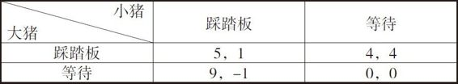

那么，两头猪各会采取什么策略呢？不难得出，因为利益分配决定两头猪的理性选择：

小猪踩踏板收获甚微（大猪也去踩踏板）或者是亏损1份猪食（大猪不去踩踏板），不去踩踏板反而得到4份猪食（大猪也去踩踏板）或者是一无所得（大猪不去踩踏板）。对小猪来说，无论大猪会不会去踩踏板，自己不踩踏板总是最优选择，于是，小猪将采取“搭便车”行为，舒舒服服地等在猪食槽边。

反观大猪，由于小猪有“等待”这个占优策略，即小猪是不会去踩踏板的。大猪此时若选择等待，1份猪食也得不到；选择踩踏板还会得到4份猪食，所以，“等待”便是大猪的劣势策略，自己亲自去踩踏板总比不踩强吧，只好亲力亲为，为了自己那4份猪食不知疲倦地奔忙于踏板和食槽之间。

智猪博弈是一个“多劳不多得，少劳不少得”的均衡。

从策略选择上来说，智猪博弈不同于囚徒困境：囚徒困境中的犯罪嫌疑人都有自己的占优策略；而智猪博弈中，只有小猪有自己的占优策略，而大猪没有。但从另一个角度来说，智猪博弈给我们提供了一个走出囚徒困境的思路——当没有十全十美的好办法让自己从困境中“全身而退”时，只能尽量做到让自己少受损失，正所谓“两害相权取其轻”。

这一思路归结为策略，就是——自己充当一个“大慈善家”，遵守合作协议，并容忍其他人作弊。当然，这一策略的前提是自己具有了担当“大慈善家”的资格，也就是说自己在博弈过程中处在了智猪博弈中的“大猪”的位置上。如果事实正好相反，自己处于了“小猪”的位置上，此时最好的策略选择就是等待对方去做这个“大慈善家”，自己乖乖地做“小猪”，搭个便车即可。

比如，在一个股份公司中，按理说应该是所有股东共同承担监督经理的责任，但实际情况并非如此，只有公司的大股东挑起了监理经理的重任。这是因为监督经理的工作是一项劳神又费力的“苦差事”，不但需要花费很大的精力和很多的时间去搜集信息，还要对收集来的方方面面的信息进行分析总结。一句话，“监督成本”是很高的。而大小股东从监督中获得的收益大小并不一样：在监督成本都一样的情况下，大股东从监督中所获得的收益明显要大于小股东。

举例来说，甲向某股份公司投资了一个亿，是这家公司的大股东，乙买了这家公司100手股票，为这家公司的小股东。公司运营状况较好盈利了，大小股东参与分红是无可厚非的，但利益关切程度却相差甚远。若公司运营得好，甲作为大股东，可分得1千万元的红利，而乙只持有公司的屈屈几张股票，只可以分到1万元的红利。

增加1万元收入固然是好事，但如果这1万元的取得需要乙花费远远超过1万元的代价去密切监督经理们的工作才能实现，那么乙作为经济理性人，就没有多少动力去做这件明摆着就是亏本的生意。而大股东就不一样了，哪怕花费几万元甚至几十万元的代价雇人监督经理的工作，对他来说也是值得的：几万元几十万元的监督成本可换来1千万元的红利收入，近百倍的差额可落入囊中，何乐而不为呢？

虽然大股东明确无误地知道小股东不会去花费精力监督经理人员，而会搭便车，坐享其监督成果，但是大股东选择监督经理的责任、独自承担监督成本却是在小股东占优选择（不去监督经理人员）的前提下必须选择的最优策略。

所以，在大小股东是否监督经理工作的这局博弈中，大股东因为利益攸关，必然会独自担当起监督经理的责任。他们充当了打破这个困境的“大慈善家”，自掏腰包承担监理经理的工作，而小股东则按兵不动、坐享大股东密切监督经理的工作而带来的收益。

## 诚信的收益

波特是一个因入室抢劫罪而被判了10年刑期的劳改犯。在服刑期间，波特认识到了自己的错误，严格遵守法律和监规纪律，积极参加劳动，并主动接受教育改造，各方面都表现良好。

有一次，在外出修路的过程中，波特在路边捡到了一个装有1000元钱的钱包，他不假思索地将钱交给了狱警。令他万万没有想到的是，狱警给予波特的不是一番发自内心的表扬，而是一句充满着轻蔑意味的嘲笑话：“你别来这一套，用自己的钱变着花样地贿赂我，想换得一份我出具的减刑证明吧。你们这号人就是不老实。”

波特万念俱灰，那颗想要改过自新的诚心被击得七零八落，“这世界上再也不会有人相信我了。我何必要自找没趣呢。”哈波特开始有了自暴自弃的念头。当天晚上，波特就越狱了。

在流窜逃亡的途中，心灰意冷的哈波特大肆抢劫钱财，准备外逃。在抢得足够多的钱财之后，波特搭上了开往边境的火车。

搭乘这趟火车的乘客很多，波特被人流挤在了厕所旁边。就在这时，一位十分年轻漂亮的姑娘走进厕所，关门时发现门锁坏了。她走出来，轻声地对站在厕所旁边的波特说：“先生，您能为我把门吗？”

波特愣住了，看着姑娘那纯洁无邪的充满渴盼的眼神，他点了点头。姑娘冲他微微一笑，红着脸进了厕所。很久没有人这样信任他，把他当作一个真正的人来看待了。那一刻，波特像一个忠诚的卫士一样，严严地守着厕所门。

也是在那一刹那间，波特突然改变了主意。因为一个人的信任让他觉得自己还是一个有用的人，他不能辜负一个人的信任。等火车在下一站靠站时，波特从容地走下火车，到车站派出所投案自首了。

信任是一种弥足珍贵的东西，没有人能够用金钱买得到，也没有人可用利诱和武力争取得到。它来自于一个人的灵魂深处，是一眼活在灵魂里的清泉。它可以拯救灵魂，滋养灵魂，让心灵充满纯洁和自信。

一天早上，琼斯刚打开自家小卖部的窗口，把公用电话摆到柜台上，就有一位女士过来打电话。当她结束通话，放下话筒时，琼斯看了一下计时器，告知对方要收费3元。

那位女士从精美的手提包里掏出一张百元面值的钞票递过来，因为刚开始一天的营业，琼斯手里没备那么多要找的钱，无法给她找钱。琼斯说：“手头的零钱不够找，等您什么时候有零钱再送过来吧。”

女士脸上现出惊讶的神色，问道：“您认识我吗？”

琼斯放下手中的活，抬头看她一眼，说：“我不认识您，可我信任您。”

女士笑笑，没再说什么，转身离开了。大概半个小时之后，那位女士气喘吁吁地再次来到了琼斯的小卖部门前，把3元钱电话费交给了琼斯。她说：“为了换开这100块钱，我特意去了一趟百米之外的蔬菜市场，又特意赶回来送电话费的。”

琼斯接过电话费，略带点歉意地说：“怪麻烦您的，不送也没关系的。”

女士说：“我不是本地人，是出差到这里办事的。我要是没给电话费走了，您就无法找到我了。可我一定要回来，能被他人无条件地信任不容易，我要珍惜。”

社会上的各个活动主体都有自己的利益所在，如果你我都像囚徒困境中的两个嫌疑犯一样互相猜疑、互不信任，遇事宁可“玉石俱焚”也要斤斤计较的话，就只能共吞苦果了。尤其是企业，它的生存与发展涉及方方面面，这就需要企业与合作者之间有足够的了解与信任，否则，当合作遇到“两难”时，如果任何一方运用囚徒思维“把自己的损失降到最低”或不让对方“获得最大效益”进行抉择，就只会出现“双输”的最坏结果了。风雨同舟、荣辱与共才是企业与合作者之间依附关系的最佳境界。

别人信任我们，我们也因此尊重自己，人们自然会更加纯洁和高尚了，社会也就更加和谐有序了。愿你我多一份信任！

## 教授的“圈套”

“选A还是选B”的问题不仅让富有实战经验的商人们苦恼不堪，它也同样折磨着商学院的“天之骄子”们。一位教授让自己班上的27名学生进行了一个游戏，这个游戏把所有学生都带入了“囚徒困境”中。

游戏规则如下：

假设每一个学生都是一家企业的老板，面对竞争日益激烈的市场，作为企业“头头”的他们必须在两个备选的改革方案中做出选择：A策略代表生产高质量的商品来维持较高价格；B策略代表生产假货以通过别人所失来换取自己所得。

还规定，若学生选择A可得到2元的奖励，选择B可得到2.15元的奖励，但选择A将产生总体收益：1个学生选择A，总体收益为2元；2个学生选择A，总体收益是4（2×2=4）元，依此类推……选择B则无总体收益可言。同时，选择A的学生所产生的总体收益额将平均分配给每一个学生（包括选择B的学生）。

这是教授事先设计好的一个博弈，确保每个选择B的学生总比选择A的学生多得0.15元。这个假定也有现实意义，因为生产假货所付出的成本总比生产高质量的商品要低，反过来，其利润当然要高。

但是，选择B的人数越多，就意味着选择A的人数越少，则他们的总收益就会越少。总体收益越少，分到每个人手中的收益就越少。这个假设也有道理：随着市场上充斥着的假货的增多，消费者便会逐步地认清它们的面目，就会理性地不再购买它们，这就直接导致了假货生产者利润的减少（游戏中指选择B的学生）。并且，市场上出现的假货太多，市场秩序就会混乱，该产品的信誉就会降低，这也直接降低了高质量产品生产者的利益（游戏中指选择A的学生）。

假设27名学生都选择A，那么他们每人各得2元，且总体收益是54（2×27=54）元，将54元平均分配给27个学生，也是每人2（54÷27=2）元，则每个学生最后的实际所得为4（2+2=4）元。

假设有1个学生有了自私自利的打算，偷偷改变主意，选择B，那么，选择A的学生就有26名，总体收益是52（2×26=52）元。将52元平均分配给全班27个学生，每人各分得1.9（52÷27≈1.9）元。则选择A的学生最后的实际所得为3.9（2+1.9=3.9）元，比原来少得0.1元；而选择B的那个学生最后可得4.05（2.15+1.9=4.05）元，比原来多了0.05元。

假设有2个学生改变主意，改选B，则有25名学生选择A，总体收益是50（2×25=50）元。将50元平均分配给27个学生，每人可分得1.85（50÷27≈1.85）元，则选择A的25名学生最后每人各得3.85（2+1.85=3.85）元；而选择B的那2个学生最后每人各得4（2.15+1.85=4）元。

假设有3个学生改选B，那么，选择A的学生就有24名，总体收益是48（2×24=48）元。48元平均分配给全班27个学生，每人可分得1.78（48÷27≈1.78）元。则选择A的学生每人各得3.78（2+1.78=3.78）元；而选择B的3个学生每人各得3.93（2.15+1.78=3.93）元。

……

假设全班27个学生一致选择自私的策略，尽可能使自己的收益达到最大，统统选择B，则总体收益是0元，最后每个学生各得2.15元。

由以上分析可以看出，如果他们进行合作，协同行动，不惜将个人的收益减至最小，都选择A的话，每个人都能获得最大收益4元。若有一个学生选择B的话，那么该学生能获得最大收益4.05元，其余26名学生相对会蒙受一点损失，只能获得3.9元。但随着选择B的学生人数增多，每个人的总体收益会变少。

演练这个博弈的时候，起初每个学生都被相互隔离开，不允许讨论，单独做选择。结果全班27名学生都成了囚徒困境中的囚徒，个个精于算计，为了多获得0.05元，不约而同地都选择了B。

后来教授允许学生之间相互讨论，以便达成合作。经过数次实验之后，教授发现，同意合作而选择A的学生总数并不固定，从3人到14人不等。在最后的一次带有约束性协议的博弈里，只有4个学生愿意选择A。此时，全体学生的总收益是65.45［2×4+2.15×（27-4）+2×4=65.45］元，比全体学生成功合作可以得到的总收益108（2×27+2×27=108）元减少了42.55（108-65.45=42.55）元。

这个游戏也可以看作是“非合作性博弈”的又一典型模式，并且比“囚徒困境”更深刻地揭示了人自私自利的本性。处于“困境”的他们与“困境”之间是一种不可逆转的关系，也就是说当他们无法通过自己的力量去左右局势，获得集体收益最大时，就只能在困境的局势下想办法尽可能让自己的损失最小，收益最大。

这个游戏在现实社会中也很有代表性。

比如，某村有一块公共草地可供牧人放牧，每个牧民都从自己的利益出发，只知道增加自己养羊的数量从而可以增加收入，但并不关心草地的承载极限。于是羊越来越多了，草越来越少了，最后草没了，羊也没了。这是一个带有悲剧性的博弈过程。当出现类似情况的时候，就需要有外界力量对其进行干预，制定相应规则，从而使得草地得到最大限度的利用，大家得到真正的实惠。

## 把别人想象成天使，你就不会遇到魔鬼

联合国一位亲善大使去非洲一个国家，回来后他就宣称那里的人是全世界最差劲的人：海关人员板着一张脸，计程车司机态度恶劣，餐厅侍者傲慢无礼，市民不耐烦而又有敌意。

后来，这位亲善大使无意间在一本书上看到了下面这段话：

自己丰富才能感知世界的丰富，狭隘与偏执者的世界则只是一个永远钻不出去的穴洞。自己好学才能感知世界的新奇，懒汉的世界则只是单调的重复。自己善良才能感知世界的美好，阴谋家的四周永远是暗箭陷阱。自己坦荡才能逍遥地生活在天地之间，蝇营狗苟者永远是一惊一乍，提心吊胆。

文章最后用一句话道出了该文主旨：“世界是一面镜子，你看到的永远是你自己的样子。”这位亲善大使若有所思，觉得这句话确实有道理。

等到下次再去那个国家的时候，亲善大使不再以一副冷冰冰的严肃面孔示人了，脸上始终挂着灿烂的笑容。结果，他发现，先前那些板着脸的海关人员、计程车司机、餐厅侍者……统统不见了，每个人脸上都显露出微笑，显得分外亲切友善。

亲善大使恍然大悟，纠正别人态度最有效的方法是纠正自己的态度。

在人际交往中，谁都希望遇到天使般热情善良的人给自己带来幸运和快乐，害怕和冷漠凶恶的人打交道。但是，在现实生活中，天使和魔鬼同在。那么，我们该怎样使自己多遇天使，少遇魔鬼呢？

心理学家告诉我们：把别人想象成天使，你就不会遇到魔鬼。这个经验绝不是随口说说的，而是建立在科学的实验基础上的。

心理学家让两组实验参加者分别给同一位女士打电话。心理学家告诉第一组的人说：对方是一位冷酷、呆板、枯燥、乏味的女人；告诉第二组的人说：对方是一个热情、活泼、开朗、有趣的人。

结果，第一组参与者很难与那位女士顺利地交谈下去，而第二组参与者却与那位女士谈得非常投机，通话时间明显比第一组的人要长。这是为什么呢？道理很简单，第二组参与者把那位女士想象成一个幸运的“天使”，把她看作一个“热情、活泼、开朗、有趣”的人，并以同样的态度与之交往，而第一组参与者正好相反。结果也就可想而知了。

把别人想象成魔鬼，遇到的当然是魔鬼；把别人想象成天使，你就不会遇到魔鬼。这又是为什么呢？原来，在人际交往中，人们都有保持心理平衡的需要。你怎么看待别人，别人就会怎么看待你。否则，对方就会感到不平衡。

所以，如果你事先对别人有一种消极的看法，那么，这种看法势必会无意识地流露出来，并或多或少地表现在你的语言和非语言的信息上。而对方觉察到你发出的信息后，也会做出相应的反应。

这就给我们一种启发，如果囚徒困境中的两个犯罪嫌疑人都把对方想象成“天使”，站在对方的立场来考虑问题的话，他们就都可以少坐14年牢了。

在生活与工作中，我们经常听到有人抱怨周围的人与自己相处不融洽，所以就想通过换个工作环境、结交一些新的朋友来改变自己尴尬的境遇。但是他们却很少自我反省：自己人际关系的不顺畅或职场的不如意，究竟是自己的因素还是别人的因素造成的呢？

如果原因出在自己身上，唯有改变自己才能让问题迎刃而解，否则，不断变换工作以认识新朋友的做法只能是对生命的浪费，对问题的解决没有丝毫裨益。这就好比下面这只正在搬家的乌鸦。

一只乌鸦急促而忙碌地在搬家。鸽子疑惑不解地问：“这树林不是你的老家吗？你干吗还要再搬家呢？”乌鸦叹着气说：“在这个树林里，我实在住不下去了，这里的人都讨厌我的叫声。”

鸽子带着同情的口气说：“你唱歌的声音实在聒噪，令人不敢恭维，所以大家才讨厌你的。其实，只要你把声音改变一下，或者闭上嘴巴不再唱歌，在这林子里，你还是可以住下来的。如果你不改变自己的叫声，即使搬到另外一个地方，那里的人还是会照样讨厌你的。”

一个能够时刻鞭策自己的人，才能在社会中立于不败之地，才能在事业上取得辉煌的成就。

## 哈里逊是傻小孩吗

囚徒困境之所以会形成，就是因为两个当事人不愿意自己吃亏造成的。如果我告诉你们，有些亏我们还是要吃的，你们会不会感到不可思议呢。发生在美国总统威廉·哈里逊小时候的一件事情就是这一说法的最佳注解。

威廉·哈里逊是美国第九届总统。虽然功成名就之后的哈里逊身份高贵，吃喝不愁，但在小时候，由于家里穷，哈里逊只是美国贫民窟里的一个傻小子。可能是家庭贫困所致，也可能是自身个性使然，总之，小时候的哈里逊沉默寡言，曾一度被家乡的人们认为是个傻孩子。

为了验证一下哈里逊的心眼是不是和外表一样傻，一个人拿着一枚五美分的硬币和一枚一美元的硬币放在他面前让他挑，说他挑到哪个就送他哪个。哈里逊抬头看了看周围人的眼神，又低头看了看眼前的这两枚分值不同的硬币，毫不犹豫地伸出右手把那枚五美分的硬币拿了起来。这一举动逗得人们哈哈大笑。哈里逊是傻小孩的论断在当地迅速传开。

虽然哈里逊外表木讷，但还是有很多人不相信这件事，毕竟他也不是一个只有一两岁的没有判断力的小娃娃，更不是一个有明显智障行为的弱智儿，而是一个正常上学堂的三年级小学生。为了求证一下“哈里逊是傻小孩”论断的正确性，许多人都饶有兴致地拿着5美分和1美元的硬币让哈里逊当着他们的面挑选，选中哪个就给他哪个。每次哈里逊都是拿那枚五美分的硬币。

一位好心的老婆婆看他这样可怜，就把他叫到身边，亲切地问他：“哈里逊，老师在学校没教过你认识钱币吗？你真的不知道5美分和1美元哪个更值钱吗？”哈里逊的回答大大出乎老婆婆的意外：“当然知道，尊敬的夫人。问题是如果我拿了那枚1美元的硬币，他们就再也不会把硬币摆在我面前让我选了。那样，我连五美分也拿不到了。”

这个故事告诉我们，就某一次局部合作而言，你的策略选择可能是吃亏的，但这些看似吃亏的合作对全局的发展却起到了极大的作用，如此说来，这种亏还是值得吃的。正所谓“吃小亏占大便宜嘛”！

心中是否有全局优先的观念，脑中能否分辨出小亏和大亏、明亏和暗亏之间的隐含关系，是我们所有人是否会走向成功的关键。

马可·汉斯是一个刚走出大学校门的毫无工作经验的应届毕业生，凭着深厚扎实的基础和出类拔萃的文笔，汉斯一毕业就进入了一家出版社任编辑。专业能力强是汉斯获得老板赏识的一个方面，更难能可贵的是他一丝不苟的工作态度。

当时，出版社正在进行一套丛书的出版，每个人都很忙。由于人手不够，编辑在做好自己分内事的同时，被经理派到发行部、业务部帮忙是常有的事。其他编辑人员被派去一两次就怨声连天了，只有汉斯每次都心情愉快地接受所有指派。

包书、送书、售书，汉斯待遍了出版社的所有部门，与各个部门的工作人员都混了个脸熟。汉斯踏实做事的风格、笑脸迎人的面孔给每一位接触过他的人都留下了深刻的印象。除此之外，取稿、跑印刷厂、邮寄……只要别人开口要求，他都乐意帮忙。

两年之后，当同事们还在出版社重复着一成不变的编辑工作时，汉斯成立了一家属于自己的出版公司，并且做得有声有色，在业界小有名气。

原来，当他在出版社傻呵呵地做着别人认为吃亏的事情时，早已悄悄地把出版社的编辑、发行、直销等工作流程都摸熟了。也是在这个过程中，他积累了丰富的工作经验，提高了自己的做事能力，扩大了自己的人际关系网络。创办自己的出版公司也就成了一件水到渠成的事了。

如果吃亏能让你得到比其他人更多的工作经验，更多的发展机会，我们为什么不吃呢？由此看来，“吃亏是福”还真是一条亘古不变的真理啊！

# Part 5　纳什均衡：为什么对手总喜欢做你的邻居

春天不播种，夏天就不生长，秋天就不能收割，冬天就不能品尝。

——海涅

## 每个人都不能容忍别人比自己强

心理学上有这样一个经典的实验：

实验者拿出100元钱，让实验参与人——在校大学生两两结合，但是不能互相商量，各自在纸上写下自己心中想要得到的钱数。如果两个人写出的钱数之和等于或小于100，那么，这两个人就可以得到自己写在纸上的相应的钱数；如果两个人写出的钱数之和大于100，比如说是120，那么，他们俩就要分别付给实验者60元钱。

结果如何呢？几乎没有哪一组的两个学生写下的钱数之和小于100，每一个实验参与者都想更多地得到实验者的钱。然而，适得其反，他们都得从自己腰包里掏钱付给实验者。

“鹬蚌相争，渔翁得利”的寓言故事相信大家都不陌生。

一只河蚌张开蚌壳，在河滩上晒太阳。不料，飞来了一只鹬鸟，伸嘴去啄蚌壳内鲜美的蚌肉。河蚌急忙把两片坚硬无比的蚌壳合上，牢牢地钳住了鹬鸟的嘴巴。鹬鸟用尽所有力气，怎么也拔不出嘴来。而河蚌因为有了鹬鸟这个包袱，也无法脱身，不能回河里去了。气急败坏的河蚌和鹬鸟拉开了口水大战。

鹬鸟瓮声瓮气地说：“今天不下雨，明天不下雨，就会有死蚌肉。”

河蚌也瓮声瓮气地说：“今天不放你，明天不放你，就会有死鹬鸟。”

河蚌和鹬鸟吵个不停，谁也不肯松口。就在这时，一个渔夫路过这里，不费吹灰之力就把它们一起捉走了。

在双方有共同利益的时候，人们也往往会优先选择竞争，而不是选择对双方都有利的“合作”。这种现象，被心理学家称为“竞争优势效应”。

心理学家进一步分析说，人们与生俱来就有一种竞争的天性，每个人都希望自己比别人强，每个人都不能容忍自己的对手比自己强。所以，当人们在面对各种利益冲突的时候，往往会选择竞争。我们通常看到的结果是，要么两败俱伤，要么一方战胜另一方，很少有人会采取第三条路线——通过合作达到双赢。

在日常生活中，这样的例子比比皆是。

一对夫妻离异，根据法官判决，丈夫必须将自己财产的一半转让给妻子。为了不让妻子平白无故地得到这么一大笔钱，丈夫宁肯让他人平白无故地捡个大便宜——竟然将价值几百万的车子和房子以几万元的“低价”出售。

要消除竞争优势效应的副作用，就要推崇双赢理论。著名心理学家荣格有这样一个公式：“我＋我们＝完整的我”。绝对的“我”是不存在的，只有融入“我们”的“我”才是“完整的我”。未来社会必定是一个充满激烈竞争的大集体，合作应该成为这个大集体的主旋律，只有善于合作的人才能够为自己营造一个自由的发展空间。

## 为什么对手总喜欢做你的邻居

在每一条大大小小的城市街道上，我们经常会见到这样一种很熟悉的现象：某一地段上的商店十分拥挤，形成一个繁荣的商业中心区，但另一些地段却十分冷僻，没什么商店。再仔细观察，你就会发现一个更有意思的现象：同类型的商家往往聚集在一起。比如肯德基、麦当劳总是紧紧相邻；沃尔玛、家乐福常常相依为伴；“安利”“雅芳”往往隔路而望……这是什么缘故呢？我们引用一个例子对原因进行具体阐述。

假设有一条笔直的公路，每天有大量来往的车辆穿梭其中，并且车流量在公路上是均匀分布的（假设的一种理想分布）。现在设想有两家快餐店A、B要在这条公路上各自选择一个位置开张，招揽来往车辆。他们所卖的东西口味差不多，价格也相当。那么，这两家快餐店各选择在公路的哪个位置上好呢？

为了分析的需要，我们要对该模型进行一个合乎逻辑的假定：因为食物口味相近，价格也无多大悬殊，车辆司机到哪个快餐店购买食物，就看哪个快餐店距离自己比较近。反正东西、价格都一样，何必舍近求远呢。根据这个原则，两个快餐店应该怎样确定最后的位置呢？

也许你马上会说把这条公路从0到1四等分，快餐店A设在1/4的位置，快餐店B设在3/4的位置，不就是最好的策略选择吗？的确，从资源的最佳配置来看，这种均匀分布的情况是最优的，每家快餐店都拥有1/2的顾客量。同时，对于开车的司机来说，这种策略的敲定，会使司机到快餐店的总距离最短，可大大节省吃饭时间。

然而，人生不如意事十之八九，天并不遂人愿。快餐店老板作为现代生意人，自然是精明之至的。用经济学术语来说，就是具有绝对的经济理性。只要手段合法，他们总是希望自己的顾客尽可能地多，生意尽可能地红火，至于其他人的生意好坏则与自己无关。也就是说，快餐店老板肯定不会考虑另一快餐店生意的好坏和车辆司机的方便，而只会以自己赢利为目的，这就决定了他们当然都是不会安于这样的位置安排的。

出于这种理性，A快餐店的老板会想：如果我将快餐店的位置从1/4处稍微向中间的1/2处移一点，那么我的“势力范围”就会比先前所定的位于1/4处的那种方案要大。相应地，B快餐店的地盘就会缩小，我肯定会从B快餐店夺取部分顾客，生意会更红火。这对于快餐店A单方面来说无疑是一个好主意。所以，原来位于1/4处的A快餐店就有了向1/2点处移动来扩大自己地盘的激励。

当然，B快餐店的老板也不甘示弱，作为一个经济理性人，他也会有将自己的快餐店从3/4处向中间的1/2处移动的激励，以便扩大自己的经营范围，争取更多的顾客。可见，原来A快餐店在1/4处、B快餐店在3/4处的配置，不是稳定的配置。

那么，究竟到哪个位置上才是稳定的位置呢？不难想象，在两个快餐店定位的市场竞争博弈中，位于1/4处的A快餐店要向中间的1/2处靠，位于3/4处的B快餐店也要向中间的1/2处挤，双方博弈的最后结局将是两家快餐店设置在位于中点的l/2附近的位置，两家相依为邻且相安无事地做着自己的快餐生意。尽管在这个点上，每家快餐店的“势力范围”仍然还是原来的1/2。

如果不是两家快餐店，而是很多家快餐店，也很容易对其进行分析得到以下结论：这些快餐店仍然会在公路的1/2处附近设店营业。

在这里，我们就要引入一个新的博弈模型——纳什均衡。

“纳什均衡”又称为非合作博弈均衡，是由美国数学家纳什提出来的。这是一种很常见、很重要的博弈均衡，也是博弈论中的一个重量级的概念。纳什均衡主要描述博弈参与者的这样一种均衡：在这一均衡下，每个参与者都确信，当其他人不改变策略时，他此时的策略是最好的。如果某个人单独改变策略，偏离目前的均衡位置，那么他的支付将会降低。纳什均衡状态是市场力量相互作用下的一种稳定结局。

我们在开篇所说的一些日常生活中大家都熟悉的现象的原因，应该有答案了吧。只要承认只关心自己眼前商业利益的“理性人”假设，且条件许可，同类型的商家将几乎趋向于相依为邻，挤在中点就是唯一稳定的策略选择和唯一的纳什均衡。这就是很多城市商业中心形成的原理，也完全可以看作是公正的市场竞争的合理结果。

## 假如没有竞争，老虎也会失去霸气

美国加州的《动物保护》杂志上介绍过这么一则故事：

在秘鲁的国家级森林公园，生活着一只青年美洲虎。由于美洲虎是一种濒临灭绝的珍稀动物，全世界现在仅存17只，因此为了很好地保护这只珍稀的老虎，秘鲁人在公园中专门辟出了一块近20平方公里的森林作为虎园，还精心设计建盖了豪华的虎房，好让它自由自在地生活。

虎园里森林茂密，百草芳菲，沟壑纵横，流水潺潺，还有成群的人工饲养的牛、羊、鹿、兔等动物供老虎尽情享用。凡是到过虎园参观的游人都说，如此美妙的环境，真是美洲虎生活的天堂。

然而，让人感到奇怪的是，从来没有人看见美洲虎去捕捉过那些专门为它预备的“活食”，也从没有人看见它王者气十足地纵横于雄山大川，啸傲于莽莽丛林。那只美洲虎只是耷拉着脑袋，睡了吃，吃了睡，一副无精打采的熊样。有人说它大约是太孤独了，若有个伴儿，兴许会好一些。于是，政府又通过外交途径，从哥伦比亚租来一只母虎与它做伴，但结果还是老样子。

一天，一位动物行为学家到森林公园来参观。他见到美洲虎那副懒洋洋的样儿，便对管理员说，老虎是森林之王，在它所生活的环境中，不能只放上一群整天只知道吃草，不知道猎杀的动物。这么大的一片虎园，即使不放进去几只狼，至少也应该放上两只豺狗。否则，美洲虎无论如何也提不起精神来。

管理员们听从了动物行为学家的意见，从别的动物园引进了几只美洲豹投放进了虎园。这一招果然奏效。自从美洲豹进了虎园的那一天开始，这只美洲虎就再也躺不住了。它每天不是站在高高的山顶愤怒地咆哮，就是如飓风般俯冲下山岗，或者在丛林的边缘地带警觉地巡视和游荡。老虎那种刚烈威猛、霸气十足的本性被重新唤醒。它又成了一只真正的老虎，成了这片广阔的虎园里真正意义上的王者。

美洲虎因为有了美洲豹这样的对手，才重新找回了王者的霸气。有了对手，才会有危机感，才会有竞争力。有了对手，你便不得不奋发图强，不得不革故鼎新，不得不锐意进取。否则，就只有等着被吞并、被替代、被淘汰。

动物如果没有对手，就会变得死气沉沉。同样，一个人如果没有对手，那他就会甘于平庸，养成惰性，最终导致庸碌无为。一个群体如果没有对手，就会因为相互的依赖和潜移默化而丧失活力，丧失生机。一个政体如果没有了对手，就会逐步走向懈怠，甚至走向腐败和堕落。一个行业如果没有了对手，就会丧失进取的意志，就会因为安于现状而逐步走向衰亡。

有一家公司，拥有半条街巷的门面房，平日里这些门面房就用来作为产品销售的店面。可是公司近几年来业务不景气，店面也冷清了许多。恰好这个街巷附近是一个很大的居民区，于是公司只好撤了门店，空房对外招租。

有一对夫妇，率先在这里租房，办起了一个风味小吃店，不曾想生意竟出奇得好。渐渐地，许多风味小吃都聚集到了这条街上来。这条街很快就成了远近闻名的小吃一条街。

见租房的人生意这么好，对外租房的公司再也坐不住了。公司收回了对外招租的全部门面房，撵走了所有在这里经营各种风味小吃的人，摇身一变，自己经营起小吃生意来。但没料到仅仅一个月，这条街巷又冷清起来。许多常来常往于这条街上的食客，竟然慢慢不再来了。公司的效益也出奇地差，自己独家做生意的收入，竟还没有房租的收入高。公司经理百思不得其解，去询问一个德高望重的经济学方面的老专家。

专家听了，微笑着问他说：“如果你要吃饭，是到一个只有一家餐馆的街上去，还是要到一个有几十家餐馆的街上去？”

经理说：“当然哪里餐馆多，选择余地大，我就会到哪里去。”

专家听了，微微一笑说：“那么你的公司垄断了那条街巷的小吃生意，与同一条街上只有一家餐馆有什么不同呢？”

经理幡然醒悟：有竞争才有活力。回去后，他迅速缩减了自己公司的生意门店，将其余的门面房对外招租。这条街巷的生意渐渐又恢复了昔日的红火。

许多人都把对手视为心腹大患，恨不得除之而后快，却不知一个强劲的对手会让你时刻都有危机感，会激发你更加旺盛的精神和斗志。因为对手的存在，你才会永远做一只威风凛凛的“美洲虎”。

## 互相牵制的螃蟹

有一位青年到海边旅游，在那里遇到了一位捉螃蟹的老翁。他看到老翁旁边放着两个小竹篓，一个盖着盖子，一个敞着口。他猜想肯定是那个盖着盖子的竹篓里装满了螃蟹，而那个敞开口的竹篓里没有螃蟹或者很少。

为了证实自己的猜想，他走上前去往那个敞口的竹篓里一看：“哎哟！好家伙，怎么里面这么多螃蟹？”接着，他又掀开了那个盖着盖子的小竹篓，往里面一瞧，却发现只有一只螃蟹。他纳闷了，于是问老翁：“老伯，为什么您这个竹篓里只有一只螃蟹，还要盖着盖子，而另一个竹篓里装满了螃蟹，您却不盖？”

老人淡淡一笑，回答说：“年轻人，你有所不知。这两个竹篓的形状和一般竹篓不同，它的开口部分较小，而底下的部分较大。假如竹篓里面只有一只螃蟹，就得把竹篓盖好，防止那只螃蟹逃走；如果竹篓里有两只以上的螃蟹，那么竹篓口就算不盖，也不必担心。因为只有一只螃蟹时，螃蟹可以顺着竹篓口逃走，而若有两只以上的螃蟹，那么所有的螃蟹都会拼命地往竹篓口跑。但是这时候问题就出现了，竹篓口设计得很小，只能让一只螃蟹通过，一旦有螃蟹顺利爬到开口处，其余的螃蟹便会蜂拥而至，设法占据出口的位置。这样一来，只要有螃蟹想逃走，其余的螃蟹便会把它拉下来，所以没有任何一只螃蟹可以顺利逃走。”

螃蟹如此，人何尝不是这样，每个人都想出人头地，都在与周围的人竞争，因此有些人总是生怕别人超过了自己，而为别人的成功设置各种障碍。企业里常会有一些人，嫉妒别人的成就与杰出表现，天天想尽办法进行破坏与打压。如果企业不把这种人除去，久而久之，组织里就只剩下一群互相牵制、毫无生产力的“螃蟹”。

“一个人敷衍了事，两个人互相推诿，三个人则永无成事之日。”这就是人性的弱点，也是我们每个人的弱点。美国前总统华盛顿看到了这一点，中国的古人也早就看到了这一点，所以才有“三个和尚没水喝”的论断。

是否合作是一个问题，如何合作更是一个问题。在很多时候，人多力量未必就大。人与人之间的合作不是简单的力量和智慧的相加，而要微妙和复杂得多。在人与人的合作中，假定每个人的能量都为1，那么10个人的能量可能比10大得多，也可能比1还小。因为人的合作不是静止的，它更像方向各异的能量，互相推动时自然事半功倍，相互抵触时则一事无成。

## 聪明人，靠脑袋存活

强者霸道，连决定胜负标准的博弈规则的制定都掌握在自己手中，那么弱者是不是就无计可施，只有坐等挨打的份儿呢？下面这个故事就将告诉你答案。

从前，有一个昏庸无能、偏听谗言的国王，他手下有两个大臣：一个是忠心耿耿、一心为民而常常谏言得罪国王的好大臣，一个是诡计多端、奸诈无比、为了自己的利益而时时恭维国王的坏大臣。

坏大臣为了独自掌权，视自己“发财路”上的拦路虎——好大臣为眼中钉，一天到晚想着如何置好大臣于死地。

有一天，趁着好大臣下民间考察不在宫中的空当，坏大臣在国王面前数落了好大臣许多不对的地方，还一本正经地愣说好大臣此次民间考察是为了集合部属兵力蓄意谋反。“谋反”一词正好扎中了国王最敏感的地方，引得国王龙颜大怒，当即下令召好大臣回宫。

坏大臣见国王已中计，顺势而说：“念着君臣一场，也考虑着给所有臣民一个交代，请国王法外开恩，用抓阄的方法来处置他，让天意来决定他的生死，如何？”国王对这一处置方法充满好奇，迫不及待地命令坏大臣详细地说说抓阄是怎么一回事。

在一个盒里放两个阄，一个写“生”字，一个写“死”字，让好大臣从盒子里任意抓一个。抓到写着“生”的阄就活命，抓到写着“死”的阄则斩首。坏大臣侃侃而谈。

如果坏大臣不在阄上做手脚的话，好大臣存活的几率还有50％，但坏大臣的目的就是要置好大臣于死地，他怎会大发善心让好大臣白白捡一个50％的生还机会呢？当天夜里，坏大臣就逼迫做阄的人把两个阄都写成了“死”字。这就意味着无论好大臣抓到哪个阄，他都必死无疑。

好大臣一心为社稷着想，当然很受人尊敬，包括做阄的人。当坏大臣亲眼看着阄做好拍拍屁股走人之后，做阄的人偷偷给好大臣府中送了一封信，信中写明了上述情况，请好大臣赶快想办法。

好大臣当然不知是计，接到国王命令后星夜赶回了府里，准备第二天就入宫见国王。就在安寝之时，好大臣收到了做阄人送来的救命信件。看完信中内容之后，好大臣出了一身冷汗，眉头紧锁。但片刻之后，足智多谋的好大臣想到了对付死亡之阄的好办法，安心睡觉去了。

第二天，当好大臣在宫殿之上见到国王时，国王什么辩解的机会都没有给他，就命令他从盒子里面抓一个阄出来，抓到“生”就生，抓到“死”就死。站在一旁的坏大臣掩饰不住内心的狂喜，露出了狰狞的冷笑。好大臣看了一眼坏大臣，一言未发，从容地从盒子里抓了一个阄，并以迅雷不及掩耳之势将它吞进了肚子。在场的人都十分惊讶。

好大臣把抓起的阄吞了下去，使得国王无从知道那只被吞进肚子里的阄是“生”阄还是“死”阄，但他可以根据留在盒子里的阄是“生”是“死”来推断吞进好大臣肚子里的阄是“死”是“生”。既然盒子里的两只阄一只是“生”，一只是“死”，如果留下的那只阄上写着“死”，那么好大臣吞下去的那只阄一定是“生”了。在铁定的事实面前，坏大臣气急败坏，好大臣靠着自己的智慧活了下来。

从博弈论的角度来看，为了达到公平，任何游戏都有自己的规则。有了规则的“游戏”，才可能保证好人的胜出，才可能使社会达到和谐与可持续发展，才可能产生道德、法律等人类必须服从的社会规则，否则社会就无法实现公平、正义了。

但是，在这场生死阄博弈中，坏大臣做了手脚，使游戏应有的规则遭到了无情的践踏，也使好大臣丧失了选择利于自己的策略的机会。如果好大臣还是一成不变地按照先前所定的规则“抓阄”定生死的话，他无论怎么抓，都必死无疑。在无权利制定规则的情况下，好大臣只好通过有限的条件来变换规则：变“抓”阄为“吞”阄，以此保住了自己的生命。

## 牧师的忏悔

有一个人在一个笼子里关了一群猴子，每过一天就打开笼子抓一只猴子杀掉。每天主人来时，每个猴子都紧张，它们不敢有任何举动，怕引起主人的注意而被主人选中。当主人把目光落在其中一个猴子身上时，其余的猴子就希望主人赶快决定。当主人最终做出决定时，没有被选中的猴子非常高兴。那个被选中的猴子拼命反抗，其余的猴子在一旁幸灾乐祸地观看。这样的过程日复一日地在进行着，最终猴子全部被宰杀掉了。

这个摘自潘天群老师所著《博弈生存》一书中“待宰的猴群”的故事，留给我们很多启示。

我们假想一下，如果这群猴子在意识到被抓就是去送死这一刻起就群起反抗，当主人抓它们当中的任何一只猴子时，其他猴子都群体上去抓挠主人，主人迫于它们集体的压力，或许会高抬贵手，放它们一马。但每只猴子都不知道其余的猴子是否会和它一样进行反抗，单独反抗而其他猴子按坐不动，就有被主人注意而被选中宰杀的危险，于是在猴子的潜意识里形成了一种某只猴子被抓走，其他猴子“事不关己，高高挂起”的“纳什均衡”。因此它们都不愿意起头反抗，而最终就不能摆脱全体被宰杀的悲剧命运。

不要以为只有猴群才会出现这样的悲剧，人类在这方面的教训更是惨痛。

德国牧师马丁·尼莫拉在美国波士顿犹太人屠杀纪念碑上留下的一段铭言，可以说是对人类所形成的这种自私的“纳什均衡”的绝妙注解，铭言如下：

在德国，起初他们追杀共产主义者，我没有说话——因为我不是共产主义者；

接着他们追杀犹太人，我没有说话——因为我不是犹太人；

后来他们追杀工会会员，我没有说话——因为我不是工会会员；

此后他们追杀天主教徒，我没有说话——因为我是新教教徒；

最后他们奔我而来，却再也没有人能站起来为我说话了。

“沉默是金，开口是银”并非是人类永恒智慧的人生箴言，它也可能是自私狭隘的“事不关己，高高挂起”。

沉默？言语？福兮？祸兮？这就是上面那段铭言留给我们的思考问题。

大部分时候，我们都喜欢保持沉默，并对在公共场合喋喋不休的人抱有戒心。但在有些时候，我们没有保持沉默的权利，必须开口。看到别人掉进不幸、苦难的陷阱里，不要侥幸自己没有落难，覆巢之下岂有完卵。

请谨记一句话：对一个人的不公，就是对所有人的威胁。

# Part 6　破窗理论：对人对己都有效的心理暗示术

人必须相信自己，这是成功的秘诀。

——卓别林

## 既然是坏的东西，让它更破一些也无妨

1969年，美国斯坦福大学心理学家菲利普·詹巴斗曾做过这样一项有趣的“偷车实验”：

把两辆一模一样的汽车分别停放在两个不同的街区。其中一辆完好无损地停放在中产阶级居住的帕罗阿尔托社区，而另一辆停放在相对杂乱的布朗街区，并将其摘掉车牌、打开顶棚，结果，这辆车仅仅过了几个小时就被偷走了，而停在帕罗阿尔托社区的那一辆汽车过了一个星期还安然无恙，无人问津。后来，詹巴斗用锤子把那辆完好无损的汽车的玻璃砸了个大洞，结果仅数小时后车就不见了。

以这项试验为基础，政治学家威尔逊和犯罪学家凯琳于1982年提出了“破窗理论”（或称为“破窗效应”）。

威尔逊和凯琳认为，犯罪是秩序混乱的必然结果。如果有人打破了一栋建筑物的一扇窗户上的玻璃，而破窗未得到及时维修，那么这扇未修的破窗就给人心理上这样一种暗示：这是个无人关心、无人管理、没有秩序的地方，我们可以去打碎更多的玻璃。“既然是坏的东西，让它更破一些也无妨。”

久而久之，这种无政府主义就开始从这座大楼向相邻的街道蔓延。在这种公众麻木不仁的氛围中，违规犯罪行为就会不断滋生和蔓延。威尔逊和凯琳还提出，类似公共场所内乱涂乱画、秩序混乱等较小的问题，都会和“破窗”现象一样，容易引起更严重的犯罪。

“偷车试验”以及“破窗理论”为我们揭示的重要思想有二：

一是一些重大问题的发生可能只源于一些不为人所注意的细小事件，重视细枝末节问题的处理对重大问题的解决可以起到“四两拨千斤”的作用。中国有句俗语叫“千里之堤，溃于蚁穴”，说的正是这个道理。

二是任何一种行为、信息或者是现象都具有强烈的暗示性和诱导性，这种暗示和诱导会对他人的心理和行为造成影响。对于可能产生不良结果的行为、信息或者现象，我们必须抱有及时修好“第一个被打碎的窗户玻璃”的积极警觉态度。这正印合了成语“防微杜渐”所揭示的真谛。

没有“窟窿”的东西，便没有人去钻“窟窿”，而一旦东西上有了一个“小窟窿”，就会有一群人一起去把它变成“大窟窿”。这种奇怪的“破窗理论”所描述的现实在日常生活和工作中随处可见：

干干净净的墙壁上，突然一天，有人在洁白的墙壁上贴了一张广告。结果不出几天，这面墙壁就被大大小小许多的广告纸所盖满。

广场上摆放了很多不同种类的盆栽鲜花，很好看，也没有人去采摘、搬动。可是有一天，不知谁带头摘取了一朵鲜花，其他人就群起而效仿，将好好的鲜花“折磨”得遍体鳞伤；还有更绝的，某人干脆“连根拔起”，搬回自家几盆独自欣赏。于是第二个某人、第三个某人……均不甘落后，像搬自家东西一样大摇大摆地、有条不紊地将鲜花“私有化”。

住宅区的草地上本没有设置人行通道，后来有人从上边抄近而走。于是不长时间，这条用无数人的双脚开辟出来的草地中的小路赫然呈现于世人面前。还真被鲁迅先生预言中了：“世界上本没有路，走的人多了也便成了路。”

……

“破窗理论”在企业管理中有着极其重要的借鉴意义。对公司员工中已经发生的“小错小恶”行为，管理者要引起足够的重视，及时“修好第一扇被打碎玻璃的窗户”，适当的时候也要小题大做，这样才能有效地防止重蹈“千里之堤，溃于蚁穴”的覆辙。

日本有一家公司，规模虽然不大，但却以诚信待客、良好的售后服务而在所属行业的激烈竞争中占有了一席之地。

有一天，销售员村上井子误将一台没装机芯的样机卖给了一名顾客。经理在得知此事后，一刻也没有耽误，马上下令公关部门要尽全力在最短的时间内寻找到该顾客。公关部工作人员得到命令后利用仅有的两条线索：姓名（露丝）及职业（美籍记者），连夜打了35个紧急电话，终于找到了其在大阪的住址和电话，及时作了妥善的处理。避免了一场可能给该公司带来致命一击的报复战。

原来，当露丝将刚买的唱机抱回家发现其无法使用时，气愤之极，连夜写下了一篇旨在揭露事实真相、无情鞭挞该公司的新闻报道——《笑脸背后的真面目》，准备第二天见报。就在这千钧一发的关键时刻，露丝接到了该公司公关部人员打来的致歉电话。当她了解了该公司处理此事的全部过程后，深为感动，便利用仅剩的一些时间将瓦解稿件《笑脸背后的真面目》改为了感动社论《35个紧急电话》。

此报道见报后，这家公司的声誉陡增，一时间门庭若市。

这就是企业管理中防范“破窗效应”的典型事例。在管理实践中，管理者必须高度警觉那些看起来是不经意的、轻微的，但触犯了公司灵魂和核心价值的“小的过错”。建立一种防范和修复“破窗”的机制，所谓“亡羊补牢，犹未为晚”，并严厉惩治“破窗”者，尤其是“破窗”第一人，绝不姑息纵容。同时也要鼓励、奖励“补窗”行为。只有在大家共同的努力下，公司才能永远窗明几净，无失败之忧！

## 撩开衣服看自己

美国职业橄榄球联合会前主席杜根曾提出这样的观点：强者不一定是胜利者，但胜利迟早都属于有信心的人。也就是说要想成胜者，先要成强者。世界上的许多事情并不是因为难我们不敢做，而是因为我们不敢做事情才难的。

人的心理状态是很复杂的，心理暗示的影响力是很大的。它既可以摧毁一个人，也可以拯救一个人，就看人们是抱着消极的心态还是抱着积极的心态。

“这恐怕不行吧？”“我哪有那么厉害？”……诸如此类的不自信的语言经常传入我们耳中。从心理学的角度来说，其实这是一种自我暗示，悄悄提醒自己不能胜任，不能完成。久而久之，你也就真的不行了。

消极的心理暗示是人们前进道路上的巨大障碍，也许你还没有意识到它的严重性，但这确实是事实。

胸怀信念，并坚信自己可以达到目标的人，其内心会因此而形成一股为成功而奋斗的无穷动力。不管遇到什么困难，他们既不退缩也不恐惧。即使看到了自己和别人的差距也不会长久的不安和焦躁，差距反倒成为了他们自己超越自己的目标。

积极的心理暗示也从一个新的角度告诉人们，成功与“劳其筋骨，饿其体肤”“三更灯火五更鸡”“头悬梁，锥刺股”没有必然的联系。只要你对某一事情感兴趣，并长久地坚持下去就会成功，因为上帝赋予你的时间和智慧足够你圆满地完成大多数事情。

有这样一个故事：

两个怀疑自己患了癌症的人去医院复诊，一个被确诊为癌症，还有一个为误诊。结果，上帝和他们开了一个玩笑，把诊断书搞错了，他们的病情也就因此而互相对调了。

那个明明健康的人，听说自己被确诊为了癌症，突然对生命没有了希望，甚至放弃了自己，对一切都没有了兴趣，每天担惊受怕惶惶不可终日。就这样，那个错背了别人病情的人由于精神负担过重，还没有到医生预期的死亡日期，就提前离开了人世。

原本真正患了癌症的那个人，在领取复诊单之前，他已经做好了离开人世的准备。“如果有来世，我一定好好珍惜生命和拥有的一切。”他这样安慰自己。当看到自己是误诊的复诊单时，他兴奋得跳了起来，他相信老天对他的眷顾，相信自己是没有病的，相信自己是正常人。

于是，他像变了一个人似的，对于任何人任何事都非常善良亲切。他珍惜早晨的太阳，珍惜树木花草，珍惜所有他觉得珍贵的东西。看到他仿佛每天都是吃蜜一样甜甜的心情，大家也非常喜欢跟他在一起。他就这样开心地活着，一直到老年快要离开人世的时候都是快乐的。大家以为他是老死的，去医院诊断时才知道是死于癌症。但是这个癌症患者竟奇迹般多活了三四十年，大大出乎人们的意料。

多么不可思议的事情啊！由此可见，生理疾病通过治疗是可以痊愈的，但心理疾病并非药物可以愈合。负面的心理暗示对生命的摧残极具致命性。

人世中的许多事情，只要想做，都能做到，该克服的困难，也都能克服，用不着什么钢铁般的意志，更用不着什么技巧或谋略。只要一个人还在朴实而饶有兴趣地生活着，他终究会发现，那些事情都是水到渠成的。

有一个人经常出差，买不到有座位的火车票是常有的事。可是无论长途短途，也无论车上的人群有多拥挤，他总是能找到空的座位。他的办法很简单，就是耐心地一节车厢一节车厢地找过去。这个办法听上去似乎并不高明，但却很管用。

每次，他都做好了从第一节车厢找到最后一节车厢的准备，可是每次他都用不着走到最后一节车厢就在车厢中间发现了空位。用他的话说，就是“像我这样锲而不舍地找寻座位的乘客实在太少了”。经常是在他落座的车厢里尚余若干座位，而在其他车厢的过道和车厢接头处，居然人满为患。

他说，大多数乘客很轻易地就被一两节车厢内拥挤的表面现象迷惑了，不大细想火车在经过数十次停靠之中，从十几个车门上上下下的流动中蕴藏着不少提供座位的机遇。即使有的乘客想到了，他们也没有那一份寻找的耐心。眼前有一方小小的立足之地很容易让大多数人满足，为了那个不确定的空座位而要背负着行囊挤来挤去，有些人也许会觉得不值。他们还担心万一找不到座位，回头连个好好站着的地方也没有了。

人们心里都想为自己找到最好的位置，但个人的想法不一样，有自信的人想要找到座位，没自信的人觉得能有个站的地方就不错了。与生活中一些安于现状不思进取害怕失败的人永远只能滞留在没有成功的起点上一样，这些不愿主动找取座位的乘客大多只能在上车时的落脚之处一直站到下车。

要永远记住，只有你才是你生命的主宰，只要你永远对自己充满信心，任何人都不能改变你，任何事都可能为你而改变！如果你自信、执著、富有远见而又勤于实践，那么你一定会握有一张人生之旅的永远坐票。

是的，生命就把握在我们自己的手中，就像有一幅海报上画的。那副海报上面分别画着一个蚕茧、一条毛毛虫和一只蝴蝶。底下有一行文字：“选择——同样是一生，你愿意当哪一种？一条虫，一个茧，还是飞上枝头的蝴蝶？只要你想做，你就能做到。”

## 囚禁我们的不是别人，而是我们自己

一只章鱼的体重可以达到70磅。换算一下，1磅＝0.4536公斤，70磅也就是将近32公斤。

32公斤是一个什么概念？它相当于3～5包水泥，一台电动跑步机，一只都江堰千年神龟，或是柔道比赛少年组一个小选手的体重。

但是，就是这样一个身体庞大的家伙，它的身体却是非常柔软的，柔软到几乎可以将自己塞进任何一个它想去的地方。因为没有脊椎，它们甚至可以穿过一个银币大小的洞。它们最喜欢做的事情，就是将自己的身体塞进海螺壳里躲起来，等到鱼虾走近，突然袭击它们的头部，注入毒液，使其麻痹而死，然后美餐一顿。它是海洋里很可怕的生物。

除此之外，章鱼还特别喜欢钻进动物的空壳里居住。当它们看到肉美壳硬的牡蛎时，不是贸然进攻而是在一旁耐心地等待，伺机而动。在牡蛎开口的一刹那，已静候多时的章鱼迅速将准备好的石头扔进去，使牡蛎的两扇贝壳无法关上，然后大模大样地爬进牡蛎壳，尽情地享受鲜美的牡蛎肉，最后再钻进敞亮的牡蛎空壳里安家。这一点也足以说明章鱼并不是愚笨之辈，它们被公认为是无脊椎动物中智力最高的物种。

但是，就是这样一群在海洋里称王称雄的“霸王”，渔民们也有制服它们的办法。他们把用绳子拴着小瓶子沉入海底，章鱼见到了小瓶子，都争先恐后地往里钻，不论瓶子有多么小，多么窄。结果当然是在海洋里无往不胜的章鱼，成了瓶子里的囚徒。

是什么囚禁了章鱼？是瓶子吗？不，瓶子静静地躺在海里，它们不会走路，也不会去主动捕捉章鱼。是章鱼自己囚禁了自己。它们向着最狭窄的路越走越远，不管那是一条多么黑暗的路，即使是一条死胡同，它们也永不回头。

在生活中，我们像章鱼一样，也常常遇到许多羁绊和束缚，无力挣脱。殊不知，真正囚禁我们的不是别人，而是我们自己，是我们不健康的心态和偏激的态度。

当我还是一名“童子军”（“童子军”，一种野外活动的训练方式，用以培养青少年成为快乐健康有用的公民）成员时，我们经常玩一种游戏，即：凡在有新成员加入“童子军”的时候，队长总是要求我们把椅子排成一圈，形成一道障碍，然后蒙上新成员的眼睛，让他走过一条预制的通道。在游戏开始之前，队长会给游戏参与者一两分钟的时间让他尽可能地记住所有椅子的位置，以便绕过这些充当障碍物的椅子，顺利通过通道。但是，一旦他被蒙上眼睛之后，我们就会立即悄悄地移开所有的椅子。

我总觉得人生就犹如这种游戏。或许，在自己的一生中，我们都在竭尽全力地企图避开那些妨碍我们的事物，而这种事物却常常只存在于我们的头脑之中，并且其中有一些还是我们自己想象的产物。

有时候，我们不敢去谋求某个职位，不敢去学拉小提琴，不敢去学习外语，甚至不敢打个电话给某位老朋友，等等。这种种的不敢，其实大都是我们自己给自己设下的障碍，而正是这种无中生有的障碍，使得我们裹足不前，错过了许多我们本来应该去做而且能够做好的事情。

除非你真的已经撞上了椅子，不然，请不要费尽心思地想着如何去避开那些只存在于你想象中的椅子。哪怕你真的撞上了椅子，那也没有多大关系，至少，你还有一个可以让自己坐下来休息一会儿的地方。

## 毒蛇的心理威慑

弗洛姆是美国著名的心理学家。一天，几个学生向他请教：心态对一个人会产生什么样的影响。他微微一笑，什么也不说，只是把他们带到了一间黑暗的房子里。

在弗洛姆的引导下，学生们很快就穿过了这间伸手不见五指的神秘房间。接着，弗洛姆打开房间里的一盏灯，在这昏黄如烛的灯光下，学生们才看清楚房间的布置，不禁吓出了一身冷汗。

原来，这间房子的地面是一个很深很大的水池，池子里蠕动着各种毒蛇，包括一条大蟒蛇和三条眼镜蛇，有好几只毒蛇正高高地昂着头，朝他们吱吱地吐着芯子，水池上面有一座桥，刚才他们就是从这座桥上通过的。

弗洛姆看着他们，问：“现在，你们还愿意再次走过这座桥吗？”大家你看看我，我看看你，都不做声。

过了片刻，终于有三个学生犹犹豫豫地站了出来。他们一踏上去就战战兢兢，如临大敌。

“啪”，弗洛姆又打开了房内另外几盏灯，学生们揉揉眼睛仔细看，才发现在小木桥的下方安着一道安全网。

弗洛姆大声问：“你们当中有谁愿意现在就通过这座小桥？”学生们依然保持了沉默，谁也不敢上前。

“现在看到了安全网，你们为什么反而不愿意过桥了呢？”弗洛姆问道。

“这张安全网的质量可靠吗？”学生心有余悸地反问道。

弗洛姆笑了：“现在，我可以解答你们刚才的疑问了。这座桥本来不难走，可是桥下的毒蛇对你们造成了心理威慑。于是，你们就失去了平静的心态，乱了方寸，慌了手脚，表现出各种程度的胆怯。其实水池里那些蛇的毒腺早已经被摘除了。”

人生也是如此。很多时候，导致事情失败的原因不是势单力薄，也不是智能低下，更不是没有把整个局势分析透彻，反而是因为把困难看得太清楚，分析得太透彻，考虑得太详尽了，以至于被困难吓倒，举步维艰。

如果我们在通过人生的独木桥时，能够忘记背景，忽略险恶，专心走好自己脚下的路，我们也许能更快地到达目的地。

多年前，有人参加过一次相当特别的训练项目，名为“赤足过火——专注的力量”。该训练项目的导师是博勤先生，被誉为“赤足过火之父”，许多一流训练人都是他的学生。

博勤先生提供的三项原则，对于打破划地自限、恐惧的心态有很大帮助：

◎**100％专注，全情投入**

车祸、生意失败、健康有问题、人际关系疏离，其原因都是违背了这一原则。没有全心全意，只想不断改善，取得佳绩，这谈何容易！在赤足过火之前，专注倾听自己的内在讯号，尊重自己的决定，可以免受不必要的伤害。

◎**做最好的准备，做最坏的打算**

许多人的思想都偏向消极，因为常做最坏的打算，反而没有做最好的准备，本末倒置，令最坏的打算变成了自我预言。在赤足过火之前，细心聆听导师的指示，就是做了最好的准备；万一烧伤，也要承担责任，就是做了最坏的打算。对自己的决定负责，也许是一生最重要的一课！

◎**勇于开始**

这包括先分析自己目前的情况，然后决定何去何从，最重要的是要有行动计划，勇于开始，依计行事，否则都只是纸上谈兵。

其实，路是人走出来的，我们每天要走什么路，何去何从，都取决于我们的心态。积极决定进取，消极决定退缩。

## “说你行，你就行”是怎么回事

或许在我们身边曾发生过这样的“怪事”：当一个天资聪颖的人没有得到应有的重视和期待，被埋没在人群中时，他很可能就这样一直平庸下去，“泯然众人矣”；而当他再次被周围人寄予厚望并频频被鼓励时，他却能宛若新生，仿佛突然间被充了电一样，做出一番令人不可思议的“壮举”。

这就是神奇的“期待效应”，心理学上叫作“皮格马利翁效应”。

皮格马利翁是古希腊神话中的塞浦路斯国王。这个国王性情孤僻，常年一人独居。他善于雕刻，孤寂中用象牙雕刻了一座表现他理想中的女性的美女像。在夜以继日的工作中，皮格马利翁把全部的精力、全部的热情、全部的爱恋都赋予了这座雕像。

久而久之，他竟对这尊美女雕像产生了爱慕之情并且真切地期望自己的爱能被接受，所以他祈求爱神阿佛罗狄忒赋予雕像以生命，让她成为自己的妻子。爱神阿佛罗狄忒被皮格马利翁真挚的爱情和真切的期望所打动，施法术让美女雕像化为了真人，与国王相亲相爱。

皮格马利翁情到深处的梦想成真虽是神话，但在日常生活中，人们对他人的期待成为现实，却并不罕见。

20世纪60年代，美国著名心理学家罗森塔尔进行了一项有趣的研究。

罗森塔尔先找到了一座学校，声称要进行一个有关学生的“未来发展趋势”的测验。经过前前后后大概一个小时的忙碌之后，罗森塔尔将一份写有“最有发展前途者”的名单神神秘秘地交给了相关老师，并叮嘱他们一定要保密，以免给实验的准确性带来影响。名单上并不全是老师熟悉的好学生，心理学家对此的解释是：评估的是学生未来的发展前途如何，而不是指目前的表现。

戏剧性的事情发生在8个月之后，罗森塔尔回到这所学校检查实验的进展情况。上了名单的学生各科成绩都有了不同程度的提高，并且性格活泼开朗，自信心强，求知欲旺盛，更乐于和别人打交道。

当老师们都在赞叹罗森塔尔的评估惊人准确时，罗森塔尔揭开了谜底：其实名单上的学生是他从所有学生中随机挑选出来的，跟所谓的评估一点儿关系也没有。

事实上，真正影响学生表现的，是老师们对鼎鼎大名的罗森塔尔的话深信不疑，因此对他圈定的那几个学生产生了积极的期望，无意中流露出的对“天才学生”的关爱和期望。很显然，这是罗森塔尔的“权威性谎言”作用的结果。

原来在老师心目中“不可雕”的学生，被认为是大器晚成，于是老师对他们另眼相看，予以特别照顾和关怀，因材施教，使得他们的成绩得以提高。而那些被圈定的学生在感受到老师的这种期望后，也认为自己确实聪明，从而提高了自信心，提高了对自己的要求标准，最终他们在各方面都取得了超乎寻常的进步，成为了优秀的学生。

后来，罗森塔尔借用神话中的主人公的名字，把这项实验命名为“皮格马利翁效应”。

心理学家威廉·詹姆斯说，人性最深切的渴望就是获得他人的赞赏，这是人类有别于动物的地方。皮格马利翁效应产生作用的一个典型例子是“顽童当州长”的故事。

罗杰·罗尔斯出生在纽约的一个叫作大沙头的贫民窟，在这里出生的孩子长大后很少有人能获得一份较体面的职业。小时候的罗尔斯跟当地其他孩子一样顽皮：逃课、打架、斗殴，无所事事，令人头疼。幸运的是，罗尔斯当时就读的诺必塔小学新调来了一位叫皮尔·保罗的校长，校长的一句话改变了他的一生。

有一次，当调皮的罗尔斯从窗台上跳下，甩着小手走向讲台时，校长叫住他，亲切地对他说：“我一看就知道，你将来是纽约州的州长。”校长的这句话对他的震动特别大。从此，罗尔斯记下了这句话，“纽约州州长”就像一面旗帜，带给他信念，指引他成长。他衣服上不再沾满泥土，说话时不再夹杂污言秽语，走路时开始挺直腰杆，很快成了班里的主席。40多年间，罗尔斯没有一天不按州长的身份要求自己，终于在51岁那年，成功竞选了纽约州州长。罗杰·罗尔斯成为了纽约历史上第一位黑人州长。

“皮格马利翁效应”和“顽童当州长”的故事告诉我们，在人际交往中，权威人士或者是让我们信任的人一旦有意或无意地对我们寄予了期望，我们就会产生出相应于这种期望的特性。从旁人的角度看，善意的谎言和夸奖可以造就一个人；从自我的角度说，你认为自己是什么样的人，你就能成为什么样的人。

对于教育来说，每一个孩子都可能成为非凡的人。由于他们年纪小，心智尚未成熟、心理能量较弱，所以很容易被大人们的期待所左右。当他们相信并接受了他人的判断之后，外来的期待就内化成为了自己对自己的预期和判断。总之，一个孩子能不能成为天才，关键是家长和老师能不能像对待天才一样爱他、期望他、教育他。

## 算命先生为什么会屡屡言中

不知道大家有没有算过命、卜过卦？在相对偏僻的农村乡镇，我们经常会在路边遇到一些看手相、面相的算命先生，即使在科学文明进步的现代化都市中，我们也时常可以在立交桥下、公园门口、人行道边，看到算命先生的卦摊，并且为这些算命先生捧场的人还不在少数呢。

虽然人们明明知道算命是一项迷信活动，有“蒙人”的嫌疑，但还是有不少人乐意通过这种方式来预测一下自己将来的运程。令人感到不解的是，很多受过算命先生“指点”的人，都认为算命先生说得很准。其原因何在呢？难道算命先生真的是神灵的化身，能够洞察过去，预知未来？

这一奇特的社会现象引起了心理学家的高度关注。经过无数次实验，心理学家指出，算命先生之所以能够屡屡言中，是因为他们利用了人们的一种“自我求证”心理，把人们引入到了自己设置的“陷阱”之中。

归纳起来，请教过算命先生后都认为算命先生说得很准的主要原因有如下几点：

◎**心理暗示**

暗示是一把双刃剑，作用可以是积极的也可以是消极的。积极的暗示可帮助被暗示者稳定情绪、树立自信心，战胜困难和挫折；消极的暗示却能对被暗示者造成不良的影响，比如容易受人操纵、控制，成为别人或异端邪说的受害者。

如果一个人的自我意志非常脆弱的话，那么这个人的自我很容易被他人的“暗示”占领和统治。当他们觉得自己失意的时候，会对生活失去控制感，于是，安全感也受到影响。一个缺乏安全感的人，心理的依赖性也大大增强，受暗示程度就比平时更强了。甚至可以说，在这些人的潜意识当中，就存在着接受暗示、接受控制、接受操纵的渴望和需要。

由于这些人自身存在着严重的自卑和不安全感，他们的内心往往会通过幻想作用，制造各种神话，幻想着有法力无边的神，可以接管他们、主宰他们的命运、为他们带来好运。这样的心态往往和外来的暗示一拍即合，就如同存在着默契。所以，那些没有主见的人、那些人云亦云的人、那些依赖性比较强的人、那些比较幼稚的人、那些患了病或者遭受了精神打击的人，往往容易成为接受不良暗示的群体中的一员。

深谙人性弱点的算命先生适时而入，说上一段无关痛痒的话便会使求助者深信不疑。此时，充当“神”的算命先生与需要“神”来接管和奴役的群体，便构成了一个相互需要的病态心理互补综合体。两种需要汇合到一起，就形成了各种迷信现象滋生的土壤和环境。

◎**人类心理对外界的感知是有选择的**

有一句与“说曹操，曹操到”类似的俗话是“受伤的手指经常被人碰”。为什么一个人会有“受伤的手指经常被人碰”的想法呢？

道理其实很简单。受伤的手指经常被人碰并不意味着手指在完好无损的时候被人碰的次数就少，而是因为完好无损的手指在被人碰的时候我们并不在意，大脑中的痕迹也不深。而受伤的手指就不同了，哪怕是很小的一点刺激，大脑也会流下深刻的印象。说到底，就是我们对受伤的指头格外注意罢了。

也就是说，我们的心理对于要记忆的事情有筛选功能。恰好符合某一经验的经历被我们记住了，而更多不符合这一经验的经历却被我们忘记了。“某某人算卦算得可准了”，这一论断的得出也可以归为是人类有选择记忆的结果。即偶尔算准的留在了那些轻信的人们心中，而大量未算准的却被这些人遗忘了。

事实上，大多数预言家预言准确的时候是极少的。只不过人们往往会轻易地忘掉一百次失败的预言，却津津乐道于偶然的一次成功罢了。

◎**算命先生具有超强的观察力和判断力**

算命的过程其实就是一个先察言观色、套口风，再进行“心理辅导”的过程。说白了，它就是一种充满了智慧和心理角逐的高级游戏。我曾经和朋友玩过“纸牌算命”的游戏，得到她们准确度的反馈率是95％、98％，甚至是100％。这并不是什么邪灵在作怪，也不是我神机妙算，只不过是我对她们的性格比较了解而已。有句话说“性格决定命运”，只要你能够获取对方性格的因子，就能对对方有更多的揣测。

算命先生大都是善于察言观色的人，其观察推断能力简直可以与神探福尔摩斯相媲美。通过用眼神体察你的容颜，他们能捕获你的一些特点，比如工作、心情、状态乃至你的深层气质等；通过用语言套你的口风，他们能从你的答话当中推断出你所问之事……

再加上算命先生善于揣摩人的内心感受，总结摸索出了人们社会生活的一些基本规律：姑娘一般算能否找个如意郎君；青年人大多算能否调资、提干、分房；年轻夫妇要算是否生个儿子；家庭妇女多关心子女的就业、升学，等等。因此，只要他们机智应变，把握住分寸，投其所好，道喜不道忧，在语言上稍微表现出了一种理解求助者感受的意思，求助者立刻就会感到一种精神安慰，“算得准”的名声也就不胫而走了。

◎**算命先生模棱两可的措辞**

算命先生向被算命人提出的问题往往都是语意不明确的，因为语意不明确的问话更容易让人们向自己认定的方向去推测和想象。又或者，算命先生对被算命人做出的回答往往是模棱两可的，这就给自己留足了回旋的余地。

某日，三名秀才赴京赶考，夜宿客店，遇一算命老翁，三人问及科举前途，老者神秘兮兮地伸出一指晃了晃说：“想必你们一定能领会我一指的暗示吧。”并约了见榜归来在此店见面的时间，验证其准确程度。三个秀才都不愿放下“聪明文化人”的架子，都显露出心领神会的样子。

秀才走后，店老板出于崇拜与算命先生攀谈，算命老翁诡秘一笑说：“能不准确嘛，若一人中，则释为暗示只一人能考中；若二人中，则释为暗示一人不能考中；若三人都未中，则释为一人都考不中；三种可能皆在暗示之中，你说我哪能算不准呀！”

中国算命术的发展兴盛有着深刻的社会基础，这就是芸芸众生对命运的广泛承认以及设想有冥冥之力可以摆布自己一生的命运。我们生活在这个世界上，有很多东西都具有不可抗拒性，我们无法改变，这就是“命”。但不要忘记了，我们的“命运”中除了那个天注定的不可改变的“命”之外，还有一个我们可以去创造我们想要的“运”。

不是吗？靠我们自己去争取自己想要的生活！“命”是人一出生就注定了的，但“运”不是。我们将来有怎样的“运”，关键就在于我们要不要自己去努力去争取。闽南有句俗话：“三分天注定，七分靠打拼！”说的就是这个。所以，我们既要相信命运，更要相信我们自己！

# Part 7　选择博弈：鲜花为何插在了牛粪上

过去属于死神，未来属于你自己。

——雪莱

## 怎样找到一个好老婆

一天，哲学大师苏格拉底的三个弟子向老师求教道：我如何才能找到自己理想的伴侣呢？苏格拉底没有给出正面的回答，而是带他们三个来到了一块麦田旁。让他们依次穿过这块麦田，并在穿行麦田的过程中摘取一株最大的麦穗，但是有一点必须强调一下，他们不能走回头路，并且只能摘取一株。

第一个弟子刚在麦田中走了几步，便看见一株明显大于周边同伴且还算饱满的麦穗，心中一阵得意，以为自己就是天底下最走运的人，便毫不犹豫地摘下了。反正时间还早，就再看看呗。于是，他继续前行。这一前行可不得了，真把他气坏了，前面竟有许多比自己摘的那株都大的麦穗，世间要是有后悔药就好了。可世间有吗？没有。所以，他只得遗憾地走完了全程。

第二个弟子吸取了前面那位师兄的教训，“一定要沉得住气，不要轻易下手，万不可重蹈师兄的覆辙。”他一再地这样告诫自己。左顾右盼，东挑西捡，每当他看到一株大的麦穗要采摘时，“要三思啊，后面可能还有更好的。”师兄失败的阴影又袭了过来，于是，他把欲摘麦穗的手又缩了回来。

可他却忽略了先人的某句警言：“不要坐失机会，当时机把有头发的头伸出来而没有人去抓时，回头它便会伸出一个秃头来。”当他快走到麦田的田边时才发现，前面几个最大的麦穗已经错过了，只好将就摘了一株。一般来说，越靠近地头的麦穗，长得越干瘪，所以，他摘的那株当然称不上是最大的了。

有先下手而致失败的前例，也有后行动也不成功的后例，第三个弟子可以说是在心理上有了充足的借鉴，是有备而进麦田的。他是这样考虑的：把整个麦田分成三份，在前1/3麦田里将麦穗分成大、中、小三类；在中间的1/3麦田里对前面所分的类别进行验证；在最后的1/3麦田里下手，摘取属于大类中的那株最美丽的麦穗。虽然不一定是整块麦田中最大最金黄的那一株，但他迫于规则的限制，自己已经尽可能地争取到最好的结果了，因此，他满意地走完了全程，也摘得了一株相对饱满的麦穗。

苏格拉底给弟子的这个无言的回答让人回味无穷。仔细一想，人生不正是如穿越麦田嘛，只走一次，不能回头。要找到最适合自己的那株麦穗，必须要有莫大的勇气和付出相当的努力。有的人下手太早，一进麦田就迫不及待地摘下了一株自认为是最饱满最美丽的麦穗，沾沾自喜。结果是往麦田里走得越深，发现别的麦穗越发的饱满，越发的美丽，但是自己却没有了再摘取的机会，徒留遗憾。

而有的人是考虑太多，一路走，一路挑，挑来拣去，埋怨这株麦穗不够饱满，抱怨那株麦穗不够漂亮，觉得大麦穗总在后面，始终没有摘取的勇气。走着走着，不觉已经到了麦田的尽头，发现自己身边的麦穗越来越少。最后，迫不得已，只好将就着摘一株充数（不用说，田尽头的麦穗肯定是又瘦又小的）。事后比较才发现，自己挑的这株是所有麦穗中最小最难看的，心中难免后悔郁闷。

“麦穗理论”是西方择偶观里的一条著名理论。该理论说的是：我们寻找人生另一半的过程就如同走进一块麦田，在趟过整个麦田的途中会有许多麦穗向我们招手示意，致使我们挑花了眼，不知道哪一株才是真正适合自己的，自己应该摘取哪一株，因而就会有踌躇与彷徨，遗憾与悲伤。

生活就如同经济学上所讲的，任何一个问题从来都没有最优解，而只有最满意解，甚至是只有相对满意解。每个人都想找到自己的真命天子或者白雪公主，但是现实生活总是存在着偏差，就如同你在麦地里摘取了一株麦穗之后，总是会发现比自己手中更大的麦穗。和我们共度一生的那个人，很可能不是人群中最出众的一个，但却是自己最喜欢的一个，就如同广告里所说的：“我选择，我喜欢。”这就够了。

其实，找到并摘取麦穗只是辛苦耕耘的开始，是漫漫长路迈出的第一步，关键还在于你能否在麦穗被拔起后找到一片适合它生长的土壤，并按时浇水、除虫、施肥，让它长得更大更壮。

## 鲜花为何插在了牛粪上

据某报报道，前段时间某城镇发生了一件“怪事”：

该地区农贸市场一个卖米店的店主挂出了一个让人匪夷所思的另类招牌：顾客每买本店一袋大米，都要搭一小袋沙子。

见过明目张胆抢劫的，可还从来没见过这么明目张胆索财的，这到底是怎么回事呢？

店主以一副无可奈何的妥协状解释了其中原因：原来是该市场上销售的大米中普遍掺有沙子，掺沙子率最高达到了30％，平均也达到了10％。这家店的店主刚开始怎么也不愿意昧着良心赚黑钱，可在周围同行都掺沙子的浪潮中，自家店的生意被排挤得举步维艰，连基本的生存都要维持不下去了。

在无情的市场法则和经济压力面前，他选择了同流合污。但店主还是不忍心把脏兮兮的沙子掺进白花花的大米中，于是，就出现了本文开头那一幕。

有人贬斥店主的这种类似于明抢的恶劣行为为缺德，店主反驳说：“真正缺德的是那些把沙子掺进大米里的人，我也是被逼无奈而出此下策啊。我这么做等于是把沙子给你们捡出来了，不硌你们的牙，省了你们的事，再说我也就搭了个市场上的平均数啊。如果不搭这沙子，我哪来的生意啊（因为不掺沙子的大米价格会高，卖不动），我又靠什么生活下去啊。”

这种现象套用一个经济学定律就是“劣币驱逐良币”（又称“格雷欣法则”）。它描述的是这样一种历史现象：在铸币时代，若市场上有两种货币——良币（成色好、分量足的铸币）和劣币（低于法定成色或者分量的铸币），只要两者所起的流通作用等同，人们就倾向于使用劣币，而将拿到手的良币收藏起来，或者积累多了重新铸造成数额更多的劣币。久而久之，良币就退出了市场，只留下了分量不足的劣币在市面上流通。

通俗地说，“劣币驱逐良币”就是指人们更愿意使用“坏”钱而不是“好”钱，结果“坏”钱把“好”钱排挤出了流通市场。道理很简单，比如我们在买东西的时候，都会选择性地先掏出钱包里的旧钱而留下票面较新的钱币。

在存在大量制度漏洞、缺乏监管的市场经济中，仅仅依靠市场自身的调节机制，很容易出现“劣币驱逐良币”的现象。不仅是在经济生活中，就是在我们的日常生活中，逆向选择的“劣币驱逐良币”的现象也随处可见。

比如人们常说的“巧妇常伴拙夫眠”，就是那些巧妇的崇拜者之间以及和巧妇之间缺少必要的信息沟通而产生的逆向选择的结果。

举个有趣的例子：漂亮女孩的一般追慕者们会这样想：她是如此的漂亮，怎么会属于平平常常的我呢？她应该结伴比我有钱的阔佬，比如“世界股神”沃伦·巴菲特才对呀。于是，他们很有自知之明地放弃了“癞蛤蟆想吃天鹅肉”的妄想，转而追求自认为跟自己配对的女生去了。

巴菲特在华尔街上偶遇来纽约观光的漂亮女生之后，也颇为心仪，但他转念一想：这么漂亮的女孩，怎么会轮到我来追呢？我虽然有钱，但有钱的却不止我一人啊，她应该属于比我年轻的阔佬才对，比如微软总裁比尔·盖茨。于是巴菲特老人长叹一声，要是金钱可以换回逝去的年华就好了。今生无缘，再盼来生吧。

漂亮女生毕业了，揣着简历去微软公司面试。主考官比尔·盖茨面对如此世间难得的佳人，岂能坐怀不乱，脑海中翻起千层浪。但盖茨转念一想：我够资格去追求她吗？我不过是有点钱也不算老而已，她应该属于比我更强健、更有活力的阔佬，比如篮球巨星迈克·乔丹。比尔·盖茨面对自己貌不惊人的体形，长叹一声，要是当初我不选择IT行业而进军篮坛就好了，于是放弃自认为不属于自己的心仪女生，继续埋头工作。

漂亮女生参加工作之后有钱了，购得一张现场观看篮球比赛的门票，邂逅了飞人乔丹。飞人也是人啊，也有七情六欲，面对漂亮女生再也不能正襟危坐了，心中一阵激动。但乔丹冷静下来一想：如此倾国倾城的美人，怎么可能会形单影只呢，肯定是名花有主了。可怜可悲啊，她要是我的邻家妹妹就好了，小时候我就把她预定了。

这就是漂亮女生的困惑。由于有自知之明的男生都预期漂亮女生的择偶标准肯定是一个极高的门槛，造成他们都退缩不前，反而是那些不知天高地厚、懵懵懂懂的普通男生追到了漂亮女生。真是造化弄人啊，逆向选择所形成的结果是如此的令人啼笑皆非。

## 霍布斯选择：切勿钻入别人设计的“马圈”中

夏娃对亚当说：“亲爱的，你爱我吗？”

亚当叹了一口气，说：“当然了。除了你，我还能有什么选择呢？”

这一段对话反映出了经济学中的一个常用名词——“霍布斯选择”。这个名词来自于17世纪30年代英国一位叫霍布斯的马场老板。

霍布斯在卖马之前，会向所有顾客郑重承诺说：只要您给出一个低廉的价格，就可以在我的马圈中随意挑选自己喜欢的马匹。同时，他还有一个附加条件：顾客挑选好的马匹必须经过他设计的一个马圈门，可以牵出马圈门的，此笔生意就顺利成交；马匹过不去的，这笔生意自然就算黄了。

其实这是一个圈套。

因为他设计的那个卖马专用马圈门是一个很小的门，大马、肥马根本就牵不出去，而能牵出去的都是一些小马、瘦马。很显然，霍布斯的这一附加条件实际上就等于告诉顾客：好马不能挑选。可还是有好多人并没有意识到这一点，在马圈里挑来拣去，自以为拣了个大便宜，完成了满意的选择，其实结果却大都不遂人意。

后来，这种没有选择余地的“挑选”，就被人们讥讽为了“霍布斯选择”，它其实就是“没有选择”的变相说法。

在领导者的管理工作中，就存在着大量与“霍布斯选择”相类似的现象。

比如，一个公司老板在挑选部门经理时，打着“公开、公平、公正”的大招牌，却往往只将目光放在自己的社交圈子里，选来选去，使得“霍布斯选择”的情况重新上演。

其实，公司老板作为为公司选择“千里马”的“伯乐”，应跳出“马圈”（公司内部或者说是老板自己的社交圈）的圈子，到“大草原”（国内国际两个市场）上去挑选真正的“千里马”。一般来讲，选取“千里马”的“大草原”越宽广，公司就越容易选到世界级的“千里马”。

又如，有的上级领导者在给下属布置任务时，嘴上说的是让下属们放手去干，给他们以充分的锻炼机会。但在任务完成过程中，领导者们却并不放心，总是对下属们指手画脚，要求他们应该这样做，不应该那样做，等等。如果发现有谁没有完全按照他的思路去做，就很不高兴，甚至是“不换脑就换人”。

社会心理学家指出：谁如果陷入“霍布斯选择”的困境，谁就无法进行创造性的工作、学习和生活。道理很简单，在“霍布斯选择”中，人们自以为做出了抉择，而实际上其思维和选择的范围都是很小的。有了这种思维的限制，当然就减少了自己主观能动性发挥的空间，也就不会产生创新。所以“霍布斯选择”可以说就是一个陷阱，让人们在进行伪选择的过程中自我陶醉，进而丧失自主创新的时机和动力。

因此，我们说“霍布斯选择”的这种没有选择的“选择”实际上就等于扼杀创造，是阻碍企业壮大、阻碍社会发展的主要阻力之一。所以，我们要擦亮自己的双眼，切勿被表象迷惑而进入别人为自己设计的“马圈”中。

但在很长的一段时间里，“霍布斯选择”曾被人们奉为一种成功的营销策略。

世界最大的汽车企业之一——福特汽车公司创始人亨利·福特（Henry
Ford）在一次销售策略总结会上就曾经说过这么一句话，“你可以订白色的、红色的、蓝色的、黄色的、黑色的，订什么颜色的汽车都可以，但是我生产出来的汽车只有黑色的。”

亨利·福特用语言和行动实践了“霍布斯选择”。福特汽车公司的成功在一定程度上说明了这一策略选择的正确性，但在变幻莫测的当今市场，如此好的销售位势已经越来越难看到了，我们看到的是如下一些调查数据：

只有9％的观众可以准确无误地说出刚看过的电视广告的品牌名称；

只有3％的散发出去的餐厅、购物等优惠券被使用；

只有1％的互联网广告被人们点击；

……

这种种数据足以说明，过去那种由卖方掌控的可以随意实施“霍布斯选择”的卖方市场一去不复返了，而由买方说了算的消费者越来越不容易满意的买方市场来临了。“如何与消费者博弈，以拿到进入他们心中的门票”成为了每一个现代企业管理者所要面对的现实问题。

被公认为现代营销学之父的菲利普·科特勒认为，市场层面包含了产品或服务竞争的若干维度，它们分别是需求、目标和场合。任何一种产品或服务都不能脱离这些维度而存在。因此，只要我们稍稍对先前采取的营销策略的维度加以改变，以一个全新的维度替代另一个被淘汰了的维度，诸如“增加一个维度”“去除一个维度”“组合两个维度”“为某个维度换序”等，我们就可以得到新的产品或服务组合，从而使产品大放光芒，销量激增。

这听起来似乎有些难以理解，但运用起来却非常简单。举例如下：

拜耳公司的阿司匹林在止痛剂市场有许多竞争对手。拜耳通过电视宣传阿司匹林除了有镇痛作用外，还有预防心脏病的效果。这一新效用为拜耳公司带来了额外的销售额和品牌忠诚度。

在游客不多的冬季工作日里，游乐园管理者想到了将场地租给公司开销售会议。会后，公司员工可以在游乐园里享受一段美妙的时光。这样，死气沉沉的游乐园的冬天又焕发出了夏日里的热闹。

“开客”是一种24小时营业的小超市。它们的出现迎合了那些工作到深夜且白天没有时间购物的职业女性的需求。

……

虽然消费者不是摆在我们面前，任我们肆意雕琢的一块石头，但是，我们手中的产品却是可以成就我们“大卖”事业的一块基石。塑造了著名雕像——《大卫》的意大利伟大的绘画家、雕塑家米开朗基罗在谈到自己的创作体会时，说了这么一句话：我没有多做什么，大卫本来就藏在石头里，我只是把多余部分去掉而已。

正如法国著名雕塑家罗丹所说的：“生活中从不缺少美，而是缺少发现美的眼睛。”产品的销路也不是固定的一条两条，而是有千万条，关键是看你有没有发现销路的思维。如果你沉溺于“霍布斯选择”的迷魂阵中不能自拔，纵使有千条万条，你也看不见。

## 今天的生活来自昔日的选择

有3个不同国籍的人因为犯罪要被关进监狱3年，在入狱之前，监狱长告知3个犯人说：“按照本狱狱规，我可以满足你们每人一个要求。”

热衷于追求小资生活的美国人要了3箱雪茄，向来讲求浪漫的法国人要了一个美丽的女子相伴，而以精明著称于世的犹太人则要了一部与外界沟通的电话。

3年刑期转眼到了，第一个冲出监狱的是美国人，他嘴里鼻孔里全塞满了雪茄香烟，大喊道：“给我火，给我火！”原来他在3年前要烟的时候忘记要火了。接着出来的是法国人，只见他右手抱着一个嗷嗷待哺的小baby，左手牵着一个刚刚会走路的小娃娃，后面跟着的是他挺着大肚子的美丽老婆。最后出来的是犹太人，他抬头看了看外面广阔的天空，紧紧地握住监狱长的手说：“谢谢您送我的那部电话。这3年来我每天与外界联系，我的生意不但没有停顿，反而增长了200％。为了表示感谢，我送您一辆劳斯莱斯！”

这个故事告诉我们，正是3年前3个人的不同选择，决定了他们今后各自不同的生活。所以说，什么样的选择决定什么样的生活。今天的生活是由3年前我们做出的选择决定的；而今天我们做出的选择，不仅会影响到我们接下来3年的生活，而且还会影响到我们今后30年，40年，直至最终告别人世的样子。这就是人生博弈的法则。

戴维19岁那年，一边在美国休斯敦航空航天局的宇宙飞船实验室里工作，一边在航空航天局旁边的休斯敦大学主修计算机。虽然工作、学习、吃饭、睡觉等几乎占据了戴维一天24小时的全部时间，但只要有多余的1分钟，他就会把时间用在自己喜欢的音乐创作上。

写歌词不是戴维的专长，因此他四处寻找一位善写歌词的搭档与他一起联手创作。后来，戴维认识了瓦莱丽——一个聪慧漂亮的女孩子。在戴维事业的起步阶段，瓦莱丽给了他莫大的鼓励。

年仅19岁的瓦莱丽得过很多诗歌比赛的奖项。她写的东西总是让戴维爱不释手。他们合作写了许多很好的作品。一直到今天，戴维仍然认为这些作品充满了特色与创意。

戴维对音乐的那份执著，瓦莱丽内心非常清楚。但是面对遥远的音乐界及美国陌生的唱片市场，他们一点渠道都没有。一个星期六早上，瓦莱丽热情地邀请戴维到她家的牧场吃烤肉。那天，他们两个人坐在德州的乡下，根本不知道下一步该如何走。

突然间，瓦莱丽冒出了一句话：“想象一下你3年后在做什么？”戴维愣了一下。瓦莱丽转过身来，手指着戴维说：“嘿！告诉我，你心目中最希望3年后的你在做什么，你那个时候的生活是个什么样子？”

戴维还来不及回答，瓦莱丽又抢着说：“别急，你先仔细想想，完全想好，确定后再说出来。”戴维沉思了几分钟后，告诉她：“第一，3年后我希望能有一张自己的唱片，并且这张唱片很受人们欢迎；第二，我希望自己住在一个有很多音乐人的地方，能天天与一些世界一流的乐师一起工作。”

瓦莱丽说：“你确定了吗？”戴维拉了一个很长的Yes！瓦莱丽说：“好，既然你确定了，那我们就把这个目标倒过来算一算。如果你想在第三年的唱片市场上有一张自己的唱片，那么就意味着在二年半后，你一定要跟一家唱片公司签上合约。

“那么你的第二年一定要有一个完整的作品，可以拿给很多的唱片公司听，对不对？

“那么你在一年半后，一定要有很棒的作品开始录音了。

“也就是说你的第一年，就一定要把你所有要准备录音的作品全部编曲，排练就位。

“那么你的第六个月，就要把那些没有完成的作品修饰好，以便自己可以逐一筛选。

“那么你的第一个月就要把目前这几首曲子完工。

“你的第一个礼拜就要先列出一个清单，排出哪些曲子需要修改，哪些需要完工。

“好了，我们现在不就已经知道你下个星期一要做什么了吗？”瓦莱丽微笑着说。

“喔，对了！你还希望3年后生活在一个有很多音乐人的地方，与许多一流的乐师一起工作，对吗？”她急忙补充说，“如果，你的第三年已经与这些人在一起工作，那么照道理，你在第二年半时应该有你自己的工作室或录音室。那么你的第二年，应该不是住在德州，而是已经住在纽约或洛杉矶了。”

瓦莱丽的一席话，让戴维真切地感觉到了时间就像高高扬起的皮鞭，让他不得不奋力向目标靠拢。

第二年，戴维辞掉了令许多人羡慕的航空航天局的工作，离开休斯敦，搬到了洛杉矶。

说也奇怪，不敢说是恰好第三年，差不多是在第四年的时候，戴维的唱片在亚洲开始畅销起来，他的名字也迅速被人们所熟知。他希望与业内顶尖音乐高手一起工作的愿望也实现了。

戴维实现了自己的目标，你呢？你的选择又是什么？其实，我们每个人都需要这样的提问。在你困惑的时候，在你感觉不知如何走下去的时候，你不妨静下心来问问自己：“若干年后你最希望看到你自己在做什么？”这样，你就会找到行动的方向，感到时间的紧迫。

今天的选择决定了我们以后的生活。任何成功都需要我们从现在开始有计划地工作，不要等到若干年后，空余无谓的叹息。

## 重大选择时，学会倾听自己的声音

很多人在面临重大选择的时候，茫然不知所措。他们询问朋友、家人，希望得到别人的建议，又或者去看别人在做什么，最后却常常身陷选择的烦恼之中，左右为难，犹豫不决。其实，在做重大选择时，不用做利弊分析，不用考虑其他客观因素，最简单的办法就是静下来，倾听自己内心深处的声音——摒弃杂念，将自己脑海中浮现的想法全部记录下来。然后，你就知道自己要的究竟是什么了。

你也许要说：“那些选择很重要，关系到我的一生，哪有这么容易决定呢？”但是，事实证明倾听自己内心的选择往往是对的。Google全球副总裁兼大中华区工程研究及公共关系、事务总裁李开复博士在做选择时，就非常善于倾听自己内心的声音。

李开复原来在卡内基·梅隆大学教书。虽然他有幸任教于世界顶尖的计算机系，但他认为这个工作对社会的价值并不那么直接。李开复内心希望去做一些对社会直接有益的事。所以，当苹果电脑的一位副总裁对他说“你要选择终身写些没有人读得懂的论文，还是要选择改变世界”时，李开复毫不犹豫地选择了“改变世界”。就这样，他放弃了两年的年资加入了苹果公司。

在李开复看来，内心深处的价值观、理想和兴趣最能帮助你做出正确的选择。它们共同构成了我们内心深处最真实的声音，是最重要、最精确的判断依据。

要如何才能找到自己的“真心”呢？李开复有一个特别的方法，那就是“报纸头条测试法”。李开复在给学生们做的“选择的智慧”讲座上曾详细介绍过这个方法。

“所谓‘报纸头条测试法’，就是在事后想一想：明天，如果在一份你的亲朋好友都会阅读的报纸上，你做的事被刊登为头条新闻，你会不会因此而感到羞愧？会不会无法面对自己的良心？如果不会，你做的事才对得起你自己的价值观。”

为了让学生们更形象地了解这一方法，李开复还举了一个有关他自己的真实例子。

我在苹果公司工作时遇到了公司裁员，当时我必须要从两个员工中裁掉一位。第一位员工毕业于卡内基·梅隆大学，是我的师兄。他10多年前写的论文非常出色，但加入公司后很是孤僻、固执，而且工作不努力，没有太多业绩可言。他知道自己面临危机后就请我们共同的老师来提出希望我顾念同窗之谊，放他一马。

另一位是刚加入公司两个月的新员工，还没有时间表现，但他应该是一位有潜力的员工。

我内心里的“公正”和“负责”的价值观告诉我应该裁掉师兄，但是我的“怜悯心”和“知恩图报”的观念却告诉我应该留下师兄，裁掉那位新员工。

于是，我为自己做了“报纸测试”。在明天的报纸上，我希望看到下面哪一个头条消息呢：

（1）徇私的李开复，裁掉了无辜的员工；

（2）冷酷的李开复，裁掉了同窗的师兄。

虽然我极不愿意看到这两个“头条消息”中的任何一条，但相比之下，前者给我的打击更大，因为它违背了我最基本的诚信原则。如果我违背了诚信原则，那么我既没有颜面见到公司的领导，也没有资格再做职业经理人了。

于是，我裁掉了师兄，然后我告诉他，今后如果有任何需要我的地方，我都会尽力帮忙。

显然，这对谁来说都是一个两难的选择，但是，“公正”和“负责”的价值观无疑更为重要。李开复最终听从了内心的决定，能够面对自己的良心。

虽然每个人的价值观、理想和兴趣都不相同，但只要你能够静下心来，认真倾听自己内心深处的声音，你就能做出最好的选择。

## 布利丹的驴子：学会选择，懂得放弃

“霍布斯选择”其实就是没有选择可供选择。别无选择虽然令人无奈，但却没有太多的顾虑，你只能这样走下去，就如亚当只能爱夏娃一样。但太多的选择却往往令人眼花缭乱，虽说有选择比没选择要好得多，但要从诸多选择中找到最优选择却并非易事，甚至会出现“食物面前饿死”“活人让尿憋死”的荒唐事。

《拉封丹寓言》中一篇题为“布利丹的驴子”的故事，说的就是这么一件食物面前饿死驴的稀奇事。

一位名叫布利丹的法国哲学家养了一头毛驴。还真是应了那句“近墨者黑，近朱者赤”的说法，哲学家养的毛驴就是和普通人养的不一样，这头毛驴特别喜欢思考，做任何一件事之前总要经过深思熟虑，连吃饭也不例外。

有一次，主人外出办事要天黑后才赶得回来，就打破常规的一顿饭放一堆草料的喂料法，而将两堆稻草一并放在了这头毛驴面前，作为它的中餐和晚餐。这下可把这头爱思考的小牲口给难住了，马上就12点了，毛驴饿得发慌，可却不知从何下嘴。

这两堆稻草无论从体积上来说，还是从色泽上来看，都不相上下，因而无法从客观上分辨出谁优谁劣。这使得毛驴无所适从，没有理由选择先吃哪一堆。它左看看，右瞅瞅，始终不知道先吃哪一堆才好。

这头可怜的毛驴忍着饿肚子的痛苦，站在原地不能举步，数量、色泽、老嫩程度，等等，毛驴一丝不苟地对眼前的两堆草料进行着全面分析。犹犹豫豫，来来回回，最后竟在两堆肥美的稻草面前活活饿死了。

布利丹毛驴的困惑也常常折磨着聪明的人类。

比如，经常被人提及的一个问题，“如果有一天你的老婆和你的母亲同时掉进河里，你会先救哪一个？”被问话的那个男人此时就处于一种类似于毛驴处境的左右为难的局势之中。

就算你可以把两个人都从河里救出来，但这个“先”字却是要命的，它包含有一种孰近孰远的抉择在里面。

有人会说应该先救母亲，因为老婆没了可以再娶，而亲娘却只有一个；也有人持相反的观点，认为应该先救老婆，因为陪伴自己度过后半生的是年轻的老婆而不是年迈的老娘，况且，即使可以再娶，但感情却是不能被克隆的，是唯一的。

然而，就是这么一个让成年男人百思不得其解的问题，竟被一个天真无邪的孩子给出了简单而干脆的答案：“用得着考虑太多吗，哪一个离我近我就先救哪一个啊。”

不错，也许这就叫抉择，抓住刹那间离自己最近的东西。抉择是不等人的，不要为了得到最理智、最正确、最完美的结果而犹豫不决，在刹那间你本能地认为应该的就是正确的，而且永远都不要回头。

又如现在大学生、研究生的心理发病率很高，为什么呢？难道真的是他们自己“身在福中不知福”，自己给自己找不愉快吗？当然不是，正是因为他们的学历高，社会地位高，他们拥有比其他常人都优越的现实条件，这就意味着他们有广阔的选择空间，而可供选择的机会越多，他们的心理挣扎就越厉害，内心的矛盾冲突也就越多。由此看来，他们不就是一头被知识武装了头脑而被现实又冲昏了头脑的布利丹毛驴吗？

就拿择业来说吧。文化水平低或者没有什么专业技术的一般人，可供他们选择的就业范围很窄，只要有一份可以糊口的活干，他们就会很乐意地去做；而受过高等教育的大学生、研究生就不同了，他们可以从事的工作很多，自由选择的空间很大。究竟要选择做什么工作呢，他们就开始了强烈的心理挣扎，心理疾病由此而得。

选择是不容易的，做出选择的过程是一个复杂的对比分析过程。以下是关于选择的几点原则性建议：

◎**放弃完美化的要求，从现实入手**

供我们选择的多种备选方案，可能都不是“最好的”，都需要我们做出相应努力之后才有可能变成“相对较好的”（你根本得不到“最好的”选择，因为它是不存在的）。所以，从现实状况入手，立即行动才是最重要的。

◎**让自己别无选择，果断下手**

供我们选择的所有方案都各有利弊，我们往往无法精确地衡量每个方案的利弊大小，一时难于做出抉择。与其花太多的精力去作细致的比较，不如根据自己的偏好果断选取其一，然后集中自己有限的精力，专心致志地为之拼搏，可能会使我们获得比较丰厚的回报。如果长久地处于犹豫不决的状态，则可能导致种种不良的后果。

◎**推迟大的决策，从小处着手**

有些不良后果是由当事人因掌握的信息不充分而过早地做出冲动的“最终决定”而致的。比如，24岁的某男，与某女接触不久，便坠入情网，下了定论：她就是自己一生要找的人。于是匆忙结婚。婚后才发现她原来并不是自己喜欢的类型，并且还有许多自己容忍不了的缺点，后悔呀！

倘若那位男士婚前在生活的点滴之处对对方多了解一些，就可以对她有一个更全面的认识，也就不会造成后来的局面了。总结成一句话，就是“小选择”需趁早，“大选择”宜推后。

## 做好人生的第一次选择

在经济学上有一个“路径依赖”理论，说的是一旦人们做了某种选择，就好比走上了一条不归之路，惯性的力量会使这一选择不断自我强化，并让你轻易走不出去。一个广为流传、引人入胜的例证是：

现代铁路两条铁轨之间的标准距离是四英尺又八点五英寸，为什么采用这个标准呢？

原来，早期的铁路是由建电车的人所设计的，而四英尺又八点五英寸正是电车所用的标准。

那么，电车的标准又是从哪里来的呢？最先造电车的人以前是造马车的，所以电车的标准是沿用马车的轮距标准。

马车又为什么要用这个轮距标准呢？英国马路辙迹的宽度是四英尺又八点五英寸。所以，如果马车用其他轮距，它的轮子很快会在英国的老路上被撞坏。

那这些辙迹又是从何而来的呢？原来这些辙迹是从古罗马人那里来的。因为整个欧洲，包括英国的长途老路都是由罗马人为他的军队所铺设的，而四英尺又八点五英寸正是罗马战车的宽度。任何其他轮宽的马车在这些路上行驶的话，轮子的寿命都不会很长。

可以再问，罗马人为什么以四英尺又八点五英寸作为战车的轮距宽度呢？原因很简单，这是牵引一辆战车的两匹马屁股的宽度。

故事到此还没有结束。

美国航天飞机燃料箱的两旁有两个火箭推进器，因为这些推进器造好之后要用火车运送，路上又要通过一些隧道，而这些隧道的宽度只比火车轨宽一点，因此火箭助推器的宽度是由铁轨的宽度所决定的。

所以，最后的结论是：美国航天飞机火箭助推器的宽度，竟然是两千年前便由两匹马屁股的宽度所决定的。

从这个故事中，我们可以看到“路径依赖”的强大影响力。沿着既定的路径，不管是经济、政治，还是个人的选择都可能进入良性循环的轨道，迅速优化；也可能顺着原来错误的路径往下滑，甚至被“锁定”在某种无效率的状态下而导致停滞。而这些选择一旦进入“锁定”状态，想要脱身就会变得十分困难。

人的生命历程就是一个选择的过程。成功者之所以成功，失败者之所以失败，都是选择的结果。因为正确的选择引你走向成功，错误的选择导致你的失败。对于每一个人而言，人生都是一个不可逆转的过程。受路径依赖的影响，人们过去做出的选择决定了他们现在可能的选择。所以，毕业时的第一次职业选择对每个人来说都是非常重要的。

那如何才能做好毕业时的第一次选择，走好职业生涯的第一步呢？我们来听听前辈是怎么说的。以下内容节选自零点研究咨询集团董事长兼总裁袁岳在《大学生》杂志上写过的一篇文章——《论职业选择的十大关系》，供大家参考。

## 论职业选择的十大关系

**第一大关系：“热门”VS“冷门”**

……

在热门行业中找工作，一般人会想到，这个行业现在“井喷”式发展，相应地对人才需求也一定是井喷式发展。但这个想法可能是错误的，就是因为某个行业很热，所以它对人才的需求是很冷的。

对热门行业的选择要有非常强的竞争力，包括对待热门行业中的冷脸要有很强的心理承受能力。很多人在热的行业中可以遇到特殊的机会，比一般人在冷的行业可以获得更多特殊利益，但是在大多数情况下，热门行业不适合普通人的选择。相反，冷的行业中却可能提供更适合一般人才的机会。

……

冷的行业不是因为处在前增长中，就是处于下坡状态——在走下坡路的情况下，要考虑的是怎样改变眼前的困境；处于前增长的状态，意味着离热不远。所以对很多人才来说，在热门与冷门之间不妨选择“冷门”。

**第二大关系：“有名”VS“没名”**

通常，人格分为两种，一是内在型人格，另一种是外在型人格。

内在型人格的特点是做事情要让自己舒服，有自我满足的标准；外在型人格就比较在乎选择有普遍影响力的组织作为自己的存身之所。很多在贫困家庭中出生的孩子，他的优势是积极向上，弱点是爱慕虚荣。爱慕虚荣有个特点就是爱到大单位工作。

……

但是在一个大的单位中，一个人是如此渺小，就像我常讲的“王八跟池塘”的理论：大的海龟，感觉自己很大，当它跑到海里去的时候，就小到看不到它的存在；而只有海龟三分之一大的龟跑到水池中，就显得很大了，所以一个人才在适当的小行业中更容易出头。当然在这两者之间没有绝对的好或者不好的区分，而是根据个人不同的人格特点来确定。

**第三大关系：“长期”VS“短期”**

有些人从小就认为自己有什么样的爱好，其实这个人并不一定是只有这样的爱好。

职业也是一样的，很多人选择的第一个职业是由很多阴差阳错的原因导致的。所以大家找工作不要很紧张，大家做好准备，刚工作的3年之内跳三跳找找适合自己的工作。这就像产品，在做市场的时候一般都会选择一两个市场来试验一下，看一下市场反应如何，运营模式有什么问题，之后再决定是否推广。

……

你在23～28岁之间跳槽，都是很正常的。但当你29岁的时候，就要稳定自己的职业发展方向。如果一个人30岁之后还是半年换一个工作，还不能稳定自己的职业发展方向的话，这个人的发展前景就很危险了。毕竟晚成的大器还是少，因为人们认定你是习惯性跳槽——习惯性跳槽涉及一个人的职业品德。在一个领域想要做资深人员，要有职业声望、职业造诣才能成功。而职业造诣是要有相当的积累才能培养出来的。

所以我们说短期内的职业调换是为了有更适当的职业定位，而从长期来看，职业的调换是为了使自己找到最合适的位置，调换本身不是目的。

**第四大关系：“创业”VS“就业”**

创业就是自己当自己的老板，就业就是给人家打工，帮人家干活。

现在实际上这两个概念的内涵发生了很大的变化，这两点的界限也不是那么明显了。在就业过程中，如果职业声望很高，老板担心你离职，会给你一些股份，让你成为股东。由此也可以发现，就业也可以是创业的前奏。创业有时候也跟就业一样，员工可以下班，老板不可以下；员工可以不加班，但是老板必须加班——在这种时候，很多创业的人是在帮就业的人打工。这些是社会进步很重要的表现。

……

创业与就业最大的区别，创业是寻找资源、创造资源，而就业往往是运用资源。

**第五大关系：“封闭”VS“开放”**

封闭是指专业，开放是指贯通。

做人力资源的人可以发现，有的人才可以同时做很多种工作，而且可以做得很平衡；有的人才，一个时候只能做一种工作，如果让他做第二个工作，那么会导致两个工作都做不好。

……

一个单一的人才，可以在一个领域发展得很优秀，例如陈景润，他除了数学之外，其他的知识大体不懂，但是他可以在这个单一领域发展成权威。但如果做组织管理方面的工作，则需要更多的开放性层面的人才，精通社会资本经营之道的人才。

**第六大关系：“国际”VS“国内”**

……

有的人比较认同、寻求外国的东西，这没有什么不好，但是在转型期的中国社会还是有很多独特的本地人文因素，要在实践中消化揣摩真正适合国人需要的东西是什么。在有些范围内，中国人的变通能够做好生意；在有些范围内，西方公司的规范化和职业伦理虽然显得有些超前，但是还是代表了一种前瞻性的价值。

一个国际公司很不以为然的留学MBA，对于一个温州的民营企业主来说就是一个大大的人才；很多有机关经验的人感到习以为常的事情，对于很多保守的美国投资家来说，就是难得的新鲜知识。这是一种交融互动的过程。在社会经验的意义上，这两者都有值得专业人才学习的地方，也有专业人士发展的空间——或许国际机构提供更多的规范性和安全感，而国内机构可能提供更多的担当性和兴奋感。

**第七大关系：“多学”VS“少学”**

在学校里面要多学，工作之后要少学。

学校是开放式的学习机会，可以多学习，了解各种各样的东西，原因是没有人等着你干活；在单位里，老板关心的是你能做什么，而不是你学得好坏。人需要有特定的学习时间，但基本不是在工作中。

……

同时还要注意在用的时候少学习。所谓“少学习”，是说在我们主动学习的时候，由于过分自主，选择的是自己喜好的类别和内容的知识，会不断强化自己的偏向，从而使得自己不断说服自己世界上的道理就是这个道理。这样的学习越多，就会越固执。

“少学习”的另一个含义，是不要过于庞杂——各个学科都是有流派的，有些老师把翻译过来各个流派的知识都给学生，就会导致学生学习的知识不系统，好像练杂耍一样，实际上根本不能配套。被动学习里的多学习和主动学习里的少学习可以使得我们兼得扩大见识和强化务实之用。

**第八大关系：“管理”VS“被管理”**

一些管理者感到很多名校毕业生当一个普通的职员都不合格，但问题是，名校的很多同学自认为自己当老板都绰绰有余。

我个人认为，在名校读书最大的优势是增长见识，但是对于学习基本功的本科生来说，在这里读书就不见得是好事。一些同学分不清学校的荣耀和自己的本事之间的区别，出现了突出的名校寡德、名校低能的现象。

从管理一个国家到管理一个小公司，最杰出的管理者是了解疾苦，而又能以超脱的方式进行管理，不陷入其中。如果一个人到一个团队里认为自己天生就是当总经理的材料，通常这个人就当不成总经理，团队认同就通不过。

……

**第九大关系：“个体性”VS“组织性”**

在招聘的时候，有些人唯恐面试者不注意他，所以侃侃而谈。很有特点，很有个性，很另类，但是这样的人很可能得不到工作，除非是广告公司招创意人才。

在一个组织选择员工的时候，组织是个集体，它要找的人是要跟这个组织兼容的。一方面它需要你有适度的个性，另一方面它需要你表现出一定的意愿——愿意跟这个组织兼容。

……

**第十大关系：“兴趣”VS“技能”**

一个优秀的职业人士通常是在自己的工作当中突出地实现了自己的职业兴趣。

有很多人会感觉，这个工作好累，但是优秀的职业人士会认为，只要我喜欢，累点就累点，累点也开心。所以在这个意义上说，兴趣贯穿在我们的职业规划之中。人的成就感跟趣味成正比，所以个人发展与组织发展应该是平行的。

从另外一个方面来讲，你是承担任务的，任务要求我们有很多的技能、技巧，有很多方面也不是我们擅长的。通常我们找到一份工作，我们从事一项任务，70％是适合个人兴趣的就很不错了。因为我们做的大部分事情，不是针对我们一个人，还在很大程度上是满足社会的要求的，真正100％满足我们要求的工作几乎是没有的。从职业评价的角度而言，实现兴趣是幸运，而具有职业责任感则是一种专业操守。

……

我们尽量避免不喜欢的，但是有的时候不喜欢的东西正是我们成事的必要条件；我们喜欢追求兴趣，但兴趣要有节制，因为任何过度的兴趣都可能意味着腐败。

有所选择是人生的艺术，只要你领悟了这门艺术，掌握了这门艺术，你的人生之路就将迎来辉煌和灿烂。

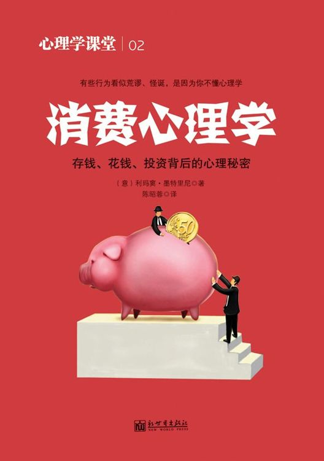

有些行为看似荒谬、怪诞，是因为你不懂心理学。

《消费心理学》带你探索存钱、花钱、投资背后的心理秘密。

# 前　言

遇到有关经济以及消费的问题，我们经常会上当。就像史努比漫画中查理·布朗每次见到红发女孩就会脸红心跳、停止思考一样，我们的大脑也经常“热得发昏”。遇到省钱、花钱、投资这些事儿时，我们的大脑不再是合理的计算器，也无法遵循经济学教科书上的数学模型，找到“效用最大化”的解答，其实这一切可以用心理学原理来解释。

平时，在我们两耳之间的“特制计算机”和我们如影随形，工作正常。可在某些时候，“中央处理器”却很迟钝，记忆力也靠不住，隐藏着超乎想象的缺陷。非但如此，我们在日常生活中体验到的喜悦、不安、愤怒、羡慕、嫉妒、厌恶等情绪，在必须下决策时，它们也会突然出现，迫使我们得出违反合理计算的结论。换句话说，心理上的喜怒哀乐其实都可以支配我们的情绪，左右我们的决定。这一切看似荒谬、怪诞，但在心理学上却是合理的。

不过大家不必担心，只要了解这一切就行了。要了解这一切，最好的办法就是亲自试试看。本书提供了许多相关的问题和案例，用心理学原理诠释了人们在日常生活中所遇到的各种困惑，全面呈现了人们每天面临经济决策时所体验到的矛盾与挫败。对照这些案例和你自己的亲身遭遇，你就能理解自己是通过什么样的认知过程做出决定、大脑又是如何运作的。

了解这一切的目的，当然是要学习如何读懂别人的心理，如何善用大脑分析原因。只要我们能学会用更好的方法增强判断力，就能成为思虑周密的消费者。

在我们所犯的错误当中，有些并不特殊，甚至可说是稀松平常；有些错误有迹可循，只要我们认清错误的真面目，就不会重蹈覆辙。举例来说，为什么薪水和年终奖金的用法会不一样？我在第一部提到人们会对相同的金额赋予不同价值。换句话说，大家习惯“在大脑里分类计算”。某一笔钱是怎么进口袋的、怎么出口袋的，都会改变那笔钱的货币价值。

大家都知道，人的眼睛会产生错觉，把假货看成真货。眼睛的错觉和认知的错觉总在无意间自然出现，使我们基于错觉直接下判断，忽略细节，偏离目标。

即使在我们眼前的是相同的信息，也会因为说明和呈现信息的方式不同，而使我们做出完全相反的选择。例如脂肪含量5％的酸奶比无脂肪含量95％的酸奶好，含有20％一般羊毛混纺的克什米尔毛衣比不上含有80％克什米尔羊毛的毛衣。

当抉择有风险的时候，我们对于风险造成的利益和损失也会有不同的衡量——相较于利益带来的喜悦，人们更在意损失带来的痛苦，所以会为了回避损失，而采取难以理解的行为，例如在危险的赌局中大胆下注，这些都是人们的心理在作怪。

我们每天都感到无所适从，却必须不停做决定。无论是金融专家还是医生，都不知道自己的决定是不是最好的。第二部说明了我们对风险的看法并不单纯，对数据、几率、百分比、统计数字的看法也会受到许多事物的影响。数字并不是冰冷客观的数值，而会受到情感渲染，导致我们得出令人吃惊的不合理的结果，就像情感犹如不宜驾驭的黑马，影响我们对未来的判断。例如我们在买卖股票时难免感情用事，这时候，你需要了解一下自己的消费心理，看穿人生的镜像游戏。

很多时候，我们误以为自己知道自己不懂的事，相信自己有更强的力量和能力。简单说来，就是过于自恋。例如失败时觉得是因为自己运气不好，成功时认为是因为自己很厉害，这些都是心理上的不成熟。我们总是只看见自己想看的。其实只要仔细观察，就会发现自己的主观认知和客观事实互相矛盾，可是谁也不想舍弃自己的信念和偏见。

认知心理学、神经科学、实验经济学等领域不断在研究人的决策过程，累积的研究量多得惊人。这些研究发现，“当事人的决策总能实现最大利益”的经济理论并不正确。研究也发现人们是基于什么理由、如何做出不合理的决策的。在这个研究领域，心理学家丹尼尔·卡纳曼（Daniel
Kahneman）<a href="#part0014.html_ch1"
id="part0014.html_ch1-back">［1］</a>于2002年荣获诺贝尔经济学奖，可说是划时代的大事。本书也多处引用卡纳曼的研究成果。

人类的大脑容易过热失控，不过再怎么笨的行为总有一定的道理。我们犯的错误有许多是可以预测的。换句话说，这些行为的逻辑有别于数学逻辑，虽然不像数学那么有规律，但许多实验已经证实，这些行为的背后往往存在着思考快捷方式（详见第4章）。许多杰出的实验揭露了一连串经济学的错误，让我们得以看到无意识的认知如何作用，如何帮助我们过滤眼前的信息，以决定相应的行动。

科学家在脑和神经生物学领域也针对合理性进行了一连串的研究，我会在第三部中详细介绍。该领域通常是以大脑显像技术来追踪脑内的活动。研究结果显示，人的决策行为受到相关大脑部位的神经细胞的左右，在无意识的过程和可以介入操控的过程之间，在情绪与认知之间（简单说来就是在感性和理性之间），不断进行拉锯以完成决策。

可惜感性和理性经常发生冲突，所以人们容易落入认知的陷阱，做出不合理的选择。在做决策的时候，感性总会出来捣乱，又哭又闹的时候怎么可能冷静思考？情绪机制这时候做了我们自己的主导，例如，明明想减肥，却在面包上涂满奶油大快朵颐。

不过，情绪机制不只扮演阻挠和干扰的角色。为了做出适当的决策，让合理性这部机器发挥功能，我们除了在理性上知道自己该做什么，还需要感性帮一点忙，扮演助手的角色。

假如人类的大脑只会以深思熟虑的方式思考，也就是只靠前额叶皮层运作（这是区分爬行类、其他哺乳类和人类的部位，也是高等认知活动的基地），那么传统经济学理论的确可以正确说明我们的决策行为。不过，假使大脑真的是这样，那么人类就不是地球上的居民了，而是外星人或数学能力优异却没有情感的尖耳火星人。电影《星舰迷航记》中的史巴克博士正是如此。

幸好人生和电影不一样，本书比以往的心理学理论更加丰富多彩、兴味盎然又充满想象力，你会知道，心理上的喜怒哀乐才是决定你要不要花钱的因素。我们的神经回路无穷无限，可以教导我们许多事。书中没有无趣的内容，只要读到最后，你一定会明白我所言不假。

利玛窦·墨特里尼

**注释：**

<a href="#part0014.html_ch1-back" id="part0014.html_ch1">［1］</a> 卡纳曼于1934年生于以色列，现任美国普林斯顿大学心理学教授。自20世纪70年代后期至80年代前期，他和经济学家阿莫斯·特沃斯基（Amos
Tversky，1937-1996，他是卡纳曼一辈子的朋友，也是研究伙伴）共同以实验证明，人在具有不确定性的情况下未必会采取合理的决策。他们提倡以“前景理论”（Prospect
Theory）取代“期望效用理论”（Expected Utility
Theory），其研究催生了“行为经济学”这门新领域。

# 目录

# Contents

<a href="#part0014.html" class="calibre1">前　言</a>

<a href="#part0016.html" class="calibre1">Part 1　合理决策的不合理</a>

<a href="#part0017_split_000.html"
class="calibre1">第1章　原来大脑是这样计算的</a>

<a href="#part0017_split_001.html_sec001"
class="calibre1">◇忽大忽小的500元</a>

<a href="#part0017_split_002.html_sec002"
class="calibre1">◇选择愈多，让人愈混乱</a>

<a href="#part0017_split_003.html_sec003"
class="calibre1">◇问法改变，决定就不同</a>

<a href="#part0018_split_000.html"
class="calibre1">第2章　自相矛盾的决定</a>

<a href="#part0018_split_001.html_sec001"
class="calibre1">◇如何引导顾客做选择？</a>

<a href="#part0018_split_002.html_sec002"
class="calibre1">◇有三个选项时，人会选中间那一个</a>

<a href="#part0018_split_003.html_sec003"
class="calibre1">◇内心不安时，会逃避做决定</a>

<a href="#part0019_split_000.html"
class="calibre1">第3章　决策的错觉和陷阱</a>

<a href="#part0019_split_001.html_sec001"
class="calibre1">◇荒谬的偏好顺序</a>

<a href="#part0019_split_002.html_sec002"
class="calibre1">◇为不合理决策付出惨痛代价</a>

<a href="#part0019_split_003.html_sec003"
class="calibre1">◇敝帚自珍，自卖自夸</a>

<a href="#part0019_split_004.html_sec004"
class="calibre1">◇人有维持现状的倾向</a>

<a href="#part0019_split_005.html_sec005"
class="calibre1">◇为什么无法及时终止亏损？</a>

<a href="#part0019_split_006.html_sec006"
class="calibre1">◇赢得竞标，反而不开心？</a>

<a href="#part0019_split_007.html_sec007"
class="calibre1">◇被数字印象牵着走</a>

<a href="#part0020_split_000.html"
class="calibre1">第4章　“先入为主”的认知陷阱</a>

<a href="#part0020_split_001.html_sec001"
class="calibre1">◇凭直觉下判断的后果</a>

<a href="#part0020_split_002.html_sec002"
class="calibre1">◇错觉其实很普遍</a>

<a href="#part0020_split_003.html_sec003"
class="calibre1">◇不合理的思考，才是正常</a>

<a href="#part0021_split_000.html"
class="calibre1">第5章　换个角度，决定大不同？</a>

<a href="#part0021_split_001.html_sec001"
class="calibre1">◇很可能赔钱时，会变得更敢赌</a>

<a href="#part0021_split_002.html_sec002"
class="calibre1">◇稳赚的时候，就变得保守</a>

<a href="#part0021_split_003.html_sec003"
class="calibre1">◇改变提问方式，足以影响决策</a>

<a href="#part0022_split_000.html"
class="calibre1">第6章　为什么老是在亏钱？</a>

<a href="#part0022_split_001.html_sec001"
class="calibre1">◇出租车司机在下雨天提早收工</a>

<a href="#part0022_split_002.html_sec002"
class="calibre1">◇卖掉赚钱的股票，抱紧赔钱的股票</a>

<a href="#part0022_split_003.html_sec003"
class="calibre1">◇什么事现在不做，以后会后悔？</a>

<a href="#part0023_split_000.html"
class="calibre1">第7章　有关金钱的错觉</a>

<a href="#part0023_split_001.html_sec001"
class="calibre1">◇你真的注重实质收入，胜过账面收入吗？</a>

<a href="#part0023_split_002.html_sec002"
class="calibre1">◇薪水少不要紧，重点是不能比同事低</a>

<a href="#part0023_split_003.html_sec003"
class="calibre1">◇损失10万元的失落，大过赢得10万元的喜悦</a>

<a href="#part0024.html" class="calibre1">Part 2　其实我们不了解自己</a>

<a href="#part0025_split_000.html"
class="calibre1">第8章　同样是风险，感受大不同</a>

<a href="#part0025_split_001.html_sec001"
class="calibre1">◇找出自相矛盾的答案</a>

<a href="#part0025_split_002.html_sec002"
class="calibre1">◇情绪影响对数字的判断</a>

<a href="#part0025_split_003.html_sec003"
class="calibre1">◇“1％”和“每100人之中有1人”的差别</a>

<a href="#part0025_split_004.html_sec004"
class="calibre1">◇杯子小一点，感觉分量比较多？</a>

<a href="#part0026_split_000.html"
class="calibre1">第9章　和风险拉锯</a>

<a href="#part0026_split_001.html_sec001"
class="calibre1">◇相对风险比绝对风险更耸人听闻</a>

<a href="#part0026_split_002.html_sec002"
class="calibre1">◇搞懂统计数据，认清事物本质</a>

<a href="#part0027_split_000.html"
class="calibre1">第10章　高估自己的判断力</a>

<a href="#part0027_split_001.html_sec001"
class="calibre1">◇愈专业，愈容易自以为是</a>

<a href="#part0027_split_002.html_sec002"
class="calibre1">◇自大造成的陷阱</a>

<a href="#part0027_split_003.html_sec003"
class="calibre1">◇成功是自己了不起，失败是因为别人不好</a>

<a href="#part0027_split_004.html_sec004"
class="calibre1">◇人只看得见自己想看的</a>

<a href="#part0028_split_000.html"
class="calibre1">第11章　经验会作怪</a>

<a href="#part0028_split_001.html_sec001"
class="calibre1">◇高谈阔论的“事后诸葛”</a>

<a href="#part0028_split_002.html_sec002"
class="calibre1">◇事后的归因，影响客观的判断</a>

<a href="#part0029_split_000.html"
class="calibre1">第12章　投资人的心理</a>

<a href="#part0029_split_001.html_sec001"
class="calibre1">◇一味追求低风险，不见得风险就低</a>

<a href="#part0029_split_002.html_sec002"
class="calibre1">◇对过去表现良好的股票过度乐观</a>

<a href="#part0029_split_003.html_sec003"
class="calibre1">◇投资自己熟悉的企业，有什么不对？</a>

<a href="#part0029_split_004.html_sec004"
class="calibre1">◇愈清楚情况，投资愈顺利？</a>

<a href="#part0029_split_005.html_sec005"
class="calibre1">◇积极买卖，造成亏损</a>

<a href="#part0030_split_000.html" class="calibre1">第13章　预测将来</a>

<a href="#part0030_split_001.html_sec001"
class="calibre1">◇既有经验影响对未来的判断</a>

<a href="#part0030_split_002.html_sec002"
class="calibre1">◇买卖股票难免感情用事</a>

<a href="#part0031.html" class="calibre1">Part 3　喜怒哀乐的决定力</a>

<a href="#part0032_split_000.html"
class="calibre1">第14章　盈亏的游戏</a>

<a href="#part0032_split_001.html_sec001"
class="calibre1">◇与人交手时的心理战</a>

<a href="#part0032_split_002.html_sec002" class="calibre1">◇合作博弈</a>

<a href="#part0032_split_003.html_sec003"
class="calibre1">◇理论和实际的差距</a>

<a href="#part0033_split_000.html"
class="calibre1">第15章　会发怒的神经元</a>

<a href="#part0033_split_001.html_sec001"
class="calibre1">◇大脑痛苦的时候</a>

<a href="#part0033_split_002.html_sec002"
class="calibre1">◇了解别人的想法，再决定自己的做法</a>

<a href="#part0033_split_003.html_sec003"
class="calibre1">◇伸张正义的复仇带来快感</a>

<a href="#part0034_split_000.html"
class="calibre1">第16章　看穿人心的镜像游戏</a>

<a href="#part0034_split_001.html_sec001"
class="calibre1">◇以神经生物学解释金钱游戏</a>

<a href="#part0034_split_002.html_sec002"
class="calibre1">◇同理心来自镜像神经元</a>

<a href="#part0034_split_003.html_sec003"
class="calibre1">◇道德判断的两难，大脑怎么说？</a>

<a href="#part0035_split_000.html"
class="calibre1">第17章　情感与理性的角力</a>

<a href="#part0035_split_001.html_sec001"
class="calibre1">◇理性是有极限的</a>

<a href="#part0035_split_002.html_sec002"
class="calibre1">◇情感是不可或缺的助力</a>

<a href="#part0035_split_003.html_sec003"
class="calibre1">◇人与鸽子的相似处</a>

<a href="#part0036_split_000.html"
class="calibre1">第18章　太有人性的大脑</a>

<a href="#part0036_split_001.html_sec001"
class="calibre1">◇情感如同不易驾驭的黑马</a>

<a href="#part0036_split_002.html_sec002"
class="calibre1">◇刷卡付费减轻了神经系统的痛苦</a>

<a href="#part0036_split_003.html_sec003"
class="calibre1">◇合理决策的人，能妥善操控情感</a>

<a href="#part0000.html" class="calibre1">返回总目录</a>

# *Part* 1　合理决策的不合理

# 第1章　原来大脑是这样计算的

金钱的价值在我们心目中并不是绝对的。

我们会自行赋予金钱相对的价值，

而这是受到经验和情绪所影响的。

## 忽大忽小的500元

谈到钱，无论金额大小，大家总会精打细算，不过我们却常常在不经意间做出矛盾的判断。

大家可能以为我们脑中的账本算得很精确，其实不然。大脑会从不同角度去解释同一笔交易的意义，有时候解释的方式很独特，有时候则非常令人费解。

先来看一则例子。

**问题1**

今天是星期六，你最喜爱的一场音乐会将在晚间举行。

你满怀期待来到音乐厅，就在快走到入口的时候，你发现自己竟然把6000元的昂贵门票弄丢了！

此时，你会怎么办？你会重新买一张票吗？

（你可以全面考虑，不过请诚实回答。如果你不喜欢音乐会，也可以想象自己是去看体育比赛或演唱会。）

**问题2**

与问题1相同，你来到音乐厅的入口，不过这次并不是把票弄丢。你还没有买票，却发现上衣口袋里的6000元竟然不见了！

此时，你会怎么办？你会掏钱买票吗？

几乎所有的人在第一种情况下都会选择不重新买票，可是在第二种情况下却会去买票。

从经济学的观点来看，当事人在这两种情况下所面临的是同样的难题——都是损失6000元，都是要不要听音乐会的问题，但为什么在这两种情况下给出的答案却恰恰相反呢？

**问题3**

现在正逢圣诞购物折扣季。你出门去买那部自己一直想要的手机。到了店里，你看到手机标价3000元。你正要付钱，同行的朋友却告诉你，距离这儿10分钟远的另一家店，同一款手机只要2500元。

你会怎么办？你会改去比较便宜的那家店买吗？

**问题4**

与问题3相同，不过这次你是去买电视机。在第一家店，你想买的电视机标价80000元。你朋友跑来告诉你，距离这儿10分钟远的另一家店，同一款电视机只要79500元。

你会怎么办？你会改去比较便宜的那家店买吗？

几乎所有的人在第一种情况下都会改去比较便宜的那家店，可是在第二种情况下却选择在第一家店购买。换句话说，对大多数人来说，金钱未必时时具备同等的价值。

相同金额的钱，在不同情况下却有不同的价值。以刚才的例子来说，问题的实质其实相同，都是只要走10分钟路就能节省500元钱。可是对我们来说，买手机可以省下500元和买电视机可以省下500元，两者的差别很大。

500元就是500元，但为什么在不同的情况下价值会变得不同呢？这到底是怎么一回事？

根据观察，人们往往会把金钱分成各种类别，也就是会区分金钱的来源为何、怎样累积，以及如何使用。每个人都是以自己独特的方式在脑中计算的，只不过此时计算所用的数学思维和我们在学校学到的数学思维截然不同。

观察大脑的计算方式可以发现，人们会视情况不同而赋予同等数额的金钱不同的价值，于是所做的选择就显得互相矛盾。

在上述音乐会的例子中，许多人在第一种情况下（弄丢6000元的门票），会把这个损失列入娱乐类别（也就是为了让自己心情愉悦的花费）。当门票不见了，如果重新买一张，那么第二张的票价就必须列入娱乐类别的支出。这时候，问题就变成“要不要为了娱乐而支付总计12000元的门票”。若只是为了短暂的娱乐，这笔钱并不算少，于是许多人在反复衡量之后，宁可放弃去音乐会享受美好时光的机会。

第二种情况则不同。在大脑的计算中，没有指定用途的6000元现金的丢失，与购买门票的6000元属于两种不同的类别。许多人在丢失现金的情况下并不排斥掏钱去买票，因为他们觉得自己只花了6000元听音乐会。当然，一想到自己弄丢了与票价相等数额的钱，也会泄气和自责，但还不至于因此放弃听音乐会，毕竟这两笔钱属于不同类别的支出。

至于买手机和电视机的例子则说明，到另一家店购买（手机或电视机）可以省下的金钱的价值，会随着选购物品的总价而改变。买3000元的手机所省下的500元，比起买80000元的电视机所省下的500元，显得更有价值。

换句话说，金钱的价值在我们心目中并不是绝对或抽象的。我们会自行赋予金钱相对的价值，而这是受到经验和情绪所影响的。例如在尘封已久的外套口袋里意外找到的年终奖金，其价值一定有别于自己汗流浃背赚来的血汗钱，两者后来被花掉的方式当然也会有所不同。

教科书费用、体育比赛门票、舞台剧门票、滑雪旅行费用、买彩票和股票的钱，等等，这些都被归入不同类别，分开计算。而且我们也看到，许多人在动用大笔存款购买贵重物品时，对金额的尾数连看也不看一眼，可是去超市购物时，却又变得斤斤计较，拼命挑选特价商品。

美国芝加哥大学经济学家理查德·泰勒（Richard
Thaler）<a href="#part0017_split_001.html_ch1"
id="part0017_split_001.html_ch1-back">［1］</a>通过实验，观察人在消费行为中衡量金钱的种种心理现象。那些支持传统经济理论、相信“金钱价值不变”的人，对泰勒所主张的理论不以为然。因为他们认为，买彩票中奖的5000元、辛苦工作赚来的5000元、继承遗产获得的5000元，其价值理应相等。

然而事实上，我们的大脑在思考金钱价值时未必依循经济理论。其实，这种现象层出不穷，有时甚至令人伤透脑筋。当“金钱的价值高低视情况而定”时，就代表着我们赋予了金钱相对的价值。这可以用来解释为什么我们喜欢花钱，却讨厌存钱。

**注释：**

<a href="#part0017_split_001.html_ch1-back"
id="part0017_split_001.html_ch1">［1］</a> 泰勒著有《赢者的诅咒——经济生活中的悖论与反常现象》一书，深入探讨了经济生活中广泛存在的各种反常现象，开拓了现代经济学研究的新领域，是行为经济学和行为金融学的经典著作。

## 选择愈多，让人愈混乱

在必须做选择的时候，大脑为了保持平衡，总会设法找理由解释，以证明自己的选择正确无误，然而最后却往往导向我们刚才所提到的不合理思考。此时的大脑运作就像传统集市中的交易——一件物品有多种价格，而每一笔交易都各有道理。

为了在诸多交易中保护自己，我们必须有宽阔的视野和坚定的选择标准，才不致轻易受人摆布。身处在传统集市般的各种场合，我们会尽量让自己不受交易对手的策略所影响。不过，即使我们想方设法地证明自己的选择正确无误，毕竟还是会有极限，而大脑也会逐渐陷入混乱。

经济学家也注意到，大脑的思考机制会做出自相矛盾的选择。已有研究发现，大脑在日常生活中时常犯某种错误，其典型代表就是个人行为会违反传统经济理论和合理思考模式，虽然专家一直在刻意避免质疑“合理思考”的正当性，因为大家总相信“金钱价值不变”，也就是人的行为不会违反“合理思考”。

我们不妨以足球迷为例。假设你是意大利AC米兰队的忠实拥护者，那么无论其将要面对的对手是谁，你都不会在乎，因为你只为AC米兰队心跳加速、摇旗吶喊。如果不是如此，那么你不仅违背了身为忠实球迷应有的忠诚度，还会破坏正常思维的“合理性”。

根据“合理思考”的原则，即使在既有的一连串选项之外，再加上一个或多个我们本来就不会选的选项，原先选项的优先级也并不会因此而改变。

以足球队来说，假设你是AC米兰队的球迷，那么在国际米兰队和AC米兰队两者之间，你一定会选AC米兰队。即使再加上尤文图斯队这个选项，在国际米兰队、AC米兰队和尤文图斯队三者之间，你还是会支持AC米兰队。身为AC米兰队的忠实球迷，始终选择AC米兰队就是你该有的“合理性”。

但是，现在让我们看看别的例子。假设你和老友马利欧相约出去吃晚餐。到了餐厅之后，你问女服务员，今天的特餐是什么。“今日特餐是千层焗烤面和意大利面。”女服务员回答。于是马利欧选择了千层焗烤面。女服务员又说，“哦，我忘了，今日特餐还有焗烤饭。”

“真的吗？”马利欧说，“那我还是吃意大利面吧。”

马利欧的选择听起来很不可思议，这是因为我们的大脑认定有“合理性”的存在。“合理思考”有自然的力量，让人直觉上认为是正确的。不过，即使“合理思考”令人觉得正确，也无法一体适用，例如在考虑经济因素的时候。请看以下例子。

**问题5**

你想买一部MP3随身听。在逛街经过某家商店的时候，你看到畅销的索尼随身听正在促销，只要4399元，比原价便宜很多。

你会怎么办？

A．买索尼随身听。

B．顺便看看别的品牌的随身听。

**问题6**

与问题5相同，不过这次除了索尼随身听之外，还有一部三星随身听也在促销，质量很好，只要6999元，比原价便宜很多。

你会怎么办？

A．买索尼随身听。

B．顺便看看别的品牌的随身听。

C．买三星随身听。

这项以美国普林斯顿大学和斯坦福大学学生为受试者的实验发现，在“问题5”中，有2/3的学生选择买索尼随身听。不过在“问题6”中，只有1/4的学生会买索尼随身听，1/2的学生暂时不买，其他学生决定买三星随身听。换句话说，当难得的机会不只有一个，而是有两个或多个时，人们把握机会的几率反而会降低。

实验结果还发现，当选项变得愈多，人们不当场做决定的倾向愈强。也就是说，当人们做决定时的参考依据愈多，就愈容易失去判断力。

如果选项只有一个（比如只有一种特价商品），那我们很容易就能做出决定。可是一旦选项变多，出现了许多符合自己需要的选项，我们反而很难从中选定某一项。

在“问题6”中，增加了另一品牌的高价随身听在作促销活动，虽然价格昂贵，但明显比原价便宜很多。于是人们会在脑中自问自答，使得选择特价MP3随身听的几率变得愈来愈低。

“三星和索尼，真难抉择。说不定还有更好的品牌，就算是高价机，特价时也会变得很便宜。”

“无论再怎么特价，我也买不起三星，可恶！”

“索尼随身听这么便宜？是不是已淘汰的旧款式？搞不好用不到一年就会变成废铁。”

“现在到处都在促销，还有比三星便宜、比索尼便宜的中等价位品牌，应该还有捡便宜的机会。”

……

像这样不断在脑中衡量、在心里盘算，只会让人陷入无法选择的泥沼而不能自拔。那些本来觉得三星太贵，根本不曾考虑购买三星随身听的人，可能到最后连索尼随身听都不想买。

值得一提的是，为了消除自己内心的迟疑，人们往往会不自觉地绞尽脑汁，寻找适当的理由来说服自己进行选择。

## 问法改变，决定就不同

有一个男子去买比萨，老板问他：“要切成几等份？”男子回答：“四等份，我还没有饿到可以吃下八等份。”

这段问答是不是很不可思议？当眼前的两种选择都不错，而我们必须从中选出一个时，许多人总会找出各种理由解释自己的决定。在选举期间就常常发生这样的现象，竞选活动是让选民看清诸多陷阱的最佳时机。

**问题7**

市长选举开始了，这次一共有两位候选人。根据目前的信息来看，甲先生的条件普普通通，乙先生能力比较强，可惜缺点也比较明显。

甲先生是某镇的知名实业家，从大学开始便热心公益，并顺利于某大学法律系毕业。他有两个女儿，都就读于镇上的小学，妻子是家庭主妇。

乙先生为美国某著名大学的MBA，曾担任“国会副议长”一职。为了在地方兴建儿童专科医院，曾发起过募捐活动。在任职期间曾卷入过贪污事件，前段时间刚与一位颇具知名度的性感女星订婚。

请问，你不想投票给哪一位候选人？

大家当然都不想乱投票。在决定投票给哪一个人的时候，人们会找出各种合理的理由。

普林斯顿大学认知心理学家艾利达尔·夏弗（Eldar
Shafir）通过长期研究发现，一般人在回答这类否定问句时，会特别注意负面的信息，即坏的一面比好的一面更容易左右人们的选择。在否定式提问的情况下，不想投票给甲先生的人只有8％，而不想投票给乙先生的比例却高达92％。

接下来，我把刚才的问题改为肯定问句。

**问题8**

你想投票给哪一位候选人？

对于这个问题，人们依然会思考自己投票给某人的理由，只不过这一次会比较注意正面的信息，即好的一面比坏的一面更容易左右人们的选择。在肯定提问的情况下，有79％的人想投票给甲先生，有21％的人想投票给乙先生。

这表示，以肯定问句提问时，乙先生当选的几率比否定问句提问时高出两倍多（8％和21％）。

支持传统经济学理论的人会说，人们所做的选择明确代表着他们的喜好和衡量结果。也就是说，“选某人”和“不选某人”彼此应该互补，两者的几率相加等于100％，然而结果却并非如此。

通过观察“问题7”和“问题8”的两组回答数据，你会发现，想投票给乙先生的比例（21％）加上不想投票给乙先生的比例（92％），并不是100％，而是113％！

话说回来，选举市长和买比萨这两件事并不能相提并论。对于必须从互有优劣的候选人当中选出其一的选民来说，找到足以支持自己选择的妥当理由更为重要。在这种情况下，问题的提问方式将会大幅影响最后结果。也就是，当问法改变时，许多人会做出不同的甚至是恰好相反的矛盾选择。

夏弗曾经阐述过人们如何在不同的备选事物之间做出抉择的两难局面。以选举问题为例，我们可以从两个角度观察：

一个角度是候选人——站在甲先生的立场上，只要把选举活动聚焦于竞争对手的负面信息，让选民注意对手坏的一面即可；站在乙先生的立场上，则要将选民的注意力集中在自己好的一面，唯有这样做，才有胜选的机会。

另一个角度是选民——站在选民的立场上，最重要的应变方式是，在自己倾向于任何一位候选人之前，及早看清两位候选人所采取的竞选策略。

在不受外界干扰的情况下，选民会将关注点集中于想投票给某人的理由，还是不想投票给某人的理由呢？实际上，大多数人并不会特别偏向候选人的正面或负面信息。如果选民事先并未决定非投票给某人不可，那么最好在做决定之前，列出投票或不投票给某位候选人的理由，仔细考虑清楚。

# 第2章　自相矛盾的决定

无论正面或负面，

只要增加具有极端性质的选项，

就会提高那些具有“中间”性质的选项的胜出几率。

## 如何引导顾客做选择？

我们不妨把一个人在做决定时的内心挣扎放大来看。之前已经谈到，当既有的选项之外又增加新的选项时，人们内心会出现疑惑，表现出来的行为也不一样。那么，追加选项到底如何影响我们的行为呢？来看一个例子。

**问题9**

有一家文具店的老板为人和善，待人真诚，为回馈新老顾客多年的支持，该文具店特推出了以下优惠活动：只要在文具店一次性购物满1000元，即可获赠不同的小商品或直接返还100元现金。具体分为以下三种情况：

第一种情况：你可以选择拿回100元现金，或者免费获得一支金属圆珠笔。

第二种情况：文具店老板心情好，又增加了一个选项，即你可以选择拿回100元现金、免费获得一支金属圆珠笔或是外观稍有不同的同款金属圆珠笔一支。

第三种情况：金属圆珠笔的数量有限，文具店老板又提议，你可以选择拿回100元现金、免费获得一支金属圆珠笔或一支塑料圆珠笔。

请好好想想这三种情况的差异。

在第一种情况下，只有100元现金和一支金属圆珠笔两个选项，你可以任意选择其中之一，选哪一个都行。我们要讨论的重点不在于选什么，而是你对下一题的回答和这一题有什么差别。

在第二种情况下，增加了“外观稍有不同的同款金属圆珠笔一支”的选项，此选项和先前提到的“一支金属圆珠笔”的选项很像，如果你对这两种圆珠笔的喜好程度相同，那么你选择100元现金的几率就会提高。因为两种圆珠笔难分高下，你的注意力很容易偏向100元现金。

然而，在第三种情况下，追加的“一支塑料圆珠笔”的选项的吸引力明显不如既有的“一支金属圆珠笔”的选项。此时，我们很容易选择价值相对较高的东西，也就是“一支金属圆珠笔”。换句话说，塑料圆珠笔衬托出了金属圆珠笔的优势，使金属圆珠笔看起来比现金更具价值。

在已经有两种选项的情况下，如果追加与既有的某个选项非常类似的新选项，就会产生“妨碍效果”，促使人选择那个与新选项完全不同的既有选项；如果新选项明显不如既有的某个选项，那么新选项就如同“饵”一样会产生“引诱效果”，使得既有的那个明显优于新选项的选项的魅力大增，进而提高其赢得顾客青睐的几率。

夏弗与普林斯顿大学的研究团队通过具体实验发现，如果增加“外观稍有不同的同款金属圆珠笔”这个与既有选项“金属圆珠笔”极其类似的新选项，那么人们不选圆珠笔而选现金的比例提高了28％；如果增加的新选项为明显不如既有选项“金属圆珠笔”的“塑料圆珠笔”，那么人们选现金的比例就会降低10％，而金属圆珠笔的人气暴涨。

该如何解释这种现象呢？难道是因为人们在不知该如何选择的时候，新选项看起来比较吸引人？这并不是充分的理由。人们希望证明自己所选的选项比另外两个选项好，而且必须找到“令人心服口服的理由”。

以刚才的例子来说，当同时出现了“一支金属圆珠笔”和“外观稍有不同的同款金属圆珠笔一支”两个极其类似的选项，会使人难以做出抉择。当事人找不到应该选两者之中某一个的充分理由，于是最后选择了100元现金。当“塑料圆珠笔”取代“外观稍有不同的同款金属圆珠笔一支”成为新增选项时，反而让当事人容易做判断，有充分的理由选择金属圆珠笔。

从这个例子我们可以看出，当商家扩大顾客的备选范围之后，顾客选择的优先级就会发生变化。商家可以巧妙利用顾客的这一特性引导他们进行选择。

## 有三个选项时，人会选中间那一个

妨碍效果和引诱效果的原理违反了人们的合理思考模式。除此之外，当人们不知如何抉择时，还会出现一种违反合理性的行为——“讨厌两极”。

讨厌两极的现象很有名，意思是无论正面或负面，只要增加具有极端性质的选项，就会提高那些具有“中间”性质的选项胜出的几率。

请看下面这个实验。

**问题10**

店员向一群顾客介绍数码相机。一共有两种机型：第一种机型标价10999元，第二种机型标价20999元。两种机型均为同一品牌。

店员向顾客详细说明了这两种机型的操作方法，两者的价格均合理适当。

你认为顾客会选择哪一种机型？

结果，这群顾客选择两种机型的比例相同，各为50％。

**问题11**

与问题10相同，不过这次除了上述两种机型之外，又增加了一种标价为35999元的新机型。

你认为顾客会选择哪一种机型？

按照“问题10”的结论，不管这群顾客中有多少人选择最昂贵的机型，其他的人应该平均选择前两种机型，对吧？然而实际情况并非如此。

当追加了质量和价格皆属上乘的第三种机型之后，大多数顾客都决定选购处于中间价位的那种机型。原本有50％的人选择最便宜的那种机型，而这次却降为了10％。

当选项变多之后，人们通常偏向于选择价格居中的那个选项。这是因为我们给自己找到了证明自己的选择最好的理由——中间的选项在其他两个选项的衬托下显得最方便、最珍贵。

可是，为什么我们一开始没注意到这个选项的优点呢？其实，我们只是找到了自己可以接受的妥协点，然后再找理由让自己做的选择显得有道理，消除内心的疑惑。这一切只是自己妥协的结果罢了。

餐厅管理人员在设计酒单时也会巧妙利用人们的这一心理特性。例如，在酒单上加入贵得令人咋舌的特级好酒，顾客就容易选择比低价酒高一级的中高价位洋酒。这样的选择倾向正好符合餐厅管理人员的期待。

如果你希望提供更多的选项能对大家都有益（不只对卖方有益），就必须了解一连串的决策模式是如何形成的，找出会让对方的选择违反合理性的不合理选项，借此打乱对方选择的步骤。

如果日常生活中没有选择的自由，确实令人难以忍受，不过要是连买牙膏这么琐碎的事都有无数种选项：护龈固齿牙膏、止血消炎牙膏、去垢美白牙膏、防过敏牙膏、中草药牙膏……从中自由进行选择，反而令人不知所措，每次选购时，内心总得经历一番挣扎。

在做出任何一项决策时，我们都会综合考虑必要性、个人喜好、方便性等诸多因素，但最后往往落得“选择愈多，收获愈少”的矛盾下场。例如出门去买牛仔裤，结果试穿了20多条牛仔裤之后，还是两手空空地回到了家。

这种经验不禁令人感叹：当有无限多种选项时，根本无法让人随心所欲，反而使人为了找到喜欢的东西而增添烦恼。购物不再是令人开心的事，因为好不容易才能决定要买哪一种，将来还可能会后悔——事后摆脱不了“虽然买了这个，可是另一个说不定比较好”的念头。

人们不只在选购牙膏和牛仔裤时内心会有挣扎，还有其他数不清的例子可以说明，个人偏好会导致人们做出种种不可思议的决定。

## 内心不安时，会逃避做决定

**问题12**

将刚刚结束一次大考，并知道考试成绩的学生分为两组：一组为考试成绩及格者，另一组为考试成绩不及格者。对两组学生分别提问：“你想去旅行吗？”

你认为哪组学生回答“会去旅行”的比例比较高？

实验结果发现，两组学生回答“会去旅行”的比例几乎一样。换句话说，无论考试成绩怎么样，当事人都想去旅行。简言之，考试结果对是否想去旅行并没有影响。

**问题13**

实验人员对另一组学生提问同样的问题，但这组学生还不知道自己的考试成绩是否及格。

请问，他们想去旅行吗？

令人惊讶的是，实验结果发现，有许多学生表示：“希望等考试结果公布之后，再决定要不要去旅行，即使因为延后买机票而必须额外付费也无妨。”这到底是怎么一回事？是什么因素在阻碍当事人作决定？

两个实验的唯一差别在于：当事人在决定要不要去旅行时，是否知道自己的考试结果。

大家已经看到，考试成绩及格与否对于是否去旅行的决定并无影响，即无论考试成绩及不及格，当事人都能找到去旅行的“正当”理由：如果考试成绩不及格，必须努力用功准备重考，那么不妨在闭门苦读之前先去旅行一次，放松心情；如果考试成绩够好，去旅行就等于是犒劳自己。

但是，在还不知道考试结果的情况下，当事人就缺少了去旅行的“正当”理由，放不下内心的不安（要是出门旅行之后才得知自己考试不及格，该怎么办），所以，为了避免内心的挣扎与煎熬，他们并没有做出是否去旅行的决定。如果没有这些心理挣扎，他们应该早就能决定要不要去旅行了。

其实，这种挣扎不单单是针对需要花钱的娱乐活动才出现，在面临与健康有关的重大抉择时，人们也会有类似的反应。

为了厘清医生和病患在什么情况下会采取什么行动，相关专家进行了如下实验。

**问题14**

一位捐赠者要捐赠自己的某个器官，医生必须从两位病患当中选择一位来接受移植。

其中甲先生是一位膝下无子女的老年人，在接受移植手术时没有任何体质上的顾虑；乙女士是一位年轻的已婚母亲，有三个年纪尚小的孩子，在接受移植手术时有虽不致命但不容小觑的顾虑。

你认为医生会选择哪一位病患接受移植手术？

**问题15**

一位捐赠者要捐赠自己的某个器官，医生必须在甲先生（问题14中的老年人）和丙女士当中选择一位来接受移植。

其中丙女士同乙女士一样，也是一位年轻的已婚母亲，有两个年纪还小的孩子，在接受移植手术时同样有着虽不致命但不容忽视的顾虑。

你认为医生会选择哪一位病患接受移植手术？

**问题16**

相关情况和上述两个实验相同，只不过这次医生必须在甲先生、乙女士和丙女士三位病患当中选择一位进行手术。

你认为医生会选择哪一位病患接受移植手术？

结果发现，在第三种情况下，选择为甲先生动手术的医生明显比其他两种情况多（前两种情况下都只有15％，而第三种情况下却高达25％）。

纵观这三种情况，我们可以总结出两点：

第一，无论当事人是否意识到自己的思考模式，一般人总会回避造成自己内心挣扎的选项。要从乙女士和丙女士当中择一进行手术并不容易，既然如此，干脆选择最不会造成自己内心不安的甲先生。

第二，一般人总希望选择自己和他人（实验中的病患、病患家属，以及保险公司等）都能接受的选项。在第三种情况下，要从乙女士和丙女士当中选出大家都能接受的选项实在很难，所以手术时没有体质上的顾虑的甲先生获选的几率明显提高。

2005年诺贝尔经济学奖得主托马斯·谢林（Thomas
C．Schelling）<a href="#part0018_split_003.html_ch1"
id="part0018_split_003.html_ch1-back">［1］</a>是研究这一问题的先驱。谢林曾经提到过这样一件事情：

几年前，他想买一本全家人都可以使用的百科全书，便前往纽约书种齐全的书店选购。在经过仔细筛选和对比之后，他选中了两套百科全书。这两套百科全书都符合他的需求，可是他很难从两者当中选择其一。他在书店里左思右想，伤透脑筋，最后却空手而返。几年之后，他依然无法决定要买哪一套百科全书。

**注释：**

<a href="#part0018_split_003.html_ch1-back"
id="part0018_split_003.html_ch1">［1］</a> 谢林将博弈理论应用于国际纷争和协调分析，因贡献卓著而获得诺贝尔奖。

# 第3章　决策的错觉和陷阱

一个人一旦拥有某项物品，

那么在他眼里，

该物品的价值会顿时高涨到

没有那项物品的人所认定的两倍。

## 荒谬的偏好顺序

我们经常会做出令人感到意外的选择，而选择的结果又总是耐人寻味。请看以下例子。

**问题17**

你必须从以下两种情况中选择其一。

A．奖金比较少，可是中奖几率比较高（奖金2000元，中奖几率80％）。

B．奖金比较多，可是中奖几率比较低（奖金20000元，中奖几率10％）。

你会选择哪一种呢？

在这个实验中，大多数人（67％）选择了A。

**问题18**

这次请你对刚才的A和B下注。

换算成现金数额之后，你对哪一个选项的下注金额会比较高？

结果发现，大多数人（71％）对B选项下注的金额比较高。

俄勒冈州立决策研究所的保罗·斯洛维克（Paul
Slovic）和萨拉·利切坦斯泰因（Sarah
Lichtenstein）在拉斯维加斯的赌场，用真实的金钱进行了一连串的实验，证实了著名的“偏好逆转”（Preference
Reversal）现象。这两位认知心理学家通过观察发现，赌局的赌注大小和奖金的数额密切相关，不过选择赌注时却和胜算几率密切相关。

后来，该实验结果引起了查尔斯·普洛特（Charles
R．Plott）和大卫·葛林纳（David
M．Grether）两位经济学家的注意。为了反驳该结论，教训一下擅闯经济学领域的心理学家，他们重复进行了相同的实验。

没想到，他们的打算落空了。他们不仅无法通过实验推翻这种奇妙的矛盾现象，反而更加有力地证实了该现象的根深蒂固。传统经济学的核心就此出现裂缝，因为传统经济学一直认为，人的选择有明确的、确定的“偏好顺序”。

回到刚才赌局的例子，选项B的奖金（20000×10％＝2000）比选项A的奖金（2000×80％＝1600）高，可是人们未必一定偏好选项B。人们在决策过程中的偏好顺序会随着选项的表现方式（例如几率、金额等）的改变而改变。

再来看一个日常生活中随处可见的例子。假设你的车子快要报废了，到处都有小故障，它看起来就像一堆跑不动的废铁。于是你决定买一部新车。

基本款新车的定价是103万元。加装空调设备之后，开车时会更舒适，不过得加付4.5万元。这个价格倒还好。如果再换上强力引擎的话，车开起来会更有奔驰感，而这项配备也得加付4.5万元。汽车导航系统大降价，现在买只要2.5万元。另外，如果加买五年保修期的话，就得多付2.5万元（一年只要0.5万元）。这样算下来，加装各种设备之后的新车的总价高达117万元。

在这个买车的例子中，当事人必须决定要不要加购附件。每个附件的单价并不高，可是累积了各种附件之后的总金额却很惊人。

“算了算了，我还是回家再想想，现在暂时开旧车就好。”

像这样的例子随处可见，足以颠覆“人们事先会决定偏好顺序”这一传统经济理论。根据偏好顺序理论，若人们对A的偏好大过B，对B的偏好大过C，那么在对C和A进行选择时，应该会选A。但实际情况并非如此。

在买车的例子中，C指旧车，B指基本款新车，A指加装各种配备之后的新车。显然易见，人们对B的偏好大过C，对A的偏好大过B，可是当C和A放在一起时，人们却选择了C，与传统经济理论的结论正好相反。

## 为不合理决策付出惨痛代价

可能有读者会在心里嘀咕：“有一点不合理又何妨，反正大家都是这样！”但问题是，不合理决策可能会让你付出很高的代价。接下来我就要说明产生不合理决策的背后的原理。

罗先生是某知名足球队的老板，他要和手腕高超的经纪人莫先生见面（请大家把这些场景和人物当成虚构的电影情节）。

罗先生的喜好与众不同但又自相矛盾。比起来自意大利、沉默寡言的守门员聂斯特，他比较喜欢来自南美、年轻有为的中场球员利巴尔特；比起来自荷兰、技巧纯熟的中锋范伯尼恩，他比较喜欢守门员聂斯特；但比起利巴尔特，他反倒比较喜欢范伯尼恩。

经过多次交涉，莫先生最后以数百万美元的价码把聂斯特转签给了罗先生。交易谈妥之后不到两个星期，莫先生便登门拜访罗先生，表示只要他加价数百万美元就能把聂斯特改为利巴尔特。罗先生毫不犹豫，当场答应了莫先生的开价，同意加付数百万美元将聂斯特换成利巴尔特。

可交易达成之后不到两个星期，莫先生又登门拜访罗先生，表示只要他加价数百万美元就能把利巴尔特改为范伯尼恩。罗先生依然非常果断地同意了莫先生的提议，把利巴尔特换成了范伯尼恩，并因此加付了数百万美元。

此次交易成交之后又不到两个星期，莫先生再次登门拜访罗先生，表示只要罗先生加价数百万美元就能把范伯尼恩改为聂斯特。真实情况确实如此，假如罗先生想再次得到聂斯特，就得再加价数百万美元！罗先生再次允诺，把范伯尼恩换成了聂斯特，并为此加付了数百万美元。

还是交易成交之后不到两个星期，莫先生又登门拜访罗先生……根本没完没了。

在这个离谱的绕圈圈问题中，罗先生成了摇钱树。然而那些依照自己的偏好做决策的人，随时都可能面临和罗先生同样的状况。如果你对A的偏好大过B，对B的偏好大过C，对C的偏好又大过A，那么你就极有可能做出不合理的决策，并为自己的不合理决策付出昂贵的代价。

## 敝帚自珍，自卖自夸

日常生活中的一些不合理决策，有时甚至会以不得大意的方式出现，请看以下例子。

假设你喜欢喝红酒，几年前刚好买了几箱世界顶级红酒中的瑰宝——“蒙塔尔奇诺的布鲁尼洛”（Brunello
Di
Montalcino），一直存放在酒窖里。在此期间，这个品牌的红酒不断增值。最初你是以一瓶20美元的价格购入的，但现在的市价已经飙到了一瓶200美元。

某天晚上，你和好友聚会，开了一瓶来喝。但你并没打算以市价出售这些红酒而大赚一笔，也不打算以市价加买一些同样的红酒来囤积。

假如你是当事人，你可能会在心里这样盘算：我认定自己所拥有的红酒的价值高于现在的市价，所以我不出售手边的红酒，但是我也不加买市面上的同样的红酒。其实你的决策依据并不是传统的经济理论，而是在大脑中依循其他思路进行思考的。这种心理现象被称为“禀赋效应”（Endowment
Effect）。

很明显，你在经济方面的考虑并不恰当。不以现在的市价出售手边的红酒，代表着你预期接下来几年红酒价格会继续攀升，这些红酒的价值会更高。但假如你真的这么想，那为什么不以市价收购现在市面上流通的同样的红酒呢？

与味觉细腻的朋友一起品尝极致美酒，这的确是一件无可比拟的乐事。可是只要现在多购入一些同样的红酒，或者把手边的红酒销售一空，你就能赚很多钱买更多好酒和朋友共享。但为什么你要一直把红酒存放在酒窖里呢？

专家通过实验告诉了我们答案。

**问题19**

实验者把康奈尔大学经济学系的学生任意分为两组，并发给第一组学生每人一个马克杯（美国人常用的一种杯子，上面印有大学的校徽）作为礼物，而第二组学生什么礼物也没有。请问：

A．刚领到杯子的第一组学生愿意以多高的价格出售杯子？

B．没有领到杯子的第二组学生愿意出多少钱购买杯子？

实验结果如下：

如果平均价格低于5.25美元，领到杯子的第一组学生就不愿意出售杯子；如果平均价格高于2.75美元，没有领到杯子的第二组学生就不想购买。

这两组学生是随机分组的，但为什么会出现这种结果呢？

当一个人一旦拥有某项物品（即使不是什么了不起的东西），那么在他眼里，该物品的价值会顿时高涨到没有那项物品的人所认定的两倍。

由此可解释，在红酒的例子中，主人为什么不以一瓶200美元的市价出售（或购买）红酒。

地毯小贩和汽车销售员都深谙这一原理。地毯小贩会以“试用”的名义把地毯交给顾客使用一段时间，当试用期满以后，顾客就会因为禀赋效应而舍不得把地毯还回去。汽车销售员则注意到，虽然新车购买者很关心新车的折扣是多少，但是对于“汽车销售商愿意以多高的价格收购自己现有的车”更感兴趣。于是他们就会以高价收购买车人之前开的汽车为幌子，引诱顾客落入陷阱，让顾客误以为自己赚到了。

## 人有维持现状的倾向

从禀赋效应可以看出，在面临有关金钱的决策时，人们会产生“安于现状”的情结——与其购买新的东西，不如重复使用旧的东西，所以不会轻易添购新物品。

请看以下的例子。

**问题20**

你继承了一笔遗产，其中75％是利息固定、收益稳定的债券，另外25％是风险很高但获利惊人的股票。

理财顾问提出两种投资组合建议：第一种是维持现状；第二种是把两者的比例对调，即75％是股票，25％是债券。

你会怎么做？

**问题21**

情况和问题20差不多，都是你继承了一笔遗产，但唯一不同的是，在这笔遗产中，75％是高风险的股票，25％是收益稳定的债券。你可以选择维持现状，也可以选择把两者的比例对调。

你会怎么做？

无论是哪种情况，大多数人都选择了维持现状。

假如你对这一结论难以苟同，或是基于继承财产的例子太罕见、对股票和债券完全不了解等诸多理由，无法对这个例子产生共鸣，那么请看下一个例子——我们在日常生活中常见的选购手机的问题。

**问题22**

实验者对随机抽样的两组人进行了如下提问。

第一组：假设你现在使用的是低价但基本功能齐全的手机，你会换购高价而且有多种功能的手机吗？

第二组：假设你现在使用的是高价而且有多种功能的手机，你会换购低价但基本功能齐全的手机吗？

实验结果与我们先前的结论不谋而合，无论是第一组还是第二组，大多数人都选择了继续使用目前的手机。只要不出现特殊情况（例如现有的手机功能不齐全），维持现状就好了。也就是说，人们往往倾向于保留自己已有的东西，而不愿有所改变。这种现象在认知心理学中被称为“维持现状的偏误”。

地理位置相邻的宾夕法尼亚州和新泽西州，汽车保险公司的汽车损失保险条款恰好相反。

宾夕法尼亚州规定，保险费不高，并且只要投保人未提出变更合同的要求，被保人也没有因个人疏忽而引发交通事故，保险费就会维持若干年不变。

新泽西州则规定，保险费极高，但只要投保人未提出变更合同的要求，并且被保人也没有因个人疏忽而引发交通事故，投保人就可以享受一定的无事故折扣，保险费会愈来愈低。

宾夕法尼亚州和新泽西州的大多数投保人并没有对此提出异议，都选择了接受该州保险公司出示的保险条款。

了解了这一点之后，我们应该很容易识破卖方的一些“花招”。为了打破人们与生俱来的维持现状的倾向，卖方通常会费尽心思地使出浑身解数，让商品看起来比实际上更物超所值，诱导买方消费。所以，我们一定要在购买新商品之前货比三家，全面考虑。

同时，为了引起顾客对产品的兴趣，商家除了强调产品的性能好、效率高、坚固耐用之外，还将天然、环保等概念延伸至产品中，比如不含基因改造成分但价格昂贵的食品非常走俏。近年来，越来越多的消费者意识到了健康的重要性，开始重新审视旧有的习惯。

当大家回过头来综合思考以前并未深思就决定的事情时，才有可能结合不同的角度做出最佳的决策。举例来说，许多国家放宽电力供应产业的限制之后，必须考虑以生态学知识为基础的新型态电力供货商。为了取得低污染的能源，政府可能得和长年签约合作的供货商调整关系，转移到新的供货商。

## 为什么无法及时终止亏损？

当我们面临外在不确定的变化时，维持现状的倾向非常明显，不过有时候这也会造成一些后遗症。比如某件事情在投入了一定成本、进行到一定程度后发现不宜继续下去，但却苦于各种原因而将错就错，欲罢不能。

**问题23**

假设你是某知名运动用品的制造商，你的公司已经投入了3亿元研发有智能跑步功能的高科技运动鞋。这款运动鞋能根据路面状况和使用者的习惯自动进行相应的调整。

就在研发计划完成80％的时候，你发现竞争对手已经开始销售具有同样功能的运动鞋，并且对方推出的运动鞋相比于你公司所研发的鞋款来说，功能更强大、价格更便宜。

请问，你会继续投资剩余的20％，以完成研发计划吗？

有85％的人回答“继续投资”。其实该产品已经无法与对手的产品相竞争，继续投资下去只是浪费钱，然而大多数人却不愿意放弃已经进行了大半的研发计划，无法做出停止投资的决定，而选择了坚持到底。

不过，如果我们把问题中的已投资金额改为0，其余部分不变，再询问同样的人：“你是否愿意投资0.6（3×20％＝0.6）亿元，研发明显比不上竞争对手的产品？”结果，回答“会投资”的人明显骤减。因为在这种情况下，人们没有任何顾虑，会理性地考虑投资费用与将来收益的关系，从而做出正确的判断。

那么，为什么在最初的问题中，人们的思维会受到已投资金额的牵绊呢？原因很简单，就是人们太顾及过去的成本造成的。在生产经营活动和日常生活中，这种现象俯拾皆是，认知心理学家将其称之为“协和效应”<a href="#part0019_split_005.html_ch1"
id="part0019_split_005.html_ch1-back">［1］</a>或“沉没成本效应”（Sunk
Cost Effects）。

**问题24**

假设你报团参加了滑雪旅游，并支付了相关费用，然而出门的当天天气严寒，风很大，还下着雪。你根本不想出门，可是旅游费用已经付了。

你会怎么办？

A．按照原定计划去滑雪。

B．待在温暖舒适的家中。

**问题25**

情况和问题24几乎相同，只有一点不同，即这次滑雪旅游是你抽奖抽中的，不必自掏腰包。

你会怎么办？

A．按照原定计划去滑雪。

B．待在温暖舒适的家中。

在“问题25”中，多数人选择留在家里。在“问题24”中，多数人选择了心不甘、情不愿地付交通费，在不适合滑雪的恶劣天气中浪费一天时间。

针对这两种情况，你可能会采取与多数人不同的行动。不过，假如你的选择跟多数人一样，那是因为你受到心理蒙蔽，舍不得“已经花掉的钱”。

在不得不进行抉择的时候，你只注意到自己已经投资的钱，不想白白浪费这笔钱，却忽视了真正的重点——无法冷静思考自己所选择的结果会耗费多少钱，以及对将来的利益有何影响。

有个小秘诀可以让大家避免落入“沉没成本”的陷阱之中，即当你身在温暖的家中，看到户外严寒逼人，请告诉自己“我不惜付出任何代价，继续在这儿取暖”。如此一来，你自然会想起自己为滑雪旅游预付的钱，但却不会为损失这笔钱而感到心痛。因为与其为已经付出的钱烦恼，不如换算成最终的利益，这样你就会很清楚地知道自己该怎么选择了。

**注释：**

<a href="#part0019_split_005.html_ch1-back"
id="part0019_split_005.html_ch1">［1］</a> 20世纪60年代，英、法两国政府投资合作，共同研发超音速协和式客机。在研发途中，有专家预测即使协和飞机研发成功，也会因某些原因造成赤字亏损。可是双方都考虑到已经投入巨额研发经费，因此勉强完成了研发，结果真的酿成了严重的赤字。这就是沉没成本效应的知名案例，说明当事先投资的金额很高时，人们为了回避损失，反而会做出错误的投资决定。

## 赢得竞标，反而不开心？

足球联赛新赛季即将揭开序幕，联赛各大球队的老板都想签下当今最炙手可热的选手——来自巴西的罗纳尔多。转会竞价就此展开。

假设罗纳尔多对于所有竞价球队来说价值是相等的（也就是说，所有球队都基于同样的评估标准参与竞价），各球队老板都向自己最信任的专家咨询选手的价格评估意见。

一般来说，专家的判断基本上正确无误（也就是说，平均估价等于罗纳尔多的实际价值），但足球中锋的能力（如投球、控球、射门、在球门前保持冷静的稳定性等）并不容易评估，所以专家的评估意见与实际情况总会存在或多或少的差异。

当自己信任的专家给出一个很高的估价后，该球队老板的出价就会明显高于其他竞价对手。这样一来，赢得选手的球队老板自然会吃亏。这时就会出现“赢家诅咒”（The
Winner's
Curse）现象。近年来，实验经济学已经通过诸多实验证实了该现象的普遍存在。

许多人都知道当球队老板并不容易，因为他必须设法平衡自己在交易选手时出现价格两极化的两个因素：

第一个因素是，在交易选手时，球队老板固然必须积极出价，然而愈拼命抢人，对选手评估过高的风险就愈大。对于这一点，大老板们心知肚明，也会有意识地进行自我克制。

第二个因素是，在交易选手时，球队老板要想达到完美、合理的境界，就必须对选手的评估恰到好处，并据此给出最恰当的交易条件。可惜人们的抉择并非总是合理，甚至可以说很少有合理的时候。

曾经有人按照真实情况构建了这种竞价的机制，然后进行实验，结果发现“赢家诅咒”的现象无所不在。想要明哲保身并不容易，即使有许多专家在实验中不断用心学习，结果还是常为自己的胜利感到懊悔。

假如只是在虚构的足球市场和学术研究的实验中发生这种现象，倒也无关紧要，问题是，在一掷千金的现实竞价中，真的随时都有人犯下这种错误。

例如，在石油和天然气开发许可的竞标中，“赢家诅咒”的现象就非常普遍。如果足球队老板同时拥有大型石油公司，碰上赢家诅咒的风险则更高<a href="#part0019_split_006.html_ch2"
id="part0019_split_006.html_ch2-back">［1］</a>。近年来，“赢家诅咒”的魔爪已经伸入到第三代移动电话（3G）执照的竞争中<a href="#part0019_split_006.html_ch3"
id="part0019_split_006.html_ch3-back">［2］</a>。

在美国、英国等国家，3G执照竞标能为政府带来丰厚的利润，纳税人可以因此少缴一点税。至于那些在竞标中胜出的企业，因无法将巨额投资立即转化为利益，而会在短期内背负庞大的债务。

在通信市场执照的竞价中也出现了“赢家诅咒”的现象，这确实令人忧心，毕竟那些优秀的经济学家当初联手规划第三代移动电话执照的竞价模式的目的是为了破除“赢家诅咒”。

因为需要经历若干年的时间，我们才能在市场经济中验证该执照真正的价值，所以当那些赢得执照的企业陷入经济危机而要求政府给予税金减免时，已经坐收庞大利益的各国政府也只好给予通融。

**注释：**

<a href="#part0019_split_006.html_ch2-back"
id="part0019_split_006.html_ch2">［1］</a> 这句话是在讽刺俄罗斯石油大亨罗曼·阿布拉莫维奇（Roman
Arkadievich Abramovich）以2.9亿美元买下英国切尔西足球队一事。

<a href="#part0019_split_006.html_ch3-back"
id="part0019_split_006.html_ch3">［2］</a> 欧洲各国于2000年出售第三代移动电话用的周波数，由买方竞价。各企业蜂拥而至，中标者付出了数十亿美元的代价。当时引来众多议论，因为从投资回报的角度来看，赢得周波数是否真的有这么高的价值，实在令人质疑。

## 被数字印象牵着走

还有另一种现象同样值得我们省思。这种现象出现在许多情况下，例如政治决策、金钱投资，以及该不该切除小孩的扁桃体等。

甲先生为纽约一家医院的儿科医生，在为400名尚未切除扁桃体的11岁儿童进行诊断之后，他建议其中45％的小孩必须开刀切除扁桃体。

乙先生在同一个地方行医，在为那些甲先生已判定无须开刀切除扁桃体的小朋友进行诊断之后，他建议其中46％的小孩应该开刀切除扁桃体。

最后，由该地方另一名儿科医生丙先生为那些乙先生已判定无须开刀切除扁桃体的小朋友进行诊断，他建议其中44％的小孩需要开刀切除扁桃体。

这可不是一则笑话，而是美国儿童保健协会经过调查得出的惊人结果。纽约的儿科医生究竟出于什么理由，建议无须切除扁桃体的小朋友开刀？从心理学方面来说，这些医生受到了“沉锚效应”的影响。

我们先来看看当初心理学家是如何观察到这种现象的，以了解沉锚效应究竟是怎么一回事。

在你眼前放置一个转盘，上面的每一格分别写着不同的数字，转动转盘之后，指针会停在某个数字上。这次转盘指针刚好停在65，实验者问：“非洲国家加入联合国的比例是否超过65％？”你回答：“应该没有那么多。”“那么，大概有百分之几的非洲国家加入了联合国呢？”你想了想，回答：“差不多45％。”

换成另一个人。这次指针停在10，对于实验者的第一道问题“非洲国家加入联合国的比例是否超过10％”，那个人回答：“10％以上。”对于实验者的下一道问题：“有百分之几的非洲国家加入了联合国？”那个人想了想，回答：“大约25％。”

许多人真的是这样回答的！以随机抽样选出不知道正确答案的人为测试对象，当指针停在65时，他们推测的答案是“差不多45％”；当指针停在10时，他们推测的答案则是“差不多25％”。

偶然出现在转盘上的数字，与问题的答案毫无逻辑关系，但却成为了人们回答问题的参考点（锚），之后就算再怎么调整，也只是在参考点附近打转而已。

儿科医生也是一样，他们预测大约有50％的11岁儿童必须切除扁桃体，因此就设定了参考值，诊断结果自然会以该参考值为基准，再进行适度调整。即使到后来当事人想重新设定自己的参考值，也无法如愿，乙先生和丙先生的情况就是这样。

许多人可能认为自己一定不会这么笨。千万别轻易下这样的结论，请看以下例子。

**问题26**

有一家网络公司的股票以每股20元的价格上市。就在一年前，与这家网络公司交往甚多的一家竞争对手的股票也是以同样的股价上市的，现在已经涨到了每股100元。

请问，该网络公司一年后的股价是多少？

不必多说，大家也明白，竞争对手的股价高低并不会左右这道问题的答案，然而大家很可能把竞争对手的股价当成自己回答问题的参考点。事实上，竞争对手现在的股价是20元还是100元，会影响许多人对这家网络公司一年后的股价的判断。

沉锚效应也能用来解释畅货中心（以低廉价格贩卖瑕疵品或剩余库存的特卖店）的商业模式为什么会成功。许多商店除了在换季期间大打折扣之外，一年到头都在打折，这也是利用沉锚效应让顾客觉得自己全年都能捡到便宜。

因为当标签上写的原价成了参考值之后，顾客总会比较原价和折扣价。比如，当你看到原价4500元的鞋子，以及原价5000元但打折后标价4500元的鞋子时，你会选择购买哪一双？毫无疑问，当然是后者。

还有一种看起来似乎毫无破绽的陷阱。当一家商店里几乎所有外套的价格都是7000元，如果你看到有一件标价3600元，一定会觉得不买可惜。反过来说，假如一家商店里几乎所有外套的价格都是2000元，当你看到有一件标价3600元时，你一定会认为它太贵了。

在日常生活中，类似的事情常常发生，沉锚陷阱无处不在，我们见面，总会让我陷入一种复杂的情绪里。说话方式的不维方式的不同，甚至着装的不同，都使我在那里显得格格不是，这次的情况却稍微有些不同。们一定要从中吸取教训，在自己或他人设定参考值（锚）之前，务必保持警觉。因为一旦参考值出现之后，任谁都难以脱身。

# 第4章　“先入为主”的认知陷阱

只要我们事先掌握人在认知上容易落入的陷阱，

就能让自己的判断和决策，

接近最佳（也就是合理的）选择。

## 凭直觉下判断的后果

到现在为止，我们已经见识了人在经济领域犯下的一连串错误。接下来让我们停下脚步，想一想人为什么会犯下这些错误，说得更准确点，就是这些错误究竟代表什么意思。

大多数从事经济活动的人（比如消费者、上班族、企业家、投资人等）总是在经过仔细的成本／收益估算之后，从诸多选项中选出最佳选项，但也有一些人往往依据某件事的发生几率和评估结果就草率地做出决定，其本身带有很大的“不确定性”和风险<a href="#part0020_split_001.html_ch1"
id="part0020_split_001.html_ch1-back">［1］</a>。

“不确定性”大摇大摆地出现在日常生活中，更充斥于经济领域中（比如股市变幻莫测、企业家在诸多风险环伺下仍自掏腰包研发新产品等）。如果想要了解人的决策方式，就必须先了解人如何以几率为基础进行各种判断。

来自以色列的两位天才认知心理学家丹尼尔·卡纳曼（Daniel
Kahneman）与阿莫斯·特沃斯基（Amos
Tversky）注意到，人的判断在很多时候会偏离传统经济学所认定的几率法则。在合理严谨的“我”身边，伴有轻浮急躁、想尽快做决策的“我”，而前者最好随时盯紧后者。

我们的大脑无法穷尽心力，充分掌握并理性分析有助于正确决策的所有信息，以支持大脑完全按照几率法则进行计算，所以我们经常得依靠“思考快捷方式”。换句话说，大脑会尽快地、单纯地凭直觉做出判断。这种做法比较轻松，但判断出的结果却未必正确。

不过，有趣的是，我们能预测自己会在哪里“走失”。只要我们事先掌握人在认知上容易落入什么样的陷阱，就能让自己的判断和决策接近最佳（也就是合理的）选择。卡纳曼和特沃斯基以诸多实验证实了这种“思考快捷方式”的存在，并将之称为“捷思”（heuristic）<a href="#part0020_split_001.html_ch2"
id="part0020_split_001.html_ch2-back">［2］</a>。捷思代表着大脑中有意识与无意识运作机制的某一面，我们以此分析自己的见闻，做出各种决策。

为了了解何谓捷思，以及捷思对我们有什么影响，请看以下的例子。

假设你必须判断某个人的职业，比如这个人是“图书管理员”还是“商店老板”。随机抽样选出来的那个人戴着眼镜，态度和蔼，非常喜欢阅读历史书籍。许多人就会认为这个问题很简单，并颇有把握地回答“他是图书管理员”。

然而，这样的判断往往是错误的。因为在这个世界上，商店老板的人数远远多过图书管理员的人数。也就是说，此人是商店老板的几率远高于是图书管理员的几率。诸如此类的例子可以说明，根据“典型性”和“代表性”<a href="#part0020_split_001.html_ch3"
id="part0020_split_001.html_ch3-back">［3］</a>做判断，容易让人错看事物真实的面貌。

如果你认为两种现象共存的几率高过只出现其中之一的几率，表示你也犯了同样的错误，因为该结论明显有违几率原理。看看以下的例子，你就知道是怎么一回事了。

**问题27**

琳达今年31岁，单身，率真聪明，活泼好动。她毕业于某知名大学哲学系，在校期间热心研究人权与社会正义问题，曾参加过反战示威游行。

请把下列三个项目依几率从低到高进行排列。

A．琳达积极参与反全球化活动。

B．琳达在银行上班。

C．琳达在银行上班，而且积极参与反全球化活动。

80％的人的判断为：A的几率比B高，C的几率处于A和B之间。换句话说，大多数人认为C（也就是A和B共存）的几率比只有B的几率更高。其实，这是人们落入“联结错误”（conjunction
error）的陷阱中所形成的错误判断。

联结错误是不符合几率运算原则的典型逻辑错误之一。因为同时具备两项特性（在银行上班，而且积极参与反全球化活动）的选项，当然从属于其中一项特性（在银行上班）。换句话说，在银行上班而且积极参与反全球化活动的人，一定是在银行上班的人中的一员。

为什么我们会犯这种错误呢？刚才已经提到，无论你是否意识到自己的思考模式，你都会在不自觉中运用“捷思”。捷思能让人在无意识间迅速地对事物产生认知并做出判断，即便碰到复杂的问题也能三两下解决，不过出错的几率相当高。

根据“代表性”（也就是典型的对象或假设的印象）来下判断，很容易得出错误的结论。而以“捷思”思考、根据“典型性”来判断几率的高低，就会犯下同样的错误。

在判断几率高低时，还有一种常见的误导来自于媒体攻势——如果媒体大肆报道某件事，我们就很容易高估与该事件相关的一些事情的发生几率。

比如，暑假期间，两架飞往加勒比海岛屿或其他目的地的客机同时坠毁，大部分乘客遇难，大家就会想当然地认为航空事故死亡率比糖尿病的致死率高。而实际上，因糖尿病死亡的人远比在空难中丧生的人多。之所以发生这种几率判断的错误，恐怕就是因为空难事件比较容易登上新闻头条，因此也比较容易在人们心中留下深刻印象。

在各地禽流感疫情每天上报国家兽医行政管理部门期间，大家无不绷紧神经，密切关注禽流感的蔓延和控制情况。然而，比起餐桌上的鸡肉，开车往返于米兰和威尼斯之间反倒更容易让人命丧黄泉。

人在做判断时容易犯的错误，除了上述两项之外，还包括低估“小数法则”和“回归平均数”的影响、“赌徒谬误”等。接下来就列举一些例子，依次给予简要说明。

按理说，某一事件必须重复发生很多次之后，我们才足以推测其发生规律，而“小数法则”指的是，虽然某事件（只限于重复发生的现象非常类似时）只发生过几次，但许多人依然会凭着过少的样本去推测其发生规律。

比如，你买了10张彩票，其中有2张中奖，如果你据此认为彩票的中奖几率为20％的话，你就犯了小数法则的错误。因为小样本中某事件的概率分布并不等于其总体分布，也就是说，10张彩票并不足以作为统计的样本。

再以气候现象为例。虽然各大媒体纷纷报道说全球气温呈逐年上升的趋势，但我们并不能就此断定明年一定会比今年热。因为气候现象相当复杂，并且变化多端，我们要想研究其实际的动向，就必须进行长期的、大量的相关数据的搜集、筛选和积累，样本必须多到单一年度的数据显得微不足道才行。

人有特殊的能力，能从没有规律的事件中找出或建立起一个规律来。“大数法则”即为其中一例。所谓“大数法则”，是指在随机事件的大量重复中，出现某种几乎必然的规律性的一类定理的总称。

比如，在掷硬币时，每次出现正面或反面是偶然的，但大量重复投掷后，出现正面（或反面）的次数与总次数之比却必然接近于常数1/2。

如果投掷硬币20次，我们会预期出现10次正面和10次反面。但在投掷了20次之后，却出现了15次正面，我们就会怀疑其中有诈。但问题是，把“大数法则”套用在这么少的样本中，期待结果却是大量连续抽样时才能得到的完美几率50％，根本是异想天开。

没有考虑到“回归平均数”，也是人们会误解偶然现象的原因之一。比如某支球队在以6∶0领先之后，结果却输掉了比赛；以0∶4落后之后，结果却赢得了比赛。这种现象只不过反映出比赛刚开始时出现了极端的比数，即使有可能与教练训话或球员犯规退场有关，也只是统计上的现象而已。但是，当情境中的两个变量关系诡异时，大家很容易会把其中一个极端的数值与另一个寻常的数值联想在一起。

由父母身高推测孩子身高的例子也是“回归平均数”现象的典型代表之一，即非常高的父母所生的孩子往往比父母矮些，而非常矮的父母所生的孩子却往往比父母高。似乎有一种神秘的力量将人的身高从高、矮两个极端往人类的平均身高拉近。这是统计的真实结果，很容易看到，可惜人们总是难以“回归”真实，无法从脑中抹去极端值。

于是，大家总是期待那支于上次比赛中突然反败为胜的球队，在下一场比赛中依然表现优异；看到父母长得高，就认为小孩至少会和父母一样高；若某只股票的股价突然攀升，就预测该股票还会继续上涨……

由于我们无法正确套用“回归平均数”法则，只是凭着不可靠的直觉做判断，所以我们的预测或推测就如同那些号称专家的人胡诌的内容一样，会偏离平均数。这也告诉我们，对于他人的某些不合逻辑的想法，根本无须大惊小怪，因为人永远摆脱不了过度解释巧合的习惯。

世界著名杂志《体育画报》（*Sports
Illustrated*）封面的诅咒也是一例。根据传言，登上该杂志封面的人物或队伍，来年会遭遇战绩下滑、表现大幅衰退等倒霉事儿。因为登上该杂志封面的选手人数众多，所以有些记者甚至断定，杂志发行后经过两周时间，魔咒就会成为现实。

其实，不必借助大串的心理因素和诸多的具体事实，我们也可以看出其中的“玄机”。登上该杂志封面的人物，都是成绩优异的世界顶尖选手。例如成功实现环法自行车赛七连冠的兰斯·爱德华·阿姆斯特朗（Lance
Edward
Armstrong），创造了环法大赛历史上的奇迹。即使在此后的比赛中，阿姆斯特朗只取得了接近平均水平或稍显退步的成绩，也是理所当然的。这和《体育画报》封面的诅咒根本没有关系。

“赌徒谬误”是日常生活中常见的一种不合逻辑的推理方式，认为随机序列中某件事的发生与之前发生的事有关。即使从统计的观点看来，两件事彼此并不相关，但依然会出现这种现象。

例如，当俄罗斯轮盘多次转到红色后，大家就会认为接下来应该会转到黑色。其实这种推测毫无根据，因为转盘没有记忆，在每一次转动中，各种颜色出现的几率都是一样的。

**注释：**

<a href="#part0020_split_001.html_ch1-back"
id="part0020_split_001.html_ch1">［1］</a> 美国经济学家富兰克·奈特（Frank
Hyneman
Knight）明确指出，能以几率预测的危险为“风险”，无法计算发生几率的危险为“不确定性”，后者称为“奈特的不确定性”。

<a href="#part0020_split_001.html_ch2-back"
id="part0020_split_001.html_ch2">［2］</a> 人在做决策时，除了依循逻辑按部就班地思考之外，还会凭直觉快速得出答案，后者称为“捷思”（heuristic），也就是思考的快捷方式。捷思的优点是能在短时间内轻松决策，缺点是有时候会不自觉地犯错。卡纳曼与特沃斯基证实，在充满不确定性的情况下，人们很容易运用捷思思考，所以有时会做出不合理的决策，我们将之称为“经验法则的谬误”。

<a href="#part0020_split_001.html_ch3-back"
id="part0020_split_001.html_ch3">［3］</a> 代表性（representativeness）意指把大家认为典型的特性当作判断的基准。与此相关的谬误包括企图从随机现象中找出规则、忽视样本的大小（亦即小数法则的错误）、对回归平均数的错误理解等等。

## 错觉其实很普遍

基于视觉的知觉，也会成为一种捷思。这种无意识的认知方式让我们凭直觉解决问题，但经常出错。为了让大家更好地理解接下来要介绍的认知谬误，先向大家介绍基于视觉的知觉错觉（心理学家卡纳曼的妻子安妮·特丽斯曼（Anne
Treisman）是这个领域的专家），以便与认知谬误相比较。

下面我要介绍的是德国精神医生缪勒莱耶（Muller-Lyer）在1889年提出的“视错觉”例子。

如图1-1，许多人看到这个图形时，会觉得右图的垂直部分（箭头朝外的图）比左图长，实际上两者的长度是一样的。只要像下一张图（图1-2）那样，画两条并行线分别将左右两图的上端和下端连接起来，就能很明显地看出两者是一样长的。

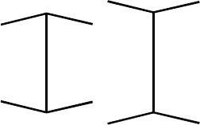

图1-1　缪勒莱耶错觉

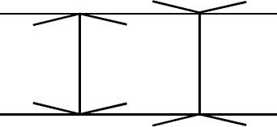

图1-2

当我们的感官碰上图1-1的两个图形时，会产生视错觉。所谓视错觉，是指观察者在客观因素干扰下或者自身的心理因素支配下，对图形产生的与客观事实不相符的错误感觉。

比如，法国国旗红、白、蓝三色的比例为35∶33∶37，而我们却感觉三种颜色面积相等。这是因为白色给人以扩张的感觉，而蓝色则有收缩的感觉，这就是视错觉。

像这样的例子能带给我们许多启示，因为这是世人共通的错误，并非出于偶然，可以事先进行预测。当我们看到图1-1时，虽然已经知道左右两图中垂直部分的长度相同，但还是会觉得右图看起来比较长，且不会因为场景不同而改变。

玩俄罗斯轮盘的时候也一样，即使我们知道每次转动时出现不同颜色的几率各自独立、并不相关，但还是会期待下次出现刚才一直没出现的颜色。这种诱惑很强烈，很容易让人觉得自己的推测是合理的。

认知谬误在许多方面与知觉错觉相似，比如具有普遍性（每个人都会受到影响）、可以预测、重复出现等。这种错觉不只出现于普通人在判断自己不了解或与自己无关的事情时，就连在专业领域表现优异、信誉卓著的专家，比如企业家、政治家、大学教授、经济学家、工程师、医生、律师等，同样会有“以为自己都知道”的错觉。

具有普遍性的认知谬误，偏离了每个人都认为正确无误的合理性法则。如果你想了解该法则及其相关理论，想知道毫无情感的外星人如何思考和行动，请看以下的说明；如果你对合理性法则毫无兴趣，请跳过这一段内容，直接读下一章。

## 不合理的思考，才是正常

传统的合理性模型由三部分组成，这三部分分别代表不同的理论，但却有着共通的形式结构。该模型旨在利用简单易懂、不辩自明的道理，推导出严密的结论。

第一部分是研究演绎推理的逻辑学。

推理是逻辑学研究的主要对象，它通常由一些前提和一个结论组成。在演绎推理中，前提是已知的事实，结论是由前提经过推理必然得出的事实。也就是说，如果前提为真，则结论必然为真，无论如何都不可能出现前提为真但结论为伪的情况。请看以下例子：

前提一　足球选手都喜欢吃苹果

前提二　波波是足球选手

结　论　波波喜欢吃苹果

如果在逻辑上把无效的推理当成有效、把有效的推理当成无效，将会破坏逻辑学的原则。第一部分的常见错误就是“推断结论的错误”。

前提一　足球选手都喜欢吃苹果

前提二　波波喜欢吃苹果

结　论　波波是足球选手

很显然，这一结论是错误的，即使波波喜欢吃苹果，也有可能不是足球选手。从这个例子可以看出，即使两个前提都是事实，结论也可能是错误的。

再看看其他例子。发动汽车引擎时，引擎不启动，仪表板的灯也不亮，原因是电瓶没电了。这个推理并不是演绎推理。也就是说，即使前提（引擎不启动，仪表板的灯也不亮）是事实，也无法断定结论（电瓶没电了）是事实。因为有可能是电瓶还有电，但却因为电力系统出故障等原因，使得仪表板的灯不亮。

即使结论是根据作为事实的前提得出的，也未必能符合客观事实。这种推理称为“归纳推理”。

第二部分是在推理研究上扮演重要角色的几率理论。

我们在琳达的例子中看到的“联结错误”，就是违反几率理论的简单范例。

第三部分是合理决策理论，该理论突显出经济学家熟悉的数学模型之王“经济人”<a href="#part0020_split_003.html_ch4"
id="part0020_split_003.html_ch4-back">［1］</a>。

合理决策理论认为，个人（经济人）在决策时会保持一致的优先级。在日常生活中，人们总是背负着风险、怀揣着不安进行决策。之所以会有风险和不安，是因为决策者无法事先清楚地掌握决策的结果。

更正确的说法是，因为知道结果的几率，所以会担心风险，比如掷骰子，如果投掷的是没有被人做过手脚的普通骰子，那么出现4的几率是1/6；至于感到不安，则是因为决策者事前并不知道出现各种结果的几率。

在这种情况下，最常见的合理决策理论是期望效用理论。请看以下的例子。

**问题28**

你必须从以下两者中选择其一。

A．有20％的几率可以赢得1250元。

B．有40％的几率可以赢得500元。

你会选择哪一项？

1250元和500元分别表示选项A和选项B的奖金所带来的效用，而期望效用等于效用和赢得奖金的几率的乘积，即选项A的期望效用为250（1250×20％＝250）元，选项B的期望效用为200（500×40％＝200）元。所以，选择A可以让期望效用最大化。

不过，请大家注意，期望效用理论并未谈到在这种情况下必须选择哪一项，只是告诉你选择A可以让期望效用最大化。

如果某天晚上，你想做某件事（例如突来兴致，想去饭店小酌一番），但刚好手边的现金不多了，你会觉得“要是还有500元就好了”。在这种情况下，你并不会很在意期望效用的多寡，况且两者的奖金数额（1250元和500元）的差额又不是很大。你会认为，与其选择中奖几率低的高额奖金，不如选择中奖几率高的低额奖金。所以选项B显得更吸引人。

假设没有出现特殊情况，你根据期望效用最大化理论选择了A。为了进一步了解这一理论对于合理的人有什么影响，我们再列举另一个决策的例子。

**问题29**

同样的，你必须从以下两者中选择其一。

A\*　有50％的几率可以赢得1250元。

B\*　一定能赢得500元。

你会选择哪一项？

你可能会选择B\*选项（这也是大多数人的选择）。

不过，如果你对照“问题28”的答案和“问题29”的答案——不选B而选A，不选A\*而选B\*，再结合基本计算结果，很容易看出这是两个自相矛盾的决策。

在“问题28”中，你之所以不选B而选A，是因为A的期望效用比B的期望效用大。即：“1250×20％”的期望效用比“500×40％”的期望效用大。将两者同时除以20％，可以看出1250比1000大。也就是说，奖金1250元的期望效用比奖金1000元的期望效用大。

但是在“问题29”中，你不选A\*而选B\*，可见对你来说，A\*的期望效用比B\*小。即：“1250×50％”的期望效用比“500×100％”的期望效用小。将两者同时乘以2之后得出的结论为：奖金1250元的期望效用比奖金1000元的期望效用小。

站在经济人的角度来看，做出此类选择的人都是不合理的人。不过，讲求合理的经济人恐怕只会出现在经济学教科书中，或是《星舰迷航记》中超合理科学官史巴克的肚子里。

**注释：**

<a href="#part0020_split_003.html_ch4-back"
id="part0020_split_003.html_ch4">［1］</a> 经济人，这一概念是由英国古典政治经济学代表人物亚当·斯密提出的，用来表示以自我经济利益最大化为唯一行为基准的人类类型。传统经济学理论认为，人是经济人，具有极度合理（为求效用最大化而行动）、极度自制（一旦做决定，不会再改变）、极度利己（只考虑自己的利益）等特性。

# 第5章　换个角度，决定大不同？

在投资获利几率愈高的情况下，

人们下手愈谨慎；

在一定会赔钱的时候，

人们反而愿意承担风险。

## 很可能赔钱时，会变得更敢赌

假设你拿出两个骰子，和一个小学生玩掷骰子游戏。游戏规则为：根据对方说明点数的方式，猜测对方掷出了几点。

由小学生先掷，若他说“两个骰子点数总和为3”，你马上猜到这两个骰子分别是1点和2点。接着，轮到你掷骰子，结果和刚才一样，但是你用不同的方式进行了说明：“两个骰子的点数相乘等于2。”小学生马上推测出两个骰子分别是1点和2点。

“两个骰子的点数总和为3”和“两个骰子的点数相乘等于2”是以不同的方式说明同样的结果。其实，金钱上的盈亏也一样，虽然有时候说明的方式不同（当然说明方式必须是正确的），但说的却是同样的结果。

如果你同意上述说法，就表示你相信“事物并不会因为表现方式的不同而改变”的原则。这是合理性的黄金定律中的重要原则之一，听起来非常合理，毋庸置疑。

不过，在实际生活中，人们总是喜欢根据清楚的数字信息下判断、做决定，而不自觉地忽视没有显著特征的信息，许多人因此会在不经意间违反这一原则。

请看以下例子。

**问题30**

假设你是一名高级军官，奉命率领一群勇敢的士兵，冒着生命危险和敌军奋战。

请考虑第一种情况：

根据司令部传来的情报，敌军布下陷阱，可能会让600名士兵丧生。你必须从以下两条逃生路线中选择其一，才能减少伤亡。

A．逃向山区，可以让200名士兵存活。

B．逃向海边，600人都存活的几率为1/3，没有人存活的几率为2/3。

你会带领军队逃向山区，还是海边？

**问题31**

请考虑第二种情况：

根据司令部传来的情报，敌军布下陷阱，可能会让600名士兵丧生。你必须从以下两条逃生路线中选择其一，才能减少伤亡。

A\*　逃向山区，将会使400名士兵丧生。

B\*　逃向海边，无人丧生的几率为1/3，600人都丧生的几率为2/3。

你会带领军队逃向山区，还是海边？

大多数人在第一种情况下选择了A（比例高达72％），在第二种情况下选择了B\*（比例高达78％）。换句话说，许多人对提问的方式非常敏感，提问方式能左右人们的抉择。

分析四个选项不难看出，第一种情况和第二种情况的方案是一样的：其中A和A\*是相同的确定选项，有200名士兵存活（相当于400名士兵丧生）；B和B\*也是一样的，都具有一定的风险，成功几率为1/3，如果成功了，600人全部生还，否则全部丧生。

然而，提问方式的改变竟然会影响逃生路线的选择。这种现象称为“框架效应”<a href="#part0021_split_001.html_ch1"
id="part0021_split_001.html_ch1-back">［1］</a>。

就上述两种情况而言，正是由于小小的语言形式的改变，使得人们的认知参照点发生了变化——由第一种情况下的以“存活人数”作为参照点转变为第二种情况下的以“死亡人数”作为参照点。而在不同的参照点下，人们对待风险的态度是不同的。

在第一种情况下，所有选项提到的都是存活人数，人们就会小心翼翼地选择风险规避，试图让更多的人活下来；而在第二种情况下，所有选项提到的都是死亡人数，人们不希望死亡人数增加，反而愿意冒险。

有关金钱的决策也是一样。在投资获利几率愈高的情况下，人们下手愈谨慎；在一定会赔钱的时候，人们反而愿意承担风险。这也是赌徒常见的特质之一——在赌局快结束时输了钱，因为不甘心赔钱，便铤而走险，赌一把高回报、高风险的赌局。

因此，经济学家教导我们，在处理此类问题时，应该只关注最后的结果。但是，在面对特定状况和特定问题时，我们常常会失去理性，而使得失心（考虑输赢盈亏的心理过程）大大影响最终的选择。

**注释：**

<a href="#part0021_split_001.html_ch1-back"
id="part0021_split_001.html_ch1">［1］</a> 框架效应（framing
effects）用以解释提问方式不同，决策者的选择和偏好也随之改变的现象。例如，当医生分别以“存活率95％”和“死亡率5％”说明同一项手术的效果时，家属和病人的感受会截然不同。

## 稳赚的时候，就变得保守

如果你觉得自己不适合担任高级军官，不妨想想金融界的案例。

**问题32**

你必须从以下两者中选择其一。

A．一定能赚1万元。

B．有25％的几率能赚5万元，有75％的几率赚不到钱。

你会选择A还是B？（先回答再往下看）

接着再看以下的问题。

**问题33**

同样的，你必须从以下两者中选择其一。

A\*　一定会亏损3万元。

B\*　有75％的几率会亏损5万元，有25％的几率不会亏损。

你会选择A\*还是B\*？

大多数人在“问题32”中选择了A（比例高达84％），在“问题33”中选择了B\*（比例高达87％）。其实，两组问题的内容相同，只不过问法从赚钱改为亏损，答案竟然完全相反。这究竟是怎么一回事呢？

正如大家所见，当选项提示赚钱的金额时，人们偏好稳赚的选项。如果选项改成提示亏损的金额，那么与其选择稳赔的选项，大家宁愿赌赌运气，选择可能亏损更多、也可能不亏损的选项。

情感会干扰大脑的计算。从这个简单的实验中，我们可以看到，多数人选择稳赚1万元，而不是赌25％的几率赚5万元（期望收益值为1.25万元，高过1万元）；多数人又不甘心承担3万元的亏损，而宁可选择75％的几率亏损5万元（期望亏损值为3.75万元，高过3万元）。情感的经济学真是奇妙！

## 改变提问方式，足以影响决策

不仅金融界的人会面临重大抉择，医学界的人也经常面临重大抉择。在不知该如何抉择的时候，情感同样会影响大脑，使人们不可避免地做出短视的抉择。

让我们暂时抛开经济学问题，看看医学权威期刊《新英格兰医学期刊》（*The New
England Journal of Medicine*）上刊登的一则实验报告。

实验内容为：罹患肺癌的病人应该选择外科手术治疗还是放射线治疗。实验者首先向参加者介绍了肺癌以及肺癌的这两种治疗方法，然后将参加者分为两组，让他们回答下列问题。

**问题34**

接受外科手术治疗的100名患者之中有90人手术成功，1年后有68人存活，5年后有34人存活。

接受放射线治疗的100名患者之中有100人平安结束疗程，1年后有77人存活，5年后有22人存活。

你会选择哪一种治疗方法？

**问题35**

接受外科手术治疗的100名患者之中有10人在手术过程中死亡，1年后累计有32人死亡，5年后累计有66人死亡。

接受放射线治疗的100名患者之中没有人在治疗过程中死亡，1年后有23人死亡，5年后累计有78人死亡。

你会选择哪一种治疗方法？

只要你仔细阅读，就会发现这两道问题所提供的信息是完全相同的。“问题34”所说的“接受外科手术治疗的100名患者之中有90人手术成功”，相当于“问题35”所说的“接受外科手术治疗的100名患者之中有10人在手术过程中死亡”。

可是，当问法不同时，实验参加者所做的选择也相差甚远。在提示存活人数的“问题34”中，有82％的人选择接受外科手术治疗，而在提示死亡人数的“问题35”中，只有56％的人做了同样的选择。只不过是改变了提示信息的方式，就有大约1/4（26％）的人改变了主意。

令人惊讶的是，参与实验的两个小组都出现了这种矛盾的结果。按照正确的统计方法和决策理论，分别以167位医生、297位学生和119位病患为实验对象，都得出了同样的结果。

由此可见，面临这种抉择时，无论是医生、患者还是统计专家，无论当事人的知识和能力如何，都会不自觉地受到这些“框架”的影响。

# 第6章　为什么老是在亏钱？

人在短期内对于自己的失败会有强烈的懊悔，

可是长期来说却经常懊悔自己没有做某件事。

## 出租车司机在下雨天提早收工

人们总会套用某种模式来计算盈亏，并根据周围情况来决定自己该如何行动。了解了人的这一习性，我们就能理解生活中的某些很奇妙的现象。

下雨了，纽约曼哈顿正值交通尖峰时刻（“尖峰时刻”是纽约市的一个交通术语，指交通流量陡涨陡降的时段），大家拼命想搭上出租车，却怎么等也等不到空车。为什么招不到出租车？经济心理学家非常乐于为你解惑。

研究小组专门对纽约出租车司机的行为进行了调查，想知道他们的行为模式是否符合经济学理论。通过调查得知，出租车司机会设定每天的目标收入，只要当天达到收入目标，就立刻收工。

换句话说，当搭车的客人较多时（比如在下雨天，许多人会放弃乘公交车而改搭出租车），出租车司机就可以在短时间内完成预期的收入目标，而提早收工回家。

然而，根据经济学的观点，出租车司机应该在容易赚钱的时候多辛苦一点，在生意清淡的时候早早收工回家享受自由。但实际情况却并非如此，在短时间就能赚够钱的下雨天，出租车司机不但没有延长工作时间，反而还缩短了工作时间。

该如何解释这种现象呢？

答案其实很简单。出租车司机和大多数人一样，是以不同的天平来衡量盈亏的。对大多数人来说，同样数量的损失带来的负效用大过同样数量的收益带来的正效用（前者是后者的两倍）。这种现象称为“损失厌恶”<a href="#part0022_split_001.html_ch1"
id="part0022_split_001.html_ch1-back">［1］</a>。比如，不小心丢失4000元而感到“非比寻常”的空虚，至少得赚8000元才能享受到“非比寻常”的满足。

那么，怎样用人们的这一心理特性来解释纽约出租车司机的“不合理”行为呢？

道理很简单。如果完不成当天的目标收入，对出租车司机来说就是亏损，所以他们为了避免亏损，愿意花更长的时间工作。但是只要完成了目标收入，出租车司机就会觉得自己已经赚够了，与其继续工作，不如去小酌一番。结果，身为乘客的我们只能站在路边，怎么等也等不到空出租车。

**注释：**

<a href="#part0022_split_001.html_ch1-back"
id="part0022_split_001.html_ch1">［1］</a> 损失厌恶（loss
aversion）的现象经卡纳曼等学者证明：“同等损失造成的痛苦，远超过同等利得带来的满足。”“利得越多，满足感增加的幅度越小；损失越多，痛苦加深的幅度越小。”按照理性思考，失去1万元造成的痛苦等于得到1万元带来的喜悦，得到100万元的满足感是得到1万元的满足感的100倍。不过，人的实际反应并不符合理性思考。

## 卖掉赚钱的股票，抱紧赔钱的股票

可别以为只有纽约的出租车司机是如此，大家都不喜欢损失，投资人也不例外。有不少投资人看到股价上涨便耐不住性子“急着卖出”，看到股价下跌反而“抱着股票不卖”。

想知道自己是不是此类型的投资人，不妨试试以下的测验。

**问题36**

假设有人给了你2万元，让你从以下两项中选择其一。

A．再得1万元。

B．掷硬币，出现正面会再得2万元，出现反面一分不得。

你会选择哪一项？

**问题37**

假设有人给了你4万元，让你从以下两项中选择其一。

A．亏损1万元。

B．掷硬币，出现正面会亏损2万元，出现反面不会损失一分钱。

你会选择哪一项？

几乎所有人在“问题36”中选择了A，在“问题37”中选择了B。也就是说，比起一定会赚钱的情况，在企图回避损失的情况下，人们更愿意承担风险。

大家仔细看就会发现，这两道问题的选项其实是一样的。无论在哪一道题中，选A的人会得到3万元，选B的人会得到2万元或4万元。

你可能会说，根本不会有人突然送钱给我，所以让我们抛开这种看似玩笑的问题，看看真实的投资情况。

假设不久前你开通网上交易开始网上炒股，只要按按鼠标，就能买卖股票。又假设你决定买进电力公司的股票，但手上的现金不够，你必须卖出一部分手中已经持有的股票。

你可以选择卖出X公司的股票，也可以选择卖出Y公司的股票。X公司的股价在最近几个月内上涨了20％，而Y公司的股价则下跌了20％。在这种情况下，你应该出售哪一只股票呢？

你就像出租车司机一样，希望钱赚得越多越好，所以，唯一合理的选择就是根据股票未来的增长潜力进行判断。

因为（意大利）股票买卖的交易税是根据投资人赚到的价差计算的，所以当初买入股票的股价只是衡量该付多少税金的判断标准。从这个角度看，你应该卖掉股价下跌的Y公司的股票——卖出这只股票不必付10％的交易税。

回头看看刚才的问题：究竟该卖掉X公司的股票还是Y公司的股票？以各种投资人为对象进行调查，结果显示，82％的投资人选择卖掉股价上涨的X公司的股票。

急于卖掉应该继续持有的股票，却抱着该脱手的股票不放，投资人的这一行为和纽约出租车司机下雨天提早收工的行为一模一样，这两种情况的心理现象如出一辙。

在决定是否卖出某只股票时，投资人通常会比较现在的股价和当初买进的价格，以此判断盈亏。假如现在的股价比当初买进的价格高，投资人就觉得自己“赚到了”，为了回避股价可能下跌的风险，就会想着尽快脱手。

相反，如果现在的股价比当初买进的价格低，投资人就觉得自己亏了钱（一旦卖出就稳赔）。当人们处于亏损状态时，对待风险的态度会发生改变。因为不想落入稳赔的局面，就会想着如何回避风险。不卖就不算赔，从而抱着下跌的股票不放，以致被深深套牢。

长期看来，人们总是吃亏的原因在于“不想后悔”。只要股票尚未出手，就不算亏本，脑中全是一些自我安慰的念头。例如“股价应该已经见底了，接下来一定会上涨”“只要回到当初的买入价位，我就立刻卖出”……

结果大家都选择卖掉X公司的股票，却抱着Y公司的股票不放，愈亏愈多。

## 什么事现在不做，以后会后悔？

假设某种疫苗具危险性，1万人接种之后有10人会死亡。假如该疫苗可以预防的疾病（比如某种流行性感冒）的致死率不高，每1万人之中不到10人会死亡，恐怕没有人愿意注射这种预防针，因为吃亏的几率比受益的几率高。

再想想相反的情况。假设罹患某种流行性感冒的1万人之中有10人会死亡，专家研发的预防这种疾病的疫苗也可能会致人于死地，不过死亡率比患流行性感冒的死亡率低。在这种情况下，一般人应该会选择接受防疫注射。

可是，大多数人会从不同的角度考虑这两种情况。每10人之中有6人表示，他们不愿意让1岁的小孩打这种可能会致人死亡的预防针。即使疫苗造成副作用的几率低于流行性感冒的死亡率，他们还是宁可不打预防针。

这就是所谓的“省略谬误”<a href="#part0022_split_003.html_ch2"
id="part0022_split_003.html_ch2-back">［1］</a>。即使不打预防针的危险性高过打预防针的危险性，人们还是想通过不打预防针去回避打预防针带来的危险。“省略谬误”隐含着不想后悔（后悔厌恶）<a href="#part0022_split_003.html_ch3"
id="part0022_split_003.html_ch3-back">［2］</a>的一面。请看以下说明。

**问题38**

A．施先生手上有一些甲机械公司的股票，去年他本来想卖掉这些股票，改买乙电力公司的股票，结果没有付诸行动。如果当初他改买乙电力公司的股票，现在可以净赚50万元。

B．邱先生本来有一些乙电力公司的股票，但他卖掉了这些股票，改买了甲机械公司的股票。如果当初他没有卖出乙电力公司的股票，现在也可以净赚50万元。

你觉得谁比较后悔？

许多人认为，邱先生“悔不当初”的心情比施先生更强烈。可以说，这一问题没有任何讨论意义，因为两者的结果都一样，两个人都错失了净赚50万元的机会。但为什么大家都认为邱先生比较后悔呢？

道理很简单。施先生后悔自己“没有做”应该做的事，邱先生则是后悔自己“做了”不该做的事。虽然结果都一样，但主动做错某件事比不做某件事更令人感到懊悔。

大家都不喜欢懊悔的滋味。在人生中，下定决心改变现状比下定决心维持现状更难，因为前者总会让当事人感到责任更加重大。

不过，究竟是自己做错了某件事更令人后悔，还是没做当初该做的事更令人后悔，得视经过的时间而定。

在短时间内（几天或几星期），人总会深深懊悔自己做了错误的选择，做了不该做的事。可是经过长时间之后（几年），人反而会比较后悔自己“错失良机”，后悔当初怎么没有做自己该做或想做的事。

如果有人问你，最近几个月内最令你感到后悔的是什么事，你可能会回答自己已经做了但结果却不如预期的某件事。如果有人问你，人生中最让你感到后悔的是什么事，你应该会遗憾自己当初没有做的某件事。例如，短期内最令你心痛的是爱人离你而去，可是长期看来，大家会比较懊悔当初没有尽力去追求自己喜欢的人。

除此之外，还有许多例子会让人后悔莫及、心情郁闷，甚至令人略显愚蠢。

**问题39**

马利欧和罗莎要搭乘同时发车但不同车次的火车前往威尼斯和罗马，由于米兰市区堵车严重，导致他们抵达火车站时，比火车出发的时间晚了20分钟。马利欧要搭乘的火车是准点出发的，所以他无法赶上车；罗莎也没有赶上车，尽管他要搭乘的那趟火车晚点18分钟开出，才刚刚离开车站而已。

请问，谁比较不开心？

马利欧和罗莎都没有搭上车，按理说两个人的不开心程度应该是一样的，但一般人并不能客观地衡量这一切，而会认为罗莎比马利欧更加不开心。

通常人们脑中会闪过许多念头，例如“要是出租车绕道”“要是会议提前两分钟结束”……只要事物可能有不同的发展方向，人们心里就会不断浮现各种各样的“要是……”，并因此愈想愈气。

大家常说，得铜牌的选手比得银牌的选手更容易觉得满足，原因就在于此。

能挤进前三名赢得奖牌，当然值得开心，可是差那么一点点而错失金牌，总让银牌得主有些“饮恨”的感觉，觉得自己若不是失手，若能够再多一点运气和努力，就会变成第一名，不会“屈居第二”。而铜牌得主对自己的奖牌则有一种“如果我运气不好的话，我就什么也没有”的自我安慰心理。

因此，虽然从客观角度看来，第二名应该好过第三名，但在主观上却是第二名的满足程度比较低。

人之所以会心有不甘，是因为“预期目标”伸手可及却差一步而未能实现。这种想法在脑中盘旋不去，心中懊悔不已，总令人一再回忆起失手的那一剎那。

人的这种强烈的感受不只发生在因分秒之差而落败或结果不如预期时，在碰上坏事却侥幸逃过一劫的情况下，也会有同样的感受。

例如在公交站牌等公交车，没想到自己要搭乘的那辆公交车在前一站惨遭炸毁；在出门之前刚好接到一个电话，耽搁了几分钟时间，于是没搭上那趟后来脱轨的地铁……无论发生什么灾难，总有许多“奇迹般”幸存的特例。

因为时间或空间上分毫的偏差，导致选手错失金牌只得到银牌、让人避开死亡而得以存活。这一切令人难以理解，也无法客观衡量，我们只能通过当事人模糊的情感去慢慢感受。

灾难的话题到此为止，来看一则日常生活中的例子。

**问题40**

A．甲先生在一家超市的收款台前排队结账，轮到他的时候，收银员告诉他：“您真幸运，您是本店第10万名顾客，可获得2000元奖金。”

B．乙先生在另一家超市的收款台前排队结账，排在他前面的那个人正好是该店第100万名顾客，获得了2万元奖金。乙先生因排在那个人后面，也获得了3000元的奖金。

请问，谁比较开心？

大多数人竟然选择成为甲先生，赢得2000元，而不想成为乙先生，赢得3000元。因为大家不想懊悔自己差一点就能赢得2万元，但并不惋惜自己少拿1000元。

这样的现象一点也不值得惊讶。平时，我们总是为了不想后悔而付出代价。举例来说，许多人宁可把钱存进银行也不买股票，就是为了避免股价下跌而令自己后悔；明明可以找到薪水更高的工作，却甘于忍受现在的薪资。

总之，人们常因为不想后悔而无法当机立断，因为缺乏自信而畏缩不前，即使能改变现状也不付诸行动。但没有人注意到，其实“不做决策”也是一种决策。

**注释：**

<a href="#part0022_split_003.html_ch2-back"
id="part0022_split_003.html_ch2">［1］</a> 省略谬误（false
omission）是统计学中的陷阱之一，虽然看起来“与统计学相关”，但可能因为忽略了第三项变量而导致做出错误的解释。例如看到统计结果显示“常吃减肥食品的人”和“体重过重的人”呈正相关的关系，就推断“减肥食品没有效”，而实际情况可能只是“体重过重的人常吃减肥食品”。

<a href="#part0022_split_003.html_ch3-back"
id="part0022_split_003.html_ch3">［2］</a> 在当下和将来，“不想后悔”的信念对于人的决策影响甚大，因此有后悔厌恶（regret
aversion）的现象。人在短期内对于自己的失败会有强烈的懊悔，可是长期来说却经常懊悔自己没有做某件事。

# 第7章　有关金钱的错觉

人们不只在意自己拿多少工资，

更在意与别人的工资相比时，

自己的工资是高了还是低了。

## 你真的注重实质收入，胜过账面收入吗？

大家都知道，经济领域的交易可以表示为账面金额，也可以表示为实质金额。账面上的月薪为10万元，如果没有通货膨胀，实质收入也是10万元。但如果物价上涨4％，就得从账面月薪中扣除物价上涨的部分，实质收入就相当于9.6万元。

在日常生活或短期之内，账面金额简单易懂，是人们常用的表示方法。在物价上涨幅度并不大时，账面金额也能当成购物付款时的衡量标准。不过，当时间拉长或金额庞大（比如购房、买车等）时，实质金额才能准确表示交易真正的价值。

许多人在冷静的时候还能认清实质金额和账面金额的差别，但一旦心浮气躁，就只顾得到账面金额了。在这种情况下，人最容易陷入金钱错觉之中。

请看看下列两种情况。

**问题41**

A．现在正值劳方和资方谈判工资的时期。在物价上涨4％的情况下，资方向劳方代表甲先生提出了薪资调升2％的方案。

B．现在正值劳方和资方谈判工资的时期。在物价未上涨的情况下，资方向劳方代表乙先生提出了薪资调降2％的方案。

请问，谁对资方的提案比较满意？

调升薪资当然比调降薪资令人开心。如果在物价没有上涨的情况下还能调涨薪资，当然比物价上涨时才调涨薪资更令人高兴。不过在本案例中，我们无法改变薪资是调升还是调降，也无法改变物价上涨的幅度，只能从两项方案中选择其一。如果你是劳方代表，会怎么选择？哪一种方案能维护你的尊严？

其实上述两种情况的最后结果都是薪资调降2％，可是一般人往往只注意到名目所得，比起在物价未上涨的情况下薪资调降2％，人们宁可选择在物价上涨4％的情况下薪资调涨2％。虽然结果相同，但人们总觉得名目所得增加比实质所得减少要好。

再从其他角度来看。我们知道人有“讨厌吃亏”的特性（损失厌恶），行为结果能否给自己造成损失是个人设定的做决策的参考点，而最简单易懂的参考点，正是名目上的数字（也就是案例中的现行薪资）。

物价上涨是最不公平的税金，它无视人的所得高低，一律影响所有人，所以给穷人带来的打击往往很大。原则上，经济环境发生变动（例如物价上涨）主要影响的是购买力，但另一方面，如果在衡量人的所得能力时，不只看实质购买力，还把银行存款考虑进去，那么我们在金钱方面的决策就很可能会受到经济变化的影响。

我们如何验证这一假设的真伪呢？特沃斯基和夏弗想到了以下这道简单的问题。

**问题42**

假设美国出现了前所未有的通货膨胀，影响范围遍及社会各个领域。在短短半年时间内，人们的收入（例如薪资、奖金）和支出（例如食物、水电费）都比以往高出25％。

有个人半年前想买一套真皮沙发，沙发的售价从半年前的400美元涨到了现在的500美元。

请问，他现在想买那套沙发的欲望比半年前强、弱还是相同？

有362人参与了这项实验，其中7％的人认为他更想买沙发，38％的人认为他比较不想买沙发，55％的人认为他买沙发的欲望和半年前一样。

**问题43**

有个人半年前想卖掉家中那张充满了古罗马贵族风味的书桌，书桌的价格从半年前的400美元涨到了500美元。

请问，他现在想卖掉那张书桌的欲望比半年前强、弱还是相同？

在362位实验参与者中，43％的人认为他卖掉书桌的欲望变强了，15％的人认为变弱了，42％的人认为不变。

在人们的收入和支出都比以往高出25％的情况下，400美元上涨25％，变成500美元。虽然实质价格没变（400美元），但名目价格的上涨（500美元）使得许多人比较想卖出商品，而比较不想买进商品。有趣的是，只有一半左右的人回答“没有差别”。

再列举一个由卡纳曼、杰克·克荣齐（Jack
Knetsch）和泰勒共同提出的市场实验，用来说明金钱错觉如何影响公平判断。

**问题44**

某家公司的营业额本来就不高，近期又受到失业率上升的影响，业绩更差。公司管理层告诉公司半数员工，物价并未上涨，公司决定将员工薪资调降7％，同时告诉公司另一半员工，物价上涨了12％，公司决定将员工薪资调涨5％。

如果你是该公司员工，将作何感想？

在这两种情况下，员工的实质所得并没有差别，但却有62％的人认为公司不该调降名目薪资，而只有22％的人认为公司不该调涨名目薪资。

不用多说大家也知道，所谓公平与否的判断依据，通常不是实质变化，而是名目变化。因为名目变化容易理解和衡量，也容易套用在许多情况下，看起来也很客观。如果真的是这样，就说明我们多半生活在错觉的世界里。

在日常生活中，我们可以看到许多与此相类似的名目数字和实质数字交互作用的情境，例如判断公平与否，或是比较自己和他人谁比较幸福。请看以下说明。

## 薪水少不要紧，重点是不能比同事低

我们从先前的案例可知，本质上相同的事物，只不过改变呈现的方式，就能给人截然不同的印象。在我们思考某件事情是否公平时，也会出现同样的现象。

**问题45**

有一天你开车出门旅行，途中必须加油。你把车开进加油站A，看到下列告示：“每公升29元，如果以信用卡的方式付款则每升要加付1元的手续费。”

返程时油箱又空了，你把车开进加油站B，看到下列告示：“每公升30元，如果以现金的方式付款则可以享受每升1元的折扣。”

你比较喜欢哪一种汽油价格的表示方式？换言之，你认为哪一种汽油价格的表示方式比较公平？

大多数人应该会选择加油站B吧。

**问题46**

假设可口可乐公司和百事可乐公司联手设计了一款特殊的饮料自动售卖机——设有侦测当天气温的感应器，可以辨识天气冷热。因为天气炎热的时候大家容易口渴，比较想买冰凉饮料，所以可乐的价格可以设得比平时稍高一点。

天气炎热的时候，可口可乐的售价为24元（售卖机的电费比较贵）；天气凉爽的时候，可口可乐的售价为20元。

百事可乐和可口可乐的售价一样，只不过在天气凉爽的时候，特别标示“20元”是折扣价。

你觉得哪一种可乐价格的表示方式比较好？

大家无一例外地都选择了百事可乐公司。

卡纳曼和研究同仁根据诸多实验发现，经济交易的公平与否不仅取决于客观数值，还受到比较、正当化、诱发动机、呈现方式等诸多因素的影响。人对于自己薪资的满足程度并非取决于薪水金额的高低，而是与同事比较的结果。工作中的这一众所皆知的有趣现象的形成原因就在于此。

人们不只在意自己拿多少工资，更在意与别人的工资相比时，自己的工资是高了还是低了。因此，公司在计算员工薪资、奖金或津贴时，一定要特别注意保持公平、公正，这样才能激励员工努力工作。

经济学家罗伯特·弗兰克（Robert
Frank）认为，“社会比较”对于人的决策影响重大。他在著作《以正当价格购物》中写道：“我们的社会生活并非基于绝对有利的立场，而是基于相对有利的立场。”

早在20世纪60年代，剑桥大学三一学院社会学家加里·朗西曼（Garry
Runciman）便列举了丰富的实例来说明这种现象。朗西曼认为，在20世纪，员工想要调升薪资的动机并非出于绝对的不平等感，而是相对的不平等感。

例如某种工种（矿工、铁道工人等）的工人待遇突然改善得好过其他工种（铺砖工人、机械工人等），其他工种的工人就会强烈要求资方改善他们的待遇，要与前者达到相同的水平。

哈佛商学院组织行为学家马克斯·巴泽曼（Max
H．Bazerman）为验证我们刚才提到的现象，以自己的学生为实验对象进行了如下实验。

**问题47**

A．甲公司愿意支付你年薪100万元。大家都知道，该公司支付社会新鲜人（指那些刚从大学毕业进入社会，没有找到工作的人）的年薪为100万元。

B．乙公司愿意支付你年薪120万元。大家都知道，该公司支付社会新鲜人的年薪为130万元。

你会选择哪家公司？

结果，在32名参与实验的学生当中，有22人选择了甲公司，只有10人选择了乙公司。

如果是你，会怎么选择？你或许会觉得，乙公司提供的年薪比甲公司高，但乙公司对自己的评价低于其他同事，以后可能会把自己分派到比较差的职位上，那还不如不要去。换句话说，工资少一点无妨，公司看重自己最重要。

## 损失10万元的失落，大过赢得10万元的喜悦

这些有关金钱的谬误有一个共性，那就是都反映出“一般人”在决策和认知上的特性。理论中的“经济人”活在像数学模型一样抽象、正确的世界里，而“一般人”则活在多变、混乱的世界里。在此，我将列举一些例子来说明人们做决策的方式（卡纳曼和特沃斯基又将登场）。

我们必须承认，普通人的感觉器官并不擅长测量绝对数值，反而善于捕捉变化和差异。无论是感受光亮、声音还是温度，人的身体都会根据原先的状态对变化产生不同的反应。假设你把手放进水里，如果原先手放在冰冷处，你就会觉得水是“热的”，如果原先手放在温热处，你就会觉得水是“凉的”。

请看图2，仔细观察颜色深浅不同的四个大正方形里面的颜色深浅相同的小正方形。由于背景不同，这些颜色相同的小正方形看起来也呈现出了不同的色调——背景颜色偏深的小正方形显得比较明亮，背景颜色偏浅的小正方形显得比较灰暗。因为小正方形的颜色是相同的，所以我们看到的颜色明暗并非是绝对的，而是相对的。

图2　由于周边背景的颜色深浅不同，使得四个颜色相同的小正方形变得明暗不同

卡纳曼和特沃斯基认为，同样的原则也适用于和感官无关的其他方面，例如财富、名声、健康等。人们在衡量某人的财富和名声时，并非以绝对且抽象的观念为尺度，而是着眼于他与自己所选的参考点（参考点会随着时间而改变）相差多少。

卡纳曼因提出“前景理论”<a href="#part0023_split_003.html_ch1"
id="part0023_split_003.html_ch1-back">［1］</a>而获得了2002年诺贝尔经济学奖。20年后，有人问卡纳曼：“最令你引以为傲的研究成果是什么？”卡纳曼语带深意地回答：“价值指的不是数字本身，而是数字之间的‘差异’。”

要了解一般人的决策依据，并不需要运用复杂的数学模型，只需要借助图3的简单曲线就可以了。

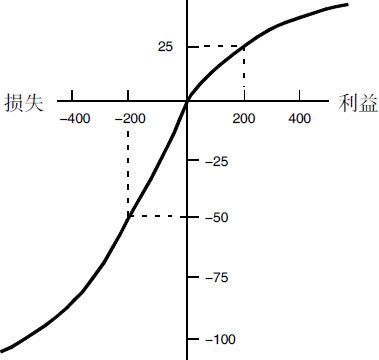

图3　使卡纳曼获得诺贝尔经济学奖的研究成果——前景理论的价值函数

横轴代表人在客观上的偏好状态（右侧）和厌恶状态（左侧），请想象投资上的获利和损失、工作上的成功和失败等。纵轴上方代表人在主观或心理上的偏好程度（满足指数），下方代表人在主观或心理上的厌恶程度（不满指数）。

曲线代表人在面对变化时的心情，例如赌博赢了或输了、薪水涨了或降了、因为急用欠了一大笔钱或因为中奖赢得一大笔钱……曲线左右不对称（获利时为凸状、亏损时为凹状），不像“经济人”会画出完美的直线，这说明一般人并非“合理的存在”。

请仔细观察这条曲线。

首先，距离两轴相交处愈远，曲线的坡度愈平缓。换句话说，无论是面对获利还是亏损，当金额增大时，人的喜悦或懊悔的主观强度会开始减弱。例如相较于1000元和1005元的差异，大家对5元和10元的差异更敏感。

其次，曲线向右上方延伸（获利）时呈凸状，向左下方延伸时（亏损）时呈凹状。由此可以看出，人们在面临获利时往往追求稳健，不愿意冒风险（回避风险），而在面对亏损时会很不甘心，容易冒险（追求风险）。

曲线从右上方往左下方发展，坡度越来越陡，这代表着人在亏损时内心的悔恨和不满更加强烈（损失厌恶）。我们已经讨论过许多与此相关的例子。

请看图3中的虚线，假如人在赢得200美元时的满足指数为25，那么在输掉200美元时的悔恨和不满指数会达到满足指数的两倍。这可以用来解释，为什么在赢100美元和输100美元的几率各半时几乎没有人想赌。

以人民币为例，即使赢6000元和输4000元的几率各半，大家也兴致不足。要让大多数人愿意放手一搏，必须是可能赢9000至10000元和输4000元的几率各半的情况。简言之，人们对损失和获利的敏感程度是不同的，亏损X元引发的懊悔感是赢得同等数额的金钱感受到的喜悦感的两倍。

由此可见，客观情况和人的主观认知之间是存在差异的。因为人的大脑会过滤信息，根据两轴相交处的参考点，将人的所有行为区分为获利和亏损、胜利和失败。当参考点发生改变时，人的行为模式也会改变。

精明的商家都熟知这种心理机制，懂得如何将其运用到交易中，引导顾客作出有利于他们的决策。例如某家超市在某段期间将促销商品减价10％，或者随时将所有商品减价2％、当季商品再减价3％、促销商品再减价5％，消费者的购物行为就会随之改变。大多数人偏好第二种折扣方式。

此外，有些商店还可以让人选择付款方式，付现金另有折扣，刷卡得加付手续费。有时候（例如在加油站）无论选哪一种方式，结果都一样，可是给消费者的印象却截然不同。之所以出现这种现象，是因为我们的参考点（区分获利或亏损的判断标准）发生了变化。

一般人对于“确定效应”<a href="#part0023_split_003.html_ch2"
id="part0023_split_003.html_ch2-back">［2］</a>特别敏感。如果发生某件事的几率降低，尤其是当几率降到0时，最令人震惊。

玩有6个洞的俄罗斯转盘，如果有4个洞会输，去掉1个洞感觉没差什么，可是如果只有1个洞会输，那么去掉那个洞之后，大家肯定都愿意砸钱豪赌。在这两种情况下，输钱的几率都降低了1/6，可是从1/6降为0，比从4/6降为3/6更令人动心。

同样的，如果某一款护肤品能让皮肤吸收有害物质的几率从万分之五降到0，大家肯定都会很开心地掏钱购买；即使另一款护肤品能让皮肤吸收有害物质的几率从万分之十五降到万分之五，降幅相当于前者的两倍，看起来也没有那么吸引人。

理论问题先告一段落，在第二部中，让我们看看一般人的行为实例。

**注释：**

<a href="#part0023_split_003.html_ch1-back"
id="part0023_split_003.html_ch1">［1］</a> 前景理论是由卡纳曼和特沃斯基提出的实证决策理论，用以挑战传统经济学中的“期望效用理论”。期望效用理论是以“效用”乘以“发生的几率”来表示“期望效用函数”，并认定几率为客观的数值。前景理论则提出“期望价值函数”由“价值函数”和“加权几率函数”组成，其中价值函数不等于绝对价值，重视的是评鉴的参考点，而加权几率函数更意味着几率也有主观性。前景理论认为，人在不确定的情况下未必会采取合理的决策。例如大多数人在面临获利时倾向于回避风险（想要稳扎稳打），在面对亏损时倾向于追求风险（想要赌运气）；获利和亏损金额不大时，大多数人对于变化会比较敏感；获利和亏损金额较大时，大多数人的反应会比较迟钝；赢得X元感受到的满足感小于亏损同等数额的金钱所引发的懊悔感。

<a href="#part0023_split_003.html_ch2-back"
id="part0023_split_003.html_ch2">［2］</a> 确定效应（Certainty
Effect）意指人们对于几率值偏向极端的情况特别敏感，例如“0”和“1”。当发生几率趋近于不可能或一定会发生时，人的反应会特别灵敏。当发生几率为“1”，也就是必定会发生时，称为“确定效应”。

# *Part* 2　其实我们不了解自己

# 第8章　同样是风险，感受大不同

在大多数情况下，

人们计算损益的出发点是参考点，

而不是传统经济学提出的绝对值的变化。

## 找出自相矛盾的答案

请先看看下列选项（即使看起来不切实际）。

**问题48**

从以下两项中选择一项：

A．赢得2500元。

B．赢得和乔治·克鲁尼（George Clooney）、安吉丽娜·朱莉（Angelina
Jolie）等帅哥美女亲吻的机会。

你会选择哪一项？

**问题49**

抽奖的中奖几率为1％，可供选择的抽奖内容为：

A．赢得2500元。

B．赢得和乔治·克鲁尼、安吉丽娜·朱莉等帅哥美女亲吻的机会。

你会选择哪一项？

芝加哥大学决策研究中心的尤瓦·罗登斯杰克（Yuval
Rottenstreich）和奚恺元（Christopher
K．Hsee）以这两道问题测试学生。大部分学生（70％）在“问题48”选择拿现金，可是在“问题49”，多数人（65％）却选择了和帅哥美女香吻的抽奖机会。

这样的实验结果显然违背了合理决策的原则。按照合理决策原则，如果本来的偏好是选X而不选Y，那么应该也会选择有1％的机会赢得X，而不是有1％的机会赢得Y。为什么会出现这样的结果呢？

大部分人可能是这样盘算的：不想为了一时的快乐而牺牲稳当的收益，因此在“问题48”选择拿现金。然而，假如金额不高，中奖几率又只有1％，那也不必太在意金钱，不如趁机赌一把，选择和梦寐以求的名人亲吻的抽奖机会。要是真有机会吻到名人，也可以向亲朋好友炫耀一辈子。

接下来，再看看情况比较糟的另外两道问题。

**问题50**

从以下两项中选择一项：

A．损失700元。

B．接受会带来短暂痛苦的电击实验（对健康无害）。

你会选择哪一项？

**问题51**

抽签的中签几率为99％，可供选择的抽签内容为：

A．损失700元。

B．接受会带来短暂痛苦的电击实验（对健康无害）。

你会选择哪一项？

由结果可知，在“问题50”中大多数人为了回避不愉快的电击体验，毫不迟疑地选择了付钱。然而在“问题51”中，大多数人为了不想损失700元，宁愿选择抽可能会接受电击实验的签。

大家应该已经看出，这并不符合合理决策的原则。如果本来的偏好是选X而不选Y（宁愿付钱，回避电击），应该也会倾向选择有99％的机会抽中X的签，而不是有99％的机会抽中Y的签。

一般人心里会这样想：没有人能强迫自己接受电击实验，如果花点钱就能消灾，当然毫不犹豫，所以在“问题50”中，大家宁可选择支付700元。“问题51”的结果恰恰相反。损失700元的几率很高，而且没有一丁点赚头，谁想抽这种签？不如选择抽可能不必接受电击实验的签。

也就是说，碰到可能会损失金钱的情况，大家只会想到赔钱的几率很高；碰到接受电击实验的情况，大家却期待有机会可以逃过一劫。

这两组问题清楚地呈现了决策的矛盾。在“问题49”中，1％的低中奖几率让诱人的体验（亲吻名人）显得更诱人，让不令人激动的体验（赢得一点奖金）显得更不起眼。“问题51”的情况恰恰相反，99％的高中签几率对原本可怕的体验（接受电击）影响不大，却使得原本不令人伤神的后果（付一点钱）显得比较严重。

为了得到明确的结果，把乔治·克鲁尼、安吉丽娜·朱莉和电击实验放到合理的天平上对比，是一项很巧妙的实验。自古以来，热情与理智互不相容，这并非偶然。大家都以为两者互不相干，然而棘手的是热情与理智并存于人的心中，彼此的距离也不像传统经济学认为的那么遥远。

扰乱理智的因素不是只有热情，情绪的干扰更不容小觑。请看以下的例子。

## 情绪影响对数字的判断

**问题52**

今天是星期天，有假日集市，你决定参加抽奖，从装有红球和白球的箱子里抽一个球。如果抽中红球，就能赢得2000元，如果抽中白球，将什么也得不到。

在抽奖之前，你可以选择甲箱子或乙箱子。

A．在甲箱子里，10个球中有1个是红球。

B．在乙箱子里，100个球中有8个是红球。

你会选择哪个箱子？

只要懂得几率的基本概念，就知道选甲箱的中奖几率（10％）比乙箱（8％）高，可是有不少人无视于几率高低，依然选择乙箱。他们会在脑中想象中奖的红球：“甲箱只有1个红球，为什么要选甲箱？”与其选择只有1个红球的甲箱，倒不如选择有8个红球的乙箱。

其实，为了突显红球，问题中故意不提白球的数量，让白球成为了不起眼的陪衬，使抽奖人忽略两个箱子里红、白球的数量关系，而扰乱其合理的判断。

保罗·斯洛维奇（Paul
Slovic）等专家研究过许多类似的例子，发现人们在碰到这类问题时，情感的反应会增强。在尚未进行分析思考之前，只依靠情感得到的印象（脑中描绘的红球）而迅速认知风险。斯洛维奇观察到，情感在无意识中产生变化，主导判断与决策。这种现象称为“情绪捷思”。

在大多数情况下，人的情感对于显眼的数据反应最快，也会根据这些数据做出有效率的判断和决策，从而省略我们能力不及的复杂计算。然而情绪捷思和我们之前探讨的所有捷思一样，并非百发百中，选择甲箱或乙箱的问题就是其中一例。

以这两个箱子的实验所得出的结论看起来不可思议，其实不然。为了帮助大家理解，请再看以下两种截然不同的情况。

**问题53**

假设某地区每年平均每100人中有24.15人死于A癌症，每10000人中有1285人死于B癌症。

请问，A和B这两种癌症，何者的危险性比较高？

该地区每年死于A癌症的几率（24.15％）约为B癌症（12.85％）的两倍。然而实验结果显示，有75％的人认为B癌症比A癌症危险。也就是说，1285（癌症患者死亡人数）比24.15（癌症患者死亡百分比）影响更大，让人忽略了这两个数字其实属于不同的范畴。

人们在判断事物时总是想抄捷径，有时候难免因此走错路。人类似乎还活在丛林里，为了生存必须迅速决策、尽快行动。人的双眼容易忽略静止的东西，偏好捕捉移动的影像（这是人类在早期狩猎维生时培养的本能），注意力就会由100和10000转移到24.15和1285。

就像抽红球的问题一样，我们凭着直觉捕捉我们认为重要的数字，而将其他数字视为无意义的配角。若要重新检视自己的捷思思考，进行合理的决策，就必须提醒自己不要受到脑中的影像所影响。不过，有多少人能时刻保持理智而不掉入陷阱呢？

## “1％”和“每100人之中有1人”的差别

我们再列举一个并不正面的例子来说明“情绪捷思”。

**问题54**

假设你罹患重病，正在接受治疗。你现在服用的这种药的死亡率是0.06％，价格为8000元。制药公司发售新药，可以将死亡率降至0.03％。

你愿意花多少钱购买新药？

再对照以下问题。

**问题55**

新药可以将死亡人数由每100万人有600人死亡，降至每100万人有300人死亡。

你愿意花多少钱购买新药？

这两道问题的内容其实相同，每100万人有600人死亡相当于0.06％的死亡率，每100万人有300人死亡相当于0.03％的死亡率。前后两题都是死亡率减半，人们愿意支付的金额理应相等。

但信不信由你，实验结果显示，在第一种情况下大家愿意支付9500元购买新药，但在第二种情况下却愿意支付1.6万元购买新药。

当时参与调查的是在校大学生，不过即使换成人生阅历丰富的“上班族”，同样很容易出现情感偏差。我们一起来看看心理学家和精神科医生在相关情况下会有什么反应。

斯洛维奇等专家向法庭心理学家和法庭精神科医生两组受试者询问，精神状态不稳定的威尔第先生该不该出院。参与调查的这479位受试者并非虚构人物，而是美国法院、心理学协会等极具权威性团体的成员，都是在各自的专业领域累积多年经验的专家。许多人定期或视法院需要，应邀在法庭上阐述专业意见。

调查问题大致如下。

**问题56**

第一组专家听到的信息为：“像威尔第先生这种患者，出院之后半年内出现暴力行为的几率为20％。”

第二组专家会听到同样的信息，不过信息的呈现方式发生了变化：“像威尔第先生这种患者，出院之后半年内每100人之中有20人会出现暴力行为。”

你认为两组专家反对威尔第先生出院的比例各为多少？

调查结果为，第一组专家中有21％反对让威尔第先生出院，第二组专家则有41％持反对意见，比例高达第一组的两倍。

由此可知，一般人和专家都会受到情感的影响，可是为什么会有这么显著的影响呢？

最大的原因在于，以百分比（20％）表示几率，比较难直接影响情绪。以威尔第先生的情况来说，百分比的表示方法削弱了暴力行为的危险性。而以频率（每100人之中有20人）表示几率时，效果恰恰相反，会让人脑中浮现施暴者的影像和具体的暴力场景，刺激情感。也就是说，因为信息呈现的方式不同而诱发了不同的情感，使得选择结果出现极大的差异。

不是只有必须对他人负责的专家才会犯下这种错误，当我们为自己作决定的时候，也常常落入此种陷阱。即使风险相同，只要呈现的方式不同，激发的情感强度就不同，选择的结果也会不同。呈现方式愈能强烈地把你拉进现实、提高连带感，效果就愈大。

虽然你平时可以合理思考抽象的问题，可是当你身临其境时，脑中就会响起警铃，即使发生危险的几率很低，也会引发恐慌不安的情绪。

不仅面对风险的情况是如此，碰上机会时也一样。假设你到超市购物，看到鲔鱼罐头，其中一些标示着“买二送一”，另一些则以百分比标示同样的折扣。很明显的，前者比后者更容易影响你的情绪，“免费赠送”让你觉得那一罐已经进了自己的口袋。

相反的，假设你为了某件事需要支付中介费，你可能会发现，中介费通常不以金额表示，而是以百分比表示。选用这种抽象的表示方式当然有其目的，因为如果顾客看到自己必须支付的中介费的实际金额，脑中必定会浮现出自己的存款化为乌有的景象。

## 杯子小一点，感觉分量比较多？

再来看看情感制造决策陷阱的其他例子。

这里有两个杯子装了冰激凌（图4）。

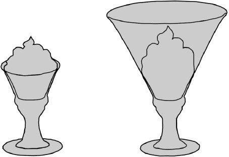

图4

爱吃冰激凌的人一定知道大杯里的量比较多，如果店员同时端出这两杯冰激凌，你应该会毫不迟疑地付较多的钱买大杯的冰激凌，付较少的钱买小杯的冰激凌（至少多次实验都得到这样的结果）。有趣的是，如果店员分别端出这两杯冰激凌，人们反而会付较多的钱买小杯的冰激凌，付较少的钱买大杯的冰激凌。

在第一种情况下（同时端出），大家钟情于量比较多的那一杯；在第二种情况下（分别端出），人们反而钟情于量比较少的那一杯。这究竟是怎么一回事呢？

当店员分别端出这两杯冰激凌时，顾客会将注意力集中在冰激凌和容器容量的关系上。一般人看到满出杯子的冰激凌会觉得很开心，看到只装了半满的杯子就觉得好像差了一点。可是当店员同时端出这两杯冰激凌时，顾客就能很客观地比较出两者的量。

可以与其他东西比较大小，对于情感的影响程度也会增强。人在比较时会产生参考点，与参考点相比，高下立见，马上能判断出“好”与“坏”。在大多数情况下，人们计算损益的出发点是参考点，而不是传统经济学提出的绝对值的变化。

不过，有时候以比例来表示会变得更吸引人。例如商店打折时，店家标示“所有商品降价30％”，顾客立马知道每件商品可以省下多少钱。相反，如果只标示每件商品折让后的金额，顾客反而没有参考点可以比较，就像“高速公路上车祸死亡人数为750”的说法一样，不知道该怎么判断。

消费者容易受到比例印象的影响，而做出矛盾的决策。就像我们在第一部提到的例子（买手机时为了省500元而跑到另一家店，买电视机时即使能省下同样金额也懒得到另一家店去买）。然而，这种例子不适用于和人身安全有关的情况，请看下列机场安全的问题。

**问题57**

假设你出席机场管理公司的董事会议。

A．现在的建筑结构会导致150人有生命危险，公司拟定对策，可以拯救98％的人。

B．情况和A相同，不过你只知道，公司拟定的对策可以挽救150人。

你支持哪一项对策？

调查结果显示，选择支持可以挽救有生命危险人数的98％（相当于147人）的A对策的人数，大大胜过只听到可以挽救150人的B对策的人数。董事会竟然选择挽救绝对人数少了3个人的对策，仿佛147条人命比150条人命更有价值。

再看看下面这个问题。

**问题58**

你身为非营利组织“生命科学”的负责人，必须决定将赞助经费分配给下列哪个救助重症患者的团体。

A．X协会救助X疾病患者，该疾病去年死亡人数达1.5万人。X协会的救助方案可以将死亡率降低2/3。

B．Y协会救助Y疾病患者，该疾病去年死亡人数达16万人。Y协会的救助方案可以将死亡率降低1/8。

请问，你选择资助哪个协会？

大多数人选择的是可以挽救1（1.5×2/3＝1）万人的X协会，而不是可以挽救2（16×1/8＝2）万人的Y协会。仿佛Y协会多挽救的1万人的性命没有价值似的！

比例影响情感，会让人忽略绝对值的重要性。要清楚呈现绝对值的大小，必须同时提示所有相关数字。在“问题58”中，如果同时把两种救助方案拿给受试者看，再问大家会优先资助哪一个协会，相信多数人会选择资助可以挽救较多人的Y协会。

在意大利禁止播出带有比较性质的商品广告，这实在很可惜，因为许多信息分别出现在不同的广告里，消费者很难找到参考点。举例来说，某品牌的矿泉水号称“喜悦满溢，钠只有一点点”，从客观角度看来，这句话实在不切实际（喜悦是否满溢只有当事人知道，也没有人知道饮用水中含有丰富的钠对人体有什么影响），然而销量却大幅攀升。

要去除广告中的营销标语、销售手法等影响情感的因素，只关注产品的实质部分，实在不容易。所以购买矿泉水时，我们只能发挥想象力，将自己能想到的关于矿泉水的所有宣传语在脑中浮现一遍，再决定如何行动。虽然这样做也未必能买到真正的好水，可是至少别忘了你自己或多或少会受制于情感经济学。如果你真能做出完全合理的决策，请把理智留给更重要的选择。

# 第9章　和风险拉锯

不熟悉统计，

很容易落入陷阱，

陷阱造成的错觉会扰乱我们的思维。

## 相对风险比绝对风险更耸人听闻

大家从谈话性节目中可以看出，只要观点不同，统计数据也会呈现不同的面貌。数字并不是绝对的。

在我每天阅读的报纸上专门设有让读者深入了解科学知识的版面，其中一篇报道介绍了国际极具权威性的杂志最新的研究论文。报道指出，胆固醇比较高的人罹患心脏病的几率比一般人高出50％。可以想象，胆固醇高的人读了这篇报道之后一定会非常不安。

此时我们不妨思考一下：“这个数字到底要传递什么信息？”让我们先以其他方式呈现同样的数据。

根据预测，年龄为50岁的胆固醇值正常的人，每100人之中有4个人会在接下来的10年内罹患心肌梗塞；同样的年龄但胆固醇值偏高的人，每100人之中则有6个人会在接下来的10年内罹患心肌梗塞。

这里所说的从胆固醇值正常者有4个人会罹患心肌梗塞，增加到胆固醇值偏高者有6个人会罹患心肌梗塞，对应的就是报纸上写的“50％”，因为增加的2个人是原先4个人的一半，也就是50％。

4个人增加2个人，代表着“相对风险”提高了50％，但我们也可以换一种方式来表示同样的数据——着眼于“绝对风险”的提高。在这个例子中，“绝对风险”只提高了2％，也就是100人之中有6人或4人的差别。相对于“50％”而言，“2％”这个数字确实会减弱报道对胆固醇高的读者造成的心理震撼。

只要了解这一点，我们就能冷静地思考数字到底在说什么，而不会过度忧虑不安。

再举一个例子，这也是我们在日常生活中常谈到的话题之一。

“坐车随时系好安全带，可以降低15％的危险。”你也许会想，自己一直都系好安全带，没问题。可是你真的知道在系好安全带的情况下坐70年的车仍发生车祸而留下后遗症的几率是多少吗？一定不知道吧。这句话并没有说清楚，可以降低的危险是“绝对风险”还是“相对风险”。

假设你曾听说，坐70年的车因为车祸重伤留下后遗症的几率是20％，如果例子中的“15％”代表的是“绝对风险”，只要计算20％减去15％即可。这代表着系安全带能大幅降低危险，使得你受伤的几率降到5％（20％－15％＝5％）。

如果例子中的“15％”代表的是“相对风险”，情况就完全不同了，风险降低20％的15％，也就是3％（20％×15％＝3％）。这表示系安全带的确有效，不过效果没那么夸张，只能将风险降低至17％（20％－3％＝17％）。

可以说，“相对风险”和“绝对风险”的差异会导致天差地别的结果。以“相对风险”叙述事物能激发人们强烈的反应，以“绝对风险”叙述则无法达到同样的效果。换言之，“相对风险”能放大数据应有的含义。大家千万不可忽视这种偏差带来的危险，例如制药公司就经常利用这种遮人耳目的手法诱导我们做出不合理的决策。

一般人会凭着情感或个人喜好评估风险，平时的想法、家庭的状况都会左右情感的反应，让我们偏离合理的判断。在与风险有关的情绪之中，最令人难以抵抗的是恐惧。

疯牛病、禽流感、毁灭性武器、胆固醇……某些人专门利用人类对这些事物的恐惧之情说服群众，以团体之名压抑个人自由，引导群众朝着不利于社会公益的方向行动。

在身份证中记录指纹之类的人体数据、觉得某人行为可疑而希望允许官方监听市民的通话……当有心人士想赋予此类想法以法律效力时，只要先向群众宣传恐怖主义的危险，引发大众的恐惧，通过法案的几率就会大大提高。

总之，只要采取相应措施让人们在脑中描绘凄惨的景象就行了。这种策略的效果惊人。虽然有人会对这种手法提高警觉，不过在9.11恐怖袭击事件之后，政府更擅长运用这种策略了。

请大家注意，这种策略不仅出现在政治、法律和恐怖行动方面，在别的领域也发挥着强大的威力。实际上，企业也常利用这种手法达到商业目的，例如促销高价家庭净水器或安全气囊。

研究危险话题的专家都知道，让人害怕的危险与实际上致人于死地的危险之间有很大的差别。可以控制的风险，并不像无法控制的风险那样令人感到恐惧，即使前者发生的几率比较高。

例如，开车往返于米兰和威尼斯的高速公路上发生车祸事故的几率极高，但我们可以自己掌控方向盘；虽然很少人因为罹患疯牛病或禽流感而丧生，但我们却无法判断自己吃的牛肉或鸡肉是否遭到感染。吃牛肉时我们只能认命，但是在高速公路上开车时我们却可以自己决定要不要冒险开快车，拿生命开玩笑。

芝加哥经济学家史蒂芬·列维特（Steven
D．Levitt）在其著作《魔鬼经济学》中问道：“政府在投入资金消灭人类面临的危险时，如果有消灭恐怖分子的威胁和心脏血管疾病的威胁两种方案可供选择，哪一种方案比较容易赢得大众的支持？”

虽然人们受到恐怖分子攻击而丧命的几率远低于因胆固醇过高导致动脉阻塞致死的几率，可是“我们无法控制恐怖分子的暴行，却能约束自己少吃高热量的薯片”。相比于可以控制的心脏血管疾病的威胁来说，无法控制的恐怖分子的威胁更令我们感到恐惧，所以，我们更希望政府将资金投入到消灭恐怖分子威胁的方案中。

## 搞懂统计数据，认清事物本质

在美国，每年有7万人因为可避免的医疗过失而死亡；在德国，每年有10万名女性明明没有罹患癌症，却因为乳房切片摄影被判定为乳癌而以手术切除了乳房；科学尚未证实前列腺的早期诊断能降低死亡率，每年却有数千名男性接受前列腺检查……甚至连专家有时候的行为也和一般人一样不合理。

这究竟是怎么一回事呢？这是因为大家不懂统计。请看以下实验。

**问题59**

假设你是意大利人。有一天，你开车前往医院接受艾滋病筛查，遇到堵车。前段时间你刚读过相关资料，对艾滋病的认识如下：

在意大利，既不吸毒也没有危险性行为的人之中有0.01％会感染艾滋病。感染艾滋病的人接受检查，有99.9％会呈阳性；未感染艾滋病的人接受检查，有99.99％会呈阴性（换句话说，有0.01％的人实际上并未感染艾滋病，却遭误判为阳性）。

请问，如果某个人的检查结果显示为阳性，他实际感染艾滋病的几率有多高？

大多数人回答几率超过99％。

这种问题通常会扰乱人的思维，不过只要利用几率计算就能得出正确答案。此时的你被困在长长的车阵中缓慢前行，不能用纸笔，也没有计算器，该怎么办才好呢？

其实，只要换个方法叙述，就能马上得出答案。比如说，假设有1万人既不吸毒也没有危险性行为，其中有1人（10000×0.01％＝1）罹患艾滋病，测试结果几乎都正确（99.9％）显示为阳性。其余9999人并未感染艾滋病，但这些人当中有1个人的检查结果会误判为阳性。也就是说，1万人当中有2个人的检查结果会呈阳性。

这2个人之中有几个人真的感染艾滋病？你应该已经看出，答案是2人之中有1人罹患艾滋病。所以说，当某个人的检查结果为阳性时，实际罹患艾滋病的几率并非是99％，而是大约等于50％。换句话说，这个检查结果至少有50％的几率是错误的，你最好重新接受检查。

再看第二道题目。

**问题60**

甲女士和乙女士都怀孕了，她们去医院做B超检查，希望提早知道小孩的性别。

A．如果是男婴，检查结果为“M”的几率为90％。

B．如果是女婴，检查结果为“F”的几率为70％。

甲女士的检查结果为M，乙女士的检查结果为F。

请问，相对于乙女士而言，甲女士是否更有把握知道自己的小孩是男是女？

以适合这道问题的认知方法对照，就会发现上述推论与实际情况恰好相反！

假设有200名孕妇和甲女士及乙女士一样接受同样的检查，其中有100人怀了男婴，100人怀了女婴（为了简化问题，假设怀男婴、女婴的比例相等）。这200名孕妇接受检查之后，有多少人的检查结果是M，又有多少人的检查结果为F呢？

根据题意可得，怀了男婴的100人之中，有90人检查之后得到正确结果M；怀了女婴的100人之中，有30人检查之后得到错误结果M（有70％的几率能得到正确性别F，剩下30％会得到相反结果，也就是M）。所以检查结果为M的孕妇当中，实际上会产下男婴的几率为120（90＋30＝120）人当中的90人，等于75％（90÷120×100％＝75％）。这就是检查结果为M的甲女士生男孩的几率。

怀了女婴的100人之中，有70人检查之后得到正确结果F；怀了男婴的100人之中，有10人检查之后得到错误结果F。所以检查结果为F的孕妇当中，实际上会产下女婴的几率为80（70＋10＝80）人当中的70人，等于87.5％（70÷80×100％＝87.5％）。这就是检查结果为F的乙女士生女孩的几率。

因为87.5％大于75％，所以乙女士比甲女士更能确定自己小孩的性别！

从艾滋病和胎儿性别检查的例子中可见，不熟悉统计，很容易落入陷阱，陷阱造成的错觉会扰乱我们的思维。接下来几章我还会介绍其他的例子，说明在政治、经济、商业中，经常会发生故意利用这种错觉的情况。没有统计知识，个人的自由也会严重受限。

自古以来，人总喜欢追求确定性。宗教审判巧妙运用拷问的方式追求“真相”，只要目的够崇高，就能不择手段。宗教改革和反宗教改革打破了宗教神话中“不容异议的绝对观念”，几率理论的出现也就成为了必然。

后来人类建构了科学真理的新观念，不再一味追求确定性，而是追求在不确定的情况下可以接受的决策，开创了更谦虚的思考方式。

# 第10章　高估自己的判断力

人类智慧的典型错误，

是排斥那些否定自身经验的事物，

偏好那些符合自身经验的事物。

## 愈专业，愈容易自以为是

当人们谈论事物发生的几率时，不仅会误解数据，评价或判断时也会犯错。“认知陷阱”的例子不胜枚举。

比如，有朋友告诉你，国际米兰队在下周日比赛中获胜的几率为70％，你该如何证明他说的不对呢？假如国际米兰队输了，朋友可能会说，落败只是因为出了一点小意外，他事先考虑到意外发生的几率，所以把获胜几率降低了30％。不过，如果朋友断定不会出现的结果一再发生，你就能推断朋友预测的几率根本不足为信。

这个简单的例子隐含着极重要的一般原则——要评估一个人预测某件事发生的几率是否正确，原则上必须考虑到所有可能出现的情况。只有套用这项原则，才能准确掌握事物发生的正确几率。若某个人认为某项假说发生的几率为x％，而假如x％实际上正确无误，他的判断就可说是“完美测定”。

瑞士联邦事务局以测定气象和气候准确而闻名，假如事务局预测降雨几率为30％，就代表着应该有30％的几率真的下雨。这是事务局工作人员通过研究超过1.5万天的样本所得出的统计结果。

预测完美的人不会犯下完全相反、左右对称的两个错误：高估或低估自己假说正确的几率。要研究人的判断正确与否，必须针对广大领域进行广泛调查（金融分析、法律鉴定、临床心理学等）。但是能作出适当判断的人通常很少，多数人都高估了自己假说的可信度。

专家的判断有时候也会导致严重的问题。在明明应该保守行动的时候，却忍不住放手一搏，于是引发问题。以金融界为例，经验愈丰富的人愈容易过度相信自己的判断。真正的专家在行动时应该更谨慎，可是他们却往往高估自己的专业能力。

以高山向导为例。假设现在正值夏季，接连两周都是阴雨天气，所以你不断延后远征的出发日期。某一天，天气看起来好像转晴了，向导告诉你：“虽然天上还飘着云，今天应该能试着攀岩。”你有自信放手一试吗？

阿尔卑斯山的向导熟知山区的环境和危险性，长年观察周边地区的气象变化，最重要的是他会陪着你一起面对危险。可是，你们身上系的攀岩绳有金属钩，万一碰上打雷，可能会因此丧命。维护生命安全的金属攀岩绳和铁锁等装备都会吸引雷电，向导对这一点也很清楚，但由于他从未碰上事故，以往的经验影响了他的判断。假如他曾遇到过危险事故，应该就不会建议你今天出发吧！

这位向导已经两星期没有收入了，他在潜意识中也希望能看到天气好转的气象征兆（风向等）。但作为游客，就算不是行事极为谨慎的人也要提醒自己，毕竟经验不足，还是等天气完全放晴之后再出发比较好。为了提早去爬山而去冒生命危险，简直愚蠢至极。

然而，我们还是会听从向导的决定。通常情况下，只要专家相信自己的判断，我们自然也会听信他们的意见。知识和经验比我们更丰富的专家，对自己的判断充满自信，哪有无知的我们插嘴的余地。我们觉得自己犹豫不决是理所当然的，但只要专家稍有迟疑，我们就会怀疑他是否能力不足。

换句话说，专家的主观自信并不适合作为他是否判断正确的指标。你的主观自信如何？该如何衡量自己的判断？你相信自己的程度是多少？请看以下的测验。

## 自大造成的陷阱

**问题60**

你的驾驶技术有多好？你觉得自己开车开得很好吗？你的驾驶技术是否高于平均水平？或者属于平均水平，还是低于平均水平？

问许多驾驶员这个问题，理应有1/3的人认为自己的驾驶技术高于平均水平，1/3认为自己和平均水平相当，1/3认为自己低于平均水平。

但专家在瑞典实际进行这项调查时，竟发现有90％的人认为自己的驾驶技术高于平均水平。要是在人人自以为可以媲美瓦伦蒂诺·罗西（Valentino
Rossi）或迈克尔·舒马赫（Michael
Schumacher）等赛车选手的意大利进行调查，也许这个比例会更高。

像这样的结果不仅出现在驾驶技术的调查中，大多数人都觉得自己在许多方面比平均水平聪明、诚实、没有偏见。对100万名美国高中生进行调查，发现有70％的学生认为自己的领导能力高于平均水平，只有2％觉得自己低于平均水平。别以为老师就会比较谦虚，有94％的老师认为自己的工作质量高于平均水平。

孔子说：“知之为知之，不知为不知，是知也。”大多数人都称不上是孔子的好学生，因为大家经常曲解自己的知识，对自己太有信心。

接下来带大家进行测验，请回答下列问题之后，再以百分比评量自己答案的正确几率。正确几率愈高，就愈接近100％。

**问题62**

A．台湾的第二高峰是哪座山？

B．台湾土地面积最大及最小的县市各是哪个？

C．在台湾，几岁以上的人才能结婚？

D．爱因斯坦因什么研究成果而获得诺贝尔奖？

E．把掺杂着银成分的金皇冠和重量相等的金条放在天平两端，再放入水中，天平的哪一端会比较高？

F．假设太阳和地球相距100米，那么地球和月球之间的距离比较接近于以下哪一个选项？

a）25米　b）2.5米　c）25厘米　d）2.5厘米

（答案请见下一页）

在测验中，大多数人很容易高估自己答案的正确几率。认为自己的回答100％正确的人，实际上的正确率只有80％。

有些人也许会反驳：地球和月球之间的距离并非作决策时的必要知识，即使缺乏专业领域之外或决策范围之外的知识，也没有什么影响。不过，这项测验并非着重于大家在天文、物理、地理、文学等方面具备多少基本知识，而在于你“认为”自己知道多少。重点在于，了解自己知道什么、不知道什么。实际上，这种自我认知对决策影响重大。人不需要成为万事通，不过最好认清自己的知识范围。在判断自己的选择是否恰当时，正是以自己的认知为参考点的。

**问题62的答案**

A．多数人都知道台湾的最高峰是玉山，但是第二高峰的知名度就没有那么高了。第二高峰是雪山，标高3886米，位于台中县和平乡武陵农场附近。

B．台湾土地面积最大的县市是花莲县（约4629平方千米），土地面积最小的县市是嘉义市（约60平方千米）。

C．根据台湾《民法》规定：“结婚年龄，男性须满18岁，女性须满16岁。”不要自以为答案只有一个数字。

D．爱因斯坦于1905年发表论文《发现光电效应》，这篇论文促进了量子力学的发展。同年，爱因斯坦又发表了“特殊相对论”和“布朗运动”，留下三大功绩，并于1921年获得诺贝尔物理学奖。他在得奖感言中提到“一般相对论”。后来，他批评量子力学的不确定性理论，留下名言“上帝不会掷骰子。”

E．放金皇冠那一端会比较高。因为黄金的密度为19.3克/立方厘米，银的密度为10.5克/立方厘米，假如重量相等，掺有银成分的金皇冠的体积会比较大，放进水中会受到比较大的浮力，使得天平往上。

F．25厘米。太阳和地球相距约1.5亿千米，地球和月球约相距38万千米。因为太阳的直径是月亮的约400倍大，所以即使太阳和地球的距离大约是月球和地球距离的400倍，但太阳和月亮看起来依然差不多大。

许多投资散户和经理人都认为自己能准确预测股市的动向。有人以投资经理人为对象进行了一项调查，让他们预测12只股票在一定期间内的涨跌。结果有47％的人预测正确，可是当初认为自己预测正确的人却有65％！

高估自己的判断力时，很容易低估风险，误以为自己能操控一切。就像许多驾驶员自以为驾驶技术很好的自大心态一样，这也是造成投资者投资决策失误的一大原因。

金融专家是否就信得过呢？美国最大的经济报刊《华尔街日报》曾谈论过这个话题，我们一起来看看相关的内容。

## 成功是自己了不起，失败是因为别人不好

《华尔街日报》定期邀请几位投资专家，向他们询问该买哪些股票，同时把列有股票股价的网页打印出来，让人们射飞镖选出其中5只股票。之后，在一定期间内追踪这些股票的涨跌。结果，人们射飞镖选出的股票经常比专家选的股票表现更好，这意味着射飞镖的人本来就瞄准优质股票，或者只是运气好。

高估自己的能力多半起因于以往的美好经验。例如在20世纪90年代涉足股市的人比较容易创造投资佳绩，因为当时的投资市场正处于成长期，充满了各种各样的机会，本来就比较容易获利。问题在于大家都认定获利是靠自己的能力。

华尔街向来流传一句话：“不要把市场的成长趋势当成自己的智慧。”切记：在评估结果时，不要忽略偶然、运气、血清素<a href="#part0027_split_003.html_ch1"
id="part0027_split_003.html_ch1-back">［1］</a>等因素所起的作用。纳西姆·尼可拉斯·塔雷伯（Nassim
Nicholas Taleb）的话正中要害：

“走运的笨蛋一点也不觉得是自己运气好……累积愈多成功经验，身体分泌愈多血清素（或类似物质），就愈让人误以为自己能掌控市场……只要观察这些人的态度，就可一目了然——成功的投资经理人走路有风，宛如支配者，比那些绩效不佳的投资经理人更爱大放厥词。科学家发现，神经传导物质血清素会影响我们的许多行为，能引发正面的反馈，促进良性循环，可是一旦发生坏事，就会往反方向逆转。”

事实上，有人认为2000年的网络热潮与抗忧郁药物“百忧解”有关。“人们得意忘形，市场环境不错让大家以为自己手腕高明，能大赚一笔。在网络泡沫破裂之前，没有人觉得一切的成果可能只是出于偶然。”（塔雷伯，《随机的致富陷阱——解开生活中的几率之谜》）

也许有点忧郁的聪明人比较好。我可不是随便说说。有轻微忧郁倾向的人，比较善于预测风险，比一般人更谨慎。

错估自己的能力，并不只是因为受到百忧解的影响，还有诸多心理幻术会扰乱人心。即使当事人因为自己的疏失而导致终生难忘的重大错误，也未必觉得责任是出在自己身上。相反，人会为了减轻自己的责任而找出一些偏狭的理由。正如大家所见，面对胜利时，众人竞相邀功；面对失败时，却总是冤无头、债无主。

若有支持我们的行为与信念的好事发生，我们总觉得原因是出于自己特有的能力。一旦事情不顺，明明是自己犯了错、自己想偏了，也不愿承认错误、吸取教训，反而将事情的原因与自己的思考和行为割裂开来，觉得是因为自己太倒霉。

运动选手（甚至热情的球迷）在获胜时觉得自己是靠实力，落败时则归咎于运气不好或裁判不公。学生考试一过关就觉得是自己复习得当，若分数惨不忍睹就觉得是老师乱打分数，甚至觉得是老师的错。相反的，老师看到学生成绩好，便认为是自己教得好，一旦学生表现不佳，就觉得是学生不聪明或不用功。

同样，我们不反省自己是否遵守截止期限，却认定别人都应该按照计划行事。当自己赶不及在截止期限前完成任务，会觉得这是难得一见的例外，为自己辩驳；要是因为他人导致计划拖延，却马上断定那不是例外，而是常见的问题。

自恋的陷阱还会在诸多场合干扰我们，比如平时购物或买足球彩票。大家应该都有因大甩卖的促销广告而买了一大堆自己不需要的东西回家的经历。

便宜的畅货中心或特价商品不断刺激消费者的购买欲，压抑人的理智。那些不买可惜的“跳楼价”商品，顿时令人忘记买了可能会吃亏（因为不需要的东西再怎么便宜，买了也不算赚到），“买了比较好”的理由（东西很不错，机会难得）不断在脑中扩张。如果该商品真的能让人满足，买回家后一样开心也就算了，可是一回到家才开始觉得不满意，但很少人会反省自己太冲动，多半认为是自己上当受骗了。

同样的，每星期都买足球彩票的人如果真的赚到钱，并不觉得是因为自己走运，而是认为自己有眼光。但如果不断输钱，便觉得是自己不走运。接连买了几次足球彩票都不中之后，也没有人会认为自己预测比赛胜负的准确率很低，而导致自己每星期几乎都血本无归。不过话说回来，大家买的是“梦想”，没有赚钱又何妨。

**注释：**

<a href="#part0027_split_003.html_ch1-back"
id="part0027_split_003.html_ch1">［1］</a> 血清素是体内产生的一种神经传递素，与心情稳定、冲动、紧张有关。通常血清素愈多，脑的活动就愈激烈，血清素不足则会导致人忧郁。

## 人只看得见自己想看的

自恋情结深深扎根在人们的信念当中。经济学家约翰·肯尼斯·高伯瑞（John
Kenneth
Galbraith）曾经这样阐述：“在必须选择改变意见或不必改变意见时，几乎所有人都认为不必改变意见。”换句话说，大家多半喜欢与自己信念相符的事物，不喜欢与自己主张相反的事物。

人们偏好阅读与自己政治立场相符的报道，也是类似的现象。简单说来，与其遭人指正，不如给予附和。我们对于和自己站在同一立场的信息兴致盎然，对于立场相反的信息却听过就忘。

美国心理学家理查德·尼斯贝（Richard Nisbett）和李·罗斯（Lee
Ross）在20世纪70年代进行过著名的研究，大致内容如下：

有两组学生，一组赞成死刑，另一组反对死刑。将美国某两个州的犯罪和杀人罪的统计资料发给两组学生。这两个州的统计数据完全相同，只是第一个州以往没有死刑，后来才引进死刑制度，第二州以往有死刑，但后来废除了。

两组学生在看过资料后，必须判断死刑能否有效遏制犯罪。结果，两组学生都认为，统计数据（两组人看的是同样的数据）证实了自己原本的意见。

也就是说，虽然看到的是同样的数据，但赞成死刑的人认为数据可以证明死刑有效，反对死刑的人认为数据可以证明死刑有害。两组学生都根据“非常适当的理由”，忽略掉与自己意见不同的部分，而特别注意能证实自己意见正确的数据。

不仅如此，他们还认为，符合自己意见的调查“设计得很好”、显示了“重要的事实”，而不符合自己意见的调查则设计不当、令人难以苟同。

换句话说，人们只看得见自己想看到的东西。为了不看到自己不想看的东西，人们还会不断改变自己看事情的角度。根据调查，有明确预设立场的人在看到混合正反观点的证据时，总会强化自己的预设立场。他们并不会完全忽略与自己意见不同的部分，却会努力找到恰当的理由说服自己不必在意那些相反的证据。

别以为科学家就不会犯这样的错。当实验结果符合自己的理论时一切都好，若实验结果违反了自己的理论，他们就会想重新做实验。

我们所认为的理所当然的事实，往往只是自己偏好的事实，未必是最客观的事实。实验哲学始祖弗朗西斯·培根（Francis
Bacon）深知这个道理，所以提醒大家要注意自己的本性：“人类智慧的典型错误是排斥那些否定自身经验的事物，偏好那些符合自身经验的事物。”

想知道自己是否犯了培根所说的错误，请挑战以下问题。

**问题63**

在你面前有四张卡片（图5）。

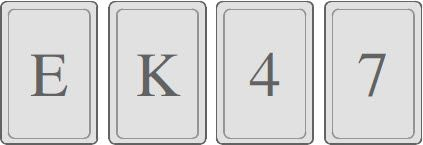

图5

每张卡片的一面是字母，另一面是数字。也就是说，左边两张卡片的背面是数字，右边两张卡片的背面是字母。

请思考这一命题：“如果卡片的其中一面写着元音，背面就是偶数。”

想知道这一命题是真是假，应该翻看哪几张卡片？（可复选）

这是英国心理学家彼得·沃森（Peter
Wason）于1966年进行的实验。实验结果显示，大多数人（50％）选择翻看“E”和“4”，只有约10％的人作出了正确的选择：翻看最左边和最右边的卡片，也就是“E”和“7”。

只要想想，哪一张卡片可以证明上述命题为假命题就好。答案是：“卡片的其中一面写着元音，背面却是奇数。”假如四张卡片中有任何一张是这种情况，就能证明这一命题为假命题。

中间的那两张卡片目前并不重要，因为一张是辅音（K），另一张是偶数（4），无论这两张卡片的背面是什么，都无法推翻上述命题，所以不必翻开来检查。但是，当“E”的背面写着奇数，或者“7”的背面写着元音，就能证明上述命题为假命题。

在这个四张卡片的问题中，大多数人都不去看否定命题的信息，只留意到肯定命题的卡片。换句话说，大家是先找有元音和偶数的卡片，所以先看到第一张和第三张卡片——第三张卡片根本与问题无关，而真正重要的第四张卡片却被大家从一开始就忽视掉了。

培根还发现，人们不仅在有预设立场时才偏重自己喜欢的信息，即使心里没有明确的意见或信念，人们还是会不自觉地注意自己偏好的信息，而忽视相反的部分。不过在实际面对问题时，未必总是如此。尤其在可能受骗上当时，人们的反应也会有所不同。

**问题64**

有一个学生在舞厅打工，当看门保镖。店里的规定很严，只卖酒给成年人（满18周岁的公民）。问题来了，舞厅入口处大排长龙，他如何尽快判断出客人是否已成年，搞错可就糟了。

就像刚才四张卡片的问题一样，只不过这次是排队的客人手里拿着纸片，一面写着年龄（假设客人不会谎报年龄），另一面写着想点的酒或饮料（A是橙汁，G是琴汤尼酒）。最前面的四个年轻人如图6所示。

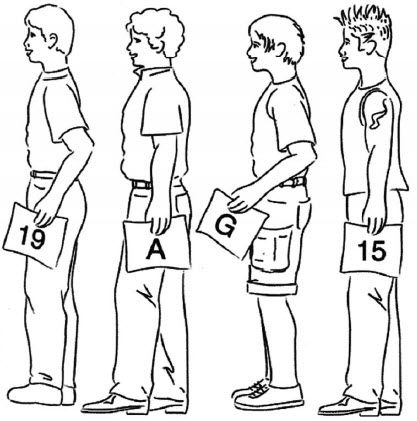

图6

他该检查哪些人？或者说应该翻看哪些人的卡片？

第一个人的纸片上写着“19”，需要翻看吗？当然不需要，他已成年，想喝什么都行，不必检查。第二个人想喝“橙汁”，也不必检查。第三个人的纸片上写着“G”，即他想喝琴汤尼酒，必须翻开背面查看年龄，以确定他是否成年。第四个人的纸片上写着“15”，代表他是一名未成年人，也必须翻开背面看他想点饮料还是酒，如果点的是酒，就要给予制止。

这道问题和刚才四张卡片的问题一样，你必须找出违反规则的组合。不过，针对这道问题，人们答对的几率很高，实际上有85％的人答对了。因为这道问题比较具体，也很简单，容易让人找到正确答案，而刚才的四张卡片的问题比较抽象，并不容易回答。

这些例子带给我们许多宝贵的教训，著名哲学家卡尔·雷蒙德·波普尔（Sir Karl
Raimund
Popper）早有先见之明——我们真正需要的信息是可以纠正自己错误观念的信息。若能吸取教训，我们就不会再刻意地去寻求符合自我期待的信息，而能慢慢改掉自恋的习惯。只要有足够的时间，我们就能静下心来仔细思考周围提供的负面信息，判断应该也会比较正确吧！不过，实际上真有这么简单吗？

# 第11章　经验会作怪

仰赖“事后诸葛”的智慧，

会让你积极采取错误的行动，

犹豫不决而放弃正确的行动。

## 高谈阔论的“事后诸葛”

有经验不一定总是好的，因为我们会因此高估自己的知识，而经验充其量不过是我们曾经知道或是可能知道的事而已。

假设你是狂热的足球迷，正在观赏最后的决赛。现在的比分为0∶0，时间只剩下3分钟，你支持的球队在此时赢得了点球的机会。你心里有一种获胜的预感，看着明星球员把球放在点球点，助跑、踢球……“咦？”过了一会儿，你大叫：“可恶！我还以为赢定了呢！”

预测接下来会发生什么事，与说明已经发生的事，这两者截然不同。事情发生之后，每个人都能自信满满地给予解说。证券分析师最擅此道，无论股市如何变化，他们总能滔滔不绝。股价上涨，代表景气复苏的预测结果带动了投资人的买气；股价下跌，代表股价已经提前反映出经济的衰退，或者国际政治又浮现出新的疑虑。即使只是微幅的变动，他们也能有说词（至少可以说是股价出现了技术面的调整）。

事实上，股市变化多端又很复杂，再优秀的分析师也很难预测一切，这一点投资人想必心知肚明。这和世上没有多少预言者，却有一大堆历史学家的道理是一样的。与其靠预测比赛胜负赚取赌金，不如当比赛解说员来得轻松。

人们习惯对已经发生的事情赋予某种意义，并认为这是必然发生的结果。所以我们会自以为事先知道某些信息，当初应该也能预测后来发生的事。美国卡内基梅隆大学教授巴鲁克·费斯科霍夫（Baruch
Fischhoff）进行过一连串的实验，证明了“事后诸葛”的态度会造成决策偏差。

只要在星期一到意大利酒吧晃晃，你就能看到所有人（无论学识多寡）都在证明这一道理。每个人都仿佛成了教练，早就知道比赛会是这种结果——队形不佳导致失误是理所当然，守备位置果然不对，传球果然传得不好，中锋果然错失了点球的机会。

你一定有过类似的经验：在公司会议上向老板或主管说明分析结果，没想到上司却说“这些我们早就知道了”。无论你多么努力准备，无论你的报告内容多么精彩，结果都是只得到这一句话。主管一听到报告内容，立刻觉得那些分析是他们早已知道的事。

我想传授你一个秘诀，下次提交书面报告或出席公司董事会议时，先邀请在场人士预测你接下来要说明的分析结果。这样做能充分展现你的分析结果的独创性，也很容易让大家明白你的分析结果和他们一开始的直觉有什么不同。

其实，“事后诸葛”的决策偏差出现在每一次董事会议上。明明“事后”才知道，但上司看到下属的分析结果时却误以为自己早就猜到了。发生某件事之后，我们并不觉得自己先前只是隐约觉得有可能发生，而是觉得先前早已料中。

“当初预告的大灾难”也不例外。四架飞机穿越纽约世界贸易中心和华盛顿五角大楼，许多人“事后”回想，宣称当初早有明确的征兆——阿拉伯人自愿接受飞行训练、许多针对美国的恐吓和阴谋看来都像本·拉登一干人的作为、几个月前秘密机构发出警告……“现在”回想起来有许多明显的征兆，不少人甚至觉得9.11恐怖袭击事件应该是可以预测的。

真的吗？阿拉伯人想在美国考飞行驾照并不奇怪，很可能只是想成为飞行员；秘密机构发出警告，到后来却什么也没发生的例子比比皆是……我们在不确定的世界中作出决策和采取行动，在事情尚未发生之前，没有人知道危险不危险。

话说回来，即使专家明白无误地告知了某一风险，大家也往往不为所动。例如，在有涨潮风险的海岸地带修建观光设施，而砍掉红树林（红树林是天然的防风堤）；洛杉矶的居民明知自己住在地震带，也不离开洛杉矶……

我们每天会接收到大量信息，渐渐无法分辨哪些才是重要的。即使接收到的信息强调了逐步逼近的风险，我们也不觉得那和自己有什么关系，到最后依然难逃一劫。因为大家很难想象，不确定的风险能摧毁自己身边真实的一切。

不过，历史并不在意这一切。罗列所有过往发生的事，每件事的发生都属必然，因果关系明确得没有任何反驳余地。所以在回想过去时，当初无法想象的事物，也变成是可以预测的了。

## 事后的归因，影响客观的判断

就连喝杯水，都可能有风险。你来到水池边，正要拧开水龙头，突然电话响起，你受到惊吓，手一滑，杯子撞到水池边沿，顿时破碎。你只是想喝杯水，竟然打破杯子，还喝不到水。由此可见，一个人再怎么乐观（只要到厨房拧开水龙头就有水喝），依然会遇到出乎意料的事。

即使自己的决策正确，结果也可能不如预期。在不确定的情况下，事物总可能因为某些与个人能力无关的因素而朝着不同的方向发展。经验会影响我们对过往事件的看法，也可能让我们在下判断和作决策时出现错误。

先看一个例子。欧洲中央银行预估经济增长将在一段时间内保持低迷，因此提出一连串提振景气的方案。假设后来景气并未衰退，其原因可能是预测正确加上经济政策奏效，也可能是预测错误（景气本来就没有变差的趋势），根本不需要靠经济政策挽救；假设后来景气恶化，其原因可能是预测正确但经济政策没有用，也可能是预测错误但经济政策把景气搞坏了。

想要知道某项决策是否正确，不能只看决策结果，还要注意决策过程。我的意思并非“结果不重要”，结果也很重要，但如果只注重结果，很容易忽略做决策之前所要面对的各种风险和不确定性（不可能事先准确预测）。另外，仅从结果来评论决策的好坏，还会导致认知偏差，对我们将来的决策方式产生负面影响。

比如，股票分析师的工作是围绕着既复杂又不稳定的股市展开的，他们根据手头的信息作判断，可能因为错误的决策而导致投资失利，不过也可能基于诸多其他原因（运气好、行业景气度回升股票走势趋强、出乎意料的企业并购等）而仍然获利。获利的结果会让该分析师下次碰到同样的情况时，还是采取同样的投资策略。

相反，即使股票分析师的判断正确，投资决策恰当，也可能因为其他原因而导致亏损。如此一来，该分析师就会怀疑自己当初的决定有问题，而在下次交易中失败。仰赖“事后诸葛”的智慧，会让你积极采取错误的行动，犹豫不决而放弃正确的行动。

格陵兰岛某综合医院以临床病理学协会160位与会者为对象进行相关调查，得到了同样的结果。第一组与会者在得知正确诊断结果之前，根据病人的临床状况预测该诊断结果正确的几率。结果，正确诊断结果被视为正确的几率不到30％。第二组与会者先得知正确诊断结果，再回答同样的问题。这次有50％的人一看到病人的临床状况，立刻觉得该诊断结果的正确几率最高。

年轻的实习医生与经验丰富且责任重大的同事一起工作，也会落入类似的陷阱。实习医生常常依照临床数据（尤其是病例结果）和同事的诊断（或决定）做事，于是他们渐渐分不清，究竟现在是相信自己的诊断和决策能力、自己思考何为正确诊断与处方，还是只按照他人的指示工作。简言之，事后评断的习惯会妨碍人的合理判断，使得基于观察、经验、训练的临床诊断变得不可信任。

总之，从以往经历中学习教训，看起来既简单又不花时间，但实际上却“陷阱密布”。现在你很清楚上次杯子破碎的事只是一次意外，但你真的能分辨哪些事情是纯属巧合吗？碰到更不确定、更复杂的状况，你也能分辨哪些事与你无关、哪些事源自你的抉择吗？

我们应该提醒自己的是，不要记取错误的教训。

# 第12章　投资人的心理

误以为自己可以操控信息，

会让自己重视不重要的信息，

对这些信息过度反应，

最后导致不当的行为。

## 一味追求低风险，不见得风险就低

与众按照传统的金融常识，风险与报酬呈正相关关系，也就是高风险、高报酬。这从“资本资产定价模型”（Capital
Asset Pricing Model，CAPM）<a href="#part0029_split_001.html_ch1"
id="part0029_split_001.html_ch1-back">［1］</a>中可看得出来。

根据该模型，与股票风险相关的主要信息表示为β系数。β系数代表某项投资的收益率（变动率）和市场整体的收益率（变动率）相比的结果。β系数为1，代表该股票和市场变动几乎同步；β系数大于1，代表该股票的风险比较高，变动也比市场整体平均来得大。

这种模型从传统观点看来并没有错，但却没有掌握投资人实际的行为。实际上，许多投资人在真正行动时会落入各种心理陷阱之中，无法认清风险和报酬之间的关系，而以不合理的方式管理股票。

我们在本书开头已经看过类似的例子，也就是人会在脑中进行不同的计算。不仅花钱购物时如此，投资股票和债券时也是如此。

假设你现在坐在家里的电脑屏幕前，打开证券公司漂亮的网页，登陆账户，只要买卖股票、债券等金融商品，马上就能享受到投资的美妙滋味。高科技让股票交易变得如此便利，你当然想多多利用，可是你天生谨慎，凡事小心翼翼，投资也不例外。

你很清楚风险高的话报酬率也高，如果投资标的每天变动很大，赚赔也绝不是小数目。你偏好稳扎稳打，这样可以安心地长期投资，于是决定先以国家债券为投资标的，虽然获利少，但风险也低。不过，这种想法未必正确。投资风险低的标的，的确可以让人比较放心，可是这种做法合理吗？大家一起检验看看。

诺贝尔经济学奖得主、普林斯顿大学教授哈里·马科维茨（Harry
Markowitz）曾经提出，要做出正确的选择，除了应该考虑符合报酬（换算成标准差）的投资风险之外，还应该注意该股票与其他股票的相对关系。所谓的“投资组合理论”<a href="#part0029_split_001.html_ch2"
id="part0029_split_001.html_ch2-back">［2］</a>，正是为了降低投资者所选股票的整体变动率，而建议将各种投资标的组合在一起。

考虑某只股票如何与其他股票互相影响，比考虑个别投资标的的风险更为重要。举一个极端的例子，有时候在投资组合中加入高风险的股票，可能会比加入低风险的股票更能降低投资组合的风险。与其把钱全部藏在地毯下面，不如把一部分放到看得见的地方（比较危险的地方）。

换句话说，如果你很谨慎，又想进行长期投资，不妨在投资所有的钱买债券的同时，追加10％的高风险股票。这样一来，投资展望就会大不相同。因为多了高风险的股票，那些低风险的债券也会改变样貌，整体投资组合的风险会变得比较低。

**注释：**

<a href="#part0029_split_001.html_ch1-back"
id="part0029_split_001.html_ch1">［1］</a> CAPM是诺贝尔经济学奖获得者威廉·夏普（William
Sharpe）在其著作《投资组合理论与资本市场》中提出的。CAPM模型的目的是协助投资人决定资本资产的价格。对于一个给定的资产i，它的期望收益率和市场投资组合的期望收益率之间的关系可以表示为：资产i的期望收益率＝安全资产的收益率+β×（市场组合期望收益率-安全资产收益率）

<a href="#part0029_split_001.html_ch2-back"
id="part0029_split_001.html_ch2">［2］</a> 投资组合理论（The Portfolio
Theory）的主张是“不要把鸡蛋放在同一个篮子里”。因为当所有资产都放在同一个篮子里时，万一篮子掉了，所有资产都会受损。马科维茨教授的投资组合理论，将分散投资的想法理论化，建议分散投资各种各样的有价证券，可以达到获利最大化、风险最小化。

## 对过去表现良好的股票过度乐观

思考抄快捷方式而对风险与报酬率的关系作出错误判断，原因可能在于人们只注意到事物表面的好与坏。许多人是根据企业过去的绩效来预测其将来的展望的，所以很容易产生“优良企业的股票就是绩优股”的错觉，并断定投资这类企业的风险很低。其实不然。

优良企业提供对社会有用的商品或服务，本身可创造收益，营运的模式也很好，而“绩优股”是指股价比其他股票涨得更快的股票。优良企业的股票未必就是绩优股，可是人们往往以为可以从最近的过去预测最近的未来，而经常落入陷阱中。

美国《财富》杂志的一项调查显示，人们普遍认为，企业运营的质量及财务状况的好坏、财务制度的健全程度与该企业股票的可靠度之间有着非常密切的关系。

简言之，人们一看到过去获利的股票，就断定该股票将来的风险很低。大家天真地利用某股票过去的数据来预测其未来的获利，而丝毫看不到获利和市场整体的动向（该股票显示的β系数的变动）有什么关系。

人们总习惯根据事物最近的过去推测其未来的动向。赫什·舍夫林（Hersh
Shefrin，金融行为研究的创始者之一）以戴尔公司（Dell）和优利系统公司（Unisys）为对象，针对人们的这一特性进行了如下实验。

戴尔公司的获利较佳——在前一个会计年度营业额上升47％，最近3年的净利润增长两倍，优利系统公司则节节败退——工厂的设备作业率降低70％。大多数受访者因此认为，之前经营顺利的戴尔公司今后会继续成功，股票获利也会稳步上升，而过去亏损的优利系统公司会继续亏损。可是实际结果恰好相反，优利系统公司获利增长的幅度高出戴尔公司54％。

赫什·舍夫林将其称为“胜者/败者效果”，意指投资人对于股票最近的表现很敏感。换句话说，投资人对于过去表现不佳的股票过度悲观，对于过去表现良好的股票过于乐观。

## 投资自己熟悉的企业，有什么不对？

意大利股市有数千只股票，欧洲股市有数万只股票，全世界的股票数量更是多得惊人。我们如何从中选择自己要投资的个股呢？如何分析每一只股票的投资报酬率和风险，并与其他个股相比呢？

美国股市占了全球股市大约47％，日本占了26％，英国占了13％。现代投资组合理论基于这种情况，提倡大家投资多种标的。可是我们真的懂得善用这一原则吗？美国人的投资标的中有93％是美国股票，日本人的投资标的中有98％是日本股票，英国人的投资标的中有82％是英国股票。

不只如此。可口可乐总公司位于美国佐治亚州的亚特兰大市，这家跨国企业的股票有16％落在谁手上？答案是亚特兰大的居民。意大利食品集团帕玛拉特（Parmalat）的债券持有人多半是意大利帕尔马居民。

由此可见，人们喜欢把钱投资在自己最熟悉的公司——离自己不远的公司，于是这些公司也成了他们最信任的公司。可是“离自己不远”“比较熟悉”“值得信任”这些特性，与该公司股票的风险或报酬率毫无关系，而且不符合投资组合理论力荐的投资多样化。

人难免会出于潜意识选择自己熟悉的公司，不过最好提醒自己，这种做法可能会让自己付出代价。集中投资自己熟悉的公司，还容易受到“同乡爱”的情绪所支配，“同乡爱”对合理投资毫无益处，反而有让人误判投资标的的危险。

“熟悉的感觉”是思考在抄快捷方式时容易犯的典型错误之一。在思考上抄快捷方式往往会走向错误的终点。不把自己要投资的股票与其他股票进行比较，很容易低估自己所承担的风险。

因投资方式不当而招致风险的例子不胜枚举，请看以下的例子。

## 愈清楚情况，投资愈顺利？

人人都想有钱，可是人一旦有了钱，很容易产生不安、担心等复杂的情绪。实际上投资没什么好烦恼的，重点在于了解市场、搜集信息，综合考虑各种影响因素之后再下判断即可。除此之外，还要了解自己，认清自己的认知模式与容易落入的陷阱。

奇妙的是，大脑为了逃避选择股票带来的不安而会采取自我防卫的心理措施，高估自己的预测能力，认定自己可以掌握情况（过度自信<a href="#part0029_split_004.html_ch3"
id="part0029_split_004.html_ch3-back">［1］</a>）。可惜这就像令病情更加恶化的治疗方法一样，会让想法变得更不合理。

想了解这种现象是怎么一回事，请看以下简单的测验。

**问题65**

A．投掷硬币之前，赌硬币会出现正面或背面。

B．已经掷了硬币（但你并不知道投掷结果），赌硬币出现的是正面或背面。

请问，你分别愿意下注多少钱？（虽然不知道猜中之后会有多少奖金，也不算赌博，但请把这道题当成是心理测验。）

结果是，大家给选项B的赌注比给选项A的低，仿佛某件事发生之后，出现某种结果的几率也跟着改变了似的。换句话说，事情尚未结束时，大家似乎觉得可以通过某种方法（念咒、祈祷等）操控该事件（投掷硬币的结果），即使有时候只是巧合。举例来说，投掷骰子时，想掷出大一点的数字就用力丢；想掷出1或2，就在心里默念……

虽然投资行为有别于掷硬币和掷骰子，但还是有很多人认为自己可以操控情况，而落入类似的陷阱。

得知许多股市消息的人，往往认为自己能作出比较正确的选择。事实上，几乎所有股市消息都是捕风捉影或过了时效，根本不值得参考。误以为自己可以操控信息，会让自己重视不重要的信息，对这些信息过度反应，最后导致不当的行为。当一个人对某项工作愈熟悉，就愈容易以为自己可以搞定一切。一旦自信过度，就会觉得自己亲手掷骰子的话，胜算比较大。

接下来我要说明的是，短线投资者容易出现“过度反应”和“过度行为”。请看下面这个不擅管理投资组合的典型例子。

**注释：**

<a href="#part0029_split_004.html_ch3-back"
id="part0029_split_004.html_ch3">［1］</a> 过度自信（Overconfidence）指的是太相信自己的能力和知识，而低估失败的几率，又称为“过度乐观主义”。过度自信是造成“事后诸葛”、事后装懂的原因之一。

## 积极买卖，造成亏损

加州大学金融经济学家布莱德·巴伯（Brad Barber）和特伦斯·奥丁（Terrance
Odean）对数千名投资人连续进行了若干年的调查，得到的结论是“积极买卖的人绩效比较差”。

巴伯和奥丁以随机选取的6000户家庭为对象，进行了为期五年的调查，得到如下结论：20％的家庭每年投资组合的周转率超过250％；买卖最积极的那户家庭的投资绩效最差；周转率最高的家庭比最低的家庭的投资报酬率低7％（这并不是因为选股不佳，而是因为每次买卖都得付手续费）。

哪种人会积极买卖？当然是觉得自己投资能力强，认为只要利用自己掌握的信息，就能创造良好绩效的人。通过调查发现，大多数男人属于这一类型。单身男性操作投资组合的年平均周转率为83％，已婚男性是73％，单身女性为53％，已婚女性为51％。

巴伯和奥丁后来利用网络进行调查。近几年，网络证券交易急速成长，比电话下单和柜台下单更有效率。券商彼此竞争，使得手续费降低了75％以上。对于想靠自己投资的人来说，这是一大利好，不仅交易更快、更加简单，经济效益也更好了。即便如此，也没有多少投资人变得比以前更富有，情况甚至相反。

坚持长期投资计划的人确实找到了更经济的交易方式，但那些上网交易的人通常都不采取买进之后长期持有的投资策略。散户要是一整天都盯着电脑屏幕看盘，很容易产生“通过积极买卖股票打败大盘”的投机取巧心理，最后可能会荒废正职，专心进行短线操作（幸好这种人只占整体的1％）。

巴伯和奥丁调查了从电话下单或柜台下单改为在线交易的1600名投资人，发现他们在利用网络下单之前，就已经是积极进出股市的散户，投资组合的平均周转率为70％。网络拉近他们和股市的距离之后，投资组合的平均周转率顿时上升至120％。可惜投资报酬率并未同步上升。在上网买卖之前，扣除手续费和税金之后的投资报酬率略高于目标比率，而改为网络下单之后，投资报酬率却比目标比率低3.5％。因为网络交易使他们变得自大、高估自己的操控能力，形成了“自大＋交易＝获利减少”的现象。

网络交易非常简便、快速，能让人以低廉的成本实时掌握大量的信息，包括上市公司过去的绩效、未来的趋势、股票价格及成交量、相关新闻、各种协议、投资建议、投资论坛等。几近泛滥的数据和意见，增长了投资人对自己的操作能力和知识的自信，所以当某些听信最新消息而过度买卖的投资人低价卖出股票时，也有其他投资人基于其他消息和解释买进这些股票。

意大利的证券公司在宣传网络在线交易时高喊：“你已经懂得股票了！”这摆明了是利用人们“支配的错觉”。

要解决这种问题，最好的办法是把钱交给专家管理。可是专家也会像预测走势的股票分析师一样落入陷阱，牵连到诺贝尔经济学奖得主的事件就是最有说服力的证据。他们群聚一堂，集资创立了超高金额的投资基金，却因为过度相信自己的能力和知识，终于导致了毁灭性的结果。媒体竞相报道该事件，轰动全球。

这就是无人不知的巨型避险基金——长期资本管理公司（LTCM），该公司网罗了当时顶尖的金融投资专家和优秀的研究人员。长期资本管理公司创立于1994年，曾利用金融衍生性商品创造出天文数字般的利润。可惜这种机会慢慢减少，交易金额逐渐增加，借款金额也逐渐膨胀。

1998年8月，由于国际石油价格下滑，俄罗斯国内经济不断恶化，俄政府宣布卢布贬值，在短短四个星期内全球主要股市应声倒地，出人意料的变化接踵而至。长期资本管理公司的顶尖级专家在一个月内赔掉基金资产的90％，金融体系走向崩溃，逼得美国央行不得不介入。

为什么他们会低估投资风险呢？因为他们没想到这么多的大事会同时发生。假如当初长期资本管理公司除了雇用解读市场趋势的金融投资专家之外，还雇用了解认知机制（心理偏差）的金融行为专家，也许就不会犯下高估自己知识的错误了。

# 第13章　预测将来

衡量某项体验时，

人们容易忽略该体验持续的整体印象，

而经常根据高峰时与结束时的感觉做出判断。

## 既有经验影响对未来的判断

不仅以往的经验会引导我们走向错误的方向，提前预测未来的体验也会让人做出错误的判断。因为我们不仅会高估自己“已经知道的事”，还会高估自己今后才能知道的事。

如果你不相信，请看以下问题。

**问题66**

A．把手放在冰冷刺骨的水里60秒。

B．把手放在冰冷刺骨的水里90秒，其中前60秒水温不变，接下来30秒温度慢慢上升，虽然水依然很冰，但至少比刚开始好一点。

你觉得哪一项体验比较好？

所有人都认为选项A比较好，因为不愉快的体验少了30秒。没有人喜欢在不愉快的体验之后再追加其他不愉快的体验。

不过，实际情况未必如此。

心理学家卡纳曼付钱让受试者亲自体验A和B，然后问他们愿意再接受哪一种体验。出人意料的是，80％以上的人选择了时间比较长的B。为什么会出现这种结果呢？

只有亲身体验过喜悦和痛苦之后，人们才能对其作出正确的衡量。在事前预测阶段，人们的心理认知未必符合现实情况。从客观角度看来，选项B应该比较痛苦，所以大家倾向于选择痛苦看起来比较少的选项A。可是在实际体验过A和B之后，人们反而会选择记忆相对比较美好的B。

卡纳曼经过深入研究发现，人的记忆不会以同等标准衡量所有事物，而会牵涉到与这些事物有关的复杂情绪。衡量某项体验时，人们容易忽略该体验持续的整体印象，而经常根据高峰（无论是正向的还是负向的）时与结束时的感觉做出判断。这种现象称为“峰终定律”<a href="#part0030_split_001.html_ch1"
id="part0030_split_001.html_ch1-back">［1］</a>。

简言之，我们在实际体验之前，会选择痛苦比较少的选项，而亲身体验之后，即使痛苦时间比较长，也会选择记忆印象比较好的选项。

**注释：**

<a href="#part0030_split_001.html_ch1-back"
id="part0030_split_001.html_ch1">［1］</a> 卡纳曼于1999年提出“峰终定律”（Peak-End
Rule），认为人们对各种体验的快乐和痛苦的记忆，几乎是由高峰期和末期的快乐和痛苦程度所决定的，与该体验持续的时间长短无关。除了医疗经历之外，生活中的许多体验都符合这条定律。

## 买卖股票难免感情用事

大家是不是还无法认同“峰终定律”？卡纳曼和来自加拿大多伦多的临床医生唐纳德·雷德尔迈耶（Donald
Redelmeier，在医学领域专门研究“可回避的认知错误”）进行了一连串的实验，以下即是其中一例。

假设你要拔掉自己的一颗蛀牙，医生拿着电钻站在你身边，你知道医生接下来要做什么。卡纳曼和雷德尔迈耶对这种情况下的患者在治疗过程中每隔60秒衡量一次痛苦程度，没有痛苦为“0”，极端痛苦为“10”。他们也请同样一批患者在治疗结束之后，衡量刚才治疗过程整体的痛苦程度（同样依照从“0”到“10”的等级）。

图7的横轴代表时间，纵轴代表痛苦强度。由图表可知，就治疗过程整体看来，患者B感受到的痛苦大于患者A。图中着色的部分为痛苦经历。痛苦时间持续愈久，面积愈大；每分钟感受到的痛苦愈强，高峰愈高。

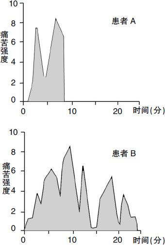

图7

卡纳曼和雷德尔迈耶的调查结果显示，在治疗结束之后，请患者衡量刚才的痛苦经历时，患者并不在意治疗痛苦持续了多长时间。治疗持续的时间从四分钟到一小时不等，可是时间长短几乎不影响患者衡量治疗痛苦的程度。患者在治疗结束后对整体痛苦程度衡量时，明显与治疗中最痛苦的时候（高峰）和结束时感受到的痛苦（末期）有关。

在这个例子中，患者B在高峰时和结束时的痛苦平均下来比患者A小（两者在高峰时的痛苦几乎一样，但是患者A在结束时的痛苦比较强烈），所以，尽管从客观角度看来患者B承受了比较多的痛苦，但却不像患者A的记忆那么强烈，患者A反而比较讨厌治疗。

实验结果令所有医生感到困惑。医生基于“告知的理念”，被要求尊重患者的自主判断。可问题是，要根据患者的什么判断？患者接受治疗前的判断，还是接受治疗后的判断？

这种矛盾的现象，同样适用于人生中伴随痛苦的情境。例如，在休假期间天气很糟，最后三天突然放晴；离婚时的争执和冲突反而减轻了婚姻破裂带来的痛苦。这类现象和“情感经济学”有什么关系呢？

投资人自己买卖股票，在未到惨不忍睹但已经亏损连连的时候，硬着头皮向专业股票分析师求救，是很痛苦的经历（而且得花钱）。他们会在脑中想象自己的经验，预测接下来的发展，而以往的经验（例如某只个股的变动）会大幅影响将来的选择。请看以下的例子。

你在一年前以每股40元的价格买入同样多的甲科技公司和乙网络公司的股票，在这一年内，乙网络公司的股价持续下跌至每股30元，甲科技公司的股价一直维持在每股40元，但最后几天突然暴跌到每股32元。这年年末，甲科技公司的股价比乙网络公司的股价略高，可是看到两只股票下跌的图表，你的心情也跟着不同。一个是在长时间内慢慢下跌，一个是在最后瞬间暴跌。客观看来，乙网络公司股票的亏损比较大，可是明年你极有可能投资乙网络公司，而不是甲科技公司。

令人开心的经验也一样。假如在这一年内，乙网络公司的股价慢慢上涨至每股50元，甲科技公司的股价在前几个月毫无动静，最后几天却突然暴涨到每股48元。看到后者暴涨的你肯定会乐得合不拢嘴。客观看来，甲科技公司股票的获利比较差，可是明年你极有可能投资甲科技公司，而不是乙网络公司。

比较坐在牙医诊疗椅的痛苦过程，以及股价变动带来的痛苦过程，你是否可以想象，某件事尚未发生时和已经发生之后，会影响投资的选择。

# *Part* 3　喜怒哀乐的决定力

# 第14章　盈亏的游戏

在许多情况下，

只要留意那些看来不起眼却能左右决策的事，

就能解决问题。

## 与人交手时的心理战

在前两部中，我们关注的是个人的选择，接下来要看人们在面对他人时，会有什么样的行为反应。

他人也和我们一样在做决策，而且也经常落入自己情绪的陷阱中。在双方对战的球场上，双方的选择应该是取决于和对方的交手——考虑对手的行为，并预测对手下一步的动作。如果无法预测，便很难做出合理的判断。

“博弈理论”<a href="#part0032_split_001.html_ch1"
id="part0032_split_001.html_ch1-back">［1］</a>研究策略行为，只要是预测对方的行为会影响自己的选择，就是一种博弈。先以足球为例，看看作家索里亚诺杰出的短篇小说《世界上最长的点球》。

迪亚斯是客队守门员，和队友在意大利联赛中一路由败转胜，晋级总决赛。裁判西尔巴吹哨子判给主队点球机会，但迪亚斯所在的客队觉得裁判不公，根本不该判罚点球。双方陷入混乱的争执中，不得不在比赛还剩下几秒的时候中止了比赛。

根据第二周星期二足球联盟裁判会议的讨论结果，决定继续点球后的20秒。主队射门球员高纳和客队守门员迪亚斯将在下周日同一球场单挑对决，没有观众。这一球将是世界上历时最长的点球。

某天晚上，大家聚在俱乐部玩扑克牌。相貌清爽、头发全往后梳的迪亚斯在吃饭时没有说话，饭后他一边剔牙一边说：“高纳会瞄准右边。”

“就像平常一样，”球队老板说道。

“可是他知道我会这样预测。”

“那可不妙。”

“不过我也知道他知道我会这么预测，”迪亚斯又说。

“那就守右边吧。”同桌的客人也发表意见。

“不行，他猜得到我也知道他知道我会这么预测。”迪亚斯语毕，起身离开饭桌去睡觉。

“迪亚斯真是个怪人。”球队老板看着若有所思的迪亚斯，心有所感地说道。

很明显，高纳和迪亚斯在进行“非合作博弈”——两人并不是和对方合作，一起找出制胜的方法，而是其中一人赢了，另一人就会输。

点球博弈（以及与足球比赛结构类似的情况）的有趣点在于，两个选手都找不到最佳平衡，没有固定的必胜策略。迪亚斯只能当成自己不知道高纳要往哪里踢，随机选择要守哪一边。高纳也一样，他不能让迪亚斯有任何选择的余地。换句话说，双方在最后一瞬只能像投掷硬币一样赌运气。

随机决定策略可不是一件简单的事，尤其目标就在眼前，射门球员的眼前只有球和守门员，更难出脚。

周围的空气沉重如铅块的时候，高纳把球放在草地上。那次点球他在心里踢了好几次——根据事后回顾——以后无论睡着或醒着的时候，心里都会重复出现那次点球的景象……

迪亚斯往前一步，朝球扑过去。足球转动着，飞向球门正中央。高纳心想，迪亚斯应该会漏接吧。迪亚斯想着当晚的庆功舞会、即将到手的胜利……

刚开始迪亚斯飞扑过来挡球，却把球推向球网又弹出场外，可是裁判并没有看到这一幕，他正好癫痫发作，突然倒地。他站起身来，开口问道：“发生了什么事？”大家告诉他之后，他摇头说必须重来。比赛规则规定，如果裁判恍神就无法进行比赛。球被踢向左边，迪亚斯第一次这么优雅地扑向正确的方向。高纳望着天空，哭出声来。

索里亚诺在别的小说中也提到过失败的点球。革命型马克思列宁主义者组成的南美队的中锋知道，敌方的守门员知道他的政治信仰。“我知道他知道我知道的事”这种想法开始在脑中萦绕，最后他无法舍弃自己的偏好，还是把球往左边踢。守门员也向同样的方向扑过去，作出了精彩的选择。中锋并不知道，守门员其实是在无暇选择的情况下凭直觉扑向了左边。

**注释：**

<a href="#part0032_split_001.html_ch1-back"
id="part0032_split_001.html_ch1">［1］</a> 博弈理论（Game
Theory），以博弈的形式，将复数主体根据利害关系决定如何行动的原理一般化。约翰·冯·诺依曼想象下国际象棋的策略，与奥斯卡·摩根斯坦（Oskar
Morgenstern）一起套用该策略来分析经济行为。后来，莱茵哈德·泽尔腾、约翰·纳什、约翰·梅纳德·史密斯（John
Maynard
Smith）继续发展该理论，并将其应用于经济、政治、军事和行为生态学等领域。

## 合作博弈

再来看看其他的博弈。

假设你面前有10张卡片，每张卡片上分别写着数字0～9。有另一个人在隔壁房间，你们分别选出一个数字。如果你们选中了同样的数字，就可以赢得10美元奖金；如果选中不同的数字，就没有奖金。

理论上这种博弈很难，因为两人从10个数字中选中同一个数字的几率很低，但其实很简单，许多人都选择了0，因此赢得了10美元奖金。

请考虑下列情况。

假设你明天必须到米兰与某个秘密组织的成员会面，无法事先决定时间和地点，不过只要见到彼此，一定能认得出来。你们会选在何时、何地见面？大多数人选择正午到米兰大教堂广场。

这种合作博弈在日常生活中随处可见。电话讲到一半突然断了线，你应该回拨过去还是等对方打过来？中锋应该把球踢向前锋的左边还是右边？这当然得视前锋往哪一边移动而定，可是前锋也在思考同样的问题。中锋把球踢向右边，前锋也往右边移动才好。

博弈理论非常关心投掷硬币之类的随机行为。诺贝尔经济学奖得主托马斯·谢林最早注意到，在许多情况下，只要留意那些看来不起眼却能左右决策的事，就能解决问题。

例如在选数字的博弈中，几乎所有人都觉得0是特别的数字（0排在最前面，看起来很特殊），所以选0。0是很特别的选项，和其他数字不同，因而成为了解决合作博弈的关键。虽然不合理，却是聪明的做法。

选择数字0或者选择正午到米兰大教堂广场会合，唯有在某种条件下才算是聪明的做法。也就是说，我知道这样做是最好的，对方知道这样做是最好的，我也知道对方知道这样做是最好的，对方也知道我知道他知道这样做是最好的……只有在这种无限“知道”的情况下，这种做法才有效。

有不少问题乍看之下无法解决，但只要换个角度（或者连续出现特殊解法时），就会豁然开朗。习惯正是典型的例子。

参加丧礼时穿黑衣服并没有特殊理由（中国人穿白衣服），但要表达彼此共通的情绪，穿同样颜色的衣服很重要。很久很久以前，因某种原因大家开始穿这种颜色的衣服，后来便形成了一种传统。现在，我们只知道在这么多颜色之中，人们一直沿用这种颜色至今。

以色列学者罗伯特·奥曼（Robert
Aumann）和谢林一同获得了2005年诺贝尔经济学奖，他更加深入地思考了重复博弈的合作策略，研究人们为了共同生活而不可或缺的合作问题。

举例来说，为什么面包店老板告诉我不必每天付费，只要每个月月底结账一次就好？为什么我平常借书给学生，他们不会把书卖给旧书店，而会过几个星期之后乖乖把书还给我？因为这些都是无限重复的博弈。

在诸多解决方法中，有些合作策略的前提是博弈必须重复若干次，至少大于一次。如果博弈只出现一次，将不可能以同样的策略达到均衡（如果我不会再见到对方，就可以选择不回报对方的信任，反而利用对方的信任）。

但是，不重复的博弈也有自己的均衡点。知道彼此不会再见，同样构成一种均衡关系。这种特性体现了博弈理论充满创造性的一面，也是我们在解决具体问题时的依据点之一。

## 理论和实际的差距

长年以来，博弈理论也和传统经济学一样，误以为人是冷静且合理的。不仅如此，该理论还假设每个人都像建立博弈理论的天才数学家约翰·冯·诺依曼（John
Von Neumann）和约翰·纳什（John Nash）一样有着过人的智商。

人们在采取策略行为（如下国际象棋、进行交易）时，希望创造最大的利益，博弈理论以数学方程式来表示这种现象。这是博弈理论的强项，但也是重大的弱点。博弈理论的强项在于以数学理论处理不同情况下（从求爱到国际冷战）发生的博弈，正确预测结果。但另一方面，数学理论会将问题定型，简化博弈参加者的思考，这是博弈理论的弱点。

过度以为人的思考是合理的，而忽略不合理的因素（例如道德观和情绪），也会让人误以为博弈理论能解决任何复杂的数学问题。

请看以下的例子，亲身感受一下博弈理论的极限。这是最受实验经济学家欢迎的“最后通牒博弈”。

**问题67**

假设你是参赛者甲，得到100美元，但你必须和未知的参赛者乙共享这笔钱。博弈的规则是，你可以选择把一部分或全部的钱交给参赛者乙，而参赛者乙可以选择接受或拒绝。如果参赛者乙接受你提出的方案，则按照方案分钱；如果参赛者乙拒绝你提出的方案，则两人将一无所得。

身为参赛者甲的你，会给参赛者乙多少钱呢？

假设你给参赛者乙1美元，你会想：“他应该会接受吧！得到1美元总比什么都没有好。”不过你又担心：“假如他拒绝，该怎么办？他会不会觉得我在敷衍他？毕竟我只给了他1美元。”

你想破了脑袋也不得其解，于是决定求助研究经济学的好朋友纳什（博弈理论大师，也是知名的诺贝尔奖得主。罗素·克洛主演的电影《美丽心灵》讲的就是关于他的故事）。纳什说：“你身为参赛者甲，理论上只要给参赛者乙接近于0的金额即可。参赛者乙应该愿意接受任何金额。”

可是你对纳什的意见难以苟同。虽然理论上是如此，实际上究竟该怎么办呢？“假如参赛者乙拒绝接受，我该怎么办？”

于是，你决定再请教研究心理学的好朋友莱茵哈德·泽尔腾（诺贝尔奖得主，以实验研究不确定情况下的决策而闻名）。他详细向你说明，经济学家和现实世界离得太远。根据20世纪80年代最早的实验，提供者（参赛者甲）和受益者（参赛者乙）的行为都与经济理论不符。

受益者（参赛者乙）的行为很容易解释。假如他拒绝对方提供的金额，就代表他对效用的判断包含了金钱以外的因素。换句话说，他可能觉得自己“被耍了”，他不认为得到1美元比什么也得不到好，甚至觉得对方给1美元的做法伤害了自己的尊严，因此非给对方一点教训不可。

另一方面，假如参赛者甲打算平分那笔钱，可能出于以下两个原因：第一，他是一个讲求公平的人，向来坦诚待人；第二，他怕对方选择拒绝，而导致自己什么也得不到，这样做是为了避免分钱不均可能造成的损失。

在实验中，超过50％的人选择分一半钱给对方。按照博弈理论，这种结果并不合理，可是大家都认为这是最好的做法。实验结果显示，如果给对方低于20％（20美元）的金额，遭到对方拒绝的几率超过20％。无论参赛者的国籍或文化为何，结果都一样。

在出于某些理由（例如分遗产）而使得待分配金钱的数额比较大时，没有人知道当事人究竟会有什么样的行为反应。假如要分享100万美元，一方说要给另一方10万美元，难道受益者还会为了惩罚对方而拒绝接受这笔钱吗？

为了调查利他主义的影响，专家调整方式重复实验，以不同版本导出了意义深远的结果。

例如“独裁者博弈”规定，参赛者乙不能拒绝参赛者甲，参赛者甲可以随心所欲地决定要分多少钱给参赛者乙。我们预期参赛者乙拿到的钱将大幅减少，但实际结果却不然。参赛者甲很慷慨，有超过50％的人选择分一半的钱给对方。

假如“最后通牒博弈”不只发生一次，而是重复发生，结果会不会改变呢？也就是说，人们在累积多次经验之后，会不会变得比较合理（开始从经济学角度考虑问题）呢？实验结果显示，没有人因为重复同样的博弈而改由经济学角度作决策。

大多数人对“公平”“诚实”“正义”有明确的概念，有时候以自身利益为优先的利己主义也会因此变淡。这对交易当然有影响。不愿接受不公平的资源分配方式，这种态度会大大影响我们的经济生活。

例如握有专卖权的商家在制定商品价格时，就如同实验中的参赛者甲，而身为消费者的参赛者乙有可能拒绝以买方独断的价格购买商品。所以，即使你握有专卖权，也不能把客人当肥羊——就算你的客户是比尔·盖茨也一样！

也许有人听说过，比尔·盖茨在2006年夏天突然取消了把游艇停在意大利沙丁尼亚岛玛瑙海岸的计划，因为只不过停泊一晚，对方竟然要价2.5万欧元。可见亿万富翁比尔·盖茨对公平的感受依然很敏感。

# 第15章　会发怒的神经元

我们会为了别人、

为了众人的幸福而惩罚他人以泄愤，

即使因此伤害自己也在所不惜。

## 大脑痛苦的时候

接着刚才的博弈谈下去，不过这次的问题很有趣，作为参赛者甲，在你要拿钱给参赛者乙时，必须想清楚对方脑中在想些什么。虽然你不熟悉大脑和神经科学，不过神经科学已经厘清了大脑某些部位如何活动，以及在你进行决策时，对方的神经元会有什么变化。

专家可以利用核磁共振摄影（MRI）研究参赛者乙的大脑活动。许多医院都有这项设备，它经常被用于诊断肿瘤。现在有了一种更为精密的仪器，称为功能性磁振造影（fMRI）。

功能性磁振造影不仅能呈现大脑的结构，还能看清大脑的活动状况。这种仪器不会直接碰触大脑，避免了对脑组织造成伤害，它通过观察血液含氧集中的部位的变化，来推测哪些部位与认知思考有关。利用这种显像技术，可以看出参赛者乙脑内主要有三个部位的活动比较剧烈。

先看其中一处。“前脑岛”（anterior
insula）是大脑皮层的一块区域，位于邻接颞叶和额叶的外侧沟内部，能自动检查数种无意识的本能反应。

在关于疼痛、忧虑、饥饿、干渴的神经成像研究中都能看到前脑岛的激活。这个区域一向被认为与一些负面情绪有关，特别是愤怒与厌恶，这两种情绪通过不公平分配激活前脑岛。

从以下的实验可知，前脑岛与道德观的感觉有关。实质不快感（难闻的味道或恶臭）和精神不快感（“大脑痛苦”的说法是最佳代表）会刺激到的神经元就在这儿。

假如身为参赛者甲的你，分配给参赛者乙一个很不公平的金额，对方大脑的前脑岛区域便会剧烈活动，代表着你很可能伤害到了对方的自尊心。他可能对你的自私感到愤怒，考虑拒绝你的钱。

接下来看“背外侧前额叶皮层”（dorsolateral prefrontal
cortex），这块广大的区域位于新皮质的额叶前部，具有多种功能，其中有一部分负责“合理的”认知控制，持续追踪我们设定的目标，并维持记忆。如果对方脑中这个部位的活动特别激烈，就代表着就算你出于自私心理只分给他很少的钱，他接受的几率也很高。

实际上，这个部位就像“合理性的核心”，追逐获利，只关心效用最大化，会促使受益者接受提议，让他觉得能拿到1美元总比什么也没有好。

最后再看看“前扣带皮层”（anterior cingulated
cortex），这个区域与认知冲突有关，它能找到认知矛盾，辨识各种错误，企图揪出大脑内部的矛盾（例如认知动机和情绪动机之间的矛盾），并加以解决，可说是“管理和筛选中心”。

举例来说，如果你只拿出很少的钱给对方，明显不公平，对方大脑内的前扣带皮层就会产生剧烈活动，以便处理内心的纠葛，协调“接受那一点小钱所引发的本能的不快”和“单纯就经济观点进行合理计算觉得应该收下那笔钱”的念头。

虽然这个部位的活动本身无法告诉你应该如何分钱才对，但却能透露出重要的信息——假如你太小气，提出不当的分享金额，对方大脑的某个部位就会展开“理性”（有一点总比没有好）和“情感”（把我当成什么）的拉锯。

神经元的兴奋程度，影响着认知和情绪的变化。要想很好地理解神经元，只需将金钱的提供者想象成计算机即可。当受益者知道金额的决定者是不带情感的计算机时，会有什么反应呢？不需多说大家也能猜到，此时控制情绪的部位的活动会明显减弱。

实际上，前脑岛的确不会发生剧烈活动，因为受益者很清楚，计算机没有意识，没有公平或不公平的概念。此时，大脑很容易由背外侧前额叶皮层主导，让受益者接受计算机出示的任何金额。至于前扣带皮层，由于不必处理内心的纠葛，所以不会出现剧烈的活动。

现在大家应该可以预测，在“独裁者博弈”中，受益者的想法是怎样的。此时参赛者乙不能拒绝对方提出的金额，只能接受。如果参赛者甲决定给参赛者乙不公平的金额，参赛者乙会感到痛苦，其前脑岛会因为遭遇不愉快而产生剧烈活动。至于背外侧前额叶皮层和前扣带皮层却是静止不动的，因为在这种情况下不必解决认知的问题，也没有内心的纠葛需要排解，参赛者乙只需要忍受侮辱即可。

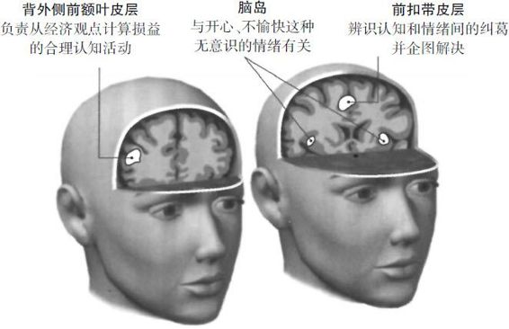

图8

## 了解别人的想法，再决定自己的做法

世界上最长的点球和刚才介绍的实验刻画出决策过程中特别重要的一个方面——“看穿”对方的心。要想了解这一特点，只需观察在这方面有严重缺陷的自闭症患者的行为即可。通常儿童在4岁至4岁半之间，看穿别人心思的能力会急速增强。

给4岁小朋友看一个牛奶糖盒子。在打开盒子之前，先问小朋友“里面有什么”，小朋友会回答“牛奶糖”。可是打开盒子之后，里面却放着铅笔。这时再问小朋友，“另一个正要从走廊进入房间的小朋友会认为盒子里有什么呢？”那个4岁的小朋友就像成人一样，会回答“牛奶糖”。

拿同样的问题测试不到4岁的小朋友或自闭症儿童（不限年龄），他们却会回答“铅笔”。既然走廊上的小朋友还没有走进房间，并不知道盒子里放着铅笔，那么理应认为牛奶糖盒子里放的是牛奶糖。

可是对于4岁以下或有自闭症的儿童来说，这种想法并非理所当然，他们甚至会觉得无法理解，因为他们无法站在别人的立场思考问题，无法掌握介于“牛奶糖盒子里放着铅笔”的客观事实和“不知情者会认为牛奶糖盒子里放着牛奶糖”的主观认知错误之间的差异。

专家也以小朋友为对象进行“最后通牒博弈”的实验，但把提供者和受益者一起分享的东西改为了牛奶糖。

实验证明，6岁以下的小朋友非常清楚，如果拒绝对方给自己的牛奶糖，两个人将什么也得不到，所以无论对方提出的分配比例多么不公平，作为受益者的他们都愿意接受。至于7岁以上的小孩，行为就会和成人一样。自闭症患者（不限年龄）的反应和6岁以下的小孩一样，比例再怎么不公平，他们都愿意接受。

自闭症患者无法看穿别人的心思，所以在“最后通牒博弈”中的反应比“一般人”来得合理。当他们是提供者时，只会分给对方一点点；当他们是受益者时，即使分到的比例少得可怜，也愿意接受。他们的反应与经济学教科书所描述的理性行为十分吻合。

即使在与这类博弈无关的诸多实验中，都显示出看穿别人内心是靠大脑的内侧前额叶皮层（medial
prefrontal cortex），更精确地说是布罗德曼第10区（Brodmann area
10）。这个部位不健全的人无法了解别人的想法。

诺贝尔奖得主弗农·史密斯（Vernon
Smith）和多年的工作伙伴凯文·麦凯布（Kevin
McCabe）携手合作，把这一结论应用在基于个人信任和合作关系的博弈中。

简单说明规则，参赛者甲可以选择只拿很少的钱，然后马上退出，结束博弈，也可以把机会交给参赛者乙。接着参赛者乙可以独享一笔不低的金额，然后退出，结束博弈，也可以再把机会交给参赛者甲。此时参赛者甲可以让双方都得到一笔不错的金额，再开心地结束博弈。

参赛者相信对方，认为对方应该会有合作的默契。假如在博弈中参赛者决定不马上退出，布罗德曼第10区会特别兴奋。不过，当参赛者面对同样的博弈时，可能因另一方换成计算机而出现不同的反应。如果对方是计算机而不是人，参赛者很清楚计算机没有公平或不公平可言，更不会故意羞辱人，所以他的大脑相关部位不会活动——他认为自己没必要去看穿计算机的心思。

换句话说，只有自闭症患者或大脑受到损伤的人，或是人在面对没有自我意识的对手时，才能完全按照经济学理论采取合理的行为。不过这并不是人的极限，而是经济学理论的极限。经济学应该更深入探讨人的大脑如何思考，只有深入了解这方面的知识，才能准确衡量人的期望与选择。

## 伸张正义的复仇带来快感

我们想惩罚行为不当的人，其实还出自一项动机——可以享受快感。这就好比看到令人垂涎的菜肴时、似乎有机会赚一笔钱时、做爱或吸毒之后，人会有出于本能的快感一样。

实验证明，人体的这种快感来自于大脑。产生快感时，大脑内控制喜悦、满足等情绪的部位会剧烈活动，该部位称为“纹状体”（Striatum）。

纹状体是基底神经节的主要组成部分，包括尾状核（Caudate
nucleus）、壳（Putamen），位于皮质底下深处，靠近脑干上方的脑中心。纹状体有丰富的多巴胺神经元，与边缘系统相接。这里是比新皮质演化起源更早的部位，负责处理精细的情绪。

专家早已知道，纹状体会受到药物中毒和喉咙疾病的影响。除此之外，这个部位还与“复仇的美妙滋味”有关。苏黎世大学的多米尼克·奎尔凡（Dominiquede
Quervain）和恩斯特·费尔（Ernst Fehr）以杰出的研究证明了这一结论。

事实是，大家都想惩罚那些违反社会规范的人，即使我们无法因此得到好处，甚至还得为此付出代价，但我们依然想惩罚那些做了不该做的事的人，只是单纯地为了享受惩罚他人带来的喜悦。

在这种情况下，合乎经济理论、出于自私考虑、让自己获得最大利益的念头完全消失了。专家通过观察人们的大脑深处还发现，我们也会为了别人、为了众人的幸福而惩罚他人以泄愤，即使因此伤害自己也在所不惜。

某瑞士学者曾进行实验，让人们玩“信任游戏”，在游戏过程中使用正电子断层造影（PET）研究参与者的大脑活动。

正电子断层造影是医学领域比较先进的临床检查影像技术，其大致方法是，利用核子医学技术，将含有释放正电子的放射性同位素物质投入血液中，通过观察该物质在人体代谢中的聚集，来反映生命代谢活动的情况，从而达到诊断的目的。这种技术很像功能性磁振造影，但精确度更高。不过，为了加强影像对比而会使用特殊液体，侵入性比较强。

该实验的研究成果斐然。这个“信任游戏”可以分别检视当人们完全信任对方时、当人们感到自己的信任未获回报时、当对方利用自己的信任时，双方各会有什么结果。该研究回答了我们的问题：当我们遭人利用时，我们会有什么反应？

“信任游戏”的过程大致如下：

甲和乙匿名对谈。两人各得到10美元，甲可以把钱留给自己，也可以给乙。如果选择后者，那么甲给乙的钱会扩大至原来的4倍。也就是说，假如甲把自己的10美元全部给乙，就会变成40美元。乙加上自己一开始就得到的10美元，将拥有50美元。

假如乙是值得信任的人，愿意和甲合作，最后可以与甲平分这笔钱。那么甲得到的就不是10美元，而是25美元，这对两人都有利。不过乙也可能不把钱分给甲，自己独吞50美元，这代表着甲遭到了乙的背叛。

我们想知道的是，当甲基于信任，把10美元给乙，结果却遭到对方背叛时，甲的大脑活动会出现什么样的变化。

实验的前提是，甲在遭到乙背叛后选择惩罚乙，并且每惩罚乙1次就意味着从乙身上拿走2美元。不过重点是，甲的钱并不会因此增加。

更有趣的实验版本是，甲的钱不但不会增加，甚至还会因惩罚乙而减少。也就是说，甲每惩罚乙1次，就从乙身上拿走2美元，而甲自己也会失去1美元。

请注意，这个游戏不会重复进行，因此甲并不是出于教导乙要合作的目的——以便下次玩游戏时彼此都能拿到更多钱——才惩罚乙。不过，甲应该会想通过惩罚给予乙“利他的”教训。

换句话说，甲惩罚乙，让乙知道如何与人合作，并不是为了甲自己，而是为了下次和乙一起玩游戏的人。甲出于这种理由惩罚乙，而享受惩罚乙带来的喜悦。

正电子断层造影分析的结果是什么呢？

在实验过程中，研究者发现，甲的纹状体后部的血流增加，代表着该部位的活动剧烈。这个部位能提前感受到对特定对象采取行动之后带来的喜悦。

除此之外，每当想到为了惩罚背信弃义的人，自己也付出极大的代价时，甲的纹状体的活动也会变得剧烈。换句话说，纹状体的反应和甲为了惩罚乙愿意支付的金额、惩罚乙能得到的喜悦呈正相关。虽然复仇未能给自己带来经济利益，但却能给自己带来强烈的喜悦感，否则在甲必须付出代价才能惩罚乙的游戏中，甲就不会甘冒经济损失之苦也要惩罚乙了。

在游戏过程中，甲的大脑内部不只纹状体活动剧烈，前额叶皮层和前扣带皮层也开始剧烈活动。

因为在甲的大脑内出现了认知上的纠葛——“更多的金钱损失”和“惩罚乙带来的快感”的交锋，所以与认知冲突有关的前扣带皮层的活动明显加剧。

前额叶皮层活动剧烈，间接证明甲出于利他目的的惩罚给自己带来了快感。假使惩罚别人不能带来快感，甲就不会愿意花钱惩罚乙，而前额叶皮层也根本不需要计算成本和收益。

最后，让我们从哲学角度思考神经科学对于了解人类社会行为的贡献。其实，在神经生理学实验中出现的“利他”概念，只是根据受试者的行为表现推导出的实验结论，与为他人着想的动机或意图无关。也就是说，从生物学观点看，判定某项行为是不是利他行为，只要看该行为是否让个人付出代价且有利于他人，而无关乎个人是否真的具备利他的意愿。

基于这个特殊的定义，虽然我们的大脑朝着利他的方向运作——惩罚破坏合作关系的个人，以便让受惩罚者在未来懂得与他人合作，但很显然，这种行为并非出于高贵的动机或崇高的人本思想，而只是为了满足利己的本能的喜悦。

这令人联想到亚当·斯密（Adam
Smith）在《国富论》中的知名论点：个人在追求自己的经济利益时，有一双“看不见的手”引导他朝着追求社会福祉的方向前进，即使这么做并非源自个人的动机。这种现象不只适用于追求个人的经济利益，也适用于即使蒙受金钱损失也要追求快乐的情况。

# 第16章　看穿人心的镜像游戏

你们愿意他人怎样待你们，

你们也要怎样待他人。

## 以神经生物学解释金钱游戏

神经元的运作机制对经济和政治的意义，可能预示着一个比亚当·斯密想象中更好的未来：大脑内的纹状体不仅在个人为了利他而惩罚他人时制造喜悦的情绪，甚至当我们仅因为信任他人而表现慷慨或助人为乐时，纹状体也会出现同样的反应。

实际上有实验证明，当人们主动与他人合作时，可以体验到快感和喜悦，并不是因为能得到金钱利益，而是因为彼此信任并回报对方的信任。实验所进行的信任游戏大致与前一章介绍的一样，在此不多详述，只要知道以下两点即可：

第一，游戏会不断重复。甲和乙都选择给对方钱，然后再分配，重复这个过程10次（而不只是1次）。

第二，实验中使用“双联结功能性磁振造影”（hyper-scan-fMRI）。该设备可以联结参赛双方的大脑影像一并分析，从中判别双方在产生信任或利他反应时的信号（而不只是看甲受骗之后的反应）。在双方轮流分配金钱几个回合之后，每个人自私或慷慨的倾向就会愈来愈明显。

加州理工学院的科林·凯莫勒（Colin
Camerer）和同事以48对夫妻为对象进行研究，证实大脑的尾状核会连续接收信息并加以记录。刚开始的信息与对方提供的金额的公平性有关，之后的信息则是对方是否诚恳地响应自己给予的信任。

人们通常依循“以眼还眼，以牙还牙”的原则行事，与愿意合作的人合作，与背信弃义的人反目成仇。不过，人们总是先表现出与对方合作的意愿，接下来就采取“以其人之道，还治其人之身”的策略，采用对方上一步的选择，在必要时惩罚对方，享受快感。

凯莫勒的研究还证实了这样一个事实：人们合作的意愿愈强（即愈相信对方，愈想分给对方比较多的钱），尾状核就愈兴奋。另外，只有在提供者表示愿意合作（增加给受益者的钱）之后经过一段时间，受益者心里才会产生信任感。但只要双方建立起初步的信任感，彼此信任的关系就会急速加深，最后甚至会先告知对方要分给对方多少钱。简单说来，愈相信对方，响应对方的信任时就会愈开心，决定要不要响应对方的信任所需的思考时间也会缩短。

美国加州大学的保罗·扎克通过一项人体激素与信任程度的研究发现，一种生殖激素——催产素（oxytocin）在人体内的含量极有可能直接影响到人们之间的信任关系。

当人们彼此间出现很强的社会联结时，催产素的分泌会增加（最明显的例子就是哺乳期的母婴关系）。通过测量信任游戏中参赛者体内的荷尔蒙发现，当受益者开始相信对方增加分享金额时，催产素的分泌显著增多了。

此外，积极响应他人的信任对于推动国家的经济发展也有重要影响。研究显示，国民互相信任和合作的程度愈高，国家就愈富有。

神经生物学对于信任感的研究成果，未来还可能会应用到政治决策上。知道大脑如何作决定有助于我们改善经济交易的规则，也能用来教导那些利己分子，了解互助合作对社会的益处。

总之，互相信任和合作不仅能带给人快感，还能促进国家的经济发展。我们的幸福来自于分享周围人的苦乐，没有人能把自己与他人完全隔绝。接下来，我们要探讨同理心，从神经元中再次读取耐人寻味的信息。

## 同理心来自镜像神经元

我们与他人之间的联结关系，比一般人想象的更加深刻（当然，若以只顾全自己、只追求自我利益最大化的“经济人”观点来看，是无法想象的），这种联结关系甚至已深植于大脑之中。更准确地说，是一种叫作“镜像神经元”（mirror
neuron）的神经细胞的作用创造了这种联结关系。

20世纪90年代，意大利神经生理学家贾科莫·里佐拉蒂（Giacomo
Rizzolatti）和他在帕尔玛大学的研究伙伴一同发现了镜像神经元。镜像神经元让我们得以了解自己和他人的动作、行为及心情之间的关联性，让我们能够辨认彼此行为的意义和动机。

如果人体没有镜像神经元的存在，那么即便我们看到他人的行为，也无法理解他人的动作意图和情感，无法与他人进行有效交流。

那么，镜像神经元是如何被发现的呢？

其实，里佐拉蒂的研究小组发现镜像神经元纯属意外。当时，里佐拉蒂和同事们正在研究大脑的运动皮层（motor
cortex），特别是其中的F5区域。通过对运动皮层的研究，他们希望能了解处于激活状态的神经元如何编写指令，以执行特定的动作。

为此，研究者们以恒河猴为对象进行观测，发现恒河猴大脑中的个别神经元不但在它作出动作时产生兴奋，而且看到别的猴子或人作相似的动作时也会兴奋。他们把这类像镜子一样可以在观察者的大脑中映射其他人的动作的神经元命名为镜像神经元。

后来，里佐拉蒂根据正电子断层造影技术得到的证据提出，人体大脑中的某些特殊部位也散布着镜像神经元，这就是我们能掌握他人的情绪反应并看穿他人内心的原因所在。

当我们察觉到他人的某种情绪，并自己亲身体验同样的情绪时，所刺激到的神经细胞就会开始剧烈活动。最具代表性的例子就是观赏电影或逼真的戏剧演出时，自己也仿佛成了剧中人。

能看穿别人的内心，好处多多。我们可以借此避开危险，在可能遭遇伤害时思考对策，也能与别人建立互信、互助、互爱的关系。连刚出生才几天的婴儿都能辨识母亲的表情是喜还是怒，并以婴儿独有的方式经予响应。

大脑到底是通过什么样的机制，让人得以洞悉他人表情（例如摆臭脸）背后的情绪呢？人体真的有像镜像神经元这种了解他人行为的情绪读取装置吗？

先前我们谈到脑岛。根据实验和临床数据显示，脑岛内（尤其是左侧的前脑岛）有共通的神经基质，当自己不开心或看到别人脸上显现出不高兴的表情时，这个区域便会开始剧烈活动。例如你在咖啡馆喝到又苦又涩的咖啡，或是你朋友喝到那杯咖啡、脸臭得连你都不开心时，同样的神经元就会开始活动。

目前已经证实，脑岛受损的患者无法感知别人的厌恶，但依然能辨识他人脸部表情的变化（如愤怒、害怕等）。除此之外，这种患者自身也无法表现出不高兴的情绪。

我们由此推测，脑岛可能是镜像机制的核心，将接收到的脸部表情的视觉信息解读为各种情绪。同时，脑岛也是统筹感觉信息和体内反应的中心。举例来说，若我们看到有人恶心想吐，也会跟着有想吐的感觉。大脑内有情绪的共鸣机制是很自然的，感同身受的能力是人际关系的基础。

看到别人幸福，自己也感到幸福时，大脑内相应的神经细胞就会跟着剧烈活动起来。不过，这并不代表人的行为出发点是为了别人的幸福。如果让他人幸福的利他行为就等同于让自己幸福的利己行为，这世界该有多么美好！

可惜的是，虽然神经生理机制让我们可以联结自己和别人的行为及情绪，让我们能够了解并感知别人的情感，却未必能让我们对别人产生同理心。

举例来说，当我们打网球赢了对手，即使对手还不到痛苦的程度，但至少也会心情低落，而我们未必能感同身受。我们当然可以凭本能察觉到对手心情不好，可是光靠镜像机制，还不足以让我们有感同身受的能力。

具体来说，假如对手是你本来就看不顺眼的人，当你看到他失望苦恼的样子，你甚至会幸灾乐祸。同样的，看到运气不好或垂头丧气的人，你能从他的肢体动作和言语表情中察觉到他的落寞，可是你未必会同情他，反而可能想着要尽快远离他。

通过专家进一步的研究，未来我们应该能更了解镜像神经元运作的机制。不过要知道，即使人们有能力察觉别人的心情，也未必会基于同理心采取行动。里佐拉蒂说得好：“镜像神经元的发现对社会有深远的意义，但必须从文化的层面去彰显。”

换句话说，大家必须奉行《马太福音》中的金科玉律：“你们愿意他人怎样待你们，你们也要怎样待他人。”很显然，这是一种建基于镜像神经元生物机制的正面作用的伦理道德规范，而且试图要削减此机制的负面作用。

然而，我们要如何判断伦理道德规范是否正确？伦理道德判断的背后隐藏着什么样的机制？大脑如何告诉我们在某些情况下应该怎么做才对？

接下来，让我们一起看看“神经伦理学”。情绪和理性之间永不止息的突触（synapse，两个神经元之间相互接触并借以传递信息的部位）传导游戏，将呈现出惊人的样貌。

## 道德判断的两难，大脑怎么说？

请思考以下这些两难问题。许多哲学家一直在关注这类问题，最近神科学专家也开始有所关注。

**问题68**

版本一：改变车道

现在有五个人在电车轨道上埋头修轨道，突然有一列电车开过来了，若不赶快阻止电车前进，这五个人都将丧命。

抢救这五个人的唯一方法是改变车行的轨道，让电车开上分轨。不过，这将会导致分轨上的另一个人丧生。

请问，改变车道是正确的做法吗？

有许多人回答“是”。也就是说，为了拯救五个人而牺牲一个人的做法，在道德上是可以接受的。

接着再想想其他的情况。

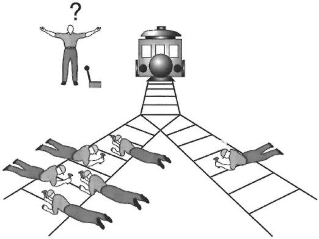

图9-1　改变车道是对的吗？

**问题69**

版本二：牺牲胖子

与版本一相同，有五个人在电车轨道上埋头修轨道，突然有一列电车开过来了，若不赶快阻止电车前进，这五个人都将丧命。

你站在天桥上看到了这一切，而电车现在正好要通过天桥正下方。你身边有个胖子，你马上想到，只要把这个人推下天桥，掉到轨道上，电车一定会停驶，那五个人也能因此得救。不过，掉下天桥的胖子肯定会没命。

请问，把身边的陌生人推下天桥是正确的做法吗？

大多数人认为，即使这样做可以抢救五个人的性命，也不能牺牲那个胖子。

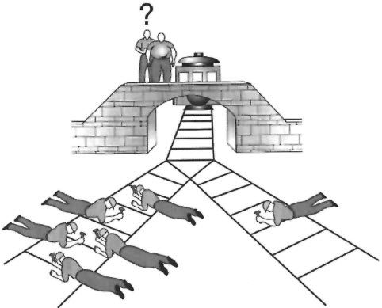

图9-2　把胖子推下天桥是对的吗？

为什么人们对这两道问题的答案会不一样？两种情况下的道德判断有什么不同？往下读之前，请先自己想一想。

哲学家的任务是：思考在这两种情况下，当事人应该根据什么原则行事才算正确。有人依据德国古典哲学创始人伊曼努尔·康德（Immanuel
Kant）的论点，主张不该利用别人去救人。在版本二中，为了阻止电车前进而利用身旁的陌生人，属于积极介入，牺牲胖子成了用来救人的方法。而在版本一中，分轨上的那个人丧生只不过是人为介入之后连带造成的后果，那个人的死亡比较像是因车祸丧生。

这只不过是举例，除此之外还有许多类似的例子。有趣的是，无论人们用什么理由正当化自己的决定，对道德的直觉判断似乎具有跨文化的普遍性。演化学家马克·豪泽（Marc
Hauser）是灵长类认知神经科学研究所所长，也是哈佛大学心理学家。他在2003年进行过一项研究，试图证实这个现象。

豪泽通过网络进行道德感测验，搜集大量数据，探讨年龄、性别、出身、文化、宗教、教育、工作经验等背景各不相同的人，如何判断事物的对错，理由是什么。参加测验的人必须回答一连串两难的道德问题，思考每道问题的道德面，并设法进行解决。

测验结果显示，人们的道德感一点也不“合理”，虽然有一部分原因是受到教育、文化和社会进步的影响，但在本质上却是无意识、无意志、全球共通的。

我们想知道大脑如何解决改变车道和牺牲胖子救人的问题。普林斯顿大学神经科学家乔舒亚·葛林（Joshua
Greene）提出大胆的假说，认为这两道问题的答案之所以不同，原因在于情感。道德判断牵涉到认知和情感的机制，而这两者和大脑特定的区域有关。

把胖子推下天桥致死所造成的情感冲击，远大于改变车道的做法，因此导致人们在两道问题中的道德判断出现了差异。当某件事就在眼前、自己无法置身事外时，我们会表现出无意识的、原始的、本能的反应——葛林认为这是演化上的适应过程。然而，当我们得以置身事外、能保持一定距离时，我们的想法就会变得比较抽象，此时认知的焦点也将集中于衡量成本和报酬，进行冷静合理的分析，所以认为失去五条人命当然不如失去一条人命。

为了验证自己的假说是否正确，葛林和研究伙伴进行了一项实验：请受试者回答上述两道问题，同时以核磁共振摄影观察他们的脑内活动。如果受试者在回答版本二的问题时，与情绪有关的部位的活动比较剧烈，就意味着葛林的假说是正确的。

实验结果一如预期。牺牲胖子的问题会促使受试者内侧额叶皮层（medial frontal
cortex）的神经元活化，而改变车道的问题则会促使额叶后外侧皮层的神经元活化——我们之前已经介绍过，这个部位在处理与道德无关的抽象问题时，会产生剧烈活动。

实验还发现，受试者在回答问题时，情绪和理性会一再出现不一致的情况。请大家先了解，神经系统所引发的情绪反应会在瞬间直接发生，但是当直觉的判断经过大脑的分析思考，反应所需的时间当然会变长——例如要在版本二中判断死一个人总比死五个人好，所以把胖子推下天桥在道德上并没有错。

专家证实，在这种情况下，判断该做法正确所需的时间比判断该做法不正确所需的时间更长。理由很简单，刚开始情感直觉说“不正确”，之后负责调整认知、从功利角度计算损益的神经元开始活动，然后改变原来的判断。大脑要经历两个阶段，反应时间也就会相应地延长两倍。

研究者将神经元视为道德决策的基础进行研究之后，证实情感和情绪在道德判断的过程中扮演着重要的角色。正如斯大林所言：“一个人的死是悲剧，一百万人的死只是统计数字。”实验的结果令人不禁深思这句骇人名言的意涵。

接下来，我们要将目光由伦理道德难题转向神经生物学问题。神经元、情感和认知携手合作，构成了不可忽视的决策过程。我将在下一章介绍一个著名的关于25岁年轻人菲尼亚斯·盖奇（Phinius
Gage）的故事，带领大家从神经生物学观点探讨合理性。

# 第17章　情感与理性的角力

正确的决定必须与将决定刻画在心里的情绪相联结，

才能留在记忆中，

未来才能根据过去的经验和知识行事。

## 理性是有极限的

1848年，发生在美国佛蒙特州铁路工地上的一件奇事，彻底改变了人们对大脑机能的认识。

盖奇是铁路建筑工程队的一名领班，他的工作是炸掉铁路铺设沿途中阻塞通道的岩石。1848年9月13日下午，正当盖奇用一根铁棒把甘油炸药填塞到岩石孔中的时候，一颗火星意外地点燃了炸药。

提前引爆的甘油炸药并没有将岩石爆开，但是重6公斤、长110厘米、直径3厘米的铁棒却像个火箭筒似的从盖奇的左颧骨下方穿入头部，然后从头顶飞出，落在身后30米远的地方。盖奇轰然倒地，血流满面，浑身抽搐，不省人事。

人们都以为盖奇完了。没想到，几分钟后，奇迹发生了——盖奇一骨碌爬了起来，居然神志清醒，说话自如。住院治疗10周之后，体力逐渐恢复的盖奇回到了铁路工地，他又可以工作了。

但不久以后，人们发现盖奇的性格和脾气全变了。受伤之前，盖奇是一个非常有能力、有效率的领班，思维机敏、灵活，待人和善、彬彬有礼。但伤愈后的盖奇却变得粗俗无礼，对事情缺乏耐心，既顽固、任性，又反复无常、优柔寡断。正如他的朋友们所说：“他不再是盖奇了。”

几年以后，盖奇的健康状况开始恶化，1860年2月癫痫发作，同年5月21日，盖奇去世。

盖奇在遭受严重的脑损伤后竟奇迹般地存活了13年之久，成为了世界上最著名的脑损伤患者之一。盖奇死后，他的头骨被陈列在哈佛大学医学院沃伦解剖学博物馆，旁边还放着那根闯祸的铁棒。

盖奇事件说明，脑损伤虽然对人的视觉、听觉、触觉等没有什么严重的影响，但却可能使人的脾气、秉性、待人接物的方式、看待周围事物的态度等发生巨大的变化。

爱荷华大学的安东尼奥·达马西奥（Antonio
Damasio）和哈佛大学的艾伯特·迦拉布达（Albert
Galaburda）以3D立体影像重现盖奇大脑的损伤。他们推测，受损的区域是两个半脑的前额叶皮层（更精确地说是腹内侧部位），并推断后外侧部位勉强无伤。

通过对其他堪称“现代盖奇”的前额叶腹内侧皮层损伤患者的研究以及大量的动物实验，专家找到许多新发现。这些人的智力和逻辑推理能力没有变化，记忆力测试结果正常，视力正常，手部动作也正常。但是，在日常生活中他们缺乏决策能力——判断能力、计划能力和内省能力明显衰退，情感活动也大幅减少——极度冷漠，对什么都漠不关心，毫无兴趣，不在乎自己的衣着、举止，做事马马虎虎，生活近乎一片空白。

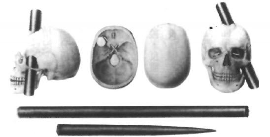

图10　盖奇的头盖骨和贯穿头骨的铁棒

达马西奥才华横溢，他以生动的文笔描述了因肿瘤切除手术导致前额叶皮层损伤患者的前后变化。

在手术前，艾略特待人温和，个性沉稳，极富魅力，又懂得很好地掌控情绪。他有涵养、懂礼貌，即使偶尔露出带点讽刺意味的微笑，也只是流露出他过人的知性，犹如对愚蠢世人的一抹同情；他从容、淡定，即使谈到自己不成功的经历，也不会情绪失控……艾略特在贸易公司上班，他一向是好丈夫、好爸爸，兄弟姐妹和同事朋友都视他为学习榜样。

但手术后，艾略特像变了一个人似的。在安排工作或生活计划时，他不能面面俱到，常常丢三落四；当必须停下某项工作、先做其他工作时，他转身就忘，然后自顾自地继续刚开始的工作……此时的艾略特已无法胜任现在的工作岗位……他把所有积蓄投入到不可能成功的生意中，弄得血本无归。

家人和朋友都难以理解，为什么艾略特会投资那样的生意。他们同样搞不明白，为什么一向聪明、行事谨慎的艾略特，会作出如此之多的愚蠢行为。因为受不了艾略特的巨大转变，朋友疏远了他，妻子离开了他。现在的艾略特没有稳定收入，整天四处闲晃。

通过观察这起病例和其他诸多例子，达马西奥发现，受到损伤的大脑部位是理性（在情感的辅助下）完整发挥其决策能力不可或缺的神经细胞所在的部位。

达马西奥说：“我本来就认为，情感和情绪的缺陷不只是碰巧和社会行为缺陷一起出现。观察艾略特思考时表现出的冷静态度之后，我觉得，他无法赋予每一个选择以个别的意义，该决定的事情全都难分高下。”

假如达马西奥的这一看法正确无误，那么盖奇和艾略特会如何回答上一章的伦理道德问题呢？把胖子推下天桥令人不舒服，是因为激发了人在情感上的剧烈反应，但如果是前额叶腹内侧皮层损伤患者，应该不会拒绝这么做。在他们眼中，为了挽救五个人的生命而把一个人推下天桥，无论从哪个角度看都没有错。牺牲胖子这种极端做法与改变车道这种一般做法对他们而言，并没有什么不同。

## 情感是不可或缺的助力

如何判断达马西奥的看法是否正确？在判断之前，我们必须通过实验，分辨出前额叶腹内侧皮层损伤患者和大脑健全的一般人有什么不同，这样才能厘清情感在决策过程中扮演着什么样的角色。

达马西奥和同事安托万·贝沙拉（Antoine
Bechara）在爱荷华大学进行实验，因此该实验被称为“爱荷华博弈任务”（Iowa
Gambling Task）。实验规则如下：

在受试者面前有A、B、C、D四叠扑克牌和2000美元，每张牌上都写着“赢多少钱”或“输多少钱”。受试者要从四叠牌中不断翻牌，尽最大可能赚钱。

但是，四叠牌并不是随意摆放的，而是经过研究者精心设计的。其中有两叠牌（比如A和B）的风险较大，赢得多（每张最多赢100美元），输得也多（每张最多输1250美元）；另外两叠牌（比如C和D）相对比较保守，尽管赢得少（每张最多赢50美元），但几乎不会输，如果只从这两叠牌中翻牌，保证只赚不赔。整体而言，A和B是“坏牌”，C和D是“好牌”。

如果不曾有铁棒刺穿你的头部，导致前额叶腹内侧皮层受损，你应该会像大多数人一样，尝试翻看各叠牌（因为没有理由偏向任何一叠牌），从中寻找赢钱最多的那叠牌。通常翻看40～50张牌之后，你就会发现哪两叠是“好牌”，然后会尽量选择翻看那两叠牌。即使喜欢冒险，你也顶多偶尔从那两叠“坏牌”中翻翻看，但愈靠近尾声，选择翻“坏牌”的次数愈少。不过，前额叶腹内侧皮层损伤患者却没有这种明显的倾向，他们一直一会儿翻看这叠牌，一会儿翻看那叠牌，没有特别偏向哪一叠。

这项实验设计得很好，非常“符合现实”。受试者在游戏过程中无法清楚掌握自己赚赔多少。这就像真实生活一样，受试者的知识包括外界的客观信息，也包括面对赚赔和风险时体内散发的主观信息。随着游戏进行，受试者会逐渐注意到某一叠牌比其他叠更有利。这是当事者尚未有明确倾向的阶段，他们尚未刻意预测某一叠牌的结果。

在实验过程中，研究者利用皮肤导电性侦测装置就可轻易测量受试者的情绪反应。在受试者的皮肤表面设定一对电极，将电极的另一端连到波动监视器上。当与情绪有关的神经细胞发生变化时，自律神经系统就会促进排汗，电流通过人体时电阻降低，以此测知身体的变化。也就是说，皮肤导电水平愈高，意味着受试者愈紧张焦虑。

研究发现，大脑健全的一般人会出现明显的情绪反应——仅仅从“坏牌”中翻看10张牌之后，他们再次将手伸向那叠“坏牌”时，都会紧张不安。至于大脑前额叶腹内侧皮层受到损伤的人，也像大脑健全的人一样想要获利，并且了解游戏的逻辑，可是他们从“坏牌”中翻看10张牌之后，再次从“坏牌”中翻牌时依然很镇定。

也就是说，前额叶腹内侧皮层受到损伤的人不能将“坏牌”与自己的消极情绪联系起来——他们没有显示出任何紧张的迹象。所以，相较于大脑健全的人，前额叶腹内侧皮层损伤患者的变化曲线很平缓，代表着他们的情绪反应非常微弱。

艾略特也参加了这项实验。达马西奥在实验报告中写道：“艾略特经常说自己是不适合冒险、行事谨慎的人，但他在实验中的表现却并非如此……尽管在实验结束后，艾略特知道哪叠牌比较危险，哪叠牌比较不危险，但是几个月之后，改变每叠牌的条件重新测验，艾略特又像上次一样，不停地在四叠牌中选来选去。”

这究竟是怎么一回事？当眼前的事物有几种不同的可能时，只要靠着冷静判断、逻辑运算，应该就能慢慢朝向最好的选择。但为什么会有许多人做不到呢？

大家或许认为，为了做出合理性的判断，人们最好在思考过程中摒除情绪因素。不过，达马西奥提出，情绪是自然的警告信号，“当你选择了可能会导致危险结果的选项时，它可以给你及时的提醒。”无意识的（或者潜意识的）情绪会引导我们选择有利的选项，远离错误的行为（这称为“躯体标记假说”<a href="#part0035_split_002.html_ch1"
id="part0035_split_002.html_ch1-back">［1］</a>）。

前额叶腹内侧皮层损伤患者的情感活动大幅减少，无法在体内产生危险的“内在演示”，所以没有出现相应的趋利避害的“本能感觉”。虽然在抽象层面他们完全清楚哪个选项是正确的，但却缺乏与客观理解相呼应的内在感觉，所以就算选项正确也没有意义，因为他们无法将正确理解化为有效行为。缺乏情绪纽带，无法将选择变成有意义的行为，会让人马上忘记该选择的过程，无法使之延伸为“将来的记忆”。

正确的决定必须与将决定刻画在心里的情绪相联结，才能留在记忆中，未来才能根据过去的经验和知识行事。因此，情绪和与之相关的神经细胞的活动在决策过程中扮演着不可或缺的角色——它们是强化记忆的装置，用来维持有效记忆，并将记忆化为通往未来前景的力量。

简言之，徒有熟知个人偏好和标准的理性知识，还不足以协助人作出正确的判断，而必须同时具有与该理性相连系的情绪才行。引用达马西奥的话，就是“理性这种脆弱的手段需要特别的助力”。“纯粹理性”要执行计划，必须靠本能的机制、靠“支持理性的神经细胞”的帮助才行。

**注释：**

<a href="#part0035_split_002.html_ch1-back"
id="part0035_split_002.html_ch1">［1］</a> 躯体标记假说（Somatic Marker
Hypothesis）是美国著名神经学家达马西奥研究前额叶腹内侧皮层损伤患者的行为之后提出的假说。在接触某些信息之后，人可能会心跳加快或口干舌燥。同样的，人的内脏、肌肉和血管也会有反应。这些刺激唤起的身体情绪会引发人的“直觉”。前额叶腹内侧皮层会衡量该刺激是“好”或“坏”，提高决策效率。这和经济学家特沃斯基与心理学家卡纳曼研究的“捷思”有明显的共通点。

## 人与鸽子的相似处

在某些情况下，尤其在社会生活中，人的合理行为少不了无意识情感的帮助。然而，有时候情感也会妨碍认知活动，让人作出不合理的决策。可以说，情感是一面双刃剑，对于合理性可能有益，也可能有害。唯有当情感和决策都朝着同样的方向，情感和决策的内容才会吻合。当决策内容与情感互不兼容时，本能的情绪反应可能会妨碍你得到幸福。

请看下面这则出自《伊索寓言》的著名故事《蝉和蚂蚁》。

某一个冬日，蚂蚁正在忙着晾晒受了潮的谷子。有一只蝉飞过来，流着眼泪说：“小蚂蚁，求求你，给我点食物吧！”

蚂蚁问它：“你夏天干什么去了？为什么不积存一点吃的呢？”

蝉回答说：“那时我一点时间都没有，每天要忙着唱美妙动听的歌。”

蚂蚁嘲笑它说：“哦，是吗？那很好呀！既然你夏天要唱歌，冬天不妨跳跳舞吧！”

开始戒烟或节食时、储备养老金时、考虑某只股票现在的买进成本和将来的卖出利润时，我们身上或多或少有蝉或蚂蚁的影子。有些人像蝉，有些人像蚂蚁。

《伊索寓言》中的小故事所揭示的道理很清楚，而有了神经科学之后就更清楚了：蝉的行为和蚂蚁的行为会活化大脑内两个不同的部位，分别为边缘系统和背外侧前额叶皮层。这是动物学告诉我们的新发现，后面还会有鸽子登场。

在我进一步说明之前，先假设你是“老烟枪”。因为吸咽有害健康，所以你决定从今天开始戒烟。然而，和你一起喝咖啡的朋友掏出一根烟递给你，你应该说：“谢谢，可惜我已经戒烟了。”但是话到嘴边又咽下去了，因为你闻到了香烟的味道，想起了第一根烟令你飘飘然的感觉。“就抽一根又何妨，明天再开始戒烟吧！”于是，你接过朋友递来的烟抽了起来。

戒烟者当中有81％的人在一个月内重拾香烟。为什么？为什么要学习蝉的行为，为了一时的快乐而断送一生的健康？大家不是应该谨遵经济学原理的教诲，行为一致，选择能带给自己最大利益的选项吗？

问题可不像你想的这么单纯。如果我们把问题改成赌注又会怎么样？请看以下的例子。

**问题70**

A．立刻赢得1000美元。

B．一星期后赢得1100美元。

请问，你会选择哪一项？

**问题71**

A\*一年后赢得1000美元。

B\*一年零一星期后赢得1100美元。

请问，你会选择哪一项？

许多人在“问题70”中选择A，在“问题71”中选择B\*。其实，两道问题的实质是相同的，都是只要多等一星期，就能多赢100美元，但人们给出的答案却并不一致。似乎眼前的一星期太长了，我们不想等，迫切地想立刻得到1000美元，而一年后的1000美元看起来就像打了折扣似的，我们宁肯选择多等一星期以多得到100美元。之所以出现矛盾的答案，是因为人们认为现金随着时间的推移会贬值。

为了更好地了解人类的这一行为机制，让我们仔细观察鸽子的行为和大脑（以鸽子为实验对象的相关研究，已经有很长的历史了）。

在实验中，鸽子会面临一个与上述情况十分相似的问题。实验者把一只饥饿的鸽子放进鸟笼，鸟笼里面设有A、B两个把手。若按下把手，鸟笼壁就会打开一个洞，从外面传饲料进来。不过，按下把手A或把手B之后等待洞打开的时间和传进鸟笼的饲料量是不同的。

假如鸽子按下把手A，几秒内洞就会打开，然后很快又关上，鸽子只能吃到很少的饲料（就像“问题70”的选项A）；假如鸽子按下把手B，需要等待一段时间洞才会打开，不过传进来的饲料量会比较多（就像“问题70”的选项B）。

为了了解鸽子如何应对等待时间和饲料量的变化，实验者精心设计了按下把手到出现饲料的时间。假如按下把手A和把手B之后等待的时间一样长，肚子虽饿但脑子并不笨的鸽子就会选择按下饲料量比较多的把手B。可是，当实验者逐渐延长（差距以秒为单位）按下把手B之后的等待时间时，即使传进鸟笼里的饲料量愈来愈多，鸽子也显得愈来愈没有兴致，最后宁可选择按下马上吃得到很少饲料的把手A。

人类所面对的报酬种类和数量与鸽子并不相同，但说到缺乏忍耐性这个特点，人倒是与鸽子及其他动物没什么两样。

把未来的价值打折扣并非不合理的想法。现在立刻拿到手的东西才稳当，至于未来，谁知道会发生什么事。不过，将未来的价值打折扣时，应该遵照一定的比例原则。按理说，随着等待时间的延长，折扣应该稳定增加才对，但实际情况并非如此。我们就像鸽子一样，有过度折扣的习惯，对于“很少、可是现在就有”与“很多、可是以后才有”两者的合理思考，在碰到眼前现成可得的报酬时会发生大逆转。也就是说，假如现在立刻能得到报酬，我们就会将自己对未来价值的合理思考抛在脑后，不会选择要等很久之后才能得到的更大利益。

作为鸟类的鸽子的脑和哺乳类动物的脑，虽然于二亿八千万年前在演化史上早就分化了，但是从鸽子脑的研究结果中，我们仍可以看出应该注意人脑的哪个部位。通过观察鸽子在鸟笼里按把手的行为，我们了解到以下特性。一群神经元（鸽子大脑的纹状体的一部分，鸟类的纹状体相当于哺乳类的大脑皮层）会根据等待时间和报酬的关系，呈现出不同的活动方式。若等待时间相同，按下把手B的报酬愈来愈多时，神经元的活动愈来愈剧烈。相反的，若报酬保持不变，等待时间变长时，神经元的活动会减弱。由此说明，神经元会赋予各个选项不同的主观价值，在报酬和等待时间之间取舍衡量。

人脑没有鸽子脑的纹状体，也不能在人脑的神经元里植入电极作测量，不过只要利用医学显像技术，就能间接看出人的大脑内部的变化。以下列举的例子与时间偏好有关。

实际上，很早之前就有研究团队进行过这项实验，研究成员包括普林斯顿大学的塞缪尔·麦克卢（Samuel
McClure）和乔纳森·科恩（Jonathan Cohen）、哈佛大学的大卫·赖伯森（David
Laibson），以及卡内基大学的乔治·罗文斯坦（George
Lowenstein）。他们在《科学》期刊上发表了耐人寻味的报道，来说明戒烟为什么难如登天。

他们特别注意到，当人想解决刚才的选择问题时，脑内会有两种不同的神经组织开始竞争。第一种神经组织（可以说是蝉）随着纹状体活化，使你迫不及待地想扑向那笔可以立刻获得的报酬。这种神经组织多存在于人脑的边缘系统，该部位和喜悦、报酬有关，多巴胺神经传导物质活动剧烈，而边缘系统的内侧前额叶皮层也跟着活化。第二种神经组织（可以说是蚂蚁）随着纹状体活化，协调人的本能欲望，促使你作出谨慎合理的决策。这种神经组织多存在于人的前额叶皮层（尤其是后外侧部及右眼窝部）。

简言之，这两种神经组织的活动和个人的决策关系密切。若边缘系统的神经组织活动比较剧烈，人就会选择马上接受1000美元；若前额叶皮层的神经组织活动比较剧烈，理性就会压抑本能欲望，不马上接受1000美元，而选择将来多拿一点（一星期后得到1100美元）。

所以，在戒烟当天又抽“最后一根烟”其实很正常。不过我们确实能在某些情况下压抑冲动，作出合理的决策。如果想知道为什么，就得追溯到柏拉图的时代。

# 第18章　太有人性的大脑

合理性和情感并非互相对立，而是相辅相成的。

因此，合理的人并不是不带情感的人，

而是懂得操控情感的人。

## 情感如同不易驾驭的黑马

柏拉图认为，人的头脑是轻快的双头马车——白马优雅温驯，黑马则不情愿地拖着脚步。柏拉图对话录《斐德罗篇》中提到：

“白马体态俊美，挺着身子，拉直颈部，嗅觉敏锐，毛发白净，双眼黑亮，守礼而谨慎，志气高昂，不需鞭策，只要一声令下它便开始拉车。黑马却相反，体态肥胖，其貌不扬，脖子粗短，鼻子扁，毛发杂黑，灰暗的双眼带着血丝，态度傲慢粗暴，耳边杂毛多，叛逆，得用鞭子和棍棒才能勉强让它听命。”

柏拉图认为，驾驶马车的工作“困难且令人不快”。

根据柏拉图对这一比喻的解释，白马代表着演化到最高境界的人的认知能力，黑马则代表着与身体直接相连的人的原始情感。在柏拉图之后的某位哲学家认为，白马顶多是一匹小马，无法与精力旺盛又威猛的黑马相对抗。

法国哲学家布莱兹·帕斯卡尔（Blaise
Pascal）也支持这个论点，他认为，“人的内心有理性不了解的道理”。苏格兰哲学家大卫·休谟（David
Hume）也说：“理性只不过是情感的奴隶。”

不过，达马西奥通过观察盖奇和艾略特的病例证实，合理性是由躯体标记形成的。理性要作出谨慎的选择，必须仰赖内心的某种情感。也就是说，白马必须依靠黑马才能完成工作。可是在日常的经济活动中，情感有时会扭曲决策的过程，所以我们提议，应该给白马一点掌控权。

在理性和情感永无止境的拔河中，影响合理性的细腻的神经生物学的作用多半还是一个谜。柏拉图的比喻并不能令我们满意，我们还得看看最新的发现。虽然当中还有许多未知，但至少专家学者已经看清楚其中的一部分。依循既有的研究成果，我们也能在经济行为分析领域看到新的曙光。

神经经济学应运而生。神经经济学不单单是头脑经济学（以数学和经济学的模型厘清神经元的功能），它还从神经生物学的理论出发，试图建构经济决策的理论。

想知道特定情感如何影响身体的生理参数，首先要认识自律神经系统。

自律神经系统包括有扁桃体的边缘系统里的控制中枢、从脑干和脊髓中枢延伸到身体内脏和血管的两种神经——交感神经和副交感神经。心脏、肺、肠、生殖器官和皮肤，都能回应自律神经系统。从演化观点看来，人脑的这些部位与比较低等的生物控制经济效益的部位一样。

其次，我们必须区分无意识过程和管理过程，区分情绪和认知（也就是情感和理性）。

大脑有很大一部分神经细胞用于支持无意识过程。无意识过程又称为“不深入思考的怠慢方式”，大脑在此时处于高速运转状态。另外，无意识过程能高度分工却不易变通，很难靠意志管控。无意识过程几乎不需付出努力，合乎经济效益。相反的，管理过程靠意志启动，属于连续工作，虽然耗时，却能变通。大脑能通过自我分析对整个过程进行管理。管理过程按照逻辑分析一步一步推进，必须付出努力。

我们日常的活动就是这两种过程交替进行的结果。只要锁定脑内活动的部位，就能区分这两种过程（但精准度有限）。构成大脑的神经元网络在决策时需要进行细腻的认知过程，所以要具体表示这段过程并不容易。不过，大脑显像技术为我们清楚呈现了各个过程牵涉到哪个神经元区域。但不需多说大家也能想象，这是多么费功夫的研究工作。

谈论人脑的功能，等于是推论显微镜下数百亿个神经元的复杂回路。神经元之间通过数百亿个突触（synapse）相互联结，构成回路，总长度达数十万千米。人脑的活动以神经元网络的交互作用为基础，但专家尚未完全掌握其整体构造。我们在谈论“脑的地图”和“脑的地理”时，必须时时记住：即使画出了地图，天真地指定某个部位负责某种功能，也很难把大脑的某个认知或行为归纳到某一个特定的神经元集团。

不过研究者已经在某些方面存在共识，比如无意识过程主要牵涉到下部皮层和后部皮层，尤其需要指出的是，情绪与边缘系统的结构有关。（柏拉图的黑马？）边缘系统作为处理中枢，掌管着有关恐惧的记忆与情绪反应（杏仁核）、报酬（纹状体），以及其他涉及行为与记忆历程的情绪与动机层面的神经组织（脑岛、海马体、中隔、视床、前扣带皮层等）。

至于解决问题、拟定策略、事后追踪的“管理过程”，会活化前额叶皮层前部和后外侧部，以及顶叶（Parietal
Lobe）后部皮层。前额叶扮演的角色类似于“交响乐团的总指挥”，接收并汇总来自大脑所有部位的信息。在精细的新皮质中，前额叶算是特别优秀的部位，（柏拉图的白马？）是脑系统发育中最后出现、个体发育中成熟最迟的神经组织，也是演化过程中体积增加最多的系统（请参照图11）。

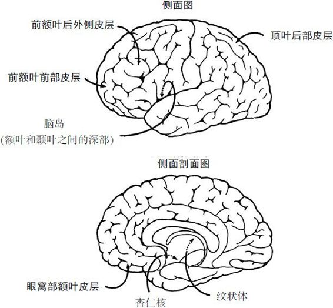

图11　负责“经济”活动的大脑部位。粗体字的部分和高级认知过程有关，非粗体字的部分和情感状态有关。决策时两者都会活动。

假如我们的大脑只有前额叶皮层，脑中只进行深思熟虑的思考过程，那么新古典主义经济模型就能完美描述我们的行为。可是这样一来，我们也不再是普通的人，而是像《星舰迷航记》中的史巴克博士一样，表现得非常理性、极度冷血。

不过实际情况并非电影情节，我们不但不是火星人，还是“有人性的，甚至太有人性”的生物。我们的大脑除了进行深思熟虑的思考过程，还有本书介绍的“捷思”和思考快捷方式组成的“无意识认知”。

所以，除了愤怒、恐惧、忌妒、羡慕的情感之外，大脑还会产生自己难以控制的悲伤、喜悦、饥饿、口渴、性欲，以及对冒险、吸毒的强烈欲望。

日常生活中的决策是无意识过程和管理过程（也就是情绪和认知）来回拉锯的结果，有时候决策会违反史巴克博士的经济学，甚至没机会拉锯，因为情感迅速通过神经的“捷思”方式，根本不需通过新皮质。

约瑟夫·勒杜（Joseph
LeDoux）长期研究兔子的杏仁核和新皮质的关系，他在著作《脑中有情——奥妙的理性与感性》中谈到，根据观察结果，兔子和其他许多动物一样，在新皮质来不及有意识地处理感觉所捕捉到的信息之前，就已经出现情绪性的反应。

比如，兔子尚未了解“察觉到危险之后应该感到恐惧”，身体就已经出现恐惧反应。面对应该处理的特殊刺激时迅速作出反应，是神经元回路内的机制。

视床是分解、读取刚接收到的信息并管理情绪的部位，勒杜发现兔子的视床和杏仁核直接相连。杏仁核会将视床接收到的信息贴上相应的情绪标签，所以不一定要让信息通过新皮质，毕竟新皮质的任务是接收比较复杂的信息，进行冷静的判断。

不过在大多数情况下，人的行为取决于情绪和认知机制的交互作用，即人的行为是对应的大脑部位突触拉锯的结果。这可以从两个方面来讲：

一方面，情感会主导决策过程，盖奇和艾略特的行为就是最好的例子，所以要作出适当的决策，不仅认知上必须知道自己应该怎么做，身体也必须感受得到；

另一方面，根据人体内的神经回路程序，当理性和情感对立矛盾的时候，情感通常会占上风。比如思考该花钱还是该存养老金、该吃薯片还是该保护动脉将来的健康时，理性通常会输给情感，从而选择花钱、吃薯片。

## 刷卡付费减轻了神经系统的痛苦

神经经济学能告诉我们许多有趣的发现，有的甚至会颠覆我们的常识。比如，一般人认为一笔钱的价值取决于它能买到的东西，也就是用那笔钱买来的东西所创造的喜悦程度。然而从神经生理学的角度看来并非如此。金钱本身就能给人带来喜悦。

实际上，金钱能让大脑的纹状体下部皮层剧烈活动。“喜悦的多巴胺回路”会因为美食和毒品（尤其是可卡因）产生兴奋感，也会因为金钱而立刻感到满足，有钱人也会成为工作狂的原因即在于此，就像染上毒瘾的症状一样。

如果金钱本身就能让人开心，那么掏出钞票就一定令人痛苦。所以大家喜欢用信用卡付各种费用，以减少直接掏钱带来的痛苦感。拿出钱包、一张一张地数钞票、准备向这些钱说再见的痛苦，绝不是拿出漂亮塑料卡（信用卡）的痛苦所能比拟的。

通过观察神经元的活动，我们发现，纹状体不仅在我们拥有金钱时会有所反应，在我们觉得可以赚钱时也会出现反应，而且反应的剧烈程度与金钱数额成正比——金额愈高，该部位的神经元活动愈激烈。可是，在我们预测可能亏钱时，纹状体并不会有反应。对于亏损感到“兴奋”的是完全不同的部位，也就是对恐惧和危险迹象有反应的杏仁核。各位知道，我们赋予利益和损失的价值并不是一成不变的，观察大脑也能看出这种现象。

此外，我们由金钱直接感受到的喜悦程度，还与得到钱的方式有关。根据核磁共振摄影图像显示，假如金额相同，自己赚来的钱能让大脑内掌管报酬的部位活动更剧烈，其程度大大超过中彩票或从别人那儿得到钱的情况。大家都知道，辛辛苦苦赚来的血汗钱最让人有成就感。大脑也深知这一点，所以懂得根据钱的来路判断钱的价值高低。

神经生物学家通过观察人们对风险的情绪反应，得到一个有趣的发现——情感在面对风险时，总会表现出一些固定的变化。比如发怒和愤慨能激发人勇敢面对危险，降低恐惧；而悲伤和忧郁则加深我们的恐惧感。所以，加强掌控危险的能力，增加对风险的厌恶，会使我们在决策时变得更加谨慎。

恐惧可以让我们远离风险。恐惧是与大脑杏仁核相连的一种情感，杏仁核不断过滤外来的危险信息，活化无意识过程。可是新皮质也会传来指令，增强或修正无意识反应。杏仁核可说是情感记忆的保管处，假如这个部位和大脑的其他部位分离，我们将无法掌握发生的事情在情感上的意义。如果没有杏仁核，我们的情绪将无法作用。例如切除动物的杏仁核之后，动物再也无法感到愤怒或恐惧。

由于杏仁核与区分情绪和认知的机制有关，所以它理所当然地成为了许多实验的研究对象。接着我们刚才介绍的兔子实验谈下去。

勒杜在兔子（杏仁核正常的兔子）听到声音之后就对其施以电击，不断重复同样的过程。不久之后，声音和电击互相联结，兔子只要一听到声音就会害怕得跳起来。勒杜利用声音让兔子对恐惧产生了制约反应。

后来，勒杜让兔子听同样的声音，但是不施予电击刺激。如此不断重复之后，兔子对恐惧的制约反应又消失了。这一现象可以有两种解释：第一种是，杏仁核内有关声音和痛苦的关联记忆已经消失；第二种是，新皮质将适合新状况的反应覆盖到原有的记忆上，修正了原本制约的反应。

要想知道这两种解释哪种正确，就必须思考杏仁核和新皮质之间的关系，也就是无意识过程和管理过程的关系。为了找到答案，勒杜剪断了联结兔子的杏仁核和新皮质之间的神经元。结果发现，兔子听到声音之后，再次害怕得跳起来，表现出了恐惧的反应。由此可见，声音和恐惧的关联并未从杏仁核的记忆中消失，只是因为新皮质的介入而遭到了抑制。

至于人脑内杏仁核和新皮质的联结，应该是通过相对应的神经元回路。在大脑意识到单纯直接的情感之前，身体就已经先有感觉。

对于危险或不确定情境下的决策行为，杏仁核同样扮演着重要的角色。研究证实，在赌注很明确的赌局中，对报酬有反应的纹状体后部皮层会剧烈活动。不过在同样的赌局中，碰到不知道会不会赢、局势不明朗的时候，反而是杏仁核会剧烈活动。杏仁核能帮助我们了解自己无法掌控的事物，例如疯牛病、禽流感、坠机事件、恐怖分子攻击等。杏仁核可以让人察觉死板的统计数据之外的危险。

电视广告的标语设计精巧，总是能刺激到大脑“最恰当的部位”。所谓“最恰当的部位”，是指人体感到满足或感同身受的区域，也就是纹状体、眼窝部额叶皮层，以及镜像神经元。

再回到兔子的例子。兔子的制约现象不只限于声音和恐惧，能带来喜悦的食物刺激也可以产生制约反应。同样的，人脑也可以建立制约的联结，而电视广告正是利用了人类的这一特性。要想让广告有效，就必须刺激大脑内有关认同和报酬的部位，让这些部位与广告商品形成联结。

如果观察正在看电视广告的人的大脑核磁共振摄影，就能看出大脑内有关认同和报酬的部位是否活化，也就是说广告是否达到目的。

加州大学精神病学与生物行为科学教授马可·亚科博尼（Marco
Iacoboni）在美式足球总决赛时，尝试了类似的实验。这场总决赛吸引了无数电视观众，广告播放时段也成了不输给正式比赛的商业战场。

观察几名受试者在观看高价广告时大脑的功能性磁振造影，专家发现，大脑“说的”和主人口中所说的并不一样。令人印象深刻的是，有的广告评价很糟糕，效果却很好；而有的广告评价很好，效果却不显著。人们的语言判断显示了舆论压力的存在，因为每个人都想表现得像“正人君子”。

于是，我们看到许多女人嘴上说得冠冕堂皇，认为手机广告刻意刺激人的购买欲，应该抵制这些广告，然而她们的大脑却反映出截然不同的事实。以女明星为代言人的广告，在无意识和非刻意的情况下，活化了人脑内有关同理心和自我认同的部位。相反的，有些广告呈现令人开心的故事，让人立刻认同并沉醉于广告中，可是在大脑中令人想购买该商品的喜悦和同理心区域，却完全没有反应。

## 合理决策的人，能妥善操控情感

1公斤干草与1公斤铅相比，哪者比较重？含有80％克什米尔羊毛的毛衣和含有20％一般羊毛混纺的克什米尔毛衣，哪一件比较好？无脂肪含量95％的酸奶和脂肪含量5％的酸奶，你会选哪一种？拿到50美元之后，你想留下20美元还是退回30美元？

以上每一道问题的两个选项内容其实都一样，然而营销和广告专家都知道，选项的呈现方式可以改变消费者的选择。我们在第一部介绍过的框架效应讲的就是这个道理。

曾经受害于媒体的人是否就不会轻信广告的猛烈攻势（无论推销的是商品还是理念），而会以合理的方式给予反应？目前的研究尚未得出明确的结论，不过最新调查显示，这种训练对大脑很有帮助，能让人更理性地衡量与整合脑内有关情感和认知部位所接收到的信息。

英国伦敦大学的贝内代托·德玛提诺（Benedet to
DeMartino）和雷蒙德·多兰（Raymond
Dolan）为了了解框架效应以及框架效应与神经机制的关联，进行了下述实验（实验成果刊登于2006年8月的《科学》期刊）。

有20个学生参与了实验，研究者在实验过程中利用功能性磁振造影观察受试者的脑内变化。每个人先得到50美元，然后必须作出一连串的选择。每个选择都有两个选项，一个是确定选项（持有或失去一部分钱），另一个是赌博选项（以X表示持有全额或失去全额的几率）。

请大家注意，确定选项有两种呈现方式：一种是继续持有的金额（例如50美元之中留下20美元），另一种是必须失去的金额（例如50美元之中失去30美元）。赌博选项则只有一种呈现方式，即以图表表示持有全额或失去全额的几率（在这个例子中，持有全额的几率为40％，失去全额的几率为60％，请参照图12）。

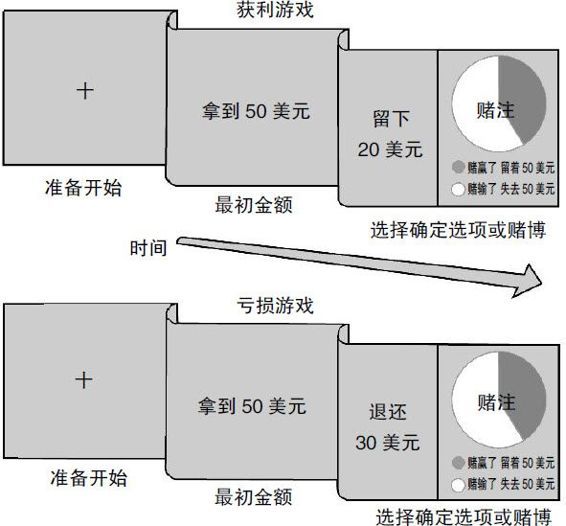

图12　框架效应游戏

这个实验证实，个人行为与脑内活化的区域关系密切。所有受试者的杏仁核都活动剧烈，仿佛要突显框架效应似的。明显受到框架效应影响的人，杏仁核的兴奋程度最强，比如选项描述可以留下的金额时选择确定选项的人，以及选项描述必须失去的金额时选择赌博选项的人。

此外，前额叶皮层（内侧部和眼窝部）的活化与合理决策之间有密切的关系。如果某个人的前额叶皮层开始活动，就代表着那个人不受框架效应的影响，选择了最合理的选项。

值得注意的是，几位受试者事后回忆说：“那时我心里知道应该选择合理的选项，但就是无法控制自己。”就连那些做出合理决策的人也出现了杏仁核活化的现象，但他们懂得控制情感信息，知道该如何将原有信息覆盖得恰到好处。

实验结果让我们更加了解了人的合理性。合理性和情感并非互相对立，而是相辅相成的。因此，合理的人并不是不带情感的人，而是懂得操控情感的人。

其他一些研究还探讨了高度认知功能与边缘系统之间明显的交互作用。关于该神经元的研究是“安慰剂效果”的基础。所谓“安慰剂效果”，是指医生告诉你某种药物很有效，即使他实际上开的处方只是生理盐水或葡萄糖，也能得到与真药一样的效果（这项研究成果同样刊登在《科学》期刊上）。

哥伦比亚大学认知情绪管理研究所的托尔·韦格（Tor
Wager）进行了一项实验，在受试者手臂上涂抹药膏，然后对其施予电击，受试者会产生疼痛感。韦格告诉其中一组受试者，该药膏是减轻疼痛的镇痛剂新药，同时告诉另一组受试者，该药膏会提高皮肤的导电性，增强电击造成的疼痛感。事实上，两组受试者涂抹的药膏一样，都是没有任何作用的安慰剂。

韦格运用功能性磁振造影扫描受试者的大脑。结果发现，在大约1/3（多次实验得出的稳定数据）的受试者身上可以看到安慰剂效果，即他们对痛觉有反应的部位（主要指脑岛、视床、前扣带皮层）的活动明显减缓。这种结果和韦格当初的预测完全符合。

我们更应该注意，在电击的前一瞬间涂了假镇痛药膏时，受试者脑内会出现什么样的变化。利用功能性磁振造影技术，我们发现，受试者脑中先出现即将要接受电击的警报，接着在短短的时间内，前额叶皮层的许多部位开始活动，减弱了对痛苦起反应的部位（脑岛、视床、前扣带皮层）的活动。这是安慰剂效果具有的正面作用。换句话说，当前额叶皮层变得兴奋时，对痛苦起反应的部位的活动会衰减。

以几位受试者为例，并不是因为前额叶皮层能管控情感信号，而是如同德玛堤诺和多兰的实验结果一样，前额叶皮层覆盖了之前的信息。这是人体最基本的机能，并不代表着我们能人为控制身体对痛苦的本能反应。

简言之，在控制自我情感和认知的过程中，合理的人是懂得恰到好处地操控情感的人。合理的人的前额叶皮层能整合、管理信息，并视眼前的具体状况运用不同的信息。有关决策基础的神经元研究也支持这一说法，正如卡纳曼所说：“这是最令人开心的结果。”

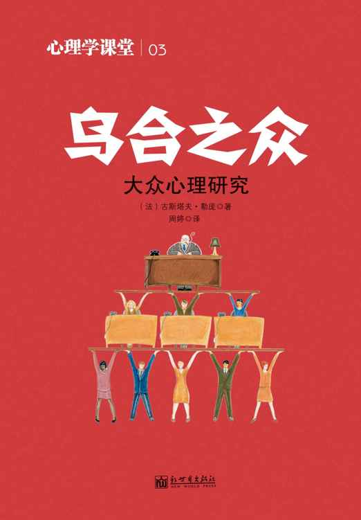

面对潮流、谣言、媒体的炒作，你要知道大众在想什么

当阴谋与算计出现在你的生活中时，你要知道自己该做什么

# 出版说明

《乌合之众——大众心理研究》是法国社会心理学家、社会学家，群体心理学的创始人勒庞在19世纪与20世纪之交写下的一系列心理学著作中最受读者欢迎的一本，自1895年出版以来，几乎每年都会再版一次，截止到20世纪20年代初，已刊印近30次。一个世纪过去了，此书依旧被世人视为社会学经典之作，并被翻译成了20余种语言。逆向投资大师詹姆斯·菲舍尔曾把它选为10本最经典的投资书籍。

本书在1895年出版时名为*Gustave Le Bon，Psychologie des
Foules*，在之后众多的版本中广为流传的是英译本*The Crowd：A Study of the
Popular
Mind*，本书根据布默图书出版社英译本翻译而来。我们基于中国读者的阅读习惯，也顺应读者们的强烈需求，现将此书再版，并将书名译为《乌合之众——大众心理研究》，特此说明。

# 读者热评

勒庞的《乌合之众——大众心理研究》是一本当之无愧的名著，他极为精致地描述了集体心态。

——精神分析学大师　弗洛伊德

心理学领域已经写出的著作中，最有影响者，非勒庞的《乌合之众——大众心理研究》莫属。

——美国社会心理学大师　奥尔波特

勒庞的这本书具有持久的影响力，是群体行为的研究者不可不读的文献。

——美国社会学大师　默顿

乌合之众就是大家都跟着赶潮流。可以看到一些人从买房子到买车，每年都说流行什么时尚，以前叫酷，今天叫炫，还有叫IN，各种各样的说法，制造一种潮流。一旦被卷进去之后，人在潮流里的智商只有平时的5％不到。即使在危机时期都是有潮流的。每个人都进股市的时候，是不该进的，但你发现就是有人要进。其他人都进，我不进不太正常。结果证明，那个时候进股市的都不正常。现在股市基本到底的时候，你发现没有人进了，正常人都没有进。这种行为就是乌合之众，无论是炒股还是不炒股的时候。现在到了危机时期，我们需要创业，创业不在于找乌合之众。做一个企业也好，搞一个社区活动也好，要能够抓住那个张罗事的人和那些积极分子，就会有看热闹的人支持你。

——零点CEO　袁岳

勒庞勾勒出群体的思维模式（如各种毫无逻辑联系的形象化思考）、推理模式（事实上他们从不推理）、夸张情感的表达方式，以及他们总是毫无计划的冲动行事、极端保守和褊狭的特征。它让我们记住，千万不能低估愚蠢群体的力量。

——佐纳拉斯

此书是市场上为数不多的敢于如此赤裸地分析大众心理的书，有野心的人可以看，没野心的人也要看，它可以让你在群体中保持冷静，在关键时刻保全自己。

——liboliu

这本书可谓研究人类学的经典，几十年来经久不衰。后来的希特勒不正印证了勒庞的观点嘛！

——控爷

作者以哲人的眼光看到了人群的弱点，从而推开了大众心理学殿堂之门。不必苛求，作者的一系列小小的瑕疵并不影响这本书的光芒，毕竟，殿堂里面是什么得我们自己去寻找。

——hiarcs

如果你希望对群体心理有所了解，如果你想知道政客如何通过演讲愚弄大众，可以看看此书。

——challenge 2001

网络时代的到来，使更多平民有了表达自己意见的权利，这时候网友们互相表达意见互相暗示互相煽动，更应该看看这本大众心理研究，那么你对“抵制家乐福事件”“范跑跑”事件的认识会更加透彻。2008年于中国、于心理学、于社会学都是值得研究的一年，在这还没有结束的年份发生太多值得深思和探究的群体事件，而从雪灾、地震、奥运、股疯等众多事件中折射出的群体心理在此书中可得到一一比对，从而也解答了诸多盘旋心头百思不解的困惑。

——天地英雄2008

在放羊的时候，羊儿看不到羊群，每一只羊只知道吃草、睡觉。它们似乎更像是分子运动一样杂乱无章。实际上在熟知羊群的人看来，羊群是有其特性的，所以赶羊并不需要每只羊身上都拴上绳子，头羊决定着羊群的行动与决策。人群有时也与羊群一样。

——freewon

经典就是经典！一直觉得现在很多东西都太匆匆，昨天还流行的，今天就“落伍”。在这个充斥着网络小说、一夜成名，然后瞬间被遗忘的年代，太需要经典了。

——tinky_14

虽然勒庞的观点略显悲观并且缺少充足的理论支撑，但是无可否认这是一本伟大的著作。后世的杜威、李普曼在社会学、传播学的研究方向上都借助了勒庞的观点——群众个体是分散的，集合的群众就会丧失理性。

——看书看到眼抽筋

勒庞的扛鼎之作，果然是相当经典，不仅只是一本学术著作，我觉得对我们现实生活也有很大帮助，对照中国发生的很多事情，都可以在书里面找到印证。

——will2power

勒庞在书中对于群众心理分析的观点，妄想通过此文来完全转述可谓难之又难，尤其是在读此书过程中联想到诸多社会现状，其引发的思考更非本文所能承受的。这里可以举例而言，例如股市问题，即涉及群众的无理性；海选问题，涉及群众易受情感调动；政治问题，涉及群众的盲目；种族冲突，涉及群众的种族因素；法制问题，涉及群体对权力的盲目利用；宗教问题，涉及群众的道德与传统；等等。所以，将此书归为社会学入门书是很学术的划分方式，而那些试图涉足政治的人恐怕从此书中所得要远远比从《君主论》中所得的多。

——flashcute

今天的我们，回头去看“二战”中德国人的残忍疯狂，会觉得不可思议。看了这本书，我们会了解个人融入群体后的心理变化轨迹。书中的观点不一定全对，但对个人在群体中如何尽量保持一定的清醒度、保持独立思考能力，是很有启发和借鉴意义的。

——姜方

学习了《乌合之众》，我们知道了金融市场是一个群体行为。我们传统经济学的一个标准假设是人的行为是理性的，可我们知道股票市场是由人组成的，而且还不是几个人而是几千万人，而群体特征明确无误地告诉我们群体经常会表现出非理性行为。任何一个人，作为个体来看，都是理性的，但面对一个几千万人所组成的市场里，面对同一个事件时人们会对这个事件有怎么样的反应？历史上的股市大崩盘（2008年的石油期货）也许会是个很好的借鉴，这个例子本身也比较特殊，但市场确实经常存在非理性，不然也不会有游资这样一个投资行为。长期来看，股票价格反映的是对未来收益流折现的价值，而另一方面，短期的波段可能反映的是供求关系的小幅变化，而这种供求变化也不是可预测的。所以我觉得也许可以用杰拉尔德·洛布的话来表达，那就是：影响证券市场的最重要因素就是人的心理。

——billtxj@\*\*\*.\*\*\*

# 前言

这部作品详细描述了多种群体的特征。

遗传赋予种族中个体所有的共同特征构成了种族特征。然而，当一定数量的个体为了某项行动聚集成群时，仅仅从他们群聚这一事实我们就会发现，除原有的种族特征之外会出现某些新的心理特征，有时两者差异相当之大。

在各民族生活中，组织化群体一直扮演着重要的角色，然而从未如现在这般重要。当代的主要特征表现为群体无意识行为取代个体有意识行为。

我竭力通过完全科学的方法来考察群体带来的难题，这种科学的方法不受各种观点、理论和学说的影响，而是不断地在方法上下功夫。我相信这是发现真理的唯一方法，尤其在这个莫衷一是的问题上，情况更是如此。决心证实某种现象的科学家是不会考虑自己证实的结果会触动谁的利益的。著名的思想家高布利特·德阿尔维耶拉曾在最近一本著作中表示，不属于当代任何学派的他，偶尔会发现自己的意见与各学派意见相对立。我希望这部新作亦能获此评价。属于某个学派必然会拥护该派的偏见与先入为主的观点。

这里我还是应该解释一下，为何读者对我的结论可能一开始无法接受。例如，尽管我指出包括精英人士在内的群体心理极端低劣，我仍然断定干涉他们的组织是危险的。

原因在于，对历史最仔细的观察一致表明：社会组织与所有生命体一样复杂，我们绝没有能力使它们在顷刻之间发生深刻的变化。大自然有时会用一些根本的方法，但绝不是我们这一套。这说明对民族而言，最致命的莫过于对重大变革的狂热，无论这些变革理论上有多么美好。然而，只有当变革使民族特征即刻发生变化，才算是有用的。只有时间具备这种变革性的力量。人类受各种思想、观念和传统习惯的支配——这些对我们极其重要。制度与法律是我们特征的外在表现，反映我们的需求。作为种族特征的产物，制度与法律不可能改变这种特征。

社会现象的研究与产生这些现象的民族研究是分不开的。从哲学意义上讲，这些现象可能具有绝对价值，但实际上它们却仅具有相对价值。

因此，在研究某一社会现象时，必须从两个不同的方面依次进行考虑。我们会看到纯理性学说常常与实用理性学说背道而驰。这一特征几乎在所有资料中都可发现，甚至在物理学资料中。从绝对真理的角度看，一个立方体或一个圆是由一定公式严格定义的不变的几何图形；从我们的印象看，这些几何图形在我们眼中呈现出各种形状；从透视的角度看，立方体可以变为椎形或正方形，圆则可变为椭圆或直线。此外，对这些虚构形状的思考远比对它们真实形状的思考更为重要。

因为正是我们看见的这些形状，也只有这些形状能在摄像或照片中加以重现。有时候不真实的东西比真实的东西包含着更多的真理。按照物体确切的几何形状呈现它们时，可能会歪曲其特性，从而变得不可认。设想一下，如果世界上的居民只能复制或翻拍物体，却无法接触，他们就很难对物体的形状形成一个准确的概念。如果有关这种物体形状的知识只被少数知识分子了解，也就没有多少意义了。

研究社会现象的哲学家应当记住：这些现象不仅具有理论价值还具有实践价值，而且就文明发展而言，只有实践价值才具有重要意义。认识到这一点，当他在对待最初强加于他逻辑之上的结论时，会更加小心谨慎。

还有其他原因促使他态度如此谨慎。社会现象如此复杂，根本不可能完全掌握并预见它们相互影响产生的后果。在可见的现象背后，有时似乎还隐藏着千种的原因。可见的社会现象似乎是巨大、无意识运行机制的结果，而这一运行机制通常是我们无法掌握的。可认知的现象有如波浪，它们只是海底深处我们一无所知湍流的表象。

就群体大多数行为而言，群体显露出一种令人无法理解的低劣心理；而在另外一些行为中，他们似乎受着种种神秘力量的支配，古人称之为命运、自然或天意，我们称之为灵魂之声。虽然我们无视它的本质，却不能忽视它的威力。在民族内心深处，有时仿佛有一种潜在的力量指引着他们。例如，有什么能比语言更复杂、更富逻辑、更奇妙的呢？如果不是群体无意识特征的产物，这令人称赞的组织化产物又是从何而来？最有学识的专家、最具威望的语法学家也只不过是指出支配语言的规律，而他们是绝不可能创造出这种规律的。甚至伟人的思想，我们能肯定这完全是他们头脑的产物吗？毫无疑问，这些思想总是由独立的头脑产生，但是，难道不是群体特征提供了成千上万颗尘土，形成了它们生长的土壤吗？

无疑，群体总是无意识的，但或许正是这种无意识是他们拥有巨大力量的秘密之一。自然界中完全受本能支配的生物做出的一些行为，其神奇的复杂性令我们目瞪口呆。理性是较为晚近的人类才具有的属性，而且尚未达到可以揭示无意识规律的完美程度，要想达到这种程度仍需更多时日。无意识在我们的行为中起到巨大的作用，而理性的作用却很小。无意识行为是一种无名的力量将我们推进。

如果愿意，我们可以一直待在狭小而安全的范围内，在这里我们可以通过科学获得知识，而不是徘徊在模糊猜想与无用假设之间，我们必须做的事情就是留心观察我们接触的现象并仅对这些现象做出思考。一般，我们通过观察得出的结论都是不成熟的，因为在这些我们清楚看到的现象背后，有一些是我们只能隐约看见的现象，而在它们背后还有一些是我们根本无法看见的现象。

# 推荐序

**《乌合之众——大众心理研究》的功能**

美国的实验心理学创始人、社会心理学家高尔顿·威拉德·奥尔波特，在他的著名作品《社会心理学手册》中如此评价勒庞的《乌合之众——大众心理研究学》：“在现有的所有关于心理学研究的书籍中，没有任何一本可以与《乌合之众——大众心理研究》相媲美。”这个评价的准确性还有待进一步的验证，但无论质疑之声是否不绝于耳，有一点毋庸置疑，即此书所阐释的关于“群体心理”的特点对后世产生了持久的影响，尤其是在人们对“群体心理”的理解和对社会心理学的思考方面。此外，当美国民众的处境和感觉越来越趋向于“孤独”和“千篇一律”时，这部书存在的实用价值就更是不容置疑了。

《乌合之众——大众心理研究》为什么能够产生如此持久的影响力，真的是令人匪夷所思。当它1895年第一次与读者见面时，纯粹是为了迎合大众。但是，这种多如牛毛的迎合之作如果能够将其对读者的吸引力保持半个世纪之久，一定是有其独到之处。

如果从它的性质方面进行探讨，就会对它为何能够产生如此的持久影响力感到更加的困惑。书中所阐释的观点，几乎每一条都可以在前人的言论或书籍中找到痕迹，至于在此书之后出现的同类书籍关于这些观念的阐释更加的精辟和详尽。尽管如此，《乌合之众——大众心理研究》在知识界的影响力却没有受到丝毫的影响。

值得一提的是，即使是在此书中的一些观念已经被公认是错误的情况下，它依旧是研究群体心理的人必读的文献。此外，虽然书中到处都充斥着互不协调的意识形态，但是与之意识形态大相径庭的崇信意识形态的作家，依旧以十分严肃的态度对待它。也许，揭开这些看似相互矛盾的谜团的最好办法就是研究它对我们的现实意义。

《乌合之众——大众心理研究》问世以来的经历也许可以帮助我们揭开这些困惑。书中的一些观点不仅触动了那些接受它们的人，如民粹派社会学家罗斯和心理学家麦克道格尔，还触动了那些完全反对它们的人，如社会心理学家的弗洛伊德和社会学家帕克。那些与勒庞持不同观点的反对者，因为没有办法放弃对社会心理学的研究与探讨，所以在驳斥这些观点的同时，却不得不对其投入更多的关注，因为这些都是研究所需的基本问题。

这正是《乌合之众——大众心理研究》的价值所在。尤其是对重要问题的敏感性几乎贯穿全书。正如大法官霍尔姆斯先生所说，勒庞具有少数思想家才具有的、不断发现有研究价值的问题的能力。他所关注的问题毫无疑问会成为所有社会心理学家和善于思考社会的人共同关注的问题。

从表面上看，这本书的标题有一定的局限性，但是，它的内容却涉及了与“群体”联系在一起，但通常所有人都会忽视的现象。勒庞在书中不断地以简洁或者时代错置的方式将人们所关心的问题呈现出来，如社会服从或过于服从、单一乏味的趣味、群众的反叛心理、大众文化、被别人支配的自我、群众行为、人的自我异化过程、官僚化的形成历史、逃离自由投靠领袖、无意识对社会行为的影响，等等。换句话说，现代社会出现的所有问题和观念，他都预料到了。也正是这些多样性的问题，使它具有了经久不衰的影响力。

因此，我们可以断言，《乌合之众——大众心理研究》的现代意义就来源于它善于发现问题的功能而非解决问题的功能。这两种功能表面上看来是相互联系的，但实质上却有本质的区别，此书对弗洛伊德的意义便是最好的佐证。

**弗洛伊德眼中的《乌合之众——大众心理研究》**

弗洛伊德利用适当的渠道使勒庞的思想影响进入了现代人的头脑。从20年代起，弗洛伊德开始从事群众心理学研究，并发表了第一本专著《群众心理学与自我的分析》。在这本著作中，他大量引用了勒庞的观点，并给出了极高的评价：“《乌合之众——大众心理研究》是名副其实的名著，极为精辟地阐释了群体的心理特征。”他对《乌合之众——大众心理研究》的评价及其引用其中的内容加在一起，可以占全书的1/6。

但是，读者很快就发现了弗洛伊德对待《乌合之众——大众心理研究》的矛盾态度。在下一章中，他驳回了自己对勒庞提出的观念评价，他说：“……我现在必须澄清的是，其实作者所阐释的观点都是些陈词滥调。……此外，他对群体心理的诠释和评估应该受到人们的质疑。”

这些前后矛盾的评价似乎有些不合常理，甚至于有些失礼，但是，不可否认的是，弗洛伊德并没有存心说这些话，这只不过是他内心最真实情感的流露。

夸张是最容易表达自己观点的方法之一，因此，当我们将弗洛伊德评价中所有的夸张成分都去掉，只保留其实质，然后问他，为何会对勒庞那些陈词滥调如此重视？又为何像许多严肃的评论家一样，怀着尊重的心态从知识的角度来看待《乌合之众——大众心理研究》呢？为什么要将《乌合之众——大众心理研究》作为自己研究社会心理学的基础？弗洛伊德用率直而可敬的态度回答我们提出的问题：“因为勒庞的很多观点是研究心理学的基础，所以我将他看成是自己的引路人。”

弗洛伊德为自己矛盾评价所做的解释显然不够全面。他只是解释了为何自己会看重《乌合之众——大众心理研究》，却没有解释为什么会将里面的一些观点贬斥为陈词滥调。当然，要想正确地理解他这种矛盾的态度，还需要进一步的论证。

弗洛伊德对勒庞所述的观点持有的矛盾态度是不可否认的。他往往在前一章中肯定勒庞，在后一章中再推翻自己的观点。这些矛盾的观点在他论述勒庞的一章中随处可见，而且我们轻易地就可以找到这种矛盾态度的思想（不是心理学）的解释。在书中，他采用苏格拉底常用的对话模式，为两个角色设置了台词。这种矛盾态度的基础大致可以概括为：勒庞善于发现问题，而弗洛伊德善于解决问题，至于勒庞能不能够将这两种优点集于一身还有待考证。对于勒庞发现问题的能力，弗洛伊德给予了肯定，但是对后一种能力，他却持否定态度，认为勒庞根本不具备这种能力。正是由于弗洛伊德希望从勒庞身上同时找到这两种能力才会产生以上那些矛盾的观点。最终，他还是给出了确切的答案，即勒庞只能是播种者，他才是使种子成长的培育者。

弗洛伊德一直认为，勒庞只是发现了群体生活的很多重要问题，但是并没有提出具体的解决办法。如勒庞虽然指出了群体具有“喜欢夸大自己的情感”与“缺乏理性和判断力”的基本特点，但是，弗洛伊德认为他并没有真正的找到群体成员之间建立情感联系的渠道。

同样的例子还有很多，如他还认为，勒庞虽然看到了群体易受暗示和传染的特性，却没有发现其实这是团体成员与领袖以及其他团体有着性本能关系的产物；虽然也意识到，当一些人偶然聚集在公共场所，没有任何坚定的目标，他们根本不足以构成一个群体，但是却不理解要想具备组织化群体的特征，需要哪些必不可少的前提条件。

勒庞生动描述了“群体是冲动的奴隶”以及“群体在行事之前绝不可能做出任何计划”的特点，但是他没有找到为什么群体会退化到原始人类阶段的理论依据。（当然，弗洛伊德也不是圣人，他也会出错。他认为勒庞没有明确的退化概念，这只能说不够全面。因为勒庞也曾将群体冲动、暴躁、缺乏理性、判断力与批判精神、态度极端等特点与女性、野蛮人和儿童等低级进化形态的生命体相提并论，所以说弗洛伊德是错误的。还应该指出的是，当勒庞将群体的退化比作可以在野蛮人或儿童身上看到的早期阶段时，显然妇女被排除在了这个阶段之外。）

此外，在其他方面，弗洛伊德对勒庞的评价也是有失公允的。如，他说勒庞没有正视领袖在群体心理中起到的重要作用，而他却能够揭示领袖在支配群体行为的心理过程中起到的作用。但是，他却忽视了一点，勒庞在书中阐释了神话中不朽的英雄对群体心理产生的巨大影响，而这种论断与他在与奥托·兰克讨论之后得出的结论一样，即神话中的英雄其实是人们想从集体统治中解脱的一种手段。

弗洛伊德认为，勒庞意识到了群体具有要求平等的意识，但是没有意识到这其实是群体成员在共同目标的作用下产生的一个潜在的可见后果。这里所指的目标，弗洛伊德认为就是领袖。

勒庞虽然生动地描述了群体成员都有服从的意念，但是他没有意识到这种服从意念其实是领袖身上集体理想产生的暗示作用。

弗洛伊德还犯了一个有益的错误，他认为勒庞的研究对象只限于暂时的群体，而也正因此让他幸运地碰到了最有价值的研究课题，因为只有暂时的群体成员才会对群体的要求言听计从，甚至甘愿放弃自己独立的个性。

他这样定义勒庞对群体的概念显然是有失偏颇的，只要读过下面内容就可以知道为什么我会这样说了。不过应该肯定的是，即使聪明的头脑偶尔会犯一些小错误，人们依旧可以从中得到有益的东西。弗洛伊德正是这样的聪明人，所以，即使他的观点不完成正确，我们依旧可以从中找到平时被我们忽视了的东西。

虽然弗洛伊德认为勒庞关于“只涉及短命的集体”的陈述是错误的，出人意料的是，这个错误却直接促成了弗洛伊德支持勒庞选择以这些“喧闹的、暂时的群体”作为研究对象。“作为集体中的一个类型，我们可以从这个群体中看到，正是那些被我们视为个人特性的因素，彻底地消失了——尽管这只是暂时的！”弗洛伊德就是用这句简短而精辟的话，道出了虽然在科学研究领域中普遍存在，在社会科学中也尤其需要特别注意，却一直被人们忽视的基本原则，它就是被我们称为搜索“重大研究领域”的原则。按照这个原则，寻找这样一些课题，能促使更多的人去研究那些具有特殊优势的科学问题，当然，前提是这些具体的课题必须是暂时的群体。

勒庞在无意识中做了弗洛伊德认为他做过的事情。他虽然以暂时群体作为研究对象，但是并没有把自己的思想局限于此。在他的眼里，群体的概念要宽泛得多，即包括暂时群体也包括稳定的群体，如相同社会阶层、身份、派别组成的群体，最有代表性的是陪审团、议会、政治派别、宗教派别，因此我们可以说他找到了研究群体行为最好的机会，即在他们的特点最显著的时候对他们进行研究。显然，这些方法和技巧是弗洛伊德强加给他的。当然，弗洛伊德之所以得出这些结论，并不是因为他发现勒庞揭示出了比研究素材更加广泛的变量之间的相互作用。

总结弗洛伊德对勒庞矛盾的评价我们可以得出以下结论：勒庞善于把握群体或者是群体的集体行为的特点，但是对于这些行为的本质原因却不甚清楚。换句话说，在弗洛伊德眼里，勒庞就像是一条只会寻找猎物的狗，只能够停留在事物的表面，对表面之下隐藏的重要理论无能为力。但是自己却和他恰恰相反，他能够挖掘出事物表面之下的本质，并诠释出这种本质。

虽然用这种说法评价他们两个人似乎有点不太公平，但是确实也有依据可循。勒庞的优势是能够很好地挖掘出社会心理学的问题，而弗洛伊德有时候既是问题的挖掘者也是问题的解决者。从弗洛伊德评价勒庞的矛盾态度上，我们可以得到一些新的体会，即一些新思想（因为别人可能已经预见过所以并不是不可或缺）和一些有意义的思想（这种思想并不深刻，只能起到一些提示性的作用），既有局限性的一面也有贡献的一面。对勒庞这本《乌合之众——大众心理研究》的矛盾态度，就是很好的佐证。

**未竟的肖像画**

之所以单单将弗洛伊德对《乌合之众——大众心理研究》的感受列举出来，并不是因为他的感受独到，也不是因为他的名声让人们对他的作品持有好感，而是因为他对此书的理解以及他的某些曲解产生的真理性收获，能够更好地帮助我们解读这本书。其实在较小的范围内我们同样可以向弗洛伊德一样，在提出关于社会行为的思想的同时能够发现有现实意义的因素。虽然他在这本书中没有挖掘出很多全新或者正确的观念，但是依旧让我们受益匪浅。勒庞的阐述不是不可更改的绝对论断，确切地说，是为后人研究相同的理论提供了重要指导的起点。

弗洛伊德能够对此书有如此深刻的解读得益于一些具有现实意义的因素，当然，这些因素同样可以为我们的解读带来帮助。但前提条件是，我们必须能够在解读的过程中挖掘出隐含在文字表面意义之下的深层含义，这就需要读者在解读的过程中留意作者在无意之间透露出来的思想，因为只有这样我们才能感受到过去被自己忽视了的某些社会行为。其实读其他书也是同样的道理，只有理解了书中字里行间的含义才能得到自己想要得到的东西。

这些方法同样适用于那些团体成员中每天叫嚣着不乐意服从的人（其实他们没有一刻可以脱离束缚），当然前提条件是，他们愿意去理解对我们每个人都会发生作用的服从倾向。

《乌合之众——大众心理研究》具有丰富的现实意义，这也诠释了为什么它能够具有持续影响力的原因，需要说明的是，这些现实意义都隐藏在文字之间，需要我们用心去体会。除此之外，这种持久的影响力还源于书中的一些复杂的思想，即人的行为中非理性和反理性的倾向。这些思想，至今仍然与我们的生活如影相随。

书中描绘的是世纪末的众生相，这时的人们在作者的眼里永远徘徊在无意识边缘，随时接受一切暗示的指挥；情感缺乏理性、批判力，所以他们极端地轻信他人，心甘情愿地上当受骗。不过，这显然是一幅没有完成的肖像画，因为在画面中既有被控制的人，也有控制别人的人，换句话说，这些掌握着控制权力的人将被其控制的人当成了自己达到人生目标的工具。

书中还透露了另外一种深刻的含义，即人类总是有维持自欺欺人能力的方法，他们总是能够为了达到某种不可告人的目的将罪恶说成是美德。影响人类性格的这种因素还导致了这样一种社会哲学和社会学，即人们极易受外界因素的影响，他们会因为这种影响而使自己失去判断是非的能力，从而变得愚蠢而平庸，甚至成为暴徒的帮凶，欺骗自己的同胞。

人总是会有一些劣根性，如缺乏理性、唯利是图、不会自控以及出尔反尔，或者将理性用在胡作非为上，他们既是暴力和虔诚骗局的实施者也是它们的受害者。这种禀性与人类历史如影相随，从《君主论》的时代起一直到《乌合之众——大众心理研究》盛行的时代，那些为达到自己目的，而不惜在人际关系中使用欺诈和机会主义手段的作家一直都在不断地描述和设计这些形象，勒庞在书中将其重新阐释当然算不上是全新的见解。不过值得一提的是，它在上个世纪才真正开始受到人们的重视并一直持续到今天，在它面前，人类一直被冠以的理性动物的美誉受到了冲击。

**旷日持久的争论战**

对人类及其行为中令人生厌的这些禀性，心理学家、社会学家、社会哲学家、政治理论学、政论记者以及那些有才华的落魄小说家都曾写过大量书籍进行批判，《乌合之众——大众心理研究》只是这些著作中的一本罢了。值得一提的是，在1895年，即这本书出版的同一年，布罗伊尔和弗洛伊德的力作《癔病的研究》也问世了。这两本书同时出现并非偶然，因为只有具备了相同社会条件，思想相近的著作才有可能同时大量出现。

也许有人会对这种说法无法苟同，在他们看来每个时代都会有自身无法解决的问题，并自认为会遇到理性的曙光或非理性的开端。但是不可否认，这种观点有其局限性，因为它没有办法解释到底是什么原因让19世纪的法国民众如此狂热。回顾历史，我们会发现，在19世纪50年代，龚古尔兄弟从来都没有与他们组成的文学小组内部达成一致意见，他们预言，欧洲将遭到粗鲁工人的野蛮攻击，他们还说，这群野蛮人会给自己的行为找到合适的借口，即社会革命。

当然，除了龚古尔兄弟之外，当时法国的人道主义知识分子泰纳、圣伯夫、讽刺作家“加瓦尔尼”、勒南等人也对未来的“道德卫生状况”以及社会发展趋势充满了疑虑。泰纳甚至预言说，20世纪将会造就一群充满活力但是反应迟钝的人。显然，这些预言与勒庞在《乌合之众——大众心理研究》的某些观点是相吻合的。

关于类似的预言和征兆还有很多，这足以证明，即使没有勒庞，他所提出的观点照样会出现。最好的佐证是，在同一时期，意大利的社会心理学家西盖勒以及法国人塔尔德也提出了类似的观点。也正是因为在相同的时段提出了类似的观点，所以在之后的很长一段时间里，他们为到底谁是思想的先驱者争论不休。为了在这场旷日持久的争论大战中获胜，勒庞和西盖勒使尽了浑身解数，甚至不惜撕破脸皮相互谩骂。为了能够增加胜算，勒庞不止一次地重提他15年前对群体的“模仿”和“感情传染”问题的论述。西盖勒也不甘示弱，在著作《宗派心理学》中毫不客气地自诩为先驱，并声称《乌合之众——大众心理研究》纯粹是抄袭之作，而在后来出版的《犯罪群体》的第二版中，他更是公开对勒庞进行指责，说勒庞在阐释“群体心理”时引用了自己的观点，却对此没有做出任何说明，之后他又正话反说，说自己没有一点要责备勒庞的意思。

对他们的争论，我们既不感兴趣也没有必要做出评判，因为这是那些有知识成就的法官和思想史专家的特权。但是他们的争论对我们并不是毫无启示作用，因为通过这些同时出现的思想我们最起码可以证明，文化遗产已经为它们的出现提供了适宜的土壤，而且在社会的引导下，越来越多的思想家开始关注这些思想问题。

不可否认的是，有太多的证据可以证明勒庞的观点在某些方面反映了当时的文化现象。只不过，这些理念遭遇了与17世纪的格兰维尔的气象学比喻一样的命运，即在它还没有被怀特海复活之前，一直被人们忽视。如果一种将形成潮流的思想恰好迎合了当时人的趣味，一点也不奇怪。因为这种思想被群体接受并非空穴来风，而是社会结构自身因某种因素影响而出现了问题，或者是人们的思想观念发生了变化迫使一些跟时代不相符的思想退出了历史舞台，从而使一些以前根本不受重视的思想登上了大雅之堂。（当然，应该指出的是，并非所有的文化都受社会结构变化的影响，而且，相同的结构压力对文化层次中不同的人群具有的导向作用是不同的，所以它们还会做最后的垂死挣扎。）

在一般情况下，思想的创造和普及需要特定的社会条件。所以说，勒庞的观点和思想能够迅速地得到普及得益于那些让他产生这种思想的重大历史事件，也正是这些历史事件，为勒庞和他的读者架起了一座产生共鸣的桥梁。

**布朗热浪潮**

了解了勒庞生活的时代背景，我们便可以明白，为什么他所提出的关于群体成员的观点能够如此吸引读者，以及他没有办法再对此进行修改的原因。1841年，勒庞出生于法国。法国当时的国王路易·菲利普一直被认为是具有革命家精神的君主，但出人意料的是，他最终倒戈成为了保守派的阵营当中的忠实的一员，这激起了激进主义者和空想社会主义者的怒火，他们开始更加大肆地传播自己的思想。

终于，这场愤怒演变成了战争，路易·菲利普被迫退位。经过激烈的“六月起义”之后，工人阶级也推出了历史舞台，路易·波拿巴篡夺了起义的果实，成为第二共和国的总统，继而又称帝继续统治法国。当时，勒庞只有7岁，所以他无法理解波拿巴到底是利用了什么手段将总统改为皇帝的。20年之后，即19世纪60年代，勒庞在回顾路易·波拿巴的统治时，显然是持有赞同的倾向的，他认为波拿巴之所以那么做，是想让民众忘记战役惨败带来的后果，忘记欧洲的存在，从而平息民众的反叛意识。

巴黎公社统治法国期间，激进派以及共和派、普鲁东派和布朗基派等一伙乌合之众成为了政权的主宰者，勒庞此时忧心忡忡。对这次运动，即使是马克思也怀有矛盾的态度，既说它是还没有成熟的果实，又认为它是共产主义理论的一个很好的证明，是工人阶级为获得最终解放而进行的预演。当时的勒庞还只能算是一名不具备敏锐观察力的思想家，但是他亲眼目睹了当时政局的动荡，包括第三共和国对巴黎公社的审判、频繁的政权更迭以及那些为了诱惑群体而做的宣传（当然，有时候这种做法非常奏效）。此外，他还亲睹了做事瞻前顾后却又极其好战的布朗热将军以迅雷不及掩耳之势赢得群体支持的过程，这些经历对他即将动笔的著作十分有用。

勒庞在书中一共提及了布朗热将军两次。一次只是提到了他的名字，另一次则是暗示性的出现。译者没有办法确定读者是否还对那段历史记忆犹新，所以在布朗热将军出现的地方加了注释。当布朗热将军以暗示的方式再次出现时，证明了勒庞作为保守派的一员，对群体及其社会心理学的理解都是建立在他所经历的所有事情之上的。他在书中这样写道：群体既可以充当刽子手屠杀生灵，也可以如烈士般英勇就义（弗洛伊德对这种矛盾心理感到亲切）。

“他们可以为了信仰的胜利，不惜血流成河”（之后，勒庞自然而然地又为我们补充了与我们的目的相符的话）。若想见证群体做出的种种壮举，我们不必重返英雄时代。起义中他们从不吝惜自己的生命，不久前，一位声名鹊起的将军轻易赢得了上万人的支持，这些人为了他的事业甘愿赴汤蹈火。

显然，勒庞在书中提到的这位将军就是布朗热。布朗热将军的当年的“壮举”至今让法国人记忆犹新，但是美国却早已将之抛到了九霄云外。这就如同历史上那些昙花一现的朝代一样，如果它没有将政权合法化，通常是不会被载入史册的。但是在19世纪80年代的最后5年里，布朗热将军和他的追随者们迅速崛起，并在全国掀起崇拜布朗热浪潮及试图篡夺政权的运动，其规模与发生在美国50年代最初5年的麦卡锡主义运动和约瑟夫·麦卡锡参议员夺取政治权力的运动一样。（值得一提的是，这两项运动在细节上十分相似，布朗热最终以阴谋颠覆国家罪被逮捕，虽然最后成功逃离了法国，但是还是以自杀结束了自己的生命，麦卡锡也好不到哪里去，政治垮台后，他过了3年落魄的生活之后含恨离开了人世。）

以上我们谈到的这些人和事，在时间和空间上都相去甚远，所以很多人都会认为这其实就是一些无聊的历史对比。《乌合之众——大众心理研究》毕竟不是在写历史，勒庞只不过是想借助这些历史事件分析出群体特征和行为的相似之处，并找出细节上的差异。至于勒庞在书中首先提到布朗热浪潮并不是为了归纳出群体社会心理的发展脉络，但是不可否认的是，他确实对这段插曲投入了热情，在这点上他和其他法国人有着本质的区别。

曾经短暂成为人们崇拜偶像的布朗热所演绎的历史，在勒庞的笔下成为了反映领袖和群众关系的社会心理学剧本。因为，毕竟布朗热的历史发生在勒庞写书之前，所以我们这样说可能更加恰当，即这部著作是作者对布朗热及其追随者所演绎的历史总结。当然，有一点我们绝对不可忽视，那就是布朗热浪潮确实对勒庞挖掘群体行为的思想根源提供了依据。

布朗热进入政坛之后平步青云，成为了最年轻的法国将军，进入了作战部为激进派领袖克列孟梭制定卡必密决策，并通过改善官兵的待遇获得了他们的拥戴。他之所以能够如此轻易获得军人的支持，是因为现在的军队成员大部分是文官转变而来的，所以他们缺乏职业军人吃苦的精神和坚韧的性格。

从政之后，因为没有政治信仰，布朗热能够八面玲珑地应付不同派别的人，成为了各个不同派别人们心中的偶像。尤其是那些站在第三帝国反对面的人们，坚信布朗热一定能够带领他们推翻帝国，建立全新的社会。为了讨好这些群体，他答应了他们提出的所有要求，如他答应戴鲁莱德的爱国者同盟会尽一切力量将德国人赶出法国；答应波拿巴主义者会恢复帝国；答应保皇党会恢复君主制。此外，他能够让利益对立的社会主义者、机会主义者、共和派以及激进派都将他视为自己人，并心甘情愿地受他的领导，虽然他除了对自己的将军地位感兴趣之外，并没有其他的政治倾向。之后，这些五花八门的群体在共同的目标下——反对现有的政权结合在了一起。

之后，各类支持布朗热的政治事情接踵而来，先是群众利用巴士底狱纪念日公开表示会支持他，让总统下野，当他终于在大选中获胜之后，各类群体又高呼让他进军爱丽舍；各类媒体也成为了他忠实的传声筒，《不妥协者报》《宇宙报》等争先恐后宣传布朗热及其运动，各类赞美之词层出不穷，如献给“我们勇敢的将军布朗热”“啊！‘复仇将军’及‘希望将军’”，这些赞美之词一方面真实地反应了群体内心最真挚的情感，另一方面影响了他们的情感倾向，更有甚者，人们还用他的名字为各类玩具、机械工具及烧酒命名。换句话说，布朗热主义已经成了在短时期内不可扭转的潮流，差一点就会大获全胜。我们已经无需再对这股浪潮详细地描述，因为它只是《乌合之众——大众心理研究》的一页。（当勒庞提到一位声名鹊起的将军“轻易赢得了上万人的支持，这些人为了他的事业甘愿赴汤蹈火”时，字里行间便隐藏着这些事件。）

当然，书中还写了布朗热的其他故事，只不过这部分内容被一些概括性的语言掩盖了，如关于巴黎群体喜欢摇摆不定的特性的记述就暗示了布朗热的下场，即今天他还是他们崇拜的偶像，明天便成了被唾弃的对象，当然其他地方的群体具有相同的秉性。除此之外，勒庞通过布朗热浪潮能够迅速扩散的原因，还得出了另外一个贯穿全书的重要结论，即就声望的起源而论，取得成功是最大的成功，不仅如此，他还从布朗热的垮台中得出了关于声望的另一论述，即就声望的危险的衰落而论，失败就是最大的失败，虽然关于这条他并没有明确提出来，我们还是能够体会得到。所以，当法国的一些政客不断找出他的弱点之后，他很快便失去了所有的支持人群，一如他的得势一样迅速。

失势的布朗热终于被执政者以阴谋颠覆国家罪逮捕，不过他侥幸和情妇玛格丽特·德·邦曼一起逃离了法国，到了布鲁塞尔。显然，那里的人不欢迎他，于是他之后不得不辗转于伦敦、泽西等地，但是，最终他还是回到了布鲁塞尔。在异国他乡流放的过程中，他依旧没有被击倒，甚至一度保持着乐观的心态继续发表一些根本就没有人认可的言论。随着时间的推移，他终于意识到了，那些曾经狂热地拥戴他的群体现在已经成为其他政客的支持者。在他的政治梦想彻底破灭的时候，他的情妇也因病去世了，在双重的打击下，他选择了以自杀的形式结束自己的痛苦。

**历史在勒庞眼中永远是矛盾的**

看到这一切的不仅仅是勒庞，还有他的同代人，所不同的是，勒庞对这一切进行了思考，并通过这次事件看到了巴黎群体是怎么迅速地将他们曾经的英雄抛到九霄云外，去参加万国博览会的。在之后发生的众多事件中，埃菲尔铁塔的建立是最耀眼的明珠，它那高耸入云的钢铁身躯预示着一个新世纪的到来，而且这个新世纪将代替之前的石头城市。在对群体具有的轻信和善变进行探讨时，勒庞从他们对末路英雄的报复行为中找到了证据，“群体喜欢践踏被他们曾经推崇的权威”。

勒庞把自己观察到的一切都以概括的方式写进了《乌合之众——大众心理研究》中，虽然布朗热浪潮不能为他的社会心理学研究提供足够的证据，但至少可以让他看到群体的某些秉性。在布朗热浪潮结束之后，法国历史上又上演了雷赛布戏剧的尾声，他是一个具有坚定的意志力的人，曾经成功地带领人们开通了苏伊士运河，但后来，他同样败在了这项事业上，那是因为他年事已高，包括意志力在内的一切成就事业必需的品质都屈服在了蹉跎的岁月面前。在88岁高龄时，他被判了5年的徒刑。对此，勒庞无法掩饰他内心的愤慨，也没有办法只能以学术的观点来评价此事，于是，在《乌合之众——大众心理研究》中随处可见他对群体攻击这位“历史上最了不起的英雄之一”所表现出的不满。

这件事一直被充分理解其含义的法国民众看作“大事件”，但是它是否为勒庞写书提供了依据我们不敢妄下论断。就在勒庞开始写《乌合之众——大众心理研究》的时候，又发生了另外一件对他写书很有帮助的事件，即德雷福斯上尉因叛国罪被剥夺了政治权利并被流放到魔岛上服役。德雷福斯是阿尔萨斯人，是第一个进入总参谋部的犹太人。法国民众之所以会这样对待德雷福斯，是因为受到了总参谋部的挑拨，当然这次事件的后果不仅仅局限于此，因为它还为勒庞的书提供了新的必要的证据。需要指出的是，1894年，是群体排斥外来种族情绪最高昂的一年，这种情绪足以传染到所有不同的群体，其严重程度使一向对政治毫不关心的法国人（但愿这个称呼不会自相矛盾）也不得不关注，更不用说像勒庞这样敏锐的观察家了。

现在也许大家该明白勒庞为什么会声称《乌合之众——大众心理研究》并不是以法国大革命为基础的群体行为社会心理学著作了吧。因为这种说法并不确切，勒庞在书中所选取的50个事例中有30多个是在讲法国大革命之外的事件，比如说拿破仑的发家史，而且大部分都是他亲眼目睹的。或者说，勒庞之所以要选择大革命时期的事件有两个原因：一是作为法国的一分子他没有办法摆脱大革命造成的影响，二是他要想对群体特征有更加深刻的了解就必须去留意跟大革命有关的事件，当然这个原因是暗含在书中的。他为了更加隐蔽地批评现实生活中的群体秉性，不得不利用大革命时期的群体做伪装。

可能很多人会有这样的感觉，在阅读勒庞的书籍时，常常会觉得他应该经历过大革命，但是事实却并非如此，他的寿命只有90年，而且《乌合之众——大众心理研究》问世时他已经55岁了。即使是这样，他对生活在同一时代的群体的观察足以为他的社会心理学研究奠定坚实的基础。当这种想法出现在他的脑海里时，他甚至可以更改圣保罗大教堂唱诗班入口处那句纪念雷恩的铭文，并向同时代的人大声疾呼：“如果你们想知道我思想的来源，就好好观察一下你的周围吧！”

事实也确实如此，过去的历史不可能成为《乌合之众——大众心理研究》的唯一理论来源，也不会是其主要的依据。人们之所以会得出与此不同的看法，是因为他们一直对将历史用来做学术研究持有矛盾的态度。在写书的过程中，勒庞突然发现，原来所谓的历史记载根本起不到任何作用，于是他发出了“历史完全是一派胡言”的感慨，之后，经过亨利·福特的渲染，这句话被后人广为流传。

当然，和勒庞比起来，亨利·福特是在没有任何目的性的情况下说这句话的，但是勒庞是怀着这样的心情去说的：“史学著作只能被当作纯粹想象的产物。它们是对一知半解的事实做出自以为是的记述，再加上一些思考后得出结论。写这种东西无异于浪费时间。”为了得出以上的结论，勒庞将历史的命运进行了分析，他认为“如果历史没有留下文学、艺术和其他方面的传世巨作，我们根本不可能了解历史真相。而且，即使有真实的记录，但是利用文献的人都会有倾向性地选择自己认为对的事情，所以后人还是没有办法看到历史的原貌”。

但是之后他又否定了自己的看法，因为他发现完全脱离了历史，他根本没有办法探讨群体的行为特征，为此他还写了好几本著作。当他在1912年发表《法国大革命和革命心理学》时，他又回归到了之前的看法上，即历史根本没有办法还原到真实的状况。

勒庞毕竟也是普通人，所以他没有办法摆脱普通人都有的矛盾心理，于是他提出一种折中的理论，使他既能摆脱历史的控制，又能用历史来证明自己的理论。这个合理化的理论迷人而简单，“像赫丘利、佛祖或穆罕默德这些在人类历史上举足轻重的人物，在历史记录里有关他们生平的记录有一句是真的吗？完全可能一句都没有”。接着他又说：“事实上，他们的真实生平对我们来讲起不到什么作用。我们关心的是这些伟人在大众神话中是以什么样的高大形象征服他们的偶像的。因为对群体心理产生影响的是神话中不朽的英雄，而非现实中一时的英雄。”

虽然我们没有办法苟同勒庞关于真实历史与大众神话之间妥协的做法，但是对于他产生这两种矛盾心情的原因却必须给予同情。他为后人揭示了一个重要的观点，即决定人们历史地位的重要原因不是他们的本来面目，而是后人对他们的认知，所以真实和表象之间未必存在必然联系。

在同以上复杂的矛盾做斗争时，勒庞的观点开始接近托马斯定律（美国社会学家托马斯提出的观点），即假如某种条件被群体认为是真实的，那么其结果也往往是真实的。他的结论直到很久之后才被后人真正理解，即人真实的形象在影响其接受群体中所起到的作用。勒庞一直在不断寻找造成他矛盾思想的根源，在这个过程中他得出了一种值得后人探讨的见解：神话历史对社会现实历史的影响。

勒庞虽然使尽浑身解数，但是依旧败给了那些学者。他们以让人根本没有办法理解的分析否认了历史能够为人类生活中的某些一致性因素提供材料的事实。可悲的是，勒庞没能超越他的同代人和后代人，和他们一样地认为历史只是一种表象，而历史史籍的事件也都是独一无二的。

如果事实真如勒庞所言，历史不能够用一些让人觉得似是而非的语言为后人探寻人类的轨迹以及社会制度、结构的变迁中的相同因素提供充足的基础，那么勒庞的所作所为真的是在浪费大家的时间。

对这种显而易见的错误观点，也只有那些得以继承先人遗产的人才能用鄙视的眼光看待它。（《乌合之众——大众心理研究》问世后的第六年，杰出的德国哲学家李凯尔特和文德尔班依旧在试图解释历史为什么只能描述特殊的现象，而且这种描述完全不同于物理学和生物学中发现的相同因素。不过到了后来，终于有人站出来否认在研究历史普遍规律或是概括性规律、独特或者单独现象之间的错误划分，最显著的例子是柏拉图的观点——“历史绝不会重复”与“相应的历史在某些方面总是会出现重复”都是正确的。）

不过可喜的是，勒庞在之后的实践中否定了他之前给予肯定的观点。他在以往的历史中找到了具有独特性的历史事件，并从中抽出某些重复的现象，归纳出了人类行为中假定的相同因素。

**勒庞不是先知**

不过有一点需要说明，即我们应该正确地对待勒庞所做的努力，切勿将一些他实际上没有总结出的论点归在他的名下。在读了《乌合之众——大众心理研究》之后，大家可能会发现，勒庞并没有为了使自己的观点经受得住推敲而系统地收集证据，换句话说，他没有使用方法论的方式，而是采用观察法来选取自认为会对得出结论有重要作用的、历史上的奇闻怪事来作为思想的基石，当然，他所采用的方法不仅在当时很流行，现在也依旧很盛行。

他的方法虽然有缺陷，但是不可否认的是，他的很多观点虽然很粗糙但却是正确的。不过，这些观点还有待后世的社会科学家付出大量的艰辛努力来完善，因为这些科学家从来都不会甘心从现有的观念高峰跨到另一个观念高峰，他们总是会在跨越之前先跋涉于方法论研究的峡谷之中。

如果作者没有为思想的传播提供一个坚实的基础，很容易让读者陷入误区，没有办法分清楚哪些观点是正确的，哪些是错误的。正确地区分错误观念和创造性观念最直接的方法就是看哪些观念中的正确成分占的比例更大一些，这种方法对社会思想的领域和其他领域一样适用。

就此而言，勒庞的书受到了更多的质疑，这也是他的书能够具有持久影响力的原因所在。有时，正如弗洛伊德所暗示的那样，勒庞的观念不断地遭到质疑，可是他却丝毫感觉不到，自以为自己的书是如此的受欢迎。不过有一点毋庸置疑，那就是勒庞的观念比社会哲学家的观念显然要受欢迎得多。

如果将勒庞比喻成擅长知识竞赛的学者和社会学的先知，就会铸成新的错误，即混乱的形象化比喻和迷恋时代错置的行为。不过这个比喻还是有可取之处的，他努力尝试给自己接触到的所有棘手问题都做了一个合理的解释，这些解释为他的后继者们提供了依据，从而使他们得出了比勒庞更精辟的论断。

此外，继勒庞之后以研究群体行为为主的社会学家也曾用过上面那个不伦不类的比喻，如社会学家拉扎斯菲尔德和社会哲学家奥尔特加—加塞特就曾在书中采用过。拉扎斯菲尔德在《社会研究的语言》一书中写道：奥林匹克运动会上各项体育竞技记录的提高的原因并不是进化的作用，而是因为人类加强了对这种能力的训练。也正是因此，几乎每一代人都会看到上一代人取得的进步，但是能力却并不比他们的前辈更高。

在另一本著作《群众的反叛》中，我们看到了相同的观点，而且本书的作者还将这种现象类推到了其他科学领域。在人类文化的所有领域，艺术和道德除外，几乎都可以找到这种早已过时了的“进步”观的影子。所谓的“进步”观是指不断积累的知识以及有益的思想与行为能力的提高。因此可以这样说，《乌合之众——大众心理研究》中的某些观点，一直被另外一种思想利用和改进，虽然这种思想的提出者的能力并不比勒庞更强，甚至还不及他，但是声誉却远胜于勒庞。

在一些读者的眼里，勒庞的观点很有远见。当他在书中如先知般地预言“我们即将进入的就是群体时代”时，他所说的群体主导历史是指，群体的某些意识开始觉醒并开始发挥作用，后来的科拉蒂尼、奥尔特加—加塞特、纽曼、弗洛姆和阿伦特等不同意识形态的作家，都曾对这一观点进行过更加深入的探讨。

除此之外，勒庞还有另外一项颇有预见性的观念，即群体中的成员最终会被把平庸而低俗的文化视为最有价值的东西的大众文化所吞噬。在勒庞的眼里，现在的群体比过去的群体更易于受周围环境和人的影响。他的这一观点很容易让人想到后继者对当代人失去自我判断能力的关切。

社会学家帕克和伯吉斯对勒庞的这一观点如是评价：他不仅预见了群体时代的到来，还提出了很多关于群体秉性的真知灼见，他所使用的方法现在已经被社会学家继承并发展。

关于勒庞观点中最后一个具有先见之明的例子是，他意识到了群体在历史发展中所起到的不可替代的作用。他说，这是一群毫无组织的人，但是因为他们关注着相同的社会焦点，所以在一定程度上表现出了与有组织的群体相同的心理行为。虽然受时代的限制，他没有能够预见广播和电视等媒体对群体的影响，但是他看到了报纸对群体思想起到的作用，即先通过迎合群体情感的方式，将群体引入它们设定好的渠道。

用恰当的行话说，勒庞所有的预见，无论是否精确，只要能够指出人类社会中的曾经不断出现的某些方面，就会为后人把握未来提供一些很好的借鉴。当然，这并不是说，勒庞如同先知一样具有超常的能力。因为先知能够预测出未来事件的发展趋势，但是他却不能，换句话说，研究社会运行的学者不能够预言社会未来的发展趋势，甚至是只指出一些细节都不可能。即使是有些人将他视为了先知，他能做的也只是尽自己最大的努力找出一些能够表明社会发展迹象的条件。

当他在生活中遇了一些问题时，也只会偶尔预测一下这些问题在未来可能会出现的某些方面，如人口过剩造成的后果，但是他们并不会说出这些事件出现所需的条件。当然，他这样做是因为他意识到了自己没有先知的能力。

除此之外，社会学家与先知还有一处不同，即社会学家会从自己的失败中吸取教训。假如他们预测的某些迹象没有发生，而且促成迹象发生的条件已经具备，他们就会坐下来重新审视自己的观点和证据，反省自己的思路，就如同有人给他们下达了指示一样。

先知却恰好相反，即使他的预言落空了，他们还是会锲而不舍地投入更多关注，而不是重新审视自己关于事物如何发展的认识，也不去重视预言与现实之间的差距。尤其是那些成功的先知做到这一点更加容易。古人对此曾给出精确的概括，即先知们在面对失败时能够用娴熟的技巧替自己辩解，从而保住颜面，使他的追随者们继续坚信他具有超凡的能力。

将社会学家与先知进行比较其实并没有脱离我们的主题。因为，当代的一些人在重温勒庞的某些观点时往往会将他在1895年所说的话视为对后来事件的预言。这种看法不仅错误，而且还给勒庞强加了一些他根本不具备的本领，虽然他偶然也会表现出这方面的特征，但是他根本不适合这种角色。

种种迹象表明，他想成为一名有成就的社会科学家。但是，跟他同时代的迪尔凯姆（他开启了社会学思想和社会研究的新纪元）相比，勒庞从来都不会循规蹈矩地收集资料并进行分析，然后来否定自己某些错误的观点。

社会学研究还处于初级阶段，勒庞虽然具备社会学家所具有的坚定信念，但是他缺少能够使他的研究具有说服力的正确工作方式。他有和其他社会学家一样的意图，却只有政治家的收获。但是，不可否认的是，由于他具备对社会学的敏锐感知，所以他得出了很多有价值的观点。

我们看到《乌合之众——大众心理研究》的内容有很多不平衡之处，如观察的质量不平衡，根据观察做出的推论也不平衡。而且这种不平衡充斥着各种观点，这些观点有些是正确而又有实际意义的，有些虽然正确但是对现实并没有起到丝毫的作用，还有一些干脆不正确，但是有益于启发后人得出正确的观点。

但不幸的是，也有一些观点既不正确也不会有任何启发。我们只能得出这样的结论，勒庞也是普通人，没有办法正确评估他提出的所有观点。因为这些观点都是他头脑中的产物，所以他显然对它们一视同仁并厚爱有加。他对待这些观点的态度就如同寓言中好善乐施的人，只要是他的儿孙，无论他是否喜欢都会一样疼爱。

因为《乌合之众——大众心理研究》是一本关于研究社会心理学的作品，而不是关于群体的编年史，所以书中的内容有许多与我们生活的时代并不相符。

勒庞作为保守派的一员，对无产阶级的日益壮大忧心忡忡，但是，他的保守主义迹象、对社会主义的仇视、独特的种族情绪以及将妇女视为最没有主见、缺乏理性、判断力与批判精神、态度极端、缺乏道德的人、根本没有办法和男人相媲美等观点都只是书的外表，即使是将这些观点全部去掉，也不会影响勒庞对群体行为的基本认识。

现在我们只讨论“种族因素和束缚我们的日常规律”是“决定我们命运的神秘主因”。这一观点。勒庞和他同时代的许多人都持有这一观点，但是，这种观点就如同勒庞所说是上个世纪50年代戈宾诺所创立的那种种族主义，是种族主义世代相传且不会发生显著改变的基础，为他们压迫“劣等种族”提供了理由。

在勒庞的概念里，“种族”的内涵不易理解，它和“民族性格的构成”极为相似，如当他提到“西班牙种族的遗传本能”时，或是偶尔提到所有地方的群体都具有女性所具有的特征，而且“拉丁民族”在这方面表现最突出时，我们就可以很轻易地理解这一点。但是我们并不能因此而认为勒庞有种族偏见，因为“种族”本身就具有这样的特性，即适合各国人民和民族的特性，但是有一点毋庸置疑，那就是勒庞对人类学的无知。

我们可以从这本无论是对我们生活的时代还是勒庞的时代都具有一定现实意义的书中，归纳出一些观点，当然这些观点是根据书中所写的关于群体行为共同特点的重要事件整理出来的，即书中所阐释的观点，几乎每一条都可以在前人的言论或书籍中找到痕迹，而且严格来讲，这些观点有些还有失偏颇，其内涵和表象具有相同多的意义，作者的眼光时而放眼世界时而又只局限在法国；某些观点既有预见性，又和时代相脱离；在有效地利用历史事件，又不断地否定这些事件的真实性和有效性。当然，除此之外，还有一些乱七八糟的观点，但是这些对《乌合之众——大众心理研究》的价值没有任何影响，它依旧是一本很值得研究的著作。

1960年1月，哥伦比亚大学

罗伯特·墨顿

# 目录

<a href="#part0039.html" class="calibre1">出版说明</a>

<a href="#part0040.html" class="calibre1">读者热评</a>

<a href="#part0041.html" class="calibre1">前言</a>

<a href="#part0042.html" class="calibre1">推荐序</a>

<a href="#part0044_split_000.html"
class="calibre1">导论：时代的新曙光即将来临</a>

<a href="#part0045_split_000.html" class="calibre1">Part
1　群体一般特征——受人摆布的玩偶</a>

<a href="#part0045_split_001.html_sec001"
class="calibre1">◇　群氓之族</a>

<a href="#part0045_split_002.html_sec002"
class="calibre1">◇　受人摆布的玩偶</a>

<a href="#part0046_split_000.html" class="calibre1">Part
2　群体态度与群体道德（感情的傀儡）</a>

<a href="#part0046_split_002.html_sec001"
class="calibre1">◇　群体冲动、善变且暴躁（群体是冲动的奴隶）</a>

<a href="#part0046_split_003.html_sec002"
class="calibre1">◇　群体的被暗示性与轻信（群体永远徘徊在无意识边缘）</a>

<a href="#part0046_split_004.html_sec003"
class="calibre1">◇　群体态度的夸张与简单（群体只会被极端感情所打动）</a>

<a href="#part0046_split_005.html_sec004"
class="calibre1">◇　群体的偏狭、专横与保守（群体是偏执和专横的代名词）</a>

<a href="#part0046_split_006.html_sec005"
class="calibre1">◇　群体道德（群体是矛盾共同体——为什么今天杀人放火、无恶不作，明天却可以牺牲和不计名利地献身）</a>

<a href="#part0047_split_000.html" class="calibre1">Part
3　群体的观念、推理能力和想象力</a>

<a href="#part0047_split_001.html_sec001"
class="calibre1">◇　群体观念（群体是固有观念的奴隶）</a>

<a href="#part0047_split_002.html_sec002"
class="calibre1">◇　群体的推理能力（没有辨别是非能力的弱智）</a>

<a href="#part0047_split_003.html_sec003"
class="calibre1">◇　群体想象力（天才的想象力成为了他们受制于人的软肋）</a>

<a href="#part0048_split_000.html" class="calibre1">Part
4　群体信仰的宗教形式（宗教形式的忠实追随者）</a>

<a href="#part0049_split_000.html" class="calibre1">Part
5　影响群体意见与信念的间接因素</a>

<a href="#part0049_split_002.html_sec001"
class="calibre1">◇　种族（使群体走出野蛮状态的有利支撑）</a>

<a href="#part0049_split_003.html_sec002"
class="calibre1">◇　传统（控制我们内心最深处自我的无形主人）</a>

<a href="#part0049_split_004.html_sec003"
class="calibre1">◇　时间（真正的创造者和伟大的毁灭者）</a>

<a href="#part0049_split_005.html_sec004"
class="calibre1">◇　政治和社会制度（虚假、短暂的外衣）</a>

<a href="#part0049_split_006.html_sec005"
class="calibre1">◇　教育（使民族走向衰落的刽子手）</a>

<a href="#part0050_split_000.html" class="calibre1">Part
6　影响群体意见的直接因素</a>

<a href="#part0050_split_002.html_sec001"
class="calibre1">◇　形象、话语和套话（无坚不摧的利器）</a>

<a href="#part0050_split_003.html_sec002"
class="calibre1">◇　幻想（人类艺术与文明真正的缔造者）</a>

<a href="#part0050_split_004.html_sec003"
class="calibre1">◇　经验（群体摆脱幻想控制的利器）</a>

<a href="#part0050_split_005.html_sec004"
class="calibre1">◇　理性（对文明发展不起作用的“垃圾”）</a>

<a href="#part0051_split_000.html" class="calibre1">Part
7　群体领袖及其说服手段</a>

<a href="#part0051_split_002.html_sec001"
class="calibre1">◇　群体领袖（贪图个人利益的巧言者）</a>

<a href="#part0051_split_003.html_sec002"
class="calibre1">◇　领袖的说服手段：断言、重复和传染（说服群体的最好的修辞手法）</a>

<a href="#part0051_split_004.html_sec003"
class="calibre1">◇　声望（麻痹群体判断力的支配要素）</a>

<a href="#part0052_split_000.html" class="calibre1">Part
8　群体信念与意见的变化范围（推迟文明灭亡的因素）</a>

<a href="#part0052_split_001.html_sec001"
class="calibre1">◇　坚定不移的信念（文明不可或缺的支柱）</a>

<a href="#part0052_split_002.html_sec002"
class="calibre1">◇　群体意见的易变性（受机遇摆布的玩偶）</a>

<a href="#part0053_split_000.html" class="calibre1">Part 9　群体分类</a>

<a href="#part0053_split_002.html_sec001"
class="calibre1">◇　异质群体</a>

<a href="#part0053_split_003.html_sec002"
class="calibre1">◇　同质群体（共同信仰的结合体）</a>

<a href="#part0054_split_000.html" class="calibre1">Part
10　犯罪群体（受无意识支配的刽子手）</a>

<a href="#part0054_split_001.html_sec001"
class="calibre1">◇　无意识的行凶者</a>

<a href="#part0054_split_002.html_sec002"
class="calibre1">◇　疯狂的大屠杀</a>

<a href="#part0055_split_000.html" class="calibre1">Part
11　刑事陪审团（比法官更具人情味的刑事群体）</a>

<a href="#part0055_split_001.html_sec001"
class="calibre1">◇　“弱智”群体</a>

<a href="#part0055_split_002.html_sec002"
class="calibre1">◇　他们同样是情感的奴隶</a>

<a href="#part0055_split_003.html_sec003"
class="calibre1">◇　他们是“犯罪群体”的保护伞</a>

<a href="#part0056_split_000.html" class="calibre1">Part
12　选民群体（政治机器杰出的作品）</a>

<a href="#part0056_split_001.html_sec001"
class="calibre1">◇　“迎合”是候选人获胜的基石</a>

<a href="#part0056_split_002.html_sec002"
class="calibre1">◇　无休止的争论战</a>

<a href="#part0056_split_003.html_sec003"
class="calibre1">◇　群体权利拥有与宗教信仰一样的力量</a>

<a href="#part0057_split_000.html" class="calibre1">Part
13　议会（文明民族理想的象征）</a>

<a href="#part0057_split_001.html_sec001"
class="calibre1">◇　议会制度是一切现代文明民族的理想</a>

<a href="#part0057_split_002.html_sec002"
class="calibre1">◇　议会是领袖操控群体的机器</a>

<a href="#part0057_split_003.html_sec003"
class="calibre1">◇　消耗财力和束缚人们自由的机器</a>

<a href="#part0058.html" class="calibre1">注释</a>

<a href="#part0000.html" class="calibre1">返回总目录</a>

# 导论：时代的新曙光即将来临

提要：当前时代的发展/民族思想的变迁给文明带来了巨大的变革/现代人对群体力量的信仰/这种信仰改变了欧洲各国的传统政策/民众如何崛起并以何种方式践行其权力/群体力量的必然结果/群体起到的作用只能是毁灭性的/衰老文明的解体即群体作用的结果/对群体心理的普遍无知/群体研究对立法者和政治家的重要性。

发生在文明变革之前的大动荡，如罗马帝国的衰亡与阿拉伯帝国的建立，初看是政党更迭、外敌入侵或王朝覆灭造成的。但是，当我们对这些事件进行深入的研究，就会发现藏在这些表面原因背后的真实原因——民族思想的深远变革。真正的历史大动荡，不是那些让我们惊骇的宏大、暴力的场面，而是文明的重建，使人们的思想、观念和信仰发生变化。令人记忆深刻的历史事件，不过是由人类思想的无形变化带来的可见后果。这些大事件之所以并不常见，是因为人类种族最稳定的因素，莫过于历代相传的思想根基。

当前时代，正是这种人类思想发生变革的关键时期。

构成这种变革的基础有两个基本要素。第一是宗教、政治与社会信仰的彻底瓦解，因为文明的所有要素都根植于其中；第二是现代科学与工业的各种发现，创造出了一种全新的生存环境与思想环境。

旧观念虽已千疮百孔，但仍具有强大的威慑力，取而代之的新观念正在形成之中，因此现时代正处于过渡期，局面一片混乱。

这个必然有些混乱的时代将会发展成何种状态，还很难说。继我们生活的社会之后，社会将建立在怎样的基本理念之上呢？目前我们无法知晓。但毋庸置疑的是，未来社会无论以何种方法进行组织，他们必须对这股新兴力量即群体力量予以重视。因为，现在这股力量不仅已经拥有至高无上的权力，而且还将持久地存在下去。在以往无可置疑、如今已经腐朽或正在腐朽的众多观念的废墟之上，在权力之源不断遭到革命摧毁的残垣之上，似乎这股崛起的群体力量注定不久将把其他力量纳入自身体系。当我们古老的信仰解体消亡时，当古老的社会之柱根根倾倒之时，群体力量是唯一一股势不可挡的力量，且日渐壮大。事实上，我们即将进入的就是群体时代。

在一个世纪以前，欧洲各国的传统政策和君主间的敌对是引发各种事件的主要原因。民众意见对此起到的作用微乎其微，或者说根本不起任何作用。如今却恰恰相反，过去得到承认的各种政治传统、统治者的个人偏向及其相互敌对不再起作用了，民众的声音占据了主导地位，也正是这股声音向统治者传达了民众的心声。统治者的言行必须努力向这股声音所传达的内容靠拢。于是，现在国家的命运完全听凭民众的安排，不再受统治者议会的掌控。

民众的各个阶层步入政界是过渡期最显著的特征之一，表明他们正日益向统治阶层转变。普选权的实行在很长一段时间内没有产生太大影响，可能不像人们认为的那样，是这种政治权利转移的显著特征。民众力量的不断扩张始于某些观念的传播，当这些观念慢慢渗透进人们的思想里，致力于实现这些理论想法的个体就逐渐结成团体。也正是通过团体，民众开始获得一些同他们自身利益相关的观念（即便这些利益并不十分公正，也有着非常明晰的界定）并最终意识到了自己的力量。之后，他们不断地成立各种联合组织，使一个又一个权力组织对他们俯首帖耳；他们还成立工会，不顾一切经济规律试图改善工作环境和工资待遇；他们来到政府议会，那里的议员懈怠、顺从，只是委员会选出来的传声筒。

今天，民众的要求变得越来越明确，无异于要把现存的世界彻底推翻，他们企图将社会带回到文明降临之前的原始共产主义，因为那时的人类群体正处于一种健康的状态。他们的要求有：限制工作时间，将矿场、铁路、工厂和土地国有化，平均分配所有产品，为了民众利益消灭一切上层阶级等等。

群体不善思考，所以易于采取行动。他们目前的组织使他们的力量日益壮大。我们亲睹其诞生的那些信条，很快将具有旧式信条的效力，即不可置疑、独断至上的力量。群体的神权即将取代君主的神权。

那些与中产阶级意气相投的作家，最能反映中产阶级相当狭隘的思想、僵化的观点、肤浅的怀疑主义以及不时表现出的过度自我意识。这些作家因为看到这股新兴力量正不断壮大而感到不安。为了与人们混乱的思想对抗，他们向过去被他们嗤之以鼻的教会道德势力发出了绝望的呼救。他们说科学已经沦丧，并心怀忏悔地皈依罗马教廷，提醒人们记住那些具有启示真理的学说。这些新的皈依者忘了，现在已为时晚矣。假使他们真的感动于神的恩宠，类似的行为也不会对他们的思想产生同样的影响，因为他们并不大关心最近宗教信徒全神贯注的事情。今天群体否定的诸神，早已被其训诫者否定并予以毁灭。没有任何力量能够使河水溯流求源，无论这种力量是来自上帝还是人类。

科学并未沦丧，也从未陷入目前这种思维混乱的状态，而且新兴势力也并非是从这种混乱的状态中产生而来的。科学向我们预示的是真理，至少是一种我们智力可以把握的知识，如各种关系之间的知识。科学从来不是和平或幸福的象征。它高高在上，对我们的感情波动和悲恸无动于衷。我们能做的就是设法适应科学，因为没有任何力量可以恢复被它摧毁的假象。

从所有国家存在的普遍现象中都可以发现群体力量正在迅速壮大，根本不容我们做如是理想的设想：群体一定会在不久后停止发展。不论命运为我们预留了什么，我们必须接受这种势力。一切反对它的说理都只是徒劳无功的坐而论道。群体力量的出现很可能标志着西方文明即将陨落，它可能彻底倒退到混乱的无政府状态，而这是每个新社会诞生的必然前奏。阻止这种倒退可能吗？

迄今为止，彻底摧毁一种衰落的文明是群体最明确的任务。这当然不是只有现在才能发现的迹象。历史表明，当文明赖以形成的道德力量失去效力时，它的最终瓦解总是由无意识且野蛮的群体完成，我们完全有理由称他们为野蛮人。文明向来只由少数知识贵族阶级创造并掌控着，而绝非群体。群体只有强大的毁灭力量。他们的统治总是趋向于野蛮时期的统治方式。一种有着固定规章制度和纪律准则、从本能的自发状态进入到自觉的理性状态的文明，属于文化的高级阶段。这种文化的高级阶段决定了群体仅靠他们自己的力量是无法实现上述所有事情的，这点通过群体实践得到了证明。由于群体力量的纯粹破坏力使他们在文明发展中起到的作用类似于微生物，不是加速衰弱者死亡，就是促进尸体分解。于是，当文明的大厦开始腐朽，使它倾倒的总是群体。也正是这个关键时刻，使群体的主要任务变得清晰明了。此时，人多势众的原则似乎成了唯一的历史准则。

我们的文明会经历同样的命运吗？这种担心并非毫无来由，但是目前我们还无法做出肯定的回答。

不论答案如何，我们必定会屈服于群体力量。因为群体缺乏远见，这使得可能控制群体的障碍已被一一清除。

当群体逐渐成为谈论焦点时，我们却还对其知之甚少。专业心理学研究者常常忽视群体的存在，因为他们远离群体生活，所以即使他们近来把目光转向群体，也只对犯罪群体加以关注。犯罪群体的确存在，但是我们也会遇到英勇高尚的群体和其他各类群体。犯罪群体只是构成群体心理的某一特定阶段。我们不能仅仅通过研究群体的罪行来了解群体的精神构成，就像我们不能只通过描述个人罪行来了解一个人一样。

实际上，世界上所有伟人、宗教或帝国的缔造者、信徒、杰出的政治家，甚至仅仅是小群体的带头人，都是自发的心理学家。他们本能地对群体性格有着确切的了解，也正是因为他们准确地把握了群体的性格特点，使他们不费吹灰之力确立起了自己的领导地位。拿破仑对其国家的群体心理有着深刻的了解，但是有时他对其他种族的群体心理却一无所知<a href="#part0058.html_ch1"
id="part0044_split_001.html_ch1-back">[1]</a>。正是由于这种无知，他征战西班牙尤其是俄罗斯时，使自己率领的军队多次遭受重创。这些致命的打击注定会让他在短时间内走向毁灭。今天，对那些不希望去控制群体，也不被群体所控制的政治家们（这正变得十分困难），掌握群体心理学的知识已经成了他们最后的救命稻草。

只有对群体心理有了一定认识，才能理解法律和制度为什么对他们行为的约束力会微乎其微，才能理解除了强加给他们意见之外，他们是多么缺乏坚持己见的能力。领导他们，不能用那些以纯理论公平学说为基础的办法，而要找那些让他们印象深刻、能够诱惑他们的学说。例如，打算新增一项税收的立法者，应该选择理论上最公正的办法吗？当然不会。实际上对群体而言，也许最不公正的恰恰是最好的。因此，那些隐蔽的、表面看来负担最小的征收办法往往是群体最易接受的。

所以无论间接税多高总是会被群体接受，因为每天为消费品支出少量的税金不会干扰群体的习惯，况且这种行为是在不知不觉中完成的。用工资或其他任何一种收入的比例税代替间接税，这将会造成一次性大笔支出，就算这种新的税收办法在理论上比其他税收办法带来的负担小10倍，仍会引起群体的抗议。

一次性大笔支出会使数额显得巨大而让人产生联想的税收，被不易察觉的多次小笔税金支出取代，所以新税不会显得沉重。但这种经济行为所涉及的长远目光，群体是不具备的。

这是个最简单而贴切的例子，人们很容易理解。这自然也没有逃过拿破仑这位心理学家的眼睛。但是，由于现代立法者对群体特点的无视使他们无法意识到这一点。经验至今没有使他们充分认识到，群体从不按纯理性的教导出牌。

群体心理学还有许多其他实际应用。掌握这门科学有助于我们更清晰地认识大量历史和经济现象；相反，如果我们对这门科学一无所知，那么我们将无法看透历史。

我将指出为何现代著名历史学家泰纳对法国大革命事件的看法有时也不完全正确，原因在于他从未研究过群体特征。在研究这一复杂的历史时期时，他用博物学家常用的描述性方法来指导研究，而博物学家研究的现象中几乎不存在道德因素。然而，道德因素却是推动历史发展的主脉。

因此，仅从实际应用看，群体心理学是值得研究的。即便完全出于好奇心理，也是值得关注的。破译人们的行为动机就像确定某种矿物或植物的属性一样有趣。我们对群体特征的研究仅仅是调查结果的一种简单概括和总结，除提出一些启示性看法外，不要对这项研究抱以太多期望，会有人为它打下更为牢固的基础。今天我们只是对一片几未开垦的处女地表层进行挖掘。

# Part 1　群体一般特征——受人摆布的玩偶

心理学意义上的群体构成/大量个体牢固的聚集在一起不足以构成一个群体/群体独特的心理特征/群体中个体固有观念、想法的转变和个性的消失/群体总是受潜意识因素支配/大脑智力活动逐渐消失/骨髓造血活动逐渐占据主导地位/智力水平的下降以及态度的彻底转变/与群体中个体观点相比/这种转变后的态度可能更好/也可能更糟/群体既可以如英雄般伟大/也可以如罪犯般卑劣。

## 群氓之族

从一般意义上来讲，“群体”是指个体的聚集体，无论这些个体属于哪个民族、从事什么职业或性别，也不管出于什么原因走到一起。但是从心理学角度看，“群体”有着完全不同的含义。在某些既定条件下，且只能在这些条件下，聚集成群的人们会呈现一些新特点，这些新特点完全不同于群体中个体所具备的特点。这群人的观念与想法渐渐趋于一致，他们自觉的个性逐渐消失，形成群体心理。毫无疑问，这种群体心理是暂时的，但呈现出的特点是清晰、明确的。于是，这样的个体聚集体成为一个组织化的群体，我姑且先如此称之，因为没有一个更好的说法，或许心理群体这一说法更为可取。它成了一个单独的存在体，并受群体精神统一规律的支配。

很明显，仅仅由于一群人偶然发现他们彼此同处一地，这并不能使他们获得组织化群体的特点。从心理学角度看，当1000个人偶然聚集在公共场所，没有任何坚定的目标，他们根本不足以构成一个群体。要想具备组织化群体的特征，某些前提条件必不可少，我们必须对其性质加以确定。

一个群体向组织化群体转变的首要特征是：自觉个性的消失以及观点的明确转变。因此，组织化群体并不总是需要一定数量的个体同时出现在某个地点。有时在某种强烈情感的作用下，数以千计的孤立个体也可能获得心理学意义上的群体特征，例如民族事件。在这种情况下，一个偶发事件就足以促成他们聚集起来展开行动，从而立刻获得群体特有的特征。有时，五六个人就可能构成一个心理学意义上的群体，而偶然聚集在一起的数百人却算不上。此外，虽然不可能看到整个民族聚在一起，但在某些影响的作用下，它也会成为一个群体。

这种心理群体一旦形成，他便会获得某些暂时而明确的普遍特征。除这些普遍特征外，它还有独有特征。这些独有特征因群体构成要素的不同而各不相同，因此群体精神结构也会有差异。所以，心理群体是可分类的。当我们深入研究该问题时会发现，异质群体（即由不同要素构成的群体）与同质群体（即由派别、身份团体和阶级等大体相似的要素构成的群体）会表现出某些相同的特征，除这些相同特征外，他们还具备使彼此相区别的独有特征。

在深入研究不同类型的群体之前，我们必须首先考察他们的共同特点。我们将采取博物学家的研究方式：一般先描述一个族系全体成员的普遍特点，然后再研究其中不同种类相互区别的独有特征。

对群体心理，不易做出精确的描述。因为他的组织不仅因种族和构成方式不同而不同，而且随群体所受刺激的性质和强度不同而改变。不过，个体心理学研究同样也会遇到这样的问题，因为个体性格终其一生保持稳定性的例子只有在小说中才会出现。只有环境稳定才会形成明显的性格稳定。我曾在其他文章中指出，一切精神结构都内含着性格变化的各种可能，环境的突然变化会使这种可能显现出来。这解释了为何法国国民公会中最野蛮的成员之前不过是些谦逊的市民。如果在正常情况下，他们会是温和的公证员或高尚的地方官。风暴过后，他们又恢复了市民安分守己的本来性格。拿破仑在他们中间找到了最温顺的臣民。

我们不可能全面研究不同组织程度的所有群体，我们只能更专注那些已经完全达到组织化程度的群体。这样我们会看到群体将来的发展趋势，而非他们一成不变的样子。因为，只有在发达的组织化基础上，种族稳定的、具有优势的主要特征才会被赋予某些新的特点。这时，群体中所有人的看法与观念都会向同一个方向转变。只有在这种情况下，我前面提到的群体精神统一的心理规律才会发生作用。

在群体心理特征中，有的特征与孤立个体是相同的，而有的特征则完全为群体所特有且只能在群体中看到。这些特征正是我们首先要研究的，以便揭示它们的重要性。

心理群体最显著的特征是：构成群体的个体无论是谁，他们的生活方式、职业、性格或智力水平是否相同，他们成为一个群体的事实使他们获得了一种群体心理。与他们处于孤立的个体状态相比，这种群体心理使他们的情感、看法以及行为方式变得和平时迥然不同。若不是形成群体，某些观念或看法在个体身上根本不会产生，或根本不会付诸行动。心理群体是一个由各种要素构成的暂时现象，当他们聚集在一起时，就如同细胞重新组合构成新生命体一样，重组的新存在体表现出的某些特点与单个细胞所具有的特点大不相同。

令人讶异的是，与哲学家赫伯特·斯宾塞观点相反，构成群体的人群，不存在要素间的总和或平均值。实际情况是，随某些新特点的产生而形成了一种新的组合体，像是某些化学元素，如酸、碱反应后生成一种新物质一样，这种新物质的特性与使它形成的那些物质特性相比，已大为不同。

证明群体中个体不同于独立个体并不困难，然而要找出这种不同的原因并不那么容易。

要想对其有一个大致的了解，首先必须记住现代心理学所主张的真理：无意识现象不仅在有机体活动中，还在智力活动中起着绝对重要的作用。与精神活动中的无意识活动相比，有意识活动只起着很小的作用。即使是最细心的分析家和最敏锐的观察家，也只能找出支配人们行为的无意识动机的一小部分原因。我们的有意识行为是无意识的深层精神结构的产物。这种深层精神结构主要受遗传因素控制，包含了无数世代相传的共同特点，构成了种族特征。在我们公开的行为动机背后必然有一些我们不愿透露的原因。然而在这些隐藏的动机之下，还有许多连我们自己都不知道的原因。我们大部分日常行为都是由这些我们毫无察觉的动机引起的。

正是构成种族特征的无意识因素，使种族中的个体彼此相似。然而因为遗传因素而形成的有意识因素，或者是通过教育获得的有意识因素，使种族中个体彼此相区别。在智力上差异较大的个体，却拥有着十分相似的天性、爱好与情感。任何涉及情感的事情，如宗教、政治、道德、爱憎等，即使最杰出的人也很少比普通人处理得更出色。在智力上，一位伟大的数学家与鞋匠之间也许有着天壤之别，但在性格上，他们的差别往往微乎其微或根本没有差别。

准确地说，种族中大多数人在同等程度上都具备这些普遍的性格品质，它们受无意识因素支配。正是这些品质构成了群体的共同特征。在群体心理中，个体才能的弱化导致个性的趋同。异质性被同质性吞噬，无意识取得上风。

## 受人摆布的玩偶

群体共有的一般品质导致他们无法完成高水平的工作。涉及普遍利益的决定是由精英群体组成的议会做出的，但是来自不同行业的专家们并不比一群傻瓜所做出的决定更高明。因为，他们只能用每个普通人与生俱来的一般能力处理手头的工作。群体中累加在一起的是愚蠢而非天生的智慧。如果我们把“整个世界”理解为群体，那么根本不像人们常说的那样“整个世界比伏尔泰更聪明”，确切的应该是“伏尔泰比整个世界更聪明”。

如果群体中的个体仅把他们共有的一般品质集中在一起，那么只会产生明显的平庸，而非我们实际上想象的会创造出新的特点。那么，那些新特点是如何形成的呢？这正是我们现在所要研究的重点。

群体特征不为独立个体具备的特点的形成受各种因素影响。首先，仅从人数上考虑，当个体成为群体中一员时便获得了一种不可战胜的力量，这股力量使他听任本能的支配。当他独自一人时，他必将竭力压制这种本能。这是因为，群体无名无姓，他难免会认为群体无需承担任何责任，这样一来一直约束着他的责任感便随之全部消失。

第二个原因是，相互传染的现象同样影响群体特征的表现以及发展方向。相互传染是一种易于形成却难以解释的现象。我们必须将其看作是催眠现象的一种，下面我们做一个简要的解释。在群体中，每种情绪与行为都具传染性，这种传染性可以使个体甘愿为集体牺牲个人利益。这种能力与其本能相悖，如果不是成为群体中一员，他几乎不会具备这种能力。

第三个原因，也是最重要的原因，它决定了群体中个体特征有时会同独立个体特征截然相反。这里我指的是群体容易接受暗示的特征，它恰好是上述相互传染的结果。

要想理解群体的暗示性，我们必须记住近来某些心理学发现。

我们知道，今天通过各种方法可以使人陷入完全失去个人意识的状态，他对使自己失去个人意识的暗示者言听计从，并做出一些与本人性格、习惯相对立的行为。最细致的观察资料似乎已经证明，当个体融入群体活动一段时间后，他很快会发现自己陷入了某种特别状态——要么是因为受到群体暗示的影响，要么是因为一些我们不曾在意的原因。这种状态好比催眠者进行催眠，被催眠者着了魔似的听凭催眠者的摆布。就被催眠者而言，他的大脑活动暂停了，脊髓神经控制的无意识活动主宰了他，因而受到催眠者随意支配。有意识人格完全消失，意志力与判断力荡然无存。所有情感与思想被催眠者掌控。

从大体上看，心理群体中个体也处于相似的状态。他们的行为不再是自觉的，如同受到催眠的人一样，某些能力丧失的同时其他能力得到极大凸显。受暗示作用的影响，个体会在难以抗拒的冲动下完成某项行动。群体中形成的冲动比起被催眠者受到的冲动更加难以抗拒，原因在于暗示对群体所有成员有着相同的作用，并通过相互传染扩大影响。群体中具有强大个性而足以抵抗暗示作用的个体数量极少，因此难逆大势。他们最多尝试用不同的暗示来扭转方向。因此，有时一句令人愉快的话语，一个适时唤起的形象，就可以阻止群体最残暴的行为。

因此，我们总结出了群体中个体主要具备的特征：有意识人格的消失，无意识人格的凸显；通过情感与观念的暗示作用与相互传染使所有个体朝同一个方向转变并立即将暗示转化为行动。这些群体中的个体不再是原来的自己，他们已经成为不再受个人意志支配的机器人。

再者，仅就个体成为群体成员的事实而言，他们已在文明的阶梯上倒退了好几步。因为，当他们独立存在时可能知书达理，但成为群体一员后，他们却变得野蛮无知，成为行为受本能控制的动物。他们变得无法自制且残暴无比，表现出原始人类的狂热与无畏。与原始人类更为相似的是，他们易受某些话语和形象的影响，而当他们独立存在时，这些话语和形象对其完全不起作用。他们也更容易做出一些与切身利益和日常习惯相悖的行为。群体中的个体，仿佛是空气中的尘埃，可以被风吹到任何地方。

基于上述理由，我们看到陪审团做出了陪审员个人会反对的判决，议会通过了独立议员会反对的法律法规。法国大革命时期，国民公会的成员各自独立时是性情温和的开明公民，然而一旦结为群体，他们就会毫不犹豫地拥护最野蛮的提议，将无辜的人送上断头台。他们会一反常态，放弃自己神圣不可侵犯的权利并将自己极度弱化甚至毁灭。

群体成员不仅在行为上和他本人有着根本的差别，甚至在他完全失去独立性之前，他的观念与情感就已经发生了转变。这种转变是巨大的，守财奴可以变得挥霍无度，怀疑论者可以变得虔诚笃信，诚实正直的人可以变得如罪犯般穷凶极恶，懦夫也可以变得英勇无畏。例如1789年8月4日那个难忘的夜晚，法国贵族一时冲动，全体表决通过放弃所有特权，然而，如果换做任何一个贵族成员单独决定这件事，他们每一人都是绝对不会同意这样做。

因此我们可以得出结论：智力上，群体总是不及独立个体，但是从情感及其引起的行为来看，群体可能比独立个体更好也可能更糟，这全因环境而定。一切取决于群体所受的暗示性质。这就是仅从犯罪角度研究群体的作家完全忽视的一点。确实，群体常常罪行累累，但也不可忽视其常常也不乏英勇无畏的壮举。

正是群体而非个人，会为了某种信条或思想的胜利不顾生命，满怀热情的追求荣誉。这导致了像十字军东征时期几乎在弹尽粮绝的情况下，仍向异教徒讨还基督的墓地；或者像1793年那样捍卫自己的祖国。这种英雄主义行为无疑是无意识的，然而正是这种无意识的英雄主义行为铸造了历史。如果人类只是沉着冷静地建功立业，世界史中便不会保留太多关于他们的记载。

# Part 2　群体态度与群体道德（感情的傀儡）

1．群体易冲动、善变且性情暴躁/群体受所有外部刺激因素影响/具体表现为他们不断转变的言行/支配群体的冲动可以强大到使个人利益感消失殆尽/群体缺乏深谋远虑的能力/种族因素的影响。

2．群体轻信且易受暗示影响/群体受暗示支配/群体把头脑中产生的幻想当作现实/为何这些幻想对群体所有成员都有同样的效果呢？群体中有识之士与无知之辈是同等的/各种有关群体成员产生幻想的实例/不能相信群体证词/最不值得信赖的证词之一是多数人一致的意见，这可以证明一个事实：史学著作的价值微乎其微。

3．群体的情感夸张且简单/群体从不怀疑且常走极端。

4．群体偏狭、专横而且保守/这些态度产生的原因/面对强权/群体表现的过分软弱/群体一时的革命冲动改变不了他们极端保守的本性/群体本能的排斥任何变化与进步。

5．群体道德/群体道德取决于影响他们行为的暗示，与组成群体的个体相比/有可能更高尚也有可能更卑劣/说明与实例/群体很少受利益因素驱使/这常常是独立个体行事的唯一动机/群体的道德教化作用。

在概括的阐述了群体主要特征之后，我们将进一步更具体地研究这些特征。

我们应当注意到，冲动、暴躁、缺乏理性、判断力与批判精神、态度极端等群体特点，几乎在女性、野蛮人和儿童等低级进化形态的生命体中都可以发现。这一点我只是顺便提及，本书将不对此做论证。因为，这不仅对那些熟悉原始人类心理的人无多大意义，而且也很难使对此一无所知的人信服。

下面我将一个一个探讨出现在大多数群体中的不同特征。

## 群体冲动、善变且暴躁（群体是冲动的奴隶）

在我们研究群体基本特征时曾表示，群体几乎只受无意识动机的支配。他的行为主要是受脊髓神经而不是大脑中枢神经的支配。就这一点来说，群体与原始人类十分接近。就群体执行力而言，他们可以表现得近乎完美。但是这些行为也不是受大脑控制，而是由其所受刺激因素决定。所有外部刺激因素都对群体有决定性的影响，并且他们的反应总是在发生变化，具体表现在他们不断变化的言行上。

群体是冲动的奴隶。与群体成员一样，独立个体同样会受到这种刺激影响，但是他的大脑会告诉他不要冲动，这是不明智的，因此他会控制自己而不受冲动影响。从心理学角度解释这种现象，即是独立个体具备控制本能的能力，而群体缺乏这种能力。

根据群体受到的刺激不同，他们听从的冲动可能是仁慈的或残暴的，也可能是英勇的或怯懦的。但是有一点不变，即这些冲动总是极为强烈，就连个人利益甚至自我保护意识都无法控制它。群体受到的刺激因素多种多样并且总是屈从于刺激支配，因此他们极端善变。这就解释了群体为什么能够在转瞬间由凶猛残暴变得英勇仁慈。群体既可以充当刽子手屠杀生灵，也可以如烈士般英勇就义。他们可以为了信仰的胜利，不惜血流成河。若想见证群体做出的种种壮举，我们不必重返英雄时代。起义中他们从不吝惜自己的生命，不久前，一位声名鹊起的将军<a href="#part0058.html_ch2"
id="part0046_split_002.html_ch2-back">[2]</a>轻易地赢得了上万人的支持，这些人为了他的事业甘愿赴汤蹈火。

因此，群体在行事之前绝不可能做出任何计划。他们可以被前后完全矛盾的观点激发，但是，他们又总是受到此刻刺激的影响。他们仿佛是被狂风卷起的树叶，四处飞散后飘落地面。下面我们将研究革命群体，并通过一些例子来证明群体态度的易变性。

群体的易变性使他们难以控制，尤其当他们掌握了一定的公共权力。当日常生活的各种必然规律不再具备潜在的调控力时，民主便不可能维持。群体虽有各种狂乱的想法，却无法持久。因为群体无法做出任何长远的打算或思考。

群体不仅冲动、善变，而且野蛮暴躁。他们从未想过有什么事情或者人可以阻碍其欲望的实现。因为人数优势让他们觉得无所不能，所以他们不太能理解这种障碍。对群体成员而言，没什么是不可能的。独立个体清楚得知道，孤身一人时他是不可能向宫殿纵火或抢劫商店，即使有了这样的念头他也能轻易摆脱。成为群体一员后，他会意识到群体赋予他的力量，这足以唤起他杀人、抢劫的念头并立即将其付诸行动。任何意料之外的障碍都会被他们狂暴的摧毁。人类机体确实可以一直产生这种激愤情绪，或许可以这么说，群体欲望受阻的正常状态正是这种激愤情绪。

种族的基本特点是我们对事物产生不同态度的不变原因，它一直影响着群体暴躁、冲动和善变的性情，就像一直影响着我们必须研究的民意一样。

所有群体都是暴躁、冲动的，但程度却大有不同。例如拉丁人与安格鲁撒克逊人之间存在明显的差异。有关这一点，最近的法国历史事件为其提供了十分生动的说明。25年前，据说一份有辱某位大使的电报被公布后，引爆众怒，立即导致了一场可怕的战争。几年后，越南谅山一份有关无足轻重的失败战役电文再次引起轩然大波，结果导致政府立即垮台。与此同时，英国在远征苏丹喀土穆时遭遇了一场相当严重的失败，但在英国国内只引起了轻微的反响，没有任何一位政府官员因此受到牵连而被革职。

任何地域的群体都有些女性特质，拉丁族群最为显著。凡是他们深信不疑的人，命运都会发生极大改变。但是这样做无异于行走在悬崖边缘，有天注定会摔入深渊。

## 群体的被暗示性与轻信（群体永远徘徊在无意识边缘）

在说明群体时曾提到，他的一个普遍特征是极易受人暗示，我们还指出在一切人类群体中暗示的传染性所能达到的程度。这解释了群体态度为何能迅速地朝某个方向转变的原因。通常，群体总是在期待中关注某事，因此很容易被暗示，尽管人们认为这点不值一提。最初的暗示经过相互传染后进入群体所有成员的大脑，接着群体态度趋于一致并很快成为既成事实。

当所有个体处于暗示作用的影响下，进入大脑的念头很容易转变为行动。无论是纵火焚毁宫殿还是自我牺牲，他们都一样毫不犹豫。这一切取决于刺激的性质，而不像独立个体取决于受到暗示的行为与全部理由之间的关系，两者关系可能互相对立。

因此，群体永远徘徊在无意识边缘，随时接受一切暗示的指挥。他们表现出所有强烈的情感，这种情感是缺乏理性、批判力、极端轻信的人所独有的。我们要牢记对群体而言没有“不可能”这个概念，这样我们就可以轻而易举地理解群体为什么会有编造并传们见面，总会让我陷入一种复杂的情绪里。说话方式的维方式的不同，甚至着装的不同，都使我在那里显得格格播各种神话故事的能力了。<a href="#part0058.html_ch3"
id="part0046_split_003.html_ch3-back">[3]</a>

群体中能够轻易得传播神话的原因，不仅仅源于他们极端轻信，还是群体奇思妙想、过度歪曲的结果。受到群体关注的最简单的事很快会变得面目全非。群体通过形象思维将一连串前后毫无逻辑的形象唤起。就如同我们有时因为回想某件事情而引出一连串的联想一样，群体的这种状态很容易被理解。理性告诉我们这些联想是零散且不连贯的，而群体不仅无视这一点，而且将扭曲的想象与真实相混淆。群体很少对主客观的感觉意念加以区分。他把脑中出现的虚幻形象当作真实的，尽管这些假象常常与我们看到的事实之间仅有一丝微弱的联系。

由于群体成员性格各不相同，因而他们歪曲所见事情的方式也应该不计其数、多种多样。但情况并非如此。由于相互传染的结果，这种歪曲是一致的并在群体所有成员中呈现相同形态。

群体成员对事实的第一次歪曲是传染性暗示过程的起点。当耶路撒冷墙上的圣乔治出现在所有十字军官兵面前之前，在场的人中肯定有一个人首先感应到他的存在。在暗示和相互传染的作用下，这个人编造的奇迹会立即被所有人接受。

这种集体幻觉的作用机制在历史进程中经常发生，这种幻觉似乎具备了真实性的所有特点，因为成千上万人目睹了这些现象。

要想反驳上述所言，无需考虑群体成员的智力因素。因为自他们成为群体一员那一刻起，有识之士便与无知之辈同样失去了观察力。

这一论点似乎自相矛盾。要使人们深信不疑，必须对大量历史史料进行研究，仅凭所写的几本著作，是不能达到预期效果的。

然而，我不希望让读者觉得这些结论是未经证实的。下面我要给读者举几个例子，它们都是从无数可以引用的事例中随机抽出来的。

下面这个例子极具典型意义，因为它是发生在受集体幻觉支配的群体身上的事实。该群体成员来自各个阶层，个人素质参差不齐，即有最无知的人，也有最博学的人。海军上尉朱利安·菲利克斯曾在他的《海流》一书中偶然提及过此例，此外，《科学杂志》也曾加以引用过。

护卫舰“贝尔·波尔号”在公海巡航，寻找在风暴中失散的巡洋舰“波索号”。当时天气极好，阳光明媚，突然一个守卫发现了有船只发出的求救信号。全体船员一齐朝信号指示的方向望去，他们清楚地看见一只载满遇难者的木筏被几条显示遇难信号的船只牵引。然而这只不过是集体幻觉。舰队司令德斯弗斯命令船员放下一条船去营救遇难士兵。接近目标时，船上的官兵看到这样一幅景象：在混乱的人群中，到处是伸着双手求救的人，而且隐约听见了人们发出的混杂不清的哀号。但是当他们到达目标时却发现，面前漂浮的不过是从附近海岸漂来的几根长着叶子的树枝。在真切的事实面前幻觉消失了。

在这个案例中，我们可以清楚的看到集体幻觉的作用机制。一方面，船上官员在期待中关注某件事；另一方面，守卫发出船只失事的信号，这一暗示通过相互传染被在场全体官兵接受。

当眼前发生的事实遭到歪曲，真实被无关的幻觉取代时，并不需要许多群体成员参与这一过程。一旦少数个体聚成群体他们会立刻呈现出在其专业之外群体的所有特征，即使他们一个个学富五车，其独立个体时所具有的观察力、批判精神也会立即消失。敏锐的心理学家戴维为此给我们提供了一个有趣的例子，十分恰当地阐释了这一现象，最近曾被《心理学年鉴》引用。

戴维先生把一群杰出的观察家召集起来，其中包括英国最著名的科学家之一华莱士。戴维先生让观察家们检查完物体并按照他们的意愿对物体做好印记后当众演示了招魂术，即让刻在岩石上的神灵现形的过程，然后让他们写下观察记录。在随后的报告中，这群杰出的观察家一致认为这种现象只有通过超自然的手段才能实现，而戴维先生表示他不过是用了点小把戏。

叙述这段事例的作者指出“在戴维先生的研究中最令人吃惊的特点不是神奇的骗术本身，而是外行旁观者极度缺乏说服力的报告。”他说：“很明显，这些旁观者都给出了有充分细节却无法证实的完全错误的描述，但如果他们的描述被认为是正确的，那么他们所描述的现象就不能用骗术解释。戴维的方法简单得让人感到吃惊。但是他具有控制群体思想的能力，让群体相信他们看见了自己没有看到的东西。”

这个事例仍然是催眠者控制被催眠者的魔力。而且当这种魔力作用于那些思维逻辑较强或原先抱有怀疑态度的人都可以发挥效力，那么，普通群体为何能够如此轻易受骗上当就不难理解了。

类似的例子还有很多。当我在写这些文字的时候，报纸上充斥着两个小女孩在塞纳河溺水身亡的报道。最初，五、六个旁观者信誓旦旦地说，他们清楚地看到了那两个女孩。所有证词一模一样，不容法官再有疑虑，于是签署了死亡证明。但就在为孩子举行葬礼时，人们发现本以为死了的孩子还活着，并且她们和溺死的女孩并无多少相似之处。就像之前提到的几个案例一样，第一个目击者本身就是幻觉的牺牲品，他的断言足以影响其他目击者的判断。

在这类事例中，暗示的起点通常是由个人模糊回忆引起的幻觉，当最初的幻觉得到肯定后，就会开始相互影响。如果第一个目击者不那么坚持自己的观点，除去所有与真实相似的地方，当他自认为辨认出的尸体呈现出某些让人联想到另一个人的特征时，如一道伤疤或是一些打扮上的细节，就会使他摇摆不定。当这种联想变得清晰具体时就会干扰理解力，麻痹一切判断力，并成为这一过程的核心。因此，目击者看到的不再是事物本身，而是在他脑海中唤起的幻觉形象。这就解释了近来被报纸重提的旧闻中，母亲为什么会认错孩子的尸体的现象。在这个事例中，我们可以准确地找出上述幻觉作用机制中的两种暗示。

那个男孩认出了这个孩子，但他弄错了。接着一系列无根据的辨认开始了。

一件特别的事情发生了，就在那个男孩辨认出尸体的第二天，一个妇女惊叫道：“天哪，那是我的孩子！”

她被领到尸体前后，先是仔细检查了孩子的衣服，接着发现孩子的额头有一道疤。她说：“肯定是我儿子，他是去年7月失踪的，他一定是被人拐走害死的。”

这位妇女是福尔街的看门人，姓夏凡德雷。她的妹夫也被传唤来了，而且他也确信：“那是小费利贝。”几个住在这条街的人都把这个在拉弗莱特发现的孩子认作是费利贝·夏凡德雷，其中还有孩子的老师，他是根据孩子佩戴的奖章做出判断的。

然而，邻居们、她的妹夫、老师以及孩子的母亲都错了。六周后，这个孩子的身份得到确认。他是波尔多人，是遇害后被一伙人运到巴黎的。<a href="#part0058.html_ch4"
id="part0046_split_003.html_ch4-back">[4]</a>

值得注意的是，这些误认常常发生在妇女和儿童身上，即最没有主见的人。他们向我们表明，这种目击者在法庭上丝毫没有价值。尤其是孩子，决不能对他们的证词信以为真。地方长官总是习惯性地重复说孩子不会撒谎，他们只要有点心理学常识就会知道，事实正和他们所说的相反，孩子们在不断地撒谎。虽然这种谎言是无心的，但它依然是谎言。正如经常发生的那样，通过一个孩子的证词决定被告的命运，还不如用掷硬币的方法更好。

回到群体观察力问题上，我们的结论是，集体观察的结果极有可能出错，多数时候只是个人幻觉，这种幻觉在传染过程中极容易影响同伴。无数事实证明，明智的做法是完全不要相信群体证词。在25年前的色当之战中，数千人参与了著名的骑兵进攻，然而面对最矛盾的目击证词根本无法确定是谁在指挥战役。英国将军沃斯利爵士在最近出版的书中证明，时至今日，在认识滑铁卢战役中最重要的事件上仍存在十分严重的错误。尽管这些事件的真相已被数百名目击者证实。<a href="#part0058.html_ch5"
id="part0046_split_003.html_ch5-back">[5]</a>

这些事实向我们证明了群体证词的价值。各类逻辑学专著包含许多证人的一致证词，这些证词都是支撑事实真相最强有力的证据。然而就我们掌握的群体心理知识而言，逻辑学专著在这一点上需要重写。最受怀疑的事件一定是那些目击者最多的事件。也就是说，当某一事件受到了数千目击者的证实，通常真相与公认的报道越会相去甚远。

很明显，上述种种现象表明史学著作只能被当作纯粹想象的产物。它们是对一知半解的事实做出自以为是的记述，再加上一些思考后得出结论。写这种东西无异于浪费时间。如果历史没有留下文学、艺术和其他方面的传世巨作，我们根本不可能了解历史真相。像赫丘利、佛祖或穆罕默德这些在人类历史上举足轻重的人物，在历史记录里有关他们生平的记录有一句是真的吗？完全可能一句都没有。事实上，他们的真实生平对我们来讲起不到什么作用。我们关心的是这些伟人在大众神话中是以什么样的高大形象征服他们的偶像的。因为对群体心理产生影响的是神话中不朽的英雄，而非现实中一时的英雄。

遗憾的是，虽然书籍明确记录了各种神话故事，但是故事本身仍在不断发生变化。随时光的流逝，尤其是受种族因素的影响，群体想象力不断地改变这些故事。《旧约全书》中嗜血成性的耶和华与慈爱的圣德勒撒上帝有着天壤之别，中国朝拜的佛祖与印度尊奉的佛祖同样也没有多少共同点。

英雄传说被群体想象力改变而使英雄远离我们，不一定要花上数百年的时间，有时这种改变只消几年的工夫。在我们生活的时代里，便可看到同样的事情，一位最伟大的历史传奇人物在不到50年的时间里经历了数次嬗变。波旁王朝时期，拿破仑被塑造成了一位快乐祥和、向往自由的田园派慈善家兼谦卑的友人形象。在诗者笔下，拿破仑必将长期留存在乡村人民的记忆中。30年后，这位随和的英雄便成了一个嗜血成性的暴君，他在篡夺权利、破坏自由后，为满足一己私欲发动了一场惨绝人寰的大屠杀，300万人命丧黄泉。现在，我们看到的这个传奇人物的故事又有了新的变化。数千年后，未来的学者面对这些自相矛盾的记述，也许会对拿破仑是否存在过发生质疑，如同现在有人怀疑佛祖是否存在一样。

在拿破仑身上，学者们看到的不过是一个光辉灿烂的神话，或是一个赫丘利式传奇英雄的发展史。学者们当然能够轻松应对这种变化，因为与今天的我们相比，他们对群体的特征和心理会有更深的了解。他们知道除了神话，历史几乎保存不了什么。

## 群体态度的夸张与简单（群体只会被极端感情所打动）

群体情感不论好坏都会呈现出双重性——极端简单与夸张。这一点和许多其他方面一样，群体成员作为个体出现时与原始人类是相似的。他们无法对事物做出细致的区分，只从事情的整体上观察，而忽视中间的发展过程。任何情感态度的表露，通过暗示和相互传染迅速传播开来，从而强化群体夸张的情感。这样明确得到群体认可的对象就会变得异常强大。

群体夸张而简单的态度使他们对任何事情都不曾产生怀疑和犹豫。他们就像女性，会一下子陷入极端，怀疑一说出口，立刻成为不容置疑的证据。厌恶或对立的情绪不会对独立个体产生很大影响，却会在群体中立刻引起强烈的憎恶。

特别在异质群体中，群体剧烈的情感又会因责任感的缺失得到强化。他们知道即便做错事也不会受到惩罚，而且人数越多这一点越肯定，这种由于人数上的优势而获得的一时巨大力量的想法，会使群体产生独立个体不会有的情绪和行为。群体中愚蠢、无知和心怀嫉妒的人会摆脱自己卑微无能的感觉，从而产生残忍、巨大的短暂力量。

遗憾的是，群体夸张的情感常常与反面情绪有关。这些情绪是原始人天性返祖遗传的残留，孤立且有责任感的个体会因为害怕惩罚而对此加以克制。因此，群体最容易做出极端恶劣的事情。

可是，这并不意味着群体不能在巧妙的影响下，表现出英勇无畏、无私奉献和无比崇高的美德。他们甚至比独立个体更能表现这些品质。在研究群体道德时，我们还将回到这个话题上。

由于群体惯于夸大自己的情感，所以他极易被极端的态度影响。因此演说者要想激起群体的某种情感，必须言辞激烈、论点强硬。于是，在公开集会上，演说者总结出了最有效的论说技巧，如夸大其词、妄下断言、重复说明、绝对不采用推理的方式证明任何事情。

此外，群体对他们自己的英雄同样具有类似夸张的情感。于是，他们往往会夸大英雄表现出来的品德。曾有人正确地指出，群体要求舞台上的英雄具备现实生活中缺乏的勇气、道德和优秀品质。

剧院中观察事物时存在一种特殊立场，其重要性已得到正确认识。这种立场无疑是存在的，但是它的衡量标准与常识、逻辑基本毫无关系。吸引群体的手段明显是低级的，但这也需要特殊才能。想要通过阅读剧本说明它们成功的原因往往是不可能的。剧院经理接到这些剧本时，他们自己也不清楚这些剧本是否会成功。要想判断剧本能否成功，他们就必须站在群体的角度去思考和欣赏。<a href="#part0058.html_ch6"
id="part0046_split_004.html_ch6-back">[6]</a>

如果再做一次更宽泛的说明，我们会说明种族因素的绝对影响力。一部在某个国家掀起群体热潮的戏剧，但在另一个国家却极可能惨淡收场，毫无成功可言，或者仅仅是取得了部分的、平平的成功，因为它没有产生影响不同种族的民众的影响力。

群体的夸张性只表现在情感方面，对智力没有任何影响，这一点无需更多说明。我曾指出，个体一旦成为群体成员时，他的智力水平会立刻大幅度降低。一位有学识的地方官员塔尔德，在研究犯罪群体时也证实了这一点。所以，群体的情感要么无比崇高，要么极其低俗，别无其他可能。

## 群体的偏狭、专横与保守（群体是偏执和专横的代名词）

群体只知道简单而极端的情感。他们对待各种意见、思想和信念，要么全盘接受，要么一概否决，要么视其为绝对真理，要么就视其为绝对谬误。通过暗示加以诱导而不是通过推理得出的信念通常也是如此。我们意识到，这种偏狭常常与宗教信仰有关，并绝对控制着人们的思想。

一方面，群体不知道何为真理何为谬误；另一方面，由于他们意识到了自己力量的强大，于是让自己的突发奇想变得偏执而专横。个体能够接受矛盾展开讨论，而群体绝对不行。在公开集会上，演说者哪怕有丝毫要提出辩驳的迹象，立刻就会遭到群体的怒吼和痛骂，如果演说者继续坚持自己的观点，很快就会被拳打脚踢轰下台。如果没有当权者代表在场管制，反驳者多数时候都会被打死。

专横与偏狭是所有类型群体的共性，但程度有所不同。在这个方面，支配人类情感与思想的种族概念会重复显现出来。尤其在拉丁族群中，专横与偏狭已经发展到无以复加的地步。实际上，这两种态度在拉丁族群中的发展，已经完全破坏了盎格鲁——撒克逊人强烈的个人独立感。拉丁族群只关心他们所属宗派的集体独立性。这里所谓的独立性是指，使与拉丁族群信仰相左的人立刻改变其信仰皈依于他们的信仰。自宗教法庭统治时期以来，在不同的拉丁种族中各个时期的雅各宾党人，从未能够对自由做出另外一种解释。

群体对专横而偏狭的情感有明确的认识。他们能轻易地产生这种情感，一旦这种情感强加于群体，他们会立刻将其付诸实践。群体对权势顶礼膜拜，却对慈悲心无动于衷，在他们看来这只是软弱的表现。对行事温和的主人他们不屑一顾，对严厉欺压他们的暴君却俯首帖耳。因此，群体总是会为后者竖起最宏伟的塑像。但是，也不可否认，群体喜欢践踏被他们推翻的暴君，因为失去权利后，曾经的君主变成了一介草民；人们蔑视他，因为他不再让人感到害怕。群体爱戴的英雄永远像恺撒一样。他的权杖吸引着他们，他的权威震慑着他们，他的利剑让他们心怀敬畏。

群体随时准备对软弱无能者揭竿而起，对强权统治者俯首称臣。如果强权势力时起时落，群体总会受到极端情绪左右而表现得反复无常，时而肆无忌惮，时而奴颜婢膝。

然而，如果认为群体的革命本能永远占据其生命的主导地位，那就完全误解了他们的心理特征。这是因为他们的暴力倾向蒙骗了我们。一般而言，他们反叛与破坏行为的爆发总是十分短暂。群体主要受无意识因素控制，因而过多的受到遗传因素影响，难免会十分保守。如果对他们听之任之，他们很快会厌倦这种混乱无序的状态，从而本能地被别人支配。当拿破仑压制了一切自由，让每个人都强烈的感受到其铁腕政策时，向他欢呼喝彩的正是那些桀骜不驯的雅各宾党人。

如果不充分考虑群体深刻的保守本能，就很难理解历史，尤其是民众革命。的确，他们有时候希望改朝换代，为了完成这些变革他们甚至会发动暴力革命，但是这些制度的本质在很大程度上代表着种族代代相传的需求，从而使种族完全遵循这些制度。群体的多变性决定了他们的行为只会对一些表面事情产生影响。事实上，群体和原始人类一样有着坚不可摧的保守本能。他们对一切传统有着绝对神圣的尊崇，对一切有可能改变其生活状态的新事物，内心却藏着深深的无意识恐惧。

在纺织机、蒸汽机和铁路诞生的时代，如果民主派具有像今天一样的权利，这些发明可能不会出现或者需要通过革命和不断的杀戮来实现。对文明的发展进步而言值得庆幸的是，在伟大的科学发明和工业出现之后，群体才开始掌握权力。

## 群体道德（群体是矛盾共同体——为什么今天杀人放火、无恶不作，明天却可以牺牲和不计名利地献身）

如果“道德”是指始终如一地尊重某种社会习俗，不断抑制内心自私念头的出现，那么很明显，冲动而善变的群体不可能具备道德。如果我们把群体某些一时表现出来的品质，如自我控制、自我牺牲、公正无私、献身精神和追求平等也算作“道德”的范畴，那么，我们可以肯定地说，群体会时常表现出十分崇高的道德境界。

少数研究群体的心理学家仅从群体的犯罪行为对他们进行考察，在总结出他们的犯罪频率后得出了这样结论：群体的道德水平十分低下。

情况常常确实如此。但是原因何在？

原因是源于原始时代野蛮、破坏的本能一直蛰伏在我们体内。独立个体时，听从这种本能是很危险的，但是当他成为不负责任的群体成员时，因为不用担心受到惩罚，他会完全放任这种本能。通常情况下，我们不能向自己的同胞发泄这种破坏本能，所以便将其转移到动物身上。群体捕猎时普遍存在的狂热与残暴有着同样的根源。群体缓缓杀死一个毫无防御能力的受害者时，表现出一种十分怯懦的残暴。在哲学家眼里，这种残暴与几十个猎人为了取乐用猎犬捕杀一只不幸的雄鹿时表现出的残暴有着密切的联系。

群体有时杀人、放火，无恶不作，但有时也表现出无私奉献、勇于牺牲以及公正无私这样十分高尚的举动，而且比独立个体表现得更崇高。以名誉、光荣和爱国主义为名号召群体，最有可能打动他们，并常常使他们会不顾生命，慷慨赴义。历史上像十字军战士和1793年志愿者这样的例子不胜枚举。可见，只有集体能够如此大公无私、勇于奉献。

群体为了自己知之甚少的信仰、思想和只言片语，便敢于直面死亡，这样的事例数不胜数。如群体罢工更有可能是出于服从某个指令，而不是为了增加维持生计的微薄薪水。个人利益很少能够成为群体行为的强大原动力，但却是独立个体行为的唯一动机。所以，在许多群体智力无法理解的战争中支配着群体的不是个人利益，他们甘愿自己像一只被猎人施了催眠术的小鸟一样轻易被人宰割。

甚至在一群十恶不赦的坏蛋中也会常常出现这样的情况：他们成为群体成员之后，会暂时表现出对道德纪律的严格服从。泰纳让人们注意这样一个事实，参与“九月惨案”的犯罪者将他们从受害者身上找到的钱包和珠宝放在了委员会的桌上，他们本可以轻易地将这些东西带走。1848年革命期间，当杜伊勒利宫被侵占后，一群咆哮、衣衫褴褛的人聚集在此，但是没有一个人偷偷地侵吞那些让人惊喜不已的物品，虽然其中任何一件东西都可以换取维持多日的食物。

群体对个体的这种道德教化作用，肯定不是一种不变的常规，而是一种可以看到的常态。甚至在不像我刚刚说的那样严重的情况下，也会看到这种道德教化作用。我曾提到剧院里的观众要求作品中的英雄具备超常的美德。其实在现实生活中也有这样的事情，如在某个集会中，即使其成员素质低劣，通常他们也会表现得道貌岸然。在某些很危险的场合或交谈中，浪荡子、皮条客和大老粗常常会突然变得轻声细语，虽然与他们惯常的谈话相比，他们不会受到什么伤害。

虽然群体常常听任自己低劣本能的放任自流，但也会不时地树立高尚道德的行为典范。如果为了真正或虚幻的理想能够做到公正无私、言听计从、无私献身，这些都算作美德，那么我们认为，群体的这些美德往往就连最睿智的哲学家也无法企及。当然，他们践行这些美德是无意识的，但这无关紧要，我们不该对此多加指责，指责其过多地受无意识支配而不善于思考。某些情况下，如果他们开始思考并顾虑起自身利益，那么我们的星球根本不会出现文明，人类也不会拥有历史。

# Part 3　群体的观念、推理能力和想象力

1．群体观念/基本观念和次要观念/相互矛盾的观念如何同时并存/崇高的思想必须改头换面后才能被群体接受/观念的社会影响力与它包含多少真理无关。

2．群体推理能力/群体不受推理的影响/群体的推理能力十分低级/他们脑海中的想法只存在表面的相似性与连续性。

3．群体想象力/群体具有十分强大的想象力/群体通过形象思维/这些连续的形象之间毫无联系/群体特别易受奇迹的影响/传奇般奇妙的事件是文明发展的真正支柱/大众想象力一直是政治家的权力基础/介绍激发群体想象力的方式。

## 群体观念（群体是固有观念的奴隶）

前一本书在研究群体观念对各国发展的影响时曾指出，每一种文明都是由少数稳定的基本观念结合而产生的，而且这些观念很少受到革新风波的波及。此外，书中还提及了这些观念是如何深入民心、影响这一过程有多么困难，以及这些观念得到实现会具有多么强大的力量。最后书中还说，历史大动荡往往就是这些基本观念发生变化造成的结果。

我们已经详尽的论述了这些问题，因此我不想再多做赘述。下面我只想简单谈谈群体是如何接受这些观念以及这些观念的表现形式。

这些观念分为两类。一类是由于一时的影响而偶然引起的短暂观念，例如让某个人或某种学说着迷的观念。另一类是基本观念，环境因素、遗传规律以及公众舆论使这类观念极具稳定性，像过去的宗教信仰以及今天的社会、民主思想一样。

这些基本观念如同河流中汩汩的水流，缓缓地追寻自己的方向；短暂的观念像是变化莫测的浪花，不断地在水面上方搅动，虽然与前行的水流相比显得更为引人注目，但是却无任何真实的作用。

如今，曾被我们祖辈视为精神支柱的伟大基本观念，已经变得摇摇欲坠。它们的稳定性已经完全被破坏，同时，建立在其上的制度也受到严重影响，变得摇摇欲坠。虽然每天都有大量转瞬即逝的次要观念形成，但是它们根本不具备持久的力量，因而不能产生绝对优势的影响力。

无论给群体提供何种观念，只有当这些观念十分绝对、坚定而且简单时，才能产生效力。因为，只有这些观念被披上形象化的外衣，才能被群体接受。在这些形象化的观念之间没有任何逻辑上的相似性与连续性，它们可以相互取代，就像放映者从幻灯机中取出的一张张叠加在一起的幻灯片一样。这解释了为何最矛盾的观念可以同时并存于群体之中。随着时机的变化，群体可以在其理解范围内的不同观念作用下，做出大相径庭的事情。由于群体缺乏批判力，因此无法察觉其中的矛盾。

这种现象不是群体独有的。许多独立个体，包括原始人类以及在某些智力方面与原始人类十分相似的所有个体，如宗教信仰的狂热信徒，在他们身上都可以发现这种现象。我曾经发现受过欧洲大学教育并取得学位的、有教养的印度人就令人费解地表现出了这种现象。

许多西方观念的形成都是建立在稳定而基本的传统观念或社会观念的基础之上的。随着环境的变化，同一个人会表现出种种不同的观念及相应的言行举止，这会使这个人显得极为矛盾。这些矛盾其实是表面现象，因为只有世代相传的观念才能够影响独立个体的行为动机。只有当种族杂居，一个人处在不同的遗传倾向中时，他的行为才会左右摇摆真正变得矛盾。这些现象虽然在心理学上十分重要，但是对我们没有多大意义，因此不再多做说明。在我看来，要想完全理解他们，至少需要花上10年时间周游各地对他们进行观察。

只有简单明了的观念才能为群体接受，因此，观念经过彻头彻尾的改造后变得通俗易懂，因此受到大众的欢迎。特别当我们遇到有些高深的哲学或科学观念时，为了迎合群体低下的智力水平，我们需要对这些观念进行深刻的改造。这些观念如何改造取决于群体或群体所属种族的特点，不过改造的一般趋向是相同的，即将这些观念变得通俗易懂。这也充分说明了一个事实，即从社会角度看，现实生活中的观念很少出现等级制度，换句话说，观念很少有高下之分。然而，无论一个观念最初有多么伟大或正确，为了能够被群体理解并对其产生影响，其中那些崇高而伟大的成分便会被剥夺殆尽。

不过，从社会角度看，一个观念的等级价值的内在价值并不重要，我们考虑的是其产生的效果。无论是中世纪的基督教观念，上个世纪的民主观念，还是今天有关社会的各种理念都不能说有多么崇高。从哲学角度考虑，这些观念只能算是一些令人遗憾的错误，但不可否认的是，它们具有十分强大的力量，在未来的长时间里，它们将是决定各国行动的最重要的因素。

但是，即使当某种观念经过改造被群体接受了，也要等到它进入无意识范围内成为一种态度时才能产生影响。这需要很长时间，其中涉及的各个过程我们将在后面进行研究。

要知道，一种观念不会因为仅仅具有公正性便可以对有教养的人产生影响。想要立刻理解这一点，只需看看即使最确凿的证据对大多数人的作用都是那么微乎其微就知道了。十分明显的证据，也许会被有教养的人接受，但是信徒却很快会被无意识的自我重新带回到他原先的观念上。几天后，我们又会看到相同的情景：他们说着完全相同的话，重新提出原有的观点。事实上他们仍受以往观念的影响，因为这些观念已经成为一种态度。只有这些观念是影响我们言行举止最隐蔽的动机。群体的情况同样如此。

当观念逐渐渗入群体心里时，它便具备了支配群体的无穷力量，并会产生一连串的影响，这时，同它抵抗就是徒劳的了。引发法国大革命的哲学思想用了近一个世纪的时间才深入到群体心中。这些思想一旦扎根下来，其不可抗拒的力量就得到了世人的见证。当整个民族为了追求社会平等，实现理论上的权力和理想中的自由奋斗时，所有的宝座都危如累卵，西方世界陷入了深深的动荡之中。在短短的20年里，各国互相残杀，欧洲出现了连成吉思汗和帖木儿看了都会心惊胆战的大屠杀。世界还从未出现过因一种思想的传播而引起的如此大规模的屠杀活动。

把某种观念植入群体心里需要很长时间，根除它同样如此。因此，就观念而言，群体总是落后于学者和哲学家好几代人。今天所有的政治家都十分清楚，前面提到的基本观念中掺杂着错误，但是，由于它们仍具有强大的影响力，因此政治家不得不依照这些自己不再相信的理念进行统治。

## 群体的推理能力（没有辨别是非能力的弱智）

我们不能绝对地说，群体根本不会推理或不受推理的影响。

但是从逻辑上看，他们推理采用的论证以及能够影响他们的论证都十分拙劣，因此，他们所谓的推理只能算是一种简单的类推。

正如高级推理一样，群体的低级推理同样以各种观念的联想为基础，所不同的是，群体所采用联想的各种观念之间，只存在表面的相似性或连续性。群体的推理模式类似于爱斯基摩人的处事方式，他们凭经验认知事物，如知道冰是一种透明物体并且放在嘴里可以融化后，便认为同样是透明物体的玻璃放在嘴里也可以融化；群体又像野蛮人一样以为吃下勇猛对手的心脏便得到了他的勇气；群体或者又像工人一样，因为受到雇主的剥削，于是立刻认为所有的雇主都在剥削工人。

群体推理的特点是把彼此不同但在表面上有联系的事情混在一起，然后将具体事物普遍化。知道如何操纵群体的人提供给群体的正是这种论证模式。这也是唯一可以影响他们的方式。群体根本无法理解一连串的逻辑论证。因此从这个角度看，我们可以说群体不擅长推理或只会错误推理，而且也不受推理过程的影响。

在阅读某些演说词时，往往会发现很多让人吃惊的破绽，但是，即使是这样，对听众依旧有很大的影响力。因为这些演说词是用来说服群体，而不是让哲学家阅读。那些跟群体有密切交流的演说者可以找到各种有诱惑力的想象吸引群体。如果他做到了这点，他的目的也就达到了。经过深思熟虑的20篇高谈阔论的长篇演讲，往往抵不上能够说服大脑有号召力的几句话。

对群体因缺乏推理能力而无法表现出任何批判精神，即群体无法辨别是非或无法对任何事情做出准确判断的特点，我想无需多言。群体接受的判断仅仅是强加给他们的，绝不是讨论后采纳的结果。这一点，许多个体与群体一样。某些观点轻而易举得到的普遍认同，更多的是因为大多数人感到他们不能根据自己的推理得出自己的结论。

## 群体想象力（天才的想象力成为了他们受制于人的软肋）

正如缺乏推理能力的人一样，群体形象化的想象力不仅十分强大、活跃而且易受影响。某个人、某件事或某个意外在他们脑海中引发的种种形象，全都栩栩如生。从某种意义上说，群体有如一位暂时失去推理能力的睡眠者，脑中会出现一幅幅十分鲜明的形象，一旦他开始思考这些形象便立即烟消云散。既然群体不能思考与推理，自然在他们的脑海里也就不会有“不可能”这个概念。一般他们认为，最不可能的事情往往是那些最不可思议的事情。这就是为什么事件中奇妙而传奇的一面往往更容易打动群体的原因。实际上，当我们在分析文明形成的过程时会发现，正是那些不可思议、传奇般的事件构筑了整个文明史。历史中，凡是表象、虚幻的一面，总是比真实的一面起着更重要的作用。

只会形象思维的群体只受各种形象影响，只有形象会使他们感到害怕或吸引，从而成为他们行为的动机。

因此，凡是最能塑造鲜明生动人物形象的戏剧演出，总会对群体产生巨大的影响力。对古罗马民众而言，他们理想的幸福就是有面包吃并能欣赏场面宏大的演出，别无它求。在之后的岁月里，这样的理想几乎一直没变。对群体各种想象力起作用的因素几乎没有什么能与戏剧表演相媲美。所有观众共同体会相同的情感，如果这些情感没有立即变成行动，那是因为最无意识的观众也能意识到自己只是幻觉的牺牲品，他们的喜怒哀乐都是那个虚幻离奇的故事引起的。然而有时候，形象暗示引起的强烈情感很容易变为行动，就像暗示通常起的作用一样。

这类事情我们常有耳闻：大众剧院因为上演了一场严肃剧目，便不得不在扮演反面人物的演员离开时为他提供保护，使其免遭观众的暴力袭击。因为，此时的观众对叛徒的罪恶行径已经义愤填膺，尽管这些罪恶都是想象出来的。在我看来，我们已经看到了群体心理状态，尤其是暗示群体技巧最显著的表现。这些虚幻的想象对他们的影响几乎与现实一样强烈，显然他们无意于对两者加以区分。

征服者与国家的权威是以群体想象力为基础树立的。因此领导群体时，尤其要在他们的想象力上下工夫。所有重大的历史事件，如佛教、基督教和伊斯兰教的兴起，宗教改革，法国大革命以及今天的社会主义，都是由于它们对群体想象力产生了深刻影响而带来的直接或间接的结果。

此外，每个时代和每个国家的一切伟大政治家，包括最专制的君主，都一致将群体想象力视为他们权力的基础，他们从未试图通过反对这种想象力来实行统治，拿破仑就曾对国会说：“通过变成天主教徒，我终结了旺代战争；通过变成穆斯林教徒，我在埃及站稳了脚跟；通过变成教皇绝对权力主义者，我赢得了意大利神父的支持；如果我去统治一个犹太人国家，我将会重建所罗门神教。”

继亚历山大和恺撒以来，大概没有一个伟人比拿破仑更懂得如何影响群体的想象力。他始终全神贯注的事情就是如何激发群体的想象力。胜利时、高声训斥时、激情演说时，一切行动中他都牢记这一点。直到奄奄一息之际，依然对此念念不忘。

如何影响群体想象力？答案即将揭晓。这里我们只需指出，要想掌握这种本领，通过智力或理性思考是行不通的，即不能通过推理论证。安东尼让民众起来反抗刺杀恺撒的人不是通过机智的说理，而是将手指向恺撒的尸体让民众解读他的意旨。

不管激起群体想象力的到底是什么，但是其采取的形式总是呈现出惊人的鲜明外表，没有琐碎的说明，而是伴随一些奇妙而神秘的事件：如一场重大的胜利、一个伟大的奇迹、一项十恶不赦的罪行或是一个美好的前景。这些事件必须整个呈现在群体面前，但其起因却要秘而不宣。上百次微不足道的犯罪案件或事故，丝毫不会激发群体的想象力，而一次重大犯罪或大事件却足以给他们留下深刻印象，即使它造成的危害比上百次小案件造成的危害小得多。

几年前，流行性感冒仅在巴黎一地就造成5000人死亡，但是流感的肆虐对民众的想象力却没有产生任何影响。原因在于，这种真实的“大屠杀”不是以某种生动的形象表现出来的，而是通过每周发布的统计数字告知民众的。相反，如果一次500人而非5000人死亡的事故，在一天之内发生在公众面前，便会轻易吸引众多注意力，例如埃菲尔铁塔的突然倒塌肯定会对群体的想象力造成巨大的影响。

在缺乏相关信息的情况下，人们猜测一艘横跨大西洋的汽轮可能已经沉没，这件事对群体想象力的影响持续了整整一周。然而官方统计数据表明，仅1894年就有850条帆船和203艘汽轮下落不明。可是群体绝不会持续关心不断的失踪事件。更重要的是，就造成的生命和财产损失而论，显然，刺激群体想象力的不是事件本身，而是它们发生并引起关注的方式。我的看法是，首先必须对各种事件提炼升华，使它们呈现出令人震惊的面貌从而占据群体思想，挥之不去。了解和掌握了影响群体想象力的方法，也就掌握了控制他们的方法。

# Part 4　群体信仰的宗教形式（宗教形式的忠实追随者）

什么是宗教情感/它与对神的崇拜无关/宗教情感的特点/宗教形式下坚定的信仰/举例说明/大众神灵从未消失，它们变换不同的面貌流行于世/无神论的宗教形式/从历史角度看这些信仰的重要性/历史上重大的宗教事件/如宗教改革、圣巴塞洛谬大屠杀、白色恐怖/都是群体宗教情感而非独立个体意志的结果。

我们已经指出群体不善推理，对观念要么全盘接受要么一概否定，他们拒绝一切讨论，对群体产生影响的暗示会彻底瓦解他们的理解力，从而使之立即投入行动。我们还指出给予群体适当影响，他们可以随时准备为理想奋不顾身。此外，群体只有强烈而极端的情感。对他们而言，同情心可以很快变为崇拜，而一旦心生反感就会立刻化为仇恨。这些普遍特征为我们了解群体信仰的性质提供了启示。

当我们进一步考察这些信仰时，就会发现，不论是在有着狂热宗教信仰的时代，还是在发生重大政治变动的时代，例如上个世纪，这些信仰总会呈现一种独特的表现形式。我将这些信仰称为宗教情感，此外没有更好的称谓了。

这种情感十分简单，像是对某位假想领袖的崇拜之情或是对万物力量的敬畏之心，盲目听从这种情感的指挥，无力探讨它的信条是否具有合理性，希望将这些信条传播四海，并将所有不相信它们的人视为敌人。不论这些情感涉及的是无形的上帝、一具木雕或石刻的偶像，还是某个英雄或政治观念，只要其呈现出上述特点，那么这种情感往往具备了宗教的本质。在同种程度上，它还具备了某种超自然、神奇的力量，因此群体往往在无意识间将这种神秘力量等同于激起他们一时热情的政治信条或得胜领袖。

当一个人只是崇拜某个神时，不能说他是笃信宗教的。真正具有虔诚信仰的人，会甘愿为了某项事业或某个人倾其所有精神财富与满腔热情，自愿服从它的任何召唤并将它作为个人思想和行动的目标和指南。

偏狭与狂热总是和宗教情感形影相随。当人们自以为掌握了现世或永世幸福的秘诀时，不可避免地会表现出某种偏狭和狂热。当聚集在一起的人们受到某种信仰的激励时，他们也会表现出这两个特点。恐怖统治时期，雅各宾党人的内心虔诚的犹如宗教法庭时期的天主教徒，他们残暴的热情同样来源于此。

群体信仰具有宗教情感固有的特点：盲目信从、极端偏执以及对狂热宣传的需求。因此我们可以说，群体所有信仰都具有宗教形式。某个被群体拥戴的英雄是这个群体真正的神，拿破仑就做了15年这样的神。而且，他赢得了比任何神都多的信徒的狂热崇拜，更能轻易地取人性命。基督教和非基督教的神也从未对其掌控的思想实行过如此绝对的统治。

一切宗教或政治信条的创立者之所以能够确立自己的地位，都是因为他们成功地激起了群体狂热而盲目的情感，并使群体在崇拜和信服中找到了自己的幸福并甘愿为他们心中的“神”放弃生命，任何时代都会发生这种事情。

菲斯泰尔·德·古朗士在论述罗马高卢人的杰作中正确指出，维持罗马帝国统治的绝不是武力，而是由统治者激发出的一种虔诚的敬仰之情。他写道：

如果某种受到群体厌恶的统治形式能够维持5个世纪之久，这在世界历史上将是绝无仅有的……罗马帝国30个军团可以使1亿人臣服于他，这真是不可思议的。

他们臣服帝王的原因在于，在他们眼里，帝王是伟大罗马的化身，就像神一样，所以帝王受到了全体人民的一致崇拜。在他统治的范围内，即使最小的城镇都设有膜拜皇帝的祭坛。

“那时，整个帝国内出现了一种新兴的宗教，他的神就是帝王。在公元前的很多年内，为了纪念奥古斯都皇帝，由60座城市组成的整个高卢地区建起了和里昂城附近庙宇相似的神殿……那里的祭司同样是当地的名人，由高卢城市共同选定……我们不能认为这一切仅仅是出自畏惧与奴性。崇拜帝王的不是朝臣，而是整个罗马；除了罗马，还有高卢地区、西班牙、希腊和亚洲。”

今天，控制群体思想的大多数伟人已不再拥有各自的祭坛，但他们拥有各自的雕像或是画像，这些都被其追随者珍藏，以他们为对象的狂热崇拜行为与前辈相比毫不逊色。只有彻底了解群体心理后，我们才能揭开历史的真相。群体不管需要什么，首先需要的是神。

不要以为，盲目崇拜已被理性打破不复存在。在同理性无止境的较量中，情感从未被打败。如今群体不再听到曾长期禁锢他们思想的诸如神灵、宗教之类的表述，但是在过去的100年里，群体从未拥有过如此多的崇拜对象，古代神灵也无缘拥有这样多的雕像与祭坛。近年来研究过大众运动的人知道，在布朗热主义的号召下，群体的宗教本能是多么轻易地被唤醒。即使是在乡村小旅馆里都可以找到这位英雄的肖像。他被赋予了匡扶正义、铲除邪恶的权力，成千上万的人愿意为他献出生命。如果他的品质与传奇般的名声完全吻合，他将会成为历史上伟大的人物。

由此可见，断言群体需要宗教显得十分多余，因为一切政治、神学和社会信条，必须伪装在没有争论的宗教外衣下才能扎根于群体之中。如果某个无神论的信仰可以使群体接受，这个信仰肯定也会表现出宗教情感中所有偏狭的热情，并很快成为一种狂热崇拜。实证主义学派的发展史为我们提供了一个有趣的例证。深刻的思想家陀思妥耶夫斯基一直被称为虚无主义者的代表，但是有一天曾经发生在他身上的事情，很快发生在了实证主义者身上。某日受到理性之光的启发后，他撕毁了小教堂祭坛上所有神灵和圣徒的画像，熄灭蜡烛，接着用毕希纳和摩莱萧特等无神论哲学家的著作取代了那些被破坏的物品，然后他再次虔诚地点燃蜡烛。他的宗教信仰对象变了，但是我们能说他的宗教情感也变了吗？

我再说一遍，只有深刻了解群体信仰长期采取的宗教形式后，我们才能理解某些重大历史事件。对某些社会现象，我们应该更多地从心理学角度进行研究，而不是自然主义角度。伟大的史学家泰纳只从自然主义角度研究法国大革命，因此他往往看不到事件的真正起因。他对事件的论述很详尽，但是从研究群体心理学的要求看，由于缺乏对群体心理的研究他的叙述常常缺少事件的起因。事件中血腥、混乱和残暴的一面让他感到惊骇，但是在那场重大的戏剧性事件中他没有看到，那群英雄更是一群癫狂的野蛮人，他们肆意纵横、为所欲为。

我们应该认识到法国大革命不过是一种新的宗教信仰在群体中的建立，这样在理解法国革命的暴力、屠杀、宣传需求和向一切事物发出战争宣言的种种现象时，我们才能做出合理的解释。宗教改革，圣巴塞洛缪大屠杀、法国宗教战争、宗教法庭、白色恐怖同样如此，都是受到宗教情感激发的群体所为。这些宗教情感必然会使群体采用残暴的方法清除任何反对建立新信仰的人。宗教法庭采用的办法，是一切怀有真诚而坚定信仰的人所使用的办法。如果他们用了其他办法，就不值得有这样的评价了。

前面提到的大变动之所以能够发生依赖于群体精神，如果群体不愿意让它们发生，即使最专制的暴君也无法做到。当史学家断定圣巴塞洛缪大屠杀是由国王引起的时候，表明他们与统治者一样对群体心理一无所知。只有群体精神才能使号令发生作用。拥有绝对权力的超级专制君主只能加速或减缓其发生作用的时间。正如圣巴塞洛缪大屠杀或宗教战争不是由国王引发的一样，恐怖统治也不是由罗伯斯庇尔、丹东或圣约斯特制造的。在这类事件背后，我们发现总是群体的精神在运作，而非统治者的权力在操控。

# Part 5　影响群体意见与信念的间接因素

群体信念的准备性要素/群体信念产生于精心的准备/研究影响信念的不同要素。1．种族。种族具有决定性作用/它是暗示的原型。2．传统。传统是种族精神的综合产物/传统的社会意义/传统在失去必要性后变得有害/群体是传统观念最顽固的维护者。3．时间。信念的形成与毁灭皆由时间所致。4．政治制度与社会制度/错误认识/它们的影响力很小/它是产物/而非起因/国家无法选择自己认为最好的制度/制度是将最不同的事物合理的存在于同一名目下/制度如何形成/某些理论上不好的制度如中央集权制/对有的国家却是必须的。5．教育。教育对群体作用的错误观点/统计学上的说明/拉丁民族教育制度反道德化的影响/不同民族的例证。

在研究了群体心理构成后，我们了解了他们的情感、思维以及推理模式，下面我们将研究群体意见和信仰是如何形成并确立的。

影响群体意见和信念形成的因素有两种：间接因素和直接因素。

间接因素是指使群体接受某种信念后就对其他信念具有绝对排斥性的因素。这类因素的存在，使某些具有影响力和惊人结果的新想法更容易产生，虽然这些想法看上去是自发产生的。群体某些想法的迸发与实施有时突然令人瞠目，但这只是表面现象，背后必定有种持久的准备因素在发挥作用。

在这种准备因素长期、持久的作用下，间接因素就会发展成为劝说群体的积极作用，即间接因素变成了直接因素。如果缺少之前的准备作用，直接因素便不会发挥作用。因此，直接因素是指能够促使某种想法形成、实施并产生作用的因素。直接因素会使群体决议突然被执行，骚乱的爆发、罢工决议的制定，甚至绝大多数人授予某人权力推翻政府的行为，皆归因于此。

在所有重大历史事件中都可以发现这两种因素起到的连续作用。仅以最显著的事件法国大革命为例，其间接因素包括：哲学家的著书、贵族的强征暴敛以及科学思想的进步。有了这些条件的准备，群体思想很容易被直接因素激发，它可以是演说者的激情演讲或是对宫廷党无关紧要改革的抵抗。

间接因素具有普遍性，是构成群体一切信念与意见的基础，包括种族、传统、时间、制度和教育。

现在我们看看这些因素到底都产生了哪些影响。

## 种族（使群体走出野蛮状态的有利支撑）

种族因素必须位于首位，因为它的重要性远远超过其他因素。我在另一本书中已有充分论述，这里不再多述。书中我们说明了历史上的种族是什么样的，他们的族群特点一旦形成后，是如何通过遗传规律具备创造信仰、制度和艺术天赋的；总之，文明的所有构成要素仅仅是种族特征的外在表现。此外，当种族天赋从一个民族传向另一个民族时，所有要素必将经历最深刻的变化。<a href="#part0058.html_ch7"
id="part0049_split_002.html_ch7-back">[7]</a>

环境变化和不同事件的发生可以看作是一时的社会暗示因素。它们可能具有相当大的影响力，但如果这种社会暗示因素与种族暗示因素，即民族世代相传的因素相抵触时，这种影响力往往只是暂时的。

我们在本书后面几章还会谈到种族影响力的问题，并会指出这种影响力将强大到能够决定各种族的典型特征。由此可知，来自不同国家的不同群体，他们的信念和行为自然千差万别，而且受到影响的方式也各不相同。

## 传统（控制我们内心最深处自我的无形主人）

传统是以往观念、需求和情感的表现。它是种族综合作用的产物，对我们产生的影响巨大。

自胚胎学证明了过去对生物进化产生的巨大影响以来，生物学界发生了彻底的变化。如果这种观念可以更多的为人所知，史学界也会出现不小的变化。然而，现在这种观念尚未普及，许多政治家与上个世纪的理论家一样思想老化，他们仍旧认为社会可以同自己的历史割裂，完全仅凭理性的光芒重铸未来。

民族是由历史创造的有机体。与其他有机体一样，它只能通过缓慢的遗传积累不断进化。

人类一直受传统支配，当他们形成群体时更是如此。表面看来，他们可以轻易地改变传统，但实际上他们改变的只是传统的名称或外在形式，正如我之前一再重复的那样。

我们不必对此感到遗憾。因为民族特征的形成或是文明的建立都离不开传统。因此人类自诞生以来便背负着两大使命，一是建立一套传统体系，二是当这套传统体系的有益成果消耗殆尽时，要竭力将其摧毁。就如同文明的建立离不开传统一样，文明的进步同样也离不开对传统的毁灭。想要平衡变与不变的关系，实在太难了。如果一个民族的传统过于稳定，那么他将不会再有变化，就像中国无法取得进步一样。这时，暴力革命也没有用。因为革命之后，要么是打破的锁链重新拼凑在一起，原先的帝国重现，要么就是这些碎破的链锁各自散落，混乱无序之后衰败随之而来。

因此对一个民族而言，最理想的状态就是维持原有制度，然后用微小而不易察觉的方式进行改进。这种理想状态很难实现，只有古罗马和近代英国成功的使用了这种方法。

的确，死守传统、极端反对变革的正是群体。那些有地位的群体尤是。我坚持认为群体精神是保守的，即使最暴力的反叛最多也只能造成几句口令或条款的变动。上世纪末，面对一座座被毁的教堂，一个个被驱逐或走上断头台的神父，我们会以为传统的宗教观念大势已去。然而没过几年，为了顺应大众需求，废止的公开礼拜制度又重新建立了起来。<a href="#part0058.html_ch8"
id="part0049_split_003.html_ch8-back">[8]</a>

昔日遭到毁灭的旧传统，又开始大行其道了。

这个事例极好地证明了传统对群体心理所产生的巨大影响作用。寺庙的神像、宫殿中最专制的暴君不是最可怕的，因为他们在顷刻间就能被打倒。但是，那些控制我们内心最深处自我的无形主人，却不会遭到任何反抗，只会在数百年的岁月里慢慢衰退。

## 时间（真正的创造者和伟大的毁灭者）

对社会学就如同对生物学产生的影响一样，时间是影响它们最有力的因素之一。它是唯一真正的创造者和伟大的毁灭者。时间，使沙土堆积成山；时间，使地质时代低等无名的细胞演变成高等而有尊严的人类。数百年的作用足以改变任何固有现象。人们已经正确地认识到，如果时间充足，一只蚂蚁也可以将勃朗峰夷为平地。如果一个人掌握了随意改变时间的魔力，他就具有了信徒赋予上帝的权力。

这里我们只讨论时间对群体意见形成的影响力。从这个角度看，时间的力量是巨大的，像种族这样重要的因素都取决于它，因为没有时间，种族便无法形成。一切信仰的产生、发展和灭亡同样取决于时间，是时间使它们获得力量，继而失去力量。

正是时间，为群体意见和信仰的产生提供了各种准备，至少为它们的生长提供了土壤。这就说明为何某些思想在一个时代可以实现，而在另一个时代却行不通。时间，使各种零散的信念和想法不断聚集并从中产生某个时代的思想。这些思想的产生不是一时偶然，它们全都深深根植于漫长的过去。当它们开花结果时，是时间为它们做了准备。想要了解它们的起源就要追溯过去。它们是过去的后代，未来的母亲，也是时间永远的奴隶。

因此，时间是我们真正的主人，在不受干扰的情况下，它足以改变一切。如今面对群体各种危险的欲望以及由此将会带来的破坏和动荡，我们感到深深的不安。可是时间可以独自让这一切事物恢复平衡。拉维斯十分中肯地写道：“没有哪种政治体制能在一天之内建立。任何政治和社会组织都是数百年时间锻造的产物。封建制度在其法令典章建立以前，经历了数世纪的无序与动荡；君主专制政体同样是在经历了数百年后，才形成了自己的管理体系。这些等待的时期是极不平静的。”

## 政治和社会制度（虚假、短暂的外衣）

制度的建立可以纠正社会弊端，制度与政府的完善可以使国家进步，社会变革可以通过各种法令的颁布来实现；在我看来，上述观点仍然受到普遍认同。它们是法国大革命的起点，也是当今各种社会学说的基础。

一连串的事实经历一直无法撼动这个巨大的谬误。哲学家和史学家试图证明它的荒谬，但总是徒劳无功。然而，他们轻而易举地证明了各种制度是观念、情感和习俗的产物，而观念、情感和习俗不会随法律制度的重新制立发生改变。一个民族不可能随心所欲的选择自己的制度，就像他无法选择自己头发和眼睛的颜色一样。

制度和政治体制都是种族的产物，它们不是时代的创造者，而是时代创造的产物。各民族受到统治不是根据他们一时的随意狂想，而是由他们的特征决定的。一种政治制度的建立需要数世纪的时间，然而，改变它同样如此。制度没有什么固有性质，无所谓好坏。特定时期内对某一民族有益的制度，对另一个民族可能极为有害。

进一步说，一个民族无法真正改变自己的制度。虽然通过革命可以改变制度的名称，但却没有办法改变其本质。这些名称只是些无用的符号，当史学家探究到事物内部时，他们几乎从不在意这些符号。例如，英国这个世界上最民主的国家采用的仍是君主立宪制，而原属西班牙的美洲共和国尽管实行的是共和制宪法，但国内极端暴虐的专制统治仍然十分猖獗。决定他们命运的是民族特征，而不是他们实行的政治体制。我曾在前一本书中通过列举事例证明了这个观点。<a href="#part0058.html_ch9"
id="part0049_split_005.html_ch9-back">[9]</a>

因此，浪费时间制定各种俗套的宪法是一件愚蠢的事情，它只是无知的修辞学家毫无价值的劳动。制定宪法需要依靠必要性和时间完成，最明智的办法是让这两个因素发挥作用。这个办法被盎格鲁——撒克逊人采用了，正如研究他们的伟大史学家麦考利所指出的那样，拉丁民族的各国政客们应该牢记这种办法。他指出，从纯理性角度看，法律可以取得的所有好处，表现得十分荒谬而矛盾。他将拉丁民族大量炮制的宪法资料与英国宪法进行比较后指出，英国宪法是在必要性支配下缓慢发生变化的，绝非思辨推理的结果。

不考虑是否严谨对称，更多的考虑是否方便易行；绝不仅仅因为异于寻常而改变；决不改革创新除非感到不满或者要消除不满；决不制定宽泛的法规除非出现特别案例，从约翰王时代到维多利亚女王时代，这些原则一直指导着我们250届的议会，使它们从容应对所有的事情。

各个种族的法律与制度在某种程度上反映了该种族的需求，因此我们无需进行猛烈变革，为了说明这一点我们必须一一加以考察。例如，对中央集权制的优缺点，我们可以专心从哲学方面进行研究。但是，当我们看到，一个由不同种族构成的民族用1000年的时间维护中央集权制度；当我们看到，一场旨以摧毁过去一切制度的大革命不得不对这种制度有所顾忌，甚至使其进一步强化时，我们就应该承认它是某些独断需求的产物，承认它是这个民族的生存条件；那些探讨如何毁灭它的政客，对他们可怜的智商我们感到遗憾。如果他们不小心成功了，这预示着可怕的内战即将爆发，<a href="#part0058.html_ch10"
id="part0049_split_005.html_ch10-back">[10]</a>战争之后，又会立刻会出现一种比旧制度更具压迫性的中央集权制度。

由此我们得出这样的结论：制度不是深刻影响群体特征的因素。我们看到某些国家，如美国，在民主制度下取得了高度繁荣，然而，原属西班牙的美洲共和国在极其相似的制度下，仍然生活在卑劣、混乱的状态中。因此，我们应该承认制度与一个国家的兴衰无关。

任何民族都受其固有的特征支配，所有与特征不符的制度都只能是一件虚假、短暂的外衣。确实，为了强行建立某种制度，血腥战争和暴力革命一直都在发生，并且仍将继续。人们就像对待圣人的遗骸一样，赋予制度以创造幸福的超自然力量。因此，从某种意义上可以说，制度引起的大动荡是由于其对群体心理产生的反作用。但是，制度并非以这种方式产生影响。因为，不论成功失败，它们不具备这样的能力。影响群体心理的是各种幻想和话语，特别是话语，它们的影响力有如它们的虚幻性一样强大，对其令人吃惊的影响力我们很快会在后面进行说明。

## 教育（使民族走向衰落的刽子手）

在当前的主流观念中，最为大众认同的观念是，教育在很大程度上可以改变人，使他们不断完善，甚至使他们最终建立起人与人之间的平等关系。这个观念一再地被重复最终成为了最坚定的民主信条之一。今天要想抨击这个观念就像过去抨击宗教教义一样的困难。

然而，在这个问题上，如同许多其他问题一样，民主观念与心理学得出的结论和经验的结论之间存在着严重的分歧，包括赫伯特·斯宾塞在内的许多杰出哲学家已经轻易地证明了教育既不能使人更道德，也不能使人更幸福；既不能改变人的天性也不能改变人天生的热情；而且，如果受到不良引导，教育的作用就会弊大于利。

统计学家为这一观点提供了证据，他们告诉我们，教育的普及或者至少是某种形式的教育普及导致了犯罪率的增加；往往那些与社会为敌或目无法纪的人，都曾是学校奖状的获得者。著名的地方官阿道夫·吉约在最近一本著作中指出，目前受过教育的罪犯与文盲罪犯之间的比率是3：1。此外，在过去的半个世纪里，人口的犯罪率也在迅速猛增，过去每10万居民中有227人犯罪，如今却上升到552人，增长了133％。尤其引起他注意的是，未成年人犯罪率的增长率上升得最快。众所周知，为了他们的成长，法国已经用免费义务教育取代了学费制教育。

我们不能断定，即使正确引导教育也不会带来十分有益的实际结果，而且，也没有人这样坚持过。即使它不能提高道德水平，至少会使专业能力得到提高。遗憾的是，尤其是在过去的25年里，拉丁民族将他们的教育制度建立在了错误的原则上，尽管布吕尔、古朗士、泰纳等许多杰出的思想家都曾提出了意见，可是他们依旧我行我素，造成了令人惋惜的结果。我曾在以前出版的一本书中指出，法国的教育制度把多数受教育者变成了社会的对立者，使他们成为了强劲的社会主义阵营的信徒。

这种教育制度可能十分适合拉丁民族的特征，它的主要危险源于错误的心理学基本观点，这种观点认为智力是通过熟记教科书提高的。接受了这种观点，人们便尽可能强化许多手册里的内容。从上小学到离开大学，一个年轻人在缺乏个人主动性的情况下只知道背书，他们的判断力和主见就这样被消磨殆尽。对他们而言，教育就是背书和听话。

前公共教育部长朱尔斯·西蒙写道：“熟记一种语法或一篇纲要，流利地复述并出色地模仿，这就是上课，一种荒唐可笑的教育方式。它的每个步骤都是一项默认的信仰行为，即对老师绝对的信任。这种教育造成的唯一后果就是让学生自我轻视、失去主见。”

如果教育真的一无是处，我们还可以对不幸的孩子们表示同情，他们虽然在学校里学到的不是任何有用的知识，但是毕竟学会了一些有关科劳泰尔后裔的族谱、纽斯特里亚和奥斯特拉西亚之间的冲突或有关动物分类的知识。然而这种教育制度所造成的危害比这要大得多。它使接受教育的人强烈地厌恶自己的生活状态，并极度希望摆脱这种状态，工人不再想当工人、农民不再想当农民、地位最卑微的中产阶级希望自己的后代和他们一样继续端着国家公务员这个铁饭碗。法国教育不是为了使学生更好地生活，而只是为他们从事公职做好准备。在这种职业上取得成功，无需任何自我定位或表现出个人的主动性。

这种教育制度在社会底层创造了一支无产阶级大军，他们对各自的命运感到不满并随时准备起来反抗；在社会顶层，它培养出一群轻浮愚蠢的资产阶级，他们多疑而轻信；他们既将国家视为天道并抱有极端信任，又总是不忘对它表示敌意。他们常常把自己的过错推给政府，可是离开政府力量的干预又总会一事无成。

国家利用课本制造出一批有文凭的人，然而它能用到的人只是其中的极少数，于是不得不让大多数人失业。由于国家只能把工作分给先来的人，于是剩下没有得到工作的人便站到了国家的对立面。在社会的金字塔里，从最卑微的职员到教授、高级行政长官，吹嘘炫耀文凭的庞大群体，正纷纷涌向政府的各个职位。商人要找一个帮他处理殖民地生意的人比登天还难，可是成千上万闲置在家的人却拼命的在谋求最低级的政府职员位置。仅塞纳一省，就有2万名男女教师失业，他们不屑做农民或工人，只想在政府里谋求一官半职。被选中的人毕竟是有限的，于是就必然会让多数人不满。他们为了自身利益随时准备参加改革，无论由谁领导，无论目标是什么。因此，掌握无用的知识成为了他们反抗政府的直接因素。<a href="#part0058.html_ch11"
id="part0049_split_006.html_ch11-back">[11]</a>

显然，亡羊补牢为时晚矣。只有经验——这位人类最重要的老师，会煞费苦心地为我们指出错误。并给我们指出了正确的教育之路：用实业教育代替可恶的课本和可悲的考试，因为只有这样才能引导年轻人重返田间劳作、重回工厂上班，重新开始他们今天不惜任何代价避免的殖民地事业。

如今所有开明人士强调的职业教育，正是我们祖先曾受的教育。今天，在凭借强大的意志力、主动的创新力和积极的进取精神控制世界的国家中，这种教育仍然十分盛行。伟大的思想家泰恩在一系列著名的文章中明确指出，过去的教育制度与现在英、美两国的教育制度十分相似；同时，他在比较拉丁民族和盎格鲁——撒克逊民族的教育制度时，清楚得指出了这两种制度带来的影响。稍后我将引用其中某些重要的段落。

必要时，人们仍会继续接受传统教育的所有弊端，尽管这种教育只会使人产生不满并且无法适应自己的生活状态，因为大量获取表面知识、准确无误的复述课本确实可以提高智力水平。然而它真的能提高人的能力吗？当然不会！生活中取得成功的条件是判断力、经验、主动性和性格，这些是不能从课本中获得的。书籍就像字典，可以用来查阅，但是把它们大量存储于脑中却毫无用处。

职业教育如何通过传统教育无法企及的方式使智力得到提高呢？泰恩对此做了精彩的说明：

观念只有在自然、正常的环境中才能产生。所以，培养观念需要受到无数感官印象的刺激，这些感官印象来自工厂、矿山、法庭、书房、建筑工地和医院，而且需要人们亲眼目睹各种劳动工具、生产资料和操作过程，与顾客、工人和劳动者在一起，无论他们干的是好是坏，是赚是赔。这样我们才会对来自视觉、听觉、触觉甚至味觉的各种细节产生细微的感知能力。

学习者在不知不觉中获得这些认知后，会慢慢的分析形成条理，并迟早会受到某些暗示，使其对这些认知进行新的组合、简化、整合、改良或是发明。法国年轻人正是在最佳的学习期被剥夺了一切与外界接触的宝贵机会以及学习必不可少的要素。因为他们有七八年的时间被关在学校里，切断了一切亲身体验的途径和机会，而这些体验能让他们敏锐而准确的了解各种人和事，以及与他人打交道的不同方式。……至少有90％的人将数年的时间和努力付诸东流，这正是人生中非常重要甚至十分关键的黄金年华。

其中有一半或三分之二的人在考试中惨遭淘汰，另一半或接近三分之二的优胜者，他们通过超负荷学习获得了学位、各种证书或毕业证。对这些优胜者的要求极为严苛，在规定的日子里，他们坐在一把椅子上，面对一组评委老师，在2小时内正确回答出评委提出的所有关于理科知识的提问，譬如人类发展史上所有知识的纲要。虽然，在那一天的那两个小时里他们这样做到了或是几乎做到了，但一个月以后他们却不再具备这种能力。

他们无法再次通过考试。他们脑中大量过于沉重的知识不断丢失，但是没有用新的知识填充。他们的思想活力开始衰退，促进成长的丰富才能逐渐干涸，这时一个充分发展的人出现了，然而此时的他已经疲惫不堪。结婚过上安定的生活，陷入某种循环，并永无止境地重复下去；他将自己封闭在狭隘的工作中，尽职尽力，仅此而已。他们最终成为了平庸之辈，当然他们的付出没有得到应有的回报。1789年以前，法国与英美一样采用了相反的办法，得到的结果一样甚至更好。

此后一位著名的心理学家指出了我们与盎格鲁——撒克逊民族教育制度的差别。他们不像我们拥有无数专门的教育机构。他们的教育不是死读书，而是以实物教学为主。例如，他们的工程师是在工厂训练出来的，而不是学校。这种方法使每个人都可以达到其智力水平能够达到的界限。如果他能力有限，他可以当个工人或工头；如果他天资卓越，他可以成为工程师。与将个人前程寄托于19或20岁时那几个小时考试上的方法相比，这种方法更民主，对社会更有益。

在医院、矿山、工厂、建筑师或律师的办公室里，刚开始参加实践的年轻学生，一步步完成他们的学徒期，就像办公室里的律师助理或工作室里的艺术家一样。在参加实践之前，他们也会有机会参加一般的速成课程，因为之前已经形成了一个框架，所以他们随时可以快速地将观察的结果存储进去；同时，他可以将空闲时学来的各种技能进行操练，以便协调他日常积累的经验。

在这种教育制度下，实践能力的提高与学生才能相平衡，并且与他将来的任务和他今后希望从事的工作需要必备的能力相符合。英美两国正是凭借这种教育制度，使年轻人能够迅速将自己的才能在岗位上尽情的发挥。如果条件具备，在25岁甚至更早，他们不仅能成为一名有用的工作者而且富有创业精神；他不仅是机器上不可或缺的零件还是发动机。与这种制度相反的法国，一代又一代的人越来越像中国看齐——因此造成巨大的资源浪费。

有关拉丁民族教育制度越来越偏离实际生活需要的问题，这位伟大的哲学家做出如下论断：

在教育的三个阶段，儿童期、少年期和青年期，孩子们为了考试、学位、文凭和证书，在学校板凳上接受理论教育的时间显得过分漫长而沉重。仅从这一点看，他们采用了十分糟糕的办法，即通过非自然、反社会的管理体制过分推迟了实践时间，实行学校寄宿制度，人为的训练和填鸭式教学，学习负担沉重，不考虑今后时代的发展，不考虑他们成人的年龄和人们的职业状况，忽视年轻人即将投入生活的现实世界，忽视我们生活于其中并且必须适应或提前学会适应的社会，忽视了人类需要经历的种种挣扎，挣扎中他要学会保护自己，为了站稳脚跟他需要提前全副武装并意志坚强。这种必不可少的准备和经验积累，这种强大的常识、勇气和意志力，是我们学校无法给予法国年轻人的。

此外，学校非但不能培养年轻人具备达到自己明确的目标所应该具备的素质，反而让他们失去了实现目标的能力。因此，当年轻人步入社会，踏上工作岗位后，他经常会受到一连串痛苦失败的打击，给他们造成久久不能痊愈的伤痛，甚至失去生活的能力。这种考验既残酷又危险。考验过程中，精神和道德间的平衡遭到冲击，这种平衡可能一去不返。理想突然之间被彻底击破。这给他们造成的冲击太大了，于是失望感也就愈加强烈。<a href="#part0058.html_ch12"
id="part0049_split_006.html_ch12-back">[12]</a>

我们现在是否偏离了群体心理的主题？显然没有。因为，了解和预知群体中正在酝酿的各种想法和信念的方法之一，就是必须要了解为这些信念提供温床的因素。教育能够使一个国家的年轻人知道这个国家的未来发展趋势。当前的教育模式足以向人们预示着这个国家的前景将一片黯淡。群体思想是提高还是堕落，教育确实能够起到部分作用。因此，必须指出现行教育制度是如何塑造这种思想的，冷漠而中立的群体是如何变成一群心怀不满、随时准备听从空想主义者和雄辩家召唤的大军的。如今产生这些社会主义者和无政府主义者的地方，正是教室；为拉丁民族走向衰落铺平道路的，也是教室。

# Part 6　影响群体意见的直接因素

1．形象、话语和套话。话语和套话的神奇力量/话语力量与之唤起的形象密切相关/与它的真实意义无关/这些形象的产生因时代、种族的不同而改变/话语的损耗/常用语意义多变的事例/当某些名称让群体产生不良印象时/更换名称是政治的惯用手法/种族差异引起词义变化/“民主”在欧洲和美国的不同含义。2．幻想。幻想的重要性/在一切文明的起源中都会发现幻想/幻想是社会必须的/与真理相比/群体更喜欢幻想/3．经验。只有经验能够使真理深入人心从而成为必要/使危险的幻想遁于无形/经验只有经常重复才能发挥作用/要想说服群体必须积累足够的经验。4．理性。它对群体不起任何作用/群体只受他们无意识情感的影响/逻辑在历史中的作用/历史上不可能发生的事件背后隐藏的秘密。

我们在上一章中讨论了造成群体心理特殊感受力并由此产生某些情感和观念的间接性准备因素。现在我们将研究直接因素。这一章我们会看到如何充分发挥这些因素。

在本书的第一部分，我们研究了群体的态度、观念以及推理方式，因此，我们可以从影响群体心理的方法中得出一般性原理。我们知道了什么可以激发群体的想象力，了解到暗示的力量和相互传染的特征，尤其是形象化的暗示。然而，如同暗示的来源多种多样一样，影响群体心理的因素也是千差万别。因此我们必须分别研究。这项研究非常有必要。群体跟古代神话里的斯芬克斯有很多类似的地方，我们必须对影响他们的心理因素给出答案，否则就会被他们吞噬。

## 形象、话语和套话（无坚不摧的利器）

我们在研究群体想象力的时候发现，他们更容易受形象影响。这些形象并不总是出现在人们的生活中，更多的时候需要通过机智的语言和套话刺激来产生。经过技巧润色，这些语言毫无疑问拥有了魔术师般的神奇力量。它们可以掀起群体内心最可怕的风暴，但是同样也能平息风暴。因各种话语和套话的力量牺牲的人，他们的尸骨足以建起比古老的基奥普斯更高的金字塔。

言语的力量与它们唤起的形象密切相关，而与它们的真实意义无关。那些意义不明确的词语往往影响最大。例如民主、社会主义、平等、自由，它们的含义十分模糊，以致查阅大量的书籍也无法准确确定它们的内涵。然而可以肯定的是，这些简短的词语拥有无比神奇的魔力，似乎一切问题在它们面前都会不攻而破。这些词语将各种各样无意识中强烈的愿望与实现它们的希望有机的融为一体。

推理与论证无法同某些话语和套话相抗衡。面对群体，一旦话语和套话以庄严肃穆的口气说出来，所有人便会立刻肃然起敬，俯首倾听。许多人将它们视为自然的，或超自然的力量。它们会在人们心中唤起宏伟而模糊的形象，也正是因为这种形象模糊难辨，所以更增添了它们神秘的力量。它们是祭坛后的神灵，虔诚的人只有心怀敬畏的靠近它。

话语唤起的形象与它的真实意义无关，它们因时因人而异，套话同样如此。一旦某种短暂的形象和某些词语联系在一起，词语就像电铃开关一样控制着它们的出现。

不是所有的话语和套话都有唤起形象的力量，有的曾经具备这种力量，但是在使用过程中消失了，因此不再产生任何作用。它们成了空洞的词语，主要作用就是让使用者不用再思考。年轻时我们掌握的一些套话和常用语，足以应付生活所需的一切，不必再伤神地思考任何事情。

只要研究某种语言就会发现，词语的变化在时代进程中十分缓慢，而词语引起的形象或它们的含义却在不断发生改变。因此我曾在另外一本书中做出这样的结论：绝对不可能准确无误地翻译任何一种语言，尤其是现在已经消失了的语言。当我们将拉丁语、希腊语或梵语译成法语时，或者当我们试图理解用我们二三百年前的语言写成的书时，我们到底在做什么？

我们只不过是用现代生活给予我们的形象和观念取代古代生活给予种族成员的形象和观念。那些观念与现在人们想到完全不同，因为那时他们的生存条件与现在无法比拟。法国大革命期间当人们自以为在复兴古希腊罗马艺术时，其实他们在做的无非是将从未有过的含义赋予古代词语。

古希腊制度与今天用同样的词语制定的制度之间可能存在相似之处吗？当然不会。那时的共和国本质上是为贵族利益服务的制度，这些贵族其实就是一群小君主结成的团队，被他们统治着的群体是绝对顺从的奴隶。这种建立在奴隶制基础上的集体贵族统治，是无法离开奴隶制而存在的。

“自由”一词亦是如此。在一个不可能怀疑思想是不自由的地方，如果你敢谈论城邦诸神、各项法律以及不同习俗，就是犯了当时最大的罪，这时的自由与我们今天赋予自由的含义相比，它们有何相同之处？

对雅典人和斯巴达人来说，“祖国”意味着什么？它只能是指对雅典或斯巴达的崇拜，而绝不可能指各自为政，互不统属，常常为了争夺领地兵戎相见的各个城邦组成的希腊。对古代高卢人而言，“祖国”又有怎样的含义呢？高卢是由相互敌对的部落和种族构成，这些种族有着不同的语言和宗教，它最终被恺撒轻易的征服就是因为恺撒总能在它们中间找到盟友。高卢之所以能够成为一个国家，正是由于罗马赋予了它政治和宗教的统一。

不说那么远，就说200年前的法国，我们能认为今天法国各省对“祖国”的理解，与曾经联合外敌反叛自己君主的大孔代所理解的一样吗？同样还是“祖国”，现代人与那时移居国外的法国保皇党人对祖国的看法不是也相差甚远吗？他们认为反抗法国是固守忠诚，服从命令。因为在封建制度的法律中，诸侯与君主而非土地之间息息相关，所以君主在哪里，哪里就是他们的国家。

随着时代的变迁，含义发生深刻变化的词语很多。对它们的理解，我们只能达到过去经过漫长努力所理解的程度。有人正确地指出，仅仅理解“国王”或“王室”对我们祖先意味着什么，也需要做大量的研究工作。如果是更为复杂的词语，出现的情况就不言而喻了。

因此，词语的含义是短暂易变的，它因时因人而异。当我们想通过词语来影响群体时，就必须清楚词语在既定时刻群体所理解的含义，而不是这些词语过去的含义或精神构成不同的人所赋予它们的不同含义。

当发生政治动荡或信仰转变时，群体会对某些词语产生反感，这时真正的政治家的首要任务就是在不改变事物本质的情况下，给它们换个名称。当出现因为词语本义与其固有结构的联系过于紧密而难以改变的事物时都会采用这样方法。睿智的托克维尔很久以前就曾说过，领事馆和帝国要做的就是将过去大部分制度的内容换个新说法，即用一些新词代替那些会让群体产生反感的词语。例如，将“地租”改称为“土地税”，“盐赋”称为“盐税”，“徭役”则用间接的方式进行摊派；商业公司和行会的税款用收取执照费的方式索取等等。

政治家最基本的任务之一就是对流行语，或者那些平庸的、群体无法继续忍受其旧名称的词语改头换面。词语的力量十分强大，大到足以使最令人讨厌的事物换个适当的名称后可以再次被群体接受。

泰纳公正地指出，雅各宾党人正是利用了当时十分流行的“自由”“博爱”口号，“建立了足以和达荷美暴政相媲美的专制统治，以及与宗教法庭相类似的审判制度，并干出近似于古墨西哥时期的人类大屠杀”。统治者与律师一样，最重要的技巧就是完美地驱驾词语。这个技巧最大的难度在于，在一个社会里同一个词语对不同的社会阶层常常有不同的含义。来自不同阶层的人用相同的词语，却表达不同的意思。

在上面的例子中，时间是导致词语含义发生变化的主要因素。然而，如果我们把种族因素考虑进来，我们会看到同一时期的人们，虽然教育程度相同，但由于来自不同种族，相同的词语往往也会引起极为不同的联想。如果不是走南闯北经验丰富的人是不会理解这些差异的。因此有关这一点我不再多述。我只想指出，正是那些群体使用最频繁的词在不同民族往往有着截然相反的含义。例如今天最常用的“民主”“社会主义”就是如此。

事实上，在拉丁民族与盎格鲁——撒克逊民族中，这些词语有着十分对立的概念与联想。对拉丁民族而言，“民主”是指个人意志和主动性要绝对地服从国家所代表的集体意志和自主权，是国家在日益加强对一切的控制，国家集权、垄断并制造一切。因此，无论是激进主义者、社会主义者还是保皇主义者，全都无一例外地依赖国家。而“民族”的含义对盎格鲁——撒克逊民族，尤其是对美国人而言恰恰相反，在他们眼里“民主”是指个人意志的极端发展，国家要尽可能完全服从个人的发展趋向，并且不能控制包括公共教育在内的任何事物，除了警察机关、军队和外交。由此可知，“民主”对一个民族而言，是指个人对占有优势地位的国家意志和主动地位的服从；对另一个民族而言却是指，国家对个人意志和主动性极度发展的完全服从。<a href="#part0058.html_ch13"
id="part0050_split_002.html_ch13-back">[13]</a>

## 幻想（人类艺术与文明真正的缔造者）

自文明出现以来，群体常常受幻想的影响。他们为那些给他们制造想象的人建造神庙、竖立雕像、设坛祭奠，这种信仰崇拜超越了对其他任何人。不论是曾经占据人们思想主导的宗教幻想还是现在风靡的哲学和社会幻想，这些令人畏惧的无上力量总能在我们星球上一切持续繁荣的文明中心找到。

古巴比伦和埃及的神庙、中世纪的宗教建筑是为了它们而建造；一个世纪前震撼整个欧洲的一场大动荡也是因为它们而爆发；没有一种政治、艺术和社会观念能够逃脱它们强大的影响。

有时，人类为了消灭这些幻想会发动可怕的动乱，但是它们似乎注定将再次兴起。因为没有幻想，人类不可能摆脱自己原始的野蛮状态；没有幻想，人类会很快再次回到野蛮状态。毫无疑问，这些幻想是毫无意义的，但正是我们这些梦想的产物让各个民族创造出了光辉壮丽的艺术和伟大的文明。

如果将博物馆和图书馆毁掉，如果将石板路上教堂前受宗教激发而产生的所有艺术作品和遗迹推倒，人类伟大的梦想还剩下什么？让人类怀揣着这些希望和幻想吧，否则他们将无法生存。这就是神灵、英雄和诗人存在的原因。科学承担起这项任务已经有50年了。但是对爱幻想的人类来说科学只能算是一个残疾儿，因为它不敢慷慨地作出承诺，因为它不能撒谎。<a href="#part0058.html_ch14"
id="part0050_split_003.html_ch14-back">[14]</a>

上个世纪的哲学家满怀热情的投身于消灭各种宗教、政治和社会幻想的事业中，而我们的祖先已在这些幻想中生存了许多个世纪。幻想被毁灭后，希望和顺从随之消失。人类需要重新开始面对盲目而无声的自然力量，这种自然力量拒绝软弱、无视弱小。

无论哲学如何进步，它始终无法提供任何吸引群体的梦想。但是群体会不惜代价的寻找自己的梦想。他们会像昆虫本能的寻找光亮一样，向迎合他们的巧言者靠拢。

推动民族发展的主因往往是谬误，而非真理。今天社会主义势力之所以如此强大，原因就在于它所形成的终极幻想依旧生机勃勃。尽管存在所有科学证据，它的势力依然持续壮大。它的力量主要来自那些无视事实而又敢于承诺未来的人们。如今，盛行的社会主义幻想建立在过去大量的废墟之上，未来是属于它的。群体从未渴求过真理。对于不顺眼的证据，他们避而不谈；若是受到谬误的诱惑，群体更愿意相信它们。凡是为他们提供幻想的，就会轻易成为他们的主人；凡是试图毁灭他们幻想的人或者物，都会沦为他们的牺牲品。

## 经验（群体摆脱幻想控制的利器）

经验几乎是唯一能够使群体确立坚定的真理、消灭危险的幻想的有效方法。要想达到这个目的，经验必须在非常大的范围内不断重复发生。通常，一代人的经验对后代起不到任何作用，这就是以史实作为证据而达不到目的的原因。它唯一的作用就是证明：经验只有在一定范围内一代代地重复发生才能产生作用，即才能撼动群体根深蒂固的错误观念。

19世纪以及之前的一段历史时期常常被史学家称作奇妙经历的年代，因为没有一个年代有过如此多的经历体验。法国大革命无疑是其中规模最大的一次。

要想明白社会是不会遵照纯理性的要求从里到外重新来过的道理，这需要付出数百万条性命和欧洲20年剧烈动荡的代价。为了从经验上证明这一点，独裁者让拥戴他们的民族付出了惨重的代价，50年里遭受了两次灾难性的经历。

尽管这些往事历历在目，但似乎仍不能令人信服。第一次经历，造成300万人丧命并引发一次入侵；第二次经历，造成领土丧失并意识到常备军的必要性。此后，几乎就要发生的第三次经历，一定会在将来的某天来临。要想使整个国家相信，庞大的德国军队已经不再是30年前那支无害的国民卫队，<a href="#part0058.html_ch15"
id="part0050_split_004.html_ch15-back">[15]</a>恐怕还需要一场代价惨痛的战争经历。意识到实行贸易保护措施会让这个国家破产，至少需要20年灾难性的经历。这样的例子实在是不胜枚举。

## 理性（对文明发展不起作用的“垃圾”）

在列举影响群体心理因素时，如果不指出理性的消极作用，则完全可以不用谈到理性。

我们已经指出群体不受理性影响，他们只能理解那些随意联想到的观念。因此，懂得如何影响群体的演说者，总是试图引起他们的情感共鸣而非理性。

想用严密的逻辑规律来吸引群体是根本不可能的。<a href="#part0058.html_ch16"
id="part0050_split_005.html_ch16-back">[16]</a>要让群体相信自己的观点，就必须了解使群体产生兴奋的各种情感，并假装感同身受，接着利用最基本的联想和极具暗示性的概念改变他们的想法。如有必要，回到最初的观点，一步步预测演讲可能激发的情感。

这种根据话语产生的效果不断改变措辞的必要性，使一切有效的演说都不可能事先研究准备好。在这些事先准备好的演说里，演说者只遵循自己思路的行为是根本行不通的，因为他们没有办法顾及群体的感受，这么做是起不到任何效果的。

讲话有逻辑习惯的人，惯于相信一系列逻辑严密的论证。于是，当他们与群体说话时，难免会借助这种逻辑说服方式。但是，他们总是会惊讶地发现自己的论证竟然毫无效果。一位逻辑学家写道：“通常数学结果是通过演绎推断得出的，即一组公式的推算结果，具有权威性……这种权威性，即使无机物也会表示同意，如果它们可以遵循这组公式的话。”这话当然不错，但是，群体并不比无机物更能遵循这些公式，他们甚至根本没有办法理解它们。如果试图用理性说服像野蛮人或儿童这样简单的脑袋，就会知道这种论说方法是多么一钱不值。

想要了解理性在与情感的较量中显得多么软弱，我们没有必要退化到原始人的水平。我们只需回头看一下那些与最简单的逻辑都不相符的宗教迷信，是如何顽强地持续了数个世纪。在近两千年的时间里，即使才华盖世的天才也会在它面前低下头颅。只有到了现代，它的真实性才受到怀疑。中世纪和文艺复兴时期有过不少有识之士，但从未有谁能够理性地对待自己迷信中幼稚的一面，或者对魔鬼的罪恶或烧死巫师的必要性表示过一点怀疑。

对群体不受理性指引这一点，我们应该感到遗憾吗？我们无需下结论。毫无疑问，激发人类走上文明之路的不是理性，而是充满激情与胆量的幻想。从幻想能够支配我们的无意识力量方面来衡量其存在的价值，得到的答案无疑是肯定的。每个种族的精神构成中都有一种命运的定律，这种定律有一种不可抗拒的冲动，即使这种冲动有时显得极不合理也会使种族服从它。有时，民族的前进似乎受到某种神秘力量的驱使，这种力量与使橡果长成橡树或让彗星围绕固定的轨道运转的力量极其相似。

要想了解这种神秘力量，就必须从人类的整个发展过程中去寻找答案，而不是从历史上不时发生的孤立事件中寻找。如果只考虑这些事件，历史似乎就是一连串不可能的巧合造成的结果。

因此让我们把理性留给哲学家，不要过于坚持它对人类的控制。尽管常常存在理性，但是一切文明发展的主要动力——情感，却不是由理性产生的。这些情感有尊敬、自我牺牲、宗教信仰、爱国主义以及对荣誉的热爱等等。

# Part 7　群体领袖及其说服手段

1．群体领袖。所有群体动物都有顺从领袖的本能需求/群体领袖心理/只有领袖可以赋予群体信仰并将其组织/领袖强硬的专制/领袖分类/意志力的作用。2．领袖的说服手段：断言、重复与传染。说服手段的作用/传染在社会阶层里自下向上蔓延的方式/大众舆论很快成为一种普遍观点。3．声望。声望的定义与分类/后天声望和个人声望/各种事实举例/破坏声望的方式。

我们已经了解了群体心理构成状况，以及影响群体心理的各种因素。接下来我们要研究的是，这些因素如何产生作用并由谁使之发挥实际作用。

## 群体领袖（贪图个人利益的巧言者）

当一群生物聚在一起，无论是动物还是人类，他们都会本能的服从一个头领的领导。

人类群体的领袖虽然在很多时候只是一个小头目或煽动者，但却起着很大的作用。

他的意志力是群体意见聚合并达成一致的核心。他是异质群体组织化的第一构成要素，为组成派别并管理他们做好准备。没有头领，群体将一事无成。

领袖最初常常也是被领导者中的一员。他因为对某种思想着迷，从而成为这种思想的信徒。他对这种思想的痴迷使他感受不到外界任何事物，一切相反的观点对他来说只是谬误或迷信。罗伯斯庇尔就是典型的例子。他极度痴迷于卢梭的哲学思想，甚至不惜借助宗教法庭的力量来达到宣传这种思想的目的。

我们所谓的领袖，常常是实干家而非思想家。他们没有远见卓识，他们也不会如此，因为这会使他们对事物产生怀疑而变得无所作为。领袖尤其容易从精神异常、易兴奋、游走于疯狂边缘的半疯狂的人之中产生。不论他们的想法或目标多么荒谬，他们坚定的信念会使任何理性毫无立身之处。任何轻视与迫害都影响不了他们，反而使他们变得更加兴奋。他们舍弃个人利益、抛弃家庭甚至一切，自我保护的本能在他们的潜意识里根本不存在，他们别无它求，只求以身殉道。他们的话因为具备强烈的信仰变得十分具有说服力，所以人们总是喜欢追随意志坚定的人。更加重要的是，他们还知道如何使民众接受自己的想法。群体成员缺乏意志，本能的会转向意志坚定的人，因为他们身上具有群体成员缺乏的品质。

民族从不缺乏领袖，但并非所有领袖都能像信徒一样被强烈的信念激发。这些领袖常常是只贪图个人利益的巧言者，他们常常通过迎合大众的各种低级本能的方式来说服大众。这种方式产生的影响是巨大的，但往往稍纵即逝。能够撩拨群体心弦的狂热信徒，如隐士彼得、路德、萨沃纳洛拉以及法国大革命的各色人物，他们必须先对某种信条着迷并深信不疑后才能引起群体的兴趣，从而唤起群体心中一股不可抗拒的力量即信仰，它会使一个人完全成为自己梦想的奴隶。

无论是宗教、政治、社会信仰，还是对一本书、一个人或一种思想的信仰，往往总是由群体领袖所激发，在这一点上他们的影响力巨大。人类拥有的一切力量之中，信仰的力量最强大。福音书上说，它有移山跨海之力。如果一个人有了信仰，就等于壮大了十倍的力量。历史上重大的事件都是由一些无名的狂热信徒引发的，没有什么比他们的信仰更重要。无论是控制世界的伟大宗教或是横跨半球的庞大帝国，它们的建立绝不是依靠学者或哲人的帮助，更不是那些怀疑论者。

在上述事例中，我们的论述对象都是一些重要的领袖人物。他们人数不多，因此我们可以轻而易举地将他们从历史中一一整理出来。他们构成了连续体的制高点，这个连续体即包括位高权重的统治者，也包括无权无势的劳动者。在烟雾弥漫的小酒馆里，他们不停地往同伴的耳朵里灌输一些他们自己也不甚理解的公式化语言，慢慢使其痴迷于此。他们告诉同伴，只要遵照他们说的去做，一切的梦想与希望必将实现。

在任何一个社会领域里，无论是最高尚的还是最卑微的人，一旦不再独立，很快便会受到某个领导者的控制。大多数人尤其是群体中的多数人，除自己的专长外，对其他任何事物都不曾有过清晰而合乎逻辑的想法，所以领袖成为了他们的导向标。但是，有些时候领袖起到的作用也可以被定期出版物取代，虽然多数情况下效果并不佳。这些出版物会制造很多有利于领袖的舆论，为他们提供现成的套话使他们不必再为说理费神。

群体领袖行使的权力十分专制，当然这种专制是他们获得追随者支持的前提。但我们常常也会发现，即使他们权力背后没有任何支撑手段，他们也能轻而易举地得到工人阶级部分狂乱分子的支持。他们规定工作时间和工资水平，他们下令罢工并决定起始和终止的时间。

目前，随着政府越来越多的受到质疑和权力的日益分散，那些群体的领袖者和煽动者越来越倾向于篡夺政府的权利。这些新主人暴政的结果是使群体在服从它们时，要比服从以前任何一个政府都听话的多。如果由于某种变故领袖退出了舞台，群体就会变回散漫无序的状态，如同一盘散沙不堪一击。如上次巴黎公社雇员的罢工，当两个指挥的领袖被抓起来后，罢工便草草收场了。群体精神最需要的不是自由而是顺从。他们如此愿意屈从于别人的意志，以至于只要有人自称是他们的主人，他们就会本能地听命于他。

这些领袖与煽动者可分为明显不同的两类。第一类人，他们活力四射，却只拥有一时的坚强意志；第二类人比第一类人更为罕见，他们意志力持久。第一类人崇尚暴力却有勇无谋。他们能够指挥突然决定的一场暴动，带领群众赴险犯难使他们一夜之间从新兵变为英雄。法兰西第一帝国的内伊、缪拉和我们当代的加里波第就属此类。加里波第一无所长，却是个精力充沛的冒险者，他仅凭一小伙人就成功占领了由纪律严明的军队保卫的那不勒斯王国。

这类领袖的力量虽然不可被小觑，但持续时间不长，很难比使这股力量产生的令人兴奋的事业更持久。当这些曾经的英雄们失去了这种力量回归本来生活时，他们常常会暴露出令人匪夷所思的性格弱点。他们虽然曾经叱咤风云，但却无法在最简单的环境中思考并正常行事。他们是这样一类领袖，只有当他们自身同样受到某种领导并不断受到激发，并且总是受某个人或某种思想指引，有明确无误地遵循行动准则时，他们才能发挥作用。

还有一类领袖，他们意志力持久，虽不那么引人注目，却有着更为强大的影响力。如某些宗教与伟大事业的真正创始人，圣保罗、穆罕默德、哥伦布和德·雷赛同属此类。他们是睿智还是狭隘，已经无关紧要，因为世界无疑是属于他们的。他们具备的这种持久的意志力所具有的能量，罕见且强大，强大到足以让一切事物俯首称臣。但遗憾的是，这样一种能够成就事业、强大且持久的意志力却总是得不到应有的重视。即使是这样，依旧没有任何事物可以阻挡它前进，无论是自然、神灵，还是人类。

这种势不可挡、强大持久的意志力会造成什么结果，让我们看看德·雷赛近来为我们提供的这个例子就知道了。他将世界分为东西两半，并想成就一项在过去3000年里连最伟大的统治者都一无所获的事业。后来，他同样败在了这项事业上，那是因为他年事已高，包括意志力在内的一切成就事业所必需的品质都屈服在了蹉跎的岁月面前。

要想说明仅凭意志的力量到底能够在人们完成事业的过程中起到多大的作用，只需翻开历史的某一画面看看开凿苏伊士运河时人们到底克服了多少困难便可知晓。亲眼目睹该事件始末的博士卡泽利兹用令人震惊的寥寥数语概括了这一伟大工程的不朽，以下便是博士详细记录下的这个故事的主人公讲述的事件始末。

日复一日，他不断讲述着有关运河的惊人故事。他讲述了在这个事件中他是如何战胜一切困难，如何将不可能变为可能；他还讲述了遇到的所有反对声，以及联合起来反对他的同盟；他历经种种无奈、绝望、逆境与挫败，但是这些困难没有让他灰心丧气。

他回忆起英国是如何毫不停歇地对他的工作展开进攻的，埃及与法国是如何举棋不定，工程初期法国领事是如何带头反对他以及为了反对他继续开展工作而做恶毒的事情——企图用断水的方式逼走他的工人；海军部长、工程师以及所有经验丰富、受过科学训练的、有责任感的人，最终都站到了他的对立面，并站在科学的立场上断言灾难即将来临。他们像预测日食一样预测灾难降临的日期。

记载这些伟大领袖生平的书中不会包含许多人物，但这些人物却同文明史上最重大的事件紧密相连。

## 领袖的说服手段：断言、重复和传染（说服群体的最好的修辞手法）

如果想在短时间内让群体兴奋起来，诱使他们加入任何行动，如掠夺宫殿、誓死捍卫某个要塞或防御要点，就必须让群体快速感应到这种短暂的暗示，其中最有效的暗示是榜样。要想达到这个目的，群体还必须事先具有某种环境上的准备，当然首要因素应该是意图领导群体的领袖应具备的素质，我称之为声望，这还有待进一步研究。

当领袖准备用各种观念和信仰激发群体情感时，如各种现代社会理论，他们会借助各种不同的有效方法。其中最重要的方法共有3种，分别是断言、重复和传染。它们作用发挥得虽然有些缓慢，但一旦起效影响力就是持久的。

无需任何推理与论证的纯粹断言，是让某种观念进入群体头脑最可靠的手段之一。断言越简洁，论证越贫乏，影响力反而会越大。每一时代的宗教典籍和法律章程往往都借助于简单的断言。无论是号召人们捍卫某项政治事业的政治家，还是利用广告推销产品的商人，他们都熟谙断言的作用。

断言要想真正发挥作用，就必须尽可能以同样的措辞不断进行重复。我相信拿破仑曾经说过的话：重要的修辞手法只有一个，就是重复。所以，能够在人们心里生根的事情往往是经过不断重复断言的事情，因为只有这样人们才会将其视为已被证实的真理加以接受。

当我们看到重复的力量对最睿智的头脑产生的影响后，就不难理解它为何会对群体产生如此巨大的影响了。这种力量产生的原因在于，不断重复的话语会长久地驻入我们无意识自我的深层区域，这里正是我们行为动机形成的地方。虽然一段时间后，我们会忘记是谁说了这些不断重复的断言，但是我们依旧会对断言深信不疑。

广告之所以有如此令人吃惊的力量正源于此。当我们成千上百次地听到X牌巧克力是世界上最好的巧克力的说法，我们就会以为其他地方的人们肯定也这么认为，最终我们会对这种说法确信无疑；当我们上千次读到关于Y牌的药粉治好了某某知名人士的顽疾的广告，一旦我们患上了同种的疾病也一定会想试试这种药。如果我们总是在同一家报纸上读到A是个彻头彻尾的流氓，B是个老好人，我们会认为事实就是这样。除非我们在另一家报纸上看到将两人完全颠倒过来的对立观点。如果让断言与重复进行较量，它们各自都具有足够强大的力量。

当某种断言得到充分重复，这种断言就会变得毫无异议，如同某些众所周知的金融项目中足够富有的一方可以购买所有参与者一样，此时就会形成我们所谓的流行观点，强大的传染过程开始介入。群体的各种想法、观点、情感和信仰，都具有像细菌一样强大的传染力。这种现象很自然，即使在动物群中也能发现。当马厩里的一匹马开始咬食槽，另一匹马也会如此仿效；羊群中几只羊突然表现出的惊慌会迅速传染给整个羊群。

群体中某个人的情绪会迅速感染给其他人，惊慌的突发性也正因此。大脑失常如疯狂的行为一样，本身就具传染性。所以我们才会常常看到一些精神病专家发生精神失常的事情，这已是公认的事实。值得一提的是，最近提到的某些精神失常的病症如陌生环境恐惧症，也可以由人传染给动物。

同时出现在某地不是人们受到传染的必备条件。某些事件的影响可以使身处异地的人们同样受到传染的作用，前提条件是这些事件能够让人们产生一种独特的心理倾向以及群体独有的特征。特别是当人们受到我之前论述的间接因素的影响后，心理上已经有所准备时，情况尤为如此。1848年的革命运动很好地说明了这一点，革命在巴黎爆发后，迅速传遍欧洲大部并动摇了许多国家的君主宝座。

模仿实际上只是传染的一个结果，虽然社会现象中很多影响归因于它的作用。有关模仿的影响，我已在另一本书中作过论述，这里我只引述一段15年前我就此问题发表的论述。在最近的出版物中，我的下述观点已被其他作者作了进一步阐述。

“人类和动物一样具有模仿的本能。对人类而言模仿是必然的，因为相对于其他事情而言纯粹的模仿别人总是会容易得多。也正因为此，时尚的影响力才会如此巨大。无论意见、观点、文学作品或者只是衣着打扮，有多少人敢与时尚背道而驰？

影响群体的是榜样而非论证。无论哪个时期总是会有些这样的人，他们会站在公众的对立面并受到无意识大众的模仿。然而，他们毕竟势单力薄，所以不能明目张胆地公开反对主流观点。如果他们这么做了，那么无意识大众模仿他们就会变得很困难，他们也将无法起到任何作用。因此，过于超越时代的人往往起不了什么作用，因为两者之间的界线过于明显。同样，尽管欧洲文明具有所有优势，但是对东方民族它的作用微乎其微，因为彼此间的差异犹如天堑。”

历史与模仿的双重作用，会让生活中一个国家和一个时代的所有人在经历了漫长的时间洗礼之后彼此相似，甚至那些不容易受外界因素影响的人如哲学家、学者和文人，他们的思想和风格在双重作用下，呈现一种与某社会相似的面貌，使人能很快地辨认出他们所处的时代。因此，想了解一个人的读书喜好，娱乐消遣习惯以及他的生活环境，并不一定非要同他做长时间的交谈。<a href="#part0058.html_ch17"
id="part0051_split_003.html_ch17-back">[17]</a>

传染的感染力很大，它不仅可以轻而易举地使个体接受某些观点，而且还能将某些情感模式强加于他们。传染还是造成某些作品在某个时期受到轻视的原因，《唐豪塞》即是如此。几年后，同样因为传染，那些批评者又转而对它赞赏有加。

群体的意见和信仰就是通过传染达到宣传普及的效果的，在这个普及的过程中推理论证起不到丝毫的作用。目前流行于工人阶级的各种观念是他们从酒吧获得的，这是断言、重复和传染的结果。的确，每个时代建立群体信仰的方式大都如出一辙。勒南公正地指出了基督教的最初创始人与“从一个酒吧到另一个酒吧传播观念的社会主义工人”之间的相似性；在基督教问题上，伏尔泰也注意到“一百多年来，信奉基督教的只是一群最卑劣的乌合之众”。

需要注意的是，与我之前提到的情况相似，当传染作用于大众阶层之后，便开始向社会上层传播。这就是今天我们在社会主义学说身上看到的现象，它正被即将成为它首批牺牲者的人接受。传染的力量十分强大，在它的影响下个人甚至可以完全不计利益得失。

由此说明一个事实，凡是民众接受的观点最终都会顽强地扎根于社会最上层，不论这些观点多么荒谬。更有意思的现象是社会下层对于社会上层的这种反作用，虽然群体信念总是或多或少起源于某种更为高深的思想，但是它在自己的发源地往往起不到任何作用。

当领袖与煽动者被这种高深的思想征服后，就会对这种思想加以控制、改造，最终改头换面成为另一个宗派，然后向大众宣传普及，而大众又会进一步改造。当这种思想成为大众真理后，它就会被重新带回自己的发源地并对这里的上层产生影响。从长远看是智力因素决定了世界的命运，但这种影响是间接的。当哲学家的思想经过我所描述的那些过程后最终取得胜利时，他们早已不在人世了。

## 声望（麻痹群体判断力的支配要素）

当某种思想利用断言、重复和传染手段进行宣传后，会因环境而获得一种巨大的力量，这种神秘力量即是声望。

世界上的任何一种统治力量，人也好、思想也罢，强化权力的主要手段都是借助于这种不可抗拒的力量，即“声望”。这个词的表面含义人人都能领会，但因其用法相差甚远而难以给出确切的定义。声望所涉及的情感有两种：崇拜和畏惧。有时这些情感是它存在的基础，但是离开情感声望也照样可以很好的延续下去。最大的声望属于那些已故的人，即曾经我们十分畏惧的人，如亚历山大、恺撒、穆罕默德和佛祖；除此之外，还有一些我们明知道根本不存的虚幻形象，如印度地下神庙里可怕的神灵，也凭借强大的声望对我们产生影响。

声望，通常会利用某个人、某本书或某种思想来控制我们的精神。这种控制完全麻痹了我们的判断力，使我们沉浸在惊讶与敬佩的情感之中。这种情感与其他所有情感一样无法解释，如同着了魔一般。声望是一切权力的主因，不论是神灵、国王或是女人，要想拥有一片天下都离不了它。

声望可分两类：先天声望和个人声望。先天声望来自头衔、财富和名誉，与个人声望无关。相反，个人声望基本上为个体特有；它可以与名誉、荣耀和财富并存，也可因此得到加强；但是离开它们，个人声望照样可以存在。

先天声望或人为声望最为普遍。只要一个人谋得一官半职、拥有一定的财富或头衔，他就享有这种声望，不论这个人多么一文不值。身着军装的士兵、法袍在身的法官总能令人心生敬畏。帕斯卡正确地指出了法官法袍和假发存在的必要性。没有了这些东西，他们的权威会大打折扣。即使最坚定的社会主义者也会受到王公贵族形象的影响。当某个人拥有了这些头衔，侵占商人的财产会变得易如反掌。<a href="#part0058.html_ch18"
id="part0051_split_004.html_ch18-back">[18]</a>

上述声望是由人体现的，除此之外，还有一种声望是通过各种观点、文学和艺术作品来实现的。这种声望往往是日积月累的结果。历史，尤其是文学和艺术的历史，只不过是结论的不断重复，没有人证实结论的真伪，每个人只是不断重复从学校学到的东西，直到这些名字和种种事物无人再敢随意篡改。

对现代读者而言，研读荷马无疑是一件极其枯燥的事情，但有没有任何人敢如此坦言。巴特农神庙现在的样子，只是一堆毫无看头的废墟，可是它的声望使它看起来不是实际的样子，而是伴随着所有重大历史记忆的沉浮。

声望的显著特征就是让我们看不清事物的本质，使我们丧失所有的判断力。通常，群体和个体都需要关于所有事情的现成观点。这些观点的受欢迎度与对错无关，只受声望影响。

现在我们来看看个人声望。它的本质与人为声望或先天声望迥然不同。它是一种与地位、权力无关，而且只有少数人具备的品质。这些人能对他周围的人施展真正的魔力，尽管他们之间社会地位平等，而且他们也无任何统治手段。这些人迫使周围的人接受他们的想法与情感，而众人服从他们就像吃人的猛兽服从驯兽师一样简单。

一些伟大的群体领袖都享有这种崇高的声望，而且他们取得的地位也多归因于这种声望。各路神灵、英雄豪杰和诸家言说都是凭借自身内部强大的力量才能够在世界范围内一往无前。当然他们不能拿来细究，一旦细究他们便不复存在了。

我刚提到的这些伟人在成名之前，早已具备了这种神奇的魔力，可以说，如果没有这股力量做后盾他们也就不会取得如此成就。例如，集万般荣誉于一身的拿破仑，不仅仅凭借手中的权利享有巨大的声望，因为当他还是无权无势的无名小辈时，他在某种程度上已经具备了这种声望。当他被派往指挥意大利军队时，只是一名普通将军。到意大利之后，他发现自己原来处在一群粗暴的将领之中，而且这些人一心想给这位总部派来的空降兵一点苦头吃，幸亏有那些权势贵族给他当保护伞，所以第一次会面时，在没有借助任何言语、体态或威胁的情况下，他们一看到这位将会成为无比非凡的人物时就被征服了。借助于当时的回忆录，泰纳对这次会面作了有趣的描述。

“师部将军中，奥热罗是个粗野彪悍的流氓军人，常常以其伟岸的体格和无比的胆量自诩。他来到军营，对派给他们的法国暴发户心怀不满。对暴发户的种种描述，奥热罗准备予以无礼拒绝：巴拉斯的宠儿，一个因旺代事件而获得军衔的将军，他看上去粗鲁野蛮，以前的最佳成绩就是街头斗殴；由于他总是独自思考低劣的事情，便有了数学家和梦想家的名声。

将军们被带来了，但拿破仑命其在外等候。终于，他身挎军刀出现在他们面前。他带上军帽，解释完方案后，下达命令，最后让他们离开了。奥热罗一直沉默不语，当他出门后才恢复了常态，又和往常一样信口谩骂起来。他向马塞纳坦言，这个魔鬼般的小个子将军让他感到敬畏，他搞不懂那种从最开始就将他压倒的气势。”

成名之后，拿破仑的声望随着他的荣耀与日俱增，甚至他已成为了追随者心中的上帝。旺达姆将军，一介莽夫，大革命时期出身的军人，甚至比奥热罗更野蛮更精力旺盛。1815年，当他与德·阿纳诺元帅一起登上杜伊勒利宫的楼梯时，他对元帅谈到拿破仑，他说：“那个魔鬼一样的家伙像是对我施了魔法，连我自己都搞不明白。我既不怕神也不怕鬼，可是在他面前，我却会害怕得像个孩子直打哆嗦，恨不能找个洞钻进去算了。”

拿破仑对任何与他接触过的人，都能产生这种神奇的魔力。<a href="#part0058.html_ch19"
id="part0051_split_004.html_ch19-back">[19]</a>

达武在谈到马雷和他自己的奉献精神时说：“如果皇帝对我们说，‘摧毁巴黎，不能让一个人离开或逃走，这对我的政治利益十分重要。’我相信马雷会保守这个秘密，但是他不会放弃让自己家人逃离这座城市的机会。而我会因为担心走漏风声，让我的妻儿留在这里。”

必须牢记这种魔力的惊人力量，才能理解拿破仑为何能够奇迹般地从厄尔巴岛返回法国，即面对一个对他的专制统治十分厌倦的强大国家的全部武装力量，他独自一人闪电般征服了法国。对那些发誓要完成使命前来攻击他的将军们，他只需一个眼神，他们就束手就擒了。

英国将军沃斯利写道：

拿破仑，一个来自厄尔巴小岛的逃犯，几乎是单枪匹马返回了法国。几周之内，兵不血刃，成功地将合法国王统治下的法国所有权力组织推翻。想证明一个人的气势还有比这更惊人的方式吗？这场战争自始至终，他都以一种非同寻常的气势压倒了同盟国，始终掌握着主动权。这是他最后一场战役，差一点就打败他们了！

拿破仑死后，他的声望依旧与日俱增。正是他的声望，让他平凡的侄子登上了皇位。时至今日，有关他的记忆仍然如此深刻，有关他的传奇故事仍然被人们津津乐道。肆意迫害大众，屠杀数百万生灵，发动一次次的征战，只要你享有足够的声望并能够维持这种声望，你就可以为所欲为。

的确，我所举的都是一些有关声望极不寻常的例子，但是这些例子对我们认识伟大的宗教、学说和帝国的起源是有帮助的。如果声望对群体不产生任何影响，那么这些伟业的建立会变得难以理解。

然而，声望的基础并不仅仅局限于个人权势、军事荣耀和宗教敬畏；它也可以有更加广泛而普通的来源，而且产生的力量会毫不逊色。19世纪为此提供了若干例证。其中让后人代代相传、记忆最为深刻的事例，是通过分割大陆而改变地球面貌和各国商业往来关系的卓越人物的经历。他之所以能够成就一番事业，不仅因为他意志坚强，还因为他具有影响周围人的魔力。为了平息所有反对声，他只能展现自我。他言辞简练，流露出的魅力可以化敌为友。在所有的反对声音中英国人的声音是最强烈的，但只要他一出现，人们就会站在他这一边。当他晚年路过南安普顿时，一路上教堂钟声不绝于耳。今天英国正在开展的一项运动，就是为了纪念他树立一座塑像。

完成了必须征服的一切后，诸如人类、沼泽、岩石和沙地，似乎没有任何困难可以阻碍他征服世界的脚步，他计划在巴拿马再凿一条苏伊士运河。他依旧采用老办法进行这项计划，但是他已不再年轻，曾经支撑他前进的移山填海的信念显然已经无法再帮他将高耸的山脉移走。群山不从，灾难随之而来，英雄身上荣耀的光环终于被抹去了。他的一生揭示了声望形成并消失的整个过程。在取得了同历史上最著名英雄相匹敌的伟大成就之后，他竟然被自己国家的官僚打成了最卑贱的罪犯。他离开人世时无人相伴，灵柩所经之处遇到的是一群群麻木不仁、无动于衷的民众。幸运的是，外国统治者依旧对他表示敬意以示怀念，如同对待历史上最伟大的人物一样。<a href="#part0058.html_ch20"
id="part0051_split_004.html_ch20-back">[20]</a>

上面所举的例子仍是比较极端的。但是要想细致了解有关声望的心理学知识，将它们置于一系列极端的事例中是必要的。这些极端的事例既可以是宗教和帝国的创立者，也可以是因为一件新外套或一个配饰在邻居面前显摆的人。

在这一系列极端的事情之间，我们发现所有形式的声望都是由组成文明的不同要素引起的，如科学、艺术和文学等等，而且声望还是说服群体的一个基本因素。在相互传染的作用下那些享有声望的人物、观点或事物会轻而易举的成为人们有意或无意的模仿对象，从而使整整一代人都具备了相同的情感模式和思维表达模式。

通常这种模仿是无意识的，这正说明了它是一种理想的手段。那些临摹原始人类画作风格的现代画家在灰白色调和僵硬姿态之间根本找不到他们灵感的来源。他们认为自己是诚挚的，但是，如果没有一位知名大师将这种艺术形式复活，人们将继续无视艺术的真实面貌而只看到他们低级幼稚的一面。

模仿另一位著名大师绘画风格的艺术家们，在画布上涂满了紫罗兰，但是他们并没有比50年前的画家观察到的紫罗兰更多。这是因为他们受到这位画家个人独特见解的影响，即“暗示”作用，尽管这位画家行为古怪，却赢得了众所仰望的名声。在文明的所有因素中，类似的例子不胜枚举。

通过上述的论述可以得出这样的结论：声望是很多因素的结合体，其中成功是最重要的因素。因为成功，所以成功者的每个观点，都会得到人们的认同，不再受到怀疑。因此作为赢得声望最重要的台阶之一——成功，如果一旦消失，声望也将随之消失。昨日受群体拥戴的英雄一旦失败，便会遭到曾经拥护他的民众的羞辱。声望越大，带来的这种反应就会越强烈。这种情况下，群体会将昔日的英雄视为与自己的同类，并向自己曾经臣服现已倒台的权势进行报复。罗伯斯庇尔的下场就是很好的实例，当初他将自己的同僚和大批人处死后，获得了巨大的声望。但是当再次选举惨遭失败后，他的权力全部丧失，声望也立刻随之消失，群体一转常态，开始齐声诅咒他并最终将其送上了断头台，正如同前不久他的受害者的遭遇一样。信徒们总是怒目横眉地将他们以前信奉的神灵的雕像打碎。

没有成功做后盾的声望很快就会消失。声望会被磨灭，但是受到争议的声望会消磨得慢一些。然而争议的力量是非常确信的。当声望受到质疑，它就不再是声望。能够长期保持声望的神或人，都经不起争议的考验。为了让群体崇拜，必须同它保持距离。

# Part 8　群体信念与意见的变化范围（推迟文明灭亡的因素）

1．坚定不移的信念。某些普世信念的稳定性/它们规塑了文明发展方向/根除它们十分困难/从某个方面说/偏执是人类的一种品质/信念在哲学上的荒谬性无碍于它的传播。2．群体意见的多变性。非普世信念来源的意见极为易变/近百年来观念和信仰的明显变化/这种变化的真正界限/受这种变化影响的事物/目前普世信念的缺失以及极度混乱的报界现状/导致意见的日益多变/为何群体对大多数问题的看法变得漠不关心/政府已无力再如从前一样控制群体意见/意见的极端分歧阻止了专制。

## 坚定不移的信念（文明不可或缺的支柱）

生物的结构特征与种族的心理特征之间有着密切的相似性。在生物的结构特征中，有一些稳定的或较稳定的因素，它们的改变需要以漫长的地质时间来计算。除这些稳定的、不可摧毁的特征之外，还有一些特征是通过饲养者或园艺家的技艺就可轻易改变的，有时它们会使漫不经心的观察者忽略那些基本特征。

在种族的道德特征上也会发现同样的现象。几乎每一个种族都有两种因素组成，即不变的心理因素和可变因素。因此我们在研究某种族的信仰与意见时会发现，在牢固的基础根基之上总是可以看到一些附带的意见，它们就像岩石上的流沙一样多变。

因此，群体的意见和信念可分为截然不同的两类。一类是重要且稳固的信念，它们可以持续长达数世纪之久，构成了整个文明的基础。例如古代的封建主义、基督教和新教，现代的民族主义原则，当代的民主和社会主义观念。另一类是短暂而易变的意见，它们通常是那些极易随时代一起消失的一般学说的产物。例如影响文学艺术的各种理论，像是创造了诸如浪漫主义、自然主义或神秘主义的理论。通常这类意见都是表面的，如时尚潮流般变化多端。它们如同湖面上的涟漪，不断地起伏波荡。

伟大的普世信念屈指可数。它们的兴衰成为历史上每一重要种族发展的转折点。文明的真正体系便是由它们构成的。

让某种观念暂时影响群体极其容易，但是，要想让这种观念的影响力变得持久却很难。然而，信念一旦得以确立，再想根除它同样十分困难，唯一的办法就是进行暴力革命。甚至当信念完全失去控制人类思想力量的时候，革命仍是唯一的办法。在这种情况下，革命的任务是对已经遭到抛弃的信念做最后的清理，因为习惯势力总是阻止人们完全舍弃它们。实际上，一场革命的开始即意味着一种信念的终结。

当一种伟大的信念注定难逃一劫的时候很容易辨认，即它的价值开始受到质疑。一切普世信念都是虚构的，它生存的唯一前提就是不受到任何的考校查验。

然而，即使当一种信念受到严重冲击时，建立于其上的各种制度仍保有它们的力量，消失过程会很漫长。最后，当信念完全失去威力时，建立于其上的一切都将随之而毁灭。迄今为止，没有哪个民族可以在改变其信念的同时，不破坏其文化的所有构成要素。民族在持续这一转变过程时会一直处在一种混乱无序的状态中，直到他接受了一种新的普世信念。普世信念决定了各种思想的倾向，是文明不可缺少的支柱，是激发群体信仰并使其形成责任意识的基础。

各民族一直都清楚拥有普世信念的好处，他们直觉地意识到这种信念一旦消失就是他们衰败的开始。以罗马为例，罗马人征服世界的信念是以民族对罗马的狂热崇拜为基础的，一旦这种信念消失，罗马注定毁灭。至于那些摧毁了罗马文明的野蛮人，只有当他们获得某种共同的信念，即达成某种团结并摆脱政治混乱的状态时，才能做到这一点。

各民族在坚持自己意见的时候总表现得十分偏狭，这不是没有缘故的。这种偏狭是对哲学批判的不容忍，是民族得以生存最必要的品质之一。正是为了寻找或坚持普世信念，才会有如此多的发明家和改革者在中世纪被送上火刑柱，即使免于殉道却还是会死于绝望。同样是为了坚持这些信念，地球上才会上演一幕幕恐怖的动乱，才会有数百万人死于战场或将要死在那里。

确立普世信念的道路布满了荆棘，可是，一旦它明确地建立起来后便会长期具有一种所向无敌的力量。不论从哲学上看它是多么漏洞百出，它总能使自己被最智慧的人接受。

在过去长达1500年的时间里，欧洲各民族不是一直认为像莫洛克神一样野蛮<a href="#part0058.html_ch21"
id="part0052_split_001.html_ch21-back">[21]</a>的宗教神话是不容置疑的吗？传说中的神为了报复违抗他旨意的一个生灵，而对他的后代施以可怕的刑罚，几千年里竟然从未有人意识到这个神话传说的极端荒诞性。就连伽利略、牛顿、莱布尼兹这样卓越的天才，也从未质疑过这种说法的真实性。没有什么比普世信念的催眠作用更有代表性，同样没有什么可以更果断地表明人类智慧存在着令人汗颜的局限性。

一旦某种新的信条深入人心，它便成为制度、艺术和生活方式形成的力量源泉。在这种情况下，它对人们思想的控制是绝对的。实践者只想着如何将这种信念变为现实，立法者只考虑如何将其具体实施，哲学家、艺术家以及文人则一心钻研如何将其以不同形式表现出来。

基本信念可以产生一些短暂、次要的观念，但是这些观念往往会带有基本信念赋予的特征。埃及文明、中世纪的欧洲文明以及阿拉伯地区的穆斯林文明都是少数宗教信仰的产物，这些文明中即使最不起眼的构成要素都留有它们一眼即可辨认的特征。

因此，普世信念使每个时代的人们都生活在相似的传统、观念和习俗构成的环境中，这让他们表现出极为类似的特征，并难以摆脱这种环境的束缚。

人们的行为主要受他们的信念以及由信念形成的习俗支配。即使人们生活中最细微的行为也受这些信念和习俗控制，甚至最独立的精神也难以摆脱这种影响。在不知不觉中控制人们思想的暴政，是唯一真正的暴政，因为你无从反抗。提比略、成吉思汗、拿破仑表面看来是最令人敬畏的暴君，但是，深埋地下的摩西、佛祖、耶稣和穆罕默德对人类精神却实行着更为深远的专制统治。

想推翻暴君利用密谋的起义行动就可以，可是利用什么可以成功地颠覆一种坚定的信念呢？在与罗马天主教的激烈对抗中，最终被征服的是法国大革命，即使它借助了像宗教法庭一样无情的毁灭性手段、得到了群体的支持也于事无补。人类记忆深处唯一真正的暴君，往往是对已故者的怀念或无意识中的幻想。

从哲学上看十分荒谬的普世信念，总是会最终取得胜利。当然，如果缺少这种无法解释的荒谬性，这些信念也无法取得成功。因此，即使今天的社会主义信念表现出明显的破绽，也不会妨碍它在大众中取得胜利。这种思考得出的唯一结论是，与所有宗教信仰相比，它不够高明。

宗教信仰提出的幸福理想只能实现于来世，这样没有人可以提出质疑。社会主义者提出的幸福理想是要在当下实现的，一旦有人为此付出努力时，社会主义承诺的虚无空洞必将立刻暴露无遗，这种信念也将很快身败名裂。因此当它胜利时，即信念实现的那一刻，它的力量也将不再增长。正是基于这一点，它虽然和以前所有的宗教一样最初带来的是一种毁灭性影响，未来却无法发挥创造性作用。

## 群体意见的易变性（受机遇摆布的玩偶）

我们已经证明坚定的信念具有强大的力量，在这些信念深层特征的表面之上，还生长着一些不断生生灭灭的意见、观点和思想。它们有的寿命只有一天，即使是其中的长寿者生命周期也长不过一个时代。这种意见的变化常常受到种族因素的影响，所以有时只是表面现象。

在考察法国政治制度时我们指出，虽然从表面上看各政党极为不同，如保皇派、激进派、帝国主义者和社会主义者，但是深层次上他们有着绝对统一的理想，而且这个理想完全是由法国民族精神结构决定的。因此在其他民族中，我们会发现在相同的名称下存在着完全对立的理想。

同一意见无论是重新为其命名，还是改变其用法都不会改变事物的本质。法国大革命时期的人们深受拉丁文化的熏陶，他们的视线始终没有离开罗马共和国。罗马的法律、权标、法袍都成为了他们采用的对象，但是由于他们处在具有强大历史意义影响的帝国统治之下，他们不会成为罗马人。哲学家的任务就是在这些纷繁变化的表面之下，挖掘出古老的信念延续下去的原因，找出在不断变化的意见中受普世信念与种族特征影响的因素。

如果我们不做哲学方面的检验，就会进入这样的误区：群体常常可以随意转变自己的政治或宗教信仰。因为历史为我们提供的经验似乎全都证明了这一观点，无论是政治的、宗教的还是文学的。

为了证明以上观点，让我们用1790至1820这短短30年的法国历史作为例证，这正好是一代人的时间。

在这段时间里，我们看到群体从最初的君主制支持者转变成激进的革命者，接着转而又支持帝国主义，最后再度支持君主制。在宗教方面，他们从天主教虔诚的教徒转变成无神论者，然后又变成自然神论者，最后又回归为最虔诚的天主教徒。这些转变不仅仅发生在群体之中，还发生在他们的领袖身上。我们惊奇地发现，国民公会中某些权要、国王的死敌以及那些不信神灵也从不尊敬领袖的人，竟然心甘情愿地沦为了拿破仑谦卑的仆人，之后他们又在路易十八统治下，虔诚的手持蜡烛行走在宗教队伍之中。

在之后的半个多世纪里，群体的意见又发生了多次变更。十九世纪初“背信弃义的英国贵族”与拿破仑继承者统治下的法国结为盟友；曾两度受到法国入侵的俄国也成了法国的朋友，并在一边幸灾乐祸地看着法国倒退。

文学上、艺术上以及哲学上的观点变化得更加迅速。浪漫主义、自然主义以及神秘主义等理论轮番登场。今天还受人追捧的艺术家、作家，明天就被弃如敝屣。

在我们分析了所有这些表面变化后，我们惊奇地发现所有与普世信念和种族情感相悖的观点都没有广阔的生存空间，它们会很快重新回归主流。

凡是与普世信念或种族情感无任何联系的观点都是易变的，是受机遇摆布的玩偶，或许应该这么说，会随周围环境的变化而改变。受暗示与传染影响形成的观点总是短暂的，它们短暂的出现与迅速消失的命运就像沙滩上受海风主宰的一座座沙丘。

目前，群体易变的意见比以往任何时候都多，主要有三个原因。

首先，当以往的信念逐渐失去力量时，它们便无法再像以前那样形成当时短暂的意见。普世信念的衰弱为一批既无历史也无未来的偶然意见的产生扫清了道路。

其次，群体力量与日俱增，能与之抗衡的力量越来越少。因此群体意见的易变性得以无拘无束的表现出来。

第三，由于近来报业的发展，完全对立的观点开始源源不断地出现在群体面前。一个观点产生的暗示作用，很快会被另一对立观点的暗示作用抵消。因此没有一种观点能够得到普及，全部都转瞬即逝。今天，一种观点还未被广泛接受就已消失不见。

在世界进程中，这些不同的原因造成了这种全新的现象，它是这个时代最显著的特征，当然，我想暗示的是政府引导舆论的无能。

过去，即不久之前，政府措施、少数作家和几家报纸的影响力就可以真实地反映公众舆论。而如今，不仅作家失去了所有影响力，报纸也成为了意见的传声筒。至于政治家，引导舆论对他们而言比登天还难，他们唯一能做的就是做舆论最忠实的追随者。他们害怕舆论，甚至到了恐惧的程度，因而他们常常变换行动路线。

于是，群体的意见对政治发展的方向起着越来越重要的作用，它可以促使国家结盟，如之前的法俄结盟就完全是一场大众运动的产物。目前，我们发现一种奇怪的征兆，教皇、国王和君主们特别乐意接受采访，因为他们将这种方式视作民众考察自己对某一问题看法的途径。过去说政治不可受情感影响，或许还算正确。可是今天，当政治越来越多的受到善变的、不受理性影响只受情感支配的群体冲动的影响，我们还能这么说吗？

至于曾经引导舆论的新闻媒体，已经和政府一样在群体力量面前屈尊俯就。即使是这样，媒体依旧具有很强大的影响力，因为它们是群体纷繁的意见及其不断变化发展的记录者。

作为只是提供信息的部门，新闻媒体从不给人们的思想强加某种观念或学说。为了能够在同行的竞争中获胜，留住读者群，它们还不得不紧随大众思想的变化潮流。

过去以严肃著称的报纸，如《宪法报》《论坛报》《世纪报》，被上一代人视为智慧的传播者，如今它们要么销声匿迹，要么转型成为典型的现代报，最具价值的新闻被包裹在各类消遣文章、社会八卦和金融吹嘘之中。

今天即使一家资金充足的报纸也不可能让其撰稿人发表自己的观点，因为读者需要的是各种消息或一些消遣娱资，对毫无根据的猜测做出的所有断言一概表示怀疑，因此这些观点于读者没有任何价值。即使是评论家也不再信誓旦旦地说某本书或某个剧本一定会友们见面，总会让我陷入一种复杂的情绪里。说话方式的不维方式的不同，甚至着装的不同，都使我在那里显得格格不成功。他们能做的只有恶语中伤，却帮不了忙。

各家报纸都清醒地意识到评论与个人观点毫无价值，它们现在已经禁止发表文学评论，仅仅列出书名，附上两三句“鼓吹之词”。<a href="#part0058.html_ch22"
id="part0052_split_002.html_ch22-back">[22]</a>在未来的20年里，戏剧评论可能也会遭遇同样的境遇。

今天，密切跟踪观点变化的过程已经成为新闻媒介和政府的首要任务。它们需要连续的了解一个事件、一项法案或一次演说带来的影响。完成这项任务并不容易，因为没有什么比群体的思想更加多变。如今，群体对他们昨天还推崇的事物转而就深恶痛绝的转变极为频繁。

完全没有任何舆论引导，同时加上普世信念的消失，最终导致每种信念都存在着极端的分歧，使群体对一切不明确触动他们直接利益的事物越来越冷漠。像社会主义之类的学说，它们的问题是只能在非文化阶层中找到拥护者，如矿山或工厂里的工人，这些人一个个吹嘘自己对这种信仰多么真诚、多么坚定。中产阶级的下层成员以及受过一些教育的工人，不是变成了彻底的怀疑论者就是变得极端善变。

近25年来，这一方向的转变引人注目。在此之前的那个时期，尽管与我们相距不是很远，人们的观点仍具有某种总体趋势，因为他们都拥有某些基本信念。仅凭某人是君主制主义者，我们就可以推断他必然拥有某些明确的历史和科学观点；同样仅凭某人是共和主义者，便可以推断他有着完全相反的观点。

君主制主义者十分清楚人类不是由猴子进化而来的，共和主义者同样十分清楚人类就是由猴子变的。谈到大革命时，君主制主义者应当心生恐惧，共和主义者应当充满崇敬。说到罗伯斯庇尔和马拉这样的名字，语气中一定会带有一种宗教式的虔诚，还有如恺撒、奥古斯都或拿破仑这样的名字一说出口，一定会伴有一阵猛烈的抨击。甚至法国索邦神学院，也普遍存在这种简单认识历史的方式。<a href="#part0058.html_ch23"
id="part0052_split_002.html_ch23-back">[23]</a>

今天由于受到议论与分析，所有意见都失去了它们原有的声望。它们的显著特征快速消失，以至于没有办法可以唤醒我们的热情。现代人越来越多地被冷漠侵蚀。

对意见的总体衰退，我们不必过于悲叹。这是一个不可争辩的事实，是民族生命衰落的征兆。但是不可否认的是，与那些事事否定、批判的人或麻木不仁的人相比，伟人、具备超凡洞察力的人、传道者以及群体领袖，总之是真诚且信念坚定的人会发挥更大的作用。

但是不要忘记一点，如今群体具有强大的力量，一旦某个观点赢得足够的声望而被广泛接受，它就会有一种让所有事情屈服的专制力，那么一切讨论将被长期禁锢。有时，群体是性情温和的主人，像是海利奥加巴卢斯和提比略，但是他们时常又表现得变幻莫测。当一种文明受到群体控制时，它会因为受到太多因素影响而无法长久持续下去。如果有什么可以推迟这种文明的灭亡，那就是群体意见的极端易变性和他们对一切普世信念的无视。

# Part 9　群体分类

群体的一般分类。1．异质群体。他们的不同类型/种族因素：种族精神越强，群体精神越弱/种族精神代表文明状态，群体精神代表野蛮状态。2．同质群体。他们的不同类型/派别、身份团体和阶级。

本书中，我们已经勾勒出群体心理的一般特点。下面我们把注意力转向群体各自独有的特点。不同类型的集体在适当刺激下变为群体时，除一般特征外，会产生一些各自独有的特点。首先我们简单说说群体分类。

我们先从简单人群说起。当人群由来自不同种族的个体组成时，这就形成了他最初级的形态。在这种情况下，唯一形成团结的共同纽带是意志力，换句话说就是领袖受尊敬程度。这类人群的典型例证可以援引几百年来不断入侵罗马帝国、来源极其复杂的野蛮人。

与上述这些由不同种族个体构成的简单人群相比，那些在某些影响下获得共同特征并最终形成种族的人群更为高级。有时他们表现出群体特征，但这些特征总是或多或少的受种族因素影响。

在本书论述过的某些因素影响下，这两类人群都可以变为组织化群体或心理群体。我们将组织化群体分为以下两类：

A．异质群体

1．无身份、无名位群体（如街头群体）

2．有身份、有名位群体（如陪审团、议会）

B．同质群体

1．派别群体（如政治派别、宗教派别）

2．身份团体（如军人、僧侣和工人）

3．阶级群体（如中产阶级、农民阶级）

我们将简要说明这些不同类型群体各自与众不同的特征。

## 异质群体

本书一直在研究这类群体的特征。他们是由特点、职业和智力水平各不相同的个体组成的。

我们发现当群体成员参与某项行动时，他们的集体心理与个体心理有着本质的差异，这种差异会影响他们的智力水平。我们已经知道智力对群体不起作用，他只受无意识情感的支配。

一个基本因素即种族因素，使完全不同的各类异质群体的存在成为可能。

我们常常谈到种族因素的作用并指出它是决定人类行为方式最强大的因素之一。不仅如此，我们发现它同样影响群体特征。由个体偶然聚成的群体，如他们可以全是不列颠人或中国人，与由同一类型的个体却来自不同种族如俄国、法国或西班牙组成的群体相比，两者会有很大的不同。

一个群体由包含了各种环境条件并且由来自不同民族且比例相近的个体组成时，虽然这种情况十分罕见，但是这种情况一旦出现，他们天生的心理结构所赋予的情感和思维模式的极大差异会立刻凸显出来，不论表面上使他们走到一起的利益有多么一致。

社会主义者试图利用召集各国工人阶级代表召开会议的形式将他们集合在一起，但是，最终却以公开的冲突分道扬镳。无论是革命的还是保守的拉丁民族，为了实现自己的目的，总会借助于国家力量。他们会十分明显地表现出对中央集权的明显倾向以及对独裁统治或明或暗的支持。相反，英国人和美国人只依赖自己的主动性，根本不理会国家的作用。法国人重视平等，英国人重视自由。种族间的这些差异说明有多少民族几乎就有多少种不同形式的社会主义和民主。

因此，种族特征对群体性格起着至关重要的作用。它的力量很强大，能够决定群体性格的变化。因此，我们可以将“种族精神越强大，群体的次要特征越不明显”视为一条基本定律。群体的状态和控制群体的力量类似于野蛮状态，或是这种状态的回归。

由于种族获得了一种稳固的群体精神，使它能够越来越大程度地摆脱群体盲从的影响，走出野蛮状态。除了种族因素，异质群体唯一重要的分类就是将其分为无身份、无名位群体和有身份、有名位群体，无身份、无名位群体如街头群体，有身份、有名位群体如议会和陪审团。无身份、无名位群体缺乏责任感，而有身份、有名位群体则恰恰相反，具有很强责任感，这种差异感常常使他们的行为极为不同。

## 同质群体（共同信仰的结合体）

同质群体包括：1）派别群体；2）身份团体；3）阶级群体

派别群体是同质群体组织化过程的第一步。派别中的成员可以有不同的教育背景，可以来自不同的行业和阶级，但是共同的信仰将他们紧密地联系在了一起。宗教和政治派别就是典型的例子。

身份团体是组织化群体中组织化程度最高的群体类型。派别中的成员来自各行各业，教育程度与所处社会环境各不相同，他们仅凭共同的信念走到一起，而身份团体的成员来自同一行业，因此他们的教育程度和社会地位很近似，如军人和僧侣。

阶级群体的来源同以上两种群体相比有很大的区别，即不是因为拥有共同的信念，也不是因为拥有共同的职业，而是因为几乎相同的利益、生活习惯和教育经历。例如中产阶级和农民阶级。

本书只对异质群体进行研究，同质群体（派别、身份团体和阶级）的研究将在另一本书中进行，对此我不再多做论述。下面在考察几种典型群体后，我将对异质群体的研究做出总结。

# Part 10　犯罪群体（受无意识支配的刽子手）

被称为犯罪群体的群体/当一个群体在法律意义上犯罪时，心理上可能不能称之为犯罪/群体行为完全是无意识的/举例说明。“九月惨案”带头人的心理/他们的推理能力、情感、残暴和道德。

## 无意识的行凶者

兴奋之后，群体会进入一种完全无意识的状态，这时他们只受暗示影响，因此无论怎样他们很难称得上是犯罪群体。我只能暂时保留这一错误的定性结论，因为最近的心理学研究使这个观点变得十分流行。如果就行为本身而言，群体的某些行为确实是犯罪。这样的犯罪行为如同一只老虎只图一时好玩，让其幼崽将一个印度人撕裂后再把他吃掉一样。

犯罪群体的动机通常源于强烈的暗示，参与此类犯罪行为的个体事后都深信，他们这么做是尽忠职守，这远非一般意义上的犯罪。

群体犯罪的历史说明了一切。

巴士底狱监狱长德·劳奈的遇害可以被看作是群体犯罪的典型案例。当巴士底狱被攻占后，监狱长德·劳奈被一批群情激昂的人团团围住并遭到来自四面八方的拳打脚踢。

有人建议将他绞死，砍下他的头，将尸体拖在马后游街。在自我保护的过程中，德·劳奈无意踢到了在场的某个人。于是，又有人提议让那个被踢到的人割断监狱长的喉咙，这个建议立刻得到在场所有人的赞同。

“他是个失业厨师，无聊的好奇心使他来到巴士底狱，想看看这里究竟发生了什么。因为大家都这么认为，他也认为这是一种爱国行为，甚至觉得自己应该得到一枚勋章，奖励自己手刃恶魔。他拿着一把借来的刀对着裸露的脖子下手，但是刀有点钝，怎么都割不动，于是他从兜里掏出一把黑柄小刀（作过厨师，应该对切肉很在行），成功地完成了任务。”

在这个例子中，我们可以清楚的看到暗示的作用方式。我们听从的暗示由于源于群体所以显得更为强大。行凶者认为自己的行为非常值得称赞，他的这种想法因为得到同伴的一致认可而显得更加理所当然。这种行为在法律上属于犯罪，但从心理上说却不是犯罪。

与我们之前探讨过的所有群体特征完全一样，犯罪群体的一般特征也表现为易受暗示、轻信、善变、情感夸张以及表现出某种道德等等。

## 疯狂的大屠杀

我们发现，法国有史以来留下最凶残记录的群体，即参与“九月惨案”的人们。在他们身上群体的所有特征暴露无遗。实际上，他们与制造“圣巴塞洛缪惨案”的人们十分相似。泰纳根据当时的文献资料做过有关“九月惨案”的描述，我将引用其中的部分细节：

没有人确切地知道是谁下令或建议以屠杀监狱里的犯人的方式来清空监狱。不论是丹东还是其他什么人，都已经不重要。我们感兴趣的是被指控谋杀的群体受到的强烈暗示作用。

这个犯罪群体约有三百余人，是个完全典型的异质群体。除了少数职业混混外，主要是一些店主和各行各业的手艺人，如靴匠、锁匠、理发师、砖瓦匠、店员和信差。受到暗示后，就像上面提到的厨师一样，他们完全相信自己是在完成一项爱国主义使命。他们挤进一间办公室后，立刻化身为法官并执行死刑命令，在这个过程中，他们丝毫没有意识到自己是在犯罪。

他们接到暗示之后深信自己肩负的是神圣而重要的使命，于是开始着手搭建一座特别法庭，同时表现出群体简单且低级的正义感。考虑到被告人数众多，他们决定将贵族、神父、官员和皇室成员，即那些在爱国者眼里仅凭职业就被认定有罪的人全部处死，他们认为没有必要一个个予以审判。对其他人，他们根据这些人的外部特征和声望进行判决。

通过这样的方式，群体低级的良知得到满足。现在可以合法的进行屠杀了，凶残的天性得到恣意释放。这种本能的起源，我之前说过，群体总能将这种本能发挥到极致。通常，群体的这些本能不妨碍他们表现出其他相反的情感，如他们柔软的心肠常常与他们凶狠残暴一样极端。他们对巴黎工人怀着友善的同情和适时的情感。在阿巴耶，在那伙人中当有人得知犯人已经断水26小时后，一心想把狱警打死，要不是犯人们求情，他真的会这么做。当临时法庭宣告一名犯人无罪时，在场所有的人包括警卫和刽子手全都万分激动，与他拥抱并疯狂地鼓掌。

之后，大屠杀的序幕再一次被拉开。在这个过程中，欢快的气氛从未停止。在尸体边，到处都是手舞足蹈的人；处死贵族时，女士们坐在“女士专座”的长凳上心怀喜悦地见证这一时刻的到来。此外，这种公开表演一直被赋予一种特殊的正义感。

阿巴耶的一名刽子手抱怨道，因为女士们离看台太近了，所以当场可以享受手刃贵族快感的人太少，应该确保观看的公平性；于是，他们决定让受害者在行刑之前缓慢地经过两排刽子手，而刽子手们则尽职尽责地用刀背行刑，为的只是延长受害者痛苦的时间。在福斯监狱，受害者被扒得精光后，施以半小时的“凌迟”极刑，当在场的每个人都看够了，才再将他们一刀剖腹。

刽子手当然也会心有不安并表现出一种道德感，之前我们提过群体的这种道德。他们拒绝占有受害者的钱财和珠宝，把它们放在委员会的桌上。

群体心理特征——低级的逻辑推理常常可以在他们所有行为中看到。因此，在屠杀了民族的1200到1500个敌人之后，有人提议将监狱里关押着的老弱病残、儿童以及流浪汉统统杀掉，因为这些人都是社会的多余人。这个建议一经提出，即被采纳。

当然，他们中间肯定也有人民的敌人，如一个曾经投毒杀死老公的寡妇德拉卢，“她一定对蹲监狱十分恼火，如果她有机会，一定会一把火烧了巴黎：她一定这么说过，她是这么说过。干脆杀死她算了。”这种推论似乎很有说服力，于是监狱里的囚犯一律被处死了，其中的50名12至15岁的儿童也不能幸免于难，他们当然也成了国家的敌人，因此显然会被除掉。

一周的忙碌接近尾声时，所有的杀戮即将终了，刽子手可以好好休息了。他们深信自己为祖国立了大功，前往政府要求领赏。极端狂热的人甚至要求授予其奖章。

1871年巴黎公社的经历也为人们提供了一些类似的事例。由于群体势力不断增长，权力组织在他们面前连连失利，我们一定还会看到许多诸如此类的事件。

# Parg 11　刑事陪审团（比法官更具人情味的刑事群体）

刑事陪审团/陪审团的一般特点/统计数据表明他们的判决与他们的人员构成无关/影响陪审团的方法/辩护类型与作用/大律师的说服技巧/令陪审团宽容或严厉的犯罪性质/陪审团制度的作用/以及被地方官取代的危险。

## “弱智”群体

由于无法在此对所有类型陪审团一一进行研究，因此我将对其中最重要的，即法国刑事法庭陪审团展开研究。这些陪审团是有名异质群体的绝佳案例。我们会发现他们表现出易受暗示且缺乏逻辑的特点；当他们受群体领袖影响时，主要是他们的无意识情感在起作用。在研究过程中，我们碰到一些有趣的案例，其中不懂群体心理的人会犯下一些错误。

首先，当群体成员做出某项决定时，其智力水平无关紧要，在这方面陪审团正是如此。我们已经知道，当审议大会对某个非完全技术性的问题发表意见时，智力毫无用处。例如在一般问题上，一群科学家或艺术家仅仅因为形成了团体，就无法做出明智的判断，与砖瓦匠或杂货商做出的判断没什么区别。在不同时期，尤其是1848年以前，法国政府对陪审团组成人员的筛选把关极严，陪审员都是从知识阶层中挑选，如教授、官员、文人。而如今，陪审员多来自小商人、小资本家和雇员群体。然而，令专家百思不得其解的是，无论组成陪审团的是什么人，他们所做的判决都是一样的。甚至那些敌视陪审团制度的地方官，也不得不承认这个事实。刑事法庭前庭长贝拉·德·格拉热在《回忆录》中，对这一问题发表了如下看法：

今天的陪审员选择权实际上由市议员操控，他们根据各自的政治和选举需求选拔或淘汰候选人……被选中的陪审员大多数是商人，但他们的地位已经今非昔比，或是政府部门的从业人员。一旦法官开始审理案件，他们的观点和职业便毫无意义。许多陪审员怀着新人的热情和最良好的意愿将自己放在谦卑的地位，陪审团精神依旧：判决不变。

在这段描述里，我们要牢记于心的是贝拉·德·格拉热的结论，而不是毫无说服力的解释。我们不必讶异于这种解释，因为律师通常和法官一样，对群体心理一无所知，更不要说陪审团了。从作者引用的一个事实中我发现了一个证据。他说，刑事法庭最杰出的出庭律师拉肖先生，想方设法地反对聪明的陪审员出现在陪审团人员名单上。然而最终，经验让我们知道这些反对完全是无用的。今天的公诉人、出庭律师，甚至巴黎律师席上的那些律师都放弃了他们反对陪审员的权力，就可以证明反对陪审员是无用的。正如德·格拉热所述，裁决依旧不变，“结果不会更好，也差不到哪儿去。”

## 他们同样是情感的奴隶

和群体一样，论证对陪审团<a href="#part0058.html_ch24"
id="part0055_split_002.html_ch24-back">[24]</a>的作用微乎其微，情感因素却深深的影响着他们。一位出庭律师说：“他们受不了面对一位哺育婴儿的母亲或孤儿。”德·格拉热说：“一个妇女要想赢得陪审团的支持，只要长着一幅悦人的容貌就够了。”

陪审团便心慈手软起来。对未婚先孕的杀婴母亲，对用硫酸泼诱奸或抛弃自己男人的年轻女性，他们很少十分严苛。他们本能地觉得社会依旧照常运转，这类犯罪对社会的威胁不大；而且当一个不受国家法律保护被人抛弃的女孩为自己报仇时，这种行为非但无害反而有益，因为她可以事先恐吓那些潜在的感情骗子。

陪审团和群体一样，深受声望的影响。德·格拉热十分正确地指出，陪审团的构成虽然十分民主，但他们在好恶倾向上却十分贵族化：“头衔、出身、财富、声望以及名律师的助阵，总之，一切富有声望或能给被告增光的事情，对他都极为有利”。

一名出色的律师，他的工作重心应该是如何影响陪审团的情感，和对付群体的方法一样，适时地说理，但不要多，或者只采用最低级的推理方式。在刑事法庭上赢得多场官司的英国大律师，详细地列出以下应当遵循的辩护准则：

辩护时，他会留心观察陪审团的反应，最有利的机会随手可触。律师凭借自己的判断和经验，从陪审员不同的面部表情中猜测每句话的效果，最终得出自己的结论。他第一步要做的是，确认哪名陪审团成员已经赞同他的辩护理由，赢得他们的支持不需要费很多工夫。之后，他会将注意力转向那些心怀恶意的人，努力找出他们敌视被告的原因，这是最棘手的一部分。因为除了出于正义感外，判一个人有罪可以有无数理由。

这些话重构了辩护技巧的全部要领，也让我们明白了事先准备的演说总是收效甚微的原因——必须根据演说所产生的不同反应随时改变措辞。

辩护者不必使每个陪审员都赞同他的观点，他只需赢得那个影响普遍意见的领袖人物的支持即可。和群体一样，陪审团中同样存在领导其他人的少数人物。上述英国大律师说：“通过经验我发现，一两个有影响力的人就足以使其他陪审员跟着走。”通过巧妙的暗示，我们只需赢得这一两个人的信任。首先，我们必须取悦于他们。如果我们已成功赢得群体中某个人的好感，那么这个人即将被我们说服。这时无论提供什么证据，他都可能十分信服地接受。关于这一点我从拉肖的记述中摘录一段趣闻，以示启发：

大家已经知道，在刑事案件庭审时，拉肖每次辩护时视线决不离开那两三个他知道或感到有影响力却态度顽固的陪审员。通常，他都能成功的赢取这些顽固陪审员的支持。然而一次在外省为了说服一个陪审员，他不得不运用最狡黠的辩护技巧，进行了长达四十五分钟的辩护，可是此人仍然无动于衷。他是坐在第二排第一个的七号陪审员。这种情况令人十分沮丧。突然，在激情陈述的过程中，拉肖停顿了片刻，向审判长说：“阁下能否下令将前面的窗帘放下？七号陪审员已经被阳光刺得睁不开眼了。”那位陪审员红着脸，朝他微笑表示谢意。就这样，他被争取到辩方这边了。

## 他们是“犯罪群体”的保护伞

近来，许多作家开展了一场强烈的反陪审团制度运动，其中包括一些最知名的作家。然而面对一个无法控制的团体不断犯下的错误，这种制度是保护我们免受其害的唯一办法。

有些作家主张陪审员只能产生于知识阶层，但是我们已经证实即使这样做了，他们依然会做出与现行陪审制度相同的判决结果。另一些作家公开指出陪审团所犯的错误，希望能够将其废除并让法官取而代之。让人费解的是，这些自称自许的改革家怎么忘了，陪审团犯的错首先应归咎于法官。当被告被带到陪审团面前时，他已经被一些法官、督察官、公诉人和初审法庭认定有罪了。因此很明显，如果是法官而非陪审团对被告做出判决，他会失去最后找回清白的机会。因此，陪审团的错误常常首先是法官的错误。

当特别严重的审判错误发生时，唯一应该指责的是法官。例如最近对L医生的定罪就是如此。一个半痴呆的女孩指控L医生为了30法郎，给她做了非法手术。而一个糊涂透顶的督察官仅凭这个女孩的告发就对L医生提出起诉。要不是触犯众怒，使最高法院院长立刻将L医生释放，他一定会被劳役拘禁。这个被宣告有罪的人终于得到了同乡的认可，使这桩无理错案暴露于众目睽睽之下。

这些地方法官<a href="#part0058.html_ch25"
id="part0055_split_003.html_ch25-back">[25]</a>自己也承认这位医生是无辜的，然而出于身份因素考虑，他们仍竭力阻止赦免令的签署。在所有类似案件中，陪审团在遇到无法理解的技术问题时，自然会倾听公诉人的陈述，因为他们认为，这些善于剖析最错综复杂案情的法官已经对案件进行了调查。

那么，谁是制造错误的真正元凶，陪审团还是法官？我们应极力维护陪审团制度。因为它可能是唯一一种不能由任何特征取代的群体类型。只有它才能使严酷的法律易于接受，这种法律中人人平等，而且原则上不允许任何特殊情况发生。冷酷无情，只遵循法律条文的规定，在对待入室劫杀者和受诱骗者抛弃而杀婴的不幸贫穷少女时，法官这种严厉的职业习惯会使他们做出同样的惩罚裁决。然而，陪审团则本能地认为，与诱骗者相比，受骗少女的罪过要小得多，虽然诱骗者没有触犯法律。因此她理应得到宽待。

在熟悉了身份团体心理，以及其他各类群体心理之后，我不再认为一件受到错误指控的犯罪案件，应该去和法官交涉而不是陪审团。陪审团那里我应该还能找回清白，而法官那里却丝毫不可能得到承认。群体力量使人生畏，而某些身份团体则更甚之。

群体易说服，身份团体却不是。

# Part 12　选民群体（政治机器杰出的作品）

选民群体的一般特征/说服他们的方法/候选人应当具备的素质/声望的必要性/为什么工人和农民很少推选自己的同伴/话语和套话对选民的影响/竞选演说的一般特点/选民意见是如何形成的/选举委员会的力量/它们代表着最可怕的专制形式/大革命时期的委员会/普选权/尽管心理学价值不大/但不能被取代/为什么即使限制选举权也不会改变选票结果/各国普选权表现了什么。

## “迎合”是候选人获胜的基石

选民群体，即有权选举某人担任官职的集体，属于异质群体。但是由于他们的行为仅限于一件明确规定的事情上，即在候选人中做出选择，所以他们只具备少数前面说到过的特征。在群体特征中，他们尤其表现出推理能力弱、缺乏批判精神、易怒、轻信且头脑简单的特点。此外，他们的决定同样受到群体领袖以及断言、重复、声望、传染，这些我们之前列举过的因素影响。

下面我们看看说服选民群体的方法。通过最有效的方法可以轻易发现他们的心理特征。

首要一点，候选人应该享有声望。而财富是能够取代个人声望的唯一因素。才能甚至天赋都不是十分重要的成功要素。

另外，十分重要的一点是，享有声望的候选人必须能够让自己被选民毫无争议地接受。大多数选民是工人或农民，而他们的同行，在通常情况下，在他们中很少能产生威望，所以他们很少选择自己的同类代表自己。即使，他们偶尔会选出同伴，通常都是出于某些次要原因。例如故意同选民平时依赖的某个大人物或有权势的雇主作对，因为通过这种方式他们能产生一时成为其主人的快感。

因此，候选人要想确保选举万无一失，仅凭声望还不够。选民尤其看重候选人表现出来的抱负和信心。所以，他们必须用最夸张的方式哄骗选民，毫不犹豫地向他们做出天马行空的承诺。

如果选民是工人，无论用多恶毒的语言侮辱和蔑视雇主都是一点也不过分的。至于竞争对手，候选人必须通过断言、重复和相互传染的方法让人们觉得他是个十足的混蛋，其罪行已众人皆知。当然，为任何证据的表象费神是无用的。对手如果不熟悉群体心理，他会通过各种论证来证明自己的观点而不是只用断言对付断言，因此他将毫无胜算可言。

候选者的书面纲领不要过于绝对，因为这可能会被对手利用，从而得到反驳的机会，而口头纲领，再怎么高谈阔论都不为过。不必害怕承诺要进行最重大的改革。一旦做出承诺，这种夸大其词的说法会带来巨大影响，并对未来毫无约束力。因为这需要选民经常持久的观察，而他们绝不愿意为此费心，他们不在乎自己支持的候选人贯彻其竞选纲领到了什么程度，这场选举却会凭借这个竞选纲领获胜。

在上述情况中，我们可以看到所有我们之前讨论过的说服因素。我们曾强调话语和套话神奇的支配力，它们在发挥作用的时候我们能再次看到这些说服因素。一个懂得如何运用说服手段的演说者，可以让群体做任何他想做的事。即使是那些已经被用烂了的表达方式，例如不义之财、无耻的剥削者、可敬的工人、财富社会化，也永远不会失去其巨大的效力。

此外，侯选人想出的一套意义极其空洞的新词，如果能够迎合各种不同的需求，也必然会帮助他获胜。1873年，西班牙爆发的那场血腥革命就是因为一个晦涩难懂、每个人有着各自理解的词语引起的。当时的一位作家描述了这个词语的出现，值得在此引述：

激进派已经发现集权制共和国其实是伪装的君主国，为了迎合激进派，全体议会正式宣布成立一个联邦共和国，虽然没有人知道自己投票赞成的是什么。但是这种说法让人皆大欢喜，这种喜悦让人激动不已。

充满美德和幸福的时代已经到来。如果共和主义者的对手拒绝承认其联邦主义者的称号，他会觉得自己受到了致命的侮辱。街上的人们以“联邦共和国万岁！”互致问候。随后颂扬四起，对军队没有纪律这种难以理解的优点以及士兵自治进行歌颂。

什么是“联邦共和国”？有些人认为这种制度意味着各省的解放，与美国联邦制及行政分权制十分相似。另一些人则认为它消灭了一切权力，加速了社会清算的进程。

巴塞罗那和安大路西亚的社会主义者坚决维护公社至高无上的权力，为此，他们建议政府建立1万个独立自治区，制定各自独立的法律，同时遏制警察和军队势力的发展。南部各省的起义很快在城市、乡村间蔓延开来。之后，第一个发表了宣言的村庄发布公告，他们要破坏电报线和铁路线，切断与邻村和马德里之间的所有联系方式。最悲惨的村庄注定继续悲惨下去。联邦制被州郡行政制取代，杀人放火无处不有，各种野蛮行径、血腥狂欢在这片土地上鼓噪四起。

## 无休止的争论战

想要弄清逻辑推理对选民思想可能产生的影响，一定不要看有关选举集会的报道。在这些集会中，选民们信口开河、抨击对手，有时甚至拳脚相向，但绝不会有理性推论。如果出现片刻沉寂，那是因为某个号称“硬汉”的家伙当场宣称自己要用问题质问候选人，每每出现这种情况都会给观众带来乐趣。然而，反对派高兴不了多久，因为很快提问者的声音就被对手的叫嚷淹没。下面有关公众集会的报道是从日报中许许多多类似的事例中选出来的，可作为典型事例：

集会组织者之一要求大会选举一名主席，顿时全场骚动。无政府主义者纵身一跃上了会台，强暴地占领了会议桌。社会主义者激烈反抗；厮打开始了，每一方都指责对方是政府派来的奸细，诸如此类……一个眼眶被打青了的公民离开了会场。

在激烈的争吵声中，委员会最终使主席正式就职，发言权交给了X同志。

这位发言人开始猛烈抨击社会主义者，而被抨击者则用“白痴、恶棍、流氓”等叫喊打断他的讲话。面对这些攻击X同志提出一种理论，即社会主义者是“白痴”或“小丑”。

昨晚，阿勒曼党在福伯格宫大街的商会大厅组织了一次大会，为五一节工人庆祝会做准备，大会的标语是“沉着冷静”！

G同志——暗指社会主义者是“白痴”和“小丑”。

所有的言语中充满了相互抨击的谩骂，演说者和听众扭成一团。桌子、椅子、板凳全都成了攻击武器。

千万不要以为这种争论是坚定的选民群体特有的现象，并取决于他们的社会地位。在任何无名集会中，即使成员全部是受过高等教育的人，同样会出现这种争论。我前面指出当人们聚成群体时他们的智力水平会趋于一致，这种证据俯首皆是。下面是我引用的1895年2月13日《时报》上一段有关学生集会的报道：

随着夜色蔓延，喧闹声有增无减。我相信没有哪个演说者可以不被打断的说完一段话。叫嚷声此起彼伏，或是全场突然轰鸣。掌声、嘘声纷纷入耳，观众间激烈的争论愈演愈烈，一些人挥舞着棍棒以示威胁，另一些人不断地击打地板，人们冲着打断者叫喊道“把他拉出去！”或“让他说！”

C先生满嘴都是有关集会“可恶”“怯懦”“丑陋”“卑鄙”“腐败”“报复”之类的话，他宣称要将这些全部消灭。

你可能会问，在这种环境下，选民的意见如何才能达到统一呢？提出这样的问题的人，肯定对群体的自主性有一种错误的认识。群体意见是别人强加的，他们从不敢夸口说自己的意见有多么严谨缜密。在这一点上，选举委员会控制了选民的意见和投票结果，通常委员会的领袖是一些政客，因为向工人提供信贷而具有很大的影响力。当今最勇敢的民主战士之一的谢勒先生曾说：“你知道什么是选举委员会吗？它是我们各项制度的基石，政治机器的一件杰作。今天的法国就是由选举委员会控制的。”<a href="#part0058.html_ch26"
id="part0056_split_002.html_ch26-back">[26]</a>

只要候选人被选民认可，财力雄厚，对选民产生影响并非难事。候选者背后的财团承认，300万法郎足以确保布朗热将军再次参选成功。

这就是选民群体的心理特征。与其他群体一样，不会更好，也不会更差。

因此，根据以上内容我没有得出反对普选权的结论。如果让我对它的存亡做出定论，出于某些实际原因，我将保留我的观点。事实上，这些实际原因是我们在研究群体心理时得出的。因此，我将对这些实际原因做进一步阐述。

## 群体权利拥有与宗教信仰一样的力量

确实，普选权过于明显的弱点使人们很难视而不见。不可否认，文明是少数智力非凡人类的产物，它构成了金字塔的顶点。随着智力水平的降低，金字塔的各个层次不断变宽，它们分别代表一个民族中不同的群体。成就一个文明的伟大，当然不是依靠低劣成员的人多势众。此外，群体选票往往十分危险。它们已经让我们付出了数次遭受侵犯的代价，在群体正在为之奋斗的社会主义即将胜利之际，难以预测的人民主权可能会让我们付出更为沉重的代价。

然而，这些反对理由虽然在理论上显得十分具有说服力，但是在现实中却变得毫无作用。如果还记得当观念变成信条后便有了不可战胜的力量，你就会承认这一点。

从哲学观点看，群体权力至上的信条和中世纪的宗教信条一样经不起一点争论。但是，现在它享有和昔日信条一样的绝对力量，因此它就像我们过去的宗教信仰一样不可撼动。试想一下，如果将一个现代自由思想家神奇般地送回到中世纪，当他发现盛行于当时的宗教信仰有着至高无上的权力时，你认为他会抨击它们么？一旦落入某个想要将他送上火刑柱的法官之手后，诋毁法官与魔鬼缔结条约或参加了女巫的祷告活动，都将成为被指控的理由，这时，他还会对魔鬼或祷告活动的真实性提出质疑吗？

用讨论的方式与飓风对抗和用讨论的方式反驳群体信念一样，明智不到哪去。如今，普选权拥有着过去基督教曾经拥有的力量。当演说者和作家谈到它时流露出的敬意和谀媚，即使是路易十四也未曾享受过。因此对待普选权和所有宗教信条，我们应当采取同样的立场。只有时间可以改变它们。

此外，试图削弱这种信条影响力的努力更是无用，因为它具有一种完全能够保护自己的外表。托克维尔正确地指出：“在平等的时代里，人们彼此相似，缺乏信仰。然而这一相似点使他们无限地信赖公众的判断。原因在于，所有人不可能一样聪明，真理往往掌握在少数人手里。”

限制选举权，即将选举权限制在智力令人满意的一类人中，这样做投票结果会有所改变吗？当然不会，我之前曾指出无论什么人员构成的集体，他们的智力水平都一样低下。在群体中，人们的智力水平总会趋于一致。在一般问题上，40名院士的投票结果不会比40名送水工更高明。

我丝毫不认为专门让有学问并受过教育的人做选民，其投票结果会与备受谴责的普选投票结果有多大的不同。例如在帝国重建这个问题上。一个人不会因为通晓希腊语或精通数学，或因为是建筑师、兽医、医生或大律师，便获得一种解决社会问题的特殊智力。我们所有的政治家、经济学家都受过高等教育，大部分是教授或学者，然而在贸易保护、复本位制等一般问题上，他们达成过一致意见吗？原因在于，他们的学问只是我们普遍无知的弱化形式。在社会问题上，由于未知因素过多，人类同样无知愚昧。

因此，全体选民如果全部由各学科的专家组成，他们的投票结果几乎与现在的结果是一样的。他们主要受各自的情感因素和党派精神左右。我们现在苦于应付的难题还是一个也免不了。我们肯定会受到某种身份团体的专制统治。

无论是有限制的选举权还是普选权，无论是在共和制还是君主制统治下，也无论是在法国、比利时、希腊、葡萄牙还是西班牙，所有地方的结果都一样，它们是种族无意识愿望和需求的表现。在每个国家，当选者的一般意见体现了种族特征，这种种族特征世代相传且不会发生显著改变。

可见，我们又一次遇到种族这个基本概念，实际上我们之前经常碰到，由此我们产生了另一个结论，即制度和政府会对一个民族的生活产生作用，但这种作用不大。民族主要受种族特征的支配，即受各种遗传品质的支配，种族特征正是这些遗传品质的总和。种族因素和束缚我们的日常规律是决定我们命运的神秘主因。

# Part 13　议会（文明民族理想的象征）

议会群体表现出异质有名群体的大部分特征/他们意见的简单化/被暗示性及其界限/稳定的意见和易变的意见/议而不决的主要原因/领袖的作用/声望产生的原因/领袖是议会真正的主人/因此/议会投票权仅仅属于小部分人/领袖的绝对权力/演说技巧/话语和形象/一般而言领袖必备的心理要素：坚定的信仰和偏执的思想/籍籍无名的演说者不会因为论证获得成功/议会成员的情感夸张/有时议员会变得无意识/国民公会的实例/议会失去群体特征的情况/专家在技术问题上的作用/议会制的优点和危害/议会符合现代需求/但会造成过度的财政支出和对自由的不断削弱/结论。

## 议会制度是一切现代文明民族的理想

议会中有一个异质有名群体的例证。虽然不同时代、不同国家议员的选举方式各异，但是他们具有极为相似的特征。这里，种族因素不是弱化就是强化群体特征，但不会妨碍其表现。在差异巨大的国家，如希腊、意大利、葡萄牙、西班牙、法国以及美国，他们的议会在辩论和选举过程中呈现出极大的相似性，使他们各自的政府面临同样的难题。

此外，议会制是现代所有文明民族理想的象征。这种制度反映出一种观念，即在某个问题上，一大群人比一小群人更有可能做出明智而独立的决定。虽然这种观念从心理学上说是错的，却得到了人们的广泛认同。

在议会中我们同样可以发现群体的一般特征：头脑简单、易怒、易受暗示、情感夸张以及少数领袖的决定性作用。然而，由于议会的特殊人员构成，他会表现出某些与众不同的特点，我们就此简要说明。

议会最主要的特征之一是意见的简单化。所有党派，尤其是拉丁民族的党派，无一例外的表现出群体用最简单的万能抽象原则和普遍法则解决最复杂的社会问题的倾向。当然每个党派的原则都不相同，但是，仅仅因为他们是群体的一部分，他们都会夸大各自原则的价值并将这种价值最大化。议会正是这种极端意见的代表。

议会意见的简单化特征在法国大革命时期雅各宾党人的例子中，体现得最为明显。他们善于推理和用教条，脑子里装满了各种模糊的空洞理念；他们不等把状况弄清楚便忙于实行各种死板的原则。谈到他们，人们不无理由地认为他们经历了法国大革命，却没有目睹革命的发生过程。

他们自以为凭借一些十分简单的教条指令，就能够将社会从头到尾地改造一番，使高度发达的文明倒退到社会发展的初始阶段。他们实现梦想的手段都标有“绝对简单化”的统一印记。实际上他们只是在扫清前行的障碍。不论是吉伦特派、山岳派还是热月派，他们都受到同一种精神的鼓舞。

## 议会是领袖操控群体的机器

如所有群体一样，议会群体易受暗示，而且这种暗示是来自享有声望的领袖。但是需要强调的是，议会群体的被暗示性具有明显的界限。

在当地或本地区利益的一切问题上，议会成员都持有各自坚定且难以改变的意见，再多的论证也无法撼动。例如在贸易保护或酿酒特权这类触及权势选民利益的问题上，即使凭借古代希腊雄辩家德摩斯梯尼的才能也无法改变任何一位议员的投票。投票前选民发出的暗示足以压倒其他任何要求取消的建议，从而维持绝对稳定的意见。<a href="#part0058.html_ch27"
id="part0057_split_002.html_ch27-back">[27]</a>

在一般问题上，如推翻一届内阁、征收一项新税，稳定的意见不复存在，这时领袖意见开始发挥作用，虽然与在一般群体中的作用方式不太相同。每个政党都有自己的领袖，有时他们势力相当。这样造成的结果，是使某个议员常常处于两种对立的意见之间，迟迟做不了决定。这解释了我们为何经常看见他在短短的15分钟内做出相反的表决，或是为某项法规添加一条使其失效的条款。例如，在取消雇主选择和解雇工人的权利后，接着又在修正案中宣布这项措施无效。

出于同样的理由，每届议会都有稳定的意见和易变的意见。大体上，议会中迟迟不决的现象多出现在许多一般问题上。之所以迟迟不决是出于对选民的担心，因为他们表现出的暗示往往不易察觉，而且可能会抵消领袖的作用。

尽管如此，在许多辩论中，如果议会成员在主题上没有强烈的先入为主的意见，辩论依然受领袖控制。

这些领袖的必要性显而易见，因为他们以团体领袖的名义存在于每个国家的议会之中。他们是议会真正的主人。群体成员离不开这个主人，因此议会的表决结果通常只代表了少数人的意见。

领袖的影响力很少是通过他们的论证获得的，很大程度上源于他们的声望。最好的证明就是一旦他们因为某些状况失去声望，他们的影响力便荡然无存。

决定政治领袖声望的因素往往不在于头衔或名声，而取决于个人。朱尔斯·西蒙为我们提供了一个有趣的案例，是他评论1848年国民议会里的一些政要，那时他是议员之一。

“2个月前，拿破仑无所不能，现在他只是个不值一提的家伙。

“维克托·雨果登上讲坛，但他没有成功。虽然人们就像听菲利克斯·皮阿说话一样听着他的发言，但他却没有赢得同样的掌声。沃拉贝勒和我谈到菲利克斯·皮阿时说：‘我不喜欢他的那些想法，不过他是法国最伟大的作家和演说家。’尽管埃德加·基内智力非凡，但却丝毫没有受到人们的尊敬。议会召开前他还算是有些声望，但在议会里他却变得默默无闻。

“没有什么地方比政治集会更加无视才华横溢的天才。他们只听从在合适的时间、合适的地点发表的有利于政党的滔滔大论，而不是为国家利益服务。让他们对1848年的拉马丁和1871的梯也尔表示敬仰，这需要紧迫且不可阻挡的利益刺激。一旦风险消失，议会立刻会将他们的感激和害怕抛到脑后。”

我引用上述几段话，不是因为它提供的解释，而是因为其中包含的事实，即他们的心理学知识是多么贫乏。一旦群体效忠于某个政党或国家领袖，便立即丧失了自己的个性。服从领袖的群体，受其声望影响，而不受任何利益或感激之情的支配。

因此，享有足够声望的领袖往往具备掌握绝对权力的能力。一名众议员<a href="#part0058.html_ch28"
id="part0057_split_002.html_ch28-back">[28]</a>因名声显赫而多年享有权势，但是却最终因财政问题被推下台，此事广为人知。他只需做一个暗示，内阁便可以倒台。有位作家在下面这段话中清楚得指出了他的影响力：

“因为X先生，我们付出了三倍于我们本应对东京做出的努力，因为他，我们在马达加斯加的据点仍长期处于不稳定的状况下，我们在南尼日尔建立的帝国被骗走了一个，我们在埃及的优势地位不复存在。因X先生的理论，我们丢失的领土有甚于拿破仑一世造成的灾难。”

对这种领袖，我们不必心存怨恨。的确，他让我们付出了沉重的代价，但是他巨大的影响力多来自于顺应民意，因而在殖民事务上远远不及过去的水平。领袖很少能超越民意，他们所做的一切几乎都是为了迎合民意，这样一来，其中所有的错误也一起被重视。

除领袖声望外，我们这里谈到的领袖说服手段还包括之前多次强调的因素。领袖想要娴熟地利用这些手段，必须对群体心理了然于心，至少要无意识地做到这一点；他还必须知道如何与群体交流。领袖尤其应该了解各种话语、套话以及形象的神奇力量。他应该掌握一套特别的演说方式，这包括没有论证的有力断言和伴以含糊推理的深刻形象。这是所有议会中常见的演说方式，即使最严肃的英国议会也不例外。

英国哲学家梅因说：“从下议院的争论中我们常常可以看到，整个争论过程充满了空洞无力的大话和激烈的人身攻击。这种公式化语言对纯粹民主的幻想有着巨大的作用。一般，群体很容易接受‘耸人听闻’的断言，即使断言从未被证实，也许也不会得到证实。”

这种“耸人听闻”的重要性再怎么强调也不为过。我们曾多次强调话语和套话的特殊力量。它们必须通过这种表达方式唤起人们脑海中生动的形象。下面这段来自一位议会领袖的演说很好的说明了这一点。

“这只船将驶离这片热疾肆虐的土地，这里的监狱关押着名声可疑的政客和反政府的杀人犯，他们可以互诉心事，把彼此视为同一社会环境中不可或缺的一部分。”

通过这种方式唤起的形象十分生动，演说者的所有对手都能感受到它的威胁。他们幻想出两幅画面，一片遭受热疾肆虐的国土和一艘可以将他们载离的船只。难道他们不会被当作是可疑的危险政客中的一员吗？他们感到一种潜在的恐惧，就像当年罗伯斯庇尔用断头台进行威胁的含糊演说给国民公会的人造成的感觉一样，在这种恐惧之下，他们一定会做出让步。

最不切实际的夸夸其谈总是对领袖很有帮助。我刚引用的那位演说者可以不激起强烈的反对，做出如下断言，银行家和神父资助投炸弹的人，因此大金融公司的董事应该受到与无政府主义者一样的惩罚。断言对群体总是很奏效。断言无所谓太过激烈，声明无所谓过于骇人。没有什么能比这种演说方式更能恐吓听众的了。在场的人担心，如果自己提出抗议会被当作叛徒或帮凶。

正如我所说，这种特殊的演说方式在所有议会中一直有着绝对的影响力。危机关头，它的作用更加突出。从这个角度看，法国大革命时期那些著名的议会演说家的讲话显得十分有趣。他们每时每刻都觉得自己应该对罪恶严加谴责，对美德高声歌颂，接着再大声咒骂专制者，信誓旦旦地声称不自由毋宁死。在场所有的人站起来猛烈鼓掌，平静之后各自坐回原位。

偶尔有些领袖智力非凡并受过良好教育，然而这些品质往往弊大于利。一个人通过说明事情的复杂程度，进行解释进而加深理解，他的智力往往使他变得包容，然而这在很大程度上削弱了信徒信仰所必须的强烈和粗暴。古往今来，尤其是法国大革命时期，所有伟大群体领袖的智力都狭隘得令人感到悲哀，但正是他们有限的智商发挥了最大的影响力。

最杰出领袖的演说，如罗伯斯庇尔的演说，常常有着令人咋舌的自相矛盾。仅凭这些演说实在找不出任何理由解释这位权倾朝野的独裁者何以能够发挥如此强大的作用。

“充满陈词滥调和一堆废话的教导式演说，培养幼稚而非普通思想的拉丁文化，仅有些抨击和对付小学生挑衅的辩护之词。没有思想、没有令人愉悦的措辞变化或是一语中的的流行词语，只有让人生厌的疯狂断言。在经历了这样一次毫无乐趣的阅读之后，你可能会与和蔼的卡米尔·德穆兰一起大呼一声‘啊’！”

有时一想到有着坚定信仰的极端狭隘的头脑会给一个享有声望的人赋予怎样的权力时，会让人顿觉毛骨悚然。然而，对一个想要无视各种障碍、表现出极强意志的人来说，这些条件依然是必要的。群体本能地在充满活力、信仰坚定的人中寻找他们需要的领袖。

议会演说的成功完全取决于演说者的声望，与他如何论证推理毫无关系。这一点最好的证明就是，当一个人由于某种原因失去声望时，他的影响力即随意操控表决结果的能力也随之消失。

当某个无名演说者自告奋勇地要发表一场论证严谨的演说时，如果只有论证，恐怕他也只能叫别人听听而已。一位对心理学有着独到见解的众议员德索布先生，最近对一位缺乏声望的众议员作了如下描述：

他走上讲台，从公文包里拿出一份讲稿，按部就班地摊在面前，胸有成竹地开始发言。

他言之凿凿地夸口要将让自己激动不已的信仰传递给听众。他一而再再而三地强调他的理由，提供充分的数字和证据支持，他确信自己会征服观众。

面对他的引证，所有反驳都没有用。他要开始发言了，对其合理推论他表现得自信满满，他相信同伴们会仔细聆听，因为他们一心追求真理。

但是，当他打算开口时却惊讶地发现议会现场的人们躁动不安，这让他有点恼怒。

为什么不能保持安静？为什么大家如此心不在焉？对那些说话的人，议员们有什么看法？是什么急迫的原因让议员纷纷离席？

一丝不安的神情掠过他的面庞。他皱了皱眉停了下来。在议会主席的鼓励下，他提高嗓音，再次进行发言。现在听的人更少了。他加重语气，配合各种手势予以强调。周围的吵闹声越来越大，他开始连自己的声音都听不见了，于是他再次停下来。最终，因为担心自己的沉默会引起“闭嘴！”这样可怕的叫喊，他又继续发言了。此时喧哗已变得难以忍受。

当议会激动的情绪达到一定程度，它会变得和普通异质群体一样，情感总是十分极端。他们可能做出最英勇的行为，也可能做出穷凶极恶的事情。他们不再是他们自己，他们会做出与自身利益最不符的表决。

法国大革命的历史向我们表明，议员们能够丧失自我意识接受与自身利益完全对立的提案。对贵族阶级而言，放弃自己的特权是一项巨大的损失。然而在国民公会期间一个难忘的夜晚，他们毫不迟疑地这么做了。

议员们放弃了自己神圣不可侵犯的权利，意味着他们将永远笼罩在死亡的阴影之下。然而，他们迈出了这一步并毫无畏惧地在自己的阶层中大开杀戒，虽然他们完全清楚，明天自己可能会得到与今天被自己送上断头台的同道一样的下场。

他们所谓的真理完全处在一种无意识的状态中。这种状态我们之前有曾提到，任何因素都无法阻止他们接受那些受到催眠暗示的提案。关于这一点有下面这段话为证，它出自议会成员之一比劳·瓦雷纳的回忆录。

“这个我们一直不断谴责的决议，两天前、甚至一天前还被我们排斥，现在竟然通过了。导致这种结果的是危机，而不是别的什么原因。”

在所有情绪激昂的国民议会中都能看到这种无意识作用的影响力。泰纳说：“他们批准并下令颁布一些他们心存畏惧的措施，这些措施不仅愚蠢透顶，简直就是犯罪，对那些无辜的人以及他们的朋友都造成极大的伤害。受到右派支持的左派，在一片热烈的掌声中，毫无异议地将丹东这个他们曾经的首领以及这场革命伟大的推动者和领袖送上了断头台。同样，受到左派支持的右派，在一片热烈的掌声中一致表决通过了革命政府史上最恶劣的法令。在热情的赞美声中及对科洛·德布瓦、库东、罗伯斯庇尔的热切肯定下，国会全体议员自发进行改选，将杀人成性的政府留在台上。贫民派因嗜血成性痛恨它，山岳派因受到斩尽杀绝憎恨它。可是最后，无论是贫民派还是山岳派，多数派还是少数派，结果都落了个自取灭亡的下场。牧月22日，整个议会把自己交给了刽子手；热月8日，在罗伯斯庇尔演说完后的15分钟内，议会再次做了同样的事情。”

这个场面阴郁昏暗，议会一旦兴奋恍惚到一定程度，就会呈现出同样的特点。他们会变得善变而冲动。下面这段是有无可置疑的民主信仰的斯布勒尔议员对1848年议会的描述。我从《文学报》上将这段十分具有代表性的描述转引如下。它为之前所述群体特点的情感夸张以及使议会不断地从一种态度转向截然相反态度的极端易变性提供佐证。

“共和党因其分裂、妒忌、多疑、盲目自信和痴心妄想走向灭亡。它的简单、公正只有它普遍怀疑的态度能与之相媲美。在缺乏法律意识、纪律观念以及抱有无尽的恐惧和幻想方面与农民和儿童表现的特征差不多。他们的冷静与急躁不相上下，残暴与温顺一样极端。这种情况是由性格不成熟和缺乏教育导致的自然结果。没有什么能让他们大惊小怪，可是每一件事都会使他们感到不安。他们既会害怕得发抖也会表现得英勇无畏，他们既可以赴汤蹈火，也可能逃之夭夭。”

他们无视因果和事物间的相互关系。他们时而灰心丧气，时而斗志昂扬。他们易受各种惊慌情绪影响，不是过于紧张就是过于低落，但是从来不会处在环境需要的情绪或状态中。他们的每句话比流水更加变幻无常。他们如何可以构成政府的基础？

值得庆幸的是，上述这些在议会中看到的特征并不经常出现。这种议会只在某些时候才能形成群体。通常情况下，议会成员拥有各自的特点，正因为此，议会才能制定出优秀的法律。事实上法律的制定者是一位潜心研究的专家，因此，表决通过的法律实际上是个人而非集体的作品。这些法律自然是最出色的。当一系列修正案将这些法律变为集体产物时，它们只可能带来灾难性的后果。不论什么性质的群体产物总是比独立个体创造的稍逊一筹。正是专家阻止议会通过一些愚蠢或难以执行的办法。这时专家成了群体一时的领袖。议会对他不起作用，可是他却支配着整个议会。

## 消耗财力和束缚人们自由的机器

尽管议会在运转过程中出现了这些困难，但它仍是人类至今为止最佳的治理形式，更是摆脱个人专制的最佳手段。至少为哲学家、思想家、作家、艺术家和学者即文化精英们，提供了一种理想的治理模式。

实际上，他只带来两种较为严重的危害。其一，不可避免的财政浪费；其二，个人自由的不断受限。

第一种危害是由各种紧迫的问题和缺乏远见的选民造成的必然结果。如果某个议员提出一项明显符合民主观念的措施提交议会讨论，例如保障所有工人的养老金并提高国家各级雇员的待遇，其他议员不敢无视国家所有雇员的利益否决提案，因为害怕失去选民从而成为了这一提案的牺牲品。虽然他们清楚此提案会给预算增加新的负担，肯定会增加新税。但在投票时他们绝不会迟疑。支出增加带来的后果现在还无法预测，但是有一点可以肯定，这暂时不会给他们个人带来任何不利影响。但当他们改选时，这种消极后果便会凸显出来。

除了第一种巨大的财政开支外，还有一个同样重要的原因，即必须毫不犹豫地投票赞成为了地方利益发放的补助金。一名议员无法反对发放这类津贴的提案，因为任何一个议员要想为其选区选民谋福利，就必须同意自己同僚类似的要求。<a href="#part0058.html_ch29"
id="part0057_split_003.html_ch29-back">[29]</a>

第二种危险是议会对自由限制的必然性。这种必然性不那么明显，却真实存在。这是由于大量法律法规的约束性作用所致。议会认为他们有义务通过这些法律法规，但是由于目光短浅他们大多无法预知后果。

确实，这种危险无法避免。因为即使在英国这个拥有最通行的议会体制、议员于其选民有着最大独立性的国家，也无法免除这种危险。

赫伯特·斯宾塞曾在很久以前的一本书中指出，表面自由的增加一定伴随着真正自由的减少。在他最近的《人与国家》一书中他又再次谈到了这个话题。关于英国议会，他是这样阐述自己观点的：

自这个时期以来，立法制度一直按照我指出的方向发展。快速膨胀的独裁政策不断地限制个人自由，这表现在两个方面。首先，每年制定大量的规章制度，对以往公民完全自由的事务进行限制，并强迫他们做一些以前想做就做不想做就不做的事情；其次，日益加重的公共财政负担尤其是地方的，通过减少个人可支配的利益分成，根据政府当局需求增加他的投资份额，进一步限制个人自由。

这种不断受限的自由，在每个国家都有斯宾塞没有指出的特别表现形式。大量具有约束力的法律法规的通过，必然增加执行它们的公职人员的人数、权力和影响。这些公职人员可能会成为文明国家真正的主人。他们拥有更大的权利是因为在政府更迭过程中，只有他们不受这些变化的影响，只有他们不承担责任、无需个性且永久存在。没有什么专制统治形式能比具有这三种特点的统治形式更具压迫性。

约束性法律法规不断涌现，它们用最复杂的准则将人们所有行为一一圈死，这必然导致公民可以自由行动的范围越来越窄。有一种谬见让我们深受其害，它认为不断地制定法律法规可以更好地保障我们平等、自由的权利，因此国家每天忍受着日益繁重的各种限制。它们不会接受没有惩罚的法律制度。由于习惯各种约束，它们很快会达到期望中的奴隶状态，失去所有自然特性和活力。那时它们就像无用的影子，被动、服从、毫无活力的自动运转着。

如果到了这个地步，个体注定要向外界寻求某种自己已经丧失的力量。随着公民越来越冷漠而无助，政府的作用必然随之增长。政府一定会展现出个体缺乏的积极性、创新性和指导精神。重任落到了它们肩上，一切需要它们承担、指挥和保护。于是，国家成了无所不能的神。直到经验告诉我们，这类神灵的力量既难持久也非有力。

在某些民族中，自由越来越多的被禁锢起来，尽管表面的许可使他们认为自己仍享有自由。它们衰老的结果至少和任何一项具体制度的衰退造成的结果一样。这是衰落的不详先兆，迄今为止没有任何文明可以逃脱。

根据以往的经验以及各处引人注目的征兆判断，我们已经有一些现代文明走到了这一步，即衰落前极度衰老的阶段。似乎所有民族都不可避免地会经历相同的生存阶段，因而历史会不断重演。

关于文明发展的一些相同阶段很容易做一个简要的概述，我将以此作为本书的结尾。这种梗概式的说明也许会让我们更好地理解为何群体能够拥有目前这种力量。

# 注释

<a href="#part0044_split_001.html_ch1-back"
id="part0058.html_ch1">[1]</a> 就连拿破仑最敏锐的顾问对这种群体心理也一无所知。塔列朗给他写信说：“西班牙人会把自己的士兵视为解放者。”其实他们被当作野兽。熟知西班牙种族遗传本能的心理学家则很容易预见这种态度。

<a href="#part0046_split_002.html_ch2-back"
id="part0058.html_ch2">[2]</a> 布朗热将军。

<a href="#part0046_split_003.html_ch3-back"
id="part0058.html_ch3">[3]</a> 经历巴黎围困的人可以看到许多群体轻信的事例。高楼上的烛光立即被视为围攻者的信号，但稍作思考后，就会清楚数里之外根本看不到烛光。

<a href="#part0046_split_003.html_ch4-back"
id="part0058.html_ch4">[4]</a> 《闪电报》，1895年4月21日。

<a href="#part0046_split_003.html_ch5-back"
id="part0058.html_ch5">[5]</a> 就这场战役而言，我们知道是如何发生的吗？对此我深表怀疑。我们知道征服者与被征服者是谁，这大概就是我们知道的全部。德哈考特关于他目睹并亲身参与的索尔费里诺战役的一席话，可能适用于一切战役：“将军们（当然在已经了解数百名目击者的证词后）提交了他们的官方报告，值班军官修改了这些文件并草拟了一份明确的陈述，参谋长提出反对并重新撰写了一份。当送达元帅审阅后，他大呼：‘你们全搞错了！’于是，一个新版本将其取而代之。原报告的内容已所剩无几。”德哈考特提到这个事实是想证明，即使最显著、观察最充分的事件，也不可能确定事实真相。

<a href="#part0046_split_004.html_ch6-back"
id="part0058.html_ch6">[6]</a> 所以不难理解，一些作品被所有剧院经理拒绝后，由于一个偶然机会被搬上舞台后，竟大获成功。众所周知，科佩的戏剧作品《为了荣誉》最近取得成功。尽管作者名声在外，但是这个剧本仍然在过去的10年中一直被巴黎主要歌剧院的经理拒之门外。《查理的姑妈》，曾被所有剧院拒绝，最后终于在一位股票经纪人的赞助下登上舞台。在法国，该剧上演达200多场，在伦敦更是高达1000多场。如果没有上述解释，即剧院经理不可能代替群体思考，我们便无法理解这类既有能力又竭力避免此类错误的人，为何会判断失误。我无法在此谈论这个问题，不过对那些熟悉剧院事务的作家，同时又是一位敏锐的心理学家，像作家弗朗西斯科·萨尔塞，这个问题是值得他们颇费笔墨的。

<a href="#part0049_split_002.html_ch7-back"
id="part0058.html_ch7">[7]</a> 这一观点仍然新意十足，不然历史会变得玄妙而晦涩。我曾在前本书《民族发展的心理学规律》中花费4章篇幅对此进行阐述。因此读者会知道，尽管存在着一些让人误解的表象，然而构成文明的所有要素，如语言、宗教或是艺术，都不可能一成不变地从一个民族传入另一个民族。

<a href="#part0049_split_003.html_ch8-back"
id="part0058.html_ch8">[8]</a> 泰纳曾引用前国会议员弗卡罗的报告，清楚地说明了这一点。“保留礼拜日和上教堂的习俗随处可见，这说明多数法国人希望恢复旧习俗，而此时抗拒这种自然趋势是不适当的。大多数人需要宗教、公开的礼拜仪式和神父。就连我自己也曾和某些哲学家一样，误以为教育的普及也许可以消除宗教偏见，对大多数不幸的人来说，这种宗教偏见可以让他们感到安慰。因此必须允许群体有他们的神父、圣坛和公开的礼拜仪式。”

<a href="#part0049_split_005.html_ch9-back"
id="part0058.html_ch9">[9]</a> 甚至最先进的美国共和主义者都承认这一事实。美国杂志《论坛》最近对此观点做出明确的表示，他刊登在1894年12月的《评论之评论》中，在此我将这段话引述如下：“我们决不应忘记，尤其是那些最热心反对贵族统治的人们，如今的英国是世界上最民主的国家，他们的个人权利受到极大尊重，个人自由得到最大发展。”

<a href="#part0049_split_005.html_ch10-back"
id="part0058.html_ch10">[10]</a> 在大革命时期，对划分法国各政党深刻的宗教、政治分歧，尤其是许多社会问题结论以及法德战争中再次表现出大革命时期的分裂主义倾向做一比较，我们发现，法国各种族之间还远远没有融合在一起。革命时期有力的中央集权和为了加快各古老省份融合而设立的部门，无疑是他们最有效的措施。如果让今天那些短视的分权制得到实现，那将迅速导致异常血腥的混乱。无视这一点，就等于无视全部法国历史。

<a href="#part0049_split_006.html_ch11-back"
id="part0058.html_ch11">[11]</a> 这并不是拉丁民族特有的现象，印度同样如此，自英国仅以教育当地居民而非以培养人才为目的的学校开办以来，一个受过教育的特殊阶层形成了，即“印度绅士”。因为不受雇佣，他们便成了英国统治的不和谐因素。这些“印度绅士”不论有无工作，教育对他们的首要影响就是降低了他们的道德标准。这一事实曾在本人《印度文明》一书中作了详细说明，而且所有来过这里的作家都注意到了这个事实。

<a href="#part0049_split_006.html_ch12-back"
id="part0058.html_ch12">[12]</a> 见泰纳：《现代政体》，第2卷，1894年。这些几乎是泰纳最后的文字，他们极好的体现出这位伟大哲学家漫长而丰富的人生阅历。遗憾的是，在我看来，那些未曾在国外生活过的大学教授是无法理解这些内容的。教育是我们能够在某种程度上影响国民思想的唯一手段。在法国几乎没有人意识到，我们当前的教育制度是造成迅速衰败的重要原因，他非但没有使我们的年轻人得到提升，反而使他们变得低能而堕落。

我们可以把泰纳的这些话与保罗·布尔热最近在其《海外》著作中对美国教育的观察做一次有益的比较。保罗也曾指出，我们的教育只能大量制造头脑狭隘、缺乏创造力和意志力的资产阶级或无政府主义者，“他们是两种同样有害的文明人，要么是缺乏行动力的陈词滥调，要么是疯狂的肆意破坏”，之后他又对制造退化产物的法国学校（公立学校），与美国为了使人更好生活的学校之间，进行了值得深思的比较。比较发现，真正的民主国家和那些自称民主却毫无民主思想的国家之间存在着巨大鸿沟。

<a href="#part0050_split_002.html_ch13-back"
id="part0058.html_ch13">[13]</a> 在本人《民族发展的心理学规律》一书中，详细谈论了拉丁民族和盎格鲁——撒克逊民族在民主理想上存在的差异。相对独立的，布尔热在旅行之后，在他的近作《海外》一书中得出几乎与我一致的结论。

<a href="#part0050_split_003.html_ch14-back"
id="part0058.html_ch14">[14]</a> 丹尼尔·勒叙厄尔。

<a href="#part0050_split_004.html_ch15-back"
id="part0058.html_ch15">[15]</a> 群体意见是通过不同事物间的随意联想而形成的，前面已经解释过他的形成机制。当时，法国国民卫队是由一群温和顺从的店主组成，他们纪律涣散，根本无法拿其认真对待。只要套以相似名称的军队，都会引起人们产生同样的想法并认为他们是无害的。群体这种错误观念同时也为他们的领袖所有，而且常常会出现这种以偏概全的现象。奥列弗先生在其近期的一本书中引用了梯也尔先生于1867年12月31日在内阁中的一次讲话，他是一位追随群体意见的政治家，从不超越他们。内容宣称普鲁士除了拥有一支与法国力量相当的正规军外，只拥有一支与法国相似的国民卫队，并断言未来的铁路系统同样毫无价值，因此不足为惧。

<a href="#part0050_split_005.html_ch16-back"
id="part0058.html_ch16">[16]</a> 我第一次观察到群体几乎不受逻辑影响的现象，要追溯到法国围困时期，那一天我看见一群愤怒的人把一位元帅V带到当时政府所在地卢弗，指控他竟然将防御工事出卖给普鲁士人。一位政府的著名演说者出来并大声斥责那些要求立即处死这名囚犯的群众。我以为这位演说者会指出这些指控的荒谬性，如这位被指控的元帅就是筑防者之一，而且这个防御计划已经到处有售。当时我还年轻，演说者的讲话完全出乎我的意料，让我瞠目结舌。演说者朝着囚犯大声呼喊：“正义会得到伸张的！无私的正义，让护国政府来决定你们的请求吧。这一过程，我们会将其监禁看管起来。”让步一经许诺，群体的愤怒立即被平息，继而散去，15分钟后这位元首便回到家中。如果演说者对这些愤怒的群体晓之以理，那么无疑，这位元帅肯定要被撕成碎片。而在当时年轻的我看来，只有推理论证才会令人信服。

<a href="#part0051_split_003.html_ch17-back"
id="part0058.html_ch17">[17]</a> 勒庞：《人及其社会》第2卷，第116页，1881年。

<a href="#part0051_split_004.html_ch18-back"
id="part0058.html_ch18">[18]</a> 在各国都可以发现头衔、勋章和制服对群体的影响，甚至包括那些个人独立意识最发达的国家。就这一点，我引述一些有关英国享有声望的大人物的记载，出自最近的一本游记。

“我发现在许多不同的场合下，即使最理智的英国人，只要因为和某位英国贵族沾亲带故或亲眼见到，都会使他们兴奋不已。”“假使一个人的财富能够维持他的地位，他就可以断定自己会受到爱戴，如果能和他交往，人们会欣喜的在他的手下忍受一切。当靠近他时，人们会高兴地面露羞赧，如果他同他们说话了，他们内心抑制不住的喜悦使他们满脸通红，眼中闪烁着异样的光亮。可以这么说，对贵族的崇敬是他们共有的特征，就像西班牙人热爱舞蹈、德国人痴迷音乐、法国人热衷革命一样。他们对骏马和莎士比亚的热情就不那么强烈，因为这些东西带来的满足感与自豪感不是他们生活的主要部分。有关贵族的书籍随处可见，十分畅销，如同人手一册的《圣经》。”

<a href="#part0051_split_004.html_ch19-back"
id="part0058.html_ch19">[19]</a> 拿破仑深刻地认识到自己的声望后，他知道，要想进一步扩大自己的声望，对待自己身边重要的人物就要比对待马夫还不如，这其中包括国民议会里一些知名人士，就连欧洲人对他们都畏惧三分。当时的许多街知巷闻都可以证明这一点。一次国务会议上，拿破仑像对待一个粗野的男仆一样羞辱伯格诺。效果达到了，他走过去说：“喂，笨蛋，找到脑子了吗？”伯格诺，一个个头有鼓乐队队长那么高的家伙，深深地弯下了腰，这个小个子举起手一把揪住他的耳朵，“多么令人兴奋的恩宠啊，这是仁慈的主人常见的举动。”伯格诺这样写道。这些事例让我们清楚地认识到，声望可以产生多么低劣的陈词滥调。这就解释了为何暴君对其身边的人态度极度轻蔑，因为他只把他们看作“炮灰”。

<a href="#part0051_split_004.html_ch20-back"
id="part0058.html_ch20">[20]</a> 维也纳《新自由报》，奥地利的一家报纸，曾就德·雷赛的命运作过十分深刻的阐述，其中的观点可谓是心理学上最睿智的见解。因此，我将此引述如下：“在斐迪南·德·雷赛定罪之后，人们无权再对哥伦布悲惨的结局感到惊讶。如果德·雷赛是个骗子，那么所有高尚的幻想都是犯罪。远古的岁月会为德·雷赛戴上荣耀的光环，让他饮下奥林匹斯山的甘露，因为他改变了地球的面貌，完成了使万物更加完美的著作。上诉法院庭长因为将德·雷赛定罪而成为不朽的人物，因为每个民族都需要一些有声望的人，他们不怕有损当代的声望而把罪名扣在一位为当代人争光的老人身上。”

“在大胆创举被憎恶的官僚统治下，不要大谈未来不可动摇的正义。民族需要敢于冒险的勇士，他们自信满满并不计个人安危，克服一切困难。天才不会小心翼翼，这样是无法扩大人类活动领域的。”

“斐迪南·德·雷赛尝过胜利的喜悦和挫败的辛酸——苏伊士和巴拿马。这一点上成功的道德观让他感到厌恶。当德·雷赛成功地连接起两个海洋时，各国君主和不同民族都向他表示敬意。而如今，当他在安第斯山脉的岩石前失败了，他便只是个粗俗的骗子。在这个结局中，我们看到了社会各阶级之间的斗争，官员和雇员们的不满，他们利用刑法对那些卓尔不群的人施以报复。当现代立法者面对人类天才的种种崇高思想时，常常左右为难，而民众对这些思想更是知之甚少。对于一个大律师而言，证明斯坦利是个杀人犯，德·雷赛是个骗子是件轻而易举的事情。”

<a href="#part0052_split_001.html_ch21-back"
id="part0058.html_ch21">[21]</a> 野蛮，是从哲学角度来说的。实际上他创造了一种崭新的文明，在1500年的时间里，让人们得以一窥无数令人痴迷的梦想与希望，而他对此并无兴趣。

<a href="#part0052_split_002.html_ch22-back"
id="part0058.html_ch22">[22]</a> 译者注：这些评论请参阅法国报刊。

<a href="#part0052_split_002.html_ch23-back"
id="part0058.html_ch23">[23]</a> 从这一角度看，法国官方认可的历史教授写的一些文章显得十分奇特。他们同样证明了法国现行大学教育制度是多么缺乏批判精神。这里我摘用索邦神学历史教授兰姆波特《法国大革命》书中两段话引以为证：“攻占巴士底狱不仅是法国历史，也是欧洲历史上的一个转折点，并在世界史上开创了一个崭新的时代！”

关于罗伯斯庇尔，我们惊讶地看到：“他的独裁统治更多的是建立在舆论、劝说和道德威信的基础之上，这是一种由品德高尚者掌握的教皇权位。”

<a href="#part0055_split_002.html_ch24-back"
id="part0058.html_ch24">[24]</a> 顺便一说的是，陪审团本能地将罪行分为威胁社会和不威胁社会两种，这种划分是有好处的而且并非有失公正。刑法的目的显然是为了保护社会不受罪犯的破坏，而不是为了报复。而法国的法规，尤其在所有地方官的思想中仍深深充满了原始法律的复仇精神，“vindicte”一词（“起诉”，源自拉丁语“vindicta”——复仇）至今仍在日常生活中使用。地方官的这种倾向，可以在其多数人拒绝使用“贝朗热法”行为中得到证明。该法允许被判刑的人不用服刑，除非他再次犯案。统计数字已经证明，每个地方官都不可忽视这样一个事实，初犯者受到惩罚后一定会导致他再次犯案。当法官释放了一名判刑人员，对他们而言社会没有施行报复。他们不愿如此，而是宁可要一个危险的惯犯。

<a href="#part0055_split_003.html_ch25-back"
id="part0058.html_ch25">[25]</a> 实际上，地方法官是唯一行动不受控制的行政官员。尽管经过了多次革命的洗礼，民主法国并不拥有英国人引以为豪的人身保护权。我们消灭了所有专制者，可是却在每座城市设立了一位可以随意处置市民荣誉与自由的地方法官。无足轻重的检察官（在英国没有类似的官职设置），他们是些刚从大学毕业的新人，拥有着令人厌恶的权力，他们无需向任何人交代，仅凭自己的猜测就可以将声名显赫的人物送入监狱。他们能以调查为由，将这些人关押半年甚至一年，最后毫无补偿或说明又将其释放。在法国，司法许可证就像国王的敕令一样，不同之处在于后者，这种权利只有身居高位的人才可以使用，因此受到过公正的指责；而司法许可证却是掌握在全体市民手中的利器，而市民远不是我们认为的那样开明、独立。

<a href="#part0056_split_002.html_ch26-back"
id="part0058.html_ch26">[26]</a> 无论委员会的名称是什么，社团、联合组织或是其他，大概都包含了群体力量形成的最可怕的危险。事实上他们无比冷漠，因此是最具压迫的专制形式。委员会领袖是代表集体发言并做出行动的，因此他们不负任何责任而且可以按照自己的选择行事。即使最残暴的专制者也不曾想过会拥有革命委员会的取缔权。巴拉斯曾宣布，他们要对国民公会进行大刀阔斧的人员改革，随意裁减议员。只要罗伯斯庇尔还能代表他们发言，他就能继续行使绝对权力。当这个可怕的独裁者出于傲慢而远离他们时，这种绝对权力便消失了。群体统治与委员会的统治一样，都是群体领袖的统治。很难想象还有比这更严酷的专制。

<a href="#part0057_split_002.html_ch27-back"
id="part0058.html_ch27">[27]</a> 以下是一位英国资深议员的看法，无疑他适用于那些事先持有的坚定且不会因选举需要而改变的意见。他表示：“在威斯敏斯特议会的50年里，我听了上千次的演说，却没有几个可以改变我的观点，而能使我改变投票的则一个也没有。”

<a href="#part0057_split_002.html_ch28-back"
id="part0058.html_ch28">[28]</a> 克列蒙梭——译者注。

<a href="#part0057_split_003.html_ch29-back"
id="part0058.html_ch29">[29]</a> 1895年4月6日，该期《经济学家》发表了一篇值得玩味的评论，其中提供了仅仅出于竞选目的而造成铺设铁路的花费数据。为了把朗盖耶（一个有着3000居民的山区小镇）和普伊连接起来，投票通过建立一条耗资1500万法郎的铁路。博蒙特（3500名居民）至卡斯特尔萨拉金段铁路耗资700万，奥斯特（523名居民）至塞克（1200名居民）段铁路耗资700万，普拉德至奥莱特村（747名居民）段铁路耗资600万，等等。仅1895年，就投票通过了9千万法郎用于地方铁路筑造。还有一些同样出于选举目的考虑，而变得同样重要的开支。根据财政部长所言，工人养老金法律条款的制定将会带来每年至少1.65亿的财政支出；而院士利莱·博利厄认为会这个数字会达到8亿。显然，这种不断增加的财政支出一定会走向破产。许多欧洲国家如葡萄牙、希腊、西班牙、土耳其，已经出现了这种局面；另一些国家如意大利也将步其后尘。自从各个国家的民众已经不断答应缩减其80％的优惠券金额开始，这类情况的预警信号一直很多而不会没有察觉。在允许财政平衡的独特环境下，破产是很难立刻将其恢复的。此外，我们正在经历一个全球性分崩离析的时代，战争、社会主义和经济矛盾为我们预备了大量的潜在灾难，对无法掌控的明天无需太过担忧，我们必须做的就是生活。

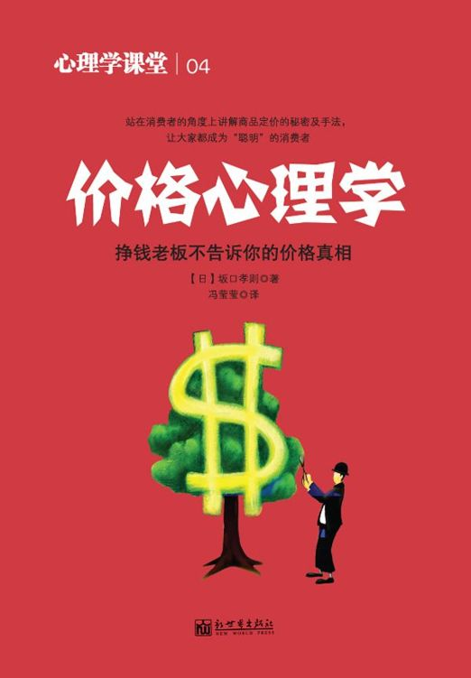

# 目录

# Contents

<a href="#part0061.html" class="calibre1">前言</a>

<a href="#part0062.html" class="calibre1">Part
1　为什么麦当劳的汉堡包只卖100日元也能赚钱？</a>

<a href="#part0063_split_000.html"
class="calibre1">第1章　通过差价来创造效益的设想</a>

<a href="#part0063_split_000.html_sec001"
class="calibre1">从大龄自由职业者到有钱人</a>

<a href="#part0063_split_001.html_sec002"
class="calibre1">营销必杀技——巧借资源获利</a>

<a href="#part0063_split_002.html_sec003"
class="calibre1">世界上最简单的营销</a>

<a href="#part0063_split_003.html_sec004"
class="calibre1">家电专营店的宿命——时刻置身于无比残酷的低价竞争中</a>

<a href="#part0064_split_000.html"
class="calibre1">第2章　获利陷阱就是“任何事都闭口不谈”</a>

<a href="#part0064_split_000.html_sec001"
class="calibre1">麦当劳“反其道而行之”的经营策略</a>

<a href="#part0064_split_001.html_sec002"
class="calibre1">100日元汉堡包背后暗藏的“陷阱”</a>

<a href="#part0064_split_002.html_sec003"
class="calibre1">为什么会出现一次性的店长？</a>

<a href="#part0064_split_003.html_sec004"
class="calibre1">将被扔掉的“东西”变成“钱”——“商品甩卖”的陷阱</a>

<a href="#part0065.html" class="calibre1">Part
2　迪士尼乐园除向顾客出售梦想外还有其他什么东西？</a>

<a href="#part0066_split_000.html"
class="calibre1">第3章　通过差价来创造效益的设想</a>

<a href="#part0066_split_000.html_sec001"
class="calibre1">米老鼠头饰给我的启示</a>

<a href="#part0066_split_001.html_sec002"
class="calibre1">能让顾客多次光顾的生意才是最赚钱的生意</a>

<a href="#part0066_split_002.html_sec003"
class="calibre1">盈亏分界点是企业的生命线</a>

<a href="#part0066_split_003.html_sec004"
class="calibre1">如何让顾客掏出钱包里的钱？</a>

<a href="#part0067_split_000.html"
class="calibre1">第4章　通过“极限效益”来增加销售额的定价方法</a>

<a href="#part0067_split_000.html_sec001"
class="calibre1">如果降价后依然卖不出去</a>

<a href="#part0067_split_001.html_sec002"
class="calibre1">为什么商家即使亏本也要将商品卖出去？</a>

<a href="#part0067_split_002.html_sec003"
class="calibre1">IT公司的经理为什么乐于频频露面？</a>

<a href="#part0068.html" class="calibre1">Part
3　为什么航空公司及家电专营店随意向顾客发放积分？</a>

<a href="#part0069_split_000.html"
class="calibre1">第5章　爱上便宜货，追求积分的代价</a>

<a href="#part0069_split_000.html_sec001"
class="calibre1">通过大幅度降价来“赚钱”</a>

<a href="#part0069_split_001.html_sec002"
class="calibre1">分手和热恋各自暗含的隐性成本</a>

<a href="#part0069_split_002.html_sec003"
class="calibre1">利用隐性成本来创造价值</a>

<a href="#part0070_split_000.html"
class="calibre1">第6章　积分大战谁是赢家</a>

<a href="#part0070_split_000.html_sec001"
class="calibre1">积分制给消费者带来了什么？</a>

<a href="#part0070_split_001.html_sec002"
class="calibre1">追求低价，会付出代价</a>

<a href="#part0071_split_000.html"
class="calibre1">第7章　积分制暗藏的获利陷阱</a>

<a href="#part0071_split_000.html_sec001"
class="calibre1">积分只增加了商家的盈利机会</a>

<a href="#part0071_split_001.html_sec002"
class="calibre1">积分制与最大折扣的一线之隔</a>

<a href="#part0072.html" class="calibre1">Part
4　所有的商品价格都暗藏着商家的某种意图</a>

<a href="#part0073_split_000.html"
class="calibre1">第8章　商品的获益率是多少？</a>

<a href="#part0073_split_000.html_sec001"
class="calibre1">让我茫然不解的问题</a>

<a href="#part0073_split_001.html_sec002"
class="calibre1">如何最大限度地吸引顾客？</a>

<a href="#part0073_split_002.html_sec003"
class="calibre1">解剖高档商品的利润陷阱</a>

<a href="#part0073_split_003.html_sec004"
class="calibre1">为利润而冒的风险</a>

<a href="#part0074_split_000.html"
class="calibre1">第9章　开店策略——胜利的公式</a>

<a href="#part0074_split_000.html_sec001"
class="calibre1">新店的店址是选在繁华地段还是僻静地段？</a>

<a href="#part0074_split_001.html_sec002"
class="calibre1">私人企业VS大型企业的胜负概率</a>

<a href="#part0074_split_002.html_sec003"
class="calibre1">商场的定律是“胜者为王”</a>

<a href="#part0074_split_003.html_sec004"
class="calibre1">为穷人设计的生存策略</a>

<a href="#part0075_split_000.html"
class="calibre1">第10章　定价陷阱式</a>

<a href="#part0075_split_000.html_sec001"
class="calibre1">“防不胜防”的定价手段</a>

<a href="#part0075_split_001.html_sec002"
class="calibre1">瞄准人性弱点的服务——无偿使用</a>

<a href="#part0076.html" class="calibre1">Part 5　秘而不宣的营销手段</a>

<a href="#part0077_split_000.html"
class="calibre1">第11章　营销人格的丧失——一名男子的亲笔记录</a>

<a href="#part0077_split_000.html_sec001"
class="calibre1">这是一段让我备感羞耻的经历</a>

<a href="#part0077_split_001.html_sec002" class="calibre1">欺骗</a>

<a href="#part0077_split_002.html_sec003" class="calibre1">洗脑</a>

<a href="#part0078.html" class="calibre1">Part
6　无人问津的小吃依然能存在下去的理由</a>

<a href="#part0079_split_000.html"
class="calibre1">第12章　由支出环节的不同而产生的反常现象</a>

<a href="#part0079_split_000.html_sec001"
class="calibre1">我记忆中的天空</a>

<a href="#part0079_split_001.html_sec002"
class="calibre1">再次感受“敌方的世界”</a>

<a href="#part0079_split_002.html_sec003"
class="calibre1">弱者的胜利宣言</a>

<a href="#part0079_split_003.html_sec004"
class="calibre1">神奇的夜总会女招待得到了什么？</a>

<a href="#part0080_split_000.html"
class="calibre1">第13章　以“非成本价主义”来重新审视家庭用度</a>

<a href="#part0080_split_000.html_sec001"
class="calibre1">低收入人群的可取之道</a>

<a href="#part0080_split_001.html_sec002"
class="calibre1">为经济困难人士设计的节约费用、削减成本的方法</a>

<a href="#part0080_split_002.html_sec003"
class="calibre1">以“吝啬鬼”和“慷慨者”都想达到的最终目的为目标</a>

<a href="#part0081.html" class="calibre1">后记</a>

<a href="#part0000.html" class="calibre1">返回总目录</a>

# 前言

### 获得无限财富的秘诀——价格心理学

我也不知是从哪里听来的这个让人不可思议的传闻，据说有一种方法能使任何人变成大富翁。

到目前为止，我的周围的确也有过几件类似的事例。比如，网上电子商务就标榜通过它能获得无限的财富；股票投资商也说只要能破解股票市场的潜在规律就一定能赚大钱；还有人标榜通过买卖信息来赚钱，即凭借自己在获取信息方面的一技之长来赚钱，这样即使不工作也可以维持生活。可悲的是，这些方法不仅没有给那些亲身实践者带来无限的财富，反而使他们陷入了痛苦的深渊。

但是，这次我听来的这种“对任何人都行之有效”的方法在理论上的确是可行的，那个讲述者眉飞色舞、口若悬河地给我介绍了这种赚钱的方法，即通过“烧钞票”来获取财富。

“烧钞票？”

现在，在日本银行能将破损的纸币换成新纸币。那么，如果保留半张纸币是否可以换取同等面值的新纸币呢？很遗憾，这是不行的。根据日本银行提出的标准，纸币的剩余面积必须要大于2/3，才能够换取同等面值的新币。如果纸币的剩余面积在2/5到2/3之间的话，只能够换取到原来一半面值的新币。如果纸币的剩余面积小于2/5的话，其剩余的面值就相当于零。

我们来设想一下，由火灾所造成的纸币破损该怎么处理呢？假设那些纸币不是因切割而损坏的，而是被烧掉了，如果银行能够认可那些灰烬就是纸币的话，那么就能够算出全部灰烬的面积。

其具体方法是，先准备3张纸币，然后烧掉每张纸币的1/3，接着捡出其中的两份灰烬并且归拢一处，这样就相当于得到了之前所说的2/3面积的纸币，于是一枚神奇的“新币”就这样诞生了。不过为了安全起见，不要重复烧之前已经烧过的地方，也可以将纸币数从4张变为5张。这种从无到有创造“财富”的理论使得“钱生钱”的设想得以成立。

怎么样，十分有意思吧！其实获得无限财富的秘诀就在于金钱自身！

难道已经有人通过这种方法变成了富翁吗？这当然是不可能的，甚至听都没有听说过有人亲身实践过这种方法。这种不入流的赚钱手段虽然听起来很有趣，但其敛财方法太过龌龊。对一般人而言，绝对没有勇气通过烧钞票来蒙骗国家公共机关。这种方法的最荒唐之处是，鼓吹通过损毁钞票能创造出更高的价值。

可是，在我听到这个方法不久后，我又听到了一个完全不同的版本。那就是“通过分割钞票来获取财富”，当然这只是个比喻，其真正的意图并不是这样。所谓的“钞票”其实是暗指“股份”。

前一段时间，很多企业都在进行股份的多次分割。比如，将市值100万日元的股份分割成100份，来发行面值1万日元的股票。以普通人的角度考虑，这种敛财方法似乎没有不妥之处。可是，仔细想想就会发现，印刷出这些股票是需要一定时间的。也就是说，在这段时间里股票市场的各种信息作为一种无形的股份也理应被分割给股民，可是这种股份实际上却是不存在的。在出现供求不平衡时，可能就会出现短暂的供不应求，股价也会跟着上涨。此时，企业老板可以通过卖出自己所持有的股份来实现一夜暴富。这就是刚才所提到的“通过分割钞票来获取财富”的实质。

当然，这种股份分割的方法仅仅是一个简单的例子。其实在这个世界上，仅存在两种人——“给别人设下陷阱的人”和“落入陷阱而被别人操控的人”，你如果能读懂别人的心理，就可以轻松的躲避陷阱，相反，就只能被别人操控。

其实我们大多数人通常都属于后者，在此简称为“我方”。属于“我方”的这类人每天在公司上班，赚取每个月二三十万日元（折合人民币1万～2万）的辛苦钱，空闲时兴致勃勃地收看电视里的搞笑节目，在超市为10日元的差价而斤斤计较，一边看着电视播出的棒球比赛一边喝着啤酒，就这样日复一日地生活。虽然这种生活方式不能获得巨大的财富，但却能感受到这种生活的充实感与幸福感，并且最重要的是，享受到了只有公司职员才有的零风险安全感。

与之相比，那些给别人设陷阱的人，简称“敌方”，一般都有自己的企业，并要亲自管理企业，要经常考虑商品、服务等具体事项，在不断承受风险的过程中赚钱。有的企业在创业之初，年收入还不到100万日元（折合人民币8万），有的企业承担的是令人难以想象的重体力活。可是，通过出售股份、周转所得资金等方法却可以使这个企业在一个月，甚至是几秒钟内就赚到相当于一般公司职员一年的薪水。

我要说的并不是哪种赚钱方法更好，这只不过是“两方人”所处的环境不同，他们各自的心理也迥异罢了。可惜的是，我是属于“我方”阵营的人。我并没有打算批评“敌方”的人，因为这只是个人所喜欢的生活方式不同罢了。

但是，请大家最好牢记一点，“敌方”的那些人一直在不断地制造各种各样的商品陷阱，用价格战来攫取超额的利益，盘算着各种赚钱方法。因此，简单地了解一下他们设陷阱的手段和赚钱方法，掌握他们赚钱的心理机制，会成为消除“敌我双方”隔阂的捷径，你也可以在这场价格战中变被动为主动。这就是本书真正要讲的内容——价格心理学。

### 你的年薪与预期相符吗？

虽说这个问题有些唐突，但是你的工资在日本究竟处于什么位置呢？估计你的年薪可能在200万～2000万日元（折合人民币16万～160万）之间，下面请看图1。

■图1　5000万人的工资分布图

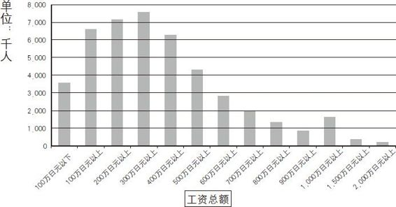

如图所见，工资的分布并不是以平均值为中心的对称分布，左侧的分布比较靠近最高点，整体分布呈现出一种不规则形态。看到此图，我不由得再次感到震惊，原来在日本还有这么多人的年薪低于200万。

假设在日本获取工资的人数正好是5000万，你的工资排名可以由以下的计算公式导出（详见图2）：

■图2　不同工资的参照系数列表

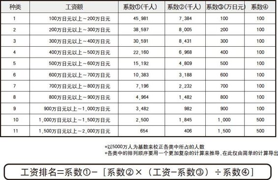

虽然计算过程稍显复杂，但并不难计算（系数①是指各类初始的排列顺序，系数②是指各类中包含的人数，系数③和系数④是用来校正各类内部的排列顺序）。如果有演算纸和电子计算器的话，几分钟内就能算出结果。比方说，你的工资是320万日元（顺便提一句，这正是我在工作后第一年的工资），符合图2中的第3类，系数①就为30591，系数②为8431，系数③为300，系数④为100。于是你的工资排名为：

30591－［8431×（320-300）÷100］＝28905千位

因为以上公式是以千为单位的，也就是说在5000万获取工资的人中，你的工资排名为第2800万位。由此也可以看出，年薪在300万日元以下的人差不多有2000万左右，换句话说，有相当多的人是属于图1中的左侧人群，这也正是左侧分布比较接近最高点的原因。

当然，你也可以将公司效益最好时所发放的年薪带入该公式进行计算。比如，你获得的年薪为600万日元（折合人民币50万），此时你的工资排名为第1000万位。事实上，确实有相当一部分人，他们毕业于名牌大学，但是年薪充其量也就600万日元左右。虽然他们所就读的大学之间的排名会有百分之几的偏差，但是他们的年薪在很短的时间内就能够进入总排名榜前20％的行列。

我们还可以试着进行同样的计算，比如，对于工资为2000万日元的人来说，他属于图2中的第11类，如上方法带入相应的各种系数，可以得出：

654－［406×（2000-1500）÷500］＝248千位

也就是说，他的工资排名大致在第25万位，同时还说明，工资在2000万日元以上的人大概有25万左右，这类人属于社会中相当富有的阶层。不过在日本，这样的人是否真能达到25万，就只能取决于个人不同的评价标准了。

我之所以在一开始就提出工资排名，是想让大家准确把握自己所处的位置。因为，几乎没有人能够毫不隐瞒地告诉我他的年薪是多少，当然也就不知道自己的收入到底处于什么位置，大家只是“急匆匆地把工资揣入兜里了事”。

看到这个排名后，那些一直认为自己的工资水平比较高的人可能会发现，原来自己的年薪远远低于预期。基于这种反思，有些人会从第二天开始，重新评估日常支出，并且采取措施改善生活方式，以降低生活费用。

今后，日本将迎来超老龄化的社会，每个人用于养老的钱可能会根据不同的计算方法而各有差异，但一般情况下都在2000万～3000万日元（折合人民币160万～250万）之间。但是，由于现在的人绝不允许养老金有丝毫差错，所以保险起见可将其设定在3000万～5000万（折合人民币250万～410万）日元之间。

同时，可由以下公式计算出养老所必需的储蓄金：

「收入－支出＋资产运作收益＝储蓄金」

这个公式计算起来相当简单便捷。同时，这个简单的公式也告诉了我们一个非常简单的事实。那就是，如果想增加存款量，要么增加收入，要么缩减支出，要么提高资产运作收益，除此以外别无他法。

能够积攒5000万日元的养老金是最理想的，可是实际上仅有百分之几的家庭能真正实现这个梦想。并且，这个榜单也告诉了我们一个事实，当你的工资排名并不位于总排名榜的前百分之几时，想要以此安心养老是相当困难的。

### 如何才能不当“负翁”

通过刚才的收入排名我们了解到，“收入-支出＋资产运作收益＝储蓄金”中的“收入”到底处于何种位置，当然这只是有关收入的一个侧面罢了。

我们可以试着这样考虑，你所进行的商业运作就是将自身作为一种人力资本投入到劳动市场，以赚取“储蓄金”为利润回报。如果客观评价的话，你卖出的价（＝收入）可能并没有那么高。可是，通过降低成本（＝支出）却能够实现利润的高回报。

本书关注的并不是“如何增加收入”，也不是“如何提高资产运作收益”，而是通过对商家制定价格的心理等方面的分析，告诉那些脚踏实地生活的人“如何缩减支出”。

我想，肯定有人想尽了一切办法让500万日元年薪中的100万变成为“储蓄金”。通常，人们的储蓄习惯是年薪的20％。如果能持续保持这个比例，就能增加100万日元的储蓄金——前提是能够成功地缩减支出，换句话说，相当于又得到了一份工资100万日元的工作。虽然高薪阶层的人可以通过获取高薪来增加储蓄金，但一般的工薪阶层却可以通过缩减支出来达到同样的目标。

本书的目的是向读者传授商品价格的秘密及商家如何给商品定价，剖析商家的价格心理，即解析企业赚取利润的各种环节，让读者了解生活中的种种陷阱。其中，详细介绍了我所熟知的进货、供货环节中的各种内幕。

同时，我还希望本书能成为降低成本、提高企业效益的独门秘籍，使企业决策人、私营企业主通过阅读它来更好地把握商品生产及销售的各种环节。这本价格心理学还可以帮助消费者更好地了解日常生活中商品的价格奥秘，如果你的目的是“缩减支出”“成为聪明的消费者”的话，就必须要清楚地了解卖方的种种销售逻辑与具体销售环节。

当然，你可能会问，那些进行打折促销活动的家电专营店的店员是不是都清楚其中的奥妙呢？我可以告诉你，绝对不可能。他们只不过是为了实现企业获利而按照某种规则在工作。如果阅读了本书，他们就会彻底领悟到自己按照公司指示所进行日常工作的具体意义。

例如，有些家电专营店的商家肯定会纳闷：“为什么有些店的打折商品仅比我家便宜1日元。”这是不是说明，有些公司表面上看是做亏本买卖，实际上却是赚钱的呢？

如果读者能够理解书中所提到的“极限效益”与“机会效益”的思维模式，就会逐步认清之前所忽视的种种商业环节，这些其实都是商家通过操控消费者的消费心理来制定的价格战。通过此书，企业员工能够重新认识自己工作的实质意义，消费者能够在讨价还价时立于不败之地。

本书不仅揭示了生活中各种商家在经济活动中制定价格时的心理策略，介绍了各种商品的进价，还介绍了商品结算的窍门、企业使顾客购买商品所使用的各种手段和心理诱导、一些恶意营销的实例，以及面对这些问题时如何来实现个人及企业的支出最少、成本削减。掌握这些技能并不需要你事先具备专业的知识，你只要能了解商家的这些价格心理手段，你就能轻松应对生活中的各种价格诱惑。

同时，本书若能启发大家对以上种种商业构想加以灵活运用，利用价格心理学重新思考如何创造新的商机，如何用一种全新的方法提高效益、降低成本，对我而言就是十分欣慰的事情了。

我期待本书能为人们实现更加美好的生活而尽到微薄之力。

坂口孝则

2009年10月

# Part 1　为什么麦当劳的汉堡包只卖100日元也能赚钱？

去快餐店时，顾客总是认为“点套餐要比单品划算”，其实对商家来说，也是套餐比单品要赚钱。这是为什么呢？（答案在本部分最后给出）

# 第1章　通过差价来创造效益的设想

## 从大龄自由职业者到有钱人

我想很多人都曾经期盼过那种不为别人工作、自由自在的生活。

我高中时曾经醉心于地铁音乐、重金属音乐及前卫先锋的音乐。当自己被那种近似于噪音的音乐所环绕时，我似乎感觉到了新时代的气息扑面而来，所看到的一切都焕发着光彩。

可是，年轻人的可悲之处就在于，当他热衷于某一件事的时候，并没有意识到那并不是生活的全部。我那些一直怀有音乐梦想的朋友们，为了能给音乐界带来新的革命，有的大学中途辍学，有的成为了大龄的自由职业者，继续着他们漫无目的的人生。

前不久，我又见到了那时的朋友们。与那些至今仍追求理想的老朋友们见面，总会让我陷入一种复杂的情绪里。说话方式的不同、思维方式的不同，甚至着装的不同，都使我在那里显得格格不入。

可是，这次的情况却稍微有些不同。

在聚会中，一个朋友突然说：“因为今天要往美国发送邮件，所以要早些回去。”而另一个人也说，要帮他包装商品，也要中途离席。据说，这两个人每月的净收入为50万日元（折合人民币4万）左右。我在想，是不是他们自己创办了公司呢？好奇心让我忍不住打听起他们的工作情况。

“不是那样的，我们只是在卖唱片，”其中一个说道，“就是把日本的唱片卖给那些对此感兴趣的美国人。”

以下是他们的商业运作模式。现在，每天都有唱片店关门，甚至连CD的销路都不好，那些出于怀旧心理来搜集唱片的人几乎已经没有了。于是，他们就开着轻型货车到那些已经倒闭的唱片店，用低价买下唱片，拍下封面照，并将其上传到eBay（世界上最大的拍卖网站，无论谁都可以和世界任何地方的人进行商品交易）。

我始终没能明白，为什么会有美国人来买日本的二手唱片呢？

于是，我的那个朋友解释道：“那是因为包装商品所用的写有日语的绳带成为了收藏品，”他还说道：“仅在日本唱片中才有的附赠曲目对外国人来说是新奇的事物。”比方说，用1日元买到的唱片，如果扣除运费的话，可以卖到20美元左右。他们只需干些体力活，以及将商品的照片上传到网站上就可以了，然后只需等待那些对此感兴趣的顾客前来垂询。如果每天能卖掉8张左右唱片的话，月收入很快就能达到50万日元。换句话说，以前大家连正眼都不瞧的唱片店，如果改变其销售方式，就可以获得原来2000倍的价值。

当然，这需要经营者具有一双慧眼，能准确判断出唱片具有的潜在价值。我的那两个朋友正是灵活运用了之前在音乐方面所积累的经验，再加上有效地使用了互联网这个工具，才使他们找到了适合自己的赚钱方法，与他们的同辈人站在了同一起跑线上。

使用被称为“Web2.0”的互联网工具并不是一种高深的“知识”。它只是一种被命名为“营销2.0”的单纯的、脚踏实地的营销形式。我的朋友虽然对互联网一窍不通，但是却留意到人们一直在议论“使用Web2.0是否真能赚钱”，于是他利用生活中的商品差价，给自己带来了收益。

他现在一个人住在一所宽敞的房子里，房间里电脑与唱片堆积如山。“最近真是太忙了。”他说。看着他浑身沾满灰尘的样子，我不由得心生羡慕。

并且，我相信，这个有关“差价”的真实故事会不断启发人们来尝试进行成功的营销。

## 营销必杀技——巧借资源获利

在世界性经济衰退还未真正到来的2008年9月，我去了一趟山田电器（日本家电连锁零售企业）下属的名为“LABI涩谷”的家电专营店。这个店刚刚开业不久。在店里，总能看到商家请来的“托儿”及各种各样的摄像器材。这家专营店从开业起就客源不断，甚至连收银台前都排起了长队。

我想买一台笔记本电脑，于是乘电梯来到了3层的电脑专卖场。在这里，我发现了一些与众不同的顾客，他们在专门寻找那些“一人仅限定一件”的开业酬宾的特价商品。并且，怎么看都觉得那些排队等待结账的男人穿着很寒酸。

我看中了一款松下的笔记本电脑，在讨价还价后决定购买，于是我来到收银台前排队等待结账。在排队的人群中，我看到了那些“与众不同的顾客”，他们也正打算买电脑。

虽说不能仅凭外表判断这些人的身份，但如果他们不是从事脑力劳动的话，又为什么要买笔记本电脑呢？

我走出电器店后注意到，在店面周围停靠着几台货车。

他们会不会是某个企业的经理？我记得结账时排在我前边的那些人是从公文包中取出钞票的，同时好像还在本子上记录着什么。这时，我看到一个刚买完东西的男人走向货车，但他把“战利品”放入车内之后，却再一次返回到店里为买下件商品继续排起了队。其实这些人是中间商，他们利用山田电器开业低价酬宾的机会用最低价购入商品，再将其转卖出去。

我们对这种事情无须太过惊讶，如同上述例子一样，只要有店铺开业酬宾就能吸引这种人蜂拥而至，他们要寻求商家开出的“明知会亏本”的最低价格。他们并不是普通的顾客，而是利用市场差价来获取利润的“狠角色”。

这些利用市场差价来获取利润的“狠角色”的做法再次告诉了我们一个真理——营销就是尽可能地低价进、高价出。

## 世界上最简单的营销

这种趁着家电专营店开业，去大量采购的做法是一种很实际的营销方式，因为其中存在着“差价”（详见图1）。

■图1　通过“差价”来进行营销的设想

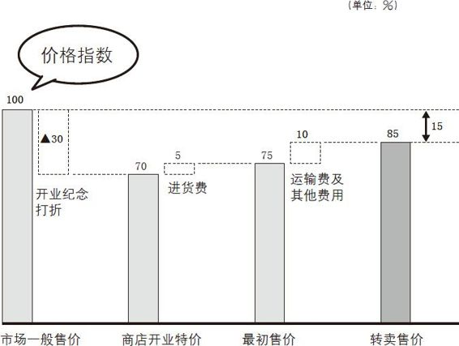

商品的一般市场价用最左侧的柱状图表示。但商家如果要在开业之日吸引更多的顾客，就会推出许多价廉物美的商品，其中大部分商品的折扣在30％左右（将在Part
2里讲解商家为什么能如此大幅度降价）。即使在这个价格的基础上再算上5％的进货费，还是比一般的市场价要低。即使再加上10％左右的运输费及其他费用，仍能确保买主获得足足15％的利润。

买家在商店开业及打折时采购大量商品，并将其销往国外及商品竞价不激烈的地方，然后在那里仅有的几家折扣店里进行销售，地方折扣店与东京折扣店之间的差价就是这样被暗藏起来的。

所以我说：“营销最基本的就是要尽可能地低价进、高价出。”经济学所认为的最完美的市场环境就是将所有信息提供给所有的消费者，然后产生完全统一的市场价格。当市场需求量与供给量达成一致时，唯一的合理价格便应运而生了。

可是，在实际生活中，同一种商品有差价是极其正常的。我们都知道，A店与B店所卖的电视机的价格可能会不同，正因为如此，消费者才想方设法地寻找价格最低的店铺。

以前，在销售家电等商品的地方，随处可见这样的表述——比厂家规定的零售价便宜xx％。可是，商品公正交易委员会指出，这样的表述只是为了强调售价便宜而采取的非正当的价格表示方法。因此不久之后，“开业酬宾价”这样的表述方法逐渐在商家中被推广起来，因为这种做法无需标出具体定价。

由于是开业酬宾价，商店才可以不局限于“比厂家规定的零售价便宜xx％”这样的价格，而能随意定价。并且，通过这种“开业酬宾价”的普及，使市场差价变得更加显著，从而为某些人赚钱提供了机会。

我不清楚那些利用市场差价来获取利润的人是否真的懂得这个道理，但是，他们的确是以这种方式向人们传达出“他们懂得如何努力赚钱”的。

## 家电专营店的宿命——时刻置身于无比残酷的低价竞争中

顺便提一下，作为卖方的家电专营店是如何来赚钱的呢？我们可以以销售电脑为例来进行说明。比方，可以先选定手头的广告单中26万日元的笔记本电脑，并对其价格进行分析。接着，让我们看一下这个价格中所包含的厂家利润及卖家的销售利润（详见图2）。

■图2　26万日元的笔记本电脑的利润

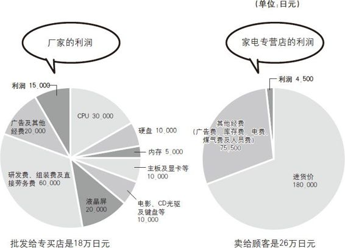

首先，厂家会以18万日元左右的价格将电脑批发给家电专营店。可是，对于厂家来说，每台电脑的利润不过1.5万日元左右。并且，对于销售电脑的家电专营店来说，每台电脑仅能获利4500日元左右。与国外的厂商相比，日本的电脑厂商始终保有CPU、OS等核心技术上的优势。因此，厂家仅通过对核心部件的组装就能获得附加价值。目前，任何厂家的电脑功能及质量都十分相似，如果厂家将全部精力都投入到那些不必要的软件研发上，其结果只能是获得低利润。

然而，尽管厂家获得的利润很低，却已经让家电市场感到“望尘莫及”了。对于家电市场来说，最重要的是商品能否卖得出去。所以，他们会大量进货，并将电脑本身的价格定得很低。当然，他们在进货时会和厂家讨价还价，其目的是要进一步削减厂家的利润。

如果真是这样的话，会出现什么局面呢？当家电专营店只进1台电脑时价格是18万日元／台，进1000台时的价格就是17万日元／台，进2000台时的价格就变成了16万日元／台。可是，预计销售量仅有1000台，也就是说顾客仅能买走1000台电脑时，商家却进了2000台的电脑。

其中的原因是什么呢？这是因为商家想通过一次进2000台电脑，从厂家那里拿到最低进货价。并且，正因为有这种“比任何地方都便宜”的价格，才使得商家能在顾客面前提升自己的形象。

那么，剩余的那1000台电脑去了哪里呢？那些电脑会通过一种不为人知的渠道流向市场。比如，用16万日元进的电脑，在地方上的廉价商店里以16.5万日元的价格被倒卖。因为在通常情况下，地方上的廉价商店无法一下子搞到2000台电脑以满足需要，而16.5万日元的零售价对消费者来说又是极具吸引力的。这样一来，地方上的廉价商店、折扣店就成了家电专营店及中间商的出货地。同时，也为地方上的消费者提供了价格优惠的商品。

其实，家电专营店要获利还有一个秘诀，就是在购入商品后从厂家处得到一定的回扣。厂家将其作为购买本公司商品的“谢礼”上缴给家电市场。人们一般也将其称为“促销赞助金”，其实质相当于降低了那些老主顾们的进货价，因为他们今后仍将源源不断地进货。由于家电专营店之间的竞争日趋白热化，于是商家便从商品价格中扣除了“促销赞助金”的部分，再将其卖给顾客。

然而根据行业的不同，这种做法所带来的效果也发生了一些变化。比如，在饮料及啤酒行业，已经成为惯例的“促销赞助金”却使得商家难以完成厂家规定的零售价。就像我刚才在“开业酬宾价”部分所讲的一样，如果所有商品都是“比厂家规定的价格便宜xx％”的话，所谓“厂家规定的零售价”一说又有什么意义？零售商以厂家规定的零售价为标准，尽可能地压低进货价，并再次扣除了“促销赞助金”的部分，其结果就是使商家陷入到“竞相甩卖”的泥沼中。这也是“开业酬宾价”产生的另一个背景，因为它不需要设定具体的零售价。

对于厂家来说，作为买主的零售商会尽可能地压价，并且还掠夺走了“促销赞助金”，所以他们在某种程度上是厂家的“敌人”。于是，厂家会反戈一击，将供货价同样以“开业酬宾价”的形式提供给消费者，同时还废除了“促销赞助金”。这是因为对厂家来说，真正的买主并不是那些在经营竞争中疲于奔命、以降低进货费为目的的零售商，而是广大消费者。

厂家实施这种策略后，即使零售商再怎么讨价还价，也无法把进货价压低到“规定零售价的70％以下”。同时我还认为，通过废除“促销赞助金”，终于给商家“竞相甩卖”的风潮画上了休止符。

商品价格下滑而引起的利润降低是覆盖所有行业的噩梦，废除“规定零售价”就能给暗淡的局面带来希望，那不过是听上去很诱人的天方夜谭。并且，这也意味着消费者要购买价格更高的商品。所以，还是像零售商所说的那样，最终要看商品能否卖出去。另外，还有一点让我非常感兴趣，那就是所谓的“开业酬宾价”今后会以何种形式收场。

让我们再重新回到家电专营店的话题上。

在家电行业中，获取“促销赞助金”并不是降低成本的唯一方法。

首先，家电专营店会以广告费为名，要求厂家支付“促销赞助金”以外的钱；其次，他们会让那些厂家的“助手”来辅助他们售货；另外，他们还会动员厂家的职员经常确认库存量。所以，他们充分地使用了作为能带来大订单的老主顾才享有的特权。

在那些专门介绍“零售”的教科书中，“生产者（厂家）”与“零售商”是被严格划分开的。可是，你一定有过这样的印象，在家电专营店里给我们介绍商品的售货员是来自厂家的职员。当然也有这样的例子，某个家电专营店因为滥用自己的特权，要求厂家非法外派工人，而被法院以“违反《禁止垄断法》”判处。

对于这种无节制地使用其他公司职员的做法，我决不会妄加赞同。但与其批评那些专营店，不如说这是被称为“世界首屈一指的技术集团”的日本制造业自身的一种宿命，那就是要时刻置身于无比残酷的低价竞争中。每当我看到那些家电运营商及厂家职员疲惫不堪的样子，都会感到悲哀。

# 第2章　获利陷阱就是“任何事都闭口不谈”

## 麦当劳“反其道而行之”的经营策略

上一节讲的是如何利用生活中的商品差价来进行营销，同时也让我们了解了家电专营店是如何薄利多销的。然而，对低利润营销进行解析时，必须提到麦当劳“反其道而行之”的经营策略。

众所周知，麦当劳会根据不同的店铺调整同一种食品的价格。于是，可以做出下面的地区差价图（图3）。

■图3　“巨无霸”套餐的地区间差价

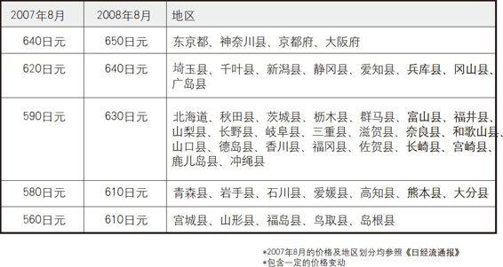

在经济界有个词叫“巨无霸指数”，即在美国及日本的麦当劳店销售的“巨无霸”汉堡包的单价，可以作为国际指标换算出任何国家的汇率。例如，美国某日的巨无霸汉堡包的价格为3.5美元，此时它在日本的价格为300日元。然后，通过300÷3.5≈86就可以算出1美元＝86日元（当然，因为存在消费税等问题，仅是估算值）。

在“巨无霸指数”的基础上再加上美国的通胀指数，大致可以估算出1美元大约合70～80日元。如果将现在的汇率假定为1美元＝90日元的话，可以肯定其中差值部分的产生是具有某种目的的。实际上，已经有人提出，就日元的功能来讲其贬值速度太快。这也可解释为，正是由于日本买入了美国的亏损国债，才导致了日元的异常贬值。

所谓的“巨无霸指数”就是通过在全世界销售相同的“巨无霸”汉堡包，来比较各国的购买力，从而算出最佳汇率。

可是，在这个“巨无霸指数”中有一点是不能被忽视的，即计算这个指数的前提是“巨无霸”汉堡包要有全国统一价。然而，日本的麦当劳由于地区的不同而存在差价。因此，将日本“巨无霸”汉堡包的价格一概而论是不切实际的。另外，在麦当劳公司的主页上也未登载出商品的具体价格。因此，由不同市场需求量所决定的地区间差价变化可以参照下方的曲线图（图4）。

■图4　商品售价由需求量曲线决定

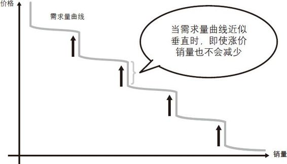

在对日本若干地区的“巨无霸”汉堡包的价格进行调查之后发现，其价格被设定在不影响销售额，或对销售额仅造成微小影响的水平。并且，大城市与地方城市间产生差价的根本原因在于“大城市的消费者买得起”。

通常人们会认为，因为大城市的生产成本较高导致了商品的价格高。可是，麦当劳作为全国统一规模的直营店而不能均衡售价，这实在是令人费解。

其实，商品价格并不是由成本决定的，而是以预期利润与消费者所能接受的价格为基础而制定的，成本只是被反向推算出来的一项指标而已（关于这个问题将在Part
6里进行讲解）。

其中最具代表性的方法就是PSM（Price Sensitivity
Measurement）分析，即通过统计一定数量消费者的价格取向，来制定合适的价格。同时，不能使消费者感到商品价格“太贵”或是“太便宜”。因为每个人的感觉是不同的，所以这种方法不一定能得到最准确的答案。然而，由于这种方法是以绝大多数人的意见为依据的，所以能在最大程度上获得最佳答案（详见图5）。

■图5　消费者的价格取向决定售价

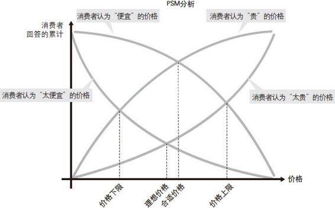

另外，当你认为你的定价是“消费者能够接受的价格”，而实际上反响却不好的话，可以尝试重新调整价格。实际上，日本麦当劳的定价在不断变化也是众所周知的事情。

如前面所述，那些雇用“利用市场差价来获取利润的‘狠角色’”的中间商正是利用国内商品的差价为自己创造利润。然而，市场并不是绝对平均、完全统一的事物。根据地区的不同，消费者所能容许的商品价格也不同。因此，商家才能利用差价来实现销售额的最大化。

## 100日元汉堡包背后暗藏的“陷阱”

那么，麦当劳通过这种不同的定价方式是如何来获利的呢？

商品的利润可以通过“利润＝销售额－支出”这个公式计算。由此可以看出，在确保销售额之后，关键是如何降低支出、提高利润。

麦当劳里最有名的是100日元（折合人民币8元）的汉堡包，当然，在其他快餐店里也有类似的低价位汉堡包。这种100日元汉堡包的所需支出可用下图来表示（详见图6）。

■图6　100日元汉堡包的利润构成

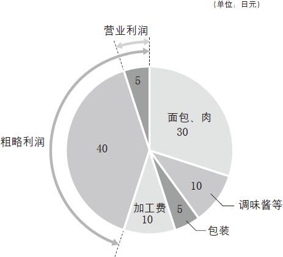

假定利润为5日元左右时，可称其为“低利润”。

可是，这里还应该考虑到存在套餐的情况。当然，如果是穷学生的话，只吃一个汉堡包就够了。但大多数人通常都不会仅点一个100日元的汉堡包，而会点一个含有该汉堡包的套餐。并且，麦当劳会让顾客觉得，一个包括100日元的汉堡包、果汁及薯条的套餐要比单品划算。

单品价格：

●汉堡包：100日元

●饮　料：200日元

●薯　条：250日元

合　计：550日元

套餐价格：

价　格：480日元

因此，点套餐可以省70日元。

快餐界正在将“点单品贵”“点套餐划算”的观念渗透到每位顾客的头脑中，可前提是要根据成本价来制定具体套餐的价格。

假设在100日元汉堡包的支出中，含有支付给女收银员的40日元左右的劳务费。此时，如果她们每小时的工资是800日元的话，就可以算出每卖出一个汉堡包大概需要3分钟时间。

800日元÷60分钟×3分钟＝40日元

换句话说，也可以认为接待一个顾客需要3分钟的时间。由此可以看出，无论是售出一个100日元的汉堡包，还是售出一份套餐，那些接待顾客的女员工所赚的钱是完全相同的。于是，本应作为售出饮料和薯条的那40日元的劳务费就这样无形中消失了。所以，与其说套餐的价格让顾客觉得“很划算”，不如说这个价格给商家带来了利润（详见图7）。

■图7　由“粗略利润混合体”所产生的获利陷阱

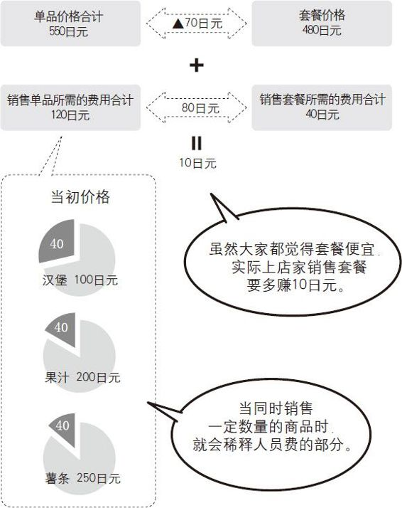

通常认为，每个单品的成本价就是将各种成本费用简单相加。可是，当同时销售一定数量的商品时，就会“稀释”人员费的部分。仅通过计算个别商品的成本价是不能发现这个“秘密”的。在零售业中，将其称为“粗略利润混合体”，简单的解释就是“先赔后赚”。该指标所关注的并不是每个单品的利润，而是包含销售情况等因素在内的整体利润。

在此，我们需要明确快餐店的获利陷阱：

1．通过价格上的差别来实现销售额的最大化。

2．通过商品的混合搭配（出售套餐）来实现利润的最大化。

因为“100日元的汉堡包”这个叫法本身能给人留下深刻印象，因此能被广大消费者所熟知。可是，很少有人能注意到其中暗藏的“陷阱”。

在这里，应事先牢记一点：做生意的人绝对不会对别人说自己赚了钱。如果要了解商家获利的陷阱，不要看他们“说些什么”，而是要设想他们“没有说的到底是什么”。

关于“商家通过100日元的汉堡包来如何获利”的问题，必须要更正为“商家是如何有效利用100日元的汉堡包来做宣传，以此获利的”。

一些“漫画吧”（以漫画为主题的咖啡店）大致都以“最初1小时390日元”的广告来招揽顾客。因为顾客所在意的是，支付给店家的费用是不是远远多于在滞留时间内看漫画书的费用。所以，“漫画吧”是利用顾客滞留的时间长短来赚钱，因此广告仅打出“最初的价格”。

“电视购物”是深夜电视节目中一成不变的内容。此类节目总是不停地强调“客户的还款利息为零”“利息由我公司负担”“对于购买商品的顾客，我公司将再赠送一份同等商品”等等。可是，所谓“利息部分”与“赠品部分”的钱早就被纳入到商品的售价里了。

所以说，最重要的是要看穿商家“没有说的到底是什么”。

## 为什么会出现一次性的店长？

让我们来继续快餐店的话题。

关于以下内容，会在下一部分中进行详细说明，在此只做简单的介绍。

商品所需的成本可以分为以下两种：

●固定支出：包括人员费、房租、折旧费等，与销售额无关的所需成本

●变动支出：材料及加工费等，与销售额成比相关的所需成本

例如，拉面店决定雇一个临时工，要求他每个月工作20个工作日、每个工作日工作8小时。拉面店付给临时工的工资就是固定支出，它与销售额多少无关。即便店主哭着说“因为本月的销售额很低，所以可能无法给你发工钱”，也必须要支付这部分成本。

所谓的“变动支出”主要以从外面采购的材料为主，商家会按照一定的进货标准大量订货，这样做有利于在交易中讨价还价，以实现“最低价进货”的目的。另外，由于加工过程必须按照具体的步骤来操作，因此商家会最大限度地谋求简单、高效的加工过程。

企业要想提高利润，必须要设法降低固定支出与变动支出。此时，读者中可能已经有人突然意识到，成本中不仅包括与销售额成比相关的部分（＝变动支出），还包括与销售有关的其他部分（＝固定支出）。如果意识到这点就会明白，商家要提高利润就必须进一步压低固定支出，也就是要充分利用固定支出份额内的员工来增加销量。

正如我们在快餐店里看到的一样，店家首先将销售的重点从“单品”转移到“套餐”，然后通过“稀释”打工者销售单品所获得的工资来进一步提高利润，并在此之后，通过进一步增加商品数量来最大程度地“稀释”固定支出，以实现利润的最大化（详见图8）。

■图8　如果压缩固定支出商品的成本就会下降

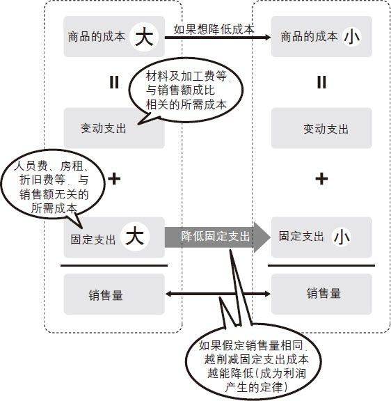

如果了解了这点就会知道，实际上多数的快餐店或是便利商店都在采取这种策略。为数不少的店铺都将员工的数量控制在最低水平线，因此在“固定支出”份额内占有相当比例的店长都承受着繁重的工作，有的甚至达到了身体的极限。而另一方面，公司总部却为了增加销售额而不断地投入新商品。

遗憾的是，只要存在这种获利陷阱，就必然存在着“名义上的管理岗位”或者“一次性的店长”。

对于大多数的代理连锁店来说，他们要将一半左右的粗略利润上交给公司总部。因此，增加销量关系到每个商品所需固定支出的削减，并最终有助于利润的提高。并且，通过增加销量也能使店铺的利润稳步提高。作为店铺本身来说，通过降低固定支出来提高利润是一个非常合乎情理的经营策略。

当然，我从心里非常同情那些“仅上岗一次就被解雇”的店长，但我并不想一味地批评掌管快餐店的公司总部。因为快餐生意如果要赚钱，归根结底都要采取这种方法。另外，作为店长也应该清醒地认识到，一旦进入快餐界就相当于将自己置身于这种利润构成当中了。

## 将被扔掉的“东西”变成“钱”——“商品甩卖”的陷阱

在此之前，已经分别论述了“国内外的商品差价”“大城市与地方城市的家电差价”以及“麦当劳在日本不同地区的差价”。在本章的最后，我要使大家明白，“差价”并不是单纯地由地理位置决定的，因为时间上的差异也能产生“差价”。

例如肉类食品行业。该行业因为伪造包装、销售过期食品等问题一度成为了社会关注的焦点。我们可以试想一下，销售每公斤1000日元的食用肉的情况，在多数情况下这些肉都是以冷冻状态从市场发往批发点的。

你可能不相信，如果将冷冻温度严格地控制在零下25℃，这些肉在1年之内仍可食用。当然，冷冻的方法有很多种，如液压法、隧道冷却器法（将物体放置于带式传送机上进行冷冻）、CAS法（使细胞并不致死而将其冷冻的特殊技术）。因此，必须要严格注意保管方法，一旦温度条件不够，肌红蛋白就会变性，肉质就会变色。如果冷冻的食用肉过早地变色，会影响其外观（不新鲜），最终导致其价值下降。

因此，冷冻肉在冷冻期间越接近保质期，价格会变得越便宜。当每公斤1000日元的肉，便宜90％而变成100日元时。对于保存冷冻肉的批发商而言，与其扔掉它们不如设法将它们卖掉（详见图9）。

■图9　肉价随保存时间的延长而下跌

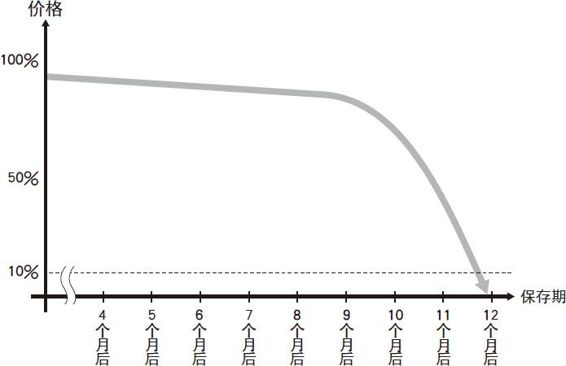

于是，全国各地的中间商会打电话给食品采购员及商品交易业者，其电话内容均为：“因为我们这里多出1吨左右的肉，所以现售价是每公斤200日元，您要些吗？”当然，买或不买对方可以自由选择。由于这些“过期肉”与新鲜肉在味道上的差异可以通过烹饪变得不明显，所以想买便宜货的商家会购入这种“过期肉”。

我们总是会听到这样的抱怨：“要是换个地方买盒饭，就会多个菜。”那是因为有些商家所卖的盒饭非常便宜，甚至便宜到按正常进货价计算会亏本的程度。这是因为商家在进行“非正常”的采购，他们利用市场上的差价大量购入别人要处理掉的食品，然后再卖给顾客。因为盒饭店不需要每天都生产新的食材，并且可以根据当日的销售来调整食材，所以能够灵活运用这种赚钱模式。

在一些大型便利店的连锁店里，店家时常会推出300日元的盒饭。其原因在于，他们因大量订货削减了材料费，并通过大量生产压缩了生产成本，同时将人员费最小化。可是，为什么一个小小的盒饭店有时也能推出300日元的盒饭呢？那是因为，他们利用时间上的差价降低了成本，有了能够向“大店”的市场地位发起挑战的资本。

顺便提一句，实际上那些过期食品的理论市场价为“0”。但也正是这个“零成本”吸引了商家，他们或是将“过期肉”烹饪之后出售，或是将“过期肉”切碎与其他肉混合后出售。

另外，还有些商家将“过期肉”与学校食堂所剩的面包混合后“创造”出一种新肉。更有甚者，一些商家只购买“骨棒”，然后再用粘合剂将“过期肉”粘在上面。

一般情况下，消费者看到价格便宜的商品，会有购买的欲望。另一方面，生意人会发现市场中存在的“差价”，从而“嗅到”商机。

最近，“10日元的咖啡”成为了大家议论的焦点。商家为什么会设定这种远远低于市场价、常理上绝对讲不通的价格，其原因有以下3种可能：

1．减价处理模式：这些咖啡要么是卖不出去的商品，要么是其生产厂家已经倒闭。所以商家认为与其扔掉这些咖啡，不如将其低价卖掉，哪怕只能卖1日元。

2．前期——后期模式：商家将这些咖啡作为“前期商品”（吸引顾客的商品）以此来招揽顾客，然后再推出大量的“后期商品”（真正要销售的商品）来弥补前期的亏损。

3．广告宣传模式：商家通过向消费者提供这种“10日元的咖啡”来为自己做宣传，其费用由赞助厂商提供。

当然，这其中也可能存在着定价上的失误。但在这里，我们先排除这个因素。因为10日元的咖啡是通过自动贩卖机来销售的，符合上面的第1种情况。对于类似10日元咖啡这样的超低价商品来说，首先商家用极低的价格从破产厂家的库存中收购，然后再将其投放到市场。或者说，商家是这样考虑的：“与其将这些要过期的咖啡压在手里，不如以‘跳楼价’卖掉，多少还能赚到一些钱。”

在现实生活中，有很多商品还没来得及进入人们的视线就被处理掉了。即使是“扔东西”，也是需要花钱的，而且成为不了人们关注的话题。但是，如果以10日元的价格将商品出售的话，就会吸引消费者。虽说商品仅能卖10日元，但却使“要被扔掉的东西”变成了“钱”。关于这个“陷阱”会在以后的章节里与“隐没成本”（隐藏进货价）一起介绍。

这种获利陷阱使“10日元的咖啡”成为可能，与此类似，在生活中还存在着各种各样的“商品贱卖”“商品甩卖”的陷阱。通过了解这些营销方式，能为我们日常购物增加新的选择。

并且，知道那些“陷阱”要比不知道开心得多。

**Part 1小节**

●即使是市场中的同一件商品，根据销售地点的不同也会有差价。营销最基本的就是“尽可能低价进、高价出”。寻找并购入低价商品，再将其转卖出去是最简单的经商模式。

●快餐店及便利店将商品“捆绑”出售以使消费者感觉“很划算”，以此最终达到利润最大化。

●商品所需成本分为“固定支出”与“变动支出”两种，店家通过增加销量来“稀释”每件商品所需的“固定支出”以使其利润上升。

●食品类商品的价格在保质期内会随时间而变化。之所以会出现“超低价”盒饭等食品，就是因为商家通过购入“要过期”的原材料从而降低了成本。

●本部分首页问题的答案是：因为无论是销售套餐还是单品，其所需的费用都是一定的。

# Part 2　迪士尼乐园除向顾客出售梦想外还有其他什么东西？

为什么家电专营店即使亏本也要比其他店卖的便宜，“哪怕只便宜1日元”？（答案在本部分最后给出）

# 第3章　通过差价来创造效益的设想

## 米老鼠头饰给我的启示

记得在我小学6年级的时候，有一次在东京车站里看到两个戴着非常大的“圆耳朵”的女孩从我面前走过。我感到很惊奇，于是就指着那两个人问身旁的母亲：“妈妈你看，那些人忘记把耳朵摘下来了。”妈妈回答道：“让我来告诉你吧。”

于是母亲细细地给我讲解了这其中的缘故：“她们是特意带着那个‘圆耳朵’的。”

其实，这个“圆耳朵”就是舞滨车站附近的“梦想王国”所发售的纪念品。尽管我当时年纪很小，但也知道这个“圆耳朵”是世界上最有名的“米老鼠”的特征之一。当时，我们是从九州来东京旅游的。当我看到那两个女孩在“梦想王国”以外的地方依然能毫无顾忌地戴着那个“圆耳朵”时，对我来说是件不可思议的事情。我记得当时听了母亲的回答之后，仍然觉得不可思议。

然而，当时年幼无知的我是没有办法明白的，对这两个女孩来说，那里并不是东京车站，她们依然沉浸在“梦想王国”的世界里。

华特·迪斯尼，出生于1901年，14岁时被无声电影“白雪公主”中的情节感动，从此他踏上了不停追逐梦想的人生之路，18岁时创立了第一家公司，并开始制作动画片。尽管他在创业之初屡遭失败并负债累累，但他最终战胜了这一切。

一次华特·迪斯尼乘坐列车从纽约前往加利福尼亚，在旅途中创作了“米老鼠”这个卡通形象，并于1928年将“米老鼠”拍成了电影并大获成功。在那之后，他又经历了很多坎坷，如朋友的背叛、事业发展受阻，但他最终还是渡过了这些难关，并于1955年创建了迪士尼乐园，实现了自己20多年的梦想。

华特先生极力排除了来自很多专家及周围人的反对意见，果断地决定筹集资金，他要向人们讲述自己的梦想。

迪士尼乐园开业当天，人们蜂拥而至，人数远远超出了预估。虽然开始局面显得有些混乱，但不久之后游客开始自觉地遵守秩序，因为这里是他们所喜爱的主题乐园。在乐园里，各种吸引人的游乐设施随处可见，它们一刻不停地运行着，直到今天仍吸引着世界各地的游客。

华特先生在迪士尼乐园开业那天说：“迪士尼乐园是属于大家的国度，我们希望成年人在这里能重新找回失去的岁月，希望年轻人在这里能鼓起勇气迎接未来的各种挑战。迪士尼乐园为大家奉上的是远离残酷现实的理想、梦想及真正的美国精神。”（选自帕特·维利姆斯所著的《学习华特·迪斯尼那种不屈不挠的创业精神》，小猫出版社）

这个“王国”并不仅仅是一个主题乐园，它体现的是那些来到美国的欧洲移民对这片新大陆所寄托的理想，是他们梦想的一种具体表现形式。同时，因为华特先生一直对“小飞侠彼得·潘”的故事充满向往，因此迪士尼乐园也正是他个人所有梦想的总和。

## 能让顾客多次光顾的生意才是最赚钱的生意

前几天，我去了一趟东京迪士尼乐园。当我走出舞滨车站，乘坐上迪士尼乐园的专用电车时，发现车窗的形状都是按照“米老鼠”的轮廓来设计的。在电车到达目的地之后，一眼就能看到售票处排起的长队，并能听到从园内传来的音乐。

要进入迪斯尼海上乐园必须要穿过入口的那扇门。当我走出那条拥挤的通道后，一个美丽的“王国”便呈现在了眼前。此时，我已然变成了“王国”里的居民。

我不断穿梭于“王国”里的不同地方，并排队玩了好几个游乐项目。午饭后，我稍作休息，并要了一杯果汁。傍晚时分，我要了些啤酒，边喝边吃完了晚饭，然后耐心等待晚上将要举行的“卡通人物大游行”。

此时，已有很多人为了观看晚上8点开始的“大游行”聚集到了中央水池的周围。时间一到，这场极具震撼力的“水火交融”的演出开始了。

“今天真的好开心呀！”人们边说边恋恋不舍地走出了乐园，重新回到了现实世界。由于人们对这个“梦想的世界”过于眷恋，于是纷纷到街道两旁的礼品店购买纪念品。很多人因为沉浸在购物的快乐中而忘记了时间，当他们发觉周围景物的光线已经彻底暗下来时，才恋恋不舍地向车站走去。

在那之后，我又去了迪士尼乐园的陆地部分，当穿过了作为“王国”唯一入口的那扇门后，矗立在远处的“灰姑娘城堡”出现在了眼前。

我一边走一边四下张望，看到很多小孩子在嬉戏。那时我脑海里忽然冒出一个问题，孩子们会怎样审视这个“王国”呢？于是我蹲了下来。此时，展现在我面前的是充满梦想的异国风景，这是在学校及其他地方所不能感受到的。园中建筑物的顶端部分被设计得很小，使建筑看起来比实际大很多。此刻，看上去距离我很远的“灰姑娘城堡”也没有那么远了。这种设计可能是利用了人们视觉上产生的错觉。

不知不觉已经到了傍晚，我无意中看到一个母亲领着孩子急匆匆地跑向一个个游乐设施，估计他们是从别的地方来东京旅游的。我听到孩子说“真想再来玩啊！”我想这个孩子一定还沉醉在“梦想王国”的童话世界里。

我想，人类如果离开了“童话”可能无法生活下去。哪怕那个“童话”仅能存在一天，对于那些孩子们来说也无法忘怀。

为了使游客满意，迪士尼乐园提供了人们所需的一切商品，以便能够让他们长时间地滞留在园内。

为什么要使游客长时间地滞留在园内呢？这当然与迪士尼乐园的“获利陷阱”密不可分。

迪士尼乐园是典型的“固定支出型企业”，因为它向游客全力提供的各种游乐设施及“王国”本身都是属于固定支出的部分。所以，迪士尼乐园的经营模式就是通过延长游客的游园时间来唤起人们的消费欲。

让我们来看一下那些引人入胜的游乐设施所采用的基本技术：

◎尽可能表现出与现实世界之间的强烈反差（令人惊叹的创作）

◎利用音效及视觉上能达到的效果，使游客一直觉得自己置身在另一个不同的世界里（接二连三的惊喜）

◎尽可能延长游客的游玩时间，并以此来不断给予他们亲近感，最终使他们对游乐设施产生依赖心理（惊喜的终极目的）

能让顾客多次光顾的生意才是最赚钱的生意，所以迪士尼乐园首先要让游客们“上瘾”。

## 盈亏分界点是企业的生命线

让我们在这里重新温习一下Part 1所讲到的“固定支出”与“变动支出”。

·固定支出：包括人员费、房租、折旧费等，与销售额无关的所需成本

·变动支出：材料及加工费等，与销售额成比相关的所需成本

迪士尼乐园的“固定支出”，包括大面积的建园用地、各种游乐设施、支付给员工的工资以及在字面上出现“固定”二字的成本。

在这里，有必要就“折旧费”进行一下说明。

比方说，此时你是某公司的经营者，打算购入价值1亿日元的设备。可是，你不能允许那1亿日元仅仅作为“支出”使用。即使你一下子就支付了1亿日元，也希望将这些钱在将来划分成几块，然后再将其中某部分作为“支出”使用。

其实，这正是因为将来能够利用那些设备创造出利润。所以，在预算中绝不允许将这1亿日元处理为“支出”，哪怕仅在一段特定时期内也不行。因此，有必要用特定的年限来对设备进行划分，我们将其称为“法定耐用年限”，其具体时间是按照设备的种类而划分的。

关于具体细节请查看有关的专业书籍，在这里，我仅采用简单的“定额计算法”。假设，在购买设备之后企业的余额为0日元，其设备的法定耐用年限为10年。那么你购买的1亿日元的设备在10年中每年的支出就是1000万日元（1亿日元÷10年＝1000万日元/年）（详见图1）。

■图1　1亿日元设备的折旧期限是10年（定额法）

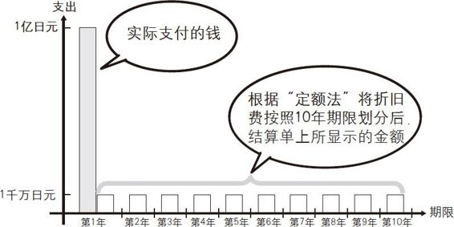

折旧费作为实际消耗掉的费用（＝现金）会使预算上总钱数出现偏差。尽管你实际支付的是1亿日元，但在第一年的结算单中“折旧费”只能是1000万日元。因此，这也成为了计算结算单上的利润与实际剩余资金数之间差额的依据。无论你是否打算有效使用那些设备，作为“固定支出”的折旧费都始终存在，直到法定耐用年限到期为止。

所谓的“变动支出”包括游客在园内所购买的午餐中使用的材料、发售的特色饼干及各种特色玩偶所需的成本。这些物品都是按照产量从外部进行订购的，与“折旧费”这种板上钉钉的成本截然不同。所谓“变动”一词指的就是根据需要来反复调整。

在这里，我们也可以试想一下那些无人问津、门可罗雀的主题公园的情形。因为没有游客，午餐当然就卖不出去，所以也就不需要在餐饮生意中支出“材料费”（＝变动支出）。可是，与游客人数无关的“人员费”及“设备的折旧费”（＝固定支出）依然被消耗着。所以，公园会因过重的成本负担而陷入亏损。即使可以通过削减员工人数来降低“人员费”，但由于无法使一次性购入的设备永远处于初始状态，所以该公园势必会成为持续亏损的企业。

正如你所想的那样，主题公园里的那些游乐设施需要较大比例的“固定支出”，而“变动支出”所占的比例却很小。“固定支出型企业”在初期都会投入巨大的资金来购入设备，如果企业在后期能够有效利用这些基础设施来招揽大量的游客，那么就会在效益上得到更大回报。

“酒店行业”的整体运作状况就是上述理论的最好诠释。下面，我们来看一下“丸之内酒店”的盈亏计算书（详见图2）。

■图2　丸之内酒店的结算单

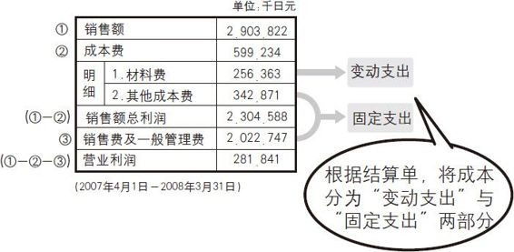

2007年3月～2008年3月该饭店的销售额为29.03亿日元。其中成本为5.99亿日元。如果将成本中2.56亿日元的“材料费”视为“变动支出”，3.43亿日元的“其他成本费”视为“固定支出”。另外，将20.23亿日元的“销售费及一般管理费”也视为“固定支出”的话，那么就可出现下面的划分：

销售额：29.03亿日元

变动支出：2.56亿日元

固定支出：23.66亿日元

总成本：26.22亿日元（变动支出＋固定支出）

利润：2.81亿日元

因此可以绘制出图3。

■图3　丸之内酒店的盈亏分界点

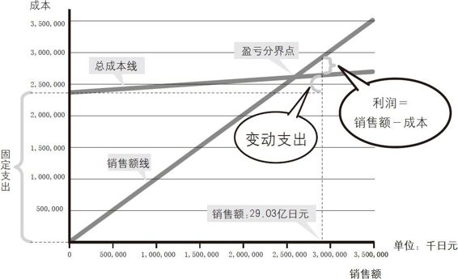

我们可以将企业的“总成本线”与“销售额线”的交叉点称作“盈亏分界点”，也就是亏损或盈利的分界线。如果销售额在这个界线以下的话，企业就会亏损。反之，企业如果能确保销售额在界线以上的话，就会盈利。

你大概没有见过哪家温泉浴场刚开业就立刻倒闭的，因为一个温泉浴场要花费大量的“固定支出”来配备桑拿浴间、住宿设施及按摩师。尽管刚开业时会吸引很多客人，但要将顾客人数始终保持下去却是相当困难的。

当浴场的销售额低于“盈亏分界点”时，“悲剧”便开始了。此时，温泉浴场会破例发放大量的打折卡，其负责人也会为了能留住客源而四处奔走。尽管如此，温泉浴场还是无法改变客源减少的趋势。

如果这种情况发展下去，那么不仅接待客人的店员会被裁减，极其便宜的入场券满目皆是，最后甚至连按摩师也会被解雇。但是，温泉浴场的大部分销售额是由占“固定支出”部分的员工带来的，如果浴场不能有效制止销售额的持续下滑，几个月后就只能关门了。

## 如何让顾客掏出钱包里的钱？

另一方面，对那些成功的企业来说，他们深刻意识到“固定支出是必须要花的钱”，关键是如何有效使用它。迪士尼乐园从未试图通过削减员工人数来提高利润，因为这样做会使游客对其服务水准产生质疑。因此，迪士尼乐园自始至终都力图为游客提供最好的服务，唯一需要考虑的是如何最大限度地使用“固定支出”中的“人员费”部分。

如果已经建成了游乐设施也雇好了员工，花掉了那部分“必须花的钱”，就要尽可能地使游客长时间地滞留在园内，以此来最大程度地增加他们“掏钱包”的机会。

“东方乐园”一直负责迪士尼乐园的各种运营状况，下面的数据是其在2008年3月期间的结算结果：游乐项目及各种表演的收入约为1281亿日元，人员费约为433亿日元，包括广告宣传费在内的其他营业费为1322亿日元。另外，包括员工报酬及折旧费在内的“一般管理费”约为150亿日元。如果将“人员费”“其他营业费”及“一般管理费”都视为“固定支出”的话，“东方乐园”在游乐项目上的收入将不足以维持其“固定支出”。

可是，如果将“销售商品的收入”与“餐饮收入”考虑进去的话，就会出现不同的结果。与“销售商品的收入”及“餐饮收入”所对应的“商品成本价”及“餐饮成本价”在图4中将分别列出。

■图4　“东方乐园”的结算单

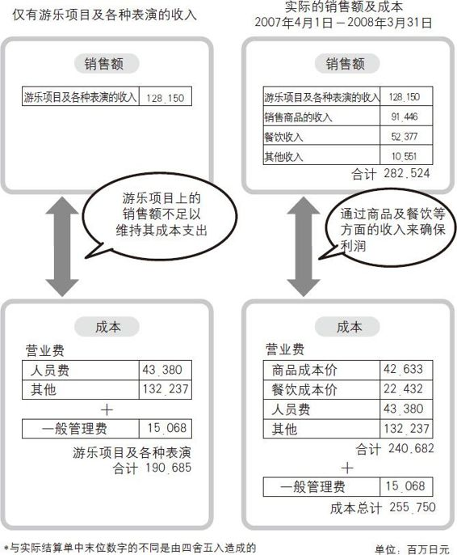

于是，事情发生了精彩的“大逆转”。试想一下，如果“东方乐园”所花费的各种具体支出仅是为了从游客那里获得门票及游乐项目的收入，其结果会怎么样呢？那当然就是赚不到钱。所以他们先让游客买票入园，然后设法使游客在园内尽可能多买一些商品及食品，这才是他们的“获利陷阱”。

当然，这一切都源于人们对“迪士尼”这个品牌的由衷喜爱，所以与其他主题乐园相比，迪士尼乐园最具优势的地方就是能广集客源。正如“从摇篮到墓地”这句话所说的一样，迪士尼乐园能让人们感受到“孩童时有父母陪伴玩耍的快乐”“青年时与恋人约会的兴奋”以及“为人父母后带孩子游玩的幸福”。迪士尼乐园能与人生中的各个阶段相吻合，其经营模式就是通过延长游园时间来使游客不断地购买各种商品及食品。

这并不是要批评迪士尼乐园，只是本人十分敬佩华特先生独创的这种罕见的经营模式。

# 第4章　通过“极限效益”来增加销售额的定价方法

## 如果降价后依然卖不出去

在前面的章节里我们已经讲过，对于濒临倒闭的温泉浴场来说，“固定支出”成了他们沉重的负担；而成功获利的迪士尼乐园却是在最大限度地有效使用“固定支出”。

然而，这并不意味着后者一定会充分榨取“固定支出”部分中员工的劳动力及设备的使用率。在给商品定价时，我们可以重新理解“固定支出”这一概念，于是索性完全忽略“固定支出”，这样可以使利润达到最大化。

下面，让我们通过一个简单的经营模式来进一步说明。

假设，你决定辞去一直从事的工作离开公司，自己开一个高级日本料理店。然后，你将店铺建在银座的资生堂前，并将失业保险金及全部存款作为活动资金，店铺命名为“小二十”。

这间“小二十”每月要花费100万日元左右的“固定支出”用来支付房租及厨师的工资等。店里所需食材是以每位顾客5000日元左右的标准从附近的市场购买的，而且订单的内容每月都一样。

即使高级料理店之间的竞争很激烈，每月也能有200位左右的顾客光临此店。并且，能确保每月有100万日元的利润。我们可以由以下算式算出“小二十”中每道菜的价格。

材料费5000日元＋［（固定支出100万日元＋利润100万日元）÷200］＝1.5万日元

你可能会觉得稍贵了一些，但由于“小二十”是高级料理店，所以这样的定价并不是不可行的。你也正是要利用这样的价位来赚钱。

在刚开业的几个月内，“小二十”能顺利确保一定的客源。可是时间一长，客源就不再增加了，也许每月仅有100位左右的顾客光临。要是这样的话，你是完全赚不到钱的。此时，究竟应该停业整顿还是继续营业？你不得不考虑这样的问题。同时你也意识到自己的人生理想可能即将破灭（详见图5）。

■图5　高级日本料理店“小二十”的最初计划与实际情况

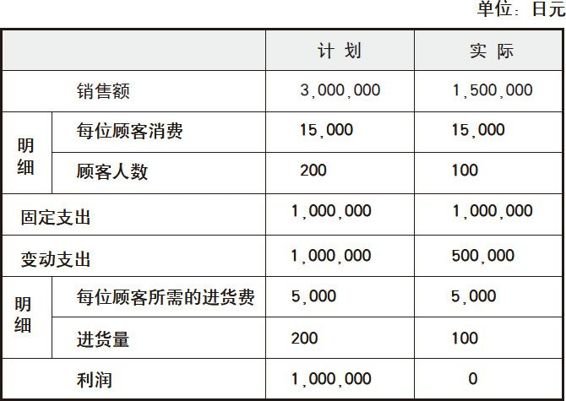

问题出在哪里呢？每到月末前10天左右，顾客人数就不再增加了。如果是10年前的话，会有很多挥金如土的商人经常光临这种高级日本料理店。可是，由于近几年经济萧条，中小企业者来这种高级料理店就餐的机会变得少之又少。同时，就连大型企业也无多余的资金来负担每人5000日元以上的“招待费”，所以导致了“小二十”经营惨淡的局面。

于是，你就想“破罐儿破摔”，在每月发工资的前10天（每月15～24号），将菜品的价格从15000日元一下子降到9800日元，这个价位与那些低价料理店是一样的。“小二十”正是因为没能维持住当初设定的价位，所以才导致了亏损。

但是，之前减少的那100位顾客没能再次光顾“小二十”。就算顾客人数偶尔增加50位左右，也是因为“小二十”提供的近乎亏损的低价位，所以顾客人数增加也是正常的。如果你预计到了上述可能发生的情况，在你决定降价之前就注意到利润的增长情况，哪能等到出现亏损才意识到呢！（详见图6）

■图6　高级日本料理店“小二十”降价前与降价后的情况

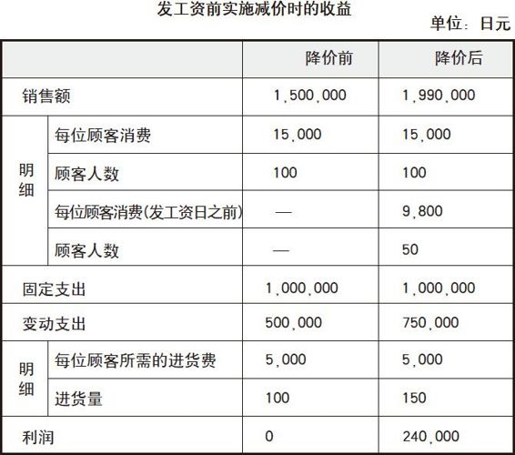

我们可以算算看。“小二十”通过大幅度的降价将目前的菜品定价为9800日元，如果按照原来的算法这个价位肯定会亏损，但“小二十”如果能一下子集中到50位顾客前来就餐，其利润就会增加。

如果你看了算式，自然会明白其中的缘故。菜品价格同样是9800日元，其亏损与盈利之间最大的不同就是，菜品降价不需要再花费更多的“固定支出”。即使大幅度降价，每道菜所附带的“固定支出”也没有必要重新计算。与此相对，当初所设定的15000日元的价格是以获取利润为目的而计算得出的。实际上，这个价位中隐藏着一定的可降价幅度。

下面，你可以边看账单边思考这个问题。

“假设有100位顾客点这个15000日元的菜品，此刻的收支几乎达到平衡。当有更多顾客光临料理店时，你就会想：即使将菜品价格稍微下调一些，盈利仍会持续增加。”

最终，你的思路会进入“极限效益”这个“死胡同”。

所谓“极限效益”指的是从销售价格中减去“变动支出”后的所得部分。以“小二十”为例，从15000日元中减去5000日元的材料费，所剩的1万日元即为“极限效益”。

由于你从100位顾客那里赚取的是常规费用，因此收支几乎达到平衡。所以你会想，如果顾客人数增加，即使卖的便宜些也能确保利润。于是，就产生了这1万日元的“极限效益”。换言之，只要你将价格定在这1万日元的范围内，卖得多便宜都可以赚钱。

当然，你也可以设法将此菜品以15000日元的价格出售给200位顾客，然后再考虑降价。这样做虽然能确保预期利润，但你要明白以15000日元的价格是无法吸引更多的顾客来此就餐的，所以还是要尽快地降价。

如果你经常这样想：“我每天拼命工作就是为了增加利润，哪怕只增加一点”，那就可以将菜品价格定为5001日元。于是你可以将料理店一直经营下去，直到那些喜欢低价菜品的顾客也无一人登门为止（顺便提一句，因为将5000日元购买的材料再以5000日元出售是不合逻辑的，所以将最低价定为5001日元）。

同时，你也可以最大限度地使用作为“固定支出”的员工及设备。因为“固定支出”不会再增加，所以你的店可以一年365天、每天24小时都营业。

## 为什么商家即使亏本也要将商品卖出去？

我刚才是故意举那种比较极端的情况，实际上，员工加班是要付给他们加班费的，并且设备也不可能永远正常地运转而不出现故障。如果店铺总是不断制定出这种“侮辱别人判断力”的价格，不但无法在顾客心中建立起良好的品牌形象，更可怕的是，顾客可能从此不再登门。其实，利用“极限效益”这种思维方式来定价所产生的效果正是这样。

于是，我又想起在家电专营店里经常能听到的那句话：“如果本店商品比其他店贵1日元的话，您尽管来找我。”

为什么商家会尽量削减自己的预期利润，即使亏本也要将商品卖出去——这样做是“行得通的”。反之，如果允许其他店比自己卖得便宜，自己将顾客群仅锁定为那些按照初始价格来购买商品的顾客——这样做就是“行不通的”。

这个问题也可以通过“极限效益”来解释。

假设，家电专营店所销售的电视是以7万日元进货、以10万日元销售的。此时，若将这7万日元的进货费作为“变动支出”的话，“极限效益”即为剩余的3万日元，所以这3万元也就成为了可削减的资金源。当然，这3万日元中还包括人员费、折旧费等属于“固定支出”的部分及商家要赚取的利润。

假设，在家电专营店里有一位顾客这样说：“因为其他店都卖95000日元，所以你们必须再便宜些！”当然，如果为了与其他店抗衡的话，可以将价格定为94999日元，但会使该商品的利润率下降。可是如果不降低价格的话，这件商品终究还是卖不出去，只能眼睁睁地看着其他店赚取销售额而自己却赚不到一分钱。所以，即使以94999日元的价格销售，所赚取的利润还是在“极限效益”的范围内，因此利润额会一直增长下去（详见图7）。

■图7　如果能在“极限效益”内卖出商品利润就会增加

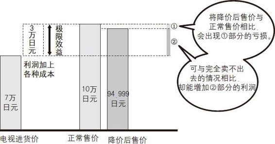

1994年曾发生过这样的事情，当时“山田电器”最大的竞争对手是“小岛电器”。“山田电器”为了打败对手，就在广告宣传单上声称“自己的价格比‘小岛电器’便宜3％”。

后来，这件事情最终发展到两家公司不得不对簿公堂。虽然，最终由于双发都撤回了诉讼而使事情暂告一段落。但是，目前这两家公司之间的竞争形势依然没有丝毫改观。并且，连“加藤电器”也被卷入到这两家公司之间的纷争中，最终导致了家电专营店之间有名的“YKK战争”。

这种“销售额至上主义战术”所提倡的是，尽管削减预期利润，只要能在“极限效益”的范围内继续赚取利润，即使降价也没关系。

另外，你如果理解了“极限效益”这种思维方式，也就能明白“开业酬宾价”这种低价陷阱的本质了。如果将店铺开业所投入的成本理解为“已经投进去的钱”，那之前所提到的电视就可以以7万日元左右的价格出售。商家在开业日所采取的战术是，用非常接近极限效益的价格来销售商品，以在顾客心中造成强烈震撼。

当然，如果你想进一步增强这种震撼的效果，那就连“极限效益”也不要考虑，仅以“变动指出”（≈进货费）所对应的价位与其他店铺一决高下。实际上，也确实有商家在开业日销售“10日元”或是“1日元”的商品。然而，我不知道“1日元的电脑”这样的极端价位是否真能使店铺日后的生意兴隆。

然而，作为消费者也可以反过来利用商家的这种行为，使自己成为采购高手。我就是专门从事采购方面工作的采购员。在讨价还价时，应该尽量“压价”，即压缩对方的“极限效益”。如果你能知道对方“会将价格压低到什么程度”，就会在砍价时处于有利地位。

当然，卖家也想尽可能地卖出高价。可是，如果顾客不购买自家商品的话，那就不只是削减部分利润的问题，而是根本赚不到一分钱。由此就产生了讨价还价的余地以及一定幅度的降价。最昂贵的消费就是买家按照卖家设定的预期利润价格来购买商品。反之，最便宜的消费就是买家以接近卖家“极限效益”的价格来购买商品。

如果以零售业作为价格交涉的对象，可以笼统地认为“变动支出”就是“进货费”；如果以厂家作为价格交涉的对象，可以认为“变动支出”就是商品所需的“材料费”。专业采购员在看到商品时，会在脑中计算出那些商品所需的“材料费”，并将讨价还价时的底价记在心里。

如果仅凭心算很难算出具体“材料费”时，作为一个专业采购员可以看对方的结算单，通过计算商品的“预期利润率”“固定支出率”及“变动支出率”来进一步算出待采购商品的“极限价位”。当然，按照结算单也只能算出一个大概的价位。尽管如此，买方心中也会有砍价的“标准”，只要有了这个“标准”，买方就能在实际的价格交涉中获得成功，因为他们已经“心中有数”了。

当然，作为普通的消费者，很难与店员来讨论“极限效益”这个概念。可是，却能根据不同店铺所打出的价格来“货比三家”。并且，卖方也会在“极限效益”的可削减范围内打出新的价格。作为消费者绝对不能认为——比较不同广告单上的商品价格来与卖家讨价还价是一种让对方感到为难的、不合理的做法。

前面我们提到，一个家电专营店宣称“如果本店商品比其他店贵1日元的话，您尽管来找我”，该店之所以使商品降价并不是要降低自身的利润。因为从整体考虑，与其说卖家吃了亏，不如说购买者所给予卖家的销售机会更有助于卖家的利润增长。

## IT公司的经理为什么乐于频频露面？

在这里，让我们回顾一下迪士尼乐园的经营模式：先让游客买票入园，然后使游客在园内尽可能多地购买商品及食品。其中作为“固定支出”的各种游乐设施及员工工资就是“必须要花的钱”。所以，不要舍不得拿出这笔钱。可以不断有效利用这笔“固定支出”来为游客更好地服务，并且要将“让游客感到满意”始终放在第一位。

同时，我们也以一些陷入亏损的酒店及温泉浴场为例，尽管他们懂得利用“固定支出”但还是无法增加销售额。从某种意义上说，迪士尼乐园通过给予人们梦想来增加游客多次游玩的机会，然后使游客在游园期间尽可能多地购买商品及食品——这是一种非常出色的经营模式。

如果设定的原始价格不能吸引顾客的话，就可以按照高级日本料理店的做法，在“极限效益”的范围内降价。虽然这样做可能会使预期利润额降低，可是与完全卖不出去的情况相比还是能赚到钱的。并且，顾客也会认为“在那里用餐很划算”。

如果用以上观点来审视社会中的各种现象，就会发现很多有趣的事情。通常情况下，从东京到冲绳的机票（附带住宿费）是12万日元左右，可是有的机票却能便宜29800日元左右。我还发现，有的低价机票甚至还附带租车券。其实，这就是旅行社针对旅游市场“淡季”所推出的接近“极限效益”的价位。我曾多次讲过，虽然这个价位非常接近“变动支出”，但却有助于利润的增加，绝对要好于那种完全无人订票的情况。

每当旅游“旺季”结束后，或是旅游市场萧条时期，市场上就会销售这种低价机票。大概有很多人会说：“以这样的价格出售恐怕赚不到钱吧。”现在，我们必须换一种说法，“与完全赚不到钱的情况相比，这样的价格多少能赚到一些”。

为什么一些IT公司的经理总是乐于频繁出现在公众的视线里？这是因为IT公司是“固定支出型企业”，其中的“固定支出”包括服务费及人员费等。企业为了维持“固定支出”就必须要尽快使销售额突破“盈亏分界点”，所以首要解决的问题就是吸引人们来登陆自己的门户网站。

于是，IT公司的经理们就将自己作为广告来进行宣传，以吸引那些对此感兴趣的人。他们绞尽脑汁的目的就是要使销售额突破“盈亏分界点”，因此他们有时还必须佯装不知企业的低利润。我们可以设想一下，如果那些经理没有销售额就会陷入困境，那就自然会理解他们的这种行为了。

所以，企业提高销售额必须要像他们的资金周转一样——分秒必争、一刻不停，只有这样才能将个人将来与企业命运紧紧联系在一起。

我想，也许有人会提出这样的问题：“如果做生意都从‘利润至上主义’的角度考虑能行得通吗？”可是，如果你在获取利润方面稍显松懈，立刻就会被市场淘汰。同时对于企业来说，他们获取利润用来纳税也是在为社会做贡献，当然这也正是他们不得不获取利润的另一方面原因。

如果没有利润，企业就没有办法生存下去。可是，如果完全从“利润至上主义”的角度考虑又会“吓跑”顾客。总之，做生意是有一定难度的。

在想到这个问题的时候，我又想起一件事。我在迪士尼乐园里好像没看到谁去玩“热带丛林探险”这个游乐项目。我边眺望着远方模糊的景色边思索其中的原因，忽然意识到：如果真是那样的话，迪士尼乐园里就不是“应有尽有”的。

我去迪士尼乐园的时候正值初春时节，当时总觉得那里好像缺些什么，准确地说就是缺少一种对于“欠缺”本身的认识。

我终于想起来，原来这里没有樱花。我找遍了迪士尼乐园的各个角落都没有看到日本春天特有的景色——樱花。虽然这只是一个很小的发现，但我总觉得这其中必定暗藏着某种玄机。一瞬间，我突然想明白了其中的缘由——对呀，这里并不是日本，而是“梦想王国”。

如果迪士尼乐园真成了“日本”，恐怕就无法吸引那么多的游客了。要成功打造出那种非现实的、有别于日常生活的、远离尘世的“梦想王国”，就必须要彻底抹掉“日本”的影子，一定是这个缘故。

这个连孩子都知道的事实，我却绕了一大圈才弄明白。迪士尼乐园通过向游客提供只有这里才能构筑出的“美丽幻想”，将游客带进另一个不同的世界，并使游客在其中不停地“寻宝”。当游客觉得自己离普通世界越远，对“宝物”的依赖感就会变得越强烈。

所以，那些纪念品的象征意义就是：只有“梦想王国”的居民才有权得到的宝物，正如我小时候在东京车站所看到的那两个女孩的“米老鼠”耳型头饰一样。

**Part 2小节**

●迪士尼乐园的经营模式就是有效使用“固定支出”，通过延长游客在园内的滞留时间来增加商品、食品的销售额。

●从价格中减去“变动支出”后的剩余部分叫作“极限效益”。从表面看“降价”可能会使“固定支出”无法收回而导致亏损，但因为价格能降到接近“变动支出”的程度，所以仍然有助于利润增长。因此，有很多旅行社在旅游旺季之后纷纷打出接近“变动支出”的价位。

●本部分首页问题的答案是：从表面看“低价位”可能会引起亏损，但与其被其他店抢走客源还不如通过“降价”使利润持续增长。

# Part 3　为什么航空公司及家电专营店随意向顾客发放积分？

对于从商家那里获得的积分，A先生是将其累积起来，B先生是立即使用。究竟哪种做法正确？正确的理由又是什么？（答案在本部分最后给出）

# 第5章　爱上便宜货，追求积分的代价

## 通过大幅度降价来“赚钱”

在上一部分我们讲了家电专营店的经营策略，即想方设法比其他店卖得便宜，哪怕只便宜1日元。尽管这样做会使某件商品的利润“率”下降，但却能使总体的利润“额”达到最大化。尽管我已多次提到，即使已将利润定得很低，但如果卖不出的话，还是一分钱也赚不到。所以，接下来我要讲到的问题就是到底将“极限效益”削减到什么程度最佳。

商家推出的“特价甩卖”同样也是这种促销手段，比方说，之前标价为1万日元的商品在过季后立刻就降到7000日元，甚至5000日元。在上一部分，我主要是以“固定支出”为中心来进行讲解，其中心思想是“固定支出”就是“必须要花的钱”，尽管削减了这部分但仍有利于整体利润的增长。

可是我们在“特价甩卖”时会看到，有些商品的价格只有“固定支出”的30％左右，甚至还有价格更低的。例如，当我们在服装店看到那些“打3折”的商品时，肯定会有不少人在想“这件商品的原价肯定贵得离谱”。

我们以家电专营店为例，比较了“原价销售”（按“预期利润”所设定的价格销售）和“降价销售”的情况。然而对于这种“特价甩卖”来说，与其说是“原价”与“降价”之间的价格上的比较，还不如说是“完全卖不出去的情况”与“大幅度降价能卖出去的情况”之间的比较（详见图1）。

■图1　与其“卖不出去”不如使“既得利润”增加

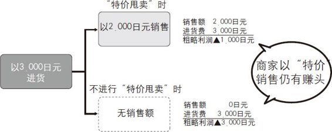

为什么这样说呢？因为不同服装店所销售的商品很少完全一样，并且应季商品一旦过季就很可能卖不出去。

如图1所示，通过“特价甩卖”能使“既得利润”提高。此时，不能将这个利润与“正常利润”（按原价销售获得的利润）相比较，要将“特价能卖出去”和“原价卖不出去”的情况相比。如果有人怀疑“这么便宜是否能赚到钱”，只要看一下计算结果就会彻底消除疑问，因为“与卖不出去的情况相比，还是有赚头的”。

此时，服装店考虑的是某类商品的销售旺季已经结束，所以将当时的应季商品处理为“隐性成本”。简单地说，隐性成本即虽然将来有可能收回成本但目前已经支付的、无法挽回的这部分成本。只要产生了“隐性成本”，企业就会想方设法找到能够挽回损失的办法。

在这里，重要的并不是考虑那部分隐性成本到底有多少，而是要考虑自己不能被隐性成本拖累，要设法为将来创出一个更好的局面（详见图2）。

■图2　比“隐性成本”更重要的是利润的绝对值

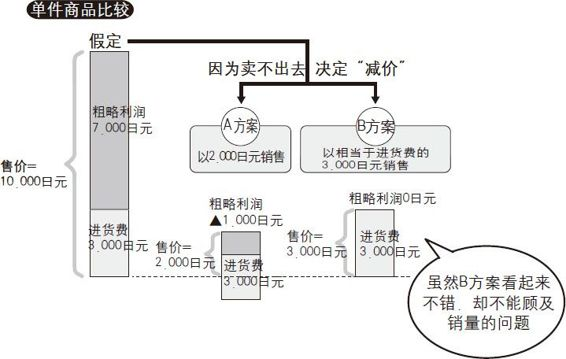

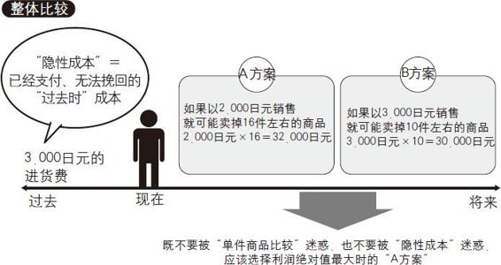

实际上，正是这个“隐性成本”使很多采购员丧失了判断力。当初，我也曾自信满满地以100日元的单价购进了1000瓶“超低价的中国产蔬菜汁”，然后打算以150日元的单价售出。可是消费者根本不在意这些“蔬菜汁”具有的营养价值，最终这些货只能堆积在库房里。

当时，我始终坚信，这些商品是有市场竞争力的，有营养价值的商品，顾客一定会来购买，所以即使调整了价格也只降到了130日元。可是，降价后仍然卖不出去，库存量也未见丝毫减少。其实，50日元左右的售价才是这些“蔬菜汁”真正的销售底线。

此时，购入“蔬菜汁”所花费的10万日元（100日元×1000瓶＝10万日元）就变成了“隐性成本”。当发生这种情况时，最佳的选择就是要将商品价格切实地降到“能卖出去”的程度，不要只考虑商品本身所具有的价值。所以，尽管“50日元”的售价远低于进货价，但以此价格来卖掉那些“蔬菜汁”是正确的做法。

此时，一个似乎有悖常理的经营构想逐渐浮出水面，那就是“通过大幅度降价来‘赚钱’”。

## 分手和热恋各自暗含的隐性成本

“真的可以和这个男人结婚吗？”

很多女性在结婚前都患上了“婚前恐惧症”，其实男性也是如此。据说，现实生活中，很多已经预定了举行结婚典礼场地的恋人，却在婚期到来时取消了婚约。

虽然这么做有些过分，但不得不承认他或她的这种选择对将来也许是有益处的。在决定结婚之前，两人为彼此所花费的精力、所有的担心，进一步说即两人之间共有的历史都已经转化为了“隐性成本”。人们之所以选择结婚，并不完全是因为和对方曾经有过一段美好的经历，更重要的是要看两人结婚后能否创造出更加美好的未来。当然，在结婚前做出这种判断无异于在“赌博”。恐怕，有些人选择离婚的原因也在于此。

《寂静之声》是家喻户晓的美国电影《毕业生》的主题曲，该曲由西蒙与加芬克尔共同创作。在这部著名的电影里，由达斯汀·霍夫曼出演的“本恩”与一个叫作“伊莱恩”的女孩坠入情网。

后来，他们被女孩的母亲拆散。当本恩得知伊莱恩将与另一个男人结婚时，他不顾一切地来到了举行婚礼的教堂。于是，那个在很多人心中都留下了深刻印象的情节开始上演了——闯进结婚典礼现场的本恩在窗边大声叫着伊莱恩的名字，然后跑进去抓起新娘的手转身离开，两个人就这样跑出了教堂。

很多人对于这部电影的记忆到这儿就结束了。

可是，我所记得的却是在那之后的情节。当两人跑出教堂后，乘坐上了一辆公共汽车。当他们坐在车后部的位子上时，发现所有乘客都在直盯盯地看着他们。原来那些乘客都是一些老年人，当本恩和伊莱恩看到那些老年人后，笑容从他们脸上消失了。他们惶惶不安地并肩坐着，谁也不知道汽车将驶向何方。当时，达斯汀·霍夫曼所演绎出的那种复杂神情一直深深地印在我的脑海中。

他们能这样做是因为两人都无法忘记他们之间的“隐性成本”，虽然他们曾因一时的感情冲动而分手，但最终还是破镜重圆了。当然，在那之后他们是否真能幸福地生活，只有让观众自己去想象了。到目前为止，我已经错过了很多次结婚的机会。能和自己命中注定的女子相遇应该说是奇迹。

我曾和一位非常优秀的女人一起度过了7年的美好时光，当时我们就像“过家家”一样交往着。可惜的是，我们最终还是未能摆脱大多数情侣所面临的命运，即随着时间流逝逐渐产生的某种倦怠感，于是寂寞感取代了曾经的“甜蜜”。

我不知道那时的自己究竟是幸运的还是不幸的。由于我当时从事着许多种工作，所以总是忽略她。很遗憾，生活中的很多人总是拿“工作”当借口来辩解。我也同样如此，在忙碌的生活中很少能想起要感谢这段“奇迹般的相遇”。

我记得分手那天正值春末夏初，当时天空中漂浮着片片白云，天气已经有些闷热了。我们走在去往新大阪车站的路上，她突然对我说：“我和你在一起并不是为了要看你卖力工作，对你来说工作是第一位的，可是对我来说，两个人能经常在一起才是最重要的。我觉得我们已经没有必要再见面了。”

也许此时此刻在某个车站，某对情侣正在为分手哭泣、愤怒。由此看来，我们的分手场面简直是太平常了。尽管如此，我还是不由得感到难过。

为什么新干线发车时的音乐听起来是那么的哀伤，就好像在为此刻所有分手的情侣演奏恋爱的“终结曲”。再过几天，我们在一起就整8年了。我们之间有过欢笑，也有过悲伤，可最终还是走到了这一步。

“咔嚓——砰！”

车门关闭了，从不延误的日本新干线连一秒钟也没等就发车了。

下面，还是让我们回到原来的话题。

我说过，一定要忘记隐性成本只考虑未来的发展前景。就像那个“超低价的中国产蔬菜汁”的例子一样，如果采购员对所购入商品总抱有一种不成熟的感情，那就很容易导致采购员的判断出现失误。可是，对于一个现场采购员来说，的确也很难做到不被当时的种种“假象”迷惑。所以从另一方面讲，“特价甩卖”也让那些购入此类商品的采购员们感到了深深的自责。

因为懂得了“隐性成本”的实质，所以每当我经过商店的“特价卖场”时都会不由自主地生出一种很复杂的情绪。恐怕只有我在看到“特价甩卖”时会联想起与恋人分手时的情景以及《毕业生》这部电影。我也不知道这是对还是错。

## 利用隐性成本来创造价值

如果你认为一个出色的消费者就是“能够买到别人买不到的便宜货”的话，那你只需不停地穿梭于多个“特价卖场”就可以了。因为那里所售商品的进货费已经变成了“隐性成本”，所以现有售价是已经扣除了部分进货费之后的价格。然而，任何消费者都知道“等商品打折时再去购买”这个道理。

但是，你是否知道“预先降价”也是商品的一种定价策略。

刚才，我已经讲述了那些现场采购员边哭边贱卖商品的情景，这的确让人感到悲哀。但同时也存在着另外一种情况，那就是预先制定出商品的降价幅度。

商家为什么要预先设定降价幅度呢？这是由顾客的需求量所决定的（详见图3）。

■图3　以不同层次的消费群体为目标

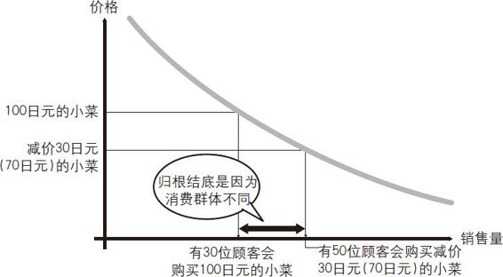

其具体表现形式为，商家会根据不同的“价格区”将顾客划分成不同层次的消费群体。例如在超市里，一到特定的时间，某些商品就会被贴上“便宜30日元”这样的价格标签。当然，这种降价也可能是因为食品本身就有瑕疵，但更重要的是为了吸引那些能够接受这个价位的顾客前来购买。

这种降价方式不只出现在超市里，也出现在一些“复合型电影院”（能同时放映4部以上电影的电影院）。我们都知道只有白天和夜间的电影票相对便宜些，电影院采取这种售票方式是为了吸引那些低消费的顾客群。另外，我较为熟悉的出版行业也是如此。

本书是以“单行本”的形式发行的，可是对于其他书来说发行方式却会随时间发生变化。例如，小说刚开始发行时都为“精装版”，但发行了几年之后就会变为利于携带的小型“简装版”。有很多喜欢买书的人在发行“单行本”时是不会购买的，而是等到发行“简装版”时再去购买。出版商所采取的这种经营策略是对图书的价格及版本形式划分出不同等级，以此来扩大不同层次的消费群体。

一般来说，“刚做好的盒饭”要比“很久之前做好的盒饭”更具价值。图书也是如此，“单行本”要比“简装版”更有价值。由此，我们可以通过反向思考来得出商家的经营策略，那就是用低价格为其他层次、有着充足客源的消费群提供与之相应的商品。

就像我刚才所提到的电影院发行的“特价票”的例子一样，对于那些经常看电影的人来说，他们在夜间用1000日元看场电影会让他们觉得“很划算”。因为正常的票价是1800日元，而夜间票价仅为1000日元。

可是，这同时也意味着“电影院创造出了原本并不存在的市场需求”。因为当票价为1800日元时，我肯定不会花这么多钱去看场电影，所以我付给电影院的钱就为“0”日元。

因此，这对于电影院来说就不只是“1800日元”与“1000日元”之间的差别，而是“0日元”与“1000日元”之间的差别。所以，电影院所采取的策略就像我们之前所讲的“特价甩卖”的例子一样，通过“特价票”来创造出原本并不存在的利润。

# 第6章　积分大战谁是赢家

## 积分制给消费者带来了什么？

让我们继续刚才电影院的话题：当“六本木楼群”落成时，出于好奇心，我曾去那里一探究竟。由于当时人太多，我在大楼外等了近30分钟也未能进去。当时我想就这么回家太可惜了，于是就在临近一家叫作“TOHO”的电影院看了一场电影，顺便还得到了一张会员卡。

一旦你成为了“TOHO”的会员，累积看过6场电影后就会附赠一次免费看电影的机会（并非直接赠送电影票）。自此之后，我便经常光顾这家电影院。

反正“大片”在哪里看都一样，所以不如选择附赠积分的地方。同样，还有很多消费场所也采取积分制。但由于积分卡太多是件麻烦事，所以多数人只持有几张特定的积分卡。

现在，“积分制”已在很多行业中推广起来，因为这项制度是获取固定客源（即激发顾客对消费的“忠实感”）最理想的一种手段。在“TOHO”电影院的例子中，看6部电影所花的钱在这里可以看7部电影，简单计算一下：

·1800日元×7部＝1.26万日元

·1800日元÷1.26万日元≈0.1428

平均每部电影的票价便宜了14％左右（稍后会说明这项计算并非真的正确）。所以，商家利用“积分制”激发顾客对消费的“忠实感”，同时使顾客觉得“占到了便宜”。所以到目前为止，我一直在称颂“积分制”的诸多益处。

提起“积分制”，最有名的是航空公司的“常飞旅客优惠方案”。为什么航空公司能随意地发放积分？其实在企业的支出环节中隐藏着“获利陷阱”（详见图4）。

■图4　航空公司的支出构成

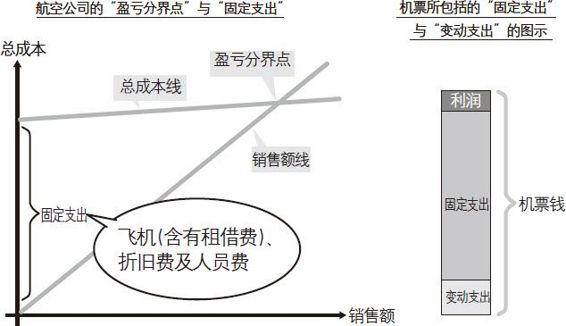

正如你所想的那样，航空公司持有一个超大的“固定支出”——飞机本身。因此，机票在“固定支出”中占有较大比例。正常情况下，飞机不能因为乘客人数少就停飞，所以作为“变动支出”的燃料费也是必不可少的。同时，航空公司也不能随意减少飞机上空乘人员的数量。这样看来，航空公司简直就是“固定支出的超级复合体”。

我经常使用“日本国内旅游”及“乐天旅游”这两个网站，因为它们是很多酒店的门户网站。每当出差前，我总是先在这两个网站中搜索出一些比较适合住宿的酒店，然后再向其中最理想的一家提出预约申请。于是，有一次我在网站上碰巧发现某家酒店发布了这样一条信息：“将住宿费的10％返回为积分”。

其实在此之前，我在“乐天旅游”上也曾预约过一家极便宜的酒店，该酒店平时的住宿费为9800日元，但那天它推出了仅限当日的特价服务——住宿费5500日元。并且，我在这家酒店住宿时还获赠了500日元的代金券。这样一来，住宿费就整整便宜了一半。

如果你也能将酒店这个行业想象成一个“固定支出的超级复合体”，那就自然会明白其中的原因。因为对于酒店来说，不可能花几天或几个月时间来调整“固定支出”的水平。虽然这些酒店多采用“积分制”及“打折服务”，但这却是确保稳定客源的最有效手段。

我们可以将这个例子与经营冰激凌店的情况试着作一下比较。假设，你正在经营一家露天的冰激凌店。当然，此时的“固定支出”要比经营高级日本料理店少得多。如果员工是按照销售额获取佣金的话，也就不存在所谓的“固定支出”了。对于一个售价为200日元的冰激凌来说，它的大部分成本都来自进货费。

此时，你作为经营者为了要获得稳定客源就采取了“买六赠一”的积分制，其实这是非常危险的。因为，由“积分制”所削减的“固定支出”并没有被纳入到商品价格里。所以，在“变动支出”占有较大比例的经营项目中导入“积分制”有时会导致毁灭性的结果。

此时，可能已有读者想起了上一章中家电专营店的例子，当时我讲过它的“变动支出率”为70％。与航空公司相比，家电专营店的“变动支出率”相对较高。其中原因很简单，那是由于家电专营店并不是厂家（厂商），所以全部商品必须依赖进货（详见图5）。

■图5　不同行业间支出构成的区别

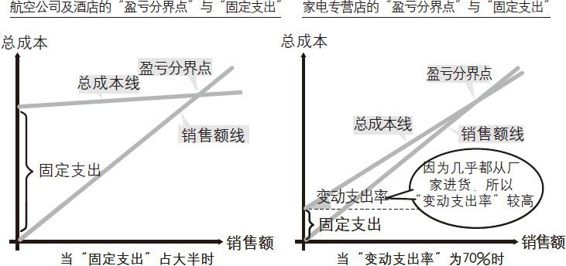

其中，电影院与酒店是属于“航空公司型”企业，而冰激凌店是属于“家电专营店型”企业。因此，我们也就明白了为什么“日本航空公司”主打的“常飞旅客优惠方案”能随意发放积分，甚至能将“积分”作为“第二货币”使用。航空公司所采取的策略就是通过“价格上的削减”来有效使用“固定支出”部分，通过制定“常飞旅客优惠方案”这样的积分制度将市场中散在的客源变为自家公司的稳定客源。

通过采取“积分制”能使商家获得下面3种好处：

1．通过削减“固定支出”来发放积分可以确保商家获得稳定客源。

正如之前讲的那样，现在甚至在便利店买口香糖，都有人使用“积分卡”。

2．如果顾客忘记使用积分，其实质就相当于避免了商品降价。

因为在国内发放的积分通常都标有使用期限，如果顾客忘记了使用积分也就相当于商品没有降价。这种情况与那些高龄老人的银行账户类似，当老人意外去世后，账户里存有的少量资金在无形中就成了银行里“来源不明”的一部分钱并最终归银行所有。

3．能够提高商品售价

“这台电视售价20万日元，但我们附赠了2万日元的积分，所以真实售价就相当于18万日元”，可能我们都听过类似的促销宣传。尽管实际的售价并没有降低，也能通过这种方式使顾客感觉好像是“便宜了”。

其中列举的第3条并不是要责难家电专营店，请大家不要误解。因为家电专营店所提供的商品售价几乎都接近于价格底线，所以“变动支出”所占比例较高。

如果家电专营店也采用“积分制”来降低商品价格，那就无异于在进行一种危险的“赌博”。这是因为“积分制”会使“回头客”的人数持续增加，这样一来就将每件商品所花费的本已很小的“固定支出”压缩到更小的程度，甚至达到极限（因为“固定支出”是一定的，如果顾客总是使用积分来购买商品的话，商品卖得越多，平均每件商品的成本就会变得越小）。

## 追求低价，会付出代价

有这样一个男人，他怀有别人无法想象的野心。

他平生的夙愿就是要打破由国家垄断货币发行权的局面，使自己制造的货币能流入到大街小巷，换句话说，他要建立一种新型的货币体制。

究竟如何才能让人们都持有这种新型货币呢？如果只是不断地向别人讲述这种新型货币的种种好处，别人又怎么会轻易相信陌生人的话呢？但是，如果告诉人们“用1000日元可以换到远高于该价值的某种物品”的话，人们肯定会蜂拥而至。当他从人们手里获得大量的国家流通货币之后，自己制造的货币也会在不知不觉中遍布国家各个角落。

这名男子并不仅仅是在市场出售这些价值1000日元的商品，还将商品与“积分”这种新型货币搭配出售。虽然“积分”这种货币只能在自己所创造的“地盘”里使用，但是却能和这个“地盘”内有价值的商品进行交换。从理论上讲，因为他提供了高于市价的价值，所以人们没有理由不要。比如，当他用1000日元来换取别人的100日元时，恐怕没有人不换。

自此这个男人的事业便开始突飞猛进地发展起来，当初他的“地盘”只是很小的一块，但之后他的“地盘”逐渐扩大，最后甚至有能力威胁到国家货币的发行权，于是他开始向真实世界渗透这种新型货币。也许不久之后，“积分”就会成为全世界的统一货币。现在，很多国家联合组成了一个大型实验场并形成了“欧元”这种新的货币，但就连“欧元”也十分惊骇于这种“积分”货币的渗透力。

下面，还是让我们先暂停这种阴谋论吧。虽然这个寓言故事是我杜撰的，但我的脑海中总是会浮现出类似这样的虚构故事。

所谓“买1万日元的商品附赠1000日元的积分”这种营销的实质就相当于“花1万日元购买了商品以及1000日元的代金券，并且这张代金券只能在同一家商店使用”。

当你想储蓄“积分”这种货币时，可以先将其假设成“代金券”，这样你就会明白“积分”是无法成为人们进行储蓄的对象的。这并不是对两种称谓咬文嚼字，而是因为“代金券”与真实的货币不同，它不会自我增值，并且人们也经常忘记使用它。

让我再讲得详细些。刚才我们讲到通过采取积分制商家会获得若干好处，并且列举了第2项中“由于顾客忘记使用积分而避免了商品降价”。其实，“积分”就相当于将无利息的存款委托给商家保管。虽然现在的存款利息低得离谱，但多少能得到一些。并且，银行等金融机构中的存款利息还会随着存款额的增加而不断累积，这就是货币自身的增值功能。

可是，“积分”这种特殊的金融性商品不止是没有利息，甚至有可能在累积期间就被商家剥夺了使用权，就连国家发行的货币也不可能仅有两三年的有效期。然而，正是因为“积分”是在非国家主导的领域中发行，所以人们只能遵守那个领域的规则，其结果只能是得到一些“代金券”而已（详见图6）。

■图6　“积分”就相当于为商家提供了无息贷款

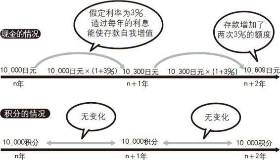

在这里，仅为那些使用“积分”的消费者们列出以下几点注意事项：

1．不要以“累积积分”为目的，要事先确定眼前的商品是否真的便宜，然后再购买。

2．不要为了“累积积分”而去那些“将xx的现金返还为积分”的店铺购买商品，要去那些价格上确实打过折扣的店铺购买商品（顾客没有必要去购买自己并不需要的“代金券”）。

3．要在那些发放“积分”的店里用光自己的“积分”（如果顾客留有“积分”就等于为商家提供了无息贷款）。

我想，仅凭个人力量是无论如何也阻止不了“积分”这种特殊货币对全世界的统治。可是我们不能受制于它，要有效使用它。其实，只要我们稍微动一下脑筋就能很聪明地来使用“积分”。

# 第7章　积分制暗藏的获利陷阱

## 积分只增加了商家的盈利机会

刚才，我讲述了“积分制”如何使商家获利。稍后，我会进一步剖析作为“积分”的使用者应该采取何种策略。下面，就让我们更加深入地了解“积分制”不为人知的秘密。

前面我已讲过，如果顾客忘了使用积分，实质就等于避免了商品降价。积分的使用方法因人而异，其中有些人习惯将积分累积起来，却不知要等到何年何月才用这些积分来购买商品。另外，还有些人甚至在好几年之后才想起来自己从未使用过那些积分。无论出现上述哪种情况，都意味着这些消费者将积分双手奉送给了不可预知的未来，而不是可预知的现在。

最近，服用“复合维生素”在消费者中变得很流行。其实，现代人的饮食方式几乎不会导致人体中某种维生素或其他营养成分不足。可是，人类的特性会让他们觉得自己缺乏某种东西，因此会不断地积攒某些东西。对金钱是这样，对“复合维生素”及“积分”也同样如此。

其实，“金钱”是一种不使用就不能发挥出功效的物质，可是有些人却以“储蓄金钱”为目的。同样，如果我们仅“累计积分”是不会为自己带来任何价值的，但仍有人把“累计积分”当作自我满足的一种方式。

现在，请大家回忆一下前文讲过的“现金可以自我增值”的内容。因为现金能获得利息，所以现金额度也会随着利息的不断累加而进一步增加。对顾客来说积分是不能自我增值的，但对商家来说积分就相当于“从顾客那里获得无息贷款”。也就是说，如果商家懂得巧妙运作这种无需支付利息的“由积分获取的资金”，其运作过程中产生的差额部分就成了商家自己的“赚头”（详见图7）。

■图7　商家通过运作“积分”部分的资金来赚取利息

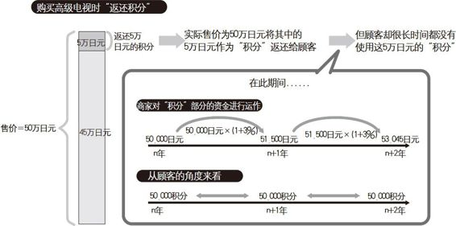

我不清楚在“泡沫经济”时期邮政储蓄的年利率是否真能达到7％，即使像国债这种比较安全的金融商品，我们也只期望从中能得到2％左右的利息回报。归结起来，表面上家电专营店会让你觉得商品价格“很便宜”，但实际上他们将本应降低的价格部分以“积分”的形式从顾客处预支资金，然后通过运作这部分资金而获得利息，这也就间接缓解了实际商品价格下降给商家造成的损失。

然后，我也列举了作为积分的使用者应该注意的事项。其中有一条是要在发放积分的店铺里丝毫不剩地用光积分，其中的理由也很明显，就是要将商家的“获利机会”重新掌握在自己的手中，这也是理所当然的事情。

然而，我并不是要批评家电专营店等商家所推行的这种以“积分”为诱饵的获利陷阱。其实“积分制”是“价格战”过剩的产物，商家正是利用顾客想要累积“积分”的心理来盈利。如果看透了这一点，我们也就能了解那些绞尽脑汁、想方设法去赚钱的商家的无奈。

## 积分制与最大折扣的一线之隔

在了解了“积分制”及“压缩‘固定支出’来降价”这样的获利陷阱之后，让我们将话题引向更加深入的地方。

虽然已经讲过两次了，我还要再次重复一下“固定支出”的定义：

·固定支出：包括人员费、房租及折旧费等，所有与销售额无关的成本

到目前为止，我都是将“固定支出”作为单独的概念来进行说明的。然而，现在我想为“固定支出”再增加一个定义。在这一部分开头，我提到了自己的恋爱经历，并且认为“两人共有的过去是无法挽回的，与其留恋过去不如放眼将来”。实际上，这种理念同样适用于人们对“固定支出”的判断。

我们可以试着将“固定支出”细分为“折旧费”与“人员费及房租”两部分，于是就有了如下两个小类：

◎“折旧费”就是已经支付的、无法挽回的成本（隐性成本固定支出）

◎“人员费”及“房租”就是今后要支付的、总想设法挽回的成本（非隐性成本固定支出）

由此可以看出，上述分类方法能为商家实施“价格策略”提供很多启示。我之前曾讲过商品降价的各种环节，现在我可以将上述的概念附加到这些环节中，然后将附加后的情况与原来的情况进行比较（详见图8）。

■图8　“固定支出”包括“隐性成本”与“非隐性成本”

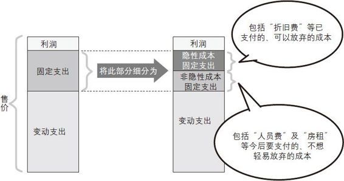

我们可以发现，虽然“固定成本”是与销售额无关的、必须要花费的成本，但可将其细分为“可以放弃的部分”与“不想轻易放弃的部分”。因为“折旧费”是已经花费的设备投资，是已投入成本，所以为“可以放弃的部分”。然而，类似“人员费”等成本是今后要支付的，所以为“不想轻易放弃的部分”。

我们可以这样设想，某家电专营店以10万日元的价格销售晶体管电视。其中，“变动支出”（＝进货费）为7万日元，“折旧费”大约为5000日元，“人员费”及“房租”为1.5日元，“利润”为1万日元，因此专营店将售价定为10万日元（详见图9）。

■图9　10万日元的电视降价可分3步来进行

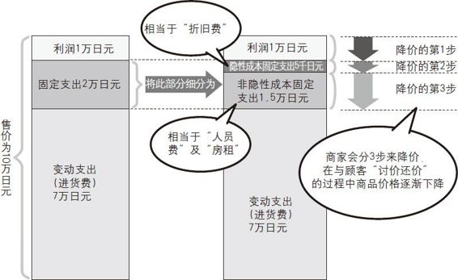

假设你向卖家提出“因为其他店便宜一些，所以你们也要打折”这样的要求时，店员首先考虑的是“那就设法削减1万日元的预期利润”。然而，尽管削减了预期利润，现有价位还是没有达到其他店的价位水平。

如果出现这种情况，店员下一步就会考虑削减作为“隐性固定支出”的5000日元的“折旧费”。然后，他会问你：“如果再便宜1.2万日元或1.3万日元，你看怎样？”如果扣除5000日元后的价位还是无法成交的话，店员可能会果断地放弃向你出售电视，或者他也可能进一步削减作为“非隐性成本固定支出”的1.5万日元的“人员费”及“房租”。这样大幅度的降价可能与商品本身的价值有关，另外也因为商家千方百计地想要售出这种商品。所以，专营店的这种销售策略就是基于商家对经营形势的判断。正因为如此，家电专营店与同行及消费者之间的“斗智斗勇”会一直存在下去。

为了不让大家产生误会，我再补充以下几点内容。

实际上，店员并不清楚每件商品的“隐性成本固定支出”与“非隐性成本固定支出”。在多数情况下，他们会事先掌握不同商品的降价尺度。具体如下：

STEP1：首先在原售价的基础上便宜xx％，如果能成交就OK

STEP2：如果不能成交那就再便宜xx％，看对方是否接受

STEP3：最坏的情况就是在STEP2的基础上再降价xx％，当然这也是最后的底线了

就刚才的例子来说，每个降价步骤分别对应着“利润”“隐性成本固定支出”及“非隐性成本固定支出”的部分（先不考虑店员是否有意如此操作）。

顺便讲一下我的亲身经历，我曾经想在某个家电专营店购买一部电子记事本。当我向其中一个手持计算器的店员询问：“现在这个电子记事本打几折？”“进货费大约多少？”同时还对他说：“因为我也可能不买，所以你们最好以接近‘极限效益’的价格卖给我。”并且，我还打算给他讲解一下“非隐性成本固定支出”的概念，可是那个店员却用非常怪异的眼神看着我，然后走开了。看来，我真是多此一举了。

在本章中，我将已经投入的资金作为“过去时资产”，并与今后能获得的“将来时资产”进行了比较。也就是说，“过去的1万日元”与“将来的1万日元”并不相同。比方说，虽然你曾经投入了1万日元，但将来如果不能获得收益的话，就要立刻忘掉曾经的投入。也可以这么说，无论何时我们都要以当下的状况为判断标准来采取最佳措施。

恋爱也是如此，在恋情结束后女性能彻底忘掉过去。与之相比，男性对过去却恋恋不舍，如此一来似乎显得懦弱。当然，这也包含我对自身的反省。

当我阅读“Y-CUBE”公司董事长安田佳生所写的《低姿态的生活》（Sunmark出版社）一书时，心灵受到了震撼。

书中写道：“我现在是一个离婚的单身男人，在离婚时我不无讽刺地对前妻这样说‘你已经有了孩子，如果你决定再婚的话，就请朝这个方向努力吧’。前妻却说‘不是那样的，我是因为觉得和你一起生活会很幸福才结婚的。但现在我们在一起已经成为了一种不幸，所以还是分开的好’。显而易见，她才是真正的成年人，她做出的选择是正确的。”

所谓“母性强大”的意思就是指女性通常都能以“目的”为行动的出发点，这当然是一种十分清楚而理性的做法。无论这样对还是不对，男性都应该学习女性这种“不留恋过去”的态度。无论“经商”还是“恋爱”，我们都不要对已经花掉的“金钱”或“时间”恋恋不舍，要以“现在”为新起点主动来选择更加美好的未来。

**Part 3小节**

●在“特价甩卖”时，商家将卖不出去的商品处理为“隐性成本”（忽略进货价），所以有时也会推出低于“变动支出”的价位。

●“积分制”是一种削减商品“固定支出”的促售手段。对卖家来说，“积分制”可以确保他们获得“固定客源”。另外，当顾客忘记使用“积分”时，卖家又可以达到“避免商品实际售价降低”甚至“提高售价”的目的。

●对应于“积分制”，消费者应该采取的态度是：1．不要以“累积积分”为目的，要确认眼前的商品是否真的便宜后再购买。2．不要去那些“将××的现金返还为积分”的店铺购买商品，要去那些价格上确实打过折扣的店铺购买商品。3．要毫无保留地用光“积分”。

●本部分首页问题的答案是：B先生的做法是正确的，因为A先生所累积的“积分”不会产生利息。长远来看，“累积积分”就等于降低了“积分”的实际价值。

# Part 4　所有的商品价格都暗藏着商家的某种意图

为什么拉面店的“白开水”可以免费喝，而在咖啡店只能去买“500日元一瓶的矿泉水”？（答案在本部分最后给出）

# 第8章　商品的获益率是多少？

## 让我茫然不解的问题

在大楼的一个房间里，我双手抱胸呆坐着。

此时，我被周刊上的一篇报道搞得摸不着头脑。

这篇文章从进货的角度，对各种商品的成本价和利润进行了说明，其中还涉及了餐饮行业。文章问道：“对消费者来说，酒馆里什么菜最划算？”看到这个问题我不禁愣住了。

老实讲，我当时没搞明白那篇文章为什么会提出这样的问题。我想：“所谓‘划算’到底是什么意思？如果是指‘价格便宜’的话，是不是说每盘毛豆的价格仅为200日元？”但事实却并非如此。

这篇报道的真正目的是要说明“哪类商品的利润已经被压缩到极限了”，正因如此才能与所谓的“划算”相吻合。

说到底，商家获利与否和顾客并没有什么关系。无论一件商品是能赚100日元还是5日元，“顾客对商品本身是否满意”才最关键。然而，却有消费者说：“那不行，只有以接近成本价的价格来购买商品，心里才会觉得舒服。”

那么对消费者来讲，500日元购买的“巨额利润”的商品与800日元购买的“低利润”商品究竟哪个划算？当然还是后者更划算。同时，我也联想到这个问题背后所隐藏的真相。夸张点说，商家正是从哲学的角度来把握消费者的消费心理的。

我认为，对消费者来说最重要的还是商品的售价。可是，我也并非不明白那篇报道想要阐述的观点。

这篇报道指出：“清楚自己的工资位于什么消费水平是非常重要的。”即使你清楚地了解周围人的工资状况，但这些对提高自己的生活水平并没有丝毫帮助。可是当你发现自己的月薪比别人低1万日元时，也许会叹气，也许会嫉妒，甚至还会产生某种莫名其妙的失落感。也许，这就是人类的天性。

其实，读者即使了解了酒馆的获利途径也无助于自身消费水平的提高。然而，人类天生的好奇心却驱使着大家去研究菜单中暗藏的“秘密”。

这篇报道还提到：“一般来讲，不同酒馆里的‘炸鸡块’等下酒菜的烹饪时间及加工费不尽相同，所以价格上也存在较大差异。”如此看来，这篇报道在某种程度上已经赞同了我的观点。

## 如何最大限度地吸引顾客？

为了能让大家看到最具代表性的商品的一般利润率，我尽可能地研究了很多行业中的商品，首先让我们从餐饮业开始。

说到日常生活中最为熟悉的食品，我首先想到的是“拉面”。那么“拉面”的利润率究竟是多少呢（详见图1）？

■图1　拉面（600日元）的利润构成

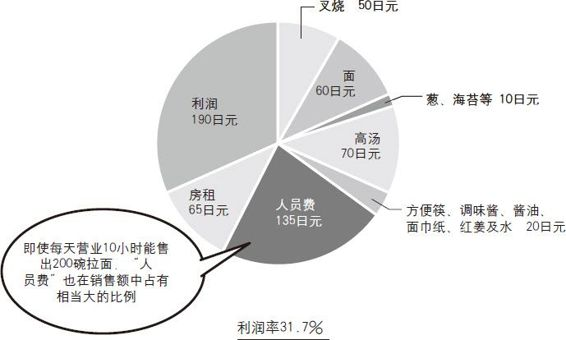

另外，此价格未附加消费税。

由此看来，“拉面”的利润率是相当高的。当它售价为600日元时，其利润能达到190日元。假设这个拉面馆每天营业10小时，每天的销售量为200碗。

另外，有些拉面馆还推出了“独一无二”的个人定制口味的拉面。如果客人要求“再来一碗拉面”的话，面馆会用化学调味剂合成的半成品汤料来代替原有汤汁。对此，我不能断定孰是孰非，因为拉面馆从大型食品厂商处购入的“汤料”很受消费者的欢迎，这也可能是因为大众已经习惯了化学调味剂所制造出的“味道”。

我曾经去过一家专门出售“杯装方便面”的面馆。这里的营业方式十分简单。当顾客在前台选好“杯面”后，店员会从架子上取下开水瓶为顾客泡面，仅此而已。当时，给我留下深刻印象的是，这里的生意比邻家的手工拉面馆要好得多。

通常，在拉面馆里再多花上300日元左右就可以买块“叉烧”。如果假定这块“叉烧”的进货价为150日元，那么拉面馆的利润就会有进一步上升的空间。另外，一些拉面馆还推出了“副菜单”，其中包括“饺子”等多种副食。

下面，我还想讲的是便利店的“饭团子”。它是我们平时经常吃的食品。假定一个“饭团子”的售价是120日元，其具体利润如图所示（详见图2）。

■图2　便利店销售的“饭团子”（120日元）的利润构成

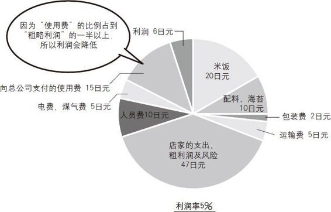

售价为20日元的“饭团子”的利润仅为6日元左右。对此，你可能会感到惊讶。其实，总公司所花费的支出、预期利润以及食品过期产生的风险全部包含在了每个“饭团子”的成本中。

对于如此“低的利润”，便利店采取的最有名的策略就是“POS分析”。所谓的“POS”就是“Point
of
Sale（s）”，即对不同时间、不同地点售出的不同商品进行统一管理。这样一来，既有利于货源的及时补充又有利于下一个“人气商品”的开发。根据“POS”分析，商家可以及时地购进“人气商品”，同时将商品积压带来的损失降到最低。

另外，通过对货架上商品的排列顺序进行科学的分析，还可以推导出顾客在店中大致的行走路线，甚至还能计算出各种商品的最佳排列顺序，通过这种最佳排序让顾客顺利地买走货架上的商品。让我们回想一下，是不是每家便利店都将书、杂志等摆放在窗口附近？关于其中的原因，我想可能已有很多人知道了。其实，店家这样做是为了让店外路过的行人清楚地看到店内顾客翻看杂志的样子，这也就相当于告诉大家“有顾客光临本店”，以此增加消费者的购物安全感。

顺便提一句，如果你认真观察身边的便利店，就会立即明白“固定支出”中的“人员费”部分到底是怎么一回事。就像我在第一部分所讲过的一样，作为“店长”长时间、高负荷地工作是理所当然的事。另外，商家为了削减“打工者”的工资而动员自己的妻子以及家属来帮忙的例子也是不胜枚举。

此时，可能有人会觉得“‘人员费’在‘饭团子’的成本中所占的比例大得有些不可思议”。我曾有过这样的经历，有一次我写作到深夜，觉得十分疲惫，于是就想到附近的便利店买矿泉水喝。因为当时已是深夜，所以就算有人站在窗边看杂志也不会吸引更多的顾客上门。当然，商家此时也会根据“不同时间段销售额的分析”将店员人数控制在最合适的范围内。尽管深夜时顾客很少，商家也要付给店员工资，哪怕此时仅有一名店员，因此也会产生“人员费”。所以，商家会将该部分“支出”转嫁到商品的成本中去。

对此，可能有人会给出“深夜将店铺关门”的意见。的确，在东京都内有些店铺正在采取类似做法，但也有很多便利店反对这样做。

其实，这是一个与“随机性选择”有关的问题。假设，附近有A便利店和B便利店，A店早上6点开门，深夜12点关门；B店24小时营业。

一次，深夜3点你急需电池，于是你打算到平时常去的A店购买，但到那里却发现闸门紧闭。此时，你肯定会决定去B店购买电池。

其实，几乎没有人能够准确把握每家便利店的最合理的营业时间。你是出于自身需要才选择去B店购买电池的，但正因如此造成了A店的顾客人数骤减。所以，便利店采取“通宵营业”的策略，就是为了使顾客能“最大限度地来自己的店购买商品”，这可以说是有一点悲哀的尝试。

现在，手机所拥有的功能日趋强大。这是因为，人们在购买手机时会同时比较若干品牌，以确认哪个牌子的手机功能比较齐全。因此，各手机厂商都竞相研发“新的功能”以此来避免“被消费者抛弃”。其实，在很多行业中都存在着类似竞争，并且这种竞争还将持续下去。

那么，手机行业的情况又是怎样的呢？其实，手机行业与便利店的情况类似，行业内部的竞争十分激烈。那么手机的利润大概有多少呢（详见图3）？

■图3　手机花费（100日元）的利润构成

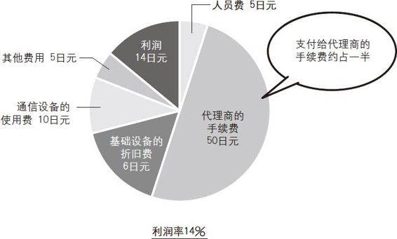

如果手机话费为100日元的话，其中的大部分都支付给了“代理商”。另外，“固定支出型企业”的特征之一就是存在着“基础设备的折旧费”。因此，我们就能明白为什么手机的利润只有14日元左右了。

然而，现在是“人手一部手机”的时代，因此企业为了获取“客源”所投入的成本也在不断提高。另外，“换网不换号”的业务进一步加剧了各厂商之间的竞争。就像我们刚才讲过的，便利店之所以24小时营业就是为了使顾客能最大限度地来店购买商品。手机行业也是如此，各厂商为了能在手机市场中“分一杯羹”不断推出新的机型，但这些“新机型”之间的差别甚小。

另外，各手机厂商还将苹果公司的“iPhone”手机作为“劲敌”纷纷效仿，并相继推出了具有“娱乐歌曲下载”“游戏”等功能的新型手机。可以说，手机行业的激烈竞争局面对各企业的经营状况产生了很大影响。

## 解剖高档商品的利润陷阱

我们之前所讲的商品都是日常生活中的一般消费品，那么与这类商品完全不同的高档商品的利润又为多少呢？

提到“高档”商品，我首先想到的是“珠宝类商品”。说到“珠宝”就不能不提到“钻石”。那么，“钻石”的利润到底有多少呢（详见图4）？

■图4　宝石（40万日元的戒指）的利润构成

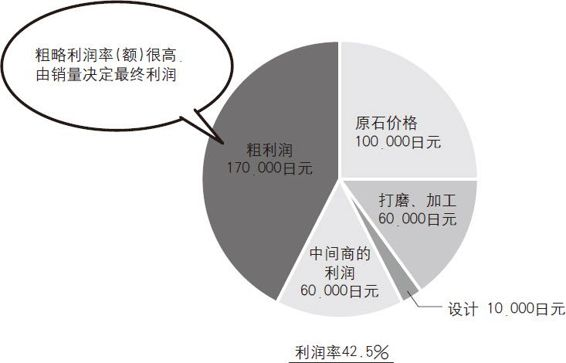

假定一枚价值40万日元的戒指，其中原石的价格为10万日元左右，打磨及加工费共计16万日元左右，即使再算上中间商的“提成”其粗略利润也能达到17万日元。

一般来说，珠宝类商品的售价是由商品本身的“切割工艺”“纯度”及“颜色”等指标来决定的。其实，珠宝类商品的品质鉴定书也并非百分之百可靠，商家只不过借此使消费者感到安心，同时也使消费者忽略商家所赚到的利润。

并且，当这枚戒指作为“婚戒”时，它就有了特殊的意义，商家也由此得到了“不与顾客讨价还价”的特权。虽然，我并不十分清楚那些在结婚前去买戒指的情侣们究竟会不会与商家“讨价还价”。但我估计，恐怕没有哪个男人会在未婚妻面前说“这个太贵了，给我便宜点”这样的话。假如我是女性的话，可能会十分欣赏这种“勇于打破陈规”的男人。然而，大多数女性恐怕无法接受这样的人。

另外，高档商品中还存在着一个“特殊性”的问题。

很多情侣明知“品牌店”不能“讨价还价”却还要去那里购买，而不会去售价更为实惠的“折扣店”，因为他们觉得两者的“意义”是不同的。我们还以上文中的戒指为例，假设该戒指在“唐·吉诃德”珠宝店（我常去的店铺）的售价为35万日元，按理说人们会到该店购买，可是多数情侣却选择了更加高档的珠宝店。如果我是女性，肯定更希望男朋友在“唐·吉诃德”为我购买戒指，然后再用剩余的5万日元带我去高级烤肉店吃饭。然而，大多数女性可能不会喜欢这样的男人（也许我太过絮叨了）。

由高档商品的利润构成可以看出，其成本中的大部分都花费在了“珠宝店的档次感”及“人员费”上。“购买钻石”是一种身份的象征，所以商家会使顾客尽情陶醉在珠宝店所营造的“高贵”气氛中，这是商家使用的一种合乎情理的营销手段。

下面，让我们来看一下同为高档商品的“名牌女包”的情况（详见图5）。

■图5　高档名牌女包（30万日元）的利润构成

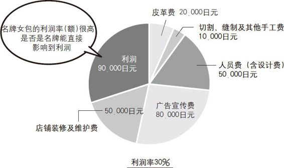

售价为30万日元的名牌女包，其粗略利润为9万日元，利润率为30％。销售名牌女包的店铺和珠宝店一样，也会花费较多资金来装修、维护店面，这些我们稍微一想就会明白。但与珠宝店不同的是，“名牌女包店”还需要花费一定的资金用做广告宣传。正因为名牌女包有“名牌”二字，所以商家会想方设法地让消费者接受这种“高档感”，当消费者默认了这一点之后商家就成功了。简单地说，“名牌效应”就是指某一品牌的拥护者的人数，商家用十分精美的广告来吸引消费者，以此来增加其品牌追随者。

■图6　新建住房（3000万日元）的利润构成

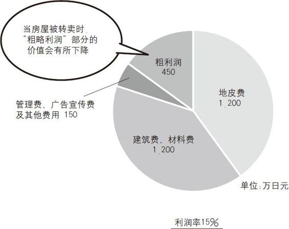

分析这种高档商品的成本虽然显得有些“土气”，但商家却想尽了各种办法来降低成本。比如说，皮包的材质一般都用牛皮，因此各家公司会在皮包的设计上狠下工夫，以此来提高原材料的利用率。另外，商家还绞尽脑汁地将皮革的多余部分做成其他商品出售。

现在，这些名牌女包的厂商将缝制方面的工作委托给劳动力相对便宜的亚洲厂家来完成。也有厂商从亚洲请来工人并付给他们廉价的工资，目的是让他们在本国从事同样的工作。另外，还有些厂商将业务全权委托给其他公司，当然这其中不包括皮包设计方面的工作。

由此看来，商家为了能让顾客实现“名牌梦”真是“用心良苦”。

最后，让我们再看一下“房子”的情况。每个人可能仅有一两次购入这种巨额商品的机会。虽然我并未拥有自己的住房，也没有类似的其他巨额商品，但我也很想知道“房子的利润究竟有多少”（详见图6）。

对于一套3000万日元的住宅来说，其利润有450万日元左右。虽然，建造房屋需要花费大笔的“地皮费”“建筑费”及“材料费”等，但由于其售价很高所以还是能赚到相当丰厚的利润。

经常会听到有人这样说：“一旦买了房子，手里的资产就会一下子少10％～30％。”其实，房产商是将原有房价提高了好几成之后再出售给消费者的，这样一来出现“高房价”是无可厚非的。另外，当你所买入房子的价格不能达到市场最低价时，要做好“刚买下房子，房价就可能立刻下跌”这样的心理准备。可能有人可以当机立断地买下一套房子，但我没有那种“勇气”。

在此，我简单讲述一下房产商为提高利润所做出的种种“努力”。首先是房间格局的设计。房产商将房间的格局（种类）设计成几个固定的样式，以此达到缩减“建筑费”的目的；其次是他们会根据不同房子的造价来设法降低房屋内部设施的成本。当然，还有一种方式可能现在已经很少见了，即用“非抗震材料”伪造成“抗震材料”来建造房屋，以达到“节约造价”的目的。换言之，上述种种行为是房产商提高利润的“法宝”。此外，“房屋租赁”房产商也有办法增加其相应利润，即自古就有的“不退还押金”的做法。

现在，“房产经营”这种资产运作方式甚至已经扩展到了“工薪层”。目前，很多人购房并不是为了自己住，而是用来“囤积”。所以，现在的房地产商有多种途径来销售自己的商品。

如果有人劝你也来从事“房产经营”，你最好先向他们询问清楚“利润的计算依据”后再投资。曾经有人用一种极其简单的诈骗方式使很多人都上当受骗了。他鼓吹说：“如果你现在花3000万日元购入一套房子的话，每年的房租预计能达到240万日元，因此你用12年时间就可以收回成本，在收回成本之后所赚的钱就是属于你个人的‘纯利润’。”

其实，他的这套说词中并未考虑“固定资产税”“房屋修缮费”以及“租房者的可信度”等因素，也未考虑到12年之后这套房屋所具有的实际市场价值。

所以，我希望大家在遇到这种事情时一定要冷静、全面地考虑问题，试想一下，如果这项投资肯定能赚钱，那他自己的公司为什么不做？

## 为利润而冒的风险

到目前为止，我就一些最具代表性商品的利润构成进行了讲解。各位肯定发现有些商品的利润很低，而有些商品的利润却高得惊人。

我想，阅读到此处的读者可能还有一个疑问。

之前，我主要是针对各种商品的“理论利润构成”进行的讲解，而实际商品利润额未必与此相同。关于其中的原因，我想各位已经知道了，那就是“商品的销量决定了每件商品中‘固定支出’所占的比例”。

我们仍然假定某家拉面馆是“每天营业10小时，可以售出200碗拉面”。如果拉面馆每天营业10小时实际只卖出100碗拉面时，每碗拉面所需的“人员费”就由原来的135日元增加到270日元，因此面馆的大部分利润就会被“人员费”侵占。

与“售出200碗拉面”的情况相比，面馆不仅减少了1.9万日元的销售额（190日元/碗×100碗＝1.9万日元），还造成了更多的资金流失。

同样，我虽然说过“高档女包”有很高的利润，但如果其销量下降一半的话，它的下场也同“拉面馆”一样。因为销量一旦减少每件商品中“固定支出”的比例就会立即增加，商家也会因此陷入亏损，所谓“利润”也就无从谈起了。就连非常有名的“GUCCI”也曾经面临过类似的经营危机。另外，房地产开发商由于负债累累、资金短缺而顷刻间就破产的事情也是屡见不鲜。

因为“品牌商品”正是通过增加销量来减少每件商品中“固定支出”所占的比例的，一旦销量减少，“名牌”的光环也必然瞬间消失。所以，当你清楚了各种商品的“理论利润”后要做到心中有数。其实，所谓“利润额”就是以“销售额”为基础而存在的一种岌岌可危的“东西”。

请大家再回想一下我在Part2讲过的“盈亏分界点”的问题。那些IT公司的经理为了增加销量、扩大客源而频频在公众场合露面，就是因为他们要想方设法确保自己公司的销售额处于盈利状态。

可能有很多人认为，事业发展的过程难免会遇到挫折，如果今年亏损了，明年再加倍努力就行了。然而那些小型的投资公司却不会这么乐观，因为他们没有充裕的时间“从头再来”。

那些资金充裕的企业自然另当别论，对于风险性投资企业来说，他们手头的资金较少，所以“企业要生存下去”就等于“企业现在必须要盈利”，只有这样才能使企业将来也处于“能生存下去”的状态。

归根结底，商家信奉的是“销售额至上主义”，这与我们之前所讲过的内容如出一辙。

# 第9章　开店策略——胜利的公式

## 新店的店址是选在繁华地段还是僻静地段？

如果商家信奉的是“销售额至上主义”，是否意味着他们很希望看到其他店铺倒闭？这虽说是一件很残酷的事情，但对很多企业来说却是正确的商业战略。

我曾经在神户居住过一段时间，那时我每周都会去“三宫”一带散步，那里美容院、发廊的兴衰变迁给我留下了深刻的印象。多数的美容师、美发师都希望拥有一间属于自己的店铺，当他们在多家美容院及发廊里潜心学习了各项技艺之后，就会自己独立开店。很多人都曾经想过：“如果自己的店铺经营顺利的话，我还要继续开分店，同时我会成为公众人物，自此开始自己辉煌的人生之路。”

所以，一些刚开业的美容院、发廊雇佣女性向路人发放“打折卡”（仅限初次光顾该店时使用）的情景现在也是随处可见。当然，与此同时一些美容院、发廊正处于濒临倒闭的边缘。

通过前面几章的讲解，我想各位读者已经明白了美容院、发廊之所以随意发放“打折卡”的原因。因为，属于“固定支出”部分的“美容师”及“店铺”本身的所需支出在经营效益中占绝大部分，所以这两者属于较容易削减的“极限效益”，这些我们在上一章已经讲过。因此，很多美容院、发廊能够为初次光临的顾客提供“五折优惠”。

然而，最近很多消费者也变得“聪明”起来。据说现在有很多女性利用手中的“打折卡”去各种各样的美容院享受服务，然后她们会对店家说：“你们的技术要比其他店好得多，只不过大家还不是完全了解。”听到这番话后，美容院就会发给她们更多的“打折卡”，请求她们向自己的朋友推荐自己的店。另外，美容院还会推出“使用积分享受免费理发”的服务。这样一来，美容院就不得不更加倾向于“销售额至上主义”，同时也会想尽一切办法来“增加客源”。

对此，我并不想责怪消费者的这种做法。因为我始终相信，无论处于什么时代，商家本身也是一名消费者，如果商家采取的经营方式不能“投其所好”的话，就永远不可能摆脱窘境。如果经营陷入困难而商家只会“长吁短叹”的话，现状也不会有丝毫改观。

关于美容院、发廊的话题先告一段落，接下来，请大家看一下开店应采取的策略，以及店家为了销售商品所构筑的种种“陷阱”。

比方说，你现在想脱离“工薪层”自己开一间酒馆，并且你可以将酒馆建在商业街中的任何位置。需要说明的是，在这条街的街口已经有了一家生意兴隆的酒馆，此时你会选择将自己的酒馆开设在何处呢（详见图7）？

■图7　如果开一间酒馆，位置应选在何处？

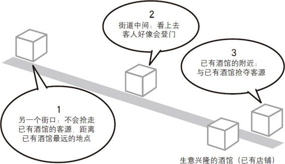

第一种选择：将酒馆建在这条街的另一个街口处，距离那家已有的酒馆最远，这样一来不会抢走那间酒馆的客源。

第二种选择：将酒馆建在这条街的中间位置。

第三种选择：将酒馆建在已有酒馆的附近，来和它抢夺客源。

很遗憾，最正确的选择并不是第一种，而是第三种。正因为路过那里的人很多，并且已有了一间人气兴旺的店铺，所以在那附近开店才是最佳的选择。如果选择在另一个街口开店的话，在短时间内几乎不会有顾客光顾。因为对于店铺来说“位置的好坏能决定一切”，如果店铺的位置不佳顾客就不愿意登门，而改在其他店进行消费。

如果你居住在城里，那么你肯定看到过这样的情景——在城市的某个角落并存着多家公司的便利店。也许你会想：“那么多家店挤在一起不就赚不到钱了吗？”但事实并非如此，比起远离闹市区，在繁华街区开店更有机会赚到钱。所以，那种“便利店林立”的现象并不完全出自商业对手之间的相互倾轧。

当然，这也成为了那些便利店店长共有的烦恼。因为这些人都是在脱离了“工薪层”之后才开始经营便利店的，他们在繁华的商业区不分昼夜地工作，好不容易才使自己的店铺开始盈利。可是，随之而来的却是自家店的附近不断出现新便利店。

如果从总公司的角度考虑，他们在客源较大的地区集中投入资本却是合乎情理的事。当然，这样一来那些店长的处境会变得更加困难。

正因如此，也许在你家附近某个特定地点会不断上演“店铺之兴衰存亡”的悲喜剧。

记得很久以前，当地最大的特色就是小卖店、小饭馆随处可见。可是，现在无论是城市还是地方统一规格的大型连锁超市及连锁餐馆布满大街小巷。很多充满怀旧氛围的咖啡馆相继倒闭了，取而代之的是一些所谓“美式风格”的咖啡店。现在，在任何城市的车站附近都会有风格相近的连锁酒馆，甚至连酒馆的霓虹灯都一模一样。

无论是在哪里吃饭、喝酒或者购物都相差无几，这正是工业社会的特征之一。所以，有些人对这种毫无个性的“均一化”表示不满。

也可能就是出于这个原因，在上世纪20年代时有很多人都想开一家自己的咖啡馆。与那些大型连锁咖啡店不同，这类咖啡馆有自己独特的氛围、独有的味道以及独创的经营理念。并且，无需雇佣“店长”，自己完全能掌控店里的一切。其实这种“梦想”与那些美容师们的梦想一样，我完全能够理解。

那是5年前的事了，有一次我去朋友开的咖啡馆，那里的桌子、餐具、菜单及所有的一切都有独特的风格。当时客人很多，我不由得心生羡慕。

我平时经常路过那里，知道那间咖啡馆的附近又开了一家T字母打头的大型连锁店。于是，我在朋友的店里稍坐了一会儿便去了T店休息，因为那里的价格很便宜。过了一段时间，我又遇到了那位朋友，他告诉我“已将咖啡馆营业时间延伸至深夜，并且还提供酒水”。可是一年之后，他将店铺转让给了合伙人，因为咖啡馆的客源实在太少了。此后又过了半年，那个合伙人便将店铺草草关闭了。

现在，在国内有很多个体经营的咖啡馆。其中也有为数不少的店铺赢得了稳定客源，保持着良好的经营局面。但也有为数不少的店铺因经营不善而关门，经营者负债累累，就像我的那位朋友一样。

虽然我并不喜欢做这种假设，但我还是时常这样想，如果当时在他的店铺附近没有那家T店的话，说不定他现在还在经营着自己的咖啡馆。然而现实是残酷的，如果那间咖啡馆不具备与大型连锁店相抗衡的能力，就如同把钟表的指针向后拨了几圈一样并不能改变什么。

可以这样说，在上世纪20年代，很多人的“创业梦想”都被无情的资本巨浪残忍地吞噬了。

## 私人企业VS大型企业的胜负概率

请大家思考一下，面对个人经营的店铺（上世纪20年代），一个大型企业会采取何种策略来开设新店。

然而，这种假设并不是要大家来评判上世纪20年代由个人经营的极具特色的咖啡馆与凭借巨大资本而经营的均一化、价格便宜的咖啡店究竟哪个好。这个问题自有专家下结论，我们暂且认为，无论哪种形式的咖啡馆在经营上占了上风，都是由自身的运气所决定的。因为，通过这样的假设我们会得到一个更有价值的结论。

假设，有一位叫作“A先生”的创业者，他在“创业梦想”泛滥的上世纪20年代，将自己的全部财产1000万日元都投入到了咖啡馆的经营中。同时，还有一位“B先生”，他拥有一个资产为3000万日元的大型连锁店，并且他将总资产中的1000万日元投入到了新店铺的经营上，以此来与A先生的咖啡馆相抗衡。此时，每个人各有50％的胜算。为了让大家更容易理解，我们假设经营上成功的人将得到1000万日元，而经营失败的人将一无所有。

根据上述条件，虽然每个人都有1/2的概率取胜，但A先生仍会在最初的较量中彻底落败（详见图8）。

■图8　A投资者最初的尝试

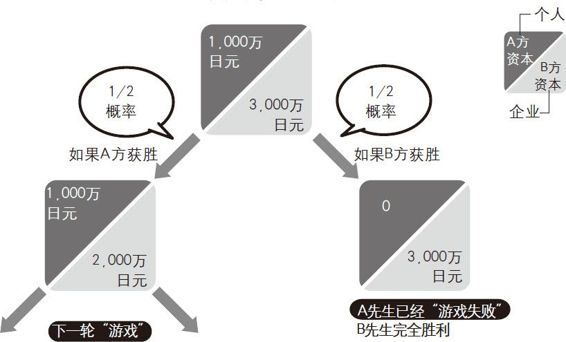

当然，就算A先生凭借那“1/2的概率”取胜，所谓的“胜利”也不过是指：他投入1000万日元之后还能再赚回1000万日元，其实就等于不赔不赚。可是，当A先生认为已经打败了大型连锁店时，对方又发动起一轮新的攻势。因为，即使大型连锁店损失了1000万日元，它仍有2000万日元的资金可以支配。

当然，在第二次的较量中双方仍各有1/2的概率取胜。即使大型连锁店在这次的较量中再次落败，它仍然可以再次发动第三轮的“进攻”（详见图9）。

■图9　A方为了战胜B方必须要实现“3连胜”

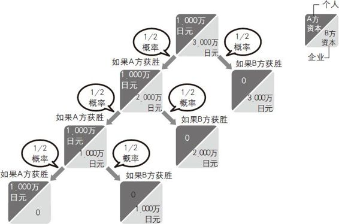

从这个极其简单的假设中可以看出，A先生的店铺要想生存下去必须要连续3次战胜大型连锁店的“进攻”。这种胜算的概率为1/2的3次方，即为“1/8”。与此相反，对于拥有资本量为对方3倍的大型连锁店的B来说，它取胜的概率为“7/8”。因此，这种大型的连锁店能够轻而易举地打败那些拥有“创业梦想”的个体经营者。当那些大型连锁店的经营者获得胜利后，可以长时间地陶醉在自己的胜利中，因为个体经营者们已经“无力回天”了。

然而，在上述假设中还存在另一个问题，即虽然双方均投入了1000万日元，但获胜一方也只能获得1000万日元。也就是说，该假设中排除了个人喜好、憎恶竞争对手等一些潜在因素。其实说到底，如果没有这些因素就不会有生意场中的种种较量了。

可是，如果你将经营企业仅单纯地理解为“由‘运气’和‘概率’所决定的一种游戏”，残酷的现实会告诉你事情的本来面目。那就是“在双方胜算概率相同的情况下，‘胜负’取决于各自的资本量”。

遗憾的是，即使是现在还有很多个体经营的店铺在与巨大资本相抗衡的过程中纷纷落败，究其原因也无外乎此。

我记得小时候曾经看过一部非常恐怖的电影，虽然电影的名字我已记不清了，但却清晰地记得其中的一个情节，影片中的主人公一次次地把僵尸打到，僵尸又立刻站起来袭击他。当时，这个情节让我感到不寒而栗。其实，那个“被杀死后又重新站起来袭击人类的僵尸”就好像是我们人生中要面临的各种各样的困难。

可是，对于那些个体经营者而言，竞争对手持有的“巨大资本”才是“打不死的僵尸”。

## 商场的定律是“胜者为王”

当然，在实际的经营竞争中，获胜一方得到的利润回报会远远高于前期投入。因为一旦战胜对手，就能够将对方的客源占为己有，而客源正是获取利润的源泉。

说得夸张些，如果一个经营项目在投入100万日元后能赚回101万日元，那么投资者就应该考虑将这个项目付诸实施。虽然“利润率”很低，但“利润额”仍有很大的上升空间。

在东京原宿的“明治大街”上，国外的品牌服装连锁店“H&M”临街而立。此外，在这家店的旁边还有一间来自美国洛杉矶的服装连锁店“FOREVER21”。如果你肯花上1万日元，就可以在任意一间店里实现从头到脚的“大变身”。为什么这两家店花费了如此多的广告宣传费，他们出售的衣服却仍然这样便宜？

其实，关于这个问题的答案我已经在前几章的例子中多次讲过了。其原因就在于，他们将销售量最大化，从而减少了每件商品中“固定支出”所占的比例，另外他们还通过大量进货来压缩成本。

这些拥有巨额资本的外资企业为了能成功占领日本市场，与本土企业抢夺市场客源，因此采取了这种必然的举措。当然，服装行业并不完全依赖于资本量的大小及投入资金的多少。但前提是服装必须要有特色、要能提升日本消费者的品位。

除此之外，服装店的经营者还要花费大笔资金打造自己的市场形象。首先，他们会花费远多于对手的广告宣传费，以此来使自己的服装品牌深入人心；其次，他们会在“一对一”的较量中将对手的“市场占有率”归为己有。所以说商家为了达到上述目的，必须将服装售价尽量压低。

实际上，你手头上的这些价廉物美的服装并不是按照真正的市场价来销售的，“低价位”背后暗藏的是经营者之间“你死我活”的较量。因此，当“个人的小额资本”与“巨额资本”较量时，双方都会竭尽全力地要生存下去，因为只有成功生存下去的人才能获得全部财富。

所谓“Winner takes
all（胜者为王）”并不是经验之谈，而是现实商界不可回避的事实。

## 为穷人设计的生存策略

对消费者来说，他们并不在乎商品的卖家是大型企业，还是小型企业，他们在意的是提供商品的商家所采取的营销手段。因此，我们多了解一下卖家所采取的多种营销策略，对消费者来说会有很大益处。

首先，请大家思考一下，面对大型企业的挑战，个体经营者们是不是真的全无办法？我们已经知道，大型企业具有十分有利的资本条件。如果个体经营者因为这个原因就轻易放弃努力的话，结果只能是一无所获。

也许此书的读者中也有人打算将来开一间自己的小店，但这是否就意味着自己在面对大型企业这个“巨兽”时只能一筹莫展、将客源拱手相让？

其实，这个问题就像前面讲过的咖啡馆的例子一样，当时我是将以下两个因素作为前提条件的：

·双方各有1/2概率的胜算

·对于胜利方来说，他投入了1000万日元之后还能再获得1000万日元

当然，若要使个人经营的咖啡馆能够切实取胜的话，必须将这两个过于单一的前提条件做进一步更改。

首先，要增加胜算，也就是将自己获胜的概率提高到1/2以上。即个人企业不要与大型企业进行“正面较量”，而是通过为顾客提供更具特色的商品来压制那些大型企业。或者说，个人企业要为顾客提供不同于大企业的另一特定领域的商品，以此来瓦解与大企业正面抗衡的局面。

其次，个人企业还要设法获得远多于大企业的效益回报，也就是要进一步提高自己的利润。例如，同样是500日元一杯的咖啡，个体经营者可以利用自身“固定支出”较少的特点，通过一些诀窍来提高店铺的粗略利润，然后再经过日积月累使自己的企业逐步成为高效益的企业，这一点是非常重要的。

以下是对个人经营者获胜要诀的总结：

◎对于所销售商品要做到“独辟蹊径”

◎要提高商品的附加值

这是否称得上是一个了不起的发现呢？其实不然，这只不过是从“经营学”的角度重新进行了阐述而已。所谓的“经营学”也不过就是将世界上所有“理所当然”的事记录下来。

前一段时间，在IT界涌现出很多“白手起家”的人，因为他们都梦想成为该行业中的“骄子”。然而，大多数的个人公司所提供的服务不过是借用了一些大型企业的经营模式。例如，我们平时可以看到有一些与“亚马逊”（销售图书的网站）十分相似的小型图书零售网站。还有一些与“Mixi”（社交网站）风格很类似的“SNS”“随意拍”等网站。我实在看不出，这些小网站提供的信息与那些大型网站究竟有何不同？所以，我只能说这些小网站的经营者要么是心血来潮，要么就是“吃别人嚼过的馍”。事实上，这样的网站有的已经销声匿迹，有的不再更新自己的网页，完全变成了网络空间中毫无价值的“垃圾”。

由此，我要告诫那些个体经营者：“绝对不能凭借自己公司的核心技术盲目地效仿其他公司的经营模式”。这是一种“技术竞赛”，也就是说经营者要持有其他公司无法仿制的、独一无二的商品，以此来确保自己的市场地位。

这与“利用‘特色商品’来确保自己的市场地位”的“特色商品竞赛”，以及“利用出色的客户服务来占领市场”的“客服竞赛”具有异曲同工之妙。因此，一个企业只有具备了独一无二的优势才能摆脱那种永无止境的“价格战”，使自己在竞争中永远立于不败之地。

同时，这些企业所采取的各项策略也能为消费者提供借鉴。

我们已多次强调，如果将消费者应采取的策略简单地定义为“缩减支出”的话，以下3点就是最完善、最直截了当的解决办法：

1．要购买不含“技术竞争”因素的商品。

2．要在人头攒动的商业街购买商品。

3．永远只买有用的商品。

我们可以将以上3点视为“消费哲学”。同时，这个看似“多此一举”的结论向我们阐述了某种真理，即无论何时，这些所谓的忠告、训诫并不是什么新生事物。被人们反复提及的种种“忠告”“训诫”只不过是在不断变更着表达形式而已。

但是，我并不清楚这种策略是否真能给普通人带来幸福。对于那些无法确定的事，我只能保持沉默。

# 第10章　定价陷阱式

## “防不胜防”的定价手段

在此，我将从顾客的角度来唤起大家的注意，因为商家并不是被单纯地卷入“价格战”中，其中还有很多令人“防不胜防”的定价手段。

例如，我经常在自动贩卖机购买矿泉水。因为矿泉水的种类很多，所以其价格也是各不相同。一般来说，一瓶500ml的矿泉水的售价在110～150日元之间（每升的售价在220～300日元之间）。这个价位与同容量的果汁及茶饮料的价格相比便宜很多，但是矿泉水的生产成本价为30日元左右（顺便提一句，这与果汁及茶饮料的成本价几乎相同）。

另外，如果一些居心不良的厂家用自来水来冒充矿泉水的话，每升的售价就相当于0.5日元（每500ml0.25日元）。我们粗略地比较一下，就可以得出一个令人惊诧的结果：

110～150日元÷0.25＝440～600倍

因为很多人认为，瓶装水肯定要比果汁及茶饮料便宜，所以矿泉水商家利用了消费者这种“总是拿果汁及茶饮料作为价格参照对象”的主观心理。另外，他们还尽量模糊“自来水”与“矿泉水”之间的界定标准。

这其中最重要的一点是，消费者常以果汁及茶饮料作为价格参照对象。曾经有一段时间，汽油的价格居高不下，一时间成了大家热议的话题。可是，当时几乎没有人留意到与每升200日元的汽油相比瓶装水的价格更高。

此时，可能有人会想，因为销售的不过就是水，所以能否按照市场价来直接出售自来水？另外，可能还有一些人不会赞同这种做法，他们会设法将500ml瓶装水的价格压缩至50日元左右来出售。然而，这两种做法其实都是行不通的，其原因有以下两点：

◎当顾客花钱购买自己的商品时，商家要设法将商品价格最大化。这是经商的基本之道

◎矿泉水可以作为果汁及茶饮料的替代品，所以其价位不可过低

因为消费者会拿矿泉水的价格与果汁及茶饮料相比较，如果矿泉水的价位过低，就起不到果汁及茶饮料替代品的作用，反而会卖不出去。与此同时，利润较高的果汁及茶饮料所应带来的相应市场利润也会随即消失。这样一来，就会对整体利润的获得造成影响。

像我刚才讲的，如果将矿泉水的价格设定为50日元的话，那些在自动贩卖机前打算“买饮料解渴”的消费者很有可能购买这个价位的矿泉水，而不是买130日元一瓶的矿泉水，这样一来对其他饮料的销售也会产生影响。所以商家将矿泉水的价格设定在110～150日元之间，这样一来就不会威胁到其他商品。因此，矿泉水的定价可以说是一种“绝妙”的定价方式。

对于手机来说，每当一款新机型问世后旧款的手机就会降价，日本市场上甚至还出现过“0日元手机”，就连苹果公司的iPhone手机也曾推出过“0日元”的机型。所谓“0日元手机”当然不可能完全成为新款手机的替代品，因为总有一部分人希望使用具有最新功能的手机。然而，我们也不能说那些“0日元手机”丝毫没有起到取代新款手机的作用。其原因就在于，每个人的喜好是不同的，有些人认为“一部手机只要能接听电话、发短信就足够了”（顺便提一句，我就是这样的人）。

那么，商家销售这些具有一定替代品功能的“0日元”手机究竟会获得什么好处呢？其实，商家之所以这么做完全是由于手机运营商之间的“客源争夺”已趋白热化。假如其他公司推出了具有一定替代功能的“0日元”手机，而自己的公司不开展类似的促销活动的话，就有可能失去已有客源，最终导致销售额减少。

另外，曾经有议员在提交的政治资金使用报告中这样记录：巨额资金主要用作为事务所购买饮料，所购入的饮料是5000日元一瓶的健康型矿泉水。同时，他还大言不惭地说：“目前已经没有人再去喝那些假冒成‘矿泉水’的自来水了。”看到这里，我想全国的自来水厂的职员都会感到很愤怒。每当有外宾来日本访问时，他们都会对日本自来水的清洁程度感到十分惊愕。因为在世界上，没有哪一个国家的水龙头流出的水既可以用作为“饮用水”又可以“洗浴”。同时，就连东京的自来水也比10年前好喝了很多。

如果将自来水也做成瓶装，并且以极其便宜的价格在全国销售的话，肯定会取代之前的那些“矿泉水”。这样一来，那些矿泉水厂商也就不得不“跟风”效仿了。当然，这首先需要扭转消费者的常规认识，要让他们觉得“自来水也很好喝”。

另外，我平时经常去拉面馆吃饭。在不久之前，我注意到一家拉面馆里推出了一项新的服务，其内容为“来本店用餐者能免费饮用某地有名的矿泉水”。然而，在距这间面馆仅数步远的地方有一家咖啡馆，那里出售的矿泉水与这家面馆的水相差无几。如果按照“同样价值的物品应具有相同价格”的理论来说，我们应如何解释这种现象呢？

其原因就在于“拉面馆里的‘免费饮用水’无法成为拉面、饺子的替代品，顾客有可能在喝完水之后再点一些食物。但咖啡馆里的‘矿泉水’就完全可以作为咖啡、红茶的替代品。”这样一想就会明白其中的玄机了，因为咖啡馆不可能无偿提供具有“替代品”价值的商品。

我平时经常携带笔记本电脑去咖啡馆写作。我曾经去了新宿的“小马剧场”附近的一间咖啡馆。那里矿泉水的价格与啤酒一样，为600日元。与此同时，该店的“下酒小菜”的价格要比其他店便宜一些。

由于我平时不喜欢过多地摄取糖分，所以无论是在自动贩卖机上还是在咖啡馆里我总是选择矿泉水。然而，这间咖啡馆所设定的价格却抹杀了矿泉水的“替代功能”。不得已，我只好选择了啤酒。我有时一喝就是两三瓶，其结果当然就是无法完成写作了。

因为我在喝酒的同时还会点一些下酒菜，这样一来就正中了该店价格策略的“下怀”。尽管下酒菜的价格很便宜，但它还是与矿泉水不同，它终归无法起到“代替啤酒”的效果。唉！真心希望自己有一天能彻底摆脱啤酒的诱惑，成为一个专注于写作的人。

## 瞄准人性弱点的服务——无偿使用

在“矿泉水”的例子中，我讲解了卖家制定价格的方法，那就是要让顾客觉得“这个价位刚好合适”。商家就是通过适当调整商品价格以达到“正好合适”的程度，来使该商品成为其他商品的“替代品”的。

然而，我们必须要关注的是，调整后的价格是否真的便宜了？当然，那些如矿泉水一样卖掉就完事的商品自然另当别论。有些商品虽然看上去很便宜，但如果持续缴纳费用的话，实质上就变得并不便宜了。

例如，我刚才讲到的“0日元手机”的例子。所谓的“0日元”并不是实际意义上的“0”日元。我想大家肯定都明白其中的原因，那就是手机的价格虽然是0日元，但实际上每个月我们还必须缴纳“基本使用费”“话费”“上网费”“电话留言服务费”“信息服务费”等其他各种相关服务费。另外，有时为了以防万一还需支付“电话簿备份服务费”“故障保险费”等许多不可胜数的费用。

前一段时间我买了一部手机，虽然这部手机并不是“0日元手机”，但服务商规定“如果使用时间不足两年就单方解除合同的话，会被追缴费用”。因为当时卖家不断地在向我推荐名目繁多的追加服务，所以最终我也没搞清这部手机的价格到底是便宜了还是贵了。

其实，这就是手机运营商所采取的一种典型的经营模式，即先为消费者提供较为便宜的入门价格，然后再将其余的收费渠道复杂化。正所谓“上贼船容易，下贼船难”，当我听到这部手机的入网说明时，不由得对商家能够想出这个吸引顾客的好方法感到钦佩。当然，我最后还是拒绝了所有的追加服务。

同样，所谓“无偿使用服务”也是一种利用人性弱点的经营模式。比如，有一种服务是每月花2000日元，就能从网上租借到各种DVD。如果顾客能够再多花一些钱，就能享受到“不限量”的租借服务。

我们可以将这种做法理解为“商家将‘固定支出’部分的房租及‘人员费’削减到极限，以此来实现商品价格的低廉化”。或者也可以理解为“商家通过在店铺内充分利用这些用于租借的DVD，以此来削减经营成本”。但是，我们还应该从另一角度来思考这个问题。

在通常情况下，如果以300日元/张的价格来租借8张DVD的话，其费用为2400日元。然而，如果是网上租借的话，其费用就变成了2000日元。所以，很多商家都以“节省400日元”作为卖点。并且，网上租借还无需缴纳“延迟返还费”，所以就显得更加便宜。

实际上，正如很多使用此项服务的人所知道的那样，每个人其实很难做到一个月只租8张DVD来看。虽然我现在也在使用该项服务，但我一般每个月仅使用1次（每次只租2张）。这是因为，商家是采用邮送的方式送货，所以当我收到DVD时可能已经不想看了。另外，在返还时也很麻烦，还得走着去邮局邮寄。虽然一些和我私交不错的朋友都认为我是一个非常勤快的人，但其实却并非如此。

另外，还有很多与此类似的服务项目。比如，每月缴纳一定的费用可以享受不限量收听英语广播的服务、由一些阅览室提供的能够阅读到最新周刊的服务、某些商家提供的完善最新使用设备的服务等等数不胜数的各类服务。然而，消费者最终还是选择了减少上述各项服务的利用次数，其原因也很简单。

例如，每月花1万日元就可以不限量地阅读到最新的经济类刊物。对该项服务，我们可以做出以下设想：

价格1：1万日元÷20册＝500日元/册

种价格2：1万日元÷5册＝2000日元/册

对消费者而言，价格1的投资回报率是很高的。如果按照价格2，也就是看一本杂志要花费2000日元的话，就不如直接购买杂志来得划算。

一般的DVD出租店是利用人本身的“惰性”来赚取“延迟返还费”，从而获得利润。而网上的出租店恰好以这种“惰性”为理由来提高每张DVD的租借费，从而获得利润。

我们将其称为“ASP”（Application Service
Provider）。这个词原本是指对于那些无能力导入大型计算机管理系统及管理软件的企业来说，软件服务商以每月较低的价格将该类软件租借给企业，就如房主出租房屋一样。同时对于那些企业来说，“直接缴费就能使用软件”要比“从头进行系统软件的研发”更加方便、省事。

如果将那些每月自动缴费就能享受到的服务都狭义地理解为“ASP”的话，我们之前所讲的各种服务项目不过就是“ASP”的另一种形式而已。很遗憾，人就是一种“善变”的动物，很容易对某种事物产生厌倦感，无论曾经多么迷恋也会有逐渐失去兴趣的一天。

所谓“经商”就是通过“卖东西来赚钱”，这是谁都懂的道理。所以，商家要获取利润就必然要从顾客手中“赚到钱”。

即使某件商品表面上看似乎非常便宜，甚至能便宜到“0日元”的程度，但其真实价格却不会真的就为“0日元”。这是因为商家会采用各种手段来收回损失，为了进一步获取利润商家还会设法使消费者必须再支付一些费用，这就是现实的营销世界。

“便宜没好货”这句话已经流传了上千年。其实这句经验之谈也揭示出了这样一个真理，那就是“商家往往以‘低价格’为突破口来‘抢走’人们口袋里的钱”。

**Part 4小节**

●在一些生意兴隆的店铺周围聚集着一些新开业的店铺，他们之间经营较量的胜败取决于各自的资本量。另外，作为消费者要充分利用这种店铺之间的竞争来为自己争取到实惠。

●我们在购买商品时要清楚，有些商品的价格是以独立形式存在的，但大部分商品都是作为其他已有商品的替代品而存在的。认清这一点之后再决定是否购买。

●本部分首页部分的答案是：在咖啡馆里，矿泉水是其他饮料的替代品，所以价格很高。

# Part 5　秘而不宣的营销手段

人们为什么会被那些不断变换形式的各种传销、诈骗营销的手段所欺骗，花钱买一些毫无用处的东西？（答案在本部分最后给出）

# 第11章　营销人格的丧失——一名男子的亲笔记录

## 这是一段让我备感羞耻的经历

对我来说，其实根本就没有看透“营销”的本质。因为我一直生长在九州的农村，所以直到我长大成人后才见到那些身穿西装的“工薪族”。

我经常会看到一些职员对顾客点头哈腰、被上司怒斥、被同事们取笑。尽管如此，他们每天还是乘坐着拥挤不堪的电车上下班，因为他们要为家人奔波、忙碌。所以，我一直都认为，工薪族之所以要忍受种种屈辱就是为了能够获得巨额的报酬。

我认为，人如果抛弃了人的本性，就能够承受各种不满、嫉妒和痛苦，所以当然会得到较高的报酬。然而到后来我才发现，自己一直向往的“工薪族”的月收入仅有区区的20万日元左右。

另外，我一直都认为“顾客就是上帝”这句话纯属是句玩笑。然而，当我看到那些“工薪族”确实是很认真地在讲这句话时，顿时如梦方醒。

其实，我一直都不知道自己是一个非常贫穷的人。当然，这并不是指我生长在一个非常富裕的家庭里。我想表达的意思没有那么肤浅，我是想说，对于自己而言，其实完全不知道贫穷究竟意味着什么。

虽然这种说法听上去很奇怪，但对我来说，即使钱都花光了我也不会很在意。因为，每当我挥霍完金钱回到家之后，就会在信箱里收到银行的“转账通知单”，又有一笔钱转到了我的银行账户里。

我的职业是编写“减肥教材”。当前“减肥”很受人们的关注，所以我就从国外购入了一些最新的减肥图书，然后将它们译成日文，再利用电脑特效伪造出使用前后的女性照片。接着，将这些教材的目录与一些极具煽动性的简介一起上传到互联网上。结果，这些减肥教材就以上万日元的价格被抢购一空。这些教材能够如此受欢迎，我想其中最重要的原因就在于，内容鼓吹的是“任何人都可以毫不费力地瘦下来”。

另外，我在销售“减肥食品”时，还会附加上一条规定：因为本商品广受欢迎，所以每位顾客只能购买两个。这样一来，商品的销路就会非常好。其实究其原因也很简单，因为商家最聪明的做法就是将多件商品卖给同一位顾客，所以商家在宣称“商品广受欢迎”的同时又限制顾客的购买数量，其实这两者之间根本不会相互影响。对于其中的原因，我们没有必要去寻根究底。同时，销售“减肥食品”最重要的一点是要向顾客反复强调：当你减肥成功后，你的人生会变得绚丽多姿。

在我的故乡，每到吃饭时，家里的10多个人会在餐桌前面对面地坐成两排，然后不声不响地开始吃饭。每当我回想起那个场景，都不由得浑身发冷。

如果我在吃饭时稍微说些牢骚话，父亲就会立即怒斥道：“我每天为了你们辛苦工作，你还有心说这种话！”因此我一直觉得吃饭的时间十分难熬。我们家有个不成文的规定，即每到父亲发工资的日子全家都会去饭店吃饭。每次外出用餐时，母亲都会特意对我们说：“要感谢你爸爸为我们做的一切。”我记得，自己在听到这句话时甚至还想过“为什么一定要感谢父亲呢？他只不过赚了那么点钱”。

虽然父母经常说一些“工作辛苦”之类的话，可在我听来，那些话只不过是令人厌烦的“虚张声势”而已。但是，这些话还是让我觉得不安和恐惧。因为，所谓“辛苦工作”不过就是赚取每小时100日元的工资，所以我难以理解所谓的“辛苦”究竟体现在哪里。但是，这些类似于恐吓的话却时常在我耳边回响。可能就是从那个时候起，我开始对一般意义上的“金钱用途”产生了怀疑。

不知从何时起，我的妹妹开始为买什么样的衣服而发愁。于是，我就常常帮她做决定，如果我为她选好一件衣服并对她说“你穿这件衣服简直太合身了，看上去十分性感”，妹妹就会信以为真地说：“可不是吗，我也这么觉得，那么就买这件吧！”最终，她是那么轻易地就相信了我的话而买下了那件衣服。自此之后，我终于明白了一个道理，即无论什么事都不喜欢自己做决定，总希望别人能帮他做出选择是人的通病。

实际上，人的特性就是不善于做出选择。就拿商家销售商品来说，虽然有些商品在广告中自称是“畅销商品”，但这些商品并没有正式投放市场。商家之所以这样做，正是利用了人的这种特性——不想自己做决定，希望依靠他人的判断做出决定。我在一些购物网站上经常可以看到长篇的消费者的反馈信息，商家这样做的目的也是出于此。

说起来很滑稽，我可能就是通过帮妹妹挑选衣服的经历，才开始认真地思考自己所具有的价值。这对我个人来说，也是最后一次“对人性流露真情”。我一直都觉得“人性”是非常可怕的，但同时又总是无法对这种可怕的“人性”彻底死心。如此一来，我就成了在“夹缝”中求生存的、还残存着些许“人性”的可笑之人。

自此之后，我便十分热衷于用一些夸张的手段来招揽顾客、销售商品。其实，这项工作非常简单，不需要我多认真地对待，我只要充分“表演”出夸张的样子，那些人就会主动掏出钱包了。并且，我现在已经非常善于这种“表演”了。另外，我还遇到过各种各样的“表演者”，有谎称能够获得幸福的女占卜师，也有沉迷于金钱的年轻男女。那些让人无法理解的甚至让人有些恐怖的男人女人们，在义无反顾地从事着这项“表演”。

我在从事这种“表演”的过程中发现了以下3条法则，只要按此行事就会使人们自动掏出钱包：

1．煽动哄骗、步步紧逼及强制挽留。

2．欺骗。

3．洗脑。

无论按上述3条中的哪一条做，都会取得理想效果。

只要将这3条法则付诸实践，人们就会接连不断地付钱，所以这对“表演者”来说是最好的回报。

接下来，我将从法则1的“煽动哄骗、步步紧逼及强制挽留”讲起。

这句话的意思是指：顾客在与商家进行商品买卖的过程中，商家通过营造出一种让顾客无法回绝的氛围来完成交易。

虽然从顾客的角度看，商家的种种做法不过是单纯地征询自己的购买意见。然而，那些类似“您是否需要‘试用装’”“我公司已组建专门的项目小组”以及“我敢以公司的前途做担保”等等的说辞却如同连珠炮一样接二连三地在顾客耳边响起，完全营造出一种使顾客无处遁逃的局面。那些凭借强制营销而声名鹊起的企业，会在每次洽谈生意之前先打听出对方出席的人数，然后自己带更多的人来参加洽谈，此种做法甚至已成为了惯例。

我已记不清是什么时候的事了，那时我经常与一些朋友合伙在地区的公民文化馆中举办“面向老年人的服务”。首先，我让当地的老年人都在文化馆入口处的桌子前集合，然后让工作人员在这些老人的四周围成圈。当活动开始后，我会向大家表示问候：“非常感谢各位能光临这次活动。”当我话音一落，围绕在老人周围的工作人员就会一起高声重复“十分感谢您”。这样一来，老人们尽管感到有些无所适从，但还是会小声地回答道：“谢谢。”

然后，我会逐个向老人们发放活动票，并同时开始摇奖。我会一面对那些老人高喊着“会中奖哟”，一面无偿发给老人们一些礼品。由于我事先在活动票上做了记号，所以能偶尔地抽出几个“2等奖”“特等奖”。当然，每当工作人员将奖品送到中奖者手中时，永远不会忘记面带微笑地齐声说一句：“恭喜您了。”

抽奖结束后，我会说：“下面，请大家到另一个会场集合。”此时，工作人员也会面带微笑地反复说“好的”。而老人们被这种此起彼伏的吆喝声所吸引，一面点头表示同意，一面向文化馆的“深处”走去。

于是，在另一个会场里，那些等候已久的工作人员便开始向老人们推销“空气清新机”“饮水机”以及一些高价服装。在这些老人中，虽然有一些态度傲慢的人打算离开，但那里的工作人员会立刻予以阻拦，并劝说道：“我们为您提供了如此丰厚的礼品，您至少要听一下我们的产品介绍。”这样一来，那个会场就成了文化馆中一个“封闭”的空间。

在很久之后，我才知道这种做法在心理学中称为“回报法则”，即人们一旦无偿地得到了某件东西之后，就无法拒绝赠与人所提的要求。

当然，这些老人最终都签了订购合同，然后我们就将商品及账单送到了每个老人的家中。因为，很多老人都没有充沛的精力来拒绝那些年轻推销员不停的煽动、劝说，他们都希望尽快从那个环境中解脱出来，所以这些老人在不知不觉中签订了一些高额的购物合同。人必须要有“定力”。然而，对于有些上年纪的老人来说，他们已经不再具有这种果断拒绝别人的“定力”了。

因为平时几乎没有人使用地方上的公民文化馆，所以，即使我租用三四个小时也只需花费5000日元。当然，那里偶尔也会举办一些“商业活动”“宗教活动”以及“政治集会”等，每到这时文化馆就不会租给我使用了。但是我发现，如果雇佣一些年轻的女孩子，以“开会”或“进修”的名义去租借的话，多数情况下都能租得到。

同样地，我跟自己的一些朋友以及他们的妻子们都玩过类似的“把戏”。首先，我会到一些住宅区、公寓集中的小区，然后谎称自己是“生活支援组织”的成员，同时将一些日用品以极其低廉的价格卖给那些主妇，有时甚至免费赠送。

当我多次进行过这种“服务”之后，就会向那些主妇们发出邀请——我们会在游船上举办酒会，希望您能参加。当然，关于“生活支援组织”与“酒会”之间究竟有何种关系，我们没必要细说。因为那些职业主妇平时的生活很枯燥，所以当她们听到此事时觉得与自己无关，表现得丝毫不感兴趣。

如果，那些主妇们果真身着廉价的晚礼服来参加这个酒会，我们就会利用那些迷幻的灯光将漆黑的会场布置成一个舞台。随后，在酒会中会有一些“过气”的、出场费极低的歌手开始表演。此时，那些主妇虽然也怀疑能否免费看表演，但她们仍旧津津有味地观看演出。

表演结束后，我们就会在这些微醉的主妇们面前，介绍各种贵重饰品。我们会说：“您平时以这个价位是绝对买不到这样成克拉的钻石。”还会说：“这个款式非常适合您这样的夫人佩戴！”然后，再抛出最具“杀伤力”的台词——各位夫人平时忙于家务及照顾孩子，一定非常辛苦。然而，丈夫们却一点也不谅解您。所以，请您趁这个机会为自己买一件首饰，当作对自己的奖励吧！

如果单从字面上看，“做家务非常辛苦”与“为自己买首饰”这两件事根本毫无关联，但对我们来说则不然。当介绍完商品之后，我们的工作人员就会一个劲地向主妇们推荐各种饰品。因为是在船上，顾客们无处可逃，所以大多数的主妇都签订了价值50万日元左右的购物合同，而她们所购买的不过是价值几千日元的“宝石”。

另外，如果在租借游船时遇到生意不景气的租借公司，租借费就会很低。比如，对于能容纳100人以上的游船来说，平均每人只需花费3000日元左右，即大约30万日元。即使再加上50万日元的艺人出场费，也不到100万日元。如果，我能够与两位主妇顺利地签订购物合同的话，就完全可以收回成本了。

其实，大多数主妇在酒会结束后回到家都会感到后悔，她们会埋怨自己“为什么买了这样华而不实的东西”，所以她们也犹豫到底要不要告诉自己的丈夫。最终，这些主妇用自己的“私房钱”支付了货款，但她们再也不会佩戴那些首饰，直到最后连她们自己都忘记了存放首饰的位置。

总而言之，我可以称得上是一个能为他人保守秘密的人，因为我始终保守着那些主妇们挥霍金钱的“秘密”。

## 欺骗

接下来，我所染指的工作就是法则2中的“欺骗”。

首先，我在某栋公寓中租借一个房间，然后再让一个男人装扮成占卜师的样子在那里等待“猎物”上门。于是，有一天，两个主妇来登门了，其中一个是介绍人，而另一个是求助者。接着，介绍人对求助者说：“这个占卜师很灵验的哟。”

于是，这个占卜师就接二连三地说中了那个求助人的境况。比如，“儿子没有考上中学”“夫妻关系不和”“与婆婆之间的矛盾”以及“父母患病”等。

接着，占卜师会问她：“您身体是不是也不舒服？”然后，占卜师会稍微停顿一下，接着说：“如果我没猜错的话，您一直有个‘老毛病’？”

“嗯，是的。”女人回答道。

“那您是不是患有糖尿病？”

“是的，正是如此，您怎么都知道呀？”

“哎呀，如果真是糖尿病的话，可就不好办了！”

在说这句话的同时，占卜师还表现出非常惊恐的样子，甚至吓得要仰倒，并不停地摇头叹息。

因为这个占卜师屡次说中了求助人的情况，所以这个主妇会拼命地向占卜师求助，问诸如“我该怎么做”之类的话。等主妇焦急万分时，占卜师便从里屋拿出一个“壶”。

“这是一个非常神奇的壶，由于您祖上做的坏事报应在您身上，所以您身边总是会出现很多负面的东西。如果您将这个壶放置于身边的话……”

“放置在身边会怎么样呢？”

“您就会获救。”

如此一来，不需花费任何力气，那个主妇就以200万日元买走了“壶”。这个方法要比“游船酒会”更简单、更高效。

然后，那个介绍人会再次回到这里，我只要另付给她50万日元的“回扣”就万事大吉了。之所以要给她“回扣”，是因为有关求助人的那些信息都是从介绍人口中得知的，所以也可以称其为“信息费”。

也就是说，那个介绍人为我们介绍的情况越详细，这个“占卜生意”就进行得越顺利。即使那些主妇之间的交情很深厚，但谁也无法抵抗50万日元“信息费”的诱惑。现在，为数不少的“占卜诈骗”都与此例类似，即利用身边的主妇所提供的信息来行骗。

然而，有一件事情让我感到十分为难。

那就是，我已厌烦了与那些老人以及主妇们之间的“把戏”。更准确点说，我已经厌烦了亲身从事这类工作。于是，我决定采取一种新的赚钱方法——让别人代替我来工作。

于是，我与朋友们召集了一些年轻人，他们的头发大多都染成了黄色，每天考虑的问题只是“怎样才能毫不费力地赚到钱”。所以，他们也被称为“毫无朝气的一代”。这些年轻人本身毫无作为，却天真地幻想着自己的人生有一天能发生翻天覆地的变化，这简直太可笑了。

“今天所有聚集在这里的人们，你们已经迷失了生活的方向。对你们而言，别说是明天的希望，就连今天的希望也不存在。但是，请你们看一下那些在媒体中涌现出来的成功人士吧！他们正是利用了‘金钱’这个突破性的武器，获得了成功。世界上只有两种人，那就是‘穷人’和‘富人’。要是没有钱，你们的生活会非常窘迫。世界上的人被分成这两类，其实是很不公平的。而我来到这里，就是为了要赋予你们这种突破性的‘武器’，我会让你们成为富人，为此，各位最好人手一部这个‘致富圣经’。”

接着，我会向他们分发一本名为《钱生钱，奇妙的多层次营销》的小册子。这本小册子介绍的是一种“上下线”的营销方式。例如，在销售洗涤剂、复合维生素以及健康饮料等商品时，“下线”的会员每卖出一件商品，其“上线”的会员就会获得5％的提成。

因为，我将所有商品的成本都压缩在售价的30％的范围内，所以即便再算上些手续费，我也能完全确保获取利润。这种营销方法的过人之处就在于，对商品实行“打折销售”的人不是我们，而是那些买下商品的会员。

我在那本“致富圣经”中写道：“为了向别人更好地介绍这种出色的营销方式，请一开始就给他们看一下你银行账户中收入一栏的复印件，因为那里转入的资金都是你们根据自己的判断而‘打折’销售商品所获取的提成。”接着又写道：“因为那些‘下线’会员看到复印件之后就会购买你的商品，所以你在最开始时的投入是必需的。”

然而，对于那些商品还存在一个问题，那就是如果将全部提成加起来的话，商品的价格应该很高，但为什么卖得那么便宜？

对此，我们可以做如下回答：

•归根结底，那些商品不仅仅是“商品”，让你们销售商品是为了帮助你们实现自己的“富裕的、自由的梦想”。

•购入商品的会员为了能提高销售效率，所以才打折出售。

有时，当那些“下线”会员看到“上线”会员们银行账户中所转入提成的金额时，他们立刻就变成了一片狂热的海洋。可是，却很少有人知道，那些账户中的金额只是总利润的一小部分，而那些“上线”会员所削减掉的自身利润才是总利润中的大部分。

此后，我又补充了自己在住宅区、小区工作时积累的经验，开始向某地区的主妇们兜售内裤，因为“家庭主妇”是小区中最具决定性的一个群体。由于这种通过销售内裤而获得提成的营销方式非常容易理解，所以这个项目很快就在各小区内开展了。

因为在人与人交往的过程中，或多或少都存在着一些嫉妒心理。所以，每个人都不能容忍自己身边的熟人比自己会赚钱，我很赞同这个观点，我想就连大多数的主妇们也会同意这个观点。

人们总是容易对某件事产生客观认识上的误解。例如：

◎毫无根据地认为自己的人生肯定会峰回路转（这是对于“命运”的误解）

◎明明自己没做任何努力，却认为因为别人能做到，所以我也能做到（这是对“个人能力”的误解）

◎明明自己的知识很贫乏，却认为我一定能够找到一种无人知晓的、百分之百能赚钱的生意（这是对“发现、探求”的误解）

如果一个人什么都不做，他的“命运”当然不会出现转机。同时，如果一个人不具备足够的“能力”，他也不可能总占上风。另外，也没有哪个人能轻易地就“找到”百分之百赚钱的机会。

尽管这些话会给那些从事传销的年轻人带来一些启示，但他/她们还是始终认为自己从事的工作很有价值。因此，在我的事务所中，那些追加订货的传真从来没有停过。同时，大笔现金不断存入我的银行账户中，而这些钱的数量要远远多于那些会员所获取的提成。另外，为了进一步强化“致富圣经”的作用，我在“金钱化的自由”一章的前面又加写了一章“自由的人生在等着你”，以此来推进我的“传教”工作。

此时，我从身后的高窗上眺望天空中绚烂的晚霞，并看到几只海鸥在空中飞翔，而那些海鸥展翅飞翔的姿态就好像一个“金”（日语中的“金”就是钱的意思）字。

## 洗脑

因为我这个假冒的“教主”广受好评，所以接下来，我开始准备成为一个真正的“教主”。

大家可能都知道，宗教的最初目的是要将人们从“贫穷、疾病、战争”中拯救出来。因为对那些“贫穷的人”“患病的人”以及“卷入纷争的人”来说，他们都非常需要心灵寄托，所以那些以“拯救他们”为借口的各种名目，也在随着时代的变化而变化，从而来适应人们的各种需要。然而，我却要让这个传统意义上的宗教从当今的日本社会中彻底消失，因为我要建立一种新的宗教形式，那就是“日本新兴的商业运作模式”，以此来沉重打击那些传统意义上的“宗教”。

在“泡沫经济”时期，产生了一个新的名词“银、护、保”，即担任“银行职员”“护士”以及“保育员”的女性。尽管在“泡沫经济”时期，银行的利率很高，但仍有一些女性在辛苦地工作。与此同时，社会上还兴起了某种事物来填补这些职业女性心灵上的空虚，并最终获得了成功。

在现今社会，又出现了一个新名词“独高女”，即独身、高学历的女性。即使当今女性就业已非常普遍，但她们毕竟还没有强大到可以忍受“孤独”。所以，我所从事的工作就是要消除她们对未来种种不确定因素的不安。

首先，我会装扮成占卜师的样子来招揽顾客。

在来算命的人中，“独高女”所占的比例最大。你可能认为，像这样高学历的女性是不会相信占卜、算卦这些毫无科学依据的东西的。然而，她们却认为占卜与在学校学到的知识完全是两码事。这种态度令人费解。

那些女性一般都会问：“我能获得幸福吗？”而所谓的“幸福”其实是指“本人认为‘快乐’的一件件小事逐渐累积而成的复合体”，所以占卜师是无法决定他人幸福与否的。但是，我如果照实说的话，既不能成功地招揽顾客，也不能让这些女性得到她们所希望的答案。不管怎样，就当今社会而言，那些“毫无科学性的预言家”要比“毫无预言的科学家”更受欢迎。

于是，我就会恐吓那些女性说：“有不祥的事情将降临到你身上。”其实，那些女性要是表现得很乐观的话，我会为她们感到十分庆幸。然而，日本的女性好像更容易相信一些悲观的事情。所以，我接着说：“为了消除那个不祥的预兆，请加入到我们的集体生活中来。不然的话……”

此时，我已没必要再接着说下去了。听到这里，大部分的女性都会痛快地回答：“好的，我会照做。”

其实在一开始，我就打算建立一种新的经营模式，那就是通过让这些女性参加集体讲座来赚取高额的费用。我认为，首先把讲座的费用设定得低一些，以此来吸引更多的人参加；其次，通过对参加人进行“洗脑”，让她们今后不断地付给我费用。

所谓“洗脑”正是“宗教”中的基本环节。有时，我的脑海中也会闪过这样的疑问：“要是那些女性过于沉迷此道，不就等于毁了她们的一生吗？”但是，人要想获得某些东西就必须要背负一些风险。虽然，那些“教义”都是我编造的，但那些女性要是真能通过它来获得人生的幸福的话，难道不是一件很好的事情吗？

我召集那些女性来做的事其实非常简单，首先我将这种“集体住宿”称为“灵魂的净化”；其次我让她们反复诵读我编写的“教义”。我会让她们一遍遍地复述“神灵从天而降，请将我的灵魂赠予这唯一的救世主，这样我的灵魂就会得到净化……”等等类似的语句。

原来，“人”这么容易地就被别人“洗脑”了。我觉得，如果人们一直重复说着同一件事，那么这件事就会立即替换掉他脑中的一些既定事实。另外，有些公司会在早晨让职员大声诵读“公司的训导语”，其实这也是公司对职员进行“洗脑”的一种方式。

因为，我将这些女性的住宿地点设在偏僻的地方，所以她们是无法逃跑的。当然，这是借鉴了之前“游船酒会”中的经验。我会让她们一直诵读我的“教义”，直到她们的头脑极度疲乏，甚至产生了某种幻觉。

其实，我这么做相当于将“脑学”的研究成果应用于实践。据说，如果把人封闭在一个狭窄的空间里达数日之久，人就会产生幻觉。也就是说，大脑不能承受过于单调的事物，它会通过“让人类产生幻觉”的方式来对抗一成不变的日常生活。

我会一直迫使那些女性达到几近疯狂的状态，然后再让她们从那种状态中解脱出来，因为我要向她们灌输自己的“教义”。其方法也与之前相同，即让她们不断重复做同一件事。而那些女性的“脑神经”已经无法再承受如此乏味的事情了，所以她们没有任何异议地接受了我的“教义”。

于是，那些女性边擦眼泪边听我说：“因为你们在之前的人生中曾和撒旦做过交易，所以你们的灵魂受到了玷污。而你们现在所听到、见到的一切都是错误的。长此以往，你们就不会到达真正的‘极乐之地’，你们会掉入地狱，那里撒旦在等待着你们，而我才是你们最后的救世主。”

此时，那些女性好像还没有意识到，当初占卜师邀请她们来参加的只是一个很轻松的讲座，但现在她们却落入到了无法自拔的“人间地狱”。

最近，在日本兴起了一种名为“寻找自己”的思潮，人们不厌其烦地投入其中。所谓“寻找自己”即是要发现存在于某处的“真实的自己”。然而，那个“真实的自己”其实并不存在于任何地方。我经常听到有人在介绍自己的时候说“我就是这样的一个人”，可是人是非常善变的动物，根本不存在一个一成不变的“自我”，无论“思维模式”“兴趣爱好”，还是“理想抱负”都在不断发生着变化。

如果再说得直白些，就是只有“现在的自己”才是“真正的自己”。然而，人们最近却认为“现在的自己”并不是“真正的自己”。所以，我在给予那些女性心灵上的打击之后，她们就误认为我给她们展示的“新的世界观”和“人应有的姿态”正是她们想要寻求的东西。

现在，很多人对任何事都表现得漠不关心，正应了那句话“各家自扫门前雪，莫管他人瓦上霜”。但是这样一来，人与人之间有了隔阂，所以，我只要说一句“我会帮助你，请相信我”的话，就可以轻易蒙蔽那些人情观念已非常淡薄的现代人。

如此一来，那些被洗脑的女性就会为我带来各种各样的东西。当然，其中大部分是金钱。只要她们信任我一次，就会毫不懈怠地不断付钱给我。尽管这样做可能会让她们家破人亡，但她们在痴迷这个“宗教”的同时也得到了相应的归属感与幸福。

经营此类生意要遵循以下3条法则：

1．首先，通过为对方提供日常生活中各种烦恼的咨询服务，来增加他们对“教主”的依赖心理，并通过洗脑，使她们加入教会。（洗脑）

2．其次，要告诉她们“你们灵魂的层次已经提升”，同时让她们销售一些“特别信徒专用商品”。（销售商品）

3．再次，还要让她们捐出自己的全部财产，让她们变得身无分文。最终，使她们成为“劳动的奴隶”。（剥夺人生）

通过实行法则1，我发现，那些女性希望得到的并不是“请你这样做”这种积极的答案，而是“你不可以这样做”这种否定性的答案。所以，与其对她们说“你可以试着慢跑，一定会对你的身体有好处”，不如说“因为一定会有不幸的事情发生，所以请你取消全家去旅游的计划”。因为对那些女性而言，后者的说法更起作用。

另外，还要对她们说“请取消全家旅游的计划，因为你们一定会遇到事故。你不如来这里诚心诚意地祷告；虽然前一次你丈夫单独去旅游很顺利，但神灵却告诉你‘正因为上次没发生任何不幸，所以这次你们要一起来祷告’；这是理所当然的，因为你没有与丈夫同行，所以避免了事故的发生”等等诸如此类的话。

另外，也可以采用这种方式：“虽然你一直真心真意地祷告，但你的儿子还是没能考取第一志愿的高中。其实，那已是一个很好的结果了。你要是不来祷告的话，你的儿子将无法考取任何一所高中。”

在宗教中，存在这样两种说法：

•因为你信守“神”的教诲，所以现在平安无事

•你要是不信守“神”的教诲，立刻就会遇到悲惨的事情

宗教就是将这两种言辞组合在一起，让人们产生恐惧心理，觉得如果停止祷告，苦难就会降临到自己身上。

我在从事这项生意的时候，从未开出过类似“收据”的东西，换句话说，没有留下任何的“交易凭证”。这些被我“洗脑”的人，让我一夜暴富。

下面，让我们来追溯一下经营方式的变迁过程：

◎通过销售商品以赚取粗略利润的时代（制造业时代）

◎通过贷款利息而获利的时代（金融业时代）

◎通过出售各种信息而获利的时代（信息产业时代）

以上各时代我们都曾亲身经历。而现在，我终于即将开启一个新的时代，那就是：

◎通过出售“幸福”而获利的时代（宗教业时代）

其中的“信息产业”不需要投入任何成本，这一点与“宗教业”是相同的，但后者的利润却高得多。如果“宗教业”称不上“新一代的商务”那又能称之为什么呢？当然，我们已经不能将“宗教业”仅仅定义为某种商务性质的活动。人们不是常说，“钱并不是最重要的”“不过就是钱而已”诸如此类的话吗？所以，我从事的工作就是要从他们那里交换“不过而已”的金钱，同时给予他们“真正的幸福”，这是一种“创造价值”的过程。

我没有做过什么正经生意，然而却能摸索出一条能使自己成为新一代的、具有非凡感召力的“领袖”的途径。所以，正如我在这篇记录的最开始处提到的“我没有必要搞懂‘正经生意’的本质”。因为，此时我已经成为了一个真正的“预言家”。

由此看来，我还不是一个合格的生意人。

请大家一定要心甘情愿地接受这个观点。因为，我已经完全不是一个生意人了。

我利用信徒们的“布施”修建了一所豪宅，并且在初夏时搬了进去。从房间镶嵌着钻石的窗户中，我可以看到院子里池塘中的红色睡莲正在开放。再过3个月，院子里的波斯菊也会争相开放。

现在，对于我来说，不存在所谓“幸福”或是“不幸”。因为，一切都会成为过去。

到目前为止，我一直身处在地狱般的“营销”世界里，我认为唯一可以称得上“真理”的东西只有这句话：“一切都会成为过去”。

我今年已经37岁了，但由于我平时吃了太多信徒们送来的美味佳肴，所以身体胖了许多，一般人都认为我已经超过50岁了。

我（本书作者：坂口）并没有见过撰写这篇手稿的这个非比寻常的男人，但是，我可以明确地指出，所有能获得巨额利润的生意背后，总存在着一些人，他们会想尽一切办法来夺走你口袋中的钱。

在这个世界上，关于“利润率是百分之多少”“要如何提高利润”等的争论全部都是徒劳无功的。在那些企图以低价商品来赚取巨额利润的、居心不良的人看来，那些貌似合乎逻辑的计算数据不过就是“0”而已。

如果再说得“冷酷无情”些，那就是在当今的资本主义社会里，如果你为一件毫无价值的东西花费了1亿日元，其责任在于你自己。我坚决反对手稿中的那种营销方式，但同时我也认为，消费者一定要时刻提高警惕以免落入商业陷阱中。

我也曾抱着好奇心参加过几次所谓“重塑自我”的讲座，那些讲座所使用的手法与这篇手稿中的最后部分所描述那种“洗脑”的情形十分接近，大致分为以下3个步骤：

◎否定之前的自己（破坏）

◎注入新的思想（重新构建）

◎进一步巩固新思想（使之上升至顶峰）

下面我来逐条进行说明。

讲座的主办者会让参加者回顾自己的人生历程，然后让他们在很多人面前坦承自己曾有的失败经历。主办者试图通过这种方法使参加者失去自尊心。接着，主办者会往参加者的头脑中灌输一种与众不同的、过于完美的“教义”。最后，主办者会充分利用经典音乐带给人的激昂感，来使参加者戏剧性地亲身经历这个“全新自我”诞生的过程。

那些主办者会这样说：“你之前就是一个罪人！从今天起你才真正找到了正确的道路，所以请沿着这条道路前进吧！因为你终将到达一个非常美好的世界，所以你要让身边的人也知道这个非比寻常的讲座！”

如此一来，又会有新的“信徒”加入其中。

我身边就曾发生过这样的事：我非常要好的朋友曾收到过某位女性发给他的短信，内容是：“我一直以来都很关心你，你能否跟我一起去参加这个讲座。”我记得，当我知道此事后，曾竭力阻止那个朋友去参加。因为，“很关心你”与“一起听讲座”二者之间根本毫无关联。透过这个短信的内容，我能察觉出发信人怀有不可告人的目的。

后来我得知，那个讲座是由一个很有名的宗教团体的后裔举办的。而那个宗教团体之所以出名，是因为它曾经将信徒做成了木乃伊。然而，那个给我朋友发短信的女性对这个讲座却深信不疑。有些人一旦落入到某个“团体”的圈套中，就会毫无顾忌地不断重复着各种谎言来规劝他人也加入该组织。因为他们都十分坚信，如果我能介绍别人也加入其中，那么我就一定会发现一个全新的世界，并最终获得幸福。

我不清楚那个为了追求所谓“幸福”的女性，此后又向那个组织支付了多少金钱；我也不清楚，她会由此将自己之前的人际关系毁坏到何种地步。

当然，一些“重塑自我”的讲座也采用了类似的程序，但这些讲座的举办者并非居心险恶的人。所以，我并不打算将所有的讲座都一概否定。这种“重塑自我”的讲座最早起源于美国，其目的是为了让那些参加过越南战争的美国士兵从“创伤”中恢复过来。现在看来，无论这种方法是好是坏，它都具有一定的“效果”。

但是，凡是这种“重塑自我”的讲座都是要将某个人的价值观强加于他人，以此来干涉别人的行为。对此，我觉得，这些讲座之所以这么做，就是为了让人们对它产生兴趣。因此，我也搞不清那些讲座所采用的“带有煽动性的、略显偏激的态度”是好还是不好。尽管我对这些讲座持有保留意见，但我认为，听取这类讲座的人与那些“全盘接受他人的价值观”以及“失去所有朋友”的人相比，还是有救的。

曾经发生过这样的事，我的一位朋友经常参加一个讲座。据说，这个讲座的讲师长得很像某个宗教的创始人，并且是一个非常有名的、具有超凡能力的人。为此，我的这位朋友将他每年收入的大部分都花在了这上面。

他也曾向我热心地推荐过那个讲座，但我仍旧表现出一贯的漠不关心的态度。于是，他用一种怜悯的神情看着我，并对我说：“你要是听了这个讲座，肯定会改变自己的人生观！你怎么就是不明白呢！”最后，他抛下了这句话：“长此以往，不会有任何人愿意了解你，你会变成孤家寡人的！”然后离开了。那是我最后一次见到他，我也不知道他现在过得怎么样。

然而，有一件事还是被他言中了。

我想，他的预言（最后说的那些话）马上就要实现了。

**Part 5小节**

●本部分首页的答案是：因为人是一种“凡事自己不能做决定、希望他人来为自己决定”的动物，所以很难持有坚定的是非标准。因此，有些人才会在不知不觉中落入“煽动哄骗、步步紧逼、强制挽留”“欺骗”以及“洗脑”等各种圈套。

# Part 6　无人问津的小吃依然能存在下去的理由

为什么有些小吃店几乎没有顾客登门却依然能经营下去，而对于那些夜总会来说，只要顾客人数稍微减少就会立刻倒闭？（答案在本部分最后给出）

# 第12章　由支出环节的不同而产生的反常现象

## 我记忆中的天空

即使是现在，我也经常仰望天空。

无论是参加一些无聊的会议，或是在旅途中，或是工作的间歇，每当我想要从现实中逃脱就会眺望天空，因为这样会让我一下子忘掉眼前的烦恼。

不知为什么，我的脑海中经常会浮现出两片让我无法忘记的“天空”。

那是很久以前的事了，那时我已经辞掉了公司的工作。如果我说关于辞职一事，自己从来都没有后悔过，那就是在撒谎。因为，“辞职”代表着自己将要离开所有的工作伙伴，所以我有很多的不舍、留恋。唉！这也正是自己的软弱之处。在我的脑海中，曾多次出现过这样的疑问：“这样做究竟对不对？”

然而，另一方面，我也为自己能脱离之前的工作而感到喜悦。同时，我对未来充满希望，为自己能从繁重的工作中解脱出来感到些许安心。

也许，很多人都会在怀疑一件事的同时又产生完全相反的情绪。

于是，我迎来了自己的最后一个“工作日”。我将书桌整理干净，将没用的文件处理掉，向同事们表达了自己最后的感谢，然后向公司的正门走去，也许我再也不会迈入这扇门了。当我走出公司后，便将自己的工作服使劲地扔进了附近的垃圾桶。“啊！一切终于结束了！”我边想边向车站走去。在感到“解脱”的同时，我又看到了那片一望无际的、没有一丝云彩的天空。

我在辞职后虽然暂时没有什么事情可做，但每当我回想起那片湛蓝的天空，心里就不由得生出一种很奇妙的情绪。

这就是我关于“那片天空”的记忆。而另外的“一片天空”出现在我小学的时候。

可能任何时代都是如此，在我的班上也有同学被人欺负。一般来说，“欺负人”的一方人数较多，而“被欺负”的一方只有一个人。在“躲避球”游戏中，那些“欺负人”的同学会命令那些“被欺负”的同学来接他们抛过来的球，然后他们会把球直接打在接球人的脸上，然后哄堂大笑。当然，这种事经常发生在课间休息的时候。而我当时既不属于“欺负人”的一方，也不属于“被欺负”的一方。当时，我就坐在靠近窗户的位置上看着那些“每日定会出现的情景”。

如果此时老师走进教室的话，就会阻止双方。那么，老师会怎么做呢？他会大声训斥双方的同学：“你们这么吵嚷到底想干什么？”“那些看热闹的同学为什么不去制止他们？”就这样，他完全忘记了上课，开始喋喋不休地教训起我们来。

那些不会教训孩子的老师是无能的。但是，一个是非颠倒，连“被欺负”一方也一起教训的老师就更加无能了。

于是，我一边听着没完没了的说教，一边心不在焉地眺望着远处的天空。那片纯净的、不含一丝杂质的天空总能让我想到，外面的世界是那么的广阔，它与这些琐事毫无关联。

当然，年幼的我是无法表达出这样的情愫的，那时我的心里只是产生了一种模糊不清的情绪。说得夸张些，也许就是在那时产生的这种近似于“豁达”的人生态度一直指引我走到了现在。

## 再次感受“敌方的世界”

在我的一生中，曾多次向他人提出“面谈”的请求，当然，别人也曾这样请求过我。正因为如此，我才能接触到各种各样的人。其中，我最有感触的两件事是：1.就像无限延展的天空会呈现出多样性一样，在这个世界上，存在不同类型的人也是很自然的事情。2.实际上，人们的年收入参差不齐。

在本书的前言部分，我就工资分布情况进行了讲解。虽然都是领取工资，但每个人的具体额度却各不相同。如果将比较范围扩展至“个体经营者”，你就会发现一个更加“陌生的世界”。其中，最让我感到震惊的是，现在赚取数千万日元，甚至是上亿日元的人随处可见。

我曾经见过一个头发染成咖啡色、年纪在40岁左右的男人，他的公司拥有多名自由职业的电脑程序师，而他的年收入已经超过5000万日元。他曾对我说：“我再也不想做回那个傻乎乎的、只知道为别人卖命的工薪族了！”

对于一般的工薪族来说，年薪从300万～400万日元起步，顶峰达到1000万日元以上，这样的模式可能很实用。但是，当你从“工薪族的世界”中走出来，你就会看到完全不同的“景色”。

我在前言中，将“从事商业运作的人”称为“敌方”，将“各种商业模式的被动接受者”称为“我方”，在年收入上也可以反映出两方的差距。虽然，“敌方的年收入”信息很少能透露给属于工薪族的“我方”，但是在这两者之间却存在着无法撼动的“收入差距”。

同时，我发现了一个非常重要的现象，即敌方中大多数的成功人士都不会按照某种既定规则来行事。一般来说，公司职员之间存在着“竞争”，他们为了能“出人头地”各显神通，人与人之间的关系被互相“攀比”与“嫉妒”所代替。

我的一位朋友就是如此，他为了能在职员之间的竞争中占上风，打算通过考取“MBA”来增加自己的实力。尽管如此，他仍旧属于“我方”阵营。说到底，那些“敌方”的人是拒绝加入这种“竞技”中来的。

如果有很多人都能获取“MBA”学位，那又该怎么办呢？其结果只能是“MBA”拥有者之间的竞争变得更加激烈。那么“获得MBA学位”也只能是让自己成为另一个“既定游戏”的参与者。我估计，那些人肯定想不到“就连一个‘铁板烧’店老板的月收入也能达到200万日元”。

在“欺负人游戏”中获胜的既不是“欺负人”的一方，也不是“被欺负”的一方，而是那个冷眼旁观的小孩，即那个凝望着蔚蓝天空的少年。他将那段宝贵的少年时光用来“学习”及“漫无目的的空想”。

也许，当我将工作服丢掉后，从那片湛蓝天空而感觉到的“清爽感”就是这种胜利的喜悦！

因为，我终于能从那些既定的“游戏”中逃脱出来。同时，我也十分清楚今后自己可以从任何人的“游戏”中自由地逃离。

## 弱者的胜利宣言

我在大阪生活的时候，曾经在一间小酒馆里打工。那时，客人总会带我去附近的小吃店吃东西。

我们绕到车站后面的那条老街上，然后走进一座小公寓，再迈上几个台阶就到了那家小吃店。而小吃店对面大楼的一层是间“夜总会”。我记得每次从那里经过，都会有一些女招待招呼我进去。

我去过那间小吃店好几次，但每次看到那里都没有什么客人，只有“卡拉OK”的乐曲在寂寞地回荡着。在那之后不知又过了多少年，那间小吃店对面的“夜总会”已经历经了多次的“歇业”然后“重新开张”，而小吃店却依然是老样子，虽然客人还是很少，但是它一直都在正常运转。

一次，我问小吃店的老板娘：“客人这么少，您的生意也很难维持吧！”听到这里，老板娘满面含笑地将事情的原委告诉了我。

原来，这里的店员只有她一个人。并且，由于房主是她的朋友，所以几乎就不用交纳房租。只要小店的日营业额能达到1万～2万日元，就完全可以维持下去。如果再有一些“回头客”能偶尔来光顾一下，小店的生意就更没问题了。另外，她的生活十分简朴，每天的早餐就是豆酱汤和米饭，平时也不买昂贵的东西。最后她还说：“对于我这个平时没什么事做的人来说，真的非常喜欢现在的工作。人活着不就是这么回事嘛！”

我已记不清，自己在听完老板娘的这些略带伤感的话之后有何反应，因为我当时已经喝醉了。事后我才领悟到，这个小吃店老板娘的经营之道就是弱者的最佳生存策略（详见图1）。

■图1　夜总会VS小吃店的支出构成比较

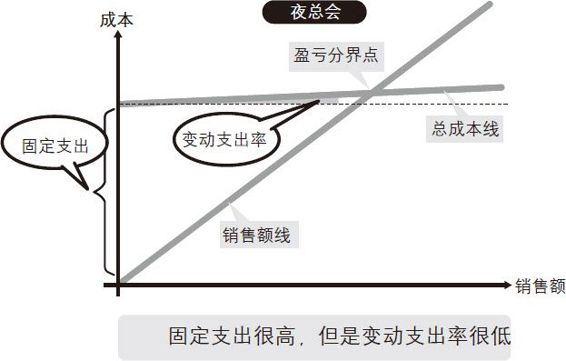

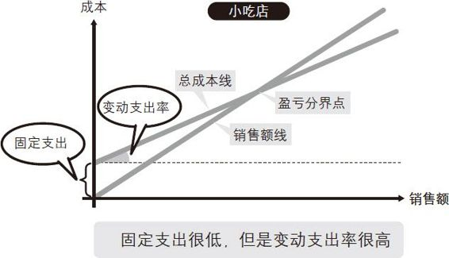

接着，我们重新回顾一下之前各章的内容。因为夜总会需要花费大笔的“人员费”，换句话说，“人员费”占了“固定支出”中的绝大部分。并且，夜总会可以利用那些女招待们的“魅惑力”来进一步增加客人的消费量，如此一来，就能够降低“下酒菜”“酒水”等“变动支出”的比例（我估计，没有人会相信夜总会里的烧酒真的能值几千日元。实际上，那些烧酒的进货价只有几百日元，夜总会是在此价格的基础上又加上了“场地费”，所以才会那么贵）。

因此，“夜总会”的销售额要是超过了“盈亏分界点”，就会持续不断地获取利润。同时，“夜总会”还会让女招待们互相竞争业绩，以此来激励她们努力拓展客源。当然，她们的工资也会随业绩的上升而增加。

可是……

正是因为夜总会的固定支出很大，所以只要销售额略有下降（＝顾客人数减少）就会陷入亏损。不管夜总会的经营者愿意与否，他都必须支付店铺的维护费以及为那些等候顾客的女招待支付工资。很遗憾，我从不光顾夜总会，没有为那些女招待们挥金如土的经历。因为有些客人可能只光临一次，如果夜总会无法将这些客人变成“回头客”的话，其客源总有一天会枯竭。

与此相反，正因为那个顾客很少的小吃店时刻做好了“关门”的准备，所以它有足够的耐心来接受“客源减少”的事实。当然，这间小吃店在销售额上升时的利润增幅也无法与夜总会相提并论。可是，由于小吃店的“固定支出”已经被压缩到极限，即使销售额出现波动也不会陷入亏损。也可以说，这间无人问津的小吃店是从夜总会的“游戏规则”中脱离出来而另辟蹊径。

下面，我将利用数学公式来进一步说明这个问题。

## 神奇的夜总会女招待得到了什么？

此时，请大家回忆一下我们在中学学过的一次方程式：

y＝αx＋β

其中，“y”代表“总成本”，“x”代表“销售额”，“α”代表“变动支出率”，“β”代表“固定支出”。假设，“夜总会”的“变动支出率”为20％，而每个月的“固定支出”为200万日元。因为，“总成本＝变动支出（销售额×变动支出率）＋固定支出”，所以将上述数据带入该公式中即为：

总成本＝销售额×20％＋200万日元（y＝0.2x＋200万日元）

当收支平衡时，即“总成本＝销售额”，也就是“y＝x”。然后，可通过如下计算得出“x”：200万日元÷（1－20％）＝250万日元（详见图2）。也就是说，这家“夜总会”的“盈亏分界点”正好是“250万日元”。同时意味着，如果“夜总会”的销售额能超过这个数目就会“盈利”。

■图2　夜总会的“盈亏分界点”的推导过程

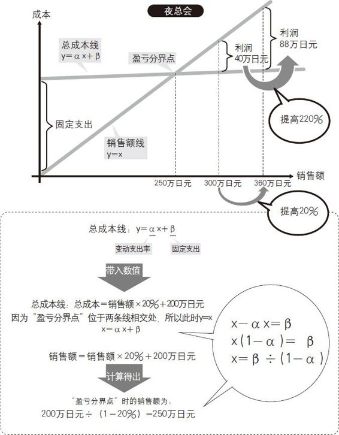

例如，我们将这家店的月平均销售额设定为“300万日元”时，可以通过上述公式算出“总成本”：

300万日元×20％＋200万日元＝260万日元

即从“销售额”中减去260万日元之后所剩余的“40万日元”即为该间“夜总会”的利润。

我们还可以假设，由于女招待中的“后起之秀”非常善于招待客人，所以夜总会的“销售额”有时能达到360万日元，也就是将销售额提高了20％。于是，我们可以用同一公式算出“总成本”：

360万日元×20％＋200万日元＝272万日元

由此，店铺所获利润即为：

360万日元－272万日元＝88万日元

这样看来，只要夜总会女招待们设法将“销售额”提高20％，就能使夜总会的利润翻番（“现利润”是“原利润”的2.2倍）。

另一方面，对于那个顾客很少的小吃店来说，我们假设它的“变动支出率”为70％。这是因为小吃店的老板娘人品很好，所以她为客人提供的都是价廉物美的食物。同时，这间小店的“固定支出”仅有10万日元，用以支付老板娘微薄的工资以及房租。于是，这间小吃店的“总成本”可表示为：销售额×70％＋10万日元

我们假设，小吃店每月营业30天，而每天的销售额为2万日元，所以月销售额就为60万日元左右。于是，可以进一步算出“总成本”为：

60万日元×70％＋10万日元＝52万日元

从60万日元的“销售额”中减去52万日元后所剩余的“8万日元”即为小店的利润，当然这些利润是微乎其微的。

与此同时，我们可以假设这间小店也发生了类似于夜总会女招待创造的那种“奇迹”——有位顾客对老板娘“一见钟情”，于是他经常光顾这间小店。其实，这也没什么奇怪的，因为中年人之间突然萌发的恋情有时也会非常热烈。最终，这间小店也与“夜总会”一样，其“销售额”上升了20％。

于是，当小店的“销售额”为72万日元时，其“总成本”为：

72万日元×70％＋10万日元＝60.4万日元

从“销售额”中减去“总成本”后所剩余的“11.6万日元”即为该小店的利润。

通过上述比较，我们可以看出：对于那些夜总会的女招待来说，只要她们将“销售额”提高20％就可以使夜总会的利润增加2.2倍；而对于那间小吃店来说，即使“销售额”提高了20％，其利润也只能提高到原来的1.45倍。

虽然两者的“销售额增幅”都为“20％”，然而它们由此所实现的“利润增幅”却大不相同。

所以，正像我刚才说的那样，只有那些有名气的夜总会女招待才会领取高额工资，同时还能在各种媒体面前频频“露脸”。不得不承认，这的确是一个“弱肉强食”的世界！

那么，我们根据上述计算结果是否可以得出“夜总会的经营模式非常出色”这样的结论呢？当然不行。

下面，让我们反过来考虑一下。也就是说，当双方的销售额都减少20％时，究竟谁能够生存下去（详见图3）。

■图3　当两者的销售额都减少20％时的支出构成

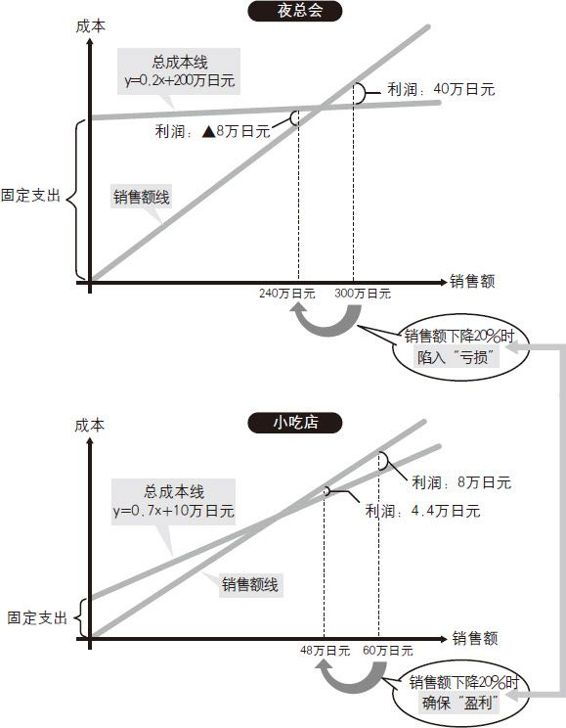

对于夜总会来说：

销售额：300万日元×80％＝240万日元

总成本：240万日元×20％＋200万日元＝248万日元

利润：240万日元－248万日元＝－8万日元（亏损）

对于小吃店来说：

销售额：60万日元×80％＝48万日元

总成本：48万日元×70％＋10万日元＝43.6万日元

利润：48万日元－43.6万日元＝4.4万日元（盈利）

由此可以看出，小吃店实现了一个漂亮的“大逆转”。正因为小吃店老板清醒地认识到自己的店不具备夜总会那样的豪华感，于是便将自己朴素的生活观念运用到了小店的经营中。因此，这间小吃店虽然赚不了大钱，但是它却具有一种“韧劲”，即使在客源出现波动时依然能生存下去。

在我们的生活中，有很多外表“光鲜”的企业由于销售额下降而纷纷关门大吉。其中，有些企业的店铺只能设在商业街中不起眼的角落里，那里的生意十分萧条。

我从事采购工作时，曾见过这样的生意人，他们上一分钟还在夸夸其谈自己赚取的高利润，而下一分钟就面临破产的窘境。当然，这其中也不乏另一种生意人，他们的企业规模虽小，但是却具有很强的生存能力。

我在重拾回忆的同时，为大家讲解了“夜总会”与“小吃店”支出构成的区别。

也许，我列举出的那些数学公式可能是“舍近求远”了。

因为我只是想让大家明白简单、朴素的生活是最好的。

当然，那间小吃店的老板娘早已懂得了这个道理。

# 第13章　以“非成本价主义”来重新审视家庭用度

## 低收入人群的可取之道

那间小吃店的经营策略对管理家庭的日常生活用度是非常适用的，我们由此也可以获得很多启示。当然，这并不是对于“强者”生活策略的简单模仿，而是在正确认识自己所处位置的前提下，来构建“弱者”的生活策略。

首先，我们可以将自己的工资与那间小吃店的销售额做一下置换。我相信，有很多人的工资一旦减少了20％～30％，他们的家庭开支就会变得非常紧张。前几天，我和一位地产商聊天时，他对我说：“最近，有很多人都无法支付房屋贷款，而不得不将自己的公寓转让出去。”这就是作为“固定支出”部分的贷款额度过大而导致的结果。当个人工资略有减少时（＝销售额降低），就无法应付这种局面了，其情形就如同那个倒闭的“夜总会”一样。

对于“低收入”人群来说，如果想依靠“股票”“地产”这样的高风险金融商品来实现人生的“大逆转”是不现实的。很多成功人士告诉我们，想要成功，先要全力以赴地做好眼前的工作。只有当你手中的资金比较充裕时，才可以考虑进行某种投资。

对那些全部资产在1亿日元左右的“经济弱者”来说，回报率最高的投资对象就是自己。

首先，要削减“固定支出”，也就是要尽量过一种简朴的生活；其次，通过努力工作来提高工资，当你的经济条件足够宽裕之后，再考虑购买一些不会使自己“破产”的金融类商品。虽然这套理论看起来非常平庸，好像无法带给人梦想与希望，但是真正的“梦想”与“希望”正是透过现实产生的。

在此，无论对“企业经营”还是“家庭用度”，请大家先确认一下“固定支出”与“变动支出”中的各项内容。下面，我将粗略地写出“固定支出”中的内容：

◎固定支出：还贷、学费、房租、电费煤气费、网费等

虽然没有必要也列出“变动支出”的各项内容，但我还是会略举几项作为代表：

◎变动支出：手机费、餐费、饮酒费、医疗费等

首先，将“固定支出”的额度标定在图中的Y轴上（用点1表示）；其次，以你现在的月收入为前提，我们可以假定某个“工薪族”的月收入为40万日元，每月的“固定支出”为20万日元，每月的储蓄金额为5万日元。于是，“变动支出”就可以通过以下公式计算得出：

■图4　“总成本线”的推导方法

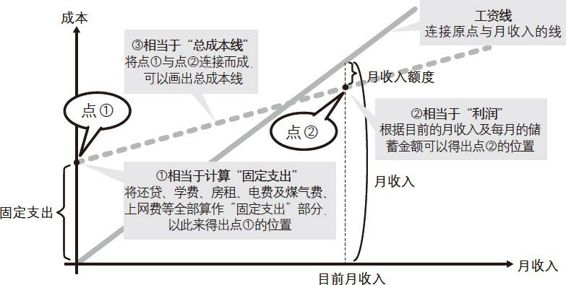

工资－固定支出－变动支出＝每月的储蓄金额

40万日元－20万日元－变动支出＝5万日元

所以，这位“工薪族”的“变动支出”为15万日元。当然，这个数值也可以通过图表来验证（详见图5）。

■图5　“盈亏分界点”的推导方法

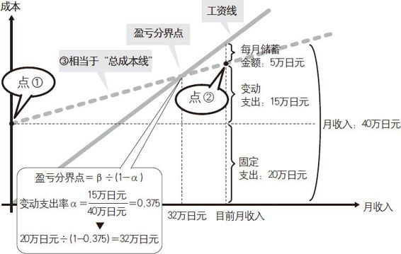

因为我们可以画出“总成本线”，所以也可以像分析“企业经营状况”一样来分析“家庭用度”。对于这位“工薪族”来说，他的家庭用度的“盈亏分界点”（也就是说，他的工资额度不足以用来储蓄）即为：

20万日元÷（1－0.375）＝32万日元

也就是说，以这位“工薪族”目前的生活水平为前提，如果他的工作单位将他的工资降到32万日元以下的话，他的生活将陷入困境。

在此，我介绍一下企业采用的两种成本决算方法：

◎成本价主义：因为花费了这么多成本，所以应提高这部分成本的销售额

◎非成本价主义：因为某种商品的销售额及价格水平能够被市场所认可，所以企业可以由这两个指标来反向推算出所需成本的多少

那么，我们应采取哪种方法呢？请看一下图6，这个图与刚才的图所要说明的问题是不同的（详见图6）。

■图6　A先生与B先生在家庭用度管理上的区别

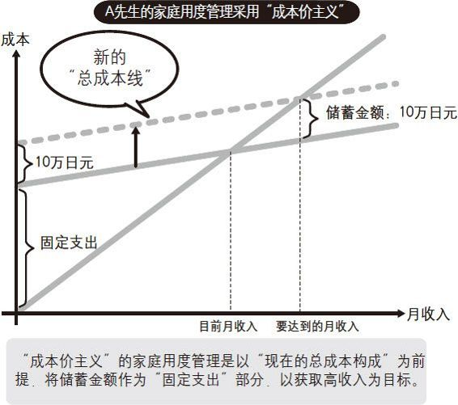

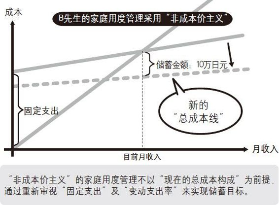

在此，有同为“工薪族”的A先生和B先生，并且他们的收入是相同的。同时，这两人都野心勃勃地要实现每月10万日元的储蓄目标。需要说明的是，A先生是“成本价主义者”，而B先生是“非成本价主义者”。

于是，正如图中所表示的那样，这两人所采取的行动是不同的。因为，A先生将10万日元的储蓄金作为“固定支出”中的一项，所以他会进一步提高“盈亏分界点”的数值（＝提高工资）。也就是说，A先生将这10万日元作为“必须要支付到银行账户里”的成本，将其“固定支出”化了。

与此相反，B先生却扩大了自己的可选择范围。他在目前的工资范围内，设法来降低“固定支出”“变动支出率”，也就是通过改变自己的生活方式来实现储蓄目标。

例如，B先生会重新审视自己的居住情况，还会取消一些需缴纳月租的服务项目；他和同事们去喝酒时，只参加第一次聚会；他还会进一步压缩自己的手机费。另外，他也会减少外出用餐的次数而改在家里吃饭。由此看来，B先生十分清楚，只有通过这种“弱者的策略”才可以平稳度过自己的低收入时期。

同时，当他的同事还以“增加收入”为首要目标时，他却可以从那种人人都“乐而忘返”的“游戏”中解脱出来。

## 为经济困难人士设计的节约费用、削减成本的方法

为了使大家能成为聪明的消费者，到目前为止，我披露了商家所设置的各种“陷阱”。我们在了解了以上内容的同时，也充分认识到自己作为“弱者”的总成本构成。所以，此时“我方”的人也可以尝试制造出一些“陷阱”。

如果企业想削减成本的话，有时会同时采取几套方案。然而，就“压缩金钱方面的开支”这一项来说，其过程可以简化为以下3个步骤：

◎购买

◎使用

◎废弃

企业如果要对这3方面内容加以改善，不能光凭一味的“压缩”来实现。因为，完全依赖“压缩”而实现的成本削减、节约常常会陷入某种僵局。所以，企业有必要制定相关的规则及进行系统化管理。

◎“购买”要招：将“使用者”与“购买者”分离

在很多企业中都设定了简单的规则，那就是将物品划分为“使用者”和“购买者”两类。如果严格区分的话，还可以分为“使用者”“定价者”以及“接收者”3个类别，于是便形成了一种“三权分立”的格局。因为“使用者”在使用过程中能不知不觉地选择出性能好、价格高的商品，所以这样一来就能够有效地制约“购买者”去买一些价格低廉的残次品。

另外，一些“制造业”企业将部门细分为“设计部”与“供应部”。同时，一些“零售业”企业也将自己的部门细分为“店铺运营部”与“采购部”。拿“制造业”企业的例子来说，作为“使用者”的设计部门不会将“定价权”与“选定供货商的权利”完全委托给“供应部”，设计部的人会不断要求供应部的人“要认真选择供货商”以此来给他们施加压力。反过来，供应部的人也会经常请求设计部的人“要设计得物美价廉一些”，于是双方在这种适度紧张的关系中进行互相监管，从而实现成本的最低化。

对于“零售业”企业来说，采购部会要求各个店铺“推行有利于新商品销售的管理模式”。同时，各店铺也会要求“多采购、开发一些价格低、销路好的商品”。同样，双方正是在这种紧张的关系中，将对外支付的金额控制在了最恰当的程度。

◎“使用”要招：规范购入商品的使用细则

在过去那种“散漫、自由”的年代里，有些企业的办公用品甚至可以不限数量地任意使用，“公私不分”成了理所当然的事。有些人将公司的电池用于私人的电器上，还有的人将公司的记事本作为私用，简直就是毫无约束。

由此看来，即使企业能成功地控制商品的购入价格，但如果对商品的使用不加以控制的话，最终还是会功亏一篑。所以，企业有必要严格规定商品的使用细则。例如，有些企业规定“要更换新的办公用品，必须拿那些旧的或已使用完的用品来交换”。另外，还有些企业要求各部门提出更换申请之后再予以更新。

◎“废弃”要招：要对废弃品进行监管并灵活使用“有偿处理”的方法

据我所知，有些企业在职员扔掉干电池的时候，会检查电池中的剩余电量，如果发现剩余电量超过了公司规定，就会将该职员的姓名公布于众。

起初我听到此事时，觉得这家公司做的有些过分，于是我就问他们：“那你们是不是还要检查职员们的垃圾，看里面还有没有能用的东西？”对方的回答让我大吃一惊，他说：“实际上，我们已经这样做了。”他们检查垃圾的目的就是为了确认“复印用纸是否没有被放入‘再生纸回收箱’而是被随便丢掉了”。当然，这些检查工作都由总务部门的职员来完成。我记得，当时自己对这种“物尽其用”的管理方法钦佩不已。

虽然，我并不赞成每个公司都去检查职员们的垃圾，但是建立一个明确的“废旧物品处理细则”是非常必要的。比方说，有些企业会购入一些工厂的废弃材料加以重新利用；有些企业会利用从餐饮店里回收的食用油来加工肥皂；还有些企业能同样有效地利用纸张及食品的剩余部分。我们在扔掉某件东西前，理应确认一下它是否还有使用价值。同时也要思考一下，那件东西在变为废品后，是否还有利用价值？

然而，以上这三个节约“要招”真能给我们带来“实惠”吗？我想，肯定有一些年轻人认为，如果一个中年人连一只圆珠笔都舍不得的话，他一定很没用，所以公司完全可以下调他的工资（实际上，我也是这么想的）。另外，还有人会想，即便采用这样的节约方法，实际能削减的成本额度也不会太高（实际上，我也是这么想的）。

可是，如果企业能够在内部彻底贯彻这种节约“要招”，就一定会给企业自身带来“实惠”，更重要的是，能让职员们深切体会到成本二字的意义。比如，职员们会懂得“100日元与1日元究竟有何不同”及“不能随便浪费公司的钱”，以此来增强职员们的企业责任感。

有些职员对自己的钱绝对不会随便使用，但对公司的钱却经常浪费。由于职业的关系，我经常被一些生意上的朋友邀去喝酒。每到这种时候，我都会说，太浪费了，还是算了吧，予以婉言谢绝。

但是，有些人在我拒绝之后会说：“没关系，我们用的是公司的钱。”每每听到这里，我都会想在以后的交往中最好还是不要轻易相信他们的话。

有些企业如果发现新购入的橡皮价格比原来贵1日元的话，就会狠狠地训斥负责采购的职员。当然，这并不表明这个企业真的害怕损失那“1日元”，而是想通过这种方式来纠正职员们的错误思想，因为总有些职员认为“反正‘1日元’也没什么关系”。同时，这个企业也想借此来推行一种“能时刻意识到企业成本”的业务方式。

## 以“吝啬鬼”和“慷慨者”都想达到的最终目的为目标

在前言中，我以自己第一年的工资“320万日元”为例，计算了自己在日本的工资排名。并且，和读者一起推导出“收入－支出＋资产运作收益＝储蓄金额”这个简单公式。然后，在这个公式的基础上我又为读者全面揭示了“商品定价的秘密及手法”“企业利润的构成环节”以及一些“不道德的营销手段”，其目的就是为了让大家都能成为“聪明”的消费者。

其实，我身边的朋友都知道我并不是一个非常节俭的人，所以他们搞不懂我怎么会有资格与大家来分享购物方面的经验。

我刚参加工作的时候几乎没有什么存款，工作后第一年的银行存款仅有20万日元左右。我至今都记得，有一次自己在回家途中去便利店买啤酒（也可能是发泡酒），连300日元都拿不出，最后还是用“信用卡”结的账。但是，一位与我工资差不多的同事，每年不仅可以积攒下100万日元以上的存款，还能保证生活水平没有大幅度下降。

于是，我逐渐领悟到，每个人不同的赚钱方式反映出了个人的才能、运气及经验。而不同的花钱方式则反映出了个人的品德，夸张点说，也就是对生活方式的思考。

同时，对于“虽然吝啬的人能节衣缩食地存钱，但他们却享受不到人生的乐趣”及“喜欢浪费的人虽然没有存款，但他们却可以尽情享受人生”这两种观点，我觉得都很不恰当。难道对我们来说，只存在这两个狭隘而片面的选项吗？我们在了解商家的各种陷阱之后，难道不能通过尽量压缩支出、控制不必要的开销，从而过上舒服、快乐的日子吗？

有时，我会将“采购员”这个职业作为自己的谋生手段。同时，我还因为与朋友们一起举办研讨会而有机会了解各行业的利润环节以及营销秘密。正因为如此，我才有机会写这本书。这本书不是站在商家的角度，而是站在消费者的角度来讲解一些应对方法。

为了能扩展消费者的知识面，目前，我在全国范围内仍在继续举办“如何削减支出，实现公平交易”的研讨会。

当然，仅凭个人力量是无法与生活中的所有卖家相抗衡的。然而，如果买家能够掌握一些卖家对商品定价的相关信息，就可以对自己周围的各种商品产生新的认识，同时还能形成一种有别于其他人的、更为朴素的人生观。

拥有这种人生观的人，已经不会对“电影院的打折卡”及“酒店的大酬宾”感到惊奇，也不会再有兴致去累积“家电专营店的积分”。当他看到“大降价”这样的字眼时，就会不由得揣摩起其中的商业陷阱。所以，他可能变得不如以前单纯、直爽了。同时，他也可能再也无法从“购物”中获得单纯的愉悦感了。

但同时，每当他在街上看到、听到各种形形色色的营销手段时，就会重新发现一个之前被自己所忽视的世界。这个世界无关对与错，到处都充斥着各种费尽心机的手段，同时也有人们付出的辛苦与努力。所以，这种客观的、对于事物本质的认识能够使他从宏观的角度来审视整个世界，从而获得精神上的满足。

“生活”本身就是与“金钱”密不可分的。

在我眺望远方无边无际的天空时，就会不由自主地觉得“眼前的一切并不是世界的全部，而仅仅是其中的一小部分”。

因此，我会一如既往地继续探寻这个“广阔无垠”的营销世界。

**Part 6小节**

●对于“固定支出”型企业来说，当销售额上升时，企业利润也会飙升。然而，一旦销售额出现下降，企业利润也会骤减。对于“变动支出”型企业来说，无论销售额上升或下降，企业利润都处于一种平稳的波动状态。

●每个人都可以根据自己“家庭用度”的状况来画出“总成本线”，以“非成本价主义”的观点来重新审视自己的生活方式是非常重要的。

●本章首页的答案是：对于夜总会来说，因为其“固定支出”部分所占的比例较大，所以销售额稍有下降就会陷入亏损。而小吃店的“固定支出”部分所占比例较小，即使销售额为零，其经营状况也不会受到影响。

# 后记

我曾经看过一部如同噩梦般的电影，即迈克尔·哈内克的名作《第七大陆》。影片讲述的是一家人打算移居到澳大利亚的故事，因为他们想摆脱令人厌倦的日常生活，所以最终遵从了内心的“疯狂”意愿。

故事本身并不复杂，片中很平淡地展现出这一家人在自杀前3年的生活状态，那种近乎于“绝望”的平静生活使观众都感到不寒而栗。影片的名字之所以为“第七大陆”，就是暗指世界上根本不存在的一片土地。这一家人想要逃离那种平淡乏味、无休无止的日常生活，去寻找一片“独一无二”的乐土，但最终他们却亲手结束了自己的生命。

影片最后的情节极富感情色彩，描写了这家人在自杀前的种种行为：他们吃了一顿丰盛的晚餐，当然这也是“最后的晚餐”。然后，他们将家里所有值钱的东西全部砸坏、毁灭。同时，他们还将手里的全部现金也冲入厕所的马桶里。值得一提的是，这家人在“扔钱”时所表现出的果断、勇敢给我留下了非常深刻的印象。

显而易见，对于那些将要迎接死亡的人来说，金钱已经是多余的了。而影片正是通过这种义无反顾的“扔钱”行为，来进一步揭示他们坚定的求死之心。在日常生活中，就算有人再怎么强调“钱不是最重要的”，也不会故意去扔钱。这是因为，人们即使会对金钱产生厌恶情绪，但同时也不会忽视“钱是能让生活变得更加美好的最行之有效的工具”这个事实。

对于大多数人来说，除去睡觉的时间外，都会随身带一些钱以备不时之需。虽然“金钱”与我们的关系如此密切，但是直到大学毕业我们都没有机会学习到关于作为“金钱交换”主体的营销方面的知识。另外，还有些经营者平时只专注于现有业务中一些“细枝末节”的部分，他们很少从宏观的角度来审视整个营销世界。

而本书正是通过讲述一些“节约成本”及“购买商品”方面的注意事项，为大家详细披露了“压缩开支”的窍门。

当然，“压缩开支”并不等于“收入增加”。所以，这本书并不是要指导人们如何快速增加收入从而实现人生的一次“大飞跃”。

如果，本书要告诉大家的是一种不用“压缩开支”而通过增加收入来提高人们幸福度的方法，那么你在任何一家书店都可以看到这种类型的书。

比如，通过股票及外汇来赚大钱的方法、利用MLM（多层次复合营销）构筑起巨额资产的方法、如何能成为买得起高级公寓的优秀的保险推销员、提前退休者的创业指南以及类似的书籍。同时，如果有人想以一种简单、便捷的方式来获得幸福的话，“宗教”会带你到达一个全新的精神世界。所以，在这个国家中存在着各种各样的选择。

至于以上这些方法是否真的对读者有益，我无法做出判断。

但是，如果大家能够通过本书体会到一些作为消费者的乐趣，这对我而言就是再欣慰不过的事了。

这本书与我之前的书不同，它从电影、小说、恋爱以及一些亲身经历等方面的内容逐渐展开与“金钱”有关的话题。因为我想让大家知道，与我们自身有关的一切东西都是某种“商业陷阱”的化身。同时，我也希望通过这种不同于以往的讲解方式让大家对“营销世界”产生更加浓厚的兴趣。

因为人要生活就必须要赚钱，所以大家在掌握了这方面知识的同时，如果还能触类旁通、积极思考的话，这本书肯定会有助于你实现更加美好的生活。

最后，我想谈一下自己对“金钱”的一些认识。在生活中，有很多人都在高喊“工作不是为了钱”，对此，我一直有一个疑问，那就是如果这些人真的那样坚信自己所说的话，为什么还要再对别人重复一遍呢？当然，我并不是想否定这种“发表意见”的行为。只是我不明白，他们为什么现在才开始强调自己的“工作观”。

最近，我经常听到类似于“怀抱梦想”这样的词语。如果“梦想”对任何人来说真的具有无可取代的价值，那为什么现在才开始被不断提及。就连“正义”“友爱”“道德”这些词语也是如此，人们越是反复强调，我就越是怀疑。

同时，我也发觉到了这其中暗藏的残酷事实。

我估计，那些高喊“工作不是为了钱”的人不仅坚信“金钱很重要”，还认为“金钱万能”，但他们发现自己的观念不为社会接受，所以不得不故意否定自己的想法。如果这些人真的相信“工作不是为了钱”的话，就没有必要故意反复强调了。

“怀抱梦想”这样的说辞也是如此，如果大家都认为梦想对所有人都非常重要，那就没有必要去阐明这种幼稚可笑的观点了。

我们之前所接受的教育是要将我们培养成“相对主义者”。

比如，我们常听到的“请遵照自己的价值观生活”“请做你喜欢的事情”及“请尊重他人的价值观”。

可是，如果有人说：“对我而言只有金钱最重要！”那我们又该作何反应呢？虽说应该尊重他人的价值观，但我们却无论如何也不会接受这种观点。一般来说，我们只有在“深有同感”的基础上才会真正认可他人的价值观。也就是说，虽然我们心里已经承认这种“金钱至上”的观点并非全无道理，但表面上仍会一味否定这种观点。当对方仍然坚持这种“金钱至上”的观点时，我们就会觉得自己的价值观处于道德标准中的有利位置。

虽然我是一个“相对主义者”，能够平等地看待一切事物，但我仍然无法容忍那种对于“相对主义者”自身思维方式的否定。因为“相对主义者”认为“每个人的价值观都很重要”“金钱并不是全部”。所以，他不会认可那些否定“相对主义”的“绝对主义者”提出的“金钱就是一切”的观点。

然而，我总觉得，是有人故意设置出了这个关于“金钱还是梦想”的问题，他以这两个看似对立的选项为“圈套”，来达到自己的目的。

所以，一种具有“相对性”的“绝对主义”认为有钱就是比没钱好，比起清贫的生活，我们更想过一种物质、精神都丰富的生活。通过这种观点，人们可以从上述两个看似对立的选项中解脱出来，能更自由、更有韧劲、更顽强地生活下去。同时，当我们在了解了“营销的内幕”“商家的意图”之后，如果能充分利用这些知识，就会使我们既不成为“吝啬鬼”“守财奴”，也不会变得穷困潦倒，一条全新的“第三种道路”就会出现在眼前。

已故音乐人忌野清志郎先生在自己的第一张专辑《早期的摇滚继承人》里，收录了《生活的全部就是金钱》《我们是为了赚钱而生》等曲目。其中，歌曲所表达的叛逆性与歌词的露骨程度让很多人都瞠目结舌。

那时，我还是一名小学生。我还记得，自己当时为要不要买这个专辑而苦恼了近1个小时。当然，现在的人只需用很低的价格就可以从网上下载歌曲，所以他们是无法理解我当时的心情的。另外，对于现在的一些已经习惯于购买“单曲”的人们来说，也很难理解那种“多首曲目并存”的意义。

忌野清志郎先生的葬礼于2009年5月9日在青山殡仪馆举行。

通过他的音乐，我懂得了在这个世界上，“黑与白”“善与恶”“真与假”是很难划清界限的。当忌野先生了解到音乐界中种种“内幕”之后，他既没有“随波逐流”也没有“趋炎附势”。他一直都在追求属于自己的生活道路，所以，忌野先生将不同于常人的生活方式付诸了实践。

因此，在忌野先生去世时，那些有感于他的这种处事态度的人便聚集到一起为他送行，为这个远离社会价值标准、自由而无畏的摇滚音乐人送行。葬礼那天，直到傍晚时分前来送别的人仍然络绎不绝。

现在，我正在用iPod收听忌野先生的歌曲。在很久以前，我是用一个很便宜的音响来听他的这首歌的。

“啊！忠实的小狗，用你的鼻子来和我一起寻找吧！我们要找到金银财宝，找到无价的珍宝。而你茫然的眼神啊，却让我感到沉重万分！为什么你找出的东西并非珍宝！”（《忠实的小狗Doggy》收录在摇滚专辑《BABY
A GO GO》中）

我不知道，这本始于“炼金术”与“白日梦”的书，能不能成为你“寻宝”的契机。如果本书能在读者的心中弹奏出几个具有震撼力的音符，就像在我耳边回响的摇滚乐的吉他声一样，我会感到非常开心。

我真心希望如此。

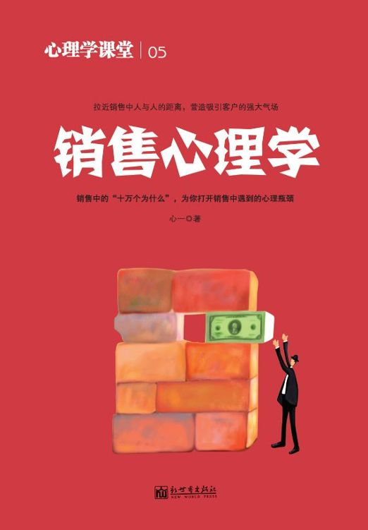

 

 

 

销售中的“十万个为什么”，为你打开销售中遇到的心理瓶颈

 

 

 

销售过程中，首先需要考虑的不是赚取金钱，而是获得人心。

能读懂别人心理活动的人，永远不必为自己的前途担心。

# 序言

相信很多朋友还记得冯小刚的电影《大腕儿》中那段后来被改编无数版本的经典台词：

一定得选最好的黄金地段，雇法国设计师，建就得建最高档次的公寓！电梯直接入户，户型最小也得400平米，什么宽带呀，光缆呀，卫星呀能给他接的全给他接上。

楼上边有花园儿，楼里边有游泳池，楼里站一个英国管家，戴假发，特绅士的那种，业主一进门儿，甭管有事儿没事，都得跟人家说May
I help you
sir？（我能为您做点什么吗）一口地道的英国伦敦腔儿，倍儿有面子！

社区里再建一所贵族学校，教材用哈佛的，一年光学费就得几万美金，再建一所美国诊所，24小时候诊，就是一个字儿——贵，看感冒就得花个万儿八千的！周围的邻居不是开宝马就是开奔驰，你要是开一日本车呀，你都不好意思跟人家打招呼，你说这样的公寓，一平米你得卖多少钱？

（我觉得怎么着也得2000美金吧！）

2000美金那是成本，4000美金起，你别嫌贵还不打折，你得研究业主的购物心理，愿意掏两千美金买房的业主，根本不在乎再多掏2000，什么叫成功人士你知道吗？成功人士就是买什么东西，都买最贵的不买最好的！

这的确是一段经典台词，口吻戏谑，内容讽刺，能把观众逗得前仰后合。可是这段台词的经典却不止于此，细细品味一下，这段台词虽然表述极尽夸张，但其中所折射出的却是现实生活的缩影和心理学定律在销售中的趣味应用。

销售是一件和每个人都紧密相关的事情，自从在人类历史上首次出现了货物交易的行为之后，销售便深深嵌入了人类的生活之中。无论哪一个国家，几乎都需要以贸易的方式来增进本国利益。绝大部分的企业，也必须将产品和服务销售到消费者手中，才能获取利润维持发展。而作为个人来说，无论你作为卖方或是买方，都将频繁地在生活中接触销售这个并不新鲜的事物。销售活动无处不在，不夸张地说，销售活动在很大程度上决定了人们的生活。

在这些循环不息的销售活动中，并不是所有的销售活动都会得到令人满意的结果。有些公司占据了同类市场的大部分市场份额，产品甚至会供不应求。而有些公司却苦于无人问津，挣扎在关门大吉的边缘。有些做销售工作的人通过几年的销售工作，已经成为社会精英，收入丰厚；而另外一些人同样做销售工作，却是每天奔波劳累只能求得三餐温饱。除了用运气和家庭背景这类不可控因素去解释之外，销售活动究竟有没有其内在的规律可循呢？

答案是肯定的。因为所有的销售活动都是由人来完成的，无论销售的是什么类型的商品，其本质都是在和人打交道，而人的行为是在心理因素的影响下发生的，所以，人们在做出购买决策的过程中必然会符合心理学上的共性特征。

这就是本书的线索所在：研究人们在消费中的心理特征，用已经被科学实验证明过的心理学定律来解释销售过程中人们究竟是如何被影响的。

现在您拿在手里的这本书稿，固然达不到开篇所提那段台词的搞笑效果，但是它将结合现实中的一些销售故事和经典案例，来与您一同探讨销售过程中的一些法门所在。笔者自己从事了多年的一线销售工作，本书中有些案例，就曾出现在我的工作经历中，或者发生在身边朋友的身上。我衷心地希望这本书能有助于从事销售工作的人们提高销售技巧，提升销售业绩。当然，也希望在你所扮演的角色转换为买家的时候，你也能更好地辨识出别人在对你使着什么样的心理战术。

最后，还有一些不得不说的提醒：销售是一个系统工程，它包含着多方面的内容，也可以有多个看待的视角。了解人们的心理特点将能有效指导和促进销售工作，但本书并不能解决你在销售中遇到的所有问题，要想成为一个出色的销售人员，需要在多个方面共同锻造提高，掌握传统的销售理论与加强自身的修为也非常的重要。

另外，还有一个基础的先决条件就是产品与服务本身，产品必须能够真正满足消费需求，否则，所谓销售就会陷入不可为而为的尴尬境地，成为无根之木。

# 目录

# Contents

<a href="#part0084.html" class="calibre1">序言</a>

<a href="#part0086_split_000.html" class="calibre1">Part 1　诱饵效应</a>

<a href="#part0086_split_001.html_sec001"
class="calibre1">价格中的相对论法则</a>

<a href="#part0086_split_002.html_sec002"
class="calibre1">虚拟所有权——铺满鲜花的陷阱</a>

<a href="#part0086_split_003.html_sec003"
class="calibre1">诱饵效应与折中法则</a>

<a href="#part0086_split_004.html_sec004"
class="calibre1">左右决策的根源是对比</a>

<a href="#part0087_split_000.html" class="calibre1">Part 2　损失厌恶</a>

<a href="#part0087_split_001.html_sec001"
class="calibre1">天下没有免费的午餐</a>

<a href="#part0087_split_002.html_sec002"
class="calibre1">为什么会买下原本不喜欢的东西</a>

<a href="#part0087_split_003.html_sec003"
class="calibre1">网站购物免运费的奥妙</a>

<a href="#part0087_split_004.html_sec004"
class="calibre1">用免费的东西赚更多的钱</a>

<a href="#part0088_split_000.html" class="calibre1">Part 3　沉锚效应</a>

<a href="#part0088_split_001.html_sec001"
class="calibre1">影响心理判断的诡计</a>

<a href="#part0088_split_002.html_sec002"
class="calibre1">考究的杯子让咖啡更值钱？</a>

<a href="#part0088_split_003.html_sec003"
class="calibre1">卖家设下的沉锚陷阱</a>

<a href="#part0089_split_000.html" class="calibre1">Part 4　从众心理</a>

<a href="#part0089_split_001.html_sec001"
class="calibre1">在销售中寻找领头羊</a>

<a href="#part0089_split_002.html_sec002"
class="calibre1">权威人士能够影响“上帝”</a>

<a href="#part0089_split_003.html_sec003"
class="calibre1">消费者的路径依赖</a>

<a href="#part0089_split_004.html_sec004"
class="calibre1">品牌的价值与力量</a>

<a href="#part0090_split_000.html" class="calibre1">Part 5　互惠心理</a>

<a href="#part0090_split_001.html_sec001"
class="calibre1">投我以桃，报之以李</a>

<a href="#part0090_split_002.html_sec002"
class="calibre1">将欲取之，必先予之</a>

<a href="#part0090_split_003.html_sec003"
class="calibre1">以退为进的让步</a>

<a href="#part0090_split_004.html_sec004"
class="calibre1">让客户产生亏欠的感觉</a>

<a href="#part0091_split_000.html" class="calibre1">Part 6　稀缺效应</a>

<a href="#part0091_split_001.html_sec001"
class="calibre1">得不到的往往是最好的</a>

<a href="#part0091_split_002.html_sec002"
class="calibre1">限时限量供应</a>

<a href="#part0091_split_003.html_sec003"
class="calibre1">稀缺的前提是不可替代</a>

<a href="#part0091_split_004.html_sec004"
class="calibre1">蓝海战略的核心</a>

<a href="#part0092_split_000.html" class="calibre1">Part 7　好奇心理</a>

<a href="#part0092_split_001.html_sec001"
class="calibre1">未知引发的兴趣</a>

<a href="#part0092_split_002.html_sec002"
class="calibre1">出奇才能制胜</a>

<a href="#part0092_split_003.html_sec003"
class="calibre1">值得沉思的《沉思录》</a>

<a href="#part0092_split_004.html_sec004"
class="calibre1">好奇心理的递进策略</a>

<a href="#part0093_split_000.html" class="calibre1">Part
8　参与性原则</a>

<a href="#part0093_split_001.html_sec001"
class="calibre1">让客户自我肯定</a>

<a href="#part0093_split_002.html_sec002"
class="calibre1">砸玻璃的学问</a>

<a href="#part0093_split_003.html_sec003"
class="calibre1">这究竟是谁的决定？</a>

<a href="#part0093_split_004.html_sec004"
class="calibre1">人们的一致性倾向</a>

<a href="#part0094_split_000.html" class="calibre1">Part
9　销售中的心理暗示</a>

<a href="#part0094_split_001.html_sec001"
class="calibre1">戈培尔效应</a>

<a href="#part0094_split_002.html_sec002"
class="calibre1">破窗理论：环境的暗示</a>

<a href="#part0094_split_003.html_sec003"
class="calibre1">激发人们的“达到欲望”</a>

<a href="#part0094_split_004.html_sec004"
class="calibre1">社会规范VS市场规范</a>

<a href="#part0095_split_000.html" class="calibre1">Part
10　销售工作中的博弈法则</a>

<a href="#part0095_split_001.html_sec001"
class="calibre1">人生何处不博弈</a>

<a href="#part0095_split_002.html_sec002"
class="calibre1">讨价还价的博弈策略</a>

<a href="#part0096_split_000.html" class="calibre1">Part
11　心理特征分析</a>

<a href="#part0096_split_001.html_sec001"
class="calibre1">群体间的心理差异</a>

<a href="#part0096_split_002.html_sec002"
class="calibre1">建立自己的划分体系</a>

<a href="#part0096_split_003.html_sec003"
class="calibre1">需要被满足的是心理</a>

<a href="#part0096_split_004.html_sec004"
class="calibre1">销售中的心理共鸣</a>

<a href="#part0097_split_000.html" class="calibre1">Part
12　阅读客户的心理变化</a>

<a href="#part0097_split_001.html_sec001"
class="calibre1">做一个好的听众</a>

<a href="#part0097_split_002.html_sec002"
class="calibre1">学会应对客户抱怨</a>

<a href="#part0097_split_003.html_sec003"
class="calibre1">尊重客户的自尊心</a>

<a href="#part0097_split_004.html_sec004"
class="calibre1">认识客户的逆反心理</a>

<a href="#part0097_split_005.html_sec005"
class="calibre1">掌握语言表达的艺术</a>

<a href="#part0098_split_000.html" class="calibre1">Part
13　优秀销售人员的自我修炼</a>

<a href="#part0098_split_001.html_sec001"
class="calibre1">二八法则：自我定位与强化</a>

<a href="#part0098_split_002.html_sec002"
class="calibre1">良好心态：迈向顶峰的阶梯</a>

<a href="#part0098_split_003.html_sec003"
class="calibre1">印象管理：打造你的专业形象</a>

<a href="#part0098_split_004.html_sec004"
class="calibre1">木桶定律：应对发展中的短板</a>

<a href="#part0098_split_005.html_sec005"
class="calibre1">人格魅力：产品之外的销售“筹码”</a>

<a href="#part0099_split_000.html" class="calibre1">Part
14　摆脱影响发展的误区</a>

<a href="#part0099_split_001.html_sec001"
class="calibre1">坚持未必就是胜利</a>

<a href="#part0099_split_002.html_sec002"
class="calibre1">投机心理靠不住</a>

<a href="#part0099_split_003.html_sec003"
class="calibre1">与正确的人做正确的事</a>

<a href="#part0100.html" class="calibre1">后记</a>

<a href="#part0000.html" class="calibre1">返回总目录</a>

# Part 1　诱饵效应

为什么价格居中的商品卖得最好？

为什么麦当劳的套餐大卖特卖？

为什么2升装的可乐和2.5升装可乐售价相同？

为什么新面包机的上市却使旧款面包机热卖？

## 价格中的相对论法则

销售是以商品和服务为基础而开展的活动，而衡量商品和服务最不可或缺的或者说最重要的一个因素就是价格。一直以来，商品的价格是消费者在商品的性能与品质之外考虑最多的方面，它是买卖双方对同一商品的价值衡量尺度，当然，这也往往是销售中最容易形成分歧的环节所在。在传统的4P营销法则中价格（Price）也是四大要素之一。

为商品制定价格是销售中一个貌似简单却蕴含着很多玄机的环节，往往就是由于定价战术的合理应用，消费者的心理在价格因素的潜移默化影响下，产生了微妙的变化。因此本书的探讨也就首先从价格入手。

在销售中，商品的价格究竟是如何影响人们的购买决策的呢？

也许有人会搬出传统的经济学理论进行阐述，商品的价格随供需关系的变化而围绕其价值上下波动，而价值是凝结在商品中的无差别的人类劳动。对于这些经济学课本上教给我们的知识，我举双手赞成其正确性，但这只是帮助你了解商品一般性原理的概念。这套标准的经济理论建立在一些假设前提之下，经济学的理论研究假设每一个参与社会商业活动的人都是理性的，而且每个人都有能力客观科学地衡量出一件商品的真实价值，而且人们对于信息的获取和占有是完全对称的。

让我们暂且搁下对理论的评述，首先来看一个非常有趣的案例：

全球著名的经济学杂志《经济学人》曾经在它的网站上推出过这样的征订信息：

电子版杂志：每年订阅价格59美元，内容包括：《经济学人》网站全年所有在线内容及历年以来各期《经济学人》的所有在线内容的阅读权限；

纸质版杂志：每年订阅价格125美元，内容包括：获得全年各期印刷纸质版的杂志；

电子版＋纸质版的套餐：每年订阅价格125美元，内容包括：获得全年各期纸质版的杂志并加上《经济学人》网站所有在线内容以及网站上历年以来各期《经济学人》所有在线内容的阅读权限。

看到这样的报价信息，或许有朋友会想，这有点儿不符合逻辑，为什么只订纸质版和订阅电子版加纸质版的价格会是一样的。难道是杂志的发行人员搞错了价格吗？真实的答案显然不是这样，这样的定价方式就是我们在这个章节所要揭示的销售心理战术。

试想，如果没有套餐选项的话，人们在面对电子版和纸质版，其实很难比较出哪个更为适合自己，因为这不仅是所付出成本代价的比较，也是不同阅读习惯之间的比较。但59美元的价格优势显然更容易让多数人选择电子版。毕竟在获取同等信息的情况下，人们更偏向于节省开支。

但是加上了套餐选项之后，消费者的选择比例就会发生很大的变化，因为纸质版和套餐选项之间的优劣是一目了然的。无论从哪个角度看，选择订阅套餐版都比只单独订阅纸质版更为划算。

在这种情况下，除了少部分对价格极为敏感的人仍旧会坚定地选电子版，大多数的人都将被这样一个报价模式引向选择订阅电子版加纸质版的套餐计划。而125美元的纸质版选项，注定不会有任何人选择，当然，从一开始，杂志社就没想让人们去选择这一项。这只不过是为了达到影响销售的目的所投放的一个小小诱饵罢了。

其实现实销售中，人们只有在很少的情况下能够独立依靠自身所掌握的信息或知识而评估出一件商品或一宗买卖真正价值几何，更多时候，人们是以同类物品相互之间的比较来确定孰优孰劣，并据以做出消费决策的。中国有句古话叫“不怕不识货，就怕货比货”，说的就是这一道理。对于购买者来说，运用货比货的方式是一种避免吃亏上当的好方法，但如果从一开始被提供比较的所有货品就在销售者的掌控之中，那么结果就变得可想而知了。

麦当劳也是精于运用此种心理战术的商家之一。汉堡、炸薯条加上可口可乐的超级组合为这个来自于美国的快餐企业赢得了全球第一快餐品牌的地位。我想对于麦当劳的套餐，大部分人都不会陌生。汉堡、薯条加上可口可乐的套餐价格小于汉堡价格、薯条价格与可乐价格的加总，对于必然要点选主食与饮料的消费者来说，这样的套餐选择比单独点选每样食品在价格上显然更为有利。

我想，现在大家应该很清楚这一小节想要说明的问题了，这就是价格的相对论法则：在销售过程中，为了让买家做出卖家所希望做出的选择，那么在备选的几个价格选项中提供一组明显具备相对劣势的价格选项，从而使卖家希望被选中的那一项成为明智之选，这将会在很大程度上影响购买者的消费决定。

这一看似简单的技巧，在各行各业的销售活动中被广泛地运用，而且总是能够收到良好的效果。从事销售工作的朋友可以根据自身所从事行业的特点，设计符合自己工作的比价组合，在实践之后，我想你一定会对这一策略的有效性大为赞叹。

## 虚拟所有权——铺满鲜花的陷阱

所有权是人类社会制度的一个基本特征，所有权从本质来说是一种物权，按照法学界的定义，所有权是所有人依法对自己的财产所享有的占有、使用、收益和处分的权利。

所有权构造了商业交换的基础，有了所有权的概念之后，人们相互之间进行的交易才具有存在的意义，销售工作也才得以持续存在。事实上，每个人的一生都在进行着各种各样的所有权交换，生活也好，生意也好，很大程度上都是由各种所有权的变更所组成的。

好了，开场白说到这里，让我们开始切入正题。本节的内容是要探讨虚拟所有权，那么我们先来看一下对于虚拟所有权是如何定义的，目前在法学界和心理学研究领域都有“虚拟所有权”的提法，还有人把网络游戏中的“虚拟物品所有权”也简称为“虚拟所有权”。法学界所提到的“虚拟所有权”指的是人们依据法律享有某一物品的所有权，但实际上并不占有这一物品。

这些都不是我们要探讨的问题所在，笔者想要向大家介绍的是人们在心中对某些物品在真正获得所有权之前产生的虚拟所有的心理倾向，以及由此引发出的几种非理性的消费决策。把这些问题阐述清楚，才是对销售工作有现实意义的事儿。

首先我们来分析一下，为什么人们会在真正获得一件物品的所有权之前进入到虚拟所有的心理状态中。这要从所有权的特征说起，所有权是物权的一种，也是物权中最充分、最绝对的权利形式，拥有了某一物品的所有权之后，意味着你对某一物品拥有绝对的受益权和处置权。并且这种权利是具备排他性和永续性的。

事实上，所有权所提供给人们的这种感觉是很棒的，它能够让人们充分体会到自我意识的存在，能够迎合人们追求和认知自我的心理需要。也正由于此，很多人对所有权会产生一种情不自禁的喜爱与依恋。这种特性让很多人在实际拥有所有权之前就对某种物品产生了拥有的感觉。

这种由所有权依恋产生的虚拟所有倾向，给商家的销售活动留出了很好的切入点。

让我们回想一下购物网站上推出的在线竞价的功能吧，这在现如今的电子商务网站中非常流行，阿里巴巴旗下的淘宝网也好，还是国外的ebay网也好，都推出了这种在线竞拍的功能。

在网上选择自己心仪的物品，然后开始竞拍，价高者最后得到这一商品，看起来，这是一种非常公平和完美的销售方式。但事实上，当你一旦开始参与某一样商品的竞拍之后，就已经在心里认为那是你的物品了。当有人继续出价之后，你会觉得这个家伙要抢走你的东西了，于是你会倾向于继续出价，而忘记了最初对这一物品所做出的合理预算。

也许最后你终于得到了想要的物品，但是虚拟所有权往往让你在交易中付出更大的代价。

虚拟所有的这种感觉经常会使人们突破事先的购买预算。换言之，对于同一件物品，由于虚拟所有权给人们带来的心理影响，使得人们通常愿意为同一物品付出更高的代价。

其次，所有权还能够影响人们形成另外一种心理变化。那就是每个人对于自己所拥有的东西，都会持有留恋的心理，在某个事物上投入的时间、劳动或者关注越多，那么这种对事物的依恋态度就会越强。

世界著名的家居销售企业宜家家居（IKEA）公司的销售策略中就很好地体现出了对人们这种心理倾向的把握。

宜家家居的购物方式特征是自助的，顾客在卖场的陈列区中自由选择，然后根据商品标牌上的货号信息去指定货架上自己提货，再自己把买到的家居用品运回家，然后自己动手组装。

通常宜家的产品在包装箱内都已经配备了各种小配件和小工具，当然，对于这种销售方式可以有多种理解，既可以被理解成是商家节省销售成本的方式，也可以被理解成是增加买家动手乐趣的创新。但是有一点却是客观存在的，伴随着整个自助的购物和组装过程，你会更加喜欢你买下的那件东西。认为那就是属于你的。

根据IKEA的官方网站上所查到的资料，宜家家居现在仍然在采用如下所述的退换货政策：“只要包装和货品没有损坏，并保持出售时的状态，您可在60天内，带上原始发票或收银条及信用卡收据（若以信用卡支付）和完整的货品，前往购货商场更换等值货品或退款（我们将按照您的支付方式退款）。”

这样的退（换）货政策看起来让人很放心，但是很多人不会意识到，当把一张沙发或者一张书桌弄回家并摆放了一段时间之后，虚拟所有权会使他们在做出退货决定时更加舍不得。

虚拟所有的心理倾向，就像一个铺满鲜花的陷阱，容易让人们陷于其中而难以自拔。对于销售者来说，认识到人们的这种心理特征，将对销售工作大有帮助。

房地产商在利用虚拟所有权这一心理特征时，销售手法往往表现得更为高超。

房地产商通常没有办法把一个小区挂在网上，让大家去竞拍，也无法为购房者提供先入住、住满意之后再办理付款的优惠政策。从客户无条件退房这一点来说，绝大多数房地产商也做不到像宜家家居那样，只要包装完好，就可以全额退款。

但是，在巧妙利用虚拟所有这种心理倾向上，房地产商却做得很好，他们所采用的推广策略通常是宣传一种生活的理念。有兴趣的朋友可以看看周遭的房地产广告，几乎清一色都是把住宅这一商品升华到生活态度和生活境界的层面上向消费者进行传达。一旦消费者接受了这种理念的灌输，心中便会很自然地开始认为这就是自己本就应该拥有的理想生活。

在这种理想生活模式的虚拟所有推动下，对于房屋价格，房地产商利润率的合理性以及周边配套等其他方面，消费者很多时候会变得不再那么执著。

先试用产品然后再付款，在销售中采用竞价策略，提供一定时间内的无条件退换货策略，或者是让消费者在购买商品与服务之前首先接受某一种理念，这些方式都可以促使客户在心里对标的商品产生虚拟所有的感觉，如果做到这一步，那么对于销售的一方来说，生意至少已经成功了一半。

## 诱饵效应与折中法则

许多年前，美国厨具零售商威廉姆斯-索拿马（Williams-Sonoma）公司推出了一种面包机，但是销量却很一般，人们并没有对陈列在商场货架上众多厨房用品中的面包机产生太大的兴趣。推出的产品销售惨淡是件亟待解决的事情，但威廉姆斯-索拿马公司制定的解决方法却让很多人大跌眼镜，他们不仅没有下架原来滞销的产品，反而又推出了一种新的面包机，它比当时已经上市的面包机还要更大而且价格更贵。事情似乎要朝着更坏的方向发展，但意想不到的结果是，新面包机的推出却让原先的那种面包机销量大增。

这究竟是为什么呢？让我们来分析一下其中的原因。

事实上人们很少会在没有对比的情况下就做出消费决定。而且大多数时候人们总是习惯于把同类产品进行对比，当货架上只有孤零零的一种型号面包机时，顾客很难把它与其他的厨房用品放在一起做比较，所以顾客也很难做出是否购买的决策。

但是当有了可对比的选项之后，情况就变得不一样了，顾客在两个都能满足自身使用需求的商品中做选择时，通常会选择价格较低的那个。同样满足需求的情况下，节省开支会显得比较明智，这是人们的共有心理。正因为顾客的这种心理，威廉姆斯-索拿马公司推出的高价面包机为原先滞销的面包机提供了对比参照，而且把原先的面包机变成了对比之中更为有利的选项，其实后推出的高价面包机就是威廉姆斯-索拿马投放的销售诱饵，通过诱饵从而改善市场销售情况。

面包机的案例对现实的销售工作有何启发呢？比如怎样才能赚得更多的利润？

假设你是公司老板或销售经理，手上有一系列的产品和服务有待销售。那你首先需要了解的是，公司的高价产品至少会为你的销售带来两点好处：

第一，高定价会迎合小部分消费群体的需要，并且会帮你塑造公司处于行业内高端地位的形象。

第二，高价产品带来的另一个潜在优势是，它会自然而然地成为你的销售诱饵，让次一级的产品价格看起来更具有吸引力。

其实这样的案例并非偶然，生活中只要稍加留意就不难发现，应用类似心理战术对销售施加影响的情况俯拾皆是，笔者有一次去超市购物，看到摆在货价上的可口可乐居然2升装与2.5升装，同样定价为5元，而且摆放位置就挨在一起，拿起来看看，除了容量不同之外别无二致，很是奇怪，心里还在想这样一来，这2升装的可乐可卖给谁呢？再一琢磨，不禁暗笑自己的大脑短路，看来商家本就没有打算把这种包装的可乐当成重点来卖，这么摆放的目的是为了使另一种包装的可乐拥有最为明显的性价比优势。

从诱饵效应，我们要谈到另一个很有意思的现象：消费者在两个同样能满足使用需要的商品比较中，倾向于选择价位较低的那个，但此时如果有价格更高的商品出现，顾客又会放弃最便宜的那种而购买中间价位的商品。这就是伊特玛·西蒙森（Itamar
Simonson）教授提出的“折中选择”，当顾客有几种型号的商品可选择时，他们容易选折中选项——既符合最低限度的使用需求，又不会超过最高心理价位的商品。

有一个大家都熟悉甚至亲身体验过的例子就是饭店的菜谱：饭店内最高价和最低价的菜往往不会是大多数顾客的选择，多数人更容易点选的是中间价位的菜品。这一可预见的现象可以有效地被加以利用，推出少部分高价的菜品同时把高价的菜品与其他菜品的菜单放在一起，并且要将较高的价格列在菜单的顶端，列在顾客一眼就看得到的地方。这样，中等价位的菜肴就会在高价诱饵的促进下，变得让人更容易接受了。事实上，很多饭店现在就是这么做的。

当然，诱饵效应与折中原则并不仅仅适用于面包机销售、饭店菜谱，任何有产品或服务出售的人，都可以通过推出高价产品让其中间产品更受欢迎。高端产品的出现会推动次一级商品的销售，所以，对诱饵效应和折中法则的合理利用在销售中有着不可小视的作用。

## 左右决策的根源是对比

一杯温水，保持温度不变。另有一杯冷水，一杯热水。先将手放在冷水中，再放回温水中，会感到温水热；先将手放在热水中，再放回温水中，会感到温水凉。同一杯温水，出现了两种不同的感觉，这听起来好像有点儿奇怪，但它却真实地反映出了人们的大脑感知规律，这就是“知觉对比”（Perceptual
Contrast）对人们产生的影响，简单来说，就是通过对比来影响人们的认知。

由于“认知对比”对人们的巨大的心理影响力，将它应用在销售中通常能够发挥出很明显的效果。

有这样一则关于销售的故事，虽然故事中的方法看起来多少有些不厚道，但是为了说明问题，我觉得还是很有必要把这个故事呈现在这里。

查理是一家时装店的老板，最近他正在为一件事情犯愁，他的店里有几件售价昂贵的貂皮大衣，每件价格3500镑，自从进货以来，已经在店里展示了一年多的时间了，却始终一件也没能卖出。倒是经常有客人驻足流连，可是却都嫌价格偏高。

查理想既然无法售出，这件商品只有采用赔本销售的方式处理掉了。无奈之下，他决定让手下的伙计给这些大衣写上折价处理的标签，可是没想到他的这个伙计却提出了不同的意见。他很有信心地表示，能在短期内把这些积压的高价大衣按原价给卖掉，但是要求查理这些天在店里都离貂皮大衣远远的，并且按照他的计划来配合他。查理一听可以把这些库存清理掉，大喜过望，不仅欣然答应，而且还允诺如果真的成功了，就给伙计加薪。

过了几天，有一位女士看中了其中的一件貂皮大衣，于是伙计赶忙迎了上来，女士向伙计询问价格，伙计则装作很抱歉的样子解释道：“我刚刚到店里来工作，还记不得每件商品的价格，您稍等一下，我问问老板。”说完他就冲着商店另一端的老板喊：“这貂皮大衣要多少钱一件？”

查理装作很漫不经心地回答道：“5300镑！”

伙计则马上很诚恳地对女士说：“3500镑！”

故事讲到这里，结局也就不需多说了，这是一个“皆大欢喜”的收场，每个人都很满足和快乐。也许读者朋友会觉得这更像是个为了迎合知觉对比而编造的寓言故事，并非一个真实的商业案例，难道同样的场景会在现实销售中重现么？

是的，每一天，类似的销售案例就发生在我们的生活中，有很多商家都在利用着人们的知觉对比在促进销售。接下来，就让我们来看看在现实生活中上演的故事吧。

受世界经济危机的影响，我国的房地产市场价格在经过了一波快速的增长之后，也进入了一个相对的低谷期，在这样的日子里，虽然销售较之从前清淡了不少，但房地产开发商运用的销售技巧却一点儿都没有变得生疏。为了迎合人们的降价预期，某楼盘就推出了价格优惠8％～10％的市场举措，希望能以如此的价格对比来刺激人们的购买欲望。但是，在此次销售活动之前的一个多月，该楼盘的价格已静悄悄地从每平米9500元上调到了每平米10500元。

很多商场也经常采用同样的销售策略，先将原始价格不声不响地调高，制造出一个新的价格作为市场诱饵，再转而以某种名义来向人们展示价格差异，以实现利用心理认知的规律来促进销售的目的。

还有的商家仅仅通过巧妙地在两件商品之间形成知觉对比，就促进了两者的销量。这里有个真实的例子：

有一家专门经营儿童玩具的商店。商店新进了两种不同造型、质量相差无几、成本价也一样的玩具熊。老板觉得既然成本价相同，于是把这两种玩具熊的价格也定为一样。玩具熊摆在商店有些日子了，可这两种玩具熊却很少有人购买，这令商店老板一筹莫展。

这时正好新招了一位女店员，她为店老板出了一个好主意。她建议把其中一种造型的玩具熊标价提高，从原来的68元提高到98元，另外一种则保持原价不变。

这样一来，当顾客进到店里，看到两种颇为相似的玩具熊，居然一个卖得比另一个要便宜1/3还多，而看起来质量又不差，以为捡到了便宜，便容易做出购买决定。而另外一些有钱人在看到两种大小几乎差不多的玩具熊，价格相差那么多时，会自认为贵的玩具熊品质一定高于便宜的，甚至会想到：“说不定那个便宜的是仿制的呢？”于是也更容易做出购买决定。

在这种价格对比的策略之下，这两种造型的玩具熊都较从前的销量有了较大幅度的提升。

原本无人问津的两种玩具熊，在价格没有降低反而有一款提高的情况下，竟然变得比以前畅销了。这其中的奥秘就是恰当地运用了“知觉对比”。

# Part 2　损失厌恶

为什么免费体验能引起消费者非理性的情绪？

为什么人们会买下不需要的或者原本并不喜欢的东西？

购物达到一定金额免运费的策略会如何影响销售呢？

想让你的店铺顾客盈门，增加销售额的秘密何在？

## 天下没有免费的午餐

前一章我们探讨了根据人们知觉对比的特性，诱饵效应如何在销售过程中发挥作用。接下来，我们要进一步探讨在销售活动中价格诱饵的另一种极端情况，那就是免费策略。免费策略所能带给消费者的兴奋程度远远超过了价格优劣对比所能带来的刺激，消费者对于免费的追捧与热衷，对于销售者来说，我想绝对是最好的消息，因为天下从来就没有免费的午餐。免费的体验，绝大多数时候正是通往消费的开端。

在我们对免费策略进行详细的探讨之前，首先让我们看看在我们的生活和工作中曾经遇到过哪些免费商品或者服务：

办公室楼下经常免费发放的洗发水试用装；

超市里供顾客免费品尝的切片火腿；

会展中心提供给参观者的免费手提袋；

印有某企业logo的新年台历或促销T恤衫；

基金公司的免费理财讲座；

手机增值业务免费体验三天；

……

以上这些，是不是就像一部电影的名字——“看上去很美”？如果仔细想想，也许你会吃惊地发现，其实人们已经被大大小小商家推出的令人目不暇接的免费试用给包围了。免费是如此的频繁，可即便如此，面对每一次免费，大多数人还是会义无反顾并且兴致盎然地参与进去，生怕错过些什么。对于免费的东西，人们总是有着无穷无尽的兴趣。

首先我们来分析消费者为什么会对免费的东西有如此大的热情。

这是因为人的心理当中有一项共性的特征——损失厌恶（Loss
Aversion），也就是说，人们具有畏惧损失的本能。这一特性也是经济学研究中对人的基本假设前提之一。在一般情况下，只要人们进行了买卖活动，作为购买者一方就将要付出相应的金钱，那么相对应地，他也就需要承担由于买到的东西有可能达不到期望值而产生的损失风险。

人们的心理总是倾向于尽可能让这种损失风险降到最低甚至消失。而免费的物品和服务正好消除了人们的后顾之忧，契合了人们的避免损失的这种心理，但恰恰因为免费受到人们偏爱的特征，经常会引起人们巨大的情绪波动，从而诱使人们做出非理性的购买选择。

其实免费的东西本身是不会让消费者产生购买行为的，因为它就是免费的，不需要消费者支出成本。但是由于免费的赠品能够引起人们的热情与非理性，所以在现实的销售中很多商家经常会把免费获得的商品与另外的某项商品或者服务联系起来，借免费的物品去引导消费者完成其他的购买决策或者进行品牌宣传。

正像那句著名的谚语所说“天下没有免费的午餐”，所有这些林林总总的免费举措，其目的都是为了能够促进销售。所以说免费不是问题，如何把免费与销售目的紧密地联系在一起才是个大问题。在现实销售过程中，销售者只要能够理解人们热衷免费的心理根源并利用巧妙的搭售组合，那么将会大大促进实际销售的效果。

## 为什么会买下原本不喜欢的东西

免费策略的最大好处，就在于它所引发的热情能够影响人们的情绪与心智，让人们在做出购买决策的时候不能依据完全的理性，即使有些决定在事后是非常容易就被否定掉的。

很多人都曾经有这样的经历：去超市卖场购物回家之后，不禁开始暗自后悔，发现搬回家来的有些东西其实并不是自己需要的，或者并不是自己喜欢的，把它们买回来只是因为有免费赠品的缘故。

免费策略究竟会在多大程度上影响人们的理性，曾有人做过这样的实验：

首先采集第一组实验数据，实验人员在大学的校园食堂为学生们提供两种包装的饮料，易拉罐包装的可口可乐，每听售价3元，另外提供一种用小纸杯盛放的散装本地汽水，每杯售价1元，然后实验人员记录学生们的选择情况，据实验统计，有79％的学生在午餐购买饮料时选择了品质更好的罐装可口可乐。只有21％的学生选择了那种虽然更便宜但看起来品质明显要差一些的杯装汽水。

第二组实验开始了，罐装可口可乐的价格降到了每罐2元，而杯装汽水为免费提供，对于经济效用而言，两者是完全相当的，学生们无论选择哪一种饮料，所节省的均是1元钱。但选择的结果却和上一次的统计发生了根本性的变化，超过90％的人选择了喝免费的杯装汽水，而放弃购买品质更好的可口可乐。仅仅是因为免费的缘故，让大部分人放弃了原来对品质的重视，而改为接受散装饮料。

再接着，罐装可乐的价格被调整为1.5元，纸杯装汽水仍然免费提供，这一次情形没有发生大的改变，大部分人仍然钟情于免费饮料，即便买罐装可乐所能得到的经济效用更高。

这就是免费策略给人们带来的心理影响，很多人会在免费这一旗帜的号召下，忘记了自己曾经想要的是什么。

笔者的一个朋友，经过了几年辛苦打拼之后，攒了一笔不大不小的积蓄，眼看房价高涨，买房无望，遂决定先开始尝试一下有车生活，也算是犒劳一下自己。顺便插一句，凡是当消费者准备奖励自己的时候，大多数情况下都会先犒劳了销售者。

在买车之前，他遍访各大汽车资讯网站，了解目标价位内的各款车型，对汽车的动力、内饰、品牌、口碑等各方面都进行了详细的对比，也咨询了身边一干人等的意见，终于选定了自己的目标车型，可是等到他真正要出手之时，却在一天时间内忽然改变了初衷，选择了另一个品牌的车子，而这个型号的车子在网站的车友留言中频频被提及存在行车噪音大的弊端。

看到他买回来的竟然是当初被他自己否定掉的车型，我不禁纳闷儿，后来才弄明白缘由。原来这款车子的销售推出了免费送装饰而且3年内免费6次保养的销售策略。有了这样的理由，对于朋友的举动，理解起来就不那么困难了，因为这听起来的确是很诱人的促销。或许换成我自己，在做购买决定的时候也会受到这种免费诱惑的影响吧。

好在朋友现在还沉浸在有车生活的喜悦中，没有立刻陷入后悔的境地，在希望他的后悔不要出现在两三年之后的同时，我们也不得不佩服商家和销售人员对免费策略的合理运用。

## 网站购物免运费的奥妙

为了能够更为清晰地看到免费对销售带来的影响，让我们来看看免费在现实销售中的另一些案例吧。

国内知名的电子商务网站——亚马逊中国（www.amazon.com）很长一段时间以来，一直在其网站上进行如下的促销手段：全场购物满49元免配送费。这意味着如果某个顾客购买了45元的商品，那么他还要支付一笔不低于5元的配送费用，但是如果他再购买4元钱的商品，总金额达到或超过49元的话，那么就可以免付运费。这样简单的得失结算，每个消费者都能够轻松地算出，与其单独支付运费，倒不如再多购买一点儿商品，凑够49元以上，就可以享受到商家提供的免费配送服务了。而这样的想法也恰恰就是商家想要的结果。

有不少消费者本来并没有计划要消费到49元，但看到这样的促销广告，会禁不住再买一点儿自己原本并不是很想买的，或者可买可不买的物品，以达到享受免费配送的优惠条件。就是这微小的心理差别，从销售商的角度来看，能够对增加整体的销售额起到明显的拉动作用。

而在国外，亚马逊网络书店几年前就已经开始了这样的销售策略，据一些商业研究报告显示，这样的销售策略，对于提升电子商务网站的总销售额，起着至关重要的作用，在亚马逊并购了卓越之后，这样的策略也被同样移植到了国内市场。

运用免费策略来促进销售和收入的类似的例子还有电信运营商，在电信运营商的市场指标中，其中有一个非常重要的指标就是用户平均月消费额，在电信行业中称之为ARPU值。电信运营商之所以重视这一指标，是因为在用户规模不可能短期内发生激增的情况下，只有提高平均月消费额才能大幅增加营业收入。要想能提高这一指标，就必须让用户使用更多种类的业务，并且要能够保持稳定的使用频率。

为了让用户没有任何心理负担的去尝试使用新鲜业务，电信运营商也花费了很多的心思，其中很重要的一种方式就是推出免费试用，比如中国移动公司当年热推的即时通信工具——飞信业务（Fetion），由于在推广期内，凡是注册使用“飞信”的移动用户均可以通过该服务提供的客户端，免费从计算机上向其他用户的手机发送短信，在这种促销手段的刺激下，结果只经过短短一年的试用期，飞信业务在国内的用户量就超越了MSN而跃居成为即时通信领域的第二名。

## 用免费的东西赚更多的钱

想让你的商店顾客盈门，或者让你的销售额增加，一个很简单也很有效的办法就是为顾客推出一些免费体验服务，或者找出一些免费的东西来作为招徕客户的噱头。

汉斯经营着一家罐头食品公司。为了扩大公司声誉，有一年他带着公司的产品参加了在美国芝加哥市举行的全国博览会。谁知他的产品被安排在了展厅中一个最偏僻的阁楼里。本来是想提高自己公司的知名度，但是组织方这种安排显然难以达到目的。于是，他找到大会主办人要求调换一下位置。

主办人说：“你瞧，这些都是大公司的名牌产品，我们只能把它们放到这些最合适的位置。汉斯先生，你的产品展示位置也是最适合的。”汉斯一看，可不，在显要位置摆放的全是数一数二的知名产品，自己的产品虽然也不错，但相比之下名气小多了，怎么办？花钱来参加展览会，总不能一无所获，空手而归吧！

博览会开始后，参观的人络绎不绝，一天过去了，但很少有人光顾他的柜台。眼看剩余的展览时间不多了，汉斯十分着急，晚上躺在床上还苦苦琢磨着。第二天他终于想出了一个巧妙的办法，他离开柜台出去了整整一天。

第三天，会场的地面上突然出现了许多小铜牌，铜牌的背面还刻着一行字，上称：“谁拾到这块小铜牌都可以到展厅阁楼上汉斯食品公司陈列处免费换取一件纪念品。”于是捡到铜牌的人纷纷拥到汉斯的阁楼上，本来无人光顾的小阁楼，一下被挤得水泄不通。

汉斯不仅达到了提升知名度的目的，而且光是这次展会上的订单与现场销售，就为他带来了几十万美元的利润。

也许会有朋友提出下面这样的疑问：不少商家推出的就真的只是免费体验而已，并没有要求人们在获得免费商品的同时还要购买什么其他的东西，这样的免费策略对销售还会有价值和帮助么？

答案是肯定的。

有一家叫惠勒的国外公司，他们就很好地将免费的策略应用于销售活动，这家公司销售上万种与日常生活中吃穿用相关的商品。而且生意火爆，每天光顾的顾客非常多。它所采用的主要促销手段就是免费试吃、试穿、试用，而且并不强制用户必须要购买什么。惠勒公司为顾客提供了大量的免费体验机会，顾客不仅可以对店内的商品进行试吃试穿的体验，而且顾客付款后只要取一张领货单，就可以马上在商店门口取到包好的商品，指定范围内的顾客还能得到免费送货上门的服务。

这样做的好处显而易见，因为所有的试吃试用都是免费提供的。顾客会因此而更有热情去尝试和挑选，一位女士在商店免费试穿了十几件衣服之后，终于找到了符合她自己身材的两件外衣。而另一位太太要给他的家人买一些食品酱料，但是她的家人不喜欢奶油和花生的味道，在其他的商店卖场她只能根据食品的配料表来推测，而现在，她在试吃了几十种口味的食品之后，很容易地就选择出了自己想要的那几种。

有人可能会担心，如果顾客只是试吃却并不购买，那么商场岂不是要赔本关张了？如果现实真是如此的话，那么关门倒闭是毫无疑问的，但是现实却是顾客用光顾与实际购买对这样的消费体验给出了积极肯定的评价，而惠勒公司也取得了满意的销售效果。

这是因为顾客在进行免费体验的同时，另外两个心理因素会悄悄地发生作用，一是人们所固有的自尊心，存心去单方面享受免费试用，而没有打算做出任何购买行动的做法，是被主流的社会道德规范所唾弃的行为。出于维护自尊的需要，不会有太多的人愿意去从事这种有悖于道德规范的举动。

另一种发挥作用的心理因素是“互惠心理”，顾客在得到免费赠品或者服务之后，对于提供者会存在一种亏欠的心态，这种心理对于销售过程而言，也会起到重要的影响作用。我们将在后文第五章对这一效应进行更为详细的描述与分析。

另外，把销售这项活动放在更长的时间周期内去看待，有些由免费体验带来的消费将会发生在一段时间之后。如果把销售看成是一个不可割裂的系统工程，那么有些销售策略则是多种心理战术的组合应用，将免费策略与其他心理学定律结合在一起，往往会带来更好的销售效果。

例如很多商家非常关注高校学生这个未来的潜在消费群体，很多商家花大力气在高校推广校园免费体验活动，就是很好的例证。在学生群体中去做这样的促销活动，并不能让销售者马上获得很好的经济回报，因为大多数学生的消费能力还是有限的，但是这样的免费体验对于企业的销售战略来说，仍然具有重大的意义。企业对于销售所付出的这部分努力，将会在潜在的消费群体走出校园之后得到相应的回报。

免费策略激起人们的兴趣与热情，从而让更多的受众群体参与其中，即便是不会立刻产生购买行为，但是至少能够让这些潜在客户认知品牌，熟悉产品和服务的特征，这些都将成为其未来在进行该类产品消费时的决策参照。

同时，在这样的免费促销过程中，作为销售的一方很容易就能采集到潜在消费群体与消费相关的诸多商业信息，而这些消费信息对整个销售而言有着很大的情报价值，能够对改进产品服务、制定整体销售策略起到很大的帮助作用。这些都是不能立刻兑现的免费促销策略给商家和企业带来的价值。

# Part 3　沉锚效应

在销售中人们是否愿意接受第一眼看到的价格？

人们的心理价位究竟受什么因素的影响？

为什么精美的杯子能使杯中的咖啡更值钱？

## 影响心理判断的诡计

人们在面对一类商品或者服务的时候，是否会愿意接受第一眼看到的价格信息呢？在销售中，什么样的报价方式最容易被人们接受呢？人们在确定某一类商品的价位时，究竟受到哪些因素的影响，这其中是否会有规律和逻辑可循呢？

销售中，和客户之间进行价格磋商是经常要面对的情景，很多时候销售不能取得成功就是因为买卖双方的心理价位不同，而导致谈判不能达成一致。那么人们在对某一商品或者服务形成心理判断的时候究竟受到什么因素的影响呢？沉锚效应或许不是全部的原因所在，但可以肯定的是它是最重要的影响因素之一。

在销售过程中，客户普遍不情愿一下子就接受得到的第一个价格，因为第一眼看到一个商品的价格时，人们对这个价格并无法确定其合理性。但是这个价格将给消费者留下深刻的印象，并且这个价格会成为以后对比同类产品与服务的“沉锚”。当人们再次遇到类似产品与服务时，会将第一次获取的价格作为衡量的标杆，并且据以判断后续所接受到的价格是否可以被接受。

现实销售中有一个有趣的现象，某个价格如果直接以一口价提出，可能多数人将无法立即接受，可是如果先报一个较高的价格，然后再提出原本打算成交的价格，效果就会变得大不一样。

宋阳是一家系统集成公司的项目经理，最近他和他所带领的小组正在为一个商业客户做一份行业软件的项目方案，所涉及的项目是一个企业销售管理系统，对于这种基于数据库的中小型企业销售管理软件项目，他所在的公司拥有非常成熟的程序内核，只需要根据用户的功能需求对程序代码稍做调整，并交设计部重新制作一份UI界面即可。

而且更为重要的是，宋阳对于这类项目的报价谈判技巧，已经驾轻就熟了。

第一次项目碰面会上，他带着做得非常精美的项目策划书和PPT，向客户进行了完整的项目路演，并在用户提出的需求基础上加入了更为全面和复杂的功能，虽然他所列举的部分功能客户直到破产也许都用不上。

当然，看起来美好的事物总是需要拥有者付出代价的，这套销售系统软件，他向客户报出了20万元的开发费用，而且自第二年起每年要另支付5000元的软件维护费。

客户虽然对功能表示满意，但却抱怨报价太高，无法接受。对于这样的抱怨，宋阳并不意外，因为每次客户都会提出一样的抱怨。他立刻像以往一样，不仅没有表现出不满，反而表示将尽力为客户着想，他会回公司与其他部门商讨，重新调整功能和报价。

第二次，宋阳带给客户一个新的软件方案，在削减了两个根本就是可有可无的功能后，他煞有介事有零有整地将价格报为12.5万元，维护费也从每年的5000元降为3000元。结果这一次，客户很痛快地答应了，并且还主动提出要请他一起吃饭。

席间，每个人都露出了开心的笑容，宋阳笑得最灿烂，因为他心里知道，这套方案他本来就只想卖12万，那5000元的零头都是为了作为公关招待费而报的，没想到这一单生意连饭费都省下了。

一种商品或者服务的价格信息一旦在人们的头脑中确立，那么在下一次面对同一商品或者服务时，第一次在头脑中留下的信息就会自然而然地成为人们在心中作为价位比较的测量标杆。

正是由于上述原因，很多生产商喜欢为自己的商品提供建议零售价，生活中最常见的例子莫过于汽车销售，市场上的每一款汽车都会有一个厂家指导价格，但几乎没有任何一辆汽车在现实销售中是真的按照厂家的建议零售价来成交的，提供厂家指导价格的意义更多的在于在消费者的头脑中提供一个价格的锚定，以利于经销过程中的实际操作。

## 考究的杯子让咖啡更值钱？

通常当我们直接去问某个人，问他是否会因为自己大脑中储存的某个过去的信息而改变对事物现有价值的评估时，几乎没有人愿意承认自己会如此容易被思维的惯性所愚弄。但心理学实验和现实中的案例都证明了确有其事。人们对商品的估价不仅会受到直接的价格信息的影响，还会受到其他锚定的影响。

下面所描述的这个实验能够充分证明沉锚效应在销售中的有效性与普遍性。

麻省理工大学曾经在工商管理系的硕士研究生中进行过这样的实验，实验人员让参与实验的被测试人首先在调查问卷上写下自己的社会保险号的后两位。然后让他们对问卷中的几样商品进行估价，被估价的商品包括：无线键盘，设计方面的书，巧克力和两种葡萄酒。

在大家完成实验问卷之后，实验人员根据保险号的数字大小，将问卷分成了5组，分别是00-19、20-39、40-59、60-79以及80-99，然后对每一组问卷的商品估价进行平均计算。结果非常惊人，随着社会保险号的增大，不同数据组的估价呈现出非常规律性的升序特征，而且所有被测试商品的估价均表现出了这一特征，无一例外。

除了数字之外，其他的属性信息，是否也会对人们的估价产生同样的影响呢，心理学家曾经为此做过专门的实验。

实验人员在一家咖啡厅里提供一种新的咖啡供顾客免费品尝，然后请求顾客在品尝之后，给出对这种新咖啡的建议价格。对于第一批被测试的顾客，他们用纸杯来盛放供免费品尝的咖啡。对于第二批顾客，他们则将咖啡盛放在非常考究的陶瓷咖啡杯中，并配以专门的托盘。

实验统计结果表明，对于完全相同的咖啡，品尝陶瓷咖啡杯中的那一组顾客，平均出价金额要远高出纸杯那一组。

实验表明，杯子成了影响顾客出价的重要因素，更为精美的杯子，让被测试者产生了高品质的第一印象，而人们愿意为良好的第一印象出更高的价格。

人们对商品价值的评估总是会受到各种“锚定”的影响，这些锚定，既可以是商品的初次价格，也可以是其他方面的属性信息。这一点除了在实验中可以去验证理论之外，在现实销售工作中更有着广泛的实际应用意义。

在人们的头脑中，通常会有一些过去的印记，这些印记是在生活过程中逐渐接受和形成的。如何让你的商品在给客户留下第一印象时就能与其心中某些固有的结论相吻合，是销售中的一个很实用的技巧。

前些日子，笔者在现实中亲历了一个应用沉锚效应的案例。

某日，到市中心采购，经过一家朋友开的眼镜店，便顺便进去拜访他一下。碰巧他的店里正有顾客在挑选眼镜镜片。

他拿出了几种样品，然后向顾客开始了他的推销过程，首先是介绍几种镜片的属性差别，分别是：国产镀膜树脂镜片、进口镀膜树脂镜片、进口加硬镀膜树脂镜片，相对应的价格也依次贵几十元。我心中不禁暗暗称道其销售技巧，这样的备选答案，恰巧符合了我们前面所描述过的知觉对比，有利于顾客做出选择。

果然，顾客在品质和价格的折中之下，既没有选择最贵的，也没有选择最便宜的，而是选择了性价比不错的进口镀膜树脂镜片。接着，就是销售中司空见惯的讨价还价过程了，此时看看朋友，居然不慌不忙，胸有成竹的坐等杀价。结果经过一两轮简单的例行回合，双方很快就找到了都能接受的适中价格，一笔生意就这样敲定了。

在顾客走后，我向朋友请教这么快能够达成一致价格的诀窍所在，他笑笑的回答说，大部分顾客都是很讲道理的，很少有人会把进口商品的价格出到低于同类国产商品的价格，所以杀价幅度都不会太大。

至此，真的要对他的生意经大为赞叹了，原来在应用知觉对比的过程中，朋友还把进口与国产这个属性信息提前置入了顾客的心里，并且巧妙地利用了进口商品要优于国产商品这样一个普遍被多数人认为是理所当然的结论。

## 卖家设下的沉锚陷阱

通过前面几个小节的探讨，我们已经知道了商品的第一信息将影响到人们的购买决策。那么这一小节，我们将通过具体的案例，来使朋友们看得更为清楚——销售一方如何在现实销售活动中制造有利于自己的“沉锚”。

A公司由于业务不断扩张，想要在某个城市增设一个办事处。他们首先要做的事情便是找到一个理想的办公场地，在对地理位置、交通设施等方面进行了一番考察之后，他们选定了一处各方面都认为比较理想的写字楼。

在谈判过程中，这家写字楼的物业方提出的条件却让A公司的谈判代表感觉并不是太爽，物业方提供的标准合同模板做得很规范也很详细：租赁期限最低要5年以上（含5年）；租金每天每平米5元，价格每年随市场行情进行不超过20％的波动调整；装修费用由租赁方自理，自装修入场之日起计算租金；退租时租赁方还需负责将办公场地恢复至原样。

A公司的谈判代表在得到这样的合同条件后，并没有马上签订，回去之后先是对装修日期和合同总价进行了仔细的估算，第二天他郑重地向物业方做出了还价要约，他要求物业方的租金下调到每天4.5元，并且要求物业方起码要提供15天的装修期免租优惠。

A公司的谈判代表估计在心中都已经反复盘算过，假设这样过分的还价不被对方接受的话，应该采用什么样的策略来劝说物业方同意。但是结果出乎他的意料，物业方居然很爽快地答应了他的还价要求。

故事讲到这里，我想大家已经清楚地看出他掉进了什么样的陷阱。这位A公司的代表本可以做出更为有利的选择，甚至是重新选择办公场地。但是物业方提供的合同条件束缚了他的思维，原来的苛刻条件成了他做决策的锚定。日常生活中有句俗话说“会买的不如会卖的”。所指的大抵就是这种掉入销售陷阱的情形。

要在销售中成功地设置价格陷阱，有一个重要的暗含条件，那就是消费者一方首先要对销售的商品存在着比较强烈的消费意愿，这样，商家所提供的价格锚定才有可能发挥作用，否则效果将大打折扣，搞不好还会吓跑了客户。

沉锚效应在销售中的另一种典型的应用类型，就是利用暗含条件来影响消费者的选择。在去电信公司办理电话业务时，通常需要选择具体的服务项目。我们来看看下面这两段对话：

“您需要开通长途业务么？”

“嗯，开通。”

“只开国内长途还是国际长途也开通呢？”

“国际长途我基本不用，就只开通国内长途吧。”

这似乎很正常，没有什么不妥，但是如果用户在第一个问题上就选择了不开通，那么第二个问题也就无法进行下去了。如果改成另外一种问法，将会使业务的开通率大为改善。

“您是要开通国内长途还是国际长途业务？”

“国际长途我基本用不到，就只开通国内长途业务吧。”

在销售过程中，随着销售人员询问方式的不同，给客户的感觉也将变得大为不同，上文所述的后一种询问方式其实设定了一个沉锚陷阱：似乎新装电话开通长途是理所当然的，需要决定的只是选择国内抑或国际长途的选择问题了。

可以预见，应用了“沉锚效应”的销售提问方式将会直接促使业务开通率变得更高。这和本章开头的故事如出一辙，而且就发生在我们每天的生活当中。

# Part 4　从众心理

为什么人们会随波逐流，人云亦云？

为什么人们会想要拥有并不需要的东西？

为什么人们更愿意听信权威人士的意见？

为什么消费习惯一旦形成就很难改变？

## 在销售中寻找领头羊

羊着实是一种很可爱的动物，不仅性情温顺，而且它们还有着很强的纪律性：

在一群羊前面横放一根木棍，第一只羊跳了过去，第二只、第三只也会跟着跳过去，这时候，如果把那根木棍撤走，尽管拦路的棍子已经不在了，后面的羊，走到这里，仍然会像前面的羊一样，向上跳一下。这样的群体盲目跟从就是所谓的“羊群效应”。

类似这样的可爱行为，不仅出现在羊群身上，科学家们先后用实验发现或证实了松毛虫等其他动物也都表现出了典型的从众特征。

法国科学家让亨利·法博尔曾经做过一个有名的松毛虫实验。他把若干条松毛虫放在一只花盆的边缘，使它们首尾相接成一圈，在花盆的不远处，又撒了一些松毛虫喜欢吃的松叶。然后，松毛虫开始一个跟一个绕着花盆一圈又一圈地走。直到七天七夜之后，饥饿劳累的松毛虫尽数死去。可悲的是，没有任何一只松毛虫改变路线选择爬向那就在不远处的松叶。

这些动物的行为看起来愚笨至极，引人发笑。可是看看现实生活中，人类自身的表现也好不了多少。类似的盲目行为在人的身上同样存在着。从众是一种普遍的社会心理和行为现象，在很多情况下，人们都会表现出人云亦云的特征。这就是所谓的“羊群效应”也称“从众心理”。

“羊群效应”是由个人理性行为导致的集体的非理性行为。由于信息不对称的缘故，人们并不能得到做出判断所需的全部信息，那么在无法形成独立准确的判断时，其他人的选择自然就是最合理的参照，这也是群体盲目的最普遍理由。

参考周围人的做法来决定自己的行为，认为大多数人采取的行为才是正确的行为，这并不是全无道理的。大多数情况下，多数人都去做的事情往往是正确的事情。周围人的做法对我们具有很重要的指导作用，可以使我们少走弯路，少犯错误。

但是，凡事有利就有弊。跟随大多数人的做法，这为人们的行为提供了指导，可有时候也容易使人们被它误导。一条传闻经过报纸就会成为公认的事实，一个观点借助电视就能变成民意。

下面这样的场景，我们可能并不陌生：在一个大卖场的门前广场，有商家正在进行着某种商品的促销活动，人们随着扩音器里传出的招徕之声慢慢凑了过去，到后来简直到了里三层外三层的地步。

但就在这个时候，经过的人反而有了更大的兴致，越是后来的人越是想挤到人群中去，甚至他并不知道里面究竟是在进行什么活动。大部分人的想法都是既然这么多人都在关注，那么一定值得自己也加入进去。

又如，人们看到身边的朋友都有了某样东西，会觉得自己也应该拥有一件，也许自己的生活中并不是真的需要这件物品，但是大家既然都选择了，那么这件东西想必值得拥有，而且应该拥有。

羊群效应这一心理特征对于销售活动来说，绝对算得上是个喜讯。了解了羊群效应之后，对于销售活动能够产生很大的促进作用，而且随着销售的持续增长，销售成交会变得更加容易。

越来越多的销售成功案例将为你的后续销售提供充足的论据，足以向客户证明你的服务能够充分满足需求，足以证明你所推出的产品是值得拥有的。

在销售过程中，如果销售人员能够首先影响到一部分客户，再转由这些已成功的案例来影响其他的潜在客户，就能辐射到整个目标客户群体。

如果现实中，连一个成功的案例也还没有，那怎么办呢？其实这并不要紧，只要能够让你的客户相信已经有不少人做了同样的选择，效果一样能够达到。运用这项心理策略的关键在于找好领头羊，我们来看看商界的精英人物俞敏洪先生是如何做到的。

1991的冬天，俞敏洪在中关村第二小学租了间平房当教室，挂起“东方大学英语培训部”的牌子，开始了自己的事业。当时俞敏洪的培训部就只有俞敏洪和他的妻子两个人，条件也非常简陋。

最先看到小广告找到那间教室的是两个学生。他们看到“东方大学英语培训部”的牌子，试探性地走了进来。他们看到这间小平房改装成的教室里面只有破桌子、破椅子，学员报名登记表上也干干净净，一个名字也没有。他们俩还以为遇到了骗子。

俞敏洪凭着多年教师生涯练出来的好口才，终于让两个学生报了名。可不一会儿，那两个学生就后悔地跑了回来，把报名费要了回去。

接连一个多星期，看到小广告而来的人不少。但是他们来了后，看看四周，看看空白的报名册，然后就走了，无论俞敏洪怎么说都没有用。俞敏洪说得口干舌燥，也只有三个学生报了名。

这么多人来了后，为什么看看报名册就走了呢？俞敏洪在心里反复琢磨这个问题。最后，他终于想通了。那是因为报名册上的人太少，没有说服力。

想通后，俞敏洪便在TOEFL、GRE等所有的报名册上填了许多的假名字。来报名的人看到这么多的人都报了名，心想大家都报名了，应该不会错，自己再不赶紧报，说不定就报不上了。就这样，俞敏洪招来了新东方的第一批学生，走出了新东方的第一步。

对不确定、不熟悉的事情，人们总是喜欢参考大众的意见。人们在做决策的时候，客观上需要有一种理由来获取安全感，而多个人的选择恰恰能最有效地消除心理顾虑，让客户觉得有安全感，从而有希望能快速地促成决策。很多时候，在销售中利用羊群效应，可以在短时间内带动多人的消费决策，形成连锁反应。

日本有位著名的企业家，叫多川博，他以成功经营婴儿专用尿布而成为闻名商界的“尿布大王”。在他的企业发展路途中，就曾经非常巧妙地在销售中运用羊群效应。

在他初做尿布生意的时候，虽然产品质量上乘，但却是门可罗雀，无人问津。面对着生意清淡，销售打不开局面的困境，多川博灵机一动，想出了一个办法。

他安排自己的员工排队去购买自己公司的尿布。一时间公司门前热闹非凡，长长的队伍引起了人们的注意，吸引了很多从众型的顾客加入进来。

就这样，多川博用虚假的销售繁荣将公司带向了真正的销售繁荣。

上面的两个案例都生动地说明了羊群效应在销售中的作用。但在这里需要指出的是，虽然运用这样的心理战术有可能有助于打开销售局面，但是如果想要获得长久稳定的销售，则必须建立在产品和服务货真价实的基础上，否则所销售的商品在一时的旺销之后，很有可能会给销售者带来不必要的麻烦和困扰。

## 权威人士能够影响“上帝”

现在，每个厂家都会说“顾客就是上帝”，顾客也觉得自己就是“上帝”，但在现实的销售中，“上帝”却往往做不了自己的主。“上帝”们总是被各种心理战术所擒获，其中很常见的一种就是权威效应。

权威效应事实上可以看作是羊群效应的一种特殊表现。人们决策时所盲从的对象由大多数平常人变成了某一个具有一定权威性的人。

人们在做出某种选择的时候，总是在尽可能追求其选择的正确性以避免损失，而跟随权威人士给出的意见和建议，会让人们安全感倍增。权威之所以称为权威，就是因为在某个领域，他们干的要比绝大多数人更为专业也更为出色。所以权威人士成了人们推崇的楷模，成为了社会规范的代表，因此人们更愿意相信、采纳和跟随权威人士所做出的判断。

让我们来看看，权威人士究竟有怎样的影响力。

美国心理学家们曾经做过一个实验：在给某大学心理学系的学生们讲课时，向学生介绍一位从外校请来的德语教师，说这位德语教师是从德国来的著名化学家，并且在化学界有相当大的成就和名气。

接着实验开始了，在试验中这位“化学家”郑重其事地拿出了一个装有蒸馏水的瓶子，说这是他新发现的一种化学物质，有一种独特的气味，然后请在座的闻到气味的学生举手，结果多数学生都举起了手。

权威人士的话竟然能使大多数学生不忠实于自我的知觉，改而认为本来没有气味的蒸馏水有了气味。由此我们可以看出，权威对人们的影响有多么大，人们不仅愿意相信权威的论断，甚至愿意改变自己的真实认知去迎合权威的意见。

在销售工作中，学会借用权威的号召力，达到对消费决策的影响，是销售者必须要掌握的基本销售策略之一。

如果我们注意观察发生在生活中的各类销售活动的话，我们不难发现，在我们的身边就有很多权威效应的应用。很多商家在销售商品的过程中为了证明产品质量过硬，经常会提供某权威机构的检测认证，或借用权威媒体来进行广告发布。

《新民晚报》曾经刊登了这样一则消息：

注意：97.68％的成年人脸部都有螨虫感染，扬州美容化妆品厂推出一种螨虫克星——肤美灵嫩肤霜。该产品获第十四届日内瓦国际发明奖、中国首届发明成果专利应用奖，由全国著名皮肤病专家曲魁遵教授发明。

在当时，这种嫩肤霜还是一种全新的产品，人们对于它的效果无从知晓，但是厂家却很巧妙地利用了广告，选择在知名媒体刊登，并且摆出了该产品在国际和国内的获奖情况，同时以权威数据和发明者的教授身份增强大众对其的信任度，从而消除人们由于对产品陌生而产生的阻拒感。

每天在电视节目中、在报刊杂志的广告版面上，各类商品代言让人目不暇接，而代言者基本上都是各行各业的专家或者某个领域的名人。即便为产品代言的权威人士所擅长的领域与代言的商品并无直接或必然的联系，也不要紧。只要是由权威人士或名人代言，商家大多数时候仍然能够收获很好的促销效果。

要解释这其中的原因所在，我们就要提到心理学中另一个效应——晕轮效应，又称“光环效应”。晕轮效应最早是由美国著名心理学家爱德华·桑戴克于20世纪20年代提出的。他认为，人们对人的认知和判断往往只从局部出发，扩散而得出整体印象，也即常常以偏概全。一个人如果被标明是好的，他就会被一种积极肯定的光环笼罩，并被赋予一切都好的品质。

这就是为什么权威人士不仅在其擅长的领域，而且在不相关领域的销售代言中仍然有强大号召力的原因所在。由于光环效应，人们赋予了权威人士一切都好的品质，因而会对其观点或者意见表现得非常顺从。

在销售活动中，需要正确合理地运用这种心理战术，若是以骗取利益为目的，利用权威效应来弄虚作假，结果造成权威的影响力不是用来促进正常的销售，而是让更多善良的人上当受骗，那就造成对社会和大众的极大伤害，也会给销售者本身带来不良的后果。

## 消费者的路径依赖

在生活中不知是否你有过这样的体会，当你习惯了某一种商品或者服务之后，你对它的好感将维持很久的时间，甚至是一直延续下去。

比如一个人习惯了可口可乐，那么在下次挑选可乐的时候，他基本上不会再想去尝一尝百事可乐或者其他的什么可乐。也许他已经记不起第一次为什么选择了可口可乐，也许第一次的尝试只是因为朋友推荐了，抑或是商家促销了，还有可能是因为当时只有这一种选择。

但这些都不是太要紧，只要他对自己初次的选择还算满意，那么下一次就没有理由和动力去否定掉原来的选择。于是这样的消费习惯被人们在心理上一次次地强化。

夸张一点儿来说，一旦人们做了某种选择，就好比走上了一条不归之路，惯性的力量会使这一选择不断自我强化，并让你不能轻易走出去。这种对过去选择与信息的依赖性被称之为“路径依赖”（Path
Dependence）。

它与我们前文所述的羊群效应之间的不同之处在于，一般意义上的羊群效应参照的是其他多数人的行为，而现在变成了自己跟随自己在过去做出的决定。对自我选择的路径依赖，有科学家将其称为“自我羊群效应”。

第一个明确提出“路径依赖”理论的是美国经济学家道格拉斯·诺思。他由于用“路径依赖”理论成功地阐释了经济制度的演进规律，从而获得了1993年的诺贝尔经济学奖。除了经济学领域，在人类的技术演进和体制变迁过程中，也都表现出了这种类似物理学上惯性的特点。事实上，路径依赖存在于生活的方方面面。

一个人如果到了一个新的地点工作或者生活，那么在起初的一段时间，他会对新地点周边提供餐饮和生活服务的商家进行比较和选择。在这段时间里，他可能会进行比较理性的考察评判，听取其他朋友的建议意见，或者很随机地去尝试提供服务的某家餐厅、某家洗衣店等等。

但是一旦他对初次的选择给予了肯定之后，那么在下一次面对这一类型的消费时，他就很少会进行替代性思考了，甚至有些时候会忽略了思考的必要性，过去的选择会演变成之后生活中的一种理所当然。

仔细审视一下我们生活中的各类消费，也许你会吃惊地发现，其实很多支出并不是必需的，虽然它可能已经在我们的日常支出表中存在了很长一段时间。

实际上这是一些可有可无的消费，或者可能有其他更好的替代品。这样的消费之所以会一直存续，只是由于我们自己曾经在某个时刻坚定地选择过它。

对于销售者来说，在初次的生意中让客户得到满意体验的效果远不止于维护了商业信誉这么简单，初次的消费选择不仅能够被人们一再重复，还能带来更多的延续和拓展。相对于消费者将不同的商家进行判断区分的选择过程来说，在同一个商家的消费内容变化要简单得多。因为光环效应会使消费者为同一商家的不同商品赋予相同的品质。

当一个人习惯了麦当劳的鸡腿汉堡之后，那么不想在家做饭的时候去光顾一下麦当劳快餐，显得再自然不过。而且在下一次去消费的时候，选择将不仅仅局限于原来吃过的鸡腿汉堡，选择尝试其他新推出的汉堡套餐会变得不难理解，或者做出多来一份配餐以及甜品的决定也完全有可能。

消费者选择接受某一商家的商品或者服务之后，如果对于实际的消费体验感觉到满意，那么在未来继续选择在此消费的概率是很高的，甚至还会把这个商家的商品与服务推荐给朋友们，而对于朋友的推荐，大部分人在心理上都会很容易接受。

## 品牌的价值与力量

现如今的销售中，很多商家非常注重销售中品牌建设这一环节，争取到用户对品牌的认同，就等于为用户在日后的消费中植入了决策的依据。研究发现，顾客对于品牌的信任程度会伴随着消费过程的累积而不断被强化，进而由信任变成喜欢。

对于一家企业来说，在发展过程中预见并重视人们对于品牌的依赖心理显得至关重要。如果一个企业的每一单生意都是来自于新开发的客户，那么企业的销售活动也就没有什么积累可言了，这样的话，不仅销售工作做起来很累，而且注定不会有太好的效果。投入心力去打造一个能够持久影响消费者购买决定的品牌，对于一家企业而言，无异于实现了“长治久安”。

在品牌建设这个方面，世界知名的体育用品品牌耐克和阿迪达斯就做得很出色，他们在进行广告营销时，与国内的体育用品品牌采用的是完全不同的操作策略。国内品牌在过去的几年中基本都还在大秀自己的产品是如何的结实耐用，而耐克和阿迪达斯等国际型公司却已经早早将自己的销售广告升级为可持续的品牌文化策略。

耐克提出了Just do
it（可译为“勇敢去做”）的口号来宣传自己的品牌，阿迪达斯则用Impossible is
nothing（可译为“没有什么不可能”）来引起人们心中的共鸣。他们这么推广的目的都是希望通过心理共鸣来让人们接受和喜爱品牌，当然更重要的是希望人们在消费时能记得自己曾经喜爱过这个品牌，喜爱这个品牌所倡导的运动文化。

同时值得一提的是，这两家公司对羊群效应可谓了然于心。他们不仅重视品牌的建设与强化，而且经常利用权威效应来促进销售，两家公司均签约了大量世界级的体育巨星来代言他们的品牌或者商品。

在所有签约的体育巨星中，最有代表性的也是最成功的权威代言人之一是篮球巨星迈克尔·乔丹。在1984年签约乔丹之时，耐克公司的经营非常不景气，但正是凭借这一次成功的商业代言，凭借“飞人”无与伦比的号召力，耐克公司一举超越其他体育公司，成为全球最大的体育用品公司。

# Part 5　互惠心理

为什么人们会对其他人的好意做出回馈？

在销售中做出适当的让步会得到什么样的结果呢？

销售油漆的推销人员为什么要跟客户大谈邮票？

在销售过程中亏欠心理如何影响人们的消费决策？

## 投我以桃，报之以李

投我以桃，报之以李。

——《诗经·大雅·抑》

想必很多朋友都听说过“投桃报李”这个成语，投桃报李的主旨意思是说人们在生活交往中相互赠答，礼尚往来。从古至今，无论中外，这种互惠心理都是人类普遍具有的一种心理特征，而且在现实中对人们产生很大的影响，这也是笔者为什么选择这个成语作为本节小标题的原因所在。

人是生活在社会环境中的人，在这样的群居环境中，对于接触的人或事物有好恶之分也就成为了一种必然，人们在心理上都倾向于回馈曾经有施于己的人。但是在这种投桃报李的心理影响下人们也会做出一些并非理性的决策，投桃报李的举动有时并不是一种等值或者等价的交换，有时甚至可称得上是得不偿失的行为，在投桃报李这种行为中所蕴含的心理意义要远胜物品的价值本身。

在20世纪50年代，法国白兰地已在欧洲享有盛誉。为了开辟全球市场，厂家把拓展市场的目标瞄向了美国。他们的销售策略就是“寓物于情”，销售所要抓住的根本诉求点就是两国人民之间的感情与友谊。

厂家为这次销售推广活动选择了最好的切入时机：为美国总统艾森豪威尔的67岁寿辰赠送两桶窖藏长达67年的白兰地酒。

当然，这一消息在总统先生的寿辰来临之前的一段时间，白兰地公司就已经通过各种宣传媒介在向公众散播了，一时间，法国白兰地成了新闻报道、街谈巷议的热门话题。

华盛顿的主要街道上都竖起大幅标牌，在各大报纸的显著位置频频出现“总统华诞日贵宾驾临”和“美国人醉了”等大标题。

总统寿辰这一天，在白宫的花园里举行了隆重的白兰地酒的赠送仪式，两桶极品白兰地不仅由专机运抵美国，而且由四名英俊的法国青年身着法兰西传统的宫廷侍卫的服装，抬着步入白宫。霎时，群情沸腾，欢声四起。

法国的白兰地酒在销售中注入了情感的因素，而美国的受众也非常乐意地接纳了这份美意，更重要的是白兰地就此进入了最重要的海外市场。

人们寻求互惠平衡的这种现象存在于生活的每个角落，尤其是在我们这样一个崇尚儒家思想的礼仪之邦。在我国的语言发展中，积淀了很多类似的古话与成语，包括：“滴水之恩，当涌泉相报”“有来无往非礼也”等等，这些都是互惠心理的表现。儒家思想的精髓之一是中庸与调和，而投桃报李的互惠举动正好切合了这种中庸的特质。

曾有人将互惠现象总结成为互惠关系定律，表述如下：“给予就会被给予，剥夺就会被剥夺。信任就会被信任，怀疑就会被怀疑。爱就会被爱，恨就会被恨。”

这种总结听起来多少有点儿像宗教中那些教人向善的语言风格，但如果你能在销售的过程中注入情感，那么简单冰冷的商品与货币交换过程就可以演绎成富含情感的沟通与互动，与其把这样的方式理解为使用心理战术，笔者更愿意将其看作是销售活动的一种升华。因为人是三分理智，七分情感的动物，这样的销售方式会使得销售的过程有时候像一门艺术，而不仅仅是行为。

## 将欲取之，必先予之

“世上没有无缘无故的爱，也没有无缘无故的恨。”

在销售活动中，与客户打交道的时候，销售人员需要很清楚地明白一个道理：如果想让你的客户喜欢上你，进而喜欢上你推荐的项目或者商品，那么你需要做的准备工作之一，就是先问自己一个问题——“我能为客户做些什么？”被别人接纳的一个有效的技巧就是使别人接受你的帮助，进而产生要回报你的责任感。

卡耐基在他的著作中叙述了这样一个真实的故事：

有家企业的一个油漆推销员，为了扩大自己企业产品的销路，抱着发展新用户的目的，来到一个用漆大户那里，想找采购部经理谈谈生意，宣传一下产品，劝说他购买。

推销员抱着很大的希望登门求见，可是一连几天都被秘书挡在大门外，推托经理没空。推销员实在耐不住了，就问是什么原因。秘书告诉他说，这个星期六是经理儿子的生日，这两天经理正忙着为儿子收集喜欢的邮票，所以不见客人。听完秘书的话，推销员转身就走了。

第二天，他又匆匆赶来求见经理，秘书照样不让进。推销员解释说：“我这次并不是推销油漆，而是来送邮票的。”秘书放行了。

推销员走进办公室，把自己收集到的许多珍贵的邮票，放在采购部经理面前。经理欣喜不已，同推销员大谈起邮票来。两个小时很快过去了，推销员起身告辞，经理才如梦初醒，忙问：“对不起，你贵姓，为何事而来？”等他听完推销员简短的介绍后，经理说：“好！谢谢你的来访，明天带上你的合同来见我。”

本来机会非常渺茫的一单生意，就这样谈成了，两小时的谈话全花在了生意之外的事情上，但是推销产品却没有花费半句口舌就拍板定音了。

这就是互惠心理的作用，故事中的这位推销人员很好地回答了“我能为客户做什么”这个问题，抓住对方的兴趣点所在，同时在客户的兴趣点上给予帮助。这样的销售切入方式往往能成为生意的突破口。

客户在接受了你的赠予或帮助之后，必定要寻求一种回报，中国古话中所说的“将欲取之，必先予之”，就是这个道理。

事实上，能为客户做的并非只有送客户礼物这一条路可走。虽然大家面对的行业各有不同，但是有一些需求是具备共性的。例如帮助你的客户提出市场开拓建议，给予分销商更多的销售支持，与你的客户交流一些新鲜的行业信息等等。

切入点可以有所不同，但只要你是真诚地以对方的经营利益为出发点进行思考，那么客户就会感受到你的努力，从而为你的销售起到润滑与促进的作用。小到商品推销，大到商业布局，互惠的心理战术都同样发挥着重要的作用。

著名石油大王阿曼德·哈默在20世纪的50年代开始了他的石油生意，哈默进入石油行业的时候，所投资的是一家濒临破产的石油公司——西方石油公司，公司只有两口将要废弃的油井和几个雇员。在当时，世界上大部分富饶的石油资源，已经落入了最大的7家石油公司的掌握之中。

如果想要在石油行业中谋得发展，西方石油公司迫切地需要找到更多能出油的新油井，哈默将眼光投向了非洲北部的利比亚。

在20世纪60年代，利比亚政府正在进行石油项目的土地租借招标，除了哈默之外，全世界的多家行业巨头也蜂拥而至。哈默的西方石油公司与竞争对手相比，简直不值一提。但就是在实力相差如此悬殊的情况下，哈默最后居然奇迹般地一举赢得了两块租借地。

这其中的缘由在于哈默在投标过程中“明修栈道，暗度陈仓”：他的投标书采用羊皮证件的形式，卷成一卷后用代表利比亚国旗颜色的红、绿、黑3色缎带扎柬。

首先，在投标书的正文中，哈默加上了一条，西方石油公司愿从尚未扣除税款的毛利中取出5％供利比亚发展农业之用。

其次，投标书中还允诺在库夫拉图附近的沙漠绿洲中寻找水源，而库夫拉图恰巧就是国王和王后的诞生地，国王父亲陵墓也坐落在那里。

同时，摆在招标委员会面前的还有另一项诱人的条件，哈默许诺，一旦在利比亚采出石油，西方石油公司将同利比亚政府联合兴建一座制氨厂。

实力弱小的西方石油公司，之所以能在强手如林的众投标者中胜出，起作用的恰恰就是互惠定律。西方石油公司为利比亚政府做出了能表示充足诚意的姿态，而利比亚政府在哈默提供的优惠条件影响下，在所有参加投标的公司中最终选择与谁合作时，天平自然会倾向于西方石油公司。

最后的事实证明，利比亚政府做出这样的选择也是完全正确的，因为哈默在租借地中打出了富油的油井，也兑现了他所做出的所有承诺，这是一次双方都非常满意的合作。

在商业中我们经常听到“双赢、多赢、共赢”这些词语，指的就是每个参与者为其他各方提供利益增值的同时，自身也能获得相应的利益回报。以双赢或者多赢为目标进行的各项商业活动，正是人们基于互惠定律所构建出的理想模式。

## 以退为进的让步

在销售中，为你的客户提供好处与帮助，然后等着客户来回报你，这固然是一种存在的可能性，但这样的方式有时候施行起来会存在一定的难度。一方面，客户的兴趣所在可能是你无法给予的，或者是你不熟悉的领域；另一方面，这样的方式过于直接，对人性有着深入理解的客户很容易一眼就看穿你的心思所在。尤其在销售的过程中，人们对于利益的赠予往往比较敏感。

在销售过程中，如果想要不露痕迹地使对方落入互惠定律的影响之中，适当的让步往往能够发挥出意想不到的效果。在人们的心里，除了认为有责任回报别人的给予之外，也存在着给予相同谅解和退让的心理效应。这就是俗话中常说的“人敬我一尺，我敬人一丈”。

在销售中应用这种适度退让的策略，依据的仍然是互惠心理。适当的妥协与让步，并不会使你在销售过程中丧失主动权，相反，甚至有可能会产生以退为进的效果。你所做出的主动让步，有时会让对方倾向于也做出同样的妥协。因为在这种情况下，人们容易忘记了商业规范而适用社会规范来处理共同面对的问题。

我曾亲历过这样的一次销售过程。

两年前，我和一个同学相约一同去看望中学时代的老师，在拜访老师之前，我们定在一家工艺品商店见面，准备挑选一件礼物送给老师。

进了店，老板热情地过来招呼，问我们打算要什么样的礼品，做什么用途。为了能选到合适的物件，我们把此行的目的和老板大致沟通了一下。

在店里转悠了一会儿之后，同学看中了一件形态喜人的紫砂弥勒佛摆件。虽然也只是工业产品，并非价格很高的那种，但看起来很精致，对同学的这个选择，我也表示赞同。

于是我们向热情的老板询了询价格，老板把商品掉转过来，指着贴在底座上的价签说：“这件要600元。”

我们询问老板是否能优惠一些，老板先是很干脆地表示说：“我这店里销售的东西都是明码标价的，而且都是报实价，利润都不高的，不能再让了，开一家店各方面也要很多成本支出……”

正当我和同学犹豫要不要再去其他店里看看之际，老板咬了咬牙，很真诚地对我们说：“你们也是去拜访老师，难得这么些年了还能记得去看望中学时候的老师，就冲这个，这件东西就当我进货带的，我不赚你们钱了，算你们八折好了。”

后面的情节就很简单了，我们欣欣然地买下了这件“宝贝”。还不忘赞扬一下老板的人品不错，心肠又好，完全不是奸商的销售套路。

直到过了一段日子之后，我在另外一家商场看到了同样的东西，标价才360元，我才恍然大悟，心想这位老板真是太有才了，大约要买物件送师长的，他会以尊师重道为由，要送父母的，想必是至善至孝的借口，总归我相信他一定不缺乏以退为进的借口。

事实上工艺店的老板只是巧妙地运用了心理暗示，一方面他的让步有理有据，让人觉得很真诚，使人们不好意思在他让步的基础上再砍价。另一方面，在让步过程中，他把顾客抬到了一个高高的位置上——挂在了讲情义有良心的十字架上，至此，人们就很难再下来了。

在现实的销售过程中，也并不是所有的让步都会取得良好的效果，让步是一项十分讲求技巧的事情。

首先在销售过程中，你所做出的让步必须能够影响你的客户产生相类似的倾向，或引发客户对你所做让步的同情感。否则，你的让步就无法达成预期的目的。让人觉得这只是例行公事而已。

其次，在关键问题上决不能让步，有些条件是不能拿来作为商业谈判的交换筹码的，否则会导致满盘皆输。事实也数次验证，商业谈判中在关键问题上先选择放弃的一方，往往也会失去对整个生意的把控。这和战争中抢占地理要塞是一样的道理。

另外，在商业场合中的让步最好是一步步实施，有些人经常以自己是直爽的性格来为自己一次性亮出底牌做解释。殊不知，这样的方式在生意场上往往会使自己陷于很被动的境地，如果你是卖方，一次性让步太多，容易引起买家的怀疑，买家会怀疑你包藏了更多的不利信息。如果你是买方，一次性让步太多，则会让卖家有理由坚持之前已经提出的条件。

最后，你的让步需要“师出有名”才好。完全没有理由的让步，会使你的客户或者谈判对手觉得莫名其妙，甚至怀疑你之前开出的条件是否真的合理，没有任何理由和借口的让步看起来更像是在演戏。

## 让客户产生亏欠的感觉

互惠定律能够发生作用的根源在于人们心中有一种不愿亏欠他人的心理倾向。这和经济学研究中对每个社会个体都是理性逐利的假定是相违背的，但现实中的人们却会经常表现出这样的心理倾向，这也是为什么很多经济学的理论在现实中并不能应验的重要原因之一。至于为什么人们会表现出这样的行为，是一个涉及哲学、道德与心理学的综合性问题，如果究其形成的根源，更多的是人性与社会规范的合力结果。

一方面，社会规范告诉每一个存在于社会的个体，当被给予之后，应当以公平的态度去做出相对应的表达。虽然这并不符合人性利己的一面，但这是社会规范或者说圣人先贤们期望每个人都能做到的，千百年来的教育与影响，使得这样的意识形态深植于人心，也成为了促成互惠的重要动力源。

另一方面，在人心理的潜意识中、有着被关怀、被认同、被爱的强烈需求，这符合马斯洛所描述的基本心理需求。一个人如果想要获得其他人的认同与尊重，那么他就必须做出符合大多数人意志的举动才行，这会使得人们去迎合社会规范所要求他做的事情。

由于每个人都假设其他的人会遵循同样的行为准则，一旦有一方在某一回合置对方的好意或者利益于不顾，那么对方在下一回合同样会做出交恶的举动。为了使彼此的关怀与认同能够延续下去，人们会倾向于对对方的好意做出相应的回报，这就是为什么人们在面对其他人做出的退让或提供的帮助时会产生有所亏欠的心理感觉。

康奈尔大学丹尼斯·雷根（Dennis
Regan）教授做过这样一个实验。在这个实验中，两个人被邀请参加一次艺术欣赏活动，他们被要求为一些艺术品进行评分，当然，这只是为了创造一个实验的氛围，并不是实验的重点，在参与的两个人中有一个是教授的助手假扮的。

在为艺术品评分的休息期间，假扮的实验者会出去一会儿。一种情况下，他带回来两瓶可乐，其中一瓶赠送给被测试对象，一瓶则留给自己。另一种情况下，他两手空空地回来，什么都不带回来。

在艺术品评分结束之后，假扮的实验人员同被试者继续聊天，他声称自己正在为一家汽车公司销售奖券，每张2角5分，如果他卖掉的奖券最多，那么他将能够得到汽车公司的一笔奖金。然后他问被实验者能否帮忙买一些，多少都行。

最后的统计结果发现，中途获赠一瓶可乐的被试验者，后来购买其奖券的张数，比未获得免费可乐的人要多两倍。

实验结果表明，尽管赠送免费的可乐和推销奖券并不是同时进行的，而且兜售奖券时也并没有再提到可乐的事儿，但是被测试者的头脑中还是会受到先前亏欠感的影响，并愿意对此礼尚往来。

在这一小节，我们将结合这种不愿亏欠其他人的心理倾向，来分析在现实中的一些销售策略，看看它们究竟如何在销售中发挥影响作用。

从市场效应来说，免费促销这一手段一方面能够引起人们的兴趣与热情，另一方面又容易使消费的人在不自觉中产生负债感。也正是由于免费促销有这样双重的特征，才使得无数商家一再将这一手段进行各种形式的演绎。这一点，我们在前文曾经有所提及。在这一节，我们将侧重分析心理亏欠对购买决策产生的影响。

在美国，有一家销售家庭及日常护理用品的公司，他们就在销售中采用了一种让客户产生亏欠与负债感的促销手段。首先他们将公司经营的日用品，诸如厨房清洁剂、除臭剂、抛光剂等日用品放到一个精美的袋子或盒子中。然后让公司的销售人员将这些试用套装送往各个社区。

公司要求销售人员把这些试用品留在社区居民的家里供人们试用几天的时间，试用期结束后，销售人员会上门取走剩余的试用装，整个的体验过程不收取任何费用，也没有人会过问这期间究竟用掉了多少。在这样的条件下，大多数的社区居民都没有拒绝这种试用。

在试用期结束后，当销售人员再次上门去取回所剩的试用产品并征询试用意见时，大多数时候，销售人员都会大有收获，很多试用了产品的潜在顾客，现在成了真正的顾客。

在上述这个销售案例中，接受产品试用的人们在不知不觉中已经掉入了互惠原理的心理影响，在完成试用的过程中产生了负债感。为了平衡这种心理亏欠的感觉，于是人们会或多或少地选用一些商品来向销售人员下订单。当然，这一切，早就在销售人员的预料之中，也正是靠这样的销售策略，使得这家日用品公司在较短的时间内取得了经营业绩的快速成长。

平日里，我们在超市卖场也经常能看到免费品尝或是免费试用之类的服务。事实上商家在推出这样的促销手段之前，已深知大多数人受互惠心理的影响，很难做出体验之后立刻甩手走人的举动。为了平衡心中的负债感，不少人会选择购买一点儿刚刚品尝过的商品，也许并不是特别的喜欢，但只要不是很厌恶的那种就足够了，因为在这一刹那人们做出购买决策的主要参照依据并不是基于完全的理性判断。

有一些公司，在与客户进行商务活动的过程中，往往会安排一些与主题无关的辅助性活动。比如某些公司为潜在的客户在谈判前提供高尔夫友谊赛；某些企业在接待客户考察时会将客户带到当地的风景名胜区观光；某些供货商在为厂家供货时，额外赠送一些标准附件。凡此种种都是为了能够在正式的商业利益谈判中能够争取到谈判的主动权。

这些貌似不起眼的销售小技巧，都是在应用互惠原理。很多时候，正是这些小小的举动促成了一笔笔巨大的生意。

# Part 6　稀缺效应

为什么人们对稀缺的事物有更强烈的占有欲望？

为什么超市的特价促销往往会限时限量供应？

为什么食品行每天只对顾客供应有限的产品？

究竟什么才是蓝海战略的构建核心？

## 得不到的往往是最好的

中国有句古话，叫作“物以稀为贵”。这和西方经济学中的稀缺性概念是不谋而合的。而且这句话不仅凝练地概括了商品稀缺性，还指出了供给需求之间相互影响的变化关系。从经济学的角度来看，当一种商品的供给量不能满足实际需求量时，这种商品就会脱离其内在价值而出现价格升高的现象。

由于商品稀缺而导致的高溢价是在心理层面上人们对于稀缺的商品总是表现出更大的兴趣和购买意愿。在人性当中，人是以自我为中心进行思考的，人们对于稀缺物品会表现出强烈的占有欲望，这在人们的心理需求层次中，属于较高的层次，它并不会像吃饭一样，到了某个程度之后就显示出饱的特征。越是不容易得到的东西，人们越倾向于得到，以此实现在精神层面上的价值满足。

在消费心理学的研究中，研究人员把人们由于商品稀缺而引起的购买行为提高的变化现象，称之为“稀缺效应”。

有了这样的心理学和经济学理论基础之后，我们就比较容易理解人们在现实生活中所做出的很多非理性举动了。甚至包括在爱情这个难以用价值去衡量的领域，越是难以追求到的爱慕对象，人们往往越是容易投入更大的精力。因为在人们的心底，有这样的一种倾向——得不到的往往是最好的。

追逐稀缺资源的心理倾向就像是一种魔法，印证在人们生活方方面面的决策中，在销售领域更是如此。罗伯特·B.西奥迪尼在其著作《影响力》一书中就曾经提到了下面这样一个关于稀缺性效应的有趣案例。

理查德的工作是卖车，他既不是在汽车展厅里卖，也不是在旧车行里卖，而是在家里卖。他常常会在周末买几辆私人通过报纸出售的二手车，然后不加任何装饰，只是用肥皂水把车洗干净，接着在下一个周末通过报纸以更高的价格把它们卖掉。

要做到这点，他只需要做以下三件事。第一，他必须对汽车有足够的了解，这样他才能挑选到有利可图的二手汽车。第二，一旦买到车，他必须写一份有吸引力的广告，激发起那些有意买车的人的兴趣。第三，也是最关键的一点，一旦来了一个买车人，他必须知道怎样利用短缺原理，使买车人更想得到这辆车。

从他屡次获得成功的销售成绩来看，他显然知道怎样做好这三件事。但这里，我们只要分析他在第三点中所使用的心理战术就够了。

通常理查德会在星期天的报纸上为他在上一个周末买的车刊登广告。由于他很善于写广告，一般都会在星期天的上午接到一大串潜在买主打来的电话。对每一个有兴趣来看车的人他都会与他们约在同一个时间。

因此，假如有6个人要来看车，他们可能都会在下午2点来。这种安排为有限的资源创造了一种竞争气氛，也为顺利把车卖掉铺平了道路。

通常，第一个到达的人会按照标准的买车程序，仔细检查车子，指出任何缺陷或不足，问价钱能不能再商量。然而，当第二个买车人赶到时，第一个人的心理状态马上就发生了变化。由于对方的存在，使每一个买车人觉得买到车的可能性受到了限制，汽车在这一时刻开始具备了稀缺的属性。

通常，第一个到的人会情不自禁地萌发出竞争意识，觉得自己有优先考虑的权利，“请你先稍等一下，是我先到这儿的”。即使他没有声明自己的优先权，理查德也会替他这么做。他会对第二个买车人说：“对不起，但这位先生比你先来。因此，能否请你在车道另一边等几分钟？让他先看，如果他决定不买或暂时决定不下来，我会让你看的。”

这时第一个买车人焦虑不安的心情可以从他脸上看出来。几分钟前他还从容不迫地对车子的方方面面做仔细检查，但现在却突然感到机不可失、时间紧迫。假如他在几分钟之内不能决定是否能按理查德开出的价钱把车买下来，他可能就会把得到这辆车的机会永远让给那个新来的竞争者。

第二个买车人同样被竞争和有限资源的组合搞得很烦恼。他在一旁踱来踱去，很紧张地等着查看这堆突然间变得更有吸引力的金属。假如头一个人没有买车，甚至没有很快地做出决定，第二个人就会立刻冲上来。

假如两个买主在场还不足以立即促成一个对理查德有利的购买决定的话，一旦第三个预约者来到现场，理查德的圈套就会“唰”地一声牢牢收拢了。排队等候的竞争者的压力对第一个买车人来说实在是太难以忍受了。他会尽快地解除他身上的压力，要么答应按理查德的开价买车，要么匆匆离去。在后一种情况下，第二个人一方面因为前一个人没有把车买走而松了一口气，另一方面又会感到那边那个新来的窥视者造成的新的竞争压力。

由于应用了这样的策略，所以在大多数时候，理查德都能够顺利地将汽车卖出去。

在这个案例中，人们在这种“机不可失，时不再来”的氛围下，通常都会急切地做出决定，但所有的买家们似乎都没有认识到与他们买车有关的一个基本事实：促使他们做出购买决定的强烈欲望其实与商品本身的价值并不相关，这种强烈的欲望只是稀缺性效应的作用结果。

人们之所以认识不到这一点有两个重要的原因。第一，销售者制造出来的稀缺气氛让他们陷入了心理压力之中，他们变得不再冷静地思考问题，因为没有时间供他们做全面的思考，迟疑就意味着永远失去拥有这部车子的机会。第二，正是由于买家处于一种非理性状态，他们已经忽略了购买车辆的最首要目的是为了驾驶它，转而追求在稀缺资源的争夺中拥有它。

如果从买车的真正目的来看，事实上车子仍然是同一部车子，对于驾驶这个目的而言，车子的价值始终都没有发生变化，但是销售者人为造成的稀缺性压力却提高了每一个参与竞争的人想拥有这辆车的欲望。

就像马克·吐温曾经在《汤姆·索亚历险记》中描写的那样：“汤姆无意中发现了人类行为的一个重要定律，那就是要让人们渴望做一件事，只需使做这件事的机会难以获得即可。”

## 限时限量供应

一家杂货铺的老板最近正在犯愁一件事情，眼看着夏天就要到了，可是店里的白糖却积压了很多，如果不能尽快处理掉这些库存，那么随着高温和潮湿天气的到来，白糖可能就会融化结块了。

一方面时间很紧张，一方面白糖又是那种销量很难一下子提升的商品。谁会一下子买大量的白糖用于存放呢。想来想去，也没有想到一个太好的办法。这时候，一个伙计似乎看出了老板几天以来的忧心忡忡，于是他问老板是否遇到了什么困扰。

老板无奈地指了指堆积的白糖说：“如果在夏天之前不能把这些卖掉的话，恐怕会结块了。”伙计听完之后，略微思忖一下，便胸有成竹地对老板说，他有办法解决这些库存。老板喜出望外，忙问他有什么好办法，伙计说，写张广告贴到大门外不就行了。

老板的喜悦随着伙计的回答立马又消失了，心想如果只是写张促销广告就能顶用，那还用这么发愁吗。伙计很快写好了一张广告，对着写好的广告，杂货铺老板此时也没有心思看了，挥挥手说，拿去贴吧。

可让他吃惊的是，没多大一会儿时间，真的开始有顾客进店来买白糖，而且陆陆续续、络绎不绝。这让老板大为纳闷儿，搞不清楚到底发生了什么状况。他来到自家店铺门前仔细看了看伙计贴出的那张广告，这才恍然大悟。

原来广告上面写着：“本店白糖即日起每人限购2斤。”

上面这个故事，道出了在销售中限量供应的巨大威力。

人们在看到这样一个广告之后，大部分的人会首先去推测限量的理由，是不是这种东西要涨价了呢？是不是商品生产出了什么问题呢？然而无论是哪种猜测，很多人都会觉得既然是限量供应的东西，那么就有得不到的可能。如果真的需要的时候，如果真的在那个时候得不到，那么岂不是一种损失和麻烦。

在这种心理因素的驱使下，人们对于供不应求的东西，总是会给予特别的关注，同时也愿意支付更高的代价。某种商品一旦限量供应，那么其本身也就具备了稀缺的属性。

在台北有一家经营了很久的食品行，这是一家老店，其维持声誉和销售的秘诀就在于限量供应。这家店每天只制造有限的产品，如果有顾客上门来买不到东西时，店主就会告诉顾客，请他明日及早光临。也许有人会问，为什么不多制造点货品，来方便顾客的需求呢？事实上，店家的经营奥妙正在于此。

虽然这不是一间门面堂皇的店铺，可是，为了维护它的声誉，需要花费相当大的心血。小自选购采买，大至接待顾客，在老板、师傅与售货员的通力合作下，已使得客人们能放心地进出这家食品行，而不会有受骗的顾虑。

每天清晨，为采买加工所需要的肉类，该食品行的师傅们都亲自到台北及临近的所有市场去选购上好的猪肉。这样一来，有了原料，取材上就占了先。美味香食品行真正招牌食品是烟熏火腿。烟制熏品是一门艺术。佐料、卤汁、火候都需要讲究，极品的烟熏火腿是只问质精，不求量多，为不使顾客对该行的食品失去信心，宁可请他明日及早光临，绝不以火候不够的产品供应。

这就是美味香食品行不愿拓展外销市场的原因，以免在接受大批订货时，赶制不及或滥竽充数，而影响了多年来辛苦建立起来的信誉。由于选用上乘原料，而且每天只生产有限的数量，该食品行出产的烟熏火腿价格比较贵。虽然售价比较高，但是每天上门来求购的顾客还是络绎不绝。

“敬请明日光临”这一招十分奏效，一方面店家宁缺毋滥的态度保证了精良的品质，而得到高品质的商品正是顾客所期盼的，因此顾客对店家的限量供应普遍表示理解，并且伴随着多年的经营，积累下的老主顾也特别多。另一方面限量供应的销售原则，也吊足了顾客的胃口，很多顾客完全落入稀缺效应的心理战术之中，即便当天买不到，第二天也必定会早早前来购买。

与限量供应相类似的销售手段还有限时供应，这一销售技巧在许多超市卖场中被广为使用。超市发放的特惠商品目录上经常会写上“本周每天上午11：00以前供应2元一斤特价鸡蛋，每人限购2斤”之类的广告宣传。

然后每天就有一大批想要享受限量优惠的消费者在指定的时间内涌到超市，人们在购买限量商品的同时，面对琳琅满目的其他物品往往也难以抵挡诱惑，顺手就会买些其他的商品，这样的销售策略往往可以带动超市的整体销售，而且限时的好处还在于可以通过这样的促销手段，把店家生意最冷清的时间段也变得繁忙起来。

在销售中，很多商家对于限量购买的技巧已经驾轻就熟了。事实上，应用限量供应的心理战术也并没有多么复杂，有些商家甚至会只在原来某种已经量产的产品基础上附加上一些其他的特征，就能衍生出一批限量版产品来。

从动辄以百万计的限量版汽车到价格数万元的限量版收藏品，从售价上千的限量版运动鞋到价格几十元的限量版CD，这些工业化量产的限量产品既赚足了消费者的眼球，同时也为商家争取到了更多的利润。

## 稀缺的前提是不可替代

经济学中有一个名词，叫作“产品替代性”，指的是两种不同的商品或者劳务在使用价值上可以互相替代来满足人们的某种需要。某一种商品在销售过程中，如果在相似的价位条件下，有着众多的替代性商品可供消费者选择，那么这种商品将注定无法取得超额利润。

消费者一旦有了众多的替代性选择，对某商品的追逐兴趣将随之递减。在这种情况下，商品也就失去了稀缺性这一特征。如果想要在销售中让稀缺效应发挥作用，就要求销售者必须不断地为自己的产品或者服务找出不可替代的理由。

美国有一位叫米尔顿·雷诺兹的企业家，就曾经依靠为产品赋予不可替代的属性而取得了巨大的商业成功。

一次，雷诺兹发现一家制造铅字印刷机的工厂破产待售。这种印刷机的功能之一是它能够满足百货公司印刷展销海报的需求。雷诺兹看准了这个点，立即借钱买下工厂。

市面上印刷机很多，如何使自己的印刷机具备不可替代的特性呢？雷诺兹决定把机器重新定名为“海报印刷机”，而且专门向有着这种特定需求的百货公司推销。原来的印刷机，每部售价不过595美元，在更换了产品定位之后，雷诺兹把海报印刷机的价格一下提高到2745美元。他认定，百货商店都在大力推销产品，“海报印刷机”的独特定位正好能够满足他们的特殊需要，正是由于这独特的定位，使海报印刷机成了市场的稀缺货，虽然定价很高，但是仍然容易销售。

果然，“海报印刷机”销路颇好，雷诺兹大赚了一笔。雷诺兹并不满足，而是时刻寻找新的生意机会。在此之后，他又利用不可替代的产品特性，赚取了稀缺效应带来的巨额效用。

1945年6月，他到阿根廷商谈生意时，发现了目标，这就是今天的圆珠笔。雷诺兹看准了圆珠笔具有广阔的市场前景，立即赶回国内，与人合作，昼夜不停地研究，只用了一个多月便拿出了自己的改进产品，抢在了对手的前面。他利用当时人们原子热的情绪，取名为“原子笔”。同时雷诺兹赋予了这支笔很多不可替代的特性：原子时代的奇妙笔，既可以在水中写字，也可以在高海拔地区写字。

之后，他拿着仅有的一支样品笔来到纽约的金贝尔百货公司，向公司主管们展示这种神奇的原子笔，这些都是雷诺兹根据圆珠笔的特性和美国人追求新奇的性格，精心制定的促销策略。果然，公司主管对此深感兴趣，一下订购了2500支，并同意采用雷诺兹的促销口号作为广告。

当时，这种圆珠笔生产成本仅0.8美元，但雷诺兹却果断地将售价抬高到12.5美元，因为他认为只有这个价格才配得上“原子笔”的名称。

1945年10月29日，金贝尔百货公司首次销售雷诺兹圆珠笔，竟然出现了5000多人争购“奇妙笔”的壮观场面。大量订单像雪片一样飞向雷诺兹的公司。短短半年时间，雷诺兹生产圆珠笔所投入的2.6万美元资本，竟然获得了155.86万美元的税后利润。

虽然后来纷纷有竞争对手挤入这个市场，打破了原子笔不可替代的竞争格局，但是等到其他对手杀价竞争时，雷诺兹早已赚足了大钱。

从上面的故事我们可以看出，有时候，不可替代性的特征只是人们赋予商品的一个概念而已。这种赋予产品概念的做法，往往能收到最为实惠的成效。这种策略在我们每天面对到的各类销售中屡见不鲜。

房地产公司在这方面做的宣传推广，堪称出类拔萃。一般房地产公司，在推出一个楼盘时，会竭力找出项目所处地段的优势所在。因为房屋谁都能建，但是地段却是相对稀缺的，只要对地段优势赋予概念，加以升华，那么不可替代性自然也就显现出来了。网上曾有这样一段流传颇广的帖子，归纳了房地产宣传的一些常用广告词。

地段偏远——远离闹市喧嚣，尽享静谧人生

郊区乡镇——回归自然，享受田园风光

紧邻闹市——坐拥城市繁华

挨着水沟——绝版水岸名邸，上风上水

挖个水池子——东方威尼斯，演绎浪漫风情

地势比较高——视野开阔，俯瞰全城

地势比较低——私属领地，冬暖夏凉

楼顶是圆的——巴洛克风格

楼顶是尖的——哥特式风格

户型不实用——个性化户型设计

楼间距很小——邻里亲近，和谐温馨

边上是荒草地——超大绿化，满眼绿意

边上有学校——浓厚人文学术氛围

边上有银行——紧邻中央商务区

边上有医院诊所——拥抱健康，安享惬意

边上有超市卖场——便利生活触手可及

边上有行政机关——中心政务区核心地标

边上有垃圾处理站——人性化环境管理

边上有铁路经过——交通便利，四通八达

边上什么也没有——简约生活，闲适安逸

想必，这些宣传广告语读者朋友都不陌生，虽然有一半是戏谑的成分，却也反映出了房地产公司在市场营销方面，赋予自家商品独特性的技巧所在。凡事都有两面性的特征，用两分法去品评一件商品的话，如果有不利的一面，就必然有其有利的一面，关键在于如何选取观察的角度和表达的方式，在销售中找出商品独特的优点所在并不是十分困难。

## 蓝海战略的核心

这一小节，我们所要探讨的话题要从蓝海战略说起。那么我们首先来了解一下什么是蓝海战略。

所谓蓝海战略（Blue Ocean
Strategy）最早是由W．钱·金和勒妮·莫博涅于2005年2月在二人合著的《蓝海战略》一书中提出。

把整个市场想象成海洋，这个海洋由红色海洋和蓝色海洋组成，红海代表现今存在的所有产业，这是我们已知的市场空间；蓝海则代表当今还不存在的产业，这就是未知的市场空间。那么所谓的蓝海战略就不难理解了，蓝海战略其实就是企业超越传统产业竞争、开创全新市场的企业战略。

蓝海战略认为，聚焦于红海等于接受了销售商战的限制性因素，即在有限的土地上求胜，却否认了商业世界开创新市场的可能。

运用蓝海战略，视线将超越竞争对手移向买方需求，跨越现有竞争边界，将不同市场的买方价值元素筛选并重新排序，从给定结构下的定位选择向改变市场结构本身转变。通过差异化手段得到的崭新的市场领域，运用蓝海策略，企业将凭借其创新能力获得更快的增长和更高的利润。

我们可以将其简化一下，所谓开创蓝海，其核心本质是在控制成本的前提下，通过改变现有的商业结构或者服务特性，以避开现有领域内的同质化竞争，从而制造出在某个领域内新的稀缺性。

我们接下来一起来看看《蓝海战略》一书中提及的一个典型案例，我们将从短缺效应的角度去分析这一案例的成功原因。

这个典型例子是加拿大的太阳马戏团，通过实施蓝海战略，太阳马戏团获得了巨大的成功，在不到20年的时间里，太阳马戏团的收入水平就达到了全球马戏大王——玲玲马戏团通过100多年才取得的高度。

太阳马戏团的具体改变是这样的，它保留了传统马戏的几个关键因素：帐篷、小丑、经典杂技表演。同时他们对节目进行了新的编排，使之融入了戏剧的元素，比如贯穿整场演出的故事线索、音乐以及舞蹈等节目，并且节目的编排不再是简单的重复，而是准备了多套演出作品。

事实上，是否赋予将太阳马戏团的这种做法冠之以蓝海战略并不重要，重要的是太阳马戏团在传统马戏的基础上所做的改变，使它在几个方面都拥有了新的稀缺特征。

相比较搬到固定演出场所里的传统马戏团，太阳马戏团保留了帐篷作为表演形式，而且他们拥有更多套的节目，贯穿的故事线索，以及更多的非马戏类节目。

相比较戏剧演出，太阳马戏团又多了小丑以及许多经典的杂技表演，例如车技之类的特技绝活儿，节目形式更为丰富。

在和其他竞争者相比较之后，我们发现太阳马戏团总能显现出其独有的特点，从而构建了稀缺的基础。这一点对于现实销售而言，具有重大的借鉴意义：不断根据市场来对自己的商品或者服务进行调整，使其拥有持续的独特性，根据稀缺效应，就能够在销售中获得更多的青睐与优势。

我们的身边也有类似的案例。对于火锅，大家应该都非常熟悉，在20世纪90年代之前，火锅店最普遍的都是用铜锅炭火来煮火锅，到了20世纪90年代，在煮火锅的方式上卡式炉又一度独领风骚，而进入了21世纪，电磁炉的使用已经非常普及。

但我们会发现真正能够让人们排队去吃的火锅店却总是喜欢和潮流背道而驰。在大家都还在用铜锅炭火的时候，有些店就已经率先引入了卡式炉的，在电磁炉已经非常普及的今天，却又重新端出了铜锅炭火。这就是短缺效应对现实商业活动的影响，聪明的商家总是能够找出市场的稀缺，以引起人们的兴趣与追捧。当然，这也可以被看作是最朴实的“蓝海战略”。

希望读者朋友在看完本节的内容后，以举一反三的眼光审视商业活动中的种种战术，对换汤不换药，老瓶装新酒的实用版蓝海策略能够形成自己的体会。

# Part 7　好奇心理

人们为什么会对未知的事物好奇？

为什么沉寂多年的《沉思录》能够成为年度畅销书？

为什么无声广告反而得到无声胜有声的效果？

## 未知引发的兴趣

据古希腊神话传说：主神宙斯被天神普罗米修斯盗火惹怒了，便决定惩罚他。

宙斯请众神合作造人，他们先将水土混合，依女神的形象做出一个可爱的女人；再在这个女人身上淋上令男人疯狂的激素，女神雅典娜还教会女人织布，织造出各色美丽衣裳，使女人看来更加鲜艳迷人；末了，宙斯派遣使神汉密斯为其注入性格。这样，一个完完全全的女人出现在众神面前。

众神替她穿戴整齐，大家一看，她有闭月羞花之容、沉鱼落雁之貌。汉密斯出主意说：“就叫她潘多拉吧，是诸神送给人类的礼物。”众神连连称妙。因为在古希腊语中，“潘”是“所有”的意思，“多拉”则是“礼物”，“潘多拉”即为“被授予一切优点的人”。

宙斯将潘多拉许配给普罗米修斯的弟弟耶比米修斯为妻。临行前，宙斯给潘多拉一个密封的盒子让她送给娶她的男人，并叮嘱千万别打开。离开宙斯来到人间，潘多拉捧着那个盒子心想：这是个什么盒子？里面装的到底是什么？主神干吗这么神神秘秘的？

在好奇心的驱使下，潘多拉终于还是偷偷地将盒子打开了，没想到盒子里面飞出了罪恶、祸害、灾难和瘟疫等，这些人间原本没有的东西，一下子蔓延开了。好在潘多拉在最后一刻急忙将盒子合上，但盒子里只剩下了“希望”。

这是一个广为流传的神话传说，正是由于这个故事的存在，在后来的心理学研究中，心理学家把这种由于好奇引起的“不禁不为、愈禁愈为”的现象称之为“潘多拉效应”。

“好奇”是人类的天性之一，好奇心驱使潘多拉打开了灾难的魔盒，也让夏娃吞下了伊甸园的禁果。当然，除了能够演绎这些神话故事之外，好奇心也是实实在在促进人类社会不断向前发展的重要源动力。

那么好奇心究竟缘何而起？它又将给销售活动带来什么样的启示呢？

首先，人有获取未知信息的客观需求。人的一生中总是要不断地与外界发生各种各样的交互联系，包括基本的生存需求，也包括更高层次的社会活动。但无论是哪一种交互过程，人们都需要在其中不断地做出各种各样的判断与决策，这就要求人们必须不断地获取外部信息。

其次，人们具备了获知和储存未知信息的客观条件。人的大脑堪称迄今为止最精妙的一种物质，它接收、组织、储存信息的能力远远超过生活的需要。科学研究表明，人脑信息储存的密度高达每立方厘米101个12次方比特（比特是信息量的基本单位），有人估计人脑约有1000立方厘米的容量，其信息的储存量可达1000万亿个信息单位，这一数量的信息单位相当于美国国会图书馆藏书的50倍，而且人脑神经细胞的功能间每秒可完成信息传递和交换次数达1000亿次。人脑的潜力如此的巨大，这为人们不断获取未知信息提供了可能的客观条件。

从本质上讲，人的本性是不满足的，好奇心就是人们希望了解未知事物的一种不满足心态。客观的需要与现实的可能，促使好奇心成为了人们的一种固有心理本能。正是由于有着这样的心理基础，人们在生活中总是对未知的事物保持着相当大的兴趣和热忱。这样的热情和兴趣会一直伴随人们，直至解开未知的疑惑。

美国纽约国际银行在刚开张的时候，为了在短时间内迅速扩大知名度，曾做过这样一则广告，某一天晚上，当全纽约的广播电视台正在播放节目时，突然间，全市所有的广播都在同一时刻向听众播放一条通告：“听众朋友，从现在开始播放的是由本市国际银行向您所提供的沉默时间。”

紧接着，整个纽约市的电台就同时中断了10秒钟，没有播放任何节目。一时之间，全纽约的市民对这个突如其来的10秒钟沉默时间议论纷纷，于是“沉默时间”成了全纽约市民茶余饭后最热门的话题，而与此同时国际银行的知名度也得到迅速提高，国际银行很快就变得家喻户晓了。

这则广告策略的巧妙之处在于，它违反了人们的思维定势，按照人们头脑中固有的意识，传统的电台广告应该是由主持人对商家进行正面的夸赞，但国际银行却没有在广告中播放任何信息，取而代之的是以全市电台在同一时刻的10秒钟“沉默”。但是这样的做法却达到了“不告而人人皆知”的成效。

将好奇心理放到销售推广活动当中去看待，客户解开疑惑的过程，也正是对商品的认知过程，如果能够准确地把握人们的这一心理特征，那么往往能够借助“好奇”而一举抓住人们的注意力。

意大利的菲尔·劳伦斯开办了一家7岁儿童商店，经营的商品全是7岁左右儿童吃穿看玩的用品。商店规定，进店的顾客必须是7岁的儿童，大人进店必须有7岁儿童做伴，否则谢绝入内，即使是当地官员也不例外。商店的这一招不仅没有减少生意，反而有效地吸引了顾客。一些带着7岁儿童的家长进门，想看看里面到底“卖的什么药”，而一些身带其他年龄孩子的家长也谎称孩子只有7岁，进店选购商品，致使菲尔的生意越做越红火。

后来，菲尔又开设了20多家类似的商店，如新婚青年商店、老年人商店、孕妇商店、妇女商店等等。妇女商店，谢绝男顾客入内，因而使不少过路女性很感兴趣，少不得进门一走。孕妇可以进妇女商店，但一般无孕妇女不得进孕妇商店。戴眼镜商店只接待戴眼镜的顾客，其他人只得望门兴叹。左撇子商店只接待左撇子服务，但绝不反对人们冒充左撇子进店。所有这些限制顾客的做法，相反地，都起到了促进销售的效果。

人们对未知的事物总是会表现出莫大的兴趣，销售中如果能对这一点加以把握，将会轻而易举地让你的产品或服务引起人们的关注。但有一点需要注意的是，让自己的商品引起人们的关注，只是实现销售活动的第一步。人们由于对未知的探索而对某项商品或者服务所形成的兴趣会随着谜底的揭开而热度退去。

## 出奇才能制胜

销售活动离不开宣传与促销，在传统的4P理论中，其中一个要素就是Promotion（促销）。在销售过程中，促销手段可以有很多，但是只有能够抓住人们注意力的促销才能获得良好的效果。客观地讲，当下是一个讯息过剩的时代，促销广告可谓铺天盖地，让人们目不暇接。消费者对于商家的促销活动或者是广告宣传，已经开始有些视觉疲劳和本能的抗拒了。

在这样的时代背景下，想要吸引消费者的注意力与热情，做广告就必须做到与众不同。宣传过程中商家所设置的悬念要足够深刻，才能被受众深刻地记住，才能对销售起到有效的促进作用。我们结合案例来看看在这方面有哪些企业运用了出奇制胜的销售高招儿。

闻名遐迩的世界名表“西铁城”问世之初，公司非常重视产品宣传，在各种媒体上投放了不少的广告，但是西铁城手表却并没有因此而受到消费者的赏识与认可。事实证明，用常规的广告宣传与已经在消费者心中树立了牢固地位的著名手表品牌来竞争，显然难以奏效。

那么要如何才能打开销售的局面呢？“西铁城”决定使用一种能让顾客有意愿去期待去参与，而且眼见为实的营销战术。于是，“西铁城”发布了一条令人吃惊的消息：“某日公司将动用一架飞机在某地抛下一批手表，谁捡到就归谁。”

人们对这一促销方式大为好奇。这一时刻终于到了。一架直升机飞临好奇而来的人群上空，在百米高处向就近空地上撒下一片“表雨”。人们急奔过去捡表，发现这些“大难不死”的手表居然走动正常，在拿到手表的同时，人们全都为这些表的精良耐用感到吃惊。

在这一举动之后，“西铁城”手表立即名声大振，震动了整个钟表业。

对于已经成名的企业，或者有着稳定的老客户群体的商家来说，在出奇制胜的促销手段之外，还可以有很多其他的产品诉求。比如技术的积淀、品质的传承、一直以来合作甚欢的情谊等等。这种时候，选择的余地相对比较大。但是对于初开创的企业或者新的销售人员而言，能否在销售中出奇制胜，几乎将直接决定企业能否为未来的生存与发展打下好的根基。

在销售过程中如果只是一味参照传统做法，虽然做法上中规中矩，甚至有据可依，但是也容易陷入重重竞争之中。有时候不妨换一种方式，如果能够在销售中制造出合理的悬念，那么受众的好奇心就足以帮助你在行业内异军突起。

利普顿是美国一位声名显赫的企业家。早年，他开了一家食品店，为了宣传商品，他请来了漫画大师洛宾哈特每星期在店外的橱窗里画一幅漫画。几个月过去了，似乎没什么人发现利普顿橱窗里的变化，食品店仍然门可罗雀。

利普顿十分苦恼，照这样下去，食品店怕撑不了多久了。一天，他灵机一动，请漫画大师洛宾哈特画了一幅别出心裁的漫画。画面是这样描绘的：一个爱尔兰人背着一只痛哭流涕的小猪，对身边的人说：“这头可怜的小猪成了孤儿，它的所有亲属都被送到利普顿食品店加工成火腿了。”

漫画贴出后，不少人在橱窗外观看，有些则开始走进店里来买食品了。

利普顿紧紧抓住这个机会大做文章，他挑选了两只最肥、最大的活猪放在橱窗外，猪身上挂满了美丽的彩带。橱窗上贴上一条醒目的横幅——利普顿孤儿。漂亮的大活猪和漫画上可怜的小瘦猪形成了鲜明的对照。

橱窗内外生动而奇特的陈列吸引了成千上万的过路人，人们络绎不绝地前来观赏，兼来购买食品，从此之后，利普顿的食品店声名鹊起。

当绝大多数人往左走，只有一个人特立独行地向右走，那么人们能够首先记住的绝对是这个特例。因为这种与众不同，违反常理的方式足以触动人们的好奇心理，从而不自觉地去探根究底，不同的人会从不同的侧面去推敲这种一反常态的做法。

有些人会去论证新奇事物的合理性，有些人会去探究新奇做法的出发点和动机，有些人则仅仅想知道这究竟是怎么一回事。但无论人们持有什么样的想法，好奇心理都能够驱使人们去关注，从而使商家能够借助一些新奇的促销方式达到出奇制胜的绝佳效果。

鲁凡诺·普洛奇是一名成功的企业家，同时他又是一个典型的实干家和销售专家。鲁凡诺·普洛奇从14岁起就利用课余时间为附近的一家大商店工作。在他读高三的时候，商店老板交给了他一项卖香蕉的任务。有一船冷冻受损的香蕉，虽然吃起来口味仍旧很好，但外皮黑乎乎的，如按正常销售，顾客一定不愿购买。当时4磅重的香蕉可卖25美分，老板建议普洛奇按4磅18美分的价格推销，如没人购买，再降低价钱。

普洛奇接受任务后觉得很为难，便动脑筋想出了一个巧妙的办法。他把香蕉摆放在店门前，然后叫卖道：“出售阿根廷香蕉！”其实根本没有阿根廷香蕉，但这个名字却蛮有味道的，听起来既高贵又新奇。于是招徕了许多人来瞧这些黑乎乎的东西。普洛奇又说服他的“听众”：这些古怪的香蕉是一种新型水果，第一次外销美国。为了优待大家，他准备以惊人的低价1磅10美分出售（这个价格比没有受损的香蕉几乎贵了一倍）。但几小时之后，普洛奇竟将香蕉全部卖光了。

虽然普洛奇运用了“弄虚作假”的促销手段，但是他很好地利用了消费者的猎奇心理，将本来低价都不易卖掉的商品在高价的情况下销售一空。

好奇是人们的特性，聪明的推销员常常会利用消费者的猎奇心理，成功地进行推销。

在正常情况下，难以销售的商品或者难以攻克的客户，不妨考虑采用一些违背人们思维定势的方式进行宣传与销售，以出人意料的方式来达到出奇制胜的效果。

当然，在设计这些新奇的做法时，一定要考虑到其可行性，不要单纯为了追求新、奇、特的形式，而做出一些实施起来容易导致场面失控，或有悖道德准则的促销行为。因为这样做，往往会弄巧成拙，造成一些不必要的麻烦。人们喜欢的是合情合理的新鲜事物，却并不喜欢别人去颠覆他们的观念与传统。

## 值得沉思的《沉思录》

在2008年的图书出版领域，有一本图书获得了知名网站评出的“年度十大图书”的殊荣，也得到了各家主流媒体的大力热捧，这就是古罗马皇帝马可·奥勒留原著、何怀宏先生翻译的《沉思录》。

从原著内容和翻译的水平来说，这本书确实是一本值得推崇的好书。但《沉思录》并非是2008年才有的新书，且不讲原著存世的年代久远，单就中译本而言，早在1958年梁实秋先生就着手开始翻译这本书，而且在那之后也有多个中译本上市。但是直到2008年之前，《沉思录》无论从销量还是读者群体方面来看，一直属于是小众读物，只在较小的一个阅读群体内流传。但就是在2008年，这本哲学领域的书却在国内市场大红大紫。

在这里笔者并不想过多品评这本著作的可读性，我觉得这本图书的畅销，对于从事销售工作的人员来说，值得沉思之处不在于书的内容本身，而是这本书热销的契机。在这里，笔者只想从另一个思考的角度提请大家去观察，去揭示在这本大畅销书的背后，究竟是什么样的心理因素在对销售起着重要的决定作用。

在这本书的封面腰封上赫然印上了这样的文字。

1992年，我问克林顿，除了《圣经》，哪本书对他影响最大。他略微沉思了一下，回答说：“马可·奥勒留的《沉思录》。”

——盖瑞·威尔斯（《纽约书评》第45卷第15号，1998年10月8日）

我想看到这里，很多读者已经看出了这本书热销的奥妙所在。是的，这本书在销售策划中对心理战术的精妙运用，堪称经典，非常值得各行各业的销售人员借鉴，就在该图书封面腰封的两行简短文字中，隐含了两种心理学的暗示。

其一是我们在之前章节探讨过的权威效应，权威人士的选择会成为一般大众追随的理由，既然国家领导人都曾选择这本书来阅读，并都给予了很高的评价，那么这本书的内容一定是很不错的。其二就是我们这个章节中正在谈的好奇心理，为什么国家的领导人都如此看重这本书呢？这本书中究竟有什么样的精华值得学习借鉴？

这样的悬念也是人们对这本书的兴趣所在。在还没看到内容的情况下，这样的悬念就已经足以让人们对这本书满怀期待了。人们不解开问题的谜底，是很难平息心中的疑问的。

正是对受众群体心理特征的准确把握，使得这一版本的《沉思录》彻底改变了这本著作多年沉寂的销售局面，从小众读物一举成为了大众竞相追捧的热门读物。

说到图书，通过人们的好奇心来促进销售的故事，不仅仅在国内上演着，在国外也有类似的情况发生。

英国小说家毛姆原来只是一个不起眼的小说作者，虽然他勤奋刻苦，笔耕不辍，但是没有什么名气。他经常写一些诗歌或者小说之类的东西，他写的小说具有一定的深度，只是因为没有名气，所以一直无人问津，即使书商用尽了全力来推销，情况也不怎么样，自然而然，他也没有多少收入。

在穷得走投无路的时候，他试了试一个奇怪的点子，结果居然扭转了颓废的局面。那时眼看生活越来越拮据，毛姆情急之下突发奇想地用剩下的一点钱，在大报上刊登了一则醒目的征婚启事：

本人是个年轻有为的百万富翁，喜好音乐和运动。现征求和毛姆小说中女主角完全一样的女性共结连理。

广告一经刊登，书店里毛姆的小说竟然在短时间内一扫而空，马上脱销，一时之间印刷厂必须加班加点才能应付销售热潮。

看到这则征婚启事的未婚女性，不论是不是真有意和富翁结婚，都好奇地想了解毛姆小说中的女主角到底是什么模样，竟然会引得一个百万富翁如此痴迷。而许多年轻男子也想了解一下，到底是什么样的女子能有如此大的魅力，再者他们也要看看这书中描述的女子究竟是什么样的，以防止自己的女友前去应征，所以男人们也有动机加入抢购。

在这次成功利用人们好奇心理的营销之后，毛姆的知名度大增，不仅之后不必再为生活拮据烦恼，而且成为了畅销书作家。

## 好奇心理的递进策略

在销售过程中，引导消费者完成对商品的认知与实现最终的销售之间还有一段距离，要完成这两者之间的衔接，所依靠的将不再是商家营造出的新奇感，更多的时候需要依靠产品本身的使用价值来达成。有些商品，如果本身就无法与消费者的真实需求联系在一起，那么即便依托人们的好奇心，短期内通过促销手段引起了人们的兴趣，也很难持久地销售下去。

在这方面失败的反面案例也很多。比如国内的通信增值行业和互联网行业，很多公司就在这方面犯下了严重的错误。无论是基于手机的通信增值服务，还是基于个人电脑的互联网应用，都被统归入新媒体领域。很多人甚至很多公司认为，新媒体领域仅仅是一个吸引眼球的行业，只要推出的商品和服务能够引起人们的关注就万事大吉。

于是在这个领域内，很多商家进行了一些耸人听闻，或者吊足人们胃口的营销推广，在推广和销售中设置悬念，吸引人们的眼球，可是当消费者满怀期望地点击进入了真实的服务之后，却发现所推出的服务本身根本是平淡无奇，完全属于“标题党”一类的伎俩。

高期望值与低满足度之间的巨大落差会使得促销不但不能促进销售，还会让消费人群由于失望而对某公司或者某项服务彻底丧失兴趣。甚至以后都会对该公司的业务嗤之以鼻，这是对好奇心理的偏执应用所带来的主要后遗症之一。不但不能使眼下的销售成功，还会为未来的销售拓展埋下隐患。

这就好像在一张白纸上用黑色的笔去绘画，但是很不幸，你并没有画出预想的图案，如果你还想要继续在这张纸上作画，那么比一开始的难度要更高得多。要么你能以巧妙的构思，拿其他的线条去修补，从而变成其他的图案，或者你就只能换张纸重新来过了。

如果要在市场活动中使好奇心理能够淋漓尽致地发挥作用，那么比较好的策划需要展现出来的不仅仅是能够激起人们兴趣的触发点，同时还要让后续的销售跟进过程与起先的情绪触发点之间是一种递进的关系。

1931年，著名京剧演员梅兰芳，受上海丹桂戏院老板之聘，到上海演出。虽然梅兰芳在当时平津一带，早已家喻户晓，名闻遐迩，但对听惯沪剧和绍兴戏的上海人来说，对梅兰芳还有些陌生。

梅兰芳初次来上海演出，怎样才能更有效地提高他在上海人心目中的声望和地位，使演出获得圆满成功，从而提高售票率，谋取更好的票房价值呢？

丹桂戏院的老板十分聪明。他利用人们的好奇心理，采用“制造悬念”的手段，不惜重金，将当时沪上一家有影响的大报纸的头版版面买下，用整个版面，一连三天，刊登了“梅兰芳”三个大字。

上海市民看到报纸后，十分惊奇，疑团满腹：“梅兰芳，莫不是举行花卉展览？”“莫非要出特大新闻？”一时间，“梅兰芳”三字，成了上海人街谈巷议的主要话题。人们纷纷打电话去报社询问，得到的答复是“无可奉告”，这就越发引起了人们的怀疑。

到了第四天，报纸头版上依然登着“梅兰芳”三个大字，但在下面加了一行小字：“京剧名旦，在丹桂大戏院演出京剧《彩楼配》《玉堂春》《武家坡》。××日在××处售票，欢迎光临。”

人们的第一层悬念解除了，但第二层悬念马上又开始奏效了，人们转而有了一种先睹为快的迫切心理。第一天的戏票被抢购一空。由于梅兰芳的卓越表演，观众为之倾倒，结果，梅兰芳在上海的第一次演出大获成功，场场爆满，丹桂戏院也收到了很好的经济效益。

梅兰芳先生的戏唱得好，同时我们也不得不佩服戏院老板策划的这幕营销好戏，不仅设置的悬念新奇、强烈，而且层层递进，真正是吊足了人们的好奇心理。在文艺作品中，有个名词叫“抖包袱”，指的就是在作品创作中设置悬念，从而激发受众的好奇心理。

在销售过程中也是同样的道理，不仅要能够制造出与顾客密切相关的强烈悬念，引起顾客群体的充分重视，还要保证提供的商品或者服务能够让顾客的好奇不落空。我们前面所述的成功案例，不仅是促销手段新奇，而且全部都具备了坚实的品质基础，只有将这样的产品和服务推向市场才能收到最好的说服效果。

# Part 8　参与性原则

超市卖场为何大多采用客户自选的购物方式？

为什么让客户参与到销售互动当中能够促进销售？

为什么挑剔的客户突然爽快地买下有瑕疵的车子？

为什么有人会为了并不喜欢的娱乐套餐计划付款？

## 让客户自我肯定

心理学研究发现，人们在生活的过程中呈现出一种自我肯定的人性基本特征。科学家将其称为“人性定理”，这个定理可以简单地概括为：“只要是一个健康的人，他的任何行为都是为他自己的目的服务的。”

人性定理分为几个层次，首先人性定理的基础是人们会表现出一种自我意识，也就是每个人都能意识到自我是不同于他人、他物的一种独立存在，并且能准确地感知自我与非我，能明确地区分出自己与他人的界定。

在此之上，人们具备以自我为中心进行自我决策的倾向，人们习惯于以自我为中心进行思考，并且认为自己理所当然应该拥有行为选择上的自由。人们会将生活中除自我之外的所有事物都定义为与自我主体相对应的客体。人们希望客体的价值和意义是由自我这个主体赋予的，客体能够服务于主体的自我肯定。因此，人们不希望有什么外在的力量，可以无条件地决定作为主体的自我只能做什么，而不能做其他的决定。

以上是心理学中对于“自我”的概括性描述与解释，简单地说，人们在做出种种决策的过程中，只要是与自我相关的，每个人都愿意做出最终决定的那个人是自己，每个人都希望能够独立地决定与自我相关的事情。

理解人们的这种心理特征，在销售过程中有着重要的意义。因为人是以自我为中心来进行思考的，那么在销售中对于每一个客户来说，作为客体的你所提供给客户的意见，除非是出现一种可能性，那就是你所提供的这个意见与客户自己已经盘算好的结论不谋而合，否则的话，客户并不会由于销售人员对产品或者服务的溢美之词就一下子接受来自外部的观点。大多数时候，客户会对销售人员所提供的信息进行筛选甄别，然后再由自己做出决断。

所以在销售中最好的说服方式，莫过于让顾客亲身参与到你的销售中来，这对于销售人员来说，能够把整个过程变得简单许多。下面这个故事就很好地诠释了这一诀窍。

有一位专门负责推销装帧图案的年轻人，他在向一家公司推销装帧图案时，几乎每个星期都要到这家公司跑一次，有的时候甚至一星期去几次。就这样跑了一年多，这家公司还是没有能够与他达成交易。公司的主管人员总是先看看草图，然后充满遗憾地告诉他：“你的图案缺乏创新，我看还是不能用，对不起……”

当时这位年轻人几乎没有勇气再登这家公司的大门了。然而一个偶然的机会，他读到了一本如何影响他人行为的心理学方面的书籍，深受启迪，便决定采用一种新的方法试试。

这次，年轻人带着未完成的草图去拜见公司的主管人员。

一见到那位主管人员，他便恳切地要求道：“我想麻烦您帮我个忙！您看，我这里有一些未完成的草图，希望您能从百忙中抽空给我指点一下，以便我们能够根据您的意见将这些装帧图案修改完成。”

这位主管人员答应了他的要求，给他的那些草图提出了一些自己的看法。

几天以后，年轻人又去见那位主管人员。这次，他带来的是根据主管的意见修改完成的装帧图案。最后，这批装帧图案全部推销给了这家公司。

自此之后，这位年轻人又用同样的方法顺利而成功地推销了许多装帧图案，他自己也因此获得了丰厚的报酬。

当他谈到他的成功经验时说：“现在我明白了以前一直无法成功的原因，因为我强迫别人顺应自己的想法。现在不同了，我请他们提供意见，然后再根据他们的意见将装帧图案修改完成。这样，他们就觉得自己参与创造设计了那些装帧图案。人们对自己参与的事情总是抱支持的态度。所以，即使我不去推销，他们也会自动来购买的。”

让客户接受的好办法之一就是让他亲自参与进来。当他自己做出了你所希望的决定之后，那么你的销售也就宣告成功了，自我决策与自我肯定的倾向会使其高兴地认为所有一切尽在掌握。

## 砸玻璃的学问

销售是一个由销售者和购买者共同完成的过程。在这一过程中，适时引导和调动购买者参与进销售过程对于销售的结果来说非常重要。这不仅仅会使购买的人体验到互动的乐趣，更重要的是能调动起人们的自我意识与自我决策。

在产品销售过程中，采用“王婆卖瓜，自卖自夸”似的方式一味单方面推销自家的产品，而指望客户有足够的耐心和信任去扮演你忠实的听众，这显然不现实。因此，互动的销售方式现在已经被越来越多的公司所采纳，并且在现实中收到了良好的成效。

美国有一名叫斯坦巴克的犹太人，在做推销安全玻璃的业务员时，业绩一直都保持在整个北美地区的第一名。在一次顶尖业务员的颁奖大会上，主持人说：“斯坦巴克先生，你是用什么特殊的方法让你的业绩维持顶尖呢？”

斯坦巴克说：“每次，当我要去见一个客户的时候，我的皮箱里面总是放了许多截成15公分见方的安全玻璃，我随身也带着一个铁锤子。每当我见到客户的时候，我就会问他：‘你相不相信安全玻璃？’当客户说不相信的时候，我就把玻璃放在他们面前，拿锤子往桌子上一敲。很多客户都会为我的举动而吃惊，同时他们会发现玻璃真的没有碎裂开来。然后客户就会说：‘啊，真是太神奇了。’这时候我问他们：‘您想买多少？’直接进入成交的步骤，而整个过程花费的时间还不到1分钟。”

当斯坦巴克讲完这个故事不久，几乎所有销售安全玻璃公司的业务员出去拜访客户的时候，都会随身携带安全玻璃样品以及一个小锤子。

但经过一段时间，他们发现斯坦巴克的业绩仍然维持第一名，都觉得不可理解。而在另一个颁奖大会上，主持人又问：“我们现在都在效仿你做同一件事，为什么你的业绩仍然维持第一呢？”

斯坦巴克笑了笑，然后说道：“原因很简单，我早就知道你们会效仿我的做法，所以自那以后我到客户那里，当他们说不相信的时候，我便把玻璃放到他们的面前，把锤子递过去，让他们自己来砸。”

砸玻璃好，让客户自己砸玻璃更好！斯坦巴克成功了，似乎成功来得很简单，只是运用了一个小小的销售技巧——让顾客参与到销售中来。但就是这样一个简单的销售技巧，却在销售中屡屡奏效。

也许砸玻璃的故事离我们的现实工作多少有些遥远，但是只要留心观察，你会发现就在我们的日常生活中，让顾客参与的销售技巧应用非常广泛。在一件商品到达用户手中之前，有很多的环节可以为顾客提供互动和参与的机会。

例如在验证产品品质的环节中，汽车经销商大多会为潜在的消费者提供试乘试驾活动，这就是一种典型的顾客参与验证。当顾客真正坐在了车子上，他所获得的亲身驾乘感受将远胜于广告手册上冷冰冰的参数对比，通过这样的销售过程，顾客将非常直观地得到有关于车子品质的第一手信息。

有些商家则在生产环节就开始让客户参与其中，比如戴尔电脑，他们采用个性化订单生产的方式来销售个人电脑，消费者不再是被动地接受厂家生产出的统一配置的电脑，而是可以根据自己的实际使用需求来做出各个零部件的自由组合，喜欢在电脑上影音娱乐的用户可以让厂家配上大尺寸的液晶显示器，喜欢打游戏的用户，则可以为电脑选择一颗强劲的“芯”……这一销售模式所建立起来的心理影响是能够让顾客觉得自己购买的产品是完全按照自己的意愿而装配的。戴尔公司能够跻身于世界级电脑厂商的行列很大程度上也正是借助于这种独特的销售方式。

在商品的渠道流通领域，也有着同样的应用。在过去的很多年里，我们的商场会在货品与顾客之间用柜台筑起一道“长城”，顾客首先需要隔岸观花一般地远望货架上的商品，然后告诉售货员需要仔细看看哪一件，这时售货员再把相应的商品拿到柜台上来供顾客看仔细。

而现在，我们看到商场的陈列方式大都已经改成了开放式，顾客不仅可以直接看到、触碰到商品，而且很多商家都提供了试穿试用。在销售过程中让顾客以自己的亲身体验来做出购买决定。销售者在实践中越来越清晰地发现，顾客在这种互动体验的环境中，更容易达成购买意愿，而意愿一旦形成，也更加坚定。

## 这究竟是谁的决定？

为什么让客户参与到销售中来会取得比较好的效果呢？除了客户得到的信息更为直接，感觉更为可信之外，还有没有其他深层次的原因呢？

心理学家研究发现，在潜意识层面，没有人会愿意做一个没有主见和自我判断的人，所以当其他人把观点强加给某个人的时候，这个人的第一反应是戒备与不舒服。但是如果某个决定是他自己做出的，那么情形将会变得大不一样，因为这一次要坚持的内容不再是对他人观点的怀疑，而是对自我判断的认同与强化。

约翰是长岛的一个旧汽车商。一天，他的商店里来了一对年轻夫妇。他向这对夫妇推荐了许多车，费尽了口舌，然而他们对每辆车都能找出毛病。

就这样，他们选遍了库存的所有旧车最后空手而归。约翰不愧为一个出色的商人，他不仅没有表现出任何的不满，而且留下了这对夫妇的电话，表示有好车时就告诉他们。

约翰分析了两人的心理，决定改变策略，不是竭力向顾客推销车，而是让他们自己下决心买车。几天后，当一个要卖掉旧车的客人光临时，约翰决定试一下新策略。他打电话请来了那对夫妇，并说明是让他们来提几点建议。

那对夫妇来了之后，约翰对他们说：“我了解你们，你们都是通晓汽车的人。你们能否帮我看看这辆车能值多少钱？”

这对夫妇十分吃惊，汽车商竟然请教起他们来了。丈夫检查了一会儿，又开了5分钟，然后说：“如果能花500美元买下，就不要犹豫。”

“假如我花这么多钱把车买下，您不想再从我这里买走吗？”商人问道。“当然，我马上可以买下。”就这样买卖很快成交了。

每个人对强迫他干什么事都会感到不快，无论谁都喜欢根据自己的意愿行事。约翰的聪明之处即在于他看到了这一点。

所以从一开始，销售者就需要想办法与客户在某些问题上不断达成一致性的看法。但是这并不等同于让客户漫无边际地去进行想象与自由发挥，一方面需要让客户持续地认为他是在以自我为中心的模式下做出的决定，另一方面你需要用可供选择的范围来引导他的决定。

有位年轻的女士去商店购买衣服，她一踏入服装店，店员就立刻过来招呼。

店员问道：“您喜欢什么样的颜色呢？”

女士看了看挂在架子上的衣服说：我觉得这种香槟色的不错。

店员马上接口：“这种颜色当下很被推崇的，追求时尚的人士都特别喜欢。”

这位女士点了点头，表示赞同。

对方马上又说：“这里有几款风衣，符合您所要的颜色，面料中添加了蚕丝，穿在身上会感觉轻柔，质感非常好，我想您一定识货。”

这位女士又点了点头，表示对面料的认可。

店员继续着她的引导式提问：“那您喜欢其中哪个款式呢？”

顾客回答：“我觉得单排扣的带腰带的那款不错。”

“哇，您真有眼光，这种款式的设计简洁大方，又不失个性，而且很适合您的体型。”

就这样，这位女士一一回答对方的询问，最后，顺利地在店员推荐的几件衣服中“独立自主”地选择了一件。

这位店员的销售颇为高明，高明之处就在于：她可以让顾客从一开始就说“是”。一开始就让对方说“是”，能使买方忘却了与卖方所处立场的不同，而更容易使销售达成一致。实际上，该店员虽然只是提出一连串的询问，但其效力却在于顺应了顾客的心理，让对方错觉完全是自己所下的结论。

在这里，需要提醒的一点是，在销售中虽然要引导客户进行自我选择，但是给客户太大的选择余地，有时并不是最佳的做法，因为过多的选择会使客户无法聚焦到最后的购买决定上。这个道理有点儿像小孩子挑选玩具，小孩子很容易在少数玩具中选出最爱玩儿的那一个，但是却很难在一堆玩具中一下子找出最喜欢的一个。

## 人们的一致性倾向

当一个人对某个人或者某件事情产生了初步的判断之后，他更倾向于把这样的判断坚持到底。即便他所坚持的判断最后被证明是错误的也在所不惜，因为和宝贵的自尊心比较起来，没有什么比这更重要。

由于人们所拥有的一致性倾向，在与客户打交道的过程中，首先为你的客户“贴上”某一种属性的标签，而让其主动按照这种标签属性去做出决定，也是一种很有效的心理战术。往往，人们一旦落入这种心理怪圈，将无法自拔。罗伯特·B．西奥迪尼先生曾在其《影响力》一书中提到了这样一个具体的例子，虽然有点儿讽刺，但是却很有代表性。

一天西奥迪尼先生正在家里，有人来按了他家的门铃，他打开门，看到一位非常漂亮的年轻女子站在门外，她穿着短裤和暴露很多的背心，当然她手里还拿着写字板。她问西奥迪尼先生是否愿意参加一项调查。

“而他急于想给她留下一个好印象，因此就满口答应了。当然，在这个过程中，西奥迪尼先生为了使自己的形象在她眼里显得更加美好，在和她谈话的时候，有时候不惜夸大了一些事实。”

下面就是整个谈话的内容：

漂亮女子：您好。我在就城市居民的娱乐习惯做一个调查。您能不能回答我几个问题？

西奥迪尼：没问题，请进。

漂亮女子：谢谢，我坐这儿吧。请问您每星期出去吃几次饭？

西奥迪尼：大概3次吧，也许是4次。实际上我是想出去吃的时候就出去吃，我喜欢好的饭馆。

漂亮女子：这样真好。那您用餐的时候会点酒喝吗？

西奥迪尼：如果有进口酒的话我会要的。

漂亮女子：我知道了。那么电影呢？您经常去看电影吗？

西奥迪尼：电影吗？我对好电影可是百看不厌的。我特别喜欢在银幕下方打着字幕、很精致、很深奥的那种电影。你呢？你喜欢看电影吗？

漂亮女子：嗯……我也喜欢。还是让我们继续我们的调查吧。您经常听音乐会吗？

西奥迪尼：当然。大部分的时候是去听交响乐，但我也喜欢品味高的流行乐。

漂亮女子（飞快地做着记录）：太好了！最后一个问题。您喜欢那些巡回演出的剧团或芭蕾舞团吗？当他们来我们这里表演时，您会去看吗？

西奥迪尼：噢，芭蕾舞——那么流畅的动作，那么优雅的姿态——我太热爱芭蕾舞了。您可以写下我热爱芭蕾舞，只要有机会我一定会去看的。

漂亮女子：好，让我再查一查我的记录，西奥迪尼先生。

西奥迪尼：实际上是西奥迪尼博士，但这样显得太正式，你就叫我鲍勃好了。

漂亮女子：好的，鲍勃。根据您提供的信息，我可以很高兴地告诉您，如果您加入“美国俱乐部”，每年可以给您节省1200美元。只要交一点儿会员费，您就可以在刚才提到的大部分活动中得到优惠。像您这样有这么活跃的社交生活的人是一定不想错过这么好的机会的。

西奥迪尼（像一只落入陷阱的老鼠）：我……呃……我想大概是吧。

这就是人们在保持一致性的倾向下造成的困境。拒绝推销人员的提议就意味着自己刚才在撒谎，其实自己并不是刚才所描述的那种人，又或者自己就是刚才所描述的那种情形，但是却傻到不想去节省1200美元的开支。无论是哪一种，都令人十分尴尬。

最终的结果，只能是明知道自己已经落入了心理学的圈套，却还是会付钱买下那并不令人开心的一整套娱乐优惠计划。

# Part 9　销售中的心理暗示

人为什么会受到心理暗示的影响呢？

人们为什么总倾向于尽快做完尚未完成的工作？

为什么人们总说谈钱伤感情，却还是要谈钱？

## 戈培尔效应

心理暗示是用含蓄、间接的方式，对别人的心理和行为产生影响。暗示作用往往会使别人不自觉地按照一定的方式行动，或者不加批判地接受一定的意见或信念。

人为什么会受到心理暗示的影响呢？这要从人的人格说起，著名的哲学家、心理学家弗洛伊德（Sigmund
Freud）将人的人格结构划分为3个层次：本我、自我、超我。

1．本我：位于人格结构的最底层，是由先天的本能、欲望所组成的能量系统，包括各种生理需要。本我是无意识，非理性的。遵循快乐原则。

2．自我：位于人格结构的中间层，从本我中分化出来的，其作用是调节本我和超我的矛盾，遵循现实中的各种原则。

3．超我：位于人格结构的最高层。是道德化的自我。它的作用是：抑制本我的冲动；对自我进行监控；追求完善的境界。遵循道德原则。

从人格的结构划分来看，人们平时的价值判断和行为决策是由人格中的“自我”在综合了自身需要和外部条件限制之后做出的。

自我所做出的决策就是人们通常所说的“主见”。但是人不是神，一个人的“自我”并不总是完美的，甚至有些时候是有缺陷的。心理暗示发挥作用的契机正在于此，“自我”的不完美和缺陷给心理暗示留出了空间与机会。

世上没有绝对不受暗示的人，只是程度深浅不同，一般说来，儿童比成人更易被暗示，女性比男性更易被暗示，处于疲倦、催眠等状态时，比清醒时更容易受到暗示。

在心理学研究领域有一个关于心理暗示的著名效应，人们将其称之为“戈培尔效应”，为了弄清这个心理学上的定律，我们首先来了解一下戈培尔这个人。

保罗·约瑟夫·戈培尔（Paul Joseph
Goebbels，1897.10～1945.5）是纳粹德国的宣传部部长，第二次世界大战的主要战犯之一。戈培尔出生于德国莱茵地区雷特城。1921年4月，戈培尔在海德堡大学获得哲学博士学位，次年加入纳粹党。

他之所以会成为纳粹的铁杆党徒，源于1922年6月希特勒的一场演讲。听完了希特勒的讲演，戈培尔惊叹不已：“现在我找到了应该走的道路——这是一个命令！”从这一刻起，戈培尔狂热地宣传他所信奉的“纳粹主义”。

戈培尔得到了纳粹上层和希特勒的赏识，爬上了纳粹的高级领导层。“英雄”总算有了用武之地，于是，戈培尔丧心病狂地调动纳粹党宣传机构的全部人马，进行了德国历史上空前的宣传运动。他为希特勒上台立下了汗马功劳。1933年，希特勒上台后，立即任命戈培尔为国民教育部长和宣传部长。

戈培尔和他的宣传部不但牢牢掌控着舆论工具，颠倒黑白、混淆是非，以愚弄德国人民，他本人还在各种场合亲自出马，发表演说，贯彻纳粹思想。

戈培尔通过不断的重复灌输，给谎言穿上了真理的外衣。他还对于这种做法进行了一个颇富哲理的总结——重复是一种力量，谎言重复一百次就会成为真理——这就是著名的“戈培尔效应”。

心理学家巴甫洛夫认为：暗示是人类最简单、最典型的条件反射。从心理机制上讲，它是一种被主观意愿肯定的假设，不一定有根据，但由于主观上已肯定了它的存在，心理上便竭力趋向于这项内容。这样的心理过程很少能被受暗示者意识到，这些心理过程通常都发生在潜意识。所以，暗示作用通常都发生在不知不觉中。

如果深入分析戈培尔效应发生作用的原因，会发现谎言之所以能够被当做真理，实际上是由心理暗示的不断累积所造成的。不断累积的心理暗示使人们形成了一种条件发射。

事实上，我们每天都在接受着各种各样的心理暗示，各种媒体的广告轰炸，各种渠道的信息反馈，在我们接触到这些信息知识时，这些信息所传达的观点都已经开始在我们的潜意识中进行累积，并且对我们的日常决策起着影响作用。

当然，心理暗示并不总是能够达到预期效果的，它要发挥出决定性的作用，需要满足一定的基本条件。

首先发出暗示的人要能够被对方所接受和信任，如果从一开始发出暗示的人就处于被质疑的位置上，那么他所发出的心理暗示通常不会有太大的效果。

人们更愿意听信权威渠道的观点，更愿意接受亲朋好友的建议，更愿意接受名人代言的广告，这些都是因为信任的缘故。信任可以看作是心理暗示起作用的一个重要基础。

其次，心理暗示的效果好坏还取决于重复的次数，单次暗示的效果往往不如累积暗示效果好，暗示能够在人们的心中累积，累积到一定程度，就能发挥巨大的作用，不仅是影响到人们的判断，甚至能够彻底改变一个人对某事物的原来的看法。

中国有句俗话，叫“众口铄金，积毁销骨”，讲的也是这个道理，不断的心理暗示累积起来，逐渐地销蚀掉人们心中原本已经建立起来的判断与观念，能够实现从量变到质变，也就是达到了所谓“洗脑”的效果。

另外，想要让心理暗示能够充分发挥作用，还需要挑选合适的时机，当你所面对的暗示对象对某一个问题仍处于尚未形成确定判断的阶段，或者正在给予较大关注的时候，暗示往往能达到最佳的效果。因为这个时候，被暗示的对象自身也取舍不定，客观上需要接受更多的信息来辅助自身的选择与判断。

对于销售工作来说，心理暗示是最为有效的营销利器之一。在与客户打交道的过程中，如果能够恰当合理地运用心理暗示这一技巧，往往能够收到很好的说服效果。

## 破窗理论：环境的暗示

心理暗示可以借助很多种途径和方法，其中，利用环境制造心理暗示就是一种很常见的做法。

美国斯坦福大学心理学家菲利普·辛巴杜于1969年进行了一项实验，他找来两辆一模一样的汽车。其中一辆完好无损，停放在帕罗阿尔托的中产阶级社区，另一辆则把车牌摘掉，把顶棚打开，停在相对杂乱的纽约布朗克斯区。结果怎样呢？

停在布朗克斯的那辆，当天就被人偷走了。而放在帕罗阿尔托的那一辆，一个星期也无人理睬。后来，辛巴杜用锤子把那辆车的玻璃敲碎了。结果呢，仅仅过了几个小时，它就不见了。

以这项实验为基础，美国政治学家威尔逊和犯罪学家凯琳提出了一个“破窗效应”理论，他们认为：如果一幢建筑物的窗户玻璃被人打坏了，而这扇窗户又没有得到及时的维修，别人就可能受到某些暗示性的纵容而去打碎更多的窗户。久而久之，这些破窗户就给人造成一种无序的感觉，结果在这种公众麻木不仁的氛围中，犯罪就会滋生。

以上两个实验都是就犯罪领域进行的，但环境对心理的暗示并不仅限于犯罪学的研究，从人与环境的关系角度去看，我们在生活中的很多行为都会受到环境的影响，自然环境、社会环境、社交环境，人们时刻都在受着环境的影响，可以说每一个人都是环境的产物。

在营销学中，环境对销售的影响同样非常大，环境所产生的巨大而持久的暗示力量，能够在潜移默化中影响人们的商业行为。在销售中，销售人员可以根据自己在销售和谈判中的预期目的，对环境暗示加以利用和把握，从而在一定程度上改变客户的心理状态，取得销售中的有利位置。

在销售中利用环境进行心理暗示的方式可以有很多，下面所列举的是最为常见的几种应用策略。

第一，利用熟悉的环境增加自己的从容与自信，把由陌生感造成的心理压力留给谈判对手，以争取在生意中的主动。

一般来说，一个人在自己最熟悉的环境中，言谈举止表现得最为自信和从容。而陌生的环境会让人缺乏安全感，容易给人造成心理压力。

日本的钢铁和煤炭资源短缺，日本的钢铁企业渴望购买煤和铁等矿产资源。而澳大利亚富产煤和铁，并且在国际贸易中不愁找不到买主。按常理来说，日本人应该到澳大利亚去谈生意。但日本人在进行生意洽谈的时候，总是想尽一切办法把澳大利亚人请到日本去谈生意。

澳大利亚人一般都比较谨慎，讲究礼仪，而且在日本进行商业谈判，澳大利亚人不会过分侵犯东道主的权益。澳大利亚人到日本去后，日本方面和澳大利亚方面在谈判桌上的相互地位就发生了显著的变化。这也是为什么日本公司在进行商业谈判的时候，宁愿花费大额的招待费用，也倾向于将谈判放到自己的主场进行。

第二，利用环境布置达到震慑对方心理的目的。通常人们在面对庄严或者是肃穆的环境时，由于条件反射的原因，会表现得紧张、谨慎和小心翼翼。

曾经有一家营销培训公司做过这样的实验，让两个接受测试的销售人员分别去和公司的经理进行内容大致相同的一次谈话。

其中甲被安排的谈话地点是一个装修十分考究，室内色彩以深色调为主的办公室，走廊及室内都陈列了名贵的家具及摆设。并且在甲开始正式的谈话之前，甲还先要经过秘书的仔细盘问才得以放行。

而乙的谈话地点被安排在一间普通的办公室，房间的布置很随意，色彩柔和，在乙前往谈话的途中，秘书面带微笑，非常友好地为乙提供路径指引等帮助。

实验通过观察甲乙二人的实际表现后发现，甲乙二人在与同一个人的谈话过程中的表现大相径庭。甲在谈话中表现出了明显的紧张与不安，而乙却表现得从容自若。

第三，利用环境向消费者传达一种高品质的暗示，利用环境来制造商品和服务的高端定位。

目前很多从事家居建材的商家在大城市都推出了消费体验店的销售形式，把所购买的商品放置到模拟的环境布景中进行展示。店家通过精美的装修，在体验店内营造的灯光效果，划分的空间布局等方面通常都会优于一般家庭的真实场景。这也是一种典型的利用环境进行心理暗示。

这种销售方式的好处在于，能够给消费者营造出高档品质生活的氛围，让顾客将对于布景的喜欢移植到产品品质上。好的商品和服务能够更高的心理满足度，而消费者通常也很愿意为这份儿心理满足花费更多的钱。

其实不仅是家居体验店如此，观察一下身边，房地产商推出的样板间、有些餐厅推出的音乐演奏服务等等，都是在利用环境传达“高品质”的心理暗示。

在销售工作中，对于产品和服务本身的宣传介绍很重要，但是也不要忽略环境的辅助作用。环境信息会影响行为决策，巧妙地运用环境烘托或者渲染，能够间接地给客户施以心理暗示，或是引导，或是抑制，从而帮助销售者达到预期的销售目的。因此销售者要善于利用环境，有些时候需要把一些原本不受重视的环境因素凸显出来，使其为自己的销售工作创造有利条件，最终赢得客户。

## 激发人们的“达到欲望”

人在潜意识中有一种有趣的心理倾向，对于工作和记挂的事情天生有一种有始有终的内在愿望。在心理学中人们将这种心理倾向称之为“蔡戈尼效应”。

在现实生活中，消费送积分已经是屡见不鲜的促销手段。例如电信运营商根据每个月话费消费额的多少，按一定比例赠送话费积分，航空公司根据飞行里程赠送给乘客里程积分，各大银行对于信用卡刷卡消费的客户赠送消费积分。送积分活动的一个共同特点是当消费积分达到某个额度以上时，消费者可以用累积的积分去兑换指定的商品或服务。

消费送积分这种促销手段实际上是为了利用人们的达到欲望而对消费者进行的心理暗示。一方面，这样的做法可以让消费者持续不断地继续使用指定商家提供的服务，从而保证客户群的稳定性。

这种达到欲望不仅能提高客户忠诚度，为商家提供在销售中绑牢客户的契机，而且还有另外一个重要的意义：那就是离目标越近，这种达到欲望就表现得越强烈。由于积分必须达到某一指定的额度才有兑换的可能，因而随着积分不断的累积增多，消费者会变得倾向于增加消费的频次。

上述特性是约瑟夫·努内斯（Joseph Nunes）和沙维·德雷兹（Xavier
Dreze）教授研究的结果。

在一项实验中，研究人员给300名顾客发了洗车忠诚卡。同时对顾客表示，每洗一次车，忠诚卡上就会盖一次章。忠诚卡分两种，一种是满8个章送1次洗车服务，这种卡上起先是空白的，没有加盖印章。另一种是满10次送1次服务，不过已经盖了2个章。其实两种卡都还需要消费8次才能有免费赠送，不同的是后一种卡商家预先给了积分。

接着，拿了忠诚卡的顾客开始来洗车了，每消费一次工作人员就盖一个章。几个月后，研究人员查看了实验结果，努内斯他们的假设得到了证实。前一组中只有19％的顾客集齐了8个章，后一组拿到2个赠送章的顾客中，有34％集齐了另外8个章。不仅如此，后一组顾客集齐印章的速度也比前一组要快，平均2.9天光顾一次洗车场。从零积分开始的顾客，每次光顾洗车场的间隔天数比第二组要多一天半。

努内斯和德雷兹表示，以消费积分换免费服务时，先赠送部分积分，比让顾客从零开始更能促进购买。他们还指出，顾客离规定积分越近，购买行为就越频繁。

由此，我们可以得到另一个启示：如果想让人们的达到欲望能够更好地发挥效果，那么在设定达到的任务和目标时，最好不要太过艰巨。一旦想要达到的目标变得遥不可及时，达到欲望就会与人们的畏难心理产生冲突，而这时候，畏难心理往往会占据上风，使人们放弃对假定目标的追逐欲望。

在生活和工作中使用心理除法是一项很重要的技巧，把听起来很困难的事情拆分成若干个很容易实现的小目标，人们在面对拆分后的目标时，往往会有负担减轻的错觉，由此便会产生完成该目标的欲望和信心。

很多商家对于大额的消费，会推出分期付款的销售形式，支持分期付款的广告在我们的日常生活中俯拾皆是。我们经常会看到一些房地产商在销售时着重强调首付金额很低，或者一些高档家电、笔记本电脑在做分期付款的促售时会特别指出每月仅需还款几百元。事实上商家的这种销售策略都是在利用心理除法，让原本很昂贵的商品感觉起来并没有那么贵，以消除人们的畏难情绪，从而激发人们的购买欲望。

对销售人员来说，人们所表现出的“达到欲望”，不仅适用于对客户的促销中，在销售管理中，对于自身所担负的销售业绩，如果进行合理的分解，以若干个较易实现的小目标激励自己和销售团队，也同样能发挥出积极的作用。

## 社会规范VS市场规范

在日常生活中，或者在互联网上浏览时，我们经常能听到或者看到人们在某些场合提到下面这两句话：一是“谈钱伤感情”，二是“不要和我谈感情，谈钱就足够了”。大多数时候人们都是把这两句话作为玩笑或者是小幽默而说出来的，但这两句半开玩笑的话却反应出了人们的两种基本价值判断。

任何一个人事实上都同时生活在两个不同价值体系的世界当中，其中一个世界由社会规范所构成，在这个世界里人类为了心理和情感的共同需要，在彼此交往过程中形成了一套相习成风、约定俗成的不以价值判断为准则的处世规范。

社会规范的本质是对人与人彼此之间社会关系的一种反映，也是社会关系的具体化。在社会规范的判断中，人们往往不直接以可量化的金钱进行衡量，对其他人提供的帮助也并不要求即时报酬。人们在这套规范的评价体系中以获取情感方面的愉悦为主要目的。在社会规范里人们遵循的是“谈钱伤感情”这一基本前提。

但是社会规范并不是人们处世原则的全部，人们的生活中还有另外一个世界，而这个世界是由价值规范所主导的。在这个世界里，人们所遵循的规则是成本、价格、利息以及利润。在市场规范下，不存在任何人情的因素，人与人之间的接触交往是有套利公式可以参照的，人们总是能够做到账目清晰。人们此时做出各种判断和决策的依据是利益与回报。从这个角度看，在这个世界中“不要谈感情，谈钱就足够了”这句话确实有其合理性和正确性。

假设人们只遵循某一套价值体系来进行生活和交往的话，那么生活就会变得简单许多。如果完全按照社会规范的准绳，人们能够无偿得到自己的生活所需，那么人们就提前进入了理想的大同世界。或者人们完全按照市场规范的规则，每个人都是按照成本收益法则来做出判断和决策，整个社会的运行都会像经济学家所计算与预测的那样呈现出明显的规律性，并表现得井井有条。

但现实的复杂性就在于这两种规范总是会交织在一起，这通常会使生活变得很复杂。尤其是在商业交往的过程中，每个参与其中的人都会在不同的场合选择使用不同的价值判断标准，而且这种不同价值标准的适用性选择是依据个体差异而体现其差异性的，通常不会表现出绝对的统一性。

正是由于这种微妙的价值规范差异，使得销售工作变得极有挑战性，又极富有趣味性。想要成为一个优秀的销售人员，首先要做到的就是在销售过程中，针对不同的客户心理，选用不同的价值规范标准去应对。如果对于彼此所采用的价值评判体系都没弄清楚，那么无论什么样的心理战术，无论多么高明的心理暗示，都会成为南辕北辙，缘木求鱼的昏招儿。

作为一名销售者，在与客户互动的过程中，比较理想的首选方式是依照社会规范进行沟通和交往。因为相比较市场规范，社会规范往往能够淡化销售的交易本质。

在这种价值规范下，人与人之间比较容易建立起信任。在销售中经常被采用的方式是迅速找到销售人员与客户之间的共同点，利用彼此的共同点作为沟通互动的切入点，这样的方式能够在短时间内拉近彼此的距离，使人们建立起社会性的关系，从而更乐意适用社会规范进行后续的交往。

有了这样的沟通基础之后，销售者对客户提出的产品介绍，购买建议或者利用客户心理所进行的心理暗示，才不会招致客户反感与怀疑。但是适用社会规范也有一个很大的问题，一旦客户对商品的后续使用情况或者售后服务不满意的话，往往不会像从一开始就采用市场规范的人那样，采用很理性的眼光去看待和处理，他们的心中会有一种被欺骗与愚弄的感觉，进而不把商品与服务的瑕疵看作是商业的一部分，而会将其当成个人恩怨一般来对待。

事实上，虽然任何一家公司都在努力地避免商品与服务的瑕疵，但从没有谁可以做到百分之百消除，面对愤怒的客户情绪，如果在销售中一直都采用的是社会规范，那么往往在售后与客服环节处理起来会比较棘手。

在销售中，采用社会规范也并非总是行之有效的。有些客户从一踏入商家的大门开始，就已经进入了全身戒备的状态。他们对于销售人员的任何介绍与建议，都保持着极高的警惕性，对于这类戒备心理极强的客户，不妨直接采用市场规范来与其打交道。

这类型的客户，通常在心里面有一个假设前提，他们往往认为消费的过程就是一个利益置换的过程，彼此所要追求和实现的都是利益最大化，因此他们往往对于市场规范下的照规则办事反而更容易接受。

在实际销售工作中，还有一点要提醒销售人员注意，就是不要对同一个客户交替采用不同的价值规范，一会儿对客户“亲如一家人”，一会儿又要“亲兄弟明算账”，这种貌似鱼与熊掌兼得的做法，往往最容易招致客户的心理反感。

# Part 10　销售工作中的博弈法则

为什么价格战会使整个行业变得无利可图？

销售中讨价还价的过程有什么样的玄机？

为什么有些错误会让人们深陷其中，无法抛弃？

## 人生何处不博弈

古语有云，世事如棋。生活中每个人都如同棋手，其每一个行为如同在一张看不见的棋盘上布一个子，参与棋局的每一个人都在相互揣摩、相互牵制，每个人都想争得棋局的胜利。本章所要探讨的“博弈论”可以说是运用数学和统计的手段将每个人的下棋落子进行理性化和逻辑化的一种学问。

博弈论实质上是一个数学研究的分支，也是运筹学的一个重要组成内容。但是，博弈的基础是人的心理活动，所以博弈论的研究与发展与心理学有着密切的关联。在销售工作中，了解博弈论的一些基本策略，对于现实的销售工作能够起到有益的促进作用。

博弈论又被称为对策论（Game
Theory），按照2005年因对博弈论的贡献而获得诺贝尔经济学奖的Robert
Aumann教授的说法，博弈论就是研究互动决策的理论。

所谓互动决策，即各行动方的决策是相互影响的，每个人在决策的时候必须将他人的决策纳入自己的决策考虑之中，当然也需要把别人对于自己的考虑也纳入考虑之中，在如此迭代考虑的情形下进行决策，选择最有利于自己的策略。

要了解博弈论，首先要了解博弈构成的几个基本要素以及博弈的基本类型。

首先，我们来看构成博弈的基本要素，按照目前主流的博弈理论，构成博弈的基本要素包括如下几个：

1．局中人（Player）：在一场竞赛或博弈中，每一个有决策权的参与者都成为一个局中人。只有两个局中人参与的博弈现象称为“两人博弈”，而多于两个局中人的博弈则被称为“多人博弈”。

2．策略（Strategy）：一局博弈中，每个局中人都要选择实际可行的完整的行动方案。一个局中人的一个可行的自始至终全局筹划的行动方案，称为这个局中人的一个策略。如果在一个博弈中局中人总共只有有限的几个策略，则称为“有限博弈”，否则称为“无限博弈”。

3．得失（Pay
Off）：一局博弈的结果称为得失，也称之为效用。每个局中人在一局博弈结束时的得失，不仅与该局中人自身所选择的策略有关，而且与全体局中人所取定的一组策略有关。得失是博弈参与各方真正关心的部分，一局博弈结束时每个局中人的“得失”是全体局中人所取定的一组策略的函数。

博弈的分类可以有很多种标准，不同的分类标准所参照的依据是不同的，在实际的博弈研究过程中，经常会将不同的分类标准组合在一起用以描述博弈类型。最为常见的分类标准有以下三种：

1．按照博弈各方是否同时决策，博弈可以分为静态博弈和动态博弈

静态博弈是指在博弈过程中，参与者同时决策（或同时行动），或者尽管决策（或行动）有先后顺序，但后行动者并不知道先行动者采取了什么具体的决策（或行动）。其效果与同时决策是一样的。

动态博弈是指在博弈过程中，参与者的行动有先后顺序，并且后行动者可以观察到先行动者所采取的行动。

2．按照参与者对其他参与者的了解程度，博弈可以分为完全信息博弈和不完全信息博弈

完全信息博弈是指在博弈过程中，每一位参与者对其他参与者的策略空间、策略组合及收益信息有“完全的了解”。

如果参与者对其他参与者的策略空间、策略组合及收益信息了解得不够确切，或者说并没有掌握所有参与者的策略空间、策略组合及收益信息，在此种情况下进行的博弈就是不完全信息博弈。

3．按照参与者能否形成约束性的协议以便集体行动，博弈可以分为合作博弈和非合作博弈

合作博弈是指所有参与者都是从利己的角度出发，与其他参与者进行谈判并达成具有约束力的协议或形成联盟，参与者在协议范围内进行的博弈，其结果对联盟方均有利。合作博弈主要研究人们达成合作时，如何分配合作得到的收益，即收益分配问题。

不能强迫其他参与者遵守某一协议，各参与者只能选择自己的最优战略的，则属于非合作博弈。非合作博弈主要研究人们在利益相互影响的局势中如何选择决策，使自己的收益最大，即策略选择问题。非合作是社会生活中利益博弈的常态，所以非合作博弈也是博弈论探讨的主要内容。

非合作博弈按照参与者对其他参与者的信息掌握程度和博弈各方采取行动的顺序，可以分为四种不同的类型，即：完全信息静态博弈、完全信息动态博弈、不完全信息静态博弈，不完全信息动态博弈。

为了读者在后面的小节能够更好地理解所要具体提到的博弈法则，我们在本节的最后还要提到一个关于博弈均衡的概念，所谓博弈论中的均衡指的是一种稳定的博弈结果。

在博弈均衡中，最基本的一种博弈均衡是纳什均衡（Nash Equilibrium）。

纳什均衡由著名的数学家纳什提出，所谓纳什均衡是指在一策略组合中，所有的参与者面临这样一种情况，当其他人不改变策略时，他此时的策略是最好的。也就是说，此时如果他改变策略他的支付将会降低。在纳什均衡上，每一个理性的参与者都不会有单独改变策略的冲动。

理解纳什均衡其实并不难，打一个比方，如果把一个乒乓球放到一个正向放置的光滑铁锅里，一开始，不论你把乒乓球放在铁锅的什么位置上，经过N次滚动之后，最后乒乓球都会稳定地停在锅底的位置上，这个时候的锅底就可称为是一个纳什均衡点。相反，如果锅是扣在地上的，这时的锅底部位就不再是一个纳什均衡点了。

## 讨价还价的博弈策略

销售的过程是一个最大限度创造收益的过程，在这个过程中，讨价还价是促成交易的最基本形式，销售者与购买者的讨价过程，从博弈论的角度去看，是一种典型的零和竞局。

讨价还价中任何一方的效用增加，都将以另一方的效用减少作为代价。在销售工作中，如果已经到了讨价还价的阶段，那么起码说明买卖双方在心理上都有意愿去促成这笔交易。此时，讨价还价过程中所采用的博弈策略就显得很重要。

要理解讨价还价的博弈过程，我们可以先来看博弈论中的一个基本模型——分蛋糕博弈。假设A和B两个人要共同分享一个蛋糕，对于每个人能够分得多少蛋糕，双方需要进行协商谈判。

在分蛋糕博弈这个模型中，最简单的一种蛋糕分割方法是一次性分割，具体方法是由其中一方对蛋糕进行分割，而另一方在分割之后的两块蛋糕中进行优先选择。

在这种情况下，先选择的人实际上具备了优势策略。因为除非分割的人将蛋糕切分为完全平等的两份，否则先挑选的人都将选择分割后比较大的那块蛋糕。

由于双方都能看到这种优势的存在，那么在很多情况下谁都不愿意首先去承担切蛋糕的工作。那么这时可以有另外一种方式来分割蛋糕，就是双方各自报出自己想要获得的蛋糕份额，在这种情况下两者的报出的份额首先要满足一个条件，那就是相加必须等于1，才能够得到纳什均衡，否则双方必须重新开始报价。

对于参与博弈的双方，正常情况下，任何一方都不愿接受较小的那块蛋糕，对于各种有效的份额分割方案，双方都有权利提出反对意见，从而促使双方进入下一轮的报价，直到双方都能接受为止。这个过程就使得分割蛋糕的过程由一次性博弈变成了多次的动态博弈。当分蛋糕博弈成为一个多阶段的动态博弈时，就形成了一个讨价还价博弈的基本模型。

蛋糕分割的纳什均衡点可以有多个，只要双方的份额相加等于1，就能够得到一个纳什均衡，一方得到全部，而另一方所得为0也是一种纳什均衡，最终双方以什么样的条件达成最终的分割方案，与双方所处的处境和心理有着直接的关系。

古时候，有一个孝顺的平民A与生病多年的老爹相依为命。为了筹备给爹看病的银子，他不得不将家中祖传的一件古董拿到当地的财主B家中变卖。这件古董在平民A看来至少值300两银子，财主B则认为它至多值400两银子。如此看来，这件古董的成交价格将在300至400两银子之间。

这桩买卖的交易过程可以是这样的：因为财主B是买主，所以由B先开价，平民A根据财主B的出价选择成交或者还价。如果平民A选择成交，则按照财主B的出价交易顺利结束买卖。如果平民A认为财主B的出价较低或者认为他极想得到这件古董，更高的价格他也可能接受时，就会选择还价。

此时，如果财主B认为花多点儿钱买这件古董值或者他认为平民A可怜想要多施舍一点的话，就会同意平民A的还价，此笔交易就会按照平民A的还价价格成交。如果财主B不接受平民A的还价价格的话，则买卖没有做成，这也是交易结束的一种结果。

因为买卖双方对古董的评价价值不同，所以，只要平民A在第二轮博弈中的还价不超过400两银子，财主B就有可能选择同意还价条件。换一个角度说，只要财主B在第一轮博弈中开出的价格不低于300两银子，平民A也可能会选择成交。

当然，因为这里面有一个期望收益的问题，所以即便是财主B开出的价格不低于300两银子，平民A为了获得更大收益也可能会选择还价。

比如，财主B开价350两银子，如果平民A同意的话，这件古董就只能卖得350两银子。如果平民A不接受这个价格而选择讨价还价，将价格提高到380两银子。因为这个价格仍然在财主B的期望价格之内，所以他仍然会同意平民A的这个还价价格，花380两银子购买此古董。很显然，平民A在这种情况下会选择还价。

如果你仔细观察，就能在这个故事中发现一个有趣的规律：当谈判的多阶段博弈控制在偶数阶段时，后开价者具有“后发优势”。比如，在这个买卖古董的价格博弈中，如果是让财主B先来开出价格，然后由平民A进行还价，并且成交价是平民A还出的价格的话，那么平民A就得到了最大的收益。

当谈判的多阶段博弈控制在奇数阶段时，先开价的一方有“先发优势”。在这个故事中，如果作为买家的财主B运用博弈论的这种策略，将自己的开价作为最后的成交价，那么他就能够取得价格博弈中的优势。我们仍然让财主B先报出价格，但是附加条件是不让平民A还价，而只让其选择是否成交。若平民A不同意这个价格，财主B就不再坚持，而是放弃购买。

在这种策略之下，只要买家的出价略高于卖家的心理价位，甚至是等于其心理价位，卖家就一定会同意按照这个价格成交。因为如果卖家不同意这个价格的话，就意味着这笔生意不能成交，卖家除了留有货品之外，一文钱也得不到。

讨价还价对于销售工作来说几乎像吃饭喝水一样普遍。在多个轮次的价格博弈中最终达成什么样的结果，与参与者的心理状态有非常密切的关系。非常想得到某件商品的消费者，往往会以高出自己心理价位的价格购得所需之物；而急于将商品与服务销售出去的销售人员，有时会以比较低的价格卖出自己的商品。

越是急于促成交易的一方在价格博弈中会做出越多的妥协，通过比较大的价格让步来使生意成交。在销售过程中，销售者应该善于揣摩买方的购物心理，以采用正确的价格博弈策略。

# Part 11　心理特征分析

为什么不同的人对同一商品的看法会截然相反？

为什么一句夸赞反而让客户放弃了原来的购买？

为什么不喜欢电器公司的客户会主动提出订购？

## 群体间的心理差异

我们在前面章节中所述的很多心理战术，是在大多数的基础上归纳总结的，针对的是一般性特征进行探讨，这些心理战术更多地适合在销售的宏观层面上去应用。但是对于具体的销售工作来说，并非每个人都需要做总体的销售决策，大多数时候，在大的销售策略既定的情况下，销售人员还需要不断地和客户一对一的接触。

在销售中，很有可能发生这样的局面：对于一个性格豪爽的男子所适用的销售策略，换成对一个性格沉稳的妇女就显得格格不入。又或者两个人由于富裕程度不同，面对相同的商品、相同的价格会表现出截然不同的判断，其中一个人认为很便宜，另一个却又觉得十分昂贵。不同类别的个体在心理状态方面的差异是很大的。这也恰恰就是销售工作错综复杂的根源之所在。

一个人的消费心理特征是由若干个群体属性复合而成的，而人们之所以会归属于某些群体，与其所经历的生活环境、受教育程度、所处的社会阶层、担负的家庭角色、遵循的生活方式等多方面因素都息息相关。

事实上，对于任何一个消费个体，心理学的各类效应都仍然有效，但属于不同群体的人在面对同一个问题时却有可能做出不同的反应。这是一种群体差异，而非个体差异，其原因就在于不同的人群眼中的标准存在着明显的差异。

我们以羊群效应为例，无论哪一个群体中的人做出某项消费决定时虽然都会参照身边多数人的做法，但是由于不同群体所采用的判断标准不同，就会如前文所描述的那样，对于同一商品或者同一策略，分属于不同群体的人会有截然相反的反应。

每个人都有自己的参照群体，在心理学中参照群体又被称为相关群体，相关群体通常在对个人形成观念和态度时能够给予重要影响。只有归属于同一群体内的人才会在心理特征方面表现出比较多的相似性。

对于现实销售来说，如果要提高一对一实战的成功概率，我们不仅需要知道一些基本的心理战术，还需要在确定运用某种具体策略之前，把人群按照各个方面的心理共性进行进一步的群属细分，以确定对不同的人群采用不同的策略和尺度。

例如在销售中可以在心里对一个客户做出这样的素描式定位：“他属于富裕阶层的一员，已经步入中年，既是社会的中坚力量，也是家庭的中流砥柱，在一家大型公司身居管理职位，穿着得体，举止稳重。”当你完成了这些，那么与之相对应的，这位客户很可能具备哪些必然的性格特征也会迅速呈现在你的头脑之中，而这些信息都将成为具体销售行动的最佳策略指南。

在销售刚开始的几分钟内，如果能根据这些群属特性分析判断出所面对的客户必然会拥有的一些共性的心理特性，并且搞清楚他会按照什么标准去衡量事物，那么销售人员将更加容易找出客户的心理需求，在选择心理策略时也将变得更为准确。

## 建立自己的划分体系

群体所拥有的典型心理特征，我们可以将其看作是长久以来的生活方式在心底留下的条件反射。在这里我们会列举两种最为常见的群体属性来作为典型性的例子进行探讨，一种是人们所处的社会阶层，另一种是人们所扮演的家庭角色。

一个人所处的社会阶层对其做出消费决策有着很大的影响。最典型的影响来自于社会阶层的不同将决定一个人在面对某项商品做出决策时所选取的参照群体不同。阶层的划分有很多标准，对于销售而言，最有价值的划分标准在于财富的多少。无论从心理学的角度，还是经济学的角度去分析，一个人可支配收入的多少将直接决定其在消费中的心理状况。

富有阶层消费能力很强，在消费中表现出了追求和占有稀缺性资源的特征，正如本书前言中那段台词揶揄的那样：不求最好，但求最贵。这个阶层在消费时，商品的实用功能往往不被放在首位，反而是奢华与稀缺的物品，能够衬托出这个阶层处于财富金字塔顶端的显赫地位。

富裕阶层对消费的把握与富有阶层则略有不同，这个阶层的人们拥有良好的物质条件，他们的消费虽然不刻意追求稀缺性，却也十分注重个性化的商品。他们在消费中最重视的是品牌与品质，对于价格因素有所关注，但并不十分敏感，他们希望商品的属性与消费的感觉能够契合其精英阶层的身份标签。

小康阶层是目前社会中最主流的阶层，在人数上也占了大多数。他们的可支配收入足以从容应付日常生活的各项开支，这个阶层的人们在消费中显示出了关注性价比的特征。对于品质与性能，他们希望能够获得，而对于价格，他们又希望不要太过离谱，最好是能够恰如其分地反应商品的价值。由于这一阶层属性的人数最多，所以对于大部分行业大部分商家来说，把握这一群体的消费特点意义重大。

温饱阶层受可支配收入较少的影响，在消费过程中会有强烈的忧患意识，他们在选择商品的时候更多地会去关注商品是否经济实惠，往往将够用、适用作为准则。对于附加于商品服务之上的一些新奇概念，他们往往不会盲目追随。

贫困阶层可支配收入很低，只能维持最基本的生活所需，从马斯洛的心理需求层次论来分析判断，他们最优先考虑的是满足生存的需要，因而在消费过程中，廉价低档的必需品是这个阶层的首选。对于商品，虽然这个阶层也会在意很多价格之外的方面，但是支付能力限制了其自主选择，在决策过程中不得不做出一些取舍。

除去以阶层划分的群体属性之外，一个人所扮演的家庭角色不同，也会使人们在消费中表现出的消费心理大相径庭。在一个家庭当中，不同的身份决定了人们思考生活的出发点不同。

一个尚未独立生活的青年人与一个既要赡养老人又要照顾下一代的中年人在面对同一商品时，视角会有很大的不同。前者可能比较关注商品本身的功能与品质，而后者可能会更多地考虑这笔消费支出与家庭成员其他消费支出之间的替代关系。

那么是否说后者就不关心商品的功能与品质呢？答案是否定的，只是其家庭角色使他的若干评判标准有了不同的优先顺序而已。他在考虑问题的时候会优先考虑不同消费间的替代关系，然后才开始评判商品本身。

对于家庭角色，还有另外一些对销售工作更具普遍意义的划分方式。例如按照一个人在家庭消费决策中所起到的作用来进行划分。比如有些人在家庭中扮演的是家庭消费的提议者，而另外一些人则会扮演家庭消费的决策者。对于提议者来说，对于商品的购买更多地考虑的是商品本身，而对于扮演决策者的人来说，通常还会考虑替代产品或与产品相关的其他支出计划。

另外，还可以按照购买者与使用者的身份来进行消费群体划分，有些人同时既是购买者又是使用者，而有些人则只充当其中一种角色。只扮演购买者的人最先考虑的大多是产品的价格因素，只扮演使用者角色的人关注的重点则是产品的功能，同时扮演两个角色的人则会关心人们常说的性价比。

关于消费群体的分类，除了财富和家庭角色的标准，还可以按照人们所从事的职业，按照人们的教育背景，甚至按照人们的地域文化特征等等进行划分。每位销售人员都应该动手建立一套自己的划分体系，并总结出各类人群的共性心理特征。

一个人从产生消费动机到确立购买决策，再到最后的实际消费过程，会受到很多心理因素的影响，但整个过程中都逃不开某些特定的群体共性准则的影响，这些群体共性就是整个销售过程中的心理线索。只要能理清这条线索，也就找到了迈向销售成功的地图。

## 需要被满足的是心理

前面两个小节，我们已经解释了为什么分属于不同群体的人会有不一样的价值判断，也探讨了如何对顾客的心理特征做出判读。了解这些内容的意义在于为实际应用做好基础准备。在本节我们将要探讨的销售策略将以前两小节的内容作为基础。

从心理学的角度来看待顾客的消费行为，我们能够发现客户购买商品或者服务的过程，其实质是希望通过商品或者服务来解决自己面临的问题，以实现心理上的满足。这有可能是通过商品的功能来实现的，也有可能是通过消费过程本身。一旦一个人面临的问题被顺利地解决，那么相应地他就能在心理上获得一种满足感，并且产生愉悦的感受。

换言之，顾客的消费行为并非仅仅是为了拥有商品或者得到商品的使用功能，更重要的一个层面是通过消费来获取心理上的满足与愉悦。一个好的销售人员需要站在客户的立场上，为客户找到解决问题的办法，准确地分析其心理因素，使客户在交易中受惠并且获得心理上的满足。相比商品本身，客户的心理需求往往更能决定最终的结果。

在销售工作中，销售人员会遇到各种各样的客户。有些客户比较容易沟通，有些却很难相处，有些甚至会故意给销售人员出些难题。但人是一种有动机并且目的性非常强的动物，没有人会无缘无故地做出毫无目的的举动，客户的这些行为，在心理上都能够找到相对应的需求与目的。

面对着形形色色的客户，销售人员要能够读懂用户的心理动机和消费目的。如果错读了用户的心理特征，带来的不仅是生意做不成，有时候还会造成彼此的尴尬。

一位曾经从事服装销售的朋友讲过这样一段经历。

有一天，一位年轻的女孩儿到他的服装店里选购衣服。这位女孩儿经过一番挑选和比较之后，选中了一件式样时尚的外套，试穿在身上，效果也非常好，款型尺码都刚刚好，仿佛那件衣服就是为她量身打造的一般。

这位年轻的女孩儿对自己的选择也非常的满意。虽然那件衣服价格不便宜，但女孩儿还是很开心地决定要买下这件衣服，在为顾客打包装袋的时候，售货员一边为衣服打包，一边夸赞女孩儿的决定：“你真有眼光，这衣服是店里卖得最好的，这星期已经卖出去几十件了……”

谁知道就在这句简单的话之后，情况立刻发生了变化。这位女孩儿忽然改变了决定，然后说：“不好意思，我还是先不买了，我有点儿不太喜欢这件衣服了。”然后就转身离开了，售货员被晾在那里，好半天都没弄明白怎么回事。

在这个案例中，这笔交易的失败就是由销售人员对心理特征的错误判读而引起的，由于没有意识到这位顾客追求个性化的心理需求，虽然说出的是夸赞的话语，却成了无心之失，因为她所表达的含义和顾客原本的心理期望背道而驰，那么结果必然是导致这单生意的失败。

如果说在前面章节里我们所阐释的心理战术，是希望通过心理战术来影响和改变客户的决策，那么这一节的内容，我们所提出的策略主旨则是按照客户已有的心理动机进行引导，关注、重视并且利用顾客的心理特征，而非改变他们固有的想法。因为相比于改变人们已有的心理特征来说，因势利导要容易得多。

对于比较主观和自我的客户，销售人员要做的事情是让他们在销售中感觉到自己好像总是在牢牢掌控着局面，虽然有时候并不是真的如此。这一类型客户的自我中心意识特别强，他们能够很干脆地做出决策，但是对于做出的决策往往也比较固执。对于这类客户，不要尝试去改变他，他需要被满足的是驾驭的心理感受，那么最好的方式就是让他继续保持这种“主动权在我”的感觉。

那么主观意识不强，犹豫不决的客户是否很容易就被改变呢？相比较主观意识强的客户，这类型客户比较容易受其他人的暗示或者是观点影响，具有摇摆不定的心理特征。但是在销售中有一点需要特别注意，通常这类客户比较反感销售人员要求他们立刻做出选择，因为这会让他们有压力，不符合其性格特征。在必须马上做出选择的压力下，他们通常最有可能的行为是所谓的用脚投票，也就是采用不置可否的放弃来作为选择。

人们的每一种心理特征都会在现实中投射出具体的行为方式。追求个性的客户不喜欢中庸的商品，喜欢炫耀的客户接受不了廉价的东西，具有唯美倾向的客户通常会非常在意细节，稳重的客户通常不愿做出过于前卫的选择。凡此种种，需要从事销售工作的朋友在实际工作中仔细揣摩。但无论哪种心理特征的人群，都希望能够被重视、被尊重、被肯定，这是最根本的共性特征。

## 销售中的心理共鸣

在人与人的交往过程中，人们总是对和自己持相似观点或者拥有同样感受的人表现出更大的兴趣，甚至会出现“惺惺相惜”的情况。人和人之间的行为模式越相似，越容易拉近彼此之间的距离。心理学研究发现，对生活所持的态度、信念和价值观相似的人容易彼此认可。即便原来并不熟悉，拥有相似经历与看法的人们也很容易消除陌生感，从而达成某种程度的默契。

著名心理学家、哲学家威廉·詹姆士曾经说过：“人类本质中最殷切的需求，是渴望得到他人的尊重与肯定。”显然，如果在销售工作中，销售人员能够洞察到客户的心态与情绪，进而与客户达成某个方面的“心理共鸣”，那么销售成功的概率将大为提升。

所谓共鸣，原本指的是发声器件的频率与外来声音的频率相同时，则它将由于共振的作用而发声，这种声学中的共振现象叫作“共鸣”。不仅在物理学上如此，在人与人交往的过程中，人们的心理层面也有类似的现象，当人们在思想情感、审美趣味等方面有相同的感受时，就会引发共鸣。

戴尔·卡耐基曾经在其书中提到过这样一则销售故事：

费拉达尔菲亚电器公司的约瑟夫·韦伯，有一次去考察宾州一个富有的农业地区。他经过一家管理良好的富裕农家时，问那里的销售代表，为什么他们不使用电器。

“他们太小气了，不但做不成生意，”公司的销售代表厌恶地说，“他们还对电器公司抱有很大的成见。我看是没有救了。”

但韦伯决定亲自试一下，他敲了敲那家农户的门，门开了，一位老妇人出来了。她一看到同行的电器公司销售代表，马上就把门又关上了。韦伯再次敲门，老妇人把门开了一道缝，然后就开始滔滔不绝地讲述对电器公司的意见。

“不好意思，我想您误会了，我们不是来这儿卖电器的，我是来买鸡蛋的。”

老妇人不相信地望着韦伯他们。

“瞧你那些多米尼克鸡，看起来多棒呀，我们想买些新鲜的鸡蛋。”

门多开了一些，“你凭什么说我的鸡是多米尼克鸡？”她惊奇地问。

“我家里也养鸡，我还没见过这么漂亮的多米尼克鸡呢。”

“你自己家里不是也有鸡蛋吗？”她仍然有些不相信。

“我家的鸡下的蛋是白皮的。做蛋糕的时候，最好是用红皮的，而我太太很喜欢做蛋糕。”

老妇人这才放心地出来，态度好起来。这时韦伯向四周看了看，看到有一个牛棚非常漂亮。

于是韦伯说：“我猜想，你养鸡所挣的钱，一定比你先生养牛挣得更多。”老妇人这下子乐了！看来韦伯说到了她的心里，虽然她那位固执的丈夫对此并不认同。

随后，老妇人还领着韦伯看了她的鸡棚，韦伯发现她装了各种小机械装置，对此大为称赞，还同她聊起饲料和温度的话题，并请教了几个饲养方面的问题。很快，他们就在这种交流中都变得很愉快。

过了一会儿，她告诉韦伯，她有些邻居在鸡棚安了电器，听说效果不错。她希望得到一些建议，是否有必要装电器。

事情发展得很顺利，大约两周之后，这位老妇人家里的多米尼克鸡就安装上了专门的灯光及电器装置。韦伯既卖掉了电器，而老妇人的鸡也更能下蛋了。

在这个故事中，韦伯能够取得销售的成功，其原因可以完全归功于观察之后所营造出的“心理共鸣”。如果韦伯没有从心理共鸣的方面入手，而是按照传统的方式去推销电器的话，其结果可想而知。

兴趣、爱好、经历、情绪、价值观等多方面因素都能引发人与人之间的心理共鸣。所以在销售过程中不要急于兜售商品，而且销售向前推进的线索最好不要建立在商品之上，因为这样的销售方式容易让客户产生一种毫无温情的感觉。聪明的销售人员一般会先从细节观察以及沟通交流中了解客户的心理状况及兴趣点所在，然后找出能够引起心理共鸣的方面来作为销售的切入点。

销售不单是你买我卖的过程，同时也是一种人与人的沟通联络过程，在销售过程中，如果能找到与客户交流的心理线索，并且按照其情绪倾向，以彼此共同的体会或兴趣点作为开端，将会收到非常好的效果。

# Part 12　阅读客户的心理变化

为什么说倾听也是一种力量？

你是否能听出客户抱怨的弦外之音？

你是否能妥善应对客户的逆反心理？

## 做一个好的听众

倾听是人与人在交往过程中，建立与维持联系的一项基本沟通技巧。在销售活动中，倾听显得尤为重要。想要了解客户的心理需求，想要弄明白生意的关键所在，倾听的环节必不可少。做一个好的听众，对于销售的促进来说，至少能有以下几个方面的好处。

首先，倾听是一种对人的尊重，认真地倾听是对说话者最好的恭维，它的功效在于使说话的人不仅乐于继续说下去，而且在说的过程中获得一种被尊重、被重视的满足感。这是拉近销售人员与客户之间距离的一种重要手段。

有一些销售人员，在进行商品销售的时候，总是口若悬河，滔滔不绝，殊不知，在其展现良好口才能力的同时，事实上也是对客户耐心的一项重大挑战。美国汽车销售冠军乔·吉拉德就曾经告诫销售人员说：“成功销售的一个秘诀就是80％地使用耳朵，20％地使用嘴巴。”下文所要描述的发生在乔·吉拉德本人身上的这则故事，将为我们很好地揭示出倾听在销售中的重要性。

一次，乔·吉拉德与一位中年客户洽谈顺利，但就在准备签约成交时，对方却突然变了卦，令吉拉德心痛不已。

当天晚上，按照顾客留下的地址，乔·吉拉德登门去求教。客户见他满脸真诚，就实话实说：“你的失败是由于你没有自始至终听我讲话。就在我准备签约之前，我提到我的儿子即将上大学，而且还提到他的运动成绩和他将来的抱负，我为他感到骄傲，而你当时却没有任何反应，甚至还转过头去听旁边的同事谈论花边新闻，我一怒之下就改变主意了！”

此番话重重敲醒了乔·吉拉德，使他真正领悟到“听”的重要性，让他认识到如果不能自始至终倾听对方讲话的内容，了解并认同顾客的心理感受，就有可能会失去自己的顾客。

除了能拉近彼此的距离，倾听也是化解抵触情绪的一种有效方式。在销售过程中，当谈话的对象有反对意见或者是不满情绪时，认真倾听的姿态能够化解和消除这种抵触的情绪。也许，有时候你并不能提供对方所需要的，但是只要你乐于倾听他们的意见，也能够使事情进行得更为顺利。

1965年，日本经济陷入低迷，当时的市场环境很不好，松下电器的销售也陷入了困境。为了改善这种不利的局面，松下公司决定彻底检讨和改变整个销售体制，但是这一举措遭到了一部分代理销售商行的反对。

在这种情况下，松下幸之助召集了1200家的销售代理负责人进行商议。为了能够更有效地与他们沟通，会议一开始，松下幸之助就对大家说：“今天这个会议，是想要了解大家关于销售体制变革的看法，请大家各抒己见。”说完，松下幸之助就请大家开始发言，尤其是让那些有反对意见的负责人来发表他们的意见。在大家发表意见的时候，他则一言不发，静静地坐在一旁倾听。

等到其他人的发言都结束了，他才详细地说明新的销售体制推行的目的及方法。令人惊讶的是，起先反对的那些销售商行的负责人却并没有站出来反对他的这一改革，而是对新的方案表示支持和理解。

这次会议的成功，在一定程度上要归功于倾听策略的成功。人的心理是很微妙的，有些时候，人们的决定并不是像考试做判断题一样，非对即错，对于事情的多种结果都有接受的可能，但是他们必须为自己心中最优的想法或者郁积的不满找到表达的出口。而且这种表达要引起足够的重视，他们才心甘情愿地接受最后的结果，倾听的策略恰恰就迎合了人们的这种心理。

除去以上所说的在拉近彼此距离与体现尊重方面的好处之外，倾听还可以使销售人员在听的过程中了解到更多的信息，从而正确地解读客户的意图。在销售过程中如果把说话的机会总是留给自己，那么能够了解到的客户信息将非常有限。没有倾听作为基础，单方面宣扬自己的观点，就容易出现一种销售跑题的尴尬：虽然说得很精彩，但却往往不是客户真正关注的。

大多数人的头脑中都有一种思维定势，认为最优秀的销售人员应该是伶牙俐齿、激昂雄辩的那一类人。但科学研究和事实都表明，现实并非如此。据一项权威的心理调查显示，在参加心理测试的优秀销售人员中，有75％的人在性格测定中被定义成内向的人，他们为人低调诚恳，能够以客户为中心，并且十分愿意去了解客户的想法和感受，他们在销售工作中，花在倾听客户意见上的时间远多于夸夸其谈地宣扬自己的观点。

听客户说，并且引导客户说，才是销售中的最好的沟通方式。那么如何才能达到让客户多说的效果呢？适时的提问是一个很好的方法。提问时最好选择那些与客户相关的，能够引起客户兴趣的，或者是客户引以为豪的话题作为切入点。因为人们通常只对与自己有关的人或事给予足够的关注。

在提问的方式上，要尽量进行开放式的提问，让客户能够发挥和延伸下去，最好不要进行没有延续空间的选择式提问，这种问话方式只会让沟通更早地结束。

倾听的第三个好处在于，它有时能够很好地诠释“沉默是金”这一至理名言。在销售中当客户有不同的利益主张时，倾听的姿态能够避其锋芒。虽然有句话人们常挂在嘴边——商场如战场，但销售过程的本质毕竟是商业，在你做出了倾听的姿态后，即便有不同的观点与意见，气氛也能趋于缓和，对方一般不会故意将气氛推至紧张凝固的程度，从而挑起正面的激烈冲突。

同时，倾听又是一种很好的保留底牌的战术。在销售中，过早亮出底牌的一方大多数时候会处于不利的境地。而认真的倾听可以避免把自己逼入到立即亮牌的死角。倾听可以留出时间让对方去揣测，而且还能为自己留出空间去腾挪。

关于倾听的技巧，我最后还有一个忠告：倾听或引导客户说话的时候，情绪的展现是非常重要的辅助手段，只有认真虔诚地倾听才能取得良好的收效，也只有闪烁着智慧的提问才能让客户饶有兴致。否则，在你读懂客户的心理变化之前，客户已经读出了你敷衍做作之下的心理变化。

对于销售人员而言，善于倾听是一项至关重要的基本素质。认真倾听客户的表达，才能拉近与客户的距离，才能得到更多的客户信息，同时，倾听也能给销售过程留出更大的操作弹性。

## 学会应对客户抱怨

在日常生活中，每个人都有各自不同的性格和个性化消费需求，但是商家的产品和服务在生产和制定的过程中更多地需要考虑到标准化和量产的可行性。这就在客观上存在着一组矛盾，绝大多数商家无法做到为了每个人的需求而去订制产品与服务。

在日常销售工作中，消费者找到抱怨的理由并不困难，人们总是会对购买的商品或接受的服务提出这样那样的不满。应对客户的抱怨，几乎是销售人员的家常便饭。

大多数客户对于商品和服务的抱怨，通常都不仅仅是抱怨而已，如果不能了解客户的心理，不能读懂客户抱怨之中的弦外之音，那么客户在抱怨不能得到响应之后，往往会选择放弃，甚至已经成交的也会提出退货或者中止合约等要求。

很显然，这一类事件是销售人员最不愿意看到的，因为这意味着之前的销售努力都将付之东流。但是，往往事不遂人愿，无论销售人员喜欢与否，这一类的情形总是伴随着销售活动的存在而发生着。我们所能做的是尽可能减少此类事件的发生。要有效地解决这一问题，如何回应客户的抱怨就是一个关键的节点。

事实上，作为销售人员，一定要具备随时面对客户抱怨的心理准备。当面对客户抱怨时，第一个要点是控制好自己的情绪。在销售中，如果客户尚且只有三分怨气，销售人员就已经面带七分怒意，那么事情处理起来就比较棘手了。在面对客户的抱怨时，最忌讳的就是客户愤怒，销售者比他还愤怒。

我们在前面的章节曾经谈到过，人的潜意识中倾向于对外界所接受的信息做出相对应的回馈与举措，一旦双方陷入剑拔弩张的气氛，那么可以预见，销售失败几乎已成定局。反之，耐心的聆听与善意的态度，往往能使双方的交谈步入冷静与和谐的氛围。

控制好情绪之后，第二步要做的就是阅读与分析客户的抱怨究竟意味着什么。大体来说，客户的抱怨可以归结于以下五个主要的方面。

一是客户对商品的质量和性能感到不满意，认为销售人员的介绍或者先前的广告过分夸大了商品的价值功能，客户产生了被欺骗的感觉。对于这类型的客户抱怨，销售人员需要做的是让客户对品质放心。这时候采用以事实展示品质，或者以案例来证实品质的方式，能收到比较好的效果。因为客户可以不相信宣传与广告，但是事实胜于雄辩，已经成功的案例具备最好的说服力。

二是客户对销售人员的服务态度不满意，认为自己没有得到应有的重视与礼遇。这类客户真正在意的并不是产品或者服务本身，他们需要的是一种消费的满足感。对于这类型客户，销售人员只需要根据其透露出的性格特点，把客户的面子给足，一般来说，不仅销售活动能够顺利达成，往往还能得到客户的夸赞与感激。

三是客户对先前做出的选择产生了反悔的意愿，这类客户可能会无中生有地找出一些毛病来借题发挥。对于这种类型的客户抱怨，处理起来相对麻烦一些，因为抱怨的症结并不在于产品或者服务本身，而在于客户自己的反复。

对于这类客户，销售人员需要引导其重新肯定自我的判断。因为容易摇摆反复的客户，之所以否定掉原来选择的商品，也许只是他的某个朋友的一句负面的评价，或者因为看到某样同类型的产品看起来更实惠。但是这类型的客户重新喜欢上他们原来的选择也并不困难。只要给他们一个合理的理由，其摇摆反复的心理特征会让这一次也不例外。

第四类客户通常属于极为精明的买家，他们在抱怨的时候，往往在心里已经对商品进行了理性和综合的评估了，有时甚至已经计算好了接受的底价与上限。他们的抱怨就不仅只是抱怨那么简单了，他们通常把抱怨作为一个幌子，或者说抱怨只是他们对销售人员使用的一种心理战术。

这类客户所提出的抱怨，是一种心理震慑，让销售人员在生意开始之前或者完成之后产生亏欠的感觉。他们通过抱怨商品或者服务的瑕疵，希望能够获取进一步的优惠，这时候，他们的抱怨事实上是在暗示销售人员进一步降价或提供一些额外的售后服务。这类客户经常会说的一句“台词”是：“价格不是问题，问题是你的商品服务……”而标榜价格不是问题的客户，往往问题就出在价格上。

还有一类客户抱怨通常也是“醉翁之意不在酒”，这类客户抱怨的真正目的是希望借抱怨达到敲山震虎的效果，让销售人员明白他对于产品服务的了解与在意程度，让销售者在售后等环节上不敢怠慢。

这类型客户的心里对于销售人员通常会带有一定的不信任情绪，或是他们对自己所做出的选择是否恰当合理并无十足的把握。这时候抱怨成了他们验证的最佳策略，他们往往会从某些侧面来对商品进行抱怨与批评，即引起销售者的重视，另外也刺探销售者对此的反应，以印证自己的选择判断正确与否。一旦发现之前的判断有偏差，那么所抱怨的内容又成为了退出交易的最好理由。

在现实销售工作中，销售人员可能遭遇到的客户抱怨五花八门，上述五个类型的归纳只是作为一种思考的线索，并不能完全涵盖。作为一个销售人员，一定要做好时刻接受抱怨的思想准备，才能够以从容不迫的态度去应对客户提出的种种问题，真正读懂客户抱怨的意图。客户的每一次抱怨都可以作为销售人员的一次磨炼机会。只有在工作中经历过更多，才能以一分平静的心态去圆满应对。

在本小节的最后，需要给读者朋友们提个醒，在读懂客户抱怨的基础上，一定要积极并且及时地做出回应，因为敷衍和拖延并不是解决问题之道。在销售工作中，对于客户的敷衍事实上就是对自身事业的敷衍。

## 尊重客户的自尊心

每个人在潜意识中都有维护自身的人格与尊严不被轻视和侮蔑的倾向。千万不要小看了这种倾向，自尊心对于人们而言，有时甚至比生命还重要。人们喜欢极力维护自尊心这一人性的弱点对于销售工作而言，是非常重要的事情。如果在销售工作中，销售人员不能意识到这一基本人性，往往会在无意中就伤害了客户宝贵的自尊，从而导致销售活动提前以失败告终。

在销售工作中，学会阅读和强化客户的自尊心并不十分困难。在推介产品和服务的过程中，销售人员首先要尊重客户的利益和立场。不能只是单方面考虑如何将产品推销出去，如果心里想的只是如何贩卖产品以实现赢利的话，往往会出现“片面推销”的情况。片面推销带来的最大伤害就是，客户会觉得自己的智慧被严重低估。

何为“片面推销”呢，我们来看下面一个现实中的事例，就能有一个清晰的了解了。

“你的产品有什么缺点呢？”客户在销售人员介绍完产品之后提出了这样的问题。

“最新款的产品，采用的都是目前最先进的技术和材料，怎么会有什么缺点呢？”销售人员信心满满地反问。

“起码在我看来，你们的产品外壳采用的是工程塑料，有磕碰的话，恐怕容易碎裂吧？”客户又追问。

“这只能说明您个人不喜欢，并不是产品本身的缺点，而且我们的产品是拿来正常使用，又不是拿来磕碰的……”

至此，这单生意基本可以预见将会以不欢而散的结局收场。这种只强调优点而不明确提示缺点的销售方式就是“片面推销”。在这个案例中，销售人员所犯的典型错误就是一味强调自身产品的优点。销售人员寄希望于客户能在产品优点的光环笼罩下，放弃理性的思考而购买产品。其实换个位置考虑一下，假设你站在购买者的角度，对于这种销售方式，会是什么样的感觉呢？答案自然明了。

从上述的例子中，我们可以得到有关于客户自尊心的第二个注意要点，那就是在销售中任何时候都不要去嘲笑客户专业知识的匮乏，也不要试图和客户展开一见高下的辩论。

对于销售者和购买者双方来说，销售者掌握的产品和市场信息绝大多数时候都是优于购买者的，所以客户对于某些产品特性或者行业知识的空白，完全属于正常现象，这并不是什么值得嘲笑和鄙视的事情。

有些销售人员对于这一点缺乏清醒的认识，他们在销售中总是乐为人师，对客户的一些不太专业的意见大加斥责，甚至会针对客户提出的一些不准确的概念与客户进行激烈的辩论，不把客户辩到理屈词穷誓不罢休。殊不知这样的销售方式并不会使客户对销售人员心生感激，却很容易伤害了客户的自尊心。

有一位从事销售的朋友这样总结道：“客户即便是错了，他们也不需要自作聪明的销售人员去证明他确实是错了。”销售者在与客户打交道的过程中如果不能读懂客户的这种心理，那么结局往往总是赢得了辩论却输掉了生意。

在销售过程中，对于客户提出的不同意见、怀疑甚至是批判，不管其是否有理论依据，是否以事实出发，最好的一种处理方式是在尊重客户自尊心的同时做出必要合理的解释，而不要试图以辩论的姿态去征服客户。

客户的自尊心对于销售工作来说，存在着上述这些容易对销售结果造成负面影响的特性，但是事物总是具有两面性的，有时客户的自尊心也能够给销售带来积极的促进作用。

王志是一家汽车4S店的销售人员，一天，他所在的店里来了一位顾客看车。王志热情地上前招呼。

“欢迎您到我店选车，很高兴能为您进行产品介绍和提供建议。请问您选购车子的用途主要是什么呢？”

通过和这位顾客的交谈，王志了解到这位客户是一位在写字楼里工作的白领，这是他第一次购车，希望选购一辆价位适中的主流A级车作为交通代步工具，在到店之前，这位客户对所关注的车型信息已经通过各种途径进行了一定的了解。

“这款车最适合像您这样的高收入白领阶层了，您真的很有选车的眼光啊。”

“是吗？我也是看了专业网站上的专题介绍才关注到的。”

“这款车子的外形时尚，底盘扎实，发动机排量适中，还能享受到国家相关购置税费的优惠……”

在热情推销之下，客户对车型显得比较满意，但对于立刻签署订单却仍然有些犹豫。

“虽然买这样一部车子对于您来说，不是什么大事情，但是慎重一些还是必要的，您不妨再和家人商量一下。多征求家人的意见也好。”

“不必了，就它吧，你们这支持银行卡付款吧……”

在销售当中，如果想要利用客户的自尊心来促进生意成交的话，最关键的诀窍就是采用暗示与恭维的方法，避免采用明示的方法。如果上述案例中，销售人员直接点出消费者做事没有主见或者性格犹豫不决，收效就不一定会是正面的了。

在销售中采用明示的方式去激发客户的自尊心，操作风险是很大的，因为对同一句话，每个人都有不同的理解，甚至有时候只是语调和重音不同，意思就完全改变了，使用明示的方法去刺激用户的自尊心，很有可能由于表达或者理解的不同，最终被理解成攻讦，成为了购销双方情绪对立的导火索。相对而言，暗示的方法则要保险得多。

## 认识客户的逆反心理

逆反心理是日常生活中一种常见的心理特征。所谓逆反心理，指的是接受信息的一方由于受到头脑中某种原有立场、思维定势的影响，而产生与传达信息的一方意图相反的心理倾向。接受信息一方的逆反心理主要表现为对传播内容或传播者的不满、怀疑、反感、抵触乃至否定与排斥。

逆反心理根据具体的表现类型大致可分为以下三种：一是评价相反型，即受众对客观存在的事物现象所持的判断与传播者呈相反性趋向；二是情感相悖型，即受众对传播者所传达的事物蕴涵以及由此触发的情绪与传播者的情感期望相背离；第三种是行为逆反型，即接受信息的一方在接受传播信息后，采取的行为方向与传播者所引导的行为方向截然相反。

销售的过程其实质是买卖双方进行利益置换的博弈过程。虽然有些时候，产品价值与使用价值的交换能够同时给买卖双方带来共赢的局面，但是每个人为了实现自身利益最大化，大多数购买方心中的第一诉求并不是如何谋求共赢，而是首先竖立起尽全力保护自身不受损失的心理壁垒。

这种不愿意承受损失的倾向，会使消费者在了解产品特性、接受价格信息、做出成交决策等各个环节上，都抱持一种不信任和戒备的逆反心理。对于销售工作而言，对客户的逆反心理如果不能够及时有效地加以化解与利用的话，那么在大多数时候客户的这种逆反心理对销售所起到的只会是一种负面的效应。

正常来说，逆反心理是由于传达信息的一方在传达信息时存在着一定的行为瑕疵才会引起接受的一方产生逆反心理。比如传播的一方在过往的行动中曾经出现过欺诈行为，或者传达信息的一方在传播方式上单方面进行宣传灌输和说教，就像我们上一小节提到的片面推销就属于这种情况。

但是在现实中，客户的逆反心理有时候并不是那么有道理、有依据，极端一点儿的情况甚至会出现于初次谋面，话未出口，客户就已经提前入位，在生意开始之前已经摆出了对销售者不信任的态度。消费者的逆反心理事实上也是一种思维定势，这是由于买卖双方所代表的不同利益角度而引发的一种心理戒备。

对客户的逆反心理，在销售上有两种常见的处理方式。一种是化解，一种是按照两次否定为肯定的角度去思考，从而加以利用。

化解客户逆反心理的要诀其实很简单，其根本核心是以建立信任作为基础。顺着这个思路继续思考，如何建立客户对销售者的信任呢？切入点应该是客户之所以产生戒备心理的根源所在。其中尤以针对客户的损失畏惧入手为最佳，因为没有任何损失风险的事情，自然也就不需要再持有戒备心理。对此，前文已有谈及，事实上，免费试用策略、互惠心理定律等方法都是消除用户心理戒备的有效方法，在此我们不再过多赘述。

另一种应对客户逆反心理的方式是利用买家的逆反和戒备心理。在这里，我向大家介绍销售大师金克拉的一则销售案例，以使大家更加清晰地了解现实销售中这种心理技巧的应用。

金克拉是国际知名的演说家、作家及全美公认的销售天王，善于激励人心的大师。金克拉的聪明与成就让许多人钦佩，但原理却很简单：不拘泥常规，以奇招制胜。

有一天，金克拉敲开了一户人家的门，试图向他们推销他的商品，房主安德生先生是一位高速公路巡逻警察，开门的是他的太太。她让金克拉进入屋内，并告诉金克拉说，她的先生和邻居布威先生在后院，她和布威太太乐意看看金克拉的厨具。

尽管说服男人认真观看商品展示是极困难的事情，但当金克拉进到屋内后，还是鼓励两位太太邀请她们的先生一同来看自己的商品，金克拉担保她们的先生也会对商品展示感兴趣，两位太太于是把她们的先生请了进来。

金克拉带着热诚展示他的厨具，用他的厨具煮未加水的苹果，也用他们自家的厨具加水煮一些苹果，最后金克拉把差异指出来，令他们印象深刻。然而男士们仍装作没兴趣的样子，不想掏腰包买下金克拉的厨具。这时，金克拉知道展示过程并未奏效，因此，金克拉决定要运用“逆向”成交法。

金克拉清理好厨具，将它们打包妥当，然后向两对夫妻表示，金克拉很感激他们给予他机会展示商品，他原本期望能在今天将自己的产品提供给他们，但金克拉想未来还有机会。

结果奇迹竟然出现了，两位先生看到金克拉放弃了此次推销，即刻对金克拉的厨具表现出高度的兴致，他们两人同时离开座位，并问金克拉的公司什么时候可以出货，金克拉告诉他们，他也无法确定日期，但有货时他会通知他们。两位先生对金克拉说，他们怎么知道他会不会忘了这件事。

金克拉看到时机已经成熟，回答说，为了保险起见，他建议他们先付订金，当他们公司有货时就会为他们送来，可能要等上1～3个月。两位先生热切地从口袋中掏出钱来，预付订金给金克拉。大约在6周之后，金克拉将货送到了这两户人家。

通过这个故事我们看到，在销售中采用“欲擒故纵”的方法有时能够收到正面推销所无法达到的效果。这种战术不仅在销售中能够得到体现和运用，在我国历代兵法兵书中也屡有提及，其心理根源就是利用人们的逆反情绪。

## 掌握语言表达的艺术

西方有位哲学家曾这样说：“世间有一种成就可以使人很快完成伟业，并获得世人的认识，那就是讲话令人喜悦的能力。”

虽然销售人员并不一定非要成为一个口才家，但在与客户沟通互动的过程中，语言是最为直接的沟通手段，也最能影响到消费者的心理变化。语言表达是一门艺术，懂得语言表达艺术的人不会勉强别人与自己有相同的观点，而是利用语言表达来逐步影响听者的心理，巧妙地把他人引导到自己的思想上来。

那些善于运用语言艺术的人表达准确、贴切，能生动地表达自己的思想感情，做起销售工作来往往比较容易取得圆满的效果。反之，不懂得语言艺术的人，常常会撩拨起客户的无名之火，最后令自己陷入困境。

销售就是用你的口才说服别人购买你的商品，要想在销售中引起客户的兴趣并不是一件容易的事情。所以选择合适的表达方式是非常重要的，它将直接关系到你的推销的成败。同样一个意思可以有多种说法，最能够触动和顺应客户的心理的那一种才是最佳表达。

一位人寿保险代理商在调动客户兴趣方面有着非常高超的技巧，他每次一接近潜在的客户便会问下面两个问题。

“5公斤松木，您打算出多少钱？”

“如果您坐在一艘正在下沉的小船上，您愿意花多少钱呢？”

这两句令人好奇的开场白，总是能够引发客户对保险的重视和购买的欲望。

在20世纪60年代，美国有一位非常成功的销售员乔·格兰德尔（Joe
Grundel），他有个有趣的绰号叫“花招先生”。他拜访客户时，会把一个3分钟的蛋形计时器放在桌上，然后说：“请您给我3分钟，3分钟一过，当最后一粒沙穿过玻璃瓶之后，如果您不要我再继续讲下去，我就离开。”他会利用蛋形计时器、闹钟以及各式各样的花招，使他有机会让客户静静地听他讲话，并对他销售的产品产生兴趣。

好的销售人员在与客户沟通之前，首先要问问自己，为什么客户应该将注意力放在你的身上？为什么他要听你说话？你能引发客户兴趣的时间事实上只有几十秒，如果不能在这个时间内取得成效，那么也就失去了继续表达的机会。

除了引起客户的兴趣之外，揣摩客户的需要和目标也是谈话技巧中非常重要的一项，如果不能了解客户的心理预期，那么就会出现双方谈话的焦点不是同一个问题，从而出现沟而不通、不欢而散的局面。

要了解客户的心理需要和心理目标，提问是一种有效的方式，通过巧妙的提问，可以引导客户表露出心底的倾向，也可以引导他们自己提出解决问题的方案。伏尔泰说：“判断一个人凭的是问题，而不是他的回答。”如果想要有效地运用提问技巧，在应用过程中还应该注重以下三个要点：

第一是清晰化——问题一般是针对对方的话语而发的。这类型的提问意图不外是：我已经听到了你的话，但是我还想进一步确认一下你的真实意思。以清晰化为目的的提问，是沟通反馈的一种形式，它能够使说话人的意图变得更加明显。

第二是将原有的谈话加以扩展——所提出问题的目的是想就某一个方面了解到更多的信息，比如弄清楚客户在生意谈判的几条标准中，最优先考虑的是什么。在这个时候，销售人员可以告诉对方：“我理解您的意思，但是我想对您在产品品质方面的要求了解得更多一点儿。”

第三是转移话题——当你对客户某个方面的想法已经很清楚的时候，可以用提出其他问题的方式，将了解的重点切换到其他的方面。因为针对某个方面的多次提问虽然可以使对方的回答不断地扩展下去，但是到了一定的程度，你就得用转向式的提问以获取其他方面的信息。

在了解了客户的心理预期和目标之后，销售人员要时时注意从客户那里得到的信息反馈，时时揣摩那些需要，并让你的语言和语气与客户的心理状态相契合，只有这样，说服效果才能充分地显现出来。要达到语言与客户心理相互契合的理想状态，以下几点技巧是非常实用的。

第一，在与客户沟通的过程中，你应该站在对方的立场上去考虑问题。设身处地地为客户想想，充分了解他的观点比一味地为自己的观点而与对方争辩要明智得多。同时，你应该通过你的话语与口气让客户意识到你在为他着想，你充分考虑了他的利益。

第二，说话时采用先肯定后否定的表达方式，比较容易达到预期的效果，这种方法又叫迂回否定的表达方法。例如：“您说得相当正确，大多数情况都是这样，但是现在的情况有点儿特殊性……”“您所说的一点儿都不假，但是您是否考虑了另外一个侧面……”“我毫不奇怪你会产生这种感觉，当初我也曾经这么想过，后来才发现……”这些表达方式都是一种先肯定对方的异议，再说出不同观点的语言技巧，这种谈话方式，能够使客户在较为愉悦的心情下，听完你后面的不同意见陈述，避免从一开始就在心里产生对立情绪。

第三个谈话的技巧是采用把话变个说法，让听的人更为受用的方式。虽然我们一直都记得一句古语：“良药苦口利于病，忠言逆耳利于行。”但也恰恰是这句至理名言，让人们在现实中吃了一些苦头。

在销售中，我们应该说出真话与实情，但千万不要选择逆耳的表达方式，因为没有哪个客户在消费的时候是抱着受教育的态度来的，逆耳的言语大多数时候都会被客户理解成存心找晦气，还不如不说的好。

第四个说话的技巧是采用有一定弹性的语言。在销售中切忌说“满口话”，因为商业过程是一个复杂微妙的心理博弈过程，说话时如果不留有余地，往往容易授人以柄，使自己处于比较被动的地位。类似于“绝对、完全、肯定、百分百”这一类的词语都是要慎重出口的，因为这类词语容易引起听者埋藏在心底的竞争与争辩意识。另外直陈语气的实际效果往往不如探讨的口吻，探讨的谈话氛围能够给销售人员留出进退自如的空间。

语言的力量能征服世界上最复杂的东西——人的心灵。销售人员在与客户交往的过程中必须总结和掌握一些必不可少的谈话技巧，在不同的场合采用不同的技巧，只有如此才能揣摩并且迎合客户的心理状态，使语言艺术成为促进销售的有力支撑点。

# Part 13　优秀销售人员的自我修炼

销售人员应该给自己一个什么样的自我定位？

销售中为什么需要有意识地进行印象管理？

从事销售工作应该如何应对发展短板？

## 二八法则：自我定位与强化

二八法则是生活中一个很重要也很有意思的法则。这一定律是19世纪末20世纪初由意大利经济学家帕累托提出的。帕累托在对19世纪英国社会各阶层的财富和收益统计分析时发现：80％的社会财富集中在20％的人手里，而80％的人只拥有社会财富的20％，这就是帕累托定律，又称“二八法则”。

“二八法则”反映了生活中的一种不平衡性，它在社会、经济及生活中无处不在，它的应用甚至像黄金分割一样普遍。商家80％的销售额来自于20％的商品，80％的业务收入是由20％的客户创造的，同样地，80％的财富掌握在20％的人手里。

从二八法则我们可以推算出，对于从事销售工作的人来说，并不是每一个从事销售的人员都能够成为生活的宠儿，在所有从事销售工作的人群中，80％的销售业绩将会由20％的人员来完成，并且这20％的人将挣走80％的钱。

我们再来继续进行推测，根据二八法则，前20％的销售人员的平均收入大约会是剩下80％的人平均收入的16倍。但这还不是我们所要呈现的全部真相，因为在这里所计算的还只是平均收入。

在前20％的精英销售人群中，二八法则仍然发挥着作用，按照理论计算，意味着有4％的销售人员将挣取总业绩的64％，这一次，你也许开始为他们的特殊性咂舌了。因为这4％的人所完成的业绩和所挣取的钱超过了其余所有人的总和。和整个社会的资源财富流向情况一样，最终能够成为销售领域成功者的人只是站在金字塔顶端的一小部分。

如果你想成为一个成功的销售人员，首先要做的是给自己一个目标定位。那就是你属于销售人员分布当中的哪一个群体。如果有人情愿将自己定位在后80％的销售者之中，那么可以直接跳过本节内容。如果不是，那么从现在开始，你就要不断地让自己成为优秀的前20％。并且时刻告诉自己：我想要成为一名站在金字塔顶端的顶尖销售人员（Top
Sales）。

有了追求卓越的想法很好，但这还不够，因为只是有这样一个念头，并不会改变你眼下的境况，而且如果你不能找到一条通向成功的路径，那么也许若干年后，你仍然还只是停留在想想而已的阶段。

美国一位银行家曾经说过：“你要先扮演一个角色，然后才能真正成为那个角色。”对于一个从事销售工作的人来说，首先要让自己在心理上进入顶尖销售人员的行列，你才能最终成为其中的一员。如果你在心里总是觉得自己无法完成某项工作，那么在现实工作中，你也十有八九会把事情搞得乱七八糟。

要想实现从一个普通销售人员到优秀销售人员的跨越和转变，首先要解决“如何看待自己”这个问题。一个人如何看待自己是决定很多其他事情的关键因素。一个人对自我的认识和评价，将决定他在实际工作中的表现与成效。当一个人在心理上真正进入了自己所希望成为的角色之后，那么他的行事准则都将随之发生改变。

有了想要成为优秀销售人员的念头，并且在自我意识中也做好了进入角色的准备，那么接下来还需要做些什么呢？是的，我们需要找出决定差异的因素都有哪些。如果是前20％的人做出了80％的业绩并获得了80％的金钱回报，那么究竟是什么因素让这些人能够获得如此巨大的财富领先呢？

或许有些人认为是人与人之间禀赋或能力的巨大差别，也有人认为是运气使然。事实上决定优秀与普通的各种要素中，人与人之间禀赋的差别并不十分明显，有时在某些方面甚至只是微小的差别。

能够将优秀与普通区分开的一个重要原因常常只是优秀的销售人员能够坚持将一些小事情或者小目标一遍又一遍地做好。每一次小目标的达成，都成为一次自我强化的过程，从而能够使自身的优势在一次次的自我强化过程中得以积累。

强化理论是美国心理学家和行为科学家斯金纳等人提出的一种理论。斯金纳认为：“无论是人还是动物，为了达到某种目的，都会采取一定的行为，这种行为将作用于环境，当行为的结果对他或她有利时，这种行为就会重复出现。”

成为一名顶尖销售人员是一个鼓舞人心的大目标，要实现这一大的目标，就需要在日常工作中去培养销售所需的基本品质，同时，为自己按照循序渐进的原则设立一系列小目标，这样不仅易于目标的实现，而且每一次达成的小目标都是对基本品质的不断强化。

追求优秀是一种决心，需要不断地被强化，很多人愿意花费几十年的时间去从事销售工作，却不愿意在每一次的销售过程中尽全力做到优秀。这就是普通与优秀的差异根源。

## 良好心态：迈向顶峰的阶梯

销售工作究竟是怎样的一种职业？具备哪些职业特征？要想在销售中做到游刃有余，一个优秀的销售人员需要具备怎样的心理素质？

从宏观角度来说，销售是构建商品社会的基本活动之一，没有了销售活动，财富将无法继续增值，货物将无法流通，一切生产和产品服务都将随之戛然而止。销售的繁荣程度，影响着商业社会的发展进程。

从微观的角度来看，任何一个商业机构，任何一个公司企业，想要得以持续运转，都有赖于销售部门的业绩。没有销售活动，商业就无法继续生存下去。

多年以来，销售经常被人们看作是二流职业，认为谁都能干销售，谁干销售都一样，人只有实在没有出路的时候才去做销售。事实上，这样的认识和想法是完全错误的。意识不到销售重要性的公司和企业，不会具备长久的生命力。即使当下依靠一些固定的和非市场化的运营模式能够获取一定的效益，也无法保持持久的活力与生机。

观察身边的成功企业，我们能够发现，一流的公司拥有一流的销售团队，或者说，一流的销售团队成就了一流的公司。没有优秀的销售团队，再好的技术产品也只能是自娱自乐的孤芳自赏，无法高效流通，无法实现盈利。

从这些意义上来说，从事销售工作是一件值得自豪的事情，因为它无论对于社会，还是对于企业，都是非常重要的环节。而且，与普通人想法相反的是，销售工作并不是一份轻松的工作。

从来没有人能够在长期的销售工作中达到百分之百的成功率。事实上，在销售工作中，被客户拒绝的时候要远远多于客户爽快答应的情形。尤其对于还没有积累到足够的客户资源、没有稳定客户群的销售新手，面临的挫折和难度会更大。

要想在销售工作中取得成功，就必须具备良好的心态。要成为优秀的销售人员，首先要具备从容应对被拒绝的心态，优秀的销售人员都具备从容应对拒绝并快速调整情绪的心理素质，他们能够清醒地认识到，在销售工作中的这种拒绝其实并不是基于对销售人员个人品德的判断得出的。

优秀的销售者并不会因客户拒绝感觉到气馁或者情感受伤，也不会因为遭受了某个客户的拒绝之后就放弃对其他客户的拜访工作，更不会由于在上一个客户那里遭受了拒绝而将沮丧的情绪带给下一个客户。优秀的销售者面对拒绝时会以勇气和毅力作为回应，这是一项非常重要的心理修炼。具备了这样的心理素质，才能不断地去拜访更多的客户，也才能避免过早放弃带来的销售失单。

对于从事销售工作的人来说，在没有打开局面之前，其处境就像阴暗角落里的蘑菇，不受重视或屡遭挫折，接受各种无端的批评、指责，得不到必要的指导和提携，处于自生自灭的状态中。但蘑菇生长必须经历这样一个过程，人的成长也肯定会经历这样一个过程。这就是蘑菇定律，或叫萌发定律。

对于一个优秀的销售人员来说，这一成长过程是必须经历的。事物总是一分为二，关键看你如何看待和应对，积极的人能够从困境中看到希望，而消极的人无论顺境逆境，永远都只会长吁短叹。

在身处困境之时，每个人心里都难免会承受巨大的压力，此时最需要做的就是摆脱负面思考，使自己按照积极的思维方式去看待问题。

一个优秀的销售人员，还应该学会释放紧张与恐惧。这两种情绪在销售工作中是会经常出现的。而且在销售过程中，销售者一旦表现出了紧张与恐惧，那么也就失去了销售的主动性。在销售工作中，之所以会产生紧张与恐惧的心理，主要有两方面的原因。

第一种是来自于不自信与惭愧，由于无法确定自己是否真的能够胜任销售工作，或者自认为与接触的客户相比，自身的各方面积累均处于劣势，从而导致了心理紧张与恐惧。这种类型的紧张恐惧，需要销售者在工作中加强自信心的锻炼。

另一个导致出现恐惧的重要的原因则是由于销售者对结果抱有太多的期待，在心中想了太多生意成交以后的事，从而对眼下的销售活动患得患失，无法做到挥洒自如，尤其是在面对大客户、大人物或者大生意时，这种情况表现得更为明显。

中国有句古语“壁立千仞，无欲则刚”说的就是这个道理。这种类型的紧张与恐惧，从本质上说与客户并无多大关系，是销售人员自身对尚未取得的结果，已经提前进入了虚拟拥有的心理状态，并且在损失畏惧的心理影响下产生了紧张与恐惧的情绪。要解决这一类型的紧张恐惧，需要一颗平常心，不要对结果看得过重，否则就会给自己套上沉重的精神枷锁。

## 印象管理：打造你的专业形象

印象管理是指销售人员为促进销售活动的进行，对自身所呈现给客户的印象进行有意识的塑造。谈到印象管理的必要性，我们仍然要提到晕轮效应（也称为“光环效应”），晕轮效应是指人们对他人的认知判断首先是根据个人的好恶得出的，然后再从这个判断推论出认知对象的其他品质的现象。如果认知对象被标明是“好”的，他就会被“好”的光圈笼罩着，并被赋予一切好的品质；如果认知对象被标明是“坏”的，他就会被“坏”的光圈笼罩着，他所有的品质都会被认为是坏的。

这种强烈知觉的品质或特点，就像月亮的光环一样，向周围弥漫、扩散，从而掩盖了其他品质或特点，所以被人们形象地称之为光环效应。正是由于这种心理效应的存在，销售人员对于自身的印象管理就显得非常重要。

在这里我们所指的印象，既包括销售者的外表及装束，同时也包括了销售者的自信心、谈吐、流露出的独特气质以及在专业领域的知识积累。销售者的印象管理是一个独立于每一单生意之外的系统工程。

外表的魅力是最容易导致光环效应的因素。即使在强调个人意识的今天，也并不因为人们个人意识的增强而减弱。当你对一个人的外表产生好感时，他的身上会出现积极的、美妙的甚至是理想的光环。

虽然现在很多人会在道德层面上抨击以貌取人以及对外表过分关注的做法，但是不可否认的是正如美国学者罗伯特·西奥迪尼在他的营销学著作《影响力》一书中指出，人们通常会下意识地把一些正面的品质加到外表漂亮的人头上，像聪明、善良、诚实、机智等等。

美国社会学家做了这么一个试验：一名试验者被安插进“纽约城公司”总部，他穿着一双黑色的、饰有大白鞋扣、鞋跟磨坏的皮鞋，一件俗丽的青绿色上衣和一条印花棉布领带。到了总部之后，这名试验者先让前50名秘书去把他的公文箱取回来，结果这50名秘书中只有12人听从了他的吩咐。

在后来的试验中，他穿上了华贵的蓝上衣、白衬衫，系着一条圆点丝质领带，脚上穿着一双高档皮鞋，发型整齐。在后面的50个秘书中，有42个人提供了他要求的服务。

由上述案例，我们可以看出不同的装束对其他人的影响力会有多大的差别。可以说人类所产生的印象判断很大程度上是依赖于视觉的。也正因为如此，在正式的商务场合中销售人员应该尽量正式着装，穿着打扮不能太过随意，切忌完全按照自己的个人喜好来选择外表装束。正式的着装不仅能透露给客户一种重视与尊重的信息，而且还能很好地与商务氛围融合在一起。

除了外表装束之外，销售人员的谈吐与语言能力也是影响客户对销售者印象判断的关键因素之一。在人与人沟通的过程中，谈吐会将一个人的内涵充分地展现出来。事实上，一个人的谈吐不应该被看作是一种技能，而应该被看成是一种艺术。优秀的谈吐有助于拉近与客户之间的距离，使彼此的感觉由陌生变成熟悉，由冷漠变成热情。

在与客户的交流过程中，优秀的销售人员还能够运用幽默与热情，通过几句话就能制造出和谐的沟通氛围，同时也给客户留下容易与之交往相处的印象。

销售人员与客户的沟通与平时的朋友聊天有很大的不同，虽然幽默、热情很重要，但这还不够，销售人员向客户传达的信息中不仅要表现出良好的语言能力，更要言之有物，这就是笔者所指的在专业领域的知识积累。因为拥有丰富的专业知识能够使你在客户那里的印象被定义为“专业”。前文我们已经提到过，客户在做出购买决定的时候更愿意顺从专业人士的意见和建议。

一个销售人员如果没有优秀的沟通能力与专业积累的话，即使再美丽的外表，再华贵的装束也无济于事，不具备上述两种能力的销售人员开口说不了几句话就会露出破绽，外在与内在的对比反差还容易给客户造成“金玉其外，败絮其中”的感觉。

关于印象管理，我们最后要说到的是销售人员的自信。自信是积极沟通的首要因素，也是给客户留下可靠与专业形象的标志性特征之一。试想，作为一个销售人员，如果本身没有自信，那么对于所从事的工作，所销售的产品，必然会表现出不确定性。对于连自己都无法相信的东西，又如何能够期待客户坚定不移地选择呢？

自信是一种心理状态的外在流露，是对自我认知与判断所抱持的肯定态度。一个人的自信并不是与生俱来的，而是一种通过锻炼与学习，能够逐渐建立并保持的心理技巧。自信可以来自于年龄、阅历、成就以及财富，但更重要的是来自于自我心态的调节。所谓拥有自信并不是指对工作与生活毫无恐惧和焦虑，而是相信自己能够克服面临的恐惧与焦虑。

当然，在销售工作中对于自信的表露也要掌握一个适当的尺度，过分的自信和不分场合的自信很容易被定义为自负，而自负留给客户的印象就不再是专业与可靠了，自负最容易让人联想到的印象是挑衅和狂妄。

销售人员的印象管理是一个内容较为丰富的话题，针对这个话题专门写作一本书都不为过。在这里，受限于篇幅和本书的主题，笔者只选取了几个最常用的方面进行概括性的阐述，希望能够对读者朋友起到抛砖引玉的作用。

## 木桶定律：应对发展中的短板

每一个人都希望获得成功，都在努力追求达到自己所处领域内的卓越状态。在发展的过程中，很多的因素都会对最终的结果产生影响和制约，但这些因素与结果的相关性和影响强度各有不同，有些因素是决定性因素，它会决定结果的性质，以区分成功与失败，而另一些因素则只是在程度上起着调节作用，并不改变结果的性质。

想要成为一个顶尖的销售精英，那么就有必要了解究竟有哪些因素将会影响着销售人员的发展，而且要弄清这些影响结果的因素究竟是如何发挥作用的。

管理学上有一个著名的定律叫作木桶定律。该定律是由美国管理学家彼得提出的。说的是由多块木板构成的水桶，其价值在于其盛水量的多少，但决定水桶盛水量多少的关键因素不是其最长的板块，而是其最短的板块。

作为一个形象化的比喻，“木桶定律”可谓是极为巧妙和别致的。这由许多块木板组成的“水桶”不仅可象征一个企业、一个部门，也可象征某一个员工，而“水桶”的最大容量则象征着整体的实力和竞争力。对于一个组织而言，决定组织是否成功的往往不是其优势部分，而是其劣势部分。对于个人而言，决定其发展速度和取得成就大小的，不是其最有优势的一面，而是必需却又最不擅长的那一块短板。

看到这里，也许有朋友会开始咂舌了，这么简单的道理谁都懂，可是金无足赤、人无完人，每个人都会有自己擅长的方面和不擅长的方面，根本就没有可能把一个人打造成所有方面都是一样的高度。

没错，如果以静态的眼光机械地去理解木桶定律的话，确实这只是一个形象的比喻，无法对现实工作予以更进一步的指导意义。短板在绝大多数时候都是存在着的，想要消除个人发展过程中的一切短板，是个并不切合实际的理想状态而已，笔者曾经和一位从事管理工作的朋友就木桶定律的动态应用进行过论证与探讨，在这里，我们要揭示给大家的，也正是如何用动态的策略去应对发展中客观存在的短板。

应对发展短板的第一种策略是，首先确定目前的短板是否可以回避。在现有目标和模式都不改变的情况下，如果作为阻碍和制约的短板并非既定模式下不可或缺的要素之一，那么我们完全可以把这块起阻碍作用的短板拿掉，重新箍紧成一个新的木桶。这也正是为什么人们总是在说“扬长避短”，而非“扬长补短”，因为避短比补短要容易得多，效率也要高得多。

对于个人发展而言，如果在既定模式下短板是不可或缺的部分，那么我们应对发展短板的第二个策略是考虑是否重新选择和构建一种模式。俗话说“条条大路通罗马”，并非只有一种模式能够成功。

这种思考问题的方式事实上和前文提及到的蓝海战略是有类似之处的。蓝海战略以市场为导向，重新制定出企业战略的特征曲线，而应对个人发展的短板，我们也完全可以以自身现有的条件去重新勾画出最优模式，也就是重新选择适合自身的运行模式，而不是强迫自己必须按照现有的某一套模式去改变自我。

另外，所谓某些自身发展中的短板也并非一成不变的，优势与劣势能够在重新选择的过程中相互转化。某一项特征是否被看作是短板，都是在特定条件下才能被定义的。

例如，一个人生性外向，活泼好动，那么假设他从事的是需要整天坐在座位上且不能发出太多声响的工作，类似于笔者现在正在做的爬格子的工作，那么他的这种性格特征就是不折不扣的短板。但如果让他从事联系客户和市场开拓方面的工作，这种性格特征又马上会变成优势所在，因为这种性格特征对于销售工作来说，是最好的内在动力。

那么是不是所有面临的发展短板都可以采用避短和绕转的方式来处理呢，事实并非如此。成功路上的某些因素，是无论从事任何行业，无论采用任何模式都必须要具备的。比如对于成功所需要的那部分共性的优良品质特征，再如对于做好销售所要掌握的基本知识技能，以及已经被时间验证过无数次的人类智慧结晶。如果是在这些方面存在着相对劣势，那么对于追求卓越的个人而言，最好的应对方式就是沉下心去“好好学习”，只有如此才能保证“天天向上”。

## 人格魅力：产品之外的销售“筹码”

有些人即使是在偶然的机会与其他人相识，只有一面之交，也能引起其他人的注意，使其他人觉得喜悦，从而使别人愿意与之交往。人们通常把这种情况归结于人格魅力的作用。

那么究竟什么是人格魅力呢？人格魅力具体所指的是一个人在性格、气质、能力、道德品质等方面具有的能够吸引人的力量。这个词汇，从一开始就是为了全面地概括一个人的性格、气质、能力等多方面的综合素质而被创造出来的。凡是能够受到大多数人欢迎的人，都在一定程度上具备自身独特的人格魅力。

现实中，我们每一个人都必须与其他的人进行接触和交往，尤其在现在这样一个年代，几乎没有人能够离开群体独自生存。各种各样的人际关系构建成了这个社会的基础。

人际关系是这个世界上最基本的一种关系，也是处理起来最复杂的关系。在人与人交往的过程中，很有可能由于性格特征相近的缘故，在很短的时间内建立起相互的好感，也很有可能由于价值观念的不同，而彼此疏离。

事实上，上述这些现象的出现都可以看作是人格魅力的作用结果。人格魅力的判断是人际关系交往的最基本衡量指标。换言之，人格魅力能够影响到人际交往的最终效果。

对于销售工作，这种由人格魅力差异所引致的结果不同，在现实中表现得更为频繁，也体现得更为充分。对于销售人员而言，很多时候决定生意成败的并非是产品，而恰恰是人格魅力这个生意之外的销售“筹码”。

莫洛是美国纽约最著名的摩根银行的董事长兼总经理，他那总经理的宝座，使他年收入高达上百万美元。他最初不过在一个小法庭做书记员而已，但后来他的事业得以取得惊人的发展。

那么，莫洛究竟靠的是什么法宝，最终赢得这一切的呢？

莫洛一生中最重大的一件事就是他博得了大财团摩根的青睐，从而一蹴而就，成为全国瞩目的商业巨子。

据说摩根挑选莫洛担任这一要职，不仅是因为他在经济界享有盛誉，更多的是因为他的人格非常高尚的缘故。

与莫洛类似，杰弗德也是一个从地位卑微的会计，步步高升，直到后来出任美国电报电话公司总经理的例子。他经常对其他人说，他认为“人格”是事业成功的最重要的因素之一。他说：“没有人能准确地说出‘人格’是什么，但如果一个人没有健全的特性，便是没有人格。人格在一切事业中都极其重要，这是毋庸讳言的。”

人格魅力是一个人人品、能力、情感的综合体现，一个人所拥有的人格魅力的根源来自于其具备的人格特征。人格是构成一个人的思想、情感及行为的特有模式。它是一个复杂的结构系统，包括许多成分，其中主要有气质、性格、认知风格、自我调控等方面。自我调控是人格中的内控系统，具有自我认知、自我体验、自我控制三个子系统。

人格按照表现类型的不同，我们可以将其分为本性的人格和虚假的人格。本性的人格即真实的自我，虚假的人格所表现出的则是与本性并不一致的特征，这类人格会随着环境的不同而选择性地展现不同的特征。其实这类人格并算不上卑鄙，只是圆滑而已。

能够散发出持久魅力和吸引力的人格是本性的人格，拥有真实人格的人所流露出的气质是自然的，没有半点做作的成分，这种魅力具备持久的特征。而拥有虚假的人格的人即使一时能够应对自如，游刃有余，但是虚假的一面迟早会被人识穿与抛弃。

一个人之所以被其他人接受、认同和青睐，通常是由于其在行事过程中，在言语、眼神、情绪等表现方式中所透露出的真实的人格特征。由人格魅力所产生的亲近或者厌恶的感觉，是没有办法用产品以及商业中的其他东西加以替换的。通常来说，销售人员是否具备人格魅力能够给整个销售过程奠定一个沟通的氛围和基调。

要想成为一名优秀的销售人员，在人格魅力方面的提升与自我修炼必不可少。一般来说，具有魅力的人格特征通常都具备以下这些共性：

第一，在对待生活和工作的态度上，具备较强人格魅力的人往往是那些待人真诚、热情、对人友善、富有同情心的人，他们在生活和工作当中，通常还会表现出勤奋进取的态度。

第二，在理智和思考方面，具备较强人格魅力的人往往具有敏锐的洞察力和丰富的想象力，拥有缜密和较强的逻辑思考能力，并且富于创新意识和创造能力。

第三，在自我情绪的把控方面，具备较强人格魅力的人通常善于控制和支配自己的情绪，不会喜形于色，也不会悲不自已，他们始终能够保持乐观开朗，振奋豁达的心境，所表现出的情绪具有稳定而平衡的特征。

第四，在意志和决断方面，优秀的人格魅力具备目标明确、行为自觉、善于自制、勇敢果断、坚韧不拔、积极主动等一系列优秀的品质。

无论一个人的相貌是否英俊，如果具备了上述这些优良的品质特征，在与人沟通交往的过程中，都会具有受人爱戴与尊敬的凝聚力。

有的朋友可能会想，人格魅力与印象管理不是很类似么？事实上，人格魅力是作为一个人根本性的内在素养，而印象管理是有意识地去加强外部展现。印象管理尚可以因时因地去改变，而人格特征却如同烙印一般无法抹去也无法伪装。

人们唯一能做的，是不断磨砺优秀的品质，不断加强人格的修养，这种持之以恒的自我历练，会在生活和工作中不断带给你意想不到的收获与回报。

# Part 14　摆脱影响发展的误区

你是否相信坚持就是胜利的说法？

你是否有过用一枚硬币换一座金山的心态？

在日常决策中你是否曾在意过“机会成本”？

你是否已经拥有了能促你成长的人际圈？

## 坚持未必就是胜利

在生活和工作当中，每个人都必然会遭遇到发展的瓶颈，虽然十分努力地去对待工作，却总是无法达到预期的结果。人们也很容易回忆起一些后悔的经历，由于一时冲动做出过一些在事后看起来并不是那么合理的行为。比如，对未来的销售趋势做出了错误的预期，导致处境陷入被动，又或者由于犹豫不决而放过了本有可能抓住的机会，等等。

对于这些生活和工作中的挫折，有些朋友对其原因并不理解，而且对于挫败久久不能释怀，还有些人甚至愿意将这些归结为运气，不肯面对现象背后的真相。

事实上，人们每一个行为的背后都有着与其对应的心理根源。很多时候，导致生活和工作进入困局的，恰恰就是某些藏于人们心底的存在着偏差的心理倾向。在这种心理因素的作用下，人们在生活和工作中经常会走进决策的误区，并且采取了非理性的行动。

认清藏于心中的心理误区并不能使我们马上获得成功，但是却可以让我们少走很多不必要的弯路。销售人员的自我修为是一个有赖于不断领悟并长期坚持的发展过程。在本书的最后一章笔者总结了几种在生活中最为常见却又最容易被忽视的心理误区，希望能够对读者朋友们有所启发和帮助。

在日常的生活工作中，人们最容易掉入的一个心理误区就是从小到大一直被灌输的一种“教诲”——坚持就是胜利！这句短促有力的口号任何时候听起来总是让人觉得那么振奋和激情澎湃，而且对于这句话的正确性当真是越想越正确。但正是这样一个貌似真理却并没有交代清楚的观念，在非常多的人心理上留下了一种负面的条件反射，它所带有的片面性在很大程度上阻碍着人们的追求与发展。

最经常被人们用来佐证“坚持就是胜利”这一结论的，是一个关于挖井的故事。

故事的梗概大约是说在一个村子中的两个人，一起挖井寻找水源，其中一个貌似愚钝，只在一个地方坚持不懈地挖下去，而另一个则自作聪明，经常不断地变换挖井的地点。最终的结果是坚持不懈挖井的人终于挖出了水，而那个不断变化地点的人却一无所获。

这个故事听起来很合理，但这种合理性是由于故事假设了一些基本前提，那就是挖井的地方真的有水，而且一定能在挖井的人累死之前被挖出来。但假如这样的前提不成立，比如地下根本就没有水，或者水源在地下很深的地方，也许故事的结局就会变得大不相同了，愚钝而坚持挖井的那个人估计不是笨死就是累死，因为他不懂得变通。

我们再来对比看下下面这个寓言故事，我想对于本节所要表达的主旨思想，大家就一目了然了。

夜晚，一个人在房间里四处搜索着什么东西。有一个人问道：“你在寻找什么呢？”

“我丢了一个金币。”他回答。

“你把它丢在房间的中间，还是墙边？”第二个人问。

“都不是。我把它丢在房间外面的草地上了。”

“那你为什么不到外面去找呢？”

“因为那里没有灯光。”

看完这个故事，你一定觉得寻找金币的这个人思维逻辑很可笑，不是吗？他有“刻舟求剑”式的坚守，“守株待兔”般的勇气，但却没有思考的智慧，费尽了力气，但答案已经提前揭晓：他注定无法找到丢失的金币！

看到这里，我想观点已经开始逐渐变得清晰，人们往往有意无意地忽略掉“选择”的重要性，而一味地强调“坚持”的作用。事实上，能够决定事情结果的最关键因素并不在于对事情的坚持，而在于选择的正确性。只有在选择正确的前提下，坚持才能够体现出它的价值与意义。这就是人们常说的，方向比距离更重要。

国内著名的企业家、IT领军人物马云先生曾经这样说过：“成功还需要选择好正确的方向，如果方向选错了，你做得越好，死得越快。”

现实生活中没有谁能够替你担保正在挖掘的地下一定有水，在确定要挖下去之前，人们应当首先对自己所做的事情和自身的综合储备进行一番评估。在工作中能否得到满意的结果，不在于你的坚守执著，而在于你的方向选择。如果方向的选择就存在着偏差，那么越是执著、越是坚持，整个事件的悲剧意味也就越浓重。起始方向的些许偏差，最后都有可能导致迥异的结局，正所谓“失之毫厘，谬以千里”。

笔者并非鼓励大家要不断地放弃，而是希望能够对每天面对的生活，对每天所从事的销售工作持有一种客观的态度，在选择坚持到底之前，首先对事情进行判断和衡量，方向没错值得坚持的事情应该要坚持，但要量力而为，适时为自己设定止损退出的限度。

若是某件事情知其不可为而仍然一味选择坚持，固然勇气可嘉，但却掉入了心理的误区。在这里，不可为有两个层面的意思，一是指事情本身在理论推导上就是存在逻辑纰漏的，二是指虽然理论上能够行得通，但是实际操作却超出了当事人所能把控的范畴。在这两种情况下，笔者鼓励人们要勇于放弃，事实上，适时的放弃是为了做出更为明智的选择，这也是精英销售人员在工作中应该具备的一种优秀心理素质。

美国哲学家爱默生曾经说：“愚蠢的坚持是心胸狭小者的心魔，被许多小政治家、哲学家所崇拜。一旦有了这种坚持，一颗伟大的心灵就没有什么事情可做了。”

## 投机心理靠不住

我们所处的时代是一个经济飞速发展的时代，在这样一个时代里，时不时地就会冒出一些快速成功的范本和案例。在对这些事业和财富上获得光鲜成就的成功者投去羡慕目光的同时，很多人也产生了对成功的强烈渴望。

有网友在网上开玩笑地说：“现在每天都只想三件事。早上起来想的是一朝暴富，傍晚回家想的是一夕暴富，晚上睡觉的时候就想一夜暴富。”从这样的归纳中，我们不难看出在目前这样一个发展阶段中，人们对于成功的急切和追求迅速成功的投机心理，而这种投机心理往往会使人们把发展的希望寄托在某几次赌博式的行为中。

在中国，这种普遍存在的投机心理，有其道德文化层面的根源，我们一直以来都在接受着“聪明”的处世熏陶。从古至今，凡是投机成功的案例都会被反复颂扬，一时间所有的光环都会笼罩在身，其合理性和正确性也总是被无限放大。

在中国古代，诸葛亮是把投机发挥得最淋漓尽致的人之一，草船借箭、火烧赤壁，还摆下令司马懿退兵的空城计……这些以小搏大、四两拨千斤的战术被后人传为佳话，不仅这些故事备受推崇，诸葛亮本身也被神化为智慧的化身，为准备投机的“聪明人”们找到了最好的先贤案例作为仿照的佐证。

但是人们大都忽略了诸葛亮做出这些投机举动的背景，他往往都是在逼不得已的情境之下才采取投机行为。况且三国演义的故事结局并没有以蜀国的最终胜利而告终，相反，从开始到最后，蜀国虽然利用局部的几次投机战术取得了一些阶段性的胜利，却始终处于实力最弱的角色上，局部的投机胜利只为其赢得了暂时的喘息而已，虽然蜀国能够在一段时期内谋得自保，却也无力他图。

想要以小搏大，希望通过投机来获得成功或者避免损失，虽然在现实中也能够枚举出不少“成功”的典范，但就概率的角度来说，这种做法得到的成功属于小概率事件，并非是发展道路上的常态。概率是一种很客观的数学规律，它并不会由于谁有着迫切的心情而给予特殊的眷顾。

一个人在发展过程中如果陷入投机心理的误区，那么获取成功的机会就会变得非常渺茫，发展将不再由自己把握。把自己的发展交给了运气去安排，势必也会受到运气的嘲弄。投机心理的存在，会为现实工作带来不少负面影响。

第一种常见的表现就是在追求成功的过程中不尊重事物发展的客观规律。有些人并非不愿稳步发展，也承认脚踏实地的做法是生活的常态，但却总是寄希望于某一件事情的偶然性能够改变全局，对于成功过分的迫切导致他们总希望奇迹能够先行出现，由投机来奠定未来发展的格局。

持有这种心态的销售者往往期望得到与实际的资源或能力并不匹配的商业利益，有时候为了达到心中的期望，甚至不惜采用造假的手段，以欺骗的手段获得不当的利润，这些心态都是由于投机心理而衍生出来的，但是这样的做法却注定不会具备持久的生命力，即便通过一些小伎俩有时能够取得一定的短期利益，但从长远来看，对于一个企业的长治久安或者对于一个人的长足发展来说，都不是一件值得庆幸的事。

另一种典型的投机心理则是对于已经犯下的错误希望能够不被发现而侥幸躲过现实的惩罚。这也是将希望寄托在概率上的一种表现。有人可能觉得，拿顺利的蒙混过关与不幸被发现这两者来进行比较的话，能够蒙混过去的概率甚至还要更大一些，而且掩盖错误立刻能见到收益，那就是避免当下的损失与惩罚，这难道还不值得一试么？

西方有个常用的俚语叫作墨菲定律（Murphy's
Law）。墨菲定律的原话是这样表述的：If there are two or more ways to do
something，and one of those ways can result in a catastrophe，then some
one will do
it．即：“如果有两种或者多种选择，其中一种将导致灾难，则总是有人会做出这种选择。”

怀有投机和侥幸的心理而去掩盖错误的做法，所关系到的并非只是眼下的利益，更多的是会影响到长期利益。一个销售者，其声誉的好坏是一种长期的无形的资产。

一个非常浅显的道理：在一坛酒中加入一勺污水，得到的将是整坛的污水。但是人们在面临维护声誉与避免损失的选择时却往往有意地选择忘记这回事。

在销售工作中出现问题或者失误在所难免，应对已经出现的错误，最重要的是正视错误与积极采取应对措施，以投机和侥幸心理，企图蒙混过去的做法是最不可取的，因为这种做法是以企业和个人的长期商业信誉作为一时的赌注，但这却是一个输不起的赌局。

销售人员在销售工作中必须摒弃投机心理，放弃一单生意就能改变一生的想法，也不要寄希望于某一天会有贵人突然出手相助，脚踏实地将每一小步走好，坚持可持续发展的思路才是优秀的销售者应具备的良好心态。

另外，销售人员还必须意识到机会成本。

销售活动客观上要求销售者具有很强的成本意识。有人或许会质疑，这还用拿出来说么，从事销售工作的人如果没有成本意识，还怎么做生意呢？

对于在会计账目上反映出的会计成本，我想每一个销售者都有着非常清楚的认识和警觉性。但在这里，笔者所要强调的是机会成本，这是一种在会计账目上没有体现也无法体现的成本。在这里，我们需要理清的一个常见的认知误区就是不发生会计成本并不意味着没有成本。

很多人对机会成本并没有明确的概念，也缺乏深刻的认识。对于机会成本的核算，很重要的是在心理上对事物替代性的理解与认知，而不仅仅局限于数学层面。

首先我们来了解何谓机会成本。机会成本（Opportunity
Cost）是指为了得到某种东西而所要放弃的另一样东西。机会成本小的选择具有比较优势。那么究竟什么是机会成本呢？简单地讲，可以理解为人们把一定资源投入某一用途后所放弃的在其他用途中所能获得的利益。

机会成本是一种非常特别的既虚又实的成本。它虽然不会真的体现在财务的会计账簿上，却会在销售中实实在在地发挥着对决策的影响作用。在不同的研究领域内，对机会成本有着不同的表述，最常见的是经济学领域内的定义，在经济学中机会成本是指一笔投资在专注于某一方面后所失去的在其他方面的投资获利机会。

萨缪尔森在其《经济学》一书中曾用热狗公司的事例来说明机会成本的概念。热狗公司所有者每周投入60小时，但不领取工资。到年末结算时公司获得了22000美元的可观利润。但是如果这些所有者能够找到其他收入更高的工作，使他们所获年收达45000美元。那么这些人所从事的热狗工作就会产生一种机会成本，它表明因他们从事了热狗工作而不得不失去的其他获利更大的机会。

对于此事，经济学家这样理解：如果用他们的实际盈利22000美元减去他们失去的45000美元的机会收益，那他们实际上是亏损的，亏损额是45000－22000＝23000美元。虽然实际上他们在账面上是盈利了。

在日常生活的各个方面，机会成本都有着非常重要的现实意义。由于社会资源的稀缺性，也由于人的时间与精力的有限性，从事了某一件事情之后，就无法同时再去从事其他的事情，那么在这种情况下，选择能够带来最大收益的那件事才是最为明智的选择。

正如孟子所言：“鱼，我所欲也，熊掌，亦我所欲也，二者不可得兼，舍鱼而取熊掌者也。”

销售工作中的很多决策都要依赖于对机会成本的判断而得出。销售本身的内生动力来自于增值和盈利，总的来看，销售活动的盈利来源就是使销售所得大于成本投入。但是，销售者在开始具体的销售活动之前，需要首先回答如下几个问题。

在几种可选择的品种中，究竟应该要销售什么？

如果不能照顾到所有客户，那么应该把商品优先销售给谁？

在几种可行的市场促销策略中，究竟该选用哪一种进行销售？

对于每一个销售者而言，以上几个问题都可以被看作是选择题。在一定的可选范围内，究竟哪种抉择才是最优策略？这就需要通过机会成本的对比来得出结论。

要想在销售工作中做到收益最大化，那么在选择销售种类、确定目标群体，以及采用什么样的具体促销方案等多个方面都需要进行具体的分析比较。

把有限的资源投向何处，将会决定投资回报率的高低。同样是销售，不同的商品能够为销售人员带来的销售回报会有很大的差异。在选择目标客户群体的时候也是一样的道理，不能兼顾到所有客户时，就需要挑选出能创造最大价值的客户优先开发。所有这些都在应用着机会成本的概念，在考虑机会成本的时候，选择机会成本最小的选项，才能够体现出比较优势。

人们在面对机会的选择时，有时虽然看起来做出的选择和决定是一样的，但其背后的机会成本是不同的，这需要参照个人的具体情况来进行思考和论证。

在销售工作中，如果要深入研究机会成本的应用，还需要考虑到“比较优势”“帕累托最优”“风险承受与控制”等概念。在此，为避免偏离本书和本章节的主题，笔者不做进一步的展开介绍。有兴趣的朋友可以去搜寻相关的资料作为个人知识的补充。

## 与正确的人做正确的事

一个人能够取得多大的发展与成就，很大程度上取决于他所选择的参照人群，也就是与其有着密切关联的群体。选择什么样的参照人群是影响未来发展的一个重要因素，俗话说“物以类聚，人以群分”，一个人所选择的参照人群，能够对其价值观、态度以及行为方式产生重要的影响。

选择什么样的人群作为你的参照群体，将会很大程度上决定你最终属于哪一个群体。如何正确选择参照人群是每一个追求发展的人都应当弄清的基本问题。对于工作中接触到的人群我们要学会进行客观的甄别与筛选，在这里，笔者将这一过程分解为几个层面逐一进行梳理。

第一个层面是在工作中选择学习和追随的榜样。在这个层面上，应当选择精英人士来作为自己的行动榜样。那么什么是精英人士呢？不是住豪宅、开名车的人才能够被称之为社会精英。只要在某一项工作领域内能够有所建树，能够游刃有余地驾驭局面，就可以称得上是这一方面的精英。

事实上，我们在工作的过程当中能够在身边发掘出很多具备上述特点的人来。在同样条件下，他们往往能做到比大多数人更加出色，他们是自己工作领域内的领先者。如果你也想要成为自己所属群体内的佼佼者，那么就需要将这些人作为参照人群，向这些工作中的领先者学习，按照他们曾经做到的那样，对自己的发展道路进行必要的规划，同时学习他们身上所具备的那些能够促使他们变得出类拔萃的品质特征。

在追求成功的道路中，要时刻提醒自己，不要将群体内的落后者作为自己的行动参照。否则，你只会按照他们的标准和模式去看待发展问题，也就逐渐丧失了追求的动力而甘于平庸。正像著名的营销大师齐格·金克拉（Zig
Ziglar）所说的：“如果你总是和火鸡抓来挠去，你就无法与苍鹰齐飞。”

第二个层面是在工作中找到与你优缺点互补的伙伴。很多人在交朋友的时候喜欢与那些和自己性格很类似的人做朋友，认为彼此之间意气相投、心意相合，相处起来彼此都觉得很惬意。

但是在工作交往中，只愿和自身特点类似的朋友接触交往是一种心理上的误区。由于所接触的人都表现出很强烈的趋同性，这会使你所能应对处理的问题偏向单一，储备的资源也仅限于某个方面，这样的人际交往容易使事业发展遇到瓶颈而陷于停滞不前的状态。

真正能够在事业和工作上带给你帮助的正是那些与你在行为方式、能力特点或是性格脾气方面有着一定差异，但是彼此却能体现出互补优势的朋友群。当然，在这里我们所指的能力特长，有关于某个人的道德判断并不适用上述的差异化原则。无论对于自己还是准备要接触的朋友圈，都应当把具备优秀道德品质作为最基本的评判准则。

有关于关联人群的最后一个层面是针对于商业客户的。客户对于销售人员来说，是一个既紧密又重要的群体，在销售过程中，销售人员与客户沟通互动的过程，不仅是一个实现销售的过程，同时也是一种互相学习和影响的过程。

从事销售工作的朋友基本都会在心里对客户进行筛选和评判。但是采用的标准往往是很感性的评判标准，通常以个人的喜恶偏好代替客观的评价标准。对于自己主观上认为难缠的客户或者不喜欢的客户，在约见客户时就容易产生恐惧，而将其排在开发计划的最后，甚至干脆从拜访的客户名单中除去。

这样的做法并不足取。销售中对于客户的甄别与筛选是非常必要的，但是评判标准要着眼于客户能够为企业和销售创造多少价值这一标准上来。

优秀的销售人员应该培养与各种类型客户打交道的能力，而不是只做某一种类型客户的生意。在这个过程当中，既能够取得商业利益又能够博采众长，同时也正是实践本书所述的各种心理技巧的一个最好平台。

# 后记

这是我在心理战术这个话题下的第二本书稿，写作这本书的一个很重要的原因，其实是来自于读者的鼓励。在上一本书《生活中的心理战术》面世之后，陆陆续续收到了不少读者的来信，读者朋友对于该书的肯定和鼓励极大地鼓舞了我的信心。

在读者来信当中，也有一些读者建议我继续写一些相类似的作品，尤其是针对生活中的某些细分领域，所以才有了这本书的问世。在本书得以付梓之际，笔者要对每一位读者致以最为诚挚的感谢，感谢你们的关注与支持，能得到你们的肯定是我最大的快乐所在。

在这里，关于本书所介绍的内容，还有一点需要提醒广大读者，那就是关于定理、法则的认识与应用态度。所谓“真理”，在哲学中的一般理解是“符合或接近客观现实的理论”。

定理和法则是人们在生活与工作的实践中得出的规律性的总结，它们在一定的条件下与事实相一致。然而并没有任何一个定理或者法则能够适用于所有的情况，即便在学术界，很多的理论仍然在被广泛地争论。

笔者希望提醒大家意识到：任何定理和法则都有其片面性，这个世界上没有放之四海而皆准的成功法则。希望读者在现实工作中应用各种心理战术的时候，对于其适用条件多加注意，以免产生负面的效果。

最后，笔者真挚地希望朋友们对本书提出宝贵的意见和建议，尤其是针对纰漏之处的批评指正。

笔者的E-mail地址是：a_kin@foxmail.com
