

心理学大师埃利斯经典作品集共三册（《理性情绪》、《控制焦虑》、《控制愤怒》）

雷蒙德·奇普·塔夫瑞特（Raymond Chip
Tafrate）;（美）阿尔伯特•埃利斯（Ellis，A.）　著

套装书纸版由机械工业出版社出版，电子版由华章分社（北京华章图文信息有限公司，北京奥维博世图书发行有限公司）全球范围内制作与发行。

版权所有，侵权必究

客服热线：+ 86-10-68995265

客服信箱：service@bbbvip.com

官方网址：www.hzmedia.com.cn

新浪微博 @华章数媒

微信公众号 华章电子书（微信号：hzebook）

目录

[理性情绪](#part0002.xhtml)

[对话大师](#part0004.xhtml)

[阿尔伯特·埃利斯简介](#part0005.xhtml)

[前言](#part0006.xhtml)

[第1章 为何本书与其他心理自助书籍不同](#part0007.xhtml)

[第2章 你真的可以面对任何事情而完全不让自己痛苦吗](#part0008.xhtml)

[第3章 科学思维能消除你的情绪困扰吗](#part0009.xhtml)

[第4章 怎样科学地思考你自己、他人和你的生活条件](#part0010.xhtml)

[第5章 为什么普通的观点不能帮助你克服情绪问题](#part0011.xhtml)

[第6章 REBT观点1：学会区分健康和不健康的情感](#part0012.xhtml)

[第7章 REBT观点2：你的情感你做主](#part0013.xhtml)

[第8章 REBT观点3：专横的“应该”、“必须”和“一定要”信念](#part0014.xhtml)

[第9章 REBT观点4：忘掉那些“极其恐怖的”过去](#part0015.xhtml)

[第10章 REBT观点5：积极地驳斥不合理信念](#part0016.xhtml)

[第11章 REBT观点6：不再因为庸人自扰而心烦意乱](#part0017.xhtml)

[第12章
REBT观点7：解决实际问题的同时也要解决情绪/情感问题](#part0018.xhtml)

[第13章 REBT观点8：用行为改变想法和感受](#part0019.xhtml)

[第14章 REBT观点9：练习与实践](#part0020.xhtml)

[第15章 REBT观点10：坚定地改变信念、情感和行为](#part0021.xhtml)

[第16章 REBT观点11：情绪改变任重道远——持之以恒更加重要](#part0022.xhtml)

[第17章 REBT观点12：若你退步，请加倍努力再努力](#part0023.xhtml)

[第18章 REBT观点13：你可以极尽所能不让自己再受伤](#part0024.xhtml)

[第19章
REBT观点14：你可以不再为任何事而惶惶不可终日或抑郁沉沦](#part0025.xhtml)

[附录 不合理性是人的天性](#part0026.xhtml)

[参考文献](#part0027.xhtml)

[控制愤怒](#part0028.xhtml)

[对话大师 李孟潮专访埃利斯](#part0032.xhtml)

[阿尔伯特·埃利斯简介](#part0033.xhtml)

[前言 你能平静地应付愤怒情绪吗](#part0034.xhtml)

[第1章 愤怒情绪的惨重代价](#part0035.xhtml)

[第2章 应付愤怒情绪的五大误区](#part0036.xhtml)

[第3章 理性情绪行为疗法ABC理论](#part0037.xhtml)

[第4章 理性信念与非理性信念](#part0038.xhtml)

[第5章 如何发现非理性信念](#part0039.xhtml)

[第6章 理性情绪行为疗法的三大洞见](#part0040.xhtml)

[第7章 质疑非理性信念](#part0041.xhtml)

[第8章 控制愤怒的思维方法](#part0042.xhtml)

[第9章 控制愤怒的情绪方法](#part0043.xhtml)

[第10章 控制愤怒的行为方法](#part0044.xhtml)

[第11章 学会放松](#part0045.xhtml)

[第12章 控制愤怒的其他思维方法](#part0046.xhtml)

[第13章 控制愤怒的其他方法](#part0047.xhtml)

[第14章 接受愤怒的自己](#part0048.xhtml)

[第15章 结语](#part0049.xhtml)

[附录 理性情绪行为疗法自助表](#part0050.xhtml)

[控制焦虑](#part0051.xhtml)

[对话大师 李孟潮专访埃利斯](#part0054.xhtml)

[阿尔伯特·埃利斯简介](#part0055.xhtml)

[本书简介 控制焦虑](#part0056.xhtml)

[第1章 你可以在焦虑控制你之前先发制人](#part0057.xhtml)

[第2章 焦虑是什么，它是如何控制你的](#part0058.xhtml)

[第3章 焦虑是你制造的，你也可以消除它](#part0059.xhtml)

[第4章 使你产生焦虑的非理性信念](#part0060.xhtml)

[第5章 与非理性信念辩论](#part0061.xhtml)

[第6章 建立有效的理性信念](#part0062.xhtml)

[第7章 积极想象法和模仿方法](#part0063.xhtml)

[第8章 成本—效益分析](#part0064.xhtml)

[第9章 心理教育](#part0065.xhtml)

[第10章 放松和分散注意力方法](#part0066.xhtml)

[第11章 克制过度思考法](#part0067.xhtml)

[第12章 问题解决法](#part0068.xhtml)

[第13章 无条件的自我接纳法（USA）](#part0069.xhtml)

[第14章 无条件接纳别人](#part0070.xhtml)

[第15章 理性情绪意象法](#part0071.xhtml)

[第16章 羞耻—攻击练习](#part0072.xhtml)

[第17章 能有效控制焦虑症的好方法](#part0073.xhtml)

[第18章 坚定相信自己的理性信念](#part0074.xhtml)

[第19章 幽默感](#part0075.xhtml)

[第20章 暴露疗法和系统脱敏法](#part0076.xhtml)

[第21章 容忍和适应容易引发焦虑的情境](#part0077.xhtml)

[第22章 激励法](#part0078.xhtml)

[第23章 惩罚法](#part0079.xhtml)

[第24章 固定角色扮演](#part0080.xhtml)

[第25章 生物学和药物治疗](#part0081.xhtml)

[第26章 改变态度](#part0082.xhtml)

[控制焦虑的至理箴言](#part0083.xhtml)

[用104个箴言控制焦虑思想](#part0083.xhtml_sigil_toc_id_1)

[用62个箴言控制焦虑情绪和因此产生的身体反应](#part0084.xhtml)

[用65个箴言应对不适焦虑感和非理性恐惧感](#part0085.xhtml)

心理学大师·埃利斯经典作品

理性情绪

How to Stubbornly Refuse to Make Yourself Miserable About
Anything：Yes，Anything（Revised Edition）

（美）阿尔伯特·埃利斯（Albert Ellis）　著

李巍　张丽　译

ISBN：978-7-111-47501-9

本书纸版由机械工业出版社于2014年出版，电子版由华章分社（北京华章图文信息有限公司）全球范围内制作与发行。

版权所有，侵权必究

客服热线：+ 86-10-68995265

客服信箱：service@bbbvip.com

官方网址：www.bbbvip.com

新浪微博 @言商书局

腾讯微博 @bbb-vip

# 对话大师

## 李孟潮专访埃利斯

心理治疗流派层出不穷，但实际上真正受到承认的只有屈指可数的几种，这几种重要流派的开山宗师堪称凤毛麟角，阿尔伯特·埃利斯（Albert
Ellis）就是其中一位。

全世界学习心理治疗的人都会在教科书里找到这个名字，都知道他是理性情绪行为疗法（Rational
Emotive Behavior
Therapy，REBT）的创始人。如果你不知道的话，要当心自己的学业前途了。笔者曾有幸在埃利斯89岁那年采访到这位世界心理学巨匠，谈话内容在此分享给诸位读者。

李孟潮：您写过这么多书，年近九旬仍每周工作80小时以上，保持如此神奇精力的秘诀是什么？

埃利斯：我在89岁依然能有很多精力努力工作，第一个秘诀是遗传——我的母亲、父亲和哥哥都是精力充沛的人！第二个秘诀是，我对自己实行理性情绪行为疗法（以下皆依埃利斯原话简称为REBT），所以我坚决反对任何人扰乱我在做的任何事情，我也反对去扰乱别人的事情或这个世界上正在发生的任何事情。

李孟潮：想不到理性情绪行为疗法还能让人精力充沛。您的业余时间都做些什么呢？

埃利斯：实际上我几乎没有什么业余时间，当我有一点空闲时，我很喜欢听音乐和读书。

李孟潮：中国人总对别人的私生活感兴趣。也许美国人不太习惯——请问您结婚了没有？您的家庭是什么样的？

埃利斯：我结过两次婚，还和一位女士同居了36年，但现在我又是单身了。我很喜欢单身的生活。我没有孩子，但我和兄弟姐妹、父亲母亲相处得很融洽。

李孟潮：看来在您40岁前遇到过不少挫折。也换过不少职业，至少有作家、商人、心理咨询师这三个职业吧？现在回首往事，您认为这样的经历对您有什么意义吗？

埃利斯：我这一生中曾经至少转换过三个职业，这个事情仅仅意味着，在一段时间内，我会全神贯注于一项事业，然后由于各种原因我会改变，并且同样全神贯注于下一项事业。

李孟潮：您经历过很多刺激事件，您怎样处理这些事件呢？

埃利斯：我是这样处理我生活中的刺激事件的——并不要求这些刺激事件不要有刺激性，也不为这些事情感到焦虑或忧郁，因此我在处理这些事情时就能做到最好。

李孟潮：能用一句话介绍一下理性情绪行为疗法吗？

埃利斯：REBT还真不能用一句话来概括，但如果我来试试的话，我会这么说，REBT是这样一种理论，它认为人们并非被不利的事情搞得心烦意乱，而是被他们对这些事件的看法和观念搞得心烦意乱的，人们带着这些想法，或者产生健康的负性情绪，如悲哀、遗憾、迷惑和烦闷，或者产生不健康的负性情绪，如抑郁、暴怒、焦虑和自憎。

当人们按理性去思维、去行动时，他们就会是愉快的、行有成效的人。人的情绪伴随思维产生，情绪上的困扰是非理性的思维所造成。理性的信念会引起人们对事物适当、适度的情绪反应；而非理性的信念则会导致不适当的情绪和行为反应。当人们坚持某些非理性的信念，长期处于不良的情绪状态之中时，最终将会导致情绪障碍的产生。

非理性信念的特征有：①绝对化的要求。比如“我必须获得成功”“别人必须很好地对待我”“生活应该是很容易的”，等等。②过分概括化。即以某一件事或某几件事的结果来评价整个人。过分概括化就好像以一本书的封面来判定一本书的好坏一样。一个人的价值是不能以他是否聪明，是否取得了成就等来评价的，人的价值就在于他具有人性。他因此主张不要去评价整体的人，而应代之以评价人的行为、行动和表现，每一个人都应接受自己和他人是有可能犯错误的人类一员（无条件的自我接纳和接纳别人）。③糟糕至极。这是一种认为如果一件不好的事发生将是非常可怕、非常糟糕、是一场灾难的想法。非常不好的事情确实有可能发生，尽管有很多原因使我们希望不要发生这种事情，但没有任何理由说这些事情绝对不该发生。我们将努力去接受现实，在可能的情况下去改变这种状况，在不可能时学会在这种状况下生活下去。

理性情绪行为治疗的方法简单来说，就是让来访者意识到自己的非理性的思维模式，并与之辩论，从而达到“无条件的自我接纳”。

大部分心理治疗的流派会比较倾向于使用或认知、或行为、或情绪的方法，但是理性情绪行为疗法是一种比较独特的流派，它三种方法都使用，并清楚地认识到认知、行为、情绪是相互作用的。所以，我们以一种情绪和行为的模式使用认知技术，我们以一种认知和行为的模式使用情绪技术，我们以一种认知和情绪的模式使用行为技术。

李孟潮：哪一类的咨询者可以寻求REBT治疗师的帮助？

埃利斯：几乎每个人都可以，只要愿意持续地、充满情感地、坚强地去探索自己是如何使自己烦恼的，并愿意努力摆脱让自己烦恼的方式，REBT的治疗师都可以帮助他。

李孟潮：您在创立理性情绪行为疗法的时候一定面临了很大的压力，以当时的眼光来看，那是对弗洛伊德的背叛。直到前不久，您还说过根据您的标准来看，弗洛伊德还不够性感。能告诉我们这句话是什么意思吗？

埃利斯：我说弗洛伊德不够性感的意思是指，其实弗洛伊德的内心像个老处女一样，他把性行为的很多种形式都看作变态或异常的。一个真正的性心理治疗师会认为，只有极少数的性行为是不好的或不道德的，虽然在有些社会环境会坚持认为这些行为是异常的。

李孟潮：目前中国的心理治疗事业刚刚起步，如果中国的心理咨询师想要学习REBT，应该怎么办呢？需要什么样的条件和过程才能成为理性情绪行为治疗师呢？

埃利斯：成为REBT治疗师的条件和过程是，多读一些我写的书，听我的磁带和录像带。当然，最好就是直接参加我们的培训，我们每年都会在全世界举办很多次培训。

李孟潮：当前中国的心理治疗师面临的一个问题就是经济的问题。有些咨询者和部分治疗师认为，心理治疗应该是和商业活动无关的。也有的治疗师认为，心理治疗中蕴含着无穷的商机。您看起来是一个很特殊的治疗师，既具有很大的名声，又具有很多通过REBT赚钱的途径。您对赚钱和无私地帮助别人之间的冲突是怎么看的？

埃利斯：实际上我并没有通过REBT赚到什么钱，因为我所做的一切都是为了阿尔伯特·埃利斯研究所，这是一个非营利机构。我的书的版税和其他的收入都直接归到研究所，而不是我个人。对钱的强烈欲望时常让人们做更多自私的事，也阻止人们做到REBT所说的“无条件的接纳别人”，可我不是这样的。

李孟潮：您怎么看中国文化？其中有和REBT相似的地方吗？

埃利斯：我认为中国文化有些地方和REBT是相似的，因为佛教的一个主要观点就是承认这个世界和生活中一直都有痛苦存在，人们没必要喜欢这些痛苦，但可以建设性地接受，从而不让自己烦恼，能够更好地处理问题。

李孟潮：对今天的中国您有什么想要了解的？

埃利斯：我对今天的中国了解很少，如果有时间的话，我想更多地了解中国。

李孟潮：作为89岁的老人，回首人生，您认为在生命中什么是最重要的？

埃利斯：我生命中最重要的事就是对自己使用美国式的REBT并总是接纳我自己，虽然我也尝试着改变我做的很多事情。

李孟潮：一个大问题，也可能是一个愚蠢的问题，您对生活的态度是什么？

埃利斯：我对生活的态度是，我们不是被邀请到这个世界上来的，生活本身并没有意义，而是我们给了它意义。我们赋予生活意义的方法是，决定什么是我们喜欢的，什么是我们不喜欢的，什么是我们特殊的目标和目的，从而为我们自己选择了意义。

李孟潮：我的采访就快结束了，您想对中国的青年说些什么？

埃利斯：我想对中国青年说的是，他们很年轻，如果这个世界有不幸的事情发生——这是屡见不鲜的，他们有足够的时间，建设性地使用REBT或其他类似的思考方式来努力不让自己烦恼。

# 阿尔伯特·埃利斯简介

阿尔伯特·埃利斯（Albert
Ellis，1913—2007），超越弗洛伊德的著名心理学家，理性情绪行为疗法之父，认知行为疗法的鼻祖。在美国和加拿大，他被公认为十大最具影响力的应用心理学家第二名（卡尔·罗杰斯第一，弗洛伊德第三）。

埃利斯创立了对咨询和治疗领域影响极大的理性情绪行为疗法（Rational Emotive
Behavior
Therapy，REBT），为现代认知行为疗法的发展奠定了基础。该疗法适用范围广、实用性强、见效快，为中国心理咨询师最常用的方法，是中国心理咨询师国家资格考试必考的疗法之一。

埃利斯自哥伦比亚大学获得临床心理学博士学位，投身心理治疗工作60余年，治愈了15000多名饱受各种情绪困扰的人，并在纽约创立阿尔伯特·埃利斯理性情绪行为疗法学院。

埃利斯是精力充沛而多产的人，也是心理咨询与治疗领域内著作最丰富的作者之一。多个核心心理咨询期刊都曾刊登过埃利斯的文章，他的文章刊登次数堪称心理咨询领域之最。他一生出版了70多本书籍，其中有许多都成为长年畅销的经典，有几本著作销售量高达几百万册。

2003年，当他90岁生日的那天，他收到了多位公众知名人物的贺电，其中包括美国前总统乔治·布什、比尔·克林顿，前国务卿希拉里·克林顿。

在2007年的《今日心理学》杂志上，他被誉为“活着的最伟大的心理学家”。

他是史上最长寿的心理学家，2007年安然辞世，享年93岁，被美国媒体尊称为“心理学巨匠”。

## 生平

1913年9月27日，阿尔伯特·埃利斯出生在美国匹兹堡的一个犹太人家庭，是3个孩子中的长子。

4岁时，埃利斯全家移居纽约市。

5岁时，埃利斯因肾炎住院，因此不能再从事他所热爱的体育运动，从而开始热爱读书。

12岁时，埃利斯父母离婚了。他的父亲长年在外经商，对自己少有关爱，母亲同样感情冷漠，喜欢说话，却从不倾听，父母关系向来很差。曲折的经历让他对人的心理活动充满兴趣，小学时就已经是个很能解决麻烦的人了。

进入中学以后，埃利斯的目标是成为美国伟大的小说家。为了这个目标，他打算大学毕业后做一名会计师，30岁之前退休，然后开始没有经济压力地写作，因此他进入了纽约市立大学商学院。经济大萧条来了，击碎了他的梦想。他仍然坚持读完大学，获得了学位。

大学毕业后，埃利斯开始做生意，生意不好不坏。这时埃利斯对文学还是痴心不改，他把大多数时间都用来写纯文学作品。

28岁时，他已写了一大堆作品，可都没有发表。这时他意识到自己的未来不能靠写小说生活，于是开始专门写一些非文学类的杂文，并加入了当时的“性–家庭革命”。这时他发现很多朋友都把他当作这方面的专家，并向他寻求帮助。此时，埃利斯才发觉原来他像喜欢文学一样喜欢心理咨询。

1942年，埃利斯开始攻读哥伦比亚大学临床心理学硕士学位，主要接受精神分析学派的训练。

1943年6月，埃利斯获得哥伦比亚大学临床心理学硕士学位。

1947年，埃利斯获得临床心理学博士学位。如同当时大部分心理学家，这时候的埃利斯是个坚定的精神分析信徒，下决心要成为著名的精神分析师。

20世纪40年代后期，埃利斯已经在当地的精神分析界小有名气，他在哥伦比亚大学做教授，还先后在纽约市以及新泽西州的几所机构内身居要职。可就在此时，埃利斯开始对自己钟爱的精神分析事业产生了怀疑。

1953年1月，埃利斯彻底与精神分析分道扬镳，开始将自己称为理性临床医生，提倡一种更积极的新的心理疗法。

1955年，他将自己的新方法命名为理性疗法（Rational
Therapy，RT）。这种疗法要求临床医生帮助咨询者理解，自己的个人哲学（包括信仰）导致了自己的情感痛苦。例如“我必须完美”或“我必须被每个人所爱”。

1961年，该疗法改名为理性情绪疗法（Rational Emotive Therapy，RET）。

1993年，埃利斯又将该疗法更改为理性情绪行为疗法（Rational Emotive
Behavior
Therapy，REBT）。因为他认为理性情绪疗法会误导人们以为此疗法不重视行为概念，其实埃利斯初创此疗法时就强调认知、行为、情绪的关联性，而且治疗的过程和所使用的技术都包含认知、行为和情绪三方面。

2004年，埃利斯罹患严重的肠炎。

2007年7月24日，埃利斯自然死亡，享年93岁。

# 前言

## 21世纪的理性情绪行为疗法

本书的第1版写于1987年，那时理性情绪行为疗法作为一个诞生42年的心理疗法正在蓬勃发展。不过当时大家都觉得本书的（英文）名字太长了，可能会影响销量。但是，本书和《理性生活指南》（A
New Guide to Rational Living）是我所著图书中销量最好的两本。

过去的日子里，事物都在日新月异地发展变化着，理性情绪行为疗法自1987年起也发生了很多变化。第一，它的名称发生了改变，它由1993年的理性情绪疗法（RET）更名为现在的理性情绪行为疗法（REBT）。第二，现在的理性情绪行为疗法已经越来越多元化。它更加强调想法、情感和行为三者之间的关系。因此，可以说它比以往更加认知—情感—行为化了。

另外，理性情绪行为疗法比以往更加注重哲学观。与大多数认知行为疗法不同，理性情绪行为疗法强调三大基本哲学观。我近期出版的书都非常注重这三大基本哲学观，尤其是《克服不合理信念、情感和行为》（Overcoming
Destructive Beliefs，Feelings，and
Behaviors）《控制愤怒》、《控制焦虑》、《理性情绪行为疗法：一种行之有效的治疗方法》（Rational
Emotive Behavioral Therapy：It Works for Me，It Can Work for
You）、《如何打造耐力：理性情绪行为疗法哲学》（The Road to
Tolerance：The Philosophy of Rational Emotive Behavior
Therapy）。这三大基本哲学观是从让你认识到自身扭曲、不合理信念开始，再通过认知—情感—行为三个层面的辩驳，实现建立有效新信念或者合理的应对观念的效果。

理性情绪行为疗法强调的三大基本哲学观如下。

用无条件的自我接纳（unconditional
self-acceptance，USA）替代有条件的自尊（conditional
self-esteem，CSE）。用自己的主要生活目标以及是否能助你达成目标来评价、判断自己的信念、情感和行为。如果能达成目标，你则认为它是“好的”或“有用的”；反之，你则认为它是“不够好的”或“没用的”。但是，谨记不要让这些影响了对自我的评价，无论你的表现好或不好，无论别人是否认同你和你的所作所为，你都需要接纳并尊重自我、自己的人生和作为人存在的价值。

无条件地接纳他人（unconditional
other-acceptance，UOA）。用自己以及社会公认的标准评价他人的信念、情感和行为或“好”或“坏”，但是永远不要评价他人本身。接纳并尊重他人本身，不是因为他们身上具有的某些特质或他们的行为，只是因为他人与你一样，都有人的尊严。对所有人都抱有怜悯之心，甚至对所有生物都是如此。

无条件地接纳生活（unconditional
live-acceptance，ULA）。用自己以及社会群体的标准评价生活和社会的“好”与“坏”。但是请不要评价生活或境况本身是“好”还是“坏”。正如莱茵霍尔德·尼布尔（Reinhold
Niebuhr）所说，尽你所能改变你不喜欢的生活，安然接受你不能改变的，并拥有区别两者的智慧。

理性情绪行为疗法并不认为这三大基本哲学观就能让你变得特别快乐，这也是不可能做到的，因为你和社会群体都有很多自我局限性。你有让自己产生不必要的心烦意乱和让自己的正常需要变成不健康需求的能力（这是天性）；你无法摆脱现实的磨难（例如洪水、飓风和疾病）。但是，如果你能够遵从这三大基本哲学观，那么你的想法—情感—行为方面的问题就可能会减少，当然随之减少的还有因这些问题而带来的困扰。

面对自己、他人以及周围世界出现的问题，我们要怎么办呢？首先，要明确意识到人具有通过绝对化的“应该”、“必须”和“一定要”引发不必要心烦意乱的天性。然后，尽可能地发现自己（和他人）的不合理性。最后，真正地、符合逻辑地、有效地与这些不合理性进行辩论。辩论需要从信念、情感和行为三个层面进行——如何与其进行辩论呢？这些在本书中有详细的介绍。为了能够真正实现“理性情绪”，当你实现了上面所说的建立基本的合理应对观念之后，还需要不懈的努力和坚持！

## 致谢

感谢所有来访者与工作坊参与者的帮助，本书的案例均来自他们。案例中的人物均采用了化名。

非常感谢埃米特·韦尔滕（Emmett Velten）、肖恩·布劳（Shawn
Blau）和凯文·埃弗雷特·菲茨莫里斯（Kevin Everett
FitzMaurice），他们阅读了本书的手稿，并给予了极具建设性的意见。

最后，还要感谢蒂姆·罗尼恩（Tim
Runion），感谢其卓越地完成了文字处理工作。

# 第1章　为何本书与其他心理自助书籍不同

每一年都有成百上千种心理自助书籍出版，其中很多确实能够帮助读者。既然这样，那我为何还要费心地再写一本呢？况且我与罗伯特A.哈珀（Robert
A.Harper）合著的《理性生活指南》已经售出了两百多万本；我的另一本书《你的误区》（Your
Erroneous
Zones）也已经有数百万的读者了。在这种情况下，我为何还要再写一本呢？

之所以如此，是有一些重要原因的。尽管我在1955年创立了理性情绪行为疗法（REBT），且目前已在心理学领域占有一席之地，尽管大多数现代的治疗师（是的，包括精神分析学家）在他们的治疗计划中会纳入很大一部分REBT的内容，但是他们通常是通过简化、不够清晰的方式来使用REBT的。

除了我的专作，目前市面上还没有一本直接源于REBT的实用书籍。市面上现有的试图阐释REBT的图书，不但文字晦涩难懂，而且不是自助书籍的形式。而本书，正是为了填补这个空白。

具体来说，本书有以下的目标——我想，你们不会在其他书籍中看到这些关于获得心理健康和幸福感的目标。

·当生活中出现问题的时候，它鼓励你可以产生情绪，而且还鼓励你表达出强烈的情绪。但是它会明确地区分出你健康和有益的担心、遗憾、悲伤、挫败或恼怒，以及你不健康、有破坏性的惊恐、抑郁、暴怒和自怨自艾。

·它能告诉你怎样应对生活中的困境，以及当你身处困境时如何让自己的感觉更好一些。更重要的是，当你没必要地“神经质”或者折磨自己的时候，它可以教给你怎样变好，以及怎样感觉好一些。

·它不仅教你如何控制情感命运（emotional
destiny），而且教给你如何不为任何事而痛苦（是的，任何事），它也详细介绍了怎样利用自身潜力实现自控。

·它提倡科学思维、理性和现实，并与这些严格保持一致，它还完全避免如今许多自助书籍草率推荐的内容——大量的神秘主义和乌托邦主义。

·它会帮助你实现巨大的哲学观变化（philosophic
change）以及对生活的全新视角，而不是让你获得那种过分乐观的“积极思维”态度，这种态度只能帮助你应对暂时的困难，但是长此以往，你会一败涂地。

·它会教给你许多改变人格的技术，这些技术不是那些仅仅靠逸事或个案历史“证据”支持的技术，它们都是通过科学实验验证的有效技术，即将实验组与控制组对比得出被试分数。

·它会有效地向你展示，此刻，你仍在为自己制造着情感和行为问题，它不鼓励你浪费无尽的时间和精力来傻傻地试图理解和解释自己过去的经历。它会告诉你，如今的你仍然在毫无必要地杞人忧天，而今天的你可以做什么来防止自己一直杞人忧天。

·它会鼓励你为自己的“苦恼”全权负责并努力减少苦恼，而不是找借口说这是父母或社会这样教导你的，你只是照他们说的做来逃避自己的责任。

·这本书以一种简单、容易理解的方式向读者展示了REBT中的ABC（以及其他形式的认知疗法和认知行为疗法），并且向读者展示了生活中的刺激物或者诱发事件（A）并不能决定或者直接引发你的情绪反应（C）。相反，主要是你的信念系统（B）让你心烦意乱，因此你要有抵制（D）这些不正常和不合理的信念（iB）和改变它们的能力。这本书还特地为你呈现了许多对抗与克服不合理信念的方法，从而获得一种关于生活的行之有效的新哲学思想（E）。

·它不仅告诉你如何保持你目前的需求、愿望、喜好、目标和价值观念，而且告诉你如何放弃华而不实、神一般的要求和命令。这些绝对化、刻板的“应该、理所应当和必须”加强了你的需求和喜好，让你更加烦恼。

·它告诉你如何保持独立和有主见，如何为自己考虑而不是轻信他人或被他人的想法影响，用别人的想法来束缚自己的思维。

·它教给你许多实用的、行为导向的练习，这些方法可以用于REBT中反思和改变生活方式的实践和练习。

·它会为你演示如何在一个如此不理性的世界里保持理性，如何在一些最艰难和“不可能”的情况下保持愉悦。本书坚信，在一些确实非常可怕的事情（如贫穷、恐怖主义、疾病、战争）面前，你完全能够做到不让自己痛苦。如果你选择这样做，努力去改变你所遇到的最差境况，或许你可以改变这个世界。

·它可以帮助你理解一些精神障碍的主要原因（比如偏执、心胸狭窄、教条主义、苛刻和专制），以及让你知道如何与这些你自己和别人生活中神经症的根源作斗争。

·它呈现了大量处理严重焦虑、抑郁、敌意、妄自菲薄和自怨自艾情绪的REBT方法。与其他任何主流的学院派治疗方法（除了阿诺德·拉扎勒斯的多元疗法）相比，REBT是真正兼容并包和多功能的疗法。与此同时，它是有选择性的，本书尽力剔除有害和无效的心理疗法。

·REBT是高效的。它能快速有效地抓住人们困扰的核心，可以提供通常在短时间内就有效果的自助方法。

·本书告诉你如何做一个忠实的快乐主义者和个人主义者，而做到这些，你首先要做真实的自己，同时，在社会团体中，生活得快乐、成功，有良好的人际关系。它会让你保持甚至提高你自己特有的价值观、目标和理想，在你生活的社区中做一名有责任感的公民。

·它是简单的，而且我希望它特别清晰，但绝不是过分简单化。本书中的观点，是从许多哲学家和心理学家著作中收集而来的，实用且朴实，但尽管如此，这些观点也是意义深远的。

·它呈现了当今发展最为迅猛的治疗方法中的规则和方法：REBT（理性情绪行为疗法）和CBT（认知行为疗法）。这两类方法近年来以其有效性帮助了无数的来访者和成千上万的治疗师。本书采用了这些理论中最棒的自助技巧，并且将其调整，以便普通读者可以学习使用。这意味着Y-O-U。

最后，这本书告诉你，面对任何事情你都可以完全不让自己痛苦。任何事情？真的吗？确定吗？没有胡说八道？是的，它确实可以做到，前提是你需要仔细去听（L-I-S-T-E-N）并努力（W-O-R-K）接受和使用本书中的内容。

你会去听吗？会去做吗？你会去思考（T-H-I-N-K）、感受（F-E-E-L）和行动（A-C-T）吗？

你肯定会的。我希望你会！

# 第2章　你真的可以面对任何事情而完全不让自己痛苦吗

本书表达了一个奇怪的信息，那就是所有人的痛苦和严重情绪紊乱都是不必要的，更不用说不道德的情绪了。你，不道德？当你让自己严重焦虑或抑郁的时候，你显然正在跟自己对着干，这对你自己不公平、不公正。

你的困扰也会严重影响你的社交团体。它会让你的家人苦恼，让你的好友心烦，在某种程度上，甚至会让你的整个社区都情绪低落。让自己恐慌、暴怒和自怨自艾的代价是巨大的：时间和金钱都流失了；努力都白费了；精神上承受不必要的痛苦；蓄意破坏别人的幸福；愚蠢地消磨掉一生中潜在的乐趣。是的，唯一的一生，你可能曾经拥有过的乐趣。

多浪费。多么没必要啊！

但痛苦不是人类情感的正常现象吗？是的，是正常现象。情感痛苦不是从远古以来就伴随我们的吗？是的，自古以来就是这样。那么，是不是只要我们是人类，只要我们拥有感觉的能力就无法避免情感苦痛呢？

不，不是这样的。

我们不要把痛苦情感与情感困扰混淆起来。

人类确实是有感觉的。其他动物也有感觉，但是不像人类的感觉这么微妙。例如，狗可能会感觉到我们所谓的爱、悲伤、害怕和快乐。不过它们的体验没有我们深刻，但是它们确实也有情感。

那么，对于敬畏、浪漫的爱、充满诗意的狂热、充满创造力的热情、对科学的好奇呢？狗和大猩猩也有类似的情感吗？

对此我十分怀疑。我们微妙、浪漫、创造性的情感来源于复杂的思想和理念。正如斯多葛派哲学家爱比克泰德（Epictetus）和马可·奥勒留（Marcus
Aurelius）所述，我们人类主要是按照我们思考的方式来感受。不，不完全是，但主要是通过思考方式来感受。

在我将许多古代和后来的哲学家们——巴鲁赫·斯宾诺莎（Baruch
Spinoza）、伊曼努尔·康德（Immanuel Kant）、约翰·杜威（John
Dewey）和伯特兰·罗素（Bertrand
Russell）的思想改进之后，这就是理性情绪疗法（REBT）一直盛行50年的核心观念。通过学习（从父母和其他人那里学习）和发明（在我自己的脑中）自己合情合理及愚蠢的想法，我们创造了自己的大部分情绪情感。

创造？对，我们创造了情绪情感。我们有意无意地、选择性地以某种有益自身或自伤的方式去思考、感受和行动。

也不完全是这样。不是所有情况都是如此。远远不止这些！因为我们可以从遗传和环境中获得巨大帮助。

我们不可能生来就具有特定的信念、情感和行为。我们的环境也不能直接让我们行动或感受。但是我们的基因和社会教育很有可能让我们去做（或者喜欢）那些我们做过的事情。尽管我们通常都习惯（或沉溺）于这些倾向，但是我们没有必要去这样做。我们绝对没有必要！

但这并不是说我们有无限制的选择权或自由意志，就像我们怎样努力尝试，也不可能振翅（双手）高飞。我们不能轻易停掉对某些物质的癖好，比如香烟、美食和酒；也不能轻易改掉某些习惯，比如拖延。我们无数次想要改变那些我们已固化的习惯。是的，我们确实是这样。

但是我们可以选择彻头彻尾地改变自己。我们能改变自己最强烈的信念、情感和行为。为什么？因为跟狗、猴子和蟑螂不同，我们是人类。作为人类，我们生来就具有（而且可以不断提升）其他生物很少拥有的一个特点：思维的能力。我们不只是天生的哲学家，我们还可以思考我们的理念和推理我们的论证。

这是多么的幸运啊！这个特点赋予我们一定程度的自我决定或自由意志。如果我们只是一维思考者（one-level
thinkers）而不能剖析自己的想法，不能权衡自己的情感，不能审视自己的行为，我们会在哪里呢？那是多么悲惨！

事实上，如果我们不选择只做一维思考者，我们还没有那么惨或者被习惯束缚。因为我们能够觉察周围的环境也能了解我们自己。我们生来就具有一种对我们自己行为进行观察和思考的潜能。与其他动物（比如灵长类动物）不同，他们没有自我意识。他们可能会有一些自我意识，但是没有那么完整。

我们人类有真正的自我意识。尽管我们不必一定要做，但是我们确实有能力去观察和评价自己的目标、需求和意图。我们可以剖析、审视、改变它们。我们也可以看到和反思我们改变后的信念、情感和行为，而且我们还可以继续改变它们，一遍又一遍地改变它们。

现在，让我们先不要把“自我改变”这个想法落到实处。当然，我们有自我改变的能力。当然我们可以使用这个能力，但不是毫无限制地使用，也不是完美地使用。我们绝大部分原始的目标和需求来自我们的生物倾向和早期儿童训练。

我们喜欢母亲的乳汁（或者瓶装奶），我们享受依偎在父母身旁。我们喜欢母亲的乳汁和父母的怀抱是因为我们生来就喜欢，我们被训练而喜欢这些，变得习惯性地喜欢这些。所以我们所谓的需要和喜好并不是自由选择的。很多习惯都是被我们的遗传和环境逐步灌输到我们身上的。

我们越多使用自我意识，越多思考目标和需求，就会更多地创造自由意志和自我决定的权利，没错，创造！例如，当你觉察遭受丧失时的挫折与失望感受。有人承诺给你一份工作或者借钱给你，而他后来出尔反尔。很自然，你会感到恼怒和伤心。好，这些负面情绪表明你没有得到你所期望的东西，还会激励你去找另一份工作或找别人借钱。

所以，起初你恼怒悲伤的情绪是不舒服的、“坏的”。但是从长远来看，这些情绪会帮你得到更多你想要的，更少你不想要的。

当你生活中有什么事情不对劲儿的时候，你会选择这类健康的负面情绪吗？是的。你可能会选择感到恼怒——或一点愤怒。你可以选择关注失去一份工作的好处（例如，你有机会去找更好的工作），这样就一点也不会感到愤怒了。或者你可以选择贬低这个说空话的家伙，跟这个“卑鄙的家伙”相比，这样你会因为自己是个“好人”而感到开心。

你也可能选择放大获得这份工作后的弊端（例如，每天上下班往返的麻烦事儿），这样你就会因为没去做这份工作而沾沾自喜了。失去这份工作，想要不伤心或愤怒可能需要努力，但是你绝对可以选择这样做。

所以，失去一份工作（或借钱甚至任何事情），你都可以选择自然或正常的反应。通常，你可能自然而然地产生一些情绪反应，你会选择接纳正常和健康的愤怒、失望的情绪，而且将来这些情绪还会帮助你。你可以与它们一起生活并从中受益。

现在我们假设，当你因为不公对待而失去一份工作或者贷款时，你会让自己感到严重焦虑、抑郁、自我贬低或者愤怒。你看到自己被不公平对待，你因为别人的不公而让自己非常难过。

你仍然可以选择产生或不产生这些强烈、疯狂的情绪吗？

当然可以。很明显，你绝对可以。

这就是本书最核心的主题：不管你的行为多么恶劣，不管别人对待你多么不公，不管你生存的环境多么糟糕——你实际上总是（是的，总是）拥有改变强烈情绪的能力和力量，如焦虑、绝望和敌意。你不仅可以减少这些情绪，还可以战胜并消除它们。但前提是，你必须使用接下来章节中提到的方法！

当你遭受了损失，你惊慌、抑郁和愤怒的情绪是不正常的吗？不，这些情绪都是正常的，它们是那么正常，因为这是人类的基本反应之一。它们特别正常和普遍。实际上我们每个人都经常会有这些情绪，如果你很少感受到这些情绪会让人觉得很奇怪。

正常和普遍不意味着健康。感冒很常见，擦伤、骨折、感染也很常见，但是这些都不是好的或有益的。

焦虑情绪也是这样。担心、谨慎、警觉和我们称为轻度焦虑的情绪是正常和健康的。如果你完全不焦虑，你会看不到自己要去哪里或者在做什么，那么你会很快遇到麻烦。

但是严重焦虑、紧张、恐惧和惊慌虽然正常（或者常见），却是不健康的。严重的焦虑可导致过度忧虑、恐惧和惊慌。它会让你表现欠佳、恐惧交往。所以，你要保持适度的关注和谨慎，但是要注意避免过度关注、恐慌和恐惧的情绪。

如何做到呢？首先，要承认两种情绪大相径庭，不要争辩焦虑是一种健康状态或将之合理化。焦虑是无法避免的，只要你活着就会焦虑。对你来说，担心和谨慎几乎无法避免（而且是有益的），但惊慌和恐怖就不是这样的了。

担心和惊慌之间的区别是什么呢？

区别来自于是否将你需要的事物视作必要之物。正如我在《理性生活指南》中所述，当你从想要一跃到“必须要”，你就创造了严重焦虑。

如果你要表现出色并且渴望被别人接纳，那你就会担心失败，担心被拒绝。健康的担心会鼓励你表现出色，但是如果你打心眼儿里觉得，在任何情况下都必须表现出色，必须让所有人都接纳认可你，那么如果你没有像自己预期的表现那么好，你就会感到惊慌。

真走运！如果爱比克泰德、卡伦·霍妮（她是第一位谈论“理所应当的暴行”的学者）、阿尔弗雷德·科泽斯基（Alfred
Korzybski；普通语义学的创始者）以及REBT的理论是正确的，你总是可以通过扭曲思维的方式，造成你的情绪问题。因此，如果你能意识到自己怎样陷入非理性的需要、应该、需求和要求之中，不知不觉地把这些非理性信念混入你的思维中，从而让自己心烦意乱，那么你就能几乎不被外事所扰，怡然自得。

不被外事所扰？是的，是几乎不被。

之后我们会讨论到一些“必须要”规则的例外情况。但是在95%的情况下，你都可以指出你必须性的信念、情感和行为，改变他们；不再为曾经总是困扰自己的麻烦而痛苦，心烦意乱。拒绝因为“通常”你让自己心烦意乱的问题而痛苦。

真的吗？是的，是真的，如果你这样思考，你就可以合理地理解这样的说法。

我能证实REBT的理论吗？我想我可以。现代心理学已经做了许多实验来证明惊恐和抑郁的人可以通过改变他们的观点克服心理失常的情绪，从而过上更幸福的生活。近来，感谢那些理性情绪行为疗法、认知疗法和其他认知行为疗法的研究者，200多项科学控制的研究表明，教会人们如何改变他们的负面观点，能有助于他们的感觉和表现。成百上千的其他研究表明，REBT中使用的主要技术是非常有效的。

仍然还有另一批科学研究（著述的此时，这些研究超过250项）在检验人们持有的主要不合理信念（我在1956年提出来的内容）是否真的表现出心理失常。大约95%的这类研究显示，与问题较少的人相比，那些有严重情绪问题的人承认，他们有更多的非理性信念。

所有的这些科学证据是否说明你可以轻易发现那些让你感到痛苦不堪的绝对的、严苛的“应当、应该、必须、需求和要求”并很快放弃它们呢？你是否可以立刻变成明智的思考者并马上过着无忧无虑的生活？

不一定！本书后续会介绍，这需要一定的过程。但是这里有一个答案。你绝对可以去认识、去怀疑甚至让那些扰乱你的非理性信念投降。你可以使用科学思维去改变自我挫败式的信条。

怎么做？请阅读接下来的章节。

但是首先，做一个练习。

## REBT练习1

一开始，下面的练习看起来很简单，其实它并非这么简单。当你认为生活中的某事是“不幸的”或当你担心一件“坏”事要发生的时候，它让你练习区分你的健康和不健康的负面情绪。

### 区分健康的担心、谨慎、警惕和不健康的焦虑、紧张和惊慌

想象一件不幸的事情很快就要发生在你身上，比如丢掉一份好工作，在意外中受伤，或者失去心爱的人。尽量生动地想象这样的事情可能很快就要发生。你有什么感觉？创造这份感觉时你对自己说了什么？

如果你感觉到健康的担心或谨慎，你在告诉自己这样的话：“我当然不喜欢这类不幸的事情发生，但是如果它真的发生了，我也可以从容应对。”“如果我的伴侣病得很重或者去世，这将令人非常伤怀，但是我依然会好好活着，依然能感受到快乐。”“如果我失明了，也只是在这个特定的方面有残疾，但我依然还可以有许多其他享受生活的机会。”

请注意，这些想法都讲到了如果不幸的事情发生你会失去也会伤心，但所有的想法中都加了一个但是，话锋一转，后半句就让你知道你依然有生活和享受生活的选择。

如果你感到不健康的焦虑、紧张或惊恐，思考一下这类必须、必要、糟糕透顶、我不能忍受这些、自我挫败（self-downings）和过度概括：“如果我丢了工作，我就再也找不到好工作了，这会表明我是一个彻头彻尾的窝囊废！”“我必须保证我的伴侣绝不能死，因为一旦他去世了，我就无法忍受这样的孤独，我肯定痛苦终生。”“我万万不能失明，因为如果我失明了，我妻子肯定会承受不了，会被吓坏的，而且我再也不能享受任何生活了。”

请注意，这些是无条件、十足痛苦的先兆，而且它们使你面对频繁的痛苦，无处可逃。

再次想象一下，如果一些糟糕的事情真的发生在你身上，如果你丢了所有的钱，有一个对你总是吹毛求疵的老板，或者被你最好的朋友或伴侣不公对待。当你想象这些的时候，你会只感到失望、悲伤和后悔吗？还是你也会感受到不健康的沮丧或者愤怒？

如果你感到沮丧，请寻找一下这样的应当、应该和必须：“我应当更小心保管我的钱。不早早提高警惕真是太傻了！”“我的老板不应该对我这样吹毛求疵！我忍受不了这样一而再再而三的批评了！”

如果你感到愤怒，请寻找这类“必须要”的内心自我对话（self-statements）：“我最好的朋友绝对不能对我不公！他真是个卑鄙小人！”“我的生活条件应该比他们好！现在的一切实在太不公平、太可怕了！”

无论何时，由于不幸的事情真的发生在你身上或者你想象这类事情发生而产生了强烈的负面情绪，请看一下这些情绪是否是由你对好事的希望和期待而产生呢？或者是不是因为超出了想要的范围，并且抱持了强有力的“应当、应该、一定、需求、要求和必要”而创造了这些负面情绪呢？如果是这样，你正将担心和谨慎转变成过度担心、严重焦虑和惊慌。请观察你情绪情感中这些真实的区别吧。

# 第3章　科学思维能消除你的情绪困扰吗

你可以通过纯粹的逻辑推理想明白这个事实，即如果你只拥有你的需要和喜好，如果你从来都不会掺杂一些不切实际的要求（比如你的需要必须被满足），那么你就不太会被任何事情所困扰，真正地困扰。为什么？

因为你的喜好始于“我非常喜欢或者特别喜欢成功，得到支持或者舒适感”，而止于“但是我没有想必须得到这些。没有这些，我也不会死。而且没有这些我也可以获得快乐（虽然可能没有那么快乐）。”

或者你的偏好始于“我特别不喜欢或者憎恶失败、被拒绝或痛苦，但是我可以忍受这些。我不会垮掉，如果我有这些不幸的经历，我仍然可以相当快乐（即便没有那么快乐）。”

然而，当你坚持你必须拥有某件东西或者去做某些事情的时候，你通常是这样想的：“因为我非常喜欢或者特别喜欢成功、他人的支持或快乐，任何情况之下，我都理所应当必须拥有这些。如果我得不到，那就糟透了，我无法忍受，由于我没有得到这些，我会低人一等，这个世界也变成一个恐怖的地方，因为它无法给予我所必须拥有的东西！我再也得不到这些了，因此我也永远不会快乐了。”

当你用这种刻板的、“必须要”的方式思考，你会经常感到紧张、沮丧、怨恨自己、充满敌意而且自怨自艾。就坚持你强烈、刻板的应当、应该和必须吧，你会看到你有怎样的感受。

教条式、无条件的必须事项是情绪问题的唯一原因吗？不，不完全是这样。一些情绪紊乱，例如，精神错乱和癫痫可能就不涉及必须事项。其他精神问题，比如重度抑郁和酒精成瘾，可能包括心理疾病引发的必须事项或其他形式定式思维，当然也包括那些被必须事项或其他形式的定式思维引发的精神问题。

但是常见的情绪困扰或神经症（比如大部分焦虑和暴怒的情绪）大部分源自于不切实际的思维。也包括你有强烈自卑感的时候吗？是的，很讽刺的是，你的自卑感也是你神一般要求的后果。

以史蒂维为例，23岁，拥有法律学位，而且很顺利地成为一名注册会计师，史蒂维似乎拥有每个人都想拥有的一切。他还有间很宽敞的公寓，几乎十全十美、令人喜爱且富有的父母。但是，史蒂维是一个社交废人（social
basket
case），他没有朋友，没有伴侣，除了法律和生意之外，他不会谈论任何话题。他恨透了自己。

是史蒂维有一个比他善于交际的哥哥吗？

是因他对母亲强烈的性欲而导致他在无意识中的负罪感吗？

是因为他曾经在球场上被上垒的三个孩子三振出局而且被所有的同学嘲笑吗？

是因为父亲对史蒂维的自慰行为大吼大叫，而且还威胁他要切掉他的小鸡鸡吗？

史蒂维没有上述所有的经历。他几乎没有童年创伤，而且几乎在所有事情上都顺风顺水。但是，史蒂维为什么会这样呢？

当史蒂维青春期的时候，尽管父母十分关爱和接纳，尽管他的学业和运动上都表现优秀，但是他恨自己。为什么呢？

因为他不擅长交谈，他声音尖锐而且有轻微的咬舌。作为完美主义者的史蒂维，要求自己必须谈吐完美。但是他越要求自己表达完美，他就越结巴。之后，他就几乎闭口不说，变得退缩。

当他23岁的时候，所有人都知道史蒂维是一个特别害羞、内向的年轻人，不过没有人想到他会恨自己，但是有些人意识到他潜在的不切实际的想法：他必须在任何方面都十全十美，他拒绝接受任何形式的平凡。在接受了几个月的REBT治疗之后，我才能向他说明他把太多的应该压在自己身上了。例如，“我必须在每个重大事件上都十分出色，因为我绝对不能说话显得愚蠢或者表现不佳，所以当我出现这种情况时，我就感觉自己一无是处。当我不能谈吐十分出色的时候，我还能做到什么？”

最初，史蒂维无法承认自己的完美主义。但是他最后看到了对自己神一般苛刻的要求。一旦他意识到这些要求，他便开始使用REBT来抵制这些要求；而且一旦他开始意识到他不必谈吐完美，那种自卑感就消失了。尽管他依然还会咬舌而且声调尖锐，但是他不再退缩，并且促使自己不断地说话。最后，他成为一位健谈的人。

不是所有的情绪困扰都源自不切实际的思维，但是大多数情况是这样的。当你要求自己必须不能失败的时候，你也是在要求自己绝对不能神经质。例如，史蒂维清楚地看到自己有些神经质。然后，他因为这个困扰而贬低自己，于是他把自己搞得更加神经质了。

因此，他告诉自己，“其他人就不像我这么害羞。别人没有这类问题，而我这么害羞简直太古怪了，我绝对是太古怪了。”“因为这件事情而困扰，我真是太愚蠢了！”所以他为自己创造出了另一个问题：因为自己的神经质而神经质。

当你有些神经质的时候，你经常会让自己的思考没有逻辑而且不切实际。第一，你生来就具有接纳和创造自我挫败观念的天赋。第二，你所处的环境会给你带来真正的问题（比如贫穷、疾病和不公平），这会在相当大程度上激活、激发你的刻板思维（比如，“既然你具有音乐才能，那么你就理所应当成为一名杰出的音乐家”）。

但神经症仍然主要是由你造成的。你有意无意地选择因神经症而受苦。但是你也可以选择停止你的愚蠢行为，坚决拒绝因为任何事使自己神经质。

你真的可以吗？

是的，这正是本书的主要内容。你可以科学地思考。正如杰出的心理学家乔治·凯利（George
Kelly）在1955年指出的，你是一个天生的心理学家。因此，当你决定存钱买一辆好车时，你会预测将要发生的事情。因为，一旦你做了决定，你会观察自己行为的结果，核查这些结果，试着证明自己的预测。你真的能存足够的钱吗？如果你不存钱，你能得到一辆好车吗？你自己会去检验。

这就是科学的本质：设定一个貌似合理的假设或猜想，然后通过实验来检验，看实验结果是支持还是反对最初的假设或猜想。因为假设不是事实，它只是一个猜想、假想，你需要对其进行检验，以证明它是否正确。如果证明假设错误，那么你要推翻这个假设，再尝试一个新的假设。如果假设似乎是正确的，你可以试探性地保留这个假设——但是如果后来遇到反对这个假设的证据出现，你要准备好去改变这个假设。

这是科学的方法。这很难万无一失而且经常会产生不确定的结果。但这可能是我们目前所拥有的探索“真理”和理解“现实”最好的方法了。许多神秘主义者和宗教狂热者认为，科学只能让我们对现实进行有限的认识，我们必须通过纯粹直觉或直接体验宇宙的中心能量才能接触到绝对真理和理解宇宙。这些只能说是有趣的理论或者假设！因为到目前为止这些还很难被证明。而且很有可能我们根本不能证实或证伪这些假设。因此，这些不是科学。

科学不仅仅是使用逻辑和实验来证实或证伪一个理论。更重要的是，科学包括持续的修订和改进，而且用更合理的观念和更有用的假设来替代原有的理论。科学是灵活而不是刻板的，是开放的而不是教条主义的。它在为更清晰的真理而奋斗，而不是一味追求绝对和完美真理。

本书概述的REBT原则认为反科学、非理性思维是情绪困扰的主要原因，如果REBT能让你成为一名有效的科学思考者，你就会知道如何不为任何事情而困扰。是的，任何事！

因为，如果你一直能让你的需要、喜好和价值观保持科学性和灵活性，你就不会把它们升级为自我挫败的信念。那时你会这样想，“我更喜欢拥有很成功的事业和我喜欢的合作伙伴。”但是你不会极端地，而且不科学地加上：①“我必须要有很成功的事业！”②“我只有跟我喜欢的合作伙伴在一起才能开心！”③“如果我没有很成功的事业和良好的人际关系，那么我就是一个彻头彻尾的烂人！”

REBT还告诉你，如果你不知怎的就相信这些苛刻的必须事项，而且因此让自己苦不堪言，你可以使用科学的方式质疑和根除它们，那么你又可以开始理性思考了。因为这就是情绪健康所在——理性或科学思考。REBT认为，如果你放弃所有的教条、偏执、狭隘，想要让自己严重神经质几乎是不可能的。因为如果你科学地思考，你就可以接受不可改变的烦恼，而且不再认为它们是“天大的恐慌”。

当然，你几乎不能做到。绝对不会！

你有足够多的机会成为一名完美的科学家，比如完美的钢琴家或作家。但是“人非圣贤，孰能无过”，你很难做到完美！

如果你愿意，你可以尽你所能来奋斗。但是你最好不要追求完美！你可以希望完美，非常渴望做到完美，但做不到完美时请你不要因此而烦恼。尽管渴望真正的完美似乎是徒劳的，但是要求完美绝对是疯狂的！阿尔弗雷德·科泽斯基将之称为心智不健全（unsane）。

所以即便是畅读本书，而且积极地练习书中的建议，你也不能成为一个完美的科学家，或让你的余生完全“无忧无虑”。收起这类乌托邦的幻想吧，试着做一个虔诚的信徒，信仰那种永远的极乐吧。科学不是这样的。但是这里有一个更实际的REBT的计划。

去挑战你的痛苦，来尝试科学。给它一个真正的机会。努力理性思考，忠于现实，检验你对自己、他人和世界的假设。通过你能找到的最好的观察资料和事实来检验这些假设。不要再做波利安娜（Pollyanna，极端乐观的人），放弃那天上掉的馅饼，丢掉那“唾手可得”的痴心妄想，果断抛弃你那幼稚的祈祷。

是的，抛弃它们！一遍一遍又一遍！

你再也不会感到困扰了吗？我仍有疑问。你可以把焦虑、沮丧、愤怒降到零吗？可能不行。

但是我可以为你承诺：你变得越相信科学、理智和现实，你就会越少感到情绪不安。但不是完全没有不安，因为那样是非人类或超人类的。但确定会减少相当多的情绪问题。并且，随着时间推移，你科学的观点会越来越稳固，你会越来越少地出现神经质的情况。

这是一个保证吗？不是，但至少是一个可以实现的假设。

## REBT练习2

想一下，最近你为某事而焦虑的时候。你在为什么焦虑或者过度担心？去认识陌生人？工作上表现是否良好？得到你喜欢之人的支持？通过一个考试或者课程？在工作面试上表现出色？赢得网球或者象棋比赛？被一所好学校录取？得知你患有一种严重疾病？被不公平对待？

找出那些导致焦虑和过度担心的，你对成功或支持的需要和要求。你信念中的“应当”、“应该”或者“必须”是什么？找到这些制造焦虑的想法：

“我必须让这些刚认识的人印象深刻。”

“因为我想要在工作上表现出色，所以我必须做到！”

“因为我非常喜欢这个人，所以我一定要得到他的支持！”

“通过这门考试或课程非常重要。因此，我必须要通过。”

“因为这是一份好工作，所以我必须要讨好面试官。”

“如果我赢得了这场网球（或象棋）比赛，我会证明我是一个优秀的选手。因此，赢得比赛和向所有人证明我的优秀很有必要。”

“我申请的这所学校是我所能就读的最好的学校之一，而且我真的很想被录取。因此，我必须被录取，否则后果不堪设想。”

“如果我真的患有重病，那就太恐怖了；而且如果真是这样，我可无法忍受。我必须明确知道，我没得重病。”

“我对人很好，所以他们一定不能对我不公，如果他们真的这么做，那就太可怕了！”

在每一个让你感到焦虑和过度担心的例子中，找到你的期望（“我非常想要得到这份工作”），然后找到信念中的要求或必须（“因此，我必须要得到这份工作，否则我无法忍受”）。

针对你最近沮丧的情绪，也做同样的事情。找到你因为何事而沮丧，然后继续坚持直到你找到你制造沮丧情绪的应当、应该或必须。看看下面的例子：

“因为我想得到这份工作，所以应该为面试好好准备，但是我没有按照必须拿下这份工作的要求来充分准备，我真是个傻瓜，配不上这么一份好工作。”

“我原本应该为了赢得比赛练习更多次，但是我没有按照我应该做的那样去练习，这证明了我真是一个懒家伙，根本不可能把网球打得出色，我根本是一事无成的人。”

找出那些最近让你因为某事对某人十分生气的应当、应该和必须。例如：

“在我破例借钱给约翰之后，他从来没有还给我，但是他绝对应该还钱啊！这个不负责任的小人！他绝对不能这样对我啊！”

“我本该周六去海边的，但是傻傻等到周日才去，结果周日还下雨了。天气应该一直晴朗到周日才对啊！下雨了之后多糟糕啊！我可不能忍受去海边的时候下雨。”

姑且假设，大多数你感到焦虑、沮丧或生气的时候，你不仅强烈需要而且还要求事情必须进展顺利，你能得到你所想要的一切。去他的应该，去他的必须！找到你的应该，找到你的必须！不要放弃，直至你找到为止。如果你在寻找的过程中遇到困难，寻求朋友、亲属或REBT治疗师的帮助。坚持到底！

同样，假设当你的应该和必须打败你的时候，它们是如此强大和情绪化。而且假设你一直是按照它们来行动。（“因为我不确定，因为我必须这样，我可以赢得网球比赛，这有什么用处？我也可以不再打网球。”）你不只是思考这些破坏性的必须，你还强烈地感觉到它们，还以它们为行动纲领。你用一定要的方式来思考、感受和行动。三个方面都是这样！如果你能看到并向它们发起进攻，信念、情感和行为都可以改变。

# 第4章　怎样科学地思考你自己、他人和你的生活条件

假设现在我向你兜售能帮助你克服焦虑、生活更加幸福的科学方法，这次又是什么呢？你怎样才能专心将科学用在你跟你自己、别人和你周围环境的关系中？继续阅读吧。

正如我在第3章中所指出，科学是灵活的、非教条主义的。它忠于现实（现实一直在变化）和逻辑思维（逻辑思维并不自相矛盾但是它同时拥有对立的两方面）。但是科学也避免全或无，或通过科学思考可以看到现实通常都是两面性的，包括矛盾的事件和特征。

因此，在我和你的关系中，我不是一个完全的好人或者坏人，我是一个有时候对你好而有时候对你不好的人。为了不用刻板和绝对的视角看待世上的事，科学假设这些事情，通常遵循概率论。

下面是科学方法的主要原则：

1.我们最好接受世界上正在发生的事情（WIGO）并将其视为“现实”，即便当我们并不喜欢它而且想要试着改变它的时候，这也是“现实”。我们一直观察和检验“事实”，看它们是否仍然是“真实的”或是否已经变了。我将对现实的观察和检验称为科学的实证方法。

2.我们用逻辑和一致的方式陈述科学定律、理论和假设，并且避免重大的、基本的矛盾（以及错误或不现实的“事实”）。当理论不再被事实或逻辑支持的时候，我们可以改变这些理论。

3.科学是灵活和非刻板的。所有认为任何事情是绝对的、无条件或永远真实，即在任何时候任何条件下都真实的观点，科学都对其持有怀疑态度。在有新信息出现的时候，科学乐意进行修订和改变它的理论。

4.科学不支持任何在某些方面没有证据的理论或观点（例如，世界上存在看不见的、全能的魔鬼，而且是它们导致了世界上所有的恶行）。这并不意味着超自然现象不存在，但是因为没有方法能证明超人类生物存在或者不存在，所以它们不属于科学的领域。我们对超自然事物的信念是重要的，这些信念是可以被科学研究的，我们经常可以找到对“超自然”事件的自然解释。但是这不可能说明我们证实或者推翻了超自然生物的“现实”。

5.科学对宇宙中存在“好人有好报”和“罪有应得”表示怀疑，因为这类说法神化了人（或事物）的“善”行或者诅咒他们“恶”行。这种说法没有任何对“善”行和“恶”行的绝对、普遍的标准，而且它还假设如果任何团体看到某些“善”行就往往（但不是必须）会奖励这些人，而且常常（但不总是）惩罚这些做出“恶”行的人。

6.关于人类的事件和行为，科学也没有任何绝对的标准，但是一旦人确定了一个标准或者目标（比如保持活力和在社会中快乐生活；科学可以研究人们喜欢什么，他们生活的环境，以及他们惯常的行为方式；科学在某种程度上可以判断他们是否可以达成这些目标，是否需要改进目标或者通过其他的方式来达成目标。关于情绪健康和幸福，一旦人们确定了他们的目标的标准（这对人们来说，并不容易），科学常常可以帮助他们实现这些目标。但是这并不是承诺！科学可以告诉我们如何做才有可能过得更好。

如果这里有一些科学方法的主要原则，你应该怎样遵循这些原则从而帮助自己变得情绪更加健康，生活更加幸福呢？

答案：找到你的心烦意乱，找到你创造心烦意乱的主要不合理信念，使用科学方法把这些不合理信念撕成碎片。通过科学的思考、感受和行动来与之对抗。

为了向你展示如何去做，让我以一些常见的不合理要求为例，对其进行科学分析。

不合理信念

“因为我非常希望这样做，所以我就一定要做好。”

科学分析

这个信念是能实现和真实的吗？显然不是。因为任何人都具有一定程度的选择权，不必一定要做好，我拥有做不好的权利。更进一步讲，因为人都有可能犯错，即使每次我总是在心中想着要做好，也不可能存在某种方法，让我总是能够实现这样的念头。

这个信念合乎逻辑吗？当然不，因为人都会犯错的特点与总是能够做好的要求是矛盾的。同时，“因为我强烈地希望做好，我就必须做好”，这个推理也不具备逻辑性。

这个信念灵活而不刻板吗？显然不是，因为它认为在所有情况下，在所有方面，都必须做好。因此，这是一个不灵活，刻板的观念。

这个信念是歪曲的吗？从某种角度来讲，是这样的。因为我可以证明，我不必每时每刻都必须做好。而这个观念却认为我必须总是要做好，这好像在暗示，我是一个超自然的存在，我的愿望必须总是能够得到满足，而且我有满足这个愿望的能力。

好像没有方法可以完全证明这个神一般的要求是扭曲的，因为即使有时我做得不好，我也可以说：我这样做是有理由的，如果我想，我就总是可以做好的。我也可以说：“‘上帝’都会这样做！”那么，作为“上帝”的孩子，我也不需要解释为什么我没有做好。

这个信念可以证明什么是理所应当吗？不，除非这是一条命令，否则这不能证明或证伪此点。我可以这样想，因为我很聪明，很努力，因此我会很容易或者很可能取得成功。但是我不能有这样的想法——因为我聪明、用功、有活力、对成功的渴望或者任何其他的什么原因，世界就应该毫无疑问地让我取得成功。这种所谓的理所“应当”、“应该”、“必然”都是不现实的；或者，类似的想法，我总是可以做得很好，也是不现实的。

这个信念能证明做得好就会得到好的、令人快乐的结果吗？当然不能。即使我任何时刻都能够做好，我也可能得到不好的结果，因为很多人也许会嫉妒、憎恨我，并且因为我的优秀表现来伤害我。如果我固执地认为，“因为我非常希望这样做，那么我就一定要做好。”我可能会发现，有时我并不像想象的那样一定会表现好，并且因此而开始埋怨自己和世界，导致焦虑和抑郁。因此，这个观念是行不通的——除非我能够有方法让自己永远表现优秀！

不合理信念

“我必须得到心目中重要之人的认同，否则我会感觉很悲惨，并对此如临大敌一样。”

科学分析

这个信念是能实现和真实的吗？答案显然是否定的，因为世界上没有任何一条法律规定我必须得到心目中重要之人的认同，反而存在这样的现象——大多数我渴望从他那里得到认同的人不会这样做。当我没有得到认同时，可能会有厄运降临。然而，当你为此感到恐慌时，它可能就会成为①非常不好的事情；②完全坏的事情；③糟糕透顶的事情。但是，不被重要的人认可，也许并非是一件非常不好的事，而仅仅是一件有些糟糕的事。同样，这也不可能是一件最坏的事，因为总是有更差的可能性。因此，这个观念不符合真实性规则。

这个信念合乎逻辑吗？答案之所以是否定的，是因为我发现，重要之人没有一定要认可我的义务。而且即使重要之人不认可我，给我带来了很大的困扰，也不意味着接下来我的人生就一定是悲惨和令人恐惧的。事实上，如果那些我喜欢的人并不是很喜欢我，我可能会这样想：最开始的时候，这个人可能是喜欢我的，后来又挫伤我、离我而去。

这个信念灵活而不刻板吗？当然不是，因为这个观念认为在任何情况下以及任何时刻，我认为重要的人都应该认可我。这太绝对了！

这个信念是歪曲的吗？是的，因为即使重要的人不认可我，我也依然可以找到生活的热情。同时这个观念也在暗示这样的想法：我是无所不能的，因为我要求我认为重要的人在任何情况下都必须认可我；当他们并不认可我时，而且从事实来看他们不认可的可能性更大一些时，我也可以认为他们是认可的或者对外声称他们实际上是认可我的。我总是可以说，我什么都知道，我知道他们内心秘密的想法和感受；那么，可以说有这种感觉的观念就是弄虚作假。

这个信念可以证明什么是理所应当吗？不能，我不能证明此点，因为即使我对重要的人很好，他们也不必一定、必须认可我。理所应当也是一种错误的观念。

这个信念证明了做得好就会得到好的、令人快乐的结果吗？正相反。无论我多么努力地想要得到重要的人的认可，都会很容易失败——并且，如果我还认为他们本来就应该喜欢我，那么，我就非常可能变得抑郁。抱着这种“在任何时刻，任何情况下，他们都应该认可我”的想法，我就几乎不可能得到他们的认可，当他们不像我想象中那样理所应当时，我会开始怨恨他们、自己和周围的世界。

不合理信念

“人们应该为我着想、公正地对待我，如果他们不这样做，他们就是坏人，应该被诅咒、受惩罚。”

科学分析

这个信念是能实现和真实的吗？不，不是。这种信念意味着无论何时何地，别人都要为我着想、公正地对待我。很显然，别人不会这样做，而且事实也证明如此。说这些人是坏人是不切实际的，因为这里所说的坏人是指坏透了，不会做任何好事或者中立的事情，而且注定永远作恶多端的人。这种彻头彻尾的坏人似乎是不存在的。这种观念也意味着，这些不为我着想、对我不公正的人总会受到严惩，他们的厄运和惩罚是早就注定的。而这都不是现实中所发生的事情。

这个信念合乎逻辑吗？不，因为这意味着因为别人有时不为我着想、对我不公正，他们就是彻底的坏人，而且总是会受到惩罚。即便我能够按常理去证明那些人确实对我不好，我也不能因此就说，他们就是彻头彻尾的坏人，更不可能因为对我不好就应该遭受惩罚。这样的结论似乎与我们观察到的，对我们不好的人的日常经验是不一致的。

这个信念有可回旋的余地吗？没有，因为这个观念预示着即使是别人只有一次不为我着想，对我不公，他就是彻头彻尾的坏人，而且不可避免地要承受严重的诅咒和惩罚。绝无例外！

这个信念可以证伪吗？这个信念的某些部分可以证伪。因为这个信念认为那些对我们不好和不公的人是彻头彻尾的坏人，但有时候我们发现这些人也经常会做些好事。然而，对于罪有应得的观念是很难证伪的，因为即便没有其他人支持我或者相信这样的信念，我也会告诉其他所有的人，人们都误解了这个世界。毫无疑问，我关于惩罚和厄运的观点是最正确的，即使那些对我不公的人没有受到惩罚，但对他们的惩罚总是存在的。当那些不公正对待我的人确实没有受到严重惩罚的时候，我也认为他们之所以还没有受到惩罚肯定有特殊的原因，我坚信在以后的日子里他们肯定会受到惩罚。

这个信念系统理所应当吗？不，即使那些不为我着想、对我不公的人有时会因为他们的所作所为而受到惩罚，我也不能证明：①他们因为对我不好而受到惩罚；②他们具有注定要接受惩罚的命运；③从今往后他们（以及像他们一样的人）会一直因为对我（和他人）不公而被诅咒。我甚至很难证明他们针对我的行为确实是坏的——因为在某些方面他们可能是“好的”，因为其他人可能不认为他们是“坏人”。这个因为某人“罪行”罪有应得的概念意味着某些行为在所有的情况下都是“有罪的”。这个也是难以证明的。

这个信念能证明做得好就会得到好的、令人快乐的结果吗？当然不能！如果我坚信人们必须为我着想，公正地对待我，如果他们不这样做就是坏人，因此他们应该被诅咒和受到严重惩罚，我将很有可能给自己带来一些不幸的结果：

1.我会感到很生气，总想着报复，因此我的神经系统和身体会被一种有害的方式唤醒。

2.我会总是想着那些对我不好的人，会花费大量的时间和精力在他们身上。

3.当我试着对他们的不公行为做些事情的时候，我可能会暴怒，会以一种疯狂的方式与他们吵架，这种方式并不能说服他们或阻止他们的行为。事实上，他们可能会把我看成一个狂怒、不公的人，所以才会故意坚称他们的所作所为是错误的。

4.我很有可能无法理解为什么人们“错误地”对待我，可能无理地或偏执地将一些他们没有做过的错事强加于他们身上，还会常常妨碍我与他们进行友善客观的讨论以及适当的让步。

正如上述例子所述，如果采取科学的方式来质问和挑战你自己的不合理信念，你会看到这些理念不切实际、毫无逻辑、多是不可改变和刻板的，而且是建立在错误观念和普遍的理所应当基础之上。如果你继续抱持这些不切实际、毫无逻辑的信念，你会经常破坏自己的兴致，做起事情来索然无味。

这类关于不合理信念的分析和讨论是REBT中的主要方法之一。如果继续使用这种方法，你会从科学思维中受益匪浅，因为科学思维是到目前为止对付人类痛苦最有效的解药。科学无法绝对保证你可以不因为任何事情而让自己痛苦，但是它绝对会对你大有裨益。

## REBT练习3

无论何时你感到难受（焦虑、沮丧、愤怒、憎恨自我或者自怨自艾），或可能跟你自己的基本兴趣对着干（避免你擅长的行为或者对你不愿做的事情上瘾），假设你此时正进行不科学的思考。参照以下举例，发现自己（以及几乎你所有的朋友和亲属）否认科学原则的最常见方式：

### 不切实际的想法会掩盖生活中的事实

例子：

“如果我对人友好，他们肯定就会爱我，对我也很好。”

“如果我过不了这次考试，我就无法完成学业，最后只能成为一个废物。”

### 有悖逻辑和自相矛盾的观念

例子：

“因为我非常希望你爱我，所以你必须爱我。”

“当我在应聘面试中失败的时候，这证明我没有一点儿希望了，而且再也不会找到一份好工作。”

“即便我对其他人不好、不公，他们也必须对我公平。”

### 未经证实和毫无证据的观念

例子：

“因为我伤害过别人，所以我注定要下地狱永世受煎熬。”

“我就是这么独特的人，不管我做什么，结果总是独占鳌头。”

“我有一种魔力，可以让人们做我想让他们做的事情。”

“因为我明显感觉你恨我，所以你肯定是恨我的。”

### 关于好人有好报和罪有应得的观念

例子：

“因为我是个好人，所以我理应在生活中取得成功，而且命运应该保证我总会遇到好事。”

“因为我没有尽力做到最好，所以我应该遭受惩罚，无处可逃。”

### 关于强烈的信念（以及伴随信念的感觉）会带来好结果，会带来舒适和幸福的假设

例子：

“你不应该对我不公，但是你这样做了，所以我对你生气会让你对我好一些，而且让我自己开心一点。”

“如果我因为表现差劲而强烈指责自己，这就会让我在之后表现得更好。”

你发现你自己的一些不科学观念，而且正是这些观念导致了情绪问题，使你跟自己的兴趣对着干的时候，使用科学方法对它们进行挑战和辩论。你可以扪心自问：

这个观念现实吗？它是否与生活的事实相反？

这个观念符合逻辑吗？它是否自相矛盾或与我其他的观念矛盾？

我能证明这个观念吗？我能证伪它吗？

这个观念证明宇宙中存在一个好人有好报和罪有应得的规律吗？如果我表现良好，我是否真的会过上美好生活，如果我行为不端，我是否真的活得艰难？

如果我继续持有这种观念（以及拥有这种观念创造出来的情感和行为），是否我会表现良好，得到我所想要的东西，过上更幸福的生活？或者是否继续保留这种观念会让我不那么幸福？

坚持使用科学的方法质问和挑战你的不合理观念，直到你开始放弃它们、效率提高、更享受生活为止。

# 第5章　为什么普通的观点不能帮助你克服情绪问题

有关情绪问题的理解会帮助你克服情绪问题吗？可能会有帮助，前提是它不是传统的观点或精神分析的观点。

传统的观点对你帮助甚少。因为传统观点认为，如果你知道你是如何心绪不宁，这样就会让你不那么神经质。废话！这只会让你变得更疯癫！

例如，假设你父母坚信你要成为百万富翁，否则你就是个废物。假如你真的只赚很少钱，那么你现在“因此”就觉得自己一无是处。你憎恨自我“根源”来自于这个精辟的“观点”，这可能只会让你憎恨你的父母。或者你恨自己没有好好听父母的话！或者认为他们是正确的：你应该赚100万元，如果不按照他们伟大的教导来做，那你就是一个废物。

即便这个观点是正确的，也并不意味着它可以自动让你变得更好，除非它可能对你有所帮助，但前提是你正确使用它。然而，这种观点很容易犯错。即使你确实从父母那里获得了自我憎恨的观点，我们仍然最好自问：为什么你要接受这些观点？为什么你现在的所作所为还有这些观念的影子？我们怎么知道如果你父母教育你要一直接纳自我，你还会不会仍然得出“我必须成为百万富翁才是有价值的”的结论呢？

换句话说，传统的“观点”通常是含糊的，很少会告诉你是什么因素真正引发了困扰，也不会告诉你如何做来克服这些困扰。

精神分析的观点是错误的。因为它是建立自许多不同和自相矛盾的猜想之上的，而且它们不可能都是真实的。因此，如果你现在相信你必须赚到100万元才能接纳自己，不同的分析师会试图说服你，让你明白坚信这个信念是因为：

1.你的母亲曾带给你愉快的灌肠（pleasurable
enemas）经历，因此你“固着在肛门期”，疯狂迷恋金钱。

2.在你的无意识中，一袋子钱象征着你的生殖器，因此你痴迷于金钱意味着你想要滥交。

3.你的父亲对你很严厉，所以现在你必须要赢得他的爱，而且认为你所能做的只有赚100万元才能得到他的爱。

4.你恨你的父亲，你想通过比他赚更多钱来羞辱他。

5.你的阴茎或者胸部很小，你不得不通过赚很多钱来进行补偿。

6.你的无意识将钱视为权力，你痴迷的是获得权力而不是赚钱。

7.你的曾祖父是一个穷光蛋，你现在不得不通过成为一个百万富翁来洗刷家族的耻辱。

所有的这些精神分析的解释都十分相似，但是没有一个非常合理。而且即便其中一个“观点”是正确的，你怎么知道它会帮助你改变你对金钱的痴迷狂热？

例如，假若你真的相信只有赚100万元才能赢得父亲的爱，那么这个想法怎样让你放弃获得父母支持的迫切需要呢？去改变，你仍然将会跟这个念头辩论、与之抗争。而精神分析师不会帮助你做这些，他会鼓励你（或你的分析师）继续寻找更棒的“正确”解释。

那么，传统观点和精神分析“观点”不够充分，或者太过了。它们常常会阻碍科学思维，阻止积极改变。REBT会忽略观点吗？不会。它使用而且教授许多种类的非传统观念，帮助你理解你的情绪问题以及你具体要做什么来消除这些问题。

在REBT中，“观点”首先意味着对你是谁的理解。事实上，你是一个人，有许多喜欢和不喜欢的事情，愿意做许多事情来得到你喜欢的东西，不愿做你不喜欢的事情。所以REBT会帮助你探索你喜欢和不喜欢的事情，让你知道可以做什么来实现前者和避免后者。

然后，REBT不仅帮助你理解你“是”谁，还会帮你改变有害的信念、情感和行为。它接纳你的需要、愿望、喜好、目标和价值观，然后帮你实现它们。但是REBT会告诉你怎样区分你的喜好和执着，这一点可以防止破坏你自己的目标。REBT会让你意识到你此时此刻的行为而不是你（或者你可恶的父母！）过去的行为。

安娜贝尔是我的一个来访者，她有完美主义倾向。安娜贝尔感觉完美主义能让她成为一个好作家和出色的母亲，但当她在大卫·伯恩斯（David
Burns）的著作《好心情手册》（Feeling
Good）中看到其反对完美主义时，她感觉十分困扰。她认为，伯恩斯教授告诉她要放弃所有理想目标，只忠于现实和一般的目标，这样她就不会再失望或者沮丧。

“但是，如果我不为理想目标奋斗，那我不可能达到现有成就的一半，”她说道，“那怎么办？”

“确实是这样，”我回答道，“你和许多杰出的发明家和作家为理想目标而奋斗，因此你们才取得了卓著的成就。所以，REBT不是反对竞争或者为了杰出成就奋斗，它支持任务完美主义，而不是自我完美主义。”

“这是什么意思？”

“意思是在每个项目和任务上，你可以尽你所能做到最好，甚至是完美。你可以试着让任务理想化。但你是不是一个优秀的人不取决于任务完成的是否完美。你仍然是一个想要完成完美项目的人，但绝不是因为完成了完美项目才是一个优秀的人。”

“那么，我会不会变成一个无能的或者坏人？”

“你不会。当你做了不称职或罪恶的行为，你会变成一个做了坏事的人，但绝不是一个坏人。”

“但是，为什么我会向往完美或者杰出成就呢？”

“因为你发现了它们，而这些成就是你所期望的。如果你的成就卓著或者完美，你发现会更期望，更享受它们。但是不管你的成就多么突出，都不会让人成为一个十足的优秀人才。”

“但是我为理想目标奋斗，而当我无法达到这个目标的时候，我会失望，伯恩斯这个说法是正确的吗？”

“是的，但如果你使用REBT，你就不会憎恨自我。”

“那么我该如何做呢？”

“不要放弃你想要做完美母亲和写出完美作品的偏好，但是杜绝要求或者必须。只要你告诉自己，‘我真的很想要写出一部完美的小说，但是我不一定非要做到，’你可以保留任务完美主义，但不是自我完美主义。”

“所以关键的区别在于必须。在写作中我依然可以向着完美主义的目标前进，只要我不认为我必须达到这个目标，而且当我达不到这个目标的时候，也不会将自己视为一个庸俗的作家和差劲的人。”

“完全正确！”

安娜贝尔继续努力让自己母亲的角色和写作工作尽善尽美。但是通过将她完美主义中的必须改变成偏好，她克服了驱使她前来治疗的焦虑。

REBT有时也会处理你的过去。例如，假如你心烦意乱，很有可能你过去和现在都有定式思维。但是REBT主要是向你展示你早年的所做和所思，而很少关于你亲爱的父母和他人对你做了什么。它向你说明你现在是如何思考、感受和行动的以及如何去改变你的弱点。

那么，“观点”可以帮助你看清你是如何折磨自己，以及你可以做什么来进行改变。REBT使用哲学思辨多过其他形式的治疗，它强调多种形式的自我理解。接下来的章节会讲述许多REBT观点，以及你如何使用这些观点来使自己不因任何事情而痛苦。

## REBT练习4

试着想想你童年发生的最糟糕的一件事。那次你妈妈在你朋友面前对你严厉的训斥；或者在课堂上你被点名背诵，但是因为太紧张你一句话也说不出来，结果全班人都嘲笑你；或者那次因衣服不合适而使所有人都看到了你半个后背；或者你告诉另一个孩子你有多么喜欢他，而只得到了一个冷漠或负面的反应。

你还记得那件“创伤性的”事件或那些事件吗？你是否仍然认为这些对你的接下来的生活造成了巨大影响？

好吧，实际上它没有！如果你不仔细思考这件事情。

首先，试着去回想或弄清楚，你的内部对话是什么而让这件往事具有如此的“创伤性”或“伤害性”。当妈妈在你的朋友面前训斥你的时候，你是不是告诉自己妈妈不应该这样做，你无法忍受你的朋友知道你的任何负面信息？当你在课堂上因为背诵而过于紧张的时候，你是不是在想，“我必须出色地回答老师的问题。如果我回答不好，被其他孩子笑话，那不很糟糕吗？”当你因衣服不适而使后背露出来的时候，你是不是告诉自己，“穿衣服这么不小心也太丢人了吧！我不能做这种傻事！”

找到小时候让你感到受伤害和伤心的不合理观念。然后找出自我挫败的观念，从那时开始你一直向自己重复这个观念，而且正是这个观念让这个“创伤”事件一直鲜活。

例如：“我自己的妈妈当然知道我不好，这也是她一直批评我的原因，她是对的！”“我一直不能在众人前背诵流畅，太糟糕了！”“我穿衣服像小孩一样马虎，每个人都能看到我是一个懒人。虽然我应该改一下这个毛病，但是我还没做到。我就是一个傻瓜，活该别人嘲笑我。”

使用REBT以及你是如何用必须和要求让自己伤心的知识，来准确地理解小时候你是如何让自己伤心的以及你如何将这种伤心情绪保留至今的。

# 第6章　REBT观点1：学会区分健康和不健康的情感

本书中所说的“观点”是指需要你理解并实践的内容。觉察是改变的第一步。对自己创造痛苦的信念、情感和行为觉察得越清楚，摆脱它们的机会就越大。

一如既往，我们先从痛苦的情感开始说起。怎样才能觉察到自己的情感以及情感是否健康呢？

这个问题的第一部分非常容易回答：可以仅仅通过问自己“我感觉怎样”便可以回答。

当然，有些时候你可能有防御性，可能否认自己感到焦虑或生气，因为承认这类“不好的”的情感让你感到羞愧。

然而，你通常也不会这么防御。如果严重焦虑或抑郁，会让人感到特别难受，让你不得不坦率承认这些痛苦的情感存在，至少对自己会很坦率！这种痛苦很容易被觉察到，也很容易被承认。

但是这些不舒服的情感是否健康呢？哎，这个问题就比较难回答了。但是REBT会传授你一个秘诀，因为REBT是唯一可以明确区分健康情感和不健康情感的心理治疗体系。

到底要怎么做呢？在此，需要具体说明观点1的内容：当你在实现目标和满足需求过程中遇到阻碍时，你就会创造健康和不健康的情感。

你最好能学会如何明确区分健康和不健康的自我诱发的情感反应。许多其他疗法，比如约瑟夫·沃尔普（Joseph
Wolpe）的行为疗法和理查德·拉扎勒斯（Richard Lazarus）、艾伦·贝克（Aaron
Beck）以及唐纳德·梅肯鲍姆（Donald
Meichenbaum）的认知疗法，也强调诸如极度悲痛和恼怒之类的强烈情感，并把它们归入抑郁和愤怒的情感类型中。

REBT比上述疗法更明确。REBT认为，强烈的悲伤、恼怒和担心是健康的，因为它们能帮你在遇到事与愿违的事件时表达内心的不快，而且还可以让你努力改变这种不佳状况。但是REBT将抑郁、愤怒和焦虑定义为（几乎总是）不健康情感，因为它们源于自身不切实际的要求，即不愉快的事件绝对不能存在；而且当不愉快的事件确实发生时，不健康情感通常会对你去改变这些事件产生干扰。

与其他心理治疗不同，REBT不仅告诉你如何感受消极（积极）的情感，还告诉如何区分这些情感是否健康。它不仅鼓励你去感受自己的情感，还强调权衡这些情感是否有利的重要性。你真的需要这些情感吗？它们给你带来了哪些或好或坏的影响呢？

例如，如果你担心失去工作，你会尽力按时上班，努力工作，跟你的老板和同事好好合作。然而，如果你对失去工作过度担心或者严重焦虑，你会沉溺于这种情绪，工作起来心不在焉，而且对你力所能及的事情也会失去信心。

这样会有什么后果呢？失去那该死的工作！或者边工作边遭受折磨，或者工作时承受巨大的痛苦。

再次，如果心爱之人拒绝你，你会感到失望和后悔，你会去找寻被拒绝的原因，去再次赢得那人的爱，或者去找一个更合适的伴侣。但是如果你对那个拒绝你的人生气，你可能会怨恨他，两人不但做不了朋友，而且还会反目成仇。如果你因为被拒绝而十分抑郁，你会社交退缩，而且认为自己十分不招人喜欢。

失望和后悔通常是健康的情感，有助于承受不良事件，让你为更幸福的未来而奋斗。另一方面，惊慌、抑郁和暴怒则是不健康的情感，它们会干扰你积极应对事情，而且阻碍你改善自己的生活。

那轻微或中等程度的焦虑或愤怒呢？难道这些情感不能鞭策你同生活中的困难作斗争吗？它们是不是也是有益的？

并非如此。几乎任何消极情感偶尔都会有用处。极度惊慌可能会让你精力充沛甚至可以逃脱森林火灾。强烈的愤怒可能帮助你与不公平的官僚制度抗争。

但那仅仅是偶尔！一般情况下它们几乎没用。

极度惊慌一般会让你魂飞魄散、呆若木鸡，那么你就不能从火灾中顺利逃脱。当你遭遇不公的时候，强烈的愤怒通常会让你焦急万分而不是有所作为，而且如果当你盛怒之时采取行动，多是不经思考便去与人打架。

面对这些，你有更好的选择。逃离火灾现场的时候，你可以选择非常担心而不是极度恐慌。关于不公，你可以决定对此非常生气，而且决定与其斗争到底。

当你这样选择时，很可能会有更好的结果，而且非常肯定的是你的身体会承受更少的伤害。

REBT认为，你可以选择十分担心自己的安全又或选择为自己的安危惊慌失措、大惊失色。同样，对于不公，你可以选择非常生气然后决定改变这种不公，有或者选择冲动地勃然大怒。

你需要关注这些不愉快的事情。因为你的关注、注意、在意和警惕可以帮助你保持安全、收获满意；然而如果过度担心、焦虑、惊慌和大惊失色则会让你处于危险境地或者始终达不到满意的状态。同样，当你被不公对待，你可以选择健康的生气、遗憾、失落，并决定去改变这种不公平的状况；或者你可以选择不健康的愤怒、暴怒、狂躁、嗜杀成性——继而哀号抱怨，无所作为。

你能明确区分不健康和健康情感吗？不一定，因为你的情感不可能是纯粹的，因为它经常包括健康和不健康的成分。面对火灾时，你可能同时存在理性的担心和不理性的过度惊慌两种情感。第一种情感何时结束，而第二种情感又何时开始呢？

REBT可以给你答案。REBT认为，当你为健康而担心时，你会合理地想要、希望和愿意去避开危险。同样的，当你因为危险过度担心、惊慌或大惊失色的时候，你怀着同样的希望想要避开危险，但不同的是，此时你坚持自己必须避开危险。你应该选择合情合理地、明智地希望避开危险。这是因为不应该总是希望心想事成，应该直面内心不喜欢的事情吗？

其实并没有特别的原因！因为，这些刻板的要求是不合理和自我挫败的，比如你总是必须要得到你想要的一切。然而世界没有亏欠你，不能让你总是心想事成。如果你盲目地要求所有的喜好都必须要满足，这反而会阻碍自己得到渴望之物。

我曾说过REBT比其他的心理治疗系统更加理性。现在你应该对此有了一定的了解。当你心烦意乱的时候，REBT的观点1认为你同时具有健康和不健康的情感。通常（不是总是），你可以通过辨别情感所伴随的认知成分（信念和感受）来区别两者。

健康的情感来自于这样的内部信念，比如，“我非常想要避开这场大火但是我不一定要逃离，之后也会生活幸福。”以及“我非常讨厌不公平，立志要与之斗争到底。”

不健康的情感源自于严苛、专横的内部信念。比如，“我必须避开这场大火，因为我必须活着，必须幸福！”还有：“我恨那些对我不公的人！他们绝对不能这样做！不论付出什么代价，我必须要阻止他们，让他们知道他们必须要公平地对待我！”

现在我们来回顾一下REBT观点1：“当你在实现目标和满足需求过程中遇到阻碍，就会创造健康和不健康的情感；你可以学会如何明确区分这种自我创造出来的情感反应，学会区分情感具有很重要的作用。”通过使用REBT中的ABC（下一章即将讲述），你可以学会如何区分两种情感。

## REBT练习5

让我们回到第2章，再做一次区分健康和不健康负面情感的REBT练习。同时，也要试着看清健康和不健康积极情感之间的差异。

想象你在某些领域成绩斐然，比如，打网球、表演、写作、绘画或者经商。让你自己为这些成就感到开心。

那么，现在请观察这种开心的情感。你是因为这些成就而单纯地开心和喜悦，还是感到你很伟大，自己真的很伟大，你所有的一切都很伟大（请你务必坦诚地回答）？你是否感觉自己像个伟人，一个高贵、神一般的、几乎像超人一样的人？

如果你感觉自己是一个高贵、超人类、自命清高的人，那么根据REBT理论，你此时正经历着不健康的正面情感。因为此时你处于一种夸大的、自我中心的状态，你认为自己高高在上，比其他任何人都优秀。你从“我的表现很出色”的观点直接跳到“因此我是一个无与伦比、伟大的人。”

这很危险，因为当下次你不能做到如此出色时，你又会觉得自己变成一个笨蛋！而且即便下次你做得很好，但是你也会焦虑下下次会做不好。所以最好去欣赏自己的良好表现，但不是因为表现出色而把自己奉若神明。

当你真的感觉自己如同神明或者高贵无比时，请你去觉察信念中的应该和必须。比如：“我所做的都是我应该做到的。只有这种成功才能让我觉得自己是一个优秀、有价值的人。”“此刻我的表现如此出众，人们会认为我是一个不可思议、神乎其神的人。我需要他们用这种眼光来看我，这样我才能接纳自己，才能有一个幸福的人生。”

当你感受到不健康的消极情感或积极情感的时候，将这些情感的不利之处列出清单。在这个过程中你会发现，当你有抑郁、内疚或者自我憎恨之类的负面情感时，你会很容易就列出它们的不利之处。要知道不健康的正面情感也存在明显的不利之处。因此当你感觉自己非常伟大或者高人一等的时候，下面是这些情感可能给你带来的不利之处。

·异想天开地认为你会一直表现出色。

·总是用自我中心、自大、令人反感的方式对待他人。

·认为自己是那么伟大甚至于不用努力就能在将来表现出色。

·会因担忧丢脸或让钦慕你的人失望而焦虑。

·认为自己必须表现出色，如果不这样，你会觉得糟糕透顶，并保持这种信念甚至变本加厉。

·在自己擅长的领域投入过多的精力，忽略生活的其他方面。

·变得越来越关注自我，而不再关心别人或时常误会别人，以致毁了你的人际关系。

·竭尽全力让自己一直表现出色，这样会让你把自己置于巨大压力之下，而且这样可能影响到你身心健康。

请扪心自问，当你感受到不健康的正面（或负面）情感，你是否给自己带来了以上或者其他不利之处。如果你确实遇到了这些不利之处，再一次核实一下让你创造出自我挫败情感的内在要求和自我命令吧，努力与之斗争，努力摒弃他们。

# 第7章　REBT观点2：你的情感你做主

许多现代的心理治疗（尤其是精神分析）让人们逃避他们应为自己神经症所负的责任，但REBT不是这样。20多年前，《今日心理学》（Psychology
Today）就用“绝不逃避的心理治疗”命名REBT，应该说REBT称得上实至名归。

需要澄清的是，REBT并不是（如一些极端狂热分子所述）说你要为你的心烦意乱负全部责任。你不用负全部责任。如前面所述，你会被遗传和后天学习所影响，这些也会让你变得心烦意乱。虽然如此，但是在一定程度上，你可以掌控自己的情感命运。在某种程度上，你可以选择多久一次或者多么强烈地打乱自己的情感状态。然而，你听从父母和老师的教诲，你延续他们的无理取闹，你选择沉溺于惊慌和绝望中——即使当你知道如何停止这些情感的时候。

是的，这个人是你自己。

如果说你的情感如何是由外在因素决定的，那这将是非常幸运的事情。因为如果情感问题让你不知所措，如果真的是外在环境让你如此神经质，你要怎么做才能帮助自己摆脱困境呢？你所能做的，少之又少。

但是，如果主要是你，而不是别人，创造了你的窘境，那么你就有改变这种命运的可能。因为不管你选择了做什么，你同样可以选择拒绝这样做；不管你选择了如何思考和感受，你也可以拒绝这样思考和感受。这就是REBT观点2：创造了让自己心烦意乱的信念和感受的人主要是你（但不是完全、全部），因此你拥有控制和改变它们的能力。前提条件是你接受这个观点，而且努力练习使用它。

现在，让我简单介绍一下REBT中著名的ABC理论。A代表了诱发事件，它通常是一些阻碍或挫败你实现重要目标、需求和喜好的事件。例如：你想要获得一份工作，但是你在面试中失利而没被录用。A（诱发事件）是你的失败和被拒绝。

集中注意力！在REBT中，我们将从你的目标、目的、需要和价值观着手了解情绪困扰的ABC。现在带着目标进入ABC之旅吧。

先来想一想，针对你有时会让自己苦不堪言的情况，你有哪些主要目标呢？

第一，你要活着；第二，你要让自己感到满意或者幸福。一旦降生到这个世上，你就会有生存下来和为了幸福而奋斗的强烈生理倾向。如果你生无可恋，那你就不可能有改变的动力。而且如果你没有想要获得幸福的欲望，即目标，那你就有可能不愿苟活于世。所以你需要活下去和追求幸福的目标，这是一种天生的倾向，可以帮助延续你和你的种族。

你想要怎样的幸福或满足呢？

·当你独自一人的时候？

·当你与他人共处的时候？

·当你与一些特别的人亲密接触的时候？

·当你在生意或事业上风生水起、维持生计的时候？

·当你参与艺术、科学、体育或者其他娱乐项目和创造性行为的时候？

当你有了想要幸福生活的愿望，就为你就学习、使用ABC带来了动力，确立了目标。你希望实现目标，然而你遭遇了A（诱发事件）；当你感到痛苦、当你行为表现愚蠢可笑（C，是A和B的结果）的时候，看起来你的目标通常是因为A而受到阻碍。

至今我们了解了：

·G——得到你所期望的目标（尤其是成功和支持）；

·A——阻碍目标的诱发事件（尤其是失败和拒绝）；

·C——G和A的结果（尤其是焦虑和抑郁的感觉以及自我挫败行为，比如回避或成瘾行为）。

不管何时你的目标（G）被不幸的诱发事件（A）阻碍，不论何时你感到心烦意乱（C），你都倾向于错误地责怪C和A。因此，你会说“我因为A而失败，遭到拒绝，因此我感到沮丧（C），是A引发了C。所以说是失败和拒绝让我感到沮丧的。”

错！如果这样认为就大错特错了！

A（失败或拒绝阻碍了你的目标）促成C的出现，但绝不是真正引发了C。

为什么这么说呢？很明显，因为如果有一百个人拥有相同的目标（希望得到一份工作），他们的目标都因为A（被拒绝）而未能实现，是否他们所有人都会产生相同的C，感到相同程度的沮丧呢？显然不会。

有些人会非常沮丧甚至会自杀；有些人会感到失望和遗憾，但不是沮丧；有些人会感到释然或无关紧要；有一部分人甚至会感到开心。为什么？因为这一部分人心里觉得，他们想要应聘的工作并不合意，所以他们宁可不被聘用。

所以，你可以看到，诱发事件（A）虽然可能促成了这些情感的出现，但没有直接导致情绪失常的结果（C）。

这不是REBT的新发现，许多哲学家早已指出这一点。大约2500年前，古希腊和古罗马的斯多葛学派就已经发现了。他们其中一位杰出的思想家爱比克泰德，在公元1世纪就已将这个思想表述清楚：“人们并不是被事物所扰乱，而是被他们自己持有的观点所困。”莎士比亚在《哈姆雷特》中再次陈述：“万事万物本无好坏之分，只是人的想法将其使然。”

可以说REBT中关于情绪困扰的ABC理论有一段光荣的历史。但REBT不是完全的斯多葛学派，你在后面会看到。REBT同意爱比克泰德的观点：主要（不是完全）是你创造了你自己的痛苦。其实你可以选择不这样做。

你如何防止并消除自己的心烦意乱呢？通过学习REBT中ABC理论中的B可以帮助你实现这一目标。

B是什么呢？

REBT中的B是信念—情感—行为。REBT称为信念—情感—行为是因为它包含这三个过程。但是这本书中，我们将主要使用“信念”这个术语。

你可能意识到或者意识不到你的信念，它们可能存在于意识或者无意识中。你可以通过语言、图像、幻想、符号以及其他多种方式来表达它们。如果你希望清晰地理解信念并渴望使用信念来改变自己，那么你最好在意识中用言语将其表述出来。你可以自己消除那些你制造的导致痛苦的信念。事实上，REBT其中一个优点就是，它告诉你许多改变自己信念的方式。

在本书中，我将会着重强调：当你不必要地使自己痛苦时，你主要使用以下两种类型的信念。

1.合理信念

合理信念是指一些想法，这些想法可以帮助你感觉健康、行动有效，能让你得到更多你想要的，更少你不想要的。它们包括对你生活中正在发生事情的“冷静的”和平静的看法。例如：“这个面试官朝着我皱眉，他可能并不看好我。”这是一个“冷静的”想法，因为它告诉你面试官在做什么，而不是你如何评估或评价他的行为。

如果你审视合理信念中的“热的”（warm）想法，你可以更好地理解自己的情感。例如：“因为我想要得到这份工作，所以我讨厌面试官冲我皱眉头，我希望他可以不再皱眉头，而是对我笑容满面。”这类“热的”想法表达了你的需要、希望、喜好和厌恶。它们根据你的基本目标评估或评价正在发生的一切。

“热的”合理信念是不刻板的，它的基础是可能性而不是必然性。例如：“如果我得到这份工作，我很有可能非常喜欢它，但是事实上我也可能不喜欢。即使我非常喜欢这份工作，我也不必一定要得到它或者拥有它——尽管如果我真的得到这份工作可能真的会非常棒。”

2.不合理信念

不合理信念是指一些想法，这些想法可以让你感觉不健康、行动无效率，让你得到更少你想要的，更多你不想要的。它们始于一些“冷静的”想法（“这个工作的面试官似乎不喜欢我”）以及一些“热的”想法（“我希望他会喜欢我，而且我恨他不喜欢我、不录用我”）。但是它们也包括“过热的”想法，这种想法时时刻刻评估着正在发生的事情，而且它们通常是专制、刻板、权威的。例如：“不管怎样，我必须让这个面试官喜欢我并且录用我！如果他不这样做，那就太糟糕了！我无法忍受！如果我失去这份工作，那就说明我是一个没用的、一文不值的人，我再也不能找到这样一份好工作了。”

集中注意力啦！REBT并不认为所有的情绪困扰都是来自不合理信念，因为可能还有其他重要的原因；REBT也未声明所有的不合理信念都会导致情绪困扰，因为（约翰·杜威曾经说过）许多不合理信念不会导致情绪困扰。例如，你可能不合理地认为所有的女人都很疯狂，吃海龟可以治疣，二加二等于五，但是你可能不会因此而痛苦。如果你相信这些（以及其他的）不合理信念，你可能行动起来效率会很低，但是也可能不会扰乱自己。

REBT只是主张当你固执地持有某些不合理信念时（比如你苛刻地要求自己必须表现良好，必须获得别人的支持，别人必须公平地对待你，而且总是应该生活在轻松愉悦的环境里），你将会有可能让自己产生不必要的痛苦，可能会使许多宝贵的目标落空。

接下来进一步说明，当你有意、无意地选择了这些专制的、应该、必须和一定要的不合理理念时，你也拥有有意识地探索和改变这些不合理信念的能力。

因此，让我重述一下观点2：创造了让自己心烦意乱的信念和感受的人主要是你（但不是完全、全部），因此你拥有控制和改变它们的能力。前提条件是你接受这个观点，而且努力练习使用它。

更具体一点说：如果努力寻找并击败你的不合理信念，你就可以消除自己的痛苦。

乔治是一名25岁的男性，他听闻REBT专门处理不合理信念，所以前来找我咨询，因为他“不合理地”对几乎每一位他见过的40岁以下的女性都有强烈的欲望。

我很快给乔治指出，你主要有一种与许多女人发生性关系的强烈喜好，但这不一定是不合理的，只要它只是一种喜好。他的合理信念是“我非常喜欢性爱，而且希望与我见过的每一位女性都有鱼水之欢。”

他主要的不合理信念是“我绝对不能有这么强烈的性欲！我应该在选择做爱对象的时候要更加慎重，而且只能跟我真正喜欢的女性做爱。”“为什么这个信念不合理呢？”乔治在承认有这种信念的时候问我。

我答道：“因为这是一个要求，不是需求。你可以理性地减少性欲，甚至完全没有性欲。但一旦你对自己说‘我必须要克制！我必须不能有性欲！’你会变得对此更加痴迷，而且性欲可能会更加强烈。不仅如此，你将不能有计划、有步骤地减弱性欲。所以你要降低性欲的决定会给你带来麻烦。它会让你感到焦虑和负罪。”

“确实是！”乔治大声说。

“所以你最好看清楚你真正的不合理信念是什么。”我指出。

“你的意思是我有强烈性欲是一个合理信念，而我的不合理信念是认为它是不合理的，对吗？”乔治说。

“非常正确！用REBT的术语来说，你对合理信念有一个不合理信念。现在，如果我们帮助你放弃这个不合理信念，即你必须不能有性欲，你可以继续持有这个合理信念，性爱是非常享受的，或许你还可以体验更多的性爱，并享受这个过程而不是因此感到焦虑和自责！”

“我明白了！”乔治说道。

在我的帮助下，尽管乔治很容易地看到了合理信念和不合理信念之间的差别，但是在开始消除不合理信念的时候他遇到了麻烦。因为他在D（与不合理信念斗争）中问自己，“为什么我必须不能与很多女性做爱？为什么这样做我就是错的？”接着他自己回答，“我可以有强烈的性欲，因为我也是一个正常人。”

这是一个不符合现实的回答，因为他很快意识并开始思考：“其他男人不像我这么饥渴。我的性欲如此旺盛，可能在这一方面我是不正常的。如果真的是这样，那我就是一个烂人！”

乔治在想出这个答案时，仍然感到焦虑和负罪。我告诉他，产生负罪感，并非是一个良好的问题解决方式，REBT可以给他更好的问题解决办法：第一，告诉乔治这是他自己的喜好；第二，他需要理解，即便他的性欲不同寻常，即便纵欲过度是不合理的，那这也只能说明他是一个有着“不正常”性欲需求的人，但他不是一个“不正常”的人，或者烂人。因为REBT教导人们如何停止诅咒，如何完全接纳自我，即使他们的有些行为是愚蠢、错误和不道德的。

不管怎样，当乔治看到他的合理信念和不合理信念之间的差异，当他努力消除不合理信念的时候，他最终变得不再为自己的强烈性欲而焦虑和负罪。有一次，当他愚蠢地花费几周时间冲动地与数名女性发生性关系的时候，而忽略了自己的零售生意，他意识到，虽然自己的行为是愚蠢且自我挫败的，但他自己并不是一个愚蠢的烂人。自此之后，他能够更加理智地处理自己滥交的欲望。

通过理解以及努力应用观点2，乔治做到了为自己的情感做主。虽然有时他还会因为自己的冲动性行为感到羞赧，但并不会因此抑郁。

## REBT练习6

试着回想最近一次令你感到焦虑的事情，比如因为考试、打一场重要的比赛、工作上要求升职或加薪而感到焦虑或惊慌。假设你因为思考合理信念或喜好以及不合理信念或强烈要求而创造了这种焦虑情绪。

·合理信念或喜好的例子：“我非常想要通过这个考试，但是如果不通过，我也可以之后再努力通过。而且如果我永远过不了这个考试，我仍然可以幸福地生活。”

·不合理信念或要求的例子：“我必须通过这个考试，如果我过不了，那我真是一个蠢人，以后也不可能得到我所想要的一切。”

现在想一下最近一次因为失败或拒绝感到沮丧的事情。再一次假设，你通过告诉自己合理信念和不合理信念而创造了这种沮丧情绪。找到它们！

·合理信念或喜好的例子：“我非常想要赢得这场比赛，但我也可以接受输掉的事实，而且下次可以试着打得更棒。即使输掉很多比赛，我也可以享受打球的乐趣。”

·不合理信念或要求的例子：“我绝对应该赢得这场比赛，因为如果我输了，那我就是一个奇差无比的选手，是一个无用之人。”

回想当你生气或者暴怒的时候，我们再一次假设，你因为持有合理信念或喜好以及不合理信念或神一般的要求而让自己愤怒。

·合理信念或喜好的例子：“我非常希望我的老板能看到我配得上一个更高的职位而且给我加薪。既然他没有慧眼识珠，很不幸他不赏识我的工作，这真是很糟糕，但这也不是世界末日。”

·不合理信念或要求的例子：“因为我是一个好员工，我的老板绝对应该赏识我而且给我加薪。既然他不欣赏我，那他就不是什么好人，活该失去他那摊子破生意！”

不管何时，当你感到焦虑、沮丧、暴怒、情绪低落或者自怨自艾的时候，请仔细寻找一直要找到你的合理信念和不合理信念。你的合理信念只是表达你的喜好和厌恶：你想要什么，不想要什么。而你的不合理信念则表达的是你无条件的必须、应该和一定要，这时你对自己、他人和这个世界是神一般的要求和命令。多加练习，直到你能轻易、自动化地看清这两者之间的差异。努力接受这个现实，即不管你的目标和希望多么合理和恰当，事实都很难达到那些不合理的苛刻和无条件的要求。

# 第8章　REBT观点3：专横的“应该”、“必须”和“一定要”信念

你用来扰乱自己的主要不合理信念具体有哪些呢？我们将会在本书中陆续为大家展示很多不合理信念，这些不合理信念可能是你从别处学来的，也可能是自己发明创造的。

你最重要的不合理信念是“应该”，或者你虔诚地追随卡伦·霍妮所说的“专横的应该”。

在霍妮的指引下，我们得出了观点3：通过持有专制的不合理信念，尤其是固执地相信无条件的应该、必须和一定要，你创造了不必要的和神经质的痛苦。

你是怎样获得或发明这些破坏性“一定要”信念的呢？

很简单！作为一个人，首先我们所有人生来就很容易受父母或文化的影响，而且容易轻信其中的清规戒律。更糟的是，你有创造规则和规定的天赋，而且固执地认为你（和其他人）都应该遵守这些规则和规定。

同所有人一样，你是天生的推理者和问题解决者。但你也是合理化（防御机制的一种）、自我欺骗和盲从的主人。

你会符合现实地思考，也会扭曲地思考。事实上，你拥有足够的智慧，可以让自己幸福地生活；同时你也足够疯狂，让自己不理性、无逻辑、前后矛盾。人类漫长的历史也清楚地说明了这一点。

你很容易就会开始愚蠢地思考，所以你的想法常常催生情绪困扰。1956年，在芝加哥举办的美国心理学会年会上，我发表了第一篇关于理性情绪行为疗法的论文，其中描述了12种主要的不合理信念。

心理学家们很快就对这些不合理信念产生了浓厚的兴趣，并开始了关于不合理信念的测试。截至目前，已有数百项使用这些测试的研究发表。这些研究中，超过90%的研究支持REBT的观念，即情绪困扰的人比没有困扰的人有更多不合理信念。

在我的引领下，许多其他治疗师创造了关于扭曲思维（crooked
thinking）的测试（比如贝克抑郁量表，Beck depression
inventory），而且目前使用这些量表的研究也数以百计。同样，研究结果几乎都显示，情绪困扰的人比没有情绪困扰的人有更多不切实际、教条主义的想法。

这种对不合理信念的广泛兴趣引发了一些坏的和好的结果。人类创造了成百上千的不合理观念，这些影响了他们的情感，可能让他们行动效率降低。但不是所有的不合理观念都会导致神经质。

如果你相信自己是一个出色的扑克玩家而实际上你并不是，你可能傻傻地向真正的优秀扑克玩家挑战——结果常常输牌。无论如何，如果你不合理地相信你必须是一名杰出的扑克玩家，你应该持续向他们显示你有多么优秀，那么你可能就会冲动地赌一把，而且即使你一直输你也要一直赌下去。

在1956年我描述了REBT中12种基本的不合理信念之后，我继续探索来访者身上存在的不合理信念。令我吃惊的是，我发现我可以把最初的12种不合理信念概括为三大类不合理信念，而且这些全都是用“一定要”代替了希望。创造情绪问题的三种基本的“一定要”是：

1.“我一定要表现良好并且赢得重要人士的支持或者我一定要赢得重要人士的认可，否则我就是一个不够好的人。”

2.“你一定要公平地对待我，为我着想，不能让我很生气，否则你就是一个烂人！”

3.“我的生活环境一定要提供给我所想要的一切，应该让我远离伤害，否则生活就难以忍受，我也再不会幸福了。”

当我将之前发现的不合理信念概括为这三种基本的“一定要”信念时，我同时发现来访者其他令人苦恼的信念也不是独立的，它们都有意或无意地与“一定要”信念有关。

以最为著名的不合理信念为例，我将其命名为糟糕化或恐怖化（awfulizing or
horribleizing）：“如果我在这项重要工作中失败那就太糟糕了，如果人们因为失败而拒绝我那就太恐怖了。”

这是一个疯狂的念头。因为对你来说，失败了可能确实很不幸，被拒绝也很难堪，但当你用糟糕和恐怖描述失败与拒绝的时候，你就在暗示它们不只是不好或者是101%的难堪，当然，也不可能101%。它们甚至都不是100%的不好，但通常情况你会觉得更差。当你失败或被拒绝的时候，如果你用这种方式过度概括或脱离实际，你就会让自己感到惊慌失措且抑郁（而不是适度地抱歉和灰心）。

为什么像你这样的聪明人会有这种愚蠢的、不切实际的糟糕化信念呢？我认为，主要是因为你从一个有意或无意的“必须”信念开始，然后你就会轻易地、“符合逻辑地”从这个“必须”得出你的糟糕化信念。因此，你从“我绝对必须出色完成这项工作”开始，“合理地”得出了这样的结论：“因为我的表现没有达到‘绝对必须’那样的标准，这真是太糟糕了，这可不只是难堪，这是要多坏有多坏，这简直是世界末日！”

如果你只是喜欢表现出色，而绝不将其升级为可怕的必然、必须，你还会糟糕化自己的不佳表现吗？我认为几乎不可能。因为你对喜好的表述为，“我喜欢出色完成这项工作，但是我不必一定要做到出色。所以如果我失败了，是很不好，但也不至于那么糟糕。”

我们再看一下另一类的不合理信念：归己化（personalizing）以及全或无的思维方式：“我的深爱之人拒绝了我，肯定是我表现太差了。我就是一个这么差劲的人，总是会被拒绝，而且永远不能被我所爱之人喜爱。”

这些想法是不合理的，而且是自我挫败的，因为

1.你可能根本没有表现得很差，你被拒绝是因为你爱的那人有独特的品位或对你有成见。事实上，你可能表现得太好了以至于你心爱的人会认为你太优秀了，因此他最好拒绝你，以防之后被你拒绝。

2.即便你跟心爱之人在一起的时候表现很差并且因此被拒绝，那你也不能说自己是一个差劲的人，你只是这次表现不佳，你完全可以学习如何在将来表现更好。

3.仅仅因为现在被拒绝，并不能说明你之后总会被拒绝且永远不能被自己心爱之人接受。如果你不失去信心不断尝试，就不会觉得自己是一个不被喜爱的人。因此，可以说这是一个过度概括化的信念。

我还是要问，像你这么明智的人为什么会做出这样疯狂的结论呢？

因为你不只是单纯地想要被接受。如果你只是想要被接受，那么你就会对自己说，被拒绝真讨厌，我要继续尝试，在将来赢得别人的接受。如果你只是想要被接受，当你爱的人拒绝你的时候，你会责怪自己付出的努力，但不会怪自己。

如果不是单纯地想要被接受，那是什么呢？我们可以这样想想，假设你对自己有“必须被接受”的不合理要求，比如，“对于我爱的人，我必须赢得他们每个人的爱，而且绝对不能被拒绝！”接下来，你就会很容易、很自然地总结道，“因为我曾被拒绝过，所以我绝对不能再被拒绝。再被拒绝的话，那肯定是我表现太差了，我是一个差劲的人，肯定再也不会被爱了！”

接下来REBT会呈现你如何用绝对化的应该、必须和一定要使自己心烦意乱。REBT认为你可以持有有条件的和有逻辑的必须。比如，“如果我想读这本书，我必须去买一本或者复印一本。”“如果我要在大学获得学位，我必须令必修的科目及格。”这些传统的必须只是在说，“如果你想要得到什么，那你必须有所行动才能得到你想要的东西。”这种类型的必须是（虽然不总是）现实的，可以帮助你做出明智的行为。

REBT在认可你现实的必需的前提下，告诉你如何去查找你无条件和无逻辑的必须。比如，“即使我无法得到这本书的复印本，我也必须读这本书。”“尽管大学里每门课我都挂科，但是我非常需要一个学位，所以他们也应该给我学位。”

REBT将这条规则融入到观点3中：不断寻求、探索你让自己心烦意乱的不合理信念，就是那些应该，那些必须！找到你刻板的应该和必须吧！

使用REBT，你会很快找到这些必须，看到自己因为固执地持有这些观点而庸人自扰。如果你去寻找，就会看到。

第一次被心爱之人拒绝的时候，桑德拉感到很糟糕、很可怕，因此以后每次这样的时候，她就对自己说绝对不能被拒绝。然而她一直坚持认为，她只是有被爱的强烈愿望，而不是要求。

我则十分怀疑。我说：“让我们假设你只是非常想要拥有你的爱人，也不一定不能失去他。那你对拥有和失去的完整信念是什么呢？”

“呃，我想，我非常想要他来爱我。如果他不爱我，那就太可怕了，我无法忍受！”

“你是否在暗示，如果你只是并不苛求地希望他来爱你而他不爱你，你会觉得有些难堪，但不是觉得可怕，对吗？”

“是的，只有当我觉得自己强烈地想要得到他的愿望被阻碍时，我才会感到糟糕、可怕。”

“但是假设你相信‘我非常想要我的爱人爱我，但是他真的没有必须爱我的责任。尽管我真的很希望他爱我，但我真的也可以不需要他爱我。’这样的话，如果你失去他，你会有什么感觉？”

“嗯，如果我真的相信他不必爱我，我不需要他爱我，我猜如果没有他，我还可以继续生活，事情可能没那么可怕，但可能非常挫败，不那么理想。”

“看，如果你不把‘他爱你’当作必然的事情而只是一种强烈的愿望，你会感到非常受挫和难堪，你越是希望他爱你，那你就会越难堪。但是当你把它当作必然的事情，‘因为失去爱人是那么不幸的事情，那我必须让自己不那么难堪。而且，如果让我感到那么挫败，我是绝对不应该承受如此失败的，那失去爱人真的太糟糕、太可怕啦！’这时你就将自己巨大的为难变成强烈的恐怖，让它变得糟糕。”

“所以，我对失去爱人的糟糕化信念其实来自我关于巨大损失的‘一定要’要求？”

“难道不是吗？如果你只是单纯地希望被爱，你会不会对自己说‘虽然我讨厌失去爱人，但是难道有什么理由使我一定不能失去他吗？’”

“是的，我想我会这样问自己的。”

“那么你会不会这样总结，‘因为没有理由我绝对不能失去他，如果失去他，这将令人非常难过，但也不会是世界末日，不会那么可怕，我仍然可以是一个幸福的人——尽管可能没那么幸福？’”

“嗯，我可能会这样总结。”

“我想你会的！你的糟糕化和可怕化主要来自于你对‘这种失去绝对不能发生’的要求和必须。”

“如果我对自己说‘失去他太糟糕了！’是不是我接着说这种失去绝对不能发生？”

“不一定。你可能只是使用糟糕这个词来形容‘失去他很不好’，这可能只会让你感到健康的悲伤和受挫。但是，也有可能，当你对自己说‘失去他太糟糕了’时，其实你还想说‘这不只是不好，事情必须不能这么差，我不能忍受这么差！’在这里，你的必须就很关键。因为得不到梦寐以求的爱可能的确很不好，会让你感到非常伤心。但是当你告诉自己这种程度的差劲绝对不应该存在时，这种不只是不好的信念会让你脱离现实而且会让你严重焦虑和抑郁。看到这两者的区别了吗？”

“我想我看到了。但是要想看清楚这两者的区别，而且一直都看到这些区别很困难啊。”

“对！而且，一旦你对自己说‘我绝对不能失去我的爱人，如果失去他，那就太可怕了’，那么你就会用循环的方式再加上‘正是因为失去爱人太可怕了，所以这种伤心事一定不能发生，绝不能存在！’接着你就会傻傻地认为你的必须不能发生是由于可怕化的信念导致的。”

“其实只有第二个必须在作祟！你是这个意思吗？”

“是的。你对失去爱人提出了必须不能的要求。因此你将这种伤心事定义为可怕的事情。接着你将‘这类可怕的事情必须不能存在！’的要求达到了可怕化的程度。当遇到不如意的情况时，你产生了一级和二级的‘必须’信念。因此，你会经常存在主要和次级心理困扰。”

“就是因为我告诉自己坏事或‘可怕’的事情绝对不能发生在我身上，所以我让二者都出现了，对吗？”

“对，你说的这一点很重要。你可以认为，中等程度坏、非常坏以及所谓的可怕的事情必须不能发生。在这些情况下，即便是中等程度的坏事，你其实也不必为之困扰。当你说服自己，即便生活中一些非常糟糕的事情，比如令人痛苦的死亡，应该而且必须在某个时候出现，因为它们确实是自然规律，你可能会感到悲伤和沮丧，但不会严重焦虑和抑郁。”

“现在我终于明白，对于我的情绪困扰，必须似乎是最基本的问题。”桑德拉说道。

“对，但不要让我说服你来认识到这一点。你自己来弄清楚。不管何时感到痛苦（尤其是惊慌、抑郁或暴怒），你都要找到你的应该、找到你的必须。接着要看到，如果你放弃它们，你会只是感到沮丧和悲伤，但绝不是疯狂的。”

“好吧，我会真正地寻找。”

桑德拉确实一直在寻找自己的必须和应该，还包括起源于它们的糟糕化和可怕化。在她的人生中，第一次被心爱之人拒绝后她只是感到了非常伤心而不是抑郁。当她一不小心再次陷入抑郁，她看到了自己再次回到了一定要的起点，她会努力放弃这种信念，之后她会感到负担和伤心，但不会自我挫败和抑郁。

现在是时候让我为大家来解释信念系统中一些令人困惑的方面了。信念系统包括合理信念和喜好（这也是合理的），还包括不合理信念和绝对化的应该、必须和一定要（这些都是不合理的）。

早在1956年美国心理学会的年会上，我就在我的第一篇论文中首次提出信念系统包括思维、情感和行为三个过程的信念。情感也包括思维和行为；行为也包括思维和情感。重申一下，三个因素互相包含。

然而，在我早期的著作中，我没有谨慎使用“信念”这个术语，以至于让人听起来只包括思维；我忘记说信念也包括情感和行为。在后来的著作中我纠正了这一点，比如《控制愤怒》、《控制焦虑》、《克服不合理信念、情感和行为》以及其他近期的书籍。在本书的第1版中，我并没有作此修正，希望我能在这里讲述清楚。

如果你（和我）明确地知道信念包括、影响情感和行为，而且与情感和行为有关，那么REBT中最初的ABC理论仍然是正确的。当你思考某事的时候，你真的为之思考—感觉—行动。当你感受某事，那你真的为之感受—思考—行动。当你为某事而行动，你真的会为之行动—思考—感受。这就是你的本质；不管是先天固有还是后天学习；除非你的大脑受损或者其他缺陷，你总会思考—感受—行动。所以当我在本书使用信念和信念系统，请试图意识到我真正想表达的是思维—情感—行为。这就是REBT为何除了认知方法之外，还拥有那么多重要的情感和行为方法的原因，这些方法可以帮助你改变功能失调的思维—情感—行为。

## REBT练习7

找到一些你认为糟糕、可怕或恐怖的事情，发现其背后潜伏的必须。

例子：“我认为被一个我所爱的人拒绝是一件很糟糕的事情。”

### 隐藏的必须

“……因为我绝对不能被我所爱的任何人拒绝。”

“……因为我必须足够优秀以便赢得我所爱之人的喜欢。”

“……因为我绝对不能没有我所爱之人的陪伴。”

“……因为我是一个好人，值得被爱，所以这个世界必须为我安排一段佳缘，让我与有情人终成眷属！”

找到一些你认为自己无法忍受的事情，试着发现让你无法忍受这些事情的必须。

例子：“我的工作环境太混乱了，而且待遇很不公平，我无法忍受在这里工作。”

### 隐藏的必须

“我工作的环境太混乱，待遇也不公平，绝对不能这样啊。因此，我无法忍受原本绝对不该如此的环境。”

“我必须在工作中获得快乐和休息，当工作环境很混乱、待遇又不公平的时候，我就无法达到这种状态。因此，这里的工作环境太差了，我简直无法忍受。”

“我必须在工作中获得一定程度的愉悦，但现在的工作环境是那么混乱、待遇不公平，我一点也感受不到快乐。因此，我无法忍受在这里工作。”

“我的工作必须称心如意，我工作的环境混乱、待遇不公平，根本不合我意，因此，我无法忍受在这里工作。”

找到一些让你感觉自己低人一等、毫无价值感或者不能得到好结果的情景。试着去发现那些让你产生这种感觉的潜在的必须。

### 隐藏的必须

“我必须成功地维持一段长期的关系，否则我就是一个低人一等、不惹人怜爱的人。”

“在跟我喜欢的人的交往中，我必须再不能失败了，如果再失败，那我就是一个一文不值的人。”

“因为对我来说拥有一段良好的关系很重要，所以我必须很快就做到。如果不能，这是我绝对不能允许的事情，那会让我觉得自己明显低人一等。”

“有时候我允许自己在关系中失败，但是我也失败太多次了吧，这是我绝对不允许的事情！这么多次的失败，让我觉得自己是一个低人一等、不配受人怜爱的人。”

当你觉得毫无希望、知道自己再也不能在生活中获得成功的时候，当你总是不能得到自己最想要东西的时候，找到那些让你产生这种无望感的“必须”。

例子：“现在我丢掉了几个好工作，我再也不能找到并胜任好工作了，而且注定一直境遇不佳。”

### 隐藏的必须

“我绝对不能再失业了，如果这样下去，那我就再也找不到一份好工作了。”

“一份好工作，我必须要坚持做一段时间。否则，我不可能再找到更好的。”

“我必须证明自己是一个好员工，是一个好人，如果总是失业，那就不能证明我的价值。不能证明价值，那我就不能找到一份好工作。”

“现在我可以丢掉这份好工作，但是接下来我就绝对不能丢掉其他好工作了。因为如果我老是丢工作，就再也不能找到一份好工作，而且注定一直倒霉下去。”

不管何时你为任何事情生气，去寻找你那些明显的或潜藏的教条的“必须”。假如你真的有这些“必须”，而且如果你不能找到它们，向你的朋友、亲戚或者治疗师求助，让他们帮你寻找那些应该和必须。只要你去寻找就一定会找到。

# 第9章　REBT观点4：忘掉那些“极其恐怖的”过去

很多年来，我一直是一个非常成功的精神分析学家，而且认为通过探索他人那些恐怖的早年生活，告诉他们这些经历如何困扰他们，以及他们为何不能理解和摆脱这些早年的影响，从而极大地帮助了我的来访者。如果我这样认为，那会多么糟糕啊！

当我坦然承认给来访者带来的精神分析式的“治愈”不如我期待中的情况好时，我开始发现帮助人们理解他们的过去只对他们有那么点好处，但实际上阻碍了他们处理现在的问题。所以我发明了REBT并开始帮助来访者处理目前的问题以及他们现存的困难。通过教给他们如何“不神经质”，我很快就看到了更好的治疗效果。

然而我的一些来访者还会坚持讨论他们的过去，这可能是因为之前他们接受了数年的精神分析治疗，一直被这么训练的结果。之后我告诉他们，确实在童年的时候，他们的妈妈和哥哥曾严厉批评他们（在REBT的ABC理论中，这就是A，或称诱发事件）。而且他们当时也确实感到抑郁或挫败（这就是C，即影响）。但是A并没有引发或创造（尽管它可能促成了）C。

B（他们的信念系统）是导致C的主要因素，而且B中包含了一个合理信念。比如，“我不喜欢被批评。这可能这说明我做错事了，如果真的做错了，我最好及时纠正。”但是B也包括一个不合理信念和一种功能失调的情感。比如，“我需要我母亲的爱，因此绝对不能表现不好，既而得不到她的支持。如果母亲，这个我需要的人不喜欢我，那我就是一个不让人讨厌、微不足道的人。”

所以我向早期的REBT来访者展示了是他们使自己产生了早年那些不合理信念和功能失调的情感。我向他们证明，还是个孩子的时候，他们就开始自寻烦恼。

更重要的是，通过回顾他们现在的生活，我向他们说明，他们仍然还在使用这些早期的不合理信念来批评自己，因此他们现在依然心烦意乱。许多人虽然同样经历了童年情绪的困扰，但是他们通过改变思维方式克服了自我挫败（憎恨父母）。与这些人不同，来访者仍然紧握他们最初的应该和必须，而且拒绝放弃这些信念。

今天，他们早年的想法和情感已经不能让他们焦虑了。更确切地说，他们现存的、持续的、教条的和情绪化的不合理信念才是导致目前神经质问题的直接原因。

这就让我们得出了REBT观点4：你早年的经历和你过去的处境并没有直接引发你的情绪紊乱。真正的原因是你自己！

由于自己心烦意乱，你选择对诱发事件和过去的经历反应过激或毫无反应。你自己才是这些经历中最基本的一部分。

因为当你做事情的时候（比如乘船旅行），你到达某个地方（船、船上的人们、船停泊的水域），你会对此有所反应，而且也只有你才会对此反应。因为你会想起过去的经历，那么你因此就会用一种有偏见的方式“体验”现在的新环境。在某种程度上来说，在这种情况下“你”就是（虽然不完全是）自己经历的表现形式，同时你也是所有反应的主动创造者。

所以从某种程度上说，你“发明”了你的过去。所以当“它”一如既往地“让你”今天也感到心烦意乱，那是你选择了让它们依然如故。这是怎么做到的呢？

1.童年你让自己心烦意乱的不合理信念。例如，“我不只是希望得到妈妈的支持，而且我必须得到支持，如果得不到，那我就是一个糟糕的人。”

2.直至今日仍然还坚持这样的信念和情感。

3.拒绝反思和对抗不合理信念。

过去，你创造了神经质的温床，而今天，你依然还躺在这张温床上。因此，如果你使用REBT来理解你的早期生活，你可以关注创造神经质温床中你的作用以及时至今日你如何延续这些孩子气的信念、情感和行为。

具有讽刺意味的是，如果你忘记了你的过去，如果现在的你还在自寻烦恼，而且如果你来审视现在让你痛苦的行为，通常会发现，什么事情是童年真的“发生过”以及你做了什么使其发生。你越少抱怨你的过去，就会越容易承认或多或少是你创造了它。你越多地探索自己现在做了什么而使自己不开心，就会发现越多的洞见。

凯伦是一名纽约阿尔伯特·埃利斯研究院常规治疗小组的成员，她一直坚持认为之所以憎恨自己是因为在她的童年中，妈妈总是说她又笨又丑。罗布，另一位小组成员，非常支持凯伦，他坚定地认为自己之所以没有信心，是因为他的父亲总是希望他变成一个富有的商人，而他实际上只是一名薪水微薄的公务员。

其他的组员以及凯伦和罗布的兄弟姐妹，也曾被他们的父母无情地贬低和奚落，但是他们依然自信和自我接纳，这非常令人惊奇。我试着把这些情况告诉凯伦和罗布，但是没用！凯伦和罗布依然坚信他们受“创伤性”过去影响，而且现在很难改变自己。

奥德丽是一名非常有魅力的牙医，但她很不喜欢自己，而且害羞和谦虚。面对凯伦和罗布的说法，她最后忍无可忍：“我厌倦了你们俩整天对自己父母和他们的所作所为怨声载道。让我来跟你们谈谈我的父母。他们是我见过的最好、最温柔的人。他们爱我，而且在所有方面都支持我。他们还经常说我既聪明又漂亮，认为只要我想，可以做到任何事情。他们对我的哥哥也是这么好，哥哥也对我很好。好吧，在这么完美的环境中长大，可是你们知道我现在有多糟糕吗？要多懦弱有多懦弱，还这么憎恨自己！为何你们不停下抱怨可怕的童年，开始继续你们现在的生活呢？正如我有无比美好的成长环境。”

其他三名组员也赞同奥德丽的观点，因为他们有优秀、有爱自己的父母，但他们也憎恨自己。其中的乔斯说道：“通过REBT，我现在明白了，以前我要在宽容的父母面前展现完美自我。以前不管他们多么接纳我，我都固执地拒绝接纳自我，现在我仍然拒绝接纳自我！所以我不断调整的完美主义。你们也这样做！”

惊讶于其他组员的反应，凯伦和罗布收回了他们的说法。凯伦开始思考更多，努力接纳自己的失败，后来她可以原谅她的母亲，而且母女关系变好了。罗布也暂时不再怨恨他的父亲，但是很快又开始因为自己的问题而责备他父亲。他退出了小组，而且在接下来的5年中一直接受精神分析治疗。据他的一个朋友（也是一位经常参加我周五晚上工作坊的成员）说，罗布仍然在治疗中不时愤怒地诅咒他的父亲。

## REBT练习8

试着回想一些小时候让你感到惊恐、抑郁或憎恨自我的事情。然后，看自己是否能找出那时候导致你情绪困扰的合理信念和不合理信念。看看今天你是否还在相信这些信念。

·例子：“爸妈经常让我穿不合身的旧衣服，我觉得很丢人，所以常常待在家里，不愿和其他孩子一起玩。”

合理信念：“我不喜欢穿不合身的衣服，其他孩子会笑话我。但是我可以忍受，仍然可以与那些嘲笑我的孩子交往。”

早期不合理信念：“我绝对不能穿这些不合身的衣服，也绝对不能被其他孩子嘲笑。这多丢脸、多糟糕啊。他们肯定觉得我是个傻瓜——他们是对的，我就是个傻瓜！”

现在的不合理信念：“现在我一定不能穿不合身的衣服，如果有人嘲笑我，我会觉得他们说得对而且觉得自己非常丢人。”

·例子：“当我还是个孩子的时候，老师对我不公平而且很冷漠，这让我很生气，因此变得很叛逆。”

合理信念：“我希望老师能多关心我，对我公平一点，可是很不幸的，他们并没这么做。但这是他们的不良行为，不代表他们的人品，不能说明他们就是彻头彻尾的烂人。”

早期不合理信念：“老师必须应该关心我、公平地对待我，如果他们不这样做，那就太糟糕了。他们这种行为方式让我觉得他们就是彻头彻尾的烂人，我希望他们去死！”

现在的不合理信念：“现在有些人仍然不关心我，对我不公——他们绝对不应该这样的！他们都是彻头彻尾的烂人，我希望他们受到严厉的惩罚！”

无论何时你感觉早期经历影响了你或影响了你的心情，请回顾并重现这些经历，找出你的合理信念，以及导致你过去心理问题的主要不合理信念，还要审视一下现在你是否依然还在坚持这种不合理信念。

# 第10章　REBT观点5：积极地驳斥不合理信念

现在你已经开始觉察到自己的不合理信念，尤其是那些刻板的应该和必须。这非常好！

但是这样还不能对你有所帮助，不能帮你消除神经质的痛苦，除非你积极、有力地与你的不合理信念进行斗争。

只有意识上的了解是不够的，就好像知道怎么开车和成为一名好司机是两码事一样。那么意识上了解了REBT中的ABC，了解了那些让自己心烦意乱的不合理信念以后，你还需要做些什么呢？

写下这些文字的时候，我有20多名来访者，他们清楚地知道自己的不合理信念但却很少对其进行批判。艾琳曾在我的治疗小组中待了4个月，她经常帮助其他成员指出他们的不合理之处，还会积极地告诉他们没必要一定要有良好的人际关系或者必须结婚。但是对自己她就无法做到如此理智，她会认为自己马上就要35岁了，却从来没有维持一段长期的关系，自己必须马上就结婚。

艾琳一直告诉其他组员：“我认为如果结婚我当然很开心，但我没必要一定这样。”接着她偷偷又开始说：“但是我真的必须结婚了！”因为她很少挑战、与自己的必须斗争，所以她一直都很焦虑。

弗兰克是艾琳所在治疗小组中的另一个成员，他帮助艾琳看到她的必须，但之后只是给她提供迅速结婚的实际解决措施。比如，他建议艾琳多去高档的地方，因为在那里可以遇到合适的男性。而他自己，也在做同样的事情：他在寻找他认为“好”的方式与讨人厌的老板争论，而不是放弃认定他老板必须不讨厌。

乔希，这个小组中的另一个成员，也坚持认为因为艾琳的年龄确实越来越大，而且她非常爱孩子，所以真的应该马上找一个老公。相似的，乔希也不能放弃自己的刻板要求：她的女儿和丈夫必须关心她，公平地对待她。乔希的建议并不是在帮助艾琳。

针对这种情况，REBT提出了观点5：要完全承认是不合理的“必须”导致了你的心烦意乱。然而仅仅承认自己有许多必须，这本身并不能让它们自动消失。还要使用REBT中提供的多种方式与之斗争，要积极地挑战这些不合理的必须。

当你不理智的时候，你会丧失思辨能力（理智），拒绝接受现实（事物本身的样子）。科学可以告诉你如何使用理智、逻辑和事实去降服你的不合理信念。你可以如此提问：

·“我必须成功的证据在哪里？”

·“为什么人们应该公平地对待我？”

·“哪里写着我的生活必须一帆风顺？”

当你使用科学的提问和科学的答辩方式，你会发现如下答案：

·“尽管我非常希望成功，但是没有证据表明我必须成功。”

·“尽管我非常渴望被别人公平对待，但是他们并没有义务这样做。”

·“我的生活不必一帆风顺，而且也许根本不能一路坦途。但是我仍然可以愉快地生活！我甚至可以从挫折中学习，从中受益！”

REBT是一个精通驳斥和劝说的自我治疗方法吗？是的，它是的。REBT认为与不合理信念进行一次又一次的斗争是克服你情绪问题最重要的方法。

让我们延续REBT中ABC的话题，现在我们要进入下一个话题D——辩驳。如果你存在第5章中所描述的问题，你能如何驳斥？让我们一起看一下。

G（你的目标）——你需要一份好工作。

A（你的诱发事件）——你在面试中表现不佳，结果没得到想要的这份工作。

rB（你的合理信念）——“我不喜欢现在这个结果！太让人受挫了！太糟了！下一次我该怎么做才能更好呢？”

iB（你的不合理信念）——“不管怎样，我必须让面试官喜欢我，录用我！如果他不这样做，就太糟了！我无法忍受这样的结果！如果我失败了，证明我是个没用的人，再也不能找到好工作。”

C（不合理信念的影响）——你感到十分沮丧，觉得自己一文不值。你开始逃避，不去参加其他的面试。

现在我们列出了关于你找到一份好工作这个目标（G）的ABC，让我看看如何进行D——科学地与你的不合理信念进行斗争：

iB——“不管怎样，我必须让面试官喜欢我，录用我。”

D（驳斥）——“为什么我必须让面试官喜欢我？他必须录用我的证据在哪里？”

E（有效的新哲学观点）——“尽管我喜欢这份工作的理由很多，但是我真的没有权利让面试官必须喜欢我。没有证据表明他应该给我这份工作。如果宇宙定律规定他必须给我这份工作，那他肯定就会这样做。但没有这样的宇宙定律，真不幸！”

iB——“我必须要得到这份工作，如果我得不到，那就太可怕了！”

D（驳斥）——“如果我得不到这份工作，哪些方面变可怕了？”

E（有效的新哲学观点）——“其实根本没什么可怕的。可能会不舒服，但还不是极不舒服，因为还有比这更差情况。如果情况真的很糟糕或很可怕，那就不只是会感觉不舒服——然而现实情况确实是不舒服而不是可怕。所以说我的感觉很不舒服！挺难熬的！”

iB——“我必须得到这份工作，如果得不到，那我就无法忍受这样的结果。”

D（驳斥）——“证明我无法忍受。”

E（有效的新哲学观点）——“我没办法证明，因为我可以忍受。第一，如果失去这份工作，我不会死。第二，如果我无法忍受，那么只要没有这份工作，那我就不会感到一丝快乐。但是很明显的是，我还有许多让自己快乐起来的途径，尽管我可能再也找不到一份这样好的一份工作了。”

iB——“得不到这份工作证明我是一个没用的人，而且我再也不可能找到一份好工作了。”

D（驳斥）——“哪里写着这样的逻辑？”

E（有效的新哲学观点）——“这种没逻辑的想法，只在我的榆木脑袋里才会出现！即便我没得到这份工作，也不可能说明我就是一个没用的人——只是这个面试官不喜欢我。即便我在面试官面前很努力地去表现自我，也只能说明这次我表现得不好，但我绝对不是一个无用之人。即便我经常在面试中表现不佳，也不能证明我就再也不能找到这样一份好工作。所以我现在要做的是再重新找工作！”

如果你坚持积极有力地与你的不合理信念进行斗争，正如REBT中的D，你就要科学地挑战不合理信念，直到你能证明它们是错误的并放弃他们为止。在这个过程中，你就是在改变C，即你的抑郁和自我贬低。如果能够持续地与自己的不合理信念进行斗争，那些心烦意乱的情况就不容易再出现。

一旦你放弃抑郁、愁云惨淡的不健康情感，你的行为也就可以随之改变，你可以相当轻松地参加更多的面试，继续找工作。

回到艾琳这个例子上，她最后承认，一方面，她告诉自己：“我没必要结婚”，但是，另一方面，她又强烈地说服自己“但是我真必须得结婚了。”她和其他的组员一直与她的不合理必须进行激烈的斗争，直到最后真的相信她的底线：“如果结婚我当然非常开心，但是如果我一直找不到合适的伴侣，我仍然可以做一个快乐的人。我可以的！我会的！不管怎样我都会做一个快乐的人！”

经过数周，不断地接受这种新的有效合理哲学（effective rational
philosophy，E），即便她想要结婚的强烈念头和目标再次出现，艾琳的恐慌也不复存在了。她可能会为仍然单身感到失落，但这种情绪是健康的也不会导致抑郁。

弗兰克也做了一些积极反应，但不如艾琳做得多，他在某种程度上放弃了“他老板绝对不能有令人反感行为”的不合理信念，但他一次次地又回到了这个不合理信念上。乔希起初拒绝放弃自己对女儿和丈夫必须关心她、公平对待她的要求，但是当她看到艾琳如何克服单身的恐慌之后，尽管不乐意，她也可以接纳自己缺乏爱的家庭了。正如她在小组中写下的便签：“气死我了，他们就是那样子。不是我让他们成为这样。他们就是有冷漠和无情的天赋。为什么他们就不能表现得糟糕呢——当他们表现不好的时候我就想！”这样想之后，乔希就不那么纠结于此事，转而投身于中国艺术——艺术不会对她不公。

## REBT练习9

找到一些你正在或者曾经为之伤心的事情或你为之犯傻的事，将它们写下来。

例如：

·有人对你撒谎，你感到非常愤怒，简直想杀人。

·你没能完成日常练习，你生自己的气，感到很郁闷。

·你穿了一件休闲外套去参加正式的活动，你感到很难为情，很丢人。

·你被一个自己曾经帮助过的朋友严厉批评，你感到非常受伤、自怨自艾。

·你承诺要戒烟但是没做到。

·你因为自私而伤害到了一个无辜的人。

·你败给了飞行恐惧症——为了到达一个地方开车足足开了一千千米。

·你因为没有克服恐惧症或者冲动而贬低自己。

每当你回想起现在或过去感到心烦意乱，或做事充满挫败感的时候，请假设背后有一个不合理的应该、必须和一定要，然后找出它。

例子：“那个对我撒谎的人绝对不应该这样做！他绝对不能这样做，他真的骗了我，这实在是太可怕了！”

同样，找到那些经常伴随你的“必须”的不合理信念，将它们写下来。

### 糟糕至极，恐怖化，可怕化

例子：穿着那件休闲外套去参加正式的活动，我真是太傻了，因为显然不应该这么做，这太糟糕了。我穿着不得体，这太糟糕了。

### “我无法忍受这种事情”

例子：我被一个曾经帮助过的朋友严厉批评，他绝对不应该这样做，我无法忍受！我无法容忍他如此忘恩负义！

### 感到一文不值、憎恨自己

例子：我承诺要戒烟，我就应该这么做，结果我没兑现承诺，我就是一个笨蛋、一文不值的人。考虑到戒烟是那么重要，如果再继续抽烟，那我真是一无是处了。

### 感到罪有应得，自我毁灭

例子：由于自私我伤害了无辜的朋友，我原本不应该这么做的，我真是一个该受惩罚的人。我活该不被其他人接受，而且应该受到重排挤。

### 对完全、全部、永远不的信念

例子：现在我愚蠢地败给了自己的飞行恐惧症，为了从纽约来芝加哥，整整开了一千千米，我原本不应该这么做的，我永远不能克服自己对飞行的恐惧，我注定以后都要开长途车，我完全不能克服我的恐惧症。

### 对完美、独特和夸大的信念

·例子：我必须完美、独特、高贵，如果不能这样，我就不是一个好人、有价值的人。如果我不出类拔萃，那我就一无是处。

假设一直提问并挑战你的不合理信念，就可以将它们变成喜好或者完全放弃，那么现在请通过提科学的问题，与你的不合理信念进行积极斗争。下面就是你可以提出的需要驳斥的问题：

需要驳斥的问题：“我的不合理信念是对的吗？为什么它与现实不符呢？”

·例子：为什么对我撒谎的人不应该这样做——撒谎？为什么他们一定不能撒谎，如果他们真的这样做了，为什么就很糟糕呢？

回答：没有理由说明他们不应该或者一定不能撒谎，尽管我们还是很希望他们不骗人。事实上，如果他们现在会撒谎，那他们一定会一直撒谎——因为这是他们的本质。如果他们真的撒谎，也不能说很糟糕（或者比不该撒谎更坏）只是很不舒服。而且我可以应对这种不舒服。

需要驳斥的问题：“证明我的不合理信念正确性的证据在哪里？支持它们的事实在哪里？”

·例子：我不应该有愚蠢表现，不该穿那件休闲外套参加正式活动的证据在哪里？如果这么做了，那证明情况很糟糕的事实在哪里？

回答：没有证据说明我不应该表现得愚蠢，但是有数不清的证据表明我是一个凡人，偶尔会有愚蠢行为是正常的。如果我真的表现得有些愚蠢，也没有证据证明情况会很糟糕，我这样想只是表明我希望让别人少想想我的愚蠢表现（或者是我），也许这有些不幸，不过我仍然可以获得很多人的支持，过幸福的生活。

需要驳斥的问题：哪里写着我的不合理信念是对的？谁说过它们在现实中存在？

·例子：哪里写着我帮助过的朋友绝对不应该严厉批评我，如果他们这么做，我就无法忍受。谁说过我无法忍受这样严厉的批评？

回答：这些只写在我的脑子里，我认为他们绝对不能批评我，因为很显然他们并不能留意到我脑子里的要求。如果真的严厉批评我，他们的言语并不能伤害我，除非我主观加重了批评力度，把它们太当回事儿，否则我可以忍受批评。因为我不会因他们的批评而死，尽管受到批评，我仍然可以接纳自我，我可以忍受批评，甚至可以从中受益。

需要驳斥的问题：我可以用什么方法支持这些不合理信念吗？我怎么才能证明他们的正确性呢？

·例子：因为我原本应该戒烟，但是我没有履行戒烟的承诺，我能用什么方式证明自己是一个愚蠢、一文不值的人呢？吸烟这种愚蠢的行为是如何让我变坏的呢？

回答：无论用什么方式，都不能证明我没法戒烟就是一个愚蠢、一文不值的人。我的行为是愚蠢的，但这并不能让我成为一个一文不值的傻瓜，现在做傻事的人，将来不见得会做傻事，可能会做正确的事情。吸烟这种愚蠢的行为确实不好，但这并不表示我不好。我就是我，我有能力做许多好事，当然有时也有一些不良行为，但我也拥有将不良行为转变为良好行为的能力。所以让我看看，我到底怎样可以戒掉烟瘾！

需要驳斥的问题：是否有什么方法可以帮我证伪或者驳倒我的不合理信念？

·例子：我原本绝对不应该伤害我无辜的朋友，那是否有方法可以证伪或驳倒我的信念——因为我的自私而伤害到无辜的朋友，那我就是一个活该受惩罚的罪人？我是否真的可以证明或者推翻这个观点，即我得不到其他人的接纳，应该被严重排挤和惩罚？

回答：的确，我不能证伪“我是一个活该受惩罚的罪人”的观点。但是我可以证明，我因为自私伤害了无辜的朋友是不对的。而我只能主观地认为，这种错误或罪恶让我成为一个罪有应得的人，我绝对应该被惩罚，并且被剥夺别的接纳和快乐。

遭天谴、罪有应得和完全不被接受之类的观念意味着有一些超自然的力量存在，它知道当人类做出坏行为的时候，毫无疑问他们就应该接受惩罚。但是这类超自然的力量根本无法被证实或证伪，所以还没有方法能证伪（或证实）这类特殊的惩罚观念。相信这类观念会导致极端的自我毁灭和自我剥夺。但是因为我不能证实或证伪这类不合理信念，所以信或不信都只是一种选择，为什么我要选择相信这种不合理信念呢？没有一点好处！

需要驳斥的问题：如果我继续抱持有这些不合理信念，那我会有什么样的结果呢？继续相信它们会给我带来什么好处和坏处呢？

·例子：如果我相信绝对不应该败给我的飞行恐惧症，但又不惜开1000千米从纽约到芝加哥，我想我再也不能克服对飞行的不合理恐惧了，这样我会得到什么结果呢？如果我坚信我总是不得不开长途车代替飞行，那我又会有什么结果呢？

回答：非常不幸的结果！如果我刻板地持有这种过度概括的思维方式，我就会注定将自己置于全或无的预言中，使得我的恐惧症毫无好转的希望。无论何时我坚信我无法改变、我必定总是行为不佳，那就是我阻碍了自己的进步，强迫自己陷入泥淖。

需要驳斥的问题：我能不能选择不再相信或追随我的不合理信念呢？

·例子：我可以选择相信我不必完美、与众不同和高贵吗？我是否能够选择放弃“如果我不完美就一无是处”的想法呢？

回答：当然可以！任何我选择相信的事情，也可以选择不去相信它们。即便在我早期生活中被灌输过或者我向自己灌输过这类疯狂的想法，我可能需要一些努力去改变它们，但是只要它们是我的信念，我就可以选择去改变它们或放弃它们。一些我曾经相信的事情，如今我已经不相信了，我现在持有的任何信念将来也会淡化或改变。所以让我努力改变这些不合理和让自己挫败的信念，取而代之的是那些可以为我带来更好结果的信念！

一旦你写下自己的一些刻板的必须以及它们引发的其他不合理信念，向你自己提问上述列出来的需要驳斥的问题，尽你所能回答它们直到你暂时将这些信念变为合理的喜好。这样做直到你感觉更好，直到你将不健康的情感和行为变为更恰当的情感和行为为止。无论何时当你感到心烦意乱或者用明显的自我挫败方式行为的时候，就可以重复这个练习。当你感到严重焦虑、抑郁、充满敌意、自我憎恨或自怨自艾的时候，如果有必要，一天之内重复两遍、三遍或者更多遍都没问题。

# 第11章　REBT观点6：不再因为庸人自扰而心烦意乱

许多治疗（如行为治疗）都试图降低人们的神经症状，比如恐惧症、强迫症、强迫行为以及成瘾行为。为预防将来再出现新的症状，一些疗法试图进入“更深”层次，帮助来访者改变他们的观点，比如存在分析（existential
analysis）和精神分析。相比之下，REBT治疗更为深远，它旨在帮来访者减轻症状并建立一种更为深刻有效的新哲学观点。它还会帮助来访者不再因为自己的神经症状而感到焦虑和抑郁。

正如我之前所述，扭曲思维会导致情绪问题，这个REBT观点已经得到许多数据的证实，同时神经症的性质也能够证实这一点。正如我在《心理治疗中的理性与情感》和《理性生活指南》中所述，我们可以在心理实验室中让小白鼠和天竺鼠变得“神经质”，但是它们似乎不知道它们被扰乱了，它们不会去看或想这些疯狂的行为，或者因为产生这些行为而痛恨自己。但人类经常会这么做。

人们总会看到自己有多焦虑，知道担心是没用的，衡量情况有多糟，为造成的一些混乱而感到难辞其咎，还会因为“懦弱地”或“愚蠢地”导致这些问题而苛责自己。之后他们会为自己的焦虑情绪而焦虑，为自己的抑郁而沮丧，为成瘾行为而内疚，为自己的神经质而自怨自艾。

乔治的母亲已经老态龙钟而且要求颇多，乔治经常因此生妈妈的气，同时他又埋怨自己老是生妈妈的气；尽管肺部功能较弱而且经常咳嗽，但是辛西娅还是一天吸两包烟，吸烟的同时又为自己这个“致命的缺点”而内疚；约瑟夫对他的女性朋友非常顺从，但会因为觉得是她“让他”不敢表达自己而生气。

因为自己的庸人自扰而心烦意乱重要吗？非常重要！因为乔治痛恨自己生妈妈的气，他就会沉溺于自我诋毁之中，因此没有时间和精力来处理愤怒的问题。如果辛西娅因为自己不顾身体状况，老是吸烟而感到内疚，这会让她更加烦躁，为了不自我憎恨她有可能“需要”更多烟来转移注意力。当约瑟夫因为认定是他的女性朋友“让”他变得顺从而生气时，他就会变得极具攻击性，缺乏主见，会总想表现自己。由于他们最初的神经症状而引发情绪困扰，这样乔治、辛西娅和约瑟夫就会在很大程度上加剧自己的情绪问题。

因此我们提出了REBT观点6：一旦你因为任何事而痛苦，你就会很容易因为这份痛苦而痛苦。如果你看一看你现在的所作所为，你就会发现，你因为自己的焦虑情绪而焦虑，因为抑郁而抑郁，因为暴怒而内疚，你真的很有让自己心烦意乱的天赋！

你不用轻信我的言论，你可以忠于自己的感受。想想上次惊慌失措的时候你的感觉如何？是的，由于惊慌失措你感受到了什么？你上一次抑郁了吗？有严重的自卑感吗？你自己看到的事实也确实如此吧！

这就是REBT的解决方法！它很奇妙，强调多思考和推理。每当你因为自己的坏心情而产生负面情绪的时候，当你告诉自己绝对不能有这些坏心情的时候，你可以使用观点6来解决这些问题。

准确地说，想要停止因为庸人自扰而产生的心烦意乱，你可以尝试以下步骤。

1.扪心自问，“我现在感到很焦虑，是不是也会因为自己存在这种烦躁情绪而烦躁呢？”

2.承认事实，发现自身的次生症状，比如，因为焦虑而产生的抑郁，因为抑郁而产生的焦虑。

3.理解问题，是你创造了你的次生症状，你让自己因为恐慌而恐慌，因为自我憎恨而憎恨自己。

4.识别能力，因为是你让自己产生了次生的痛苦情感，所以你也拥有改变它们的能力。你可以从思考、感受和行动三个方面，强烈地、（情绪上）持之以恒地（积极）识别这种能力。

下一步呢？

假设，通过使用REBT，你已经完全清楚地意识到你因为焦虑而焦虑，或因为恐慌而恐慌！你现在要做什么呢？

采用这些驳斥步骤：

1.假设你是因为一些绝对化的“必须”而创造了因恐慌而产生的恐慌，比如“我绝对不能恐慌，我应该要冷静！”

2.寻找、探索你的必须一直到你找到它们：“噢，对。现在我发现了，我真的相信我绝对不能恐慌，否则我将在精神病院度过余生。那真是太可怕了！”

3.与你的必须进行积极辩驳直到你得出有效的理性观点（effective rational
philosophies），并且坚信这些观点为止，比如：

iB（不合理信念）——“惊慌失措太糟糕了！”

D（驳斥）——“证明惊慌很糟糕的证据在哪里？”

E（有效的理性观点）——“除了我自己这样认为以外，哪里都找不到这样的证据！惊慌只是让人很不舒适，但我还是可以忍受的，而且可以努力摆脱因为惊慌而产生的惊慌。”

iB——“我绝对不能惊慌！”

D——“世界上哪里有这样的规定？”

E——“哪里都没有。只有在像我一样满脑子都是扭曲思维的人身上才有！如果有规定要求我绝对不能惊慌，我可能就不会这样。很显然，所谓的规定就是我可以非常非常焦虑——如果我允许自己如此焦虑的话！”

iB——“如果我惊慌失措，那我将在精神病院度过余生。那可真是太可怕了！”

D——“这是真的吗？”

E——“胡说八道！我和其他几十亿人都曾惊慌失措过，但是我们都没有进疯人院啊。惊慌失措的感觉确实很痛苦，但很少会让人精神崩溃。否则，所有的人都要受到管制！而即便出现了最坏的结果，我也要住院，的确这会令人非常不舒服，但是我仍然可以平静下来，过上幸福的生活。只要我想，我就能做到！”

如果你因驳斥（D）不合理信念（B）导致你产生了因焦虑而焦虑的情感结果（C），你可以不断思考、计划如何让自己摆脱这种情绪，一直到你很少再出现这样的情绪。最后你得出的结论可能是：

1.“我不会因为让自己焦虑或者因为焦虑而焦虑就是一个无能之人或者烂人。我只是一个有些愚蠢想法的正常人，我可以改变这些想法。”

2.“不管压力和惊慌的情绪让人有多么不舒服、多么不便，那也只是不舒服。不是糟糕透顶！不是无法忍受！只是一件令人苦恼的事情而已！”

当你摆脱了次生情绪之后，可以回到最初惊慌失措的感受上（比如你害怕被某人拒绝）；发现造成这种惊慌的不合理信念（例如，“我不能孤单，我不会幸福”）；然后驳斥这些不合理信念，消除你最初的焦虑。

正如你看到的，REBT的观点6意味着你可以轻易创造出你的最初问题和因最初问题而衍生的次生问题。它会鼓励你先消除你的次生问题，然后再消除你最初的问题。

观点6还会向你展示如何造成三级情绪紊乱以及如何解决它们。例如，吉拉德首先因为在工作上表现是否优秀而让自己焦虑（最初问题）。接着他变得嗜酒如命，以便暂时舒缓自己的焦虑（次生问题）。然而他又因为老是喝酒而十分痛恨自己（三级问题）。自我责备把他搞得十分低落以致工作上的表现更差，（为了缓解焦虑）他就喝酒更多了。

如果已经领悟了观点6，你就已经学会消除你的次生问题和三级问题，然后去处理你的主要问题，从而全面地帮助自己。

接下来是一些本章前面提到过的来访者的后续行为：

乔治剖析自己的不合理信念“我绝对不能生我妈妈的气，即便小时候她忽视我，而现在她年迈的时候又要求我全心全意照顾她。生妈妈的气，我真卑鄙！”首先他接纳了自己的愤怒，然后，摆脱自我憎恨，最后他不再要求妈妈不应该那么苛求，而且不再恨她（即便他还是不喜欢她的行为）。

经过深思熟虑，辛西娅能够对自己重复地说：“我老是吸烟确实是一个缺点，但是因为吸烟而打击自己会让我更脆弱！如果因为我吸烟我就是个坏人，那么戒烟我就不那么差劲了？这显然不成立！所以即便我一直吸烟，我也决定停止自我打击！”当她停止自我责备，辛西娅发现很容易就可以保持一天只吸五支烟，而不再是原来的两包。

约瑟夫承认他的女性朋友确实让他很难表达自我。但是，作为一个普通人，她有犯错的权利，他不再生她的气，而且，尽管他有害怕和不适感，但是他能够迫使自己越来越笃定，直到表达自我时变得自然和轻松。

在我一个日常治疗小组的帮助下，吉拉德首先处理他的三级问题，即由于嗜酒如命而痛恨自己，通过治疗，他明白自己的酒瘾是糟糕的，但他并不是一个愚蠢、无可救药的人。接着他解决了自己次生症状（意志品质低下），这伴随着他的不合理信念“我不能忍受焦虑情绪，所以我必须立即从喝酒中解脱出来！”最后，他回到最初的症状，即由于他要求自己应该在工作中表现出色而造成的焦虑，他可以让自己担心但不会过度担心自己的工作表现，而且不再那么焦虑。在以上三个维度的问题上，他都有所提高，他的酒瘾和工作表现也都有大幅改善。当他的焦虑、意志品质低下和自我责备有所降低，他可以戒掉酒瘾而且过上更有效率的生活。

### REBT练习10

这是一个关于诚实的练习。对自己不诚实往往是自我挫败的结果。当你不幸在某件事上失败或者看到其他人嘲笑你时，你会因承认事实而感到羞愧，所以你对自己说谎，否认自己的错误和愚蠢。

你现在所能做的是诚实地承认你最近感到心烦意乱，感到焦虑、沮丧或暴怒。比如：

·你会不会因为你的孩子或其他亲戚迟到而焦虑？

·你会不会因为认为你胸前的疼痛是心脏病导致的而感到惊慌？

·你会不会因为亲戚或好友的去世而感到沮丧？

·你会不会对那些针对无辜公民的恐怖袭击而暴怒？

这些都是关于重大事件的焦虑，你或许可以接纳自己的反应，并进行处理。但是要是冠以一些近期的小事或者不重要事情的焦虑呢？比如：

·你的衬衫上有一个污点，你担心公车或地铁上的陌生人会注意到它。

·你参加一个聚会或者会议，却忘记了一个人的名字，你害怕那个人发现你不记得他的名字而感到焦虑。

·你对理发师的手艺不太信任，害怕人们发现他把你的头发剪得太短了。

·你不得不在音乐会中间去一趟洗手间，你会因为担心其他观众觉得你愚蠢，干扰他们欣赏乐曲而羞愧。

找找类似这些小事，承认你真的很焦虑、惊慌或羞愧，以及你会因焦虑而焦虑、因羞愧而羞愧、因惊慌而抑郁。你能不能对自己诚实一点？你能不能承认自己因为这个小小的失败而产生的最初惊慌，以及你能不能承认你害怕别人知道你最初的惊慌而产生次生性惊慌？要强迫自己诚实，这不会要了你的命！

那么现在可以做更进一步的工作。

1.嘲笑你自己的惊慌以及因为惊慌而产生的惊慌。看看你的要求，无论自己做什么别人都要认同、支持你，要求别人认同你的需要（需要他们支持你），这是多么荒谬！看看这有多么可笑！

2.做一个羞耻攻击练习，告诉一个人或几个人你“羞愧”的情感。让他们知道你因为多小的一件事而让自己心烦意乱；告诉他们你因为自己的庸人自扰而感到多么心烦意乱；果断地向别人坦诚、承认你有多么害怕，你非常恐惧自己的害怕情绪。

3.找到导致你最初惊慌情绪的主要必须。例如：“我必须记得这个人的名字！我绝对不能再问一次他叫什么！我绝对不能因为忘记他的名字而伤害他！我绝对不能让他知道我竟然愚蠢地忘记了他的名字！”

4.找出导致你次生焦虑的必须。例如，“我绝对不能让别人知道我的焦虑！我绝对不能因为这些鸡毛蒜皮的事情而焦虑！我必须立即克服我的焦虑！”

5.彻底摆脱这些必须，把它们变成喜好。

6.坚持观察并承认你经常会因为许多小事而让自己焦虑或惊慌。坚持接纳自己的焦虑，经常向他人承认自己的焦虑，找到那些你臆想的必须并与之辩驳。

为了避免混淆，解释得更清楚，让我再次强调一下，正如我在1956年时所述，你的信念系统（B）也包括思维、情感和行为倾向。看似存在纯粹的信念，但其实是它们还掺杂着情感和行为。你会思考—感受—行动，你的想法影响你的情感和行为，你的情感也会影响你的思维和行为，你的行为同样会影响你的思维和情感。三者是统一的，而我们经常错误地认为它们是各自独立的。所以当你思考你的想法的时候，你也同时在思考—感受—行动。具体情况是这样的，强烈地或轻微地（情感上）思考你的想法；持续地、强迫性地（行动上）思考你的想法。为什么会这样呢？因为你本来就是这样的人，一个思考—感受—行动的生物。记住这一点很难，但是你最好试着这样做。如果你只是思考，而不同时感受和践行你的不合理信念，你就不会真的“理解”它们，进而改变它们。思考—感受—行动以及我们运作它们时使用的语言有时是混乱和相互矛盾的，这便是我们难以让它们井然有序、完美、稳定运行的原因。尽量去思考—感受—行动那些不合理信念，再说一次，信念系统包括思维、情感和行为，你就会让它们更有效，但即使这样你也不会让它们百分百地有效和理智。在对功能失调的思维—情感—行为进行思考—感受—行动时，以及坚定地避免庸人自扰导致的心烦意乱时，你还要接纳你的不完美。无条件地接纳，包括接纳你的局限性！这真差劲，但还不是一塌糊涂！

# 第12章　REBT观点7：解决实际问题的同时也要解决情绪/情感问题

尽管REBT经常因为其浅显的治疗形式而被质疑，因为对任何人来说，ABC都非常简单、容易理解，但实际上，它要比其他治疗形式更加系统、全面。因为REBT认为每个人都会影响你周围的人和环境，同样也会被你周围的人和环境而影响。

你生活在一个社会系统中，与你的家人、朋友、同事、泛泛之交和陌生人在一起。在某种程度上，你影响了他们，他们也会影响到你。

你还生活在一个外部环境中，有空气、植物、道路、建筑、天气状况、机器和汽车。所有的这些，也会影响你；同样，你也会作用于它们。

最后，你还与你自己的身体生活在一起，包括你的骨头、血液、内脏器官、皮肤、神经以及其他影响你的组织。同样，你的行为，比如吃饭、喝水、锻炼、思考和感受，都影响着你的身体。

生活在这样一个复杂的环境中，你有（正如本书前面所述）基本的目标（G），为了实现它你要经历生活中的诱发事件（A）。这些目标会创造出许多你要解决的实际问题。比如：

·我怎样才能受到良好的教育？

·我如何找到一个合适的伴侣？

·我应该选择什么职业？我怎样才能在事业上取得成功？

·我喜欢什么样的消遣方式？什么消遣方式值得我付出时间和精力？

一旦你意识到这些现实问题，你可以选择试着去解决它们，也可能愚蠢地因这些事情而心烦意乱。如果你心烦意乱，那么你就在从问题中制造问题——关于现实问题（如何生活和享受生活）的情绪问题（或神经质）。

REBT比大部分其他治疗方式更系统，它会鼓励你去处理你的实际问题和后续的情绪问题——不一定要按照这样的解决顺序。实际上，当你存在情绪问题，REBT经常鼓励你首先解决让自己左右为难的困境，然后再解决你的实际问题。

为什么这样？有以下原因：

1.当你因为做出一个决定而焦虑或抑郁的时候，比如“我应该继续与我的爱人在一起还是分手”，你可能很难看清楚哪种愿望（去还是留）更强烈一些。例如，离开的内疚感可能会影响你，让你看不到你实际上想要离开。或者你对伴侣的愤怒可能把你想要留下的想法推到一旁。

2.你可能花费太多的时间和精力庸人自扰，以至于都没有时间和精力去解决你的实际问题。因此，你可能花费太多时间纠结是否应该决定离开你的爱人，以至于你从未真的做出一个明确的决定。

3.存在这样一个现实问题，你知道没有既快又好的解决方式，你可能因此而心烦意乱，导致你不能保持清醒的头脑来解决这个问题。

因此，REBT鼓励你首先解决情绪问题（由一个实际问题引发的问题），接下来再认真处理你的实际问题。

REBT观点7：当你试着解决实际生活问题，你要仔细核查，看看自己是否因为这些实际问题而存在情绪问题，比如焦虑或抑郁的情绪。如果存在，那就找出那些导致你情绪问题的刻板、一定要的信念—情感—行为，并与之进行辩驳。当你努力消除你神经质的感觉后，回到现实中的问题上来，使用有效的自我管理和问题解决方式去处理它们。

乔安非常想完成大学学业，但是她没有钱而且还要往返50千米来上学。这真是件苦差事！这还不算，她的观念还让这件事难上加难，因为她告诉自己：“我必须完成大学学业，而且要尽快完成！这就意味着我不得不更加努力地工作和学习，而且还要花费许多时间在往返的路上。这真不公平，事情原本不应该这样！除此之外，我的父亲总是说我没有能力毕业，或许他是对的。如果真的这样，那就糟糕透了，再也不可能得到我想要的好东西啦！我恨死我父亲了！”

乔安在生活中存在实际问题，然而由于带着这些强烈的不合理信念，这些问题又让她焦虑、抑郁、愤怒和自我憎恨。很自然，她心烦意乱的情绪严重影响了她解决实际问题的能力（钱、学业、工作和来回两地往返），更不用说他跟父亲之间的沟通了。

乔安和我首先进行的工作是找到并改变她对自己、对她父亲和学校条件的刻板必须。然后，当我们做了这些，我帮助她提高解决实际问题的能力，找到其他的解决方式，由于她的情绪问题导致无法发现这些方法，包括借钱，在距离大学更近的地方生活和工作。我还帮助她学习沟通技巧（与她的父亲更好的相处）以及组织能力和学习技能（这样就能在学业方面事半功倍）。

你也可以做到像乔安一样，先改变你的不合理信念和它们所导致的情绪问题。接着你可以回到A（诱发事件或者你生活中的困境），运用问题解决和其他技能来让你的决定更加有效和令人愉快。

为了提高你的生活质量，你可以使用REBT来进行自信心训练、时间管理技术、人际交往技巧、性教育、工作技能提升方法和各式各样的其他技能，这些都可能帮助你过上更加充实、自我实现的生活。因为REBT不只处理想法还同时处理行为，还包括了正确的教学方法，对于心理治疗来说，这是一个先驱型的问题解决和技能训练方法。

这也再一次说明REBT是一个系统性的疗法。这是一个关于人类行为的“系统理论”，它确实是一个庞大的系统！通过帮助你理解关于生活事件（A）的破坏性情绪（C），改变你产生这些情绪的信念（B），它会让你认真识别你的A、B、C，而且让你看到A、B、C之间相互作用的复杂方式，并且重新设定它们之间的相互作用方式。

### REBT练习11

想出一个你想解决的实际问题或者你要做的决定，例如：

怎样得到一份好工作

如何做精彩的演讲

怎样赢得一场高尔夫比赛

怎么写出一篇学期论文

如何开车到一个陌生城市

如何与他人相处融洽

怎样获得更高体验的性生活

考虑一下这些决定：

要买哪个品牌的电视

要买哪所房子

在比赛中选择哪个人作为自己的搭档

在学校里要学哪门课

参加派对要穿哪套西装或礼服

要选择哪份工作

要选择哪个锻炼计划

找出你关于这些实际问题的情感—行为问题。比如：

·你为得到并胜任一份好工作而焦虑吗？

·如果你的演讲很烂，你会感到丢人吗？

·如果你高尔夫打得很差，你会不会很沮丧？

·你是不是还在为那篇学期论文犯拖延症？

·你会不会因为在陌生城市中开车而生气？

·你是否害怕与别人建立亲密关系？

·你是否因为性生活出了问题而责怪自己？

·你会不会在决定买哪台电视之前疯狂查找关于电视机的信息？

·你会不会特别害怕你买的房子坍塌或者着火？

·你是否会因为在比赛中选错了搭档而强烈谴责自己？

·你是否在开学之后还一直调整你的所选课程？

·你是否因为选择参加派对要穿的西装或礼服而苦恼？

·你会不会盲目选择工作？

·你会不会不断地尝试制订锻炼计划，但在它真正开始之前就放弃？

如果你因为那些实际问题而焦虑、羞愧、沮丧或者暴怒，如果你因为做决定而犹豫不决、恐惧或冲动，请找出你的刻板性要求，即伴随你实际问题和决定的应该、必须和一定要，以及你的恐怖化、自我挫败和我不能忍受这些的信念。

例子：

“我必须得到一份好工作，而且应该好好干，保住这份工作！”

“我的演讲必须达到无与伦比的效果！如果有人嘲笑我，会让我羞愧至死！”

“我应该在那场高尔夫比赛中表现得更好！我真是一个糟糕的运动员！”

“那篇该死的学期论文应该简单一点！我真无法忍受这其中的困难！以后再做吧。”

“这该死的城市，道路指示牌应该更清楚一些！这些该死的路牌给我造成那么多不必要的麻烦！”

“我必须将钱花在刀刃上，买到最好的电视机！如果被骗了，我可无法忍受！”

“想想会有可怕的事情发生在我买的房子里，我就担心我必须有人保证一切安好。”

“如果比赛中我挑错了搭档，我绝不会原谅自己。那我真是一个彻彻底底的大傻瓜。”

“我必须选到最好的课程和最好的老师。如果我在这门课上浪费时间，那简直像噩梦一样。即便是违反学校的规定，我也要改选课程，如果我不能及时做到，那我就是一个十足的窝囊废！”

“如果我选错西装或礼服去参见派对，人们会嘲笑我选了这样的衣服，我都想杀了自己。”

“我选的每一份工作都有那么多困难。我可没法忍受那么困难的工作。”

“我不需要锻炼，即使不锻炼我也应该健康。”

积极驳斥你的应该、必须、糟糕化、无法忍受、自我挫败。

驳斥：“为什么我必须要找到一份好工作，哪里写着如果我有一份好工作，我就必须保住这份工作？”

回答：“我不是必须要找到或者保住一份好工作，而是我非常想这样做。所以我会继续努力找到一份好工作。”

驳斥：“哪里写着我的演讲必须精彩绝伦？如果当我演讲的时候有人嘲笑，令人羞愧又能怎样呢？”

回答：“哪里都没有写着我的演讲必须精彩绝伦，除了在我自编自导自演的愚蠢剧本里！如果当我演讲的时候有人嘲笑我，这当然是很不幸的，但是这也只能说明我的演讲不怎么好，并不能证明我是一个坏人，也不是无能和可耻的人。”

驳斥：“为什么我应该在高尔夫比赛中表现得更好？表现不好怎么就把我变成一个毫无希望的差劲运动员了呢？”

回答：“我应该或必须表现更好是没有依据的，但是如果我表现好，我也会觉得很棒！如果我比赛中表现不好，那只能说明我这次打得不好，而不是说我再也打不好高尔夫或者在其他运动上有所建树了。”

驳斥：“证明学期论文应该更简单一些。你不能忍受写论文遇到的哪些方面的困难？”

回答：“写论文原本就应该是现在这种情况——有一定难度。我不喜欢写论文时遇到困难，但是我更不喜欢拖延时产生的畏难情绪。所以，还是从头再来吧！”

驳斥：“我能证明为什么这该死的城市道路指示牌应该规划得更好、有更清晰的标志吗？路牌给我造成麻烦真的是这么糟糕吗？”

回答：“我只能说，如果这座城市中的道路指示牌能规划得更好、有更清晰的标志，这当然很好。但是我不能证明这是必需的，因为如果真的是必需的，那说明这些街道应该是为我而设计的。很显然，城市的规划者并不跟我想的一样。这一些确实造成了一定程度的困扰，但我还是能够找到我要走的路！”

驳斥：“我真的必须用这些钱买到最好的电视机吗？如果被骗了我就不能忍受吗？”

回答：“不，显然我用这些钱买到最好的电视机不是必要的。我也可以接受一个稍微差一点的电视机。而且如果我真的被骗，而且买了一个差一些的电视机，我仍然可以从看电视中得到乐趣。这可能是个不好的结果——但是这仍然不算差。而且如果我不冒险买一台电视机，那我就根本没电视可看了！所以我最好还是选一台吧！”

驳斥：“我真的需要一个房子完好无损的保证吗？如果有什么可怕的事情发生就会导致世界末日吗？”

回答：“不，如果有这样的保证当然很好，但是这种保证是不存在的。我所能得到的，可以存在的情况，只能是——不管什么事情会发生，我买的房子很有可能要居住很长时间。即便房子也可能会被拆除，我的生活还是要继续，我还可以享受生活。”

驳斥：“我能原谅自己因为挑选了一个不合适的搭档而导致比赛失败吗？选错搭档会让我变成一个傻瓜吗？”

回答：“我当然可以原谅自己选错了搭档。这确实不是一个明智之举，但也不至于让我变成十足的笨蛋。既然我是凡人，我就会做出一些愚蠢的选择，但我不会总选错或者因为选择错了而被谴责。我可以接纳自我，正是因为做错了选择，我才准备去学习知识，在将来做出更好的决定。”

驳斥：“我真的应该选择最好的课程、最好的老师吗？如果我不违反学校的规定，不让他们给我调课，我就真的是一个窝囊废吗？”

回答：“不，选到最好的课程、最好的老师是非常称心如意的，但很显然我也没必要非要这样。如果我遵守学校的规定，不让他们给我调课，我也不是一个窝囊废，我只是遵守规则而已。即便是我的行为真的不强硬，也不会让我成为一个十足的窝囊废或者弱者啊。”

驳斥：“为什么我选择的每一个工作都有那么多困难呢？我不能忍受这么多困难工作的证据在哪里？”

回答：“我选的任何工作几乎都有许多困难但也不至于太多。因为每项工作原本就有难度，所有工作都有困难。充满困难的工作是很不好，但我接受这些困难，才能找到工作，如果没有工作，我会有更多的问题！我可能永远不会喜欢工作中的困难，但是可以确定的是我可以忍受这些困难。如果我需要一份工作，我最好解决它们。”

一旦你找到那些干扰你解决实际问题和做出明智决定的不合理信念，请回到这些最初的问题而且竭尽全力去解决它们。

将解决实际问题的过程中可能遇到的众多问题写下来，比如：

·要想找到一份好工作，我应该做些什么？

·第一步我该做什么？

·第二步我该做什么？

·要找到一份好工作我应该咨询谁？

·我的朋友中有谁可能帮助我？

·我应该制作什么类型的简历——或者多种不同类型的简历？

·我的简历怎么帮到我？

·我是否应该让我之前的老板知道我在找工作，好让他给我写推荐信？

·如果想要在面试中表现较好我应该做什么？

现在，请将你的答案写在纸上，然后制订一个实现这些想法的行动计划。接下来是执行这个计划，是的，强迫自己去执行这个计划。

如果一切顺利，那很好。你可以继续解决你的实际问题。但如果你不按照计划行事，或者计划执行得不顺利，或者执行计划的结果让你很灰心，假设这时你对自己的实际困难产生了情绪问题——再一次回到REBT中的ABC，你去看一下你的ABC分别是什么，你怎样做才能处理这些问题。在你不断解决自己的情绪问题时，还要像上面讲的一样回到你的实际问题，不断按照计划去解决问题。在你的实际问题和情绪问题之间不断往返。不要期待存在任何完美或无敌的解决方式。因为这种愚蠢的期待只会让你的情绪问题升级，并令它更糟。

## REBT练习12

你很难不承担任何风险就能很好地解决实际问题或做出明智的决定。常见的风险包括：

·耗费太长时间解决问题或做出决定

·花费太多时间和精力来解决问题或选择解决方式

·匆忙制订计划并且决定做什么

·做出错误的决定并且忍受这个计划带来的一切风险

·起初解决实际问题的时候很顺利，但是后来却失败了

·找到一个不错的解决方式，但这并不是你最想找到的最佳方式

如果你过度担心解决问题或做出决定会花费太多时间和精力，请将自己从尽快制订计划和做出决定的风险中脱离出来。那么，给自己时间来做简历，找出一份你需要投递简历的公司名单，给这些人发邮件，开始接受工作面试。但也不要准备太多，冒一下险，可能你会表现不佳。不过你可以告诉自己，从错误中学习，或许下一次表现会好一些。

当你强迫自己尽快对一些重要的任务制订计划并做出决定的时候，当你不愿完成计划或做出决定时，或者当你实现了计划目标却因为觉得自己的计划和决定不够好，而感到很沮丧时，请你填写一个关于你情绪问题的REBT自助表格（见表12-1和表12-2）。

表12-1　空白REBT自助表格

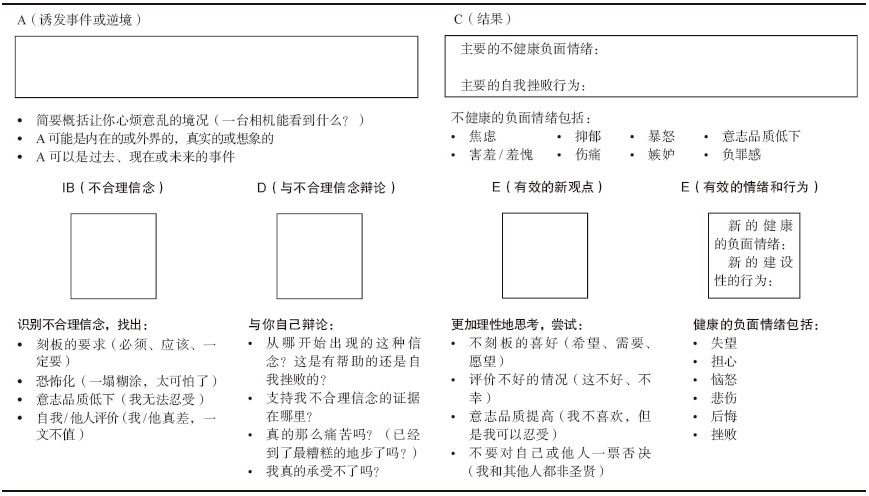

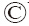Windy Dryden & Jane Walker 1992.Revised by Albert
Ellis，1996

表12-2　REBT自助表格

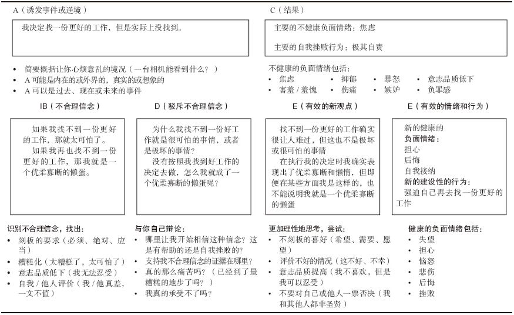

Windy Dryden & Jane Walker 1992.Revised by Albert
Ellis，1996

# 第13章　REBT观点8：用行为改变想法和感受

在第12章中我曾经提及，你会受到社会群体、周围环境和身体的影响。但是为了认识自我和情绪问题，还需要明白，人的想法、感受和行为三者之间是相互影响的。

我关于REBT的首篇专业论文于1956年发表在《普通心理杂志》（Journal of
General
Psychology）上。那时我就曾言明，人类很少存在只有想法而没有感受和行为的情况，反之，感受和行为也是如此。感受中包括想法和行为，同时感受又是在对自身情感的想法中产生的。尤其当你固着于某种感受，比如多年来你一直憎恨某人，你的信念、想象、对自我和他人所作所为的评价，都可能重燃这种感受，或让你一直处在这种感受之中。

罗伯托在15岁时被爸爸打了，并且固着于被打的疼痛之中。罗伯托挨打是当着好朋友的面发生的，这让罗伯托对爸爸感到很气愤，同时也在朋友面前感到丢脸。但是，罗伯托错了，因为在同样的情境下，一些男孩子会感到焦虑而不是气愤，会做出反抗而不是感到羞愧。因此，可以推断罗伯托很有可能是在被爸爸打的那几秒之内就形成了某种想法，正是这种想法导致他产生气愤和羞愧的感受：

1.“这个坏蛋不应该这么打我，我没做错什么！”

2.“因为被爸爸打，我朋友一定觉得我是个弱者。我不应该这么懦弱！简直太丢人了！”

14年后当我见到罗伯托时，他已经不记得被打这件事了，但是他思考问题的方式还是像原来那样，并且有时还会自动化、不假思索地那样看待问题，因为父亲在朋友面前不公的责打而产生的愤怒和羞愧感也一直都在。我告诉他，人们很少不假思索就产生某种感受，他也非常认同。

然后我对他说，他通过一些会产生怨恨的想法，让自己总是处于愤怒和羞愧感之中。例如，“我都没有报复爸爸，他怎么可以这么残忍，这么不公平地对我呢？他根本不应该做这种让人难受的事！他是个坏蛋！”他对此非常信服。每次罗伯托跟爸爸相处时，总会因为这样想而生气：“就算我现在比他小，比他弱，但我至少应该尽我所能地报复他，用球踢他，或者阻止他的行为！我没那么做真丢人！”

格言：只有感受而没有想法和行为的情况是很少出现的。即使有这种情况，比如，你看到有东西朝着你飞过来，你会不假思索地感到害怕，这种感受也只会持续几秒，但不会对你造成困扰。除非你抱有不合理信念，如“见鬼去吧！这东西差点杀了我，太不应该了！”或者：“我不应该害怕！害怕多傻啊！”

所以，在你感觉到心烦意乱的时候，去觉察自己那种“一定要”的强迫性信念，它是让你心烦意乱的根源所在，找到自己那些不合理的信念并尝试去改变它们。

REBT的观点同时也认为，你的想法导致了那些感受和行为，而后者又反过来影响了你的思维过程。当罗伯托憎恨父亲的时候，他很难随机应变，而且经常做些不经思考的傻事。例如，倔强地不跟父亲借钱付房租，而这样的行为伤害了他深爱的母亲。

所以说想法、感受和行为三者之间是相互影响的。疯狂的想法导致纷繁的感受和怪异的行为；歇斯底里会引发愚蠢的信念和行为；行为鲁莽导致怪异的想法和荒唐的举动。此外，想法还会产生其他的想法，感受又变为新的感受，行为还会导致不同的行为。想法、感受、行为三者之间的相互影响从未停止过！

如果你想解决自己的困扰、压力、恐惧症，成瘾行为或某些癖好。要怎么办呢？没有任何一个方法是万能的。例如，有时候一些见解能让你摆脱焦虑情绪，但有时候又不灵了。很多时候，充分的表达自身感受会相当有帮助，但又有很多时候故意不去表达自己的感受，而是将注意力转移到理性的事务上，能够让自己感到好受一些。有时候，尽你所能尝试所有能够想到的治疗方法可以最大限度地让你摆脱困扰，不论这些治疗方法是长程的、短程的抑或是漫长艰难的！

不应该预判哪一种技术一定或者必须有用，应该放手去实验。尝试大部分的治疗计划（treatment
plan），每一种都尝试一下，都坚持一段时间。但是不用永远坚持下去。因为，在这种方法产生效果之后，没必要成为这种方法的追随者，或者希望自己泯然众人。你就是你，你所经历的顺境和逆境跟别人是不同的，适合你的，或是不适合你的与其他人也不同。在进行自我治疗实验的时候，请谨记此点。

从来就没有唯一的方法。REBT认为，你总是能够找到一个主要的、最简便的解决方法。（这方法就是，从根本上改变自己的想法，不再生气，保持平静，由此再不会有过多的情感困扰。）

道理：即便是这样，我们还是要承认，它并非唯一的方法。因为，条条大路通罗马！

1962年，我在《心理治疗中的理性与情感》中指出，有时最好的或者事实上唯一的改变固着想法的方法是，强迫自己与之对抗：完成日常家庭作业，这一观点得到了约瑟夫·沃尔普（Joseph
Wolpe）、汉斯·艾森克（Hans Eysenck）、伊萨克·马克斯（Isaac
Marks）、班杜拉（Albert Bandura）、斯坦利·拉赫曼（Stanley
Rachman）和其他行为治疗学派学者的支持。这种迫不得已的对抗能让你发现，其实你可以征服强迫信念或恐怖信念。同理，直接对自己的感受和经历做工作，并进行充分表达，要比即刻打断不合理信念，更加能够帮助你彻底改变扭曲信念。

那么，观点8就是：你可以通过与不合理信念和混乱的感受进行对抗来改变它们，对抗是指做能够反驳它们的行为。

事实上，我们真的很怀疑，在一次又一次用行动与不合理信念进行斗争之前，你曾经真正改变过不合理信念吗？同样，在一次又一次真正想要改变并下定决心这样做之前，是不可能彻底停止强迫行为。

很多心理学家说REBT理论最初仅仅是理性层面的，只是后来又加入了行为治疗的方法。这纯粹是无稽之谈！1943年我从事心理治疗之初就是一名认知—行为性（congnitve-behavior
sex
therapist）心理治疗师，并于1940～1950年开积极导向性心理治疗理论之先河。另外，我还在自己1954年出版的书《美国性灾难》（The
American sexual
Tragedy）中对此做了一些总结，而这些受到了很多消极的弗洛伊德学派和罗杰斯学派治疗师的批判。1949～1953年，在我进行心理分析练习的这段时间里，我绝少使用行为疗法，但我发现心理分析效率低到难以置信的程度，因此1953年时我重新回归认知行为治疗的怀抱，也是从那时起，我开始创建REBT理论。

我对行为疗法的钟爱源于自身成功的经历。那是我19岁时的故事，那时我还没想过会成为一名治疗师。我经常对人说起这段经历，那时当众讲话让我异常害羞，在3个月之中，我进行了大量的政治演说。

我对自己说，追随先贤的脚步，即使演讲得很糟糕也没什么可怕的。我遵循行为学派创始人华生的教导，他证明了积极重复或者坚持做那些令自己感到恐惧的事情，真的可以让人摆脱那些毫无来由的恐惧感。因此我希望能够克服当众演讲的恐惧。我竟然真的做到了。

这简直太奇妙了！最初我并没有期望自己会爱上演讲，然而在以后的65年里我居然一直沉浸在演讲的乐趣之中。我简直来了个180度的大转弯。这太神奇了！

当我发现坚持做让自己感到不舒服的事情有帮助时，我决定也用这招解决自己特别害怕见陌生女性的问题。虽然我一年之中有250天会在布朗克斯植物园（Bronx
Botanical
Garden）散步和读书，在这期间我经常见到很多令人着迷的女人，我也极其渴望能够和她们聊天、约会，而且她们好像看起来对我也很有兴趣，但是因为我特别害怕被拒绝，所以我从未接近过陌生的女性。

所以，我给自己布置了作业，跟公园里所有我看到的，那些坐在长椅上的单独女性聊天。这种聊天是不带任何期望的，也不逃避的！

虽然令人感到恐惧和难受，但我强迫自己完成任务：在一个月内跟100名独身女性搭讪。对的，就是100次“陌生的”邂逅——我一直梦寐以求却总因为害怕而不断回避的事情。

我并没有什么实质性的收获，只有一名女性愿意跟我约会，而她竟然爽约了！但是，我真的克服了不能跟陌生女性讲话的恐惧，从那时开始每次跟女性聊天都非常轻松。在多次被拒绝后，我发现想象中可怕的事情并没有发生，比如她们会骂人，感到恶心并尖叫着甩开我，报警！我最终明白，我能够跟陌生女性交流，即使被拒绝，我的生活仍然可以很开心。

同时，我也发现，与仅使用理性疗法相比，行为疗法，尤其是通过行为对抗内心恐惧的方法，对改变不合理信念更加有效。后来，我发现精神分析效果甚微，反而是与患者讨论如何走出不合理信念来得更有效，我也认识到很多方法能够改变人的态度。其中，积极地去做令你感到害怕的事情是最有效的方法之一。

因此，REBT发展之初包含了大量的认知、情感和行为方法。经过多年的发展之后，REBT又加入了很多治疗技巧，其实REBT理论在创始之时使用的已经是多元模式的框架（使用阿诺德·拉扎勒斯的模式）。

颇具讽刺意味的是，系统脱敏法的创始人、著名的行为心理学家沃尔普一直反对“认知”疗法，他的系统脱敏法是通过想象、教育和多种形式的思考来对行为人进行治疗的。REBT（认知疗法的一种）却喜欢布置一些可能对行为人来说是冒险、行动方面的家庭作业。从这个角度来看，REBT甚至比很多行为疗法更加注重行为。

在罗伯托的案例中，即本章最初所举的例子，他愿意进行与不合理信念辩论的功课，他总是认为爸爸绝对不应该在小时候打他，他也完全不应该表现得那么软弱，他爸爸没有为打他而遭到任何报应。我帮他出了两个家庭作业：①跟爸爸聊天而不是完全不理他（他曾经这样做过）；②用没有任何威胁性地、坚定地站在爸爸面前的行为，取代退缩或者对爸爸大喊大叫（他以前经常这样做）。

通过这样的训练，7个星期之后罗伯托不再怨恨爸爸，也不再埋怨自己了。此后的几年里，他又进行了提高忍受力和悦纳自我的治疗工作。

## REBT练习13

回忆你毫无缘由就害怕做的事情，例如：

·当众演讲很差劲；

·不会写论文或者报告；

·画画很差；

·被某个你在意的人拒绝；

·乘坐速度很快的电梯；

·插话；

·当众跳舞；

·与陌生人讲话；

·完成一项艰难的任务；

·被别人嘲笑；

·玩游戏或做某项运动很差。

选一项最害怕的事情去做，在短时间内尝试多做几遍。一旦决定行动，就不要犹豫、逃避。行动、行动、再行动！

在做令人害怕的事情时，要明白这并没有什么真正的危险或者值得恐惧的地方。请让自己明白：

·你不会因为做这件事而死掉；

·你不会因此而受伤；

·你可能会慢慢喜欢做；

·你可以学习到很多东西；

·克服不合理信念丰富了你的生活；

·克服它是一个极大的挑战；

·最终你定能结束因恐惧而受到的局限和挫败；

·你将变得自律，并提高意志品质；

·因为克服了恐惧，你将变得更加高效；

·越来越多的人开始认可你；

·你抵御身心疾病的能力提升了，例如溃疡和高血压；

·焦虑、抑郁、自怨自艾等负面情绪出现的概率大大减少了；

·你开始享受生活。

## REBT练习13A

你可能不会发现自己对某些行为不合理的恐惧或焦虑，但是你可以看到自己在做这些事时的害羞、窘迫和羞耻。那么，你也可能没有发现自己害怕穿过时的衣服或告诉别人自己的某一缺点，而事实可能是你从不敢做这样的事情，因为你觉得它们是“令人害羞的”、“困窘的”或者“令人感到羞耻的”。

REBT认为害羞或羞耻感是不合理的，因为它往往包含一个合理的部分（“我做了错事或蠢事，但我不希望别人因为这件事不喜欢我”），同时又包含一个不合理或自我贬低的部分（“因此，我是一个不讨人喜欢或愚蠢的人。”）。

为了对抗不合理羞耻感，我在20世纪60年代后期设计了著名的羞耻—攻击练习。这个练习是为了帮助人们不再产生不合理羞耻感。通过这个练习，即便是你正在做那些曾经令你感到害羞、愚蠢、不便的事，你也不会再出现不合理羞耻感。

羞耻—攻击练习有助于对抗不合理信念和纷繁的感受。挑选一些只有你觉得会令自己感到羞耻或尴尬的事当众去做。例如：

·穿着打扮不适宜。

·对一群人说些傻话。

·承认某些别人看不起的缺点，如“我拼写不在行”。

·做奇怪的动作，如在街上唱歌或在晴天打着一把黑雨伞。

·在火车站或公交站大喊大叫。

·对别人说一些跟自己有关的、非常离谱儿的事，如“我刚从精神病院出来，现在是几月啦？”

·拒绝给服务差的服务员或司机小费。

·餐馆的菜如果做得难吃，直接退掉。

·牵着香蕉去遛弯，就好像遛狗一样。

·去修鞋店修手表。

·去借一把供左撇子用的扳手。

在你做这些会令你感到害羞或者羞耻的事情之前，第一，一定要确认自己做了这些事情之后不会让自己陷入麻烦。比如，不公开暴露自己，不做可能被捕的冒险行为，不会因为骂你老板是个臭虫而被炒鱿鱼。

第二，不要做任何可能伤害其他人的事情，如抽某人耳光或不断地骚扰某人。

在进行羞耻—攻击练习时，要时刻在头脑中想着这是为了治疗，只有这样才能够在别人都不认同你的时候也不会感觉到羞耻。可以通过自我暗示的方式彻底摆脱羞耻感。

举例：

“大家可能觉得我很傻。太糟糕了！随他们去吧。”

“说实话，做这个羞耻练习是在帮自己克服自我贬低。这是件好事！”

“我做的事可能看起来有点傻，但这不意味着我人傻。”

“大家都觉得我这样做是错的，为此我觉得很抱歉，但是这也只是世界的一个损失，又不会世界末日。”

“我清楚地知道为什么要做这些自己觉得丢脸的事情，因为我可以从不同的角度去看待它，它可以是个怪异行为，但这不代表我是一个奇怪的人或无能的人。我只是那个在这种情况下选择做了一些奇怪行为的人而已。”

不断地进行羞耻—攻击训练，直至做这些时不再令你感到羞耻，甚至为此感到愉悦为止。在进行练习时，观察自己对那些羞耻行为的感觉和态度的明确转变。

# 第14章　REBT观点9：练习与实践

在《心理治疗中的理性与情感》中，我曾谈到REBT包含三大观点，这三大观点与精神分析疗法的观点具有很大的差异。前两个REBT观点是：

1.事件结果C影响情绪，情绪波动不仅因为诱发事件A（events or
adversities），同时也因为你接受甚或是虚构了不合理信念。

2.无论何时、何种程度、何种原因导致你焦虑或抑郁，这种情绪之所以持续至今都是因为你意识或无意识地抱持着不合理信念。

以上两个观点，我们之前已经进行了充分的讨论和扩展，同时我们现在开始明白这样一个道理，即在儿童时期你没有能力发现和改变自己的不合理信念，但是现在，如果你看过并且已经开始使用之前讲过的8个信念做事，你已经具有足够的能力去做这件事了。

现在我们将原本的第三大观点在此进行扩充，并成为本书的观点9：无论你在认知层面上多么清晰地觉察到自己生气、感受的痛苦都是不值得的，你也很难取得进步，只有通过大量的练习与实践来确确实实改变导致心烦意乱的信念和感受，并强而有力地（同时也总是感觉不怎么舒服）与之作斗争。

观点9呈现了所有心理治疗方法的弱点（以及自相矛盾之处），当然也包括REBT在内。因为你太容易习惯，也太容易产生自我挫败信念，并已经将这种习惯倾向深入骨髓。该死的“太容易”！因为这倾向能让你无意识、不费吹灰之力地使自己痛苦。这么说，你除了自我实现倾向以外，还有很好的自我挫败的倾向。天啊！

观点9让你知道，你绝对可以改变痛苦的信念、情感和行为。但是，这并非是一件容易的事情。

但至少观点9给予了你一次改变的机会。因为它明确说明，只要你愿意坚持不懈地去练习、实践，改变不合理信念以及行为，你就极有可能（可以说有98%的概率）让自己不再那么痛苦。

对一些在REBT出现前就已经闻名的认知心理学家，如皮埃尔·珍妮特（Pierre
Janet）、埃米尔·库埃（Emile Coué）、保罗·杜博斯（Paul
Dubois）、阿尔弗雷德·阿德勒（Alfred
Adler），观点9向他们展示出REBT与大多数意识为导向的心理治疗方法有多么大的不同。

这些理性的心理治疗方法忽视了行为疗法对人格的改变作用。这些疗法总是忘记强调改变信念的同时最好还坚持练习。你已经在歪曲信念的土壤之中生活太久了，太容易无意识地掉进固着的“应该”和“必须”想法之中。甚至你发现了自己的“一定要”信念，并打算放弃这个信念，但是你还会发现自己很容易失败，一次又一次被打回原点，回到那种教条式的思维模式之中。

更进一步来讲，除非你坚持不懈地用行动与恐惧信念斗争，否则你几乎不能消除它。如果你害怕反驳别人，并且每次都“回避”这种情况，那么你就是在无形之中加强了自己的恐惧。无论你是否意识到自己心中所想：“如果被拒绝了我会很痛苦！在我进行尝试之前，我必须确保自己是被接纳的。”逃跑行为本身都向你自己暗示了内心的恐惧，因此你更加害怕了。

如果你能够做到不害怕，并坚持不懈地去做，你会发现其实并没发生什么可怕的事，在这个过程中你已经很大程度地征服了内心的恐惧。

如果我们把最神经质的问题归为两类，可以称为：①自我忧虑（自我贬低）；②低挫折容忍度（LFT）或不适忧虑。当你心里总是强烈地想“我必须做好，获得别人的认可，如果不这样我就是个没有价值的人”时，就是自我忧虑在运作了。这个信念是很夸张的，因为你要求自己是特殊的、杰出的、完美的、像超人一样，但很明显你不可能做到这样！

不适忧虑也是将自我神化的问题，因为不适忧虑背后隐含的信念就是：“因为我与众不同，所以我的需要和喜好就应该得到满足，其他人必须满足我的期望，为了迎合我的需要，环境也必须被巧妙地安排好。如果不是这样，我就觉得很痛苦，不能忍受，生活也没有什么继续的意义了！”

由此我们可以看到，导致不适忧虑的一个主要信念是：“我应该过轻松的生活，别人都应该满足我的需要。”这个信念又会产生与之相关的不合理信念：“为了获得完全令人满意的生活，我必须面面俱到，时刻都要赢得所有重要人物的爱。”这些信念都将导致个体意志品质降低。但是，它们同时又包含很自我的部分，因为它坚持：“我应该过轻松的生活，我必须是完美的，无论是人或环境都应该迎合我！”

为什么说低挫折容忍度在心理治疗中这么重要呢？因为，不管最初是什么原因让你生气，后来你察觉到自己的情绪状况，明白是什么信念让自己生气，知道自己最好怎样去应对这些，同时也不希望自己再陷入愤怒中，即使这样你仍然还是会受到低挫折容忍度的影响。比如，如果你知道工作面试会让你感到不舒服，所以抵触找工作。如果你意识到是不合理信念引起的这种不适感和焦虑感，之后就可以运用REBT帮助自己克服焦虑，通过REBT可以说服自己：你可以忍受被人拒绝，你的不适感只会带来不便但还没有达到痛苦的程度。但是，为了能够说服自己相信这些合理的信念而不是那些固着的不合理信念，你必须要付出很大的努力才行。

因此，你最好用学到的REBT知识来改变引发焦虑的信念；你最好持续进行练习直至你不再焦虑，不会被再次带回到焦虑之中为止。无论你觉得多难受，一定要多去参加工作面试直到不再为此感到惊慌为止。

当你陷入焦虑情绪之中而不是为了真正摆脱焦虑而努力奋斗时，说明你受到了低挫折容忍度的影响，或者说是陷入了不适忧虑之中。当你暂时不让自己焦虑，但之后没有持续努力下去，也说明同样的情况。

低挫折容忍度时常引发焦虑和抑郁。它更多地发生在你不想心情忐忑的时候，总是让你处在这种情绪之中。为了解决低挫折容忍度的问题，你最好去完成很多困难任务，无论这些任务会让你产生什么样的感觉。

尽管去做，别不安！不要等到你已经感觉到情绪变化才开始行动，要防患于未然！

这是否听上去有些自相矛盾：通过让你坚持去做“过于”艰难的事情，来让你尝试克服自己的低挫折容忍度。这个想法的产生是因为对抗“不应该”想法需要付出足够的努力。是的，的确如此。但是别忘记了，所谓的自相矛盾源于你的想法，事实根本不是这样。而且REBT明确表述过，如果它只是一个想法，你就可以通过辩驳来克服它！

导致自相矛盾的内心想法是：

1.“即使长期坚持下来有很大的好处，我也不一定非得努力练习来换得我想要的。为了快乐而努力练习实在太难了。我要立竿见影的效果。”

2.“唯一能够让我克服低挫折容忍度，变成一个快乐的人的方法就是通过努力练习克服自己的偏见。”

对这个矛盾的想法，我们可以这样进行反驳：“是的，努力练习获得快乐的确非常难，延迟满足是为了获得更多的快乐。但是如果我不努力，这会非常困难！贪图一时欢愉总是会让将来充满痛苦！太糟糕了，但道路总是这样曲折。我需要尽力克服低挫折容忍度的问题，因为如果不这样做将意味着我会长期处于痛苦之中。”

“没人允诺给我一个‘玫瑰园’，如果我坚持要求他们这样做，我所能得到的只能是满身的‘玫瑰刺’。”

我们回过头来看观点9。除了努力的练习和实践几乎没有其他方法能够帮助你彻底摆脱痛苦。洞察本身是不够的，仅仅承认、表达自己的情感也是不足够的。

你最好成百上千遍地与不合理信念进行辩论，以让合理信念深入你的头脑之中。无数次地觉察自己的感受并将之表达出来。千百遍地用行为来对抗影响你的信念和情感，而且如果有必要，就再来一千遍！这种坚持持续数月，有的甚至持续数年，有时也可能断断续续持续一辈子！

我们再从另外一个角度解读观点9：世界上从来没有神奇的、简便的方法可以改变你：乐观与希冀不能，祈祷和恳求也不行，别人的支持和爱也做不到，即便是读这本书也不行。所有的这些可能会让你好受点儿。有些还会让你知道怎样能让自己变得更好。但是，我们仔细想想，只有你才能够改变你自己。是你和你坚持努力的行为改变了你。努力？对，就是努力！

你可以通过使用以下两个REBT规则让自己不再感到严重的焦虑、抑郁或者其他的痛苦：

1.使用思考、感受和行动的REBT技术，例如本书中介绍过或其他REBT书中讲授的技术。每一种技术都进行尝试。一个不好用就换下一个，再下一个，再再下一个！如果管用，那也要继续尝试其他的方法。

2.坚持不断使用REBT方法。某一个方法，例如唱幽默歌曲给自己听非常有用，请重复进行练习，直至这种信念已经深入人心，沉淀到骨髓。REBT的方法需要过度学习。为了不忘记请一遍又一遍地复习它！

40岁的帕布洛是一名旅游代理商，他非常了解REBT的相关原则和练习。他经常帮助密友使用REBT，还经常帮助那些在每周五晚上帮我开展日常生活问题工作坊的志愿者使用REBT。在我跟他们面谈之后，帕布洛总能针对他们的情绪问题给出非常合理的建议。但是，一旦他自己生气，总会让自己怒火中烧一个小时，有时甚至一整天都如此，这种事情通常每周都会发生几次。之后，他才想起使用REBT征服自己的愤怒，归于平静回到《美国大玩家》的写作之中。

帕布洛对REBT非常了解，他清楚地明白产生愤怒的不合理信念是：“他们怎么会这么笨呢！简直无药可救了！”“我妻子如果真像她说的那么爱我，就不会这么自私，这么不在意我！她简直太虚伪了！”

帕布洛也经常可以觉察到自己的次生症状。他不喜欢自己对别人发火。他觉察到自责的信念是：“我应该做得更好，而不是像孩子一样那么幼稚地发火！我真笨，竟然没用REBT的方法！这太蠢了！”

帕布洛能够觉察到自己不必生气，也发现自己喜欢自责的倾向，但他仍然经常陷入其中。这两种情感总是会打断他日常的剧本创作、破坏他的人际关系。帕布洛偶尔还会跟“超级蠢”的人打架。妻子也因为他总是对人发火而离开了他。他的创作也因此一直难以完成。即使这样他还是不愿意用REBT让自己停止愤怒和自责。

在很多次REBT任务无法完成后，帕布洛和治疗小组成员一起想出了以下的方法：在一个月之内，他每天至少要花费两个小时进行REBT练习，不仅要懂得怎么做，更重要的是行动。

他将特别练习完全地自我接纳，即使无数次地又对别人发火了也要完全地接纳自我：

1.每天至少花费10分钟与不合理信念进行辩论，他的不合理信念是：“我应该做得更好，而不是那么愚蠢地发火！我真笨，竟然没用REBT的方法！这太蠢了！”

2.坚持自我辩论直至完全接纳自己的愚蠢行为。

3.每天至少重复对自己说15遍合理信念：“因为我是一个不可能不犯错的人，所以我会经常做些傻事，有时还总是犯傻生自己的气。这就说我坏，没门儿！”

4.列出所有自责坏处的清单，每天阅读、思考至少5遍。

5.每天至少进行一次羞耻—攻击练习，让自己当众做出自认为“羞愧”或“愚蠢”的行为（例如在地铁里用尽全力唱歌），努力让自己不害羞、不自责。

6.每天多次唱幽默歌曲，以打破完美主义和自责，下面是合理幽默歌曲的举例：

完全理性

（作曲：路易吉·登扎，《登山缆车》）

有些人觉得世界一定存在一个对的方向，

我也这样想！我也这样想！

有些人觉得，些许瑕疵

无法容忍——我也这样想！

因为我，要证明我是超人，

超凡脱俗！

彰显我非凡智慧——

常与伟人同存。

完美，完美的理性啊

是我的唯一！

知我怎样想

必要连连犯错吗？

理性于我真美妙！

美丽的困扰

（作曲：斯蒂芬·福斯特，《美丽的梦仙》）

美丽的困扰，为何你我一体

我们共享生命时光？

我们已习惯彼此

若你我分离，世界也宛若囚笼！

美丽的困扰，请别离我而去！

若你走了，谁还可为知己？

即便你让我看似蠢笨

没有你的生活需太多努力！

没有你的生活需太多努力！

我很坏，太坏了！

（作曲：德沃夏克，“念故乡”，《自新大陆交响乐》）

我很坏，哦，太坏了，毫无价值的卑鄙男！

哦，上帝啊！我还想说：我太坏了，真让人悲伤！

我太坏，丑陋扭曲是我代言！

如此坏，还有活的勇气！

我很坏，穿着罪恶的外衣！

我这么坏，吓到你了吧

一定要小心我哦！

对呀，要小心我！

对啊，要小心我！

（上述歌曲由埃利斯作词，版权所有归埃利斯研究院所有。）

帕布洛在不断努力治疗自己的次生症状（因为总是对别人发火，并在内心中认定没能很好地控制自己而深深自责）的同时也在治疗自己的主要症状（总是对别人发火）。针对他的不合理信念：“其他人不应该这么笨，妻子不应该这么自私，必须更关心他。”帕布洛在治疗小组成员的帮助下，制定了以下的REBT家庭作业：

每天至少用10分钟积极地、强有力地与不合理信念争辩。

每天至少15次对自己说合理的应对方式：“人本来就会经常做蠢事，这是人的本性！”“我妻子有时自私、不够关心我，可是她对自己的兴趣多过对我的兴趣是她的权利！”

每次他跟别人打架，或者对妻子吼叫，就捐献100美元。

坚持每天至少练习一次合理情感想象，通过想象别人真的做了蠢事，让自己很生气，然后对情感进行疏导，让自己对他们的愚蠢行为仅仅感受到失望、沮丧，而不是愤怒。

每天数次唱幽默歌曲，这样能让他在愤怒中体验到乐趣，下面是两首我重新作词的流行歌曲：

爱我，爱我，唯有我

（作曲：《胜利之歌》）

爱我，爱我，唯有我，没有你宁愿死！

做一张爱的证书，让我不再怀疑！

爱我，爱我的全部；亲爱的，请你，请你用尽全力试试；

若要我也爱你，亲爱的，我会恨你至死！

爱我，永远爱我，完全地、彻底地爱；

若非你唯一爱我，生活将一塌糊涂！

亲爱的，极尽温柔去爱我，没有如果与但是。

亲爱的，若你爱意少一分，我会恨你那该死的勇气！

荣耀，荣耀的哈利路亚！

（作曲：《共和国战歌》）

我已看见关系散发的荣耀光芒

它在路旁徘徊，犹如爱的激情来来回回！

哦，我听闻在爱情里没有丝毫欺瞒——

但是，我不相信！

荣耀，荣耀的哈利路亚！

人们爱你直至拴紧你！

希望少一点

别指望他们！

荣耀，荣耀的哈利路亚！

人们为你欢呼——再唾弃你！

希望别拥你太紧，

别指望他们！

信念、情感、行为三方面的作业，帕布洛都很好地完成了。当他没能完成REBT任务的时候，他时刻与自责倾向作斗争，做到仅仅批评自己的行为表现而不是他这个人。

通过这样，他将发脾气的次数减少到每月几次。无论何时他生气了，他都会马上承认自己确实生气了，并且沉浸于愤怒5～10分钟。然后他就能发现导致生气的不合理信念，成功地与之争辩，并在几分钟内控制它。他偶尔也会退步，也会让自己生气一个小时甚至更长时间。但是大多数情况下不会超过10分钟，有时甚至只有两三分钟。

帕布洛很高兴对抗—愤怒计划使自己节省了很多的时间和精力。他不再长时间沉浸在愤怒和闷闷不乐之中，每周有了更多的时间进行剧本创作。

在尝试改变自我挫败信念和行为的过程中没有任何灵丹妙药。只有对自己说一定要努力治疗，必须坚持REBT练习。了解自己为什么情绪变化，明白怎样才能让它停止是远远不够的。只有通过实践和努力才是减轻痛苦的关键。这把通往成功的钥匙没有任何神奇之处，是实实在在通过努力得来的，是坚决不让任何事情使自己痛苦的决心。对，就是任何事情！

## REBT练习14

进行此训练，需要制定一份不合理信念辩论表。如何制定表格的方法在埃利斯研究院发行的《理性生活指南》和《与不合理信念进行辩论的技巧》手册中已经介绍清楚了。准备好表格之后，就挑选一个不合理信念，针对这个信念问自己一些具有挑战性的问题，直至你真的放弃它，并确信它被你打败了为止。

与不合理信念进行辩论时可使用的问题如下：

1.我要克服的不合理信念是什么？

2.我能合理地证明这个信念吗？

3.有证据可以证伪吗？

4.有证据支持它吗？

5.如果我不再这么想，用行动与之对抗，最差会怎么样？

6.如果我不再这么想，会发生什么好事吗？

如果在进行REBT练习时，你有低挫折容忍度，不能持之以恒、不够积极努力，那么可以通过以下方法来与不合理信念进行争辩，以解决低挫折容忍度的问题：

1.我要克服的不合理信念是什么？

回答举例：我没必要一定按照REBT挑战自我。改变自我应该很容易才对！解决这些麻烦太难了，没人替我做这些，让人太痛苦了。

2.我能合理地证明这个信念吗？

回答举例：不能。

3.有证据可以证伪吗？

回答举例：有很多证据。

a.没有任何理由让我不努力改变自己。如果不需要付出努力，改变就太容易了。但显然，改变不可能是一个太容易的过程！所以我心里明白，如果想要改变自己，我最好坚持做，努力做！

b.有谁说通过REBT练习，改变自我会变得很容易吗？只有在我不切实际的幻想和愚蠢的想法中才如此吧！无论我多么期望自我改变是一件容易的事，我多么渴望轻松，自我改变也不可能自动完成。

c.虽然它很难，但做了绝对不会白费工夫。说它“太难”是因为我抱有不切实际的幻想，它比我想象中要难，所以我才用“太难”形容它。如果按照这个逻辑进行推理，这个想法意味着无论我想要什么事变得容易，什么事就得容易——如果我想宇宙大爆炸呢，我能做到吗？明显不能！

d.的确，运用REBT改变自我很艰难，但是此刻它就是很艰难，世间的道路本就如此：任何道路都不容易走。它就是这么难！这么辛苦！就算我发现它再怎么难，它的难度也不会因为我的感受而变得容易。

e.确实，改变很难，但是不改变的话，生活更难。因为如果不改变我可能会焦虑、抑郁一辈子。

f.如果没人使我的改变过程变得轻松容易，没有人替我做REBT练习，我就会觉得恐怖。世上哪有这样的道理啊！我所说的恐怖含义只是不太好，用“恐怖”来形容远远超出了实际情况；为了改变自己必须进行REBT练习，很糟糕、很麻烦，但情况不可能都是不好的。就算99%是不好的都不太可能。我越觉得它不好，它就越差，让我越挫败，越是会打扰练习REBT改变自我的进程。因此，我最好把这个过程看作只是有点麻烦而已。

4.有证据支持信念“我不需要努力练习REBT就能改变自我”吗？

回答举例：当然没有。有大量证据表明，通过REBT改变自己是很艰难的工作，它原本就很困难（事实上它真的很难！）如果了解REBT，想着REBT有多好就能让自己改变那就太幸运了，但不幸的是这种好事不可能发生。从现在开始我努力进行练习，逐渐就会发现其实挺简单的，慢慢就习惯了。但是在此之前，此时此刻，它依然非常艰难！没有别的选择，为了以后不会更麻烦，我应该抱着积极的心态去做。

5.如果我不再觉得践行REBT太辛苦、太困难，最差会怎样呢？

回答举例：

a.进行REBT练习的确是一件令人讨厌的事。它确实不招人喜欢！但如果我不做这些，所有麻烦和困扰就会跟我一辈子！

b.如果我不做REBT练习，不努力克服自己的问题，那问题不只不能解决还会变得越来越多。那生活将比现在更糟糕！就算我什么都不做，我的问题也会增多，我得到的只会是难受和诸多不便。REBT练习还称不上恐怖或者艰难，它只是比想象中要难一些，只能说不太好办而已！

c.进行REBT治疗，最差的结果无非就是毫无进展，所有的努力全部白费。但至少我知道自己尽力了。如果不去尝试，我永远都不可能知道，我能做到多好又或是我根本不可能变好了。所以我应该尽力去尝试，尽自己最大的努力去做。

d.就算努力之后一点儿变化都没有，我至少还活着，只是仍然带着挫败和痛苦活着。但没有进步不太可能，因为只要我努力就肯定会进步。但如果真的没有丝毫进步，那么无论发生什么事，最多也就是还像原来那样有些困扰和不便。如果我能不再抱怨这些困扰，不再为此歇斯底里，这行为本身就免除了很多自找的麻烦。所以说我最好还是努力治疗。

6.如果我运用REBT解决自己的问题，会发生什么好事呢？

回答举例：

a.我可能真的解决了自己的问题，焦虑和抑郁都会减轻甚至我不再感到焦虑和抑郁！

b.如果我能在这方面克服自己低挫折容忍度的问题，我会变成一个更加自律的人，也意味着在生活的很多其他方面，我也可以做到如此自律，例如暴饮暴食和做事拖延。

c.努力实践REBT，为了将来的收获而放弃短暂的快乐，对我来讲，这本来就是极大的挑战。当我面对许多失去而不再生气，这也许是我人生中最好的挑战之一了。

d.努力克服惰性，哪怕要花费我一段时间才能成功，我也将变得越来越好，渐渐还会享受这种积极努力的状态，发现自己越来越独立，情绪问题也在逐步解决。还有什么回报比经营自己的生活更好呢？

# 第15章　REBT观点10：坚定地改变信念、情感和行为

你知道，你可以委婉或激烈地、适度或强烈地表达自己的想法、情感和行为。面对失去，你可能感到轻度到极度等强烈程度不等的悲伤；你可以拼命练习，也可以慢慢练习；你可以非常沉迷于吸烟和饮食过度，也可以浅尝辄止。

那么想法呢，也会有强弱之分吗？

罗伯特·艾柏生（Robert Abelson）和罗伯特·扎荣茨（Robert
Zajonc）以及众多心理学家都认为答案是肯定的。例如，很多年前罗伯特·艾柏生就曾指出人的认知有“冷”、“热”之分。用REBT的理论来看，“热”的想法能比“冷”的想法产生更大的影响，引发更多的紧张感。

假设你需要通过考试获得一份工作，你可能有这种“冷”的想法：“这种工作通常都需要考试。”心中这样想，你可能对这件事只产生微小的感受甚至一点感受都没有。

对考试和工作，你也可能有“温暖”的、有实效的想法，在REBT中我们称为合理信念：“我特别希望能够通过考试获得这份工作，而且这考试看起来也不难，我喜欢它。”心里这么想，会让你变得积极乐观，对考试有好处。

你也可能抱有“热”的、自不量力的想法：“我必须通过考试，必须获得这份工作，只有这样我才能充分享受生活，才能觉得自己是个有价值的人！如果考试比想象中难，我没能通过考试，我会觉得痛不欲生，同时证明我很笨，没有资格得到好工作！”这就是所说的“热”想法——在REBT中我们称为不合理信念——心里这么想，会让你相当紧张，不利于考试。

REBT认为你心中“热”想法的情况可能是强烈、坚定和有力的，当然也可能是轻微和刻板的。你可能认为自己必须通过考试，如果没能通过考试就证明自己是个笨蛋，你心中抱有这个信念的情况可能是：①偶然的或持续的，②三心二意的或虔诚的，③轻度或过度，④表面的或深入内心的，⑤无声无息的或是大声宣扬的，⑥有限制的（在某种特定的情境下才这样认为）或是普遍化的（很多情况下都这样想）。

由此可见，“热”想法的“热度”也是有很多种类的！REBT也认为“热”的想法会比“温暖”的想法引发更多强烈的感受，尤其是各种扰乱心神的感受。“热”的想法往往会引发自我挫败感和行为，这种模式持续时间越长越难改变。

盲目地认为自己必须通过重要考试，每一份工作申请都能成功，觉得如果有任何失败就意味着自己是个毫无希望的蠢货，抱着这些想法将导致你在考试或面试的时候极度焦虑。焦虑情绪会很大程度地影响你的生活，而你也需要花费大把的时间来缓解焦虑情绪。甚至，有时你还会感觉到强烈的恐惧感和不适感，这很可能让你变得害怕它。这样发展下去，你开始为焦虑情绪而担忧，这是很明显的次生症状。

“热”想法将引发强烈而持久的焦虑和抑郁感，为此建议你采纳观点10：如果你仅仅是轻微与不合理信念进行辩争，那你很难改变它，而且很难让改变持久。因此，最好是坚定、持久地与之辩争，说服自己它是错误的。

例如，你问自己——理性情绪行为疗法中的D（与不合理信念进行辩争）：“为什么我必须得每次都通过考试？”你要坚定（经常地）地回答自己：“我不必每次都通过考试！我希望通过考试，我乐于为此付出努力。我当然想要这份工作，但如果我没有，我没能通过考试！我将不再，需要它。虽然得到这份工作我会更开心，没得到我也可以快乐地生活。即使没得到这份工作，我也可以通过其他的考试，获得别的工作。我只是一个这次失败了的人，我绝不是一个毫无希望的失败者！”

REBT认为，你越是坚定地、频繁地挑战“炽热”的负面想法，与之辩争，你越是能够更迅速地、彻底地消灭它们，也就意味着你更加可以降低（避免）由它们引发的各种扰乱人心的感受。

现在让我们再次聚焦观点10：当你发现导致自己焦虑（以及因担忧焦虑情绪而引发的恐惧感）的不合理信念时，你可以变成管理自己情绪的专家，为不合理信念提供合理的答辩。

以汤姆为例，他是个高大英俊的男人，35岁，是一位成功的医生，但是他总是疯狂地坠入爱河，但很快她们不愿意再见他。她们发现他太不牢靠，太急色了。就像我经常问来访者的那样，谁需要一个如此好色的人呢？显然汤姆的那些女性朋友们都不需要。

汤姆很了解REBT，非常清楚是什么信念让他在碰到有吸引力的女人时变得如此摇摆不定：“我如此强烈地爱着她，如果她不能回应我的爱，我会觉得生命都残缺了，我必须赢得她的芳心。我不得不这样做！我一定要拥有她！我必须拥有！”

将这种“一定要”的信念记录下来，并发现它是不对的，汤姆运用REBT尝试放弃这个不合理信念。他不断地问自己：“为什么我一定要赢得这个女人的芳心？我真的不得不取悦她吗？没有她的爱我会死吗？”

对这些问题，汤姆做出了合理的回答，这给了他一定程度的帮助。但是，不久，他又重新陷入极度需要的状态之中，重新陷入摇摆不定的状态中。

我给汤姆布置了一项REBT家庭作业，要求他与自己进行强而有力的合理对话并且将对话进行录音。他尝试这样做，并给我带来一盒录音带，里面记录了他为要赢得某位特别女性芳心而与不合理信念进行的辩论过程，但是我和其他治疗小组成员一起听录音时，我们发觉他的辩论很棒——但是他的语气却软弱无力。他知道自己该说什么话来跟不合理信念辩论；但显然他并不相信自己所说的那些。

因此，我要求汤姆重新做录音上的练习，要求他对待自己的不合理信念时能更加强硬一些。

但还是不行。第二遍录音仅比第一遍好一点。汤姆仍然是一个恋爱笨蛋。

练习进行第三遍的时候，汤姆的情况好了很多。下面是部分录音内容：

汤姆的不合理声音：科拉是我这么多年见过最好的女人，如果她不爱我，还有哪个好女人会爱我呢？不会再有了！

汤姆的合理声音：没有？胡说八道！我遇到的那么多好女人里没有一个喜欢我？那不可能，有些还是会喜欢我的。就算喜欢我可能是件傻事，也还是会有人喜欢我！

汤姆的不合理声音：但是，想想如果她们能喜欢我，仅仅是因为她们自己笨。那这说明我是多么不招人喜欢啊！

汤姆合理的声音：见鬼去吧！最差也就说明我缺乏一些吸引人的特质，但这不代表我一点儿不惹人喜爱。也不能因为没有女人觉得我吸引人，就说明我就是一个彻头彻尾的笨蛋。最多也就是说明我在恋爱方面是一个失败者。

汤姆的不合理声音：可是，这是所有方面中最重要的一个啊！仅此一点我就是一个失败者！

汤姆的合理声音：不是这样的，只是爱的领域中的失败者。而不是在任何方面全都失败。不是整个人生都失败！是针对好女人而言的失败者，不是针对自己的！

汤姆的不合理声音：又在合理化！如果没有真爱能有什么好生活啊？啊哈！你要成为一个伟大的医生。

汤姆的合理声音：是啊，我希望成为一个伟大的医生。我还擅长运动！还要成为一个优秀的讲师！就算我一直没有找到一个好伴侣，我还有那么多可以享受的事情。

汤姆的不合理声音：一直没有？从来没有？

汤姆的合理声音：对，就是从来没有！康德就没有结婚，很可能连约会都没有过。他也过得很好啊！很多名人也都是如此，没有爱情也可以过得很快乐啊。但是，不管他们怎样，我都要快乐！只要我停止沉浸在自己“不够可爱”的思想之中，我就可以快乐！

汤姆在学到了要强而有力地与不合理信念进行论辩的技巧后，他做了无数次练习。他现在认为不合理信念就是对自己的欺骗。我和治疗小组的其他成员都没告诉他，其实他第三遍的录音已经足够强有力了。这点是他自己感觉到的，因为他感觉自己从焦虑和抑郁的情绪中得到了极大的释放。他即刻感觉不再离了爱活不了（虽然内心仍然非常渴望爱）。这种感觉一直持续数周之久。

因为汤姆坚持不懈地、强而有力地自我辩驳，他感觉自己变得不再那么急色。数月之后他几乎完全不同了，因此，他约会的女伴还会再次与他相约，有些甚至想要跟他结婚。一年之后他开始与自己最喜欢的人共同生活，三年之后跟她结婚了。现在汤姆经常教妻子怎样进行积极并强力地自我辩驳，这样可以让自己不陷入情感的自我欺骗之中。

## REBT练习15

找到你真心想要放弃的不合理信念，因你深知怀揣着这样的想法只能带来自我挫败，用两种方式与之进行辩论，一面进行轻度和中度的，另一面进行强而有力的。将不合理信念写下来，一列写轻度的，一列写强而有力的驳斥理由。更好的方法是，将不合理信念用录音带录下来，之后跟录音进行对话，在这期间对其进行中度和强而有力的辩驳，直至你觉得取得了实质性的进步，真的将不合理信念转变为坚固的合理信念为止。

举例如下。

### 不合理信念

我真的必须通过这次考试，如果不能，我的职业生涯就完蛋了，我肯定一辈子只能干些不体面的工作，拿着微薄的工资，那简直太恐怖了！那时我得多可怜！

用录音的方式代替书面形式与不合理信念进行强而有力的辩论（像之前曾经介绍过那样），你可以同时进行轻度和强力的录音对话，直至你确信自己所说，清晰地感觉驳斥的强而有力为止。

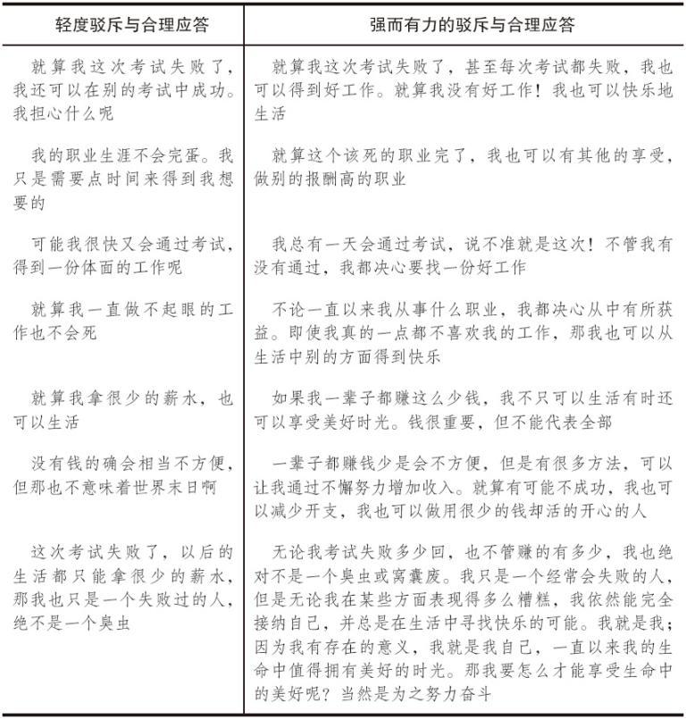

### 不合理信念

我的好朋友诺伯特从我这里借了钱，说是很快就会还给我。现在几个月都过去了，他还是没有还钱。更夸张的是，他的行动好像在对我说，我把这笔钱当做礼物送给他了，他不打算还了。他说，如果他赚到很多钱就把钱给我，但这不是因为他欠我的，而是出于他的好心。他怎么能这么对我？！这个混蛋！从这看出他身上没有一点儿好的地方。他应该受到严厉的惩罚，我觉得自己应该报复他。我会让他看到不应该这么对我！

### 对话举例

·不合理信念：他怎么能这么对我？

轻度回答：他就是这么做了。他总是干这种事。这是他的问题。

强而有力的回答：他做出这种事情简直太正常了！这不是他第一次这么干了，我打赌这肯定也不是他最后一次干！我当然很希望他不再这样，但他总是如此。天啊！但是我竟然还对他抱有希望，而且还真的借钱给他了！

·不合理信念：但是不管怎么说我也是为了他！我破例借钱给他，他却坚称是我给他的！他这个杂种！

轻度回答：是啊，我的确破例借钱给他了，但是这不代表他也破例还钱给我啊。他不是个杂种，只是有时候有点杂种的行事风格而已。

强而有力的回答：是啊，我破例借钱给他，但这绝不意味着他破例或者必须诚实地还钱给我。我决定做什么是我自己的事情；而他决定做什么是他的事情。当然，他这么做确实太差劲了，以后我肯定不会再信任他或者再借给他一分钱！但是这也不能说他就是个混蛋，至少不完全是。他就是一个会犯错的人，像我们所有人一样，但这是他所犯的最大的错误之一。我永远也不会犯他这样的错误，但是我可以应对这样的错误，我可以继续想办法拿回自己的钱，并且做一个开心的人，当然如果我从没遇到这样的事会更快乐。我最好的“朋友”变得如此不友好难道还不够糟糕吗？

·不合理信念：我还是觉得他是个彻头彻尾的混蛋！他这样行事，真是没有一点儿好地方了。

轻度回答：这么说是不是太夸张了？他当然没什么与众不同，跟所有人一样也会有好的方面。他只是在这个方面不太好罢了。

强而有力的回答：简直胡说八道！他当然还有好的方面。每个人都有。我承认在某些方面他对我不错，不论他有什么好的方面，但是不承认我借了钱给他，并声称是我送给他的这种行为的确不怎么样。这也是我想证明给他看的，不是他的人有什么问题，而是他不诚实的行为有问题。我真心希望他发现这一点。但是如果我失败了，我没能让他看到这一点。最坏的结果就是钱没了，从此再不跟他做朋友了。

·不合理信念：我要跟他绝交！以后还指望我对人这么友好？没门了！他就该被严惩，我一定会报复他的。

轻度回答：报复他有什么用呢？就是浪费更多的时间。也许我应该放弃这个念头。他真是一个龌龊的人。

强而有力的回答：我竟然想着报复他，这是多么傻的想法！在他的的事情上，我已经花费够多的时间和金钱了，现在我还要做这些无聊的事情，继续浪费时间和精力去报复他。在一个绝对公平的世界中，按道理，他应该为所做的事情受到严惩，但是他几乎没可能受到什么严惩。没有人是圣人；也没有人就是该死的。比如，如果我从他那把钱偷回来，不会有人监视我，一定要严惩我。那么为什么他就该受到这样的待遇呢？我仍会向他施压拿回自己的钱，但绝不是因为愤怒而向他施压。我会不再诅咒他浪费时间了！

·不合理信念：不管花费多少时间和精力，我都要让他明白绝不应该这样对我。我会让他认错的！也许还可以做点什么报复他妻子和家人！

轻度回答：根本就没有什么方法可以百分之百地向他证明，他不能这样对我。作为一个独立的人，就算这件事情明显是他错了，他也有这个权利去做他想要做的事。我最好放弃这些想法，把它忘了吧。

强而有力的回答：他当然可以这样对我。该死的，他就是可以！其实，他很擅长做这种不友好的事儿，而我最好的选择就是接受残酷的事实。而且我也没什么办法可以证明他不能这么对我。就算我再怎么怀恨在心，甚至去伤害他妻子和家人，也不能证明他不可以这么做。而且这种方式可能在他看来，我是一个相当卑鄙的人，而他也很可能故意不还钱，甚至可能报复我和我的家人。如果我愚蠢地让他认错，那么在这个过程中我自己也输掉了。那时我将承受远远多于现在的痛苦。我在这废什么话！他做错事，不代表我就得用下半辈子来恨他，做跟他同样的错事。我可以试着不生气、不怨恨地跟他聊聊，看看还有什么是自己可以做的。如果我什么也做不了，那好，我就是做不了了！此时最好的选择就是放弃。没错，就是放弃，回去做自己该做的事儿去！

当你已经开始用书写或者录音的方式，与某方面的不合理信念进行强而有力的辩论时，要多多进行复习。让一些你的朋友和小组成员陪你一起复习。进行强而有力的实践，但绝对不能过激。尽量不要沉浸在疯狂的状态之中，否则对你没什么好处。强而有力地练习去跟那些古怪的思想做斗争——对，就是要强有力的！

# 第16章　REBT观点11：情绪改变任重道远——持之以恒更加重要

正如马克·吐温说过的那样：“戒烟很简单，我都戒了几千遍了。”

纵览节食的历史也可以看到相似的情况。每100个节食的人减重30斤甚至更多之后，90%的人都会反弹。

心理治疗也是相同的道理。无数的人进行心理治疗来改变自己，但是，大部分人又会重蹈覆辙。焦虑、抑郁、愤怒的情绪短暂消失之后，它们又会再次反扑！

很多时候，你在尝试消除痛苦的时候，前进两步又会退回一步。有时还会反过来，前进一步退回两步。有时你觉得自己的抑郁彻底不见了，之后，你又重新坠入那个黑暗的深渊。有时情况可能是这样的，你不会再次遇到老问题，例如，害怕当众演讲。但是，你可能遇到一个全新的问题，例如害怕找工作。

鉴于以上的情况和事实，我们总结了观点11：一时之间你觉得调整感受是一件非常简单的事情。但是，最好的选择是持之以恒、坚持不懈地努力，只有这样才能保住胜利的果实。

几乎没有人可以完全治愈自己的痛苦。包括你在内！

那你可以做些什么，来保住你的成果，防止退步呢？

方法太多了。

位于纽约的埃利斯研究院已经总结了很多方法，并将之集结成册发放给每一位来访者。那么接下来，将在此介绍一些手册中的关键点，借此来向读者阐释观点11的内容，如何保留并增加你在理性情绪行为疗法中的收获。

为了保持战果，你需要记住哪些重点呢？试试下面的方法：

1.你又重蹈覆辙，焦虑、抑郁或自我挫败再次袭来时，曾经在信念、情感和行为方面取得的进步全部归零。如果你再次感到抑郁，想想之前你是怎么让自己好起来的。例如，你应该还记得这些：

a.你不再对自己说我是没有价值的，不再认为自己不能得到自己想要的。

b.你工作做得很好，你向自己证明了你是有成功潜质的。

c.你强迫自己去面试，你没有逃避，因此你成功地克服了面试焦虑。

记得提醒自己你在信念、情感和行为方面经历的改变，告诉自己因为这些改变你所获得的收益。

2.不断地想、思考、琢磨理性信念和应对回答，例如，“成功固然好，但即使失败了我也可以完全接纳自己，也可以享受生活！”不要像鹦鹉学舌那样机械地重复这些话语，要多多入心。要强而有力地想，直至这些话语真正地深入你的内心为止。

3.不断地寻找、发现、反驳那些总是让你心烦意乱的不合理信念。例如，“我必须通过成功来证明自己是一个有价值的人！”不断审问自己：“真的如此吗？”“为什么我的价值要用成功来证明？”“就算我没能完成某件重要的事情，那能说明我在这方面是个烂人吗？”

一旦你觉得症状即将反复，随时随地反驳这些不合理信念。就算你还没觉得被打扰也要如此，因为你要知道它们很可能卷土重来。观察自己的想法，时刻让它们保持在你的意识范围之内，然后强而有力地反驳它们。

4.不断冒险，不断做那些引发非理性恐惧的事情，比如乘坐电梯、社交、找工作或者创作。在克服某一非理性恐惧的过程中，让自己保持有规律地思考、有规律地用行动对抗这些非理性恐惧。做让你害怕的事情，而且要经常做！

强迫自己做那些非理性恐惧的事情如果让你觉得很难受，那就让那些难受见鬼去吧！别放纵自己，不能逃避，否则，一辈子也别想摆脱恐惧！现在尽可能让自己难受是为了能够抹消掉你心中的恐惧，是为了日后可以不焦虑和舒适。

5.学会区分什么是健康的负面情绪、什么是不健康的负面情绪。健康的负面情绪，如悲伤、遗憾、失望，这些是在你在目标受阻时而产生的情绪；不健康的负面情绪，如抑郁、焦虑、自我憎恨和自怨自艾，这些是你经历丧失时而产生的体验。在你觉察到自己有过度关心（恐惧）或不必要的痛苦（抑郁）时，你要明白这些感受都是正常的，但又是有害的，之所以会产生这些感受，是因为你内心之中那些武断的“应该”“不得不”或“必须”而导致的。

你需要认识到，你有能力将不健康的情绪（或者说“一定要”的信念）变成健康的情绪（或者说“优选的”信念）。深入感受抑郁情绪，不断地进行处理直至你的感觉仅是悲伤和失望为止；深入感受焦虑，直至仅感觉担心和警醒为止。

运用合理情感想象技术，在负面情绪激活事情未发生之前就在头脑中形成生动的情境。在想象的过程中，让自己体验到不健康的负面情绪（焦虑、抑郁、憎恨或自我挫败）。然后在想象最坏的事情发生的时候，努力将这些情绪转变为健康的情感（担心、悲伤、烦恼或失望）。在你完全确定感觉真的转变之前千万不要停止努力。

6.避免拖延。今天就开始行动！如果还在拖延，建立奖励制度，例如美食、度假、阅读或社交，总之某些你喜欢的事物，而这些奖励只有在你完成那些你总是很想逃避的任务之后才给予。如果这个还不管用，那就建立严厉的罚款，例如每次一拖延就跟很讨厌的人聊天两小时，或者捐款100块钱。

7.让保持情感健康成为一种吸引人的挑战或冒险，无论何种不幸降临，你都要保持一定程度的乐观。让消除痛苦成为你生命中最重要的事情之一，成为一件你不会放弃的事。你心里要明白你绝对有选择如何思考、感受和行动的权利；为了你自己要积极地行使选择权。

8.牢记、运用REBT的三大观点，这三大观点在1962年的《理性情感心理治疗》中就已经进行了概括。

观点1：是你选择了让生活中的“烦心”事儿打扰你自己。你的所思所想导致了你的所感所受。当令人讨厌或失望的事件A（激活事件）发生的时候，你有意或无意地选择合理信念就会让你感到悲伤和失望，而如果你选择不合理信念就会让你感到焦虑、抑郁和自我憎恨。

观点2：不管你是怎么养成的，从什么时候养成的不合理信念，重要的是此时此刻，你现在选择的所思所想，才导致了此刻你受到的影响。境遇不佳（哪怕过去和现在都是如此），它们也影响不了你。真正对你造成干扰的是你此刻的信念。

信念3：没有什么神奇的方法可以改变你的人格，改善总是让你自己心烦意乱的行为倾向。只有练习和实践才能带来改变。只有你的努力和你的行动才可以真正改变你自己。

9.积极地为生活找点乐趣，是循序渐进而不是发疯一样寻找，如阅读、娱乐、做运动、发展兴趣爱好、欣赏艺术、学习科学以及其他所有有活力的，吸引人的事情。让情感健康成为自己生活的主要目标之一，当然这本身就是一件令人快乐的事。

找到一个你会一直感兴趣的长期目标或兴趣爱好，让你的生活因为拥有它而变得快乐、幸福。利用这种方式有助于从悲伤中转移注意力，也有利于心理健康。

10.经常跟那些懂点REBT的人或者有助于你复习REBT的人在一起，让他们知道你的问题所在，了解你是如何运用REBT进行治疗的。看看他们是否赞同你现在使用的REBT治疗方案，也看看对反驳不合理信念，他们能否提出其他建设性的方案。

11.多跟朋友练习REBT，多跟需要你帮忙的团体成员一起练习REBT。你越是经常对别人运用REBT，让他们说出自己自我挫败的想法，你就越是能够透彻地理解REBT的原则，也就对你自己越有帮助。

每当看到别人因为不合理信念而心烦意乱或行为极端时，你可以试着把主要的不合理信念指出来，以及怎么跟这些不合理信念进行有力的斗争——这些你可以选择告诉当事人，也可以不告诉他。这样，你又给了自己一次练习的机会去对不合理信念进行反驳。

12.多看一些REBT的书，多听多看REBT的录音带和录像带。可以阅读以下书籍——尤其是我的书，《人本主义心理治疗》、《快乐指南》、《理性生活指南》、《控制愤怒》、《控制焦虑》、《如何克服拖延》，还有保罗·霍克（Paul
Hauck）的书《离开被人随意评价的人生》（Overcoming the Rating
Game）以及霍华德·杨的《理性咨询入门》（A Rational Counseling Primer）。

经常阅读这些资料，时刻提醒自己记住理性情绪疗法的主要观点是什么。

乔治安娜是一位34岁的记账员，她来进行理性情绪行为治疗是因为，不管什么时候跟丈夫一起外出，每当丈夫大卫盯着漂亮女人看的时候，她都会产生极大的嫉妒心。她丈夫不承认这样做过，但是她坚持认为他做了，并且还总是在跟大卫做爱时不自觉地想到（这点令她很不喜欢）大卫在头脑中想象的是某个曾经看过的丰满（乔治安娜的胸部比较小）女人。

她会非常生气，因此经常在两人都快要高潮的时候她拒绝继续下去。大卫说：“这简直让我快要疯了。”所以虽然大卫依然爱她、喜欢她，但也准备离开她了。

乔治安娜在经过几次个人的REBT治疗后，加入了我的一个常规治疗小组，进行了8个月的治疗。她意识到自己绝对化地要求大卫只想要她一个人，完全不能想别的女人。她也明白了即使大卫偶尔看看别的女人，跟她亲热的时候想想别的女人，对她自己的美貌和性感也不会造成丝毫影响。当意识到这些之后，乔治安娜看到大卫对其他女人的感兴趣时，只会产生正常的妒忌。

然而几个月之后，乔治安娜的情绪又变得极端和不稳定起来。所以她和治疗小组成员共同制定了REBT家庭作业，乔治安娜用了好几周的时间复习、实践本书前几章中提到的关键点：

1.提醒自己克服嫉妒的最好办法是不再将自我价值与能否满足大卫的性需要联系在一起。很多事实证明，就算无法引起大卫的性趣，她也可以完全接纳自我。

2.不断在心中告诉自己合理的信念是：“就算大卫对大胸女人感兴趣，也并不妨碍他爱我，不妨碍我拥有美好的婚姻！”

3.不断地反驳不合理信念：“大卫只能对我感兴趣！”

4.特意跟大卫去酒店或其他有机会被别的女人吸引的地方。她假设大卫正盯着别的女人看，然后不断地对自己说：“老天！男人就是这样的人。我需要适应它！”

5.她学会在大卫盯着别的女人看时，区分自己两种不同的情绪，健康的悲伤和不健康的恐惧与抑郁。在此基础上，运用合理情感想象技术，她想象大卫正饥渴地盯着别的女人，然后努力让自己的情绪仅是悲伤和失望，而不是焦虑和自我挫败。

6.她发现自己找借口不看美国小姐选美比赛，所以设立了惩罚制度，如果刻意回避跟大卫一起看比赛，那每分钟都要输掉10块钱。她坚持看完整场比赛，没有输一分钱。

7.她给自己设立了挑战的目标：就算百分之一万地确定大卫盯着丰满的女人看，对此不只不觉得痛苦，还要享受跟大卫外出的过程。

8.不断重复REBT三大观点，尤其是第三点：“只有不断地练习与实践才能让自己变得不善妒。所以最好的做法就是持之以恒、坚持不懈地跟那该死的妒忌作斗争！”

9.找到自己的兴趣爱好，她给自己设计衣服，她的精力集中在衣服怎么更好看而不是关注自己是否丰满、“丑陋”上。

10.跟一些也熟悉REBT的团体成员和朋友保持交流，这些人会不断地在她重新坠入嫉妒深渊时，帮助她练习REBT。

11.运用REBT的方法帮助朋友和同事（包括上司），同时这也很好地帮了她自己。

12.把小组治疗中她自己的部分、我以及其他小组成员的建议进行录音，每周反复听几遍。她坚持阅读REBT相关书籍和手册，尽管这些内容此前她都看过好几遍了。通过这样的方式，保证把那些已经大半遗忘的要点铭记在头脑之中。

通过这一系列的强力练习，乔治安娜几乎不再感觉到强烈的嫉妒和愤怒了。她自己、团体小组成员都认为，她已经可以停止治疗，有独立解决问题的能力了。但是她和丈夫仍然坚持参加每周五晚的REBT现场示范。她丈夫对她的改变非常开心，并且他本人也因为工作焦虑开始接受纽约埃利斯研究院另一位治疗师的治疗。

## REBT练习16

找到一些你想做而且应该做的事情，但这些事情平时你总是回避，即便是最好的状态也拖拖拉拉，导致效率很低。例如：

·完成一篇报告或论文；

·每月检查银行账单；

·做REBT家庭作业；

·通过电话或亲自上门进行商业拜访；

·每天按时开始工作；

·做一个全新的工作简历；

·回复一封很久以前的朋友来信；

·把要写的书的框架列出来；

·准备一场演讲或研讨会。

寻找那些导致回避或拖延的内在信念。尤其是：

应该和必须：“我没必要写这么难的论文。”“REBT的家庭作业应该更容易一点。”

痛苦化：“检查这些该死银行的账单太痛苦了！”“打这些烦人的电话太恐怖啦！”

我受不了了：“我受不了穿裙子出席聚会！”“真忍不了这么傻的聚会！”

太难了：“把写作大纲弄出来都不只是难，简直是太难了！它也难得太过分了！”

自我挫败倾向：“对于这场演讲，我没做应该做的准备，而其他人按时准备了，所以说我一定在什么地方有问题，我是一个没有竞争力的人。我真是一个白痴！”

总是和永远：“我没能完成必须完成的REBT作业，我总是做不好，我以后也不可能做好了。”

绝望：“因为我已经迟到100次了，我绝对不应该迟到，我简直没希望了，显而易见我不可能准时上班了。”

找到让你深受其害的行为和习惯，即便你知道这些行为和习惯的危害，仍然无法控制自己不这样做。例如：

·吸烟；

·暴饮暴食；

·自卑；

·酗酒；

·疯狂购物；

·因娱乐不做REBT作业，例如，看电视；

·总是因为别人的愚蠢和无能而生气；

·深陷不必要的恐惧之中（例如不坐电动扶梯或电梯）。

寻找那些让你能即刻满足，让你沉溺在这些行为和习惯的事情。

应该和必须：“即使吸烟有害健康，我现在也必须抽完这根。我太需要用它缓解紧张了。”

痛苦化：“不能及时行乐，为了改变自我坚持不懈地做REBT练习实在太痛苦了！为了将来，必须经历此时此刻的痛苦简直太恐怖了！”

我受不了了：“把如此美味拒之门简直是残忍！我现在就要吃更多好吃的！”

太难了：“让我放弃畅饮和吸毒带来的快感不只是困难，而是太难了！简直做不到！”

自我挫败倾向：“我没努力完成应该做的REBT作业，我还沉溺于及时享乐之中，所以我这人太烂了，我活该受罪。”

总是和永远：“我总是买那些其实根本不需要，但当时以为需要的东西来获得短暂的快乐，我永远也改不了了，我会一直这么愚蠢地挥霍下去。”

绝望：“我好多次都没能完成REBT家庭作业，反而沉浸在不用改变自我时的轻松和暂时的快乐中，没有希望了。我没办法不偷懒，所以说我最好还是看清楚自己的本质，放弃改变自我的念头吧。”

一旦你发现了那些导致低挫折容忍度、自我放纵的不合理信念，请强而有力地反驳这些信念：你应该、不得不、必须、痛苦化、不能忍受、太困难了、自我挫败倾向、你总是、你永远以及你绝望。例如以下几点。

反驳：“为什么我的REBT家庭作业应该简单易做？为什么我就不应该费点工夫去完成它，而且持之以恒呢？”

回答：“没有任何理由支持它应该简单易做，反而有很多理由能证明为什么它应该困难：①因为它本来就很难；②因为我以前没做过，如果我坚持不懈可能它就没这么难了；③因为我已经习惯了做事缺乏理性，有时还不习惯做事这么理性。所以我应该坚持，让它成为习惯。”

反驳：“是什么让定期检查银行账目这么痛苦呢？”

回答：“没什么痛苦的。其实就事情本身来说，它只是有些烦人。是我让它成了痛苦，用这么愚蠢的方式看待它。所以，我最好停止这么荒谬的想法，合理看待它，它仅仅是比较讨人厌而已！”

反驳：“有什么证据能证明放弃酗酒和吸毒的快感是一件非常困难的事情？来证明它没有那么难！”

回答：“如果它真那么难，那我根本不可能放弃。答案显而易见，我可以放弃，如果我不那么幼稚地发牢骚，不极度夸大它的困难程度，我就可以接受事情本身的困难。相对而言，抱怨、发牢骚当然很容易。就是因为这太容易啦！所以我最好不要因为一时之气让事情变得更困难。它虽然很难！很艰苦！但是它并不可怕！”

反驳：“演讲我没有任何准备，我发现其他人都很快就准备好了，我的这种不良习惯——拖延，是怎么让我变成一个完全没有竞争力的人的呢？”

回答：“当然不是这样的。它只是让我在此时此刻、在这个特定的领域、在我的表现上失去了竞争力，我仍然有能力在未来表现得更好，前提是我能鞭策自己前进！如果说我是一个完全没有竞争力的人，那我不可能做成任何事情，这显然不对，因为我可以做很多事。所以是行为本身令我不具备竞争力，而不是我本身存在‘人格缺陷’。另一方面，我的确容易犯错，还可能经常犯错。我要怎么才能不再拖延，少犯点错误呢？在此再重复一遍：督促自己，是的，督促！”

反驳：“就算我总是买那些其实根本不需要，但当时觉得需要的东西来获得短暂的快乐，又怎么能说我永远都改不了，一直会这么愚蠢地挥霍下去呢？”

回答：“当然不能证明！不论我从前多少次愚蠢地挥霍，我都能随时改变。如果过去做错了就代表以后都会错下去，那估计我连乘法都学不会！过去的错误只能说明我容易犯错，其实所有人都是这样的。但是它不能说明我会一直错下去！也不能说明我就永远不能成功！”

反驳：“我承认好多次都没能完成REBT家庭作业，反而沉溺在不用改变自我的暂时快乐中。但是什么地方写着这样我就不能克服偷懒？怎么就说明我应该承认自己天生爱偷懒，最好还是放弃改变算了？”

回答：“当然不能了。正因为人都喜欢趋利避害，正因为我很多次都没能完成REBT家庭作业，才需要加倍努力，直到让勤奋成为我的本能为止。无论这件事做起来多么困难，或者克服强迫行为有多难，都不能证明没有希望，不可能改变。有些事情通常看起来很难完成，但往往最终都能做成。幸运的是，改变自我也是这样的，更何况不论从遗传还是环境的角度来看，我都具备自我改变的可能。这意味着什么，只要我持之以恒地努力，我就有可能变得更好！”

无论是在REBT还是其他方面都要对退步采取警惕和接纳的态度，关注自己有多少次为了寻求暂时的满足而放弃长远利益、醉心于短暂快乐带来的满足感。坚决停止意志品质低的行为，利用之前所学的方法消除它。强迫自己不断地克制沉迷、冲动和成瘾行为。一旦你再次退步了，无论多么艰难都要强迫自己放弃它，放弃，再放弃。

实质上，所有你戒不掉的坏习惯都会让你获得短暂的快乐，而这个“奖品”让你难以改掉坏习惯，鉴于此，我们就用奖励、强化或者用被斯金纳称为操作性条件反射（很多心理学家也常称为权变管理）的方法来戒除坏习惯。当你偶然发现某个令人愉悦的动作或行为可以用于强化自我，最好这个愉悦程度要比坏习惯带来的快乐强烈，那么接下来就可以在自己拒绝坏习惯之后用这个动作或行为奖励自己。

假设，你想要戒烟，或者想要自己每天摄入不超过1500卡路里（1卡路里≈4.186焦耳）热量。接下来找到能够让你产生巨大快乐，并是你希望每天都做的事情。例如听音乐、读报、社交、运动或看电视。然后，只有在自己真的做到有节制的吸烟或者在摄入1501卡路里热量之前不再吃东西，之后才允许自己做那些事情。强化制度一定要严格执行，否则将没有治疗效果。没有任何可以商量的余地！如果你多吸了一支烟或者多吃了50卡路里食物，就不能听音乐、不能读报纸、不能看电视，所有奖励都没有。对！什么都没有！

如果能够恰当地使用惩罚，严厉的罚款效果会更好。因为你会感觉到在尝试打破坏习惯和真正开始做的时候，真的很痛苦、很难受。那么，我们就找一个让你更难受的事情，每当自己不能拒绝坏习惯，每当自己尝试放弃甚至愚蠢地故态复萌时，就做这个让你更难受的事情。

再重复一遍，我们假设你非常清楚地知道吸烟绝对有害，但就是不能自控。或者我们假设你超重，为此最好保持每天摄入不超过1500卡路里热量；但是，你每天会摄入1800、2000甚至2400卡路里热量。那么，当你每次逾越了自己设置的吸烟或饮食界限时，要怎么惩罚自己呢？很简单。设立一个让人感到肉痛的罚款。例如，你吸的每一支烟都是用20元点着的；或者，每次你吃一块泡芙就跟一个你厌烦的人聊天至少一小时；或者，每次摄入超过1500卡路里热量时，就跑2千米（前提是你厌恶跑步）。或者每次多摄入5卡路里热量时就吃半磅你觉得很难吃的东西，或者闻很难闻的味道。

每当你沉溺于坏习惯或是无法维持好习惯（例如做运动或者专心致志做一小时作业）的时候，使用即时强化和即刻（严格执行）罚款的方法并不能让你彻底地改变自己的懒惰习性或者傻傻地沉迷于有害行为中。但是它对你绝对有帮助！

# 第17章　REBT观点12：若你退步，请加倍努力再努力

我们为了自身成长而努力改变自己，然而进步不能一蹴而就，每个人都曾经退步过。你也不会例外！

如果你使用理性情绪行为疗法来消除自身的痛苦而且从来没重蹈覆辙过，这当然非常好。但不要担忧自己什么时候就会退步，因为每个人都会偶尔退步。难道我们可以乞求上苍让自己别退步吗？

我们在埃利斯研究院为来访者准备了《如何保持、巩固REBT治疗成果》的小册子，在手册的第二部分“如何应对退步”中强调了“REBT观点12”：在改善情感困扰的过程中，不退步是一个奇迹。一旦你真的退步了，重新回到REBT探索之路上。尝试，再尝试！

手册第二部分“如何应对退步”的要点如下。

1.接受“退步是一种常态”。几乎每一个人最初取得进步的时候都会经历这种状况。将之视为“人非圣贤孰能无过”的一部分。当老问题又回来的时候，别责怪自己；别觉得必须自己一个人解决所有的问题，别觉得找别人帮忙是软弱的、错误的表现。

2.当你退步时，要将自我挫败式的“行为”看作不良的，但要努力避免因为退步而贬低自己。运用REBT中最重要的观点，避免评价自己、自己这个人本身、自己作为一个人存在的状态，而应仅仅评判自己的行动、行为和某些特质。

我们可以说，通常你是一个有时会做得好、有时会做得不好的人，但不能说你是一个好人或坏人。不管退步多么严重，你再次让自己陷入心烦意乱的状态之中，都需要接纳有这种不好行为的自己，然后再尝试改变自己的这种行为。

3.回到REBT治疗之初，重新审视ABC，找到是什么让自己退步，以至于又回到了焦虑和抑郁的老问题之中的。A（诱发事件），你可能又经历了某个失败或被拒绝的事件。B（合理信念），你可以告诉自己，我不喜欢失败、不希望被拒绝。如果你内心之中只有这些合理观念，那么你会得到健康的负面情绪，即遗憾、后悔、失望或沮丧。

但是当你再次感觉到抑郁时，你可能就在思考不合理信念。例如：“我一定不能失败！失败太恐怖了！”“我一定要被接纳，如果我做不到，我会成为一个不可爱、一文不值的人！”当你被这些不合理信念说服之后，你就会感觉到C（情感结果），抑郁和自我挫败感卷土重来。

4.找到对自己再次造成干扰的不合理信念，像第一次反驳不合理信念时那样去克服它们，再一次马上行动、坚持不懈地与不合理信念进行斗争。你可以这样对自己说：“为什么我就一定得成功？难道就真的这么可怕吗？”

然后你这样回答自己：“就算我有那么多理由不希望自己失败，也没什么理由规定我一定不能失败。失败也没什么可怕的，那仅仅会造成一点小麻烦。”

其他的不合理信念同样可以如此处理，“哪里写着我就一定得被接纳？难道被拒绝就意味着我就是一个不可爱、毫无价值的人吗？”

然后这样回答：“我从来都不是必须被接纳，但是我非常期待被接纳。如果我被拒绝了，哎，那我就是被拒绝了一次的人吧。但是，即使经常被在意的人拒绝也不能说明我是一个不招人喜欢，没有价值的人。”

5.持续寻找不合理信念、持续跟不合理信念进行斗争。不断这样做，直至形成情感“肌肉”为止（这就像通过不断地体育运动和训练形成身体的肌肉一样）。

6.别天真地以为单凭改变内在自我对话就能够改变想法。你可能神经质地对自己说：“我一定要取得成功，一定要进步。”然后你又理智地改变自我对话，“我希望能够获得成功，取得进步。”但是，在你心底可能还是认为“我必须做好，必须被爱”。

在你真正适应合理信念、真正说服自己相信这些合理观念，你的焦虑、抑郁、愤怒情绪真的缓解之前，不要停止努力。一遍又一遍地努力，直至有效的新信念（E）稳固为止。只要你不断地努力，不断地练习，一般都能实现。

如果你只是过脑不过心地说服自己形成有效的新信念，那么你建立的有效信念也只能是表面的、持续时间短暂的。因此我们需要不断、强而有力地进行这项工作。

这样才能够有力地说服自己，真正地体会到：“我想要的并非是我需要的！无论我多么渴望获得成功，也不用逼迫自己必须成功！”“我能忍受被在意的人拒绝，但我不会因被拒绝而死，我还可以享受生活！”“没有人该死，没有人是毫无价值的，包括我在内！”

温迪·德莱顿（Windy
Dryden），REBT最高产的学者之一，发明了处理浅层合理信念并使之变得强大、稳固、深层的方法。例如，你这样对自己说：“我并非真正需要那些我想要的！无论我多么渴望成功，我都不必一定取得成功！”但是，可能你并没有说服自己的感受与此信念同步。此时，你可以采取反驳这个浅层合理信念的方法，没错，就是反驳合理信念，通过提出更具有说服力的自我回答来反驳合理观念。例如：

浅层合理信念：“我不需要那些我想要的。”

反驳：“为什么我不需要自己想要的呢？”

回答：①“因为没有那些我也能够活着。”②“这世上没有什么是命中注定属于我的，没有什么事情或是什么人必须满足我的要求。”③“就算我得不到自己想要的，我也仍然可以从其他方面获得快乐。”④“可以设想如果我真的必须得到我想要的，并且我真的做到了，那我也没有足够的时间享受这一切。”

浅层合理信念：“无论我多么渴望成功，我也不必一定要取得成功！”

反驳：“为什么无论我多么渴望成功，我都不必一定要取得成功呢？”

回答：①“因为很明显，无论我多么努力，我也可能会失败。”②“世界上没有法律规定我必须要取得成功。”③“我是普通人，很自然也很容易会犯错。”④“所有不利因素都可能导致失败，例如生病，能力不足。”⑤“除非我是超人，否则我不可能保证所有事情都成功，但显然我不是。”

如果能够坚持不懈地与浅层合理观念辩驳，你就可以发现它的浅薄之处，把浅层合理观念变成更强劲、更有说服力的合理观念。

托尼是我治疗小组的成员之一，乔治安娜（第16章中介绍的个案）也在这个治疗小组之中，托尼看到乔治安娜通过一系列的努力克服了强烈的嫉妒，取得了很好的效果，托尼为了处理自己的退步问题也给自己布置了相似的REBT任务。托尼46岁，开了一家零售店，对自己的生意十分担忧，并时常处于抑郁之中。他要求自己要取得比上一年更好的销售业绩，尤其是圣诞节来临之际这种要求越加苛刻。如果托尼做不到，接下来的几个月他都会在抑郁中度过。

托尼参加我的治疗小组有一年了，我们每隔几个月就帮他练习接受销售中的不确定性，停止对生意的焦虑。但是他之后又会重新陷入恐慌之中。看到乔治安娜巩固了治疗成果，托尼决定也使用相同的方法。他专心致志地进行这些工作：

1.首先，让自己再次陷入对零售店生意的恐慌感之中。但是这次，他进行的工作是，体会自己是一个普通人，普通人就会犯错，我们必须承认普遍的不等于是完美的。在小组中汇报自己退步了，汇报的时候努力让自己不感到羞耻，并且让自己的家人和朋友也知道此事。

2.做到视退步为不好的事情，但不因退步而认为自己是个懦夫。这种自我接纳是克服退步的前提。

3.托尼再次发现，当自己重历恐慌时，他还是想着不合理信念：“我今年一定要取得好业绩！如果销售额下降了，想想就觉得很恐怖。我不能忍受销售额下降之后的艰苦时期。”

4.他不断、强而有力地问自己：“哪里写着我今年一定要取得好业绩？”然后这样回答自己：“这只是我对自己的要求！就算我很希望能取得好业绩，这也不是必须的。”

“销售额下降会发生什么可怕的事儿吗？”

“当然不会！它就是会让我觉得非常沮丧，但我生活不会完蛋。”

“我真的没办法忍受销售额惨淡的一年吗？”

“当然可以！不会倒闭，家人也不会挨饿。明年我还可以做得好一些。”

5.托尼不断地践行、不断强有力地反驳不合理信念，直至他发现这对他来讲非常容易，他总是能够做到建立有效的新观点（E）。

6.当他建立新的有效观点（E）之时，他对自己说：“太不尽如人意了。销售成绩不佳，那不佳就不佳吧！”他不再为此而痛苦，而是用心思考这个问题：“我真心接受了这个‘太不尽人意了’吗，还是我心里依然觉得‘它是一件令人很痛苦的事情’呢？”再如是回答自己：“该死的，不管我接不接受，它都是不尽如人意的。它不痛苦！也不难以忍受！就是太不尽如人意了！”

7.他多次对自己说：“我不再需要好的销售业绩。如果今年没有去年卖得好，我也可以维持，也可以快乐。收入损失不再是一件极其恐怖的事情！”

通过这一系列的任务，托尼偶尔才会陷入恐慌情绪之中。幸运的是，或者从某种意义上说是幸运的，他真的经历了有史以来最差的一次圣诞销售季。虽然感到失望、伤心，但是他没有产生焦虑和抑郁。正如他在治疗小组中所说的：

“这个圣诞节我的销售额急剧下降，损失了很多钱。但是我收获了自己，控制住了自己的焦虑，这比钱更重要。”小组成员很认同他的看法。

托尼因为其他方面的问题继续接受治疗，尤其是他性欲下降的问题。在这些年之中，他第一次接受自己生意不佳。

运用上述REBT计划可以帮助自己停止退步、重新进步，前提是你真的坚持按照计划行事。

## REBT练习17

请使用合理情感想象技术（REI）克服当你退步时可能出现的情绪困扰；或者其他曾经历的焦虑、抑郁或者愤怒情绪。

使用合理情感想象技术时，首先，想象你身上可能发生的一件最糟糕的事情。例如，你非常努力进行治疗，要克服自己当众讲话的恐惧或戒除烟瘾，但是现在你又重新回到了治疗前的状态，而且实际情况是你比原来更加害怕当众讲话或每天吸的烟比原来还多。

为了克服自己的恐惧和烟瘾而付出的努力——努力治疗、努力运用REBT，现在得到的却是重新回到起点，你感觉到焦虑、抑郁或者自我怨恨。可以假设，如果你能够生动而形象地想象这件最糟糕事情的发生，那你会因为自己的失败而感到非常羞耻、愧疚和挫败。这时，给自己一点时间，让自己充分感受这些情感，让自己全身心地感受这些情感。没错，就是要全身心地经历！不要逃避自己的愧疚感和挫败感。相反，要面对它们，让自己真正地感受它们。

在真正充分感受这些情感一段时间以后，督促自己。没错，就是要督促自己去改变这种内在的感受，这样可以避免你只体验过健康的（同样是强烈的）情感。唤起强烈的失望、愧疚、懊恼或者恼火的感受（因为你做了很令人感到挫败的事情——重新回到了最初的恐惧和烟瘾状态），然后摆脱，实质上应该说是改变羞耻、愧疚、抑郁和自我挫败这些不健康的情感。

埃利斯研究院出版了理性情感想象技术的手册（这部分内容也包含在《理性生活指南》的最后一章中），在这本手册中我谈到，别觉得自己做不到，改变不了自己的感受。你一定可以做到的！别忘了最初是你自己，不是外星人，让你产生了那些情感；那么也就是说你同样也可以——对，就是你自己——改变它。而且你随时都可以通过自己的努力，深切地感受到自己内在的情绪，然后再改变它，这样就能够体验不同的情感。你绝对具备此种能力。所以，去尝试，专注于行动！

当你做到让自己只是觉得伤心、遗憾、失望或懊恼（而不是羞耻、愧疚、抑郁和自我挫败）的时候，看看你到底在头脑中做了哪些改变才让自己拥有这些新的、健康的（虽然仍然是负面的）情感。如果观察的足够仔细，那么你就会发现，是你改变了自己的信念系统（B）（或者是不合理信念，或者是头脑中的那些胡言乱语），自然也就改变了情感结果（C），所以健康的感受才能够取代不健康的情感。不论你想象或幻想的诱发事件（A）是什么，通过以上的过程，都能够对产生健康情感结果（C）的合理信念（B）有全面的认识和体验。

在这种情况下，A只是你退回曾经的恐惧症和成瘾问题的见证者。你的不合理信念是：“我不应该退步！退步是一件多么痛苦，多么羞耻的事情！做这种蠢事我简直就是无能！”这样想着，你就会抑郁、愧疚、自我怨恨。此时，如果合理情感想象技术使用正确，那么你就会产生全新的合理观念，例如，“退步的确是一件非常不幸、不开心的事情，但是人们通常都是前进两步，又后退一步的，也包括我在内。甚至有时还会退步两步、三步！我不可能是一个做蠢事的无能者，反而是一个有能力的人，只是有时会表现得有些无能。而且有时做些蠢事也是我的天性！这确实挺让人头疼！但是我确定，未来我可以做得更好，我绝对可以再进步。好吧，之后就让自己再重归REBT治疗之旅。”

这些新的合理信念是改变你情感的因素，所以请认真观察、理解它们。所以我们要不断地重复合理观念来一遍又一遍地改变不健康的情绪。如果情绪没有如想象中那般向着健康的方向改变，那么就需要继续想象不开心的经历或事件，然后重复上述改变情绪的工作直至情绪变得健康为止。请记住：是你创造了这些情绪，所以，你毫无疑问可以改变它们。

当面对退步（或其他破坏性的情感和行为），一旦你成功地用悲伤、遗憾、失望、懊恼、沮丧取代焦虑、抑郁、愧疚和自我挫败，一旦你确切地发现头脑中哪些改变了的观念让自己只是感觉不太好，而没有造成混乱，那么就要坚持这个过程。这个过程就是让自己感受到情绪混乱，然后，努力改变情绪，直至感受变为健康的负面情绪为止。在这个过程中，仔细体会为了改变这个情绪而在头脑中的所作所为，然后再不断地重复这个练习。练习到你感觉这个过程很容易就可以做到为止——想象非常不幸的经历（A）（例如在治疗中本已取得一定的进步之后又倒退），这让你产生非常困扰的情感（C），然后将C从纷繁困扰的情感变为失望、悲伤。同时观察在这个过程中，你对创造并维持情感的信念系统（B）做了什么。如果能够在几周的时间里，保持每天进行至少一次上述的合理情感想象技术，你将会做到，无论何时你想象相似的不幸事件发生，甚至不幸的事真的发生了，你也会无意识地感觉到不开心、悲伤而不会是不健康的负面情绪，抑郁和自我挫败。

情感想象技术可以在不幸事件（例如退步）发生前使用，即通过想象模拟事件发生，也可以在事情确实发生时使用。如果在事情发生时，你忘记使用情感想象技术，那么可以事后一小时，甚至一天或者两天以后使用。无论发生什么事情，都请按照上述的程序进行治疗，首先让自己感受到不健康的负面情绪，即愧疚、羞耻、抑郁和焦虑，然后努力改变这些情绪，使之成为健康的负面情绪：失望和沮丧。

假设为了解决治疗过程中的退步问题（或者其他任何让你感到负面情绪的事情），你打算每天至少进行一次情感想象练习，但实际情况是，你总在拖延，甚至没能完成练习。那么这时你可以找一些自己真正喜欢的事物（例如，阅读、美食、看电视或者朋友聚会）实行奖励强化，每当自己履行诺言时就给予奖励。另外，还可以在不履行诺言时，用一些特别不喜欢的事物进行惩罚（例如，吃很难吃的食物或者早起半个小时）。做情感想象技术练习时，你可以不采取强化或惩罚措施，不过一旦遇到困难时，使用这些方法会对你有帮助。同样，不论你想要解决何种拖延问题，都可以借鉴这个方法，在按时做事的时候给予奖励，在拖延行事时进行惩罚。当然，这个方法绝对不可能让你心想事成，但是这样做通常都是有效的。

# 第18章　REBT观点13：你可以极尽所能不让自己再受伤

REBT有两种解决情绪问题的方法：①立刻见效，但效果有限且不能持久的方法；②效果持久、作用广泛且简洁的方法。即刻见效的方法相当不错，因为它可以让你迅速摆脱那些不健康的负面情绪：焦虑、抑郁、自我怨恨和敌对、自怨自艾。同时还可以一定程度降低嗜睡症、无能感、拖延症、恐惧症、强迫症以及各种症状。

不过长久有效的方法更好，因为它能够让你明白以下内容：

·如何巩固进步；

·如何不重蹈覆辙；

·退步后怎样迅速恢复；

·如何概括总结由特殊到一般的经验，将解决某一情感问题的成功经验应用到解决其他可能发生的情感问题上；

·在未来生活中，面对任何可能发生的神经质问题，如何克服它们并巩固效果；

·面对任何事情如何让自己不再痛苦。没错，就是任何事情。

REBT认为各种神经质问题的根源在于三种基本模式的“全能”、“一定要”信念，一旦你克服了自己不符合实际的、不科学的信念，你就会发现自己的情感问题源于相似的不合理信念。之后就可以将这种REBT方法应用到其他需要解决的行为上。所以说，REBT在解决情感问题方面提供了具体和通用的方法。

将之总结为观点13：一旦把握自己最基本的不合理信念，你就可以将之用于探索、解决、克服现在及以后所有方面的情感问题。

如何将解决这一问题的方法迁移到解决其他问题上呢？以下内容可以帮你做到这点。

1.首先你要明白，你现在的问题和导致此问题的原因绝非偶然。你需要承认，所有的情感问题或多或少与不合理信念有关。既然与不合理信念有关，那么非常幸运的是，你可以通过坚定而执着地驳斥不合理信念和通过行为对抗不合理信念的方法，让不合理信念消失。

2.了解导致情绪混乱的不合理信念主要有以下几种：

a.“我一定要做好并且应当赢得重要的人的认可。”这个不合理信念导致你焦虑、抑郁、自我憎恨，并且让你回避具有失败可能性的事情、逃离可能不好处理的人际关系。

b.“别人一定不可以对我不公或不好！”这个不合理信念让你生气、激愤、粗暴、桀骜不驯。

c.“我的生活应该舒适，麻烦事儿应该远离我！”这个不合理信念将会导致意志品质低、不能遭受挫折，自怨自艾，有时还会导致愤怒和抑郁。它同时还是拖延、强迫、各种成瘾症状的罪魁祸首。

3.当你存在这三种不合理信念时，很容易得出不合理推论。例如：

a.“我应该做好，但是我没有做到，我是一个无能的、没有价值的人！”（自我挫败）

b.“我看重的人不认可我，可是我必须得到认可，不被认可太糟糕、太恐怖了！简直就是世界末日！”（糟糕化；恐怖化；灾难化）

c.“那些对我不公平的人、对我不好的人，他们绝对不应该这样对我，他们都是彻头彻尾的坏蛋，都应该受到诅咒！”（诅咒）

d.“我的生活境况很差，生活不应该是这样的，有太多麻烦事儿，这些都让我难以忍受！我的人生简直就是噩梦！”（不能接受客观现实）

e.“我失败了，我本不应该失败的，我被拒绝了，我绝对不应该被拒绝，我总是失败，总是被拒绝！生活没有希望了，我永远也不会快乐了！”（概括化；绝望）

4.努力发现不合理信念是怎样经常性、普遍性地影响你，从而产生情感问题的。很多不好的情况都是不合理信念导致的。

几乎所有让你感到焦虑、抑郁，让你愚蠢行事的情况都是因为你有意或无意地秉持着不合理信念造成的。如果你能成功拒绝不合理信念一次，那么你就可以将之迁移到其他方面，用REBT原则发现自己的不合理信念并消除它们。

5.如果你能够摒弃心中固执、刻板的“应该”、“必须”、“一定要”信念，并用“期待”和“希望”（情感强烈程度相同）来取代它们，那么将没有什么事情能够再让你受伤，因为“期待”和“希望”灵活度更高，包容性更强。

6.只要你能够坚持不懈地运用科学方法，你就可以改变不合理信念。运用科学思维，不只是对信念同时还包括对自身情感和行为的反应，你会发现其实不合理观念只是一种假设，而不是真实发生的事情。你可以用很多方式实现有逻辑地、基于现实地驳斥不合理信念，例如：

a.让自己看到不合理信念都有挫败自我的效果，因为它阻碍你实现目标，阻止你获取快乐。因为，如果你心里固执地认为：“重要的事情必须成功，所有重要的人都应该接纳我。”但是你有时会失败，会不被接纳。这时你就会感到焦虑、抑郁而不是健康的悲伤和沮丧。

b.你的不合理信念是不符合实际情况的，尤其不符合人都不是完美的，都是会犯错的这一事实情况。

如果你必须成功，如果世界要求你一定要成功，那么你应该总是成功才对。可是看看实际情况吧，你经常会失败！

如果你必须被接纳，你应该不会失望才对。但是清醒清醒吧，你不可能没被拒绝过啊！

很明显，这个世界没有对你提出什么要求。虽然你的期待经常能够实现，但是绝对没有谁对你有那些全能化的要求。

c.不合理信念是合理假设的错误推理，所以它往往是不符合逻辑的、荒谬的。“我非常渴望成功”的合理信念不能引发“我一定要成功”的不合理信念，因为，无论你内心的渴望多么强烈，所谓的公平也不是必然的。

尽管科学的方法并不是神圣、万无一失的，但是科学的方法可以让你发现自己信念中的不合理之处以及自我挫败之处，它可以告诉你如何运用事实和逻辑思维放弃不合理信念。如果能够科学地思考，就可以避免教条，对自我、他人以及世界的变化都保持开放的态度。

7.试着为生活找一些目标，你做喜欢做的事情，但永远不必要求自己一定要做到怎么样。时常观察自己是如何对待这些目标的。偶尔修订目标，看看自己在实现目标时有什么感受。你不必一定要有长远目标，但是长远目标会很有益处。

8.一旦你的生活陷入痛苦、了然无趣之中，回顾上述内容，并努力使用它们改变自己。因为那样的生活只能给你带来伤痛，别无其他可能。

然而，我很多的来访者不愿意使用REBT，即使这种方法能够快速，有时甚至可以称为“奇迹般地”解决他们的问题。因为来访者容忍挫折的能力很低，因此他们往往拒绝REBT式的治疗方法。

玛尔维娜就是这样的。她第一次接受REBT治疗时还是一名将近19岁的学生，非常有魅力，主修历史学。她天资聪颖（尤其在音乐方面），但是非常不擅长交往，过于羞涩，不能跟人约会，也没有非常好的同性朋友。她还觉得自己不够漂亮、不聪明，也没有非常明确的职业目标。她严重抑郁并时常有自杀的想法。她憎恨父母，她的父母也严重抑郁，她认为自己的问题是父母导致的。

三年的精神分析治疗对玛尔维娜帮助甚微，唯一的收获就是让她更加仇视自己的家庭，更加依赖分析师。虽然她的朋友们想尽一切办法帮助她，希望她能够不再依赖分析师，但是一切都没作用。这样的情况一直持续到她的分析师心脏病发，退休并搬到了佛罗里达为止。玛尔维娜尝试通过电话跟他保持联系，但是分析师最终拒绝接听她的电话。她愿意来见我的唯一原因是我跟她的分析师年龄相当，都是51岁，并且我长得还跟他有些相像。

经过几个月的治疗，我跟玛尔维娜毫无进展，我努力帮助她，让她看到自己扭曲的、自我挫败式的信念而不是关注其父母的“恐怖教养方式”，这些让她感到抑郁。起初，她并不能接受REBT的理论假设。

我依然努力帮助她察觉自己众多的不合理信念，尤其是“我必须总要像大家期待的那么美丽、聪慧、可爱，一旦我做不到这些我就毫无价值！”最终她承认，“我想你是正确的，我怎么这么傻，让自己不开心。”但是她没有马上努力让自己放弃不合理信念，而是责怪自己“如此愚蠢”。之后，她变得更加抑郁了，前提是如果她还能更抑郁一点儿的话。

有好几次玛尔维娜谈到太多自杀的想法，因此我鼓励她服用一些抗抑郁药物，考虑入院治疗。她拒绝考虑服用药物，可能需要入院治疗让她有种危机感，给了她接受并使用REBT方法的动力。

首先，玛尔维娜不再因为自己现在的困境而责怪自己。她努力控制自己不再为了此时的情绪困扰而抑郁，并开始接受伴随抑郁情绪的自我。

当玛尔维娜不再因为自己的抑郁状态而责怪自己时，她简直是我见过最放松的抑郁患者，但即使这样，她有时还是会怪自己难看（她觉得自己鼻子太大了），责怪自己愚蠢（她数学成绩只能拿B而不是A），责备自己缺乏职业目标。但是，因为她确实发现了REBT理论所述的ABC，看到驳斥不合理信念对消除不合理信念具有何等的帮助后，让她明白自己也可以不抑郁，所以她下定决心要克服所有的自我挫败信念。

她真的做到了。玛尔维娜努力接纳自己的“不好看”——之后，她就发现其实自己相当有吸引力；她不再责备自己“愚蠢”——此后，就看到其实自己是很聪明的。她说服自己没有职业目标并不是一件很痛苦的事情，只是有些让人心烦而已——之后，她开始计划为自己找到一些目标。

虽然玛尔维娜现在已经意识到自己的魅力和智慧，但是她还在坚持使用合理情感想象技术，把自己想象成真的变成很丑陋、很愚蠢的样子。然后，她努力让自己不抑郁，只是感到些许的悲伤和遗憾，因为她对自己说，即使现实真的如此残酷，她也有能力接纳自我，并努力让自己成为一个快乐的人。

不再妄自菲薄后的几个月，玛尔维娜终于不再感到抑郁。不仅如此，更可喜的是她觉得只要努力克服自我挫败式的信念就可以很快降低焦虑、羞耻的程度。

为了巩固效果，玛尔维娜还处理了可怕化和过度概括化倾向，并得出“数学不好不是一件非常可怕的事情，只是让人有些烦恼！”的结论她努力改善不能接受客观现实的情况，直至说服自己，“虽然我永远不会喜欢自己的大鼻子，但是我能够接受它。”还有，她顽强地跟绝望的想法作斗争，并用“虽然我现在还没有找到适合自己的职业，但这不代表我永远都找不到。虽然找到自己真正喜欢的事业不是一件容易的事情，但希望还是有的。”来取代绝望的想法。

除了自己使用科学的思维方式，顽强地驳斥教条式的“一定要”信念，她还帮助朋友们发现并驳斥不合理信念。在这方面，她做得非常出色，所以她找到了自己未来的职业。她完成了临床心理学的学业，在过去的15年里，她已经是一名非常出色的理性情绪行为疗法治疗师了。现在，她挚爱自己的职业，有亲密挚友。在约会几年以后，她结婚了，现在女儿都已经9岁了，而且她是一个快乐的（也是拥有合理信念的）妈妈。

是因为玛尔维娜是一个成功的心理学家、妻子、母亲和朋友，所以她才会如此快乐吗？这些当然是其中的原因。但是我在学术会议上遇到她时，她说就算她在这些方面都没有成功，她也不会抑郁，不会焦虑。我相信她的话，因为她已经非常努力，并成功地将REBT理论中的ABC和DE迁移应用到生活经历中一切可能的焦虑、抑郁情绪之上。

当你用REBT的方法解决遇到的问题时，也许你不必像玛尔维娜那样，努力将REBT用于解决所有情感问题。但是一旦你这样做了，确实展开了行动！如果你能遵循观点13所述的内容，你就能用合理信念帮助自己解决一个问题，并且通过这个过程让自己清楚，还可以运用这个方法解决其他的神经质式的问题。重申一次，前提是你能努力这样做！

## REBT练习18

试想一下，你已经克服了一个很严重的焦虑问题，如恐惧写作、当众演讲、性冷淡或者工作表现欠佳。对已经解决的问题你感觉非常好，但是现在你又发现自己产生了新的恐惧，在派对或社交聚会中不敢与人交流。

首先，感受一下，在面对新的焦虑问题时，你的情绪感受是否不健康——挫败或者抑郁。如果感觉到抑郁，那么就要使用合理情感想象技术，让挫败的情绪感受变为仅仅对自己的表现失望，但绝对不讨厌自己——不讨厌自己这个会退步的人。为了改变不健康的负面情绪，你需要进行合理的自我评价，例如，“我不愿意退步，不喜欢自己又有了不合理信念，产生了新的恐惧，但不能因为这一次的行为就对自己做全盘的负面评价！”或者“有了新焦虑问题的确不好，但是话说回来，我在人际交往这方面还不太擅长，以后我会努力做到更好，减少失败的概率，但是我不可能是完美的。”

不论你的不合理行为是什么，一旦你真正地接纳了自我，就会尝试寻找导致新问题的不合理信念与已经被克服的不合理信念之间有什么共同点。例如，你之前是担心工作表现欠佳，现在是害怕社交聚会。

先前的不合理信念可能是：“我必须给同事们留下深刻印象。”新的不合理信念可能是：“我必须给参加聚会的人留下深刻印象。”

继续找共同点。先前的不合理信念可能是：“同事们不能奚落我。如果他们奚落我，我又没有反击，那我就是傻子！”新不合理信念可能是：“参加聚会的人不应该轻视、嘲笑我。如果他们这样做了，而我又没骂回去，我就是笨蛋、是白痴！”

发现了共同的不合理信念之后，你就会明白它是如何运作的，让你产生了新的恐惧问题，这时就可以借鉴之前的成功经验，使用相同的驳斥手段、相同的方法，并坚持不懈直至你能克服新的恐惧为止。

其实导致焦虑、抑郁、愧疚、敌对、自我挫败的基本不合理信念只有几个，当你觉得自己又产生了新的问题，或是原问题的变种，心里要这样想，你可以再一次找到那个不合理信念。一旦找到了不合理信念，只要你坚持去找，就会找到，就用解决原来情绪问题时有作用的那些驳斥技术、REBT程序来解决这个不合理信念。千万别放弃！要坚持不懈！接着，你会发现，相似的神经质症状都根源于相似的不合理信念。尝试总结概括经验，并思考一下这个过程通常是如何运作的！

很多自我挫败式的行为与上述情况相似。过去你可能暴饮暴食，你找到了自己的不合理信念。例如，“我需要美食，我不能忍受没有它的日子！”通过克服不合理信念成功地改变了暴饮暴食的习惯。现在你可能又无法控制吸烟或喝咖啡，这时你会发现自己信念中的“需要”和“不能忍受”，正是这些让你无法自拔。如果你曾经向自己证明了你可以不需要美食，可以忍受没有美食的日子，那么现在你同样可以证明，你不需要抽烟、喝咖啡，你绝对可以忍受没有它们的时光。就好像你一度不情愿地强迫自己拒绝美食一样，现在你也可以拒绝过量的香烟和咖啡。当你强迫自己拒绝它们的时候，你会感到不舒服，但你还可以总结自己成功使用REBT的经验。例如，你已经成功克服了因为没有每周去探望亲家而产生的愧疚感，你曾经这样对自己说：“他们生气不是因为我没有经常去拜访他们。他们生气是他们自己的问题。但是这样也不太好！他们恨我吗？他们当然恨我！但就算他们恨我，我也可以带着这份憎恨继续生活。最坏能怎么样呢？我跟亲戚们的关系一塌糊涂，但即便如此我也不会是各个方面都一塌糊涂的人！”现在，你要克服因其他事情而产生的愧疚和羞耻感。例如，当众暴露了自己的一个缺点或因为自己不是最好的父母。你可以通过概括REBT的成功经历，然后利用相似的方法解决此方面产生的新问题。

每当运用REBT成功克服了某方面的困扰后，你要问问自己怎样才能用这个方法克服其他方面的问题。然后不断循环地练习使用REBT技术，直至它成为你的本能，你可以自如地运用它解决多方面的问题。

# 第19章　REBT观点14：你可以不再为任何事而惶惶不可终日或抑郁沉沦

现在我们来假想，如果最不幸的事情发生在你身上——记得，是最不幸的哦，这时你还能否保持淡定，不让自己惶惶不可终日或是整日愁容满面吗？

答案当然是肯定的，你有这个能力。

别忘了人类是具有创造力的。即使只是部分地运用创造力，也可以让我们在任何不幸中平静，甚至有时还能让自己快乐。

几年前一位美国的著名音乐家告诉我这样一则故事，在这里我将这个非常极端的事例与大家分享。这位音乐家认识一对已经退休的夫妇，这对夫妇曾有一个聪明又可爱的儿子，但是他在6岁的时候因罹患肺炎过世了。儿子的过世对他们的打击很大，很长一段时间都深深地影响着他们。也正因为这样，后来他们也曾努力尝试再要一个孩子，但一直都没有成功。

在儿子过世多年后，有些人会问他们：“失去这么聪明的孩子很伤心吧？想想如果他现在还活着生活该多美好啊。你们伤心的时候，他会安慰你。现在他可能都已经结婚了，你们现在都可能抱孙子了。失去挚爱一定很痛苦！”

“哦，其实没有，”这对夫妇会马上这样回答，“当我们想起马文和他的离去并没有感觉到伤心。”

“你们不伤心？”人们都会很吃惊地疑问。

“对，我们当然不伤心。他是一个好男孩，他在世之时所经历的时光都是快乐幸福的。现在他离开了，我们相信在天堂上帝会给他最好的照顾，在那里他会永远继续快乐幸福的。所以对他身上所发生的事情我们并不觉得需要悲伤。”

之后这对夫妇就会露出满脸真诚的笑容，让人们相信在面对如此残忍的事实时，他们仍然快乐。

是掩饰吗？防御性否认吗？也许我会说，是的。这对夫妇压抑了无意识之中的悲伤甚至抑郁吗？我还是同样的回答，也许是的。所以我在这里讲述这个故事的意思绝不是建议他们否认自己痛失挚爱的事实。其实，我对此也非常怀疑。

那我说这个故事是为了什么呢？我想说：“人是可以改变自己情感的。”不论发生什么事情，如何感受这件事情都可以由你决定，你可以这样选择也可以那样选择。可选择的情感范围是非常广阔的。

想要尝试探索一下自己情感选择的自由程度吗？好的，我们来做个实验。首先我们设想最不幸的事情将要发生在自己身上了——就是那种你清楚知道自己不喜欢的事情，那些很容易就让你感觉焦虑、抑郁或暴怒的事情。接下来我要给你呈现一些残酷的事，并且询问你，有没有努力运用本书中所说的那些REBT观点，你是怎样合理地应对这些事情的，是如何让自己保持健康的悲伤、不开心、烦恼，而不是让自己陷入不健康的恐慌和自我伤害的。

准备好了吗？

问题：假如在遍寻很久之后，你终于找到了适合自己的工作，但是你上班迟到、工作懒散、对老板阳奉阴违，然后被解雇了。这时，你会在理智和情感上对自己说什么？

REBT回答：“太倒霉了！这次我确实表现得不太好。但不可能因为这次的失败，我就变成一个没有竞争力、笨拙的人了，也不能因为一件事评价自己。我需要思考，现在做什么才能再找到这样好的工作，然后努力工作，让老板满意呢？就算以后找不到这么好的工作了，我也要尽我所能做到最好、最高效当然也要最快乐地工作。”

问题：假如你发生了严重的交通事故，失去了一条腿或一条胳膊或者失明了，试想一下你将如何生活下去？

REBT回答：这不是什么好事儿！对此，你肯定会有比较强烈的丧失感，并且感到沮丧。但是一定要每天愁容满面吗？当然不是，如果你能够这样对自己说，“虽然失去了很多能力和快乐，但是我还有很多有趣的事可做，我可以找到补偿的方法。不去关注那些我已经失去的，专注于我还可以做哪些有意思的事，我能够拥有哪些快乐，这样做就会让自己成为一个快乐的人。”

问题：假如你低价买入一只股票，很担心到底能涨到多少，在小有盈利的情况下就抛售了它，因为没再等一会儿，结果你少赚了很多钱。你能做到不为此痛心吗？

REBT回答：你绝对可以做到！因为，即使你选择了错误的抛售时机，其他买这只股票的人都赚了个盆满钵满，你也可以做到让自己只是感觉到健康的失望而不是怨恨自己。你可以这样对自己说：“第一，如果我选择了赌一把，就需要明白既然叫做赌博就不可能有永远的赢家。第二，没有谁买股票能总保证最大收益。我当然也不能！第三，我最起码做了一笔成功的交易。这是多么幸运的一件事啊！第四，通过这件事给了我一次机会，让我明白让自己陷入焦虑的过程，让我想清楚以后怎么才能不再如此焦虑。第五，赚一大笔钱我当然会很开心。但是如果我能不因为赚少了而责备自己，小有盈余也能很快乐。”

问题：假如你挚爱的妻子/丈夫，或者你非常在意的密友去世了。你怎样才能做到合理地应对如此巨大的丧失？

REBT回答：在不带有任何个人喜好的前提下，请不埋怨你所不能改变的事实。可以坚定地对自己说：“死亡是不可避免的，我不能阻止死亡的降临。我会非常想念他，我会感觉到很孤独、苦闷。但是，我可以回想我们共同度过的美好时光。接着，我会发现他曾经带给我多少欢乐。但是，感觉就是感觉，感觉是我的，我也可以跟别人也找到类似的感觉。现在应该想想，可以做些什么提高自己爱的能力，找到一个合适的人去关心。”

问题：假如你对以前非常喜欢的事情忽然没有一丝热情了，例如，运动、工作、浪漫的爱情或者性。这让人很抑郁吧？

REBT回答：不应该说抑郁！你当然会减少一些快乐、少一些享受，但生活不会毫无乐趣。除非你傻到这样对自己说：“我必须喜欢以前的爱好。”这样想着，你就把自己的整个人生都毁了。即使你现在不喜欢运动、工作、性或者别的什么，在你有生之年，也可以找到其他感兴趣的事物。是什么呢？这需要你去寻找、去实践、去发现。如果你不再认为人生必须对某些事物感兴趣才能幸福，那么即使是思考也会让人觉得很舒服，甚至是看广告也会让人快乐！

问题：假如你患了某种慢性病（例如，癌症早期），你真的觉得生活没有了一丝乐趣，你心里明白疾病的疼痛会伴随自己直至死亡。这时，要做些什么才能让自己不觉得痛苦呢？

REBT回答：身体方面能做得很少，情感方面也很难。如果我处在这种情况之中，又没有什么重要的事情需要我去完成——例如帮助我心爱的人或者有某项重要的事情要做——我可能会理性、冷静地选择让自己不那么痛苦地离开。我知道生活是美好的，但是生活不可能是一帆风顺的，不可能在所有情况下都是美好的。所以，如果痛苦已经让我与快乐绝缘，我会觉得生活了无意义。但是我不会绝望地离开。我会感恩曾经拥有的时光，为自己身体上的疼痛感到悲伤，并为能想到尽快结束这种痛苦的办法而感到高兴。或者我也可以选择将注意力集中在某个重要事项上，例如将正在写的书完成，然后，忍受身体上的疼痛直至达成目标。或者我也可以理性思考，告诉自己即使是这样不好的情况也没有什么可怕的。

问题：假设你终于寻觅到此生挚爱，跟他在一起的时光非常快乐，但是因为你太在意而表现得过于卑微，他最终离你而去，与别人双宿双栖。这时，你要怎样努力才可以让自己避免痛苦呢？

REBT回答：尽最大的努力不让自己感到痛苦。可以对自己说：“不被喜欢的是我的行为表现，这不意味着我是个令人讨厌的人！我需要承认，是我让自己不被人喜欢，破坏了美好的关系。但是我还要再次澄清一下，上述所说的那些都不能证明我非常让人讨厌。以后我会特别留心，不会再这样，而且努力让他回心转意。就算他不可能回头了，我也可以再找到真爱，这次我会做得比上次好，努力建立一个良好的关系。”

问题：想象一下如果人类即将灭亡。你会怎么想，又会做些什么呢？

REBT回答：如果是我，我会这样回答。起初，我会觉得非常悲伤和沮丧。我可能会这样对自己说：“人类为什么这么愚蠢！还有什么活着的必要！”“但是如果，这就是人类的生存之道，那么就应该顺其自然！”然后，我会在最后有限的时间里，享受最大的快乐——美食、恋爱。

这些问题和回答说明什么呢？在生活中，难受、痛苦、挫败、拒绝、丧失等是不可避免的。生活就是如此，总是麻烦不断。但如果通过努力和理性，良好地处理这些麻烦，就可以促进人的成长，不过我们要谨记世事无绝对。

生活的确艰苦。但也仅仅是艰苦，而并非痛苦、恐怖。

至此为止，你是否已经准备好过幸福的生活了呢？

# 附录　不合理性是人的天性

在陈述任何不合理性基本假设之前，我们首先需要对附录中呈现的“天性”和“不合理性”两个重要概念进行界定。“天性”指某种具有先天（也包括后天）性质的特质或特性，它部分源于人类本能，使个体容易以某种特定方式表现。但是，天性并不代表这种特质或特性就是与生俱来的，不可以改变的；也不意味着没有这种特质或特性个体就不能生存、倍感痛苦。简而言之，因其基因遗传性及（或）生物本能性，个体比较容易发展出这个特质，要改变这个特质存在一定程度的困难。

“不合理性”是指所有导致个体感到自我挫败或自我创伤的信念、情感和行为。自我挫败和自我创伤将严重影响个体的生存及幸福感。更具体地说，不合理行为通常包括以下几个方面：

1.人们总是遵循现实原则，但是在一些重要的领域事情并非如此。

2.总是做出不合理行为的人通常都有明显的自我否认倾向。

3.不合理行为严重破坏良好的社群关系。

4.不合理行为影响人们实现理想的人际关系。

5.不合理行为妨碍工作收益和获得快乐。

6.不合理行为会破坏诸多方面的兴趣爱好。

本文的主要假设是：在很多方面，人们总是不断地、以不合理的方式行事。几乎所有人一生之中都是如此，只不过强烈程度不同。因此，我们有理由认为不合理性是人的天性，人们总是与家人、自己社会文化的教导对抗，频繁地推翻自己的想法、质疑自己的决断。虽然有改变的可能，但人们的不合理倾向更像是根深蒂固的，是人们生物性（以及社会性）的本质属性。

最早的历史学家和哲学家也曾对此假设进行过讨论，经年累月，该假设已经获得了很多权威人物的支持，如弗雷泽（J.G.Frazier）、克洛德·列维-斯特劳斯（Claude
Levi-Strauss）、埃里克·霍弗（Eric Hoffer）、沃尔特·皮特金（Walter
B.Pitkin）以及拉切列夫（O.Rachleff）。帕克（R.S.Parker）指出，“绝大多数人都具有自我挫败的倾向，行事总是与自己志趣相违。”我从未给任何一位心理学家或心理治疗师推销这个非常明显的结论，也从未向他们论述或暗示人的不合理行为源于生物学倾向，但还是有很多环境论者群起攻之，带着惊骇的表情，口沫横飞地批判我是客观、科学思维的背叛者。

面对质疑和批判，这篇附录应势而生。下面将给诸位呈现“人的不合理性是自然本性”这一假设背后蕴藏的原理并进行简明扼要的说明——假设的支持性证据浩如烟海，因此我认为确实需要一些篇幅对此进行适当的介绍。本章概要将致力于对人类存在的主要不合理性进行概述，并对“不合理天性”的逻辑和心理原因进行介绍。

首先，我从多年来收集的千百种不合理性表现中选择了一些比较典型的在此介绍。当然，接下来你可能会觉得这些行为表现看起来并不是完全的不合理，因为严格来说这些行为看起来还有些好的方面（可是又有哪个行为是彻底不好的呢？）一些人甚至认为这些行为表现的好处大于坏处，例如被埃里克·霍弗称为“狂热分子”的那些人。但是，几乎任何合理客观的人都能发现，这些行为相当愚蠢、不符合客观实际，严重影响人的生存和幸福感。

1.习俗与从众不合理性

a.过时与刻板的风俗习惯

b.喜新厌旧、奢侈的时尚

c.暂时的时尚和当前热潮

d.与王室和贵族有关的风俗

e.与节日和庆典有关的风俗

f.缘于习俗的赠送礼物

g.与社会事件和年代有关的风俗

h.与求婚、结婚和婚礼有关的风俗

i.成年礼、受戒仪式等

j.学术仪式和典礼

k.各种学校恶作剧传统、兄弟会之类

l.宗教仪式和典礼

m.关于习俗和仪式的科学论文

n.各种割礼习俗和仪式

o.刻板的礼节和行为规范

p.严格的法律

q.强烈地服从权威倾向，即使权威有时提出无理要求也会不由自主地服从

2.与“自我”（Ego）相关的不合理性

a.自我神化倾向

b.强烈要求自我优于他人的倾向

c.要求对自我进行全面、整体、详尽评价的倾向

d.拼命追求地位的倾向

e.努力证明自己而不是自得其乐的倾向

f.认为人的价值取决于是否具有某种或某些才能的倾向

g.用家人的表现来评价或贬低个人的价值倾向

h.喜欢通过一个人的学校地位、周围邻居的素质、居住的社区品质、来自的省份或国家来评价这个人的价值

i.贬低或折磨自己的倾向

3.与偏见有关的不合理性

a.歧视

b.教条

c.种族歧视

d.性别歧视

e.政治偏见

f.社会和阶层偏见

g.宗教歧视

h.外貌歧视

4.不合理信念的常见种类

a.过度概括化

b.扩大化或夸张化

c.无理推论

d.反实证表述

e.绝对化要求

f.受暗示性强

g.自相矛盾

h.过于理想化

i.忠于非现实、非客观

j.迷恋不可证实的事实

k.短视

l.过分谨慎

m.非此即彼

n.存在“应该”、“必须”、“一定要”的想法

o.对确定感的强烈需求

p.愿望式思维

q.没有主见

r.学习困难

s.难以忘却和再学习

t.唯心主义，认为只要一个人强烈相信某事物则必有其客观事实和道理存在

u.坚信应该尊重他人与自己持有不同观点，概因其必有自身道理

5.不合理经验和感受

a.坚信人深刻经历并强烈感受到某事物的存在，那么此事物必然是客观存在的、真实的

b.坚信人对某事物的经验越强烈，则该事物就越客观真实

c.坚信因为对某事物有感觉，则在现实中这个事物就真实客观存在

d.认为真实而深刻的感受就是合理和健康的

e.坚信强大的信念、强烈的感受（例如，洞悉整个宇宙的一种神秘感）存在，它们是由更深层、重要和真实的观点组成而不是一种理性的想法和情感

6.习惯所致的不合理性

a.无意中轻易习得自我贬低和自我挫败的习惯

b.无论意识层面对不合理性有多么清晰的认识，自我贬低和自我挫败的想法仍然无意识地自动化运转

c.没有决心、缺乏解决自我挫败倾向的办法

d.为不改变自我挫败习惯找借口和理由

e.暂时成功克服自我挫败倾向后又再退步

7.成瘾类自我挫败行为

a.暴饮暴食

b.烟草成瘾

c.酒精成瘾

d.药物成瘾

e.镇定类药物及其他类药物成瘾

f.工作狂，以牺牲快乐为代价疯狂地工作

g.极度渴望认同和被爱

8.神经症和精神症状

a.过度及破坏性焦虑

b.抑郁和绝望

c.敌意及愤怒

d.极端的自我贬低和自我伤害

e.极度自怨自艾

f.孩子般的夸大事实

g.逃避现实

h.偏执思维

i.幻想

j.幻觉

k.精神病态

l.躁狂

m.极端退缩或紧张症

9.宗教不合理性

a.对未证实事物的虔诚信仰

b.对教义的盲从

c.坚信超自然力量必然存在

d.坚信超自然力量或神对自己与众不同或在关注自己

e.坚信存在天堂和地狱

f.宗教偏执

g.迫害异教徒

h.宗教战争

i.恪守教条、仪式和禁忌

j.禁欲和极度的清教主义

k.宗教信仰，快乐是有罪的

l.坚信神能够听到祈祷

m.坚信人的精神或灵魂可以完全脱离肉身

n.坚信灵魂永生

o.坚信超人类的力量不可能存在

10.关于人口的不合理性

a.世界各地人口激增

b.缺乏有效避孕方法的教育

c.家庭供养孩子数量超出自身负担能力

d.限制计划生育和堕胎

e.部分国家故意造成人口剧增

11.与健康相关的不合理性

a.空气污染

b.噪声污染

c.药物广告和促销

d.疏于健康教育

e.有害的食品添加剂

f.无限制的药品价格以及有害健康的合成设施

g.不必要的手术程序

h.讳疾忌医，需要诊断和药物的人回避内科医生和牙医

i.忽视药物研究

12.接受非现实

a.大部分人接受并追随不客观的神话

b.普遍接受并追随极端浪漫主义

c.普遍接受愚蠢的、残忍的童话故事

d.普遍接受科幻电影

e.普遍接受不切实际的电台节目、电视剧和小说

f.盲目乐观

g.空想主义

13.政治不合理性

a.战争

b.隐形战争及冷战

c.内战

d.贪污腐败

e.愚蠢的选举和投票程序

f.政治动乱

g.恐怖主义

h.政治迫害

i.极端爱国主义

j.极端民族主义

k.永恒的国际争端

l.破坏国际协作意图

14.经济不合理性

a.资源浪费及环境污染

b.自然资源利用率低，可持续性发展差

c.经济封锁和经济战争

d.不必要的雇用关系争执和冲突

e.牟取暴利

f.商业贿赂、贪污及盗窃

g.极度寻求经济地位

h.工会贿赂、贪污腐败

i.误导性及虚假广告

j.愚蠢的商业及劳动协议

k.无效率的工商业

l.愚蠢商业风俗成瘾

m.不公正及无用的赋税

n.沉迷赌博

o.迂腐的风俗观念（例如，风光葬礼、宠物葬礼、婚礼、酒会等）

p.劣质材料生产

q.缺乏理性消费的宣传和控制

r.无能的福利系统

s.不作为的政府机构

15.不合理性逃避

a.拖延

b.彻底回避某项重要事情；不行动

c.不能面对现实

d.嗜睡以及故意让自己睡眠不足

e.拒绝进行充分练习

f.对未来缺乏思考和打算

g.不必要的自杀

16.不合理性依赖

a.对认可及爱的渴望

b.追寻权力地位

c.相信超人、神和魔鬼的存在

d.成年后依赖父母

e.依赖帮助者、领路人或治疗师

f.需要英雄

g.渴望解决问题的神奇方法

17.不合理性敌对

a.因人的某一行为不符合期望或不公正而全盘否认此人

b.要求他人一定要做自己喜欢的事情，如果不这样就怨恨他们

c.设定完美标准，并要求他人必须按此标准行事

d.要求世界应该是正义与公平的，一旦经历不公就怒不可遏

e.认为生活中不应该存在困难和烦恼，否则就感觉痛苦不堪

f.痛恨不幸，但从不想办法努力解决不幸，反而极度痛恨造成一切不幸的人和事物

g.无法忘却过往的不公正对待，总是跟那些不公正的人作对

h.清楚地记得被不公正对待的细节，总是被这些细节和人困扰着

18.不合理性寻求兴奋

a.嗜赌成性，无论输了多少还是强迫性赌博

b.追求一时畅快，以牺牲其他方面换取花花公子或寻乐女子般的生活，而不是追求稳定的幸福

c.参加危险性体育运动和娱乐活动，例如登山、打猎或在有危险的情况下滑雪

d.故意在没有避孕措施或性病预防的情况下性交

e.参与大学欺辱行为或者有危险性的恶作剧

f.谎报火警

g.危险的争斗

h.为了寻求刺激而偷窃或杀人

i.为了寻求刺激而吵架、打架、参与动乱或战争

j.为了寻求刺激而参加残忍的活动，例如殴打海豹宝宝或斗鸡

19.不合理性魔法相关观念

a.相信魔法和巫术等

b.相信占星术

c.相信颅相学

d.相信灵媒和灵魂的存在

e.相信万物有灵

f.相信第六感/相信超感官知觉

g.相信恶魔存在和驱魔

h.相信祈祷的力量

i.相信存在超人和上帝

j.相信诅咒和拯救

k.相信人在做天在看

l.相信上天在看着每一个人，并按照意义原则约束人的生活

m.相信人世间所有事物是一个整体

n.相信永恒

20.不合理性非道德认识

a.以不道德和违法行为反抗严格的道德准则

b.因从事不道德和违法行为而被捕或受到严厉惩处

c.当在刑事犯罪活动中很有可能获得诱人收益而惩罚不重的时候，从事不道德和犯罪行为

d.坚信天网恢恢疏而不漏，但偶尔事实并非如此

e.认为既然能够侥幸逃脱一次，就能够有第二次、第三次

f.屡教不改，就算受到了严惩还是无法改变自己的不道德行为

g.犯罪、袭击他人、杀人后没有表现出一丝良心的谴责

21.与意志品质低和享乐主义有关的不合理性

a.贪图一时享乐，不做长远打算

b.痴迷一时的满足感，而不去思考这到底有多大价值

c.当发现为长久利益需要延迟满足，克制一时欢愉时，就抱怨，自怨自艾

d.为了贪图一时享乐而罔顾安危

e.只愿意过舒适、安逸的生活，不能为了更加长久的安稳而忍受一时的不适

f.不能戒除不良嗜好，因为不能忍受即刻产生的不适感

g.由于过于夸大活动中繁重的一方面，从而不愿继续一项有益或令人满意的活动，而且坚信这样的困难根本不应该存在

h.为了能够拥有舒适环境必须付出等待或努力时缺乏耐性

i.拖延对自身有益的事情或已经自我承诺要做的事情

j.对稀缺商品的销售具有不可抹杀的功劳，因为他们认为这些商品自己未来一定会非常需要

22.不合理性防御

a.不良行为合理化，不能尝试坦诚地承认错误并努力改进

b.否认自己确实表现不佳

c.回避、掩盖自身的一些严重问题

d.无意识地压抑一些自己感到“羞耻”的行为，因为一旦这些行为被自己意识到，就会产生强烈的自我谴责或进行残酷的自我惩罚

e.将不良行为投射在其他人身上，而且声称这样做是为了逃避自身责任

f.在意识到想要得到自己心仪的东西非常困难时，就运用酸葡萄心理，声称自己并不想要

g.认为自己与杰出人才是一样的，而且不切实际地认为自己拥有这些人才的能力和才能

h.移情：将过去生活中影响你至深的人与现在喜欢的人混淆，认为现在的这个人也会像以前的那些人一样对待你

i.反向形成：对人表达的情感（例如爱）与内心情感刚好相反（例如恨）

23.不合理性归因

a.人际敏感

b.错误猜测他人的行为动机

c.错误地认为别人对自己有特别企图

d.因为某人周围团体中的人往往有某些特质或想法，认为此人也是如此

24.与记忆有关的不合理性

a.迅速遗忘痛苦经历，不能形成经验教训以避免重蹈覆辙

b.掩盖事实真相，造谣生事

c.目光短浅，只看到眼前利益或优势，不能对未来形成预见

d.为逃避责任或不让自己感到羞耻，无意识地遗忘重要的事情

e.对某些事情记得太清楚，影响了其他的思考和行动

25.不合理性绝对化要求

a.要求是人就必须在某方面达成一定的目标

b.要求人必须获得一些特殊他人的认可和爱

c.要求人必须在所有方面都表现完美或要求赢得所有人的赞美

d.要求他人必须对自己公平、公正、体谅、亲切

e.要求所有人必须对自己绝对地公平、公正、体谅、亲切

f.要求生活顺利，可以不付出足够的努力自己就应该快速地得到一切想要的东西

g.要求自己必须一直开朗快乐，没有忧愁

26.与性有关的不合理性

a.认为性行为的本质是肮脏、邪恶、不道德的

b.认为，如果不是与相爱的人或婚姻伴侣一起发生性行为，那就绝对是不好的或不道德的，否则只能保持非性关系

c.认为性高潮是衡量性生活质量的标准，如果没有性高潮意味着性生活是不快乐或不正常的

d.认为双方的彼此交融是非常神圣的，性高潮应该在阴道性交时来临

e.认为性能力是非常重要的，如果性无能将失去做人的价值

f.认为高质量性生活必须双方同时性高潮

g.认为自慰和抚摸性器官是可耻的，是不正常的性生活

h.与女性相比，认为男人可以有异常的或受到较少约束的性行为，男人风流很正常

i.认为性能力是自发的且很容易产生，是不需要经过学习与练习的

j.认为女性天生对性缺乏兴趣，总是处于被动状态，性能力和技巧较差

k.认为心里有爱的人对其他人不会产生性欲望

27.与科学有关的不合理性

a.相信科学可以解决一切人类问题

b.认为只有高级的知识才能产生有效的解决方法

c.认为所有的科技发明和进步对人类都是有益的

d.因为遵循逻辑的实证方法并不是万能的，不能完美地解决所有的问题并且具有自身局限性，就认为它是收效甚微的甚至是毫无用处的

e.因为科学观察具有不可预料性，所以认为逻辑实证方法没有效度

f.曾经一些基于人类想象的假设被科学证实了（例如相对论），就认为其他的假设也可以被证实（例如上帝和灵魂确实存在）

g.认为某科学家在其领域中是权威代表人物（例如爱因斯坦在物理学界），就认为他在其他领域也应该被视作权威

h.对高效、专业、受训良好的科学家们具有强烈的偏见，认为他们都会在其科学研究的某些方面有些可笑的习惯，生活自理能力差

i.认为社会科学家，例如临床心理学家、精神病医生、社工、法律顾问和牧师，在个人生活及工作中都表现地有违初衷和不够科学

这份人类需要摒弃的不合理性的清单，主要涵盖了259项破坏人们生活幸福的不合理信念或行为，但这些并没有将人类所有的不合理性都呈现出来。其中有些是公认的，也存在部分重叠。我所列举的条目，也仅仅是一个大致的框架，每一条目之下都下属大量的不合理性内容。例如第1项h条目与求婚、结婚和婚礼有关的风俗，我们可以轻而易举地想到其中大量的可笑行为，很多行为是旧时代的产物，但至今仍在流传。

很令人难过的是，心理治疗就是比较典型的例子。在第27项i条目中已经简明扼要地阐述过“认为社会科学家，例如临床心理学家、精神病医生、社工、法律顾问和牧师，在个人生活及工作中都表现的有违初衷和不够科学”，这简直有些难以启齿！因为，心理治疗师们都怀着很强烈的愿望，都在努力帮助来访者最大限度地减少或克服其不合理性，自我挫败信念、情感和行为，这是心理治疗会发生作用的重要假设。事实告诉人们真相。很多心理治疗师自身就有数不清的不合理信念，很多治疗师还会主动做些可能会强化来访者不合理性的不科学行为。

以下我会列举少数心理治疗“帮助者”们存在的不合理性：

1.他们没有采取一种综合性的、多元的治疗视角和方法，没有遵循认知—情感—行为这样的方式进行治疗，反而崇尚迷信，像强迫症一样过分强调笼统的方法，例如意识化、向内寻求、情绪宣泄、尝试理解自己的过去、尝试理解自身的感受、合理化或者身体放松。

2.他们强烈渴望被来访者认同，总是把来访者捆绑在过度依赖治疗师的关系中。

3.他们不会为牵强附会的推理寻找科学的、实证的证据，那些推理通常很少与实际数据有关。

4.他们更喜欢让来访者感觉好一些，而不是帮助来访者让他们知道为何会导致现在的情绪问题，在未来可以采取何种方法避免再次发生这种情况。

5.他们对自己的治疗体系和技术忠贞不贰，认为只有自己的这一套才能帮助来访者，拒绝接受其他的治疗体系和技术。

6.他们宣扬治疗的正统观念，排斥异己。

7.他们强调早期影响的作用，并假设如果一个人痛恨母亲，后来又痛恨女性，是因为早期的情感体验影响了现在的情感体验。

8.他们忽视行为的生理基础，认为所有出现的问题或症状一定存在某个特定的刺激性情境或原因，更过分的是，他们竟然认为一旦人们发现了自己的这个“特定原因”所有的症状和问题就不治而愈了。

9.他们喜欢为症状和问题寻找（和“发现”）独一无二的、彰显智慧的、“深刻”的解释，避免所有明显的、“肤浅的”但却真实的解释。

10.他们不是对有些来访者宣称需要无休止的治疗，就是虚构存在简单、快速、神奇见效的治疗。

11.他们越来越多地使用魔幻、信念治疗、占星术、塔罗牌等，以及其他那些不科学的“超个人”心理疗法。

12.他们总是制订不具体的、过于理想化的治疗目标，这些都会误导并对来访者造成危害。

13.他们不理性地、不科学地攻击实证取向的治疗师。

14.他们神化了情感的作用，并虚构了情感、原因二元论。

以上列举并不详尽，如果我想再继续列举，非常容易就可以再多列举两三倍。在此我必须要重申：在以上人类主要不合理性列表中所列举出的所有条目及其下属小条目，都可以进行更加细致的分类；而且，每一个条目都有基于观察和实证的大量现实证据。例如，我们都了解有数不尽的人暴饮暴食、拖延症、思维刻板、因嗜赌成性损失大量金钱、迷信占星术，而且始终无法克服这些不合理行为。另外，还有很多实例，例如，人们总是偏爱自己喜欢的人、戒掉暴饮暴食以后又复发、追求一时享乐不做长远打算、压抑令人感到难堪的记忆、频繁地投射，以及受同伴舆论和权威人物的暗示性影响十分之大。

我们知道不合理性是可以被克服的，那么是否仍旧可以认为不合理性是有生物学基础的，是人类的天然本质呢？答案是肯定的，以下论述可以证明此点。

1.看起来所有人都有这样或那样的不合理性。但是，每个人持有的不合理信念数量绝对是不等的。就整体而言，相对其他人来说，有些人确实持有更少的不合理信念。但是你能找到一个人完全没有任何不合理信念吗？可以做个实验，我们就以不合理列表的前十项条目作为衡量标准，你发现有谁能不顾世俗地不盲目遵从一些愚蠢的风俗习惯吗？能不对自己做整体、全面的评价；能没有任何歧视或偏见；能没有任何不合理思维；能够认识到自己的强烈情感并不一定代表某些客观存在的现实；没有形成自我挫败的倾向；没有任何不良嗜好；没有任何神经症或精神症状；从不为教义做任何自我牺牲；不屈从任何所谓的健康却愚蠢的习惯？有这样一个人吗？

2.现今所有的人类不合理性，其实几乎在所有社会和文化中都曾经存在，历史学和人类学早有所研究。虽然从各种规范、法律和准则来看，这些不合理性信念可能多种多样，但是在欺骗性、专制性、教条主义、宗教狂热以及绝对化要求等特征方面，其本质特征是极其相似的。在西方，你的父母和你所处的文化建议或教育你要穿着某种类型的服饰，而在南海群岛上，又是其他风格的服饰比较受欢迎。但这只是形式不同，其本质都是教育你：“你的穿着打扮必须适当得体，符合大众的审美，只有这样才能被人喜欢，别人才会接受你。”慢慢地，你将父母或文化的教育内化升级成为“我必须穿着得体因为我一定要得到别人的认可。我绝不能容忍被拒绝和不被喜欢。如果别人不喜欢我的行为就说明他们也不喜欢我，认为我是不好的！”的确，父母和老师可能曾经这样教育你，让你的行为方式有些绝对化和自我挫败倾向，但是更重要的是，人们好像天生有这些倾向①轻易就很看重这些方面；②一辈子都相信这些荒谬的信念；③即使父母和老师没有这样教育过你，你自己也会虚构出这些想法。

3.看起来大多数不合理性都是父母、同辈和大众媒体教导的结果。然而，几乎没有父母会鼓励孩子过分概括化、违背实证内容、支持自相矛盾的说法，可是孩子们还是喜欢这么做。在教育中你明白了，学习、遗忘、复习，但是你在很多方面却无法让自己按照这个规律行事。很多人力劝你戒掉毫无意义又会造成自我挫败的不良习惯，例如暴饮暴食和吸烟。但是，你好像本能地抵触这些劝诫。表面上看来，你确实为了克服焦虑或抑郁倾向常年坚持心理治疗。但是，睁开眼看看这些年来你取得的微不足道的进展吧！

你的父母可能对宗教持有怀疑和反对的态度。然而，你在成年之后仍然可能具有坚定的宗教信仰。上学时你了解到要定期检查身体，看牙医。但是你遵循这些教导，定期检查了吗？广泛阅读生命本质的内容真的能让你变成一个乐观的人或者幻想主义者又或是能让你克服过度悲观主义吗？数以千计的书籍、电影充分展示了战争、暴乱、恐怖主义以及极度种族主义的不公正性。但是这些可曾减少你对这类政治不合理性的强烈反对呢？

事实上，没有人教育你拖延，也没有人让你回避现实。危险的兴奋追求也绝少会得到他人的认可。但是这些可曾让你不再沉迷其中呢？绝大多数的科学家都反对魔幻主义、模糊不清、绝对化和虔诚信奉的思维。平时，你会注意这些吗？你很清楚应该遵守的道德伦理，同时几乎所有你认识的人都要求你遵守这些道德伦理。但是你真的做到了吗？意志品质低、贪图一时享乐大概不是长辈、老师、牧师，甚至你喜欢的作者乐于见到的吧。但是他们的不喜欢可曾让你不再因贪一时之欢而放弃长远利益？有人教育你要使用合理化防御机制，并且在你使用这种防御机制的时候予以强化吗？你的治疗师、朋友或父母赞同你的其他防御机制吗？他们总是反对阻止你这样做吧，但是这些有用吗？生活中存在这样一个人吗，在你要求自我或他人完美的时候就奖励你，在你哀怨着、呻吟着要求生活一定要顺遂心意的时候奖励你？

诚然，的确有相当一部分不合理性包含很重的社会成分，或者被社会群体鼓励和强化了，但是，还有很多不合理性都是被社会教育反对和不允许的，然而这些不合理性仍旧普遍存在。

4.正如前文所述，不只那些看起来愚蠢、笨拙、被不合理性严重影响了生活的人会出现上述不合理性，那些受过高等教育、聪慧的，受不合理性影响很轻的人也会表现出上述不合理性。例如，物理学和心理学的博士们，也有种族主义或其他方面的歧视，愿望式思维，以自身感受或经验为依据判断客观现实存在，各种不良嗜好（包括嗜酒），债务缠身，必定要得到他人认同的想法，相信祈祷，散播谣言后自己深信不疑。特别聪明的、受过良好教育的人可能比普通大众的不合理性少，但他们绝不是合理行为的专有者。

5.太多人持有极度不合理信念，有太多的自我挫败行为，因此我们只能认为人本就如此。如果说人是通过后天学习才让自己变成这样，那么就存在有一个非常明显的问题：为何人们允许文化把自己变成这样呢，如果说大家都是在小时候习得的这些行为，为什么长大以后不放弃这些愚蠢的做法呢？我们每个人几乎都从父母、小时候的同伴团体之中熏染了很多明显的政治、社会以及宗教的观念，但是大部分这些观念在我们长大以后都遭到了遗弃。当我们上了大学阅读到那些真正经得起推敲的著作时，我们抛弃了小时候的想法，当然也可能我们变成了对所有观念都不反对的老好人。为什么我们不可以有这些愚蠢的、不切实际的，明显会对我们造成影响的想法呢？

我们可以通过以下例子来回答这个问题，因为这些信念是不理智的，会导致不良结果：①“如果我小时候，姐姐欺负我，那么以后我就会认为所有女人都是危险的，我应该远离她们。”②“要是我在一些方面不具备竞争力，比如学业，那么我将被认为是一个没有价值的，不配拥有幸福的人。”③“你对我不公正，但这是不应该的，所以，以后你需要改正对待我的方式，对我好一些。”④“我太喜欢吸烟了，根本没办法戒；虽然很多人吸烟的下场很凄惨，但是我觉得不会对自己有什么影响。”⑤“黑人比白人被捕、犯罪率高，因此黑人被认为是不道德的种族，我最好别跟黑人有任何关系。”⑥“如果说造成情绪困扰的重要原因是生理和遗传因素，那么我们只能眼睁睁看着那些被情绪困扰的人痛苦，让他们在绝望中挣扎而毫无办法。”

所有这些不合理陈述都是几乎没有任何理性的，并且会对社会和个人造成极大影响。但是，我们还是很坚定地抱持着这些不合理信念。即使能够证明很大一部分不合理信念是源于社会学习导致的，但是为什么我们会那么容易吸收这些信念，并且一直都坚定不移地这样想和这样做呢？很显然，是因为我们本身就具有这种生物倾向。

6.往往，那些聪慧有才能的人放弃一个不合理性的同时又会产生新的不合理性，或投入此不合理性另一极端的怀抱。虔诚的宗教信仰者往往变成绝对的无神论者。政治右翼极度分子摇摆成为政治左翼极端分子。患有拖延症的人可能变成极易冲动的人。克服了某一不合理恐惧症的人，又产生新的与之前完全不同的恐惧。极端倾向好像是人的天性，只是每个人的极端表现形式不同。

7.就算是受到不合理信念和行为伤害最小的人，也会身陷其中，甚至有时还会无法自拔。从来不对别人发火的男人有时也会气愤得想要杀人。几乎不害怕学习任何困难事物，接受任何复杂考试的女人可能也会无法接受工作面试失败，无法忍受找不到适合自己的位置。一个可以非常冷静理智教导来访者如何理性行事的治疗师，可能在某一个来访者固执地坚持自己不合理性的时候，也会不理性地想再也不要在治疗中见到这个来访者了。与此类似，很多特殊情境可能让心智正常的人也做出愚蠢的行为。这些人之所以在特殊情境下产生愚蠢行为是因为在压力情境下人会有一些基本的反应倾向，而这些反应倾向无疑是受到相当程度的生物因素的影响。

8.各种不合理性的强烈反对者们往往就是不合理性的牺牲品。不可知论者倒向虔诚信仰、绝对主义思想和情感之中。虔诚宗教信奉者做出严重违背道德的行为。认为不存在自责和挫败的心理治疗师们感到了愧疚和自我挫败。

9.认识或者发现自身的不合理行为对自我改变帮助甚微，甚至没有丝毫作用。你非常清楚吸烟的害处，但是你可能会比以往吸得更多！也许你可以意识到自己憎恶性生活是因为小时候父母曾经非常严肃地告诫你这是不好的，但是即便你明晰了原因仍旧无法改变自己讨厌它的情况。在理智层面，你可能非常了解自己过于以自我为中心，但是在情感层面，你没有改变自我的动力。出现这种情况，是因为人们头脑中总是同时存在一对矛盾的思想观念：一方面是理智层面的，它偶尔会出现，程度通常也是比较轻微的；另一个是情感层面的，它持续出现，程度通常是比较强烈的，也是这个观念导致了上述情况的产生。这种重复地同时在头脑中存在一对矛盾观念的情况，也是人类的基本倾向。

10.无论人们多么努力、多么坚持地克服不合理信念和行为，总会发现克服它特别困难或者说彻底消灭它格外艰难，从某种程度上来讲，其实人在这方面一直都是失败的。我们可以说这是因为习得自我挫败行为时你还太小，所以造成修复的过程特别艰辛。倒不如说更合理的解释是，人们在早年接受如此不合理的行为，这种行为倾向本身就说明了，克服不合理性总是失败的原因在于，不合理性是人的天性，是本能倾向！当然，这不是人的唯一天性！

11.看起来有一些不合理信念源于比较个人的原因、没有人教过的（甚至有些还跟受到的教育刚好是相反的），是我们别出心裁、疯狂地自我杜撰出来的。比如，你与某人相爱了，强烈地感觉并“认为”跟他会天长地久，你向对方告白“我爱你，永世不渝！”天长地久，这是你肯定没有学过的，因为你不只阅读过罗密欧与朱丽叶的故事还有很多其他类似的爱情故事，你还知道离婚统计数据是多少，这些信息都告诉你，人不可能永远相互爱慕。这个“认为”与你真正了解的信息和知识体系是不相符的。而人们总是对浪漫之事有这样的错觉是源于本能的不合理信念——“因为我对你的感觉如此真实而强烈，所以我知道这种感觉一定会天长地久。”从很大程度上说，你摒弃了现实转而专注于自我感受，因而你虚构了这个基于你自身真实感受（极大可能是很短暂的）而产生的不合理的“知道”。

比如，你曾被培养成为犹太教徒或穆斯林，之后你转而信奉基督教，你认为“我能感觉到耶稣是我的救世主，我能感受到他的存在，他是上帝之子。”这种感觉是你的经历或是你曾经受过的教育而导致的吗？还是你出于各种各样的原因自己虚构出来的？人的这种自然倾向看起来是由情感推理导致（强烈的情绪感受则证明事物真实存在），而这个过程更像是一种本能。

12.如果你认真研究典型的不合理信念，你就能够发现一些不合理信念的构成特点。通常不合理信念以真实的或理性的可察觉事实为开头，但是却以不符合逻辑的推理或总结为结尾。比如，你以这样的话作为开头“如果简能够爱我，我会很快乐，会有很多收获。”但是之后你会错误地进行推理或总结“所以说，她一定要爱我，如果我发现她不爱我，我就会感到极度的痛苦。”如果你以更加强烈的符合逻辑的事实开头“如果简能够爱我，我会感到特别地快乐，仿佛我是世界上最快乐的人。”那么你可能更会这样总结“所以她必须要爱我！”但是，无论开头的部分有多么正确，后面的部分也是不符合逻辑的，是不合理的。

你可能做出很多类似的错误推理，如“因为我发现这份订单很吸引人，所以我一定要得到它。”“因为我觉得失败让人感觉不好，所以①我绝不能失败。②失败不是我的错，都是他我才失败的。③也许我没有真的失败。”“戒烟对我来说实在太难了，我没办法戒烟。”所有这些不合理的推论，都基于自我中心、夸大思维——你内心存在一个简单的要求，即你需要的都应该存在，不喜欢的统统不见。这类自我中心式的思维很大程度上是本能的。

13.大多数不合理信念都源于过度概括化，正如阿尔弗雷德·科泽斯基及其追随者所表述的那样，过度概括化情况很普遍（虽然是不合理的），似乎是人类的本性之一。比如，你总是会用合理的开头“我这次考试没考好。”但是之后你将此事过度概括化“我以后也不会考好了，我根本没有考好的能力。”或许，你开始会这样说“他们有时候对我不是很公平。”过度概括化，“他们总是不公正对待我，我再也忍受不了他们了！”这再一次证明了不合理思维就是普通人的思维方式。皮亚杰认为儿童七八岁以前都不具备良好的判断能力。但是，如果从这个角度来看，成人似乎永远都不具备这种能力！

14.人类思维不只受到智力水平的影响，同时也会受到左脑或右脑功能的影响。不论是智力还是左右脑功能都强烈受到遗传因素的影响，很少受后天学习的影响。

15.一些不合理性在某些低等动物身上也有发现，例如意志品质低，寻求即时满足不顾长远利益。安斯利回顾了即时满足的文献，认为无论人类还是动物在满足延迟时，奖励的有效性都会下降。这无疑又是生理和遗传因素的一项有力证明。

16.你会发现我们天生具有自我挫败倾向，因为你很难让自己不感觉到挫败。例如，很多人都会暴饮暴食，却无法坚持理性的节食。人们很容易从同伴那里获得恶习，例如吸烟，可是如果同辈或者长辈教育他们戒烟或者教育他们懂事自律，人们很容易心生抵触！人们很容易接受对黑人、基督徒、天主教徒、亚洲人的偏见，却很少留意关于宽容和公平的教导。人们很容易就陷入到各种负面情绪之中，焦虑、抑郁、仇恨、自我挫败，却需要花费大量的时间和努力才能够摆脱它们。也许人们并非命中注定一生要过愚蠢、不理智的生活，但也差不多了！

## 总结

如果我们将不合理性定义为引起自我挫败、自我伤害或严重影响个人生存和幸福感的信念、情感或行为，那么我们就会发现数以百计的不合理性存在于每一个人身上。不合理性的存在不受到人们意识层面认识的影响：①很多不合理性与人们受到的教育格格不入；即使是那些聪慧的、受过良好教育的人身上也会存在不合理性，即使是那些受到不合理性影响程度最小的人身上也不可能完全摒除它。②当人们克服了某一不合理性，往往它又以别的形式出现了，很多时候刚好就是之前被克服的不合理性的反面。③就算人们遵循原则极尽努力地克服它，但是在练习过程中它仍会出现；发现自身不合理性或找到不合理性的存在原因不能克服它。④很多不合理性都源于人们自我中心式的虚幻想法；人总是有容易出错、过度概括化、愿望式思维、轻信、偏见和短视的倾向。⑤它们至少有一部分是与生理、遗传有关的，是人类的本性。

至今为止，我们依然不能确定不合理性就是人类的天性，但是对于这个结论其实已经有太多的证据了。当然，人类的行为本身也具备合理性和自我实现性。否则，人类将无法生存。但是，人类行为本身也具备不合理性，人们总是很容易行事违心。从某种程度上来讲，我们可以说，是因为人的早期经历或后天教育导致了人的自我挫败倾向。但是，我们又何尝不可以说，是人自己进行的选择，选择了听从、接受这样非人性化的教育，更严重的是，不只接受而且还终身坚信，并用一生去实践这些看上去就很可笑、很不科学的教导呢？

# 参考文献

以下所列是我在撰写本书时主要借鉴的参考文献，也包括一些其他的理性情绪行为疗法（REBT）和认知行为疗法（CBT）的材料，借此帮助那些希望进行自助的读者们。在这些材料中，有相当一部分理性情绪行为疗法的材料在埃利斯研究所都是免费的，其中包括为公众和专业心理工作者准备的文献和工作坊，这些材料每六个月都会进行一次更新。如果你需要这些材料的副本，可以将地址邮寄到埃利斯研究所（45
East 65th Street，New York，NY
10021）；电话：（212）535-0822；E-mail：info@rebt.org。

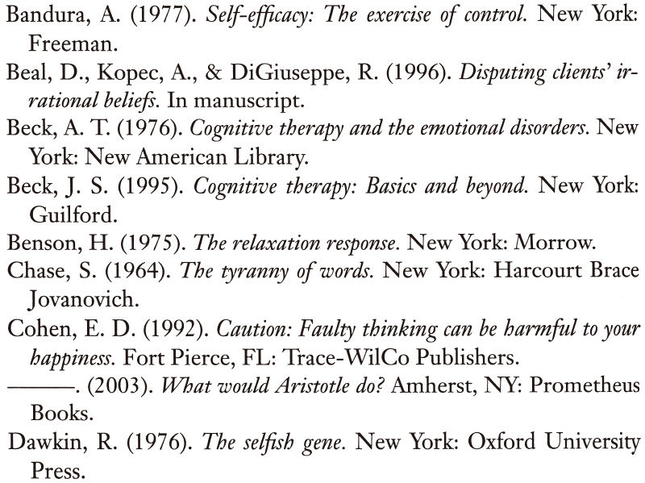

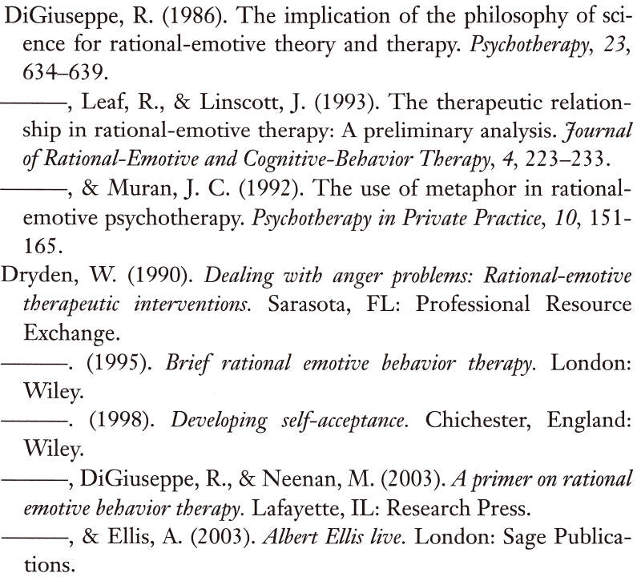

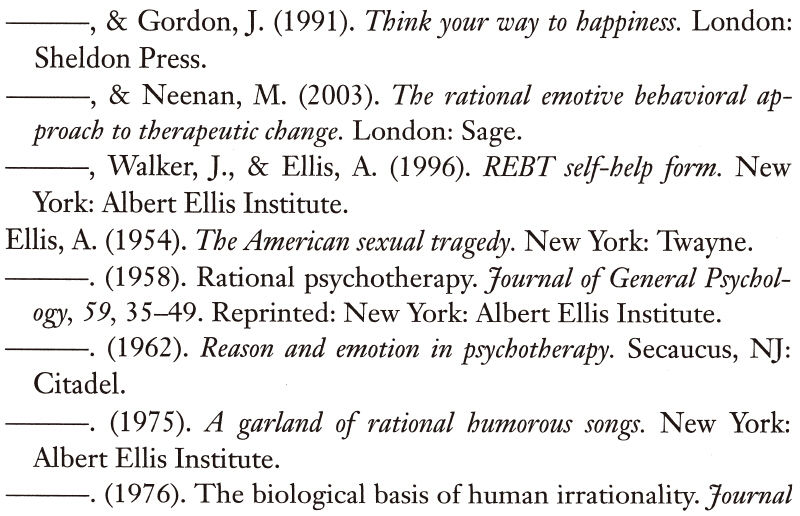

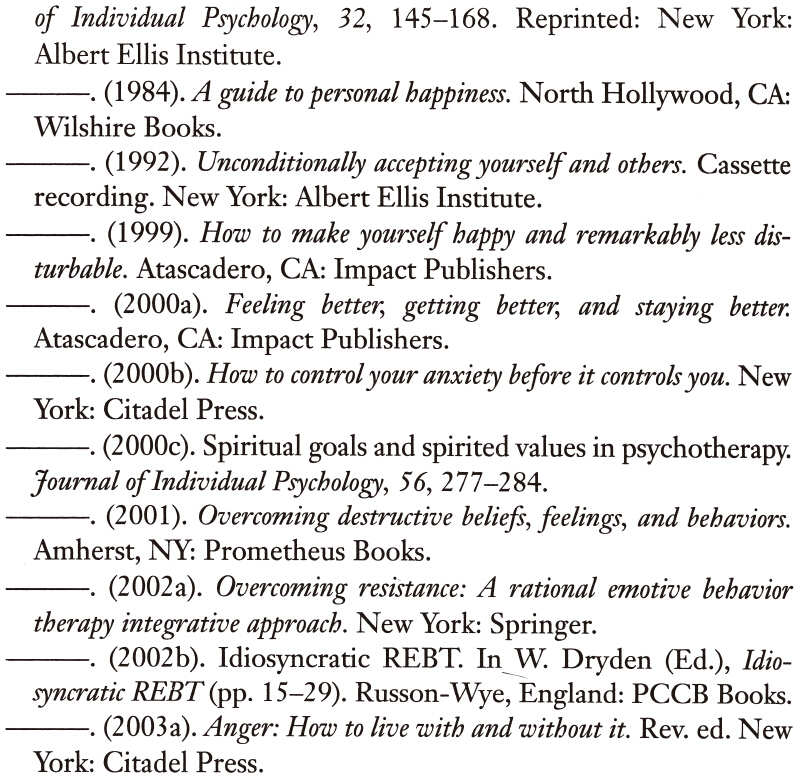

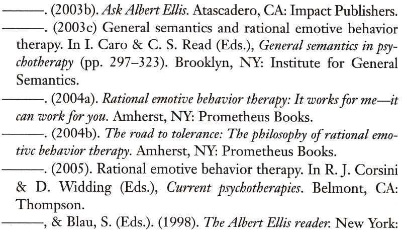

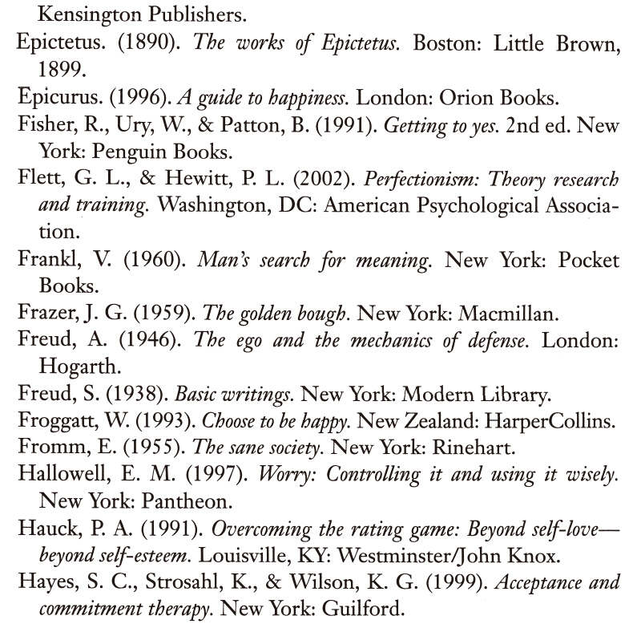

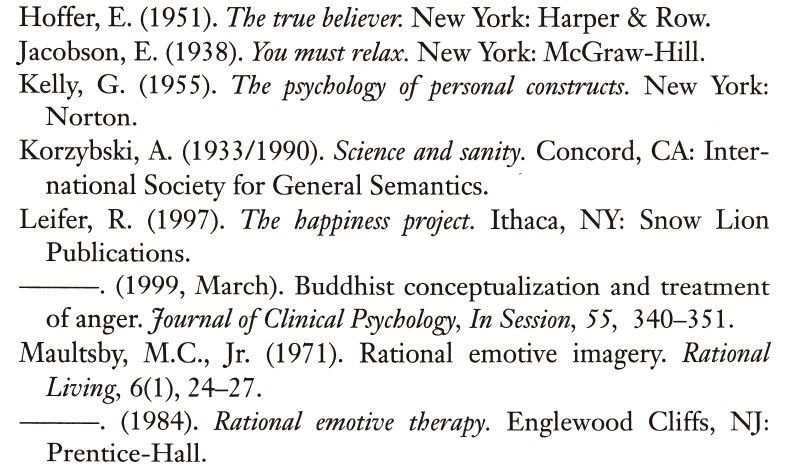

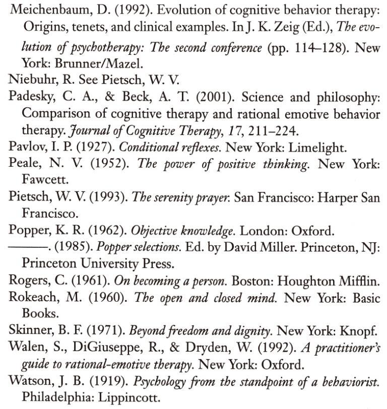

心理学大师·埃利斯经典作品

控制愤怒

How to Control Your Anger Before It Controls You

（美）阿尔伯特·埃利斯（Albert
Ellis）　（美）雷蒙德·奇普·塔夫瑞特（Raymond Chip Tafrate）　著

林旭文　译

ISBN：978-7-111-44877-8

本书纸版由机械工业出版社于2014年出版，电子版由华章分社（北京华章图文信息有限公司）全球范围内制作与发行。

版权所有，侵权必究

客服热线：+ 86-10-68995265

客服信箱：service@bbbvip.com

官方网址：www.bbbvip.com

新浪微博 @言商书局

腾讯微博 @bbb-vip

\

\

\

\

谨以此书献给挚爱的珍妮特和劳伦\

\

\

\

\

“困扰人们的不是事件本身，而是对事件的评判。”

——爱比克泰德，于公元1世纪

# 对话大师　李孟潮专访埃利斯

心理治疗流派层出不穷，但实际上真正受到承认的只有屈指可数的几种，这几种重要流派的开山宗师堪称凤毛麟角，阿尔伯特·埃利斯（Albert
Ellis）就是其中一位。

全世界学习心理治疗的人都会在教科书里找到这个名字，都知道他是理性情绪行为疗法（Rational
Emotive Behavior
Therapy，REBT）的创始人。如果你不知道的话，要当心自己的学业前途了。笔者曾有幸在埃利斯89岁那年采访到这位世界心理学巨匠，谈话内容在此分享给诸位读者。

李孟潮：您写过这么多书，年近九旬仍每周工作80小时以上，保持如此神奇精力的秘诀是什么？

埃利斯：我在89岁依然能有很多精力努力工作，第一个秘诀是遗传——我的母亲、父亲和哥哥都是精力充沛的人！第二个秘诀是，我对自己实行理性情绪行为疗法（以下皆依埃利斯原话简称为REBT），所以我坚决反对任何人扰乱我在做的任何事情，我也反对去扰乱别人的事情或这个世界上正在发生的任何事情。

李孟潮：想不到理性情绪行为疗法还能让人精力充沛。您的业余时间都做些什么呢？

埃利斯：实际上我几乎没有什么业余时间，当我有一点空闲时，我很喜欢听音乐和读书。

李孟潮：中国人总对别人的私生活感兴趣。也许美国人不太习惯——请问您结婚了没有？您的家庭是什么样的？

埃利斯：我结过两次婚，还和一位女士同居了36年，但现在我又是单身了。我很喜欢单身的生活。我没有孩子，但我和兄弟姐妹、父亲母亲相处得很融洽。

李孟潮：看来在您40岁前遇到过不少挫折。也换过不少职业，至少有作家、商人、心理咨询师这三个职业吧？现在回首往事，您认为这样的经历对您有什么意义吗？

埃利斯：我这一生中曾经至少转换过三个职业，这个事情仅仅意味着，在一段时间内，我会全神贯注于一项事业，然后由于各种原因我会改变，并且同样全神贯注于下一项事业。

李孟潮：您经历过很多刺激事件，您怎样处理这些事件呢？

埃利斯：我是这样处理我生活中的刺激事件的——并不要求这些刺激事件不要有刺激性，也不为这些事情感到焦虑或忧郁，因此我在处理这些事情时就能做到最好。

李孟潮：能用一句话介绍一下理性情绪行为疗法吗？

埃利斯：REBT还真不能用一句话来概括，但如果我来试试的话，我会这么说，REBT是这样一种理论，它认为人们并非被不利的事情搞得心烦意乱，而是被他们对这些事件的看法和观念搞得心烦意乱的，人们带着这些想法，或者产生健康的负性情绪，如悲哀、遗憾、迷惑和烦闷，或者产生不健康的负性情绪，如抑郁、暴怒、焦虑和自憎。

当人们按理性去思维、去行动时，他们就会是愉快的、行有成效的人。人的情绪伴随思维产生，情绪上的困扰是非理性的思维所造成。理性的信念会引起人们对事物适当、适度的情绪反应；而非理性的信念则会导致不适当的情绪和行为反应。当人们坚持某些非理性的信念，长期处于不良的情绪状态之中时，最终将会导致情绪障碍的产生。

非理性信念的特征有：①绝对化的要求。比如“我必须获得成功”“别人必须很好地对待我”“生活应该是很容易的”，等等。②过分概括化。即以某一件事或某几件事的结果来评价整个人。过分概括化就好像以一本书的封面来判定一本书的好坏一样。一个人的价值是不能以他是否聪明，是否取得了成就等来评价的，人的价值就在于他具有人性。他因此主张不要去评价整体的人，而应代之以评价人的行为、行动和表现，每一个人都应接受自己和他人是有可能犯错误的人类一员（无条件的自我接纳和接纳别人）。③糟糕至极。这是一种认为如果一件不好的事发生将是非常可怕、非常糟糕、是一场灾难的想法。非常不好的事情确实有可能发生，尽管有很多原因使我们希望不要发生这种事情，但没有任何理由说这些事情绝对不该发生。我们将努力去接受现实，在可能的情况下去改变这种状况，在不可能时学会在这种状况下生活下去。

理性情绪行为治疗的方法简单来说，就是让来访者意识到自己的非理性的思维模式，并与之辩论，从而达到“无条件的自我接纳”。

大部分心理治疗的流派会比较倾向于使用或认知、或行为、或情绪的方法，但是理性情绪行为疗法是一种比较独特的流派，它三种方法都使用，并清楚地认识到认知、行为、情绪是相互作用的。所以，我们以一种情绪和行为的模式使用认知技术，我们以一种认知和行为的模式使用情绪技术，我们以一种认知和情绪的模式使用行为技术。

李孟潮：哪一类的咨询者可以寻求REBT治疗师的帮助？

埃利斯：几乎每个人都可以，只要愿意持续地、充满情感地、坚强地去探索自己是如何使自己烦恼的，并愿意努力摆脱让自己烦恼的方式，REBT的治疗师都可以帮助他。

李孟潮：您在创立理性情绪行为疗法的时候一定面临了很大的压力，以当时的眼光来看，那是对弗洛伊德的背叛。直到前不久，您还说过根据您的标准来看，弗洛伊德还不够性感。能告诉我们这句话是什么意思吗？

埃利斯：我说弗洛伊德不够性感的意思是指，其实弗洛伊德的内心像个老处女一样，他把性行为的很多种形式都看作变态或异常的。一个真正的性心理治疗师会认为，只有极少数的性行为是不好的或不道德的，虽然在有些社会环境会坚持认为这些行为是异常的。

李孟潮：目前中国的心理治疗事业刚刚起步，如果中国的心理咨询师想要学习REBT，应该怎么办呢？需要什么样的条件和过程才能成为理性情绪行为治疗师呢？

埃利斯：成为REBT治疗师的条件和过程是，多读一些我写的书，听我的磁带和录像带。当然，最好就是直接参加我们的培训，我们每年都会在全世界举办很多次培训。

李孟潮：当前中国的心理治疗师面临的一个问题就是经济的问题。有些咨询者和部分治疗师认为，心理治疗应该是和商业活动无关的。也有的治疗师认为，心理治疗中蕴含着无穷的商机。您看起来是一个很特殊的治疗师，既具有很大的名声，又具有很多通过REBT赚钱的途径。您对赚钱和无私地帮助别人之间的冲突是怎么看的？

埃利斯：实际上我并没有通过REBT赚到什么钱，因为我所做的一切都是为了阿尔伯特·埃利斯研究所，这是一个非营利机构。我的书的版税和其他的收入都直接归到研究所，而不是我个人。对钱的强烈欲望时常让人们做更多自私的事，也阻止人们做到REBT所说的“无条件的接纳别人”，可我不是这样的。

李孟潮：您怎么看中国文化？其中有和REBT相似的地方吗？

埃利斯：我认为中国文化有些地方和REBT是相似的，因为佛教的一个主要观点就是承认这个世界和生活中一直都有痛苦存在，人们没必要喜欢这些痛苦，但可以建设性地接受，从而不让自己烦恼，能够更好地处理问题。

李孟潮：对今天的中国您有什么想要了解的？

埃利斯：我对今天的中国了解很少，如果有时间的话，我想更多地了解中国。

李孟潮：作为89岁的老人，回首人生，您认为在生命中什么是最重要的？

埃利斯：我生命中最重要的事就是对自己使用美国式的REBT并总是接纳我自己，虽然我也尝试着改变我做的很多事情。

李孟潮：一个大问题，也可能是一个愚蠢的问题，您对生活的态度是什么？

埃利斯：我对生活的态度是，我们不是被邀请到这个世界上来的，生活本身并没有意义，而是我们给了它意义。我们赋予生活意义的方法是，决定什么是我们喜欢的，什么是我们不喜欢的，什么是我们特殊的目标和目的，从而为我们自己选择了意义。

李孟潮：我的采访就快结束了，您想对中国的青年说些什么？

埃利斯：我想对中国青年说的是，他们很年轻，如果这个世界有不幸的事情发生——这是屡见不鲜的，他们有足够的时间，建设性地使用REBT或其他类似的思考方式来努力不让自己烦恼。

# 阿尔伯特·埃利斯简介

阿尔伯特·埃利斯（Albert
Ellis，1913—2007），超越弗洛伊德的著名心理学家，理性情绪行为疗法之父，认知行为疗法的鼻祖。在美国和加拿大，他被公认为十大最具影响力的应用心理学家第二名（卡尔·罗杰斯第一，弗洛伊德第三）。

埃利斯创立了对咨询和治疗领域影响极大的理性情绪行为疗法（Rational Emotive
Behavior
Therapy，REBT），为现代认知行为疗法的发展奠定了基础。该疗法适用范围广、实用性强、见效快，为中国心理咨询师最常用的方法，是中国心理咨询师国家资格考试必考的疗法之一。

埃利斯自哥伦比亚大学获得临床心理学博士学位，投身心理治疗工作60余年，治愈了15000多名饱受各种情绪困扰的人，并在纽约创立阿尔伯特·埃利斯理性情绪行为疗法学院。

埃利斯是精力充沛而多产的人，也是心理咨询与治疗领域内著作最丰富的作者之一。多个核心心理咨询期刊都曾刊登过埃利斯的文章，他的文章刊登次数堪称心理咨询领域之最。他一生出版了70多本书籍，其中有许多都成为长年畅销的经典，有几本著作销售量高达几百万册。

2003年，当他90岁生日的那天，他收到了多位公众知名人物的贺电，其中包括美国前总统乔治·布什、比尔·克林顿，前国务卿希拉里·克林顿。

在2007年的《今日心理学》杂志上，他被誉为“活着的最伟大的心理学家”。

他是史上最长寿的心理学家，2007年安然辞世，享年93岁，被美国媒体尊称为“心理学巨匠”。

生平

1913年9月27日，阿尔伯特·埃利斯出生在美国匹兹堡的一个犹太人家庭，是3个孩子中的长子。

4岁时，埃利斯全家移居纽约市。

5岁时，埃利斯因肾炎住院，因此不能再从事他所热爱的体育运动，从而开始热爱读书。

12岁时，埃利斯父母离婚了。他的父亲长年在外经商，对自己少有关爱，母亲同样感情冷漠，喜欢说话，却从不倾听，父母关系向来很差。曲折的经历让他对人的心理活动充满兴趣，小学时就已经是个很能解决麻烦的人了。

进入中学以后，埃利斯的目标是成为美国伟大的小说家。为了这个目标，他打算大学毕业后做一名会计师，30岁之前退休，然后开始没有经济压力地写作，因此他进入了纽约市立大学商学院。经济大萧条来了，击碎了他的梦想。他仍然坚持读完大学，获得了学位。

大学毕业后，埃利斯开始做生意，生意不好不坏。这时埃利斯对文学还是痴心不改，他把大多数时间都用来写纯文学作品。

28岁时，他已写了一大堆作品，可都没有发表。这时他意识到自己的未来不能靠写小说生活，于是开始专门写一些非文学类的杂文，并加入了当时的“性–家庭革命”。这时他发现很多朋友都把他当作这方面的专家，并向他寻求帮助。此时，埃利斯才发觉原来他像喜欢文学一样喜欢心理咨询。

1942年，埃利斯开始攻读哥伦比亚大学临床心理学硕士学位，主要接受精神分析学派的训练。

1943年6月，埃利斯获得哥伦比亚大学临床心理学硕士学位。

1947年，埃利斯获得临床心理学博士学位。如同当时大部分心理学家，这时候的埃利斯是个坚定的精神分析信徒，下决心要成为著名的精神分析师。

20世纪40年代后期，埃利斯已经在当地的精神分析界小有名气，他在哥伦比亚大学做教授，还先后在纽约市以及新泽西州的几所机构内身居要职。可就在此时，埃利斯开始对自己钟爱的精神分析事业产生了怀疑。

1953年1月，埃利斯彻底与精神分析分道扬镳，开始将自己称为理性临床医生，提倡一种更积极的新的心理疗法。

1955年，他将自己的新方法命名为理性疗法（Rational
Therapy，RT）。这种疗法要求临床医生帮助咨询者理解，自己的个人哲学（包括信仰）导致了自己的情感痛苦。例如“我必须完美”或“我必须被每个人所爱”。

1961年，该疗法改名为理性情绪疗法（Rational Emotive Therapy，RET）

1993年，埃利斯又将该疗法更改为理性情绪行为疗法（Rational Emotive
Behavior
Therapy，REBT）。因为他认为理性情绪疗法会误导人们以为此疗法不重视行为概念，其实埃利斯初创此疗法时就强调认知、行为、情绪的关联性，而且治疗的过程和所使用的技术都包含认知、行为和情绪三方面。

2004年，埃利斯罹患严重的肠炎。

2007年7月24日，埃利斯自然死亡，享年93岁。

# 前言　你能平静地应付愤怒情绪吗

愤怒给人类生活带来的毁灭性影响随处可见。在电视、报纸报道的各类暴行中，愤怒都起了一定作用。愤怒还会给你的生活带来灾难性的后果。如果对愤怒情绪放任自流，它会毁坏你最亲密的人际关系，损害你的身心健康。

愤怒是最具破坏力的情绪之一，同时也最让人困惑，最不受重视，这点成了心理治疗的一大悖论。

很多书本和杂志都在谈论应付愤怒情绪的方法，却没有提出行之有效的建议，一些建议甚至互相矛盾！有些建议你在受到不公正对待时，采取消极的、不反抗的态度，多半认为这样才能显示出你具有真正的自控力。但是，消极的态度通常会导致更多的不公平。更糟的是，甚至会使不公平的程度升级。

另一些书则建议你大胆地表达愤怒情绪，尽情宣泄，真实地展现自己愤怒的一面，认为这样做能够制住对手。

也许这招行得通。但是，爱生爱，恨则带来报复。你尽管试试！

这两种方法都不可靠，有什么好的解决办法吗？应该小心翼翼地遏制怒火，还是随随便便地发泄怒气？这确实是个问题！

有什么解决办法？2000年前，著名的斯多葛派哲学家爱比克泰德（Epictetus）指出，面对他人令人讨厌的、不公正的行为，你会产生过激反应，其实你不必如此。像爱比克泰德一样，你可以明智地选择其他反应方式，这是理性情绪行为疗法（REBT）的一大原则。理性情绪行为疗法吸收了古代欧亚几位先哲的智慧，并结合现代心理治疗方法，可以在很大程度上遏制让自我挫败的愤怒反应，使我们不至于歇斯底里地生活在一个不公正的、困难重重的社会。

你做得到吗？当然能做到。你肯定能够在很大程度上改变自己接受并处理愤怒的方式。通过努力，你能够学会控制愤怒情绪。这本书的两位作者，在其职业生涯中花了很多时间来了解、帮助那些遭受严重愤怒情绪困扰的人。在这本书中，我们将与你分享一些控制愤怒的方法，这些方法对经我们诊治的多数来访者很有效。

20多年前，这本书的第1版出版后，我得到了很多读者的支持。这些读者运用理性情绪疗法控制愤怒情绪，受益颇多。这个版本新增了几个章节的内容，对原有的内容也有所改动。这些新增及改动的内容反映了愤怒研究领域获得的令人振奋的进展。尽管如此，第1版中很多基本准则至今仍然行之有效。在这个修订版中，我与合作者雷蒙德·奇普·塔夫瑞特将再次详述，你是如何有意识或无意识地诉诸绝对的、命令的思维方式，从而形成关于愤怒的一套理论。我们还会告诉你，如何通过改变愤怒的想法、感觉和行为，最大限度地减轻愤怒情绪，从而让你的生活更快乐、更富成效。

阿尔伯特·埃利斯

# 第1章　愤怒情绪的惨重代价

你可能是因为自己或自己关心的人受愤怒情绪困扰，所以读这本书。在论述如何应付愤怒情绪之前，先谈谈愤怒的惨重代价。

愤怒是人的真实感受，为什么你以及你关心的人需要摆脱这种感觉呢？当然，没有法律规定你必须这么做。但是，出于某些重要的原因，你最好这么做。

## 愤怒会破坏亲密的人际关系

愤怒最常见也可能是最糟糕的一个后果就是破坏人际关系，而且往往是最亲密的人际关系。也许你的想法和很多人一样，认为愤怒情绪针对的主要是我们不喜欢的人。错了！最近，由霍夫斯特拉大学的卡西诺夫（Kassinove）及其同事，以及马萨诸塞大学的艾夫里尔（Averill）做的几项研究表明：我们生气的对象往往是熟悉的人。最常见的生气对象有伴侣、孩子、同事和朋友。下面的例子可以证明这一点。

杰夫在将近60岁时开始治疗，试图控制暴躁的脾气。杰夫与他的两个成年子女脱离了关系。他说，他妻子受够了他暴戾的脾气与强烈的控制欲，几年前与他离婚了。他与子女的关系，即使在还有联系的时候也很紧张。有一次，他去看望女儿，与女婿发生争执，两人吵得很厉害，最后他打了女婿一拳。从那以后，他的两个孩子都不再理他。回想起这些，杰夫悲哀地认识到，愤怒已经使他失去了最亲的家人。

南希寻求帮助时26岁，当时她与男朋友弗雷德已经一起生活了2年。他们本来计划结婚，但是南希暴躁的脾气破坏了两人的关系。南希说，弗雷德与其他女人工作接触多一些，她就会妒忌、生气，还时常抱怨弗雷德不够关心她。尽管没有证据证明弗雷德与任何一个女同事有情感纠葛，但南希还是要找茬。她的脾气会间歇性地发作，以各种可怕的罪名指责弗雷德，甚至大喊大叫，把东西扔得满屋子都是。弗雷德最后受够了她的坏脾气，解除了婚约并搬走了。

上述两个例子貌似有点极端，其实并不少见。像杰夫这样的人与他人关系不好时，总是将责任推到别人身上。一旦出现纷争，他们不会妥协或改变自己，直到某些关系破裂时，他们才为自己的愤怒情绪承担一些责任，真正认识到愤怒带来的惨重代价。很多人认识不到他们的愤怒使他们失去朋友，使别人不愿意搭理他们。等他们认识到这点的时候，已经太迟了！

南希的情况有点不同：失去一个重要的人际关系就足以让她明白，她在控制愤怒方面有问题。但是开始的时候，她还是将责任推到前男友身上。她的理由是，既然她感到受伤、生气，那么必定是弗雷德做错了。直到她承认自己缺乏情绪管理能力，才有所改进。

想想你自己的生活，愤怒情绪是否曾经破坏了你一些重要的人际关系？你是否经常将自己的愤怒情绪归咎于他人？如果你还是不改变这种思维方式，几年后你将处于怎样一种境地？不再愤怒，以更多的包容和变通处理亲密的人际关系。做到这点，会让你长久受益。

## 愤怒会破坏工作中的人际关系

我们得承认，工作经常让人泄气。苛刻的老板、嫉妒的同事、坏脾气的顾客、最后期限的限定，以及各种不公平的事情，所有这些都在考验你的耐性。但是，对挫折感到愤怒只会让你更沮丧。第一，愤怒会毁坏你工作中的人际关系，妨碍你成功。第二，愤怒使你不能专注于重要的事情，不能充分展现你的工作能力。

与他人关系融洽有助于你在工作上取得成功，这点甚至与你做某项工作的能力一样重要。如果你脾气暴躁，同事和上司都不会喜欢与你共事。他们会将你看作一个难应付的家伙，希望尽快从你身边逃离。美国北卡罗来纳州创意领导中心的一项研究表明，企业高层在承受压力的情况下，不能控制愤怒是失去升迁机会、遭到解雇或劝退的主要因素。

这种情况不仅限于企业高层！不管你做何种工作，不管你的级别是高是低，愤怒都会给你带来破坏性的后果。让我们看看下面两个不同的例子。

杰里是一个建筑工人，因为害怕自己无法控制愤怒情绪而失去工作，才开始接受治疗。杰里完全有能力做好自己的工作，但他身材矮小，同事经常拿他的身高开玩笑。他觉得受了侮辱，很生气，而他的反应却引来更多的嘲笑。一次，他在盛怒之下扬言要打一个同事。结果杰里被停职，并被告知，下次再控制不住脾气会被解雇。

幸运的是，杰里运用理性情绪行为疗法控制自己的愤怒，有效地应付同事的嘲弄。下面再看一个例子。

霍华德经营着一家小会计公司，公司职员只有一个行政助理。由于公司业务进展得不顺利，霍华德感到很沮丧，尤其让他头疼的是，过去一年时间，走了5个行政助理。结果重要的工作无法完成，而他要不停地培训新人。霍华德对任何挫折的反应都很激烈：大喊大叫，拍桌子，有几次甚至摔电话。他可笑地认为自己有权生气，因为这是他的公司，是他付给助理工资。经过几期的理性情绪行为治疗，霍华德开始认识到是自己的坏脾气赶走了助理，让他付出了很高的代价。

这两个例子说明，无法控制愤怒情绪会破坏重要的工作关系。杰里需要同事和上司的支持才能保住工作，才有可能升职。霍华德错误地认为：因为自己是老板，他的手下就必须忍受他的坏脾气。

事业成功的一个关键就是，不管工作中遇到什么挫折，都要管理好自己的情绪。发泄怒气可能让你感觉很痛快，但对你的生意伙伴和同事来说，却未必如此。

愤怒还会将你的精力和注意力从工作上转移开。在愤怒情绪的支配下，你老是会想一些“不公平”的事情，在脑子里一遍遍徒劳地琢磨；或者想方设法报复同事或上司；或者搞点小破坏；拒绝听从理性的劝告；不去处理重要的事情，任其朝坏的方向发展；甚至费尽心思去破坏别人的工作。

当你专注于某个对你“不公正”的人，或谋划着如何报复时，怎么能够富有成效地解决矛盾，怎么能够完成高质量的工作呢？这种做法对你非常不利！你周围的人终有一天会察觉到你的愤怒。看看简的例子。

简接受治疗，是因为她老琢磨为什么自己不能升职。简在公司做了5年多，希望升到经理的职位，但一直不能如愿，她感到很伤心，很愤怒。她越是这样想，就越是生气。在老板面前，简掩饰自己的愤怒，但她的工作热情减退了，工作业绩也下降了，几个工作项目也不能及时跟进。这种状况持续了一个月，她的老板把她叫到办公室，说了他的担心，并告诉她，之所以没有提拔她，是因为财政预算的问题，跟她的工作表现没有关系。老板还让她放心，下一批升职人员名单中有她的名字，但如果她不能恢复工作效率，公司就要将升职机会给别人了。

简花了过多的时间和精力在心里生老板的气，以致她没有好好想想，没有升职是否存在其他原因。她的行为使她获得升职的机会变小了，结果就是她差点就失去了升职机会。

当然，有时候你会发现自己在工作中确实受到不公平的对待，没有得到应有的回报。但是生气或是冲动地“逃离”，会让人觉得你经受不起挫折，下次再出现棘手的事情，你还是会愤怒。较好的解决办法是减轻愤怒情绪，尽力改进不利状况。如果这样还是行不通，你可以平静地离开，寻找一份更值得你去做的工作。

## 愤怒让情况变得更糟

除了上面所说的情况，难道愤怒不能带来任何好处吗？愤怒是否有助于你面对困难的处境？面对逆境，愤怒是否能够给你力量，让你觉得可以掌控局面？为了坚持自己的权利，让别人理解自己的想法，表达愤怒情绪不是必须的吗？问得好。处理困难的情况时，愤怒情绪到底会提高效率还是降低效率？关于这点，心理学研究还没有得出明确结论。事实上，很少有研究者会关注这个问题。然而很多人，包括一些治疗师和知名作家，总喜欢贸然下结论：遇到不公平的事情，你一定会感到愤怒。

两千多年前，亚洲、希腊、罗马的一些哲人的观点却有些不同。斯多葛派（Stoic）哲学家塞内卡（Seneca）在一篇最早论述愤怒的文章中，形容愤怒是“所有情绪中最令人憎恶的、最狂暴的”。斯多葛派哲学家认为，愤怒影响人们进行理性思考。

在众多受愤怒情绪困扰的来访者中，有不少人很聪明，在他们不发火的时候，完全有能力解决冲突和困难。当他们平静下来后，能够冷静地分析各种处理麻烦事情的方法。

想想自己最近一次发火在什么时候，当时你专注于什么事情，做了什么。你能够理性地考虑问题吗？你能够想到所有可供选择的方法吗？你选择的方法是最好的吗？你是否为自己说过的话或做过的事情后悔？如果你和多数人一样，你就会发现，在愤怒的时候，你的想法和行为不大可能是最佳的。

再观察一下其他人生气时的行为。看看你的亲戚、朋友、同事，或者干脆打开电视，新闻广播和脱口秀节目到处都有愤怒的例子。在一次棘手的采访过程中，失去理智会有效果吗？愤怒会使辩论者更有条理地表述观点吗？

但是，你可能会问，面对不公平或不公正的情况，该怎么办？为争取大规模的社会改革（如平等权）而斗争时，该怎么办？在这些情况下，表达愤怒情绪难道不是合适且有效的方式吗？

在某些情况下，愤怒可能会有用，但却很少能带来合理的变化。像马丁·路德·金、圣雄甘地等人都狂热地忠实于自己的理想，同时又非常自律、头脑清醒。他们的行动能产生实际效果，主要靠的是理性，不是愤怒。

生活是艰难的，充满挑战，总是免不了斗争。愤怒是人的一种正常情绪，但不是解决问题的有用方式。好好想想，再判断愤怒情绪对你有益还是有害。

## 愤怒引发攻击行为

控制愤怒的另一个原因是，愤怒很容易导致攻击行为。现实生活中不是有暴力行为吗？屏幕上以及新闻报道中不是也有各类暴行吗？在工业化国家的文化中，美国文化不是最暴力的吗？

联邦调查局最近统计，在美国每17秒发生一次暴力犯罪（据美国司法部报告）。暴力行为在美国年轻人中尤为普遍。目前，凶杀是导致15～24岁人群死亡的第二大原因，暴力成了最重要的公共健康问题之一（据美国人口调查局报告）。

家庭暴力也是如此。据估计，在美国每年有150万女性遭受生活伴侣的虐待。美国每年约有40%被谋杀的女性是被她们的丈夫杀死的。同时，也存在女性实施暴力行为的情况。最近一项研究表明，女性攻击男性的情况越来越常见。然而做这种比较要谨慎，因为男性攻击女性产生的后果更为严重。

家庭暴力给儿童也带来恶劣的影响。一份政府报告指出，在美国，每年约有14万儿童遭受虐待，至少有2000名儿童（相当于每天有超过5名儿童）死于父母或看管人之手（美国儿童虐待与忽视咨询委员会报告）。

虽然愤怒情绪并不一定导致攻击行为，但愤怒经常会产生这样的后果。正如一位研究者所说：“愤怒就像是建筑师的蓝图。光靠蓝图不能建起一座大楼，但有了蓝图，建造大楼就容易多了。”

下面是两个因愤怒导致攻击行为的例子。

里奇，37岁，在因殴打他人被捕后开始进行心理治疗。他的妻子一直抱怨他在开车过程中的攻击行为。一次，一位司机在红绿灯处忽然变道，将车停在里奇的车前面，差点造成交通事故。里奇非常生气，紧追着那辆车，到下一个红绿灯下车，与那位司机吵了起来。里奇一拳打在那人脸上，之后就离开了。一位目击者告诉警察里奇的车牌号，后来里奇被抓了。这次事件后，里奇的妻子坚持要他寻求帮助，进行治疗。治疗时，里奇说自己一个月至少有一次在开车时发怒，与其他司机争吵、打架，只不过这是他第一次被捕。

雪莉，30岁出头，她来寻求帮助，是因为她不停地冲她的3个小孩大吼大叫。她说她的孩子们总是让她很恼火，她没有一分钟时间是属于她自己的，而她丈夫几乎帮不了什么忙。她时常发怒，情况变得越来越糟糕，甚至会摔房间里的东西。她担心自己的行为对孩子的心理造成伤害，同时也害怕自己失去控制，对孩子造成身体伤害。

像里奇和雪莉一样，很多人来寻求帮助都是因为害怕自己的愤怒会导致暴力行为。攻击行为造成的后果包括：人际关系破裂，失去工作，生理上的伤害，损坏财物，引起法律纠纷，被判监禁，犯罪感和令人难堪。

回想一下你最近一次的攻击行为是在什么时候。想想每次发生攻击行为时，你是否损坏财物，大吼大叫，推人，扇人耳光或用拳头打人。老实说，难道你不是在愤怒情绪的支配下这么做的吗？即使是偶尔的暴力行为，都要付出惨重的代价。如果你经常发怒，结果会如何？等着瞧吧！

## 愤怒可能引发心脏病

也许你会想：“我很健康，这一节的内容对我不适用。”不要过于肯定！30多年的研究发现，愤怒与心脏病有诸多关联。在美国，目前心脏病是导致死亡的主要原因。就算你的愤怒情绪还没有造成严重的健康问题，但它的破坏效果可能已经在起作用了。

为了了解愤怒如何损害身体健康，先分析愤怒的目的与功能。很多研究者将愤怒视作一种情绪系统。这一系统激励我们，使我们做好准备，反抗潜在的威胁；帮助我们调动资源，应付冲突。这一应急反应模式在20世纪初由生理学家沃尔特·坎农（Walter
Cannon）提出，坎农发明了术语“战斗或逃跑”反应（"fight or
flight"response）。逃跑反应是因焦虑而逃离危险，战斗反应更多是出于愤怒，保护自己免受威胁。

当你感到气愤并启动应急反应时，身体会发生什么变化？肌肉紧张，心跳、呼吸及代谢加快，这些生理变化使你的身体做好行动的准备。同时，血液中的肾上腺素增多，肌肉血流量增多。所以，生气时会很想去攻击惹你发怒的对象，这点毫不奇怪，因为你的身体已经做好了行动的准备。

愤怒有助于你勇敢面对危及生命的攻击者，或某些紧急状况。但是对日常生活中的某些挫败，没必要采取这种方式。事实上，如果你不停地启动愤怒系统，会对身体造成严重损害。

斯坦福大学的生物学和神经学教授罗伯特·萨波尔斯基（Robert
Sapolsky）指出，如果我们经常生气，生理不断发生变化，会损害心血管系统。生气时由于血压突然升高，血液流经动脉的力度加强。血流冲击使光滑的动脉血管壁受到磨损，产生凹痕。这层组织一旦遭到破坏，脂肪酸、葡萄糖及血液中的其他物质就会黏在损坏的血管壁上。经过长时间的积累，最后导致动脉阻塞，反过来使血流量减少。这就是所谓的动脉粥样硬化（atherosclerosis）。这种动脉斑块沉积影响到心脏，可能导致冠心病、心肌缺血或其他严重的心脏病。

从20世纪60年代早期以来的很多研究都表明，愤怒情绪与心脏病有关联。对这种研究做全面回顾超出本书的论述范围。总体而言，大部分研究分两大类。一类称为横断研究（cross-sectional
research），要求几组心脏病来访者报告平时愤怒的频率和强度。将他们的反应与一组没有患心脏病的人（称为控制组被试）作对比。在众多这类研究中，冠心病来访者愤怒的程度远远高于没有心脏病的人。这说明，容易发怒的人更可能得心脏病。

另一类称为前瞻性研究（prospective
studies）。这类研究更加凸显了愤怒情绪与心脏病的因果关系，先记录一大群健康的人在日常生活中产生愤怒情绪的不同程度，然后对这群人做长时间（20年，甚至超过20年）的追踪研究，最后检测这群人是否患有心脏病。将这些人愤怒的程度与后来的健康状况做比对。大多数这类研究都表明，愤怒程度高的人很可能会患动脉粥样硬化。

例如，有一个研究对255位医科学生做了性格的测试，接着做了25年的追踪研究，最后发现，愤怒程度得分高的人患上冠心病的几率是得分低的人的4～5倍。另一个类似的研究以律师为对象，最后发现，愤怒程度得分在前1/4的人里面，有近1/5的人在50岁之前就去世了。愤怒得分在后1/4的人里面，只有1/25的人在50岁之前去世。

你生气的时间有多久？你患上高血压或心脏病的概率高吗？如果长时间有愤怒情绪，今后患上严重疾病的概率会增大。下次生气时，注意一下身体的一些生理感觉和变化，记住长期愤怒带来的生理反应会导致伤害、疾病，甚至可能导致过早死亡。

## 愤怒带来精神痛苦

愤怒引起的很多后果很严重，容易被发现，但是有些后果可能并不那么明显，包括严重的情感痛苦，如抑郁、内疚、窘迫、失控感，以及与人交往时缺乏自信。你是否有上述感觉，你的挫折容忍力是否很低，是否很轻易就会发怒？

如前所述，时常发怒会使你失去工作和一些重要的人际关系。当你因愤怒而遭受损失时，很容易会责怪自己，变得心情沮丧。有时候你会同时受愤怒与抑郁情绪的折磨。你可能会埋怨其他的人和事情，让自己生气；同时责怪自己，因而产生抑郁情绪。斯泰茜的情况就是如此。

斯泰茜快40岁了，有3个小孩。她在治疗时说自己感到伤心、孤单，还抱怨身边的人不支持她。她承认自己不甘心做一个家庭主妇。事实上，不能追求自己的梦想让她感到很恼火。她的丈夫整天忙着工作，没有时间陪她。她的父母就住在附近，但他们更喜欢待在另一个女儿家。另外，斯泰茜的好朋友也寥寥无几。

斯泰茜的情况令人感兴趣的一点在于，她的主要问题是愤怒情绪，而不是抑郁情绪。她情绪低落，对人也不友善，这让其他人很难接近她。有时候她会因自己的困境而去埋怨他人，如她的丈夫、孩子、父母，然后感到极为愤怒。她确实想亲近别人，但她的愤怒使别人远离她。

有时候，斯泰茜也会自责，认为孤独是自己造成的。她觉得自己没有朋友，也无法实现理想。她感到伤心、沮丧。于是，斯泰茜时而愤怒，时而抑郁。不幸的是，这两种困扰她的情绪都不能使她过上想要的生活。事实上，她的愤怒使她失去亲密的人际关系，让她感到更加孤独、沮丧。

如果你因自己的愤怒而感到抑郁，那就平息你的怒气，集中精神，努力改变生活中不如意的事情。

时常愤怒带来的不仅是抑郁情绪，还有内疚与窘迫。对生气时说的话或做的事，你会感到尴尬，因而责怪自己，避开那些让你烦恼的人。鲍勃的情况就是如此。

鲍勃很长时间以来一直受愤怒情绪困扰。他曾因商品价格问题，在超市与一位店长打了起来。那位店长的年纪比鲍勃小很多，因此鲍勃认为自己应该受到尊重。当他发现事情并不是他想的那样时，他很生气，不停咒骂、威胁店长。后来警察来了，鲍勃更加生气，最后被制服，戴着手铐被带走了。尽管后来撤销了对他的指控，但鲍勃还是避开这家超市以及那些知道这件事的人，因为他觉得那天自己的行为很丢人。

这个例子有些极端，但说明了一点：对自己的愤怒感到内疚与尴尬，会使你避免与他人打交道。这样会妨碍人际关系，阻碍个人发展。

愤怒还会让你失去控制。生气时，心跳加快，脸上发热，各种想法在你脑子里乱转，血压飙升，肾上腺素分泌加快，这时你很难做出理性的行为。你需要努力控制自己的行为。你的愤怒让你很不舒服，而且它时刻在提醒你：你不能很好地应付生活中出现的问题。

迈克从29岁开始治疗。他说自己是个“反应狂”（react-a-holic），经常控制不住自己，攻击别人。从高中时候起，他就已经失去一些重要的人际关系，因攻击别人被捕过一次，由于暴躁脾气被解雇了好多次。鲍勃开始进行理性情绪行为治疗时，已经结婚3年了，而且刚刚生了一个儿子。儿子的出生使他下定决心，寻求帮助。他希望可以更好地控制自己的情绪，因为他不想在孩子面前发火。

你是否也像迈克一样，担心自己生气时会有过分的举动？你是否害怕自己失去控制而做出毁灭性的行为？失控感是一个信号，提醒你是时候寻求帮助了。

愤怒还会让你在与人打交道时失去自信。如果愤怒时常给你带来不好的结果，你很快就会开始怀疑自己的判断。你不再有决断力，担心自己一生气，行为会很离谱；不知道如何处理生活中的困难。学会面对困难时管理好自己的情绪，对你肯定有所帮助。

平息愤怒情绪并不意味着要牺牲梦想和愿望。恰恰相反！最大限度地减轻愤怒，能够使你更自信，更有决断力，从而有更多机会得到你想要的东西。

有不少愤怒的后果非常严重，很容易被其他人注意到，但是有些后果是私人体验，如感到窘迫、失去控制、感到困惑、缺乏自信。由于愤怒会带来不利后果，你会因自己的愤怒而感到抑郁、内疚。为一种情绪付出的代价是三种糟糕的情绪！

## 你正遭受愤怒带来的损失吗

这一章的某些内容对你来说是不是很熟悉？愤怒能帮你得到想要的东西吗？发泄愤怒所得到的快乐与所付出的代价相比，值得吗？如果你没有遭受上述损失，记住一点：不是所有的后果都会马上被察觉，有些严重后果可能要经过几年的时间才被发现。如果你曾经遭受过或者正在承受愤怒带来的挫折，是时候想办法解决问题了。

改变通常很困难。这本书提到的方法和技巧，不是为你遇到的问题提供一个快捷的办法。这些技术和方法需要你有一个开放的心灵，通过不断实践，为战胜愤怒情绪不懈努力。这样的话，要改变就容易多了。

少一些愤怒情绪，好好生活，这可能是你做的最重要的决定。你说呢？

# 第2章　应付愤怒情绪的五大误区

你肯定听过不少应付愤怒情绪的“常识性”建议。通俗杂志以及电视、电台的脱口秀节目主持人每天都告诉你很多方法，试图让你的生活远离愤怒和怨恨。不幸的是，这些方法多数行不通。

如果你向5位治疗心理健康的专业人士咨询应付愤怒情绪的最佳办法，很可能会得到5种不同的答案。一些“专家”会告诉你，让你感到愤怒的根源在于你的过去，是过去的创伤和不公正让你变得没有安全感，充满愤怒。解决愤怒问题的唯一办法是回溯过去，治愈旧的创伤，纠正不公正的事情。而另外一些人可能会告诉你，过去根本不算什么。如果你换个工作，或改善人际关系，或改变让你烦恼的处境，你肯定会过得快乐健康，没有那么多怒气。

还有些看法互相矛盾。一些专业人士建议你忍住怒气，尽量避免与麻烦的人产生冲突；或者先从困难的处境中撤离，等冷静下来再处理问题。与此相反，另外一些专业人士鼓励你任何时候一有愤怒情绪，就马上发泄出来。你可以直接冲那些惹你生气的讨厌的家伙发火；或者私底下大喊大叫、捶打枕头、做运动，通过这些间接的方式发泄怒气。

各种错误信念盛行。为什么会出现这种情况？因为缺乏对愤怒的原因和解决方法的科学研究。精神病专家艾伦·罗滕伯格（Allen
Rothenberg）说：“一直以来，愤怒问题都没有被当作一个值得研究的独立课题……这种状况不仅剥夺了愤怒在研究人类行为方面的重要性，而且产生了一大堆令人困惑的定义、错误的概念，以及过分简单化的理论。”

下面是应付愤怒和不满情绪的五大常见误区。要想了解愤怒的本质，就要质疑并挑战这些错误的信念。

## 误区之一：通过发泄方式来减轻愤怒

那种认为通过发泄方式可以减轻愤怒的观点，源自弗洛伊德式思维。根据弗洛伊德（Freud）和威廉·赖希（Wilhelm
Reich）的情绪液压模式理论，愤怒情绪经过一段时间的积累，会聚集形成负面能量。如果郁积的愤怒没有被表达或释放出来，会导致疾病和情绪困扰。持这种观点的治疗师会鼓励你发泄愤怒情绪，由此释放积累起来的紧张感。他们认为，让讨厌的人离远点或其他发泄行为，可以防止你的攻击性情绪聚积到有害的程度。

这种观点有两大错误。第一，认为表达愤怒可以减轻愤怒对健康的影响。第二，发泄怨恨情绪会让你没那么生气。

第1章已经论述过，很多证据表明，长期愤怒是患心脏病的危险因素。有些研究表明，压制愤怒会引起疾病。但是发泄愤怒真的比不发泄好很多吗？

当然不是！根据马里兰大学的心理学家及愤怒研究者艾伦·西格曼博士（Dr.Aaron
Siegman）的说法，发泄愤怒是患心脏病的一个极其危险的因素。发泄愤怒会触发某种内在机制，极易导致动脉损伤。西格曼的研究表明，比起忍住怒气不发作，尽情发泄愤怒更可能损害健康。发泄怒火实在很危险！

认为尽情表达愤怒可以减轻愤怒的信念是错误的。宣泄的方法真的可以减轻愤怒吗？过去40年，研究者做了很多这方面的心理学实验。这些研究得出一致的结论：不管在言语上还是行动上发泄愤怒，只会导致更多的愤怒和暴力。

不管是以直接还是间接的方式发泄怒气，都会起到加强的效果。一位从事愤怒情绪治疗的同事经常会讲一个老掉牙的笑话：“你是如何做到进卡内基音乐厅表演的？”“练习，练习，再练习。”“那你是如何变成一个容易发火的人的？”“练习，练习，再练习。”

如果发泄怒火会让人更生气，为什么还一直存在与之相反的错误信念呢？原因可能与愤怒的本质有关。第1章已经论述过，愤怒能使你的身体做好应付潜在威胁的准备，这是一个系统，而生理变化属于愤怒系统的一部分。一旦发生生理变化，你的身体就像充了电，时刻准备采取行动，很自然想以某种方式发泄。当你使用暴力或责骂了别人后，马上会感到一阵轻松。发泄愤怒可能让你感觉很不错，下次你很可能还会这样做，并且傻傻地以为这样做有益健康。

这种错误信念存在的另一个原因是，大部分治疗师真的想帮助来访者改善状况。来访者发泄怒气后，会有暂时的放松感，这使一些治疗师错误地认为，鼓励来访者发泄情绪真的有用。另外，治疗师希望支持来访者，在听了来访者讲述自己为不公正的事情而生气后，治疗师可能会认为让来访者表达他们的感受是正确的或合适的。让来访者表达愤怒情绪，表明治疗师真的理解、关心他们。

尽管有证据证明发泄愤怒有害健康，但很多心理治疗方法仍然采用这种形式，我们国家也普遍存在这种情况。如果你仍然认为发泄怒气有利健康，建议你最好重新考虑一下这种过时的理论。下次生气时，试着忍住怒气。你会发现，激动的情绪最后会慢慢平静下来。然后读一些这方面的书，学会一开始就防止自己进入愤怒的恶性循环。

## 误区之二：愤怒时采取暂停策略

一些心理健康专家认识到宣泄愤怒的危险与后果，会告诉你尽量避免或远离那些容易让你生气的情况。他们将其称为“暂停”方法。当你发现自己对孩子感到很生气时，先停一下，消消气。工作中碰到让人生气的事情，就出去走一走，直到气消了再回来。这听起来不错，不是吗？但事情可能并非如此。这种方式存在一些问题。让我们看看运用这种方法的两个例子。

弗雷德有很长一段时间对他的女性朋友脾气很坏。他没有攻击她们，但会冲她们大喊大叫，有时还会摔东西。在失去几个朋友后，弗雷德来寻求帮助。当时他的治疗师建议他生气时采取暂停的方式。弗雷德按照这种方式与另一个女朋友相处，开始几个月还可以，但是他的新女朋友最后还是离开了他。她抱怨弗雷德不与她交流，他们无法解决分歧，因为每次一有争执，弗雷德总是跑开。

玛乔丽将这种暂停策略更多地运用到工作中。当她感到自己无法承受顾客及上司的各种要求时，就采用暂停方法。虽然她没有发脾气，但是周围的人还是察觉到了她这种逃避的态度，大家都认为她情感脆弱。她的上司和同事不再让她做有难度的工作，怕她不能应付。最后，经理认为她不能承受工作压力，将她辞退了。

弗雷德和玛乔丽都积极采用回避方式。弗雷德回避任何分歧，甚至回避保持一段亲密关系所必需的交流。玛乔丽回避工作中会让她发火的任何事情，因而不能很好地完成工作任务。时间一长，回避一般会产生适得其反的效果，原因有两个。第一，你不是设法解决应该解决的问题。逃离困难，困难并不会奇迹般消失，反而会恶化，产生更多问题。第二，回避情绪问题，不利于找到管理情绪更好的办法。想想吧，逃离一个有压力的情况，能让你对这个情况、对自己有多少认识？几乎没有！困难会让一个人成长。不回避困难，让自己冷静下来，找到解决问题的办法。只有这样，才能在应付困难的过程中学到东西，今后碰到问题，才能更好地处理。

暂停策略确实有一定作用。如果你在盛怒之下会做伤害他人的事，那么给自己一些时间冷静下来的确重要。如果你正在学习如何管理自己的愤怒情绪，暂停方式在开始阶段还是有用的。但是，如果作为一种长期策略，暂停方式会妨碍你有效地进行情绪控制和解决困难。这种方式只是让你逃避困难。

## 误区之三：愤怒促使你得到想要的东西

你可能与很多人一样，认为发泄愤怒有助于你得到想要的东西，或者认为愤怒情绪促使你战胜逆境，对抗不公正。我们在第1章已经讨论过，愤怒情绪不但不能帮你达成目的，反而会阻碍你实现目标。

难道你认为，不发脾气，其他人就不会听你、尊重你、或顺从你的意愿吗？是的，有些人确实会这样，他们会屈从于你的愤怒。你的伴侣和孩子为了让你息怒，可能会按你的要求做；你的同事也可能会做些事情来平息你的怒气。既然如此，发泄愤怒有何不可呢？

当你大喊大叫或威胁别人时，他们也许会屈从你，让你如愿，主要是你不断给他们施加压力的缘故。时间一长，他们可能会对你充满怨恨或疏远你。内德和他家人的情况就是如此。

内德来治疗时，快50岁了，结婚已经27年，有两个孩子。内德对家人要求很高，很挑剔。面对内德苛刻的要求和坏脾气，他的妻子诺拉和孩子们经常顺从他的意愿，目的只是为了让他闭嘴。诺拉说，他们整天都战战兢兢的，私底下一致认为，最好任何事都不要与内德商量。每个人在他面前都小心翼翼的。

虽然内德在短时间内如愿以偿，但他的家人最终找到了不受他控制的方法。结果是，内德和家人之间几乎没有信任，关系疏远。

很多来访者只看到愤怒带来的短期回报。他人可能会顺从你的意思，在你发怒时，他们可能会马上按照你的要求做。但不要忽视这种“一时胜利”带来的长期的有害结果。久而久之，你的这种做法会毁坏人际关系。

## 误区之四：洞察过去可以减轻愤怒

心理健康专家经常灌输的另一个错误信念是，洞察过去可以减轻愤怒。这些“帮助者”认为，为了应付愤怒，必须回顾孩童时期的心理创伤，这些创伤曾经让你愤怒，现在依然使你愤怒。如果你接受这种观点，那么你就要花上几年时间进行治疗，试图弄清楚自己发怒的原因。很多治疗师会兴致盎然地与你探讨你的童年和青少年时期的每个细节。就算这种自我探索很有意思，但这能减少你的怒气吗？几乎不可能！

为了证明这点，打个比方。假设你很想提高自己的网球技术，因此请了一个教练。这个教练在几次课程后，知道你打不好网球的某些原因。他指出，你握球拍的角度有点不对，而且，你击球的姿势不灵活、不准确。

如果教练花上几个月时间，弄清楚你是如何形成这种不正确的打球姿势，这样有用吗？可能你的握球拍方式是在夏令营与你姐姐打网球时形成的，你击球的站姿是五年级时在体育馆打球时形成的。弄清楚这些，对提高你的球技有帮助吗？几乎没有！弄清楚你是在什么地方，如何形成不正确的打球姿势，对提高你的技术根本没有帮助。

花时间学习、练习新的握球拍方式和击球姿势会更有用。当然，由于你已经适应旧的打球习惯，在刚开始运用这些新技巧时会感觉不顺手。但是，经过反复练习，你会习惯新的握球拍方式和击球姿势，你的网球技术也会提高。

当然，为了减轻愤怒，首先需要意识到自己做错了什么。但是研究自己的错误是如何形成的，起不了多少作用。学习并实践新的思维方式和行为方式可以帮助你更好地控制情绪。

当然，可能你在孩童时期遭受过虐待、忽视，这使你变得很愤怒。但是现在还专注于过去那些可怕的受虐待经历，对你的健康并无益处。相反，学会重新看待这些经历，挑战那些认为过去经历造成愤怒的想法，会帮助你减轻愤怒。

## 误区之五：外部事件惹你生气

当人们生气时，通常不会为他们的感觉负责任。有多少次你这样想或这样说：“是他让我生气的”“她气死我了”“他们让我很恼火”？这些话表明你认为自己的愤怒情绪不是受自己控制的，你只是一个无助的受害者，你的情绪根据周围人对你的态度而起伏不定。

如果外部事件真的是使我们生气的原因，那么对同样的事情，我们每个人的反应都应该是一样的。假如，有10个人因交通堵塞被堵在路上，结果来不及参加一个重要会议。这10个人对这件事的反应会一样的吗？当然不一样。

有些人可能会很生气、按喇叭、冲其他司机大叫，还会想：“这些讨厌鬼怎么开车的？我真想杀了他们！”另外一些人可能会生闷气：“为什么我不给自己充裕的时间呢？我应该早点出发的。我真是一个白痴！”还有些人会保持冷静，提醒自己：“这样的事情对大多数人只是偶尔发生。太糟糕了！”

对同一件事，不同人的反应是不一样的。事实上，对同一情况，你的反应也不是每次都一样的。这些不同的情绪反应说明了什么？多数情况下，你对发生的事情的看法决定了你的情绪反应。生气时，你觉得沮丧是很自然的反应。你的愤怒似乎是对外部事件的即时反应。然而，你很轻易就能察觉那些使你产生愤怒并沉浸在其中的信念，关于这点我们会在本书中详细分析。你的愤怒情绪是你自己造成的，不是那些你认为很讨厌的人让你生气。确实是这样的！

为了有效减轻愤怒，更理性地面对生活中的困难，要放弃这种观点：认为使你很自然地生气的是不公平的状况、难相处的人、巨大的挫折。是的，这些情况确实让你生气，但是在很大程度上你的愤怒是你自己造成的。承担这个责任是有效应付愤怒情绪极其重要的第一步。

我们发现，上述五种错误信念是寻求帮助的来访者最普遍的几种信念。除此之外，还有很多关于愤怒的错误信念，卡罗尔·塔夫瑞斯（Carol
Tavris）、巴德·奈（Bud
Nye）与其他一些作者都曾经做过分析。然而，目前第一步要先了解我们论述的五大误区，然后在接下来的几章中继续学习忍受或者消除愤怒情绪的方法。

# 第3章　理性情绪行为疗法ABC理论

了解并运用理性情绪行为疗法ABC理论来解决愤怒问题，效果比你能够想象得更令人满意。理性情绪行为疗法并不是什么神奇的公式，而是一种解决实际问题的方法。

理性情绪行为疗法是如何形成的？这种方法与其他心理疗法有何不同？

我（阿尔伯特·埃利斯）在临床研究和实践中创造了理性情绪行为疗法准则。后来，这些准则为几百个实验研究所证实。我在作为治疗师的职业生涯中，运用了很多方法治疗来访者。多年的临床研究经验让我明白，多数流行的治疗方法——尤其是传统的心理分析法（我有好多年一直用这种方法）——效果不佳，对来访者和治疗师来说都太费时间、费金钱。因此，从1953年以来，我开始寻找更有效的治疗方法。

理性情绪行为疗法的很多准则不仅源自心理学理论，还源自哲学知识。从年轻时起，我就将哲学作为一大业余爱好。我发现将结合某些哲学原理进行治疗，能够在更短的时间对来访者产生更好的效果。因此，1955年1月，我创造了理性情绪行为疗法，并从那时开始培训几千名治疗师。20世纪六七十年代，在我的带领下，艾伦·贝克（Aaron
Beck）、大卫·伯恩斯（David Burns）、威廉·格拉瑟（William
Glasser）、马克西·莫尔茨比（Maxie Maultsby
Jr.）、唐纳德·梅肯鲍姆（Donald
Meichenbaum）与其他一些杰出的治疗师开始研究认知行为疗法（CBT），这种方法与理性行为疗法有诸多相似之处。认知行为疗法是治疗的一般形式，效仿理性情绪行为疗法，并运用了很多理性情绪行为疗法的理论及实践方法。但是，认知行为疗法不像理性情绪行为疗法那样强调人们的绝对化思维，也没有后者那样注重情绪和经验。这本书不仅论述如何具体运用理性情绪行为疗法，而且论述如何运用认知行为疗法来解决愤怒和其他情绪问题。

由于我们是执业治疗师，自然会建议你找称职的理性情绪行为疗法或认知行为疗法的治疗师（如果你有严重情绪问题的话）。但是我们发现，你也可以运用理性情绪行为疗法为自己治疗。在这本书中，我们将分析你如何通过绝对的、命令式的思维方式，在很大程度上形成了愤怒情绪。因此，如果你知道如何察觉并控制自己的想法，就可以减轻具有毁灭性的愤怒情绪。

理性情绪行为疗法有一套自学法，即使你处在不寻常的艰难状况下，也可以帮你应付愤怒情绪。即使在你受到不公正的对待或欺骗的情况下，也行得通吗？是的，即使是在那种情况下！

为了说明如何有效控制强烈的情绪，如生气、愤怒、报复，先举个例子。假设杰克与琼答应与你合租一套公寓，并共同承担房租，条件是你将公寓修理好，并配好家具。你同意了，费了不少功夫，花了不少钱修理公寓，并买了家具。但最后他们却跟你说，他们另有计划，不能履行之前的约定。你感到非常生气，你不仅花了不少钱，还要马上找人合租公寓。

如何有效地应付愤怒情绪呢？开始你可能会忍着。由于杰克和琼仍然是你的朋友，隐藏在你心底的愤怒极大影响了你们的友谊。这样做解决不了任何问题，而且你的愤怒情绪会影响你做其他事情。忍的办法行不通。

也许你想当面跟他们说清楚，坦率地说出你的感受：“我不会让你们这样对待我！你们说过，如果我整修好公寓并买好家具，你们会与我合租。如果一开始你们不同意与我合租，我根本不会去做这些事情。你们这样对我太过分了，这种行为太糟糕了，你们怎么可以这样对待一个朋友？我从没有这样对你们，如果你们对别人这么差，我真不知道你们能有什么朋友。”

说出你心中的愤怒后，你可能会使杰克和琼明白，他们这样对你是错误的。但是你不但谴责了他们的行为，还谴责了作为行为者的他们。这样做很可能迫使他们为自己辩解，拒绝接受你的谴责，并且生气地进行反击。

不要忘了一点，杰克和琼与大部分人一样，可能会产生强烈的自责心理。当你指出他们的错误，他们的感觉会很糟糕，比你希望他们感到的还要糟糕。不管你的措词如何，你的责备会让你的朋友们感到很内疚，他们反过来也常常想让你内疚。所以，说出你内心真实的愤怒感受会伤害你自己和朋友。

另一种方法是采取基督徒式的宽恕的态度，人家打你右脸，你把左脸也转过来由他打。但是我们生活在一个充满剥削、利用与敌意的世界，这种方法不切实际。如果你这样做，别人就不会怕你，可能会进一步利用你的被动与善良。你的行为可能很高尚，但是这并不意味着别人会尊重你，像你对待他们那样对待你。

分析上面两种解决愤怒的方法，你会发现，虽然每一种方法在某些情况下行得通，但如果将其应用到所有情况，就会出现问题。因此，我们需要找到其他方法，让你应付困难处境，让你在不需要撒谎，不会受到他人的怨恨和反击，不会使自己遭受更多的不公平对待的情况下，得到你想要的结果。

这样说准错不了：不存在应付破坏性的愤怒情绪的完美方法。但是，让我们告诉你一些理性情绪行为疗法和认知行为疗法的常用技巧，这些技巧在过去40多年中成功地帮助人们处理愤怒情绪。如果你认真考虑并试着运用理性情绪行为疗法和认知行为疗法，如果你运用这两种方法已经练习了一段时间，我们相信，你能学会有效控制愤怒，如同我们之前帮助过的很多来访者一样。

如何运用理性情绪行为疗法控制愤怒呢？我们先来分析理性情绪行为疗法的ABC理论。

首先分析C，情绪或行为结果（the Emotional or Dehavioral
Consequence）：你的愤怒情绪。

再分析A，诱发事件或逆境（the Activating Experience or
Adversity）：琼和杰克不能遵守与你的重要约定。

从A和C的内容来看，似乎是A导致C。但是，根据理性情绪行为疗法，虽然这个诱发事件直接影响情绪结果——愤怒，但却不是愤怒的真正原因。仔细分析A和C的关系（本书一直会贯彻这种分析方法），就会发现，你的朋友们没有遵守约定给你带来不便，让你很失望，因为他们使你不能得到你想要的结果。但是仅仅是他们不遵守约定这一点，不一定会使你生气。事实上，他们的做法很难让你生气！

如果C——愤怒，是由A直接导致的，那么我们可以认定，无论什么时候你碰到A这样的情境，在C阶段你总是产生同样的情绪。然而，事实并非如此。例如，我们知道，水在达到一个温度点就会沸腾，在另一个温度点会结冰，这点在所有的情况下都是一样的。但是人的情况不一样，别人对某种特定情况的反应常常让我们感到奇怪。例如，我们听说有些犯罪受害者，不但不与当局合作，将罪犯绳之以法，反而帮助攻击者，使其避免受起诉。分析同一类犯罪案例中的100名受害者，会发现他们的反应很不一样。有些受害者会采取宽恕态度，有些则要求罪犯受到最严厉的惩罚，还有些受害者的反应处于这两种极端反应的中间。虽然情绪结果受诱发事件影响，但诱发事件不是情绪结果的直接原因。

当然，我们可以在一定程度上选择和控制自己对不同情况的反应。面对不公正的事情，如果我们认识到，对不公正的事情可以有多种可选择的反应，那么我们就不大会采取愤怒的反应。在A和C的中间存在信念（B's）。关于A的信念在很大程度上决定了我们的反应。越是深入了解关于A的信念，我们就越可能做出有利于实现目标的选择。如果仔细考虑A阶段的逆境，我们就不会在C阶段做出冲动或愚蠢的反应。不幸的是，我们很少会慎重考虑问题，因此我们一开始的想法对行动和反应的影响很少会有所改变。

和其他人一样，你也已经形成一套信念体系（B），依靠这套信念体系做判断及评价。尽管你有自己的信念体系或价值体系，但是你的很多信念与你所处的家庭和社会文化中的其他人的信念相似。作为一个个体，你可能同时拥有很多不同的信念体系；生活在一个不断变化的社会里，有时候你会为了快乐和利益而彻底改变自己的感觉和信念。

你个人的信念并不完全是你自己的。你的很多关于好坏、对错的观点是从你的长辈和你所处的社会群体中汲取的。

虽然在C阶段，你的信念体系会极大地影响你的反应，但是信念体系（B）不是决定结果（C）的唯一因素。A也会影响你的反应。C等于A乘以B。就算你很努力，你也无法对A产生影响。幸运的是，你可以改变B，这点我们将会在下面的内容中分析。

你的经历是没有固定的价值的。是你赋予经验以价值。评估经历是出于你的本性。你渴望的、喜欢的经历，你就认为是“好”的，不喜欢的经历就认为是“坏”的。一旦你对经历（A）做了评估，产生了信念，你的信念就决定了你对A的感觉和行为。

知道A和C，你就能轻易弄清楚B是什么，能够更好地处理C，尤其是处于具有毁灭性的自我责备与愤怒中的时候。首先，你对经历的不公平的事情（A）而愤怒（C），然后很快明白，是你的非理性信念（Irrational
Beliefs，IBs）导致C这个结果，接着进入D阶段——质疑（Dispute），即质疑非理性信念的正确性与有用性。这点我们将在下一章论述。

从C（结果）开始，你知道愤怒情绪（或其他让自我挫败的情绪）是由A阶段“负面”经历而来。你还知道，你的信念体系严重影响了你在C阶段的感觉。这时，理性情绪行为疗法就可以帮助你发现，什么信念使你产生愤怒的负面感觉，如何分析这些信念的非理性，从而改变信念。理性情绪行为疗法会让你明白，有用的信念或理性的信念让你感到遗憾、失望，而不是愤怒，而让自我挫败的信念或非理性的信念使你对逆境感到愤怒，你可以质疑非理性信念，让自己拥有健康的情绪，不再感到愤怒。

# 第4章　理性信念与非理性信念

在这一章中，我们将分析有益的理性信念和无益的非理性信念的主要类别，并分析如何认识和改变那些让自我受挫的信念。首先，我们来探讨一下理性情绪行为疗法ABC三个阶段中的C阶段，即结果。如果在A阶段，生活中发生了让人不快的事情，那么在C阶段，会产生两类负面情绪：

●　健康的负面情绪：如失望、遗憾、挫败感。

●　不健康的负面情绪：如抑郁、恐慌、愤怒、自怜、低挫折容忍力。

虽然现在还没有这两类负面情绪的严格定义，但有一点可以肯定：健康的负面情绪和行为能够帮助我们克服障碍、实现目标，让我们开心地生活，有所成就，免受不必要的挫折和痛苦；而不健康的负面情绪会阻碍我们实现目标。

同时，可以将信念体系分为两大类：

●　建设性的信念或理性信念（RBs）；

●　毁灭性的信念非理性信念（IBs）。

我们完全可以认定，每个人都有不少理性信念，否则人类很难生存下来。如前所述，我们大部分理性信念与非理性信念都是从长辈那里学来的。但是，乔治·凯利（George
Kelly）、让·皮亚杰（Jean
Piaget）和其他一些人认为，不少信念是我们自己形成的。为什么我们会形成这些信念呢？原因在于我们擅长解决问题，很容易产生一些自助或自毁的想法。

如果在A阶段，发生了不幸的事情——诱发事件或逆境，那么在C阶段，你会感到困扰（情绪结果），这时你同时具有理性信念和非理性信念。如果理性信念胜过非理性信念，通常你不会感到困扰（焦虑或生气）；如果非理性信念胜过理性信念，通常你会感到深受困扰。

回到前面的例子，看看你是否能够形成理性信念。由于杰克和琼不遵守一个重要的约定（A阶段），你感到很生气（C阶段）。你可能会产生这样的想法（B阶段）：“他们这样做太过分了。这两个卑鄙的家伙对我太不公平了，他们实在太糟糕了！”这种想法貌似合理，但仔细一想，就会发现，表面上这只是一个想法，但实际上包含了两个相互矛盾的想法。

首先，你这样想：“他们这样做实在太过分了。他们让我的计划泡汤了，不仅给我带来极大不便，而且置我于一种很尴尬的境地，这太不公平了。”你认为杰克和琼对你做了一件很过分的事情，这种想法看似很有道理。

其次，你告诉自己：“这两个卑鄙的家伙对我太不公平了，他们实在太糟糕了！”你认为杰克和琼的做法不仅“过分”，而且“糟糕”，这种结论是非理性的。原因如下。①以“糟糕”形容他们的行为，表示你认为他们的做法是完全错误的，错得不能再错了。这种说法夸大事实，因为实事求是地讲，他们的做法没错到那个地步。②你在强调，他们的行为太过分了，绝对不应该发生，他们没有权利这么做。而实际上，他们这种不公平的行为肯定发生了，事实上确实发生了。而且，他们确实有权利做对的或错的事情，他们有做错事的自由，只要他们愿意，错得多离谱都可以。③你声称杰克和琼做了一件很不公平、很糟糕的事情。以通常的标准来看，你的想法没错。但是你说他们是卑鄙的家伙，他们的本质现在是，很可能以后也都是卑鄙的。这种想法以偏概全，过于夸张！④你把他们往坏处想，指责他们的人品，这会产生什么结果呢？结果就是将自己置于一个很难堪的处境，类似于他们受你谴责所处的境地。你会感到很愤怒，可能还会做些傻事，你的反应很可能会激怒他们，最后给大家带来不必要的不愉快。

你有没有发现，自己的反应（准确地说，是过激反应）会带来不利后果？好好想想吧！

当非理性信念占了上风，你会无视现实，缺乏逻辑思维，引起不必要的麻烦，产生不明智的情绪，导致行为失当。除非你意识到并改变自己的非理性信念，否则很难控制愤怒，很难正确处理其他让你困扰的情绪。这需要很多改变情绪的技巧以及改进行为的方法。但是，如果你希望有效地改变自己的情绪和行为，最好从改变信念体系入手。

回顾上面的例子。在A阶段，琼和杰克对你很不公平，他们没有遵守一项约定。

●　如果运用理性信念系统，你会这样想：“我不喜欢这样。真希望他们没有这样不公平地对我。”

●　在C阶段，你会有一个健康的情绪结果，只是感到失望、不开心、不舒服。

●　理性信念：“我不喜欢事情变成这样。”健康的负面情绪：失望、沮丧、遗憾。

相反，如果你在C阶段表现得很愤怒（不健康的情绪结果），你就需要运用理性情绪行为疗法找到导致愤怒的非理性信念。

为了发现和根除非理性信念，需要运用理性情绪行为疗法中的质疑方法（D），发现B阶段不现实、不合逻辑的信念。将愤怒纳入理性情绪行为疗法的框架中，通过分析A阶段和C阶段的情况，你就会发现自己的理性信念与非理性信念。例如，其中一个理性信念是：“杰克和琼真讨厌，跟我约好了又反悔。”这种想法确实有道理，每个人都会认同。你认为他们的行为很讨厌，这样你只是感到失望，而不是毁灭性的愤怒。

继续分析你的想法，看看你还想了些什么。你还告诉自己：“琼和杰克这么不负责任，真是很糟糕！这太不公平，太糟糕了！”这种想法乍看上去似乎不是没有道理，但它实际上是导致我们产生愤怒情绪的四大非理性信念之一。你认为他们的行为很糟糕，其实是将不公平与糟糕等同起来，而这两者是有区别的。

导致我们生气、愤怒甚至产生杀人念头的四大非理性信念是什么呢？

1.别人怎么可以不考虑我的感受，对我这么不公平，这简直糟透了！

2.我无法忍受他们这样对待我！

3.他们绝对不应该、不可以这么过分！

4.他们这么坏，实在太糟糕了，不配过好的生活，应该受到惩罚！

这些自寻烦恼的信念都倾向于将他人的“不良”行为与其人品挂钩。这种信念隐含着这样的想法：只有“好人”才会做好事，那些“坏事”都是由“坏人”干的。由此推导出更加离谱的想法：一个人如果做了被他人认为是“坏”的事情，那么这个人就是个“坏人”。一个“好人”不会做任何坏事，因为他是一个“好人”，只会做“好事”。同样，一个“坏人”不会做任何“好事”，因为他是一个坏人，只会做“坏事”。

事实上，我们知道有些被认为是负责任的好人经常对他人不公平。同样，有些人在多数情况下对他人很公平，却经常被认为是“坏人”。因此，我们要警惕这种以偏概全的思维方式。

回到前面的例子，你对琼和杰克感到很生气，认为他们是坏人，因为他们做了一件坏事。运用理性情绪行为疗法，你会发现自己不健康的情绪结果——愤怒，源于你将他们不负责任的行为与他们的人品挂钩，因他们的行为而不公平地谴责他们的人品。如果理性地思考问题（这样对自己和他人都有利），你就会认为琼和杰克的行为对你很不公平，但不会因此将他们贬低为“糟糕的家伙”。

如果你认为琼和杰克的行为（而不是他们的人品）很讨厌，他们不守约定给你造成很大不便，你就会明智地做出决定：以后不再和他们做任何约定。当你不再感到愤怒时，就有可能与他们重新建立良好的关系，因为你还是认同他们身上的其他优点的。由于你没有完全否定他们，他们会意识到你处理这件事的公正立场，进而尊重你，可能今后会公平地对待你。

从这个例子可见，理性情绪行为疗法不仅能够阻止愤怒带来的毁灭性后果，而且为在互相尊重的基础上重建良好关系奠定了基础。如同之前指出的，愤怒的直接后果之一就是失去原本亲密的人际关系。

到此为止，我们已经解释了理性情绪行为疗法的基本原则。下一章将分析各种洞察非理性信念的方法，这些非理性信念在很大程度上导致毁灭性愤怒的产生。

# 第5章　如何发现非理性信念

深入分析过去和当前的行为会很有意思。但这还不够！最初是什么使你发怒，为何你现在还是很愤怒，弄清楚这两点很重要。通过理性情绪行为疗法，你就会明白这两点。

在这一章中，我将分析是什么使你产生毁灭性的愤怒情绪：之前你做了什么，现在又做了什么，今后还可能会继续做什么。更为重要的是，我们将告诉你，如何运用这种分析改变那些让你产生愤怒情绪的想法和行为。

理性情绪行为疗法是否与心理分析疗法类似？当然不是！理性情绪行为疗法更深入、更有效。如果由一个心理分析师来治疗你的愤怒情绪，他很可能会花上几年时间，分析你的家人在你小时候是如何不公平地对待你，使你很愤怒，因而你将这种愤怒情绪发泄到如今与你关系密切的人身上，从而让自己深受困扰。

即使这种观点是正确的，它真的能够帮助你吗？不可能！这种观点充其量告诉你，最初是什么情况引发了你的愤怒，并且现在还让你感到愤怒；但并不能让你明白，你过去和现在对这种状况所持有的想法，也不能让你改变那些想法。

理性情绪行为疗法会分析，你对小时候受到家人不公平对待有何想法，以及你对目前所受到的不公平待遇的看法。这种疗法让你认识到，不管你在童年时受到怎样不好的影响，但如今你仍然让自己继续受影响。而作为一个懂得思考的人，你应该彻底改变那些让你愤怒的想法，而且要马上改变才行。

理性情绪行为疗法胜过心理分析疗法之处在于强调了一点：作为一个成年人，你可以进行有意识的选择。你——而不是你的家人或其他人——现在可以做出选择。作为一个成年人，你有能力决定自己的想法、态度、行为。在很大程度上，你能够根据自己的意愿安排生活，只要你着手这么做的话。

很多参与治疗的来访者告诉我们，他们的非理性信念来自父母。这种说法是有道理的，但他们自己仍然选择保留这些非理性信念。而且，理性情绪疗法强调，小孩子和大人一样，具有创造能力。小孩子有他们自己的愿望和喜好，部分是受父母和文化的影响，同时他们经常将这些愿望和喜好转化为让自己受挫的要求和命令——绝对应该如何、绝对必须如何。因此，小孩子通过学习，同时通过自己创造性的行为，使自身成为自我挫败的“绝对主义者”。人们的信念部分来自小时候形成的想法，这些想法在他们成年后并没有放弃。另外，他们自己创造性地发明了扭曲的思维方式。

现在，让我们运用理性情绪行为疗法，发现和改变那些阻碍我们实现目标的非理性信念。在上一章，我们分析了对不幸事件（A阶段）做出的让人困扰的反应（C阶段），在很大程度上是由非理性信念导致的。现在我们要问的是：B阶段到底包括哪些内容？更重要的是，你持有什么样的理性信念和非理性信念？

有两种方法可以确定你的理性信念和非理性信念。首先，你问自己：“在C阶段感受到让人困扰的情绪之前，在B阶段我是怎么想的？”如果答案不明确，可以试试第二种方法。你知道A阶段和C阶段的内容，如果C阶段的结果是不健康的情绪，如愤怒、焦虑、抑郁，那么你可以认定，某种非理性信念影响了你的情绪。我们已经罗列出导致愤怒的四大非理性信念。这里，再重复一遍：

1.你这样对我太糟糕了！

2.我无法忍受你这种不负责任的行为！

3.你不应该、不可以这样对我！

4.你不应该、也不可以这么做，但你还是这样做了，因此你是个坏人，要受到严厉惩罚！

这些都是在愤怒情绪下产生的想法，但如果你在C阶段感受到的是焦虑情绪，这些想法也适用，只是会有点不同。当你担心不能得到自己想要的东西（如成功或快乐），而你又要求或命令自己必须得到这些东西，这时你会感到焦虑。焦虑通常源自你对自己的非理性信念，而愤怒源自你对他人的非理性信念。

回到前面的例子。你辗转听到消息，杰克和琼不想遵守之前与你的约定。假设你是从一个朋友那里听到这个消息的，你不是很确定他们是否真要这么做，因此犹豫着是否要质问他们。在A阶段，你以为他们可能会违背约定，但还不确定。在C阶段，你感到很焦虑。在很大程度上使你产生焦虑情绪的非理性信念是什么呢？很可能你会产生如下非理性信念。

1.杰克和琼要是不遵守约定就太糟糕了！我不知道该怎么处理这套公寓，这实在太糟了！

2.在这种情况下，我无法忍受他们给我造成的不便！

3.我本不应该让自己被他们拖进这种困境，我实在太懦弱了，竟允许发生这种事！

4.我必须处理好这件事，如果做不到，说明我太差劲了。我活该受到这样的对待，因为我本来应该能解决这件事，结果却解决不了！

由此可见，上述那些使你焦虑的非理性信念与那些让你愤怒的非理性信念很相似。主要的区别在于：你的这些信念是针对自己的，而不是针对杰克和琼。

在C阶段，另外一种情况也可能使你产生不健康的负面情绪，让自己烦恼。杰克和琼不想违背与你的约定，但是他们被调到另外一个城市上班，只能离开这里。你知道他们对此事也没有办法，要想保住工作，他们必须搬走。你能够理解他们的决定。虽然你没有生他们的气，但你发现自己在C阶段很沮丧。你可能会产生如下非理性信念。

1.事情怎么会变得这么糟糕！

2.事情变成这样，我真受不了！

3.事情不应该是这样的，这对我来说太麻烦了！

4.什么事情都不如意。生活对我总是那么不公平，生活不应该是这样的！

上述想法显然是非理性的，让自己很受挫。但当我们情绪低落时，通常会产生这样的想法。这说明，导致愤怒、焦虑、抑郁情绪产生的非理性信念很相似。产生愤怒的非理性信念责备他人，产生焦虑的非理性信念责备自己，产生抑郁的非理性信念有时候责备客观条件。

理性情绪行为疗法的治疗师会听到很多非理性信念，这些非理性信念使人感到愤怒、焦虑、抑郁。分析发现，这些非理性信念可分为三大类“强迫性”信念。①导致焦虑和抑郁的信念：“我必须做得很好，而且要受到重要人物的认可！”②导致愤怒的信念：“你必须友好地、公平地对待我！”③导致低挫折容忍力、愤怒、抑郁的信念：“事情必须像我希望的那样！”这些教条式的“必须”似乎是所有神经官能症的基本特征。通常这些“必须”的内容都是无法实现的，这使得有强迫性思维的人得出一些貌似“合乎逻辑”的结论。

1.把事情想得过于糟糕：“我做得这么差（我原本绝对应该做好的），实在太糟糕了！”“你对我这么不好，太糟了，而你本来绝对必须多为我着想的！”

2.无法忍受：“你对我这么坏（你绝对不该这样对我的），我无法忍受！”“情况变得太糟了（本来绝对不应该变得这么糟的），我受不了了！”

3.真该死：“我做得这么差（本来我绝对不应该做得这么差的），我是个该死的很差劲的人，理应遭受痛苦！”“我太愚蠢了，太无能了（本来我绝对不应该这样的），我是个没有价值的、无用的人！”“你这样对我太过分了，太不公平了（你绝对不应该这样对我的），你是一个该死的坏蛋！”

4.极端思维以及过分概括化：“如果几次都不能实现这个重要目标（我绝对不应该这样的），我就会一直失败，永远不会成功，这证明我不优秀！”“如果你对我这么不好，这么不公平（你绝对不该这样对我的），你就是一个坏人，永远不会对我好！”

你会发现，自己像其他人一样，心烦的时候容易产生一两种上述想法，有时候甚至会产生上述所有的想法。你将不幸的逆境（A）想得过分糟糕；坚持认为自己无法忍受逆境；你责备自己、他人及客观条件；你想问题过分概括化，要么肯定一切，要么否定一切，不是黑就是白。你不仅将不幸的诱发事件或逆境看得太重要，而且夸大其重要性，过于认真地看待这些事情！

为什么会这样？因为人就是这个样子。不是一定要这么做，而是往往会这么做。为了生存，为了活得快乐，人们必须将几件事情看得很重要，如获取足够的空气、食物、水，还要有住所，否则他们就会死。最好再将其他一些事情也摆在重要位置，如与他人相处融洽，有一些亲密的人际关系，做合适的工作，有长远目标，享受娱乐活动。否则，他们会活得很悲惨。

理性情绪行为疗法认为那些“应该如何”的想法没有错，只要它们是“最好应该如何”。你可以有这样理性的想法：“我最好能够成功，赢得别人的认可，让自己过得舒适，但是我不是必须成功。即使我失败了，没有得到别人认可，过着不那么舒适的生活，我还是能够相当开心地生活下去。”你还可以这样想：“如果我想要某个结果，如得到并保有一份工作，那么我就要去申请工作，面试时要好好表现，坚持来上班，与上司关系融洽，等等。但是我不是必须得到一份工作。只是如果有一份工作的话，就再好不过了！”

通常，命令式的“应该”“必须”思维得到的结果是不理想的（虽然不是总是这样），理性情绪行为疗法特别强调这些不理想的结果。如前所述，有三大核心要求会让你感到困扰，阻碍你的发展。这三大要求是：“我必须做好！”“别人肯定一直都做得很好！”“事情总是必须像我希望的那样！”这些要求让你毫无必要地生气、焦虑、抑郁，你几乎总是将渴望升级到假想的需要，将最好怎样升级到必须怎样，将相对的愿望升级到绝对的命令。

你一旦感觉到情绪上的困扰，往往会动用这些强迫性思维中的一种或两种甚至三种想法。很多人的情绪问题与其内在的需求关系甚微，或者根本没有关系，而是源自这种强迫性的思维形式和行为形式。我们与几千名有不同程度的抑郁情绪的来访者交谈过后，发现没有人不是自己制造了那些不必要的情绪困扰。

实际上，每个人都有很多非理性信念，其中任何一个非理性信念都会给他们带来麻烦。如前所述，所有的非理性信念都可以分为三大类强迫性信念。现在我们来分析非理性信念的几种常见的变化形式，这些信念会影响或导致情绪困扰。

## 自己必须成功与获得认可的非理性信念

“我必须做得很好，赢得他人的认可，不被人拒绝，否则我就是一个很差劲、很无能的人。”

你一旦像很多人那样产生这种想法，就可能推导出以下结论：“如果我是个很差劲的人，我几乎不可能或永远不会做成什么重要的事情，既然如此，何必努力去做呢？”

这种必须成功与获得认可的非理性信念只会产生适得其反的效果，因为这种信念通常带来强烈的焦虑感、抑郁、无用感、自我憎恨、逃避、拖延症、压抑以及其他退缩行为。

更糟的是，当你要求自己必须做好，必须获得他人认可时，其实你已经在退步，并且产生了情绪上和行为上的问题。对出现的症状，你不断地强迫自己这样想：“我一定不能感到焦虑！我必须避开可能会让我失败的事情！”于是产生了第二个关于前一个症状的症状，即对自己的焦虑情绪感到特别焦急，或对自己的抑郁情绪感到特别抑郁。这样，你就让自己的烦恼加倍了！

## 他人必须如何的非理性信念

“他人绝对要对我好，为我着想，完全如我希望他们对我那样地对我。如果他们不这么做，那他们就是坏家伙，让他们见鬼去，他们应该为自己的恶劣行为受到惩罚。”

这些非理性的绝对信念经常让你变得容易生气、惹人讨厌、小气、好斗、报复心强，当然也经常让那些你不喜欢的人对你更不好。你可能时常告诉自己：“我不应该生气，不应该有报复心理！”这样的话，你又在为自己生他人的气而生气。

## 客观条件必须如何的非理性信念

“这个世界（以及世界上的人）必须是这样的：我可以得到任何想要的东西，而且我想什么时候要都行。事情必须如此：我不喜欢的东西就不要，而且，我想要的东西必须很快就能轻易得到。”

这些让自我挫败的要求使你的挫折容忍力低下，或让你感到困扰、苦恼。如果你执著于这种想法，你会对恶劣的条件感到气愤，而不是去改变或解决问题。你会感到抑郁、无助，想要放弃、退缩，抱怨或是大叫事情太糟糕了，你无法忍受了。然后你又会因自己的低挫折容忍力而责备自己。

当然，这三大类核心的非理性信念有很多变化形式。如果我们持有这类信念，就会产生以下这些结果：把事情想得过于糟糕，“我无法忍受”的想法，责怪自己或他人，不必要的过度概括化。

# 第6章　理性情绪行为疗法的三大洞见

我们从理性情绪行为疗法的一个基本原则开始：他人也许真的想惹你生气，但是正如埃莉诺·罗斯福（Eleanor
Roosevelt）所说，别人想要让你觉得自惭形秽，也要你自己同意才行。通常都是你让自己生气。你产生关于他人的“不公平”行为的非理性信念，从而让自己生气。这一章论述理性情绪行为疗法用来分析非理性信念的三大洞见。

洞见一：你的愤怒情绪可能与你过去的经历有某种关联，但是这种关联性不像弗洛伊德和其他心理学家所说的那么强。当你感到愤怒时（在C阶段），让你生气的逆境（A）影响愤怒这个结果的产生，但不会直接导致愤怒的产生。相反，你当前关于“不公平”境遇的信念在很大程度上直接导致愤怒的产生。你早期的创伤可能是愤怒产生的一个重要因素，但不是关键原因。你目前的逆境与你关于这个逆境的当前的信念更为重要。当然，你会发现这种观点与其他治疗方法明显不同。

我们并不是说，你过去的经历对现在的行为没有影响。例如，研究者发现，比起没有被父母亲严厉惩罚过的孩子，被父母严厉惩罚过的孩子终其一生都更容易发怒，行为更粗暴。这说明，一个人早期的教养与他后来的行为有一定程度的关系，但这种关系不是决定性的。

除了早期环境的影响，我们还要考虑到基因因素。在不利环境中长大的孩子，变得越来越愤怒、暴力，除了后天因素，还有遗传因素。如果父母亲遗传了攻击性的脾气，很可能会将这种性格遗传给他们的孩子。这样的话，父母亲会以严厉的措施对待孩子的攻击行为，反过来又加强了孩子的暴力倾向。这就形成了暴力的恶性循环，导致更多暴力。理性情绪行为疗法就是要打破这个循环。

第一个洞见强调你现今信念的重要性。理性情绪行为疗法不会细究你是如何形成这些信念的。你在童年时期从父母和长辈那里接收到的教义，可能会在很大程度上影响你现在的信念。但是，如前所述，不管当初你是如何形成这些信念的，现在你可以改变。因此，发现你的非理性信念是如何形成的很有意思，但是更为重要的是要知道现在你有哪些非理性信念，并想办法去改变这些信念。

洞见二：不管你最初是如何形成让自己受挫的非理性信念，现在你仍然保留这种信念，不断重复这些信念，以不同的方式强化、实践这些信念，拒绝挑战这些信念。他人可能促使你形成非理性信念，甚至将一些非理性信念灌输给你，但是你还抱有这些信念的主要原因是，你依然向自己强行灌输这些信念。

第二个洞见包含密切联系的两个观点。第一，你还坚持原先那些让你愤怒的非理性信念，不断重复并实践这些信念。你这么做似乎是不自觉的、无意识的，但仔细分析就会发现，你其实是一直在积极地重申这些信念。当你恨某人时，感到愤怒似乎是很自然的事情，但其实你在不断告诉自己，这个人绝对不应该这样做，他的所作所为说明他是个极坏的人。通过这种方式，你积极地保存着原先的非理性信念。

第二，根据理性情绪行为疗法，导致愤怒的最初的挫败感与你后来长时间保持愤怒之间的关系甚少。让你一直愤怒的是你关于最初的挫败感的看法，而不是使你挫败的事情。

假设你小时候受到父母虐待，因此变得很愤怒。如果你现在还恨他们，你很可能不断对自己重复多年前就形成的信念：“他们在我小时候这样虐待我，太不公平，太残忍了。他们绝对不应该、不可以这么做！他们是多么坏的家伙啊！”

除非你不断对自己重复关于之前遭遇的非理性信念，强迫自己坚持这些信念，否则你很可能不会再对父母怀恨在心，尽管你还记得并不喜欢他们对你的所作所为。所以说，让你一直愤怒的是你长期以来持有的关于过去逆境的看法，而不是逆境本身。

洞见三：根据理性情绪行为疗法，要想改变受困扰的情绪和行为，以及那些导致这些情绪和行为的信念，必须坚持努力做大量练习。不管你有多深刻地认识到你的非理性态度和行为具有自我挫败的本质，你的这种意识没有多大帮助，除非你有效地质疑并挑战这些想法。而不经过大量练习，你很难做到这点。

你所有的信念，不管是理性的信念还是非理性的信念，都有强弱程度的区别。例如，你可能会有某些迷信信念，只是迷信的程度不同。虽然，理性告诉你黑猫和破碎的镜子不会带来坏运气，但你还是会避开它们，因为你还是相信它们会带来坏运气。这说明，告诉自己某事是理性的与真正相信某事是理性的有相当大的区别。

因为信念也有强弱之分，所以你最好在D（质疑）阶段强烈质疑非理性信念。不管你在多大程度上认识到一个信念是非理性的，这种认识起不了多少作用，除非你想出好的办法，质疑非理性信念。除非你强有力地质疑非理性信念，否则你还是会保持这些信念。仅仅是认识与知识，通常没有多少价值。

记住，你越是坚持强烈质疑那些导致焦虑与愤怒的非理性信念，你就能够越快地改变这些信念。下一章将论述质疑与挑战非理性信念的基本策略。

# 第7章　质疑非理性信念

理性情绪行为疗法中的D代表质疑。第一步，发现诱发经历或逆境（A），以及你受困扰的情绪结果或行为结果（C）。第二步，发现关于A的理性信念与非理性信念。第三步，明确承认，你受困扰的、不健康的情绪结果或行为结果是非理性信念造成的。第四，坚持强烈地质疑非理性信念。

心理学家基肖尔·斐克（Kishor
Phadke）在孟买从事理性情绪行为疗法的治疗，他将质疑分为三阶段：

●　查明

●　辨别

●　辩论

非常正确！质疑大致由三方面组成：查明你的非理性信念，辨别理性信念与非理性信念，针对非理性信念进行积极辩论。到目前为止，我们已经讨论了愤怒的ABC三个阶段，分析了如何发现导致愤怒情绪的非理性信念。现在我们要分析如何区分理性信念和非理性信念，以及如何质疑非理性信念。

在质疑之前，让我们回顾一下，当你感到愤怒时可能产生的四大非理性信念，注意每一种非理性信念都与理性信念并驾齐驱，但是可以将两者区分开来。当你受到别人冒犯时，理性信念产生的是健康的负面情绪，不是愤怒情绪。

1.理性信念：“我不喜欢你辱骂我，我希望你别这么做！”非理性信念：“你这样辱骂我是绝对不可以的。你绝对不应该这样对我！”

2.理性信念：“你辱骂我，对我太不公平了，你的行为是错误的，你最好能够改正。”非理性信念：“你辱骂我，对我太不公平了，你绝对不应该这么做，你是个极坏的家伙，应该受到谴责和严厉惩罚！”

3.理性信念：“你辱骂我，让我很不舒服，你最好别这么做，我希望你为自己的行为感到抱歉。”非理性信念：“你用言语辱骂我，这太糟糕了，你不可以这样！没什么比这更糟的了！”

4.理性信念：“你很不负责任地辱骂我，这让我很不舒服，我要尽可能离你远点。”非理性信念：“你很不负责任地辱骂我，这让我很不舒服，你不可以这样做，我无法忍受你的行为，感到很痛苦，我无论如何也无法高兴起来了！”

在上述几段认为自己不应该受到辱骂的话中，理性信念用的是“最好如何”的表达方式，而非理性信念用的是“命令”的表达方式。首先要明确区分这两类信念的不同点，然后坚持理性信念，强烈质疑非理性信念，做法如下。

以上面提到的合租公寓的例子来说明。杰克和琼对你很不公平，你可能会有这样的非理性信念：“他们给我带来了这么多麻烦，最后竟然不守约定，实在太糟糕了。”

假设你对这种非理性观点深信不疑，要想挑战这种观点，你首先要问自己：“他们没有合理的理由就违背约定，这种行为为什么很糟糕？”或者更简洁点：“为什么说他们的不公平行为很糟糕？”

当然，你可以说杰克和琼的行为给你带来很多麻烦，还让你花费了不少钱。确实如此。但是如果你仅仅认为他们的行为很讨厌，给你带来不利，你感到的是失望和遗憾，而不是愤怒。你将他们的不公平行为想得过于糟糕，因而产生了不健康的愤怒情绪。

你认为杰克和琼违背约定的行为是“不好的”或“不公平的”，这样想没问题，因为你们确实说好了，而他们违背了约定，损害了你的利益，破坏了你的计划。但是你认为他们的行为很糟糕，则隐含了几种很有问题的信念：

1.“杰克和琼对我太不好了。没有什么比他们对我的行为更糟的了！”

2.“他们对我实在是百分之百的坏，让我根本享受不到生活的快乐！”

3.“他们绝对不应该、不可以对我这么坏！”

4.“作为朋友，他们绝对不可以对我这么坏，而应该对我好，是朋友尤其必须这样！”

你可以质疑这些不可靠的信念，问自己以下几个问题，然后做出合理的回答。

质疑：“杰克和琼真的对我那么坏吗？真的没有什么事情比他们对我的行为更糟的吗？”

答案：“不是的。他们这样对我是不好，但不是最糟的，更糟的情况如杀了我，或者搬进来后老是给我带来很多麻烦。”

质疑：“他们真的对我百分百坏吗？我因此就无法享受生活了吗？”

答案：“不是的。他们对我非常不好，但不是百分之百的坏。而且，不管他们对我多不好，如果我不再因他们的行为而生气，我还是能够享受生活的，尽管如果他们对我公平点，我会过得更好些。”

质疑：“有什么理由要他们不应该、不可以对我不好吗？”

答案：“当然没有。他们这样对我实在让人讨厌，但他们可以做令人讨厌的事。显然这是他们的本性，他们想要对人不好就一定要对人不好。他们想要怎样，必须马上做到。讨厌的人就是这样的！”

质疑：“作为我的朋友，他们绝对不可以对我不好吗，是朋友就尤其不可以这样吗？”

答案：“废话！朋友可以像其任何人一样对我不好，有时候就是这样。显然，这种特殊的‘朋友’不那么友好。然而，他们不必一定对我好！下次，我最好不要与朋友合租公寓！”

针对别人如何对待你，或你认为别人如何对待你的情况，如果你坚持强烈地质疑自己将情况往坏处想的想法以及强迫性的思维方式，你还是会有些明显的负面情绪。理性情绪行为疗法让你“理性”，不是要你摈除所有情绪。完全不是这样的！当你碰到不顺心的事情，或者当你使事情变得不顺利时，理性情绪行为疗法鼓励你产生一些负面情绪，如悲伤、悔恨、失望、沮丧、心烦、恼怒。这些是健康的负面情绪，能够帮助你应付逆境，甚至可能克服困难，如果有必要的话，还可以体面地接受、忍受这些负面情绪。因此，你不必摈弃所有情绪。

区别那些不健康的负面情绪（如愤怒、恐惧、抑郁、自我怜悯）与健康的负面情绪；寻找、发现、质疑隐藏在不健康的负面情绪背后的强迫性思维方式以及把事情想得过于糟糕的想法。一旦你学会如何质疑和改变那些绝对化的“应该”“必须”的思维方式，以及通常伴随着这种思维方式的把事情想得过于糟糕的想法，你就可以终身受用这些理性情绪行为疗法的技巧。

## 理性情绪行为疗法自助表

如同我们在本书中一直强调的那样，理性情绪行为疗法教人们许多思维、情绪、行为方法，使人们忍受和减轻具有毁灭性的愤怒情绪（以及其他一些让自我挫败的情绪），而且积极鼓励学习者坚持练习这些方法。

为减轻愤怒，你要做的主要练习是经常填写附录中的理性情绪行为疗法自助表。该表格改编自英格兰的温蒂·德莱顿（Windy
Dryden）与简·沃克（Jane Walker）所创造的表格。

为了教你填写理性情绪行为疗法自助表，附录提供了一份完整的样表。

# 第8章　控制愤怒的思维方法

摒弃将事情想得过于糟糕的想法以及强迫性思维是根除愤怒、怨恨、暴怒情绪的根本。将事情往坏处想以及强迫性思维有很多方式，一旦你告诉自己事情很糟糕，事情不可以这样，你同时在不断使自己相信其他一些相关的非理性信念。现在我们来分析这些非理性信念，以及如何最大限度地改变这些信念。

前面提到过，有一种非理性信念是“我不能忍受这样”。我们经常发现这种将事情往坏处想的想法：“你不可以对我这么不公平，但是你还是这样做了，我不能忍受你这样对我！”

理性情绪行为疗法质疑阶段的辩论部分就是问自己一些问题，挑战非理性信念。主要的挑战包括：为什么，怎么样，以何方式，有何证据，如何找到证据？因此，你要问自己：“为何我不能忍受不公平的对待？”

杰克和琼没有遵守与你合租公寓的约定，你感到很愤怒，这时你完全可以这样想：“他们对我太不公平了，给我带来这么多不必要的伤害，我无法忍受他们的行为。”

现在你问自己：“为什么我不能忍受他们的行为？”你可能会觉得这件事情让人难以忍受，认为杰克和琼的不公平行为让自己经历了太多痛苦，太多折磨。你将一些痛苦和麻烦上升到太多痛苦和麻烦。“太”这个词用在此处，或多或少有种奇妙的效果。你认为自己允许杰克和琼给你带来一些困难和不便，但是不能太多。因此，你将他们给你带来的麻烦定义为太多。为什么太多？因为你是这么定义的，没有什么确切的事实依据。多数人会支持你的看法，认为杰克和琼让你相当沮丧。至于说非常沮丧，谁说的？只是你自己。

实际上，如果你认为某些挫折太过分，你无法忍受，那么你不仅要遭受挫折带来的痛苦，还要承受低挫折容忍力带来的痛苦。低挫折容忍力是指不仅仅不喜欢挫折，而且感到愤怒。这种愤怒让你觉得更沮丧。

如果对自己“我无法忍受这样”的信念进行一再辩论，你就会采取更实际的态度对待挫折。你之前相信的任何信念，现在可以拒绝相信。你无法控制存在的事实，但你确实可以控制自己对存在的事实的想法。所以说，虽然你不能控制杰克和琼对待你的方式（公平或不公平，好或不好），但是在你怎么看他们对你的不公平这一点上，你有很多选择。即使你认为他们的行为很不公平，即使其他人也认为他们对你太不好了，你还是可以选择一种更为有效的想法，如：

1.“我可以忍受这种不公平，虽然我不喜欢这样。”

2.“这样很不好，但不是很糟糕。”

3.“他们要是对我公平一些当然最好了，但是显然他们不是一定要对我公平。”

4.“他们不是坏人，只是有时候对我很坏。”

现在对另一种非理性信念进行辩论。这种信念是：“杰克和琼对我不公平，而他们绝对不应该这样做，因此他们是很糟糕的、该死的家伙，不配拥有生活中美好的东西！”如何质疑这种非理性信念，从而可以继续恨杰克和琼的行为，而不是长时间地恨他们？到底该如何呢？

首先，再次摒弃你那种愚蠢的信念，即认为杰克和琼绝对必须对你好。他们的行为违背了社会文化的一般规则，你完全可以认为他们的行为是“错误”“不公平”“不道德”的。你可以得出结论：“如果他们的行为是正确、公平、道德的，那就好了，但是显然他们不是一定要这样做。”我们在前一章已经解释过，首先要与你那些不切实际的“必须如何”的想法进行辩论，这些想法是你任意加到杰克和琼身上的。

一旦你不再用强迫性思维看待你的两个“朋友”及他们的不公平行为，你可以很轻易地放弃那种认为他们做得不好就该死的想法。当你对别人的行为感到愤怒时，往往将他们的行为与他们的人等同起来，然后全盘否定他们。这个问题前面已经论述过，但由于谴责他人的想法对情绪健康的影响太大了，我们在这里再做详细论述。

正如艾尔弗雷德·科日布斯基（Alfred
Korzybski）在1933年出版的《科学与理智》（Science and
Sanity）一书中所说：没有好人与坏人之分。因为“好人”只能做好事，不能做坏事，但是即使是圣人也做过坏事！“坏人”只能做坏事，但是希特勒也做了不少好事！全盘肯定或否定别人是一种过度概括，起误导作用，以不是黑就是白的思维来评价人，肯定是不正确的！

即使杰克和琼确实对你很坏，你也不能给他们贴上“坏人”的标签，他们肯定有一些好的方面。你对他们的恨使你认为他们对你不公平就该死，但讽刺的是，你的这种做法对他们也是不公平的！他们不是卑鄙的家伙，不是魔鬼。他们没有低人一等。实际上，他们只是会犯错误的人，是容易将事情搞砸了的人。但是包括你在内，谁不是这样的呢？

还有一点也很重要：如果你全盘否定杰克和琼，认为他们坏透了、品行败坏、毫无价值，那么你该如何评价自己这种愚蠢、不好、不公平的行为呢？我们觉得这种行为很不地道。你因他人的错误而谴责他们，那你怎么能不因自己的错误而谴责自己（你的整个人或人格）？好好想想这种尴尬处境吧！

你对他人的憎恨相当于自我憎恨。你要尽力承认自己的错误、过失、不道德的行为。如果你责备自己做了错事，那么像你这样一个没用的人怎么可能改正自己的错误呢？一个坏人怎么可能在今后不做坏事？实在很难！

杰克和琼的情况也是如此。如果他们对你不好就说他们毫无价值、该死，那么他们以及其他“罪犯”怎么改正错误？他们该怎么办！你因他们的缺点而谴责他们，这种做法使他们不能被饶恕，注定只能永远做坏事。这种全盘否定的评价公平吗？

这也是理性情绪行为疗法反对自尊、自责概念，以及神化或贬低他人的原因。如今我们都知道，自尊暗示并包含了自责。因为如果你因为做了正确的、好的事情而尊重、喜欢自己，那么当你做了错的、不好的、不合适的事情（你肯定会做这类事）时，你很可能会不喜欢、甚至恨自己。

对其他人也一样。如果在他们做得好的时候尊重他们，那么在他们做得不好的时候，你就会恨他们。这种观点不会让你做出什么离谱的事情，但会使你容易生气、发火，想要报复。这样的话，你如何能与别人建立友好、合作、互助的关系呢？这可不是什么好兆头！

你可以对杰克、琼以及其他人做的事情感到生气，但能否将怒气控制在合理的范围内，同时不会为了他们做的事情而对他们感到愤怒？你能的。如果你仅仅是对当他人的想法、感觉、行为感到很烦、很不高兴，但不是对他们自身感到生气，你就可以做到“理性地生气”。但是，看着吧！几乎每次你为别人做的事情感到生气或愤怒时，总是容易产生一种要求：他们绝对不应该这样做。结果他们以及他们的行为，在你看来都是很糟糕的。但是，如果你真的这样想：“我对杰克和琼做的事情感到很生气，但我还是能够接受做了错事的他们，他们只是会犯错误、容易把事情搞砸的那种人”，那就没问题了。但你要真的这么想才行！

根据理性情绪行为疗法，你经常对自己做不正确的评价，不是真的为了证明自己是一个正常的人，而是为了证明自己是个超人，或者证明自己比其他所有人都优越。当你追求“自尊”时，你真正追求的是完美、神圣、绝对的优越感和高尚。你不仅仅认为自己的某些特性比别人好或比别人优越，实际上你认为你在本质上要强于其他人。甚至你可能会认为，如果自己没有比他人优秀，没有受到所有人的崇拜，你几乎就没有存在价值，或者没有真正的价值。

很奇怪的是，当你做了某件差劲的事，你会把自己看得一无是处。但是其他人有了同样的缺点，你却能很自然地接受。例如，如果你写了一篇很差的文章，你可能会认为自己是个彻底的失败者，永远写不好文章。如果其他人写得一样差，你会轻松地接受他的缺陷。

我们并不认为你评判自己或他人的某些特性有什么问题。你可以喜欢或讨厌任何事情，但是不要将某种特性的判断应用到对一个人其他方面的判断。

我们再次以杰克和琼不遵守合租公寓的约定为例，回顾一下理性情绪行为疗法。

●　诱发事件或逆境（A）：杰克和琼对你很不公平，他们不遵守与你之前的约定。

●　理性信念（RB）：“我觉得他们的行为糟透了。我不喜欢他们这样做。”

●　健康的负面结果（C）：你感到沮丧、失望。

●　非理性信念（IB）：“太糟了！他们绝对不应该、不可以这样对我！”

●　不健康的负面结果（C）：你很生气，很愤怒。

●　质疑与辩论（D）：找到非理性信念，开始质疑并辩论，问自己以下问题，“他们对我不公平，为什么就糟透了？有规定说他们绝对不可以这样做吗？”

●　认知效果或新观点（E）：“没有理由要他们必须公平地对我，虽然我确实希望他们能公平对我。他们对我这么不公平，让我很难受，但是我还是能够容忍这件事，并好好地生活下去！”

●　行为效果（E）：不再生气，感到轻松，回到健康的负面结果：感到难过、失望。

你只有无数次反复练习理性情绪行为疗法各阶段的内容，才不会再次陷入非理性信念，才不会再次产生不健康的负面结果。只有经过持续的练习，才能根除你的非理性信念。而且，即使坚持练习，也未必一定能根除，之前那些不良习惯还是经常会再出现，我们所有人往往都这样。达到完美几乎是不可能的。但是理性情绪行为疗法会让你意识到自己的非理性信念与不健康的负面结果，对非理性信念进行质疑和辩论，最大限度地改变这些信念。

无条件地接受自我和他人的理论帮你认识到自己的潜力，使你承认并改正自己的缺点。理性情绪行为疗法让你在评判他人不好的思想、情感、行为时，不会由于他人应受谴责的行为而认为他们该死。当然，如果你认为别人的行为太差劲了，你有权决定不与他们来往。但是，要尽量想“他们最好不要这样做”，而不是“他们绝对不应该这样做”。

# 第9章　控制愤怒的情绪方法

这一章将论述理性情绪行为疗法用来减轻愤怒的某些情绪方法。“情绪”方法是指通过关注情感或愿望来阻止或改变愤怒的一种强有力的有效方式，这种方式有时候甚至有些戏剧性。下一章论述的“行为”方法与情绪方法有重复的地方，但是行为方法强调的是行动，不是情感。而且，运用行为方法往往不是以强有力的或戏剧化的方式。

运用情绪方法克服愤怒及其他情绪问题，第一点也是最重要的一点是无条件的自我接受。无条件的自我接受需要有完全接受自己的强烈决心，不管你做了什么（包括愚蠢地使自己生气），都要接受自己。

如果你来我们这里寻求理性情绪行为疗法的帮助，通过我们对你的态度和行为，你就会明白什么是无条件接受。我们会同意你的看法，认为你的愤怒具有毁灭性，同时我们把你看作行为糟糕的人接受你，不会以任何方式责备你。不管你的行为如何，我们都会接受你，这很可能会使你接受自己，有更多的时间和精力去改变自己。但是，即使治疗师并不总是接受你，或者每个人都严厉指责你，你还是可以完全接受自己（虽然你的行为很糟糕）。如果你很在意别人的指责，认同他们将你看作一个没用的人，那就表示你已经决定同意他们对你的看法。

记住，你可以聆听别人对你的批判，并完全认可他们对你的负面评价，承认自己的行为是不好的，但不要因此而认为自己是个坏人。而且，如果你因为自己不好的情感与行为而谴责自己，你也可以决定不认同自己的态度。你可以决定接受自己，将自己看作一个有缺点的人。如果你下定决心这样做，这就是一种自我选择的情绪方法。

不管你做了什么，你都决定接受自己，而不是责备自己，你的决心越强烈，就越能体验到自我接受的感觉。要想获取这种积极的感觉，可以通过倾听他人对你的正面评价，采纳这些评价，将其变为自己的看法；你也可以选择拥有这种感觉，决定选择接受有缺点的自己。

接下来就要保持这种自我接受的感觉。你坚定地相信一个想法，不仅仅因为你想到了这个想法，或是某个人不停地跟你重复这个想法，而是因为你自己在不停地重复并一再向自己证明这个想法。

即使你的想法带有偏见，如认为蛋糕很好吃、牛排不好吃，你还是多次重复这个想法，尤其在你吃蛋糕时，告诉自己蛋糕是多么美味，比牛排好吃多了。你一直努力地支持一种想法（蛋糕太好吃了），同时证明另一种想法（牛排不好吃）。通过这种强化训练，你在情绪上形成了关于蛋糕更好吃的强烈信念。

同样，如果你确实有愤怒情绪的话，你可以训练完全接受有愤怒情绪的自我。越是经常尝试着完全接受自己，你对自己的感觉会越好。根据理性情绪行为疗法，愤怒给你带来的害处比好处要多，知道这一点，你会想要减轻愤怒。放弃非理性信念，是减轻愤怒、享受生活的重要一步。同时，我们强调在摒弃愤怒情绪的同时，完全接受自己，并经常对自己重复这种自我认可。

另一种情绪方法是理性情绪想象（rational emotive
imagery，REI），由研究理性行为的精神病专家马克西C.莫尔茨比博士（Maxie
C.Maultsby Jr.）提出。理性情绪行为疗法对这种方法做了改动，具体情况如下。

首先，想象一个负面事件或一系列让你生气、烦恼的事件。例如，尽情想象杰克和琼不仅以一种不合适的态度拒绝履行与你合租公寓的约定，而且更过分的是，否认与你做过这样的约定。他们断言，你为了迫使他们与你合租公寓而编造了整个故事。

现在想象一下这个负面经历，或者其他让你情绪受到强烈困扰的经历。杰克和琼背弃与你的约定，甚至拒绝承认之前与你有过约定，想到这些，很可能你会怒不可遏。不要回避愤怒或其他让人困扰的情绪，而是将你的怒火尽情迸发出来，让你自己感到很愤怒。

当你真正感受过一阵子愤怒情绪后，努力迫使自己改变这些感觉。运用你所学到的理性情绪行为疗法，一步一步地练习。如果你感到强烈的愤怒，不要告诉自己你不能改变这种感觉。你能改变的。任何时候都按照下面的方式做，你就能改变困扰情绪：感受最深层的愤怒，然后迫使自己改变这种感觉，从而体验到另一种更为健康的负面情感，如对杰克和琼的行为感到失望、恼火。你绝对有能力改变情绪，努力去试试，集中精力去做。

使自己感受到健康的负面结果——对杰克和琼的行为感到失望、恼火，而不是认为他们该死，之后仔细想想你做了什么才产生这种情绪变化，回想或再次体验每一步心理变化过程。你会发现，你的信念体系以某种方式在B阶段发生了变化，从而在C阶段改变了情绪结果。你的感觉发生变化，很可能是因为你告诉自己“我实在不喜欢他们背弃约定，还否认与我有过约定，但是人都会犯错，他们确实有权利做令人讨厌的事情”；或者“他们这种不公平的行为，确实给我带来很多不便，但我的日子不会因此就过不下去了。他们这样做实在令人讨厌，但我没必要将这件事看得过于糟糕”。

仔细分析你的信念系统发生了哪些重要变化，从而清楚地了解自己做了什么，使自己充分了解那些新的理性信念（RB）。针对让人不快的诱发事件（杰克和琼不公平地对待你，还否认这件事），这些新的信念产生了新的、健康的负面结果。

如果你试图体验健康的情绪，但你的愤怒情绪没有变，这时候不要放弃。坚持想象令人不快的经历或事件，坚持改变你的情绪，直到将不健康的负面情绪变为健康的负面情绪。你的感觉由你产生，并受你控制，你能够改变自己的感觉。

一旦你感觉到的是失望或恼火，而不是愤怒；一旦你明白哪些信念的改变使你感到不舒服，但不会引起情绪困扰，你就坚持重复这个过程。先使你自己感到生气，然后感到失望和恼火，但不是愤怒。然后回想一下，你的哪些做法引起这些改变。一次次重复练习，直到这个过程对你来说很熟悉，做起来越来越容易。

如果连续几周每天都练习理性情绪想象，你就能够做到：无论何时，只要你想到一件会让你愤怒的事情，不管这件事情是否真的发生过，你都会自觉地感到健康的失望或恼火情绪，而不是不健康的愤怒情绪。

如果你不能做到每天坚持练习理性情绪想象，那么可以通过奖励方式调动自己的积极性：当你能够以十分愉悦的心情做这种练习时，就奖励自己。如果你哪天没有做练习，就不让自己做喜欢的事情，或惩罚自己做不喜欢的事情。

运用理性情绪想象的方法还是不能减轻愤怒情绪的例子很少见。我们鼓励几百个人运用这种方法，只要他们认真练习，多数人在面对各种倒霉的事情时，发怒的情况明显减少。

你也可以利用理性情绪想象，产生愉快的感觉，转移并克服对他人的敌意。阿姆斯特丹大学的认知行为治疗师R.W.拉姆齐（R.W.Ramsay）做过这方面的实验，他用的是一种叫“情绪训练”（emotional
training）的方法。你可以将情绪训练方法做某些改动，以应付愤怒问题。具体情况如下。

想一想你与令你生气的那个人曾经有过的非常快乐的经历。回想一种愉悦的经历，而且这种回想的结果让你确实对这个人产生很好的感觉，然后继续这个过程。回想起愉快的经历和美好的感觉，尽量使这些感觉胜过敌意。

理性情绪想象和愉悦感觉的自我训练，都是针对那些最初导致非理性信念产生的充满敌意的想法。如果任这些想法发展下去，你不仅会对他人产生愤怒和怨恨情绪，还会不断练习这些情绪，直到这些情绪变成“很自然”的或很容易被激起的情绪。你可能意识不到这一点，但当你产生不健康的负面情绪时，你就是在做这种负面情绪练习。同样，你可以刻意练习获得健康的负面情绪，像你运用理性情绪想象方法时做的那样；或者你可以刻意练习获得积极、愉快的心情，像你运用拉姆齐的情绪训练方法时做的那样。你确实可以选择自己的感觉，积极运用这些方法，有利于你克服愤怒情绪。

理性情绪行为疗法运用著名的攻击羞愧感训练与冒险训练，帮助你克服自我憎恨心理，你也可以用这两种训练来减轻愤怒。我（阿尔伯特·埃利斯）之所以想出这两种训练方法，是因为我认识到大多数人是因羞愧而苦恼：为自己做的错事羞愧，为别人看到他们做错事因而看不起他们而羞愧。我们运用理性情绪行为疗法，鼓励来访者做一些他们认为是冒险、丢脸、令人尴尬、羞耻的事情，如告诉陌生人自己刚从精神病院出来，在大庭广众大喊出当前的时间，穿上稀奇古怪的衣服等。他们会发现，这些原本认为是丢人的行为并没有让他们难堪，也不会导致自我憎恨，除非他们自己决定要有那些感受。他们还发现，别人并不会因这些行为而看不起他们。别人很快就会忘记他们的行为，很少有人会过分关心他们的所作所为。如果你因一些无关紧要的行为（如当众唱歌）而感到非常丢脸、难堪，你可以试着去做几件这样的事情，直到你发现自己不但敢这样做，而且这种做法可以使你不那么容易感到尴尬。你甚至会喜欢这样做！

有时候，你会以愤怒来掩饰羞愧感和尴尬。你可以用攻击羞愧感的方法消除羞愧和生气的感觉。假设一个高档酒店的服务生给你提供的服务很差，你羞于抱怨，害怕他会以轻蔑的态度对你，或大声诋毁你。这时你要迫使自己平静地告诉服务生他的服务很不好，你甚至可以要他做些平时你不会要求服务生做的事情，如让他将冷了的汤加热。你会发现，这样做没有什么可羞愧的。你这样做的同时要记住，服务生是有不对的地方，但是你已经表达了自己的不满，就没必要再责备他了。

同样，如果你对一些人有敌对情绪，觉得他们对你不友好，那么你就故意与他们产生冲突，如故意插入他们与别人的对话，或坚持说你之前遇到过他们（其实你没有）。通过这种方式克服你的羞愧感，最后你很可能会发现，一些人对你“不友好”是你自己想象出来的，目的是为了防止自己与他们对抗而产生羞愧感。

冒险训练与攻击羞愧感训练是锻炼自信心的行为。这就涉及通常所说的自信训练。理性情绪行为疗法从一开始就运用自信训练，这是防止或缓和愤怒感的有效方式。愤怒常常根源于羞愧感和内心深处的不自信。例如，你很想拒绝朋友的要求，因为你不想那么做。但是如果你坚持自己的立场，会感到不舒服，可能你担心如果你不同意的话，你的朋友会冷落你。因此，你压制自己的感觉，附和朋友的要求。但由于你优柔寡断，你很可能会恨自己太软弱，恨自己因受朋友“摆布”而发火。

如果你对自己的不自信感到愤怒，那就训练自己行事更果断。这样的话，别人让你做某事，你不愿附和，就不会有软弱的表现，也就不会责怪自己，不会责怪别人强迫你做不喜欢做的事情。

自信训练属于对抗愤怒的行为方法（我们会在第10章论述），但也是一种情绪技巧。如果你很想拒绝某人的要求，但担心被人冷落，结果还是同意了别人的要求，面对这种情况，你可以强迫自己拒绝别人，直到你对坚持自己的立场感觉很好。

强迫自己做平时不会做的事情，包含了重要的情绪因素。正如我们一直强调的那样，“情绪化”的思维和行动是一种强有力的带偏见的行为。当你情感强烈的时候，你很希望事情朝某个方向发展，积极地想要得到你想要的或回避你不想要的，你会极力靠近或远离各种人和事。同样，强迫自己改变行为（尤其在你很难这样做的时候），是一种情感上的激烈的自我改变形式。自信训练往往需要这种情感投入。

理性情绪行为疗法利用某些角色扮演与行为演练技巧。这些技巧最初由J.L.莫雷诺（J.L.Moreno）发明，后经弗里茨·珀尔斯（Fritz
Perls）和一些完形疗法治疗师改进。莫雷诺、珀尔斯等人主要将这些技巧用于情感宣泄——重新体验过去的情感经历，而理性情绪疗法将这些技巧更多用于改变人的行为。

例如，你希望坚决而平静地与某人当面对质，但你做不到。你的治疗团队负责人会帮助你表达自己的情感。你扮演自己，团队中的另一成员扮演你想与之对质的那个人。你们当面对质，治疗团队的其他成员对你的表现做出评价。判断你说话时是否犹豫不决；是否诚实；是否带有明显的敌意，而不是自信；是否恰如其分。如果你表现良好，就重复几次这个过程，完善并习惯这种表现。如果你表现不好，就试试另外几种方式，直到你不但可以表达自己的感受，而且能得到想要的结果。

你也可以独自进行这种角色扮演或情绪表演。可以在脑子里想象，或在镜子前练习，或用录音机录下。你也可以找一个或一群朋友帮忙，进行角色扮演。角色扮演不一定要有治疗师或治疗团队的参与，虽然治疗师和治疗团队很有用，这个道理跟在指导老师和一群同行演员面前练习戏剧表演会很有效是一样的。

运用理性情绪行为疗法的角色扮演方式（不管是独自一人还是与其他人一起扮演），不仅要表达你的感受或宣泄怒气，还要让自己明白，你的愤怒是自己造成的，其实除了发火，你还有更好的选择。很多心理治疗师认为，如果你对某人或某事感到生气，在理智地处理这种情况之前，必须让自己的怒火发泄出来。你可能会冲别人大声叫喊，或捶打枕头（将枕头当作你想要打的那个人），或采取别的方式发泄怒气。

我们在第2章已经讲过，有相当多的临床及实验证据都显示，以上面说的几种方式发泄怒气，怒气会越来越大。理性情绪行为疗法对这种现象做了很好的解释。如果某个人对你做了不公平的事情，你故意侮辱这个人，或者将枕头当作这个人来捶打。你很可能会跟自己说：“他确实对我很不公平，我恨他。他不应该这样对我，真希望他也受到不公平对待，而且程度是我所受的两倍。”

以这种方式表达情绪，你会进一步肯定自己的非理性信念，如“他是百分之百错的”，“他没有任何权利犯这种错误”，“他应该受到惩罚”。以这种激烈的方式发泄怒气，可能会让你回顾发生的事情，并在一定程度上原谅别人“糟糕”的行为。但更有可能的是，你觉得你讨厌的那个人的所作所为越看越“糟糕”，你会让自己更加生气。

通过动作或言语表达对他人或这个世界的恨意后，有些人会明白自己是在小题大做，接下来会平静下来，只是感到失望或遗憾。但是大多数人会更加坚信自己的非理性信念，认为他人绝对不应该对自己不好，而且认为一个人的行为不好，就证明他的人品不好。讽刺的是，这些人越是表达或发泄愤怒（再次感受或再现过去的愤怒经历），就变得越愤怒，而且很可能他们今后再次遇到不公平的事情，还是会生气。运用理性情绪行为疗法治疗时，我们偶尔会帮助来访者表达被压抑的愤怒情绪（如在团体治疗或马拉松式治疗中，迫使他们去责备某人），或帮助他们表现对他人行为的恼怒与不满。尽管如此，如前所述，我们一直努力帮他们认识到愤怒情绪是由他们自己造成的，其实他们有其他更好的选择。

理性情绪行为疗法强调，你认为他人对你不公平时，最好承认自己感到愤怒（如果你真的生气的话），承认自己有这种感觉很愚蠢，然后放弃那些使自己产生愤怒情绪的“应该”“必须”的信念。通过这种方式，最后你感到的是失望、遗憾，而不是愤怒，你会选择表达健康的负面情绪，而不是不健康的敌对情绪。

理性情绪行为疗法绝对不是反对你有强烈的情绪，包括负面情绪。相反地，它鼓励你承认、接受这种情绪。理性情绪行为疗法教你区分健康的情绪（如烦恼、不满）与不健康的情绪（如愤怒），教你如何保留前者、改变后者，还让你选择是否要表达情绪以及如何表达情绪。不管你感受到什么，最好承认自己的感受。但承认不一定表示赞同，也不意味着要表达出来。你可以充分肯定并表达某些真实的感受，但不是所有的真实感受都要表达出来！

# 第10章　控制愤怒的行为方法

情绪困扰与愉悦感一样，可通过积极的重复产生。如果经常练习烦恼的感觉，过了一阵子，会很自然地有这种感受。

愤怒的情况也是如此。你经常“看到”别人在你小时候“不公平”地对待你，然后跟自己说：“他们不可以对我这么不公平！”这种想法让你生气，并强烈地责备别人。

经过一段时间“练习”这种非理性信念，你很容易就让自己相信这样一种想法——你绝对应该受到公平对待，你还会把这种想法当作基本的生活信条。当你有“他们对我不公平”这样的想法时，如果接着产生的是理性信念“我希望他们别这么做”，那么你感到的是健康的遗憾或失望的情绪；如果接着产生的是非理性信念“他们不可以对我这样不公平”，那么你会感到怒不可遏。

根据理性情绪行为疗法，如果你习惯了愤怒的感觉与行为，那么你深层的思维习惯是非理性的。因此，如果要改变行为习惯，最好同时改变思维习惯。行为习惯与思维习惯是连在一起的。

根据理性情绪行为疗法，思维会影响感觉与行为；同样，感觉与行为也会对思维产生极大影响。原因何在？因为人就是这样的：根据思维行动，同时又根据行动思维。

举个例子。学会打网球对你来说很难，你感到自己很差劲，责备自己不能有所进步。尽管你有这种负面态度，你还是强迫自己每天练习，不管自己打得有多差。这种让自我挫败的信念与自卑感可能会妨碍你学会高超的打球技术，但是不至于让你学不会打网球。

尽管你感到自己学得很差，还产生要放弃的想法，但是你可能会一直坚持练习。这样的话，你的打球技术会提高，可能最后会打得很不错。这时你就知道，你可以打得很好。你获得了一种信念以及被阿尔伯特·班杜拉（Albert
Bandura）称为“自我效能”（self-efficacy）的感觉。

不管你的态度如何，强迫自己练习打网球，确实可以对负面态度产生作用，不再感到自己打得很差。如果你能够发现并质疑自己的非理性信念——你必须打好网球，否则就是个很差劲的人，那么效果可能会更好。如同信念会影响行为，行为同样也可以影响信念。你可以选择同时改变信念和行为，或者改变其中之一以促使另一个发生改变。

理性情绪行为疗法鼓励你做上述任何一个选择，不仅运用思维方法与情绪方法（如前几章所论述），而且鼓励你采用一些积极的、指导性的行为方法。理性情绪行为疗法开创了积极做“家庭作业”的方法，并在这方面获得了一定的知名度。也就是说我们会不间断地给经常来诊治的来访者布置家庭作业，帮助他们克服情绪问题，我们也可以教你给自己布置家庭作业。

以上面提过的例子来说明。琼和杰克违背了与你的约定，你很生气，寻求理性情绪行为疗法的帮助。你首先要做的家庭作业就是在你还生气的时候，仍然与琼和杰克保持联系。如果你因为生气与他们断绝来往，就是一种逃避的做法。

你的第一个目标是让杰克和琼不再不公平地对待你。如果你与他们断绝来往的话，这个目标就很容易实现。但是，你同时又希望得到健康的情绪结果——对他们的行为感到失望或气恼，而不是不健康的情绪结果——对他们感到愤怒。如果你只是不再和他们（或让你生气的其他人）联系，你的行为和感觉得不到任何改进。你还是很容易发火！

如前所述，避开对你“不公平”的人或情况并不能改变那些导致愤怒情绪的信念。你仍然持有那些信念，当其他负面的诱发事件出现时，你还是会发火。如果你给自己布置作业：与那些对你不公平的人保持联系，对他们的行为不再感到生气，那么你就能在相当大的程度上改变那些导致愤怒情绪产生的非理性信念。

你的家庭作业包括两部分。首先是行为——与杰克和琼保持联系，其次是想法——改变对杰克和琼的看法。理性情绪行为疗法提倡做行为与思维两方面的作业，通过这两种途径，同时解决情感与行为问题，从而减轻愤怒情绪。

在很多情况下，焦虑感会伴随着愤怒情绪。面对他人的不公平行为，很多时候你会感到很焦虑，因而生气，通过愤怒来掩饰随焦虑感而产生的无助感。这样的话，你是在利用愤怒情绪产生错误的感觉，以为自己是针对不公平的情况而生气。

勤做家庭作业可以帮你以多种方式解决相互关联的愤怒、焦虑、抑郁等情绪问题。前面已经提过，一种解决问题的方式是，让自己继续处于不愉快的状态，然后设法解决让人困扰的情绪。比如，杰克和琼对你很不公平，要质问他们让你感到焦虑。这时，你可以强迫自己拿一些他们犯的没那么严重的错误（如他们说好了跟你见面或打电话，结果却没做到，或者他们对你太挑剔了）质问他们。先挑起不愉快的话题，再提出他们对你的不公正行为就容易多了，你也不会感到很焦虑。

如果你对自己生气感到自责，你也可以试着解决自责的情绪问题。使自己明白，作为一个人，你有生气的权利。如果你在内心对杰克和琼感到很生气，你可以一方面承认自己大发脾气很傻，另一方面仍然接受自己，觉得自己是个不错的人。如果你能这样想问题，就会觉得质疑非理性信念其实没那么难，因为你允许自己有愤怒情绪，同时不会因此认为自己很愚蠢。

这些行为方面的作业有助于你面对令人困扰的情绪问题，并能冷静地解决问题。这样你会发现，即使有挫折，你也能够快乐地活着。要完成这项作业，需要提高挫折容忍力，因为像愤怒、焦虑、抑郁等情绪困扰通常源自低挫折容忍力。如果你不能忍受与人对质时的不舒服感，你还是会感到焦虑。

高水平的家庭作业有助于你忍受不愉快的状况，直到你可以有效地改变这种状况；目前你忍受的痛苦能让你在将来受益，因为如果将来有人不公正地对待你，你会迫使自己很快与之对抗，使别人对你公平些。你做的家庭作业越多，你的挫折容忍力就越高，从而降低愤怒或抑郁的可能性。

理性情绪行为疗法还采用了B.F.斯金纳（B.F.Skinner）的强化理论和操作性条件反射理论。这些理论建立在奖励和惩罚的原则上。当你完成一项希望完成的任务时，给自己一份奖赏（如吃美味的东西，或是认可自己，或是做些让自己高兴的事）；当你不能完成任务时，就惩罚自己。

惩罚、强化或奖励的方式不同于因自己做得不好而咒骂、谴责自己的方式。完全相反！你因没有完成某一任务而惩罚自己，目的是为了使自己改变这种情况。但是因为自己的“坏”行为而咒骂自己，则很可能使自己做出更多不好的行为。

斯金纳的理论受到不少批评，因为根据他的理论，行为治疗师可以运用强化原则让他人做他们不想做的事情，从而操纵他人。这种理论会被当权者滥用，尤其是在诸如学校、医院、监狱等受控制的环境中。然而，应用到理性情绪行为疗法中的操作性条件反射理论主要是权变管理或自我控制方法。一些来访者希望改变让自我挫败的行为，尤其希望以不同方式（通常这些方式对他们来说很难）严格训练自己。这些来访者同意做某些作业，只有在他们令人满意地完成作业的情况下，才进行愉悦的强化训练。在他们不能完成作业的情况下，他们同意接受某些惩罚。

自我管理原则同样适用于那些与自己签订契约的个人。很多作家和艺术家规定自己每天至少要花一定的时间从事创作，只有做到这一点才允许自己吃饭、阅读或与朋友聊天。很多人想减肥、锻炼或完成一些自己不想做的任务，他们与自己订下契约，如果做不到就给自己严厉的惩罚，通过这种方式达到目标。

权变管理应用到理性情绪行为疗法中的例子如下。假设你不能做到每天都花点时间质疑非理性信念以及做一些这方面的功课，这时你就需要与自己订下一个契约，甚至可以将契约的内容逐条写下来。如果完成训练的内容，就给自己奖励（或者称之为强化），如你可以选择做自己特别喜欢做的事情。每次你按规定做了功课，都要奖励自己。如果不能做到契约上的要求，就惩罚自己做自己非常讨厌做的事情。

你可能需要别人帮助你强制实行这个契约。你的好朋友或伴侣通常会很乐意监督你惩罚或奖励自己，这样有助于确保严格地执行惩罚和奖励措施，而这一点是权变管理的关键。

由于每个人喜欢和厌恶的事情各不相同，因此我们不会对具体的奖励和惩罚的内容提出建议。一般来说，奖励最好是切实可行的。如果你每次完成作业，就奖励自己与伴侣过性生活，那么这对你的伴侣来说可能并不是什么奖赏，而且你自己也可能会感到厌倦！

同样，惩罚的内容也要合理。过于严厉或执行难度太大的惩罚没什么好处。不让自己阅读或看电视，或增加自己的负担（如吃不喜欢吃的东西），以这些方式惩罚自己是可行的。

如果你愿意，可以制定专门的惩罚和奖励机制。例如，如果你在一周内每天都能完成作业，就在周末给自己一个大大的奖赏（如去一家特别的餐厅吃饭）。如果不能完成作业，就狠狠地惩罚自己（如整个星期每天都提早一个小时起床）。

这里再次重申一下惩罚与自我谴责的区别。如果实验动物在迷宫中走错了方向，为了帮助它们找到正确的方向，你决定惩罚它们，但是你不会因它们不能做出正确的反应而冲它们大叫，或者虐待它们。

只要你有“我想要摆脱愤怒情绪”的想法，自然就会产生如下想法：“我发现摆脱愤怒情绪太难了，我希望有一种惩罚措施，帮助我减轻愤怒情绪。”这样的话，你接受惩罚的愿望就会超过逃避困难任务——严格要求自己以改变愤怒情绪——的愿望。为了使自己能够接受自律带来的痛苦，你会心甘情愿地惩罚自己。

然而，当你不是惩罚自己而是谴责自己时，你会告诉自己：“我必须摆脱愤怒情绪，我必须完成作业！如果我不去做我必须做的事情，那么我不仅要惩罚自己，还要谴责自己不能遵守与自己的约定。”你的自我约定包括具有毁灭性的“必须如何”，以及由这个“必须如何”带来的自我谴责的后果。将“必须如何”的思维转向“最好如何”的思维，不要再责备自己！

我们之前论述过，理性情绪行为疗法还运用许多自信训练的方法，让你变得更自信，而不是变得具有攻击性。以自信的方式行事时，你只是追求你想要的东西，避开不想要的东西。但是如果你有攻击性，你的行为和感受里就包含了愤怒，认为别人没有权力阻止你得到你想要的东西，如果他们这样做了，他们就是坏人。理性情绪行为疗法会教你区分自信和攻击性，教你坚定地追求你想要的东西；同时不要憎恨他人，与他人为敌，拒绝妥协，要求他人必须满足你的一切要求。很多研究表明，自信能明显减轻愤怒情绪。

理性情绪行为疗法可以帮助你变得自信，而不是变得具有攻击性。一旦你理解了理性情绪行为疗法的原则——他人没有使你生气，在很大程度上你的愤怒情绪是你自己造成的，那么你就可以通过自信训练控制愤怒情绪。

自信牵涉到一些冒险的行为：做你自己想做的事情，不想做的事情就不做。其他人可能会对你的过分自信印象不好，所以在表现得很自信之前最好考虑到可能带来的不利后果，尤其是在与上司、老板及有权力的人打交道时。可能你会觉得这样做太冒险，决定不再坚持自己的权利。有时候，刻意控制自己是一种理性的行为方式！

然而很多时候，当你以消极的方式行事的时候，你会高估一件事情的风险，因为你过于在意他人的看法，害怕失去他人的认同。但是为了得到你想要的，需要冒失去他人认同的风险。首先，想清楚你想要避免的情况，然后做出更为自信的举动。

我们鼓励你做的锻炼自信的作业有以下几项。

做几件具体的冒险的事情。想几件你想要做又怕做，因而没有做的事情。如在饭店退回很难吃的菜，穿一件很招摇的衣服，坐公交或地铁时吃三明治，在众目睽睽下举手问一个大家可能认为很傻的问题，平静地告诉别人你不喜欢他的行为，等等。

冒被拒绝的风险。想几件你想要做的事情，但一旦你提出要求，会被冷冷地或生气地拒绝，如要求过性生活，或吃一种特殊的食物，或背部按摩，或去看电影，等等。冒一下风险，特意向你的同事或朋友提出这些要求，当他们拒绝你后，坚持说服他们同意。如果还不行，迟些时候再提出这些要求。

冒拒绝他人的风险。想几件你不想做、但为了取悦他人却经常做的事情，如出去用餐，以某种特定的方式过性生活，长时间的聊天。然后冒一下风险，特意拒绝做这些事情。为了加大风险，有时候你可以恶狠狠地拒绝他人。更为理想的一种方式是，友好但非常坚决地拒绝，即使别人一直试图说服你做他想要你做的事情，你还是要一直拒绝。

做几件荒唐或“丢脸”的事情。在上一章已经论述过，你可以做攻击羞愧感训练。想想有什么事情，你觉得在大庭广众下做很傻，然后故意做这件让你“丢脸”或尴尬的事情。如在大街上放开嗓子高歌；“遛香蕉”，就像遛狗或遛猫那样，还要在香蕉上系根丝带；在头上戴一个束发带，带上插一片巨大的黄色羽毛；叫住一个小老太太，问她是否可以搀扶你过马路，等等。

故意让人知道，你搞砸了某一件重要的事情。让自己搞砸一件重要的事情，并且确保很多人都知道这件事。例如，打棒球时，故意没接住飞过来的球；在公开演讲时，故意说话结巴了一会儿；跟别人说你没通过一个考试，而实际上你已经通过了。

冷静地坚持自己的权利。一些自信训练的支持者对“对抗他人，坚定自己立场”的训练计划推崇备至，他们不知道淡然处之的办法更好，能让你得到你想要的东西。如果你对某人感到生气，而你也明白，你生气是由自己（不是他）造成的，你可以控制愤怒，冷静（而非怒气冲冲）地反对那个人的行为。

关于如何更好地与伴侣相处的问题，洛伊丝·伯德（Lois
Bird）的建议是，以冷静的、无动于衷的态度告诉对方：“我根本不在乎你的感受，你不需要到处宣扬自己的感受”，这种方式比起老老实实地责怪对方更有效，让你更自信。

鼓起勇气，对抗他人。如前所述，愤怒与暴力常常源于缺乏勇气。你不敢追求想要的东西，别人犯了错误，你也不敢与他们对抗。这样的话，你会憎恨自己的软弱，也会生对方的气。

其实，对你不赞成的人，你可以反抗。这样做经常会发生矛盾，但是至少你将事情公开讲出来，迟早会有一个结果。因此，如果你能够勇敢地对抗那些你坚决不赞同的人，同时让自己不生气，不暴躁，你的行为会让对方觉得你毫无畏惧，能够理智地处理问题，值得认真对待，对方有可能会妥协。

怎样做到直截了当地反抗呢？你需要说服自己，你可以反对别人，甚至可以表现得很无礼，即使别人不喜欢你，你也不必讨厌自己。这样，你就可以较容易地迫使自己与别人对抗。不管开始这样做会有多痛苦，记住逃避带来的痛苦通常更严重，持续的时间也会更长！

角色扮演。罗伯特·艾伯蒂（Robert
Alberti）与迈克尔·埃蒙斯（Michael
Emmons）详细解释了治疗师如何通过角色扮演帮助来访者（尤其是婚姻咨询来访者）。治疗师与来访者模仿的是自信行为而非攻击性行为。没有治疗师也可以进行角色扮演，让你的一位朋友扮演你的伴侣或老板，与你进行一次模拟的争吵。安排一个特定的争吵场景，与观看者商量你和对手应该做什么，然后让旁观者评价你们的扮演。再重新扮演一次，从旁观者那里得到更多的反馈和指导。重复几次这种角色扮演，还可以将过程录音，重复听几遍。

事先准备。乔治·巴赫（George
Bach）与赫布·戈德堡（Herb
Goldberg）指出，自信地应付挑衅者或拖延者，需要事先做准备。如果你的朋友说好与你碰面却没来，或总是迟到，你可以定一个很具体的规则，如“如果你在10：30还不出现，而且也没有给我打电话，我就自己去看电影了。”要确保你不是随便定这个规定，而是真的会执行这个规定。

明确区分自信行为与攻击性行为。在阿诺德·拉扎勒斯（Arnold
Lazarus）和我先前的一些理论的基础上，艾伯蒂与埃蒙斯对自信行为与攻击性行为做了明确区分。就像阿诺德·拉扎勒斯与艾伦·费伊所说：“自信是指表明你的立场，抵制不合理的要求，或要求得到你想要的。而攻击性行为则牵涉到责备他人。自信行为是正面的，攻击性行为是负面的。”优柔寡断、自信与攻击性行为的主要区别如下。

优柔寡断的行为：你想要某件东西，但没有将这个愿望表达出来，或没有想办法得到想要的东西，反而采取一些间接的、消极的、有点不诚实的行为。通常你不会承认你想要和不想要的东西，你会毫无必要地克制自己，甚至拒绝自己一些最基本的需要。这样，你会表现出焦虑、受伤，容易生气。

自信的行为：你想要某件东西，坦率地承认你的愿望，多半会努力争取得到想要的东西。你对他人开诚布公，虽然有时候未必将自己的愿望全部告诉别人，但你会坚持不懈，努力实现自己的愿望。你为自己着想，让自我得到提高。你尊重他人的价值和目标，但通常将自己的价值与目标放到首位。你的行为是积极的，富于表现力。

攻击性行为：别人阻碍你实现愿望，你感到生气，老是想去伤害他们，而不是想办法得到你想要的。你坚信他们不应该、不可以阻挠你。在情感上你是诚实的，但方式不对，经常阻碍你得到真正想要的东西。你表现得积极、态度坚决，但是以损害他人为代价。你将自己的愿望充分表达出来，但经常做得过了头。你常常感到自己是正义的，对他人有一种优越感，老是谴责别人。同时，你也可能会为自己的愤怒情绪感到内疚。

如果你能明确区分上述三种行为，不认为自己只能在优柔寡断与攻击性之间做选择，那么你就可以训练自己行事自信，对自己和他人负责任，如阿瑟·兰格（Arthur
Lange）、帕特里夏·雅库博斯基（Patricia
Jakubowski）与另外一些理性情绪行为疗法的治疗师认为的那样。

行事果断。行事果断的一些要素，如同兰格、雅库博斯基与珍妮特L.沃尔夫（Janet
L.Wolfe）所概括的，包括下面这些行为。

●　表达你不想做某事时，要坚决地做否定性回答。不要闪烁其词，或让他人做决定。不要为自己辩护或道歉。

●　以清晰、坚定的语气回答。不要抱怨，不要说抱怨的、严厉的、指责的话。

●　回答即时、简洁，不要有长时间的停顿，不要岔开话题。

●　努力让别人公平地对待你，如果他们做不到，你要指出来，但不要一味坚持或命令他人这么做！

●　如果他人要你做某事，你觉得不合理，就要他们给你一个解释，并认真听他们说完。如果他们的解释有合理的地方，建议换一种你愿意的解决方式。

●　坦率地说出你的感受，不要躲避或攻击他人或为自己辩护。

●　表达不快或恼怒情绪时，要告诉别人你不喜欢的具体内容，不要攻击他人，骂人，或暗示他应该受到某种谴责。

●　认识到以自我感受为主导的方式（不是以他人感受为主导的方式）的有用性，但同时要明白这种方式不是万能的。自信训练的支持者提倡在学习过程中采用以自我感受为主导的方式，以及要表达自己的不满情绪。但是阿诺德·拉扎勒斯、大卫D.休斯（David
D.Hewes）等人指出，以自我感受为主导的方式也会产生不健康的愤怒情绪，而适当的、以他人感受为主导的方式可能不会。如果你对一个销售人员的行为方式感到不满，运用以自我为主导的方式，你可能会生气地说：“我感到很恼火，我想从你这买一件衬衫，而你的做法却是这样。”如果你平静地用以他人为主导的方式，你会这样说：“你今天似乎太紧张了。如果你以轻松点的方式，我会感觉好一些。”拉扎勒斯认为，运用以他人为主导的方式包含了对别人的理解，甚至是对他人的一种积极的肯定。所以，我们可以运用以自我感觉为主导的方式，但不要过高评价这种方式。

自信的程度。马洛H.斯梅比（Marlowe
H.Smaby）与阿马斯W.塔米恩（Armas
W.Tamminen）指出，针对不同的情况或对象，存在不同程度的自信。最低限度的自信只能让你坚持自己的立场，不让其他人控制你。例如，有人想插队到你前面，你只是指了指队伍的后面，告诉他最好是排到后面。

高一个层次的自信表现如下：你知道他人在一件事情上的立场，也明白他的感受，但你还是坚持自己的立场，这样做并没有恶意。例如，一个朋友让你为他撒一个谎，你回答：“我理解你的感受，也明白你为何要我这样做，如果我不答应，你会很失望。但是我实在不想这样做，这很可能会给我带来麻烦，所以我希望你不要叫我这样做。实际上，你叫我撒谎，让我有些不安。”

更高一层次的是商讨式自信：你依然坚持自己的立场，同时也尽量顾及对方的想法，能够做出某些妥协。例如，你可以对那个让你帮他撒谎的朋友说：“我理解你的感受，也明白你为何要我这样做，如果我不答应，你会很失望。但是我实在不想这样做，这很可能会给我带来麻烦。你现在知道我的感受，以及我不愿意做的原因。但我想可以通过其他方式帮你。我还是要说实话，但我会尽力说服那个老板给你一份工作，他会发现其实你很能干。即使你缺乏他所需要的经验，我还是会建议他将这份工作给你。”

针对不同场合，运用这几种不同层次的自信，不但可以让你按照自己的心意做事，还能够使你与他人保持良好关系，甚至是非常友好的关系。

如果你在进行理性情绪行为治疗时做这些自信训练，你不会感到丢人，也不会因做了似乎有点傻的事而责怪自己。你做这些训练的目的不是为了挑战社会规则或悖逆习俗，而是要通过冒险训练得到益处。如果你在做冒险训练时，没有过分担心别人会怎么看你，那么你就能坚持自己的权利，同时让自己明白，做一些冒险事情时不会发生什么可怕的后果。你还明白自己可以忍受他人的不认同，虽然你可能不是很喜欢他人对你不认同。当你做了某种不受欢迎的行为时，没有人（包括你自己）有理由谴责你，或将你看作一个很差劲的人。

我们并不是说，你会自动放弃所有的愤怒情绪和行为，当某些不愉快的事情发生时，你只是感到健康的不快情绪，而不会感到愤怒。即使你坚持做自信训练，你可能还是不会很好地应付不公平的事情：当不公平的事情发生时，你不仅能够轻易地发现某些事情不对头，还会抱怨、喊叫。如果是这样，我们还是会认为你行事消极，优柔寡断，因而导致愤怒情绪的产生。只要你坚持做自信训练，认识到你不需要别人的认同，那么你生气的频率就会降低。

理性情绪行为疗法注重训练，采用了不少教学方法，如阅读材料，借助视听教材、图表、标语以及示范作用。如果你因受到不公平对待而感到很愤怒，你将我（雷蒙德·奇普·塔夫瑞特）视为治疗师，告诉我你的情况，我会向你示范理性情绪行为疗法对抗愤怒的理论。例如，你来治疗时迟到了，或没有听我对你说的话，或拒绝做家庭作业，或抗拒学习及改变自己，那么我会试图让你明白，我确实不喜欢你的做法，但是我不会因为你的行为而生气地责备你。

我不是必须对你的行为表现得很冷静、无动于衷。很可能我做不到这样！作为一个治疗师，我对工作很认真，如果你没有听我的话，我还是会试图让你知道自己那些让自我挫败的理论（非理性信念），然后教你根除这些信念的方法。但我不会因为你没有听我的就生气地责备你。

我不希望你对我产生情感上的依赖，也不希望你因为我想让你改变而改变自己。如前所述，如果你公开谴责别人的粗暴行为，你其实是在鼓励他们为自己的行为辩解，从而给了他们这么做的权利。如果让他们自己好好想想，也许他们不会坚持做那些冒犯他人的事。这样的话，他们可能会改变自己的行为。同样，作为你的治疗师，我会努力帮助你改变，这种改变是为了你自己的利益，而不是为了我的利益。为了这个目的，我以自己作为你的榜样，将我的行为与你的行为作对比，通过这种对比，让你进一步发现自己的非理性行为——愤怒的行为。

如果没有治疗师做理性的示范，你该如何做？答案是，在你的生活中找到一个好榜样。不幸的是，你碰到的多数人都不能作为榜样。实际上，那些人自己也经常对不公平的事情（不管是琐碎的小事情还是重要的事情）感到生气。但是，总是会有例外，如一个不同寻常的朋友或老师，偶尔联系的亲戚、同事。这些人下定决心要克服生活的不如意，而且一直在努力这么做。

跟这些人聊聊。

从这些人身上学习面对不公平时如何保持理智、冷静。观察他们的行为。看看你能否效仿他们的做法，控制自己的感情和行为。在书本和自传材料中找找这样的人，文学作品中有很多人物，他们经受了极大的挫折，甚至是迫害，但他们没有过度愤怒，或产生杀人情绪。找到这些理性的示范人物，然后向他们学习。

控制愤怒还有其他一些有效的行为方式。下面做简单介绍。

应付他人的愤怒情绪。在团体治疗、自助治疗或日常生活中，应付他人的愤怒情绪可能对你有所帮助。这并不意味着是愤怒情绪改变了你（愤怒通常只起到坏榜样的作用），但是如果你经常应付他人的愤怒情绪（尤其是在有治疗监督的情况下），有助于你更有效地处理愤怒情绪，也让你更仔细地观察并了解自己愤怒情绪的本质。如前所述，逃避糟糕的情况并不能解决愤怒情绪。在应付生气的他人的同时不要让自己生气，可能效果更好。

参与有益的活动。安德鲁S.瓦赫特尔（Andrew
S.Wachtel）、玛莎·佩恩·戴维斯（Martha Penn
Davis）与很多其他研究者的研究都表明，容易生气、脾气暴躁的人容易感到孤独、单调乏味、缺乏人情味。如果他们（包括你在内）能参与有益的集体活动或有一个积极的人生目标，他们（包括你在内）可能会转移孤独感、乏味感和愤怒情绪。

重视成长环境。维克托·德嫩伯格（Victor
Denenberg）与M.J.扎罗（M.J.Zarrow）对新生的小老鼠做了一系列很有意思的实验。一组新生小老鼠由大老鼠养育，控制组的新生小老鼠由小老鼠养育。结果发现：由大老鼠养育的小老鼠体重比控制组的小老鼠重；前者在空旷的场地没有后者活跃，宁愿待在大老鼠身边，而不愿待在小老鼠身边。最显著的一个发现是，由大老鼠养育的小老鼠被置于一个标准的打斗盒子里时，不会打架。与之形成对比的是，控制组的小老鼠在打斗盒子里经常打架。这说明，如果小老鼠经过“非自然”的养育，它们爱打架的天性会发生明显的改变。

另外一些实验还发现，在狗或猫附近养大的小老鼠，不会受到这些天生的敌人的攻击，而在普通环境中养大的小老鼠会受到狗和猫的攻击。德嫩伯格和扎罗说：“我们必须摒弃任何一种认为基因决定攻击性，而且本能反应不能被改变的假说……这并不是说基因因素不重要。很明显，基因很重要。我们想要说的是，要想更好地了解行为模式，需要同时考虑基因以及基因生长的环境。”

因此，如果一个人在较少愤怒情绪的环境中成长，那么他天性中愤怒和暴力的倾向也可能会减弱。当然，你已经无法改变自己的童年，但如果你有孩子，可以考虑给你的孩子创造一个好的环境。

分散注意力。如前所述，参与有益的活动可以转移愤怒感。同样，参与不是那么有益的行为可能也可以做到这一点。诺曼·津伯格（Norman
Zinberg）在威廉·詹姆斯（William James）与西格蒙德·弗洛伊德（Sigmund
Freud）的理论基础上提出设想：某些竞争性的活动（如有组织的体育竞赛和政治竞争）比起另外一些活动（如看电影或一些私人活动），能否更有效地转移愤怒和暴力情绪。我们在第2章提过，根据理性情绪行为疗法的观点，具有很强攻击性的活动（如激烈的商业竞争或职业拳击赛）会让人的感觉和行为更加糟糕。

罗伯特·巴顿（Robert Barton）与保罗·贝尔（Paul
Bell）发现，适当的性欲能够抑制身体上的攻击行为。下一章我们将会论述，运用一些放松技巧也可以减轻愤怒情绪。现有的证据表明，几种愉快的、有益的、甚至不带情感色彩的分散注意力的方式能够阻止愤怒情绪，至少能够暂时缓解愤怒情绪。因此，如果你希望控制自己的愤怒，你可以运用这些分散注意力的方法，暂时减轻愤怒感觉，或让自己有时间改变想法，今后遇到讨厌的事情，不会怒气冲冲。分散注意力的方法有思考、幻想、游戏、参加活动、情感投入、追求快乐，以及任何其他需要集中精神做的事情。试试各种方法，然后找到特别适合自己的方法。但是要记住，除非你改变思维方式，否则一旦这些需要集中注意力的活动结束了，你的愤怒又会重新回来。

高效率地解决问题。对几乎所有的情绪困扰都有帮助的一个办法是，高效率地解决问题。实际上，不少研究表明，学会高效率地解决问题的技巧可以明显减轻愤怒情绪。由霍华德·卡西诺夫（Howard
Kassinove）编的书《愤怒障碍：定义、诊断及治疗》（Anger
Disorder:Definition,Diagnosis,and Treatment）对这方面的研究作了概述。

因此，努力掌握一套应对方法，当你碰到糟糕的情况或行为恶劣的家伙时，就可以运用这套方法。要做到这点，首先列出在碰到糟糕的状况或人时，你认为可能发生的所有不幸事件，再列出你可能采取的解决上述问题的所有行动（不管是好的还是不好的行动）。然后分析哪种行为的结果是好的，哪种行为的结果是不好的，尽量做到判断准确。最后选一个最好的行动方案，根据这个方案行动，再根据实际结果不断修改这个行动方案。

如果遵循这个应对方案，你能较好地处理难对付的家伙或状况，那么你发怒的可能性会变小。这不是一个理想的解决办法，因为你不能高效地应付每一种麻烦的情况。但是具体的应对方案在很多情况下会起作用。

认知重建。理性情绪行为疗法的作业包括很多认知方法、情绪方法和行为方法。也就是说，在治疗期间要做很多练习，在你一个人时也可以运用自助技巧做练习。其中一个最有用的练习就是认知重建，即发现并质疑那些导致愤怒情绪产生的非理性信念。

雷蒙德·诺瓦克（Raymond
Novaco）具有开创性的研究表明，认知重建在帮助人们减轻愤怒这点上，比放松方法更有效。认知重建的方法源自理性情绪行为疗法，由唐纳德·梅肯鲍姆（Donald
Meichenbaum）提出。美国科罗拉多州立大学的杰里·迪芬巴赫（Jerry
Deffenbacher）及其同事以及其他几位研究者在一系列的治疗研究中发现，如果人们意识到那些导致愤怒情绪产生的信念，并且积极改变这些信念，那么他们就能够明显地减轻愤怒情绪。

理性情绪行为治疗的情况也是如此。我们先让来访者明白，他们的信念导致了愤怒情绪产生：他们抱怨遇到的不公平和挫折，认为这些情况绝对不可以存在。接下来我们教来访者学会放松，学会几种应付愤怒的技巧，教他们学会忍受愤怒并减轻愤怒。

你也可以自己运用理性情绪行为疗法的一些技巧。首先充分认识到是你的信念导致愤怒情绪的产生：你坚持认为并要求某些不存在的事情一定要存在，或某些明明存在的事情不可以存在。当你认识到这一点，并放弃这些对他人及这个世界的要求，你会发现自己完全能够运用我们在这一章罗列的各种行为方法来控制愤怒。

我们再强调一次，尽管理性情绪行为疗法有一套关于人类本性、情绪困扰、有效心理治疗的理论，还有很多治疗技巧，但是这是一种综合性的治疗方法，而不是选择性的方法。理性情绪行为疗法包括50多种认知、情绪、行为方法，很多方法差异很大，但这些方法都是用来分析情绪困扰和改变情绪的。

例如，理性情绪行为疗法的行为方法不仅仅是为了在治疗过程中消除症状。如果治疗师让你运用几种行为技巧来减轻愤怒（如做家庭作业、操作性条件反射、自信训练），治疗师的目的不仅仅是鼓励你在治疗过程中不再感到愤怒。不是这样的。治疗师还会观察你在没有接受治疗时，如何让自己发怒；现在和今后如何做到减轻愤怒；今后遇到任何困难，如何在最大程度上减轻愤怒。

理性情绪行为疗法为你提供了理论基础和实践技巧，让你不仅感觉变好了，而且行为也变好了，减少了你的困扰，也让你变得不那么容易受困扰。如果你愿意运用这种方法，它可以深刻改变你的信念和情绪，让你在想法、感受、行为各方面都减少让自我挫败的可能，让你的有生之年更快乐。

# 第11章　学会放松

我们在第1章论述过，愤怒使你在生理上及心理上做好面对危险的准备。你的想法导致愤怒情绪的产生，而生理上的激动更加刺激了愤怒情绪，使这种情绪一直持续下去。因此，让自己生理上平静下来是阻止或减轻愤怒的一种重要的方法。

减轻紧张感有很多技巧，如渐进式肌肉放松法、引导想象法、自生训练法、生物反馈训练法以及各种冥想。如果坚持正确地应用这些技巧，你的身体会发生积极的变化，如心跳减速、血压下降，肌肉紧张感减弱。当你感到生理紧张、愤怒情绪开始产生时，你可以通过这些练习放松身体。

这一章论述几种具体的放松技巧，这些技巧对受愤怒情绪困扰的来访者有帮助作用。支持这些技巧的多数研究工作由科罗拉多州立大学的杰里·迪芬巴赫及其同事所做。他们的研究表明，应用放松技巧可以明显减轻愤怒。霍华德·卡西诺夫编的《愤怒障碍：定义、诊断及治疗》一书对这方面的研究有所论述。

## 渐进式肌肉放松法

渐进式肌肉放松法（PMR）是按一定顺序绷紧或松弛不同部位的肌肉。紧绷肌肉时，将注意力集中到由此产生的不舒服感上。绷紧肌肉，坚持10秒钟，再放松肌肉，将注意力集中到沉重、温暖的感觉上。在绷紧肌肉和放松肌肉时，你感受到两种明显不同的感觉。

认识到紧张和放松两种感觉的不同，你就会明白你的愤怒是如何慢慢积累起来的。紧张感其实是一种警告，提醒你是时候让自己平静下来了，否则愤怒情绪会被全面激发起来。

在练习渐进式肌肉放松法之前，有几点要注意。第一，如果你的肌肉有任何问题，要先咨询医生。第二，在做绷紧肌肉的练习时，注意你感受到的是不舒服的感觉，不是疼痛的感觉。绷紧肌肉时不要过于用力。如果某些肌肉确实感到疼痛，最好不要再绷紧，而只做放松练习。

最初做渐进式肌肉放松时持续的时间是25分钟左右。依次绷紧和放松某部位的肌肉，从手臂肌肉开始，然后是大腿、腹部、胸部、肩膀、颈部、脸部肌肉，直到整个身体感到平静、放松。你可以根据下面的练习指南来进行渐进式肌肉放松训练。我们建议你将练习指南用录音带录下来，这样在训练时就不需要停下来看书本内容。完成录音后，你就可以放录音带，根据练习指南训练。

在做紧绷练习时，只要绷紧某部位的肌肉，其他部位的肌肉要放松。当然，会出现某些部位重复练习的现象。尽量将注意力集中到每一特定部位的肌肉上。在练习过程中，除了放松的想法，还有其他想法会冒出来，这也很正常；但是要尽量慢慢将注意力重新回到肌肉的感觉上。在练习过程中还要保持清醒。在做放松练习时，迷迷糊糊睡去感觉是不错，但是这对你学习放松技巧没有好处。

渐进式肌肉放松练习指南

将练习指南用录音带录下来，速度不要太快。为每一个动作留出时间，括号内是每个动作持续的时间。录好后，在一个舒适、安静的环境中放录音磁带。可以坐在舒适的椅子上或躺在床上、沙发上、地板上做练习。

现在开始听录音。轻轻闭上双眼，安静地坐几秒钟，将注意力集中到平缓的呼吸上（30秒）。

1.双手握拳，感受前臂、手、手指的紧张感。将注意力集中到紧张感上，默默感受这种不舒服的拉扯感。持续这种紧张感（10秒）。释放紧张感，放松手臂和手。将注意力集中到手上温暖而沉重的感觉，注意将这种感觉与之前的紧张感作对比。将注意力集中到放松的手上（20秒）。

2.弯曲手臂，将双肘牢牢靠近身体。在双肘往里靠的同时，收缩手臂肌肉。感受手臂、肩膀、背部的紧张感。将注意力集中到这种紧张感上（10秒）。放松手臂，自然下垂。细心感受手臂上沉重、温暖、放松的感觉（20秒）。

3.现在做小腿部分练习。双脚往后弯曲，脚趾头尽力往双耳方向靠。感受双脚、脚踝、小腿部位的紧张感。持续这种紧张感（10秒）。释放小腿的紧张感。注意感受小腿放松后的舒适感（20秒）。

4.双膝靠拢，双腿抬起，离开床或椅子，大腿上的紧张感逐渐加强。注意感受大腿的紧张感和臀部的拉伸感。感受这种不舒服的感觉（10秒）。释放这种紧张感，大腿自然落到床上或椅子上。用心感受大腿放松的感觉（20秒）。

5.吸气，腹部贴向脊柱方向。感受腹部的紧张感（10秒）。放松腹部。感受腹部放松、温暖的感觉（20秒）。

6.深深吸一口气，憋住气（10秒）。感受扩展开的胸部的紧张感。慢慢呼气，紧张感消失。将注意力集中到平缓的呼吸上（20秒）。

7.伸展肩部，双肩向双耳方向耸起，感受肩膀、上背、颈部的紧张感。持续这种紧张感（10秒）。双肩下垂，释放紧张感。注意让双肩尽量下垂。感受紧张与放松两种感觉的不同（20秒）。

8.低头，尽量使下巴接触到胸部。感受后颈部的拉伸感和紧张感（10秒）。放松，释放颈部紧张感。用心感受颈部肌肉的放松感（20秒）。

9.咬紧牙齿，感受下巴的紧张感。感受这种使劲拉伸的感觉（10秒）。再释放紧张感，嘴巴张开，放松脸部、下巴肌肉（20秒）。

10.皱眉，将眉毛往中间挤，前额形成紧张感。感受这种紧张感（10秒）。释放紧张感，舒展眉毛，放松前额（20秒）。

11.这时你的整个身体可能会有放松、沉重的感觉。每次慢慢呼气时，默念“放松”，想象你在呼出体内所有的紧张感（做10次呼气）。

12.将注意力集中到双脚上，感受温暖、沉重的感觉（30秒）。让这种温暖、沉重的感觉传遍双脚，再蔓延到小腿。让这种感觉停留（30秒）。让这种感觉蔓延至大腿，再感受臀部变得越来越温暖、沉重（30秒）。再将这种温暖的感觉蔓延到腹部，停留（30秒）。再延伸到背部（30秒），胸部（30秒）。让上半身感到温暖、沉重、放松（45秒）。将这种感觉传送到手臂（30秒），到达双手（30秒）。继续感受这种感觉。手臂和手产生温暖、沉重感后，让这种感觉再传至双肩（30秒）、颈部（30秒），最后到达脸部和头部（30秒）。

现在停止听录音。做这个练习时，想想你的感受。尽力将注意力集中到放松时的感觉。记住不同部位放松时的感觉很重要。第一次练习时，如果没有感受到放松的感觉，不要气馁。可能要重复做几次才会达到预期效果。为了达到最佳效果，接下去两周每天至少做一次练习，然后再开始下一步练习。

缩短放松练习的时间

如果你已经坚持两周做上面的练习，能够感受到放松的感觉，那么你现在可以做下一步练习了。还是找一个舒服、安静的环境坐着或躺着。轻轻闭上双眼，平缓地呼吸。吸气时，默念“放松”，想象你在释放体内所有的紧张感和挫败感。

这一阶段的练习，跳过绷紧肌肉和放松肌肉步骤，只需要重复前面第12个步骤。从双脚开始，想象温暖、沉重、放松的感觉传遍身体每一部位。回想之前做练习过程中身体每一个部位放松时的感受。例如，想到肩膀，就双肩下垂，回想放松的感觉。将注意力集中到身体某一个部位，直到有温暖和放松的感觉，再将这种感觉传到下一个部位。慢慢将这种感觉传遍身体每一个部位。记住，做练习时呼吸要缓慢而均匀。

重复练习，最后你会回想起放松的感觉。接下来两周每天做一次这种练习，然后开始下一步练习。

在愤怒时做放松练习

经过训练，只要回想起放松的感觉，你就可以让身体的不同部位得到放松。为了使放松练习真正对你有所帮助，你要学会在不同的情况下放松自己。你可以想象某些场景，作为你训练的背景。

想象是一种技巧，心理学家运用想象帮助来访者训练不同的技能。你可以运用想象力，创造出两种让你感到生气的场景，然后在脑海里演示这两种场景。通过想象的场景，你真的让自己发火了，这时运用放松技巧减轻愤怒情绪。为了创造出让人气愤的场景，你可以想象自己正在创作一本迷你电影剧本，每一个场景有一页篇幅，勾勒出让你很生气的事件。这些场景包括所有重要的细节，如景色、声音、气味、人们说的话、你的感受。第一幕写真实的生活经历，只是让你产生中等程度的愤怒。第二幕关于真实生活场景的内容会让你非常生气。

下面是一个广告部门经理弗兰写的第一幕。

这天我像平常一样驾车去上班。我迟到了约5分钟，老板玛丽·安妮把我叫到她的办公室。她的办公室很宽敞，铺着灰色地毯。墙是白色的，挂着几幅画，画的是帆船。她穿着黑色工作服，表情严肃。自从一年前玛丽成了我的上司后，我们的关系一直不融洽。她总是找各种理由想要拆散我们部门。我们部门的预算被缩减，我不得不裁掉几个优秀的员工。对这点我一直感到很生气。而且，她抱怨我们的工作质量不行，这点对我们尤其不公平，因为我们部门的资源缩减了，质量自然会受影响。

玛丽让我坐在她那张大木桌子对面。她向我宣布，我的部门不能再管理一项大的账目。我马上感到肩膀发紧，还有点恶心的感觉。我努力控制自己，不让自己发火，但我很想好好骂她一顿。我对自己说，这太不公平了，她是故意这么对我的。我还马上想到，她以及其他部门的经理也许正在计划缩小公司规模，而我最终将被辞退。到时候我拿什么付清账单？我的孩子们怎么办？我很想大声叫喊，但却只能坐在那儿，内心充满愤怒。

第二幕难度更大。剧本内容尽量以现实生活中发生的事件为基础，但可以夸大其词，夸张到你能想象得到的最坏的地步。迈尔斯在开车时很难控制自己的愤怒情绪。他想象的第二幕场景如下。

一天晚上，我在下班回家的路上。天气很热，太阳刚下山，我感到衬衫紧紧地贴在身上。开着开着，发现前面停了很多车，前方有路障。我正在等待清理路障的时候，从眼角瞥见一个家伙开在路肩上（这是违反交通规定的），超过了其他人。我感到肌肉发紧，想：“这太不公平了！”忽然，这个家伙想要插到我前面。我不理他，继续向前直线行驶。他按喇叭，并冲我大叫。我还是不理他，想：“混蛋的是这个家伙，不是我！”忽然，他从车窗探出头来，朝我的车吐口水。他让我停车，说想揍我。我气得浑身发抖，冲着他大叫，想停下来教训他一顿。

写下让你发怒的场景后，如果将内容用磁带录下来，效果会更好，在你以后做练习时，可以重播录音。要利用这些场景进行练习，先要找到一个安静的地方，做之前两周在做的放松练习。当你感到放松后，想象一遍让你生气的第一个场景（可以借助于录音磁带）。回顾这个场景时，想象你真的经历了这个场景，不要仅仅将其看作电影内容，而是尽量感觉自己真的参与其中。当你想象这个场景时，慢慢积累愤怒和紧张的感觉。协调生气时的各种身体信号，如心率、呼吸、不同部位的紧张感、想法，等等。

回顾完第一个场景，你的身体产生了一些愤怒和紧张的感觉，这时再做放松练习。将注意力集中到每一个部位的肌肉上，让温暖、沉重、轻松的感觉蔓延到全身。

在紧张感有所缓和，感到轻松了一些后，再想象一遍第一个场景。像第一次练习那样，在想象过程中聚积愤怒情绪。回顾完第一个场景，再重复放松练习，直到你再一次感到放松、平静。交替做放松练习和愤怒场景回顾，每一个练习阶段训练3次。练习阶段的内容如下：①先做放松练习，接着回顾愤怒场景，再做放松练习；②回顾愤怒场景，做放松练习；③再次回顾愤怒场景，做放松练习。每次都是以放松练习开始和结尾。

利用第一个愤怒场景进行练习，经过几天的训练，你会达到一种状态：想起这个场景时，很难感到愤怒。这时候可以利用第二个愤怒场景练习了。步骤与利用第一个愤怒场景进行练习一样。

这个方法有几个好处。第一，进一步加强了应对困难情况的放松技巧。你学会了在开始生气时就让自己冷静下来。第二，通过一次次地想象让人愤怒的场景，最终你会习惯这些场景。慢慢地，你对这些场景的生理反应会减弱，如果现实生活中真的发生这些情况，你不大可能会有过激反应。

当然，你完全可以想象另外一些让你感到生气的场景，这样有助于你进行训练。面对新的困难时，想象一个场景，然后进行放松练习。通过这种方法，在面对很多让你生气的情况时，你都能放松自己的身体。

## 背诵理性话语

在做想象愤怒场景的练习时，你还可以运用另一种方法：背诵理性话语。这些话语是用来帮你克服愤怒思想，让你关注更为理智、有益的想法。本书前几章的一些话语也可以用来作为应付话语。

例如，在回顾了一遍让人愤怒的场景后，默诵几段理性话语，再做放松练习。下面是弗兰在回顾想象的场景后用的理性话语。

“受到这样的对待，让人不舒服，但还算不上糟糕。虽然我现在还在这家公司工作，但我可以找找其他工作。”

“生活中总是要遇到不公平的事情。我能够忍受，不会生气。”

“尽管她这样对我，但也许她的上司在给她压力，而我对此并不知情。如果我认为她在针对我，对我自己也没有好处。”

迈尔斯在他回顾想象场景时或在开车过程中，背诵如下理性话语。

“如果所有人在开车时都为别人想想，那就最好不过了。但是实际情况不是这样的。总是有些司机不为他人着想。”

“我能够忍受别人的粗鲁，我没必要生气。事实上，我生气的话，只会让情况变得更糟。”

“我开车时，其他人变道插在我前面也不是什么糟糕的事情。我可以应付。”

“尽管有些人在开车时不为他人着想，他们在其他方面可能还不错，他们只是急着去某个地方。”

想出这些理性的话语后，回顾一遍让你生气的场景，然后背诵这些话语，再做放松练习。

## 将技巧应用到现实生活中

运用这一章提出的减轻愤怒的技巧进行训练后，再将这些技巧应用到实际生活中。首先，以你身体的紧张感作为警告信号，提醒自己是时候将学到的新技巧付诸行动了。不要等到你的愤怒情绪即将爆发才运用这些方法。愤怒一旦聚积到较高程度，上述技巧就很难再发挥作用了。这些技巧运用在愤怒产生的初期阶段效果最好。

当你开始发怒时，重复你自己想出来应付困难的理性话语。你可以将这些话语写下来，或记住，或用录音带录下来。碰到糟糕的情况时，能够用得上。

接着你可以做平缓的呼吸。在呼气时，默诵“放松”。每次呼气，都想象你在将体内所有紧张感呼出去。接着，将注意力集中到身体的某一个部位，回想起温暖、沉重的放松感觉。在呼吸时，尽量回想起放松的感觉，让这种感觉蔓延到全身。

与本书提到的多数技巧一样，如果你坚持将这些技巧运用到现实生活中，下次你就会自然而然地运用这些技巧。当然，应用过程中可能会遇到挫折。这个时候不要灰心，重新练习。你可以想出各种新的愤怒场景，利用这些场景练习应付可能出现的糟糕状况。当你感到紧张或非常沮丧时，就运用这些技巧。

# 第12章　控制愤怒的其他思维方法

理性情绪行为疗法对性格理论和心理治疗来说都是一种具有开创性的思维方法，同时又是一种情绪及行为方法。到目前为止，我们只论述了一种分析及根除愤怒思维与感觉的认知方法，即质疑非理性信念的方法，属于理性情绪行为疗法的D阶段。虽然D阶段很复杂，包括辨别与辩论步骤，但是这种质疑方法只是解决愤怒问题的一种思维方法。

如果你真的坚持不懈地严格遵从质疑方法做练习，你可能不需要其他认知方法来分析并消除非理性信念。然而，理性情绪行为疗法治疗师经过多年实践，发现另外几种可以帮你改变自我挫败思维的方法。现在我们来分析这几种重要的控制愤怒的思维方法。

## 利用质疑非理性信念的练习

首先，你可以利用质疑非理性信念这种技巧。这种技巧能有条理地摧毁你那些绝对化的信念。也许你只是偶尔使用质疑非理性信念这种技巧，也许你经常使用（如连续多天每天花几分钟时间做练习）。我（阿尔伯特·埃利斯）在修订版的《如何与一个“神经病人”相处》（How
to Live With a"Neurotic"）、《理性生活指南》（A Guide to Rational
Living）的最后一章，以及一些由理性情绪行为疗法学会出版的单独的小册子中，对这种技巧有所论述。现在再次介绍这种技巧，你可以将它专门用于控制愤怒情绪。

我们还是以杰克和琼的例子作为分析对象。杰克和琼答应与你合租一套公寓，并且说服你花了一笔钱将房子做了整修，最后他们不守诺言，拒绝搬进来与你合住，也拒绝赔偿整修费用。这种做法对你很不公平，也很不负责任。你感到非常生气，但经过理性情绪行为疗法ABC阶段的分析，你很快发现主要是你自己的非理性信念导致愤怒情绪的产生。你的非理性信念是：“他们绝对不应该对我这样不公平！”

现在你运用质疑非理性信念这一技巧来挑战这个想法。你问自己下面几个问题，最好是将每个问题及答案写在一张纸上，这样便于检查和添加内容。

问题1：我要质疑并放弃的非理性信念是什么？

答案：“他们绝对不应该对我这么不公平！”

问题2：理性地想想，我能够支持这种信念吗？

答案：“我想我不能。”

问题3：有什么证据证明这种信念不对？

答案：1.“也许他们对我也没那么不公平。是的，在我看来，他们的行为是完全错的，不负责任的。但是他们以及其他人可能会有不同的看法。他们的看法可能也有某些道理。所以，我不能百分百肯定他们的做法是错误的、不负责任的。”

2.“就算根据通常的道德标准，我可以证明他们做错了，对我很不公平，但是有哪条法律规定他们不应该或不可以这样做，有哪条法律规定他们必须行事公平？没有！尽管我和其他人认为他们应该对我公平，他们显然不是必须这样做。”

3.“如果他们应该或必须公平地对待我，那么他们肯定会这么做，他们怎么可以不做他们必须做的事情呢？而事实是他们没有公平地对待我，这证明他们没有理由必须这样做。”

4.“当我对自己说：‘他们不应该对我这样不公平’，我的意思是：①他们不公平对待我的条件不应该存在；②即使条件存在，他们也不应该这样做。但是，在他们不公平地对待我时，那些条件（他们的生活、经历、性格、生理结构，等等）确实存在。既然这些条件存在，他们为什么不利用已有的条件这样做呢？假设他们的父母强烈反对我希望他们做的事，而他们又过分信赖父母，因而赞同父母亲的想法，不遵守与我的约定。我认为他们不应该对我这样不公平，其实我是在坚持认为他们的父母亲不可以有不同意见，而他们也不应该赞同父母亲的意见。但是我有什么理由使他们的父母亲放弃自己的意见，或使他们不听从父母亲的意见呢？显然，我没有！”

5.“我要求他们不要对我不公平，其实我是基于这样的观点：‘从理论上说，他们不应该对我不公平，因此，事实上他们也不应该这么做！’但是这个推论显然不能成立：这个前提在逻辑上不能推导出这个结论。从理论上说，他们不该对我不公平，不管这种观点多么正确，都不意味着他们在事实上必须公平对待我。”

6.“我要求他们对我公平，说明我坚信一点：‘因为我非常希望他们这样做，他们必须按我希望的那样去做！’但这种观点怎么能成立呢？显然不能！”

7.“我还有一种想法，认为自己在这件事情上对他们很公平，因此他们应该、必须同样公平地对待我！又一个疯狂的想法！”

8.“他们对我不好，因此我觉得他们是坏人。即使我向所有人证明他们确实对我很不公平，但是我因为他们讨厌的行为而给他们及他们的人格贴上‘坏’的标签，这种做法是过度概括，是不正确的。他们肯定还有某些好的品质。我有什么理由认为他们一无是处？

9.“当我说‘他们不应该对我不公平’这句话时，我其实用‘应该’这个词假定了一个绝对的‘必须’。我不是说：‘他们最好对我公平点’，或‘如果他们对我和其他人公平点，很可能对他们自己和他人都有好处。’相反，我武断而绝对地认为‘他们必须对我公平’，但是据我所知，我不能证明任何绝对的事情，而且想出这种绝对的想法并让自己完全相信这种想法，没有任何用处。”

10.“我不能证明自己的想法——他们不应该对我不公平——的正确性，但我可以证明一点：如果我继续坚持这个想法，我很可能会对他们感到愤怒，而且这种愤怒情绪可能会持续几个月，甚至几年。这样的话，我就不能很好地跟他们相处。虽然我不能证明这种让我愤怒的想法的正确性，但这种想法带来的恶劣后果却是很容易被证实的！因此，我最好是放弃这种想法！”

11.“我要求他们公平地对待我，这意味着我不能忍受他们的不公平行为，只有当宇宙中某种力量改正他们错误的行为方式，让他们公平对待我，这样我才能快乐地活着。显然，这种想法简直是胡扯。虽然我不喜欢他们的不公平对待，但是我能够忍受，如果我不再傻乎乎地生他们的气，那么不管他们过去、现在、将来如何不公平地对待我，我都能够相当快乐地活着。”

问题4：我认为杰克和琼不应该对我不公平，他们做了不应该做的事情，因而是坏人。有没有证据证明我这种想法是正确的？

答案：“没有证据证明我可以这样想。我可以获得一些证据，证明他们对我不公平，也许其他很多人也一致认为他们对我不公平。因此，我可以断言，他们的行为不好、不道德。但是，我没有任何证据证明他们是坏人。所以，我的想法充其量只是部分正确，而很大部分是夸大其词，是不正确的。”

问题5：如果杰克和琼继续不公平地对待我，对我来说真的有那么糟糕吗？

答案：1.“由于他们答应与我合租公寓，我花了时间、精力、金钱来整修房子，现在我不能得到赔偿；由于他们没有遵守约定，我还要继续忍受由此带来的不便。”

2.“对于我们之间的分歧，他们可能跟其他人解释，说他们没有做错，错的人是我，这样的话就会给别人错误的印象，损害了我的名誉。”

3.“由于他们不喜欢我，可能还说服其他人也不喜欢我，因此可能会给我带来更多麻烦。”

4.“他们不遵守约定，导致我一个人住在新的公寓里，或不得不找其他人同住，这很可能会很麻烦。”

5.“今后如果我们继续保持联系，可能还会有争执。即使目前的分歧得到解决，我们之间总还是存在不愉快的记忆，不再有之前的信任和友谊了。”

“上述任何一种情况发生的话，结果都不好，但不至于糟糕。我能够忍受这些，还是会相当快乐地生活。”

问题6：即使我不能阻止杰克和琼继续不公平地对待我，会有什么好的事情发生，或者我能够做什么使好的事情发生？

答案：1.“我因他们的不公平行为而与他们当面对质，还试图改变他们对我的态度和行为（尽管没有成功）。通过这些做法，我增强了自信心。”

2.“我自己一个人住也可以过得很开心，或者可以另外找个人与我合住。”

3.“我可以将为维系与他们的友谊而花的时间和精力，用来做对其他人友好的事情，或以其他方式让自己开心。”

4.“为了让他们改变想法，不再对我不公平，我与他们进行交涉。在此过程中我的讨论技巧和争辩技巧得到了训练。”

5.“我可以将这一不公平事件看作一种改善自己态度的挑战；我明白了当其他人对我不好的时候，我的愤怒情绪在很大程度是我自己造成的；我改变了自己的导致愤怒情绪产生的一些想法；今后再碰到不公平的情况，我可以做更多有益的行为，控制具有毁灭性的愤怒情绪。”

这种练习只是罗列了几种重要的质疑非理性信念的方式，以应付糟糕的情况。这种练习是质疑非理性信念的系统方法：当你在C阶段感到烦恼时，通过一整套特定的问题不断质疑非理性信念。当然，你也可以将这种质疑非理性信念的技巧应用于解决其他情绪问题，如焦虑、抑郁、失望、自我怜悯、低挫折容忍力。可能你已经发现，这种方法采用步步为营、井然有序的方式，目的是让你经常使用这种方法，并鼓励你将问题写下来或录音，这样就可以不断检查之前的质疑过程并加以改进。

## 指称技巧

根除非理性信念的另一种认知方法由约瑟夫·丹尼什（Joseph
Danysh）创造。约瑟夫在他的著作《如何轻松戒烟》（Stop Without
Quitting）一书中对这种方法有所论述。该方法运用了阿尔弗雷德·科日布斯基（Alfred
Korzybski）提出的普通语义学原理。科日布斯基认为，所有人都会有过分概括化的倾向，容易产生误导性理解。人们因语义理解能力差而得出不准确的结论，导致挫败感和不健康的行为。科日布斯基的一些追随者，如温德尔·约翰逊（Wendell
Johnson）与早川（S.I.Hayakawa），将科日布斯基的理论应用于治疗情绪困扰问题。他们的很多思想被理性情绪行为疗法采纳，一些专家称理性情绪行为疗法为最重要的语义治疗方法之一。

约瑟夫·丹尼什的理论体现了语义过度概括化的原理，他提出的指称技巧（referenting
technique）是一种实用的思维方法，让你注意到自己的非理性信念，并以一种实际的方法改变这些信念。

应用指称技巧来解决愤怒问题，具体过程如下。假设某人在过去曾“让你”生气，每次听到有关这个人的情况，你就会非常生气。你很想控制这种愤怒情绪，对自己说：“不要生气，不要生气”，但没有作用。如果说有任何作用的话，那也只是压制住愤怒，但不能消除愤怒。

你的情绪问题很可能与指称失误有关，以一种马虎、固执的方式做过度概括，混淆对一个人行为的看法与对这个人的看法。当有人问你，想起这个人的时候你马上会想到什么，你很可能会这样回答：“他的行为不好、糟糕、不公平、可怕、恶劣。他是个一无是处、总是不公正地对待别人的坏人。我实在受不了他。”

这种将一个人的行为与这个人本身混为一谈的方式是片面的、过度概括化的，会让你对这个人怀有敌意。只要你仍旧将两者混淆，就几乎不可能减轻愤怒情绪，也不可能以更为客观的态度看待对方的行为。

丹尼什的指称技巧使你摆脱片面的、带偏见的看法，用更合适的词语描述他人及他人的行为。指称技巧的运用如下：找一个相对含糊的词（如“行为”一词），然后列出许多构成这个词的专门的词汇，或对这个词做具体描述。丹尼什的方法让你知道，一个词汇有很多不同的意义，而不是只有几个有限的、带偏见的意义。

例如，当你想到一个朋友不好的行为时，列出一张单子，用贬义词形容他的行为，如“坏、不好、不公平、可怕、糟糕、恶劣、讨厌”。然后，尽力想想他有什么好的行为，并记录在同一张单子上，如“虽然这次对我不公平，但大多数时候对人还是公平的；从我的立场看，他的行为不公平，但从他的立场看，很可能还是公平的；他做的事是为了他自己的利益，其实我也是这样；他为人直率、意志坚定、自信，有时候对别人很好，能为他人着想，大体上还是关心别人的”。最后，写下他的言谈举止中不“好”也不“坏”的方面，如“爱好广泛，热爱音乐，不爱运动，经常做公开演讲”。

通过这种指称方法，尽量准确、完整地描述你对这位朋友的各种想法，使你对他的看法是全面、准确的，而不是片面的。这样会消除你对他的行为的片面看法——“坏、不好、不公平、可怕”。你会从多角度看问题，而不是因为某一个特定的行为，凭假想给别人贴上标签。

运用指称技巧，尤其在你对某人感到非常生气时用这种技巧，你就会发现自己不再强调对方的坏品质，对别人的看法会更开明、准确、实际。指称技巧并不是让你自动原谅他人的行为，不再生气，或是接受他人对你的恶劣行为。但是这种方法很有效。如果你经常运用这种方法，就会发现过了一段时间，你不再经常生气，并且不再有强烈的怒气。

## 矛盾意向法

另一种很好的认知与行为方法是被维克托·弗兰克尔（Viktor
Frankl）称为“矛盾意向法”（paradoxical
intention）的方法。很多治疗师以不同方式运用这种方法，并以不同的名称定义这种方法。在理性情绪行为疗法中，我们有时将其称为“将非理性信念推向荒谬的地步”。运用矛盾意向法，无限度地夸大一种想法，将这种想法推向荒谬的地步。例如，假设你要某人为你做一件事，但他拒绝了，这让你很生气，你将自己的意图夸大到想要控制他。

“他当然应该做我要他做的事情！我对他的行为有绝对的控制权。如果他说愿意尽力取悦我，后来又不按说过的做，那么我自然可以把他锁起来鞭打他，直到他同意这样做！事实上，如果我要他给我100万，或者一天趴地上10次，他也只能按我说的做！我要他做任何事，他都要去做！如果他拒绝，我会立即大发雷霆，将他彻底击败。”

像这样将控制他人的想法推到极致，达到荒谬的地步，你就会马上发现自己对他没有控制权，而他有权做他想要做的事情，即便他在行使这项权利时会对你不公平、给你带来不便。你会明白，人的本性不是你要求它存在才存在的。最后，你会放弃这种愚蠢的想法：期望他人按你的意愿做事。

在上述的例子中，你是在脑海里运用矛盾意向法。同样，你可以将这种方法付诸实践。如果某些人不公平地对待你，你感到很生气，但是你不是想着如何去惩罚他们，而是反过来故意强迫自己对他们好。你可以通过很多方式友善地对待他们。如邀请他们参加很有趣的宴会（你知道他们肯定会喜欢的），特意帮他们的忙，给他们不同寻常的关心和善意。这些矛盾行为的作用是：首先，你没有了生气的感觉；其次，你这种容忍的态度，给他们树立了好的榜样，让他们知道，他们的不公平行为并不是一定会让别人生气的；再次，你的行为可能会促使他们重新审视自己的行为，认识到他们对你是多么不好；最后，这样可能会激励他们以后友善地对你，而且为你所受的委屈做出补偿。

我们并不是说，这种容忍的态度每次都是有效的或明智的。但是如果你能够合理地运用这种方法，并且知道自己是故意用这种矛盾方法（不是每次遭受不公平对待都要用这种方法），那么你可能会获益不少，有助于你减轻愤怒情绪。

矛盾意向法也可改变人们的顽固习性。如果他人不公平地对待你，而你也知道他们有情绪困扰问题，结果你还是顽固地继续非常愤怒地对待他们，这样做只是为了坚持自己错误的准则，让自己感到很“坚强”，而实际上你的行为恰恰是软弱的表现。你在小时候可能会跟父母发生这类情况。他们为了你好，劝你在闹钟响起的时候马上起床，以免上学迟到。你不喜欢这么早起来，一直采取抗拒的态度（与你的低挫折容忍力有关）。但是，你同时又清楚，你的抗拒行为老是让你在学校里有麻烦，阻碍你实现一些目标：如在高中获得好的成绩，从而可以进一所你想要进的好的大学。

你会对自己说：“我不想为了取悦父母而早起！我才不会这么做呢！如果我这样做了，就证明我只是个按他们意愿做事的傻瓜。等着瞧！我就故意迟点起床，以此证明我的强大，我是按自己的原则做事的！”你这样做只是在自欺欺人。由于父母要你早点起床，你就故意跟他们作对，傻乎乎地认为如果你早点起床，就是在遵循他们的规则，是为他们而做的。你认为遵循规则是软弱的表现，而实际上遵循规则是强大的表现。你顽固地抗拒父母，实际上你的做法表现了你的软弱和愚蠢。

愤怒的情况也是如此。你受到不公平对待，非常愤怒，你知道愤怒对自己不利，可能还会促使其他人对你更加不公平。但是，你不是改变自己这种命令别人做事的思维，而是坚持这种思维，认为自己是理性的，既然自己强烈地感到愤怒，最好还是让冒犯你的人明白他们的错误。你认为，如果自己不这样做，就是“软弱”的表现，就是没有原则，所以你继续生气，即使你已经在一定程度上意识到这样做是不理智的。实际上，即使你还是非常不喜欢他人的不公平行为，但不再生气，这种做法会让你变得更坚强，产生的结果也会对你更有利。如果你不这么认为，故意使自己更生气，报复那个不公正对待你的人，那么你还是会继续感到愤怒。

运用矛盾意向法，放弃自己顽固的想法；不顾他人对你的不公平行为，故意认为他们很不错，并友好地对待他们，通过这些与自己的非理性信念做斗争，往往能够做到放弃非理性信念。运用矛盾意向法，你能够得到更好的结果，获得自己真正想为自己争取的东西，以及自己所希望的良好的人际关系。

雷切尔·黑尔（Rachel
Hare）描述了矛盾意向法的另一种形式，我（阿尔伯特·埃利斯）也运用这种形式帮助来访者缓减愤怒的感觉、阻止愤怒的行为。这种方法就是给自己某些限制条件，只有在这些条件下你才能发怒。有一个来访者，每次觉得有人在街上朝他的方向吐唾沫，还溅到他身上的时候，就感到极其愤怒，很想骂人或打人。我劝他给自己订条规则，只有当他有明确可见的证据（而且这个证据最好得到其他人的确认）证明确实有唾沫溅到他身上的时候，他才能发火。由于他很难证明这点，他的怒气平息了不少。

可以将这种方法用到自己身上。当你觉得受到他人不公平对待，因而产生愤怒的感觉和行为的时候，就给自己设立一系列条件。故意对这些条件做限制，如只有在以下条件下才能生气：①每个人都认为他人不公平地对待你；②每个人都认为，你受到的不公平对待给你带来相当大的伤害；③你能够证明，由于受到不公平对待，你损失了一大笔钱。

通过这种矛盾的方法，让自己尽情感受和表达愤怒情绪，同时又故意约束自己。这样的话，你可能很快就明白，你能接受这些限制；你还会知道其实是你让自己生气，而且你有能力限制和控制愤怒情绪。矛盾意向法之所以有效，是因为它使你不再拼命地想：“我必须生气”，或“我不可以生气”。这种方法让你在很多可能的反应中做选择，同时让你相信自己可以做出正确的选择。

## 幽默的方法

如果你以一种过于认真的态度看待某些不愉快的事情，因而让自己毫无必要地生气，幽默能够极大改变你的这种态度。杰里·迪芬巴赫是治疗愤怒情绪出类拔萃的专家，他建议运用无厘头的幽默（silly
humor）来减轻愤怒。他认为，拿自己的大发脾气开玩笑可以让你退一步，重新审视一些导致愤怒情绪产生的顽固念头。

理性情绪行为疗法的治疗师经常跟来访者开各种玩笑，让来访者嘲笑自己过于严肃，学会更好地在认知上和情感上接受自己。1976年，我在华盛顿举行的美国心理学会年会上做了一个报告——《作为心理治疗的玩笑》（Fun
as
Psychotherapy）。这个报告如今有点知名度，在那次会议上获得极大成功，因为我当场唱了两首自己创作的关于理性幽默的歌曲。

我在报告中指出：

如果人类的困扰大部分是由于过分严肃造成的，如果治疗师要不断批评来访者一些很傻的思维方式（就如同理性情绪行为疗法的治疗师所做的那样），那么有什么比幽默和玩笑更适合做这类质疑工作的吗？……我简单地提一下，我所说的用于治疗的幽默包括所有类型的玩笑，如极端思维、荒谬思维、矛盾的意图、双关语、俏皮话、反讽、奇思异想、富于感染力的语言、俚语、故意使用粗鄙的语言，等等。

运用这种方法，你就会在生气时经常嘲笑自己的想法过于夸张，比如认为别人必须做什么事情来让你高兴，或者为了让你的生活更轻松，事情应该是怎样的。通过这种方式，在认知上和情感上抨击了愚蠢的信念。当你要求别人有良好的行为时，就跟自己说：“是啊，我自己什么事情都做得很完美。我从来不会对人不公平，从来不会违背承诺。是的，几乎从来就没有！”当你认为自己绝对需要得到别人的赞同，而别人太坏了，就是不赞同你，这时你提醒自己，你已经将自己变成一个失去自我的、依赖他人的大懒虫或者把自己当作世界的掌控者。当你因为经济、政治、社会环境不好而抱怨、尖叫时，你对自己说：“是啊，这个世界是由我控制的，我想要发生的事情，一定得马上发生。每个人都要忍受挫折和烦恼，但我除外。”

记住一句话：“不管你喜欢不喜欢，生活通常总是充满各种烦恼，有苦也有甜！”我们经常对来访者讲这句话。如果你要求必须给你一种确定性，如果不能保证获得成功、爱情、公平、舒适的生活，你就无法忍受，这时你就跟自己说：“我要将一份证书铭刻下来，这份证书绝对保证（没有一丝一毫的疑问）我能在瞬间得到我想要的东西。这样我就能开心地生活，不必为任何事情生气！”

运用幽默的方法针对自己一些疯狂的想法（当然，不是针对你这个人）。如果你想对自己或其他人唱关于理性的幽默歌曲，可以从歌曲本《理性歌曲选集》（A
Garland of Rational Songs）<a href="#part0046.xhtml_zhuback1"
id="part0046.xhtml_zhu1">[1]</a>中挑选以下几首。

埋怨，埋怨，再埋怨！

（配耶鲁大学《威芬普夫之歌》的曲调）

我不能将所有的愿望实现，

埋怨，埋怨，再埋怨！

我不能将所有的失意抚平，

埋怨，埋怨，再埋怨！

生活欠我太多，

命运需赐我永恒的幸福！

如果得不到这些，我就要

埋怨，埋怨，再埋怨！

完美的理性

（配路易吉·邓札的《缆车》的曲调）

有人说必须要有一个正确的方向，

我赞同，我赞同！

有人说，只要有一丝不完美，

他们就没法忍受，我赞同！

我必须证明自己是个超人，

优越于他人！

我聪明又睿智，

总是与伟人齐肩！

完美的理性

是唯一适合我的东西！

如果我犯错

我该如何继续生存？

理性对我而言，就是完美！

我希望我没疯

（配丹·埃米特《迪克西兰》的曲调）

哦，我希望我没疯，

完整光亮如漆皮！

哦，如果是那样，

该有多美好！

但是命中注定，

不能如愿。

哦，像爸爸妈妈那样疯狂，

多让人心伤！

哦，我希望我没疯！太好啦，太好啦！

我希望我的想法

没有那样糊涂！

我当然可以决定，不再那么疯狂，

但是，该死，我怎么如此懒惰！

爱我，爱我，只爱我！

（配《扬基歌》的曲调）

爱我，爱我，只爱我，

没有你，我会死！

向我保证，你的爱永不变，

这样我才不会怀疑！

爱我，一心一意爱我，

这样我才能活下来。

如果我只能靠自己，

我会恨你直到死！

爱我，永远爱我，

全心全意。

若你不能一心一意爱我，

我的生活将变成烂泥一堆。

爱我，给我柔情蜜意，

没有如果和但是。

假如你爱我少一点，

我会恨你恨到骨头里！

## 对关系亲密者控制愤怒情绪

多年来我们一直接受婚姻和家庭咨询。经常有人问我们，如何才能控制自己不对伴侣或关系亲密的人发火。他们确实应该控制愤怒！著名婚姻顾问戴维·梅斯（David
Mace）博士在《婚姻与家庭咨询杂志》上发表了一篇颇有见地的文章。文章指出，有意识或无意识的愤怒情绪比其他任何因素都更会影响感情，破坏亲密关系。梅斯博士批判了乔治·巴赫与其追随者提出的“婚姻争斗”概念，他认为如果你经常与伴侣争吵，与其表达或转移愤怒情绪，不如用理性情绪行为疗法来消除愤怒。

他列举了三种主要方法：

1.承认自己发火了。告诉你的伴侣：“我对你很生气”，就像你说“我很累”，“我很害怕”一样。

2.认为愤怒情绪有害健康，因而要舍弃。即使你的伴侣对你不好、不公平，你也要面对一个事实：在很大程度上是你自己导致愤怒情绪的产生，其实你不必这样，你生伴侣的气，并且将这种情绪表达出来，会伤害彼此的关系。

3.让伴侣帮助你。告诉他，你不能很好地处理愤怒情绪，看对方是否有什么好的建议，使你摆脱这种情绪，改善你们的关系。

对梅斯的建议，我们非常赞同。我也在《婚姻与家庭咨询杂志》上发了一篇文章，作为梅斯那篇文章的续篇。我在文章中增添了几种理性情绪行为治疗方法，帮助你控制自己对伴侣或其他关系亲密者的愤怒情绪。

4.向自己承认发火了。不仅仅是告诉伴侣你生气了，而且要坦率地告诉自己：“让我面对这件事。我实在对我的伴侣很生气。不只是对他的行为感到不高兴、烦恼，而是对他这个人感到生气。我是在谴责、要求他。”只有这样，你才不会感到愤怒，才不会只是嘴上承认自己的愤怒情绪。向自己承认愤怒情绪，并且设法平息怒气，只有这样，你才可以选择表达或不表达自己的情绪（取决于你的伴侣是否脆弱，或其他特殊的因素）。

5.对愤怒情绪，你要负全责。要毫不犹豫地承认，是你自己导致愤怒情绪的产生。告诉自己：“也许我的伴侣对我不好、不公平，但是他只是让我感到沮丧，因为他没有按我的意愿做事。我对他的行为感到恼火、生气，这些是健康的负面情绪，因为我确实希望他不要这么做，但是他还是这样做了，我感到难过。但是同时，我要求、抱怨他不可以那样做；必须按我的意思做；如果他不按我的意思做，我的生活将变得很糟糕，而他就是一个彻彻底底的坏人。由于上述这些想法，我让自己生气，这是不健康的。我以这种方式思考问题，因此对伴侣感到愤怒。如果我愿意，我可以不这样想问题，将愤怒情绪转变为健康情绪，如失望、伤心、烦恼。”如果你以这种方式承认生气完全是你自己的责任，你可能会消除大部分愤怒情绪。

6.接受有着愤怒情绪的自己。如果你因自己有各种神经质症状（如愤怒、焦虑、抑郁、无用感）而谴责自己的话，会阻碍你摆脱这些症状。如果你因自己对伴侣生气而将自己看成一个懦夫，那么一个像你这样的懦夫怎么可能做事情不懦弱呢？如果你一直责备自己不该愚蠢地生气，那么你怎么会有时间和精力去弄明白，到底是什么让你产生愤怒情绪，该如何在最大程度上减轻愤怒情绪？

接受有着愤怒情绪的自己，并不是像一些心理学论文声称的那样，认为最好将愤怒情绪看作好的、健康的、有益的情绪，而是要将愤怒情绪看作一种普通的情绪，因为愤怒情绪是我们人类具有的情绪之一，是我们人性的弱点之一。愤怒情绪总是会打败你，如戴维·梅斯所说，愤怒会伤害你与他人的亲密关系。

7.不要再让自己焦虑、抑郁，不要责备自己。如果你学会接受自己，那么不管你多么生气，不管你生气时的行为有多愚蠢，你都会接受有“错误”或有“坏”行为的自己。如果你能做到这点，你就不会那么脆弱，而受伤害与自我怜悯的感觉通常会让你生气。

8.找到愤怒的思想根源。承认自己有愤怒情绪后，如果你没有谴责自己，就可以寻找愤怒的思想根源。要认识到一点：每次你感到愤怒，背后总是有一个包括“应该”与“必须”的深层的假设（这本书自始至终都在说明这一点）。因此，找到这些“应该”与“必须”！

对你的伴侣生气时，你经常有种导致愤恨情绪产生的“必须”假设：“你必须对我好，关心我，爱我，支持我”，以及导致低挫折容忍力的“必须”假设：“我生活的环境必须是令人满意的，这样我才能够轻易得到我想要的。”

具体来说，当你对伴侣生气时，你通常告诉自己：①“我的伴侣必须为我着想、爱我，而实际上他对我不公平，不支持我。我不能忍受这种行为！这太糟糕了！他是多么坏啊！”②“我和伴侣在一起的目的，是为了生活得快乐、幸福。但是我们的关系让人不开心，这种糟糕的状况不可以再继续下去了！多么糟糕啊！我受不了了！婚姻生活实在太讨厌了，我真恨，我真恨，我真恨！”

找到你思想中的这些“应该”“必须”，你对伴侣、孩子、生活条件、姻亲、与你伴侣的性关系等都有“应该”“必须”的要求。正如我（阿尔伯特·埃利斯）和罗伯特A.哈珀（Robert
A.Harper）博士在《成功婚姻指南》（A Guide to Successful
Marriage）一书中所论述的，一旦你注意到并充分了解这些“必须”，你就找到了恨与愤怒最重要的根源。

9.区分你对伴侣的期望与你的强迫性要求。你有理由这样想：“我想和我的伴侣一周过两次性生活，而不是两周过一次。”但是你又很傻地加上一句：“因此，他必须按我希望的那样做！”你对伴侣每一个绝对性的要求后面都有某种现实的、合理的愿望。仔细分析你的愿望以及必须满足这种愿望的要求，将两者明确区分开来！

10.质疑和辩论那些绝对必须的信念。仅仅是知道你对伴侣或对这个世界的要求不能解决问题。你可以很轻松地对自己说：“现在我知道了，因为我总是要求我的伴侣按我喜欢的方式做，如果做不到，我就会生气。看来我最好放弃那些要求，将这些要求转化成愿望。”这样很好，但是还不够！

除非你坚持积极地、强烈地质疑、挑战这些要求，否则很难放弃它们。只有彻底改变你思想中的绝对应该的信念，你才有可能减少愤怒情绪。“减少”不是指压制、压抑、避开、隐瞒，而是指转化成健康的负面情绪，而不是有害的愤怒情绪。

11.运用减轻愤怒的行为方法和情绪方法。这本书（尤其是第9、10章）从头至尾都在强调，你的愤怒情绪是自己造成的，不仅如此，你还通过多种情绪和行为强化了愤怒情绪。因此，你最好用有效的、积极的、指导性的行为方式减轻愤怒。就情绪方法而言，你可以有意对伴侣表现出关爱，而不是怒气冲冲地对待对方；使自己更多地在意对方的想法和感觉；运用卡尔·罗杰斯（Carl
Rogers）所谓的“无条件的积极关注”方法，亦即理性情绪行为疗法的“无条件的自我接受”方法；对伴侣的行为，你可以运用不加责备的以自我感受为主导的方式，而不是带责备意味的以他人感受为主导的方式；可以将对伴侣的不满情绪向其他人（如朋友）诉说，而不是直接对伴侣说；可以采取角色扮演的方法；可以运用理性情绪想象的方法，将伴侣的行为想象地非常坏，让自己极其愤怒，然后再将自己的愤怒情绪转化成失望情绪。

至于行为方法，可以运用多种方法对抗强迫性的行为，控制愤怒情绪。例如，你可以故意让自己处在一个令人气愤的情况下，或设法创造这一个情况，从而给自己机会练习如何应付这种状况，在应付过程中改变导致愤怒情绪产生的信念。在与伴侣相处时，如果你没有维护自己的权利，就会聚积起一些不必要的愤怒情绪，这时你可以练习自信方法（而非消极态度）来消除愤怒情绪。你还可以运用操作性条件反射方法和自我管理方法，当你可以做到冷静处理问题时，给自己一些奖励。

当你的伴侣确实做了某些让你心烦的事情，你可以运用行为练习的方法（与一个可以作为榜样的人一起练习，或采用扮演伴侣角色的方式），让自己做出更为健康的反应。你可以与伴侣订立书面或口头协议，做伴侣希望你做的事情，条件是对方也要做一些你喜欢的事情。还可以运用放松训练、冥想、思维阻断方法，或其他分散注意力的方法，让自己至少暂时脱离让人愤怒的情境，给自己时间来改变不切实际的强迫式思维。

你可以通过多种方式，运用这本书中论述的各种减轻愤怒情绪的方法，让自己明白是你让自己对伴侣生气，从而想办法减轻愤怒，享受更多美好的感觉。

<a href="#part0046.xhtml_zhu1" id="part0046.xhtml_zhuback1">[1]</a>由阿尔伯特·埃利斯作词。版权为理性情绪行为疗法阿尔伯特·埃利斯学会所有。

# 第13章　控制愤怒的其他方法

你能够做到非常理性地处理并减轻愤怒情绪吗？也许你做不到。前面已经论述过，在危险和逆境中，你很容易发火。有时候这么做还可以保全性命。对折磨你的人或事情，你感到非常愤恨、不满，这些情绪让你烦恼，可能会困扰你。但同时，这些情绪又起到保护你的作用，促使你去改变不好的条件，还会给你带来其他好处。也许彻底放弃这些情绪会有利于你的生活，但是并不总是这样！

任由自己沉浸在“真实”的愤怒中，是解决“势不可挡”的挫败感的好办法吗？并非如此！为什么不采取更为理性的中间立场呢？面对不公正的情况，感到极不高兴，然后尽力改善这种情况，停止抱怨，放弃下面的要求：认为这种情况绝对不应该、不可以存在，如果存在，你的生活就会变得很可怕。为什么不采取理性的方式呢？

具体来说，应付愤怒的实际的、理性的方法包括几点重要的内容，尤其要努力做到以下几点。

●　坚决承认在遇到糟糕情况时，你感到的是毫无意义的愤怒情绪，而不是理性的烦恼情绪。

●　完全承认在很大程度上（不是完全）是你自己让自己发火，幸运的是，你可以选择继续或停止发火。

●　意识到你确实可以控制、减轻愤怒情绪，尽管很难彻底消除这种情绪。

●　认识到愤怒给你和你关心的人带来的害处远远多于好处。

●　下定决心要不懈努力，减轻愤怒情绪。

●　将决心付诸实践，让自己明显减轻愤怒情绪。

按照上述方法以及这本书前面几章提出的方法进行训练。这里另外再介绍几种方法，使你避免陷入有害的愤怒情绪中。

## 全面回顾愤怒的实际后果

阿尔伯特·班杜拉对愤怒的研究以及斯金纳的强化理论提出了三大要点。第一，愤怒和暴力很少是由“好”的人际交往引起的，而是由包括（或者说从表面上看包括）严重的挫折和贫困在内的某些经历引起的。第二，一旦我们以某种敌意的态度应对挫折和烦恼，我们会得到某种强化效果或惩罚。敌意情绪不是促使我们清除令人讨厌的障碍，就是给我们带来其他满足感（如享受在对手面前的优越感）。敌意情绪让我们受到惩罚，是指受到攻击对象的反击。第三，我们带攻击性的情感和行动让我们得到某种强化效果或惩罚后，我们会权衡这个结果短期和长期的好处或坏处，并改善令人沮丧的条件，然后决定如何应付仍然存在的挫折。

我们再以杰克和琼的例子来说明。杰克和琼答应与你合住一套公寓，并且说服你花钱对公寓做了整修，最后却拒绝搬进来与你合住。他们的行为给你造成了一系列令人泄气的后果。如果你对他们生气，你会得到某种强化效果或惩罚。如果得到的是强化效果，你也许不再和他们做朋友；得到一定的经济赔偿；或在他们面前有种优越感，因此你做得“不错”，而他们做得“很差”。如果得到的是惩罚，你可能会让他们今后对你更差；你们共同的一些朋友会因为你对杰克和琼的报复行为而对你不满；为了获得赔偿，你花了时间和精力，结果却毫无所获。今后，当你碰到类似的挫折和烦恼时，这些强化和惩罚会有意识或无意识地使你或多或少地感到生气。

最后，你生气了一段时间（中间可能还与他们争吵过）后，你（作为一个人）能够回顾整件事，全面地看待这件事。例如，你认为愤怒确实带来一些好处，但同时也影响了你的健康（如血压升高），因此给你带来的害处比好处多。你发现你的敌意情绪让你在杰克和琼面前有优越感，但自负的感觉并没多大意义。你还会觉得虽然带着不愉快和愤怒的情绪，你还是可以获得成功，但是如果你今后远离像杰克和琼这样的人，从而“拦截”了与他们交往带来的挫折，那么你会活得更开心。

换句话说，如果你充分意识到挫折对愤怒情绪的影响，知道伴随愤怒而来的回报或惩罚是什么，明白一时令人满意的愤怒“成果”带来的长期后果是什么，那么你就会了解很多愤怒情绪的复杂根源。然后你会采用各种办法，如改变让你产生愤怒情绪的令人沮丧的事件或逆境；安排各种强化后果和惩罚，使你在面对逆境时不那么容易生气；以一种长远的眼光看待愤怒的不利后果；改变对挫折的看法，使挫折看上去没那么可怕。

正如古希腊哲人所说，知识就是力量。你越是了解愤怒情绪和愤怒行为的生理、社会、认知根源，就越有机会减少愤怒带来的不利后果，找到更好的解决办法，而不是被愤怒情绪牵着走。

尽管挫折不会直接导致愤怒或总是导致愤怒，但是挫折会明显促使愤怒的产生。很多严重贫困的人很容易让自己为贫困烦恼，经常愤怒地猛烈抨击让人沮丧的状况或他人。虽然最好的办法是提高挫折容忍力，但是你也可以明智地减少挫折。

你不必做一份枯燥的工作，与讨厌的朋友相处，让你的伴侣或孩子利用你，或与一个不满意的性伴侣在一起。暂时故意让自己处在这些令人不愉快的状态而不生气，有助于你提高挫折容忍力。但只是暂时的！从长远来看，你有更好的选择。找到那些对你更有利的选择，然后付诸实践。另一方面，不要试图达到零挫折状态（因为根本不可能）。有时候甚至不要追求最低限度的挫折（因为你可能因此而失去快乐）。但是，你确实不需要不必要的限制。想办法减少这些限制，就算不能马上做到，至少最后还是要做到。并且，要经常这样做。快点行动吧！

## 提高挫折容忍力

愤怒和暴力很少仅仅源自挫折，而是源自低挫折容忍力。发怒时，你会坚持认为让你沮丧的情况应该、必须是不存在的；这种情况是不公平的，而且这种不公平不可以占上风；你不能忍受这种情况；那些阻碍你的人是个彻头彻尾的坏蛋，他们不应该那样做。

你会发现，提高挫折容忍力是对抗这种思维方式的有效方法。但是如何提高呢？要认识到，总会存在挫折（事实如此），如同不公平总是存在一样。关于这方面，我们要听听埃里希·弗洛姆（Erich
Fromm）的说法：

首先，我们要知道一个基本的事实：不接受生活中存在挫折，就不能做成任何重要的事情。认为一个人可以不经过努力，即不经历挫折，就可以学有所成，这种想法只适合做广告标语。若想学到任何本领，有这种想法是行不通的。如果一个人没有接受挫折的能力，几乎很难获得进步。生活中处处可见的一种现象是：很多时候，人们遭受挫折，却没有产生攻击性的反应。通常导致攻击性行为的是一个人对挫折的看法。

为提高挫折容忍力，我们在弗洛姆说法的基础上做几点补充：

1.承认自己经常有这样的要求：不可以存在挫折。

2.认识到除非你减少这样的要求，否则你几乎总是要遭受挫败。

3.坚决放弃这样的要求，以一种愿望（但不是绝对的要求）代替，希望自己遭受的挫折少一些。

4.将上面的决心付诸实践。

你对挫折的看法是实实在在的，即使挫折无法避免，但你完全可以改变自己的看法。个人的成长靠的不是回避挫折，而是面对挫折，不再抱怨挫折。

## 克服自恋与夸张

格雷戈里·罗克林（Gregory
Rochlin）指出，自恋和孩子气的夸张有深刻的人性根源，是我们很多行为的起因。我们不只是要求其他人爱我们、关心我们，而且坚持要求他们这么做；如果他们做不到，我们常常感到崩溃。这种崩溃是由我们自己造成的，是我们（不是他们）因迫切需要他人的赞同而让自己遭受失败。我们经常愚蠢地声称，他们拒绝了我们的“需要”，从而毁了我们。这种想法经常让我们极为生气，粗暴地对待那些让我们失望的人。罗克林强调，受伤的自尊心经常会导致愤怒情绪产生。虽然罗克林忽视了产生愤怒的其他重要因素，但是他指出了一点：我们对他人产生愤怒情绪，很大程度上是因为他们“伤害”了我们，即“伤害”了我们要求获得认同的自恋心理。

由此可见，如果幼稚的自恋是你愤怒情绪的主要根源之一，你可以放弃自恋。你不必统治这个世界，也不必因为要别人承认你优秀才感觉良好。不存在任何规定，要你必须处于舞台的中心，应该受到他人最起码的尊重。

不是这样的，这个世界不会太在意你，而且很可能今后都不会。而且，你越是有名，你的敌人也就越多。你对别人越好，人家就越是会占你便宜。这个世界对你没有特别的兴趣，以后也不会有。你怎么才能面对并接受这个“残酷的”“冷冰冰”的事实，并且快乐地生活呢？如果你能做到这点，你的愤怒情绪的一大根源（自恋心理）就会明显减弱。

很多年前，弗洛伊德与阿尔弗雷德·阿德勒（Alfred
Alder）就已经指出：很多情况下，愤怒源自幼稚的夸张。这点在理性情绪行为疗法早期的作品中也有所论述。我们总是认为，他们能够对我们好，我们可以受益于他人对我们的好，因此他人应该对我们好。正如H.彼得斯（H.Peters）所说：“一些哲学家，如伯特兰·罗素（Bertrand
Russell），认为嫉妒作为一种情绪是不适宜的，因为嫉妒是建立在不公平的要求之上，即一个人声称自己在与另一个人的特殊关系中具有某种权利。”

如果每次你对别人生气时，都能充分认识到这样做意味着你对别人提出上帝般的要求，要求他必须给你特殊的对待；而且你有很多次都坚决放弃“必须如何”的想法，代之以“如果这个人能够给我特殊的对待，那就最好不过了，但是很可能他不会这样做”。做到上述两点，你就能在很大程度上减轻愤怒。

密切关注一些夸张的想法！密切关注教条主义的信念！你越是相信某一原则，越是容易忽视它的局限性。记住这一点。在你不发怒，不再坚持认为你觉得对的、合适的想法就绝对必须被接受的情况下，看看你是否能够坚定地追求想要的东西。

丹尼尔J.布尔斯廷（Daniel
J.Boorstin）指出，历史给我们展示了很多有关愤怒后果的令人震惊的例子，从古代以色列和希腊的旷日持久战，到希特勒发动的大屠杀，再到如今正在进行的无数宗教、政治、经济战争。不仅如此，布尔斯廷还提醒我们，历史还帮我们粉碎了乌托邦幻想，让我们尊重进步的可能性。

弗洛伊德并没有低估非理性的作用，但他在1928年说：“知识分子的意见是温和的。但是，除非他们的意见被听取，否则他们不会停止发表见解。经过无数次的失败，最终他们会获得胜利。关于人类未来的这一点，我们可以持乐观态度。”理性使用的是历史的语言。

## 意识到愤怒和暴力的危害

你可能会认为，愤怒和暴力对个人和团体造成如此巨大的伤害，以致每个人都能充分意识到这一点，并密切关注自己的愤怒反应。错了！你可能会对愤怒的危害有一个大体的认识，但是你会经常关注这个问题，清楚地知道愤怒可能带来的伤害吗？我们敢打赌，你不大会这样做！

让我们简单回顾一下你所能想到的愤恨与生气的危害。

老想着报复。虽然表面上看，你生气是为了让别人不再伤害你和其他人，但是你一旦对这些“做坏事的人”感到愤怒，你就很可能看不到他们的“危险性”，一心只想着报复。

欺负弱小。愤怒，甚至是义愤，都可能使你凌辱那些行为不好的人，包括弱小的孩子（很不幸，你能够控制孩子）。如前所述，虐待儿童的现象在美国时常发生。

政治暴力。尽管到目前为止，联合国各成员国能够防止像第一次世界大战和第二次世界大战这样的大屠杀发生，但是无数的国际、国内冲突依然存在。游击战、劫持事件、政治谋杀、绑架、政治宗派之间的公开斗争，以及其他类型的流血事件，在文明国家与文明程度不高的国家都普遍存在。

宗教斗争。正如政治斗争源于对另一团体的恨与固执的反对，宗教斗争也是如此。世界各地存在各种宗教斗争。每一个团体都认为自己观点是正确的，反对者的观点是极其错误的，因此反对者必须被谴责、压制，最好是被消灭。即使是一些爱好和平的团体，当他们对其他宗教团体感到极其愤怒时，也会发生流血斗争和谋杀。

对自己和他人心存偏见。对他人的恨经常让你将对方看作魔鬼的化身，夸大对方“邪恶”的品质。把这些不好的品质归于对方后，你会觉得自己很高尚，而你又会通过更恨对方的方式来维护这种“高尚”的品质。正如玛丽·雅霍达（Marie
Jahoda）所说：“鄙视他人，是通过让他人显得低微、卑劣，从而支撑自己摇摇欲坠的自尊心的一种方式。实际上，某些人维持自尊的唯一方法是，为自己不是某类人（或任何一种成为他们内心痛苦的替罪羊的人）而感到幸运。”

呈现你所恨的人的特性。讽刺的是，你因他人低劣的个性（如倚强凌弱、偏见、暴力、傲慢）而恨他们，想尽办法阻止他们，但是通过恨他们以及证明自己阻止他们的行为的合理性，你身上经常会表现出你所恨的人的特性。如果你很恨希特勒，你可能会变成一个希特勒——一个因为不喜欢他人的某些品质而将对方全盘否定的人。威廉·欧文·汤普森（William
Irwin
Thompson）指出：“我们会变成自己所恨的人”，并说：“都柏林的瑜伽修行者乔治·威廉·拉塞尔（George
William
Russell）在目睹了北爱尔兰问题的冲突后，将一句格言做进一步阐释，成为一条政治科学原则：‘强烈的仇恨让一个民族形成他们想象的敌人具有的性格。因此，所有激烈的冲突都会导致参与者性格特征的互换。’”

增加不公正引起的麻烦。保罗·豪克（Paul
Hauck）在《战胜挫败感和愤怒》（Overcoming Frustration and
Anger）中说得很对：如果有人故意为难你，你生气的话只会给自己带来双倍伤害。

我认为有两句话对保持冷静很有用。第一句是：我不是上帝，如果我一意孤行，那我就是个神经病。通常这句话能让我很快冷静下来。但是，如果这句话没效果，接下来我会这样想：“豪克，放聪明点吧，有人想愚弄你。老兄，这可不妙。你肯定不想出丑吧，不会让那家伙如愿以偿吧。绝对不会！也许他根本不在乎我的感受，但是我在乎。因此，我要尽力不让自己生气。”有麻烦是一回事，麻烦常常是不可避免的。但是让自己惹上双倍麻烦完全是另一回事。

妨碍行动。革命者通常认为，只有对不公正感到愤怒，才能激励自己采取行动，改变恶劣的社会环境。这种想法只对了一部分，大部分是错误的！正如汉娜·阿伦特（Hannah
Arendt）所说，暴动和叛乱经常给参与者一种错误的感觉，认为需要行动，其实暴力和叛乱会破坏精心的计划、建设性的行动，以及有效改变社会的长期计划。暴动有时候可能会带来建设性的重组，但通常情况下不会。暴动今后还会继续存在，很可能会妨碍人们采取行动，以改变他们一直强烈反抗的恶劣条件。

妨碍他人的权利。珍妮特L.沃尔夫指出，自信和攻击性的区别在于，自信是“直接表达情感或合法权利的能力，不会攻击他人或侵犯他人的权利。相反，攻击行为侵犯了他人的权利，或是谴责他人。”愤怒也有一个本质上是法西斯主义或精英主义的理论，为了自己的“特殊”权利而妨害他人的权利。

妨碍帮助他人改变。你对持不同意见的人越是感到生气，越是充分表达自己的愤怒情绪，就越不可能帮助他们改变想法，让他们接受你的想法。相反，他们更有理由反对你的意见，认为你的愤怒情绪证明你是错的。正如戴维·伯恩斯（David
Burns）所说，同意你的批评者的看法，可能会让他们减少对你的批评；强烈反对可能会让他们更加坚信，自己对你的指责是正确的。

## 挑战归因偏见

你生气时，经常会将一些可怕的意图强加到那些让你受挫的人身上，而其实他们并没有这些意图。很多研究表明，有暴力倾向的青少年持有“敌意的归因偏见”。他们认为别人是故意做坏事（实际上并非如此），以一种“假定最坏情况”的态度面对逆境。

要小心这种情况！如果你将恶意的动机归到对你不公平的人身上，你应该停止这种行为，质疑自己的想法，然后寻找自己受不公正对待的其他原因。

以杰克和琼的例子作说明。杰克和琼违背约定，拒绝与你合租公寓，如果你“确定”他们是故意这么做来伤害你，你就问自己：“我真的知道，他们有这种意图吗？他们这么不公平地对我，是不是有其他原因？他们是否有什么合理的理由这么做呢？我知道全部的事实吗，有些事实是不是我假设的？

了解归因理论。当有人以一种令人沮丧的或不公平的方式对待你的时候，你很可能会将各种动机归到这个人身上，让自己生气。近年来，有不少社会心理学家指出，归因理论对了解人们的情感与行为很重要。例如，拉塞尔·格林（Russell
Green）与大卫·斯托纳（David
Stonner）做过一个实验，发现男性大学生在观看了暴力电影后，会惩罚那些曾经在言语上攻击过他们的人。有一组的实验条件是，让大学生明白电影中的打斗是出于专业的或利他的动机；另一组的条件是，让大学生以为打斗是出于报复。结果显示，与将打斗归因于利他目的的被试相比，将打斗归因于报复的被试对后来他们要惩罚的对象的态度明显要粗暴很多。

如果你经常将极为负面的、恶意的意图归到让你挫败或攻击你的人身上，那么你要强迫自己不要这么做，并质疑自己的归因偏见，试着找出遭受挫败或攻击的其他原因。以杰克和琼违背约定一事为例，你可能会这样想：

1.他们确实想伤害你。

2.他们一直知道自己不会与你合租公寓，但还是故意误导你。

检查这种归因理论！别人很可能让你感到挫败、烦恼，不公平地对待你，但他们因为恨你而这样做的情况极为少见。他们只是偶尔想要恶意地对待你。很多情况下，因为他们自己有某些困扰，才不由自主地对你不好；或者他们没有意识到这样做对你不公平；或者他们认为除非他们对你不公平，否则他们无法解决他们自己的问题。如果可以，找到他们真实的动机。要注意自己这种夸大的归因偏见！

## 克服自卑感

很多专家认为，愤怒情绪比谴责自己要好很多。

如果你想最大限度地减轻源于不安全感的愤怒情绪，你可以翻阅我们之前的资料，学会不再责备自己。也许你的品质、行为、表现没有你希望的那样好；由于某些条件限制，你可能在某些方面远远不如其他人。这太糟了！很不幸！太不公平了！但是，即使你有某些不如别人的地方，或因一些被你社交圈里的人错误地认为是“低人一等”的表现而被人看不起，你还是没有必要认为自己低人一等，认为自己不配拥有快乐。

你越是无条件地接受自己（没有其他原因，就是因为你选择活着并追求快乐），你就越不大可能以补偿性的愤怒掩饰自己的“不足”。这并不意味着，你不能对抗社会不公，或者为理想而反抗。你完全可以这样做！但是你这样做的目的是想要纠正错误，让自己过得更好，不是为了证明自己的实力、勇气或是高尚的情操。谁才需要这种自我证明？是那些一开始就愚蠢地责备自己的人。

## 远离毒品和酒精

对容易发怒的大学生和成年人的研究发现，这些人吸毒和酗酒比率很高。有两方面的原因：一是有情绪困扰问题的人容易对某些东西上瘾，他们通常用毒品和酒精来对抗负面情绪；一是问题饮酒者和吸毒者会失去控制，勃然大怒，而如果不是受酒精和毒品的影响的话，他们原本可以控制自己的情绪。

而且，吸毒者和酗酒者处理问题的能力较差，会招致不同寻常的挫折，导致挫折容忍力低下，经常不必要地发火。酒精通常会导致更多攻击性行为。有实验表明，如果你认为自己喝了不少酒，仅仅是这种想法就可能导致攻击性行为。

如果你受愤怒情绪困扰，要小心酒精和毒品。你可以不必完全戒掉，但要特别小心。

## 认识到人都会犯错

有一点再怎么强调都不为过，那就是人极易犯错，这是人的本性。当然，我们可以改正错误，做得更好。但是，是在有限的范围内！人不可能永远公平、公正、合乎道德、正确、正派。

同时，我们要能够接受他人的过错，原谅他们的罪行。宾夕法尼亚大学的阿纳托尔·霍尔德（Anatol
Hold）教授就是一个很好的例子。当时，宾夕法尼亚州的一个年轻人性侵并杀死了霍尔德三岁半的女儿，霍尔德给《费城公报》写了一封不同寻常的信。他在信中说，希望将杀人犯绳之以法，并对他进行心理治疗，但不要判他死刑。霍尔德说他非常想念死去的孩子，感到很悲伤；但同时他非常清楚，这个杀人犯有严重的精神问题，由于极度不自信，认为自己一无是处，才会做出这种事情。对这样一个有心理障碍的人，他实在不能要求处死他。霍尔德教授写道：“我最后想说的与公正有关。如果我在这个年轻人正在犯罪的时候抓住他，我希望杀了他。但是既然发生的事情已无可挽回，我只希望能够帮助他。不要让野蛮的报复思想影响我们，让我们帮助一个犯了人会犯的罪的人。”

约瑟夫·斯图瑞克（Joseph
Sturek）的情况极为相似。斯图瑞克是纽约中艾斯利普州公立医院的一位心理健康治疗助理，他12岁的女儿詹妮弗被人残忍地杀害了，几天后被他16岁的儿子和几个朋友发现，斯图瑞克非常伤心。有明显的证据证明，凶手是他的邻居，一个15岁的男孩。斯图瑞克说：“我们必须原谅这个孩子。他有严重的心理疾病。詹妮弗也会希望我们原谅他。”

你可以做什么来激发自己和他人的同情心？是的，你可以，只要你接受人都会犯错的信念，认识到报复带来的伤害，并对抗人容易发怒的特性。

虽然人的攻击性有很强的遗传因素，但是没必要让它不加节制地发展。我们可以教育孩子少点争斗；可以通过接受和原谅他人，给孩子树立一个榜样。不要期望奇迹发生，因为强烈的好斗性格不会那么容易消失。但是，如果我们可以训练“天生”就是敌人的动物（如狗和猫，猫和老鼠）和平相处（这点我们绝对可以做到），那么我们也可以鼓励“天生”就是对头的人少一些攻击性行为。为什么不试试呢？

## 控制义愤情绪

“义愤”一词听上去很不错，因为当你感到义愤时，你绝对清楚对方是错的，你完全有理由进行阻止。而且是不惜一切代价地去阻止！

这样做真的好吗？

其实没那么好。

如果你的义愤情绪让你非常愤怒，导致暴力行为（通常会出现这种情况），那么在你发泄这种情绪之前，要好好想想。考虑以下几点：

1.对方的看法是否也有某些道理？再好好想想他们的信念。他们的信念真的完全错了吗？每次都错吗？

2.就算你没有发现对方的看法有何可取之处，但他们是否坚信自己的看法是正确的？无论你觉得他们多么执迷不悟，难道他们不是有执迷不悟的权利吗？

3.你真的了解他们“错误”的看法吗？你有没有认真听他们说，再仔细想想，他们说的是不是你最初认为的意思？如果你告诉他们你对他们看法的理解，他们也认为你的理解无误，在这种情况下，你还会生气吗？还会与他们继续争论吗？

4.运用理性情绪行为疗法，让自己明白，即使你毫无疑问是正确的，对方确实是错误的，你也不必向他们证明这一点。你不必纠正他们，无论你多么想要这么做。

5.假设对方是绝对错误的（这个假设很危险），还是要承认自己的义愤情绪总是有非理性的成分。当你感到强烈的愤怒时，你首先“理性地”说，对方的行为非常差劲，这点通常来说是真的。但是，你同时又“非理性地”胡言乱语，说他们绝对不可以这样做；如果他们这样做了，就说明他们是彻头彻尾的坏人，应该为他们的恶劣行径受到毁灭性的打击。由此可见，你的义愤通常是极端的愤怒，谴责犯错的人以及他们所犯的错误。

6.你可以运用理性情绪行为疗法，让“邪恶的”对方明白：当他们行为“失当”时，也许他们正在反抗“不公正”或“坏事”，但是他们为这种不公正或坏事让自己很烦恼，坚持认为这些事情绝对不可以发生，并且在反抗过程中走向极端。他们这种做法是不对的。你也许可以用理性情绪行为疗法让对方冷静下来，改变行为。但是不要指望这种方式一定有用！

非暴力原则。暴力作为一种理论，在人类社会一直占据统治地位。只有少数几个著名的例子是利用有计划的、切实可行的非暴力手段达到目的，而没有与对手展开公开战争。甘地为了让英国放弃对印度的统治权而进行的持久战就是其中一个例子。

克里斯托弗·拉希（Christopher
Lasch）指出，印度的非暴力原则（或称为非暴力的消极抵抗和不合作主义）认为所有人身上都潜藏着正义的品质，正义感是人性的一部分：“预先假定某些对手没有正义感，其实是在谴责他们没有人性，这样会陷入傲慢自大的说教，而非暴力原则从一开始就建议我们放弃这种自大的说教。”

艾瑞克·埃里克森（Erik
Erikson）对甘地的非暴力方式赞赏有加。他指出，甘地的理论是：对对手实施暴力其实就等于对自己实施暴力。马丁·路德·金也赞同这种理论，他写道：“从实际因素和道德因素考虑，非暴力对我们来说是唯一一条通往自由的道路。如果采取暴力手段，必须面对一个残酷的事实，那就是会有成千上万的人伤亡。”

在你的生活中，你可能不需要为反抗任何野蛮的群体而进行消极抵抗或以非暴力方式抵抗。但是只要你愿意，你可以让别人明白，尽管你可能经常反对做他们要你做的事情，但你会以非暴力的方式反对。这种方式不会让你在情感上和心理上感到不舒服，还为他人树立了一个好的榜样，让世界多些和平，让人与人之间更友善。

## 认识到恨的讽刺效果

与其他情感相比，恨对你的影响更大。像嫉妒和其他几种强烈的情感一样，恨会一直困扰你，影响你的生活。恨对一个人的影响远远超过挫败感，恨还会伴随着对自己有利的假象。表面上看，你似乎沉浸在自己的世界，努力得到你想要的，摒弃你不想要的（通过愤怒的方式）。但是这只是个假象！

“我必须做得很好，赢得他人的认同，如果做不到，后果太可怕了”，这种非理性信念引发的焦虑感会使你关注他人，而不是自己。恨会产生相似的效果。某些人对你不公平，你感到很愤怒，导致你将注意力集中到他们身上，同时在此过程中迷失了自己。你似乎想要得到更多的满足，但是你其实执著于改变他们，伤害他们，或为他们受到的伤害而幸灾乐祸。

如果你意识到这种思维方式会让你将注意力集中到他人身上，那么你就会明白，通过恨别人以及自欺欺人地认为恨对自己有帮助，你让自己被打败了。认识到这点，你就能重新关注自己的主要利益：“他们的做法给我带来了不利，我该如何让我的生活更快乐呢？”正如肯?奥尔森（Ken
Olsen）所说：“恨是一种因他人的行为惩罚并毁掉自己的一种方式。”多么讽刺！记住这个讽刺意义，一遍遍地告诉自己，直到以自我利益及社会关怀取代恨。

## 构建人本主义价值观

如果你将自己看作人类的一分子，如果你承认所有人都有生存的权利，并且有权快乐地生活，如果你认为仁慈地对待他人会让你的生活更有满足感，那么你就不会那么生气，对别人也不会那么严厉，即使别人对你很差。这并不是要求你必须尽一切努力帮助别人，或为别人牺牲自己；而是指你的人本主义价值观越坚定，就越可能善待他人。

为构建人本主义信念，需要记住：你憎恶不必要的不公平对待，大部分人跟你的感觉一样；关心他人会带来你想要的结果；尽管别人对你不公平，你还是对他们好，这种做法具有挑战性，能让自己成长。你不一定要成为像弗洛伦斯·南丁格尔（Florence
Nightingale）<a href="#part0047.xhtml_zhuback2"
id="part0047.xhtml_zhu2">[2]</a>或圣·弗朗西斯（St.Francis）那样的人，但在你努力让世界变得更好的过程中，你会找到真正的满足感。彻头彻尾的利己主义既单调又乏味。关注自身以外的一些事情会带来更多快乐，这点是理性情绪行为疗法从创立之初就一直主张的。为一个社会团体或事业奉献自己对你、对整个人类都是有益的。

## 理解对方的痛苦

你在生气时，容易沉浸在自己的情绪中，并以为你生气的对象会以某种方式因你大发脾气而受益。太天真了！你的对手可能很难接受你的脾气，感到生理上与情感上的痛苦，或认同你的批评，让自己变得很沮丧。尽量想象你的反对者可能经历的痛苦，以此阻止自己发怒。他们的痛苦对你有什么好处呢？

当然，不要走到另一个非理性的极端：为发怒而谴责自己。不管你的行为有多错误，有多“坏”，你从来都不是一个坏人。但是，你的愤怒情绪确实给脆弱的人带来某些后果，而且通常是残酷无情的后果。别忘了别人的脆弱性。尽量告诉自己，即使别人的行为是有害的，他们也不应该为此遭受你的愤怒的折磨。要知道，他们的痛苦不一定会使他们改变不好的行为。

## 改善人际关系

不对别人发火的一个明显的好处是能够改善人际关系。然而奇怪的是，人们很容易忘记这一点，而是将注意力集中到一些不可靠的目标上。例如，父母亲专注于教育孩子做正确的事情，并坚持认为孩子必须这么做。当孩子做错了事情，父母亲就要发火，叫喊着让他们改正错误。结果是，父母与孩子的关系很差，而且孩子通常会往更坏的情况发展！

所以要提醒自己：“如果我冲别人发火，就是在与他们为敌，这会让他们坚持之前不好的行为。如果我能够接受他们不好的行为，不要求他们停止这种行为，那么我能够更好地与他们相处，还能够不时教导他们。我越是少发火，就能越有效地教导他人。而且，我也会有更多朋友！”

## 学会与人合作

理性情绪行为疗法并不认为竞争是有害的，应该避免。相反，理性情绪行为疗法认为，一个人总是希望得到自己想要的，希望得到的比别人多，并且以他人为代价而得到某些东西。

获得他人的认同或爱情的过程中同样存在竞争。你想要与某人建立亲密关系，而你的对手也有同样的想法。你喜欢的人只要一个恋爱对象，所以你和竞争者之间有一个要失败。你应该退出竞争，还是气愤地与你的竞争者斗争，还是处心积虑地打败对手？你该怎么做呢？

理性情绪行为疗法给你的答案是，尽力去得到你想要的，在竞争中胜出，但是不要有这种想法：你必须赢，否则你就是一个一无是处的人，而你的对手就是一个恶棍。下定决心（不是绝对坚持）得到你想要的。同时，考虑到合作的好处。有时候你和竞争对手都能够赢，而且你会发现帮助别人有所成就是件很快乐的事。你追求的目标——不管是爱情、金钱还是成功——不一定是你唯一的目标。与他人分享；与他人合作，让大家都能有所收获；友好地对待你的竞争对手，这些都可以成为你的目标。

记住，竞争除了会有所收获外，还有不利的后果。竞争消耗时间和精力；使他人与你对立；过分强调输赢。竞争还会给第三方造成明显的不良后果：当工会和经营者为产业收益而竞争时，大众要承受随之而来的罢工和停工带来的后果。从更广泛的意义上说，激烈竞争很可能导致国际纷争和国际战争。

根据理性情绪行为疗法，培养自己更多的是想要而不是需要某些东西，而且与你团体中更多的人合作，而不只是与一小群家庭成员合作，这样的话，你就不会感到那么生气。

当然，你也许并不渴望合作带来的满足感，因此也不会与人合作。但是，你至少有两种切实可行的选择，如果你喜欢其中一个选择——单方面的竞争，并不意味着你必须一直喜欢这个选择。

## 参与研讨会、培训课程以及心理治疗项目

为了提高管理愤怒的技巧，除了这本书介绍的理性情绪行为疗法和认知行为疗法之外，你还可以参加各种研讨会、研习班、培训课程以及心理治疗项目。但是不是任何项目都可行！一些很流行的研习班和治疗项目（尤其是那些由非专业教练组织的项目）强调尽情宣泄愤怒情绪，会“帮”你以及与你一起生活和工作的人变得比以前更容易发怒。

不过，一些研习班和治疗项目注重使你改变认知及行为，了解和改变那些导致愤怒情绪产生的信念，这些可能会对你有相当大的帮助。而且，一些项目教你一些特定的行为技巧，过改良的交流技巧、健康的养育技巧，这些都会让你受益。试试这本书介绍的方法，同时试试其他教你如何对自己的愤怒负责，如何减轻愤怒的训练项目。

<a href="#part0047.xhtml_zhu2" id="part0047.xhtml_zhuback2">[2]</a>弗洛伦斯·南丁格尔（1820—1910），英国著名社会改革家和统计学家，现代护理事业的奠基人。因在克里米亚战争中从事护理工作而闻名，被誉为“提灯女神”。1912年，国际护士理事会将5月12日（南丁格尔的诞辰日）定为国际护士节。——译者注

# 第14章　接受愤怒的自己

我们希望这本书已经清楚地说明了如何最大限度地减轻愤怒情绪，以及其他一些让你困扰的、不健康的情绪和行为。然而，人都会犯错，你会发现自己还是一次又一次地重新回到让自我挫败的想法和行为中。这种情况发生时，该以何种最好的方式应付自己（以及他人）。

假设你已经成功地练习了这本书介绍的几种方法，现在你遇到了一件事，某一天老板对你很不公平，做的事情实在让你讨厌，你觉得应该让他吃吃苦头。幸运的是，在你有机会当着他的面发作之前，他有事离开了办公室。他走后，你花了半个多小时才让自己平静下来。当你想起他是如何恶毒时，你的心还是怦怦直跳。现在让我们看看，在这种情况下，你如何能够较好地处理愤怒情绪。

首先，你完全承认自己对老板有愤怒情绪，而不是拒绝承认这种情绪的存在或为这种情绪辩护。你要承认主要是你自己导致这种情绪的产生，而且让自己再次经历这种情绪很愚蠢。是你让自己生气，不是你老板让你生气。你这样做错得离谱，太傻了。你老板那种令人讨厌的、过分挑剔的行为，无疑会让你感到恼怒、生气。这样对你太不公平了，你怎么会喜欢呢？但是，你为他的讨厌和不公平而生气，这就没必要了。

第二点也许更重要，那就是你要接受有着愤怒情绪的自己。你可以承认自己感到愤怒是错误的，但不是承认自己不好。和其他人一样，你可能做得不好，但你没必要因此责备自己。人都会犯错，你有犯错的权利，有让自己生气的权利，即使这种情绪是不健康的。让自己明白，你这样做并不能说明你是个白痴或懦夫。你只是一个有愚蠢行为的人，不是一个愚蠢的人。

告诉自己：“我对老板发火，这种行为确实对自己不利，但是我可以这样做，作为一个人，我有权做傻事。我的行为是错误的，但我不是一个差劲的人。”换句话说，接受自己，但不接受自己的行为。完全承认自己行为的愚蠢，承认这种行为带给你的害处很可能比好处多。

重新回顾你的愤怒情绪，分析为什么它会给你带来伤害。愤怒让你感到极其痛苦；对解决你跟老板的问题没有帮助；很可能使你跟老板的关系更差；可能导致生理问题（如高血压）；让你专注于你的老板以及他明显不合理的做法，使你不能专注于自己的工作，不能让老板满意；在很多方面都妨碍了你的效率。

如果你下定决心，就算有愤怒情绪，也会接受自己，接受自己是个会犯错的人，那么你很容易就会承认愤怒是不好的、让自我毁灭的情绪。但是如果你因自己的愤怒情绪而一直责备自己，从整体上否定自己，那么你很可能会拒绝、压制愤怒情绪，并为愤怒情绪找借口。这样的话，你会发现自己处理得很不好。因此，要将愤怒看成是不好的，但又是可以改正的。

回想一下，是哪些错误的想法让你自己生气。下定决心，今后不要有这样的想法，在你的脑海里想着怎么做。最后发现你要求你老板行为公平合理，当他不能达到你的要求时，你告诉自己：“太糟了！他没有权利这样做，这种方式不是我要他做的方式！我无法忍受他的愚蠢！我希望他去死！”

在D（质疑）阶段，你问自己：“我的老板做事令人讨厌、不公平，为什么这样就很糟糕呢？为什么他没有权利这样做呢？我真的无法忍受他的愚蠢吗？证明这一点。他真的是个彻头彻尾的恶棍，应该去死，好让我高兴吗？”

你的答案：“我的老板做事令人讨厌、不公平，但这事没有那么糟糕，只是挺烦人，给人带来不便而已！他确实有权利这样做。即使他做错了，而我不喜欢他的行为，我也完全可以忍受。如果我做错事让他不高兴，显然不能因此说我是个恶棍。同理，不能因为他让我不高兴，就说他是个恶棍！”

注意一点：你运用理性情绪疗法的ABC步骤来解决问题，这种做法说明你没有对自己的愤怒不负责任。你确实承认自己生气了，而且承认生气是错的。你还试图去弄明白，你做了什么让自己生气，以及今后你可以做什么阻止自己生气。这是关键。通过种种方式，你很好地接受了愤怒。这些方式包括：了解愤怒；认识到人总是容易让自己生气；是自己导致愤怒产生，但还是能够接受自己；告诉自己如何去质疑愤怒情绪。

你一旦承认并质疑导致愤怒情绪产生的非理性信念，就可以采用几个切实可行的步骤让自己平息怒火，也许还可以让那些使你生气的人反思他们的行为。你可以采用以下几个步骤。

1.对让你生气的人，你要坚持自己的权利，运用以自我感受为主导的表达方式，而不是以他人感受为主导的表达方式。如果你老板让你加班，还不付你加班费，你很不喜欢这样。这种情况下，你不要对他说：“你老让我加班，这样对我不公平！我真不明白，你怎么可以这样做！”这种话是在直接指责他行为“恶劣”，并且认为他知道这样做不好，因此绝对不应该这样做。他不大可能会理你的指责。

相反，你可以采用以自我感受为主导的表达方式来传达同样的信息：“我老是要加班，还没有加班费，我不喜欢这样。我在想这样是否公平。从我的立场来看，这样做有些不公平，不知道你是如何看这个问题的。”这种方式表达了你的感觉，以及你认为某事是错误的，但是表达得很婉转，很有策略。告诉别人你的不满，但不是强烈的愤怒，即便你在说的时候很生气。

2.当某些人让你生气，而他们似乎意识不到自己的行为不好的时候，尽量以威严的而不是以命令的态度跟他们说话。例如，如果你的一个雇员老是迟到，你不要说：“你怎么可以老是这样？你明知道我们这里是不允许迟到的！”而是这样说：“我不知道你刚来公司时是否有人明确地告诉过你，我们公司对准时上班有严格的规定。任何人有几次哪怕只是迟到几分钟，就要被上司训话，之后如果还是不能准时上班，就要被处罚。公司的这项规定实行了很长时间了，而且我们发现这一规定是可取的。所以我叫你来谈谈你迟到的问题。”

再举一个例子。如果你发现一个同学老是借你的作业抄，你感到很生气，可以这样对他说：“也许你不认同做作业的规定，觉得这项规定很傻。但是我个人发现，除非我按时做作业，否则上课就跟不上进度。我觉得学习这门课最好的方式就是自己做练习。因此，我觉得借作业给你抄，对你没有多少好处，这样做只会对你不利。因此，我想我还是不借给你作业了。”这样说比以命令的口吻说好多了。如果以命令的口吻，你会这样说：“听我说，你不要向同学借作业。这样做是不行的！”

3.有人责备你时，你很生气，但你克制自己，没有严厉指责对方。如果你能做到这些，你会过得更好。报复性的驳斥会让你感觉好一点，但不会有好的结果。它会让你更生气，也会让他人对你产生仇恨。所以最佳的回应方式是：似乎同意对方的指责，或忽视对方的指责，或部分同意对方的指责，或让对方知道，你不是很在意、也不同意他的指责，你可以平静而坚定地回应他的指责。

例如，你认识的一个人嘲笑你的穿着，你可以这样反驳：①“是的，我这件夹克衫是有点花哨。”②“我觉得你确实不喜欢我的穿着。”③“我觉得我的夹克衫确实有点花哨，但很有意思，很漂亮。”④“我知道你的意思，其他人可能也会同意你的看法，但我不觉得这种事情有多重要。”⑤“显然，我们对花哨的理解不一样。”⑥“也许你觉得花哨，但现在几乎所有人都穿这类衣服，因此，即使你是对的，我还是会随大流。”

通过上述回应，你既坚持了自己的立场，又不会惹怒别人。即使你在做这样回应时感到生气，你的回应会让你冷静下来，不再那么生气。这种回应方式不会让你显得不诚实、不坚定，即使对方觉得你软弱，那可能是他的问题，你没必要觉得自卑。

4.赫伯特·芬斯特海姆（Herbert Fensterheim）与琼·贝尔（Jean
Baer）非常正确地指出，你因别人的指责而生气时，没有必要感到抱歉或讨厌自己。如果有人批评你穿衣的品位，你不要这样回答：“是啊，我穿这种花哨的颜色，确实让人看轻我”，或者：“你是对的。我的品味太差了。”软弱的表现可能会使批评者更强烈地指责你，给其他人树立了一个坏榜样。如同我在《如何与一个“神经病人”相处》一书中说的：“尽力表现一种坚定的、善意的态度。不是不坚定的善意，或坚定的不友善。就是坚定的善意。不管其他人怎么看你，你都要坚持自己的想法。”

5.偶尔不妨以讽刺、刻薄、批评的态度回应别人的奚落。例如，面对某些群体（如强硬的街角帮），如果你不坚决捍卫自己，并以不友善的话语回敬对方，对方会认为你软弱，可能会不断伤害你。然而，要将这种带讽刺的反驳作为例外的方式，而不是常规的方式，即使在别人明显侮辱你，你很生气的时候，也尽量不要采用这种方式。

6.不要对自己处理愤怒的方式吹毛求疵，当你对某些人感到很生气时，不要要求自己做出“得体的”回答。有时你在反驳时无可避免地会态度恶劣，或表现得很软弱；有时你太生气了，会以一种压抑的、哽咽的、怒气冲冲的态度回应别人。你会这样的！如果你在生气时还能够一直很好地控制自己，不做愚蠢的行为，那自然很好。但是有时候你会做傻事。你肯定会的！

学会接受有弱点的自己，学会接受愤怒的自己。你的愚蠢仅仅说明你是个人（列奥纳多·达·芬奇、牛顿、爱因斯坦也经常会做白痴的事，你也会）。

7.务必使自己少生气。你不可能做到完全没有怒气，但你可以让自己少生气。试着这样做，不要轻易放弃。不断说服自己不要发怒，同时试着说服亲密的朋友和同事不要发怒。如果你告诉他们如何做到少生气，他们可能还能成为你的榜样，让你减轻愤怒。

8.生气时，向自己和其他人承认这一点。当然，不是每次都要这样！如果你对校长或老板感到非常生气，最好在他们面前假装你没有生气。但不要在你朋友和同事面前假装不生气，对他们你可以非常坦诚。承认自己非常生气，告诉自己，是你让自己生气。这样，你不用耗费时间和精力去压制、隐瞒自己的愤怒情绪，你可以用这些时间和精力来面对愤怒，想办法减轻愤怒。

忍受愤怒的方法与减轻愤怒的方法一样。不管你是想减轻情绪困扰，还是希望忍受困扰并快乐地生活，都可以采用理性情绪行为疗法。保罗·豪克在一本关于理性情绪行为疗法的书《战胜挫败感和愤怒》中提出几项有用的、避免愤怒的规则。如果你在尽力减轻愤怒的过程中还是感到很生气，同时又希望能过得快乐些，这些规则对你也会有所帮助。

例如，豪克指出，义愤情绪不是你可以生气的借口，因为所有的愤怒情绪往往都包含正义：“事实上，如果你不是认为自己完全正确、别人完全错误的话，你不可能产生愤怒情绪。不仅对人如此，对物、对自然界的现象也是如此。当你生气地踢了一脚漏气的车胎时，你是在告诉这个世界，车胎没有权利漏气，它在跟你玩一个卑鄙的、下流的把戏，这么糟糕的轮胎活该被踢。”

认识到你的义愤中有某些愚蠢的成分会让你停止踢车胎，还可以让你幽默地接受它，将它看作极易出错的生活的一部分。

理性情绪行为疗法的治疗师以及保罗·豪克、巴德·奈（Bud
Nye）都建议：可以对他人的行为感到生气，但是不要对行为者生气。你自己也是个行为者！如果你对某些严重的缺陷感到不满，可以鼓励自己或他人改正错误，从而发挥性格中优秀的一面。强烈的批评可以有效地解决问题，但这种批评不是谴责。

豪克在《战胜挫败感和愤怒》一书中引用理性情绪行为疗法的一句格言：“原谅一切，但不要忘记任何事。”说得好！例如，杰克和琼不公平地对待你，违背与你合租公寓的约定，你可以原谅他们的行为，将他们看作行为不好的人而接受他们，同时你要记住这次不走运的经历，以此为鉴，防止今后再遇到此类不公平的事情。对杰克和琼（还有其他人）的行为感到生气，但不是对他们生气，这样的话，你可以生活得更好。

# 第15章　结语

所有减轻愤怒情绪的方法，以及忍受愤怒并继续很好地生活的方法，对某些人在某些时候有效。但没有任何方法是完美的。任何一种方法都有其局限性。你作为一个独特的个体，会发现有些方法很有效，有些则收效甚微。除了积极地试验每一种方法之外，还有什么其他办法吗？几乎没有其他更好的办法！

如果你已经努力尝试过各种经过临床及科学测试的减轻愤怒的方法，但还是感到愤怒，那么这些方法是否有助于你减轻愤怒，减少痛苦，生活得更好呢？是的，很可能是有所帮助的，只要你接受理性情绪行为疗法的主要理论：你经常会遇到一些严重的问题和不公平的事情，很多情况不是你造成的，但不必要的愤怒确实是你自己造成的。

一旦你承认是自己造成愤怒情绪（更别提其他困扰的情绪了），你就会发挥天生的解决问题的能力以及追求快乐的天性。你会专注于解决生活中的困难，而不是让这些困难严重影响你。你会发现，尽管愤怒好像控制了你，但你有非凡的能力控制、减轻愤怒。一旦你认识到这点，你就可以训练自己少生气。

也许你会发现自己根本不需要做到这一步。如前所述，你可以学会带着愤怒情绪而快乐地生活。如果你愿意，你可以到这一步为止。你不需要在每次发怒时，都设法让自己平息愤怒。你可以接受自己带有愤恨的情绪，这种接受的态度会让你受益不少。然而你会发现，当你到达这个阶段——生气时坚决不责备自己，积极寻找解决问题的方法，而不是纠结于生活中“讨厌”的不公平事件，你很可能会希望继续下一步更有效的练习：放弃愤怒情绪，以一种宽容而非谴责的态度对待这个世界以及周围的人。你不是必须这样做，但是为什么不试试呢？

# 附录　理性情绪行为疗法自助表

A（诱发事件）

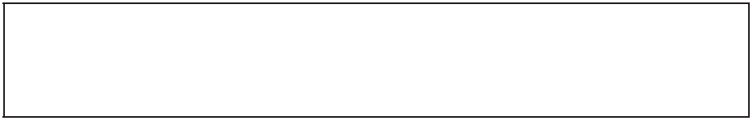

●　概述让你困扰的情况

●　A可以是内部的或外部的，真实的或想象的。

●　A可以是过去、现在、将来的事件。

IB's（非理性信念）

D（质疑非理性信念）

识别非理性信念的几个要点：

●　教条主义的要求

　（必须、绝对、应该）

●　把事情想得过于糟糕的思维方式

　（太糟糕，太严重，太可怕）

●　低挫折容忍力

　（我无法忍受这样）

●　评价自己或他人

　（我/他/她很坏，毫无价值）

质疑自己的问题：

●　我怎么会产生这种信念的？这种信念对我有帮助，还是会让我失败？

●　有何证据支持这种非理性信念，这种信念与事实相符吗？

●　我的信念有逻辑性吗，是否源自我的个人偏好？

●　真的有那么糟吗（糟到不能再糟的地步）？

●　我真的不能忍受吗？

C（结果）

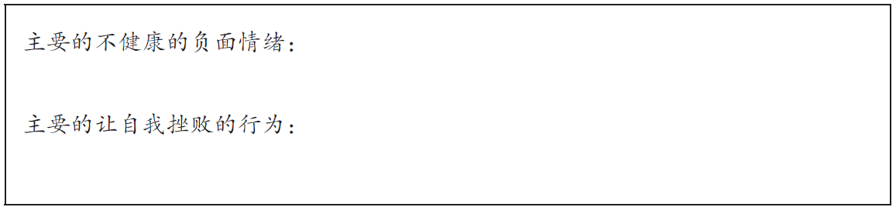

不健康的负面情绪包括：

●　焦虑

●　抑郁

●　愤怒

●　低挫折容忍力

●　羞愧/窘迫

●　伤心

●　嫉妒

●　内疚

RB's（理性信念）

E（新的效果）

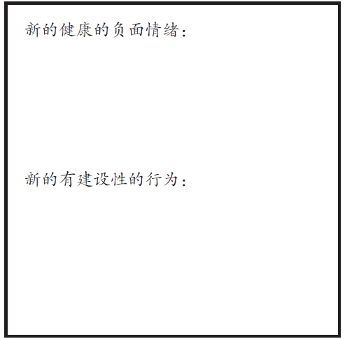

理性思维要做到：

●　非教条主义的期望

　（希望、想要、渴望）

●　评价糟糕的情况

　（不好、不幸）

●　高挫折容忍力

　（我不喜欢这样，但我能够忍受）

●　不要全盘否定自我或他人

　（我和其他人都会犯错）

健康的负面情绪包括：

●　失望

●　忧虑

●　心烦

●　伤心

●　遗憾

●　沮丧

A（诱发事件）

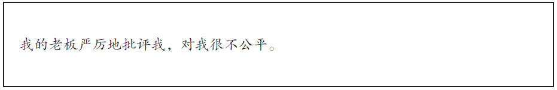

●　概述让你困扰的情况。

●　A可以是内部的或外部的，真实的或想象的。

●　A可以是过去、现在、将来的事件。

IB's（非理性信念）

D（质疑非理性信念）

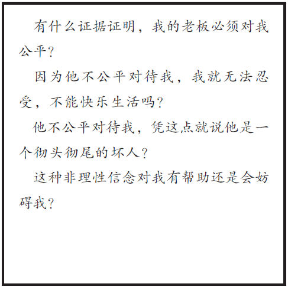

识别非理性信念的几个要点：

●　教条主义的要求

　（必须、绝对、应该）

●　把事情想得过于糟糕的思维方式

　（太糟糕，太严重，太可怕）

●　低挫折容忍力

　（我无法忍受这样）

●　评价自己或他人

　（我/他/她很坏，毫无价值）

质疑自己的问题：

●　我怎么会产生这种信念的？这种信念对我有帮助，还是会让我失败？

●　有何证据支持这种非理性信念，这种信念与事实相符吗？

●　我的信念有逻辑性吗，是否源自我的个人偏好？

●　真的有那么糟吗（糟到不能再糟的地步）？

●　我真的不能忍受吗？

C（结果）

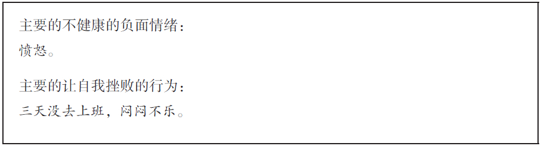

不健康的负面情绪包括：

●　焦虑

●　抑郁

●　愤怒

●　低挫折容忍力

●　羞愧/窘迫

●　伤心

●　嫉妒

●　内疚

RB's（理性信念）

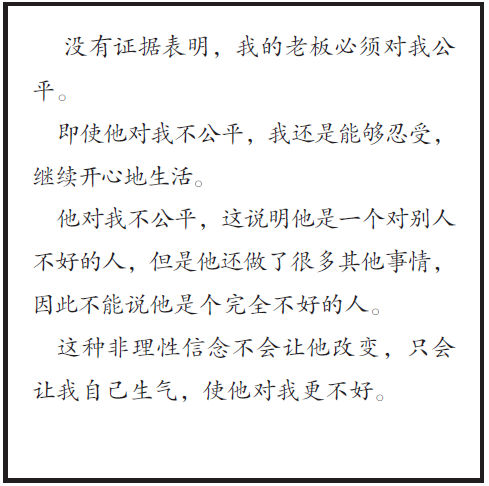

E（新的效果）

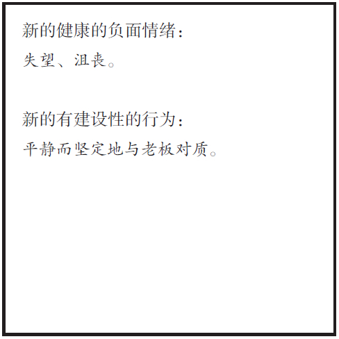

理性思维要做到：

●　非教条主义的期望

　（希望、想要、渴望）

●　评价糟糕的情况

　（不好、不幸）

●　高挫折容忍力

　（我不喜欢这样，但我能够忍受）

●　不要全盘否定自我或他人

　（我和其他人都会犯错）

健康的负面情绪包括：

●　失望

●　忧虑

●　心烦

●　伤心

●　遗憾

●　沮丧

心理学大师·埃利斯经典作品

控制焦虑

How to Control Your Anxiety Before It Controls You

（美）阿尔伯特•埃利斯（Ellis，A.）　著

李卫娟　译

ISBN：978-7-111-45081-8

本书纸版由机械工业出版社于2014年出版，电子版由华章分社（北京华章图文信息有限公司）全球范围内制作与发行。

版权所有，侵权必究

客服热线：+ 86-10-68995265

客服信箱：service@bbbvip.com

官方网址：www.bbbvip.com

新浪微博 @言商书局

腾讯微博 @bbb-vip

致珍妮特L.沃尔夫

相伴30年的真诚伙伴

# 对话大师　李孟潮专访埃利斯

心理治疗流派层出不穷，但实际上真正受到承认的只有屈指可数的几种，这几种重要流派的开山宗师堪称凤毛麟角，阿尔伯特·埃利斯（Albert
Ellis）就是其中一位。

全世界学习心理治疗的人都会在教科书里找到这个名字，都知道他是理性情绪行为疗法（Rational
Emotive Behavior
Therapy，REBT）的创始人。如果你不知道的话，要当心自己的学业前途了。笔者曾有幸在埃利斯89岁那年采访到这位世界心理学巨匠，谈话内容在此分享给诸位读者。

李孟潮：您写过这么多书，年近九旬仍每周工作80小时以上，保持如此神奇精力的秘诀是什么？

埃利斯：我在89岁依然能有很多精力努力工作，第一个秘诀是遗传——我的母亲、父亲和哥哥都是精力充沛的人！第二个秘诀是，我对自己实行理性情绪行为疗法（以下皆依埃利斯原话简称为REBT），所以我坚决反对任何人扰乱我在做的任何事情，我也反对去扰乱别人的事情或这个世界上正在发生的任何事情。

李孟潮：想不到理性情绪行为疗法还能让人精力充沛。您的业余时间都做些什么呢？

埃利斯：实际上我几乎没有什么业余时间，当我有一点空闲时，我很喜欢听音乐和读书。

李孟潮：中国人总对别人的私生活感兴趣。也许美国人不太习惯——请问您结婚了没有？您的家庭是什么样的？

埃利斯：我结过两次婚，还和一位女士同居了36年，但现在我又是单身了。我很喜欢单身的生活。我没有孩子，但我和兄弟姐妹、父亲母亲相处得很融洽。

李孟潮：看来在您40岁前遇到过不少挫折。也换过不少职业，至少有作家、商人、心理咨询师这三个职业吧？现在回首往事，您认为这样的经历对您有什么意义吗？

埃利斯：我这一生中曾经至少转换过三个职业，这个事情仅仅意味着，在一段时间内，我会全神贯注于一项事业，然后由于各种原因我会改变，并且同样全神贯注于下一项事业。

李孟潮：您经历过很多刺激事件，您怎样处理这些事件呢？

埃利斯：我是这样处理我生活中的刺激事件的——并不要求这些刺激事件不要有刺激性，也不为这些事情感到焦虑或忧郁，因此我在处理这些事情时就能做到最好。

李孟潮：能用一句话介绍一下理性情绪行为疗法吗？

埃利斯：REBT还真不能用一句话来概括，但如果我来试试的话，我会这么说，REBT是这样一种理论，它认为人们并非被不利的事情搞得心烦意乱，而是被他们对这些事件的看法和观念搞得心烦意乱的，人们带着这些想法，或者产生健康的负性情绪，如悲哀、遗憾、迷惑和烦闷，或者产生不健康的负性情绪，如抑郁、暴怒、焦虑和自憎。

当人们按理性去思维、去行动时，他们就会是愉快的、行有成效的人。人的情绪伴随思维产生，情绪上的困扰是非理性的思维所造成。理性的信念会引起人们对事物适当、适度的情绪反应；而非理性的信念则会导致不适当的情绪和行为反应。当人们坚持某些非理性的信念，长期处于不良的情绪状态之中时，最终将会导致情绪障碍的产生。

非理性信念的特征有：①绝对化的要求。比如“我必须获得成功”“别人必须很好地对待我”“生活应该是很容易的”，等等。②过分概括化。即以某一件事或某几件事的结果来评价整个人。过分概括化就好像以一本书的封面来判定一本书的好坏一样。一个人的价值是不能以他是否聪明，是否取得了成就等来评价的，人的价值就在于他具有人性。他因此主张不要去评价整体的人，而应代之以评价人的行为、行动和表现，每一个人都应接受自己和他人是有可能犯错误的人类一员（无条件的自我接纳和接纳别人）。③糟糕至极。这是一种认为如果一件不好的事发生将是非常可怕、非常糟糕、是一场灾难的想法。非常不好的事情确实有可能发生，尽管有很多原因使我们希望不要发生这种事情，但没有任何理由说这些事情绝对不该发生。我们将努力去接受现实，在可能的情况下去改变这种状况，在不可能时学会在这种状况下生活下去。

理性情绪行为治疗的方法简单来说，就是让来访者意识到自己的非理性的思维模式，并与之辩论，从而达到“无条件的自我接纳”。

大部分心理治疗的流派会比较倾向于使用或认知、或行为、或情绪的方法，但是理性情绪行为疗法是一种比较独特的流派，它三种方法都使用，并清楚地认识到认知、行为、情绪是相互作用的。所以，我们以一种情绪和行为的模式使用认知技术，我们以一种认知和行为的模式使用情绪技术，我们以一种认知和情绪的模式使用行为技术。

李孟潮：哪一类的咨询者可以寻求REBT治疗师的帮助？

埃利斯：几乎每个人都可以，只要愿意持续地、充满情感地、坚强地去探索自己是如何使自己烦恼的，并愿意努力摆脱让自己烦恼的方式，REBT的治疗师都可以帮助他。

李孟潮：您在创立理性情绪行为疗法的时候一定面临了很大的压力，以当时的眼光来看，那是对弗洛伊德的背叛。直到前不久，您还说过根据您的标准来看，弗洛伊德还不够性感。能告诉我们这句话是什么意思吗？

埃利斯：我说弗洛伊德不够性感的意思是指，其实弗洛伊德的内心像个老处女一样，他把性行为的很多种形式都看作变态或异常的。一个真正的性心理治疗师会认为，只有极少数的性行为是不好的或不道德的，虽然在有些社会环境会坚持认为这些行为是异常的。

李孟潮：目前中国的心理治疗事业刚刚起步，如果中国的心理咨询师想要学习REBT，应该怎么办呢？需要什么样的条件和过程才能成为理性情绪行为治疗师呢？

埃利斯：成为REBT治疗师的条件和过程是，多读一些我写的书，听我的磁带和录像带。当然，最好就是直接参加我们的培训，我们每年都会在全世界举办很多次培训。

李孟潮：当前中国的心理治疗师面临的一个问题就是经济的问题。有些咨询者和部分治疗师认为，心理治疗应该是和商业活动无关的。也有的治疗师认为，心理治疗中蕴含着无穷的商机。您看起来是一个很特殊的治疗师，既具有很大的名声，又具有很多通过REBT赚钱的途径。您对赚钱和无私地帮助别人之间的冲突是怎么看的？

埃利斯：实际上我并没有通过REBT赚到什么钱，因为我所做的一切都是为了阿尔伯特·埃利斯研究所，这是一个非营利机构。我的书的版税和其他的收入都直接归到研究所，而不是我个人。对钱的强烈欲望时常让人们做更多自私的事，也阻止人们做到REBT所说的“无条件的接纳别人”，可我不是这样的。

李孟潮：您怎么看中国文化？其中有和REBT相似的地方吗？

埃利斯：我认为中国文化有些地方和REBT是相似的，因为佛教的一个主要观点就是承认这个世界和生活中一直都有痛苦存在，人们没必要喜欢这些痛苦，但可以建设性地接受，从而不让自己烦恼，能够更好地处理问题。

李孟潮：对今天的中国您有什么想要了解的？

埃利斯：我对今天的中国了解很少，如果有时间的话，我想更多地了解中国。

李孟潮：作为89岁的老人，回首人生，您认为在生命中什么是最重要的？

埃利斯：我生命中最重要的事就是对自己使用美国式的REBT并总是接纳我自己，虽然我也尝试着改变我做的很多事情。

李孟潮：一个大问题，也可能是一个愚蠢的问题，您对生活的态度是什么？

埃利斯：我对生活的态度是，我们不是被邀请到这个世界上来的，生活本身并没有意义，而是我们给了它意义。我们赋予生活意义的方法是，决定什么是我们喜欢的，什么是我们不喜欢的，什么是我们特殊的目标和目的，从而为我们自己选择了意义。

李孟潮：我的采访就快结束了，您想对中国的青年说些什么？

埃利斯：我想对中国青年说的是，他们很年轻，如果这个世界有不幸的事情发生——这是屡见不鲜的，他们有足够的时间，建设性地使用REBT或其他类似的思考方式来努力不让自己烦恼。

# 阿尔伯特·埃利斯简介

阿尔伯特·埃利斯（Albert
Ellis，1913—2007），超越弗洛伊德的著名心理学家，理性情绪行为疗法之父，认知行为疗法的鼻祖。在美国和加拿大，他被公认为十大最具影响力的应用心理学家第二名（卡尔·罗杰斯第一，弗洛伊德第三）。

埃利斯创立了对咨询和治疗领域影响极大的理性情绪行为疗法（Rational Emotive
Behavior
Therapy，REBT），为现代认知行为疗法的发展奠定了基础。该疗法适用范围广、实用性强、见效快，为中国心理咨询师最常用的方法，是中国心理咨询师国家资格考试必考的疗法之一。

埃利斯自哥伦比亚大学获得临床心理学博士学位，投身心理治疗工作60余年，治愈了15000多名饱受各种情绪困扰的人，并在纽约创立阿尔伯特·埃利斯理性情绪行为疗法学院。

埃利斯是精力充沛而多产的人，也是心理咨询与治疗领域内著作最丰富的作者之一。多个核心心理咨询期刊都曾刊登过埃利斯的文章，他的文章刊登次数堪称心理咨询领域之最。他一生出版了70多本书籍，其中有许多都成为长年畅销的经典，有几本著作销售量高达几百万册。

2003年，当他90岁生日的那天，他收到了多位公众知名人物的贺电，其中包括美国前总统乔治·布什、比尔·克林顿，前国务卿希拉里·克林顿。

在2007年的《今日心理学》杂志上，他被誉为“活着的最伟大的心理学家”。

他是史上最长寿的心理学家，2007年安然辞世，享年93岁，被美国媒体尊称为“心理学巨匠”。

### 生平

1913年9月27日，阿尔伯特·埃利斯出生在美国匹兹堡的一个犹太人家庭，是3个孩子中的长子。

4岁时，埃利斯全家移居纽约市。

5岁时，埃利斯因肾炎住院，因此不能再从事他所热爱的体育运动，从而开始热爱读书。

12岁时，埃利斯父母离婚了。他的父亲长年在外经商，对自己少有关爱，母亲同样感情冷漠，喜欢说话，却从不倾听，父母关系向来很差。曲折的经历让他对人的心理活动充满兴趣，小学时就已经是个很能解决麻烦的人了。

进入中学以后，埃利斯的目标是成为美国伟大的小说家。为了这个目标，他打算大学毕业后做一名会计师，30岁之前退休，然后开始没有经济压力地写作，因此他进入了纽约市立大学商学院。经济大萧条来了，击碎了他的梦想。他仍然坚持读完大学，获得了学位。

大学毕业后，埃利斯开始做生意，生意不好不坏。这时埃利斯对文学还是痴心不改，他把大多数时间都用来写纯文学作品。

28岁时，他已写了一大堆作品，可都没有发表。这时他意识到自己的未来不能靠写小说生活，于是开始专门写一些非文学类的杂文，并加入了当时的“性–家庭革命”。这时他发现很多朋友都把他当作这方面的专家，并向他寻求帮助。此时，埃利斯才发觉原来他像喜欢文学一样喜欢心理咨询。

1942年，埃利斯开始攻读哥伦比亚大学临床心理学硕士学位，主要接受精神分析学派的训练。

1943年6月，埃利斯获得哥伦比亚大学临床心理学硕士学位。

1947年，埃利斯获得临床心理学博士学位。如同当时大部分心理学家，这时候的埃利斯是个坚定的精神分析信徒，下决心要成为著名的精神分析师。

20世纪40年代后期，埃利斯已经在当地的精神分析界小有名气，他在哥伦比亚大学做教授，还先后在纽约市以及新泽西州的几所机构内身居要职。可就在此时，埃利斯开始对自己钟爱的精神分析事业产生了怀疑。

1953年1月，埃利斯彻底与精神分析分道扬镳，开始将自己称为理性临床医生，提倡一种更积极的新的心理疗法。

1955年，他将自己的新方法命名为理性疗法（Rational
Therapy，RT）。这种疗法要求临床医生帮助咨询者理解，自己的个人哲学（包括信仰）导致了自己的情感痛苦。例如“我必须完美”或“我必须被每个人所爱”。

1961年，该疗法改名为理性情绪疗法（Rational Emotive Therapy，RET）

1993年，埃利斯又将该疗法更改为理性情绪行为疗法（Rational Emotive
Behavior
Therapy，REBT）。因为他认为理性情绪疗法会误导人们以为此疗法不重视行为概念，其实埃利斯初创此疗法时就强调认知、行为、情绪的关联性，而且治疗的过程和所使用的技术都包含认知、行为和情绪三方面。

2004年，埃利斯罹患严重的肠炎。

2007年7月24日，埃利斯自然死亡，享年93岁。

# 本书简介　控制焦虑

按照阿尔伯特·埃利斯博士在本书中所述的理性情绪行为疗法（REBT）的规则，你可以在焦虑控制你之前先行将其控制。如果你承认这样一个重要的事实：单纯的人与事并不会使你感到焦虑，那么，你就可以阻止焦虑感的发展，不切实际的期望才是造成那些不必要焦虑感的原因。

健康的焦虑感（包括担忧、谨慎和警惕），可以说是一种恩赐：它可以抵挡危险，保护你的生命，使你意识到那些你可以改变的“不好”事物。不健康的焦虑感则完全不同：它会导致一种麻木的恐慌感、过分的担忧和恐惧情绪，这些情绪会阻止你去做那些你认为“很危险”的事情，而实际上这些事情并没有什么危险性。不健康的焦虑会阻止你去享受正常生活和发展人际关系，你会认为这些事情有很大的潜在风险。这种心理会使你表现不佳，并消磨你的时光，还会阻止你发挥自己的创造力。

利用理性情绪行为疗法的训诫语句，你可以控制自己的焦虑感。埃利斯博士曾成功治疗过数十名患者，其中包括患有表演焦虑症、就业危险恐惧症、性功能障碍和社交恐惧症的患者，你将在本书中看到这些案例。除此之外，本书还列出了200多条至理箴言，它们会使你缓解那些不健康的焦虑感，有助于你在生活和工作中享受到更多的成功、快乐和幸福。

# 第1章　你可以在焦虑控制你之前先发制人

19岁以前，我一直是一个患有严重焦虑症的人。事实上，我想我也许天生就有一种焦虑倾向。我的母亲就是这样的一个人：总体而言，她是一个乐观向上的人，但她还是会为一些小事儿担忧，比如金钱。在我的童年和少年时代，她从未对钱有过什么真正的渴望。我的父亲是一个赞助商，也是一个优秀的推销员，曾经有一次获得了100万美元——在20世纪20年代，这是一笔不小的收入，但母亲还是一直为日常开支担忧。每次父亲给服务员50美元小费时，她总会偷偷地将这50美元拿回来，然后换成一张更小面额的钞票。母亲将她的钱存进一个独立账户中，存了几千美元，但她还是总担心钱不够花。

我父亲亏损掉了他在股市投入的第一笔100万美元，他又投入了第二笔100万美元，那时我们家的经济状况还算良好，但母亲仍然为钱而担忧，还有其他一些相对不重要的事情，所以她不停地存钱、存钱、存钱。她这种心态也不是完全不可取的，1929年，当我父亲损失了第二笔100万美元时，他已不能定期给母亲提供生活费，但我们还是成功地度过了大萧条时期。为了维持这个家庭，弟弟、妹妹和我都开始工作挣钱。尽管如此，母亲还是担心不已，当她93岁去世时仍有许多存款。

你也许会认为我大概是受她的影响，但是事实并非如此。我的弟弟比我小19个月，我们是在同样的环境中长大的，他几乎从未担心过什么。我弟弟酷爱冒险，做过各种“危险”的事情，他似乎从未担心过会产生什么样的后果。如果一切进展顺利，也就没什么可担忧的；如果出现什么意外情况，他也从来不会因此而担忧。他会继续投身于下一个冒险中，无论是社会风险还是企业风险，他都乐此不疲。事实上，他的心态很好——因为他很少担心什么。

我则完全不同！我会为各种潜在的不测而担忧。可以肯定地说，童年和少年时代的我一直都是一个腼腆害羞、乖巧听话、犹豫不决的人，我几乎不会去尝试任何大的冒险——如果确实需要，我也会忧心不已。我对公共演讲的恐惧感尤甚。我是一个天资聪明的人，所以时常会有人要求我发言，或是在课堂游戏中，或是在课堂上公开讲话，或是回答老师的问题，因为老师确信我能给出正确的答案。但是，大多数情况下我会自愿让贤，我尤其会推脱任何公开演讲。

举一个典型的例子。我是一个拼字高手，可以说是班上最优秀的，但是我总是避免参加任何拼字比赛，因为我害怕犯错误（尽管我几乎从未出过错），担心人们会嘲笑我。每次老师强迫我参加比赛时，我总是能打败所有其他孩子，成为获胜者，但我一点儿也不喜欢拼字比赛。简单点儿说，我只是喜欢获胜的感觉。

又如，我们必须时不时地背诵一首短诗，并在第二天上课时在全班人面前朗诵出来。尽管我记忆力很好，我还是害怕朗诵时会结结巴巴。我非常害怕公开朗诵诗歌，所以当诗歌朗诵那天到来时，我会头痛欲裂，我把温度计放散热器旁使其升温，然后向老师说明我发烧了。于是，母亲就会让我留在家里。要让老师和其他孩子看到我糟糕的表现吗？坚决不行！

有一次，大约是在我11岁的时候，我在主日学校获得了奖牌，必须在集会时上台领奖并向校长致以感谢。我上台领了奖牌，并向校长致谢，但是当我回到座位上坐下时，我的一个朋友问，“你为什么哭呢？”因为我特别担心在公共场合露面，所以我双眼周围直冒汗，看起来就像哭了似的。

我还患有严重的社交恐惧症。我害怕看见新同学，害怕和领导谈话，尤其是害怕看见女同学。当我五岁半时，我对女孩子特别感兴趣，那时我疯狂地爱上了一个邻家女孩。当她从我的生活中消失后，我几乎每年都会迷恋于我们班最有吸引力的女孩。疯狂的痴迷，那是一种强迫症似的爱慕。无论我是多么爱慕这些女孩，不断地想着与她们交往——实际上，我一直都是这么想的，有时会持续想上几个小时。但我从来不会跟她们说话或试图接近她们。我很腼腆，只会闭着我的大嘴巴，战战兢兢坐在离她们很远的地方，贪婪地看着她们，没有任何言语交流。我很害怕，如果我接近她们并尝试友好地和她们交谈，她们会了解到我的缺陷，然后毫不留情地拒绝我，让我自惭形秽。实际上，我并没有看见自己被拒绝后无所遁形的样子，但离那种情况也差不多了！

19岁之前，我从来没有真正接近过任何我所爱慕的女性。每年大约有200天，我都会去布朗克斯植物园，那是一个很有趣的地方，就在我家附近。我会坐在长椅上或坐在草地上看书，同时寻找有吸引力的女性（包括各种年龄段的女性），与她们搭讪。但我从来没有接近过她们或跟她们说过一句话。我会坐在布朗克斯河畔主干道附近的一条石凳上，当有一个女孩或一名女性坐在另一个离我约10英尺<a href="#part0057.xhtml_zhuback1"
id="part0057.xhtml_zhu1">[1]</a>远的长凳上时，我会立马向她看去（那时的我对所有的女性都很感兴趣，百分之百地感兴趣），有时她也会看我一眼。我会一直偷偷地看她，显而易见，我是想跟她搭讪，她通常会做出一些回应。可以肯定地说，其中有一些女性对我很感兴趣，要是我走近她们，开始与她们交谈，想必她们会很快就接受我。

但我永远也不会！我总是畏畏缩缩的。我给自己编造了千万个理由——她太高了或太矮了，年龄太大或太小，太聪明或太傻。我总是能找到各种借口，并使自己的畏惧感合理化。所以，我从未跟她们中的任何一个人说过话——不管她们对我如何感兴趣，也不管我是如何易于被她们接受。然后，当让我激动不已的女性终于起身走开时，或我不得不起身离开时，我会咒骂自己太笨、不敢接近她们、不会去尝试。由于这种畏畏缩缩的心态，我狠狠地诅咒了自己一番，并下决心去尝试，真正去尝试接近下一个合适的目标。但我最终还是没有去做。

### 我是如何克服公开演讲焦虑症的

在我19岁时，我决定克服自己的焦虑症。首先，我决定摆脱对公开演讲的恐惧。当时，我积极投身于一个政治组织，那是一个自由党派，我担任该组织的青年领导人。这只是一个小型组织，几乎所有青年成员都是我的朋友，所以面对这十几个人说话对我来说没什么可担心的，我也不认为那是一种公众表现形式。另一方面，我还要到其他组织和团体中作演讲，向他们宣传我们的社团，说服他们加入我们。作为一名青年领导人，我应该是组织中的公共宣传员。但我害怕担任这一角色，所以我拒绝了很多邀请，这些邀请主要来自我们团队中的成年部门——美国新生一代，他们管理着青年部门——美国年轻一代。像往常一样，我临阵退缩了。

代表美国年轻一代发表公共演讲的压力一直持续着，最终我屈服了，并决定去克服这种公共演讲恐惧症。我之前曾阅读过大量有关哲学和心理学的书籍，未来某天我也会写一本有关人类幸福心理学的书籍，我对这方面有着浓厚的兴趣（这可归因于我的焦虑症）。基于那些年（1932年）的著作，我也对如何克服焦虑感和恐惧感有了自己的想法。我曾读过一些伟大哲学家的著作，如孔子、释迦牟尼，他们在所著的书籍中都曾提及过怎样克服焦虑感。另外，我还特别注意到一些古希腊和古罗马哲学家也曾提到过焦虑症，如伊壁鸠鲁、爱比克泰德和马可·奥勒留。因为那时哲学是我的一个业余爱好（从16岁起），我曾关注过许多现代哲学家，如梭罗、爱默生和罗素，他们的著作都曾涉及如何应对焦虑感。此外，那时我还读过许多现代心理学家的作品，如弗洛伊德、荣格、阿德勒，他们对如何克服焦虑感也很感兴趣。所以不管是从哲学上还是从心理学上来说，我都已经做好准备了。

我还读过行为学家约翰·华生的书籍，他早期的实验旨在治愈儿童的恐惧症和焦虑症。华生和他的助手以七八岁的孩子为实验对象，这些孩子都非常害怕动物（如老鼠或兔子），他首先将这些令孩子们感到恐惧的动物放在远处，之后，又放在离孩子们较近的地方，同时，华生和这些孩子聊天，转移他们的注意力，然后一点点地将这些动物向孩子们移近。你猜发生了什么——大约20分钟后，孩子们就不再害怕了，并开始抚摸这些动物。这种反条件作用，也被称为现实脱敏法，有着显著的效果，经过几次试验后，他使孩子们摆脱了那种极端的焦虑感和恐惧感。

“好吧，”我对自己说，“如果这种方法对小孩子都有效果，应该对我也有用，我也要试一试。”

所以，我一生中首次不再去逃避公众演讲。每星期，我至少会组织一次演讲活动，我会公开介绍我们的组织：美国年轻一代。我向自己保证不管上刀山还是下火海，我都要进行演讲。虽然我仍然像以前一样会害怕，特别是最初几次演讲让我感到极其难受。但是，基于以前阅读所知以及我自己的理解，我知道这些不适感不会产生什么致命的后果。我也想象过可能会发生一些可怕的事情，观众会嘲笑我，台下会发出一片嘘声。我想象过一切可能会发生的事情。我的演讲也许会很糟糕，也许观众不会相信美国年轻一代是独立战争之后美国最大的政治团体，最糟糕的情况可能是很少有人会加入我们。那种情况真的很糟糕，但却不是不可挽回的。

换句话说，我进行了理性自我对话，主要是受到众多哲学家的启发。我将自己置身于我最害怕的情况中，起初我会感到不适，但之后的十周内，我强迫自己不断在公共场合讲话。这种方法起作用了！由最初的极度的不适，到之后这种症状有所缓解，最后，让人惊讶的是我的不适感消失了。以前我会心跳不已，浑身冒汗，讲话时还会结结巴巴的，之后，这些症状逐渐得到缓解。我学会专注于演讲的内容——美国年轻一代是怎样伟大的一个政治团体，不再考虑我在演讲时的表现以及当我要演讲时我是多么的焦躁不安。出乎我的意料，我发现我的演讲进行得很流畅，就像通常情况下，我跟一个人或一群朋友讲话时一样，一点儿困难都没有。其实，我演讲一点儿问题都没有，但是我患有焦虑症，我只是非常害怕在公众场合发言。我的声带和我的语言能力一直很正常，现在经过锻炼，这些能力变得更加完美了。

我强迫自己，强迫自己在公共场合讲话，无论会产生怎样的不适感，我会一直坚持下去，直到这种不适感消失，而且我也开始享受这种感觉，这种经历给我留下了深刻的印象。这也是九年后我决定成为一名心理治疗师的主要原因之一。当我第一次公开演讲时，我对治疗师这一职业一点儿兴趣都没有，我一心想成为一名作家——我也许会写关于人类幸福的话题。也许，我之所以会有成为一名作家的想法，只是因为作家不必在公众场合讲话。不管怎样，我是不会对治疗师感兴趣的，我只是想成为一个没有什么焦虑感、更加乐观积极的人。没过多长时间，我就实现了这一目标。我完全不会再对公开演讲感到焦虑了——我完全克服了自己的恐惧感。既然我克服了公开演讲的焦虑感，我在其他方面也不再那么焦虑了。

一直以来，我都不得不去完成一些任务，不得不去获得成功——在学校、体育课上、形象上以及其他一些重要的方面。我努力去获得成功，并且我发现我总能获得成功。我努力地学习、做功课，在学校能与他人相处良好。当然，我还是会为这些事情而担心——因为我要求自己必须获得成功，必须成为一个有价值的人，但是总会有失败的可能性。这是多么让人担忧的一件事呀！——让人焦虑不安。

既然我意识到我在公众面前会感到不适，有时甚至会表现欠佳，为了避免自己陷于这样的处境，我决定不再过多地去关注于成功。虽然我还是想获得成功，但成功对我来说已不是绝对必需的了。

### 我是怎样克服社交焦虑症的

为了考验自己，我决定进行我生命中的第二大实验：尝试摆脱我的社交焦虑症，尤其是怕遭到令我心动的女性拒绝的那种焦虑感。这种焦虑感一直困扰着我的生活，比公共演讲焦虑症更严重。在这里重申一点，我过去一直的目标是成为一名作家，这样我就可以尽可能地避免在公共演讲中露面。但是，如果要继续保持我对女性的兴趣——我确实打算继续保持这种爱好，而我却无法接近那些令我心动的女性，不能跟她们进行对话，这自然会在很大程度上限制这种兴趣的发展！我也许会在我朋友和亲属的帮助下来跟这些女性见面，因为我是不会独自一人去见这些女性的。真是令人头疼！

因为想到我成功地克服了公开演讲焦虑症，我决定利用同样的方法来克服我的社交焦虑症。在我即将返校攻读大四课程之前的那个八月，我给自己布置了一个有意义的家庭作业，就是每天都要去布朗克斯植物园。我会找陌生的女性聊聊天，不管这样做会让我产生什么样的不适感。我会在公园里散步，直到我找到合适的聊天对象。如果她独自坐在一条长凳上，我会立刻走过去坐在她旁边。不，不是坐在她腿上，而是坐在她旁边，就在她坐的那条长凳上（而不是别的长凳上）。以前我不敢这么做，因为我怕她会拒绝我并立刻起身离开。但现在这些事情做完之后，我就会做以前我一直回避的、我最害怕做的事情：我想给自己一分钟来跟她交谈，这一分钟不再像以前那样糟糕。不管结果如何，我一定要尝试！我要在一分钟内开始跟她谈话，不管会产生怎样的不适感，也不管她会对我有什么样的看法。这就是我给自己布置的一个有意义的家庭作业。为什么说有意义呢？因为如果我立即采取行动跟她说话，而不是一直等待，我想我会变得不那么焦虑，我也会克服那种焦虑感，和她发展的机会可能也就越大。

我确实是这么做了。每当我看到有一名女性独自坐在公园的长凳上时，我就会立即——不容任何质疑，坐在她旁边的长凳上，无论我会产生怎样的焦虑感。我不会再找任何借口，无论她多大年纪，不管她是高是矮，等等。没有任何借口！我强迫自己坐在她的旁边，虽然会感到不适。有时我一坐下，许多女性连忙起身走开了。总而言之，整个八月我接近了130多名女性，并紧挨着她们坐下。其中有30名女性（几乎1/3的人）立即起身走开了。真是让人失望！但是还有100多人没有走开——这些人就成了我的锻炼对象！

我丝毫没有气馁，我按计划跟余下的这100多名女性聊天。我聊到花儿、树、天气、鸟儿、蜜蜂、她们正在阅读的书或报纸——我会聊到任何事情，就是为了与她们闲聊，不会涉及任何需要动脑筋的话题，不会涉及任何私人话题。我不会评论她们的容貌，或者任何其他可能让她们介意并转身离开的话题，我聊的只是100多个普通的话题。

这100多名女性确实回应我了，有些聊天很简短，有些则会持续一个小时或更长时间。我很快就和她们中的大部分人七嘴八舌地闲聊起来。当她们看上去愿意跟我沟通时，我就会问问她们的工作、她们的家庭、她们的生活安排，以及她们的爱好、兴趣等。这都是一些很平常的对话，就像我是经别人正式介绍与她们认识的那样聊一聊。

至于我最初跟她们聊天的主要目的——跟她们约会、定期与她们见面、同她们上床、和其中的一个人结婚，这些都荡然无存了。我已完全没有这种心思了，我只跟和我聊天的这100多名女性中的一位约会过——而那名女性最终却没有赴约！她跟我聊了两个小时，离开时她还跟我吻别，并答应当天晚上和我在公园里再见面，但她却一直没有再露面。我真是笨极了，竟忘了留她的电话号码，所以我再也没有见过她。多么悲剧！太令人失望了！但我还是顺利地度过了那段时光。此后，每次见面和约会时，我总不忘向她们要电话号码！

在那个月我遭到百余名女性的拒绝，我完全摆脱了社交焦虑症，尤其是在陌生的地方遇到陌生的女性时，我也不会再感到恐惧了。因为我认识到这些拒绝并不会产生任何可怕的后果，和我交谈过的女性并没有人会伤害我，也没有人会呕吐着跑开，当然也没有人会打电话叫来警察。我以前常常会想象可能会发生什么可怕的事情，但实际上什么也没发生。相反，我和许多女性聊得很愉快，我很享受跟她们聊天的感觉，我还了解了许多以前不知道的有关女性的事情，我的不适感逐渐得到缓解，我也不再害怕与他们交谈了，而且还发生不少好事儿。最重要的是，我几乎立刻就克服了接近女性的恐惧感。在以后的生活中，每当我在公园、火车上、机场和其他公共场所见到女性时，我就开始主动跟她们聊天，而且还和上百位女性约会过。即使现在大多数女性会拒绝同我谈情说爱或同我结婚，我也已经不再感到害怕了，我最终还是永远地摆脱了社交焦虑感。不入虎穴，焉得虎子！我摆脱了因不擅长与女性聊天和怕被拒绝所产生的恐惧感！

现在，你明白为什么我如此确信人们可以在焦虑控制他们之前控制它了吗？正如我在本章的标题中所指出的，这是因为我已经在公开演讲和社交焦虑方面深入实践过了，我并没有向包括心理医生在内的任何人寻求帮助。事实上，我已经通过自己的经历学会了如何控制我的焦虑感。作为一名治疗师，在过去的54年间，我还教导了成千上万的人如何控制他们的焦虑感。此外，我还从克服焦虑感的经历中总结出了自己的治疗理论，这些年来，我一直在践行着这种理论。如果我从未有过这种经历，很可能就不会开创出理性情绪行为疗法。我知道我一直对很多事情都会感到焦虑，但现在我很难让自己紧张起来，即使在最糟糕的情况下，我也不会担心，这种经历同时也激励着我用自己的治疗理论和实践来帮助他人。

最重要的是，我完全依靠自己的力量克服了那种看似坚不可摧的焦虑感。可以肯定的是，我借鉴了许多哲学家和治疗师的作品，并从他们身上学到了很多东西。我还借鉴了约翰·华生的实验，他不仅是一位真正的治疗师，而且还多次尝试过治疗实验。基于这些可用资源，我强迫自己忍受痛苦——这让我感到各种不适，我让自己意识到焦虑和恐惧是多么的无济于事，坦白地说，我现在已经成为世界上最不容易惊慌失措的人。自19岁以来，我身上发生了许多不幸的事情，但那都是65年前的事了。虽然我仍会担心我做得是否够好、是否能完成这些事情、是否能赢得某些人的赞同、是否能舒适地生活，但是当不好的事情发生时或可能会发生时，我会告诉自己不要担心、不要遗憾、不要失望，实际上，我也从未焦虑、抑郁或愤怒过。

换句话说，作为一个易于感到不安和易受干扰的人，我已经使自己转变为一个几乎不会为任何事情感到担忧的人。正如我那本广为流传的著作里的标题所示，我顽强地抵制了所有让我痛苦不堪的事情——所有事情。

不管怎样，我还是坚持认为我主要是靠自己的力量做到这一点的，我没有进行过或接受过治疗，也没有什么团队给过我支持，亲戚朋友也没给我提供帮助，更没有人迫使我去做这些事情。自那时起，我的焦虑感明显减少了许多，而且我也一直保持着这种消除焦虑的做法。

另外，在此期间我还成为了一名著名的心理治疗师，而且可以说我的客户比国内任何一个治疗师的客户都要多。我开创了一种心理疗法，这种心理疗法颇受欢迎，并广为传授，同时在实验研究中也已被证明具有不同凡响的效果。这种心理疗法以不同的方式得到了其他心理治疗系统的疗效——改变人们自我封闭的想法，并引导人们尝试去做他们害怕做的事情。

其中最值得一提的是理性情绪行为疗法（REBT）和认知行为疗法（CBT）。理性情绪行为疗法是我在1955年开创的，认知行为疗法也是一种类似的心理治疗方法，是我于20世纪60年代开创的，这两种心理治疗方法堪称是最有效的自助式心理疗法。数以百计的书籍和材料都曾借鉴过理性情绪行为疗法或与之极其类似的方法，以向读者和听众表明如何帮助自己克服严重的抑郁、焦虑、愤怒、自卑等情绪。因为这种自助式疗法通俗易懂，所以几乎任何人都能理解它。只要你有决心，只要你愿意克服个人困扰，并承受这种疗法所带来的痛苦，那么这种疗法绝对有效！

就我个人以及成千上万个使用过理性情绪行为疗法和认知行为疗法主要治疗方案的人来说，我确信，你只要读过本书，就完全可以在焦虑控制你之前先行将其控制。当然，我不能向你保证，使用过理性情绪行为疗法和认知行为疗法之后你就能根除自己的焦虑症；但是只要你持之以恒，你就很有可能获得成功。我自己也体验了这种方法，起初没有什么太大作用，但后来经过50多年的研究和实践，现在的疗法比以往任何时候都要行之有效。如果你仔细阅读之后的章节，你也可以自行体验这种疗法。

你是否会经常在很多场合对许多事情感到焦虑呢？没错，几乎所有人都会这样。你能否换种方法来思考或工作以减轻你的焦虑感呢？没错，几乎所有人都能。你是否会采用我以前用过的思想和行动来减轻你所有的焦虑感呢？尝试一下理性情绪行为疗法和认知行为疗法，你就能看到效果！

<a href="#part0057.xhtml_zhu1" id="part0057.xhtml_zhuback1">[1]</a>1英尺=0.3048米

# 第2章　焦虑是什么，它是如何控制你的

不管你是否相信，焦虑确确实实是一件好事。焦虑有助于你保持活力、舒服地生活，而且还有助于你保持人类的特性。“正常”的人生具有欲望、期望和目标，你也一样。如果你没有焦虑感，完全不在意如何去实现这些愿望，你就必须要容忍各种令人不悦的事情——如缺乏成就感、他人的反对、危险的追求、他人的攻击甚至试图谋害你，你也不会采取行动来抵御或逃避这些事情。焦虑主要是指一系列不安的情绪和行动倾向，焦虑让你意识到不愉快的事情——不合预期的事情将要发生或可能发生，它会警告你最好采取一些必要的行动。因此，如果你即将受到攻击而又不想受到伤害时，你可以采取多种选择，如逃跑、击退攻击者、向潜在的保护者寻求帮助、呼叫警方、跟攻击者沟通以抵御他的攻击等。但是，如果你没有产生担忧、警惕、焦虑、紧张、谨慎、警觉或惊慌失措等情绪，你也许不会采取任何行动。也许，你会觉察到这种攻击潜在的危险性，但你会对此无动于衷。

同样，如果你认为你有失业的危险，而你又很想保住这份工作，要是失去了这份工作，你通常会感到担忧或焦虑，你也许会采取以下一种或多种行为：为保住工作而跟你的老板沟通、更加努力地工作、让朋友为你说情，或者寻找另一份工作、打算自谋生路、接受更多的教育或培训等。

这么说来，焦虑源于你对某些事物的欲望，你意识到自己可能会失去它，或你不希望发生一些可能会发生的事情。如果你完全没有任何期望、欲望或希望，那么不管发生什么事情，你都会漠不关心，你也就不会产生焦虑感。那么很可能你也将命不久矣，因为生活和生存在很大程度上取决于你对生活的渴望，你希望去避免任何可能导致你死亡的剧烈疼痛、不适、麻烦和争执。为了生存，你必须具备一定的机能——尤其是呼吸和饮食，你必须要保持一种舒适感。因为如果你浑身不适——如持续疼痛或长期了无生趣，你就会失去活下去的动机，这时候你会宁愿死去。

事实上，几乎所有人都会有目标。他们渴望继续快乐地生活下去，不要有任何痛苦。也许会有一些例外，但这种人也是寥寥无几，而且这些人的寿命不会很长。因此，正是人们对生活的担忧或焦虑以及不想有痛苦和麻烦的想法，才使得他们活跃在这个世界里。即使是不能照顾自己的幼儿，也会努力去生活、去享受、去减少痛苦。这些就是焦虑产生的结果。

不幸的是，焦虑感种类不一、程度各异，其中一些是不健康的或具有自我破坏性。健康的焦虑，如担忧、警惕、慎重，正如上文所提及的，能帮助你得到你想要的东西，尤其是能帮助你避免使你得到不想要的东西，因为你不想要的东西也许会给你带来致命的危害。因此，焦虑在某些情况下是有益的，如当你过马路时、以正常的速度驾驶时、远离有害的食品时以及避免夜间（甚或白天）在不安全的环境中行走时。

健康的焦虑可以维持生命的存续。但是，焦虑往往是不健康的，我将在后文中予以详细说明，不健康的焦虑具有破坏性，会有损你的根本利益。我们以过马路为例，如果你的焦虑感是健康的，你走路时会留心，会注意到红绿灯和那些闯红灯的车辆，你会快速地穿过马路，而不是像蜗牛一样慢慢行走。这是一件好事！

但是，如果你过马路时过分担心自己的安危，你的心怦怦乱跳、你的四肢战栗不已、你的眼睛左右张望，这就是一种严重的焦虑症，如果你患有这种焦虑症会发生什么事情呢？极有可能你会疯狂地穿过马路，或跌倒在马路中央，或看向相反的方向，或因胆怯而拒绝过马路，或做出其他一些最终会导致意外的疯狂行为。急性恐慌事实上也是一种焦虑症——这是一种有害的焦虑症，这种焦虑症通常弊大于利。

同时，一些不会产生人身危害的恐慌也是有害的。如果你认为你可能会失去你的工作，你感到非常害怕然后会陷入这种恐慌的状态，你很可能会因为这种恐慌而采取下列行为：拼命地跟你的老板交谈，告诉他你非常恐慌，不管你是否真会失去工作而直接辞掉工作，太担心而不愿去找第二份工作，找到了一份新工作却害怕还会失去这份工作，以及许多其他愚蠢的事情。这些事情不会有助于你保住这份工作，也不会有助于你在新的工作中表现更好。担忧可以使你保住你现在的工作，或有助于你找到一个新工作；恐慌则完全可能破坏你现在和以后的工作。这就不是什么好事了！

### 健康和不健康的焦虑感

说了这么多，其实我的主要观点是：健康的焦虑或担忧可以维持生命的存续，并能产生一些有益无害的结果，但是不健康的焦虑可以轻易将你摧毁。实际上，健康的焦虑或谨慎，能让你学会控制自己的情绪，并能让你以一种高效的方式来应对危险或困难的状况。不健康的焦虑或恐慌则完全相反：它会使你丧失自控力，在面对风险和问题时也会因此应对不佳，甚至有时会产生极其严重的后果。健康的焦虑症包括谨慎、警惕和抵制潜在的危害等情绪。不健康的焦虑症包括恐慌、惊骇、震惊、恐惧、战栗、哽咽、麻木以及各种使你置身于警戒状态的身心痛苦，可以肯定的是，你会警惕一切潜在的危险，但通常情况下这会干扰你应对危险的能力。我将通过本书不时向你说明健康和不健康的焦虑感以及其他健康和不健康的感情、情绪之间的差异。

本书中所述的心理治疗理论与实践指的是理性情绪行为疗法（REBT），这种疗法与其他疗法截然不同，因为它对健康的消极情绪和不健康的消极情绪进行了明确的区分，健康的消极情绪是在生活中发生不顺心的事情时产生的，包括悲伤、遗憾、无奈和烦恼的情绪；不健康的消极情绪是在同样的不顺出现时产生的，包括恐慌、抑郁、愤怒、自贬、自艾自怜的情绪。我将在后文就此做出论述。现在，让我们回到潜在的焦虑情绪这一话题上。

健康的焦虑或担忧几乎都是因现实或理性的恐惧而产生的。因此，如果你想要穿过一条没有红绿灯且车流量大的高速公路，你将会产生一种现实恐惧感：你也许会被汽车撞倒，也许会受伤或死亡。为什么呢？因为这种可能性很大，实际情况就是如此。

同样，如果你有一个好工作，但你上班总是迟到，还说上司或老板的坏话，每天只做少量的工作，你会产生这样一种现实恐惧感：你将被降职或解雇。要真是如此，这种可能性很大！

现实的或感官上的恐惧源于你对事物的观察，你也许会发现，如果你以某种方式行事，糟糕的事情甚或破坏性的事情都可能会发生，而且这种糟糕的事情发生的几率确实很大。如果你恶劣地对待对你怀有敌意的人，他们很可能会伤害你。当心！现实的恐惧告诉你：如果你按某些方式行事，一些有害的事情可能会发生。如果你不希望这种情况发生，这种恐惧感可能会适时地对你发出警告。

然而，有许多恐惧感完全是不切实际的，也是不合理的。假设你走在人行道上，你害怕车辆会冲过路缘并撞向你；或者假设你工作进展得很顺利，经常受到表扬，老板不时会给你升职，但你却非常害怕上班迟到，哪怕迟到一次也会非常不安；或者你会害怕，要是你在工作中犯了错误，老板会毫不留情地将你解雇；或者假设你不敢乘电梯，因为你感觉你很有可能会窒息，也许电梯会掉下来，你会被摔死；或者你会被困在楼层之间，几个小时甚至几天都出不来。这些都是不切实际的恐惧，因为这些情况都是不太可能会发生的，这种几率微乎其微——可以说是百万分之一，而你却在意识上放大了这种可能性。

人类真是不幸，他们往往会编造一些非理性的恐惧，自己吓唬自己；而为了应对这些恐惧感，他们还会做一些非常愚蠢的事情。因为这种疯狂的恐惧感，他们很可能会拒绝走人行道，因为他们认为人行道太危险了；或者这些人也许会为他们的工作而恐慌，甚至会辞去工作，即使他们干得很好，老板也很器重他们。或者他们可能会完全远离电梯，天天走楼梯，上上下下20多层就是为了避免乘电梯，无论是在家里还是在工作场合，他们都会如此。

即使是在没有危险或危险性很小的情况下，不健康的和不切实际的恐惧感往往也会导致巨大的焦虑情绪。几乎所有人都会有一些恐惧心理，因为这些恐惧心理，他们愚蠢地为自己的生活设下种种限制。因此，有些人不敢乘电梯或自动扶梯，不敢坐火车，而实际上他们会受伤的几率微乎其微；或者，他们害怕下级不认可他们，他们害怕这些人虽然不赞同他们但是什么也不说，也不会采取任何行为；或者，因为他们被喜欢的人拒绝过，他们认为世界上所有他们喜欢的人无疑都会拒绝他们；或者，他们认为，无论出于何种原因，如果他们失去了一份工作，他们以后将会失去所有的工作机会，他们永远也不会找到或维持一份好工作。

这些非理性的恐惧感非常常见，实际上，即使有的人在某一方面（如竞聘工作）无所畏惧，他也会对其他方面（如寻找伴侣）产生强烈的恐惧感。这些非理性的恐惧感是如何产生的呢？我们接下来将就这一问题和如何不让这些恐惧感控制你做一一说明。但就这一点，我主要想强调的是，很多人甚至大多数人都会存在这些非理性的恐惧感，大多数人会受制于这些非理性的恐惧感，并因此过着糟糕至极的生活。有些人甚至会因为这些不切实际的恐惧感而伤害自己——例如，他们过马路时会感到恐慌，即使面前就是红绿灯，而且还有交警维持秩序，他们仍然会感到恐慌，并因而跌倒在一辆行驶中的汽车面前。

你如何区分健康与不健康的焦虑感以及理性与非理性的恐惧感呢？我们还是要通过现实审查和概率定律来进行说明。例如，当你忽略已知事实时——你认为电梯是危险的，尽管人们一直在乘电梯，而且实际上他们从未受过伤害，也从未发生过死亡事件，你这就是自找麻烦。但如果某些事情确实是危险的——如以每小时100英里的速度开车，最终事实会向你证明这种行为的危害性。

其次，不切实际的恐惧是一种夸大或以偏赅全的想法。因为你可能会听说有人被电梯困了三个小时，你可能会误以为——这种事情很容易发生在任何人身上，包括你在内。因为有几个人被他们喜欢的人拒绝了，以后再也没有找到伴侣，从而你就确定——如果你被拒绝了，你最终也将孤苦一生。实际上，你夸大了这些风险和其发生的可能性。

最后，你将事物武断地区分为黑色和白色，中间不存在任何灰色地带。因此如果你失去了一份相当不错的工作，你会感到非常糟糕，这是一种完全黑色的心理。实际上，在接下来的一段时间内，你会享受一定的失业保险；你可以利用失业的这段时间来接受更多的职业培训；你甚至可能会找到一份更好的工作。

换句话说，不切实际的焦虑主要源于不正确的夸张性思维——人们通常都会产生这种思维。正如我们在本章开头所介绍的，因为焦虑能够保障欲望的实现，你往往不仅会为危险和损失而感到担忧，还会产生一种过分担忧或恐慌的情绪。令人遗憾的是，这种恐慌会干扰你的行动——阻止你安全地穿过马路，或阻止你更有效地工作。实际上，这种情绪会给你带来许多“灾难”。因为担心会受到损失或遇到危险，你会使自己陷入一种混乱不堪的状态，然而这都是你自己造成的。

为什么会出现这种情况呢？很可能是因为你那种自我保护性的焦虑感有点过度，因而弄巧成拙了。因此，虽然概率很低，你还是会相信电梯会掉下去，或者你会被困在楼层之间几个小时。你不会去冒险尝试那微乎其微的几率，你害怕那些情况会发生，所以你以后都会杜绝乘电梯。真蠢！但是对你来说，绝对是一种保护性的行为，只不过这种行为有点儿过分了！

进化论也许也是其中的一个主要原因。几万年前生活处处充满危机，焦虑感在那时就已经在我们的大脑、内心和行动中存在了。与大象和犀牛相比，人类是一种薄皮动物，很容易受到伤害甚至被杀死。因此，不管在过去那些日子是好是坏，为了生存，我们必须保持着那种焦虑感。

因此，自然之母不仅赋予了我们谨慎和忧虑等情绪，同时还赋予了我们一种极度的焦虑感；在很久以前，这些情绪也许会保护我们免受更强大、更凶猛的动物（更别提其他人类）的伤害。如今，我们不再需要这种极度的焦虑感了，但它仍然存在于我们体内。因此，当我们在现实生活中遇到危险时，不仅会产生谨慎和担忧的情绪，而且还会为想象中的危险或微不足道的危险而感到极端的焦虑和恐慌。

实际上，几乎我们每个人都很会产生现实和非现实的焦虑感以及理性和非理性的恐惧感。在面对风险和危险时，我们很容易会保持警惕，并为此担忧，同时我们也很容易变得过度担忧和恐慌。理性情绪行为疗法将向你说明如何保持健康的情绪以及尽可能消除不健康的情绪。因而，你就能学会控制自己的焦虑感，而不会任由这种情绪将你控制。

为了帮助你认识到你是否存在焦虑情绪，我在表2-1中列出了这些情绪。此表描述了一些常见的焦虑症状。当你感到焦虑时，也许会产生其中的一种或多种症状。当你担忧时，也可能会产生其中一些症状，但通常程度较轻。

表2-1　一些常见的焦虑症状

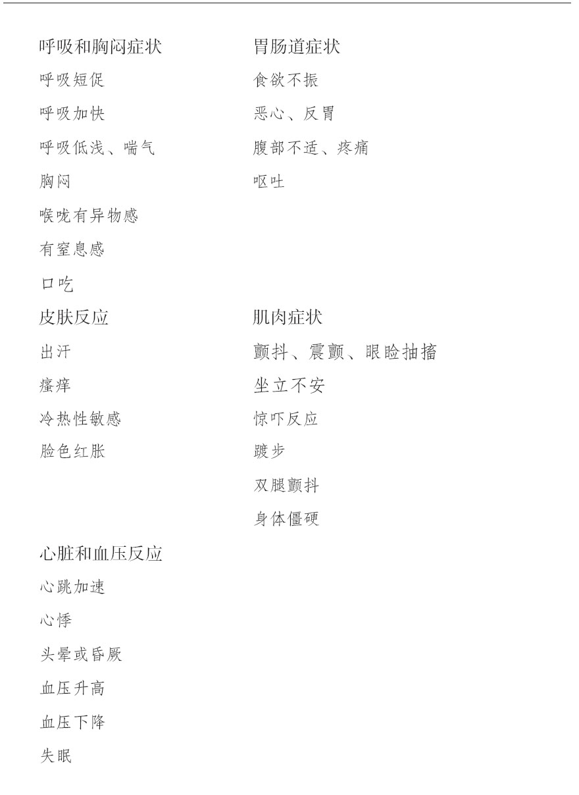

表2-2列出了一些你可能会担心的事情或情况。该表并没有列出所有情况，你还可能会为一些不同寻常的事情感到担忧，也许其他人不会为此担忧，而你则会。

表2-2　你可能会担心的事情或情况

当你感到焦虑时，尤其是当你经常为某件事情感到焦虑或产生强烈的焦虑感时，请留心你遇到的标志物，然后请记住你通常会担心的事情或情况，但是不要让自己为潜在的焦虑而担心。你发现你会为这件事情或其他事情感到“焦虑”，而实际上这是一种正常的和健康的担忧情绪。

# 第3章　焦虑是你制造的，你也可以消除它

幸运的是，大多数严重的或不健康的焦虑心理都是自我塑造的，更加值得庆幸的是，你完全有能力去消除或缓解这种焦虑心理。正如我们之前曾指出的，你天生就具备一种担忧或焦虑的倾向，你最好不要将其完全消除，否则就会有生存的危险。你也可能是在后天环境的培养中塑造了这种焦虑倾向，因为你的愿望和目标很容易被许多危险的状况打断或阻止，如疾病、意外事故、他人的反对、殴打、虐待、强奸、股市崩盘、战争以及一系列其他的困难。事实上，正是因为你的生活中会出现许多麻烦的事情，所以它们也许很容易就会对你的期望和乐趣造成干扰。也就是说，你天生就注定要保持警惕，焦虑应该被视为你的一种保护形式。

因此，作为人类，以下两大因素导致了你的焦虑倾向（正如我们在第2章中所指出的，这是一种健康的倾向）：第一，你的生物机能，或者谨慎和警惕等遗传倾向；第二，生活中的一些环境因素，这些环境因素会阻挠和遏制你的欲望，你会为此而担忧。此外，作为人类，你一出生，就会被赋予一定程度的选择权和决定权。你可以做出决定，也可以在两种形式的活动中自行选择一种。虽然可能会受到生物机能和环境的限制，但是你是一个有自我决策权的个体，因此你可以自行做出选择。

这就意味着，你可以决定去这样做或那样做。当你想要得到更多，或不想要得到某件事物时，你会去猜测哪条道路最适合，当你沿着这条道路往前走时，你就会发现，什么是“正确的”，什么是“错误的”——也就是说，什么有助于实现你的目标，什么会阻碍你的前进。但是，当你面对选择时，你几乎不能确定哪条是最适合自己的道路，在前行的过程中你很容易犯错误，因为你完全不知道前行的过程中会发生什么。道路本身也是变化多端的。

因此，作为人类，你总是会有些疑问。你几乎不知道——即使你认为你可能知道——什么是“正确的”，什么是“错误的”。你必须自己去经历，你要承担一定的风险，最终你才能发现“正确的”道路。但是，因为你知道自己想要什么，不想要什么，你知道自己要去寻找“正确的”道路，只是你没有十足的把握，也没有一些固定的规则供你遵守，以确保你实现这些目标。你的存在本身就是一个不确定事件，充其量只能说你是一种随机产物。你认为你知道正确的道路，但你不会有十足的把握。这主要是因为你有一定程度的选择权：你可以选择自己的目标或意图，你也可以选择如何去实现这些目标。这就是为什么存在主义者会谈到“生存焦虑”，选择会让你产生疑虑和不确定性心理。因此，你总会有不同程度的焦虑感——这在很大程度上意味着，你不确定你的选择会产生什么样的结果，你会希望自己能知道什么是正确的或错误的选择，但你永远也不能绝对确定到底哪个是正确的，哪个是错误的。

自然而然，焦虑、怀疑和不确定性都是人类生存环境中的一部分。你不可能完全摆脱担忧心理，但是如果你真正了解这些不健康的心理是如何产生的，而且如果你能采取一些不同的措施——能够产生一种健康的谨慎心理，你就可以减少许多不健康的、夸大的成分。

正如我们之前曾说的，你的焦虑心理源于一种生物因素，其中包括许多先天性倾向：产生一种愿望，找出一些可能会有助于你实现这些愿望的选择，冒险做出选择，然后变更并改变这些选择。所以，你可以说是一个天生的抉择者，你天生就具备焦虑倾向——那是一种强烈的倾向。然后，如上所述，第二个重要因素出现了：你所居住的环境，你周围的人们和事物，这些都会帮助或阻碍你实现这些欲望。如果这些人与事是“有益的”，你就会得到你想要的，而避免经历那些你不想要的，你几乎不会产生什么焦虑或抑郁心理。但是，如果这些人与事都是“有害的”，你将得不到你想要的，你会经历许多你不想要的，你的焦虑和抑郁情绪也会增加。

不幸的是，在这两大容易导致潜在焦虑心理的重要因素面前，你束手无策。你不能轻易地改变你的生物机能——你是一个独一无二的人类，有着各种品质、特征和爱好。然而，这些遗传特性也不是完全一成不变的，你可以（经过不懈努力）改变其中的一些品质和习惯。但是，你只能做出一定的改变，而且往往会遇到很多困难。你不得不去接受并适应有些特征——这是你的“天性”。要想改变这些特征，绝非易事！

至于环境、伴随你生长的以及与你共同生活相处的人和事，你也只能在一定程度上改变他们。你可以在选举时参与投票——但你不能完全改变政局。你可以组织安排一件困难的工作、新的居住区、不同的伴侣和许多其他环境因素，但你不能完全改变它们，而且往往丝毫不能改变！你往往会受到这些不太容易发生变化的人与事的牵绊——这些人与事会阻碍你实现你的欲望，给你带来你不想要的东西。

所以，当你感到焦虑时，比如说，为赚更多的钱而焦虑，你的基本技能和天赋是不容易改变的（如学习会计学的能力或绘画的能力，要是你具备绘画的天赋，你还能当上一名艺术家，并以此谋生）。环境因素（如会计和艺术领域的工作机会）也是如此，你可以在一定程度上改变这些事物——但改变也是有限的。

然而，幸运的是，你可以改变一些关键性的事情——适度的担忧和极度的担忧或焦虑产生的影响相差很大。在面对困境时，你还可以改变这些情况以使自己产生健康的担忧心理，而不是不健康的担忧心理。你会产生健康还是不健康的焦虑心理，主要还是取决于你自己的思想、感觉、行为。你也许会认为你的焦虑心理主要是受生物机能的控制，这种想法是不对的。或者，你也许会认为你的焦虑心理主要是受环境的影响——你的教养环境、童年的生活环境或目前环境中发生的事件，这种想法也是不对的。虽然这些都是一些重要的因素，都会导致焦虑心理的产生，但并不是所有因素都是关键的。第三个因素是你自己——你是如何思考的，你会有怎样的感受，你会做出怎样的行为。你自己很重要，你自身对焦虑的产生有着很大的影响，你自身决定着你会产生一种健康的或不健康的心理。

### 面试焦虑症示例

正如我在第1章中所说的，第三个重要的因素最初是由哲学家和思想家提出的。可以说大多数人都是浅显的哲学家：他们对各种形式的苦恼没有一个清楚的认识，他们往往会将问题归咎于发生在他们身上的一些事情。正如我们所指出的，这种想法有一部分是正确的。你想要满足一个愿望，但是当这一愿望受到阻碍，而你最近刚好因为以前发生过的事情而沮丧时，你就会将责任归咎于这件事。如果你去参加工作面试，面试官没有给你好脸色，而且你被拒绝了，你会对自己说，“面试官阻碍了我面试的成功”。然而事实是，你想要这份工作，你选择了你想为之效力的公司，你回答了面试官的问题，你觉得自己被他们拒绝了。因此，问题不在于面试官拒绝你，而在于你对这份工作的期望、你选择的公司、你给面试官的答案等。在这种情况中，你是必不可缺的一部分。如果你真的想要一份工作，你不会简单地仅仅去找一个“好的”面试官，你还要去找的是一个工作，找的是一个面试的公司，去参加面试，并做出其他各种事情来争取这份工作。当然，面试官发挥很重要的作用，但你的愿望、选择、行动和其他变量也发挥着更大的作用。你也许不太明白这些因素的作用，因此你也许就不明白为什么你没有得到这份工作。

工作被拒后，你会产生一些情绪，这些情绪使你感觉更复杂、更不容易理解了。

你的目标或愿望是得到这份工作。在A点（不愉快事件），你遇到了面试官，面试官拒绝了你的求职。然后，在C点（后果），你因失去工作机会而感到沮丧，你同时还非常担心以后求职过程中会遇到类似的情况。因此，我们总结出A（不愉快事件）和C（后果）抑郁和焦虑。这样看来就清楚了，而且几乎所有正常人都会看明白，你会得出结论，A导致C的产生——也就是说，不愉快事件导致了抑郁和焦虑的产生。

然而，这种想法是片面的，实际上，这种想法会让我们陷入一种困境。每当发生不愉快的事情，我们因此而感到焦虑或抑郁时——每当发生有违我们意愿的不愉快的事情时，没有谁会说他感觉很好，我们很快就会得出结论，这件不愉快的事情A导致了焦虑或抑郁等消极情绪C，因此，一定是A引起了C。这点很正确，因为要是A没有发生，一件愉快的事情取代了一件不愉快的事情（如成功取代了失败），我们很可能永远也不会感到焦虑或抑郁。因此，我们得出结论，因为所发生的事情是不愉快的，一定是这种不愉快（不好）导致了焦虑或抑郁等不愉快（不好）的情绪。显而易见，难道不是吗？

其实不然，实际上A（不愉快事件）引起了C（焦虑或抑郁）这一结论是错误的。假如同一种不愉快事件发生在100个人身上，他们都会感到焦虑或抑郁吗？显然不是。几乎所有人，比如说90%或95%都会因这种不愉快事件产生一些不好的情绪——因为它有违他们的意愿，人们不愿它发生。但是，因为A（不愉快事件）产生C（后果），他们往往会产生各种不同的感受。比如说有100个人与面试官见面，面试官拒绝了他们的应试，在这100名被拒者中，有些人失望了，有些人生气了，有些人感到郁闷，有些人则心灰意冷，其他人还会有一些不同的感受。所有人不可能都产生一种完全一致的感受。他们会有各种各样的感受，可以肯定的是，大多数感受都是消极的，但也是一些不同的消极情绪。并非所有人都会感到沮丧，甚至有人也许会因面试官拒绝了他们而感到高兴。最后这一类人可能是：他们真的不想工作，或他们本来想要这份工作，但他们认为这份工作弊大于利。

极其重要的一点是：当不好的事情发生在你身上时，如没有得到你想要的工作，这些不愉快事件不会直接导致你产生沮丧情绪。这中间还存在一个变量——你对A的想法或信念（B），B可以直接导致这种沮丧情绪。正如你选择你想要（或不想要）的工作，你选择通过努力在面试中获得成功（或不去付出努力），你还可以选择在面试失败后你会产生怎样的想法，根据你选择的想法，当你被拒绝后，你会产生完全不同的感受。

例如，假设你提交了工作申请，参加了面试，尽你所能通过了面试，但你仍然没能得到这份工作。你在B点也许会认为，“好吧，我尽了最大的努力来争取这份工作，但遗憾的是，还有其他更多合适的人选。太遗憾了，但是我也不是非要得到这份工作，我会以此为鉴，再去尝试其他一些类似的工作。”

如果你的想法（B）是这样的，你很可能会感到难过、遗憾、失望——但不会感到沮丧和自卑。然而，如果你参加了面试，尽你所能通过了面试，仍然没能得到这份工作，你对这种失败抱有完全不同的想法（B），如“我在面试中本来可以做得更好的，我犯了几个不应该犯的错误。这份工作对我来说意义重大，要是得不到这份工作就太可怕了。”“面试中我表现得很糟糕，我很可能还会在其他类似的工作面试中再次失败。我真蠢！”“我必须找到一份跟这份工作一样的工作，否则我的人生就毁了。”“如果我一直这样面试下去，我可能永远也找不到一份好工作。太可怕了！我真可怜！”

如果你的想法（B）是这样的，你很可能会感到郁闷，可能会想到自杀，你就不会再去参加其他的面试，你也许会逃避这样的求职过程，很长一段时间都不会找到工作。

由此得出的教训是：你必须学会控制你的情绪。虽然你不能控制你想找的工作、你参加的面试、面试官的决定、有多少类似的工作以及其他有关求职的重要方面，你可以控制你得到或失去工作时的反应和情绪。你自身，在很大程度上，虽不是绝对的，但应该是可以通过你的想法来控制你的情绪：当在A点，你的生活中出现不幸或不愉快事件时，在B点你会产生怎样的想法。

幸运的是，虽然你往往无法控制你身边发生的事情，但当这样的事情发生在你身上时，你通常可以控制自己的反应。如果发生了非常糟糕的事情——有违你的目标和利益的事件，你很可能首先会产生一些健康的消极情绪，如失望、悲伤、悔恨、烦恼和挫败。因为你不愿意失去你想要的东西（或得到你不想要的东西），所以当这些不愉快事件发生时，你最好用一些负面情绪来应对。这是一种健康的表现，因为失望和沮丧的情绪会激励你回顾生活中发生的不愉快事件，回想一下这些不愉快事件，你会采取一些措施来应对，并试图改变这些不愉快事件。如果你不会因此而产生一些情绪，你就会放任这些不愉快事件发展下去，而不会采取措施来应对。所以你要采取行动，而遗憾和失望这些健康的消极情绪会帮助你做到这一点。这就是为什么我们在理性情绪行为疗法（REBT）中将它们称为健康或有益的情绪。

然而，当生活中出现不幸时，如果你选择了不健康的消极情绪（B），你可能不会成功地应对这些问题。因为这样的情绪——如焦虑、恐慌、抑郁、愤怒、仇恨和自怜，通常都是具有破坏性的，这些情绪会干扰你对问题的处理。这些情绪往往会异常强烈，它们会迷惑和困扰着你，也会对线性思维和解决问题的能力造成干扰。

这些情绪还可能会麻痹你。它们往往会导致一些疯狂的行为，如谋划伤害他人，这些行为会使你伤害或破坏一些人或事情。它们还会导致你心身不适，如心悸和头痛；会妨碍你，使你难以应付这些不愉快事件。

让我们再重复一遍：当生活中发生不愉快的事情时，如失去一份你真正想要得到的工作，你很快就会因此而感到焦虑和抑郁，这些事情（不愉快的事情）本身不会对你的情绪和反应带来什么影响。这些不愉快的事情也许会糟糕至极，也许会使你产生一些情绪化的反应，但更重要的是B——你对这些不愉快的事情产生的想法。这些想法包括各种各样的看法、评论和结论，你也会产生相应的情绪反应。因此，当同样不愉快的事情发生在你身上时（如再次在工作面试中被拒绝），你可能会产生一些或强或弱、或健康或不健康的情绪。在面对同样不愉快的事情时，你的反应可能会有所不同，其他人亦是如此。如果类似的不愉快事件发生在100个人身上，所有人也许都会产生一些类似的不良情绪反应，但每个人都还是会有一些不同的反应。

你或者其他人的行为结果也是这样的。如果你在A点（不愉快事件）失去了一份理想的工作，这次失败可能会激励你去参加许多其他面试，你最终会得到你想要的工作。但同时也可能会让你感到沮丧和绝望，以后再也不会去参加别的面试。怎么会这样呢？主要的区别就在于你在B点的情况——你自己的想法是什么样的。你也许会说，“太糟糕了，我失去了这份工作，但现在我了解到了面试官想要的东西，我觉得我真的有能力得到这样一份工作，并能表现良好。所以我会尽可能去参加更多的面试，直到我最终找到一份工作，这可能需要花费一段时间，但如果我坚持不懈，我相信我会成功的。”如果你有这种想法（B），你会继续寻找工作，尽可能参加更多的面试。

反之，你也许会认为，“哦，从这次面试来看，我以后的求职路会更加艰辛了。我真的不具备他们需要的能力。如果我真的被他们聘用了，他们也会发现我的工作表现没有那么好，很快就会把我辞退了。参加再多的面试有什么用呢？我最好换一种其他的工作。也许我做什么都不行。所以，也许我还是去领政府救济金吧，或者去寻求家人的帮助。”如果你失去工作后是这么想的，你很可能不会付出更多的努力去找一份类似的工作，或者，你会选择一种极端的行为——完全退出就业市场。

所以，在未能通过工作面试后，你会有怎样的反应和行为，这在很大程度上不是取决于面试，而是取决于你在面试被拒和尝试寻找其他工作时会产生怎样的想法。再者，你对不愉快事件的情绪反应和行为反应主要取决于你对不愉快事件产生的想法，而不是仅仅取决于不愉快事件本身。

这点真是非常幸运。大多数情况下，你都能很好地控制你相信什么、不相信什么，并能产生相应的感受，采取相应的行动。

# 第4章　使你产生焦虑的非理性信念

如果你承受着极大的压力，如暴力、强奸、虐待或重大事故，你会产生这种精神上的创伤，可能使你立即就会变得异常恐慌或暴躁，你可能会在接下来的一段时间内情绪失控、举止怪异。当这种事情发生的那一刻，尤其是当遇到意想不到的创伤性事件时，你会感到异常震惊从而失去了理性思维（至少暂时会是这样）。即便如此，经过一段时间后，你还是会恢复到原来的状态，但与初次经受这种创伤时相比，你会更加明白如何去控制自己的思想和行为。

幸运的是，只有在某种特殊情况下才会如此。而在大多数情况下，你的大脑和中枢神经系统运行正常，你可以很好地控制自己的思维、情绪和行为——也就是说，你怎么想就可以怎么做！当你意识到自己失控了，你的思维和情绪不再受你控制，那么，也许真的就会产生这样的结果。从理论上来讲，你可以改变你的思维、情绪和行为，但是你也可能会认为你做不到，因此，你也许会选择放弃，并听任这种消极情绪的控制。如果是这样的话，你会认为你无法阻止这些焦虑或恐慌情绪。因此，你会向它们缴械投降，让这些情绪将你攻陷。然而，事实并非如此，即使当你处于极度恐慌的状态，你也有能力阻止它们；但是，一旦你认为自己做不到，你甚至还会为这些恐慌情绪而恐慌。你将会全线崩溃，进而失去所有的控制能力！

当你认为你的想法对自己的情绪和反应至关重要，并且你坚信这些想法会让你不安或干扰你的正常行为时，这就说明你还是不能完全控制自己的情绪。这不是可以用药物医治的！但是，你可以根据你的个人情况来规范、管理和改变你的情绪和反应。因为你可以有多种不同的思维，比如你可以选择产生某些想法，也可以选择拒绝产生某种想法。这样，你将不再受这些严重的焦虑、抑郁和愤怒等情绪的控制——而通常你都是被这些情况所控制。正如我们在这本书中不断重复的观点：你可以思考，你可以思考你所思考的，你甚至还可以思考你为什么思考你所思考的。正常人类都会如此，他们可以用多种不同的方式来思考——自救的好方式和自损的坏方式，这是一种与生俱来的能力。关键是他们要善于利用这种能力！

现在，我要向你们解释一下理性情绪行为疗法的基本原则，并向你们说明ABC理论是如何掌控你们的情绪和行为的，特别会强调如何在焦虑感控制你之前先行将其控制。如果你选择使用这些原则，并坚持练习，很可能你会在一定程度上对你的情绪进行控制，这绝对是你做梦也想不到的，尤其是在焦虑症的控制方面。此外，对于任何正在形成的其他破坏性情绪，理性情绪行为疗法也能帮助予以控制。

### 成就焦虑感是如何形成的

往往是哪些事情让你感到焦虑呢？让我们举一个最常见的例子。假设你非常想做好一个任务、一项运动、一类工作，抑或是建立一种关系，而你又害怕自己做不到。如果失败了，那些你急欲讨好的人就会失去对你的认同感。所以理所当然，你会感到异常焦虑。

按照理性情绪行为疗法的术语来讲，你有成功的目标（G），但很可能会发生不愉快事件（A），你会失败，并被拒绝。因此，在C点，即你失败后被拒绝（A）这一结果，你会感到异常焦虑。当然，焦虑不会帮你在这个项目中取得成功，即使你成功了，焦虑也不会帮你取得他人的认可。相反，你不断担心自己会失败：实际上，你可能会双腿发抖，浑身战栗不已，你可能会感到脆弱和不安。你还有可能会因焦虑而引发呕吐，身体会不协调，甚至会麻痹。本来计划要做好这个项目的，现在完全被打乱了。

根据理性情绪行为疗法的观点，你的焦虑也许由若干个原因造成。例如，你想要成功完成的任务和所遇到的困难以及至关重要的评价人。但是，这些外因是你无法去改变的，那么，你能控制哪些原因呢？你如何才能调整并改变这些原因并使它们帮助你取得成功呢？答案是：主要取决于你对所处情境以及失败并被拒绝的可能性所产生的信念（B）。这些想法主要是由你控制的，如果这些信念不会给你提供任何帮助，你可以做出适当的调整。接下来，让我们把注意力转移到这些信念上。

首先，就目前正在从事的项目，以及成功完成这个项目后，可能会获得的认同，你可能会产生一系列理性信念（RB）。这些理性信念（或选择性期望）也许会是这样发展的：“我真的希望我能做好这个项目，这样的话，那些我希望他们会喜欢我的人就会认同我。当然，我也可能会做不好，要是那样的话就真是不幸了，因为我不会得到我想要的东西，可能还会有人反对我，这些都不是我希望的。然而，失败和被拒绝并不是世界上最糟糕的事情，我可以从中得到学习，并不断再次尝试。那些我想讨好的人会反对我，这也不是什么要命的事，仅仅是让我暂时少了一些欢乐而已。即使我从来没有在这个项目中，抑或是其他类似的重要项目中取得成功，我只是会感到有点儿沮丧，而不会被打击沉沦。同样，如果我永远也得不到这些人的认同，我只会产生一种挫败感，而不会彻底崩溃。现在来分析一下，如果我付出最大的努力来完成这个项目，结果我却失败了，我会继续不断地去尝试其他类似的项目，最终，我很可能会获得成功，同时还会获得多数人的认可。但是，如果我不这样做，我就不会获得成功，即便如此，我仍然可以快乐地生活。”

这些信念（B）是合理的，因为它们通常会帮助你在项目中取得成功，并赢得那些你喜欢的人的认可。这些信念会导致诸如鼓励和热情等健康情绪的产生，如果你没有获得成功，失望和沮丧这类健康情绪会有助于你取得成功。这些情绪也许会激励你不断去尝试做好这个项目以及其他类似的项目，使你不再贸然退缩或过早放弃。这些情绪还会集中你的思想和精力，使你专注于那些有益的方案和计划上，能帮助你得到你想得到的东西。这都是一些积极的信念，而且，虽然不能绝对保证你能实现你的目标，这些积极的信念会极大地提高这种可能性。这就是为什么我们将它们称为理性信念（RB），因为它们很有用，往往会提高你的工作效率，使你取得更多的成果。

当潜在的不愉快事件（未能完成项目）发生后，如果你产生的是这种理性信念，结果（C）很可能会与你的期望相吻合。因此，理性信念多半会帮助你实现目标。有时，你也会产生失望和沮丧之类的失落情绪，如果是这样的话，这些失落情绪也会有助于你去实现这些目标。因此，你有很大的几率去实现目前和未来的目标，理性信念往往会招致理想的后果。

然而，当你确定了自己的目标：取得成功并获得认可后，你就会意识到可能有许多不愉快事件（A）会阻止并妨碍你去实现自己的目标。你可能会产生一系列非理性信念（IB），这些非理性信念会让你感到不安，很可能会破坏你预期的结果（C）。因此，你可能会认为，“要是我注定不能实现我的目标，那些我喜欢的人会彻底将我拒绝，真是糟糕透顶！我绝对不能失败，也绝对不能被拒绝，我永远也无法忍受这样的事情发生。这将意味着我还不够好，还不配获得成功——我是一个才疏学浅、毫无价值的人。如果人们因为我的失利拒绝了我，就证明我不配获得他们的认可，以后他们还会不断地拒绝我。真是太恐怖了！我会彻底崩溃的！我不会再感到快乐了。如果我得不到真正想要的东西，这种生活不值得过，也许我还是自我了断的好！”这些想法都是非理性的。

这些非理性信念通常不会给我们带来任何益处，反而会给我们带来不少伤害。它们往往会让你感到焦虑——实际上，可以说是一种恐慌，你的各种身体机能都会受到影响，最终你将失败，并遭他人拒绝。非理性信念往往还会给你带来身体上的不适和虚弱，非理性信念造成的恐慌会干扰你的智商——使你搞不清楚要做出怎样的规划才能取得成功，或是怎样执行这种规划。如果你失败了，这些非理性信念会在情绪上削弱你，你可能会失去再次尝试的念头，也可能会不顾一切地去实现你的目标，而导致接二连三地失败。非理性信念往往会使你彻底放弃你原来的目标，勉强去接受那些你非常不想要的其他目标，要不然就是让你彻底变为一个漫无目标、庸庸碌碌的人。这些信念也许会给你以后的生活带来巨大的冲击，你以前能很好地完成的目标和项目，现在却会失败。更加严重的是，这些信念还会使你精神崩溃或让你产生自杀的念头。

当你接手一个重要的项目，急欲获得成功并要得到一些重要人物的认可时，积极的理性信念和消极的非理性信念之间有什么区别呢？理性信念会激励你去得到这一项目，你会充满激情，并会产生一种理智的担忧情绪。担忧也是一种焦虑，因为担忧会让你想到失败，会迫使你在行事时保持慎重和警惕的心理；担忧有助于你制订计划，并将这种计划贯彻始终；担忧有助于你厘清事物的各个方面，当出现混乱的情况时，你能做出改变，使事情恢复常态。担忧也是情绪控制的必要组成部分：如果没有这种健康的担忧心理，你就不会费心去尝试任何一件事情，更不会尝试去将其做好。因此，理性信念会使你产生担忧、慎重、警惕的心理，你会随时准备好接受与你从事的项目有关的任何意外情况。此外，担忧还是一种有趣的心理，你会乐享其中：担忧使你产生一种风险心理，你会去考虑什么才是最好的解决方式，并能全身心地投入其中。这种心理会使你感到愉悦，就像芝加哥大学希克然米哈依（Csikszentmihalyi）教授所说的“流”（flow），或者还可以说是对所从事的事情的内在享受以及全身心投入时的愉悦感。

焦虑则并非如此！焦虑是一种过度的或夸大的担忧。担忧可以使你重视所从事的项目并为你带来兴奋感，而焦虑则使你过分重视所从事的项目，你会认为它们神圣而不可侵犯。虽然焦虑和担忧这两种心理看上去极其类似，前者是一种过分担忧，后者则是正常的担忧，但在某些方面它们却相去甚远。当你对自己说，“我很想做这个项目，我会竭尽所能去做好，但如果结果不甚完美，我还是会享受这个过程”，这种担忧是合理的，你融入其中了。但是，当这种信念升级为过度的、不合理的时候，如“我一定要参与这个项目，而且必须完美地完成这个项目，否则我就是一个毫无价值的人”，这是一种过度担忧或焦虑的心理，甚至有点儿疯狂。正如我们曾指出的，这种过度的担忧或焦虑心理往往会使你心烦意乱，极有可能出现的结果就是你将不能很好地完成这个项目。

你是怎么知道B点处的信念是不合理的或与你的目标背道而驰呢？我们要先去寻找这些信念，发现了它们之后，如果这些信念是不合理的（D点），我们要与其进行辩论，最终将它们转变成合理的信念。就如何做到这几点，我想提出几个相当简单的方式，我会向你们简要介绍一下这些方法。但是，首先我们要来看一看理性情绪行为疗法ABC理论中的C，来看一下你的焦虑状况。焦虑像一种胃肠道症状，这是一种不安、怀疑和犹豫不决的感觉。通过一些身体上的感觉（如忐忑不安），你能意识到焦虑的存在。但焦虑还会以一些其他的形式存在，如呼吸急促、战栗、颤抖、抽搐。我们在第2章的表2-1中列出了一些主要的焦虑形式。如果你不确定你是否有焦虑心理，你可以核对一下表2-1，看看你是否有其中的一种或多种表现——有时甚至会有很多表现。当你确定焦虑心理存在，这种焦虑不仅仅是一种合理的担忧、慎重或警惕，接下来你要确定的就是你主要担忧的事情——A或理性情绪行为疗法ABC理论中的A。通常情况下，你发现你会为许多事情而感到焦虑：你无法完成你的某个主要目标，或遭到你喜欢的人的反对，或各种损失，或某些不适、疾病、危险、死亡等（第2章的表2-2中列出了你可能会担忧的一些主要事情）。

### 导致焦虑心理的非理性信念

既然已确定你有焦虑心理，而且你也知道你主要会为什么事情而担忧，那么现在就来看一看导致焦虑心理的非理性信念。从理论上说，这种信念有成千上万种之多。但是，从事于理性情绪行为疗法和其他种类的认知行为疗法（CBT）的医师进行了大量的研究，他们把几乎所有的非理性信念划分为若干个类别。因此，首先，你只需核对一下这几大类别的名称，看一看你的非理性信念可归为哪一类。这几个类别分别为：

绝对必须、应该、义务及其他需求信念。　当我首次对客户的非理性信念进行研究时，我归纳出了12种常见的非理性信念，这些非理性信念都有着各种各样的变体。我对这些信念和它们的变体进行了非理性信念测试，数百个研究报告都提出了这种测试方法，测试对象包括受干扰和未受干扰的人。正如我所预测的那样，研究结果证明——与那些非理性信念少且轻微或适度的人相比，非理性信念多且强烈的人通常会更加焦虑和不安。这个重要的发现表明了：理性情绪行为疗法的理论合情合理，人们的情绪干扰与他们的非理性信念有关。

随后，我对人们的非理性信念又进行了进一步的临床试验和研究，当我得知我之前对非理性信念和那些变体进行的12种归类完全准确时，我感到有点惊喜。另外我还总结出可以进一步将这些非理性信念归纳为三大类，事实上，所有其他非理性信念（实际上有几百种）都可以归为这三大类。这三种基本的非理性信念都会导致情绪干扰，究其原因，都是源于一种绝对必须的要求或命令：无条件应该、义务或必须。虽然几年前我就曾预料到这种方法的真实性，但我还是感到有些惊讶。卡伦·霍妮是一个非同寻常的分析师，她曾在1950年就得出了类似的结论，当年她就提出了使人们感到不安的“强硬的应该”观点。20世纪50年代中期，我将理性情绪行为疗法应用于客户身上，那时我专心研究“绝对应该”和“必须”的信念，我发现存在以下三种强大的“必须”信念，我将它们称为必须强迫症（musturbation）：

1.针对我自己的必须信念。　例如，“我必须成功地完成每一个重要的任务”，“我必须受到那些重要人士的赞许，至少我应该被完全认可”，“我必须在我选择从事的项目中表现出优秀或完美的水平”，这是一种极其常见的必须强迫症，世人都会在生活中的某个阶段产生这种信念，当他们未能实现生活中的目标时，这种信念会让他们感到焦虑、抑郁、自轻自贱和不安。

2.针对他人的必须信念。　例如，“他人必须帮助我得到任何我想要的东西，并阻止那些我不希望的事情的发生”，“当我希望他们喜欢我、认可我时，他们必须这么做”，当他人不遵守你的命令，不能完全按照你所想的方式来对待你时，这种形式的必须强迫症会导致生气、发怒、暴怒、暴行、仇恨、争斗和毁灭等情绪的产生。

3.针对客观世界和环境条件的必须信念。　例如，“工作条件必须能确保我从事自己喜欢的职业，而且这种职业的待遇必须很好”，“天气状况必须符合我的心意，完全按照我的需求而改变”，“政治经济形式在任何时候都必须符合我所需，不能有违我的个人利益”，这种形式的必须强迫症会降低你对挫折的忍耐力，导致抑郁、拖延、耽溺，和其他各种不良后果。

正如我所说的，这三大必须信念涵盖了所有非理性信念，并且还能产生许多各式各样的不安情绪和不正常行为，这点多少让我感到有点儿惊讶，它们会造成人类机能障碍。任何重要的必须信念或非理性信念都包含在这三大必须信念之中，到现在为止我还未发现有例外情况。

每种必须信念和要求都能细分为很多种，但反过来说，不管是直接或间接来看，每一种都肯定会包含一种绝对需求。

这就意味着，只要你头脑中有一个具体目标，你很想去实现它，而且你还避免了那些必须信念和要求，当你未能实现你的目标时，你会产生一些健康的情绪，诸如悲伤、遗憾、沮丧和不满等，而不会让自己产生一种极其严重的低落情绪。选择性期望陈述法似乎总能避免一些情绪困扰，因为即使你未能实现目标，你还会有一些其他的选择。因此，如果你告诉自己，我非常希望成功完成这个项目，但是如果我没有成功，我仍然可以很快乐地生活；如果你失败了，你可能会感到失望，但不会受到严重的精神创伤，这是一种正常的现象。

但是绝对必须信念就不会接受任何选择性期望或一些“但是”的观点。这意味着：无论怎样，无论何时，你绝对必须做好，而且必须赢得人们的认可。这种信念自然是完全不现实的，因为结果总会有不合你心意的时候，你也不可能总能赢得人们的认可。这时，你会怎么样呢？答案是：焦虑或抑郁。

当然，还有一些完全合乎情理的条件性必须信念。例如，如果你说，要想买书，你就必须付钱；要想上大学，你就必须注册，必须支付学费，必须上课，而且必须通过测试。那么，这些必须信念都是合乎情理的。为了完成某件事情，你经常要先去做一些别的事情。所以，为了达到你的目标，你必须做这些事情。但是，要是你说你无论如何都必须买这本书，不管你有钱没钱你都要买，那么这种信念则是愚蠢的。你的这种无条件性必须信念是根本行不通的，而且还有可能给你带来痛苦。

所以，尽管你很希望你能做好一个项目，并能赢得他人的认可，但是谁也不能肯定你一定会取得成功，而且也不会仅仅因为你自己非常喜欢成功，你就一定会成功，这是没有什么道理可言的。你对成功的选择性期望给了你另外一种选择，在未能达成自己的愿望后，你还能退一步去追求别的目标。但是，如果你对达成你的愿望有一种绝对要求，不管这种愿望是什么，这种信念都很可能会让你陷入困境。绝对必须这种信念几乎行不通，你可能会觉得稍微有点儿智慧的人都不会产生这种信念，但是，人们确实还是在不断坚持着这样一种信念。正如理性情绪行为疗法所讲的，这样的信念往往会导致焦虑、抑郁、自卑心理的产生，所以，要想缓解这种情绪上的低落，首先要看一看你是否有这种必须信念，然后开始与其进行辩论，最终放弃这些信念——将它们转化为可行的选择性期望的信念。

当情绪受干扰或行为不正常时，你是不是会有意识地产生这些必须信念呢？你也许会，也许不会。因此，你可能会有意识地告诉自己：“我必须通过这次数学测试，否则我真是一个不可救药的白痴！”或者“我必须对我父母好，否则我真是坏透了！我真是太差劲了！”如果你有任何这样的想法，一想到自己有可能测试通不过，或对父母不好，你就会感到很明显的焦虑。你的这种必须信念会使你感到焦虑，你明确地知道你必须要怎么做，你要么就是坚持这种信念，使自己焦虑不堪，要么就是将这种信念转变为一种选择性期望（“我希望能通过数学测试，但是要是测试通不过，我依然可以接受自己。”）。这样的话，正如理性情绪行为疗法所言，如果失败了，你会产生一种健康的遗憾和沮丧心理，但又不至于焦虑到丧失一定的理智。

然而，通常情况下，你并没有意识到自己有这种必须信念和要求，你错误地认为你只是希望自己能通过数学测验，不是绝对必须要通过。如果回顾一下你的这种信念，仔细想想其中是否含有一种必须或硬性要求，它很可能就潜藏在你的信念或希望之下，你总是会找到一种必须信念。理性情绪行为疗法中有一个屡经验证的理论，这种理论表明：这种必须信念确实存在，而你几乎意识不到它的存在——直到你有意去寻找时，才会发现！

我们假设理性情绪行为疗法是正确的，当你没有实现你的需求和期望时，你未产生焦虑心理。而你的必须信念和硬性要求往往会导致焦虑心理，你可能会看到，除了焦虑之外，你还可能会产生几种推论或衍生信念，这些信念很强烈，而且还会增加你的焦虑感。其中有以下几种：

自我贬低　“因为我绝对必须通过这次数学测试，但也有一种可能性是我通不过测试。要是通不过测试，我就彻底失败了，我就是一个毫无价值的人”，这种非理性信念就是一种主要的严重焦虑形式。它通常由表现性焦虑组成，但也可能会包括这样一种非理性信念，即如果你通不过数学测试，人们会鄙视你，因为你必须要获得他们的认可，而实际上你可能得不到他们的认可，这也会让你感觉你会受到他人的鄙夷。

贬低或诅咒他人　“人们必须对我很好，而且要公平地对我，然而，有些人没有这么做，都是因为这些烂人，他们应该被诅咒，应该受到惩罚”，这种非理性信念是一种以偏赅全的信念，你会谴责人们的做法，这样可能会导致极大的愤怒、仇恨、争斗甚至屠杀心理。通常别人也会产生同样的愤怒：自然而然，他们会因为你的愤怒而谴责你，而不是仅仅谴责愤怒本身。所以，愤怒只会引发更多的愤怒，诅咒也会引发更多的诅咒。这种以偏赅全的信念一直循环往复着，永远也没有尽头。

糟糕至极　如果你认为你必须恭敬、和善地对待你的父母，而有一种可能性是我可能做不到这一点，你可能会情绪低落，感觉自己是一个毫无价值的人。同时，你还可能会产生一种不合理的信念——“苛刻地对待我的父母真是一件可怕的事情！我居然会有这种想法，真是太恐怖了，更不用说这么做了”。如果你产生了这样一种糟糕至极的信念，万一哪天你苛刻地对待你的父母，你可能会产生一种不健康的焦虑心理，而不仅仅是一些健康的遗憾、失望、懊悔等心理。这种糟糕至极的想法会大大增加你的焦虑感。

我不能容忍这种现状　当你坚持认为你绝对必须让人们公平地对待你，你常常会得出这样的结论（基于你的必须信念）：“我不能容忍他们不公平地对待我！我不能容忍。”我不能容忍这种现状的信念会加深你的那种必须信念，会让你感到异常气愤，因为这两种信念都意味着，那些不公正对待你的人会使你丧失所有幸福，你还不如死了算了。当你在说：“我必须在这个项目中取得成功，要是失败了，我会受不了的”，这种我不能容忍的信念放大了你的愤怒或焦虑。

全或无思维、非黑即白思维以及其他以偏赅全的思维　当你要求自己做好一件事，要求他人好好地对你，要是事情并没完全按照你所想的方式进展，你会感到很可怕。这是一种以偏赅全、非黑即白的思维，会让你陷入困境。因此，你会产生这些非理性信念：“因为我在这个重要的项目中惨遭失败，这就意味着我将一直失败下去，永远也不会成功”，“因为我在建立一些重要合作关系的事情上失败了，所以我将永远得不到自己想要的东西，我会一直失败下去”，“由于不幸的事情总是发生在我身上，它们还会不断地发生，让我苦不堪言”。

这些绝对应该、必须和其他需求之类的信念会导致产生以上所述的自我贬低、诅咒他人、糟糕至极、我不能容忍这种现状以及不正确的以偏赅全的信念。但是，反过来，这些非理性信念还会导致并深化你的必须信念。因此，如果你强烈地认为“如果我在重要项目中失败了，结果会很可怕，我不能容忍自己表现不佳”，你会强烈地认为“既然失败如此可怕，那就意味着，我绝对必须成功，如果我不能成功，我就是一个无能之辈！”，这种必须强迫症会使你产生一种糟糕至极的信念。反之亦然，你的那些非理性信念会深化这些信念，进而导致更多非理性信念的产生。

人类为什么经常会产生这种非理性信念呢？一方面是因为受父母和文化背景的影响。另一方面是受生物机能的影响，他们倾向于把那些强烈的选择性期望转化为迫切需求。他们并不是每次都会产生这种心理倾向，却经常会这样做。这是人类本性使然。

总结一下我所强调的内容：你天生就是一个具备担忧或适度焦虑心理的人；在正常生活中，你会遇到许多问题、困扰和压力。如果你不去考虑如何去处理这些问题，而且不去尝试解决这些问题，你就很难存活在这个世上。所以，不管是从生物机能上，还是从社会因素上来讲，你都会遇到许多困难，而且还要去应对这些困难，你必须在一定程度上保持一种担忧、慎重和警惕的心理。

此外，你很容易过度担忧或过分紧张，这种倾向会使你难以应付你可能会遇到的众多应激事件。你往往会变得更加焦虑，这种焦虑超出了你的需求范围，其中一部分是受生物机能的影响，这是由原始人类过于慎重和警惕的倾向演变而来的；同时还会受社会因素的影响，你会受父母、老师和文化背景的影响。因为你对成功、认可和安慰有一种强烈的愿望，你会把这些愿望转化为不正常的，而且有点夸大的需求。当你想要做好一件事，并想获得他人的认可时，你经常会把自己的选择性期望转化为一种不切实际、妄自尊大的要求，尤其会产生这三种夸大的必须信念：①“我必须无条件地做好，否则我就是一个无能之辈”；②“其他人必须无条件地对我好，必须公平地对待我，否则他们就该受到诅咒”；③“我的居住条件必须井然有序，这样我就能得到我想要的一切，避免我不想要的一切，否则这世界将是一个极其可怕的地方”。

这三种不合理的必须信念往往会支配那些适度的紧张和焦虑心理，并将它们转化为严重的焦虑和恐慌心理。第一种必须信念会导致一种自我焦虑心理，第二种和第三种必须信念会导致愤怒情绪，还会降低你的挫折忍耐力，这些都是不合理的焦虑心理。如果没有这种有意或无意的必须信念和要求，你仍然会产生慎重和警惕的心理，尤其是在面对真正的风险或危险时，但你几乎不会失控，你完全有能力去处理这些应激反应。

美国精神病学协会的《精神疾病诊断和统计手册》（DSM-IV）是这样对惊恐障碍下定义的：惊恐障碍是指一种突发的恐惧感，这种心理会迅速达到一种极致（通常在10分钟左右），并常伴有一种迫在眉睫的危险感或濒临死亡的感觉以及一种强烈的要四处逃窜的冲动。躯体或认知症状主要表现为心悸，出汗，战栗或发抖，恶心或腹部不适，头晕，胸闷，窒息感，胸部疼痛，人格解体，害怕失去控制或“几近疯狂”，对死亡的恐惧，皮肤有一种灼热感或刺痛感，寒战或潮热，等等。严重焦虑时也会出现这些症状，但在惊恐状态时，这些症状可能会达到一种极致。

一旦你惊恐了（或者虽然不会感到一种严重的惊恐感，但也十分焦虑），你会不断地告诉自己——“我不能惊恐！”“我不能忍受惊恐带来的那种可怕的情绪和感觉！”“惊恐实在太可怕，太恐怖了！”这样的话，你往往会因为这些惊恐而惊慌失措——当然，这会加重你原先的惊恐感，会使这种感觉持续更长时间。

事实上，一旦你因惊恐障碍而惊慌失措了，你可能会沉浸在这种“恐怖的”情绪中，而这种情绪是你自己引发的，你会去想——要是真发生了会是多么“可怕”。当真的发生这种情况时，惊恐障碍会首先发作（这可能是因为你对几乎所有东西都会产生恐惧感）；接着，你会因这种惊恐障碍而惊慌失措，这种情绪会控制你，你可能会感到一种“无名的焦虑”。其实，你是因为自己的惊恐障碍（焦虑的初发症状）而感到惊慌失措（焦虑的继发症状）的，这就是你的问题所在。

然而，假设你放任自己失去控制，让焦虑或惊恐感将你控制，而不去控制它。你该怎么做才能制服那些夸大的必须信念，并将它们转化为合情合理的信念呢？看看第5章，你就会知道如何去做了。

# 第5章　与非理性信念辩论

假设这种有关焦虑的理性情绪行为理论是正确的，你可以控制自己的焦虑情绪，并且还能保持一种自我保护式的警惕心和警觉心，这是一种非常简单的方式。虽然简单，却很不容易。

从根本上来说，如果你希望得到某些东西，你只需保持一种比较喜欢的心态就行：比较喜欢获得他人的认可，比较喜欢轻松的氛围，比较喜欢没有什么身体上的意外和疾病——但一定要避免使这种心态升级为一种必须和强求的信念。无论你有着怎样的愿望、目标和价值观，要想从根本上改变它们，几乎是不可能的。但是，一旦这些愿望演变为一种强制性和必要性的需求，你就应该停下来思考一下：这些强制性需求如何有害，如何使它们回归到那种愿望和希望的状态。

是不是很简单呢？确实如此——但是，我还要说一点，其实并不那么容易。让我们具体来说一下，究竟如何才能做到这一点。

### 以恋爱焦虑症为例

我们举一个最常见的例子。假设你真心爱上了一个人，而你明显地感觉到这个人并没有对你的感情做出任何特别的回应。他对你爱理不理，甚至看上去并不喜欢你，但你还是很希望他会对你的爱意做出回应，因此，要是他没有做出任何回应，你就会焦虑不安。你如何才能缓解这种焦虑感呢？

首先，假设你不仅仅是渴望你心爱的人能够同样爱你。你还有一种极其强烈的愿望，即他必须爱你。为什么呢？为什么我们要做出这样的假设呢？因为你现在是在尝试理性情绪行为疗法，而这个理论指出，当你在异常焦虑的情况下，你很可能会产生一种必须信念。所以，让我们假设这种情况存在。

显而易见，你希望或倾向于心爱的人能对你的感情做出回应。但是，假设因为你的焦虑情绪，这种愿望升级成了一种强制性的必须信念。所以你很容易会发现：“我不仅强烈地希望我心爱的人能爱我，而且我还认为他绝对必须这样做。但是，因为他似乎并没有按照我的想法去做，一想到他很可能永远也不会像我爱他那样爱我，我就很焦虑。我无法保证我会得到我必须得到的东西，所以我会焦虑不安，确切地说，我会惊慌失措。”

现在，在你讲述有关你心爱的人这件事情时，我们发现了这样一个必须信念，毋庸置疑，这种信念使你感到焦虑了。这个方法很简单，是不是？如果你回头想一下，你可能轻易地就能发现这种信念。

好了，现在你有了这种必须信念，即“我心爱的人必须、绝对必须像我爱他一样爱我”。你要怎么做呢？你打算怎么去改变这种信念呢？

答案是：如果你遵照理性情绪行为疗法的理论，就要与这些信念进行辩论。那么，你的目标是让你心爱的人爱你：在A点，即不愉快事件发生时，他似乎并不在意你，而且可能永远也不会在意你；在B点，即你的非理性信念产生时，你告诉自己他绝对必须在意你；因此，在C点，你的这种情绪产生的结果——你很焦虑。是不是一切都一清二楚了呢？

然后，继续遵照理性情绪行为疗法的理论，你会向D迈进，D代表辩论，辩论也许是现今功能最为强大的一种治疗方法——几千年前，哲学家们发明了这种治疗方法，这些哲学家有的来自亚洲，有的来自希腊，还有的来自罗马。D（辩论）是对你的非理性信念，即“我心爱的人绝对必须爱我！”提出的一种质疑和挑战。

现在，你可以同你的非理性信念进行辩论，即“我心爱的人绝对必须爱我！”的信念。在这里，我想要强调三种辩论非理性信念的思维方法。之后，我会为你介绍其他一些有关认知、情感和行为的方法，来辩论这种非理性信念或任何其他自我挫败的非理性信念。

### 现实或实证型辩论法

第一种辩论非理性信念的方法是现实或实证型辩论法，这种方法可谓是一种最基本的方法。这些非理性信念站不住脚的主要原因就是它们有违社会现实。它们不符合生活事实，当它们背离社会现实时，如果你还是固执己见，这种非理性信念就会妨碍你去实现自己的愿望。

因此，当你产生这样一种非理性信念，即“我心爱的人绝对必须爱我”时，你首先应该辩论一下，这种信念是否符合现实或事实。你应该问问自己，并不断对自己发问，直到得到一个合适的答案——“为什么我心爱的人一定要爱我呢？有什么证据表明他必须这样做吗？‘他绝对必须爱我’这种假设现实吗？有没有事实证据能证明这一点呢？他有什么理由必须爱我呢？”

当然，关于所有这些问题，我们只能大声地跟你说声“不”。事实上，你心爱的人有他自己的选择，他可以自由选择去爱你或不爱你。因此，他不是必须要爱你。实际中，他可能不会爱你。没有任何证据表明他绝对必须爱你，但有大量证据表明他可能不会爱你，而且，事实上，你往往会因这样的要求而烦恼，实际上他可能不会或根本就不会爱你。因此，如果事实表明他不会爱你，那么很明显，他确实不必去爱你。

而且，你心爱的人必须爱你，这种假设是不现实的，他可能会选择去爱你、恨你或忽视你。所以，他不能决定不爱你，这种假设也是不现实的。有什么事实能证明这一点吗？事实是他可能会爱你，也可能不会爱你，这是显而易见的。他有时也会改变对你的想法。显然，这些事实表明，他不会无条件地绝对爱你。

再者，你心爱的人必须爱你，也没有什么道理可言。我们有很多原因可以解释他为什么可能会爱你——例如，你可能对他很好。但是，尽管你对他很好，他仍然有可能不爱你，而且，因为你对他太好，他还可能会认为你太软弱或缺乏精神支持而不爱你。

无论你怎样去分析，你心爱的人绝对必须爱你，这种确切的信念肯定是站不住脚的，因为那显然不是他自己的选择，而且他的选择可能与你的要求不一致。他是一个有着自由抉择权的生物体，他可能会爱你，也可能不会爱你。所以，当你坚持认为他绝对必须无条件地爱你时，你是在否认这样一个事实——他可能会爱你，也可能不会爱你；他可能曾经深深爱着你，但现在可能已经不再爱你。他的这种本性是反复无常、变化万千的，而你坚持认为他会一如既往地爱你，这不符合他的本性。太不现实了！如果你要求他必须永远爱你，而显然他不会这么做，如果真是这样的话，你将惶惶不可终日。

同样，“我心爱的人必须绝对爱我”，这是一种必然推论，你也可以通过现实和实证来辩论这些必然信念。因此，如果他不爱你了（而你认为他必须爱你），你可能会认为，我是一个差劲的情人，我真是无能，就是因为这样，他才不爱我的。但是，这种信念是不现实的，因为有很多原因可以解释为什么他不爱你，其中有一些不是你的原因，主要是因为他自身。例如，他可能真的谁都不爱，他可能不具备去爱他人的能力。

另外，因为你坚持认为你心爱的人绝对必须爱你，而其实他对你并没有什么感情，你可能会得出这样一个结论——“真是太可怕，太恐怖了！我不能忍受他不爱我！”但是，如果你实事求是地质疑这些结论，你会发现他确实可能不会爱你——因为你没有得到他的爱，而这是你一直想要和需要的。但实际上，这可能并不是最糟糕的事情（例如，他可能会疯狂地咬伤你，并决定要杀了你）。他不爱你这个事实并不是那么糟糕，也不是必须不能发生的，但你却认为这个事实很可怕、很恐怖，这就意味着它确实很糟糕，不应该发生。其实不然，不管你认为这件事有多糟糕，他可能还是会不爱你。此外，当你说你不能忍受他不爱你时，这通常意味着以下两点。第一，他不爱你这个事实会要了你的命；但是，你很有可能不会因为他不爱你而去选择结束自己的生命。第二，“我不能忍受！”这种说法是指，如果他永远也不会爱你，你可能以后再也不会感到快乐了。但是，这种说法同样也是不现实的，你不会快乐的主要原因不是因为你不可能会快乐，而是因为你认为你不会快乐。

通过现实辩论法，你可以辩论你心爱的人绝对必须爱你这种信念，此外，你还可以辩论一些衍生出来的不切实际的信念，如“他不爱你真是太可怕了”“你根本无法忍受他不会像你想象中那样爱你”。按照理性情绪行为疗法的观点，非理性信念几乎都是不现实的，没有根据的，你可以严格根据自己或他人的经验，来对其进行辩论，并改变它们。

### 逻辑型辩论法

你的这种信念——“我心爱的人绝对必须爱我”以及各种与之类似的必然信念，通常都是不合逻辑的，而且不符合你的假设：“因为我非常爱他，要是他能同样爱我，我会很高兴，因此他绝对必须爱我，而且必须永远爱我。”如果你想放弃这个想法，并用一种理性的自救式的信念来取代它，你可以通过这些问题来进行辩论：“因为我非常爱我心爱的人，所以他必须同样爱我，这种信念符合逻辑吗？我希望他爱我这样一种强烈的愿望与他爱我这种必要性之间有什么联系呢？正因为我将大大受益于他对我的关怀，他就必须爱我吗？我的结论是基于这种事实得出的吗？”

你要不断问自己这些问题，直到得出一个正确的答案，你就会发现，你对心爱的人提出的感情上的要求都是不合逻辑的。因为你希望心爱的人能够爱你，所以当他不爱你时，你会为未能达成自己的愿望而感到沮丧、失望，这点合情合理。每当你想要某件东西，却没能得到它，你会不自觉地感到沮丧，然后告诉自己说，“我没有实现我的愿望，因此我觉得我很不幸，心里很不舒服。”这种信念合情合理。但你不能坚持认为，因为你会感到沮丧，而且你绝对不能失去他的爱，因此，这样的生活真是了无生趣，这种信念是不合逻辑的。

具体来说，你得出的结论是：你认为你心爱的人绝对必须爱你，而实际上他并不爱你，让我们通过逻辑型辩论法来质疑一下你的这些结论。首先，问：“正因为我非常爱他，他就绝对必须爱我，而且要一辈子爱我，这点合乎逻辑吗？”答：这当然不合逻辑。你的假设（你很爱他，要是他不爱你，你会感到很失望）和你的结论（因此，他绝对必须爱我）之间没有任何关联。如果他确实爱你，这就很合你心意了，但是，并不意味着他必须爱你。他有权去爱你或不爱你；当然，他也可以选择去爱你或不爱你。虽然你强烈地希望他能爱你，但是他并不会因为你的这种强烈的愿望而爱上你。事实上，甚至可能会适得其反！

再者，在对不合理信念进行辩论时，你可以问问自己：“我希望我心爱的人能够爱我这样一种强烈的愿望与他爱我这种必要性之间有什么联系呢？”答：两者之间没有任何联系。不管你的愿望有多么强烈，这显然与他必须爱你没有任何关系，他不会按照你的愿望来决定是否爱你。此外，你的这种强烈的愿望明显不能控制他，要真是如此的话，他一定会爱上你。但是，很显然，他不必去遵循你的愿望。在这个世界上，没有人必须按照你的愿望来行事——除非你拿枪抵着他们的头并强迫他们这样做。即使真是这样，他们也许宁愿选择去死。

但是，就我们现在所说的情况，你手上没有枪，即使你有枪，他仍然不会向你屈服，也不会因此而爱你。事实上，这种可能性几乎为零！

通过逻辑型辩论，你开始明白，在现实生活中，你的愿望不是必须得到满足。毫不夸张地说，即使你会因为你心爱的人不爱你而去选择结束自己的生命，这也并不意味着他就要爱你。要是他愿意，他或许还会看着你去死！

你可以实事求是地对绝对必须、应该、义务和要求进行辩论，意识到这一点很重要。这样一来，你就会接受这样一个事实：你必须得到自己想要得到的东西，这种信念是不合理的。要是你得不到自己想要得到的东西，这也不是什么可怕的事情，你能容忍你得不到自己想要的东西；如果你表现得很糟糕，与你感觉你“必须”表现出来的水平不一致，你也不是一个该受诅咒的人。与此同时，你还应该接受这样一个事实：你对自己、他人和客观世界的要求都是不合逻辑的。尽管你比较希望自己能将重要的事情做好，他人能平等、友善地对待你，而且各种客观条件都能井然有序，并符合你的心意，但你的这些信念永远也不是什么必须实现的事情。因为非常喜欢这样的状态，所以就必须达到这样的状态，这是不合逻辑的，这也根本行不通。

“但是，”你也许会反对说，“假如我失败了，我受到他人不公平的对待，我生活在恶劣的环境中，我还因此受伤或死掉了。为了避免受伤或死亡，我必须完成某些事情，他人必须合理地对待我，周围的环境必须足以让我生存，这种信念难道有什么错吗？”

是的，这种信念十分正确，也合乎逻辑。有时，你的生命取决于你的成功、他人公平的对待和有利的环境。所以，如果你想生存，并想要一直生存下去，某些东西必须存在。但要记住——你绝对必须生存，这种信念是不可取的。不管怎样，你最终都会死，即使你可能已经活了一百多岁。但是，你必须要活很长一段时间；或你必须安详地死去，不受任何病痛折磨；或你的生活一定要幸福。以上这些信念都是站不住脚的。所有这些信念都是合乎你心意的，但绝对不是必须的。如果你认为这些都是必须的，或者说任何其他你真正想要的东西都是绝对必要的，可以肯定的是，你绝对会感到焦虑。你的需要和愿望都是合理的，在某种意义上说，这些需要和愿望都很好，因为你想要得到它们。但是，你并不是绝对必须得到这些东西。说真的，这些东西并不是绝对必须的。如果你认为你必须得到这些东西，你会惶惶不可终日！

### 实际和务实型辩论法

第三种辩论非理性信念的方法是实际和务实型辩论法，这种方法尤其适用于那些绝对应该和必须信念，并能将这些信念转变为选择性期望，也可称为启发式辩论法。要想尝试此方法，你需要找出一种或多种非理性信念，并问问自己：“如果我保持这种非理性信念，我会怎么样？它会带来什么样的结果呢？它会不会十有八九让我感到快乐，或让我感到悲惨呢？如果我坚持这种不合理信念，而且固执己见、拒绝放弃这种信念，可能会发生什么呢？”

我们还是以上文提及的非理性信念为例：“我非常爱这个人，因此，他绝对必须同样爱我。要是他不爱我，真是太可怕了！我不能忍受他不爱我。要是不能让他爱上我，我就是一个无能之辈，我就是一个没有价值的人！”

利用务实型辩论法，你可以做出如下辩论和质疑：“如果我真的有这种信念，而且这种信念还很强烈，我会怎么样？”答：“那会让我很焦虑，我会去思考我心爱的人是否爱我，万一我发现他并不爱我，我的情绪就会异常低落。”“如果我心爱的人并不像我爱他那样爱我，是不是真的很可怕呢？”答：“不是，那并不可怕，因为它不会像想象中那么糟糕。”不过，我会认为这是一件很可怕的事情，我会感到很可怕，因为我有这种愚蠢的想法。“如果我坚持这种信念，它会不会让我感到快乐，或让我感到悲惨呢？”答：“它会让我十分悲惨，除非我能保证我心爱的人真的爱我，而且将一如既往地爱我。”但是，我当然不能做出任何这样的保证，所以我会一直处在焦虑和痛苦的边缘。“如果我坚持这种信念，而且固执己见，拒绝放弃这种信念，可能会发生什么呢？”答：“我将一直保持这种极度焦虑的情绪，直至（或除非）我发现心爱的人真的爱我。”即使这样，我还是会焦虑，因为我会意识到，我还是会失去他的爱，而且根据我自己的定义，要是没有他的爱，我是不会幸福的。

这种务实或现实型辩论法是理性情绪行为疗法的核心所在，也是其他一些旨在根除焦虑症方法的核心所在。因为你希望你对爱的付出能有所回报（或你想得到世上的其他任何东西），这种非理性信念要求你绝对必须得到你想要的一切，这样，你才能成为一个幸福、安乐的人；要是你得不到你想要的，你会感到绝望、悲惨。因此，如果你尝试使用这种务实或现实型辩论法，你会开始意识到，固执地坚持这种非理性信念是有害无益的——除非你真的愿意让自己感到焦虑和抑郁。非理性信念能帮你实现这一目的！但是，如果你是想获取更大的快乐、成果和效率，你可以看到非理性信念会给你带来致命的伤害和持续的痛苦。要是你没有完全崩溃的话，想必你会用理性信念或合理的期望来取代这种非理性信念。

但是，总而言之，我们建议你能持续使用这三种辩论法：现实型、逻辑型和务实型辩论法。而且还要一直坚持下去，因为人类往往容易产生非理性信念，可能因为这种信念已经保持多年了，你习惯了这种信念，它们让你感到很自然。因此，要想放弃这种信念，并使它们失去效力，你最好还是要用这三种方法来进行辩论。

如果你还会因担忧他不爱你而感到焦虑，理性情绪行为疗法将这种继发性焦虑视为不愉快事件A2。那么，你很有可能因A2产生非理性信念（IB2），例如，“我不能这样忧虑不安！太可怕了！我不能忍受这种焦虑情绪！我怎么会这么不安呢，我真是太不争气了！”结果（C2），你会为这种焦虑情绪而忧心不已。

为了辩论这些非理性信念IB2，你可以采用逻辑型辩论法：“如果一想到这种情况太可怕了，我不能忍受，我就会感到焦虑，这种信念是否行得通呢？”答：“行不通。因为我不喜欢这样的感觉，所以我会焦虑，而我又会因这种焦虑心理而不安，这真是极其不幸。但是，这种情况也不是那么糟糕，因此也不是必须不能存在的。我可以忍受这种心理，而且还能感受到些许的快乐。这种‘糟糕的情绪（如焦虑心理）使我不安’的想法真的很愚蠢。”

为了辩论这些非理性信念IB2进行，你还可以采用务实型辩论法：“如果我相信，我绝对不能焦虑，我没有现实中表现得那么良好，这种信念是否行得通？”答：“行不通！我会为我的焦虑情绪而感到不安！”

所以，你可以找到导致焦虑情绪的非理性信念（IBs），而且可以对其进行辩论并改变它；如果你对自己的焦虑情绪（C2）感到焦虑，你还可以找到非理性信念IB2s，并对其辩论，从而最大限度地缓解你的继发焦虑症。

在理性情绪行为治疗的过程中，我们会大力鼓励客户坚持做一些练习（认知、行为和情感练习），我将在以后的章节中予以说明。为了帮助他们，阿尔伯特·埃利斯研究所已研制出一种情绪行为疗法自助表格，你可以利用这张表进行自我辩论，并提出理性信念或一种有效的新哲学，见表5-1。

图5-1列出了一些你可以做的思维练习。你先要找出干扰事件和后果，即不健康的消极情绪和自我挫败行为。然后，你问问自己是哪些诱发事件或不愉快事件导致了这些结果。然后，列出你的非理性信念（IB），并对其辩论（D），这样，你就会得出E，即通过辩论非理性信念而产生的新信念以及有益的情绪和行为。

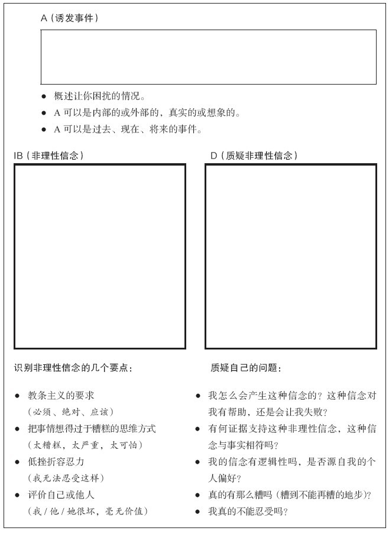

图5-1

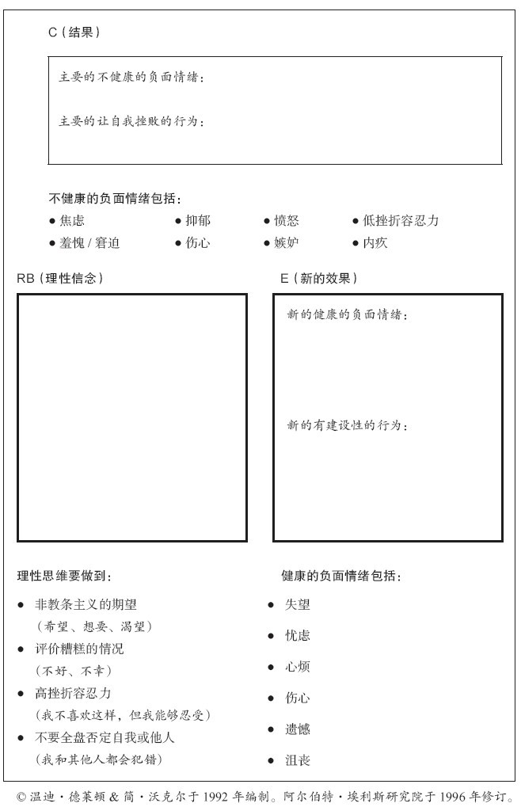

图5-1（续）

理性情绪行为疗法自助表格样本（由焦虑症客户填写，当他在参加一次他渴望通过的测试或申请一份要求参加测试的工作时，他会感到焦虑），见图5-2。

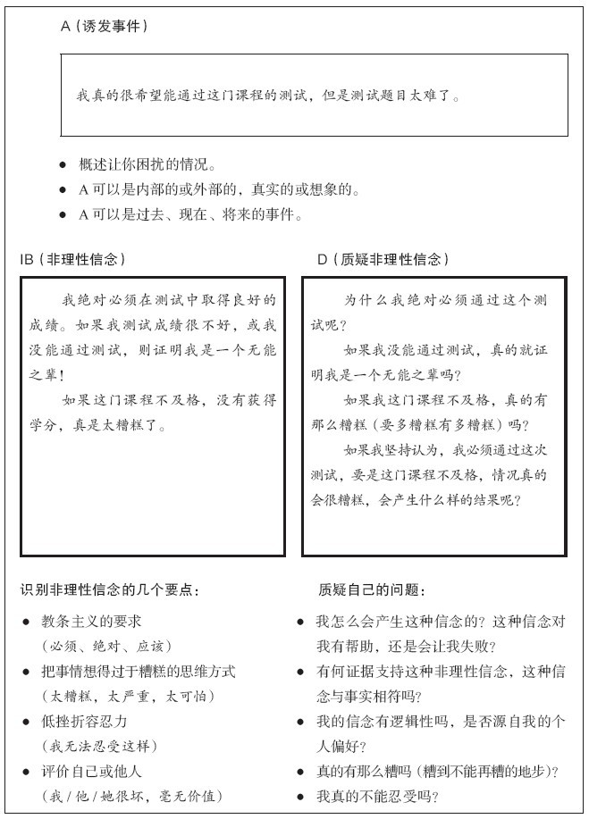

图5-2

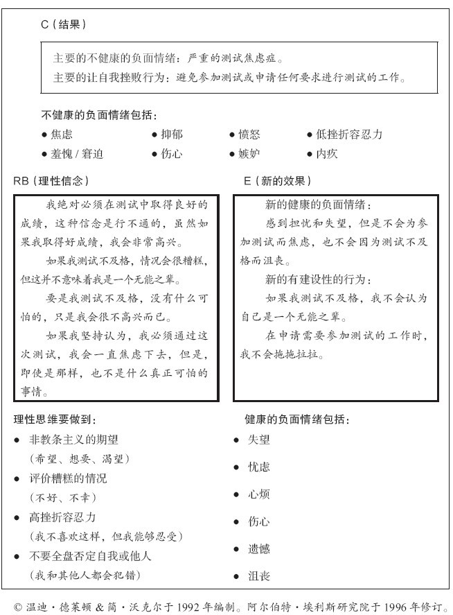

图5-2（续）

如果你定期运用这些表格（尤其是当你初次学习理性情绪行为疗法的原则和实践）来帮助克服焦虑问题，你就会熟练地找到非理性信念，并对其辩论。最终，你会产生一种有效的新信念以及有益的情绪和行为。

# 第6章　建立有效的理性信念

关于如何控制你的焦虑症，并尽量减少你的沮丧、愤怒、不足和自卑感，理性情绪行为疗法（REBT）可以为我们提供很多方法。这是因为人类都会有许多不必要的困扰，他们可以使用各种方法来应对这些困扰。此外，1956年，我参加了美国心理协会在芝加哥举办的有关理性情绪行为疗法的年度大会，正如我在大会上所做的演讲中所说的，人类的思维、情绪和行为绝不是独立运行的，这三者之间有着至关重要的联系。当你遇到不愉快的事情时，你的大脑会进行一系列的思维活动，同时你还会因此产生一些情绪。你的情绪活动会包括一些重要的思想和行为活动；你的行为活动也会包括一些重要的情绪和思想活动。

因此，当你为不愉快事件或潜在的不愉快事件而感到心烦意乱时，你需要知道是什么样的思想和行为导致了这种情绪困扰；当你想要缓解这种心理，或是不想再感到心烦意乱时，你可以利用一些认知、情绪和行为方法未达成这种目的。理性情绪行为疗法是一种开拓性的整合式治疗方法，它能为我们提供各种方法，来缓解我们的不安情绪以及因此产生的思想和行为。本章和接下来的几章将探讨一些其他的思维方法以及辩论非理性情绪的方法，以帮助你控制你的焦虑感。

一套完整的理性情绪行为疗法ABC模式还包括D和E。在D点，你对那些使你产生焦虑感的非理性信念进行辩论；在E点，你会产生新的信念，或者可以说是一种有效的新想法，这种想法会将你的非理性信念转变为理性信念。

### 以表演焦虑症为例

约翰是我的一个客户，他是一个情绪稳定、不易受干扰的人。他是一名音乐老师，其职业道路一帆风顺，而且家庭生活也很美满。但是，他所在的学校每年要举办一两次小提琴演奏会，他为此感到格外忧心。他的ABCDE模式如下：

A（潜在的不愉快事件）　按照学校安排，约翰每隔几个月就要进行一次小提琴演奏，虽然他是一个出色的小提琴家，但一想到自己可能会在演奏会上出丑，他就会担惊受怕。他的学生会看到他的表演，如果出丑的话，他很可能会受到严厉的指责。

RB（理性信念）　“也许我会发挥不好，可能还会受到严厉的指责，这是一件不幸的事；但是，那仅仅是我的表现很糟糕，我不希望会发生这样的事情，即使是那样，也不会发生什么可怕的事情。另外，我也可能会发挥得很好，并因此获得许多人的认可。”

C（理性信念的结果）　一定程度的担忧会使约翰加倍努力练习，以期待在演奏会中有更好的表现。

IB（非理性信念）　“我绝对必须在演奏会中发挥良好！如若不然，人们会取笑我，那将是多么可怕呀！我会丧失我作为一名音乐老师的声誉，我会受不了的！要是我发挥不好，我就是一个拙劣的小提琴家，我就是一个无能之辈！”

C（非理性信念的后果）　严重的焦虑感，会逃避练小提琴，因为每次练习时，他都会提醒自己——他可能会失败，并因此受到严厉的指责。

D（与非理性信念辩论）　“为什么我绝对必须在演奏会中发挥良好呢？只是因为它会给我带来我想要的尊重和赞誉吗？”

E（有效的新信念）　“虽然如果我在演奏会中发挥良好，我会很欣慰，但是认为我绝对必须发挥良好这种信念是没有道理的。”

D（辩论）　“如果我表现不好，人们真的会取笑我吗？”

E（有效的新信念）　“其中有些人可能会取笑我，但大多数人可能会感到失望，他们会认为我当晚没有发挥好。如果一些听众（甚至所有听众）取笑我，有什么可怕的吗？我不应感到害怕，只是会有点儿麻烦，但绝对算不上是生活中所发生的最糟糕的事情。可怕意味着太糟糕，而且绝对不能发生，但是如果真的发生了，而且这种情况确实会出现，我当然不会感到高兴，但我不会认为这种情况很可怕。”

D（辩论）　“如果我在演奏会中发挥不好，我真的会丧失作为一名教师的声誉吗？”

E（有效的新信念）　“不，大概不会。我在演奏会中发挥不好并不意味着我是一个不合格的音乐教师，大多数人还是会认为我是一个合格的音乐教师。即使我丧失了作为一名教师的声誉，为什么我不能忍受呢？”

“我绝对忍受得了，这又不是什么要命的事，我只是可能会被解雇。除了教学这件事值得我享受外，生活中还有许多值得我去享受的事情。”

D（辩论）　“如果我在演奏会中发挥不好，就真的意味着我是一个拙劣的小提琴家，一个无能之辈吗？”

E（有效的新信念）　“不是的，这只是意味着我在这场演奏会中表现得十分糟糕，我可能在其他演奏会中正如我过去的表现一样重新发挥出良好的水平。如果我的小提琴演奏相当糟糕，我就是一个无能之辈吗？当然不是！我的小提琴演奏水平与我的人格没有什么关系。我还有许多其他特长，我会做许多事情，即使有做得好的，有做得不好的。因此，如果我小提琴拉不好，并不意味着我是一个‘坏人’——正如，如果我小提琴演奏水平很高，也不会让我成为一个‘好人’。说我好或说我坏都是一种以偏赅全的信念，并不意味着什么。我会做‘好事’也会做‘坏事’，有时，我在小提琴演奏会上表现很好；有时，特别是当我焦虑不安时，我的表现会很糟糕。如果这次我未能发挥好，我会强化练习并希望将来能做得更好。”

如果约翰按照上述理性情绪行为疗法ABCDE模式进行实践，他首先会因演奏会而感到焦虑，随后他会冷静下来，当演奏会开始时，他可能会发挥得很好。即使他发挥不好，他极有可能会因为没有达到预期的水平而感到抱歉和遗憾——但他不会感到焦虑或抑郁。

按照上述方法进行辩论后，就会产生E，一系列有效的新信念。每次当你感到焦虑不安时，按照理性情绪行为疗法中的方法进行辩论，你就会产生E（一种有效的新信念）。如果你按照这种方法做，并真正相信E，当遇到失败或遭拒绝时，你将不会再感到过度焦虑，而且以后再遇到失败、拒绝和不快时，你也不会感到不安了。

为了巩固辩论信念，你得出了一种有效的新想法，你可以写下你能用到的理性应对方法，来克服这种焦虑感。以后，当你感到焦虑不安时，你还可以继续使用这些：把这些写下来，思考一下，通过不断重复，让它们牢牢刻在你的脑海中和心中。约翰害怕在小提琴演奏会中发挥不好，当我协助他练习这种方法时，我发现他的理性应对陈述是这样的：“虽然我很希望自己能在即将到来的演奏会中发挥出良好的水平，但是我也不是‘绝对必须’要有这样的结果。如果我发挥不好，天也不会塌下来。”

“如果有人因为我表现很糟糕而取笑我，我没必要太当回事。他们可能是自己的思想有问题，还有可能是对我有什么敌意。但是，无论是不是他们的问题，我都会欣然接受他们的嘲笑，我不会因此而害怕。”

“没有什么事情是可怕的，我在演奏会中发挥不好也不是什么可怕的事。如果发挥不好，我只是会感到极其不高兴，我会从中吸取教训，以便在将来的演奏会中做出更好的表现。”

“人们不会因为我偶然一次发挥失常，就认为我是一个不合格的音乐教师。如果他们这么认为，显然是他们存在偏见，我没必要把他们当回事。即使我可能有时会发挥不好，我仍然认为自己是一个相当不错的音乐老师。”

“如果我在即将举行的演奏会中发挥不好，我也可能不会失去音乐教师的声誉。但是如果确实如此，我还是会继续义无反顾地去教音乐，甚至可能会教得更好。”

“不管怎样，在演奏会中发挥不好不会让我变成一名拙劣的小提琴家，因为即使最伟大的小提琴家也有发挥不佳的时候。如果万一我成了一个拙劣的小提琴家，也仍然不能说明我是一个无能之辈。我还会做许多事情，演奏小提琴只是其中之一。即使每次演奏会我都发挥不好，也不能断定我就是一个‘坏人’，我可以去提高自己的水平或者选择放弃！”

再者，当你对非理性信念进行辩论时，你会得出E（一种有效的新信念），这种信念通常都是以一种理性应对陈述的形式存在的。你可以反复思考，添加一些陈述，最终你会得出许多类似的理性应对陈述；你也可以利用它们来应对你目前的焦虑心理，它们会帮助你克服将来可能会产生的焦虑心理。这些自我陈述是一种积极的思维形式，你可以在不进行现实型、逻辑型和务实型辩论的情况下，组织一些自我陈述，但是你的自我陈述也可能过分乐观，或存在虚假成分。

因此，你可以说，正如约翰在练习这种理性应对陈述时所说的：“不管我在演奏会中发挥得好与坏，这些都无关紧要。谁会在意吗？我只管去演奏，去拉动琴弦就行。我很伟大，我是一个学者，即使我是世界上最糟糕的小提琴家，又失去了音乐教师的声誉，还被解雇了，有人会因此而诅咒我吗？”

这种不切实际的积极思维可能会暂时缓解你的焦虑情绪——但这不会持续很长时间。因此，无论如何，你都要辩论这些非理性信念，并试图找出一些比较现实且合理的理性应对陈述，仔细思考一下，并做出一些改正。然后，利用这些理性陈述来缓解你目前和未来的焦虑感。

# 第7章　积极想象法和模仿方法

既然你可以利用理性处理叙述法以应对焦虑问题，那么，你也可以利用积极想象法。要做到这一点，你就要想象一下那些经常让你感到焦虑或恐慌的事情，并想象你能很好地应对这件事情，而不再为之劳神费心。

### 以公开演讲焦虑症为例二

桑德拉是一个电脑分析师，现在已经30岁了，她在13岁时就患有公开演讲焦虑症，她就是利用积极想象法克服了这种焦虑症。桑德拉总是避免在众人面前发言，即使是在小规模的观众面前，她也害怕自己声音会发颤，或害怕自己会说错话，害怕所有人都会看到她的糟糕表现。有一次，她升职了，按照工作要求，她需要向小组成员讲述新增加的工作事宜，并向他们解释经修订的操作程序。虽然桑德拉非常了解这些程序，但她还是害怕自己会解释不好，所有人都会认为她很愚钝，她会被降级至之前那个不太理想的职位。她为自己编了好几个借口，并推迟了那次演讲，但最后她还是必须要在一个更重要的场合上发表演讲。她很害怕，日日寝食难安。在我的心理治疗下，桑德拉很快就意识到了导致其演讲焦虑症的非理性信念：“因为我知道如何操作电脑系统，而且操作技巧熟练，并因此得以晋升到目前的职位，所以我一定要向听众解释清楚，并让他们信服，这是新职位对我提出的要求。如果我不能向他们解释清楚，那么我何以胜任当前的职位？他们一定会认为我不称职，不配从事目前的工作。他们一定会看我的笑话！”

桑德拉意识到这些都是非理性信念，并开始驳斥这些信念。从而，总结出了一种有效的新哲学信念，即使并不善于演讲，她也不是一个不称职的人，她只是一个患有公开演讲焦虑症的人。为了使这种有效的新哲学信念根深蒂固，她运用积极想象法来巩固这一结论。

首先，她设想自己正和她的听众正常地沟通，没有一点儿紧张感。她只是担心自己讲述的内容，仅仅是担心而已，因此她几乎完全放松下来。通过这样一种设想，她能想象她可以正常地进行公开演讲，这种想法使她不再那么害怕。

然后，桑德拉想到她的听众曾问过她关于这次演讲的问题，她当时丝毫不紧张地做出了回答，所有人都对她的回答感到很满意。通过这样一种视觉化的想象，她看到自己能够控制讲话内容，而且还能控制自己的焦虑感。她还是会有一些不安，但只是一点点而已。她也会担心，但不会过度担心。

通过不断重复这种练习，并继续与那些非理性信念进行驳斥，桑德拉成功地以最低的焦虑感完成了她的首次公开演讲。她很快就意识到她可以在恐惧控制她之前先行将其控制，几个月后，她居然开始期待公开演讲的机会。

你也可以利用积极想象方法来克制对某件事情的焦虑感——如参加面试或准备测试，想象你能完全不紧张地完成这件事情，或者你能够掌控并完好地处理这一形势，或者你刚开始时会感到焦虑，但成功地应对并控制了这种焦虑感。在你进行这种积极的视觉化练习的同时，你可以审视一下那些产生焦虑感的非理性信念，如“我必须完美地完成这个任务，否则我就是一个不称职的人！”并积极地与这些非理性信念进行驳斥。积极想象法加上与非理性信念的驳斥可以大大降低你的焦虑感。

### 利用模仿方法

正如班杜拉和其他心理学家所表明的，还有一种控制焦虑感的好方法，即模仿那些在同样情况下不会感到焦虑的人。要做到这一点，你要咨询一下你认识的人，问问他们是如何最小化焦虑感的。你可以通过阅读传记和自传来看看那些名人是如何克服自己的焦虑感的。你还可以与你的教师、讲师和车间领导谈谈，看看他们是否受焦虑感的困扰，以及他们是如何克服焦虑感的。与那些在异常紧张的情况下能保持镇静、放松心态的人聊聊，以了解他们在面对那些情况时会保持什么样的态度。与那些曾经对某些事情感到非常焦虑，后来做了一些特别的事情来减少或消除焦虑感的人谈谈，看看是否你也可以用他们的方法来最小化自己的非理性恐惧。

# 第8章　成本—效益分析

当你担心会遇到一些可怕的情况时，你往往会倾向于逃避这种情况，从而摆脱这种焦虑感——这种逃避只是暂时的。然而，从长远来看，这样做只能增加焦虑感。因此，如果你对电梯有恐惧感，即便你从来没听说过有人曾在乘电梯时受到伤害或导致死亡，你也会尽量避免乘电梯。每次你这样做的时候，你往往会对自己说，“如果我走进电梯，很可能会有可怕的事情发生在我身上，所以我必须避免乘电梯，以防这些可怕的事情发生！”因此，你不断地对自己重申电梯可能带来的可怕后果，这样反而增加了恐惧感。

然而，如果你冒险尝试着去乘电梯，这样尝试几次下来，你会发现其实没有什么可怕的，这就打消了你之前的灾祸顾虑，也就克服了你的恐惧感。因此，你应该总结一下避免乘电梯的不利之处，列一个表，每天看几遍，说服自己不乘电梯的最终代价远远要大于其所带来的益处。通过这种成本–效益分析，你鼓励自己冒着短期风险，通过克服这种恐惧感来收获长期收益。这样的话，你就能在不健康的焦虑感控制你之前先行控制它。

### 用成本－效益分析制服焦虑感的例子

杰里非常害怕开车，虽然她是一个好司机，从来没有出过什么意外事故，她总是骑自行车、乘公交车或地铁上下班。有一天，她的朋友琼出车祸了，伤得不重，但之后琼再也不愿开车了。这给她的工作和社交生活带来了很大不便。不知道出于什么逻辑考虑，杰里也开始效仿自己的朋友琼，对驾驶产生了恐惧感。

我试着告诉杰里，她主要的一个不合理信念在于，“我需要绝对保证我永远也不会出车祸也不会引发一场车祸。因此，我必须避免开车，甚或避免乘车！”她对此提出了异议，她认为绝对保证根本不存在，而且她在车祸中严重受伤的概率也极小。

此外，杰里还进行了成本–效益分析，她将避免开车的所有弊端和冒险开车来克服自己的恐惧感的各种益处全都写了下来。这样做后，她发现克服开车恐惧感的短期不适要比永远处于恐惧感中并任之不断深化更有利。

你也可以像杰里一样做一个成本–效益分析，向自己证明，克服这种由不切实际的恐惧所带来的短期不适所花费的代价，要比长期沉浸于这种恐惧感所带来的不便低得多。

成本–效益分析对克服那些隐性焦虑也大有裨益。例如：那些吸烟成瘾的人会向自己保证戒烟，但随后他们发现戒烟带来的不适如此“可怕”，所以他们就会再次开始吸烟。他们担心他们不会坚守这一决心，因为他们害怕半途而废。因此，这种不确定性心理导致了焦虑感的产生。

更糟的是，他们可能会暂时戒烟，之后又会继续吸烟，并为这种“可恶的”软弱无能而深深自责。由于这种自我贬抑，他们的不安和焦虑感比之前更甚。

如果你患有这种双重瘾性焦虑症，你可以将成本–效益分析方法用于以下两个主要方面：

1.保持这种瘾性，通常只专注于其优点，如吸烟的乐趣，并刻意忽略其缺点，如潜在的肺气肿和肺癌、吸烟的费用、对不抽烟者的冒犯。因此，如果你花几天的时间将吸烟的弊端列一个表，可能会多达10个或更多，并确保你将这些弊端写下来，每天至少看五遍，这些弊端将根植于你的意识中，并减少你对戒烟的后顾之忧（或任何其他嗜癖），对你戒烟很有帮助。你很可能会看到你每天都在关注的吸烟花费根本不值得，你会因而减轻对戒烟困难感到“恐怖”的不适焦虑。

2.你还可以研究一下戒烟弱点的自我贬抑（或其他一些嗜癖）。即使你完全无法戒烟，并因为缺乏这种能力而倾向于苛责自己，你还可以写下这种自责所带来的明显的缺点，每天看几遍，有助于你真正实现一种无条件的自我接纳。这种方法可以消除你的大部分焦虑，因为自责往往是焦虑最主要的来源。

并不是所有形式的焦虑都适合使用成本–效益分析的方法来解决，但该方法可适用于一些最糟糕的形式，如源于自我贬抑的焦虑，这种方法大有裨益。自我摧毁行为往往源于你拒绝接受这种活动的弊端。成本–效益分析方法使你的注意力放在焦点问题上，并阻止你只关注于这种有害嗜癖的快感。

# 第9章　心理教育

### 利用心理教育材料

1955年1月，我第一次开始尝试理性情绪行为疗法（REBT），我发现一些焦虑症客户从我发表的文章和书籍中学到的东西要比治疗期间学到的东西多得多。例如，詹姆斯对他的性能力感到很担忧，他过去一直跟自己说，“我必须保持一种极好的能力，以在性交时满足未婚妻的需求，否则我就是一个性无能者！”这种非理性信念反而导致了他的无能，这样他就开始诅咒自己的无能，这让他自己更加焦虑。在理性行为治疗前期，他通过与这种非理性信念进行驳斥而取得了一些成功，之后，他又阅读了我在《美国性悲剧》一书中所写的一些关于性的文章，以及我写的《性心理和婚姻问题》和《男性的性机能不全》等文章。

这些文章使他更加清楚，他对性能力的需求是其焦虑感的主要来源，而并非是源于他的愿望，通过驳斥这些需求，他很快就打消了这种焦虑感。像其他客户一样，他在报告中说，这些书面资料对他帮助很大。因此，在纽约的阿尔伯特·埃利斯理性情绪行为疗法研究所中，我们总会给我们的客户分发一些理性情绪行为疗法小册子，并建议他们聆听我们的音频和视听磁带，以及阅读我们所写的一些书籍，以便他们了解理性情绪行为疗法的原则和实践。对于那些病情严重的患者，特别推荐我写的以下书籍：《理性生存指南》《个人幸福指南》和《如何坚决拒绝使自己生活中的每件事情都变得糟糕透顶——是的，每件事情！》。在我们经常为焦虑症患者推荐的一些录音带中，其中有我刻录的《如何成为一个完美的非完美主义者》，《停止忧虑的21种方法》和《征服迫切的爱需求》。此外，我们还推荐聆听以下磁带：阿诺德·拉扎勒斯的《学习如何放松》和迈克尔·布罗德的《在最短的时间内克服你的焦虑》。

我们的研究所还会举办很多讲座和研讨会，并建议客户积极参加。人们似乎尤其热衷于我在星期五晚上主办的有关日常生活问题的研讨会。研讨会上，我经常会向自愿走上讲台，有严重焦虑症或其他情绪问题的志愿者进行现场治疗演示。在向这些志愿者展示如何应对他们的焦虑、抑郁或自我贬抑时，我也向其他观众演示了如何应对他们自己的困扰。许多焦虑症患者都从这种模仿方式中获得了帮助。

例如，大卫经常被女性拒绝，他又不愿意采用理性情绪行为疗法，但是当他听说我向其他两位志愿者演示如何克服类似的社交焦虑症后，受此激励，他开始尝试理性情绪行为疗法，很快就减少了自己的社交焦虑。许多参加周五晚间研讨会和其他研讨会的人们都通过这种方式降低了他们的焦虑感，不管他们是否接受过我们的治疗。

### 利用教学和指导法

很多年前，约翰·杜威曾指出，当向另一个人传授某项技能或课程时，你往往能巩固自己的所学。我还发现，如果我向别人传授理性情绪行为疗法的主要内容，他们反过来还会教给他们的朋友和亲戚，不仅这些人可以因此大大受益，老师也会更好、更深入地将理性情绪行为疗法应用于解决他们自己的问题中。

### 以写作焦虑症为例

例如，安妮·玛丽通过参加我的治疗讲座、阅读我所写的书籍以及聆听研究所的录音带和录像带，了解到了理性情绪行为疗法。她对学期论文写作的焦虑感也大为改善。但当她开始向她所遇到的其他焦虑者讲述理性情绪行为疗法时，她的这种焦虑感有了更大的改善。她有三个女性朋友受焦虑症的困扰，她将她们带到我这里进行进一步的治疗，在此之前她已经部分改善了她们的症状；在帮助她们进行治疗的期间，她完全消除了自己写学期论文的焦虑，并主动多写了两篇论文，在此之前，她还对写论文这件事很恐慌呢。她变得如此善于向他人——以及向自己，讲述理性情绪行为疗法，最后，为了成为一名治疗师，她决定去读研。

自己尝试一下吧。学习理性情绪行为疗法的原则，并将这些原则教给一些愿意接受这些原则的朋友和亲戚。当这些原则根深蒂固在你的大脑中时，你就会变得更善于利用这些原则来减轻自己的焦虑。

# 第10章　放松和分散注意力方法

### 利用分散注意力

许多世纪以前，古代哲学家发现，当人们感到焦虑时，他们可以通过几种形式的冥想和瑜伽来干扰那些非理性的恐惧，并暂时使他们平静下来。这是因为焦虑和担心源于对某件事情的专注和沉迷。但是，人类的大脑不能同时关注于两件事情。如果你对在公共场合表演、朗诵或唱歌感到焦虑，是因为你往往把重点放在如何才能表现好：“我绝对必须做好，如果不能够的话，那我就是一个无能之人。”你可能会沉迷于这种信念中——结果会表现得非常糟糕。

然而，如果你强迫自己只专注于表演、朗诵或演唱的内容——专注于你扮演的角色、朗诵的诗歌或你演唱的歌词和音乐，你就会将你的注意力从如何表现转移出来。因此，你将不再那么焦虑，至少是暂时不会。事实上，将你的注意力放在你表演的内容上，你可以完全忘记你的表现会怎样——至少当时你完全不会感到焦虑。这就是人脑运作的方式——专注于某一件事，而不再为另一件事而担忧。

你还可以使用许多其他的干扰方法来暂时避免为某件事情担忧。冥想，瑜伽，埃德蒙·雅各布森的渐进式放松运动，生物反馈，阅读，娱乐，观看体育节目——只要是要求你全身心集中注意力的事情差不多都会有所帮助，只要不是那些让你担忧的事情就行。

以埃德蒙·雅各布森的渐进式放松运动为例。你每次都会专注于放松你的某块肌肉，从你的脚趾肌肉到头部肌肉。当专注于你的各种肌肉的同时，你会发现自己无法集中精力去注意如何表现得更好，以及如果你表现不好会产生什么可怕的后果。

你还可以使用赫伯特·本森著名的放松疗法，其原理如下：您可以选择一个单词，如“和平”“一”或一些有意义的短语。找一个舒适的位置坐下，闭上眼睛，放松你的肌肉。慢慢地、自然地呼吸。当你呼气时，不断重复你所选的单词或短语。专注于你的呼吸、你的松弛和让你感到平静的单词或短语。尝试无视那些侵入性想法，尤其是令人担忧的想法。如果他们入侵你的思维，保持一种轻松和被动的心态。这样尝试10～20分钟，每天尝试一到两次。

所以，当你再次想要阻止这种焦虑时，你可以利用一些可用的分散注意力方式。专注于一些愉快的任务或事情，你会发现你很难分心去担心别的事情。然而，干扰方式并不是治愈焦虑感的灵丹妙药，因为这种方式几乎不能改变你的焦虑制造理念。当放松疗法结束后，你往往会重新回归旧有的思维方式。

为了在焦虑感控制你之前永久地将其控制住，你无论如何也要利用本书中介绍的各种方法，尤其是在应对那些持久的非理性信念时，这些非理性信念是你的焦虑和恐慌的主要来源。

# 第11章　克制过度思考法

像其他人一样，你变得焦虑的主要原因之一是，你对情绪困扰因素中A（不幸事件）的错误认知或夸大。因此，由于飞机坠毁事件的戏剧性和突发性，你会认为乘飞机很危险。事实上，每年因飞机失事而丧命的人只有不到300人，而每年死于汽车事故的人却多达6万人。然而，越来越多的人在乘坐飞机时总感觉会比乘坐汽车要恐慌得多。

同样，几乎很少有人因求爱被拒而受伤或死亡——虽然少数人因此愚蠢地自杀了。然而，更多的人对求爱被拒的担心远比损失金钱或工作要大得多。因为他们错误地认为，“既然我心爱的人都拒绝了我，我再也不会找到更好的爱人了！”

你可以对那些经常导致你产生焦虑的夸大、误解以及错误认知进行审视和重新估量。这样，你也就可以重新定义这些错误认知了。

### 批评焦虑感示例

玛丽莲是我的一个理性情绪行为疗法客户，她每次“看到”有人皱眉或大笑时，就认为他们是在对她表示不满或嘲笑。她将此理解为一种“可怕的”不幸事件（A），我们将此理解为结果事件（C），她因此而感到焦虑。当然，人们皱眉或大笑可能会出于很多原因，其中大部分与她无关。但她太担心可能会受到批评，因此她“看到”人们所做的几乎任何事情都是对她的一种严肃的批评。于是，导致了她这种长期焦虑的生活。

我首先使玛丽莲意识到即使人们确实在批评她，她也并不是因为他们的批评（A）而感到万分焦急的（C）。相反，主要是由于她自己的信念（B），“我绝对不能被别人批评，如果我被批评了，这意味着他们彻底地鄙视我，觉得我是一个不可救药的笨蛋，他们会向别人这么说。多么可怕！我不能忍受他们的批评！”

帮助玛丽莲发现和批评（D）其非理性信念（IBs）的同时，我也向她展示了如何检查和重塑她的不幸事件（As）。难道所有人皱眉或大笑都是针对她吗？难道他们这么做不是因为其他一些与她无关的原因吗？难道每次皱眉或大笑都意味着人们看不起她吗？

在进行这种反思期间，玛丽莲很快就意识到大多数人皱眉和大笑与她没有任何关系——他们因她讲的笑话而开怀大笑，认为她很诙谐，其中一些人实际上对她很有好感。通过这种方式抑制自己去思考人们的皱眉和大笑，同时对害怕被批评的恐惧感这一非理性信念进行驳斥，玛丽莲不再那么焦虑了。

你也可以检查一下那些看似存在于你生活中的不幸事件，看看他们是否真的存在，还是你只是想象或夸大了它们。利用理性情绪行为疗法，你还可以看到真正的不幸事件，包括相当严峻的事件，这是一种挑战，而不是一种恐惧的事情。因此，你可以将失业视为一种获得更好工作的机会或接受更好职业培训的机会。你还可以将“可怕”的分手视为一种发展其他关系和寻找更适合你的伴侣的良机。

总之，如果你认真地利用理性情绪行为疗法，你可以看到，即使是生活中最不幸的事件——例如患癌症或近亲的死亡，也只是一种人类悲剧，而不是什么毁灭性的恐怖事件。通过这种方式，你可以为那些可能困扰你的事件做好最坏的打算，但你仍然可以下定决心去应对它们，从而过上一个合理的幸福生活。迎接严峻的不幸事件所带来的挑战，并看到如果不幸真的发生了，你仍然可以保持积极的心态，这是你应具备的最好的态度，也是你送给自己的一份礼物。

# 第12章　问题解决法

当存在严重的实际问题或生活压力，而你又不知道如何去处理或解决时，焦虑会控制你的情绪。当你要求自己必须找到一种便捷、简单或完整的解决方案时，你会感到恐慌。你对这种绝对的解决方案的要求越少，你就能越从容地去寻找潜在的解决方案，并能从容地去尝试，直到你找到可行的方法，而且你不会产生严重的焦虑情绪。

理性情绪行为疗法还可以帮助你寻找有效的解决方案。通常情况下，首先，你要停止一些不切实际的要求，比如你必须找到一种便捷和完美的解决方案。然后，当你停止恐慌时，它会向你说明如何有效地解决问题。理性情绪行为疗法能教你如何有效地解决问题吗？是的，当你在解决问题或做出决定时遇到麻烦，它会告诉你如何通过一些规则和技巧来解决这些麻烦，这些规则和技巧也是企业和组织管理中经常会采用的方法。

### 个人决策焦虑症示例

让我来讲一讲曼尼的故事吧，曼尼是一个出色的零售业务员，他经常要做出一些决策。对他来说，这毕竟只是一种挣钱与赔钱的事情，如果今天赔钱了，他敢肯定他明天就可以将这些钱挣回来，这完全没有问题！

不过，曼尼对他的个人生活却异常焦虑。他认为他绝对必须找到一个合适的妻子，必须让孩子上最好的学校，必须照顾好年迈的父母，这样他们才能健康长寿，而且他还必须受朋友的欢迎。如果在个人生活中，他不能完美地做好任意一方面，他就会认为他会失去地位，别人也会看不起自己，会认为自己是一个白痴、一个可怜虫。无论他在工作中是多么能干，有多少人尊重他，曼尼还是担心自己在个人生活中会有什么不足。

正如你在理性情绪行为疗法中得知的，曼尼的困难源于他坚持认为他绝对必须做到他认为正确的事情，否则他就是一个彻底的失败者。如果他的个人决定很愚蠢或是错误的，他的业务成就对他来说就不重要了。在理性情绪行为疗法治疗期间，我让他意识到他不能保证一切都会成功，尤其是在个人领域方面，因为个人关系不仅取决于他对别人做了什么，还取决于别人对他会有做出怎样的反应。当然，他根本无法控制自己的反应。因此，他可能会对朋友很好——而他的朋友也许不喜欢他或鄙视他。同样，曼尼可以为他的孩子选择“适合”的大学，而他的孩子也许会拒绝做家庭作业并选择辍学。别人也许会对他做出“好的”反应，而对他来说，则是徒劳无益的。

通过利用理性情绪行为疗法来辩论他的非理性信念，曼尼克服了许多有关解决个人问题的焦虑情绪。我告诉他，他直觉上知道如何解决实际业务问题，但他没有将这些方法系统化。我研究了一些他所使用的有关业务决策的解决方法，然后，我向他展示如何利用同样的步骤来解决个人问题。

你可以利用我向曼尼展示的这种问题解决步骤来做出决策，如企业、个人和其他现实中的决策。许多认知行为心理学家都曾对这一步骤做出过描述，如唐纳德·梅肯鲍姆（Donald
Meichenbaum）、G.斯皮瓦克（G.Spivack）、M.舒尔（M.Shure），托马斯·德苏内拉（ThomasD'Zurilla）、亚瑟（Arthur）、克里斯蒂娜·根津（Christina
Nezu）。该步骤可概括如下：

分析已知问题的状况。看看有什么明显的解决方案，存在的困难是什么。

找出几个解决方案，并找出一些备选方案。

尝试一些不同的解决方案，首先要用大脑去想，然后，如果可能的话，将其付诸实践。

检查一下每个备选的解决方案是否可行，是否优于其他的解决方案。

即使目前的一些解决方案可行，也要去寻找新的、更好的解决方案。

假设可行的解决方案不止一种，继续寻找备选方案，不要轻易放弃。

定义一个很可能会得到解决的麻烦情况或应激事物。

设定一个可以解决问题或减少问题的现实目标。

试想一下，其他人可能会怎样解决问题。

你所考虑的解决方案有什么优缺点。

当找到解决问题的方案和行动时，在头脑中进行演练。

试验性地尝试你所认为的最好的解决方案，看看结果如何。

即使是良好的解决方案，也要预期会有失败的时候，或会存在一些缺陷。

即使你没能找到一个良好的解决方案，但你尝试了，这点就值得祝贺和嘉奖。

# 第13章　无条件的自我接纳法（USA）

我在本书中一直贯彻的一个主题是：你可以找到那些导致焦虑情绪的非理性信念并对其辩论，这是一件很容易就能做到的事情。但是，如果你只是在思想上进行辩论（或者没有深入实践），你很可能还是不会放弃这种非理性信念。这是因为你在产生理性信念的同时，还会产生一些非理性信念。因此，你也许会产生一种微弱的信念，“我无需擅长体育运动，即使我做不好，我还是可以接受自己。”同时，你还会产生一种强烈的信念，“如果我真的不擅长体育运动，我完全就是一个无能的人，我真是太逊了！”如果真是如此，即使你有微弱的理性信念，那种强烈且持久的非理性信念也往往会占据上风。更糟糕的是，当你有意识地产生一种理性信念的同时，可能还会无意识地产生一种非理性信念。真是让人困惑，不是吗？

当你在辩论非理性的信念并试图将它们转变为理性的选择性期望时，如果你感觉这件事情很困难，那么就证明你这种潜在的非理性信念通常很强烈，也许你意识到了它的存在，也有一种可能就是你根本就没意识到它的存在。因此，理性情绪行为疗法总结了许多情绪治疗法和实验法来帮助你克服并改变这些非理性信念。本章介绍了一些主要的情绪治疗法，这些方法并不是要代替我之前所说的思维方法，而是要和它们共同搭配使用。

继古代亚洲哲学家（释迦牟尼和老子）之后，基督教提出了宽恕罪人，但不宽恕罪行的哲学信念，马丁·海德格尔、让·保罗·萨特、马丁·布伯、维克多·弗兰克尔和卡尔·罗杰斯等人提出了生存主义的哲学信念。现在，作为一种无条件接纳自我的方法，理性情绪行为疗法又被提出来了。这种观点完全不同于传统的有条件自我接纳或自尊。有条件的自尊是这样发展的：根据其概念，如果你表现良好或受到重要人物的认可，你就会自己尊重自己。正如著名的社会学家乔治·赫伯特·米德（George
Herbert Mead）曾指出的，你对自己的认可在很大程度上取决于他人对你的评价。

在大多数情况下，这种信念不会产生良好的效果。首先，作为一个容易犯错的人类，你时而会表现得非常糟糕。其次，即使你在重要任务中表现良好，出于一些原因，还是会有很多人不喜欢你。再者，即使你表现得非常好，目前大家都很喜欢你，你怎么知道未来你是否还会获得成功，大家是否还会一如既往地喜欢你呢？有条件的自尊始终容易受到质疑，确实是始终如此。与人类生活的其他方面相比，这种有条件的自尊会导致更多的焦虑情绪，人们更容易感觉到自己的无足轻重。

### 无条件自我接纳的存在主义解决方案

为了克服有条件的自尊所带来的种种不良情绪，理性情绪行为疗法着重提出了这种无条件的自我接纳（USA）的方法，你可以通过这两种主要途径来获取这种理念。首先，站在存在主义者的角度，你可以这样说服自己：“我是一个有目标、有选择的人，我和其他人是一样的。只要我还活着，只要我作为人类大家庭中的一分子，在某种程度上，我就是一个与众不同的人，不管我表现良好与否，他人认可我与否，我都会选择无条件地接受自己。我更喜欢获取成功，更喜欢得到别人的认可，但是，我的价值并不是由自己的成就或他人的认可决定的。我的价值只取决于我自己的选择，我选择活在这个世上，我是一个独一无二的人。”

这种无条件自我接纳的存在主义解决方案十分有效，我甚至可以向你做出肯定的承诺。只要你还活着，只要你作为人类大家庭中的一分子，你就是一个独一无二的人。因此，如果你单凭这些来接受自我，你就能够确定自己是“好人”还是“坏人”，你还可以自己做出选择。这是显而易见的，不是吗？自我接纳取决于你是否活在这个世上，是否是人类，是否是独一无二的，而这些都是不容争议的事实——并非取决于其他事情！所以，你的自我接纳十分可靠——只要你还活着，你就能接纳自己。

遗憾的是，不管是从哲学还是从科学方面来讲，这种有关人类价值的存在主义解决方案都是值得商榷的。从本质上来说，你是这样表述的：“因为我是人类，我活着，我是一个独一无二的个体，我就是一个好人。”但是，哲学家或科学家也许会反对说，“是的，我知道你是人类，你活着，你是独一无二的个体，这些都是毋庸置疑的事实，但人类、活着和独一无二这些属性与你的价值并没有什么关系。你认为你的价值就是你是一个好人，但同时还可以被定义为一个坏人或一个不好不坏的人。你不能证明或否认这样一个真理：人性使你成为一个好人。你可以选择去相信它，也可以选择去相信其对立面——即因为你活着，你是人类，所以你是坏人。事实上，这种定义本身就是不正确的。”

所以，你坚持认为你是一个“好人”，因为你是人类，这是一个毋庸置疑的真理。或许，你可以证明，你的这种我是“好人”的存在主义定义是实用的，比起将自己定义为“不好不坏的人”和“坏人”来说，这种定义会让你取得更好的成果。但是，我们不能证明这是事实或是“真理”。因此，这是一个值得争议的命题。

### 无条件自我接纳的精妙解决方案

理性情绪行为疗法可以为你提供第二种无条件接纳自我的方法，这种方法不存在自主定义式自我接纳的缺陷。利用这种方法，你可以设定自己的目标和宗旨——例如，既然自己活在这个世上，那就要活下去，并快乐地生活（少点痛苦，多点快乐）。你会对这些目标和宗旨产生自己的思想、感受和行为，之后，你会对自己的思想、感受和行为做出评价。因此，你可能会产生这样一种信念，“我是一个有价值的人，我值得生活在这个世上，并去享受这种生活”。你会认为这是一种“好的”信念，因为这种信念使你产生一种继续活下去的愿望，你可以继续去享受生活。同时，你还会产生这样一种信念，“我是一个没有价值的人，我活该受苦受罪”；你会认为这是一种“坏的”信念，因为它会破坏你的目标。同样，当你在任务中获得成功，你会感到很愉快，这是一种“好的”感觉；而当你失败时，你就会感到不开心，这是一种“坏的”感觉，因为这种思维模式可以帮你带来快乐。再比如，你会认为克制自己不要暴饮暴食是一种“好的”行为，而放任自己暴饮暴食则是一种“坏的”行为，因为好的行为有助于你的生存状态，并能使你保持健康。

换句话说，你可以对你的思想、感受和行为做出评价，当他们有助于你实现自己的目标和宗旨时，它们就是“好的”；当它们破坏了你的这些目标和宗旨时，你就会认为它们是“坏的”。这些评价使你能按照自己所选择的目标和愿望活在这个世上，并能快乐地生活。如果你的愿望是要过着悲惨的生活，或是想要去死，你可能会使用完全相反的观点来评价这种“好的”与“坏的”思想、感受和行为。

好吧，你对你的思想、感受和行为的评价有助于你实现自己的基本目标。所以，这些评价都是有用的，从实用主义角度来讲，可以说是“好的”。在这里我想提醒你一下，这些评价本身并没有什么好坏之分——完全取决于你的目标和宗旨。你可以选择自己的目标，并能根据自己的喜好来改变这些目标。但是，一旦确定了这些目标，你就可以对你所做的任何事情做出“好”或“坏”的评价。当它们有助于你实现自己的愿望时，你会认为它们是“好的”；当它们阻碍你达成自己的愿望时，你就会认时为它们是“坏的”。这就是你看待事物的方式，当然，你有权这么去看待，只要你不把这种评价方式强加于他人身上就行，因为他人的目标和价值观也许与你不同。

这一切看上去清晰明了。但是，现在我们要来说说难点所在——大多数人都会觉得很难去实现或保持这一点。你说出这些时很容易：“当我的行为有助于实现我的目标和宗旨，它们就是好的，而当它们阻碍我的目标时，它们就是坏的。”但是，因为你是人类，你会受到生物机能和生长环境的影响，你可能不自觉地就会对自己做出一个总体的评价。你往往会认为：当我的行为是无益的或是坏的时，我就是一个坏人；当我的行为是有益的或是好的时，我就是一个好人。这种倾向是对你这个人整体做出的一个评价：当你做好事时，你这个人本质就是好的；当你做坏事时，你这个人本质就是坏的。

阿尔弗雷德·科尔兹布斯基（Alfred
Korzybski）曾于1933年出版了《科学与理智》一书，书中对这一点做出了说明。你往往倾向于用一种自我的标准来衡量一切，你会根据自己的行为来判断自己是怎样的一个人，几乎所有人都是如此。这是一个严重的错误，因为这是一种以偏赅全的信念，这种信念是不正确的。在你的一生中，你会做许多事情：好事情（有助于实现你的目标）和坏事情（破坏你的目标）。你是一个不断在改变着的人，你会做出不一致的行为，且很容易会犯错。当选择好一个目标后，你还会不时做出一些有违这种目标的行为。你也许选择不去做一些事情——但之后还会不时做出这样的事情。因此，很显然你不能仅仅凭一些你会做的事情或你不会去做的事情来对你自己、你的本质、你存在的意义做出评价。我们会做很多事情，不计其数的事情，你不可能单凭某一件事就确定自己是“好人”或“坏人”。然而，你却不断地得出这样的结论：当自己做错事时，你就会诅咒自己；当你表现好时，你就会称赞自己。正如科尔兹布斯基曾说过的那样，通过用这样的方式来回应自己，你会使自己“神志失常”，而且不管是个人生活还是社会生活都会很糟糕。

此外，科尔兹布斯基和许多心理语言学家还曾这样评论：你和大部分人一样都倾向于把自己的思维转化为语言；然后你的语言本身（与其他动物的原始语言相比，人类的语言有很多优点）很容易使你产生混淆，或欺骗你。这就是凯文·埃弗雷特·菲茨莫里斯（Kevin
Everett
FitzMaurice）所说的思维产物。它往往会凭单纯的想法来编造一些事物，因此，如果你某件事情做得很好时，你就会产生这样的想法：“这种行为对我有利，所以我认为这种行为是好的”。你往往会忘记是你的思想将这种行为定义为好的行为，因此，你会说：“这种行为（事情）是好的。”当你这样定义时，你只是看到了那种确实存在的东西（你的行为）是好的。

当设定好自己希望实现的目标和宗旨后，再去评价自己的思想、感情和行动，并确定它们是好的（有益的）还是坏的（无益的），通过这样一种方法，理性情绪行为疗法解决了这种自我评价产生的问题。但是，在你做出评价之后，它会让你就此止步：“这种行为对实现我的目的来说是好的（要是不能帮助我实现我的目标，它就是坏的）。但我不会因为这件事就给自己做出一个全局性的评价。根据我自己的选择，它可能是好的，但不能因为这件事就证明我就是一个好人。而且，根据我的愿望，它也可能是坏的，但不能因为这件事就证明我是一个坏人。”

看上去只是你对自己所做出的一个简单的决定——尝试着坚持下去！通常情况下，你会发现你很容易就会判断出你的想法、感受和行为是“好”是“坏”，因为你知道你的目标是什么，你也知道要通过什么样的行为来实现这些目标。但是，一旦你用这种“好”或“坏”的标准来评价自己的行为，你会倾向于用这样的标准来评价你自己，来评价你整体是个什么样的人。你很难去抗拒这种倾向！这种能力似乎是人类在漫长的进化过程中演化而来的，所有的社会和文化也会去鼓励这种能力。当约翰打败狮子、成功拯救公主、在足球锦标赛中获胜或者孝顺他的母亲时，他都会受到称赞，父母、老师、童话、故事、电影、电视演讲等都在鼓励这种行为。这些“媒体”将约翰定义为“好人”，并强烈要求我们所言所行都必须以他为榜样。相反，如果玛丽对她的父母出言不逊、意欲陷害白马王子或在学校表现不好，我们的媒体会坚持认为——她无疑是一个“坏透了的人”。我们自然而然会通过某一个言行来概括出我们的通性。在这里补充一点，是这个社会造就了我们的这种信念。

我们怎样才能阻止这种荒谬的信念呢？理性情绪行为疗法表明，在理想的情况下，我们最好可以通过各种方式来评论我们的思想、感觉和行为，并针对我们的目标、宗旨和愿望来采取一些行为，看看它们是否有助于我们得到更多我们想要的东西，阻止产生那些我们不想要的东西。理性情绪行为疗法还表明，我们最好应该拒绝给自己做出一个全局性的评价。一个人是好是坏，我们永远也无法得出一个定论。我们只是在做一些好事和坏事——这是一种根据我们的愿望、目标和价值做出的判断。如果坚持这种理性，我们很可能会实现我们的愿望，而不是屈从于那种以自我为标准的评价，也不会以偏赅全地评价自己的本质。

然而，如果你发现你很难不对自己做出一个全局性的评价，只凭自己的行为好坏来判断自己的“好”与“坏”，那么，我们就又回到了自我评价的存在主义解决方案这个问题上了。你会带着一种绝对的口吻说：“我是好人，因为我存在于这个世上，因为我是人，因为我是一个独一无二的个体！”你会坚持这种信念。你不能证明这一点，你也不能用事实或凭经验来否定这样一个事实。但是，这种信念行得通！

为什么无条件的自我接纳（USA）（正如我在本书中一直倡导的）在控制焦虑情绪方面至关重要呢？由于有条件的自我接纳或有条件的自尊是焦虑的根源，让人不适的焦虑感或低挫折忍耐力确实也很重要。失去其中任何一种，你都不会长久地存活在这个世上。作为一个生物体，你一生可能会经历许多危险事情——如意外、疾病、他人的袭击、动物的袭击、仇恨和打斗。因此，你必须要谨小慎微，这样才能生存下去。而且，因为人是一种薄皮动物，所以你必须要比那些厚皮动物（如大象或犀牛）更加机灵和警惕。

为了使你能保护自己，自然之母赋予了你一种适度的担忧和谨慎心理。因此，一旦你遭遇车祸，你可能就会暂时放弃开车——甚至以后都不会开车了。一旦你曾在凌晨两点在一个黑暗的街道上受到过袭击，你很可能会避免在夜间外出——甚至白天也会尽量避免外出。进化论就是如此，只有这样，物种才能生存，而生存并不意味着你会快乐。适者生存往往意味着那些最谨慎和最易受到惊吓的人才会生存下去。

因此，这种让人感到不适的焦虑感实际上是在保护你的生命。它会减少风险，使你免受痛苦，并能保证你的安全。通常情况下，在面对极端情况时，它会使你提高警惕，保护你的安全——这种生活相当枯燥，因为你会受到许多限制，但你会活下去。

其实，最糟糕的焦虑不是源于这种过度的担忧心理，而是源于自我过度担忧心理。当你极其害怕在某个重要的任务中会表现不佳，最终他人会不认可你时，你就会产生这种自我担忧心理。

你肯定也想到了，应对这种自我焦虑或潜在的自我诋毁心理的最佳对策就是无条件的自我接纳（USA）。当你完全能够控制自我，或控制自我评价时，你就不会因失败和遭拒绝而感到过度焦虑了。

### 自我焦虑症示例

以丽塔为例。我是在理性情绪行为治疗过程中遇到丽塔的，初次见面时，她是一位美丽、聪明、能干的女士。那时的丽塔是一位有天赋的保险推销员，也是公司最年轻的销售员。毫无疑问，她也是最优秀的员工，她每年的业绩成果至少占公司的1/4。当时丽塔和一个帅气的经济学教授订婚了，她的未婚夫是几家大型商业机构的管理顾问。此外，丽塔还是空手道黑带高手。但是，她患有严重的社交焦虑症，其中一方面的原因是她的未婚夫结交的都是一些优秀的学术和商业专家，他们有着卓越的才能，博览群书，几乎精通各个领域。而丽塔只获得了大专学历，她所熟知的领域（销售）和她未婚夫的同事所精通的领域完全不同。丽塔确信，他们并没有将她放在眼里，她害怕自己会在他们面前说错话，她认为他们一定会鄙视她的。

丽塔几乎不会因焦虑而感到不安，因为她能处理别人避之唯恐不及的问题和困难，她夜以继日地工作，她在空手道培训班中能勇敢地与同组的男性进行对抗。但她受不了别人的批评，当她在客户面前做出错误的举动或在未婚夫的同事面前说错话时，她就会狠狠地将自己贬低一番。

起初，丽塔就无条件的自我接纳原则和我进行了深入的讨论。她曾将这些原则应用于她的销售生涯和空手道训练中，因为她努力尝试着使自己做出良好的表现，因此，她比大多数竞争对手都表现得要好，无论他们是男是女。所以，她认为个人的成就极其重要，只有当一个人的表现比那些行家和有才能的人表现都要好的情况下，他才是一个好人。虽然我同意她的这种说法——个人成就对一个人的生活至关重要（如果你认为它重要的话），而且当你表现出色时，你会获得很多好处（如金钱奖励），但是，我坚持认为，成就与你的个人价值无关，除非你错误地认为确实如此。为什么这是一个错误的想法呢？因为，正如丽塔这一案例所说明的，即使她在许多重要的领域都取得了成就，她还是会害怕将来可能不会维持这种成就感。而且，她会对某些领域感到焦虑，如学术领域，因为她并不擅长学术领域，但不仅仅是因为自己没有在这一领域取得过成就，其实也有其自身的原因。

我必须说，我非常擅长说服人们放弃这种有条件的自我接纳思想，因为正如我跟他们讲过的，这种思想是行不通的，除非它很完美——而且以后也将一直很完美。人类是会犯错误的动物，他们总会有表现不佳的时候——即使一开始他们表现得很好。我一开始并没有成功说服丽塔，因为她在某些方面确实做得很好，而且几乎不会失败。但是，即使她总能做出良好的表现，人们并不会总是认可她，因为别人出于嫉妒心理很可能会因为她表现得太好而拒绝接受她。终于，我成功地用这些理论说服了丽塔。例如，其他保险销售人员可能会因为她比他们做得好而不喜欢她；男人可能会因为她在空手道训练班中比其他人表现得优秀而不喜欢她；女人，包括她的一些朋友，可能会因为她的美貌而嫉妒她。不管怎么做，她都不会被这些人接受、认可。我通过这一点来向丽塔做出分析，首先，我使丽塔意识到优秀并不总能获得赞誉，优势其实也许会是一种不幸，那些不如她的人会给她带来麻烦。

然后，我还向丽塔讲述了其他几个别人可能会拒绝她的原因（即使她已做得非常好）。例如，人们可能不喜欢她独特的外表；或者，他们可能会出于宗教或种族原因而歧视她；或者，他们本来就是易怒的人，他们可能谁也不喜欢。

丽塔抱有一种追求完美的理念，她希望不管她做什么，大家都应该喜欢她。事实是，即使她比大多数女士都能得到更多的尊重和赞誉，也不是所有人都能喜欢她。而且，她还会因这种尊重和赞誉不能维持下去而感到焦虑；实际上，比起那些没她有才华、没她吸引人的女士来说，丽塔要比她们焦虑得多。

丽塔放弃了她那种要获得社会认可的迫切需求，这极大地缓解了她的表演焦虑症。她还阅读了一些我写的书籍，如《理性生存指南》《心理疗法中的理智与情感》，以及我发表的一篇文章《心理疗法和人类的价值》。这些书帮助她去除了那种完美主义成就感，最终她“领悟”了。在一次心理治疗讲座的闭幕会上，她说道：“突然间，我就醒悟了，我认识到所有有关好与坏的定义都是我们自己的选择，而且我们可以做出完全不同的选择。实际上，按照我们所言，这些都是我们自己给出的定义。当我们对自己的表现做出评价时，我们会先选择一定的目标（如在测试中获得A），然后我们会根据我们是否实现了这一目标来对自己做出评价。而其他人很可能会把他们的目标定为A+或B，因此，他们的表现评价就会与我们的有所不同。可以这样讲，我们选择了不同的目标，并据此对我们的行为做出评价。根据我们是如何衡量自己的表现，我们给自己做出一个全局性的评价。所以，自我的总体评价完全都是由我们的定义决定的，我们的行为是随机的，我们也可以选择不去这么做。但是，就像你说的，我们选择那么做是因为我们有一种强烈的倾向，所以，我们就照做了。真蠢，真是愚不可及！但我已经不会那么做了。我仍然会对自己的表现做出评价，但我会尽量不去评价自己。我不必那么做，而且现在我已经意识到那样做给我带来的伤害。所以，我会尽可能不去评价自己。我敢肯定的说，不是每次都能成功做到不去评价自己，但是，比起以前，我确实有所进步。这点我敢肯定！”

丽塔完全按照她所说的去做了。她很少做出自我评价，当她又要给自己做出评价时，她会立即停下那种想法。她谨守自己的信念，逐渐改善了那种严重的自我评价心理——至少从我个人的经历来说，她的心理状况是我见过的最严重的一个。为了证明她是“好人或坏人”，她要求得到他人的认可，同时也要求自己做出完美的表现，她完全明白两者的严峻后果。她不时会做出一些好的表现，也会做出坏的表现——这些行为会推动或阻碍她实现她的目标，但她很少对自己做出评价，也不会再对自己的个性做出任何评价。

如果你愿意这样做的话，你可以效仿丽塔的这种无条件自我接纳的方法。同样，你也可以因为你存在的意义、你是人类、你的独一无二这些属性而认为自己是一个“好人”或“有价值的人”。但你也可以采取丽塔的那种更精妙的方法，很少给自己做出全局性的评价。你只需接受自己的存在性、人性和独特性，而无需给自己做出一个全局性的评价。

你可以通过这种方式来缓解自己的焦虑感。你还是会为受到伤害、患病或死亡而过度敏感；你还是会因焦虑产生一些不适；但是，你的表演焦虑症和认可焦虑症会减轻很多。我希望，你仍然会努力去将重要的项目做好，并赢得重要人物的尊重。因为这样的话，你很可能会实现更多的愿望，避免更多的挫折。但希望并不意味着迫切需要，确实如此。不迫切需要成功或被认可，但仍对它们抱有渴望，这种心理会消除你那种确定、保证以及绝对要向你自己或他人证明你价值的信念。试试看吧，你会看到效果！

# 第14章　无条件接纳别人

可以确信无疑的是，人类是群居动物，极少有人能够完全独立地生活。当你精力充沛时，你往往会愿意与他人相处——家人、亲人、朋友、同学、邻居、同事。这种本能可能是与生俱来的，你存在的意义，在很大程度上取决于你与他人的关系。婴儿或孩童时期，你需要他人的照顾。少年和成人时期，你差不多就可以独立生活了。但你还是不能完全独立生活，因为你很难单凭自己的力量去种植庄稼、建造家园、编织衣服，以及做各种其他能够让你过上舒服生活的事情。耄耋之年，你通常会失去一些自理能力，因此与年轻时代相比，你需要得到更多的帮助。

除了使你继续活下去、舒适地生活和活动自如之外，他人往往还会为你带来快乐。你可以与他们聊天，爱护他们，一起满足性需求，一起工作，一起玩游戏、做运动，还可以从事许多其他的社会追求，你一定会享受其中。为什么这么说呢？因为你是人，作为人类，在交往、性、爱、合作的参与下，你可以生活得更好。这是人类的一种生物特性。

鉴于你具备这种社会属性，你应该与他人相处，并能与其中一些人保持密切的关系，这个是非常有必要的。成年后，即使你很少与人交往，你也能够过活，这是事实；甚至即使你隐居世外，你也依然可以活下去。但是，如果你能与他人建立友好和善的关系，你能生活得更好，你会过上更有趣、更丰富、更充实、更幸福的生活——这将有助于缓解你的焦虑感。

### 在愤怒控制你之前先行将其控制

要想控制自己的愤怒并不是一件容易的事情，这让人觉得非常的懊恼。这个世界上生活着形形色色的人，有人对你不好，有人对你不公平，也有人对你发脾气；有人容易发怒，有人容易沮丧，有人喜怒无常，有人难以相处，甚至有人心理变态，他们可能认为他们完全有理由苛待你。有些人会欺骗你或出于竞争心理陷害你，因为他们想要得到他们想要的东西，完全不会去考虑你是否能得到你想要的。还有一些人无缘无故地苛待你，或阻碍你实现自己的愿望。这时，你会怎么做呢？

很不凑巧的是，你也有你自己的愤怒倾向，有些是先天具备的，还有一些是后天培养的。他们很可能会激怒你，随后你可能会伺机报复他们。这样对你有什么帮助吗？这样就能弥补他人可能给你带来的伤害吗？几乎不会！因爱生爱，因怒生怒。如果你觉得他人对你不够友好，不管这种感觉是对是错，首先，你会对他们的行为进行批判，你会明确地告诉自己他们这种行为是不对的；然后，你往往会因这些错误的行为而迁怒于行为者。这就是愤怒产生的过程：首先，反对他人“不好的”或“错误的”行为；然后，严重的谴责和诅咒他人。

换句话说，就像你倾向于因“坏的”思想、感情和行为而给自己做出一个以偏赅全的评价或谴责自己一样，当他人举止态度恶劣时，你也会同样如此。你犯了这样一个错误，即在谴责罪行的同时也在谴责犯下罪行的人，因此你常常会因这种思想而惹上麻烦。

首先，我和奇普·塔夫瑞特在我们合著的书中表明，愤怒、激动、狂暴这些情绪会对你的效率和健康带来负面影响。愤怒会促使你去反对那些你不喜欢的人和事，你会因此做出一些冲动、盲目、徒劳无益的行为。当你对讨厌的人和事发脾气时，你很难做出周密的计划去改变或消除这种消极情绪。反之，你会采取一种过度决绝甚至是疯狂的方式，你会因此做出错误的选择，采取荒谬的策略，通常情况下，你不会去改正那些让你懊悔的情况。这样往往会让事情变得更糟。

其次，愤怒往往会扰乱你的整个人体机能，可能会导致一系列身心健康问题，如高血压、头痛、肠胃病、肌肉疾病，甚至会破坏你的免疫系统，其后果是非常严重的。在《控制愤怒》一书中，我们用一整章的文字讲述了愤怒的后果，你最好认真阅读一下，这样你就能做得更好。

再者，如上所述，在大多数情况下愤怒会导致打架、仇恨、争斗，甚至导致发生集体屠杀事件。人类的不良情绪会导致各种各样的罪行，其中愤怒是罪恶之源，愤怒会引发暴力、凶杀及许多其他罪行。每天读一读报纸，看一看新闻，你就知道了！

心理学家提出了各种释放愤怒情绪的方法，其中大多数方法都没有明显的成效。精神分析学家和许多经验丰富的治疗师也提出了一种宣泄理论，他们认为，你可以通过大喊大叫或击破几个拳击用的吊袋来将愤怒情绪宣泄出去，这种宣泄方式会避免你给他人或给自己带来真正的伤害。我不同意这个观点。上百个实验表明，你宣泄的愤怒越多，无论是口头宣泄还是身体宣泄，你的愤怒感就会越严重。还有一些心理疗法会建议你对他人的攻击采取一种被动、不抵抗的态度，这样他们反而会和善地对你。这种方法可能会阻止一些人对你发出攻击，但是，另外一些人可能会利用你的这种被动心理更加苛刻地待你。此外，这种被动、温顺的态度只能暂时抑制这种情绪，并不能真正缓解你的愤怒情绪，反而会让你更加愤怒。

另外，人们还提出了一些思想和身体放松法，例如冥想、瑜伽、逐步放松你的肌肉。这些方法会缓解你的愤怒感吗？是的，不过只是暂时的。这些放松法可能会令你转移愤怒情绪，使你放松下来，然而你内心很可能还会保持着这种愤怒观点，当那些苛待你的人故伎重演时，这些观点会扰乱你的内心，使你血压升高、情绪失控。

### 无条件接纳别人（UOA）

然而，正如理性情绪行为疗法所说，最好的解决方案往往是有哲学性质的。愤怒往往源于一种过分的需求，你认为别人绝对不应该、不能用他们可能会采取的卑鄙方式来对待你。如果你能真正放弃这种强求，你不仅能最大限度减少你对目前不公正的待遇所产生的愤怒情绪，而且将来还不会轻易爆发。可以肯定的是，人们常常会欺骗你、攻击你或对你食言，所以你可能转瞬间就会对他们的行为感到失望和不满。但是当你生气时，你会坚持认为那些让你生气的人绝对不能那样对你，你的失望和不满情绪就会升级为一种愤怒感。你坚持认为他们应该“正常”、“公平”地对待你，就是这种信念导致了你的愤怒——而并非是由他人的不良行为造成的。

理性情绪行为疗法讲述了许多认知、情感和行为方式，你可以利用它们来缓解你的愤怒情绪，同时也能缓解你的愤怒倾向。正如我之前提到的，我曾写过一本书——《控制愤怒》，通篇都是来介绍如何使用这些在理性情绪行为疗法中提出的方法。我将通过接下来的几段文字来介绍一下这本书的一些要点。

如何尽量减少你的愤怒情绪呢？主要的方法就是学习和实践无条件接纳别人（UOA）这一准则。正如我们了解到的，无条件接纳自己（USA），包括完全接受自己与承认并试图改变自己的缺陷、过失和错误。你清楚地意识到自己的错误，但你从来不会因为这些错误而惩罚责怪自己。正如我们在前面几章中提到的，从信念上而言，你只会对与你的目标和主旨相关的思想、感情和行为做出评价，而不会对你综合素养做出一个评价。如果你跳过本章看后面的章节，你就会看到有关无条件接纳自我（USA）的细节，并能掌握如何做到这一点。

无条件接纳别人（UOA）基本上是与无条件接纳自我等同的一个概念，只不过它适用于别人。它适用于所有其他人，包括那些你不喜欢的人和对你或对他人不好的人。简单点儿来说，无条件接纳别人是指接纳罪人但不接纳罪过。因此，当人们品行不良违背道德或对你（和其他人）苛刻时，你会对他们的思想、情感和言行做出评价。经过初步判断，你会认为他们的这些思想、情感和言行是“不当的”和“错误的”，但你会极力避免对他们这个人做出评价，你不会给他们贴上坏人、恶人或无能者的标签。

这并不是一件轻易就能做到的事情。作为一种群居动物，人们已经教会你去辨别哪些行为是“好的”，哪些行为是“坏的”，你通常会按照他们教你的方式来对这些行为做出评价。因此，你会认为偷窃、不忠、懒惰、说谎以及许多其他人类特征都是“坏的”，而与之相反的特征则是“好的”。

这没什么问题，实际上，可以说是利大于弊。因为，如果你认为人们那些不当和违反社会公德的行为是“不好的”或“错误的”，而你的评判标准与社会群体中大多数人的评判标准一致，这就可能会鼓励、帮助和教导那些行为不道德的人去改正他们的行为——前提是你不要因这些不道德的行为而严厉苛责他们。

也许无条件接纳别人并不能消除所有的愤怒、斗殴、谋杀、仇恨和攻击，但是对于解决这些人类难题来说，这种方法还是颇为实用的。如果你不管别人曾做过什么事情都愿意无条件接纳他们，而且不去认为他们不应该做一些不幸和可悲的行为时，你就会冷静下来，就能更理智地去思考他们的所作所为，去评判他们的行为是绝对错误的还是因一时失误造成的。

例如，如果你确信有人骗了你钱，你会指责她的错误行为，但是因为你会无条件接纳别人，所以你不会被她激怒。相反，你会对她很失望。然后，基于这种健康的负面感受，你就会去考虑她是否真的骗了你，还是只是因为她在计划中犯了一个错误；你会去想她为什么这么做（比如，她的孩子病了，她需要支付昂贵的手术费用）；你会想办法让她补偿你；你会冷静下来，这样就能看清一些事情，至少能对她的行为多一些理解。然后，你就能更好地让她纠正她自己的行为，你会想出一种折中方案，以防她成为你人生中的敌人，并去帮助她改邪归正，这样她就不会再去欺骗别人了。在面对不公正的待遇时，无条件接纳别人以及因此产生的宽恕感往往有助于你理智行事，从而能鼓励他们不再对你和对他人采取不公平的待遇。

除了有助于缓解你的愤怒感外，无条件接纳别人是否有助于缓解你的焦虑感呢？答案是肯定的。当你因某人而发怒时，你往往会担心：①你对他们那种行为的判断是否是正确的；②你是否对他们太苛责了；③你的愤怒是否会失控，你是否会做一些非常愚蠢的事情；④让你感到生气的人是不是会反过来对你发脾气，会不会做出一些极端的事情来伤害你；⑤你是否是一个令人讨厌、脾气暴躁的人，是不是因为自己易被激怒而理应受此非难。

正如我在本书中曾说过的，焦虑感往往源于你对自己人格的贬低，其中还包括一种无能感。而愤怒感往往源于对他人人格的贬低，且不仅仅是对其恶劣行为的批判。因此，在这一方面，焦虑和愤怒有共同之处。当你沉浸于焦虑情绪中时，你也会促使自己产生一种愤怒情绪，反之亦然。这两种情绪都是源于一种以偏赅全的信念，即人们绝对不应该做坏事，当他们这么做时，他们就必须应该受到谴责和惩罚。有时，人们会将自我贬低称为“自己惹怒自己”。有时，人们会将愤怒称为“贬低他人”。这两种情绪在理论上是密不可分的，如果你有这种贬低自己和他人的倾向时，你最好尽早预防这两种破坏性的情绪。

### 愤怒和社交焦虑症示例

马丁对如何控制自己的愤怒感不是十分感兴趣，他认为愤怒是情有可原的，而且他也从中获益匪浅。马丁曾被一个富有的制造商雇佣为贴身保镖，他能从事这个职位主要是因为他的老板在生意场合中非常武断。马丁的老板很害怕万一发生打斗，就会受到身体上的伤害。和马丁一起被聘用的还有两个警卫，他们两个昼夜不停地工作，来确保这个制造商不会在混乱的工会谈判中遇到任何攻击。马丁是在东哈林区街道上混大的，13岁就成了帮派头目，还曾当过职业拳击手，他什么也不怕——至少不会害怕受伤害。然而，就情感而言，他有着严重的社交焦虑症，他尤其害怕女性注意到他说话会结巴而且还非常害羞。所以，虽然他高大英俊，还擅长跳舞，而且比你想象中的保镖要聪明机灵得多，但是他很少与女性约会，他恨自己无法跟她们建立关系，而他的男性朋友却轻轻松松就能做到。

起初，马丁无法接受无条件的接纳自我这种想法。他的成长背景使他极其重视能力和成就，尤其是体能。年纪轻轻就担任帮派头目，之后又成为职业拳击手。因为他身强力壮、肌肉发达，还爱发脾气，所以他总能赢得大家的尊重和认可。他个人主观意识很强，而且随时准备用拳头来捍卫他的观点。所以，他的男性朋友都很尊重他，对他几乎唯命是从。这就是为什么他认为愤怒这种情绪利大于弊。

一开始，在向马丁讲述理性情绪行为疗法中的无条件接纳自己这一概念时，我也遇到了不少麻烦。他能理解这种信念，但他完全不会将其付诸实践。他已得到那么多人的认可，似乎并不需要自我接纳。他对他的父母很好，虽然他们很穷，没受过教育。他的妹妹西尔维亚在一次车祸中失去了一只手臂，他对妹妹特别照顾。所以，他觉得他是一个好儿子，也是一个尽职尽责的哥哥，因此在这些方面，他完全有理由尊重自己。

没过多久，我就向马丁表明他的社交焦虑症显然与他在某些方面的自尊是互相矛盾的。首先，他将体能作为衡量个人价值的标准，这在一定程度上是可行的。但是，他还将能否流利地与女性交谈并在她们面前表现出自信作为衡量其价值的第二个标准，这种标准并不可行。他一见到女性就会惊慌失措，还没和女性约会上几次，就被她们拒绝了。因此，他认为自己完全就是一个失败者，在与女性约会时，他还是会感到焦虑不安。

首先，我使马丁意识到虽然他对男性的自信是有理由的，他的这种自信主要是基于他那种高于常人的体能，那些像他一样的人会敬重他。同时我让他意识到如果他矮小而又瘦弱，或者即使他身强力壮但并不善于用拳头来征服其他男性，他很快就会觉得自己一无是处，就像一个傻子一样。他尊重自己的原因和那些男性尊重他的原因是一样的，只是因为他拥有超强的体能。要是没有体能，他就什么也不是。

我向马丁表明，在他那种特殊的生活圈子里，靠自己的能力脱颖而出并受到他人的钦佩，这点无可厚非，你也可以去指责那些不赞同你的人，所以他可以因此而产生自信。但是，其个人价值不应通过任何特殊的能力来衡量，而他却恰恰这么做了。在他和别人的眼中，体能使他成为“真正的男人”，而除了这种能表现出“男子气概”的能力外，他在其他重要方面还存在缺陷（他无法跟女性正常交往），这使他成为一个“软弱的人”，一个失败者。如果他根据某一方面的能力来衡量他的个人价值，那么他如果在一个能证明“男子气概”的重要方面不具备这种能力，他就是一个“毫无价值”的人。为了成为一个“好人”，他就不得不成为一个无所不能的人。

当我向马丁表明：按照传统的社会标准来看，他对其父母和妹妹的照顾也是一种良好的品格时，马丁感到很震惊。但是，这一点也不能证明他就是一个“好人”——他只是在某些方面做得很好而已。按照他自己的成就标准，要想成为一个“好人”，他就必须在所有方面都表现得很好。这是不太可能的！

当我尝试去应对马丁的其他“好的”特性时，如他往往喜欢通过发怒来威吓别人，我帮助马丁无条件地接纳自己，使他欣赏到他的优良特性，但告诉他不要将这些优良特性与他的个人价值联系在一起，在这些方面，我取得了一些进展。年轻的时候，他勇于向帮派对手阿尔弗雷多挑战，他不会因为阿尔弗雷多卑鄙阴险的手段而退缩，这是他引以为傲的事情。与马丁不同的是，阿尔弗雷多并不会拥护他认为对的事情，也不会用身体和拳头来捍卫他的观点。相反，阿尔弗雷多与这些犯罪组织的老手交往很深，他利用他们的力量把自己伪装得很强大。阿尔弗雷多诡计多端、谎话连篇，在必要的情况下，他还会利用这些人的协助来控制他人。

阿尔弗雷多仍住在老东哈林区，他参与毒品交易还有其他不正当的买卖。当马丁成为拳击手后，就与帮派划清了界限，直接搬到曼哈顿中区去了。但是，他还是会回去拜访他的老邻居和他的朋友——他还经常会和阿尔弗雷多打斗，以阻止他欺负街区的那些弱势群体，其中有些人还是马丁的朋友。

有一次，马丁看到阿尔弗雷多在欺负他的朋友托尼，他便与阿尔弗雷多打了起来，他很生气地告诉阿尔弗雷多，如果他胆敢再找托尼的麻烦，就会把他的头砍下来，让他流血而亡。虽然阿尔弗雷多要比马丁稍高一点，也比他更强壮，刚开始他毫不畏惧地站在马丁面前，但很快他就面露怯色，讪讪而逃了。最终，马丁战胜了这个“令人厌恶的卑鄙小人”，他为此感到很自豪。

马丁保护了他的朋友托尼，使其不再受阿尔弗雷多的欺负，我承认马丁所做的是好事。但是，我同时也要指出，除了厌恶阿尔弗雷多的残暴行为外，马丁还对这个人产生了一种厌恶心理。阿尔弗雷多罪行昭著，他通过强大的流氓组织来保护自己。与马丁不同的是，阿尔弗雷多不会按照自己的主见行事，也不会去捍卫他的观点，相反，当遇到麻烦时，他总会选择逃避或是用犯罪组织的方式和态度来处理问题。虽然他的行为让人反感，还很容易犯事，这是他的先天倾向和恶劣的环境造成的，而不应把全部责任都归咎于他本人。事实上，在遇到比自己弱的人时，阿尔弗雷多会表现出一种顽固的、恐吓性的态度，他会利用其强大的同伙组织威慑力来控制这些人。因此，如果马丁凭他自己的力量和脾气震慑住阿尔弗雷多，使他乖乖听话，那么，马丁也是在使用恐吓战术，他让阿尔弗雷多变成了一个可怜虫。在某种意义上，他是在利用阿尔弗雷多的弱点。阿尔弗雷多恐吓托尼是不对的，这种行为理应被阻止。但是，同样马丁恐吓阿尔弗雷多也是一种不公平的行为，并不像马丁认为的那样——这是一种值得钦佩的行为。

要想说服马丁并不是一件容易的事情，你很难让他意识到他对阿尔弗雷多的愤怒并不完全是一种善行，而且其中还存在一些真正意义上的不利之处。这对阿尔弗雷多是不公平的，因为这不仅仅是在谴责阿尔弗雷多所做的一些事情，还对他这个人进行了谴责；这对马丁来说也不公平，因为他把自己伪装成了一个大英雄，而实际上，他所做的事情是存在争议的。就像其他人的愤怒一样，他对阿尔弗雷多的愤怒是不对的，在某些方面，还会带来一些伤害。因此，我劝他不要执著于他的愤怒。

我的坚持不懈终于得到了回报。马丁最终认识到因阿尔弗雷多的恶劣行为而谴责他本人是不对的，这种行为也是不道德的。马丁说，他会努力克服这种心理。

他确实做到了。他对此事进行了深刻的反省，几个星期后他得出了答案。他约了阿尔弗雷多见面，想跟他谈谈他不断恐吓托尼这件事。他们见面时，阿尔弗雷多明显吓坏了，因为他认为马丁会像往常一样为了托尼受欺负的事情而威胁他、惩罚他。但是，马丁并没有跟他打起来，也没有威胁他。马丁只是解释说，他不喜欢阿尔弗雷多那样对待托尼，他觉得那种行为是不对的。他决定不去迁怒阿尔弗雷多，也不发火，只是去说服他，让他明白他的错误。“我知道，”马丁说，“你认为你的行为是正确的，但是我认为你恐吓托尼的这种行为是不公平的。我们两个的行为可能都不对，我承认我的行为不对，你也有不对的地方，谁都有可能犯错，你也有权不时犯些错误，但我可以接受这一点。所以，我认为你的行为是不对的，我希望你能够改正，但我不会再像以前那样去打骂你。我说过，你认为你的行为是正确的，你就有权保持这种观点。但我认为那是不对的，让我们就此和解吧。即使你故伎重演，继续苛待托尼，我敢肯定你绝对会这么做，我仍然会说服你去改变自己，但我不会因厌恶你而浪费自己的时间，扰乱自己的情绪。正如《圣经》中说的，我会尽我所能去承认，就托尼这件事而言，你犯了罪行，但我会接受你这个犯了罪行的罪人。所以我会放下对你本人的仇恨，并尽我所能只去厌恶你的所作所为。”

听到马丁的这一番言论，阿尔弗雷多大吃一惊，尤其是看到马丁并没有发怒，他的态度简直与往常截然相反。阿尔弗雷多承认他过去可能对托尼有些过于苛刻了，他会重新考虑一下他对托尼的行为。马丁和阿尔弗雷多的谈话在互相理解的氛围中圆满结束了，这着实让人惊讶。

马丁当然也感到很惊讶。告别阿尔弗雷多后，他回想了一下他们的谈话，他有生以来第一次这么友善宽容地对阿尔弗雷多。马丁认为阿尔弗雷多完全就是一个糟糕至极的人，他没少做坏事。马丁居然为阿尔弗雷多（他的本性，他的缺乏教养）而感到可怜。马丁很欣慰能放下自己自从幼年时期就一直对阿尔弗雷多的那种争强好胜和敌对的态度。

更加值得一提的是，马丁对他自己以及自己不能接纳自己的心理进行了深刻的思考。他意识到他对自己的非难其实和他对阿尔弗雷多这个人的中伤是一样的，这两者都是一种谬误心理。的确，马丁确实做了一些愚蠢、错误的事情，他应该为此负责。那些行为都是不对的，这是无可辩论的。但是，人类是一种容易犯错的动物，马丁以后可能还会做一些愚蠢、错误的事情——但是，他不会一直犯错，只是偶尔会。阿尔弗雷多总是欺负托尼和其他人，如果他原谅了阿尔弗雷多，那么他当然也可以原谅自己！

马丁这个人发生了真正的转变，他不会再因那些恶劣行为而迁怒于行为者了。首先，他完全接纳阿尔弗雷多这个人，虽然他这个人会做出一些恐吓行为。然后，他完全接纳自己和自己的劣行，这部分可归因于他对阿尔弗雷多的接纳。只要态度和行为发生任何变化，自然而然就会引起别的变化，后发生的变化会强化首先发生的变化。此外，一旦马丁不再因为自己在女性面前感到害羞而贬低自己，那么他就能改变这种害羞心理并去克服它。

马丁的思想和情绪以及他对这些思想和情绪而产生的反应发生了显著的双重变化，你同样也可以做到这一点。首先，正如理性情绪行为疗法所讲的，人类就是人类，很容易会犯错。人的一生中会做出许多伤害自己、伤害他人的事情。你要学会原谅他人，但你不必原谅他们的所作所为。如果你愿意，你完全可以谴责他们的所作所为，但绝对不要谴责他们本人。你要接受这样一种有着种种劣迹（或者任何你认为的劣迹）的人，并尽你所能帮助他们，使他们变好。即使不能使他们发生转变，也要原谅他们，不要因它们的所作所为而诅咒和谴责他们。

与此同时，根据你自己的标准，你要承认自己的失误、错误和不道德的行为。你可以认为你的行为是错误的，但你不要因你犯了这些错误而认定你自己就是一个坏人。如果你竭尽所能不去因自己或他人的不当行为而谴责自己或他人，那么你的这两种接纳理念——完全接纳别人和完全接受自己，往往会相得益彰。正如上文指出的，最大限度地减少你对自己和他人的指责不会完全消除你的焦虑心理，但是它会减少你对这种指责所产生的焦虑心理，而焦虑心理中的一大部分正是这种焦虑感！

# 第15章　理性情绪意象法

如果你能够达到一种无条件接纳自我、同时还能无条件接纳别人的状态，你很有可能会最大限度地减少那些不必要的焦虑情绪，这是我在本书中一直强调的一个观点。然而，大多数不必要的焦虑情绪都是源于你的过度担忧心理，你担心自己会犯错误，你担心自己得不到他人的认可，同时你又要绝对确保他们会认可你。所以，如果能无条件接纳自我和别人，你就能大大减少这些焦虑感。

第三个主要的焦虑来源，正如我曾指出的，是指不适焦虑——你需要保证自己不会处于危险中或者失去你真正想要的东西。这种情绪也可称为对事件或客观世界的担忧。你强烈地希望事情能够按照你所想的方式发展，从而使你达成自己的愿望，你还必须对此确信无疑，虽然你不能控制大多数事情的发展，却想要事情的发展一定要符合你的意愿，绝对不能按你不希望的方式发展。

从逻辑上讲，无条件接纳别人还包括无条件接纳条件。你不仅希望事情能按照你所想的方式发展，同时也要接受这样一个事实，即它们可能不会按照你所想的方式发展——事实上，往往会向相反的方向发展。因此，当不如意的事情发生时，你要接受它们，而不应牢骚满腹、大吵大闹。你要尽你所能去改变它们，如果改变不了，你就要学会以优雅的姿态接受它们。

你现在已经了解了焦虑的三种主要来源：①你接受因自己的错误和失败所带来的不愉快；②你也接受其他人阻止你得到你想要的，或使你得到你不想要的；③你最终会接受在实现自己愿望的过程中所遇到的障碍。瞧——你还有什么可担心的呢？几乎没有！

当然，这就是理性情绪行为疗法的目标所在：不是去改变你的欲望和愿望，而是要说服你不要产生那种绝对、必需的信念——不管是对自己、对别人，还是对世界。你可以通过各种方法来支撑你的愿望、喜好和欲望，但是不要有什么过大的强求，除非你宁愿生活在不必要的焦虑中。

因为这种绝对需求会导致焦虑心理，理性情绪行为疗法强烈建议你对这些绝对需求进行辩论（与它们进行争辩，并提出质疑），把它们转变为一种非必要需求。为了做到这一点，并巩固这种信念，理性情绪行为疗法为你提供了几种非常有用的情绪方法，以下故事将对这些方法做出阐释。

马克辛C.莫尔茨比（Maxie C.Maultsby
Jr.）1968年就曾跟随我学习，就在几个星期前，他还向著名的行为治疗师约瑟夫·沃尔普（Joseph
Wolpe）求教。他告诉我，他从沃尔普那里学习了一些有用的治疗方法，但是看了我在个人和团体治疗讲座中演示的方法后，他说他对我的治疗方法更满意，尤其是对非理性想法进行辩论这种疗法，他还出席了我在每周五晚上举办的晚间研讨会。马克辛回到位于威斯康星州麦迪逊市的门多塔州立医院后，继续担任他的精神病学实习医师一职，之后他又晋升为理性情绪行为治疗师。他是一位极富创造力的心理治疗师，并发明了理性情绪意象法，这是理性情绪行为疗法中一种最有效的情绪性疗法。

在利用理性情绪意象法（REI）治疗期间，首先你要想象一下可能会发生的最糟糕的事情（如重大的失败或被拒绝），同时自发地想象一下，当这种“可怕的”不愉快事件发生时，你会产生怎样的感觉。通常情况下，你立即就会产生焦虑、抑郁、自我反感或自怜的情绪。

### 对重大失败感到恐慌的案例

假设你感到非常焦虑，就像玛莉安一样，一想到自己不能在治疗过程中帮到病人，病人会严厉指责她，也许同事也会指责她，她就感到异常焦虑。想到自己诊断失误，病人病情恶化，她就会感到无比的恐慌。

当我利用理性情绪意象法对玛莉安进行治疗时，她在想象到自己诊治失败，病人严厉指责她时，就会情绪紊乱，而且浑身开始颤抖。“好！”我说，“你已经实实在在地感受到了自己的焦虑，现在尽可能地去体会，用心去感受，尽可能地释放自己的焦虑和恐慌感！”

玛莉安感到极其不安——确实，她被吓坏了。“好！”我再次说，“现在，保持着这种使你感到焦虑的想象。你确实诊断失误了，病人的状况越来越糟糕——她和其他人都在指责你糟糕的表现。现在，还是利用同样的想象，想象自己只是对诊断和治疗失误而感到非常遗憾——只是非常遗憾和失望，但不会感到焦虑。不要有焦虑感或恐慌感，只是感到遗憾和失望。”

玛莉安经过大约两分钟的斗争才转变了她的情绪。最后，她说：“我现在感觉非常遗憾和失望，但是真的不会焦虑了。”

“好！”我说，“你刚才做了什么？你是怎样做到使自己对病人只是感到失望和遗憾，而不会焦虑和恐慌的呢？”

“我想象她是一个爱找碴的人，她告诉其他医生我对她不好，还告诉她的亲戚朋友我的治疗技术很差，但我对自己说，‘真是不幸，确实是我搞砸了，我真的很抱歉。但现在，我已经意识到我自己的失误了，以后我会吸取教训，从根本上改变我对病人的诊治，我会以一种完全不同的方式对她。这次失误显然是我的错，但并不意味着我是一个不称职的医生或是一个坏人——我只是犯了一个错误，我会纠正这个错误的。’”

“说得好！”我说，“这种理性信念真的很有用，你会感到遗憾和失望，但不会感到震惊或贬低自己。现在，我希望你在接下来的30多天内每天坚持练习这种理性情绪意象法。首先，想象一下最糟糕的状况，让自己自然而然地产生一种惊骇和恐慌感。然后，改变这种不合理的信念，你并不像病人和其他人认为的那样一无是处。用理性信念代替这种非理性想法，你就会产生几种应对性的自我陈述。每天至少练习一次，直到自己能自发地产生一种遗憾和失望感，而不是恐慌和恐惧感。当你这样进行训练时，你就会真正相信自己的理性信念，而不会去相信那些非理性想法，你才会真正地将自己的恐慌情绪转变为一种失望和遗憾心理。你可以设法去改变自己的感受，而不再受制于焦虑情绪。每天练习几分钟，直到你真正做到能够控制自己的焦虑感。”

在理性情绪意象法的指导下，玛莉安在15天内就自然而然地对“医疗误诊”产生了一种失望和遗憾的情绪，她不会再因此而惊慌失措了。同样，当你对人际关系、性、学校、工作、运动或任何其他事情感到异常焦虑时，你也可以利用理性情绪意象法来调节自己。首先，找到使你产生焦虑的主要的非理性想法（绝对应该、必须和务必），利用本书中列出的现实型、逻辑型和务实型辩论法对这些非理性想法进行辩论，直到你产生一种有效的新信念。为了巩固自己的信念，利用理性情绪意象法想象一下经常让你担忧的一件事情，让自己自然而然地产生焦虑感——甚至是恐慌感。然后，将这种焦虑情绪转变为一种担忧、谨慎、警惕、悲伤、遗憾、失望，或其他一些较为健康的消极情绪。你这样做只是将非理性想法转化为一种健康的非绝对需求——这种方法有助于你表现稳定或获得他人的认可，但却不是什么所谓的“必须”。定期用这种方法进行练习，可以是10天、20天或30天，直到你开始自发产生一种健康的消极情绪，而不是不健康的焦虑和恐慌感。使自己能够自然而然地产生健康而不是非健康的情绪，从而来应对那些你最担心的事情。

# 第16章　羞耻—攻击练习

1955年，我将理性情绪行为疗法运用到对客户的治疗中，也就是在那一年，我意识到人类的情绪干扰大多都是源于他们的羞耻感。当人们对他们所想、所说、所感或所做的事情产生一种羞耻感时，他们往往会这样想，“我犯了错误，人们会批评我，他们会因为我的所作所为而轻视我。”然而，这种自我评价绝不会使他们感到羞耻、尴尬或羞辱，因为他们还会这样认为，“没错，我确实做了一些愚蠢或不道德的事情。很多人会说我不应该这么做，并会严厉地指责我，但是，我不必把他们太当回事。他们会认为我是一个可耻的坏人，但是我不会认同他们对我的评价。也许我所犯的错误并不是那么严重，也许人们对我的指责太过严厉了。人难免会犯错，我也不会一直都完美无缺，不可能永远也不犯错误。所以，我会从中吸取教训并保证以后不再犯类似的错误，这样的话，人们还是会尊重我。但是，即使他们以后还会认为我不好，我也不必与他们苟同并轻视自己，我会原谅自己，以后会尽量少犯错误。”

如果在犯了错误并受到别人的严厉指责后，你也能抱有这种想法，你就会感到很难过、很遗憾，你会下定决心以后做得更好。但是，你绝不会感到羞耻，也不会憎恨自己。然而，当你为自己所犯的错误感到羞愧和尴尬时，你就会向自己传递这样一种信息：“确实，我的行为是不对的，人们完全有理由指责我，他们瞧不起我也是理所应当的。我不应该那样做，因为那种行为是不对的，我尤其不应该因为我的所作所为而伤害到他人或让他们不高兴。我应该接受人们的指责，也应该感到自责，我真是坏透了！”

羞耻感会让你承认自己的错误，让你感觉别人也会因此而指责你、轻视你，他们会对你的行为进行批判，也会对你本人进行批判。这种行为没有什么不对的，你犯了错，你这个人真差劲、真邪恶，你会因此产生一种羞耻感，并接受这种评价。羞耻似乎一直都是卑贱和人品差的代名词，羞耻不只是意味着你表现差劲，而且还意味着你完全接受那些指责——你犯了错误，就说明你是一个差劲的人，人们对你的想法、感觉和行为进行指责也是无可厚非的。另外，羞耻感还意味着你会因为自己犯了错误而谴责自己。

当然，理性情绪行为疗法会告诉你如何才能减少这种羞耻感。当你为你的行为感到羞耻时，你很可能做了一件人们普遍认为你不应该做的事情。毕竟，人类有自己的行为标准，也为此制定了一些规则和法律，你的行为很可能违反了这些规则。你那样做很可能也会对他人造成不必要的伤害——这就是为什么人们要把规则放在首位，就是为了防止你伤害其他社会成员。因此，理性情绪行为疗法会告诉你，当你为某件事情感到羞耻时，你可能打破了某些社会规则，做了一些错误或不道德的事情。

但是，理性情绪行为疗法同时还会告诉你，在某种程度上说，你的这种羞耻感是不合逻辑的，因为你会为此而贬低自己，贬低你的人格。你其实会认为，“人们这么批判我的行为是对的，他们会认为我是一个毫无用处的人，这种批判也是对的。因此，我就是一个废物，一个毫无价值的人，我应该受到他们的谴责，我就是一个该死的笨蛋。我完全同意这种说法。”

你的行为可能很恶劣，因此，你就是一个可耻的、糟糕至极的人。理性情绪行为疗法会引导你去对后者提出质疑，而非前者——恶劣的行为。它会给你一个基本恒久不变的答复：即使你真的有什么不好或不道德的行为，人们也不一定会因为你的行为而受到伤害，并给你贴上标签——你是坏人或糟糕至极的人，你的这种行为是不对的。即使在极端情况下，你伤害了某个人，或他因这种伤害死亡了，理性情绪行为疗法依然会告诉你，按照正常的社会标准，你的行为是错误的、不道德的，但你只是一个有着不当行为的人，而绝不是一个坏人。

如果你罪行累累（就像希特勒一样），而且你的这些行为伤害了无数人，那你真是坏透了。现在，我们自然就要对此进行辩论。很多人会接受这种说法，他们会认为无论怎么批判你都不为过。然而，事实上，要想去证明希特勒这个人（或他的本质）完全就是坏到无可救药了，这几乎是不可能的。因为，不要忘了，他一生中还做了一些好事。而且，他会认为自己的行为其实没什么错，是正确的。另外，如果现在他还活着，他可能会有所改变，可能还会成为人民的恩人。最重要的是，也许他生来就是一种极易犯错的人，不应该对他抱以期望而去认为他会一直善良、公平地对待他人。

当然，你肯定不会像希特勒一样，也不会有他那样的所作所为。没错，你会犯错误，而且确实也做了一些有害的、愚蠢的行为。先不要对这些行为进行辩解，不要说它们是否是正确的、合适的或恰当的。但是，如果我们因为你这种恶劣的行为而贬低你这个人，你又怎么能变好呢？如果你是一个一无是处、毫无价值、恶名昭彰的人，我们甚至连你自己都十分确信这一点，这样就能有助于你现在、乃至将来都能做出更好的表现吗？几乎不会！

因此，这也同样适用于有关羞耻的观点。如果你真的有不得体的行为，这种行为使人们反感，他们会因为你愚蠢、恶劣的行为而指责你，他们的指责以及你对这些指责的接受会让你变好吗？在某些情况下，你可能会因此变好。因为当别人谴责你时，你也会因自己可耻的行为而谴责自己，你可能会重视他们的批判并下定决心做出改变。但他们对你的谴责以及你对自己的谴责也可能会使你觉得，“我完全坏透了，我这样的人怎么可能会变好呢？如果我只是做错了事，我可能会改正，但如果我是一个无可救药的罪犯，我怎么可能会变好呢？”

理性情绪行为疗法认为，羞耻感或自我谴责有一定的价值，但往往弊大于利。如果你只是因自己的行为而感到羞耻，而且还认为自己的行动极为不妥，这可能会促使你去改变自己的行为方式。但是，如果你因为这些愚蠢、伤害性的事情而认为自己很可耻，并因为这些行为对自己进行严厉的指责，你实际上就是对自己做出了一种彻底的否定，你阻止了自己去争取改过自新的机会。如果你切身感受到一种羞耻感，你最好将这种羞耻感转移到错误或伤害性的行为上，而不要因这些行为对你这个人或你的人格感到羞耻。

这与你的感受或焦虑有什么关系吗？没错，而且密切相关！因为当你感到焦虑时，你往往会对你可能会做的、正在做的或已经做过的事情感到羞耻，你会认为这件事情是不对的、错误的、愚蠢的或不合适的。大多数情况下，你还会认为自己是一个糟糕至极的人。因此，你会变得焦虑不安。起初，你会为这些可耻的行为感到羞耻（例如，愚蠢的举止），别人也会因此而指责你。你往往也会自责不已——“哦，真是太糟糕了！我真是一个十足的笨蛋！大家永远也不会原谅我。我再也不会在大家面前泰然自若了。”因此，你担心将可能会发生什么——这往往会扰乱你的情绪，“可耻”的行为会因此产生。

同样，当一些“可耻”的行为发生时（如：你可能会注意到你的拉链没有拉上，或有个地方失误了），你很难去纠正这些行为，你会感到很耻辱。即使当你纠正后，你还会去想，“我敢肯定所有人都注意到了！他们会怎么想呢？我真是一个白痴！我还会不会再得到他们的喜爱呢？”

此外，你可能几年前做过一件“可耻”的事情（如：你和爱人做爱时没有拉上窗帘，被其他人看到了），多年后，你仍然会为之焦虑不安。你会担心究竟是谁看到了你，并久久不能释怀。

羞耻是过去、现在和未来焦虑的主要根源。羞耻感总是与自我贬抑感相伴而生，这会引起许多持续性的忧虑。例如，如果你年轻时曾偷过邮票，或在追求你心爱的人时曾对她撒过谎，或最近曾做过一件可能会让人看不起你的事情，你很可能会因为这种“可耻”的行为而对自己产生一种厌恶感。你还会不断去想自己是否还做过一些其他的“可耻”行为。最终，你会认为自己真的是一个毫无价值的人，你应该为这些“罪行”受到惩罚。

最糟糕的莫过于那种安静的绝望，亨利·大卫·梭罗（Henry David
Thoreau）也曾说过类似的话。为了不去做一些“可耻”的事情，为了不让自己因为这样的事情而感到烦恼和自责，他们会抑制自己的行为——从而严重地限制了他们仅有一次的生命。

### 焦虑引发的拘束生活案例

以比阿特丽斯为例。少女时期的她是一个随心所欲、无拘无束的女孩。比阿特丽斯住在纽约市的郊区，那里的人们思想都很保守，她曾做过许多让她的父母和同龄人感到“可耻”的事情。比阿特丽斯就像一个假小子，14岁时，她就和一个男孩发生了性关系，虽然她聪明伶俐，轻轻松松就能进高级班，但她对学习的事儿丝毫不在意。然而，15岁时，比阿特丽斯怀孕了，她那信仰罗马天主教的父母大为震惊，打算把她送到修道院学校。侥幸的是，怀孕四个月后，比阿特丽斯流产了。但之后的一段时间，她患上了产后抑郁症。等比阿特丽斯恢复正常后，因为给自己和父母带来了困扰，她又走向了另一个极端。在学校里，比阿特丽斯拼命地学习，拒绝和任何对她感兴趣的男生约会，完全戒掉了饮酒和吸烟的坏习惯，过上了一种修道院式的生活，就像她父母曾威胁把她送到修道院学校的那种生活一样。

27岁时，比阿特丽斯来找我，那时，她已患有严重的抑郁症。严格上来说，这种抑郁症不会给她带来任何麻烦，因为她不会冒险去做任何存在风险的事情。对于少女时期自己的任性妄为，比阿特丽斯感到非常羞愧（这是一种十分健康的情绪）。现在，她是一所幼儿园的教师，工作认真负责，一下班，就直接回家，一直到晚上都在听古典音乐，这是一种极度压抑而又孤独的生活。比阿特丽斯的父母以前就曾对她年轻时的所作所为震惊不已，现在，看到她过着隐士般的生活，并不断地强迫自己至少要回归到中产阶级那样的生活，她的父母感到更震惊了。因为比阿特丽斯害怕别人会指责自己的行为，她会因此羞愧不已，所以几乎逃避做任何事情。让她的家人惊讶不已的是，这个聪明伶俐、年轻貌美的女孩好像不仅要孤独终老，而且还完全过上了一种与世隔绝的生活。

换句话说，是羞耻感让比阿特丽斯从一个过度热衷社交的人转变成了一个完全不合群的人。她完全不会惹是生非（因为她就像是纷飞的雪花一样纯净），但她却过着一种极度克制的、孤独和压抑的生活，真是令人难以想象。

我很快就意识到，比阿特丽斯的问题在于她那种谨小慎微的改良主义思想。除了幼儿园的小孩以外，她害怕与任何人交往，她害怕自己会因此惹上麻烦。她会为一切事情而感到羞耻——衣着不得体、发言不尽如人意、行为不得当、交错男朋友和任何可能导致再次怀孕的性行为。于是，比阿特丽斯天天待在家里，无休止地听着音乐，她甚至还拒绝加入弦乐团，即使他们很欣赏比阿特丽斯出色的音乐水平，并想吸纳她成为其中的一员。因为演奏要与社会进行接触，她可能会在排练和公开演出中犯错，要是她犯错了，她会感到十分的羞愧。

我给比阿特丽斯示范了理性情绪行为疗法的原则，并对她的抑郁症和压抑的生活做出了解释，她很快就领悟了。最初，她并不是一个自卑的人，只是后来才产生了这种心理。比阿特丽斯有着一种很明显的务必信念：“我绝对不能做出任何可耻的、让人指责的事情，如果我这样做了，我就会知道我的行为是错误的，其他人会严厉地指责我或联合起来排斥我（就像他们曾经那样做的一样）。为了防止这种恐怖的事情发生，我谨小慎微，不去尝试任何风险，安逸地生活下去，只要你们不认为我是一个没有抱负的人就行。我需要的是安全，而不是创意和享受，我应该这样生活下去。否则，我一定会犯可怕的错误，我会觉得自己是一个毫无价值的人。这真可怕！”

所以，比阿特丽斯一直过着这样一种安逸却又很压抑的生活。她不会再因为犯错而自卑了，因为她选择了躲避。为了避免可能会犯错误，她选择了一种“与世隔绝”的方式。

至少在理论上，比阿特丽斯认可了理性情绪行为疗法中的一个主要规则：坏行为，不管有多愚蠢、多邪恶，永远也不会让你成为一个坏人。你的人格是多方面的，即使你犯过严重的错误，你的那些好的行为和不好不坏的行为也会弥补这过错，因此，你不能给自己定下一个全面的、概括性的评价。比阿特丽斯认为这种理论很正确，但她仍然认为自己可能会做出许多“糟糕”的或“可耻”的行为，在大多数情况下，这些行为都是不道德的，如：不公平地对待他人、对他们说谎或给他们带来不必要的伤害。所以，她会告诉自己以及她的学生们，要避免做出这样的行为；她还按照理性情绪行为疗法的理论告诉青少年，当他们犯下严重的错误时，要原谅自己，并改正自己的行为，因为人是容易犯错的生物。

但比阿特丽斯还是无法原谅自己。如果她犯了错，她就会认为自己是一个坏人。她必须表现得很好以使自己成为一个“好人”。理性情绪行为疗法适用于她的学生和其他人——但对她无济于事，她必须去做一些正确的事情来获得自己和他人的尊重。“接受罪人，但不接受罪行”这个道理适用于大家，但不适用于她。比阿特丽斯认为她必须表现得特别好，事实上，按照她这种安全措施和不去承受风险的心态，她完全可以。

所以，虽然比阿特丽斯会抵触这种信念，但是我还是鼓励她去做一些羞耻–攻击练习。这种练习包括以下步骤：思考一下让你和其他许多人可能认为愚蠢和可耻的事情，然后自觉地在公共场合去做这件事情，同时不要让自己感到羞愧；选择一种你通常不会去做的事情，如果你在公众面前做这件事时，其他人会觉得可笑，但是你不会伤害到他们，或给自己惹上麻烦。因此，当你在火车上或电梯里时，你可能会大喊大叫要火车或电梯停下来；或是穿一些奇装异服，如一只脚穿着黑色的鞋子，另一只脚穿着棕色的鞋子；或是去鞋店买食品杂货。

任何诸如此类的事情都可以，只要你个人认为这种事情是可耻的（而不只是一个引人注目的笑话），同时，其他人也要觉得这种事情很可耻，而且觉得你的行为很怪异。这样，在旁观者的众目睽睽之下，你会因自己所做的蠢事而感到惭愧，你要设法摆脱这种羞耻感。你要让自己对自己的行为和他人的批评产生一种遗憾和失望的感觉，而不要感到羞耻、尴尬或丢脸。

如果你连续这样练习几遍，通常会发生几件事情。首先，你往往会发现，当你在想自己要去做一些可耻的事情时，你会感到非常不安，而实际行动时这种感觉则不会这么强烈。“有人会不认可你的这种行为”的想法会使你感到焦虑不安。会有这么一个时期，你可能会拖拖拉拉而不肯做练习，因为你会为此担忧。然而，当你真正练习时，你就不会觉得那么担忧了，因为你把精力都放在如何做练习上了，这往往会分散你对焦虑的注意力。

其次，你往往会惊喜地发现，人们几乎不会注意到你是在做羞耻–攻击练习。例如，在十月的一天，那是个阳光明媚的日子，我们的一个治疗师用红绳拉着一根香蕉在街上散步，许多人看见后就又迅速把头扭了过去——因为看到这种疯狂的行为，他们也感到不好意思！他们会比她更加惭愧！

再次，当你第一次做这种练习时，你往往会感到局促不安。但是当你坚持下去后，你会发现你的尴尬心理会大大缓解，你会习惯这种练习，甚至可能会乐在其中。我有一个客户很害羞，他感觉自己很难走出研究所，并对一个陌生人说：“我刚从精神病院出来，现在是几月了？”但是，当他跟第一人这么说时，他看到那个人一脸惊讶并迅速走开了，他就意识到自己是可以做到这一点的。那一周时间里，他又找了另外几个人进行练习。很快，他就丝毫不再感到惭愧了，而且他还喜欢上了这种练习。一段时间后，他的羞怯感奇迹般地消失了，他这一生中头一次感到自己不再害羞了。当这样练习了20次后，他很高兴地发现，当他使那么多人感到震惊时，也不会再感到羞愧了，他完全摆脱了害羞的心理。

最后，当你在做这种荒谬的练习时，你往往会发现，你的羞耻感将会大大减少。因此，在进行羞耻–攻击练习期间，比阿特丽斯做了下面两件事情，要是在以前，她是绝对不会这么做的。她在光天化日之下走到大街上高声唱了一首《星条旗永不落》；她还在阳光明媚的天气里，撑了一把黑雨伞，看上去好像是在遮雨。起初，她在做这两件事情时，感觉自己很愚蠢，但后来她就习惯了，也不再觉得羞耻了。通过这些方法的练习，她使自己不再感到羞耻，并开始去做那些她强迫自己不要去做的事情，她已经很多年都没那么做过了。比阿特丽斯约了自己的前男友并要求一块儿去跳舞，她有很长一段时间都没见过他了。结果她前男友欣然接受了，而且他们还共同度过了一段美好的时光。之后，比阿特丽斯不断地约他出来，她感到那段时光很开心。这么多年来，比阿特丽斯第一次去了一家酒吧，喝了几杯姜汁酒（以前这是她连想都不敢去想的事情），还和几个陌生人聊了一会儿。

比阿特丽斯几乎不再为这些事情而感到羞愧了，这么多年来，她从来没做过这些事情，现在，她又开始重新参与社交活动了，并开始去享受这些活动，同时结束了她那种隐士般的生活。比阿特丽斯意识到，冒险不仅是一件正确的事情，实际上，冒险还会充满趣味。虽然并不怎么善于交际，但比阿特丽斯还是结识了一些朋友，并开始过上正常的生活。看到比阿特丽斯的转变，她的父母感到万分高兴。

如果做一些羞耻–攻击练习，你就可以克服你的焦虑感和尴尬感。无论是你害怕的人，或是公开演讲，或是参与一项运动，你都可以找到与之相关的非理性信念并对之进行辩论。如果你对某件事情会产生恐惧感，通过理性情绪行为疗法的羞耻–攻击练习，你会发现自己逐渐能够面对这种“可怕”的事情，并开始乐在其中。你可以利用羞耻–攻击练习来应对特定的焦虑感，或利用这些练习来克服你的非理性恐惧。做得练习越多，你的焦虑感往往会越轻——正如我在上文中所说的，你甚至可以从很多让你感到恐慌的事情享受到一种乐趣。

# 第17章　能有效控制焦虑症的好方法

1943年我成为了一名心理治疗师，那一年我29岁。为了帮助客户们克服他们的焦虑症，我总是会对他们的非理性信念进行辩论。虽然我赞成利用精神分析的方法来了解他们是如何变得焦虑不安的，但是，同大多数分析师一样，我感觉到我的客户经常会抱有一种自我挫败信念。只要他们抱有这种信念并认为这种信念是合理的，那么他们就会继续感到焦虑不安。

### 性焦虑与性功能障碍

就我个人的治疗生涯来看，我可谓是治疗性问题的权威医师。我清楚地了解到，当一个男人不能满足他的伴侣，或一个女人完全没有性欲或不能达到性高潮时，他们往往会对此产生一些错误的想法，进而产生一种性焦虑和性恐惧。例如，男性往往会认为，“他们必须迅速勃起；必须顺利和伴侣进行性交；性交必须要持续很长一段时间（至少应该在十分钟到一个小时以内）；在性交时，他们必须要使伴侣达到性高潮。如果他们在这些极为重要的方面有任何不足，他们就是一个无能者，而且他们的伴侣也一定会鄙视他们，他们一定会陷入手淫或完全禁欲的情况中，真是太恐怖了！”这当然“不容置疑地”证明他们是无能者，而且永远也不会认为他们是“男子汉”。因此，他们可能会放弃性爱，甚至认为如果有哪位女性能容忍一种完全无性的婚姻，那是太好了。

至于女性，她们往往会认为，通过伴侣（通常是男性）的亲吻或爱抚，她们必须迅速产生性欲；她们必须迅速产生一种想要与他们做爱的欲望；她们必须全身心地享受性交的过程；在性交过程中，她们必须迅速达到高潮（比如说十分钟以内）；十分钟之后，她们必须渴望再次性交，而且必须能在短时间内再次（两次或三次）达到高潮。如果她们确实无法迅速产生性欲，而且在性交过程中不能达到高潮，她们就会认为自己性无能，还不如以后过上一种无欲无求的生活——或者，至多让男人们利用自己的身体达成他们的目的。有时，她们甚至可能成功地生育几个孩子，但可怜的是，她们仍然无法在性交过程中达到高潮。最终，还是接受这个现实为好。

可以毫不夸张地说，我的客户中有几十个人都有这些愚蠢的信念，不管是男性还是女性，这些信念基本上都是与性交有关的。我想方设法对他们的这些信念进行了批判，通过几次心理治疗后，我成功地使大多数人体会到了一种享受和满足感。通过打消他们那种性爱即性交的信念，我运用了许多非性交方式向他们讲述如何满足自己以及其伴侣，我甚至帮助他们去享受性交。有一次我向他们讲述阴茎与阴道的交合并不是性爱的最终目的，人类的各种性爱游戏都应该得到提倡，他们完全赞同我的这一观点。我继续向他们解释说，性爱固然是好的，即使它包含所谓的“性欲曲解”，比如丈夫和妻子不停地做爱以使对方达到高潮，而实际上也许只有一次能达到高潮。

1943～1948年，我利用性治疗方法帮助了数百位患者和夫妻，我的治疗方法是怎么习得的呢？主要是受性学专家前辈们的启发，例如，哈夫洛克·埃利斯（Havelock
Ellis）、伊万·布洛赫（Iwan Bloch）、奥古斯特·福雷尔（August
Forel）和W.F.罗比（W.F.Robie），他们都是20世纪早期的性学专家，其中大部分学者都是专门从事性治疗的医师。西格蒙德·弗洛伊德（Sigmund
Freud）和他的信奉者并不在这些性学专家之列，事实上，他误导了医学界和他的患者。正如大多数患者一样，弗洛伊德将性交神化了，他过度强调交配技巧而忽略了性交和非性交的方法。弗洛伊德和那些弗洛伊德学说信徒的这种信念是错误的，他们给那些性困扰患者造成了极大的伤害，而我上述提及的早期性学专家们的信念几乎都是正确的，他们则为人类做出了很大的贡献。

1948年，也就是在担任心理治疗师和性治疗师五年后，阿尔弗雷德·金赛（Alfred
Kinsey）及其同事们证实了我和那些早期性学专家的观点。通过对成千上万名男女进行调查（这也是人类历史上首次大规模的调查），金赛博士再次提出了非性交的观点，并在其著作《人类男性性行为》和《人类女性性行为》的前两卷中明确表明了这种观点。这几年来，我对客户宣讲的治疗方法、我在《国际性学杂志》上发表的专业文章以及我的一些广为传颂的读物，都与金赛博士的观点相吻合。确实，能够得到他的科研支持，真是一件振奋人心的事情！

20世纪60年代，性学专家威廉姆·马斯特斯（William
Masters）和维吉尼娅·琼森（Virginia
Johnson）开始对试验对象（其中包括许多女性试验对象）进行性生活观察、研究，还发表了两本具有革命性意义的书——《人类的性反应》和《人类性机能失调》。他们的研究再次证实了那些早期性学专家以及金赛和他同事们的观点：男性和女性的性行为不仅包括性交，还包括各种爱抚和非性交行为。事实上，当高潮出现时，尤其是发生在女性身上时，这种现象往往更符合非性交行为，而阴茎与阴道交合所产生的结果只是这其中的一部分。

1955年1月，在金赛就男性和女性的性行为提出这些观点后不久，也就是在马斯特斯和约翰逊开始着手做出研究之前，理性情绪行为疗法出现了。与之前性学专家们的理论相比，理性情绪行为疗法对性机能失调理论做出了更具体的阐释。理性情绪行为疗法中有关情绪困扰的ABC理论似乎完全适用于许多性困扰心理，而且理性情绪行为疗法于20世纪50年代引入的认知、情绪和行为疗法也能用于大多数性问题的治疗。

具体来说，理性情绪行为疗法认为，男性和女性会因性产生一些心理上的困扰（他们往往也会有许多身体上的困扰），这完全符合ABC理论。因此，男性会希望有愉快的性生活，在A点（诱发事件），他会希望与伴侣做爱。在C点（结果），他会遇到这样一个选择：成功取悦或未能取悦自己和伴侣。当他在C点失败时，往往是因为他不仅产生了这样一种理性信念（RB）——“我非常希望能顺利完成性爱过程，并能给伴侣带来极大的快感”，而且还会产生这样一种非理性信念（IB）——“我绝对必须顺利完成性爱过程，我必须坚挺而又持久地勃起、持续地做爱，直到使她兴奋并能达到高潮。她会乞求我给她带来更多的高潮，并认为我是她有史以来最好的伴侣。我完全有必要去取悦自己和我的伴侣，若非如此，我就是一个性无能的人，我就算不上是一个真正的男人！”

在发生性行为之前，这些非理性信念往往会使这个男人感到很焦虑。在性交的过程中，这种非理性信念会进一步加深他的焦虑感，他会不时“监视”自己（正如马斯特斯和约翰逊所说的），看看自己的阴茎是否“真的工作了”。如果并非如此，他会认为自己是一个无能者。等到下一次，他再跟这名女性（或男性）发生性行为时，他会比以往任何时候更焦虑，更不容易持久地勃起。最终，他将产生一种强烈的表演焦虑症！

对于那些因性产生一些心理困扰，但是又能够产生兴奋并能达到性高潮的女性来说，她们的ABC理论往往是这样发展的。在A点（诱发事件），她希望产生兴奋感，并能使自己和她的爱人达到性高潮。但是，在C点（结果），她没有产生兴奋感，或是一段时间后就失去了兴奋感，她发现自己很难或根本无法达到高潮，或许还会有一段痛苦的经历，她可能无法满足她的爱人，无法使他达到高潮。在B点，她开始产生这样一种理性信念（RB）——“性爱是好的，我很想去享受这一过程，并能使我的伴侣也充分享受这一过程”，但她同时还产生了这样一种非理性信念（IB）——“我绝对必须很容易就能产生兴奋感，而且必须至少能达到一次性高潮。更重要的是，我必须能够完全享受他强大的阴茎冲力。当他与我做爱时，我必须能够达到高潮并产生一种快感。同时，我还必须能用我的舌头、手和阴道使他产生兴奋，并让他至少达到一次性高潮或者多次高潮，这样，他就会非常喜欢和我做爱，还会提出更多的性要求。否则，如果我不能满足他，我就是一个无能的女人，我就不值得被爱。”

有关男性和女性的性功能障碍，还有很多与之类似的理论，但是大多数理论都是按照上述思路发展的。男女双方不仅喜欢而且会对“真正的”性行为提出要求——极大的情欲通常会使双方达到性高潮。由于每个人都会有所需求，他们会因此感到焦虑或恐慌，往往很难做出良好的表现，即使他们真的非常在意对方，他们也很少发生性行为，或者性交过程不是很愉快。有时，他们会跟别人交往，包括那些他们并不爱的人。但是，如果他们一开始时就有不愉快的经历，在遇到其他的伴侣时，他们往往也会产生类似的非理性信念，并使他们失望。虽然从生物学来看，他们完全有能力很好地完成性交，但实际上可能很少会是如此。

### 性恐慌案例

你可能已经猜到了，要想解决男性和女性的性困扰，理性情绪行为疗法的第一步是要找出这个人的非理性信念并积极地对之进行辩论。罗兰德，年近三十，性欲较强，他很容易勃起，每天都会通过自慰达到高潮，而且有时一天会有两次。如果女性在性交一分钟内就能达到高潮，他几乎可以满足任何一名女性；但如果需要两分钟或更长时间才能达到高潮，他就满足不了她们了。罗兰德自慰的时间或与有魅力的女性性交的时间很少会超过两分钟，对于新的伴侣而言，更是如此。在性交时，罗兰德会感到异常兴奋，通常一分钟就完事了。他的阴茎很敏感，每次性交都很快就会射精，而且需要三四十分钟才能再次勃起，再次性交也只能持续一两分钟。罗兰德和其伴侣发生关系时，大多数人一开始会很满足，但她们很快就失望了，有时还会对他产生不满而不愿与他做爱。曾有这样一名女性，她叫吉尔，她没有什么性欲，几乎从来没有跟任何男性达到过性高潮，但她愿意和罗兰德约会，也喜欢和他做爱，因为她喜欢这样一个伴侣。但罗兰德觉得她太过骨感，而且身材也不是很性感，所以很少跟她约会。

还有这样一名女性，她叫劳拉，是一位妩媚动人、聪明伶俐的女性，但她坚持认为只有性交时间持续五分钟以上的性行为才会让她感到满足。这让罗兰德感到特别绝望，如果他不能勃起，而且不能持续五分钟以上，他就不适合她。劳拉可以找到许多迅速就能勃起并能持续10～15分钟的男性，如果不包括他的话，那就太糟糕了。虽然劳拉知道罗兰德在这方面的问题，但她还是给了罗兰德一次机会。然而，当和她在一起时，罗兰德的情况变得更糟糕了。他“必须”持续下去，只是为了取悦劳拉。所以，他当然没能做到，只持续了几秒钟，他就射精了。最终，劳拉说，他们可以成为朋友，但是，也仅此而已——再无其他的关系了。

罗兰德真的很喜欢劳拉，但是劳拉拒绝了他，这令他感觉很郁闷。在和其他女性发生关系时，尤其是与那些有魅力的女性发生关系时，罗兰德还是会感到焦虑。“虽然我可能不是世界上最好的伴侣，”他不停地告诉自己，“但至少我应该能够达到平均水平，能够持续两三分钟就行，这就是我最大的要求。一些女性会满足于这一水平。一定要超过一分钟，我绝对不能那么快就射精！要真是如此，我就是一个真正的失败者。大多数女性不会在一分钟内就能够满足，所以，我将一直是一个真正的失败者！”

出于实验目的，我让罗兰德尝试了几种放缓节奏的技术。我建议他使用一个或两个安全套来减少他的性敏感度，还让他尝试使用一种沙夫卡因乳膏，这种药物可以麻醉神经。此外，我还建议他在约会之前先通过自慰达到高潮，这样他在和伴侣性交时就不会那么容易再次射精。但这些方法都没有效果，任何方法对他来说都丝毫不管用，因为他因自己的问题而产生了一种焦虑感。他不断地“监视”自己，想知道自己多长时间会射精，这种心理导致他更容易射精，开始性交几秒钟后，他就完事了。

我曾建议罗兰德说，他可以用他的手指和舌头来满足劳拉。但劳拉坚持认为，罗兰德必须通过性交来满足她。所以，为了满足劳拉的需求，他常常使自己焦虑不堪。

因此，我设法让罗兰德改变他的这些务必和必须信念。我让他一遍一遍地向自己发问：“除了阴茎以外，明显还有其他方式可以满足这些女性，为什么我必须要选择这种方式呢？有什么规定要求她绝对必须通过这种方式才能达到高潮吗？因为有些女性，就像劳拉一样，在性交过程中不能得到满足，也不允许通过其他方式的性接触来得到满足，所以我就是一个令人绝望的无能者吗？为什么我不能接受自己这方面的缺陷，并找到一个能容忍这一点而且同样妩媚动人、聪明伶俐的女性呢？为什么我必须痴迷于找到一个将我的阴茎神化（正如我现在的想法）的女性呢？”

这些辩论问题使罗兰德更清楚地意识到了他的心理问题所在。他认识到，如果他继续苛求而且强烈地希望延长性交时间，他就会感到焦虑不安，因为他害怕自己会做不到。这是一个显而易见的问题。

不过，罗兰德还是不能接受自己的性交缺陷。他特别喜欢劳拉，他觉得离开劳拉的话就活不了了。但是，他还希望自己能有其他一些不错的选择——能够迅速在性交中达到高潮的女性或喜欢通过非性交方式来达到高潮的女性。然而，当他找到这样的女性时，她们与劳拉的要求不同，但还会在其他重要方面提出要求。因此，他难以忍受这一点，他还是会认为性缺陷这个问题很糟糕、很可怕，并不是单纯的很麻烦而已。

最终，罗兰德逐渐开始赞同我的观点（更确切地说是他自己的观点），虽然他很希望在性交过程中能持续更长时间，但他并不需要如此。但是，他对我的赞同并不能减少他的焦虑感，接着我开始向他展示如何使用有效的辩论方法。你也可以告诉自己，正如罗兰德那样，“我并不是性交高手，这点真的没有那么可怕的，这只会为我带来一些困扰，并不意味着我这个人有什么问题”。但是，除了这种理性信念，你可能还会产生这样一种强烈的信念——“但是真的是太可怕了！而且会让我觉得我就是一个性无能者，我算不上是一个真正的男人！”如果保持这种非理性信念的话，你还是会为此而焦虑不安。

### 有效地辩论非理性信念的好方法

我给罗兰德讲述的第一个有效的辩论方法是记录下他的非理性信念，并对之深入地辩论。也就是说，他要记录下他存在的一些主要的非理性信念——“我绝对必须设法在性交过程中更持久，否则劳拉以及其他的伴侣会彻底地拒绝我。这会说明，我不是一个良好的性伴侣，也不是一个真正的男人”。我让他对这种信念激烈地进行几分钟的辩论，以向自己说明这种信念极其不合理，并放弃这种信念；同时还要求他把这种信念以及辩论过程录制成磁带。激烈的辩论之后，让我和其他一些了解他性问题的人听一下他录制的磁带，不仅是要看一下他的辩论内容是否准确，而且还要看他的辩论是否足够有力，而不应该是以一种虚弱无力的方式进行辩论。

在第一盘磁带中，罗兰德的辩论进行得相当不错。他的理性信念告诉他不是必须需要在性交时延长时间；如果他不能延长性交时间，劳拉很可能会拒绝他，但并不是每个伴侣都会离开他；如果他一直不能放缓整个过程，那只能证明他只是在与某些伴侣性交时会存在性缺陷，但并不是与每个人性交时都是如此。这当然不能说明他不是一个真正的男人，无论他是否能满足那些女性，他都是一个男人，而且还是一个真正的男人。

罗兰德录下了自己的理性信念，但起初，这只是一种虚弱无力、被动而又不坚定的信念。于是，他又录制了一盘非理性信念的磁带，并试图强有力地辩论这些非理性信念。虽然有所改善，但他仍然没有成功。最后，他又尝试了第三次。这一次，他有力地对自己的非理性信念进行了辩论，并得出了一种有效的新理念（E），他更加相信这种新理念。我和他的朋友在听完他的录音后，一致认为这确实是一种积极的辩论，而且，他实际上已经开始相信这些理性信念了。

角色扮演是我向罗兰德讲述的第二种有用的情绪疗法。他在角色扮演中扮演自己，而另外一个了解他性问题的女性朋友则扮演劳拉——那个曾拒绝他的女性。在角色扮演过程中，他试图向“劳拉”说明，性交并不是只能通过一种途径得到满足，如果“劳拉”对他有耐心，他首先会通过非性交方式来满足“劳拉”，之后，他可能会放缓性交的节奏，进而满足“劳拉”的需求。那个扮演劳拉的女性故意对他的观点提出抗议，坚决不改变自己的想法，不去相信他的话。罗兰德在角色扮演中费了很大周折，但最终还是失败了。于是，罗兰德在表述这些观点时就感到焦虑和犹豫。这时，角色扮演者要像理性情绪行为疗法中角色扮演者经常做的那样，停下来去想：是什么信念导致了这种焦虑感。罗兰德产生焦虑时是这样想的——“有什么用呢？这真是不可救药！我不可能说服她的。我也不能说服任何女性去尝试跟我性交。所以，也许我还是忘了这件事吧，我不仅要放弃劳拉，我还要放弃所有那些希望能够长时间性交的女性。”

在角色扮演中罗兰德产生了这些非理性信念，之后，他对这些非理性信念进行了验证，并及时予以反驳，这样，罗兰德就能继续开展他的角色扮演，虽然他还是不知道如何继续说服那个扮演劳拉的朋友。但是，角色扮演后，他产生了一种健康的遗憾和失望心理，而不是像以前的那种不健康的抑郁和焦虑心理。

反向角色扮演是我用来治疗罗兰德的第三种有用的情绪疗法。假设一位男性朋友（担当角色扮演者）抱有罗兰德的这些非理性信念，他不能在性生活上满足劳拉或任何其他女人。当罗兰德试图说服他改变这些信念时，他还是固执地坚持着这些信念，不管罗兰德如何与其争辩，角色扮演者还是不放弃这些非理性信念。所以，在这种反向角色扮演中，通过激烈地与自己（由朋友来扮演）的非理性信念进行辩论，罗兰德变得更容易说服自己。

深刻的理性应对自我陈述是我用来治疗罗兰德的第四种有用的情绪疗法。罗兰德很容易就能想到几个至理箴言，但他很难使自己真的相信这些理性信念。

所以，我让他重复写下这几个理性应对箴言，不断地重温这些话，直到他将这些话牢牢记住。罗兰德曾写过这样一些有用的理性应对箴言：“即使我从未克服射精快的问题，而且劳拉和其他要求长时间性交的女性完全拒绝了我，我也永远不会是一个糟糕的人，我也不是一个真正的失败者。只是对于那些女性来说，我不是很擅长性交，但不是世界上所有的女性都会这么认为”，“我真的非常想在性交过程中放缓节奏，因为我会享受到更多的快感，那些和我做爱的女性也会如此，但是，不是我想要什么我就必须得到什么！我只是希望会是如此而已。要是没有完美的性生活，我依然可以、也确实可以过着愉快的生活。而且不管我是否能改变这种缺陷，我真的下定决心要使自己过上愉快的生活”。

通过使用这些有用的情绪疗法，罗兰德设法使自己放弃了那种希望性交持续更长时间的迫切需要。利用这些疗法，他极大地减少了自己的焦虑感。几个月后，罗兰德性交的时间就能持续3～5分钟了。虽然这跟他希望达到的时间长短还有一定的差距，但至少有了明显的改善。

# 第18章　坚定相信自己的理性信念

我想再次重复一遍的是：你几乎不会产生纯粹的情感反应，如果有，那也是微乎其微的。这一点对理解你的情绪困扰（如严重的焦虑情绪）来说是至关重要的。我们通常所说的情绪往往会包括你的思想、你对这种思想的情感反应，以及你对这种思想和情感的反应。因此，当你看到“危险”的事物（如一个持枪的人）时，你会认为你的安全受到了威胁，你会感到焦虑，你会像活见鬼般地四处逃窜，或者打电话给警局，或者采取其他一些保护措施。所以，你的焦虑情绪是一种复杂的情绪混合物——融感知、思维、情感和行动为一体，它并不是一种单纯的、纯粹的情绪。

你之所以会产生这种情绪（尤其是焦虑情绪），主要是因为你对你所目睹的危险事物产生了一种强烈的信念。因此，当你看到一个人手持一把枪时，如果你认为那是一把玩具枪，或者枪里没有子弹，或者他只是想将枪装进皮套里；或者他可能是一名警察，或者他打算用那把枪来保护你并使你免受他人的袭击。这时，你往往会产生一种轻度的担忧或警惕心理——因为你害怕自己的看法和想法可能会出错，那个手持枪的人可能真的很危险。但是，如果那个持枪的人看起来非常可怕，你就会坚信他是冲你来的。尽管大多数旁观者可能会持完全不同的意见，但你还是会感到极度恐慌，你会在他攻击你之前先去攻击他，而事实上他可能没想过要去攻击你。

你认为持枪的人很危险，正是这种强烈的信念使你产生了轻度、中度或重度的焦虑心理，而真正的危险物——持枪的人和那把枪，其实并不是导致你产生焦虑心理的原因。如果你认为那个人不是很危险，那么你往往就只会产生一种轻微的焦虑感；但是，如果你坚信那个人很危险，即使没有任何证据表明他是个危险人物，你仍然会产生一种难以控制的焦虑感。因此，重要的不仅是你认为他很危险这种信念，而且还有你对这种信念的坚信程度。

如果想要在焦虑控制你之前先行将其控制，你就很有必要了解这一点：你也许会理性地告诉自己，持枪的那个人没有危险，因为他的穿着打扮像是一名警察，而且他似乎有意在保护你，使你免受伤害；但是，与此同时，你还可能会失去理智，认为任何携带枪的人都很危险，所以，你会认为那个持枪的人肯定是来杀你的。这种强烈的非理性信念很可能会战胜那种微弱的理性信念，因此，你会认为那个持枪的人真的是一个暴徒，他是来杀你的，你会对此做出相应的反应。换句话说，即使没有任何证据来支持你这种坚定的信念，即使这种信念很有可能是错误的，你往往还是会产生一种强烈的情绪反应。

同时，强烈的非理性信念往往会战胜微弱的理性信念，而且还会使你产生一种几乎与社会现实不符的强烈的焦虑感，鉴于上述这些情况，理性情绪行为疗法提出了一些情绪方法来帮助你去辩论这种强烈的非理性信念，并用一种强烈的理性信念来取代它。其中有一种是温迪·德莱顿（Windy
Dryden）提出的自相矛盾辩论法，即找到理性信念并对之进行辩论，直到你确信自己真的抱有这种理性信念，而且确信这些理性信念真的有效。温迪·德莱顿是伦敦大学金史密斯学院的教授，他写了许多有关理性情绪行为疗法的书籍，比我出版的书籍还要多。同时他还是一位严谨的创新者，专门从事有用的理性情绪行为疗法技术的研究。

### 以工作会议演讲焦虑为例

当你产生一种不健康的焦虑情绪，并对这种使你感到焦虑的非理性信念辩论时，你往往会产生一种有效的新理念，你在某种程度上会相信这种有效的新理念，但是这只是一种微弱的信念。举例来说，卡罗琳在一家大型的广告代理公司工作，她是一个很有能力的撰稿人，而且经常受到领导的表扬。她已经在这家公司工作八年之久了，期间有过几次加薪，还发过不少奖金，可谓是公司资历较高的员工了。

尽管公司认可她的价值，但卡罗琳还是会害怕在工作会议上发言。卡罗琳会提出好的想法，其他员工也会对她的想法做出积极的反馈，但她会因为要在公共场合表述自己的想法而感到惊慌失措——她害怕自己说话会结结巴巴，口齿不清，或者会讲一些愚蠢的话，或者在讲话过程中突然不知道要说什么；如果真是这样的话，在场的所有人都会知道她是一个不称职的人，知道她不懂得如何表达自己，他们就会认为她的想法很愚蠢，认为她毫无价值。实际上，作为一名撰稿人，她很称职，而且她也知道自己表现得很好；但是，要通过口头语言来表达自己的想法，她就不知道要说什么了——她也很清楚她的这一问题。所以，除非有人针对她提出问题，她几乎不会在工作会议上讲话，她会拒绝冒险去提出一些不错的想法。随后，她还会因为自己在其他员工面前表现得像个笨蛋而狠狠地咒骂自己一番。

我们在治疗期间发现卡罗琳的非理性信念主要是这样的——“我必须讲得非常清楚，非常完美；我绝对必须向他们表明我是多么的出色，而不仅仅只是在文笔上很出色（这点他们早已认可了）；我的想法和陈述一定要能给其他员工留下深刻的印象；如果我说话支支吾吾、谈吐不清，他们会认为我只是笔头功夫好罢了，他们会认为我是一个傻瓜；虽然他们会承认我在某些方面做得很好，但实际上他们会鄙视我，而且还会在背后说我坏话。我敢肯定，他们一定是这样的，我敢肯定，他们一定会认为我是一个无可救药的笨蛋，他们认可我只是出于一种同情心，并不是因为我在工作中对他们有所帮助。”

卡罗琳很快就意识到这些都是一种非理性信念，并开始辩论这些信念。她将自己的辩论语句以及辩论后产生的有效的新理念都记录了下来，这点她做得很好，因为她是一个撰稿人，她知道怎么去写这些句子。卡罗琳得出了这些理性信念——“我不必在工作会议上谈吐清晰、表现完美，尽管我很希望会是这样。如果我能向他们表明我是多么的优秀，而不仅仅是在文笔上很优秀，我也会感到很高兴，但这又不是什么绝对必须的事情。如果他们认为我只是擅长写作，别的方面则一无是处，也没什么关系。我希望自己清晰的表述给他们留下深刻的印象，并因此得到他们更高的评价，但这只是我的希望，而不是一种必须的事情。如果我在工作会议上说话结结巴巴，他们认为我是一个废物而且还在背后诋毁我，我依然可以忍受这一结果。很显然他们又不能解雇我，只是会看不起我而已，当然，他们还可能不会这么做。假设他们真的这么做，我依然可以忍受，我仍然会写出好的稿子，我还会快乐地生活下去。即使他们认为我是一个傻瓜，即使他们只认可我的撰稿能力，我还是会接受他们的善意和同情而不会因此感到失望。所以，即使我从未在工作会议上做出过任何重大的贡献，我也不会去贬低自己，我会接受自己的不足。即使他们都在诋毁我，我也不会贬低自己。即使我不擅长表达自己的观点，我还是一个优秀的撰稿人，我仍然会为此而感到高兴。”

通过利用理性情绪行为疗法的治疗，卡罗琳对她的非理性信念进行了深入的辩论，并由此产生了上述有效的新理念。通常情况下，如果她真的相信这些新理念，她就不会再产生这种表演焦虑心理了。其次，她的辩论使她克服了那种拒绝讲话的焦虑感。有了这种有效的新理念，她不会再害怕在工作会议上讲话了，并能尝试着去开口说话。她会发现，即使她说话支支吾吾、谈吐不清，也不会发生什么可怕的事情。

然而，不幸的是，尽管卡罗琳总结出了这种有效的新理念，但她还是不能完全相信这种新理念——至多只能算是一种微弱的信念，并不能说服她。卡罗琳意识到，从总体上看，这种新信念是好的，确实也会有所帮助，但是，她并不能完全相信这种信念。因此，当在工作会议上讲话时，她还是会感到害怕，虽然这种症状有所缓解，但还是很少开口说话。当她在应该讲话的场合却未能开口时，她还是会谴责自己。因此，利用温迪·德莱顿的反驳方法，我让卡罗琳积极地去证明自己的理性信念，进而再次肯定，自己已经具备了一些理性信念。例如，我给她指出她的这种理性信念——“我不必在工作会议上谈吐清晰、表现完美，尽管我很希望会是这样。”然后，她会坚定地对此提出质疑：“为什么我必须在工作会议上谈吐清晰、表现完美呢？如果确实如此，这是不是只是我的一种希望，而不是必须要做的事情呢？”

卡罗琳对这些问题的回答是这样的——“显然，没有任何法律规定我必须在工作会议上谈吐清晰、表现完美，既然不存在这样的法律，我就不必去遵守它。如果我能在工作会议上发言那是最好，因为其他员工也许会从我的发言中受益，并因此认可我。他们会认为我就是一个有价值的团队成员，这也会给我带来一些益处；他们还会认为我不仅仅是一个出色的撰稿人，同时我还具备其他方面的能力。要真是这样，那就太好了。虽然我确实已经很长一段时间都没发言过了，但我依然能够获得一些人的认可。不管有多少原因证明我应该在工作会议上发言，并做出良好的表现，但是，显然我没有必要这么做。虽然我有这种强烈需求，但这种需求不是必须要实现的。”

然后，卡罗琳又对一些其他的理性信念进行了论证，看看自己的这种信念是否很强烈。例如，她找到了这样一个理性信念，“我不必在工作会议上谈吐清晰、表现完美，尽管我很希望会是这样。如果我能向他们表明我是多么的优秀，而不仅仅是在文笔上很优秀，我会感到很高兴，但是，这并不是什么绝对不可的事情。如果他们认为我只擅长写作，别的方面则一无是处，也没什么关系。”她是这样对这种理性信念进行辩论的，“虽然我很希望自己能在工作会议上谈吐清晰、表现完美，为什么我必须这么做呢？如果我能向他们表明我是多么的优秀，而不仅仅是在文笔上很优秀，为什么我会从中获益呢？但是，又为什么我不必这么做呢？”

通过论证这些理性信念，卡罗琳得出了这些答案：“我不必在工作会议上谈吐清晰、表现完美，因为这根本就不是什么必须的事情。很明显，这么多年来我很少在工作会议上发言，他们仍然认可我，甚至还给我加薪。如果我能在工作会议上发言那是最好，因为这是我想要的，而且其他员工还可能会给予我更多的认可。但是，想要和必须之间还有很大的差距。人生而注定会死，公民必须纳税，这些都是必要的，但同事的认可显然并非如此。”

卡罗琳不断地论证这些理性信念，直至她坚信这些理性信念。起初，她只能勉强接受它们（这是无效的），但现在她坚信这些信念——这种方法真的很有效。而且，从一开始的不在工作会议上不发言，到流利地公开发言，她完全接受了自己，而且再也不会感到有任何的焦虑。

就像卡罗琳一样，当你产生一种理性信念和有效的新理念时，你可以向自己、他人讲述这些信念，如果你不相信它们，可以对它们提出质疑。对你或者所有人来讲，生搬硬套这种理性信念很容易。如果你真的相信这种信念，你就会意识到它们真的很有效。有时，你会说，相信这些信念只不过是为了使自己摆脱困境。因为你的这些信念没有产生任何效果，所以你明白你的行为是不合理的，因此你会找出一些理性信念，而且你的行为会让人以为你真的相信它们。然后，你会说我做到了，而事实却并非如此。你也会错误地认为你的思想不会影响你的情绪——不健康的情绪（就像焦虑一样），因为你的这种情绪能轻易地控制你，而且这些情绪会让你认为没什么非理性信念。

无论如何，当你看似抱有一种理性信念，而实际上你仍然会产生一种不健康的情绪和行为时，利用温迪·德莱顿的这种方法提出质疑，直到你看到并感受到你确实抱有这种理性信念。只有这样，你才更有可能产生一种更健康、更有效的情绪和行动！

# 第19章　幽默感

我们还可以用幽默的眼光来看待那些非理性信念和因此而产生的不健康的消极情绪，这也是一种应对焦虑情绪的方法。人类往往倾向于将不愉快的事情看得太过严重，这反而会给自己造成困扰。因此，如果你害怕独自一人走夜路或不敢走上荒无人烟的道路，你会将这个问题看得非同小可，你希望通过这种心理来保护自己。除了阳光明媚的天气外，你几乎不愿迈出房间，即使房子着火了，你仍旧不愿走出去；只有当街上人来人往时，你才愿意走出去。你已经完全失去了对黑暗的洞察力，而且你将黑暗看得太过严重。

同样，焦虑不堪的人会失去对事物的洞察力，而且这种人没有幽默感可言，因为他们会认定某些危险的事物一定会很糟糕、很恐怖，他们意识不到这种想法是多么的愚蠢、多么的可笑。例如，电梯恐惧症患者深信自己会在电梯里窒息，或者电梯肯定会坠落。他并没有意识到，电梯可能是世界上最安全的交通方式，每天都会有成百上千的人乘用电梯，他们都没发生过什么意外。这种人完全失去了对电梯的洞察力和幽默感，他会想象可能发生成千上万种意外情况，然而，实际上这些意外情况从未发生过。

幽默会缓解你对某些事情的压力——包括一些相当严重的事情。如果你害怕在公众场合发言，那是因为你认为所有的听众都会看着你，他们会等着看你出丑。专门从事于公众演讲恐惧症治疗的医师往往会让你去想象这样一幅画面：这些听众将裤子褪至腿弯处或撩起裙子坐在马桶上便秘时的表情。这种诙谐的画面可以有效地缓解你的焦虑情绪。

同样，如果你担心隔壁的夫妇会因听到你和性伴侣做爱的声音而看不起或嘲笑你，再或者你担心他们笑话你太痴迷于性交，那么你可以想象一下——这对夫妇性交时用沉重的链条抽打着对方来寻求刺激的画面，这样你很快就会意识到自己的恐惧是多么的可笑。

理性情绪行为疗法经常会利用幽默感来帮助你克服你的焦虑情绪。例如，如果你认为其他人在监视你，他们想看到你糟糕的表现或肆无忌惮地嘲笑你，那么幽默会向你说明这是一件多么可笑的事，它会告诉你没有人会去关注你那种可耻的恐惧感（如20多岁的你看到自己头上有一两根白头发，你会感到很恐怖），他们也同样会产生很多愚蠢的恐惧感。幽默会告诉你，其他人可能会更在意你怎么去看待他们和他们的愚蠢行为，因此，他们很可能完全不会去关注你和你的行为。当你在公共场合表现得十分焦虑时，你会害怕别人嘲笑你，而实际上，大多数观众都会和你产生同样的感觉，他们会很庆幸那一刻他们并没有像你一样焦虑。

正如理性情绪行为疗法所强调的一样，让你感到苦不堪言的不是你做了什么，而是你对不愉快事件的看法。如果你采用一种悲观的、过于严肃的观点来看待这个问题，你就会变得焦虑或抑郁。如果你能用一种幽默的观点来看待这种不愉快事件，你也许就会感到很搞笑，还会因此乐在其中。

如果你不把事情看得过于严重，而是持一种保留态度或学会采用一种幽默的方式来看问题，你往往会远离这些困扰。通过分散自己的注意力，你将不再过多思考那些严重的不安想法，你会减少那种夸大的信念，并会学会接受人性的弱点。幽默使你意识到生活中还有许多供你玩味的糗态。

过于严重的心态会使你产生一种焦虑和抑郁感，尝试着用一种幽默感来看待你的思想、感觉和行为，你就能够看到生活中幽默或有趣的一面——有你的，也有他人的。因此，即使你工作面试时被拒绝或交往时被拒绝，你都能从中看到幽默的一面；如果你不断地持这种幽默的态度去看待问题，你很可能就会被他们接受。幽默在减轻焦虑的同时也会提升你的乐观心态。

可以肯定的是，失败和遭拒绝有其不好的地方，但也有其幽默的地方。例如，当你表现得不错时，人们也会拒绝你——尤其是当你表现得比他们更好时。学会用幽默的眼光来看待事物的阴暗面，这会有助于你减轻自己的焦虑感。

例如，你可以嘲笑自己的失败，可以拒绝用过于认真的态度来看待你的失败，然后你就会意识到，“希望自己能获得成功而且永远不会失败”是一件多么可笑的事。你可能会失败，但如果不沉溺于失败的悲伤中，下一次你就有可能取得成功。当你用一种幽默的眼光来看待你的失败时，你就会明白，成功和失败都是人类生存条件中必不可少的一部分。你不应该过于严厉地对待自己或认为自己会不可避免地继续失败下去。

如果你能用一种批判但又很幽默的态度来看待你的缺点，你会发现，你可以控制自己的消极情绪，而且以后也会减少消极情绪的产生。如果你不去贬低自己，而是用一种讽刺的态度来看待你的错误行为并尽你所能从中吸取教训，你就会坦然地接受失败，而不会产生一种糟糕至极或灾难性的心理——这种心理往往会导致更大的失败，也不会让你从当前的错误中吸取到教训。

### 理性的幽默歌曲

为了鼓励你在失败和遭受损失时利用幽默感来调节自己的情绪，我编了许多理性的幽默歌曲。第一次利用这些歌曲是在1976年，那时，我们在华盛顿特区参加美国心理协会动物年会，在那场主题为“心理学家如何运用幽默感”的研讨会上，我让台下的心理学家同我一起唱这些歌曲。这些歌曲的作用可谓非同凡响，自从那次我开完理性情绪行为疗法的讲座和讲习班后，这些歌曲就一直伴随着我和我的听众们。有时，我会在纽约阿尔伯特·埃利斯研究所举办讲习班，在颇受追捧的周五夜间讲习班上我也会唱这些歌曲。

我发现这些歌曲给听众带来了很好的效果，所以我决定用这些歌曲来治疗那些定期客户。我们的研究所也印制了大量的歌谱，分发给客户们。每当他们感到焦虑时，他们就可以选择一首抗焦虑的歌曲唱给自己听；当他们感到沮丧时，他们也可以选择一首抗抑郁的歌曲唱给自己听。通过这种方式，很多人在短时间内就减少了他们的焦虑和抑郁情绪。

以下是一些抗焦虑的理性歌曲。首先，这几首歌能以一种幽默的方式来缓解你的焦虑情绪。

### 完美理性

伴奏：《富尼古利，富尼古拉》（"Funiculi，Funicula"）作曲：路易兹·邓察

有些人认为世界必须要有一个正确的方向，

我也如此！我也如此！

有些人认为，丝毫的缺陷，

他们都不能容忍——我也如此！

因为我，我必须证明我具有超人的神力，

常人无可比敌！

我具有神奇的洞察力，

堪称伟人！

完美，完美理性，

当然是我的唯一追求！

我怎能想象，

我容易犯错？

对我来说，理性必须是完美的！

### 我喜欢强迫症

伴奏：《扬基歌》（"Yankee Doodle"）

有些人喜欢快感，

追求真正的兴奋，

有些人喜欢强迫自己，

但我喜欢强迫自己！

强迫症患者，战斗吧！

强迫症患者，公子哥！

抱着必定的信念，耶，耶，耶！

准备大显身手！

是的，我知道我可以创造，

更大的满足感，

但我宁愿强迫自己，

我要聚精会神！

强迫症患者，战斗吧！

保持着这种信念！

抱着必定的信念，耶，耶，耶！

一切务必都是胡扯！

### 我为烦恼狂

伴奏：《我为哈利狂》（"I'mjust Wild About Harry"）作曲：尤比·布莱克

我为烦恼狂，

疯狂为自我而烦恼！

烦恼和我自己铸就了这可怕的生活

其中还充满了焦虑！

哦，是我为烦恼平添了苦恼，

看看他的约定！

哦，我为烦恼狂，

那是一种疯狂的烦恼，

绝不是一种平和的态度，

大多数是由自我引发的！

### 哦，你能看到我是谁吗

伴奏：《星条旗永不落》（"Starsand Stripes Forever"）

作曲：约翰·菲利普·苏萨

哦，你能看到我是谁吗？

我是宇宙运行的动力！

你所崇拜的神都是一场骗局，

我比他们更加伟大！

我就像一个攻城锤，

我是一个行动者，也是撼动者！

而实质上，我只是，

一个普通的棉花糖，

一个恶贯满盈的伪装者！

### 你不是最伟大的人

伴奏：《富尼古利，富尼古拉》作曲：路易兹·邓察

有些人认为你并不是最伟大，

我也如此，我也如此！

有些人认为你只是一个新手，

我也如此，我也如此！

因为我，我真的很讨厌你的自吹自擂，

你是神，我觉得很奇怪！

我尝试着去寻找丝毫的迹象，

但你依然坚持，你是最伟大的人！

我不能忍受你冠冕堂皇的说辞！

我认为你只是一个凡人！

我怎能把你当神一样朝拜，

一切都是显而易见的，

地球和太阳都是由我掌控的，

是我，是我，是我！

也许你正在通过本书来学习这种方法，因为你也会产生不适的焦虑感，或者是你的挫折忍耐力较低。你可以通过下列理性的幽默歌曲来消除这些情绪，这些歌曲讽刺性地描述了这种不适焦虑感。

### 爱我，爱我，只爱我一人！

伴奏：《胜利之歌》（"Yankee Doodle Dandy"）

爱我，爱我，只爱我一人！

我不能没有你！

哦，给你的爱人一个承诺，

我就不会再去怀疑你！

爱我，全身心地爱我——真心，真心去爱我，亲爱的。

但是，如果你也要求他人爱你，

我会恨你入骨，亲爱的！

爱我，永远爱我，

自始至终，全心全意！

我的生活将百无聊赖，

除非你给予我纯粹的爱！

给我你的温柔，

不要说如果或但是，亲爱的。

如果你爱我少了几分，

我会恨你入骨，亲爱的！

### 哎，哎，哎！

伴奏：《耶鲁大学无伴奏男声合唱团团歌》（"Yale Wbiffenpoof Song"）

作曲：盖伊·斯卡尔——一个哈佛人！

我不能充实我所有的愿望，

哎，哎，哎！

我不能平息每一个挫折，

哎，哎，哎！

我错过了一些东西，是生活欠我的，

命运应该赋予我永恒的幸福！

而我必须勉强接受这些不幸——

哎，哎，哎！

### 我会郁闷，郁闷！

伴奏：《世纪的哭泣》（"The Band Played On"）作曲：查尔斯·B·沃德

当生活稍有差池，

我就会郁闷，郁闷！

每当出现琐碎的纷争，

我就会极度苦恼！

哦，当生活不如所愿时，

我就无法容忍！

当生活稍有差池，

我就会吼叫，吼叫，吼叫！

### 你拥有我，我拥有我

伴奏：《鸳鸯茶》（"Teafor Two"）作曲：文森特·尤曼斯

想象，你与我抵膝对坐，

你拥有我，我拥有我！

我会是多么的幸福，亲爱的！

虽然你恳求我，

你从未触及过我的内心，

因为我是一个自闭症患者，

我是一个真正神秘的人！

我只对自己说话，

我是伟大的，亲爱的！

如果你尝试着关心我，

你会看到我对你的关心逐渐减退，

因为配不上你，我不能给予你公平的爱！

如果你想要一个家庭，

我们都要允诺你会照顾我——

这样，你会看到我会是多么的幸福！

### 美丽的你

伴奏：《美丽的梦神》（"Beautiful Dreamer"）作曲：斯蒂芬·福斯特

美丽的你，为什么我们要分开？

从一开始，我们都在分享对方的整个生命，

我们已经习惯了这个过程，

哦，离婚就是犯罪！

美丽的你，不要走！

如果你走了，还有谁会照顾我？

虽然你让我看起来像是一个混蛋，

没有你，我举步维艰！——

没有你，我举步维艰！

### 荣耀，荣耀哈利路亚！

伴奏：《共和国战歌》（"Battle Hymnofthe Republic"）

我的眼睛已经看到了荣耀，

那是人际关系在闪耀，

当爱的激情来了——又去！

荣耀洒向路旁，

我曾听说过恋情的伟大，

那里没有一丝一毫的乏味，

但我是一个怀疑论者！

荣耀，荣耀哈利路亚！

人们爱你，直到他们将你操控！

如果你想削弱他们对你的操控，

那就不要去希望他们不会做到！

荣耀，荣耀哈利路亚！

人们为你欢呼——也会对你嗤之以鼻！

如果你想削弱他们对你的操控！

那就不要去希望他们不会做到！

### 我多么希望我不是那么疯狂

伴奏：《迪克西》（"Dixie"）作曲：丹·埃米特

哦，我多么希望我完美无瑕，

就像漆皮一样光滑细腻！

哦，天生沉稳是多么美好的评价呀！

但我害怕我注定没那么好的运气，

我会受到人们的指责——

哦，像爸妈那样疯狂，真是太可悲了！

哦，我多么希望我不是那么疯狂！万岁，万岁！

我希望我的思维，

不要那么模糊不清！

你看，我接受这个观点。

可是我，哎，我太懒了！

利用这些抗焦虑的理性幽默歌曲以及其他一些幽默方式，你会减少一些不必要的焦虑。那些使你产生焦虑情绪的应该、务必、必须信念完全都是因为你过于看重某件事情而缺乏一种幽默的态度所引起的，如果你用幽默的态度来对待这些需求，你就会意识到，你完全没有必要绝对表现好，最终你将完全摆脱那种不适感，你一定不会再感到焦虑。幽默能使你保持一种豁达的心态，释放掉你的压力；而务必和强求则是心胸狭窄的表现，它们会抑制你的自由行动。尽量减少这种强迫性的心理，你会将你的焦虑感减至最小，并能在焦虑控制你之前先行将其控制。

# 第20章　暴露疗法和系统脱敏法

理性情绪行为疗法由认知、情绪和行为疗法组成，这是本书自始至终贯彻的一个思想。在本章中，我将对理性情绪行为疗法中一些主要的行为疗法逐一说明，以帮助你在焦虑控制你之前先行将其控制。

正如本书开篇曾指出的，通过精神分析和行为疗法相结合的方式，我克服了公开演讲焦虑症以及与心动女性约会的恐惧症。事实上，我认为没有什么事情会使人产生极大的焦虑感，尤其是那种没有危害的追求（如公开演讲），我的这一观点主要是受哲学家的影响。早在19岁时，我就已经读过一些有关认知疗法的书籍，其中比较不错的有阿尔弗雷德·阿德勒（Alfred
Adler）的个体心理学，但是给我留下印象最深刻的还是古希腊和古罗马实事求是的哲学理念，尤其值得一提的是伊壁鸠鲁（Epicurus）、爱比克泰德（Epictetus）和马可·奥勒留（Marcus
Aurelius）的哲学。他们明确地告诉我，大部分焦虑和恐惧感都是因为我自己的直线式思维造成的，而我完全可以将这种焦虑和恐惧感最小化。这真是人类史上一种绝妙的见解，我决心对这种观点加以利用。

不过，我还读过有关约翰·华生试验的书籍。他将那些对老鼠和兔子有恐惧症的孩子作为实验对象，通过现实脱敏法使这些孩子克服了恐惧症。他把这些孩子暴露在他们害怕的动物面前，直到他们熟悉这些动物，意识到这些动物不会给他们带来什么伤害，最后他们甚至开始抚摸这些动物。所以，我借鉴这一点，利用暴露疗法来克服我的公开演讲焦虑症和被心动女性拒绝的恐惧症。我故意使自己失败或被拒绝，从而产生一种不适感，之后我会与这些有关失败和被拒绝的非理性观点进行辩论，通过这两种方法的锻炼，我取得了显著的进展。我并没有使用任何精神疗法，仅仅通过短短几个月的自助治疗，就不再感到焦虑和恐惧了。

1943年，我成为了一名心理治疗师，我用这些疗法治疗了许多客户，他们的焦虑感也因此大大缓解。那个时候我对弗洛伊德的理论有点痴迷，他的理论不像“弗洛伊德的学说”，倒更像是一种自由主义分析，就像埃里希·弗洛姆（Erich
Fromm）、哈里·斯塔克·沙利文（Harry Stack
Sullivan）、弗朗茨·亚历山大（Franz Alexander）、托马斯·弗兰奇（Thomas
French）和卡伦·霍妮（Karen
Horney）的研究一样；1947年，我开始与理查德·豪贝克（Richard
Hulbeck）合作来推广我们的分析培训。因此，在那几年我一直身兼双职——非弗洛伊德学说分析师和认知行为治疗师。我虽称自己为分析师，而实际上，1953年以前我一直从事两种形式的心理治疗工作（就像那时许多分析师会将自己称为精神分析学家一样，实际上，他们从事的大部分都是非分析工作）。后来，我意识到精神分析弊大于利，于是在1953年，我放弃了这方面的研究，开始专注于心理治疗师的工作，并开始创立理性情绪行为疗法。1955年1月，我推行了我所称的理性疗法（RT），其中包括许多认知、情绪和行为疗法，尤其值得一提的是现实脱敏法或暴露疗法。

到1955年为止，我已经写了5本有关性与爱的书籍，并发表了40多篇有关人际关系和婚姻的专业文章。我的大多数客户都患有性焦虑和恋爱焦虑，所以我用这种暴露疗法对他们进行治疗。我说服他们与那些令他们恐慌的人约会，不断尝试与那些性交不愉快的伴侣发生性关系，并尽量去维护濒危的婚姻和人际关系。当他们改变了那种言过其实的、糟糕至极的信念时，我让他们硬着头皮、咬紧牙关，不断去尝试，不断去失败，让他们在实践中看到，这并不是什么可怕的事情，他们的个人价值并没有因此受到威胁——除非他们这么认为。

那些患有严重性焦虑和恋爱焦虑的客户在我的帮助下取得了很大的进展，这使我意识到我的方法是正确的——失败和被拒绝的暴露练习在大多数情况下都是很管用的。那些经历过一系列失败，有些甚至已经失去信心的客户，重新恢复了他们的自信。最初，他们往往会经历几次失败，但随后就会开始取得成功，并能获得极大的享受。那些为失恋而差点自杀或害怕重新开始一段新的恋情或婚姻的客户，也逐渐开始约会和交往——其中一些客户很快就能与他人保持一种良好的恋爱关系。

我继续敦促更多的客户去尝试、去承担风险，并去尝试他们担忧和恐惧了多年的性爱关系，我还因此写了许多有关认知行为心理治疗技术积极成果的书籍和文章。与其他心理治疗师相比，我治愈了非常多的对性爱关系感到焦虑的客户。虽然金赛、马斯特斯和约翰逊的科学著作也给这些患者带来了很大的帮助，但是我的平装畅销书，如《没有罪恶感的性爱艺术和科学》赢得了数以百万计读者的喜爱（这些读者几乎没人会愿意去翻看一篇科学论文）。20世纪60年代，很多人会在我的公开讲座及讲习班中向我致敬，他们会感激地告诉我，在阅读了我的几本平装畅销书后，他们开始逐渐克服了自己的性焦虑。

你也可以利用行为疗法来克服你对性、爱和其他方面的焦虑症，这些疗法都是我于1955年1月刚开始研究理性情绪行为疗法时得出的，早在50年前我就开始广泛使用这种技术了。

行为疗法中最主要的治疗方法是现实脱敏法或暴露疗法。19岁时，我亲身实践了这种疗法。即使在早期的行为疗法中，也很少有人会使用暴露疗法，因为人们认为这是一种激进的侵入性方法，客户很可能会因此产生抵制情绪。那时，那种被动的和间接性的非条件疗法更受欢迎，尤其是行为治疗师约瑟夫·沃尔普（Joseph
Wolpe）的想象脱敏疗法或交互抑制法。沃尔普认为，如果你出于非理性信念而害怕某个事物，如一条无害的袜带蛇，或者甚至是一张蛇的图片，你就应该这样去想象：那条蛇距离你一英里之遥，然后利用雅克布森的渐进放松技术使自己放松下来；再然后，想象这条蛇离你半英里之遥，并使自己放松下来；接着想象蛇离你只有1/4英里远，并再次放松。依此类推，直到你对那条蛇的敏感度降低下来，当你想到它或遇到它时，你就不会再那么害怕。20世纪60年代的许多实验表明，虽然试验者为此提出了不同的理论，但这种交互抑制法往往成效卓著。

当运用理性情绪行为疗法时，你也可以使用沃尔普的想象脱敏疗法来减少你对袜带蛇的非理性恐惧，这种方法也可用于许多其他的“可怕”事情。但是，在最后的练习中，你可能要亲临动物园去与这种蛇近距离接触，否则你很难断定你不再害怕它。20世纪70年代，人们又对行为疗法做了更多的试验，然而，想象脱敏疗法似乎并不能解决最严重的非理性信念（如有些人患有强迫症，他们会认为一直处于一种焦虑不安的状态，除非他们继续保持那些强迫性的习惯）。因此，你需要将一些人真正暴露在他所害怕的事物面前，这样才能真正减少或消除他们的恐惧感。

### 地铁焦虑症和惊恐障碍案例

运用理性情绪行为疗法时，我建议你使用活体暴露法来尽量减少你的非理性恐惧感。我们以麦尔为例。麦尔是一个电脑分析员，他住在布鲁克林区，他的工作地点在曼哈顿市，他已经在那里工作有15年之久了。麦尔很喜欢这份工作，而且老板还会不时给他加薪。但是要想去上班，他就必须乘一个小时的地铁，这是他唯一的选择。他特别害怕乘地铁，而且他几乎从未乘过地铁去上下班。麦尔患有习惯性肩关节脱位，要是开车上班的话就会很危险，所以他总是搭同事的车去上班，他会和那些住在布鲁克林（甚至远在长岛）的车主约好乘车时间，然后和他们同时上下班。由于这种事情很难安排，他往往还是要乘公交或打的士，但打的士的话太浪费钱了，要是乘公交的话又太浪费时间。然而，他患有地铁恐惧症，偶尔几次乘坐地铁他都会感到极大的痛苦和恐惧。

也并不是出于什么特别的原因，麦尔就是对乘地铁感到很恐怖。他的亲戚朋友都没有在乘地铁期间受过伤害，他也没有。有一天，当他乘地铁去上学时，地铁在行走过程中暂停了五分钟，他感到一阵恐慌，心跳加快，浑身出汗。但是，什么事儿也没有发生，地铁很快就又重新启动了。那就是麦尔的最后一次地铁之行，距今已经有很多年了。和那些容易感到惊慌失措的人一样，麦尔也患有惊恐障碍，他坚持认为自己绝对不能忍受地铁中途停下来，那样的话他就会陷入恐慌中。他不想感到恐慌，所以他选择乘车、打的或坐公交，虽然很不方便，但至少他不会感到害怕。

在理性情绪行为疗法的帮助下，我帮助麦尔克服了这种继发症状——惊恐障碍。和那些经历过恐慌的人一样，他的挫折忍耐力很低（LFT）。他会这样告诉自己，“我绝对不能恐慌！恐慌是我所经历过的最不愉快的感觉，我不能忍受恐慌带来的那些可怕的感觉，如心悸、喘气、四肢麻痹。我会感觉自己就要死了，我甚至常常会觉得要是死了就好了，那样我就能完全摆脱这种痛苦。如果我注定要遭受这种罪，我余生将一直为这种可怕的经历而担惊受怕，我活着还有什么意义呢？如果不是因为我会给父母和兄弟带来痛苦，我真的会考虑结束这一切，使自己摆脱这种苦难。”换句话说，麦尔不仅极其不喜欢这种严重的惊恐障碍，而且他无法容忍这种恐慌感，如果恐慌将一直伴随他，他永远也快乐不起来。这就是为什么他会拒绝乘地铁而选择那种极为不方便的交通方式。

其次，当麦尔在地铁暂停时，他会感到恐慌而陷入一种麻痹状态，虽然起初他否认因其余的乘客看到他的这种状态会看不起他而感到羞愧，但我不断对他提出质疑，并得到一个重要的发现。当他处于恐慌状态时，他似乎全然不介意别人看到他不停颤抖和麻痹的情形，但他特别害怕自己可能会失去机体控制而吓得尿裤子。这才真是羞愧！要是周围的乘客看到自己裤子上尿迹斑斑，还散发着阵阵难闻的气味，真是太恐怖了。这种情况真是糟糕至极，我必须不惜一切代价避免这种情况发生。如果真的发生了，麦尔以后都会感到这是一件极其耻辱的事情。

我们可以肯定地说，麦尔不但对地铁的挫折忍耐力低，还会因极度恐惧而自我贬抑。通过使用理性情绪行为疗法，我们使他改变了那种非理性信念。最后，至少在理论上，他意识到自己可以忍受那种剧烈的情绪，以及因恐慌而产生的无助感。如果他吓得尿裤子，周围的乘客因为他身上散发的难闻气味而远离他，他也可以忍受。当他思考过自己因恐慌而产生非理性信念时，他甚至还得出这样的结论：地铁中那些因为他尿裤子而对他反感的人可能永远都是陌生人，他很可能不会再见到他们，同时那些人也很快就会忘了这件令人厌恶的事情。麦尔还认为，“其中有些乘客甚至不会因为他尿裤子而远离他，他们会认为这是恐慌造成的一种正常的麻痹现象。如果这种情况发生，他们会表现得很友好，并热情地帮助他。”

到目前为止，进展很顺利。麦尔对那些因恐慌而产生的非理性信念以及那些绝对需求（如他无论如何也不应该感到恐慌，也绝对不能让别人看到他的恐慌）进行了辩论，并克服了一部分自己害怕在地铁上经历恐慌的心理。至少，当想象这种事情发生时，他不会再感到极度焦虑了。然而，如果真的坐在地铁中就不行了，他甚至根本不愿意去尝试。

与此同时，麦尔上下班的问题变得更严峻了，他的公司从曼哈顿市搬到了纽约市，他根本不可能搭同事的车上下班，公交路线变得更复杂，要比以往更加浪费时间，而且打的太贵了。现在最好的方式就是先乘地铁到曼哈顿，然后再搭乘港务局列车（另一种形式的地铁）到新泽西市。但是，如果是这样，他会比以往更容易感到恐慌。

麦尔很想在布鲁克林找一份电脑分析员的工作，即使是薪酬低点也没关系，但最终还是无济于事。他甚至想到要改行，随便找一份什么工作都行，但他将不得不放弃为之奋斗15年的工作，并放弃享受退休金的权利。看起来，好像没有什么可行的方案，因此麦尔变得越来越焦虑和抑郁了。

最后，在别无选择之下，他决定要克服自己的地铁恐惧症。几个月来，他不停地通过想象来辩论这些非理性信念。他甚至还来找我，让我给他传授一些克服恐惧症的实用方法，他认为，如果我能给他提供一些合理的简易方法，使他能克服这种恐惧症并能改善自己的地铁逃避倾向，这样他就不会再产生不适感了。

幸运的是，之前我曾治疗过几个地铁恐惧症患者，并为他们制订了一个极其简易的计划，我把这个计划推荐给了麦尔。我让他去离家最近的地铁站，乘地铁坐到下一站下车；等上5～10分钟后，当下一班地铁来时，上车坐一站后再下车。我让他不断地重复这种方式，每次只坐一站，等到他习惯后，他的恐惧症也减轻了。而且，由于那一条线上的地铁在地面之上，他也不会害怕被困在地下了。

麦尔理论上同意我的这个计划，但他还是不停地找借口推迟行动，他还是害怕自己会惊慌。他因这种恐惧症而产生一种恐慌心理，一想到如此，他就会感到恐惧。有一次，那是一个星期天，乘地铁的人比平日要少，他强迫自己坐上了地铁，坐了一站后，他又换了另外一趟地铁。当走上第一趟地铁时，他感到很害怕，他不停地告诉自己：“只有一站，只有一站。真是糟糕的一站！”在下一站下车后，他松了一口气。事实上，并没有发生什么可怕的事情，虽然他感到很焦虑，他没有感到恐慌。

下一个星期天，麦尔再次乘坐了地铁至下一站然后下车；再下一个星期天，他坐了两站；两个月后，他就能坐上好几站，每坐一站他都会下车，然后换乘另一趟地铁。随后，他尝试着每次坐两站再下车，然后是三站，再然后是更多站。在这几个月内，当人不是很多时，麦尔每星期都能乘一趟地铁经过好几站；接着，他开始尝试在人流攒动的工作日乘车。结果是，没有发生什么可怕的事情，他也没有感到恐慌，有时他仍然会感到焦虑和不安，但是随着乘车次数的增加，他开始意识到恐慌并没有什么大不了的。这样尝试几次后，当地铁驶入地下，在中途无缘无故暂停5或10分钟时，他只是比平常多了一些焦虑，但仍然不会感到恐慌。有一次，地铁中途停了15分钟左右，他甚至希望自己会感到恐慌，这样他就可以知道自己是否能处理这种情况而不是为此而恐慌。但实际上，自此之后他乘地铁时再也不会感到恐慌了。九个月后，麦尔很确定自己不会恐慌了，如果真的恐慌了，他也知道该如何处理。他每天都会坐地铁，还会坐从曼哈顿开往泽西市的列车，他很高兴自己成功做到了这一点。

其他事情也有了进展，麦尔发现他可以自如地在地铁和列车中阅读书籍或报纸，而他很难在汽车或巴士中做到这一点。因此，他往返公司期间花费的1小时15分钟的时间再也不是一种糟糕的体验，而成了一种愉快的体验。

你也可以征服这种限制你日常活动的焦虑感。正如麦尔一样，你可以利用理性情绪行为疗法来探索那些使你感到焦虑的非理性信念，它们会阻止你做那些有益的或是愉快的事情。但是你一定要强迫自己去做，虽然一开始会感到不安，但一定要坚持下去，或许这种不安感并不会要了你的命，而且还会让你很快就克服这种焦虑感。

### 学期论文焦虑案例

大学期间，因为每学期都要交历史论文，弗朗西斯感到很恐惧，她总是哄骗和收买山姆（她的男友）来帮她写论文。她会把所有的研究工作做完，并打好初稿，但她从来就没有完成过终稿。她会说服山姆，让他帮忙修改一下论文，并帮她写完；如若不然，她就不交论文。但山姆修改得很少，因为他认为弗朗西斯已经写得足够好了。但是，要是山姆不给她做最后的润色，弗朗西斯还是不愿把论文交上去。

弗朗西斯会因为自己每学期都没好好完成论文而谴责自己。当她需要依靠山姆才能完成论文时，我就给她讲了一下无条件的自我接纳（USA）。我告诉她，她的行为是一种软弱、愚蠢、无能的表现，她对论文的恐惧感完全是自己造成的；但她并不是一个软弱、愚蠢、无能的人，只是一旦涉及学期论文恐惧症，她就会变成这样。

如果山姆不给她修改论文，弗朗西斯就不愿交学期论文，所以，我让弗朗西斯带上山姆一起来参加治疗，我向山姆解释说——实际上，他屈服于弗朗西斯的要求，帮她修改论文，这其实对她并不好。然后，我让山姆允诺，在接下来的一个月内，当要交三篇学期论文时，他不能再帮助弗朗西斯修改。弗朗西斯要么就直接将论文交上去，要么就干脆别交。

一想到要靠自己个人的力量写好论文并交上去，弗朗西斯感到极其焦虑，她试图让其他朋友来代替山姆帮她完成最后一道工作。但是，她发现自己孤立无援，没有人愿意帮助她。于是，她只好自己坚持下去，并不停地告诉自己，一个人写论文也没有什么可怕的。她强迫自己写完了三篇论文并交了上去，虽然整个过程中会感到一些不适——弗朗西斯在写第一篇论文时感到极其焦虑，而且还会不断地抱怨；写第二篇时就没那么焦虑了，抱怨也减少了；当完成第三篇论文时，她几乎没有什么焦虑的感觉，也不再抱怨了。此后，每次该交论文时，她都能积极地完成，再也不会依靠山姆或其他人的帮助了。一想到自己也能完成论文，弗朗西斯就感到欣喜若狂。

弗朗西斯的案例表明，虽然暴露疗法是一种渐进式的方式，其效果有时也是立竿见影的。因此，很显然，你可以根据自己的情况去选择使用其中的一种疗法，或结合两种疗法来搭配使用。不管你使用哪一种方法，一定要找到使你产生焦虑感并让你去躲避某些困难情形的非理性信念，极力地去辩论这些非理性信念，并改变它们。如果你还存在恐惧心理，尝试着去做那些使你感到害怕的行为，不管你会产生怎样的不适感，一定要坚持去尝试。我经常会跟我的客户这样说，如果你因尝试这些事而命丧黄泉了，你也不要感到恐惧——我们一定会保证为你筹备一场隆重的葬礼，我们会为你献上美丽的花朵和规模宏大的场景。但是，你是不会死的。相反，很多时候，你会逐渐克服你的焦虑和恐惧感，你会很高兴地看到自己再也不会陷入那种恐惧的状态中了。

# 第21章　容忍和适应容易引发焦虑的情境

通常情况下，你会想办法去减少那些容易引发焦虑的情境，因此，如果你患有公开演讲惊恐障碍，你往往会躲避公开发言。如果你害怕接近那些有魅力的约会对象，你会躲避那些人。然而，每当你在试图减少这些令人担忧的情境时，你就会增加自己的焦虑感。你通常会告诉自己，“如果我在公开场合讲话，我一定会表现得异常糟糕，人们肯定会嘲笑我，我会感觉自己像是一个白痴一样。”或者说，“如果我走近那个有魅力的人，请求她跟我约会，她会认为我不够格，断然拒绝我，那么我会觉得自己是一个没有价值的人。”

因此，你会躲避那些使你害怕的事情，虽然这种行为会使你暂时放松下来，然而你的非理性焦虑会逐渐增加。改变理性情绪行为疗法ABC理论中的A（不愉快事件）也是如此。即使你这样做，你也很容易会产生一种非理性信念和新的不安C（结果）。

### 工作批评焦虑案例

我们以塔尼娅为例。塔尼娅是一个模型工，她非常害怕别人会批评自己，尤其是针对她的工作提出的批评。每当她遇到一个挑剔的老板或上司（或她认为这个老板很挑剔）时，她就会马上找个借口辞去工作，并去找一份新工作。在找另一份工作时，她参见面试的次数要比那些面试官面试的次数还多——因为她要事先确定，她的老板或上司是否很严厉。

当然，就这些情况来看，塔尼娅从未想过去适应一个严厉的主管，她变得越来越担心受到他人的谴责。每走上一个新的岗位时，批评的敏感性也会始终伴随着她。她会尽量避免被人奚落，然而她总会无中生有，本来根本不可能存在的情况，她都会想象出这种可能。此外，即使是一些积极的建议，她的反应也很糟糕，她的上司经常害怕会伤害她的感情，总是过分检讨自己的言行举止，有时还会避免跟她碰面，因为她会让他们产生一种约束感。

塔尼娅来找我接受心理治疗，因为她已经换了很多工作了，实在不知道该去哪儿找工作了，她甚至还在纽约的大型服装行业工作过。她已经辞了很多工作，那些老板也欣然接受她的离开，现在她已经没有什么可选择的工作了。她是一个优秀的模型工，她热爱她的工作，而且这份工作的收入也很体面。但对她来说，这种职业生涯似乎已经走到尽头了。

你可能已经猜到了，我是先通过ABC理论来治疗塔尼娅那种病态的工作心态以及那种强迫性的去寻找不严厉的管理者的心理。首先，她不喜欢批评，这是很正常的，这种心理也很合理，正如她所说的，“我不喜欢人们批评我，不喜欢他们来告诉我应该怎么做，我已经工作这么多年了，作为一名模型工，我完全符合资格。我希望管理者能够让我专心地做我的本职工作，如果他们对我有任何反对意见或建议而需要我做出改变的话，我希望他们能以一种文明的方式提出来。我不介意他们给我提出建议或告诉我如何完善我的工作，但是，如果他们用一种严厉、刻薄的方式告诉我，我不是一个合格的模型工，我还是最好回去做以前的缝纫机工作为好，我一定会介意的。”如果塔尼娅一直是这种态度，当别人批评她时，她只会感到难过和沮丧，但是不会遇到现在这种工作上的窘境。

然而，与此同时，塔尼娅还抱有这样一种强烈的非理性信念，“我绝对不能受到他人的批评或谴责。如果他们批评我，那就意味着，管理者在质疑我的能力，他们认为我不是一个合格的模型工，而且会认为我这个人也很差劲。这真是一件令人耻辱的事情，尤其是其中一些管理者比我还年轻，他们对制模工作也知之甚少。我不能忍受他们这样看不起我，我不能任由他们摆布，他们应该为此受到惩罚。如果我不能尽快摆脱他们不公平的控诉，那我一定就是一个软弱无能的人。我会告诉他们，我绝对不会任由他们这样羞辱我！我不干了！”塔尼娅没有任何事实证据来支持这些非理性信念，也正是这些非理性信念伤害和激怒了她。

塔尼娅明显意识到了这些非理性信念，她积极地去辩论这些信念。当管理者再次谴责她时，她感到自己不是那么敏感了，她待在工作岗位上的时间也比以前长了一两倍。但她总会遇到管理者心情不好的时候，他们会把气撒在她身上，这时候，她就又会产生那种非理性信念，出于报复心理，她会辞掉工作或坚持调至另一个部门。

我觉得我最好对塔尼娅提出一些严厉的要求，我首先让她同意，不管受到怎样严厉的批评，在处理好自己的伤害和愤怒之前，不要辞掉任何一份工作。当受到他人“不公平”的批评后，利用理性情绪行为疗法去辩论这些非理性信念，并使自己平静下来，随后她会因此产生一种健康的沮丧和遗憾心理，但不会因此感到受伤、自我贬抑或生气。这时，她可以选择辞去工作——如果她仍然愿意这样做的话。否则的话，她必须同意留下来，继续接受这些批评，直到她能控制自己的伤害和愤怒心理为止。

塔尼娅很快就掌握了这种方法。但因为她在工作时耗费了过多的时间，公司不得不再另外聘请了一名模型工，而公司却认为本来这是不必要，于是她的上司开始为此而责骂她（那个上司曾经也是一个模型工）。塔尼娅的上司说她太迟钝，并称20年来从来没见过比她还要迟钝的人。如果塔尼娅跟不上她的工作步伐，公司不仅会解雇她，还会告诉她未来的工作主管塔尼娅是一个多么迟钝的人。

听到这样的批评，塔尼娅彻底崩溃了，她变得异常焦虑和抑郁，工作进度比以前更慢了。按照以前，她肯定会马上辞职不干了，但一想起我们之间定下的规则，她就开始对这些非理性信念进行辩论。

她是这样辩论的，玛丽亚（她的上司）在拿20年前的模型制造标准来衡量她现在的工作的，这是不公平的。玛丽亚并没有考虑到，如今的模型制造要比过去复杂得多，因此，也要花费更多的时间。塔尼娅对玛利亚这种不公平的行为进行了辩论，很快就得出了这样一种结论，“假设大家都认为她这样对我是不公平的，谁说她就必须要公平地对我呢？实际上，她显然就有这种不公平待人的倾向，这我早就知道了。她就是这样一个人，随她去吧！我不必像她那样苛求我自己，我不会因为太在意她的不公正对待而使自己沮丧不已。我能够正确地处理她这种不公平的待遇。她想怎么不公就怎么不公好了，而我会正确地看待这种情况，我不会被她击垮的。”

通过这种辩论，塔尼娅妥善地应对了玛利亚的情绪化，并没有被吓倒。这真是很难得！由于实在受不了玛利亚的非难，塔尼娅也曾想过要冷静下来再找一份工作。即使现在她已经不再会因这样的事情而受到伤害或感到愤怒了，她还是故意继续干着这份工作，只是为了看看她能坚持多久，她是否还会再次狂躁不安。

接下来的几个星期了，塔尼娅继续待在那儿，承受着玛利亚更大的责难，然而玛利亚却开始不安了，因为她发现她再也不能左右塔尼娅的情绪了，因而她变本加厉地刁难塔尼娅，但都不了了之。

当玛利亚不断刁难塔尼娅时，塔尼娅则不断地对那种非理性信念进行辩论，继续待在自己的工作岗位上，现在塔尼娅清楚地意识到自己已经能够控制自己的焦虑和愤怒心理了。在这种恶劣的环境中，虽然玛利亚百般刁难她，塔尼娅却戏剧化地锻炼了自己控制情绪的能力。最终，塔尼娅还是被玛利亚辞退了，因为玛利亚忍受不了塔尼娅现在变得如此镇静，而塔尼娅也无比坦然地接受了。此后，当遇到管理者的批评时，塔尼娅再也不会过于敏感而使自己受到伤害了，她也很少因绝望和狂怒而离职了。

借鉴塔尼娅的例子，你也可以将自己置于一种极其艰难的情境中，比如和你认为处事不公、爱发牢骚的老板、爱人、配偶的父母、朋友及其他人待在一起。这些情境会对你产生影响，很容易使你感到愤怒，但你要努力去改变这种倾向，去适应这些情境而不是远离它们，直到你不再感到不安。在决定远离他们之前，看看适应这种情境是否会给你带来更多的好处。对于他们的不良行为，你的过激反应越少，那么你就越不容易被不安的情绪所左右。

# 第22章　激励法

当人们表现好时就会受到奖励，表现不好时就会受到惩罚，这种方法在几百年前就已经开始使用了。现在，家长、教师、哲学家、宗教领袖和其他人类行为塑造者也经常会用到这种方法，而且这种方法往往行之有效。科学家还用这种方法来测试动物的条件反应，伊万·巴甫洛夫（Ivan
Pavlov）就是其中之一。在他的带领下，其他一些科学家也开始使用这种方法来鼓励良好的行为、打击不受欢迎的行为。

在鼓励儿童和成人按照他们的最佳利益行事时，操作性条件反射也是其中的一个重要因素。20世纪二三十年代，斯金纳（B.F.Skinner）做了许多心理实验来证明这一点。通过这些试验，他告诉我们，当人们完成某些任务后，如果我们用一些他们喜欢的东西来奖励他们并激励这种心理，与没有任何奖励相比，他们将更有可能去执行这些任务。这种激励作用会为他们完成某些任务（如解决问题或做家庭作业）奠定一定的基础。受到的奖励越多，激励作用越强，他们就越容易去重复这些活动，反之亦然。斯金纳表明，这是人类和动物的天性，我们可以用这种方法来鼓励人们去做一些有益的事情，并避免他们去从事那些无益的追求。

继巴甫洛夫、斯金纳以及其他一些行为科学家之后，人们开始将激励原则用于行为疗法中，以帮助客户克服他们的焦虑感和焦虑行为，并用一种健康的情绪和行为来代替这种不健康的焦虑感。人们用了成百上千种可控实验来证明这种激励技术的有效性。因此，在理性情绪行为疗法的治疗中，这种技术通常会和一些其他思想、情绪和行为疗法结合起来，以帮助人们控制他们的焦虑感。

### 能力表演焦虑症案例

西奥多是一名40多岁的律师，他一生曾被多种表演焦虑症所困扰。在测验、面试和法庭上为客户辩护以及体育运动中，他都能表现良好。不过，在做这些事情时，他经常会产生一种严重的焦虑情绪——他不是因为害怕自己会输得很惨，而是担心自己的成就不够好，会失去他在旁观者心中的地位。所以，虽然他的表现远远高于平均水平，一旦测验日期确定下来，他就开始担心自己会表现得很平庸，这是一种“可耻的”平庸。当测验日期渐渐逼近时，他会越来越担心。测验结束后，即使他发挥得相当不错，他还是会担心朋友和同事认为他表现得不够好，认为他只能达到平均水平。这对他来说就是一种鄙视。他的好朋友从来就没有因为他表现“平庸”而诋毁过他。但他认为，他们只是出于礼貌而已，实际上他们心里一直都是这么想的。

由于具备法律方面的知识，我一谈到理性情绪行为疗法中的ABC理论，西奥多就立刻明白了。西奥多尤其善于发现自己因焦虑而产生的非理性信念，这对他来说很容易，因为几乎所有非理性信念都源于那几个简单的问题，他一生都被这些简单的问题困扰着。基本上，每当重要的表现机会到来时（即使他几个月前就曾为此做好了规划），他还是会强烈地认为，“我必须通过自己的表现向所有人证明，我是一个称职的人，我是一个有价值的人！有些人认为，只要他们善待他人或严格遵循道德规则就行了。但我认为这种想法很愚蠢，因为任何人都可以做到这一点，这是一种普遍的善行，多么愚蠢！要想成为一个有价值的人，我们就必须具备生存能力，并能够高效率地完成任务。达尔文是正确的，我们处于一种优胜劣汰的环境中。要想在这种环境中生存，你必须能有效地解决重要的生活问题——你必须具备这种能力。因此，为了成为一个有价值的人，我必须要具备参加各种测试的能力。失败即意味着我表现不好，不能出人头地，我就是一个不折不扣的笨蛋，一个无可救药的人。所以，虽然不是事事都要尽善尽美（这明显是不可能的），但我必须要能达到熟练程度，而且测试成绩要比其他人都优秀。我不是在讲什么歪理。我必须要在重要的场合表现良好，否则我将无法向他人证明我具备成功的能力，我将无法生存在现在的环境中，抑或我只能过上一种凄惨的生活。毫无疑问，在一些至关重要的工作中，你的能力即意味着你的价值，其他都是自欺欺人的想法——大多数人都会这样想。而我不然，我会接受适者生存的挑战，我会不惜一切代价在重要任务中做出良好的表现。我必须要做到，这是一定的。”

正如我们之前曾提到的，西奥多还会遇到许多类似的问题，他的目标只有一个，就是要有优秀的表现。因此，他总是会焦虑不已。在第一次理性情绪行为疗法治疗期间，他就对自己的这种心理有了一些认识。后来，他又接受了几次治疗，填写过几次理性情绪行为疗法自助式表格后，他就有了一种更明晰的认识。然而，意识到这一点并不能减轻他的焦虑感。当新的考验到来时，尤其是与他的法庭表现有关的考验，他仍然会产生一种过度焦虑感，这并不是一种单纯的担心自己会表现不好的心理。

他并没有减轻自己的焦虑感，这种焦虑心理一直困扰着他。一遇到法律案件，西奥多就会产生一种退缩心理，因为这意味着他不仅要与辩方律师协商和解，还要在法官和陪审团面前进行审判。一旦他犯错了，大家都会看到。比起仅在一两个辩方律师面前协商谈判来说，他们更加“可怕”。如果他认为这个案子很可能会进入审判阶段，他就会拒绝接手这个案件，并把它移交给律师事务所的其他同事来处理。

在西奥多克服自己的表演焦虑症期间，我强烈要求他去接手所有可能会需要通过诉讼解决的案件。在此期间，他将不得不去面对那些会导致严重焦虑的问题，而且不能予以回避。在被迫面对这些案件时，他会意识到自己会产生一些非理性信念，我会鼓励他来应对这些观点。比起逃避来说，在克服自己的焦虑感方面，这种方法会使他取得更大的进展。换句话说，我强烈建议他通过这种现实脱敏法来克服这种法庭表演焦虑感。

当获知我的这种焦虑攻击计划后，西奥多更加担忧了，极不情愿地接受了这个计划。但是，因为他成功地逃避了几乎所有需要提起诉讼的案件，这个计划并没有起到应有的作用。于是，我又采用了B.F.斯金纳的操作性条件反射方法。我们确定无疑的是，西奥多擅长庭外谈判，而且他很喜欢这种形式的工作。其他律师在案件协商时，可能会用10000美元的赔偿达成和解，而西奥多则会让对方支付两到三倍的和解费用。他知道自己这方面做得很好，受此鼓励，他会逐渐尝试接手更多的庭外案件。事务所也知道他很擅长处理这种案件，所以会把更多可通过庭外和解的案件交给他来处理。

为了确保西奥多能接手更多的诉讼案件，我们为他制定了一种一对一的规则，接下来的几个月内，他都要遵守这种规则。每当他处理完一个庭外和解案件之后，接下来他就必须要接手一个很可能要通过法庭审判来和解的案件。按照这种方法，他一定会处理一些诉讼案件，他会因此产生一种焦虑心理，并会想办法通过理性情绪行为疗法对其进行辩论。只有当他处理完这个容易产生焦虑心理的案件后，他才能接手另外一个庭外和解案件。

虽然起初会感到不安，但西奥多还是同意这样做了。处理完一个庭外案件后，他会强迫自己去处理一个庭内诉讼案件。起初，他感到很焦虑，有时还会恐慌，但这样坚持下去后，他发现自己的焦虑感减轻了，他更善于处理诉讼案件了；而在以前，他则会尽量躲避这种案件。当因处理诉讼案件而感到焦虑时，他会利用理性情绪行为疗法中的几种方法来控制自己的焦虑感，很快，他就会放松下来，也逐渐善于处理这种案件了。对西奥多来说，通过利用这种操作性条件反射方法，他能够面对那种容易引发焦虑的诉讼案件，这种方法效果很明显。如果我们没有通过允许他处理庭外案件这种奖励来鼓励他，他可能仍然会躲避处理诉讼案件，这对克服他的焦虑感来说收效甚微。

同样，当你因任何测验、面试、体育运动、公开演讲的表现或任何其他形式的活动而感到焦虑时，你也可以为自己制订一种计划来阻止自己去躲避这种活动，从而暂时克服你的焦虑感。如果你一直躲避这种活动，你的焦虑感还会伴你左右，而且可能还会加剧。所以，为自己制订一个计划，使自己去面对那些可能会让你恐慌的情形。然后，强迫自己尽可能多地去体验这种情形，同时要辩论因焦虑而产生的非理性信念。如果遇到困难，你可以利用突变管理或操作性条件反射原理。在完成一些你竭尽全力去躲避的容易引发焦虑感的任务后，允许自己做一些轻松、愉快的任务。不要退缩，不要放弃，坚持下去，直到你养成一种习惯，也许没有任何奖励或激励，你也能够去完成那些让你感到害怕的任务，并对那种不合理的恐惧进行辩论。在短期来看，你可能会遇到困难，甚至你的焦虑感也会有增无减。但是，从长远来看，你会真正释放自己，而且还会将自己的焦虑感降至最低水平。

# 第23章　惩罚法

据斯金纳所言，如果你给予人们奖励或激励，他们将会完成困难的事情。但是，如果是威胁或惩罚，则起不到同样的作用。这是因为他们会认为你很不公正，并产生一种反抗心理，有时还故意跟你作对。因此，如果你告诉儿童或青少年不得进入某个房间，否则你将严惩他们，他们有时会故意违抗你的命令，走进那个房间。他们会忽略你的惩罚，而把这件事当作一种挑战。

斯金纳的说法可能是对的，但其中也有不对的地方。如果你沉迷于某种自我挫败的行为（如吸烟），激励技术对你可能不管用，也不会使你克服这种癖好。你能从这种癖好中获得极大的乐趣，所以再多的奖励也不会阻止你这么做。例如，你可能很喜欢看某个电视节目，但是，在戒烟时，你“允许自己看这个电视节目”的这种奖励是不够的，你可能还会抽烟。对于吸烟成瘾者来说，吸烟的乐趣远比看电视节目的乐趣要多得多。因此，看电视节目并不能作为一种有效的奖励方式。

相反，当你旧病重犯时，给予自己严厉的惩罚，这种方法可能会有助于你放弃这种癖好。因此，每当你再次抽烟时，把烟头放在嘴中，然后作为一种惩罚——用一张50美元的钞票将烟点上，你也许很快就会放弃吸烟！或者，如果你因吸烟得了肺气肿，并意识到自己很可能会因此患上肺癌，你也许很快就会将烟戒掉。

基于这一原因，理性情绪行为疗法有时会鼓励你采用严厉的惩罚方式来帮助自己克服一些严重的焦虑感或其他干扰情绪。如果激励方法同样也管用，那是最好的。但是，如果你尝试过激励方法，最终却以失败告终，最明智的方法就是要采用这种惩罚方法。

例如，通过先处理诉讼案件，然后允许自己处理庭外案件作为激励，西奥多大大改善了自己的焦虑感。但是，在遇到特殊情况时，这种方法就不管用了。有一次，他参与处理一个诉讼案件，辩方律师很无情，他总会难为对方，而且通常会不择手段地打赢官司。因此，西奥多不愿跟他正面交锋。遇到这种情况时，他往往会采取逃避的态度，把案件移交给同事处理——虽然他也很讨厌自己的这种行为。那种一贯的激励系统（允许自己处理庭外案件）对他不起作用了。所以，在治疗期间，他和我就此事进行了讨论，他决定，如果他不去尝试这种诉讼案件，他将要送给对方1000美元作为对自己的惩罚。他甚至还给那个他痛恨的人写了一封信，放了1000美元的现金在里边，并在信封上写上他们公司的地址。如果在诉讼案件中遇到那个可怕的对手，他逃避了，他就会把那封信寄出去。

惩罚方法起作用了。西奥多没能将那封信寄出去，而且他确实接手了诉讼案件，由于辩方律师的不公平手段，他败诉了。尽管如此，他并没有感到焦虑或抑郁。他为自己制定的那种潜在的惩罚伤害性太大了，如果他没有接手那个案件，他就会受到严重的惩罚，而实际上他做到了，虽然他很讨厌这么做。

可能对你来说，这种惩罚方法只是偶尔适用，你只会在极端情况下用到这种方法，但你也可以尝试一下。当你因为要做某件事情而极度焦虑，而你非常肯定，这样做是正确的，而且最终还会减轻你的焦虑感时，首先来检查一下阻止你这么做的非理性信念，例如，你可能会告诉自己，“如果我这么做（告诉我的伙伴，我知道他在一个重要问题上对我撒谎了），我会非常担忧，我不能忍受这种焦虑感。”积极地辩论这种非理性信念，然后，强迫自己去做这种极度担忧的事情。如果遇到麻烦，你可以在做完这件事之后，让自己去做一件愉快的事来鼓励自己。或者，如果还不管用的话，就给自己一个严重的惩罚，如果你没有去做那件容易引发焦虑的事情，一定要严厉惩罚自己。你可能暂时会感觉比以往更加焦虑。但是，从长远来看，你可能会逐渐减少这种焦虑感。试着强迫自己去做，相信你会看到不错的效果。

# 第24章　固定角色扮演

乔治·凯利（George
Kelly）是认知行为疗法的先驱人物，但在控制焦虑感方面，他似乎从未要求人们对非理性信念进行辩论。相反，他鼓励人们反对这些观点，他尤其推崇这种固定角色扮演的方法。

### 因尝试寻找更好的工作而产生的焦虑感案例

例如，我们可以假设你害怕去寻找好工作，因为你很确信自己面试时会遇到难题。你有学历、有经验、有能力，完全有资格去找一份更好的工作，但是你知道自己必须要经历几次面试，而过去的经验告诉你，你的面试表现不是很好。所以，你会待在目前的低层工作岗位上，或者你只会去选择那些没有什么挑战性的工作，因为那种工作的面试通常不会很难。当然，你知道自己在这方面存在缺陷，而且还会因此感到焦虑，你从未尝试过能够拓展自己能力的工作，你会因这种懦弱的行为而贬低自己。

像往常一样，你会利用理性情绪行为疗法中的ABC理论分析自己的非理性信念：“面试是我的软肋，我绝对必须做得更好。其他人都不会像我一样焦虑不安，所以他们能够得到几乎任何他们想要的工作。焦虑是一种可怕的缺点，只要这种焦虑心理存在，我的职业生涯永远也不会美好。这种缺点会让我感觉自己完全就是一个无能的人。如果不会产生这种焦虑心理，我就能很好地应对这一切，所以我会因此痛恨自己。我真是一个废物！如果我在那些面试官面前浑身发抖、战战兢兢，而且还回答错了，他们会产生怎样的想法呢？完全就是一个白痴！他们说对了，这真是一个糟糕至极的缺点！看到我只能从事现在的工作，永远也不会有所提升，业内人士会鄙视我，我的朋友也会看不起我。我的家人了解我在这方面的缺陷，因为他们知道我有学历，也有工作经验，但是在事业上却一直没有任何提高。我真是无药可救，人们很容易就能看到我的缺陷，我将永远这么一事无成下去！”

利用理性情绪行为疗法，你可以对这些非理性信念进行辩论，并提出一些合理的反对意见。你意识到焦虑是你的软肋，但这并不是最糟糕的事情。你还要求自己在面试时保持冷静、不要焦虑不安，但这种要求反而会让你更加焦虑。你认识到焦虑是一种消极的心理，尤其是在面试时，你只是在这方面有点欠缺，而不是一个完全无能的人。面试官可能不会因为你的焦虑感而鄙视你，其中一些人甚至根本就没有注意到你是多么害怕。那些看到你焦虑不安的人可能没有想过要聘用你，但这并不意味着他们会认为你是一个废物。你会意识到因焦虑而痛恨自己是不对的；你应该痛恨自己的焦虑感，而不是自己，并应尽力纠正自己的这种缺点。如果你极其痛恨自己，你反而会更加焦虑，你还会“证明”——面试时，你只会失败。你的朋友会看不起你从事这种低水平的工作，但是他们不会因为你的工作不好而集体跟你绝交。你的家人也不喜欢你从事这种低水平的工作，但他们仍然会爱你、接受你。你会遇到一些困难，但是，即使你从来没有征服过这种面试焦虑症，仍然不能说你就是一个无可救药的人，也不能说你绝对就会一事无成。

辩论非理性信念，你会获益匪浅，你可能会感觉良好，并决定去克服自己的焦虑感。所以，你可以尝试一下凯利的固定角色扮演技术。坐下来，拿出一张纸，简单为自己打个草稿，可能你草稿中会写到很多与你实际遇到焦虑时的态度和情绪完全相反的内容。这是一种乐观的内容，你可能会这么写：

我并不是很担心面试，因此，我会继续寻找一份比现在更好的工作。我知道我是怎样的一个人，我工作经验很丰富，我相信，我可以向面试官证明这一点。当我认为自己没有回答好他们的问题时，我会停下来思考一番，并再次尝试给他们一个更好的回答。我会从容面对自己的焦虑，并坚持下去。每个人都会在面试中产生或多或少的焦虑感，我想我也不例外，所以因焦虑而贬低自己是没有用的，我会尽量避免这么做。如果面试官不喜欢我，我不会认为他们是在鄙视我，而是觉得我并不是他们的最佳人选。如果我面试失败，我的朋友和家人还会接受我这个人，尽管我会失败，他们并不会因此鄙视我。大多数人都会在面试中失败，因为可能有20个人申请了这份工作，而面试官只需要聘用一个人。所以尽管我会失败，我仍将继续努力。我敢肯定，终有一天，我会找到我想要的那种工作，并不断进步。

写下类似这种乐观而又有益的总结，每天看几遍。把这些想法牢牢记在脑海中。即使你暂时可能还会感到焦虑，你会看到自己的焦虑感减轻了，而且还能成功通过面试。你能处理一些困难的问题和情形，而且还能予以很好的反馈。一段时间后，比如说一星期、一个月或几个月，你会发现你写下的草稿真的很符合自己的现状了。尽可能按照这种方式开展，就像你按照剧本扮演里边的角色一样。你还可以不时做出修改，写下自己希望发生的事情，并完全按照你所写的执行。一段时间后，你往往会看到，你在实际生活中真的就具备了固定角色扮演草稿中所写的一些特征。

萨拉考了两次注册会计师，都未能通过，所以她在应聘高级会计师这一职位时会产生了一种焦虑感。她应聘的大多数会计职位都会要求应聘者持有注册会计师证，或至少通过其中三个科目的考试，而且能成功通过剩下科目的考试。萨拉完全不符合这些标准，她知道她很有可能会被拒绝。因此，她产生了这样一种非理性信念：因为自己参加了两次考试，而两次考试中没有一个科目合格，面试官会认为她很愚蠢。在对这种非理性信念进行辩论后，她的焦虑感减轻了。然后，她给自己写了一个固定角色扮演草稿，她希望自己能心平气和、沉着应对，她能很好地处理注册会计师考试失败这一问题。她将这种固定角色扮演用于三次面试中，只有第一次面试失败了，通过坚持这种练习，第二次和第三次面试都成功了，而第三次面试可谓是她所面试工作中最好的一个了。

所以，当你因任何形式的表现而焦虑时，你的焦虑感都会严重干扰你的表现。找到使你感到焦虑的非理性信念，不断提出质疑和反对，直到你意识到这种非理性信念的错误之处，然后尝试利用固定角色扮演的方法去克服它。当然，这种方法可能也有不管用的时候。但是，至少你可能会成为一个出色的演员！

# 第25章　生物学和药物治疗

除了一些特殊的情况外，通常治疗会使用药物去医治几乎所有精神疾病，但认知行为疗法以及其他一些疗法对这种方法提出了异议。普遍认为几乎所有焦虑症和其他情绪问题都是后天习得的，或是受条件制约的，理性情绪行为疗法并非如此！尽管理性情绪行为疗法推崇建构主义，认为大部分不安情绪都是人类自己造成的，因此，人们还可以通过自己的努力来重建一些认知、情绪和行为，这种疗法还认为人类生性如此。没错，人类的大多数异常的想法、认知和行为都是后天习得的。但是，不要忘了，人类天生还具备一种易受影响、可被教导、易受支配的特性。

实际上，理性情绪行为疗法是基于这样一种认知：可能人类从出生到年老，在面对生存问题或危险时，都会积极去面对，否则他们将难以生存。但是，人类也会产生一种不健康的或自我挫败的行为，比如，面对困难和问题时反应过度或反应不足。他们生而具有一种自我保护的意识，有时也会做出一些不利于自身发展的错误决定。他们经常会过于神经质，或自我挫败，有时还容易陷入一种严重不安的情绪中，如严重的人格障碍和精神异常。然而，幸运的是，大多数情况下人类都能积极地自救，否则他们就很难活下去。当他们妨害了自身及周围人的生活时，他们完全有能力认识到自己那种异常的想法、感觉和行为，然后努力做出改善。这些都是人类天性使然，而且他们也能学会一些控制方法，比如通过阅读，并按照书中的指示去执行。

焦虑是在多种生理和社会因素作用下产生的，因而也可以运用多种物质和精神方法来治疗。近来，科学家们对大脑、中枢神经和生物反应机能做出了大量研究，他们发现了许多影响焦虑症的生理因素：如当你感觉到有危险或有困难时，大脑就会迅速开始思考。大脑中的杏仁核会向前额皮质发出信号，而前额皮层也会向杏仁核反馈担忧的信息。这样，你身体中的许多机能就会参与到各种生物反应网中。

各种生理机能开始运作起来，有的使你产生兴奋，有的使你冷静下来，以便你处理感知到的问题，其中包括血清素分泌、尾状核膨胀、扣带回皮层工作过度、内分泌系统兴奋（比如肾上腺素急剧增加）、神经递质分泌、自主神经系统兴奋、呼吸频率加快和许多其他生理反应。每天，我们都会发现许多与一般性警觉和重度焦虑有关的生物反应因素，要是忽视它们就真是太不明智了。正如爱德华·哈洛韦尔（Edward
M.Hallowell）所指出的，“担忧似乎遗传了神经系统的脆弱性，生活中的任何事情都可能会触发这种担忧心理。”

人的机体会对人的思想和焦虑感产生深重的影响（反之亦然），这使这一问题变得更加棘手。强烈的情绪会损害你的大脑，甚至还会损害你的免疫系统，这可能会给你造成短暂或长期的机能问题，而这些问题反过来又会恶化你的情绪反应。这种机能障碍也许会不断循环，甚至是无休止地循环下去。

当然也不要把这个问题看得太严重了，否则你就会得出如下结论：焦虑症很容易就会引发癌症，而积极向上的思想很快就会治愈潜在的致命疾病。如果你按照最近几本畅销书的思想，把这种思想–机体联系看得过重的话，你的焦虑感只会有增无减了。

我们假设焦虑感，尤其是恐慌感，很可能是由身体和心理原因造成的，你该如何应对呢？以下这几点非常重要。

首先，即使你的焦虑感在很大程度上与心理因素有关，我们假设这些焦虑感至少部分是由非理性信念引起的。通过找出这些非理性信念并对之进行辩论，你会改变它们，从而缓解你的焦虑感。所以，一定要找出三种你可能存在的主要的必须和强求态度，通过辩论放弃这些态度，但仍要保留健康的期望态度。同时，寻找与这些必须态度有关的其他主要的非理性信念——比如，“糟糕至极”“我受不了了”以及“由于你自以为的缺陷而全盘否定自己和他人”。

然后，利用本书中提到的各种思维、感觉和行为疗法对你的非理性信念进行激烈而连续的辩论。坚持几周或几个月，不要贸然下结论，不要因为它们尚未产生效果就认为它们不管用。坚持下去！

如果你按照这种方法执行，没有看到明显效果的话，就要考虑是不是生物反应方面的缘故了。看看你的近亲是否也会受严重焦虑症（或其他情绪问题）的困扰，他们是如何克服焦虑症的，是什么药物（如果有使用的话）帮助他们克服焦虑症的。焦虑敏感度通常与遗传基因有关，所以，你可以针对基因方面可能出现的生物反应异常现象进行研究，以找到更为合适的治疗方法。

如果你认为你的焦虑症极有可能是由身体方面的原因导致，那就去看看医生，告诉他们你的症状和病史。如果发现不是由常规的医学原因造成的，那就去看看精神病医师，特别要找一位擅长精神病药物学，并曾用精神病药物治疗过许多患者的医师。

精神病医师会给你开一些抗焦虑、抗抑郁的药物或其他药物，你要做好尝试的准备。如果使用适合剂量的药物，你可能会改善自己的病情，但也可能不会。每个人的情况是不同的，一些有用的精神病药物可能会暂时帮助你缓解病情，也可能长期都会对你有很大的帮助。你可以辅助用一些药物，可以尝试一下！

即使药物治疗看起来对你有帮助，也不要只依赖于药物。尽管药物会帮助你，但你也可以通过自助方式缓解自己的焦虑症。一些研究表明即使药物治疗在短期内疗效显著，但认知行为疗法在预防焦虑或抑郁复发方面却更为有效。某些药物疗法会非常有益，但如果你因为一种非理性的原因害怕服用药物，那就要竭尽全力去辩论这些与恐惧症相关的非理性信念。理性情绪行为疗法辅以适当的药物，这或许是最好的治疗方法了。然后，在精神病医师的帮助下尝试治疗。

注意：不要擅自用药！尤其是镇静剂，因为它会使你上瘾，还会导致睡眠问题，造成人体机能失调，所以在用药前要先做好咨询。另外，擅自用酒精或其他药物治疗也是极其危险的。

如果自助方法和药物治疗不能极大地缓解你的焦虑症，那一定要去找一位专业的心理医生进行心理治疗。当产生一种严重的焦虑心理时，一定要去寻求适当的帮助。当然，我对此也是有成见的。但是，我还是建议你不要迟疑，尽可能快地去找寻求以下人士的帮助：心理学家、社会福利工作者、顾问或精神病医师。这些人最好是尝试过合理情绪行为疗法或其他形式的认知行为疗法。

# 第26章　改变态度

当我在写本书的结尾部分时，凯文·埃弗雷特·菲茨莫里斯把他最近写的一本书——《这完全取决于你的态度！》（Attitude
Is All You
Need！）的副本发送给了我。凯文是一个出类拔萃的律师，他出版过许多有影响力的书籍，这些书籍主要是根据阿尔弗雷德·科尔兹布斯基的通用语义学原则编著的，其中还结合了一些理性情绪行为疗法（REBT）与认知行为疗法（CBT）所描述的亚洲的理念和原则。他是一个独立的思想家，我建议你读一下他的书，尤其是《这完全取决于你的态度！》。这书有利于你控制自己的焦虑感和克服其他情绪问题。凯文尤其擅长分析无条件的自我接纳（USA）与如何通过你的想法、情绪和行为来实现无条件的自我接纳。

在凯文的新书中，他认为人类的焦虑或压力问题表现出了他们的不同态度，这些态度也决定了他们可能会经历的压力大小，你选择怎样的态度，就决定了你很可能会承受多大程度的压力。我接下来会给你讲一下他对不同态度的分析，我会对这些态度进行调整，以帮助你在使用理性情绪行为疗法的过程来最小化你的焦虑感。

根据凯文的分析，当你应对周围环境中的应激物，或在处理那些会触动你的思想、感情和行为的冲突或优柔寡断的想法时，你可以选择用以下五种主要态度来应对。

接纳　接纳是一种没有选择、没有欲望、没有区别、没有比较、没有量度的态度。当你抱有一种接纳的态度时，你会满足于“现状”。你会选择去接纳人们的本来面貌；你会选择去包容这些地方或事物的现实状况。

寻找　寻找是一种有选择的态度。寻找就是在探索，在规划，在主动进取，在解决问题，在集思广益，在寻找选项，在寻找可能性。你会去研究更有效的行为方式。你会对这些方法进行检查，以使这些地方或事情变得更好。

期望　期望是一种希望，想要在两者中选择其中一种的态度。当你抱有这种期望的态度时，你知道你想要什么，或希望会怎么样，但你同时也知道，你会接受什么或会去适应怎样的情形。你希望自己会有不同的表现。你希望许多地方或事物会有所不同。你希望你的生活会变得更好。

应该　应该是一种知道什么是正确，有明确的判断，做出明确的选择，相信你知道什么是最好的态度。和期望不同，期望是更喜欢某一个选择，而不接受另外一个选择，而应该则是一个单一的选择。你认为人们的行为应该有所不同。你认为地方或事物应该有所改变。

务必　务必是一种不接受任何托词，不允许变化，不接受低级，不容忍缺陷的态度。当你抱有这种务必的态度时，你只有一种方式，你只有一种选择，你会全身心地去实现它。你会认为人们必须改变。生活必须得到更多的尊重。

如果你按照凯文建议的方式执行，你会发现这些态度会使你减少那些不健康的压力或焦虑，在很大程度上来说，这些不健康的压力和焦虑会使你无法取得进展或完成目标，而凯文的建议则会使你产生一种健康的压力，使你能够完成自己的目标，或在完成目标的过程中取得进步。凯文认为：接纳使你不再因要做出选择而产生压力感，寻找会让你产生一种极小的压力，期望会使你产生一种轻度压力，应该会使你产生一种中度压力，务必会你产生一种绝对压力。凯文还指出，就苛求而言，接纳不会让你产生任何苛求心理，寻找会让你产生一种最小程度的苛求，期望会让你产生一种轻度苛求，应该会让你产生一种中度苛求，务必则会让你产生一种绝对苛求。

凯文的这种分析很有意义。不过，我不赞成他就接纳、寻找、期望、应该、务必所做的定义，虽然我们在理性情绪行为疗法中也会用到这些定义，我还是感觉它们不够精确。因此，我对这些定义做出了一些调整和改变，并做出了以下分类。我认为这种分类更精确，而且能更好地帮助你解决焦虑问题，并能最小化你的焦虑感。同时，还能最大化你的欲望、选择和目标，以使你获得更多你想要的东西，避免更多你不想要的东西。我对这些态度所做的调整如下：

● 没有欲望

● 没有选择

● 没有目标和目的

● 全然接纳

如果你没有什么欲望，你就不会有任何期望，也不会有任何目标或目的。不管做出哪种选择，你都可以接受，你根本就不在意。

渴望会有更好的环境，但是完全接受现状（顺从），你渴望周围的人与事会有所不同，但你却完全接受现在的他们。你渴望能得到更多，但是如果不能实现自己的愿望，你也能完全接受现在的情形。你渴望自己的生活会更美好，但是如果不能实现自己的愿望，你会欣然接受现在的生活，并享受其中。

渴望和寻找更好的选择、期望和目标　你会对多个选择、欲望和期望进行分析，以寻找一种更好的方式，这种更好的方式会给你带来更多的快乐。你会对生活进行探索，以寻找一种更好的生活方式。你认为生活可能会更美好，所以你会去尝试去找到一种更好的选择、期望和目标。

适中的期望　你会产生一种适中的期望心理，如果可能，你会希望周围的人和事会有所不同，但你仍能享受当前的状况，如可能，你会做出一些改善。你会努力使生活变得更加美好，但你还能从当前的生活中享受到许多乐趣。

强烈的期望　你非常希望会遇到某些人与事，你认为它们才是最适合你的，但你也会接受一些其他的可能。你非常希望会遇到某些人与事，并会试图去寻找或实现这些目标，但如果不能实现这些目标，你仍然会快乐地享受生活。你强烈希望人们的举止会有所不同，事情能发展得更好，如果不能如你所愿，你就会产生反感心理。但是如果人与事不能变得更好，你仍然可以好好过你的生活。

最好应该　你知道什么最理想，什么最适合你，你有一个明确的决定或选择，但是，如果迫不得已的话，你也会接受不太理想的事物。你认为人们最好应该有不同的行为，地方和事物最好应该有所改变。但是，如果人与事不太理想或你不能改变它们，你还是会接受它们。如果你、人们或事物没能如你所愿，你会感到遗憾、失望和沮丧，但你不会因此而产生一种过度焦虑、沮丧或愤怒的情绪。

绝对应该和务必　你要求自己必须做得比现在要好。如果你不尽你所能做到最好，你就会认为自己是一个无能的人或是一个毫无价值的人。你坚持认为其他人必须表现得更好，如果他们不能做出最好的表现，你就会认为他们是无能的人或是毫无价值的人。你认为事物都必须服从你的命令，必须变得更好，当不能按照你的命令发展时，你会认为这种生活很糟糕，不值得为之徒劳。当你的务必和强求得不到满足时，你会产生一种焦虑、抑郁、愤怒、自怜的情绪。

如果你将我的应对态度与凯文·埃弗雷特·菲茨莫里斯的态度分类进行对比，你会发现，就某些方面而言，我的分类更复杂，可能也更精确。首先，他将没有欲望划分在接纳之列。但是我认为，我们必须将没有欲望与有欲望做出一个明确的区分，如果你没有欲望的话，你就无从做出选择，但是如果你有欲望、目标和目的时，如果这些欲望实现不了，你仍然可以接受，而且还会愉快地生活下去。两者有着明显的区别！

第一，人类（以及动物）永远也不可能没有欲望和目的——除非当他们死去，或完全没有意识时。生存即意味着一种有欲望、有目的生活，如若不然，你将命不久矣！因此，无欲无求的人非常罕见。但是，凯文却将没有欲望列在接纳（没有选择，没有欲望）之列。在理性情绪行为疗法的理论和实践中，虽然欲望实现不了时，人们会不乐意，但是接纳意味着一种有欲望、有目标的接纳。因此，我明确提出了这种形式的接纳，作为对凯文的应对态度的补充。也就是从这里开始，我对态度的分类开始与凯文的分类出现明显的不同。

第二，在“期望”这一类别，我添加了适度的期望与强烈的期望。这是因为人类有不同程度，不同等级的欲望和选择。你会对体育运动、工作或社交方面的优秀表现产生一种适度的期望；你也会对这些方面的优秀表现产生一种强烈的期望；或者，你可能会确信你对生活的享受取决于你是否能在这些方面做出优秀的表现。当未能实现这些追求时，你会如何应对，这不仅与你的欲望有关，还与你的欲望强度有关。欲望的强度决定了压力或焦虑的程度。所以，我在我的应对态度列表中添加了欲望强度的分类。

第三，我认为凯文对“应该”这一态度的命名很不合适，因为在英语语言中，应该和务必是两个同义词，往往可以互换，但他的应该和务必很容易被人们混淆。然而，就某些方面而言，“我应该这样做”与“我必须这样做”是两个完全不同的概念，因为，“如果我希望人们接纳我，我最好应该友好地对待他们”，这是一种明智的、有条件的应该，而“我必须友好地对待他们”，可能意味着“我必须不惜一切代价绝对必须友好地对待他们，否则我就是一个毫无价值的人，我就是一个糟糕的人！”这是一种无条件的、备受争议的务必。所以，我将凯文的“应该”调整为“最好应该”。

第四，我将凯文的“务必”这一态度改为绝对应该和务必的态度。这种分类更加清晰。凯文指出，务必也有一些好的地方，因为“务必是在试图使正确的事情发生。务必使人充满激情并强迫自己去完成这一目标”。是的，如果这是一种有条件的务必，那么这种态度就是有益的，正如，“如果我想获得大学学位，我就必须支付学费，并且通过学科测验”。但是，如果这种务必是绝对的、无条件的，那么这种态度就是不可行的，正如“无论我是否支付学费，是否通过学科测验，我绝对必须获得大学学位。因为我非常希望能获得这样一个学位，所以他们绝对必须授予我大学学位！”所以，我的分类更加精确，可能也更加有用。

你可以利用凯文·埃弗雷特·菲茨莫里斯对这些态度的描述来应对你的压力和焦虑。我曾对凯文的应对态度和我的增补版本进行了仔细的比较，我自然更喜欢我的分类，但是他的分类更加简洁，而且容易记住。因此，我结合这两个版本，总结出了以下五种应对态度，你可以利用这些态度来应对你的焦虑情绪。

接纳　当你确定自己不能改变那些不合希望的情形时，那就接纳它们。不要因为你不能改变某些事情而使自己产生不安的情绪。

寻找　渴望和寻找更好的选择、期望和目标。

期望　希望、需要、选择你喜欢的事物，但同时也应知道你要接受或适应什么。

最好应该　知道什么对你和他人来说是最适合的，并努力去实现这种最适合的情形，但不做出任何强求。

绝对应该和务必　知道对你和他人来说，什么是最适合的，并且绝对要求你和他人做到这一点，环境必须符合你所希望的最好的方式。

根据凯文所言，你会选择一个明确的应对态度，所有这些态度都会有优缺点。就某些方面而言，我同意这个观点，因为即使是务必这一态度也会给你以动力、能量和刺激，你可以有条件地做出选择。因此，如果你希望能实现你的目标，或更好乃至更完美地实现自己的目标，你可以做出一个选择，并说服自己，“如果我希望实现这一目标，那么我就必须这样做，这样我才能达成所愿。”通常情况下，你会如愿以偿的。

然而，理性情绪行为疗法认为前四种应对态度（接纳、寻找、期望、最好应该）都有助于你应对自己的焦虑情绪。真正去接受那些你渴望改变但是又不能（或尚未）改变的事物，这种态度几乎不会使你产生焦虑感，因为不愉快事件仍然存在，你仍然会为此而感到担忧、警惕或警觉。

寻找更好的选择和目标，这种态度几乎不会使你产生焦虑感，因为你可能无法找到更好的目标。不过，你仍然可以享受寻找的过程。

比起某些选择来说，更喜欢另外一些选择，这种态度会使你产生少量的焦虑感，因为你可能会做出“错误的”或“无效的”选择。

最好应该，会知道什么是最好的选择，并试图去实现它，这种态度会使你产生适度的焦虑感，因为你的看法可能会是“错误的”，或者你的选择可能是“正确的”，但这种选择是无法实现的。

如果理性情绪行为疗法是按照这种正确的方式发展的，这四种应对不愉快事件的态度只会造成一种轻微的或适度的焦虑感，你仍然能够很好地适应这种焦虑感，而不会过分紧张或惊慌。因此，你往往会得到更多你想要的东西，避免更多你不想要的东西。

然而，一定要小心“绝对应该和务必”这种应对态度（或者说非应对态度更合适）！但也不能说这种态度是严重焦虑感的唯一来源。人类是一种复杂的生物体，他们也可能会因为其他原因而产生焦虑感，如生物反应不平衡、药物、突然和剧烈的创伤性事件。然而，我则认为这种态度在大多数情况下会导致一种严重而又持久的焦虑、紧张和恐慌情绪，你自觉或不自觉就会强迫自己。

因此，仔细想想（我劝你一定要仔细想想），如果你固执地坚持自己的期望，你会使自己产生一种严重的焦虑感。因为当你强烈地希望会发生某件事情时，或当你强烈地认为自己最好应该拥有某个东西时，这其中一定会有出现例外的情形，正如“我强烈地希望自己能成功，而且我认为我最好应该获得成功。但我不必一定要如此，如果并非我愿，我也不会感到极度悲哀”，“我非常希望你能做出适当、公平的行为，我认为你最好应该如此，但如果你并非如此，我依然可以好好地生活”，“我极其希望自己的生活条件能变得更好，而且我认为最好应该如此，但如果生活环境没有改变，我仍然可以发现很多值得享受的事情”。

很简单，不是吗？是的，但正如我一直强调的，这也并不是一件容易的事情！你往往会把自己的强烈愿望和喜好转化成一种傲慢的务必和强求，这是人类的天性。你天性如此，再加上后天竞争文化的培养，你这种倾向越来越明显。但你没必要非如此不可，你也可以选择不这么做。你可以通过自己的想法来控制这种焦虑感，你完全有能力赋予自己这种权限，充分发挥这种能力吧！

# 控制焦虑的至理箴言

## 用104个箴言控制焦虑思想

现在让我们来总结一下本书的要点。特定的焦虑思想会引发焦虑的情绪和行为，相反，焦虑的情绪和行为还会对你的思想产生重要的影响。同时，它们也是你的思想中不可分割的一部分，你的思维、行动和感觉是相辅相成的。这就是人类的行为方式。

怎样才能控制你的焦虑感和恐慌感呢？要想对这一问题做出总结还真是一件棘手的事情，因为其中会涉及一些语句，你必须坚定地相信它们，它们会改变你的思想、感情和行动，并使你的这三个方面都会受到影响。这些语句也许会有重复，不过幸运的是，虽然这些语句在用不同的方式讲述同样的事情，但它们也会互相补充，并起到一种强化作用。你可以尝试利用这些语句，相信很快就会看到效果。

在本章中，我想强调的是理性信念的作用，你可以利用这些理性信念来改变你的焦虑思维；在下一章中，我会着重强调一些能改变不安情绪的理性信念；在最后一章中，我将做一个总结，针对那些改变你异常行为的理性信念进行讨论。然而，这些理性信念归纳起来无外乎就是这种因果关系：你的想法（箴言）会控制你的思维、感觉和行为，你的思维和行为反过来还会影响你的想法。真是奇怪，但事实就是如此。你可以试着体会一下这三章中的箴言，相信你很快就会看到效果。

首先，你可以利用哪些箴言来改变那些你难以控制的焦虑思维呢？试试以下这些。

### 最大限度地减少必须、应该、理应、强求以及因此产生的一些非理性信念

1.我会找到那种无条件的必须观点，并用一种强烈的期望来取代这种观点，如“我很希望自己能表现好，并能获得他人的认可，但我不是必须这样做，作为一个人，我的价值不依附于任何事情！”“我不是绝对必须得到任何我想要的东西”。

2.我会找到那些过分概括化的观点，并将这些观点改为更具体的观点——“如果我在某些重要的事情上失败了，我不会一直失败下去，我也许还会经常获得成功。”

3.我会找到那些糟糕至极的观点——“失去一些我真正想要的东西是一种不好的体验，但并不能说这种体验就是糟糕的或可怕的。很有可能我以后会重新获得这些东西，但即使我永远也不能获得，也只能说明这些东西很容易失去。而地球还将继续转下去！生活还会继续！”

4.我会找到那些个人化的观点——“也许我做了一件愚蠢的事情，破坏了我和其他人之间的关系，但也有可能是其他一些原因造成的。如果真的是我的错，要想建立我想要的关系，我能从这次失败中学到什么呢？”

5.我会找到那些情绪化的推断——“就因为我觉得自己是个失败者，所以我真的就是一个失败者吗？不是的，我讨厌失败，我只是这一次没能取得成功。但是，这种强烈的感受只能证明我是一个有自己感情的人，而不是一个无可救药的失败者。”

6.我会找到那些从一个极端走向另一个极端的观点——“在这次活动中获胜并不会使我成为一个光荣、高尚的人，但也并不意味着失败也无所谓。这次活动确实很重要，要是能成功就更好了。但是，失败并不会摧毁我，也不会使我成为一个一无是处的人。”我会找到这样一种行为决定论（什么样的行为就决定了你是什么样的人）——“未能实现我的目标并不能证明我就是一个失败者。我只是这一次失败了，而且在真正取得成功之前，我可能还会经历更多失败。”

7.如果我不把失败太当回事，并希望（但不需要）最终能获得成功，那么失败就是一种宝贵的财富。

8.难道那些最终成功的人在经历过几次失败的尝试后都放弃了吗？如果在经历过几次失败后，他们不再坚持下去，那么他们现在会怎样呢？

9.我会经常对自己的思维进行归纳、分类，并去思考，思我所思，感我所想。不过，我会尽量不以一种以偏赅全的观点看问题，也不会像W.奎因所说的类别硬化（hardening
of the
categories）一样。因此，我会避免得出一种行为决定论的观点，我不会因为人们的某些特征而给他们贴上标签，也会避免去思考“事物都是有自我抉择权的实体”这一问题。

10.我会尽量避免去说：因为我失败了，所以我会永远失败，我是一个失败者；或者，因为我经常失败，所以我永远也不会成功；或者，因为我已经做了坏事，所以我就是一个坏人。

11.我会尽量说服自己去意识到这一点：事情并不是非此即彼，非好即坏，非黑即白；有时往往也会有此有彼，有好有坏，又黑又白，甚至还有灰。我也一样，我有好的地方，也有坏的地方，我兼具黑色、白色和灰色以及其他一些无关紧要的特点。

12.我最好应意识到，从逻辑上来讲，以偏赅全或过度泛化的观点都是不正确的，也是不现实的。这些观点会让我和他人陷入情绪上的困境中。我的想法、感受和行为并不能决定我是怎样的一个人；我会有各种不同的想法、感受和行为，其中有好的，也有坏的。如果一些人喜欢我，并不能说明我就是一个惹人喜爱的人；同样，如果一些人不喜欢我，也不能说明我是一个不讨人喜欢的人。这个世界亦是如此，并不能说就一定是一个好地方或一定是一个不好的地方，它其中有好的地方，也有不好的地方。正如阿尔弗雷德·科尔兹布斯基所说的，你不能说人与事非黑即白，非好即坏。它们也会有多种特征，也会出现不同的情形。如果你以一种以偏赅全的观点给它们贴上标签，那么这种观点就是不正确的。尤其是当我以一种以偏赅全的观点来看待他人和自己的一些不好的特征时，这对我和他人都是极其不公平的。

13.我会试着用一种没有偏见的实验性观点来看待人与事，并对人与事持一种怀疑态度，而且还要对我和他人得出的最终答案保持一种高度怀疑的态度！

我会不断得出新的证据，这些证据处于一种不断变化的状态。但是，这种“证据”也可能是出于我和他人的意见、愿望和偏见。绝对真理和最终真理也许根本就不存在！

### 应对关于未来的灾难性观点

1.当我不断告诉自己，如果不好的事情发生会怎么样，如果人们对我不公平会怎么样，如果我做出一些愚蠢的行为，造成了不好的结果会怎么样，以及诸如此类的一些假设时，按照阿诺德·拉扎勒斯（Arnold
Lazarus）建议的方法，我还可以这样告诉自己：如果这些事情发生了会怎么样？我仍然可以将那些焦虑和恐慌情绪转变为一种担忧、遗憾和沮丧的心理。当我这样做时，我会意识到大部分“可怕”的事情是永远也不会发生的。但是，如果其中一些事情发生了，我仍然可以应对、克服、改善它们，或者完全接受它们。要是接受它们的话，我的生活会不太愉快，但不能说是绝对凄惨的。

2.同样地，当我因发生了一些事情而产生一种灾难性心理时，通过利用想象法，我可以想象：当最糟糕的情况发生时，我仍然可以很好地应对，而且还会产生一定程度的幸福感。如果这种不愉快事件发生时，我无法应对，这种想法只会削弱你的应对能力。

3.一考虑到这些“可怕的”假设事件，我就想起马克·吐温曾说过的一句至理名言：“我的生活中，曾充满可怕的不幸，而那些不幸大部分都是从来没有发生过的。”

4.我还会想起这样一些人，他们身上发生了一些严重的不愉快事件——麻风病、癌症、失明、耳聋、四肢瘫痪等，但他们仍然过着一种丰富而又幸福的生活。不愉快事件会打垮许多人，因为这些人会听任这些不愉快事件将他们打垮。但并非所有人都是如此！

5.当我因这些假设事件而困扰不已时，我可以向自己证明，我能够应付最糟糕的情形，但是，通过实践，我证实了这些可怕事件的发生概率，这种几率通常是极小的。

6.此外，严重的不愉快事件（如企业倒闭和被喜欢的人排斥）发生的几率又如何呢？这些不愉快事件会永远持续下去或无休止地重复吗？如果当这些不愉快事件发生时，我不会不知所措，那么它就不会持续或无休止地重复下去。

7.没有什么事情是永久的，甚至严重的焦虑感和恐慌感也不会一直持续下去。如果我不会因这些事情产生一种恐惧感，这些焦虑感和恐慌感也会消失的。

8.那些我不希望发生的事情都是不好的。即使这样，灾难性事件（如战争、地震、饥荒、大屠杀、酷刑）还是会发生的。但是，这种几率微乎其微！我不应该把这些琐碎的麻烦和烦恼视为一种灾难。有一句波斯名言是这样说的：“当我为没有鞋穿而苦恼时，我却发现有人没有脚。”

9.每当事情没有按照我所希望的方式发展时，我就会感到焦虑或过度担忧，我会因此产生一些非理性信念，其中会包括一种绝对必须、应该、理应、其他强求或保证，很有可能这种强求不会实现。我应该找出这些必须信念，并将这种信念转变为一种期望或愿望。

10.我会尽我所能享受现在的生活，也会为享受未来的生活做好准备。我可以在很大程度上控制我对未来所发生事情的反应，但我只能在有限的程度上对未来的事情进行控制。我对未来事情的控制欲越强，就越可能会搞砸。

11.如果这种情况发生时会怎么样呢？当我因这种想法而担忧时，如果这种事情真的发生了，我会想出一些力所能及的事情来应对这种情况。

12.当我犯了一个错误，或者情况变得很糟糕时，我会告诉自己还会有下一次机会。

13.当我在现在或未来的某个时刻说“我做不了”时，我可能已经意识到了这件事情的难度，但是我夸大了这种不可能性。“我做不了”这种心理往往会使我难以去完成这件事情。“我可以学着去做”这种心理相对就好得多！

14.通往地狱的道路上往往会遍布一些武断、绝对的期望，而不是一种可能的期望。固执地希望自己或他人能做出一些“好的”行为只能导致更多的“恐怖事件”。

15.牢记我的愿望和目标。不要强求这些目标必须实现或一定不要实现。不要出于一种疯狂的愿望去实现这些目标。

### 能给我极大帮助的理性情绪行为疗法的观点

1.我的生活以及周围的世界中经常会有不愉快事件的发生，而且我往往很难去控制这些不愉快事件。然而，通常情况下，当我因这些事情而焦虑不安时，正是我的这种态度导致了我的不安心理。

2.我的生活中以前发生过的不愉快事件很可能会使我产生一种不安心理。不过，我自己确实也会产生这种心理！多年以后，依旧如此，过去的事情还是会使我表现忧虑。

3.我几乎总能改变我对过去以及现在产生的非理性信念——不仅要通过自己的洞察力，而且还要通过大量的思考、感觉和行动来应对这种非理性信念。是的，需要大量的努力和实践！

4.如果在意识到什么人和什么事对我造成了干扰的同时，我还能意识到这些人与事是怎么干扰我的，这就是一种健康的心态。这些才是我应该意识到并应努力去改变的事情。

### 利用成本—效益分析解析我的行为

1.我会尽我所能去意识到担忧、警惕和警觉的情绪往往会使我避免自我伤害，而且还会产生一些符合我心意的结果。过度担忧、焦虑和恐慌的情绪往往会伤害我自己，而且还会导致一些令人讨厌的后果。因此，焦虑和恐慌可能会给我带来一些好处，但往往会得不偿失。

2.当我为我的焦虑而不安，或为我的恐慌而惊慌不已时，这种心理往往也是得不偿失的。

3.当我因一些可能会发生的不愉快事件而担忧或恐慌时，或担心自己可能会导致这种事情发生时，这种心态并不会改变这些不愉快事件，也不会使事情变得更好。通常情况下，这些消极情绪会干扰我的应对能力，也会让事情变得更糟。

4.通过改善这些情形，我可以避免自己因糟糕的情形而产生焦虑感或恐慌感。但是，通常情况下，我不能改变这种情形，我的焦虑感和恐慌感往往还会使事情变得更糟。所以，我最终还是应该放弃那种强求：强求这种糟糕的情形绝对不能发生；或者如果这种情形确实发生了，我绝对会受不了那种不舒服的感觉。正如莱因霍尔德·尼布尔（Reinhold
Niebuhr）曾说过的，我最好应该勇敢地改变那些我可以改变的事物，平静地接受那些我不能改变的事物，并用智慧去分辨两者的不同。

5.我还是应该对未来抱有一定程度的担忧心理，并为未来做好准备，但如果我因未来产生一种过度担忧、焦虑或恐慌心理，我将无法享受当前，也无法用一种愉快的心态去感受过去曾享受过的事情和关系。

6.我还是应该承认，虽然焦虑会给我带来困扰，也可能会导致一些糟糕的后果，但焦虑也有其优点所在，并有相应的回报，它会阻止我向那些糟糕的情况屈服。例如，焦虑可能会阻止我去冒险，也不会让我去承受失败之痛。我可以实事求是地去寻找这些回报，看看它们是否存在，是否值得我去承受为之焦虑的痛苦。

7.我可能会从焦虑感中获得的一些回报是：①因为我的焦虑不安，人们可能会给予我特殊的关注；②焦虑会在一定程度上保护我，使我免受危险和麻烦之苦；③焦虑会使我警觉，我可能会因此产生一种兴奋感并享受其中；④焦虑是一种自然而然的感觉，我可能会认为，焦虑会使我表现出真正的自己；⑤我可能会因焦虑而同情自己，这种自我同情会使我产生一种良好的感觉；⑥我可能会将自己视为这样的一个受害者：一个被这个残酷的世界和世人所愚弄的受害者。

### 克服确定性和完美主义的迫切需求

1.我唯一可以确定的事情就是根本没有什么事情是确定的。但是，如果我付出艰苦卓绝的努力，即使是在这个不确定的世界中，如果我不会因不存在确定性而抱怨不已，我仍然可以得到更多我真正想要的东西，并避免更多我不想要的东西。

2.不确定性和模糊性有时是一种反作用力。但是，有时也可成为一种挑战和冒险。

3.我不确定自己会做出什么出色的表现。但我敢肯定，如果我发挥我的创造力，不断尝试，而不去要求什么保证，我会享受到努力所带来的成果。

4.我现在唯一能保证的就是我终将死亡。但是，也许未来会有一天，科学家们会发明出一种机体成分，这样我和其他人都将永远活在这个世上。虽然不太现实，要是这种事情真的发生了，那会很有趣的。

5.如果我想确定件事情会进展顺利，或至少会有很大的可能性，这种想法没什么问题。但是，如果我想保证事情能顺利进行，我很有可能会为此而产生一种焦虑心理。

6.如果我认为某个问题或情况只有一个正确答案，而没有任何其他备选答案或解决方案。如果我执意找到这一种解决方案，我就会别无选择。如果找不到这种解决方案，我很容易会产生焦虑和沮丧情绪。因此，我最好还是应该给自己提供一种开放的选择，并应准备一些备选方案。

7.我可以相当肯定的是，人们有时也会有做出一些完美的事情——如某段时间内能把拼字或数学做得很完美。但是，大部分时间，我们都会在许多任务中犯错，或达不到完美的水平。因此，我可以尝试做出完美的表现，但绝对不是必须做到完美无缺。

### 我该如何利用模仿方法

1.我可以在我认识的人中找出一些模型，或者我还可以向那些能够在困境中进行理性思维的人学习。

2.我可以从那些克服过真正逆境和障碍、并能过着一种丰富和幸福生活的人中找出一些模型。

3.我可以效仿那些好的行为和坏的行为，也可以效仿那些有益的行为和无益的行为。我应该选择性地模仿他们，避免让自己变得易受影响或易受欺骗。我可以尝试一下那些我效仿的行为，并检查一下这些行为是否适用于我。

### 我该如何利用问题解决方法

1.人生中会出现很多麻烦和困难，这些麻烦和问题不仅给我带来了更多需要解决的问题，也给我带来了更大的挑战！

2.生活接二连三地会出现一些问题。避免这些问题，或不去面对这些问题，并不会让这些问题消失。通常情况下，这种行为还会带来更多的问题。

3.在你的心中设定一个目标，并通过自己的努力来实现这个目标，这会使问题更容易解决——甚至会成为一种愉快的体验。

4.如果我选择一些压力较小的目标，可能就会面对一些不太困难的问题。但是，我同时也会得到一些不太有趣和不太愉快的奖励。

5.我不必表现出色，或选择一些困难和压力较大的目标。我可以自己去选择是否要挑选这种目标。

6.这就意味着我要去选择一些我最渴望的目标，并首先关注于实现这些目标。我的选择可能在很大程度上是基于我的那种享受心理，或希望避免目前和未来的痛苦的心理。没有哪些事情是必须按照一定的顺序来完成的。我的愿望在很大程度上决定了这种顺序是什么。

7.我最好不要让那些不安的情绪干扰我的技能培训。即使当我焦虑或抑郁时，我也依然可以掌握一些技能。而且，致力于发展自己的能力的同时，我往往会使自己从焦虑和抑郁的情绪中摆脱出来。

8.在头脑中想象如何解决问题和进行技能培训，这往往会有助于我在实践中做得更好，而且还会增强我解决问题的能力。

9.解决问题和技能培训需要时间和耐心。当我拖延或过早放弃时，我的挫折忍耐力会降低，我会感觉事情似乎更难处理，就根本无法应对这些事情了。

10.当尝试去解决问题时，我会先做一些调查研究，以获取充足的信息，试着去发现别人是怎么解决这个问题的，如果可行的话，我会寻求适当的帮助，并尝试去解决这个问题，因为这是一个有趣且有价值的问题，我不会通过解决这个问题来“证明”我就是一个伟大的人。

11.我对自己、他人以及世界环境产生的观点只是一种意见和假设，不一定就是一种事实和真理。当这些意见和假设是一种容易引起焦虑的非理性信念时，我最好应该提出质疑来证实它们是正确的。我不应该认为这些观点就是板上钉钉的事实！

12.所有事情并不是以我为焦点的。有些人与事可能与我相关，但并不一定是可由我操控的。不管我会有怎样的愿望，也不管我做出怎样的选择，人和事都会按部就班地发展下去。我可能不喜欢这种方式，但我还是应该接受它。

13.为了摆脱这种情形，我应该去寻找一种备选方案，并对这种备选方案进行验证、审查和修改，花费更多的精力去思考这种备选方案。坚持下去！但不必说一定要得出一种正确的或完美的答案。

### 对自己和他人抱有信心、希望、决心和关怀

1.如果我对自己应付不愉快事件的能力抱有信心和希望，这种心理往往会使事情发展得更好，当事情出错时，我也不会太过焦虑。通过这种谨慎（而不是严重的焦虑）心理，我也会防止自己犯错。

2.如果我对自己控制和改变焦虑感的能力有信心，我会做出必要的努力去改变这种焦虑感。我会放弃那种不切实际的夸大需求，用一种期望观点来取代它，因此，我极有可能会减少或消除我的焦虑感。

3.如果我相信其他人会帮助我，或相信上天的眷顾，或相信有一些超自然的力量会帮助我暂时缓解我的焦虑感。但是，我不能完全依靠这些东西，我还是应该相信自己有能力去减少或消除自己的焦虑感。如果我完全依靠他人或外界的力量，而这些人并没有给我任何帮助时，我的幻想就会破灭，我的焦虑感只会有增无减。

4.我还是应该对自己的生活设定一些目标和宗旨，并充满激情地去实现这些目标。这样，我就会去建立一些关系，去完成一些项目，还会去做一些与切身利益相关的事情，这些事情会分散我的焦虑感，还会给我带来一种持久的享受。这样的话，即使我仍有焦虑感，但我还可以生活得更好。这些切身利益要比焦虑感更加引人关注，我的生活会因此变得更加有意义。当意识到自己有一种强烈的目标和宗旨时，我会努力去实现这些目标，而不会因生活中的困难而担忧不已。

5.我会尝试去发现那些我真正想做的事情，并投身于这些事情中，我不会去揣测他人所需来取悦他们。通过集中注意力去做这些事情，并解决其中所涉及的一些问题，我会紧随事情的发展，投入其中，而不会因太过投入而迷失方向。如果我是出于一种享受的心理来做这些事情，我就不用去担心自己是不是会表现好。

6.我会尝试在某些项目或事业中实现一个长期的、至关重要的或有趣的利益目标，因为我真的非常在意这一目标，并希望为之做出贡献，所以我就不会太过担心于那些我很容易会担心的事情。我会密切关注于那些与我的这一目标有关的人与事的发展，以及那些对我的生活有重大影响的事物的进展。

7.正如约翰·鲍比（John
Bowlby）所说的，和大多数人一样，我生而具有一种与我的父母、兄弟姐妹和他人亲近的特殊倾向，我会去爱每个人，甚至所有人。如果利用这种与生俱来的倾向，我会与某个人、几个人或一群人建立密切的关系，有时会建立一种长期的关系。我可以将我的关注点放在去爱的那些人身上，这种事情会占据我的大部分时间，我会有一种强烈的目的性，从而避免自己为琐事而担忧。但我不会坚持认为我对那些人的爱必须得到回报。要是能得到回报的话最好，但是我对他们的贡献是单方面的，我很享受这种事情。

8.我最好不要抱有一种盲目乐观的理念，不要去绝对确信一切事情都会朝最好的方向发展，也不要认为生活绝对就会充满令你欣喜若狂的事情。这种不切实际的观点只会暂时缓解我的焦虑感，但是，当事情变得糟糕时，这种观点就会导致一种恐慌和抑郁情绪。

### 我该如何重构逆境

1.我不应该用一种糟糕至极的眼光去看待不愉快事件。不愉快事件也有其优势和好处所在。这种事情往往并不像看起来那么糟糕。我会通过事实来验证这种事件的优劣处，尤其是当我做出过激的反应时。

2.当他人给我制造麻烦时，我会尽量站在他们的立场上考虑问题。他们看待事物的方式与我不同。也许，他们的看法是正确的！

3.我会试着站在别人的角度去审视我自己的不愉快事件，尤其是要站在那些与这件事毫不相关的人的角度上看问题。我会试着与那些不愉快事件保持一定的距离，并尽量不去把其中的不愉快想得过于糟糕。

4.我会时常和那些通情达理又毫无偏见的人一起重新审视发生在自己身上的一些“糟糕”甚至“恐怖”的事情。这会有助于我从另一个角度来认识我的问题。

5.当我强烈反对去做那些对我有益的事情时，我可以假装自己很喜欢这些事情，或热衷于去做这些事情。这种态度可能会减轻我的那种自我挫败的抵抗心理。

6.我会尽最大努力将那些困难的情况或难以应对的人视为一种有趣的挑战，而并非一种“恐怖”的事情。这样，我的生活将更为有趣，而并非一种惶惶不安的生活！

### 利用意象法控制我的焦虑感

1.利用积极意象法或积极想象法，我可以想象自己可以做到一些我想做的困难的事情，并在大脑中进行演练。这种行为练习可以提高我完成任务的概率。

2.积极意象法往往会使我产生一种自我效能感，或使我有信心去做那些困难的事情，并将它们做好。

3.利用积极意象法或积极想象法，我可以想象自己能以最少的焦虑感去应对和处理那些困难的情况。

4.像马克辛·莫尔茨比提出的那样，我可以利用消极意象法进行练习，想象自己未能完成某些重要任务或产生了一种极其沮丧和失落的情绪。起初，我会产生一种不健康的情绪，如焦虑、抑郁和愤怒。然后，我会努力去用一种健康的情绪（如悲伤、遗憾和沮丧）来取代这种不健康的情绪，我会用一种理性的期望观点来取代那些非理性的务必观点，当生活中出现不如意的事情时，我就会自然而然产生一种健康的负面情绪。这种意象法被称为理性情绪意象法。

### 利用分散注意力的方法打断我的焦虑感

1.因为人很难同时集中注意力去做多件事情，我可以通过多种方式将自己从焦虑的思绪中转移出来。大多数方法只能暂时分散我的注意力，那些令人不安的想法（包括我的必须、强求以及其他非理性信念）很快就会重新占据我的大脑。因此，如果我能发现这些非理性信念，并积极地对之进行辩论，从而使自己对生活中实际或潜在的不愉快事件保持一种理性信念（RB）。另外，通过利用合适的分散注意力的方法，我可以打断那些非理性信念，给自己争取一个喘息的机会，并集中力量去辩论那些非理性信念。当我不再需要利用这种方法或不再需要避免对非理性信念进行辩论时，它已经使我获益匪浅，并为有效的辩论奠定了基础。

2.我可以尝试利用各种分散注意力的方法，如思维停顿、冥想、瑜伽、呼吸、放松运动、阅读、娱乐等等。我可以从中选出一种或多种适合自己的方法，使我摆脱那种担忧心理。

3.如果我专注于那些可能会发生在我身上的“不好的”和“可怕的”事情（尤其是专注于“如果这种可怕的事情发生了会怎么样……”与“假设这种可怕的事情发生了……”），我会更加困惑。我往往会告诉自己，“如果这种事情真的发生了……”，我会向自己证明，最糟糕的是这种情况可能会给自己带来极大的不便，但是不能说是具有毁灭性——除非我自己愚蠢地将其定义为一种毁灭性的事件！

4.我可以利用积极的分散注意力的方法——那些我发自内心很喜欢做的事情，我会利用这些方法来打断我的担忧心理，并去享受这些事情。

5.我可以通过聆听自己那些烦人的话语来分散注意力，我可以以一种有趣的眼光去看待这种事情，而不要将它看得太重。通过利用这种方法，我会意识到我可以避免让这些想法控制自己。

6.对我来说，其中最好的一种分散注意力的方法就是要对一件困难的事情产生兴趣，并坚持这种兴趣，直到我能游刃有余地处理这件事情，并能完全享受到其中的乐趣。如果我这样专心致志地去做这件事情时，我会发现自己几乎不会像往常一样产生一种担忧的心理。我真正的担忧（而不是过度担忧）是因要解决我手头上开展的工作以及要提出一种建设性的解决方案而产生的，因为我目前正集中注意力去解决这些问题，所以我往往不会产生一种破坏性的担忧心理。但是，如果我坚持认为，我必须解决手头上的问题或项目，尤其是我必须做得非常好，这种想法会使我焦虑，还会干扰这些有意义的经历。

7.通过让自己专心从事于一种长期的、重要的、有趣的任务（如建立一个家庭，一个企业，或者一种职业生涯），我不会再因一些琐事而担忧，几个月甚至几年内，我都会集中注意力去做一件事情。那些我经常会担忧的事情现在看上去真的就微不足道了，我没有时间再为这些琐事而担忧。但是，如果我坚持认为，我绝对必须成功完成这个长远的任务或项目，其他人必须赞同我并支持我，而且周围的环境必须能够保证我能取得令人满意的成果，这种想法会使我焦虑，而且还会干扰我完成这些任务。

8.指定一些特定的、系统化的任务，然后去做这些任务，而不要强求自己必须有完美的表现，这种方法会使我的注意力从那种焦虑的情绪中分散出来，而且这是一种能给人带来快感的方法，其效果很明显。

9.我可以利用一些愉快的想法、幻想、梦想、未来规划以及其他想法和想象来分散我的注意力，只要我不强求自己一定要取得一些非凡的成果，我就能摆脱那种担忧心理。

10.通过努力、思考和行动来掌握一些技能、运动、活动、游戏、表演、艺术或项目来分散自己的注意力，只要我不坚持认为自己必须很好地掌握它，只要我不以掌握这种技能作为自己个人价值的体现，我就能摆脱那种担忧心理。

### 一些我可以利用的备选理性信念

1.我可以利用积极的或针对性的自我陈述来减轻我的焦虑感，但是这种自我陈述必须符合事实、符合逻辑、符合实际，而且不能含有任何强制性的务必和强求信念。因此，我可以这样告诉自己：“我强烈希望人们会友好地对待我，事情会按照我想象的方式发展，但并不是必须如此。如果我不能实现自己的愿望就太糟糕了，但又不意味着这就是世界末日”；“我强烈希望自己能表现好，并能获得重要人物的认可，但如果并非如此，也无所谓。这种情况很不好，但也不能说是糟糕至极的。”我应该完全相信这些理性自我陈述，而不是机械地复述或仅仅认为自己应该相信这些自我陈述。我应该积极地说服自己相信这些理性自我陈述，尤其是当我意识到自己又开始产生焦虑心理时。

2.我可以实事求是地与我的非理性信念辩论，尤其是那些务必信念，我应该向自己证明现实社会中根本不存在什么务必。如果我必须做好，我可能不会失败。如果你必须友好地对待我，你可能会这么做。如果周围的环境必须很好，可能会是如此。显然，务必是不存在的！

3.我可以辩论那些不合逻辑的务必信念——因为我坚持认为自己必须成功，所以我就必须获得成功，这种观点是不成立的；因为我认为你必须公平地对待我，所以你就应该这么做，这种观点是不成立的；因为我要求周围的环境必须合我心意，所以它们必须如此，这种观点也是不成立的。

4.我可以用一种务实的态度来辩论我的非理性信念。如果我认为我绝对必须做好，他人对我不好会很可怕，我不能忍受这种不愉快的情况发生。这样的话，我会自然而然产生一种焦虑、愤怒和抑郁的情绪。

5.我会意识到我的焦虑感和其他不安的情绪往往与我生活中发生的不愉快事件高度相关。因此，当我成功或受到某个重要人物的认可时，我并不会感到焦虑；而当我失败或没有受到认可时，我往往会感到焦虑。但相关性并不等同于因果关系，不愉快事件会使我产生焦虑感，但是这种焦虑感还是要通过我的非理性信念才能产生的。许多因素可以“导致”焦虑感，但是非理性信念是其中的一种主要的因素，幸运的是，我可以改变这种非理性信念。

6.我不能混淆有条件的务必观点和绝对务必观点。如果我要吃饭，我必须获得一些食物；如果我要降低我的焦虑感，我必须承认我有焦虑情绪，我必须找到引起焦虑感的主要原因（如非理性信念），并做出努力去改变或消除这种焦虑感；如果我想要某件东西，但我不去努力或只是坐等奇迹的出现，我很可能得不到它。因此，有条件的务必观点是有用的，通常情况下，这种观点也是必要的。无条件的务必和绝对务必则不同，我最好不要要求自己绝对必须做出良好的表现；也不要因为我希望你能友好地对待我，所以你就绝对必须这样做。所以，我可以保留那些有条件的务必，放弃那些无条件的绝对命令。

7.如卡伦·霍尼（Karen
Homey）所说的，如果我极力希望自己能保持一种理想化的形象，而且必须做到完美无缺，我最终肯定会给自己造成一种负面的形象，并会认为自己没有价值。

8.为了说服自己我的理性信念是准确的、有效的，而且我真的有力地（即情感上）说服自己，我可以对这些理性信念进行辩论论证，并试着推翻自己的论点。或者，我可以让一个认识我的人来辩论这些理性信念——我坚持这种理性信念，而我认识的人会对之进行辩论，看看我自己能否维持这种观点。

9.我会强烈地质疑那种完美的目标和信念，允许自己做出不完美的表现，并给自己以勇气——摘自索菲亚·拉扎斯菲尔德（Sophia
Lazasfeld）的言论。我可能强烈希望自己会做出完美的表现，尤其是在一定的领域内，但我不会把这种希望变为一种强求。

10.我几乎总能忍受那些我极其不喜欢的事情，因为：①这又不是什么要命的事；②尽管我不喜欢，但我仍会快乐地生活，虽然不像以前那么快乐；③通过忍受这一点，我可以从中获益；④我可以从中吸取教训；⑤通过忍受这一点，我往往可以提高自己的挫折忍耐力；⑥这种事情会极其难以忍受，如果我坚持认为自己不能忍受的话，我就完全开心不起来！

11.如果我告诉自己，我不能忍受这种焦虑感，这种心理会使我更加难以忍受：首先是因为我没有得到那些我绝对必须得到的东西；其次就是因为这种痛苦本身。焦虑只是会让人产生一种不舒服的感觉，而并不是一件恐怖的事情——除非我不这样认为。

12.我会意识到，如果同样的事情发生在其他人身上，如不幸的失败、他人不公平的待遇、恶劣的生活条件，其他人可能不会像我一样做出过激的反应，也不会受焦虑和绝望的困扰。因此，一些朋友不会因自己的失败而诅咒自己，也不会被他人的不公平待遇而激怒，他们可能会因恶劣的生活条件而感到难过和失望，但不会感到恐惧。因此，我和其他人一样，也可以对不愉快事件的感情和反应进行选择——前提是我要用一种理性的观点来看待这些事情。

13.如果因自己的失败而贬低我这个人，我会意识到我不可避免会犯一些错误。其他人也一样，他们也会不可避免地犯错，我不应该因他们的缺点而焦虑或愤怒。谁能不犯错呢？

14.只要你的想法不是那种不切实际的、盲目乐观的想法，积极的思想往往要比消极的思想好。但是，现实的消极思想——如“谨慎和警惕！”“重新考虑眼前那些你所满意的事情，从长远来看，这些事情可能是有害的！”，这种思想是十分有益的。在积极或乐观的思想和现实或怀疑的思想之间寻找一种平衡，这种方法往往会使我达到一种最理想的幸福感。

## 用62个箴言控制焦虑情绪和因此产生的身体反应

可以利用多种方法来控制自己的焦虑情绪和因焦虑而产生的身体反应，如下所示。

### 努力去实现无条件的自我接纳（USA）

1.我是一个独特的个体，我有自己的个人好恶。只要我不去干扰他人的个人权利和社会权利，我就有权去争取我想要的东西，并减少那些我厌恶的事情。因为我选择生活在这样的社会群体中，并想要获得社会生活的利益，所以我认为无条件接纳别人（UOA）的想法很合理。为了获得更多我想要的东西，并减少更多我厌恶的东西，我会为实现自己的愿望设定一些宗旨和目标。我会对自己的思想、感情和行为做出评价，当它们有助于我完成自己的目标时，它们就是“好的”或“有价值的”；当它们不利于我获得更多我想要的东西，而且不能消除更多我厌恶的东西时，它们就是“不好的”或“没有价值的”。

2.我会严格避免用一种全局性的观点来评价自己，即不要用一种概括性的言论来评价自己。我不会因为自己做了“好事”就认为自己是一个“好人”，也不会因为自己做了“坏事”就认为自己是一个“坏人”。我的行为并不能决定我的人品。我会行善，同时我也会犯错。

3.我会用一种不准确的全局性观点来评价自己，我很难阻止自己不去这么做，这是一种与生俱来的倾向，后天环境也会培养这种倾向的发展。当我对自己进行评价时，我会武断地认为自己是“好人”，不为别的，只因为我活着，我是人类，我是一个独一无二的个体。这是一种有益的观点，因为这种想法有助于我实现自己的目标和宗旨，而当我认为自己是“坏人”，是“没有价值的人”时，这种想法往往会破坏我的目标。因此，我会无条件地认为自己是“好人”，而不会因为我的思想、感情和行为（这些东西都只是暂时的）能够达到一定的标准，而认为自己是“有价值的人”，这是一种有条件的自我接纳。因为我活着，我是人类，我是一个独一无二的个体，所以我无条件地接纳自己（USA），这种想法很妥当，毕竟这些都是一生也不会改变的特征。因此，即使我不能通过经验来证实这一说法，我仍然可以将自己定义为“好人”。这种观点非常合理，它有助于我实现自己选择的目标和宗旨。但是，这种观点只是从实用主义上来说是“真实的”，但并不是绝对“真实的”。

4.我不会说：因为我具备这种行为或特征，所以我不喜欢自己。相反，我会说：我不喜欢自己的这种行为或特征，我如何才能改善这些行为或特征呢？

5.我会将自己的特征与我过去的特征以及别人的特征进行对比，并努力改善自己的特征。但我不会拿自己的“整体”与过去的自己或他人进行对比。

6.我是一个独一无二的人，但并不意味着我就比别人好，也并不是说我比他们特别。我有一些特征要比别人好，还有一些特征没有他们好。但是，我的想法、感受和行为并不能决定我就是怎样的一个人。其他人也是如此。

7.我的行为有“好”有“坏”，我选择去接受它们，并努力去改善那些“不好”的行为。我选择去接受他人，可能也会努力去帮助他们（但不会强求）来改变他们的一些行为方式。

### 努力去实现无条件接纳别人（UOA）

1.我会对自己的思想、感情和行为做出评价，但不会对我这个人做出任何全局性的评价。对待他人，同样亦是如此。我不会去诅咒他人，但是对于他们所做的一些与我的目标和宗旨有关的行为，以及与正常的社会标准有关的行为，我会做出“好”或“坏”的评价。

2.如果我确实对他人做出了评价（我往往易于做出这种行为），首先，我会无条件地接纳他们（UOA），我认为他们是“好人”，只是因为他们活着，他们是人类，他们是一个独一无二的个体，而并不是因为他们的思想、感情或行为是“好的”。如果我只对他们的行为做出评价，而不去评价他们这个人，这种想法会更加稳妥。

3.当我能够成功地做到无条件接纳别人时，我往往只会不喜欢或者讨厌他们的行为，但不会讨厌他们这些人（即行为者），也不会因为他们而愤怒。我可能会尝试去纠正他们的行为，但不会诅咒或惩罚他们——接受罪人但不接受我所认为的罪行。

### 承担作为社会成员的责任

1.我无法对自己的出生负责——有些缺点和局限性是与生俱来的。尽管有这些缺点，我还是应该利用自己的才能尽可能地做到最好，这是我应该承担的责任。但是，虽然我需要对自己的大部分想法、情感与行为负责，我也没有必要承担起这种责任，只是社会群体非常希望我会如此而已。如果我选择做出一些不负责任的行为，虽然说我应该对自己的不负责任承担起责任，也不能证明我就是一个废物或是一个“无用之人”。

2.作为一种群居动物，我与我的家人、群体、社会有着许多联系。如果我想要与他人交往或需要他人的帮助，平心而论，我就不应该伤害他们，而且最好应该公平对待他们并对他们负责。如果我们彼此能够承担起自己的责任，那么我们都将生活得更愉快。就某些方面而言，我可以偏袒自己，但如果我只考虑自己，而且还给他人造成了不必要的伤害，我的行为就是不道德的，不负责任的，这种行为会伤害到其他人，并可能会伤害我自己。我不是绝对必须凭良心做事，但若是如此，结果往往会好得多。如果我希望会有好的社交结果，我必须凭良心做事，而且还要对他人负责。这是一种有条件的行为，而不是绝对必须做的行为。

3.虽然他人会对我造成不必要的伤害，还会使我丧失一些东西，我还是应该对自己的感受负责，我仍是主要的负责人。如果他人的行为不公平，我可能会产生一种健康的遗憾和沮丧情绪，也可能会产生一种焦虑、抑郁、愤怒的情绪，这完全取决于我自己的选择。他们的行为会影响我的感受，但我的感受主要还是取决于我对这种行为的态度。所以，基本上来说，我应该对自己的情绪负责，而且我还要控制自己的情绪。即使按照生物机能的自然反应在面对他人的行为和一些事情时，我往往会产生一种不健康的情绪，但通过思考、努力和实践，我有足够的能力用一种健康的方式来回应这些人与事。

4.我往往会产生一种过度的破坏性情绪，或做出一些破坏性行为，虽然这种倾向是与生俱来的，后天社会条件也会对这种倾向造成影响，但我还是可以通过心理或医学方法来纠正。如果我不去努力纠正，那么我就应该为此负责。如果我患有疾病（如糖尿病或心脏病），我可以通过寻求治疗来应对这种疾病，我很可能会改善自己的病情；如果我没能正确对待自己的疾病，我就是对自己不负责任，可能也会是对他人的不负责。同样，即使有些情绪问题并不是由我引起的，我也可以这样来应对，我可以选择对此负责，也可以对此不负责。但是，如果我对这些情绪不负责，只能证明我是一个行为不良的人，并不能证明我就是一个坏人。

5.我可以不负责任地使自己患上一些身体上和情感上的疾病或使病情恶化——喝酒、吸毒、吸烟、暴饮暴食。如果是这样，我应该让自己认识到这是一种不负责任的行为，而不应该贬低自己。这样，我就更可能会去纠正自己的行为。

6.当我无法应对自己的情绪困扰，尤其是当这些情绪困扰是源于某种生化或物理原因时，我可能会通过合适的药物治疗、食疗、物理方法来改善这些情绪困扰，有时也会住院治疗，我不会因为选择这样做而认为自己就是一个无能之人。但我不会完全依赖或痴迷于物理治疗，我也会利用一些心理疗法来治疗自己，以使自己产生一些更加有效的思想、感觉和行为。也许这样我就能够永久地治愈自己的情绪困扰。

7.因为我的大脑和身体是相互作用、相互影响的，我应该对自己的健康状况、饮食、睡眠习惯、滥用物质、身体的过度压力和其他一些身体保健方面的问题负责，以确保我尊重自己的身体，保持良好的身体状况，而不是虐待自己的身体，也不会因为身体上的问题而导致精神障碍。要想保证情绪健康，我也需要对自己的身体负责。

8.即使当我焦虑时，我仍应对我的一些异常习惯负责。因此，我可以说，我心里很不安，这种不安心理会促使我吸烟或饮酒。但是事实并非如此，这种心理可能很严重，我可能会感到非常不舒服，但我仍然会这样告诉自己——“太难受了，我受不了了。因此，我必须吸烟或饮酒。”很可能是因为这种“我不能忍受”的心理，所以我才会去吸烟或饮酒。

9.我的社会责任包括让自己在与他人和团体的关系中获得享受并去实现这种关系。通过先天条件和后天社会环境的培养，我“自己”的个性是由我的人类习性和我的成长环境及接触环境塑造而成的。我会与他人相处，爱护他人，与他人建立关系，享受与个体和团体的相处。这些都是我与生俱来的一些重要的能力。我也许会对一些想法和计划感兴趣，但也可能对一些深厚关系和社会事业产生兴趣。我可以独立去实现自己的目标，也可以通过关爱和照顾那些特殊的人和群体来实现自己的目标。

### 提高我的社交技巧和社交乐趣

1.我不必擅长社交，不必关心他人，也不必帮助他人，但如果我这样做的话，我能从中收获极大的快感，并能为我的生活增加一些乐趣。更好地与他人相处有助于使我免受那些容易引发焦虑感的不愉快事件的干扰。

2.尽管我会认为他们有缺点，但我不能对他人的能力造成什么深刻的影响，然而我却有能力（如果我使用它的话）去接受他们的本来面貌，从而去爱护和欣赏他们。

3.依靠自己而不需要通过让别人喜欢我来“证明”我的价值。这将有利于我减少自己的焦虑感——完全依赖他人是焦虑的主要来源之一，因为我不能保证别人会支持我并迎合我。不需要这种心理会使我摆脱束缚，使我能真正像他人一样去看待问题，去考虑他们的目标和价值观，并使我更加热爱他们。因为我不会再因他们是否关心我而感到过度焦虑，不需要这种心理使我变得更为和气。我会无条件地爱护他人，而并不是因为他们给予了我高度的评价。

4.如果我抱有一种双赢的心态，而不是通过击败别人使自己获胜，我不必一定要获胜。别人获胜时，我也可以分享他们的快乐。我不会嫉妒他们，认为他们比我“更好”。我不会疯狂地与他们竞争。如果我真的输了，我不会太把它当回事。

5.如果我迫切需要能够自力更生，我就会依赖于如何彻底并完全地实现这一目标。

6.将他人神圣化就意味着自己的没落，我会迷失自己。将自己神圣化就意味着自己不能去赏识和认同他人。这两种思维都会使我产生焦虑心理，因为我们都不是神，我们的生活都是瞬息万变的。

7.热爱和帮助他人并不能证明我就是一个好人，但这是我人生的乐趣之一。我不会认为自己就是整个世界的中心。

8.热爱自己和帮助他人不一定是相互冲突的目标，这会使我对生活更感兴趣，并能为我带来更多的乐趣。

9.如果我试着站在他人的角度，按照他人的目标和价值观去看问题，我就不会因他们的言行举止而使自己心烦意乱。我会更加理解他们，并能更好地去欣赏他们。

10.如果可以的话，我会经常将自己的特征和他人的特征进行比较，以学会如何才能做到更好。但我不会用一种全局性的观点将自己与他人进行比较。他们的特征可能比我好，也可能比我差。

11.我会努力去理解他人，从而增加自己被他们理解的几率。

### 我该如何利用支持和安慰的方法

1.在一定程度上，我可以依靠他人（如亲戚和朋友）的支持和帮助去面对一些问题，我会感激地接受他们的帮助和安慰，并最大限度地利用他们的帮助和安慰。这种方法有助于我减轻自己的焦虑感。

2.如果我友好地对待他人，并乐于帮助他们，当我遇到困难时，我也许就会得到更多的支持。

3.接受他人的帮助并不意味着我就是一个无能之人，也并不意味着我不能照顾自己。

4.过分依赖他人而自己不去努力是不对的。这有违我的最佳利益，我最好还是应该更多地去依赖自己。

5.当我遇到严重的问题时，也许我可以寻求一些高级权威人士的帮助，但为了取得良好的结果，我最好还是应该依靠自己。

6.为了证明自己是多么的高尚，为了证明自己完全能够自力更生，所以拒绝那些愿意给我提供帮助的人，这是一种以自我为中心的夸大行为。

7.当我感到焦虑时，如果家人、朋友或其他人能够给我提供支持，并安慰我，这往往会减少我的焦虑感和恐慌感。但是，由于这种支持和安慰可能不存在或可能不会继续下去，所以我不应该完全依赖于它们。我最好还是应该有自信，并能自己帮助自己。

8.如果我认为他人绝对必须给予我支持和安慰，而这种支持和安慰不存在时，我往往会产生一种焦虑感或恐慌感。因此，当遇到困难时，我最好抱有一种期望（而不是绝对需要）的心理。

9.我可以培养友谊和发展亲属关系，并为这些朋友和亲戚提供帮助，这样我就能得到他们的支持和帮助。我还可以从那些和我有着类似问题的治疗团体、自助团体和支持团体那里获得支持。

10.我没有必要接受人们给我提供的意见、支持或安慰，但如果它们对我有帮助时，我可以聆听并考虑这些意见并接受那些有益的部分。

11.我可以给自己的最好安慰是：无论事情多么糟糕，无论他人待我多么不公平，我的生活并不可怕。我可以忍受并仍能从中找到一些乐趣；我可以应付这种情况，而且可能会改善这种情况。

### 专注于生活中的乐趣和美好的方面

1.我有缺点，有局限性，我还会遇到挫折，而且有时候还会遇到自己不能承受的事情。但是，要看到生活中好的一面——生活的乐趣、成功、我的朋友、我的才华、我的兴趣。当然，生活中总会发生一些不幸的事情，但过度关注于这些不幸的事情又有什么用处呢？只会增加我的担忧心理！

2.大家都知道，这个世界并不是那么简单的一个地方。但是，想一想艺术、音乐、文学、科学、体育、动物、自然资源、科学和医学上的新发现给我们带来的奇迹。如果我坚持要专注于消极的一面，我如何才能改变和提高呢？要是专注于积极的一面会如何呢？

3.当然，我可以预测未来的生活令人沮丧，我也可以抱怨目前的生活不尽如人意。但是，如果想象一下会发生一些美好的事情，我会努力去实现这种美好的希望，这会如何呢？我应该做出怎样的努力呢？

4.我不希望不好的事情发生。但是，如果我利用自己的创造性来改善这种状况，并重新塑造自己的小世界的话，这对我自己和他人来说都是一种建设性的行为，我还会从中享受到乐趣。

### 努力营造健康的情绪

1.如果我强烈渴望某些事情，或者如果我极其讨厌某些事情，我就要提醒一下自己，这个世界并不是由我掌控的。我不应该让自己那种强烈的喜好和厌恶变成一种命令。如果我这样做的话，我很可能会经常受到情绪的干扰。

2.我可以有强烈的喜好和厌恶情绪，但如果我将这种情绪转化为一种期望，而不是一种命令，当不能实现这些愿望时，我只会产生一种健康的遗憾和失望情绪，而不会有任何不健康的焦虑、抑郁，或愤怒的情绪。所以，如果我理性思考问题，而不要求我绝对必须得到我真正想要的东西的话，我就可以产生一种健康的情绪，而不是一种不健康的感情，这完全取决于我自己的选择。

3.我几乎可以拥有任何愿望，这些愿望有可能会给他人带来伤害，也许在他人眼中这些愿望可能很愚蠢，但是只要我承认这些愿望可能会造成伤害性的后果，并愿意承担这种后果，这种愿望就是合乎逻辑的。如果我承认这种伤害并愿意接受它，我就应该遵循道德标准，最好不要去伤害他人，但我可以选择伤害自己。如果我想避免造成伤害性的后果，我可以用一种期望的观点来对待自己的乐趣，而不应该认为自己必须去实现这种愿望。当这些愿望会产生有害的结果时，我不必去实现自己的愿望，而且还可以放弃它们。

4.那些行为不端的人不会让我感到很烦恼。他们往往会对我的情绪造成重要的影响，因为如果我认为他们的行为不当时，我通常就会不喜欢他们，因此就会产生一种健康的消极情绪，如悲伤、遗憾、挫败。但我也可以完全不在乎他们，我甚至可以选择去欣赏他们。至于那些对我的个人利益造成重要影响的不良事件，我通常会感到沮丧和遗憾。不过，这完全取决于我自己的选择，我也可以选择对它们无动于衷。因此，我不应该这样说——他让我感到不安，或它使我忧虑重重。而我可以说——他的行为使我心烦意乱，这种心理是由我自己的选择造成的，或它使我心烦意乱，这种心理是由我自己的选择造成的。这种说法更准确，这样我就可以做出更健康的选择！

5.那些适度的愿望和虚弱的愿望几乎不会给我造成麻烦，因为我很容易意识到我不必去实现这些愿望。不过，我往往会把那些强烈的愿望视为一种强求或必须实现的事情，如果不能实现这些愿望，我往往会产生一种不安的心理。注意！我不应该把那种强烈的愿望转化为一种绝对必须实现的事情！

### 我该如何利用幽默感

1.我最好应该严肃对待一些事情（如我的人际关系和我的工作），但是也不能太严肃了。有时候要放轻松些，试着用幽默感来看待这些事情。

2.我常常觉得我能改变一些我掌控不了的人，而事实上我连自己都改变不了，尽管掌控自己要比掌控别人容易得多，这真是可笑。并且我也不认为人们绝对必须按照一贯的方式行事，因为他们可能会做出一些不同寻常的表现，或许是这样吧！他们绝对会做出不同的表现。哪里？唉！我的幽默感跑哪儿去了？

3.如果我不断下定决心要改变自己的行为方式但都半途而废时，我为什么还要强求别人去改变，难道仅仅是因为他们下决心要去改变自己吗？我自己都常常不能按照自己的意图行事，他们又为什么必须要下定决心去改变他们自己呢？

4.“我应该变得更好”有两层含义：①如果我能变得更好，那是最好不过的了；②我不得不做出改变。这两层意思完全不同！第二种观点可能会使我焦虑不安，甚至干扰到第一种观点。但是，可笑的是，我觉得这恰恰有助于我去改变自己。

### 承认自身生理和物理方面的习性和不足

1.如果我在饮食、锻炼、作息、饮酒和嗑药方面严格要求自己，我就能控制自身的身心反应。但这种自控力是有限的，我还是会受到约束，承受一些身体上的痛苦。这实在是太糟糕了！我应该严于律己，虽然存在不足之处，我还是需要尽最大努力去做出最好的表现。

2.如果我不去虐待自己的身体，我就会享受到更多的乐趣。我能给予身体更多的关注，对可能出现的我难以或根本就掌控不了的疾病、不适和残疾保持警惕性，这样我就不会感到焦虑和恐慌了。如果我过于焦虑和过分担心自己的健康状况，这反而会导致身体功能退化，我也会变得越来越虚弱。

3.精神、情绪和身体方面的忧虑往往是由生物和基因方面的因素造成的，这些因素是我和他人都很难掌控的。精神和身体残疾是非常不幸的，当然这并不是什么不光彩的事。我和他人并不会因为这些缺陷，而被人们视作是弱者或可耻的人。运用合适的药物和治疗方法来改善自身的缺陷，这也完全算不上什么可耻的事。从内科医生、精神病医生和其他有名的医生处获得帮助可能会非常有益，我应该去试一试，这是一种极其明智的选择。

4.我很容易沉溺于酒精和其他许多物质，比如大麻、可卡因和海洛因等。这些物质能放松神经，给我带来非常愉悦的快感，但是它们也容易让人上瘾，长此以往会给我的身体带来伤害。许多药物也可能缓解我的疼痛，给我带来快感，但这些药物也存在潜在的危险。我最好先好好了解一下这些药物，按照医生的嘱咐服用，即使是这样也要小心些。服用这些药物会给我带来短期的快感，却也会造成长期的伤害，这是非常不值的。

5.药物，特别是精神药理学家或精神病医师开的药物，如镇静剂、抗抑郁药和其他精神病药物或许非常有效。但用这些药物进行自我治疗是非常危险的！

6.一些诸如低血糖和疲倦乏力等身体状况会导致身体和精神出现短期的功能紊乱，所以我应该意识到自己对这些状况的敏感性。

7.如果我的家族有明显的精神病史，我应该意识到自己也会有得病的可能。我最好去检查一下，看有没有患病的征兆。

8.我的身体极有可能会影响到我的情绪，但是那种强烈且持久的情绪反过来也会给我的身体带来影响，甚至会破坏我的免疫系统。合理的状况既包括拥有健康的身体和精神，也包括拥有强烈的、健康的、积极的和消极的感觉。

## 用65个箴言应对不适焦虑感和非理性恐惧感

我的焦虑感大都是一种自我焦虑，这种自我焦虑往往是一种非理性信念，即我绝对必须完成一些重要的项目，必须获得其他人的认可，否则我就是一个无能之人、一个没有价值的人。我会产生一种非理性信念，认为困难和麻烦很可怕，也很恐惧，我不能忍受它们，而且我也不会感到快乐。在产生这种非理性信念的同时，我还会产生一种不适焦虑感，我的挫折忍耐力也会降低。这些非理性信念通常与我对焦虑情绪的看法有关，我认为焦虑感很可怕，我难以忍受那种不适感。

要想改善这种较低的挫折忍耐力，我需要采取一些特定的行为方法并应持之以恒，而且还要用一种克服低挫折忍耐力的想法和感受来应对因不适焦虑感而产生的逃避、强迫、恐惧、拖沓和其他异常行为。以下列出了一些重要的理性名言，我可以利用他们来改变自己的思维和感受，尤其是可以利用它们来应对我的低挫折忍耐力。

### 我该如何提高挫折忍耐力

1.当我周围发生的事情有助于我实现自己的目标和宗旨，而且社会也普遍认可这些事情时，我就会认为它们是“好的”；而当这些事情不利于我完成自己的目标和宗旨且有违社会宗旨时，我就会认为它们是“不好的”。我不会给它们下定一个绝对的、死板的、概括性的评价，但我会对那些“好”与“不好”的方面做出评价。

2.当有证据表明一些条件和情况会阻碍我和他人的幸福时，我就会认为它们“非常不好”或“极其不好”。但我会尽量不去认为它们是“糟糕的”“可怕的”或“恐惧的”，这些词语表明情况极其严重——实际上，以前从未出现过如此严重的情况，所以这种看法是不正确的。同时，这些词语还表明，这些事情太糟糕了，绝对不能发生。

3.当我认为某种情况很“糟糕”时，这种想法会使我产生一种焦虑感或恐慌感，我本来很可能会改善这种情况，但是这种心理给我造成了干扰。我会因此焦躁不安，而不会去采取措施来改善这种状况。

4.我往往还会说，“我受不了这种糟糕的情况”或“我不能忍受它们。”这种想法是错误的！只要我活在这个世上，只要它们不会要了我的命，我就能忍受它们。“我不能忍受它们”就意味着，只要有它们的存在，我就不会快乐，而事实并非如此，除非我自己这么认为，这其实就是我自己不允许自己去享受快乐罢了！

5.只要合情合理，我就一定会试着去改变生活中那些不如意的事情。但是，如果我不能改变某些人或某些事，或者这种改变需要花费大量的时间和精力而且根本不值得这样做时，我就会去接受这些我不能改变的事物。我不会抱怨、也不会愤怒地认为这种事绝对不能存在。相反，我会尽可能吸取其精华部分，毕竟事物都具有两面性，有缺点也有优点。接受它至少可以提高我的挫折忍耐力！

6.我会努力去克服困难的任务和恐惧感，我会尽我所能，接受自己所面对的困难任务以及他人分配给我的任务，并去享受这种挑战。

7.在做这些困难任务的同时，去寻找其中潜在的乐趣和享受，这才是一种明智之举。

8.人生往往是不公平的。如果不能改变，就要及时并积极地应对这种不公平。

9.逃避繁重的任务只会拖延你的时间，而且还会增加任务的难度。

逃避的态度只会造成更多的不适焦虑感，我本来有可能克服这种困难的，而逃避的态度会使我无法应对这种困难。

10.我不必去改变或控制残酷的现实。当我不能做到某件事时，“我必须这样做”的想法往往会降低我的挫折忍耐力。

### 我该如何利用布置家庭作业的方法

1.我承认，我会产生许多异常的思维、感觉和活动习惯，尤其是我会产生一种不必要的焦虑心理，而且我还会有意识或无意识地坚持这种异常的习惯。为了改变这种习惯，我就需要去做大量的工作和实践，我会做一些练习来帮助我改变这种习惯，最好每天都应坚持这样做。这是一项艰巨的任务！但是，要是我不去做，我将面临更艰巨的任务！

2.无须老师或监督者来给我分配任务和检查我做练习的情况。我会每天给自己布置家庭作业，并监督自己。毕竟这是为了我好。

3.我会提醒自己（如通过便条和公告的形式），坚持做练习，并定期进行总结。我每天或每周都会给自己分配少量的任务。

4.我会将我的练习告诉亲戚朋友，并鼓励他们来监督我。

5.有时，我还会和我的亲戚朋友共同做练习，这对彼此来说都是一种帮助。

6.如果我不能定期做练习，我会找到那些阻止我这么做的非理性信念，尤其是以下信念：“它必须很容易！”“这太难了！”“我受不了！”

7.为了让自己做练习，我和自己达成了一些约定，我会写下具体的任务，当我完成这些任务时，我就会奖励自己；而当我完不成时，我就不给自己任何奖励。

8.我会写下做练习的优点和缺点，如果我做不到，我会每天或定期重温一下这些优缺点。

9.我会在头脑中进行行为演练，以使自己为做练习做好准备。或者，我会找一个亲戚或朋友和我一起进行角色扮演。

10.我会列出一些有用的理性信念，如本章和前两章中提到的名言，并定期重温一下这些理性信念来提醒自己。这将是一种有效的认知练习。

11.为了使自己在练习的过程中产生一种不适感，我会故意安排自己在一些项目中失败，以向自己证明——失败并不可怕，我也可以从失败中吸取教训。

12.我会特别策划一些能够让我失败、被拒和遭受挫折的练习，这样我就可以在实践中证明，因没能达到自己所想要的东西而产生的非理性信念只是一种夸张化的信念，这种信念是不正确的。

13.我会说服自己——我所遇到的或可能会遇到的几乎所有“灾难”和“恐惧”都只是一种极其麻烦的事。

### 我该如何利用暴露法或现实脱敏法

1.我会去逃避我的焦虑感，并远离那些使我感到恐惧的人与事，这样做可能会缓解我的紧张情绪。但是，这只是暂时的！我越是这样做，往往就越容易感到焦虑。避免真正的恐惧，如害怕从很高的梯子上摔下来，这种想法是合情合理的，但是如果我拒绝接触安全的地方（如电梯）或安全的人（如朋友），而且实际上这种事情根本没有任何危险性可言时，这种行为只会增加我的焦虑感。所以，我会尽我所能去面对那些会使我产生一种非理性恐惧感的人与事，我会冒险去体会那种不适感，以使自己摆脱长期的不适，直到我能坦然地面对那些使我惊慌失措的事情，并能享受这些事情。

2.我会逐渐让自己接触那些容易引发焦虑的情形，从而使自己坦然面对它们。或者，我可以有规律地使自己不断去面对它们，这种方法往往会产生更显著的效果。

3.就应对非理性的焦虑感和恐惧感而言，我承担的风险越多，效果就会越好。摆脱那种自我强加的“恐惧”感才是一种最佳的自由。而从长远来看，这是一种最简单有效的方法！

4.我可以想象一些可怕的事情，并用一种放松的方式来消除我对这种情况的恐惧，并实事求是地面对它们。但是，最终我还是得勇敢地面对这些情况，以向自己证明——意象脱敏法实际上是一种有效的方法。通过现场暴露，我会减少对某些情况的敏感性，如果我能强迫自己这样做，往往就会达到一种更快、更好的效果。

5.我可以对那些使我产生非理性恐惧感的事情进行分类，首先减少自己对那种较弱恐惧感的敏感性，然后再去应对那种更大的恐惧感。然而，我也可以潜心去应对那种更强烈的恐惧感（通过一种快速的方式而不是渐进的方式），从而快速并彻底地克服它们。

6.我必须面对这样一个事实：我最糟糕的非理性恐惧感往往是因为害怕得不到认可或会受到公众的羞耻以及尴尬情绪而引起的。为了使自己减少这些恐惧感，我认为最好的方法是进行理性情绪行为疗法——羞耻–攻击练习。练习期间，我会刻意在公共场合做一些无害的但又很愚蠢、荒谬和“可耻”的事情，并尝试着让他人攻击自己。如果在做羞耻–攻击的同时，我这样说服自己：我希望得到别人的批准，但并不需要他们的认可，这将有助于我改善自己的耻辱感。当有些人不认可我的“可耻”行为时，我会感到遗憾和失望，但我不会以此判定自己的价值，也不会因此鄙视我自己。

### 采取行动表达意见和表现自己

1.我会尽量做最好的自己并去做一些我想做的事——让别人去做他们想做的事情吧。

2.当我和他人相处时，我会尽量表达自己的意见，并去表现自己——让别人去表达他们的意见、表现他们自己吧。当我不想去做他人想让我做的事情时，我就会拒绝这样做——我也会允许他们拒绝做他们不想做的事情。

3.当我不同意别人的意见时，我会尝试向他们表达我的意见——但当他们是我的上级时，我就不一定会这么做，否则我就会因表达自己的意见而惹上麻烦。

4.当我认为一些事情很重要时，我就会大声说出来，但我不必得到他人的认可，也不必要求他们去做我想做的事情。我只是希望他们会知道我是如何想的。

5.要学会表现自己，并从他人身上获得我想要的东西，同时也要拒绝我不想做的事情，我不是绝对必须获得别人的认可。作为一个群居动物，我往往需要获得别人的爱和认可，而且我还能从中获得极大的享受和利益。但是，做自己也很重要，不要为了获得他人的认可而出卖自己的灵魂。我很喜欢与那些能够让我做自己，让我表达自己的意见，并仍能喜欢我的人相处。我多么希望能遇见更多这样的人！

### 用行动应对我的焦虑感

1.采取行动来解决我的问题，并表明我能承受那些无法解决的事情，这就证明了我可以应对它们，并能忍受那些不能改变的困难。

2.我采取的行动越多，我因困难而焦虑所耗费的时间和精力就会越少。

3.行动有助于我系统化自己的生活，从而使我缓解那种过度担忧的心理。

4.如果我能承担失败的风险，至少我会发现自己的表现是好是坏，并能减少我对失败的担忧。

5.虽然会失败，但尝试总比不尝试要好得多。行动会使你积累经验；不行动只会让你无聊至极。

6.如果我努力体验并去享受每一刻，就会减少因未来将要发生的事情所产生的担忧情绪。

7.为未来担忧并没有什么好处，但行动很可能会使未来变得更加美好。

8.行动本身可以中止焦虑心理，行动会激励我，往往会使我更好地解决我的问题。锻炼、跑步、运动和其他类型的活动都会有益于我。

9.如果我强迫自己做出更理性的行为，我的想法可能会更理智。放弃拖拖拉拉或者暴饮暴食的坏习惯，这种行为可能会鼓励我用一种更理性的想法来看待我的生活和我的健康状况。

10.我的思想和感情会影响我的行为，同样，我的行为也会影响我的思想和感情。因此，如果我养成出于自己最佳利益而行事的习惯，我很可能会从自己最佳利益的角度去思考和感受。

11.如果我决定去承担风险，这种行为要比单纯的想象更加危险。但是，我会从中学到更多，而且我会确定这种行为的危险性，而不是在我的脑海中幻想着这种行为的“恐怖”性。通过这种行为，我可以向自己证明，我的非理性信念是错误的。

12.通过实验，我能大概了解什么是好的，什么是不好的。实验就意味着行动。

13.设定目标这种方法很好，但我还要了解这个目标是否能实现，或单纯的行动是否足以实现这个目标。

14.用行动来证明我的非理性信念，这是否决非理性信念的一个最佳方法。

15.如果我答应自己采取行动，但又拒绝去行动，那么将我的意图告之他人，这往往会使我更容易去采取行动。

16.我对一些事物的关注将会激励我去采取行动。那种过度担忧或严重的焦虑心理往往会阻碍我的行动或把事情弄糟。

17.行动往往会引发灵感；不行动也就无所作为。

18.我是不会被恐慌吓倒的，我会采取行动。因恐慌心理而惊慌失措，这才是阻碍我行动的真正元凶。

19.我会强行让那个坐在汽车后座乱指挥交通的乘客闭嘴。

20.如果我对自己的行为充满信心，我就能做到那些我不能做的事情，并能做得更好。

21.我所犯的最大的错误就是我拒绝犯错。

22.我会假设那些核心的理性信念是真实的，并用行动去证明确实如此。例如，我会刻意去做一些我可能无法完成的事情（或我可能会故意失败），以此来证明我并不是失败者，也不会是一个一无是处的人——虽然别人可能会这么认为。有一段时间，我会使自己处于一种不愉快的环境中（如恶劣的工作或枯燥的课程），以向自己证明我能够克服这种不适焦虑感和低挫折忍耐力。

23.我会去处理一些易于处理的问题，当要解决一些难以处理的问题时，我不会不切实际地将自己视为一种不可救药的废物。我会尝试去做一些重要的事情，但我不会去做太多的工作，不会因要获得成功而失去对自己的控制。如果我开始变得不能控制时，我会放弃一些工作，而不会让自己产生羞耻感。

24.如果我竭尽全力去避免使自己受到焦虑情绪的干扰，这往往只会加剧我的焦虑感，并会使焦虑感延续下去。因此，如果我很担心去做一些事情，如公开演讲，我可能会拒绝采取行动，这会使我暂时产生一种良好的感觉，但我会一直保持这种焦虑感。如果我因自己的焦虑感而感到不安，而且还害怕谈论这种焦虑感（甚至害怕跟治疗师说）的话，我可能会告诉自己——我无法容忍它，这样我就不会试着去面对它、习惯它，并最大限度地减少这种焦虑感。我原先就有焦虑情绪，我还会因担心自己的焦虑症而加剧这种焦虑情绪。作为人类，使自己免受切身之痛，这是一种正常的心理，但这样做可能会弊大于利。

25.我究竟是如何养成这种坏习惯的。不过，我要怎样做才能改变它们，这才是我真正应该面对的问题。

26.我很难克服自己的惰性，从而使自己行动起来，但是这并不意味着这件事很困难。如果我保持这种怠惰的态度，以后会变得更加困难，我将会浪费更多宝贵的时间。

27.要是我死了，我会享受更多怠惰的时光。所以，现在是该行动的时候了！

28.要认识到自己喜欢什么或不喜欢什么，我就要进行实验。实验就意味着行动！

29.冒险可能很危险。但是，不冒险可能会更危险，因为时光会“安静”地流过，而我甚至不会知道自己究竟错过了什么。

30.当我在公开演讲中感到焦虑或害怕观众会看到我很焦虑时，我仍然能够应付过去，并能成功演出。我会试着把我的错误融入表现中，使这些错误看上去好像是表演的一部分，或看上去是我故意犯错的。我可以嘲笑自己的“错误”，也会允许观众嘲笑我的错误。

31.当我犯错时，我会承认自己的错误，而不会贬抑自己。这样，我就可以从中学习，并避免自己再次犯错。如果我接受自己的错误，而不是抱怨连连，我就会学着去改变那些使我容易犯错的情况。
