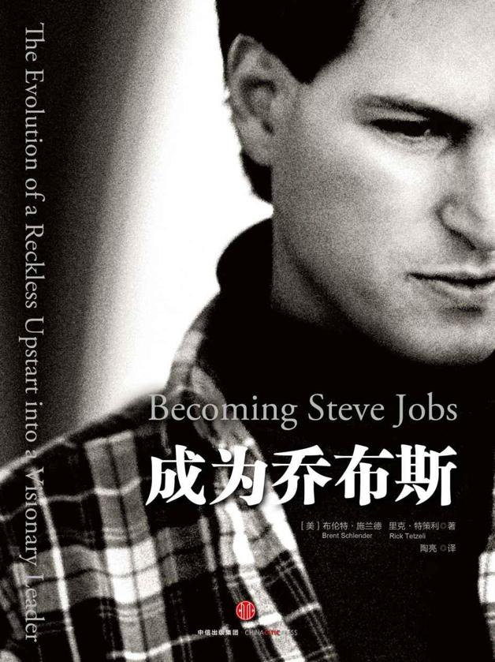

<svg xmlns="http://www.w3.org/2000/svg" xmlns:xlink="http://www.w3.org/1999/xlink" version="1.1" width="100%" height="100%" viewbox="0 0 628 839" preserveaspectratio="none">

<image width="628" height="839" xlink:href="cover.jpeg"></image>
</svg>

## 

成为乔布斯

\

\[美\]布伦特·施兰德 里克·特策利 著

陶亮 译

\[免费分享微信fanfoufou 更多新书首发朋友圈\]

中信出版社

## 目录

<a href="#part0002.html" class="calibre4">本书所获赞誉</a>

<a href="#part0003.html" class="calibre4">前言</a>

\[免费分享微信fanfoufou\]

<a href="#part0004.html" class="calibre4">第一章 安拉的花园</a>

<a href="#part0005.html" class="calibre4">第二章 “我不想当商人”</a>

<a href="#part0006.html" class="calibre4">第三章 突破与崩塌</a>

<a href="#part0007.html" class="calibre4">第四章 下一个产品是什么？</a>\[免费分享微信fanfoufou\]

<a href="#part0008.html" class="calibre4">第五章 无心插柳</a>

<a href="#part0009.html" class="calibre4">第六章 比尔·盖茨来访</a>

<a href="#part0010.html" class="calibre4">第七章 幸运</a>

<a href="#part0011.html" class="calibre4">第八章 蠢货、混蛋和守护者</a>

<a href="#part0012.html" class="calibre4">第九章 也许他们已经疯了</a>

<a href="#part0013.html" class="calibre4">第十章 跟着直觉走</a>

<a href="#part0014.html" class="calibre4">第十一章 做到最好</a>

<a href="#part0015.html" class="calibre4">第十二章 两个决定</a>

<a href="#part0016.html" class="calibre4">第十三章 斯坦福</a>

<a href="#part0017.html" class="calibre4">第十四章 皮克斯的避风港</a>

\[免费分享微信fanfoufou\]

<a href="#part0018.html" class="calibre4">第十五章 整机</a>

<a href="#part0019.html" class="calibre4">第十六章
盲点、怨恨与咄咄逼人</a>

<a href="#part0020.html" class="calibre4">第十七章
“告诉他们我就是个混蛋”</a>

<a href="#part0021.html" class="calibre4">致谢</a>

<a href="#part0022.html" class="calibre4">注释</a>

<a href="#part0023.html" class="calibre4">参考书目</a>

## 本书所获赞誉

布伦特·施兰德和里克·特策利以全新的视角描绘了史蒂夫从一位桀骜不驯的创业者成长为一位成熟睿智的企业家的故事。本书抓住了史蒂夫不服输的精神、永不满足的追求和不断学习的渴望，这些才是助他成功的关键因素，而非仅仅依靠天赋。本书的关注点无疑是正确的：这不是关于成功的故事，而是关于成长的故事。本书很有启发和借鉴意义，开始阅读并学习吧！

\[免费分享微信fanfoufou\]

——吉姆·柯林斯，《从优秀的卓越》的作者，\
《基业长青》和《选择卓越》的联合作者

施兰德是得到乔布斯信任的为数不多的几位记者之一……本书提供了很多一手资料，看完之后我才了解到乔布斯的温暖和复杂，特别是在他生命的最后几年。

——史蒂芬·列维，《高效能人士的七个习惯》作者

这本书很棒。我和史蒂夫共事25年，我觉得这本书抓住了史蒂夫成长过程的精髓，真实地反映出这位伟大人物的复杂心路历程，我希望这本书能成为描绘史蒂夫的权威之作。

——埃德·卡特穆尔，迪士尼动画和皮克斯动画公司总裁

本书强调了这一观点：职业生涯刚起步的乔布斯与站在事业巅峰的乔布斯并非同一个人。职业生涯刚起步的乔布斯羽翼未丰、鲁莽冲动、傲慢无礼，而带领苹果扭转乾坤、重登巅峰的乔布斯却成熟稳重、思虑周全。

——乔·诺塞拉，《纽约时报》

强烈推荐。

——菲利普·埃尔默-德维特，《财富》

本书并没有试图掩盖乔布斯的弱点，但他的成就的确足以彪炳史册。

——《经济学人》

引人入胜的书，揭开了面具下真实的乔布斯。很高兴有人写了这本书，强烈推荐。

——乔尼·埃文斯，《电脑世界》

史蒂夫·乔布斯激励了硅谷年青一代创业家，在这本论点翔实的书中，你将发现最真实的史蒂夫·乔布斯。

——马克·安德森

布伦特·施兰德和里克·特策利的伟大之处在于推翻了“孤独的天才”的传说，还原了乔布斯的复杂个性。

——阿尼尔·达什，ThinkUp公司CEO

本书值得一读，描述准确、信息详细、触动人心、富有洞察力，这本书必将成为关于史蒂夫·乔布斯的权威之作。

——约翰·格鲁伯，《可怕的烈焰》作者

即使是非常了解苹果的人也会爱上这本书……多层次展现了乔布斯变幻莫测的风格和个性……他一直在改变，直到离开人世的那一刻。

——布拉德·斯通，《一网打尽》作者

## 前言

“你是新来的吧？”这是他对我说的第一句话。（25年后，他对我说的最后一句话是“对不起”。）他已经反客为主向我发问了，然而我才是记者，我才是应该提问的那个人。

\[免费分享微信fanfoufou\]

同事已经告诫过我，采访史蒂夫·乔布斯可不是什么好差事。前一天晚上，我和《华尔街日报》旧金山分社的新同事们边喝酒边聊天，他们告诉我，第一次和乔布斯见面最好穿件防弹衣。其中一位半开玩笑地说，采访乔布斯更像是打仗而不是提问。当时是1986年4月，乔布斯已经成为《华尔街日报》的传奇。据传，另一位《华尔街日报》的记者就曾被他羞辱过，乔布斯直截了当地问他：“你到底理解了吗？你有听懂半个字吗？”

20世纪80年代早期，我在中美洲采访时，是真的需要穿防弹衣。我在萨尔瓦多和尼加拉瓜待过一段时间，采访的对象五花八门，有穿越战区的卡车司机，有驻扎在丛林里的美国军事顾问，有窝藏在据点里的反政府武装指挥官，还有待在宫殿里的总统。我还采访过那些桀骜不羁的亿万富翁，比如石油大亨布恩·皮肯斯（T.
Boone Pickens）、佩罗集团创始人亨利·罗斯·佩罗（H. Ross
Perot）和亚洲首富李嘉诚（Li
Ka-shing），也曾采访过诺贝尔奖得主比如杰克，·基尔比（Jack
Kilby），还有摇滚巨星、影视红人、信奉一夫多妻制的教徒，甚至是刺客的祖母。我也算是经历过大风大浪的人，没有那么容易被吓倒。我家在加州圣马特奥县（San
Mateo），从我家开车到位于帕洛阿尔托（Palo
Alto）的NeXT电脑公司总部需要20分钟时间，在这短短20分钟的车程里，我一直在思考也一，直在担忧，到底如何才能取得最佳的采访效果。

我之所以会如此焦虑，是因为我将要采访的对象是一位比我更年轻的杰出商业领袖，这在我的记者生涯中尚属首次。当时我32岁，乔布斯只有31岁，却已经声名显赫，与比尔·盖茨（Bill
Gates）共同被誉为个人电脑产业的缔造者。互联网的狂热时代还远未到来，神童们的横空出世还有待时日，乔布斯是技术领域最初的超级巨星，硕果累累、绩载史册。他和史蒂夫·沃兹尼亚克（Steve
Wozniak）在位于洛斯阿尔托斯（Los
Altos）的车库里捣鼓出来的电路板最终演变成了一家价值几十亿美元的大公司。个人电脑似乎有着无穷无尽的潜力，乔布斯作为苹果公司的共同创始人之一，也有着无限的可能性。然而，1985年9月，乔布斯迫于压力选择辞职。早些时候，他曾向苹果公司董事会宣布，要挖走一些关键岗位的员工，成立一家新的公司，专门生产电脑“工作站”。媒体得知消息后兴奋异常，详细剖析了他的离职之举，《财富》和《新闻周刊》都把这场闹剧作为封面故事发布在杂志上。

之后的6个月，没有人知道这家新公司的动向，主要是因为苹果公司向法院提起诉讼，想要阻止乔布斯挖人，不过最终苹果还是撤诉了。后来，乔布斯雇用的公关公司的一位工作人员给我的老板打电话，说乔布斯愿意接受主流商业刊物的采访，愿意透露一些NeXT电脑公司的具体情况。接到这项任务后，我非常激动，同时也保持着一份警觉，我可不想被这位极具人格魅力的先生给骗了。

我驱车朝帕洛阿尔托开去一，路向南，恰好回顾了硅谷的发展历程。从圣马特奥的92号公路到280洲际公路，“”田园牧歌式的八车道公路绕过圣安德烈亚斯湖（San
Andreas Lake）和水晶泉水库（Crystal Springs
Reservoir），水库的水来自塞拉斯山脉（Sierras），为旧金山地区储存饮用水；穿过位于门洛帕克（Menlo
Park）的沙丘路（Sand Hill
Road），财大气粗的风险投资家们在此云集；越过一座两英里长的斯坦福直线加速器（Stanford
Linear
Accelerator），加速器轨道就在公路下方，仿佛将大地划开了一道裂缝；沿途还会经过斯坦福校园后方那片广袤的山丘地带，射电天文望远镜矗立在山丘上，草地上点缀着棵棵橡树，白色面孔的赫里福德牛在草地上悠闲地散步。冬日和春日的雨水将这片山丘草地浇灌得碧绿苍翠，如同高尔夫球场的草坪，而不是常见的暗黄色，草地上还点缀着橙色、紫色和黄色的小野花。我对旧金山湾区（Bay
Area）不太熟悉，当时并不知道这是一年中景色最迷人的时候。

我在佩奇米尔路（Page Mill
Road）下了高速，惠普和另一家生物科技先驱阿尔扎公司（ALZA
Corporation）就在这条路上一，些提供专业化服务的公司也坐落在这条街上，比如安达信咨询公司（Anderson
Consulting，现在叫埃森哲Accenture）和威尔逊–桑西尼–古奇–罗沙迪律师事务所（Wilson
Sonsini Goodrich &
Rosati）。不过最先经过的是隶属于斯坦福大学的斯坦福研究园（Stanford
Research
Park），绿草茵茵的园区里建了很多低矮的研发实验室，给了研发人员施展才华的空间。施乐公司（Xerox）著名的帕洛阿尔托研究中心（Palo
Alto Research
Center，PARC）就坐落在园区里，乔布斯就是在这里第一次见到了配备鼠标和图形界面的电脑。乔布斯把NeXT的总部也选在了这里。

一位年轻的女公关带我走进一幢四四方方、混凝土结构、玻璃幕墙的两层办公楼，来到一间小会议室，透过会议室的窗户只能看到停车场。乔布斯已经在会议室了。他朝我点点头表示欢迎，示意那位女士出去，还没等我坐下，就抛出了刚刚提到的第一个问题。

我不确定他想要的答案是简单的“是”与“否”，还是他真的好奇我究竟是谁，以前做过什么。我假设他想听的是后者，于是我开始列举在《华尔街日报》当记者时曾经去过的地方和报道过的行业。从堪萨斯大学研究生院离开后，我去了达拉斯，报道过航空业、航空公司和电子工业，德州仪器（Texas
Instruments）和无线电器材公司（Radio
Shack）就在达拉斯。这期间，我还报道过约翰·欣克利（John
Hinckley），他是得州石油商人的儿子，1981年射击了里根总统，为此我还背上了骂名。

“你是哪一年高中毕业的？”他突然插话道。“1972年”，我答道，“我在大学待了7年，但最终也没拿到硕士学位。”他又插话道：“我也是1972年高中毕业的，这么说我们是同龄人。”（后来我发现他跳过一级。）

我继续解释道，我曾在中美洲待了两年，后来又去香港待了两年，为《华尔街日报》撰写地缘政治类的报道。我还在洛杉矶待过一年，最终来到了旧金山，旧金山一直是我梦寐以求的工作地。说到这，我感觉这场谈话越来越像是在面试，只不过乔布斯对我的话没任何反应。

“你对电脑有一丁点儿了解吗？”他又插话道，“那些主流刊物的记者没一个懂电脑的，屁也不懂。”他边说边摇头，流露出傲慢的神色。“上一个来采访我的《华尔街日报》记者连内存和软盘有什么区别都不知道！”

现在我觉得自己有点底气了。“虽然我在大学学的是英语专业，但上大学的时候，我编过程，做过一些小游戏，还设计过关系数据库。”他转了转眼珠。“连续好几年，我都在晚上给4家银行打工，用NCR<a href="#part0003.html_note1n" id="part0003.html_note1">[1]</a>小型机处理银行每天的交易。”他正凝视着窗外。“IBM（国际商业机器公司）个人电脑刚上市的时候，我就买了一台，在达拉斯买的，序列号的前8位都是零。开始我装了CP/M操作系统，搬去香港之前，我把这台电脑卖了，里面只装了MS-DOS（微软磁盘操作系统），因为买家只需要MS-DOS。”

提到这些早期的操作系统和竞争对手的产品，他终于来了精神。“你为什么没有买Apple
II（第二代苹果电脑）呢？”

好问题，然而……为什么我会允许这个家伙向我发问呢？

“我以前从没买过，”我还是回答了他的问题，“不过现在我有了，我让《华尔街日报》给我买了台Fat
Mac<a href="#part0003.html_note2n" id="part0003.html_note2">[2]</a>。”我说服纽约总部的同事给我买了台苹果电脑，我告诉他们如果要让我报道苹果公司，我就得熟悉苹果最新的机型。“我用了几周，到目前为止，比起IBM，我更喜欢苹果。”

我成功撬开了乔布斯的嘴。“等着吧，”他说道，“等你看到我们这里生产的产品，就不会想要Fat
Mac了。”我们终于回到了采访的正题上，这也是乔布斯一直想要谈的话题——如何打败他一手创立的公司，如何打败苹果的那些人，特别是苹果现任CEO约翰·斯卡利（John
Sculley），正是斯卡利把他赶出了苹果帝国。

现在，他愿意回答我的问题了，尽管他并没有直接回答每一个问题。目前NeXT总部依然是空空荡荡的，我很好奇，他是不是真的打算在这里组装电脑？可这里看上去不像是工厂。他是自己出资呢，还是已经找好投资方了？他卖掉了所有的苹果股票，只留了一股，大约拿到了7
000万美元，但这些钱还远远不够实现他的野心。聊着聊着，他会突然跑题，谈到完全出乎意料的话题。他边聊边喝装在啤酒杯里、冒着热气的白开水。他解释道，某天茶叶喝完了，他突然想到喝白开水也不错，他说道，“喝白开水也能让人平静。”最终，他又把话题拉了回来：高等教育界需要更好的电脑，只有NeXT才能生产更好的电脑。公司正在和斯坦福大学和卡内基–梅隆大学（Carnegie
Mellon）合作，这两所大学的计算机科学学院名声在外。“这两所大学会是我们的第一批客户。”

尽管他回答问题时避重就轻，传递出的信息也不多，但是乔布斯本人非常有气场。他流露出的强烈自信让我不得不认真倾听他说的每一个字。他回答问题时字斟句酌，即使是回答意料之外的问题也是如此。25年后，在他的追悼会上，乔布斯的妻子劳伦证实了他从非常年轻的时候，就拥有“成熟的审美品位”。从他的回答里，能听出他对于自我判断和品位的自信，而且在整个访谈的过程中，我意识到他始终在试探我是否能够心领神会，是否能够理解他以前所做的事和将要在NeXT做的事有什么特别之处。后来我意识到，乔布斯之所以不停地试探，是因为他要确保每一篇关于他和他公司的文章都能够达到他心目中的质量标准。乔布斯目前所处的人生阶段让他认为自己可以取代任何一个人、胜任任何一份工作，而且比原来的人干得更出色，当然他的这种态度让手下员工苦不堪言。

采访进行了45分钟，他为NeXT描绘的蓝图只有一个大概的轮廓，没有细节，后来的事实也证明这是一，个早期的信号，预示了公司未来几年会遭遇各种问题。然而，他却愿意讨论其中一个细节：NeXT的商标一。他给了我本设计精美的宣传册，解释了这个由保罗·兰德（Paul
Rand）设计的高大上商标是如何诞生、演变的。这本宣传册也是兰德设计的，昂贵的半透明隔页纸将厚重的乳白色纸张一一隔开，纸张上凸印着兰德设计商标的整个过程，据说这个图标用了“多种视觉语言”。根据册子上的描述，NeXT的商标是一个简单的正方体，黑色的背景上用鲜红、朱红、绿色和黄色印了NeXT的4个字母（红绿对比和黑黄对比是最鲜明的对比色），并且字母倾斜了28度。兰德是当时美国最著名的图标设计师，IBM、ABC（美国广播公司）、UPS快递公司和西屋电器的商标都出自他之手。商标和宣传册的开价是10万美元，没有任何讨价还价的余地，乔布斯愉快地付了钱。尽管是出于追求完美的目的，但如此奢侈铺张，对于NeXT的发展并没有什么帮助。

第一次采访结束后，我并没有撰写任何文章。一家刚起步的公司和一个高大上的商标没有任何新闻价值，无论是谁成立的公司、谁设计的商标。（另外，当时《华尔街日报》从不刊登图片，也没有任何彩页，所以即使我想报道NeXT的商标，《华尔街日报》也无法向读者展现出NeXT商标精致的美，何况那时候读者也不关心设计的问题。）

这次采访是我和乔布斯的第一次交锋，没有产出任何专题报道，我们之间的交锋与谈判还将持续25年。与绝大多数记者和被采访对象之间的关系一样，我和乔布斯之所以能维持这样的关系，是因为我们身上都有对方想要的东西。我可以在《华尔街日报》上撰写封面报道，之后我又为《财富》杂志工作，可以在《财富》杂志上撰写封面报道；而他的故事让读者非常着迷，我想要抢占先机，比其他记者更快、更好地将他的故事带给读者。乔布斯想让我写他的新产品，而我的读者对他本人也很感兴趣。他想要让我描绘出产品的精妙设计与巧夺天工，而我更想挖掘产品背后的故事，分析公司在竞争中的起起伏伏。我俩的互动就像是一场交易，我们都希望哄骗对方签订有利于自己的协议。有时候，我觉得自己和乔布斯是打桥牌的队友，有时候又觉得自己被骗了，手里拿着一副烂牌。乔布斯常常让我觉得他胜我一筹，尽管有时候这并不是事实。

尽管那次采访以后，《华尔街日报》并没有刊登任何报道，乔布斯对凯西·库克（Cathy
Cook）说这次采访进行得还不错，我也“还行”。凯西当时正为艾莉森·托马斯公关公司工作，自那以后，乔布斯经常通过凯西来邀请我去NeXT聊聊最新的进展。事实上，值得报道的内容并不多，至少达不到《华尔街日报》的报道标准。直到1988年我才写了关于NeXT的第一篇报道，那一年乔布斯推出了NeXT公司的第一台电脑工作站。但每一次采访的经历都十分有趣。

有一次，他叫我去听他吹嘘如何说服罗斯·佩罗（Ross Perot）向NeXT投资了2
000万美元。表面上看，佩罗投资乔布斯的公司非常不合理，佩罗是一位爱国的海军老兵，剃着平头，温文尔雅，乔布斯却是个喜欢光着脚的素食主义嬉皮士，而且不喜欢用除臭剂。然而，我比较了解史蒂夫，也采访过佩罗几次，我知道他们俩其实非常相似，都是另类而又理想主义的自学成才之人。我告诉史蒂夫，他绝对应该去达拉斯电子数据系统公司（Electronic
Data
Systems）总部拜访一下佩罗，即使不为别的，也应该去看看办公大楼的车道两边陈列的老鹰雕塑和美国国旗，那些都是佩罗的收藏。史蒂夫笑了，眨了眨眼说道：“去过了，也见识过了。”他问我是不是觉得他疯了，居然会喜欢佩罗这样的人。“任何人见过他以后，怎么可能不产生一点好感呢？”我答道，“他很有趣。”史蒂夫笑了笑表示同意，还补充道：“说实话，我觉得能从他身上学到很多东西。”

我们相仿的年龄逐渐成为交流的桥梁而非障碍，我们青少年时期的经历比较类似。尽管比尔·盖茨也与我年龄相仿，我也写过很多关于他的报道，但他的父母不是工薪阶层，也从没上过公立学校，我和史蒂夫的父母都是工薪阶层，而且我们都上过公立学校。我们三个都躲过了去越南服役挨子弹的命运，因为当我们18岁时，征兵制被废止了，但比起比尔，我和史蒂夫更像是反战、和平时代的产物。我们都狂热地爱着音乐，也痴迷于各种机械小装置，我们敢于尝试各种古怪的新想法、新创意。史蒂夫是被领养的，我们偶尔也会聊起他的这段经历，但是这段经历对他性格产生的影响并没有社会和政治大环境的影响大，我们长大成人的时代也是科技日新月异的时代。

史蒂夫之所以愿意维持和我的关系，还有一个重要原因。20世纪80年代末期，电脑的世界正处于变局之中，只有激发起公众对他的下一代伟大产品的热切渴望，让他们朝思暮想、屏息而待，才有可能吸引到足够的潜在客户和投资者，史蒂夫特别需要投资者的支持，因为NeXT用了将近5年时间才推出第一代工作站电脑。史蒂夫一直都非常明白媒体报道在其中扮演的角色和价值，这也是里吉斯·麦肯纳（Regis
McKenna）所谓的史蒂夫“过人天赋”中的一部分。麦肯纳是史蒂夫早期最重要的导师，他曾经说过“史蒂夫在市场营销方面有着过人的天赋，在22岁的时候已经有了敏锐的直觉。他知道索尼的伟大之处，也了解英特尔的伟大之处，他希望自己的产品也能享有如此声誉”。

史蒂夫知道苹果公司的报道是由我负责的，好几年时间里，他会时不时给我打电话爆一点苹果的“料”，都是他从还留在苹果工作的前同事那里听来的，有时候他只是谈谈自己对于苹果公司无休无止的高层变动闹剧的看法。到90年代初，苹果已经变得一团糟，史蒂夫是可靠的情报来源，而且我渐渐发现他打电话的时机绝对不是随便选的，每次都是有动机的：有时候是想挖掘一些竞争对手的信息，有时候是想让我看看他的产品，有时候是对我写的文章表示不满。对于最后一种情况，他还会跟我抗争。90年代后期，他又回到了苹果公司，我认为有必要给《财富》杂志再写一篇关于苹果的报道，于是给他发了封邮件。我们已经几个月没联系了，因为我做了一个心脏手术，在我住院期间他曾给我打过电话祝好，现在我已经康复了一，打算再撰写篇报道。他给我回了邮件，寥寥数语：“布伦特，我记得去年夏天你写的那篇报道对我和苹果公司都很不友好，这让我很受伤，你为什么要写这样一篇烂报道呢？”不过几个月后，他还是让步了，配合我写了另一篇封面报道。

我们的关系长久、复杂，却让彼此获益。如果我在行业活动中碰到史蒂夫，他会把我当成朋友介绍给别人，这一点让我受宠若惊，也让我感到有一丝怪异，我的确应该算得上是他的朋友，但并非所有的时候都是如此。有段时间，他在帕洛阿尔托办公，办公室离《财富》杂志所在地很近，我时不时会碰到他，我们会停下脚步天南海北地聊上几句。有一次，我还帮他挑选送给妻子的生日礼物。因为工作的原因，我去过他家很多次，每一次都比较随意、不拘礼节，我和其他CEO（首席执行官）的接触并不是这样的。然而每时每刻，我们之间关系的本质是非常清晰明了的：我是记者，而他是被采访对象和文章的主题。他很喜欢我写的某些报道，另一些却让他很生气，比如上文提到的让他回了邮件的那篇报道。我始终保持独立，而他也会隐藏一些信息，这构成了我们关系的边界。

在他生命的最后几年，我们之间的关系渐渐疏远。21世纪头10年的中期，我们都病得很严重，他在2003年被确诊为胰腺癌，而我在2005年去中美洲期间感染了心内膜炎和脑膜炎，昏迷了14天，醒来后几乎失去了所有听觉。当然，他对我病情的了解远远胜过我对他病情的了解。有时候，他也会向我透露一些病情的细节，有一次我们还比较了手术后留下的疤，就像电影《大白鲨》里的昆特（由罗伯特·肖饰演）和胡珀（由理查德·德莱福斯饰演）那样。我在斯坦福医院康复期间，他来看过我两次，主要是来检查自己的肿瘤，顺便来探望一下。他给我讲了关于比尔·盖茨的笑话，还因为我没有戒烟把我训斥了一顿，他总是喜欢对别人的生活方式指手画脚，劝了我好几年让我戒烟。

史蒂夫去世后，关于他的报道铺天盖地，有文章、图书、电影，还有电视节目，大部分只是在重复关于史蒂夫的那些传说和成见。这些传说和成见从80年代起就开始流传，那时媒体刚从位于库比蒂诺（Cupertino）的苹果公司总部挖掘出这位神童。当时，史蒂夫沉浸于媒体的追捧中，对于媒体并不设防，那段时间也是他生活最为散漫、放纵的一段日子，因此媒体在把他描绘成天才的同时，也免不了揭露他的卑劣以及对同事和朋友的漠不关心。后来他开始对媒体设防，只在需要宣传产品时才与媒体合作，因此这些早期的报道就成了大众获知他个性和思维方式的唯一来源。这也许也解释了为什么在他去世后，关于他的报道展现的几乎都是一些成见：史蒂夫是一位天才，在设计方面天赋过人，讲故事的能力超凡脱俗，可以产生“扭曲现实”的魔力；他就是个自以为是的混蛋，一味地追求完美，完全不顾他人的感受；他觉得自己比任何人都聪明，从来听不进任何建议，而且从出生伊始，就是天才与混蛋的结合体。

以我对史蒂夫的了解来看，这些成见没有一个是正确的。在我看来，史蒂夫比我在其他任何文章里读到的形象都更复杂、更有人性、更多愁善感，甚至更聪明。他去世几个月后，我开始整理我对史蒂夫的采访笔记、磁带和文档，又回忆起很多已经淡忘的内容：有我采访他时随手写下的笔记，有因为各种各样的原因当时没有用在报道里的故事，有我们互发的邮件，还有从来没有转成文字稿的磁带录音。我还找出一盒史蒂夫送我的磁带，当时约翰·列侬（John
Lennon）的遗孀小野洋子（Yoko
Ono）送给史蒂夫一盘磁带，是歌曲《永远的草莓地》（Strawberry
Fields
Forever）在录制过程中的各种不同版本，史蒂夫又翻录了一盒送给我。这些旧物都藏在车库里，在整理旧物的过程中，关于史蒂夫的很多记忆涌上心头。这些旧物我整理了好几周，整理完后我做了个决定：对于大众头脑里关于史蒂夫的那些根深蒂固的偏见，光抱怨几句是远远不够的，我要凭借我对他的了解，向公众展现一位更完整的史蒂夫，在他活着时是没有办法如此展现的。采访史蒂夫的过程引人入胜而又充满戏剧性，他的一生就如同莎士比亚的戏剧，充斥着傲慢、阴谋与豪情，充斥着十恶不赦的坏蛋与笨手笨脚的傻子，有幸运女神的垂青，有好心好意的忠告，也有出乎意料的结果。如此短的时间里有如此多的跌宕起伏，在他活着时，人们根本不可能完整地刻画出他的成功轨迹。现在，我要将目光放长远，重新审视这位自称是我的朋友的人——史蒂夫。

对于史蒂夫的职业生涯，大家最感兴趣的一个问题是：既然史蒂夫是如此前后矛盾、鲁莽冲动、固执己见、不顾他人感受，并被赶出了自己一手建立的公司，他又如何最终成为一位受人敬仰的CEO，如何让苹果公司起死回生，如何打造出那么多决定了大众文化走向的产品？这些产品不仅将苹果公司推上了全球最有价值公司的宝座，也改变了全球数十亿人的日常生活，这些人来自不同的社会经济阶层，拥有截然不同的文化背景。对于这个问题的答案，史蒂夫本人并不热衷于探讨。尽管史蒂夫善于自我反省，但他并不喜欢追忆往昔，他曾在邮件里对我说：“回顾过去没有什么意义，我情愿向前看。”

要找到这个问题的答案，就必须分析他是如何改变的，在谁的影响下做出了改变，以及他又是如何将心得体会运用到公司的运作中去的。在翻看旧文件的过程中，经常会回忆起史蒂夫那段“被放逐”的岁月，也就是从1985年离开苹果到1997年重回苹果的这段时间。人们很容易忽略史蒂夫这12年的经历，因为这12年间，他经历的低谷没有离开苹果时那么有戏剧性，取得的成就也没有他重回苹果后那么辉煌。这12年间，史蒂夫的经历纷繁复杂、模糊不清，很少上头版头条，但这段时间却是他职业生涯的关键时期。正是在这段时间里，他学会了如何控制脾气与行为，学会了很多东西，最终造就了他的成功。如果忽略这段时间，就会掉进只关注成功的陷阱。通过分析失败的原因，分析光明的坦途为什么会变成死胡同，我们也能学到很多东西。史蒂夫最后10年所展现出的远见、理解、耐心和智慧，正是从这12年的不断尝试与探索中获得的。潘多拉魔盒中的一切不成熟，包括挫折失败、沟通不力、判断失误、价值取向偏差等，都是史蒂夫通往成功坦途的必经之路，只有经历了这些不成熟，史蒂夫在重回苹果之后才会变得头脑清晰、脾气温和、不断反思、始终如一。

放逐期快结束时，尽管数次误入歧途，史蒂夫仍然成功拯救了NeXT和皮克斯动画工作室（Pixar），这的确是了不起的成就。NeXT保证了他职业生涯的后续发展，而皮克斯给了他财务自由。他在这两家公司的经历决定了苹果的未来，也在某种程度上定义了我们现在所生活的这个世界。史蒂夫从不轻易妥协，学习任何东西也绝不会浅尝辄止，这几年，他就像一台学习机器，无论学习的内容有多困难，他都会在好奇心的驱使下，全身心地投入到学习中去。

没有人可以活在真空中。结婚、组建家庭彻底改变了史蒂夫，也对他的工作产生了积极的影响。这么多年来，我和史蒂夫私下接触过很多次，也见过他的妻子劳伦和孩子们，但我还算不上他的家庭密友。2012年，我开始着手写这本书，那时候才发现我对他的家庭生活了解得并不多。他的密友和同事当时都沉浸在悲伤之中，也对已经出版的描绘史蒂夫的刊物感到很愤怒，因此他们刚开始并不愿意和我聊。但情况在慢慢地好转，我有机会和他最亲密的朋友和同事交谈，包括出席了他私人葬礼的仅有的4名苹果公司员工，这些交谈展现了史蒂夫的另一面，他的这一面虽然我已经有所察觉，但理解得并不深刻，当然也从没在其他任何刊物中读到过。史蒂夫具有卓越的心理区隔能力，这种能力让他在重回苹果后，可以有条不紊地管理好公司各种繁杂的事务，让他在癌症病魔缠身时，依然可以专注于工作，也让他在工作之余能够享受生活，但除了密友，他不会把自己的私生活向别人透露半个字。

当然，他并不是一个很好相处的人，即使在晚年也是如此。对有些员工来说，为这样的老板打工简直如同炼狱般可怕。他的有些行为在我们普通人看来可能不可理喻，但是按照他的价值标准来衡量，也算合情合理。史蒂夫是一位忠诚的朋友，一位循循善诱的导师，一位温柔慈爱的父亲。他深信自己的工作所创造的价值，也希望身边的好友能够和他一样，深信他们的工作所创造的价值。埃德·卡特穆尔（Ed
Catmull）是皮克斯动画工作室的总裁，也是史蒂夫的朋友和同事，他曾经说过，虽然史蒂夫如此“离经叛道”，却有着和普通人一样的感情、优点和弱点。

我之所以如此热爱商业报道，是因为即使是锱铢必较的商业帝国也有其人性的一面，这也是我从优秀的商业记者前辈那里获取的经验。史蒂夫还在人世时，我就知道他有人性的一面，我从未见过像他这样对自己的产品有着如此热情的人。但直到我开始写这本书时，才真正意识到，史蒂夫的个人生活和工作有很大一部分是相互重叠、互相影响的。只有意识到这一点，才能理解史蒂夫是如何成为当代爱迪生、福特、迪士尼和猫王的结合体，如何缔造出苹果东山再起的传奇。

第一次采访结束后，史蒂夫起身送我，我们沿着NeXT总部大楼宽敞整洁的走廊走到门口，没有任何寒暄。对于史蒂夫来说，采访已经结束了。我出门时，他都没有说再见，只是站在那儿，透过玻璃门，看着停车场入口处，一群工人正在那里安装NeXT的立体商标。我开车离开时，他依然站在那里，凝视着这个昂贵的商标。他从骨子里知道，马上要开始干轰轰烈烈的大事了。当然，他并不知道自己未来的命运。

<a href="#part0003.html_note1" id="part0003.html_note1n">[1]</a>
NCR公司是全球领先的技术公司，为全球零售、金融、制造、旅游及交通等客户提供服务。——编者注

<a href="#part0003.html_note2" id="part0003.html_note2n">[2]</a> Fat
Mac，是存储巨大的苹果电脑的昵称。——编者注

## 第一章 安拉的花园

1979年12月的一个下午，天气寒冷，史蒂夫将车开进了“安拉的花园”（Garden of
Allah）的停车场，“安拉的花园”是旧金山南部马林郡（Marin
County）塔玛佩斯山（Mount
Tamalpais）上的一家休闲会议中心。他看上去疲惫、沮丧又愤怒，而且迟到了。从苹果公司总部库比蒂诺往南开的280公路和101公路拥堵不堪，他刚刚在库比蒂诺参加完苹果的董事会。董事会是由受人尊敬的亚瑟·罗克（Arthur
Rock）董事长主持的，会议的情况不尽如人意。史蒂夫和罗克几乎在每件事上都无法统一意见，罗克把史蒂夫当成孩子来对待，他喜欢秩序和流程，坚信IT公司会遵循一定的规律、沿着一定的轨迹发展壮大。他之所以对此深信不疑，是因为他以前投资过的IT公司都遵循了这样的规律，特别是位于圣克拉拉（Santa
Clara）的芯片制造商英特尔。罗克是那个时代最著名的科技领域投资人，但最开始他并不想投资苹果，因为他不喜欢史蒂夫及其合作伙伴史蒂夫·沃兹尼亚克。罗克看待苹果公司的方式与史蒂夫完全不同，在史蒂夫看来，苹果能让电脑变得更加人性化，完全打破了等级森严的组织架构。但在罗克看来，苹果仅仅是一家他投资的企业而已。史蒂夫发现，和罗克开董事会完全起不到振奋人心的作用，只会让人筋疲力尽，因此他很渴望能开着敞篷车，飙车到马林郡，摆脱董事会上无休无止却毫无意义的争论。

但是湾区在下雨，没法打开车的顶棚，而且湿滑的道路让交通变得乱糟糟的，即使开着最新款的梅赛德斯–奔驰450SL，也感受不到丝毫乐趣。史蒂夫对汽车的热爱就如同他对莲黑胶唱机（Linn
Sondek）的热爱，以及对摄影大师安塞尔·亚当斯（Ansel
Adams）的铂盐印相法的热爱。事实上，他对于电脑的设想直接来源于汽车：功能强大、造型优美、效率高超，没有多余的配件。不过，这样的天气，这样的交通，使开车也变得索然无味。史蒂夫来参加塞瓦基金会（Seva
Foundation）的会议，结果迟到了半小时，塞瓦基金会是他的朋友拉里·布里安特（Larry
Brilliant）创办的，布里安特看上去就像一尊穿着跑鞋的佛。基金会目标宏大：彻底消灭印度一种会使人致盲的疾病，印度有几百万人受到这种疾病的困扰。

史蒂夫停好车，下了车。他身高6英尺（约1.8米），体重165磅（约75公斤），留着棕色及肩的长发，深邃的目光仿佛有着穿透力，这样的身材和长相走到哪里都引人瞩目。因为刚参加完董事会，西装革履的史蒂夫显得光彩照人。他自己也不知道对西装有什么感觉，在苹果公司，员工想穿什么就穿什么，他自己经常光着脚出现在员工面前。

“安拉的花园”是一幢造型奇特的建筑，坐落在塔玛佩斯山的山顶上，从那里可以俯瞰旧金山湾。建筑融合了加州的艺术特色和瑞士农舍的风格，四周种了很多红杉和柏树。这幢建筑建于1916年，原本是为一位名叫罗尔斯顿·怀特（Ralston
Love
White）的加州富人而建，1957年以后变成了休闲会议中心，由联合基督教会（United
Church of Christ）运营。史蒂夫穿过车道的草坪，走上几级台阶，进了大楼。

任何路过的人，只要瞥一眼会议室里坐着的人，就知道不是教会举行的活动。会议桌的一边坐着拉姆·达斯（Ram
Dass），他是犹太人，却信了印度教，是瑜伽修行者，1971年写了一本史蒂夫很喜欢的畅销书《活在当下》（Be
Here
Now），讲的是冥想、瑜伽与灵修。他旁边坐着感恩而死乐队（Grateful
Dead）的主唱和吉他手鲍勃·韦尔（Bob
Weir），乐队将于12月26日在奥克兰体育馆为基金会举办一场慈善演出。斯蒂芬·琼斯（Stephen
Jones）和妮可·格拉塞（Nicole
Grasset）也来了，琼斯是美国疾病控制中心的流行病学家，他和布里安特曾经在印度和孟加拉国参加过世界卫生组织消灭天花的行动，当时这个项目的负责人就是格拉塞，最终天花被成功消灭了。反主流文化人士最为追捧的威维·格雷（Wavy
Gravy）和他的妻子也在座，他们的旁边坐着印度亚拉文眼科医院（Aravind Eye
Hospital）的创始人凡卡塔斯瓦米（Govindappa
Venkataswamy）博士，这家医院为几百万因白内障而致盲的患者动了手术，让他们重见光明，当时印度白内障的患病率很高。布里安特给基金会设立的目标是支持像V博士（布里安特对凡卡塔斯瓦米博士的称呼）那样的专家，在南亚贫穷的乡村地区开设医院，帮助盲人重见光明。这一目标和消灭天花一样宏大。

史蒂夫认识其中的几个人。罗伯特·弗里德兰（Robert
Friedland）和史蒂夫打了声招呼，正是弗里德兰促成了史蒂夫1974年的印度朝圣之旅。他当然也认识韦尔，尽管他觉得这支乐队在情感的表达与深度方面都不及鲍勃·迪伦（Bob
Dylan），但还是很喜欢这支乐队。这次会议是布里安特邀请史蒂夫出席的，他们的相识缘于5年前的印度之行。弗里德兰给史蒂夫寄了一篇1978年的报道，详细描绘了消灭天花的行动是如何取得成功的，也谈及了布里安特筹建基金会的计划，史蒂夫立马给布里安特寄了5
000美元，作为基金会的启动资金。

参会人员形形色色，有印度教徒，有佛教徒，有摇滚歌手，有医生，他们在各自的领域都取得了不凡的成就，大家都聚在这间由联合基督教会运营的会议室里。在这间会议室里，虽然史蒂夫不能像在苹果公司那样成为发号施令的老大，但他应该觉得如鱼得水。史蒂夫经常冥想，也理解精神升华的内涵。事实上，他去印度就是为了向尼姆·卡洛里·巴巴（Neem
Karoli
Baba）大师学习（人们也称之为马哈拉杰–吉，Maharaj-ji），不过在史蒂夫到印度的几天之前，大师已经圆寂了。史蒂夫想要创建的不仅仅是一家普通的企业，他胸怀改变世界的强烈渴望。这间会议室里涌动的反传统、反建制的人文思想以及多学科的交流融合应该正是史蒂夫所渴望的。但是，由于某种原因，他却无法融入。

这间屋子里至少有20个人他不认识，他做自我介绍的时候，大家依然在交谈，并没有安静下来，看来很多人根本不认识他，这一点让他很惊讶，尤其是在旧金山湾区。苹果公司已经取得了傲人的成绩：电脑的月销量从1977年年末的70台增长到了如今的3
000多台，没有一家电脑公司有如此惊人的发展速度，史蒂夫相信明年的销量会更高。

他坐下，开始听大家发言。筹建基金会的计划已经确定了，现在正在讨论的问题是如何向全世界宣传基金会，如何介绍基金会的计划以及参与基金会的人员。史蒂夫发现绝大多数观点都非常天真，更像是家长会上讨论的内容。除了史蒂夫，大家都在热烈地探讨着如何做好一本宣传小册子。宣传小册子？这就是这群人能想到的最佳宣传方式吗？这群所谓的专家也许在他们自己国家取得了不凡的成就，但是在美国，他们那一套显然已经落伍了。如果缺乏卓越的讲故事的能力，再宏大的目标都无济于事，这是显而易见的。

讨论还在继续，史蒂夫发现自己在神游。“他走进会议室的时候，显然还带着参加苹果董事会的派头，”布里安特回忆道，“但消灭失明、天花等疾病与运作一家公司是截然不同的。”他时不时会大声插话，语带讽刺地评论为什么这个想法或那个想法是不可能成功的。布里安特说道，“他很快就成了个惹人嫌的家伙。”终于，史蒂夫再也忍受不了了，他站了起来。

“听着，”他说道，“我告诉你们，我对市场营销略知一二，苹果公司卖出了10万台电脑，我们刚刚起步的时候，没有人知道我们是干什么的。塞瓦现在的处境和苹果几年前的情况是一样，唯一的差别在于你们这群人根本不懂市场营销。如果你们真的想干一番事业，想改变世界，而不是像那些默默无闻的非营利组织那样混日子，就得把里吉斯·麦肯纳找来，他是营销之王。如果你们需要的话，我可以把他找来。你们应该找最优秀的人，不能退而求其次。”

整个房间安静了几秒钟。凡卡塔斯瓦米小声问布里安特：“这个年轻人究竟是谁？”会议桌的各个方位都响起了质疑史蒂夫的声音，史蒂夫一一反驳，把一场原本友好的讨论变成了一场混战。他完全忽略了这一事实：在座的参会者参与过消灭天花的行动，救助过印度的盲人，促成过跨国界的协议，使他们得以在多个国家开展行动，甚至包括战乱国。换句话说，这些人完全了解如何才能干一番事业，但是史蒂夫却丝毫不关心他们取得的成就。他很享受混战、质疑与冲突，在他有限的经验里，要做成大事必然会经历这些。争吵越来越白热化，终于布里安特插话了：“史蒂夫。”接着他又提高嗓门叫道：“史蒂夫！”

史蒂夫抬起头，因为被打断而显得很不高兴，他急于要继续阐述观点。

“史蒂夫，”布里安特说道，“很高兴你能来，但现在别再说话了。”

“我必须要说，”史蒂夫说道，“你们来找我帮忙，我也乐于帮忙。你们知道应该干什么吗？应该把里吉斯·麦肯纳找来，我来介绍一下，他是……”

“史蒂夫！”布里安特再次吼道，“别说了。”但史蒂夫仍然没有停下来的意思，他必须要表达自己的观点，于是他手指着参会人员，继续滔滔不绝，就好像用5
000美元的捐款买到了这个发言的机会。流行病学家、医生和乐手们只能面面相觑，终于布里安特忍无可忍。“史蒂夫，”他低声说道，努力想保持平静，但显然无法做到，“请你离开。”布里安特陪着史蒂夫出了会议室。

15分钟后，弗里德兰溜出了会议室，很快又回来了，悄悄走到布里安特身边。“你应该去看看史蒂夫，”他向布里安特耳语道，“他在停车场里哭。”

“他还没走？”布里安特问道。

“是的，他在停车场里哭。”

布里安特是会议的主持人，他向参会者说了句抱歉，快速走出会议室，去找史蒂夫。史蒂夫的奔驰敞篷车就停在停车场的中央，他正趴在方向盘上抽泣。雨已经停了，开始起雾了，车的顶棚是开着的。“史蒂夫，”布里安特弯腰凑到门边，给了24岁的史蒂夫一个拥抱，说道：“史蒂夫，没事的。”

“对不起，我太激动了，”史蒂夫说道，“我仿佛生活在两个世界里。”

“没关系，我们回会议室吧。”

“我要走了，我知道自己失控了，我就是想让他们听我发言。”

“没关系，回会议室吧。”

“我要进去道歉，然后我就走了。”他说道，也是这么做的。

1979年冬天发生的这件小事是一个很好的切入点，也是故事的开端，史蒂夫·乔布斯即将踏上改变之旅，最终成为这个时代最为高瞻远瞩的商业领袖。12月造访“安拉的花园”的那位年轻人完全是矛盾的综合体，所以才会把会议搞砸。他创建了史上最成功的公司，但又不希望别人仅仅把他看成商人。他渴望导师给予指导，但又讨厌有权有势的家伙。他服用迷幻药，经常赤脚走路，穿着邋遢的牛仔裤，喜欢公社式的生活，但又狂热地迷恋着制造精良的德国跑车，热爱在高速路上飙车的感觉。他希望支持慈善事业，但又讨厌大多数慈善机构的低效无能。他极度缺乏耐心，认为唯一值得花力气去解决的问题应该是需要好几年才能解决的难题。他信奉佛教，却又是个顽固不化的资本家。他傲慢地认为自己无所不知、无所不晓，随意地斥责比他更聪明、更有经验的专家，但是却能一针见血地指出他们在营销方式上的弱点。他有时极度粗鲁无礼，事后又会幡然悔悟。他有时固执己见，但同时又渴望学习。他已经离开了会议室，但又决定回去道歉。在“安拉的花园”，他展现了所有傲慢、无理、丑陋的行为，在描绘史蒂夫·乔布斯的书中必然会提到这些行为。随着年龄的增长，他慢慢地展现出人性中更为温和的一面，然而大众往往并不知道。要真正了解史蒂夫，了解他令人不可思议的心路历程，了解他所经历的转变，就必须要认识、接受他的两面性，并且把这两面结合起来。

他是个人电脑产业的领袖和代言人，然而当时他还只是个小伙子，只有24岁，所受的商业教育还不多。史蒂夫最大的优点与最大的弱点不可避免地交织在一起。只不过在1979年之前，他的弱点还不足以阻碍他的成功。

之后的几年，史蒂夫矛盾的个性所带来的影响慢慢显现。他的优点造就了苹果的拳头产品：1984推出的麦金塔电脑（Macintosh）；他的弱点造成了苹果公司的混乱局面，仅仅一年后，他就被逐出了公司。离开苹果后，他的弱点又导致他极力想为NeXT公司打造的创新型电脑产品以失败而告终。他的弱点也让他远离了电脑产业的核心，一位好友甚至称他已经“过气了”。史蒂夫的这些弱点极大地影响到了他的商业声誉，以至于1997年他出人意料地被请回苹果公司时，甚至是评论员和同僚们都觉得苹果公司的董事会“疯了”。

不久以后，他却上演了商业史上最壮丽的王者归来，带领苹果打造了一系列让人眼前一亮的划时代产品，也使这家行将就木的电脑生产商摇身一变，成为世界上最有价值、最令人敬仰的公司。如此转变不是一个偶然的奇迹。离开苹果的那些年，史蒂夫·乔布斯学会了如何发挥自身的优势、控制自身的弱点。然而，关于史蒂夫的那些传说中，都没有描绘这一点。在大众的印象里，他就是一位独裁的暴君，拥有把产品点石成金的魔力，同时又是个十足的混蛋，没有朋友，缺乏耐心，也不遵守道德底线。他出生时就是天才与混蛋的结合体，终其一生都是如此。

如果史蒂夫一直保持着在“安拉的花园”表现出的个性，1997年重掌苹果后，他绝不可能扭转乾坤，绝不可能带领这家庞大、复杂的公司慢慢变革，最终走向辉煌。他个人的成长历程与公司一样非常复杂，我还没见过有哪位商人像史蒂夫那样经历如此重要的成长与转变。个人的转变当然是渐进的，每个成年人应该都有体会，我们穷尽一生与自身的天赋和缺陷做斗争，学着如何去管理自己的天赋与缺陷。这是一个无穷无尽的成长过程，但成长的结果并非成为一个截然不同的人。史蒂夫就是一个很好的案例，他学会了如何更好地利用自己的优势，控制那些会阻碍成功的弱点。那些弱点并没有消失，也没有被优点所取代，只不过他学会了如何管理自我，如何控制自己的天赋与不足，可能并不是控制全部，但至少能控制大部分。要了解这些转变是如何发生的，为什么这些转变能促成苹果的东山再起，就必须要全盘考虑史蒂夫在那个12月的下午，在“安拉的花园”表现出来的所有矛盾个性。

史蒂文·保罗·乔布斯从小就觉得自己是受到优待的，这主要源于抚养他长大成人的养父母，养父母认为他是非常特别的孩子。史蒂夫1955年2月24日生于旧金山，他的生母乔安妮·席贝尔（Joanna
Schieble）决定放弃他的抚养权。当时席贝尔在麦德逊市的威斯康星大学读研究生，1954年与一位来自叙利亚的政治学博士在读生阿卜杜勒法塔赫·钱德里（Abdulfattah
Jandali）坠入爱河。席贝尔怀孕后搬到了旧金山，钱德里继续留在威斯康星大学读书。保罗和克拉拉·乔布斯（Paul
and Clara
Jobs）是一对工薪阶层夫妻，没有孩子，在史蒂夫出生几天后收养了他。史蒂夫5岁时，全家搬到了山景城（Mountain
View），很快又收养了一个女儿帕蒂。有些文章把史蒂夫这段被领养的经历描绘为“被抛弃”，认为这段经历是他暴躁易怒的行为的诱因，特别是在他职业生涯早期所表现出来的那些行为。但史蒂夫反复告诉我，保罗和克拉拉非常爱他，也很宠他。史蒂夫的遗孀劳伦·鲍威尔·乔布斯（Laurene
Powell Jobs）说：“他觉得自己非常幸运能拥有这样的父母。”

保罗和克拉拉都没上过大学，但他们向席贝尔承诺，一定会让史蒂夫上大学。对于中产阶级下层家庭来说，这是一个非常郑重的承诺，也开启了他们对史蒂夫有求必应的模式，无论史蒂夫需要什么，他们都会尽力满足他们唯一的儿子。史蒂夫很聪明，他从五年级直接跳到了七年级，老师甚至想让他跳两级。跳到七年级后，史蒂夫在学业上依然毫不费力，但常常受到同学的欺负与冷落。他求父母帮他转到更好的学校去，尽管转学意味着要花一大笔钱，但父母还是同意了。保罗和克拉拉收拾行李搬到了洛斯阿尔托斯的一处城郊居民区，这个地方位于旧金山湾的西面小坡，原本是一片李子园，后来改建成居民区。这片住宅区位于库比蒂诺–森尼韦尔学区内，是加州最好的学区之一。在那里，史蒂夫如鱼得水。

保罗和克拉拉不仅让史蒂夫感觉到自己是受到优待的，也培养了他追求完美的性格，特别是在手工工艺方面。保罗·乔布斯做过很多不同的工作，包括回收商、机械工、汽车修理工等，他很喜欢各种手工艺，也喜欢捣鼓各种器械，周末通常会做家具或是改装汽车，他教会儿子要沉下心关注细节。保罗并不富有，因此也会收集一些值钱的零部件。“他在车库有一个工作台，”史蒂夫接受史密森尼学会（Smithsonian
Institution）的采访时曾说，“在我五六岁的时候，他把工作台隔出一小块，对我说：‘这是你的工作台。’他还给我一些小工具，教我如何用锤子和锯子，教我如何做东西。这对我来说是非常有益的经历，他花了很多时间陪伴我，教我如何做手工，如何把各种装置拆开再装好。”后来，史蒂夫向我展示新款iPod或是苹果电脑时，始终记得父亲的告诫：对于一个橱柜来说，别人看不到的底面与表面的抛光一样重要；对于一辆雪佛兰汽车来说，别人看不到的刹车片和汽车的油漆一样重要。在他讲述关于父亲的故事时，我能感觉到史蒂夫的多愁善感，他把自己在数字电子领域卓越的审美能力都归功于父亲的培养，尽管保罗·乔布斯可能永远都无法理解数字电子产品。

相信自己是特别的，并且想把事情做到完美，这是史蒂夫从小接受的教育。20世纪六七十年代，在硅谷地区长大是非常特别的经历。那时候，硅谷还不叫硅谷，它位于帕洛阿尔托和圣何塞（San
Jose）中间的这块区域，半导体、无线电通信和电子公司蓬勃发展，吸引了大量接受过高等教育的电子工程师、化学家、光纤专家、程序员和物理学家慕名而来。高端电子产品的市场重心正从政府和军队向公司和工业产业转移，大大扩展了各项新兴电子技术的潜在客户群体。史蒂夫所住的小区里，很多孩子的爸爸都是工程师，在附近的新兴技术公司总部上班，这些公司后来都成了科技巨头，包括洛克希德（Lockheed）、英特尔、惠普和应用材料公司（Applied
Materials）。

住在这个街区对数学和科学感兴趣的孩子往往比在其他地方长大的孩子更能了解前沿技术的发展。年轻人的兴趣逐渐从改装高速汽车转移到了电子产品上，极客们呼吸着烙铁散发的气味，传阅破旧的《大众科学》和《大众电子》杂志，从埃德蒙科技（Edmund
Scientific）、希思（Healthkit）、埃斯蒂斯工业（Estes
Industrials）、无线电器材（Radio
Shack）等公司邮购零部件，自己动手做晶体管收音机、高保真立体声音响、收发报机、示波器、火箭发射器、激光器和特斯拉线圈。在硅谷，做电子产品不仅仅是兴趣爱好，也成为蓬勃发展的新兴产业，和摇滚乐一样振奋人心。

对于像史蒂夫这样少年老成的孩子来说，没有一件事情是研究不透的，既然所有的事情都能研究透彻，就能做出任何想要的东西。“我的感觉是仿佛可以造出宇宙里存在的任何东西，”有一次史蒂夫告诉我，“这些东西不再神秘。比如你看到一台电视机，心里可能会想，‘我从没做过电视机，不过我完全可以做。希思公司的产品目录里有这种电视机，我做过目录里的其他两种产品，这台电视机肯定也能做。’人们越来越意识到，所有的物件都是人类智慧创造的结果，并非突然出现在我们身边的神秘之物。”

史蒂夫加入了“探险家俱乐部”，俱乐部有15个孩子，每周都会定期在位于帕洛阿尔托的惠普公司园区见面，探讨电子项目，向惠普的工程师学习。史蒂夫就是在这里第一次接触到电脑，也让他有机会结识惠普公司的创始人。惠普是第一家从车库里发展起来的硅谷公司，创始人有两位，史蒂夫和其中一位建立的联系虽然微不足道，但也着实有趣。史蒂夫14岁的时候，为了完成“探险家俱乐部”的项目，从家里给比尔·休利特（Bill
Hewlett）<a href="#part0004.html_note3n" id="part0004.html_note3">[3]</a>打电话，以个人的名义向比尔要一些很难找到的电子材料。最终，史蒂夫成功要到了材料，因为他已经具备了良好的讲故事的能力。从某些方面来看，史蒂夫是非常典型的青少年极客，但他对人文学科也很感兴趣，深深沉醉在莎士比亚、梅尔维尔和鲍勃·迪伦的作品中。他伶牙俐齿，和父母交流时总能想办法说服父母，从而达成自己的目的，他与朋友、老师、导师甚至是后来非富即贵的大人物接触时，同样会展现出强大的说服力。史蒂夫从很小的时候就明白，说正确的话、讲生动的故事能帮助他吸引别人的目光，达到自己的目的。

不过，在当地逐渐萌芽的技术圈里，史蒂夫算不上明星。1969年，史蒂夫的朋友比尔·费尔南德斯（Bill
Fernandez）介绍给他一位真正的技术明星：史蒂夫·沃兹尼亚克。沃兹尼亚克就住在附近的森尼韦尔市，他的父亲是洛克希德公司的工程师。沃兹是工程天才，史蒂夫则是天才的成就者，这是他职业生涯中的第一次伟大合作。

沃兹比史蒂夫大5岁，有点书呆子气，比较害羞，远没有史蒂夫那么自信专断。同史蒂夫一样，沃兹对电子技术的了解同样源于自己的父亲和邻居孩子的父亲，但无论在校内校外，他都比史蒂夫钻研得更深入，在10岁刚出头的时候，就用晶体管、电阻器和二极管做过简易计算器。1971年，在单片微处理器尚未商业化应用时，沃兹设计了一个布满芯片和电子元件的电路板，他称之为“汽水冰激凌电脑”，因为汽水冰激凌是他当时最爱喝的饮料。沃兹是一位才华横溢的硬件设计师，有着杰出的电子工程天赋，同时也具备了软件程序员的想象力，他能看到电路板设计和软件编程中的捷径，别人却无法做到。

史蒂夫没有沃兹那样的天赋，但却有着与生俱来的渴望，想要把好产品送到尽可能多的人手里，供人们使用，这一点让他从一大群捣鼓电脑的业余爱好者中脱颖而出。史蒂夫仿佛天生就是一位经理人，善于说服别人去追求只有他才能看到的目标，然后与别人通力合作，鞭策别人达成这个目标。这种才华的第一次展现是在1972年，他和沃兹展开了一次看上去不可思议的商业合作。

在史蒂夫的帮助下，沃兹做出了第一台数字“蓝盒子”，这台机器能模拟电话公司转接设备的信号，连接到世界上任何一个角落的任何一部电话。只要把这台使用电池的小设备放在电话的听筒边，就能骗过贝尔电话公司的转接系统，免费拨打国内长途电话甚至是国际长途电话。当然，这么做是非法的。

沃兹做出“蓝盒子”电路板后，愿意免费和大众分享，几年后，当做出第一代苹果电脑（Apple
I）的核心电路板时，他也是这么想的。但史蒂夫却建议把电路板组装成完整的机器后卖掉，以便从中赚点钱。沃兹在完善电路板设计的同时，史蒂夫忙着整理必要的材料，给“蓝盒子”定价。最后，这台非法机器的定价是150美元，大部分都卖给了大学生，他俩总共净赚6
000美元。两个男孩儿进入大学的寝室楼，挨个房间敲门，询问住在里面的学生这是不是乔治的房间。乔治是虚构的人物，被设定为专门盗用电话线路的飞客。如果学生对此话题很感兴趣，他俩就会展示蓝盒子的功能，有时候能成功卖掉一台。不过，销售情况不算太乐观，有一次一位潜在客户居然用枪指着史蒂夫，逼他交出“蓝盒子”。从那以后，他们就金盆洗手了。不过，这是个还不错的开端。

在描绘史蒂夫职业生涯的书里刻画他的精神生活似乎显得不合时宜。但史蒂夫年轻的时候的确非常虔诚，通过服用迷幻剂，也通过宗教信仰，努力探寻表象之下的深层次内涵和意识。精神追求大大拓展了史蒂夫的智慧与视野，让他能看到别人看不到的可能性，比如与众不同的产品，比如彻底颠覆传统的商业模式。

正如同硅谷的大环境孕育、塑造了史蒂夫对技术的乐观态度，20世纪60年代的时代背景促使这位充满好奇心的年轻人不断去探索更深层次的真理。和同时代的其他年轻人一样，史蒂夫浸染于反文化运动的浪潮中，充满了质疑精神，渴望挣脱传统的桎梏。史蒂夫属于战后婴儿潮一代，他嗑过药，沉醉于鲍勃·迪伦、披头士乐队、感恩而死乐队和摇滚女王珍妮丝·贾普林（Janis
Joplin）的反叛歌词中，甚至喜欢迈尔斯·戴维斯（Miles
Davis）的爵士乐小号演奏，戴维斯的演奏比摇滚歌手更极端、更纯粹、更抽象。他也会钻研思想家的著作，比如日本铃木禅师（Suzuki
Roshi）、拉姆·达斯和帕拉玛汉沙·尤伽南达（Paramahansa
Yogananda），在史蒂夫眼中，这些大师都是哲学之王。那个时代所传递出的信息显而易见：质疑一切，特别是权威；勇于尝试；上路流浪；无所畏惧；创造一个更美好的世界。

从库比蒂诺的霍姆斯特德高中（Homestead High
School）毕业后，史蒂夫去了位于俄勒冈州波特兰的里德学院（Reed
College）上大学，从那时起，他的精神追求之旅已然开启。没过多久，这位任性的大一新生就开始翘课，只去上自己感兴趣的课，一个学期后，他就退学了，父母并不知情。第二个学期，他开始旁听各种课程，包括一门书法课，根据他自己的说法，麦金塔电脑字体设计的灵感正是来源于这门课程。他同时开始钻研亚洲的哲学思想和神秘主义，而且嗑药嗑得更频繁了，甚至把嗑药当成了神圣的宗教仪式。

第二年夏天，身无分文的史蒂夫回到库比蒂诺，他只能再次住到父母家里。他经常会去俄勒冈州的一个苹果园工作，那里同时也是一座公社。之后，他在库比蒂诺找了份工作，在雅达利公司（Atari）当技术员。雅达利公司是由诺兰·布什内尔（Nolan
Bushnell）创立的一家电脑游戏机厂商，家庭电视游戏Pong就是这家公司的产品。史蒂夫不仅擅长修理游戏机，还成功说服布什内尔帮他支付了去印度的旅费，条件是去德国修理几台投币游戏机。史蒂夫去印度是为了追随朋友罗伯特·弗里德兰的脚步，弗里德兰就是苹果园的主人。

印度之行是一场浪漫的追寻之旅，去追寻真正有意义的生活方式，当时的文化背景恰恰鼓励这样的追寻。“你要把史蒂夫放到时代大背景中去，”拉里·布里安特说道，“我们在追寻什么？那个时代存在着一条代际鸿沟，远比现在左翼、右翼之间的鸿沟或是原教旨主义和世俗主义之间的鸿沟要大得多。尽管史蒂夫的养父母非常善解人意，但他还是需要与罗伯特·弗里德兰和其他一些在印度的朋友交流，这些人去印度是为了追寻内心的平和，他们认为已经找到了想要寻找的东西。而这也正是史蒂夫想要追寻的。”

史蒂夫去印度原本是想拜访尼姆·卡洛里·巴巴大师，人们也称之为马哈拉杰–吉，布里安特和弗里德兰都曾师从于他。但在史蒂夫到达印度的几天之前，大师就去世了，这让他抱憾终身。史蒂夫在印度的生活随心所欲、漫无目的，和其他前来朝圣的年轻人一样，都是为了追寻无法从自己的家庭中获得的更开阔的视野。他去参加了一场近1
000万人参加的宗教集会。他穿着棉质的长袍，吃着奇怪的食物，一位神秘的大师还帮他剃了头。他得了痢疾。他在印度第一次读到尤伽南达的著作《瑜伽行者的自传》（Autobiography
of a
Yogi），这本书他之后还会多次阅读。2011年10月16日，史蒂夫的追悼会在斯坦福大学纪念教堂举行，每位到场的宾客都拿到了一本《瑜伽行者的自传》。

根据布里安特的说法，“史蒂夫并没有把‘苦行僧’这个概念当回事。”大部分印度苦行僧都过着如同和尚般清贫的生活，全部注意力都在精神世界里。但史蒂夫野心勃勃、充满斗志，显然不适合过苦行僧的生活。“禁欲只是个浪漫主义的想法。”布里安特说道。回美国后，史蒂夫并没有看破红尘，也没有完全摒弃东方的唯心思想，而是慢慢对佛教产生了兴趣，因为与奉行禁欲主义的印度教相比，佛教与现世世界有更多的交集。一方面，他想追寻个人精神世界的领悟；另一方面，他胸怀野心，想要打造出足以改变世界的产品，佛教使他得以将这两个目标融为一体。佛教对史蒂夫这样一位不断发掘自我潜能的年轻人产生了吸引力，即使后来史蒂夫逐渐成熟，佛教对这位在智慧上永远躁动不安的人来说，吸引力依然不减当年。佛教的某些方面与他十分契合，为他的职业选择提供了哲学依据，也为他的审美期待打下根基。佛教让他觉得追求完美是合乎情理的，无论是对他人的要求、对自己的要求还是对产品的要求。

在佛教哲学中，生命常常被比喻成一条奔流不息的河，世间万物、每个个体都处于永恒的变动中。以这样的世界观来看，追求完美也是一个渐进持续的过程，永远都不可能彻底完成。这个观点与史蒂夫的个性是完全契合的。看着眼前还没做完的半成品，接下来要做的几个新产品的设想就会自动出现在他脑海里。他永远不会对可能性设限，因此他的工作也永远没有完成的那一天。尽管史蒂夫几乎不会进行任何自我心理剖析，但他在生活中不断革故鼎新；尽管有时候他的固执己见已经到了不可理喻的程度，但他总是在不断适应、不断修正，依照自己的本能去学习、去尝试。他本人也一直处于发展、变化的过程中。

即使是好友和同事也不太了解佛教在史蒂夫生命中扮演的角色，更不用说外界了。“他有属于精神世界的那一面，”麦克·斯莱德（Mike
Slade）说，斯莱德后来成为史蒂夫的同事，分管市场营销，“精神的那一面似乎显得格格不入，与他做的其他任何事情都不契合。”在当上父亲之前，他会定期冥想，有了孩子之后，孩子占用了他大量时间，他没有多余的时间进行冥想。铃木大师的著作《禅者的初心》（Zen
Mind, Beginner’s
Mind）他读了好多遍。他常常会和布里安特聊天，聊到亚洲灵性思想与他事业的融合。多年以来，他每周都会安排日本僧侣乙川弘文（Kobun
Chino
Otogawa）来他办公室见面，向乙川弘文咨询如何才能在精神世界与商业追求之间找到平衡点。尽管没有任何一位和史蒂夫熟识的朋友会把他看成“虔诚”的佛教徒，但精神追求的确对他的生活产生了微妙而又深远的影响。

1974年，史蒂夫回到美国后，又回到雅达利公司工作，主要做一些硬件修理工作，尽管诺兰·布什内尔创建的这家公司算得上是行业先驱，却管理不善，组织结构松散，史蒂夫有时会消失好几周，去罗伯特·弗里德兰的苹果园摘苹果，居然没有被炒鱿鱼，事实上，根本没人惦记他。当时，沃兹在惠普做着一份稳定、高薪但挑战性不大的工作。到目前为止，史蒂夫的人生轨迹还没有显现出任何迹象，表明他会在电脑技术领域取得骄人的业绩，可能连他自己都不知道，他的人生即将开启新的篇章。之后的3年里，他即将从一位邋邋遢遢、飘忽不定的19岁少年摇身一变，成为一家革命性公司的联合创始人和领袖。

史蒂夫无疑是幸运的，让他展示才华的舞台已搭建完毕。方方面面的变革都在如火如荼地进行，特别是在信息技术领域。20世纪70年代，电脑领域使用的主要是大型机，体积有房间那么大，主要卖给航空公司、银行、保险公司还有一些大学。为了得到一个计算结果，比如计算抵押贷款，编程的过程极其复杂烦琐，至少对计算机专业的学生来说是如此，绝大多数计算机专业的学生在大学里第一次接触到大型机，并学会怎么让大型机运行。在给大型机布置的任务确定以后，先得用诸如COBOL或Fortran之类的编程语言把代码一行行写下来，一步步地写明计算或分析的逻辑过程。然后，在一台闹哄哄的机器上，把手写的代码一行行打到长方形的“穿孔卡片”上，大型机可以直接读取穿孔卡片上的信息。必须确保所有的穿孔卡片都按顺序排好，一项简单的任务可能需要几十张卡片，用橡皮筋扎一下就可以了，而复杂的任务需要的卡片更多，得用特制的纸板盒来装。接着，把卡片交给电脑“操作员”，“操作员”会把各项任务排好队，依次送到大型机里。最终，大型机会把计算结果打印在一张绿白条纹的可折叠纸上。通常情况下，程序至少需要修改三四次，有时多达十几次，才能得到想要的结果。

换句话说，1975年的电脑产业跟“个人”完全不沾边，编写软件的过程劳心劳力、无比漫长。主要是几家大型的官僚化技术公司在生产、销售这些昂贵又难伺候的大型机。从20世纪50年代一直到1975年，IBM（国际商业机器公司）一家独大，大型机的销量比其他所有竞争对手加在一起还多。60年代，IBM的竞争对手被戏称为“七个小矮人”，到了70年代，“七个小矮人”中的通用电气（General
Electric）和美国无线电公司（RCA）退出了电脑市场，竞争对手只剩下了5家，即宝来公司（Burroughs）、Univac公司、NCR公司、控制数据公司（Control
Data Corporation）和霍尼韦尔（Honeywell）。数字设备公司（Digital
Equipment
Corporation，DEC）称霸了“小型计算机”市场，小型计算机比大型机便宜，功能少，主要用户是小公司或大公司里的某个部门。市场上还有另外两家公司，一家专门生产特别昂贵的产品，另一家专门生产特别便宜的产品。生产昂贵产品的是于1972年成立的克雷研究公司（Cray
Research），专门生产所谓的超级电脑，主要用于科学研究和数学建模，这是当时最昂贵的电脑，售价超过300万美元。生产便宜产品的则是于70年代早期成立的王安电脑公司（Wang），专门生产“文字处理机”，其设计初衷是供个人写报告和通信稿，这是当时最接近“个人电脑”的产品。当时的电脑公司都集中在美国东部，比如IBM总部位于纽约北部田园风光旖旎的郊区，DEC和王安电脑公司的总部位于波士顿，宝来公司的总部在底特律，Univac公司的总部在费城，NCR公司的总部在俄亥俄州的代顿，克雷、霍尼韦尔和控制数据公司的总部都在明尼阿波利斯。硅谷唯一的驰名企业是惠普，不过惠普的主营业务是测量仪器和计算器。

当时的电脑产业与如今蓬勃发展、日新月异、不断革新的技术世界截然不同。电脑公司更像是固定设备生产商，潜在客户只有几百家，这些潜在客户资金实力雄厚，根本不在意价格，只在意性能和稳定性。因此毫不意外，电脑产业变得远离市场，还有点自鸣得意。

在加州，一大群即将完全颠覆电脑产业的人组建了一个定期聚会的兴趣小组，名为“家酿计算机俱乐部”（Homebrew
Computer
Club）。俱乐部在《大众电子》杂志1975年1月刊出刊不久以后就举行了第一次聚会，那期杂志的封面报道写的是牛郎星8800（Altair
8800）微型计算机。硅谷工程师戈登·弗伦奇（Gordon
French）在自家的车库里主持了第一次聚会，他和伙伴们花了495美元从微仪系统家用电子公司（MITS）买来零部件，组装了一台“牛郎星”，并向俱乐部成员展示。这台看上去高深莫测的机器与立体声音响差不多大，装了两排拨动式开关，还有很多小红灯在闪烁。这个笨重的家伙其实没什么功能，但是却证实了一点：个人可以拥有一台属于自己的电脑，可以一天24小时随心所欲地使用，不用再排队，也不用再打卡。比尔·盖茨也看到了那篇文章，不久以后他就从哈佛退学，创立了一家名为微软的小公司，专门给“牛郎星”设计软件编程语言。

沃兹发现，这台“牛郎星”并没有比他4年前做的“汽水冰激凌电脑”高级多少，而且4年前他用的零部件要比“牛郎星”差得多。“牛郎星”激发了沃兹作为一名极客的斗志，他重新设计了微机电路板，编程与操作都比“牛郎星”方便得多。沃兹认为，拨动开关和闪烁的小灯其实跟旗语或是莫尔斯电码类似，为什么不能装一个打字机那样的键盘，直接把指令和数值输入进去呢？为什么不能让电脑把输入进去的指令和运算结果显示在外接的电视屏幕上呢？为什么不能安装一个盒式磁带记录器，把程序和数据都记录下来呢？这些功能“牛郎星”都不具备，如果有了这些功能，电脑就不会再显得那么高高在上、令人心生畏惧。沃兹决定着手解决这些问题，他打心眼儿里希望自己的雇主惠普公司愿意把他的设计变成产品并推向市场。

这时候，史蒂夫·乔布斯介入了，他的投机取巧与说服能力已经初露端倪。他认为沃兹不需要再给惠普打工，他俩应该成立一家属于他们自己的公司。史蒂夫知道沃兹才华横溢，他设计出来的电脑一定价廉物美、容易操作，家酿计算机俱乐部的每位成员可能都想要一台。1975年下半年到1976年上半年，沃兹还在不断完善他的设计，史蒂夫则在考虑如何才能筹集资金买到需要的零部件，做出一台原型产品。每隔几周，他们都会把最新的成果带到家酿计算机俱乐部的聚会上，向这群要求苛刻的观众展示一到两个新功能。史蒂夫说服沃兹把俱乐部的成员变成他们的潜在客户，向他们兜售原理图，甚至可以卖印制电路板（Printed
Circuit
Board）。拿到原理图或电路板后，俱乐部的成员可以去买自己所需要的芯片和其他零部件，组装成自己想要的微机。他们找了一位共同的朋友，请他帮忙绘制电路板，为了筹到绘制电路板所需的经费，史蒂夫卖掉了视若珍宝的大众面包车，沃兹则卖掉了HP-65可编程计算器。那位朋友帮他们设计并制作了几十块电路板，总共花了1
000美元。不过，史蒂夫和沃兹很快就收回了成本，他们将电路板以每块50美元的价格转手卖给俱乐部的其他成员，每块净赚30美元。

这可能算不上什么大买卖，但对于这两位深信微机能改变世界的年轻人来说，这笔买卖意义非凡。“我们认为微机会对美国的家家户户都产生影响，”沃兹多年后回忆道，“不过，我们产生这种想法的原因其实是错的，我们认为每个人都是技术达人，都会自己编程、自己解决问题。”史蒂夫决定把新公司命名为Apple（苹果），关于这个名字的起源有很多不同的版本，但无论如何，这的确是个好名字。李·克劳（Lee
Clow）是史蒂夫的长期广告营销合作伙伴，多年后他告诉我：“我觉得史蒂夫的直觉是要带给普通人他们闻所未闻的技术，而且他们并没有意识到自己需要这种技术，从而彻底改变他们的生活。这种技术应该是友好、平易近人、讨人喜欢的。史蒂夫在给公司起名字的时候借鉴了索尼公司的做法，索尼公司原名是东京通信工业株式会社（Tokyo
Telecommunications Engineering Corporation），联合创始人盛田昭夫（Akio
Morita）认为，公司名字应该变得更平易近人一点。”

苹果这个名字预示着史蒂夫将要带给公司的是无限的创意和可能性。苹果能让人产生很多的联想：伊甸园里，夏娃偷吃了智慧树上的果实，完成了人性的启蒙；约翰尼·阿普尔西德（Johnny
Appleseed），第一位在美国大规模播种苹果树、带来大丰收的传奇人物；披头士的唱片公司也叫苹果，为此两家公司之间漫长的诉讼打了好多年；苹果掉在艾萨克·牛顿（Isaac
Newton）的头上，碰撞出伟大的思想火花；美国常被比喻为苹果派；充满传奇色彩的神射手威廉·泰尔（William
Tell）一箭射中放在儿子头上的苹果，救了自己和儿子一命；苹果还意味着健康与多产，当然也代表了自然界。极客们绝对想不到用苹果这个词，他们想出来的都是类似于华硕（Asus）、康柏（Compaq）、控制数据、通用数据、DEC、IBM、斯佩里·兰德（Sperry
Rand）、德州仪器和威普罗（Wipro）这样并不朗朗上口的名字。苹果这个名字也预示着企业的目标是将人文与创意融入科学与工程中，最终公司也的确做到了这一点。正如克劳所说，把公司命名为苹果是一个伟大的决定，史蒂夫从内心深处相信自己的直觉，并根据直觉起了这个名字。相信直觉是优秀的企业家必备的个性特点，对于想要创造出人们闻所未闻的产品并以此谋生的人来说，直觉是不可或缺的。

当然，史蒂夫的直觉也有出错的时候，苹果公司第一个商标的设计就是一个错误。第一个商标是一幅复杂的钢笔画，画的是坐在苹果树下的牛顿。学书法的学生也许会喜欢如此精致的线描，但对于一家野心勃勃的公司来说，这个商标过于晦涩难懂。这个商标是罗纳德·韦恩（Ronald
Wayne）设计的，韦恩以前也是雅达利公司的工程师，后来被史蒂夫挖到了苹果。韦恩就像一位充满智慧的斡旋人，史蒂夫和沃兹一有不和，他就会从中调停。三人签了一份合伙协议，史蒂夫和沃兹各拥有45%的股权，剩下的10%归韦恩。不过，很快韦恩就后悔了，觉得自己没准备好冒这个险。1976年6月，他以800美元的价格将10%的股权卖回给史蒂夫和沃兹，一年以后，苹果公司启用了新的商标。就如同披头士乐队被解雇的鼓手彼德·贝斯特（Pete
Best）一样，韦恩错过了本该属于他的辉煌。

1976年的愚人节，苹果合伙公司正式在加州注册成立，公司成立不久后，史蒂夫和沃兹又去了一次家酿计算机俱乐部，展示他们组装完成的新电脑。沃兹成功地解决了所有问题，在一块长15.5英寸、宽9英寸的电路板上，他安装了一个微处理器、几块动态随机存储芯片、一个中央处理器和一个电源，只要把电路板连接到键盘和监控屏上，就可以完成几件颠覆性的事：在家用自己的机器编写电脑程序，不用远程连接到主机上；可以通过键盘键入指令，指令马上会出现在黑白的电视屏幕上，便于修改。这两点对于微机来说，都是全新的功能，完全颠覆了以前的微机设计。沃兹还为摩托罗拉6800微处理器编写了BASIC（培基）语言，作为Apple
I的大脑核心，BASIC是电脑业余爱好者使用的最简单却也最重要的编程语言。虽然沃兹对这台电脑并不完全满意，但他做出的产品的确是第一台严格意义上的“个人电脑”。史蒂夫已经意识到这一成就的伟大之处，当时的电脑产业与“个人”两个字完全不沾边，“个人电脑”无疑能在行业中激起千层浪。因此每当有人问他和沃兹准备做什么样的产品时，他都会回答“个人电脑”。

然而，俱乐部成员对他俩的作品反应平平。电脑之所以有趣，是因为用户可以设计、组装自己的机器，这也是为什么俱乐部的名字叫“家酿电脑”。Apple
I已经组装完毕了，只要接上键盘和电视屏幕、插上电源，就能直接开机使用了，完全失去了组装的乐趣。有些成员还认为史蒂夫违背了俱乐部倡导的免费分享精神，居然向他们兜售已经组装完毕的机器。

史蒂夫与群体性思维向来格格不入，他是一位独立的自由思想者，想法常常与所在的群体冲突。史蒂夫和其他成员完全不是一类人，成员间兴致勃勃的技术探讨经常让史蒂夫觉得很无聊。成员中只有少数几位拥有宏大的商业理想，成立了自己的微机公司，其他大部分人只是埋头钻研电子技术难点，比如存储芯片与微处理器最高效的连接方式，以及如何在便宜的电脑上玩那些只有大型机才支持的游戏。虽然史蒂夫对电子学和电脑设计都比较了解，还曾吹嘘过自己的编程技能，但在1975年，他对于攻克技术难点并不感兴趣，也没多大热情。他只在意把这项强大的技术带给普通大众后会产生的影响。

接下来的那些年，史蒂夫有红运当头的时候，也有时运不济的时候。皮克斯总裁埃德·卡特穆尔常说，既然你无法控制运气的好坏，唯一能做的就是随时做好准备。史蒂夫对周围的环境有着异常敏锐的洞察力，一旦有机会出现，他会毫不犹豫地采取行动。因此，当山景城“字节”电脑商铺（Byte
Shop）的老板保罗·泰瑞尔（Paul
Terrell）主动来找史蒂夫和沃兹，表达了对苹果电脑的兴趣并希望能和他们合作时，史蒂夫觉察到机会来了。第二天，他借了辆车，直奔“字节”电脑商铺。那是一家很小的店铺，位于硅谷的主干道国王大道上。泰瑞尔说，如果两位史蒂夫能在截止日期前交付50块安装完毕、所有芯片都焊接到位的电路板，他会以每块500美元的价格买下来。史蒂夫和沃兹把电路板卖给俱乐部成员时，每块售价只有50美元，泰瑞尔开出了10倍的价格，让史蒂夫很惊讶。史蒂夫毫不犹豫地答应了，承诺会按时交付，尽管他和沃兹根本没钱去买零部件，也没有“车间”或是“劳动力”来完成工作。

从这一刻起，史蒂夫的机会主义和充足的干劲儿将对他和沃兹之间的关系产生决定性影响。沃兹比史蒂夫大5岁，他让史蒂夫看到了工程设计的内在价值，他的成就更坚定了史蒂夫的信念：只要和技术天才合作，没有什么是不可能的。但史蒂夫却拥有操纵沃兹的能力，但操纵的结果并非都是有益的。早在1974年，雅达利公司想要重新设计它的热销产品Pong，诺兰·布什内尔让史蒂夫开发一个原型，如果能大幅度减少每块电路板上使用的芯片数量，就给史蒂夫一大笔奖金。史蒂夫让沃兹也参与进来，承诺酬劳对半分。沃兹最后使用的芯片数量比布什内尔最初设想的还要少，因此除了700美元基本酬劳外，史蒂夫还拿到了5
000美元的奖金。根据沃兹的说法，史蒂夫最后只给了他350美元，而不是当初说好的对半分，也就是2
850美元。史蒂夫的官方传记作者沃尔特·艾萨克森（Walter
Isaacson）在书中写道，史蒂夫并不承认坑了沃兹的钱。但沃兹的指控的确是真的，因为之后还有好几次，史蒂夫也坑过别的合作伙伴的钱。

和其他几位合作伙伴一样，虽然沃兹对史蒂夫逐渐感到失望，但他也承认，如果没有史蒂夫，单靠他自己是不可能取得如此辉煌的成就的。泰瑞尔花了2.5万美元买下了50块电路板，按照沃兹原来的想法，电路板全都免费送出去了，一分钱都赚不到。

两位年轻人曾经卖掉了几台“蓝盒子”，不过跟这单生意相比，“蓝盒子”只是试水之作，不值一提。他们从未如此大规模地生产过任何产品，也从未正式为企业融资，更别提真正卖掉过一件有价值的产品了。但这些困难都没有让史蒂夫打退堂鼓，他开始狠抓生产的每个细节。他征用了父母家里的一间卧室，把它当成临时生产车间，拉来了同样被父母领养来的妹妹帕蒂，让她把半导体器件和其他零部件焊接到电路板上的指定位置。后来泰瑞尔又下了一次单，要再买50块，于是史蒂夫让他父亲把正在改装、准备卖钱的汽车从车库清理出去，然后把生产线搬到了车库。他找来了比尔·费尔南德斯，高中的时候，就是费尔南德斯把沃兹介绍给了史蒂夫。为了加快生产进程，他还找来好几个街坊邻居的孩子来帮忙。他还租用了代接听电话服务和一个邮政信箱。他不惜一切代价，全力以赴。

迷你版的生产线很快便在车库开始运作，在车库的一角，史蒂夫的妹妹和朋友正忙着焊接芯片。沃兹的工作台就在旁边，他主要负责检查已经完成的电路板。在车库的另一边，他们轮流把焊满零部件的电路板放在加热灯下，测试电路板长时间工作的稳定性。史蒂夫的母亲专门负责接电话。每个人都加班加点努力工作，周末也不休息，史蒂夫比任何一个人都专注。他不断地鞭策团队成员，一旦有状况发生，总能迅速做出应对。一位女生因为有几块芯片没有焊接好，他就把她调离了焊接岗位，让她当记账员。史蒂夫脾气急躁，没什么耐心，团队成员犯了什么错误，他都会直言不讳地指出。当他还是一个孩子时，史蒂夫就觉得没必要隐藏自己的真实感受。史蒂夫也学到了团队管理的第一课：他的脾气如果使用得当，会是非常有效的团队激励工具。这一课对他产生了深远的影响。

在史蒂夫的监督下，这支杂牌军顺利做完了泰瑞尔订购的所有电路板。尽管Apple
I的销量并不是很好，还不到200台，但是那年夏天，史蒂夫在车库里完成了第一次尝试。他组建了一支配合默契的团队，奇迹般地做出了富有创意的产品，尽管一开始他们并不确定是否真的能完成。当然，这样的尝试肯定不是最后一次。史蒂夫先去大学晃了一圈，却半途而废，接着踏上了去往印度的朝圣之旅，还借着致幻剂的效力思考人生，又在雅达利公司实习了一段时间。在经历了这一切之后，他终于找到了自己真正的使命。他已经深陷其中无法自拔了。

<a href="#part0004.html_note3" id="part0004.html_note3n">[3]</a>
惠普公司的联合创始人之一。——译者注

## 第二章 “我不想当商人”

史蒂夫·乔布斯第一次在苹果任职时，已经是一位富有远见卓识的年轻人，但他尚处于职业生涯的初期。他在生产和销售Apple
I的过程中，发挥了至关重要的作用，如今他面临的挑战是如何将自己的远见、智慧、直觉和个性从父亲的车库移植到一个更广阔的“空间”里去，即硅谷的产业和金融帝国。虽然史蒂夫的学习能力很强，但他并不清楚如何才能做到这一点。一些年轻人从小就耳濡目染，熟悉公司的运作，比如比尔·盖茨，但史蒂夫显然不是。

史蒂夫在车库里召集了一群孩子，做出了很酷的产品，如果他想超越在车库取得的成就，就必须学会如何与成年人打交道。与成年人打交道并非易事。他多次告诉我：“我不想成为商人，因为我认识的所有商人中，没有一个是我想成为的那种人。”史蒂夫更倾向于把自己视为富有远见、质疑与反叛精神的大卫，灵活、敏捷地与笨重的歌利亚巨人作战，无论歌利亚巨人代表了哪一种势力。<a href="#part0005.html_note4n" id="part0005.html_note4">[4]</a>
跟那些“成年人”合作不仅困难重重，而且无异于是在通敌。史蒂夫想按照自己的游戏规则和“成年人”一起玩。

他俩刚开始卖Apple
I时，沃兹就告诉史蒂夫，自己可以设计出更好的机器。按照沃兹的设想，下一代电脑应该用彩色字体来显示运算结果，在主板面积不变的情况下拥有更高的性能，而且应该有多个插槽，以增加机器的功能。如果史蒂夫和沃兹真想生产、销售如此高端的机器，就得筹集更多的营运资金。他们现在的资金都来自朋友和父母的贷款，还有小店店主的预付款，这些钱是远远不够的。史蒂夫并不完全清楚从哪里才能搞到那么多钱，他尝试着打入硅谷的上流圈子，努力去结识那些成功的商人、营销专家和投资家。

1976年，硅谷的成功之路并不像现在那么清晰，而今天的创业者只需用谷歌搜索一下“风险投资”就知道该做什么了。当时，硅谷的律师、投资家和经理人数量并不多，大都是面对面谈生意的。史蒂夫身上的几个特质让他在社交场合如鱼得水。“我很幸运，在电脑产业发展之初就进入了这个行业，”他有一次对我说，“那时候很多学校还没有计算机科学这个专业，因此电脑产业的从业人员教育背景五花八门，有数学专业的、物理专业的、音乐专业的，还有动物学专业的。不过，无论他们原本学的是什么专业，都十分热爱这一行，而且非常聪明。”史蒂夫敢直接给陌生人打电话询问信息或寻求帮助，事实上他14岁的时候就这么干过，他曾经打电话给惠普的创始人比尔·休利特要材料。大多数年轻人在学习新生事物，特别是诸如风险投资之类比较复杂的事物时，通常会表现出迟疑和犹豫，但史蒂夫完全没有。他相信自己的公司无与伦比，肯定会有人愿意投资。只要史蒂夫身上的这股自信没有让他变得粗鲁无礼，自信满满的他还是非常有魅力的。

他孜孜不倦地编织着硅谷关系网络，通过一个又一个电话、一场又一场会议，终于认识了里吉斯·麦肯纳。麦肯纳是营销奇才，成功提升了英特尔的知名度，最终也帮着苹果打造了一个打破常规、适应性强的公众形象。

史蒂夫和沃兹去麦肯纳的办公室见他。史蒂夫并没有盛装出席，依然穿着破洞牛仔裤，头发乱糟糟的，也没穿鞋子，而且身上味道很大。那段时间，他觉得除臭剂、鞋子一类的东西都是矫揉造作。麦肯纳是硅谷上流圈子里非常特别的一位，他梳着精心打理过的发型，拥有一双深邃的蓝眼睛，说话直白，带着一丝幽默感，关系网络遍布全球，而且充满自信，这一点跟史蒂夫很像。他的名片只有寥寥几个字：里吉斯·麦肯纳，他本人。麦肯纳透过两个男孩儿邋遢的外表看到了他们过人的智慧，发现自己挺喜欢他们的。“史蒂夫看问题很全面，”麦肯纳回忆道，“而且思维缜密。”麦肯纳和史蒂夫在雅达利公司的老上司诺兰·布什内尔一起把他们推荐给了唐·瓦伦丁（Don
Valentine），瓦伦丁是红杉资本（Sequoia
Capital）的联合创始人之一，深谙高新技术企业的早期投资之道。

瓦伦丁曾在芯片行业打拼多年，他曾供职于快捷半导体公司（Fairchild
Semiconductor），和英特尔的创始人是同事，后来两位创始人离职成立了他们自己的公司。他还曾在美国国家半导体公司（National
Semiconductor）担任要职。他之所以同意和两位男孩儿见面，主要是碍于麦肯纳的情面，他几乎是捏着鼻子听完了史蒂夫和沃兹的陈述。他俩走后，瓦伦丁给麦肯纳打电话抱怨：“你为什么让这两个人不像人的家伙来见我？”不过他还是为这两个男孩儿指了一条出路，让他们去找个人“天使”投资家，“天使”投资家更善于和苹果这样特色鲜明的初创企业打交道。

于是，史蒂夫认识了迈克·马库拉（Mike
Markkula），他日后成为史蒂夫在苹果的两位早期导师之一。一天，马库拉驾着金色科尔维特车去了史蒂夫家的车库，让男孩儿们带他看看Apple
I是如何诞生的。马库拉以前是英特尔的销售主管，拥有电子工程学位，在短时间内赚了很多钱，不过，在他30岁刚出头时，由于没有得到晋升的机会，就“退休”了。马库拉本质上也是一位电脑极客，自己会编程。他立刻就领会了史蒂夫和沃兹野心勃勃的想法，也看到了这两位可塑性很强的年轻人身上所具有的智慧。开了几次会后，马库拉决定投资，他自己出资9.2万美元，同时和美国银行达成协议，由美国银行提供25万美元的信用额度，以此换取苹果公司1/3的股权。这可能是史上最伟大的一次天使投资。

当时，沃兹还是惠普的员工，马库拉坚持要让他辞职，全职为苹果工作。沃兹很喜欢惠普的工作，但同时他也很想参与设计下一代微机。他做了最后一次尝试，向惠普展示自己对第二代苹果电脑（Apple
II）的一些尚不成熟的想法。惠普的人依然不感兴趣。“那些大公司、投资人和分析师经验丰富、训练有素，比我们聪明得多，”沃兹回忆道，“他们认为我的想法只是小打小闹，就像家用机器人或业余无线电那样，只有那些技术迷才会感兴趣。”于是他辞掉了惠普的工作，全职为苹果工作。

马库拉与史蒂夫和沃兹站在一起并不和谐。马库拉身材矮小，蓄着连鬓胡子，打扮整洁，穿着时髦的休闲西装，仿佛刚参加完好莱坞的试镜，他的穿着打扮代表了70年代的时尚风潮。他说话时更像是在喃喃自语，虽然智慧过人、技术娴熟，但从不会争强好胜、咄咄逼人，也不会慷慨激昂地陈述自己的观点。他已经赚了很多钱，当然还想赚更多的钱，但却不愿意太辛苦地工作。虽然后来在史蒂夫离开苹果的那段时间里，马库拉接手了公司的管理，不过那是危急时刻的特殊情况。他刚认识史蒂夫时，对于自己居住的大房子和在英特尔赚的薪水心满意足。他还向妻子承诺，和苹果合作不会超过4年，足见他的矛盾心理。

因此，当马库拉决定把公司从合伙企业改制成有限公司，并且要聘请一位首席执行官时，他明确表示自己对这个职位不感兴趣。他找来了当时只有32岁的迈克尔·斯科特（Michael
Scott），斯科特之前是美国国家半导体公司的生产经理，后成为苹果公司史上第一位职业总裁和CEO，而34岁的马库拉则担任董事长。当时是1977年2月，史蒂夫只有21岁，他把苹果交给了成年人去管理，然而不幸的是，马库拉和斯科特都不是史蒂夫真正需要的导师。

苹果公司从史蒂夫父母家的车库搬了出来，搬进了位于库比蒂诺斯蒂文斯克里克大道（Stevens
Creek
Boulevard）的真正的办公楼。斯科特和马库拉开始着手招聘更多员工，搭建公司的组织架构。刚开始的几个月，史蒂夫依然在做他最擅长的事：召集一小群人生产杰出的产品。这次要推出的产品是Apple
II，正是这款机型真正将个人电脑推向了世界。

和上次一样，史蒂夫充当了经理人的角色，沃兹仍然负责工程设计。史蒂夫对沃兹恩威并施，不断质疑他的想法。结果，沃兹打造出的机器功能丰富，上手立刻可以使用，与之前的微机截然不同。这个尺寸适中的盒子是当时世人见过的最完整的电脑，唯一需要做的事就是把它连上电视屏幕。Apple
II的所有部件都装在一个米色的光滑塑料壳里，键盘是自带的，就跟当时颇受消费者欢迎的电子打印机一样。与Apple
I不同，Apple II是一件成品，可以直接卖给家庭、学校和公司，而Apple
I只是一堆裸露在外的示波器、电压表和其他电子部件，普通消费者可不愿意碰这些东西。

Apple II的微处理器比Apple I运算速度快得多，而且内存更大，性能更优。Apple
II配备了音频放大器和扬声器，机身上有插孔可以插入玩游戏的操控杆，还配备了盒式磁盘驱动器，可以用作数据存储。为了让业余编程爱好者一开机就能直接编程，沃兹把BASIC编程语言写进了一块焊接在主板上的单独芯片里。更重要的是，电脑的设计为未来无法预测的硬件升级改造留出了空间，无论硬件的升级改造是为了改善机器的整体性能，还是为了某一项特别的功能，比如数据处理、玩游戏、建立搜索列表或是编程等。沃兹在Apple
II上做了8个扩展插槽，用户可以插入各种电路板，特别是小型电路板，插入的电路板与主板上自带的微处理器和存储芯片共同配合，能实现很多功能，比如增加软盘驱动器、显示更复杂的图像、改善音质、扩大存储容量等。因此，一旦有专业的软件应用或附带扩展功能的特殊电路板问世，Apple
II将变得更为强大。事实上，它们也即将问世了。

与在车库一样，史蒂夫的完美主义倾向与他的离经叛道又一次导致了矛盾与冲突。比如，史蒂夫反对做扩展插槽，因为在他看来，一台完美的个人电脑应该操作简便，没有人会想着打开电脑外壳自己动手改进硬件的性能。史蒂夫想要设计出一台和家用电器一样使用简便的电脑，如果作为长期目标，这个想法还不错，但在1977年却不合时宜。颇具商业头脑的业余爱好者们已经表现出了强烈的兴趣，想要为Apple
II设计插卡，让Apple
II能与电话、乐器、实验室仪器、医疗器械、办公器械和打印机产生交互，或操控这些设备。沃兹看到了这一点，最终史蒂夫不得不妥协。

不过在另外几件事上，史蒂夫的离经叛道都是明智之举。真正的“个人电脑”看上去不应该像工业用的机器，因此他让一位名叫弗雷德里克·罗德内·霍尔特（Frederick
Rodney
Holt）的工程师设计了一个特殊的电源，这款电源不像普通电源那么容易发热，也就不需要安装噪声很大的风扇来帮助机器散热。史蒂夫还要求电脑的外壳必须像家用电器那样，而不能像实验室用的仪器，为此他还特地去百货商场寻找灵感。这个如今看来理所当然的想法在当时却是很大的突破，当时的电脑爱好者更偏爱工业用的金属外壳，甚至喜欢让复杂的电路板直接裸露在外，方便改造。对普通消费者来说，Apple
II自成体系、简洁美观的设计显然更合他们胃口，也让Apple
II从一大堆电脑中脱颖而出。Apple II第一个重要的软件应用是丹·布莱克林（Dan
Bricklin）和罗伯特·弗兰克斯通（Robert
Frankston）开发的电子表格软件VisiCalc。这款应用1979年才问世，但售价1
295美元的Apple II自1977年4月推出以来就广受欢迎。以前Apple
I几周只能卖掉十几台，而Apple II的销量突然飙升至每月500台。

史蒂夫已经两次证明自己是一位优秀的领导，能够带领小团队取得不俗的业绩。如今他的难处在于如何让自己接受马库拉和斯科特的领导。马库拉和斯科特要做的事是史蒂夫独自一人无法完成的：带领一家蓬勃发展的企业设计、生产、配送、销售电脑。对沃兹来说，交出公司的控制权完全不成问题，他对于公司的管理毫无兴趣，作为世界一流的电子工程师和苹果公司分管研发的副总裁，他只喜欢待在工作台边摆弄零部件，与工程师探讨技术细节。

对史蒂夫来说，情况要复杂得多，不仅仅因为他习惯了挑战权威。史蒂夫已经发现，自己离经叛道的想法是造就杰出产品的关键所在，而且自己火爆的脾气能促使团队达成目标。但斯科特想把苹果公司置于成熟的领导之下，很难容忍史蒂夫的离经叛道与火爆脾气。

斯科特带给苹果公司的是管理体制。如果把苹果公司比作一个家庭，斯科特要管理家庭事务的方方面面，包括开立银行账户、还房贷等，当然，苹果公司的运作比管理家庭事务要复杂得多。在美国国家半导体公司，斯科特是分管生产的工程师，也是一位高科技极客，从穿着打扮上就能看出来，他的短袖衬衫口袋里总是装着专门用来插笔的笔袋。在美国国家半导体公司，斯科特积累了管理几百号人的经验，并负责监管复杂的芯片生产过程。到苹果公司后，他承担起主要的管理职责，白手起家打造一家复杂的高科技公司：租办公楼、厂房、设备，设计可靠的生产流程，组建销售团队，引入质量控制，监管工程设计，建立管理信息系统，指定财务和人事负责人，并着手与主要的供应商和软件开发商建立联系。通过观察斯科特的管理方式，史蒂夫受益良多。

苹果是一个新兴行业的领头羊，这个行业与其他行业最大的不同点在于它融合了三项日新月异、变化多端的技术，即半导体、软件和数据储存，这更增加了斯科特的管理难度。诸如宝丽来（Polaroid）、施乐（Xerox）等高科技公司在成立的最初10年里，只要设计并推出一款一鸣惊人的变革性产品，就能稳坐钓鱼台，等着数钱就行。但苹果却不行，电脑公司刚推出一款新产品，就得把这款产品全部推倒重来，不断利用日新月异的技术超越自我，否则就会有别的企业捷足先登。这个过程循环往复、代代相传。甚至第一代产品还没有真正问世，第二代产品就已经蓄势待发，准备颠覆第一代产品。技术市场的变化速度就是如此之快，而且这仅仅只是一个开端。三项技术作为电脑产业的支柱，本身也在独立、迅猛地发展，因此电脑产业总能找到变革创新的源泉。

优秀的技术型CEO在为公司建立严格的管理制度的同时，也能做好公司随时被颠覆的准备。但斯科特算不上是一位称职的CEO，他的个性和才能更适合担任COO，即首席运营官。稳定是他最看重的因素，如果公司不像他想的那么四平八稳，他就会灰心丧气。由于史蒂夫的存在，斯科特始终无法实现他想要的稳定。

史蒂夫当然也知道，只有一家管理井然有序的企业才可能最终实现他的宏伟目标，但他始终沉醉于不稳定中，想要去颠覆电脑产业的现状。稳定是IBM的特点，在史蒂夫看来，苹果与IBM是截然不同的。

不消多说，一个看重稳定，一个喜欢颠覆，把这样两个人拉郎配，婚姻是不会长久的。在斯科特刚到苹果的几周里，就出现了关系终将破裂的迹象。斯科特要给员工分配工牌上的工号，他决定把“1号”给沃兹。史蒂夫立马找他抱怨，斯科特不得不妥协，给了史蒂夫一个特制的“0号”工牌。

可能是因为史蒂夫经常与马库拉和斯科特发生争执，可能是因为他总是大言不惭地把自己的主观看法当作事实，也可能是因为在媒体面前总喜欢把功劳往自己身上揽；史蒂夫极端自我主义、不愿向他人学习的形象深入人心。但事实上，这个看法是对他的误解，即使在他最年少狂妄的岁月里，他也不是这样的人。

史蒂夫不仅向苹果公司的前辈讨教经验，还会从其他渠道寻求帮助。他还不具备管理公司的能力，因此很钦佩那些企业家，总会竭尽全力与他们会面、向他们学习。“没有一个企业家是为了钱，”他告诉我，“戴维·帕卡德（Dave
Packard，惠普联合创始人）把所有的钱都捐给了基金会。他去世的时候，本可以是墓地里最有钱的人，但他不是为了钱。鲍勃·诺伊斯（Bob
Noyce，英特尔联合创始人）同样如此。我的年龄已经足够大了，应该主动去结识那些企业家。我21岁的时候认识了安迪·葛洛夫（Andy
Grove，1987~1998年担任英特尔CEO），我给他打电话，对他运营公司的才能表达了仰慕之情，问他是否可以和我共进午餐。我又如法炮制，认识了杰瑞·桑德斯（Jerry
Sanders，美国超微半导体公司创始人）、查理·史波克（Charlie
Sporck，美国国家半导体公司创始人）和许多其他企业家。这些人都是企业的奠基人和建造者，他们身上具备了硅谷特有的敏锐的商业嗅觉，给我留下了深刻的印象。”

对于像史蒂夫这样伶牙俐齿、充满智慧、渴望学习的年轻人，那些前辈都愿意指导几句，当然他们并没有和史蒂夫合作，这让史蒂夫和他们的关系大打折扣。有些英雄人物史蒂夫只见过一两次，比如宝丽来公司的创始人埃德温·兰德（Edwin
Land），史蒂夫欣赏兰德身上的很多品质，比如他无与伦比的执着，一心想要打造出既时髦又实用的产品；比如70年代轰动美国的SX-70折叠照相机；比如他凭借自己的直觉设计产品，而非依靠消费者调查；比如他带给公司的无限活力与创意。

有些人则成为史蒂夫的终身导师。在史蒂夫职业生涯的几个关键时刻，葛洛夫都充当了幕后顾问，尽管在2006年之前，苹果公司从不使用英特尔的芯片。史蒂夫非常尊重葛洛夫。葛洛夫是匈牙利犹太人，经历了纳粹集中营的迫害、法西斯的统治、革命的夭折和旷日持久的布达佩斯保卫战，4岁就因为猩红热失去了大部分听觉，十几岁的时候，凭着一己之力逃离了共产党政权，来到了美国埃利斯岛（Ellis
Island）。葛洛夫和其他商人一样不屈不挠，主动务实，也和史蒂夫一样，多才多艺、兴趣广泛。他在纽约城市大学学会了英语，包括那些骂人的脏话，由于带有匈牙利口音，他骂人的时候总给人格外恶毒的感觉。史蒂夫最钦佩葛洛夫的实用主义和开阔视野，他希望自己也能拥有这些品质。

除了史蒂夫和比尔·盖茨以外，葛洛夫是将个人电脑推向大众的第三人。1968年，仙童半导体公司的工程师诺伊斯和戈登·摩尔共同创建了英特尔，葛洛夫成为英特尔的第一名员工，自此宏图大展。戈登·摩尔就是1965年摩尔定律的发明者，他发现了关于半导体价格和性能的规律：集成电路上可容纳的晶体管数目每隔18个月左右便会增加一倍，成本却不会增加。大规模生产可靠的半导体元件、源源不断地给IBM、斯佩里、宝来等公司供货绝非易事，葛洛夫最清楚这一点。事实上，他将摩尔定律转化为商业模式，让电脑产业能够勾勒出对未来的发展预期。葛洛夫经常会大刀阔斧地做一些看似违背常理的战略决策，比如砍掉贡献将近一半收入的存储芯片业务，让英特尔转型，为新兴的个人电脑、工程工作站以及后来被称为“文件服务器”的大型系统生产微处理器。他灵活、圆滑的管理方式成为硅谷企业的标杆。他还为《圣荷西信使报》（San
Jose Mercury News）专门撰写管理类的专栏文章。

英特尔的创始人诺伊斯是另一位英雄人物，他是集成电路发展的先驱。史蒂夫和沃兹在1977年向英特尔的董事会展示了Apple
II，尽管诺伊斯很欣赏Apple
II的技术，但却不喜欢这两位长发飘飘、打扮邋遢的年轻人。不过史蒂夫没有放弃，最终和诺伊斯成了朋友。诺伊斯的妻子安·波瓦尔斯（Ann
Bowers）是苹果公司的早期投资人，1980年甚至成为苹果公司第一位分管人力资源的副总裁。

史蒂夫与外部导师私下的关系都很好。“斯蒂夫想要家的感觉，”里吉斯·麦肯纳回忆道，“他经常来我家，坐在厨房桌子旁边跟我和我妻子聊天（麦肯纳的妻子名叫戴安娜·麦肯纳，从事市政规划工作，曾担任过森尼韦尔市市长）。他每次给我打电话都要求和我妻子聊几句。我和我妻子都觉得史蒂夫真的想要一个家庭。他经常从苹果公司过来，帮我处理Apple
II的问题，我经常跟他说你有更重要的事要做，不过他还是坚持过来。他曾对我说：‘我不仅是来帮你修电脑的，我还要跟戴安娜聊聊天。’”

麦肯纳是史蒂夫早期最重要的导师，因为他平易近人，因为马库拉请他来给苹果当顾问，也因为他身上具有特别吸引史蒂夫的品质，即市场营销的能力。麦肯纳是讲故事的专家，也是推动企业发展的战略家。硅谷的发展不仅需要依靠工程师，也需要依靠市场营销人员。每一项技术的进步都需要依靠营销人员的巧舌如簧，才能从工作台走向企业和家庭。技术的进步常常来自某个高深莫测的概念，其发展前景通常并不明朗，优秀的市场营销人员必须用通俗的语言去解释高深的概念，使那些对技术心怀恐惧的普通人也能欣然接受。麦肯纳曾参与过很多硅谷著名企业的创建，包括美国国家半导体公司、硅谷图形公司（Silicon
Graphics）、电子艺界（Electronic
Arts）、康柏、英特尔和莲花软件公司（Lotus Software）。

麦肯纳很快就发现史蒂夫口才出众、充满干劲儿。“史蒂夫是硅谷街头的聪明孩子，”麦肯纳说，“那些孩子对街坊邻里的情况非常熟悉，比如隔壁住了个电子工程师或是软件程序员，充满好奇心的聪明孩子只要去街坊里晃一圈，用心看看，就能学到很多东西。史蒂夫从初中开始就在社区里不断学习。”

麦肯纳牧场式的家位于森尼韦尔，史蒂夫经常去那里，两人在地下室促膝长谈，聊苹果公司的目标，也聊Apple
II。他们的话题无所不包，从设计、营销、产品开发到战略制定，以及这些因素的互相影响。麦肯纳对公司发展的描绘与规划让史蒂夫受益良多。“我们谈到财务数据是最好的营销工具，”麦肯纳说道，“出色的财务数据是引起人们关注的最好方式，在电脑行业尤其如此。”

麦肯纳也被史蒂夫深深吸引。“跟他聊天让我心情愉悦，他的想法有深度也有广度，天南海北很多话题都能聊。前一分钟可能还在聊些琐事，后一分钟就开始谈苹果和商业。我记得有一次他问我，有朝一日苹果的规模会不会超过英特尔，我回答他，英特尔是一家电子元件生产商，而苹果是电脑生产商，按照一般规律，电脑生产商的营业收入肯定比电子元件生产商高。”

那段时间，麦肯纳和史蒂夫的关系十分密切，不过麦肯纳不会容忍史蒂夫那些讨人厌的行为。“他的脾气有时候的确很糟糕，但从来没有对我大吼大叫。我们会不会意见相左？当然会。我们会不会吵架？当然会。但总体来说，我们一直相处得很愉快，”他回忆道，“有一次，我的助理告诉我，史蒂夫给她打电话时态度很差，大吼大叫，骂了很多脏话。下次再见到史蒂夫时，我对他说：‘不准再用这种态度跟我助理说话。’我助理说，史蒂夫之后来我办公室的时候，走到她房间向她当面道了歉。当时，在半导体行业当道的都是查理·史波克和唐·瓦伦丁这样的人，他们教会我，如果自己不够强大，就会被别人吞并。因此我敢对史蒂夫说，‘行了，史蒂夫，给我闭嘴。’史蒂夫不会硬碰硬，不过碰到那些奴颜婢膝的人，他自然会表现得非常强势。”

麦肯纳和他的团队与史蒂夫共同打响了一场营销战，将Apple
II描绘为适合普罗大众的产品，而非极客专用的产品。麦肯纳为苹果设计的第一本宣传册里，大标题是“至繁归于至简”。这个概念与当时的行业趋势背道而驰，包括康懋达和MITS在内的其他电脑生产商依然在用一成不变的灰色字体在极客刊物里打着小广告，告诉极客又增加了什么新功能。友好的营销策略无疑让苹果电脑从无数竞争对手中脱颖而出。

麦肯纳还让史蒂夫明白了要在尽可能多的平台上打广告，才能获取更多价值。早些时候，他说服史蒂夫换掉了罗纳德·韦恩设计的钢笔画商标，这种古色古香的商标更适合烟草店，但苹果电脑没有任何古雅之处，况且苹果公司想要引领全球电脑产业的变革，无疑需要一个更加现代化的商标。新商标就是如今家喻户晓的被咬掉一口的苹果，史蒂夫坚持要用艳丽的六色彩虹条作为苹果商标的颜色。这个商标看上去非常醒目，具有现代气息，仿佛在昭告苹果电脑比IBM的机器更加有趣、更便于使用，IBM的商标是蓝白相间的条纹，看上去就像是被扔在一边的条纹西装。当时史蒂夫解释道：“我们公司的成立基于一个原则：一个人用一台电脑，而不是10个人用一台电脑。我们要让消费者无师自通，根本不用学就知道怎么用电脑。”

和麦肯纳一样，史蒂夫也有着过人的天赋，能用简单、清晰，甚至带点狂热的语言来解释极其复杂的技术概念。麦肯纳和史蒂夫知道这对于苹果公司来说是一大优势，公司的其他高管都没有那么能说会道。1977年，《纽约客》杂志上的一篇长篇报道逐字记录了史蒂夫参加一场电脑展会时对记者即兴说的一段话，充分展示了史蒂夫的深厚功力。当时的读者对电脑知之甚少，记者可能更加热衷于在报道里用“裸体机”之类的专有名词，却想不到用一些显而易见的双关俏皮话，比如“咬”（bite）和“字节”（byte）的英语读音是相同的。这位《纽约客》记者在苹果公司的展台前碰到了史蒂夫。“我希望小时候就能用上个人电脑，”史蒂夫开始滔滔不绝：

> “过去10年，媒体一直在大肆报道电脑产业，就好像电脑控制了普通人生活的方方面面。但是大部分人根本不知道电脑是什么，能干什么，不能干什么。现在，只要花一台立体声音响的钱就能买到一台电脑，能够与电脑互动，找出电脑的奥秘，这是史上第一次，就好比把1955年款的雪佛兰汽车完全拆开。再想想照相机，美国有上千人上过摄影课，但他们永远都不会成为专业摄影师，他们只是想了解拍照的过程。电脑也是一样的，1976年，我们在洛斯阿尔托斯的车库成立了一家小公司，专门生产个人电脑，现在我们已经是全球最大的个人电脑企业。我们生产的是个人电脑里的劳斯莱斯，一台被驯化的机器。一谈到电脑，出现在人们脑海里的就是闪烁的小灯，但我们的电脑就像一台便携式打字机，只要连上输出屏幕，就能显示彩色字体和图像。它能给用户提供反馈，因此用户热情高涨。人们经常问电脑能干些什么，它能完成很多事，不过在我看来，它最重要的功能是教会人们怎么给电脑编程。”

听完史蒂夫的慷慨陈词，记者正打算去下一个展台，一群孩子正在那里玩一款叫作“太空之旅”的电脑游戏，走之前，记者问了史蒂夫最后一个问题，“你介意告诉我你的年龄吗？”“我22岁。”史蒂夫答道。

《纽约客》是一本非技术杂志，在向路过的记者介绍这台极其复杂的机器时，史蒂夫尝试了各种各样的方法去消除普通人的理解障碍。史蒂夫能够理解普通人内心深处对电脑的恐惧，担心日常生活会被电脑掌控（史蒂夫多次利用人们的这一担忧来宣传自己的产品，特别是1984年为了推出麦金塔电脑而拍摄的电视广告，其背景就选用了乔治·奥威尔的寓言小说《1984》，小说虚构了一个被“党”和“老大哥”操控的集权专制社会）。史蒂夫了解人们对于电脑的无知，因此用了几个易于理解的简单比喻：雪佛兰汽车、打字机、照相机。在史蒂夫口中，使用电脑就跟拍照一样简单，甚至把Apple
II称为“被驯服”的机器。他还不忘给公司和Apple
II贴金：把这台几个月前由一群加州小屁孩儿设计的机器比作劳斯莱斯，而有着73年悠久历史的劳斯莱斯汽车是工业生产的典范，代表了精英群体高雅的品位。他甚至把苹果描绘为世界第一，这根本没法证明，却一下子让苹果这家小公司跻身巨头的行列，与IBM、DEC和宝来公司并驾齐驱。史蒂夫是一位杰出的演说家，即兴演说功力过人，麦肯纳帮助史蒂夫把他的天赋运用到了极致。

两个关键进展让Apple
II销量大增。一是在机器里加入了一个软驱，方便用户装载软件；二是1979年推出VisiCalc。VisiCalc是史上第一个大卖的软件，它是一个相对比较简单的建模表格，能帮人们在做账、管理存货、设计业务场景时节省大量时间。这个软件的推出事实上给了普通人一个购买电脑的理由。苹果的销量立刻实现了爆发式增长。Apple
II的售价是1
300多美元一台，销售量的上升呈现井喷之势。销售额从1978年的780万美元上升到1979年的4
700万美元，1980年苹果上市时，其销售额是1.179亿美元。没有任何一家公司有过如此增长之势。主流媒体也开始关注这家公司，《时尚先生》（Esquire）、《时代周刊》（Time）、《商业周刊》（BusinessWeek）纷纷报道，《Inc.》杂志甚至以史蒂夫作为封面人物，极尽溢美之词，大标题是“这个男人永远改变了商业”。

然而，惊人的销量掩盖了公司内部一直存在的问题，问题主要出在领导层的混乱。

史蒂夫结交的那些外部导师都在公司的制度下找到了发挥自己特殊才华的方式。最初没人看好埃德温·兰德的发明，他却凭借着自己的一股韧劲儿和倔强创建了宝丽来公司。鲍勃·诺伊斯高瞻远瞩、充满人格魅力，他在离开半导体产业最有影响力的人物威廉·肖克利之后才得以创建英特尔。在安迪·葛洛夫的带领下，英特尔建立起最为复杂、严苛的管理体制，其复杂、严苛程度可能是迈克尔·斯科特闻所未闻的，但英特尔依然成为硅谷最有创造力的公司之一。里吉斯·麦肯纳能够游刃有余地引导并操控硅谷文化的变迁，他还写了好几本书，指导别人如何才能做到这一点。这些都是多才多艺、个性复杂、充满魅力的男人，他们在变革中泰然自若，自由游走在技术与人文之间，而这正是史蒂夫梦寐以求的。他们用自己的游戏规则管理着公司。

如果苹果公司当时的老板是他们之中的某一个人，很难说史蒂夫的命运会不会改写，这些人也许可以将史蒂夫的矛盾个性往积极的方向引导。然而，世界上不存在“如果”。史蒂夫的上司是斯科特和马库拉，这两人控制不了史蒂夫，甚至无法将他的创造力运用到恰当的地方。年轻的史蒂夫即将与他周遭的世界发生缓慢的碰撞与冲突，在这个过程中，他将失去朋友、失去工作，甚至失去他一手创建的公司。

<a href="#part0005.html_note4" id="part0005.html_note4n">[4]</a>
歌利亚是一位非利士人勇士，以与年轻的大卫的战斗而著称，记载于基督教《圣经·旧约》。——编者注

## 第三章 突破与崩塌

每一句陈词滥调都是有事实依据的。史蒂夫是天才与混蛋的结合体，这句陈词滥调主要基于他在苹果的第一个9年里表现出来的行为。那段时间，他的成就光芒万丈，他的某些行为却粗鄙不堪；他十分享受在聚光灯下的感觉，行为却常常失控；他有大批粉丝，却也树敌众多。史蒂夫的矛盾个性在这几年里显露无遗，让公司和自己都无所适从。然而，这几年也为他之后的职业生涯奠定了基础。

\[免费分享微信fanfoufou\]

和大部分20多岁的年轻人一样，史蒂夫的私生活比较混乱，更何况他是那种为了创业可以不睡觉、不社交，甚至不要家庭的年轻人。1978年，他的私生活失控了，因为他拒不承认自己的孩子。克里斯安·布伦南（Chrisann
Brennan）和史蒂夫恋爱已经有段时间了，她于1978年5月在罗伯特·弗里德兰的苹果园里生下了他们的女儿丽萨。女儿出生三天后，史蒂夫飞往俄勒冈州与她和克里斯安团聚。但之后的几个月，他却拒不承认自己是丽萨的父亲，也拒绝支付抚养费。法院下令让他和丽萨去做亲子鉴定，根据亲子鉴定的结果，史蒂夫是丽萨父亲的可能性高达94.4%，他却依然拒不承认，仿佛只要自己拒不承认，就没有女儿这回事了。后来，他终于开始支付每月385美元的抚养费，但依然认为自己有可能不是丽萨的父亲。他很少探望女儿，克里斯安只能住在门洛帕克的一幢小房子里，独自一人抚养女儿。

史蒂夫真正接受丽萨是很多年以后的事了，后来他一直对自己当初的行为深感懊悔。他知道自己犯了个大错，这样的行为显然是任何人都无法接受的。丽萨曾经说过，感觉自己跟父亲的距离很遥远，小时候总有不安全感，觉得很困惑。克里斯安也谈过，甚至写过这件事，把史蒂夫描绘成一位粗心、冷漠又残忍的情人和父亲，当然这只是她的一面之词。当人们争论史蒂夫究竟是一个“好人”还是一个“坏人”的时候，这件事是“坏人”的最佳论据。丽萨出生时，史蒂夫23岁，女儿的出生无疑是一个号召，让他承担起成年人的责任，但他却拒绝了这个号召，也拒不承认女儿。

和他一起工作的同事都知道丽萨，也听说他拒绝承担作为父亲的责任，对克里斯安的纠缠感到不胜其烦。亚瑟·罗克把他的行为描述为“妄想症”，对罗克这样头脑冷静、不动感情的人来说，史蒂夫的行为就是不负责任，在苹果公司的一举一动也是如此。无论是跟罗克等名义上的上司打交道，还是跟下属打交道，史蒂夫似乎从来不考虑自己的决定会给别人带来什么影响，他缺乏同理心。

1979年，史蒂夫造访了“安拉的花园”；1980年，苹果公司上市了，轰动一时。然而，在这一年的时间里，他糟糕的行为却愈演愈烈。史蒂夫曾对苹果和NeXT的财务经理苏珊·巴恩斯（Susan
Barnes）说，1980年12月12日（苹果公司的上市之日）是他职业生涯中最重要的时刻，因为上市为苹果公司的元老们带去了真正的财富。但他却把一些元老排除在期权计划之外，比如比尔·费尔南德斯，又如他在里德学院认识的工程师丹尼尔·科特克（Daniel
Kottke），尽管这两人在1976年夏天为苹果公司在车库的创建立下了汗马功劳。之所以把他们排除在外，史蒂夫有冠冕堂皇的理由：他们是小时工，不是全职员工，因此拿不到“创始人”股票，“创始人”股票帮助300位长期全职员工跻身百万富翁之列。史蒂夫的吝啬也反映出他的另一个性格特点。

李·克劳是Chiat\Day广告公司的总监，于1984年为苹果拍摄了著名的“1984”广告，之后与史蒂夫成了好友，他说：“尽管史蒂夫精力充沛、视野开阔，但他把几乎所有的精力都放在了工作上。”在安排事情的轻重缓急时，工作总是排在第一位，更何况当时他还是个不成熟的年轻人，因此绝大部分人在他生命中都是可有可无的。比如费尔南德斯和科特克，这两个人在3年前对他很重要，但按照史蒂夫的思维，他们现在已经没那么重要了，当务之急是要奖励目前对苹果有重大贡献的员工。由于工作的繁重程度已经远远超出了史蒂夫的预期，他只能用非常冷血的思维去衡量别人的价值，却丝毫没有意识到这种冷血让他付出了沉重的情感代价，诸如费尔南德斯和科特克这样的人会觉得自己受到了冷落，没有得到应有的回报。史蒂夫的行为让他在公司成了孤家寡人，他尚未意识到在公司有真正的盟友是多么重要。这个盲点终有一天让他付出了沉重的代价。

苹果公司上市后，史蒂夫的身价高达2.56亿美元，媒体大肆报道这个数字，再加上苹果公司停车场里新出现的奢华跑车、无意中聊起的乡村别墅和昂贵的度假计划，无不让人感到上市成了一道分水岭，一些人混得风生水起，另一些人却依然灰头土脸。从1977年寥寥数人的小公司成长为1981年夏天2
900人的大公司，苹果公司其实隐患重重，布满裂痕。1980年秋天，员工人数在3个月内翻了一倍。苹果的“老前辈”们看不起新来的人，喜欢把这3个月称为“愚蠢的扩张期”。

史蒂夫不会故意炫富，但他却在其他方面加剧了公司的分裂。简单来说，苹果的员工分成了两拨，一拨人主要负责继续打磨Apple
II，让Apple II源源不断地产生收入；另一拨人则负责研发新产品。Apple
II是公司赖以生存与发展的根本，负责Apple
II的团队不断改善机器的性能、增加其功能；不断铺设、扩展零售渠道，建立起多达几百人的经销商队伍；与软件开发商合作，让他们编写更多实用的软件，吸引更多的消费者；着手开发后续机型，比如Apple
IIe和Apple II GS。他们的工作卓有成效：Apple
II风靡市场十几年，直到1993年才退出市场，各种机型的销量加在一起将近600万台。在长达10年的时间里，公司靠着沃兹设计的这台机器实现了高速增长。直到1988年，麦金塔的销售收入才第一次超过Apple
II。

史蒂夫的官方职责是带领产品开发团队，没过多久，他就不再关心Apple
II了。他从骨子里觉得，苹果急需新的产品，因为电脑产业变化如此之快，如果公司不能够与时俱进，只是对Apple
II修修补补的话，很快就会被行业淘汰。他非常直接地表达了自己的看法：任何称职的工程师和销售都应该跟着他干，创造下一代一鸣惊人的产品。史蒂夫狭隘的看法并没有给予硬件和软件工程师足够的尊重，对沃兹来说更是莫大的侮辱，最终沃兹选择继续留在Apple
II团队，没有去麦金塔团队。沃兹回忆道，“有些Apple
II的工程师在他眼里就好像不存在一样。”随着公司的发展壮大，史蒂夫和沃兹不可避免地渐行渐远。

从宏观来看，史蒂夫的想法是对的，公司的确急需新产品。在电脑硬件行业立于不败之地的最佳办法就是，在上一个产品到达巅峰的同时，下一个产品已经蓄势待发。马库拉、斯科特和董事会都同意公司急需新产品，最好是为公司白领量身定制的产品。沉睡的巨人IBM也正在研发个人电脑。（IBM的个人电脑1981年夏天才最终问世。）1978年，董事会拨给史蒂夫一笔资金，并配备了一支工程师团队，让他们着手开发Apple
II的继任产品。

个人电脑仍处于起步阶段，大家都没什么头绪，史蒂夫也不例外。当时他还不明白：伟大的产品都是不断试错的结果，需要不断积累经验、融合各种技术。而他和沃兹的经历却恰恰相反，他们在埋头苦干一段时间后，第一次出击就取得了空前的成功，推出了电脑产业史无前例的杰出产品。因此史蒂夫想当然地认为产品开发就应该是这个样子的。不过他马上就会发现，在公司的体制下，产品开发并非如此。

公司将下一代产品定名为Apple
III，并制定了具体的目标：既能用作办公电脑，也能用于家用，支持彩色屏幕每行显示80个字符，而Apple
II每行只能显示40个字符。一般用打字机打出来的文件每行都有80个字符，如果Apple
III也能显示80个字符，就能和王安电脑公司的文字处理机竞争。王安电脑在过去两年已经逐渐占领了美国和欧洲的办公室，其销量甚至超过了Apple
II。如果策略得当的话，Apple
III将成为苹果进入办公用个人电脑市场的切入点。

Apple I和Apple
II的成功让史蒂夫对于自己的技术判断能力过于自信。他做了一系列无法挽回的错误决定，最严重的一个错误是：他坚持要让Apple
III的尺寸足够小，不能占用办公桌太多的空间，而且不能发出任何噪声，这就意味着不能为电脑安装散热风扇。这个要求让开发的过程举步维艰，工程师得创造对流来给主板和电源散热。没有风扇的话，电子元件工作时散发的热量会把电脑内部变得像比萨烤箱一样烫。最后工程师想出的办法是把电脑外壳变成散热器，这就意味着外壳必须用铸铝材料来制造，铸铝是导热能力较强的热导体，但会大大增加成本和工艺难度。

不仅是史蒂夫苛刻的要求减缓了Apple III的开发进程。苹果想把Apple
II的潜在客户吸引过来购买Apple III，因此必须确保Apple III能兼容专为Apple
II开发的软件。这种“向后兼容”比史蒂夫想象的要复杂得多，为了满足史蒂夫对硬件的那些变态要求，工程师已经花了大量时间，“向后兼容”问题更是延缓了开发的进程。史蒂夫也不管那些问题有多难解决，只是不断鞭策工程师加快进程。沃兹似乎总能轻松地解决各种技术问题、消除各种障碍，史蒂夫习惯了和沃兹的合作模式，希望新的硬件和软件工程师也能与沃兹一样，但是他们缺乏沃兹的能力。

史蒂夫对公司体制的不耐烦是情有可原的，因为他是一位梦想家，尽管如今这个词已经被用烂了，特别是在硅谷，但用在他身上却是实至名归。史蒂夫从小就是梦想家，他能看到别人看不到的东西，能让各种想法碰撞出惊人的火花。他所面临的挑战是如何将梦想转化为产品，唯有如此才能改变世界。

就在造访“安拉的花园”的几周之前，在比尔·阿特金森（Bill
Atkinson）、杰夫·拉斯金（Jef
Raskin）和其他几位苹果工程师的催促下，史蒂夫决定去拜访施乐公司的著名电脑工程师艾伦·凯（Alan
Kay）。施乐公司的帕洛阿尔托研究中心（PARC）距苹果总部只有10分钟车程，很多重要技术的最初想法均来自这个研究中心，包括以太网、高清显示器、激光打印和面向对象编程。那年夏天，施乐公司和几家风投公司一起参与了苹果的第二轮融资，总投资额达700万美元（作为交易的一部分，史蒂夫将自己名下的100万美元股票卖给了投资者），作为回报，施乐同意向苹果展示其先进的技术成果，硅谷把这一行为称为“打开和服”。这次拜访让史蒂夫感到醍醐灌顶，施乐的技术实现了他对电脑的所有设想。

丽萨电脑、麦金塔电脑和其他所有个人电脑所展现出的特征都要归功于史蒂夫和他的团队在施乐公司首次看到的新兴技术。施乐公司的电脑屏幕不是黑的，而是像白纸一样白，大小就和普通的打印纸一样，长11英寸、宽8.5英寸。白色屏幕上显示的黑色字符美观、清晰，就如同打印在纸上的文字。字符采用“位图显示”技术，也就是说，屏幕上的每个像素都对应着电脑不同的指令，这是一项颠覆性的新技术，意味着开发者可以完全掌控显示器上的图像显示。（过去，他们只能在黑色的屏幕上打出白色、绿色或橙色的字符，除了一些标准字符，其他图形图像都无法显示。）位图显示还不算什么，施乐的电脑还有更多创新之处：用“图标”来显示和管理储存在电脑里的电子数据，“图标”是象征性的图像，比邮票的面积稍小，只要用一个特殊的设备，就能把文件放到文件夹图标“里面”，研究中心的极客把这个设备称为“鼠标”。在屏幕上编辑文件时，还能直接用鼠标移动光标。要删除某个文件或文件夹时，只要用鼠标把想删除的文件图标“拖”到一个长得像垃圾桶的图标那里，然后“扔”进去就可以了。比起以前黑色屏幕上显示的绿色字符，这种“图形用户界面”（graphical
user interface，GUI）无疑是颠覆性的创举，不亚于电影从无声走向有声。

施乐研究中心的研究员对公司的决定非常不满，施乐高层居然同意让史蒂夫和苹果公司员工来参观如此具有颠覆性的新技术。研究员发现，在美国东部的施乐高层对于生产电脑并不感兴趣，他们更愿意生产复印机以及与王安公司竞争的文字处理机。直到1981年，施乐才推出第一台使用了新技术的电脑“施乐之星”（Xerox
Star），不是卖给个人的，而是卖给企业的，每台售价为1.6万美元，至少要买3台才能搭建起网络系统，因此企业至少要掏将近5万美元，才能让电脑在办公室运转起来。最终这款电脑的市场反应平平。

史蒂夫意识到，施乐的图形用户界面为电脑进一步的个人化发展奠定了基础，屏幕上的图标能让电脑操作变得易如反掌。以前的电脑屏幕上满是晦涩深奥的指令，用户要跨越层层障碍才能获得想要的运算结果。如果用图标来取代指令，用户只需滑动鼠标就能轻松操控图标，运用电脑的数据处理能力将变得易如反掌，就如同从图书馆的书架上取下一本书，或者与一位智者聊天。如此轻松的交互方式让史蒂夫的终极梦想成为可能，那就是为普通人打造一台真正的个人电脑，史蒂夫把这样的电脑比喻为“大脑骑的自行车”。拜访了施乐后，史蒂夫仿佛获得了重生，他要把这项技术带到世界的每个角落。

史蒂夫面临的挑战是如何才能在苹果公司体制的条条框框下实现自己的梦想。这个项目野心勃勃，除了史蒂夫，苹果公司没有其他人能想出如此宏伟的计划，也没有人会把这个项目搞得如此复杂。这条漫漫长路充满了崎岖坎坷，沿途还有很多牺牲品，路的终点是1984年麦金塔电脑的问世。

拜访了施乐公司后，史蒂夫彻底放弃了Apple III的开发。他逐渐意识到，Apple
III不过是对Apple
II的改良，因此渐渐失去了兴趣，把注意力转向了别的地方。拜访了施乐后，他下定决心要把施乐的技术应用到一台已经在开发中的电脑上去。这台机器是为财富500强公司量身定制的，能满足500强公司的大负荷联网运算需求，Apple
II和Apple III都无法处理如此密集的数据量。

这台机器叫丽萨，从1978年年中就开始酝酿了，不过进展一直不明显。1980年年初，史蒂夫获得了丽萨项目的绝对控制权，丽萨团队无不感到欢欣鼓舞。史蒂夫告诉团队成员，丽萨将成为第一台使用鼠标和图形用户界面的电脑，他们有机会创造历史。比尔·阿特金森是丽萨项目的主要软件架构师，史蒂夫问阿特金森需要多长时间才能把施乐的技术转化为丽萨能用的软件，他回答半年时间就够了，然而实际开发却用了将近3年时间。显然，史蒂夫不是苹果公司唯一一个高估开发实力的人。

史蒂夫领导丽萨项目的时间不长，却暴露了他所有的缺点，他无法调和公司的要求与自己野心之间的矛盾。苹果为丽萨选定的目标客户群体是企业，史蒂夫却只关注个人用户的使用体验。从长期来看，斯蒂夫的想法无疑是正确的，几年以后，操作简便的个人电脑迅速占领了大大小小的企业市场，然而短期来看，情况却并不乐观。他对于企业和机构的特殊需求视而不见，把所有注意力都放在了丽萨“桌面”界面的图标上。

阿特金森和他带领的团队对施乐的技术做了重大改进，实现了窗口的重叠，让页面可以平滑地滚动，也改善了鼠标的性能。但史蒂夫却管理不善，主要是因为他没能为团队建立一个统一的目标，他的关注点完全不在企业用户上。当项目不可避免地陷入僵局时，史蒂夫总是暴跳如雷，大声斥责团队成员，威胁要让沃兹加入这个团队，因为沃兹总能又快又好地完成任务。斯科特试图帮史蒂夫一把，他请来了施乐的骨干研究员拉里·泰斯勒（Larry
Tesler）及其团队，希望把丽萨项目拉回正轨。斯科特对丽萨电脑寄予了厚望，希望苹果能凭借丽萨打入至关重要的企业市场，然而，在泰斯勒入职两个月后，斯科特却发现项目依然进展缓慢、混乱不堪，而且成本高昂。

1980年秋天，在执掌丽萨团队9个月后，史蒂夫被斯科特踢出了团队，斯科特把管理权交给了前惠普高级工程师约翰·库奇（John
Couch）。在带领团队向企业市场进发的路上，史蒂夫已经连续两次败下阵来，尽管越来越多的电脑公司对企业市场趋之若鹜，史蒂夫却不为所动。

史蒂夫一直处理不好与权威之间的关系，管理不好大型团队，无法适应实力不如自己的老板，这一切导致了项目的失败。Apple
III就是一场灾难，它直到1980年5月才问世，比预想的晚了一年；其售价为4
340美元，比预想的贵了一倍。很多客户用了几周后，发现机器由于过热导致无法正常运转，纷纷要求退货。有些情况下，主板的温度过高甚至使焊接材料融化了，导致芯片移位。（其实，铝制底盘的散热效果还不错，主要问题在于主板上的元件靠得太近了。）“向后兼容”问题并没有彻底得到解决，能在Apple
III上应用的软件很少，就算机器没有因为过热而出问题，其实也没什么太大的用处。Apple
III在商业上彻头彻尾地失败了，在1984年退市前，一共只卖出12万台，而这段时间里，Apple
II的销量将近200万台。

让公司回到正轨的压力都落在了斯科特身上，苹果的上市更加剧了他的压力。史蒂夫一而再，再而三地触怒老板，他出言羞辱斯科特试图拉拢的供应商；无休无止地在公共场合抱怨一些小事，比如工作台的颜色；总是因为一些吹毛求疵的细节而扰乱斯科特制订的生产计划。两次失败并没有让史蒂夫有所收敛，反而让他对斯科特更加反感，斯科特需要平衡公司几千名员工的利益和诉求，但史蒂夫不愿意妥协，一旦斯科特做出的最终决定不是他想要的，他必然会跟斯科特翻脸。公司员工把两人之间的争吵戏称为“斯科特的战争”。

难搞的史蒂夫只是斯科特面临的众多难题之一，公司需要一位强有力的领导者，斯科特却在重压之下逐渐感到力不从心，而且身体状况欠佳。终于他在1981年3月的一次全员大会上宣布了裁员的决定，以消除盲目扩张产生的不良影响，这次会议上，他还当众承认当苹果的老板一点意思都没有。

这次会议后不久，董事会决定让斯科特离职。走之前，斯科特写了一封信攻击公司的企业文化，称公司里充斥着伪君子、唯唯诺诺的应声虫和谋求扩张的“帝国缔造者”，当然他自己也要为如此分裂的企业文化承担一定的责任。史蒂夫知道，在苹果从新创企业向成熟公司转变的过程中，斯科特肩上的担子最为沉重。斯科特离职后，据说史蒂夫感到十分内疚，他曾说，“我很害怕接到电话，说斯科特自杀了。”

1981年9月，也就是斯科特离职几个月后的一天，比尔·盖茨到访位于库比蒂诺的苹果公司。26岁的微软公司CEO经常来苹果，因为两家公司正合作开发软件编程语言。虽然史蒂夫比盖茨更富有、更声名显赫，盖茨却比史蒂夫更少年老成、更有商业头脑。

从哈佛退学后，盖茨于1975年与中学好友保罗·艾伦（Paul
Allen）在新墨西哥州阿尔伯克基市创建了微软公司。设计出“牛郎星”电脑的MITS公司就在阿尔伯克基市，“牛郎星”电脑曾经让家酿计算机俱乐部的成员激动不已。盖茨和艾伦合作编写了一款名为“解译器”的软件，让业余爱好者能用简单又大众的BASIC编程语言为“牛郎星”电脑编写程序。MITS公司把这款软件和“牛郎星”电脑捆绑在一起销售，微软就是从这笔生意起步的。

盖茨的父亲是西雅图一位著名的律师，母亲是成功的商界人士，盖茨涉足商业显得水到渠成。他和艾伦发现他们为“牛郎星”开发的BASIC解译器软件出现了盗版，业余爱好者们把盗版的软件随意送人，于是盖茨发了份声明，宣称软件开发者应该得到相应的报酬。根据盖茨的预测，如果此事成真，一个全新的软件行业将会兴起，无论对软件开发者、硬件制造商，还是对用户都是有利的。这也意味着一个重大变化：到目前为止，绝大部分软件的开发都是由硬件生产商完成的，硬件生产商把软件开发的成本加到了硬件里。盖茨相信，如果开发软件也能赚钱，一定能激发创新活力，也能让硬件制造商集中精力，按照摩尔定律的预测充分利用集成电路技术的突飞猛进。

盖茨的声明与摩尔定律同样重要，共同引爆了个人电脑产业的发展。软件开发所需的资本投入很少，是纯脑力劳动，需要依靠智慧用特定的语言写出机器能明白的指令。软件开发的主要成本在于开发和测试的劳动力成本，并不需要建工厂，也不需要购买生产设备，理论上可以零成本无限复制。另外，潜在的客户可能有成千上万，软件的定价不需要很高。

盖茨的想法是正确的，的确促成了一个新兴行业的蓬勃发展。甚至可以这么说：盖茨对世界最大的贡献不是微软，不是MS-DOS操作系统或Windows操作系统，不是上亿人都在使用的Office办公软件，而是他的那份声明，他率先提出软件本身是有价值的。拥有如此敏锐的商业头脑的人必然能管理好一家复杂的企业，微软不像苹果，并不缺乏拥有远见卓识的领袖。

1981年9月的一个上午，IBM推出了第一台个人电脑。史蒂夫一直觉得IBM就是个沉睡的庞然大物，有眼光的用户肯定更喜欢苹果的机器，而不是IBM的。盖茨却从中嗅到了商机。每台IBM个人电脑上都安装了MS-DOS操作系统，盖茨还发现在唐·埃斯特利奇（Don
Estridge）和比尔·劳（Bill
Lowe）的带领下，个人电脑项目得跨越IBM官僚体制的重重障碍，进展十分缓慢。正因为个人电脑的问世过于匆忙，IBM答应了盖茨的要求，允许盖茨把MSDOS操作系统的使用许可卖给其他电脑生产商。这个决定让IBM后悔不已，电脑产业的大权从此旁落，从硬件生产商手里转移到了微软手里，这也证明了盖茨的声明是多么有价值。MS-DOS的时代即将到来，整个微机产业都将把MSDOS作为标准的操作系统，苹果也将被边缘化，因为苹果不卖操作系统的使用许可。不过，在1981年秋天的一个下午，盖茨会见的所有苹果员工似乎都没有意识到，周围的世界已经在悄然发生着变化，也没有人为此担忧。几年后，盖茨回忆道，“我一直走来走去，问他们，‘这难道不是了不起的事么？’但是没人在意。”

斯科特走后，迈克·马库拉成为总裁，史蒂夫被提拔为董事长。IBM放出大招攻其不备，像康柏这样的“克隆”电脑公司也如雨后春笋般冒出来，苹果在腹背受敌的情况下，选了两位无心担此重任，也不适合担此重任的领袖。史蒂夫的极度不成熟以及和权威之间的冲突导致公司变成了无舵小舟，马库拉根本无心担此重任，因此也没有给公司指明方向。就这样浑浑噩噩过了几个月后，苹果终于决定要物色一位新的CEO，于是公司找来了著名猎头公司海德思哲（Heidrick
& Struggles）的董事长杰里·罗奇（Gerry
Roche），让他帮苹果物色个新老板。正是罗奇把约翰·斯卡利（John
Sculley）介绍给了史蒂夫。

斯卡利是百事可乐公司的总裁，史蒂夫向斯卡利示好的过程有非常详尽的记载。最初，两人只在对方身上看到了自己希望看到的那一面，梦想着双方联手共同有一番作为，但最终双方都大失所望。

斯卡利当年43岁，纽约人，上的是最好的高中，本科毕业于常春藤联盟之一的布朗大学，在沃顿商学院念了MBA（工商管理学硕士），目前是汽水和食品公司的总裁。他策划了“百事挑战”推广活动，让消费者品尝没有品牌标志的汽水，然后说出哪种口感最好，还在超市货架的摆放和产品包装方面推陈出新，一系列营销活动的成功让他声名鹊起。他是消费者调查方面的专家，知道如何根据消费者的喜好来调整产品。

尽管史蒂夫没有把斯科特和马库拉放在眼里，但他深知自己还有很多商业知识需要学习。史蒂夫认为，斯卡利是500强公司思想开明的总裁，可以给予自己指导，并带领企业走向辉煌。在史蒂夫描绘苹果的前景时，斯卡利表达了很多想法，认为自己所拥有的专业技能一定能帮助苹果实现史蒂夫的愿景。斯卡利的欲迎还拒更是让史蒂夫穷追不舍。斯卡利拒绝了苹果的第一次出价：年薪30万美元，再加上50万苹果公司股票期权，50万期权的价值大约为1
800万美元。1982年3月20日，双方在卡莱尔酒店（Carlyle
Hotel）见面，将这段求爱推向了高潮。两人先是在中央公园和大都会博物馆闲逛了一会儿，然后走进了位于中央公园西大道的圣雷莫公寓大楼。大楼顶层的一套复式公寓正在出售，史蒂夫正考虑买下这套公寓。站在30层的阳台上，斯卡利告诉史蒂夫，除非苹果同意支付他100万美元年薪，再加上100万美元签约奖金，如果事情的发展不如预期，还得支付100万美元离职费，否则他不会考虑来苹果。斯卡利报出的数字在当时看来高得离谱儿，不过史蒂夫没有退缩，他说如果有必要的话他愿意自己掏这笔钱。

为了让斯卡利下定决心来苹果，史蒂夫说出了那句众人皆知的名言：“你想卖一辈子糖水还是希望有机会改变世界？”

两天后，哥伦比亚广播公司的创始人威廉·佩利（William S.
Paley）也来劝斯卡利，说如果自己还年轻的话，一定会去硅谷，因为未来是属于硅谷的。斯卡利于1983年4月8日正式履职，他的薪水创造了当时电脑公司高管的最高纪录。

对史蒂夫来说，选择斯卡利又是一个令人遗憾的错误。他当时急于想找一位能力与自己相匹配的领袖，却忽视了斯卡利身上很多明显的弱点。尽管斯卡利在传统营销方面成绩显著，尽管他念了MBA，也在百事公司待过很多年，但是对于公司运作的其他方面却并不熟悉。他几乎和史蒂夫一样不靠谱儿，虽然两人不靠谱儿的方面并不相同。斯卡利急于想向苹果公司的技术天才们证明自己的实力，吹嘘自己小时候就做过无线电，还发明了彩色电视显像管，但事实上，他对电脑知之甚少。来到库比蒂诺后，他招聘的第一批员工里就有一位技术助理，专门帮他突击电子技术，在办公室教他怎么使用Apple
II。

尽管史蒂夫非常聪明，但他在招聘人才方面经常看走眼，通常是因为在匆忙中误认为某位候选人比现有员工优秀。后来，史蒂夫逐渐学会了如何快速应对错误，如何收拾残局，因此并不会造成很大的损失。但招聘斯卡利这件事却让史蒂夫祸不单行。史蒂夫不仅没有从斯卡利身上得到任何商业指导，而且斯卡利是玩公司政治的好手，比史蒂夫强得多。一段时间后，史蒂夫终于意识到斯卡利带给公司的并没有想象中那么多，但他并不知道如何才能赢得即将到来的那场斗争。

尽管苹果的管理层混乱不堪，但老员工依然认为苹果有着独特的灵魂，史蒂夫就是灵感的源泉。对于苹果公司管理的混乱局面，史蒂夫难辞其咎，那为什么他还能如此受人敬仰呢？麦金塔电脑漫长而又曲折的开发进程就是最好的说明。

要了解麦金塔的来龙去脉，时间必须倒回1980年秋天，斯科特把史蒂夫赶出了丽萨团队，他建议史蒂夫去看看杰夫·拉斯金正在做的一个有意思的小项目。拉斯金非常聪明，也比较有个性，以前是大学教授，比较偏重理论，来苹果后主要负责Apple
II的用户手册和产品文档。在史蒂夫眼里，拉斯金就是个迂腐的书呆子，不过拉斯金负责的这个项目还是让史蒂夫很感兴趣：设计一台售价仅1
000美元的个人电脑。拉斯金打算把这台电脑称为麦金塔。

史蒂夫决定把麦金塔占为己有，于是他决定迅速出击，除掉拉斯金。史蒂夫一而再，再而三地在公众场合反对拉斯金，破坏他的工作进度，把他的工程师派到别的不相干的项目组去。史蒂夫非常明确地表达了自己的看法：拉斯金的产品远远达不到卓越的标准。最终，史蒂夫强迫斯科特和拉斯金一起开了个会，并在会上慷慨陈词，请求斯科特把麦金塔的所有权给他。斯科特同意了史蒂夫的请求，不久以后，拉斯金悻悻辞职了，走之前，他给老板写了张便条，控诉了史蒂夫的种种缺点。“乔布斯先生嘴上谈的那些管理技巧看似言之凿凿，实际上他是位非常可怕的经理……总是按自己的想法制定非常乐观的时间进度表，如果工程师完不成，就开始骂人，”他写道，“他还经常放别人鸽子……把功劳往自己身上揽……偏爱某几个人……不信守承诺。”

所有的指控都是对的，不过史蒂夫炒掉拉斯金的做法也是对的。拉斯金设想中的麦金塔电脑太过普通，不可能实现真正的突破。要想真正打开个人电脑市场，就必须有所变革，这也就意味着要把在施乐看到的图形用户界面技术用到麦金塔上。史蒂夫非常确信自己能做到这一点，他同时也很确信拉斯金做不到这一点。史蒂夫从来不在乎别人说他自私，或是为人太过刻薄尖锐。为了实现目标，他愿意不惜一切代价。

他还尽一切努力把“麦金塔”和“苹果”割裂开来，在自己的一亩三分地上耕耘麦金塔，却能自由使用公司的所有资金。他花100万美元在与苹果总部一街之隔的班德利三号楼（Bandley
Three）给麦金塔团队安了新家。搬进去不久后，一个叫史蒂夫·卡普斯（Steve
Capps）的程序员在楼顶升起了一面海盗旗。对麦金塔团队来说，这面旗帜是凝聚力的象征，但是对公司其他员工来说，无疑表明了麦金塔和苹果的分裂。不久以后，丽萨同Apple
III一样也宣告失败，而IBM成功打入了个人电脑市场，Apple
II受到了IBM的严峻挑战，苹果急需一个突破性的产品。史蒂夫即将带领一群才华横溢的工程师走向成功的巅峰，工程师们最后到达的高度是他们之前从未想象过的。

拉斯金本来想用廉价的摩托罗拉6809e微处理芯片，这种芯片没有足够的处理能力，无法支持鼠标和位图显示技术。负责这个项目的硬件工程师是24岁的布瑞尔·史密斯（Burrell
Smith），他和沃兹一样拥有卓越的技术实力。史蒂夫给史密斯出了个难题，让他在不大幅提高成本的情况下，使用丽萨更强大的摩托罗拉68000芯片。这个目标令人望而生畏：68000芯片的价格是6809e芯片的20倍。

和沃兹一样，史密斯从不会对一项工程挑战说“不”。他找到了一种方法，能通过电路结构增加68000芯片的数据流，如此一来，电脑就能在不额外增加支持芯片或电路的情况下充分利用68000芯片的处理性能。最终结果就是获得了细节清晰、具有响应能力的图像，对于使用鼠标和位图技术的电脑来说，这一点是必不可少的。史密斯在实验室待了整整一个月，别人去庆祝感恩节和圣诞节时，他依然待在实验室里，12月19日那天，也没有去庆祝自己的25岁生日。他终于完成了不可能完成的任务。

鞭策史密斯发挥自己的才能只是一个开始。麦金塔项目就是当初车库创业的放大版，史蒂夫集结了一小群极其富有创意的人，不断赋予他们灵感与动力。他无视公司的规定，利用各种手段大胆地从丽萨团队和苹果其他项目那里挖来最优秀的程序员。一次，他想把安迪·赫兹菲尔德（Andy
Hertzfeld）挖过来，但赫兹菲尔德手上Apple
II的工作还要几天才能完成，史蒂夫等不及了，他直接拔掉了赫兹菲尔德电脑的电源（他正在写的代码全都没有了），开车把赫兹菲尔德和电脑直接载到了麦金塔团队所在的大楼。在其他地方让史蒂夫屡屡受挫的个性特点在这里却发挥了积极作用。史蒂夫一如既往地脾气暴躁、喜怒无常，但与这群杰出的工程师在一起干活儿时，史蒂夫显然拥有更大的自由度。“如果你能忍受史蒂夫，他一定会让你变得更优秀，”李·克劳说道，“他总是会用一种近乎粗暴的方式向你提出要求，脸皮薄的人都逃走了。但我想向大家证明我能做到，我正是那种在他的鞭策下变得更优秀的人。”麦金塔团队里的很多明星成员同样在他的鞭策下越战越勇。

每隔一段时间，史蒂夫都会带领团队去一处度假胜地，此时整个团队都在他的掌控之中，不会受到苹果公司的干扰。他的演讲总是振奋人心。“我们50人做的工作，”他告诉团队成员，“将在整个宇宙激起巨大涟漪。”毫不意外，项目的进展比计划的要慢，史蒂夫的说辞也随之而变。“过程就是奖励”，“情愿错过截止日期，也不能粗制滥造”，后来又变成了“真正的艺术家必须要让产品上市”。无论他的说辞怎么变，都能给团队成员一种感觉，仿佛在史蒂夫眼里，他们真的是艺术家，是创新者。“他非常维护我们的利益，”其中一位成员接受《财富》杂志的采访时说，“只要我们对其他团队的人稍有抱怨，就如同放出了一条猎犬。史蒂夫立马会给那个人打电话把他骂一顿，速度之快让人瞠目结舌。”

最优秀的团队成员会用事实和能力说话，不断挑战史蒂夫，让他改变想法，最终也会赢得史蒂夫的尊重。有时候，他们会直接忽略史蒂夫。鲍勃·贝尔维尔（Bob
Belleville）是团队的硬件工程师，他和索尼合作为麦金塔开发了一个尺寸更小的磁盘驱动器，尽管史蒂夫命令他不要和索尼合作。最终，麦金塔采用了索尼开发的驱动器，避免了进一步拖延项目进程。史蒂夫表扬了贝尔维尔的坚持己见。

“你看了关于他的书后，可能会疑惑，‘既然他是个如此难以相处的人，为什么还有人愿意为他工作呢？’”麦金塔团队的总经理苏珊·巴恩斯（Susan
Barnes）说道。巴恩斯是一位实干的财务专家，尽管身材瘦小，却备受尊重，不仅能管理好下属，也能妥善地处理与上级的关系，她就像是史蒂夫的陀螺仪。“如果你的工作经验足够多，肯定能理解一点就通的老板和怎么讲都讲不明白的老板是不同的。如果你发现自己的老板一点就通，你就会在心里暗自高兴，‘上帝啊，真是太棒了，省了我很多功夫’，史蒂夫就是这样的老板。他在智力上总能和你保持同步，因此不用多费口舌去解释，而且他总是对工作充满了激情。”

两年的时间里，麦金塔团队谱写了一曲英雄史诗。史蒂夫不遗余力地鞭策团队，也鞭策着自己。他时常提醒团队成员，公司的命运就掌握在他们手里。团队成员无法按时完成任务，或做出来的产品不够完美时，他总是会大声训斥。

随着时间的推移，压力也与日俱增，迅速消耗着团队成员的体力和脑力。一些成员在这个项目上耗尽了全部的精力，之后再也没办法在高科技行业工作。另一些成员尽管乐在其中，但并不想再重复这样的经历，因此他们离开了苹果，去了压力比较小的公司。有一小部分人因为执着的热爱而选择留下，他们愿意不惜一切代价，只是为了在史蒂夫手下工作，享受高压环境里的酣畅淋漓。项目结束后，史蒂夫将46位关键成员的签名刻在了每台麦金塔机箱的内部。即使是Apple
II项目的员工也认为史蒂夫取得了不俗的成绩。其中一位半开玩笑地说，“我们常说，麦金塔团队似乎得到了上帝的帮助。”

麦金塔的登场过程充分展现了史蒂夫的表演才能。1984年1月22日，在“超级杯”比赛的直播过程中，著名的“1984”广告首次播出，并且只播了一次。麦金塔的正式问世是在1984年1月24日，苹果在位于库比蒂诺的迪安萨学院（DeAnza
College）礼堂里举行了正式的发布会，在这短短三天里，史蒂夫彻底颠覆了对新产品的介绍方式。“他就如同是马戏团老板巴纳姆（P.T.
Barnum）转世，”李·克劳说，克劳留着长胡子和蓬松的白发，说话直言不讳，“他渴望给观众带去惊喜，仿佛在对观众说，‘快看！世界上最小的侏儒！’他非常享受把罩在新产品上的黑天鹅绒布扯下来的那一瞬间，他热爱娱乐表演，热爱市场营销，热爱沟通交流。”

上台前，史蒂夫会和营销以及公关团队一遍又一遍地排练，精益求精。比尔·盖茨参加过几次苹果的发布会，他还记得和史蒂夫一起在后台的情形。“我从来没有他这样的经历，”盖茨回忆起史蒂夫的表演时说，“上台前，如果其他人还没把支持性的工作做好，他会朝那个人发火。他还会有些紧张，毕竟这是场重要表演。然而一上场，他瞬间就进入了状态，非常神奇。”

“他的台词其实都是经过精心设计的，但在台上却让观众觉得是即兴发挥……”盖茨笑道。

“1984”广告由Chiat\Day广告公司的总监李·克劳负责，艺术指导由布伦顿·托马斯（Brenton
Thomas）担任，文案是史蒂夫·海登写的。直到“超级杯”比赛的几天前，史蒂夫才让董事会看了这个广告，董事们都吓坏了。这则60秒长的广告由科幻电影《银翼杀手》（Blade
Runner）的导演雷德利·斯科特（Ridley
Scott）执导，描绘了如下场景：一排排面无表情的男男女女坐在一个巨大的屏幕前，安静地聆听屏幕上“老大哥”的训话，“老大哥”让他们要绝对服从。在广告快结束时，一位女子跑过人群，突然将随身带的大铁锤砸向屏幕，将屏幕砸得粉碎。接着打出一行字：“1月24日，苹果公司将推出麦金塔电脑，你会知道为什么1984年不会变成小说《1984》中那样”。斯卡利想临阵脱逃，让Chiat\Day广告公司赶紧把“超级杯”比赛的广告时段给卖了。Chiat\Day卖掉了30秒的广告时段，但是没有卖60秒的，向斯卡利谎称卖不掉。负责市场营销的比尔·坎贝尔（Bill
Campbell）决定不理斯卡利和董事会的担忧，按原计划播出广告。海登和克劳一样才华横溢，后来他画了幅卡通漫画来总结他对斯卡利的看法。漫画上，斯卡利和史蒂夫正在公园散步，史蒂夫告诉斯卡利，“你知道吗，我觉得技术能让人类生活得更好”，斯卡利头上的对话框里写着他脑子里正在想的事：“我就要赢得董事会的支持了，这小子6个月之后就滚蛋了。”

和预想中的一样，这则不同凡响的广告引起了人们极大的兴趣，让大家对史蒂夫在迪安萨学院的表演更加期待。发布会当天，史蒂夫真的如同巴纳姆附身。他充满自信地在舞台上踱步，引用了鲍勃·迪伦的歌曲《变革的时代》（The
Times They Are
a-Changin）里的一段歌词，将麦金塔描绘为大胆、反叛、充满创意的产品。IBM被当成了靶子。他把电脑屏幕上的内容投影到了舞台上方的巨大幕布上，“酷毙了”（Insanely
Great）的字样在幕布上出现。这台机器用机械声开始自我介绍，“大家好，我是麦金塔，终于能从包里出来了。”之前电脑被放在一个帆布手提袋里，史蒂夫把它拿了出来，插上了电源。观众们疯狂了，史蒂夫似乎一时语塞，沉浸在他们崇拜的目光中。他呈现给观众的是一台理想中的机器，媒体也接受了这一看法。麦金塔正式亮相前，麦肯纳已经打了一场漂亮的媒体攻坚战，从《电脑世界》（Computerworld）到《财富》（Fortune）、《时尚先生》（Esquire），各大行业刊物和主流杂志都为之疯狂，极尽溢美之词，《金钱》（Money）杂志把它称为“这个价格能买到的最好的硬件，唾手可得”。《滚石》杂志向苹果掀起的文化潮流致敬。《冒险》（Venture）杂志甚至赞美了史蒂夫“特立独行”的管理方式。

机身装在了一个象牙白的漂亮机箱里，大小和微型冰箱差不多，设计简洁，让人赏心悦目，“电脑”一词可能会引发的高深艰涩的联想在这台机器上都不复存在。不过，这台机器最大的突破点在于用户界面。史上第一次，用户可以像制作纸质文档那样创建电子文档，可以用鼠标控制光标把文件拖到文件夹里。如果想要删除文件，只要把文件拖到垃圾箱里就行。这些技术施乐电脑已经实现了，但是不像麦金塔这样操作简单。苹果与一些顶尖大学签订了销售协议，再加上媒体的赞誉与人们的好奇，麦金塔在最初的几个月里销量爆棚。然而不久以后，随着人们好奇心的消失，销量开始直线下降。

事实上，史蒂夫设计的麦金塔存在致命的缺陷。尽管麦金塔的工程设计代表了未来电脑发展的趋势，但是其处理能力不够强大，对用户来说并不实用。为了控制成本，让零售价不高于1
995美元，电脑的内存只有128K，只有丽萨电脑内存的1/10，当然，丽萨电脑的价格要贵得多。位图显示技术消耗了太多处理能力，屏幕上显示的线条和字体的确很漂亮，但速度实在太慢，有时候根本显示不出来。事实上，在麦金塔上无论干什么都很慢。麦金塔用的是软驱而不是硬驱，把一张软盘上的文件拷贝到另一张软盘上是一个无比漫长的过程，用户得把两张软盘插进去、拔出来好多次才能成功。更糟糕的是，麦金塔刚问世时，几乎没有与之配套的软件，因为操作系统直到发布当天依然在调试中。毫不意外，销量开始锐减。为了实现自己的愿景，史蒂夫牺牲了机器的实用性。

照理说，史蒂夫应该带领团队解决麦金塔的技术缺陷。要做的事很多，比如为机器开发一个硬驱，增加内存，与软件开发商合作开发更多软件应用，以充分利用位图显示技术。事实上，麦金塔上市不久以后，史蒂夫被任命为丽萨和麦金塔项目的负责人，但他对于两台机器的小修小补并不感兴趣。到目前为止，他的职业生涯已经经历了两次失败——Apple
III和丽萨，也推出了几件一鸣惊人的产品。开创了个人电脑产业后，他又用一个变革性的产品震惊了世界，但如今他根本无心继续打磨麦金塔、让麦金塔持续发展。

麦金塔盛大的首秀将史蒂夫的名声推向了新的高峰，让他飘飘然地认为自己取得了非凡的成就。他把麦金塔送给滚石乐队主唱米克·贾格尔（Mick
Jagger）、约翰·列侬的儿子肖恩·列侬（Sean
Lennon）和艺术大师安迪·沃霍尔（Andy
Warhol）。30岁生日时，他在旧金山的圣弗朗西斯酒店举办了派对，邀请了1
000多位宾客，还请来了爵士乐歌手艾拉·菲兹杰拉德（Ella
Fitzgerald）为大家助兴。史蒂夫的目空一切让他付出了代价，在开发麦金塔的过程中，他把几家重要的软件开发商都得罪了，因为他傲慢的表现仿佛在告诉软件开发商：有机会来为我的宝贝机器开发软件是你们莫大的荣耀。“我们去了库比蒂诺，”比尔·盖茨回忆道，“史蒂夫总是这样一副表现：‘这玩意儿真是太酷了，我也不知道你们这群家伙能来干什么，你们这群白痴怎么会懂，这台售价999美元的宝贝还有9个月就要上市了。’”有些时候，史蒂夫又显得心神不定，毫无把握。“第二天，我们开另一个会时，”盖茨回忆道，“史蒂夫又变成了这样：‘天哪，这玩意儿到底好使吗？上帝啊，帮帮我们吧。’”不管是哪种表现，史蒂夫在工作中都不是一个好相处的人。

麦金塔不尽如人意的销量也没让史蒂夫的傲慢有所收敛。麦克·斯莱德（Mike
Slade）原本在微软做营销工作，后来跳槽到了苹果，成为史蒂夫的好友。斯莱德回忆起1984年秋的一天，他陪盖茨去希尔顿夏威夷村参加苹果销售会议，那次，史蒂夫将自己的傲慢个性展现得淋漓尽致。为麦金塔开发图形应用软件是微软的一项重要工作，大量微软开发人员正在为之奋斗，最终微软也成了麦金塔最主要的软件供应商。不过当时，微软正在和莲花软件公司（Lotus）竞争，莲花已经为麦金塔开发了一款名为Jazz的电子表格软件。“吉姆·曼齐（Jim
Manzi，莲花CEO）和埃里克·比德尔（Eric
Bedel，Jazz产品经理）就像兄弟会新来的女孩儿，很受欢迎，”麦克·斯莱德回忆道，斯莱德说话逻辑清晰，又不失诙谐幽默，盖茨和史蒂夫都很喜欢他，“史蒂夫和他的团队都在，他们不仅无视我的存在，也无视比尔的存在，仿佛比尔就是个看门的，吃饭的时候也不让我们坐主桌。”那天晚上，斯莱德和盖茨去海滩边散步，“比尔满腹心事，那天他穿了一双Bass乐福鞋，回去的时候完全被海水打湿了，他却浑然不觉。”

3个月后，斯莱德和盖茨准备向史蒂夫、斯卡利和其他苹果员工展示办公软件Excel，情况也没什么好转。“我们开始展示Excel，不过展示的效果不是很好，30秒后，史蒂夫完全失去了兴趣。斯卡利听懂了我们的大致想法，便和我讨论如何才能进一步改进Excel。史蒂夫完全没参与讨论，他跑到了桌子另一边，开始和比尔以及安迪·赫兹菲尔德激烈地争论关于BASIC语言的问题，没人能控制住他。我自己的家庭不是很和睦，吵架见得多了，不过他们吵架的激烈程度还是让我难以置信。最后，史蒂夫走了，他走了以后，会议进行得顺利多了。”史蒂夫去世后，盖茨告诉我，“史蒂夫脾气不好，不过不会经常对我发火。”（和我们采访过的很多人一样，一谈起史蒂夫，盖茨所使用的时态就从过去式变成了现在式，仿佛史蒂夫还在世。）我问他史蒂夫有没有什么不擅长的事，他笑道：“开会时，如果他不是主讲人，会议的主题又很无聊，他会疯的。”

1984年下半年，麦金塔的销量急速下降，Apple
II的销售额依然占到了公司收入的70%。IBM的个人计算机市场份额在不断扩大。到了1985年，情况也没有好转，麦金塔销售业绩惨淡，看上去马上就要步Apple
III和丽萨的后尘了。董事会一直相信麦金塔是Apple
II的替代品，一定能打败IBM，然而现实并不乐观，CEO斯卡利和产品负责人史蒂夫似乎对此都拿不出什么好的解决方案。随着压力越来越大，史蒂夫和斯卡利待在一起的时间越来越少，也不再互相吹捧。这给史蒂夫带来了麻烦。

1985年3月，斯卡利要撤掉史蒂夫产品负责人的职务。史蒂夫为此劝了斯卡利好几周，用尽了威逼利诱的招数，这些招数以前对他的下属很管用。不过，斯卡利依然坚持要解雇史蒂夫，还把这件事在4月11日提交给了董事会。董事们无一例外全部站在了斯卡利一边，包括马库拉、罗克以及其他几位在史蒂夫身上投资颇多的人。史蒂夫把所有的心血都倾注在这家他一手创建的公司，而且取得的成绩有目共睹，如此降职对他来说无疑是毁灭性的打击。

几周后，史蒂夫决定不接受降职，他想反过来把斯卡利解雇。他告诉几个心腹，打算在阵亡将士纪念日那个周末把CEO解雇，因为那个周末斯卡利要去北京签协议，让苹果电脑进入中国市场。史蒂夫坚信自己的立场是正确的，还天真地把计划告诉了让–路易斯·卡西（Jean-Louis
Gassee），卡西是负责欧洲业务的高管，之所以会来库比蒂诺，是因为斯卡利想让他取代史蒂夫。“我做了选择，”卡西回忆道，“当时我情愿和斯卡利共事，也不想和史蒂夫共事，史蒂夫完全不受控制。”卡西向斯卡利告了密，“如果你去中国，你就完蛋了。”斯卡利取消了中国之行，第二天开高管会议时，直接跟史蒂夫对峙。他让在场的高管做出选择，要么支持他，要么支持史蒂夫。在场的高管逐一解释为什么支持斯卡利。史蒂夫在一边看着，期待着有人支持他，结果希望却落空了。会议结束后，还处于震惊中的史蒂夫给他那几个心腹和朋友打了电话，告诉他们他输了。“我的算盘打错了。”那天下午，他给拉里·布里安特打电话，哭着向他讲述了高管团队是如何一个一个背弃他的。周末，斯卡利又给董事逐一打电话，董事同样不支持史蒂夫。到了周二，史蒂夫知道他在苹果的职业生涯算是结束了。到了周五，也就是5月31日，史蒂夫坐在公司礼堂的后排，看着斯卡利宣布公司管理层调整，卡西得到了提拔，而史蒂夫只保留一个董事长的虚职，没有任何实权，没有人向他汇报工作。这是史蒂夫的第二次降职，这一次已经无法挽回了。“斯蒂夫身体里住着头野兽，”卡西说道，“80年代初，这头野兽把他给打倒了。”

史蒂夫的出局非常彻底，而且带有侮辱性。他的办公室被搬到了另一幢楼里，远离斯卡利、卡西和其他掌权的高管。他被派去俄罗斯推销Apple
II，又以处理公司事务的名义被派去意大利、法国、瑞士。回到加州后，他去拜访了卢卡斯影业的制图小组（Graphics
Group），制图小组的成员都是掌握了前沿技术的制图技术员，他们正在为《星球大战》的导演乔治·卢卡斯（George
Lucas）工作。史蒂夫想到了高端3D图像的无限潜力，他向董事会提议从卢卡斯影业手里买下制图小组。“这群人的制图技术比我们先进得多，”史蒂夫事后回忆道，“他们遥遥领先，我从骨子里知道制图技术至关重要。”不过董事会根本不关心史蒂夫的想法，也就错过了收购制图小组的机会，制图小组就是后来的皮克斯（Pixar）动画工作室。史蒂夫虽然是公司的联合创始人，但董事会和高管做重大决定时，根本不再征求他的意见。

斯卡利想让公司朝更加市场化的方向发展。史蒂夫一直想让公司来决定市场的走向，但在斯卡利的领导下，公司逐渐开始屈从于客户的需求，产品性能的决定权从工程师手里转到了销售和营销人员手里。站在CEO的立场上，这个决定是可以理解的，之前公司的管理混乱不堪，想让公司运转得更为顺利，就不得不这么做。但是如此一来，就无法实现苹果最初的梦想，那么多员工慕名而来正是为了实现这个梦想，老员工更是无法接受战略的转变，特别是那些曾经经历过麦金塔开发过程中惊心动魄的大起大落的员工。一位员工接受《财富》杂志采访时说，“他们把苹果的心脏挖了出来，换上了一颗人工心脏。”苏珊·巴恩斯也感觉到公司变得越来越平庸，失去了竞争力。“我们误入歧途，”巴恩斯回忆道，“苹果的架构经历了重大调整，你得经过七层管理层才能找到工程师。一家技术公司变成这样是很危险的。”

史蒂夫开始考虑离开苹果。他花更多的时间陪伴女儿丽萨，也在思考如何才能让丽萨更好地融入他的生活。他在伍德赛德有套大房子，并亲手在院子里种植有机植物，还在考虑要不要去竞选公职，甚至想去报名参加太空之旅。他看上去更像是退休工人，而不是野心勃勃的30岁年轻人。巴恩斯回忆道，“有一天，他给我打电话说，我们本来约好了下周吃饭，但我得去欧洲，可能会在那儿待12个月。我说，不错啊，不过我今天工作不顺，没心情听你在巴黎和意大利的故事。”

他去欧洲处理了一些公司事务，顺便也参观了博物馆，享受了一把游客的乐趣。很多时候他都独自一人，或是带着女朋友。“创建苹果时，他才21岁，”巴恩斯说，“根本没时间思考自己到底想做什么。”现在，他有时间好好反思在苹果获得的经验教训，想想哪里做错了，为什么会让自己和公司陷入困境。从某种意义上来说，史蒂夫及其追随者的看法是对的：史蒂夫就是苹果的心脏，没有他，公司只能在平庸化的道路上越走越远。为什么事态会发展到如此不可控制的地步呢？

对于30岁的年轻人来说，进行反思并不是一件容易的事。在欧洲，他依然被视为主导了伟大变革的商业奇才，在拜访国家领导人、大学校长和艺术家的过程中，他更加觉得自己就是一位被官僚体制毁掉的杰出人才。这种自我膨胀同时又伴随着巨大的痛苦和不安全感，因为他被自己一手创建的公司赶了出来。那年夏末，他从意大利给巴恩斯打电话，语气中带有严重的抑郁情绪，巴恩斯甚至担心他会自杀。

但他回到美国后，立刻把注意力转到了一直擅长的事情上：设计下一个一鸣惊人的产品。9月初，他和诺贝尔奖获得者保罗·伯格（Paul
Berg）见了面，伯格认为电脑的发展并没有推动科研进程，对此他很失望。麦金塔和IBM的个人计算机处理能力不足，无法完成他所需要的建模处理，大型机和小型机又太贵、太笨重，不适合实验室用。伯格的话让史蒂夫萌生了一个想法，电脑下一步的发展应该要满足像伯格这类客户的需求。巴恩斯和其他苹果员工一直在向他抱怨斯卡利的一意孤行，史蒂夫由此想到可以从苹果挖一些盟友过来成立一家新公司。在9月13日的董事会上，他把自己的计划告诉了斯卡利和董事会成员。

史蒂夫告诉他们，他要成立一家新公司，并带走一些“低级别”的苹果员工，新公司的目标是为高等教育市场设计一种全新的高端电脑“工作站”。他向董事会保证，新产品不会和苹果竞争。事实上，他还希望苹果能成为新公司的第一个投资者。

接下来一段时间，史蒂夫和苹果闹到了不可收拾的地步。斯卡利认为他想带走的员工绝对不是“低级别”的，董事会成员当着媒体的面骂他是骗子。很多全国性期刊比如《新闻周刊》又一次把史蒂夫当作封面人物。史蒂夫辞职了。苹果要起诉史蒂夫。

不过，这些闹剧都不重要。史蒂夫终究还是走了，他即将再次启程，再次着手设计下一代一鸣惊人的产品。

## 第四章 下一个产品是什么？

离开苹果后，史蒂夫与追随他的员工们经常在他家开会。他的家在田园风光旖旎的伍德赛德，这片住宅区坐落在280洲际公路的西面，处于一个山谷地带，西面的山坡一直延伸到海边，保护硅谷不被太平洋侵蚀。史蒂夫在1984年买下了这栋豪宅，这无疑展现了史蒂夫犹如摇滚巨星般的地位。这栋房子是另一位充满争议的变革者丹尼尔·杰克林（Daniel
Jackling）建造的。20世纪初，杰克林首创露天采矿法，这是开采低品位铜矿最高效的方式，但污染非常严重，这个方法依然在全球沿用至今。和史蒂夫一样，杰克林也因为自己的创意大赚了一笔，建造了这栋西班牙殖民风格的私人住宅。这幢建筑的占地面积达17
000平方英尺，有14间卧室，配有专门定制的铁质灯具，还有一架管风琴，音管的数量多达71根，发出的声音震耳欲聋。里面还有一间巨大的舞厅，著名飞行员查尔斯·林德伯格（Charles
Lindbergh）和好莱坞影星莉莲·吉许（Lillian
Gish）曾来这间舞厅参加派对。通往这幢建筑的车道两边景观迷人，不过有些年久失修。宝马摩托车和灰色的保时捷911跑车就停在房子前，那是史蒂夫的最爱。不过房子里却没有家的感觉，因为史蒂夫没买什么家具，只有一张床垫、一盏灯和一些安塞尔·亚当斯的摄影作品。他买了一栋巨大的房子，却没有花心思把房子变成家。

追随他一起离开苹果的还有：硬件工程师里奇·佩奇（Rich
Page）、骨干软件工程师巴德·特里布尔（Bud
Tribble）、硬件专家乔治·克洛（George
Crow）、将麦金塔电脑推销给大学的丹尼尔·列文（Dan’l
Lewin），以及麦金塔项目的财务经理苏珊·巴恩斯，他们每隔几天就会与摇滚巨星般的领袖在这里会面，策划下一次变革。从一开始，外界就备感好奇，试图窥探房子里到底发生了什么。《新闻周刊》把史蒂夫离开苹果做成了封面故事，随后又拍到他们6个人在房子外面，穿着“工作服”随意地坐在草地上。（普林斯顿毕业生、销售主管丹尼尔·列文甚至戴了条领带。）“很难想象一家有4
300名员工、20亿美元市值的大公司会斗不过6个穿着牛仔裤的人。”史蒂夫告诉记者。他当然不是真的谦虚。

辞职的时候，史蒂夫向苹果的董事会承诺，他将要成立的新公司NeXT不会试图侵占苹果现有的市场。这完全是信口开河。NeXT的主要目标市场——高等教育市场，事实上对苹果来说至关重要，而且史蒂夫还带走了负责把电脑销往学术界的关键人物列文。史蒂夫想和苹果争夺的还不仅仅是高等教育市场，在他看来，个人电脑发展史上有两个标志性时刻：Apple
II和麦金塔的发布。（当然，1981年IBM推出个人计算机也算一个标志性时刻，但史蒂夫觉得这算不上里程碑，因为IBM电脑比苹果的产品要难用得多，他觉得大部分人不会选择IBM。）如今是迎来第三个标志性时刻的时候了，他当然希望自己是推动变革的那个人。他要给那些把苹果搞得一团糟的官僚主义者看看，什么才是真正的创新和领导力。

史蒂夫相信，成为一名顶尖CEO的条件他都已经具备了。过去8年，他参与了苹果公司方方面面的工作，学会了很多，对于新产品的灵感源源不断，能鞭策团队设计、制造出他想要的产品，而且营销能力出众。在史蒂夫看来，斯卡利完全不具备这些条件，“市场驱动”的策略也乏善可陈。“大家都对苹果心存疑虑，”在最初的几次采访中，史蒂夫告诉我，“苹果公司还有这样的氛围和环境推出下一代麦金塔吗？他们知道自己想要什么产品吗？”他认为自己的新公司NeXT一定会发展得比苹果更大，因为他对NeXT寄予了厚望。“世界并不需要另一家市值1亿美元的电脑公司。”他宣称。有些人猜测NeXT的目标是1亿美元，对此他不屑一顾。

他坚信，自己是唯一一个有能力白手起家的人，能为电脑产业打造出下一代变革性的产品。他的追随者们也是这么认为的。“史蒂夫的阴暗面我见识过很多次，”列文回忆道，他是5个背信者中最后一个加入史蒂夫阵营的，“我当然考虑过离开苹果跟着史蒂夫单干风险很大，但我担心如果不去NeXT，我可能会一直懊恼：‘早知道应该入伙的。’”另一位1986年加入NeXT的员工说：“如果你不相信史蒂夫能推出一鸣惊人的产品，你就是白痴。每个人都相信。”

然而，当时他们并不知道，在NeXT，史蒂夫任凭自己的阴暗面发展到了极致。史蒂夫的确对产品有着独到的想法，也的确是公司和产业的最佳代言人，但他还没有准备好担起CEO的重任。从很多方面来看，他甚至还没长大成人。

从苹果逃出来的那一刻，史蒂夫坚信自己摆脱了层层压迫，重获渴望已久的自由，然而他并没有意识到自己身上依然束缚重重：声名在外，对于无伤大雅的小细节有着令人发指的完美主义倾向，管理上轻浮专横，不善于分析自身所处的行业，心中有着想要报复的强烈渴望，对于自身的弱点却茫然无知。从很多方面来看，他还是个不成熟的青少年：以自我为中心，拥有不切实际的幻想，不会处理人际关系中的起起落落。

史蒂夫太关注自我，没有意识到苹果的成功有赖于对时机的把握以及他人的贡献，没有意识到自己是苹果很多问题的始作俑者，也没有意识到自己并没有从以往的商业经历中吸取足够的教训。史蒂夫只在公司刚成立时，迈克尔·斯科特来之前，担任了几个月有名无实的CEO，对公司领导的必备素质知之甚少。他很早就明白一位成功的CEO必须厘清不同项目和想法的轻重缓急，但他花了很多年才真正学会如何高效地进行排序，如何避免自以为是地认为自己的想法永远是最好的。他也不知道如何让一家新公司在竞争激烈的市场中立足。并且，他没有意识到自身的任何一个弱点。

一天下午，团队在室外开会，突然起风了。“门被风吹得砰砰响，合上又被吹开。”巴恩斯回忆道，她是NeXT的CFO，“如此反反复复，史蒂夫快要疯了。我能看出来他就要冲我们发飙了，想让我们中的一个去解决问题。但这是他家，他家的设施不归我管，我对他说，‘兄弟，这是你家，你得去解决那扇门的问题，别来找我。’”在巴恩斯看来，在苹果的那些年，史蒂夫只想着把自己的伟大设想变成现实，从来没有关注过其他员工做的成千上万件小事。现在他必须学会这一点。“你是CEO和公司创始人，”巴恩斯回忆起那天下午的情形时说道，“每一件事你都得管。”

1975年，史蒂夫和沃兹一手开创了个人电脑产业。到了1986年，情况已截然不同，电脑产业竞争异常激烈，各类产品琳琅满目，对于新进入这个领域的公司来说，想设计出真正独一无二的产品是非常困难的。过去的10年里，电脑技术取得了长足发展，与摩尔定律的预测一致。1985年，诸如英特尔和NEC之类的半导体生产商已经能够将100万个晶体管放到一块存储芯片上。（当然，这个数字跟今天的高容量芯片比根本算不上什么，高容量芯片可以容纳128万亿个不同的元件。）其他技术也在飞速发展，硬盘驱动器的价格终于降到了消费者可以承担的水平：花700美元就能买到容量为10MB的硬盘，当时10MB的容量足以储存所有关键软件和应用。（如今，700美元可以买到容量为10TB的硬盘，也就是当时容量的10万倍左右，10TB的容量能存储1
000多部高清电影。）

在技术的驱动下，微机的性能突飞猛进，而且价格适中。史蒂夫知道这一趋势还将持续，他给新机器的定位是介于个人电脑和工程工作站之间。

“工作站”电脑是20世纪80年代初出现的，那时苹果正在开发丽萨，IBM正准备推出个人计算机。工作站实际上是加强版个人电脑，内存更大，处理器速度更快，有24英寸的大屏幕。工作站电脑主要适用于科研院所的计算机科学系，让工程师或科学家能够充分利用工作站强大的处理性能，在工作站上编写自己的应用，进行数学建模或高强度运算。工作站还有另外两个与众不同的特点。第一，工作站的设计理念是要与其他工作站在网络中进行交互。第二，工作站使用的是当时最强大的微机操作系统，由美国电话电报公司贝尔实验室的科学家开发，后又经国家实验室的其他科研人员和科学家完善。这套操作系统叫Unix，让“网络的网络”成为可能，也就是后来的互联网。

太阳微系统公司（Sun
Microsystems）是硅谷一家生产工作站的公司，从1982年开始为“斯坦福大学网络”（Stanford
University
Network，缩写为SUN，公司的名字正来源于此）生产设备。从公司刚刚起步到销售额过10亿美元，太阳公司只用了4年时间，这个纪录至今无人能破。事实上，在史蒂夫成立新公司时，太阳公司的销售额已经接近10亿美元的里程碑了。太阳公司非常务实，生产的工作站货真价实，没有花里胡哨的装饰，唯一的特点就是性能强大。但史蒂夫关注的不是其性能，而是审美品位的差强人意，于是他看到了机会，他认为消费者一定会喜欢更加简单好用的电脑。

与此同时，几千家企业开始将电脑作为常规的办公设备，IBM以及诸如康柏等“克隆”生产商完全能满足那些企业的需求。企业用户市场发展迅猛、竞争激烈，企业用户非常关注电脑的价格、效率的提升以及投资回报。一家新公司想要站稳脚跟、脱颖而出，就必须提供与众不同的产品。

由于竞争如此激烈，也就不难理解为什么斯卡利和苹果董事会要起诉史蒂夫。由于IBM和其他使用MS-DOS系统的“克隆”电脑生产商占据了企业市场，苹果只能把注意力转向大学市场。工作站迅速成为很多大学院系和企业研发部门的标配，苹果急于让自己的电脑攻占这个市场。苹果的起诉让史蒂夫举步维艰，NeXT无法正常开展业务，比如与供应商签订合同、招聘员工等。

1986年1月，苹果选择撤诉，因为斯卡利发现与史蒂夫这样一位公众人物对簿公堂有损苹果公司的公共关系。而史蒂夫正好利用1985年秋天这段时间研究了一下教育市场。史蒂夫、列文和其他创始人多次走访大学教授和科研人员，倾听他们的需求。这几次走访与在史蒂夫家的会面一样，让其他创始人记忆犹新。走访的旅费是史蒂夫支付的，这个吝啬的家伙要求一切从简，体现出创业公司的艰苦朴素。“因为经费不多，”巴德·特里布尔告诉我，“出去走访时，我们6个人挤在一辆租来的车里，还得几个人睡一个房间，确实体现出了开拓者精神。”最初的几个月，NeXT的确像一家初创公司，通过走访也获得了关键信息：售价2万美元的工作站提供的所有功能科研人员都想要，但问题是科研人员所能承受的最高价格是3
000美元。正如在苹果一样，列文和几家学校签订了协议，让学校的科研人员成为NeXT公司的顾问和首批尝鲜用户。大学校长之所以愿意与NeXT签订协议，不仅是因为史蒂夫的个人魅力，还因为史蒂夫承诺只要花3
000美元，他们就能拥有所有想要的功能。然而，这个承诺史蒂夫永远都无法兑现。

到了职业生涯后期，史蒂夫可以驾轻就熟地处理与媒体的关系，比其他任何商人都在行。不过，当时他才30岁出头，他觉得只要能吸引公众注意力就是良好的公共关系，媒体曝光能帮他吸引投资者，帮助他把NeXT发展得比苹果更好。因此他请来两家著名媒体《时尚先生》杂志和美国公共电视网（PBS），但结果却不尽如人意，就如同一位年轻的创业者硬是要穿商场老手的衣服，怎么穿都不合适。

PBS播出的关于史蒂夫的节目叫作《企业家》，开篇的镜头是史蒂夫在院子里拔胡萝卜。史蒂夫有时的确会动手种菜，他最初的用意是想表现出自己反文化的精神，观众看到的却是他的憨态可掬，整部片子传递出的信息也偏离了他原本的设想。片子主要记录了NeXT团队的两次外出集思会，既是为了举行头脑风暴，也是为了锻炼成员的意志力。参与纪录片制作的每个人都想把史蒂夫塑造成英雄人物，解说词也向观众传递了这样的信息：将要呈现在他们眼前的史蒂夫“正处于最佳状态，是企业的缔造者和推动者”。然而，画面和解说词并不匹配，史蒂夫想要把NeXT推到聚光灯下的努力并不成功。

两次集思会都在加州的卵石滩（Pebble
Beach）举行，第一次是在1985年12月，第二次是在1986年3月，头脑风暴的目的在于为团队设定目标、划分责任。在12月那次头脑风暴的纪录片中，只见史蒂夫站在白板前，试图让团队就任务的轻重缓急达成一致：定价不超过3
000美元、实现技术突破，以及在1987年春天前推出产品，这三个目标到底哪个最重要？和其他初创公司一样，承担不同职责的人看问题的角度也不一样。工程师里奇·佩奇认为，如果产品无法实现重大技术突破，公司的存在根本没有意义。营销负责人丹尼尔·列文认为，学校采购电脑一般都在夏天，如果春天无法推出产品，那么一整年的收入都没有了。另一位硬件专家乔治·克洛觉得价格是最重要的。史蒂夫在镜头前展现着一贯的魅力与自信，镜头感很强。他讲话时声情并茂，言辞振奋人心。“我们不仅仅要打造一个产品，更要打造一家无与伦比的企业，让整体大于部分之和，”他说道，“未来两年，大约有两万个决策正等着我们拍板，这两万个决策将决定公司的未来。苹果之所以能成为优秀的企业，是因为从一开始，它就是用心打造的企业。”这位CEO只是在强调“两万个决策”的重要性，却没有试图让团队形成共识。他只有一个明确的结论——“产品的交付日期是板上钉钉的”——然而这个结论最终也化为了泡影。他的团队看似充满了智慧与激情，却又太过年轻，太过天真，目标不明确，急需一位比史蒂夫更有决断力的领袖。

大家各执一词、互不相让，特别是在如何削减成本方面无法达成一致，团队逐渐发现要在15个月里交付产品是多么不现实。多年来，斯科特、斯卡利、马库拉和沃兹一直批评史蒂夫太任性，总会引起团队不必要的纷争，总是无法按时交付产品，提出的目标不明确而且一直在变，为了要推行自己的想法不惜牺牲公司的利益。纪录片中团队的这次争吵无疑是一个信号，预示着史蒂夫的这些缺点将在NeXT重演。

《时尚先生》关于史蒂夫的报道出版于1986年12月，史蒂夫邀请作家乔·诺塞拉（Joe
Nocera）在公司待了一周。NeXT的新办公楼位于帕洛阿尔托的斯坦福研究园里（就是我第一次采访史蒂夫时去的那幢楼），诺塞拉（现在是《纽约时报》的专栏作家）应邀参加了在这幢楼里召开的策划会议和战略会议，也和许多员工进行了交流。他们一起吃饭，还去了史蒂夫家。在职业生涯后期，史蒂夫绝不会轻易邀请记者和他一起吃饭，更别提去他家拜访。每次和记者交流，史蒂夫都是有目的的，这次也不例外，他告诉诺塞拉“NeXT将把技术推向新的高度”，NeXT一定会再现苹果公司打造麦金塔时的激情与火花。“我还记得好几次深夜从麦金塔大楼走出来，我都有一种前所未有的强烈感觉，”史蒂夫说道，“让我觉得生命里充满了喜悦与力量。如今我对NeXT也有着相同的感觉。我无法解释，也没有真正理解这种奇妙的感觉，但我很喜欢这种感觉。”

史蒂夫曾说过自己已经把苹果抛在了脑后，但他对苹果的感情贯穿了采访的始终，这让诺塞拉觉得抛在脑后的说法只是他的“一厢情愿”。“苹果，”史蒂夫承认，“就像我爱上的女孩儿，真的非常喜欢，但是最终她却抛弃了我，跟一个不怎么样的家伙走了。”报道中还提及他当时的女友蒂娜·瑞德斯（Tina
Redse），史蒂夫某天晚上给她写了张长便条，为加班而道歉。文章还提到史蒂夫记不起家里有没有安装窗帘，也不愿意承认自己有任何伤感或不满的情绪。

“史蒂夫似乎还没长大，”诺塞拉写道，“他表现出很多小孩子才有的特点：如果瞧不上周围的人，他会禁不住用粗鲁的方式炫耀自己的智慧；他不会用圆滑的方式来处理人际关系；如果对某件事不感兴趣，他会不加掩饰地表现出厌倦与烦躁，就如同一个六年级的学生迫不及待地等着下课。”诺塞拉写出的报道不符合大多数人最初的设想，史蒂夫也不想看到这样的报道，但他写的却是事实—1986年的史蒂夫还没有经历足够的打磨，仍然以自我为中心，太不成熟，无法承担起CEO运筹帷幄的重任。

诺塞拉开始写这篇报道时，史蒂夫雇了一家新的公关公司艾莉森·托马斯。当时托马斯正负责加州工业创新委员会的一个项目，这个项目最终使加州加强了对高科技公司的支持力度，出台了一些税收优惠政策，比如向学校捐赠电脑就可以抵税，史蒂夫正是在这个项目的推动过程中认识了托马斯。史蒂夫想要重塑自己的形象，让公众忘掉自己那些出格的行为。托马斯找到了一个既能讨论问题又不会引爆史蒂夫脾气的办法：我们要拿“另一个史蒂夫”、那个看上去既傲慢又卑劣的家伙怎么办呢？这个聪明的方法让两人的合作持续了好几年。

不过，最终还是“另一个史蒂夫”胜出了，史蒂夫不断骚扰托马斯，让她不要与任何说他坏话的记者联系。1993年，托马斯在华盛顿参加克林顿总统的就职典礼时，史蒂夫还给她打了三次电话，几周后，两人终止了合作。

NeXT的一次董事会结束后，史蒂夫把CFO苏珊·巴恩斯拉到一边。“我去世的时候，”他对她说，“人们肯定会认可我的创意，但没人知道我其实有运作公司的能力。”

NeXT刚起步时，史蒂夫的确拥有运作电脑公司的某些能力。他始终是一位强有力的鞭策者，尽管有时目标并不明确；他是一位改革者，有着源源不断的创意；他是一位出色的谈判家，苹果刚起步时，即使购买的零部件数量不多，却总能从供应商那里拿到批发价；他能够将不同的观点与技术进行整合，让整体远大于部分之和。“他知道关于存货的术语，明白资本投资的运作方式，也清楚现金流，”巴恩斯说道，“在创建苹果的过程中，他学会了这些只有在MBA课程上才会学到的财务知识，这些都是公司生存的基本技能。”

史蒂夫非常渴望得到认可，经常会高谈阔论自己将如何管理NeXT，如何吸取苹果的教训，避免苹果在疯狂扩张时犯下的错误。“对于我和其他几位NeXT成员来说，这已经是我们第三次创业了，”他告诉我，“在苹果工作的时候，一半时间都花在了修修补补、改正以前的错误上，无论是员工持股计划、零件编号系统，还是生产流程方面，都走了很多弯路。如今我们已经久经沙场，知道该如何白手起家打造一家营业收入几十亿美元的公司，当然我们还会遇到更复杂的问题，那些在第一次和第二次创业中都没碰到过的问题。以前的经历让我们更为自信，敢于冒更多的风险。我们考虑问题更加周全，足以让我们事半功倍。”

这些话听上去很美好，不过大半是自欺欺人。创建苹果时，史蒂夫并不认为自己会管理公司，因此他愿意在一段时间内听导师和老板的话。如今，他感觉自己无所不知，从薪酬管理、工程设计、市场营销到生产管理，一切尽在掌握。他感觉自己绝对能亲力亲为，做好每件小事。从他的肢体语言中就可以看出这一点。别人在探讨一个话题时，如果他觉得自己都懂，甚至比发言人懂得更多，他就会东张西望，不停地抖动双脚，身体在座位上动来动去，就好像受了体罚的孩子，直到自己有机会插话发表看法。而且他做这些动作时完全不加掩饰，参会的每个人都能看到。

史蒂夫试图插手干预每一件小事，做好那“两万个决策”，却让事情的进展变得无比缓慢。这种事无巨细的管理方式正说明了史蒂夫还没有学会如何综观全局、分清事情的轻重缓急。还记得他在第一次头脑风暴上提的问题吗？性能卓越的机器、按时交付产品、3
000美元以下的定价，到底哪个对NeXT来说最重要？其实问题本身就是错的，NeXT必须要同时做到这三点。如果他无法将自己的注意力聚焦在某一点上，也就无法给公司确立清晰的目标。

史蒂夫无法有效地管理好筹集到的资金。他自己分两次给NeXT注资1
200万美元，卡内基–梅隆大学和斯坦福大学各投资了66万美元，商业巨擘罗斯·佩罗在看了《企业家》纪录片后，给NeXT投资2
000万美元。1987年，这家年轻的公司虽然还没有交付任何产品，但估价已经高达1.26亿美元。（两年后，日本照相机和打印机制造商佳能又投资1亿美元，让公司的估值飙升到6亿美元。）卡内基和斯坦福都给NeXT投了钱，表明他们急切盼望着NeXT电脑问世。佩罗的投资表明他看好这个市场的潜力，也表明他欣赏史蒂夫的才华与潜力。佩罗发誓他会密切关注公司的发展动态，“这只牡蛎的日子不会好过。”《新闻周刊》的一篇文章报道了这项投资。佩罗把自己比喻为沙子，牡蛎只有在沙子的刺激下才能产出珍珠。但事实上，佩罗是甩手掌柜，全权信任这位年轻的天才。几年前，他决定不投资刚刚起步的微软，这几年微软股价疯涨，让他追悔莫及。这次他决定赌一把，把赌注压在了这家西海岸的技术公司上。史蒂夫承诺会妥善使用这些资金。在《企业家》纪录片里，他屡次告诫员工节约成本，还因为员工住的酒店房费太高而不满。史蒂夫在苹果挥金如土，巴恩斯一开始还以为他在NeXT会有所收敛，“我想这是他自己的钱，应该不会那么大手大脚，”她回忆道，“然而我错了。”

大多数杰出的硅谷创业公司在刚起步时一般都比较节俭，公司架构也非常简单。与成熟的大公司相比，创业公司的优势在于能够集中精力攻克一个产品或想法。创业公司不受官僚体制的束缚，也无须为了保护现有产品而牺牲新产品，一群才华横溢的员工能够尽情发挥自己的才能，让产品尽快交付。他们心甘情愿每周工作100多个小时，对“公司”的唯一要求就是能支付所有的账单，别挡着他们前进的路。当然他们也知道，如果产品大获成功，公司慢慢发展壮大，官僚体制的束缚无法避免，但那些事就留到以后去担心吧。不过，对NeXT来说，官僚体制的束缚从一开始就如影随形，让员工无法集中精力打磨产品。

正如史蒂夫对诺塞拉说的那样，他喜欢创业公司的精神和氛围，但在苹果公司的经历改变了他对于艰苦朴素的定义。“由奢入俭难，他已经过惯好日子了。”巴恩斯说。史蒂夫习惯了苹果的资源和规模、苹果的生产能力，以及充裕的营销预算。尽管他说想要再现Apple
II和麦金塔的创业历程，其实他真正想要的是车库的创业精神配上500强大公司的资源、地位和薪酬福利。但他无法实现这样的组合。

史蒂夫铺张浪费的行事风格从公司成立伊始就初露端倪。他花了10万美元请保罗·兰德设计NeXT的商标。请兰德来设计商标显示出了史蒂夫的野心：兰德最著名的设计作品就是IBM的商标，IBM依然沿用至今。兰德给史蒂夫开出的条件非常苛刻，对于设计成果要么接受要么放弃，没有讨价还价的余地，由于兰德名声在外，史蒂夫不得不全盘接受。幸好，史蒂夫很喜欢兰德设计的这个商标，也很喜欢他做的那本精美小册子。小册子介绍了商标的设计过程，从哲学的角度解释了为什么NeXT中的“e”是小写的，为什么在黑色背景上的4个字母用了4种不同的颜色。NeXT团队拿到小册子的那天，列文回忆起自己在1977年初次遇到史蒂夫的场景。那时列文是索尼公司的销售员，办公室就在苹果总部附近的斯蒂文斯克里克大道上。他记得那天，史蒂夫不停地抚弄着索尼的宣传材料，对精美的纸张和专业的设计赞不绝口，“为什么人们愿意多花15%的钱买索尼的产品呢？史蒂夫会到我们办公室，翻看宣传册，感受纸张的质感。吸引他的并不是产品本身，而是纸张的触感和产品展示的方式。”但NeXT只是一家初创公司，不像索尼那样财大气粗，对索尼来说，制作一本宣传册花多少钱都不在话下。

铺张浪费很快就成了NeXT的风格，特别是在帕洛阿尔托总部。总部的家具都是特别定制的，办公室挂着安塞尔·亚当斯的摄影作品，还配备了厨房，厨房里有大理石操作台。1989年，NeXT公司搬到了雷德伍德更大的办公楼里，花费自然更多。接待大厅里摆放的是意大利进口的真皮长沙发，办公室的最大亮点是由建筑大师贝聿铭（I.
M.
Pei）先生设计的悬浮楼梯。罗浮宫前的玻璃金字塔也是由贝聿铭设计的，并于同年对外开放。这座楼梯就是如今苹果零售商店里用的那些浮夸楼梯的前身。

在史蒂夫的影响下，整个公司都挥霍无度。“我们的信息系统，”他在1989年自豪地告诉我，“是为年销售额10亿美元的公司设计的。”（1989年，NeXT的销售额只有几百万美元，离10亿美元相去甚远。）他觉得这些钱花得合情合理，因为从一开始就要按照500强公司的标准来打造基础设施。他告诉我，NeXT与苹果不同，“钱得投在前面，做事要一步到位，要请最优秀的人才，让他们头脑风暴、为公司的长远战略出谋划策，必须一步到位，不能反反复复。可能刚开始成本比较高，不过未来几年的回报肯定高得多。”

史蒂夫砸重金为NeXT打造了让世人艳羡的生产线。工厂位于弗里蒙特，距雷德伍德大约15英里，虽然面积不大，但不得不让人赞叹。1989年，工厂投产前，史蒂夫带我去工厂逛了一圈。整个工厂几乎是空的，史蒂夫解释说那里不需要很多工人。他对每个细节都非常自豪，给我展示各种机器和机器人，这些机器都刷成了他指定的灰色。生产区域位于同一个层面，与一家大型餐厅的面积差不多。那天工厂里空无一人，看着像是“波将金”<a href="#part0007.html_note5n" id="part0007.html_note5">[5]</a>的虚假工厂，史蒂夫声称工厂一天能生产600台机器，一年的产值相当于10亿美元。

工厂的设计出自一群生产系统工程师之手，NeXT生产部门的博士人数比软件部门还要多。生产线的设计非常灵活，能适应零库存模式，那些精密的工作机器人都可以代劳，包括沃兹和史蒂夫在做Apple
I时亲手完成的那些装配工作：把芯片焊到电路板上，测试元件是否能正常工作。工人只需要做最后复查，然后完成装配的最后一步，把电路板插到对应的插槽里。

史蒂夫说得没错，工厂的确堪称典范。当时日本的生产商步步紧逼，抢走了很多美国半导体生产商的生意，底特律的汽车生产商正以此为戒，防范日本生产商的进攻。史蒂夫希望他的工厂能向世界证明，美国的高科技生产厂商依然是世界一流的。更重要的是，他希望如此追求完美、注重细节的工厂能让员工明白一个道理：如果每件小事都追求完美，你能够取得的成就会比原本想象的要大得多。

这个原则本身并没有错。但是在公司目前还没有任何订单的情况下，就这样大把花钱建造世界一流的工厂，实在是说不过去。史蒂夫完全可以把生产外包，20世纪80年代末，硅谷已经涌现出很多专门的外包厂商，完全有能力生产出像NeXT这样的复杂产品，而且成本低得多。从工厂外的景观绿化设计到运送零部件的滚轮机械装置，NeXT工厂就是一个吸金的无底洞。每天生产600台电脑？得了吧，工厂的月产量都没有超过600台。

打造一家一流的工厂，为员工布置一间漂亮的办公室，为公司设计一个炫酷的商标，这些本身并没有什么错。问题是，史蒂夫从来没有衡量过这些决定所要付出的代价，他分不清哪些是必需的，哪些是无关紧要的。作为初创企业的CEO，权衡利弊本应是他的关键职责，他却没能担起这个责任。

史蒂夫决定给NeXT计算机配置一个光驱用来存储信息，而不像普通电脑那样配备硬驱。光驱有两大优势：能够储存的信息量是标准硬驱的200倍，而且是可移动的。史蒂夫一直在不遗余力地推广一个理念，他觉得普通人应该有一张光盘，这样就能把信息随身携带，从一台电脑复制到另一台电脑。他想实现这个在当时看来有点乌托邦式的理想。（如今，我们当然可以从手机或平板电脑上获取更多信息，不过这些信息是储存在所谓的“云”上的。）但光驱也有很多问题，主要是读取信息的速度太慢。史蒂夫的理想是储存足够多的信息，而用户的需求是快速读取信息，史蒂夫再一次让自己的理想碾压了用户的实际需求。1989年年末，NeXT电脑最终问世时，诸如太阳之类的竞争对手使用的是硬驱，NeXT无疑占了上风。

NeXT电脑的很多特点是为了夺人眼球。与普通的个人电脑一样，NeXT电脑也由四部分组成：键盘、鼠标、机身和显示器。NeXT电脑的设计师是德国大师哈特姆特·艾斯林格（Hartmut
Esslinger），与史蒂夫的合作始于麦金塔项目。艾斯林格是世界一流的设计师，与史蒂夫一样不愿意妥协，他的参与让NeXT电脑的成本进一步飙升。他要求机身必须是一个真正的立方体，必须是标准的直角，不能像其他电脑那样有弧度。苹果电脑的机身也是有弧度的，机身弧度不是出于审美的考虑，而是为了便于生产。要打造真正的立方体就需要购买昂贵的特制模具，只有在芝加哥的一家专业五金店才能买到这种模具。艾斯林格和史蒂夫还要求机箱的材质不能使用塑料，必须用镁，而镁比塑料贵得多。使用镁材料会产生很多问题，正如史蒂夫8年前为Apple
III的机箱选了铸铝材料一样。尽管镁具备一些塑料没有的优点，但不像塑料那样容易打造，在生产过程中会产生很多缺陷。

史蒂夫对NeXT电脑有如此多苛刻的要求，要将成本控制在3
000美元以内根本是不可能的。光一个机箱就造价不菲。“根据预算，”列文说，“不算主板，机箱的成本不能超过50美元。但是史蒂夫希望机箱的油漆品质能与他在4
000美元的唱盘上看到过的钛制音臂相当，于是他派了三名员工去通用汽车学习怎么上漆。通用汽车比较擅长给金属上漆，佩罗当时是通用汽车的董事。最终我们学会了怎么上漆，本来整个机箱的预算是50美元，结果仅仅上个漆就花掉了50美元。真的是花钱如流水。”

更可怕的是，史蒂夫对机器的内部还有诸多审美要求，其中一点尤为苛刻。根据一般的生产流程，应该是先给工程师定好电脑的各项技术参数，让工程师设计出符合这些要求的电路板，然后才会去考虑电路板的大小和形状。史蒂夫却把这个过程倒了过来。他告诉乔治·克洛和其他硬件工程师，NeXT的电路板必须是正方形的，正好能放进镁制的机箱里。正方形不是电路板的常规形状，史蒂夫的这一要求让工程师无法充分施展才华，无法在不增加成本的前提下实现所有技术要求。史蒂夫让整件事变得更为复杂，他花了大把的钱，让庞大的工程师团队加班加点工作，就是为了实现他的设计理念，对最终产品却并没有任何实质改进。

一而再，再而三，史蒂夫做的那些决定如果割裂开来看，都没什么大问题，但是加总在一起，却破坏了公司的整体发展。史蒂夫没有权衡过每个想法的利弊，他无法接受有哪件事不称他心意。

部分原因在于他对自己信心爆棚。在媒体和投资者看来，他就是一位天才。佩罗曾经盛赞他“33岁的人，却如同拥有50年的从商经验”。佩罗当时还不知道自己的判断大错特错。里根总统手下的商务部长马可姆·波多里奇（Malcolm
Baldrige）常常给史蒂夫打电话寻求建议。主流刊物经常派记者前去打听史蒂夫对各种问题的看法，不仅仅是电脑和技术方面。有一次，史蒂夫接受其他记者采访时，我恰好也在场，他对各种话题都能自信地侃侃而谈，包括产业政策、与俄罗斯的竞争、缉毒战和巴拿马的曼努埃尔·诺列加（Manuel
Noriega）将军。一家尚没有任何产品的初创公司想要进入一个竞争激烈的行业，前景并不乐观，外界和媒体却大肆追捧，这更加坚定了史蒂夫心中的信念：命中注定他就是要干一番大事业的。如此使命感让史蒂夫无法舍弃自己的任何一个想法，仿佛他所追求的每一个细节都是区分卓越产品与平庸产品的关键所在。多年后，佩罗承认自己被蒙蔽了。“我犯过最严重的错误就是把钱投给了那群年轻人。”

史蒂夫事事都要与苹果一争高下。苹果有一个标志性的商标，于是史蒂夫也为NeXT设计了一个炫酷的商标。苹果有先进的工厂，于是史蒂夫也不惜血本给自己的小公司建了一家奢华的工厂，产能足以与苹果匹敌。尽管他嘴上没说，但一言一行都表现出对苹果的执念。《财富》杂志的编辑约翰·休伊（John
Huey）第一次去拜访NeXT时，就坐在大厅的沙发里等着，史蒂夫刚和其他拜访者吃完饭回来。史蒂夫并没有认出休伊，他在另一张昂贵的沙发上坐下，花了15分钟时间翻阅了几本杂志，对苹果那群“蠢蛋”设计的“愚蠢”的广告非常不满。

有些作者把史蒂夫的执念以及对于功名利禄的渴望归结于他的弗洛伊德情结，他要打败“抛弃”他的亲生父母。然而在我看来，史蒂夫幼稚的行为更像是一个被宠坏的孩子。养父母总对这个聪慧、早熟、心思缜密的孩子百依百顺，如果不按着他的想法来，他就会如同一头受伤的驴子般哀号。长大成人后，他也没有改变自己的行为习惯，时不时会乱发脾气。在NeXT公司，没有人能够控制史蒂夫的这一面。像列文和巴恩斯这样头脑冷静的人经常会给他提不同的建议，但他却置若罔闻，甚至不屑一顾。史蒂夫跟乔·诺塞拉谈起麦金塔推出后的那段岁月时说道，“我想我知道看着自己的孩子出生是什么感受。”不幸的是，在NeXT，史蒂夫很多时候都表现得像个孩子，而不是成熟、理智的父亲。

史蒂夫的任性妄为让员工无可奈何，他事无巨细的管理方式更是让员工无所适从。他认为员工就应该在晚上和周末加班，如果发现有什么“紧急”问题需要处理，他会毫不犹豫地在周日或假期给在家休息的员工打电话。尽管如此，硬件和软件工程师却依然心甘情愿地为他工作。

因为史蒂夫理解工程师的情感诉求。从本质上来说，工程师的职责就是解决问题，如果能解决那些看似无解的大难题，会让他们激动不已。史蒂夫向他们提出了不可思议的挑战，为他们设立的目标在电脑行业是绝无仅有的，除了史蒂夫，没有任何一个人会如此看重工程师的工作。设计出一台足以改变教育行业的电脑，这个目标本身无疑振奋人心，不过对那些才华横溢的程序员来说，为这位老板实现这一目标更是无法抵制的诱惑。

随着时间的推移，史蒂夫的目光逐渐投向了大学教育以外的市场。列文和销售团队试图将NeXT电脑销往各行各业，他们认为NeXT电脑能彻底改变办公环境，能方便地与其他电脑互联，用于3D建模以及数据分析。这台电脑不仅能服务于象牙塔，还能满足华尔街投行和各类商人的需求，无疑是一款变革性的产品。因此即使产品的交付日期一延再延，很多工程师依然孜孜不倦地奋斗着，既是因为心中的热爱，也是为了达成这一宏伟的目标。在NeXT当家做主的是工程师，他们在总部办公楼里有独立的办公区域，那里摆放着一架三角钢琴，其他员工无法进入这一区域。史蒂夫为NeXT招揽了很多颇具才华的极客，他们取得的成绩令人刮目相看。

理查德·克兰多尔（Richard
Crandall）原本是里德学院的物理学教授，后来成为公司的首席科学家，他在NeXT拥有很大的自主决策权，主要负责研究拓展计算机科学高等教育。他在NeXT的成就引领了之后几十年的密码学研究，后来成为苹果公司高端运算事业小组（Advanced
Computation Group）的负责人。迈克尔·豪利（Michael
Hawley）是麻省理工学院的应届毕业生，他的团队打造了世界上第一个电子图书馆，图书馆里收藏了莎士比亚的全部著作和《牛津引语辞典》（Oxford
Dictionary of
Quotations）。NeXT最终问世时，能够轻松地进行多任务处理，轻松地给电子邮件添加附件，而且用户界面设计合理，能实现与其他电脑的互联。

史蒂夫还说服了毕业于卡内基–梅隆大学的软件奇才阿瓦·特凡尼安（Avie
Tevanian）加入NeXT，而不是微软。在卡内基，特凡尼安主要研究Mach操作系统内核，即工作站操作系统Unix的加强版本。在NeXT，他是巴德·特里布尔手下主要的开发人员，负责开发NeXTSTEP操作系统。好几年的时间里，他的电脑屏幕上一直开着一个计算器窗口，每天计算由于拒绝加入微软而损失的股票期权价值。但他十分热爱操作系统的开发工作，因为史蒂夫赏识他的才华，刚踏进NeXT的大门就被委以重任。

史蒂夫说过很多次，NeXT和其他工作站生产商的主要区别在于NeXT更注重软件。特里布尔和特凡尼安开发的NeXTSTEP操作系统简洁大气，以前的操作系统只有工程师才会用，NeXTSTEP的界面却不会让人望而生畏，这是史蒂夫的一贯理念。史蒂夫还发现，面向对象的编程技术能为程序员节省大量时间。特凡尼安还开发了一套面向对象的编程工具包WebObjects，给NeXT带来了不错的利润。互联网兴起后，这套工具包能帮助其他公司迅速开发基于网络的服务。

尽管史蒂夫非常倚重特里布尔和特凡尼安的技能，但管理他们的方式却十分粗暴。“早些时候，”特里布尔的妻子苏珊·巴恩斯回忆道，“巴德会跟我抱怨，史蒂夫总在那里不停地催促，迫不及待想要看他开发的软件到底实现了什么功能。‘史蒂夫对着我大叫太阳不应该从东边升起，’巴德对我说，‘但太阳一直是从东边升起的，开发软件总会需要一段时间，不可能马上就在屏幕上看到效果。我知道他学习能力很强，也知道他懂这些道理，不过他看着那一行行代码就觉得很生气。那也没办法，这就是生活！’”

“公司很小，”特凡尼安说道，他看上去像是一位职业足球运动员，留着一头自然的卷发，眼睛深陷，体格如运动员般健硕，“大家互相都认识。我夜里加班的时候，史蒂夫经常会来视察，我给他看我正在做的东西，他就会对着我大吼大叫，骂我做的都是垃圾。但我知道有些内容他并不懂，他也有自知之明，因此我们之间得以建立起对彼此的尊重，我能忍受他的批评，他也会听取我的想法。这就是我们合作的方式。”

早期，史蒂夫宣称他要做的最重要的事是“打造一家伟大的企业”。目标虽然宏大，但却没有清晰的实现路径，有时史蒂夫原本出于好意的一些举动最终却分散了公司的注意力，让那些微不足道的小事看上去比公司的生死存亡更加重要。

他的确试着当一个好老板。公司周六会在门洛帕克举办“家庭聚餐”活动，让员工带着孩子参加，活动现场请来了表演的小丑，供应汉堡包和热狗，孩子们可以打排球，还能参加袋鼠跳比赛。在他的邀请下，我在1989年带着5岁的女儿格里塔参加了一次活动。史蒂夫光着脚和我一起坐在一个干草堆上，聊了一个小时，我女儿在旁边看了一场皮克尔家族马戏团的表演，马戏团是史蒂夫专门请来的。时不时会有NeXT的员工过来感谢史蒂夫举办了这次活动。我们俩聊了一会儿业务，不过大多数时候，史蒂夫都在聊家庭对于NeXT的重要性，还谈到从乔治·卢卡斯那里买来的皮克斯工作室的很多员工也有自己的家庭。他的有些话可能只是夸夸其谈，不过却反映出一个事实：对于如何承担起父亲的责任，他的内心始终挣扎不安。从内心深处，他十分渴望拥有自己的家庭。他陪女儿丽萨的时间越来越长，尽管不可能完全弥补父女之间的裂痕，但还是很有效果的，上高中的时候，丽萨搬去和史蒂夫一起住了。我觉得史蒂夫想要通过家庭聚餐活动来证明自己可以成为一名好父亲，也许对自己的女儿来说，他算不上是好父亲，但至少对员工的孩子很好。“我想，他看着周围蹦蹦跳跳的孩子，心里想的一定是，‘上帝啊，我不仅担负着这些员工，还得担负他们的家庭’，”巴恩斯说道，“这让他肩上的担子变得更沉重了。”

他还试着与其他几位高管发展友谊。特里布尔和巴恩斯的第一个孩子出生时，史蒂夫偷偷溜进医院探望了一下。“史蒂夫很想成为一个好父亲，”乔恩·鲁宾斯坦（Jon
Rubinstein）说道，他于1991年加入NeXT，后来接替里奇·佩奇担任首席硬件工程师，“他只比我大一岁，但却想成为一个父亲般的长者，这很可笑，他觉得自己的生活经验比周围任何一个人都要丰富，总是想指导我的私生活。”

然而，当他试着把这种想当父亲的感觉转化为实际行动时，却只是做表面文章，效果并不尽如人意。为了实现“打造一家伟大企业”的目标，他打算在公司做个试验，让公司的所有信息公开透明。工资是根据岗位定的，同一个岗位的员工工资都一样，并且所有人的工资信息都是公开的。史蒂夫想要公平对待每一位员工，工资透明正是其中一项措施。他还准备了很多“感人肺腑”的独白：

> “人才是公司运作的关键所在，编写软件、设计硬件的人才都是公司的宝贵财富。我们和竞争对手比的不是规模，而是创意和想法。我们每雇用一个人，都是在为公司的未来添砖加瓦。”
>
> “把合适的人招聘进来只是开始，关键之处在于要让公司变得公开透明。这样说吧：身体的每个细胞都是独一无二的，但它们都知道身体的总体规划。同理，如果NeXT的每位员工都清楚公司的规划，做决定时能以公司的整体规划作为衡量标准，那么NeXT一定会成为最优秀的公司。当然，向所有员工公开公司信息肯定会有风险，甚至可能会造成一定的损失，但一定是利大于弊。”
>
> “NeXT的信息公开政策中，最显而易见的一项举措就是公开所有人的工资。财务部有一张所有人的工资清单，每个人都可以去查。为什么要公开呢？在普通公司，经理可能每周要花3小时处理薪酬的问题，比如辟谣、用隐晦的语言来解释员工的相对薪酬。在我们公司，经理同样每周花3个小时处理薪酬问题，不过我们会公开解释所做的决定，指导员工如何才能获得他们理想中的薪酬。我们将那3小时视为教育员工的机会。”

信息公开政策似乎让NeXT站上了公开公平的道德高点，不过史蒂夫的行为很快就违背了他的初衷。政策实行没多久就成了一纸空文，因为史蒂夫总想要招聘世界上最优秀的人才，特别是工程师。“对大多数行业来说，一位杰出人才最多能顶两个普通人，”史蒂夫告诉我，“比如，你去纽约，最优秀的出租车司机把你载到目的地所用的时间可能比普通司机少30%。但在软件行业，一位杰出的程序员至少能顶25个普通程序员，因此我们不遗余力地要招聘世界上最优秀的程序员，在25∶1的行业里，无论优秀人才多么昂贵都是值得的。”

NeXT的招聘流程十分严苛，有很多轮面试。在大多数情况下，只要一位面试官给出否定意见，候选人就出局了。尽管想要为史蒂夫工作的候选人非常多，竞争十分激烈，但不开出高薪依然无法吸引优秀人才。因此史蒂夫开始搞特殊待遇，有些人拿到了一笔十分可观的签约奖金，有些人的工资水平比他们所在的级别要高。工资清单上这样的特殊待遇越来越多，突然有一天，员工再也不能随心所欲地查阅工资清单了。

信息公开政策不仅在逻辑上有问题、在管理上不可行，在情感上也与NeXT的工作氛围不匹配。史蒂夫宣称要打造和谐、平等、友好的公司氛围，然而他自己脾气古怪、暴躁易怒，总喜欢对员工恶语相向，用消极攻击的办法来敦促员工干活儿。他还把“公平”两个字用到了极致，不仅对手下的工程师大吼大叫，对高管团队和自己的私人行政助理同样态度恶劣。

虽然高管团队已经熟悉了他的愤怒模式，但日子依然不好过。阿瓦·特凡尼安一直试图保护自己手下的软件工程师不挨史蒂夫的骂，一旦进度出了些问题，或是史蒂夫要求的某个界面功能没能如期实现，特凡尼安要向史蒂夫报告情况时，他都会让手下的工程师离开办公室，以免他们跟着一起遭殃。巴恩斯在苹果工作时，已经熟悉了他那说爆发就爆发的脾气，她自有一套办法。“如果他开始大吼大叫，我就马上挂电话，等他平静了再打回去。如果谁敢挂我电话，我肯定发飙，但挂史蒂夫电话完全没问题。既然他大吼大叫也得不到想要的东西，还不如让他冷静冷静，等他冷静下来，就像换了一个人一样，会变得好说话很多。他身上就如同装了个暴脾气的开关，如果有用的话他一定会用的。”巴恩斯经常教育手下的员工，一旦史蒂夫开始大吼大叫，试着在脑子里安装一个过滤装置，“不要在意大吼大叫本身，但要搞清楚他大吼大叫的原因，那才是重要的部分，能帮助你解决问题。”

史蒂夫一定要在1988年10月22日推出NeXT电脑，公司的氛围变得愈发紧张。1984年，史蒂夫从布袋里神奇地变出了麦金塔，就如同从帽子里变出了小白兔，从那以后，史蒂夫再也没有机会登上舞台，不过他一直很享受站在舞台上的感觉，因此要为NeXT的推出准备一场秀。他认为这不仅仅是为了营销，也是为了重燃员工的激情，毕竟公司上下一直在为这个产品奔忙，大家都感到身心疲惫。史蒂夫在舞台上的表现越来越炉火纯青，舞台上要展示的内容越来越复杂，后台工作人员的工作量和承受的压力也与日俱增。准备工作让人筋疲力尽，活动结束后，能休假的员工都去休假了。

推出NeXT电脑需要更多花招儿。NeXT的操作系统问题重重，至少还需要一年时间才能正常运作；光驱的速度太慢，没法在舞台上做演示；外部软件开发商还没有给NeXT开发过任何应用。除了20年后推出的iPhone外，史蒂夫一般不会把半成品介绍给大众，但这一次他等不及了，活动必须要一举成功，因为“史蒂夫·乔布斯的下一家伟大公司”的光环正在消失，即使伟大如史蒂夫，公众对他的期待也是有尽头的。

产品发布会的举办地在戴维斯交响乐大会堂（Davies Symphony
Hall），会堂属于旧金山交响乐团，当晚会堂里挤满了大约3
000位宾客。发布会的安保非常严格，几十位自称是VIP（贵宾）的人都被挡在了门外。前厅里布置了摇滚乐手格雷厄姆·纳什（Graham
Nash）的摄影作品，预示着发布会现场可能会出现几位名人。

观众步入交响乐会堂后，首先映入眼帘的是黑暗的舞台，舞台上有一块巨大的电子屏幕。舞台的左边有一张桌子，桌子上有一只插满了白色郁金香的大花瓶，还放着一些遥控装置。舞台右边的椭圆形桌子被一块黑布遮着，黑布下应该是显示器。观众入场时，场馆里放着室内乐。虽然发布会在周二早上举行，大多数观众却正装出席，仿佛是要观看一场交响乐晚会。（我自己也穿了西装。）这正是史蒂夫希望看到的。

发布会的场面非常盛大，因为这是NeXT推出的第一个重要产品。梳妆整齐的史蒂夫步上舞台的那一瞬间，全场立刻安静下来。他穿着深色意大利西装与纯白衬衫，打着黑色与暗红色相间的领带。走上舞台后，他静默片刻，抿嘴微笑，尽量不露出牙齿。场下掌声雷动，经久不息。

“很高兴再次回来。”等观众的掌声完全平息后，他说道。接着，他把手摆成了祷告的姿势，开始了这场长达两个半小时的回归演说。他花了好几个月琢磨台词，这场发布会完全不像是销售人员在招徕生意，更像商学院的课堂。他给出了电脑行业全新的分类方式，按照他的分类，NeXT当然是电脑产业下一步发展的不二选择。演讲所用的每一张幻灯片都是手工做的，因为自动制作幻灯片的应用软件当时尚不存在。做幻灯片用了很长时间，光是为了其中一张幻灯片的背景到底用哪一种绿色，史蒂夫就纠结了好多天，某天他终于找到了合适的绿色，不停地嘟哝：“就是这个绿色！就是这个绿色！”在饱受折磨的营销团队听来，这句话无疑让他们松了口气。

他将NeXT电脑称为“个人工作站”，向观众解释了为什么比起太阳和阿波罗售价几万美元的工作站，NeXT能更好地满足高端客户的需求。他承认，麦金塔忽视了个人电脑的联网需求，而NeXT从设计之初就考虑到了联网问题。

电脑专家当然早就明了电脑的发展史，但将史蒂夫奉若神明的观众并不清楚。史蒂夫总是有本事用简洁明了的语言来描绘前景尚不明朗的技术，让观众对产品产生强烈的渴望。他有着绝对的自信，总能带领观众踏上一段发现之旅，让他们爱上之前根本不知道自己需要的技术产品。他手拿NeXT的电路板，对观众说这是“我见过的最精美的电路板”，观众席上爆发出一阵热烈的掌声，尽管在几英尺开外，所有的电路板看上去都是一样的。甚至在史蒂夫讲到10英尺长的电源线时，观众都给予了热烈的掌声。那一天，观众完全在史蒂夫的掌控之中，史蒂夫将大学称为“改名换姓的世界500强企业”，观众似乎连这些话都信了。

终于，史蒂夫不得不解释为什么NeXT显示器只能显示黑白色和灰度图像。这是为了省钱的无奈之举（每台机器能省750美元），他的吹毛求疵不仅延缓了开发进程，还大幅推升了成本。不过那又怎样。史蒂夫依然把显示器吹捧为精美绝伦的设计，能显示各种各样不同的灰色，有了这台显示器，根本就不需要彩色显示器。随着演示的进行，史蒂夫的语言越来越夸大其词，似乎NeXT不仅能在学术界引起变革，甚至还能对艺术产生重大影响。他说，考虑到所有这些潜力，6
500美元的售价实在是超值；配套的打印机售价2
000美元；如果用户想要传统的硬驱来增加机器的存储容量，再付2
000美元就可以了。尽管他想尽办法分开报价，也无法掩盖一个事实：如果想要一台完整的可以正常工作的NeXT电脑，要花费1万多美元，比当初的设想贵了7
000多美元。

为了让观众忘掉价格太贵这个事实，史蒂夫不得不在发布会接近尾声时放出大招震撼全场。他放出的大招就是音乐。过去的六周，他一直在逼迫特凡尼安开发一个音乐合成软件，让NeXT的性能变得更丰富。特凡尼安刚来NeXT才几个月就要攻克这个技术难题，琢磨了几周后，某天晚上他终于找到了解决方案。“电路板突然会发声了！真是太神奇了！”特凡尼安回忆道，“当时已经是晚上11点了，办公室一个人都没有，没人欣赏我的杰作，我跑到隔壁大楼，惊讶地发现史蒂夫还在，我对他说，‘史蒂夫，快来看。’于是我们又奔回工程实验室，我给他听效果。他开始对着我骂骂咧咧，‘你怎么让我看这种东西？真搞不懂你在干什么！’他大吼道。我说，‘史蒂夫，你没明白，电路板发声了！’他说，‘关我什么事，这声音那么难听。别再让我看到这种东西。’”

“从这次对话中我收获颇多，”特凡尼安补充道，“发生了类似的事情后，大部分员工会选择辞职，或者被史蒂夫解雇，但我又仔细琢磨了一番。设计的产品必须要达到一定的标准后才能给史蒂夫看。没达到标准前只能给别人看，绝对不能给他看。”

观众快变得不耐烦时，史蒂夫放出了特凡尼安的大招儿。他让NeXT演奏印尼管弦乐器加麦兰，动听的合成乐顿时传向整个大厅，观众聚精会神地聆听着。史蒂夫微微一笑，像个家长般尽力掩饰着对自己孩子的自豪之情。之前从没有人听过电脑放出这样的音乐，不过那只是预热。史蒂夫接下来又邀请旧金山交响乐团的首席小提琴手丹·科博亚卡（Dan
Kobialka）上台，与NeXT电脑上演二重奏。演奏的曲目是巴赫的A小调小提琴协奏曲。史蒂夫退到了舞台后方，两束灯光打在了两位表演者身上，演奏持续了5分多钟，演奏大厅的氛围就如同客厅般热闹。科博亚卡演奏完毕时，全场起立鼓掌。这时第三束灯光打在史蒂夫身上，只见他手里拿着一支玫瑰，向沸腾的人群鞠躬致意。

大众的反响就如同这场发布会本身一样言过其实。行业专家斯图尔特·奥尔索普（Stewart
Alsop）、迪克·谢弗（Dick Shaffer）和迈克·墨菲（Michael
Murphy）都预言，截至1990年，NeXT的年收入将达到2亿~3亿美元。专家做出的预测可能一向言过其实，但那些比较客观的媒体也全盘接受了史蒂夫的说法。我在为《华尔街日报》撰写头版新闻时，也把NeXT电脑描绘为“耀眼眩目”，甚至还写道“相对来说不是很贵”。正如史蒂夫所引导的那样，我将NeXT的价格和其他工作站进行了对比，而不是他最初向大学承诺的价格。

我们都忽略了一个事实，这台机器基本没有在市场上立足的机会。史蒂夫管理不善，导致NeXT只是比现有的工作站稍微便宜一点，功能上稍有改进，但却无法弥补机器本身的弱点。最终的产品并没有遵循最初的原则，头脑风暴上设定的目标也都如同过眼烟云。一开始NeXT的定价目标是3
000美元，大学顾问甚至建议价格应该在1 500美元左右。比起2
500美元的麦金塔和5
000美元的低配太阳工作站，大学不可能花1万美元去买NeXT。我们都没有意识到游戏早就结束了。

史蒂夫最重要的竞争对手并没有被炫目耀眼的发布会所欺骗，太阳公司的员工对发布会嗤之以鼻。太阳公司CEO斯科特·麦克尼利（Scott
McNealy）是底特律人，业余时间喜欢打曲棍球，他认为史蒂夫那些漂亮的字体和镁质机箱完全是浪费，那些工作站的忠实客户根本不在乎这些。“我们只给客户他们所需要的，”他告诉我，“他们根本不在乎图标有多漂亮。”

如果史蒂夫创立NeXT时能稍微谦虚一点，并且有一个清晰的目标，一定会把太阳视为最大的竞争对手和最佳模仿对象。太阳公司成立于1982年，麦克尼利是4位创始人之一，于1984年成为公司的CEO。他只比史蒂夫大3个月，但要老练得多。他的父亲曾担任过美国汽车公司（American
Motors）的CEO，尽管这家公司现在已经不存在了，但曾经推出的那些标新立异的车型依然为人所津津乐道，比如纳什漫步者（Nash
Rambler）和AMC标兵（AMC Pacer）。

小时候，麦克尼利常常在晚上趁爸爸不注意的时候，偷偷翻他的公文包。上了大学后，他成了一只“工厂老鼠”，经常混迹在厂房里，学习汽车制造的奥秘和大公司的运作。出身于富裕家庭的麦克尼利就读的是最负盛名的私立高中，在哈佛大学获得了管理学学士学位，又在斯坦福大学攻读了MBA。

麦克尼利和史蒂夫之间存在天壤之别。麦克尼利接受了正规教育，喜欢运动，喜欢乡村音乐和重金属摇滚，不喜欢迪伦和披头士，而且嘴上不饶人，总喜欢开犀利的玩笑，不过他的管理能力比史蒂夫强得多。太阳公司在4年时间里销售额突破10亿美元，麦克尼利将目标客户确定为那些有钱的金主，比如公司的研发部门、美国军队、国家实验室等，这些客户可能没有大学的光环，但是资金实力比大学雄厚得多。太阳公司又将目光转向了华尔街，华尔街刚刚开始利用电脑的运算能力发掘交易机会。这些客户根本不在乎电脑长什么样，只要有个大屏幕、能够同时处理多项复杂的运算任务就行。

太阳公司发掘出了市场的真正需求，以适中的价格将客户需要的产品推向市场，因此它成功了。但NeXT却做不到，事实上，发布会结束将近一年后，NeXT才卖出第一台电脑，距离史蒂夫创立公司已经过去了4年。麦克尼利目标明确、注重预算、善于抓住机会，而史蒂夫目标不明，总是吹毛求疵延缓开发进程。麦克尼利之所以要创立太阳公司，就是为了通过卖机器、服务客户赚钱。史蒂夫之所以创立NeXT，是因为他对约翰·斯卡利和苹果感到十分不满，他急着想上演人生大戏的第二幕，他认为震惊世界是他的责任和与生俱来的权利。史蒂夫创立NeXT时，工作站的市场前景比较乐观，太阳公司的成功已经证明了这一点。但史蒂夫太年轻，太不成熟，没有把电脑产业里的任何一个人当回事。麦克尼利始终注视着窗外，发掘世界到底需要什么，史蒂夫却始终只看着镜子里的自己。

另一位行业领袖也对NeXT不屑一顾。尽管史蒂夫一再诱惑比尔·盖茨，告诉他NeXT电脑和麦金塔一样能为微软带去丰厚利润（在好几年的时间里，微软一直是麦金塔主要的应用开发商），但盖茨依然拒绝为NeXT开发软件。盖茨第一次去帕洛阿尔托拜访NeXT时，史蒂夫让他在大厅里等了半小时。不良的开端预示着微软和NeXT无法合作。盖茨几次三番明确地拒绝了史蒂夫的要求。“为它开发软件？”他在接受《信息世界》杂志的采访时说道，“得了吧，我恨不得在机器上尿尿。”微软开发的软件迅速占领了整个电脑产业，即将成为行业标准，盖茨拒绝为NeXT开发定制软件使得NeXT进一步被边缘化。

盛大的发布会后，盖茨对NeXT的印象没有任何改观。“尽管声势浩大，”他说，“但那些功能根本微不足道。”一年后，当再次谈起NeXT电脑时，他说，“如果你想要黑色，还不如去搞一桶油漆。”至今，盖茨还记得当初拒绝史蒂夫的场景。“他没有生气，”盖茨最近告诉我，“他只是泄气了，很长时间都没说话，这对他来说很不正常。他知道我说的很可能是对的。他曾经认为这个黑色的立方体可以改变世界，但前景似乎没那么乐观。”

在发布会快结束时，史蒂夫宣布了整场活动最重磅的消息：行业巨头IBM决定购买NeXTSTEP操作系统的使用许可，在IBM的工作站上使用这套操作系统。世界上最大的电脑公司做出这个决定看似是对史蒂夫的认可与支持。

双方达成协议，IBM向NeXT支付6
000万美元获取NeXTSTEP图形界面操作系统的使用许可。6
000万美元对IBM来说微不足道，但对NeXT来说却是不可或缺的运营资本，随着时间的推移，投资者的钱已经所剩无几。很多人相信这一协议可能预示着更广阔的合作前景，史蒂夫也没有做出任何澄清。在这之前，IBM已经和微软签订了协议，共同为IBM的个人计算机开发一套新的操作系统OS/2。这次IBM又和NeXT签订了协议，似乎表明IBM并不想让微软成为唯一的合作伙伴。（在与NeXT的协议公布后的几个月里，IBM和微软的合作取得了重要进展。）人们纷纷猜测，史蒂夫的操作系统不仅能用在工作站上，未来还可能用在IBM的个人电脑上，IBM可是苹果最大的竞争对手，如果这个设想能够成真，史蒂夫无疑能够反败为胜、扬眉吐气。

但史蒂夫似乎并不知道如何与IBM打交道，时而狂妄自大，时而犹疑不定。其实IBM的高管在还没有看到NeXTSTEP操作系统的情况下，就已经决定要投资了，史蒂夫那时完全可以采取更大胆的措施。有时他又表现得非常粗鲁无礼。IBM的员工专程坐飞机来NeXT拜访，史蒂夫不仅开会迟到，还语出惊人打断会议进程：“你们的用户界面实在是烂得不行。”每次和IBM开会前，丹尼尔·列文都会和史蒂夫商讨应对策略，他永远不知道史蒂夫会做出什么惊人的举动。有时史蒂夫甚至会让之前的努力前功尽弃。“我坐在他边上，有时候忍不住会在桌子下踢他，”列文回忆道，“有一次开会，他走进来说的第一句话是，‘真搞不懂你们这群人为什么要帮我们。’”

与IBM签约就如同求比尔·盖茨为NeXT开发软件，史蒂夫经历了一番心理和情感的挣扎。他将NeXTSTEP视为NeXT电脑的支柱，他想要成为英雄，而不是为另一家更强大的电脑公司作嫁衣。即使使用NeXTSTEP操作系统的IBM电脑真的销售火爆，荣耀也是属于IBM的，而不是他的。

与IBM的合作无疾而终并不奇怪，史蒂夫没有尽到合作伙伴的职责，并且亲手撕毁了与IBM的协议。比尔·劳（Bill
Lowe）是IBM的元老，为1981年IBM个人电脑的推出立下了汗马功劳，他主要负责协议的签订。劳1990年退休后，詹姆斯·卡纳维诺（James
Cannavino）接替了他的工作，卡纳维诺自然认为IBM有权使用NeXTSTEP2.0版本，但史蒂夫却坚持要让IBM出更多的钱，双方又陷入了旷日持久的谈判。史蒂夫表现得毫无诚意，卡纳维诺不再接听史蒂夫的电话，任凭这个项目自生自灭，尽管双方从来没有正式宣布项目的终结。对IBM来说，这只不过是放弃了一个备选方案，他们还有微软的Windows图形操作系统，但对NeXT来说，却是毁灭性的打击，NeXT彻底失去了发展壮大的机会，史蒂夫1985年提出的让NeXT成为“下一家伟大公司”的愿景也变成了泡影。

与IBM协议破裂的前几个月，列文提出辞职，他是5位NeXT元老中第一个选择离开的。“在NeXT，我们仿佛拥有了全世界，但因为史蒂夫，梦想破灭了。”列文回忆道。他辞职的两周后，史蒂夫邀请他共进午餐。“你已经辞职了，可以实话实说了，你到底是怎么认为的？”史蒂夫问他。

“如果你再这样一意孤行，就会花光公司的最后一分钱。”这位前销售主管对史蒂夫说道。当时NeXT账户里还有1.2亿美元现金。“公司不会有什么大发展的，你虽然拥有51%，或者是58%的股权，我也记不清了，但公司一半以上的员工是归我管的。我跟你唱反调是因为我想坚持做我认为对公司有利的事。如果你想要成功，就得听听部下的想法，否则你必败无疑。”

几个月后，另一位创始人乔治·克洛也离职了，史蒂夫总是因为硬件开发的延迟而对他大发雷霆，他受够了。苏珊·巴恩斯1991年也离职了，为挥霍无度的史蒂夫管理财务实在是令人身心俱疲。“他的愿景总会与我面对的现实冲突，”巴恩斯说道，“他总是认为我们马上就能转危为安，而我一直告诉他，并没有迹象表明情况会改善。”

巴恩斯辞职后，史蒂夫毫无预警地立刻注销了她的手机号码和邮箱账户。一年后，里奇·佩奇也走了。巴恩斯的丈夫巴德·特里布尔给太阳公司的斯科特·麦克尼利打了个电话，问他是否愿意雇用一位经验丰富的软件工程师，结果几天后，特里布尔跳槽去了太阳公司，NeXT原本的发展目标应该是太阳公司。头脑风暴仅仅过去了6年，当初的5位背信者都弃史蒂夫而去。

<a href="#part0007.html_note5" id="part0007.html_note5n">[5]</a>
波将金是俄国女皇叶卡捷琳娜二世的情夫，官至陆军元帅、俄军总指挥。为了使女皇对他领地的富足有个良好印象，不惜工本，在女皇必经的路旁建起一批豪华的假村庄。——译者注

## 第五章 无心插柳

1985年秋天，也就是史蒂夫离开苹果创立NeXT的那一年，另一个机会在他脑海中挥之不去，那就是卢卡斯影业制图小组，他曾在早些时候劝苹果买下这个工程团队。该团队掌握的前沿技术可能有非常广阔的应用前景，史蒂夫看中的正是这一点；团队开发的软件工具帮助卢卡斯影业的子公司工业光魔（Industrial
Light &
Magic）为多部影片制作了特效，包括《星际迷航II：可汗怒吼》（Star
Trek II: The Wrath of
Khan）和《少年福尔摩斯》（Young Sherlock
Holmes）。史蒂夫相信，团队掌握的3D技术有着广阔的商业前景，能为医院、公司和大学所用，而这些正是NeXT的潜在客户。在史蒂夫看来，按照摩尔定律，电脑处理能力将变得越来越强大，而成本却越来越低，总有一天，普通人也可以轻松运用3D图像。吸引史蒂夫的还有另一个因素：团队成员。“他想维持团队的运作，”苏珊·巴恩斯说道，“史蒂夫不想看到团队因为外部原因而解散，否则团队的才华就浪费了。”史蒂夫决定再去一次马林郡，再次拜访卢卡斯。这个决定改变了他的一生，但并不是他所期望的那种改变。

乔治·卢卡斯正在签署离婚协议，急需用钱，他觉得制图小组可有可无，卖了也不会影响他的公司。但是他开价上千万美元，史蒂夫却只愿意支付500万美元。史蒂夫发现卢卡斯谈判时态度强硬。刚开始，他本人没有亲自出面，而是派手下的人来跟史蒂夫谈，这让谈判的进程更加举步维艰。而且卢卡斯同时在和许多其他潜在买家谈判，包括西门子、霍尔马克、通用汽车和飞利浦。然而随着一次又一次谈判的破裂，史蒂夫逐渐掌握了主动权，毕竟卢卡斯急需用钱，而史蒂夫并不是非买不可。因此史蒂夫的态度逐渐变得强硬起来。巴恩斯也参与了谈判，她回忆道，“谈判的进程一拖再拖，有一次，史蒂夫直接让卢卡斯的一位高管‘滚开’，另一位卢卡斯的谈判成员说，‘你不能对我们的高管那么粗鲁。’史蒂夫回答道，‘为什么不可以，你也给我滚开。’”

史蒂夫参加谈判向来大胆，他随时可能甩手不买的态度最终奏效了，卢卡斯团队害怕颗粒无收，最终不得不妥协。史蒂夫支付了500万美元现金，并承诺再投入500万美元用于团队运作。史蒂夫在接受《商业周刊》的采访时说，买下皮克斯是为了进入3D产业，3D产业“就如同1978年的个人电脑产业一样潜力无穷”。埃德·卡特穆尔是制图小组的负责人，后来成为皮克斯的总裁，“史蒂夫把皮克斯视为NeXT的核心”。

事实证明，史蒂夫对于3D技术的看法是正确的。之后10年，对3D技术的掌握与运用使各行各业都发生了巨变，包括航班规划、石油勘探、医疗、气象和金融分析等。不幸的是，大家选择的并不是皮克斯或NeXT，而是太阳公司和硅谷图形公司共同打造的工作站。

然而皮克斯依然大获成功。这段无心插柳的经历让史蒂夫对于消费技术行业有了深入了解，比他在苹果和NeXT学到的更多。在皮克斯，他逐渐巩固了自身的两大优势：一是在逆境中奋起反击，二是将一项创新挖掘到极致从而成为行业领袖。也就是说，被逼入绝境时他学会了如何保持冷静，在顺境中他学会了如何飞奔前进。也是在皮克斯，他慢慢领会到，最好的管理技能就是放手，给予手下的优秀人才足够的空间，尽管这与他的天性是相违背的。

1986年，史蒂夫最初的设想是把皮克斯的技术用于NeXT电脑，他并不知道皮克斯将带给他比技术本身更有价值的东西。未来的10年，史蒂夫的皮克斯之旅将帮助他重新找回自尊，使他成为亿万富翁，而且他从皮克斯团队成员身上学到的管理技能比之前都要多。没有在皮克斯的这段经历，就不可能有苹果的第二次辉煌。

皮克斯的电脑工程师都拥有不可思议的艺术头脑。核心成员的第一次见面是在位于长岛的纽约理工学院（New
York Institute of Technology），学院创始人亚历山大·舒尔（Alexander
Schure）是位富商，也是位离经叛道的教育家。他创建的学院主要给越战回来的退伍军人上课。不过，舒尔真正的梦想是打造一家能与迪士尼匹敌的动画工作室，但凭他的资历似乎很难实现这个梦想。他曾经投资制作了一部动画片《钝音大号》（Tubby
the
Tuba），却惨淡收场。到70年代末，他是唯一一位愿意投资电脑图形图像的人，因此图像制作的先驱们都在此云集。他的团队人才云集：吉姆·克拉克（Jim
Clark），后来创建了硅谷图形公司和网景公司（Netscape）；兰斯·威廉姆斯（Lance
Williams），后来成为迪士尼动画工作室的首席科学家；埃德·卡特穆尔、拉尔夫·古根海姆（Ralph
Guggenheim）和阿尔维·雷·史密斯（Alvy Ray
Smith），后来都成为皮克斯的骨干。

尽管舒尔召集了各方面的人才，却并没有怎么管他们，对于这群自信满满的研究人员来说，没人管无疑是最理想的状态，他们既有时间，也有设备和资源来开展研究。在长岛北岸（也就是《了不起的盖茨比》的故事发生地）一处豪宅的车库里，团队成员开始研究各项3D图像技术，包括虚拟现实体验机、纹理映射（这项技术对于电脑生成图像的细节展现至关重要）、将无生命的物体设计成动画人物等。拉尔夫·古根海姆后来成为皮克斯电影部门的主要负责人，他曾把团队称为“极客的兄弟会”。从团队成立的第一天起，所有的成员都有一个共同的梦想，制作一部长篇电脑动画。当卢卡斯给古根海姆打电话，问他有没有兴趣来卢卡斯影业工作，帮《星球大战》的导演制作电脑图像时，团队成员兴奋异常，立马飞到加州马林郡的圣拉斐尔市，圣拉斐尔市最著名的地方是圣昆丁州立监狱。卢卡斯影业新成立的部门叫制图小组，任务就是开发软件工具，帮助卢卡斯打造电影的视觉效果。

与在长岛一样，团队的负责人还是埃德·卡特穆尔。卡特穆尔在犹他州长大，曾经梦想自己绘制动画，但发现自己的绘画才华过于平庸，因此转换了目标。去纽约理工大学之前，他是犹他大学电脑图像领域的专家。

团队成员背景各异却都才华横溢，在管理团队的过程中，卡特穆尔形成了自己一套独特的管理方式。尽管卡特穆尔有时会后悔自己放弃了绘制动画的梦想，但当他带领着这支极富创造力的队伍渡过一个又一个危机后，逐渐发现管理也是一门艺术，成为一名管理者也许是他的最佳角色。后来，卡特穆尔成为世界公认的杰出管理者，他于2014年出版了畅销书《创意公司》（Creativity,
Inc），阐述了如何管理富有创造力的团队。事实上，这位蓄着胡子、少言寡语、风度翩翩的CEO是我见过的最善于管理、激励创新人才的管理者，无论是索尼的盛田昭夫、英特尔的安迪·葛洛夫、微软的比尔·盖茨，还是梦工厂的杰弗瑞·卡森伯格（Jeffrey
Katzenberg）、西南航空的赫布·凯莱赫（Herb
Kelleher），在这一点上都不如卡特穆尔。卡特穆尔的成功对史蒂夫来说很有借鉴意义。

和舒尔一样，卢卡斯也不太插手团队事务。80年代早期，卢卡斯正处于事业的巅峰，他在天行者牧场打造了自己的电影帝国，天行者牧场位于圣拉斐尔市北面近郊的山谷中，那个山谷正好也叫卢卡斯山谷。当时，他正忙着拍摄第二、第三部《星球大战》和前几部《印第安纳·琼斯》（Indiana
Jones）系列电影。卡特穆尔团队开发的硬件和软件工具帮助卢卡斯加快了动画特效的制作进程，降低了成本。但是团队依然没有放弃制作动画电影的梦想，卡特穆尔挖来了在迪士尼郁郁不得志的动画设计师约翰·拉塞特（John
Lasseter），让他创作一系列运用3D技术的动画短片。卡特穆尔知道卢卡斯只想让团队专注于开发工具，并不想让他们自己制作动画影片，因此卡特穆尔在招聘计划上隐瞒了拉塞特的真实身份，把他定义为“界面设计师”。“卡特穆尔知道，那些管招聘预算的家伙肯定不好意思来过问‘界面设计师’是干吗的。”拉塞特说道。

拉塞特制作的动画短片时间很短，有些不超过30秒，在计算机图形图像协会（SIG-GRAPH）的年会上首次展映，给制图小组打了广告。诸如《安德烈与威利的冒险》（The
Adventures of André and Wally
B.）和《顽皮跳跳灯》（Luxo
Jr.）等优秀短篇展示出制图小组的先进技术，也显示出拉塞特拥有杰出的讲故事能力，他非常善于将日常生活中无生命的事物变成动画形象，比如《顽皮跳跳灯》中的那盏小台灯，后来成为皮克斯公司的品牌标志。

制图小组资金充裕，受到的关注与管束却很少，团队成员间建立了深厚的情谊。卡特穆尔的管理方式与管理社团类似，完全不受官僚体制的束缚。卢卡斯打算卖掉制图小组时，卡特穆尔想尽办法想找到一位合适的买家，让制图小组继续运作下去。迪士尼的杰弗瑞·卡森伯格看过拉塞特制作的短片后，后悔放走了一位人才，想出重金请他回去，但拉塞特非常喜欢卡特穆尔营造出的公司文化，和其他许多员工一样，拉塞特选择留下。

史蒂夫买下制图小组后，制图小组更名为皮克斯。史蒂夫在皮克斯的境况是他以前从未遇到过的。在苹果，他是创始人，一手打造了公司的文化。在NeXT公司，史蒂夫依然是中心，主导着公司的发展方向。但是在皮克斯，他不是创始人，即使作为新老板，也无法让公司反映出他的意志，因为公司早就有了自己的文化和管理者，团队配合默契、目标明确。卡特穆尔也不允许这位年轻的新老板破坏公司的运作。

卡特穆尔了解史蒂夫事无巨细什么都要管的作风。尽管在1985年秋天，卡特穆尔曾去史蒂夫家拜访过，两人相处愉快，但他最初反对卢卡斯把制图小组卖给史蒂夫。随着谈判的推进，卡特穆尔开始留意观察史蒂夫。他搞定过舒尔和卢卡斯两位个性迥异的老板，要搞定第三个也不是不可能，不过肯定有其难处。对史蒂夫的密切观察让卡特穆尔逐渐了解了这位新老板，最终卡特穆尔成为对史蒂夫帮助最大的导师之一。

卡特穆尔很快就发现了史蒂夫的潜力与弱点。“他很聪明，上帝啊，实在是太聪明了！”卡特穆尔说道，“向他汇报工作没法做万全的准备，因为他太聪明了。我会直接对他说，‘这就是问题所在’，但不会给他提解决方案。”卡特穆尔还发现史蒂夫天生就擅长处理大企业的对外公共事务。“与大人物在一起时，史蒂夫总能够如鱼得水，共同商讨、解决重大问题，他知道怎么跟有权有势的人物打交道。”

他的弱点就是粗鲁无礼。“他不知道怎么跟无权无势的普通人打交道。人们走进房间的时候，”卡特穆尔回忆道，“史蒂夫会迅速判断那人是不是笨蛋，不是在心里默默判断，而是会说一些粗暴离谱儿的话。一旦断定那人是笨蛋，他会毫不掩饰地表现出蔑视之情。他不会这样对待我，但我看到过他这样对待别人。这种做法显然是不合适的。”

但卡特穆尔觉得这个缺点是可以改正的。“有几次，其他人的反应让史蒂夫感到很困惑，我记得他问我，‘为什么这些人看上去很不安呢？’所以他不是故意表现得那么尖酸刻薄，只是缺乏与人相处的技巧罢了。”

卡特穆尔和另一位创始人阿尔维·雷·史密斯想出了一个办法，既能让新老板满意，也不会被他束手束脚，那就是与史蒂夫保持距离。皮克斯依然在圣拉斐尔市的小办公室里办公，离NeXT在硅谷的总部有一个半小时车程。每周一早上，卡特穆尔都会驾车穿过金门大桥，去向史蒂夫汇报工作，有时史密斯也会同行。史蒂夫喜欢这样的安排，因为他不愿意自己开车去皮克斯办公室，路上太堵。卡特穆尔每次来汇报工作都有具体的请示事项，但史蒂夫总是按着自己的想法来主导会议的进程。他总是想让卡特穆尔开发出能够商业化应用的硬件和软件工具，然后卖个好价钱。他一开始设定的目标是让卡特穆尔团队打造皮克斯图像电脑，其实算不上是真正的电脑，只是一台特殊的图像处理器，能插入工作站使用。他甚至还规定了机器的外形设计，必须是正方体，还得刷成花岗岩的样子。

皮克斯团队很欣赏史蒂夫的热情，但每次开完会，卡特穆尔和史密斯都觉得史蒂夫根本不了解皮克斯。“史蒂夫完全不懂皮克斯是干什么的，他甚至都不知道怎么运作一家小公司，”卡特穆尔说道，“他知道怎么运作一家消费品公司，但他真的不懂皮克斯的价值，提的很多建议都是馊主意。”史蒂夫总是对3D技术的商业应用前景非常乐观，但皮克斯团队却不这样认为。他们在3D图像技术领域打拼多年，知道要大规模商业化应用非常难，只能占据一个特殊的小众市场。他们的目标也与史蒂夫不同。他们销售自己开发的硬件、软件图像处理工具的唯一目的是想维持公司的运作，直到公司有实力创作电脑动画。史蒂夫后来吹嘘自己从一开始就觉得皮克斯会创作出优秀的动画片，但其实事实不是这样的。他最初的目标是要让皮克斯成为一家电脑公司，最好能与NeXT相辅相成。

即使是一位久经沙场的商人也很难把皮克斯改造成一家自给自足的技术公司，更何况在20世纪80年代末，史蒂夫还远远算不上久经沙场。他的设想对皮克斯的发展几乎毫无帮助。比如，史蒂夫决定让公司进军医疗市场，因为在医疗领域高分辨率的图像应用广泛，比如X射线照片。公司为此招募了一大批销售人员，甚至跟荷兰公司飞利浦签订了合同，飞利浦承诺会利用自己的销售网络将皮克斯的机器销往各家医院。但是皮克斯图像电脑的售价高达13.5万美元，而且必须与一台高端太阳工作站相连才能工作，这意味着医院还得花3.5万美元买一台太阳工作站。（NeXT的工作站尚未真正开售。）皮克斯的主要客户是迪士尼，迪士尼买了几台皮克斯电脑和皮克斯开发的软件CAPS，当时迪士尼的动画都是由动画师一帧一帧手绘的，CAPS软件能帮助迪士尼更好地管理手绘动画和动画流程。迪士尼对皮克斯的软件还算满意，但皮克斯的高端系统太昂贵，而且很难开发出更实用的功能。

皮克斯的联合创始人阿尔维·雷·史密斯与史蒂夫一样傲慢，他毫不掩饰地表现出对史蒂夫想法的蔑视。阿尔维·雷·史密斯来自得克萨斯州矿泉井城，在电脑图像领域，他走过的桥比史蒂夫走过的路还要多，听着史蒂夫从这个战略胡扯到那个战略磨光了他所有的耐心，两人的关系急转直下。在董事会上，两人因为谁先使用白板的问题吵得不可开交，甚至开始互相谩骂，活像两个在操场上吵架的小男孩儿。尽管史蒂夫事后试着向史密斯道歉，但史密斯受够了，很快就辞职创立了自己的公司，后来去了微软当研究员。

皮克斯销售的产品还包括一款专业的渲染软件RenderMan，能让电脑合成的3D图像清晰度更高、颜色与纹理更加逼真。皮克斯出产的都是顶级软件，斯蒂文·斯皮尔伯格（Steven
Spielberg）执导的电影《侏罗纪公园》里，恐龙的皮肤和大尖牙就是用RenderMan软件做的。RenderMan大大推动了3D电脑图像成像技术的发展，一系列热门影片的制作都使用了RenderMan软件，包括《深渊》、《终结者2》、《异形3》和迪士尼的《阿拉丁神灯》、《美女与野兽》与《狮子王》。皮克斯还为麦金塔电脑开发了专门的软件版本。尽管这款软件广受好评，但也无法让皮克斯自给自足。

到1990年，皮克斯似乎已经没有存在下去的必要。史蒂夫的财富在不断缩水。离开苹果时，他卖掉的苹果股票价值为7
000万美元，也做了几项比较成功的投资。但皮克斯和NeXT吸走了他的大部分财富。为了维持皮克斯的运作，史蒂夫的支票一张接一张地开，但收入依然毫无起色。这位世界最著名的电脑领域企业家正面临着销声匿迹的危险，很多曾一鸣惊人的技术界天才们也面临着同样的命运。把这家成本高昂的公司关掉无疑是明智之举，史蒂夫却选择坚持。

他选择坚持下去的理由有很多，最容易理解的一点是他不想承认失败。从苹果灰溜溜地离开后，创建的NeXT并没有多大起色，他只是靠着几类所谓的里程碑来维持自己的声誉，其实那些根本就算不上是里程碑。第一类里程碑是所谓的“指日可待”，向世界宣称一鸣惊人的伟大产品即将问世，比如NeXT的第一代NeXTcube工作站。第二类里程碑是所谓的“质量认证”，向世界宣称得到了某位重量级人物的支持，或是某家著名公司买了NeXT的工作站和软件，抑或是皮克斯得了某个奖项。

但这些自吹自擂并不能为公司的发展带来实质的帮助，人们的关注点也逐渐从他过去的辉煌转向了目前的失败。关掉皮克斯无疑更加验证了他的失败。他的职业生涯正面临着史无前例的危机，他不能再冒险关掉皮克斯。“史蒂夫曾告诉过我，他创立NeXT并不是为了证明什么，”卡特穆尔回忆道，“我一个字都不信，他想要证明的东西太多了，皮克斯只是他的另一个赌注，只不过这个赌注太棘手了，让他无暇再去寻找别的赌注。”

史蒂夫之所以要维持皮克斯的运作，主要是因为他依然相信这群天才和他们的领袖。尽管公司看上去毫无希望，但史蒂夫依然尊重卡特穆尔和拉塞特，他非常欣赏卡特穆尔的管理才能。那么史蒂夫从拉塞特身上又看到了什么呢？拉塞特总能让生命变得精彩，充满各种可能性。

“跟史蒂夫打交道的主要是卡特穆尔，”拉塞特回忆道，“因为他们负责商务事宜，我只是个动画师，在另一幢楼里工作。我与史蒂夫的第一次接触是在计算机图形图像协会的年会上。那届年会8月初在达拉斯举办，天气比往常更热。年会上的电影放映会就如同摇滚音乐会一样，观众提前6个小时就来排队了，根本没法阻止排队的人群，他们已经疯狂了。史蒂夫和他的女友也来了，他对我说，‘约翰，我们俩也得排那么久的队吗？’我就编了个故事，告诉保安必须得先放史蒂夫和他女友进去。保安同意了。

“在这一刻之前，只有去了学校才能切实感受到史蒂夫的成功，学校实验室里那一排排电脑都是他公司的。但这一刻完全不同，感觉就像是一场盛大的摇滚音乐会。

“随着放映会的进行，观众的情绪越来越高涨，屏幕上跳动的水晶球让他们无比疯狂。这些片子并没有故事情节，只是用来展示高科技。接着，我们的小台灯出场了，尽管片子全长只有一分半钟，但没等片子放完，观众就开始欢呼。这是电脑图像史上的重要一刻，因为之前的3D电脑合成动画里都没有情节和人物，我们的小台灯却有故事、有情节。片子还没放完，观众就起立开始鼓掌，因为小台灯让他们耳目一新。

“史蒂夫的大眼睛看向我，”拉塞特继续说道，“仿佛在说，‘这实在是太棒了！我喜欢！’观众如此热烈的反应是他之前从未经历过的，从那以后，我们的关系就变了。”

“小台灯是个突破。”史蒂夫多年后告诉我。如果说史蒂夫曾经崇拜过谁的话，那一定是拉塞特，他利用电脑展现的艺术天赋证明了史蒂夫始终相信的一点：电脑是激发人类创造力的工具。尽管拉塞特在生活中有点孩子气（他的办公室里堆满了各种动画玩具，就如同皮克斯博物馆，他的衣柜里全是蓝色的牛仔裤和夏威夷风格的印花T恤），但实际上他成熟、自信、好相处。尽管他不需要史蒂夫对他的短片提出任何建议，但依然会安静地听完老板的看法，然后继续按自己的计划行事。必要时，他也会选择妥协，而不是一味追求完美：在一次计算机图形图像协会举办的年会上，他做的短片《锡铁小兵》（Tin
Toy）还没有全部完成，他只展示了已经完成的部分，剩下的部分用素描来替代。

拉塞特一直很担心史蒂夫会把他所在的动画制作部门给裁掉。尽管史蒂夫一直在为皮克斯提供资金，但也会时不时地削减预算、冻结工资，“从1984年到1989年，我的工资都没涨过，”拉塞特回忆道，“我总觉得有朝一日他们一定会裁掉动画制作部门。有一次他们想在硬件部门裁员，结果抱怨声四起，‘为什么不裁动画制作部门的人？他们一分钱都赚不到。’我跑去问软件部门的负责人米奇·曼托（Mickey
Mantle），他是一个体型很像棒球运动员的家伙，‘他们到底打算什么时候裁掉动画部门？’他回答我，‘约翰，他们永远不会。’”

“‘什么意思？’我问他，”拉塞特继续回忆道，“米奇说道，‘硬件和软件公司裁员是很正常的，因为公司发展总有起起伏伏。但一提到皮克斯，人们首先想到的并不是我们的电脑或软件，而是你做的那些短片，那些短片就是皮克斯的身份与象征，如果皮克斯不再制作短片，把整个动画部门全都裁掉，那就等于告诉世界皮克斯已经完蛋了。所以他们永远都不会裁动画部门。’”

拉塞特的团队获得的奖项越来越多，这对于公司当然是好事。拉塞特去找史蒂夫，让他批准《锡铁小兵》的预算，史蒂夫的回答是“做得好一点”。一分半长的短片讲述了一个需要上发条的锡兵鼓手玩具和总喜欢乱扔玩具的小主人之间发生的故事，这部片子的确一鸣惊人：1989年3月29日在洛杉矶举行的奥斯卡颁奖礼上，《锡铁小兵》获得了最佳动画短片奖。颁奖礼后，史蒂夫带着《锡铁小兵》团队的所有成员去旧金山顶级素食餐厅Greens（绿地餐厅）吃饭庆功。

“他非常自豪，”拉塞特说，“我记得我抓起奖杯，放到他面前，‘你说片子要做得好一点，’我对他说，‘你看，够不够好！’这次晚宴上，我第一次见到劳伦，她和史蒂夫已经交往几个月了。那晚，史蒂夫很明显沐浴在爱河之中，整晚他都搂着劳伦，感觉非常开心，开心到冒泡。他太激动了，刚刚得了奥斯卡奖，而且女神就坐在他身边。”

1989年对史蒂夫来说是至关重要的一年，虽然公司面临的问题不可能一下子都解决，但是迷雾在慢慢散开、青涩在慢慢褪去。获得奥斯卡奖的确是值得吹嘘的成就，不过更重要的是，他遇到了未来的妻子。史蒂夫第一次见到劳伦是在斯坦福商学院，劳伦正在斯坦福商学院攻读MBA，那天史蒂夫去做讲座。“她坐在第一排，我没法控制自己，眼睛总往她那里看，”史蒂夫不久后告诉我，“我的思路一直被打断，有种小鹿乱撞的感觉。”他在停车场找到她，约她共进晚餐。当天晚上，他们就一起出去吃饭了。之后，除了史蒂夫偶然出差，两人几乎再也没有分开过。

从一开始，两人就十分般配。劳伦很小的时候，父亲就去世了。她家在新泽西州的西米尔福德市，和史蒂夫一样，她也成长于中产阶级家庭，很早就学会了自食其力。劳伦凭借自己的实力进入了一流大学：宾夕法尼亚大学和斯坦福商学院。她充满智慧，讲话得体，喜欢看书，涉猎广泛，尤其喜欢文学艺术、营养学、政治和哲学，她还擅长运动，这一点跟史蒂夫不同。大学毕业后，她进了曼哈顿的高盛集团工作，但并不是很感兴趣，工作几年后就选择辞职去斯坦福念MBA，顺便考虑未来要做什么。

在劳伦之前，史蒂夫谈过几次恋爱，前女友包括歌手琼·贝兹（Joan
Baez）和克里斯安·布伦南。金发碧眼、身材苗条的劳伦却有着其他女孩儿没有的深度，这一点让史蒂夫着迷。随着交往的深入，史蒂夫曾经交往过的几个女孩儿会对他越来越依赖，但劳伦不会，她始终是独立的个体，对他的财富不感兴趣，对他的社会关系也不感兴趣。他们俩都认同努力工作的价值，因此劳伦能接受史蒂夫常年加班。他们都成长于中产阶级家庭，相似的成长背景越来越重要，他们有了自己的孩子后，尽管财富越来越多，他们依然尽可能像普通家庭那样培养孩子。

两个强势的个体之间难免会产生碰撞，从交往之初，碰撞就是常态，不过在1990年的元旦，史蒂夫终于克服了单身汉的焦虑，向劳伦求婚。据劳伦在21年后史蒂夫葬礼上的说法，他求婚时拿着“一把刚采的野花”。无论是求婚的那个早上还是未来的很多年，劳伦始终抱着非常认真的态度对待史蒂夫，她开始研究佛教，阅读那些曾影响过史蒂夫的哲学书籍，曾指导史蒂夫多年的禅师乙川弘文主持了他们的婚礼。1991年3月18日，他们在约塞米蒂国家公园内的阿赫瓦尼酒店举办了婚礼，当时劳伦已经怀孕了，他们的第一个孩子里德在9月出生。

事实证明，米奇·曼托的看法是正确的：拉塞特完全不用担心自己的部门被裁员。史蒂夫的确不按常理出牌，他决定减少皮克斯的损失，但没有抛弃整个公司，而是以200万美元的价格卖掉了公司的硬件部门，决定专注于软件和动画。1991年年初，皮克斯的员工数从120人降到了42人，他裁掉了所有的销售人员，这些销售人员都是当初他自己坚持要雇用的，裁员完成后，皮克斯的员工数又恢复到了1986年收购之初的水平。

那段时间非常艰难。要让史蒂夫继续出资是有代价的，他以非常低的价格回购了员工手里的限制性股票，剥夺了员工的长期激励。后来，史蒂夫试图把这段时期描绘为辉煌的转折时刻，心中的激情战胜了惨淡的现实。“我召集了所有人，”他告诉我，“对他们说，‘在我们心中，皮克斯是一家动画公司，让我们摆脱其他干扰，专注于动画。这就是为什么我当初会买下皮克斯，这也是你们为之奋斗的原因。我们出发吧，尽管这个战略风险很高，但回报更高，让我们听从内心的声音。’”史蒂夫的确讲过这段鼓舞士气的话，有些员工受到了鼓舞，有些却认为史蒂夫不过是想掩饰惨淡的现实，而且也没有找到能让公司翻身的方法。卡特穆尔和拉塞特都被剥夺了大部分公司股票，卡特穆尔告诉我，这段时间找不到任何值得高兴的理由：“那段时间是我人生最艰难的时刻之一。”史蒂夫已经向皮克斯累计投资了5
000万美元。

裁掉2/3的员工后，公司的收入来源主要有三个部分：第一部分是迪士尼购买CAPS软件的收入；第二部分收入来自RenderMan软件，RenderMan推出了为麦金塔开发的新版本，让用户能在麦金塔上绘制3D图像；第三部分是广告收入，这部分收入是动画团队新找来的生意。皮克斯签了几家大公司，比如李施德林漱口水（Listerine）、三叉戟口香糖（Trident）、纯果乐（Tropicana）和大众汽车。正如拉塞特、安德鲁·斯坦顿（Andrew
Stanton，导演作品包括《虫虫危机》）和其他动画师所设想的那样，皮克斯为客户设计的广告非常新颖、生动，展现了公司独特的动画制作能力，将无生命的物体变得生动有趣，比如会跳舞的口香糖、跳跃的橙子，而且公司强迫动画师必须严守预算和时间限制。“我们必须要遵守这个原则。”卡特穆尔说。拉塞特制作的动画短片情节越来越复杂，公司逐渐拥有了强大的技术能力和卓越的讲故事能力，制作动画长片的梦想已近在咫尺。但皮克斯的收入仍然不足以自给自足。

就在这段时间，华特·迪士尼动画总裁彼得·施奈德（Peter
Schneider）又给约翰·拉塞特打电话了。这已经是三年里的第三次了，他想挖走拉塞特，但拉塞特不想去。“我当时住在旧金山湾区，”他回忆道，“我正在创造新东西，我更愿意待在皮克斯，我在迪士尼并没有受到重用。”他告诉施奈德，除非迪士尼和皮克斯合作制作一部电影，否则他不会考虑与迪士尼合作。

## 第六章 比尔·盖茨来访

1991年7月21日下午，5个人聚在史蒂夫家里，他的新家在帕洛阿尔托。那是一个星期天，天气格外闷热，气温飙升到90华氏度以上，史蒂夫没开空调，屋子里同样闷热不堪。史蒂夫和劳伦刚从约塞米蒂国家公园里的阿赫瓦尼酒店度假回来，几个月前，他们就是在那家乡村酒店举办了婚礼。

\[免费分享微信fanfoufou\]

这座房子是史蒂夫不久前刚买的，他和劳伦都不想让孩子在伍德赛德那座年久失修、与世隔绝的房子里长大，他们希望孩子们能生活在更加靠近市中心的区域。这个安静的小区绿树成荫，环境优美，步行就能到达附近的学校和市中心。史蒂夫的第一个孩子丽萨也和她的母亲住在附近，她已经10多岁了。房子里有巨大的木梁，金门大桥的混凝土架构也是以木梁为原型建造的。从湾区的标准来看，房子显得朴素低调。（约翰·拉塞特开玩笑地把它称为“汉泽尔与格蕾太尔”<a href="#part0009.html_note6n" id="part0009.html_note6">[6]</a>的房子。）自买下这座房子后，这里就一直是史蒂夫的家。

后来的几年里，史蒂夫和劳伦对房子做了些小改造，不过没有很大的变化，他们还买下了毗邻的一块地，用来种蔬菜和鲜花。那年7月，夫妻俩刚开始打理花园没多久，园子里已经长满了西红柿、向日葵、四季豆、花菜、罗勒和莴苣。房子的两面靠马路，他们在房子的四周种上了北加州当地的一种野草。有些邻居一开始还诸多抱怨，不过大部分邻居都表达了欣赏之情。园子里种植的植物品种和颜色会随着季节的变化而变化，春天开满了绚烂的向日葵，夏天肆意生长的野草在风中摇曳。园子的四周没有墙，只有一圈矮篱笆把园子和人行道隔开。房子甚至都没有车库。史蒂夫和劳伦很少使用那扇木质的正门，大多数来访者都把车停在大街上，就停在史蒂夫的保时捷或奔驰座驾后面，然后从花园的门进来，穿过花园敲厨房的门，不过很多时候为了通风，厨房的门是开着的。

这是我第一次去他家，之后10年我去过很多次。当天参与采访的有我、摄影师乔治·兰格（George
Lange）和他的助手，史蒂夫让我们走厨房的门，那天厨房的门是开着的。另一位尊贵的客人显然没得到从后门进的指示，或者他忘记了。他比约定的时间晚到了15分钟，敲了敲正门的大门环，示意他到了。史蒂夫和我走到正门迎接他，比尔·盖茨向司机挥了挥手，示意其离开。握手后，我们进了屋。

这座房子比伍德赛德的房子小很多，家具也很少。客厅的墙上斜靠着几张装了镜框的安塞尔·亚当斯的作品，还没挂到墙上。他家的高保真音响是发烧友级的，几台落地音箱靠着一面墙整齐地摆放着，一百来张黑胶唱片堆在地上，有些装在盒子里，有些随意地放在音响边。

客厅里只有两张埃姆斯躺椅，躺椅前放着脚凳。比尔和史蒂夫坐在两张椅子上，我坐在脚凳上。比尔时不时会起身活动一下，或是坐到另一张脚凳上，史蒂夫光着脚，大部分时间都盘腿坐着。乔治在房间里随意转悠，在两人说话时不停地拍照。

这是两人第一次接受联合采访，历史上两人一共只接受过两次联合采访（另一次是在16年后，一场高科技商务会议上）。我安排这次采访主要是为了给《财富》杂志撰写封面报道，纪念IBM推出个人计算机10周年，顺便探讨电脑产业的未来发展。把比尔请来相对比较容易，虽然他当时正跟朋友安·温布蕾（Ann
Winblad）在海边度假，但他愿意终止度假来接受采访。温布蕾来自明尼苏达州，以前是程序员，现在是风险投资家。和比尔一样，温布蕾也喜欢在度假时带一摞很厚的书，他们一起看书、一起探讨。比尔从几年前就开始跟未来的妻子梅琳达·法兰奇（Melinda
French）交往，不过他依然会和温布蕾一起度假，一起度过“思考周”，梅琳达对此完全知情。

史蒂夫却很难请。和比尔不同，他给这次采访设定了很多条条框框，最主要的一条是必须在他的地盘上进行，而且比尔必须在那个特定的周日到他家。这次采访打破了史蒂夫与媒体打交道的基本原则——只参与推介公司产品的采访报道。这次独家采访完全不受外界干扰，史蒂夫也没有机会兜售他的产品，因此我不介意满足他的要求。

比尔·盖茨和史蒂夫·乔布斯的职业生涯在某些方面是交汇的，这些交汇点谱写了个人电脑产业的发展历程，也说明了为什么史蒂夫在NeXT如此失意，为什么重回苹果后却能扭转乾坤。尽管《财富》给采访定下的基调主要是回顾过去，不过大部分时候都在探讨未来的发展方向，探讨这两个男人将如何塑造未来的电脑产业。比尔和史蒂夫的个性截然不同，看待电脑产业的角度也不一样，不同的角度正反映了他们不同的个性。《财富》将两人视为个人电脑产业革命的共同推动者，这一定位无疑是正确的，两人还将携手推动个人电脑产业未来20年的发展，不过在1991年，要做出这样的预言还为时过早。从Apple
II的推出到史蒂夫2011年去世，在这35年的时间里，从智能手机到iPod（数字音乐播放器），从最便宜的笔记本电脑到推动500强公司发展的大型主机，两人截然不同的理念将决定多类产品的设计、制造与营销。

1991年，不同的个性将这两位30多岁的年轻人（史蒂夫36岁，大比尔8个月）推上了截然不同的道路。史蒂夫的事业正处于下降期，比尔的事业则蒸蒸日上。一个简单的事实足以证明比尔的地位：《财富》封面故事的主题是回顾IBM推出个人计算机以来，个人电脑产业的10年发展，但杂志社根本没打算采访IBM员工，因为早在IBM推出第一台个人计算机之前，比尔就把主动权牢牢地握在了自己手里。IBM买了微软的MS-DOS操作系统，却没有禁止微软把操作系统卖给别人，从而拱手让出了控制权。这样的开局意味着到1991年，决定未来产业发展的人不是IBM，而是盖茨。

比尔与IBM的过招儿意味着他看到了IBM没有看到的一点：IBM正在寻找的操作系统软件将成为整个电脑产业的基石。操作系统管理着数据流，让程序员可以充分利用电脑的信息处理能力。程序员要完成一项任务，半导体芯片和电路是完成任务的载体，操作系统就如同在程序员和半导体芯片之间架起了桥梁。标准化的操作系统能让整个电脑产业受益，也会给开发公司带来巨额利润，只有比尔意识到了这一点，其他人都没有。

回到1981年，那时史蒂夫正在苹果钻研足以震撼世界的电脑，盖茨却在实施一项更伟大的计划。IBM一直在大力推广个人电脑，特别是向企业界推广，它很快便超越了其他竞争对手，包括苹果。随着IBM个人电脑的普及，微软MS-DOS操作系统的市场份额也在上升，只有苹果的操作系统可以与之相匹敌。但苹果没有授权其他电脑生产商使用它的操作系统，盖茨却把MS-DOS操作系统授权给了很多生产商，比如康柏、戴尔和捷威（Gateway），这些新来者很快后来居上，超过了IBM。IBM的个人计算机主要有两个标准配置：微软的MS-DOS操作系统和英特尔的微处理芯片，这些新来者生产的克隆电脑同样有这两个配置，却比IBM的电脑运算速度更快、更敢于创新。比如，首先推出便携式个人电脑的是康柏而不是IBM，从而打开了一个全新的市场。盖茨与这些小公司签订的授权条款与IBM是完全相同的，鼓励了克隆生产商的发展。微软的程序员也在不断地完善MS-DOS系统，为未来Windows的诞生奠定了基础，Windows支持图形界面，图形界面正是史蒂夫在丽萨和麦金塔电脑上率先尝试的。Windows很快成为除苹果之外所有个人电脑的标准操作系统。到1991年，比尔·盖茨的操作系统占据了个人电脑90%的市场份额。另外10%的市场份额是谁的呢？是苹果的，苹果正变得越来越无关紧要，越来越没有创新活力。

操作系统的绝对霸权地位给微软带来了很多其他好处。微软早期开发的应用，比如Word（文字处理程序）和Excel（电子表格软件）从设计之初就是与MS-DOS和后来的Windows相兼容的，与其他办公软件开发商比如Word
Perfect（完美文书）和Lotus（莲花）相比，微软显然占了上风。1990年，盖茨将所有办公软件打包成Microsoft
Office销售，Office的大卖让其他软件开发商只能靠边站了。到1991年，微软成为毫无争议的软件霸主，比尔还有更大的野心，他即将带领微软走向更高的巅峰，能够制约微软的只有美国政府了。

盖茨的成功也改变了公众对他的印象。20世纪80年代初，微软只不过是IBM和苹果的供应商，地位远不及IBM与苹果。那时，史蒂夫才是电脑产业的代言人，公司上市后，他的身价为2.56亿美元。1986年3月微软上市后，盖茨持有的45%的股权让他的身价达到了3.5亿美元。到这次采访时，盖茨的财富已经步入10亿美元的行列，是这群超级富豪中最年轻的一位。而史蒂夫的财富却在一次又一次失败的尝试后不断缩水，在比尔称雄的个人电脑产业，史蒂夫的影响力似乎越来越弱。

从理论上讲，这两个人很可能会在采访时互掐，毕竟两位是竞争对手，对手见面分外眼红，而且两人的脾气都不太好。

很多人已经忘了比尔·盖茨也是个脾气很大的人。2000年卸任微软CEO后，比尔逐渐把自己塑造成一位慈善家的形象，在公众看来，他就如同一位年长的前辈，思维缜密、富有爱心、目标明确，为解决教育和公共卫生的巨大难题而奔走，比如投资疟疾的治疗方案、敦促发展中国家抗击艾滋病、推广干净饮用水、帮助农民应对全球气候变暖带来的影响等。早在1991年，比尔已经具备了上述这些特点（当然年长这一点除外），不过那时候，他还在电脑产业厮杀，他想让Windows无处不在、占据每一台电脑设备，他一直很担心自己试图打造的铜墙铁壁会出现漏洞，让竞争对手有机可乘。“这是我听过的最蠢的分析，”他对一位同事厉声说道，因为这位同事做的业务分析没有达到他的预期，他生气地摇着头，嘴里嘀咕道，“简直是胡说八道。”比尔总是觉得他是会议室里最聪明的人，当然可能事实真的如此。他愿意向同事解释自己做某个决策的原因，但只解释一遍，对于那些听了一遍听不懂、还需要解释第二次的同事，只能自求多福了。比尔很可能会出言挖苦对方，爆发出的愤怒可能会出其不意地带给对方毁灭性的打击。

在公众场合，两人经常互相攻击，并且乐此不疲，未来很多年都是如此。史蒂夫攻击比尔是个毫无审美品位与创意的俗人，终其一生，史蒂夫都是如此看待比尔的。史蒂夫一再告诉我，比尔除了砸钱、砸人力之外，根本不懂其他的解决办法，这也是为什么微软会如此混乱、如此平庸。（史蒂夫愉快地忽略了自己在NeXT的大手大脚。）比尔攻击史蒂夫自取灭亡，总是做些愚蠢的决定，他始终认为NeXT的产品毫无价值。到了90年代末，史蒂夫支持美国司法部打击微软的垄断，盖茨则把史蒂夫归到“失败者”之列，喋喋不休地“抱怨”微软实至名归的成功。

不过，在那个7月的周日，两位都比较克制，没产生什么摩擦，也没有公开评论双方财富与地位的巨大差异。史蒂夫太骄傲了，不可能承认比尔的卓越成就，比尔则表现得彬彬有礼，没有对史蒂夫最近的厄运幸灾乐祸。他们表现出了对彼此的尊重，也了解彼此的优点。当天，两人之间并没有利害关系，还有《财富》这家主流商业周刊的记者在旁打圆场，因此两人都没有爆发出负面情绪。

即使偶尔有攻击对方的言论，说得也比较委婉。约翰·斯卡利想把苹果操作系统的使用许可卖给其他电脑生产商，让它们生产克隆苹果电脑，比尔攻击了斯卡利的做法，这时史蒂夫抓住机会既攻击了斯卡利，也攻击了比尔。“我对于生产标准化的个人计算机没什么兴趣，”史蒂夫说道，批评了比尔将电脑标准化的做法，“几千万人无可奈何地用着二流电脑，电脑的品质本应该高得多。”这段话引出了两人之间唯一的一次互相侮辱，不过两人都觉得这段对话很有趣。史蒂夫认为微软的垄断阻碍了产业的创新，他说，“在MS-DOS操作系统的世界里，几百家公司正在生产个人计算机。”

“没错。”比尔答道。

“还有几百家公司在为个人计算机编写软件应用。”

“没错。”

“但这些人都必须通过一个叫微软的小孔口才能互相交互。”

“这是个大孔口，”比尔答道，身子向后靠在椅子上，笑着说，“这个孔口在不断扩大……其实这根本就不是一个孔口，不应该用这个词。”

“以前用的就是这个词。”史蒂夫说道，像个孩子般咧嘴而笑。

“哪个孔口？”比尔问道，同样咧嘴而笑，把身子前倾坐直了一点，“不管怎样……”

相比较而言，史蒂夫的想法比较多变，比尔的观点则始终如一。对于未来电脑产业的发展，比尔有着清晰的看法。“我1975年刚创建微软时，”他轻描淡写地说道，仿佛自己的远见卓识只不过是人人都能看到的事实，“认为电脑产业有两个技术重点，一个是芯片，另一个是软件。”他继续补充道，“我的战略始终如一，微软的目标也始终如一，那就是为个人电脑建立标准。”他并没有为微软的垄断地位而感到抱歉，也没有公开承认微软的垄断，他坚定地认为标准化的微软操作系统和英特尔芯片事实上让各方都受益颇多。“消费者能够以非常快的速度享受到最新的芯片技术，”他说，“英特尔推出一款全新的微处理芯片后，200家电脑生产商在几周后就能生产出新机器，消费者能够非常方便地买到最新款电脑。软件同样如此，因为销量巨大，比5年前好10倍的软件其售价几乎和5年前一样。即使消费者想买一些比较小众的软件，选择也很多。”

史蒂夫当时的发展路径并不明确，其观点自然比较多变。他愿意承认自己犯过的一些错误，甚至认同比尔的看法，觉得苹果当时应该更加重视IBM的个人计算机。史蒂夫接着这个话头继续说道，“决定苹果在80年代地位的并不是麦金塔。”他说道，“麦金塔产生了积极影响，Apple
III则造成了负面影响。这是我在职业生涯中第一次发现，一个产品就如同脱缰的野马，跑出了消费者要求的路径，Apple
III的推出比预计晚了8个月，做了很多不必要的设计，成本也比设想的高得多。如果我们能如期推出Apple
III，把Apple III作为Apple II的升级版本，让Apple
III更加符合企业的需求，情况也许会大不相同。但是现实没有如果。”他明确承认自己要为Apple
III的失败承担一定的责任：“我把Apple
III团队里最优秀的人拉了过来，让他们研究如何把我在施乐看到的技术变成现实，这也是Apple
III会失败的原因之一。”

承认错误对史蒂夫来说非同寻常。他很少反省自己的错误，但在这次采访中却如此坦诚，而且还是在一位大家公认的电脑产业领袖面前承认错误，当然，史蒂夫本人并不承认比尔是行业领袖。谈到后来，史蒂夫还拿出了从《新闻周刊》里撕下的一篇报道，这篇报道写道史蒂夫和比尔不再是朋友，史蒂夫想确认比尔没有因此生气，“我把这篇文章撕了下来，其实在这次采访前我就想给你打电话的，”他说道，像律师一样挥舞着手里的报道，“这根本不是事实，不知道记者是从哪里搞来的消息。”

当我们讨论到个人电脑产业何时才能推出下一代和麦金塔一样震惊世界的产品时，史蒂夫明显来了劲，这是他最感兴趣的话题。在生命的每个阶段，他始终怀揣改变世界的梦想，希望能打造出足以重塑整个产业的产品。“从本质来看，”他解释道，“目前的个人电脑产业都是在现有产品的基础上做一些增量改进，让现有产品的性能变得更好，这些改进当然都是有价值的。但我觉得个人电脑产业要保持健康发展，还需要大动作、大变革。我不知道谁能引领这些大动作、大变革。”后来他又补充道，“必须时不时地在那些行业领袖的屁股上踢一脚，敦促他们前进，大动作、大变革就是对他们最好的刺激，大变革对那些离经叛道的创新者来说也是有益的，如果他们的想法正确，就能挖出金矿，为世界做出贡献。”

比尔对大变革并没有什么执念。他知道里程碑式的技术突破总会出现，因为这是技术发展的规律，也是人类的天性使然，但他更担心这些大变革会对微软的企业客户造成负面影响。“我想做的是让车开在现有的道路上，”他解释道，“我希望看到的是循序渐进的改变。”“美国公司开始大力投资个人电脑和关键软件应用，导致了比较独特的状态，”比尔说道，“5年后，任何一家软件商店都不可能为6种不同类型的台式机配备6种不同的软件，我个人觉得应该只有一种主流机型，销售的软件主要都是为这种机型服务的，当然可能还有别的机型，但我觉得不太可能超过3种。”

史蒂夫1985年离开苹果时，电脑硬件生产商都在争先恐后地设计最佳机器，谁的机器好，谁就能占据绝大部分市场份额。6年后，情况完全变了，但从史蒂夫在NeXT的经历来看，他才刚刚开始意识到市场的变化。现在市场的主要竞争点在于向企业客户提供几百万台电脑。这些企业越来越依赖安装了定制化软件应用的电脑，以帮助公司开展复杂的数据密集型运算。企业希望这些定制化软件应用能用在所有的新机器上。NeXT电脑与Windows操作系统并不兼容，要让公司的数据在NeXT电脑上也能正常运作，就必须重新开发软件，费时费钱，成本高昂。企业客户想要的并不是那些花里胡哨的附加功能，他们甚至觉得那些附加功能很可怕、无法驾驭，他们想要的是运算能力、运算速度以及电脑的稳定性。

报道电脑产业的主流媒体记者似乎都没有意识到，产业的重心已经在向公司和机构转移。90年代初，大部分记者都津津乐道于电脑对个人的作用，因为这些故事更加振奋人心、夺人眼球，比如分析教育类软件的前景、电脑如何管理个人财务、如何在“电子”厨房里制定食谱、如何让业余建筑师在自己的电脑上设计出时髦的房子。让普通人拥有更强大的电脑，让电脑成为大脑的延伸，成为史蒂夫所谓的“大脑的自行车”，哪个读者会对这样的话题不感兴趣呢？几乎所有的报道都是围绕这些话题展开的，几乎所有人都沉醉于此，包括史蒂夫。

但比尔·盖茨却不为所动，他觉得这些想法太幼稚，忽略了个人电脑对企业的影响。消费者市场固然有利可图，因为消费者人数比企业数量要多得多，如果能把合适的产品推销给消费者肯定能赚得盆满钵满。但是直到90年代初，对普通消费者来说，电脑的价格依然太贵，处理能力也不够强大，不太可能让他们产生非买不可的欲望，也无法从本质上改变他们的生活。但企业市场却完全不同。几千家大大小小的企业所拥有的台式机正是比尔·盖茨关注的重点和战略的重心。安装了Windows操作系统的台式机性能稳定，公司普遍愿意出高价购买，也希望看到产品循序渐进的改善，这正是比尔所擅长的。虽然史蒂夫口头上也说要关注企业市场，但心思并不在这里，他只关心如何打造出具有变革性的产品。

从这次采访中可以看出，两位个人电脑产业的共同缔造者拥有截然不同的看法。但在采访中，比尔并没有透露在未来几年，他对于企业市场的深刻理解将如何彻底改变电脑产业的格局，让包括史蒂夫在内的那些执着于审美品位、执着于消费者市场的电脑生产商更加边缘化。比尔将要把“个人”两个字从个人电脑中抹掉，具有讽刺意味的是，比尔的做法给史蒂夫留下了一个空白的市场，让史蒂夫得以东山再起。

90年代完全是微软的天下，一家公司主导了整个电脑产业的发展方向。微软和英特尔的确是合作伙伴，因为每一台运行Windows操作系统的电脑所使用的都是英特尔芯片，但是Windows和越来越强大的办公软件的捆绑销售让微软在企业市场的地位无人可及。尽管英特尔的芯片越来越强大，运算速度越来越快，决定了技术进步的节奏，但是Windows和微软的其他软件应用却决定了企业电脑的形象和使用体验。比尔·盖茨既能满足世界500强的需求，也能满足小公司的需求，是毋庸置疑的技术之王。英特尔的CEO安迪·葛洛夫则被降格成了“知名前辈”，这让他大失所望。

盖茨和葛洛夫共同挖掘着被史蒂夫忽略的市场。从长远来看，他们认为个人计算机的性能将大为改善，其他类型电脑的架构都将向个人计算机靠拢。过去，高端的企业电脑都是个性化定制的，享受不到标准配置所带来的规模效应。

盖茨和葛洛夫深信，在不远的将来，那些昂贵的定制化工作站终将使用个人计算机的主板，其他所有昂贵的电脑类型都将经历这个过程，无论是微型机、大型机还是超级电脑，无论电脑的功能是为了给天气建模，还是为了控制核设施。（比如，2011年IBM研发的沃森电脑在参加一档智力问答节目《危险！》时，一举击败上届冠军肯·詹宁斯（Ken
Jennings），沃森电脑使用的就是个人计算机的架构。）几乎所有的公司电脑使用的都是个人计算机的基础架构，由于使用的半导体元件与个人计算机是完全相同的，它们比大型机便宜得多，而且操作简单、更容易编程，操作系统往往使用的是Windows的改良版本。摩尔定律与个人计算机市场的爆发式发展让规模效应越来越明显。

整个90年代，所向无敌的微软主导着企业电脑市场的发展，企业很欢迎电脑的标准化。为了进一步提高生产效率，企业花费了数万亿美元。1991年，企业在信息技术方面的花费是1
240亿美元，仅占美国国内生产总值的2%，到2000年，这一比例上升至4.6%。这一趋势的最大受益者就是微软，在此期间，微软的收入从18亿美元上升至230亿美元，利润从4.63亿美元上升至94亿美元，股价涨了30倍。

而史蒂夫却深陷在NeXT的泥潭里，丝毫没有享受到此轮发展的成果。他的确卖出了一些电脑给企业，互联网兴起时，公司开发的工具包WebObjects<a href="#part0009.html_note7n" id="part0009.html_note7">[7]</a>也比较受欢迎，让企业客户得以开发自己的网页。但这些都只是杯水车薪，史蒂夫只能在一边眼睁睁地看着他的老朋友、老对手成为这个世界上最重要的商业领袖，这位老对手更加懂得企业市场的需求。

大约两个半小时后，采访结束了。我采访他们俩已经有很多年了，但把这两位竞争对手拉到一起对话却是第一次，就好比第一次从三维立体角度观察这两个人。他们在互动中表达出了截然不同的观点，能够帮助我更好地审视、欣赏他们。他们并不是来推销产品的，也许正是因为这个原因，我能看到他们身上更多的玄妙之处。两位竞争对手的面对面交流碰撞出了过人的智慧和精辟的见解，甚至表现出了两人之间的友谊，或许换一个场合，他们绝对不会表现出这种友谊。

乔治·兰格一直拿着相机在两人身边转来转去拍照，现在采访结束了，他要拍摄一张封面照片。我们的时间不多了，比尔坚持要赶去旧金山机场搭乘航班返回西雅图。乔治本来想在室外拍摄，不过最后决定在室内客厅通往二楼的楼梯处拍摄更合适。他向两位解释了原因，比尔向来不太在意拍照的事，只要快点拍完就行。但史蒂夫向来认为自己是位自学成才的艺术家，我为《财富》杂志做史蒂夫专访时，和他之间争论最激烈的部分往往是照片。史蒂夫对于文章配图的风格想法很多，特别是放在封面的肖像照。他对于自己的照片挑剔颇多，不仅要挑剔摄影师，还要挑剔照片的取景和构图。不过这一次，他并没有多说什么，径直走上了红黏土阶梯，一屁股坐了下去。乔治看了他一眼，惊叫道，“史蒂夫，你没穿鞋！我们在为《财富》拍封面照片，你能去穿双鞋吗？”史蒂夫耸耸肩，说道，“好吧。”他跑上楼，抓了一双运动鞋，又跑回来把鞋套上，没有系鞋带。

照片拍完后，我让比尔再多等一分钟，让乔治在后院拍一张我们三个人的合影，放在“编者的话”里，然后我开自己的沃尔沃旅行车送他去机场。照片拍完后，我和比尔立马出发赶去机场，路上交流不多，我想他脑子里肯定已经在想下一场活动了。“你们俩相处得不错。”我评论道。“为什么不呢？”他答道，明显心不在焉，想着别的事，不过他保持着一贯的礼貌。“谢谢，很高兴能做这次采访。”他一边说着，一边打开车门冲了下去。

在所有我撰写的关于比尔或史蒂夫的封面报道里，乔治的照片是我最喜欢的一张，两位年轻的大亨肩并肩坐在台阶上，史蒂夫坐在比比尔高一级的台阶上，两边是铁质的楼梯扶手。在我看来，两人的表情没有任何伪装，透露出了个性。比尔的表情就像一只刚吃了金丝雀的小猫，而史蒂夫看上去能把金门大桥推销给任何人（当然，比尔除外），他的脸上带着一丝年轻人的狡黠微笑，看上去像一个永远也长不大的淘气小孩。

尽管史蒂夫的公司不尽如人意，但他还是有理由微笑的。尽管职场上不顺利，个人生活却逐渐安定下来，这给了他很大的满足感。女儿丽萨刚搬来与他和劳伦同住，他以前非常不负责任地拒绝承认女儿，如今把女儿接来同住对史蒂夫来说也是一种赎罪和补偿。尽管史蒂夫向来离经叛道，但对于儿子里德的出生，他就像一位普通父亲那样兴奋异常。里德是史蒂夫计划中的第一个孩子，在他10月份诞生之后，史蒂夫的反应和所有父亲一样，一本正经地觉得自己什么都懂，其实在有经验的父母看来，他的做法非常可笑。“他们是典型的新父母，”麦克·斯莱德回忆道，“几乎每件事都做得不对，他们夫妻俩都是嬉皮士，对吧？孩子整天躺在他们床上，只喝母乳。孩子在做什么呢？一直在尖叫，一直饿着肚子。一周后，夫妻俩看上去就像是从集中营逃出来的。”

“史蒂夫自己都像个婴儿，”斯莱德继续说道，“这家伙那几天几乎没怎么睡觉，就跟个疯子差不多。不让睡觉可是中央情报局用来刑讯逼供的手段之一。我不是在开玩笑。里德刚出生的那一周，他的表现就好像是，‘不行，我得雇一个总裁和一个首席运营官来照顾孩子，我必须得这么做。呃，好像有点儿过分了。’”尽管史蒂夫的举动十分可笑，却反映出他内心的喜悦，以及想要好好培养儿子的决心。

史蒂夫还有一个高兴的理由，但当时并没有人看到这一点，史蒂夫本人也不知道。

比尔的策略是让微软主导电脑产业的标准化进程，以满足企业市场的需求，这一策略在90年代大行其道。在个人计算机面前，工作站黯然失色，大型机也不过是在个人计算机的架构上组装的电路板，只不过电路板数量多一点儿罢了。那10年间，个人电脑的巨头康柏、惠普和捷威大批量地生产毫无审美品位的电脑，竞争点都集中于运算速度、运算能力和交付时间。全球几十亿人越来越依赖个人计算机，这些可交互的方盒子用的都是同一种芯片、同一套操作系统。

苹果以前生产的电脑独一无二，但在斯卡利和继任CEO的领导下，苹果也在和其他巨头争夺同一片市场，情况每况愈下。到90年代末，麦金塔“1984”广告片中的预言似乎变成了现实。老大哥一手统治了电脑产业，芸芸众生都得接受老大哥的指示，个人电脑完全失去了“个人”的部分。电脑产业在微软铺设的这条道路上越走越远，微软的霸主地位也越来越稳固，似乎Windows操作系统将永远占据统治地位。比尔·盖茨的发迹史沉闷无聊，就如同他一手打造的电脑产业，至少在史蒂夫眼里，这位比他成功得多的竞争对手所打造的产业就是如此无聊。

标准化的进程却留下了一个缺口，给喜欢设计个性化电脑、看重个人体验的生产商留下了一片空白的市场，这个市场正是为史蒂夫准备的。采访进行的时候，史蒂夫依然非常迷茫，没有清晰的目标。他依然对斯卡利和苹果董事会的做法耿耿于怀，NeXT的困境也让他非常失望，但他依然希望能在电脑产业占据一席之地，而不是让另一个人一统天下，在如此复杂思维的影响下，史蒂夫不可能看得清摆脱困境的出路。未来几年，他依然会在NeXT和皮克斯挣扎。不过，最终他发现了比尔留下的那片空白市场——为个人打造无与伦比的机器。一旦发现那个市场并充分挖掘后，史蒂夫所受到的崇拜与追捧是比尔从没有享受过的。

<a href="#part0009.html_note6" id="part0009.html_note6n">[6]</a>
歌剧《汉泽尔与格蕾太尔》（Hansel Und
Gretel）由德国作曲家英格伯特·洪普丁克（Engelbert
Humperdinck）作曲，根据格林童话改编而成。剧情讲述了穷困扫帚匠彼得的儿女汉泽尔与格蕾太尔进入森林采草莓，与邪恶的巫婆斗智斗勇的故事。——译者注

<a href="#part0009.html_note7" id="part0009.html_note7n">[7]</a>
WebObjects是一个具备Web服务、数据访问和页面生成功能的快速应用程序开发环境。——编者注

## 第七章 幸运

> **胡迪：**
>
> 巴斯，你八成摔傻了，摔得脑筋都不清楚了。
>
> **巴斯：**
>
> 不，胡迪，我的头脑第一次这么清楚。
>
> 你说得对，我不是什么太空骑警，
>
> 我只是一个玩具，一个愚蠢的微不足道的玩具。
>
> **胡迪：**
>
> 等一下，你想想，
>
> 当一个玩具要比当什么太空骑警好多了。
>
> **巴斯：**
>
> 是吗？
>
> **胡迪：**
>
> 我说真的。在那个房子里面有个小孩儿，他认为你是最棒的，
>
> 那可不是因为你是太空骑警，而是因为你是玩具，你是他的玩具。
>
> （摘自《玩具总动员》）

1991年那次采访过后的几个月，我举家搬到了东京，担任《财富》杂志亚洲区的负责人。我之所以选择去东京，主要是因为90年代初的电脑产业变得有些无聊，微软和英特尔（合称Wintel）已经赢得了个人电脑的战役。创新停滞不前，未来似乎就是不断地削减成本，不断优化戴尔、捷威、康柏和惠普生产的克隆机。苹果已经销声匿迹了。

3年后，我又回到了硅谷，发现变化很大。老布什只当了一届总统就在选举中输给了克林顿。比尔·盖茨的财富突破了100亿美元，根据《福布斯》杂志的排名，比尔已经超过沃伦·巴菲特成为世界首富。约翰·斯卡利被苹果解雇了（解雇后苹果也没什么起色）。电脑产业又开始变得有趣起来。网景通信公司（Netscape
Communications）推出了第一代商业化浏览器“航海家”（Navigator）的测试版，万维网、商业域名、URL（统一资源定位符）等词汇也在逐渐走进人们的生活。互联网显然可以改变电脑产业的方方面面，无论对于一项技术来说，还是对于商业记者来说，互联网的兴起都是好事。

1994年7月，我给史蒂夫发了邮件，告诉他《财富》杂志又让我回到美国工作，等我租好办公室、安顿下来以后，会给他打电话了解他的近况。几周后，我新家的电话在一个周六的上午响了，当时我正一个人在家给木地板抛光。

“嗨，布伦特，我是史蒂夫。”他说道。平缓的声调中带着一丝慵懒和伪装的喜悦，他经常在电话中使用这种语调，让人感觉像录音电话。很快，那个熟悉的史蒂夫又回来了，“你回来啦，发生了什么？《财富》杂志把约翰·斯卡利作为封面人物，认为他是苹果的拯救者，结果就在那一周他被解雇了，《财富》杂志是不是很尴尬？”他笑了起来。我想着，又来了，他又开始倒过来采访我了。

“你应该来我这边，”他说道，“我们一起散个步。”我说我得先干完活儿，一小时以后可以去他家。“好吧。”他说道，说完立刻挂了电话。

我到他家时，他正在厨房里忙碌，穿着典型史蒂夫风格的夏装：长袖NeXTT恤和磨破的毛边牛仔短裤，磨破的地方能看到裤子前口袋的里布。（他还没开始穿三宅一生设计的黑色圆领衫。）他的脚当然是光着的。一条日本松狮犬趴在房间中央的料理台下，它显然注意到我了，不过对我并不感兴趣。

“这应该不是看门狗吧。”我说道，试图引起史蒂夫的注意。他转过身和我闲聊了几分钟，我跟他认识很多年，见过几十次面，闲聊的次数却很少。通过几分钟的闲聊，我知道那条狗已经很老了，劳伦又怀孕了，她和里德现在不在家。

“我对皮克斯的第一部动画电影充满信心，”他一边说，一边用脚勾过一张凳子，示意我坐下，“这部电影叫《玩具总动员》（Toy
Story），还要一年才能完成。毫不夸张地说，这部电影肯定与之前的所有电影都不同。迪士尼想在明年的假期档放映。”

说起史蒂夫曾经变革过的行业，电影行业往往是其中之一，因为皮克斯将一种全新的艺术方式呈现在大银幕上。但我并不认同这个观点。约翰·拉塞特和埃德·卡特穆尔才是把3D电脑绘图用于电影制作的人，给动画片注入了新的活力。

不过，史蒂夫的确扮演了重要的角色。他在皮克斯的影响力有限，因为卡特穆尔和拉塞特才是塑造皮克斯公司的人，而不是史蒂夫。但正因为他的影响力有限，才让他有更多时间去做只有他才擅长做的事，他也的确完成得非常出色。

拉塞特和卡特穆尔带领着一群才华横溢的员工创造了佳绩，观察他们的合作方式让史蒂夫受益良多。史蒂夫在皮克斯学到的管理方式让他在1997年重回苹果后，得以用更为高效的方式来管理苹果。这些年，他的谈判技巧变得更为精妙娴熟，却不失当年的大胆与直言快语。这些年，他第一次意识到团队合作并非只是把一小群人召集起来那么简单，但他依然保持了当年的领导力与感召力。这些年，他开始慢慢变得有耐心，却依然能够鼓舞鞭策他人。

史蒂夫当然是幸运的，投资皮克斯纯属无心插柳之举，却比有意栽培的NeXT成功得多，给他带去了许多财富。卡特穆尔曾经思考过运气在公司发展中所扮演的角色，以及商人该如何管理运气。他认为，运气只垂青有准备的人，并且公司的企业文化必须能适应出乎意料的事件。“出乎意料的事总会发生，关键是你如何应对。”他说道。史蒂夫应对自如，因为他很幸运，他最大的幸运就是遇到了拉塞特和卡特穆尔，有机会与他们共事。他从拉塞特和卡特穆尔身上学到的管理原则最终造就了苹果的王者归来。

约翰·拉塞特对迪士尼爱恨交加。十几岁的时候，他曾为迪士尼工作，从加州艺术学院毕业后，他正式成为迪士尼的动画师。他很喜欢与其他优秀的迪士尼动画师共事，但公司严苛的管理制度让他心生不满。“领导不给我们任何空间，”他回忆道，“他们把我解雇了。”

迪士尼的彼得·施奈德第三次来找拉塞特，希望他能回迪士尼工作，拉塞特下了最后通牒，除非迪士尼能和皮克斯合作制作一部电影，否则他永远不会给迪士尼干活儿。幸好施奈德认真对待了拉塞特的诉求，他让卡特穆尔去他位于伯班克的办公室会面。他告诉卡特穆尔，皮克斯到了该制作一部自己的电影的时候了，当然是为迪士尼制作的。卡特穆尔的意思是，从皮克斯目前的能力来看，只能制作一部30分钟的电视动画，施奈德对此不屑一顾：如果皮克斯能做好30分钟的片子，没有理由做不好75分钟的电影。卡特穆尔犹豫了一下，同意了。

现在轮到史蒂夫出场了，他要去和迪士尼动画的负责人杰弗瑞·卡森伯格谈判。与迪士尼谈判不仅考验着史蒂夫的谈判技巧，也考验着他的自律能力。卡森伯格和史蒂夫都清楚，迪士尼明显在谈判中占了上风。迪士尼动画正处于辉煌的巅峰，从1989年开始，卡森伯格带领的团队连续5年推出了多部轰动一时的佳作：《海的女儿》、《美女与野兽》、《阿拉丁》、《圣诞夜惊魂》和《狮子王》。尽管卡森伯格欣赏拉塞特的才华，也很后悔放他走，但他知道即使不和皮克斯合作，迪士尼也不会有什么损失。

拉塞特、卡特穆尔和皮克斯的所有员工都知道，为迪士尼制作一部电影也许是皮克斯得以生存下去的唯一机会。谈判是皮克斯的最后一搏，他们的命运全都握在了史蒂夫手里。卡特穆尔和拉塞特对史蒂夫很放心，这么多年来，史蒂夫一直冲在皮克斯所有谈判的最前线。“他很强硬，”拉塞特回忆道，“他走进会议室后，第一句就是‘在座的哪一位有权决定是否买我们的电脑？’如果没有一个人有这个权力，史蒂夫会立刻宣布散会。‘我只和有决定权的人谈判。’说完他就走了。我们常开玩笑说，史蒂夫每次都会拿个手榴弹，先扔进会议室里，然后再进去。他立刻就能引起所有人的注意。”

让卡森伯格和史蒂夫一起谈判可能会剑拔弩张，引发一场灾难，两位都属于咄咄逼人的强硬派，也习惯了按自己的方式行事。卡森伯格认为自己很可能是下一任迪士尼总裁，他要为手下动画师的成功与否承担责任。他充满智慧而又盛气凌人，不是个好相处的老板，但下属并不讨厌他，他和史蒂夫一样对自己的观点充满了信心。与皮克斯的第一场谈判地点选在了他办公室附近的一间会议室里，他把一筐迪士尼玩具放在了史蒂夫面前，里德才刚出生不久，这筐玩具是给里德的礼物，但同时也清楚地表明谁占了上风。

苏珊·巴恩斯认为，在参加每一次谈判前，史蒂夫完全清楚自己要达成什么目的，他的立场和对方的立场分别是什么。和卢卡斯谈判时，他利用了卢卡斯急需用钱这一点。这一次，史蒂夫知道卡森伯格占了上风，皮克斯需要签下这份协议才能生存下去。与往常一样，他用大胆的言论拉开了谈判的大幕，他说希望皮克斯能在电影的每一部分收入中都拿到分润。没有任何一家新成立的电影工作室能做到这一点。卡森伯格立刻拒绝了史蒂夫的要求。

两位对皮克斯的真正价值分歧很大。史蒂夫坚信，皮克斯的技术会彻底改变动画的商业模式，将整个动画制作过程电脑化将大大降低成本。在史蒂夫看来，迪士尼的思维因循守旧，对此他很生气。“他们不懂得欣赏技术，”他告诉我，“根本什么都不懂。”卡森伯格当然比史蒂夫更懂动画产业，他不同意这个观点。“我对皮克斯的技术不感兴趣，”他多年后告诉我，“我感兴趣的是拉塞特讲故事的能力。那部小台灯的片子只有短短几分钟，却比两个小时的电影还要轰动。”他对于节省成本这一点不屑一顾，“史蒂夫认为这项技术能为动画产业开创新的商业模式，这简直是胡说八道，祝他好运吧。技术还会不断地发展，今天流行的技术10年后肯定销声匿迹了。”卡森伯格的话是对的，不管用了多么先进的技术来制作一部电影，一部优秀电影的成本总是很高昂的。《玩具总动员》的成本是2
000万美元（不包括迪士尼投入的宣传费用）。皮克斯2013年推出的《怪兽大学》（Monsters
University）据说制作加宣传一共花费了2亿美元。

史蒂夫和谈判对手从个性到理念都是有冲突的，他代表NeXT和IBM谈判的那一次也是如此，那一次，史蒂夫爆发出的愤怒毁掉了与IBM的合约。“IBM的高层完全不懂电脑，屁都不懂。”事情过去多年后，他依然异常愤怒。在那次谈判中，他毫不掩饰自己的真实想法，这也是他犯过的诸多错误之一。这一次，史蒂夫表现得比较谨慎，他只是陈述自己的观点，在必要的时候坚持己见：卡森伯格想要获得皮克斯3D电脑技术的使用权，史蒂夫拒绝了。但他勉强同意了大部分条件，并没有对谈判桌那头的人发火。皮克斯放弃了电影和电影中人物的所有权，也无法从视频播放中分润，因为当时史蒂夫还不了解视频播放的巨大市场潜力。不过，他最终达成了协议：迪士尼给《玩具总动员》的制作提供资金，还能选择是否为皮克斯之后的两部电影提供资金。皮克斯能分到12.5%的票房收入，这对于皮克斯来说无疑是雪中送炭。皮克斯终于有机会制作一部电影了。

史蒂夫喜欢皮克斯，特别喜欢看着皮克斯团队渐渐做出《玩具总动员》的雏形。但他不喜欢亏钱。事实上，他承认如果当初知道维持皮克斯的运作要烧那么多钱，他根本不会买。90年代初，他一直在寻找潜在买家，与迪士尼签下协议后，依然在寻找买家，但少数几个潜在买家只对皮克斯的技术感兴趣，对电影制作并不感兴趣。卡特穆尔看着史蒂夫与各种类型的公司谈判，从霍尔马克（Hallmark）、硅谷图形（Silicon
Graphics）到微软，每家公司的出发点都是皮克斯的软件将如何助力自己公司的产品。不过这些谈判最终都不了了之。史蒂夫开出了一个天价，而且丝毫不肯让步。一次又一次谈判的破裂让卡特穆尔觉得史蒂夫并非真心想把公司卖掉。“我知道史蒂夫为什么要那么做，有一些买家还是不错的，尽管并不是我们想要的结果，但毕竟能让公司生存下去。”他回忆道。但谈判最终全都破裂了。“后来我想了想，为什么谈判会全部破裂呢？难道他只是想证明自己当初的选择是正确的吗？”卡特穆尔觉得，史蒂夫可能是出于对皮克斯的忠诚，潜意识里故意毁掉了所有的谈判。“他觉得这是忠诚的表现，他在用这种方式向你承诺。我对史蒂夫了解得越来越多，能看出这一点。当然，这不是史蒂夫的自我剖析，只是我的观察而已。”

卡特穆尔从来没从心理学的角度和史蒂夫谈论过这些协议，“我们的讨论不太会上升到哲学高度，每当提到个性问题时，他只会说，‘我就是我’。”所以卡特穆尔关于忠诚的理论无法得到证实，不过他的猜测却反映出史蒂夫当时的复杂心理。史蒂夫亏的钱比他原本想象的要多得多，特别是NeXT的境况也不是很好。当然他并不穷，他有足够的钱养家糊口，做他自己喜欢的事。看着《玩具总动员》慢慢成形，他开始真正爱上了皮克斯。皮克斯让他有机会暂时逃离NeXT，皮克斯的氛围比NeXT轻松得多。

史蒂夫开始每周来一次皮克斯，虽然他在皮克斯无所事事。与迪士尼签下协议后，卡特穆尔负责招聘更多员工，增补人员的过程可能会引发动荡，因为史蒂夫卖掉硬件部门时，皮克斯刚进行过一次大规模裁员。但在卡特穆尔的掌管下，皮克斯并没有经历“愚蠢的扩张期”。

史蒂夫完全没有参与《玩具总动员》故事情节的编写。拉塞特、安德鲁·斯坦顿、彼特·道格特（Pete
Docter）和乔·兰福特（Joe
Ranft）共同完成了剧本的创作，几位作家也贡献了自己的力量，包括乔斯·温登（Joss
Whedon），他之后还创作了电视剧《吸血鬼猎人巴菲》（Buffy
the Vampire
Slayer）并导演了电影《复仇者联盟》（The
Avengers）。《玩具总动员》团队不仅工作高效，关系也很紧密。斯坦顿导演了皮克斯的第二部电影《虫虫危机》（A
Bug’s Life）以及《海底总动员》（Finding
Nemo）和《机器人瓦力》（Wall-E），道格特执导了《怪兽公司》（Monsters,
Inc.）和《飞屋环游记》（Up），兰福特主要负责好几部电影的剧本编写，直到2005年因为车祸去世。这四个人成为智囊团的核心成员，智囊团里有编剧、有导演，也有动画师，为每一部电影的导演出谋划策、提出建设性的建议。如此安排非常独特，智囊团成员手里并没有实权，但有实权的导演必须要倾听成员的建议，思考他们的建议是否合理。在智囊团的帮助下，《超人总动员》（The
Incredibles）和《机器人瓦力》等多部电影最终得以脱胎换骨。不过，史蒂夫从来不是智囊团的一员，卡特穆尔不让他参加讨论，因为他认为史蒂夫的强硬个性会阻碍讨论的进程。

看着拉塞特、斯坦顿、道格特和兰福特通力合作制作《玩具总动员》，史蒂夫看到了创造性思维的特点——充满了失败与穷途末路。对此史蒂夫总是抱着鼓励的态度。“我们搞砸了以后，”卡特穆尔说道，“他不会说‘你们怎么回事，搞成这样！’他总是说‘想想接下来要怎么办？’摸索前行时，总有些事情会做错，如果你觉得每件都做得完美无缺，那只是自我欺骗。史蒂夫相信这一点。”这一点和卡森伯格形成了鲜明的反差，卡森伯格总是以严厉批评的方式来敦促团队，让团队笼罩在一片愁云惨雾中。和迪士尼的合作困难重重，1993年年末的一次试映效果很差，施奈德停掉了整个电影的制作。拉塞特和其他编剧花了3个月的时间重写剧本，史蒂夫和卡特穆尔则努力确保制作团队还能正常工作、正常领工资。《玩具总动员》的制作再次启动后，史蒂夫试图争取更多的资金，因为剧本变了，电影需要做出很多改动。他与卡森伯格为了预算的事一度剑拔弩张，不过最终史蒂夫和卡特穆尔成功地从迪士尼手里拿到了更多的钱。

“看着团队成员因为合作而变成更好的自己，我想这对史蒂夫触动很大，”拉塞特说道，“我认为这是他重回苹果后最关键的变化之一。他能以更开放、更包容的态度来看待别人的才华，从别人的才华中得到鼓舞，同时激励别人完成他自己无法完成的伟大事业。”

与劳伦结婚组建家庭后，史蒂夫交了几位好友。他不太谈论友情，即使谈起也只是寥寥几语带过。史蒂夫不让记者触碰自己的私生活，即使是像我这样比较了解他私生活的记者，也不能写他的生活逸事，除非得到他的允许。埃德·卡特穆尔和约翰·拉塞特都是史蒂夫的好友，关系一直很亲密，直到史蒂夫去世。

“我第一次看到他就很喜欢他。”史蒂夫有一次与我谈起埃德。他觉得埃德的智慧与自己不相上下。“埃德比较安静，你可能会把他的安静当成软弱，其实不是这样的，这是他的优势。埃德思虑周密，而且非常聪明。他的周围都是聪明人，如果周围都是聪明人，你就会倾听他们的想法。”

史蒂夫愿意听埃德的想法。尽管史蒂夫经常喜欢表现出什么都懂的样子，但事实上他一直在学习。埃德比史蒂夫大10岁，拥有学者的气质，不仅是史蒂夫的同事，也成了他的导师。埃德教他制作电影的流程与方法，与他探讨3D动画技术，向他解释自己所做的某些管理上的决策。埃德的解释真诚、合理而且考虑了情感因素，因此备受史蒂夫尊重。埃德招人始终坚持一个原则，那就是招聘比自己聪明的人，这一策略显然非常成功。“皮克斯是杰出人才最为集中的地方。”史蒂夫告诉我。尽管史蒂夫从埃德身上学到了很多，但他从来没有承认过这一点。“最接近的一次，”卡特穆尔告诉我，“他说我做的这些事很有价值，与他的做法完全不同。”

埃德与史蒂夫的友谊真诚、和谐，因为埃德很成熟。“我和史蒂夫从不吵架，”他说，“我们也有意见相左的时候，有几次我赢了，有几次他赢了。即使刚开始他并不善于处理人际关系的时候，我也觉得他说话是对事不对人的，只是讨论问题本身，并不想和别人一争高下。对很多人来说，观点就意味着尊严，必须要让自己的观点占上风，如此一来就没办法学习进步了。你必须把自己的尊严和观点分开来看。史蒂夫就是这么做的。”

埃德与史蒂夫共事26年，看到了史蒂夫身上发生的巨大变化，不过史蒂夫也不太愿意承认这一点。“我看到史蒂夫一直在尝试改变自己，不过他不像别人那样会表达出来，也不和别人交流自己的改变。他的梦想是改变世界，不太会反省自身的变化。”

史蒂夫和拉塞特的关系完全不同，显得更加轻松。他们俩的友谊始于《玩具总动员》，从那部片子开始，拉塞特领导的动画部门从公司的累赘一跃成为公司的未来。他和史蒂夫是同龄人，组建家庭的时间也差不过。“我们的孩子出生的时间差不多。”拉塞特说道。

他们的友谊刚建立时，由于史蒂夫是老板，而且比拉塞特有钱，因此就表现得像大哥。1995年春天的一个周末，拉塞特邀请史蒂夫全家去他家做客。史蒂夫正在考虑皮克斯上市的事，他想在《玩具总动员》首映后就让公司上市，首映日期定在了感恩节。在拉塞特家的第一晚，孩子们都睡了，劳伦也早早睡了，史蒂夫一直熬夜到凌晨四点，向拉塞特和他妻子南希解释股票期权。“我上的是加州艺术学院，对股票的事一点也不了解，于是他从头开始讲起，告诉我们股票是什么、公司为什么要卖股票、对员工来说有什么好处、上市后公司要如何对股东负责，以及如何做报表。他还解释了首次公开募股以及如何准备上市等问题。总之，方方面面都说到了。”

第二天早上，史蒂夫和拉塞特坐在房子的门廊处欣赏美景，然而拉塞特那辆1984年产的本田思域车却大煞风景，行车里程已经有21万英里。“因为太阳晒的关系，车漆有些脱落了，”拉塞特说道，“座位上有洞，我用T恤盖着。史蒂夫是开着切诺基吉普来的，因此他知道我每天走的这条山路路况并不好。”

“不要告诉我这辆车是你的。”史蒂夫说道。

“是我的。”拉塞特说。

“你走山路来回皮克斯就用这台破车？”史蒂夫问。拉塞特诺诺点头。“不行，不行，不行，不行，这种破车怎么能开。”

“史蒂夫，”拉塞特说道，“老实说吧，我买不起新车。我们刚买了这栋房子，已经超过了我们的承受能力，我买不起新车。”

“我想他当时肯定在想，”拉塞特告诉我，“‘上帝啊，这兄弟就开着这台破车，我敢打赌如果有辆卡车撞了他，他一定挂了。’”

“好吧，”史蒂夫说道，“我们想个办法。”

拉塞特领到下月工资时，发现多了一笔奖金。“你得用那笔奖金买辆车，”史蒂夫告诉他，“必须是安全的车，要经过我的批准才行。”拉塞特和南希最终选了辆沃尔沃，史蒂夫批准了。

拉塞特是世界上最优秀的讲故事能手之一，史蒂夫非常欣赏他。拉塞特构建电影的方式其实与史蒂夫打造硬件的方式比较类似，他们都喜欢让实用与美观并存。在拍《虫虫危机》时，拉塞特和安德鲁·斯坦顿告诉我他们做了很多研究，试图从“昆虫的视角”来观察世界。他们把关节镜装在摄像机上，然后把镜头放到各种各样的地形上，试图从昆虫的视角来观察世界。他们发现大部分草地是半透明的，在阳光照射下，绿色显得晶莹剔透。用动画可以强调任何想强调的特点，因此斯坦顿和他的团队把昆虫的世界变得格外绚烂多彩。

这种对细节的关注让史蒂夫十分着迷。他喜欢拉塞特制作的每一部电影的故事和视觉效果，而且一部做得比一部棒，让史蒂夫肃然起敬。史蒂夫和拉塞特一样，既拥有孩童般的好奇心，也非常关注细节。在皮克斯，史蒂夫学会了如何将这两者结合起来，如何耐心细致地打造出一件艺术佳作，让其影响力远远超过幕后的创造者。

在皮克斯上市的几周前，史蒂夫邀请拉塞特去一家他最喜欢的日本餐厅Kyo-ya共进晚餐，那家餐厅位于旧金山的皇宫酒店内。“吃完饭后，我们在饭店外聊天，聊了很久，”拉塞特回忆道，“至少有一个小时吧，只是闲聊而已。我告诉他我很紧张，很恐惧上市这件事，我希望能等第二部电影上映以后再上市。他的视线转向了别处，说道，‘你知道一台苹果电脑的寿命有多长吗？3年？最多不超过5年吧。但如果你的电影拍得好，那是永载史册的。’”

到1994年年末，史蒂夫不再尝试为皮克斯寻找买家。《玩具总动员》上映后，公司的前景一定很不错，他不想放弃控制权。但当时他并不清楚一部电影的影响力究竟会有多大，直到1995年2月1日。那天，他参加了迪士尼在纽约举办的新动画电影《风中奇缘》（Pocahontas）记者招待会。这场发布会不同以往，在中央公园的一顶巨大的帐篷里举行，纽约市市长鲁迪·朱利安尼（Rudy
Giuliani）和迪士尼CEO迈克尔·艾斯纳（Michael
Eisner）共同宣布，6月10日《风中奇缘》的首映将在这里举行，对10万人免费开放。首映只是开胃菜而已，迪士尼为这部手绘动画投入的营销预算高达1亿美元。

史蒂夫非常惊讶，他向来喜欢举办夺人眼球的发布会，不过与迪士尼相比，他自己的发布会相形见绌。从那时起，他开始认真思考该如何为皮克斯的上市制订一个宏伟的计划。他的目标是为公司后续电影的制作筹集到足够的资金，让皮克斯成为迪士尼真正的合作伙伴，而不仅仅是个外包商。

如何推动公司上市显然是史蒂夫的任务，卡特穆尔或拉塞特并不需要考虑。史蒂夫最近新招聘了一位CFO劳伦斯·莱维（Lawrence
Levy），他以前是硅谷的专利律师。史蒂夫和莱维花了几周时间研究电影工作室的融资和财务细节，希望更深入地了解工作室的盈利模式。他们还乘飞机去好莱坞与其他工作室的高管见面，与他们探讨电影预算与分销事宜。经过一番研究后，他们发现，以皮克斯目前的条件来看，要成功上市非常困难。皮克斯的财务表现平平，过去几年的亏损高达5
000万美元，收入却少得可怜，而且潜在收入来源有限，风险却很大。皮克斯的收入基本都来源于迪士尼一家公司，迪士尼是CAPS软件的唯一购买方，对于双方共同参与制作和营销的电影，迪士尼将分给皮克斯12.5%的电影票房收入。皮克斯制作电影的速度非常缓慢，拍《玩具总动员》已经花了4年的时间，依然没有拍完。更何况电影产业本身也有着很大的不确定性。另外，公司主要依靠几位员工的创意，比如拉塞特和斯坦顿，虽然这几位员工的口碑不错，但并没有取得什么傲人的成绩。

史蒂夫对于《玩具总动员》的商业前景也有着自己的担忧，担忧主要来源于从迪士尼市场营销人员那里得到的反馈。“迪士尼跟我们讲了他们的营销计划，”拉塞特回忆道，“他们告诉我们西尔斯公司（Sears）将成为赞助商。史蒂夫环顾整间会议室，问道，‘最近有人从西尔斯买过东西吗？有人吗？’没人举手。‘那我们为什么要跟西尔斯合作？我们为什么不能跟劳力士合作？跟索尼音响合作？’迪士尼的人吱吱呜呜地说，‘我们正要跟那些公司合作！’迪士尼的人每提出一个想法，史蒂夫总能找到逻辑的漏洞，他的逻辑性非常强。为什么要跟一家我们根本不喜欢的公司合作呢？”（最终，最有名的赞助商是汉堡王。）

只要皮克斯还没有向美国证券交易委员会（SEC）提出上市申请，史蒂夫就有权做任何他想做的事，来激发媒体对皮克斯的兴趣。5月的一个星期六，我非常意外地接到了史蒂夫的电话。他问我是否有空带着我的两个女儿格里塔和费尔南达去他家，我的两个女儿一个10岁，一个9岁。“我早上在照看里德，”他告诉我，“我要给孩子们看好东西。”

我们到的时候，3岁的里德·乔布斯正站在厨房门口迎接我们，他身上裹着红蓝相间的丝巾，大叫着，“我是巫师！”史蒂夫给孩子们倒果汁、准备爆米花时，里德不停地在周围跑来跑去。史蒂夫和我带着3个孩子进了一个小房间，史蒂夫将一盘录像带放进了录像机。刚开始出现的是一系列情节串联图板，突然屏幕上出现了彩色的《玩具总动员》早期测试版，声音也同时响起。我在皮克斯的墙上看到过《玩具总动员》的情节串联图板，不过还没见过真正的动画版本，真的令人赞叹，与我之前看到过的动画完全不一样。3个孩子坐在地上，全神贯注地盯着电视机看完了整部片子，尽管当时动画只完成了一半，还有一半是用素描或效果图替代的。

电影放完后史蒂夫告诉我，即使是皮克斯的董事会都没看过这个最新的版本，我对这话半信半疑。\[拉塞特后来告诉我，史蒂夫到处找人看片：“这家伙完全信口开河！”史蒂夫的朋友拉里·埃里森（Larry
Ellison）是Oracle（甲骨文公司）的创始人，他说他看了11个不同的版本。\]史蒂夫很快把注意力从我身上转到了孩子身上，他正忙着做市场调研呢，典型的乔布斯式调研。“你们喜欢吗？”他先问女孩子，“跟《风中奇缘》一样好看吗？”格里塔和费尔南达拼命点头。“那跟《狮子王》比呢？”费尔南达思考了一下，说道，“我还得把这部片子再看个五六遍，才能回答这个问题。”

史蒂夫对这个答案很满意。

8月9日，幸运女神再次垂青史蒂夫，一家叫网景通信的小公司成功上市。网景的主要产品是第一代互联网浏览器，尽管产品具有变革意义，也很受消费者的喜爱，但盈利模式并不清晰，浏览器很难变成公司的摇钱树。不过没关系，公众对于互联网新技术的热情与日俱增。网景的股票发行价格是28美元，第一天收盘时，价格为58.25美元，公司的市值高达29亿美元。

网景上市后，皮克斯的前景也不像之前想的那么差了。位于旧金山的罗伯逊－斯蒂芬斯投资银行同意担任承销商，并于10月向美国证券交易委员会提交了招股说明书。史蒂夫决定再赌一把，将皮克斯的上市日期定在了1995年的11月29日，也就是《玩具总动员》首映的一周以后。如果电影反响不好，那么上市就泡汤了，为皮克斯筹集更多资金的希望也就彻底破灭了。

当然，历史并非如此。这部既有趣又感人的电影轰动一时，美国电影学会（American
Film
Institute）将这部片子列入了美国百部佳片的名单。皮克斯的上市自然也是一鸣惊人，筹集了1.32亿美元资金，让公司的市值达到14亿美元。拉塞特、卡特穆尔、史蒂夫和其他皮克斯员工聚在罗伯逊－斯蒂芬斯投资银行的办公室，观看了全过程。开市不久后，股价很快就超过了22美元的发行价，卡特穆尔看到史蒂夫拿起了办公室一角的电话，“嗨，拉里吗？”史蒂夫对着听筒说道，电话的另一头是拉里·埃里森，“我成功了。”史蒂夫拥有皮克斯80%的股权，他成了亿万富翁。

拉里·埃里森当时是世界上最富有的人之一（现在依然是），史蒂夫喜欢和他交流，但钱并不是史蒂夫在皮克斯最看重的东西。更让他兴奋的是，他的公司又一次创造了震撼世界的产品，这件产品使用了全新的技术，拥有无穷的潜力。他又一次成为一家创意公司的缔造者，让世人不得不为之赞叹。自从11年前麦金塔电脑问世后，史蒂夫就再也没有享受过这种感觉，11年如同好几个世纪般漫长。

《玩具总动员》和皮克斯的成功对史蒂夫个人的发展也至关重要。他总希望能够打造出自己喜欢、消费者也觉得实用的产品，这也是为什么NeXT的产品一直反响平平。史蒂夫无法像比尔·盖茨那样，只是为了满足某个特定市场的需求，完全投身于一件自己不喜欢的产品。虽然NeXT的电脑和软件产品本身很不错，也有着其他产品无法比拟的优势，但这些产品的受众是机构而非个人。随着《玩具总动员》的诞生，史蒂夫生平第一次打造出一件让年轻家庭喜闻乐见的产品，劳伦当时正怀着他们的第二个孩子艾琳，史蒂夫曾透露过他自己的孩子也非常喜欢这部电影。

将《玩具总动员》看作史蒂夫事业复苏的起点看似荒诞，实则千真万确。皮克斯的电影基本都有一个套路：主人公因为高傲自大而陷入低谷，但他\[或她，《勇敢雄心》（Brave）的主人公是女性\]逐渐通过善良、勇敢、智慧和创意克服了自身的弱点，得到救赎，最终成为更好的自己。（无论主人公是玩具、昆虫、汽车、王子、怪兽、机器人、老鼠还是超级英雄！）没落的英雄通常会被放逐，比如在《玩具总动员》里，胡迪“不小心”把巴斯光年扔到了邻居锡德家的后院里，两个玩具不得不联手经历一场大冒险，最终逃脱了邻居家邪恶小孩的魔爪。史蒂夫自己也是被苹果放逐的英雄，故事套路里有很明显的影射。

《玩具总动员》也让史蒂夫重拾自信。皮克斯上市后，他和我聊过好几次，我能看出他的欣喜若狂。他和我聊皮克斯的发展史，聊他在其中发挥的作用，脸上洋溢着掩饰不住的自豪。他对卡特穆尔和拉塞特很大方，给了他们很多股票，那年12月，他还用自己的奖金给每位员工多发了一个月的薪水。当然，还是有员工抱怨自己拿到的股票不够多，史蒂夫依然喜欢把过多的功劳都算在自己头上，但即使是与史蒂夫意见不合而离职的皮克斯联合创始人阿尔维·雷·史密斯后来也承认，如果没有史蒂夫，皮克斯不可能取得成功。“皮克斯很可能会走到穷途末路，”阿尔维告诉记者，“之所以会成功，是因为史蒂夫没办法再遭受另一次打击，他承受不了。”

在享受成功喜悦的同时，史蒂夫很快又将目光转向了前方。在皮克斯上市后，他之所以和我聊了那么多次，还有另一个原因，他把目光又转回了位于库比蒂诺的老东家。

## 第八章 蠢货、混蛋和守护者

由于《玩具总动员》的成功和皮克斯的上市，史蒂夫又回到了聚光灯下。他不是唯一的功臣，媒体的焦点却都在他身上，当然，卡特穆尔和拉塞特并不在乎这些，现在皮克斯有钱了，卡特穆尔和拉塞特正准备拍摄下一部电影《虫虫危机》，他们再也不用担心公司的命运了。在外界看来，史蒂夫又重新找回了他的魔法，《玩具总动员》的成功又为史蒂夫的传奇故事增色不少。

现在的问题是史蒂夫在皮克斯创造的辉煌究竟是一时的还是持续的。虽然之后史蒂夫上演了精彩的王者归来，但在1996年，他所谱写的续集都不怎么精彩。Apple
II名噪一时后，Apple
III和丽萨都铩羽而归，麦金塔也是经过约翰·斯卡利改良后才算得上成功。最盛大的续集无疑是NeXT，史蒂夫想把NeXT打造成理想版本的苹果，结果却是虎头蛇尾。

皮克斯让史蒂夫得到了救赎。不过史蒂夫以前就达到过世界的巅峰，问题是这一次他能比以前处理得更好吗？他会不会重蹈覆辙？用皮克斯电影中的语言来说，他是否能像《玩具总动员》中的胡迪一样，将放逐过程中收获的经验教训牢记于心、融会贯通呢？他能否控制好自己的脾气，与小伙伴合作打败敌人，成为真正的英雄呢？

从1992年与IBM的协议泡汤到1996年，NeXT喜忧参半。史蒂夫尝试了很多不同的战略，导致公司发展完全没了方向。他推出了一款外形像比萨盒的便宜机型NeXTstation，不过反响平平。团队又打算设计另一种机型，基于一款叫作PowerPC的微处理芯片，苹果推出的改良版麦金塔用的就是这种芯片。不过，最终一台都没有生产出来，因为团队没找到真正的市场。

市场营销负责人麦克·斯莱德时不时会怀念自己的老东家微软，“微软就像常胜将军洋基队，”他回忆道，“在NeXT工作就如同从1998年开始为佛罗里达马林鱼队效力，虽然1997年马林鱼拿到了冠军，但1998年却战绩惨淡。那些日子里，史蒂夫已经被公众遗忘了，他就像从摇滚乐团“海滩男孩”（Beach
Boy）单飞后的布莱恩·威尔逊（Brian
Wilson），逐渐从观众的视野中消失了，留下的只是曾经的辉煌。史蒂夫之所以在高科技领域变得无足轻重，主要是因为他选错了目标受众，他是为消费者市场而生的，却陷在了企业市场里。”

虽然史蒂夫拥有卓越的营销才能，但是公司缺乏具有竞争力的产品，他的才华无用武之地。某天，他告诉斯莱德要和太阳公司“大干一仗”。他让斯莱德找来两位程序员，编写一个基础数据库应用，其中一位用的是NeXT的电脑和软件，另一位用的是太阳的工作站和Solaris操作系统，Solaris是太阳开发的Unix操作系统衍生版本。斯莱德拍下了两位程序员的开发过程，结果使用NeXT电脑的那位完胜，开发速度比另一位快得多，甚至还有时间打几局游戏。从NeXT放出的视频看，使用太阳工作站的那位程序员嘴里不停嘟哝着“就快要做完了，任务不多了”。除了放出视频，NeXT还在《华尔街日报》上刊登了8次广告，将全年的营销预算一下子全部用完了。结果呢？“正如史蒂夫所预料，引来了媒体的争相大肆报道。”斯莱德回忆道，压抑着内心的喜悦。太阳CEO斯科特·麦克尼利向媒体抱怨NeXT“不成熟”的营销方式。“人们并不了解，”斯莱德说道，“史蒂夫在策划一些小事时同样有先见之明。当初我提出这个营销策略时，他对我说，‘要搞就搞大一点，跟太阳公司大干一仗。’他的看法是对的。”

在某些时刻，史蒂夫的聪明才智显露无遗，但在公司管理方面，他依然没找到头绪。他在管理上犯过很多错误，最严重的错误是找来了英国人彼得·范·凯伦伯格（Peter
van
Cuylenbery）来管理公司的日常运作，这个决策反映出史蒂夫对于公司发展的茫然。他突然一拍脑袋，决定要再聘请一个总裁，于是就去找了几个候选人，也没怎么做候选人的背景调查，最后找到了凯伦伯格。凯伦伯格以前是施乐公司和德州仪器的高管，他已经通过传真拒绝了史蒂夫的工作邀请。史蒂夫通过媒体表达了对凯伦伯格的崇敬之情。“如果我在路上被车撞倒，”他告诉《纽约时报》的记者，“如果有彼得掌管NeXT的话，我会觉得很放心。”

最后被撞倒的却是凯伦伯格，他接受了史蒂夫的邀请，并承诺为NeXT制定清晰的战略，可惜最后只是一句空谈。当推动细节的实施时，凯伦伯格发现来自员工的阻力很大，因为员工认为他更关心流程，毫不在意产品。更糟糕的是，凯伦伯格经常和史蒂夫意见相左。包括佳能（1989年投资了1亿美元）在内的投资者对此抱怨诸多，他们不知道究竟是谁在管理公司，到底是史蒂夫还是凯伦伯格。员工也摸不着头脑，有好几个高管甚至认为凯伦伯格想瞒着史蒂夫把公司偷偷卖给太阳公司。凯伦伯格否认了这一点，太阳公司当时的CEO斯科特·麦克尼利也否认两家公司曾达成过任何协议。但无论如何，凯伦伯格和史蒂夫组成的管理团队运作不畅，没过多久，凯伦伯格就离开了NeXT。

凯伦伯格走后不久，史蒂夫做了一个艰难的决定：终止NeXT电脑的生产。史蒂夫一直热衷于电脑硬件的设计，公司所打造的那些外形精美、功能齐全的电脑让他感到无比自豪。但是NeXT电脑的销量实在是不尽如人意，史蒂夫不得不关掉整个硬件部门，裁掉一半员工，在乔恩·鲁宾斯坦（Jon
Rubinstein）的协调下将剩余的硬件和工厂设备卖给了佳能。位于弗里蒙特的工厂又恢复了最初仓库的功能，在市场上或卖或租。生产出下一代伟大电脑的梦想彻底破灭了。“我们迷失在技术的世界中。”史蒂夫后来告诉我。

毫无疑问，NeXT失败了；毫无疑问，NeXT的失败主要归咎于史蒂夫。

NeXT是史蒂夫事业的低谷，他对于自己的失败感到心烦意乱，居然公开表现出了自己的失望，这一点不同寻常。卡特穆尔回忆道，某天他在一篇NeXT的新闻稿中看到一段话，“这段话的大意是NeXT非常荣幸能将软件卖给政府，服务于政府部门的服务器和数据中心。看了这段话后，我想，天哪，史蒂夫肯定很痛苦。因此我给他打了电话，约他在帕洛阿尔托的一家日本餐厅吃饭，我对他说，‘史蒂夫，这不是你。’他回道，‘啊啊啊啊，我知道！我也讨厌这种情况。政府部门的工作人员其实还不错，但卖软件给他们实在是太糟糕了！’”

在公众场合，史蒂夫试图将战略的转变描绘为一个大胆的赌局，把赌注都押在了软件上，特别是NeXTSTEP操作系统，他认为NeXTSTEP“没有竞争对手”。不过这一次，媒体接受了他的诡辩，那些在他眼中根本不存在的竞争对手，比如微软，也认可了他的说法。

史蒂夫没有关掉整个公司，他从没有真正放弃过皮克斯，也没有真正放弃过NeXT。与在皮克斯的做法一样，史蒂夫决定做两手准备，实施两种不同的战略。他一边心不在焉地寻找着潜在买家，比如太阳（又一次）、惠普，甚至是拉里·埃里森的Oracle，但都没有谈成。同时，他不断敦促阿瓦·特凡尼安和他带领的软件团队更努力地进行开发。史蒂夫坚信他拥有最优秀的操作系统软件团队，他希望其他品牌的工作站也能使用NeXTSTEP操作系统。软件工程师一直在努力修复操作系统的漏洞，让操作系统能与其他微处理器架构兼容，比如英特尔奔腾处理器以及IBM和摩托罗拉的PowerPC芯片。史蒂夫非常担心无法给予投资者足够的回报，投资者已经投了将近3.5亿美元。如果NeXT无法让投资者获得回报，那么他作为企业家的信誉将受到极大的损害，以后如果再创立其他电脑公司，将面临无人愿意投资的窘境。因此史蒂夫决定再等一等，看看阿瓦的天才团队究竟能打造出什么产品，NeXTSTEP的前景究竟如何。

到1996年，他们的努力似乎有了些许回报。阿瓦的团队又开发出另一款备受推崇的软件产品WebObjects。WebObjects预设了被称为“对象”的模块代码，主要用于商业网站和在线应用的开发，能加快开发的进程，并重复利用标准化元件。这一工具对开发网上商店帮助很大，万维网也在与第三方软件开发商和程序员合作，开发交互式、有商业价值的网站。业务量飞速增长，来自WebObjects的销售收入很快超过了NeXTSTEP。终于，NeXT有底气宣称产生了营业利润。史蒂夫甚至与美林证券公司进行了接洽，试图推动NeXT的上市。又一次，史蒂夫的公司终于站稳了脚跟，不过公司赖以生存的基础与他当初所设想的完全不同。

就在那段时间，具体说是1996年4月1日，一位空军退役上尉弗雷德·安德森（Fred
Anderson）出现在库比蒂诺苹果总部，作为首席财务官正式走马上任。他发现公司真的是一团糟。

“苹果就像一座正在燃烧的房子。”他回忆道。

安德森当时52岁，来苹果之前在位于新泽西州罗斯兰德的美国自动数据处理公司（Automatic
Data
Processing，简称ADP）担任类似的职务。ADP业务运作良好，主要为大公司提供数据管理服务，在精彩的高科技世界里，ADP的主营业务显得有些乏味。安德森在ADP干了4年，已经利用自己的才华帮助公司解决了能力范围内的所有问题。虽然ADP的工作对他来说已经没多大挑战了，但他并不想换工作。他和妻子玛里琳把家安在了新泽西州埃塞克斯，他们花了多年时间改造、扩建那幢传统的都铎式建筑，安德森也习惯了郊区生活，这种生活似乎是东海岸商业大亨的标配。而他却突然接到了苹果总部打来的电话，苹果正在寻找高管。苹果CEO迈克尔·斯宾德勒（Michael
Spindler）突然在1995年11月炒掉了公司的首席财务官，公司试图把安德森挖过去顶替。

对于安德森和他妻子来说，苹果的意义不同寻常。从外表判断，安德森不像现在人们所谓的“果粉”。他性情温和，头发经过精心打理，喜欢穿宽松长裤和印花衬衫，有时也会穿卡其裤和Polo衫（高尔夫球衫），一看就是大企业的CFO。但他和妻子的确是麦金塔的忠实用户，从苹果公司成立伊始就对这家公司有着特殊的感情。安德森生于南加州，玛里琳毕业于斯坦福大学，他们一直梦想着能回西海岸生活。

因此安德森认真听完了苹果打来的电话。当时的苹果就是一团糟，聘请安德森的过程也充满了戏剧性。苹果公司并没有告诉安德森他们正在与太阳公司洽谈合并事宜。安德森应该已经觉察到不太对劲，有一次和斯宾德勒打电话时，这位来自德国、绰号“柴油机”的CEO由于压力太大而身体抱恙，正在医院静养。几周以后，斯宾德勒就被解雇了，下一任CEO是吉尔·阿梅里奥（Gil
Amelio），他以前是一家半导体公司的高管，担任苹果董事还不到一年时间。安德森成了阿梅里奥走马上任后新雇用的第一位高管。

事实上，并不是斯宾德勒或阿梅里奥的说辞打动了安德森，是他自己心甘情愿接受了苹果抛出的橄榄枝，安德森的思考逻辑和史蒂夫当年劝说约翰·斯卡利的著名桥段类似，“你想卖一辈子糖水还是希望有机会改变世界？”拯救苹果的使命感油然而生。“我对自己说，‘我不想眼睁睁看着这家公司倒闭，’”他回忆道，“这是第一个原因。另外，我和妻子都疯狂地热爱着苹果的产品，我相信苹果一定有一群忠实、热情的用户，他们也不希望公司倒闭。我希望忠实、热情的用户能转化为忠实、热情的员工，他们愿意不惜一切代价拯救苹果。但说实话，这只是我的希望而已。当我告诉妻子要去苹果工作时，她看着我说，‘你疯了吗！你现在的工作已经很好啦。’”

苹果的确问题多多，而且越来越严重。约翰·斯卡利的“市场驱动”战略没有带来任何技术上的突破，斯卡利总是想证明自己和史蒂夫一样充满创意，结果却让苹果的创新步伐更加凌乱。他试图打造掌上个人电脑Newton，最大的卖点是手写识别，但识别的结果却惨不忍睹，最终贻笑大方，不菲的开发成本全都付之东流。斯卡利居然还决定开几家零售店，专门销售此类掌上电脑，进一步抬升了公司的成本。虽然改良版的麦金塔为公司带来了部分收入，但苹果在个人电脑市场所占的份额却在逐步被Windows侵蚀。

苹果董事会渐渐对斯卡利失去了信心，在1993年突然解雇了他，让德国销售主管斯宾德勒来担任CEO。斯宾德勒为苹果制定的战略是模仿比尔·盖茨，把麦金塔操作系统的使用许可卖给其他电脑生产商，以此来防御Windows的侵蚀。这个战略也失败了，便宜的克隆机让苹果的高价设备失去了竞争力。在产品开发方面，斯宾德勒保留了斯卡利的“市场驱动”策略，苹果的产品线不断地无序膨胀，为了满足潜在的市场需求，工程师们各自为政，不断地为机器添加各种附加功能。

苹果面临的最严峻挑战还是微软。比尔·盖茨的公司是毫无争议的霸主，随着微软Windows95操作系统的推出，微软正式从苹果手里夺走了个人计算机创新的主动权。甚至在市场营销方面，微软的表现都比苹果出色。精心安排的Windows95发布会在微软园区一顶巨大的白色帐篷里举行，由脱口秀主持人杰·雷诺（Jay
Leno）主持，全球43个城市通过卫星观看了发布会的直播。8月24日午夜，Windows95正式发售，几千万粉丝彻夜排队抢购。滚石乐队的名曲《从我开始》（Start
Me Up）是这次发布会的官方主题曲。

过去8年里，苹果一直在尝试改进其操作系统的架构，却都以失败而告终。代号为“平克”、“格什温”和“科普兰”的项目全都半途而废，与其他公司组建的合资企业也毫无进展，包括与IBM组建的合资企业爱国者合伙企业（Patriot
Partners）。

陈旧的麦金塔操作系统7根本无法与Windows95相匹敌，Windows95有非常多新功能，包括听上去很炫酷的多任务处理功能，允许多个应用在互不干扰的情况下同时运行，还有文件自动保存功能，最重要的是，这套操作系统速度更快，性能更加稳定。微软甚至找来了当初为麦金塔设计图标的设计师，让他进一步美化Windows界面。Windows95还引入了“开始”按钮，让用户能够更为便捷地打开应用程序、管理电脑文档。似乎在一夜之间，苹果的销量急剧下降，卖不掉的电脑存货和零部件堆积如山。更糟糕的是，苹果似乎已经失去了过去20年所拥有的非凡魔力。Windows95的推出终结了苹果连续多年的销售增长，这一窘境直到2002年才结束。

1996年春天，阿梅里奥取代斯宾德勒成为CEO时，苹果公司各方面都是一团糟，毫无秩序可言，销量正以惊人的速度下降。苹果停止了发展的步伐，逐渐变得囊中羞涩，无力承担生产设备、大量存货和员工工资造成的庞大开销，公司并没有拿得出手的新产品，正在研发的产品也都乏善可陈。难怪斯宾德勒压力如此之大，不堪重负；难怪他会被解雇；难怪阿梅里奥和迈克·马库拉迫不及待地要寻找买家，比如太阳公司、AT&T（美国电话电报公司），甚至是IBM；难怪公司会考虑申请破产；难怪他们急需一位能够力挽狂澜的CEO。

安德森在3月向ADP递交了辞职报告，又花了一个月时间担任苹果的咨询顾问，之后才和妻子一起搬到西部。去之前他有心理准备，知道情况肯定不妙，但直到踏进公司的大门，他才真正意识到库比蒂诺的情况究竟有多糟糕。他的职业生涯中还没有遇到过如此糟糕的公司。ADP公司已经连续35年收入增长达到两位数，再之前的雇主是一家名为MAI
Basic
Four的小型机生产商，虽然也经历了一段发展困难期，但和苹果比起来根本不算什么。过去6个月里，苹果从勉强盈利变成巨亏，1996年第一季度亏损将近7.5亿美元，公司马上就会面临债务违约的窘境，无力偿还几亿美元的银行贷款。到任的第一天，安德森震惊地得知，阿梅里奥已经聘请了破产顾问，让他们随时待命。哪一位500强公司的CFO愿意蹚这摊浑水？

史蒂夫在安全地带默默观察着苹果的没落，就像一位与孩子关系不和却又恨铁不成钢的父亲，暗暗担心这家他一手创立的著名公司真的会因为经营不善而倒闭。尽管已经被放逐了10年，但他依然对苹果和苹果员工有着无法割舍的强烈感情。“他爱苹果，”拉塞特说，“他一直都爱苹果，看着苹果的遭遇他很痛苦。”事实上，史蒂夫之所以一直保留一股苹果股票，就是不想完全割断与苹果的联系，只要还有一股股票，他就能收到公司发给股东的资料，如果愿意的话还能参加每年的股东大会。

1995年，史蒂夫那位有钱的朋友拉里·埃里森建议他开展恶意收购，直接买下苹果，让苹果退市，由史蒂夫来管理。埃里森甚至自告奋勇要帮史蒂夫筹集资金，史蒂夫就不用拿自己的钱冒险了（当时皮克斯还没上市）。“史蒂夫是唯一能拯救苹果的人，”他告诉我，“我们俩非常严肃地谈过很多次，只要他点头，我肯定帮他。我在一周之内就能筹到收购所需要的资金。”但史蒂夫并没有点头。尽管苹果有着巨大的诱惑力，但史蒂夫还有很多现实的因素需要考虑。皮克斯正经历《玩具总动员》上映和公司上市的关键时期，他还要挽救NeXT，劳伦正怀着他们的第二个孩子，他无暇去收拾苹果的烂摊子。

现在回过去看，拒绝埃里森的提议是史蒂夫回归苹果路上所做的第一个考虑周全的成熟决定。史蒂夫与生俱来的乐观、直觉与掌控力将帮助他走通回归之路，但他慢慢培养出来的耐心与成熟将使他成为一名更出色的商业领袖。

弗雷德·安德森的第一项任务就是宣布苹果在第一季度亏损7.5亿美元，也就是他到任前的那个季度。他的确走进了一幢着了火的房子。

巨额亏损触发了贷款协议的某些约束性条款，银行纷纷要求苹果立即还钱。如果苹果真的立即还钱，那么马上就会陷入所谓的“流动性危机”，流动性危机是比较委婉的说法，说得直白一点，就是手头或银行里没有足够的现金来应对必要的开支，也没法支付账单和员工工资。因此安德森知道，他需要立即行动，说服美国、日本和欧洲的银行短时间内别来要债。接着，他必须着手完成两件事，让银行放心：一是制定资本重组方案，在债市筹集更多资金；二是调整公司架构，大幅降低公司的运营开支。调整公司架构当然也是委婉的说法，快速降低开支的最佳方式就是裁员，大量裁员。

4月，安德森亲自拜访了苹果主要的债权银行，请求他们放宽还款期限，并向他们表达了资本重组和架构调整的意图。他还拜访了几家投行，比如高盛、摩根士丹利和德意志银行，商讨发行“商业票据”的计划，以筹集6.61亿美元资金，部分用来偿还银行贷款，部分作为运营开支。商业票据是另一种形式的贷款，只不过不是从银行，而是从投资者那里借钱，利率也更高，但能为苹果争取到足够的整顿时间，让苹果完成裁员。苹果有1.1万名正式员工，要裁掉一半才能达到收支平衡，苹果当年的销售收入为55亿美元，只有1985年销售额的一半。也就是说，安德森认为只有让公司一半的员工消失才能挽救公司，裁员将分三批在未来两年内完成。

资本重组和裁员给了CEO吉尔·阿梅里奥更多时间和灵活度来解决苹果的另一大难题：技术的停滞。他需要购买市场上现有的能与麦金塔兼容的先进操作系统，以抗衡微软新推出的Windows95操作系统。这么做相当于公开承认苹果没有技术能力自己开发操作系统，但至少能给公司带来一丝希望：除了被收购或申请破产外，可能还有第三条路可以走。

为了找到开发麦金塔操作系统（Mac
OS）的捷径，阿梅里奥将目光投向了IBM、阿波罗、NeXT和另一家不太有名的硅谷创业企业Be
Inc.。伯克利软件套件（Berkeley Software
Distribution，BSD）版本的Unix最初是由太阳的联合创始人比尔·乔伊（Bill
Joy）开发的，这4家公司都开发了各自的BSD
Unix衍生版本，并且能与丽萨和麦金塔所使用的微处理器兼容。比起软硬件都做的公司，纯软件公司是更好的选择，因为价钱便宜，而且公司规模小，容易收购。NeXT是其中一个选择，但NeXT的老板是史蒂夫·乔布斯，苹果董事会的很多成员依然不喜欢他。Be公司（Be
Inc.）看似是个不错的选择，Be公司的老板是路易斯·卡西，以前负责苹果的产品开发，1990年年末由于与斯卡利意见不合而离职。

路易斯·卡西就是那个告密的人，他在1985年春天把史蒂夫想发动政变的计划告诉了当时的CEO约翰·斯卡利，斯卡利取消了原定赴中国的行程，开展了管理层调整，这位年轻的联合创始人被进一步边缘化。史蒂夫当然不喜欢卡西这个家伙，从那时起，他就把卡西看成是背后捅刀子的小人。他们对彼此有敌意毫不奇怪。卡西在某些方面和史蒂夫很像：伶牙俐齿，富有人格魅力，擅长夸夸其谈，敢把自己吹成技术专家，其实他和史蒂夫一样，在软硬件方面都没有过硬的技术背景。和史蒂夫一样，他也会激起别人强烈的感情。“如果世界上本来有个混蛋，又出现一个能与他匹敌的混蛋，”一位与史蒂夫和卡西都合作过的行业专家说，“后一位多半是前一位调教出来的。”

他们还有其他相同点。离开苹果后，卡西带走了几位苹果骨干员工，迅速创立了自己的电脑公司。他的商业战略与史蒂夫对NeXT的定位类似。Be公司的目标是为一台叫作BeBox的电脑设计全新的软硬件架构，BeBox使用的操作系统叫作BeOS，与Unix操作系统的很多关键性能类似。BeBox电脑的特别之处在于也能使用现有的麦金塔操作系统，就如同麦金塔的克隆机。公司的终极目标是设计出一台电脑，将BeBox和麦金塔合二为一。

与NeXT一样，Be公司制造的硬件也没什么市场，一共只卖出了2
000台。1996年，卡西关停了硬件生产部门，专注于软件销售，为麦金塔和其他电脑生产商提供另一种操作系统。卡西觉得，纯软件公司很有可能成为硬件生产商的收购目标。有7家生产麦金塔克隆机的公司表达了收购意愿，包括摩托罗拉和PowerHouse公司，NeXT前硬件工程师乔恩·鲁宾斯坦也是PowerHouse的员工。

当卡西得知阿梅里奥想购买操作系统时，他非常震惊。尽管要跟他谈判的苹果高管是几张新面孔，但他依然占尽了天时地利。“我正在寻找卖掉公司的机会，”卡西回忆道，“阿梅里奥就找上门了。”但卡西犯了严重的战术错误。阿梅里奥开价1亿美元，对Be这家业绩并不突出的公司来说，是比较合理的价格。但卡西不同意，一定要卖1.2亿美元。

1996年10月的一个工作日晚上，我碰巧在一家牛排店遇到了卡西。那家牛排店在帕洛阿尔托以北15英里圣马特奥市的一家购物中心里。这个地方交通并不便利，一般硅谷的大佬也不会去这种餐厅吃饭，这就是为什么卡西要选这家餐厅。

我和妻子在一起，我让她先去找位子坐下，而我去跟卡西打个招呼。我女儿和卡西的女儿在帕洛阿尔托的同一所学校上学，因此我不仅因为工作的关系认识他，私下也有来往。他正沉浸在一场严肃的谈话中，没有注意到我，我拍了拍他的背，随口问了句，“你怎么在这儿吃饭啊？帕洛阿尔托没有好饭店了吗？”卡西看我的神情就像是见到了鬼。这时，我环顾四周，才发现周围坐的是谁：艾伦·汉考克（Ellen
Hancock），前IBM员工，现在是苹果的执行副总裁和首席技术官；道格拉斯·索罗门（Douglas
Solomon），苹果高级执行副总裁，负责战略规划和企业发展；风险投资家戴维·马奎特（David
Marquardt，马奎特也是微软的董事）。我知道马奎特是Be公司的主要财务顾问，也是Be公司的最大投资者。我意识到这群人最不希望发生的事就是被一位商业记者发现。我从没见过口齿伶俐的卡西居然一句话都说不出来。

我回到妻子罗娜坐的那张桌子后，告诉了她刚才发生的无比尴尬的事。我的第一反应是苹果管理层想让卡西重回苹果工作。但为什么正在谈话的是艾伦·汉考克而不是吉尔·阿梅里奥呢，艾伦·汉考克才加入苹果没多久。“你觉得史蒂夫会怎么想呢？”罗娜问道。我到家后，就给史蒂夫打了电话。

通话时间很短，我问史蒂夫关于这件事的看法时，他的语气立刻变得很不友好。“路易斯·卡西是个邪恶的家伙，”他厉声说道，“我很少说别人邪恶，但卡西的确很邪恶。”史蒂夫还在电话里谈到，无论苹果有什么打算，都不应该和卡西或他的公司发生任何关系。“NeXT发展已经有10年了，BeOS多媒体操作系统就是一坨屎，操作系统必须要经过长时间的打磨才行，BeOS应用的时间太短，根本没经受过什么考验。”史蒂夫并没有直接回答我的问题，不过能明显感觉到他的愤怒。我告诉史蒂夫，如果他那里有什么新消息的话，务必要告诉我。毫不意外，他并没有告诉我什么新消息，直到12月，我俩都没有联系。12月的时候，苹果斥资4.29亿美元（包括现金和股票）买下了NeXT，我才给他打电话听听他的看法。

其实早在我给史蒂夫打电话前，他已经开始采取行动。那年秋天，阿瓦·特凡尼安告诉史蒂夫，苹果想要购买操作系统，史蒂夫立刻和几家投行商议，把NeXT卖给苹果是否可行。“我们认为我们的操作系统是走在时代前列的，现在我们有机会让大众市场也接受这套操作系统。”特凡尼安说道。公众都知道NeXTSTEP
OS操作系统与英特尔的微处理器是兼容的，但很少有人知道，这套操作系统与PowerPC芯片也是兼容的。阿瓦和他的团队有能力让OS操作系统与几乎所有非专有微处理器兼容，Be公司的程序员根本做不到这一点。几个月前，史蒂夫让阿瓦停止研究OS操作系统与PowerPC兼容的问题，现在阿瓦和他的团队又重新开工，为了将OS操作系统更好地呈现给苹果。

史蒂夫跟苹果接洽时有三个目的。第一，打败卡西。“我选择站在斯卡利这边时，史蒂夫觉得很受伤，”卡西回忆道，“他觉得我在他背后捅了一刀。”一天晚上，史蒂夫在帕洛阿尔托的一家餐厅吃完晚饭正要离开时，卡西和一群软件高管也在那家餐厅吃饭，史蒂夫经过卡西的桌子时，停下来说了一句，“路易斯，听说你要拯救苹果。”说完史蒂夫就走了出去。卡西当时并不知道NeXT也是苹果的考虑收购对象之一，他认为自己和苹果的协议已是板上钉钉的事了。

第二，史蒂夫想要保护投资者的利益，给他们足够的回报。第三，他要给陪他耗在NeXT的骨干员工找一条合适的出路。苏珊·巴恩斯有一次告诉我，“对于工作表现不佳的人，史蒂夫觉得团队的其他成员有义务把他开掉。对于工作表现出色的人，史蒂夫觉得自己有义务对他忠诚。”收购价格当然重要，但同样重要的是苹果将如何对待NeXT的技术和技术人员。史蒂夫要说服阿梅里奥，让他相信NeXT的人最值钱的是员工。

史蒂夫知道阿梅里奥不难说服。在史蒂夫眼里，阿梅里奥就是个自命不凡的家伙，享受着CEO的崇高地位，但对于如何卖个人电脑却知之甚少，因此史蒂夫尽其所能讨好阿梅里奥。12月2日，史蒂夫向阿梅里奥和艾伦·汉考克做汇报时，他说只要能达成协议，他愿意做任何事，他相信凭借苹果良好的判断力，最终一定会选择NeXT。12月10日，史蒂夫和阿瓦在帕洛阿尔托的花园宫殿酒店介绍NeXT操作系统，用阿梅里奥的话来说，这次演讲让人“眼花缭乱、应接不暇”。

10天后，史蒂夫在自家的厨房签下了协议，他的收获比自己想象的要多得多。阿瓦将成为推动苹果软件战略发展的核心人物，在阿梅里奥的高管团队中也占据了一席之地。得益于WebObjects取得的成功，阿梅里奥开给史蒂夫的价格比开给卡西的要高得多：史蒂夫和他的投资者能获得4.29亿美元的现金和苹果股票。“重要的不是钱，”卡西说道，他承认自己要价太高，“重要的是史蒂夫的回归。阿梅里奥面临一个选择：要不要让史蒂夫回归，他做出了正确的选择。他们能完成我们无法完成的事。”

苹果的大部分股票都给了史蒂夫，史蒂夫同意成为阿梅里奥的特别顾问。再过几周，麦金塔展会就要在旧金山举行了，史蒂夫提议在阿梅里奥做完主旨演讲后，由他来做一次演讲，正式向公众宣布他的“回归”。

12月末的一个周六，史蒂夫邀请我去他家。他正在为麦金塔展会上的演讲写演讲稿，想和我探讨一下哪些话能引起观众的共鸣，也想和我谈谈阿梅里奥。“你无法想象阿梅里奥有多蠢。”他鄙夷地说道。史蒂夫最不满意的一点是阿梅里奥完全不懂怎么跟活生生的人做生意。“他只懂芯片行业，芯片行业全靠几家大客户，”史蒂夫抱怨道，“客户不是个人，是公司，一买就是几万块芯片。”

我提醒史蒂夫，就在几个月以前，阿梅里奥告诉我他曾和拉里·布里安特谈过恶意收购苹果的事。“如果阿梅里奥是个蠢货，你为什么还要跟他纠缠呢？拿钱走人不就完了吗？”

“我不能就这样扔下阿瓦和其他同事，不痛不痒地说一句‘很高兴跟你们共事那么久’，”他继续说道，“我知道苹果还有很多优秀员工，只不过阿梅里奥不适合当他们的领导。”

“那你呢？”我问了很多人都想问的问题。史蒂夫犹豫了，他对自己毫无信心，这是我见过的他最没有信心的一刻。

有些人认为史蒂夫一直在尽全力为自己重掌苹果铺路，他早就有了行动计划。吉尔·阿梅里奥是其中一位，比尔·盖茨是另一位。

事实其实更加微妙。在过去的10年中，史蒂夫逐渐学会了抑制自己的冲动。以前他常常会过于急躁、用力过猛，如今却愿意沿着一条路慢慢地走下去，如果直觉把他带到了比他原本设想中更好的地方，他会跟着直觉继续走下去。

在把NeXT卖掉后的几个月内，他一直在观察阿梅里奥，对苹果的现状也有了更深的了解，他的每一步行动都经过了深思熟虑。

这段时间里，史蒂夫最信任的两个人是阿瓦·特凡尼安和乔恩·鲁宾斯坦，他们都认同史蒂夫并无当CEO的野心。特凡尼安分管软件，鲁宾斯坦分管硬件，鲁宾斯坦是史蒂夫引荐的。“我们并不认为自己是去为史蒂夫工作的，”特凡尼安说道，“他看上去对CEO的职位并不感兴趣。”史蒂夫反复告诉他们，他不愿担此重任，更不要说为了这一职位而奔走了。

对特凡尼安和鲁宾斯坦来说，去苹果工作算不上美梦成真。NeXT被收购几周后，特凡尼安和鲁宾斯坦尚在适应新工作的阶段，苹果公布了1996年第四季度的财务数据，亏损1.2亿美元。“我问史蒂夫，‘我们到底掉进了个什么泥潭？’”特凡尼安回忆道，“看上去要破产的是苹果，而不是NeXT。史蒂夫愿意把自己的人带进苹果，包括我们俩，因为他觉得这是正确的选择。他认识苹果的其他员工，他知道某些员工是造成苹果没落的罪魁祸首。”

鲁宾斯坦是纽约人，身材消瘦，看上去像长跑运动员。“我不相信关于史蒂夫的那些权术阴谋论，”他说，“我到苹果后的第一个想法是，天哪，我到了什么鬼地方。”

12月那次会面后，我和史蒂夫在他家厨房又聊过几次，他向我描述了苹果糟糕的状况，希望我写一篇相关的报道。他讲话非常坦率，尽管他希望我不要在报道中直接引用他的话。聊到一半时，他突然问我：“为什么我觉得出一篇关于我自己公司的负面报道似乎是我的责任？”

随着他对阿梅里奥的了解越来越深入，他更加确信在阿梅里奥的领导下，苹果永远不可能重回巅峰。史蒂夫对于公司的很多方面都极其失望，他觉得阿梅里奥和董事会都要承担一定的责任。他无法相信董事会居然会认为迈克尔·斯宾德勒是一位卓越的领袖，也无法理解董事会居然会选择阿梅里奥这样的人担任CEO。阿梅里奥在董事会只做了一年就当上了CEO，史蒂夫认为主要是因为阿梅里奥把自己描绘成了扭转乾坤的关键人物。“他如何能扭转乾坤呢，”史蒂夫问我，“他一个人在自己办公室吃饭时，要手下的人把食物都装在瓷器里给他端过去，就好像是从凡尔赛宫送来的。”

阿梅里奥的表现的确不尽如人意。他并没有尝试去适应苹果的文化，而是想把自己的个性特点强加给苹果。他的高管团队大部分来自他所熟悉的半导体行业，在公众场合，阿梅里奥同样表现不佳。在某次晚宴派对上，阿梅里奥试图向在座的客人描述苹果的问题，拉里·埃里森也参加了那次晚宴。“苹果就像一条船，”他说道，“船上破了个洞，水正在往里灌，但船上仍然有珍宝。现在的问题是，船上的人都在往不同的方向划，因此船只能在原地打转。我的工作就是要让大家劲儿往一处使。”阿梅里奥走后，埃里森问旁边的人，“那个洞怎么办呢？”史蒂夫一直把这件事当作笑话到处说。

其实，史蒂夫对阿梅里奥的某些评价有失偏颇。史蒂夫认为，阿梅里奥除了促成6.61亿美元融资，其他方面一无是处。其实，安德森负责的公司关键架构调整也是由阿梅里奥促成的，而且公司的运作的确有一些改善，不过史蒂夫认为公司的改善主要归功于那些拥有真正的“苹果精神”的员工，“苹果精神”是他和沃兹在多年前缔造的，跟阿梅里奥没有任何关系。

我在1997年年初为《财富》杂志撰写了一篇关于苹果的报道，我发现史蒂夫对于阿梅里奥的某些看法是正确的。苹果目前急需一位领袖，现任CEO完全无法担此重任。苹果有20多个独立的营销团队，相互之间没有任何交流。产品线分崩离析，将操作系统的使用许可卖给麦金塔克隆机的项目也没有任何意义。在阿梅里奥的掌管下，很多问题几乎要失控了。

1997年1月7日，在旧金山举办的麦金塔展会上，阿梅里奥更是将自己缺乏领导才能的缺点暴露无遗。苹果一年要举办4次麦金塔展会，一次在旧金山，另外三次分别在东京、巴黎和波士顿。展会上的主旨演讲对苹果来说是一次绝佳的机会，可以展示新产品、吸引软件开发商和客户。阿梅里奥个性比较古板、内敛，为了显得自己更时髦一点，他没有穿平时经常穿的条纹西装，而是穿了一件褐色立领衬衫、一件运动夹克和一双乐福鞋。他演讲的重点应该是宣布收购NeXT，宣布史蒂夫作为咨询顾问回归苹果。史蒂夫比平时穿得正式，穿了一条打褶的黑裤子，上身是和裤子配套的短夹克，里面穿的是白衬衫，扣子一直扣到领口。他在台下等着阿梅里奥把话讲完，但阿梅里奥却滔滔不绝，没完没了。阿梅里奥以一种奇怪的角度站在演讲台前，唠唠叨叨念了一个多小时稿子，基本没提及公司遇到的财务困境。尽管有讲稿提示器，他还是会忘词。讲到一半时，为了显得自己非常轻松随意，他脱掉了外套，观众能看到衬衫腋窝部位有大片的汗渍，就像电影《广播新闻》里艾伯特·布鲁克斯（Albert
Brooks）演的那个经典场景。

阿梅里奥终于讲完了，史蒂夫出场，观众报以热烈的掌声。他上一次向大批观众讲述公司发展战略已经是6年前的事了。史蒂夫的风格与阿梅里奥完全不同，他的演讲简短、有力，他承诺会“不遗余力地帮助阿梅里奥”，并发誓会让苹果的产品重新变得有意思。史蒂夫演讲时完全不看提示器，在舞台前方来回走动，让观众可以看清他。他的话简短有力、鼓舞人心，但也非常模糊空洞，史蒂夫故意不谈具体的细节，毕竟他还没有决定究竟要在苹果扮演什么角色。

“最初，史蒂夫几乎不参与公司管理，”安德森回忆道，“阿梅里奥经常会召开正式的员工会议，在那次麦金塔展会后，史蒂夫参加过一次员工会议，会议很无聊，史蒂夫显然不喜欢。会开到一半，史蒂夫起身径直走了出去。我知道他心里在想什么：那家伙就是个蠢货。”

麦金塔展会的几周后，史蒂夫的确对我说了类似的话。“我知道我以前已经说过了，但阿梅里奥真的是个彻头彻尾的蠢货，”他说道，“绝对不应该让他来领导苹果。我不知道应该由谁来领导，但绝对不能是他。”

与特凡尼安和鲁宾斯坦一样，拉塞特和卡特穆尔对史蒂夫来说也是“守护者”。1997年年初，也就是史蒂夫正在观察阿梅里奥的那段时间，史蒂夫决定与迪士尼的CEO迈克尔·艾斯纳重谈分润合约。除了卡西以外，史蒂夫曾把另一个人也描绘为“邪恶”之人，那人就是艾斯纳。（那是几年后，迪士尼和皮克斯的关系正处于低谷期。）

《玩具总动员》是1995~1996年假期档最火爆的电影，全球票房3.61亿美元。皮克斯拿到了4
500万美元，对于一家只制作了一部电影的公司来说，这个数目不算少，但跟迪士尼拿到的相比，实在少得可怜。况且，皮克斯无法从视频播放中分润，对于《玩具总动员》这样一部深受家庭喜爱的电影，视频播放的利润显然非常可观。

皮克斯正在着手制作第二部电影《虫虫危机》，史蒂夫决定重谈合约。上市让皮克斯获得了1.3亿美元现金，皮克斯不再需要迪士尼提供资金。如果皮克斯可以自给自足，为什么只能分到12.5%的票房呢？史蒂夫决定撕毁合约，尽管正是这份合约在5年前救了皮克斯。

“好莱坞的人都不想冒险。”他一年后告诉我。他和劳伦斯·莱维曾对好莱坞做过全面的研究，了解了皮克斯该如何从那些追星的外行手里赚到所谓的“愚蠢的钱”，为此史蒂夫深感自豪。“你去图书馆不可能找到类似《动画商业模式》的书，”史蒂夫解释道，“因为只有一家公司（迪士尼）知道如何靠动画赚钱，他们可不想告诉外界动画行业的利润究竟有多高。”

史蒂夫给艾斯纳打过电话后，出发去好莱坞跟他重新谈判。“我们想要达成的新条款比其他公司（除迪士尼外）都要激进，”他说道，“也更复杂，因为在好莱坞，同类公司之间几乎没有合作。大公司和个人之间会有合作，比如一家大型电影制片厂会与斯蒂芬·斯皮尔伯格（Steven
Spielberg）合作，或是小型电影制作公司比如安培林和大型制片厂合作，但是同类公司之间几乎没有任何合作。这正是我们的目标所在，我们希望在动画制作方面能成为与迪士尼比肩的同类公司。”

从表面上看，史蒂夫的要求不自量力、毫无感恩之心。《玩具总动员》上映才一年的时间，如果没有迪士尼这家世界上最成功的动画公司的赞助与支持，就不会有《玩具总动员》。但事实上，史蒂夫看似大胆的要求背后蕴含着对形势的精准判断。6年前，卡森伯格掌管迪士尼动画部门，那时的迪士尼如日中天，史蒂夫很快就接受了迪士尼的条款。现在，卡森伯格创建了梦工厂，希望能打败迪士尼。梦工厂的创建打响了一场挖人大战，拉塞特就曾收到过这两家公司抛出的橄榄枝。

史蒂夫试图充分利用迪士尼和梦工厂之间的竞争。皮克斯的上市和《玩具总动员》的热映改变了皮克斯的地位：谈判的天平已经开始向皮克斯倾斜，艾斯纳对此无能为力。史蒂夫对艾斯纳的潜在威胁清晰明了：与皮克斯重签协议，否则完成现有协议规定的3部影片后，皮克斯将终止与迪士尼的合作。拉塞特和皮克斯可能会与梦工厂或者其他制片厂合作，这无疑会让迪士尼损失惨重。最终，谈判并没有想象的那么艰难。“一走进会议室，我们就提出负担一半电影成本，他们很少听到合作伙伴提这样的条件，”史蒂夫告诉我，“迈克尔·艾斯纳接受了这个条件，皮克斯瞬间就变成了电影的联合投资方，不再仅仅是一个制作公司了。”史蒂夫的大胆让艾斯纳非常气愤，但新协议的条款是公平的，利润对半分。1997年2月24日，双方签署了合作拍摄5部影片的新协议。史蒂夫正在一步一步解决被放逐的10年里所遗留的最后问题。

1997年3月，我在《财富》杂志撰写的报道几乎激怒了苹果的每一位员工。报道的标题是“库比蒂诺正在腐烂”，描绘了公司的杂乱无章。报道里提到了几件关于阿梅里奥不太光彩的逸事，对他的两位前任斯卡利和斯宾德勒以及董事会的成员评价也不高。阿梅里奥在他的回忆录《穿越火线：我在苹果的500天》（On
the Firing Line: My 500 Days at Apple）中把我描绘为“文字杀人犯”。

麦金塔展会后，阿梅里奥的形象一落千丈，《财富》和其他杂志刊登的负面报道更是雪上加霜。负面报道让董事会成员压力剧增，当时董事会成员中最有威严和信誉的是董事长埃德加·伍拉德（Edgar
S. Woolard
Jr.），他是化工巨头杜邦公司的CEO。伍拉德目睹了苹果越来越多的困境，他越来越觉得阿梅里奥不是合适的领导人选，无法拯救公司。“伍拉德会问很多问题，比如‘现在公司士气如何，弗雷德？’，”安德森回忆道，“我回答，‘士气低落。’”安德森向董事长汇报工作时非常坦率。公司战略不明，无法完成目标，如果阿梅里奥继续担任CEO的话，安德森就打算辞职。

同时，史蒂夫也做了一件对阿梅里奥不利的事：在6个月禁售期过后（禁售期是阿梅里奥要求的），也就是6月26日，史蒂夫在没有通知苹果任何一位员工的情况下，抛掉了出售NeXT所获得的所有苹果股票，只留了一股。与上次一样，留一股是为了有资格参加苹果的股东大会。卖掉股票不是为了赚钱，史蒂夫所拥有的150万股股票在6个月禁售期内价值下跌了1
300万美元。但这次抛售无疑对公司投了不信任票，阿梅里奥觉得自己背后被捅了一刀，事实也的确如此。7月4日，埃德加·伍拉德把阿梅里奥叫到了自己位于太浩湖的度假小屋，通知他被解雇了。接着，董事长给史蒂夫打电话，问他是否愿意回来当CEO。

史蒂夫给了阿梅里奥致命一击，自从史蒂夫断定阿梅里奥是个蠢货后，他没有任何犹豫与良心不安。但这并不意味着史蒂夫已经准备好当CEO了。根据他妻子劳伦的说法，史蒂夫依然在犹豫。两人为此讨论过很多次，劳伦觉得史蒂夫是唯一一个能拯救苹果的人，她知道史蒂夫仍然深爱苹果，而且她也知道自己的丈夫只有在处理最棘手、最重大的事件时，才能得到最大的满足感。但史蒂夫并不确信。拯救NeXT和皮克斯的漫长过程让史蒂夫得到了历练，皮克斯蒸蒸日上，NeXT惨淡的过去也已经成为历史。但他真的想要拯救苹果吗？现在的苹果与刚创建时的苹果已经南辕北辙。他真的确信苹果有合适的人才和资源东山再起吗？他现在有了自己的小家庭，真的还要像过去那样拼搏吗？他真的愿意再一次以自己的名誉为赌注去冒险吗？这些问题在他脑海中盘旋。他必须要确认“真正”的苹果依然存在，才会考虑担起重任。

当时他并不确信，但事实上他的犹豫不决对他个人来说是一种突破。他在做决定时，思虑更加周全，更愿意等待，静观事态的发展，而不是怀揣着震惊世界的梦想冲动地一头扎进一家新公司。一旦下定决心，他会迅速行动，比如把NeXT卖给苹果。今后，他的每一步行动都会经过一番权衡，但又不失时机。

他告诉伍拉德自己不想当CEO，至少现在不想当，他承诺会帮苹果找一位新CEO。那天晚上，史蒂夫辗转反侧、难以入眠，于是在凌晨两点给好友安迪·葛洛夫打电话，说自己仍然犹豫不决，不知道要不要回苹果当CEO，他也跟葛洛夫诉说了自己的很多考虑。史蒂夫不停地说，葛洛夫却只想回去睡觉，于是他打断史蒂夫的话，咆哮道，“史蒂夫，听着，我对苹果毫无兴趣，你自己看着办吧。”

斯蒂夫拒绝了伍拉德后，董事会宣布让弗雷德·安德森管理公司运营事务，相当于任命他为代理CEO。安德森也不想当CEO，但与史蒂夫不同的是，他很确信苹果公司还是值得去拯救的。他已经帮公司渡过了财务危机，更重要的是，在过去的15个月里，他认识了苹果公司的很多骨干，有些骨干不介意当着他的面抱怨阿梅里奥。其中一位是苹果年轻的设计骨干，一位叫乔纳森·艾维（Jonathan
Ive）的英国人，他认为自己待在苹果简直是浪费才华。他邀请安德森去设计实验室看看，阿梅里奥从来不会去那儿。“实验室的进展激动人心，”安德森回忆道，“看到实验室的进展，我越发担心阿梅里奥无法承担起管理公司的重任。”

安德森知道自己不是CEO的合适人选。“我对于财务和运营比较在行，但对产品知之甚少，我不是工程师。”他说道。安德森和伍拉德一样，很享受与史蒂夫的交锋，尽管一开始安德森就领教了史蒂夫的个性。“我们着手收购NeXT时，我和史蒂夫就有接触，”安德森说道，“在谈判阶段的某个晚上，他在半夜一点打我家电话，语气愤怒，不停地诅咒、咆哮。我和妻子已经睡了，我心里想他是疯了吧。既然他无法平静下来，我对他说，‘对不起，史蒂夫，现在是凌晨一点，我要挂了。’于是我就挂了电话。”与往常一样，史蒂夫接受了安德森的回击。两人之间建立了对彼此的尊重，安德森也成为拯救苹果的关键人物。“虽然史蒂夫不是工程师，”安德森回忆道，“却有非凡的审美品位和远见，而且还有召集团队的人格魅力。我得出一个结论：唯一能让苹果东山再起的人只有史蒂夫，因为他理解苹果的灵魂，我们需要一位精神领袖，让苹果重新成为一家伟大的产品与营销公司。那些管理经验丰富的人那个时候都不愿意碰苹果，因此只有史蒂夫了。”

伍拉德宣布了对安德森的任命，同时也宣布史蒂夫将成为“带领团队的顾问”，这个称呼有点奇怪，但其实是准确的。“现在他已经卷起袖子，准备大干一场了。”安德森说。苹果公司新的核心团队包括安德森、特凡尼安、鲁宾斯坦、乔布斯和伍拉德，伍拉德正在寻找新任CEO。核心团队压力重重，因为波士顿麦金塔展会8月6日就要举办了，只有一个月的时间了。展会上，公司必须要展现清晰的发展战略，否则史蒂夫回归的利好很快就会消耗殆尽，软件开发商会认为苹果真的没救了。考虑到史蒂夫的前科，夸夸其谈的空洞承诺是没用的，由于过去几年NeXT一再让公众失望，史蒂夫的公信力已经所剩无几。这一次，他必须展现出明智决策、迅速行动的能力，否则市场、媒体、开发商和客户都不会买账，只会觉得史蒂夫又在重蹈NeXT的覆辙。

史蒂夫理解这一点。他采取的第一个行动是在阿梅里奥离职消息被公布的当天，让董事会将员工股票期权的行权价格下调到13.81美元，也就是7月7日的收盘价。在行权价格调整文件上签字的是史蒂夫而不是安德森。这是一项激动人心的变化，因为苹果的股价下跌太多，远远低于原本的行权价格，员工手里的期权根本没有任何价值。一夜之间，8
000位在前两轮裁员中生存下来的员工又燃起了希望，未来有可能依靠期权来获取财富。（这一行动对史蒂夫本人来说没有影响，他手里没有期权。）

史蒂夫采取的第二项行动是说服伍拉德，让伍拉德允许他更换几乎所有董事会成员，正是这些董事会成员赶走了阿梅里奥，让史蒂夫担任要职，史蒂夫对此却毫不感激。史蒂夫认为苹果之所以会失败，董事会和阿梅里奥一样难辞其咎。他需要一个新的董事会，能够支持他对苹果进行真正的变革。最初，史蒂夫希望除了伍拉德以外的所有董事会成员全部辞职，但伍拉德劝他留下休斯电子（Hughes
Electronics）的CEO加雷思·常（Gareth
Chang）。董事会的新成员有Oracle的创始人拉里·埃里森、前IBM和克莱斯勒CFO杰瑞·约克（Jerry
York）、财捷（Intuit）软件公司CEO比尔·坎贝尔（Bill
Campbell）和史蒂夫自己。这些变化并没有向公众宣布，他希望在波士顿麦金塔展会的主旨演讲中宣布这一消息，如此一来，就能让新闻带有倾向性。

史蒂夫参与了新产品的规划和下一轮架构调整，安德森还给了他一项新任务：说服比尔·盖茨继续支持麦金塔，给麦金塔开发办公软件的新版本，比如Excel和Word。微软马上就会把这些软件捆绑成Office来销售。

1997年年初，盖茨说他无法保证微软会为麦金塔开发新版Office。他的犹豫是有原因的。Windows95操作系统推出后，麦金塔的销量急速下跌，为麦金塔开发新版本看似得不偿失。虽然微软为麦金塔开发的软件曾为微软带来不少利润，但麦金塔的销量如此之差，盖茨对苹果的热情也所剩无几。

“与微软达成协议绝对是苹果走上复苏之路的关键一步，”安德森回忆道，“但阿梅里奥无法做到这一点。”如果盖茨拒绝了史蒂夫，苹果的处境就会与1988年的NeXT一样。微软开发的软件已经成为行业标准，各行各业都在使用，如果微软不愿意给苹果开发软件，苹果就会与NeXT一样在市场上销声匿迹。

苹果在谈判中有一个优势：苹果在多年前向微软提起专利诉讼，控告微软的图形界面抄袭苹果，侵犯了苹果的专利。很多人认为苹果的胜算很大，盖茨希望能尽快和解。但阿梅里奥提了一堆乱七八糟的条件，始终无法与微软达成和解。

史蒂夫给盖茨打电话时，言简意赅。他说苹果愿意放弃诉讼，但有个条件：微软向公众宣布与苹果达成5年的协议，为麦金塔开发Office软件。他还要求盖茨向公众宣布购买1.5亿美元无投票权的苹果股票，作为支持苹果发展的证明。也就是说，史蒂夫不是让盖茨提供贷款，而是要让比尔用实际行动支持苹果。

“这就是史蒂夫，”盖茨回忆道，“我和阿梅里奥也谈过这件事，阿梅里奥提了6个要求，大部分都无关紧要。阿梅里奥想法很复杂，我不仅要给他打电话，还得在假期给他发传真。史蒂夫接手后，他看了看协议，直截了当地说，‘我要这两个条件，你要的条件我也很清楚。’我们很快就达成了协议。”

协议在波士顿麦金塔展会主旨演讲的前一天晚上11点达成，展会的举办地在波士顿市中心的一家剧院里。以史蒂夫的标准来看，这次主旨演讲很短，大约30分钟，史蒂夫没有要展示的产品，他要做的是一场相当于国情咨文的演讲。史蒂夫在台上踱着步，就如同一只关在笼子里的困兽，看上去很紧张。他穿了一件白色长袖T恤，外面套着黑色毛背心，而且扣子扣得错位了，背心的一边长、一边短。有好几次，史蒂夫手里的遥控器出了问题，无法切换背后屏幕上的幻灯片。不过，史蒂夫渐渐进入了状态，这次演讲非常简短，传递出一个清晰的信号：苹果将会变得更好。

史蒂夫的演讲更像是在给观众上课，告诉观众如何才能让苹果东山再起。他澄清了对于苹果的诸多批评，比如，苹果的技术已经过时了、苹果的执行力太差，以及苹果公司已经混乱到无药可救的地步。“苹果的执行力很强，只不过选错了目标。”他自嘲道。公司之所以看上去如此混乱，是因为多年来都没找到一位真正的领袖。目前最棘手的问题是销量的持续萎缩，要解决这个问题，苹果必须要明确营销目标、重塑品牌形象、建立合作关系。“首先要从高层开始。”说到这里，他引出了新的董事会，介绍了每一位新董事的优点后，他才提到自己也加入了董事会。他说董事长一职暂时空缺，在找到新任CEO之后才会任命董事长。

讲了大约20分钟后，他又回到了合作伙伴这一话题上，实际上他想说的是与微软的合作。他刚提到比尔·盖茨的公司时，台下的掌声稀稀拉拉，还伴随着几声嘘声。史蒂夫又谈到，与微软签订的协议向世界证明了“微软将与我们并肩作战”，之后又补充道，“我们必须要摒弃苹果与微软只能有一个赢家的想法。”听完这段话后，观众渐渐有了热情，不过IE浏览器将成为麦金塔默认浏览器的事实还是引来一片嘘声。接着，史蒂夫介绍比尔出场，在西雅图的比尔通过视频直播出现在史蒂夫身后的大屏幕上，观众爆发出了热烈的掌声，等掌声平息后，比尔做了一个简短的声明。

这一刻是史蒂夫在舞台管理方面做得最失败的一次。比尔的脸出现在史蒂夫身后巨大的屏幕上，有6英尺那么高，脸上带着标志性的微笑，分不清是真笑还是假笑。他俯视着史蒂夫，仿佛在说，“抱歉，小矮人，我可没空专程飞来参加你的篝火晚会，不过我的出现让你这儿蓬荜生辉。”这一场景让人很自然地联想到苹果1984年广告里的那个“老大哥”。

演讲临近尾声时，史蒂夫公布了公司的新口号，不过，之后的新闻报道里很少提到这一点。史蒂夫在演讲中反复提及要换一个视角来看待事物，不要事事想当然，也就是所谓的“非同凡想”。苹果几个月后才推出以“非同凡想”为口号的广告，不过在演讲的时候，史蒂夫就已经把这句口号作为苹果改头换面的战斗口号了。事实上，他已经决定成为苹果的全职员工。

“我听着鲍勃·迪伦的歌长大，鲍勃·迪伦从来不会停滞不前，”一年后，史蒂夫用迂回的方式向我解释为什么决定回苹果，“那些真正的艺术家穷尽自己的一生去从事自己所擅长的领域，在外界看来他们已经非常成功，但在他们自己看来还不够。只有那些愿意冒着失败的风险不断尝试的人，才能称得上是真正的艺术家。迪伦和毕加索一直勇往直前，即使失败也在所不惜。”

“苹果就是我所擅长的领域。我当然不想失败，再次踏进苹果时，尽管并不知道情况到底有多糟糕，但我仍然有很多顾虑。我必须要考虑如果失败了，对皮克斯有什么影响，对我的家庭有什么影响，对我的名誉有什么影响。但我最终决定放手一搏。如果我竭尽所能依然失败了，至少我已经尽力了。”

史蒂夫一直等到9月才宣布自己重掌苹果，但他只同意担任苹果的“临时”CEO，也就是他所说的“iCEO”（Interim
CEO），因为他仍然不确定未来的命运究竟会如何演变。“这真的太神奇了，”盖茨回忆道，“NeXT作为硬件公司已经不复存在，作为软件公司同样前途堪忧。苹果的董事会居然决定把大权交给史蒂夫，他们心里可能在想，‘拯救公司的正常途径都不起作用，怎么办呢？天啊，我们到底在做什么？史蒂夫是我们唯一的希望了，就这么着吧！’”

## 第九章 也许他们已经疯了

史蒂夫宣布担任苹果临时CEO的3周后，也就是1997年10月6日，克隆电脑生产商戴尔的创始人迈克尔·戴尔（Michael
Dell）在一场行业峰会上被问到，如果让他担任苹果CEO他会做什么。“我会关掉公司，把钱还给股东。”史蒂夫回了一封邮件反驳他：“CEO也应该去上上课。”不过，就在一年半之前，史蒂夫对我说过类似的话：“苹果根本不值现在的股价。”

戴尔看似无礼的建议事实上是大众的普遍看法，关掉公司总比把公司交到史蒂夫手里安全。史蒂夫过去的业绩中并没有力挽狂澜的记录，更何况是苹果这样的烂摊子。史蒂夫行事古怪、自由散漫、暴躁任性，只有在带领小团队时才能取得成功，但苹果在全球有几千名员工，从库比蒂诺到爱尔兰到新加坡都有苹果的员工。以前的史蒂夫爱慕虚荣、挥霍无度，但现在公司需要的是一位冷血CEO，能真正理解耐心与纪律的价值，并且能够快速削减成本。也许史蒂夫是天才，皮克斯的成功证明了这一点，也许他善于抓住机遇，把NeXT卖给苹果证明了这一点，但是有什么可以证明他能成为一位优秀的CEO？一位合适的领袖？世人对他的怀疑是情有可原的。

1997年的秋天，史蒂夫面临的烂摊子可能会让世界上任何一位优秀的管理者头疼，但是他慢慢展现出了在被放逐的11年里学到的东西。在拯救NeXT、与迪士尼谈判以及推动皮克斯上市的过程中，他培养了自身的纪律性。他领会了耐心的价值，也从卡特穆尔身上学到了如何管理才华横溢的创意团队。他见证了拉塞特和他的团队如何把最初制作电影的想法慢慢演变成《玩具总动员》这部杰作，也看到了产品打造过程中的曲折与漫长。他将这一切都铭记于心，没有人能预言他的转变，连他自己都无法解释。如今，他将把这一切与自己原有的才华相结合，通过一项又一项谨慎的决策，带领苹果走上一条缓慢却又坚定的复苏之路。

“史蒂夫把NeXT卖给苹果后，我给他打过好几个电话，”李·克劳回忆道，“每一次他都说自己不确定是不是要回苹果，那地方就是个烂摊子，阿梅里奥就是个白痴。夏季的某一天，我接到他的电话。‘嗨，李，’他说道，‘阿梅里奥辞职了！’他的语气听上去十分惊讶。‘你能来我这儿吗？想和你商量点事。’”

毫不夸张地说，苹果的灾难一个接一个，似乎永无止境。

似乎每一件事都在往错误的方向发展。1996年9月27日到1997年9月26日的这一财年里，苹果的损失高达8.16亿美元，年销售额只有71亿美元，1995年最高峰时有110亿美元。销量的萎缩重挫了投资者的信心，从1995年开始，股价下跌了将近2/3：1995年花3
000美元买的股票到1997年价值只剩1 000美元了。

这些还不是最恐怖的数据。20世纪90年代是个人电脑发展的高峰期，1997年个人电脑的销量为8
000万台，比上一年增长了14%，麦金塔的销量却下降了27%，仅售出290万台，只占到市场份额的3.6%。造成这种状况基本上是咎由自取：麦金塔克隆机的生产商越来越多，即使是那些选择麦金塔的客户往往也会购买麦金塔克隆机。

然而，销量之所以下降如此之快，更深层次的原因是苹果的产品陈旧、昂贵、无法与时俱进。苹果没有技术实力开发最新的操作系统，斯宾德勒和阿梅里奥让营销团队接下各种不同型号的麦金塔订单，期望有特殊功能的机型能够吸引细分市场。这一策略也是一场灾难：市场上充斥着各种型号的麦金塔，不同型号之间只有细微的功能差别，却要求采用完全不同的零部件和装配方式，各个型号的营销团队也各自为政，经常发出互相矛盾的信息。

除了麦金塔外，其他产品同样情况惨淡。苹果花了将近5亿美元打造、推销斯卡利要求开发的掌上电脑Newton，但自从1993问世后只卖出区区20万台，斯卡利却还在不断开发Newton的兄弟产品：eMate电脑，也就是给Newton电脑配上一个键盘，主要给小学生使用。eMate外形奇特，机身采用的是半透明磨砂材料，像一块暗绿色的宝石，有圆弧形的盖子，一端还有一个椭圆形的孔，方便手提。这款产品同样销量不佳。苹果的产品里还有打印机，因为公司想提供全套办公解决方案。不过，打印机的机芯是从佳能买来的，苹果唯一的贡献就是给打印机做了一个塑料外壳，而且是亏本销售。给大学生开发的麦金塔/电视结合体以及多功能电脑/游戏机Pippin更加展现出苹果杂乱无章的产品线，苹果无疑已经失去了自己的灵魂。1997年冬天，成千上万台机器堆积在苹果的仓库里。

给克劳打电话是史蒂夫当上临时CEO后采取的第一步措施。史蒂夫认为苹果需要用一次大规模广告宣传来重塑其核心价值：个人的创造力与能量。这次宣传必须与之前几年互相矛盾、不知所云的产品宣传策略划清界限，必须将苹果塑造成史蒂夫理想中的样子，而不是1997年夏天那个形象。从表面上看，公司损失如此巨大，裁员如此严重，还要制作广告，无疑是一次铺张浪费、不可理喻的举动，但史蒂夫坚持要这么做。于是，克劳从位于洛杉矶威尼斯地区的TBWA\Chiat\Day（李岱艾）广告公司来到了库比蒂诺苹果总部。

史蒂夫还找了另外两家供应商与克劳竞争。“但他告诉我，只要我能达到他的要求，这单生意就是我们的。”克劳回忆道。与其他两家供应商相比，克劳有几点优势。首先，克劳负责制作了苹果公司史上最著名的广告（可能也是广告史上最著名的），也就是“超级杯”期间播出的麦金塔广告“1984”。其次，克劳和史蒂夫个性相似，他们都成长于中产阶级家庭，所受的正规教育不多，都讨厌循规蹈矩的公司制度。如今史蒂夫已经不再穿露脚趾的凉鞋上班了，改穿牛仔裤和T恤衫，克劳则穿着夏威夷花衬衫，踩着一块滑板在办公区域穿梭。另外，克劳欣赏史蒂夫的才华，也不害怕他的火爆脾气。“我以前在杰伊·恰特手下干活儿，”他回忆道，“杰伊也会发脾气，和史蒂夫一样不可理喻。他们俩的目标也是一致的：为了出成果可以不惜一切代价。杰伊和史蒂夫一样，在你干活儿时不会指手画脚，也明白失败是难免的。”

三家供应商竞标，轮到克劳展示方案时，他们拿出了“非同凡想”的方案，配图是几位闻名世界的特立独行、富有创意的天才，史蒂夫看到这个方案后犹豫了一下。他在担心什么呢？任何宣扬个人才华的广告都有可能让别人误以为是要宣扬史蒂夫的个人才华。不过他最终还是选择了Chiat\Day。“他的决断力与其他领导都不同，”克劳回忆道，“我不需要先把方案提交给某个营销主管，也没有某个委员会审核。在传统的公司制度下，你永远都不知道最后拍板的到底是谁。但与史蒂夫做生意完全不同，就是他和我。别的公司都不是这样运作的，其他CEO不会像史蒂夫那样管得那么细。”之后的几周里，广告方案几经修改，直到播放前的最后一晚，史蒂夫还在纠结细节。广告脚本是一段振奋人心的散文诗，阐述了公司的理念，克劳坚持想让史蒂夫来朗诵。最后广告制作了两个版本，一个版本是史蒂夫朗诵的，另一个版本是演员理查德·德莱福斯（Richard
Dreyfuss）朗诵的，克劳将两个版本都给了播放平台，广告将在《玩具总动员》的网络首播期间播出。早上，史蒂夫给克劳打电话，要求让平台务必播放德莱福斯的版本。“如果播放了我的版本，”史蒂夫说，“广告就打上了我的烙印。但这个广告不是关于我的，是关于公司的。”一个极端利己、自我的人是不会做出如此选择的。“这就是为什么，”克劳回忆道，“史蒂夫是个真正的天才，而我只是个做广告的。”

在播放广告那天，阿尔伯特·爱因斯坦、约翰·列侬、巴勃罗·毕加索、玛莎·葛兰姆、迈尔斯·戴维斯、弗兰克·劳埃德·赖特、阿梅莉亚·埃尔哈特、查理·卓别林和托马斯·爱迪生的肖像照片在屏幕上一张张切换，伴随着德莱福斯的声音：

> 向那些疯狂的家伙们致敬，他们特立独行，他们桀骜不驯，他们惹是生非，他们格格不入。
>
> 他们用与众不同的眼光看待事物，他们不喜欢墨守成规，他们也不愿安于现状。你可以赞美他们，引用他们，反对他们，质疑他们，颂扬或是诋毁他们。
>
> 但唯独不能漠视他们。因为他们改变了事物。他们发明，他们想象，他们治愈，他们探索，他们创造，他们启迪，他们推动人类向前发展。
>
> 也许，他们已经疯了。
>
> 你能盯着白纸，就看到美妙的画作么？你能静静坐着，就听见美妙的歌曲么？你能凝视火星，就想到神奇的太空轮么？
>
> 我们为这些家伙制造良“机”。
>
> 或许他们是别人眼里的疯子，但他们却是我们眼中的天才。因为只有那些疯狂到以为自己能够改变世界的人，才能真正地改变世界。

从海报、电视到平面媒体，无论是哪个渠道的宣传都一致获得了广泛好评。“非同凡想”歌颂了反主流文化的理念，让每一位观众都能感同身受，感觉到自己也是被歌颂的对象之一。广告展现了苹果的雄心壮志与平易近人，这正是理想的苹果产品所应该具备的特点。广告文案是史蒂夫、克劳和TBWA\Chiat\Day公司的员工共同合作完成的，文字煽情、感人，描绘的是苹果产品的购买者，而不是机器本身。事实上，广告里完全没有提到“电脑”两个字，只提到要为富有创造力的人制造良“机”。这支简单却不失清晰的广告很快从一大堆平庸的电脑广告中脱颖而出，提醒人们他们曾经所热爱的苹果精神又回来了。此次耗资1亿美元的宣传攻势开启了苹果的形象重塑之旅，这一过程还将持续好多年。

宣传攻势在两方面立刻得到了回报。一是“非同凡想”让苹果员工重拾信心。库比蒂诺的办公楼里贴满了海报和广告牌，史蒂夫配音的版本作为宣传视频的一部分在公司内部播放。苹果凭借这支广告获得1998年艾美奖最佳电视广告，获奖后，公司给每位员工发了一本50页的纪念册。“我们的宣传攻势同样针对苹果员工。”克劳说道。史蒂夫仍然在大刀阔斧地改革与裁员，在这样的情况下，如何提振员工的士气和信心是个大难题。“非同凡想”让有幸留下来的员工这么多年来第一次看到了希望。

“非同凡想”也给公司赢得了宝贵的时间。史蒂夫当然知道最终还是要以产品说话，必须要让产品配得上广告词的描绘，但在1997年秋天，公司几乎没有什么拿得出手的产品。“非同凡想”似乎为史蒂夫打了掩护，让他和团队有时间钻研产品。

即使最终播放的版本并不是史蒂夫的声音，一些媒体仍然把“非同凡想”看作史蒂夫又一次好大喜功的表现，不值得大肆庆祝，反而会引发担忧。但事实证明，这次广告并非史蒂夫好大喜功，而是他迈出的第一步，他已经学会了如何一步步脚踏实地地前进，而非只想着突飞猛进、一日千里。“他非常专注，”弗雷德·安德森回忆道，“既有耐心又比较急切。”史蒂夫开始了循序渐进的步伐。

在“非同凡想”抓住公众眼球的同时，史蒂夫正忙着销毁原来的苹果。部门架构调整触及了公司的每个角落。史蒂夫关掉了Newton掌上电脑和eMate电脑产品线，撤掉了所有支持这两个产品的工程和营销团队。（有意思的是，1998年，前CEO阿梅里奥回苹果拜访史蒂夫时，提出要购买已经封存的Newton资产和知识产权。与阿梅里奥会面的几天后，史蒂夫告诉我，当他听说阿梅里奥居然想买Newton时大吃一惊。但是把Newton卖给他是个“残酷的玩笑”，史蒂夫告诉我，“我有时是挺卑鄙的，但也不至于那么卑鄙吧。我绝对不能再让他如此侮辱自己，侮辱苹果。”因此Newton就这样消亡了，但是Newton团队的很多骨干工程师仍然留在了苹果。）

将Mac
OS操作系统的使用许可卖给克隆机生产商的合同也就此作废。史蒂夫十分痛恨将自己的操作系统给别人使用，他曾提出条件：必须赋予他撕毁协议的权力，否则他就不会接受临时CEO的任命。这一决策是史蒂夫在整顿苹果的过程中最昂贵的一步，撕毁协议必然会引来诉讼，为了避免对簿公堂，苹果必须出大价钱让那些克隆生产商安静地消失。克隆生产商中做得最大的一家是Power电脑公司，在可兼容Mac
OS操作系统的电脑市场中，份额达到了10%。苹果支付了1.1亿美元现金和股权，收购了这家公司，接手了部分工程师。

清理存货的行动也在同时展开。蒂姆·库克（Tim
Cook）1998年3月被苹果从康柏电脑公司挖了过来，担任苹果的首席运营官，库克在康柏被称为“存货界的匈奴王阿提拉”。库克是南方人，身材瘦长结实，热爱运动，喜欢长跑、骑单车，却带着书生气。虽然库克说话时语气温和、不紧不慢，但却是苹果最强硬的高管。他的工作不会引起公众的注意，却对公司的整顿至关重要。库克到任后的9个月里，卖不掉的麦金塔库存价值从4亿美元降到了7
800万美元。史蒂夫急于摆脱过去几年留下的烂摊子，库克采取的行动是最极端的一个案例：1998年年初，成千上万台积压的麦金塔被铲平后进了垃圾场。

1
900名员工被裁员，这是安德森主导下的最后一轮裁员，安德森担任CFO后，员工人数从10
896人下降到了6
658人。史蒂夫告诉我，当上父亲后，裁员时会感到自己于心不忍。“我还是会裁员，”他说，“因为作为CEO不得不这么做。但当我看着那些被裁掉的员工时，仿佛看到了他们5岁时候的样子，就像我自己的孩子。我还会想象自己回到家，告诉妻子和孩子自己被炒鱿鱼了是什么样的场景。甚至会想到我的孩子在20年后也可能面临同样的被裁命运。以前裁员时不会联想到自己。”

他在变得越来越多愁善感的同时，也变得越来越专注。在史蒂夫推动裁员的过程中，安德森发现了这位临时CEO与几位前任的不同点：史蒂夫始终把公司的需求放在第一位，无论要付出什么代价。有时他的举动甚至看上去非常残忍：1998年，他认为裁掉3
600位员工还不够，还要再裁400人。他要求公司的员工必须是最杰出的，就如同皮克斯的员工。“我回到苹果后，惊讶地发现仍然有1/3的员工非常出色，就是那种不惜一切代价都要挖来的员工，”他告诉我，“尽管苹果困难重重，他们还是选择留下，简直是个奇迹，他们是苹果精神的传承者。还有1/3比较优秀，也就是大部分公司的中坚力量。剩下1/3就比较悲剧了，不知道他们以前表现如何，但是时候让他们走了。不幸的是，最后1/3员工中，有很多人担任管理职位，他们自己能力不行，还要指挥别人一起犯错。”史蒂夫的决心至关重要：核心团队愿意团结在史蒂夫周围，因为知道他会不惜一切代价拯救公司。史蒂夫全力以赴，工作比任何人都努力。“前6个月困难重重，”他告诉我，“我只能加足马力工作。”

尽管史蒂夫大刀阔斧地改革、裁员，公众依然不确信他是不是领导苹果的合适人选。尽管他宣称不领工资，但他的到来却让苹果付出了很高的代价。1997年，苹果亏损的8.16亿美元中，有4.5亿美元是用来收购NeXT和Power电脑公司的。苹果花了将近5亿美元买来的两家公司其实际资产价值只有1/5，换句话说，苹果用了5亿美元铺设了史蒂夫的回归之路。

在史蒂夫回苹果前的几个月，我曾问过他苹果的当务之急是什么，是设计新的操作系统吗？是不是阿瓦·特凡尼安主要负责这项工作？“压根儿就不是，”他答道，语气中的坚定出乎我的意料，“苹果最需要的是伟大的产品，不一定要使用什么新技术。问题是，我觉得他们根本就不懂如何打造伟大的产品。”他停顿了一下，仿佛意识到这句话说得太绝对了，突然又补充道，“当然，这并不意味着他们没这个能力。”

这一次，史蒂夫没有立刻着手研发新产品，期望用新产品来解决公司的所有问题，而是列出了公司的整体产品规划，这与他之前在NeXT以及第一次在苹果公司时的做法完全不同。在让工程师设计新产品前，他要让工程师了解新产品在苹果公司的整体规划中扮演的角色。他希望每一位员工都能看到清晰的规划，然后劲儿往一处使。他不能再重蹈NeXT的覆辙，制定一些互相矛盾、让人摸不着头脑的战略。

关键是要简化苹果的目标，将整个公司的人才和品牌效应用在几个关键的产品和市场中。想要理解史蒂夫为什么要在1997年大幅削减苹果的产品线，就要理解当时个人电脑市场的整体情况。个人电脑就如同一台万能机，通过编程能将个人电脑转化为很多工具，比如文字处理机、超级计算器、电子画架、可搜索的图书馆、存货管理系统、家庭教师等，无论机器的功能是什么，外形都是类似的，只是内部使用的软件不同。由于90年代中期局域网和互联网的兴起，软件也呈现出爆发式发展的态势。软件能把你与其他人相连，与其他电脑里的数据库相连，这比仅限于一台电脑数据的应用要强大得多。

史蒂夫的目标是只提供4种基本产品，依靠这4种产品盈利：两种不同型号的台式机，一种为普通人设计，一种为专业人士设计；两种不同型号的笔记本，同样为那两类人。苹果只有4种产品、4条产品线，不再需要多余的设计、生产或销售团队去引诱客户购买他们根本不需要的附加功能。苹果的工程师和设计师得以全身心地投入到4种产品的软硬件研发中去。

这一关键决定同样充满争议，史蒂夫在这一时期做的很多决定都是如此。有些员工因为自己的项目被砍掉而非常愤怒，被砍掉的项目里包括苹果研发了多年、的确很有价值的技术，但仍然逃不过被砍的命运。有些技术的确给用户带去了切实的便利，但只要与史蒂夫的四象限架构不符，就必须被砍。史蒂夫认为公司只有那么多精力搞好四象限。

核心高管团队赞同四象限的必要性，尽管这意味着要砍掉很多优秀员工的心头肉。渐渐地，整个公司都理解了史蒂夫的良苦用心。四象限战略让苹果走上了与Windows个人电脑生产商截然相反的道路，Windows个人电脑生产商只是一味追求机器的速度和处理能力，大量出产各种类型毫不起眼的电脑，而苹果的四象限战略让公司又回到了最初的样子：推出前沿产品，服务高端个人和专业市场。

四象限战略并没有指望用一个一鸣惊人的产品来解决公司的所有问题。史蒂夫前两次都试图采取这个战略，但这一次，他发现公司目前所需要的并不是一鸣惊人。无论是苹果曾经的、现在的，还是未来的潜在客户，他们首先希望看到的是公司能够生存下去，能够不间断地生产与众不同的产品，并且能够盈利。史蒂夫承认实现这些目标需要好几年时间，只有在这些目标都达成后，才能考虑如何利用新兴技术再一次实现一鸣惊人的突破。

“我们的任务就是拯救苹果，”乔恩·鲁宾斯坦回忆道，“我们刚来的时候，苹果已经奄奄一息了，我们要拯救苹果，因为苹果还值得救，就是那么简单。”

史蒂夫组建了一个强大、高效的核心高管团队，成员包括安德森、库克、鲁宾斯坦、特凡尼安和来自NeXT、分管销售的米奇·麦丁奇（Mitch
Mandich）；负责营销的菲尔·席勒（Phil
Schiller）以前是苹果员工，后来跳槽去了Adobe（奥多比公司），这次史蒂夫又把他挖了回来；负责软件的西娜·塔马顿（Sina
Tamaddon）以前是NeXT员工，业绩突出。除了麦丁奇在2000年离职，负责设计的乔尼·艾维（Jony
Ive）后来才加入团队，高管团队的其他成员共同合作了很多年，直到2005年前后。考虑到史蒂夫的反复无常，高管团队能合作那么久实属不易。

史蒂夫没有刻意去做那些增强团队凝聚力的事，比如请大家吃饭。“高管团队成员关系很好，”特凡尼安回忆道，“是因为我们自己建立了良好的关系，不是因为史蒂夫。我在的8年里时间里，我们一起去吃饭的次数一只手就能数过来，大部分时候去的是附近的一家印度餐厅。”

史蒂夫很少给团队正式的反馈。“微软垄断案期间，”特凡尼安说，“微软通过法院传票要调我在苹果的所有个人档案，于是我跟律师乔治·赖利（George
Riley）在处理这件事，他说，‘我从人力资源部拿来了你的档案。’他拿出档案，里面只有一张纸，没什么重要信息。他惊讶地问道，‘阿瓦，你的档案去哪儿了？你的年度考核评价呢？’我告诉他我从来没有年度评价！”

“史蒂夫不相信年度评价，”乔恩·鲁宾斯坦回忆道，“不喜欢一切形式主义的东西，他的感觉是，‘我平时一直在给你们反馈，要年度评价有什么用？’有一次，我找来一位高管培训师，想让他给我的团队做一下考核评价，他的确不错，我想让史蒂夫和他谈谈，但史蒂夫不愿意。史蒂夫问我，‘你要那玩意儿有什么用？浪费时间！’”

史蒂夫不会轻易表扬别人，也不会把想藏在幕后的员工推到聚光灯下，这并不是因为史蒂夫想自己出风头，他已经变了。20多岁刚成名时，他非常渴望聚光灯：与音乐家小野洋子和摇滚乐手米克·贾格尔建立“友谊”，在曼哈顿圣雷莫买套奢华顶层公寓，受到《时代》、《滚石》和《花花公子》杂志的关注，这些都表明他已经彻底摆脱了北加州郊区中产阶级的家庭背景，迈入了上流社会。创立NeXT时，有段时间他曾讨好媒体，试图让媒体助他一臂之力。但到了90年代中期，史蒂夫对当明星已经没有任何兴趣，他需要的是对其工作的认可，而不是名誉本身。凯蒂·考顿（Katie
Cotton）在苹果负责媒体交流事务，史蒂夫定下规矩，他本人只接受几家他比较信任的媒体采访，包括《财富》、《华尔街日报》、《时代》、《新闻周刊》、《商业周刊》和《纽约时报》。每当史蒂夫需要发布新产品时，他和考顿会从中挑选一家媒体合作。每次都是史蒂夫独自一人接受采访。

我曾经要求过很多次，想和史蒂夫团队的其他成员聊一聊，但都被拒绝了。史蒂夫和我聊过很多次，为什么他不愿意让他的团队成员接受采访。有几次，他声称是因为不想让外界知道苹果有哪些优秀员工，以免人才被其他公司挖走。这个理由显然是假的，在硅谷，有无数双眼睛盯着那些优秀的技术人才，就如同热门股票那样抢手。事实是，史蒂夫认为在介绍产品和介绍公司方面，没有一个人比得上他。无论在什么环境下，史蒂夫都是一位杰出的表演家，他把大部分采访都看作表演。他拥有出众的即兴思考和演讲能力，总是能抓住每一次机会推销公司。他还十分关注报道的配图、排版和布局，因为他认为良好的视觉效果有助于传递信息。

在史蒂夫的领导下，苹果拥有非常高的品牌识别度。尽管史蒂夫的策略让某些核心团队成员感到不满，但不可否认这一策略的成功。为史蒂夫工作就意味着全盘接受他与众不同的行事方式，有些看似自私的策略其实对公司来说是有益的，有些看似不切实际的策略其实是高瞻远瞩的表现。核心团队成员已经学会了如何预测、应对史蒂夫那些不可预测的行为与想法，他们知道自己的老板是个非常特别的人。

史蒂夫用自己的方式告诉核心团队成员，在他心目中，他们是很棒的。有时，他会邀请其中一人和他一起散步，在公司园区里或在他家附近。“那些散步很重要，”鲁宾斯坦回忆道，“你心里会想，‘史蒂夫就是个摇滚巨星’，能跟他一起散步是无上的荣耀。”史蒂夫对核心团队成员也很大方，给了他们丰厚的股票期权。“他非常善于让优秀人才围绕在自己身边，并且不断激励他们，无论是从物质上还是心理上。心理和物质回报必须比例得当，物质回报不能太低，否则别人会想，‘见鬼去吧，我不干了。’”

史蒂夫也理解，对于和他一样优秀的人才来说，成就感是最好的激励方式。“一开始你就知道这件事要花很长时间才能完成，不可能明天早上醒来一看，所有事情都解决了，”特凡尼安告诉我，“两三年后再回头看，你会感叹，‘天啊，我们真的做到了。’如果你不相信这一点的话，很容易半途而废，因为路途上会遭遇痛苦与挫折，不断有声音在你耳边说这是注定要失败的，这是不可能的，这是错误的。但你必须要坚持下去，不断努力，不断修正，最终会成功的。”让苹果起死回生就是一项伟大的成就，团队所有成员都为此感到无比自豪。

“他很关心别人，”鲁宾斯坦说道，“因此在公司处境不佳时，他也是一位好领导。刚回苹果那段时间，大家齐心协力的感觉很好。”

“处境不佳时，”阿瓦补充道，“他会仔细回顾所有的决策，分析每个决策给公司带来的影响。”尽管史蒂夫很有主见，总是让别人听他的，但有时他在某些重大问题上拖着不拍板，却纠缠于一些小细节，比如要不要换鼠标和键盘的连接头，这一点让团队非常抓狂。麦克·斯莱德曾任NeXT营销负责人，他在1998年回到苹果担任史蒂夫的顾问。“人们希望把他描绘成像米开朗琪罗那样的大师，”斯莱德说道，“但其实他更像个旧货商人，总在纠缠一些细节。”

他对工作的专注程度惊人，也要求核心团队成员和他一样专注。每周一早上9点，他都会召集高管团队在苹果公司一号楼的会议室里开会，高管必须出席。他会亲自制定会议议程发给参会人员，然后挨个询问每位高管的工作进度和情况。每位高管必须做好准备，回答史蒂夫提出的所有问题。对于像弗雷德·安德森和法律顾问南希·海涅（Nancy
Heinen）来说，每周只需在高管会议上汇报一次工作，但对于其他高管来说，会后史蒂夫还会不停追问项目的进展。高管压力很大，他们过去的成就让他们有机会坐到这间会议室里，但史蒂夫并不在意过去的成就。卡特穆尔说，“你可能从过去的经历中学到了很多，但过去已经过去了，他总会问，‘接下来我们要怎样推进工作？’”

这就是为什么听完高管汇报后，除了提问和进一步的探讨，“狗屁！”也是史蒂夫经常给出的回应。史蒂夫需要明智的答案，他习惯直截了当，不喜欢拐弯抹角说些好听的话。“你说话之所以拐弯抹角，是因为你不想让别人觉得你是混蛋。这就是虚荣。”乔尼·艾维解释道。艾维是位口才颇佳的英国人，肌肉发达，看着像拳击运动员，与别人说话时总会身体前倾。作为设计负责人，艾维没少挨史蒂夫的骂。每当他觉得自己被冒犯了，就会这样安慰自己：那些说话拐弯抹角、从不表达真实想法的人“可能并不是因为在乎别人的感受，只是不想被别人当成混蛋。但如果他真的在意你的工作，他不会那么虚伪，会直截了当地说出看法。史蒂夫就是这么做的，这就是为什么他总是说‘狗屁！’然而第二天或是几天后，他很可能会跟我说，‘乔尼，你的方案我思考了很久，觉得还不错，我们再讨论一下吧。’”

史蒂夫是如此表述的：“招来的员工必须在某个方面比你强，而且得让他们知道，当你做错事的时候，他们必须坦诚相告。苹果和皮克斯的高管团队经常互相争执，皮克斯的每位员工都会坦诚地表达自己的看法，苹果的情况同样如此。”苹果的核心团队知道史蒂夫尖刻的批评并非针对个人，正如苏珊·巴恩斯所说的那样，他们都学会了“不去在意大吼大叫本身，但要搞清楚他大吼大叫的原因”。这正是史蒂夫所期望的，他也期望团队成员能在他犯错时大胆指出。“我和他抗争了16年，”鲁宾斯坦回忆道，“回想起来挺好笑的，我记得有一年圣诞节的早上，我俩打电话时互相大吼大叫，其实心里都在默默想着，‘搞什么鬼，赶紧挂了这该死的电话。’我俩之间一有冲突，史蒂夫就会大吼大叫，而我一边吼着，心里一边在想待会儿是不是要去塔吉特超市买点厕纸？这就是我们相处的模式。我在纽约长大，我家的情况和伍迪·艾伦的电影《安妮·霍尔》（Annie
Hall）差不多，吵架是家常便饭，所以跟史蒂夫吵架对我来说根本不在话下。这也许是为什么我俩能合作那么久。”

在库比蒂诺北部850英里的地方，比尔·盖茨饶有兴趣地看着这家垂死挣扎的公司如何起死回生，他曾投资1.5亿美元，还承诺给麦金塔开发软件。“这个团队成熟多了，”盖茨说道，“史蒂夫在开发麦金塔或是在NeXT工作时，团队成员都只管着自己的一亩三分地，但这一次苹果的高管更像一个团队，有互相争执、妥协的过程。如果史蒂夫把团队中的某个人拎出来，对他说，‘你干的活儿就像一坨屎，你就是个白痴’，团队的其他成员会商量要不要炒掉这个人；如果他们觉得这个人还不错，就会去跟史蒂夫说，‘拜托，你不太可能再招到像他一样优秀的员工了，你得去向他道歉。’史蒂夫真的会去道歉，当然他的脾气依然异常火爆。”

“这个团队经历了炼狱般的考验，却依然团结在一起，”盖茨继续说道，所用的时态从过去式变成了现在式，“我的意思是，团队的每个成员都有真才实学，没有一个人在那里混日子，团队没有薄弱环节，也没有替补队员或是潜在人选，每个人都是不可替代的，只有这样一个团队。”

史蒂夫所召集的团队足够强大，能够抵挡住史蒂夫的火爆脾气，也足够独立自主，能够弥补史蒂夫的弱点。他们想出了一套对付他的策略。“仿佛我们有一个共同的敌人。”鲁宾斯坦说道。团队成员会定期开会讨论如何让史蒂夫批准他们心目中的最佳方案，想办法绕过史蒂夫那些不成熟、欠考虑，或带有偏见的想法，并试图预测史蒂夫的下一步行动。团队成员觉得史蒂夫对于他们背着他偷偷开会的事完全知情。“他觉得我们的决策是靠谱儿的，”特凡尼安说道，“即使有摩擦或问题出现。我们有几次遇到了大难题，但他知道我们是值得信任的，会做出正确的决策。”

我一直在观察史蒂夫，观察他如何不紧不慢地制定战略、如何让那支稳定高效的团队实施那些战略。开始我抱着怀疑的态度，因为从他以前的经历来看，作为经理人并不成功。有一次，我问他是不是很享受创建公司的过程，因为他目前正在第三次创建公司。“不享受。”他答道，仿佛我是个白痴。既然他并不享受创建公司的过程，却还坚持那么做，就一定有别的原因。“对我来说，创建公司唯一的目的就是为了打造产品，创建公司只不过是手段，只有建起一家强大的公司，招揽优秀的人才，营造合适的企业文化，才有可能打造出伟大的产品。”

“公司是人类最神奇的发明之一，公司的架构非常强大。但即便如此，我创建公司的目的只是为了产品，而不是为了钱，我想和真正有意思、有智慧、有创造力的人才共同合作打造产品。创建公司不仅仅是为了打造一个产品，公司是才华的汇聚，是能力的体现，是文化的浸染，是观点的碰撞，是大家共同合作源源不断地打造出一个又一个伟大的产品。”才华的汇聚，能力的体现，文化的浸染，观点的碰撞，史蒂夫正在打造的苹果公司将拥有以上所有特点，苹果的产品同样如此。

史蒂夫知道自己必须在1998年推出苹果的第一个新产品。佩罗和佳能投资了NeXT后只能一年一年地等下去，他不能让苹果的投资者也无穷无尽地等下去。但苹果手上没有任何拿得出手的软件应用，史蒂夫也不打算推出阿梅里奥试图打造的那些硬件。他需要全新的产品，必须打上他的烙印，以告知全世界苹果已经发生了质的变化。创新和激情在个人电脑产业已经消失很久了，个人电脑已经沦为“盒子”产业，史蒂夫需要的显然不是另一个盒子。

在离苹果总部几个街区的地方，史蒂夫找到了答案。让弗雷德·安德森颇为欣赏的乔纳森·艾维正在那里埋头苦干。

艾维是苹果的设计负责人，但他还不是史蒂夫核心团队的成员。史蒂夫1997年重回苹果时，艾维刚满30岁，他性格谦逊、工作主动，1992年成为苹果的兼职设计师，当时他还住在伦敦，为Tangerine咨询公司工作。他的父亲是位银匠，在伦敦郊区清福德的一所大学任教。艾维从小就对工业设计很感兴趣，后来去了位于纽卡斯尔的诺桑比亚大学（Northumbria
University）求学。在大学里，他非常崇拜德国设计师迪特·拉姆斯（Dieter
Rams）。这位传奇人物曾担任德国小家电生产商布劳恩公司（Braun）的首席设计师，他是“可持续设计”理念的先驱之一，反对计划报废（为增加销量，故意制造不耐用商品，使其很快损坏或过时）的做法。拉姆斯现在依然在为丹麦Vitseo创意家具公司设计家具，他提出了“设计10原则”，按照他的观点，优秀的设计必须符合以下10条原则：

> 1.创新
>
> 2.实用
>
> 3.美学价值
>
> 4.易于理解
>
> 5.不突兀
>
> 6.诚实
>
> 7.历久弥新
>
> 8.注重细节
>
> 9.保护环境
>
> 10.大道至简

阿梅里奥担任CEO时，我曾去设计实验室拜访过艾维，史蒂夫回来后，实验室被搬到了苹果总部的主办公区，外人是无法进入的，其绝密程度就如同“曼哈顿计划”的实施地洛斯阿拉莫斯（Los
Alamos）。但在阿梅里奥担任掌门期间，星期五下午是可以去拜访的。那天下午，只有艾维还没下班，实验室里堆满了用聚苯乙烯泡沫塑料做的电脑模型，模型是他和他的团队设计的，大多是看似非常普通的各个型号的麦金塔。艾维的目标是在不影响美观和功能的情况下节约成本，而不是打造一台全新的机器。只有两个模型比较特殊。

一个是eMate，也就是专为小学生设计的Newton掌上电脑的改良版。eMate的曲线造型看上去很像贝壳，但吸引人的是塑料外壳的颜色，看上去机器内部似乎有一盏灯，照亮了半透明、暗绿色的外壳。

他给我看的另一个模型是一款纪念版麦金塔，苹果本来想在公司成立20周年时推出这款电脑，但推出时间延后了。纪念版麦金塔是艾维的骄傲，其设计颠覆了传统思维。艾维和他的团队为机器设计了一个长方形、稍带曲线的外壳，长方形的上半部分是彩色液晶显示器，下半部分是垂直放置的光盘驱动器，左右两边配备了定制的博士立体声扬声器。机器融合了当时最先进的技术，包括有线电视和调频调谐技术，能够让电脑充当电视和收音机。艾维还设计了一个贝壳造型的外接模块，用于放置电源、低音炮和高保真音频放大器，如此一来，电脑的音效可以达到高性能立体音响系统的效果，但却不会产生机器过热或过于庞大的问题。这台电脑的外形设计完全可以去纽约现代艺术博物馆的雕塑馆进行展示（该博物馆的工业设计区的确展出了一台纪念版麦金塔）。

史蒂夫第一次去设计实验室时，艾维内心焦虑不安。“在我们第一次见面前，他已经在考虑重新启用哈特姆特·艾斯林格（Hartmut
Esslinger，青蛙设计公司创始人，第一代麦金塔的设计者），”艾维说道，“我本来以为他来实验室肯定是要开除我，因为我们之前设计的产品都不怎么样。”史蒂夫对实验室的产品和模型并不感兴趣，却对艾维印象深刻。艾维的话不多，但在用英国口音介绍自己的设计时，却十分投入忘我。艾维能够用清晰的语言解释复杂的想法，与史蒂夫一样，这是一种与生俱来的天赋，史蒂夫对此印象深刻。“艾维就像个小天使，”史蒂夫在1997年年末告诉我，“我第一眼看到他时就很喜欢他，阿梅里奥绝对浪费了他的才华。”

艾维同样对史蒂夫印象深刻。几千位对阿梅里奥绝望的苹果员工正在硅谷到处投简历，艾维也在寻找合适的机会。但他很快发现史蒂夫和阿梅里奥截然不同。“阿梅里奥觉得自己的作用就是为公司寻求转机，”艾维回忆道，“转机的主要表现就是不再亏损，不花钱就不会再亏钱。但史蒂夫的关注点与阿梅里奥完全不同，从我第一次见他到他去世，他的关注点从未改变：产品。我们坚信，如果能打造出好的产品，用户一定会喜欢，如果他们喜欢，他们一定会掏钱买，我们就能赚钱。”史蒂夫的逻辑就是那么简单。艾维决定留在苹果，这一决定造就了史蒂夫职业生涯中成果最为丰硕的一次合作，甚至超过了最初与沃兹的合作。

史蒂夫把艾维的两个项目都枪毙了。eMate与其他牛顿产品一同销声匿迹（除了几项关键专利），纪念版麦金塔卖出了12
000台后也退市了。这两个产品不符合史蒂夫的四象限战略。他还告诉我，“我不喜欢电视，苹果以后永远不会再做电视。”艾维领教了史蒂夫冷酷无情的决策过程。艾维和阿瓦、鲁宾斯坦、弗雷德、蒂姆一样，逐渐意识到只有跟着史蒂夫，苹果才会有未来，但与史蒂夫共事的道路注定充满坎坷。

史蒂夫对实验室的一样东西很感兴趣：eMate塑料外壳的半透明材质。这一材质最终被用在了iMac上，也就是史蒂夫重回苹果后推出的第一个产品。

从技术上看，iMac并没有很大的突破。但跟史蒂夫合作后，艾维设计的个人电脑第一次拥有了人情味。iMac的材质与eMate相同，透过其“邦迪蓝”（以澳大利亚悉尼的邦迪海滩命名的颜色）半透明塑料外壳，用户能看到电脑的内部构造，布满芯片和电线的电路板看上去就像一座城市的三维地图。电脑的主机和显示器都装在了同一个球状的机箱里，背面有一个圆形的凹陷处，可以作为把手，也可以方便地打开进行维修和改装。史蒂夫很喜欢把手的设计，因为这是在向第一代麦金塔致敬。iMac总重38磅（约17公斤），用户不太可能把它当成笔记本随意搬动。但机器的把手、外形和半透明的蓝色外壳却让iMac看上去很有吸引力。这正是史蒂夫需要的产品，能够把苹果电脑和戴尔、康柏、惠普和IBM生产的“盒子”区分开来。

史蒂夫还做了两个决定，一个与技术有关，另一个与市场有关，这两个决定也让iMac从一大堆灰不溜丢的盒子中脱颖而出。史蒂夫和鲁宾斯坦决定为iMac配置光盘驱动器而不是软盘驱动器，当时绝大部分人还是习惯把数据存在软盘里，用户可以购买外接的软盘驱动器。光盘正在迅速取代磁带成为唱片的主要载体，史蒂夫认为将来越来越多的软件也将基于光盘，在未来一到两年内，可刻录的光盘驱动器将完全取代软盘驱动器。史蒂夫打赌，用户愿意接受一时的不便，以迎接更先进的技术，改变他们储存信息的方式。这一次，他赌对了。

史蒂夫的另一个决定是在Mac前加了一个字母i。iMac有电话线或以太网线的插口，配备了内置的电话调制解调器，可以轻松联网，而其他电脑生产商仅仅把调制解调器作为外接的附加功能。史蒂夫已经预见到，未来的个人电脑发展离不开互联网，“联网”的Mac无疑代表了未来个人电脑的发展方向。字母i的含义不仅如此，还代表了个人化，预示着这台电脑是“我的”，甚至能通过电脑传达出“我”是谁。这样的想法大胆、新鲜而又与众不同，似乎iMac正是那些“非同凡想”的用户梦寐以求的电脑。

很多电脑产业的评论员对iMac不屑一顾，因为与竞争对手相比，iMac在速度和功能上并没有优势，毕竟在过去的10年里，速度和功能是个人电脑脱颖而出的唯一途径。评论员也不喜欢iMac的造型，他们觉得这台蓝色的圆胖机器更像是玩具而不是电脑。但他们都错了。iMac离经叛道的造型正传递出史蒂夫希望传递的信号，通过这个产品，苹果再一次巩固了“个人”电脑公司的定位。iMac不断提醒人们，个人电脑是给“个人”使用的工具，应该突出强化个性。这就是为什么iMac大获成功，在问世后的12个月里，卖出了200万台，成为苹果公司多年来第一个大卖的产品。

iMac的成功对史蒂夫的计划至关重要。回苹果时，他坚信与众不同的设计是苹果复苏的关键所在，iMac证明了他的想法是正确的。“我们在打造iMac时，”

他后来告诉我，“来自硬件部门的阻力很大，很多人觉得iMac已经不是麦金塔系列了，注定会失败。不过看到iMac大卖的时候，很多人改变了想法，‘好吧，也许设计真的挺重要的’，他们又一次感受到了成功的快乐。”在iMac推出前，很多人都觉得苹果行将就木，史蒂夫和艾维设计的iMac帮助苹果迈出了复苏的第一步，也给苹果赢得了宝贵的时间，在史蒂夫被逐出苹果前，他最大的失败在于无法持续推出麦金塔或Apple
II的改良版本。但这一次不同，iMac问世仅仅一年后，公司又推出了新版本，有5种不同的颜色。新版本采用了吸入式光驱，而不是第一代所用的抽屉式光驱。五彩缤纷的颜色契合了苹果一贯的营销战略，在用户心目中，苹果代表了创意与未来。

但史蒂夫没有把所有的精力都放在一个产品上，这也是他在被逐出苹果前所犯的错误。他要确保蓝图上的其他三类产品齐头并进。专业级台式机，也就是所谓的塔式台式机，配备的芯片速度更快，存储空间更大，图形显示效果更好，有更多的插槽，可以外接硬盘驱动器、CD刻录机和其他设备。专业级台式机是为专业人士设计的，名字叫Power
Mac，Power
Mac的主机往往放在桌子下面，与桌面上的显示器相连，其运算速度非常快，苹果在做广告时声称Power
Mac是第一代“个人超级计算机。”Power
Mac的体积较大，但艾维的设计并不会给人笨重、无法驾驭的感觉，Power
Mac上做了两个和iMac类似的把手，一边的把手是可以打开的，方便用户改装。Power
Mac的基本款比iMac要贵1 000多美元，但利润率更高。

在销售Power Mac时，史蒂夫又避免了一个以前犯过的错误。他并没有声称Power
Mac是唯一一台适合所有企业使用的电脑，也没有扬言要把基于英特尔芯片和Windows操作系统的电脑全部逐出市场。相反，他将Power
Mac的目标客户群锁定在随互联网兴起而创建的新兴小公司：工程、建筑、出版、广告、网页设计等。这些公司愿意容忍甚至非常欣赏“非同凡想”的理念，不像那些大公司，始终心怀恐惧地担忧着互联网可能带来的巨变。

设计、打造iMac和Power
Mac的那群天才同样也投身于笔记本电脑的设计。为个人打造的笔记本电脑叫iBook，iBook的橙色贝壳造型与以前的eMate类似，颜色如同iMac般绚丽。为专业人士设计的笔记本叫PowerBook，同样是曲线造型，但外壳是黑色的，看上去像橡胶材质。PowerBook使用了PowerPC芯片，有一段时间，苹果声称PowerBook是“世界上运行速度最快的笔记本”。这几款机型所带来的影响简单却又深远：苹果从死亡线边缘被拉了回来，仅用了3年时间就重新成为电脑产业中最富有创意的公司。“刚回苹果时，”史蒂夫告诉我，“电脑产业正处于低迷状态，没什么创新，苹果正努力营造创新的氛围。当时的电脑产业与70年代的底特律很像，出产的汽车就是装了四个轮子的船，毫无创意。但后来，克莱斯勒创造出了厢式旅行车，推广了吉普车，福特也推出了全新车型‘金牛座’。濒死的经历有时能让人看得更清楚。”

苹果的东山再起并非一帆风顺，也经历了多次成本高昂的失败。苹果一直比较注重联网体验，iMac的上网功能与其他功能一样简单易用。但苹果开发的与iMac捆绑销售的在线服务软件eWorld却不受欢迎，尽管eWorld的界面非常友好，让用户感觉到上网就如同在小区里散步一样简单。eWorld实际上提供的是邮件服务和软件下载服务，与捆绑在微软英特尔个人计算机上的EarthLink和AOL相比，并没有明显的优势。

另一项成本更为高昂的失败尝试是鲁宾斯坦和史蒂夫合作的产物，这款个人计算机叫作Power
Mac G4“Cube”，于2000年问世。G4
Cube的外形设计与NeXTcube类似，但大小只有NeXTcube的1/8，其外形设计简洁精致，让人叹为观止，同样被收进了纽约现代艺术博物馆。不幸的是，家庭和办公室并没有出现G4
Cube的身影。

史蒂夫很喜欢Cube，这台7英寸乘7英寸的半透明立方体里囊括了很多强大的功能，虽然还没有强大到满足专业人士的需求。Cube连接的是苹果第一代超大宽屏显示器，我办公桌上放的25英寸显示器与Cube显示器完全没法比。

但在Cube问题上，史蒂夫重蹈了NeXT的覆辙，由于太过注重设计，他忽略了一些工程和生产方面的问题。很多客户反映Cube的塑料外壳出现裂缝，破坏了整台机器的设计美感。我买的Cube没有开裂，但是显示器却遇到了另一个糟心的问题：蚂蚁和昆虫很喜欢往显示器塑料支架的缝隙里钻，一旦钻进去就再也出不来了，结果时间一长，显示器支架两条透明的“腿”里塞满了昆虫尸体，这些尸体可不像琥珀里的史前昆虫那么赏心悦目。我跟史蒂夫打趣过好几次，不过他一点都不觉得好笑。他很快就叫停了Cube的生产，销量远远低于他的预期。

史蒂夫的团队成员成熟稳重、富有经验，敢于向史蒂夫叫板。有一段时间，史蒂夫采取了放权的策略，苹果公司太大了，不可能事事都由他来做主。史蒂夫并不需要在他不擅长的领域里指手画脚，但依然能够获取他所需要的细节信息。他主要通过核心团队来管理公司（他时不时也会召集职位最高的前100位员工开会），周一早上的高管会议是一周工作的关键。大部分时候，他的放权策略效果良好。比如，在财务方面，“在我需要他的时候，我会让他参与进来。”安德森回忆道。史蒂夫既要感受到公司发展的脉动，又不能让过于强势的管理阻碍公司的发展。

史蒂夫也需要一个小伙伴，让他在工作之余能有个开玩笑的对象。在他回归的最初几年里，麦克·斯莱德扮演了这个角色。斯莱德自己也承认，他不像克劳或沃兹，并不是什么富有创意的“天才”。但他实战经验丰富，敢于直抒己见，性格随和但不失独立，能抛开所有顾虑与史蒂夫深入交流。他也明确表示不想担任苹果的任何高管职位，因此与史蒂夫来往没有任何顾虑。他们有时会在清晨一起慢跑，斯莱德还与史蒂夫和劳伦一起去滑冰。

斯莱德每周一和周二会从西雅图飞到库比蒂诺，没有人向他汇报工作，史蒂夫也告诉手下员工斯莱德手里没有任何权力。但当他出现在苹果总部时，几乎与史蒂夫形影不离。周一早上高管会议结束后，两人一起去食堂吃饭，然后再去设计实验室。斯莱德也会参与讨论。“乔尼·艾维会对史蒂夫说，‘史蒂夫，我不确定设计语言是不是合适，你觉得呢？’”斯莱德笑着回忆道，“然后我会插嘴，‘挺棒的。我能喝点可乐吗？’他们会问我，‘这台机器的透明度是否合适？’我脑子想的是，‘我为什么要来这里？’”当然，斯莱德肚子里的墨水比他承认的要多得多。史蒂夫很喜欢他的幽默和现实主义，和他在一起比和核心团队成员在一起要轻松得多。“斯莱德就像个小丑。”鲁宾斯坦说道，他和斯莱德后来也成了好友。

大部分周一，看完乔尼·艾维的设计实验室后，两人会去看阿瓦·特凡尼安和他的团队开发新操作系统OS
X。这一颠覆性的操作系统带动了苹果未来10年的高速发展，不仅孕育了iLife软件应用套装、iPhone和iPad（苹果平板电脑）的iOS操作系统，也催生了专门为苹果设备编写APP的全新软件行业。

苹果的硬件夺人眼球，为硬件开发的软件同样重要。史蒂夫经常说苹果的核心竞争力是推出整机，硬件和软件的整合让客户拥有无与伦比的体验。在个人电脑行业，硬件和软件技术往往来自不同的公司，有时并不能很好地兼容，即使是IBM、克隆机生产商、微软和英特尔之间有时也无法兼容。

如果开发不出能超越Windows的操作系统，麦金塔就无法真正复苏。麦金塔用的还是15年前为第一代机器开发的系统，无论是外观还是感觉都已经过时了。

还在NeXT工作时，阿瓦为普通用户开发了一版操作更为简便的Unix操作系统，但却保留了Unix世界一流的运算环境。NeXT最初的目标同样是推出整机，因此这版操作系统原先是为NeXTcube开发的。但后来，NeXT不得不把重心全部放到软件上，阿瓦深知想要提升NeXT
OS的销量，就必须吸引其他品牌工作站的用户，比如太阳、IBM和索尼，甚至可以卖给个人电脑用户。因此，阿瓦和他的团队为各种不同的机型开发了不同版本的NeXT
OS操作系统，包括使用SPARC微处理器的太阳工作站，使用英特尔奔腾处理器的工作站和个人电脑，以及使用PowerPC微处理器的苹果麦金塔电脑。在“移植”NeXT
OS操作系统的过程中，阿瓦所积累的经验让苹果具备了两方面的优势。首先，无论将来麦金塔电脑使用哪种微处理器，阿瓦和他的团队都可以应对自如。苹果以前换过一次微处理器，史蒂夫认为如果将来有必要的话，不排除再次更换的可能。NeXT的程序员已经掌握了好几种微处理器的技术特点，能帮助史蒂夫更明智地决策是否要更换微处理器。他们一定会选择最利于操作系统发挥的微处理器，以打造一台最佳整机。这是史蒂夫的制胜法宝，未来几年将发挥巨大作用。

其次，NeXT的磨炼让阿瓦拥有了一支一流的团队。他们目前的首要任务是将NeXT操作系统变得更加符合潮流，但不能牺牲操作系统的强大功能，而且改良后的版本必须与麦金塔最初使用的系统足够相似，让用户能够尽快适应。第二个目标是新版操作系统必须与老版操作系统Mac
OS
9的软件应用相兼容，至少在短期必须兼容。最后，他们还必须开发出工具，让软件开发商更新或重新编写原有的软件应用，以适应OS
X操作系统的性能。

尽管OS
X操作系统只是把一套现有的操作系统进行“苹果化”改良，但依然困难重重、任务艰巨。史蒂夫理解这一点，他并没有为开发团队制定不切实际的完成期限。史蒂夫的耐心与急切让他在强有力地推动项目进展的同时，也赢得了尊重。最后的成品既体现了史蒂夫对普通消费者需求的敏锐洞察力，又有世界上最杰出的编程团队作为技术支撑，保留了苹果始终引以为傲的个人化特点，正是这一特点吸引了无数无比忠诚的果粉。

史蒂夫特别在意操作系统的外观和使用体验。在斯莱德和史蒂夫共同参加的OS
X操作系统会议上，直接向阿瓦汇报工作的每一位负责人都会进入会议室，无论他们负责的是操作系统的哪一块内容，都要向史蒂夫展示最新的工作进展。“我们会一遍遍地讨论，”斯莱德回忆道，“每一个像素、每一个特点、每一个界面都不放过。精灵效果（即点击按钮之后，视图会被吸进某个地方）应该是这样的吗？Dock栏（停靠栏）图标的放大功能应该把图标放到多大？应该用什么字体？每一周，史蒂夫都要审批操作系统中每一个细节的外观和使用体验。”

“操作系统的每一个细节都必须得到史蒂夫的批准，”斯莱德说道，“苹果的行事风格与微软完全不同，微软主要依靠长达500页的技术规格文档（文档列出了软件开发者必须达到的每一个要求），苹果也有技术规格，但史蒂夫从来不看，他只看最终的成品。”

史蒂夫一旦发现有不喜欢的地方，就会让用户界面设计师巴斯·奥尔丁（Bas
Ording）按照他喜欢的方式修改一下。“巴斯就像一位巫师，”斯莱德说道，“他只要花90秒时间捣鼓一下，史蒂夫想要的效果一下子就出来了。他就是上帝。史蒂夫经常会开玩笑地说，‘巴斯化正在进行中。’”

程序员必须要确保新的操作系统能够兼容在原有系统上运行的软件，这一点让OS
X的开发变得更为困难。向后兼容对任何电脑公司来说都是最大的挑战，20世纪80年代苹果就曾遇到过这个难题：Apple
II的用户发现原有的软件在Apple III上无法运行。

史蒂夫相信苹果的用户更愿意去适应新的操作系统，因为他们对麦金塔的热爱远远超过微软用户对个人计算机的热爱，史蒂夫相信即使麦金塔用户最终需要重新购买所有的硬件和软件，他们依然愿意使用新的操作系统。他的想法是正确的。未来10年，为了让OS操作系统与时俱进，苹果逐渐不再支持原有的一些深受喜爱的功能，这让一小部分粉丝非常不满，但大多数麦金塔用户都认为牺牲是值得的。

当然，史蒂夫和阿瓦还是竭尽所能消除操作系统变更给用户带来的不便。他们采用了一种全新的提供软件更新的方式：随着电脑联网越来越普及，苹果直接通过互联网为用户提供软件的更新和补丁，包括操作系统软件和其他所有应用软件。不仅是最终用户，软件开发商也比较认可这种方式，因为软件开发商在“编完”一个软件后，很喜欢随时对软件进行修修补补。阿瓦和他的团队是率先通过互联网提供软件更新的主流操作系统开发商，这一方式将改变上亿人对软件更新的期待，从公司的IT（信息技术）主管到普通的智能手机用户，都希望在第一时间下载到最新的软件版本。

苹果在2000年9月发布了OS
X操作系统，公司称之为“公测”版，表明开发还没有完成。OS
X的定价为29.95美元，一般操作系统软件重大更新的价格比苹果的定价要贵5倍。定价低与苹果采用的营销策略有关，让早期购买的用户放低心理预期，遇到故障和问题都是正常现象。测试版的发布还给了苹果一段时间，尝试如何管理在线软件更新。那段时间里，阿瓦的团队通过互联网发布了无数OS
X的软件更新，这种软件更新和维护的方式很快就成为行业标准，也改变了用户的预期，用户再也不用花好几个月的时间等待软件开发商解决一个问题。

iMac的成功给苹果赢得了足够的时间，操作系统的基础技术架构是通用的Unix，再加上阿瓦团队所拥有的杰出编程能力，成功是理所当然的。OS
X正式推出后，麦金塔电脑能完成个人计算机无法完成的事，让粉丝们无比兴奋，比如用鼠标拖动窗口时，视频还可以继续播放。OS
X的界面也很漂亮，自带3D效果，前面的窗口会在“后面”的窗口上投上阴影。新的操作系统能够兼容大部分旧版本软件，用户只需从网上下载、安装更新后就能继续使用。操作系统的技术架构是Unix，也就是极客们最喜欢摆弄的核心操作系统。

苹果终于拥有了真正强大的操作系统。麦金塔对软件病毒似乎拥有免疫力，崩溃的频率比使用Windows操作系统的个人计算机低得多，一个程序中毒不会影响到整个系统。基础文档系统不仅查阅方便，用户还可以使用三种不同的方式查看、定位文档。史蒂夫未来几年推出的产品都将以OS
X作为软件基础。

正如鲁宾斯坦所说，他们的首要任务是拯救苹果。到了21世纪初，无论从哪个角度看，这个任务已经完成了，史蒂夫和他的团队不仅重塑了公司的硬件，还推出了现代化的操作系统。员工士气高涨，使命感油然而生。更重要的是，史蒂夫作为一名领袖、一名经理人，显然比以前要出色得多。回苹果后的三年半时间里，他逐渐意识到采取循序渐进的策略能帮助公司达到一种均衡的状态，从而实现公司的可持续发展。

但财务状况依然不尽如人意。2000年9月，苹果公布了惨淡的业绩报告。尽管苹果推出了一系列新产品和新技术，但依然无法阻止销量的下滑和股价的暴跌，股价从9月初的63美元跌到了年底的15美元。Cube的销量尤为惨淡，其他产品也不尽如人意。史蒂夫似乎已经做了所有应该做的事，他恢复了产品线的生产，补上了阿梅里奥留下的漏洞，让员工的工作回到了正轨，使苹果实现扭亏为盈，但要真正让苹果改头换面，他仍然需要像过去那样，打造出全新的产品，打破产业均衡，创造全新的商业机遇。但在2000年财年末，苹果的季度销量比他刚回苹果时更低，由于他的回归而带给股东的财富增值已经消失殆尽。我为《财富》杂志撰写的一篇报道将苹果比作一个日渐萎缩的王国，而他是王国里那位垂垂老矣的王子。必须要做出改变了。

## 第十章 跟着直觉走

2000年1月5日，在拉斯维加斯举办的消费电子展上，比尔·盖茨率先描绘出了苹果的蓝图。当然，他原本的意图是想描绘微软的前景，并非苹果，但结果却出乎他的意料。

\[免费分享微信fanfoufou\]

消费电子展在当时很受欢迎。以前，参展商主要是生产汽车扬声器、音响系统、电视机、电子游戏和家庭监控系统的厂商。电脑生产商的到来让消费电子展彻底改头换面，在短短几年时间里一跃成为世界上最大的电子技术展览，吸引了15万观众前来观展，每年1月都会让拉斯维加斯这座“罪恶之城”交通瘫痪一周。苹果没有参加消费电子展，史蒂夫更喜欢在他可以掌控的环境里发布新产品。

微软当然无法掌控整个展会，但微软的到来让其他厂商黯然失色。盖茨在2000年把CEO的头衔给了史蒂夫·鲍尔默（Steve
Ballmer），只担任微软的董事长，他已经连续8年在展会上做主题演讲。盖茨是展会上当仁不让的明星演讲嘉宾，他也充分利用了演讲的机会。在2000年，微软就等于电脑产业。世界上90%的个人电脑使用Windows操作系统，不仅台式机和笔记本电脑使用Windows，就连服务器使用的也是微软的操作系统，包括大企业和政府部门的服务器。无论是ATM机（自动柜员机）、收银机、航空公司办理登机手续的柜台，还是航母的甲板，世界上最复杂技术的实现都需要依靠微软的软件。如果说消费电子行业将经历大变革，还有比盖茨更合适的演讲嘉宾来介绍这一个变革吗？

那一晚，拉斯维加斯希尔顿剧场座无虚席，盖茨向3
000名观众讲述了微软将如何“开启‘消费电子+’时代”。使用Windows操作系统的个人计算机将成为“家庭媒体中心”的核心元件，能够联网，能够与安装了微软软件的其他消费电子设备互联互通，甚至与家电互联互通。对消费者来说，这无疑是好消息，他们能够“连通一系列消费电子设备，包括电视机、电话、汽车扬声器和掌上电脑，从而以个人化和便捷的方式听音乐、看新闻、看照片、发邮件、进行娱乐活动”。

盖茨的演讲是预言，是警告，也是一幅蓝图，他描绘出一系列发展趋势和家庭的未来：设备与设备之间将实现互联互通，用户可以从网络上下载数字内容和程序，可以在家里玩全新的交互式电子游戏，电子产品将使用触摸屏和智能软件。盖茨告诉消费电子产品生产商：这就是数字技术给消费电子行业带来的影响，无论你们是否愿意，这一趋势都无法逆转。你们这些守旧的微波炉、汽车扬声器、电视机和耳机生产商赶紧跟上潮流，让我们共同开创属于我们的时代。

这就是微软的实力，微软是当时电脑行业无可争议的统治者，微软已经彻底渗透、掌控了数字技术的方方面面，每位参加消费电子展的观众都理所当然地认为微软想要的未来一定能实现。还有一点虽然盖茨没有直接提，但大家都心知肚明：微软将是这一趋势的最大受益者，所有硬件生产商都必须遵循微软制定的技术规格，微软将进一步巩固自己的霸主地位。

掌控新兴的消费电子设备将解决盖茨的一大难题：微软已经无法保持每年25%以上的高速增长，无法达到投资者对技术公司的预期。盖茨和史蒂夫初涉电脑行业时，行业霸主是IBM和DEC（Digital
Equipment
Corporation，数字设备公司），它们生产的大型机昂贵又笨重，客户只有几百家公司、政府部门和大学。按照摩尔定律，电脑的生产成本在不断下降，客户群也在不断扩展，大大小小的公司都开始购买电脑以提高工作效率。但是从数量上来说，最庞大的潜在客户群还没有人去开发。如果能把运算处理能力直接卖给普通消费者，并将运算能力融入他们日常使用的设备中去，市场潜力是无穷的。根据高德纳咨询公司的统计数据，2011年全球售出的个人电脑为3.55亿台，包括服务器、台式机和笔记本电脑，而售出的手机多达18亿部。除手机外，还有很多消费者日常使用的可联网设备，比如电子游戏机、音频播放器、收音机、自动调温器、汽车导航系统，以及所有能通过联网运算变得更为智能的设备。

盖茨可能是世界上最精明的商人，他看到了未来，他期待微软能像霸占电脑行业那样霸占消费电子行业。除了微软，还有哪家公司有实力去定义设备间数字交互的标准呢？这是盖茨的拿手好戏：预见未来，实现未来。盖茨的野心远远超过史蒂夫，他想把微软软件安装到上亿台设备中去，而史蒂夫只想每月多卖掉几台麦金塔。盖茨是唯一一个可能引领“消费电子+”时代的人，尽管“消费电子+”听上去有些拗口，但却是无法逆转的趋势。盖茨拥有强大的实力，而且非常聪明，尽管他的演讲里有很多空话套话，但却准确地预言了15年后的现状。他和史蒂夫·鲍尔默接下去需要做的就是实现这一愿景，如果能够成功，微软将完成转型，重回高速增长时代。

当时没有人知道，盖茨在做那次演讲时，微软正处于辉煌的巅峰。1999年12月31日，微软公司市值6
193亿美元，股价58.38美元，之后再也没能超越这个数字。

另一家正在垂死挣扎的公司却实现了盖茨的愿景。这家公司一步一个脚印，循序渐进地跟随着技术的发展方向，抓住机遇，最终实现了盖茨的愿景。未来几年，史蒂夫将带领苹果踏上全新的征程。未来属于苹果，而非微软，虽然当时没人能猜到这一点。

盖茨的演讲内容传回苹果总部后，阿瓦·特凡尼安和乔恩·鲁宾斯坦建议史蒂夫在帕洛阿尔托市中心的花园宫殿酒店召开紧急高管会议，重新思考苹果的未来。“盖茨所描绘的就是后来苹果实施的‘数字中枢’战略，”麦克·斯莱德回忆道，“在那次高管会议上，我把盖茨的演讲内容拿给史蒂夫看，对他说，‘我们不应该做这些吗？不能让微软做，他们一定会搞砸的！’”

苹果的员工向来鄙视微软，他们认为微软只会给消费者提供一些丑陋的半成品。两家公司之间一直存在敌意，尽管微软开发的办公软件对麦金塔的成功至关重要，但Windows操作系统抄袭了苹果的创意，这一点在苹果员工看来无法原谅。尽管史蒂夫为了和微软在1997年达成协议，撤销了对微软的诉讼，但在苹果员工眼里，Windows完全是偷窃的产物，而且微软用了捆绑销售的强盗方式让世人不得不接受Windows，这一点让苹果既鄙视又嫉妒。

史蒂夫团队相信，如果任由微软来谱写“消费电子+”时代，前景就会如同那个拗口的名字一般不堪。微软的客户绝大部分是企业，如果你想知道微软和个人打交道时会采取什么策略，只需要回忆一下2000年打开Word、Excel或PowerPoint（演示文稿软件）时跳出来的那个动画回形针。微软最初的意图是想把这个会说话的拟人回形针作为办公助手，但在很多用户看来却毫无用处，而且在屏幕上碍手碍脚。《时代》杂志把这个回形针列入了世界上最差的50大发明，进入前50强的难兄难弟还有橙剂、次级房贷和福特平托车。

苹果的员工无法忍受让回形针的发明者来定义未来的消费电子世界，他们希望新兴的消费电子技术能达到优雅、美观又简洁的最高标准。苹果的设计品位向来是其他电脑生产商无法企及的，只要比较一下iMac和普通的个人计算机就知道了。

盖茨知道自己的审美品位没法和史蒂夫比。“他希望自己的产品是最好的，”盖茨说道，“他总是带着设计师的眼光在观察事物。我走进一家酒店绝对不会去想，‘这个床头柜设计得太丑了，要这样设计才行。’我看一辆车时也不会想，‘如果我是设计师的话，我要这样或那样。’但像乔尼·艾维和史蒂夫这样的人却一直用设计师的眼光在看待万物。我只有在看到代码时会想，‘设计得还不错’，因此我和史蒂夫看待世界的方式完全不同。他有一种与生俱来的审美品位，能够立刻判断某件物体是否达到了标准，究竟设计得如何。”史蒂夫高管团队的想法是正确的：对于什么是可以接受的设计，微软和苹果的标准完全不同，更不用说杰出的设计了。如果消费电子设备和应用真的如同盖茨所预言的那样普及，这的确是个千载难逢的好机会，苹果公司有机会建立标准，决定数字技术将以何种面貌出现在普通消费者的日常生活中。

苹果已经尝试涉足消费电子这个新兴市场，推出了视频剪辑应用iMovie，但反响平平。iMovie推出时正值数码摄影机开始风靡的时候，包括索尼、JVC（日本胜利公司）和松下在内的日本厂商纷纷推出各类数码摄影机。史蒂夫认为购买数码摄影机的用户需要一款简单的视频剪辑应用，iMovie能够大大简化视频剪辑的过程，即使业余拍摄者在拍摄过程中抖动比较厉害，也能利用iMovie做出接近专业水准的家庭影片。如果说iMovie证明了苹果能够为消费者打造出炫酷的软件，iMovie的遭遇却也证明了消费者市场的变幻莫测。消费者并不认为视频剪辑软件是非买不可的。

1999年10月，史蒂夫将iMovie与新一代iMac共同推向市场，但是销量不佳。史蒂夫认为责任在他自己，他没有向消费者阐释清楚iMovie的价值。因此在1999年12月的一次高管会议上，史蒂夫给6位高管分别发了一台索尼新一代数码摄影机，让他们每人拍摄、剪辑一段4分钟的家庭影片，必须在一周内交出成品，他会从6件作品中选出最好的一件在2000年1月的麦金塔展会上进行展示，告诉消费者任何人都能在一周之内掌握这个软件。

“弗雷德、鲁宾斯坦、阿瓦、蒂姆、西娜、史蒂夫和我都拍了一段4分钟的影片。老实说，即使对于我们这些懂技术的人来说，拍摄和剪辑的过程也不顺利，”斯莱德回忆道，“你必须得先拍好，然后导入iMac中进行剪辑，加上音乐和片头字幕，然后再导回摄影机里，因为硬盘不够大，无法同时保存原始影片和剪辑好的影片，而且那时候我们还没有可以刻录的DVD（数字多功能光盘）驱动器。”

“不过，拍出来的影片还是挺有意思的，”斯莱德继续说道，“我拍的是我的孩子们在秋天玩落叶，背景音乐配的是范·莫里森（Van
Morrison）的歌曲《土波罗蜜》（Tupelo
Honey）。史蒂夫拍的也是他的孩子。弗雷德的生活太无聊，只能拍他的猫。蒂姆拍的是在帕洛阿尔托买房子的经历，展示了房价有多贵。我觉得鲁宾斯坦拍得最好，他拍的是生日那天在达拉斯出差的场景，无论是在酒店房间里、在会议室里，还是在其他某个无聊的地方，他都对着镜头说‘生日快乐，乔恩！’。西娜拍的是孩子们与宠物玩耍、在床上蹦跳的场景，背景音乐配的是绿日乐队的歌。”（史蒂夫最后选了西娜的作品。）

短片看上去挺有意思，但是要花好几个小时制作。即使iMovie能够大大简化剪辑的过程，但影片剪辑依然费时费力，而且对技术有一定的要求。家长心血来潮时可能会制作一次，但前提是必须在周末有大量的空闲时间。在阿瓦和鲁宾斯坦召集的高管会议上，史蒂夫承认苹果必须要做出比iMovie更简单的应用，让消费者每天都能轻松使用。会议达成的结论是数码音乐管理应用可能是一个不错的选择。史蒂夫不再坚持推广iMovie，他听从了团队的意见，决定涉足数码音乐领域。现在的问题是，苹果在落后的情况下能否迅速行动，迎头赶上？

史蒂夫之所以会对iMovie如此着迷，是因为这款软件主要是给父母设计的。他和劳伦生了三个孩子，第三个孩子伊夫于1998年出生，到了21世纪，史蒂夫的家庭生活渐渐趋于稳定。

史蒂夫给大脑分区、专注于某一点的能力帮助他带领苹果实现逆袭，也帮助他自己实现工作和生活的平衡。史蒂夫在被逐出苹果前，或是在NeXT工作时，经常晚上加班加点，带领小团队试图打造一鸣惊人的产品。但现在，他在苹果担任的角色完全不同，他需要管理几千名员工，主要通过高管团队来管理公司。史蒂夫不再亲自盯着骨干工程师和程序员干活儿，主要通过邮件来布置工作，因此几乎每晚他都能回家吃饭，与劳伦和孩子共度美好时光，然后晚上再在家里的电脑前继续工作。那时候，他和我是iChat的好友，我经常在凌晨看到他的头像还亮着，说明他依然在麦金塔电脑前工作。（iChat是苹果的视频聊天软件，有段时间我们经常在iChat上聊工作，史蒂夫的儿子里德那时候10多岁，在他爸爸和我聊天时，会偷偷溜到他爸爸身后朝我做鬼脸。）

如果要问史蒂夫和孩子待在一起的时间多还是工作的时间多，那还是工作的时间比较多。劳伦和他结婚时，就清楚史蒂夫工作非常非常投入。“我们俩社交生活都不丰富，”劳伦说道，“我们并不看重社交。”劳伦经常在晚上和史蒂夫一起工作，她有段时间经营着一家小型保健食品公司泰拉维拉（Terravera），后来卖掉了这家公司，创办了非营利教育组织“大学之路”。他俩的书房紧挨着，有时劳伦会征求史蒂夫的意见，史蒂夫也会花一两个小时和劳伦聊苹果的业务。在睡觉前，他俩会看会儿电视，通常看的节目是1999年开播的由乔恩·斯图尔特（Jon
Stewart）主持的《每日秀》（Daily
Show）。劳伦承担了大部分家长的职责，但史蒂夫也积极参与其中。他们经常去夏威夷过圣诞节，通常会住在夏威夷大岛（Big
Island）科纳度假村（Kona Village Resort）的一间小木屋里。

除了制定时间表，让史蒂夫既能安心工作又能兼顾家庭，夫妻俩还尽一切可能让孩子过上“正常”的生活。夫妻俩给孩子创造的环境是比较典型的上层中产阶级生活。他们所住的社区里搬来的富商和名人越来越多（谷歌的创始人拉里·佩奇就住在附近，旧金山49人队的四分卫史蒂夫·杨也是他们的邻居），但史蒂夫和劳伦尽量让家有家的感觉，而不是一座四周筑起高墙的城堡。前门依然朝着大街，孩子们在社区里漫步玩耍，一家人经常去附近骑自行车。

慢慢的，史蒂夫和劳伦还添置了一些家具。“那些故事的确是真的，”劳伦叹了口气，笑着说，“对于买家具的事，他总是犹豫不决，我也差不多。”尽管他有3个孩子，但他家比我家整洁得多。我觉得他家的精华不仅在于室内布置，还在于厨房门外的院子里种植的蔬菜和鲜花。这是他家最与众不同的地方，和街区里其他院子的布置都不同。我去他家时，有时候看到他刚从花园里干完活儿进屋，或是劳伦正和孩子提了一篮刚采的蔬菜和鲜花进屋。

家是史蒂夫的庇护所，尽管苹果同事有时会去他家拜访，但他还是尽量让家庭生活远离媒体。史蒂夫和所有与他熟识的记者都达成一致，凡是聊到他家庭的内容，都不能出现在新闻报道里。我曾为《财富》杂志撰写过一篇报道，描述了我的孩子去他家和他儿子里德一起看《玩具总动员》的事，这篇报道事先是给他看过的。

史蒂夫和劳伦并没有刻意回避邻居，他们经常会出现在帕洛阿尔托市中心。《财富》杂志的硅谷分社位于埃莫森大街（Emerson
Street）上，与史蒂夫买下的一幢房子仅一街之隔。他买下这幢房子是为了在家附近有个办公场所，尽管他不常去那里办公，但只要去那里的话，他就会和同事在那里散步，或是亲自出去办事。（后来为了节省成本，《财富》杂志关掉了硅谷分社，我把这个消息告诉劳伦后，她租下了这幢办公楼，作为她正在创立的非营利组织的总部，她把这个组织称为埃莫森集团。）有一次我正好在街上碰到史蒂夫，和他一起去帕洛阿尔托车行给劳伦买了一辆自行车作为生日礼物，史蒂夫已经研究过要买哪一种了，因此只花了10分钟就买好了车。他说，“我从没让安德莉亚做过这种事，”安德莉亚是史蒂夫的行政助理，“我喜欢亲自给家人买礼物。”

用卡特穆尔的话来说，史蒂夫离经叛道，与如此离经叛道的人打交道对很多人来说都是难忘的回忆，在史蒂夫去世后，他们在问答网站Quora上分享了自己的经历。蒂姆·史密斯是位设计师，有一次他开的跑车在史蒂夫家门口的路上坏了。他正在想办法修车时，劳伦走出来给了他一杯啤酒，然后又叫来一个比较了解这款跑车的朋友。那位朋友来的时候穿着燕尾服，晚上还有正式活动要出席。史蒂夫和里德一起从屋子里出来，那位朋友打开引擎盖修车时，史蒂夫坐进车里摇动曲柄，但都没有用。史密斯在网上写道：“后面发生了什么并不重要，我要记录的就是这一刻：帕洛阿尔托的一个美丽秋日，你的车坏了，史蒂夫的一位好友穿着礼服在引擎盖下帮你修车，你在和他那位平易近人的可爱妻子聊天，史蒂夫和他的孩子在车里试图帮忙。你不太有机会接触像乔布斯这样的人，更不要说在这样一个尴尬的场合，你会意识到他们就是普通人，善良、有趣、富有爱心的普通人，并不是媒体描述的那样，史蒂夫并不是一位狂躁的独裁者，至少不是每时每刻都是如此。”

人们很少看到史蒂夫生活中的那一面，史蒂夫也不愿意曝光这些。媒体总是把他描绘为骄傲自大的聪明人，为了职业发展可以牺牲一切，得出的结论就是他肯定不是一位好父亲、好朋友，没有爱心，也不懂得如何去爱。就我和他接触的经历来看，他根本不是这样的人。

史蒂夫的性格与媒体描述的恰恰相反，与大部分我采访过的CEO也不一样，史蒂夫从不会显得高高在上，总是非常坦诚。有时候他可能会坦诚过度：如果不同意《财富》报道里的某些观点，他会说一些刻薄的话，我不止一次听到他用傲慢的语气嘲笑我的同事。但有时候他也很可爱：有一次，他告诉我某个新的软件界面“好看到想舔屏”，他真的当着一屋子工程师的面，舔了一下会议室最前方27英寸的大屏幕。有时候他又很有趣，让你放下所有戒备：有一次，我去采访他时穿了一件海军竖条纹丝绸衬衫，蓝色条纹之间印着一排排三英寸大小的血红色圆点，圆点感觉是凸起的。我走进会议室时，史蒂夫从头到脚打量了我一下，开玩笑道，“你刚刚跟行刑队开完会吗？”他停顿了一下，然后笑了起来。如果遇到真正好笑的事，他会放声大笑，据劳伦说，史蒂夫在跟孩子玩时，经常会放声大笑。

我并不是说史蒂夫是一位优秀的模范父亲，他对工作的热忱与执着免不了会牺牲部分个人时间。但这些年来，我有机会近距离观察他的家庭生活，我觉得他的家庭生活与我的普通朋友及同事并无二致。无论是我在他家经历的一切，还是Quora上提到的那些故事，都是非常普通的小事。随着时间的推移，我逐渐意识到：他渴望过上普通人的生活，和家人在一起时，他就是普通人。在苹果，史蒂夫必须全力以赴，一头扎进未知中去，但在家里，家人仿佛拥有治愈般的魔力。

如果说iMoive是进入消费电子领域前的一次探索，那么iTunes标志着正式进军。史蒂夫越来越信任自己的高管团队，他本身又拥有不凡的审美品位，坚信艺术与技术的结合定能创造奇迹，再加上这些年来他日渐成熟，懂得开发产品必须循序渐进，史蒂夫已经做好准备让苹果撬动音乐的世界。现在回过去看，iTunes的诞生似乎是理所当然的，但在这场充满挑战的旅途刚刚开始时，没有人知道结局。史蒂夫只是跟着直觉行动。

他一直热爱音乐，与其他许多40多岁的人一样，他的歌曲播放列表基本是固定的。史蒂夫经常和我谈起披头士和迪伦，有时我们也会向对方吐槽自己不太喜欢的某位新歌手。在音乐的世界里，我们很容易就会变成守旧落伍之人，史蒂夫也不例外。

这可能也是史蒂夫对于20世纪90年代末音乐界发生的变化无动于衷的原因。那段时间，数字化音乐开始兴起，可以在个人电脑上进行存储和播放，几家创业公司推出了“点唱机”软件应用来管理MP3。MP3就是储存在个人电脑硬盘里的数字音乐文件，是从CD上拷贝下来的压缩文件。另一些公司开发了自己的加密压缩算法，希望唱片界能采用这一技术，让音乐通过网络直接销售，从而开创全新的商业模式。有两家公司进行这一尝试，都是由微软的前员工创建或投资的，一家是瑞尔数码（RealNetworks），另一家是晶莹音响（Liquid
Audio）。

纳普斯特（Napster）软件应用的出现真正改变了音乐界，纳普斯特的创始人是马萨诸塞州青年肖恩·范宁（Shawn
Fanning）。1999年夏天，范宁推出了“点对点”文件共享服务，只要有一台联网的电脑，全世界的人都能够上传和下载MP3文件，让人们可以和别人共享自己的音乐收藏。由于文件是数字格式的，免费的拷贝版本和原始版本基本没有区别。纳普斯特是第一个真正意义上的“杀手级”网络应用，如同病毒般迅速扩散，几个月内就吸引了几千万用户。但这么做是非法的。纳普斯特助长了盗版之风，改变了音乐用户的习惯，最终彻底摧毁了唱片界传统的商业模式。法院在2001年取缔了纳普斯特，但纳普斯特早已成为文化的一部分，肖恩·范宁也成了名人，甚至登上了《时代》杂志的封面。

这一切发生的时候，史蒂夫正忙着拯救苹果公司。他必须首先解决迫在眉睫的难题：去库存、稳定现金流、完成裁员、任命新的管理团队、重启营销计划，当然还有新产品的设计。当时史蒂夫的关注点都在苹果公司内部，音乐并不是他关注的重点，但现在他意识到苹果必须快速进军音乐界。

苹果公司进军音乐界的故事描绘了一个男人和一个团队如何不断适应调整的过程。史蒂夫简化了苹果公司的产品线，使其得以集中精力生产电脑。他为员工和客户重新定义了苹果的使命，重启了营销行动，也取得了不错的经营业绩。但苹果的产品线里只有电脑，史蒂夫意识到消费电子产品和电脑的结合将拥有巨大的市场潜力，苹果原有的产品更新换代方式和史蒂夫原有的习惯必须要改变，苹果必须变得比以前更加灵活。史蒂夫同意公司放弃视频剪辑软件iMovie、进军数字音乐领域时，已经展现了他的转变，如今他必须秉持开放的态度，跟随直觉继续前行。

以前，史蒂夫总是倾向于让苹果员工从头打造软件，因为他不相信外部的软件开发商，只相信自己的员工。但苹果公司进入数字音乐行业已经晚了，没有时间自己开发音乐管理软件，因此史蒂夫决定买一个“点唱机”软件，然后自己改良。

市场上有三个第三方软件开发商已经为麦金塔开发了“点唱机”软件。最好的一个是售价40美元的音乐播放器SoundJam，是由两位苹果公司前员工开发的。SoundJam的核心是一个复杂的数据库程序，能让用户按照十多个不同的分类方式给音乐分组，这一点让史蒂夫很感兴趣。对于拥有几千首歌曲的高级用户来说，这个功能不可或缺。而且SoundJam导航和操作起来十分便捷，可以从CD（激光唱片）上直接导入歌曲，然后压缩成不同的格式。

2000年3月，苹果公司收购了SoundJam，并签订了比较特别的条款：SoundJam的开发者为苹果公司工作，但软件经销商可以继续销售SoundJam产品，直到苹果将SoundJam改造成iTunes为止。整个交易的保密期为两年，外界对SoundJam发生的事毫不知情，SoundJam的经销商和程序员继续正常工作，苹果则在这段时间秘密改造这个软件。保密是关键，因为市场上有太多的参与方试图引领、掌控数字音乐领域，包括各类工作室、用户、电子产品生产商、技术公司和广播公司。苹果公司在成立之初根本无法保守秘密，在斯卡利/斯宾德勒/阿梅里奥执掌时期也有很多通风报信的人，但史蒂夫杜绝了这一问题，在他的管理下，任何透露公司信息或计划的人一旦被发现立刻开除。因此这次交易一直如史蒂夫所愿处于保密状态。

塔马顿带领的软件应用部门在开发iMovie的过程中积累了经验，他们迅速推进开发进程，SoundJam团队也融入其中，直接与阿瓦和塔马顿合作改进软件的某些性能，包括史蒂夫最喜欢的“可视化效果”功能，也就是播放音乐时会出现的彩色炫酷的变幻图案。他们还对软件进行了简化，去掉了复杂功能和很多选项。简单也成了新苹果公司的特色，史蒂夫不断地说“不”，拒绝了很多软件功能、新项目、新员工、无聊的会议和各类媒体访问，甚至拒绝了华尔街的咨询指导服务，凡是一切无关紧要的事全部拒之门外。只有懂得拒绝，才能让每一位员工包括他自己只关注真正重要的事。史蒂夫刚回苹果公司就制定了简单明了的四象限策略，之后苹果一直在说“不”，一直在拒绝，直到认准目标，全力以赴。

iTunes团队行动非常迅速。在2001年1月9日举办的麦金塔展会上，史蒂夫推出了iTunes，距离买下SoundJam只有9个月的时间，盖茨演讲也只过去了一年。除了iTunes以外，同时问世的还有一系列产品，包括钛合金笔记本PowerBook和OS
X操作系统，广受好评的PowerBook采用金属外壳而非塑料外壳，这在苹果实属首次，而OS
X操作系统将在3月正式推出。

但iTunes依然是展会上最大的亮点，因为房间里的每个人都觉得自己需要这款软件。史蒂夫展示了如何将CD里所有的音乐导入麦金塔的硬盘，iTunes的数据库能帮助用户迅速找到想要播放的歌曲。用户可以按自己的喜好制定播放列表，并把播放列表里的歌曲刻录到CD上。用户想用OS
X操作系统还得再等几个月，但iTunes马上就能使用，而且是免费使用。史蒂夫接着播放了一个电视广告，舞台上站满了歌星，霸气的广告语“扒歌、混制、烧盘”（Rip、Mix、Burn）很快传遍了大街小巷。尽管史蒂夫已经40多岁了，但这场营销战打得非常漂亮。

史蒂夫第一次在公共场合把盖茨设想的未来据为己有。他用自己的语言重新阐释了盖茨的愿景，把“消费电子+”（Consumer-electronics-plus）换成了表述更为恰当的“数字中枢”（digital
hub）。史蒂夫一边在台上踱步，一边通过大屏幕向观众展示了一幅图片，麦金塔处在图片的中心位置，6条线从中心向外辐射，分别连接数码照相机、个人数字助理（PDA）、DVD播放器、CD随身听、便携摄像机和数字音乐播放器。史蒂夫曾将电脑比喻为“大脑的自行车”，图片进一步延伸了这个观点。史蒂夫解释道，麦金塔可以管理、编辑来自这6种数码设备的所有内容，也能成为储藏库，储藏所有软件更新、音乐、视频文件以及你想在移动设备上使用的任何内容。这位电脑行业的巴纳姆所描绘的未来显然比盖茨所描绘的未来更加平易近人，在他的描述中，未来如此简单明了、触手可及。苹果承诺推出消费者可以随心所欲地使用和掌控的软件与硬件，这就是iTunes中字母“i”的力量，掌控未来的不是微软，也不是苹果，而是消费者。史蒂夫的演讲就是如此摄人心魄。

就在两天前，盖茨在消费电子展上又一次提到这个话题，他把“消费电子+”换成了“数字客厅”（digital
Living
room），微软将展台布置成普通家庭住宅里的一系列房间，但效果并不逼真。在谈到消费者的未来时，盖茨只是夸夸其谈，而史蒂夫拿出了实实在在的产品。与10年前我在史蒂夫家给两位做联合采访时相比，他们似乎进行了角色互换。

iTunes问世后，消费者可以从网上免费下载获取，第一周下载量就达到了27.5万次，虽然与2
000万台麦金塔电脑的销售量相比，27.5万次微不足道，但是已经超过了15个月前上市的iMovie的用户数。但有一个问题：在史蒂夫向观众展示的那张辐射图中，除了麦金塔，其他6种数码设备都不是苹果公司生产的。这一现状必须要改变。

2001年年初，苹果公司高管埃迪·库埃（Eddy
Cue）当时还是一位年轻的软件工程师，他在开会时向史蒂夫抱怨道，“我们无法做出更好的产品了，我们现在的处境跟1997年相比没改善多少。”“你必须得坚持，”史蒂夫告诉他，“客户会多起来的。”史蒂夫的耐心令人钦佩，不过他从20世纪80年代起就一直坚信，人们总有一天会发现苹果产品的优越之处。迈入新世纪后，史蒂夫依然在等待这一天的到来。他的公司虽然目前销量稳定，但增幅并不快，苹果公司需要寻找新的增长点，必须是一类全新的产品。

iTunes的开发让苹果公司自然而然地想到打造便携式数码音乐播放器，越来越多的苹果高管和工程师开始在电脑上听MP3，他们也想要一台类似于索尼随身听的数码播放设备。市场上已有的那些便携式MP3播放器设计不佳，使用不便，并不是说音质不好，而是加载音乐的过程很麻烦，搜索歌曲也比较费事。iTunes能够轻松管理大量音乐，史蒂夫为此深感自豪，但现有硬件设备都无法充分利用iTunes。

苹果公司高管团队决定，唯一的办法是苹果自己打造一台硬件设备。这一策略将把公司进一步推出舒适区，苹果打造过的唯一一款大众消费电子产品是一台数码照相机。这台照相机是斯卡利执掌苹果公司时期开发的，早就被人遗忘了。自从20世纪70年代史蒂夫和沃兹合作打造了那台非法的用于拨打长途电话的“蓝盒子”后，就再也没有涉足消费电子领域。电脑一直是苹果公司的核心业务，也是苹果公司存在的价值。但苹果团队愿意接受全新的挑战，打造一类完全不同的机器，当时没有一个高管认为便携式音乐播放器能够改变世界，因此这一赌注风险并不高。从他们使用的术语中就可以看出他们的野心并不大：很多高管把音乐播放器视为“电脑外围产品”，就像打印机或者无线路由器。

作为硬件负责人，鲁宾斯坦总是会关注新的电子元件和技术，比如处理器、磁盘驱动器、存储芯片、图形技术等，这些元件与技术可能会让史蒂夫感兴趣，或者让苹果公司拥有竞争优势。电子巨头东芝当时主要为个人电脑生产硬盘驱动器，2000年年末，鲁宾斯坦去日本出差时，东芝的工程师希望向他展示下一代硬盘驱动器：直径不到2英寸的迷你硬盘，但有5GB（吉字节）内存。把迷你硬盘放进香烟盒里，空间还绰绰有余，却能储存几千个数字文件，无论是照片、文档还是歌曲。鲁宾斯坦无法相信自己的眼睛，这是他第一次看到体积如此小、内存却如此大的硬盘，正好能用在苹果音乐播放器里。索尼磁带随身听或CD随身听只能储存十几首歌曲，但迷你硬盘却能储存一千首，而且“随机存取”的性能让用户能够从一千首歌曲中立刻选出想听的那一首。

2001年1月，鲁宾斯坦召集前牛顿（Newton）项目工程师在东芝迷你硬盘的基础上研发便携式播放器。3月，他将从飞利浦挖来的工程师托尼·法德尔（Tony
Fadell）任命为项目负责人。法德尔在大学是摔跤运动员，还当过高中橄榄球教练，也是一位创业者。20世纪90年代，他曾在通用魔力公司（General
Magic）工作，结识了麦金塔团队成员比尔·阿特金森、安迪·赫兹菲尔德和苏珊·凯尔（Susan
Kare），他们曾跟他说过史蒂夫创业之初的恐怖故事。“我以为史蒂夫是个傲慢的暴君，”法德尔说道，“但其实不是，他本人跟故事里的描述完全不同。对于他在乎的事，他的要求可能会非常严苛，但大部分时候，他都比较善解人意，也不会事必躬亲，非常信任手下员工。”

没有人知道成品是怎样的，用户该如何控制设备，这台设备是否应该像一台小型电脑那样运作，该如何与iTunes相配合，如何利用储存在iMac里的歌曲库，甚至不知道产品何时能够问世。他们只知道产品的基本要求：迷你硬盘；耳机音频放大器；能够显示储存歌曲并进行导航的小屏幕；能使设备智能化的微处理器或微控制器；能够让设备与iTunes交互的软件；能与麦金塔相连的接口；设备的体积必须足够小，能够轻松放入牛仔裤的口袋里。当然，外形也要好看，最好能够尽快问世。

史蒂夫依然给团队设定了看似无法完成的目标，这方面他丝毫没有改变。但是有两点变化却让团队更容易实现他定下的目标。一方面，随着开发工作的推进，如果原本的目标有局限性或是出现了新的机遇，史蒂夫愿意变通；另一方面，他所召集的团队是最富有才华的一群人，他们本身胸怀大志，史蒂夫的鞭策也不断激发着他们的好奇心和突破极限的渴望。“我之所以喜欢给史蒂夫干活儿，”库埃说道，“是因为我们可以一次又一次完成看似无法完成的事。”

史蒂夫之所以坚信苹果一定能创造出伟大的电子消费设备，是因为一台受欢迎的音乐播放器必须是硬件与软件的完美结合。史蒂夫曾说过，iPod是真正的“整机”挑战。由于日程安排非常紧凑，虽然法德尔是iPod项目的负责人，但高管团队的每一位成员和公司其他项目的工程师都会给这个项目添砖加瓦。把鲁宾斯坦看到的东芝迷你硬盘转化为iPod的核心硬件并非最大的挑战。最大的挑战在于如何打造出一台“好使”的机器：只要轻触屏幕，1
000首歌曲尽在掌握，而且iPod必须实现与麦金塔的交互，让用户能够将iTunes里的数字音乐文档和个性化播放列表导入iPod中。iPod的屏幕最好还能够显示歌曲的基本信息，并按照演唱者、专辑名字甚至音乐风格给歌曲分类。要实现上述功能，播放器必须加载基础的电脑数据库程序，换句话说，iPod就是迷你版的特殊功能电脑。

但这些只是开始。在电脑的整个产业链中，史蒂夫最感兴趣的是个人与电脑的交互点，正是用户界面的设计让麦金塔成了“个人”电脑的典范。史蒂夫的观点是有道理的，试想如果个人与电脑的交互过程非常复杂，个人不会有兴趣去探索电脑的秘密。大部分人并不在意电脑的内部构造，他们只在意屏幕上的内容，以及他们通过屏幕能实现的功能。史蒂夫从职业生涯伊始就深刻地领悟了这一点，也正是这一点让苹果公司从一大群电脑生产商中脱颖而出。大部分电脑生产商都是工程师出身，他们认为一个理性的消费者肯定会关心电脑的内部构造。在麦金塔推出后的近20年里，这一偏见大行其道。如果苹果公司能让便携式音乐播放器拥有良好的交互体验，用户将享受到一场从未想象过的音乐盛宴。但如果苹果公司无法实现这一点，iPod就会沦为一台无人问津的破烂机器。

要打造合适的界面就必须使软件和硬件相互匹配。主要软件已基本准备就绪：麦金塔电脑上的iTunes是将音乐数据库导入iPod的最佳工具。但便携式播放器本身也需要操作系统来支持用户界面，就如同麦金塔所使用的Mac
OS操作系统让用户能够通过鼠标和键盘实现与图形用户界面的交互。软件团队将牛顿操作系统进行了改良，加入了从一家小型创业公司PortalPlayer（芯片供应商）那里买来的基础文档管理系统，也使用了Mac
OS X操作系统中的一些元素。

硬件的打造过程比打造软件更艰难。到了乔纳森·艾维和设计师团队大显身手的时候了。他们发明了“拇指滚轮”装置，与大部分鼠标上的滚轮类似。iPod上的拇指滚轮是一个平面的转盘，可以顺时针滑动，也可以逆时针滑动，能够在屏幕上显示的歌曲列表中进行导航。艾维和他的团队还做了一些改良，让滚轮的设计更为巧妙。滑动滚轮的速度越快，光标在歌曲列表中上下移动的速度就越快。转盘的中央有一个按钮，轻触就能选定歌曲，就如同点击了麦金塔电脑的鼠标。转盘的外围一圈是其他功能按钮，让用户无须看屏幕就能够快速切换到下一首歌、重新播放当前这首歌，或跳回刚才的那首歌。

用户界面上的突破让iPod看起来如此独特，仿佛拥有了魔力。软件方面还有许多其他创新之处，比如用户能轻松实现iPod与iTunes同步，但最重要的突破是导航系统，如果没有合适的导航系统，用户将被淹没在1
000首歌曲中无所适从。导航系统还带来一个额外的好处：由于iPod用户界面设计非常巧妙，能够轻松融合更多技术，使设备的功能越来越丰富，成本却越来越低。拇指滚轮技术的实现一半靠硬件一半靠软件，这一独特的技术使苹果轻松地申请到了专利和版权，没有竞争对手敢抄袭。如果是纯粹的软件，很容易被模仿。在iPod精美时尚的外壳下隐藏的是一台复杂的智能设备，苹果公司又一次找到了恰当的方式去控制这台设备。iPod也证明了艾维的实力，他不仅能设计机器的外观，还能打造用户体验。对史蒂夫来说，这一点至关重要。

2001年10月23日，iPod发布会在苹果公司总部的一个礼堂里举行，由于团队成员没有对iPod寄予多少厚望，因此选择的礼堂很小。但在座记者的反应却出乎意料。史蒂夫赋予iPod的一系列特点注定了这个产品将要改变用户行为，iPod的受欢迎程度完全出乎意料。

每一个用户都会爱上它。苹果公司史无前例地给每一位参加发布会的记者都发了台iPod。这些技术板块的记者、评论员和行家大肆赞美iPod的各种功能，有些功能甚至不是苹果重点宣传的内容。收到赞誉最多的是随机播放功能，史蒂夫本以为对这个功能感兴趣的人不会很多。所谓的“随机播放”模式让iPod变成了个人收音机，只会播放自己下载过的音乐，但却无法预测播放顺序。如果用户的播放列表很长，随机模式能让用户忽然听到已经很久没听的歌曲，帮助用户重新发现音乐的乐趣。

iPod让苹果公司的品牌形象更加炫酷，也进一步扩大了用户群，特别是年轻用户群。iPod成为21世纪初的随身听，也是“数字中枢”战略的第一环，苹果公司还将推出一系列富有创意、强强联合的软硬件和网络产品。iPod也是帮助苹果公司扭转乾坤的关键产品，让它从此走上了高速增长之路。“我们追随自己内心的渴望，”史蒂夫回忆起他的团队非常讨厌当时市场上的音乐播放器，“最终超越了竞争对手。”

iPod也考验了史蒂夫对消费者的信心，消费者对iPod的热情并不是一蹴而就的。他们不熟悉这种听音乐的方式，而且iPod售价高达399美元，索尼的CD随身听售价还不到100美元，因此iPod刚开始销量并不高。iPod推出后的第一个季度，销量只有15万台。一年后，史蒂夫把第一代iPod的售价降低了100美元，同时推出了第二代产品。第二代产品采用了新式“虚拟滚轮”，事实上是一个圆形触摸环，比起第一代所使用的机械物理滚轮，虚拟滚轮滑动起来更方便，也不容易损坏。第二代iPod的推出不仅再次改善了用户听音乐的体验，也印证了苹果公司生产能力的复苏。iPod加快了苹果公司的新陈代谢，完善了其组织架构，让苹果具备了不断推陈出新的能力，而渐进式创新最终将引爆一场技术革新。这正是10年前史蒂夫和盖茨在帕洛阿尔托接受我的联合采访时，盖茨灌输给史蒂夫的观点。

iPod仿佛给苹果公司上了发条，让它拥有了不断超越自我的能力。有些超越需要最高层的统筹执行。iPod的低价（至少跟苹果电脑相比属于低价）迫使苹果学会如何在保证质量的同时提高产量。另外，消费电子市场的竞争格局迫使苹果不断推陈出新，iPod更新的速度比电脑快得多，对苹果的生产能力提出了更高的要求。苹果为了满足产量需求而建立的运营秩序最终让公司变得更为强大。蒂姆·库克建立了跨国供应链，还和鲁宾斯坦联手与亚洲工厂建立了合作伙伴关系，以史无前例的速度生产高质量的机器。iPod加快了苹果公司的运转速度，将使其在未来几年受益颇多。

不断超越自我也意味着苹果公司的高管，包括史蒂夫自己，需要用全新的方式来思考公司的未来，他们必须紧跟技术的发展趋势。“学习新的技术和市场趋势对于我和其他苹果员工来说都是一种乐趣，”史蒂夫在iPod推出的几年后告诉我，“事实上，这就是我们的工作，学习技术和市场趋势的方式有很多。五六年前，我们不懂视频编辑，于是收购了一家公司学习如何编辑视频。后来我们不懂MP3播放器，但员工很聪明，他们用批判的眼光研究了现有的产品，然后结合苹果已有的设计、界面、材质和电子产品方面的经验，打造出了播放器。如果不去研究学习，我们会变得很无聊。”在另一次采访中，史蒂夫说，“谁在意好想法来自哪里呢？如果你时刻关注的话，一定会发现好想法。”有一段时间，史蒂夫的注意力全都放在解决苹果公司的内部问题上，几乎错过了数字音乐的发展。如今，苹果公司已经站稳了脚跟，他又一次将视线投向了外部市场。“我刚回苹果公司时，它就是位病人，无法外出，无法学习，”史蒂夫解释道，“但现在它已经康复了，不断关注新事物是我们不断前进的动力。”

## 第十一章 做到最好

世界慢慢向苹果敞开了大门，苹果也慢慢融入了崭新的世界。iPod是苹果打造的第一台大众消费设备，它的诞生见证了史蒂夫团队一路走来的每一步：先是iMovie，然后改变策略做了iTunes，接着就是iPod的诞生。史蒂夫的耐心和远见让公司踏上了新的征程，以前的苹果只专注于个人电脑，如今所选择的道路要复杂得多，苹果将沿着这条道路一直走下去，即使这意味着要深入其他领域。在史蒂夫的领导下，如果苹果能够驰骋音乐界，也一定能够在别的行业有一番作为。苹果的愿景始终没有改变：把运算工具交到普通人手中，给他们的生活和工作提供便利，但苹果的视野却完全不同了。

作为大众电子消费品，iPod的销售渠道不外乎以下几个：家电及电子产品零售商百思买（Best
Buy）、电器零售商电路城（Circuit
City）、大型百货公司，以及诸如CompUSA之类的电脑零售商。史蒂夫鄙视上述所有渠道，即使到了产品销售阶段，史蒂夫依然对品位有着诸多要求，那些俗气、低端的销售渠道达不到苹果的审美品位，与他的营销策略也是背道而驰的。他只喜欢在一个地方销售苹果产品：苹果专卖店，专卖店是在iPod推出前4个月开业的。

多年前刚推出麦金塔时，史蒂夫就不喜欢把苹果电脑放在经销商的店里销售，因为电脑摆放和销售的方式都是他最不喜欢的。售货员唯一关心的只有营业额，并不在意麦金塔有什么特别之处，在IBM和克隆机占领市场后，就更没有动机去深入了解麦金塔了。在NeXT工作时，史蒂夫曾和苏珊·巴恩斯聊起过开一家与众不同的电脑店，将高端产品展示给有眼光的客户看。

1998年年初，也就是史蒂夫回归苹果公司的几个月后，他让首席信息官尼尔·欧康诺（Niall
O’Connor）拿出一个网上直销方案，当时戴尔电脑的网上直销业务做得比较成功。欧康诺把任务指派给了埃迪·库埃，库埃当时是人力资源部的技术员，欧康诺让他从程序员的角度设计一家网店。“我不觉得欧康诺认为我是设计网店的最佳人选，”库埃说道，“但不知道为什么，他觉得我能搞定史蒂夫。”库埃从未见过史蒂夫，对电子商务和零售业务也知之甚少，他征求了很多人的意见，包括销售主管米奇·麦丁奇。“把你最好的想法告诉他，”麦丁奇对库埃说，“不过无所谓，反正我们也不会真的开网店，否则就会得罪现有的那些销售渠道。”一周后，库埃、欧康诺、麦丁奇和其他一些员工开会讨论网店方案。库埃向史蒂夫做了汇报，他采用了可视化的形式呈现了方案，因为所有人都告诉他史蒂夫喜欢比较直观的汇报；他还把方案写在了纸上，因为所有人都告诉他史蒂夫不喜欢看PPT（演示文稿），特别是在小型会议上。库埃的努力似乎都白费了，史蒂夫看了看方案，又递回给库埃，说道，“太差劲儿了。”

尽管史蒂夫对方案不满意，但他还是让其他参会人员发表对直销网店的看法。参会的高管提出了各种各样的潜在问题，比如，网店比较适合销售标准化的产品，不适合进行个性化的配置；没有做过市场调研，消费者未必喜欢从网上购买电脑；最严重的问题是，可能会得罪苹果公司现有的零售渠道，比如百思买和CompUSA。麦丁奇资格比较老，他静静地看着大家讨论，没有站出来表示反对。终于，有一个持反对意见的高管表达了自己的想法。“史蒂夫，”他问，“网店有什么意义呢？你不能开网店，那些零售渠道会恨我们的。”库埃虽然在这方面也没什么经验，但他立刻反驳了这个观点。“那些渠道？”他大声说道，“我们去年损失了20亿美元！谁在乎那些渠道！？”史蒂夫发话了。“你，”他指着那位高管说，“是错的。”他又看着库埃说道，“而你，是对的。”散会后，他让库埃和欧康诺设计一种方案，让客户可以在网店定制电脑，并能够在两个月内拿到货。

1998年4月28日，网店开张了。那天晚上，库埃准备开车回家时，特地去了史蒂夫的办公室，告诉他在短短6个小时内，网店的销售额就达到了100万美元。“太棒了，”史蒂夫说道，“如果我们有实体店的话就更好了。”库埃意识到史蒂夫永远不会满足。他喜欢接受挑战。

史蒂夫喜欢那些华丽的实体店。去意大利或法国度假时，他会拉着劳伦一起逛奢侈品店，比如华伦天奴（Valentino）、古琦（Gucci）、伊夫·圣·洛朗（Yves
Saint
Laurent）、爱马仕（Hermès）、普拉达（Prada）等。他通常一身波西米亚打扮，穿着破旧的牛仔裤和勃肯鞋，拉着劳伦一起逛奢侈品店。进店后，两人往不同的方向走去，劳伦随意地浏览着商品，史蒂夫则会与店员聊天，问一大堆问题：为什么店里货柜那么少？店里客流量如何？他还会观察店里的内部装潢，自然光和人造光打在木头、拱顶和阶梯上，营造出的氛围让人产生了花钱的冲动。对史蒂夫来说，这些奢侈品店实现了他始终无法实现的目标：在一家漂亮大气的专卖店里，以超高的利润率销售能够彰显生活品位的产品。产品陈列的方式也是奢侈品能够卖出高价的原因之一。电路城和CompUSA里狭窄的过道和无趣的售货员注定了苹果与奢侈品之间的巨大差距。

1998年，史蒂夫说服服装公司GAP（盖普）的CEO米基·德雷克斯勒（Mickey
Drexler）加入苹果公司董事会。2000年，他聘请塔吉特公司（Target
Corp.）分管营销的副总裁罗恩·约翰逊（Ron
Johnson），让他加入苹果公司高管团队，任务只有一项：创建理想的实体店。“麦金塔是独一无二的，”史蒂夫多年后告诉我，“关键在于如何在实体店里向客户展示麦金塔的与众不同之处，并且让售货员更加了解电脑的性能。如果我们做不到这一点，苹果公司就一定会破产。”

约翰逊来自传统零售业，但他是史蒂夫心目中的理想人选。约翰逊在斯坦福大学读完MBA后，第一份工作是在连锁百货公司Mervyn当卸货员。到塔吉特工作后，他请迈克尔·格雷夫斯（Michael
Graves）为商店独家设计了一款茶壶。格雷夫斯曾于1984年为意大利阿莱西公司（Alessi）设计过茶壶，这款茶壶10年后依然是全球畅销产品。约翰逊一直在思考，“为什么只有富人才能使用设计精美的产品，普通人就不能用吗？”史蒂夫也在思考同样的问题。

为了正式推出格雷夫斯设计的茶壶，约翰逊举办了一场史蒂夫一直梦寐以求的活动：他租下了纽约惠特尼博物馆，“让媒体感受一下普通人能够享受到的高端设计”。除了茶壶外，格雷夫斯还为塔吉特独家设计了一系列产品，最终让塔吉特走上了与沃尔玛截然不同的高端都市路线。约翰逊在塔吉特晋升为CEO的机会不大，为了把他挖过来，史蒂夫给他打电话，承诺他在苹果将有无限的发展空间，就如同当年向斯卡利承诺的那样，史蒂夫告诉约翰逊，“你将大有作为。”

“我之所以接受这份工作，是因为有机会与史上最伟大的创造者之一共事，”约翰逊在2014年斯坦福商学院入学面试时说道，“但我硅谷的那些朋友都觉得我疯了，‘你要离开塔吉特去那家糟糕的公司？’”当时是2000年，苹果公司在个人电脑市场上依然无足轻重。

无论是在进苹果公司前的面试中，还是入职后的那段时间，史蒂夫和他聊得最多的是个人私事，而非零售业务。“我们第一次见面时，”约翰逊说，“天南海北聊了两三个小时。史蒂夫很少向别人敞开心扉，只有几个好友。他告诉我，‘我想和你成为好友，因为一旦你了解我的想法，我们每周只需要聊一两次就够了。如果你想做什么就直接去做，不用得到我的批准。’”

有一段时间，约翰逊是苹果雇用的唯一一位零售商。入职后的几周时间里，约翰逊参加了苹果公司高管会议，也一直在思考如何打造理想的实体店。关键在于用户体验，为了改善用户体验，他提出的每个想法看似都违反常理。有些实体店顾客几年才光顾一次，这些店的选址基本都在郊区租金便宜的地方，但理想的实体店必须选在中心区域，这样才能凭借店铺提升品牌知名度。几年才光顾一次的实体店只需要提供电话技术支持即可，但人们真正需要的是面对面交流，况且苹果销售的是电脑，电脑比其他商品复杂得多。普通实体店的销售人员主要依靠销售提成，但不应该让客户产生强制消费的感受。约翰逊提出了十几个类似的观点，每个似乎都与传统的零售做法背道而驰。根据约翰逊的说法，史蒂夫支持他的所有想法。“‘如果你深入思考的话，’史蒂夫会说，‘就会得出那个必然的答案。’”约翰逊回忆道。

在米基·德雷克斯勒的提议下，史蒂夫让约翰逊打造一间苹果零售店原型。约翰逊在距离苹果总部几英里的一间仓库里秘密地开展工作。零售店原型的打造就如同苹果电脑一样，几经波折和修正。零售店就如同一件艺术品，史蒂夫要求风格简约干净，让顾客方便地找到想要的产品。

2000年年末，史蒂夫和约翰逊打造出了他们喜欢的原型。但在10月的一个周二早上，约翰逊醒来时突然灵光一闪：店铺不应该按照产品线来布局。史蒂夫和高管团队在周一的晨会上一直在讨论一个话题：数字中枢。约翰逊意识到店铺的布局应该反映出“数字中枢”这个概念，比如，一个区域围绕音乐来布置产品，另一个区域围绕电脑来布置产品。这又是一个违反常理的想法，但比起按照产品线布局，这种布局的确能带给顾客更好的体验。那天早上，约翰逊和史蒂夫原本约好一起去看零售店原型，在开车去仓库的路上，约翰逊告诉史蒂夫他们原本的想法是错的。“你知道这是个多大的变动吗？”史蒂夫咆哮道，“没时间了，不要对任何人说你的想法，我也不知道该怎么办。”剩下的时间，两人在车里一直没有说话。

到了仓库后，史蒂夫对已经等在那里的员工说：“听着，罗恩觉得我们现在的设计有问题。”约翰逊听史蒂夫把话说完。“他是对的，”史蒂夫说道，“所以现在我要走了，你们都听他的，他让你们干什么你们就干什么。”说完史蒂夫转身离开了。

那天下午回到苹果总部后，约翰逊去见了史蒂夫。“你知道吗，”史蒂夫对他说，“你让我想起了在皮克斯的那段经历。他们每制作一部电影，总会出现一些问题，他们每次都愿意推翻重来，直到满意为止。他们不会受到上映时间的束缚。关键不是做得有多快，而是做到最好。”

2001年5月，第一批苹果零售店在弗吉尼亚州的泰森斯角购物中心和加州的格伦代尔开业，店里销售的产品有iMac、Power
Mac、iBook、PowerBook和一些软件以及使用手册，还有其他生产商生产的一些外围产品，比如打印机、硬盘驱动器、连接线和配件等。大众的反应非常一致：史蒂夫又做了一件蠢事。《商业周刊》将实体店铺视为史蒂夫又一个铺张浪费的举措。评论员纷纷指出一个事实：捷威公司是最了解市场的一家个人计算机生产商，但最近因为销售业绩不佳，关闭了100多家实体零售店。史蒂夫在制定产品战略时从来不做传统的市场调研，也没把捷威的事放在心上。“我们打算开实体店时，所有人都认为我们疯了，”史蒂夫告诉我，“但实体店失败的主要原因在于没能和顾客很好地交流。每家店销售的电脑都是一样的，拿掉公司的铭牌后根本看不出任何区别，都是台湾生产的一个盒子。同质化的产品让销售人员除了价格之外，没有别的信息可以和顾客交流，因此销售人员的入职门槛很低，人员流动率非常高。”

苹果零售店开业后，销售业绩不错，但主要客户都是热爱苹果产品，也能够承受高价格的果粉。早期的客户结构显示，苹果产品并不受青少年的欢迎，其主要客户都是青少年父母这一辈人。主要原因在于，虽然iMac和iBook外形惊艳、功能强大，但对青少年来说，售价太高了，他们买不起，只有他们的父母才有财力开支票或刷信用卡把苹果产品带回家。苹果零售店里并没有特别吸引青少年的产品。

接着，iTunes和iPod诞生了，苹果实体店很快成了公司展示“数字中枢”概念的绝佳渠道。训练有素的销售人员拿的是工资而不是销售提成，他们耐心地教顾客如何使用iMac和iTunes来“扒歌、混制、烧盘”，打造独属于他们自己的CD。还有店员教iMac用户如何使用iMovie来剪辑电影。实体店里还会开课，教大家如何把播放列表和专辑里的歌曲导入iPod，虽然这个过程非常简单。

“店员是关键，”史蒂夫说，“以零售业的标准来看，我们店员的流动率很低，因此店员就是我们的武器。”

随着光顾的顾客越来越多，苹果公司进一步扩展了实体店的产品线，开始销售数码照相机、摄像机、扬声器、音频放大器、耳机、打印机、硬盘驱动器、光盘驱动器以及其他生产商生产的外围产品。几年时间里，苹果零售店一步一个脚印，最终成为世界上最成功的零售店，拥有最高的每平方英尺销售额。史蒂夫让约翰逊进一步改进店铺的建筑风格，最终的成果就是大家在曼哈顿看到的全玻璃结构的房子。“史蒂夫非常懂得放权，”约翰逊在斯坦福说道，“他非常清楚自己需要什么，因此手下人享有很高的自由度。”

音乐让苹果公司获得重生。iTunes、“扒歌、混制、烧盘”的广告和iPod终于激起了年轻人的购买欲望，但却让音乐界和电影圈的一些大佬非常不满。2002年，“扒歌、混制、烧盘”的广告已经停播有一段时间了，迪士尼的CEO迈克尔·艾斯纳却在美国国会参议院商业委员会的一次听证会上指责苹果公开鼓励非法行为。“他们在销售电脑的同时，鼓励用户扒歌、混制、烧盘，”艾斯纳说道，“换句话说，只要购买了苹果公司的电脑，就能偷窃歌曲，并且把偷来的歌曲发给所有朋友。”史蒂夫看到艾斯纳的讲话后非常生气，但公众的反应让他颇感欣慰，公众都觉得艾斯纳说的这番话幼稚可笑。尽管苹果公司的广告并没有触犯法律，但史蒂夫还是比较同情艾斯纳和唱片公司的。史蒂夫既是电脑产业的高管，也是电影工作室的老板，他深知盗版的危害。史蒂夫曾起诉微软盗版麦金塔的图形用户界面，和所有硅谷从业者一样，他非常痛恨知识产权被侵犯。

事实上，史蒂夫对知识产权的关注让他产生了下一个想法：iTunes音乐商店。史蒂夫相信iTunes是目前市场上最好的数字音乐管理软件，如果能打造出合适的音乐商店，客户就能轻松购买音乐，不用再从Napster之类的网站上下载盗版音乐，而且类似Napster的应用会让电脑遭遇安全风险。

打造网络“商店”是史蒂夫职业生涯的转折点，他的野心第一次触及库比蒂诺以外的地方。直到现在，史蒂夫做的每件事仅限于苹果公司内部。他让苹果公司扭亏为盈，为其制定目标，招兵买马，建立一流的高管团队，打造出包括iMac在内的产品和全新的操作系统。整个过程自然而然，他走的每一步都是上一步的必然结果，他要确保苹果公司在探索未知的同时，必须在其核心领域站稳脚跟。现在，他要下一个赌注：苹果公司的基石已足够稳固，可以走出高墙，去寻找重塑其他行业的机会。

为了实现这一目标，史蒂夫必须做好两手准备，对内要让工程师客制化苹果的数字压缩和发行技术，解决音乐界多年来一直未能解决的问题。收购一家现成的网络音乐零售发行网站并进行快速整合，但市场上并没有符合要求的现成网站可以收购。授权唱片公司直接向iTunes用户销售、发行音乐也不可行，因为唱片公司的技术不过关，在线销量乏善可陈。索尼音乐曾尝试在线销售数字音乐，但基本不销售其他唱片公司的音乐，而且无法在电脑上播放，只能在其母公司索尼电子生产的播放器上播放，但当时大部分消费者都喜欢用电脑播放音乐。

如果苹果公司想要销售音乐，史蒂夫必须说服五大唱片公司的掌门人，让他们相信一家由苹果运营的独立在线商店是帮助唱片公司应对数字化冲击的最佳选择，可能也是唯一选择。想要说服唱片公司并非易事。

在线销售音乐是一项巨大的挑战，苹果的工程师必须改造iTunes，让用户能够轻松地购买、管理音乐，便捷地付款，并且所销售的音乐必须加密，防止用户随意拷贝分享。防盗版举措对苹果公司来说就是小菜一碟，软件公司已经花了10多年时间研究安全问题，开发了各种各样的数字锁和在线验证方式，以保护自己的软件不被盗版。史蒂夫有能力根据唱片公司的要求开发他们所需要的MP3加密或数字水印技术，由苹果公司开发比由唱片公司自己开发要靠谱儿得多。

对苹果公司来说，更大的挑战在于一个看似很简单的问题：消费者如何付款。现有的支付体系成本太高，让销售方无利可图，这种情况主要是音乐界的另一个趋势导致的：消费者更愿意购买单曲而不是整张专辑，这个趋势与盗版问题一样困扰着音乐行业。

Napster的下载记录表明了这个新趋势。如果消费者可以任意选择下载对象，他们会挑选自己喜欢的单曲，而不是下载整张专辑。在20世纪六七十年代，唱片公司不再销售单曲，而是销售专辑，因为专辑里的每首歌单价更高。很多歌手愿意接受新趋势，录制了“概念”专辑，比如披头士的《佩伯军士孤寂的心俱乐部乐队》（Sgt.
Pepper’s Lonely Hearts Club
Band）、谁人乐队的《汤米》（Who’s
Tommy）和平克·弗洛伊德乐队的《墙》（The
Wall）。唱片公司为了赚钱更是无所不用其极，推出的专辑里往往只有一到两首好歌，因为他们知道忠实的粉丝为了买到这一两首好歌愿意掏10~15美元买下整张专辑。

史蒂夫知道“Napster效应”无法逆转。现在消费者拥有了选择权，他们肯定会挑选单曲购买。20世纪90年代，一张专辑中一般有十几首歌，售价是15美元，按照这个价格估算，史蒂夫认为每首歌99美分比较合理，这个定价也反映出史蒂夫的怀旧情结，因为在60年代购买单曲的价格就是99美分。

但史蒂夫的想法有一个问题。Visa（维萨）和万事达对每一笔交易要收取15美分外加交易额的1.5%，美国运通的收费是20美分外加交易额的3.5%。如果每首歌曲的售价是几十或几百美元，信用卡公司的收费算不上什么，但现在每首歌曲的定价只有99美分，要被信用卡公司收走17~24美分，完全失去了盈利空间。

苹果不可能强迫信用卡公司改变收费模式，要想成为在线音乐销售商，就必须找到可行的方式。（苹果不是第一家面临“小额交易”困境的公司，很多公司都在思考如何用更便宜的方式完成额度小于一美元的交易，只有电话公司有解决办法：一个月收一次电话费。）

埃迪·库埃想了几个办法。第一个办法是将用户在一段时间内发生的交易打包发给信用卡公司处理，而不是每发生一笔就处理一次。这个办法不是在所有情况下都可行，但随着在线商店销售额的提升，的确可以把单个交易打包处理。库埃还想出另一个办法，就是让父母设立“音乐基金”，也就是为孩子购买音乐预付费用，如果这笔预付款金额足够高的话，就可以覆盖交易处理成本。

库埃给出的方案让史蒂夫很高兴。苹果公司在执行一个重大项目时，史蒂夫不仅仅关心产品的设计和营销，他还想知道每一个细节，并希望手下员工能以创新的方式解决每一个能够想到的问题，无论是设计、工程问题，还是看似不太重要的包装、支付问题。史蒂夫告诉我，他对于“小额支付”解决方案的自豪程度并不亚于新版iPod，新版iPod将和在线商店同时推向市场。

库埃团队做出了另一个重要决策：苹果公司把在线商店直接嵌进了iTunes应用，而不是另外打造一个公共网站。消费者输入网址www.itunes.com后，会直接跳转到另一个站点www.apple.com，打开的是iTunes的介绍信息页面，描述了iTunes的各种优点，但是不能购买音乐。用户购买音乐的唯一途径就是iTunes应用，当时只有麦金塔电脑支持这个应用。史蒂夫喜欢这个方案，因为苹果公司能够掌控在线商店背后的所有技术，而且能跟消费者直接建立联系。消费者想购买歌曲就得告知苹果公司自己的信用卡卡号，这就是史蒂夫所谓的“苹果体验”。史蒂夫深知消费者与苹果的每一次交互都会影响他对公司的看法，可能会加分也可能会减分，这就是为什么史蒂夫要确保消费者与苹果的每一次交互体验都无可挑剔，无论是使用麦金塔电脑、拨打客服电话、从iTunes商店购买歌曲，还是付费体验。史蒂夫在1998年曾告诉我，苹果公司存在的唯一价值就是打造产品，如今他的公司打造的不仅仅是产品，还有全方位的用户体验。从技术开发、设计到在线和实体商店，苹果公司做的每一件事都是为了给用户创造良好的体验。苹果公司对用户体验的重视走在了时代前列，也产生了深远的文化影响。感受过苹果公司产品和服务后，消费者逐渐要求其他公司也必须提供类似的服务，苹果定义了“品质”这两个字，提升了用户的预期，让其他公司也不得不跟上脚步。

把iTunes商店嵌入iTunes应用还有另一个好处：不是每个人都能逛iTunes商店，这让唱片公司掌门人感到些许安慰。iPod卖出了50万台，是个有利可图的市场，但还不足以撼动音乐产业的格局；麦金塔用户也只占到个人电脑市场的4%。在那段时间里，小到可以忽略不计的市场份额是苹果的竞争优势。在线销售数字音乐让唱片公司忧虑重重，与唱片公司谈判时，史蒂夫给出了这样的建议：为什么不在我这个“围起来的小小花园”里试一试数字音乐销售呢，顺便观察一下客户需求和市场动态？

史蒂夫的谈判任务艰巨，他需要五大唱片公司的老板全部点头，包括环球、百代、索尼、BMG和华纳。只要有任何一家唱片公司不同意的话，在线商店的货源就会受到很大的限制，无法获得成功。他要求的分润是30%。

幸运的是，史蒂夫很快便找到了盟友：华纳音乐的掌门人罗杰·艾姆斯（Roger
Ames）。他通过美国在线时代华纳集团的高管巴里·叔勒（Barry
Schuler）认识了艾姆斯。艾姆斯是位谦虚的现实主义者，他所在的音乐行业依然沉浸在过去的辉煌中，他非常清楚如果华纳只依靠自己的技术实力能实现什么。“什么都实现不了，”他说道，“华纳没有真正的技术，华纳是唱片公司，不是技术企业！”艾姆斯相信只有史蒂夫能提供合适的方案，因此从他认为最容易说服的那位入手，将史蒂夫介绍给了其他四大唱片公司。虽然过程并非一帆风顺，但在稳步推进。唱片公司掌门人的犹豫和担心是情有可原的。有些人依然拒绝承认通过电子渠道分销音乐是必然趋势，另一些人则担心一旦让其他行业来分销歌曲，唱片公司将失去对歌曲的定价权。史蒂夫认真听取了他们的意见，并按照他们的意见对音乐商店和单曲的保护措施做出了改进。他知道不可能把自己的想法完全强加给音乐行业。

史蒂夫也知道如何才能得到自己想要的，他采取了恩威并施的策略。一方面，他向掌门人展示了自己的技术实力，的确能给音乐界提供安全的一揽子解决方案；另一方面，他又不断提醒掌门人，他们试图忽略的电子化趋势势不可当。如果他们担心与苹果公司合作会失去控制权，那就等着看Napster聪明狡猾的继任者出现后，唱片公司会有怎样的下场。

在所有掌门人中，索尼公司的安迪·莱克（Andy
Lack）疑虑最多。索尼拥有自己的消费电子产品部门，也销售自己的便携式数码音乐播放器，使用的是完全不同的压缩和加密技术。另外，以他过去10多年在NBC（美国全国广播公司）和其他媒体的管理经验，莱克深知如果苹果公司能得到5家唱片公司的授权，iPod的销量将大大提升，甚至连麦金塔的销量都会水涨船高。既然这样，为什么不是唱片公司从苹果那里分润，而是苹果从唱片公司分润呢？其他掌门人或其母公司的CEO也提出了同样的问题，他们提出用股权建立合作伙伴关系，而不仅仅是单纯的分润。但股权的提议并不是真心诚意的，史蒂夫相信随着时间的推移，更多的唱片公司会觉得自己需要苹果公司的解决方案。

最终，莱克屈服了。2003年4月23日，iTune音乐商店开门营业，库存歌曲有20万首。开业第一周，购买量达到100万次，截至2003年年底，苹果一共卖掉2
500万首歌曲。

正如莱克所预言的那样，iPod的销量大幅提升。苹果公司的一些高管认为麦金塔用户已经趋于饱和，他们提议为Windows操作系统开发iTunes应用软件，也就是对世界上所有电脑开放iTunes音乐商店，以进一步提升iPod的销量。这正是史蒂夫承诺不会做的事。

史蒂夫一开始拒绝了这个提议，其中既有战略的考虑，也有情感的因素。他一直希望麦金塔能够拥有其他个人计算机所不具备的功能。他还想看看iPod是否能提升麦金塔的销量，莱克的这部分预言还没有实现。但阿瓦、西娜、鲁宾斯坦、法德尔和其他高管都认为，向Windows操作系统开放iTunes音乐商店能让几亿个人计算机用户感受到苹果产品的与众不同。iPod就如同特洛伊木马，最终能帮助苹果公司赢回个人电脑的市场份额，史蒂夫对这一想法很感兴趣。毕竟，史蒂夫自己也认为如果能提升个人电脑市场的份额，哪怕只提升几个百分点，苹果公司的收入就能够大幅飙升。另外，尽管开放就意味着个人计算机用户能够在Windows操作系统下使用iTunes软件，但苹果公司依然掌控着整个数码音乐产业链，无论是iTunes软件、iTunes商店，还是iPod。就如同iMoive一样，团队最终说服了史蒂夫，而且这一次耗时更短。史蒂夫改变主意后，团队取得的成果显著。

就在几个月前，史蒂夫还哄骗唱片公司掌门人只是在“小小的”麦金塔世界试试水，现在他已经准备把iTunes扩张到世界上的每一台个人电脑。他必须得到掌门人的允许，因为之前达成的协议仅限于麦金塔用户。然而，在这几个月内，他们发现史蒂夫的预言都是正确的：如果能有方便的渠道购买电子音乐，消费者是不会去下载盗版音乐的。因此这一次的阻力很小，因为音乐界正在朝史蒂夫所预测的方向发展，不管这些掌门人是否愿意。iTunes解决方案至少比其他方案强一点。

索尼的莱克不得不再次屈服，尽管他觉得iTunes的扩张速度与当初签订的协议完全不符。尽管索尼拥有大量歌曲资源，也曾推出过受欢迎的播放设备，但部门与部门间是完全独立的，无法合作推出完整的解决方案以取代苹果。几年后，莱克依然为唱片公司在谈判中向史蒂夫示弱而扼腕叹息。“如果没有音乐，iPod就是个空壳，”莱克说，“我始终觉得如果没有双向分润（苹果将一部分iPod销售收入分给唱片公司），音乐产业的日子不会好过。如果唱片公司能够联合起来，就一定能拿到更好的协议条件。我一直深感后悔。”

2003年10月16日，史蒂夫宣布Windows用户也能够免费下载iTunes软件应用。对麦金塔的忠实用户来说，这一消息的震惊程度不亚于1997年微软对苹果的投资。但大多数人认为这一举措进一步加深了他们对苹果软件和硬件的喜爱，因为苹果公司的产品比主宰世界的Windows要好得多。史蒂夫知道这一点，他在公布这一消息的PPT中使用了“冰封地狱”（Hell
froze over，意为绝对不可能发生的事）这个词。

3天内，100万Windows用户下载了iTunes，从商店购买了100万首歌。截至年末，从苹果商店下载歌曲的Windows用户已经超过了用麦金塔下载的用户。团队最初所宣称的“苹果体验”已经席卷了Windows世界。

苹果公司迅速崛起，其产品无所不在，最终成为文化中不可或缺的一部分，这一趋势完全出人意料，甚至连苹果公司的高管团队都感到惊讶。一件小事会触发另一件小事，一次成功或一次挑战会激发出另一个产品的灵感，或是对现有产品的迭代，抑或是全新的收入来源。正如史蒂夫所说，“只有在回望过去时，才能连点成线。”埃迪·库埃回忆起2003年年末的某一天，他坐在候机大厅里，看了一眼周围的乘客，十几个人正塞着耳机用iPod听音乐；一些人正打开PowerBook在那里工作，从背后看，电脑盖子上发光的苹果图标非常明显；只有一个人在用普通的笔记本电脑。“我想着，天哪，”库埃回忆道，“我们已经无处不在了。我们还没空抬起头看看周围发生了什么，居然已经无处不在了，真是太酷了。”

在精心准备的主旨演讲最后，史蒂夫总喜欢说“还有一件事要宣布”，2003年还有一件大事。夏末，他除掉了一颗肾结石，并去医院照了B超（B型超声），以确保没有更多的结石。过去的49年，史蒂夫没得过什么大病，但这一次泌尿科医生通过B超看到一个阴影，他敦促史蒂夫来医院做进一步的检查，但史蒂夫忽略了医生的建议。在医生不停的劝说下，史蒂夫终于在10月去看了医生，本以为只是一次常规检查，结果却令人震惊：他的胰腺上疑似有一个恶性肿瘤，通常意味着只剩下几个月的生命了。第二天，诊断结果出来，史蒂夫患的是胰腺神经内分泌肿瘤，这种肿瘤生长比较缓慢，而且可以治疗。他和劳伦不禁松了口气，但短短两天里所经历的忐忑不安让他们筋疲力尽。这只是一个开始，史蒂夫将经历一段他自己无法掌控的漫长治疗过程。这个病来得不是时候，他的努力才刚刚有了回报，苹果正走向毋庸置疑的成功巅峰。

## 第十二章 两个决定

在史蒂夫的领导下，苹果公司蒸蒸日上，对产品的要求也越来越高。在2003年和2004年，苹果更新了整条产品线。个人电脑的四象限战略依然适用。台式机iMac
G4已经升级到了iMac
G5。G4的造型比较奇特，显示器连接在半球形的底座上，就像一朵向日葵；G5则是平板状的，所有内部元件都整合在显示器后面的白色塑料外壳里。Power
Mac
G5则是对专业机的一次重大升级，好评如潮。喜欢笔记本电脑的用户可以购买白色或黑色塑料外壳的iBook
G4或铝外壳的PowerBook G4，PowerBook
G4的屏幕有三种不同的尺寸。苹果的产品线远不止个人电脑，从互联网、家庭联网、音乐到软件应用，苹果的触角伸向了很多地方。新版的视频编辑软件iMovie和FinalCut
Pro已经问世，还有一个新应用叫作GarageBand，用户可以用这个软件在麦金塔上编辑音乐。苹果推出了新一代OS
X操作系统Panther（美洲豹）以及自己开发的浏览器Safari。苹果公司还推出了两款新键盘，其中一款是无线键盘。漂亮的平板显示器变得越来越大，分辨率越来越高。苹果公司一直致力于推广无线网络，将无线网络作为联网的标准，因此推出了无线网络基站Airport
Extreme和Airport
Express，前者主要供家庭使用，后者的信号能够覆盖整座豪宅。想要视频聊天的用户可以购买苹果公司的iSight，也就是安装在显示器上方的可视频聊天摄像头。Xserve网络服务器也得到了升级，可供企业使用。当然还有iPod，2004年又有两种新型号问世：更轻薄小巧的iPod
Mini（迷你音乐播放器）和拥有彩色显示屏、能播放照片的iPod
Classic（可携式媒体播放器）。

苹果公司已经步入了高速发展阶段。iPod潜力无限，整条产品线都广受好评。但史蒂夫并没有把成功视为庆祝的理由或懈怠的借口，他只把成功视为下一次“在宇宙激起涟漪”的基石。

管理学经典书籍《基业长青——企业永续经营的准则》的作者吉姆·柯林斯（Jim
Collins）有一个非常好的词汇来描绘卓越领袖的个性特点：永不满足。柯林斯崇拜的领袖有两位，其中一位就是史蒂夫（另一位是丘吉尔，英国著名政治家，在“二战”期间担任英国首相，任期为1940~1945年，1951~1955年再度出任首相），他也把这个词汇用在了史蒂夫身上。在柯林斯看来，永不满足比单纯的野心或智慧重要得多，只有永不满足才能自我激励、越挫越勇。永不满足的根源是好奇心，渴望塑造出有意义的产品，最大限度地实现人生的价值。

柯林斯年轻的时候结识了史蒂夫。1988~1995年，他在斯坦福大学商学院任职，第一年教授的是“企业家精神”，他邀请史蒂夫来给学生做讲座，那是他们第一次见面。尽管当时NeXT的处境并不好，皮克斯也尚未找到出路，但史蒂夫依然充满了人格魅力，既诙谐幽默又和蔼可亲。柯林斯一直和史蒂夫保持联系，他认为那时是结识史蒂夫的最佳时刻。“结识丘吉尔的最佳时刻是1935年，那时根本没人关注他，”柯林斯说道，“诋毁丘吉尔的人不少，其实每一位伟大的领袖都会招致很多诋毁。但最终人们的评判标准是大局的发展。”和史蒂夫一样，丘吉尔也在职业生涯之初遭遇了重大挫折，但在持之以恒的努力下终于重新走向巅峰。

史蒂夫的永不满足并非一直是优势。年轻时，他的注意力很容易分散，从一个项目跳到另一个项目，比如在开发Apple
III时，他无意中看到了施乐公司帕洛阿尔托研究中心的图形技术，立马对Apple
III失去了兴趣。1985年刚离开苹果就成立NeXT的决定非常突然，就如同他决定收购后来演变成皮克斯的制图小组。年轻的时候，他的永不满足看似是一时冲动，但他从不轻言放弃，既没有放弃皮克斯，也没有放弃NeXT。“他想做的事通常困难重重，”柯林斯说道，“有时会给他沉重一击，但从失败中重新站起来却是对个人的巨大历练。”

2003年和2004年，永不满足的精神又在推动着史蒂夫向前走，迈向不确定的未来，同时也考验着他这些年的成长。史蒂夫一直在问自己一个问题：“下一步要怎么走？”但这一次的答案却异常复杂。苹果公司可以在个人电脑领域寻求进一步的突破，可能再一次变革用户界面；也许可以推出外形完全不同的电脑，比如平板电脑；也许可以乘胜追击，推出另一种消费电子产品，比如手机。

iPod让苹果公司脱胎换骨。iTunes已经将几百万个人计算机用户纳入了客户范畴，用户使用起来毫不费劲，而且比传统的CD分销成本低得多。到2004财年末，也就是iTunes问世的3年后，iTunes和iPod的收入已经占到公司总销售额的19%。2004年，苹果卖掉440万台iPod，麦金塔的销量却下滑了28%，从2000年的460万台下降到2004年的330万台。iTunes和iPod对净利润做出了巨大贡献：2004年，公司的净利润为2.76亿美元，2003年只有6
900万美元。

iPod带来的不仅是收入，也巩固了苹果的根基，扩展了苹果的潜力。蒂姆·库克管理着苹果公司的全球供应链和生产网络，一个月能产出几千万台iPod。为了跟上产品更新换代的步伐、满足大规模生产的要求，乔纳森·艾维不断尝试新材料，比如金属、合金、耐用塑料和钢化玻璃，以便打造各种各样的机器，小到iPod
Mini，大到32英寸显示器。苹果的高管团队甚至认为无论公司尝试什么产品，都会取得成功。“我一直认为，”史蒂夫告诉我，“创新就如同跳到了空中，但你必须保证落回地面时，地面还在那里。”对苹果公司来说，地面从没有像今天这般稳固，是时候跳到空中去打造全新的产品了。但史蒂夫不知道应该往哪个方向跳，这个问题的答案将是他职业生涯中做出的最重要的决定。

苹果公司并没有正式的研究部门，史蒂夫不喜欢把前瞻性的研究职责放到某一个独立的部门，因为这样一来，研究和产品开发就脱节了。事实上，研究项目遍布整个公司，有些项目史蒂夫不感兴趣或根本不知道。只有当负责人认为某个项目或技术潜力无限时，才会向史蒂夫汇报。史蒂夫听完汇报后，会将收集到的信息输入大脑并进行分析判断。有时听完汇报后就没有下文了。有时他会想办法将新技术与其他感兴趣的事物融合，或将这项技术应用到完全不同的项目中去。史蒂夫能将不同的产品和技术融会贯通，创造出不可思议的奇迹，这是他的伟大天赋之一。在决定下一步要开发什么产品时，史蒂夫往往会运用这项天赋。

有两个项目与手机有关。史蒂夫要求开发无线网络基站的团队研究移动电话技术。有些团队成员对这个要求不以为然，因为手机网络使用的是蜂窝无线电技术，与无线网络基站所用的技术关系不大。另一个正在进行的项目与手机的关联更大。从2003年秋天开始，苹果的几位高管、iTunes商店的幕后策划者试图打造与iTunes兼容的音乐播放器，并让用户直接通过手机逛iTunes商店。埃迪·库埃就是其中一位。

“每个人都要带两台设备，一部手机，一部iPod，”库埃拍着牛仔裤的两个前口袋回忆道，“我们觉得可以把iTunes加载到手机上，让手机变得跟iPod一样，这只是一个软件上的问题。我们研究了一下手机行业，在2004年年初决定跟摩托罗拉合作，当时摩托罗拉“刀锋”系列手机独霸手机市场，几乎每个人都有一部。”摩托罗拉几十年来一直是苹果公司的重要供应商，20世纪90年代中期以前，所有苹果电脑用的都是摩托罗拉的微处理器；90年代中期以后，摩托罗拉与IBM合作设计了PowerPC微处理器。2006年之前，麦金塔电脑一直采用PowerPC微处理器。摩托罗拉承诺将为苹果开发一系列内置iTunes功能的全新手机，称为ROKR（音乐手机）。

从一开始，ROKR项目就极具争议，原因很简单：大部分苹果员工不愿意与其他公司合作。特别是托尼·法德尔领导的iPod硬件团队更是无法忍受将“音乐手机”的开发权拱手让给传统手机行业。摩托罗拉展示的ROKR开发计划越详细，他们就越确信授权摩托罗拉使用iPod和iTunes软件就是一个错误。虽然在过去，摩托罗拉的确打造出了漂亮的手机，但这家公司是不可能开发出能够与iPod相媲美的软件的。在苹果公司的天才们看来，摩托罗拉的方案一无是处。这家伊利诺伊州的手机生产商将软件功能拆分后分配给不同的团队开发，比如联系人目录、短信功能和一个只能显示手机简化版网页的简陋浏览器。没有任何一个功能比得上iPod的用户界面，而且让不同的团队开发不同的功能只会造成混乱。法德尔对摩托罗拉感到异常愤怒，他决定自己开发手机原型，首先要有音乐功能，其次要有视频和照片功能。

有意思的是，另外两个与手机毫无关系的项目却对史蒂夫的下一步行动产生了重大影响。其中一个是紫色项目（Project
Purple），目的主要是改变个人电脑的外形：拥有触摸屏的轻薄便携式设备，类似于平板电脑或剪贴板。微软最优秀的研究人员和工程师在这一领域研究了好多年，但一直没有取得进展，史蒂夫相信他的人能完成别人无法完成的事。必须要为用户提供比键盘和鼠标更直接、更便捷的交互方式，最好能够随身携带，即使上厕所时也能用。

另一个项目的进展史蒂夫并不知情。2002年，苹果研究人员雷格·克里斯蒂（Greg
Christie）和巴斯·奥尔丁（Bas
Ording）开始研究用户界面技术，这一领域的研究已经沉寂了好多年。克里斯蒂和奥尔丁决定挖掘更多触摸式显示屏的可能性，现有的触摸屏能让用户用手指打开显示器上的某个图标或按钮。触摸屏技术最初是由IBM在20世纪60年代发明的，后来并没有取得重大突破。1972年，控制数据公司（Control
Data）曾经销售过一款触摸式主机终端，叫作Plato
IV。1977年，欧洲核子研究组织（CERN）曾打造过一台触摸式设备用于控制粒子加速器。到了80年代，惠普成为第一家将触摸屏作为配件销售的大型电脑生产商，但当时大部分软件都不支持触摸屏。自动柜员机、机场自助办理登机亭和收银机使用的都是基础版的触摸屏，但对个人电脑产业来说，触摸屏潜力不大。

到了90年代初，一些刚起步的企业家以及几家电脑生产商研发实验室的研究人员偶然想到一个主意：将触摸屏技术改造成“触控笔”，用户可以用一种特殊的笔代替鼠标，直接在便携式电脑的屏幕上操作。他们认为直接在屏幕上写字或画画儿是与电脑交互的最佳方式。斯卡利在1993年推出的“牛顿”产品使用的就是触控笔。“牛顿”项目失败了，原因在于手写识别能力太差，识别的结果不准确。微软花了20年时间研究如何将触控笔技术应用于平板电脑，但毫无进展。在这个领域唯一比较受欢迎的产品是Palm（奔迈）公司生产的个人数字助理（Pilot
personal digital
assistant），但这台设备并不是功能齐全的电脑，很快就被人们忘在了脑后。

学术界和某些具有战略眼光的数码艺术家决定从另一个方向来改良触摸屏技术。80年代早期，他们开始研究如何让用户用多个手指来操控屏幕上的图标。“多点触控”界面与普通触摸屏完全不同，用不同的手指、不同的姿势能产生不同的效果，比鼠标灵活得多。用户可以在屏幕上随意移动图标和文件，放大或缩小一张图片，使用户产生身临其境的感觉，仿佛真的与屏幕上的图像产生了互动。看到了这项技术的潜力后，IBM、微软、贝尔实验室和其他很多公司的研究人员都开始尝试多点触控技术。

雷格·克里斯蒂是牛顿项目的主要设计师和软件开发者。虽然他已经对触控笔失去了兴趣，但一直在关注学界和技术公司对多点触控技术的研究进展。他希望能与奥尔丁合作，让多点触控技术成为新一代电脑的与众不同之处。奥尔丁于1998年加盟苹果公司，参与了iPod滚轮界面和OS
X操作系统的研发。他们相信多点触控技术将成为新一代用户界面的基础。

在电脑科学领域，设计全新的用户界面是最困难的一项技术挑战，并不只是设计一种全新的图标展示方式，还要考虑如何与用户过去的习惯进行对接，而不能全盘否定过去的习惯。比如，用户已经习惯了用QWERTY键盘打字、输入信息，QWERTY是键盘左边第三行的开头六个字母，这是打字机时代遗留下来的习惯，原本的意图是为了在快速打字时，避免字模撞到一起。

尽管有点墨守成规，克里斯蒂和奥尔丁依然决定保留这一习惯。他们尝试开发虚拟键盘，在用户需要打字时，键盘就会出现在屏幕上。他们在试验多点触控技术时，发现可以利用这项技术高效地完成很多有意思的事，比如编辑润色照片、画画儿、在电子表格和电子文档上做批注等。随着研究的进一步深入，他们越来越觉得多点触控技术潜力无穷。

围绕类似的技术有5个项目同时开展，这在苹果并不少见。苹果公司的情况并不是这样的：史蒂夫一声令下“造一个iPad吧”，第二天醒来就看到全公司的人都致力于打造iPad。相反，公司的每个角落都充满了可能性。史蒂夫最重要的任务是甄别这些可能性，分析如何才能利用这些可能性打造出全新的产品。

在这段时间里，还有另一个重大决策等着史蒂夫：如何治疗胰腺癌。胰腺神经内分泌肿瘤生长比较缓慢，有治愈的可能，这给了劳伦和史蒂夫一线希望，但也只是“可能”而已。史蒂夫一直很注意自己的身体，很多人觉得他的养生方法很怪异。年轻的时候，他曾经只吃水果，后来和劳伦一起成了素食主义者，身体一直很好，没什么大碍，现在却得了大病，他要确保以最佳的方式来治疗肿瘤。以史蒂夫一贯的风格来看，寻找最佳治疗方法就意味着把所有的方法都研究一遍。

他和几位好友聊了这件事，包括拉里·布里安特、安迪·葛洛夫、基因泰克公司CEO兼苹果董事亚瑟·莱文森（Arthur
Levinson）以及医生兼作家迪安·欧宁胥（Dean
Ornish）。斯坦福大学医学中心的医生建议立刻动手术切除肿瘤。当时医疗团队已经为这类肿瘤找到了全新的手术方法，但史蒂夫并不确信手术是最佳治疗方法，他告诉医生想先尝试创伤性比较小的疗法，也就是食疗。

暂时逃避手术看上去的确像心理问题。多年后，根据史蒂夫官方传记作家沃尔特·艾萨克森的说法，史蒂夫曾告诉他，“我的确不想让他们切开我的身体，所以我想先尝试其他疗法。”害怕做大手术是人之常情，但对像史蒂夫这样事事都想掌控的人来说，是否进行手术这个决定更加复杂。

但史蒂夫想要先了解清楚自己的肿瘤也无可厚非。他得的肿瘤很罕见，根据美国国家癌症研究所（NCI）的统计，美国一年只发现1
000例此类病例，因此关于胰腺神经内分泌肿瘤的数据库不像乳腺癌或肺癌那样丰富，也比不上其他类型的胰腺癌症。（史蒂夫的肿瘤学外科医生私下承认，以现有的数据来看，无法判断手术、化疗、放疗或综合疗法哪种才是最佳疗法。）因此史蒂夫的犹豫不决也不是没有道理的。“我不理解，”布里安特说道，“为什么有些作者一方面把他描绘为只重利益的混蛋商人，丝毫不提精神层面的事，但在写到癌症时，又声称他疯狂地相信自己拥有如同耶稣般的自我修复能力。”

史蒂夫在癌症方面的求知欲不亚于产品。他在全球范围内寻求能够替代手术的疗法，暗中去了西雅图、巴尔的摩和阿姆斯特丹看医生。他最想尝试的是食疗，或者与他的有机生活方式相融合的疗法。他与许多专家医生聊过，甚至召开了一次视频会议，与至少6位美国权威的癌症医生讨论方案。

但他发现这些疗法的效果都没有手术好。知道他病情的少数几个人都为他长达几个月的“研究”愤怒不已，医生甚至认为最佳手术期快要过去了。史蒂夫终于在2004年夏天让步了，住进了斯坦福大学医学中心。7月31日星期六，他在手术台上度过了大部分时间。外科医生切开了他的身体，取出了肿瘤。

这个手术的创伤格外大。几个月后，史蒂夫让我看了那道伤疤，有将近两英尺长，从胸腔底部一直延伸到肚脐，然后延伸到背部，再从背部下方一直延伸到背部上方。“胰腺躲在肠胃器官的后面，刀口必须足够大，医生才能够拨开一部分肠胃器官，接触到胰腺。”他一边说一边打着手势，仿佛自己在动手术。“他们只切掉了一小部分胰腺，”他继续说道，“主要是因为不容易接触到胰腺。”

8月1日是星期日，也就是“马拉松”手术结束的第二天，他仍然住在重症监护病房，麻醉剂和止痛药让他的大脑有点迟钝，但他仍然要求用PowerBook写完给苹果员工的信，告诉他们自己的病情和手术情况。这封信其实非常难写，如何才能以积极的方式告诉员工自己刚接受了胰腺癌手术，况且在大部分情况下胰腺癌就意味着死刑？他是这样写的：

> 团队成员：
>
> 我需要和你们分享一些个人信息，我希望你们得到的消息直接来源于我。这个周末，我接受了一次摘除胰腺肿瘤的手术，手术很成功。我的胰腺肿瘤比较罕见，叫作胰腺神经内分泌肿瘤，每年诊断出的胰腺癌中，只有1%属于这种类型，如果及时发现并及时手术的话，就能够治愈（我的情况就是如此）。我不用再接受化疗或放疗。
>
> 更常见的胰腺癌叫作腺癌，无法治愈，确诊后通常只能活一年。我之所以提这一点，是因为人们一听到“胰腺癌”（或是在Google上搜索这个词），通常想到的是更常见、更致命的那种，幸好我得的不是那种。
>
> 我将在8月康复，希望9月能回来上班。我不在的时候，由蒂姆·库克负责日常运营工作，不要错失任何机会。我在8月肯定会给你们其中的一些人打电话，期待在9月见到你们。
>
> 史蒂夫
>
> 注：我正在病床上用17英寸的PowerBook和Airport
> Express无线基站给你们写这封信。

他知道这封信很可能会被公开，因此在信末还给苹果产品做了广告。但他并没有透露（可能当时他自己并不知道）医生在肝脏上发现了早期癌症转移的迹象。

当然，现在我们已经无法得知，如果史蒂夫不拖延10个月动手术的话会发生什么。根据美国国家癌症研究所的数据，患有史蒂夫这种癌症的人如果发现得早，有55%的概率能存活5年以上。

史蒂夫在被确诊后又活了7年，这7年将是他最多产、最富有创意的时期。

大手术后的恢复过程无比痛苦，如此长的刀口意味着康复期非常长，因为很多软组织和肌肉受到了创伤，频繁地坐起或站立会拉扯到软组织和肌肉，不利于恢复。史蒂夫曾经告诉我，“恢复的过程糟透了。”最初，他每动一下都会感到剧痛，这种痛从内脏一直扩散到手指和脚趾。在医院待了两周后，他终于回家了，只能坐在摇椅上休息，其他什么都干不了。他不喜欢止痛药，因为会让大脑变得迟钝。他依然决定在9月末回去上班。

很多人如果碰到与史蒂夫类似的情况，一定会把工作的节奏放慢，或者列一张“愿望清单”。但史蒂夫却变得更专注了。“他从事的是他热爱的事业，”劳伦回忆道，“他甚至双倍下注。”在长达7周的康复期里，他一直在深入思考苹果公司、电脑产业和电子技术的发展轨迹。他列了一张回归工作岗位后的任务清单，显示出他的雄心壮志。“手术回来后，他仿佛把自己的时钟拨得更快了，”蒂姆·库克回忆道，“苹果公司向来如同一台跑步机，永不停歇地向前。但他回来后，我立马察觉到一种紧迫感。”

史蒂夫做的第一件事是和高管团队逐一交流，听他们汇报工作，并告诉他们自己的计划：他将把更多的精力用于产品开发、市场营销和零售商店，不会在生产、运营、财务和人力资源方面花很多时间。尽管不太容易觉察到，但他知道自己的精力已经大不如前。更何况医生坚持让他定期回去复查，确保康复状况良好，并监测癌症转移迹象。他没有告诉高管团队癌症可能已经转移了，也没有告诉他们自己可能要接受好几轮化疗。但他必须要接受这个事实：他的职业生涯再也回不到手术前的状态了，他想让高管团队知道这对苹果公司来说意味着什么。听完所有汇报后，他把注意力转回到重大决策上：下一个产品是什么？这一决策似乎从未如此紧迫。

在5个与手机和平板电脑相关的项目中，只有一个项目在2004年秋天失败了，毫不意外，就是那个无线团队。

摩托罗拉在一点点推进能够兼容iTunes的ROKR手机，但由不同部门各自为政打造的产品通常只有一个结局：失败。一方面，ROKR手机外形土气，矮矮胖胖像一块糖果，远远比不上“刀锋”系列手机，自然也比不上iPod。iTunes的歌曲储存在可移除的Micro
SD闪存卡里，就是大多数数码相机里用的那种。其实Micro
SD卡的容量很大，但不知道为什么，摩托罗拉规定Micro
SD卡最多只能存100首歌。尽管ROKR手机能上网，但却不能直接从iTunes音乐商店购买歌曲，用户必须先用电脑购买歌曲，然后再用传输线拷贝到手机里。与不能上网的iPod相比，能上网的ROKR手机在购买歌曲方面毫无优势。随着对ROKR手机的了解越来越深入，法德尔和其他工程师越来越不喜欢这部手机。摩托罗拉花了18个月才最终推出ROKR手机（在这18个月里，苹果公司把iPod产品线更新了两次），毫不意外，当史蒂夫在2005年9月的麦金塔展示会上向大众介绍这部手机时，根本没人关心。那场展示会上的明星产品是苹果公司自己开发的iPod
Nano。

2004年一整年，法德尔一直致力于开发音乐手机原型，他取得的成果比摩托罗拉的好得多。第一版音乐手机原型融入了iPod的拇指滚轮技术，以可滑动的滚轮作为拨号键盘。史蒂夫喜欢法德尔的想法，但有一个显而易见的问题。尽管拇指滚轮非常适合iPod，但却不适合音乐手机。拇指滚轮能够方便用户在歌曲列表或联系人列表中进行导航，但如果要拨打一个号码簿里没有的新号码，拇指滚轮就派不上什么用场了。第一代原型显然志向太低，没有很好地利用现有技术和用户界面设计。法德尔的第二代原型放弃了拇指滚轮，把重点放在了视频播放上，这一原型展现了法德尔超凡的想象力和宏伟抱负。但这代原型无法克服一个外因：当时蜂窝网络速度太慢，也不稳定，无法支持连续的视频流。尽管只要和电信运营商合作，法德尔就能在一年之内推出视频手机，但史蒂夫没有点头。推出视频手机有点好高骛远，因为它需要依靠当时并不完善的蜂窝基础设施。

紫色项目团队也遇到了一系列问题。他们希望打造一台能与麦金塔软硬件都兼容的平板电脑，工程师遇到了微软和其他试图打造平板电脑的厂商也曾遇到过的问题：体积、重量、电池续航能力和成本。即使是比较小的10英寸屏幕耗电量也很大，很快就会耗尽可充电电池的所有电量。无线技术是让平板电脑联网的最佳方式，但也比较耗电；传统个人计算机的微处理器同样耗电，即使是为笔记本电脑配备的微处理器耗电量也不小。电池问题似乎是平板电脑无法逾越的障碍，现有的电池又大又重。

打造iPad的技术基本都是从麦金塔衍生而来的，各项技术也已经完备，但打造出的机器既笨重又不实用，而且价格跟MacBook不相上下。史蒂夫知道这种产品肯定不好卖，但他并没有关停整个项目。除非他有后备方案，否则不会终止紫色项目。

2004年，雷格·克里斯蒂和巴斯·奥尔丁花了好几个月时间研究多点触控技术，打造多点触控屏原型。他们把电脑屏幕实时投射到会议桌大小的触控平面上，用两只手就能随心所欲地“移动”文件夹、激活图标、缩小或放大文件、横向或纵向“滚动”屏幕。设计负责人乔纳森·艾维把这个原型称为“超大屏幕”（Jumbotron），尽管当时做得还比较简陋，但已经足以让人眼前一亮，无比期待触控屏的无穷潜力。艾维一直试图寻找颠覆性的用户界面技术，也一直在关注克里斯蒂和奥尔丁的研究进展，他很喜欢Jumbotron的演示，想让史蒂夫也看一下。艾维相信多点触控技术将成为苹果新一代产品的基础，他认为新一代产品应该是平板电脑。

史蒂夫也认为苹果下一步应该对传统个人电脑进行彻底变革，他也一直想要打造一台平板电脑，这也是为什么他当初会批准紫色项目。但做完手术回公司后不久，在一次边散步边头脑风暴时，史蒂夫告诉艾维他改变主意了。“史蒂夫想暂停平板电脑项目，”艾维回忆道，“我非常惊讶，我很喜欢那个项目。史蒂夫说，‘我不确定是否能说服消费者，让他们认可平板电脑的真正价值。但我确定能说服他们买一部更好的手机。’这就是史蒂夫的杰出之处。”他提出这个建议并非没有考虑到打造手机的困难之处。他当然知道打造手机比打造平板电脑困难得多，因为体积必须足够小，而且必须兼具手机、电脑和音乐播放器的功能。实际上，史蒂夫的目标是打造一台全新种类的设备，这个目标值得冒险一试。

看完雷格·克里斯蒂和巴斯·奥尔丁的多点触控原型演示后，“史蒂夫完全提不起兴趣，”艾维说道，“他不觉得多点触控技术有什么价值。他的反应让我觉得自己很傻，因为我真的认为这项技术很有潜力。我说，‘比如，想象一下数码照相机的背面，为什么小屏幕边上需要那么多按钮呢？为什么不能把按钮都放到显示屏上？’我当时第一个想到的应用就是照相机，可见多点触控技术依然处于发展初期。但史蒂夫依然不感兴趣。从这个案例中也能看出，有时候史蒂夫说的话以及说话的方式并非针对个人，你可能会觉得他是针对你的，但其实不是。”

然而，思考了几天后，史蒂夫改变了对多点触控技术的看法。也许多点触控技术就是他一直以来想要寻找的用户界面突破口。他开始咨询几位骨干员工的看法。他叫来艾维深聊，也咨询了史蒂夫·萨科曼（Steve
Sakoman）的看法。萨科曼以前也是牛顿团队的工程师，现在在阿瓦手下担任软件技术副总裁，他一直建议苹果公司向手机产业进军。史蒂夫还想听听iPod团队对多点触控的看法，毕竟他们已经打造了两台音乐手机原型。史蒂夫叫来在硬件方面拥有丰富经验的法德尔，让他判断是否能把这项技术应用到一台更小的设备中。看过Jumbotron演示后，法德尔认同这项技术潜力无穷，但同时表示要把触控屏幕从乒乓球桌大小缩至能装进口袋，难度非常大。史蒂夫把这项挑战交给了他。“你已经想出把音乐和手机融合的办法，”他告诉法德尔，“现在再去想想怎么把多点触控屏幕用到手机上。我要一台既轻薄又小巧又炫酷时尚的手机。”

克里斯蒂和奥尔丁的演示对史蒂夫的启发作用不亚于25年前的施乐之行。让消费者能够直观、简便地与移动智能设备进行交互一直是苹果的创新动力。麦金塔的图形用户界面是一大飞跃，iPod的拇指滚轮技术同样是重大突破，多点触控与图形用户界面一样潜力无穷，但史蒂夫必须快速行动。

根据iPod的经验，史蒂夫知道他的团队在速度方面不成问题，在产量方面也完全没有问题，不会出现供不应求的困境，因此他决定打造手机。苹果的目标是要将这样一台设备交到用户手中：外形与iPod一样轻薄时尚；可以下载、播放音乐，只要有无线网络，还能播放视频；与其他手机一样拥有语音信箱和通信录功能；拥有与NeXT工作站一样强大的运算能力。史蒂夫一直说，大多数人很讨厌自己的手机。苹果要打造一台他们喜欢的手机。

史蒂夫做出这一决定的时间是2005年1月下旬，这并不是在苹果发生的唯一一件大事。在麦金塔电脑展示会上，史蒂夫还推出了Mac
Mini和iPod
Shuffle，以及iWork应用软件，他希望能与微软的Office进行竞争。但手机很快成为史蒂夫和艾维交流的主要话题，他们俩几乎每天都会见面，一周有3~4天一起吃午饭，午饭后一起在公司散步，交流看似比较无聊的日常问题，比如打电话时耳朵会碰到触摸屏，如何防止耳朵意外触发触摸屏的功能；比如用什么材料才能防止手机屏幕被口袋里的钥匙划坏。史蒂夫有时会去艾维的实验室，一坐就是好几个小时，看设计师摆弄原型，或是和艾维一起站在白板前涂涂画画，修改对方的设计方案。两颗相似的灵魂让史蒂夫和艾维越走越近，他与艾维的合作比之前与沃兹、阿瓦、鲁宾斯坦、卡特穆尔、拉塞特的合作更为紧密。

史蒂夫与艾维的头脑风暴还在继续，法德尔团队也开始着手研究硬件设计，史蒂夫对这个项目越来越有信心。打造一台全新的手机肯定困难重重，事实上，比当初第一代麦金塔电脑项目遇到的障碍还要多。但史蒂夫确信能与电信公司达成对苹果公司有利的协议，因为他已经从签署ROKR协议的过程中获得了经验。他深信自己的团队一定能够解决所有的软件和硬件问题，如果能够按照设想推出手机，一定能成为史上最热销的电子消费品，因为它不仅是一部手机，也不仅仅是具有音乐播放功能的手机，更是一台功能强大的电脑，也就是随时随地能够上网的智能手机。手机的名字当然是iPhone。

## 第十三章 斯坦福

2005年6月16日，史蒂夫早上醒来时内心忐忑不安。事实上，根据劳伦的说法，“我从未见过他如此紧张。”

\[免费分享微信fanfoufou\]

史蒂夫是天生的表演家，在他的演绎下，任何产品展示都如同高雅艺术。今天他之所以如此紧张，是因为要在斯坦福大学2005届毕业典礼上演讲。斯坦福大学校长约翰·亨尼斯（John
Hennessy）几个月前向史蒂夫发出了邀请，史蒂夫很快就答应了。经常有大学邀请史蒂夫演讲，但他无一例外都拒绝了，事实上请他在毕业典礼上演讲的大学实在太多，导致这个段子在劳伦和其他获得本科或硕士学位的朋友间传开了：史蒂夫说他会接受一次演讲邀请，在一天之内就能拿到博士学位，不像他们要花好多年时间。不过，他拒绝演讲邀请的最主要原因还在于投资回报，公开场合演讲带来的效益远远比不上钻研新产品、在麦金塔展示会上演讲，或陪伴家人。“如果你仔细观察他的作息，”库克说，“你会发现他几乎不出差，也不像其他CEO那样频繁开会、应酬，他喜欢回家吃晚饭。”

尽管在斯坦福大学演讲没法让史蒂夫成为乔布斯博士，因为斯坦福大学从不颁发荣誉博士学位，但斯坦福大学对史蒂夫来说意义非凡。首先，史蒂夫不用出差，也不会错过和家人的晚餐，从他家开车去学校只要7分钟。更重要的是，斯坦福大学与硅谷技术圈密不可分，它的教育水准世界一流，史蒂夫这些年遇到过的斯坦福教授，比如吉姆·柯林斯，也是世界一流的。尽管史蒂夫早早退学了，但他一直喜欢与聪明的大学生相处。“他只想做一次毕业演讲，”劳伦说道，“这所学校只能是斯坦福大学。”

写演讲稿的过程让史蒂夫大伤脑筋。他征求过几位朋友的意见，甚至咨询过编剧阿伦·索尔金（Aaron
Sorkin）的看法，但收获不大，他最终决定自己写稿子。他花了一个晚上写出了初稿，然后不断与劳伦、蒂姆和其他几位朋友交流看法。“他真的在意这篇稿子，”劳伦说道，“他希望说一些真正在意的事。”稿子的语言措辞略微有些调整，但整体结构始终没有变，用三个小故事串起了他的人生经历，传达了他的价值观。毕业典礼之前的那段时间，他一边在家里踱步，一边背稿子，从楼上的卧室一直走到楼下的厨房，孩子们看着父亲从自己身边飘过，状态就如同明天要参加麦金塔展会或苹果全球研发者大会。他有好几次在吃晚饭时向全家人念稿子。

星期天早上，全家人正要出发赶往斯坦福大学体育场出席毕业典礼，史蒂夫却在四处寻找SUV（运动型多用途汽车）的车钥匙，后来他决定让妻子开车，自己要利用这段时间再排练一遍。全家人终于都钻进车里，但时间已经晚了。劳伦开车，史蒂夫在副驾驶位置上看稿子，3个孩子坐在后排。在去体育场的路上，史蒂夫和劳伦翻遍了口袋和手提包，试图寻找斯坦福大学给他们寄来的VIP（贵宾）停车证，但就是找不到。

快开到斯坦福校园时，他们才意识到应该留出更多的时间——那天早上，体育场将迎来2.3万人。体育场就在国王大道旁边，平时开车进去完全不成问题，但今天为了让毕业生和家长能够步行前往体育场，很多路都设置了路障，禁止车辆通行。当他们终于到达校园外的桉树林时，劳伦必须驾车绕过一个又一个路障，这里被临时辟为了停车场。史蒂夫很紧张，他觉得自己可能赶不上人生中唯一一次毕业演讲了。

终于他们来到了最后一个路障处，体育场就在眼前了。一位女警官站在路障边挥手示意劳伦停车。她慢慢走向汽车驾驶员一侧。

“你不能往这里走，”警官说道，“这里不能停车，你必须穿过国王大道，回到帕洛阿尔托高中那里。”

“不，不，不，”劳伦说，“我们有停车证，只不过弄丢了。”

警官盯着她看。

“你不知道，”劳伦说，“车上坐着毕业典礼演讲人，他真的在车上，真的！”

警官透过车窗向车里张望了一下，看到了后座的3个孩子、开车的金发女郎和副驾驶座位上穿着旧T恤、牛仔裤和勃肯鞋的男士。他一边摆弄着膝盖上的几张纸，一边抬起头透过无框眼镜看了一眼警官。警官往后退了一步，双臂交叉放在胸前。

“真的吗？”她抬眼问道，“哪位是演讲人？”

车里的每个人都笑了。“真的，”史蒂夫举起手说道，“是我。”

他们终于赶到了体育场。史蒂夫穿上毕业袍，戴上学位帽，跟随亨尼斯校长一起向演讲台走去，劳伦和孩子们则和校长的女儿们一起去了体育场上方的VIP包厢。现场的气氛既庄严又轻快，是典型的斯坦福风格。有些学生戴着假发、穿着奇装异服四处走动，参加所谓的“奇装秀”（wacky
walk）；有些学生则穿着正常的毕业袍；有几个学生居然打扮成了iPod的样子。亨尼斯校长花了几分钟简单介绍了史蒂夫，他说史蒂夫虽然大学没毕业，但其广博的思维却足以成为典范。毕业生对校长选择的这位演讲嘉宾非常满意，比起那些西装笔挺的演讲嘉宾，史蒂夫要平易近人得多。他喝了一口讲台下方架子上摆着的矿泉水后，开始了15分钟的演讲，这场演讲将成为被引用次数最多的毕业典礼演讲：

> 很荣幸能和各位一起参加毕业典礼，斯坦福大学是世界上最好的大学之一。我从来没有从大学毕业过。说实话，今天也许是我距离大学毕业最近的一天了。今天我想和大家分享生命中的3个故事。不高谈阔论，只是3个故事而已。
>
> 第一个故事是关于如何把生命中的点点滴滴串联起来。
>
> 我在里德大学读了6个月后就退学了，但我在学校里又待了18个月才真正离开。我为什么要退学呢？
>
> 故事还得从我出生前讲起。我的亲生母亲是一位年轻的未婚大学毕业生，她决定让别人收养我，她非常希望收养我的人是大学毕业生。当我出生的时候，她已经安排好让一对律师夫妇收养我。但她没有料到，在最后一分钟那对律师夫妇突然决定要收养一个女孩儿。我的养父母当时在待选名单上，他们在半夜突然接到一个电话：“我们这儿有一个男婴，你们想收养吗？”他们回答道：“当然！”但是我亲生母亲随后发现，我的养母没有读过大学，我的养父甚至连高中文凭都没有，她拒绝签署收养协议。直到几个月后，我的养父母保证一定送我上大学，她才改变态度。这是我人生的开始。
>
> 17年后，我真的上了大学。但是我愚蠢地选择了一所和斯坦福大学一样昂贵的学校,我的蓝领父母几乎把所有积蓄都花在了我的学费上。6个月后,我看不到这一切究竟有什么价值。我不知道这辈子到底想做什么，也不知道大学是否能帮我找到答案，我只知道读大学几乎花光了父母一生所有的积蓄。所以我决定退学，并且相信一切都会顺利。我当时确实非常害怕，但是现在看来，这是我一生中最棒的决定。从我退学的那一刻起，我再也不必去上那些毫无兴趣的必修课，有时间旁听真正感兴趣的课程。
>
> 然而，退学并非那么浪漫。我连宿舍都没有了，只能睡在朋友宿舍的地板上，为了填饱肚子，我去捡可以换5美分的可乐罐子。每个星期天晚上，我还要长途跋涉7英里，只是为了去克利希那（Hare
> Krishna）神庙吃上一周唯一的一顿好饭，我喜欢那里的饭菜。我愿意追随自己的直觉和好奇心，无意中遇到的很多东西事后都成了无价之宝。举个例子：
>
> 里德大学的艺术字课程在当时可能是美国最棒的。整个校园里，每张海报、每个抽屉的标签上全是漂亮的艺术字。因为我退学了，不必再上必修课，我决定去旁听这门课程，学习怎样做出漂亮的字体。我学到了有衬线字体和无衬线字体之间的区别，学到了怎样在不同的字母组合中改变间距，以及怎样才能做出最棒的印刷式样。美妙字体所呈现的历史感和艺术感是科学永远都无法捕捉的，我发现这一切非常迷人。
>
> 当时看起来，艺术字在我的生命中似乎没有任何用处。但是10年后，当我们在设计第一台麦金塔电脑时，艺术字的意义重新浮现了，我们将艺术字融入了麦金塔的设计中。麦金塔是第一台拥有漂亮印刷字体的电脑。如果我当时没有退学，就不会有机会旁听艺术字课程，麦金塔就不可能拥有丰富的字体和可变的间距。Windows只是抄袭了麦金塔，不可能原创艺术字体。也就是说，如果我当时没有退学，就不会有机会旁听艺术字课程，所有的个人电脑都无法拥有好看的字体。我在读大学的时候当然不可能预先把这些点点滴滴串联起来，但是10年后回过头去看，这一切都不言而喻。
>
> 展望未来时，你不可能预知这些片段将如何串联起来，只有在回顾往事时才会明白其中的关联。因此你必须相信这些点点滴滴在未来总会以某种方式串联在一起。你必须要相信某些东西，比如勇气、命运、生命、因缘，等等，因为只有相信生命中的点滴定会在未来相串联，你才会拥有听从自己内心的勇气，即使你的内心将引导你离开熟悉的寻常之路。这将让你变得与众不同。
>
> 我的第二个故事关于爱和失去。
>
> 我非常幸运，在很小的时候就发现了真正热爱的事。沃兹和我20岁的时候就在父母的车库里创建了苹果公司。我们拼命工作，10年之后，苹果从只有两个人的车库小公司成长为市值超过20亿美元、拥有4
> 000多名员工的大公司。在公司成立的第9年，我们发布了公司有史以来最好的产品——麦金塔电脑，那年我才刚满30岁。然后我就被炒鱿鱼了。你怎么可能被你自己创立的公司炒鱿鱼呢在苹果公司快速成长的时候，我们请了一位我认为很有天分的家伙和我一起管理公司，最初的几年，公司运转良好。但后来我们对未来的看法发生了分歧，最终我们闹翻了，董事会站在了他那边。30岁的时候，我失业了，在众目睽睽之下被炒了鱿鱼。我倾注了所有心血打造的公司就这样离我远去了，这真是毁灭性的打击。
>
> 最初的几个月里，我真的茫然不知所措。我觉得我让前辈们失望了，我把他们交到我手上的接力棒弄丢了。我与惠普创始人戴维·帕卡德和英特尔创始人鲍勃·诺伊斯见面，向他们道歉，因为我把事情搞得一团糟。我成了公众的负面教材，甚至想过逃离硅谷。然而我逐渐意识到：我依旧深爱着我的事业，在苹果发生的那些事情丝毫没有改变这一点。虽然我被驱逐了，但我仍然深爱着我的事业。于是我决定从头再来。
>
> 我当时并没有觉察，但事后证明，被苹果解雇是我这辈子所经历的最棒的事情。作为成功者的负重感荡然无存，取而代之的是创业者的轻松与释然，各种不确定性让我重获自由，进入了生命中最富创造力的阶段。
>
> 在接下来的5年里，我创建了NeXT公司和皮克斯公司，还与一位优雅的女士坠入爱河，她后来成为我的妻子。皮克斯制作了世界上第一部电脑动画电影《玩具总动员》，现在也是世界上最好的电脑动画工作室。后来，苹果收购了NeXT，我就这样回到了苹果。我们在NeXT发展的技术为苹果的复兴立下了汗马功劳。我还和劳伦一起组建了幸福完美的家庭。
>
> 我非常肯定，如果当初没有被苹果开除，今天的这一切都不会发生。良药苦口，但病人需要良药。有时候，生活会跟你开玩笑，把一块砖头砸在你脑袋上，不要失去信仰。我相信我之所以能够坚持下去，是因为我一直深爱我所从事的工作。你必须找到你的真爱，无论是工作还是爱人。工作将会占据生活中很大一部分时间，只有相信自己所从事的工作是伟大的，你才能怡然自得，而工作是否有意义的唯一标准就是热爱。如果你现在还没有找到你的所爱，请继续寻找，不要停下脚步。在你找到它的时候，你的内心会告诉你。就如同任何真诚的关系，岁月的流逝只会让它变得越来越好。所以努力寻找，不要停下脚步！
>
> 我的第三个故事关于死亡。
>
> 17岁的时候，我读到一则格言：“如果你把每一天都当作生命中的最后一天，总有一天你会发现自己是正确的。”这句话给我留下了深刻印象。在那之后的33年里，我每天早晨都会对着镜子扪心自问：“如果今天是我生命中的最后一天，我会去做今天打算做的那些事吗？”如果连续多天答案都是“不”，我知道自己需要做出改变了。
>
> “记住自己即将死去”是我一生中最重要的箴言，帮助我做出了很多生命中的重大决定。因为几乎所有的事情，包括期望、荣耀、对难堪和失败的恐惧，在面对死亡时都变得微不足道，只有真正重要的东西才会留下。“记住自己即将死去”是避免患得患失的最好办法。你已经赤身裸体了，没有理由不去追随自己内心的声音。
>
> 大概一年以前，我被诊断出癌症。我在早晨七点半做了一个检查，检查结果清楚地显示在我的胰腺上有一个肿瘤。我当时都不知道胰腺是什么东西。医生告诉我这是不治之症，我最多还能活3~6个月。医生建议我回家打点好一切，这是医生给病人下的死亡判决书。那意味着你必须在几个月内把未来10年想对孩子说的话全部说完；意味着你必须要把每件事都安排好，尽可能减少对家人的影响；意味着你要和这个世界说“再见了”。
>
> 我拿着诊断书熬过了一整天，那天晚上我又去做了一个活体切片检查，医生将一个内窥镜从我的喉咙伸进去，通过我的胃，伸到我的肠子里，用一根针在我胰腺的肿瘤上取了几个细胞。我当时是被麻醉的，但我妻子当时在场,后来她告诉我，医生在显微镜下观察过这些细胞之后变得异常激动，因为这是一种非常罕见的可以通过手术治愈的癌症。我接受了手术，现在痊愈了。
>
> 那是我最接近死亡的时刻，我希望这也是未来几十年最接近的一次。以前死亡对于我来说只是一个抽象的概念，但经历了这次生死考验后，我可以更加肯定地对你们说：没有人愿意死，即使人们想上天堂，也不会为了去那里而选择死亡。但死亡是我们每个人共同的终点，没有人能够逃脱。本来也应该如此，因为死亡是生命中最好的一个发明。它是生命轮换的代理人，将旧的清除以便给新的让路。你们现在是新的，但是在不久的将来，你们终将会变成旧的，然后离开人生的舞台。我很抱歉，这么说很残酷，但这是事实。
>
> 你们的时间有限，别浪费在重复其他人的生活上。不要被教条束缚，教条会把你困在别人思考的结果里。不要让其他人的观点掩盖你内心的声音。更重要的是，要有勇气听从直觉和内心的指引，它们在某种程度上早就知道你想成为什么样的人，其他一切都不重要。
>
> 我年轻的时候，看过一本名为《地球目录大全》的杂志，是我们那一代人的《圣经》。这本杂志是斯图尔特·布兰德（Stewart
> Brand）创办的，他就住在离这里不远的门洛帕克。那是60年代后期，个人电脑尚未诞生，这本杂志全部是用打字机、剪刀和拍立得制作的。杂志有点像纸质版的谷歌，但比谷歌的诞生早了35年，体现了由灵巧工具和伟大想法所支撑的理想主义。
>
> 斯图尔特团队出版了几期《地球目录大全》，所有的内容都出版完后，他们出了最后一期停刊号。那是在70年代中期，我正是你们的年纪。停刊号的封底是一张清晨乡村公路的照片，如果你有冒险精神的话，远足时经常会看到这样的景色，在照片下方有这样一句话：“Stay
> hungry, stay
> foolish”（求知若饥，虚心若愚）。这是他们的告别语。“求知若饥，虚心若愚。”这是我对自己的要求。现在，在你们即将毕业，踏上新的旅程之际，我想把这句话送给在座的各位：
>
> 求知若饥，虚心若愚。
>
> 感谢大家。

讲故事是史蒂夫与生俱来的天赋，但他以前讲的故事从未引起如此多的共鸣。这场演讲在YouTube视频网站的点击量超过了3
500万次。当然，演讲视频并没有像病毒般扩散，因为当时的社交网站没有现在这么发达。但大家都认可这是一场杰出的演讲，其受众远远不止斯坦福毕业生，对很多人都产生了重大影响。演讲的受欢迎程度让史蒂夫很惊讶。苹果当时的公关负责人凯蒂·考顿说，“我们谁都没料到演讲会那么受欢迎。”

如果史蒂夫在几年前发表这篇演讲，不会引起如此轰动。2005年夏天，苹果公司已经复苏，史蒂夫也随之再次声名鹊起。随着公司收入和利润的上升，股价也开始飙升，黑暗的过去已经永远成为历史，公众早就将斯宾德勒、斯卡利和阿梅里奥执掌的时代忘在了脑后，但史蒂夫始终记得这段黑暗的历史，时刻提醒自己不进则退。公众十分佩服史蒂夫取得的成就，在公众眼里，他不再是少年得志又迅速没落的天才，而是归来的王者，颠覆了杰出作家斯科特·菲茨杰拉德（F.
Scott
Fitzgerald）的格言“美国人的生命中没有第二幕”。现在人们的疑问不再是苹果是否能够生存下去，而是苹果下一步会做什么？几周前，我为《财富》杂志撰写的封面报道标题是“苹果究竟能成为多大的公司？”

过去的10年里，吉姆·柯林斯除了出版了几本畅销读物外，还成为世界一流的攀岩运动员。在柯林斯看来，苹果的东山再起体现了史蒂夫作为一名企业家的伟大之处。“我们都会经历挫折打击，每一个人都会遇到，有时候你可能没意识到，但其实每个人都会经历，”柯林斯说道，“每当我觉得累了，或是考虑自己该不该开始另一个创意项目时，都会想到处于困难时期的史蒂夫，他的不服输给了我动力。”

柯林斯曾研究过成功的公司和商业领袖的特点，他在史蒂夫的非常规商业经历中看到了独特之处。“我曾经叫他商界贝多芬，”柯林斯说道，“当然我指的是他年轻的时候。你可以把22岁的史蒂夫看成拥有众多帮手的天才，但后来就不同了，他的故事不是成功的故事，而是成长的故事。他从一位杰出的艺术家成长为杰出的企业管理者。”

在苹果的第一个10年和在NeXT的失败经历似乎注定了史蒂夫无缘成为伟大的商业领袖，然而到了2005年夏天，史蒂夫却成为不折不扣的领袖，如果没有他，苹果早就从公众的视野中消失了。史蒂夫回归苹果当然有运气的因素，但正如柯林斯和卡特穆尔所说，“关键是幸运女神垂青你的时候，你如何打好手里的牌。不到万不得已，不能离开牌局。史蒂夫在电脑产业发展的初期进入这个领域无疑是幸运的，被逐出苹果当然是不幸的，但无论手里捏的是好牌还是烂牌，史蒂夫都会尽全力打好手里的牌。有时在无法预知未来的情况下，选择挑战自我能够让自己变得更强大，同时也为自己赢回几张好牌，这就是故事的动人之处。史蒂夫就像汤姆·汉克斯电影在《荒岛余生》（Castaway）中所扮演的角色，保持呼吸，永不放弃，因为你不知道海浪明天会带来什么。”

“人们一直对史蒂夫最初10年的经历津津乐道，”柯林斯说道，“因为一个男人慢慢成长为商业领袖的故事并不是很有意思，人们对于史蒂夫如何学习管理现金流、选择合适的人才、磨掉自己的棱角并不感兴趣。性格特点也只是外在因素，更重要的是你的野心到底是什么？你是否能够不断成长，从失败与挫折中重新站起来？是否能够为宏伟目标一往无前？是否能将自己的智慧、能量、天赋、才华与想法外化为推动事业发展的力量？这才是伟大领袖的特质。”

斯坦福大学的演讲之所以如此受欢迎，是因为史蒂夫阐述了自己的价值观，正是这些价值观帮助苹果公司东山再起。只有成熟的男人才有可能理解这三个故事的内涵，虽然史蒂夫一向口才出众，年轻的时候或许也能讲这三个故事，但绝不可能深刻领会其内涵。

你必须相信这些点点滴滴在未来总会以某种方式串联在一起。年轻的史蒂夫不可能从退学的故事中得出这个结论。刚创建苹果时，他正忙着按照自己的愿景塑造未来，他相信在前进的过程中就能连点成线。结果一次又一次，工程师为了达到他的苛刻要求、实现他的伟大蓝图而疲于奔命。无论是在被逐出苹果前，还是创建NeXT后，史蒂夫一直坚信自己有能力比手下员工更加出色地完成任何事情。但当他重回苹果后，却“不得不相信点点滴滴总会以某种方式串联起来”。在第二幕戏中，产品的灵感往往来自于不可思议的地方。iMac的外形灵感来源于被史蒂夫亲手扼杀的eMate项目，iPod和iTunes的灵感来源于失败的视频剪辑软件，苹果正在开发的手机灵感则来源于5个不同的团队，在史蒂夫的支持下，这5个团队从不同的角度对手机进行探索，最终让史蒂夫决定暂缓他真正想要打造的平板电脑项目。史蒂夫越来越习惯于顺其自然，相信点点滴滴总会在事后以某种方式串联起来，而不是在事前去强求事物之间的关联。史蒂夫的日渐成熟和他一手打造的才华横溢的团队让这一切变成可能。

有时候，生活会跟你开玩笑，把一块砖头砸在你脑袋上，不要失去信仰。……工作是否有意义的唯一标准就是热爱。如果你现在还没有找到你的所爱，请继续寻找……在你找到它的时候，你的内心会告诉你。就如同任何真诚的关系，岁月的流逝只会让它变得越来越好。史蒂夫很早就找到了他的所爱，但是第二个关于爱和失去的故事之所以在2005年听来如此震撼人心，是因为他的爱虽然历经各种打击却依然炙热，依然帮助他取得了不凡的成就。从NeXT的苦苦挣扎，到皮克斯的改头换面，再到苹果的扭亏为盈，史蒂夫花了很多年才感受到一切正变得“越来越好”。他的人际关系也是如此，无论是与劳伦的夫妻之情，与高管团队的同事之情，还是与第一个女儿丽萨的父女之情。史蒂夫曾经经历的挣扎与从中学到的东西对苹果公司来说至关重要，让苹果得以打造出一件又一件广受追捧的产品。可能除了迪士尼以外，没有任何一家大公司的产品能像苹果公司那样让消费者为之疯狂，即使是充满质疑精神的记者也不吝溢美之词。苹果公司推出某个产品后，《纽约时报》刊登了一篇简讯，标题是“苹果产品的魔力在哪里？情感”，当时史蒂夫去世已经3年了。和史蒂夫一样，苹果公司也犯过许多错误，但公司一直秉持的使命感让它在行业中脱颖而出。

要有勇气听从直觉和内心的指引，它们在某种程度上早就知道你想成为什么样的人。如果没有苹果公司的成功作为支撑，这句话就像高中毕业典礼上空洞的说教，毫无说服力。这句话之所以如此有力量，是因为说这句话的人已经用实际行动证明了其价值。苹果公司与史蒂夫一样离经叛道，完全违背了电脑产业的标准，甚至突破了美国企业的条条框框。史蒂夫逐渐了解了“追随自己的内心”和唯我独尊之间的区别。创业初期，“直觉”意味着对自己才华的盲目自信，他固执己见，拒绝听从他人的建议。到了2005年，直觉则意味着充分权衡各种可能性后再采取行动，既考虑自己的想法，也听取团队的意见，并且理性分析行业的现状，比如在皮克斯时，他曾分析过电影行业的现状，重回苹果后，也分析过电脑行业的现状，从中寻找突破的机会。打造iPhone的决定并不是民意测试或市场调研的结果，也是直觉驱使，但与苹果创立之初的直觉已经截然不同，当初的直觉只是一个年轻人的个人喜好，而现在的直觉内涵更为丰富、更为深沉。

我第一次在网上看到演讲稿时，想起了1998年做的一次采访。我和史蒂夫在聊他的职业生涯轨迹，史蒂夫无意中提到了《地球目录大全》杂志对他产生的影响，“每当我不确定下一步要做什么时，就会想到这本杂志。”这篇采访刊登在《财富》杂志上，几周后我收到了斯图尔特·布兰德寄来的一封信，里面是那本停刊号。斯图尔特写道，“下次见到史蒂夫时，请把这本杂志转交给他。”一两周后，我把杂志转交给史蒂夫时，他非常激动。这么多年来，他一直对这本杂志念念不忘，但却没时间自己去找一本。

演讲的最后引用了杂志封底的格言，“求知若饥，虑心若愚”，但我最喜欢的一句与这本杂志相关的话却是“由灵巧工具和伟大想法所支撑的理想主义”。事实上，这句话也是苹果公司的真实写照。史蒂夫希望毕业生们也能够永不满足地追求心中的理想，即使这一理想在别人看来非常可笑，他也希望在毕业生即将踏上新的征程时，给予他们灵巧的工具和伟大的想法。和柯林斯一样，我和史蒂夫比较熟，能够透过他的严肃与偶尔爆发的粗鲁看到他内心的理想主义情怀。由于史蒂夫鲜明的棱角，他的理想主义情怀很难传递给他人，斯坦福的那次演讲让世人第一次窥见他的理想主义情怀。

## 第十四章 皮克斯的避风港

2005年3月12日周六，华特·迪士尼总裁鲍勃·伊戈尔（Bob
Iger）在加州贝艾尔家中打了几个电话，他打给了父母、与前妻的两个女儿、两位最重要的导师丹尼尔·伯克（Daniel
Burke）和托马斯·墨菲（Thomas
Murphy），最后一个电话打给了他只见过几面的人：史蒂夫·乔布斯。

伊戈尔有重大新闻要分享：明天，也就是3月13日，迪士尼将宣布由他取代迈克尔·艾斯纳出任迪士尼CEO。艾斯纳从1984年起开始担任CEO，前10年无比辉煌，第二个10年却表现平平、充满动荡，股东以及所有利益相关方都对他非常失望。其中一位就是皮克斯的CEO，他极其不喜欢艾斯纳，公开宣称与迪士尼的合同在2006年到期后，皮克斯将寻找新的合作伙伴。

“史蒂夫，”伊戈尔说道，“在你明天从报纸上看到这条消息之前，我想先打电话告诉你，我明天将被任命为下一任CEO。我不知道这对于迪士尼和皮克斯来说意味着什么，但我认为我们应该聊聊，让我们之间的合作关系能够持续下去。”

电话的另一头是长久的沉默。伊戈尔打这个电话前已经思考了好几天，他知道作为CEO，厘清迪士尼动画部门的混乱局面是当务之急，他认为维持与皮克斯的合作关系是所有解决方案的关键。在史蒂夫看来，伊戈尔只不过是艾斯纳的延续，伊戈尔的很多表现都证明了这一点。在与皮克斯谈判的过程中，媒体曾在报道中引用伊戈尔维护迪士尼立场的话，而且他从未与史蒂夫深入交谈过。现在，电话那头陷入了长久的沉默，伊戈尔仍抱有一线希望，也许史蒂夫还在纠结。“好吧，”他终于听到电话那头传来声音，“我想你有权利证明你与艾斯纳不同。如果你想来聊聊，那就来吧。”

在我报道史蒂夫的这些年里，最愉快的一次经历是1999年夏天，他邀请我去参观位于旧金山东湾小城爱莫利维尔（Emeryville）的皮克斯新总部和工作室。在制作了《玩具总动员》和《虫虫危机》后，皮克斯发展迅速，买下了一大块地，这块土地以前属于几家生产制造商，皮克斯大楼所在地以前是都乐罐头厂（Dole
cannery）的地盘。

史蒂夫在停车场等我。建筑工人几小时前刚走，厂区里只有两位安保人员。史蒂夫带着我从侧门进去，没有走正门，门开在玻璃幕墙上，供访客和员工出入。“抬头看，”在我推门前，他对我说，“看那些砖，你见过颜色如此丰富的砖墙吗？看看那些砖！”砖墙真的很漂亮，每一块颜色都不一样，从浅黄、灰褐、赭色、栗色到巧克力棕色，从远处看过去，就如同方格纹的丝绸。砖块的颜色看上去是随机排列的，其实并不是。所有砖块都是由一家位于华盛顿州的砖窑生产的，砖窑隶属于史蒂夫的一家供应商，这家供应商让已经关门歇业的砖窑重新开工，就是为了生产满足史蒂夫要求的砖块。有好几次，史蒂夫去建筑工地看了以后，发现随机排列的颜色不好看，于是下令让工人把墙推倒重新砌。最终，工程队找到一种算法，保证砖块的随机排列“完美无瑕”。

参观的过程中，史蒂夫一次又一次提醒我关注某个细节，然后兴致勃勃地向我解释为了这个细节所做的努力。在大楼的内部，巨大的钢梁泛出淡淡的绿色。钢梁是阿肯色州一家炼钢厂生产的，刷过清漆，因此看上去比较自然。炼钢厂的工人被特别叮嘱过要小心对待这些钢梁，因为它们是裸露在外的，不像其他钢梁会被包裹进购物中心或高楼大厦的墙壁中。固定钢梁的螺栓颜色与钢梁稍有差别，是互补色。史蒂夫让我爬上梯子仔细观察。中庭顶部是用同样的砖块打造的弧形穹顶，完美的圆弧形无疑是一幅杰作，穹顶的正下方是咖啡厅用来烤比萨的烤炉。大楼外种着一长排梧桐树，一直延伸到大门口，巴黎的香榭丽舍大街种的也是这种梧桐树，史蒂夫和劳伦都喜欢巴黎。

史蒂夫像个孩子般向我展示各种奇妙之处，他想说服我在《财富》杂志上刊登一组照片专门介绍他的大楼。编辑否定了这个提议，毕竟这栋建筑没什么惊世骇俗之处，只不过建造得恰到好处，作为皮克斯的办公楼非常合适。“他的目的不是要建造一幢多么好看的大楼，”卡特穆尔说道，“他是要打造一个完美的工作场所。这两个目的是完全不同的。”

史蒂夫最初的设计非常简约，符合他一贯的审美品位，他认为恰当的办公楼设计能营造出良好的企业文化。“他的理论很简单，”拉塞特说道，“他相信不经意的相遇和聊天能碰撞出火花。皮克斯的员工工作的时候都是对着自己的电脑，因此他希望能设计一个足够容纳所有员工的中庭，也希望员工能经常走出自己的办公室，去中庭活动，与其他员工交流。”出于这样的理念，在最初设计的时候，史蒂夫建议把卫生间设置在中庭，一个女卫生间、一个男卫生间，两翼办公区域没有卫生间，这样员工就不得不经常去中庭活动。卡特穆尔最擅长与史蒂夫周旋，耐心地说服他放弃那些怪异荒诞的想法，这次也不例外。（史蒂夫最终屈服了，最终中庭和两翼都设置了卫生间。）

史蒂夫原本想用玻璃和钢打造一幢极简主义办公楼，不过拉塞特和卡特穆尔都不同意，因为这种结构不仅与街区其他建筑格格不入，与皮克斯员工所做的多姿多彩的创意工作也格格不入。“皮克斯应该比苹果或NeXT更温暖，”拉塞特说道，“我们不是技术公司，我们讲故事、塑造各种人物，应该更加温暖。”他们把自己的顾虑对史蒂夫请来的建筑设计师汤姆·卡莱尔（Tom
Carlisle）和克雷格·潘恩（Craig
Paine）说了，卡莱尔和潘恩于是请了一位摄影师把周边社区的砖结构房子拍下来。有一天，趁史蒂夫刚好在皮克斯时，他们把一沓照片放在了会议室桌子上。“他走进会议室，我记得他在会议室踱着步，逐一翻看了那些照片，仔细看了细节，”拉塞特回忆道，“然后他看着我说道，‘我了解了，我了解了，你们是对的，约翰，你的想法是对的。’于是他也同意使用砖结构。”

最终的结果就是眼前这栋精美的大楼。中庭是巨大的公共空间，坐落着世界一流的自助餐厅和邮局，每位员工都有一个木质信箱，可以放置各类传单、备忘录和记事本，中庭还有足够的空间供大家随意交谈。二楼有8间会议室，西一到西四，东一到东四。“会议室的起名就像曼哈顿，”拉塞特说道，“我很讨厌给会议室起别的名字，因为，永远搞不清楚地理位置。”在皮克斯总有4~5部正片和几部短片在同时制作，随着制作进度的推进，每部片子的商业团队会在大楼的不同地方工作，工作地点越接近正门，就代表片子快要上映了。但动画师的工作地点是固定的，他们根据自己的喜好对办公室进行了一番装饰：有一间看上去像是沙漠探险的哨站，另一间的主人看上去像扑克专家；一位女士从Costco（好市多）超市买来了塑料小游乐场，还挂了些塑料植物，另一位打造了一间两层楼的日式小屋，二楼摆放着茶具。其中的一间办公室里有一个红色按钮，蹲下身按了以后就能爬进一个5英尺宽的“休息室”里，休息室原本是通风井，现在贴了豹纹墙纸，放着巴里·怀特（Barry
White）的音乐，还有一盏红色熔岩灯。史蒂夫在墙纸上签了名：“这就是我们要建造这幢大楼的原因，史蒂夫·乔布斯。”

“我们把大楼称为‘史蒂夫的电影’，”卡特穆尔说，“这是他乐意做的事。”拉塞特补充道：“建造大楼所花的时间和预算与一部电影差不多，他就是导演。我们很喜欢这幢大楼。”

史蒂夫每周去一次皮克斯，与卡特穆尔和拉塞特研究影片的制作进度，也会跟CFO劳伦斯·利维（Lawrence
Levy）和总经理吉姆·莫里斯（Jim
Morris）开会。史蒂夫不是电影导演，也从未尝试过。卡特穆尔在几年前就让史蒂夫承诺永远不加入为每部电影出谋划策的皮克斯“智囊团”，早早就杜绝了史蒂夫插手当导演的可能性。但卡特穆尔和拉塞特把史蒂夫视为鉴赏者。

“史蒂夫去世后，我们失去了一位冷眼旁观的鉴赏者，”卡特穆尔说，“无论是哪部电影，导演在拍摄的过程中总会碰到一两次找不到思路的情况，这时我就会给史蒂夫打电话，对他说‘史蒂夫，我们遇到问题了’。我只会说这么多，永远不要向史蒂夫解释具体问题在哪里或他应该怎么想。”史蒂夫会开车到爱莫利维尔来，坐到放映室里观看已经拍好的部分。看完后，他会对导演和整个智囊团谈他自己的看法。“史蒂夫的观点其实智囊团成员都已经表达过了，并没有什么新颖之处，智囊团成员在讲故事方面的才华都是一流的，”卡特穆尔继续说道，“但史蒂夫的出现会带给我们灵感，虽然观点与智囊团成员差不多，但表达清晰有力、一针见血。他说话时措辞比较谨慎，几乎每次的开场白都是‘我不是制片人，你们不用听我的’，然后他才开始阐释具体问题。‘一针见血’就是史蒂夫最大的价值，他从不会指示团队要怎么做，他只会告诉他们自己的想法。”

“有时，”卡特穆尔说，“如果问题比较大的话，他会和导演一起去散步。史蒂夫聪慧过人、意志坚定，在如何启发别人方面同样毫不逊色。他很喜欢和别人一起散步，与导演散步的时候，会与导演像朋友一样轻松地交流，说话的节奏会放慢，让导演更加彻底地思考问题。他的目标就是帮助导演拍出更好的电影，让导演更容易向前推进。他从不会说‘你怎么搞砸了’，而是会分析‘下一步要做什么’，他相信过去已经过去了，但要从过往的经历中汲取教训。”

一对一的辅导是史蒂夫慢慢才学会的方法。“早些时候，如果手下员工没达到史蒂夫的心理预期，史蒂夫从不掩饰自己的不满，”卡特穆尔说，“但最近的10年，他再也没有过类似的行为，而是找机会私下辅导员工，将原本非常尴尬的场景化解为启发员工、与员工建立良好关系的途径。他在不断学习，从错误中吸取教训，并切实做出改变。”

史蒂夫在皮克斯比在苹果放松。“他从未试图让皮克斯变得像苹果公司，”卡特穆尔说，“或是以同样的方式来管理皮克斯。”安迪·德莱福斯（Andy
Dreyfus）是皮克斯的设计师，曾在苹果和CKS集团工作过，他说如果他和他的上司汤姆·斯威特要向史蒂夫汇报工作，一般都会挑史蒂夫在皮克斯的时候汇报。“我们周五向史蒂夫汇报工作时，一般都比较顺利，”德莱福斯回忆道，“因为周五是他来皮克斯的日子，心情总是很好。”

一周又一周，一年又一年，皮克斯给史蒂夫带去了无上的荣耀。皮克斯获得的奖项越来越多，史蒂夫也成了奥斯卡颁奖典礼的常客。他很喜欢给朋友们看还没完成的电影。“史蒂夫是我们的头号粉丝，每次我们内部试映影片，他都会要一份拷贝，”拉塞特回忆道，“我从认识的人那里得知，他会邀请所有邻居去他家看，每一个邻居都会去！他喜欢向别人展示影片，就跟孩子一样。”

对史蒂夫来说，皮克斯面临的问题只有一个，那就是迈克尔·艾斯纳。

自两位掌权者在1997年签订五五分润的协议以来，关系每况愈下。两家公司间不睦已久：史蒂夫向来不满意迪士尼为宣传皮克斯电影所做的努力，对他们的宣传方案也颇有微词。不过合作的结果还不错，《虫虫危机》、《玩具总动员2》和《怪兽公司》是合同中约定的前三部电影，广受好评，票房成绩也无可争议：每部片子上映时都坐上了票房第一的宝座，总票房都超过了5亿美元。

2002年《怪兽公司》上映后，皮克斯有权和任何工作室开展谈判以签订新的分销协议。卡特穆尔和拉塞特想继续与迪士尼合作，因为皮克斯卡通人物的所有权都归迪士尼所有，而且两家公司合作取得了不俗的成绩。史蒂夫希望艾斯纳能主动要求开始谈判，但艾斯纳选择等待。他相信《海底总动员》上映后，迪士尼将获得更有利的谈判条件，他已经在皮克斯看过两次《海底总动员》的试映，认为这部片子“还不错，但远远比不上之前几部”，这段评价是他写给迪士尼董事会的，但被泄露给了《洛杉矶时报》。事实证明，艾斯纳大错特错，《海底总动员》成为皮克斯最受欢迎的影片之一，狂揽8.68亿美元票房。

现在史蒂夫开出的条件非常苛刻：迪士尼只能分到7.5%的票房收入作为分销回报，其他什么都没有，没有卡通人物的所有权，没有电影的所有权，也没有DVD的版权。同时，史蒂夫公开表达了对迪士尼的不满，对比了皮克斯充满创意的杰作与迪士尼表现惨淡的几部片子：《星银岛》、《熊的传说》和《放牛吃草》。

谈判让卡特穆尔和拉塞特忧心忡忡。“他之所以一直跟迪士尼耗着，主要是因为我，”拉塞特回忆道，“因为我非常在意我们创作的这些卡通人物。”随着时间的推移，情况变得越来越糟。史蒂夫认为艾斯纳把他提出的条件透露给了媒体，目的是为了显示史蒂夫的贪婪。2004年1月上旬，谈判似乎结束了：史蒂夫告诉拉塞特和卡特穆尔，皮克斯将终止与迪士尼的谈判，他不会再和艾斯纳合作，现在不合作，以后永远都不会合作。拉塞特回忆道，“那是我生命中最糟糕的一天。”拉塞特不仅将失去以前创造的所有卡通人物，而且即将完成的《汽车总动员》也将属于迪士尼，属于艾斯纳。自协议签订以来，艾斯纳作为迪士尼的CEO一共只来过皮克斯两次。拉塞特、卡特穆尔和史蒂夫共同向员工宣布了这一消息，拉塞特哭着发誓，如果将来不能拥有对卡通人物的所有权，将不再拍摄电影。

消息一公布，其他工作室纷纷打来电话，史蒂夫谈判的热情不高，反正不管和谁签订新协议，《汽车总动员》肯定由迪士尼分销，而且皮克斯现金充裕，谈判不急在一时。当史蒂夫和其他工作室周旋时，艾斯纳渐渐失去了公司内部的支持。2003年秋天，华特·迪士尼的侄子罗伊·迪士尼（Roy
Disney）宣布辞职，因为艾斯纳试图把他赶出董事会，不过他在辞职前写了一封措辞犀利的公开信批评这位CEO。这几年迪士尼的股价没有任何起色，投资者早就厌倦了艾斯纳的专制，在2004年股东大会上，43%的股东投票反对将艾斯纳再次选入董事会，董事会剥夺了他的董事长一职。艾斯纳声称他将完成CEO的任期，直到2006年，但是形势对他非常不利。

史蒂夫高兴地看着事态的发展，皮克斯停止与迪士尼合作的威胁无疑让艾斯纳雪上加霜。史蒂夫不讨厌迪士尼，他只是无法忍受艾斯纳。

2004年秋天，史蒂夫手术康复后，他告诉卡特穆尔和拉塞特，会想个办法安顿好皮克斯，即使以后他不在了，也要保证皮克斯的良好运营。并不是史蒂夫担心自己会立刻病逝，而是他要逐渐减少自己的参与度，他知道自己对皮克斯的重要性不如自己对于苹果的重要性。当然，放手并不容易，史蒂夫一直觉得卡特穆尔、拉塞特和自己是绝佳的三人组合，就如同披头士乐队，大家优势互补。卡特穆尔对此非常担忧，“他不是导演，公司在创造性方面可能不会受到很大影响，”卡特穆尔说，“但我的性格不适合担任CEO，如果他走了，我们就失去了重要的一环。”

皮克斯面前有三个选项：一是找到新的合作伙伴，但是合作前景如何未知；二是建立自己的分销团队，但这意味着大量的人力和财力投入，卡特穆尔和拉塞特都不想这么做；三是继续与迪士尼合作，但只要艾斯纳还担任CEO，这个选项并不存在。更糟糕的是，根据与迪士尼所签合同的条款，前两个选项还意味着拉塞特团队之前创作的所有卡通人物将属于迪士尼，而非皮克斯。

迪士尼拥有自己的主题乐园，皮克斯的卡通人物也能在乐园里拥有一席之地，迪士尼有自己的分销网络，确保了每一部皮克斯电影的成功上映，而且对卡特穆尔和拉塞特来说，迪士尼三个字依然拥有魔力，是儿时的梦想。“我从一开始就知道史蒂夫的长期计划是把皮克斯卖给迪士尼，”卡特穆尔说，尽管史蒂夫从未亲口承认过，“我对此从不怀疑，尽管他之前还跟其他工作室谈判，但最终计划是卖给迪士尼。”

3年来，史蒂夫一直耐心等待着艾斯纳下台。他的公开态度让迪士尼CEO雪上加霜，因为董事们都明白，只要艾斯纳在位，与皮克斯的合作就毫无希望。但在幕后，史蒂夫却要确保他对艾斯纳的愤怒不会对两家公司之间的合作产生影响。“我们一直试图与迪士尼保持良好的关系，”卡特穆尔回忆道，“艾斯纳在跟罗伊·迪士尼斗争的时候，詹姆斯·斯图尔特（James
Stewart）就这件事写了一本书，叫作《迪士尼战争》，于2006年1月出版。史蒂夫说，‘无论我们做什么，不要发表评论，我们不知道会发生什么，不能给那本书提供任何信息。’因此我们没有给那本书提供任何信息，因为史蒂夫不希望迪士尼有人因为这件事而讨厌我们。”

“事态进展到如此地步，”卡特穆尔说，“只要把几个点串联起来仔细想一想就知道意味着什么。后来这场战争终于结束了，鲍勃·伊戈尔上台了。”

伊戈尔的任命是3月宣布的，但直到10月才正式担任CEO。他告诉艾斯纳自己要着手修复与史蒂夫的关系，并立刻开始行动。在和史蒂夫通完电话的一个月后，他又给史蒂夫打了个电话：你觉得这个主意怎么样？让消费者可以在Mac电脑、其他个人计算机或其他设备上收看所有的电视剧，苹果成为电视行业的零售商，就如同在音乐行业一样。伊戈尔说他知道要促成这件事非常复杂，但他愿意与史蒂夫详谈。

“你在开玩笑吧。”史蒂夫答道。伊戈尔坚称他没有开玩笑。“你能保密吗？”史蒂夫问，显然对迪士尼的高管没什么信心。伊戈尔回答可以，史蒂夫于是告诉他自己很感兴趣，在1~2个月内会让他看到成果。

伊戈尔的这个电话具有战略意义，他认为这个电话能让史蒂夫明白自己与前任不同，自己希望把迪士尼变为技术友好型公司，这个电话给史蒂夫留下了深刻印象。伊戈尔正等着看史蒂夫在1~2个月后会给他什么惊喜，与此同时，两人开始着手谈判新的电影分销协议，但在数字方面无法达成一致。他们曾考虑过让皮克斯回购迪士尼手中的续集制作权，迪士尼以获得皮克斯10%的股权作为回报，但伊戈尔拒绝了。“这是单方面的协议，”他回忆道，“虽然皮克斯和迪士尼的合作关系得以维持，但对迪士尼的净利润并无任何帮助。我们没有知识产权，只是默默拥有了皮克斯的部分股权，而且也没办法复兴迪士尼自己的动画制作。”

几周后，史蒂夫来到位于伯班克的迪士尼总部拜访伊戈尔。“我要给你看些东西，”他告诉伊戈尔，说着从口袋里掏出了第一台视频iPod，“你确定你想把电视剧放到这台设备上播放吗？”“没错。”伊戈尔毫不犹豫地答道。伊戈尔的行动速度比1997年史蒂夫刚回苹果与微软达成协议的速度还要快。伊戈尔在10月1日正式成为CEO，10月5日就与苹果签订了协议，苹果可以在iTunes商店销售iPod版的电视剧《绝望主妇》、《迷失》和《实习医生格蕾》。一周后，两位领袖在苹果公司的一次活动中共同宣布了这一消息。“他感到非常惊讶，一是因为我竟然愿意签订这个协议；”伊戈尔说道，“二是因为我们居然在5天内就达成了协议，迪士尼没有制造任何障碍；三是因为我居然愿意去他的地盘与他共同宣布这一消息，尽管从某种程度上来说迪士尼和皮克斯是死敌。”

那年10月，伊戈尔提出了全盘收购皮克斯的计划，并恳请董事会批准。伊戈尔回忆道，“这是我当CEO后开的第一次会，其实并不是每一位董事都认为我是CEO的最佳人选。我环顾四周，发现大家都有点惊讶。有1/3的人不知道应该说什么，有1/3的人看上去挺感兴趣，还有1/3的人觉得这想法很荒诞，但反正我也不可能真的干成，就让我去试试吧。”麦金塔展会的几天后，伊戈尔给史蒂夫打电话。“我对他说，‘我有个疯狂的想法，也许迪士尼应该直接收购皮克斯。’史蒂夫沉默了一会儿，说道，‘这还不算最疯狂的想法，不管怎么样，我喜欢疯狂的想法。让我想想吧！’他几天后给我回了电话。”

伊戈尔和史蒂夫几乎每天都会通电话，逐渐产生了对彼此的尊重。伊戈尔惊讶地发现史蒂夫非常坦诚，他原本对这位苹果公司CEO的印象全部来自迈克尔·艾斯纳，艾斯纳对史蒂夫的描绘当然不怎么样。根据卡特穆尔的说法，史蒂夫也逐渐意识到伊戈尔既聪明又坦诚，这是他所欣赏的个性。在史蒂夫看来，伊戈尔与艾斯纳完全不同，虽然艾斯纳也很聪明，但老谋深算、为人并不真诚。谈判刚开始，伊戈尔就把底牌摊在了桌上。“我妻子告诉我CEO的平均任期只有三年半，”他告诉史蒂夫，“如果我没办法复兴迪士尼动画，我的任期会更短，要复兴就得靠你。我遇到了问题，你有解决方案，我们合作吧。”

史蒂夫让拉塞特和卡特穆尔去他家。他俩刚到，史蒂夫就扔了枚炸弹过去。“我在考虑把皮克斯卖给迪士尼。”他开门见山，没有先阐释理由。作为协议的一部分，拉塞特和卡特穆尔将来不仅要管理皮克斯动画，还要管理迪士尼动画。“如果你们不同意，我们就不签这个协议。但我想让你们认识一下伊戈尔。”

卡特穆尔飞到伯班克与伊戈尔共进晚餐，拉塞特对这个收购提议疑虑重重，他要求伊戈尔到他家一起吃饭。因此伊戈尔乘飞机抵达位于圣罗莎的索诺玛郡机场，拉塞特在机场接他，拉塞特的家就在葡萄酒乡格兰爱伦（Glen
Ellen）附近。“我们一直聊到凌晨，”拉塞特回忆道，“我们谈了迪士尼动画复兴的重要性，我告诉他，如果我既要管理迪士尼动画又要管理皮克斯动画，时间可能不够用，他回答说，‘从另一个角度来看的话，你有了一个更大的舞台，你能应对的。’”

“他接着说，‘最重要的是我不想改变皮克斯’，”拉塞特回忆道，“‘我在美国广播公司（ABC）工作的时候经历了两次收购，第一次与城市资本公司（Cap
Cities）的并购非常成功，我从Cap
Cities的CEO汤姆·墨菲身上学到很多。然后迪士尼收购了Cap
Cities/ABC，但这次并购情况很糟糕。’”

和史蒂夫一样，随着交流的深入，拉塞特和卡特穆尔对伊戈尔的印象也越来越好，随着谈判的进行，他们也看到了被迪士尼收购的其他好处。被收购后，皮克斯不再是独立的上市公司，将受到迪士尼的庇护。“我们的董事会，”拉塞特说，“做过详尽的尽职调查，他们告诉我，未来10年每年上映一部叫好又叫座的电影所产生的股票溢价已经包含在公司估值里。但股东总是希望股价能够继续上涨，每年上映一部片子的节奏很快就会顶不住，公司就不得不制作电视剧，或者每年要拍很多部电影。”如果要保持每年拍一部电影的节奏，最好的方式就是把自己卖给长久以来的敌对公司。

伊戈尔当然也做了尽职调查。一天，他乘飞机到皮克斯与下几部影片的导演召开了一对一的会议。“等待上映的只有一部《汽车总动员》，”他回忆道，“迪士尼的员工就下一部片子该怎么拍琢磨了好几个月，那部片子是关于巴黎餐厅一只老鼠的故事。我去了皮克斯，和导演们聊正在制作中的每一部片子，大概聊了六七个小时。我看了几部最终放弃拍摄的片子（一部叫‘蝾螈’，另一部是关于纽约公寓大楼里小狗的故事）。我还看了几部正在制作中的电影，包括《料理鼠王》（Ratatouille）、《飞屋环游记》（Up）、《机器人瓦力》（Wall-E）。迪士尼绝对没有这个水准，我回去以后告诉我的同事，包括律师艾伦·布雷弗曼（Alan
Braverman），迪士尼跟皮克斯根本不在一个数量级。皮克斯的创意与员工的才华毋庸置疑，我们必须要签这个收购协议。”

拉塞特和卡特穆尔并没有那么排斥被收购了，因此史蒂夫开始敲定协议的细节。他没有开出远高于市值的天价，投资者认为皮克斯可能会被收购，因此59亿美元的市值已经高估了公司的价值。最终达成的协议价格是74亿美元，每部电影的制作成本两家公司各承担一半。双方还商定了另一个由卡特穆尔和拉塞特提议的附属协议：为确保迪士尼不改变皮克斯的企业文化，伊戈尔同意迪士尼永远不改变或取消由拉塞特制定的75条企业文化标准，包括餐厅将继续供应压缩干粮、每年举办纸飞机比赛、员工汽车展示、动画师能够随意装饰自己的办公室等。

伊戈尔知道以常规的理由无法解释为什么收购价格如此之高。他说。“没有任何分析方法能够支持如此高的收购价格。”但他告诉董事会，要关注数字以外的好处：如果卡特穆尔和拉塞特能够复兴迪士尼动画，让迪士尼和皮克斯两家工作室都能够创作出观众喜爱的动画形象，那么主题公园、纪念商品和其他部门的收入肯定会水涨船高。“我们要重回华特时代，”伊戈尔说，“迪士尼动画鼎盛时期，公司利润可观、声誉良好。”

伊戈尔知道很多所谓的专家认为他就是个白痴，居然会邀请史蒂夫加入董事会，成为最大的股东。“很多参加收购谈判的人都对我说，让史蒂夫成为第一大股东是我做得最蠢的一件事，”伊戈尔回忆道，“我就不说是谁了，一位与迪士尼合作的投资银行家就是这么认为的。他对我说，‘你是新上任的CEO，史蒂夫绝对会让你发疯，你没能力跟他斗。如果你想不受干扰地管理公司，就别这么做。’”伊戈尔相信自己的直觉。“史蒂夫和我聊过，他将持有所有股票，我知道让他成为最大的股东有一定的风险，但从另一方面来说，我和他关系不错，我觉得让史蒂夫加入董事会对迪士尼有好处。如果由于某些原因我在任时间不长，迪士尼依然拥有史蒂夫，这对公司来说是件好事。”

和其他人一样，当比尔·盖茨听说这个协议后，也大吃一惊。“如果他占了上风，他非常善于等待，”盖茨说，“他愿意一直耗着，耗到别人出局。皮克斯这家小小的动画工作室居然成为迪士尼/ABC/ESPN集团的大股东，当然，这家小工作室的技术还是非常棒的。谈判一共进行了三轮，谈到最后，迪士尼已经没有任何反击之力了，只能张开双臂欢迎史蒂夫。迪士尼内部当时正经历政治斗争，他们需要这个协议，史蒂夫知道这一点。”

将皮克斯卖给迪士尼是一大胜利。史蒂夫给拉塞特和卡特穆尔找到了庇护，让他们能继续以自己喜欢的方式运作公司，甚至还有机会去复兴世界上最优秀的动画工作室——迪士尼。他之所以能做到这一点，是因为在不到一年的时间里与伊戈尔建立了信任与友谊，要知道伊戈尔的前任可是史蒂夫最讨厌的两个人之一。将史蒂夫在这场谈判中的表现与之前NeXT和IBM谈判时的表现比较一下，就会发现史蒂夫这些年的变化有多大。

这是一场个人对个人的谈判，对伊戈尔和史蒂夫都是很大的考验。两边的董事会都批准后，双方定于2006年1月24日周二宣布这个消息。伊戈尔飞到洛杉矶，同拉塞特、卡特穆尔和史蒂夫一起向皮克斯员工宣布这一消息。在宣布消息前的一个小时，史蒂夫提议和伊戈尔一起去园区里散步，说有重要的事要告诉他，这让伊戈尔颇感意外。

伊戈尔对史蒂夫说自己需要一分钟的时间和律师艾伦·布雷弗曼说几句话，然后再去散步。“我不知道他想说什么，”伊戈尔承认，“也许他想反悔，也许他想要更多的钱。”接着，伊戈尔和史蒂夫走出了大楼。史蒂夫带着他走到了园区角落的一条长凳旁边。他们坐下后，史蒂夫把手臂搭在了伊戈尔肩上。伊戈尔回忆了接下来发生的事情：

> 他说：“鲍勃，我有非常重要的事要告诉你，必须要向你坦白，因为跟这个协议有关。”
>
> 我问他，“什么事？”
>
> 他说，“我的癌症转移了。”当时是2006年1月，自从那次手术以后，外界没有得到过任何关于他癌症转移的消息。因此我让他告诉我更多信息，他说癌症转移到了肝上，要接受化疗，我让他告诉我更多细节。他说，“我向自己承诺，一定要活到里德高中毕业。”
>
> 我问，“里德几岁了？”
>
> 他告诉我14岁，4年后毕业。他说，“他们告诉我存活5年的概率是50%。”
>
> “为什么要告诉我这些呢？除了想一吐为快以外，还有别的理由吗？”我问。
>
> 他说，“给你一个可以反悔的机会。”
>
> 我看了看表，还有30分钟时间，30分钟后，我们就将宣布这个消息。我们请来了电视台的记者，已经得到了董事会批准和投行的支持，轮子在不停地向前转动。我想，我们正处在萨班斯–奥克斯利法案（SarbanesOxley）时代，安然丑闻让监管者更加严厉，史蒂夫即将成为最大的股东，而我要为他保守一个秘密。他告诉我只有两个人知道这件事，劳伦和他的医生。他告诉我，“我的孩子们不知道，苹果的董事会也不知道，没有人知道，你也不能跟别人说。”
>
> 好吧，谢天谢地。
>
> 我得在这张长凳上做出决定，要不要继续这项协议。我决定冒险一试，于是说，“你是我们最大的股东，但我觉得生病的事无关紧要，你本人对于这项协议来说不算重大事项。我们收购的是皮克斯，不是你。虽然我们有意宣传大股东这一点，但你是不是大股东其实对合同的价格没有影响，价格是基于我们对皮克斯的估值。”
>
> 因此我们如期宣布了收购的消息。

两位走回大楼。史蒂夫去世后，拉塞特和卡特穆尔将这幢大楼定名为史蒂夫·乔布斯楼。伊戈尔刚刚发誓会严守秘密，但他觉得应该告诉律师艾伦·布雷弗曼，听听律师的意见。布雷弗曼同意签订协议。史蒂夫找到了拉塞特和卡特穆尔，把他们带到办公室，将手臂搭在两人肩上。根据卡特穆尔回忆，“他看着我们说，‘你们觉得如何？如果你们不想签协议，我立刻让他们走人。’我们都说没问题，史蒂夫却哭了。我们互相拥抱了很久，他很爱这家公司。”

史蒂夫和伊戈尔签完所有协议后，4人共同走进中庭向员工宣布这一消息。前一天，已经有些关于协议的传言，但员工在听到史蒂夫的确认后，依然感到非常震惊。“我和卡特穆尔花了3个月时间接触伊戈尔，做了尽职调查，最终决定这是正确的选择，”拉塞特回忆道，“但其他员工并没有这个机会，他们的心情就如同史蒂夫第一次跟我们提这个方案时我们的心情，大家都在心里质问：‘你们怎么能这么干？’在那一刻站在员工面前非常艰难，大家似乎都难以接受。我永远忘不了，史蒂夫宣布这个消息的时候，坐在前面的凯瑟琳·萨拉菲安（Katherine
Sarafian，《虫虫危机》的制片人）在那里哭泣。”

伊戈尔还把史蒂夫的病情告诉了另外两个人。当晚，他告诉了自己的妻子薇洛·贝（Willow
Bay），薇洛是电台的记者。第二天，他又把秘密告诉了迪士尼宣传主管。公众直到2009年才知道史蒂夫癌症转移的消息，那一年他不得不请病假接受肝脏移植手术。“在那3年时间里，”伊戈尔说，“我对史蒂夫的病情很了解，因为我帮他严守秘密，史蒂夫愿意告诉我病情。我知道他曾去过鹿特丹和阿姆斯特丹，接受了受体放射性核素治疗。”

在收购协议宣布前，史蒂夫曾跟劳伦聊过是否要把秘密告诉伊戈尔。他们俩都认为应该告诉他，毕竟收购协议的价格很高。他们的讨论始终围绕一个问题：伊戈尔是否值得信任？史蒂夫告诉妻子可以信任他。史蒂夫告诉劳伦，“我喜欢那个人。”

## 第十五章 整机

皮克斯最初只是史蒂夫的无心插柳之举，却成了他生命中最快乐的事之一，如今他也已经为卡特穆尔、拉塞特和所有皮克斯员工找到了好的出路。2004年秋天史蒂夫做了手术，之后的4年是他最多产的一段时期，皮克斯只不过是冰山一角。

在这4年里，史蒂夫的癌症并没有影响到苹果公司的日常运作。董事会讨论过继任问题，但大多数董事会成员并不知道史蒂夫的癌症已经转移。他时不时会感到疲惫，不过在大家看来是正常现象，毕竟他已经50岁了，而且曾经得过癌症。他会时不时休几天假去看医生，但在家也会继续工作，所以也没有引起大家的警觉。当然，史蒂夫的同事依然担心他的癌症会复发，也在寻找复发的迹象，2008年夏天之前，没发现他有任何不正常之处，但从2008年夏天开始，史蒂夫迅速变得极度消瘦。

世人看到的是一位高瞻远瞩、手握重权的领袖。这些年对苹果公司来说充满了波折，但史蒂夫却能以自己想要的方式一一应对挑战。在非常年轻的时候，他就曾担任领袖一职，但现在他终于在领袖之位上得心应手，确信自己有能力带领几万名苹果员工达成他所设立的目标。这些年在他的领导下，苹果公司更换了微处理器，确保公司在个人电脑产业继续立于不败之地；高管团队成员完成了重大调整；公司继续提升产品开发的效率，用蒂姆·库克的话来说，就是让产品开发如同“跑步机”般永不停歇。也是在这段时间，史蒂夫推出了最为人称颂的产品iPhone，为了进一步改进iPhone，他又采用了原本并不想采用的战略，以盖茨式的风格重塑了软件应用行业。

这些年里他所做的每件事几乎都是正确的，也能够从中看出他的变化究竟有多大，他终于成为一位充满创意的商业奇才。史蒂夫喜欢说这句话：“我就是我。”这句话是他最后7年生命的真实写照。

无意中闯入音乐行业后，史蒂夫认为自己低估了数码中枢的潜力，将苹果产品与电脑相连将带来无限商机。随着电脑产业与消费电子产品互相交融，苹果也在逐渐改善用户体验，让用户能够在个人电子设备上轻松地管理音乐、照片和视频，苹果在融合不同技术方面所取得的成就无人能及。苹果向消费者承诺，在任何情况下，他们与技术的交互都将变得简单而有魔力（这是史蒂夫最喜欢用的形容词），不会像以前那样互相割裂、无比复杂，让消费者无所适从。消费者能够轻轻松松地通过网络购买音乐和电脑，在史蒂夫搭建的玻璃世界里购买实体产品同样充满乐趣，店员都是聪明的年轻人，还能去“天才吧”（genius
bar）切磋。苹果也在致力于让所有设备都能够无线上网，尽管实现这一点并不容易。史蒂夫始终相信一条市场营销的准则：消费者与品牌发生的每一次交互都可能为品牌加分或减分，无论消费者是买家、用户、实体店顾客，还是无意中看到一张海报的路人或看到电视广告的观众。所谓的“苹果体验”是卓越营销与先进技术的融合，这种前所未有的融合让消费者愿意成为回头客。

苹果产品的品质让消费者眼前一亮，在他们的印象中，技术或电子产品总是高深莫测，无论是奥林巴斯、松下、IBM、摩托罗拉还是佳能，其产品说明书总是让消费者摸不着头脑，与史蒂夫小时候看到的希思公司产品名录差不多复杂，甚至索尼的产品也不例外。而苹果产品的用户只需要打开漂亮的包装，把精美的设备连上电源或Mac电脑，然后开机使用就行了。

多年来，个人计算机用户一直听闻苹果电脑品质一流，如今几百万用户能够在个人计算机上使用iTunes软件，苹果更是名噪一时，把索尼远远甩在了身后。苹果只用了短短几年时间就让年轻人爱上了苹果产品，要知道第一家零售店开业时，根本没有年轻人愿意光顾。到了2006年，从东京、约翰内斯堡到曼哈顿第五大道，苹果零售店的玻璃房子里挤满了年轻人。无论对这些新粉丝，还是对忠实的老用户来说，苹果有能力涉足它想涉足的任何领域，粉丝们也都翘首企盼新的体验。

史蒂夫一直坚信自己有能力找到所有行业的软肋或空白点，然后引导公司去解决问题、填补空白，如今他的能力终于能够支撑起他的野心。他总能找到邻近行业的软肋（就如同他总能快速确定他人的弱点），如今随着iTunes的成功，他深知苹果有能力闯入另一个行业，改变原本的商业模式，让苹果和消费者都能从新的商业模式中获益。史蒂夫深知进入手机领域将比进入其他领域更为复杂，影响的不是几千万或几亿人，而是几十亿人。但他首先要解决与运营商合作的问题。

早在1997年，史蒂夫就跟我抱怨过“愚蠢的运营商”。其实从那时起，他就在思考手机的问题，尽管他一再发誓绝对不跟“那些蠢货”合作。有一次，我对他说，“史蒂夫，你抱怨得有点频繁，看来你的确很在意这件事啊。”他没有笑，变得更生气了，“是啊，我是很在意，简直荒唐，”他抱怨道，“如果我们要进军手机行业，唯一的选择就是跟这帮蠢货运营商合作。”实施ROKR手机项目时，主要由摩托罗拉负责与运营商谈判，ROKR的失败更让史蒂夫觉得运营商的存在会给手机生产商造成很大的阻碍。但运营商手握通向手机市场的钥匙，手机市场之大让史蒂夫无法忽视。2004年，全球每年的手机销量高达5亿部，超过个人计算机、iPod和PDA（平板电脑）的销量总和，而且手机市场还在不断扩张。

有一个方法可以帮助苹果避开运营商：自己运营网络。美国出现了一类新的运营商，叫作移动虚拟网络运营商（MVNO），这类运营商从大运营商处租用网络，然后贴上自己的品牌给客户提供服务。大运营商Sprint就曾找过史蒂夫，建议他自己运营苹果网络。尽管史蒂夫非常希望绕开运营商，但他也知道运营网络非常复杂，并不是苹果的专长。因此他只能忍气吞声，让埃迪·库埃去找大运营商谈。

库埃和史蒂夫深知苹果与运营商要达成协议面临着一个最大的障碍：史蒂夫希望苹果拥有对手机的绝对控制权。这部手机既是加强版的iPod，也是网络客户端，更是一台强大的运算设备，因此用户体验是成功的关键；iPhone的多点触控屏幕与之前所有的手机都不同；要让消费者在手机上浏览网页，屏幕就必须足够大，大到足以覆盖整个机身的正面。史蒂夫认为这些都是可以实现的，但不能让运营商插手手机的设计过程。史蒂夫知道工程师团队需要多次尝试才能达到理想效果，在尝试的过程中，绝对不能有人来指手画脚。因此与苹果达成协议的运营商在手机真正推出之前，无法知道手机的具体性能。

“比起美国电话电报公司（AT&T），我们跟威瑞森（Verizon）更熟。”库埃回忆道。\[当时，库埃正跟辛格乐（Cingular）打交道，辛格乐是南方贝尔（Bell
South）与SBC（美国第二大电信运营商）的合资公司，SBC在2004年收购了AT&T无线。2006年，SBC收购了AT&T和南方贝尔后，将公司名字改为AT&T。\]“我们之所以跟威瑞森比较熟，是因为在做ROKR项目时咨询过威瑞森，虽然最后ROKR并不是通过威瑞森销售的。这次我们又去找威瑞森谈苹果手机，他们的态度非常强硬。他们觉得蜂窝网是他们的地盘，潜台词就是‘在我们的地盘上就得按我们的规矩办事’，而且他们势力很大。听说我们的想法后，他们的反应是：‘什么？你们居然想控制手机的用户界面？’显然双方谈不拢。”

AT&T的高管没那么强硬。虽然AT&T的客户数比威瑞森多，但AT&T的网络覆盖率饱受诟病。库埃和史蒂夫去AT&T拜访时，结果截然不同。“我们去的时候，”库埃说，“和拉尔夫德拉维加（Ralph
de la Vega）与格伦·卢利（Glenn
Lurie）在四季酒店聊了4个小时，对他们印象挺好的。他们更渴望展示自己的能力，发展更多的业务，从那天起我们就开始合作了。”

史蒂夫向AT&T描绘了让他们垂涎不已的美好未来：iPhone将大大提升手机网络的使用率，消费者将第一次拥有一台与电脑一样强大的掌上设备；大尺寸的屏幕能让他们随时随地浏览完整版网页；他们能够下载、分享照片，当然需要耗费很多流量；他们会花大量时间收发邮件；无论原本使用的电脑是普通个人计算机还是麦金塔，都能够通过网络或内置应用在手机上编辑文件或远程管理各类信息；他们能从iTunes上购买、下载音乐；能方便地打字；当然还有视频！一旦人们开始在手机上在线播放视频或电影，使用的流量将迅速飙升，将来甚至还可能拨打视频电话。史蒂夫还告诉他们2月刚成立了一家叫作YouTube的视频网站，用户能够上传视频并与全球观众分享，说不定YouTube将来能有一番大作为！这样的前景正是AT&T希望看到的，AT&T将成为这些新活动的唯一网络运营商。他还与AT&T分享了自己一路走来的心得体会：一旦你将强大的技术交到用户手中，会产生无法预测的效果，甚至连用户自己都无法预测。这些发展当然会大大提升AT&T网络的使用率。

这也是为什么，除了对手机设计、制造和定价的绝对控制权外，史蒂夫还提出了另一个要求。既然苹果手机能带动流量的使用，史蒂夫认为苹果应该得到补偿。因此，如果AT&T想成为iPhone的独家运营商的话，必须支付一部分销售佣金，以回报iPhone给AT&T带来的业务增长。对于iTunes音乐商店销售的任何产品，苹果都能拿走30%的分润，为什么不从运营商那里也分一点呢？

史蒂夫提出的要求和他提出的愿景一样大胆。但AT&T预见到了iPhone对其网络的潜在提振作用，并且还能享有其他竞争者都不具备的优势：销售全球最火的电子设备生产商所生产的手机。因此AT&T愿意与苹果签订这项协议，对苹果来说当然是非常有利的，史蒂夫提出的所有条件都得到了满足，有些条件其实有点过分。AT&T给了苹果前所未有的自由，无论史蒂夫手下的天才们想设计什么样的手机，AT&T都不过问。定价权完全掌握在苹果手中，AT&T不能更改或随意打折。更重要的是，在iPhone用户的合同期内，每月产生的数据流量费要分给苹果10%。运营商以前从不与手机生产商分润，这是破天荒第一次。

然而事实证明，分润的方式双方都不喜欢。一年后，双方修改了协议条款：AT&T按照零售价从苹果那里拿货，而不是原本的批发价，批发价一般比零售价便宜200美元，但苹果不再从AT&T的数据流量收入中分润。会计准则允许苹果将销售手机的收入分摊到两年，如此一来，苹果的收入将更加稳定，数据流量的使用多少对其收入不会产生任何影响。AT&T也很乐意看到苹果不再染指其数据流量收入。对双方来说，新的条款更加清晰明了，许多电信产业的分析师也认为新协议对苹果更有利。

开发出iTunes后，苹果的话语权越来越强，虽然史蒂夫行事大胆，但不会滥用权力、向AT&T狮子大开口。他深知AT&T需要iPhone，他也知道除了苹果，没有其他厂商能提供类似iPhone的产品，因此通过这项协议，他将AT&T需要的东西送到了他们手中，同时也让苹果变得非常富有。他让库埃负责维护与AT&T的关系，库埃经常与格伦·卢利电话沟通，毕竟没有人想重蹈摩托罗拉的覆辙。这项协议让苹果收获颇丰。根据分析师的估计，苹果拿走了整个手机产业利润的80%。

这些年，史蒂夫尤为专注。他将无关紧要的事都排除在外，只做自己在意的事。分界线很清楚：家庭很重要，少数几位朋友很重要，工作很重要，其他都无关紧要。在史蒂夫专心致志地追逐他为公司所设立的目标时，只有那些尽全力协助他的同事才能成为他的左膀右臂。

这就是为什么在他生命的最后10年里，他会在工作中与乔尼·艾维走得那么近，与其建立如此深厚的友谊。史蒂夫与艾维的合作关系与他俩之前所经历的都不同。他们俩不仅都充满了创意，而且即使意见相左也能和平相处。“很多人都聊起过，与史蒂夫的关系就像过山车，时好时坏，”我在2014年曾对艾维做过两次很长的专访，他在其中一次专访中告诉我，“幸运的是，我和他的关系没有很大的起伏，无论是他生病还是公司转折期发生的巨变，都没有影响到我们的关系。”

他们的友谊始于1997年史蒂夫第一次去设计实验室，艾维焦急地等待着，认为新老板肯定会就地开除他。但史蒂夫告诉我，他立刻意识到艾维是“真正的守护者”，他欣赏艾维的品位、判断力和野心。然而，艾维在史蒂夫回归的第一年里，依然感觉内心不安，担心一旦做错一件事就会被史蒂夫炒鱿鱼，史蒂夫已经恶名在外了。iMac是艾维和史蒂夫的第一次合作，尽管艾维很享受合作的过程，但他在向史蒂夫汇报设计决策时总感觉不自在。但去皮克斯拜访过后，艾维意识到自己和史蒂夫趣味相投。“去拜访皮克斯之前，我对他并不是非常了解，我们带着第一代iMac模型去拜访皮克斯，”艾维说，“听着他把我介绍给皮克斯员工，我就意识到他完全了解我想达成的目标，而且完全清楚我想表达的意思。”

在史蒂夫说话的过程中，艾维意识到史蒂夫比自己更明白为什么要把iMac的外形设计得如此与众不同，当时iMac尚未问世，除苹果员工外没人见过iMac。“他能做到这一点，”艾维继续说道，“他提炼、阐释某个观点的水准比任何人都高。我想他很快就了解到我的审美品位不错，但我的问题在于有时候解释不清楚自己的想法，但史蒂夫却能完全理解我到底想说什么，因此我不需要费力再去解释。他理解我的想法以后，就能以非常清晰的语言表达出来，这是我无论如何都做不到的，太神奇了。尽管我一直在向他学习，也有进步，但表达能力永远不可能达到他的水准。”

随着苹果公司运转节奏的加快，两个人的友谊变得更加稳固。在摩尔定律的推动下，个人电脑一直在不断地改进，促使电脑生产商不得不改进其设计，使用性能更强大的零部件。iPod的出现进一步加速了这一进程，艾维和史蒂夫在推出一个产品后，并没有很多时间去享受胜利的成果。让公司的日常运作跟上产品更新换代的步伐是一大挑战，艾维却感到很有成就感。“每个项目做完后都会有很多收获，”艾维说，“比如目标的达成和产品的推出，还有你所学到的东西，所学到的东西与产品一样真实存在，但比产品本身更具有价值，因为那代表着你的未来。你能从所学中看到未来的发展方向，更加严格地要求自己，对自己和对方产生更高的期待，看似不合理的高要求和高期待会帮助你取得更惊人的成果，不仅是产品成果，还有心得体会。”

艾维相信每一次产品的更新换代都会让史蒂夫更不满足，提出更高的要求。每个产品都免不了有缺陷，这就意味着下一代产品不是可以更好，而是必须更好。从这个角度来看，史蒂夫将产品的迭代更新视为不断追求完美的过程，这代产品的欠缺之处就是下一代产品的努力方向。史蒂夫的目光总是看向前方，一个产品的完成预示着下一个项目的启动。

与库克和劳伦一样，艾维也认为经历了2004年的手术后，史蒂夫比以前更专注了。“我记得有一次我和他一起散步，我们俩都哭了，不确定他是否能坚持到里德高中毕业，”艾维说，“有一段时间，我们每天都会聊到‘医生说了什么？检查的结果如何？’之类的话题。”但艾维并不认为让史蒂夫变得专注的主要原因是癌症。“他与病魔抗争了那么多年，仅仅出于这个原因是很难保持如此专注的，”艾维说，“还有其他原因，比如大规模销售某件产品，单件产品的销量达到几千万甚至几亿台，这对于苹果来说是前所未有的巨大改变。”

“我记得和他聊过对公司成功与否的定义，我们都同意成功与否的判断因素不是股价。那是不是销售的电脑数量呢？也不是，如果按销量来算的话，Windows显然更成功。我们得出的结论是，成功与否主要看我们是否对自己设计、打造的产品感到自豪。我们是否感到自豪呢？

“我们当然感到自豪，销量数据说明了产品的成功，但我觉得对史蒂夫来说，销量更是一种证明，不是证明‘我是对的’或者“我早就告诉你了”，而是验证了史蒂夫的人文信仰。正如史蒂夫所料，只要有足够多的选择，消费者的确能够分辨哪种产品质量更好、更有价值。这一点对苹果来说尤为重要，证明了我们生产的不再是被边缘化的小众产品，而是广受大众喜爱的产品。”

“有很多错综复杂的因素让史蒂夫变得比以前更为专注，”他总结道，“其中之一是疾病，另一个是公司前所未有的发展势头，这股发展势头与疾病一样重要，推动着他不断创新、不断取得成功。”

当两人开始专注于iPhone项目时，史蒂夫与艾维的关系比他与之前任何一位同事之间的关系都要紧密。“我们之间的关系无比密切，”艾维说，“我们可以非常坦诚地表达自己的观点，无须解释赞成某个观点的具体原因。我们也能非常坦诚地说‘这个想法太糟糕了’，完全不用太担心对方的感受。”

毫不意外，苹果高管团队的一些成员认为艾维能够左右史蒂夫的想法。史蒂夫去世后，谣言四起，认为艾维手握生杀大权，他才是决定谁去谁留谁升职的关键人物，就如同史蒂夫身边的斯文加利（Svengali）<a href="#part0018.html_note8n" id="part0018.html_note8">[8]</a>。其实事实没那么复杂，史蒂夫为生活的方方面面都划分了轻重缓急，为了集中注意力，他清晰地划分了哪些事重要，哪些事无关紧要。他与艾维共度的时光以及建立的友谊非常重要，即使要牺牲与其他人的关系也在所不惜。他与艾维的关系就如同他的野心般坚不可摧。

“我们的关系之所以如此紧密，是因为我们的合作不仅仅限于传统意义上的设计，”艾维说，“我们看待周围的人、环境和组织架构的方式非常类似。美是一个概念，具有象征意义，也可以证明人类在过去15年所取得的成就。美代表了进步，即使是螺丝钉上用机械加工的表面也代表了一种美。我们俩都是这么想的，因此可以相处融洽。如果我只是为电子设备设计外形，就不可能与他建立如此紧密的关系。这么大一家公司的CEO不太可能把大把时间花在一个外形设计师身上。”

“说实话，我和他之间最珍贵、印象最为深刻的谈话是非常抽象的，将设计上升到了哲学高度，与别人没法谈。如果要我对着一群工程师谈设计哲学，我肯定觉得非常不自在，虽然他们充满了创意，但是如果你滔滔不绝地阐释他们所打造的产品究竟有什么哲学意义，他们根本不愿意听。有几次，我和史蒂夫又开始谈论哲学意义，我从他们的眼神里就能看出他们的想法，‘天啊，这两个人怎么又开始了。’”

“我们也会讨论非常具体的内容。我会对他说，‘我打算这样设计支架。’他会拿下眼镜细细感受，即使是机器内部或特制螺丝钉这样的小细节也不放过。”

特制螺丝钉是用在iPhone内部的。2007年，iPhone问世，它看上去不仅仅是一台电子设备，更像是一款珠宝，即使以现在的标准来看，iPhone依然是史蒂夫和艾维合作打造的最美产品。

iPhone是几千人共同努力的结果，包括托尼·法德尔和雷格·克里斯蒂，也包括中国富士康工厂的员工。其中涉及的发明和工程突破不计其数，但如果没有史蒂夫和艾维这两颗相似灵魂的密切合作，就不可能出现iPhone的设想，更不用说打造出实际的产品了。

2007年1月9日，在旧金山莫斯康展览中心（Moscone
Center）举办的麦金塔展会上，iPhone首次亮相。这一举动非常冒险，iPhone尚不具备上市销售的条件，硬件和软件还有很多缺陷，虽然单个元件都经过了测试，但整机还没有测试过。苹果公司的每件产品在上市前都要经过严格测试，工程师会按照用户的使用习惯测试手机，比如在手机、音乐播放模式和运算模式间快速随意切换。

史蒂夫从不喜欢以这种方式“预介绍”产品（操作系统的重大升级除外）。因为演示的过程很容易出问题，软件和屏幕都有可能出错，他也担心自己可能会过早涉足这个竞争激烈的市场。但史蒂夫有三个理由要“预介绍”iPhone。首先，得拿出点成果给AT&T看。几年来，AT&T什么都没看到过，既没有演示也没有原型，协议中有一项条款规定，如果苹果无法取得开发进展，AT&T有权退出合作。虽然AT&T不太可能退出，但史蒂夫不能冒险。第二，正如李·克劳所说，史蒂夫就是巴纳姆转世，介绍产品时喜欢给观众带去惊喜。尽管过去3年苹果一直严守iPhone秘密，但他不确定未来几个月秘密还能否守住，因为iPhone马上就要进入测试阶段，让员工在日常生活中试用，难免会被别人发现。他希望由他本人公布这一消息。最后，1月的麦金塔展会是史蒂夫的最佳展示舞台，一方面是因为论坛是苹果举办的；另一方面，在拉斯维加斯同期举办的电子消费展上，其他生产商也推出了自己的新款设备，史蒂夫想把风头抢过来。

还有另一个原因促使史蒂夫决定选择一个最佳舞台提早让iPhone亮相：史蒂夫和团队成员深知iPhone与众不同，他们迫不及待要展示给世人看。埃迪·库埃回忆道，“iPhone对史蒂夫来说是集大成的产品，他把这些年来的心得体会全部融进了产品之中。这是唯一一次我把老婆和孩子也带去了展会，我告诉他们，‘这可能是你们一生中最盛大的一次展会。’你可以感受到这次展会的不同寻常之处。”

尽管史蒂夫事前很担心，但演示过程很顺利。在史蒂夫的演示下，多点触控屏幕仿佛拥有了魔力，在屏幕上划一下就能滚动列表，双击网址就能打开网页，一切似乎都一气呵成。内置的谷歌地图比专门的GPS（全球定位系统）更好用。演讲进展顺利，产品让人赏心悦目，但有一个问题大家都发现了，只有史蒂夫没发现。

彼得·刘易斯（Peter
Lewis）是《财富》杂志技术板块的评论员，史蒂夫演讲结束后，他安排了一次与史蒂夫的私下简短访谈，我也跟着去了。18个月前，我为了写一本书开始休长假，那段时间一直没有见史蒂夫。自从我认识他以来，这是最长的一次我们没有互相交流，因此我很期待这次访谈。史蒂夫看上去如释重负，因为演示非常顺利，但当我和彼得把谈话拉回这个问题时，他显得有些生气：为什么苹果不允许软件开发商为iPhone开发软件？毕竟，iPhone和麦金塔或普通个人计算机一样，也是一台强大的电脑设备，不是吗？我提到谷歌地图和YouTube视频软件都证明iPhone是可以“开放”给第三方软件开发商的。“我们必须参与软件的开发，”史蒂夫说，“这样才能知道究竟有哪些软件。”接着，他谈了自己的担忧，一旦第三方软件审核管理不善，就有可能把软件病毒带入手机中。“在开放前，我们还需要进一步了解软件应用对网络的影响，”他补充道，“我们不想造一个怪物出来。”他还提到，如果软件开发商想为iPhone开发软件，他们可以设计特殊的网页，在网络服务器上完成任务，而手机只作为一个终端。

苹果公司内外已经有很多人向史蒂夫提出过类似的疑问。约翰·多尔（John
Doerr）是著名风投公司凯鹏华盈（KPCB）的执行合伙人，他和史蒂夫住在同一街区，两人后来成了朋友，因为两家的女儿在帕洛阿尔托的同一所学校上学，孩子有时会寄宿在对方家里。多尔和苹果公司从未有实际业务往来，但他认识苹果所有的骨干。iPhone上市的几个月前，史蒂夫就给了多尔一部，多尔问了同样的问题：为什么不让第三方开发软件？“聊到最后，我对他说，‘我不同意你的观点，’”多尔回忆道，“‘如果你决定开放iPhone的话，我可以设立一个基金鼓励人们为iPhone开发软件，我觉得是个很好的商机。’他回答，‘好吧，如果我改变主意了再联系你。’”

2007年6月29日iPhone上市后，消费者遇到的最大问题不是软件应用太少，而是AT&T的信号太差。举个例子，史蒂夫送了麦克·斯莱德两部iPhone，但在斯莱德位于西雅图的家里，两部手机根本没有信号。斯莱德写了封邮件向史蒂夫抱怨此事，史蒂夫立刻给AT&T的CEO打电话，第二天AT&T的客服人员赶到了斯莱德家里，但他们却无能为力。只有出了西雅图，斯莱德的iPhone才有信号。

更糟糕的是，在旧金山湾区，AT&T的信号也不如威瑞森。连接旧金山和圣何塞的I-280公路起伏不平，在上市第一天就购买了iPhone的电子迷们发现，开车行驶在这条路上电话经常会断掉。在这些地区手机信号都那么差，就更别提网络了。

iPhone上市的第一个季度里，一共卖掉150万台，其实销量可以更高。虽然信号不太好，软件应用也很少，只有谷歌地图等为数不多的几个，但销量依然比想象中的好。消费者原本期待iPhone能支持电子游戏、书籍阅读、计算器、文字编辑、财务表格等各种功能，但这些功能都不具备。史蒂夫以前在苹果公司的死对头路易斯·卡西后来去了风险投资公司工作，他曾直言不讳地说：“第一代iPhone就是个废品。”

这一次，史蒂夫改变主意的速度比上一次从iMovie转到iTunes还要快。他的表达方式并不优雅，根据埃迪·库埃的回忆，他的命令是“见鬼了，就按你们说的做吧，让我一个人静一静”。2007年秋天，多尔接到一个电话，“史蒂夫突然冒出来一句，‘我们应该谈谈，来库比蒂诺吧，谈谈基金的事。’因此我就去了，一起整理了些材料，设立了一个基金叫作iFund。我告诉他基金将筹集5
000万美元，斯科特·福斯特尔（Scott
Forstall）当时负责iPhone的操作系统，他也在场，他对我说，‘约翰，才5
000万美元？你肯定能筹到1亿美元吧。’于是我们就敲定了1亿美元。”

11月，也就是第一代iPhone问世的4个月后，苹果透露将推出一个软件开发工具包，供任何想为iPhone开发软件的人使用。“史蒂夫终于开窍儿了，”路易斯·卡西说，“顷刻间，硅谷和投行界都在讨论这件事，几百家小公司争先恐后地争抢资金。然后苹果宣布开设应用商店App
Store。接着又推出了iPhone3G（2008年7月推出的第二代iPhone，微处理器速度更快，无线网络更畅通）。iPhone终于完整了，五脏俱全，虽然还需要强筋健骨，但毕竟作为一个婴儿已经完整了。”

2007年1月麦金塔展会的8年以后，iPhone的销量超过了5亿部，无论以什么标准衡量——销量、利润、销售iPhone的国际运营商数量、为iPhone开发的软件应用数量，iPhone都是史上最成功、利润率最高的消费电子产品。单价几百美元的产品销量却能达到5亿部，还有其他产品能与iPhone匹敌吗？也许，宝洁卖掉了几十亿管牙膏，吉列卖掉了几十亿剃须刀刀片，但都无法与iPhone的两年合约期相比，合约期内每位消费者在iPhone上的总花费将近1
000美元。

2007年夏天iPhone刚刚问世时，市场上还有很多自称为智能手机的产品，比如奔迈公司的Tero手机上市已有几年时间，加拿大公司Research
in
Motion生产的黑莓手机销量也不错。而这些手机都带有小型键盘，所以屏幕不大，虽然查收邮件、查看日历、查找联系人都不成问题，但销量却每况愈下，尽管黑莓手机还撑了好几年。iPhone永远改变了手机行业的游戏规则，谷歌明白这一点，因此花了18个月开发了安卓系统，安卓是苹果操作系统的翻版，三星、LG（韩国乐金）、HTC和中国的新兴手机生产商小米使用的都是安卓系统。新的竞争开始了，苹果居于领先地位。虽然最终使用安卓系统的手机销量超过了iPhone，但并没有重蹈当年麦金塔的覆辙，至少到目前为止还没有。

网景公司的联合创始人马克·安德森（Marc
Andreessen）后来成为硅谷的风险投资家，他认为iPhone的问世“翻转了硅谷的两极”，以前，技术的发展是由军队、大企业等推动的，只有这些资金雄厚的实体才买得起先进的零部件。但现在情况变了，技术的发展是由普通消费者来推动的。安德森的光头看上去就像一枚炮弹，讲话如同机关枪般不断爆发出对未来的看法。“iPhone的销量如此之大，其产生的规模效应巨大，”他说，“iPhone的销量达到了几十亿部，智能手机的供应链成为整个电脑行业的供应链，iPhone所使用的零部件\[比如康宁公司的金刚玻璃，以及英国安谋国际科技公司（ARM
Holding）设计的微处理器\]逐渐占领了整个电脑行业，将来甚至连服务器市场都会被ARM占领，因为iPhone的规模效应实在太过显著，其他产品无法与其竞争。”

换句话说，史蒂夫颠覆了整个电脑产业。iPhone代表了新型运算设备的出现，与消费者的联系比之前所谓的个人电脑还要紧密。“我觉得人们尚未充分意识到苹果所取得成就的伟大之处，”安德森说，“麦金塔、iPhone和iPad其实是把Unix超级计算机装进了一个适合消费者使用的外壳里，这才是苹果的成就，却没有人讨论，因为大家都把目光放在了设计上。”他身体前倾，继续说道，“你口袋里的iPhone事实上就是20年前售价高达1
000万美元的克雷XMP超级计算机，iPhone的操作系统、运算处理速度、数据存储容量都与XMP不相上下，但售价却只要600美元。这是史蒂夫的突破，这才是iPhone的本质。”

<a href="#part0018.html_note8" id="part0018.html_note8n">[8]</a>
英国小说家乔治·杜·莫利耶小说《爵士帽》中通过催眠术控制女主人公的邪恶音乐家。——译者注

## 第十六章 盲点、怨恨与咄咄逼人

第二代iPhone发布的几周后，我接到约翰·诺兰德（John
Nowland）打来的电话，他是尼尔·杨（Neil
Young）<a href="#part0019.html_note9n" id="part0019.html_note9">[9]</a>录音工作室的工程师，录音工作室位于加州拉洪达的牧场内。约翰和尼尔的公关人员近一年来一直与我保持着联系，因为我想为《财富》杂志撰写一篇报道，聊聊这位摇滚巨星在高保真数字录音和汽车生物燃料方面所做的技术探索。尼尔和我一样有听力障碍，在第一次会面的时候，我和他聊了聊听力障碍对一位歌手的影响。

\[免费分享微信fanfoufou\]

约翰告诉我，尼尔想送史蒂夫一份礼物：自己的所有专辑经过重新灌录后的黑胶版本。这份礼物一方面是为了表达友好，另一方面也是为了怀念老式模拟声无与伦比的音质。尼尔认为，与CD一同兴起的数字音乐的音质本来就不高，压缩成数字音频文件后就更差了。6年前iPod刚问世时，尼尔曾在公开场合批评过苹果，认为iTunes上销售的数字音频文件让音乐的质量“大打折扣”，令人无法忍受。

史蒂夫向来非常介意名人公开质疑苹果产品的审美，他对于尼尔的举动非常愤怒，“他为什么不能私下来和我们探讨技术问题，非要在公开场合抨击。”从此以后，尼尔的任何示好行为史蒂夫一律拒绝。

我知道史蒂夫依然很喜欢听黑胶唱片，因此我同意给他打电话看他是否愿意收下礼物。电话铃响第二声的时候，他接起了电话，我向他说明了打电话的目的。我们在一年前聊过尼尔对苹果的质疑，我原以为那次谈话过后，他对尼尔的愤怒可能会有所缓解。

事实证明我想多了。“尼尔·杨去死吧，”他厉声说道，“让他的唱片也见鬼去吧，你留着。”谈话结束了。

的确，这些年史蒂夫成长了许多，改变了许多。如果说成长意味着更好地利用自己的优势、学着控制自己的弱点，那么史蒂夫成功地做到了第一点，第二点却不尽如人意。终其一生，他始终被视野盲点、不良的行为习惯和冲动的个性所困扰。这些特点让史蒂夫被扣上了“混蛋”的恶名，或是“二元”的评价，“二元”意味着史蒂夫一半是混蛋，一半是天才，终其一生都是如此。这些评价本身并无太大的价值，想要更了解史蒂夫，就必须分析他为什么无法控制自己的弱点，为什么会出现反社会的行为，为什么即使在走上事业巅峰之后，依然会出现这些行为。

在他生命的最后10年里，史蒂夫的不良行为时不时会出现。创意和潜力是苹果公司的代名词，充满创意的员工运用先进的技术工具为消费者造福，同时也实现了员工自己的人生价值，但史蒂夫时不时做出的行为却与苹果的这一形象格格不入。

尽管李·克劳打造的绝妙广告、乔尼·艾维的极简设计和史蒂夫让产品充满“魔力”的煽情介绍都让消费者觉得苹果的成功似乎轻而易举、理所当然，但苹果绝非徒有虚名，所有的成就都是实至名归，特别是在iPhone成为史上最受欢迎的消费电子产品之后。如今的苹果比鼎盛时期的索尼规模更大、更具影响力。但史蒂夫自身的行为却会时不时破坏苹果的愿景。既然苹果的形象如此积极向上，为什么史蒂夫会在2008年把《纽约时报》专栏作家乔·诺塞拉（Joe
Nocera）骂成“饭桶，写的文章都是一派胡言”？既然苹果的市场营销手段如此无懈可击，为什么会让工作环境恶劣、有十几个流水线员工自杀的富士康来代工生产苹果产品？苹果向几家图书出版商推出“代理价格”模式，让出版商有权为电子书定价（涨价），从而迫使亚马逊也不得不提高电子书的价格，这种行为又如何解释呢？与其他硅谷科技公司达成默契，互不雇用对方员工的行为又如何解释？美国证券交易委员会调查苹果公司的期权发放方式时，找替罪羊的行为是堂堂正正的公司或CEO干得出来的事吗？

在这些事件中，有些可能有所夸大，有些只是一面之词，没有通盘考虑所有情况，但史蒂夫或粗鲁，或漫不经心，或傲慢自大的行为无疑恶化了争端。即使是像我这样非常了解史蒂夫、也看到他这些年变化的人，都觉得他的反社会行为实在是太明显了。我认识的人当中，没有人能够对他持续的幼稚行为给出合理的解释，即使是劳伦也不行。但只要对史蒂夫个性的不同方面深入分析，就能对史蒂夫有更全面的了解，而不仅仅是简单地将他定义为好人、坏人或是二元人。

听到史蒂夫对尼尔·杨的咒骂时，我只是笑了笑，这完全在意料之中。他对一个人的怨恨能持续好几十年。尽管和迪士尼最终签订的协议让史蒂夫很满意，但艾斯纳对他来说依然是个禁忌词。卡西将史蒂夫意欲逼宫的行为告发给斯卡利的事发生在1985年，然而1/4个世纪过去了，史蒂夫依然无法释怀，只要这个法国人的名字一出现，他就忍不住咒骂。

史蒂夫的怨恨还会指向那些他认为背叛过苹果的公司。比如他非常憎恨Adobe（奥多比）公司，原因是Adobe的创始人约翰·沃诺克（John
Warnock）在苹果命悬一线时，居然决定开发支持Windows操作系统的软件。当时，Adobe的决策完全合情合理，毕竟麦金塔只占到个人电脑市场的5%，但史蒂夫却将Adobe的行为视为背叛。

因此当史蒂夫重回巅峰时，他拒绝让iPhone支持Adobe的Flash软件。Flash是在线观看视频和动画的主流软件，对软件开发者来说，要让iPhone支持Flash并非难事，但Flash却有安全漏洞，可能会导致系统崩溃。Adobe没有像史蒂夫所希望的那样积极修复软件的漏洞。iPhone是全新的联网运算平台，史蒂夫不希望iPhone存在任何被黑客攻击的安全隐患，特别是在iPhone发布初期，因此iPhone不支持Flash，后来问世的iPad也不支持。但Flash用户非常广泛，消费者对苹果的做法颇有微词。史蒂夫却一意孤行，2010年还发表了一篇声明，解释了不支持Flash的六大原因。虽然理由充分，但他的话还是免不了报复的嫌疑。苹果如今如日中天，Adobe不得不为曾经所谓的背叛付出代价。Flash最终活了下来，不过Adobe也开始把更多精力和投资放在其他流媒体技术上。

史蒂夫晚年最不满的是谷歌。谷歌在2008年推出了与苹果iOS非常类似的操作系统安卓，史蒂夫有充分的理由感觉遭到了背叛。他最为怨恨的是谷歌CEO兼董事长埃里克·施密特（Eric
Schmidt），他担任苹果董事多年，也是史蒂夫的朋友。iOS正是在施密特担任苹果董事期间研发的产品，如今施密特的公司却发布了一款与iOS直接竞争的产品。

更让史蒂夫难以接受的是，谷歌决定允许手机生产商免费使用安卓系统，如此一来，三星、HTC、LG和其他手机生产商能够以更便宜的价格在苹果创建的手机新市场中占据一席之地。史蒂夫非常生气，谷歌的所作所为无疑是模仿了当年微软的举措，迈开了占领世界的第一步。史蒂夫相信，谷歌之所以将操作系统免费提供给手机生产商，就是为了在手机和移动设备产业建立标准，就如同20年前盖茨推出了Windows操作系统，对麦金塔造成了致命打击。

为了不让这一切重演，史蒂夫决定不满足于仅仅提供产品。2011年，也就是他去世的几个月前，苹果公司对安卓市场的领袖三星发起了一系列诉讼，甚至意欲阻止这家韩国生产商将手机销往美国。史蒂夫没有直接起诉谷歌，因为谷歌并没有从安卓操作系统中赚到很多钱，系统是免费提供的。但他决定起诉手机生产商（苹果也起诉了HTC和摩托罗拉，谷歌于2012年收购了摩托罗拉）。他起诉这些公司抄袭了苹果iOS系统用户界面的很多特点，这些起诉案直到2014年才达成和解。在美国法庭上，苹果大获全胜，不过尚未从三星那里获得赔款。双方在2014年同意撤销所有美国市场以外的与安卓相关的诉讼案。撤诉无疑说明，起诉案对所有相关方来说都是沉重的负担。为了让史蒂夫发泄对谷歌的愤怒，苹果付出了至少6
000万美元的律师费代价。专注是史蒂夫的一大优势，但从长期来看，他一意孤行的起诉却是对公司发展的干扰。

史蒂夫会将所有与工作相关的事都视为他个人的事。这么多年来，他一直学着去相信自己心中的激情，这种激情引领他推动了整个行业的发展。但是激情也有副作用。

一方面，史蒂夫倾向于从工作中寻求认同感，导致他对于外界的批评异常敏感。尽管与大多数公众人物一样，史蒂夫能够对外界的谴责置之不理，但他还是希望可以得到外界的认可，认可他对于现代生活所做出的贡献。我为《财富》杂志撰写的报道中，有几篇是批评他的，他看完后会给我打电话或发邮件，说“你伤害了我的感情”。我知道他看完这些报道后肯定会不高兴，但不会每次都把这些批评看作是针对他个人的。我曾经撰写过一篇专栏，讽刺第一代Apple
TV（高清电视机顶盒）更适合用来挡门，可能做寿司托盘也不错。史蒂夫看到这篇文章后，立刻给我发邮件说，“我无法不同意你的观点。”除了吉尔·阿梅里奥外，他是唯一一位会对我写的报道做出如此回应的CEO。

在处理与同事的关系时，史蒂夫同样棱角分明，一方面提升了高管团队的忠诚度和凝聚力；另一方面在高管团队出现人事变动时，却会产生负面影响。在他职业生涯的最后10年里，出现过几次人事变动。史蒂夫无法容忍核心团队成员偷懒、享有特权或野心过大，他经常将某些成员放到对立的位置上，以判断谁的想法比较好。每位成员都必须时时刻刻处于最佳状态，全身心投入工作，为公司做出实质贡献，否则不知不觉间就会被史蒂夫边缘化。史蒂夫曾亲自把阿瓦·特凡尼安、乔恩·鲁宾斯坦、弗雷德·安德森和托尼·法德尔拉进核心圈子，但事实证明，他随时都可能把他们踢出去。

安德森是第一位离职的高管，他比史蒂夫大10岁，年龄足够当几位新高管的父亲了。他是一位杰出的CFO，大家公认正是他的努力才让苹果支撑到了史蒂夫回归的那一天。他曾是高管团队中受约束最少的一位，因为史蒂夫并不是财务领域的专家。他的办公室离史蒂夫只隔了几个房间，重要性不言而喻，如果CEO要在预算方面做出重大调整，就会去安德森办公室，让安德森帮忙把需要的钱安排到位。“史蒂夫和我作为工作伙伴能够互相尊重，是发自内心地尊重对方，”安德森回忆道，“如果他想为某个想法或营销方案再多拨500万美元或1
000万美元资金，不会自说自话地直接执行，他会来我办公室找我，试图说服我。‘弗雷德，赶紧，难道你就安排不出这笔钱吗？’这就是我们合作的方式。”

安德森担任CFO的时间比他原本预期的要长，他感到有些累了。事实上，早在2001年，他就想过另谋职位或退休。那一年，戴尔电脑曾经挖过他，史蒂夫为了留住他，说服董事会给了安德森一次性100万股期权奖励，就是为了让他明白苹果认可他的付出。史蒂夫也给阿瓦、鲁宾斯坦和蒂姆·库克争取到了同样的奖励，高管团队的其他成员也得到了奖励，只是数额低一点。这一行为日后将给史蒂夫和安德森带去很多麻烦，但在当时看来无疑是善意之举。尽管史蒂夫不允许安德森加入其他公司的董事会，他还是在苹果又干了3年。安德森说，“史蒂夫喜欢掌控你，把你置于他的影响力之下。”最终，史蒂夫同意安德森加入3Com（美国设备供应商）和eBay（易贝）的董事会，安德森退休后，史蒂夫也邀请他加入了苹果的董事会。

2004年6月安德森宣布退休后，苹果前董事长埃德加·伍拉德给他写了封感谢信，除了感谢他的工作业绩外，还感谢他常年担任“史蒂夫脾气的首席控制人”。安德森最后一次参加职位最高的前100位员工会议那天，在播放一段纪念视频时，史蒂夫忍不住大哭。在公司食堂为安德森举办欢送派对时，史蒂夫对安德森的评价是：他让每一个人都感到温暖。在高地风险投资公司（Elevation
Partners）的办公室里，安德森依然保留着两样来自苹果的纪念品：史蒂夫送的一块匾，上面写着“世界上最杰出的CFO”；还有一幅安德森的肖像漫画，与他关系好的同事都在漫画上签了名，包括史蒂夫。

乔恩·鲁宾斯坦和阿瓦·特凡尼安是此后离开的两位“拯救苹果”的团队成员。鲁宾斯坦和特凡尼安就如同兄弟般分别掌管苹果公司整体的硬件和软件业务。鲁宾斯坦说，“拯救苹果团队留下了很深的烙印，其影响力不亚于史蒂夫本人，至今依然能感觉到。”从1997年以来，两人几乎参与了公司的每一项重大决策，在他们离职前，还协助公司完成了一件已经与史蒂夫和库克探讨多年的事：将苹果电脑的微处理器从PowerPC换成英特尔芯片。

PowerPC芯片的主要购买方是IBM和苹果，年销量仅为几百万枚左右，而英特尔芯片的主要客户群是Windows系列的电脑和服务器，年销量高达几十亿甚至上百亿枚。摩托罗拉的生产能力根本无法与英特尔匹敌，英特尔将利润的很大一部分用于建造更先进的生产工厂，每家工厂的成本高达10亿美元。改用英特尔芯片意味着成本的降低和性能的改善，而且史蒂夫已经与英特尔CEO保罗·欧德宁（Paul
Otellini）签订了对苹果有利的协议。

整个高管团队都认为转换比较困难。首先，用户会不高兴，因为如果他们想使用最新版本的软件的话，就不得不购买最新型号的iMac、PowerMac、MacBook和PowerBook。其次，阿瓦团队必须确保软件不会出问题，用户之前为旧机器购买的软件在使用英特尔芯片的新机器上必须能正常使用。但更换芯片的过程并没有众人想象得那么麻烦。阿瓦团队在多年前就曾将NeXT操作系统移植到使用英特尔芯片的机器上，因此对英特尔芯片的性能特点非常了解。2006年2月，苹果完成了第一批机器的芯片更换，2006年夏天完成全部过渡，没发生什么大问题。

在苹果任职期间，阿瓦和鲁宾斯坦一贯展现出高超的技术能力，但两人的职业生涯似乎没有进一步发展的可能，特别是现在苹果公司的主要增长点已经从电脑变成了iPod和移动设备。在史蒂夫看来，阿瓦和鲁宾是主攻电脑的“旧人”，后电脑时代的托尼·法德尔和斯科特·福斯特尔才是iPhone硬件和软件方面的领袖。车轮在不停地向前转，阿瓦和鲁宾已经过时了，就如同弗雷德。

“史蒂夫让别人进退两难。”阿瓦说。他曾去找史蒂夫谈过好几次，渴望做一些别的事。2003年，史蒂夫任命他为“首席软件技术官”，看似是提拔，但实际上却被架空了，没有具体的职责。他感觉自己被踢出了核心决策圈，新的职务也没有任何意义。阿瓦说，“史蒂夫并不需要顾问，因为他早就有主意了，在开产品分析会时，他不喜欢我提出任何想法，而且他也不喜欢我作为一个高管却无所事事，没有任何成绩。”

苹果公司现任CEO蒂姆·库克说他当时很担心阿瓦会离职，于是在2004年建议史蒂夫给阿瓦找点别的事干，留住这位软件天才。“史蒂夫看着我，”库克回忆道，“说，‘我知道他很聪明，但他不想干活儿，你不可能说服一个不想干活儿的人努力工作。’”另一次，史蒂夫得知阿瓦开始打高尔夫球后，说话的语气听上去像是阿瓦犯了什么大错。“高尔夫！”他难以置信地对库克咆哮道，“谁有闲工夫打高尔夫？”

鲁宾斯坦也感觉到，史蒂夫2004年做完手术回来工作后，自己受到的关注越来越少。“刚到苹果公司时，工作起来很开心，我们同属于一个团队，我们是合作伙伴，”鲁宾斯坦说，“但随着苹果越来越成功，史蒂夫却离我们越来越远，仿佛与其他成员是隔离开的。渐渐地，我们不再是与史蒂夫一起工作，而是为他打工。”

鲁宾斯坦觉得自己也是当CEO的料，因此很嫉妒库克，与艾维也会时不时发生冲突，艾维以前是他的手下，现在却直接向史蒂夫汇报工作。他也无法忍受iPod项目的负责人托尼·法德尔，鲁宾斯坦和法德尔相看两相厌，即使在两人都离开苹果公司后，依然看对方不顺眼，都觉得自己才是iPod项目的最大功臣，贬低对方的贡献。\[他还给法德尔起了个绰号叫“托尼·胡扯”（Tony
Baloney）。\]

终于，鲁宾斯坦忍无可忍。一天，他走进史蒂夫办公室，说自己累了，想要辞职，去墨西哥盖座小屋。鲁宾斯坦于2006年3月14日离职，几周后，阿瓦也离开了。“在苹果公司的工作经历非常珍贵，”鲁宾斯坦说，“在很多方面改变了我的人生轨迹，我也从史蒂夫身上学到了很多。史蒂夫有时候的确是个混蛋，但他依然让我感到亲切温暖。”

史蒂夫自认为和鲁宾以及阿瓦都是朋友，然而一旦CEO与其他高管私下建立了友情，如何处理高管的离职就成了难题。每位CEO可能都会面临这个难题，但对史蒂夫来说尤其困难。虽然这些年史蒂夫改变了很多，但他依然无法以一种圆滑的方式处理高管的职业选择问题。1991年，阿瓦帮忙筹办了史蒂夫的婚前单身派对，但阿瓦离职后，两人之间的感情逐渐转淡、渐行渐远。与鲁宾斯坦的友情则在冲突中终结。

鲁宾斯坦离职后，除了盖了一座小屋，依然胸怀大志。2007年，他打算去奔迈电脑公司任职，在手持式设备市场，奔迈电脑依然拥有举足轻重的地位。他给史蒂夫发了封邮件，告诉史蒂夫自己即将去奔迈任职。根据鲁宾斯坦的回忆，邮件发出去的4秒钟后，史蒂夫的电话就打了过来，说的话让鲁宾斯坦大吃一惊。“他无法理解，”鲁宾回忆道，“他说，‘你已经有足够多的钱了，为什么还要去奔迈？’我回答，‘史蒂夫，你在说什么？你的钱比我多多了，居然问我这个问题？你在开玩笑吗？’”

对史蒂夫来说，鲁宾斯坦的行为无疑是对苹果的背叛。用苏珊·巴恩斯的话来说，鲁宾斯坦选择去苹果的竞争对手那里任职显然“没有通过苹果的忠诚度考验”。

鲁宾斯坦试图跟史蒂夫讲道理，甚至谈到苹果和奔迈“未必一定是竞争关系”。这种说法当然站不住脚，只不过是鲁宾斯坦的一厢情愿罢了，奔迈的手持式设备和iPhone是直接竞争的。最终，是否直接竞争也不重要了，奔迈失败了，无论是作为独立的公司，还是被惠普收购后，其产品竞争力都远不及iPhone。鲁宾斯坦和史蒂夫之后再也没说过话。

史蒂夫曾尝试过挽留鲁宾斯坦和阿瓦，但给他们的新职务并没有任何实质内容，这就说明史蒂夫并非真心实意想要留住他们。在这方面，史蒂夫并没有多大改变，他依然认为公司的利益高于同事之情，在他职业生涯的最后几年，这一点表现得尤为明显。他以要求自己的高标准来要求团队成员，对团队成员的评价一向客观冷静。失去同事与朋友对任何人来说都不好受，史蒂夫也不例外，但他相信当人事安排不得不出现变动时，公司必须要尽快适应，失去那些昔日的英雄对公司的发展不会产生任何影响。

鲁宾斯坦与史蒂夫共事了16年，鲁宾的离职展现了史蒂夫的典型行事风格。一旦高管成员的努力与付出无法达到他的要求，一旦他们对苹果的发展不再如昔日那般重要，一旦他们离开公司，史蒂夫就对他们失去了兴趣。他更关心的是客户的潜在购买力，而非那些影响力已经大不如前的老兵。阿瓦和鲁宾斯坦的结局也在意料之中，当初史蒂夫就是这么对待苹果的联合创始人沃兹的，一路走来还有很多黯然离开的老兵。史蒂夫以近乎残忍的方式排出了事情的轻重缓急，一旦阿瓦和鲁宾斯坦无法达到史蒂夫的要求，他们的重要性直线下降，最终被史蒂夫所遗弃。

阿瓦和鲁宾斯坦退休的两个月后，苹果公司宣布南希·海涅（Nancy
Heinen）辞职，海涅是公司的法律总顾问，也是高管团队里仅有的两位女性成员之一。尽管“退休”的时候她只有48岁，不过这条新闻并没有很多人关注。然而，一个月后苹果的另一篇新闻稿却引起了人们的关注：苹果按照美国证券交易委员会的要求，已经展开“内部调查”，调查在1997~2001年间授予高管股票期权的行为中存在的“违规”问题。将近一年后，也就是2007年4月24日，海涅遭到了美国证券交易委员会的正式起诉：在苹果2001年授予高管的股票期权中，出现两次“倒签日期”的行为，一次是授予史蒂夫的750万股股票期权，另一次是在弗雷德·安德森被戴尔挖走后，史蒂夫奖励给其他高管成员的480万股股票期权。“倒签日期”后，史蒂夫和高管成员获得了更有利的执行价格。这种行为本身并不违法，违法的是苹果所做的虚假记录粉饰了其业绩报表，美国证券交易委员会认为海涅必须对此行为负责。最终，海涅与证券交易委员会达成和解，否认有任何违法行为，支付了20万美元罚款，归还了157.5万美元相关期权收益。

“倒签日期”发生时，安德森是公司CFO，证券交易委员会出示了一封邮件，显示他批准了海涅提出的“倒签日期”建议，因此他也因为管理不善受到了牵连，归还了365万美元相关期权收益。

所有减免罪责的因素让事件本身变得更为复杂。苹果公司的外部法律顾问威尔逊–桑西尼–古奇–罗沙迪律师事务所（Wilson
Sonsini Goodrich &
Rosati）帕洛阿尔托办事处曾经给海涅的建议是：“倒签日期”的做法应该是合法的，这家律所给了其他几家技术公司同样的建议，这些公司最终都遭到了美国证券交易委员会的调查，包括皮克斯。史蒂夫授权了“倒签日期”的行为，当然是在假设这一行为合法的前提下。史蒂夫在证词中并没有积极为自己辩护，在解释自己拿到的750万股股票期权时，他的话听上去有些自怨自怜。“这不是为了钱，”他解释说，“谁都想得到别人的认可。”原本希望董事会能主动提出给他新的期权，因为股价已经跌破了上一次期权的行权价格，上一次期权已经没有任何价值。他告诉调查者，“这么做能让我感觉好一点。”

可能是史蒂夫在作证那天身体不舒服，也可能是因为他从没想到这些证词会被公开，但他的这些话听上去似乎对安德森和海涅的处境麻木不仁。在美国证券交易委员会做出决定前的6个月，事态已逐步明朗，苹果公司内部调查的结果是要让安德森和海涅背负责任，因此安德森从董事会辞职了。证券交易委员会并没有起诉史蒂夫。“我感到很受伤，”安德森说，“我对自己向来是高标准、严要求，价值观和行为准则对我来说至关重要，所有认识我的人，无论是不是苹果员工，都认可我所奉行的超高道德标准，我绝对不会故意犯错，也不会去害别人。我尊重每一个人，并且尽量保护大家不受史蒂夫暴脾气的干扰。”

安德森理应获得更好的结局，而不是史蒂夫和苹果给他的结局。（海涅从没有公开谈论过她的离职。）“倒签日期”丑闻变得公众皆知时，安德森已经不是CFO了，因此对史蒂夫来说，他也没以前那么重要了。一方面，当朋友或同事需要帮助时，特别是需要医疗资源时，史蒂夫愿意鼎力相助；但另一方面，如果在他看来，某个同事的个人事务影响了公司的发展前景或让他们没有办法集中精力为苹果卖命时，他又会变得异常冷酷无情。如果他能对那些无关紧要的同事多一点同情与关心的话，其实可以让自己和公司避免很多不必要的麻烦。

人员调整过后，史蒂夫的团队里既有新人也有老人。库克和艾维已与史蒂夫共事多年，负责媒体事务的凯蒂·考顿和负责市场营销的菲尔·席勒也是老员工。西娜·塔马顿和埃迪·库埃逐渐打入了核心团队，法德尔被史蒂夫提拔为iPhone的硬件业务负责人，另一位来自NeXT的天才斯科特·福斯特尔则负责软件业务。如果法德尔和福斯特尔能和睦相处的话，说不定能成为下一任“阿瓦和鲁宾斯坦”，可惜他们互掐的频率比法德尔当初与艾维和鲁宾斯坦发生冲突的频率还要高。史蒂夫不得不充当裁判从中调停，他发现高管之间的冲突已经威胁到让他引以为傲的苹果“秘密武器”——硬件与软件完美结合的神奇整机。事实上，法德尔始终是团队中的不安定因素，在2009年离职后，他又成立了一家新公司，叫作Nest实验室，主要生产与家庭无线网络联通的恒温器和烟雾报警器。苹果大佬们对法德尔的印象并不好，一提到他，总会戏称他为“那个小小恒温器”的设计师。当然“小”只是相对的，2014年，谷歌花费32亿美元收购了法德尔的Nest实验室。

在史蒂夫生命的最后几年里，有两次本可以避免的冲突让他无法集中精力做自己真正想做的事：与高管团队一起打造新产品。即使在史蒂夫去世后，这两件事造成的负面影响依然存在，让苹果和史蒂夫的形象变得高傲无礼、为所欲为、凌驾于法律之上。从2005年左右开始，硅谷的CEO们私下同意不互相挖人，史蒂夫是这群CEO的非正式领袖。2010年，美国司法部对苹果、Adobe、谷歌、英特尔、直觉公司和皮克斯提出控告，称这些公司私下达成了一些正式或非正式的不挖人协议。2011年，卢卡斯影业一位工程师代表上述公司和硅谷其他公司总计6.4万名员工提起集体诉讼。（卢卡斯影业也是提起诉讼的公司之一，卢卡斯现在和皮克斯一样，也归迪士尼所有。）原告声称，这些公司之间达成的反竞争条款让员工损失了几十亿美元的潜在工资收益，如果员工能够自由流动的话，工资本应该更高。

在调查过程中，政府部门查阅了相关的往来邮件，邮件内容显示史蒂夫肯定参与其中。邮件显示，某一次，谷歌的招聘人员挖走了一位苹果员工，史蒂夫向当时的谷歌CEO埃里克·施密特投诉，那位招聘人员立马被炒了鱿鱼，史蒂夫听说了这一消息后，在邮件里回了张笑脸。邮件往来记录显示，史蒂夫并不是牵涉其中的唯一一位CEO，但他是唯一一位对这个指控不以为然的CEO。其他CEO之所以要参与其中，主要是不想让史蒂夫生气，毕竟史蒂夫是当时技术界最有权势的CEO。

蒂姆·库克并不觉得史蒂夫的想法有什么错，尽管他试图花费几亿美元与起诉方达成和解。“我知道史蒂夫的想法，”他说，“他这么做绝对不是为了压低工资，他的目标很简单。如果苹果与其他公司有合作，比如我们正与英特尔谈判，把麦金塔所使用的处理器更换为英特尔微处理器，我们不希望英特尔在合作的过程中挖走我们的人，他们也不希望我们挖他们的人。难道这不是合情合理的诉求么？我从不认为他犯了什么错，也从不认为他是为了省钱。他只是想保护自己的员工而已。”这个解释看似符合逻辑，所有CEO都想留住最优秀的员工。但库克忽略了一个事实：根据美国政府和反垄断法的规定，类似的协议是违法的。史蒂夫显然没空理会这些法律规定。

在另一个案件中，美国政府控告苹果公司与出版商勾结，抬高电子书的价格，苹果对这件事的处理方式同样不尽如人意。史蒂夫准备推出iPad时，他认为消费者一定会喜欢在iPad上看书，既能给苹果带来利润，又能从亚马逊手里抢走客户。他和埃迪·库埃怂恿图书出版商采取与iTunes类似的代理模式，也就是说，出版商自行给电子书定价，苹果分走30%的销售收入。而且，同样的电子书在其他平台上的售价不能低于苹果商店里的售价。原本在亚马逊平台上，电子新书的售价是9.99美元，如此一来，将造成所有电子书统一涨价。在苹果模式下，虽然出版商的利润要被苹果分走，但他们能自行定价，而且能防止亚马逊压价。在这个案件中，史蒂夫的往来谈判邮件同样没起到任何辩护作用。

邮件显示，他清楚地知道让所有出版商统一战线的结果。在给新闻集团（News
Corp）CEO鲁伯特·默多克（Rupert Murdoch）的儿子詹姆斯·默多克（James
Murdoch）的一封信中，史蒂夫提到，他认为新闻集团的最佳选择是“与苹果联手，共同打造一个主流电子书市场，将定价抬高到12.99美元和14.99美元”。

史蒂夫可能的确没意识到与出版商联手有什么错，因为在打造iTunes音乐商店时，他曾以同样的方式与唱片公司联手。那时候，史蒂夫给每支单曲定价99美分，并没有人控告他勾结唱片公司。如果苹果采取更有效的防范措施，比如聘请更好的法律顾问或实行更严格的合规程序，也许可以规避这两件事带来的诸多麻烦。然而，史蒂夫已经将苹果变成了工具，主要功能是将他脑中的产品构想变成现实，而非保守地防范他的一时冲动所带来的负面影响。苹果已有的防范措施无法阻止问题的出现。

“史蒂夫采用的管理方式非常适合打造他想要的产品，”在史蒂夫去世后，比尔·盖茨对我说，“史蒂夫的目标是把软件与硬件整合在一起，打造一台完美的整机，并且完全掌控整个产品，给消费者提供点对点的服务，苹果的管理方式非常适合这个目标的实现。”我还和盖茨讨论过为什么有那么多书信誓旦旦地要教读者如何用“苹果的方式”或“史蒂夫·乔布斯的方式”来管理公司，盖茨认为史蒂夫是非常独特的管理案例，借鉴作用有限。“其实书名应该叫‘别轻易模仿’比较好，”盖茨半开玩笑地说道，“很多想模仿史蒂夫的人只学会了他混蛋的那一面，却学不会他作为天才的那一面。”史蒂夫采用的管理方式弱点也很明显，“缺乏控制和制衡机制”。

终其一生，史蒂夫都将自己作为苹果唯一的对外发言人，为此所付出的代价直到他生命的最后几年才逐渐显现出来，那几年，他本人的恶名和苹果所取得的巨大成就吸引了无数关注的目光。各种质疑纷至沓来，比如技术产业是否能够持续发展，比如公司治理有没有漏洞。其实很多技术公司都面临着同样的问题，但苹果就好似一根避雷针，公众将所有的矛头都对准了苹果。而苹果的发言人是一位极其缺乏耐心的重病之人，即使对他真正在意的事也没有多少耐心，更别说这些让他分心的杂事了。

自2004年生病后，史蒂夫将所有的注意力都放在了几件重要的事情上，有些是私事，比如参加孩子的毕业典礼；有些是公事，比如要活着看到iPad的问世。但如何与媒体周旋却不在他的考虑范围之内，比如2010年，苹果公司一位年轻工程师在酒吧遗失了一部尚未发布的iPhone4，结果iPhone4在博客上遭到提前曝光；比如不得不中断在夏威夷的度假，赶回来处理iPhone4的“天线门”问题：用户的手紧握iPhone4的边缘时，信号会快速衰减，导致电话断线。他对于公司治理同样兴趣不大。但这些大大小小的意外无疑加重了史蒂夫的管理负担，毕竟苹果已经是一家拥有5万名员工的国际大公司，而他自己已是生命垂危之人。

处理杂事本是CEO职责的一部分，但史蒂夫即使在生病前也不善于处理这些事。他向来没什么耐心，癌症更是透支着他的体力，让他感到疼痛不适。毫不意外，在他健康时本可以轻松处理的事也被他搞得一团糟。

比如，对于史蒂夫究竟有没有义务向外界公开自己的病情，不同的人可能有不同的看法，史蒂夫本人觉得病情是私事，一再回避谈论这个问题。但就因为时报专栏作家乔·诺塞拉打来电话询问这件事就把他骂成“饭桶”的确有点过分了，对苹果和史蒂夫本人的形象并无任何帮助。对于苹果代工厂富士康所发生的员工自杀事件，史蒂夫对苹果处理方式的公开评论对公司也没有任何帮助，只造成了负面影响。其实，作为一家国际性大公司，苹果在确保其供应商工作环境方面的记录一直是不错的。

随着iPhone、iPod、iTouch和Nano的需求量越来越大，苹果逐渐建立起一条全球供应链，每年都会对供应商的工厂环境进行审计监察，审计范围甚至涵盖了供应商的承包商。但总有审计不出的问题，这并不罕见，而且过去几十年，亚洲工厂的工作环境一直比较恶劣，改观的可能性不大。美国和欧洲公司之所以选择亚洲代工厂，就是为了压低成本，因此亚洲工厂的工人不太可能获得较高的工资待遇和福利。苹果获悉自杀事件后，其实应对速度很快，迅速组建了工作小组去富士康工厂调查，还采取了一系列有建设性的举措。对于苹果的应对措施究竟是否有力，不同的人可能有不同的看法，但大家公认的是，史蒂夫在公众场合的态度完全是在帮倒忙，比如在一次技术会议上，他说，“这件事已经结束了。”这话听上去油腔滑调，只有当CEO想要掩盖事实时才会用这种语气。

比起“安拉的花园”里那个喜怒无常的年轻人，史蒂夫已经改变了很多，但某些缺点并没有消失。正当他的改变对工作的开展助益良多时，一场疾病却让事态变得更为复杂。

描写英雄人物的传记本不应该有这一章节。在史蒂夫的生命快要走到尽头时，皮克斯和迪士尼的动画电影渐入佳境，一般在电影的最后，所有的误会都会解开，感情即将得到升华。但史蒂夫的生命毕竟不是电影，他的生命既鼓舞人心，却也充满了人性的矛盾。

<a href="#part0019.html_note9" id="part0019.html_note9n">[9]</a>
尼尔·杨出生于加拿大多伦多安大略省，创作型摇滚歌手、吉他手、钢琴家及导演。——编者注

## 第十七章 “告诉他们我就是个混蛋”

2008年12月上旬，史蒂夫给我位于加州福斯特城的家庭办公室打电话，告诉我一个重要信息。

几个月以来，我一直在努力促成史蒂夫、安迪·葛洛夫、比尔·盖茨和迈克尔·戴尔的联合采访。之所以要做这次联合采访，是因为我想写一本书，叫作“打江山，守江山”（Founders
Keepers），主要描绘几位企业家的心路历程：极客究竟如何成为行业领袖；埋头苦干的发明家究竟如何自学成才成为企业帝国的建造者；企业日新月异不断发展、自身的财富与影响力也不断扩张时，企业的创立者究竟如何才能稳坐江山。

我本来2005年就想开始写这本书，但却在尼加拉瓜度假时染上了重病。8年前植入我体内的人工心脏瓣膜染上了心内膜炎，并且很快扩散到了全身，在我脊柱内又变异成脑膜炎，感染了我的脑内膜。肺部和肠道都有不同程度的感染。马那瓜的医生帮我捡回了一条命，但让我陷入昏迷之中，而且给我注射了过量的抗生素，虽然抑制了病情，却让我丧失了65%的听力，一只耳朵完全失聪。我的雇主时代公司安排医用飞机把我送回了斯坦福医院，我在特护病房里待了3周，医生搞不清楚我为什么会病得那么严重。

这段时间里，史蒂夫来看过我几次。我被注射了很多镇静剂和止痛药，因此头脑模糊，甚至产生了幻觉。一次史蒂夫来看我时，我迷糊地认为史蒂夫要在拉斯维加斯与披头士乐队的鼓手林格·斯达（Ringo
Starr）和贝斯手保罗·迈卡特尼（Paul
McCartney）一起上演一台披头士乐队纪念演出，史蒂夫会上台弹吉他，扮演约翰·列侬的角色，我则被邀请担任伴奏，我真诚地为自己无法参加演出而感到抱歉，而且我还跟史蒂夫解释说，因为听力的丧失，我可能永远都没办法担任伴奏了。等我恢复理智后，我妻子洛娜告诉我，听了我的胡话后，她和史蒂夫都忍不住大笑。她还告诉我，史蒂夫临走时说，“我已经关照他们给你VIP待遇了，如果还需要什么就给我打电话。”

后来的几年里，我在新墨西哥州的圣达非慢慢康复，我和史蒂夫保持着邮件往来。我给《财富》杂志撰写了最后一篇封面报道，将4次对约翰·拉塞特的系列采访改写成第一人称的叙述。尽管史蒂夫和拉塞特关系很好，但他全程都没有参与采访，也没腾出时间来拍照。似乎他已经决定不再与我合作，也许是我在医院的那段胡话让他觉得我已经达不到以前的水准了，无法讲述苹果（或皮克斯）的故事，也许是别的原因。我始终不知道确切原因。

尽管他不想再与我合作完成杂志报道，但对我想写的书却很感兴趣。我们讨论过几次后，在2008年春天，我告诉他想找8位企业家做一次圆桌访谈，作为书的核心内容。“8个人太多了，”他说道，“每个人都想出镜，所以谈得不够深入。”他建议，“你的书应该围绕个人电脑来展开，找4个人就够了，我、比尔、安迪（葛洛夫）和迈克尔（戴尔），我们几个能深入交谈，主题更加明确。我们知道彼此的优点和弱点，交流时会更坦诚，让你的故事更好看。”

他甚至自告奋勇要去搞定那3个人，但我告诉他没这个必要，因为只要告诉他们史蒂夫也参加，另外3个人一定会点头。史蒂夫会参加这一消息就如同一根魔法棒，另外3位果然很快同意了，虽然他们也很忙。来来回回商量了几次后，我们将采访定在了12月18日星期四，地点是在安迪位于加州洛斯阿尔托斯的家族基金会办公室。4位都同意共进午餐，并且把整个下午都空了出来。

我咨询了史蒂夫的助理拉尼塔·伯克海德（Lanita
Burkhead），什么样的食物才能满足她那位难搞的老板，她提议寿司，或者再加个沙拉和草本茶。我把这个信息告诉了安迪的助理特里·墨菲（Terry
Murphy），由她去准备食物。

然而，12月11日午后，家庭办公室的电话突然响了。“布伦特，我是史蒂夫，”还没等我开口说话，他就径直说道，“我很抱歉，下周四不能参加访谈了。”

我无法相信我所听到的话，“史蒂夫，为了这场访谈我们已经准备了6个月，每个人都把那天空出来了，拉尼塔上周还说一切都准备好了，如果你不在的话，访谈就没法进行了。”

“我不在访谈也能进行。”他说。

我没有出声，只是静静地等待他的解释。

“布伦特，我的健康状况每况愈下，消瘦得很厉害。你知道我是素食主义者，我现在开始喝巧克力奶昔和奶酪，几乎什么都吃，但体重还在下降，你肯定不想看到我现在的样子，其他3位也不想看到。劳伦觉得我不能再拖了，必须马上去治疗，我也这么认为。”

我询问了他上一次手术的情况；为什么他一直坚称自己已经康复了；这次是否依然是胰腺的问题，还是有别的什么问题。他告诉我是内分泌紊乱，导致食物无法被吸收。他说，“我吃去下的东西直接穿肠而过了，什么都没留下。”

“不管是什么问题，我得把手头的事全部放下专心治病，这是目前唯一的大事，是我亏欠家人的。我还没告诉董事会，也没告诉库克和其他人，但我马上要休病假了。麦金塔展会快要举办了，我必须在展会前宣布这一消息，因为我没法出席展会。”

接着，他的语调变了，“我的健康状况你一直都清楚，你应该知道不能告诉别人吧，这是我和你之间的秘密。这就是我打来电话的原因，我希望亲自告诉你，虽然我的确很想参加访谈，但实在力不从心。”

我坐在家庭办公室的长椅上，试图想象史蒂夫现在的样子。在去年6月于洛杉矶莫斯康展览中心举办的全球开发者大会后，我就再也没见过他。那时候他看上去很瘦，但依然充满活力，无论是iPhone、iMac还是应用商店里的应用，全都销量喜人，刚出炉的笔记本电脑MacBook
Air同样广受好评。

“我应该怎么跟比尔、安迪和迈克尔解释呢？”我问，“他们肯定想知道为什么你会在最后一分钟选择退出。我可以告诉他们你感到身体不适吗？我不会再多说什么了。”

刚开始史蒂夫没有回答，过了几秒钟后，史蒂夫苦笑着说，“告诉他们我就是一个混蛋，也许他们心里就是这么想的，你就帮他们说出心声吧。”

这句话让我目瞪口呆。“你真的想让我这么说？”我觉得他们3个应该都不会相信，他们知道史蒂夫不会故意让我忙乎半天后选择退出，他可能有点混蛋，但还不至于那么混蛋。“只希望你不要告诉他们真实原因，现在还不能说。”

我告诉迈克尔、安迪和比尔，史蒂夫由于私人原因没法参加联合采访，其他什么都没说。大概过了一个月后，苹果宣布史蒂夫由于“复杂”的健康问题而休病假，消息宣布后，我曾去比尔的办公室拜访过他，比尔告诉我他想和史蒂夫取得联系，但不知道以什么方式联系他比较好，他们俩已经有很长时间没说过话了。我给了他史蒂夫的家庭电话号码、手机号码、邮箱地址和助理拉尼塔的电话号码，不过在给他联系方式之前，我跟他说了“混蛋”的典故，比尔也喜欢这种机智幽默的借口，我们俩都笑了。

根据蒂姆·库克的说法，他和负责媒体事务的凯蒂·考顿最先得知史蒂夫需要进行肝移植手术，当时是2009年1月，也就是史蒂夫给我打电话的几周以后。库克从2008年开始就发现史蒂夫的身体状况越来越不好，到了2009年，史蒂夫几乎不来办公室了，库克每天都会去他家汇报工作，非常担心出现最不想看到的结果。库克说，“每天去他家时我心里都不好受，能感觉到他的身体状况越来越差。”史蒂夫看上去非常虚弱，腹腔积水导致腹部凸起，他整天都躺在床上，看上去非常憔悴、疲惫、烦躁。

他在加州的肝移植候选受者名单上排了号，这个名单是无法通过开后门随意更改的。在一次床边会谈时，史蒂夫告诉库克，他觉得自己获得肝源的概率比别人高一点，因为血型比较稀有。在库克听来，这句话毫无逻辑，虽然等待名单上与史蒂夫相同血型的人的确少一点，但是这种血型的肝源也很少。事实上，史蒂夫能获得合适肝源的概率非常低。

一天下午，库克离开史蒂夫家后忧心忡忡，自己去做了一个血型测试，结果发现也是稀有血型，他觉得可能和史蒂夫是同一种血型。他开始研究，发现活体肝移植也是一种选择，美国每年都会进行大约6
000台活体肝移植手术，无论对于捐赠者还是对于受体来说，成功率都很高。肝脏是可再生器官，移植给受体的那部分健康肝脏会长大，而捐赠者切割掉的那部分肝脏还会长出来。

库克决定去做检查，看看自己是否合适做活体移植。“我觉得他快要死了。”库克解释道。他去了一家离湾区很远的医院，因为不想被别人认出来。检查做完后的第二天，他去了史蒂夫家，卧室里只有他和史蒂夫两人时，他开始提议捐献自己的部分肝脏。“我真的想让他接受，”他回忆道，“但我话还没说完，他就打断了我，‘不行，’他说，‘我绝不允许，我永远不会接受！’”

“自私的人不会是这样的反应，”库克说，“因为肝脏问题，他已经奄奄一息了，面前有一个健康的人能够救他。我说，‘史蒂夫，我的健康状况没问题，我做过检查了，这里有报告，做手术对我来说没什么风险，我会康复的。’但他想都没想就拒绝了。他的回答不是‘你确定要这么做？’，不是‘让我想想’，也不是‘我的情况似乎……’，而是‘不行，绝对不做！’。他说这话的时候，差点要从床上跳起来。我们共事13年，他只对我吼过四五次，这是其中一次。”

“人们并不了解他的这一面，”库克说，“沃尔特·艾萨克森写的传记并没有真实全面地反映史蒂夫的性格，只是在重复一些陈词滥调，只反映出他性格中的很小一部分。看了那本书后，你会觉得史蒂夫就是个贪婪自私的利己主义者，但这不是事实。我永远都不想和书中描绘的那个人共事，生命太短了，不值得浪费。”谈到这一点，其实史蒂夫很多好友的想法和库克一样，在对不同人的很多次采访中，他们都提到目前的出版物并没有真实反映出真实的史蒂夫，完全解释不了为什么他们愿意与史蒂夫共事如此之久。这些苹果前员工还有另一个共识：为史蒂夫工作的这些年是他们生命中工作业绩最为突出的几年。

“史蒂夫对很多事情都非常关心在乎，”库克说，“他对很多事充满了激情，并且追求完美，这正是他的伟大之处，他希望每一个人都能做到最好，他相信小团队比大团队效率更高，能完成更多工作，他也相信选择对的人比随便找个人将就要好一百倍。这些都是事实，有些人却把他的激情误认为傲慢。当然，他肯定不是圣人，我并没有这么说，我们都不是圣人，但说他不是好人肯定是不对的，并没有真正理解他。”

“1998年刚认识史蒂夫时，他自信、傲慢、充满激情，但他身上也有温柔的一面，那温柔的一面在之后的13年里占据了越来越重要的位置，你会看到他温柔的一面以不同的方式展现出来。苹果员工或员工配偶一旦生病，他会想尽一切办法确保他们得到最好的治疗，绝对不是随便客气一下，而是真心实意地帮忙，他总会说，‘如果需要帮忙的话，随时给我打电话。’”

“他有勇气承认错误，然后做出改变，很多功绩卓著的大人物并不具备这一特质，与史蒂夫一样位高权重的人一般不愿意像他那样调整战略。除了核心价值观，他不会对其他任何事情固执己见，他愿意做出改变，而且改变的速度比任何人都快，这绝对是一种天赋。他能以非常快的速度走完一条学习曲线，而且学习的领域非常广泛。”

库克在2014年宣布出柜。他说，“史蒂夫还一直督促我组建家庭，并非因为他喜欢管别人私事，而是因为他切实体会到了家庭对他生命的重要性，他希望我也能拥有自己的家庭。”（史蒂夫和其他公司员工当然早就知道了。）“有一天，他给我母亲打电话，其实他并不认识我母亲，我母亲住在亚拉巴马州。他说他正在找我，但他知道该怎么找到我！然后他和我母亲谈起了我。其实通过很多事情都能看出他充满温柔与关爱的那一面，他有那样的基因。仅仅把生命看作交易的冷酷之人绝对不会有温柔的一面。”

史蒂夫最终做了肝移植手术，他同时也在田纳西州孟菲斯市排队等待供体肝脏，这么做完全是合法的，想在其他州排队的唯一要求是必须能在收到通知后的8小时内赶到医院，史蒂夫有私人飞机，完全能做到这一点，而且孟菲斯市医院的医生认为，以他的健康状况来看，在做完手术后能够康复。2009年3月21日，他和劳伦飞往孟菲斯动手术，因为出现并发症，几天后又进行了第二次手术。他和劳伦在孟菲斯待了两个月，其间情况并不乐观，亲朋好友纷纷前来探望，包括乔纳森·艾维、妹妹莫娜·辛普森和律师乔治·赖利（George
Riley），可能是想和他道别。艾维甚至带来了一件设计团队的特殊礼物，铝制MacBook
Pro的微缩模型，MacBook
Pro将在6月上市。每件产品发布后，设计团队都会给史蒂夫做一个小模型，但这次情况特殊，因此这件礼物很特别。

史蒂夫当然活了下来。他后来告诉鲍勃·伊戈尔，曾经考虑过在手术后离开苹果，花更多时间陪伴家人。但埃迪·库埃说，“事实上，史蒂夫一生中真正在意的事情只有两个，一个是苹果公司（也包括皮克斯），另一个就是家庭。”两个他都需要。他又回到了工作岗位，就如同2004年手术后回归岗位那样充满了活力。在去世前，他还需要再建一座里程碑：iPad。

从技术角度看，打造iPad比iPod或iPhone容易。打造iPod时，团队需要学习全新的操作系统；打造iPhone时，团队将个人电脑变革推向巅峰，将三台设备融入一台手持式超级电脑中。打赢了这两场战役后，史蒂夫和他的团队已经积累了足够的经验，足以打造出一台超凡的平板电脑。早在2004年，史蒂夫让紫色项目团队停止研究平板电脑，把注意力转向手机，如此一来，苹果的平板就成了iPhone的延伸，团队的任务是把iPhone放大，而不是把iMac缩小，这就意味着iPad使用的是智能手机常用的ARM微处理器，而不是电脑常用的英特尔芯片，英特尔芯片耗电量大得多。这也意味着iPad将延续iPhone的多点触控屏幕和虚拟键盘。最重要的一点是，iPad将大大受益于iTunes应用商店，史蒂夫当初的反对之举显得颇具讽刺意味。iPad让软件开发商有了更大的用武之地，因为屏幕更大了，能做的事更多、更炫酷了。iPad软件的定价和iPhone软件差不多便宜，因此比iPhone软件更受欢迎。iPad的诞生进一步催化了苹果应用商店的发展，也进一步扩大了这一全新的软件市场的影响力。

随着iPhone和iPad的双连击，苹果完全重塑了电脑软件市场的开发和销售方式。以前软件的销量一般只有几千件，软件开发商的定价必须足够高才能赚到钱，现在市场受众多达几亿，让以前根本没有竞争实力的小开发商也有了生存的可能。无论你想干什么，都能找到一个相关应用（也可能是两个、三个，甚至更多）。在个人电脑领域，这一切是不可能发生的，因为软件销量太小，定价太高。

如果从技术角度来看，iPad在史蒂夫职业生涯中的重要性比不上iPhone，但从某种程度上说，iPad实现了史蒂夫长久以来的目标：让技术成为消费者进入信息世界的窗口，让技术变得简单而又强大，使消费者感觉不到技术的存在。在他职业生涯之初，这些目标让他从一群技术迷中脱颖而出。这一目标也让史蒂夫栽了很多次跟头，因为技术的发展跟不上他的愿景。但打造iPad时，他和他的团队已经吸取了足够多的经验，能够做到让技术消失。作为一名真正的艺术家，他终于成功地将所有的技术付出全都隐藏起来。

2010年1月27日，史蒂夫在旧金山芳草地艺术中心发布iPad时，他的快乐与骄傲溢于言表。这一次与往常不同，舞台上放了一张桌子和一个小沙发。史蒂夫走上舞台时，看上去非常憔悴，所有的观众与往常一样起立鼓掌。他一边在舞台上自信、有力地踱着步，一边开始回顾公司所取得的成就。大屏幕上出现了一张他和沃兹的早年合影，接着出现了一连串数字：iPod销量2.5亿台，一年半的时间里，苹果应用商店的下载量达到30亿次，公司年收入超过500亿美元。他说，苹果已经成为一家移动设备公司，以收入来看的话，是世界上最大的移动设备公司。

尽管每一次发布会上，史蒂夫都会先花几分钟时间回顾苹果公司的发展历程，但这一次却产生了些许哀伤的氛围，毕竟苹果的发展历程就是对他职业生涯的回顾。十几分钟后，史蒂夫坐到了沙发上，展示如何使用iPad，坐下当然是因为他身体不好，这一举动让哀伤的氛围更浓了。不过，坐下的确能够更好地展示iPad，他背靠沙发，用手指在iPad上完成了一系列任务：发邮件、浏览网页、打开APP听音乐、在YouTube上看视频，甚至用手指画画儿。“iPad比笔记本电脑更好用。”他自豪地说。他在iPad上的每一步操作都投射在大屏幕上，与之前的发布会一样，此次发布会目标明确：邀请观众通过iPad进入一个崭新的世界，异常简单方便的操作让iPad在不知不觉间融入人们的日常生活。

尽管刚开始也有批评的声音，不过公众很快就意识到了iPad的魅力。第一代iPad是苹果新发布产品中销量最好的，让iPod和iPhone都黯然失色：到2010年年末，iPad销量超过1
500万台。

2009年，史蒂夫又一次充满活力地回到工作岗位，一如2004年，但这一次情况有所不同。大家都知道他的任期终有一天要结束，即使大家不知道什么时候会结束，但都知道会以什么样的方式结束。这一次史蒂夫没有再用“痊愈”这个词，而是“带病生存”时间越长越好。史蒂夫并没有与很多人谈起过自己的病，也很少与核心团队成员聊起这个话题，但死亡的威胁是真实存在的，大家都能嗅到死亡的味道。

鲍勃·伊戈尔意识到了这一点。正如伊戈尔所期待的那样，自从皮克斯2006年被卖给迪士尼后，史蒂夫就成为迪士尼董事会成员，为迪士尼出谋划策，但不会威胁到迪士尼的发展。史蒂夫和伊戈尔的关系非常密切，史蒂夫曾邀请他加入苹果董事会，但由于存在委托关系，伊戈尔无法加入。正因为与史蒂夫友谊深厚，伊戈尔还拒绝了谢尔盖·布林（Sergey
Brin）、拉里·佩奇（Larry
Page）和埃里克·施密特的邀请，没有出任谷歌的董事。“史蒂夫告诉我他会嫉妒。”伊戈尔笑着说。其实考虑到苹果和谷歌的关系不太好，史蒂夫应该不仅仅是嫉妒，而是不愿意伊戈尔出任谷歌董事。

做肝移植手术前，伊戈尔和史蒂夫每周要交流3~4次，冬季去夏威夷度假时也会见面。“我住在四季酒店，他住在科纳度假村，我们经常一起散步。他每天先走到四季酒店，然后我们一起散步，随意地聊天，他会试着说服我白菠萝比黄菠萝好。然后，我们坐在长凳上，聊聊音乐，聊聊世界，我告诉他迪士尼将在夏威夷建一座造价9亿美元的度假村，他看上去不喜欢这个主意。我问，‘你为什么不喜欢？’他说这个想法没什么大不了的。我说，‘9亿美元，迪士尼将进军夏威夷，没什么大不了的吗？’他说，‘把拉奈岛买下来吧。’（拉奈岛是夏威夷的一个小岛，后来拉里·埃里森买下了这座岛。）他觉得迪士尼应该在岛上建一个主题乐园，用迪士尼专用交通工具把客人送至岛上。这个主意完全不切实际。”

大部分时候，伊戈尔和史蒂夫会在班伯克见面，也就是史蒂夫去迪士尼总部开董事会的时候。虽然伊戈尔不是苹果董事会成员（在史蒂夫去世后，他才成为董事），史蒂夫依然会咨询他关于公司发展的建议，每次他来库比蒂诺，史蒂夫都会带他参观艾维的设计实验室。“我们会站在白板前一起头脑风暴，”伊戈尔回忆道，“我们会聊收购计划，还聊过联手收购雅虎。”迪士尼召开董事会前，史蒂夫其实已经从伊戈尔处了解到了公司发展的情况。“我们总是心有灵犀，”伊戈尔说，“并没有事前计划过，但史蒂夫一旦提出什么建议，董事会通常都会采纳。”

董事会也不是每条建议都会采纳，但史蒂夫依然会有礼有节地提出自己的反对意见。他反对股票回购计划，也就是公司从公开市场上买回自己的股票，这一举动通常是为了向投资者表明管理层对公司很有信心。在一次董事会上，史蒂夫强烈反对股票回购，但公司还是做了。另一次，迪士尼打算与嘉年华邮轮公司建立合资企业，因为伊戈尔觉得董事会不会支持他花重金建造两艘游轮。史蒂夫强烈建议伊戈尔设法获取董事会的支持，结果董事会同意迪士尼自己建造游轮。“如果这生意能赚钱，”史蒂夫说，“为什么要把你自己的品牌交给别人使用呢？”于是迪士尼自己造了两艘游轮。

史蒂夫对迪士尼的零售业务帮助也很大。以前，迪士尼把零售商店授权给第三方经营，2008年，迪士尼收回了经营权。零售业务负责人第一次向董事会提交管理计划时，坐在伊戈尔边上的史蒂夫开始揉眼睛、坐立不安。那位负责人汇报到一半，史蒂夫忍不住嘟囔道“狗屁！”，声音大到在场的每个人都听见了。伊戈尔在桌子下踢史蒂夫的小腿，让他保持克制。汇报结束后，史蒂夫问了那位负责人两个问题：“客户进门后，你想传递给他们什么信息？店铺的主题是什么？”

“那个人哑口无言，”伊戈尔回忆道，“屋子里一片寂静。”之后，史蒂夫建议伊戈尔立刻炒掉那个人，但伊戈尔并没有这么做。“史蒂夫总是很快就对一个人做出判断，这是不对的，”伊戈尔说，“我觉得这是史蒂夫的缺点。我会告诉他，‘我还没对这个人做出判断，给我点时间思考一下。’有时候我也会告诉他，‘你对这个人的看法完全不对。’有时候他的判断是对的，有时候我的判断是对的，不过无论结果如何，他从没有对我说过‘早就告诉你是这样了’。”

几周后，伊戈尔带着那位零售业务负责人和他的团队来到库比蒂诺，与史蒂夫和苹果的零售业务负责人罗恩·约翰逊一起头脑风暴。“他没有重新设计我们的店铺，”伊戈尔说，“也没有插手店铺的事，但他腾出一整天时间，帮我们想出了店铺的主题：这将是你孩子一天中最美好的二三十分钟。”

在他生命的最后几年里，他的身体状况已经不允许他出差了，只能通过电话参加董事会。但只要身体情况允许，他还是会去班伯克参会，与伊戈尔见面交流。2010年的一个晚上，伊戈尔和妻子在自己家与史蒂夫和劳伦共进晚餐时，他突然意识到史蒂夫真的快要离开人世了。“我们都知道他的死亡是无法避免的，但我们都不愿意真正接受这个事实，也不愿意相信或说出来，”伊戈尔回忆道，“但这个事实已经很明显了，史蒂夫那晚开始敬酒，他说，‘我们俩取得了不可思议的成就，不是吗？我们救了迪士尼，救了皮克斯。’他认为成为迪士尼的一部分让皮克斯获得了新生，迪士尼显然也变得比以前更棒了。他哭了，我们各自的妻子也没有忍住眼泪。我们的对话就好像在说：‘天哪，看看我们的成就！真是太棒了，太不可思议了！’”

在苹果，史蒂夫还是尽可能让员工把自己当成健康的人对待。“直到生命的最后一刻，他忍着病痛依然在努力工作，”埃迪·库埃回忆道，“开会的时候就能看出来，他在吃吗啡，他很痛苦，但他依然积极参会。”

回到工作岗位后，他对工作重心做了些调整，大部分只是2004年调整的延续。他只关注自己真正在意的方面：市场营销、设计和产品发布，他也要确保自己去世后，苹果公司依然能够正常运作。其实他早就开始考虑这一点了，根据蒂姆·库克的说法，早在2004年，他就开始寻找继任、思考后史蒂夫时代，不过现在一切都加速了。

史蒂夫和前耶鲁商学院教授祖尔·波多尼（Joel
Podolny）共同创建了苹果大学，专门培训中高层管理人员。皮克斯大学为员工提供的主要是创造艺术类课程，而苹果大学是为了让未来的公司领导层回顾、解析公司历史上的重大决策，逆向还原史蒂夫的决策过程并从中汲取经验教训，同时也把史蒂夫的审美和营销方法论传承下去。“史蒂夫非常在意事情的缘由，”库克说，“为什么要做出某个决策。年轻的时候，他只是做完一件事，但后来他会花更多的时间跟我和其他同事解释，为什么他是这样想的，为什么他要做这件事，为什么他要从这个角度看待事物。这也是为什么他要创建苹果大学，去培训下一代领袖，让他们了解我们的心路历程，了解我们做了哪些愚蠢或伟大的决策。”

史蒂夫同时也非常关注新总部大楼的建造，新大楼选址在库比蒂诺另一个社区，那里原先是惠普的园区。他与诺曼·福斯特建筑师事务所（Norman
Foster
Architects）共同完成了大楼的设计工作。新大楼的很多设想与皮克斯总部类似，当然具有苹果特色。新总部大楼是一幢环形建筑，4层楼高，能容纳1.3万名员工，有人觉得这幢楼像飞船。其设计初衷是为了促进员工之间的交流互动。每个楼层都由一条公共走廊联通，自助餐厅能容纳3
000名员工，80%的区域将被灌木丛和树木覆盖，包括环形建筑的巨大中庭。建筑本身就是一个技术奇迹，外立面没有一块平面玻璃，幕墙的玻璃都呈现出一定的弧度。餐厅有一扇四层楼高的滑动玻璃门，天气好的时候玻璃门会打开。“我认为，”史蒂夫告诉库比蒂诺市议会，“这幢建筑很可能会成为世界上最好的办公楼。”

史蒂夫设计建筑物的原则一如既往。什么样的设计能让建筑物成为苹果公司的理想工作场所，帮助苹果开创更美好的未来？建筑物离理想情况越接近，对苹果的发展就越有利。史蒂夫相信苹果是世界上最重要、最不可或缺、最富有创造力的公司，他希望尽一切可能让苹果保持这样的状态。“他希望员工发自内心地热爱苹果，”库克说，“不仅仅是为苹果工作，而是真正热爱，真正理解苹果的内涵和价值观。他不会把价值观贴在墙上，或是做成海报，但他希望员工能够铭记于心，能够为一个宏大的目标而奋斗。”

史蒂夫坚信苹果公司是个特殊的地方，与iPad一样具有魔力，库克在这方面的想法与史蒂夫相同，这可能也是为什么史蒂夫敦促董事会批准让库克成为他的继任人。“这是我和他的共同点，”库克说，“我真心热爱苹果，真心觉得苹果有更加宏伟的目标。世界上很少有其他公司像苹果一样。”

史蒂夫饱受癌症的折磨，待在家里的时间越来越长。李·克劳去他家里看望他，探讨将于2011年春天播出的iPad
2广告。“他身体不适、无法上班时，我不得不去他家，”克劳说，“但即使在家里，他依然注意力高度集中，他会跟我讨论广告或产品或任何话题。”和克劳在一起时，史蒂夫不太会回顾过去或展望黑暗的未来，“他试着告诉自己死亡不会到来，他将一直活下去。他不想思考关于死亡的话题。”

史蒂夫和克劳为iPad
2的广告而奋斗，广告里洪亮的声音和诗意的语言非常像“非同凡想”，“非同凡想”预示着史蒂夫重回库比蒂诺后苹果转折的开端。“我们坚信，光有技术是不够的，”这是最终出现在广告中的脚本，“更快、更薄、更轻——这些都是好事。但当科技摆脱了传统模式，一切都变得更加愉悦，甚至具有魔力。唯有如此，你才能向前跃进，拥有这样的产品。”画面上是一根手指，轻松地操控着iPad的各种软件应用。“这是史蒂夫要求传达的产品信息，”克劳回忆道，“与他一贯的愿景是相吻合的，从创业的第一天起，他就希望技术能够改善人们的生活，为每一个人所使用。”

有很多人怀疑他的身体状况是否允许他亲自走上舞台发布这一产品，不过他做到了，2011年3月2日，他的介绍语与广告的主旨类似。“光有技术是不够的，苹果公司的基因决定了这一点，”他告诉观众，“只有让技术与人文相结合，才能让我们的心灵为之歌唱。”与第一代iPad相比，iPad
2有了很大的改进，更加轻薄，而且配置了两个摄像头，前置摄像头专门用于视频会议和自拍，后置摄像头像素更高，带闪光灯，这要归功于几位相机工程师，他们在第一代iPhone发布后加入了苹果团队。

然而发布会当天，人们最关心的并不是产品的改进，而是史蒂夫已经病危的消息。他艰难地走上舞台后，外表是如此憔悴，引起了苹果股价的下跌。这一次，他更加依赖核心团队的其他成员，需要他们配合共同完成产品介绍和功能展示。

史蒂夫已经与病魔抗争了很久，时不时会出现病危的症状，医生、同事和他自己都无法预测大限究竟何时到来。他在6月7日向库比蒂诺市议会展示新总部大楼方案时，感觉很痛苦，声音也很虚弱。史蒂夫似乎知道，这幢大楼应该是他为公司做的最后一项贡献了，也是他对这个如家庭般的社区所做的最后贡献了。他花了15分钟时间向议会议员介绍了方案，用了5分钟回答问题。一位女议员想开个玩笑，她说如果想让市议会批准这个建设方案的话，苹果公司应该给议会提供免费无线网络，对此史蒂夫回答，“你知道，我是个很传统的人。我认为我们已经纳税了，市议会必须要给我们提供服务。”

最后的几个月，源源不断有人去他家探病。比尔·盖茨去过，奥巴马总统也去过，与其他几位硅谷领袖一起吃了饭。《纽约时报》记者约翰·马科夫（John
Markoff）和作家史蒂芬·列维（Steven
Levy）都去了他家拜访，列维写过多本有关硅谷的书，其中就有描绘麦金塔和iPod开发历程的书。某天下午，比尔·盖茨在他家待了4个小时，“其实大家对我和史蒂夫的赞誉都有些言过其实，别人的功劳可能也算在了我们头上，因为如果要把每个人的功劳都算清楚的话，故事就太复杂了，”盖茨说，“我的意思是，史蒂夫的确功绩卓著，如果要选一位对个人电脑产业影响最大的人物，大家应该都会选史蒂夫，这是公平的。但史蒂夫并不是上帝，并非上帝显灵带来了平板电脑。”尽管这两位性格迥异，但依然建立了友谊和对彼此的尊重。“那天下午，我们并非想把对方比下去，”盖茨说，“我们讨论了曾经做过的事和未来的发展方向。”在史蒂夫去世前的几周，盖茨给他写了最后一封私信。

苹果公司高管团队的成员经常会去他家，他每况愈下的身体让原本就很紧密的团队关系变得更加密切。他们会和史蒂夫聊工作，有时也会一起看电影或一起吃饭。正如库克所说，苹果的创新就如同“跑步机”般永不停歇，他们的合作进一步加快了跑步机的运转速度。“史蒂夫和第一代核心团队的关系也不错，”劳伦说，她指的是和史蒂夫一起拯救苹果的弗雷德·安德森、阿瓦·特凡尼安和乔恩·鲁宾斯坦，“但他更喜欢后来这个团队，因为他们共同取得了很多不可思议的成就。”

8月11日周日，史蒂夫让库克去他家。“他说‘我想和你谈谈’，”库克回忆道，“那时候，他已经不出门了，我问他让我什么时候去，他说‘就现在’。因此我马上去了，他说他决定让我当CEO。我当时认为，他说这句话的时候，应该觉得自己还能活很久，因为我们讨论了很久由我担任CEO、他担任董事长到底意味着什么。我问他，‘你有什么现在正在做，但内心却不想做的事吗？’”

“这是个有趣的话题，”库克笑着说，“他说，‘由你来做所有的决定。’我说，‘等等，我要问你一个问题。’我想说些激励他的话，因此我说，‘你的意思是，如果我看过一个广告设计，觉得还不错，不需要得到你的同意就能播放？’他笑了，说，‘希望你至少来问我一下！’我问了他两三次，‘你确定要让我当CEO？’因为当时我觉得他的身体情况在好转，我工作日经常去他家，有时周末也去，每次见到他，都觉得他在好转，他本人也是这样认为的。很可惜，奇迹并没有发生。”

多年来，库克一直是CEO的最佳人选。在史蒂夫2004年和2009年请病假离开公司时，库克已经承担过两次主持公司工作的重任，而且史蒂夫希望由内部员工来接替他的职务。“只有内部员工才能深刻理解公司的文化，”库克解释道，“如果我要离职，肯定也会推荐一位内部候选人，因为外人无法了解我们的事业和企业文化。我觉得史蒂夫还认为候选人必须具有披头士精神，如果候选人仅仅想成为史蒂夫第二的话，是没办法很好地为苹果服务的，而且我认为世界上没有人能够真正取代史蒂夫，虽然很多人想往那个方向努力。他知道我不会傻到想去模仿他，也从不认为有这个必要。”

关于继任问题，史蒂夫和库克已经讨论了好多年了，因此库克并没有感到十分惊讶，他们也探讨过史蒂夫去世后苹果的发展问题。根据库克的说法，“他不希望我们问，‘史蒂夫会做什么？’华特·迪士尼去世后，迪士尼的发展停滞不前，史蒂夫非常痛恨这一点，他要确保苹果绝对不会发生类似的事。”

史蒂夫告诉库克要任命他为CEO的8周后，情况突然急转直下。“他去世前的一个周五，我和他一起看了一部电影，”库克回忆道，“我们看的是《冲锋陷阵》（Remember
the
Titans，讲述的是黑人橄榄球教练如何逆袭取得成功的故事）。我非常惊讶他居然想看这部电影，他对体育一点都不感兴趣。我们边看边聊，聊了很多，我觉得他很快乐。然而那个周末，情况却急转直下。”

约翰·拉塞特接到了劳伦的电话，让他赶紧来见史蒂夫最后一面。“我待在他的卧室里，那间屋子本来是书房，后来改造成了他的卧室。我们聊了皮克斯和迪士尼，后来他对我说，‘我累了，想睡一会儿，’于是我起身准备离开，想了想又停下脚步，转过身去，给了他一个大大的拥抱和吻，对他说，‘谢谢你，谢谢你为我做的一切。’”

“他很特别，”拉塞特说，“有一小群人和他的关系一直很亲密，直到他生命的最后一刻，我们都很想念他。2013年11月，我去旧金山参加劳伦50岁生日派对时，到得比较早，蒂姆也来了，他走过来和我聊天，很自然地聊到了史蒂夫。我说，‘你想他吗？我真的很想念他。’然后我给他看了这个。”拉塞特边说边翻开iPhone通信录列表。“我至今还存着史蒂夫的电话号码，我说，‘我永远无法把这个号码删掉。’库克也拿出了他的iPhone给我看，他同样存着史蒂夫的号码。”

“生命需要不断地更新与成长，”吉姆·柯林斯说，“大部分领袖并非生来就如此伟大，而是经历了漫长的历练与成长。史蒂夫正是这样的，他的故事并不是成功的故事，而是成长的故事，我真希望自己能看到史蒂夫3.0版本，看他从55岁到75岁的经历一定很有意思，一定会比之前更加优秀。可惜我们没有机会看到史蒂夫3.0了。”

“一家伟大的公司具有三个特质，”柯林斯把话题转到了苹果公司，“第一，漂亮的财务数据；第二，别人无法轻易取代的与众不同之处；第三，持续发展，随着技术与市场的演变而不断演变，不会因为一位领袖的离开而停滞不前。第一点和第二点苹果已经做到了，史蒂夫正和时间赛跑，试图帮助苹果达成第三点。是否能持续发展是对苹果的最后考验，目前还没有答案。苹果有许多优秀的人才，应该能够做到。”

史蒂夫去世时，无论从哪个角度看，苹果都是一家杰出的企业。2011年年末，可以非常肯定地说，苹果是最成功、最富有创造力的美国企业。苹果一直致力于利用小团队之间的合作，以高效、非官僚的方式持续打造卓越的产品，尽管到史蒂夫去世时，公司的规模已经达到了6万人，但这一传统仍旧没有改变。比起1997年史蒂夫刚回苹果时，2011年公司利润率更高，收入来源也更丰富。高管团队久经沙场，而且很少出现人员变动，除了阿瓦·特凡尼安、乔恩·鲁宾斯坦、弗雷德·安德森和托尼·法德尔，其他成员基本没有变过，成为公司品牌与历史的一部分。更重要的是，苹果公司非常擅长设计、生产、营销卓越的产品，史蒂夫曾经希望公司做的每一件事情苹果都一一实现了。

2011年10月5日周二，史蒂夫去世了，共举办了3场悼念活动。他于10月8日下葬，有大约40人出席下葬仪式，包括4位苹果员工——蒂姆·库克、凯蒂·考顿、埃迪·库埃和乔尼·艾维，董事会成员比尔·坎贝尔、阿尔·戈尔、鲍勃·伊戈尔、约翰·多尔、埃德·卡特穆尔、麦克·斯莱德、李·克劳以及劳伦和史蒂夫的4个孩子，还有一些亲戚也参加了葬礼，包括两位妹妹帕蒂和莫娜·辛普森。大家聚集在位于帕洛阿尔托的阿尔塔梅萨公墓，围绕着史蒂夫的灵柩，有几位送葬者讲话，有几位朗诵了诗歌，仪式结束后，大家去了约翰·多尔家举行追忆活动。

10月17日，数百人在斯坦福大学纪念教堂参加了史蒂夫的追思会。iPhone4S于两天前发布，这是史蒂夫去世后公司举行的第一次发布会，预售订单的数量超过了以往任何一款产品。只有获得邀请的人才能参加追思会，客人有史蒂夫的好友及家人、克林顿夫妇、U2乐队主唱波诺、议员拉姆·伊曼纽尔（Rahm
Emanuel）、史蒂芬·弗雷（Stephen
Fry）、拉里·佩奇、鲁伯特·默多克和Adobe创始人约翰·沃诺克。U2乐队演唱了史蒂夫最喜欢的鲍勃·迪伦的歌曲《每一粒沙》（Every
Grain of
Sand），琼·贝兹演唱了《慢慢走起来，亲爱的马车》（Swing
Low, Sweet
Chariot），莫娜·辛普森朗诵了一篇感人的悼词，拉里·埃里森和乔尼·艾维也致了辞。史蒂夫的女儿艾琳在追思会开始前点燃了蜡烛，里德谈了自己的感受，丽萨朗诵了一首诗，伊夫朗诵了“非同凡想”的脚本。尽管在场的人很多，但活动现场依然十分温馨、感人，马友友演奏的巴赫无伴奏大提琴组曲拉开了追思会的帷幕，劳伦的致辞尤其感人肺腑：

> 我和史蒂夫的相遇就是在这里，斯坦福大学，那是我搬到加州后的第二周。他来这里演讲，演讲结束后，我们又在停车场相遇，一直聊到凌晨4点。他在一个下雨的元旦向我求婚，求婚时手里拿着一把刚摘的野花，我当然回答我愿意。接着，我们开始共同生活。
>
> 他改变了我看待世界的方式。我和他都很有主见，但他具有我所不具备的审美品位。要排除所有障碍、看清已经存在的现实已经很不容易了，但史蒂夫具有更惊人的天赋：他能看到尚不存在，但应该或必须存在的事物。他的大脑从不会被现实所束缚；相反，他能看到现实所缺乏的内容，然后着手改变现实。他的想法完全出自其直觉以及内心的自由，因此，他总能看到不同的可能性。
>
> 史蒂夫爱美，痛恨一切丑陋之物，这一点也深深影响着我们的生活。刚结婚时，我们曾与莫娜和里奇一起吃饭。我记得那次大家聊了很久，一直聊到了深夜。开车回家的路上，史蒂夫开始批评饭店的烛台，莫娜同意他的观点。我和里奇则面面相觑，嘀咕道，“烛台是照明用的吗？”史蒂夫的眼睛不会放过任何微小的事物，他总会去探寻每件事物的外形、品质和背后的意义。他仔细观察，然后以追求完美的态度进行创造。
>
> 他的立场看似不近情理，但我慢慢了解了其背后的逻辑，了解了他那不可思议的严苛标准，他也始终是以非常严苛的标准要求自己的。
>
> 他从内心深处觉得只有加州才算得上是家，夜晚的山坡上亮起的灯光有种无与伦比的美。在史蒂夫的灵魂深处，他就是加州人，他所需要的自由只有加州才能赋予，他也受到了加州的鼓舞与影响，从大地、山间、果园和橡树林里汲取着养分。加州的创新精神激励着他，催生了他的创新欲望。庄严壮丽的大自然为大胆想象创造了完美的条件，他也的确大胆想象，他是我见过的最无拘无束的思想者，与他一同思考是一件非常愉悦的事。
>
> 和我的孩子们一样，我也在年轻的时候失去了父亲。我并不想这么早就失去父亲，我的孩子们也不想。但太阳依然会照常落下、升起，明天的太阳将照亮我们的悲伤与感恩，让我们带着目标、回忆、激情与爱继续生活。

追思会刚结束不久，我就离开了。我难以平复自己的心情，又想起了夏天和他最后一次对话的情景，后悔不已。那次，他给我打电话，问我想不想和他一起散步，顺便聊聊天。现在回想起来，他应该是想和我告别，那个夏天，他与很多人进行了告别。但当时由于各种原因，我心情不好，也没有意识到他的病有那么严重，我非但没有接受邀请，反而表达了我的不满和愤怒，因为在我得脑膜炎后，他就拒绝再与我合作。听完我的抱怨后，他显得很吃惊，电话里一阵沉默，接着他说他感到很抱歉，我敢肯定他是真心的。他还告诉我，依然希望我去看看他，与他一起聊天、散步。我曾心不在焉地和他助理约过时间，不过后来出了点状况，我立马放弃了，这让我后悔不已。

如果我在追思会后去了离斯坦福教堂不远的罗丹雕塑园，就会拿到一本用棕色纸包着的《瑜伽行者的自传》（The
Autobiography of a
Yogi），每位客人都会拿到一本，我可能还会碰到很多硅谷的大佬，他们一手推动了个人电脑和互联网的变革。约翰·多尔、埃里克·施密特和迈克尔·戴尔在现场，年青一代创业家也来了，比如谢尔盖·布林、杨致远和马克·安德森。苹果创始之初的核心员工也在场，包括沃兹、里吉斯·麦肯纳、巴德·特里布尔、安迪·赫兹菲尔德和比尔·阿特金森。李·克劳、詹姆斯·文森特（James
Vincent）也在，NeXT的骨干也来了，比如苏珊·巴恩斯和麦克·斯莱德。后来比尔·盖茨也来了。

“比尔5月去史蒂夫家拜访时，”斯莱德说，“认识了史蒂夫的小女儿伊夫，伊夫和盖茨的女儿詹妮弗都喜欢马。我和比尔到了接待会现场后，因为我认识的人比他多，就去找别人聊天了，感觉自己把他给抛弃了，有点良心不安，不过后来想想，毕竟他是个大人，就没去管他。半小时后，我去找他，发现在雕塑公园的中央有几排长凳，史蒂夫的家人坐在那里，劳伦和孩子们都在，比尔居然坐在长凳上和伊夫聊天。他就坐在那里和她聊了半个小时马，与其他人一句话也没说。”

最后一场追思会于10月20日在苹果公司举行，近一万名员工聚集在椭圆形的草坪上，全球所有的苹果零售店都暂时关门歇业，零售店的员工通过苹果的虚拟网络观看活动的现场直播。蒂姆·库克第一个发言，苹果的广告里曾用过酷玩乐队和诺拉·琼斯（Norah
Jones）的音乐作品，他们进行了现场表演。但最引人关注的两位发言人是乔尼·艾维和比尔·坎贝尔，坎贝尔作为董事会成员，多年来一直是史蒂夫的顾问。

“史蒂夫变了，”坎贝尔说，“没错，他向来富有魅力、充满激情、聪慧过人，但我看到他渐渐成长为一位优秀的管理者，他能看到别人看不到的东西。有些技术领袖认为，如果消费者不会使用某些设备，那是因为消费者太笨，但在史蒂夫看来，这些领袖过于傲慢，他说，‘如果消费者不会使用那些设备，是因为我们太笨。’”接着，坎贝尔又聊到他所认识的史蒂夫。“过去的七年半里，他的身体状况越来越差，他会确保他所爱的人、与他关系亲密的人都能了解实情，对这些人，他会表现出无比温暖与幽默的那一面。他是一位真正的朋友。”

艾维之后发言，同样谈到了友谊。“他是我最亲密的忠实朋友，我们共事15年，”这位英国人说，“他依然会嘲笑我有些词的发音。”但艾维聊的大部分内容都与工作有关，包括工作的乐趣以及与史蒂夫共事的乐趣。“史蒂夫喜欢各种不同的想法，也喜欢打造产品，他以近乎崇敬的态度对待创新的过程。他比任何人都清楚，尽管创新的想法最终会产生无穷的力量，但是在形成之初却非常脆弱，很容易就会错失。他非常在意美与纯洁。”

如今，每个人都能通过iMac、iPhone、iPad或三星Galaxy或微软Surface来观看追思会的回放，追思会既庄严又感人。“往右看，往左看，往前看，往后看，”坎贝尔说，“结果很重要，是你让这一切变成现实。”追思会既是对过去的回顾，也是通往未来的起点，史蒂夫很在意这一点。“追思会的持续时间不会很长，”酷玩乐队主唱克里斯·马汀（Chris
Martin）一边说一边开始表演结束曲，“史蒂夫想让你们快点回去工作。”

## 致谢

感谢我们的经纪人克丽丝·达尔，自从决定写这本书后，他给了我们很多鼓励与帮助。感谢皇冠出版社的编辑罗杰·肖勒，他从头至尾负责这个项目，在每个阶段都给予我们大力支持和指导。约翰·休伊促成了这次合作，我们也建立了深厚的友谊。凯西·库克是硅谷的法律顾问，也是我们多年的好友，同样给了我们很多帮助。珍妮·利斯在一次吃晚饭时拟了本书的书名，她总是那么古道热肠。帮助过我们的人还有很多，在这里要特别感谢拉里·布里安特、安妮·贾、拉里·科恩、凯蒂·考顿、米娅·迪赫、史蒂夫·道林、卡洛琳·艾森曼、希瑟·冯、赛迪·弗格森、萨拉·菲利皮、维罗妮卡·加西亚、席琳·格鲁阿尔、比尔·乔伊、泰德·凯勒、乔治·兰格、克里斯汀·麦科伊、里吉斯·麦肯纳、格雷琴·梅恩、道格·蒙努兹、米歇尔·莫雷塔、珍妮雅·穆乔、特里·墨菲、凯伦·派克、艾米丽·菲尔波特、德里克·里德、艾比·罗伊尔、温迪·汤兹罗、艾莉森·托马斯、弗瑞德·沃格斯坦和汤姆·沃尔德罗普。

还要感谢史蒂夫·乔布斯的家人、朋友、同事、导师和竞争对手，在这里无法一一列举他们的姓名，感谢他们的信任，尽管心中有所顾虑，但他们仍然愿意与我们分享关于史蒂夫的回忆和看法。

——布伦特·施兰德和里克·特策利

感谢我的家人，我与妻子洛娜结婚30多年，作为一名记者，我经常日夜颠倒、四处奔波，情绪起伏很大，感谢她的包容与理解。我也想谢谢我的两个女儿格里塔和费尔南达，两位在本书中都有出现，我的两个女儿和她们的母亲一样，鼓励我忘掉病痛，全情投入本书的创作中。我还要感谢已故的母亲夏洛特，她生前是中学英语老师，让我了解到学习希腊和拉丁词根的重要性，也让我明白写作要精益求精，总能找到一个更好的词汇。我还想感谢我的父亲哈罗德，本书出版时，他已经90高寿，他是一名工匠，在我很小的时候就教会我一个道理：一旦犯错将要付出三方面的代价，一是浪费了时间和精力；二是要花力气收拾残局；三是必须从头再来，这一道理放之四海而皆准。父亲还告诉我，在生命的任何阶段都应该勇敢接受挑战，不存在太晚的问题，他在85岁高龄时，通过自己的努力，让家乡堪萨斯州麦克弗森的古老歌剧院得以修复，重新开门迎客。还要特别感谢我的多年老友罗德尼·珀尔曼，他非常博学，在我写作的过程中给了我很多建议与帮助。

——布伦特·施兰德

鲍勃·萨凡是《快公司》（Fast
Company）的编辑，虽然本书的写作时间比预想的要长得多，他一直鼓励我，给了我足够的创作空间。世界需要更多像鲍勃那样的领导，虽然这句话会让他不好意思，但却是事实。戴维·利德斯凯阅读了第一版草稿，提出了很多宝贵的建议。还要感谢戴维、洛丽·霍夫曼和吉尔·伯恩斯坦，他们在我因为写书而请假时，代我管理出版团队。弗兰克·戴维斯和南希·戴维斯在关键时刻给了我很多帮助，他们是世界上最棒的姻亲。克里斯汀·皮埃尔一直是整个家庭的楷模，我的兄弟比尔和克里斯一直是我的知己，亚当·布鲁斯坦、尼科尔·盖龙、卡特·斯特里克兰和史蒂夫·塔格也是我的好友。我的孩子们约拿、塔尔和安雅充满了好奇心，积极参与了“这本书”的创作，他们让这一切变得更有意义，也反映出这本书的价值与不足。最后我要感谢我的妻子玛丽，我们结婚17年，她一直是我的忠实读者，在我的草稿上密密麻麻地标注自己的看法，敦促我表达更为清晰、更加全情投入。她一直是我最好的朋友，具备了优秀妻子的所有特点。认识你、与你结婚开启了我生命的新阶段，带给我很多惊喜与美好，对此我深表感激。

——里克·特策利

## 注释

我和里克从1986年就开始采访史蒂夫，截至2011年，我们俩有几千页采访笔记、几百小时采访录音和几十篇出版的报道，还有许多未经记载的回忆。我们原本以为直接使用这些采访笔记是最高效的方式，毕竟这些采访稿是在我印象最深刻的时候写下来的。

但这些采访稿的写作目的与这本书并不相符，这本书的写作目的是：描绘史蒂夫不断改进的企业管理技巧与能力，以及改变世界的渴望。我们想要展示他那自学成才的独特天赋，他那充满理想主义情怀的可怕执念，他那严苛死板却又无与伦比的审美标准，以及他那傲慢自大的使命感。他始终致力于给普通人提供全新的工具，让他们得以更好地探索这个复杂多变的世界。

因此对我们来说，这是一个全新的故事，虽然有部分内容摘自于以前的采访稿，但却融入了全新的观察与反思，史蒂夫身边的朋友、同事和对手与我们分享了他们的回忆与反思，这些回忆与反思将帮助读者更好地了解史蒂夫。本章的注释将对信息的来源做具体的阐释，希望能帮助读者更好地阅读。

### 前言

1986年4月17日，我在帕洛阿尔托第一次采访史蒂夫，前言的大部分内容来自于那次采访的回忆与笔记。从1986年第一次采访到2011年10月5日史蒂夫去世，20多年的时间里，我和史蒂夫之间的会谈、采访、电话、邮件往来和闲聊多达150多次，本书所引用的史蒂夫的语录均来自于这150多次交流，除非另外有标注，某些语录曾在我撰写的《财富》和《华尔街日报》专题报道中出现过，但本书并没有直接摘录专题报道中的任何内容。

史蒂夫的生日是1955年2月24日，我的生日是1954年4月9日，我们都于1972年春天高中毕业。除了我对史蒂夫的采访外，本章还用到了2012年7月31日对里吉斯·麦肯纳的采访内容和2014年1月16日对埃德·卡特穆尔的采访内容。

### 第一章

安拉的花园本章是史蒂夫今后转变的基础。核心故事来源于拉里·布里安特的讲述，布里安特曾是斯库尔全球威胁基金会的CEO，从20世纪70年代开始就是史蒂夫的密友，我们在2013年8月23日和2014年1月17日对他进行了两次采访。布里安特和他的妻子吉里贾还陪同我们参观了安拉的花园，吉里贾是塞瓦基金会的联合创始人。其他采访还包括2013年10月14日对劳伦·鲍威尔·乔布斯的采访，2013年10月14日对李·克劳的采访和2012年7月31日对里吉斯·麦肯纳的采访。

故事发生的日期和具体细节摘自几本出版物，包括沃尔特·艾萨克森所著的“官方”传记《史蒂夫·乔布斯传》（Steve
Jobs）和迈克尔·莫里茨所著的关于苹果公司早期历史的《小王国》（The
Little
Kingdom）。关于史蒂夫·沃兹尼亚克的生活和对苹果公司的贡献主要来源于他的回忆录《沃兹传：与苹果一起疯狂》（iWoz:
Computer Geek to Cult Icon），沃兹在吉娜·史密斯（Gina
Smith）的帮助下完成了回忆录的写作。沃兹和乔布斯在“蓝盒子”项目上的合作细节同样摘自这本回忆录。

家酿计算机俱乐部的背景信息主要来自《沃兹传》，也参考了《小王国》和其他信息渠道，过去20年里，我还与比尔·盖茨和史蒂夫·乔布斯聊起过这个俱乐部。

苹果早期的销售数据摘自公司1980年12月12日上市时所提交的招股说明书，“从1977年4月1日到1977年9月30日、从1977年10月1日到1978年9月30日、从1978年10月1日到1979年9月30日、从1979年9月30日到1980年9月26日，Apple
II的销量分别为570台、7 600台、35 100台和78 100台。”

我们参考的网上信息包括：塞瓦基金会网站（www.seva.org）；罗尔斯顿·怀特公寓（“安拉的花园”现在的官方名字）的网站（www.ralstonwhiteretreat.org/history.asp）；《财富》杂志2008~2014年“最受尊敬企业”排行榜（www/time.com/10351/fortune-worlds-most-admired-company-2014）；史密森尼学会于1995年4月20日对史蒂夫进行采访的视频（http://americanhistory.si.edu/comphist/sj1.html）；foundersatwork.com（www.foundersatwork.com/steve-wozniak.html），该网站的信息对克劳斯·利文斯顿（Klaus
Livingston）的书《创业者的故事：新兴企业的早期故事》（Founder
at Work:Stories of Startups’ Early Days）做了补充。

### 第二章 “我不想当商人”

本章阐释了乔布斯对于担任企业管理者的早期态度，其中的细节摘自描绘苹果公司早期状况的书籍和杂志、我和乔布斯的非正式会面以及同事的回忆。里吉斯·麦肯纳的私人珍藏特别有价值，他跟我们分享了那一时期的笔记、广告文案、年报和书信。麦肯纳所著的书《实时：准备好应对永不满足的客户》（Real
Time: Preparing for the Age of the Never Satisfied
Customer）以及2012年夏天对他的采访对我们帮助也很大。我们在2012年和2013年一共对麦肯纳进行了3次采访。

我们还参考了《沃兹传》、《小王国》、安迪·葛洛夫所著的《横渡生命湖：回忆录》（Swimming
Across: A
Memoir）、理查德·泰德洛所著的《安迪·葛洛夫：一个美国人的一生》（Andy
Grove: The Life and Times of an American）、T·R·里德（T. R.
Reid）所著的《芯片：两位美国人如何发明微芯片并发动变革》（The
Chip: How Two Americans Invented the Microchip and Launched a
Revolution）以及莱斯利·柏林（Leslie
Berlin）所著的《微芯片背后的人：罗伯特·诺伊斯和硅谷的发明》（The
Man Behind the Microchip: Robert Noyce and the Invention of Silicon
Valley）。我们还引用了刊登于1977年11月14日《纽约客》城中话题的专栏文章《数字化》（Digitization），还有部分信息摘自苹果公司1980上市时提交的招股说明书。

### 第三章 突破与崩塌

本章描绘了史蒂夫被剥夺管理职权，并迫于压力退出董事会。本章的信息同样来自不同渠道，包括书籍、采访、年报、政府文件以及乔布斯自己的回忆。为了还原1985年4月乔布斯被降职的全过程以及与董事会的冲突，我们对几位当事人进行了采访，并调阅了当时的新闻报道。

除了我对乔布斯的采访，本章的直接引用来自于2012年7月24日对苏珊·巴恩斯的采访、2013年10月14日对李·克劳的采访、2012年7月31日对里吉斯·麦肯纳的采访、2012年6月15日对比尔·盖茨的采访、2012年7月23日对麦克·斯莱德的采访以及2012年10月17日对路易斯·卡西的采访。

我们还参考了以下书籍：史蒂芬·梅尼兹所著的《盖茨》（Gates）、约翰·斯卡利所著的《奥德赛：从百事可乐到苹果，冒险、创意与未来》（Odyssey:
Pepsi to Apple, A Journey of Adventure, Ideas, and the
Future）、克里斯安·布伦南（Chrisann
Brennan）所著的《被咬了一口的苹果：我与史蒂夫·乔布斯的生活》（The
Bite in the Apple: A Memoir of My Life with Steve
Jobs）、欧文·林兹梅尔（Owen W.
Linzmayer）所著的《苹果2.0：世界上最多姿多彩的公司的历史》（Apple
Confidential 2.0: The Definitive History of the World’s Most Colorful
Company）、迈克尔·希尔兹克（Michael A.
Hiltzik）所著的《创新未酬：施乐PARC和电脑时代的到来》（Dealers
of Lightning: Xerox PARC and the Dawn of the Computer
Age）、史蒂芬·莱维（Steven
Levy）所著的《酷毙了：麦金塔的时代，改变一切的电脑》（Insanely
Great: The Life and Times of Macintosh, the Computer That Changed
Everything）、莫里茨所著的《小王国》以及沃兹和史密斯所著的《沃兹传》。

其他参考的新闻资料还包括：鲍欧·乌塔尔写的《史蒂夫的没落》（The
Fall of
Steve），刊登于1985年8月5日《财富》杂志；PBS电视台1986年播出的纪录片《企业家》；金门海峡天气网站提供了乔布斯拜访“安拉的花园”当天的天气情况（http://ggweather.
com/sjc/daily_records.html#September）；苹果的销售数据来自于1980~1984年苹果公司年报。

### 第四章 下一个产品是什么？

从本章开始，我开始与乔布斯频繁见面，先是作为《华尔街日报》的记者采访他，后来又为《财富》杂志工作。然而刚开始的3年里，我并没有撰写很多关于乔布斯的创业企业NeXT和皮克斯的报道，因为两家公司都不是上市企业，并非《华尔街日报》的关注重点。1989年我开始为《财富》工作，撰写的关于乔布斯的报道逐渐增多，和他的私人关系也越来越密切。本章的大部分内容来自于我的笔记和采访记录。对乔布斯当时同事的采访为本章提供了珍贵的背景材料。

除了我对乔布斯的采访，本章的直接引用来自于2012年7月26日对丹尼尔·列文的采访、2012年7月24日对苏珊·巴恩斯的采访、2012年11月12日对阿瓦·特凡尼安的采访以及2012年7月25日对乔恩·鲁宾斯坦的采访。我们还参考了2014年1月20日与艾莉森·托马斯的邮件往来。

关于NeXT的背景材料，我们参考了以下两本书：兰德尔·斯特罗斯（Randall
Stross）所著的《史蒂夫·乔布斯和NeXT》（Steve Jobs
and the NeXT Big
Thing）以及欧文·林兹梅尔所著的《苹果2.0：世界上最多姿多彩的公司的历史》。

关于太阳公司的增长数据和工作站的行业情况摘自我在1998~2004年之间为《财富》撰写的报道。关于NeXTcube首发仪式的描述来自于我的亲身经历，以及我在1988年10月13日为《华尔街日报》撰写的头版头条新闻，标题是《下一个项目：后苹果时代，史蒂夫·乔布斯的又一次尝试，使用了新系统》（Next
Project: Apple Era Behind Him, Steve Jobs Tries Again, Using a New
System）。

关于硬盘驱动器的性能和集成电路上晶体管的数量主要有两个信息来源：晶体管密度参考了帕特·基辛格的文章《摩尔定律》（Moore’s
Law），该文章刊登于2007年7月13日的《固态电路时事通讯》（Solid
State
Circuits）；关于硬盘驱动器的趋势描述则参考了奇普·沃尔特的文章《克莱德法则》（Kryder’s
Law），该文章刊登于2005年7月25日的《科学美国人》。

其他参考的杂志文章包括：约翰·施瓦茨写的《史蒂夫·乔布斯的回归》（Steve
Jobs Comes
Back），该文刊登于1988年10月24日《新闻周刊》；乔·诺塞拉写的《史蒂夫·乔布斯的第二次降临》（The
Second Coming of Steve
Jobs），该文刊登于1986年12月《时尚先生》。我们还参考了PBS电视台1986年播出的纪录片《企业家》。

网上资源包括：科罗拉多莱德维尔名人堂（http://www.mininghalloffame.org/inductee/jackling）；菲利普·埃尔默·德威特所写的《大厦将倾》（Inside
Steve’s Teardown
Mansion），该文于2009年4月27日刊登于《财富》网站（http://fortune.com/2009/04/27/inside-steve-jobs-tear-down-mansion/）；太阳公司的财务数据来自以下网址（http://www.sec.gov
/cgi-bin/browse-edgar?company=sun+microsystems&owner=exclude&action=get
company）。

### 第五章 无心插柳

第五章介绍了乔布斯收购皮克斯的始末，这章内容主要摘自我1989~2006年为《财富》撰写的报道，以及对埃德·卡特穆尔的采访，卡特穆尔最近出版的书《创意公司：客户阻拦灵感的隐形力量》（Creativity
Inc.: Overcoming the Unseen Forces That Stand in the Way of True
Inspiration）也给我们提供了有用的信息。我们还参考了凯伦·派克所著的《无穷之旅：皮克斯动画工作室的故事》（To
Infinity and Beyond: The Story of Pixar Animation Studios）。

除了我对乔布斯的采访，本章的直接引用来自于2012年7月24日对苏珊·巴恩斯的采访、2014年1月16日对埃德·卡特穆尔的采访、2014年5月8日对约翰·雷斯特的采访、2014年5月14日对鲍勃·伊戈尔的采访和2013年10月25日对劳伦·鲍威尔·乔布斯的采访。

### 第六章 比尔·盖茨来访

本章内容基于比尔·盖茨和史蒂夫·乔布斯仅有的两次正式会面的其中一次，主要信息渠道包括我的采访记录、笔记、回忆以及当时的行业分析。

其中涉及的数据主要来自美国经济事务局的网站（https://www.bea.gov/scb/pdf/2005/01January/0105_Industry_Acct.pdf）。

盖茨的背景信息主要参考了鲍欧·乌塔尔写的文章《成就比尔·盖茨的交易，30岁，3.5亿美元》（The
Deal That Made Bill Gates, Age 30, \$350
Million），该文刊登于1986年7月21日出版的《财富》杂志；2012年7月23日对麦克·斯莱德的采访和2012年6月15日对盖茨的独家采访。

### 第七章 幸运

本章讲述了皮克斯如何演变为电脑动画制作公司，信息主要来源于我们对皮克斯骨干员工的采访以及我曾经撰写过的关于皮克斯的专题报道。埃德·卡特穆尔和约翰·雷斯特花了很多时间接受我们的采访，本章还用到了我之前对梦工厂的杰弗瑞·卡森伯格的采访和对迪士尼的迈克尔·艾斯纳的采访，埃德·卡特穆尔所著的《创意公司：客户阻拦灵感的隐形力量》也提供了很多有用的背景信息。

其他参考的出版刊物还包括：凯伦·派克所著的《无穷之旅：皮克斯动画工作室的故事》和戴维·普里斯所著的《皮克斯传奇》（The
Pixar Touch: The Making of a
Company）。乔布斯对皮克斯的投资让他最终成为亿万富翁，这段内容主要参考了福布斯网站，特别是一篇名为《20年的财富》（Two
Decades of
Wealth）的文章（www.forbes.com/static_html/rich400/2002/timemapFLA400.html）。

我们还参阅了美国证券交易委员会的网站，确认了网景公司1995年8月9日IPO的细节，当时的发行价为28美元，共350万股，总价为9
800万美元。

本章的主要信息来源为2014年1月16日对埃德·卡特穆尔的采访、2014年5月8日对约翰·雷斯特的采访以及对乔布斯的多次采访。

### 第八章 蠢货、混蛋和守护者

本章发生了一件出乎意料的事：作为NeXT和皮克斯的CEO，乔布斯主动给我打电话，要跟我聊聊苹果公司。他很少和我聊起苹果，因为他从不沉迷于过去，但这一次，他却感觉到苹果已经走上了一条自取灭亡的不归路。那一年，我花了很多时间和精力，想撰写一篇深度报道以分析苹果公司面临的问题，我的消息来源不仅是乔布斯，还听到了公司内外部很多人的抱怨。直到1997年3月3日，我撰写的报道《库比蒂诺正在腐烂》（Something’s
Rotten in
Cupertino）才刊登在《财富》杂志上，此时距离苹果公司仓促收购NeXT已经过去两个月了。本章使用了那篇文章的素材，也用到了我1995~1997年对微软、NeXT和皮克斯所做的采访报道。苹果公司的财务数据来自其年报。2012年8月对弗雷德·安德森的两次专访也给我提供了很多素材，解释了他如何在1996年春天入职苹果后力挽狂澜、将苹果救出泥潭。

除了我对乔布斯的采访，本章的直接引用来自于对弗雷德·安德森的采访、2012年7月23日对麦克·斯莱德的采访、2014年1月16日对埃德·卡特穆尔的采访、2012年10月17日对路易斯·卡西的采访、2012年11月12日对阿瓦·特凡尼安的采访、2012年6月20日对安迪·葛洛夫的采访和2012年6月15日对比尔·盖茨的采访。

其他参考资料还包括：乔布斯于1997年8月6日在波士顿麦金塔展会上的演讲视频（http://www.youtube.com/watch?v=PEHNrqPKefI）；劳伦斯·费希尔撰写的文章《商人：NeXT从电话行业找来了总裁》（Business
People: NeXT Finds a President in Telephone
Industry），该文刊登于1992年3月19日《纽约时报》，提供了关于彼得·范·凯伦伯格的背景信息。

### 第九章 也许他们已经疯了

本章描绘了乔布斯回到苹果的最初4年里发生的事，主要素材来自于我在1997~2001年对苹果的报道。尽管当时苹果的情况并不乐观，也有很多质疑的声音，但技术界和商界都在饶有兴趣地观望，看乔布斯究竟有什么手段能让这家公司起死回生。乔布斯知道，向我坦承公司战略的做法对他自己有利，而且那时候我们俩之间已经建立起了对彼此的充分信任。因此，在那几年时间里，他还是比较坦诚的，不像2000年之后那么神秘。

除了我对乔布斯的采访，本章的直接引用来自于对2013年10月14日对李·克劳的采访、2012年7月25日对乔恩·鲁宾斯坦的采访、2012年11月12日对阿瓦·特凡尼安的采访、2012年10月12日对鲁宾斯坦和特凡尼安的联合采访、2014年6月10日对乔纳森·艾维的采访、2012年6月16日对比尔·盖茨的采访和2012年7月23日对麦克·斯莱德的采访。

苹果的财务数据和员工数据摘自1996~2000年苹果报证券会的材料。迈克尔·戴尔建议乔布斯直接关门歇业的话摘自1997年10月6日在奥兰多举办的高德纳研讨会问答环节（http://news.cnet.com/Dell-Apple-should-close-shop/
2100-1001_3-203937.html）；关于设计大师迪特·拉姆斯的背景信息摘自家具设计公司Vitseo的网站（https://www.vitsoe.com/us/about/dieter-rams和https://www.vitsoe.com/us/about/good-design）。iMac和其他电脑型号的技术细节摘自www.everymac.com/systems/apple/imac/specs/imac_ab.html。

### 第十章 跟着直觉走

本章描绘了苹果如何通过打入一个全新的产业实现扭亏为盈，iTunes音乐管理应用和iPod便携式音乐播放设备的诞生让音乐界发生了翻天覆地的变化。乔布斯开始推崇“跟着直觉走”的理念，而不是按照既定的“路线图”亦步亦趋。先是iTunes，然后是iPod，接着是iTunes音乐商店，当时每诞生一个产品，我都会在《财富》杂志上撰写报道，但彼此是割裂的，只有回头分析才会发现，乔布斯和他的团队在直觉的引领下一步步向前走，一个产品的问世直接推动了下一个产品的诞生。本章素材主要取自我为《财富》杂志撰写过的报道。

除了我对乔布斯的采访，本章的直接引用来自于2014年5月1日对托尼·法德尔的采访、2014年4月29日对埃迪·库埃的采访、2014年6月10日乔尼·艾维的采访、2014年4月30日对蒂姆·库克的采访和2012年10月12日对鲁宾斯坦和特凡尼安的联合采访。

比尔·盖茨在CES上的主旨演讲的背景信息摘自微软的在线新闻库，财务数据摘自提交证监会的文件。“iTunes第一周下载量达到27.5万次”的信息摘自2001年1月16日苹果公司发布的新闻稿和2001年的年报。本章参考的其他信息还包括：高德纳公司网站（http://www.gartner.com/newsroom/id/2301715）和Quora.com网站（http://wwww.quora.com/Steve-Jobs/What-are-the-best-storiesabout-people-randomly-meeting-Steve-Jobs/answer/Tim-Smith-18）。

### 第十一章 做到最好

本章主要讲述了苹果零售店的故事，背景材料摘自《财富》杂志另外两位记者撰写的文章：一篇是德温·伦纳德于2003年撰写的封面故事，分析了iTunes如何成为音乐零售界的主宰力量；另一篇是杰里·尤西姆于2007年撰写的文章，分析了苹果的零售店如何成为全球业绩最佳的零售店。里克曾在《娱乐周刊》担任编辑，他比较了解音乐产业通过iTunes音乐商店向数字化演变的进程。

除了我对乔布斯的采访，本章的直接引用来自于2014年4月29日对埃迪·库埃的采访、2014年4月30日对蒂姆·库克的采访和2013年10月14日对劳伦·鲍威尔·乔布斯的采访。

引用的杂志文章还包括：杰里·尤西姆撰写的《苹果：美国最佳零售商》（Apple:
American’s Best
Retailer），该文刊登于2007年3月8日《财富》杂志；德温·伦纳德撰写的《史蒂夫·乔布斯谱写的歌曲》（Songs
in the Key of Steve
Jobs），该文刊登于2003年5月12日《财富》杂志；克利夫·爱德华兹撰写的《对不起，史蒂夫：这就是为什么苹果商店无法成功》（Sorry
Steve: Here’s Why Apple Stores Won’t
Work），该文刊登于2001年5月20日《商业周刊》。

### 第十二章 两个决定

本章描绘了乔布斯和他的团队决定打造“智能手机”的曲折过程。背景信息参考了弗瑞德·沃格斯坦撰写的《激战：苹果和谷歌开战并引发变革》（Dogfight:
How Apple and Google Went to War and Started a
Revolution）以及沃尔特·艾萨克森所著的《史蒂夫·乔布斯传》。

参考的其他书籍和文章包括迈伦·克鲁格的文章《人工现实II》（Artificial
Reality II），这篇文章分析了多点触控界面的演变过程。

除了我对乔布斯的采访，本章的直接引用来自于2014年4月15日对吉姆·柯林斯的采访、2014年5月6日和2014年6月10日对乔尼·艾维的采访、2014年5月1日对托尼·法德尔的采访、2013年10月14日对劳伦·鲍威尔·乔布斯的采访、2014年4月30日对蒂姆·库克的采访和2014年4月29日对埃迪·库埃的采访。

参考的网上资源包括：保罗·迪耶兹和达伦·利撰写的文章《钻石触控：多点触控技术》（Diamond
Touch: A Multi-User Touch
Technology），该文于2003年12月发表，并发布在三菱公司研究实验室的网站上（http://www.merl.com/
publications/docs/TR2003-125.pdf）；关于胰腺癌的背景信息参考了美国国家癌症研究所的网站（http://www.cancer.gov/cancertopics/
pdq/treatment/isletcell/HealthProfessional）；苹果的财务数据和其他公司信息则参考了公司的在线新闻稿档案库。

### 第十三章 斯坦福

本章讲述了史蒂夫·乔布斯于2005年在斯坦福大学毕业典礼上所做的演讲，这次演讲之所以不同寻常，是因为乔布斯除了在苹果或皮克斯的活动上讲话外，几乎不在其他公众场合演讲，而且即使在苹果或皮克斯的活动上，也只有当他想推销新产品或新技术时才会发表公众演说。本章的素材主要取自对劳伦·鲍威尔·乔布斯的采访，她和我们分享了乔布斯准备演讲的过程以及演讲当天差点迟到的经历。苹果公司和劳伦·鲍威尔·乔布斯授权我全文引用乔布斯的演讲。

除了乔布斯的演讲外，本章的直接引用来自于2014年4月30日对蒂姆·库克的采访、2014年4月30日对凯蒂·考顿的采访、2014年4月15日对吉姆·柯林斯的采访，以及2013年10月25日、2013年12月6日和2014年4月30日对劳伦·鲍威尔·乔布斯的采访。

### 第十四章 皮克斯的避风港

文章讲述了2006年早期史蒂夫·乔布斯决定将皮克斯卖给迪士尼的内幕故事，当时两家公司的关系正处于低谷。本章的素材主要取自迪士尼CEO鲍勃·伊戈尔、皮克斯创始人埃德·卡特穆尔和皮克斯灵魂人物约翰·雷斯特的回忆。这个故事的情节就如同皮克斯动画电影的情节，刻画了主人公克服困难、收获成长的经历。2014年上半年对这三位的采访让我们获取了大量有用的信息。

背景信息还参考了两本书：詹姆斯·斯图尔特所著的《迪士尼战争》（Disney
War）和沃尔特·艾萨克森所著的《史蒂夫·乔布斯传》。

除了我对乔布斯的采访，本章的直接引用来自于2014年5月8日对约翰·雷斯特的采访、2014年4月30日对蒂姆·库克的采访、2014年1月16日对埃德·卡特穆尔的采访以及2014年5月14日对鲍勃·伊戈尔的采访。

### 第十五章 整机

本章有多条线索，反映了公司的管理正变得越来越复杂，公司的名字也将由“苹果电脑”改为“苹果”，因为其业务和产品线都已经大幅扩展。2004~2008年，iPhone诞生、高管团队完成人员调整、公司与AT&T达成战略合作关系、员工人数增加了两倍。与此同时，公司面临众多争议：美国证券交易委员会就公司授予高管股票期权的程序发起调查、位于中国的外包生产商的工作环境不尽如人意、与出版社勾结抬高电子书的价格、与其他硅谷大佬达成默契不挖对方的骨干员工等。苹果在不断地发展扩张，iPhone的成功让乔布斯站上了巅峰，然而他的健康状况却每况愈下。我们对多位苹果前高管和现任高管进行了采访，包括CEO蒂姆·库克、分管设计的高级副总裁乔尼·艾维、分管互联网软件和服务的高级副总裁埃迪·库埃、分管公关的副总裁凯蒂·考顿以及Nest实验室的创始人托尼·法德尔，也参考了苹果的新闻稿、提交证监会的材料以及关于期权案的法庭笔录。

除了我对乔布斯的采访，本章的直接引用来自于2014年4月29日对埃迪·库埃的采访、2012年8月8日对弗雷德·安德森的采访、2012年10月11日对阿瓦·特凡尼安的采访、2014年4月30日对蒂姆·库克的采访、2012年7月25日对乔恩·鲁宾斯坦的采访、2014年5月6日和2014年6月10日对乔尼·艾维的采访、2014那5月7日对约翰·多尔的采访、2012年10月17日对路易斯·卡西的采访和2014年5月7日对马克·安德森的采访。

参考的网上资源包括：《快公司》杂志网站fastcodesign.com（http://www.fastcodesign.com/3030923/4-myths-about-apple-design-from-an-ex-appledesigner）；苹果前设计师丹·麦尔登的博客（donmelton.com/2014/04/10/memories-of-steve/）；2000~2013财年的季度销售数据来自报证监会的材料。

### 第十六章 盲点、怨恨与咄咄逼人

本章描写的并非事件，而是在苹果如日中天和史蒂夫·乔布斯的健康状况大不如前的情况下，他所表现出来的充满争议的行为和性格特征。他的某些决定和行为导致了监管者的谴责及对簿公堂的结局，另一些行为则只是他直率个性的反映。这些争议的背景素材取自法庭笔录、报纸、杂志以及乔布斯同事的回忆。我们不想对这些事件给出判断，特别是有些法律事件依然在进程中，但我们认为这些事件非常重要，能够反映出乔布斯在巅峰时期的个性和脾气。我们也描述了高管团队成员之间的个人关系以及2005年左右发生的高管人事变动。

除了我对乔布斯的采访，本章的直接引用来自于2014年4月30日对蒂姆·库克的采访、2014年4月29日对埃迪·库埃的采访、2014年4月30日对凯蒂·考顿的采访、2012年8月8日对弗雷德·安德森的采访、2012年7月25日对乔恩·鲁宾斯坦的采访、2012年10月11日对阿瓦·特凡尼安的采访以及2012年6月15日对比尔·盖茨的采访。

参考的网上资料包括：乔·诺塞拉所写的《在商言商：苹果的秘密文化》（Talking
Business: Apple’s Culture of
Secrecy），该文刊登于2008年7月26日《纽约时报》（http://www.nytimes.com/2008/07/26/business/26nocera.html?pagewanted=
all）；证监会在线新闻稿资料库第20086号文章，关于苹果公司期权案的处理结果（http://www.sec.gov/litigation/litreleases/2007/
lr20086.htm）；美国司法部对苹果、Adobe、谷歌、英特尔、Intuit和皮克斯所达成的互不挖人协议所提起的反垄断诉讼（http://www.justice.gov/atr/cases/
f262600/262654.pdf），以及对苹果和几家出版社抬高电子书价格所提起的诉讼（http://www.justice.gov/atr/cases/f299200/299275.pdf）；史蒂夫写的一封公开信《关于Flash的思考》（Thoughts
on
Flash），解释了不允许用户在iPhone上安装Adobe公司的Flash播放器的原因（https://www.apple.com/hotnews/thoughts-on-flash/）；关于苹果向三星提起诉讼的信息来自苹果公司的新闻稿资料库；查尔斯·杜希格所写的《美国如何失去了生产iPhone的机会》（How
the U. S. Lost Out on iPhone
Work），该文刊登于2012年1月21日《纽约时报》（http://www.nytimes.com/2012/01/22/business/apple-america-and-a-squeezed-middle-class.html）；查尔斯·杜希格和戴维·巴博萨所写的《在中国，iPad已经包含了人力成本》（In
China, Human Costs Are Built into an
iPad），该文刊登于2012年1月25日《纽约时报》（http://www.mytimes.com/2012/01/26/business/ieconomy/apples-ipad-and-the-human-costs-forworkers-in-china.html）；查尔斯·杜希格和戴维·科西恩尼维斯基所写的《苹果是如何避税的》（How
Apple Sidesteps Billions in
Taxes），该文刊登于2012年4月28日《纽约时报》（http://www.nytimes.com/2012/04/29/business/apples-taxstrategy-aims-at-low-tax-states-and-nations.html）；戴维·西格尔所写的《苹果的零售军团，忠诚但收入不高》（Apple’s
Retail Army, Long on Loyalty But Short on
Pay），该文刊登于2012年6月23日《纽约时报》（http://sss.nytimes.com/2012/
06/24/business/apple-store-workers-loyal-but-short-on-pay.html）。

我们还参考了弗瑞德·沃格斯坦撰写的《激战：苹果和谷歌开战并引发变革》。

### 第十七章 “告诉他们我就是个混蛋”

本章的内容非常多，包括在乔布斯生命的最后几年中，我与他的交流互动；2009年肝移植手术的情况；公众对中国外包生产商的工作环境的批评；与出版商合谋抬高电子书价格以及与硅谷其他大佬合谋互不挖人的指控。

本章还提到，iPad成为苹果史上销量最好的新产品。本章的主要目的在于分析乔布斯如何从桀骜不驯的年轻企业家成长为新型消费技术和商业帝国的缔造者，为此我们引用了多位熟悉乔布斯的人对他的评价。

关于乔布斯私人葬礼的信息来自几位参加了葬礼的人的回忆，但他们不愿意透露姓名。我们得到了劳伦·鲍威尔·乔布斯的授权，全文引用了她在2011年10月17日葬礼上发表的讲话。

除了我对乔布斯的采访，本章的直接引用来自于2014年4月30日对蒂姆·库克的采访、2014年5月14日对鲍勃·伊戈尔的采访、2014年4月29日对埃迪·库埃的采访、2014年1月20日对李·克劳的采访、2012年6月15日对比尔·盖茨的采访、2014年4月30日对劳伦·鲍威尔·乔布斯、2014年5月8日对约翰·雷斯特的采访、2014年4月15日对吉姆·柯林斯的采访以及2012年7月23日对麦克·斯莱德的采访。

关于史蒂夫于2011年6月7日在库比蒂诺市议会就苹果办公楼所做的陈述，我们参考了市议会的视频资料库（http://www.cupertino.org/index.aspx?recordid=
463&page=26）；关于乔尼·艾维和比尔·坎贝尔于2011年10月20日在苹果总部举办的追思会上所做的演讲，我们参考了苹果公司的在线视频资料库（http://events.apple.com.edgesuite.net/10oiuhfvojb23/event/index.html）。

## 参考书目

### 书籍

Amelio, Gil.On the Firing Line: My 500 Days at
Apple.New York: HarperBusiness, 1998.

Berlin, Leslie.The Man Behind the Microchip: Robert
Noyce and the Invention of Silicon Valley.New York: Oxford
University Press, 2005.

Brennan, Chrisann.The Bite in the Apple: A Memoir
of My Life with Steve Jobs.New York: St. Martin’s Press, 2013.

Catmull, Ed.Creativity Inc.: Overcoming the Unseen
Forces That Stand in the Way of True Inspiration.New York: Random
House, 2014.

Collins, Jim.Good to Great: Why Some Companies Make
the Leap . . . and Others Don’t. New York: HarperBusiness, 2001.

Collins, Jim, and Jerry I. Porras.Built to Last:
Successful Habits of Visionary Companies. New York:
HarperBusiness, 2004.

Deutschmann, Alan.The Second Coming of Steve
Jobs.New York: Crown Business, 2001.

Esslinger, Hartmut.Keep It Simple: The Early Design
Years at Apple. Stuttgart:Arnoldsche Verlaganstalt, 2014.

Grove, Andrew S.Swimming Across: A
Memoir.New York: Grand Central Publishing, 2001.

Hertzfeld, Andy.Revolution in the Valley: The
Insanely Great Story of How the Mac Was Made.Sebastopol, CA:
O’Reilly Media, 2004.

Hiltzik, Michael A.Dealers of Lightning: Xerox PARC
and the Dawn of the Computer Age.New York: HarperBusiness, 1999.

Isaacson, Walter.Steve Jobs. New York: Simon
& Schuster, 2011.

Kahney, Leander.Jony Ive: The Man Behind Apple’s
Greatest Products. New York:Portfolio Hardcover, 2013.

Krueger, Myron W.Artificial Realit
II.Boston: Addison-Wessley Professional, 1991.

Lashinsky, Adam.Inside Apple: How America’s Most
Admired——and Secretive——Company Really Works.New York: Business
Plus, 2012.

Levy, Steven.Insanely Great: The Life and Times of
Macintosh, the Computer That Changed Everything.New York:
Penguin, 2000.

———.The Perfect Thing: How the iPod Shuffles
Commerce, Culture, and CoolnessNew York: Simon & Schuster, 2006.

Linzmayer, Owen W.Apple Confidential 2.0: The
Definitive History of the World’Most Colorful Company.San
Francisco: No Starch Press, 2004.

Livingston, Jessica.Founders at Work: Stories of
Startups’ Early Days.New York:Apress, 2009.

Lovell, Sophie.Dieter Rams: As Little Design as
Possible.London: Phaidon Press, 2011.

Manes, Stephen, and Paul Andrews.Gates.New
York: Touchstone, 1994.

Markoff, John.What the Dormouse Said: How the
Sixties Counterculture Shaped the Personal Computer.New York:
Penguin, 2006.

McKenna, Regis.Real Time: Preparing for the Age of
the Never Satisfied CustomerBoston: Harvard Business Review
Press, 1999.

Melby, Caleb.The Zen of Steve Jobs.New York:
Wiley, 2012.

Moritz, Michael.The Little Kingdom: The Private
Story of Apple Computer.New York: William Morrow & Co., 1984.

Paik, Karen.To Infinity and Beyond: The Story of
Pixar Animation StudiosSan Francisco: Chronicle Books, 2007.

Paramahansa Yogananda.Autobiography of a
Yogi.Oakland, CA: Self-Realization Fellowship, 1998.

Price, David A.The Pixar Touch: The Making of a
Company.New York: Vintage, 2009.

Reid, T. R.The Chip: How Two Americans Invented the
Microchip and Launched a Revolution.New York: Simon & Schuster,
1985.

Sculley, John.Odyssey: Pepsi to Apple, A Journey of
Adventure, Ideas, and the Future.New York: HarperCollins, 1987.

Segall, Ken.Insanely Simple: The Obsession That
Drives Apple’s Success.New York:Portfolio Hardcover, 2012.

Simpson, Mona.A Regular Guy.New York:
Vintage, 1997.

Stewart, James B.DisneyWar.New York: Simon &
Schuster, 2006.

Stross, Randall.Steve Jobs and the NeXT Big
Thing.New York: Scribner, 1993.

Suzuki, Shunryu.Zen Mind, Beginner’s Mind: Informal
Talks on Zen Meditation and Practice.Boston: Shambhala, 2006.

Tedlow, Richard S.Andy Grove: The Life and Times of
an American.New York:Penguin, 2006.

Vogelstein, Fred.Dogfight: How Apple and Google
Went to War and Started a Revolution.New York: Sarah Crichton
Books, 2013.

Wozniak, Stephen, and Gina Smith.iWoz: Computer
Geek to Cult Icon: How I Invented the Personal Computer, Co-founded
Apple, and Had Fun Doing It. New York: W. W. Norton & Company,
2007.

Young, Jeffrey S.Steve Jobs: The Journey Is the
Reward.New York: Scott Foresman Trade, 1987.

### 文章

Schlender, Brenton R. “Jobs, Perot Become Unlikely Partners in Apple
Founder’s New Concern.”Wall Street Journal,
February 2, 1987.

———. “Next Project: Apple Era Behind Him, Steve Jobs Tries Again, Using
a New System.”Wall Street Journal,October
13, 1988.

———. “How Steve Jobs Linked Up with
IBM.”Fortune, October 9, 1989.

———. “The Future of the PC: Steve Jobs and Bill Gates Talk About
Tomorrow.” Fortune, August 26, 1991.

———. “What Bill Gates Really Wants.”
Fortune,January 16, 1995.

———. “Steve Jobs’ Amazing Movie Adventure.”
Fortune, September 18, 1995.

———. “Something’s Rotten in Cupertino.”
Fortune,March 3, 1997.

———. “The Three Faces of
Steve.”Fortune,November 9, 1998.

———. “Apple’s One- Dollar- a- Year
Man.”Fortune,January 24, 2000.

———. “Steve Jobs’ Apple Gets Way Cooler.”
Fortune,January 24, 2000.

———. “Steve Jobs: Graying Prince of a Shrinking Kingdom.”
Fortune,May 14, 2001.

———. “Pixar’s Fun House.”Fortune,July 23,
2001.

———. “Apple’s 21st Century
Walkman.”Fortune,November 12, 2001.

———. “Apple’s Bumper Crop.” Fortune,February
3, 2003.

———. “What Does Steve Jobs
Want?”Fortune,February 23, 2004.

———. “Incredible: The Man Who Built Pixar’s Innovation
Machine.”Fortune,November 15, 2004.

———. “How Big Can Apple
Get?”Fortune,February 21, 2005.

———. “Pixar’s Magic Man.” Fortune, May 17, 2006.

———. “Steve and Me: A Journalist Reminisces.” Fortune, October 25, 2011.

———. “The Lost Steve Jobs Tapes.” Fast Company, May 2012.

### 其他报纸杂志

BusinessWeek/BloombergBusinessweek

Esquire

Fast Company

Fortune

New York Times

The New Yorker

Newsweek

San Francisco Chronicle

San Jose Mercury News

Time

Wall Street Journal

Wired

### 网站

allaboutstevejobs.com

apple.com

apple-history.com

Computer History Museum: www.computerhistory.org/atchm/steve-jobs/

cultofmac.com

donmelton.com/2014/04/10/memories-of-steve/

everystevejobsvideo.com

Fastcodesign.com, a Fast Company website that a focuses on design news,
May

22, 2014, http://www.fastcodesign.com/3030923/4-myths-about-apple-design

-from-an-ex-apple-designer

Forbes billionaires list: “Two Decades of Wealth,”
www.forbes.com/static_html/

rich400/2002/timemapFLA400.html

foundersatwork.com; interview with Stephen Wozniak, www.foundersatwork

.com/steve-wozniak.html

Gartner Group: http://www.gartner.com/newsroom/id/2301715

Golden Gate Weather:
http://ggweather.com/sjc/daily_records.html#September

National Cancer Institute:
http://www.cancer.gov/cancertopics/pdq/treatment/

isletcell/HealthProfessional

National Historic Trust for Historic Preservation:
preservationnation.org

(Jackling Mansion details)

National Mining Hall of Fame, Leadville, Co.:
http://www.mininghalloffame

.org/inductee/jackling

news.cnet.com

paloalto.patch.com/groups/opinion/p/my-neighbor-steve-jobs

quora.com;
http://www.quora.com/Steve-Jobs/What-are-the-best-stories-about

-people-randomly-meeting-Steve-Jobs/answer/Tim-Smith-18.

The Ralston White Retreat: www.ralstonwhiteretreat.org/history.asp

The Seva Foundation: www.seva.org

Smithsonian Institution’s “Oral and Video Histories” Steve Jobs
interview on

April 20, 1995: http://americanhistory.si.edu/comphist/sj1.html

Steve Jobs addressing MacWorld Boston, August 6, 1997:
http://www.youtube

.com/watch?v=PEHNrqPkefI

Steve Jobs open letter “Thoughts on Flash,” explaining his reasoning for
not

allowing Adobe Corp.’s Flash media player software on the Apple iPhone:

https://www .apple.com/hotnews/thoughts-on-flash/

stevejobsarchive.net

U.S. Bureau of Economic Affairs, Annual Industry Accounts 1976–2012,
https://

www.bea.gov/scb/pdf/2005/01January/0105_Industry_Acct.pdf

Vitsoe: https://www.vitsoe.com/us/about/dieter-rams;
https://www.vitsoe.com/

us/about/good-design

### 其它

Cupertino City Council video archive of Steve Jobs’s presentation of
plans for

a new Apple headquarters, June 7, 2011, http://www.cupertino.org/index

.aspx?recordid=463&page=26.

Dietz, Paul, and Darren Leigh. “DiamondTouch: A Multi-User Touch

Technology.” Mitsubishi Electric Research Laboratories white paper,
October

2003, http://www.merl.com/publications/docs/TR2003-125.pdf.

The Entrepreneurs. PBS, 1986.

Leonard, Devin. “Songs in the Key of Steve Jobs.” Fortune, May 12, 2003.

Securities and Exchange Commission S-1 filing of the prospectus for
Netscape

Communications Inc.’s initial public offering on August 9, 1995.

Securities and Exchange Commission S-1 filing of the prospectus for
Pixar’s

initial public offering on November 29, 1995. (Filing date October 11,
1995.)

Securities and Exchange Commission S-1 filing of the prospectus for
Apple

Computer Inc.’s initial public offering on December 22, 1980. (Filing
date

December 12, 1980.)

Securities and Exchange Commission litigation press release No. 20086,

Securities and Exchange Commission v. Nancy R. Heinen and Fred D.
Anderson,

Case No. 07-2214-HRL, April 24, 2007, http://www.sec.gov/litigation/

litreleases/2007/lr20086.htm.

Useem, Jerry. “Apple: America’s Best Retailer.” Fortune, March 8, 2007.

Uttal, Bro. “The Fall of Steve.” Fortune, August 5, 1985.

———. “The Deal That Made Bill Gates, Age 30, \$350 Million.” Fortune,
July 21, 1986.

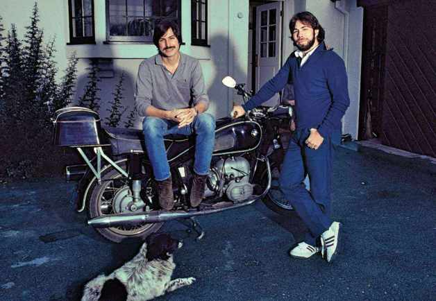

1979年的史蒂夫·乔布斯和史蒂夫·沃兹尼亚克，两人在4年前创建了苹果公司，如今公司正以疯狂的速度发展，然而两人之间关系最密切的日子已经一去不复返了。

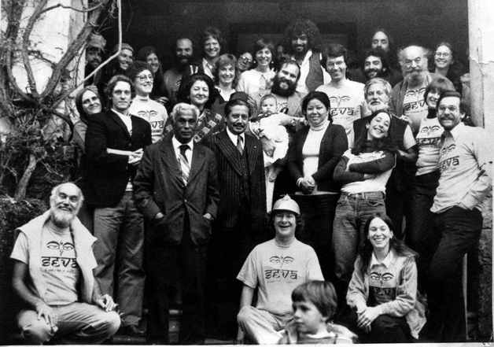

1979年塞瓦基金会活动，史蒂夫向基金会捐赠了5
000美元。中间那位是史蒂夫的好友拉里·布里安特，他正抱着自己的孩子；右边那位身体后仰、双臂交叉的是布里安特的妻子吉里贾；坐在前排、戴着帽子的是威维·格雷，站在他左边的是印度眼科医生凡卡塔斯瓦米博士，他的救助盲人计划得到了基金会的资助。最左边蹲着的那一位是畅销书《活在当下》（Be
Here Now）的作者拉姆·达斯。

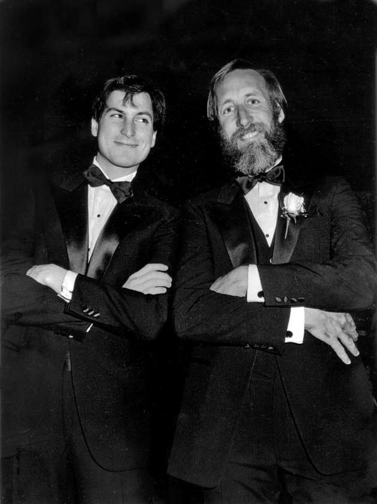

李·克劳和史蒂夫在一次广告行业颁奖晚会上的合影，在“超级杯”决赛期间播出的介绍Mac的“1984”广告获得了大奖。克劳是史蒂夫的亲密战友之一，在史蒂夫眼里，这位充满创意的Chiat\Day广告公司领袖是一位真正的天才。

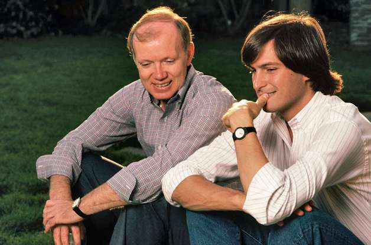

里吉斯·麦肯纳是早期对史蒂夫非常重要的一位导师，这位营销天才帮助苹果公司打造了令人难忘的品牌形象。

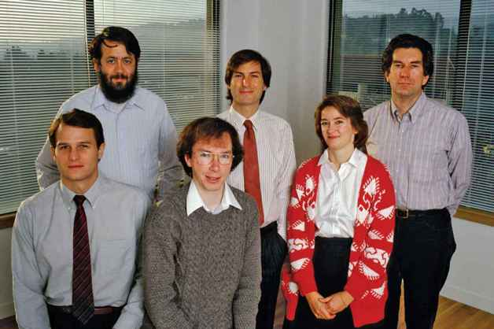

离开苹果创建NeXT的6位叛徒：（后排）里奇·佩奇、史蒂夫和乔治·克洛；（前排）丹尼尔·列文、巴德·特里布尔和苏珊·巴恩斯。“我当然考虑过离开苹果跟着史蒂夫单干风险很大，”列文说，“但我担心如果不去NeXT，我可能会一直懊恼：‘早知道应该入伙的。’”

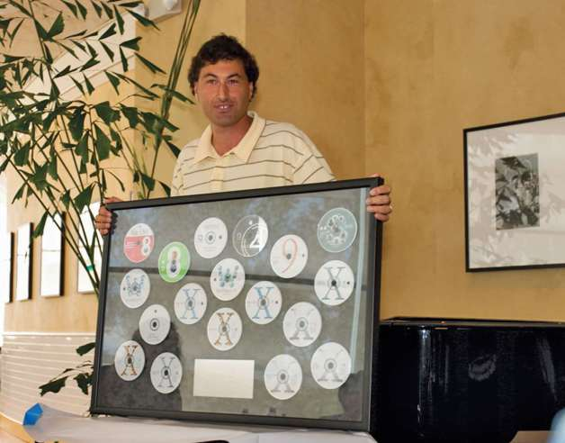

阿瓦·特凡尼安从卡内基–梅隆大学毕业后加入了NeXT，后来又跟着史蒂夫回到苹果，与史蒂夫共事16年。2003年，他被提拔为首席软件技术官，在庆祝派对上，他拿到一套CD，包含了他策划编写的各种软件。3年后，他离开了苹果。

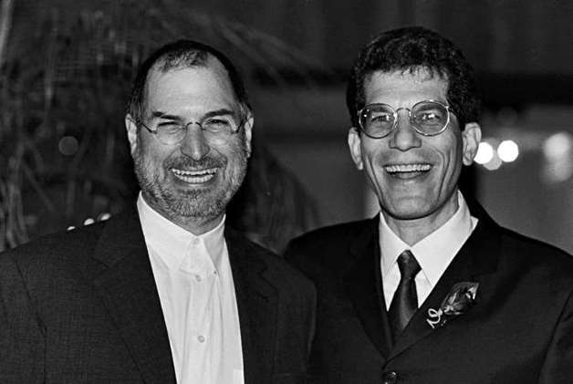

乔恩·鲁宾斯坦同样在NeXT和苹果都干过，主要负责硬件设计和生产。鲁宾推动苹果加快了产品更新换代的步伐。照片摄于2001年鲁宾的婚礼上，婚礼10天后，iPod问世。

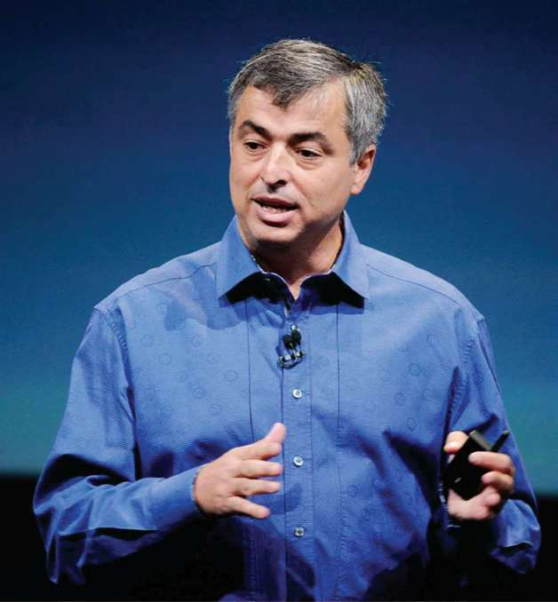

史蒂夫去世的一周前，埃迪·库埃在苹果公司举办的一次活动中发布了iPhone4S。“我之所以喜欢给史蒂夫工作，”库埃说，“是因为我们可以一次又一次完成看似无法完成的事。”

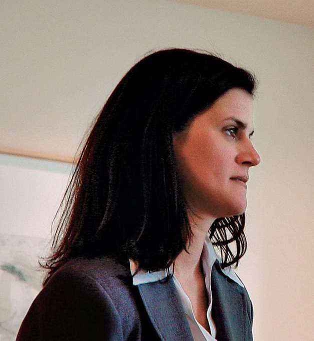

凯蒂·考顿在苹果公司负责媒体交流事务，在她的协调下，史蒂夫只与几家特定的媒体和几位特定的记者打交道。

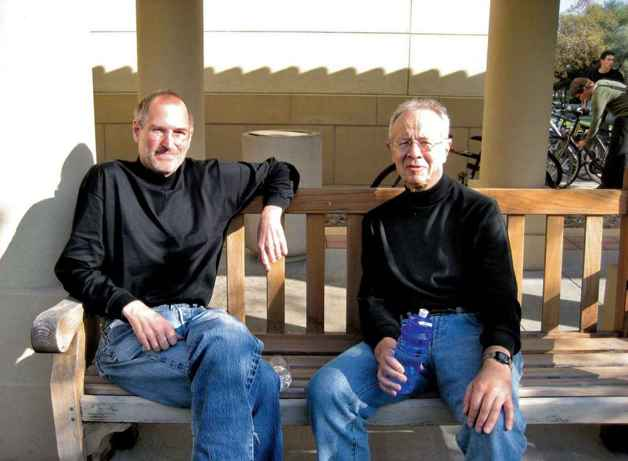

2007年，安迪·葛洛夫在斯坦福大学任教，史蒂夫去听了一堂课。这位英特尔前CEO是非常重要的幕后顾问。1997年，史蒂夫给他打电话，咨询他自己是否要接受苹果临时CEO的任命，葛洛夫咆哮道，“史蒂夫，听着，我对苹果毫无兴趣，你自己看着办吧。”

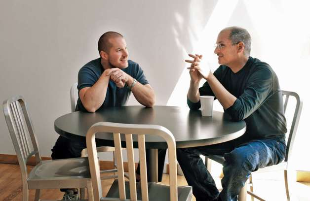

史蒂夫每周都有3~4天和乔尼·艾维一起吃午饭，艾维是史蒂夫最重要的同事之一，两人的思维非常合拍，第一次在实验室见到艾维时，史蒂夫就知道他是一位“守护者”。

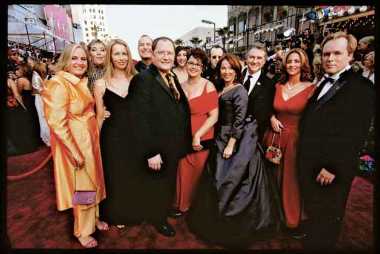

2005年奥斯卡颁奖礼上，皮克斯一群不可思议的天才在红毯上合影。前排正中间是约翰·拉塞特，两边分别是他的妻子南希和史蒂夫的妻子劳伦。最右边是导演布拉德·伯德和他的妻子伊丽莎白·坎尼。史蒂夫在后排咧嘴笑着。

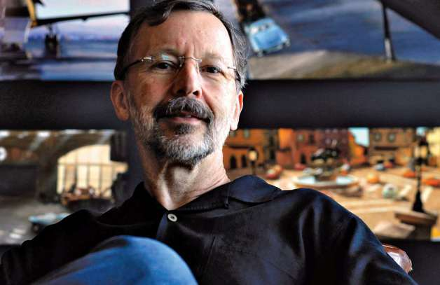

史蒂夫从皮克斯总裁埃德·卡特穆尔身上学到了很多，学会了如何管理一家充满创意的公司，为他之后回归苹果奠定了基础。

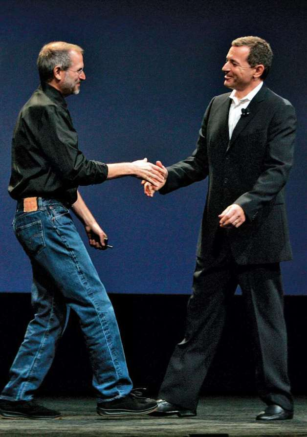

2004年，史蒂夫发誓绝对不会将皮克斯卖给迪士尼。2005年，鲍勃·伊戈尔取代迈克尔·艾斯纳成为迪士尼CEO，正是在那一年，伊戈尔和史蒂夫宣布iTunes商店开始出售ABC的电视节目，这次合作慢慢消除了两家公司之间多年的不信任，两人最终成为好友。迪士尼于2006年收购了皮克斯。

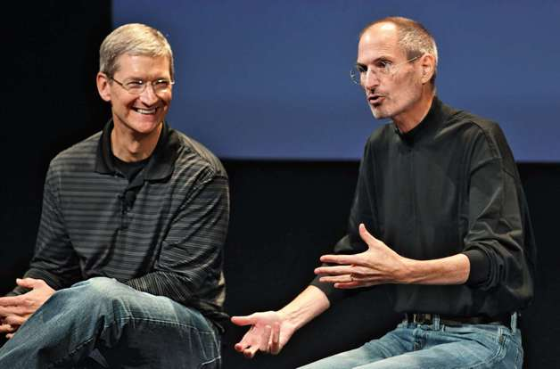

蒂姆·库克于1998年加入苹果，最终接替史蒂夫成为CEO。这位安静而又专注的南方人是史蒂夫团队的绝对核心，两人之间也建立起了深厚的友谊。一次，史蒂夫给库克的母亲打电话，鼓励她说服她的儿子组建家庭。

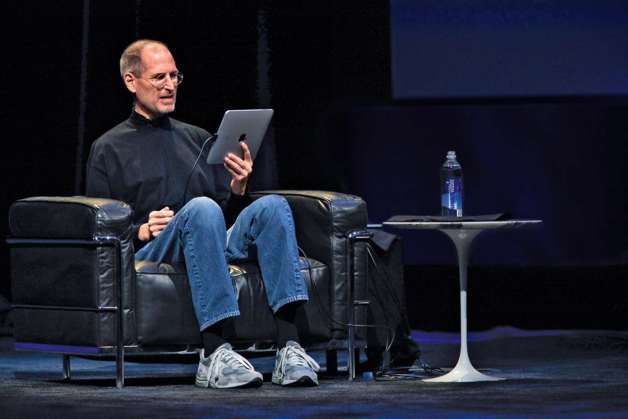\

史蒂夫的每一次演讲都经过了精心的编排，2010年iPad发布会更是如此。舞台上舒适的布置突出了iPad操作简便的特点，然而，史蒂夫坐在沙发上演讲也说明了他的身体状况并不好。

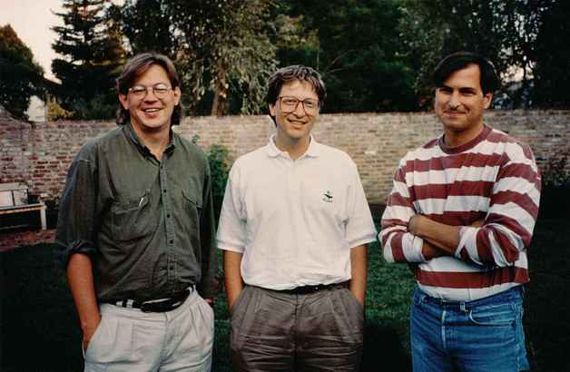

1991年，在史蒂夫家接受完《财富》杂志的采访后，比尔·盖茨和史蒂夫在后院与布伦特·施兰德合影。这两位竞争对手经常在公开场合互相鄙视，不过最终建立了对彼此的尊重。

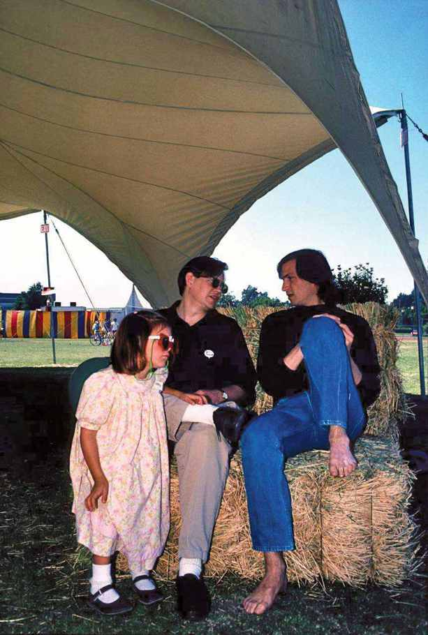

在NeXT，史蒂夫每年都会为员工举办聚餐活动。1987年，施兰德带着女儿格里塔参加了一次聚餐活动。

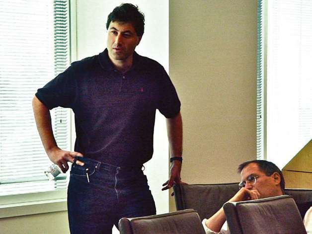

20世纪90年代末到21世纪初，史蒂夫非常倚重软件负责人阿瓦·特凡尼安。尽管苹果的硬件赢得无数赞誉，但软件为苹果的复苏奠定了基础，特别是由特凡尼安负责编写的OSX操作系统。

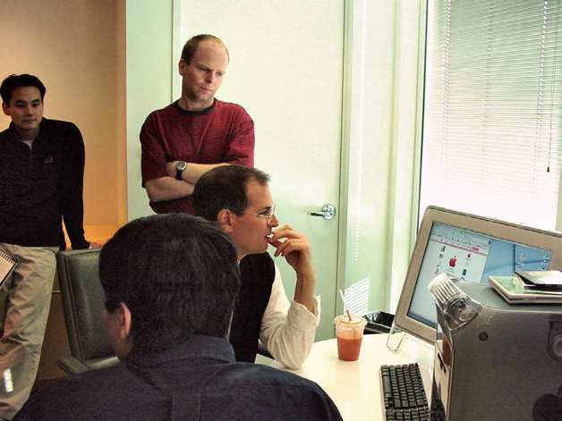

2001年，在OSX操作系统测试版发布不久前，史蒂夫正在测试操作系统的细节，界面设计师在旁边看着。史蒂夫惊叹道，“真不错，看着想舔屏！”他真的把身子往前倾，舔了一下屏幕。

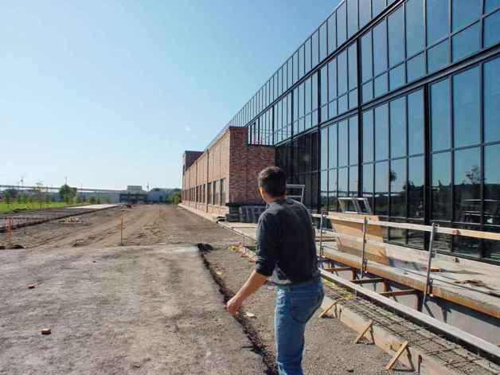

皮克斯员工把新总部大楼称为“史蒂夫的电影”，因为他投入了非常多的时间设计这幢建筑。这张照片摄于2000年大楼正式投入使用前夕，史蒂夫带着施兰德参观大楼。他对于墙上看似“随机”排列的彩砖非常自豪，其实彩砖的排列是经过精心设计的。

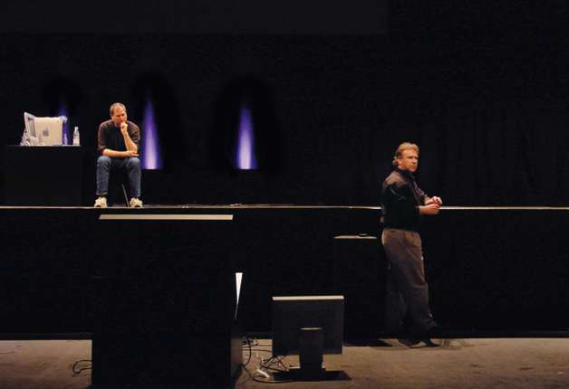

产品发布会前的排练总是气氛紧张。2001年2月，东京麦金塔展会举办的前一天，史蒂夫和营销负责人菲尔·席勒正在等待一个技术问题的解决。

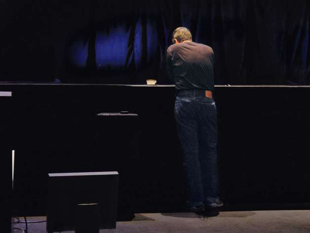

在2001年东京麦金塔展会举办的前一天，史蒂夫正独自复习演讲稿。

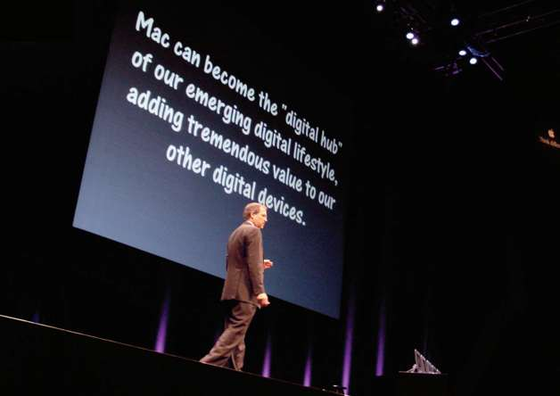

2001年2月22日，在东京举办的麦金塔展会上，史蒂夫又一次强调了“数字中枢”的战略，几天前在加州他已经提过这一战略。这是苹果走向巅峰的开端，苹果最终成为世界上最有价值的公司。

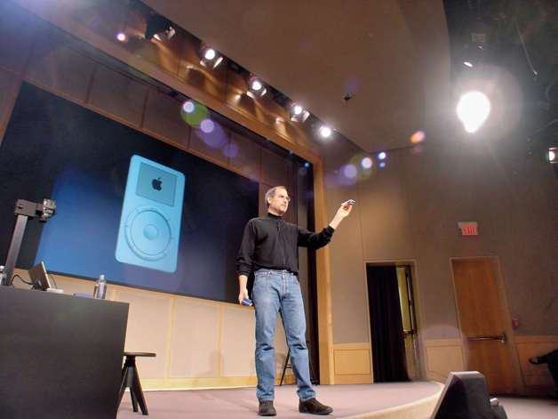

2001年10月23日，iPod发布会非常简短，因为苹果并没有对iPod抱有很高的期望。图为史蒂夫在公司的会议室里向媒体和员工展示iPod。

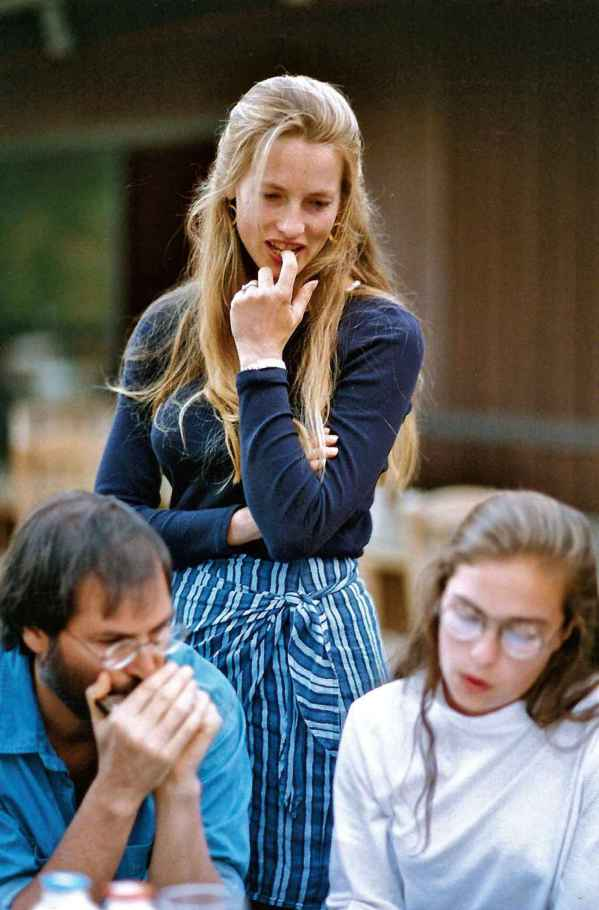

史蒂夫努力尝试修复与丽萨的关系。丽萨是史蒂夫与前女友的孩子，刚开始他拒绝承认这个女儿。图片摄于1994年，史蒂夫为丽萨吹口琴，劳伦在旁边看着。

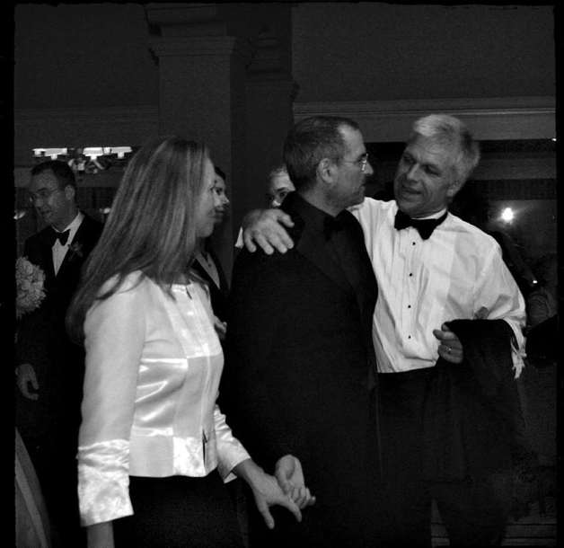

史蒂夫和劳伦在2001年出席麦克·斯莱德的婚礼。斯莱德为史蒂夫和盖茨都工作过，斯莱德觉得他可能是唯一一位既参加过史蒂夫婚礼，也参加过盖茨婚礼的人。

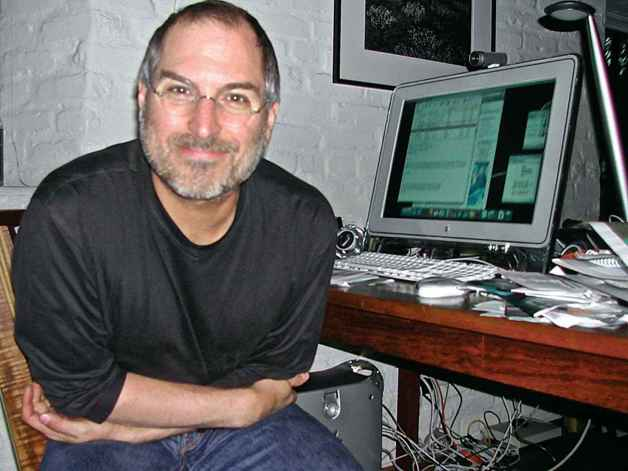

2003年，史蒂夫在位于帕洛阿尔托的家庭办公室里。

史蒂夫每年至少会与家人度假两次，通常去夏威夷或欧洲。2005年，他们去了墨西哥，图为他们一起从旅馆出来，最前面的是伊夫，后面依次是艾琳、劳伦、里德和史蒂夫。

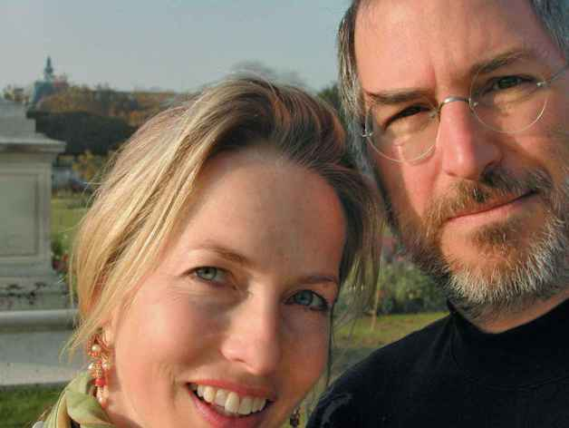

这张照片看着像史蒂夫和劳伦的“自拍”，摄于2003年在巴黎度假期间。

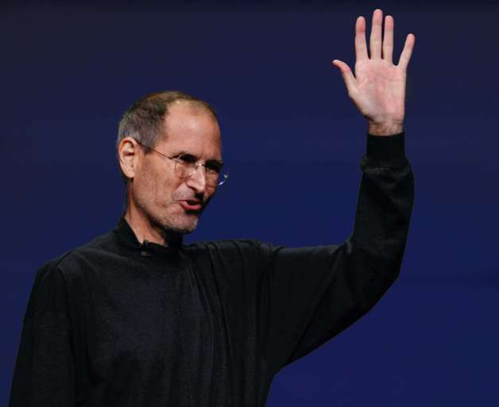

史蒂夫在2011年3月2日举行的iPad2发布会上向观众挥手。这是史蒂夫出席的最后一次发布会，他于7个月后离开人世。

## 

**图书在版编目（CIP）数据**

\

成为乔布斯/（美）施兰德，（美）特策利著；陶亮译. --
北京：中信出版社，2016.8

书名原文：Becoming Steve Jobs:The Evolution of

a Reckless Upstart into a Visionary Leader

ISBN 978–7–5086–6240–4

I. ①成… II. ①施… ②特… ③陶… III.
①电子计算机工业－工业企业管理－经验－美国
②乔布斯，S.（1955—2011）－人物研究IV. ① F471.266 ② K837.125.38

中国版本图书馆CIP数据核字（2016）第108669号

Copyright © 2015 by Brent Schlender and Rick Tetzeli

Simplified Chinese translation copyright © 2016 by CITIC Press
Corporation

ALL RIGHTS RESERVED

Author photographs: (Schlender) Lorna Jacoby; (Tetzeli) Celine Grouard.

Jacket photograph: Doug Menuez/Contour by Getty from Fearless Genius:
The Digital Revolution in Silicon Valley 1985–2000

本书仅限中国大陆地区发行销售

\

**成为乔布斯**

著者：\[ 美\] 布伦特·施兰德 里克·特策利

译者：陶亮

策划推广：中信出版社（China CITIC Press）

出版发行：中信出版集团股份有限公司

（北京市朝阳区惠新东街甲4号富盛大厦2座 邮编100029）

（CITIC Publishing Group）

电子书排版：张明霞

\

中信出版社官网：<http://www.citicpub.com/>

官方微博：<http://weibo.com/citicpub>

更多好书，尽在[大布阅读](http://3.daburead.com/);

大布阅读：[App下载地址](http://m.feishu8.com)（中信电子书直销平台）

微信号：大布阅读

