

<svg xmlns="http://www.w3.org/2000/svg" xmlns:xlink="http://www.w3.org/1999/xlink" version="1.1" width="100%" height="100%" viewbox="0 0 768 1024" preserveaspectratio="none">

<image width="768" height="1024" xlink:href="cover.jpeg"></image>
</svg>

批判性思维套装共6册【如何高效学习+学会提问+专注力:化繁为简的惊人力量+思考的艺术(原书第10版)+批判性思维工具(原书第3版)+逻辑思维简易入门】

（M.尼尔·布朗（M. Neil Browne）;斯图尔特·基利（Stuart M.
Keeley）;（美）文森特·赖安·拉吉罗（Vincent Ryan
Ruggiero）;（美）加里·西伊（Gary Seay）;苏珊娜·努切泰利（Susana
Nuccetelli）;（英）于尔根·沃尔夫（Jurgen
Wolff）;（美）保罗（Paul,R.）;（美）埃尔德（Elder,L.）;（美）斯科特·扬（Scott
Young）　著

本套书纸版由机械工业出版社出版，电子版由华章分社（北京华章图文信息有限公司，北京奥维博世图书发行有限公司）中国大陆范围内制作与发行。

版权所有，侵权必究

客服热线：+ 86-10-68995265

客服信箱：service@bbbvip.com

官方网址：www.hzmedia.com.cn

新浪微博 @华章传媒

腾讯微博 @bbb-vip

微信公众号 华章电子书（微信号：hzebook）

目录

<a href="#part0002.html_1T140-e60841b6482f442dbb0417bc7825409b"
class="pcalibre calibre2">如何高效学习</a>

<a href="#part0007.html_6LJU0-e60841b6482f442dbb0417bc7825409b"
class="pcalibre calibre2">中文版序</a>

<a href="#part0008.html_7K4G0-e60841b6482f442dbb0417bc7825409b"
class="pcalibre calibre2">译者序</a>

<a href="#part0009.html_8IL20-e60841b6482f442dbb0417bc7825409b"
class="pcalibre calibre2">导读</a>

<a href="#part0010.html_9H5K0-e60841b6482f442dbb0417bc7825409b"
class="pcalibre calibre2">前言</a>

<a href="#part0011.html_AFM60-e60841b6482f442dbb0417bc7825409b"
class="pcalibre calibre2">我的故事</a>

<a href="#part0012.html_BE6O0-e60841b6482f442dbb0417bc7825409b"
class="pcalibre calibre2">如何使用本书</a>

<a href="#part0013.html_CCNA0-e60841b6482f442dbb0417bc7825409b"
class="pcalibre calibre2">第一部分 整体性学习策略</a>

<a href="#part0014.html_DB7S0-e60841b6482f442dbb0417bc7825409b"
class="pcalibre calibre2">什么是整体性学习</a>

<a href="#part0015.html_E9OE0-e60841b6482f442dbb0417bc7825409b"
class="pcalibre calibre2">结构</a>

<a href="#part0016.html_F8900-e60841b6482f442dbb0417bc7825409b"
class="pcalibre calibre2">模型</a>

<a href="#part0017.html_G6PI0-e60841b6482f442dbb0417bc7825409b"
class="pcalibre calibre2">熟悉的结构（成熟结构）</a>

<a href="#part0018.html_H5A40-e60841b6482f442dbb0417bc7825409b"
class="pcalibre calibre2">高速公路</a>

<a href="#part0019.html_I3QM0-e60841b6482f442dbb0417bc7825409b"
class="pcalibre calibre2">整体性学习的顺序</a>

<a href="#part0020.html_J2B80-e60841b6482f442dbb0417bc7825409b"
class="pcalibre calibre2">获取阶段</a>

<a href="#part0021.html_K0RQ0-e60841b6482f442dbb0417bc7825409b"
class="pcalibre calibre2">理解阶段</a>

<a href="#part0022.html_KVCC0-e60841b6482f442dbb0417bc7825409b"
class="pcalibre calibre2">拓展阶段</a>

<a href="#part0023.html_LTSU0-e60841b6482f442dbb0417bc7825409b"
class="pcalibre calibre2">纠错阶段</a>

<a href="#part0024.html_MSDG0-e60841b6482f442dbb0417bc7825409b"
class="pcalibre calibre2">应用阶段</a>

<a href="#part0025.html_NQU20-e60841b6482f442dbb0417bc7825409b"
class="pcalibre calibre2">测试阶段</a>

<a href="#part0026.html_OPEK0-e60841b6482f442dbb0417bc7825409b"
class="pcalibre calibre2">找出薄弱环节</a>

<a href="#part0027.html_PNV60-e60841b6482f442dbb0417bc7825409b"
class="pcalibre calibre2">信息结构</a>

<a href="#part0028.html_QMFO0-e60841b6482f442dbb0417bc7825409b"
class="pcalibre calibre2">随意信息</a>

<a href="#part0029.html_RL0A0-e60841b6482f442dbb0417bc7825409b"
class="pcalibre calibre2">观点信息</a>

<a href="#part0030.html_SJGS0-e60841b6482f442dbb0417bc7825409b"
class="pcalibre calibre2">过程信息</a>

<a href="#part0031.html_TI1E0-e60841b6482f442dbb0417bc7825409b"
class="pcalibre calibre2">具体信息</a>

<a href="#part0032.html_UGI00-e60841b6482f442dbb0417bc7825409b"
class="pcalibre calibre2">抽象信息</a>

<a href="#part0033.html_VF2I0-e60841b6482f442dbb0417bc7825409b"
class="pcalibre calibre2">如何使用五种信息类型</a>

<a href="#part0034.html_10DJ40-e60841b6482f442dbb0417bc7825409b"
class="pcalibre calibre2">为什么你的课程枯燥乏味</a>

<a href="#part0035.html_11C3M0-e60841b6482f442dbb0417bc7825409b"
class="pcalibre calibre2">学习的目标</a>

<a href="#part0036.html_12AK80-e60841b6482f442dbb0417bc7825409b"
class="pcalibre calibre2">第二部分 整体性学习技术</a>

<a href="#part0037.html_1394Q0-e60841b6482f442dbb0417bc7825409b"
class="pcalibre calibre2">整体性学习技术</a>

<a href="#part0038.html_147LC0-e60841b6482f442dbb0417bc7825409b"
class="pcalibre calibre2">技术一览</a>

<a href="#part0039.html_1565U0-e60841b6482f442dbb0417bc7825409b"
class="pcalibre calibre2">获取知识</a>

<a href="#part0040.html_164MG0-e60841b6482f442dbb0417bc7825409b"
class="pcalibre calibre2">快速阅读</a>

<a href="#part0041.html_173720-e60841b6482f442dbb0417bc7825409b"
class="pcalibre calibre2">笔记流</a>

<a href="#part0042.html_181NK0-e60841b6482f442dbb0417bc7825409b"
class="pcalibre calibre2">联系观点</a>

<a href="#part0043.html_190860-e60841b6482f442dbb0417bc7825409b"
class="pcalibre calibre2">比喻</a>

<a href="#part0044.html_19UOO0-e60841b6482f442dbb0417bc7825409b"
class="pcalibre calibre2">内在化</a>

<a href="#part0045.html_1AT9A0-e60841b6482f442dbb0417bc7825409b"
class="pcalibre calibre2">图表法</a>

<a href="#part0046.html_1BRPS0-e60841b6482f442dbb0417bc7825409b"
class="pcalibre calibre2">随意信息的处理</a>

<a href="#part0047.html_1CQAE0-e60841b6482f442dbb0417bc7825409b"
class="pcalibre calibre2">联想法</a>

<a href="#part0048.html_1DOR00-e60841b6482f442dbb0417bc7825409b"
class="pcalibre calibre2">挂钩法</a>

<a href="#part0049.html_1ENBI0-e60841b6482f442dbb0417bc7825409b"
class="pcalibre calibre2">信息压缩技术</a>

<a href="#part0050.html_1FLS40-e60841b6482f442dbb0417bc7825409b"
class="pcalibre calibre2">实际应用</a>

<a href="#part0051.html_1GKCM0-e60841b6482f442dbb0417bc7825409b"
class="pcalibre calibre2">模型纠错</a>

<a href="#part0052.html_1HIT80-e60841b6482f442dbb0417bc7825409b"
class="pcalibre calibre2">以项目为基础的学习</a>

<a href="#part0053.html_1IHDQ0-e60841b6482f442dbb0417bc7825409b"
class="pcalibre calibre2">知识的延伸</a>

<a href="#part0054.html_1JFUC0-e60841b6482f442dbb0417bc7825409b"
class="pcalibre calibre2">整体性学习技术的实际运用──费曼技巧</a>

<a href="#part0055.html_1KEEU0-e60841b6482f442dbb0417bc7825409b"
class="pcalibre calibre2">整体性学习技术的回顾</a>

<a href="#part0056.html_1LCVG0-e60841b6482f442dbb0417bc7825409b"
class="pcalibre calibre2">第三部分 超越整体性学习</a>

<a href="#part0057.html_1MBG20-e60841b6482f442dbb0417bc7825409b"
class="pcalibre calibre2">高效率的学生</a>

<a href="#part0058.html_1NA0K0-e60841b6482f442dbb0417bc7825409b"
class="pcalibre calibre2">高效率秘籍1 能量管理</a>

<a href="#part0059.html_1O8H60-e60841b6482f442dbb0417bc7825409b"
class="pcalibre calibre2">高效率秘籍2 不要“学习”（Don't study）</a>

<a href="#part0060.html_1P71O0-e60841b6482f442dbb0417bc7825409b"
class="pcalibre calibre2">高效率秘籍3 绝不拖延</a>

<a href="#part0061.html_1Q5IA0-e60841b6482f442dbb0417bc7825409b"
class="pcalibre calibre2">高效率秘籍4 批处理</a>

<a href="#part0062.html_1R42S0-e60841b6482f442dbb0417bc7825409b"
class="pcalibre calibre2">高效率秘籍5 有组织</a>

<a href="#part0063.html_1S2JE0-e60841b6482f442dbb0417bc7825409b"
class="pcalibre calibre2">自我教育</a>

<a href="#part0064.html_1T1400-e60841b6482f442dbb0417bc7825409b"
class="pcalibre calibre2">建立良好的学习习惯</a>

<a href="#part0065.html_1TVKI0-e60841b6482f442dbb0417bc7825409b"
class="pcalibre calibre2">克服挫折障碍</a>

<a href="#part0066.html_1UU540-e60841b6482f442dbb0417bc7825409b"
class="pcalibre calibre2">设置学习目标</a>

<a href="#part0067.html_1VSLM0-e60841b6482f442dbb0417bc7825409b"
class="pcalibre calibre2">自我教育小结</a>

<a href="#part0068.html_20R680-e60841b6482f442dbb0417bc7825409b"
class="pcalibre calibre2">第四部分 整体性学习的总结</a>

<a href="#part0069.html_21PMQ0-e60841b6482f442dbb0417bc7825409b"
class="pcalibre calibre2">主要概念的小结</a>

<a href="#part0070.html_22O7C0-e60841b6482f442dbb0417bc7825409b"
class="pcalibre calibre2">技术一览</a>

<a href="#part0071.html_23MNU0-e60841b6482f442dbb0417bc7825409b"
class="pcalibre calibre2">特别感谢</a>

<a href="#part0072.html_24L8G0-e60841b6482f442dbb0417bc7825409b"
class="pcalibre calibre2">逻辑思维简易入门（原书第2版）</a>

<a href="#part0074.html_26I9K0-e60841b6482f442dbb0417bc7825409b"
class="pcalibre calibre2">前言</a>

<a href="#part0075.html_27GQ60-e60841b6482f442dbb0417bc7825409b"
class="pcalibre calibre2">第一部分 推理的构成</a>

<a href="#part0075.html_sigil_toc_id_1" class="pcalibre calibre2">第1章
什么是逻辑思维？我们为什么要关心它</a>

<a href="#part0075.html_sigil_toc_id_2"
class="pcalibre calibre2">推理的研究</a>

<a href="#part0076.html_28FAO0-e60841b6482f442dbb0417bc7825409b"
class="pcalibre calibre2">逻辑和推理</a>

<a href="#part0077.html_29DRA0-e60841b6482f442dbb0417bc7825409b"
class="pcalibre calibre2">什么是论证</a>

<a href="#part0078.html_2ACBS0-e60841b6482f442dbb0417bc7825409b"
class="pcalibre calibre2">重构论证</a>

<a href="#part0079.html_2BASE0-e60841b6482f442dbb0417bc7825409b"
class="pcalibre calibre2">论证和非论证</a>

<a href="#part0080.html_2C9D00-e60841b6482f442dbb0417bc7825409b"
class="pcalibre calibre2">第2章 用逻辑思考用心说话</a>

<a href="#part0080.html_sigil_toc_id_3"
class="pcalibre calibre2">理性接受度</a>

<a href="#part0081.html_2D7TI0-e60841b6482f442dbb0417bc7825409b"
class="pcalibre calibre2">理性接受度之外</a>

<a href="#part0082.html_2E6E40-e60841b6482f442dbb0417bc7825409b"
class="pcalibre calibre2">从思维到语言</a>

<a href="#part0083.html_2F4UM0-e60841b6482f442dbb0417bc7825409b"
class="pcalibre calibre2">间接使用和比喻语言</a>

<a href="#part0084.html_2G3F80-e60841b6482f442dbb0417bc7825409b"
class="pcalibre calibre2">定义：解释不清楚的语言</a>

<a href="#part0085.html_2H1VQ0-e60841b6482f442dbb0417bc7825409b"
class="pcalibre calibre2">第3章 信念的优点</a>

<a href="#part0085.html_sigil_toc_id_4"
class="pcalibre calibre2">信念、负信念和不做回应</a>

<a href="#part0086.html_2I0GC0-e60841b6482f442dbb0417bc7825409b"
class="pcalibre calibre2">信念的优点和缺点</a>

<a href="#part0087.html_2IV0U0-e60841b6482f442dbb0417bc7825409b"
class="pcalibre calibre2">准确性和真</a>

<a href="#part0088.html_2JTHG0-e60841b6482f442dbb0417bc7825409b"
class="pcalibre calibre2">合理性</a>

<a href="#part0089.html_2KS220-e60841b6482f442dbb0417bc7825409b"
class="pcalibre calibre2">一致性</a>

<a href="#part0090.html_2LQIK0-e60841b6482f442dbb0417bc7825409b"
class="pcalibre calibre2">保守性和可修改性</a>

<a href="#part0091.html_2MP360-e60841b6482f442dbb0417bc7825409b"
class="pcalibre calibre2">理性和非理性</a>

<a href="#part0092.html_2NNJO0-e60841b6482f442dbb0417bc7825409b"
class="pcalibre calibre2">第二部分 推理和论证</a>

<a href="#part0092.html_sigil_toc_id_5" class="pcalibre calibre2">第4章
论证分析的方法</a>

<a href="#part0092.html_sigil_toc_id_6"
class="pcalibre calibre2">重构论证的原则方法</a>

<a href="#part0093.html_2OM4A0-e60841b6482f442dbb0417bc7825409b"
class="pcalibre calibre2">缺少前提</a>

<a href="#part0094.html_2PKKS0-e60841b6482f442dbb0417bc7825409b"
class="pcalibre calibre2">扩展的论证</a>

<a href="#part0095.html_2QJ5E0-e60841b6482f442dbb0417bc7825409b"
class="pcalibre calibre2">推理类型</a>

<a href="#part0096.html_2RHM00-e60841b6482f442dbb0417bc7825409b"
class="pcalibre calibre2">规范和论证</a>

<a href="#part0097.html_2SG6I0-e60841b6482f442dbb0417bc7825409b"
class="pcalibre calibre2">第5章 评估演绎论证</a>

<a href="#part0097.html_sigil_toc_id_7"
class="pcalibre calibre2">有效性</a>

<a href="#part0097.html_sigil_toc_id_8"
class="pcalibre calibre2">可靠性</a>

<a href="#part0097.html_sigil_toc_id_9"
class="pcalibre calibre2">说服力</a>

<a href="#part0097.html_sigil_toc_id_10"
class="pcalibre calibre2">说服力的实际作用</a>

<a href="#part0098.html_2TEN40-e60841b6482f442dbb0417bc7825409b"
class="pcalibre calibre2">第6章 归纳论证分析</a>

<a href="#part0098.html_sigil_toc_id_11"
class="pcalibre calibre2">重构归纳论证</a>

<a href="#part0098.html_sigil_toc_id_12"
class="pcalibre calibre2">归纳论证的类型</a>

<a href="#part0098.html_sigil_toc_id_13"
class="pcalibre calibre2">评估归纳论证</a>

<a href="#part0099.html_2UD7M0-e60841b6482f442dbb0417bc7825409b"
class="pcalibre calibre2">第三部分 非形式谬误</a>

<a href="#part0099.html_sigil_toc_id_14" class="pcalibre calibre2">第7章
论证失效的主要方式</a>

<a href="#part0099.html_sigil_toc_id_15"
class="pcalibre calibre2">什么是谬误</a>

<a href="#part0099.html_sigil_toc_id_16"
class="pcalibre calibre2">非形式谬误的分类</a>

<a href="#part0099.html_sigil_toc_id_17"
class="pcalibre calibre2">归纳论证什么时候会出错</a>

<a href="#part0100.html_2VBO80-e60841b6482f442dbb0417bc7825409b"
class="pcalibre calibre2">第8章 避免无根据的假定</a>

<a href="#part0100.html_sigil_toc_id_18"
class="pcalibre calibre2">预设谬误</a>

<a href="#part0100.html_sigil_toc_id_19"
class="pcalibre calibre2">窃取论题</a>

<a href="#part0100.html_sigil_toc_id_20"
class="pcalibre calibre2">争议前提</a>

<a href="#part0100.html_sigil_toc_id_21"
class="pcalibre calibre2">复杂问语</a>

<a href="#part0100.html_sigil_toc_id_22"
class="pcalibre calibre2">虚假选言</a>

<a href="#part0100.html_sigil_toc_id_23"
class="pcalibre calibre2">例外谬误</a>

<a href="#part0101.html_30A8Q0-e60841b6482f442dbb0417bc7825409b"
class="pcalibre calibre2">第9章 从不清晰语言到不清晰推理</a>

<a href="#part0101.html_sigil_toc_id_24"
class="pcalibre calibre2">不清晰语言与论证失败</a>

<a href="#part0101.html_sigil_toc_id_25"
class="pcalibre calibre2">语义不清晰性</a>

<a href="#part0101.html_sigil_toc_id_26"
class="pcalibre calibre2">模糊性</a>

<a href="#part0101.html_sigil_toc_id_27"
class="pcalibre calibre2">歧义性</a>

<a href="#part0101.html_sigil_toc_id_28"
class="pcalibre calibre2">含糊谓词</a>

<a href="#part0102.html_318PC0-e60841b6482f442dbb0417bc7825409b"
class="pcalibre calibre2">第10章 避免不相干前提</a>

<a href="#part0102.html_sigil_toc_id_29"
class="pcalibre calibre2">相干谬误</a>

<a href="#part0102.html_sigil_toc_id_30"
class="pcalibre calibre2">诉诸同情</a>

<a href="#part0102.html_sigil_toc_id_31"
class="pcalibre calibre2">诉诸暴力</a>

<a href="#part0102.html_sigil_toc_id_32"
class="pcalibre calibre2">诉诸情感</a>

<a href="#part0102.html_sigil_toc_id_33"
class="pcalibre calibre2">人身攻击</a>

<a href="#part0102.html_sigil_toc_id_34"
class="pcalibre calibre2">稻草人谬误</a>

<a href="#part0102.html_sigil_toc_id_35"
class="pcalibre calibre2">诉诸情感总是错误的吗</a>

<a href="#part0103.html_3279U0-e60841b6482f442dbb0417bc7825409b"
class="pcalibre calibre2">第四部分 再论演绎推理</a>

<a href="#part0103.html_sigil_toc_id_36"
class="pcalibre calibre2">第11章 复合命题</a>

<a href="#part0103.html_sigil_toc_id_37"
class="pcalibre calibre2">论证：作为命题间的一种关系</a>

<a href="#part0104.html_335QG0-e60841b6482f442dbb0417bc7825409b"
class="pcalibre calibre2">简单命题与复合命题</a>

<a href="#part0105.html_344B20-e60841b6482f442dbb0417bc7825409b"
class="pcalibre calibre2">复合命题的命题公式</a>

<a href="#part0106.html_352RK0-e60841b6482f442dbb0417bc7825409b"
class="pcalibre calibre2">使用真值表定义联结词</a>

<a href="#part0107.html_361C60-e60841b6482f442dbb0417bc7825409b"
class="pcalibre calibre2">复合命题的真值表</a>

<a href="#part0108.html_36VSO0-e60841b6482f442dbb0417bc7825409b"
class="pcalibre calibre2">逻辑必然和逻辑偶然命题</a>

<a href="#part0109.html_37UDA0-e60841b6482f442dbb0417bc7825409b"
class="pcalibre calibre2">第12章 核查命题逻辑论证的有效性</a>

<a href="#part0109.html_sigil_toc_id_38"
class="pcalibre calibre2">用真值表检查有效性</a>

<a href="#part0110.html_38STS0-e60841b6482f442dbb0417bc7825409b"
class="pcalibre calibre2">一些标准的有效形式</a>

<a href="#part0110.html_sigil_toc_id_39"
class="pcalibre calibre2">一种证明有效性的简明方法</a>

<a href="#part0110.html_sigil_toc_id_40"
class="pcalibre calibre2">什么是有效性证明</a>

<a href="#part0111.html_39REE0-e60841b6482f442dbb0417bc7825409b"
class="pcalibre calibre2">第13章 直言命题和直接推理</a>

<a href="#part0111.html_sigil_toc_id_41"
class="pcalibre calibre2">什么是直言命题</a>

<a href="#part0111.html_sigil_toc_id_42"
class="pcalibre calibre2">直言命题的文恩图示</a>

<a href="#part0111.html_sigil_toc_id_43"
class="pcalibre calibre2">对当方阵</a>

<a href="#part0111.html_sigil_toc_id_44"
class="pcalibre calibre2">其他直接推理</a>

<a href="#part0112.html_3APV00-e60841b6482f442dbb0417bc7825409b"
class="pcalibre calibre2">第14章 直言三段论</a>

<a href="#part0112.html_sigil_toc_id_45"
class="pcalibre calibre2">什么是直言三段论</a>

<a href="#part0112.html_sigil_toc_id_46"
class="pcalibre calibre2">三段论式的论证形式</a>

<a href="#part0112.html_sigil_toc_id_47"
class="pcalibre calibre2">用文恩图检验有效性</a>

<a href="#part0112.html_sigil_toc_id_48"
class="pcalibre calibre2">项的周延</a>

<a href="#part0112.html_sigil_toc_id_49"
class="pcalibre calibre2">有效性规则及三段论谬误</a>

<a href="#part0113.html_3BOFI0-e60841b6482f442dbb0417bc7825409b"
class="pcalibre calibre2">思考的艺术（原书第10版）</a>

<a href="#part0117.html_3FIHQ0-e60841b6482f442dbb0417bc7825409b"
class="pcalibre calibre2">推荐序</a>

<a
href="#part0118_split_000.html_3GH2C0-e60841b6482f442dbb0417bc7825409b"
class="pcalibre calibre2">前言</a>

<a
href="#part0121_split_000.html_3JCK20-e60841b6482f442dbb0417bc7825409b"
class="pcalibre calibre2">第一部分 你真了解思考吗</a>

<a href="#part0121_split_001.html_sigil_toc_id_51"
class="pcalibre calibre2">第1章 发展你的思考</a>

<a href="#part0121_split_001.html_sigil_toc_id_52"
class="pcalibre calibre2">什么是思考</a>

<a href="#part0122.html_3KB4K0-e60841b6482f442dbb0417bc7825409b"
class="pcalibre calibre2">思考的重要性</a>

<a href="#part0123.html_3L9L60-e60841b6482f442dbb0417bc7825409b"
class="pcalibre calibre2">运用大脑和心智</a>

<a href="#part0125.html_3N6MA0-e60841b6482f442dbb0417bc7825409b"
class="pcalibre calibre2">良好的思考是一种习惯</a>

<a href="#part0126.html_3O56S0-e60841b6482f442dbb0417bc7825409b"
class="pcalibre calibre2">本书的结构</a>

<a href="#part0127.html_3P3NE0-e60841b6482f442dbb0417bc7825409b"
class="pcalibre calibre2">努力获得最大收益</a>

<a href="#part0128.html_3Q2800-e60841b6482f442dbb0417bc7825409b"
class="pcalibre calibre2">利用感觉</a>

<a href="#part0129.html_3R0OI0-e60841b6482f442dbb0417bc7825409b"
class="pcalibre calibre2">学会全神贯注</a>

<a href="#part0130.html_3RV940-e60841b6482f442dbb0417bc7825409b"
class="pcalibre calibre2">应对挫折</a>

<a href="#part0131.html_3STPM0-e60841b6482f442dbb0417bc7825409b"
class="pcalibre calibre2">让讨论有意义14</a>

<a href="#part0139.html_44HU60-e60841b6482f442dbb0417bc7825409b"
class="pcalibre calibre2">思考的初级策略</a>

<a href="#part0140.html_45GEO0-e60841b6482f442dbb0417bc7825409b"
class="pcalibre calibre2">边练边学</a>

<a href="#part0143.html_48C0E0-e60841b6482f442dbb0417bc7825409b"
class="pcalibre calibre2">热身练习</a>

<a href="#part0144.html_49AH00-e60841b6482f442dbb0417bc7825409b"
class="pcalibre calibre2">应用练习</a>

<a href="#part0145.html_4A91I0-e60841b6482f442dbb0417bc7825409b"
class="pcalibre calibre2">综合练习</a>

<a href="#part0146.html_4B7I40-e60841b6482f442dbb0417bc7825409b"
class="pcalibre calibre2">第2章 建立基础</a>

<a href="#part0146.html_sigil_toc_id_56"
class="pcalibre calibre2">自由意志和决定论</a>

<a href="#part0147.html_4C62M0-e60841b6482f442dbb0417bc7825409b"
class="pcalibre calibre2">什么是真理</a>

<a href="#part0148.html_4D4J80-e60841b6482f442dbb0417bc7825409b"
class="pcalibre calibre2">什么是知道</a>

<a href="#part0149.html_4E33Q0-e60841b6482f442dbb0417bc7825409b"
class="pcalibre calibre2">知道的方式</a>

<a href="#part0152.html_4GULG0-e60841b6482f442dbb0417bc7825409b"
class="pcalibre calibre2">记忆的问题</a>

<a href="#part0153.html_4HT620-e60841b6482f442dbb0417bc7825409b"
class="pcalibre calibre2">什么是意见</a>

<a href="#part0155.html_4JQ760-e60841b6482f442dbb0417bc7825409b"
class="pcalibre calibre2">理解原因和结果21</a>

<a href="#part0156.html_4KONO0-e60841b6482f442dbb0417bc7825409b"
class="pcalibre calibre2">道德问题</a>

<a href="#part0157.html_4LN8A0-e60841b6482f442dbb0417bc7825409b"
class="pcalibre calibre2">道德判断的基础</a>

<a href="#part0158.html_4MLOS0-e60841b6482f442dbb0417bc7825409b"
class="pcalibre calibre2">应对困境</a>

<a href="#part0159.html_4NK9E0-e60841b6482f442dbb0417bc7825409b"
class="pcalibre calibre2">热身练习</a>

<a href="#part0160.html_4OIQ00-e60841b6482f442dbb0417bc7825409b"
class="pcalibre calibre2">应用练习</a>

<a href="#part0161.html_4PHAI0-e60841b6482f442dbb0417bc7825409b"
class="pcalibre calibre2">综合练习</a>

<a href="#part0162.html_4QFR40-e60841b6482f442dbb0417bc7825409b"
class="pcalibre calibre2">第3章 拓宽视野</a>

<a href="#part0162.html_sigil_toc_id_59"
class="pcalibre calibre2">如何变得有个性</a>

<a href="#part0163.html_4REBM0-e60841b6482f442dbb0417bc7825409b"
class="pcalibre calibre2">阻碍思考的习惯</a>

<a href="#part0169.html_515F20-e60841b6482f442dbb0417bc7825409b"
class="pcalibre calibre2">克服坏习惯</a>

<a href="#part0170.html_523VK0-e60841b6482f442dbb0417bc7825409b"
class="pcalibre calibre2">热身练习</a>

<a href="#part0171.html_532G60-e60841b6482f442dbb0417bc7825409b"
class="pcalibre calibre2">应用练习</a>

<a href="#part0172.html_5410O0-e60841b6482f442dbb0417bc7825409b"
class="pcalibre calibre2">综合练习</a>

<a href="#part0173.html_54VHA0-e60841b6482f442dbb0417bc7825409b"
class="pcalibre calibre2">第4章 做一个批判者</a>

<a href="#part0173.html_sigil_toc_id_61"
class="pcalibre calibre2">批判性评价的界定</a>

<a href="#part0174.html_55U1S0-e60841b6482f442dbb0417bc7825409b"
class="pcalibre calibre2">进行重要区分</a>

<a href="#part0180.html_5BL580-e60841b6482f442dbb0417bc7825409b"
class="pcalibre calibre2">如何进行批判性阅读</a>

<a href="#part0185.html_5GDO20-e60841b6482f442dbb0417bc7825409b"
class="pcalibre calibre2">评价范例</a>

<a href="#part0188.html_5J99O0-e60841b6482f442dbb0417bc7825409b"
class="pcalibre calibre2">批判性倾听的策略</a>

<a href="#part0192.html_5N3C00-e60841b6482f442dbb0417bc7825409b"
class="pcalibre calibre2">批判性观察的策略</a>

<a href="#part0193.html_5O1SI0-e60841b6482f442dbb0417bc7825409b"
class="pcalibre calibre2">热身练习</a>

<a href="#part0194.html_5P0D40-e60841b6482f442dbb0417bc7825409b"
class="pcalibre calibre2">应用练习</a>

<a href="#part0195.html_5PUTM0-e60841b6482f442dbb0417bc7825409b"
class="pcalibre calibre2">综合练习</a>

<a
href="#part0196_split_000.html_5QTE80-e60841b6482f442dbb0417bc7825409b"
class="pcalibre calibre2">第二部分 充满创造力</a>

<a href="#part0196_split_001.html_sigil_toc_id_66"
class="pcalibre calibre2">第5章 创新的过程</a>

<a href="#part0196_split_001.html_sigil_toc_id_67"
class="pcalibre calibre2">与创造力有关的重要真相</a>

<a href="#part0200.html_5UNGG0-e60841b6482f442dbb0417bc7825409b"
class="pcalibre calibre2">富有创造力的人所具有的特质</a>

<a href="#part0205.html_63G3A0-e60841b6482f442dbb0417bc7825409b"
class="pcalibre calibre2">应用创造力解决问题和争议</a>

<a href="#part0211.html_6976M0-e60841b6482f442dbb0417bc7825409b"
class="pcalibre calibre2">创新过程的步骤</a>

<a href="#part0215.html_6D18U0-e60841b6482f442dbb0417bc7825409b"
class="pcalibre calibre2">热身练习</a>

<a href="#part0216.html_6DVPG0-e60841b6482f442dbb0417bc7825409b"
class="pcalibre calibre2">应用练习</a>

<a href="#part0217.html_6EUA20-e60841b6482f442dbb0417bc7825409b"
class="pcalibre calibre2">综合练习</a>

<a href="#part0218.html_6FSQK0-e60841b6482f442dbb0417bc7825409b"
class="pcalibre calibre2">第6章 寻找挑战</a>

<a href="#part0218.html_sigil_toc_id_72"
class="pcalibre calibre2">好奇心的重要性</a>

<a href="#part0219.html_6GRB60-e60841b6482f442dbb0417bc7825409b"
class="pcalibre calibre2">好奇心是如何丢失的</a>

<a href="#part0220.html_6HPRO0-e60841b6482f442dbb0417bc7825409b"
class="pcalibre calibre2">重拾你的好奇心</a>

<a href="#part0221.html_6IOCA0-e60841b6482f442dbb0417bc7825409b"
class="pcalibre calibre2">6种有帮助的技术</a>

<a href="#part0227.html_6OFFM0-e60841b6482f442dbb0417bc7825409b"
class="pcalibre calibre2">热身练习</a>

<a href="#part0228.html_6PE080-e60841b6482f442dbb0417bc7825409b"
class="pcalibre calibre2">应用练习</a>

<a href="#part0229.html_6QCGQ0-e60841b6482f442dbb0417bc7825409b"
class="pcalibre calibre2">综合练习</a>

<a href="#part0230.html_6RB1C0-e60841b6482f442dbb0417bc7825409b"
class="pcalibre calibre2">第7章 表达问题或者争议</a>

<a href="#part0230.html_sigil_toc_id_74"
class="pcalibre calibre2">如何区分问题和争议</a>

<a href="#part0231.html_6S9HU0-e60841b6482f442dbb0417bc7825409b"
class="pcalibre calibre2">如何表达问题</a>

<a href="#part0232.html_6T82G0-e60841b6482f442dbb0417bc7825409b"
class="pcalibre calibre2">如何表达争议</a>

<a href="#part0233.html_6U6J20-e60841b6482f442dbb0417bc7825409b"
class="pcalibre calibre2">当问题演变成争议</a>

<a href="#part0234.html_6V53K0-e60841b6482f442dbb0417bc7825409b"
class="pcalibre calibre2">提出问题和表达争议的准则</a>

<a href="#part0235.html_703K60-e60841b6482f442dbb0417bc7825409b"
class="pcalibre calibre2">精炼表达的益处</a>

<a href="#part0238.html_72V5S0-e60841b6482f442dbb0417bc7825409b"
class="pcalibre calibre2">一个关于“问题”的例子</a>

<a href="#part0239.html_73TME0-e60841b6482f442dbb0417bc7825409b"
class="pcalibre calibre2">一个关于“争议”的例子</a>

<a href="#part0240.html_74S700-e60841b6482f442dbb0417bc7825409b"
class="pcalibre calibre2">热身练习</a>

<a href="#part0241.html_75QNI0-e60841b6482f442dbb0417bc7825409b"
class="pcalibre calibre2">应用练习</a>

<a href="#part0242.html_76P840-e60841b6482f442dbb0417bc7825409b"
class="pcalibre calibre2">综合练习</a>

<a href="#part0243.html_77NOM0-e60841b6482f442dbb0417bc7825409b"
class="pcalibre calibre2">第8章 调查问题</a>

<a href="#part0243.html_sigil_toc_id_76"
class="pcalibre calibre2">我们该寻找什么</a>

<a href="#part0254.html_7I7ES0-e60841b6482f442dbb0417bc7825409b"
class="pcalibre calibre2">利用图书馆</a>

<a href="#part0255.html_7J5VE0-e60841b6482f442dbb0417bc7825409b"
class="pcalibre calibre2">使用互联网</a>

<a href="#part0256.html_7K4G00-e60841b6482f442dbb0417bc7825409b"
class="pcalibre calibre2">保持批判精神</a>

<a href="#part0257.html_7L30I0-e60841b6482f442dbb0417bc7825409b"
class="pcalibre calibre2">访问权威人士</a>

<a href="#part0258.html_7M1H40-e60841b6482f442dbb0417bc7825409b"
class="pcalibre calibre2">避免剽窃10</a>

<a href="#part0260.html_7NUI80-e60841b6482f442dbb0417bc7825409b"
class="pcalibre calibre2">建构你自己的研究</a>

<a href="#part0262.html_7PRJC0-e60841b6482f442dbb0417bc7825409b"
class="pcalibre calibre2">永葆你的创造力</a>

<a href="#part0263.html_7QQ3U0-e60841b6482f442dbb0417bc7825409b"
class="pcalibre calibre2">热身练习</a>

<a href="#part0264.html_7ROKG0-e60841b6482f442dbb0417bc7825409b"
class="pcalibre calibre2">应用练习</a>

<a href="#part0265.html_7SN520-e60841b6482f442dbb0417bc7825409b"
class="pcalibre calibre2">综合练习</a>

<a href="#part0266.html_7TLLK0-e60841b6482f442dbb0417bc7825409b"
class="pcalibre calibre2">第9章 产生新想法</a>

<a href="#part0266.html_sigil_toc_id_80"
class="pcalibre calibre2">激发你的想象力</a>

<a href="#part0273.html_84B9I0-e60841b6482f442dbb0417bc7825409b"
class="pcalibre calibre2">追求创意</a>

<a href="#part0274.html_859Q40-e60841b6482f442dbb0417bc7825409b"
class="pcalibre calibre2">保留判断</a>

<a href="#part0275.html_868AM0-e60841b6482f442dbb0417bc7825409b"
class="pcalibre calibre2">扫除障碍</a>

<a href="#part0278.html_893SC0-e60841b6482f442dbb0417bc7825409b"
class="pcalibre calibre2">顿悟是怎样发生的</a>

<a href="#part0279.html_8A2CU0-e60841b6482f442dbb0417bc7825409b"
class="pcalibre calibre2">问题范例</a>

<a href="#part0280.html_8B0TG0-e60841b6482f442dbb0417bc7825409b"
class="pcalibre calibre2">争议范例</a>

<a href="#part0281.html_8BVE20-e60841b6482f442dbb0417bc7825409b"
class="pcalibre calibre2">热身练习</a>

<a href="#part0282.html_8CTUK0-e60841b6482f442dbb0417bc7825409b"
class="pcalibre calibre2">应用练习</a>

<a href="#part0283.html_8DSF60-e60841b6482f442dbb0417bc7825409b"
class="pcalibre calibre2">综合练习</a>

<a
href="#part0284_split_000.html_8EQVO0-e60841b6482f442dbb0417bc7825409b"
class="pcalibre calibre2">第三部分 保持批判性</a>

<a href="#part0284_split_001.html_sigil_toc_id_83"
class="pcalibre calibre2">第10章 批判性思维的作用</a>

<a href="#part0284_split_001.html_sigil_toc_id_84"
class="pcalibre calibre2">批判性思维的必要性</a>

<a href="#part0285.html_8FPGA0-e60841b6482f442dbb0417bc7825409b"
class="pcalibre calibre2">关注你自己的想法</a>

<a href="#part0286.html_8GO0S0-e60841b6482f442dbb0417bc7825409b"
class="pcalibre calibre2">扫除进行批判性思维的障碍</a>

<a href="#part0287.html_8HMHE0-e60841b6482f442dbb0417bc7825409b"
class="pcalibre calibre2">利用好奇心</a>

<a href="#part0288.html_8IL200-e60841b6482f442dbb0417bc7825409b"
class="pcalibre calibre2">避免先入为主</a>

<a href="#part0289.html_8JJII0-e60841b6482f442dbb0417bc7825409b"
class="pcalibre calibre2">改善你解决问题的方案</a>

<a href="#part0290.html_8KI340-e60841b6482f442dbb0417bc7825409b"
class="pcalibre calibre2">一个关于问题的例子</a>

<a href="#part0291.html_8LGJM0-e60841b6482f442dbb0417bc7825409b"
class="pcalibre calibre2">细化你对于争议的立场</a>

<a href="#part0292.html_8MF480-e60841b6482f442dbb0417bc7825409b"
class="pcalibre calibre2">一个关于“争议”的例子</a>

<a href="#part0293.html_8NDKQ0-e60841b6482f442dbb0417bc7825409b"
class="pcalibre calibre2">在争议上采取行动</a>

<a href="#part0294.html_8OC5C0-e60841b6482f442dbb0417bc7825409b"
class="pcalibre calibre2">热身练习</a>

<a href="#part0295.html_8PALU0-e60841b6482f442dbb0417bc7825409b"
class="pcalibre calibre2">应用练习</a>

<a href="#part0296.html_8Q96G0-e60841b6482f442dbb0417bc7825409b"
class="pcalibre calibre2">综合练习</a>

<a href="#part0297.html_8R7N20-e60841b6482f442dbb0417bc7825409b"
class="pcalibre calibre2">第11章 改进问题的解决方法</a>

<a href="#part0297.html_sigil_toc_id_85"
class="pcalibre calibre2">改进的3个步骤</a>

<a href="#part0300.html_8U38O0-e60841b6482f442dbb0417bc7825409b"
class="pcalibre calibre2">两个示例问题</a>

<a href="#part0306.html_93QC40-e60841b6482f442dbb0417bc7825409b"
class="pcalibre calibre2">热身练习</a>

<a href="#part0307.html_94OSM0-e60841b6482f442dbb0417bc7825409b"
class="pcalibre calibre2">应用练习</a>

<a href="#part0308.html_95ND80-e60841b6482f442dbb0417bc7825409b"
class="pcalibre calibre2">综合练习</a>

<a href="#part0309.html_96LTQ0-e60841b6482f442dbb0417bc7825409b"
class="pcalibre calibre2">第12章 评价你的问题论证</a>

<a href="#part0309.html_sigil_toc_id_88"
class="pcalibre calibre2">影响真实性的错误</a>

<a href="#part0316.html_9DBHO0-e60841b6482f442dbb0417bc7825409b"
class="pcalibre calibre2">影响有效性的错误</a>

<a href="#part0317.html_9EA2A0-e60841b6482f442dbb0417bc7825409b"
class="pcalibre calibre2">一个特殊的问题：隐藏的前提</a>

<a href="#part0318.html_9F8IS0-e60841b6482f442dbb0417bc7825409b"
class="pcalibre calibre2">识别复杂的论证</a>

<a href="#part0319.html_9G73E0-e60841b6482f442dbb0417bc7825409b"
class="pcalibre calibre2">评价论证的步骤</a>

<a href="#part0320.html_9H5K00-e60841b6482f442dbb0417bc7825409b"
class="pcalibre calibre2">家长反对电视节目的案例</a>

<a href="#part0321.html_9I44I0-e60841b6482f442dbb0417bc7825409b"
class="pcalibre calibre2">智障女孩的案例</a>

<a href="#part0322.html_9J2L40-e60841b6482f442dbb0417bc7825409b"
class="pcalibre calibre2">热身练习</a>

<a href="#part0323.html_9K15M0-e60841b6482f442dbb0417bc7825409b"
class="pcalibre calibre2">应用练习</a>

<a href="#part0324.html_9KVM80-e60841b6482f442dbb0417bc7825409b"
class="pcalibre calibre2">综合练习</a>

<a href="#part0325.html_9LU6Q0-e60841b6482f442dbb0417bc7825409b"
class="pcalibre calibre2">第13章 完善你的争议解决方案</a>

<a href="#part0325.html_sigil_toc_id_90"
class="pcalibre calibre2">第一步：决定采取什么样的行动</a>

<a href="#part0326.html_9MSNC0-e60841b6482f442dbb0417bc7825409b"
class="pcalibre calibre2">第二步：识别和克服困难</a>

<a href="#part0327.html_9NR7U0-e60841b6482f442dbb0417bc7825409b"
class="pcalibre calibre2">儿童是否应该宣誓效忠</a>

<a href="#part0328.html_9OPOG0-e60841b6482f442dbb0417bc7825409b"
class="pcalibre calibre2">是否应该废除“米兰达法则”</a>

<a href="#part0329.html_9PO920-e60841b6482f442dbb0417bc7825409b"
class="pcalibre calibre2">热身练习</a>

<a href="#part0330.html_9QMPK0-e60841b6482f442dbb0417bc7825409b"
class="pcalibre calibre2">应用练习</a>

<a href="#part0331.html_9RLA60-e60841b6482f442dbb0417bc7825409b"
class="pcalibre calibre2">综合练习</a>

<a
href="#part0332_split_000.html_9SJQO0-e60841b6482f442dbb0417bc7825409b"
class="pcalibre calibre2">第四部分 沟通想法</a>

<a href="#part0332_split_001.html_sigil_toc_id_91"
class="pcalibre calibre2">第14章 说服他人</a>

<a href="#part0332_split_001.html_sigil_toc_id_92"
class="pcalibre calibre2">认识到观点被拒绝的原因</a>

<a href="#part0333.html_9TIBA0-e60841b6482f442dbb0417bc7825409b"
class="pcalibre calibre2">了解你的听众</a>

<a href="#part0334.html_9UGRS0-e60841b6482f442dbb0417bc7825409b"
class="pcalibre calibre2">预估听众的反驳意见</a>

<a href="#part0336.html_A0DT00-e60841b6482f442dbb0417bc7825409b"
class="pcalibre calibre2">巧妙地表达你的观点</a>

<a href="#part0341.html_A56FQ0-e60841b6482f442dbb0417bc7825409b"
class="pcalibre calibre2">把握演说时机的重要性</a>

<a href="#part0342.html_A650C0-e60841b6482f442dbb0417bc7825409b"
class="pcalibre calibre2">热身练习</a>

<a href="#part0343.html_A73GU0-e60841b6482f442dbb0417bc7825409b"
class="pcalibre calibre2">应用练习</a>

<a href="#part0344.html_A821G0-e60841b6482f442dbb0417bc7825409b"
class="pcalibre calibre2">综合练习</a>

<a href="#part0345.html_A90I20-e60841b6482f442dbb0417bc7825409b"
class="pcalibre calibre2">第15章 让写作和演讲变得更有效率</a>

<a href="#part0345.html_sigil_toc_id_95"
class="pcalibre calibre2">有效写作的特点</a>

<a href="#part0346.html_A9V2K0-e60841b6482f442dbb0417bc7825409b"
class="pcalibre calibre2">写作的阶段渐进法</a>

<a href="#part0350.html_ADP4S0-e60841b6482f442dbb0417bc7825409b"
class="pcalibre calibre2">让模式引人入胜</a>

<a href="#part0351.html_AENLE0-e60841b6482f442dbb0417bc7825409b"
class="pcalibre calibre2">写作范例</a>

<a href="#part0352.html_AFM600-e60841b6482f442dbb0417bc7825409b"
class="pcalibre calibre2">有效演讲的挑战</a>

<a href="#part0353.html_AGKMI0-e60841b6482f442dbb0417bc7825409b"
class="pcalibre calibre2">演讲的类型</a>

<a href="#part0354.html_AHJ740-e60841b6482f442dbb0417bc7825409b"
class="pcalibre calibre2">组织你的材料</a>

<a href="#part0355.html_AIHNM0-e60841b6482f442dbb0417bc7825409b"
class="pcalibre calibre2">演讲大纲和演讲范例</a>

<a href="#part0357.html_AKEOQ0-e60841b6482f442dbb0417bc7825409b"
class="pcalibre calibre2">锻炼信息传达能力</a>

<a href="#part0358.html_ALD9C0-e60841b6482f442dbb0417bc7825409b"
class="pcalibre calibre2">热身练习</a>

<a href="#part0359.html_AMBPU0-e60841b6482f442dbb0417bc7825409b"
class="pcalibre calibre2">应用练习</a>

<a href="#part0360.html_ANAAG0-e60841b6482f442dbb0417bc7825409b"
class="pcalibre calibre2">综合练习</a>

<a href="#part0361.html_AO8R20-e60841b6482f442dbb0417bc7825409b"
class="pcalibre calibre2">附录 实例问题的解决方案</a>

<a href="#part0361.html_sigil_toc_id_98"
class="pcalibre calibre2">3个杯子的问题</a>

<a href="#part0362.html_AP7BK0-e60841b6482f442dbb0417bc7825409b"
class="pcalibre calibre2">年轻女孩和老妇人的问题</a>

<a href="#part0363.html_AQ5S60-e60841b6482f442dbb0417bc7825409b"
class="pcalibre calibre2">注释</a>

<a href="#part0364.html_AR4CO0-e60841b6482f442dbb0417bc7825409b"
class="pcalibre calibre2">学会提问（原书第10版）</a>

<a href="#part0367.html_ATVUE0-e60841b6482f442dbb0417bc7825409b"
class="pcalibre calibre2">前言</a>

<a href="#part0368.html_AUUF00-e60841b6482f442dbb0417bc7825409b"
class="pcalibre calibre2">第1章 学会提出好问题</a>

<a href="#part0368.html_sigil_toc_id_100"
class="pcalibre calibre2">引言：一切从批判性思维开始</a>

<a href="#part0369.html_AVSVI0-e60841b6482f442dbb0417bc7825409b"
class="pcalibre calibre2">激发你的批判性思维</a>

<a href="#part0370.html_B0RG40-e60841b6482f442dbb0417bc7825409b"
class="pcalibre calibre2">两种思维方式：海绵式思维和淘金式思维</a>

<a href="#part0371.html_B1Q0M0-e60841b6482f442dbb0417bc7825409b"
class="pcalibre calibre2">淘金式思维举例：美国该禁枪吗</a>

<a href="#part0372.html_B2OH80-e60841b6482f442dbb0417bc7825409b"
class="pcalibre calibre2">正确答案莫非只是神话</a>

<a href="#part0373.html_B3N1Q0-e60841b6482f442dbb0417bc7825409b"
class="pcalibre calibre2">最好先问一问“关我什么事”</a>

<a href="#part0374.html_B4LIC0-e60841b6482f442dbb0417bc7825409b"
class="pcalibre calibre2">弱势批判性思维和强势批判性思维</a>

<a href="#part0375.html_B5K2U0-e60841b6482f442dbb0417bc7825409b"
class="pcalibre calibre2">亲自动手才更有乐趣</a>

<a href="#part0375.html_sigil_toc_id_101"
class="pcalibre calibre2">勤于练习的重要性</a>

<a href="#part0376.html_B6IJG0-e60841b6482f442dbb0417bc7825409b"
class="pcalibre calibre2">也许我们根本就问错了问题</a>

<a href="#part0377.html_B7H420-e60841b6482f442dbb0417bc7825409b"
class="pcalibre calibre2">价值观决定人与人之间的互动</a>

<a href="#part0377.html_sigil_toc_id_102"
class="pcalibre calibre2">价值标准和别人</a>

<a href="#part0378.html_B8FKK0-e60841b6482f442dbb0417bc7825409b"
class="pcalibre calibre2">批判性思考的人拥有的主要价值观</a>

<a href="#part0379.html_B9E560-e60841b6482f442dbb0417bc7825409b"
class="pcalibre calibre2">理智思考和感情用事</a>

<a href="#part0380.html_BACLO0-e60841b6482f442dbb0417bc7825409b"
class="pcalibre calibre2">让对话一直进行下去</a>

<a href="#part0380.html_sigil_toc_id_103"
class="pcalibre calibre2">营造交流会话的友好氛围</a>

<a href="#part0381.html_BBB6A0-e60841b6482f442dbb0417bc7825409b"
class="pcalibre calibre2">一厢情愿是批判性思维的最大劲敌</a>

<a
href="#part0382_split_000.html_BC9MS0-e60841b6482f442dbb0417bc7825409b"
class="pcalibre calibre2">第2章 论题和结论是什么</a>

<a href="#part0382_split_001.html_sigil_toc_id_104"
class="pcalibre calibre2">“是什么”问题和“应不应该”问题</a>

<a href="#part0383.html_BD87E0-e60841b6482f442dbb0417bc7825409b"
class="pcalibre calibre2">他到底在说什么啊</a>

<a href="#part0384.html_BE6O00-e60841b6482f442dbb0417bc7825409b"
class="pcalibre calibre2">他想让我相信什么结论</a>

<a href="#part0384.html_sigil_toc_id_105"
class="pcalibre calibre2">使用这个关键问题</a>

<a href="#part0385.html_BF58I0-e60841b6482f442dbb0417bc7825409b"
class="pcalibre calibre2">找到结论有线索可循</a>

<a href="#part0386.html_BG3P40-e60841b6482f442dbb0417bc7825409b"
class="pcalibre calibre2">轮到你自己写时，可得吸取教训</a>

<a href="#part0386.html_sigil_toc_id_106"
class="pcalibre calibre2">写作之前先将论题的范围尽量缩小</a>

<a href="#part0387.html_BH29M0-e60841b6482f442dbb0417bc7825409b"
class="pcalibre calibre2">引导读者得出你的结论</a>

<a
href="#part0388_split_000.html_BI0Q80-e60841b6482f442dbb0417bc7825409b"
class="pcalibre calibre2">第3章 理由是什么</a>

<a href="#part0388_split_001.html_sigil_toc_id_107"
class="pcalibre calibre2">他为什么相信这个观点</a>

<a href="#part0389.html_BIVAQ0-e60841b6482f442dbb0417bc7825409b"
class="pcalibre calibre2">找到理由有提示词</a>

<a href="#part0390.html_BJTRC0-e60841b6482f442dbb0417bc7825409b"
class="pcalibre calibre2">理由是模具，结论据此成型</a>

<a href="#part0390.html_sigil_toc_id_108"
class="pcalibre calibre2">让理由和结论一目了然</a>

<a href="#part0391.html_BKSBU0-e60841b6482f442dbb0417bc7825409b"
class="pcalibre calibre2">使用这个关键问题</a>

<a href="#part0392.html_BLQSG0-e60841b6482f442dbb0417bc7825409b"
class="pcalibre calibre2">先有理由，再有结论</a>

<a href="#part0393.html_BMPD20-e60841b6482f442dbb0417bc7825409b"
class="pcalibre calibre2">轮到你自己写时，可得吸取教训</a>

<a href="#part0393.html_sigil_toc_id_109"
class="pcalibre calibre2">在作出结论前要探究可能存在的种种理由</a>

<a href="#part0394.html_BNNTK0-e60841b6482f442dbb0417bc7825409b"
class="pcalibre calibre2">找到涵盖你的论题的主要刊物</a>

<a href="#part0395.html_BOME60-e60841b6482f442dbb0417bc7825409b"
class="pcalibre calibre2">帮助读者确定你的理由</a>

<a
href="#part0396_split_000.html_BPKUO0-e60841b6482f442dbb0417bc7825409b"
class="pcalibre calibre2">第4章 哪些词语意思不明确</a>

<a href="#part0396_split_001.html_sigil_toc_id_110"
class="pcalibre calibre2">让人捉摸不透的多义词</a>

<a href="#part0397.html_BQJFA0-e60841b6482f442dbb0417bc7825409b"
class="pcalibre calibre2">找准关键词</a>

<a href="#part0398.html_BRHVS0-e60841b6482f442dbb0417bc7825409b"
class="pcalibre calibre2">检查有没有歧义</a>

<a href="#part0398.html_sigil_toc_id_111"
class="pcalibre calibre2">使用这个关键问题</a>

<a href="#part0399.html_BSGGE0-e60841b6482f442dbb0417bc7825409b"
class="pcalibre calibre2">判定歧义</a>

<a href="#part0400.html_BTF100-e60841b6482f442dbb0417bc7825409b"
class="pcalibre calibre2">看看上下文，这才是它的真实含义</a>

<a href="#part0400.html_sigil_toc_id_112"
class="pcalibre calibre2">使用这个关键问题</a>

<a href="#part0401.html_BUDHI0-e60841b6482f442dbb0417bc7825409b"
class="pcalibre calibre2">字典里的定义不一定适合文章里的情境</a>

<a href="#part0402.html_BVC240-e60841b6482f442dbb0417bc7825409b"
class="pcalibre calibre2">小心那些饱含感情色彩的词语，它会让你的思维短路</a>

<a href="#part0403.html_C0AIM0-e60841b6482f442dbb0417bc7825409b"
class="pcalibre calibre2">谁想要说服你，谁就得负责解释清楚</a>

<a href="#part0404.html_C19380-e60841b6482f442dbb0417bc7825409b"
class="pcalibre calibre2">轮到你自己写时，可得吸取教训</a>

<a href="#part0404.html_sigil_toc_id_113"
class="pcalibre calibre2">要时刻留意歧义</a>

<a
href="#part0405_split_000.html_C27JQ0-e60841b6482f442dbb0417bc7825409b"
class="pcalibre calibre2">第5章 什么是价值观假设和描述性假设</a>

<a href="#part0405_split_001.html_sigil_toc_id_114"
class="pcalibre calibre2">到哪儿去找假设</a>

<a href="#part0406.html_C364C0-e60841b6482f442dbb0417bc7825409b"
class="pcalibre calibre2">找出幕后遥控的价值观假设</a>

<a href="#part0407.html_C44KU0-e60841b6482f442dbb0417bc7825409b"
class="pcalibre calibre2">两种价值观冲突时宁可要哪个</a>

<a href="#part0408.html_C535G0-e60841b6482f442dbb0417bc7825409b"
class="pcalibre calibre2">典型的价值观冲突</a>

<a href="#part0409.html_C61M20-e60841b6482f442dbb0417bc7825409b"
class="pcalibre calibre2">对方的背景可以作为价值观假设的一个线索</a>

<a href="#part0410.html_C706K0-e60841b6482f442dbb0417bc7825409b"
class="pcalibre calibre2">可能发生的结果是价值观假设的重要线索</a>

<a href="#part0411.html_C7UN60-e60841b6482f442dbb0417bc7825409b"
class="pcalibre calibre2">如果争论的人采取相反的立场，他们会关心什么</a>

<a href="#part0412.html_C8T7O0-e60841b6482f442dbb0417bc7825409b"
class="pcalibre calibre2">一个例子：关于竞争与合作的争论</a>

<a href="#part0412.html_sigil_toc_id_115"
class="pcalibre calibre2">使用这个关键问题</a>

<a href="#part0413.html_C9ROA0-e60841b6482f442dbb0417bc7825409b"
class="pcalibre calibre2">价值观及其相对性</a>

<a href="#part0414.html_CAQ8S0-e60841b6482f442dbb0417bc7825409b"
class="pcalibre calibre2">找出没说出来的描述性假设</a>

<a href="#part0414.html_sigil_toc_id_116"
class="pcalibre calibre2">描述性假设展示</a>

<a href="#part0415.html_CBOPE0-e60841b6482f442dbb0417bc7825409b"
class="pcalibre calibre2">找到描述性假设的一些线索</a>

<a href="#part0416.html_CCNA00-e60841b6482f442dbb0417bc7825409b"
class="pcalibre calibre2">避免浪费时间分析无意义的假设</a>

<a href="#part0417.html_CDLQI0-e60841b6482f442dbb0417bc7825409b"
class="pcalibre calibre2">轮到你自己写时，可得吸取教训</a>

<a
href="#part0418_split_000.html_CEKB40-e60841b6482f442dbb0417bc7825409b"
class="pcalibre calibre2">第6章 推理过程中有没有谬误</a>

<a href="#part0418_split_001.html_sigil_toc_id_117"
class="pcalibre calibre2">不用死记硬背各种谬误的名称也能找到推理中的谬误</a>

<a href="#part0419.html_CFIRM0-e60841b6482f442dbb0417bc7825409b"
class="pcalibre calibre2">有可能假设是明显错误的</a>

<a href="#part0420.html_CGHC80-e60841b6482f442dbb0417bc7825409b"
class="pcalibre calibre2">推理理由谬误百出</a>

<a href="#part0421.html_CHFSQ0-e60841b6482f442dbb0417bc7825409b"
class="pcalibre calibre2">警惕分散注意力的干扰</a>

<a href="#part0422.html_CIEDC0-e60841b6482f442dbb0417bc7825409b"
class="pcalibre calibre2">愚弄人的循环论证</a>

<a href="#part0422.html_sigil_toc_id_118"
class="pcalibre calibre2">使用这个关键问题</a>

<a href="#part0423.html_CJCTU0-e60841b6482f442dbb0417bc7825409b"
class="pcalibre calibre2">推理错误小汇总</a>

<a href="#part0424.html_CKBEG0-e60841b6482f442dbb0417bc7825409b"
class="pcalibre calibre2">扩展你关于谬误的知识</a>

<a href="#part0425.html_CL9V20-e60841b6482f442dbb0417bc7825409b"
class="pcalibre calibre2">轮到你自己写时，可得吸取教训</a>

<a
href="#part0426_split_000.html_CM8FK0-e60841b6482f442dbb0417bc7825409b"
class="pcalibre calibre2">第7章
证据的效力如何：直觉、个人经历、典型案例、当事人证词和专家意见</a>

<a href="#part0426_split_001.html_sigil_toc_id_119"
class="pcalibre calibre2">我为什么要相信它</a>

<a href="#part0427.html_CN7060-e60841b6482f442dbb0417bc7825409b"
class="pcalibre calibre2">事实断言可靠吗</a>

<a href="#part0428.html_CO5GO0-e60841b6482f442dbb0417bc7825409b"
class="pcalibre calibre2">证据从哪儿来</a>

<a href="#part0429.html_CP41A0-e60841b6482f442dbb0417bc7825409b"
class="pcalibre calibre2">直觉作为证据可靠吗</a>

<a href="#part0430.html_CQ2HS0-e60841b6482f442dbb0417bc7825409b"
class="pcalibre calibre2">个人经历作为证据可靠吗</a>

<a href="#part0431.html_CR12E0-e60841b6482f442dbb0417bc7825409b"
class="pcalibre calibre2">典型案例作为证据可靠吗</a>

<a href="#part0432.html_CRVJ00-e60841b6482f442dbb0417bc7825409b"
class="pcalibre calibre2">当事人证词作为证据可靠吗</a>

<a href="#part0433.html_CSU3I0-e60841b6482f442dbb0417bc7825409b"
class="pcalibre calibre2">专家意见作为证据可靠吗</a>

<a href="#part0434.html_CTSK40-e60841b6482f442dbb0417bc7825409b"
class="pcalibre calibre2">引用套引用的问题</a>

<a href="#part0434.html_sigil_toc_id_120"
class="pcalibre calibre2">使用这个关键问题</a>

<a href="#part0435.html_CUR4M0-e60841b6482f442dbb0417bc7825409b"
class="pcalibre calibre2">轮到你自己写时，可得吸取教训</a>

<a href="#part0435.html_sigil_toc_id_121"
class="pcalibre calibre2">期待批判性的读者</a>

<a href="#part0436.html_CVPL80-e60841b6482f442dbb0417bc7825409b"
class="pcalibre calibre2">判定你要不要更多的证据</a>

<a href="#part0437.html_D0O5Q0-e60841b6482f442dbb0417bc7825409b"
class="pcalibre calibre2">你的学术写作和证据</a>

<a
href="#part0438_split_000.html_D1MMC0-e60841b6482f442dbb0417bc7825409b"
class="pcalibre calibre2">第8章
证据的效力如何：个人观察、研究报告和类比</a>

<a href="#part0438_split_001.html_sigil_toc_id_122"
class="pcalibre calibre2">个人观察作为证据可靠吗</a>

<a href="#part0439.html_D2L6U0-e60841b6482f442dbb0417bc7825409b"
class="pcalibre calibre2">研究报告作为证据可靠吗</a>

<a href="#part0440.html_D3JNG0-e60841b6482f442dbb0417bc7825409b"
class="pcalibre calibre2">研究结果能采用吗</a>

<a href="#part0441.html_D4I820-e60841b6482f442dbb0417bc7825409b"
class="pcalibre calibre2">样本能够代表整体吗</a>

<a href="#part0442.html_D5GOK0-e60841b6482f442dbb0417bc7825409b"
class="pcalibre calibre2">调查和问卷的回答真实吗</a>

<a href="#part0443.html_D6F960-e60841b6482f442dbb0417bc7825409b"
class="pcalibre calibre2">一个例子：对取消终身教职的批判性评价</a>

<a href="#part0444.html_D7DPO0-e60841b6482f442dbb0417bc7825409b"
class="pcalibre calibre2">类比作为证据可靠吗</a>

<a href="#part0444.html_sigil_toc_id_123"
class="pcalibre calibre2">识别和理解类比</a>

<a href="#part0445.html_D8CAA0-e60841b6482f442dbb0417bc7825409b"
class="pcalibre calibre2">评价类比</a>

<a href="#part0446.html_D9AQS0-e60841b6482f442dbb0417bc7825409b"
class="pcalibre calibre2">轮到你自己写时，可得吸取教训</a>

<a href="#part0446.html_sigil_toc_id_124"
class="pcalibre calibre2">科学研究和互联网</a>

<a
href="#part0447_split_000.html_DA9BE0-e60841b6482f442dbb0417bc7825409b"
class="pcalibre calibre2">第9章 有没有替代原因</a>

<a href="#part0447_split_001.html_sigil_toc_id_125"
class="pcalibre calibre2">有果必有因</a>

<a href="#part0448.html_DB7S00-e60841b6482f442dbb0417bc7825409b"
class="pcalibre calibre2">可能的原因不止一个</a>

<a href="#part0449.html_DC6CI0-e60841b6482f442dbb0417bc7825409b"
class="pcalibre calibre2">找到更多的替代原因</a>

<a href="#part0450.html_DD4T40-e60841b6482f442dbb0417bc7825409b"
class="pcalibre calibre2">唯一的原因，还是原因之一</a>

<a href="#part0451.html_DE3DM0-e60841b6482f442dbb0417bc7825409b"
class="pcalibre calibre2">组间差异的替代原因</a>

<a href="#part0452.html_DF1U80-e60841b6482f442dbb0417bc7825409b"
class="pcalibre calibre2">相关不能证明因果关系</a>

<a href="#part0453.html_DG0EQ0-e60841b6482f442dbb0417bc7825409b"
class="pcalibre calibre2">“在这之后”不等于“因为这个”</a>

<a href="#part0454.html_DGUVC0-e60841b6482f442dbb0417bc7825409b"
class="pcalibre calibre2">很多事件并非只有一种解释</a>

<a href="#part0455.html_DHTFU0-e60841b6482f442dbb0417bc7825409b"
class="pcalibre calibre2">哪个原因更合理</a>

<a href="#part0456.html_DIS0G0-e60841b6482f442dbb0417bc7825409b"
class="pcalibre calibre2">轮到你自己写时，可得吸取教训</a>

<a href="#part0456.html_sigil_toc_id_126"
class="pcalibre calibre2">发掘潜在的原因</a>

<a href="#part0457.html_DJQH20-e60841b6482f442dbb0417bc7825409b"
class="pcalibre calibre2">逐步缩小潜在原因的范围</a>

<a
href="#part0458_split_000.html_DKP1K0-e60841b6482f442dbb0417bc7825409b"
class="pcalibre calibre2">第10章 数据有没有欺骗性</a>

<a href="#part0458_split_001.html_sigil_toc_id_127"
class="pcalibre calibre2">不知来历的和带有偏见的数据</a>

<a href="#part0459.html_DLNI60-e60841b6482f442dbb0417bc7825409b"
class="pcalibre calibre2">令人困惑的平均值</a>

<a href="#part0460.html_DMM2O0-e60841b6482f442dbb0417bc7825409b"
class="pcalibre calibre2">把一个结论改头换面包装成另一个结论</a>

<a href="#part0461.html_DNKJA0-e60841b6482f442dbb0417bc7825409b"
class="pcalibre calibre2">省略数据也是欺骗</a>

<a href="#part0462.html_DOJ3S0-e60841b6482f442dbb0417bc7825409b"
class="pcalibre calibre2">表述方式不同效果更加动人</a>

<a href="#part0463.html_DPHKE0-e60841b6482f442dbb0417bc7825409b"
class="pcalibre calibre2">轮到你自己写时，可得吸取教训</a>

<a
href="#part0464_split_000.html_DQG500-e60841b6482f442dbb0417bc7825409b"
class="pcalibre calibre2">第11章 有什么重要信息被省略了</a>

<a href="#part0464_split_001.html_sigil_toc_id_128"
class="pcalibre calibre2">接受说服之前，先打个问号</a>

<a href="#part0465.html_DRELI0-e60841b6482f442dbb0417bc7825409b"
class="pcalibre calibre2">不完整的推理在所难免</a>

<a href="#part0466.html_DSD640-e60841b6482f442dbb0417bc7825409b"
class="pcalibre calibre2">识别省略信息的线索</a>

<a href="#part0467.html_DTBMM0-e60841b6482f442dbb0417bc7825409b"
class="pcalibre calibre2">考虑是否有负面效果</a>

<a href="#part0468.html_DUA780-e60841b6482f442dbb0417bc7825409b"
class="pcalibre calibre2">面对信息缺失的现实</a>

<a href="#part0469.html_DV8NQ0-e60841b6482f442dbb0417bc7825409b"
class="pcalibre calibre2">轮到你自己写时，可得吸取教训</a>

<a href="#part0469.html_sigil_toc_id_129"
class="pcalibre calibre2">使用这个关键问题</a>

<a
href="#part0470_split_000.html_E078C0-e60841b6482f442dbb0417bc7825409b"
class="pcalibre calibre2">第12章 能得出哪些合理的结论</a>

<a href="#part0470_split_001.html_sigil_toc_id_130"
class="pcalibre calibre2">各种假设和多个结论</a>

<a href="#part0471.html_E15OU0-e60841b6482f442dbb0417bc7825409b"
class="pcalibre calibre2">二分式思维方法：妨碍我们考虑多种可能性</a>

<a href="#part0472.html_E249G0-e60841b6482f442dbb0417bc7825409b"
class="pcalibre calibre2">两面还是多面</a>

<a href="#part0473.html_E32Q20-e60841b6482f442dbb0417bc7825409b"
class="pcalibre calibre2">寻找多个结论</a>

<a href="#part0474.html_E41AK0-e60841b6482f442dbb0417bc7825409b"
class="pcalibre calibre2">某个条件下才合理的结论</a>

<a href="#part0475.html_E4VR60-e60841b6482f442dbb0417bc7825409b"
class="pcalibre calibre2">以解决问题为导向的可能结论</a>

<a href="#part0476.html_E5UBO0-e60841b6482f442dbb0417bc7825409b"
class="pcalibre calibre2">让思维更加灵活</a>

<a href="#part0477.html_E6SSA0-e60841b6482f442dbb0417bc7825409b"
class="pcalibre calibre2">不是所有的结论都生来平等</a>

<a href="#part0478.html_E7RCS0-e60841b6482f442dbb0417bc7825409b"
class="pcalibre calibre2">更多可能的结论，更多可能的自由选择</a>

<a href="#part0479.html_E8PTE0-e60841b6482f442dbb0417bc7825409b"
class="pcalibre calibre2">最后的话</a>

<a href="#part0480.html_E9OE00-e60841b6482f442dbb0417bc7825409b"
class="pcalibre calibre2">专注力：化繁为简的惊人力量</a>

<a href="#part0482.html_EBLF40-e60841b6482f442dbb0417bc7825409b"
class="pcalibre calibre2">序</a>

<a href="#part0483.html_ECJVM0-e60841b6482f442dbb0417bc7825409b"
class="pcalibre calibre2">导言 专注的建立将怎样改变你的人生</a>

<a href="#part0484.html_EDIG80-e60841b6482f442dbb0417bc7825409b"
class="pcalibre calibre2">第一部分 找到专注的焦点</a>

<a href="#part0484.html_sigil_toc_id_131"
class="pcalibre calibre2">第1章 如何专注于至关重要的20%</a>

<a href="#part0484.html_sigil_toc_id_132"
class="pcalibre calibre2">80/20法则</a>

<a href="#part0485.html_EEH0Q0-e60841b6482f442dbb0417bc7825409b"
class="pcalibre calibre2">消除20%的消极力量</a>

<a href="#part0486.html_EFFHC0-e60841b6482f442dbb0417bc7825409b"
class="pcalibre calibre2">专注于积极事件为什么重要</a>

<a href="#part0487.html_EGE1U0-e60841b6482f442dbb0417bc7825409b"
class="pcalibre calibre2">工作中你需要关注的积极的20%是什么</a>

<a href="#part0488.html_EHCIG0-e60841b6482f442dbb0417bc7825409b"
class="pcalibre calibre2">休闲时间中你最关注的20%是什么</a>

<a href="#part0489.html_EIB320-e60841b6482f442dbb0417bc7825409b"
class="pcalibre calibre2">闲暇时会做得最有意思的三件事情</a>

<a href="#part0490.html_EJ9JK0-e60841b6482f442dbb0417bc7825409b"
class="pcalibre calibre2">为什么我们总是在做那些令人不甚满意的任务或行为</a>

<a href="#part0491.html_EK8460-e60841b6482f442dbb0417bc7825409b"
class="pcalibre calibre2">下一步是什么</a>

<a href="#part0492.html_EL6KO0-e60841b6482f442dbb0417bc7825409b"
class="pcalibre calibre2">第2章 如何专注于你的第一个目标</a>

<a href="#part0492.html_sigil_toc_id_133"
class="pcalibre calibre2">如何设定SMART目标</a>

<a href="#part0493.html_EM55A0-e60841b6482f442dbb0417bc7825409b"
class="pcalibre calibre2">当心致命的最后期限</a>

<a href="#part0494.html_EN3LS0-e60841b6482f442dbb0417bc7825409b"
class="pcalibre calibre2">只有一个真正目标节点</a>

<a href="#part0495.html_EO26E0-e60841b6482f442dbb0417bc7825409b"
class="pcalibre calibre2">宏伟的目标很大，将它们分解成一个个小目标</a>

<a href="#part0496.html_EP0N00-e60841b6482f442dbb0417bc7825409b"
class="pcalibre calibre2">规划诚可贵，行动价更高</a>

<a href="#part0497.html_EPV7I0-e60841b6482f442dbb0417bc7825409b"
class="pcalibre calibre2">你的坚持战略</a>

<a href="#part0498.html_EQTO40-e60841b6482f442dbb0417bc7825409b"
class="pcalibre calibre2">你无法专注于看不见的事物</a>

<a href="#part0499.html_ERS8M0-e60841b6482f442dbb0417bc7825409b"
class="pcalibre calibre2">是时候专注于你排名前三的目标了</a>

<a href="#part0500.html_ESQP80-e60841b6482f442dbb0417bc7825409b"
class="pcalibre calibre2">从这些问题开始</a>

<a href="#part0501.html_ETP9Q0-e60841b6482f442dbb0417bc7825409b"
class="pcalibre calibre2">用一张前十名清单点燃你的激情</a>

<a href="#part0502.html_EUNQC0-e60841b6482f442dbb0417bc7825409b"
class="pcalibre calibre2">把自己看成英雄</a>

<a href="#part0503.html_EVMAU0-e60841b6482f442dbb0417bc7825409b"
class="pcalibre calibre2">你的视觉焦点：绘制你的目标地图</a>

<a href="#part0504.html_F0KRG0-e60841b6482f442dbb0417bc7825409b"
class="pcalibre calibre2">是时候绘制你的目标地图了</a>

<a href="#part0505.html_F1JC20-e60841b6482f442dbb0417bc7825409b"
class="pcalibre calibre2">下一步是什么</a>

<a href="#part0506.html_F2HSK0-e60841b6482f442dbb0417bc7825409b"
class="pcalibre calibre2">第二部分 专注策略</a>

<a href="#part0506.html_sigil_toc_id_134"
class="pcalibre calibre2">第3章 如何专注时间模式以取得成功</a>

<a href="#part0506.html_sigil_toc_id_135"
class="pcalibre calibre2">出人意料的时间模式</a>

<a href="#part0507.html_F3GD60-e60841b6482f442dbb0417bc7825409b"
class="pcalibre calibre2">如何发现你自己的模式</a>

<a href="#part0508.html_F4ETO0-e60841b6482f442dbb0417bc7825409b"
class="pcalibre calibre2">了解目前模式都给你带来了些什么</a>

<a href="#part0509.html_F5DEA0-e60841b6482f442dbb0417bc7825409b"
class="pcalibre calibre2">找到获得类似好处的更好途径</a>

<a href="#part0510.html_F6BUS0-e60841b6482f442dbb0417bc7825409b"
class="pcalibre calibre2">如何避免过多承诺</a>

<a href="#part0511.html_F7AFE0-e60841b6482f442dbb0417bc7825409b"
class="pcalibre calibre2">下一步是什么</a>

<a href="#part0512.html_F89000-e60841b6482f442dbb0417bc7825409b"
class="pcalibre calibre2">第4章 如何克服专注障碍</a>

<a href="#part0512.html_sigil_toc_id_136"
class="pcalibre calibre2">摆脱不太重要的80%</a>

<a href="#part0513.html_F97GI0-e60841b6482f442dbb0417bc7825409b"
class="pcalibre calibre2">可选项1：删除或减少</a>

<a href="#part0514.html_FA6140-e60841b6482f442dbb0417bc7825409b"
class="pcalibre calibre2">选项2：分配任务</a>

<a href="#part0515.html_FB4HM0-e60841b6482f442dbb0417bc7825409b"
class="pcalibre calibre2">真正做你应该做的事情的秘诀</a>

<a href="#part0516.html_FC3280-e60841b6482f442dbb0417bc7825409b"
class="pcalibre calibre2">将任务分解之后再开始做</a>

<a href="#part0517.html_FD1IQ0-e60841b6482f442dbb0417bc7825409b"
class="pcalibre calibre2">谁说你必须从头开始</a>

<a href="#part0518.html_FE03C0-e60841b6482f442dbb0417bc7825409b"
class="pcalibre calibre2">创造流程</a>

<a href="#part0519.html_FEUJU0-e60841b6482f442dbb0417bc7825409b"
class="pcalibre calibre2">充分利用零碎时间</a>

<a href="#part0520.html_FFT4G0-e60841b6482f442dbb0417bc7825409b"
class="pcalibre calibre2">发明你自己的障碍克服策略</a>

<a href="#part0521.html_FGRL20-e60841b6482f442dbb0417bc7825409b"
class="pcalibre calibre2">下一步是什么</a>

<a href="#part0522.html_FHQ5K0-e60841b6482f442dbb0417bc7825409b"
class="pcalibre calibre2">第5章 如何专注于已经奏效的事情</a>

<a href="#part0522.html_sigil_toc_id_137"
class="pcalibre calibre2">你的强项是什么</a>

<a href="#part0523.html_FIOM60-e60841b6482f442dbb0417bc7825409b"
class="pcalibre calibre2">你何时做了正确的事</a>

<a href="#part0524.html_FJN6O0-e60841b6482f442dbb0417bc7825409b"
class="pcalibre calibre2">留意事情发展好的时候</a>

<a href="#part0525.html_FKLNA0-e60841b6482f442dbb0417bc7825409b"
class="pcalibre calibre2">学习巴甫洛夫和他那些流口水的狗</a>

<a href="#part0526.html_FLK7S0-e60841b6482f442dbb0417bc7825409b"
class="pcalibre calibre2">你在何时何地获得最好的主意</a>

<a href="#part0527.html_FMIOE0-e60841b6482f442dbb0417bc7825409b"
class="pcalibre calibre2">如何驾驭白日梦</a>

<a href="#part0528.html_FNH900-e60841b6482f442dbb0417bc7825409b"
class="pcalibre calibre2">隐藏的想法来源：夜晚所做的梦</a>

<a href="#part0529.html_FOFPI0-e60841b6482f442dbb0417bc7825409b"
class="pcalibre calibre2">下一步是什么</a>

<a href="#part0530.html_FPEA40-e60841b6482f442dbb0417bc7825409b"
class="pcalibre calibre2">第6章 如何战胜拖延</a>

<a href="#part0530.html_sigil_toc_id_138"
class="pcalibre calibre2">首先：你确定自己有问题吗</a>

<a href="#part0531.html_FQCQM0-e60841b6482f442dbb0417bc7825409b"
class="pcalibre calibre2">拖延的诱惑力</a>

<a href="#part0532.html_FRBB80-e60841b6482f442dbb0417bc7825409b"
class="pcalibre calibre2">用锚的力量添加专注</a>

<a href="#part0533.html_FS9RQ0-e60841b6482f442dbb0417bc7825409b"
class="pcalibre calibre2">抗拒的原因以及如何进行克服</a>

<a href="#part0534.html_FT8CC0-e60841b6482f442dbb0417bc7825409b"
class="pcalibre calibre2">如果你还是不确定……</a>

<a href="#part0535.html_FU6SU0-e60841b6482f442dbb0417bc7825409b"
class="pcalibre calibre2">走出第一步</a>

<a href="#part0536.html_FV5DG0-e60841b6482f442dbb0417bc7825409b"
class="pcalibre calibre2">拖延以及你的“任务”清单</a>

<a href="#part0537.html_G03U20-e60841b6482f442dbb0417bc7825409b"
class="pcalibre calibre2">接下来是什么</a>

<a href="#part0538.html_G12EK0-e60841b6482f442dbb0417bc7825409b"
class="pcalibre calibre2">第三部分 专注工具</a>

<a href="#part0538.html_sigil_toc_id_139"
class="pcalibre calibre2">第7章 如何利用“第二自我”策略</a>

<a href="#part0538.html_sigil_toc_id_140"
class="pcalibre calibre2">你拥有多重性格</a>

<a href="#part0539.html_G20V60-e60841b6482f442dbb0417bc7825409b"
class="pcalibre calibre2">你确实可以选择</a>

<a href="#part0540.html_G2VFO0-e60841b6482f442dbb0417bc7825409b"
class="pcalibre calibre2">“第二自我”类别</a>

<a href="#part0541.html_G3U0A0-e60841b6482f442dbb0417bc7825409b"
class="pcalibre calibre2">试着体验一种“第二自我”</a>

<a href="#part0542.html_G4SGS0-e60841b6482f442dbb0417bc7825409b"
class="pcalibre calibre2">雇用你自己来做顾问</a>

<a href="#part0543.html_G5R1E0-e60841b6482f442dbb0417bc7825409b"
class="pcalibre calibre2">创造你的终极敌人</a>

<a href="#part0544.html_G6PI00-e60841b6482f442dbb0417bc7825409b"
class="pcalibre calibre2">接下来是什么</a>

<a href="#part0545.html_G7O2I0-e60841b6482f442dbb0417bc7825409b"
class="pcalibre calibre2">第8章 如何管理其他人</a>

<a href="#part0545.html_sigil_toc_id_141"
class="pcalibre calibre2">我们都需要支持</a>

<a href="#part0546.html_G8MJ40-e60841b6482f442dbb0417bc7825409b"
class="pcalibre calibre2">为什么人们会消极</a>

<a href="#part0547.html_G9L3M0-e60841b6482f442dbb0417bc7825409b"
class="pcalibre calibre2">你是否知道人们想要什么</a>

<a href="#part0548.html_GAJK80-e60841b6482f442dbb0417bc7825409b"
class="pcalibre calibre2">腼腆学生的案例</a>

<a href="#part0549.html_GBI4Q0-e60841b6482f442dbb0417bc7825409b"
class="pcalibre calibre2">如何认可他人</a>

<a href="#part0550.html_GCGLC0-e60841b6482f442dbb0417bc7825409b"
class="pcalibre calibre2">你将使用哪种策略</a>

<a href="#part0551.html_GDF5U0-e60841b6482f442dbb0417bc7825409b"
class="pcalibre calibre2">开始创建彼此欣赏的社会</a>

<a href="#part0552.html_GEDMG0-e60841b6482f442dbb0417bc7825409b"
class="pcalibre calibre2">接下来是什么</a>

<a href="#part0553.html_GFC720-e60841b6482f442dbb0417bc7825409b"
class="pcalibre calibre2">第9章 如何专注于语言以取得非同寻常的效果</a>

<a href="#part0553.html_sigil_toc_id_142"
class="pcalibre calibre2">你已经是一名有说服力的沟通大师</a>

<a href="#part0554.html_GGANK0-e60841b6482f442dbb0417bc7825409b"
class="pcalibre calibre2">多数交谈存在的问题</a>

<a href="#part0555.html_GH9860-e60841b6482f442dbb0417bc7825409b"
class="pcalibre calibre2">利用融洽关系建立联系</a>

<a href="#part0556.html_GI7OO0-e60841b6482f442dbb0417bc7825409b"
class="pcalibre calibre2">通过语言匹配建立更好的关系</a>

<a href="#part0557.html_GJ69A0-e60841b6482f442dbb0417bc7825409b"
class="pcalibre calibre2">练习使用表象系统</a>

<a href="#part0558.html_GK4PS0-e60841b6482f442dbb0417bc7825409b"
class="pcalibre calibre2">用先跟后带的方式引导对话</a>

<a href="#part0559.html_GL3AE0-e60841b6482f442dbb0417bc7825409b"
class="pcalibre calibre2">用重新架构的力量说服他人</a>

<a href="#part0560.html_GM1R00-e60841b6482f442dbb0417bc7825409b"
class="pcalibre calibre2">重组练习</a>

<a href="#part0561.html_GN0BI0-e60841b6482f442dbb0417bc7825409b"
class="pcalibre calibre2">用比喻和故事来专注于你的交谈</a>

<a href="#part0562.html_GNUS40-e60841b6482f442dbb0417bc7825409b"
class="pcalibre calibre2">练习运用比喻</a>

<a href="#part0563.html_GOTCM0-e60841b6482f442dbb0417bc7825409b"
class="pcalibre calibre2">用“三问”技巧消除对立</a>

<a href="#part0564.html_GPRT80-e60841b6482f442dbb0417bc7825409b"
class="pcalibre calibre2">如何打破僵局</a>

<a href="#part0565.html_GQQDQ0-e60841b6482f442dbb0417bc7825409b"
class="pcalibre calibre2">因为你同意，所以他们提出反对（如何应对极性反应）</a>

<a href="#part0566.html_GROUC0-e60841b6482f442dbb0417bc7825409b"
class="pcalibre calibre2">专注于你的自言自语</a>

<a href="#part0567.html_GSNEU0-e60841b6482f442dbb0417bc7825409b"
class="pcalibre calibre2">下一步是什么</a>

<a href="#part0568.html_GTLVG0-e60841b6482f442dbb0417bc7825409b"
class="pcalibre calibre2">第10章 如何建立信息专注</a>

<a href="#part0568.html_sigil_toc_id_143"
class="pcalibre calibre2">你正接受越来越多的信息</a>

<a href="#part0569.html_GUKG20-e60841b6482f442dbb0417bc7825409b"
class="pcalibre calibre2">噪声=冗余信息</a>

<a href="#part0570.html_GVJ0K0-e60841b6482f442dbb0417bc7825409b"
class="pcalibre calibre2">改变环境以达到专注</a>

<a href="#part0571.html_H0HH60-e60841b6482f442dbb0417bc7825409b"
class="pcalibre calibre2">如何带有目的地消费信息</a>

<a href="#part0572.html_H1G1O0-e60841b6482f442dbb0417bc7825409b"
class="pcalibre calibre2">从可靠渠道获取信息</a>

<a href="#part0573.html_H2EIA0-e60841b6482f442dbb0417bc7825409b"
class="pcalibre calibre2">认识并运用你的学习方式</a>

<a href="#part0574.html_H3D2S0-e60841b6482f442dbb0417bc7825409b"
class="pcalibre calibre2">你需要怎样的连接</a>

<a href="#part0575.html_H4BJE0-e60841b6482f442dbb0417bc7825409b"
class="pcalibre calibre2">什么时候将自己隔离出来</a>

<a href="#part0576.html_H5A400-e60841b6482f442dbb0417bc7825409b"
class="pcalibre calibre2">下一步是什么</a>

<a href="#part0577.html_H68KI0-e60841b6482f442dbb0417bc7825409b"
class="pcalibre calibre2">第11章 如何战胜堆积如山的文案工作</a>

<a href="#part0577.html_sigil_toc_id_144"
class="pcalibre calibre2">你是不是个邋遢的人——那会怎样？</a>

<a href="#part0578.html_H77540-e60841b6482f442dbb0417bc7825409b"
class="pcalibre calibre2">你喜欢怎样工作</a>

<a href="#part0579.html_H85LM0-e60841b6482f442dbb0417bc7825409b"
class="pcalibre calibre2">处理文案工作的新策略</a>

<a href="#part0580.html_H94680-e60841b6482f442dbb0417bc7825409b"
class="pcalibre calibre2">归档：你为什么可能讨厌档案柜</a>

<a href="#part0581.html_HA2MQ0-e60841b6482f442dbb0417bc7825409b"
class="pcalibre calibre2">有用的归档系统</a>

<a href="#part0582.html_HB17C0-e60841b6482f442dbb0417bc7825409b"
class="pcalibre calibre2">归档操作手册</a>

<a href="#part0583.html_HBVNU0-e60841b6482f442dbb0417bc7825409b"
class="pcalibre calibre2">利用清单的专注力</a>

<a href="#part0584.html_HCU8G0-e60841b6482f442dbb0417bc7825409b"
class="pcalibre calibre2">什么清单会帮助你专注</a>

<a href="#part0585.html_HDSP20-e60841b6482f442dbb0417bc7825409b"
class="pcalibre calibre2">待办清单中需要做的事和不需要做的事</a>

<a href="#part0586.html_HER9K0-e60841b6482f442dbb0417bc7825409b"
class="pcalibre calibre2">如何处理未来的任务</a>

<a href="#part0587.html_HFPQ60-e60841b6482f442dbb0417bc7825409b"
class="pcalibre calibre2">接下来是什么</a>

<a href="#part0588.html_HGOAO0-e60841b6482f442dbb0417bc7825409b"
class="pcalibre calibre2">第12章 如何驯服“邮件怪兽”</a>

<a href="#part0588.html_sigil_toc_id_145"
class="pcalibre calibre2">控制时间</a>

<a href="#part0589.html_HHMRA0-e60841b6482f442dbb0417bc7825409b"
class="pcalibre calibre2">新的邮件计划</a>

<a href="#part0590.html_HILBS0-e60841b6482f442dbb0417bc7825409b"
class="pcalibre calibre2">邮件选择1：删除</a>

<a href="#part0591.html_HJJSE0-e60841b6482f442dbb0417bc7825409b"
class="pcalibre calibre2">邮件选择2：委派</a>

<a href="#part0592.html_HKID00-e60841b6482f442dbb0417bc7825409b"
class="pcalibre calibre2">邮件选择3：处理邮件</a>

<a href="#part0593.html_HLGTI0-e60841b6482f442dbb0417bc7825409b"
class="pcalibre calibre2">发送邮件时该做的以及不该做的</a>

<a href="#part0594.html_HMFE40-e60841b6482f442dbb0417bc7825409b"
class="pcalibre calibre2">底线：掌控一切</a>

<a href="#part0595.html_HNDUM0-e60841b6482f442dbb0417bc7825409b"
class="pcalibre calibre2">接下来是什么</a>

<a href="#part0596.html_HOCF80-e60841b6482f442dbb0417bc7825409b"
class="pcalibre calibre2">第13章 如何掌控会议和社交</a>

<a href="#part0596.html_sigil_toc_id_146"
class="pcalibre calibre2">这场会议真的必要吗</a>

<a href="#part0597.html_HPAVQ0-e60841b6482f442dbb0417bc7825409b"
class="pcalibre calibre2">你是否真的需要出席会议</a>

<a href="#part0598.html_HQ9GC0-e60841b6482f442dbb0417bc7825409b"
class="pcalibre calibre2">你们是否都知道会议的目的</a>

<a href="#part0599.html_HR80U0-e60841b6482f442dbb0417bc7825409b"
class="pcalibre calibre2">大家是不是都准备好了</a>

<a href="#part0600.html_HS6HG0-e60841b6482f442dbb0417bc7825409b"
class="pcalibre calibre2">是否有日程和时间限制</a>

<a href="#part0601.html_HT5220-e60841b6482f442dbb0417bc7825409b"
class="pcalibre calibre2">会议中所作的决议是否清晰</a>

<a href="#part0602.html_HU3IK0-e60841b6482f442dbb0417bc7825409b"
class="pcalibre calibre2">你是否保持会议尽可能简单</a>

<a href="#part0603.html_HV2360-e60841b6482f442dbb0417bc7825409b"
class="pcalibre calibre2">是否已设定基本准则</a>

<a href="#part0604.html_I00JO0-e60841b6482f442dbb0417bc7825409b"
class="pcalibre calibre2">社交天敌</a>

<a href="#part0605.html_I0V4A0-e60841b6482f442dbb0417bc7825409b"
class="pcalibre calibre2">找到最有效的社交“第二自我”</a>

<a href="#part0606.html_I1TKS0-e60841b6482f442dbb0417bc7825409b"
class="pcalibre calibre2">参加20%的最易取得成功的活动</a>

<a href="#part0607.html_I2S5E0-e60841b6482f442dbb0417bc7825409b"
class="pcalibre calibre2">怎样不费力地与人闲谈</a>

<a href="#part0608.html_I3QM00-e60841b6482f442dbb0417bc7825409b"
class="pcalibre calibre2">深居简出的人如何进行社交</a>

<a href="#part0609.html_I4P6I0-e60841b6482f442dbb0417bc7825409b"
class="pcalibre calibre2">接下来是什么</a>

<a href="#part0610.html_I5NN40-e60841b6482f442dbb0417bc7825409b"
class="pcalibre calibre2">第四部分 归纳总结</a>

<a href="#part0610.html_sigil_toc_id_147"
class="pcalibre calibre2">第14章 如何应对最后期限和多项任务</a>

<a href="#part0610.html_sigil_toc_id_148"
class="pcalibre calibre2">如何通过逆向思维反推工作步骤设定最后期限</a>

<a href="#part0611.html_I6M7M0-e60841b6482f442dbb0417bc7825409b"
class="pcalibre calibre2">逆向工作进程具像化</a>

<a href="#part0612.html_I7KO80-e60841b6482f442dbb0417bc7825409b"
class="pcalibre calibre2">利用时间评估经验</a>

<a href="#part0613.html_I8J8Q0-e60841b6482f442dbb0417bc7825409b"
class="pcalibre calibre2">牢记3D准则</a>

<a href="#part0614.html_I9HPC0-e60841b6482f442dbb0417bc7825409b"
class="pcalibre calibre2">监控你的进展</a>

<a href="#part0615.html_IAG9U0-e60841b6482f442dbb0417bc7825409b"
class="pcalibre calibre2">留意暗示和机遇</a>

<a href="#part0616.html_IBEQG0-e60841b6482f442dbb0417bc7825409b"
class="pcalibre calibre2">隔离问题</a>

<a href="#part0617.html_ICDB20-e60841b6482f442dbb0417bc7825409b"
class="pcalibre calibre2">用MAD创造动力</a>

<a href="#part0618.html_IDBRK0-e60841b6482f442dbb0417bc7825409b"
class="pcalibre calibre2">专注的另一个秘密武器：“时间胶囊”</a>

<a href="#part0619.html_IEAC60-e60841b6482f442dbb0417bc7825409b"
class="pcalibre calibre2">如何利用恐慌</a>

<a href="#part0620.html_IF8SO0-e60841b6482f442dbb0417bc7825409b"
class="pcalibre calibre2">如何管理多个项目</a>

<a href="#part0621.html_IG7DA0-e60841b6482f442dbb0417bc7825409b"
class="pcalibre calibre2">如何为多个项目设定时间</a>

<a href="#part0622.html_IH5TS0-e60841b6482f442dbb0417bc7825409b"
class="pcalibre calibre2">接下来是什么</a>

<a href="#part0623.html_II4EE0-e60841b6482f442dbb0417bc7825409b"
class="pcalibre calibre2">第15章 如何保持新发现的注意力</a>

<a href="#part0623.html_sigil_toc_id_149"
class="pcalibre calibre2">你的生活是否平衡</a>

<a href="#part0624.html_IJ2V00-e60841b6482f442dbb0417bc7825409b"
class="pcalibre calibre2">你的非工作目标</a>

<a href="#part0625.html_IK1FI0-e60841b6482f442dbb0417bc7825409b"
class="pcalibre calibre2">减少睡眠或锻炼时间：不经济</a>

<a href="#part0626.html_IL0040-e60841b6482f442dbb0417bc7825409b"
class="pcalibre calibre2">压力传染病</a>

<a href="#part0627.html_ILUGM0-e60841b6482f442dbb0417bc7825409b"
class="pcalibre calibre2">花时间玩乐</a>

<a href="#part0628.html_IMT180-e60841b6482f442dbb0417bc7825409b"
class="pcalibre calibre2">创造力的30天</a>

<a href="#part0629.html_INRHQ0-e60841b6482f442dbb0417bc7825409b"
class="pcalibre calibre2">接下来是什么</a>

<a href="#part0630.html_IOQ2C0-e60841b6482f442dbb0417bc7825409b"
class="pcalibre calibre2">第16章 目标突破经验</a>

<a href="#part0630.html_sigil_toc_id_150"
class="pcalibre calibre2">设定目标</a>

<a href="#part0631.html_IPOIU0-e60841b6482f442dbb0417bc7825409b"
class="pcalibre calibre2">60天计划</a>

<a href="#part0632.html_IQN3G0-e60841b6482f442dbb0417bc7825409b"
class="pcalibre calibre2">保持警惕</a>

<a href="#part0633.html_IRLK20-e60841b6482f442dbb0417bc7825409b"
class="pcalibre calibre2">障碍1：网瘾</a>

<a href="#part0634.html_ISK4K0-e60841b6482f442dbb0417bc7825409b"
class="pcalibre calibre2">障碍2：旧的习惯很难改变</a>

<a href="#part0635.html_ITIL60-e60841b6482f442dbb0417bc7825409b"
class="pcalibre calibre2">障碍3：挫折是难免的</a>

<a href="#part0636.html_IUH5O0-e60841b6482f442dbb0417bc7825409b"
class="pcalibre calibre2">障碍4：中间时刻</a>

<a href="#part0637.html_IVFMA0-e60841b6482f442dbb0417bc7825409b"
class="pcalibre calibre2">决定因素：1001个决定</a>

<a href="#part0638.html_J0E6S0-e60841b6482f442dbb0417bc7825409b"
class="pcalibre calibre2">成功的喜悦</a>

<a href="#part0639.html_J1CNE0-e60841b6482f442dbb0417bc7825409b"
class="pcalibre calibre2">接下来是什么</a>

<a href="#part0640.html_J2B800-e60841b6482f442dbb0417bc7825409b"
class="pcalibre calibre2">第17章 如何有条不紊地实现所有目标</a>

<a href="#part0640.html_sigil_toc_id_151"
class="pcalibre calibre2">确定你想要通过专注法得到的东西</a>

<a href="#part0641.html_J39OI0-e60841b6482f442dbb0417bc7825409b"
class="pcalibre calibre2">步骤1：分析你的80/20时间</a>

<a href="#part0642.html_J48940-e60841b6482f442dbb0417bc7825409b"
class="pcalibre calibre2">步骤2：设置你的第一个目标</a>

<a href="#part0643.html_J56PM0-e60841b6482f442dbb0417bc7825409b"
class="pcalibre calibre2">步骤3：检查并改变你的时间模式</a>

<a href="#part0644.html_J65A80-e60841b6482f442dbb0417bc7825409b"
class="pcalibre calibre2">步骤4：战胜最常见的障碍</a>

<a href="#part0645.html_J73QQ0-e60841b6482f442dbb0417bc7825409b"
class="pcalibre calibre2">步骤5：利用已见效的方法</a>

<a href="#part0646.html_J82BC0-e60841b6482f442dbb0417bc7825409b"
class="pcalibre calibre2">步骤6：最终克服拖延的毛病</a>

<a href="#part0647.html_J90RU0-e60841b6482f442dbb0417bc7825409b"
class="pcalibre calibre2">步骤7：使用“第二自我”策略</a>

<a href="#part0648.html_J9VCG0-e60841b6482f442dbb0417bc7825409b"
class="pcalibre calibre2">步骤8：通过影响他人来获取支持和帮助</a>

<a href="#part0649.html_JATT20-e60841b6482f442dbb0417bc7825409b"
class="pcalibre calibre2">步骤9：专注于你的语言</a>

<a href="#part0650.html_JBSDK0-e60841b6482f442dbb0417bc7825409b"
class="pcalibre calibre2">步骤10：创造信息专注</a>

<a href="#part0651.html_JCQU60-e60841b6482f442dbb0417bc7825409b"
class="pcalibre calibre2">步骤11：征服堆成山的文案工作</a>

<a href="#part0652.html_JDPEO0-e60841b6482f442dbb0417bc7825409b"
class="pcalibre calibre2">步骤12：驯服邮件怪兽</a>

<a href="#part0653.html_JENVA0-e60841b6482f442dbb0417bc7825409b"
class="pcalibre calibre2">步骤13：掌控会议和社交</a>

<a href="#part0654.html_JFMFS0-e60841b6482f442dbb0417bc7825409b"
class="pcalibre calibre2">步骤14：应对截止日期和多项任务</a>

<a href="#part0655.html_JGL0E0-e60841b6482f442dbb0417bc7825409b"
class="pcalibre calibre2">步骤15：保持新发现的专注</a>

<a href="#part0656.html_JHJH00-e60841b6482f442dbb0417bc7825409b"
class="pcalibre calibre2">这并不是终点，而是开始……</a>

<a href="#part0657.html_JII1I0-e60841b6482f442dbb0417bc7825409b"
class="pcalibre calibre2">批判性思维工具（原书第3版）</a>

<a href="#part0659.html_JKF2M0-e60841b6482f442dbb0417bc7825409b"
class="pcalibre calibre2">译者序</a>

<a
href="#part0660_split_000.html_JLDJ80-e60841b6482f442dbb0417bc7825409b"
class="pcalibre calibre2">前言</a>

<a href="#part0660_split_001.html_sigil_toc_id_152"
class="pcalibre calibre2">新版的特点</a>

<a href="#part0661.html_JMC3Q0-e60841b6482f442dbb0417bc7825409b"
class="pcalibre calibre2">感谢</a>

<a
href="#part0662_split_000.html_JNAKC0-e60841b6482f442dbb0417bc7825409b"
class="pcalibre calibre2">绪论</a>

<a href="#part0662_split_001.html_sigil_toc_id_153"
class="pcalibre calibre2">最新的批判性思维概念</a>

<a href="#part0663.html_JO94U0-e60841b6482f442dbb0417bc7825409b"
class="pcalibre calibre2">作为一个思考者，你的技能如何</a>

<a href="#part0664.html_JP7LG0-e60841b6482f442dbb0417bc7825409b"
class="pcalibre calibre2">良好的思维方式需要付出努力</a>

<a href="#part0665.html_JQ6620-e60841b6482f442dbb0417bc7825409b"
class="pcalibre calibre2">批判性思维的概念</a>

<a href="#part0666.html_JR4MK0-e60841b6482f442dbb0417bc7825409b"
class="pcalibre calibre2">成为自己思维的批判者</a>

<a href="#part0667.html_JS3760-e60841b6482f442dbb0417bc7825409b"
class="pcalibre calibre2">建立新的思维方式</a>

<a href="#part0668.html_JT1NO0-e60841b6482f442dbb0417bc7825409b"
class="pcalibre calibre2">培养对自己推理能力和识别事物能力的信心</a>

<a
href="#part0669_split_000.html_JU08A0-e60841b6482f442dbb0417bc7825409b"
class="pcalibre calibre2">第1章 成为公正的思考者</a>

<a href="#part0669_split_001.html_sigil_toc_id_154"
class="pcalibre calibre2">批判性思维的强弱</a>

<a href="#part0670.html_JUUOS0-e60841b6482f442dbb0417bc7825409b"
class="pcalibre calibre2">公正性需要什么</a>

<a href="#part0670.html_sigil_toc_id_155"
class="pcalibre calibre2">思维谦逊：努力发现自己对未知知识忽视的程度</a>

<a href="#part0671.html_JVT9E0-e60841b6482f442dbb0417bc7825409b"
class="pcalibre calibre2">思维的勇气：培养自己敢于挑战大众信念的勇气</a>

<a href="#part0672.html_K0RQ00-e60841b6482f442dbb0417bc7825409b"
class="pcalibre calibre2">思维换位思考：从他人的角度学习理解相反的观点</a>

<a href="#part0673.html_K1QAI0-e60841b6482f442dbb0417bc7825409b"
class="pcalibre calibre2">思维正直：用同样的标准评判他人和自己</a>

<a href="#part0674.html_K2OR40-e60841b6482f442dbb0417bc7825409b"
class="pcalibre calibre2">思维坚毅：不轻易地放弃；战胜挫折和困难</a>

<a href="#part0675.html_K3NBM0-e60841b6482f442dbb0417bc7825409b"
class="pcalibre calibre2">对推理的信心：重视证据和推理，将之视为发现真相的重要工具</a>

<a href="#part0676.html_K4LS80-e60841b6482f442dbb0417bc7825409b"
class="pcalibre calibre2">思维自主：重视思考的独立性</a>

<a href="#part0677.html_K5KCQ0-e60841b6482f442dbb0417bc7825409b"
class="pcalibre calibre2">认识思维特质之间的相互关联性</a>

<a href="#part0678.html_K6ITC0-e60841b6482f442dbb0417bc7825409b"
class="pcalibre calibre2">小结</a>

<a
href="#part0679_split_000.html_K7HDU0-e60841b6482f442dbb0417bc7825409b"
class="pcalibre calibre2">第2章 你处于批判性思维前四个阶段的哪个阶段</a>

<a href="#part0679_split_001.html_sigil_toc_id_156"
class="pcalibre calibre2">阶段1 鲁莽的思考者</a>

<a href="#part0680.html_K8FUG0-e60841b6482f442dbb0417bc7825409b"
class="pcalibre calibre2">阶段2 质疑的思考者</a>

<a href="#part0681.html_K9EF20-e60841b6482f442dbb0417bc7825409b"
class="pcalibre calibre2">阶段3 初始的思考者</a>

<a href="#part0682.html_KACVK0-e60841b6482f442dbb0417bc7825409b"
class="pcalibre calibre2">阶段4 练习中的思考者</a>

<a href="#part0683.html_KBBG60-e60841b6482f442dbb0417bc7825409b"
class="pcalibre calibre2">一份通向进步的“游戏计划”</a>

<a href="#part0684.html_KCA0O0-e60841b6482f442dbb0417bc7825409b"
class="pcalibre calibre2">为制订练习计划而建议的策略</a>

<a href="#part0684.html_sigil_toc_id_157"
class="pcalibre calibre2">将建议中的策略一个个合并起来</a>

<a
href="#part0685_split_000.html_KD8HA0-e60841b6482f442dbb0417bc7825409b"
class="pcalibre calibre2">第3章 自我理解</a>

<a href="#part0685_split_001.html_sigil_toc_id_158"
class="pcalibre calibre2">监控日常思维和生活中的自我中心</a>

<a href="#part0686.html_KE71S0-e60841b6482f442dbb0417bc7825409b"
class="pcalibre calibre2">努力做到思维公正</a>

<a href="#part0687.html_KF5IE0-e60841b6482f442dbb0417bc7825409b"
class="pcalibre calibre2">识别大脑的三个与众不同的功能</a>

<a href="#part0688.html_KG4300-e60841b6482f442dbb0417bc7825409b"
class="pcalibre calibre2">理解你与大脑间的特殊关系</a>

<a href="#part0689.html_KH2JI0-e60841b6482f442dbb0417bc7825409b"
class="pcalibre calibre2">将所学课程与你的生活问题建立联系</a>

<a href="#part0690.html_KI1440-e60841b6482f442dbb0417bc7825409b"
class="pcalibre calibre2">整合理智和情感的学习</a>

<a
href="#part0691_split_000.html_KIVKM0-e60841b6482f442dbb0417bc7825409b"
class="pcalibre calibre2">第4章 思维的组成</a>

<a href="#part0691_split_001.html_sigil_toc_id_159"
class="pcalibre calibre2">推理无处不在</a>

<a href="#part0692.html_KJU580-e60841b6482f442dbb0417bc7825409b"
class="pcalibre calibre2">思维的成分</a>

<a href="#part0692.html_sigil_toc_id_160"
class="pcalibre calibre2">思维元素概览</a>

<a href="#part0693.html_KKSLQ0-e60841b6482f442dbb0417bc7825409b"
class="pcalibre calibre2">生活实例：杰克与吉尔</a>

<a href="#part0694.html_KLR6C0-e60841b6482f442dbb0417bc7825409b"
class="pcalibre calibre2">实例分析</a>

<a href="#part0695.html_KMPMU0-e60841b6482f442dbb0417bc7825409b"
class="pcalibre calibre2">思维成分的整合</a>

<a href="#part0696.html_KNO7G0-e60841b6482f442dbb0417bc7825409b"
class="pcalibre calibre2">思维要素之间的关系</a>

<a href="#part0697.html_KOMO20-e60841b6482f442dbb0417bc7825409b"
class="pcalibre calibre2">批判性思维指向一定目标</a>

<a href="#part0698.html_KPL8K0-e60841b6482f442dbb0417bc7825409b"
class="pcalibre calibre2">批判性思考者能够组织概念</a>

<a href="#part0699.html_KQJP60-e60841b6482f442dbb0417bc7825409b"
class="pcalibre calibre2">批判性思考者评估获取的信息</a>

<a href="#part0699.html_sigil_toc_id_161"
class="pcalibre calibre2">惰性知识</a>

<a href="#part0700.html_KRI9O0-e60841b6482f442dbb0417bc7825409b"
class="pcalibre calibre2">主动性忽略</a>

<a href="#part0701.html_KSGQA0-e60841b6482f442dbb0417bc7825409b"
class="pcalibre calibre2">活性知识</a>

<a href="#part0702.html_KTFAS0-e60841b6482f442dbb0417bc7825409b"
class="pcalibre calibre2">批判性思考者能够区分推论与假设</a>

<a href="#part0703.html_KUDRE0-e60841b6482f442dbb0417bc7825409b"
class="pcalibre calibre2">批判性思考者能够透彻理解推论的意义</a>

<a href="#part0704.html_KVCC00-e60841b6482f442dbb0417bc7825409b"
class="pcalibre calibre2">批判性思考者能够调整观点立场</a>

<a href="#part0705.html_L0ASI0-e60841b6482f442dbb0417bc7825409b"
class="pcalibre calibre2">批判性思考者的观点立场</a>

<a href="#part0706.html_L19D40-e60841b6482f442dbb0417bc7825409b"
class="pcalibre calibre2">小结</a>

<a
href="#part0707_split_000.html_L27TM0-e60841b6482f442dbb0417bc7825409b"
class="pcalibre calibre2">第5章 思维标准</a>

<a href="#part0707_split_001.html_sigil_toc_id_162"
class="pcalibre calibre2">深入理解通用思维标准</a>

<a href="#part0707_split_001.html_sigil_toc_id_163"
class="pcalibre calibre2">清晰性</a>

<a href="#part0708.html_L36E80-e60841b6482f442dbb0417bc7825409b"
class="pcalibre calibre2">准确性</a>

<a href="#part0709.html_L44UQ0-e60841b6482f442dbb0417bc7825409b"
class="pcalibre calibre2">精确性</a>

<a href="#part0710.html_L53FC0-e60841b6482f442dbb0417bc7825409b"
class="pcalibre calibre2">相关性</a>

<a href="#part0711.html_L61VU0-e60841b6482f442dbb0417bc7825409b"
class="pcalibre calibre2">深度</a>

<a href="#part0712.html_L70GG0-e60841b6482f442dbb0417bc7825409b"
class="pcalibre calibre2">广度</a>

<a href="#part0713.html_L7V120-e60841b6482f442dbb0417bc7825409b"
class="pcalibre calibre2">逻辑性</a>

<a href="#part0714.html_L8THK0-e60841b6482f442dbb0417bc7825409b"
class="pcalibre calibre2">重要性</a>

<a href="#part0715.html_L9S260-e60841b6482f442dbb0417bc7825409b"
class="pcalibre calibre2">公正性</a>

<a href="#part0716.html_LAQIO0-e60841b6482f442dbb0417bc7825409b"
class="pcalibre calibre2">将思维元素和思维标准结合</a>

<a href="#part0716.html_sigil_toc_id_164"
class="pcalibre calibre2">看得见的假设、目标和结果</a>

<a href="#part0717.html_LBP3A0-e60841b6482f442dbb0417bc7825409b"
class="pcalibre calibre2">需要解决的重要问题</a>

<a href="#part0718.html_LCNJS0-e60841b6482f442dbb0417bc7825409b"
class="pcalibre calibre2">观点或参照系</a>

<a href="#part0719.html_LDM4E0-e60841b6482f442dbb0417bc7825409b"
class="pcalibre calibre2">信息、数据、经验</a>

<a href="#part0720.html_LEKL00-e60841b6482f442dbb0417bc7825409b"
class="pcalibre calibre2">概念、理论、观点</a>

<a href="#part0721.html_LFJ5I0-e60841b6482f442dbb0417bc7825409b"
class="pcalibre calibre2">假设</a>

<a href="#part0722.html_LGHM40-e60841b6482f442dbb0417bc7825409b"
class="pcalibre calibre2">结果与意义</a>

<a href="#part0723.html_LHG6M0-e60841b6482f442dbb0417bc7825409b"
class="pcalibre calibre2">推理</a>

<a href="#part0724.html_LIEN80-e60841b6482f442dbb0417bc7825409b"
class="pcalibre calibre2">使用思维标准的简要指南</a>

<a
href="#part0725_split_000.html_LJD7Q0-e60841b6482f442dbb0417bc7825409b"
class="pcalibre calibre2">第6章 培养良好思维的提问</a>

<a href="#part0725_split_001.html_sigil_toc_id_165"
class="pcalibre calibre2">思维中提问的重要性</a>

<a href="#part0726.html_LKBOC0-e60841b6482f442dbb0417bc7825409b"
class="pcalibre calibre2">质疑你的问题</a>

<a href="#part0727.html_LLA8U0-e60841b6482f442dbb0417bc7825409b"
class="pcalibre calibre2">呆板的问题反映惰性的思考</a>

<a href="#part0728.html_LM8PG0-e60841b6482f442dbb0417bc7825409b"
class="pcalibre calibre2">三种问题类型</a>

<a href="#part0729.html_LN7A20-e60841b6482f442dbb0417bc7825409b"
class="pcalibre calibre2">成为苏格拉底式提问者</a>

<a href="#part0730.html_LO5QK0-e60841b6482f442dbb0417bc7825409b"
class="pcalibre calibre2">关注问题的类型</a>

<a href="#part0731.html_LP4B60-e60841b6482f442dbb0417bc7825409b"
class="pcalibre calibre2">关注思维标准</a>

<a href="#part0732.html_LQ2RO0-e60841b6482f442dbb0417bc7825409b"
class="pcalibre calibre2">关注思维元素</a>

<a href="#part0733.html_LR1CA0-e60841b6482f442dbb0417bc7825409b"
class="pcalibre calibre2">关注问题优先次序</a>

<a href="#part0734.html_LRVSS0-e60841b6482f442dbb0417bc7825409b"
class="pcalibre calibre2">关注思维领域</a>

<a href="#part0735.html_LSUDE0-e60841b6482f442dbb0417bc7825409b"
class="pcalibre calibre2">小结</a>

<a
href="#part0736_split_000.html_LTSU00-e60841b6482f442dbb0417bc7825409b"
class="pcalibre calibre2">第7章 掌握思维，掌握内容</a>

<a href="#part0736_split_001.html_sigil_toc_id_166"
class="pcalibre calibre2">超越表面化的记忆，深度学习</a>

<a href="#part0737.html_LUREI0-e60841b6482f442dbb0417bc7825409b"
class="pcalibre calibre2">内容和思维的关系</a>

<a href="#part0738.html_LVPV40-e60841b6482f442dbb0417bc7825409b"
class="pcalibre calibre2">通过思维理解内容，通过内容进行思考</a>

<a href="#part0738.html_sigil_toc_id_167"
class="pcalibre calibre2">所有内容都是由概念组成</a>

<a href="#part0739.html_M0OFM0-e60841b6482f442dbb0417bc7825409b"
class="pcalibre calibre2">所有内容逻辑上是互相依存的</a>

<a href="#part0740.html_M1N080-e60841b6482f442dbb0417bc7825409b"
class="pcalibre calibre2">用思维的知识在课堂上思考</a>

<a href="#part0740.html_sigil_toc_id_168"
class="pcalibre calibre2">提醒</a>

<a
href="#part0741_split_000.html_M2LGQ0-e60841b6482f442dbb0417bc7825409b"
class="pcalibre calibre2">第8章 了解优秀思维者是如何学习的</a>

<a href="#part0741_split_001.html_sigil_toc_id_169"
class="pcalibre calibre2">优化学习的18个策略</a>

<a href="#part0742.html_M3K1C0-e60841b6482f442dbb0417bc7825409b"
class="pcalibre calibre2">典型大学课堂的逻辑</a>

<a href="#part0742.html_sigil_toc_id_170"
class="pcalibre calibre2">成为熟练的思考者</a>

<a href="#part0743.html_M4IHU0-e60841b6482f442dbb0417bc7825409b"
class="pcalibre calibre2">典型的大学课程设置和典型的大学生</a>

<a href="#part0744.html_M5H2G0-e60841b6482f442dbb0417bc7825409b"
class="pcalibre calibre2">理清你所学课程的最基本概念</a>

<a href="#part0745.html_M6FJ20-e60841b6482f442dbb0417bc7825409b"
class="pcalibre calibre2">清楚课程和学科必要的思维模式</a>

<a href="#part0745.html_sigil_toc_id_171"
class="pcalibre calibre2">了解一门学科的逻辑</a>

<a href="#part0746.html_M7E3K0-e60841b6482f442dbb0417bc7825409b"
class="pcalibre calibre2">生物化学的逻辑</a>

<a href="#part0747.html_M8CK60-e60841b6482f442dbb0417bc7825409b"
class="pcalibre calibre2">另外四门学科的逻辑</a>

<a href="#part0747.html_sigil_toc_id_172"
class="pcalibre calibre2">生物学的逻辑</a>

<a href="#part0748.html_M9B4O0-e60841b6482f442dbb0417bc7825409b"
class="pcalibre calibre2">生态学的逻辑</a>

<a href="#part0749.html_MA9LA0-e60841b6482f442dbb0417bc7825409b"
class="pcalibre calibre2">航空航天工程的逻辑</a>

<a href="#part0750.html_MB85S0-e60841b6482f442dbb0417bc7825409b"
class="pcalibre calibre2">电气工程的逻辑</a>

<a href="#part0751.html_MC6ME0-e60841b6482f442dbb0417bc7825409b"
class="pcalibre calibre2">确保课程设计对你有效</a>

<a href="#part0752.html_MD5700-e60841b6482f442dbb0417bc7825409b"
class="pcalibre calibre2">听说读写和思考</a>

<a href="#part0753.html_ME3NI0-e60841b6482f442dbb0417bc7825409b"
class="pcalibre calibre2">找出一篇文章的逻辑</a>

<a href="#part0754.html_MF2840-e60841b6482f442dbb0417bc7825409b"
class="pcalibre calibre2">弄清教科书的逻辑</a>

<a href="#part0755.html_MG0OM0-e60841b6482f442dbb0417bc7825409b"
class="pcalibre calibre2">评价作者推理的标准</a>

<a
href="#part0756_split_000.html_MGV980-e60841b6482f442dbb0417bc7825409b"
class="pcalibre calibre2">第9章 重新评估自己思考和学习的水平</a>

<a href="#part0756_split_001.html_sigil_toc_id_173"
class="pcalibre calibre2">发展自我评估的策略</a>

<a href="#part0757.html_MHTPQ0-e60841b6482f442dbb0417bc7825409b"
class="pcalibre calibre2">运用特征来评价你的表现</a>

<a href="#part0757.html_sigil_toc_id_174"
class="pcalibre calibre2">模范学生（A档）</a>

<a href="#part0758.html_MISAC0-e60841b6482f442dbb0417bc7825409b"
class="pcalibre calibre2">高层次学生（B档）</a>

<a href="#part0759.html_MJQQU0-e60841b6482f442dbb0417bc7825409b"
class="pcalibre calibre2">中间品质学生（C档）</a>

<a href="#part0760.html_MKPBG0-e60841b6482f442dbb0417bc7825409b"
class="pcalibre calibre2">表现不良的学生（D档或者F档）</a>

<a href="#part0761.html_MLNS20-e60841b6482f442dbb0417bc7825409b"
class="pcalibre calibre2">运用学生特征去评价你自己在具体学科中的表现</a>

<a href="#part0761.html_sigil_toc_id_175"
class="pcalibre calibre2">模范心理学学生（A档）</a>

<a href="#part0762.html_MMMCK0-e60841b6482f442dbb0417bc7825409b"
class="pcalibre calibre2">高层次的心理学学生（B档）</a>

<a href="#part0763.html_MNKT60-e60841b6482f442dbb0417bc7825409b"
class="pcalibre calibre2">中间品质的心理学学生（C档）</a>

<a href="#part0764.html_MOJDO0-e60841b6482f442dbb0417bc7825409b"
class="pcalibre calibre2">表现不良的心理学学生（D档或者F档）</a>

<a href="#part0765.html_MPHUA0-e60841b6482f442dbb0417bc7825409b"
class="pcalibre calibre2">小结</a>

<a
href="#part0766_split_000.html_MQGES0-e60841b6482f442dbb0417bc7825409b"
class="pcalibre calibre2">第10章 决策和问题解决</a>

<a href="#part0766_split_001.html_sigil_toc_id_176"
class="pcalibre calibre2">决策</a>

<a href="#part0766_split_001.html_sigil_toc_id_177"
class="pcalibre calibre2">评估决策的模式</a>

<a href="#part0767.html_MREVE0-e60841b6482f442dbb0417bc7825409b"
class="pcalibre calibre2">“重大”决策</a>

<a href="#part0768.html_MSDG00-e60841b6482f442dbb0417bc7825409b"
class="pcalibre calibre2">决策的逻辑</a>

<a href="#part0769.html_MTC0I0-e60841b6482f442dbb0417bc7825409b"
class="pcalibre calibre2">决策的维度</a>

<a href="#part0770.html_MUAH40-e60841b6482f442dbb0417bc7825409b"
class="pcalibre calibre2">早期的决策（2~11岁）</a>

<a href="#part0771.html_MV91M0-e60841b6482f442dbb0417bc7825409b"
class="pcalibre calibre2">青春期决策（12~17岁）</a>

<a href="#part0772.html_N07I80-e60841b6482f442dbb0417bc7825409b"
class="pcalibre calibre2">问题解决</a>

<a href="#part0772.html_sigil_toc_id_178"
class="pcalibre calibre2">成为一名积极的问题解决者</a>

<a href="#part0773.html_N162Q0-e60841b6482f442dbb0417bc7825409b"
class="pcalibre calibre2">问题解决的评价模式</a>

<a href="#part0774.html_N24JC0-e60841b6482f442dbb0417bc7825409b"
class="pcalibre calibre2">“大”的问题</a>

<a href="#part0775.html_N333U0-e60841b6482f442dbb0417bc7825409b"
class="pcalibre calibre2">问题解决的维度</a>

<a href="#part0776.html_N41KG0-e60841b6482f442dbb0417bc7825409b"
class="pcalibre calibre2">越过解决问题的陷阱</a>

<a href="#part0777.html_N50520-e60841b6482f442dbb0417bc7825409b"
class="pcalibre calibre2">用思维元素来分析问题</a>

<a href="#part0778.html_N5ULK0-e60841b6482f442dbb0417bc7825409b"
class="pcalibre calibre2">解决问题的艺术</a>

<a href="#part0779.html_N6T660-e60841b6482f442dbb0417bc7825409b"
class="pcalibre calibre2">小结</a>

<a
href="#part0780_split_000.html_N7RMO0-e60841b6482f442dbb0417bc7825409b"
class="pcalibre calibre2">第11章 应对自身的非理性</a>

<a href="#part0780_split_001.html_sigil_toc_id_179"
class="pcalibre calibre2">管好自私的天性</a>

<a href="#part0780_split_001.html_sigil_toc_id_180"
class="pcalibre calibre2">了解自我中心思维</a>

<a href="#part0781.html_N8Q7A0-e60841b6482f442dbb0417bc7825409b"
class="pcalibre calibre2">自我中心是一种思维方式</a>

<a href="#part0782.html_N9ONS0-e60841b6482f442dbb0417bc7825409b"
class="pcalibre calibre2">成功的自我中心思维</a>

<a href="#part0783.html_NAN8E0-e60841b6482f442dbb0417bc7825409b"
class="pcalibre calibre2">不成功的自我中心思维</a>

<a href="#part0784.html_NBLP00-e60841b6482f442dbb0417bc7825409b"
class="pcalibre calibre2">理性思维</a>

<a href="#part0785.html_NCK9I0-e60841b6482f442dbb0417bc7825409b"
class="pcalibre calibre2">自我中心的两种模式</a>

<a href="#part0786.html_NDIQ40-e60841b6482f442dbb0417bc7825409b"
class="pcalibre calibre2">人类心理的病态倾向</a>

<a href="#part0787.html_NEHAM0-e60841b6482f442dbb0417bc7825409b"
class="pcalibre calibre2">挑战人类心理的病态倾向</a>

<a href="#part0788.html_NFFR80-e60841b6482f442dbb0417bc7825409b"
class="pcalibre calibre2">理性的挑战</a>

<a href="#part0789.html_NGEBQ0-e60841b6482f442dbb0417bc7825409b"
class="pcalibre calibre2">控制你的社会中心倾向</a>

<a href="#part0789.html_sigil_toc_id_181"
class="pcalibre calibre2">社会中心的本质</a>

<a href="#part0790.html_NHCSC0-e60841b6482f442dbb0417bc7825409b"
class="pcalibre calibre2">社会分层</a>

<a href="#part0791.html_NIBCU0-e60841b6482f442dbb0417bc7825409b"
class="pcalibre calibre2">社会中心思维是无意识并有潜在危险的</a>

<a href="#part0792.html_NJ9TG0-e60841b6482f442dbb0417bc7825409b"
class="pcalibre calibre2">社会中心语言在集体当中的应用</a>

<a href="#part0793.html_NK8E20-e60841b6482f442dbb0417bc7825409b"
class="pcalibre calibre2">通过概念分析来披露社会中心思维</a>

<a href="#part0794.html_NL6UK0-e60841b6482f442dbb0417bc7825409b"
class="pcalibre calibre2">通过概念分析揭示工作中的意识形态</a>

<a href="#part0795.html_NM5F60-e60841b6482f442dbb0417bc7825409b"
class="pcalibre calibre2">小结</a>

<a
href="#part0796_split_000.html_NN3VO0-e60841b6482f442dbb0417bc7825409b"
class="pcalibre calibre2">第12章 如何甄辨新闻中的媒体偏见和宣教</a>

<a href="#part0796_split_001.html_sigil_toc_id_182"
class="pcalibre calibre2">民主与新闻媒体</a>

<a href="#part0797.html_NO2GA0-e60841b6482f442dbb0417bc7825409b"
class="pcalibre calibre2">使得新闻媒介逻辑晦涩难懂的谬见</a>

<a href="#part0798.html_NP10S0-e60841b6482f442dbb0417bc7825409b"
class="pcalibre calibre2">新闻媒体的客观性</a>

<a href="#part0798.html_sigil_toc_id_183"
class="pcalibre calibre2">观点</a>

<a href="#part0799.html_NPVHE0-e60841b6482f442dbb0417bc7825409b"
class="pcalibre calibre2">客观的形式</a>

<a href="#part0800.html_NQU200-e60841b6482f442dbb0417bc7825409b"
class="pcalibre calibre2">对主流观点偏见的知觉</a>

<a href="#part0800.html_sigil_toc_id_184"
class="pcalibre calibre2">宣教和新闻报道的撰写</a>

<a href="#part0801.html_NRSII0-e60841b6482f442dbb0417bc7825409b"
class="pcalibre calibre2">避免本国受众产生负罪感</a>

<a href="#part0802.html_NSR340-e60841b6482f442dbb0417bc7825409b"
class="pcalibre calibre2">辨别社会中心思维</a>

<a href="#part0803.html_NTPJM0-e60841b6482f442dbb0417bc7825409b"
class="pcalibre calibre2">歪曲报道来支持特权的观点</a>

<a href="#part0803.html_sigil_toc_id_185"
class="pcalibre calibre2">如何从宣教和标准新闻报道中获得有益信息</a>

<a href="#part0804.html_NUO480-e60841b6482f442dbb0417bc7825409b"
class="pcalibre calibre2">成为新闻批判性读者的步骤</a>

<a href="#part0805.html_NVMKQ0-e60841b6482f442dbb0417bc7825409b"
class="pcalibre calibre2">媒体对媒体偏见的意识</a>

<a href="#part0806.html_O0L5C0-e60841b6482f442dbb0417bc7825409b"
class="pcalibre calibre2">对新奇和轰动效应的偏爱</a>

<a href="#part0807.html_O1JLU0-e60841b6482f442dbb0417bc7825409b"
class="pcalibre calibre2">新闻批判性读者</a>

<a href="#part0808.html_O2I6G0-e60841b6482f442dbb0417bc7825409b"
class="pcalibre calibre2">关于新闻媒体的疑问</a>

<a href="#part0809.html_O3GN20-e60841b6482f442dbb0417bc7825409b"
class="pcalibre calibre2">找到替代的信息来源</a>

<a href="#part0810.html_O4F7K0-e60841b6482f442dbb0417bc7825409b"
class="pcalibre calibre2">成为一个自我思考者</a>

<a href="#part0810.html_sigil_toc_id_186"
class="pcalibre calibre2">被淹没、忽视和弱化处理的报道</a>

<a href="#part0811.html_O5DO60-e60841b6482f442dbb0417bc7825409b"
class="pcalibre calibre2">使用网络</a>

<a href="#part0812.html_O6C8O0-e60841b6482f442dbb0417bc7825409b"
class="pcalibre calibre2">其他可供选择的信息</a>

<a href="#part0813.html_O7APA0-e60841b6482f442dbb0417bc7825409b"
class="pcalibre calibre2">小结</a>

<a
href="#part0814_split_000.html_O899S0-e60841b6482f442dbb0417bc7825409b"
class="pcalibre calibre2">第13章 谬误：心理诡计和操纵诡计</a>

<a href="#part0814_split_001.html_sigil_toc_id_187"
class="pcalibre calibre2">人类心理的真实和自欺</a>

<a href="#part0815.html_O97QE0-e60841b6482f442dbb0417bc7825409b"
class="pcalibre calibre2">三种类型的思考者</a>

<a href="#part0815.html_sigil_toc_id_188"
class="pcalibre calibre2">非批判性思考者（无思维技巧的思考者）</a>

<a href="#part0816.html_OA6B00-e60841b6482f442dbb0417bc7825409b"
class="pcalibre calibre2">熟练的操纵者（稍有批判性思维的思考者）</a>

<a href="#part0817.html_OB4RI0-e60841b6482f442dbb0417bc7825409b"
class="pcalibre calibre2">公正批判性思考者（具有高度批判性思维的人）</a>

<a href="#part0818.html_OC3C40-e60841b6482f442dbb0417bc7825409b"
class="pcalibre calibre2">思维谬误的概念</a>

<a href="#part0818.html_sigil_toc_id_189"
class="pcalibre calibre2">界定谬误</a>

<a href="#part0819.html_OD1SM0-e60841b6482f442dbb0417bc7825409b"
class="pcalibre calibre2">错误和谬误</a>

<a href="#part0820.html_OE0D80-e60841b6482f442dbb0417bc7825409b"
class="pcalibre calibre2">没有穷尽的谬误列表</a>

<a href="#part0821.html_OEUTQ0-e60841b6482f442dbb0417bc7825409b"
class="pcalibre calibre2">错误的概括化</a>

<a href="#part0822.html_OFTEC0-e60841b6482f442dbb0417bc7825409b"
class="pcalibre calibre2">分析概括</a>

<a href="#part0822.html_sigil_toc_id_190"
class="pcalibre calibre2">事后概括</a>

<a href="#part0823.html_OGRUU0-e60841b6482f442dbb0417bc7825409b"
class="pcalibre calibre2">类比和隐喻</a>

<a href="#part0824.html_OHQFG0-e60841b6482f442dbb0417bc7825409b"
class="pcalibre calibre2">44种赢取辩论的诡计</a>

<a href="#part0825.html_OIP020-e60841b6482f442dbb0417bc7825409b"
class="pcalibre calibre2">谬误识别：分析过去的一则演讲</a>

<a href="#part0826.html_OJNGK0-e60841b6482f442dbb0417bc7825409b"
class="pcalibre calibre2">谬误识别：分析当代的一则演讲</a>

<a href="#part0827.html_OKM160-e60841b6482f442dbb0417bc7825409b"
class="pcalibre calibre2">谬误识别：分析一则总统候选人的演讲</a>

<a href="#part0828.html_OLKHO0-e60841b6482f442dbb0417bc7825409b"
class="pcalibre calibre2">避免两个极端</a>

<a href="#part0829.html_OMJ2A0-e60841b6482f442dbb0417bc7825409b"
class="pcalibre calibre2">小结</a>

<a
href="#part0830_split_000.html_ONHIS0-e60841b6482f442dbb0417bc7825409b"
class="pcalibre calibre2">第14章 努力成为一名有道德的推理者</a>

<a href="#part0830_split_001.html_sigil_toc_id_191"
class="pcalibre calibre2">为什么人们对道德感到困惑</a>

<a href="#part0831.html_OOG3E0-e60841b6482f442dbb0417bc7825409b"
class="pcalibre calibre2">道德推理的基础</a>

<a href="#part0831.html_sigil_toc_id_192"
class="pcalibre calibre2">道德概念和原则</a>

<a href="#part0832.html_OPEK00-e60841b6482f442dbb0417bc7825409b"
class="pcalibre calibre2">道德原则的一般本质</a>

<a href="#part0833.html_OQD4I0-e60841b6482f442dbb0417bc7825409b"
class="pcalibre calibre2">区分道德和其他思维领域</a>

<a href="#part0834.html_ORBL40-e60841b6482f442dbb0417bc7825409b"
class="pcalibre calibre2">理解我们的固有自私</a>

<a href="#part0835.html_OSA5M0-e60841b6482f442dbb0417bc7825409b"
class="pcalibre calibre2">小结</a>

<a
href="#part0836_split_000.html_OT8M80-e60841b6482f442dbb0417bc7825409b"
class="pcalibre calibre2">第15章 策略性思维：第一部分</a>

<a href="#part0836_split_001.html_sigil_toc_id_193"
class="pcalibre calibre2">理解和使用策略性思维</a>

<a href="#part0837.html_OU76Q0-e60841b6482f442dbb0417bc7825409b"
class="pcalibre calibre2">策略性思维的成分</a>

<a href="#part0838.html_OV5NC0-e60841b6482f442dbb0417bc7825409b"
class="pcalibre calibre2">策略性思维的开始</a>

<a href="#part0838.html_sigil_toc_id_194"
class="pcalibre calibre2">核心理念#1：思维、感受和需求是相互依存的</a>

<a href="#part0839.html_P047U0-e60841b6482f442dbb0417bc7825409b"
class="pcalibre calibre2">核心理念#2：这是有逻辑的，并且你能把它弄清楚</a>

<a href="#part0840.html_P12OG0-e60841b6482f442dbb0417bc7825409b"
class="pcalibre calibre2">核心理念#3：进行定期评价，提高思维的质量</a>

<a href="#part0841.html_P21920-e60841b6482f442dbb0417bc7825409b"
class="pcalibre calibre2">第16章 策略性思维：第二部分</a>

<a href="#part0841.html_sigil_toc_id_195"
class="pcalibre calibre2">核心理念#4：自我中心是默认的心理机制</a>

<a href="#part0842.html_P2VPK0-e60841b6482f442dbb0417bc7825409b"
class="pcalibre calibre2">核心理念#5：审慎对待我们周围人的自我中心</a>

<a href="#part0843.html_P3UA60-e60841b6482f442dbb0417bc7825409b"
class="pcalibre calibre2">核心理念#6：人们倾向于做出超出个人经验的概括</a>

<a href="#part0844.html_P4SQO0-e60841b6482f442dbb0417bc7825409b"
class="pcalibre calibre2">核心理念#7：误把自我中心思维作为理性思维</a>

<a href="#part0845.html_P5RBA0-e60841b6482f442dbb0417bc7825409b"
class="pcalibre calibre2">核心理念#8：自我中心思维是自动发生的</a>

<a href="#part0846.html_P6PRS0-e60841b6482f442dbb0417bc7825409b"
class="pcalibre calibre2">核心理念#9：我们经常通过控制或顺从来谋取权力</a>

<a href="#part0847.html_P7OCE0-e60841b6482f442dbb0417bc7825409b"
class="pcalibre calibre2">核心理念#10：人类的社会中心倾向是天生的</a>

<a
href="#part0848_split_000.html_P8MT00-e60841b6482f442dbb0417bc7825409b"
class="pcalibre calibre2">核心理念#11：理性的发展需要练习</a>

<a href="#part0848_split_001.html_sigil_toc_id_196"
class="pcalibre calibre2">小结</a>

<a
href="#part0849_split_000.html_P9LDI0-e60841b6482f442dbb0417bc7825409b"
class="pcalibre calibre2">第17章 成为一名高级的思考者：总结</a>

<a href="#part0849_split_001.html_sigil_toc_id_197"
class="pcalibre calibre2">练习批判性思维</a>

<a href="#part0850.html_PAJU40-e60841b6482f442dbb0417bc7825409b"
class="pcalibre calibre2">阶段5：高级的思考者</a>

<a href="#part0851.html_PBIEM0-e60841b6482f442dbb0417bc7825409b"
class="pcalibre calibre2">阶段6：完善的思考者</a>

<a href="#part0852.html_PCGV80-e60841b6482f442dbb0417bc7825409b"
class="pcalibre calibre2">完善的思考者的心理品质</a>

<a href="#part0853.html_PDFFQ0-e60841b6482f442dbb0417bc7825409b"
class="pcalibre calibre2">完善的思考者的内在逻辑</a>

<a href="#part0854.html_PEE0C0-e60841b6482f442dbb0417bc7825409b"
class="pcalibre calibre2">完善的思考者</a>

<a href="#part0855.html_PFCGU0-e60841b6482f442dbb0417bc7825409b"
class="pcalibre calibre2">参考文献</a>

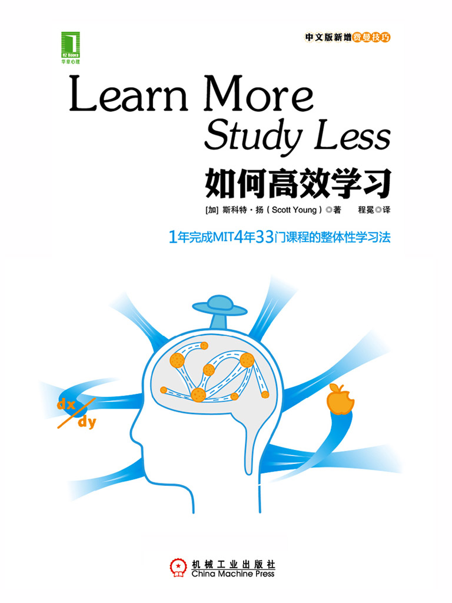

如何高效学习

【加】斯科特·扬　著

程冕　译

ISBN：978-7-111-44400-8

本书纸版由机械工业出版社于2013年出版。电子版由华章分社（北京华章图文信息有限公司）全球范围内制作与发行。

版权所有，侵权必究

客服热线：+ 86-10-68995265

客服信箱：service@bbbvip.com

官方网址：www.bbbvip.com

新浪微博 @言商书局

腾讯微博 @bbb-vip

读高中时，我几乎课下不学习。尽管如此，我还是以全班第二名的成绩毕业了。读大学时，大考之前我一般学习不到两个小时。不过，四年来，我的GPA总在A和A+之间。

──斯科特·扬

如果只用一种方式了解某样事物，你就不会真正了解它。了解事物真正含义的秘密取决于如何将其与我们所了解的其他事物相联系。通过联系，你可将想法内化于心，从各种角度看问题，直至找到适合自己的方法。这才是思考的真谛！

──马文·明斯基 博学家、认知科学家 人工智能研究者

1977年年底到1978年年初，中国科技大学创办少年班时，我在校长办公室担任秘书，有机会直接参与了少年班的创建过程。35年来，我一直致力于少年班研究。我曾经用“自觉、自学”这4个字来描述少年大学生超常发展的原因。也就是说，少年班学生都具有超强的自学能力。无独有偶，这本书所介绍的“整体性学习策略”正与少年大学生的自学能力相吻合。显然，这不是偶然的巧合，而是一种内在规律的反映。我想，本书介绍的学习方法，如果你去尝试，一定会带给你意外的惊喜。

──司有和 中国科技大学少年班资深研究者

本书介绍的整体性学习策略很具有操作性，可以避免学生在学习中陷入“只见树木，不见森林”的误区，建议同学们尽早掌握这种学习方法，有效地提高学习效率。

──孙鹤娟 吉林省总督学 前东北师大附中校长

学习是需要方法的，特别是在当今信息爆炸的时代，如何高效地处理信息、有机地整合知识、充分地运用所学，已经成为学习的关键。本书从一位“学习大师”的亲身体验出发，总结出“整体性学习”的策略及方法，同时，配合作者实际运用的各类学习工具，切实帮助读者逐步练就高效的“学习方法与学习习惯”。方法决定一切，你一定可以从中有所受益。

──汤震宇
美国特许金融分析师（CFA）培训第一人

中国大学生读书特点是上课随便听、考前疯狂记、半年忘光光。这是一种碎片化知识点学习，我同意这本书的整体性学习方法，掌握系统思考的模式你可以花费更少时间学到更多，但是你得先花点时间掌握整体性学习思维。

──秋叶 PPT学习达人

##### 中文版序

本书是从我写的一篇随笔开始的，随笔的内容是我对偶然观察到的一个学习现象的细致阐述，那就是学得好的同学总在试图找寻知识间的关联，而学得慢的同学却往往只会死记硬背。

当我第一次发布这篇随笔时，引起了强烈的反响。回复中有一半的同学认同这一观点──你当然要找到知识间的关联，并把它们变成自己的观点。而另外一半的回复则表示困惑，让他们觉得不可思议的是，居然从来没有人告诉过他们这种学习方法。

这件事让我觉得非常有趣，也非常困惑。为何对一部分同学显而易见的事，对另一部分同学而言却是不可思议的？如果半数的学生都不知道还有这样的学习方法，我们应该怎么帮助他们改进呢？

从那时起，我就开始研究如何高效学习。这本书是对我自己学习经历和他人学习案例研究的总结概述，主旨还是相同的：我认为学会把知识联系起来会让你记得更多，学得更好。当然，在如何建立联系上，你一定会有非常个性化的方法。

在我完成这本书的几年之后，它将要和中国的读者见面了。这件事让我觉得新奇，因为我完全不了解中国的教育体系，我的理解是中国教育比西方教育更强调死记硬背。如果我的理解是对的，那么我的整体性学习法会对中国学生的学习产生深刻的影响。

我希望你能因为这本书而不再死记硬背，读完它不是结束，而是你应用新方法指导学习的开始。可能你会觉得这本书里不是每个方法都那么有效，这是很正常的，学习本来就必须因材施教，因“课程”施教。但是如果你肯实践，我担保至少会有一种技巧能帮你学得更快，学得更好。

##### 译者序

说一个人“学得少”，是说这个人学习时间花得少；“会得多”是指学习的效果好；综合起来就是花最少的学习时间，得到最大的学习效果，这是任何一种学习方法都追求的最高境界，也是每一个学习者的终极梦想。

整体性学习是加拿大大学生斯科特·扬总结的一套学习理论，它没有学习心理学中各种流派传承的影子，但是这并不妨碍理论的高效性，它来自作者及一批追随者的亲身学习实践。斯科特·扬算是一个学习达人，他在大学的专业是商业学，业余时间又自学了编程，参加各种演讲，开设自己的博客，写了几本颇有影响的电子书。这还没完，最近，他又完成了一项学习壮举，10天拿下线性代数，12个月内自学完成4年麻省理工学院计算机科学的33门课程，网友纷纷惊呼，斯科特·扬到底有什么学习诀窍？斯科特·扬并不保守，他的学习方法就是整体性学习理论，早已经写在这本书中了。

整体性学习到底要怎样学习？简单地说，整体性学习就是看待知识的角度是多方面的。任何一门知识都不会单独存在，它总是与方方面面的知识联系在一起，这个观点并不新鲜，很多学习方法都是这么说的。不过，整体性学习在这方面走得更远，它让你在学习导数时，想到的不是公式，而是汽车的速度表和里程表；在学习公司管理时，想到的是达尔文的生物进化论。

要想走得更远，你就需要从学科内部跳出来，站在外面看学科。有人问爱因斯坦：“相对论到底是什么？”爱因斯坦回答：“你坐在美女身边一小时，感觉就像一分钟，而夏天你在火炉旁坐上一分钟，感觉就像一小时，这就是相对论！”数学家华罗庚讲统筹方法时，没有说一堆数学符号，而是用了一个“怎样泡茶最省时间”的例子，工人一听就明白了。

大家觉得如何？站在外面看，知识是不是变得容易理解和学习了！其实我们每个人早就掌握了站在外面看知识的本领，这就是比喻。过去，我们轻视比喻，仅仅把它当作文学中的修辞手段，是文学家用来增强表达效果的点缀和修饰。1980年，认知语言学家乔治·莱考夫（George
Lakoff）与马克·约翰逊（Mark
Johnson）合著的《我们赖以生存的隐喻》（Metaphors We
Live
By）一书吹响了隐喻（比喻）的号角，掀起了一场“隐喻革命”或“隐喻狂热”。比喻从此走向了逻辑学、语言学、心理学和哲学的舞台中央，比喻不再局限于文学领域，它是我们的思维方式，更是我们的认知工具。莱考夫把隐喻定义为“以一种事物认知另一种事物”，而这恰恰就是学习的本质！

比喻作为帮助人们理解的工具，由来已久。

耶稣解释“天国”：天国就像酵母，妇人拿了它放入玉米粉，直到全部发酵完毕……天国就像寻求珍珠的商人……天国就像抛入大海中的网……

佛要说六相，就先在大众前把华巾次第绾叠，一共打了六个死结。佛告诉阿难：这个华巾本来只有一条，因为我绾了六次，就说他是六个结。六结虽然不同，回顾它的本因，却是一条华巾所造。现在你的六根也是这样的，没有打结之前，一相都不可得，哪里会有六处呢？等到从真起妄产生根结后，六相开始分明，并且次序严谨。

比喻就像金·凯瑞拥有了上帝的力量，将月亮（陌生）拉得靠近自己（熟悉），使学习者能更清楚地观察陌生的知识。科学家哈定曾说：“如果科学家一生注意细微的观察，训练自己注意寻求类比，使自己具备有关的知识，那么这个‘感觉工具’就将成为神通广大的仙杖。”开普勒说：“我重视类比胜于任何别的东西，它是我最可信赖的老师，它能揭示自然界的秘密。”康德曾说：“每当理智缺乏可靠的论证思路时，类比这个方法往往能指引我们前进。”苏联学者瓦赫罗夫说：“类比像闪电一样，可以照亮学生所学学科的黑暗角落。”

斯科特·扬不仅是比喻和类比的高手，而且善于吸收其他各种学习方法的可取之处，他创造性地将信息分为五种类型，针对不同的信息类型，采取不同的学习策略。整体性学习理论更是站在学习之外看待学习，在第三部分，作者以“超越整体性学习”为题，介绍了每一位学习者都不可忽视的几个关键之处，即“能量管理”、“时间控制”、“习惯养成”、“批处理”和“自我教育”，让读者耳目一新，真正做到站在学习之外审视学习。读完这本书，学习者应该由学习战术家转变为学习战略家。

本书得以出版，离不开机械工业出版社华章分社的慧眼。感谢赵艳君编辑及其他工作人员的精心策划和反复审校，为本书顺利出版付出了宝贵的时间和精力。感谢我的妻子和女儿，没有你们的支持和鼓励，我大概早就半途而废，难以实现医者到译者的转变。最后，由于译者水平有限，翻译经验欠缺，虽经多次修改，仍然存在很多疏漏甚至误译之处，恳请读者不吝批评指正（crowncheng@163.com）。

程冕

##### 导读

###### 吃饭模型学习法

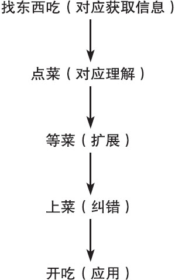

目前市面上的记忆法的书非常多，也很杂。教的技巧非常多，但是一直很难将知识与技巧使用结合起来，更多的是走马观花式的学习，就像武侠小说里面的什么什么剑法，花样繁多，却砍不死人，干着急。之所以推崇这本书，是因为它是一本内功心法“易筋经”，当你掌握了内功心法，柳枝亦可伤人。

根据这本书的学习理论，我总结出吃饭模型学习法，仅供大家参考。

第一步：找东西吃（对应获取信息）

有点饿了，去饭店吃饭。［要学习！要进步！］

①到哪家饭店吃好呢？［寻找信息］

②我市、区或小区等最好的饭店在哪里？［保证有足够的信息量可以筛选］

③查口碑网看看或者跟熟人打听一下。［速度！在饿坏前迅速找到想去的饭店］

第二步：点菜（对应理解）

终于找到饭店了，刚坐下，服务员过来递上菜单：“先生想吃点什么？”

①看菜谱上什么样的菜比较合胃口？［理解信息的背景］

②什么样的菜比较有营养？［理解信息的准确含义］

③想喝啤酒的话就不能点海鲜？［了解信息之间的关联］

第三步：等菜（对应扩展）

服务员下单去了。你坐在餐桌前做点什么好呢？［发散思维阶段］

①小鸡为什么一定要炖蘑菇呢？为什么不能炖白菜呢？为什么不能跟王八炖？这菜是怎么种出来的？有什么营养成分？菜谱为什么这么搭配？谁最先发明的小鸡炖蘑菇？难道是赵本山？嘿嘿……［深度拓展，知识背景探究，多问为什么］

②这道菜的做法还有哪些啊？土豆炖排骨？菜的花样？满汉全席？［横向拓展，即类似的知识联系，与其类似的结论还有哪些？］

③吃会不会导致朝代更替？吃在中华五千年文明中所承载的文化？［比喻法+内在化，这篇文章就是运用的比喻法来解释］

第四步：上菜（对应纠错）

服务员上了一盘菜──水煮肉片。“美女，我要的是小鸡炖蘑菇！”“不好意思，上错了。”［明白模型的局限性，及时纠错］

第五步：开吃（对应应用）

“哇，色香味俱全！”开始大口吃肉，大碗喝酒，解决温饱问题……［在现实中对信息进行应用］

第六步：服务员（对应测试）

从进入饭店开始到结账，服务员一直在默默地注视着你，随时提供服务。

①找东西吃。

②点菜时，“先生，我们店的鱼很新鲜的。”对菜来说新鲜的食材很重要。［我真的理解知识的重要性？］

③拓展，“先生，我们是某某连锁的。”连锁性饭店将地理位置的点用品牌连接起来。［知道知识从何而来，与哪些知识有关系？］

④应用，“先生，吃好了没？”［我是否将知识用到了实际生活中？］

注意：本书的五个步骤实际上是相互交织的，可以跳跃、往返，比如，参加宴会，你就跳过了找饭店和点菜的阶段，甚至是上菜的阶段，开吃就好了。

其主旨在于打通现在所谓的专业壁垒。目前流行所谓的知识专业性，当然我并不否认，但是知识本身是没有疆界的，如何通过自身的努力和创造性将各种专业知识有机地融合在一起，然后创造性地解决问题才是关键。

李撒欢

##### 前言

##### 是什么让一个人更聪明

是天资聪颖，还是后天知识的积累？或者仅仅是大学的教育起作用，还是也包括人生的各种经验、技能和直觉在内？

智力其实很难定义。尽管IQ测试和各种各样的检查都试图量化它，但还是很难判断究竟是什么使人更聪明。相比之下，我更喜欢以下这个具有实际操作价值的定义，而非那种泛泛之谈：

所谓的聪明是指能学得更快、记得更多更牢，而且信息的组织非常适合完成自己的目标。这是一个非常个性化的定义。首先学习的目的可能因人而异：你可能仅仅是希望考试得到好成绩；约翰想通过努力学习成为一名编程专家；苏珊希望尽可能多地记住闲暇时读书的内容；还有人目的很明确，就是为了更好地完成工作。

##### 怎样算作聪明完全取决于你自己怎么看

本书并不是为了给智力下武断的定义，而是为了教会你学习的策略。这个学习策略就是整体性学习，我会介绍很多办法，教会你在实践中应用整体性学习方法。

也许某些方法并不适合你的学习方式或是学习目的。没关系，我只是提供方法供你参考，它们都是依据整体性学习理论而设计的，你可以灵活运用它们，组合成适合自己的方法。通过不断地实践、练习，最终成为你学习中的超级武器。

本书有两个主要目标。第一是整体性学习策略为你提供一个如何学得更好的模型。如果没有容易理解的学习理论，怎么可能取得进步？通过对照整体性学习策略，你会找出学习上的缺陷，改正学习方法。

第二个目标是提供一系列学习技术。我会解释这些学习技术怎么做，它们在整体性学习中起什么作用。每介绍一种学习技术，都会有相应的练习供大家反复实践，直至熟练掌握。

衷心希望大家在学习上付出的努力都能有所收获，预祝大家阅读愉快，有所获益。

斯科特·扬

#### 我的故事

一直以来，我学东西都很快。中学期间，我考试前很少复习，却能考得很好。到了大学，我的成绩也总是名列前茅。不过，我并不是那种埋头苦读，争分夺秒的学生。实际上，我花在功课上的时间比一般人更少。

有一次，我参加化学竞赛。事先我不知道要竞赛，老师直到临考前才通知，而考试的内容又是我不熟悉的，课堂上根本没有学过，时间是一个半小时交卷，不过我只花了40分钟就离开了考场，因为我想及时赶上吃中午饭。

结果怎样？我得了第一名以及400美元的支票。（你一定会问难道我是个天才？其实这正是我按照整体性学习策略学习的结果。读完本书，你也会取得同样的结果。）

我主要靠自学。我自学了多种编程语言、商务知识和写作技巧，我的书架上放着最近两年里阅读的数百本图书。我还抽空学习了动漫设计、作曲等知识。

一句话，学习对我来说总是那么轻松。

读及此时，你会说：“这个人是个天才。”“天才”也许比较合适，但很多人比我更有天赋。我只不过是有些好的遗传基因、有进取心的父母和些许天分罢了。

读及此时，你会认为我傲慢、自大。

若是从前，我同意你的看法。但是现在，我注意到自己和那些比我更聪明的人之间的区别，并不是聪明的人就一定学得快、学得好。

他们的学习方式不同！

聪明人在学习中都会逐渐形成自己的一套学习技巧，有些人有意识去应用，大多数人则是无意识地应用，不同的策略会导致不同的学习效果。

我把这些不同的策略综合在一起，形成了整体性学习（holistic
learning）。之所以称为整体性学习，是因为它教你认识到学习不仅仅是记忆一些事实，记忆只是学习的一小部分，我们要全面地认识学习。高智商者并不认为学科之间的界限那么清晰，他们喜欢将知识视为整体，也容易将所学的知识与其他知识相联系。

通过整体性学习，聪明人能够很快地整合新知识。尤其重要的是，这样学到的知识很牢靠。他们是真正地“获得”了知识，对知识的理解更为深远，而不仅限于书本所说。

有一个故事可以很好地说明上面的观点。

很久以前，有个学生物理课学得很好，一次考试，所有问题都答对了，只有一道题，老师给了很低的分数，这道题目是“怎样用一个气压计测量建筑物的高度？”

学生回答：“去建筑物的顶上，将气压计扔下来并开始计时，直到听到砰的一声，再通过重力加速度公式计算出建筑物的高度。”

出题者的本意是希望学生利用所学的气压知识计算建筑物的高度，因为从学生的答案中看不出来他懂得气压知识，所以老师没有给他高分。

学生找到老师，对低分表示异议。老师说，只要他能再想出不同的办法来解决这个问题，就给他高分。

学生稍稍思考就回答，可以用气压计敲开建筑物主人的门，当主人打开门时，问他：“请问，建筑物的高度是多少？”

老师沉默了一会，问：“你还有其他办法吗？”学生说还有很多，比如：用一根长线绑着气压计，通过线的长度测量高度；或者将线当作钟摆，通过钟摆的运动来计算建筑物的高度，等等。

老师最终决定给予学生满分。故事中的学生就是年轻的尼尔斯·玻尔（Niels
Bohr），后来成为著名的物理学家，因为发现了原子中的电子而闻名于世。

玻尔不仅知道怎样得到答案，而且对问题的观察更为全面，不局限于所学的某个知识，他可以多角度地看待问题。

整体性学习就是按照上面的过程来理解、学习所有的知识。

#### 如何使用本书

不要指望一次读完本书就能成为学习超人，准确地说这是一本学习行动指南，在学习的过程中，需要不时翻阅。第一次阅读，可以大致了解整体性学习的概念，而书上介绍的学习技术则需要反复练习，方可达到熟能生巧、为我所用。指望看一遍书就能熟练运用这些学习技术，就如同从未拿过弓的人一次就想射中靶心。

这就是为什么本书有很多练习供大家反复实践，它们为你提供了用这些技术去解决问题的突破点。

一开始采用这些技术可能反而降低你的学习速度，这不奇怪。任何新事物都有一个适应期，例如长跑运动员为了提高成绩，学习某项新技术，一开始反而成绩会下降。学习也是如此，一旦你度过了适应期，学习效率将会突飞猛进。

整体性学习需要时时刻刻在学习中应用。用得越多，效果越好。

从现在开始，无论是拿起一本书，还是上一堂课，或是学习什么新东西，就开始用整体性学习策略指导自己的学习吧！

小贴士

整体性学习包括很多新的概念和技术。如果你一次只学习一项技术会更好。在本书的后半部分，你会看到有很多“智力挑战”栏目，这些智力挑战的设立就是为了帮助你学会新的学习技术。

##### 什么是整体性学习

整体性学习与机械记忆正好相反。

机械记忆就是反复记忆信息，希望以此牢记信息。比如，不断地重复数十次来记忆一个物理公式就是机械记忆式学习，这是一种糟糕的学习方法。

如果读了上一节玻尔的故事，你可能会明白聪明的人是不会通过机械记忆来学习的。你会认为玻尔这名年轻物理系学生的脑袋中塞满了各种各样的公式吗？他能提出那么多独一无二的解决问题的办法，这恰是机械记忆的反例。玻尔知道公式中每个符号的真正含义，而不是死记符号、公式。他明白为什么这个符号会出现在公式某个地方，他深入了解规则，所以也能打破它。

整体性学习是一种学习理论，它更精确、全面地描述了我们大脑是如何工作的。各位，你的大脑并非简单如计算机的文档储存，计算机文档的本质是一系列记录在硬盘上的0和1的组合，而人的大脑是通过数十亿个神经元相互联系储存信息的。

如果我们有计算机一样的大脑，那么机械记忆非常有效。你所要做的就是精确复制信息，如此我们将可以记住任何信息。不幸的是，我们的大脑并不是计算机，所以机械记忆是一种低效的学习方法。

整体性学习需要采取多种途径综合学习，而不是试图在大脑中复制一个完美的拷贝，整体性学习是运用你大脑里已有的丰富的神经元网络吸收、整合信息。整体性学习在于创造信息的网络，一个知识与另一个知识相互关联，那些相互关联的知识网络使你真正做到对知识的完全理解，从而轻松地驾驭知识。

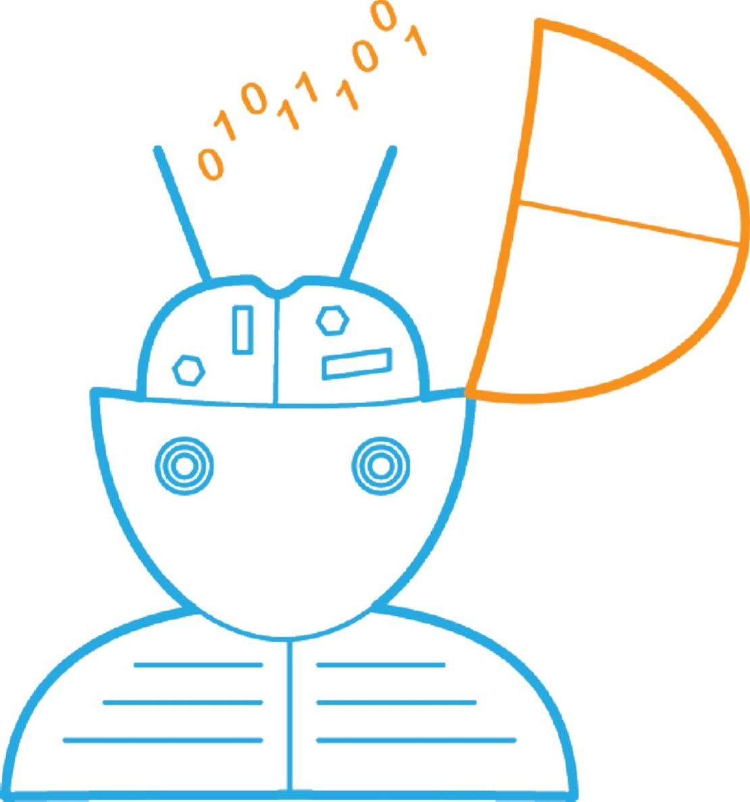

整体性学习意味着知识的学习并不是孤立的。事实上，知识的学习从来就不是孤立的，学习任何知识（概念、定义、公式、问题、观念、理论等）都需要联系。你创造的联系越多，它们就会记得越牢、理解得越好。

机械记忆认为学习就像整理一个个大小不一的盒子。一个数学大盒子里装有代数、几何、微积分小盒子。微积分小盒子里又有更小的函数盒子和一些公式的应用盒子等。在你的微积分盒子里不可能找到生物、历史、绘画、舞蹈和科幻电影的踪迹。

但是学习并不是整理盒子，学习就像编织一张大网。

整体性学习者不会采取这样有组织的方法（整理盒子）储存信息（这可能会解释很多聪明的人组织能力却很差的现象）。整体性学习者可以将所有东西关联起来，公式并不仅仅是公式，它是一种感觉、一幅图像，你可以将它与天上飞行的超音速飞机联系在一起。

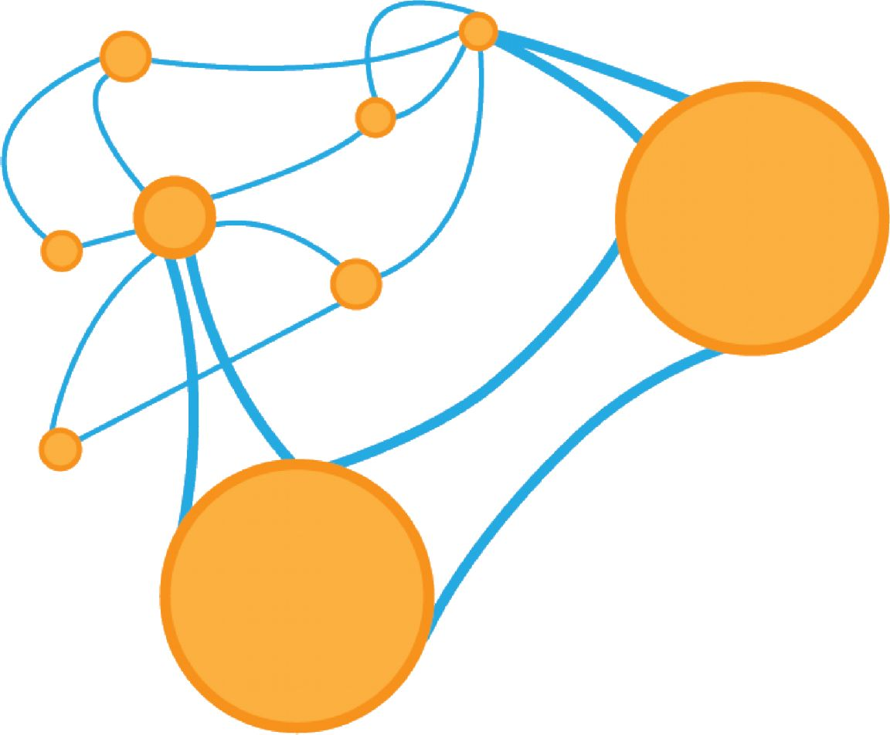

如果你学习时没有方法可供选择，机械记忆看起来也有些作用。如果不知道学习的步骤和缺少完成这些步骤的学习技术时，那只有简单地把信息塞进脑袋里了。这就像一个原始人用石头而不是步枪来猎杀猛犸象，不是他愚蠢到不用步枪，而是他没有步枪。不过今天的你不是原始人，有枪而不用，偏偏只会用机械记忆学习，成绩怎么会好？学习怎能不累？当你理解了学习的步骤和技术时，就会明白机械记忆是多么原始和低效了。当然，万不得已时，有一种总比什么也没有强！

如何储存信息

整体性学习是关于如何有效学习的假说。之所以说它是假说，是因为目前整体性学习还缺少科学证据，更多的是实践总结。科学要发现学习的大脑生物机制还有漫长的路要走，整体性学习是通过观察聪明的人是如何学习而得到的总结。

电子是否真的像台球或小提琴琴弦一样在质子堆周围跳跃并不重要，这只是人们方便理解的一种比喻。同样，整体性学习也只是一种用来解释信息是如何被储存的理论，而不是描述脑袋里实际发生的生物学过程。

比喻法有很多种：有形态上的比喻，如姑娘的脸像红苹果；有感情上的比喻，比如我的热情好像沙漠；等等。

整体性学习基于三种主要观点：

（1）结构

（2）模型

（3）高速公路

正如我将会解释的一样，明白这三个基本观点使应用整体性学习策略更加容易。

小贴士

整体性学习的基础就是将知识关联起来以达到记忆和应用知识的目的，开始学习的最佳技术是比喻、内在化、基于流程的记事和画图表法，这些方法构成了整体性学习的基础。

#### 结构

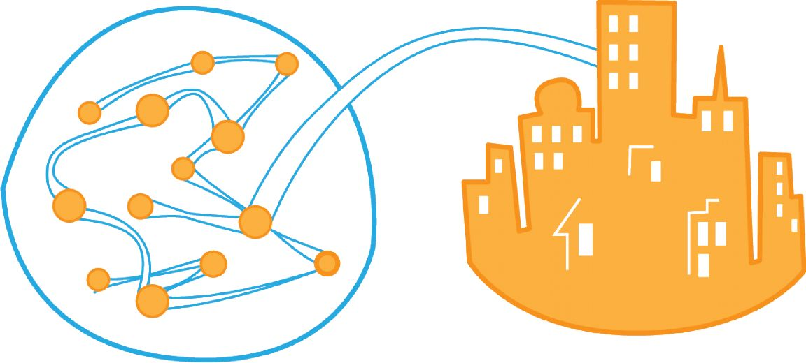

结构就是一系列紧密联系的知识。假如你打算学习C++语言编程，你可能已经有了C++语言的知识结构，这个知识结构包含你所知道的所有C++语言知识，是有关C++语言各种知识及其联系的总和。

结构就好像你思想中的一座城市，在城市中有很多建筑物，建筑物之间有道路相连，有些建筑高大而且重要，与城市中的其他建筑有上百条路相连，而其他一些无关紧要的建筑，则只有少数泥泞的小道与外界相通。

在你的知识地形图中，充满着这样的城市。关于基础数学和基础语言的城市可能是最庞大、最发达、最完善的城市（相当于北京、上海），所以不管是做3+4-10还是做10×3+7等这样的题目，你都游刃有余，这些问题之所以做起来容易正是因为你的基础数学知识结构非常发达。

理解就是结构高度发达完善的结果。

是不是有些学科你可以轻松“拿下”？你读起这些科目的书毫不费力、兴趣盎然，一切内容看起来那么浅显、通俗，原因何在？因为你的脑袋里已经有这些科目的发达知识结构。假如说结构就是脑袋里的城市的话，那么这些城市一定是道路四通八达、路面整洁而且交通井然有序，虽然车水马龙，却从不见交通堵塞。

相反，为什么有些学科理解起来那么困难呢？这说明城市简陋，道路不畅，甚至乱建一气，违章建筑、豆腐渣工程比比皆是，有些道路甚至无所指向。或是修了半截，或是孤零零一条，在这样的城市中行走，迷路是必然的。知识结构就是你脑袋中的参考地图。

那么请问大家：在一座城市里最容易找到的建筑是下面哪一种？

A）与很多建筑有数百条公路相连。

B）只与一座建筑有泥泞的小路相连。

很显然，A建筑更容易找到。如果先前走错了路，也没关系，条条道路通罗马，花很少的时间，你就会找到正确的地方。如果是B建筑，给你的机会就只有一次，一旦你走错了路，就别指望找到了，即使走对了路，也不免磕磕绊绊，花费大量的时间和精力。

建立良好的知识结构就是绘制一份优秀的地图，就是建造一座设计良好的城市。所以建立知识结构时，你的目标就是在各种知识之间建立尽可能多的联系，聪明的人会很自然地这么做，每学习一个新概念，都会自动地与其他知识相联系。

你可能一直也是这样学习的，不过因为不是有意识地这么做，效率可能大打折扣。整体性学习策略有很多具体的学习技术用于自觉地建立知识间的联系，一旦熟练掌握了这些学习技术，使之成为习惯，想不建立联系都困难，想学习不好都不行！

小贴士

建立知识结构非一日之功，要知道并没有魔法技巧可以“立即”学好一门功课，强有力的结构来自概念之间不断的联系，一次完成一个想法，日积月累，水到渠成。

#### 模型

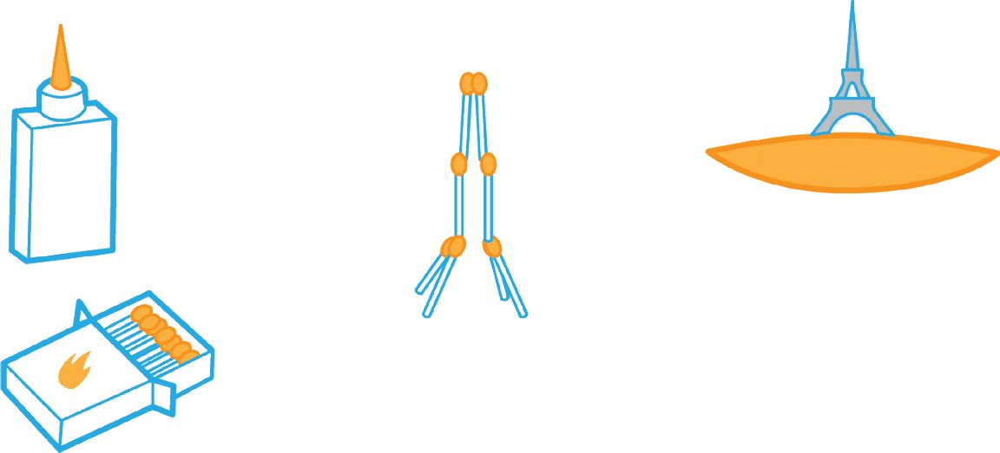

假如说结构是整体性学习的门户，那么模型就是开门的钥匙，模型是简化的结构，它是结构的快照，更为简单和更易储存。模型对于快速学习新概念至关重要。

要理解模型是什么，可以想想这本书，本书的模型就是目录，几页目录就概括了本书中数千字词，假如想快速了解本书的内容，你可以从目录开始，而不必逐字逐句地阅读整本书。模型有很多种形式，但是目标总是同样的：那就是压缩信息。通过将一些核心概念联系在一起，就可以创建一个模型。模型对于你开始构建一个结构或是在当前结构上添加内容非常重要。

当第一次学习子空间时，我创建了一个模型。子空间是一个数学概念或术语，它的定义是一个较大向量空间中的一部分。比如一个三维向量空间，子空间就可能是一个二维平面。

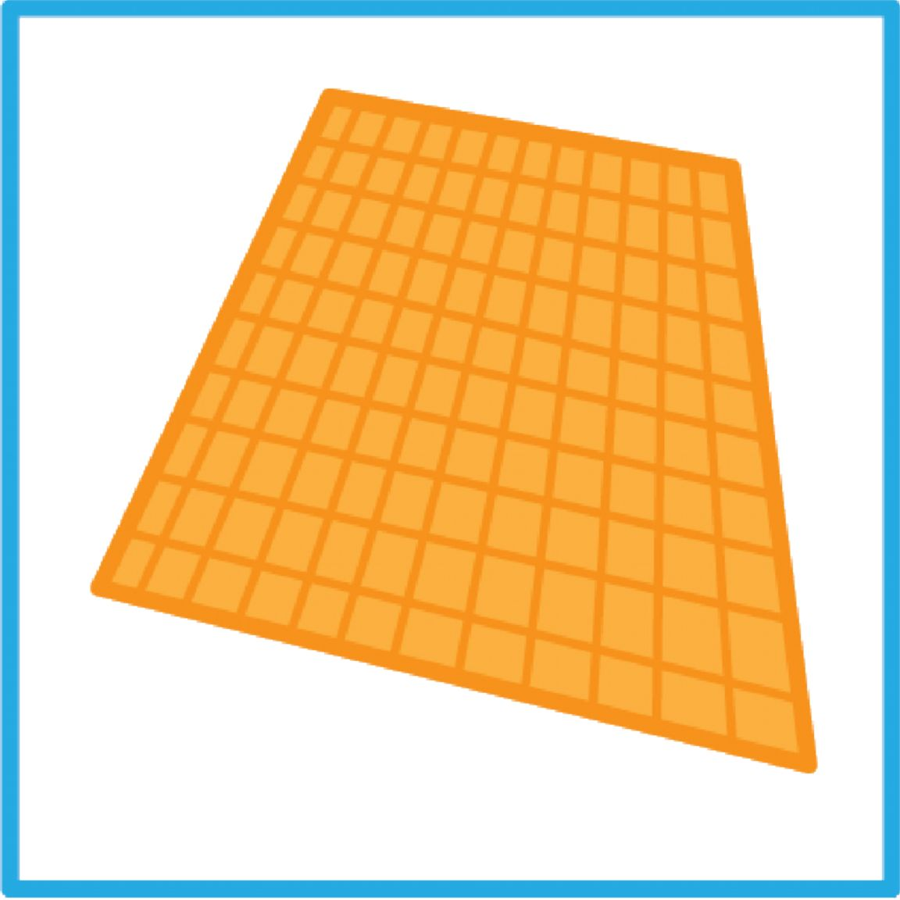

我设计的表示子空间的模型是一个闪闪发光、无穷大的蓝色背景，这是一个三维空间，我能看到在蓝色背景之上是红色半透明的网格，这就是我的子空间模型。这个模型仅仅代表了子空间的部分特点，子空间也可能是一个平面中的一条线。模型并不需要非常精确，它只需要综合一些观念，使这些观念更易理解、把握。随着对子空间理解的增长，我也在逐渐调整之前的模型，创造出新的模型。一旦有了知识的结构，我就可以在此基础上理解和纠正错误了。

大家都知道，学习电脑编程时，程序语言经常遇到“变量”的概念，变量是用来储存信息的，并且在程序运行过程中会发生变化。姓名、数字或是密码都可以作为“变量”储存起来。我把变量想象成各种各样的罐子，如此一来概念就变得容易理解了。因为变量可以分为好多类型（有的用来储存数字，有的用来储存字母或者单词），我就想象不同的罐子有不同的瓶口，所以可以装不同类型的数据。

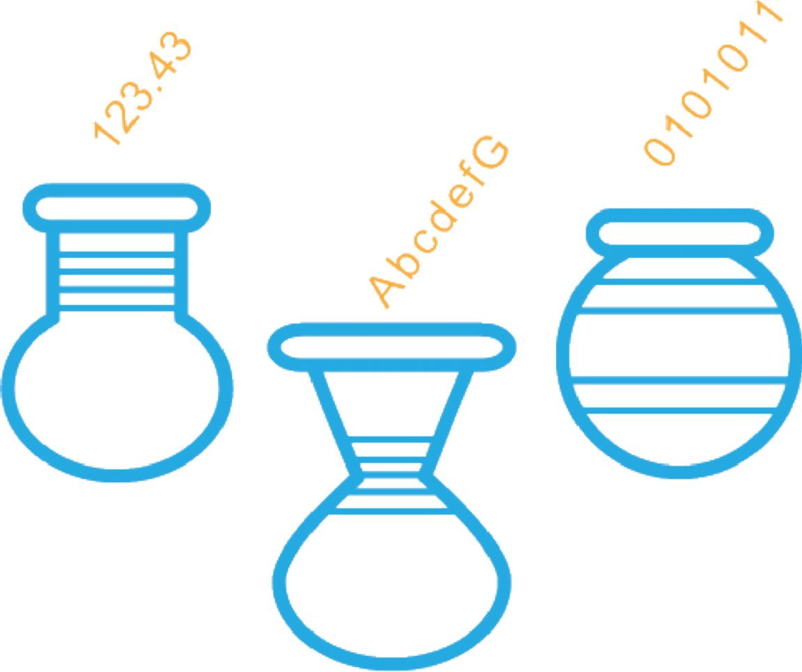

这个变量模型包含了几个关键的思想，可以用一张图（各种各样的罐子）或一个概念（罐子学说）来概括，这种知识的压缩（模型）好似一粒种子在脑海中生根发芽，新的知识将以此为基础进行联系和优化。

模型并不一定是一张图，但一定是一种压缩形式，它把多个关键思想压至一处。有很多产生和改进模型的方法，本书的后面将会讨论，视觉化只是其中的一个办法。

学习电脑编程中的函数时，我把函数的作用想象成铅笔刀，钝铅笔进去，锐利的铅笔出来，这个模型并不依赖于图像，而是其中的过程类似。

模型就像是结构的种子，是一座建筑的地基和框架，是知识最核心的概念，在此基础上将引伸出全部的知识。

##### 熟悉的结构（成熟结构）

世界上有一些为多数人使用的成熟结构，这些成熟结构根深蒂固，它们是我们构建模型、通道和学习新科目的宝贵资源。很多结构你可能用过，下面介绍几个最典型的成熟结构。

感知结构

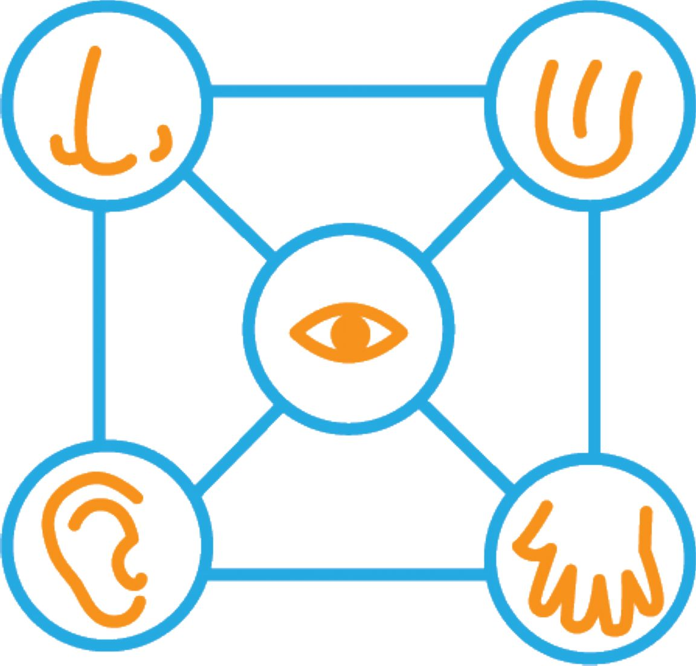

这是发展得最好的结构。你有大量的图像、声音和情感，这些感觉又互相交织，综合起来就构成了你的生活经验。感知结构是最基本的结构，是其他结构的基础。

关系结构

通过故事、人物以及人物之间的相互作用可以清楚地显示我们的实际生活。假如说故事也会使学习更容易，你会惊讶吗？说卤化物比惰性气体少一个电子与说卤化物和惰性气体在元素周期表上是邻居，哪一个更吸引人，更有趣味？（“邻居”不也是生活中的例子吗？哪一种生活经验不含有关系呢？因此，熟悉的结构只有一种，那就是个人生活经验。比较熟悉的结构则是你学得比较好的科目。──译者注）

基础数学结构

由于每个人的数学背景不同，基础数学对有些人来说意味着普通的几何代数。而对有的人来说，微积分也是小菜一碟。基础数学结构可以作为建立更深层次数学结构的基础，也可以用它来简化其他学科里的各种关系。（基础的数学已经融入到你的生活经验中了，是生活经验的一部分。──译者注）

如果有人问我有什么学习技巧的话，我会首先推荐上述这些成熟的结构，它们是模拟其他知识的最丰富、最好的来源，因为这些东西是你立刻就能想到的模型。

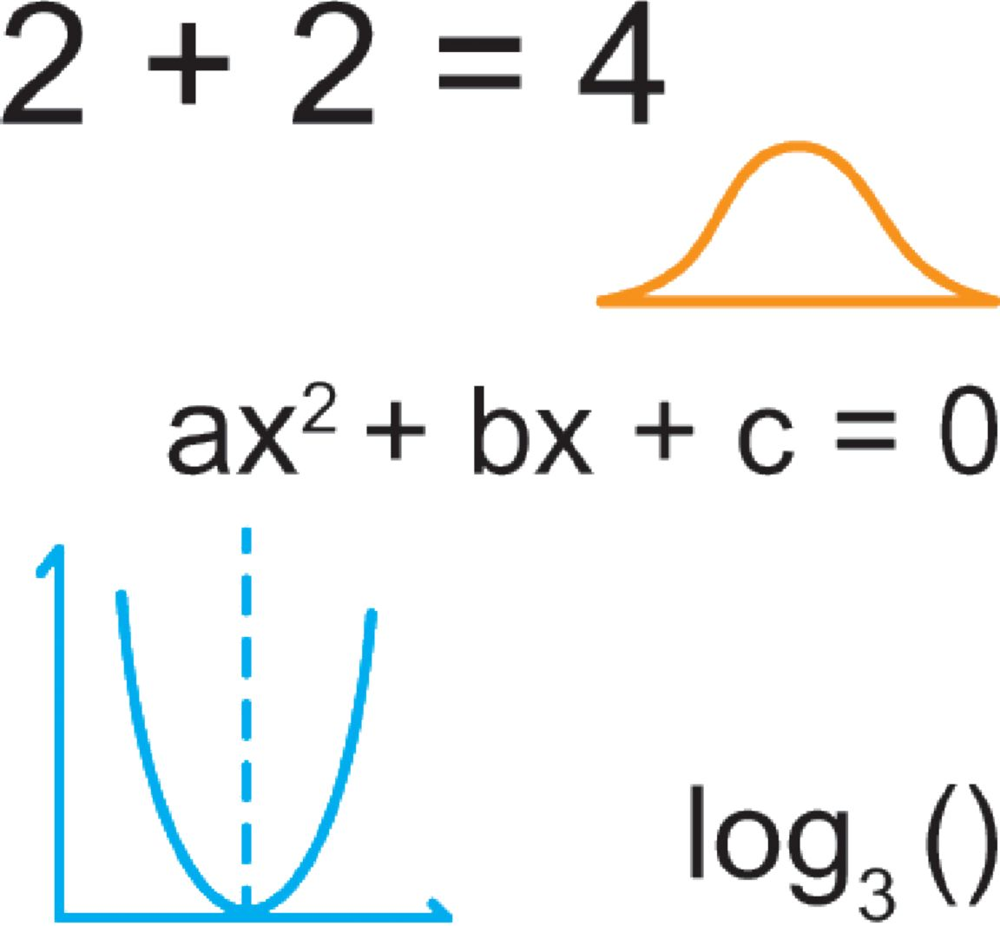

比喻法──结构、模型和高速公路，上帝呀！

前面说的什么结构呀、模型呀，听起来很抽象。别担心，这么早介绍它们是有道理的。假如说整体性学习是一条龙的话，结构、模型和高速公路就是龙的脊柱。

很多关于学习的书喜欢介绍大量的学习技巧，我在下面也会讲到。不过，我不仅介绍这些学习技巧，而且告诉你在整体性学习策略这个背景下，这些学习技巧起什么作用以及为什么起作用，然后你就可以做到根据个人情况修改和创造个性化的学习技巧了。

知道了信息在大脑里是怎样储存的背景知识后，希望大家能采纳那些在这个策略中有价值的技术，而不是随意采纳任何一种学习技术。明白了我们的大脑是如何储存信息的，你就可以改善自己的学习方式。

模型从哪里来？生活经验是最熟悉的结构，是模型的主要来源，其他学科中的知识结构也是模型的来源，只要与所学的东西类似，就可以拿来作为模型。

#### 高速公路

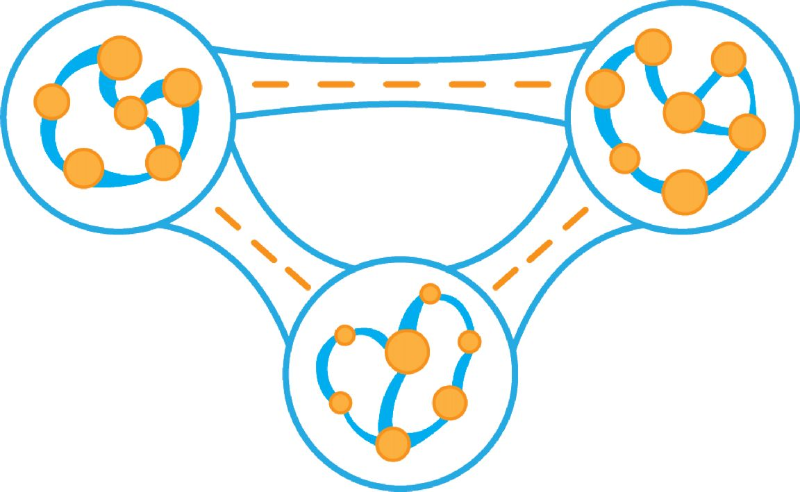

结构里有很多路将建筑连接在一起，拥有数百条城市内部的公路当然很有用，但是光有内部的路并不足以发挥具有整体性大脑的真实力量。因此，你需要增加的是城市之间的高速公路，即结构与结构之间的联系。（实际上就是用生活经验中的例子来模拟、比喻要学的知识。──译者注）

高速公路作为参照物可以连接两个完全不同的观念。假如你正在阅读生物学课本，又与学过的商业发展史课程相比较、相联系，这就建立了高速公路。（生活经验中的例子是最好的模型。因为它们太熟悉了，拿不成熟的东西当模型，效果也会大打折扣。除非你商业发展史学得非常好，否则还是想一些生活中的例子来比喻生物学吧！──译者注）

建立高速公路的好处不会马上显现出来。如果你想上学取得好成绩，很多老师会强调要有良好定义的结构，而不要在大脑里塞满了各种高速公路。

然而，高速公路能激发创造力。“跳出盒子”之外思考最恰当地描述了那些在结构之外思考的人们。高速公路让他们以前所未有的方式思考，以不曾想过的方式将常人眼里风马牛不相及的专业联系在一起思考，这就是创造。利用高速公路可以在专业交叉的领域建立起新的结构。（这种不同专业间的比喻好处是，它比用生活经验来比喻更容易产生新知识。──译者注）

举个例子，我以前学习尼克罗·马基雅维利的《君主论》时，就曾使用过高速公路的方法。马基雅维利在《君主论》中讲述了关于君主如何统治一个国家、统治人民和征服其他国家的一些原理。而今，《君主论》被看作邪恶的天才或精神病患者的作品。

学习马基雅维利的观点时，我需要一个比较的对象。结果，我在马基雅维利的关于治理国家的观点和我个人关于友谊、社会地位和管理等方面的经验之间建立了高速公路。尽管他的观点有瑕疵，但是这种方法让我对马基雅维利的观点理解得更深刻、更独特，也更有实用价值。

高速公路使学习更富有弹性，而不是僵硬死板的学习。

#### 整体性学习的顺序

到目前为止，我已经描述了信息在头脑中是如何储存的。但是，首要的问题是：信息是怎么得来的？

任何学习都可以分成几个独立的步骤。如果只是为了通过一次考试，你并不需要完成所有步骤，也不需要理解得非常深入。完成步骤的顺序也不需要固定不变，你完全可以完成第二步后再跳回第一步继续学习。

每一个步骤对学习都很重要。如果你总是缺少某一步骤，或者某个步骤完成得不好。信息就不会得到很好的存储，这种学习就是失败的，因为信息不能整合到你的整体性认识中去。

为了看一看每一步是如何纳入到整体性学习理论中的，我们可以采取一些学习策略，通过这些策略，你可以弥补自己现有技术的不足。当然，你也可以自己发展出一些新的方法来替代不合适的环节。

整体性学习的顺序：

（1）获取

（2）理解

（3）拓展

（4）纠错

（5）应用

还有一个测试步骤是伴随上述每一步的。测试就是观察以上五个步骤做得好不好，严格的测试能发现问题出在哪里。

以下是这六个步骤的简单介绍。

（1）获取　获取就是信息进入你的眼睛和耳朵，阅读、课堂上记笔记以及个人的种种经历都是获取。获取阶段的目标是获取的信息要准确，信息量要尽量压缩。

（2）理解　理解就是了解信息的基本意思，并放在上下文中联系，这是学习的最基本联系。

（3）拓展　拓展阶段是整体性学习中最花力气的地方，这一步将形成模型、高速公路和广泛的联系，从而获得良好的结构。

（4）纠错　纠错阶段是在模型和高速公路中寻找错误，这个阶段要删除那些无效的联系。

（5）应用　应用把纠错带入最后的水平，通过比较（知识）信息是如何在现实中运行的来进行调整，如果理解不符合现实世界，那么再多也无用。在这一步中失败的典型例子就是书呆子，即那些读书读得很好但是出了学校大门却茫然不知所措的家伙。

（6）测试　上述阶段的每一步都需要测试，测试有助于你迅速找到学习中的问题所在，帮助你改进学习技术，克服缺点。

小贴士

本书第二部分介绍的各种学习技术是针对不同阶段使用的。快速阅读用于获取信息，笔记流和比喻法有助于拓展，而模型纠错法和项目学习法用于对观点的纠错和实际应用。

##### 获取阶段

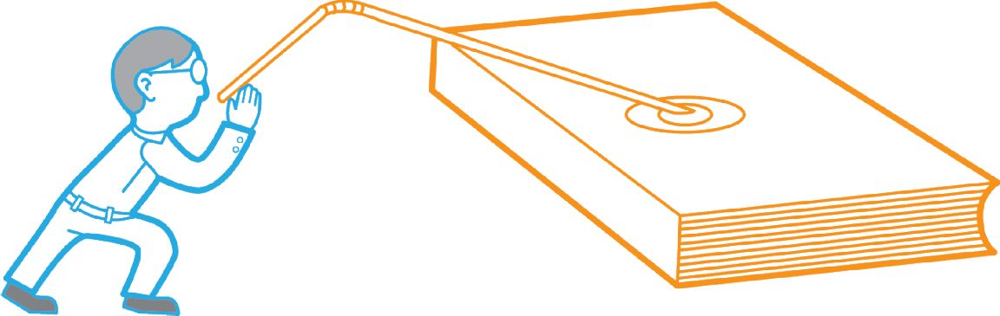

这个阶段代表信息从采集到进入脑子的过程，此时处理各种形式的信息以及减少干扰的能力至关重要。在获取阶段，你的表现怎么样？

·阅读一页材料并达到90%的理解，你要花费多长时间？

·一堂课，你真正注意到了多少内容？

每个人处理各种形式信息的能力（阅读或听讲都可以获取信息，但是信息的形式不同）或高或低，这直接造成了学习能力的高低。在获取阶段丢失的信息在后面的环节将无法补偿，也没有任何其他整体性学习技术可以弥补这一损失。

获取信息时有三个主要目标：

（1）简化

（2）容量

（3）速度

简化

请阅读以下文字：

“我是，我是，我是，我是，我是，我是。”

连续读6遍“我是”，是不是很啰唆，你可能会简单地说“我是，6次”，实际上二者所含的信息是一样的，但是后者显然更简单。

阅读时，要尽可能地找出真正需要的信息，很多作者和老师喜欢讲些无关紧要的话，这些东西对形成模型和结构毫无帮助。

简化表示在获取的信息中将无用的东西尽量删除，只有那些对你形成模型非常有帮助的例子才需要认真学习。如果你觉得不需要掌握，就大胆地跳过它。

容量

明白了信息的简化之后，你就应该获取尽可能多的信息，只读一句话当然没有读完一页理解得透彻，知道得越多，理解得就越深。一年读100本书总是比一年读两三本书知道得多。

速度

获取信息的最后一个目标是速度，30分钟读完一本书比一小时读完效率要高。速度看起来与容量和简化相反，读得越快，漏掉的信息就越多，信息获取也越差。

好的阅读和听讲方法能使获取阶段大为改善。即使在这个最早阶段，大多数人也有很大的改进空间，我会在本书第二部分中详细介绍改进的方法。

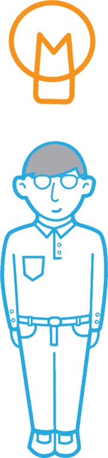

##### 理解阶段

获取信息而不理解是没有任何价值的，这就是所谓的填鸭式学习。假如你不理解一本书、一章节、一段话说的是什么意思，要想牢牢记住它或者在实际生活中应用它几乎是不可能的。大多数人都能感觉到理解阶段的存在，虽然信息经过初步理解后变得有意义，但是此时信息还没有很牢固地扎根于大脑中。

整体性学习过程对信息的理解有三个层次，层次越高，对信息的理解越深入。首先是理解阶段，其次是拓展阶段，最后是应用阶段。

在理解阶段，你只是理解了信息的表面意思。举个例子，比如你正在学习一个新的数学公式，至少你要知道公式里每个符号代表的是什么，然后才有可能应用公式来解决问题。如果你重复使用公式的次数足够多，就有可能记住它。死记硬背式的学习仅仅是理解阶段的学习。

大多数人到了理解阶段就止步不前了，而聪明的人知道要超越它，方能高人一等。到达这个阶段只不过表示你初步理解了信息在上下文之间的意思，公式不再是胡乱弯曲的字母组合。不过，光了解这一点还不够，你还需要了解这个公式是怎么得来的，它与其他公式的关系，以及怎样用它解决外面世界的各种问题。

尽管理解阶段有局限，但是这个阶段非常关键，除非先获取信息和理解它的字面意思，否则你就没有机会深入下去。

小贴士

如果你不能立即理解某段话，并不代表你的学习不具有整体性。我的建议是当你遇到比较难的课程时，首先尝试将其分解为更小的问题、缩小范围，搞清楚你真正不能理解的地方，你才可以深入阅读，跨过障碍。

##### 拓展阶段

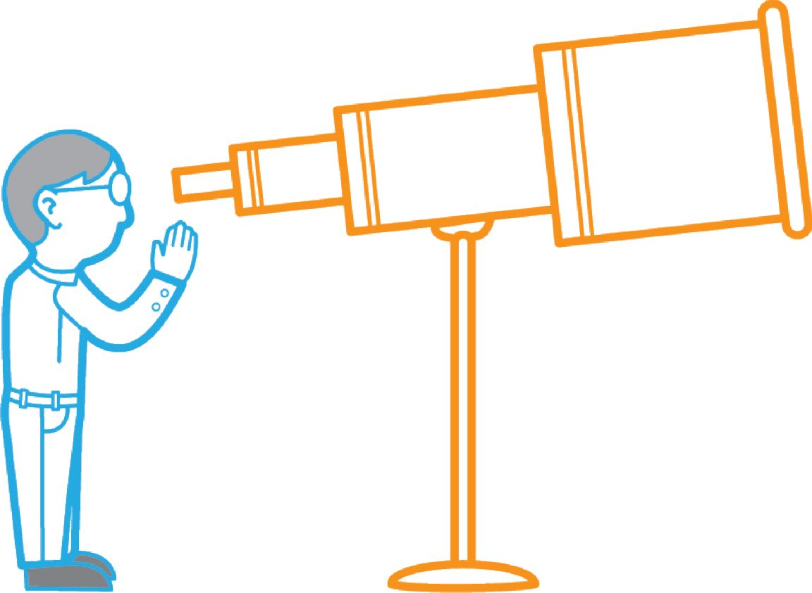

拓展才是整体性学习的真正开始。之前你对信息的字面意思已经有了一个基本的理解，现在你可以将这个信息与其他信息联系起来了，在这个阶段要应用模型来简化和扩展你的结构，同时也要拓展对信息的理解，包括信息的由来（问为什么？）以及与其他信息是怎么联系在一起的。

一名整体性学习者对前面提到的公式会怎么做？先去获取，然后理解公式本来的意思，接着开始拓展它。他会问：公式是怎么来的？公式中的每个成分代表的真实含义是什么？公式中的什么成分可以做些改变？这种改变会导致结果发生什么样的变化？其他公式与这个公式有什么相同之处，又有什么不同之处？

如果你不习惯拓展，上述工作可能要花费些时间，但是一旦变为习惯，拓展就会自然发生。只了解字面意思并不符合人的本性，人们都有进一步了解知识来龙去脉的好奇之心，保持这个好奇之心吧，它是我们学习、创造的源泉。（问问自己难道你不想了解恐龙到底是怎么灭绝的吗？为什么那样的庞然大物有一天会突然消失？地球之外究竟有没有外星人？苹果为什么会掉下来，而不是往天上飞？1+1为什么就一定要等于2？假如你觉得这些问题很可笑，麻烦了，你在嘲笑的同时也正被大家同情，你丧失的是宝贵的好奇心呀！有了好奇心，牛顿才会思考“苹果为什么会掉下来”这个似乎很傻的问题，最终发现了万有引力的存在。──译者注）

拓展有三种主要方式：深度拓展、横向拓展和纵向拓展。

深度拓展（知识的背景探究）

知识从何而来？结论来自何处？一个发现是如何做出的？事物为什么以这种方式存在？深度拓展需要在信息内部创造联系。不是仅仅理解一个结论就结束了，要进一步理解结论之前的试验，试验是怎么做的？是谁做的？怎么想起来做的？如此这般之后，结论就建立在与其他相关知识联系的基础之上了。

深度拓展的缺点是需要很多探索。有些学科本身提供了一定程度的深度拓展，但是往往深度不够；有的学科根本就没有提供，只是孤零零的结论。深度拓展可能是牢牢锁定知识的最佳方法，但是同时也是最花时间的工作。

横向拓展

知识不会孤立地存在，与此类似的结论还有哪些？是哪些地方类似？不同的地方在哪里？同一时期还有哪些其他的发现，同一个发现者还有哪些发现，在同一领域里还有哪些发现？围绕这一结论有哪些其他的事实？

横向拓展需要在知识周围建立联系，通常意味着你需要建立模型，在模型与原知识之间建立联系。比如将发生在古希腊的一件事与另一件发生在古代中国的事情联系起来。

纵向拓展

知识都遵循一定的模式，同样的模式在其他知识中也会见到，你能将一个公式与一个自然事件相联系吗？比如水的流动或是驾驶汽车？如果这个发现与一个看起来完全不相关的历史事件联系在一起，你能发现什么类似之处吗？想想看地震的预测与八国联军事件有什么相似之处吗？

纵向拓展有相当的难度，也是最有创造性的学习方式。但是，如果运用得当，其速度要比深度拓展中探究知识的背景快得多。纵向拓展是本书中最重要的内容（希望读者仔细体会）。比喻法和内在化是进行纵向拓展的最好方法。

纵向拓展要求在结构间建立高速通道，它有益于创造性思考，赋予你神奇的力量，帮助你理解知识。（纵向拓展就是前面特别强调的比喻法，也是本书的核心，整体性学习的核心。深度拓展和横向拓展虽然没有比喻法快捷、简单，却是实实在在的知识拓展。──译者注）

上述三种方法都很有效，本书中介绍的技巧可以应用于每一种拓展方式，关键问题是不断地练习和知道正在创造的联系是哪一种类型。你正在探究知识的基础背景吗？正在将知识与其他类似知识相联系吗？还是你正在一种知识与另一种完全不相关的知识之间建起一道道高速公路？

小贴士

画画图表会帮助你进行纵向、横向和深度拓展。比喻法和内在化对于纵向拓展效果极佳。不过，整体性学习并不需要追求标新立异，只要保持好奇心以及不断地追问，你就会拓展知识。

##### 纠错阶段

学习不可能不犯错误。错误的联系可能导致错误的理解。你以为理解正确，实际上是从错误的联系推导而来。

比如，用生物进化作为模型来模拟公司的演变，（这是比喻法，是一种纵向拓展，它在生物进化和公司的演变之间建立了高速公路。──译者注）这是个很有用的比喻。不过正因为是比喻，也存在不够精确的问题。自然选择经过数千代的复制，错误发生率相对较低，而公司经过几代就可能发生根本性变化，而且不可避免地出现较高的错误发生率。除非你明白比喻的局限，否则就会推理出错误的结果。（Eliezer
Yudkowsky, "No Evolutions for Corporations or
Nanodevices"http://www.overcomingbias.com/2007/11/no-evolution-fo.html）比如你得出公司的变化也要经过数千年的结论，显而易见，荒谬之极，谁都知道，世界上公司的产生也不过百年。（相信你在用比喻法时，不会这么傻，但是某些情况下，比喻法的确让人得出自以为正确，实则荒谬的结论，不过科学就是这样在不断地否定错误中发展成长的。──译者注）

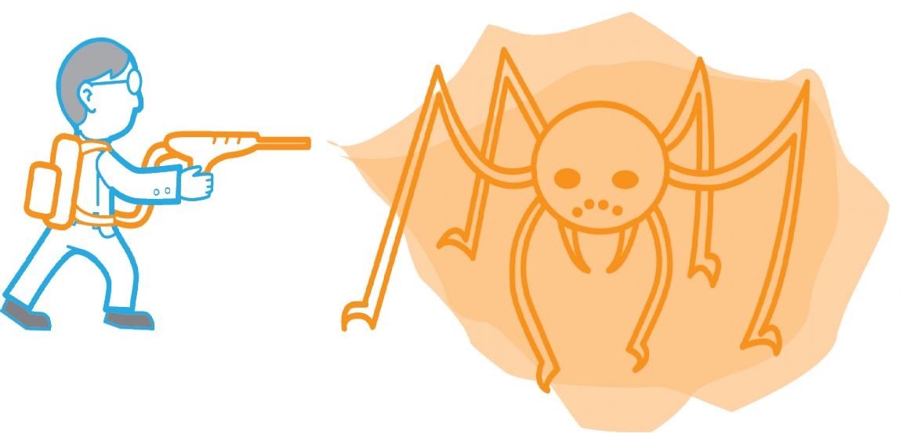

纠错可以看作在整体性知识网络中做修剪工作，添加一些特殊的例子，删除一些现实中不存在的联系，这不是一个完美的过程，修剪工作是必要的。

纠错可以采取多种方法，包括阅读那些与你观点相反的书籍，以及把结论放入现实世界中看看等方法。

在本书的前面，提到过我是怎样应用模型（有3D背景的格子）来理解子空间的，除此之外，一定还有其他理解子空间的比喻。格子的比喻可能会导致一些错误的结论，纠错的目的就是要修正这些错误。

小贴士

纠错的最终途径就是实践，如果纠错之前的三步做得很好，那么纠错的时间会缩短。关于纠错的更多建议，请参阅模型纠错一节。

##### 应用阶段

应用是学习的最终目的，能做到学以致用方能更好地适应现实世界。如果你学习税法并用到自己的企业管理中，那肯定比纸上谈兵学得好。如果你学习统计学，又把学到的知识用在实验设计上，那你对统计学的理解一定更深刻。（不过应用的目的又岂止是更深刻地理解，深刻地理解只是副产品，学习的本来目的就是应用于实践。──译者注）

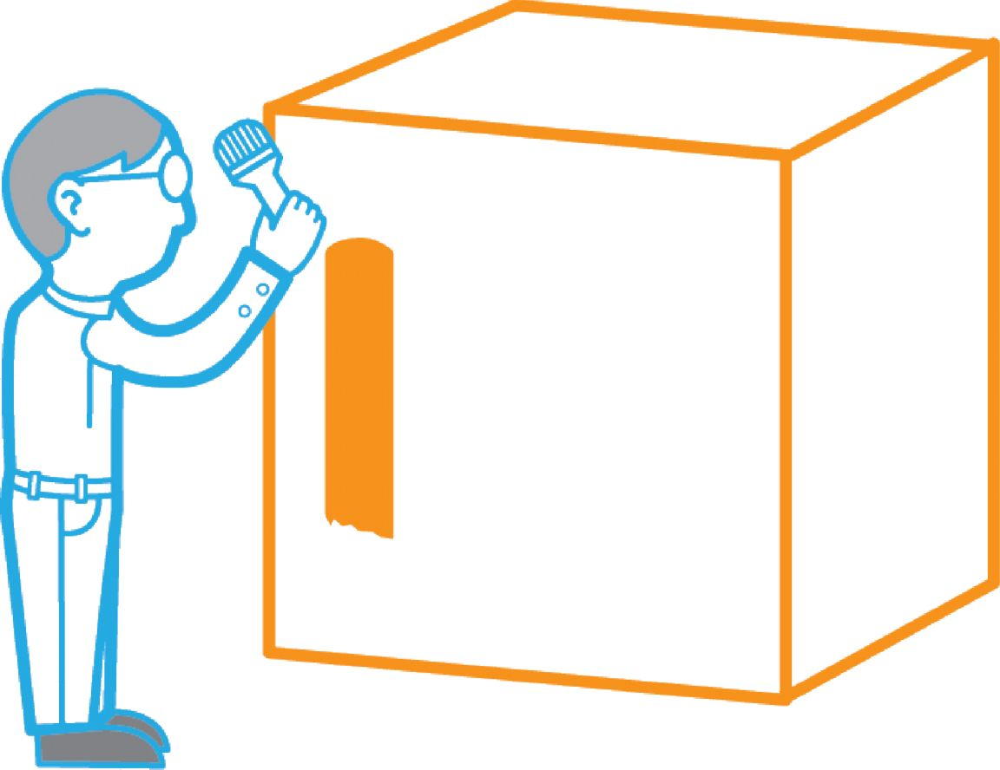

只有很少的知识能够到达此阶段，如果能将更多的知识引导至应用阶段，你深入理解的知识就越多。理论运用到现实世界中的过程既是练习的过程也是创造性解决问题的过程。

知识中的很大一部分存在于潜意识中，这部分知识如果不去运用就得不到很好的发展。读了图书馆里所有的管理学书籍也只是理解了管理学的概念，如果能亲自管理企业，那么对概念就不仅仅是理解，而且是一种感觉。

创造新的途径，将所学的知识应用到生活中去，这是整体性学习的最后环节，也是最终目的。

##### 测试阶段

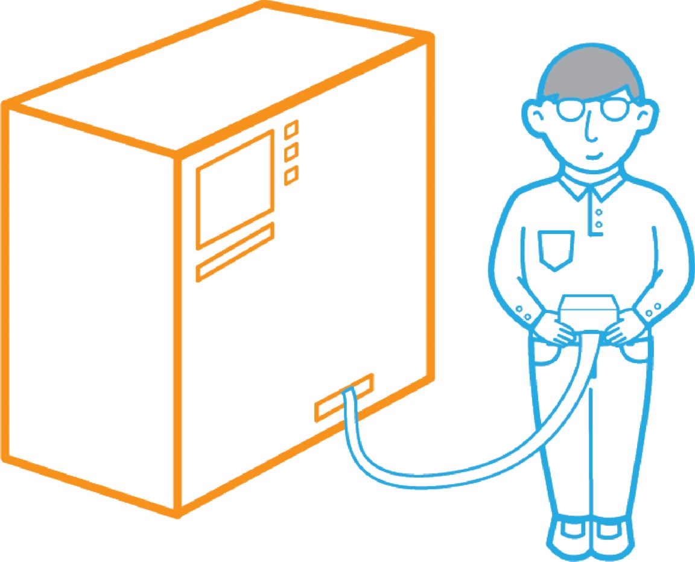

无论五个阶段中的哪一个都需要进行测试。不管你何时尝试新的方法，知识都有可能发生丢失和误解的现象。测试可以让你了解弱点是什么，该如何改进它。

通过测试要确定你对知识的理解到了什么层次？以下是你需要问自己的一些问题。

·获取阶段的测试──我以前看过或听过这个知识吗？

·理解阶段的测试──我理解知识的含义吗？（至少是字面上的意思。）

·拓展阶段的测试──我知道知识从何而来，与哪些知识有关系吗？

·纠错阶段的测试──我删除了那些不恰当的联系吗？我删除了那些错误结论吗？

·应用阶段的测试──我将知识用到实际生活中了吗？

对于上述问题的回答会让你清楚自己对于某个知识的理解到了什么水平。你可能获取了某个知识，也明白了知识的基本意思，而且将它与其他知识进行了联系，但是你没有进一步检查，删除那些错误的联系，因此你现在的水平也仅仅是完成了拓展阶段而已。

测试并不是什么复杂过程，但是它需要很强的自我意识，请再读一遍五个阶段的定义，对照定义进行检查，这样你会更清楚自己到底处于哪个阶段。

整体学习顺序小结

上面所说的关于整体性学习的理论听起来的确很棒！不过我要怎样进行纵向拓展？怎样创造模型？又怎样建立一个结构？此时此刻，你一定想翻到本书的第二部分，其中介绍了许多整体性学习理论的具体技术。

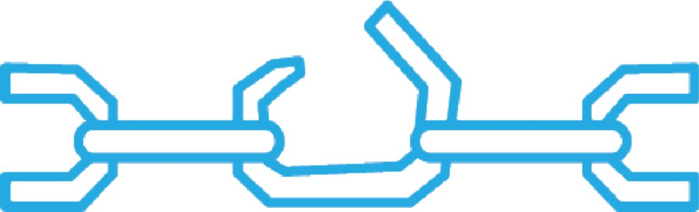

整体性学习的顺序并不是一成不变的线性顺序，步骤之间可以往返，也可以跳跃。理解之后可以再去获取，拓展之后可以不经过纠错，而直接跳到应用，记住它是多线性的而不是单线性的。（总之一句话，不要迷信五个步骤，认为必须如此，要相信现实世界，而不要迷信理论，现实世界中，有几个学习者会一定要纠错好了，再去应用？可笑的是就有人本末倒置，将理论奉为圣经，不可违背，于是这世间就有了教条主义。──译者注）

##### 找出薄弱环节

在整体性学习中，你最薄弱的环节是哪一个？明确弱点何在应该是一项经常性的工作。更广义地讲，你要找出自己的毛病总是出在哪里？每个人学习时都有强项和弱项，也许你善于获取和理解，但是不擅长拓展，也许你很容易对观点产生联想，但却总是获得一大堆无用的联系。

发现弱点，才能知道需要掌握何种技术去弥补缺陷，我无法告诉你你的弱点是什么，你需要自己去发现。

以下是一些指南，你可以参考用来发现自己的薄弱环节。

假如你的薄弱环节在……

…获取

获取的问题主要表现为下面两种。

（1）阅读和听讲速度慢。

（2）需要反复阅读。

原因有以下几点：

（1）阅读/学习习惯不好。容易分心，不能持久阅读，没有掌握第二部分中介绍的那些阅读方法，导致阅读花费的时间长或者一个材料要反复阅读几遍。

（2）不好的记笔记习惯。笔记记得太多或太少，记得太多会没有时间思考，笔记记得太少或者记得不对更不行，如果信息丢失或者信息错误还谈什么获取？

（3）不理解基本名词和语法。如果读的是外文书，相信除非你外文功底深厚，否则一定会错误百出。假如对所学专业的基本概念都不清楚，那么读书也是一头雾水，毫无所获。

解决获取缺陷的方法是养成良好的学习、阅读和记笔记的习惯。我在第二部分会告诉大家该怎么做，可参照而行。获取并不是学习中最重要的阶段，所以如果你在获取方面表现得不够完美也不用太多担心。

…明白

理解不好的表现如下。

（1）你虽然在读书，但是不知道作者到底说的是什么。

（2）笔记记得很清晰、完美，但是你却不明白是什么意思。

要明白字面上的意思并不需要什么魔法，我的建议是如果理解有困难，不如寻找写得更好、解释得更清楚的材料阅读，而高级技术如比喻法或内在化只有在有了基本的理解（也就是字面上的意思搞清楚了）后才能发挥作用。

即使你觉得无法理解一段话，也不必太忧虑。我发现，这很少成为主要问题。通常，大多数人能理解某个观点的基础知识，只有在应用以及需要与记忆中的想法联系在一起的时候，大家才会觉得困难。

遇到不能理解的问题时，你可以放慢阅读速度，寻找不同的说法。一般，当我遇到新概念、新思想时，在完全明白前总会耽误很长时间。我的强项在于一旦有了点初步的理解，就能迅速抓住它，并且快速地让其成长，因此我能轻松地运用它。

…拓展

拓展不好的表现只有一种：缺少灵活性。你已经掌握了一个新东西，但是没有或不会将它与其他学过的知识联系起来。假如让你用这个新知识去解决一个非常规问题，就常常束手无策。

他们会按照老师教的公式和方法解决问题，但是如果问题的背景稍微改变一些，就不会了。不会将学到的知识举一反三、触类旁通，这就是拓展能力差的表现，而不是应用阶段的问题。举个例子，大家就会看出二者的区别。

假设乔尼正在学习基础统计学课程，他理解了教授教他的公式，也记住了一些例子，并且会用公式解决一些数学问题。

现在乔尼碰到了一个新问题，这个问题的解决需要用到所学公式，但是要稍微改动，结果乔尼不会做了。造成这种情况，问题出在拓展阶段没做好。

然而，假如乔尼顺利解决这个问题，这说明他拓展做得很棒。但是以后的某一天，他在生活中恰好遇到了一个统计学方面的问题，他还能想起课堂上学到的知识并且用知识解决生活中的实际问题吗？知识能够实现从课堂到现实生活的跨越吗？如果乔尼做不到，问题就出在应用阶段。

…纠错

纠错阶段的不足主要表现为错误联系太多。我发现这个问题在课堂上很少出现，在现实生活中却很普遍，道理何在？课堂上，人们很少做拓展工作，因为联系得少，所以错误的联系也就少，结果也就很少有需要纠错的地方了。

在现实生活中，迷信并不仅仅存在于落后的宗教社会。人们习惯于产生众多古怪的联系，却从不加以检测是否正确。比如人们相信喊加油有助于己方球队获胜，是因为胜利与欢呼叫喊是相联系的。久而久之，人们就误认为大声的叫喊可以赢得胜利。

纠错做得不够的一个表现是常常不能发现自己在某个主要的看法或问题上是错误的，如果你总认为自己是正确的，可能是你没有对建立的联系做足够严谨的检查。

…应用

我在拓展阶段的弱点中说过，应用上的缺陷是不能在真实世界中很好地运用知识，有华丽的理论却不会应用于实际是无用的。按我的观点看，现在的学校恰恰缺少这方面的教育。

拥有“书本智慧”但是缺乏常识的人通常也是不会运用知识的人，解决这个问题的唯一办法就是更多地实践，抛开书本，走出去，去做实验，去接触生活，去融入社会。

确认弱点

人们应该发扬自己的优点而忽视自己的缺点，对吗？通常我会同意这个观点，但是整体性学习的每一步都很重要，你不能推给别人去做。假如你经营一家企业，你不必是世界上最好的经理人，你可以雇一个经理。但是作为一名学习者来说，你不能雇用他人替你获取信息、理解信息和拓展信息，乃至运用信息。你只有一个大脑，所以你要注意改正这些缺点。

知道了弱点所在，你就可以通过多多练习来改进。一开始，采用新技术总是要花一点时间的，一旦掌握之后，它们就成了属于你自己的学习策略。

#### 信息结构

大多数学科的学习过程是类似的，不管是学习化学、历史还是编程，你都要经历获取、理解、拓展、纠错以及最后的应用阶段。

问题是不同学科的知识并不相同，历史课上你要记住一大堆日期；程序设计课上你要了解什么是多态性。不同的知识有不同的结构类型，虽然学习的过程是类似的，但是知识结构的类型却不一样。

吃汉堡和吃一碗苜蓿芽，其过程一样，都要先经过咀嚼，然后在胃里消化，接着营养物质在小肠里被吸收，最后废弃物变成粪便排出体外。不过汉堡和苜蓿芽的食物类型不同，因此在咀嚼、消化、吸收和排出体外的具体方式上也不同。

你不能用同一种方式处理不同类型的信息。学习必须根据内容做出适当的调整，如学习的内容是一个名词解释，还是针对一个有争议问题提出不同的看法？

用同一种方法处理不同类型的信息是行不通的，针对不同的信息，你可以根据本书第二部分介绍的办法做些调整。我把信息分为五种类型，便于你了解遇到的信息属于哪一种类型。

·随意信息

·观点信息

·过程信息

·具体信息

·抽象信息

这五类信息基本上涵盖了学校里的课程和实际生活中能遇到的所有信息类型。有些信息介于两种类型之间，比如物理学游走于抽象信息和具体信息之间，生物学则可能既有随意信息又有具体信息。实际上，大多数学科都是上述各种信息的组合，不过是比例不同。

##### 随意信息

随意信息是一系列事实、日期、定义或规则，它们缺少逻辑分类，常常在学校里碰到，很少在真实世界里遇到。很多医学专业的新生在学解剖时，会遇到大量需要死记硬背的知识，比如人有206块骨头等。这些知识看起来没有规律，无法再加工。需要死记硬背的知识就是随意信息。

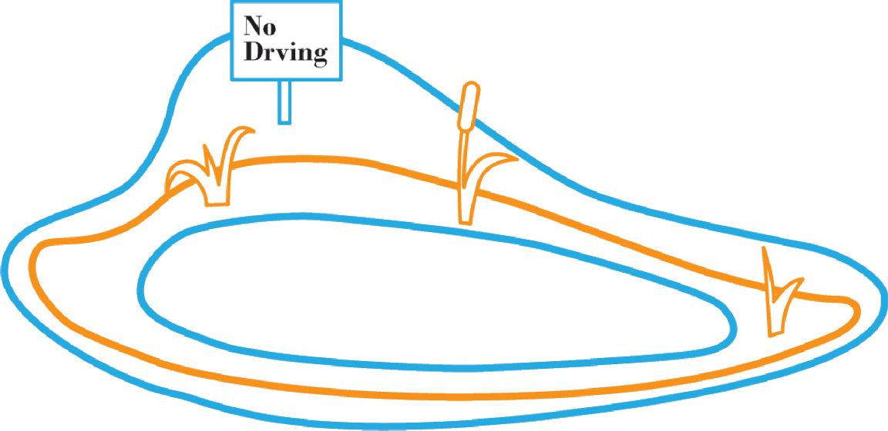

处理随意信息的方法

对待这种信息的第一个目标就是：假如存在某种逻辑关系，那么尽量去发现它，否则记忆和使用信息的工作会更加困难。

如果这样做还是不能令人满意，可以采取下面三种方法。

·联想法

·挂钩法

·压缩法

随意信息的难点

随意信息的有利一面是理解起来不费劲，要理解心脏如何泵血肯定比认识心脏各部分的名称更为复杂。

不过事情往往是相对的，正是因为这种信息需要理解的工作少，所以可供探究的程度也少。因此，随意信息如果不进行反复机械记忆，非常容易遗忘。联想法、挂钩法和压缩法就是帮助我们记忆随意信息的方法。

小贴士

随意信息是最不容易进行整体学习的，假如你需要记忆大量的随意信息。联想法、挂钩法和压缩法会有些帮助。

##### 观点信息

观点信息是存在争论的信息。小乘佛教和大乘佛教哪一个更优秀？这就是观点，观点信息在论文中很常见，关于这类信息，大家的意见不一致，而当你需要做决定时却非常重要。（什么是健康饮食？哪一行业发展前景更好？）

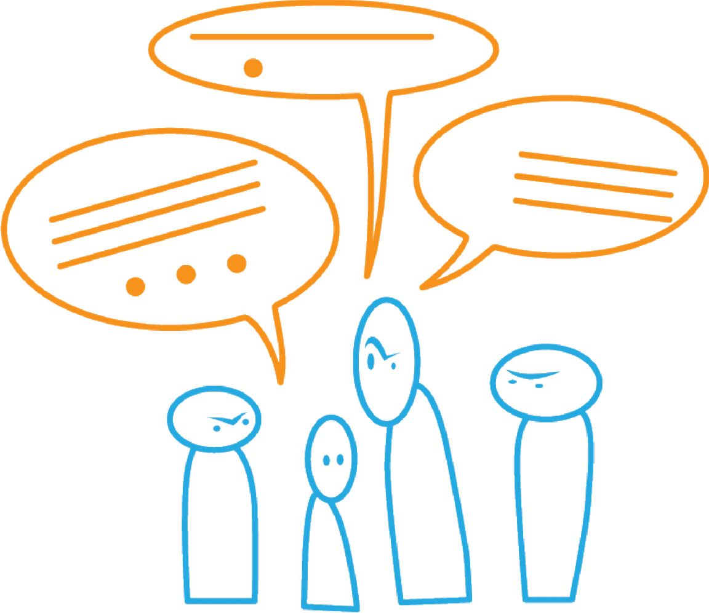

观点信息的难点

对于观点信息，最大的难点在于获取阶段。你需要检查大量的信息以寻找其中的模式，而不是去记忆具体的细节。速读技巧对于收集信息非常重要。

图表法对于观点来说也是非常有用的方法，它能帮助你在阅读以后提取出关键思想。

##### 过程信息

过程信息是教导你怎么行动的信息，是讲述一系列动作、操作的信息。比如，讲述如何游泳的知识，编写一段电脑程序，建造一所房子以及设计一个模型都依赖于过程信息。学习这类信息最重要的是不断练习、反复去做。不过，建立正确的背景概念对于节约时间也同样关键。

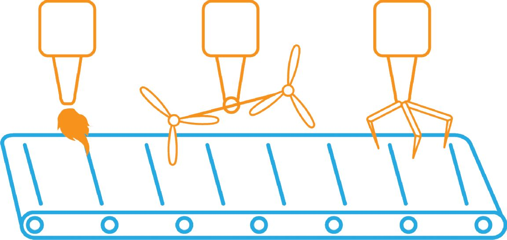

应用过程信息的方法

大多数过程信息都依赖于正确的模型，通过练习可以慢慢形成一个结构，如果有正确的模型则可以提高学习速度，以下是一些可以改进模型的技术：

·内在化

·比喻法

·图表法

·模型纠错

过程信息的难点

过程信息的最大难点是需要实际投入大量的时间用于练习。你可以对概念理解得不好，但是必须实际地掌握动作。你无须全部学习材料，只要拥有正确的背景模型，就可以练习那些教你的动作。

过程信息的好处是：如果练习了，它比其他类型的信息记得更牢，保存时间更长。通过练习，你可以将模型与知识结构更好地融合在一起。

##### 具体信息

另外两类信息是具体信息和抽象信息，它们是学校里学习最多的两种信息。具体信息是那些在实际中可以观察到、听到、触到的信息，比如医学上的视、触、叩、听得到的信息就是具体信息，不过实际上，大多数信息都介于抽象和具体之间。

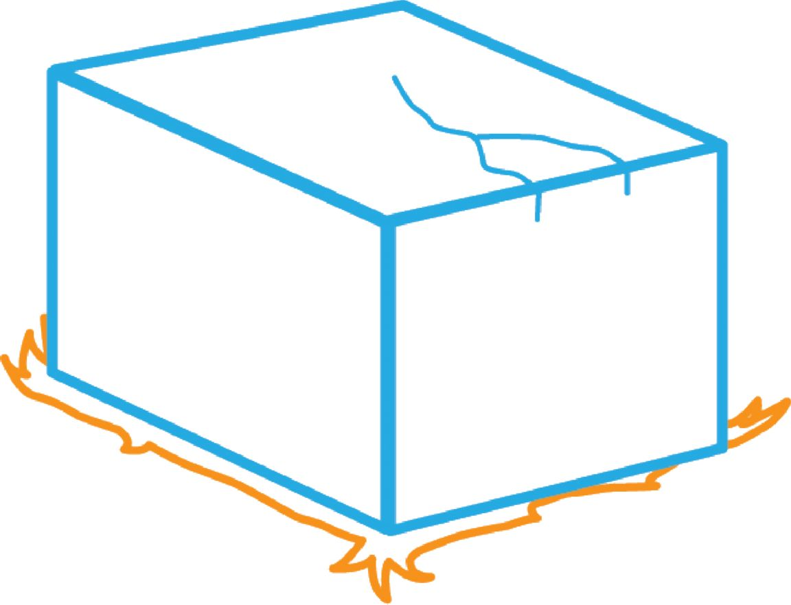

例如，生物学可能是比较具体的科目，有大量真实的图像，你不需要做更多的视觉化工作，因为艺术家和自然本身已经做好了这种工作。不过生物学也有酶、神经元、蛋白质结构、化学反应等难以想象图像的知识，所以生物学也是一门抽象学科。

应用具体信息的方法

本书第二部分列出的大多数技巧都可以用于具体信息。内在化有助于将信息与多个感官相联系，举例来说，你不但能看到心脏泵血的图像，还可以给这幅图画加上感情和声音。

##### 抽象信息

抽象信息缺少与感官的直接联系。数学、物理、心理学、计算机和化学主要涉及的是抽象信息。量子物理学和微积分中有大量抽象的信息，不容易马上想象出图像来。

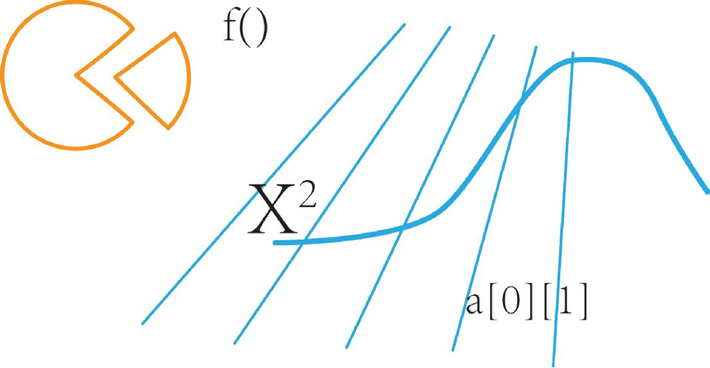

抽象信息与随意信息正好相反。抽象信息非常难以理解，但是逻辑性很强，学习时好比潜入深海的探索，随意信息则非常浅显，但是逻辑性差。

应用抽象信息的方法

在处理抽象信息时，你需要将之移到具体的层次。整体性学习者一般会抛弃课程中的随意信息，因此他们比一般人理解得更好，后者往往不愿意尝试理解复杂的知识。

内在化和比喻法对于将复杂知识简化至关重要，模型纠错也很重要，因为一开始建立的模型总是存在各种各样的错误。

抽象信息的难点

对抽象信息来说，理解和拓展阶段显得难以忍受。假如你感到理解困难，可以降低接受信息的速度，将前面的信息深入仔细地探究。这种知识的特点是一环接着一环，所以打好基础至关重要。

小贴士

在学习抽象信息时，整体性学习优势明显。通过将信息转化为更容易想象成图像的形式，你可以为知识建立广泛的联系。内化和比喻法是两种主要的办法。

##### 如何使用五种信息类型

学习一个新问题时，首先要判断信息主要属于哪一类？确定信息的类型可以帮助我们决定学习时采用什么技术，以及估计记忆时可能会遇到的困难。

弱结构和强结构

稻草搭建的桥不是强结构，钢铁做的桥一定非常坚固。知识结构也有强弱之分，如有可能，应当尽量使用强结构。

随意信息结构是最弱的结构，难以进行整体性学习，学习起来时间长，而实际应用价值又很局限。可能的话，要尽量找出随意信息中可能的逻辑结构（于无序中寻有序），能帮助你记忆。

举例来说，如果有一系列名词要记住，看起来是很随意的信息，但是你要努力寻找它们可能存在的逻辑关系，也许名词的第一个字都是三点水旁？这就是一种逻辑关系。如果实在找不到逻辑关系，也可以试试针对随意信息的联想法，比如挂钩法和信息压缩技术。

具体信息结构和过程信息结构是最强的信息结构，二者会唤起你的实际经验。新的知识可以与旧的经验很好地联系起来，编写程序包括了具体信息结构和过程信息结构，修改程序后的结果会立即反馈给你，各种概念不断地出现在脑海中。

通过本书后面提及的众多方法，你可以将弱信息结构转变为强信息结构。

#### 为什么你的课程枯燥乏味

为什么你会觉得有的课枯燥乏味，有的课却令人着迷？（建议大家看看电影《春风化雨》。──译者注）你可能会说因为我对某些学科感兴趣，而对有些学科兴趣索然，不过你知道其中的缘由吗？

喜欢文学而不是物理，喜欢编程而不是会计学，其中的原因有很多：或许你天生喜爱某门学科而不是另一种；也许你在日常生活中经常用到某门学科，所以才喜爱它；也许是因为某门学科的老师讲课生动有趣，他能将抽象的概念与你感兴趣的东西紧密联系在一起。

问题是：你能否掌控自己喜欢或是讨厌某门学科？你能让一门枯燥的课变得有趣吗？假如你能掌控自己的学习，那么，我相信你会发现学习任何学科都会变得生动有趣。

整体性学习和对课程的兴趣密切相关。你对一门课程的兴趣越大，学习就越容易整体性。你有没有发现自己可以很容易地联系到喜欢的学科上，却很难联系到乏味的学科上。反过来，学习越是整体性，课程就越生动有趣。你可以通过整体性学习，来让你感觉乏味的课程变得有趣。

我们在开始学习一门学科时，都会觉得枯燥，也许是因为要拿学位而不得不学习统计学；也许是因为开公司需要学习税收法。如果你能使这些枯燥的学科变得生动，你就会学得容易，效果更好。

下一次当碰到“乏味”的课程时，不要马上抱怨。问题可能在于老师教你时没有和你的经验联系，而使用整体性学习方法，你可以将内容与你感兴趣的东西相连。

学习计算机科学时，你是思考课本上的那些文字，还是在想宇宙的神秘符号？学习医学时，你是在背诵那些文字，还是在想着活生生的病人？学习历史时，你看到的难道仅仅是数字和日期，难道没有看见那么多历史人物的鲜活故事？

整体性学习的一个附加的好处是它强迫你以不同的视角看待学科、课程和问题。任何知识都可以从抽象的原理转化为生动的图像、有趣的故事。

#### 学习的目标

到目前为止，我已经确定你的目标是完整地学习知识以通过各种考试，但是仅仅是通过考试，有好分数是不够的。你学习眼前这个知识的目的是什么？你为什么要学习它？它对你的生活、人生有什么用处？

毋庸置疑，如此这般思考的人肯定比那些仅仅想通过考试获得好分数的人学得更为深刻、效果更好。因为他们学习的动机更加强烈，学习的意义更加深远，学习的目的更为远大，所以他们对知识的理解必将更加深刻。

在开始学习编程时，我为之着迷，不满足于上课教得那些内容，我试着用学到的知识自己写一些程序，由于对编程的兴趣，最终完成了好几个有点规模的游戏编程。

我在学习会计学时，立即就看出了学习它的门道，我一边学习一边将知识用在管理我的小公司上，尽管很多知识并不是我这个小公司需要的，但是在试图应用知识的过程中，我的会计学也学得很棒。

我在学习医学时，接触临床后，才明白书上的知识不是为了考试回答出某个问题，而是与那些鲜活的生命密切相关，我试图用书上的知识解决患者的一个个诊断和治疗问题，这样的目标当然会激励你学得更棒。

为什么要举这么多例子？因为我想强调：要想超出知识本身，光有热情还不够，你要寻找各种应用知识的途径（即使现在讨厌它），知识因“用”而获得新的意义。

整体性学习中最关键的步骤是将所学的知识运用到实际中去，知识只有获得了在实际生活中的价值才是真正的知识。只要你用心发现，几乎所有的知识都有实际价值，如果能发现知识在你生活中的价值，知识就与你产生了紧密的联系，这可能比第二部分要介绍的所有技术都更加有效。

你的学习有目标吗？我并不在乎考试成绩，我会努力学习，但是B+和A+的成绩差异并不会困扰我，我关心是否学到了有用的知识。学习上的投资会给你的生活带来巨大的益处，前提是你能真正应用那些花时间学来的知识。如果只学习而没有实际的应用，就是在浪费生命。

小贴士

整体性学习使你的课程更有价值。通过联想，所有的观点、知识都会变得有用，尝试将你的课程与感兴趣的东西联系在一起，任何所学知识都要发掘其实际的用处，特别是对于改进自身有什么实际用处。

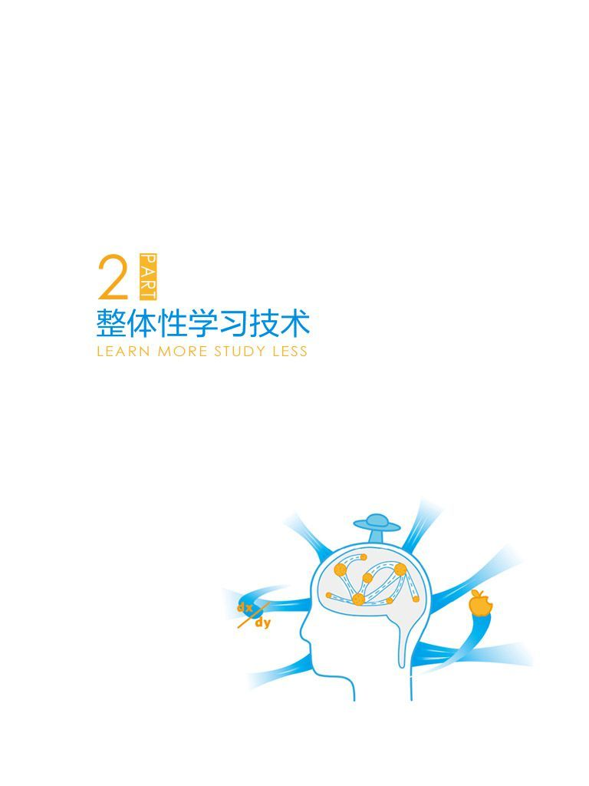

##### 整体性学习技术

整体性学习策略是我学习新知识的策略。不管你以前是否学习过整体性学习策略，我认为这种方法的实际学习效果更好。整体性学习将观点联系在一起，应用模型，建立结构以理解不同类型的知识。本书的第二部分介绍了一些具体的技术，这些技术都可以应用于整体性学习框架中。

在学习整体性学习概念时，一个很好的方法是把它比喻成下棋，首先你要了解下棋的基本规则和基本目标，本书第一部分可以看作介绍了关于整体性学习的一整套规则和目标。

一旦理解了下棋的基本规则，你就要开始进一步学习具体的策略和如何赢得比赛了。第二部分就是介绍学习的不同策略，内容都是我个人使用中觉得非常有用的策略。（当然，整体性学习并不如下棋一样有非常精确地规则。不过，还是有一些提纲供大家参考。──译者注）

理解整体性学习的框架对于提高学习能力是非常重要的一步，只简单学习一些技巧而没有掌握框架，那么面对不同的挑战也不会灵活变通，就像知道怎么下棋，却不知道下棋的基本规则一样。

技术并不是万能的，不可能适合任何场合的任何学习者。所以，在决定应用哪种技术之前，你应该应用整体性学习理论找出自己的弱点所在。这些技术来自我对不同学习方法的研究并结合了自己的学习实践。因此，你在学习应用这些技术时，应该结合自己的情况，做适当的调整，不必拘泥于我所说的条条框框。

##### 技术一览

在此我要强调：从这里开始仅仅是改善自己学习习惯的起点。我曾经阅读过大量有关改善学习习惯的各种各样的技术，其中有很多不错的观点。

以下是第二部分中将要介绍的技术：

A）获取知识

1）快速阅读

2）笔记流

B）联系观点

1）比喻

2）内在化

3）图表法

C）随意信息的处理

1）联想法

2）挂钩法

3）信息压缩技术

D）知识扩展

1）实际应用

2）模型纠错

3）以项目为基础的学习

#### 获取知识

学习知识的第一步就是要获取它，这意味着你要通过双眼、视神经和大脑，实实在在地将书本上的知识印到脑海中。假如你从未接触到该信息，或是获取得太慢，这会导致你终止在学习上的任何努力。

有两种方法对于知识的获取很有成效：快速阅读和笔记流。

##### 快速阅读

如果读得快，那么获得的知识就多，这是常识。不过快速阅读不仅仅是强调快，一味地图快会造成理解得不够。通过不断实践各种不同的阅读技术和改进阅读方法，你就可以读得更快而且理解得更好。

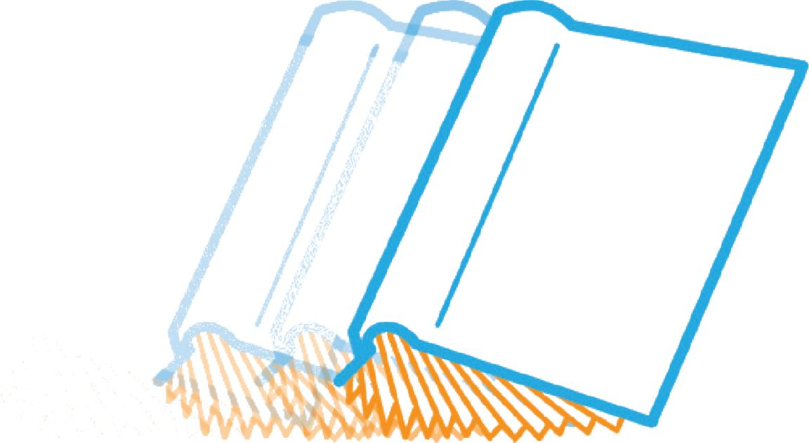

快速阅读包括很多技术，足够写一本书［我最喜爱的一本是《快速阅读突破》（Breakthrough
Rapid Reading）］，在这里我主要介绍以下三种主要的方法。

（1）指读法

（2）练习阅读法

（3）积极阅读法

指读法

在读书时，你的眼睛不会总是停留在书上的某个地方，眼睛会不断地运动，这会降低阅读速度。使用手指会让眼睛停留在你要阅读的地方，这样简单的办法也会提高你的阅读速度。

指读法的好处还能通过调整手指移动的速度来控制阅读的速度。快速阅读不仅仅是读得快这么简单，有时候你需要降低阅读速度以仔细揣摩重点内容，有时候你需要略过不重要的内容。

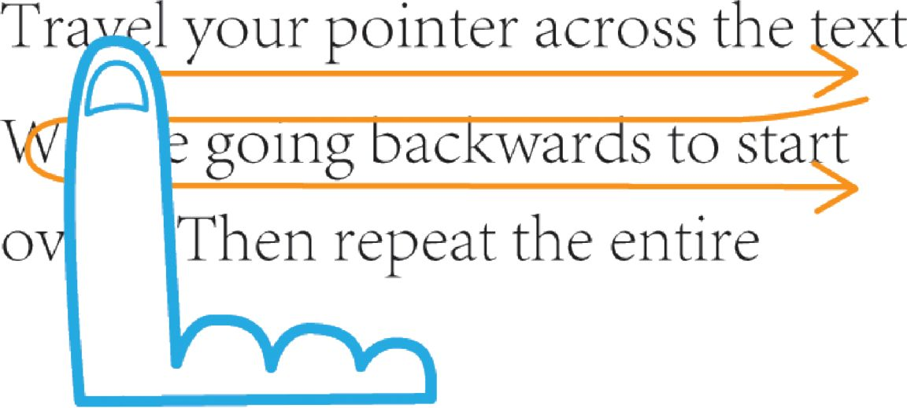

指读法最简单的办法就是用食指放在你要读的那一行下面，不断移动食指，从这一行到下一行。有些速读专家建议处处都要用指读法，我建议只有书本才用，如果是网上的文章或者是小印刷品就没必要多此一举了。

使用指读法的开始两周可能会感到不适应，看起来缓慢且令人尴尬，是不是像大老粗读书？大老粗就是这副模样，舔一舔手指，蘸点口水，再用手指点着书本上的文字，一个字一个字地读，显得非常笨拙，是不是？不过一旦你适应了以后，食指划过书本也很自然，手指提供的控制和聚焦会大幅度地提高阅读速度。

练习阅读法

快速阅读的另一个办法是练习阅读，练习阅读与一般的阅读是不一样的。当你练习阅读时，你的目的并不是吸收阅读的内容，练习阅读的唯一目的是训练自己以尽可能快的速度理解所读内容。

（1）你可以通过阅读一本从未读过的书来练习阅读，在书上做一个标记，设定3分钟，然后用指读法从标记开始，以稍快于自己能读懂内容的速度进行阅读，3分钟一到，停止阅读，再做一个标记。

（2）算算自己读了几行，再乘以每行平均单词数（第一段总单词除以第一段行数），得到自己刚才3分钟的总阅读单词数；再除以3分钟，得到大约每分钟的阅读单词量。

（3）这个练习能测试你提高阅读速度的空间有多大。

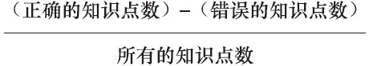

另一个练习是针对提高理解力的，与上面的练习类似，先阅读3分钟的材料，然后尽可能地写下你记下的知识点（不准翻书）。然后再读一遍材料，边读边记下所有的知识点，然后比较两份记录，看看自己正确的知识点有多少，错误和没写的有多少，用前者减去后者，再除以总数，得到的数字就是你以一定的阅读速度阅读这一类型材料的理解能力，通过降低阅读速度练习，你可以提高自己的理解能力，以实现最快的阅读速度和最好的理解能力。

积极阅读法

尽管我将积极阅读放在了快速阅读之中，实际上积极阅读与快速阅读是对立的。积极阅读强调深入地理解材料，所以自然降低了阅读速度。积极阅读不仅仅是简单地在书上画各种颜色的记号和在空白处写一写心得体会，还是将知识点真正地整合在一起。

开始积极阅读时，准备好要读的书和笔记本，在笔记本上写下每章的标题和亚标题，每读完一小部分时（指读法），在笔记本上记一些笔记。

进行积极阅读时你需要记下：

（1）这一节中主要观点是什么？

（2）我怎样才能记住主要观点？

（3）我要怎样将主要观点拓展开以及应用它。

第一个问题仅仅促使你完整地获取信息；第二个问题迫使你对信息进行联系、视觉化和比喻法；第三个问题要求你将信息应用在不同的情境中。这三个问题迫使你将每个知识点都要经过整体性学习里的理解、拓展和应用三个阶段。

比如我刚刚读完心理学中的经典条件反射，其主要的知识点是：

·经典条件反射的发现者是巴甫洛夫

·经典条件反射是刺激引起反应

我会这样记忆：

·想象一副图画，画中巴甫洛夫的狗听到铃声流出了唾液。

我会这样拓展：

·我听到电视里类似的手机铃声，会不由自主地掏出自己的手机。

如果你能对教科书里的每一个知识点都进行这样完整的积极阅读，你一定会天下无敌。一旦你熟悉了这种方式，就不必对每个知识点进行完整的积极阅读，而只针对自己需要理解和记忆困难的那些内容。

掌握快速阅读

快速阅读与整体性学习一样，是一项技能。这表示如果不反复练习，仅仅阅读本书毫无用处，本书中有数十个智力挑战用以练习和掌握各种新的技能，我建议每次选其中一两个智力挑战认真练习几周，直至熟练，然后再练习其他技能。

小贴士

别忘了下载快速阅读练习材料，这些材料专门设计用于练习快速阅读。

智力挑战

这个挑战的目的是让你适应快速阅读的技巧，快速提高阅读速度和理解力。我个人建议只有在完成本次挑战之后，才进行下次智力挑战。

1.买一两本内容适合做快速阅读练习的书。

2.确保至3周内每天15分钟进行阅读速度和理解力的练习（具体方法见“练习阅读”一节）。

3.练习指读法两周。

4.每周练习1次积极阅读。

##### 笔记流

我并不是那种推崇记录非常详细且纷繁复杂笔记的人，我一直信奉“一次学会”的学习原则，“一次学会”表示你在学习时要全神贯注地听老师讲课，而不是忙着做细致漂亮的笔记，等到课下再学。

我在课堂上曾经使用一种记笔记的方法，对信息量较大的课程效果不错，我把这种记笔记的方法称为笔记流技术。笔记流技术的目标是提供一个平台以联系学到的东西。大多数人采用的画线、画圈等传统记笔记的方式被很多“流”（虽然有些杂乱）替代。

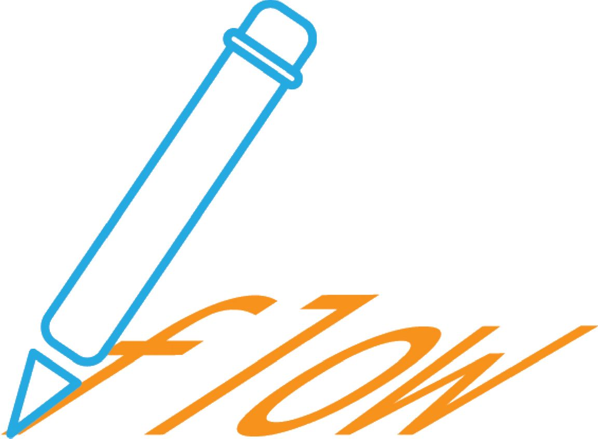

使用笔记流时，首先写下最主要的观点，尽量用很短的单词来替换完整的句子，这可能会降低可读性，但是提高了上课时的学习效率。事实、日期、细节和描写要尽量减少单词量，不要写冗长的段落。

一旦你写下了一个观点，下一步就是在这个观点和其他观点之间画上一些箭头，观点不是建立成金字塔式的结构，而是呈现出相互关联的关系，这个过程与实际的整体性学习策略类似，观点连在一张网中。

我把笔记流当作一种工具，以更好地使用其他的学习技术。比喻法、图表法以及信息压缩技术都可以与笔记流相结合，通过笔记流，你可以写下各种主要的观点，也可以将观点与图像、图表以及其他主题相联系。

记笔记是为了更好地理解所学内容，如果忘记了这个目的，笔记记得再漂亮，思维导图画得再标准、好看，也是本末倒置。因此，虽然笔记流看起来杂乱、粗糙，但是在帮助理解材料上效果不俗。

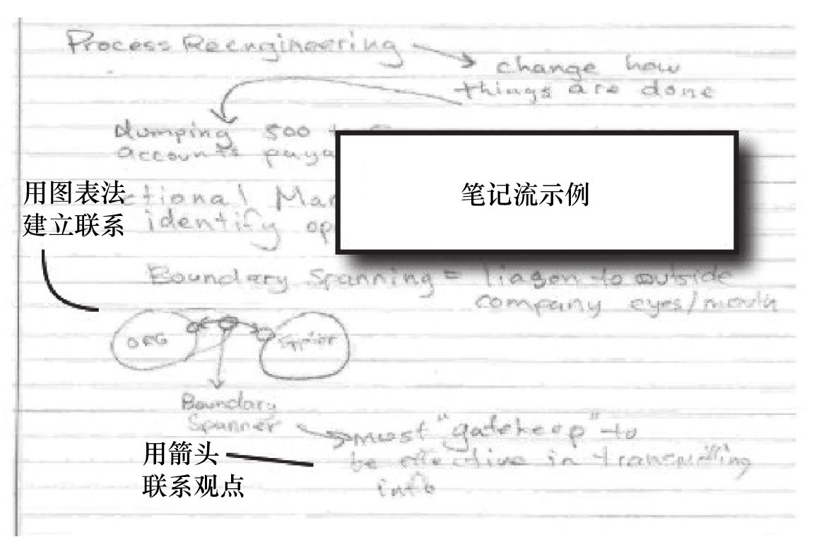

混合型笔记流

笔记流技术涉及两个方面：记录和拓展。传统的规则、线性的笔记方式，可以将课堂内容精确地复制下来，这种方法对于你准备课下好好复习几遍来说是不错的选择。

笔记流会为了当前的理解而牺牲一些随后的可读性。通过减少笔记内容和增加各种联系或图表，学习变得更具整体性。如果课堂上的信息量极大或者你打算课后好好地复习笔记，建议你采取混合型笔记流方法。

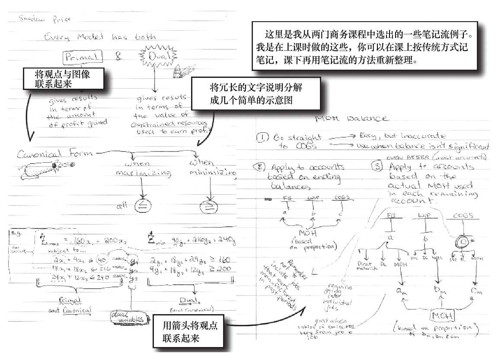

课下笔记流

第一种混合型笔记流是课堂上按常规记笔记，下课后再根据笔记内容制作标准的笔记流。假如你觉得跟不上课堂的节奏，这种策略会给你更多的时间消化知识。虽然花的时间比单纯的笔记流或传统线性笔记更长，但是它兼顾了可读性和理解性。

我建议你在尝试笔记流之前的一个月，先试试课下笔记流。这样可以保证你有一份完整、清晰的笔记，以便今后需要复习笔记时使用。

评注流

有些课程上课时信息量很大，如果你想疯狂地记下每一个细节，笔记流几乎不可能做到。笔记流只能保证在很少的时间里记下所有最关键的信息。大多数优秀教师会在课堂上留有思考的时间，在这些时间里，你可以创造整体性学习需要的联系、比喻和图表。

然而，在信息太多来不及记录的情况下，评注流是个不错的选择。首先写下最关键的信息，然后在信息之间加入联系。假如老师讲了十几个需要记下的公式，首先写下所有的公式，然后在老师举例子和讲授公式如何应用时，给公式加上各种各样的联系。

关键信息的识别

记好笔记流的一个关键能力是知道哪些知识是重点，哪些是老师教的核心内容。假如你平均记录老师讲的每一句话，那你所做的工作就是实录而非思考。

我做笔记流时，删减掉很多信息，重点记录联系和按照我理解的方式给信息分类。

小贴士

在尝试课堂上做笔记流之前，要先习惯以“流”的方式写下信息。如果你掌握了下一章介绍的图表法和比喻法，笔记流会做得更好。

智力挑战

本次智力挑战的目的是在决定是否用笔记流取代传统记笔记方法之前，练习笔记流技术。

1.买一本专门的笔记本，在封面上写下“笔记流技术练习本”。

2.确保2周内每天练习1次：把你课堂上记的笔记拿出来，按照笔记流的方式重新记录，记下知识点并在知识点之间画上联系。

3.练习将其他技术融合到笔记流技术中。

#### 联系观点

在获得知识之后，下一步就是理解和拓展这些知识，仅仅理解知识的表面意思一般是记不牢的，进一步地深入下去可能会花费一些时间。但是，如果运气好的话，当这些方法变成一种习惯时，你就可以在需要的时候自动地使用它们了。

当然了，这些技术并不是对每个知识点都十分必要，很多知识我在课堂就处理了，比喻、内在化及图表并不是全部要完成，可以根据情况有选择地做一些。

我的做法是将要处理的知识分为两类，有选择地应用这些方法。

（1）困难信息。

（2）关键信息。

困难信息可能是一系列日期，或者是一系列步骤。步骤间没有什么逻辑关系。困难信息可能是抽象信息、随意信息，在这些情况下，应用联想法可以使知识记得牢。

关键信息就像是一座建筑的地基，它构成了我们学习其他知识的基础。一个初学矩阵的学生会发现行列式和行化简是非常重要的两个问题。如果这两点理解不好，后面以此为基础的其他知识更不可能学好了。

如果不是特别关键和困难的信息，就没必要采取专门的技术。因为大部分的学习过程是潜意识的，你在不知不觉中就可能形成了足够的联系和模型，而没有应用什么专门的技术。

使用联想法形成模型

在本书的前面，我曾经说过模型是最基础的结构。简化的图像和概念可以用于描述新知识。这些联想方法是整体性学习中创造模型的主要方式，大多数时候我使用比喻法、内在化或图表来创造一个模型。

练习、练习、练习！

像所有书中提到的方法一样，这些技术都需要反复练习方能熟练应用，假如你以前从未用过，那你至少需要练习3次去熟悉它们。此外，当你开始用这些技术时，我建议你准备一支笔和一张纸，先在纸上练习，我现在已经能做到在脑子里清晰地想象，而不必写下它们。对于从未用过这些技术的人，先在纸上练习是最好的办法。

##### 比喻

比喻本是一种文学上的工具，用来将某个物体与其他物体联系在一起，而实际上二者并没有实际的联系。比如说一名女性有沙漏一样的身材，并不是说她的身体是玻璃的，黄沙从她曼妙的身体不停地往下流淌，这只是一个比喻，形容她的身材与沙漏的曲线一样玲珑。

明喻是比喻的一种类型，明喻法在比较两个物体时，常用“好像”或“如”等词。男人强壮得好像一头公牛；她的皮肤白如牛奶；寒风像结了冰的刀子割在我的脸上，以上这些都是明喻。

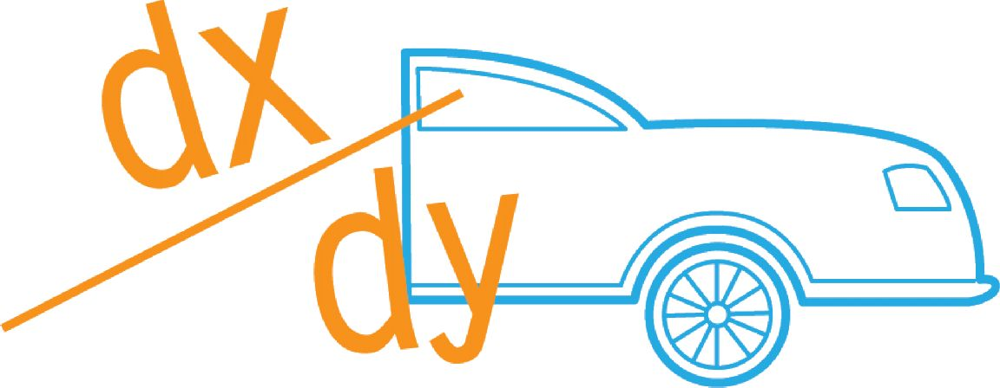

故事中应用比喻可以把普通人的经验与不寻常的体验相联系，比如一个故事中的恶人约翰“有一张沙皮狗样的脸”，读到这样的文字，你很容易在脑海中想象出约翰的那张脸。在这里，比喻法就成功地借助沙皮狗（你曾有的体验，相信你看过沙皮狗的模样）告诉你约翰的模样（你不曾有的体验）。

比喻法在整体性学习中扮演的角色是类似的，比喻就是在不熟悉的知识和熟悉的知识之间架起一座沟通的桥梁。比喻在文学中主要提供视觉上的相似，而在整体性学习中联系的是类似的过程：事件或者信息的顺序。（其实比喻法不必拘泥于二者有多么相似，只要有一点相似，不管是视觉、听觉、触觉还是直觉，也不管是原理、目的还是过程，都可以拿来比喻，比喻法也就是建立模型的方法。──译者注）

举例来说，我们在心理学课上学到了条件反射，经典的条件反射讲的是一个刺激经过强化，与一个反应建立联系的现象，这个现象由巴甫洛夫观察狗的行为而发现。巴甫洛夫注意到如果每次给狗送食物之前先按铃的话，以后一按铃，即使不给食物，狗也会分泌唾液。

怎样应用比喻法学习条件反射？比喻法的第一步是在你的个人经验中寻找能够模拟条件反射的东西，我个人生长在加拿大的冰天雪地里，所以想到的第一个比喻就是在雪地里行走。你第一次在雪地里行走时，因为雪地茫茫一片，走哪条路都有可能。但是几次行走以后，你会选择一开始走的路，因为开始的行走在雪地上形成了一条隐约可见的小路，走这条路显然比随便走更容易。

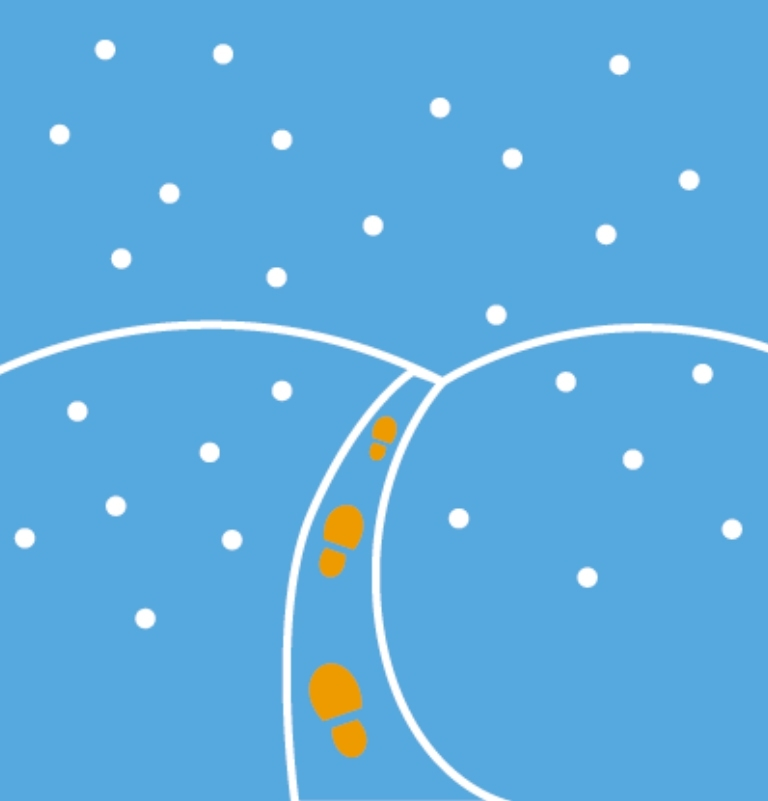

我将雪中走路与条件反射联系在一起，一开始，铃声可能或不引起狗分泌唾液（这代表一开始雪地茫茫一片，无路可寻）。但是在将铃声和食物关联在一起后，从铃声到食物的路就在雪地上（狗的大脑里）形成了，最终狗一听见铃声就分泌唾液，因为这条路已经很明显了。像许多比喻一样，这个比喻也不完美，但是它很有用。

可以按照下面三个简单步骤找出一个比喻。

（1）确定你要深入理解和记忆的信息，在上面例子中就是经典条件反射。

（2）在你的个人经验中寻找与信息部分相似的东西，要达到完全符合不太可能，所以与其寻找一个完全符合的东西，不如稍作让步，找到十几个部分符合的“不完美比喻”，在上面的例子里我想到的是雪中行走。

（3）重复上述过程，检查比喻不恰当的地方。例如，雪中行走是线性的痕迹，而脑神经却是错综复杂的网络。

有时候，想到一个比喻也不是那么容易的事，你需要费一番心思。雪中行走恰好适合比喻经典条件反射，但是并不是每次都有这么好的运气。

比方说，你已经学了基础数学，现在打算学习导数。（导数（derivative）是微积分中的重要基础概念。当自变量的增量趋于零时，因变量的增量与自变量的增量之商的极限。在一个函数存在导数时，称这个函数可导或者可微分。可导的函数一定连续。不连续的函数一定不可导。导数实质上就是一个求极限的过程，导数的四则运算法则来源于极限的四则运算法则。──译者注）导数是一个函数求微分的结果，在数学上有很多有用的特性。

导数可以测量父函数任意部分的斜率，如果你有一个函数，这个函数描绘了一个向上升的直线，那么其导数和父函数的斜率相同。对于一个曲线，导数描述了父函数每一个点上的斜率变化。（这句话的意思是直线的导数就是其斜率，曲线把每一个点的导数求出来就构成了一个曲线斜率变化图。──译者注）

关于导数的这种解释可能很难让人记住导数实际是什么，打一个比喻有助于将导数的概念和实际经验联系起来。

你也许会想到用驾驶汽车做比方，汽车的仪表盘上有里程表和车速计。里程表测量你开了多远，车速计测量你开的多快，如果你绘一张图，以里程和速度为纵坐标，时间为横坐标，那么，里程-时间函数的导数就是速度，（也就是说），位置图（某个点）的斜率就是（该点的）速度。（里程-时间方程是一条直线，其函数为：S=kt+a（其中S是里程，k是速度，也是斜率，t是时间，a是参数，在这个函数里表示开始计时前已经有的路程）；S′=k　（对函数S求导，等于k，就是速度了，当然k也是这条直线的斜率）。——译者注）"

运用比喻法的技巧

比喻法并不那么简单，想出比喻的速度有快有慢，质量有好有坏，怎样才能提高运用比喻法的速度和质量呢？

1. 要有寻找比喻的欲望

除非你不断地问自己什么样的比喻才能很好地描述要学的知识，否则你什么也得不到。

2. 注意第一个出现在脑海中的念头

发现一个好的比喻是一个创造性的试验过程，这表示你在找到一个恰当的可以充当知识模型的比喻之前，可能会尝试好多个不太恰当的比喻。我目前能做到在一两分钟内想出五六个比喻，并快速地找到一个适合的比喻。

我的建议是不要压抑你的创造力，不要总是说自己找不到好的比喻。抓住跳入你脑海的第一个念头，看看这个念头哪里适合，哪里不适合，把不适合的部分改掉再看看。

3. 优化和测试你的比喻

你经常会碰到找到的比喻只是部分符合你要学的知识。我建议你再找几个不同角度的比喻，这样做不仅会减少理解上的错误，而且会创造广泛的联系，从而改善结构的质量。

智力挑战

本次智力挑战在于提高你运用比喻法理解和记忆抽象信息的能力。

1.坚持至少两周内每天一次好好阅读学习内容，阅读完教材或笔记后，写下至少五个主要观点。

2.针对每个观点，写一个可以解释观点的比喻。

3.假如比喻不能完全解释观点，尝试寻找更多可以解释观点的比喻。

4.应用10岁规则。是否能用这个比喻解释给一个10岁的小孩听？假如你的比喻还是和原始观点一样，孩子听不懂。重新来过吧，直到你找到简单的他能明白的比喻。

5.针对其他观点，重复上述过程，直到你确定自己真正理解为止。

##### 内在化

你可能听说过视觉化，就是在脑海中想象图画的过程。内在化是我创造的名词，指不仅仅在脑海中出现图像，而且有声音、触觉和情感等。一般说来，一幅图就足够了，但是能够调动更多的感知与知识联系在一起，甚至与情感相连，得到的关联一定比单一的图像更强（即所谓强联系）。

要内在化一个知识：最好的方法就是先简单地在脑海中想象一幅图像，如果知识本身就有图像时最好，想象一束光进入你的双眼，通过视网膜上的视杆细胞和视锥细胞，再通过视神经进入大脑的过程肯定比想象所谓的道德哲学要容易得多。

具体信息的内在化效果最好，而抽象信息最适合比喻法。当然了，二者之间尚有相当大的灰色地带。

有了脑海中的图像之后，就可以将其他感觉加入到图像中，假设你正在想象对光的感觉，想象光线进入眼睛时的那种感觉，你可能会进一步想象光线击中视网膜时和在视神经里汹涌前行时发出的那种特殊的声音。

当我学习矩阵时，我碰到了如何计算行列式的问题，行列式的值是将左上和右下的数字相乘，再减去右上和左下数字的乘积。假如我不对它内在化，想要记住这个抽象过程是很困难的。

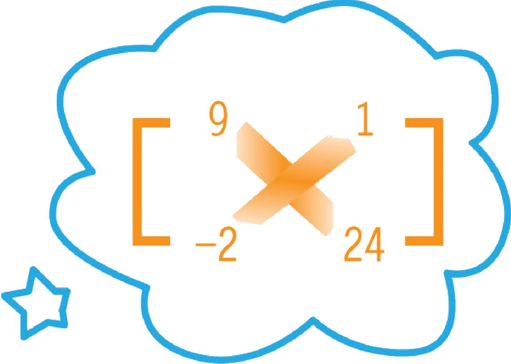

内在化计算行列式的过程，首先要想象一个2×2的表格，其中有4个数字，然后想象我的右手从左上的数字挪动到右下的数字，同时想象在表格上留下了一条蓝色的条纹，而且因为手上抓了数字而变得沉重。接着再想象我的左手从右上的数字划到左下的数字，同时留下了红色的条纹，而右手感到重量减轻。

通过将具体的感觉、声音以及肌肉的运动与原知识相连，记忆更加容易。

有些学习专家认为人们的学习方式主要有三种：视觉型、听觉型和运动型。视觉类型的学习者（我觉得自己就是典型的视觉类型学习者）需要信息以图像的方式表现出来才能很好地理解；听觉型的学习者需要将信息转化为声音和指令才能很好地理解；而运动型的学习者则需要通过触摸和操作才能更好地理解信息。

给自己贴上某一种类型学习者的标签并没有益处，不同的人学习方式肯定不同。内在化就是将信息由你不熟悉的类型转化为你容易理解和联系的类型。

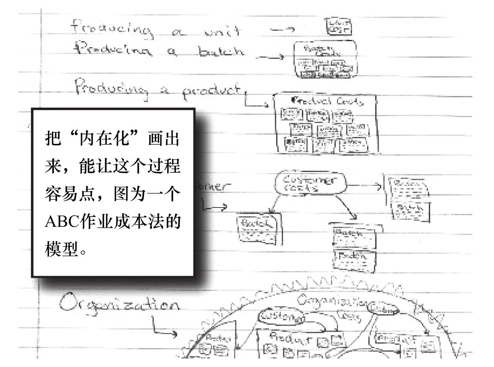

内在化还有一步就是赋予知识以情感，心理学家早就知道不同的情感状态会影响记忆的效果。将知识与情感（即使是很小的情感）相联系总是比干巴巴的知识更容易记得住。

怎样进行内在化

（1）明确你要内在化的概念。这是一个生物过程，还是编程中的函数或者是一个数学概念？

（2）从建立脑海中的图像开始。如果你不习惯内在化，可以先试着在纸上画出概念的粗略图，多次尝试后，你就会直接在脑海中想象了。

（3）脑海中的图像是静态的，还是栩栩如生的动态场景？掌握一个行列式需要好几个步骤，所以要让图像动起来，就仿佛在看一部电影一样。

（4）现在开始加上其他感官。试着用手去拿它，去摸它，去打开它，去嗅它的味道，去听它的声音，动用你身体的所有感官，将所有的感觉与运动的图像相联系。

（5）加入更多的感觉或情感。

（6）不断重复和优化图像，直到你一想到它就能很快地回忆起知识。

像比喻一样，内在化也是个创造性的试验过程。你不可能一开始就想出完美的图像来。重要的是开始去做，在不断地优化、抛弃图像中不适合的部分，最后你一定会得到一幅记忆深刻、栩栩如生的图像。

我强烈建议大家拿起笔和纸来练习，看到纸上活灵活现的图像会让你记得更清楚。

比喻内在化

的确，将三个单词（比喻、内在化、视觉）融合在一起有点过分，但是比喻法和内在化结合可以让你更好地理解和记忆抽象但重要的知识。过程和内在化是一样的，不同之处在于你首先要用一个比喻来替代抽象的知识。虽然应用比喻法有些繁琐，但是当难以想象出概念的图像时，比喻法还是很有用的。

智力挑战

本项智力挑战的目的是锻炼你形成图像以及给图像加上各种不同感觉的能力。

1.取一张白纸和铅笔，准备作画。

2.打开课本，找两个概念或观点，如果你不太熟悉内在化，建议你选择容易想象出图像的概念先试一试。完全抽象的概念或者过于复杂的概念对于初学者来说不太适合。

3.在脑海中建立图像，将感觉和情感加上去。

4.根据脑海中所想，快速画出概念的图像来（30~60秒）。

5.坚持两周每天选几个概念练习内在化过程。

##### 图表法

最后一项拓展观点的技术是图表法，图表是内在化的简化。创作图表比想象一幅图像花费的时间更多，但是操作起来更容易，而且可以用于非常抽象的观点，抽象的观点一般难以想象。

学习时，图表技术也可以很容易地和笔记流技术以及积极阅读相结合。

一幅图表就是一幅将多个信息压缩在一起的图画，图表最常见的形式是带有数字信息的图表。散点图可以将成百上千的数据点压缩到一张图中，流程图技术可以把一系列复杂的内部作用关系和步骤绘制到一幅图中，让人容易看明白。

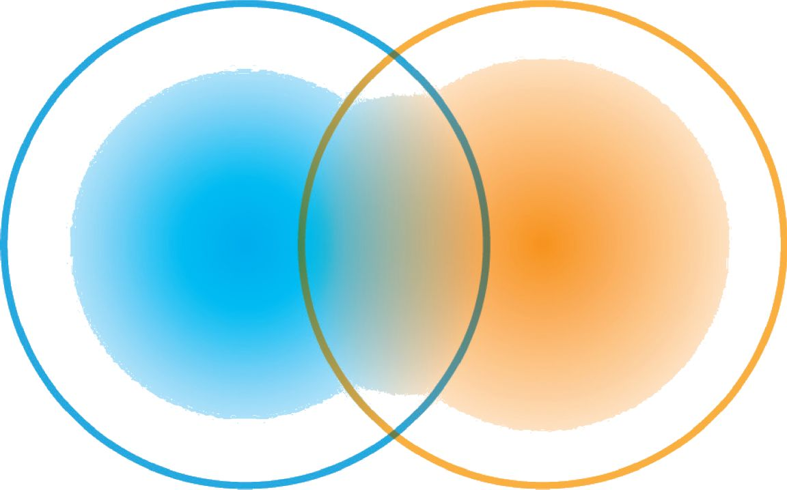

一般的书中都有一些示意图，用来简化信息。在没有示意图的地方，你可以自己绘制图表（即观点流，画出不同的概念或将不同的概念联系在一起）。

我在这里介绍三种主要的图表类型：流程图、概念图和图像。三种类型的适当组合可以帮助你理解几乎所有的概念，图表的唯一缺点就是它花费的时间要比比喻法和内在化更长。不过，经过练习，我已经提高了画图表的速度，现在可以在一分钟内画出一幅粗略的图表来。

流程图

以图表为基础的流程图适用于以下几方面。

·绘制一系列的步骤（怎样做长除法，怎样写一份现金流转声明等）。

·绘制历史事件，创造分支将事件联系在一起，不仅通过事件之间的因果关系，而且根据事件的发生时间来建立联系。

·绘制一个系统（例如函数在程序中怎样执行）。

流程图的基础是从一个简单的元素开始，然后在这个成分及与之相联系的不同知识之间画出联系箭头，我曾经为写这本书画过一个图表。从最原始的观点出发，逐步画出其他相关的观点来。

图表最重要的是方便你的理解，而不是追求漂亮的图画。人们很容易追求所谓简单、整洁、美观的图画，不过随后却要花费成堆的时间去理解其内容。只要能满足你的需要，简单和杂乱的图都是可以的。

概念图

概念图将观点联系在一起，与笔记流密切相关。概念图里的关系并不是某个顺序中的不同步骤或是按日期顺序排列的观点，而是观点之间的内在关系。在不同观点之间画上箭头，箭头上还需要加上一些简单的话语，说明二者是什么样的关系。

假如我想画出不同财务会计原理的简图，首先我要写下四个基本的清单：资产负债表、收入、留存收益以及现金流，然后我可以在它们之间建立各种联系，最后形成知识网。

假如我想画出小说中的角色关系，我会先把主角放在图的中间，然后其他人物以他为中心按照与主角的关系分别画在旁边。这种方法有助于我们理顺思路，将庞大的知识组织得条理分明。

从最重要的观点出发，不断发出分支细化知识及分解观点。

图像

图像不是一种专门的图表类型，不过图像构成的图表非常重要，所以我把它放在这儿介绍。图像强调的是用粗糙简单的涂鸦来代替文字，包括观点和观点之间的联系，图像比文字更加生动，容易记住。

我经常画一些小图像以代替某些重要的观点，它们在我的脑海中记得更清晰，没有必要花费很长的时间画一些复杂的图画，花10~20秒简单地涂鸦是比较好的选择。

将图表与比喻和内在化结合在一起

图表可以和比喻及内在化混合在一起，以加深对知识的理解。

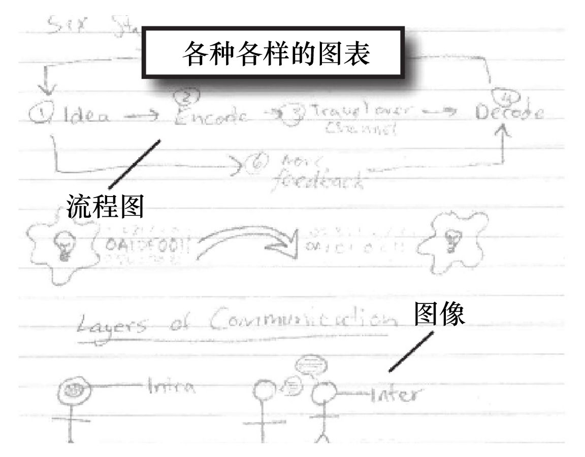

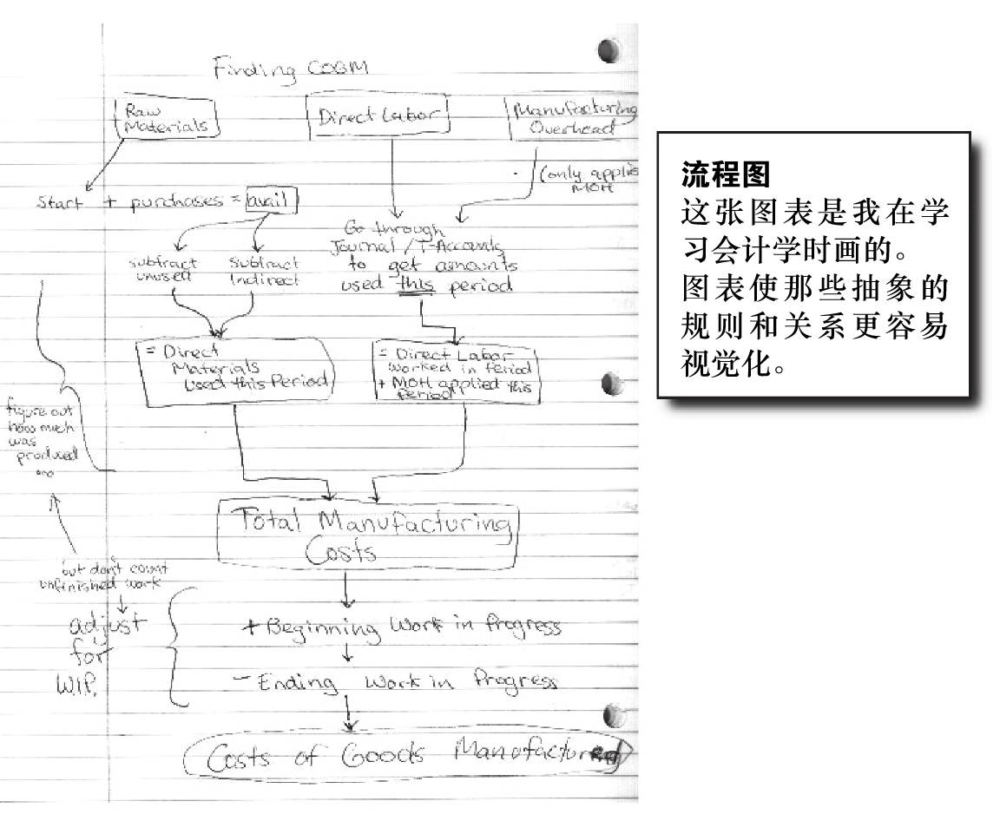

智力挑战

本智力挑战目的在于提高你画图表的能力和速度，因为图表是上面提到的三种联想技术中速度最慢的。假如你想在学习中使用它而不成为一种负担，就必须提高画图表的速度。

1.找出一个观点或是一系列概念，准备画图表。

2.设定时间2~5分钟，然后开始画图表，图表可以是上面的任何形式。

3.时间一到，停止画图表，统计一下你的工作量，包括信息的多少、建立了多少联系，等等。

4.每天进行一次，重复两周，直到你可以轻松自如地画图表。

小贴士

一旦你掌握了画图表的技术，请尝试将其与课堂上的笔记流或积极阅读结合在一起。

#### 随意信息的处理

随意信息是整体性学习中的一个难点。针对随意信息，如何联系、比喻以及内在化呢？

例如：

·一系列日期

·解剖学术语

·一系列步骤

·各种各样的规章、条例

·科学公式

一般情况下，这些信息只能靠机械记忆了，整体性学习则要尽可能地避免死记硬背。取而代之，用比喻、内在化和图表法，创建模型和最终的结构是应用大脑的最好、最快的方法。不过，在有些情况下，这些办法效果并不好。

随意信息，或者内容太多、太复杂的信息，都不容易被理解，它们需要不同的技术。假如你发现联想法不能帮助你理解材料，或者需要花费的时间太长，这时候处理随意信息的方法就很适合了。

这些处理随意信息的方法介于机械记忆和整体性学习之间。联想法、挂钩法就是处理随意信息的方法，它们能加速记忆，而且也符合大脑的学习方式。机械记忆好比钝刀切菜，整体性学习就是寒光闪闪的解剖刀，而联想法、挂钩法则算是切牛排的餐刀。

处理随意信息的方法需要不断地练习，理由如下。

（1）不经常使用它们。我平时很少使用联想和挂钩法，正因为不常用，所以练习非常重要。

（2）这些方法比较复杂。联想法、挂钩法和信息压缩技术很少依靠直觉，需要多加练习才能很好地掌握。

小贴士

随意信息的结构很弱，总是需要某种转化后才容易学习：

弱──重复学习。

好──通过联想法、挂钩法以及信息压缩技术学习。

最好──通过比喻法、内在化法及图表学习。

##### 联想法

联想法并不是我首创的，作为一种记忆技巧，它已经存在很多年了。之所以称为联想法是因为它的目的是将一系列观点串在一起，就像链条，一旦进入链条中的一环，就可以轻易地到达链条中的其他环节。

联想法在处理一系列随意信息时效果很好，包含步骤的过程信息、按顺序写下的名字或公式，都可以应用联想法。随着不断地练习，你可以迅速地将数十个知识点连在一起。

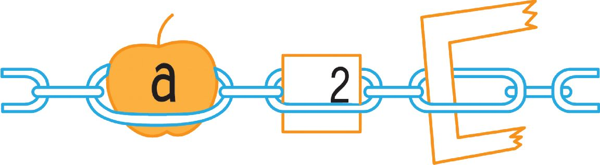

小贴士

联想法这个名字（不是我发明的）听起来与整体性学习关系不大，而与机械记忆关系更大。联想法虽然也是一个很有用的方法，但是有可能的话，我还是会尽量采用比喻法、内在化法和图表法。

使用联想法的步骤

第一步　创造顺序

先在纸上写下你打算记住的很多信息，在你能理解的前提下，迅速地将信息分成几类。把要处理的信息罗列成一个线性的清单非常重要，因为这是用联想法保存数据的唯一方法。

简单例子：联想法记忆杂货清单。

（1）香蕉

（2）牛奶

（3）烤豆

（4）黄油

（5）果酱

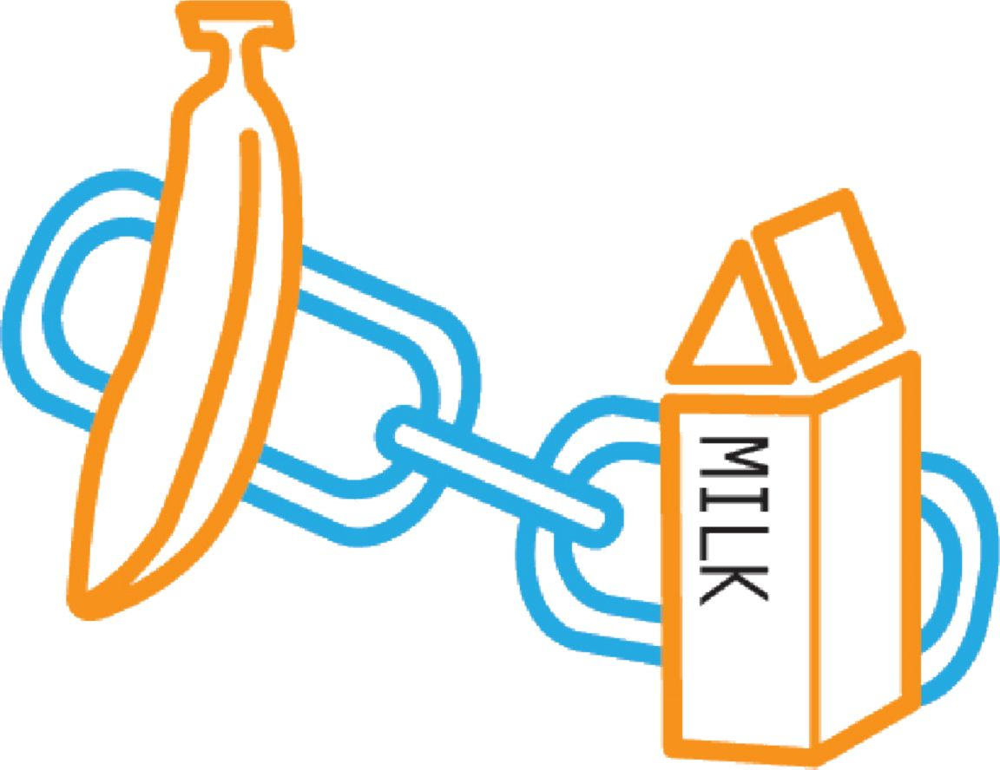

我相信没有什么课程会让你记忆杂货清单，不过其中的原理是相同的。

要记住一个公式，可以将公式先转化成一个序列，即将公式变为可以输入到计算器的形式。公式V=1+X/b可以写成V=1加上X除以b，V、=、1、加上、X、除以、b就是这个序列中的元素。如果你不习惯这种方法，碰到复杂的公式可能会花些时间，但是如果你很担心自己忘记，使用这种方法还是很有效果的。

第二步　给清单中的每一项设一个符号

如果清单中是抽象信息的话，你可以给每个抽象信息设计一个容易识别的符号。学习管理学时，我需要记住亨利·法约尔（Henry
Fayol）的管理十原则，我运用联想法给每一条原则设计一个助记符（一般是单词的首个字母或是词语中的一个字和谐音，比如用“水仙花，莫悲伤”记忆几种传染病出现皮疹和发热的天数，其中，水指水痘，仙指猩红热，花指天花，莫指麻疹，悲指斑疹伤寒，伤指伤寒。当然也有一些其他方法。──译者注），劳动分配变成了一把锋利的刀，个人薪水则成了大棒上的胡萝卜。

设计的符号要能迅速让你联想到原始的知识，因为联想法记住的是视觉符号，而不是抽象信息本身（记住的是胡萝卜，而不是个人薪水），所以如果符号和知识之间没有什么相关性，那联想法就不起作用了。除非你确信能从视觉符号想到原始知识，否则不要使用联想法。要记忆公式，可以将公式中的字母用一个相关的有实际意义的物体来替代，比如变量a的替代符号是红红的苹果（apple）。

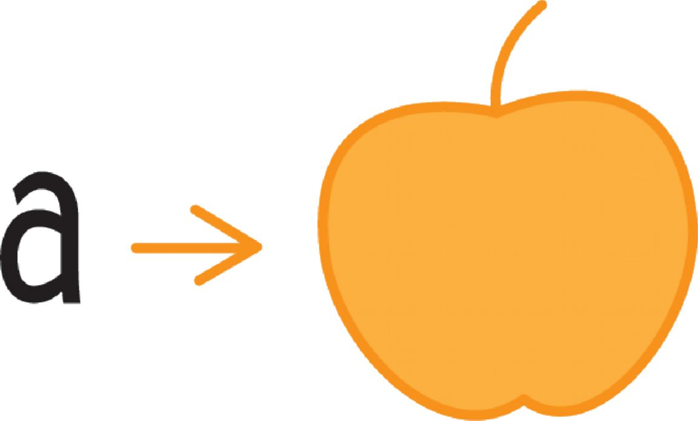

开始时写下序列中每个项目的替代符号，一旦你联想得很熟练，成为习惯，就不必每一步都写下来了。

第三步　创建属于自己的联想

这一步是联想法的基础，你要做的就是创造生动夸张的图像，能将序列中的两个符号联系在一起，这表示你需要创造出图像联系1和2、2和3以及3和4，等等。

以上面杂货清单的例子来说，首先我要想象一幅图画来联系香蕉和牛奶，我想象的图画是一只巨大的香蕉上面，有一群奶牛在散步；或者我也可以想象一名挤奶工在给一个巨大的香蕉挤奶，注意是巨大的香蕉而不是奶牛，是不是很疯狂？

这种疯狂、古怪、滑稽、荒诞的想象正是联想法的精髓，假如这种联系平淡无奇，只不过是普通的农场工人在给一头奶牛挤奶，一边挤奶一边吃香蕉，这样的想象不够夸张，不够生动，不能让自己兴奋，回忆起来也就很困难。这样的联系称为弱联系，而前面那种称为强联系。

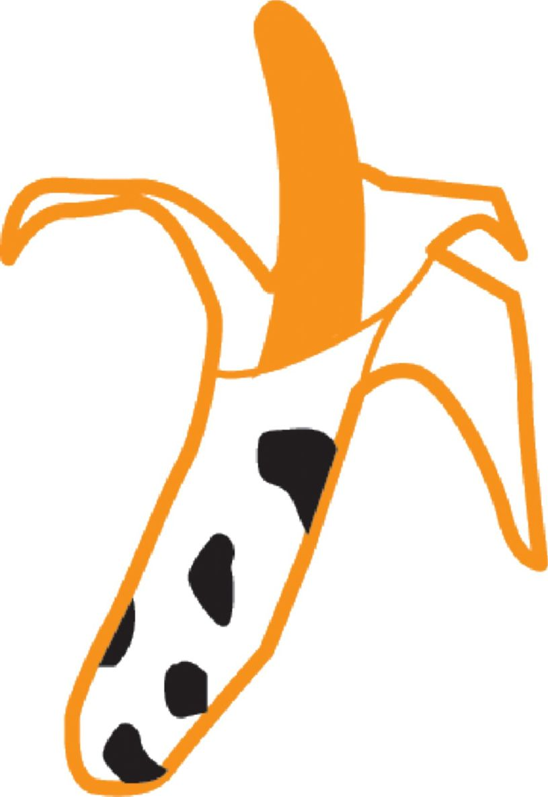

在1和2建立联系之后，接下来就要想象2和3的联系了，想象一幅什么样的图画来建立牛奶和烤豆之间的联系呢？想象巨大的豆子在和一盒牛奶摔跤是不是生动有趣？

接下来大家自己试试分别想象烤豆和黄油，黄油和果酱之间的联系。

做完所有的联系后，再回忆一下是否能很容易地从1联想到2，3，4直至最后，如果中间有困难，说明你想象的图画不够生动，不够夸张、荒诞，重新想个好点的吧！

小贴士

联想法和整体性学习方法的一个共同特点就是想象力。别害羞，想象要大胆一点，想象的图像越是夸张、奇特，联想的效果就越好，整体性学习也是如此，联系越多，越不一样，学习效果就越好。

联想法的难点

尽管联想法用起来比其他方法更费时间，但是可以通过练习提高速度。不过在有些情况下，使用联想法也会遇到一些挑战。

符号重复

如果公式里有重复的符号怎么办：

r，=，σ，（，Z，x，\*，Z，y，），除以，（，n，减，1，）

我建议你给同样的符号加上不同的颜色，这样就不会混淆了。比如公式里有两次“（）”，前面的可以想象成蓝色的手镯，后面的想象成红色的手镯。

断裂的联系

联想技术的一个缺点是假如联想链中某一环断裂了，你就无法继续往下进行，这就是我为什么建议联想链最好不要太长，5~15个为好，超过这个数量，建议你把大联想链分成几个小的。

难以辨认的符号

如前所述，符号最好清晰简明，容易记住，假如你设计的符号不够清晰，联想链可能会失败。有些人掌握了联想法后会创造只有自己看得懂的速记，使用符号代替一般的常识、短语甚至是单词的音节。

触发物丢失

在一些列表中，你可能需要添加一个联想，用一个触发物和列表中的第一项联系起来。在杂货铺例子中，如果你想不起来清单上的第一个对象，你怎么能记得起来整个清单呢？在这种情况下，你可能要用一个触发物与清单上的第一个对象联系起来。比如以你的行李袋作为触发物，与杂货铺建立联系，或者用店面本身作为触发物。一旦看到触发物，你应该想起第一个联想以及它后面的所有环节。

同样的方法也可以用于考试，将第一个项目与某个观点联系起来，比如公式和这个公式计算的是什么，或者几条原理和它们代表的理论，这有助于我们完成整个联想过程。

智力挑战

学习联想法可能比前一节中的其他方法花费更多的时间。要确保抽出一个月的时间来练习联想法。

1. 选择一个公式、列表、一组知识或者任何可以按某种顺序表示的知识。

2.
按照上述联想法的步骤，将知识整理成列表，创造符号，形成合适的联系。反复回顾你的联想列表，确保所有的知识生动有趣，符号重复现象少以及容易明白符号代表的真正含义。

3.
在本智力挑战练习1周后，把之前联想过的拿出来检查一下，看看自己能不能回忆起来。

4. 2周后，开始限定时间练习，以提高运用联想法的速度。

我不擅长联想法，所以总是尽可能采取个人擅长的比喻、内在化和图表法等整体性联系方法。有很多书介绍联想法，如果你想了解得更深入，推荐你上谷歌或亚马逊找一找相关的图书。

##### 挂钩法

挂钩法类似于联想法。利用挂钩系统，你可以将要记忆的信息与数字联系在一起，所以即使这些信息并不是按照特殊顺序排列，你也能回忆起每一个信息来。挂钩法对于记忆日期类的数字也是很有用的，挂钩法并不是将一系列观点互相联系在一起，而是将每一个观点与一个特殊的数字联系在一起。一般我应用挂钩法记忆的知识点不超过12个，不过改进后的挂钩法可以记住数百个完全没有关联的知识点。

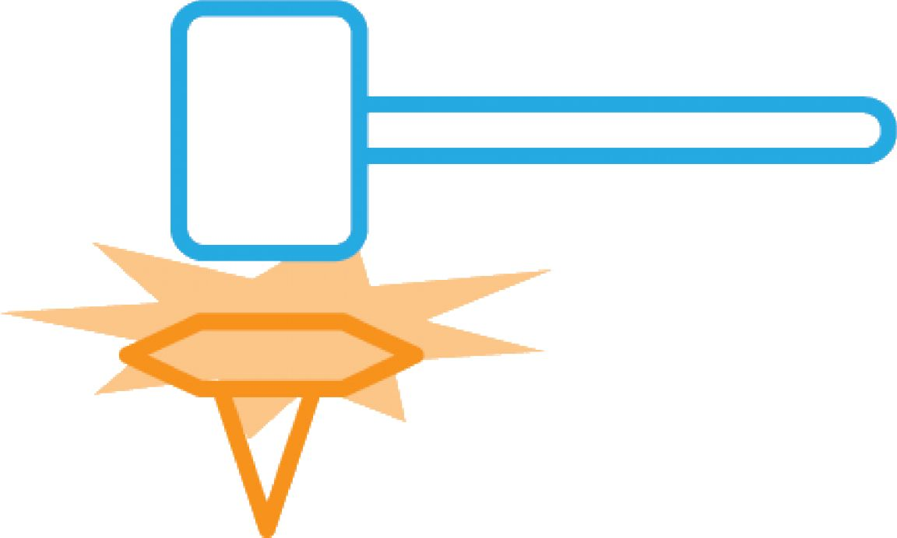

挂钩法首先要给基本数字创造形象，我喜欢给13（0~12）个数字设立13个押韵的单词，用来储存13个数字，这13个位置可以用来记住数字、概念以及步骤等（见下表）。

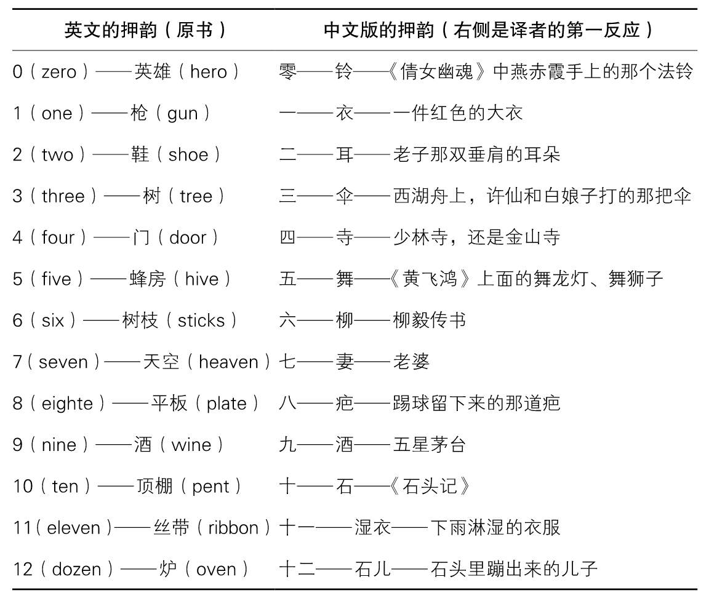

一旦你建立了挂钩系统后，就可以将任何符号与这13个位置联系在一起，想象一瓶葡萄酒和一把刀打架的场景就能让我记住刀（象征亨利·法约尔关于劳动分配的原理）在第九个位置。

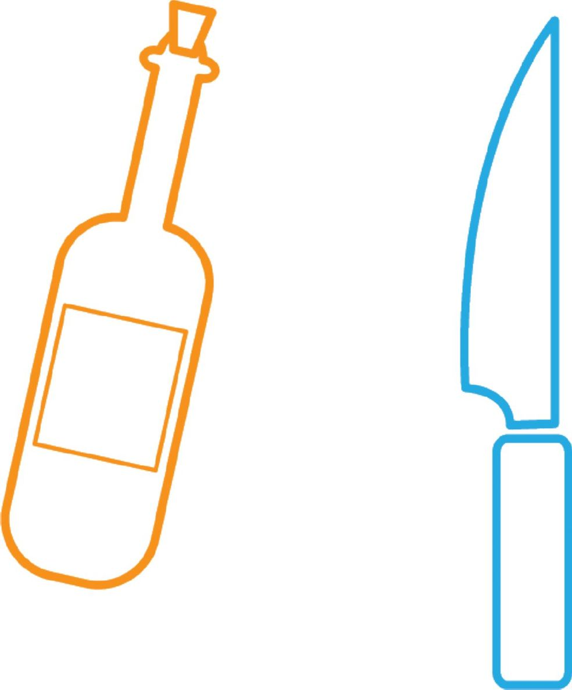

挂钩法与联想法类似，只不过挂钩法不是将信息与前后知识点相连，而是将信息与具体0~12个数字联系一起。用这种方式记忆，如果其中一个联系破坏了，其他的联系还是很容易想起来的，只需要花点力气回忆你的数字挂钩系统。

使用挂钩法记忆日期

我学习时并没有碰到太多课程需要记忆大量的日期信息，但是根据我的经验，挂钩法对于记忆数字效果出奇的好，比如要记住哥伦布发现美洲的年份1492年。

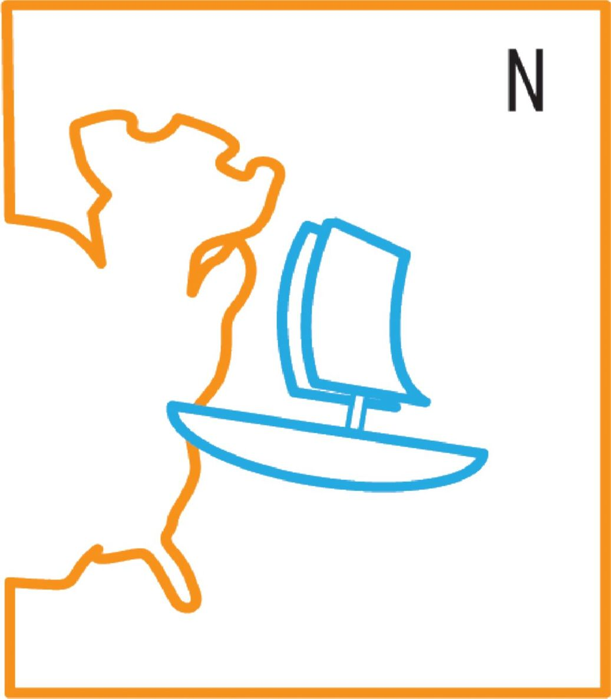

第一步是创造与事件相关的图像，在这个例子中是一幅大船撞上北美洲地图的图像。

第二步就是将1、4、9、2挂钩。首先将枪与上图建立联系，可以想象在船撞上北美洲后，持枪的海盗拦住了可怜的哥伦布。

第三步你需要将枪（1）和门（4）建立联系，然后是门与酒，酒与鞋子建立联系。然后当你重复这一联系后，你也就记住了1、4、9、2或1492了。

高级挂钩法

高级挂钩法使用0~9的声音和数字0~9建立联系，而不是押韵的图像。不过我不太喜欢使用这种方法，因为我发现对于大多数情况，没有必要。

不过，假如你想在朋友面前炫耀惊人的记忆力，那你可要好好学习一下高级挂钩法了。

智力挑战

挂钩法来自联想法，所以完成本次智力挑战之前应先做好联想法的智力挑战，本智力挑战的目的是熟悉挂钩法，并尝试用它记忆一系列信息，特别是数字信息，如日期。

1.
寻找一个适合运用挂钩法的清单信息，或是一组信息、日期，确信信息个数不超过13个。

2. 按照挂钩法的步骤进行挂钩记忆。

3. 每两周花一天时间重复上述练习，并检验自己的记忆效果。

小贴士

亨利·法约尔简介

泰勒的科学管理开创了西方古典管理理论的先河，在其被传播之时，欧洲也出现了一批古典管理的代表人物及其理论，其中影响最大的首推法约尔及法约尔的一般管理理论。

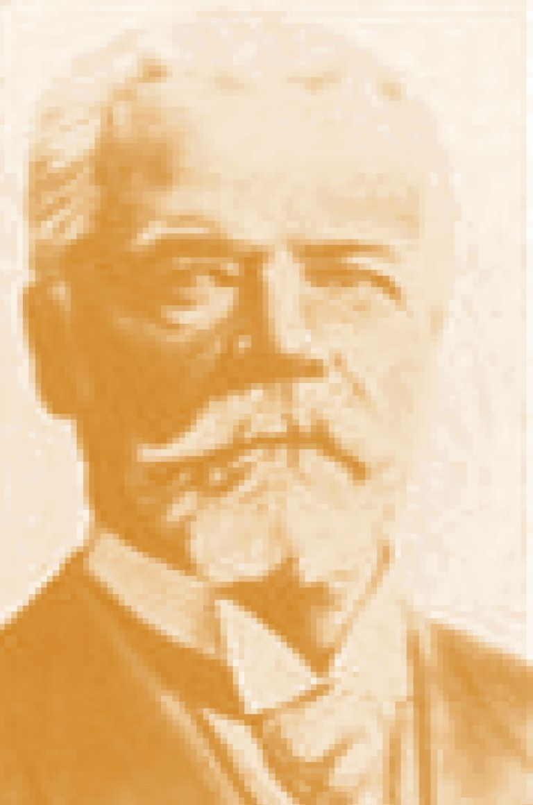

现代经营管理之父亨利·法约尔

亨利·法约尔（Henri
Fayol，1841-1925）的研究与泰勒的不同在于：泰勒的研究是从工厂管理的一端──“车床前的工人”开始实施，从中归纳出科学的一般结论，重点内容是企业内部具体工作的效率；而法约尔则是从总经理的办公桌旁，以企业整体作为研究对象，创立了他的一般管理理论。他认为，管理理论是“指有关管理的、得到普遍承认的理论，是经过普遍经验并得到论证的一套有关原则、标准、方法、程序等内容的完整体系；有关管理的理论和方法不仅适用于公私企业，也适用于军政机关和社会团体”。这正是一般管理理论的基石。

##### 信息压缩技术

信息压缩是另一种常用的储存大量随意信息的方法，信息压缩的目标是减少信息的容量，寻找信息的逻辑关系，我一般通过三种主要方式进行信息压缩：记忆术、图像联系以及笔记压缩法。

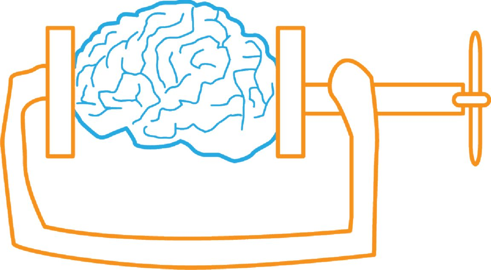

记忆术

记忆术是用一个短语或单词来储存数个信息的方法。在急救术中，有一个处理动脉出血的记忆术RED，R:Rest暴露伤口，E:Elevate评估出血范围；D:Direct直接压迫，这种记忆术并没有什么新鲜的，古今中外都用了几个世纪。

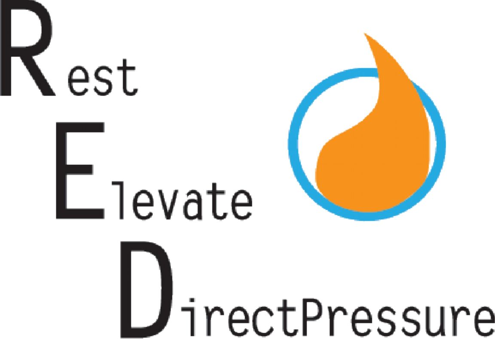

记忆术很简单，只要求你想要压缩的信息不太多，选好一个短语或单词能组织好信息就可以了，比如RED、NASA或USA都是不错的选择。

最好的记忆术应该选择尽量简单通用的短语或单词。

图像联系

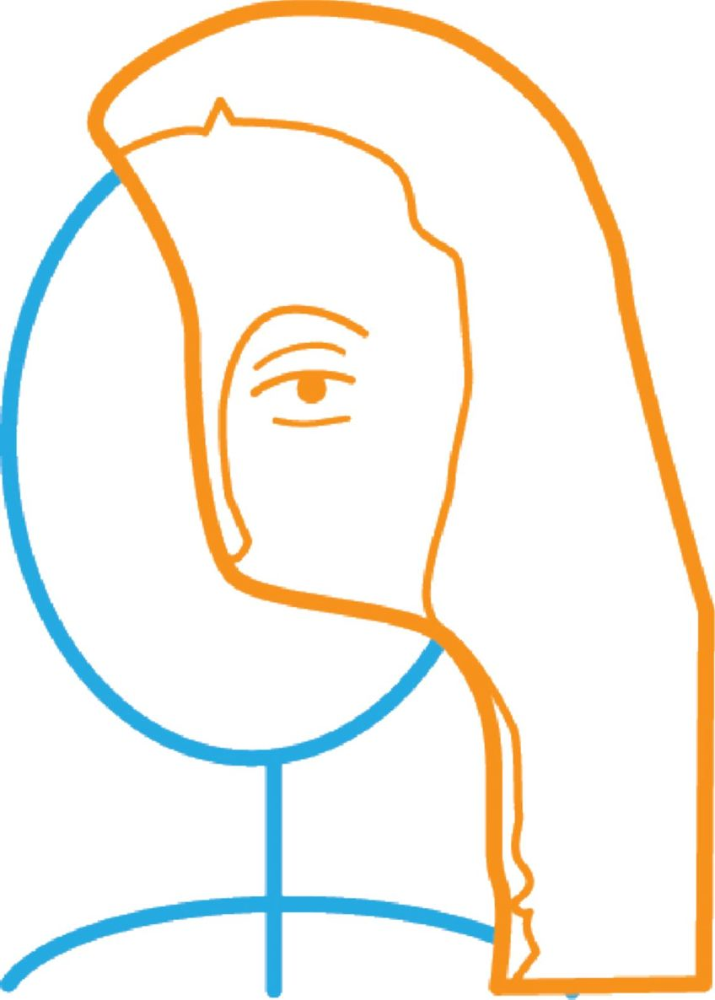

图像联系可以看作联想法和图表法或内在化的综合体，办法是把几个信息联系起来并且用一张图表来表示。我学习管理学时，将五个压力模型画在一张画上，每一个与原理论的不同部分相联系。

使用图像联系的另一个办法是创作一幅画而将多个信息放在其中。首先你用一个简单的符号替代每一个信息，然后再将这些符号放在一张图像中。

笔记压缩法

笔记压缩对于快速掌握大量材料是一个有用的办法。它可以作为应用其他信息压缩技术、联想法、挂钩法或其他整体性学习技术的起点。笔记压缩的目的就是将一大堆需要学习的知识减少至几页笔记。

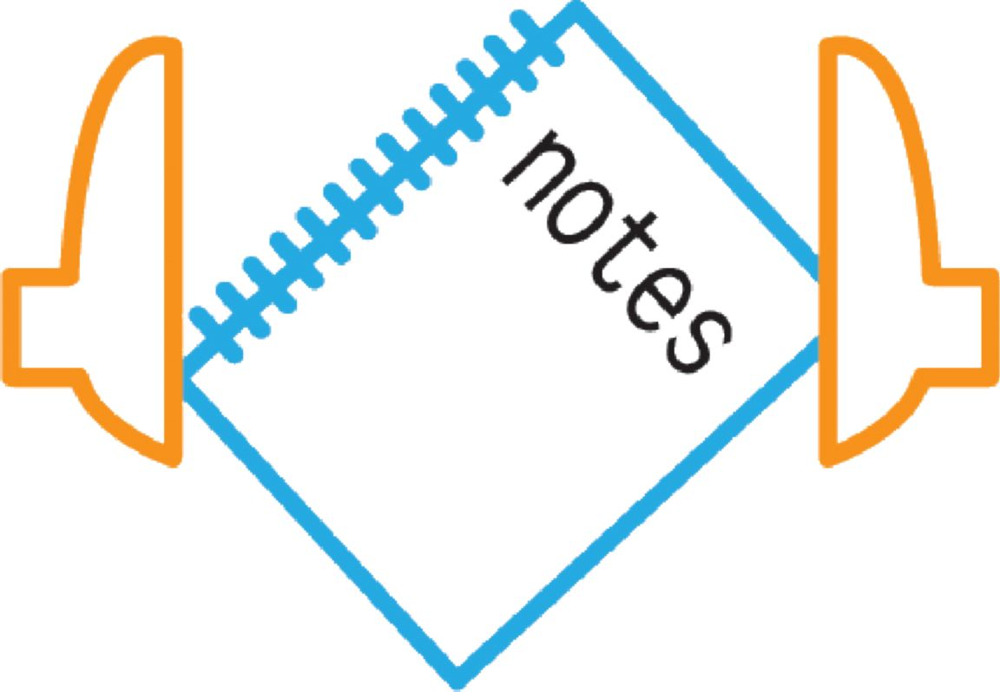

（1）让你能组织大量的信息。通常，在一堂课的时间里要记住数以百计的事实、概念和观点，并将之完全分好类是很困难的，但是假如信息只有两三页纸，要组织好就容易多了。

（2）更容易建立联系。信息压缩后，可以更仔细地观察课程的整个结构，让你更好地建立知识间的联系。

压缩笔记的步骤

（1）拿几张空白纸。准备好要压缩的笔记，这个练习可能会花费一两小时，所以要确保你有这么多时间。

（2）用最小的字，写下笔记中的主要观点。使用尽可能少的字。

（3）接着写下与之相联系的观点、公式、概念或定义。尽可能写小一点和写少一点，节省空间。

（4）持续上述自由写下观点的过程，直到将笔记中的每一个主要观点都写了下来为止。最后你得到大约1~3张密密麻麻写满信息的纸。

（5）有时候，还可以更进一步，将上面压缩后的内容加工、修饰得更有条理，更好看一些。

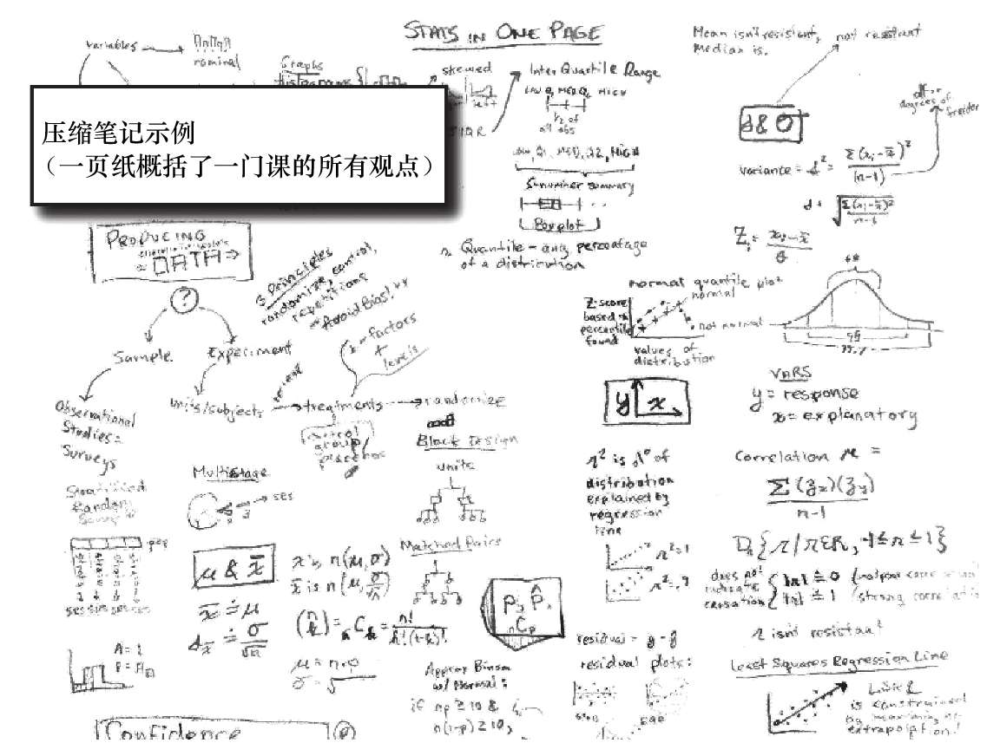

下图给大家展示了我的一堂统计学课程笔记经过压缩的例子。当然，你可以自由决定压缩多少内容，可以是一堂课的内容，也可以是一门课的所有内容，完全取决于你自己的意愿。

智力挑战

本智力挑战的目的是使大家熟悉信息压缩技术的使用。

1.
每天进行一次，从你的课本或笔记中挑出需要压缩的信息，然后按照记忆术或图像联系进行信息压缩记忆。

2.
按照上述做法坚持两周后，将前两周学习的材料进行笔记压缩，将前面所有的记忆术和图像联系综合在一起。

3.
测试一下你是否能记住整个信息。坚持练习四周（包括两周的笔记压缩练习）或者直到你对这些技术运用自如。

##### 实际应用

要深入拓展你在课堂上学到的知识，最好的办法就是将知识应用到实际生活中去。如果你是自学者或者参加的是职业教育，很少会碰到死读书的问题。但是假如你需要将很多抽象的课程进展到一定的深度，而这些信息可能不太重要或者未来很多年都不一定用得上，就有可能陷入死读书的困局中。

通过将知识应用于实际，知识就会记得更牢。

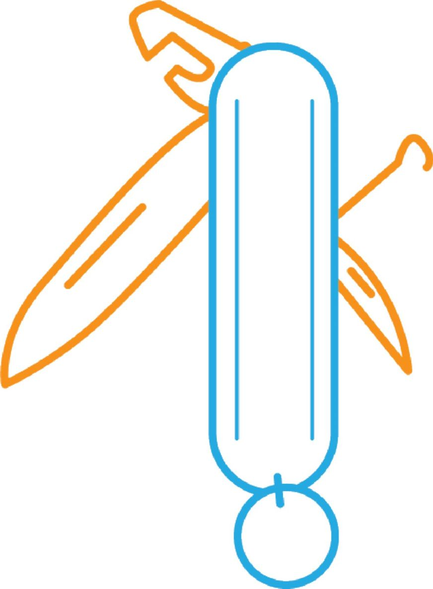

实际应用并非一种按步骤进行的技术，它是一个创造性的过程。在这个过程中你要寻找不寻常的方式去应用观念，也许你现在还不知道该如何在日常生活中应用所学的历史知识或是数学知识，但是我确信如果你能花费十分钟做一次头脑风暴，一定会大有收获。

没有可遵循的通用的实际应用具体步骤，不过我乐意推荐一些应用课堂所学到的不同知识的方法，有一些可见到实际的客观效果，而另一些可能更倾向于内心的改变。

（1）统计学──我利用统计学知识给本书起名字以及定价。利用谷歌搜索引擎，我尝试各种名字和价格，最终利用统计学决定了这个书名和价格最为吸引人。

（2）计算机──除了编程这种明显的应用之外，我还发现计算机科学是寻找问题的有用途径，纠错、算法都是可以借鉴到其他地方的有用思想。

（3）会计学──会计学能帮助我理清个人财务以及报税。运用基本的会计学原理整理我的个人财务，使它们看起来一目了然。

（4）经济学──经济学教会我重新看待金钱在社会中的价值，明白了金钱仅仅是物质交换的载体后，我的个人哲学体系也随之发生了很多变化。

（5）历史──历史是了解现在的工具，通过学习古代亚洲史能帮助我们看清现代中国、印度和日本的种种问题。历史就是照亮现在的一面镜子。

上述的介绍只是很少的例子，我总是努力为学到的所有知识找到实际用处。假如一门课程完全没有实际用处，那你还学它干什么？

智力挑战

接下来的两个月，每周抽一点时间，看看学到的知识如何应用到自己的实际生活中去。花5~10分钟罗列各种可能应用的地方，确保至少有20个用处，不要嘲笑那些看起来可笑的想法，只管顺着自己的思路写下去。如有可能，请将这些想法付诸实际行动。

##### 模型纠错

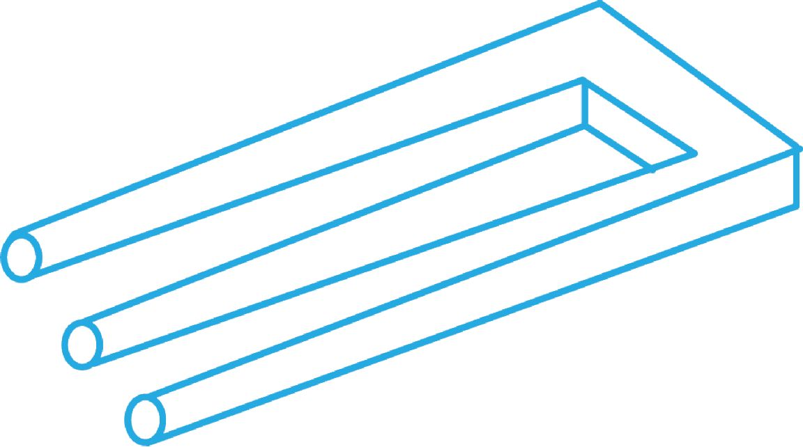

模型纠错实际上就是实践的代名词：不断地练习和实践，在实践中发现问题，测试自己是整体性学习过程中纠错的唯一手段。你不可能只看看程序，就知道错在哪里，只有亲自上机跑一跑，才知道问题出在哪里。同样的道理，大脑中的错误也需要通过测验、解决问题以及完成作业来纠正。

假如整体性学习过程完成得非常好，纠错花的时间就少。就像一个熟练的程序员写出来的代码错误率会很低。完美无缺是不可能的，因此不断练习，不断纠错总是个好办法。以下是模型纠错过程中的一点建议。

1. 分清是拼写错误还是概念问题

我相信很多程序员都碰到过写好的程序无法运行，问题仅仅是某个字母打错了，花了半个小时跟踪一个问题，只不过是变量名弄错了。但是假如你不理解一个基本概念和某个算法，问题就严重得多了。

模型纠错同样如此，当你发现模型存在问题时，首先要分清是简单的错误还是关键概念的理解出了问题。对于简单的错误，只要仔细点就可以了。若是概念问题，那就需要仔细看看模型、比喻法以及内在化的过程是否犯了错误。

2. 散弹枪策略

花费数小时重复解决同一类型的问题与死记硬背没有什么不同。我宁愿花时间采取散弹枪策略进行纠错。所谓散弹枪策略，就是每一种类型的问题都做一做，同一类的问题不要重复。当然，我觉得如果你必须要花好几个小时重复同一个问题，那么就这样做也无可厚非。不过，更好的办法是尽早使用整体性学习方法，这样你就能更容易地学会解决某类问题的方法。

3. 延伸练习时间

把总的练习时间分配到每一天，不要平时不烧香，临时抱佛脚，把全部练习时间集中在考试前做。每天一次快速充电比考试前一天晚上大量突击更容易坚持。

小贴士

重复练习同类问题是一种缓慢的学习方式。模型纠错是必要的，但如果你需要反反复复做同样类型的问题，你可能需要在拓展或理解阶段做更多的工作。如果你觉得不太理解某个主题，试试返回去做做拓展工作。

智力挑战

如果你已经定期练习在课堂上碰到的问题，请继续做你正在做的事。尝试实行那些能改善如何练习的观点，但在其他方面坚持自己探索。如果你不能定期做练习，或者你正在做考试前的疯狂冲刺，试着把你的学习延伸到整个学期，每天花几分钟学习而不是考试前花数个小时突击。

##### 以项目为基础的学习

以项目为基础的学习是我最喜欢的自学方式，这种水平的学习可能对大多数普通学校的学生而言显得太深了。但是在没有老师指点、没有考试负担时，这种学习方式很有用。

以项目为基础的学习方式简单地说就是设定一个需要1~3个月达成的目标，达成目标的过程就是学习的过程，达成了目标也就达到了学习的效果。为了完成项目，你必须围绕着目标努力学习，以项目为基础的学习符合整体性学习的每一个过程。

1~3个月的项目可能使人产生畏缩情绪，但是假如你对项目兴趣浓厚（所以要选择恰当的项目），我相信这是快速学习的最好方式。与前两种拓展信息的方法一样，以项目为基础的学习也没有固定的公式。以下介绍一些应用这种方法的例子。

（1）编程──设计一个大概需要1~3个月完成的项目，比如一个小的应用程序，建一个网站，写一个小游戏。

（2）历史──关于你正在学习的某个历史问题写一篇探讨性的文章。

（3）财务会计──选择几家你打算投资的公司，对它们的财政报表做一个详细的分析。

在开始设计一个项目之前，请读一读我的建议。

（1）从小项目开始。一个好的项目会提升你的层次，但是太大的、看起来遥遥无期的项目会动摇你的信心。所以，如果你的目标仅仅是学习，还是设定一些需要花费1~3个月的项目为佳。

（2）记录下来。将完成项目的过程记录在纸上，将工作进度记录在纸上会加强你的自信心，翻阅前面的工作，会激发你继续进行下去的欲望。

（3）创造一个有意义的目标。仅仅有一个项目还不够，我发现只有项目完成后有一个清晰的目标时，学习才更为主动，热情更高。假如项目不仅是为了学习而设立的，项目本身具有的意义会激发你的热情，并使你为着目标而持续地努力工作，不断学习。

智力挑战

设计一个项目，大约花费一个月的时间完成。比如：

·电子书

·发明

·服装设计

·编程

·网站

·写博客

项目应该简单，但是也不能太容易。写下预计的完成日期，计划好日程，每天按时完成部分工作。在你完成项目之后，回顾一下以项目为基础的学习方法，看看还有什么相关的项目可以去做。

#### 知识的延伸

学习仅仅为了通过考试是不够的，假如不能应用所学，即使考试成绩再好也无济于事。整体性学习的最后阶段是应用，你不仅要理解和拓展知识，而且要测试、纠错和应用知识。

知识完整地从获取阶段进行到应用阶段对于考出好成绩并不是必需的，但是如果知识在学习过程中走得越深入，记忆得就越清楚，应用得就越灵活。

#### 整体性学习技术的实际运用──费曼技巧

运用费曼技巧，你能达到过目不忘。

理查德D. 费曼（Richard D
Feynman），美国物理学家，诺贝尔奖获得者，曾经任教于普林斯顿大学物理系。费曼挑战任何一位普林斯顿大学数学系的教授，即不管这些教授告诉费曼多么复杂难懂的数学知识，只要他们使用简单的术语（不得使用费曼觉得生僻复杂的单词或术语）去描述，费曼就一定会得出同样的结果。

这则故事常常拿来证明费曼是个伟大的天才。不过，现实中，这个技巧人人都能掌握，接下来，我就告诉大家具体如何去做。

费曼技巧的具体措施：

（1）理解那些你没有真正掌握的知识点。

（2）记住那些你能理解，却可能在考试中遗忘的知识点。

（3）作为一个考前学习的高效率方法。很多学生花了不少时间在图书馆度过，学习效果却平平，运用费曼技巧，你只需花上20分钟就能深入理解知识点，而且记忆深刻，难以遗忘。

下面我来演示费曼技巧的操作流程，你可以用它大幅度地提高各门学科的成绩。

第一步：选择要学习的概念

首先选好你打算深入理解的概念，拿一张空白纸，在最上方写下概念的名称。

第二步：设想你是老师，正在试图教会一名新生这个知识点

这一步你要假想自己费尽口舌让一名毫无这方面知识的学生听懂，并把你的解释记录下来。这一步至关重要，因为在自我解释那些你理解或不理解的知识过程中，你会理解得更好，而原先不明白的地方也得以理清。

第三步：当你感到疑惑时，返回去吧

每当你碰到难题感到疑惑时，别急着往下走，学习不是单行道，回过头来，重新阅读参考材料、听讲座或找老师解答，直到你觉得搞懂了为止，然后把解释记到纸上。

第四步：简单化和比喻

如果你的解释很啰唆或者艰涩，尽量用简单直白的语言重新表述它，或者找到一个恰当的比喻以更好地理解它。

例如：在学习力矩时，用简单的话解释力矩，而不是照抄书上的定义。比如，首先用俗语“扭曲”来说清楚力矩是什么意思。

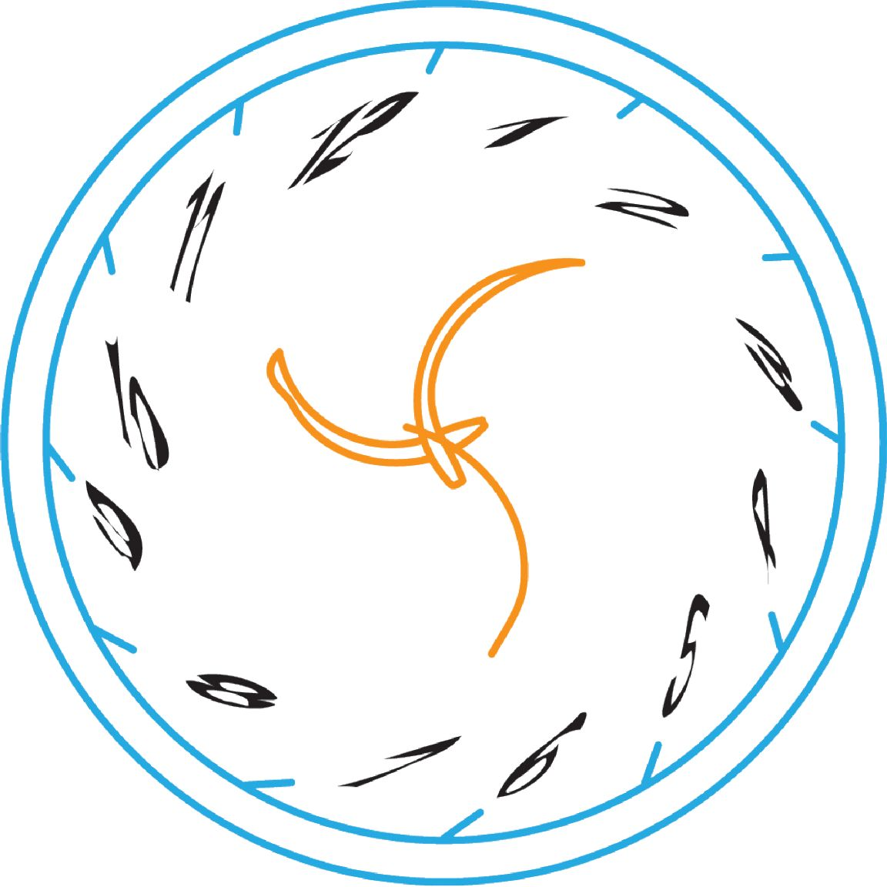

其次，给力矩找个恰当的比喻，我把力矩向量比喻为一个开瓶器的运动，向右旋转是拧紧，向左旋转为松动。

下面的网址中有一些运用费曼技巧的例子，是我在学习物理过程中的实际例子。

http://www.scotthyoung.com/mit/8014notes.pdf

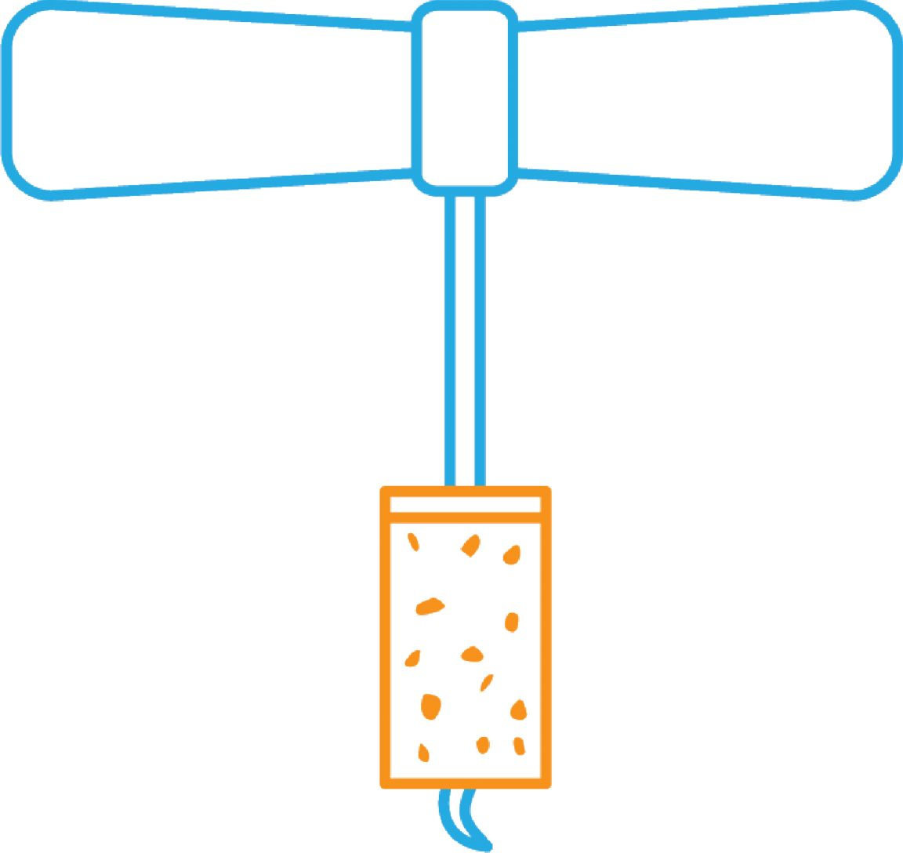

你可以使用此技术学习数学或其他理科学科，仔细按照上述步骤执行，并尝试解释给自己听。

你也可以在文科学科中使用这种技术，以帮助理解各种重要的观点，也可以把很多事实放在里面，这样你就可以在联系中理解它们。

你该如何使用这种技术？

如果你想理解一个观点，你可以通过这种技术仔细地查明到底是什么地方你不明白，然后你可以去翻阅教材、笔记或询问老师，弄清楚到底你遗漏了哪些关键知识。

如果你想为了通过考试而记住一个观点，你可以把重点放在寻找一个好的比喻或者简化词句上，不必追求彻底的理解。

最后，如果你学习是为了通过考试，运用费曼技巧复习时，要把学习材料抛在脑后。费曼技巧对于自我测试、考察对知识点的理解程度，是一个真正的好方法。因为如果你不翻阅教科书就能用自己的话把观点解释清楚，那么就意味着你真正理解了该观点。

立即使用这门技术吧，现在就拿出一张空白纸，选一个你正在学习的观点试试费曼技巧。这个过程只需花上20分钟，但是如果你养成习惯，这的确能帮助你学得更好。

#### 整体性学习技术的回顾

理论和技术是整体性学习策略中同等重要的两个部分。

这些技术只是学习策略中很小的一部分，我鼓励大家寻找更多的学习方法，并整合到自己的学习策略中去，通过不断地整合和实践，最终找到适合你自己的学习理论和策略。

实践对于应用这些整体性学习方法至关重要。这就是我为什么对每一种技术都设计了智力挑战的原因。智力挑战的目的是让大家熟悉和练习某种技术，直至成为一种习惯。仅仅阅读这些观点是不够的，一定要把知识变为一种行动上的习惯。（思维方式也是一种习惯，譬如关于学习的知识非常之多，但是我们阅读、理解是一回事，把这些知识变成指导我们工作的下意识的东西，那就是习惯，而观念则是自己信仰的知识。──译者注）

全部完成这些挑战大概需要两年的时间，怎么办？我建议你先选一种挑战练习一两个月。至于选哪一种，就看你最想把哪一种技术变为习惯了。（我选择变为习惯的技术是为什么的技术，本书没有介绍，但是为什么的技术也是很重要的技术，对我来说，看到一段文字，就要问个为什么是一种习惯，为什么？你怎么知道？凭什么说？有什么用？等都是阅读中自然出现的反应。──译者注）假如你在理解概念时有障碍，那就要练练比喻法；假如你不擅长处理一大堆日期、定义等，那就要练练联想法和挂钩法。

整体性学习理论能帮你找到自己学习过程中的薄弱环节。薄弱环节也就是你需要改进的地方，同时也是你需要重点掌握的技术。最终，使技术从一种需要努力应用的工具变成一种自然而然的习惯，而你的学习效率将会大幅度提高。

这本书包括了一些练习材料，这些材料涉及书中提到的部分学习技术。你可使用它们，帮助你开始实践之旅。

#### 高效率的学生

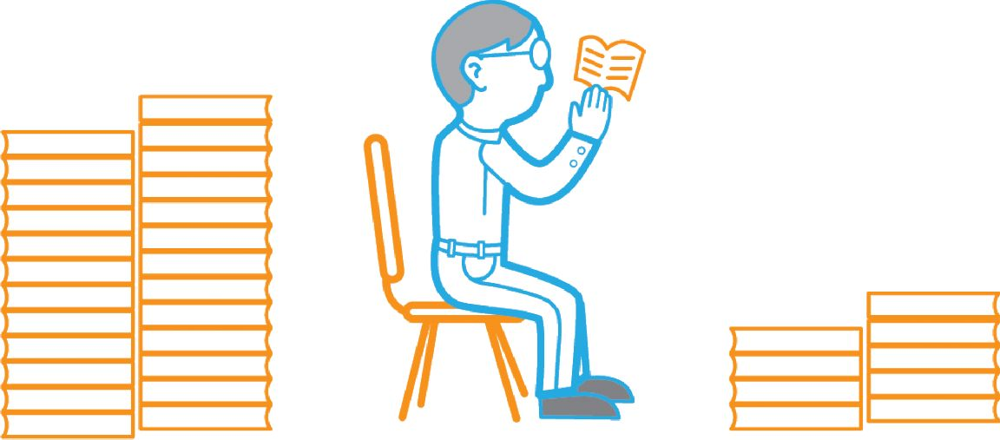

本书一直强调“会得多”，整体性学习提高了你学习各种学科的能力，同时也使你对知识的理解更为深刻，整体性学习既可以提高你的成绩也使得实际理解更好，但是它不能帮你大幅度地减少学习时间。掌握整体性学习需要花费数星期，不过减少学习时间方面的好处是长期的。

现在我要着重讲述本书的第二个问题“学得少”，成为一名高效率学生或是自学者需要掌握减少花在书本上时间的艺术。我上学时，除了全日制的上课学习，业余时间经营一家企业，每周写大约7
000字的文章，健身以及主持一家演讲俱乐部，尽管如此，我仍然有时间和朋友聚会，享受周末的轻松愉快。

以下是成为高效率学生的一些关键点。

（1）能量管理

（2）不要“学习”（Don't study）

（3）绝不拖延时间

（4）批处理

（5）有组织

##### 高效率秘籍1　能量管理

我见过很多能量管理不佳的学生，他们因为过重的任务而将自己搞得精疲力竭，甚至需要借助咖啡因才能勉强工作。要完美地平衡学业和生活不是件容易的事，特别是在你的日程表安排得满满的时候。

我们的身体里都有燃烧细胞，不管是物质上的还是精神上的，你不可能驾着空油箱上路，假如今天透支身体数小时，下周你可能要为此偿还更多的时间，如果你现在常常感到疲劳、压力直至精疲力竭，说明你的能量管理做得不好。

良好的能量管理有两步：

（1）增加你的能量储备。

（2）将你的日程表由线性的改为循环式的。

增加能量储备

能量并非天生的，有很多办法可以帮助我们提高能量值，按照下面的去做吧：

（1）每周有3~5次运动吗？如果你的回答为否，你正在削弱你的潜在能量水平，除非你的医生不让你参加运动，否则最少每天要抽出40分钟来锻炼身体，每天运动一点点，学习效果更明显。

（2）每晚有七八个小时的睡眠吗？有些人睡四五个小时就够了，学习工作劲头十足，不过我想你我又不是这种神人，那么还是老老实实睡到自然醒吧，别想着玩游戏、喝酒、跳舞、玩通宵，熬夜对学习来说有百害而无一利，我看一年中除了过年可以守岁，平时绝不要熬夜。睡得好，脑袋才清醒。

（3）你吃的是什么？你的食谱是高糖、高脂肪、高蛋白质的吗？请放弃它吧，我建议你吃粗纤维和粗加工的食物，这样的食物可以让你一天的血糖水平保持平稳，避免忽高忽低。

（4）一天之内，你喝几杯水？你知道吗？你的身体有2/3都是水分，最快让你丧失能量的办法就是脱水。

（5）一天你吃几餐？如果你的回答是中餐、晚餐以及时不时吃点早餐，那么你的能量有可能不足。理想的饮食应该是少吃多餐，一天吃四五餐，每次吃七分饱，这样可以保证你一天内的营养供应持续稳定，睡前吃一点能让你第二天早上精力充沛。

循环式作息计划

线性的计划是平均安排时间执行工作，而循环式作息计划则先集中小部分时间做大部分工作。这种计划安排能让你做到有张有弛，而不是死气沉沉，像个机器人。下面是一些建议。

（1）一周休息一天。我总是抽出一周中的一天，什么事也不做，将7天的活放在6天里完成，一开始很难，但是放松一天能防止你筋疲力尽。

（2）晚上不干活儿。将一天的工作放在早上集中完成，早早完成工作，晚上你就有几小时的空闲了。

（3）设定90分钟。给定自己90分钟，集中精力完成某个学习任务，一旦90分钟结束，停止工作。90分钟的时间设定能让你学习时注意力更集中。

小贴士

关于能量管理，最好的一本书是《精力管理：管理精力，而非时间，是高效、健康与快乐的基础》（The
Power of Full
Engagement）。这本书讲得更为深刻，能量分为四大类，书中给出了很多如何增加能量和如何安排工作的建议，推荐每个希望高效率的人士必读。

##### 高效率秘籍2　不要“学习”（Don't study）

我从不“学习”。我会阅读课本，复习笔记，也会做作业和各种练习，但是我从来没有进行所谓的“学习”。如果没有明确自己究竟想达到什么目的，就去不停地“学习”，实在是对宝贵时间资源的浪费。所谓“学习”得多，未必收获得就好。

卡尔·纽坡特（Cal
Newport）──《如何在大学里脱颖而出》的作者，宣称自己憎恨“学习”这个词：

“这是一个模糊、容易产生歧义的概念，学习这个词给大多数学生增加了太多的精神压力。他们认为如果不能一直待在图书馆、坐在书桌前沉思苦读，就会有负罪感。于是学生生活变成了一种持久的自我斗争过程──总是试图多‘学习’，但总是感到收获少。这就好像总是做出一副吃饭的样子，但是吃下去得不多，消化得不够，吸收得也不好，如此这般学习效果怎么可能好呢？”（Cal
Newport："Studying with Kirstie Alley，Decoding the Quarter System，and
Coping with Early Classes"，http://calnewport.com/blog/?p=258.）

不用“学习”（学习就好比整个食物经过咀嚼、消化、吸收的过程，它不是表面看起来“吃”的动作。人们不可能永远吃个不停，所以学习也不是坐在书桌前越长越好，学习需要挑选要吃的食物（获取信息）、咀嚼（明白阶段）、消化（理解阶段）、吸收（应用阶段）。
学习的定义：学习不是指坐在书桌前12个小时，也不是指每天坚持看书。这些是学习的表象，不是学习的实质。狭义的学习只是发生在学习者脑子里面的变化，所以学习可以表现为各种各样的具体活动，而枯坐在书桌前的苦读可能是最不像样的学习活动了。学习的过程也意味着一系列的具体活动，比如阅读、做作业、记笔记、比喻、写文章、写日记、做练习、搞科研等都是学习，最为关键的是任何一种学习都要坚持深入下去，要寻根问底，打破砂锅问到底，要不断地问自己为什么。做科研是这样，读书也是这样。
尽信书不如无书也是这个道理，看书只是学习的一种形式，就好像做外科手术一样，单纯地看书看1000遍也不如自己动手，你以为动手的过程就不是学习了吗？——译者注）这个笼统的容易产生歧义的词，我们只定义学习过程中需要做的那些活动。对我来说，下面这些具体的活动，就是我取得好成绩需要做到的事情。

（1）阅读材料。

（2）完成各项作业和在课堂上做笔记。

（3）应用整体性学习方法处理某些难点。

（4）考试前，针对学习材料做一次笔记流。

我列的清单是最精简的，你可能会列出更多东西，问题的关键不在于我有这么一个清单，而是首先要列出这么一个清单。除非把学习需要做的具体活动列出来，否则你可能花费大量的时间在所谓的“学习”表象上，而不是真正地学会了什么。

##### 高效率秘籍3　绝不拖延

如果一项作业完成的日期是下周四，你属于下列哪种人？

A. 尽快完成

B. 在今天至截止日期之间的某个时间，一次完成作业

C. 星期三晚上

D. 星期四早上，上课前10分钟

很不幸，我知道大多数学生会选择C答案或D答案，哪一个答案是最佳选择？不过我也并不认为A是最理想的选择，如我所解释，不延迟并不意味着尽量早地完成工作。

最佳答案（在多数情况下）应该是B，一次性完成作业比分次完成更节省时间。此外，如果你采用周/日目标方法来完成作业，效果会更好。

周/日目标体系

周/日目标体系是我知道的最好的对抗延迟的方法，办法很简单：

1.
每周周末，列一个清单，包括所有的任务、作业以及你想在下周完成的读书和学习活动。

除非在一周内出现意想不到的事情，否则你就有责任完成这个清单，不过也不必超过清单所规定的任务。这样做就把无限的工作分割成在一周内可以完成的子任务。如果这一周特别忙碌，你可能会推迟完成任务。如果这一周很清闲，你可能会提前完成任务。

2. 每天晚上，检查周计划，列出每日目标清单。

下一步是将每周的工作分配到每一天，你要确保完成每日的工作清单，但是不必超过它。

周/日目标系统有什么好处？

（1）可以缓解你作决策的应激。你只需检查清单，就明白是否完成。

（2）防止你做一项大任务时耽搁不前，依赖每周和每日目标清单，而不是截止日期，你会有时间紧迫感。

（3）帮助分配你的工作量。通过制订计划，你可以将工作适当分配到周和日，不需要考试前熬通宵而前三周一个字不看，你可以细分工作。

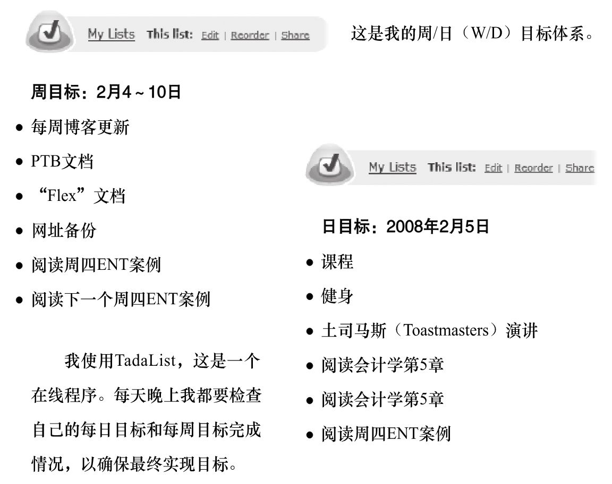

##### 高效率秘籍4　批处理

批处理的意思就是将那些类似的、散在的工作集中起来一次做完。批处理有助于节省时间，因为你可以集中时间和精力。

在家庭作业和写作之间，我经常使用批处理。我会集中在某个时间把一周需要阅读的材料一次性读完，而抽出另外一个时间连续写三四篇文章。

下面我介绍批处理的一些使用技巧。

（1）工作量。批处理最适用于将那些需要时间不长的零散工作放在一起做。你不能将整个课程都安排在考试前一天批量看完。超过3个小时的工作用批处理，效果就不好了。

（2）一次性完成作业。如果一项作业花费的时间不会超过8小时，我就坐在凳子上一鼓作气完成它。将一个花3小时就可以写完的文章，分成15次零散时间内完成，肯定会浪费很多时间，每一次都要花时间重新鼓起写作的激情才能开始正式的写作。

（3）提髙注意力阈值。注意力阈值就是指集中完成某项工作的最长时间，超过这个时间，注意力就急剧下降。通过不断接受越来越多的批处理，你可以逐渐提高你的注意力阈值。阈值越高，表示能一次完成的工作量也越大。

小贴士

想进一步了解批处理法？看看这篇文章吧：《批处理：节省时间、减轻压力的20个小技巧》。

##### 高效率秘籍5　有组织

有组织并不能让你获得A，我就知道有些A+的学生组织技能极差，而有些C成绩的学生知识管理得很有系统。有组织的确能帮助你更有效率，提高学习能力，但是它并不是万能的。

假如你做事杂乱无序，下面是一些让你变得有组织的关键步骤。

（1）所有的物品都放在固定的位置。作业、课外作业以及约会日期都记录在固定的地方。没有固定地方的结果就是混乱。专门找一个地方放东西，这样会更容易放得有序。

（2）随身携带一个记事本。每天随时记录，日积月累，必有所获。

（3）坚持日历和做事清单。应用做事清单记录任务和目标，使用日历来记录要做的事和截止日期。

虽然有组织不是万能灵药，但是它的确很有帮助，组织技能可以大大提高学习效率，而且能缓解压力。

小贴士

如果你正在与做事无计划、无组织的恶习作斗争，我建议你阅读Zen
To Done，作者Leo
Babauta。这本书集中讨论了有组织中最难的部分，并将这些技能变为习惯。Babauta创造了一个简单的框架实现做事更有组织性和计划性。

#### 自我教育

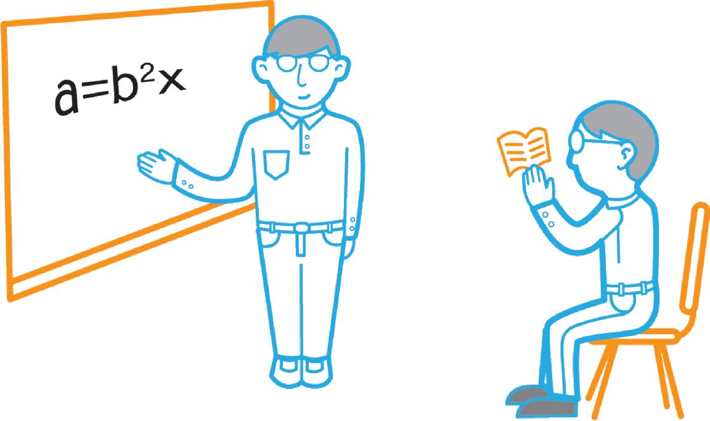

不要把整体性学习仅仅用于课堂上，而且要用于你的个人生活中。事实上，我发现积极进行自我教育能提高你的学习能力。闲暇时间能专心研究一门让你感兴趣的课程，本身就是一种莫大的奖赏。

不过，进行自我教育也有很多挑战。自我教育没有学校这种组织，难以找出重点、提供足够的资源和检测你的学习效果。

我从小就积极进行自我教育，自学了电脑编程、网页设计以及写作。我还自学了诸如世界宗教史和进化心理学等课程。从自我教育中，我学会了很多有用的东西，并把它们应用到自己的日常生活中。

我的大多数自我教育都是采取以项目为基础的学习方式，不过还有其他一些办法能帮助你提高自我教育的能力。建立良好的习惯、克服种种学习障碍以及设立适当的学习目标也同样大有裨益。

##### 建立良好的学习习惯

一个正规的学校体系可以很容易帮你形成良好的学习习惯。在课堂上回答问题、阅读课本、参加考试、在课堂上记笔记，所有这些行为并不仅仅是老师帮你建立的，而是在学校这样的环境中由围绕在你周围的数百人影响的结果。

自我教育则很难形成这种良好的习惯，这是角色的不同造成的结果。你想学习的东西一开始并没有什么教学安排给你，假如没有正确的学习习惯，这种自由会变成一种弱点。以下是一些我认为可以提高你学习能力的良好习惯。

1. 每日阅读

每天坚持阅读是提高理解能力最好的途径之一，我坚持每周至少阅读一本书，每年至少读50~70本。书籍不能教会你全部事情，但是它会给你打下坚实的知识基础。随着阅读量的增加，你的视野会更开阔，看问题的角度会更广泛。

2. 每日练习

通过每天完成项目的工作以及学习技能的练习，你会提高自己对书本知识的理解。练习能为你的学习提供循序渐进的安排，因为练习会对你最初的能力水平予以定位。

3. 每日目标

单纯的阅读和练习并不够，因为它们目的性不强。通过设置学习目标，并把目标细分为每天要完成的工作，你的学习会更有用，因为你可以整体系统地学习某学科，而不是碎片化地获取知识。

怎样养成每日习惯

习惯的养成是另外一个课题，足以写一本书。我专门为此写过一本电子书。改变习惯并不像想象的那么困难，我在下面列举了一些养成正确习惯的方法，供大家参考。

（1）坚持某个习惯30天。比如每天阅读40页坚持一个月，每天练习网页设计一小时。为你接下来的30天设定一个每天都要坚持的学习目标吧，30天的坚持会形成一种习惯。

（2）坚持下去。每天坚持以同样的方式完成同样的习惯，今天阅读，明天听讲，后天练习的方式对于养成习惯来说太脱节了。

（3）享受这个习惯。假如你不能享受这个习惯，这个习惯就不牢固。用头脑风暴法列举出各种各样可以养成的习惯吧，我想在一大堆想法中找出一个让你享受的习惯（阅读、练习和目标设置）应该不难。

（4）寻找特殊时段。我喜欢晨读，因为这对我来说是一段不受打扰、可以专心思考的安静时段。找到属于你的每天特殊时段有助于强化你的习惯。

假如你不知道在哪儿能找到每日阅读或练习的时间，问问你自己为什么有充裕的时间看电视和上网？

小贴士

如果你想知道更多关于如何改进习惯的知识？可以参阅我写的《习惯的掌握》（Habitual
Mastery）。如果你还想更加深入了解，请阅读我写的电子书《如何改变一个习惯》（How
to Change a Habit）。

##### 克服挫折障碍

自我教育和挫折感常常相伴而行，没有老师在旁边指导什么是对的和什么是错的，或者有本指导书告诉你下一步该怎么办。自我教育比上课需要更多的耐心，同时我也发现上课通常如缓慢步行的老者，自我教育则可以快步如飞。

归根结底，克服自我教育过程中的挫折感是动机的问题。如果你对某门课程兴趣强烈，而这门课程又对你非常重要，那么一般的学习上的挫折是无法阻挡你前进的。除了兴趣之外，我还推荐下面一些克服挫折障碍，让自学“飞起来”的方法。

减少挫折障碍的小技巧。

（1）写下任何障碍。假如我遇到编程中某个目前无法解决的问题，我会尽量详细地记下问题，详细地记下障碍让我们对问题的思考更容易。

（2）使用网络。网络就像无所不知的智者和收藏丰富的图书馆。如果你想不明白某个问题，或者正在苦苦地翻书寻找答案，网络可以助你一臂之力。谷歌、读秀、中国知网（CNKI）都是不错的选择。

（3）找一本关于“怎么做”的工具书。有一种书不谈理论，专门告诉你“怎么做”，这对于你打算做什么事情来说是非常有价值的。

（4）换一个角度试试。如果理解时碰到一个障碍，试试从一个不同的角度来看问题。花点时间学习其他相关知识，等你学会了很多以后，再回过头看看原来的问题。

##### 设置学习目标

自我教育中可能碰到的最大问题就是缺乏系统安排、没有目标、缺少计划和方向。尽管这种松散的模式容易让你拓展所学的知识，而不是只掌握老师教你那点东西，不过，这也使得自学过程难以坚持长久。没有学校有计划的教学安排，自学需要学习者强大的内在自我约束机制，方能保证自己跨过一个又一个的障碍。

我发现设置一个吸引人的学习目标会给学习者带来强大的学习动力。下面是一些学习目标的例子。

·每年阅读一定量的书。

·为一个项目工作，工作的过程也就是学习的过程。

·在一定的期限之前，必须学会做某件事。比如：学会作曲，完成你的财务报表，或者在6月3日之前学会说拉丁文，等等。

给自己设定完成期限看起来有点不通人情，但是要不然目标会自动完成吗？

不过太多的安排也会限制人的自由，让人喘不过气来（我相信这是大多数人对传统教育的感觉）。太少的安排则可能使学习令人生厌和目标性不强，这样的学习容易陷入自由散漫的状态之中。设定学习目标可以给你恰当的安排，你可以在这之下拓展、探究新的知识，这样的自我教育就不是随意的，而是有组织、有系统、有计划和目的的学习了。

设定学习目标的一些技巧：

（1）所有的目标都要写下来。目标没有写下来，就等于没有目标。用一两个句子写下目标，并给它一个截止期限。

（2）让目标客观化。学习过程中，你要能很容易判断出是否已经达到了目标。所谓的“学得更多”不是学习目标，因为它不客观，你不知道怎样才算是完成了目标，所以它只能是一种幻想。

（3）设定有些困难，但是努把力也可以达到的截止期限。给自己达成目标设定一个期限会迫使你不断地采取行动，而不是拖延不前。假如期限定得太松，就起不到促使你行动的作用；如果期限定得太紧，会让你丧失信心，垂头丧气。

（4）将目标的完成转化为每日和每周的具体行动。你的目标应该分解为每日和每周的具体小目标。一个今天就需要立即完成的小目标远比几个月后的大目标更让人坐立不安，焦急万分。

（5）经常看看你的目标。至少一周检查一次目标完成的情况。

小贴士

对于设定目标，可以进一步阅读我写的文章《设定目标的九个步骤》。

##### 自我教育小结

自我教育潜力巨大，养成良好的学习习惯和学习方法一开始很困难，但是这些好习惯对于以后方方面面都有益处。

下面是我收集的一些关于自我教育的网上资源。

MIT　OpenCourseWare──MIT提供的网上免费课程。

EHow.com──关于“怎样做”的各种文章。

FreeEd.net──“网上免费教育”。

Portal to Free Online Courses──很多名牌大学在线课程的入口。

现在就开始吧

整体性学习不是那种你读一次就能马上掌握的方法，它是一种包含多种技巧的策略选择和运用，所有这些技巧都可以改进你的学习方式。通过亲自试一试、不断练习这些技巧，会给你很多学习上的启示。

从哪儿着手开始应用整体性学习取决于你自己，但是假如你不确定从哪里开始，不妨听听我的建议。

分析你的强项和弱点

在阅读整体性学习策略之后，第一步应该是找到你的优势在什么地方，弱点是什么。有些弱点是可以避免的，有些弱点则需要弥补。

你可能已经明白自己擅长的科目是什么（数学、历史、艺术、科学，等等）。现在你应该花点时间问问自己在应用整体性学习策略中，最困难之处是什么，最不擅长处理哪一类信息。就我来说，我知道自己擅长处理抽象信息和具体信息。我有发达的视觉学习能力，这在本书中也有很多体现。在整体性学习环节中，我最擅长的是拓展阶段，当然通过练习，我在获取和纠错方面的能力也大有提高。

我的弱点是处理随意信息，虽然学习了本书提到的那些工具后，处理随意信息的能力有所改善，但是处理一堆事实、日期或者定义从来都让我头痛不已。知道自己学习上的强项和弱点之后，就可以扬长避短，学习新技术以弥补任何不足。

从智力挑战开始

智力挑战的目的是养成新的习惯，许多新方法一开始用起来都很费时间。练习2~4周后，速度和效果会大大提高。最后，你需要根据学习的目标对方法进行适当的改进。

以下是一些重要的技巧。

（1）至少坚持3周。可能你想学会本书介绍的很多技术，但是要记住，如果你不坚持3周以上的智力挑战练习，很难将新技术变成一种习惯。

（2）一次只做一个。不要试图一次完成几个智力挑战，一次只专注一个。

（3）比喻、内在化和图表法优先。这些是整体性学习中的核心技术，就从它们开始吧！

（4）使用奖励材料。本书附赠有6段专门设计用于练习智力挑战的奖励材料，利用它们会让你更轻松些。

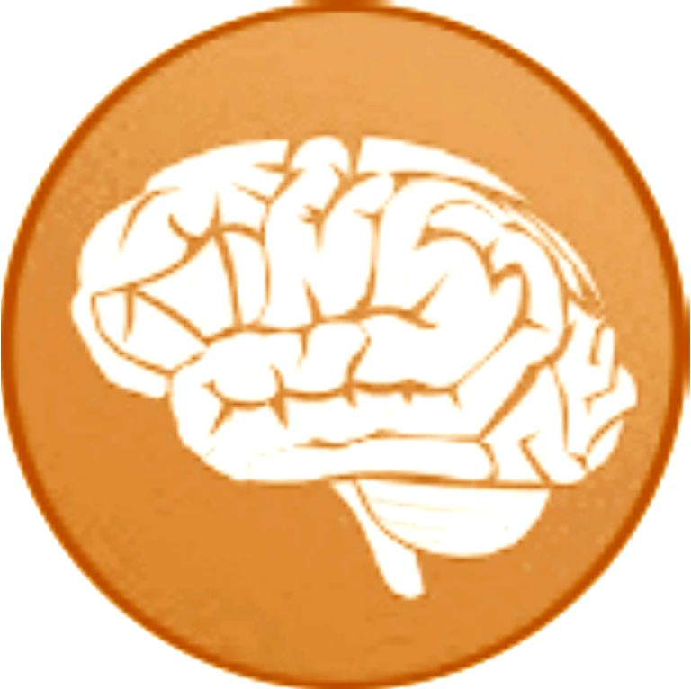

（5）记录下学习的过程。练习智力挑战时，坚持写一句话日记，用一两句话记下你的体会和感受，有助于你坚持下来和解决练习中的各种问题。

建立良好的学习程序

本书中绝大部分内容都是介绍如何节约学习时间的心智活动。良好的学习方法有良好的学习策略，不过即使学习策略一流，如果你的学习习惯不好，一定也会浪费大量的时间。

下面介绍一些你需要知道的保持高效率的建议。

（1）是每天学一点还是考前抱佛脚？看起来后者节约时间，实际上前者才是高效率。

（2）你的笔记和课本组织得好吗？虽然我喜欢一次学习就搞定它，但是有时候我们还是需要复习，假如学习材料凌乱无序，肯定会浪费时间。材料越有组织，复习起来压力越小。

（3）学习时注意力高度集中，还是左顾右盼、三心二意？我学习时从不听音乐、玩手机或看信息，我总是尽量找一个没有人的地方学习。

（4）怎样变得更有效率是一个专门的问题，在我的网站上有很多讨论，也有很多专门的书讲这个问题，下面我列举了一些网址供大家参考。

高效率网址

ScottHYoung.com　我个人的网站，专门讨论高效率、学习方法和习惯养成。

ZenHabits.net　简单就是高效率。

Lifehack.org　最大的高效率网站之一。

PickTheBrain.com　高效率和动机。

StudyHacks　高效率的学生。

StevePavlina.com　个人发展网站。

高效率书籍

Getting Things Done（David Allen的经典）

The Power of Full Engagement（能量管理）

Zen To
Done（讲述如何做事，强调的是慢慢养成良好的习惯）

How to Be a Straight-A Student & How to Win at
College（两本经典之作，帮助你变得高效率，应付各种学习上的挑战，必读之作）

了解你想要的生活

没有任何方法、技巧、技术、诀窍能代替动机、兴趣和热情。学习需要理由，比如考个好成绩或者纯粹想了解知识之类的理由。如果你什么理由也没有，那你最好别去上学了，上学也是纯粹浪费时间。我从来没有说过每门课我都喜欢，但是不喜欢不代表没有理由去学习，因为我至少想拿个好分数。

一直以来，我对学习本身就非常有兴趣。新的知识和学科总是让我着迷，不管上学还是工作以后。这种对学习本身的兴趣对于人的一生来说至关重要，也更容易接受和应用整体性学习策略。

没有人能逼迫你喜欢自己讨厌的东西，没有任何一种策略能促使你学习不想学的东西。如果你仅仅想得到名牌大学的文凭，而不是知识本身吸引你，那么拿到文凭后你该怎样继续学习？

找到你学习的理由，即使理由简单、古怪，也要有一个学习的理由。

古人读书为了光宗耀祖，今人读书为了上大学，找个工作，挣钱养家糊口，这都是学习的理由，但这些都不是最好的理由，最好的理由就是知识本身吸引你不断学习、不断深入下去。

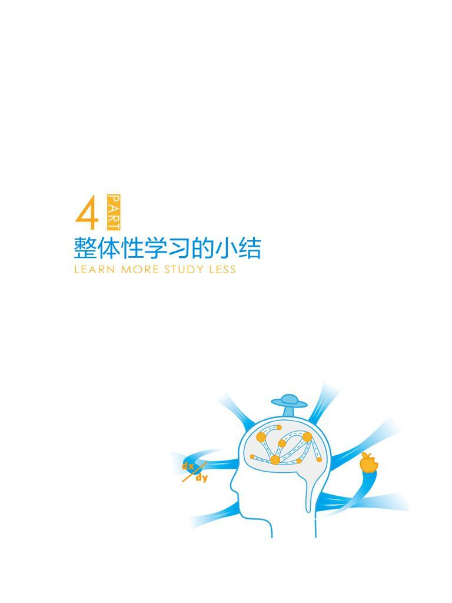

#### 主要概念的小结

好了，在前面近200页的书中，我们介绍了很多内容，现在就做一个小结吧。

整体性学习策略强调将信息编织到知识网络中，而不是给自己加上机械记忆的负担，这个策略的基础有以下几方面。

（1）结构──关于某个学科的知识之间联系的总和，它是你大脑中的城市。

（2）模型──将信息压缩成最基本的单元，模型是结构的种子。形成模型的方法包括比喻法、内在化和图表法，模型是你的知识道路交通图中主要的几个十字路口。

（3）高速公路──不同结构之间的联系，有助于创造性的思考。“跳出盒子之外思考”很好地描述了这种跳出原有结构，从其他结构来观察原有结构的思考方式。

整体性学习有5个步骤，但是并非按部就班，只是大体按此顺序进行，不能拘泥于这种顺序。

（1）获取──通过感官获取信息。

（2）理解──明白信息的表面意思。

（3）拓展──与其他信息建立联系，拓展有三种主要方式。

a）深度拓展──探究知识的背景。

b）横向拓展──探究知识的关系。

c）纵向拓展──与其他结构联系后，从其他结构的角度探究知识。

（4）纠错──剔除错误联系。

（5）应用──将知识应用到各种情境中去，包括现实生活。

信息的消化吸收类似于食物的消化吸收，不管你吃的是什么，过程是一样的，但是吃的东西可以大不相同。认清不同的信息类型有助于选择不同的学习方法，信息的类型有以下五种。

（1）随意信息──事实、日期、列表、规则以及某种顺序。信息特点是没有逻辑分类或相互关系不强。

（2）观点信息──信息的唯一目的就是支持或者反对某种观点。容量在这儿是最重要的，而不是能记住。

（3）过程信息──它是指某种技能的信息。需要反复练习，但是容易记住。

（4）具体信息──容易视觉化的信息，一般是与实际紧密联系的信息，容易有自己的经验。

（5）抽象信息──信息不容易有自己的经验。数学、哲学和物理学都是非常抽象的领域。（不过看过《别闹了，费曼先生》，就知道费曼最过人之处就是别人看到的是抽象物理知识，而他看到的是实际生活。──译者注）

##### 技术一览

快速阅读

（1）指读法。

（2）练习阅读。

（3）积极阅读，改善边读边学的效率。

笔记流

（1）不要呆板、僵硬、貌似层次分明的笔记。

（2）在写下来的观点之间建立联系。

比喻法

寻找历史中的故事、图像或是过程，它与我们现在学习的东西有某种类似。

内在化

（1）为你正在学习的东西创造脑海中的图像。

（2）在这幅图像上加入其他感官和情感。

（3）寻找图像不适用或不足的地方，防止产生错误的联系。

图表法

创造流程图、概念图或图像，将若干观念联系在一起。

联想法

（1）创造一系列容易视觉化的符号。

（2）在条目之间创造联系，这种联系是可以“看得见的奇特场景”。

（3）在第一个条目和触发物之间建立联系。

挂钩法

与联想法相似，只不过我们是把每一个条目与事先建立好、容易回忆的0~12的视觉符号相联系。

信息压缩

3种主要形式：

（1）记忆术──压缩若干知识，用一个单词代替。

（2）图像联系──创造一幅能联系若干知识的图像。

（3）笔记压缩法──用寥寥几页纸缩写内容庞大的笔记。

实际应用

寻找将知识用于你日常生活的途径。

模型纠错

经常性地解决各种问题，以发现整体性知识网络中的潜在错误。

以项目为基础的学习

建立一个大约需要1~3个月完成的项目，从而逼迫自己不断学习、实践和解决各种各样的问题。这对自我教育来说是有用的练习，特别是在没有什么知识结构可以指导时。

高效率学生

（1）管理能量。

·保持体型，健康饮食，不要熬夜。

·一周休息一天。

（2）不要“学习”。

（3）绝不拖延。

·建立每周目标和每日目标清单以保持注意力。

（4）将那些类似的、散在的工作集中起来批量完成。

（5）有组织。

·拥有一个日历和做事清单，永远随身携带一个笔记本。

自我教育

自我教育费用低廉、方便迅速、收益大，但是实行起来也有很多难点。它缺乏系统安排，较传统教育学起来难度更大，提高自学能力的主要办法有以下几种。

（1）养成良好习惯。

（2）克服挫折障碍。

（3）设定学习目标，记录学习过程。

#### 特别感谢

我非常感谢所有参与到整体性学习试验中的人们，你们的辛苦努力帮助我完善了很多观点。我同样要感谢每一位对我的第一本整体性学习书提出宝贵意见的读者，你们宝贵的思想和建议是我写作本书的最大动力。

我还要感谢关注我博客的朋友们，你们给了我持久的鼓励。感谢Leo Babauta，Cal
Newport和Gleb Reys的支持和帮助。我还要感谢Steve Pavlina，Ben
Casnocha，Tim Ferriss和Brad
Bollenbach的伟大思想。限于篇幅，还有太多太多的人就在此一并感谢，不再一一罗列。

尤其要感谢Marian，Douglas和Megan Young，你们的教诲让我终生受益。

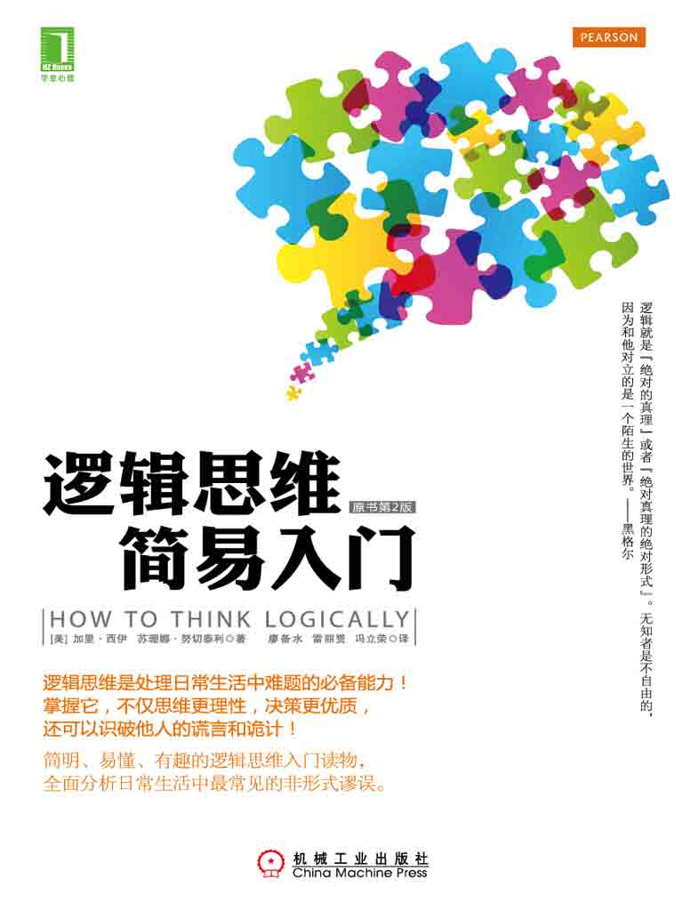

逻辑思维简易入门（原书第2版）

How to Think Logically 2nd Edition

\[美\]加里·西伊（Gary Seay）苏珊娜·努切泰利（Susana Nuccetelli）　著

廖备水　雷丽赟　冯立荣　译

ISBN：978-7-111-42745-2

本书纸版由机械工业出版社于2013年出版。电子版由华章分社（北京华章图文信息有限公司）全球范围内制作与发行。

版权所有，侵权必究

客服热线：+ 86-10-68995265

客服信箱：service@bbbvip.com

官方网址：www.bbbvip.com

新浪微博 @言商书局

腾讯微博 @bbb-vip

# 前言

这是一本逻辑学和批判性思维的入门书籍，但涉及的主题十分广泛，包括某些哲学和归纳问题、非形式谬误以及命题和传统三段论逻辑。本书旨在以本科初学者可接受的方式讨论上述话题，是为并未接触过哲学以及对分析性思维十分陌生的学生设计的，行文简易、直接，专业术语数量降至最少，符号也较简单。正文中的专栏对主要内容进行了总结，旨在帮助学生重视本书提出的重要区别和基本观念。尽管本书以大学生可以理解而且容易理解的方式讲述14章的内容，但在阐述逻辑原理方面又十分严谨。因此，这种写作方式绝不损坏准确性。

《逻辑思维简易入门》可以指导我们分析、解释和评估论证。它旨在帮助学生区分好的推理和坏的推理。本书分为四部分。第一部分专门讲解论证的识别与构成。第1章介绍分析论证的方法，重点是论证的识别以及推论的形式和非形式方法的区分。第2章详细考察了建构论证的语言，研究了逻辑力量、语言价值、修辞力量、语句类型、语言使用以及定义。第3章考察了陈述的认知层面，陈述是推论的主要构成部分。该章解释了在如果说话者真诚且称职，那么他们所说即是所信的预设下，信念认知层面的优点和缺点都会影响陈述这一观点。第二部分专门分析演绎和归纳论证，主要区分了学生应该能识别的分属两类论证的不同子类。这一部分还讨论了宽容性和忠实性原则，拓展论证、省略三段论以及四类规范性论证。第三部分为学生展示思考过程中的一些基本层次混淆会如何导致有缺陷的推理，指导他们识别20种最常见的非形式谬误。第四部分由第11～14章构成，详细研究了命题逻辑确定有效性的基本程序，以及传统三段论逻辑中简化的有效性证明方法。学生在这一部分所学到的将远远超出第5章的内容。

依据培生出版社推荐的匿名评审以及使用本书的哲学家们的建议，我们在《逻辑思维简易入门》（第2版）中做了很多修改，包括：

为了更好地介绍论证这一核心主题，我们重写了第1章。本书中非论证的内容现在包括解释、条件句、虚构话语。

第2章在讨论了语言的比喻意义和间接使用问题之后，比较简明地介绍了定义理论。除此之外，还研究了语句类型、结合语言的使用，讨论了言语行为理论并对其进行了详细且及时的研究。

第3章较明晰地讨论了矛盾与一致性问题。

第1版第4章中的“评价性推理”细化为伦理、法律、美学、审慎规范和论证。

本书在说明非形式谬误的过程中列举了许多新的、不同难易程度的实例，及时更新了第1版中的例子。

本书扩充了每章习题，并增加了新题型，学生可以在学习过程中得到更多的训练。因此，教师在做课堂讨论或布置课后作业时都拥有更丰富的选择空间。

我们简化了本教材的内容编排，因此，它可以更好、更经济地帮助教师达到如下目标：教导学生如何培养批判性推理技能。遵循评审反馈的意见，如果还要讲解逻辑学的内容，那么在15周内根本没有时间使用第1版所设计的“哲学角”部分，因此，第2版去除了这部分内容。新版引用的哲学理论极少，即使用到，也是结合非形式逻辑的内容一并讨论。

第2版仍然保留了前一版的许多特色。本书提供了丰富的有益于教学的工具，既包括更多的习题，又包括学习上的问题以及关键词。书后附有重要术语的详细列表。<a href="#part0074.html_z1" id="part0074.html_zz1"
class="pcalibre calibre2">[1]</a>

感谢培生教育集团的编辑Nancy Roberts和本书的项目经理Kate
Fernandes，特别感谢培生的主编Dickson
Musslewhite，他在推出这一版的关键点上提出了有见地的指导性意见。同样感谢培生集团选择的评审哲学家们的批评。那些关于第1版的批评尽管很尖刻，但总是一针见血，正是它们造就了这本优秀书籍的面世。

- <a href="#part0074.html_zz1" id="part0074.html_z1"
  class="pcalibre calibre2">[1].</a>习题和术语表可在华章网站www.hzbook.com
  上查阅。

# 第一部分　推理的构成

## 第1章　什么是逻辑思维？我们为什么要关心它

### 推理的研究

逻辑思维或者非形式逻辑思维，是致力于推理研究的哲学分支。虽然在这一点上它与其他哲学和科学学科相同，但还是有一些不同的地方。例如，认知心理学和神经科学也研究推理，但它们主要关注处于推理底层的心理和生理过程。相反，逻辑思维侧重于此类过程的结果，即推理过程中信念以及构成信念的要件之间的某种逻辑关系。它也关注陈述之间的逻辑关系：当说话者真诚且称职时，这些陈述就表达信念之间的逻辑关系。

推论或论证

就逻辑思维而言，推理（reasoning）由逻辑关系构成。最突出的一种关系是：一个或多个信念被用来支持另一个信念。这种关系被称为推论（inference）或论证（argument），当推理或论证主体使用一个或更多信念支持另一信念时才会获得。推论可以是强的、弱的或者不成立的。一个强推论就如：

例1-1　所有鲸鱼都是哺乳动物，并且莫比?迪克是鲸鱼，因此，莫比?迪克是哺乳动物。

例1-1是一个强推论，这是因为：如果作为依据的信念（“所有鲸鱼都是哺乳动物”，并且“莫比?迪克是鲸鱼”）是真实的，那么它们要支持的信念（“莫比?迪克是哺乳动物”）也一定是真实的。但是请看例1-2：

例1-2　没有来自佛罗里达的橘子是小的，因此，没有来自美国的橘子是小的。

在例1-2中，信念之间的推论是弱逻辑关系，因为被提供的这个原因（“没有来自佛罗里达的橘子是小的”）可能是真实的，但是它要支持的信念（“没有来自美国的橘子是小的”）是虚假的。不过，例1-2还不是最糟的情况。在一些尝试性的推论中，用来支持另一个信念的某个信念或多个信念可能并不能达到目的。如：

例1-3　没有橘子是苹果，因此，所有榆木都是树。

在例1-3中，因为“因此”出现在两个信念之间，所以很明显“橘子不是苹果”被用作“所有榆木都是树”的一个原因。但它实际上却不是。虽然这两个信念恰好都是真的，但它们之间的推论关系不成立。再来看一个不成立的推论，这次涉及虚假的信念：

例1-4　所有律师都是瘦的，因此，现任教皇是中国人。

因为在例1-4中，两个信念之间毫无关系，因此它们都不能支持对方。和例1-3一样，推论不成立。

推论的成立和不成立是逻辑思维的主题。现在让我们更具体地看看逻辑思维是如何展开这个主题的。

### 逻辑和推理

逻辑思维的维度

推论是推理过程中信念或思想之间最根本的逻辑关系。逻辑思维研究这种逻辑关系以及其他逻辑关系，并着眼于：

（1）描述推理的模式。

（2）评估决定推理好坏的特征。

（3）制定能最大限度地解释好推理所具有的特征的规则。

上述每一项任务都可以看作逻辑思维的一个维度。第一个维度描述逻辑关系，其首要任务就是辨认推论的共同形式。第二个维度区分这些关系中好的和坏的特征。第三个维度制定充分推理的规则。规则能够帮助我们充分重视好推理
（极度轻视坏推理）所具有的特征。三个维度及主要任务的构成如图1-1所示。

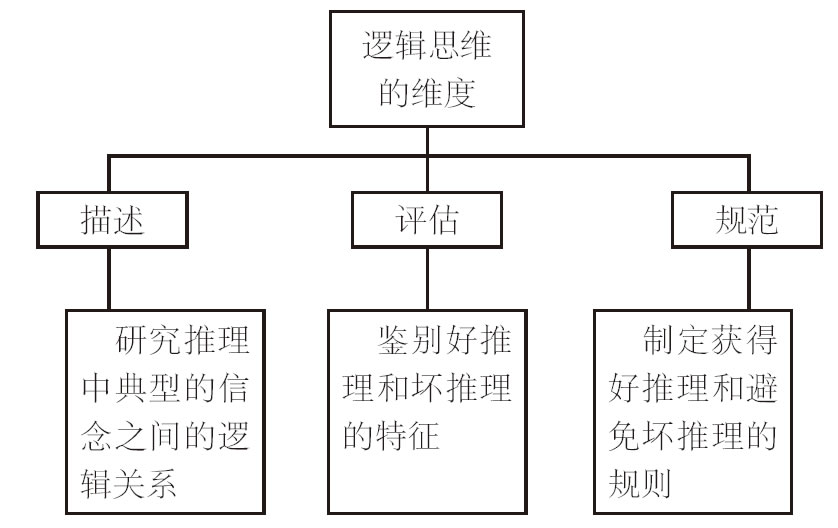

图1-1　逻辑思维的三个主要任务

了解这些维度对推理的研究是至关重要的。第三维度尤其关系到我们推理的可靠性，因此很有实用性或现金价值。它的实际价值就在于其制定的用来切实改进推理的规定。但这个维度要依靠另外两个维度，因为对充分推理有帮助的规则要求对推理确立的普通逻辑关系有精准的描述（如推论），并且还要求有足够的标准来确定逻辑关系成立或不成立的特征。

形式逻辑

我们所说的“逻辑思维”就是通常所知的非形式逻辑。非形式逻辑与形式逻辑（哲学的另一个分支）都研究推论以及其他逻辑关系。但是在研究范围和方法上有所不同。形式逻辑又称为符号逻辑。为了从作为公理的公式中推导出定理（像数学证明方法那样），它发展出了自己的形式语言。

任何形式逻辑系统都包括基本的符号表达式、形式语言的初始词汇及其运算规则。这些规则规定如何形成合适的公式，以及如何确定哪些公式是其他公式的逻辑后承。因此，在形式逻辑中，推论是公式之间的关系，即当一个公式可以从另一个或多个公式推出时，该关系成立。形式逻辑使用的符号记法可能很复杂，并且其公式也不必被转换成自然语言──特定群体共同使用的语言，如英语、阿拉伯语或者日语。就形式逻辑而言，推论就是公式之间的关系。这既不是信念之间的关系，也不是陈述之间的关系。此外，它也不等同于人们在日常推理中实际所做的推论。

非形式逻辑

与形式逻辑相反，逻辑思维则完全地集中于实际推理中的逻辑关系研究。当我们进一步思考专栏1-1中的问题时，就可以看到在各种常见的情况中，逻辑思维的三个维度与推理的关系。

专栏1-1　逻辑思维的一些实际用途

刑事诉讼：被告是否有罪？我们如何提供不在场证据？

日常问题：哪所学校最好？孩子应该去私立学校还是公立学校？

科学难题：如何选择两个同样充分但却相反的科学理论？

哲学问题：身心是同一件事情吗？

道德问题：安乐死是否符合道德标准？堕胎呢？

政治决策：这次大选我应该投票给谁？

经济决策：我应该听经纪人的建议投资这只新的基金吗？

健康问题：根据我以往的病历，锻炼对我有好处吗？我需要更多的健康保险吗？

逻辑思维用这三个维度来处理我们所做的推理以及其他问题：描述特定推论的基本逻辑关系就是对其进行评估并确定是否符合有效推理的规则。进行这些分析并不要求用形式语言，因而逻辑思维有时被称为“非形式逻辑”。虽然该逻辑也可能涉及一些特殊符号，但这不是必须的：分析完全可以用自然语言进行。此外，与形式逻辑不同的是，我们这里所说的“逻辑思维”方法研究的是信念或者信念的语言学表达（即陈述）之间的推理关系。

那么，我们为什么要关注逻辑思维呢？首先，我们想要避免虚假的信念，拥有尽可能多的真实的信念，并且这些信念之间都是以逻辑的方式相互关联的。逻辑思维正是实现这一想法的一个工具。其次，从对知识的好奇心来说，学习推理中的逻辑关系本身就是一件值得投入的事情。最后，逻辑思维能够帮助我们在实际情况中进行充分推理，这是经常发生的事情。只要我们想要更好地解决诸如专栏1-1中的问题，逻辑思维就有用武之地。我们每个人都会面临某个问题，例如，想要说服他人接受某个观点，写作一个有争议的话题，或者仅仅是在两个似乎站得住脚但又不相容的陈述间做出选择。要想解决这些问题，逻辑思考的能力是必需的。接下来我们将更深入地分析这个重要的思维能力。

### 什么是论证

在本书中，我们所说的“推论”就是一个或多个信念对另一个信念的支持关系，而“论证”是一个或多个陈述支持另一个陈述的关系。如果说话者是真诚的并且有推理能力的，那么他们就相信自己的陈述，并且他们的陈述表达了自己的信念。因而“推论”和“论证”可以是同一关系。正如信念是推理的基础部分，或者说构件，陈述是论证的构件（见专栏1-2）。陈述和信念类似，它们都有真值，或者是真的（“苹果不是橘子”）、或者是假的（“教皇是中国人”）。

专栏1-2　论证的构件

陈述是论证的构件。

陈述有真值，因为它们表达信念，而信念是有真值的。

每一个陈述或者是真的或者是假的。

只有可以表达信念的句子才能做出陈述。

下列这些句子都不能做出陈述。

表达句。如：今天天气真好！

命令句。如：请把门关上。

疑问句。如：上周末你都干什么了？（第2章将对此做更多介绍。）

但不是所有的陈述之间的关系都能构成论证。假设有人说：

例1-5　费城是大都市，芝加哥更大，但是纽约最大。

虽然例1-5由三个简单陈述构成，但它不是一个论证，因为没有尝试呈现一个论题，即这些陈述并没有以论题、论据的形式排列。这是三个并列的陈述。相反，请看以下例子：

例1-6　我思，故我在。

例1-7　所有律师都是代理律师，杰克?麦科伊是律师，因此杰克?麦科伊是代理律师。

例1-8　没有按摩医生是外科医生，只有外科医生可以合法地进行一个冠状动脉搭桥术，因此，按摩医生不可能合法地进行一个冠状动脉搭桥术。

例1-9　黑斑羚跑得比自行车快，玛莎拉蒂跑得比黑斑羚快，日本高速列车跑得比玛莎拉蒂快，因此断定日本高速列车跑得比自行车快。

上述每一个例子都提出了一个断言，并且至少有一个陈述支持这个断言。这是所有论证共有的基本特点：每个论证必须至少由两个陈述构成；一个提出断言，另一个支持断言。提出断言的陈述是结论，而支持断言的陈述是前提（可以有一个或多个前提）。

我们现在介绍的显然是一些特别的术语。在日常语言中，“论证”通常指“争辩”，即敌对双方或多方之间的语言交锋。但是，这与“论证”在逻辑思维中更为学术性的使用不同。逻辑思维中的论证与法庭上的“论证”相似。在审判时，每位代理律师都会提出一个论证。也就是做出一个断言（比如“我的委托人是无辜的”），然后给出一些支持该断言的理由（“案发当晚他去看望他的母亲了”）。律师这么做并不是与庭上的某个人争辩，而是声明一个主张并提供支持主张的证据。这与逻辑思维中的“论证”非常相似。一个论证是一组语句，旨在提出一个受支持的断言。根据定义可知，论证不是敌对双方的口头交锋。

在进一步分析论证之前，我们来看专栏1-3对我们已经知道的语句间关系的总结。

专栏1-3　小　结

在逻辑思维中，“论证”这个术语的含义与法庭上的“论证”含义相似。

一组语句要成为一个论证，则必须有一个语句被另一个或多个语句支持。

一个论证指两个或多个陈述之间的逻辑关系，包括一个论题和一至多个论据。其中，论题做出某种断言，而论据则是支持该断言的理由。

论证分析

所有的逻辑思维者都应该具备的一个基本能力是分析论证，即图1-2所总结的一个技能。分析论证有什么具体的要求呢？必须知道以下3点：

1.如何识别论证；

2.如何确定论证各个部分之间的逻辑关系；

3.如何评估论证。

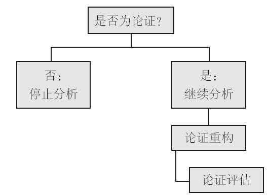

图1-2　论证分析的步骤

识别论证就要确定构成论证的各个语句之间的逻辑关系，这对重构论证的过程是至关重要的。重构论证从仔细观察可能包含论证的口头或书面语言开始。我们必须仔细读或仔细听，才能确定是否出现了一个断言，并且有支持该断言的依据。如果我们识别出一个论题以及至少一个论据，就可以确信这段话语包含一个论证。下一步是把论证的各个部分有序地组织起来，使得论据和论题之间的关系一目了然。

论证重构是分析论证的第一步，论证评估是第二步。但在开始论证分析之前，我们要确定这段话语有没有论证。如果有，则进行重构，即首先要确认我们已经准确地找到前提和结论。为此，颠倒论证各个部分的逻辑顺序──将论题放在最后──是很有帮助的。在论证评估过程中，我们要确定论证的依据是不是真的支持论题，从而为论题提供了可靠的理由。但在评估之前，我们必须对论证进行适当的重组。因此我们需要特别注意一点：如何正确区分前提和结论。

### 重构论证

识别论据和论题

我们现在来重构本章前一小节的论证例1-6～例1-9。对每一个论证，我们都进行重写：将论据放在前面，论题放在后面，并给每一个语句标上数字，以便于以后引用。如果有两个或多个论据，就我们的目的而言，论据之间的顺序无关紧要。还有一个惯常的做法：在论题的上方画一条水平横线或加上“因此”等词语，来表示接下来的语句是一个论题。在重构后的论证中，我们用水平横线来表示即将得出一个论题。当你看到横线时，就会想到“因此”。论证例1-6～例1-9的重构如下所示：

例1-6a　1. 我思。

2\. 故我在。

例1-7a　1. 所有律师都是代理律师。

2\. 杰克?麦科伊是一名律师。

3\. 杰克?麦科伊是一名代理律师。

例1-8a　1. 没有按摩医生是外科医生。

2\. 只有外科医生才能合法操作一台冠状动脉搭桥术。

3\. 没有按摩医生能合法操作一台冠状动脉搭桥术。

例1-9a　1. 黑斑羚跑得比自行车快。

2\. 玛莎拉蒂跑得比黑斑羚快。

3\. 日本高速列车跑得比玛莎拉蒂快。

4\. 日本高速列车跑得比自行车快。

例1-6a～例1-9a都至少有一个论据，但是，正如实例所示，也可能有多个论据。原则上，一个论证的论据数量没有上限。在所有这些重构后的论证中，论据都先给出，论题最后给出。但是“论据”并不表示“先出现的语句”。“论题”也不是“后出现的语句”。当然，一个论据是论证论题的理由，它的任务是支持论题。而论题是论据要支持的断言。有时候论题在一个尚未重构的论证中确实最后出现，但是这并不是必须的：论题也可以在论证的一开始就出现，或者在论证的中间──多个论据的中间。未重构的论证中的论据也是如此：虽然论据有时在一开始就出现，但这也不是必需的。论据可以在论题之后出现；或者有些论据一开始就出现，然后是论题，接下来是其他论据。论据的基本性质是用来支持另一个语句（论题）的语句。正如接下来我们看到的，论据对论题的支持有时候是成功的，有时候又会是失败的。我们再来分析一些论证：

例1-10　特丽莎阿姨不会给下周的共和党初选投票，
因为她是民主党派，并且民主党派不会给共和党初选投票。

例1-11　西蒙的手机会在大都市博物馆引发事故，
因为艺术博物馆不允许在画廊中使用手机，并且西蒙的手机总是一直响。

例1-12　油耗越来越高了，所以我应该尽快把这辆SUV卖掉！
毕竟，保有这辆车太费钱了，而且SUV比一般的车更污染环境。

每一个论证的论题都用下划线标出。你可以看到例1-10和 例1-
11的结论都是一开始就出现，随后是两个论据。但在例1-12中，一个论据先出现，然后是论题，最后是另外两个论据。

论据和论题的指示词

我们知道一个论证的论题是用来支持某个断言或结论的句子。但是在实际的论证中，我们怎么来区分论据和论题呢？就我们目前为止在所有的例子中所看到的，自然语言中论证的论据和论题会以各种方式出现。那么我们怎么来区分呢？幸好有一些词和短语可以帮助我们。主要有两类：论据指示词和论题指示词。论据指示词表述方式如下：

|  |  |
|----|----|
| because（由于） | given that（倘若） |
| as（根据） | for the reason that（理由在于） |
| follows from（从……推出） | since（因为） |
| assuming that（假定） | whereas（鉴于） |
| inasmuch as（缘于） | is a consequence of（是……的结果） |
| for （因） | provided that（在……条件下） |
| after all（毕竟） | in that （原因是） |
| considering that（考虑到） |   |

当我们看到其中一个表述时，通常意味着接来下出现的是一个论据。也就是说，任何一个这样的表述（或其他类似的表述）都可能出现在作为论证论据的语句前面。在前面的一些例子中也可以看到。再来分析：

例1-10　特丽莎阿姨不会给下周的共和党初选投票，
因为她是民主党派，并且民主党派不会给共和党初选投票。

例1-11　西蒙的手机会在大都市博物馆引发事故，
因为艺术博物馆不允许在画廊中使用手机，并且西蒙的手机总是一直响。

在例1-10中，“因为”就是一个论据指示词；在例1-11中，论据指示词是“因为”。在例1-12中，“毕竟”是其中一个论据的指示词：

例1-12　油耗越来越高了，所以我应该尽快把这辆SUV卖掉！毕竟，保有这辆车太费钱了，而且SUV比一般的车更污染环境。

但是我们还是要小心。这只是一种概测法，并不是百分之百可靠的；这些词和短语并不总是指示一个论据的出现，尽管很多情况下是这样。如何识别这些指示论据是否出现的表述是一个在实践中习得的技能，做完本章的练习你可能就会掌握一部分。

论题指示词也有不同的可靠度。这里是论题指示词的一个列表：

therefore（所以）     suggests that（表明）

from this we can see（据此我们可以看到）

thus（因而）    hence（因此）

accordingly （由此可见）

we may conclude that（我们可以推断）

recommends that（说明）    so（故而）

supports that（证明）     we may infer that（我们可以推出）

for this reason（基于这个原因）    entails that（暗示）

consequently（可得）    it follows that（可推得）

as a result（因此）

当我们看到一个论题指示词时，通常意味着一个论题的出现。在本章的例子中，我们可以看到一些论证包含这类指示词。在例1-6中，“故”是论题指示词，正如例1-7中的“因此”：

例1-6　我思，故我在。

例1-7　所有律师都是代理律师，杰克·麦考伊是一名律师，因此杰克·麦考伊是一名代理律师。

在例1-8中，论题指示词是“因此”；在例1-9中，则是“因而”:

例1-8　没有按摩医生是外科医生，只有外科医生可以合法地进行一个冠状动脉搭桥术，因此，按摩医生不可能合法地进行一个冠状动脉搭桥术。

例1-9　黑斑羚跑得比自行车快，玛莎拉蒂跑得比黑斑羚快，日本高速列车跑得比玛莎拉蒂快，因此断定日本高速列车跑得比自行车快。

同样的，在做本章的练习时你会得到更多识别论题指示词的锻炼。但是，就如刚才所说的，论据和论题的指示词只是在多数情况下可靠，而并不是在所有情况下都可靠。那么，什么情况下这些表述不是论据或论题指示词呢？来看下面的两个例子：

例1-13　自从他1979年第一次到纽约，马克思每天都读《每日新闻报》。

例1-14　爱丽丝拿出一张她自己的健康保险证书，因为她的雇主没有把健康计划作为雇佣合同的一部分。

例1-13中“自从”引导的语句并不表达论据。尽管这个句子有两个语句，但是它们并不等于一个论证，因为任何一个句子都没有支持另外一个。这里的“自从”只是作为一个时间参照：这个句子描述了发生在过去并且持续了一段时间的一个行为。例1-14有两个语句，但是把它们之间的关系看作一个论证是错误的。相反的，其中一个语句对另一个语句做出了解释：后一个语句用来解释──而不是支持──前一个语句所描述的行为。以下是论据指示词并不引导论据的另一个例子：

例1-15　维护和平最好的方法就是为战争做好准备。作为维护和平的一个手段，裁军肯定是不行的。

这不是一个论证，因为任何一个语句都不是用来支持另一个语句的（事实上，两个语句都在说同一件事情）。这就使我们怀疑第一个语句中的“为”（for）和第二个语句中的“作为”（as）根本不是论据指示词。这个怀疑是正确的，虽然这两个词有时候是论据指示词，但是在例1-15的两个语句中都没有引导论据。

同样的，我们要牢牢记住：一边做练习，一边学习如何识别此类词语何时作为指示词。就像学习骑自行车一样，在学习的过程中会掌握得越来越好。尝试越多次，就会越准确、越容易区分出这些词的功能。稍后你会在练习中得到一点锻炼。

没有前提指示词或结论指示词的论证

然而，此刻还有一个问题必须注意：并不是所有的论证都有论据或论题指示词！有些论证没有任何论据或论题指示词。在这种情况下，除了问你自己，没有其他可靠方法来识别论据和论题。这些问题是：“做出了什么断言？”和“哪些语句用来支持所做出的断言？”前者对应于论据，后者对应于论题。请看以下例子：

例1-16　鳄鱼事实上根本不危险。我在电视里看到过很多次，它们看起来很平和。并且我记得看过保罗?霍根在电影《鳄鱼邓迪》中跟一只鳄鱼搏斗。

坦白讲这是一个论证──一个相当糟糕的论证，并且它没有任何指示词。即便如此，我们也能轻松地知道哪一个是论题──第一个语句。这是因为第一个语句是另外三个语句所支持的一个断言。这里稍显笨拙的支持并不能改变后三个语句作为论据的事实。这只能说明论证并不成功：没有很好的理由让人接受论题。在例1-16中，
我们实际上并不需要指示词来识别论据和论题。当论证确实有某些论据或论题指示词时，这通常就足够让你知道哪个是论据，哪个是论题。对于那些没有任何指示词的论证，只要问出上述的问题就足以解决问题。

### 论证和非论证

解释

我们已经知道，通过检验一个论证的某些语句是否支持一个断言，就可以将论证与语句间的其他逻辑关系区分开来。如果没有这样的语句，那么这就不是一个论证，而是其他东西！我们还知道有些词和短语通常指示一个论证的出现，因为它们可以帮助我们认出论据和论题。问题在于这些词和短语（如“因为”
“由于”和“结果是”）常在解释中出现，很多哲学家都认为解释根本不是论证。针对目的而言，我们只是假定解释与论证有很大的不同，因此逻辑思考者需要一个可靠的方法来说出二者的区别。

解释通常与论证非常相似，因为解释和论证都是语句间的一种关系：一个或多个语句为另一个语句提供理由，后者是要做出的断言。但是论证和解释中的理由有很大不同。

1\.
在论证中，理由（论据）是用来支持一个思考者认为需要支持的断言（论题）。

2\.
在解释中，理由是用来解释一个思考者认为不需要支持的断言所描述的事件或事态。

考虑如下语句间的关系：

例1-17　2008年的股市暴跌，因为大型银行鲁莽地开展房屋抵押贷款──后来都成了坏账，投资者对主要证券交易所交易的很多证券都失去了信心。

例1-18　股市不是小投资者的现实投资环境，因为小投资者无法承受可能带来巨大收益的风险，并且市场波动会使那些没有足够资金储备的投资者时刻面临破产的危险。

例1-17和例1-18都用了通常作为论据指示词的“因为”，但是它只在其中一例中作为指示词。你能找出是哪一个吗？是例1-18，因为例1-18的理由是用来支持论题的结论的。而在例1-17中，论证者已经接受了2008年股市暴跌，然后提供了说明性的原因来解释这个事件。要注意在例1-18中，论题一开始就出现
“股市不是小投资者的现实投资环境”的断言，然后是另外两个提供理由支持我们接受该断言为真的语句。（这个断言是真的吗？可能真，也可能假！我们不需要判断!
我们只需要知道这是一个论证的论题，因为论证者用这个论证的论据来支持它。）

相反，在例1-17中，解释是从论证者已经接受为事实的一个语句开始的：“2008年股市暴跌。”另外两个语句并不是为支持我们接受第一个语句而提供的理由（毕竟，我们不需要被说服接受“2008年股市暴跌”），而只是用来解说该事件发生的理由。

因此，论证和解释都可以看作语句间的一种逻辑关系。在论证中，逻辑关系存在于某个断言和用来为接受“该断言为真”提供理由的语句（一个或多个）之间；在解释中，逻辑关系存在于思考者已经接受为真的某个断言和用来解释该断言为什么或如何为真的语句（一个或多个）之间。因此，解释与论证是不同的，并且辨别两者的差别是十分重要的。

条件句

解释不是唯一一种容易与论证相混淆的逻辑关系。还有一种是通常表示为“如果……那么……”的句子，它被称为“条件句”，用于构成复合句。稍后我们将对此做适当的展开。这里我们只要记住：虽然条件句也是论证的构件（事实上，这很常见），它们本身却不是论证。让我们来分析原因。回忆一下，根据前面对“论证”的定义，一个论证不能少于两个语句，即任何一个论证都要完成两个独立的功能：①做出一个断言；②为该断言提供某种假定的支持。显而易见的，这就要求一个论证至少有两个独立声明的语句。但条件句就不是如此。如：

例1-19　如果海因茨是一个归化公民，那么海因茨不是出生在这个国家的。

这是一个条件句，即由两个简单语句通过“如果……那么……”组成的复合语句。那么，它是在断言海因茨是一个归化公民吗？不是！它是在断言海因茨不是出生在这个国家的吗？不是！总的来说，它所断言的全部，就是两种可能性之间的一种假定关系，即如果海因茨是一个归化公民，那么海因茨不是出生在这个国家的。但是这两个可能性中任何一种是否确实如此，它什么也没有说。这是条件句的典型代表。比较下面这句：

例1-20　海因茨是一个归化公民；因此，海因茨不是出生在这个国家的。

例1-20是一个论证。这里的“海因茨是一个归化公民”是用来支持“海因茨不是出生在这个国家的”的论据。辨别条件句的底线是：

一组语句是否构成论证取决于语句之间在逻辑上如何关联。

虚构话语

与上述原因类似，句子间的很多其他关系也不构成论证。这不仅包括纯描述性或说明性的段落，也包括小说和诗歌中的语言。其原因在于逻辑思考者的目的之一是评估论证，这就要求我们考虑：如果一个论证的所有论据都为真，其论题是否必须为真（第5章将有更多相关内容）。但是，严格来讲，虚构作品中的句子并不是语句，即使是那些看起来描写了事实的句子。他们是非真非假的。比如，“雾都孤儿生活在伦敦”是非真非假的。原因很简单：“雾都孤儿”不是一个真实的人名，而是狄更斯创作出来的一个虚构人物“。（任何打算去伦敦参观雾都孤儿房子的人都是可笑的）”哈克贝利?费恩是吉姆的朋友“或”凯莉?布拉德肖很聪明"哪个是真？都是非真非假，因为哈克贝利?费恩、吉姆和凯利?布拉德肖都是虚构的人物。现实世界中没有使得这些句子为真或为假的事实。因此，在虚构的语言中，像一般的歌词和诗歌中的句子，他们的语句真值是最有歧义的。既然这样的语言不能用来构造可评估的论证，我们就认为任何虚构小说的段落都不是论证。

## 第2章　用逻辑思考用心说话

### 理性接受度

逻辑关联性

可接受的思维必须具备逻辑关联性和理由的支持。论证中的逻辑关联［当（至少）一个语句受其他语句支持时］是最显著的。在论证中，前提和结论间的逻辑关联强度与论证本身的强度成正比：论证各个部分之间的逻辑关联性越大，论证就越强。因为语句是信念的表达，所以信念和推断间也有这样的关系。如：

例2-1　吸烟与早期肺部疾病有关联使得人们反对吸烟。

例2-1描述了前提（吸烟与早期肺部疾病有关联）与结论（可以写作“人们不应该吸烟”）之间的逻辑关系。这样的描述就揭示了我们所说的“逻辑关联性”这一特点。相似地，当我们说一个语句是一个前提、原因、结论或由其他语句得出时，就是指逻辑关联性。

逻辑关联性是一个程度问题：信念之间的有些关系可能是绝对的，另一些可能只是部分的。此外，有些信念组可能完全不具备逻辑关联性。比如：

例2-2　佛罗里达处于墨西哥海湾，墨西哥海湾的任何一个州都是暖冬，因此，佛罗里达是暖冬。

例2-2的逻辑关联性非常高，因为前提有力地支持了结论：如果前提为真，结论必定为真。相反地，例2-3的逻辑关联性就比较低，因为这是一个薄弱的论证。虽然前提为真，但是结论却可能是假的。

例2-3　佛罗里达是暖冬，夏威夷和得克萨斯也是如此，由此可见，美国的大多数州都是暖冬。

再来看一个前提和结论没有任何逻辑关联性的论证：

例2-4　佛罗里达是墨西哥海湾的亚热带州，所以，计算机已经代替了打字机。

例2-2～例2-4的逻辑关联性逐渐减弱。例2-2的逻辑关联性最高。认识到这一点并且知道前提为真的逻辑思考者，如果不是犯了严重的推理错误，就不能否认例2-2的结论。逻辑关联性部分决定了一个论证是不是理性可接受的，即该论证是否可以算作可接受的推理。例2-3和例2-4都不能算是理性可接受的：不具备足够的逻辑关联度，而例2-4根本没有逻辑关联度。两者都不是逻辑思考者应该做出的推理模型。

我们应该进行的推理是具有良好逻辑关联性的信念，只要这些信念同时满足其他条件，如基于可靠的理由或证据。可接受的论证对我们的逻辑思维能力来说是十分关键的。此外，当一个论证被用来说服对方时（例如，说服受众或赢得一场辩论），理性接受度的任何欠缺都会使得论证容易遭到反对。见专栏2-1。

专栏2-1　逻辑关联性和推论

一个论证的理性接受度取决于论证的逻辑关联性，以及需要证据支持的前提是否都得到了支持。

一个论证的逻辑关联性存在于论证的前提与结论间的关系中。逻辑关联性的任何欠缺都会破坏论证的理性接受度。

证据支持

很多信念的理性接受度都取决于证据。证据来源于观察信息，不论它是推理者自己获得的还是通过可靠的来源得到的。这类信念是经验的，如果总体证据指明其为真，这类信念就受到支持。一个信念的“总体证据”包括了思考者在某个时间可能获得的所有相关信息：既包括支持该信念的证据，也包括反对该信念的证据。所以一个信念的总体证据要求谨慎考虑任何指其为假或为真的信息。因此，总体证据是两类部分证据的总和。如果一个信念是经验的，对总体证据考量的结果如以下两方面之一：

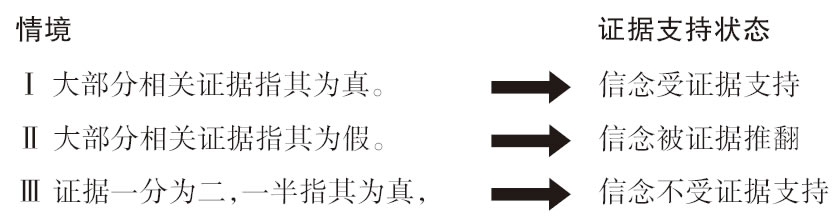

另一半指其为假。

只有情境Ⅰ的信念可以说是“受证据支持”的。

要注意的是，虽然理性接受度同时要求逻辑关联性和证据支持，这两者却是相互独立的。毕竟，任何推理都可以只具备其中一个。例如：

例2-5　任何打破镜子的人都会倒霉七年，今天我打破了一面镜子，因此，我会倒霉七年。

例2-5具有逻辑关联性，因为前提为真，结论也为真。但是我们还知道，证据并不支持其中一个前提：任何打破镜子的人都会倒霉七年。因此，
例2-5并不是一个理性可接受的论证。

我们在任何时候进行推理时，都应该

最大化信念之间的逻辑关联性。

选择受证据支持的信念。

真值和证据

对信念的证据支持来说，最重要的不是信念本身为真，而是思考者可获得的总体证据指示其为真。这就要考虑很多种可能。首先，一个假信念可能受证据支持。请思考下例：

例2-6　地球没有自转。

对于中世纪的人们来说，这个信念是受证据支持的。在他们所能分辨的范围内，这个信念是真的（所有可获得的信息都指示其为真）。但是例2-6是假的，因此中世纪的那些人弄错了。同时，一个真信念也可能没有证据支持，如例2-7所示，20世纪之前还没有足够的证据能够证明原子的存在。

例2-7　存在原子。

真值和证据是不同的概念，两者不能混淆。真值关注事物的状态，一个信念为真当且仅当事物确实如信念所表述。证据则涉及思考者可获得的关于事物状态的信息──这些信息最终可能是误导性的甚至是假的。真值和证据两者之中，只有证据与理性接受度有关。但这并不会破坏真值的重要性，真值就其本身而言无疑是可取的，只要人类本质上具有求知欲。

本节小结，如图2-1所示。

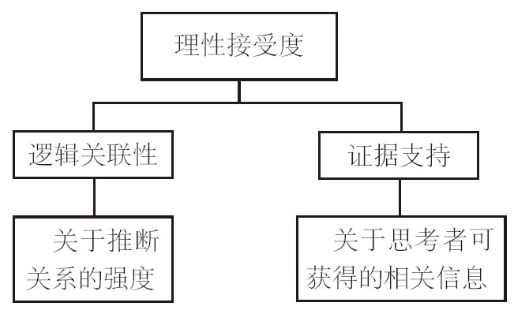

图2-1　本节小结

### 理性接受度之外

语言标准

目前已知的构成信念理性接受度的特征也出现在语句中。思维和语言至少在以下几个方面是类似的：

当说话者是真诚的并且有能力清楚地表达自己时，

他们的语句表达他们所相信的事物；

他们的论证表达他们所做出的推断。

除了理性接受度，语句还可能有一些其他的要求。最突出的是语言标准──语法、句法和诸如简洁、用词恰当等文体因素的组合以及合乎语法规则性。语言标准是书面语言或口头语言最应具有的一种品质。一方面，从美学的角度来说语言标准促进对表达的赏析。同时语言标准也是我们理解所说内容的基础所在。当一个推断写成文字时，就必须达到一定程度的语言标准，因为我们需要这些指标来理解所说的内容。但是，在理解这个范围之外，语言标准与理性接受度毫无关系。有些语句可能不符合某些语言标准，但同时却是理性可接受的，例如表达得不好但却做出了一个前提受证据支持的有力论证。也有一些语句很符合语言标准，但不是理性可接受的，这可能是那些表达得很好但缺乏逻辑关联性或证据支持，或者两者都缺少的语句。

修辞力

另一个独立于理性接受度的必要特征是修辞力，它是说服性交流的一个特征。语言和非语言因素都会影响修辞力。例如，充满感情的措辞和语调会增加某人所说内容的修辞力，而不标准的发音或语法则会降低这种能力。影响修辞力的非语言因素有说话者的口音、举止、外表，在书面语中的出版说明，甚至字体和版式。有时一个语段或一段话语具有很明显的感情因素，而这种感情增加了话语的修辞力。有时修辞力以更细微的方式隐藏，从而引发各种心理反应。当我们考虑一个假定推断的修辞力时，我们就是在问基于这些因素的推断是否确实具有说服力。然而我们还应该牢牢记住，这些因素都与推断的理性接受度无关。

因此，就像语言标准一样，修辞力也不在逻辑思维注重的范围内，因为修辞力不会对一个推理的合理接受度有任何提高。它是任何一种成功说服目标受众的交流所具备的特征──尽管有时不是以严格理性的方式。有些缺乏理性接受度的推理事实上可能具有很强的修辞力，例如，当该推理是由一个懂得如何推销想法的很有技巧的说话者提出时。另一方面，具有理性接受度的推理事实上可能缺乏修辞力，例如，推理太过复杂和困难，使得听众无法理解而拒绝。由此可见理性接受度与修辞力是相互独立的，它们的存在不依赖于对方。

逻辑思考者的要点是：

注意：虽然说服受众接受自己的信念是一件好事，但是必须用正确的方式进行，即说服要具备理性接受度。

修辞学与逻辑思维

一个好的修辞学家，无论是在书面语还是口语中，都应该善于说服别人。最好的修辞即是最成功的说服──赢得受众。在某些情况下，成功的说服可能采用诉诸情感或与理性接受度无关的其他因素，因为它们既不会增加也不会降低逻辑关联性和证据支持。政治演说家的一流演讲可以激起支持一场对外战争的爱国主义和民族主义浪潮，在总结陈词时让被告母亲出庭的辩护律师可能成功说服观众。但是在任何一种情况下，我们都可能怀疑观众是否有很好的理由被说服。

说服的艺术不是逻辑思维，而是修辞所研究的内容。修辞主要研究能够提高修辞力的各种技巧。相反，逻辑思维集中研究理性接受度。它是充分推理的标准，即应该说服我们的标准。我们必须时常注意薄弱推理和误导性推理的各种警示信息，从而避免掉进说服者不择手段或不小心埋下的陷阱。

### 从思维到语言

命题

我们已经知道，推断是至少有一个信念支持另一个信念时产生的逻辑关系，也可以是有一个或多个语句支持另一个语句时产生的逻辑关系。这样的推断通常称作“论证”。任何一个论证都是推断的语言表达。正如信念是推断的构件，语句是论证的构件。

那么，究竟什么是语句呢？粗略地说，语句是用语言表达各自信念的标准方式，只要说话者是真诚的，并且有能力表达自己。来看例2-8：

例2-8　雪是白色的。（Snow is white.）

当某人思考例2-8时，他就是在思考雪是白色的这个信念。表达该信念的标准方式就是说雪是白色的。不论是大脑中的信念，还是用词语表达的语句，例2-8都具有以下内容：

例2-9　雪是白色的。（That snow is white.）

例2-9表达了雪的某种状态（白的）。这个内容是完整的，因为它表达了一种状态。并且如果雪确如所表达的那样，那么例2-9为真；但是假如不是，例2-9为假。这种内容就成为“命题”。当事物确如命题所表示的那样时，命题为真，反之为假。既然任何信念或语句都有一个命题作为其内容，则信念或语句也具有两种真值中的一种：

任何信念或语句都是非真即假的。

例2-9很好地说明了这一点，其真值通过应用如下规则确定：例2-9为真当且仅当雪是白色的，例2-9为假当且仅当雪不是白色的。对于我们所考虑的每一个信念或语句的内容，我们都可以通过同样的方法来确定其真值条件。

因此，命题具有真值条件，即一个命题为真所必须满足的条件。与概念相比较，我们会发现概念也是内容，但没有真值条件。例如：

例2-10　雪。

与例2-9相比，例2-10是不完整的，因为例2-10既非真也非假。例2-10的真值不能确定，因为它没有真值条件。例2-10为真究竟要满足什么条件呢？单独的概念不具备专栏2-2中的真值条件规则，因而就没有真值(也就是说，它们既非真也非假)。尽管单独的概念也是命题的构件，但是它们本身不是命题。

还要注意的是，当不同的语句具有完全相同的信息内容时，它们表达同一个命题。因为在这种情况下，语句都表达了同一个事态，所以就有相同的真值条件。例如，例2-8的西班牙语和法语翻译是不同的语句，因为用来组成这些语句的句子不同，如下：

例2-11　 La nieve es blanca.

例2-12　 La neige est blanche.

但是，例2-8、例2-11和例2-12的内容相同，因此表达了同一个命题，即上述的例2-9。

专栏2-2　真值条件

一个命题为真当且仅当事物确如其所表述，一个命题为假当且仅当事物并非其所表述。

语言的使用

通过使用语言，我们可以实现言语行为。换句话说，简单地通过发出（说或写）某些话，可以实现做事的目的，包括：接受或拒绝命题、提出问题、做出承诺、提出要求、表达个人感觉、问候、道歉、投票等。可以根据我们意欲听众如何理解我们的话语，对言语行为进行分类。一般来说，我们使用语言主要想达到以下目的：①描述事实；②使听众做某事；③表达我们的内心世界；④表明我们对某个事态的承诺。相应地，我们的话语主要分为以下四类，而每一类都由很多言语行为构成，如图2-2所示。

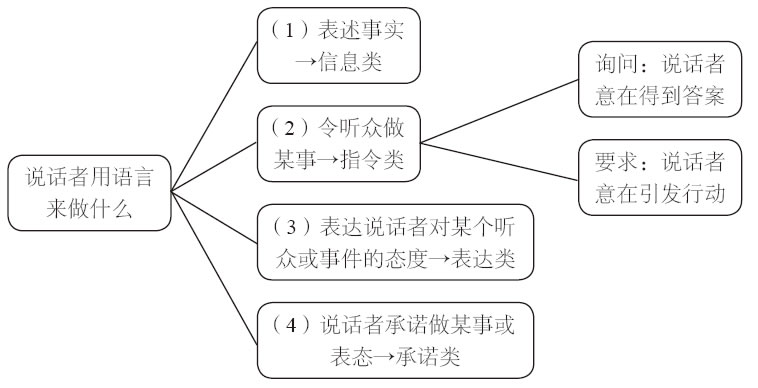

图2-2　语言的使用

A.
信息类：声称、断言、确认、报告、声明、否认、宣告、确定、通知、预测、回答、描述等。例如，声称被告涉嫌犯罪。

B.
指令类：规定、要求、建议、告诫、恳求、乞求、驳回、宽恕、禁止、允许、指示、命令、请求、建议、督促、警示等。例如，规定我们应该尊重父母的言语行为。

C.
表达类：感叹、后悔、道歉、祝贺、问候、感谢、接受、拒绝、反对、欢呼等。例如,为粗鲁的言行道歉的言语行为。

D.
承诺类：承诺、宣布休会、打电话订购、遗赠、洗礼、担保、邀请、志愿服务、命名等。例如，给某人的猫命名为“费利克斯”的言语行为。

信息类话语旨在描述事物的状态。例如，表达某个事物具有（或不具有）某个性质（“雪是白色的”）的语句，或一个事物与另一个事物以某种方式相关联（“雪比冰软”）的语句。指令性话语旨在引发听众的反应，不管是回答例2-13还是行动例2-14。

例2-13　这条线有多长？

例2-14　把盐递给我！

禁止是制止做某事的要求，所以也是指令类。例如：

例2-15　宠物不得入内。

如例2-16所示，表达类话语旨在交流说话者的心理世界，包括态度（如希望、害怕、愿望，等等）和感觉（如后悔、感激、接受、拒绝、恼怒、生气，等等）。

例2-16　天哪！

承诺类话语表达了说话者的意图，意欲引起某个事态的发生，如：承诺（例2-17）、宣布休会、同意、馈赠等。

例2-17　在美国电信，我们保证你──我们的顾客，可以无限制拨打本地电话。

话语可以引发此类事态，当然，在满足某些条件的前提下：“我把我的法拉利馈赠给你”的话语，必须在“我拥有一台法拉利”的前提下才有效。

最后要注意，只有信息类表达（如“雪是白色的”）有直接的真值条件：表达为真当且仅当事物确如其所表述，反之为假。在大多数情况下，其他类型的表达都没有真值条件，尽管他们的确需要满足更多特殊的条件以使得表达成功。因此，如例2-13～例2-17所示，说指令类、表达类或承诺类表达为真（或为假）都是无意义的。

句子的类型

一个句子属于四种类型中的哪一种取决于其语法形式。自然语言允许构造各种不同语法形式的句子，且都可以被归入专栏2-3所示的基本类型。

陈述语气的句子是陈述句，如“雪是白色的”。虽然这类句子是从信息的角度使用语言的主要工具，但它们有时也用来表达指令性（如“旅客最好不要离开自己的行李”）、承诺性（如例2-17以及表达性话语（如“我希望绳子足够牢固”）。此外，祈使句主要用于表达要求（如例2-15）和愿望（如“玩得开心”）；疑问句用于表达询问（如例2-13）；而感叹句用于表示表达性话语（如例2-16）。不过，后面的几个句子可以通过加强语气变成要求（如例2-14）和声明（如“国王死了！”）。有些句型虽然与语言的使用类型之间没有一对一的关系，但它们与语言的某些类型的使用结合得更好，除了疑问句之外。请看下列总结，见图2-3。

专栏2-3　基本句型

陈述句：

\*描述事态

\*其中的动词是陈述语气

\*主要用于传播信息

疑问句：

\*用于从听众那里获得回复

\*具有问号或疑问语调

\*主要用于提问

祈使句：

\*用于从听众那里获得回复

\*具有问号或疑问语气

\*主要用于提出请求或表达愿望

感叹句：

\*用于传递说话者的情感或强烈的观点

\*具有感叹号或强调语气

\*主要用于传达情感

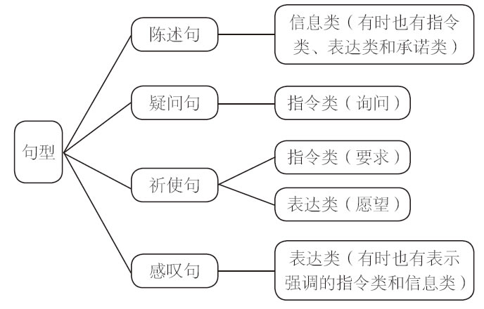

图2-3　句型和语言使用的关系

### 间接使用和比喻语言

就逻辑思维而言，任何可能掩盖语句及其所表达的信念之间重要逻辑关系的语言现象都是不受欢迎的。现在我们来分析此类现象：

比喻语言：一个语言表达可以以比喻的方式传递与其字面意义不同的含义。

间接使用：一个言语行为可以通过不同的言语行为来执行。

在自然语言中，这类现象很常见，因而使得语言丰富多彩。虽然非形式逻辑不能完全避免这类大多在自然语言中出现的现象，我们还是要遵守以下规则：

研究非形式逻辑时，

1．允许语言的间接使用和/或非字面意义的使用。

2．如果可能的话，

将间接表达转换为直接表达。

将非字面意义的表达转换为字面意义的表达。

间接使用

为了理解语言的间接使用，我们需要仔细分析一些特殊的言语行为。用一种类型的言语行为来执行另一种类型的言语行为就是语言的间接使用。我们把例2-14重写为：

例2-14a　你能把盐递给我吗？

例2-14a所执行的直接言语行为就是提出一个关于听众是否有能力把盐递给说话者的问题。但在大多数情况下，这个话语不会被解读为提问题，而是要求把盐递给说话者。一个类似的间接言语行为可以由下面这个话语来完成：

例2-18　如果没有艺术，人类的生命会是怎样呢？

对于研究人类与艺术关系的心理学家,他们很可能用例2-18来提问题。如果这样的话，执行的就是直接言语行为。但例2-18也可以用来主张艺术对人类生命的必要性。在这种情况下，执行的就是“声明”的间接言语行为。这种间接言语行为的可能性使得句型与言语行为类型之间的关系更为复杂。但是，无论是否直接使用语言，图2-3中的关系都成立。

另一个相关的问题是虚构语言，包括小说、诗歌、歌词等使用的语言。正如我们在第1章所看到的，虚构的句子看起来似乎传达了信息，但是它们却不能陈述命题。因此，从非形式逻辑的角度看，它们只是体现了语言表达能力。

比喻义

有时候语言表达用来传递不同于它们通常所具有的意义。这时候的表达就具有比喻或非字面意义。当一个语言表达的意义由其各个部分的标准意义以常见的方式组合而成时，该表达具有非比喻意义或字面意义。（表达的组合非常重要，看一个简单的例子：“玛丽帮助海格力斯”不表示“海格力斯帮助玛丽”，即使两个表达的每个部分都是同一个标准意义)
隐喻是比喻义最常见的一个类型。例如：

例2-19　你是一头驴。

“驴”的字面义包含了与通常作为驮畜的家驴类似的元素。一个人对一头驴说例2-19就是在使用“驴”的字面义。但例2-19可以用来比喻某个人很顽固，或者对什么不能理解（如，不能理解一条定理）。这时的“驴”就不是用作字面义，因此例2-19是一句比喻。类似地，在和平对话中，例2-20也是用作比喻义：

例2-20　巴勒斯坦和以色列的谈判已经进入停滞期（plateau，本义为“高原”）。

在论证重构中，只要可能，就重写论据和论题，使它们仅描述陈述句、直接言语行为、字面义。假设有人提出：“你目前的投资策略是房地产，你疯了吗？如果一个投资连续五年亏损，就不是一个好的投资策略，而房地产在过去五年一直亏损。”这里的结论（你疯了吗？）必须重写成表达听众现有投资策略不好的直接言语行为。质问听众是否“疯了”不能明确表达结论。另外，“疯了”的比喻说法也应该用可以字面解读的词语代替。经过重构之后，这个论证变成下面的样子：

1.你目前的投资策略是房地产。

2.如果一项投资策略连续五年亏损，就是一个不好的投资策略。

3.房地产在过去的五年都亏损了。

4.你目前的投资策略不好。

### 定义：解释不清楚的语言

推理中的逻辑关系可能会被语言的非字面和间接使用模糊化。但是我们通常还是可以最小化这种模糊，并且有时候可以通过定义完全消除模糊──通过阐明或修改语言表达的意义。最常见的定义有三种：报道性定义、实指定义和语境定义。首先，我们来分析定义的结构。

重构定义

在评估一个定义之前，最好先对其进行重构，从而我们能够知道什么被定义了，什么提供了定义。这就要求区分定义的两个方面：被定义项（需要被定义的）和定义项（提供定义的）。重构定义的时候，被定义项先被列出，放在左边；然后列出定义项，放在右边。我们采用在重构后的定义的被定义项和定义项之间加入符号“=df.”（读作“被定义为”）的方法。例如：

例2-21　幼犬 =df. 年幼的狗

例2-22　三角形 =df. 有且只有三个内角的平面图形

例2-23　立方体 =df. 有六个面的三维体，每个面都是直的正方形

每一个定义左边的表达式是被定义项，右边的表达式是定义项。日常的定义可以用各种不同的方式来表达，即类似于下列“律师”和“代理律师”的定义方法：

例2-24　要成为代理律师就必须先做一名律师。

例2-24a　说一个人是代理律师就是说这个人是一名律师。

例2-24b　“代理律师”的含义是“律师”。

上述三个定义可以简洁地重构为“代理律师
=df.律师”。其中，“代理律师”是被定义项，“律师”是定义项。

报道性定义

定义例2-21～例2-24旨在给出语言表达式中某个词语的日常意义。字典和翻译手册中有很多这类定义。定义要充分，报道性定义的两边必须是完全相同的意义：

一个报道性定义是充分的当且仅当其两边是同义词或有等同的意义(即，两边的含义相同)。否则，定义就是不充分的。

报道性定义不充分的表现主要有定义过宽、定义过窄，或者既过宽又过窄。例如：

例2-25　姐妹=df.女性

例2-25定义过宽，因为其定义项同时选出了不是姐妹的人（比如，一个没有姐姐或妹妹的女性）。结果使得定义的两边意义不同。

例2-26　姐妹=df.成年女性同胞

例2-26定义过窄，因为其定义者漏掉了未成年的姐妹。

例2-27　姐妹=df.成年同胞

例2-27定义既过宽又过窄，因为其定义项在选出了某些兄弟的同时又漏掉了未成年的姐妹。显然，一个成年男性同胞不是一个姐姐或妹妹，一个两岁的姐姐或妹妹不是成年同胞。因此例2-27的两边意义不同。

检验报道性定义

当一个报道性定义不充分时，反例是检验不充分的方法。一个简单的反例就可以检验出。例2-25的反例是非同胞的成年女性；例2-26的反例是未成年的姐妹；例2-27的反例是成年同胞兄弟或未成年姐妹。

一个没有反例的报道性定义是充分的。看到一个定义时，我们可以用一个思考实验来判断定义是否有反例。如果我们用这个方法来分析例2-21～例2-24，我们很快就可以发现反例是不可能的，例如，一个代理律师却不是律师，或者一个姐妹不是女性同胞。在任何可能世界，一个人如果是代理律师，他就是律师；如果一个人是姐妹，那她就一定是女性同胞。既然这些定义的反例是不可能的，我们就可以得出结论：这些定义是充分的。见专栏2-4。

专栏2-4　反例和报道性定义

报道性定义的反例是这样一种情况：它满足一边却不满足另一边。

如果没有反例，报道性定义就是充分的。

反例检验法的深层原则是：除非证明不充分，否则就是充分的。

报道性定义只有在至少存在一个反例的情况下才是不充分的。

在《拉凯斯篇》中，古希腊哲学家柏拉图（公元前428—公元前347）给“勇气”下了一个通用的定义，我们来检验这个定义的充分性。

例2-28　勇气=df.在战争中勇往直前

例2-28是充分的，只要不存在满足一边但却不满足另一边的情况。反例可以是现实生活中的例子，或者思考实验中只存在于思维中的可能场景（见专栏2-4）。作为例2-28的反例，只要使人相信这样的场景：某人很勇敢但是没有在战场上勇往直前，或者某人可能在战场上勇往直前但却不勇敢。这里就有一个这样的思考实验：一个战士在战场上采取后退策略的情况（迷惑敌人，从而可以更猛烈地反击）。因为这样的情况是可能的（并且确实发生过），虚构的战士的行为满足了例2-28的被定义项，但却不满足其定义项，因此这就是《拉凯斯篇》定义的一个反例。

进行思考实验时，我们必须遵守一些规则。首先，被描述的场景必须是在逻辑上连贯的，否则就不满足一个合乎逻辑的可能世界。其次，场景必须用同一种语言描述清楚，不能改变词语的含义。最后，我们必须知道如何使用描述场景的词语：从是否偏离常规看法的角度出发，我们没有理由怀疑自己对于词语含义的把握是不合规则的。（见专栏2-5）

专栏2-5　可能情境和报道性定义

一个报道性定义是充分的当且仅当不存在任何这样的情境：在该情境中，某些东西满足定义的一边但却不满足定义的另一边。

只有在没有反例的情况下一个报道性定义才是充分的。

报道性定义的反例是这样一种可能情况：反例词语的含义满足定义的一边，但不满足定义的另一边。

作为反例，场景必须是连贯的，并且在描述的过程中不能改变词语的含义。

实指定义和语境定义

对于表达式含义的定义，并非所有的定义都旨在给出一个与被定义项同义的定义项，比如，我们现在要讲的实指定义和语境定义。实指定义的定义项提供了被定义项的一些范例，比如：

例2-29　要成为一个社会主义国家就要有跟古巴一样的社会经济系统。

例2-30　大都市是像伦敦、圣保罗或者东京那么大的城市。

语境定义在定义项中提供另一个表达式或语境，而在该语境中，被定义项以及它的严格同义词都没有出现。例如，连词“除非”在逻辑中有时被定义为与“或者……或者”等价：

例2-31　“P 除非Q”等价于“或者P 或者Q”。

这里的定义项在逻辑意义上等同于被定义项，因为它们都用同一种逻辑关系将“P”和“Q”联结起来，但是这个定义的两边含义不同。

## 第3章　信念的优点

### 信念、负信念和不做回应

信念和负信念是人们在接受自身所想为真或拒绝假事物时的两种心理态度。我们把这两种心理状态称作“认知态度”（源于拉丁语“cognoscere”，意即“知道”）。不做回应（nonbelief）是既不相信也不怀疑的态度。信念是接受一个命题的认知态度，其中命题是指表征事件状态的信息内容。考虑下面这个语句表达的命题：

例3-1　狗是肉食动物。

任何相信例3-1的人都具有接受狗是肉食动物的心理态度，即认为例3-1为真。如果某人在正常情况下询问例3-1是否为真，她最终会赞同例3-1表述的命题。假设她是真诚的并且能够表达自己，她就可以通过叙述例3-1来表达自己的信念，或者说出下列句子：

例3-2　“狗是肉食动物”为真。

例3-3　事实情况是“狗是肉食动物”。

例3-1、例3-2和例3-3可以用来表达相同的内容，即“狗是肉食动物”这个命题。

假设我们用“S”表示说话者（或某人），“P”表示一个命题，“相信P”表示接受P的心理态度，我们就可以对信念定义如下：

专栏3-1　信念

S具有信念P 当S 接受P。假设情况正常且S是真诚的，如果有人问：

“P为真吗？”S会表示赞同。

“你对P知道些什么？”S会回答“P”、“P是真的”或“事实情况确实是P”。

注意专栏3-1中“信念”的定义要求以正常情况以及说话者的真诚为前提。否则，一个人S所说的就不是他所相信的。因为可能存在欺骗者（他们说出的话歪曲了其真实信念）或自相矛盾的人（他们否认自己确实拥有的信念），当我们将说话者所说的和他所想的对等起来时，就必须假定说话者是真诚的。在这里，说话者S有可能出于压力、错觉或其他阻碍，说出一些他事实上不相信的事物。因此，我们必须假定正常的情况──包括说话者有能力表达自己，即他在心理上未受到伤害、威胁或其他任何阻碍。

但是，如果有些人不相信某个命题呢，比如上述例3-1？他们可能怀疑或者不回应。怀疑例3-1可以用例3-4～例3-6来表达：

例3-4　狗不是肉食动物。

例3-5　“狗是肉食动物”为假。

例3-6　“狗是肉食动物”并不属实。

在正常情况下，一个人真诚地说出对例3-1的任何怀疑，就等于持有拒绝例3-1的心理态度。如果问例3-1是否为真，她会不同意。她可以拒绝例3-1──例如叙述例3-4，来表达自己的怀疑。我们可以对负信念的概念做如下总结，见专栏3-2。

专栏3-2　负信念

当S拒绝P时，S对P持有负信念。假设情况正常且S是真诚的，如果有人问：

“P为真吗？”S会表示反对。

“你对P知道什么？”S会拒绝P为真，通过叙述句子“P为假”、“并非P”或者“P并不属实”。

如果有人既不相信也不怀疑例3-1呢？他们对例3-1的态度是不做回应。在正常情况下，他们既不接受也不拒绝例3-1。如果问例3-1的内容是否为真，他们可能会耸肩，不给出同意或反对的信号。专栏3-3对这些反应做了总结。

专栏3-3　不做回应

S 对P不做回应，当S 既不接受也不拒绝
P。假设情况正常且S是真诚的，如果有人问：

“P为真吗？”S既不同意也不反对。

“你对P知道什么？”S将延缓判断。

对P不做回应就是对P既不相信也不怀疑。相应的心理态度就是对P延缓判断。我们要牢记，任何时候我们考虑接受或拒绝一个命题时（例如，狗是肉食动物），还有一个不做回应的选择，即保留对某个命题的信念的判断。逻辑思维可以帮助我们对一个命题采取最恰当的态度，无论是接受、拒绝或延缓判断。确定哪个是准确的态度很重要，因为信念是我们推理的构件。一般的规则是，要使整幢大厦牢固，就必须用高质量的建材并且进行定期保养。不过，我们怎么分辨哪些推理构件是高质量的呢？这是我们下一部分要讨论的主题。

本节小结，如图3-1所示。

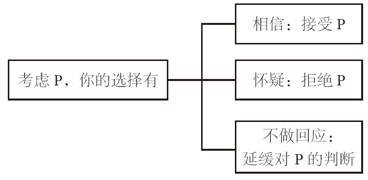

图3-1　本节小结

### 信念的优点和缺点

在信念的特征中，有些有助于更好地推理，而有些则会导致不好的推理。我们可以把有利的特征看作优点，不利的特征看作缺点。优点中最重要的是合理性，缺点中最重要的是不合理性。为什么这两个特征如此重要呢？因为合理性是推理可接受的底线。不合理的信念就超出了这个底线，因此推理的目的（正如我们将要看到的）是无法实现的。在本节中，我们将从信念的其他优点和缺点开始，而将合理性和不合理性留到下一节。我们这里要分析的信念特征总结为专栏3-4。

专栏3-4　信念的优点和缺点

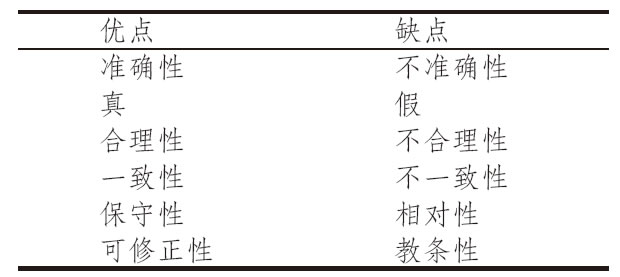

首先要注意，因为逻辑思考者希望避免信念的不利特征，有人会建议最好完全放弃这类信念。因为如果我们根本没有任何信念，就不会拥有具有缺点的信念！但这样的建议只是自欺欺人，因为不可能完全没有信念。声称逻辑思考者最好没有信念本身就表达了一个信念，假定声称者是真诚的并且有能力的。作为逻辑思考者，我们必须具有一些信念。因此我们的目标就是拥有尽可能多的具有有利特征的信念，以及尽可能少的具有不利特征的信念。也就是说，我们旨在最大化信念的优点，最小化信念的缺点。说一个信念有一个优点是肯定它，而说一个信念有一个缺点是在批评它。现在让我们逐个分析信念的优点和缺点。

### 准确性和真

准确性和不准确性

为了具备一个可接受的准确性，一个信念必须表达（或者接近其所表达的）事实。在前一种情况下，信念是真的；在后一种情况下，信念只是大致为真或接近真。下面这个信念如实表达了事物，因而是真的：

例3-7　巴西利亚是巴西的首都。

真信念具有最高程度的准确性。另一方面，假信念具有最高程度的不准确性，因为其既不表达也没有接近其所表达的事物的实际情况。例如：

例3-8　里约是巴西的首都。

任何否定假信念（例3-8）的信念都是真的。所以，“里约不是巴西的首都”，以及“'里约是巴西的首都'并不属实”，两者都是真的。因此，它们具有最高的准确性。为了确定信念的准确性，我们可以运用专栏3-5中的规则。

专栏3-5　准确性和不准确性

当一个信念为真时，它具有最高的准确性；当一个信念为假时，它具有最高的不准确性。

真和假

作为逻辑思考者，我们必须相信真的事物，而不相信假的事物。不过，由于真事物和假事物往往难以区分，我们有时候会错误地相信假事物，就像中世纪的人们相信：

例3-9　太阳绕着地球转。

当然，最终证明他们是错误的：例3-9总是假的，因此是不准确的。这是因为例3-9不仅没能如实表达事实，而且甚至（最关键的是）从来没有接近其所表达的事物。根据信念接近如实表达事实的程度，一个信念或多或少都有一定的准确性。然而，有些信念可能是准确的，但却不是真的。例如：

例3-10　法国是六边形的。

例3-11　拉格兰勋爵赢得了阿尔玛河战役。

例3-10大致正确，但是还不足以被看作严格为真的信念
（对一个制图师来说还不够准确！）。类似地，例3-11是准确的，但我们能说它是真的吗？它大致为真。事实上，这个战役是由英国军队赢得的，不只是军队的指挥官。但是说“拉格兰勋爵赢得了这场战役”也不完全错误。这两个例子表明准确性和不准确性是一个度的问题：有些信念更接近如实表达事实。因此有些信念比其他信念更准确（或不准确）。但是真和假完全不是“度”的问题：每一个信念非真即假。说一个信念比另一个信念更真（或假）或更不真（或假）是无意义的。一个信念或者为真，或者不真。同时，准确性和真都是一个信念或一组信念可能具有的优点（相应地，不准确性和假是缺点）。

在例3-12以及其他一些含糊的信念中，真和假是不明确的，并且是否准确或不准确也是不明确的。

例3-12　奎因?拉蒂法是年轻人。

同样，在分析例3-13所示的表达评价的语句时也要小心。哲学家对于评价性语句是否能够为真或为假是有争议的。有些语句看起来显然为真（“希特勒是恶魔”），而另一些语句的真值则比表示支持或赞同态度的语句更不明确（“弗兰克?辛纳提拉的音乐太棒了”）。下面表达品位的语句也是如此：

例3-13　福特野马比雪佛兰克尔维特要好看。

在这种情况下，我们采用的惯常做法是指明它们是表达评价的语句（第4章对此有更多分析）。如图3-2所示。

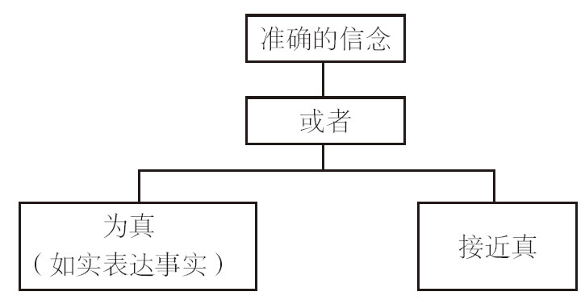

图3-2　 真和准确性

### 合理性

有些可能不足以为真甚至不足以为准确的信念，却仍然可能是合理的。怎么可能呢？要回答这个问题，让我们来考虑合理性和不合理性这对优缺点。正如准确性和不准确性一样，它们是一个信念或一组信念所具有的特征。它们是一个程度问题：某些信念比其他信念更合理（更不合理）。它们的合理性程度取决于它们拥有的支持有多充分。

一个信念是合理的当且仅当它具有充分的支持。否则，该信念就是不合理的。

不同的信念类型具有不同的支持方式。因此一个信念的合理性程度随着信念类型的不同而不同。鉴于此处我们只考虑经验信念和概念信念两种类型，我们暂时不对其他类型的信念进行合理性程度的判断：如上述例3-13表达评价的信念。

两种合理性

一个合适的信念要满足的要求随着信念类型的不同而不同。考虑：

例3-14　菲多在叫。

例3-15　狗会叫。

例3-14和例3-15只能通过观察的信息来支持，因此是经验信念（“经验的”意即“观察的”）。此类信念的合理性所需要的支持与非观察信念的不同。在非观察信念中，该信念可以仅用推理来支持。例如：

例3-16　7+ 5 = 12

例3-17　兄弟是男性同胞。

例3-16和例3-17的根据是概念性的：理解所涉及的概念就足以认识到这两个信念为真。对于任何掌握数和加法概念的人来说，例3-16为真都是显而易见的。同样，对于任何掌握“兄弟”和“男性同胞”概念的人来说，正如例3-17为真都是明确的。所以例3-16和例3-17都是合理的，因为每一个都单独受到充分推理的支持。

一个概念信念是合理的，当且仅当知道这个信念依据所涉概念的意义为真。

因此，一个合理的概念信念是这样的一种信念：只要我们理解了信念的内容，其真值就不言而喻了。

相反，例3-14和例3-15就不具备这种类型的支持：他们需要的是观察信息或证据的支持。那么，在什么情况下例3-14或者例3-15是不合理的呢？假设某人错误地相信她的狗（菲多）现在在叫。即，她相信例3-14即使她知道菲多已经很多年没有叫了。当受到质疑时，坦白说她就会妄想：她希望菲多能叫的愿望在一定程度上使得她相信狗正在叫。在这个场景中，例3-14是不合理的，因为这是一个经验性信念，而经验性信念合理的规则是：

信念必须要么受证据支持，要么是根据证据可推出的。

如我们在第2章所见的，证据是通过视觉、听觉、触觉、味觉和嗅觉等感官经验的观察而得的结果。因此如果看到并且听到菲多在叫，结果某人就会相信例3-14，感官经验就会作为例3-14的证据，使其变得合理而可信（在没有相反证据的情况下）。可靠的证言证词也可以作为证据，因为我们可以把它们当作可替代的观察信息。有证据的支持，是相信如例3-14之信念的合理性所需的一切。

另一方面，为了得知例3-15中的信念是否合理，依据证据的推理是必要的。毕竟，例3-15等同于：

例3-15a　所有狗都会叫。

这个信念受证据以及基于可用证据的其他信念的支持。证据来自大多数狗会叫的观察，由此可以推出所有狗都会叫。也就是说，除了看到某些狗会叫的第一手证据，我们需要更多支持。毕竟，不可能观察到所有会叫的狗。除了证据，还有什么有助于支持该信念呢？需要一些其他的信念，如：

例3-18　观察了很多狗。

例3-19　它们都会叫。

根据例3-18和 例3-19，认为狗会叫是合理的。但是如果例3-15受例3-18和
例3-19的支持，三者之间是一种推理关系：例3-15从 例3-18和例3-19推出。

对于经验信念，证据和依据证据的推理是检验合理性的两个标准途径。对于概念性信念，唯一的根据就是推理。两种合理性信念如图3-3所示。缺少充分支持的经验信念和概念信念就会导致实质的不合理性。但要记住，对于其他类型的信念，合理性的评价标准有所不同。

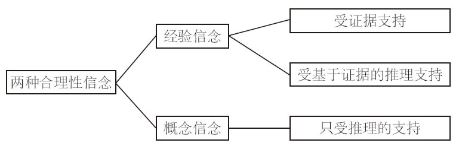

图3-3　两种合理性信念

### 一致性

准确性、真和合理性是单个信念可能具有的优点。相反，一致性（或不一致性）只能是一组（两个或两个以上信念）的优点（缺点）。那么，“一致性”是什么意思呢？

定义“一致性”和“不一致性”

一致性定义可以从阐明“不一致性”着手，因为一组信念只有在并非不一致的情况下才是一致的。所以，从“不一致性”出发，我们有如下定义：

一组信念是不一致的，当且仅当它的成员不能集体为真。

考虑例3-20和例3-21。

例3-20　陶乐茜?马隆尼是一位议员。

例3-21　陶乐茜?马隆尼是一个慢跑者。

这组信念可能集体为真：陶乐茜?马隆尼可能既是一位议员也是一个慢跑者。但假设我们增加一个信念：

例3-22　陶乐茜?马隆尼不是一名政府官员。

例3-20，例3-21和例3-22组成了一个不一致的信念集合，因为其成员不可能同时为真：很显然，一个不是政府官员的人不可能是一位议员。现在我们可以说：

一组信念是一致的，当且仅当其成员能够集体为真。

说一组信念一致就是说这组信念是逻辑上可相容的。可相容的信念不需要事实上为真：只要信念能够集体为真就足够了。实际上假的信念也可以组成一个完全一致或相容的信念集合，只要它们能够在某个可能的场景中集体为真。

逻辑上可能的命题

考虑下面这组信念：

例3-23　阿诺德?施瓦辛格是一名医师。

例3-24　猪会飞。

在某个逻辑上可能的场景或世界中，例3-23和
例3-24可能同时为真。我们的世界，也就是所谓的“现实世界”，是逻辑上可能的众多世界中的一个（一个逻辑上可能的世界中没有任何矛盾）。逻辑上不可能的世界是没有意义的，因此是不可想象的。如果一个命题满足专栏3-6中的条件，我们也可以说它是逻辑上可能的。

专栏3-6　逻辑上可能的命题

一个命题是逻辑上可能的，当且仅当其没有矛盾。

逻辑上不可能的命题

完全无法想象的命题是逻辑上不可能的，必然是假的或者荒谬的，如下列的每个命题所示：

例3-25　所有猪都是哺乳动物，但是有些猪不是哺乳动物。

例3-26　阿诺德?施瓦辛格既是又不是一名医师。

例3-27　阿诺德?施瓦辛格是一个已婚单身汉。

这类命题是自相矛盾的。见专栏3-7。

专栏3-7　自相矛盾

一个命题是自相矛盾的，当且仅当它必然为假，或者在逻辑上是不可能的。

一个自相矛盾的命题不仅在现实世界中为假，而且在每一个可能世界中也都为假。

例3-25， 例3-26和
例3-27就是自相矛盾的命题：每一个都是逻辑上不可能或者必然假的，因为这些命题有自相矛盾的概念或逻辑词汇。稍微看一眼例3-25和
例3-26就知道，没有一个可能世界使得其中任何一个为真，因为它们各自有如下逻辑形式：

例3-25a　所有A是B，但是有些A不是B。

例3-26a　X有某一个性质Y并且X没有某个性质Y。

例3-25a和例3-26a中逻辑常项（斜体的）的排列使得任何此类命题都不可能为真。每一个都是逻辑上自相矛盾的。另一方面，例3-27中的概念自相矛盾：考虑到所涉及的概念，没有一个可能世界使得例3-27为真。从字面上看，一个人不可能是已婚单身汉，就像没有一个三角形有四个内角。任何包含此类内容的命题都是荒谬的、无意义的并且不可想象的，因为我们不可能理解其内容。

不仅单个命题会是逻辑上不可能的：整组的命题也会如此。任何不一致的命题集合都是逻辑上不可能的。不一致发生在以下两种情况中：命题集合中的某些命题是逻辑上不相容的或矛盾的，或者命题集合中至少有一个自相矛盾的命题。命题“陶乐茜?马隆尼是一位议员并且她不是政府官员”属于第一种不一致情况，即命题集合中存在相互矛盾的命题。根据不一致性和矛盾的定义，任何具有矛盾关系的命题所构成的集合都是不一致的。

任何两个真值不同的命题都是矛盾的：一个为真，另一个为假；或者一个为假，另一个为真。

一致性和可能世界

现在来重新考虑下面这个命题集合：

例3-23　阿诺德?施瓦辛格是一名医师。

例3-24　猪会飞。

这两个命题虽然实际上为假，但却是一致的。因为存在可能世界（即没有矛盾的场景）使得它们是相容的。在这种可能世界中，它们同时为真。例如，存在这样一个可能世界，在这个世界中，阿诺德?施瓦辛格从来没有做过影星，而是成为一名医师；同时，猪被安装自动装备后可以克服重力，因而能够飞得起来。

因此，“一致”和“不一致”可以被阐述如下。

一组信念集合是一致的，当且仅当：

存在一个逻辑上可能的世界，使得信念集合中的成员同时为真。

一组信念集合是不一致的，当且仅当：

不存在逻辑上可能的世界。使得信念集合中的成员同时为真。

逻辑思维的一致性

根据上述定义，任何矛盾的信念集合都不符合一致性。不一致性（或者不满足一致性）是一个很严重的缺点，因为它违反了我们的直觉，即什么是逻辑上可能的，什么是逻辑上可想象的。因此，我们应该彻底避免不一致的信念（见专栏3-8）。只要发现一组信念集合是不一致的，逻辑思考者必须首先检验其是否可以变成一致的。如果可以，则通过必要的步骤将其转换为一致的。但具体怎么做呢？我们通过消除不一致的来源，从而修正信念集合。再来看下列这组不一致的信念集合：

例3-20　陶乐茜?马隆尼是一位议员。

例3-21　陶乐茜?马隆尼是一个慢跑者。

例3-22　陶乐茜?马隆尼不是一名政府官员。

对于这个例子，要消除不一致，就要删除例3-20或者例3-22。

不过要注意，虽然一致性是一个优点，但它并不导向准确性，或者甚至不导向合理性。在某个可能场景中同时为真的信念（就如我们已知的），事实上可能为假，并且甚至在我们的现实世界中是相当荒谬的。还要注意的是，正如真和假一样，一致性或者不一致性都不是一个程度问题。没有一组信念“在某种程度上一致”：它要么一致，要么不一致。接下来，我们来谈论“保守性”，它是与一致性关系密切的一个优点。

专栏3-8　一致性和逻辑思维

逻辑思考者的一个显著特征是他们会仔细考虑他们的信念（或他们给出的语句），并且尝试将其转换为一致的。

### 保守性和可修改性

非教条主义的保守性

保守性或熟悉性是我们的信念所具有的一个优点，只要这些信念与我们的其他信念是一致的。也就是说，如果信念跟我们现有的信念相符合，那么它们具有这个优点。假设在一个马戏团表演中我们观察到：

例3-28　箱子里的一个人被切成了两半，随后却看到他毫发无损。

我们应该接受例3-28吗？虽然例3-28看起来是基于观察的证据，但是它与我们已有的信念不一致，即：

例3-29　没有一个人被切成两半后却毫发无损的。

保守性建议我们拒绝接受例3-28，并建议我们认为这只是聪明的魔术师耍的一个花招。一个信念越古怪，它就越不保守。

但是保守性也要用可修正性来调节，这就是我们接下来要讲的内容。否则，保守性会使得我们只接受那些我们已经相信的信念，不管有没有证据支持。这可能是不合适的，甚至是教条主义的。

教条性是某些可修正信念不能被修改时所具有的缺点。那些相信具有明显教条主义缺点的信念的人是教条主义者。教条性与可修正性相冲突。可修正性是信念的准确性、合理性和一致性所需要的一种开放性优点。如果我们的信念具有其中任何一个优点，就必须是在新信息和进一步推理的情况下是可修正的。

非极端相对主义的可修正性

可修正性是信念的优点，只要信念是可改变的。像准确性和合理性一样，可修正性也是一个程度问题。但是，不同的是，可修正性有一个上限：太高的可修正性会导致极端相对主义，是一个“一切都是看法不同的问题”的缺点。可修正性只有在信念是对某一群人来说为真的情况下才有意义，而不是对所有人。有了“对……为真”的限定，相对主义者可以说“地球不转对古代人来说为真”的信念。但是，这个信念对我们来说不是真的。这里并没有矛盾。

因此，在极端相对主义下，有些存在矛盾的信念可能同时为真。但这与我们通常的直觉相抵触。例如：

一个信念为真当且仅当它符合事实。

很显然，地球在古代不转是假的。这个信念不符合当时的事实，正如它不符合现在的事实一样。此外，在相对主义下，“真”事实上就是“对……为真”，省略号处可以填上“文化”、“社会群体”、“历史时期”或者任何相对主义者选择的内容。这就使得相对主义者至少接受了某些矛盾，因为相反的信念可能“对……为真”，例如不同的文化。但是，在西方自古以来的一种观点是，矛盾会使得逻辑思考者间的对话无法进行。

专栏3-9　保守主义和准确性

逻辑思考者不能太过保守,
因为有时看起来非保守的信念却是准确的──甚至是真的！

那么，什么程度的可修正性算是一个优点呢？事实上，这随着信念类型的不同而不同。考虑下面的数学信念和逻辑信念：

例3-30　6是36的平方根。

例3-31　林肯要么死了，要么还活着。

这两个信念几乎不具有可修正性。下面这个信念也是如此：

例3-32　律师是代理律师。

这类信念只受到推理的支持，只具有最低限度的可修正性。它们具有最大程度的保守性和最低程度的可修正性。

另一方面，考虑下面的经验性信念和记忆性信念：

例3-33　约翰?汉考克大楼是芝加哥最高的建筑。

例3-34　我1996年去过约翰?汉考克大楼。

这两个信念的可修正性很高。例3-33是一个经验性信念，可以根据证据进行修改（它事实上是假的）；例3-34也可以修改，如果它只是一个错误的记忆。这两种信念都可以根据证据进行改变，只要不在教条主义情况下进行就可以。

如果我们允许我们的信念很容易或很频繁地被修改，最终我们会认为矛盾的信念可以同时为真，或者“真”等同于“对……真”。这是极端相对主义的缺点。

### 理性和非理性

理性是所有信念在推理范围内最有利的特征，而非理性则是超越推理范围的不利特征。虽然一个人的行为可能在某些情况下被认为是理性的，并且在其他情况下被认为是非理性的，我们只在这些行为符合他们的信念的情况下考虑其理性。理性的信念要求满足下列条件，见专栏3-10。

专栏3-10　理性的信念

一个思考者的信念是理性的仅当思考者：

（1）当下有意识地考虑；

（2）能够提供证据或理由支持该信念；

（3）不知道该信念不满足任何上述优点。

条件（1）将信念限制到条件（2）和（3）的范围内：不是所有的信念，而是只有思考者当下有意识地考虑的信念。通常，作为思考者我们有很多信念，但只有某些信念在某个特定时间为意识所关注。因为大多数的信念可以说是在我们思维的深处，而条件（1）下的信念可能既不是理性又不是非理性的。另一方面，当下有意识的信念，必须是要么是理性的要么是非理性的，这取决于它们是否满足条件（2）和（3）。在条件（2）下，信念的理性要求思考者能够说明其原因。在条件（3）下，理性要求思考者不知道他的信念不满足准确性、为真、合理性、一致性、保守性或可修正性。假设一个思考者当下有意识地考虑以下信念：

例3-35　我的邻居萨莉?陈死而复生。

例3-36　没有人能死而复生。

例3-37　例3-35和例3-36是不一致的。

我们可以继续假设该思考者不知道他的信念不满足一致性，并且没有做任何事情使得其信念一致。那么他的信念是非理性的。同样的，就算他对信念做了修正，但是该思考者不能给出相信这些信念的理由，这些信念还是非理性的。由此可得，在这两种情况下，该思考者自身都会被认为是非理性的。

本节小结，如图3-4所示。

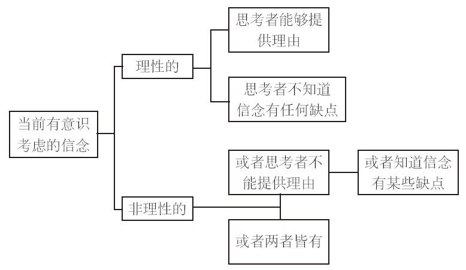

图3-4　理性的信念和非理性的信念

# 第二部分　推理和论证

## 第4章　论证分析的方法

### 重构论证的原则方法

认可或者拒绝一个断言从来不是论证分析的首要目的。恰恰相反，根据所提供的前提（理由）决定应该接受还是拒绝某个特定的断言，才是目的所在。但是这要求我们首先弄清楚正确论证重构的两个要求。一个是信度，另一个是弹性，即专栏4-1所关注的内容。

专栏4-1　论证重构的两个关注点

（1）如何组织论证使其表达论辩者的意图。

（2）如何组织论证使其尽可能有说服力。

忠实原则

对重构论证来说，忠于论辩者的意向是至关重要的。为了满足这个要求，我们在解释的过程中必须遵守忠实性原则，这就要求我们尽量站在论辩者的角度。也就是说，我们必须尽可能用他所意欲的方式确切表达他的论证。否则，我们处理的就不是讨论中的实际论证，而是我们编造的另外某个论证！

宽容原则

论证分析的另一个关键要求是我们要使得论证尽可能有说服力。因此，我们必须遵守第二个原则：解释过程中的宽容原则。这使得我们在重构论证时最大化论证构件的真值以及构件之间的逻辑关系强度。也就是说，我们必须将疑点利益归于论辩者，使其论证尽可能有说服力。在解释论证的前提和结论时，最大化真值要求我们以一种使得它们为真或者接近真的方式进行。在解读论证前提与结论间的推理关系时，最大化论证强度要求我们以一种使得该推理关系尽可能强的方式进行。一个论证的推理关系最强时，如果其前提为真，则结论必然也为真。但是，正如我们即将看到的，并不是所有的论证都能解读成具有上述这种推理关系。对于充分地重构论证的两个要求，参看专栏4-2。

专栏4-2　忠实原则和宽容原则

重构论证时要记住：

忠实原则

要求我们尽可能仔细地陈述论辩者确实要表达的内容。

宽容原则

要求我们认真对待论证，疑点利益归于论辩者，并且最大化论证各个构件的逻辑关联性和真值。

当忠实原则和宽容原则相冲突时

尽管忠实原则和宽容原则都是论证分析不可或缺的原则，并且二者在大多数情况下是相容的，但两者有时还是会相互冲突。冲突发生在最大化其中一个就必须最小化另一个的时候。让我们来看几个例子，在第一个例子中，忠实原则和宽容原则相互包容。有人争辩道：

例4-1　家规不允许狗出现在大厅，但是那里有狗。因此家规被违反了。

第二个前提可以重写为“狗在大厅里”，该前提可以用两种方式解读：（1）指称狗这个类的所有成员；（2）或指称狗这个类的某些成员。我们应该选择哪一个？忠实原则和宽容原则同时建议我们选择（2）。否则，前提可能为假，但仍然可以表达一些不符合论辩者意图的内容（并且我们的解释可能既不满足忠实原则又不满足宽容原则）。在没有这些缺点的重构下，例4-1变为：

例4-2　1. 家规不允许狗出现在大厅。

2\. 有几只狗在大厅。

3\. 家规被违反了。

这里的宽容原则和忠实原则不冲突。但是让我们考虑一个论证，在该论证中这两个原则确实看起来是相反的：

例4-3　下面这两个理由完全证明女巫不存在：（1）没有证据表明女巫存在；（2）引用女巫并不能解释任何事物。

在这里，忠实原则促使我们将论证解释为一个结论应该从前提必然地推出的论证。这恰恰就是“完全证明”。但是，在这种解释下，论证却不成立：它的结论显然不能从前提必然地推出，因为前提可能为真（事实上这里的前提确实为真），但是结论为假。

另一方面，宽容原则促使我们将例4-3解读为一个更直白的断言，其结论是基于论证前提的合理结论。在此解释之下，论证可以重述为例4-3a。

例4-3a　下列两个原因使得“女巫不存在”很可能成立：（1）没有证据表明女巫存在，并且（2）引用女巫不能解释任何事物。

现在我们最大化了论证的强度，因为尽管例4-3a的前提可能为真而结论为假，前提还是给结论提供了很好的理由：如果论证的前提为真，结论很可能为真。因此，例4-3a并没有失败，而是为其结论提供了支持。但如果此时最大化宽容原则，就会以最小化忠实原则为代价：例4-3a显然不是论辩者看起来想要表达的!
忠实原则总是更为重要，因此这里我们应该坚持例4-3的第一种解读，即最大化忠实原则的解读。

专栏4-3　忠实原则

我们不能简单地通过改变论辩者的所想以使得论证尽可能有说服力。这么做会使我们付出代价：我们最终分析的论证与实际要表达的论证完全不同。

比较下面这个论证：

例4-4　当代生物学家认为微生物存在。由此可以必然得出微生物存在的结论。

如果我们仔细分析例4-4的前提和结论，两者看起来显然都是真的。但是，一旦我们在重构例4-4的时候优先考虑忠实原则，我们就必须说论证不成立。因为，尽管其结论是合理的，但是不能从前提必然得出。毕竟，关于微生物的结论的可能性，虽然所有生物学家同时弄错的概率是极其微小的，还是存在这样的可能性。此外，如果我们在重构例4-4的时候优先考虑宽容原则，那么前提只是为结论提供了一个理由，因此论证的逻辑关系更弱，即，

例4-4a　当代生物学家认为微生物存在。这支持了微生物存在的结论。

但是我们应该把例4-4重构为例4-4a吗？不，回忆一下，如果两个原则在重构论证的时候发生冲突，规则如下：总是优先考虑忠实原则。也就是说，忠实原则比宽容原则优先级更高。此规则的原因如专栏4-3所述。

最后我们要指出，重构论证时没有考虑到忠实性和宽容性会导致一个严重的推理错误，即第10章将要讨论的“稻草人谬误”。

### 缺少前提

宽容原则和忠实原则有时要求恢复任何省略了的（但是隐含的）前提。回忆第1章中的论证：

例4-5　我思，故我在。

在不改变论辩者意图的前提下使得论证尽可能有说服力，我们必须添加一个前提，“任何会思考的物是一个存在”之类的语句。有了这个前提，推理关系就更强，因为论证可以被重构为：

例4-5a　1. 我思。

2\. 任何思考的物都是一个存在。 ←缺少的前提

3\. 我在。

现在的情况就是，如果论证的前提为真，结论也为真。来看另一个缺少前提的论证：

例4-6　1. 玛丽是我的姐姐/妹妹。

2\. 玛丽有一个同胞。

例4-6是一个很强的推理，因为如果它的前提为真，结论肯定为真。但是前提和结论之间的关联是隐性的。例4-6的一个显性表达为：

例4-7　1. 玛丽是我的姐姐/妹妹。

2\. 任何具有姐姐/妹妹的人有一个同胞。 ←缺少的前提

3\. 玛丽有一个同胞。

### 扩展的论证

有时，一个论证的结论可以作为另一个论证的前提。在这种情况下，我们称之为扩展的论证。下面这个扩展的论证用上述论证例4-5作为出发点：

例4-8　1. 我思。

2\. 任何会思考的物都是一个存在。

3\. 我存在。

4\. 如果我存在，那么至少存在一个东西（而不是没有任何东西）。

5\. 至少存在一个东西（而不是没有任何东西）。

当你面对一个扩展的论证时，记住：

事实上你面对的可能是两个或多个相互联结的论证。

第一个论证的结论可能是第二个论证的前提，用来支持某个更进一步的结论，以此类推。

任何一个自身不受扩展论证前提支持的结论不能用来支持该论证的某个进一步结论。

在例4-8中，我们事实上有两个论证：一个论证有两个前提支持第一个结论──语句3；另一个论证将语句3作为一个前提，与前提4一起推出第二个结论──语句5。因为例4-8有一个以上的结论，因此是一个扩展的论证。扩展论证的重构和评估也遵守上述忠实原则和宽容原则。

### 推理类型

演绎推理和归纳推理

我们已经知道，一个论证由做出某种断言的结论和一个或多个用来支持该结论的前提组成。但是，支持有两种不同的方式，这取决于前提是旨在确保结论的真，还是仅给结论提供某些理由。粗略地看，两者之间的区别是：前者是一个决定性的关系，后者是一个非决定性的关系。不过，现在我们可以做更准确的区分：前提和断言之间的决定性关系是演绎论证的一个标志，而前提和断言之间的非决定性关系是归纳论证的标志。任何论证都是这两种关系中的一种。

对于一个演绎论证来说，其结论可以从前提必然得出。下面是演绎论证的一些例子：

例4-9　 1. 如果今天是星期一，那么我们要上逻辑课。

2\. 今天是星期一。

3\. 我们要上逻辑课。

例4-10　1.所有的狗都会叫。

2.菲多是一只狗。

3\. 菲多会叫。

例4-11　1. 今天多云并且温暖。

2\. 今天多云。

对于这里的每一个论证，如果前提都是真的，那么结论也必定为真（不可能为假）。

所以，它们显然都是演绎论证。再来看下面的例子：

例4-12　1.大多数大学生学过平面几何。

2.这个班的有些学生学过平面几何。

例4-13　1.很多猫是家养的。

2\. 菲利克斯是一只猫。

3\. 菲利克斯是家养的。

对于例4-12和例4-13的论证，其前提至多都只提供了非决定性的理由：都不能保证其所支持的结论为真。即使前提为真，每一个论证的结论都可能为假。因此，我们把这类论证看作归纳性的。

分析论证时，记住图4-1中的区分是很有帮助的。我们必须判断一个给定的论证是演绎的还是归纳的，因为评估的标准也相应地不同。对于一些论证，如果被判定为演绎的，它们是有缺陷的；而如果被判定为归纳的，则是可行的。如果不能明确做出判断，我们应该怎么做？只要问问自己：前提为真能保证结论为真吗？如果能，那么最好就判定该论证是演绎的，并且用演绎论证的标准来分析。否则，看这些前提是否只是给结论提供了某些理由，使得即使所有前提都为真，结论也仍然可能为假？如果是，最好判定该论证为归纳性的，并且用归纳论证的标准来分析。演绎论证或归纳论证的标准是后面两章的内容。

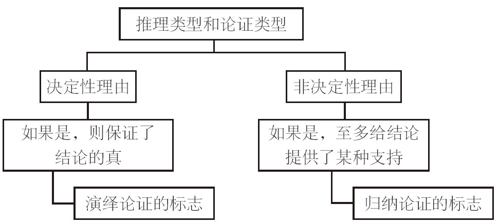

图4-1　演绎论证和归纳论证

### 规范和论证

什么是规范性论证？

我们已经知道，所有的论证都可以归类为两个类型中的一种：要么是演绎论证，要么是归纳论证。从不同的角度来看，演绎论证和归纳论证都可以进一步划分成规范性论证和非规范性论证。到目前为止，我们所讨论的例子几乎都是完全由承认或拒绝关于现实世界的某些事实（或假定事实）的语句组成的，如“多伦多是安大略省最大的城市”、“水银比水重”、“杰瑞?宋飞是一名喜剧演员”等。此类语句是非规范性的。然而，一些其他表述超出了描述事实，而是评估个人、行为和事物，或者说个体应该做什么（不应该做什么），事物应该怎样（不应该怎样）。例如，“你应该遵守承诺”，“雷鬼音乐很酷”，“希特勒是恶魔”，“埃琳娜的努力工作值得赞扬”等。

后一种表述用作规范性判断，包括我们所说的规范性推理。当我们做出一个规范性判断并提供支持的理由时，得到的就是一个规范性论证。这些论证的结论是具有某种价值的事物，如好坏、对错、公正或不公正、美丑等。此外，有些论证的结论描述某个东西是得到准许的（可以做的）、必须的（应该做的）或禁止的（不应该做的），这类论证也是规范性论证。考虑：

例4-14　1.一个人应该顺从他的父母。

2.我的父母告诉我不要参加星期五晚上的聚会。

3.我不应该参加星期五晚上的聚会。

例4-14的结论是一个规范性判断，因为它表达了一个禁止的行为（参加星期五晚上的聚会）。这个规范性判断以某种方式规定或引导论辩者的行为，即不参加星期五晚上的聚会。结论是规范性判断，足以使得论证例4-14成为规范性论证。此外，例4-14的前提1是一般规范性判断，有时也称之为“原则”，因为它们陈述的规则不是适用于某个人，而是适用于任何人。我们可以区分两种规范性判断，一种表达一般的规则，另一种用于表达那些像例4-14的结论那样用来对个人、个体事物和事件等做出断言的特殊的句子。这个区别可以总结为图4-2。

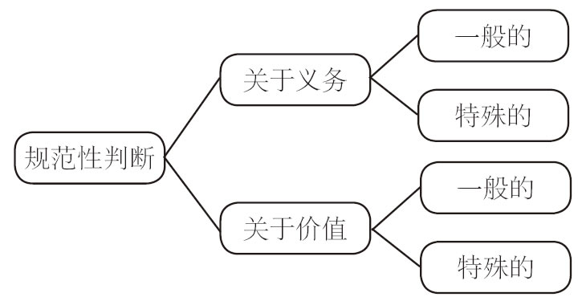

图4-2　规范性判断

义务判断涉及的概念包括对错和责任（我们有义务要做或克制住不做的事情，我们被允许或被禁止做的事情）。例如：

例4-15　你不应该欺骗你的朋友。

例4-16　散播关于安德森的恶意谣言是错误的。

价值判断（或简单地说，评价性判断）是关于行为或事物（它们是好的还是坏的，公正的还是不公正的，等等）的价值。例如：

例4-17　诚实的人是好同事。

例4-18　南犹他沙漠很漂亮。

例4-15和例4-17是一般性判断：适用于一组个人或事物。例4-16和例4-18是特殊判断：适用于个人或事物。

这里重要的是与品位、法律、谨慎和道德相关的一般的和特殊的规范性判断。我们将它们分别归类为审美的、法律的、审慎的和道德的判断。只要任何这样的规范性判断是一个论证的结论，我们就可以根据具体情况说论证本身是审美论证、法律论证、审慎论证或道德论证。一个规范性论证是审美论证，只要它表达了关于品位问题的评价或标准，如某件艺术作品很漂亮或很丑，一盘菜很好吃或很难吃，或者我们应该欣赏好听的音乐。审美论证可以是特殊的（“碧昂斯的唱片是最优秀的艺术”，“佛兰克?劳埃德?赖特的设计评价过高”，“渥太华的国会大厦是一个宏伟的景象”），或者一般的（“白色袜子跟黑色鞋子不配”，“你应该看看《法律与秩序》”）。

一个法律论证的结论是一个关于法律事务的规范性判断：根据法律被称为责任或义务的东西，或者根据法规被允许或被禁止做的事情。例如，司机不应该撕毁违规停车罚单，或者不允许在红灯的时候右转（除了在纽约市！），并且成年人有义务申报个人所得税。法律规范性判断的形式可以为条件式，就像“如果一个人被要求履行陪审义务，那么这个人就应该出庭”，“当一个人当庭宣誓作证时，这个人有义务告知真相。”

一个审慎论证的结论是对利己事物的断言，比如“你应该对富有的格特鲁德阿姨特别好”，“对抗你的老板对你没有好处”，“人应该首先照顾好自己”，“不要欺骗你的业务伙伴，如果你不想他们欺骗你的话”。

一个道德论证的结论是一个道德判断。此类判断是一个关于好坏、公正或不公正、应该或不应该做的断言。它们不是由法律规定的，而是根据具体情况赞扬或谴责的。例如，“说谎是错误的”，“你应该帮助地震生存者”，“马修的行为很不诚实”，“消防员在'9·11'事件中表现出了极大的勇气”。

关于上述概念的要点是，当这四种类型中的任何一种规范性判断出现在论证的结论中时，论证本身就是规范性的。只有在注意到结论是规范性判断的前提下，我们才能区分它属于哪一种规范性论证：美学的、法律的、审慎的或道德的。

省略了前提的规范性论证

在本章前面的部分，我们看到当一个论证用日常语言表达时，如果在忠实原则和宽容原则下重构论证，有时就会缺少需要恢复的前提。重要前提被省略──这个最常见的方式，有时候会在规范性论证中发生。事实上，在这样的论证中，规范性判断不仅出现于结论中，而且至少还出现在一个前提中，而这个前提有时被省略。（见专栏4-4）

我们所称呼的“规范性的一般前提”（例如“遵守承诺是对的”，“奴隶制是不公平的”，“人应该遵守法律”）对于争辩者来说可能太明显，以至于不需要重复，从而可能被省略。下面是一些规范性论证的例子，这些论证的一般前提未被省略。读的时候尝试想象，如果没有那个关键的前提，这些论证听起来会是什么样的。

专栏4-4　缺少前提的规范性判断

规范性论证通常省略一般的规范性理由。

这种理由在论证分析的时候必须明确表达。

最主要的是，一个仔细的逻辑思考者希望确认一个论证的所有前提都表达出来了，因为只有这样，他才能对论证的决定性或非决定性做出公正的评估。

例4-19　法律论证：

1\. 法律规定，在塔康林荫道汽车时速不能超过55公里。←规范性一般前提

2\. 昨天我在塔康林荫道的汽车时速超过了55公里。

3\. 根据法律规定，昨天我做了不应该做的事。

例4-20　美学论证：

1\.
由喇叭声、咩咩叫声和尖叫声随意组成的音乐是毫无价值的噪声。←规范性一般前提

2\.
Murgatroyd教授的《第二交响曲》是由喇叭声、咩咩叫声和尖叫声随意组成的。

3\. Murgatroyd教授的《第二交响曲》是毫无价值的噪声。

例4-21　审慎论证：

1\. 你应该做一切最有利于自己的事情。←规范性一般前提

2\. 尽可能地赞同你的老板是对你最有利的。

3\. 你应该尽可能地赞同你的老板。

例4-22　道德论证：

1\. 说谎是错误的。←规范性一般前提

2\. 不申报个人所得税是说谎。

3\. 不申报个人所得税是错误的。

规范性论证只有在其规范性前提(与论证前提给出的其他任何理由一起)都按原义表达的前提下，才能得到恰当的重构。需要注意的一点是，在日常生活中，我们很可能碰到这样的规范性论证：它们经常不能将相关的规范性一般原则都包含在前提中（因为这些前提都是默认的）。例如：

例4-20a　Murgatroyd教授的《第二交响曲》是由喇叭声、咩咩叫声和尖叫声随意组成的；因此Murgatroyd教授的《第二交响曲》是毫无价值的噪音。

例4-21a　尽可能赞同你的老板是对你最有利的，所以你应该尽可能赞同你的老板。

在例4-20a中，“由喇叭声、咩咩叫声和尖叫声随意组成的音乐是毫无价值的噪音”是缺少的前提。所省略的部分用于说明“什么样的音乐是毫无意义的”这个规范性的一般前提。在例4-21a中，缺少的前提是“你应该做任何对你自己最有利的事情”。同样，这也是一个规范性的一般前提。它指的是：最大化自身利益是执行某个动作的充分理由。（这个道理很明显，以致我们不需要说出来。不过，它是真的吗？）

## 第5章　评估演绎论证

### 有效性

有时人们使用“有效的”表示“真的”或“合理的”，用“无效的”表示“假的”或“不合理的”。但是，这些与逻辑思维中的“有效的”和“无效的”意味不同。一个演绎论证是有效的，当且仅当其前提必然推出或蕴涵其结论，其中“蕴涵”的定义如专栏5-1所示。

专栏5-1　推出关系

一个论证包含推出关系，当且仅当，前提的真保证了结论的真。也就是说，如果前提全部为真，结论不可能为假。这样论证是有效的和保真的。

正如我们所见的，演绎论证的结论可以从前提必然地推出。因此，如果前提全部为真，那么结论也为真。因为一个有效论证的前提为真确保了这个结论的真，也可以说有效论证具有保真性。任何不具备保真性的论证都是一个前提为真但同时其结论为假的论证。根据定义，这样的论证是无效的：其前提没有蕴涵结论。请注意，在这里我们采用了一些不同的表述来阐明相同的概念。说论证是有效的也就是说前提蕴涵结论。而这两种说法都等同于说该论证具有保真性，即前提可以必然地推出结论。对此，我们可以总结如下：

对于一个有效论证，接受其前提但是拒绝其结论是不符合逻辑的。

一旦接受了有效论证的前提，如果你拒绝其结论（即认为它是假的），这就会是矛盾的或无意义的。矛盾的语句不可能有相同的真值：如果一个是真的，另一个一定是假的。考虑下面这个有效论证：

例5-1　如果俄亥俄河在北美，那么它不在欧洲。俄亥俄河在北美。因此，它不在欧洲。

你不能既接受“如果俄亥俄河在北美，那么它不在欧洲”和“它在北美”，但同时又拒绝“俄亥俄河不在欧洲”。这会产生矛盾，因而不符合逻辑。

有效性是用来评估演绎论证的一个标准。论证是否有效从来不是程度问题，要么完全有效，要么根本无效。论证不可能在“某种程度上有效”。它要么是有效的，要么不是有效的。此外，确定论证的有效性有一个简单的测试。当你分析一个论证时，问自己：“所有前提为真但是结论为假可能吗？”如果是，论证没有通过测试：它是无效的。相反，如果不是，你可以认为它是有效的。我们来考虑一些例子。假设我们尝试预测在巴尔的摩，下一个夏天将会是什么样的。我们也许会说：

例5-2　下一个夏天的巴尔的摩，有几天会很热。毕竟，根据巴尔的摩的过去一百年的记录，几乎所有的夏天有几天都很热。

或者想象我们对欧洲假期的期望。我们也许会说：

例5-3　伊夫是巴黎人并且讲法语。奥黛特、马蒂尔德、玛丽、莫里斯、吉勒斯、皮埃尔、雅克和吉恩?刘易斯同样如此。因此，所有巴黎人都讲法语。

很明显，即使前提为真，这两个论证的结论也可能为假。虽然这样的可能性似乎不大，但它仍然是可能的。因此，这两个论证是无效的。在声称假结论是“可能的”时，我们考虑的是逻辑可能性。在这里，讨论的重点并不在我们现实世界中，对于例5-2和例5-3，是否可能前提为真但结论为假。相反，如果存在某个可能的场景（即没有内部矛盾的场景），使得这些论证的前提为真同时结论为假，那么这些论证就是无效的。

同时，我们还要注意另一件事情：论证是否有效完全是一个结论是否可以从前提必然推出的问题。前提和结论各自的“实际”真或假，与论证的有效性基本无关。重要的是，是否前提为真但同时结论为假，因为这可以确定论证的无效性。因此，有效论证能有一个或更多假前提，但有一个真结论。例如：

例5-4　1. 所有狗都是鱼。

2\. 所有鱼都是哺乳动物。

3\. 所有狗都是哺乳动物。

在某些情况下，一个有效论证可能完全由假语句构成，如：

例5-5　1. 所有民主党人都是素食主义者。

2.所有素食主义者都是共和党人。

3\. 所有民主党人都是共和党人。

因此，最好把有效性看作论证的前提和结论之间的一种关系，其中构成论证的语句的“实际真或假”基本上是不相干的。最关键的是：由前提真是否必然得出结论真？如果是，论证就是有效的。否则，论证是无效的。

专栏5-2　有效论证与无效论证

（1）论证可以分成两类：有效的和无效的。

（2）只有有效论证是保真的：如果它们的前提为真，则它们的结论不可能为假。

（3）只有有效论证的前提才蕴涵结论。

（4）一个接受有效论证前提的逻辑思考者不可能在没有矛盾的情况下拒绝其结论。但这种情况不会在无效论证中发生。

有效论证和论证形式

论证的形式是每个论证例示的逻辑模式。同一种论证形式通常是许多实际论证的底层模式。要表示论证的形式，最常用的方法是用占位标注或符号（如大写字母）替代某些词，而只保留具有逻辑功能的词。例如，对于例5-4，我们可以用“A”替换“狗”，“B”
替换“鱼”，“C”替换“哺乳动物”。所得到的论证形式是：

例5-4a　1. 所有A都是B

2\. 所有B都是C

3\. 所有A都是C

例5-4a是一个有效的论证形式，因为任何具有这种逻辑形式的论证都是有效的：如果前提为真，那么结论必定为真。上述例5-5以及下面这个例子也可以例示此形式：

例5-6　1. 所有笔记本电脑都是计算机。

2\. 所有计算机都是电子设备。

3\. 所有笔记本电脑都是电子设备。

因为上述例5-4同样例示了论证形式例5-4a，且该形式是有效的，因此例5-4是有效的，这与其前提是假的并不相关。对于一个有效的论证，可以具有下列情况：所有前提均为假，如例5-4；一个假结论和至少一个假前提，如例5-7；甚至所有前提和结论都为假，如例5-5。

例5-7　1. 所有专业足球运动员是运动员。

2\. 所有运动员是大学生。

3\. 所有专业足球运动员是大学生。

因为这些论证都例示了一个有效的论证形式，所以它们都是有效的。它们的形式使得用真前提例示它们的任何论证都必定有一个真结论。

有效性和论证形式

在例示一种有效形式的任何论证中，前提和结论之间有一种蕴涵关系。如果论证的前提为真，那么它的结论不可能为假。有效性就是这种关系。在一个论证中，可能有一个或更多的假前提，但这一事实对于它的有效性并不重要。有效性完全只与论证的形式有关。

无效性也是论证形式的问题：一个论证形式是无效的，当且仅当该论证的形式可能有真前提和假结论。但是这里的“可能”是“逻辑上可能”，也就是说无效论证也可能有真前提和真结论。例如：

专栏5-3　无效性和反例

证明某个论证无效的反例是另一个例示相同形式但是有真前提和假结论的论证。

要找到一个反例，可能需要想象一个没有内部矛盾的“可能”场景。现实世界只是众多被称为“可能世界”的可能场景中的一个。

例5-8　1. 所有的宝马都是机动车。

2\. 有些摩托车是机动车。

3\. 有些摩托车是宝马。

例5-8的结论是真的（的确，三个语句都是真的），但该论证是无效的，因为它例示了一个无效的论证形式，即

例5-8a　1. 所有A都是B

2.某C是B

3\. 某C是A

任何例示此类论证形式的论证都没有蕴涵关系，因为结论不能必然地从前提得出。要证明一个论证是无效的，逻辑思考者用反例的方法：他们尝试想出一个论证形式完全相同但却具有真前提和假结论的论证。例如，下面这个论证是证明例5-8a无效性的一个反例：

例5-9　1. 所有煎锅都是炊具。

2\. 有些饼干模具是炊具。

3\. 有些饼干模具是煎锅。

例5-9跟例5-8的形式完全相同，但是有真前提和假结论。反例方法不仅可以用来证明某类论证形式的无效性，也可以用来证明具有这些形式的实际论证的无效性。因此例5-9是例5-8的一个反例。也就是说，例5-9是证明例5-8的无效性的一个例子，因为它表明了一个形式完全相同但是具有真前提和假结论的论证是可能存在的。换句话说，例5-8的真前提并不会必然推出真结论。

作为术语的“有效性”

上面我们使用了“有效”和“无效”，但是不存在“有效的语句”和“无效的语句”。尽管我们在日常语言中会听到这样的表述，但是“有效”和“无效”是逻辑术语，不能用在单个语句上，而只能用在语句间的关系上（即称为论证的关系）。“有效”只能用在一个前提必然推出结论的论证上，“无效”只能用在那些前提不能必然推出结论的论证上。只有语句间的某些关系才有可能是有效的或无效的。因此，这些术语只能用在论证上，而不能用在单个语句上。

现在，要注意另一点：因为有效性的要求非常高，所以一些被这个标准判作无效的论证可能在一个要求不怎么高的条件下有其他价值。结论不能从前提必然得出的一些论证也是可以通过概率进行推导的。换句话说，对于有些论证，前提真未必能保证结论真，但结论真仍然是可能的。在许多情况下（例如，当它们支持关于自然或者人类社会的一般机制时），这类论证对我们可能非常有用。让我们回想一下“归纳”论证：虽然它们的前提可以给结论提供一些理由，但却绝不蕴涵结论。根据这个定义，所有归纳论证都不能达到有效性的标准。但是有一类论证，即使它的前提并不蕴涵结论，却因前提能为结论提供很强的支持理由，从而使人们相信它。我们将在第6章具体讨论这类论证。

同时，说一个论证是“真的”或者“假的”也是无意义的。“语句”和“信念”可能为真或为假，但是论证没有真值！与“有效性”和“无效性”类似，“真”和“假”也是术语，不能与日常的用法混淆。记住，在逻辑思维中，

语句：

要么是真的，要么是假的；

但既不是有效的，也不是无效的。

论证：

既不是真的，也不是假的；

但要么是有效的，要么是无效的。

命题逻辑中的论证形式

如我们所见到的，说论证有效的另一个方法是论证保真性。也就是说，如果论证的前提为真，则结论必须为真，即前提的真保证结论的真。保真性是有效论证所例示的形式具有的一个特征。有些论证具有保真的特质，因为组成其前提和结论的语句的组合方式形成了一种特殊的关系，从而将前提的真（如果前提为真）传递给论证的结论。还有些论证也具有保真性，因为在组成其前提和结论的语句中有一些通常被称为“项”的表达式，它们之间有某种特定的关系，从而使得论证的结论在前提为真的条件下也为真。前一种论证是“命题的”，后一种是“直言的”。

稍后我们将对两种论证分别进行分析。但在这之前，我们必须明确我们所说的“命题”到底是什么。我们已经知道，命题是一个信念或语句的“内容”，具有真值：要么为真，要么为假。现在我们来看一些命题论证。对于这些论证，保真性取决于组成论证的前提和结论的语句间的组合关系：

例5-10　1. 如果我的手机在响，那么有人正在给我打电话。

2\. 我的手机在响。

3.有人正在给我打电话。

根据例5-10的各个命题之间的关系，它是一个有效的论证。前提1由两个简单命题通过“如果……那么……”连接起来，前提2断言了两个简单命题中的第一个。用大写字母作为代替每个简单命题的符号，保留逻辑联结词“如果……那么……”，例5-l0的论证形式就很清楚了：

例5-10a　1.如果M，那么C

2\. M

3\. C

例5-10a的M代表“我的手机在响”，C代表“有人正在给我打电话”。例5-10a不是一个论证，而是表示论证前提和结论间关系的一个论证形式。通常称之为“肯定前件式”。任何具有这种形式的论证都例示了一个肯定前件式。例如：

例5-11　1. 如果必须有脑才能思考，那么无脑生物就不能思考。

2\. 有脑才能思考。

3\. 无脑生物不能思考。

下面来看另一种命题论证形式──“否定后件式”。

例5-12　1. 如果经济有增长，那么经济正在复苏。

2\. 但是经济没有复苏。

3\. 所以经济没有增长。

用符号记作：

例5-12a　1. 如果G，那么E

2\. 并非E

3\. 并非G

专栏5-4列出了一些有效的命题论证形式。现在我们对其中的部分形式进行实例分析，其他的形式将在第12章继续分析。

例5-13　1. 如果内陆温度升高，那么农作物会受到损害。

2\. 如果农作物受到损害，那么我们都会遭受损失。

3\. 如果内陆温度升高，那么我们都会遭受损失。

专栏5-4　一些有效的命题论证形式

|  |  |
|----|----|
| 肯定前件 | 否定后件 |
| 如果P，那么Q | 如果P，那么Q |
| P | 并非Q |
| Q | 并非P |
| 假言三段论 | 析取三段论(1) |
| 如果P，那么Q | 或者P或者 Q |
| 如果Q，那么R | 并非P |
| 如果 P，那么R | Q |
| 换质位 | 析取三段论(2) |
| 如果 P，那么Q | 或者 P 或者Q |
| 如果并非 Q，那么并非 P | 并非Q |
|  | P |

例5-13是假言三段论的一个例子，因为它有如下所示的形式：

例5-13a　1. 如果 I，那么 C。

2\. 如果 C，那么 A。

3\. 如果 I，那么 A。

同样，你可以自己证明下面的例5-14和
例5-15是专栏5-4“析取三段论”的两个例子，例5-16是“换质位”的例子：

例5-14　1. 美国的丹尼斯?蒂托或南非的马克?沙特尔沃思是第一个太空游客。

2\. 南非的马克?沙特尔沃思不是首位太空游客。

3\. 美国的丹尼斯?蒂托是首位太空游客。

例5-15　1. 美国的丹尼斯?蒂托或者南非的马克?沙特尔沃思是第一个太空游客。

2\. 美国的丹尼斯?蒂托是不是首位太空游客。

3\. 南非的马克?沙特尔沃思是首位太空游客。

例5-16　1. 如果波斯是一个强大的王国，那么莉迪亚是一个强大的王国。

2\. 如果莉迪亚不是一个强大的王国，那么波斯不是一个强大的王国。

所有这些论证都是专栏5-4中的某个论证形式的替换实例，并且都是有效的。也就是说，任何具有其中某个形式的论证都有一个推出关系，无论符号代表的实际语句是什么。换句话说，例示专栏5-4中的形式的论证都不可能同时具有真前提和假结论。这类形式的论证有很多，但是我们要在第12章对它们进行更深入地分析。

建议：本小节有很多有效的论证形式，可以制作一张卡片，以便参看和熟悉。卡片的一面是命题论证的形式，另一面是直言论证的形式。

直言论证的形式

很多论证显然是有效的，即使它们不符合命题逻辑的任何形式。例如：

例5-17　1. 所有牙医都有整洁的牙齿。

2\. 常医生是一位牙医。

3\. 常医生有整洁的牙齿。

例5-17显然是有效的，因为如果前提为真，那么结论必定也为真。现在我们用命题逻辑中的论证形式把每个部分替换成字母符号，就可以得到下面的形式：

例5-17a　1. D

2\. C

3\. E

但是例5-17a是一个无效的形式，因为有反例：即同种形式的、具有真前提和假结论的论证。如：

例5-18　1.鲸鱼是哺乳动物。

2\. 加利福尼亚是美国人口最多的州。

3\. 地球是平的。

因此，用一个无效的论证形式（如例5-17a）来表达一个有效的论证（如例5-17），是错误的。我们需要一个不同的形式系统，其中的字母符号不代表命题。也就是说，例5-17a的形式化太过笼统，不能作为例5-17的正确的论证形式。因为例5-17中的推出关系取决于组成论证的“命题”的各个表达式之间的关系，而不是取决于组成前提和结论的各个命题本身之间的关系。例5-17中的推出关系取决于诸如“所有”、“常医生”、“牙医”以及“整洁的牙齿”之类的项之间的关系。

形如例5-17的论证需要一个更细化的形式化表达。我们采用下列规则：

（1）将“to be”（“是”）的现在时作为每个前提和结论的主句动词。

（2）明确表达任何逻辑表达式，诸如“所有”“有些”、“没有”。

（3）用大写字母替换如“牙医”、“整洁的牙齿”之类的表达式。

（4）用小写字母替换表示特殊事物或个人的表达式，如“常医生”、“菲多”、“我”、“那张椅子”。

用这样的规则，我们就可以知道例5-17的逻辑形式与例5-19类似：

例5-19　1. 所有生产苏打饮料的企业生意都很好。

2\. 百事是一个生产苏打饮料的企业。

3\. 百事的生意很好。

例5-19的论证形式是：

例5-19a　1. 所有A都是B。

2\. c是A。

3\. c是B。

例5-19a中的“A”代表“生产苏打饮料的企业”，“B”代表“生意很好”，“c”代表“百事”。我们也可以用这样的规则对下面这个论证进行形式化：

例5-20　1. 所有眼科医师都是医生。

2\. 有些眼科医师很矮。

3\. 有些医生很矮。

例5-20无疑是一个有效的论证：它是直言论证的一个有效形式的替换实例。

再看一个相同形式的例子：

例5-21　1. 所有红松鼠都是啮齿动物。

2\. 有些红松鼠是野生动物。

3\. 有些啮齿动物是野生动物。

例5-20和 例5-21的都有如下形式：

例5-20a　1. 所有A都是B。

2\. 有些A是C。

3\. 有些B是C。

这里的“A”代表“红松鼠” （或“眼科医师”），“B”代表“啮齿动物”
（或“医生”），“C”代表“野生动物”（或“很矮”）。

现在让我们回忆本节开始提到的一点：判断有效性的另一个方法就是确定一个论证是否具有一个有效的形式。

考虑下面这个论证：

例5-22　1. 没有伯罗奔尼撒人是埃维厄人。

2\. 所有斯巴达人都是伯罗奔尼撒人。

3\. 没有斯巴达人是埃维厄人。

即使一点都不懂希腊地理的人也能看出这个论证是有效的，因为它是专栏5-5中第三个有效形式的一个实例。没有一个具有这种形式的论证同时具有真前提和假结论。类似地，论证例5-23是有效的，即使前提为假。为什么？就因为它是专栏5-5中的第三个有效形式的实例。

专栏5-5　一些有效的直言论证形式

|  |  |
|----|----|
| 1 | 2 |
| 所有A都是B | 有些A是B |
| 没有B是C | 所有A都是C |
| 没有C是A | 有些C是B |
| 3 | 4 |
| 没有A是B | 所有A都是B |
| 所有C都是A | 所有C都是A |
| 没有C是B | 所有C都是B |
| 5 | 6 |
| 所有A都是B | 所有A都是B |
| 所有B都是C | 有些A不是C |
| 所有A都是C | 有些B不是C |

例5-23　1. 所有苹果都是橙子。

2\. 所有香蕉都是苹果。

3\. 所有香蕉都是橙子。

那么，有效性就完全是论证形式的问题。上述这些例子的有效性也都是形式的问题。因此，我们可以得出另一个要点：对于每一个有效的形式，所有具有该形式的论证都是有效的。同样，对于每一个无效的形式，任何具有该形式的论证都是无效的。

命题的还是直言的

当你看到命题之间的某些连词，如“或者……或者……”以及“如果……那么……”，最好按命题逻辑的形式重构论证。

另一方面，如果你看到前提中有某些表示数量的词，如“所有”、“没有”、“有些”，最好按直言论证的形式重构论证。

有效性的实际作用

逻辑思考是有目的的，如学习、理解或者解决问题。每一种目的都要求论证分析，有时还需要驳斥论证，即证明一个论证无效的过程。但是，驳斥完全不是逻辑思考的主要目的之一，而只是在某些情况下论证分析过程中不可避免出现的结果。实现逻辑思考的主要目的在很大程度上取决于对论证的宽容地、忠实地重构。对于演绎论证，宽容原则要求使得论证尽可能有说服力，最大化前提和结论的真以及论证形式的有效性；而忠实原则要求尽量捕捉论辩者的意图。在所有这些过程中，逻辑思考者努力获取论证的正确形式，补充隐含的前提（如果需要的话）。论证一旦被重构，我们就可以对其进行评估。请记住下面的规则：

不要仅仅根据一个论证的结论批判或接受一个论证。

对论证的形式或者某个明确可辨认的前提进行反驳。

采用这里提供的评估标准。

不要做没有实质内容的批判，如“这是个人观点的问题”。

对有效性的任何质疑就是对论证形式的质疑。如果某种形式的论证的前提为真而结论为假，那么这个论证是无效的，因为它有一个无效的形式。但是找到一个无效的论证并不是驳斥它的决定性理由，因为它仍然可以是一个很好的归纳论证（第6章将有更多相关讨论）。一旦一个论证被确定为有效的，逻辑思考者就应该检查它的前提是否为真，本章稍后对此进行分析。

论证评估标准（如有效性）的实用性在于：依据某一论证的前提，我们对其结论持有何种态度取决于这个论证是否符合那些标准。有效性具有这样的实际作用：当一个论证满足有效性标准时，它的形式是有效的。同时，如果我们知道这一点，我们就知道如果所有前提都为真，则结论不可能为假。因此，断言一个论证的前提而同时却否认其结论是矛盾的。例如：

例5-24　1. 如果菲利克斯是一只猫，那么它是一只猫科动物。

2\. 菲利克斯是一只猫。

3\. 菲利克斯是一只猫科动物。

因为论证例5-24是有效的，我们无法在不矛盾的情况下接受其前提却否认其结论。因为如果一个论证是有效的，那么如果你断言（或接受）该论证的前提，你就必须在逻辑上断言其结论。断言例5-24的前提但否认其结论就等于说了这样的话：

例5-25　如果菲利克斯是一只猫，那么它是一只猫科动物。菲利克斯是一只猫。但是，它不是一只猫科动物。

很显然，这三个语句不可能同时为真。例5-25应该被驳斥，因为三个语句是一个逻辑上不可能的集合：没有一个可能世界使得所有语句都为真。

无效性的实际作用是什么呢？答案如下：

如果你知道一个论证是无效的，你就知道它的前提可能全部为真，而同时结论却为假。

但是要注意：

如果你对一个论证唯一知道的就是它是无效的，那么你并不知道它的前提事实上为真，并且结论事实上为假。

你只是知道这样的场景是可能的：论证形式使得这种场景成为可能（在有效论证形式中不可能发生的情况）。综上所述，在无效性的所有情况下，论证都不具备保真性。因此，前提和结论的真值的任何组合在逻辑上都是可能的。

### 可靠性

那么，我们必须总是接受有效论证的结论吗？不是的，因为有效论证的结论仍然会存在某些错误（上述有些例子清楚地表明了这一点）。评估一个论证，有效性是我们首先使用的标准，但是并不是唯一的标准。在确定一个论证有效之后，我们还必须确定它是否可靠，记住：

一个论证是可靠的，当且仅当它是有效的，且它的所有前提都为真。

因此，再来看前面给出的一些论证：

例5-22　1. 没有伯罗奔尼撒人是埃维厄人。

2\. 所有斯巴达人都是伯罗奔尼撒人。

3\. 没有斯巴达人是埃维厄人。

例5-4　1. 所有狗都是鱼。

2\. 所有鱼都是哺乳动物。

3\. 所有狗都是哺乳动物。

例5-5　1. 所有民主党人都是素食主义者。

2\. 所有素食主义者都是共和党人。

3\. 所有民主党人都是共和党人。

专栏5-6　可靠的论证

（1）一个论证是可靠的当且仅当它是有效的，且它的所有前提都为真。

（2）一个论证是不可靠的，如果该论证不具备有效性或真前提，或两者都不具备。

（3）不可靠性是驳斥一个论证的理由，即使这个论证是有效的。

（4）一个可靠论证的结论是真的。

（5）根据(4)，如果一个可靠论证的结论没有表述错误的事物，结论就不能被驳斥。

论证例5-22是可靠的。但是论证例5-4和例5-5是不可靠的。这是因为，如果一个论证缺少有效性或者真前提（或者缺少两者），那么它就是不可靠的。论证例5-4和例5-5的问题在于它们的前提是假的，因此使得它们不可靠，即使如我们所见，这两个论证都是有效的。有几个要点必须记住。首先，即使一个论证只有一个前提为假，这个论证也是不可靠的，无论其是否有效。其次，一个前提只有在毫无疑问为真的情况下才是真的。最后，因为有效性是可靠性的必要条件，一个论证也可能因为其形式的无效而是不可靠的。例如：

例5-26　1. 任何一个作为国家首都的城市都是一个政治权力中心。

2\. 芝加哥是一个政治权力中心。

3\. 芝加哥是一个国家的首都。

这里的两个前提都是真的，但是论证还是不可靠的，因为它是无效论证。

有效性和真前提是可靠性的必要条件（见图5-1）。一个论证的前提事实上是否为真又完全是另一个问题（无法仅用逻辑来回答）。大多数此类问题都是通过科学，或者历史学家、地理学家以及其他事实发现者的观察来回答的。为了确定前提是否为真，一个经验丰富的逻辑思考者希望直接了解事实！但这就使得他必须去图书馆或实验室，并且仔细考虑论证前提的证据──这些论证都被声称是可靠的。

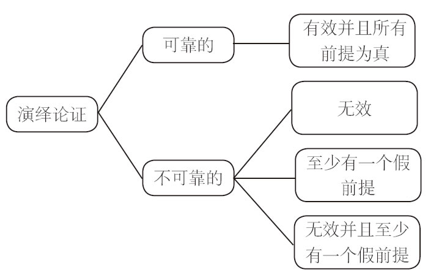

图5-1　可靠性

可靠性的实际作用

那么，为什么可靠性如此重要呢？为什么可靠性是论证必须具备的一个特征呢？因为，如果知道一个论证是可靠的，那么我们不仅完全有理由接受其结论，而且必须接受其结论！如上述定义所示，所有有效论证都是保真的：如果前提为真，则结论必定为真。如果一个论证是有效的并且前提事实上也为真，那么它就是可靠的。也就是说，前提的真值传递给了结论。因此，任何此类论证（没有论述任何错误的事物的论证）的结论都不能被驳斥。

可靠性有一个实际的影响或价值，因为只要一个演绎论证符合这个标准，那么它的结论就确保为真。事实上，可靠性的实际作用有两个方面。

如果一个论证是可靠的，那么：

在论证有效的条件下，你无法在没有矛盾的情况下断言其前提却拒绝其结论。

在论证有效并且其前提全部为真的条件下，你无法在不说错话的情况下拒绝其结论。

那么不可靠性呢？它对于逻辑思考者的实际作用是什么？一个不可靠的论证不能保证其结论的真。如果一个论证有效但不可靠，就意味着它至少有一个假前提。认识到这一点就是拒绝该论证的充分理由。如果一个论证不可靠但是所有前提都为真，就意味着其论证形式是无效的：正如我们将在第6章所看到的，有些这样的论证最好被看作归纳论证，并且用可靠性之外的标准来评估。

### 说服力

有效性和可靠性不是评估演绎论证的全部标准。还有一个演绎说服力的标准：如果一个论证具备专栏5-7中的三个条件，就认为该论证满足说服力标准。

专栏5-7　说服力的三个条件

（1）可识别的有效性。

（2）可接受的前提。

（3）比结论更加明确可接受的前提。

根据条件（1），一个有说服力的论证的有效性必须对评估论证的逻辑思考者是显而易见的。根据条件（2）和条件（3），一个有说服力的论证的前提应该为逻辑思考者接受论证的结论提供很好的理由。注意，这并不要求有说服力的论证是可靠的。换句话说，一个不可靠的论证也可能有说服力，只要思考者识别出论证的有效性，并且前提为结论提供了很好的理由；即使至少有一个前提是假的，而思考者对此并不知情。假设一个思考者在图书馆看到过英格里德并且进行如下推理：

例5-27　1. 英格里德在图书馆。

2\. 如果英格里德在图书馆，那么她不在自助餐厅。

3\. 英格里德不在自助餐厅。

因为他正好看到英格里德在图书馆，他似乎有证据支持前提（1）为真。前提（2）也是真的，因为没有人能够同时出现在两个不同的地方。根据前提（1）和前提（2），可以有效得出肯定前件式的结论3。因此这个论证是演绎有说服力的：论证具有可识别的有效性，并且有支持结论的可接受的前提。但是，假设思考者并不知道他在图书馆看到的事实上并不是英格里德本人，而是她的孪生妹妹格里塔。在这种情况下，该论证就是不可靠的──但仍然很有说服力！

另一方面，有时候可靠的论证也可能没有说服力。可识别的有效性和真前提可能并不足以使一个论证有说服力。例如：

例5-28　1. 地球不是平的并且地球不是宇宙的中心。

2\. 地球不是宇宙的中心。

例5-28很显然是有效的，因为如果其前提为真，结论不可能为假。此外，因为其前提事实上确实为真，所以论证也是可靠的。但是对例5-28的结论持合理质疑的人可能不会被说服而接受它。例5-28没有满足上述的条件（3），即有一个比结论更明确可接受的前提。假设这个论证是在中世纪被提出的，所有的证据都指向结论的假。尽管因为不知道这个前提是真的──并且这个论证是可靠的，那时的人们可能就会拒绝前提1。因此，即使是可靠的论证也可能不能说服人──当论证的前提并不比它们所支持的结论更可接受的时候。

专栏5-8　本节小结

满足专栏5-7中三个条件的演绎论证的前提，为逻辑思考者接受论证的结论提供了很好的理由。

### 说服力的实际作用

任何识别出某个论证的有效性及其前提为结论提供良好理由的人，在理性上都不可能拒绝该论证。这样的论证可以被称为“理性上强制的”（或者简单地称为“强制的”）。如果思考者要拒绝这样的论证，那么他就是不理性的：这在逻辑上讲不通。因为论证例5-28不能说服思考者基于论证的前提接受其结论，这个论证就是无说服力的（即，不是理性上强制的）。逻辑思考者必须防范这类论证并且尽量避免它们。在第8章我们将讨论辩论过程中影响有效论证基至可靠论证的说服力的一种错误。

## 第6章　归纳论证分析

### 重构归纳论证

在第5章我们已经讨论了演绎论证，本章我们将讨论在日常推理和科学推理中至关重要的归纳论证。我们已经知道，一个论证要么是演绎的，要么是归纳的，这取决于前提为真是否保证结论为真。如果是，论证就是演绎的；如果不是，论证就是归纳的。有一系列的检验方法可以帮助我们鉴别归纳论证。首先，对于任何论证，都问问自己：

是否可以在没有逻辑矛盾的情况下接受前提而拒绝结论？

如果是，该论证就是归纳的。

如果不是，该论证就是演绎的。

我们来看一些例子。首先，请看一个简单的演绎论证：

例6-1　帕姆精力充沛并且体格健壮。因此，帕姆体格健壮。

根据第一种检验法，我们应该尝试断言前提并否认结论，看看会是什么结果：

例6-2　帕姆精力充沛并且体格健壮。但是，帕姆并非体格健壮。

例6-2是矛盾的：不存在一个逻辑上可能的场景，使得组成例6-2的语句同时全部为真或为假。根据这个结果可知，论证例6-1是演绎的。相反，请看下面这个例子：

例6-3　1. 帕姆体格健壮。

2\. 大多数体格健壮的人不吃垃圾食品。

3\. 帕姆不吃垃圾食品。

论证例6-3的前提可能全部为真，并且可以在无矛盾的情况下拒绝其结论。毕竟，存在能够使得前提为真而结论为假的可能场景。例如，在一个场景中，帕姆体格健壮，并且大多数体格健壮的人不吃垃圾食品，但帕姆的确吃垃圾食品。因此，例6-3是归纳的。同样地，例6-4和例6-5也是归纳的，因为可以在没有逻辑矛盾的情况下断言它们的前提，并且同时拒绝它们的结论：

例6-4　1. 很多马都很友好。

2\. 艾德是一匹马。

3\. 艾德很友好。

例6-5　房价会持续降低，因为我们正处于经济衰退时期，并且房价通常会随着经济衰退而降低。

比较例6-4和 例6-6：

例6-6　1. 所有马都很友好。

2\. 艾德是一匹马。

3\. 艾德很友好。

例6-6是演绎的，因为不可能在无矛盾的情况下断言其前提而拒绝其结论。反之，如果我们这么做，我们肯定说了矛盾的话，即，

例6-7　所有马都很友好。艾德是一匹马。但是，艾德不友好。

不存在任何可能的场景使得三个语句同时为真。因为，如果所有马都很友好并且艾德是一匹马为真，那么艾德不友好肯定为假。要注意的是，在演绎论证中，结论不会增加任何不在前提中的信息。相反，归纳论证总是有一个推论跃越，因为结论总是表达前提中没有的信息。因此，归纳论证的结论并没有被严格包含在前提中。然而，这个特点使得归纳论证很适合物理学和生物学等领域中的科学推理，科学家总是根据观察到的一些样本案例总结因果联系或得出大致的结论。很多金属受热膨胀的观察使得科学家得出所有金属受热都膨胀的结论。这就像对人们的生活习惯与肺部疾病的调查得出了吸烟增加了罹患这些疾病的几率的结论一样。但是，这两个结论都增加了信息，而这些信息并不是科学家的前提中已经有的。

归纳论证的另一个区别性特征是：新获得的证据总是能够改变前提对结论的支持度，有时候增强，有时候减弱。例如：

例6-8　1. 98%的州立学院学生都涉足政治。

2\. 希瑟是一名州立学院学生。

3\. 希瑟涉足政治。

论证例6-8是归纳的。如果它的前提为真的话，就为结论提供了一些支持。但是，希瑟不关心政治这一新证据会破坏前提对结论的支持。增加了这个证据，论证就变成：

例6-9　1. 98%的州立学院学生都涉足政治。

2\. 希瑟是一名州立学院学生。

3\. 希瑟从不投票。

4\. 希瑟涉足政治。

比较一下例6-8和例6-9，我们可以看出，因为增加的前提3，例6-9中关于希瑟涉足政治的断言被驳斥。

到目前为止，我们所看到的归纳论证的特征表明它们不包含蕴涵：它们的前提，即使在成功支持结论的情况下，也从不能必然推出结论。也就是说，归纳论证不是保真的。尽管事实上一个归纳论证可能同时具有真前提和真结论，但是使其成为归纳论证的原因是：可能存在一个形式相同，但却具有真前提和假结论的论证。换句话说，归纳论证的前提并不蕴涵其结论。并且，正如我们在本章将要看到的，归纳论证缺乏蕴涵并不意味着它们不能给结论提供支持。事实上，即使不能从前提必然推出结论，它们也通常通过提供证据使得结论很可能为真或者有理由相信。这就是通常把归纳论证的前提称为“证据”的原因。同时，因为归纳论证的结论总是可能受支持但不能根据前提被完全证明为真，它们有猜测的成分，因此常被称为“假设”。

根据上述各种特征，归纳论证是似真论证。也就是说，尽管一个归纳论证为其假设提供的证据从不能蕴涵该假设，但是只要有证据成功地支持假设，就使得假设具有可能性。说一个断言是可能的就是说它很可能为真，或者至少有理由接受该断言。我们将在介绍归纳论证的一些常见类型之后，更详细地讨论成功归纳的标准。在结束本节之前，我们要确保自己知道专栏6-1中各个问题的答案。

专栏6-1　归纳论证

怎样的论证是归纳的？

前提可能为结论或假设提供证据但不能保证其为真的任何论证。

怎么判断一个论证是不是归纳论证？通过检验：

是否可能存在一个形式相同，但是具有真前提和假结论的论证。

是否可以在无矛盾的情况下断言其前提并拒绝其结论。

结论是否增加了前提中没有的信息。

如果上述问题的任何回答为“是”，则该论证就是归纳的。

### 归纳论证的类型

枚举归纳

在本章所讨论的四种归纳论证的类型中，我们将从枚举归纳开始。一个枚举归纳总是有一个普遍结论，使得某类事物的所有成员都具有（或缺乏）某个特征。这样的结论是从此类事物的某些成员具有（或缺乏）该特征得出的。这类论证的结论通常被称为“归纳概括”，它是一个全称概括：

全称概括

是断言某个类的所有成员具有（或不具有）某个特征的一个语句。

可以用很多不同的句式来表达。常用的句式有“所有……都是……”，“每一个……都是……”，“没有一个……是……”。

请考虑下面这个句子：

例6-10　玫瑰夏天开花。

例6-10也可以读作“所有的玫瑰都在夏天开花”。除非有额外的信息提供，该语句例示了“所有A都是B”的形式。

要用枚举归纳来支持例6-10，我们可以采用两种等效的策略。首先，给出一个这样的前提，比如，观察到很多玫瑰都在夏天开花。这就是一个非全称概括：

非全称概括

断言某个类的某些或很多成员具有（或不具有）某个特征的一个语句。

可以用很多不同的句式来表达。常用的句式有“大多数……是……”，“有些……是……”“很多……是……”，“n%……是……”（其中n小于100），“一些……是……”，“一些……不是……”。

根据这个策略，论证例6-10可以扩展成：

例6-11　1. 据观察，很多玫瑰在夏天开花。

2\. 所有玫瑰都在夏天开花。

为什么结论2是一个全称概括？因为它断言了某个类（玫瑰）的所有成员都具有某个特征（夏天开花）。请看在科学领域以及在日常生活中常见的一些全称概括：

例6-12　每种金属受热都会膨胀。

例6-13　任何马铃薯都含维生素C。

例6-14　每个物体都以恒定的加速度下落。

例6-15　所有物体间的引力都与物体的质量成正比，与物体间的距离成反比。

例6-16　没有绿宝石是蓝色的。

例6-17　没有海水能够止渴。

例6-18　没有骡能够生育。

根据上述策略，我们可以尝试用枚举归纳来支持非全称概括。毫无疑问，科学家们不可能观察所有的金属来得出结论例6-12。因此例6-12的前提肯定是一个非全称概括，例如：目前所观察到的众多金属受热都会膨胀。类似的枚举归纳还支持上述的其他全称概括。每个这样的枚举归纳都有一个非全称概括前提，使得相关类的成员具有例6-12～例6-15或不具有例6-16～例6-18的某个特征。

另一个通过枚举归纳支持这些全称概括的等效策略是用一些特称语句作为前提。

一个特称语句是关于个体事物或人的语句。例如，“本杰明?富兰克林创立了宾夕法尼亚大学”，“那颗橡树有寄生虫”，“玛丽的帽子是防水的”，“联合国正在召开会议”。

如果我们要用这个策略来支持玫瑰夏天开花的结论，我们的论证可以这样进行：

例6-19　1. 玫瑰1在夏天开花。

2\. 玫瑰2在夏天开花。

3\. 玫瑰3在夏天开花。

4\. 玫瑰n在夏天开花。

5\. 所有玫瑰都在夏天开花。

当n足够大时（比如，数十亿），结论5中的全称概括就受前提的支持，每个前提都是关于个体玫瑰在夏天开花的特称语句。这个策略与例6-11中所使用的策略等效，因为例6-19的前提意味着例6-11的前提所概括的。与例6-11类似的：

例6-20　1. 目前所观察到的每一只乌鸦都是黑色的。

2\. 乌鸦都是黑色的。

论证例6-20的结论是描述所有乌鸦都具有某个特征的一个全称概括。与其他归纳论证一样，这里有一个推论跃越：从一些乌鸦具有某个特征，得出所有乌鸦具有该特征的结论。这个论证的前提，如果为真，支持很多乌鸦具有该特征的断言，但是不能保证所有乌鸦都具有该特征。毕竟，没有人能观察过去、现在和将来的所有乌鸦！然而，论证例6-20的结论包含前提没有的信息。这类归纳具有以下的形式：

例6-21　1. n个A类物体是B。

2.所有A都是B。

显然，任何具有这种形式的论证都可能有真前提和假结论。因为总是可能存在一个尚未被观察到的A，使得A不是B或者不具备特征B。即使n很大，也可能发生这样的情况。注意，如果n包括了所有的情况，那么论证就会是演绎的。

此外，要注意例6-20的假设是一个全称概括，即，

例6-22　所有乌鸦都是黑色的。

因此，一只被观察到不是黑色的乌鸦就是证明例6-22为假的一个反例。类似地，如果有一头鲸鱼是冷血动物，下面的论证就有了一个反例：

例6-23　没有鲸鱼是冷血动物。

这里的规则是：

枚举归纳论证的任何例外都是一个反例。也就是说，这样的例外证明了结论的假。

枚举归纳的另一个类似用法是预测未来和解释过去。例如，某人做了下述推理：

例6-24　1. 以前的大多数动物物种都在进化中生存下来了。

2\. 所有的动物物种都将在进化中生存下去。

例6-24的结论是一个关于未来事件的全称概括，自然学家可能通过过去几百万年以来很多动物物种都在进化中生存下来的观察来为此做辩护。这个前提是一个非全称概括，只是基于那些已经被观察到在进化中生存下来的物种。同时，那些没有在进化中生存下来的物种就会是反例，我们的自然学家可能会因此必须放弃结论中的全称概括。反例带来的结果就是：

反例会影响物理、生物等的科学定律，例如伽利略自由落体定律和牛顿万有引力定律之类的全称概括。如果找到这些概括的一个反例，那么基于这些概括的科学理论就需要修正。

统计三段论

统计三段论是归纳论证：如果一个类中有很大一部分的事物具有某个特征，就认为该类具有该特征。例如：

例6-25　1. 大多数外科医生都投了医疗事故险。

2\. Hagopian医生是外科医生。

3\. Hagopian医生投了医疗事故险。

例6-25满足我们对统计三段论的定义。前提1中的非全称概括为一些外科医生赋予了一个特征，然后把这个特征赋予Hagopian医生，因为他是外科医生的一分子。例6-25的形式是：

例6-25a　1. 大多数A是Ｂ。

2\. h是A。

3\. h是B。

不能把例6-25a与下面这个演绎形式相混淆：

例6-26　1. 所有A都是B。

2\. h是A。

3\. h是B。

在统计三段论中，前提的概括必须是非普遍的，否则该论证就是演绎的，而不是归纳的。因此要记住，在统计三段论中总有一个非全称概括的前提，可以表述为：

例6-27　百分之n的A是B。

要作为归纳论证，概括中的“n”必须小于“100”。如：

例6-28　1. 72%的A是B。

2\. m是A。

3\. m是B。

与其他归纳论证一样，统计三段论也是在日常推理和科学推理中常见的。它们的前提可以用来解释过去：

例6-29　1. 很多著名的战役都有很谨慎的策略。

2\. 纳尔逊与特拉法加海战是一场著名的战役。

3\. 纳尔逊与特拉法加海战中有谨慎的策略。

或者预测未来：

例6-30　1. 80%的警官接受过反恐训练。

2\. 迈克尔将会成为一名警官。

3\. 迈克尔将会接受反恐训练。

统计三段论中的非全称概括程度关系到论证的可信度：概括程度越高，论证越可信（下一节将对此做更详细的讨论）。现在我们回顾一下全称概括与非全称概括的关键区别。

专栏6-2　全称概括与非全称概括

1\. 全称概括涉及某个类中的所有成员。可以用“所有”和“没有”等语言来表达。

2\.
非全称概括只涉及某个类中的一些成员。可以用“一些”、“大多数”、“很多”、“有些”、“n%”等语言来表达。

因果论证

当明火接触易燃性物质时，总是会引发大火，这是个有充分依据的观察。有了这个证据，我们可以有把握地断定今天早上吉姆在煤气旁边点火柴引发了大火。我们从一个观察到的结果（大火），推出我们可能观察到或者没有观察到的一个可能的原因（吉姆今天早上在煤气旁边点火柴）。当我们只观察到一个事件的某些结果并要从中推出它们的可能原因时，类似的因果推理同样有用（就如案件调查中常见的）。还有的情况是，观察到一些与事件起因有关联的事实，用这些事实进行因果推理，从而预测可能的结果。例如，最近的医学研究表明：某些基因很可能是表现为某种社会病理学的一些精神疾病的病因。基因在这里似乎是一个很可能的原因，因为它们的出现对社会病理学的发展是必要的（尽管不是充分的）。毕竟，不是每一个携带这些基因的人都会患上此类疾病。其他因素，包括环境因素，也是必需的条件。在煤气爆炸的例子中，今天早上吉姆在煤气旁边点火柴是发生爆炸的充分但非必要的原因：在所描述的场景中，该动作肯定会导致爆炸，但是其他动作也可能导致爆炸。

对事件之间因果关系的了解对我们十分重要，因为对自然规律的掌握是人类生存和繁衍的必要手段。从谨慎的角度出发，我们希望促进那些会产生好结果的原因，同时阻止那些会产生坏结果的原因。知道干旱会使粮食减产，促使古代人民以及工程师发展早期灌溉系统。同样，我们学习某些微生物与疾病之间的因果联系的期望推动了医学研究，使得我们能够预防或控制传染病和致命的疾病，如疟疾和小儿麻痹症。因此，毫不夸张地说，我们的日常生活和科学进步在很大程度上取决于我们是否能够弄清事物之间的因果联系。

我们把一些现象（事物和事物的发生）当作其他现象的结果，而后者是前者的原因。这个因果关系进而被应用于我们遇见的新现象。关于某些事件如何与其他事件有因果关系的推理就是因果论证。

因果论证的断言使得两个或多个事物之间以下列任一方式产生因果关系：

（1） Y因Z而产生；

（2）Y引发了Z；

（3）Y和Z是X的因或果。

因果论证的推理是常识推理和科学知识推理中最基本的部分。当我们拥有关于事态E的一些经验证据并且要找出E形成的原因时，就可以用因果推理。这就要求我们确定哪个事态C与E相关联──是E的充分原因、必要原因或充分必要原因。“原因”这个词可以用来表达很多不同的关系。当一个现象总是能够独自引发某个结果时，就是充分原因，正如下面这个因果论证所表述的：

例6-31　1. 昨天我的小区断电了。

2\. 昨天我的电脑发生了故障。

3\. 昨天的断电是我的电脑发生故障的原因。

例6-31中的断电被当作电脑发生故障的充分原因──就好像菜炒得太久一定会炒焦一样。但是，断电不是电脑故障的必要原因，因为即使没有断电，电脑也可能因为别的原因而发生故障，比如操作不当、散热不好或者零件损坏等。

有些时候，事件C是另一个事件E的必要原因，也就是说如果没有C就不会发生E。没有HIV病毒就不会有AIDS，这就是下面这个断言成立的“原因”：

例6-32　HIV病毒导致AIDS。

还有一种导致某个结果的既充分又必要的“原因”。在这种情况下，某个原因能够独自引起某事发生，并且也是必要的。换句话说，如果没有这个原因，就不会有这个结果。例如：

例6-33　由于拥有猫的基因序列，小猫毛毛长成了一只猫。

拥有特定基因序列既是毛毛长成一只猫（而不是一只猴子）的充分原因，又是必要原因，因为这样的原因总是能产生相同的结果。

然而，要注意的是，一组因果关联的断言可以是形如例6-32的概括或者例6-33的特称语句加上例6-31的结论。但是，当论辩者做出特称因果断言时，这些断言都有隐含的概括。在例6-31中，有一个隐含的前提可以被重构为全称概括或者非全称概括。如果被重构为全称概括，那么例6-31就是演绎论证。反之，如果被重构为非全称概括，那么例6-31就是归纳论证。作为一个归纳论证，可能被表示为：

例6-31a　1. 断电通常是电脑故障的原因。

2\. 昨天我的小区断电了。

3\. 昨天我的电脑发生了故障。

4\. 昨天的断电是我电脑故障的原因。

例6-31a的结论是一个假设，如果前提为真，则该假设就有可靠的支持。
例6-31a的前提为真并不保证结论为真，因此它是归纳的。

专栏6-3　“原因”的三个意义

（1）充分原因：C是E的充分原因，当且仅当C总是能引发E。

（2）必要原因：C是E的必要原因，当且仅当E不会在没有C的情况下发生。

（3）必要充分原因： C是E的必要充分原因，当且仅当C总是E的唯一原因。

契合差异法和共变法。在《逻辑学体系》（System of
Logic，1843)中，约翰?斯图亚特?穆勒（1806—1873）利用一般的直觉试图建立关于因果关系的概括。根据这些直觉，当某事发生时，就可能缩小（关于该事的可能原因或结果的）可接受假设的范围。这样，通过排除显然无关的因素，直到我们最后找到最有可能成为该事物发生的实际原因（或结果）的假设。在穆勒五法中，我们这里只讨论下面两种：契合差异法和共变法。

契合差异法　契合差异法有以下两个基本原则：

（1）契合：某个现象以不同的形式出现，所共有的因素很可能就是该现象的原因。

（2）差异：只在某个现象发生的时候出现的因素很可能是该现象的原因。

假设教练想知道为什么他的三个最好的队员（米克、吉姆和泰德）总是在星期五下午的比赛中发挥不好。弄清每个队员赛前所做的事情之后，教练做了如下推理：

例6-34　1. 米克、吉姆和泰德在星期五下午的比赛中发挥不好。

2\.
周四参加很晚的派对是他们三个在发挥不好的时候所做的并且是唯一做的一件事情。

3\. 周四参加很晚的派对很可能导致他们比赛发挥不好。

教练的推理是“契合”原则的示例，因为它基本上具有这样的形式：

例6-35　1. X已经发生了几次。

2\. Y是X发生之前的唯一事件。

3\. Y引发了X。

但是，要做出一个更加精确的断言，教练还应该用差异原则。首先，他应该比较队员参加很晚的派对和没有参加很晚的派对之后的表现。然后，如果队员只在前一种情况下表现不佳，那么他可以推出这个差异表明了前一晚的派对是他们表现不佳的可能原因。事实上，尽管契合法和差异法可以单独使用，但是为了更精确的结果，通常组合使用这两种方法。

共变法　共变法有以下原则：

（1）当一种变化与另一种变化高度相关时，其中一种变化很可能是另一种变化的原因，或者它们都由某个事物引发。

（2）当一个现象的变化与另一个现象的变化高度相关时，其中一个现象很可能是另一个现象的原因，或者它们都由某个第三因素引发。

假设某人问教练，为什么保持身体健康对一个球队的成员很重要。他可以用经验证据可靠地证明球员的身体健康与其表现有因果关系：

例6-36　1. 球员们身体越健康，他们的表现就越好。

2\.
身体健康很可能使得他们表现得好，或者他们表现得更好使得他们身体更健康，或者别的因素使得他们表现好又身体健康。

底层的推理大致为：

例6-37　1. X以某种方式变化，当且仅当Y以某种方式变化。

2\. Y引发X，或X引发Y，或某个Z引发X和Y。

类比

类比也是一种归纳论证。通过它，关于个体、性质或类别的某个结论是根据与其他个体、性质或类别的某些相似性而得出的。在下面这个类比的例子中，关于某种汽车的结论是基于它与其他类似汽车拥有某些共同点而得出的：

例6-38　1. 玛丽的汽车是2007款的越野车，很费钱。

2\. 简的汽车是2007款的越野车并且很费钱。

3\. 西蒙的汽车是2007款的越野车并且很费钱。

4\. 彼得的汽车是2007款的越野车。

5\. 彼得的汽车很费钱。

在例6-38中，论辩者想要通过类比得出合理的结论：彼得的汽车与玛丽、简和西蒙的汽车有两个相同点：“2007款”和“越野车”。这就使得我们有理由认为它们也有第三个共同点：“费钱”。令“m”、“j”、“s”和“p”分别代表玛丽的车、简的车、西蒙的车和彼得的车；A、B和C分别代表性质：2007款、越野车和费钱。那么，例6-38的形式可以表示如下：

例6-38a　1. m具有性质A、B和C。

2\. j具有性质A、B和C。

3\. s具有性质A、B和C。

4\. p具有性质Ａ和B。

5\. p具有性质C。

任何这种形式的论证都不是演绎的（即前提不能蕴涵结论）。但是，如果前提为真，那么这些前提可以为结论提供可靠的证据。类比可以使其结论成为可能，只要它们满足下面所说的可靠归纳论证的标准。对类比成立至关重要的特殊因素如专栏6-4所示。

专栏6-4　类比

一个类比是否成立取决于：

1\. 用来对比的事物或特征的数量。

数量越多，类比越可靠。

2\. 事物间异同点的相似程度。

相似程度越高差异度越小，类比越可靠。

3\. 归于假设的特征的相关性。

相关性越大，类比越可靠。

4\. 关于证据的假设的大胆性。

假设越谨慎，类比越可靠。

现在请考虑以下类比：

例6-39　对北极熊和河马的大量研究表明，它们与许多大型野生动物有很多相关特征。这些动物也都是濒危的物种。因此，北极熊和河马也可能会灭绝。

这个类比的推理形式是：

1\. 北极星和河马与物种x、y和z有很多相关特征。

2\. 物种x、y和z都具有特征f（是濒危物种）。

3\. 北极熊和河马很可能具有特征f。

如果北极熊和河马确实与某些濒危物种有某些相同特征，并且这些特征确实与论证的结论相关，那么例6-39的结论就是可能的。

### 评估归纳论证

归纳的可信度

假设我们要把上述许多论证当作演绎论证来解释，然后根据演绎论证的标准（如有效性、可靠性和说服力）来评估它们。这显然与宽容原则和忠实原则相矛盾，因为没有论证可以通过这样的评估。但是，有些论证似乎为它们的结论提供了支持，只要它们的前提为真。这表明，要评估归纳论证,
我们需要的是评估演绎论证之外的标准。最重要的一个就是可信度（reliability）。它与归纳论证的形式有关：

一个归纳论证是可信的，当且仅当它的形式是这样的：如果前提为真，那么接受其结论为真实可信的。

当一个归纳论证是可信的，只要它的前提为真，它的形式就会使得它的结论是似真的。例如：

例6-40　1. 99%的吉他手也会演奏其他乐器。

2\. 冯是一名吉他手。

3\. 冯也会演奏其他乐器。

这个归纳论证看起来很可信：如果它的前提为真，它的形式使得结论是似真的。请考虑例6-41。它比例6-40不可信，但比例6-42更可信：

例6-41　1. 59%的吉他手也会演奏其他乐器。

2\. 冯是一名吉他手。

3\. 冯也会演奏其他乐器。

例6-42　1. 39%的吉他手也会演奏其他乐器。

2\. 冯是一名吉他手。

3\. 冯也会演奏其他乐器。

因此，归纳可信度是一个程度问题。一个形如例6-43的归纳论证比一个形如例6-44的归纳论证更加可信：

例6-43　1. 59%的A是B。

2\. p是A。

3\. p是B。

例6-44　1. 39%的A是B。

2\. p是A。

3\. p是B。

归纳可信度对逻辑思考者的实际作用可以通过与演绎有效性的实际作用进行对比而得出。两者都涉及论证的形式，以及论证的前提（如果前提为真）可能给结论提供的支持。在一个有效的论证中，如果前提为真，那么结论必定为真。在一个可信的论证中，如果前提为真，那么结论很可能为真。正像我们在第5章所看到的，一个有效的演绎论证是保真的。相反，一个可信的归纳论证不是保真的。归纳可信性是日常论证和科学论证应该具备的两个必要特征之一。

归纳的力度

力度是归纳论证的另一个必要特征。因此，我们可以用它来评估归纳论证。当一个归纳论证满足专栏6-5中的条件时，这个论证就很有力。

专栏6-5　有力的归纳论证

一个归纳论证是有力的，当且仅当：

（1）它是可信的；

（2）它的前提全部为真。

当一个归纳论证是有力的，我们就有理由接受它的结论。也就是说，有理由认为这个结论为真。我们可以用竞争的方式来考虑这个标准：根据归纳论证的结构，相反的结论总是在逻辑上可能的。假设生物100班的教授刚收到一名新生罗宾?麦肯齐的邮件。她要决定怎么开始回信，“亲爱的麦肯齐先生”还是“亲爱的麦肯齐女士”。假设生物100班的80%的学生是女生，然后进行如下归纳论证的推理：

例6-45　1. 生物100班的80%的学生是女生。

2\. 罗宾是生物100班的学生。

3\. 罗宾是女生。

因为例6-45是一个归纳论证，即使它的两个前提都为真，结论（即语句3）事实上可能不是真的。毕竟，名字叫“罗宾”的人也可能是一个男生。当然，根据前提提供的证据，结论3似乎比相反的假设（即罗宾是男生）更加可能。但是，想象一个不同的场景：假设我们知道生物100班的80%的学生是男生。那么，在相反的假设中，根据已知信息，最可能为真的结论就是罗宾是男生。这个论证现在表述如下：

例6-46　1. 生物100班的80%的学生是男生。

2\. 罗宾是生物100班的学生。

3\. 罗宾是男生。

我们也可以用另一种方式定义归纳力度：

一个归纳论证是有力的，当且仅当：基于证据，论题极有可能为真。

像归纳可信度与演绎有效性的对比一样，归纳力度也可以与演绎可靠性进行对比。一方面，演绎可靠性不是程度问题，因为它取决于有效性和真，而这两者都不是程度问题（不存在“有点真”的前提或者“有点有效”的论证）。因此，与任何演绎论证要么有效、要么无效一样，演绎论证要么可靠、要么不可靠。另一方面，归纳力度的确是一个程度问题，因为它部分取决于可信度，而可信度是一个程度问题。这些标准的实际作用又是什么呢？当一个论证是演绎可靠的，其结论就是真的。承认此论证可靠性的逻辑思考者必须接受这个结论。但是，任何归纳有力的论证的结论最多只是很可能为真的。承认此论证力度的逻辑思考者有理由接受这个结论。对于用来评估归纳论证的这两个标准，其实际作用可以被总结如下：

归纳可信度的实际作用

如果一个论证的可信度高，那么只要它的前提全部为真，就有理由接受它的结论。

归纳力度的实际作用

如果一个论证的归纳力度强，那么我们就有理由接受它的结论，因为它有一个可信的形式并且前提全部为真。

那么，如果归纳论证无法满足其中一个或另一个标准呢？这样的论证都不能为其结论提供可靠的理由。

# 第三部分　非形式谬误

## 第7章　论证失效的主要方式

### 什么是谬误

我们已经看到，论证会因为不满足有效性和可靠性等演绎标准或可信度和力度等归纳标准而出现问题。现在我们要更深入分析论证可能出现的其他问题。通过仔细观察一些推理出错的例子，我们对可靠推理的认识会更深入。我们从谬误的研究开始。这是推理中经常出现的错误类型，它们对论证以及信念和概念之间的关系有很大的影响。在逻辑思维中，谬误不仅仅是一个错误的信念或观点。例如，在一次日常对话中，某人说出了“动物感觉不到痛苦的谬误”。更确切地讲，

谬误是概念或信念之间的一种无效关系的模式。它影响任何例示此形式的推理。

谬误值得研究，不仅因为例示它们的论证不能支持其结论，而且因为它们可能是误导性的。它们可能以很细微的方式影响论证。所以，当我们一开始看到或听见这样的论证时，会认为它们毫无问题。但是，如果我们对此思考得越多，就越会怀疑是不是有什么地方出了问题。谬误通常被分为形式谬误和非形式谬误。形式谬误是发生在如下论证中的一种错误：这些论证看起来是一种有效论证形式的实例，但依据它们的形式，事实上是无效的。这样的错误有很多种，因此就有很多不同的形式谬误。它们都有一个共同点：它们只影响演绎论证。这些论证表面上看起来具有某个逻辑系统（如命题逻辑或直言逻辑）的有效论证形式，但实际上却是无效的。当某种错误经常出现时，我们就给它命名（我们将在第四部分对此进行讨论）。另一方面，非形式谬误涉及的错误是论证可能例示了某些错误的形式或内容。它们可能影响演绎论证或归纳论证，总是使论证不能为结论提供良好的支持。例如，对于一个具有非形式谬误的论证，其前提和结论之间的关系可能并不成立，而这种关系不与任何具体的论证形式相关。论证也可能受混乱的表达方式或内容的影响。因为非形式谬误的类型太多，我们必须先通过分类使大家对此有一个大致的了解。

专栏7-1　避免谬误的实际作用

逻辑思维要求能够识别并避免谬误。具体地，我们要知道：

如何识别他人的论证是谬误的（从而不会被误导）。

如何避免自己的论证发生谬误（从而使得论证可以支持它们的结论)。

### 非形式谬误的分类

非形式谬误的分类方式不止一种。但是，有些谬误比其他谬误更值得重视。本书给出了一个非常标准的谬误列表，包括下面这些常见的非形式谬误如表7-1所示。

表7-1　常见的非形式谬误

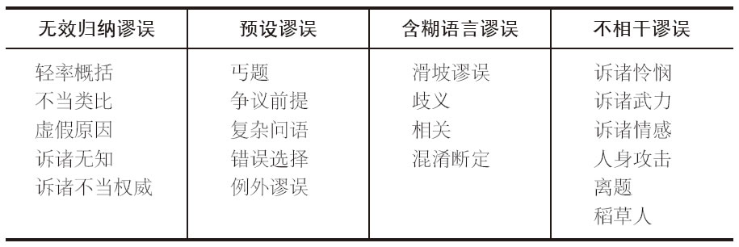

我们将逐个讨论上述谬误，并仔细分析各类谬误中的每个谬误形式。在第6章，我们对归纳推理进行了讨论，因此我们首先分析滥用归纳可能会产生的谬误。

### 归纳论证什么时候会出错

在本章中，我们将讨论与滥用归纳推理有关的五种非形式谬误，具体如下，如图7-1所示。

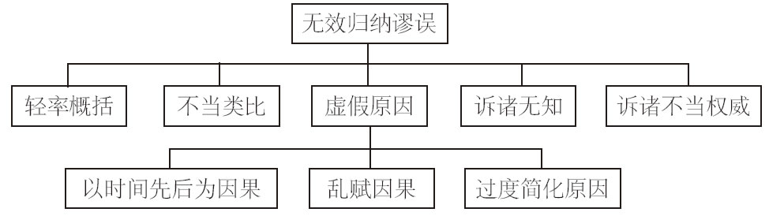

图7-1　无效归纳谬误

轻率概括

轻率概括谬误会影响枚举归纳。我们已经知道，枚举归纳通常以断言某些事物具有（或缺乏）某一特征的前提出发，得出关于此类所有事物的一个概括性的结论，即所有此类成员都具有（或缺乏）该特征。这种论证的结论是一个全称概括，如“所有豹子都是肉食动物”和“没有豹子是肉食动物”。因而，枚举归纳可能是这样一种形式：

例7-1　1. 到目前为止被观察到的所有豹子都是肉食动物。

2\. 所有豹子都是肉食动物。

当豹子的某些典型代表被观察到是肉食动物时，这个归纳论证的结论就得到了有力的支持。同样，如果我们观察到豹子的某些典型代表都是野生动物，就可以根据观察得出所有豹子都是野生动物的可靠结论。相应的归纳论证是：

例7-2　1. 到目前为止被观察到的每只豹子都是野生动物。

2\. 所有豹子都是野生动物。

但是，为了使任何此类归纳结论成立，论证必须符合专栏7-2中的条件。如果不满足其中任何一个条件，或者两个条件都不满足，那么论证就犯了轻率概括的错误，因此是不成立的。

轻率概括是指当观察到某类事物的极少代表具有某个特征时，就得出所有此类事物都具有该特征的一种错误，或者观察的代表既不全面也不随机。

专栏7-2　如何避免轻率概括

在评估枚举归纳时，要记住只有以下方法才可以避免轻率概括：

结论所依据的样本足够大。如例7-1和例7-2，论辩者必须观察足够多的豹子。

从目标群体中选取的样本既是全面的又是随机的。

在例7-1和例7-2中，论辩者必须在不同的情况下到世界各个地方观察典型的豹子。

假设一队自然学家观察了50万头豹子，并且它们都是野生动物。这些动物都是在8月第1周的某个时间在印度观察到的，这个时候正好是豹子的觅食时间。这个样本看起来足够大，因此观察者得出了这样的结论：

例7-3　所有豹子都是野生动物。

但他们可能犯了轻率概括的错误，因为世界上的其他地方也有豹子。并且每年的其他时间以及其他情况下也能看到豹子。很显然，这个样本既不全面也不随机。在这种情况下，论证例7-2就不能为它的结论提供可靠的理由。另一方面，假设自然学家在各个时间、各种情况下到世界各地直接观察豹子。但样本只有37头豹子。自然学家是否能为例7-3的结论提供更好的理由？不能，因为尽管样本满足了全面性和随机性，但还是太小。这种情况下自然学家同样犯了轻率概括的错误。

不仅自然学家和其他科学家需要注意这种错误，逻辑思考者也应该对很多日常情景中的轻率概括有所防范。其中，我们最熟悉的就是刻板地看待他人。假设中西部的某人第一次到加利福尼亚旅游。他认识了三个加利福尼亚的当地居民，并且他们都练瑜伽。想象某人假期结束以后回到家里，告诉他的朋友：

例7-4　所有加利福尼亚人都练瑜伽。

如果有人质疑，他会提供这样的论证：

例7-5　1. 我遇见了玛格丽特?埃文斯，她是加利福尼亚人并且练瑜伽。

2\. 我遇见了阿莉莎?门多萨，她是加利福尼亚人并且练瑜伽。

3.我遇见了迈克尔?吉川，他是加利福尼亚人并且练瑜伽。

4.所有加利福尼亚人都练瑜伽。

例7-5的推理也是一个轻率概括的例子。此外，它刻板地看待加利福尼亚人：根据前提中描述的样本，并不能得到结论。

现在想象一个不同的场景：假设一位人类学家去加利福尼亚研究现在加利福尼亚人的习俗。假设她去过南加利福尼亚、圣华金河谷、旧金山湾区以及这个州的所有区域，遇见了各行各业、各个社会团体、各个宗教、各个族群的人──从城市、郊区，到小镇、乡村。假设她与数千人交谈，并且发现所有这些人都练瑜伽！（当然这是不可能的，我们只是假设这种情况）那么，他得出如例7-4的结论就不是一个谬误：根据调查的广度和深度，该结论是一个有力枚举归纳的合理结果。但是要注意，这个论证与前面所说的论证例7-5有多么不同！关于所有加利福尼亚人的结论只是基于三个实例，这显然是不合理的。这是一个冒牌的枚举归纳，并且是一个令人讨厌的刻板做法。为了避免这种刻板做法及其基础──轻率概括谬误，逻辑思考者应该牢记：

关于某类或某个群体的结论不能在下列情况下得到支持：

样本太小；

样本不够全面或不是随机的，或者既不够全面也不是随机的。

不当类比

不当类比是归纳论证不能支持其结论的另一种情况。类比的基础推理模式大致可以表述为：

例7-6　1. f和j因为都具有n个相同的特征而相似。

2\. f还具有第n +1个特征。

3\. j也具有第n +1个特征。

但是，此类论证是否成立很大程度上取决于它是否能通过专栏7-3的检验。如果检验表明，特征n +
1只有f具有，那么原以为可以对比的事物实际上是不具可比性的，因此论证犯了不当类比谬误。对此，我们总结如下：

一个类比要成立，其前提宣称相似的事物事实上也须以一种与结论相干的方式类似。只要不满足这个条件，就犯了不当类比谬误。

专栏7-3　如何避免不当类比谬误

在评估形如例6-6的论证时，我们可以问以下问题：

数字n有多大？这n个特征与类比的结论有关系吗？（通过问这个问题，我们想要知道前提是否为结论所做的断言提供了足够全面的相关特征）

前提所声称的事物是否确实都具有这n个特征？（通过问这个问题，我们想要知道前提中声称的相似性是否确实存在）

想象这样一个场景：有一对姐弟，弟弟小约翰5岁，姐姐苏西13岁。一天晚上，到了弟弟该睡觉的时间，他妈妈对他说：“小约翰，现在9点钟了，快上床去睡觉！”但是，小约翰回答说：“你让苏西待到那么晚。”小约翰正当地表达了对他的不公平对待吗？他的论证可以重构为以下形式：

例7-7　1. 苏西和我在很多方面都相似。

2\. 苏西没有被要求晚上9点钟上床睡觉。

3\. 我不应该被要求晚上9点钟上床睡觉。

但是，这是一个不当类比，因为小约翰理所当然认为苏西的情况和他的情况一样。但事实上，他们的情况不一样。尽管他们在同一座房子里生活，上同一所学校，有同样的父母，但他们还是有一个特征不一样：不一样的年龄。小约翰只有5岁，而苏西已经13岁了。在面对晚睡这个问题时，妈妈会进行合理的判断：我对一个13岁孩子的要求与对一个5岁孩子的要求应该不同。这样，小约翰的认识与妈妈的认识就完全不同了。因此，小约翰的论证是一个不当类比，因而不能支持该论证的结论。

当然，不是所有的不当类比都这么明确可辨。对于某个类比是否完全是一个谬误存在一定的分歧余地。有些类比不太恰当，但并不是错误的。还有一些类比触及了类比恰当与否的底线，很难判断其是否成立。此外，类比是日常推理中最常见的论证形式之一。也是在政治演讲中被广泛使用的论证形式。逻辑思考者应该特别注意政治家的企图：将某些事实上有争议的类比当作显然成立的。来自伊拉克萨德姆?侯赛因的恐吓与来自德国希特勒的恐吓可以做对比吗？阿富汗战争与越南战争有可比性吗？当我们用逻辑来分析这些事件时，应该在判断类比恰当与否之前对事实进行细致的研究。并且，很多现实生活决策都基于这一类论证。当我们基于j和f都具有特征A、B和C并且f具有特征D，而得出j也具有特征D时，我们

只有在以下情况下才能接受这个类比的结论：

具有特征A、 B和C与具有特征D相关；并且

就是否共同具有D而言，没有证据表明f与j在某个重要方面有所不同。

虚假原因

前面我们通过观察两个事件总是一起发生，得出了因果论证，并据此推断这两个事件之间有因果联系，或者这两个事件与另一个事件有因果联系。一些类似的论证可能是归纳有力的。假设小艾米丽在她的姐姐们（佩内洛普和柏妮丝）长水痘一个星期后感染了水痘，并且假设艾米丽在这一周内与佩内洛普和柏妮丝一直有接触，我们可以合理地推断她是从她的姐姐那里感染了水痘的。只要我们知道传染性疾病是如何传播的，这个归纳结论就受到了支持。但不是所有的因果论证都是有力的。当专栏7-4中的任何一个错误出现时，就会产生一个虚假原因谬误。

虚假原因：犯这种错误的论证辩称两个现象之间具有重要的因果联系，而事实上它们之间的因果联系极其微小或并不存在。

专栏7-4　如何避免虚假原因谬误

在下列两种情况下，因果论证可能不成立：

论证推断两个现象之间具有因果联系，但事实上根本不存在因果联系。

论证错误地将某个现象作为某个被观察到的结果的充分原因（或决定性原因），而事实上只是该结果的附带原因（多个原因之一）。

现在来逐一考虑虚假原因谬误的三种类型，如图7-2所示。其中一种是：

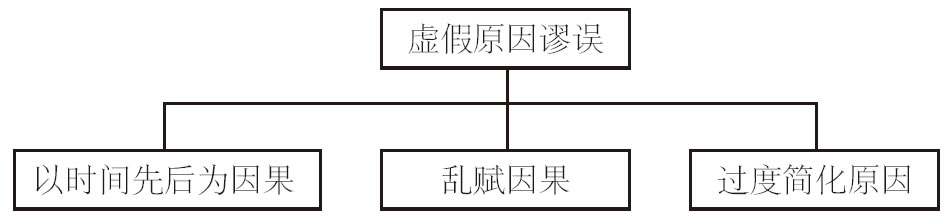

图7-2　因果谬误的三种类型

以时间先后为因果的谬误：两者事实上根本没有因果关联，却认为某个先发事件是某个后发事件的原因的谬误。

日常生活中，容易犯这类谬误的原因是：当我们看到两个事件总是相继发生时（也就是说，总是能同时观察到它们，首先是第一个，然后是另一个），我们就会很自然地认为先发事件是后发事件的原因。但是不难想象，有的时候我们对因果联系的归纳是不对的。假设我们看见一辆公共汽车经过广场的法院，随即塔楼敲响了九点的钟声。日复一日，我们都看到事件以同样的顺序发生。那么，我们最后会说是公共汽车经过法院使得九点的钟声被敲响吗？当然不会！然而，在我们的经验中，这两件事情总是相伴发生：钟声总是在公车经过时敲响。

显而易见，从公共汽车经过和钟声敲响经常相伴发生的证据得出前者引发后者的结论是荒谬的。但是，在日常生活中我们经常听到这样荒谬的论证。假设赫克特和芭芭拉之间关系不和睦，而他们的一个朋友想要解释这个问题的原因：

例7-8　1. 赫克特是摩羯座的。

2\. 芭芭拉是双鱼座的。

3\. 摩羯座和双鱼座不和谐。

4\. 他们最近的问题源自两人的星座不和谐。

论证例7-8不能支持它的结论，因为它断言的因果关系并没有可靠的证据。在这个例子中，我们也不应该期待有什么可靠的证据，毕竟我们没有理由认为星相和其他天文现象能够实际影响我们的生命过程。不管导致两人矛盾的原因是什么，肯定是别的事物。论证例7-8是一个以时间先后为因果的谬误，是虚假原因的一种形式，因为它认为生在天体具有某个特定组合（确定了星相）的某一天与后期长成的个性特点之间有因果联系。但是，我们并没有理由认为这两个顺序事件之间确实相关。

虚假原因的另一种情况是：

乱赋因果谬误（简单地说，就是把不是原因的事件错当成原因）：

并不是错把两个相继发生的事件中的先发事件当作后发事件的原因，而是错把两个同时发生的事件的其中一个当作另一个的原因，但事实上并非如此。

错为因果的一种形式就是混淆因果。19世纪早期英国农业的一份调查报告显示，对于被调查的农民来说，勤劳的人都至少拥有一头奶牛，而懒惰的人就没有奶牛。这使得调研者得出如下结论：通过给予每人一头奶牛的方式，可以全面提高生产力，并且可以提高懒惰农民的生产积极性！

在这里，推理显然出了问题。但是问题出在哪里呢？似乎出在下面这个扩展的论证中：

例7-9　1. 所有被调查的勤劳的农民都是奶牛拥有者。

2\. 被调查的懒惰的农民没有一个是奶牛拥有着。

3\. 只有拥有奶牛的农民才是勤劳的。

4\. 拥有奶农和勤劳之间是正相关的。

5\. 拥有奶牛是勤劳的农民之所以勤劳的原因。

为了讨论的方便，假设我们同意被选取的英国农民的样本足够大、足够全面并且是随机选取的。那么，前提1和前提2支持结论3以及结论3的重述（结论4）。但是，5关于因果的断言却不受支持！勤劳是拥有奶牛的一个很可能的原因，但反过来并不是。混淆了因果，因此，例7-9的错误为因果谬误。

最后，与我们前面看到的大不相同，虚假原因第三种情况是：

过分简化原因：夸大两个（确有因果关系的）事件之间的因果联系的谬误。

假设一位参与竞选的副总统说：

例7-10　1.在这届任期的开始，国家经济萧条。

2\. 在这届任期的最后，国家经济繁荣。

3\. 白宫的经济政策对国家经济有效果。

4\. 经济的好转是因为这届任期的政策。

例7-10不能支持它的结论。让我们假设前提全部为真。即使这样，前提3声称的因果关系事实上只是一个附带原因（它是众多原因中的一个，而且只是一个很弱意义上的“原因”）。但是结论4做了夸大的表述，即把当前任期的一些措施当作经济好转的充分原因。这无疑是一种夸张。参加竞选的副总统因为把国家经济的好转全部归结到自己身上而犯了过度简化原因的错误，从而夸大了他任期内的政策“使得”经济好转的表述。当然，很多政治家都十分擅长将任何好的事情都归因于他们的执政。但是，要证明完全是因为他们的努力又是另一件事情。逻辑思考者应该防范这类错误，以及任何由因果论证不成立而产生的虚假原因的其他类型。

诉诸无知

无效归纳的另一种谬误就是诉诸无知（appeal to
ignorance, ad
ignorantiam）：犯了这类错误的论证断定某个语句为真是因为它未被证明为假，或者某个语句为假是因为它未被证明为真。一般来说，

诉诸无知谬误：在一个论证中，关于某种情况成立（或不成立）的结论是通过诉诸缺少反面证据而得到支持。

假设某人进行如下推理：

例7-11　1. 从来没有人证明上帝不存在。

2\. 我们可以肯定地断言上帝存在。

例7-11犯了诉诸无知谬误，例7-12也是如此：

例7-12　1. 从来没有人证明上帝存在。

2\. 我们可以肯定地断言上帝不存在。

同样，一个相信超感官知觉的人可能会争辩：

例7-13　1. 目前还没有人能证明超感官知觉不存在。

2\. 有理由相信超感官知觉存在。

显然，例7-13提供的用来支持结论的唯一理由就是缺少相反证据。但是，从前提中我们可以推出的结论仅仅是我们不知道超感官知觉是否存在！给出的结论（即“有理由相信超感官知觉存在”）太过绝对。它不是这么一个不具说服力的前提可以支持的。类似的推理也可以证明例7-11和例7-12是不成立的。

专栏7-5　如果避免诉诸无知谬误

如果一个论证的前提仅仅以缺少与结论相反的证据为由，那么该论证就犯了诉诸无知谬误。这样的前提为它们所支持的结论提供了很不可靠的理由，因此该论证不成立。

为什么？因为只是缺少相反证据本身并不能构成任何事物的肯定性证据！除了对结论持不做判断的态度，这样的论证并不证明任何事物。

但是，我们还要给出一个重要提示。假设要证明某个断言的尝试引发了严密的科学调查，并且这样的努力一直没有找到支持断言的证据。再假设这个断言并不能解释任何东西。在这种情况下，拒绝接受这个断言并不是谬误。我们要具体问题具体分析。请考虑下面这个断言：

例7-14　女巫存在。

尽管关于女巫存在的断言有一个很长的历史，但是所有想要证明这个断言的努力都因为缺乏证据而失败。此外，女巫这个概念在任何科学理论中都没有严格的解释。女巫的存在并不能解释自然世界中发生的任何事情。分析表明，以下结论并不是一个谬误：

例7-15　女巫很可能不存在。

这样的归纳结论是似真的，因为在彻底调查之后并没有可靠的经验证据。因此，我们不能把它与诉诸无知谬误相混淆，如图7-3所示。

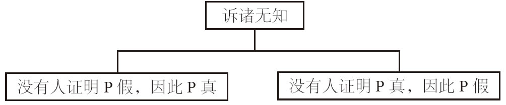

图7-3　诉诸无知谬误的两种类型

诉诸不当权威

弱归纳的另一种谬误是诉诸不当权威（appeal to
unqualified authority, ad
verecundiam），它可能会阻止一个论证支持其结论。

犯诉诸不当权威谬误的论证试图在前提中援引一位所谓的专家来支持结论，但事实上这位专家并不具有与所做出的断言相关的专业知识，或者他给出的观点与本领域专家的共识不一致。

当美国国家电视新闻台脱口秀节目主持人拉里?金宣扬一种维生素Ｃ片剂“Ester-C”的保健作用时，金的很多粉丝可能受到很大的影响，从而相信这个维生素片剂的营养价值。假设一位观众受到金的启发，争辩说：

例7-16　Ester-C会使我更健康，因为拉里?金这么说了。

例7-16是一个诉诸不当权威谬误。尽管金是娱乐界、体育界和政治界的一位名人，但他并没有营养学的专门知识。他只是利用作为电视标杆人物的名气来推荐一个产品。但要注意的是，在这个例子中犯了谬误的不是金，而是电视观众说了例7-16。他错误地认为电视人这么说了就可以肯定Ester-C有保健作用。如果他引用本领域专家对于产品作用的一致意见，论证就不会犯这样的错误。本领域的专家应该是营养学家和生物医药研究人员。但是，这些现实生活中的专家是否真的同意金的观点是不清楚的。

现在，我们还要注意另一个关键问题：不是所有的诉诸权威都是谬误的。例如：

例7-17　1. 为预防蛀牙，美国牙医学会建议每天都用牙线洁牙。

2\. 每天用牙线洁牙是预防蛀牙的一个好方法。

虽然例7-17也诉诸权威（即美国牙医学会）来支持关于每天用牙线洁牙的好处的断言，但是它并不属于我们上面所讨论的谬误。因为对于上述结论（即牙齿健康）来说，美国牙医学会是一个合格的权威，所以该结论受到了前提的支持。诉诸权威有很多完全正当的用法。如果被引用的专家意见确实来自对相关领域熟知的、能对此做出权威性判断的个人、团体或组织，引用权威的论证就不是谬误。确实，大多数我们所知道的是基于我们信任的来源提供的证据。当然，我们从科学中知道的绝大部分知识以及从历史中知道的几乎所有知识都是以这种方式获得的。不过，虽然这样的信任通常是正当的，但有时候也会出错，因为即使最受尊敬的专家也偶尔会出错。因此，关于诉诸权威论证的结论，最好的情况是：它们在某种程度上可能为真，但绝不是肯定为真。因为专业知识本身也有程度之分（有些专家比其他专家更专业），所以诉诸权威的前提所提供的支持程度不是决定性的。显然，这样的论证是归纳的。

即使如此，我们也不能否认有些江湖骗子和狂想者做出完全假的断言。他们自诩为“专家”，但事实上根本不是。引用这些伪专家对于某个断言的证言是诉诸不当权威谬误最臭名昭著的形式。与这类谬误具有同样误导性的还有一种形式。在这种形式中，为了支持某个断言，某人引用的证言的确是一位真专家的证词。不过，该证词只是问题的一个方面，因而受到领域专家们的驳斥。换句话说，专家们对这个问题还没有达成一致意见。因此，把某一方的观点当作最终的权威意见来支持某人的结论，等于犯了诉诸不当权威谬误。著名的物理学家亚瑟?爱丁顿爵士认为，应该认真研究“超自然”物理现象，而这并没有为我们提供相信他的可靠理由，因为爱丁顿的这个观点并不代表物理学家的一致意见（无论在他那个时代，还是在我们这个时代）。

但是，如果我们引用某些具有利己偏见的来源的证据，我们得出的结论也是诉诸不当权威谬误。在《纽约时报》最近报道的一项研究中，研究人员试图判断纸巾和干燥机哪一种能更快速地干手。然而，这项研究是一家纸巾公司资助的！毫不令人吃惊，研究人员发现用纸巾擦手干得更快。现在，设想我们基于这个结论做出一个最快干手方式的断言。这就犯了诉诸不当权威的谬误。

因此，只有在下列两种情况下，诉诸权威有时候存在争论（可能是谬误的）：证据来源不是关于论证所做断言的主题的领域专家；或者一个真实权威专家的个人意见被当作所有专家的一致意见，而事实上并不成立。例如：

例7-18　州立大学法学院是学习法律的好地方，因为杰克叔叔这么说。

除非杰克叔叔是专家，并且他表达的是熟知法学院的专家们的一致意见。否则，这样的援引就是谬误的。相反，下面的诉诸权威不是谬误：

例7-19　很多著名的法学家和法律教授都很尊敬州立大学法学院。

州立大学法学院是学习法律的好地方。

论证例7-19引用了领域专家的普遍意见，因此只要它的前提是真的，它的结论就受到了支持。因为对许多断言的辩护都需要引用权威，所以区分相关领域的合格权威与不当权威至关重要。相应的规则如下：

在评估形如“A说P，所以P”的论证时，应该判断A是否确实是关于P的专家，以及A是否表达了所有专家对P的一致观点。如果不是，那么该论证就不能支持其结论，从而应该被拒绝。

例如，关于对历史的看法，比起业余历史学家提出的观点，以著名专业历史学家的著作为依据更加合理。如果我们想要对法国大革命、明朝或者西奥多?罗斯福的执政有充分的了解，我们参考的书籍不应该是自行出版或者自费出版的。相反，我们应该选择那些在同行中最有名望的历史学家以及那些广受好评的作品。当然，虽然这些标准都不能保证专业性，但它们可以使得我们的信念尽可能可靠。同样，对于自然的看法，最可靠的信息来源毋庸置疑是自然科学领域最受推崇的期刊，而不是那些宣传治愈癌症的神奇疗法以及心电感应“证据”的市场小报。因此，对于科学家来说，成为受尊重的、主流学术著作的作者，以及在学术圈享有盛誉，通常是作为真正专家的可信标志。对逻辑思考者来说，区分真假专家的能力是很重要的，因为这通常是区分合法的诉诸权威与诉诸不当权威的立足点。

专栏7-6　如何避免诉诸权威谬误

要避免诉诸权威谬误，我们要记住它与合法诉诸权威的区别。区别就在于为支持某个断言而援引的权威：

（1）是否确实具有相关领域的充足专业知识；以及

（2）是否表达了能代表相关领域专家们的意见（可能是最主流的）。

## 第8章　避免无根据的假定

### 预设谬误

现在我们来讨论一些因为如下原因可以被归为一类的谬误：犯了这些谬误的论证认为某些事实上有争议的事物理当如此。这些论证依赖于预设，即那些被认为理当如此的有力的假设或背景信念。一般来说，预设没有错：论证通常基于一些根本不会产生预设谬误的隐含信念。但是，当论证认为一个有争议的信念理当如此时，它就犯了预设谬误。在此类谬误论证中，不受支持的信念起初似乎并无异样，甚至是可接受的，虽然实际上两种情况都不成立。基于有争议预设的论证所犯的错误类型包括了图8-1中的五种谬误。

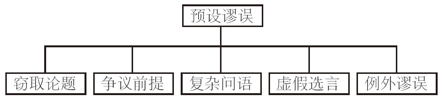

图8-1　预设谬误的类型

### 窃取论题

在第5章中，我们看到有效论证的前提可能为真，但仍不能作为结论的说服性理由。任何可靠但无说服力的论证也有可能如此。因此，这样的论证不能使一个理性思考者接受其结论，即使论证的有效性对思考者来说是显而易见的。为什么？假设我们试图说服你理性地接受某个断言，例如：

例8-1　我们关心逻辑思维。

我们为你提供下面的理由作为前提：

例8-2　情况并非是我们不关心逻辑思维。

整个论证如下：

例8-3　1. 情况并非是我们不关心逻辑思维。

2\. 我们关心逻辑思维。

例8-3是有效的，并且我们可以假设前提为真。但是例8-3仍然没有说服力，因为如果逻辑思考者质疑这个结论，它并没有给出能够说服逻辑思考者接受其结论为真的理由。哲学家称之为“循环推理”。例8-3受到了某种程度的、可能恶性的循环的影响，因为它会使任何包含自身的论证不成立。本文将要表明，许多演绎论证允许一定程度的循环，这类循环被称为“良性循环”。

例8-3是恶性循环，因为其前提和结论的内容相同，以至于前提并不比其支持的结论更可接受。前提只是对结论的一种重述，正如下列论证形式所示：

例8-3a　1. 情况并非是非P。

2\. P

因为双重否定等于肯定，例8-3a显然是例8-3b的间接形式：

例8-3b　P

P

任何此类形式的论证都是有效的，并且如果前提为真，则论证也是可靠的。在论证例8-3中，因为我们确实关心逻辑思维，所以前提是真的，因而论证是可靠的。但是不难看出，该论证还受某种循环的影响，这种循环可能会破坏任何受其影响的论证。因为一个前提的职责就是支持某个论证的结论。显然，P不能支持P<a href="#part0100.html_z1" id="part0100.html_zz1"
class="pcalibre calibre2">[1]</a>，因为一方是另一方的重述。类似地，并非非P也不能支持P。

任何具有这种恶性循环的论证都犯了窃取论题谬误，也称为“预期理由（Petitio
Principii）。”

当一个有效（甚至是可靠的）论证窃取论题时，它的前提无法为接受其结论提供强有力的理由。

窃取论题的任何论证都没有说服力。

窃取论题的论证的结论事实上可能完全可接受，但是这可能是因为该论证之外的原因。

然而，有时并不容易判断因窃取论题而造成的说服力缺乏。假设一个动物权益观察小组正在调查一起发生在北卡罗来纳州罗利市动物园的关于虐待动物的投诉。他们采访的一位工作人员说：

例8-4　在我们的动物园里，对待动物都是人道的，只要这个动物园的动物没有遭到非人道对待。

例8-4不能说服动物权益观察小组，因为它很明显犯了窃取论题谬误。即使这个论证是可靠的，前提也不能为接受其结论提供有力的理由。因为“人道的”等同于“并非不人道”，前提只是论证的结论的重述。因此，该论证达不到预期的效果（即支持结论）。由于类似的窃取论题的错误，下面关于上帝存在和不存在的论证也同样不成立：

例8-5　1. 情况并非是上帝不存在。

2\. 上帝存在。

例8-6　1. 情况并非是上帝存在。

2\. 上帝不存在。

请考虑下例：

例8-7　1. 荷马写了《奥德赛》。

2\. 荷马存在过。

要使例8-7的前提可接受，我们似乎必须先接受论证想要支持的结论（即确实存在过一位诗人荷马）。因此，例8-7也犯了窃取论题谬误。它无法提供能使逻辑思考者信服其结论的理由，即使前提为真并且论证有效。

要注意的是，与例8-3、 例8-5和
例8-6不同，影响例8-7的循环不是论证形式，而是所涉及的概念：荷马写了《奥德赛》预设荷马存在过。

一个论证犯了窃取论题谬误，当且仅当它的某个或多个前提只有在结论已被接受的情况下才可以被接受。在这样的论证中，至少有一个前提预设了结论，因此这个前提不能作为接受结论的理由。

论证是“窃取”──而非支持──其“论点”或结论。

窃取论题指一个演绎论证的说服力失效。它是恶性循环推理造成的谬误，取决于所涉及的论证形式或概念。如果一个有效论证的前提只是因为结论已被接受而被接受，前提就不能说服逻辑思考者接受结论。因此，只要一个论证窃取论题，它就没有第5章讨论的有效论证的重要特征──说服力。换句话说，任何恶性循环论证的前提都不能支持结论。这样的前提无法为结论提供说服性理由。

专栏8-1　如何避免窃取论题谬误

判断窃取论题谬误的规则是：给定一个具有可接受前提的有效论证，检验这些前提是否比它所支持的结论更可接受。如果是，则论证是有说服力的。如果不是，则论证就犯了窃取论题的错误。

循环推理

所有有效论证都有某种程度的循环，因为此类论证结论的信息总是被包含在前提中。但是，并非所有演绎论证都窃取论题。循环论证的内容及其循环的程度可以帮助我们判断论证是否窃取论题。我们可以通过快速分析一些循环论证来说明。

如前所述，任何有效论证都有某种程度的循环，或者因为其形式，或者因为其所涉及的概念，或者两者皆具。下面这两个论证受论证形式循环的影响：

例8-8　1. 今天多云且有微风。

2\. 今天有微风。

例8-9　1. 教皇在罗马。

2\. 教皇在罗马。

显然，影响这两个论证的循环是其论证形式，即：

例8-8a　1. C并且B

2\. B

例8-9a　1. E

2\. E

任何具有这两种形式之一的论证都是有效的，因为如果前提为真，那么结论也必定为真。但是，在两种形式中，前提都不会比它想要支持的结论更容易令人接受。因此，没有人能因为确定论证有效且前提为真而接受其结论。

当然，循环也可能是概念上的，取决于所涉及的意义或概念。如：

例8-10　1. 如果科比?布莱恩特是篮球运动员，那么他打篮球。

2\. 科比?布莱恩特是篮球运动员。

3\. 科比?布莱恩特打篮球。

例8-11　1.玛丽安曾经被外星人劫持过。

2\. 外星人存在。

在这两个论证中，根据所涉及的概念，前提都预设了其要支持的结论。对于论证例8-10，没有一个怀疑科比?布莱恩特是篮球运动员的逻辑思考者会根据论证的前提接受结论。对于论证例8-11，没有一个怀疑外星人存在的逻辑思考者会根据论证的前提被说服而接受外星人存在。每个论证都窃取了论点，因此没有说服力。与论证例8-8和
例8-9一样，这两个论证也受到了使其成为谬误的循环的影响。无论是形式上还是概念上，循环都有“度”的问题：太大程度的循环会使得论证犯窃取论题谬误。

良性循环

循环的两种类型如图8-2所示。循环并不总会使论证窃取论题。例如：

例8-12　1. 如果思维是大脑，那么思维是有机物质。

2\. 如果思维是有机物质，那么它会随着身体死亡。

3\. 如果思维是大脑，那么它会随着身体死亡。

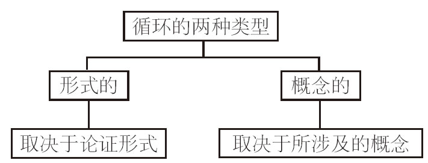

图8-2　形式循环和概念循环

论证例8-12的形式是：

例8-12a　1. 如果M，那么O

2\. 如果 O，那么 B

3\. 如果 M，那么 B

这种形式的论证有某种程度的形式循环，因为M和B所代表的命题不只在结论中出现，也在前提中出现。但是，例8-12并没有窃取论题，因为确定前提可接受并且论证有效可以提供理由，使得逻辑思考者接受结论。因此，对于任何人来说，只要他接受该论证的前提并且确定该论证中有蕴涵，他就拥有一个强有力的理由来接受该论证的结论。与恶性循环论证不同，根据前提接受例8-12的结论是一个认知结果。

让我们来比较几个概念循环论证：

例8-13　1. 萨尔萨是舞者的音乐。

2\. 萨尔萨是给跳舞的人的音乐。

例8-14　1. 安德鲁是单身汉。

2\. 安德鲁未婚。

例8-15　1. 她画了一个等腰三角形。

2\. 她画了一个三角形。

上述三个论证都是有效的：如果它们的前提为真，它们的结论也必定为真。但在一般情况下，它们都窃取了论点，因为对于每一个论证，接受前提要求首先接受结论。没有一个对结论有质疑的逻辑思考者会基于前提及论证有效性而被强迫接受结论。但是，请看下面这个论证：

例8-16　1. 月球绕地球运行。

2\. 月球是一个大型天体。

3\. 任何绕某个行星运行的大型天体都是卫星。

4\. 月球是卫星。

尽管例8-16中的“卫星”和“大型天体”之间有某种概念循环，但是这不会使得该论证窃取论题。对于一个不具备基本天文知识并且一开始质疑断言4的逻辑思考者，可能会被推理1、2、3说服，接受结论，只要使他知道前提的可接受性以及论证的有效性。

因此，要记住的重点是：

逻辑循环，无论是在形式上还是概念上，都有一个度的问题。有些有效论证比其他有效论证具有更大程度的循环。一个论证的循环程度越大，其结论越不可能从前提推出，越可能窃取论题。

举证责任

“举证责任”这个词经常出现于涉及双方或多方慎思的辩论性的情境中，如争议各方就某个问题具有矛盾断言的辩论、争议或者慎思。举证责任就是争议一方或另一方在慎思的特定阶段轮流提供理由的职责（除了下面讨论的悖论情景）。慎思通常遵循这样的模式：一方，C，做出某个断言。另一方，O，对此提出反对意见。如果反对意见充分，则举证责任在于C。他必须通过为断言提供理由来反驳反对意见（或转移举证责任）。如果他提出了一个可靠的或比O的论证更有力的论证，则举证责任转换到O。同样，他必须提供合适的论证来防御自身。

但是，有可能双方的理由都很有力，因此就进入了一个辩论僵局（或慎思僵持）。如果没有新理由提出，就无法继续解决冲突。但除了僵局，我们设定在慎思的任何一个阶段，举证责任或者在一方、或者在另一方。随着慎思的进行，举证责任有可能进行多次转换，但总是在更需要防御其断言的一方。

专栏8-2　举证责任从何而来

在下面的辩论中，⊕表示某一方有举证责任，⊙表示进入僵局。

1\. A拒绝B的一个断言，而这个断言是普遍持有的信念。⊕A

2\. A用一个包含争议前提的论证来防御B对他的反对。⊕A

3\. A重构了他的论证使得论证看起来有说服力。⊕B

4\. B提供了一个显然无效的论证。⊕B

5\. B修改了自己的论证，使其与A的论证一样有说服力。⊙

6\. A提供了新的有力证据来支持自己的观点。⊕B

7\. B提供了一个较弱的证据来支持自己的观点。⊕B

8\. B提供了新的与A一样有力的证据。⊙

常识信念是基于观察、记忆和推理的普遍信念。它具有免除举证责任的优势。任何质疑普遍信念的人都有举证责任──至少在一开始。例如，“地球已经存在五分钟以上”的信念就是常识。如果有人质疑这一点，那么他就有举证责任。他必须提供反对这个信念的充足理由。不过，如果存在一个有力的论证，那么这个优势可以被它推翻。

了解某个特定阶段的举证责任落在何方具有如下实际作用：

如果你知道举证责任在自己，你就知道必须提供一个充足的论证支持自己的断言，从而转移举证责任。

如果你知道举证责任在另一方，你就可以等对方对你的观点提出一个可靠的反驳意见。

如果你知道你所防御的断言是常识，那么你就知道任何质疑该断言的人都有举证责任。

最后，要注意有些慎思是内在的（例如，当一个人思考两个相反的理论哪个是正确的时候）。在内在慎思的过程中，如果思考者是公正的，那么举证责任应该从他所考虑的立场转移到对立的观点，跟上面列出的普遍规则一样（如图8-3所示）。

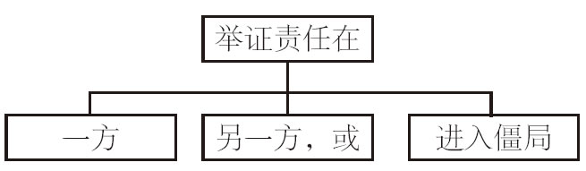

图8-3　理性慎思

### 争议前提

削弱论证的一个常见错误就是无法转移举证责任。假设我们断言“非P”（即P是假的），但是有人（假设梅琳达）提供了一个有力的理由，使得我们认为P是真的。

现在，举证责任在我们，我们必须提出一个反对P的充足论证来转移举证责任。如果做不到（我们假设P是假的但却没有证明P为假的理由），我们的前提就是有争议的。因为我们的隐含推理是下面的恶性循环形式：

例8-17　1. P假

2\. P假

或类似地，

例8-18　1. 非P

2\. 非P

（对你的对手犯）争议前提谬误，在关于冲突议题的日常论证中是常见的。例如，当某人认为：

例8-19　1. 在堕胎过程中，胎儿被故意杀害了。

2\. 胎儿是无辜的人。

3\. 故意杀害一个无辜的人永远都是谋杀。

4\. 堕胎永远都是谋杀。

尽管1看起来是无异议的，但2和3却是有争议的前提，它们不能用来支持结论，除非已经有充分的理由来支持这些前提。前提2是相对于“胎儿不是人”这个观点的争议前提。“胎儿不是人”的观点可以通过很多方式来支持（讨论堕胎人道与否的大多数人都能够认识到这一点）。

争议前提谬误很难识别，因为它涉及前提真值的预设。这些前提尽管有冲突，但我们有时候会无意识地认为理应如此。要避免这种谬误，就谨记专栏8-3中的规则。

专栏8-3　如何避免争议前提

不要让前提包含任何冲突的语句，除非你能提供充分的理由。

专栏8-4　本节小结

（1）当一个论证窃取论题时，至少有一个前提预设了其想要支持的结论。

（2）当一个论证有争议前提时，至少有一个前提假设了某个需要支持的事物。

### 复杂问语

另一种预设谬误就是复杂问语谬误。这种谬误模式询问了一个只能用“是或否”来回答的问题，但是问题本身假设了下列情况中的一种：

（1）只提出一个问题，但事实上有两个或多个问题，而每个问题都有自己的答案；

或者

（2）某个断言为真，但事实上它要么是假的，要么至少是有疑问的。

每当论证犯了这种谬误时，需要回答的问题是不公正的，因为它以上述情况中的一种方式隐含了一个未经证明的假设。对于情况1，请看下面一个关于总统候选人的问题：

例8-20　如果您当选，是否会继续贵党的优良传统，进一步把钱浪费在那些只会助长懒惰的福利计划上？

显然，这里有两个问题，而不是一个。候选人可能确实想发扬他所在党的优良传统，但并不打算进一步“把钱浪费在那些只会助长懒惰的福利计划上”。但是，提问者要求对整个提问进行“是或否”的回答，而不允许回答者分割问题。

情况2是一个对回答者的隐含批评的例子。经典的情况就是有人问另一个人：

例8-21　你现在已经不打你老婆了吗？

无论回答“是”或者“否”，都不是一个好回答，因为这个问题已经使得回答者陷入打老婆的预设中。这样的问题是不公正的，因为回答者无论怎么回答都是错。（但是要注意，问题的内容确实会影响结果。如果一个人是众人皆知的打老婆的人，那么对他问出例8-21这样的问题就不是谬误）再看另一个例子：泰勒是一个玩朋克摇滚乐团的高中生。他身上有多处穿刺和文身，但从没有吸食任何毒品。一天晚上，他约达莉亚去看电影。但是，当他去接她时，遇见了她的父亲。她父亲对他有疑心，并且说：

例8-22　在你把我女儿带去看电影之前，我必须问你一个问题：你是否试图向我隐瞒你的吸毒史？

现在，正确答案是什么呢？当然，泰勒不会回答“是”。但是如果他回答“否”，那么也等于承认了他有吸毒史（事实上他并没有）。无论哪种答案都会使他陷入困境。但是要注意，这只是因为问题本身是不公正的。它假设了没有任何支持的证据（这个年轻男孩曾经吸过毒！）。

并不难看出这里的错误。但是，作为一个论证会怎样呢？首先，上述问题问泰勒是否试图隐瞒他的吸毒史。如果是，那么他有吸毒史。如果否，那么他也有吸毒史。假设他要么回答是，要么回答否。那么，可以推出他有吸毒史。但是，这些前提有一个问题，即它们依赖于一个假的假设。也就是说，“回答者（泰勒）有吸毒史”这个假设是假的。

但是，不是所有犯了复杂问语谬误的论证都是故意给他人设套的。有些只是因为问题的组织，使得回答者的任何回答都必定会认同问题本身隐含的未受支持的假设。设想一名政治家在一场演讲中问道：

例8-23　我的对手是否同意总统实施的、正令我们国家走向灭亡的灾难性的经济政策？

因为这个问题假设了总统的经济政策是“灾难性的”，并且“正令我们的国家走向灭亡”，所以任何对例8-23做肯定回答或者否定回答的人，都等于默认了这些观点！同样，这位政治家也犯了复杂问语谬误。对于一个复杂问语，似乎任何回答都是错误的。但是，这只是因为问题本身有错误。问题的语言组织使其假设了某些未受支持的事物。

专栏8-5　如何避免复杂问语

要注意满足如下条件的任何是/否问题，这些问题可能预设了：如果答案为“是”，则推出一个有问题的命题P（没有任何论证支持这个命题）；如果答案为“否”，同样也推出P。

### 虚假选言

虚假选言是一种推理错误，它会影响具有选言前提的论证。一个选言是有两个命题或“选言肢”的复合命题。不相容选言具有如下形式：

例8-24　要么P要么Q。（但并非两者都是）

这里的P和Q代表了作为两个不相容选择肢的命题，因为如果其中一个为真，则另一个为假，反之亦然。例如：

例8-25　冬天，土拨鼠要么冬眠，要么继续外出活动。

这是一个不相容选言，因为它预设了只有其中一个选言肢为真。相反，相容选言具有如下形式：

例8-26　太小或者太熟的苹果都被扔掉了。

它的形式是：

例8-26a　或者P或者Q。（或者两者都是）

例8-26预设了任何既小又太熟的苹果都被扔掉了。关于这样的选言，要注意的另一点是，它们的选择肢是穷尽的（即它们是所有可能的选择）。例如，例8-25预设了冬眠（或停止外出活动）和继续外出活动是土拨鼠入冬后仅有的两种可能情况。

一个论证犯了虚假选言谬误，当且仅当，该论证前提中的选言表达了仅有的两个可能的选言肢，但事实上其他一个或者多个选言肢也同样可能是真的。

当论辩者给出了一个选言前提，而该前提表达了穷尽的、不相容的选言肢时，我们必须判断实际情况是否确实如此。在检验形如例8-24的论证的前提时，必须确认P和Q是否穷尽了所有选择肢并且不能同时为真。例如，在下面的论证中，可能产生虚假选言谬误：

例8-27　只有两种可能：我们的国家要么放弃参与外战，要么继续干涉别国事务。如果是前者，那么我们的国家就会变成像瑞士一样的中立国；但如果是后者，那么我们国家欠中国的债务就会更多。因此，我们的国家将要么变成瑞士一样的中立国，要么会欠中国更多的债务。

尽管这个论证是有效的，但却不是可靠的，因为它的第一个前提是假的。它的前提表达的是穷尽的、不相容的选言肢，而实际上它们只是所有可能选言肢中的两个。下面的论证也有类似的问题：

例8-28　1.
要么所有美国大学都将项目完全转变成在线课程，要么所有美国大学都将破产。

2\. 美国大学不会把他们的项目转变成在线课程。

3\. 美国大学都将破产。

这个论证显然也是有效的，但是由于前提1的假而成为不可靠的，而这使得论证犯了虚假选言谬误。

再来考虑一个例子。假设一位政治活动家试图说服我们同意他的观点。他诉诸我们的公民义务并且说：

例8-29　你们必须加入我所在的党派，这是唯一一个可以为无家可归的人提供解决方案的党派。你要么是造成无家可归问题的一员，要么是提供解决方案的一员。

但是，这两个选择似乎都太具有局限性。为什么只有这两个选择？我们可能既不是造成无家可归问题的一员（因为我们确实与此无关），也不是提供解决方案的人（因为我们的参与可能并不能带来任何不同）。或者，我们既是造成该问题的一员，也是（潜在的）提供解决方案的一员（这两者难道不是同样可能的吗？）因此，在这个例子中，这位政治活动家犯了虚假选言谬误。当所有缺少的前提都被陈述出来之后，他的扩展论证是：

例8-29a　1. 存在无家可归的问题。

2\. 你要么是造成问题的一员，要么是提供解决方案的一员。

3\. 你不是造成问题的一员。

4\. 你肯定是为无家可归问题提供解决方案的一员。

5\. 作为提供解决方案的一员，你必须参加我所在的党派。

6\. 你必须参加我所在的党派。

假设其他前提都是真的，前提2依据的是一个不准确的假设：我们的选择被限制为两个互不相容的选择肢中的一个。也就是说，要么是提供解决方案的一员，要么是造成问题的一员。既然前提2为假，这个论证就应该被拒绝，因为它犯了虚假选言谬误。

然而，并不是所有具有穷尽的、不相容的选择肢的论证都会犯这个谬误，因为在有些情况下，确实存在这样的选择。例如，我们可以说，法国居民在1940年确实必须在两个互不相容的且穷尽的选择肢中做出选择：要么与希特勒入侵部队扶持的傀儡政府合作，要么以某种方式进行抵制。又如，1961年的美国南方人确实需要选择是否支持合并学校、教堂和午餐室（一场挑战了种族歧视法律的运动）。但是，大多数的日常情景并不会这么极端。因此，就绝大部分情况而言，最好警惕某人断言一个选择只有两个极端选择肢。（事实可能如此，也可能并非如此）

专栏8-6　如何避免虚假选言

在评估一个具有选言前提的论证时，检验前提以判断：

（1）断言所提供的两个极端选择肢是不是仅有的可能选择。

（2）选择肢是否被假设为不相容的。

（3）（1）和（2）事实上是否为假。

如果所有的答案都为“是”，则论证就犯了虚假选言谬误。

### 例外谬误

例外谬误是削弱论证的另一种预设谬误：当某个“例外的”的特征被忽略时，就会犯这类谬误。

当一个论证判定某个情况符合某个普遍规则或原则，但事实上这是一个例外情况时，该论证就犯了例外谬误。

假设某人做了如下推理：

例8-30　1. 狗是友好的动物。

2\. 我的罗特韦尔犬──奥托──是一只狗。

3\. 奥托是一只友好的动物。

但是，假设最近奥托咬了我的6个朋友和3个倒霉的过路人也是真的。那么，我们应该怎么判断上面这个论证呢？尽管一般来说“狗是友好的动物”是真的，但是这个规则对奥托并不适用。因此，例8-30犯了例外谬误。在犯了此类谬误的其他论证中，论证者没有注意到某个通常为真的原则可能并不总是真的，因此他没有考虑到这个规则也有例外。

假设有一天史密斯邀请阿德金丝共进午餐。“来吧，我们一起吃午饭”，他说，“我们可以去街角的熟食店，我请你。”阿德金丝正要接受邀请，但是又想了想，“等一等！没有免费午餐这么好的事情！”这个判断源于对例外情况的谬误推理。尽管这里的问题出在对一个常见习语做了太过字面的理解，但更大的错误在于某个通常为真的原则被滥用了。当然，在大多数情况下，“没有免费的午餐”是真的（意即表面上免费的事物通常隐含一些我们必须支付的费用），但是如果史密斯邀请阿德金丝共进午餐，这就是一个例外。通常来说没有免费午餐，但是今天确实有免费午餐。阿德金丝只是太不灵活。

专栏8-7　如何避免例外谬误

逻辑思考者必须牢记，即使是最佳的原则也有例外，并且如果一个原则被滥用（即滥用于一个成立的例外），就产生了一个例外谬误。

现在，假设琼斯认为人应该讲真话。一般来说，这当然是一个我们可以遵守的好规则。有一天，琼斯在超市里碰到了他的邻居。邻居说，“你觉得我的新帽子怎么样？”琼斯看着帽子，心里想，“总是说真话，不管什么情况。”因此他说，“我觉得这顶帽子看起来很滑稽”。这话伤害了邻居的感受，并且给世界增加了一点点不快乐。我们能否说琼斯不应该太热衷于说真话吗？不能，一个人应该常说真话。但是，这仅仅是一个例外情况，他需要更圆滑！任何这么做的人都不应该被认为是不公正的或错误的，并且会由此产生一定程度的幸福。没有意识到这一点，琼斯犯了偶然谬误。他没有认识到，尽管说真话的规则通常来说是好的，但也存在一些情有可原的例外。他没有考虑到这里有一个有理由成立的例外。

- <a href="#part0100.html_zz1" id="part0100.html_z1"
  class="pcalibre calibre2">[1].</a>原文是“P cannot support P”。──编者注

## 第9章　从不清晰语言到不清晰推理

### 不清晰语言与论证失败

模糊性、歧义性和含糊谓词是不清晰语言的三种不同的根源。每一种都可能导致论证失败，并且我们将会发现由这些缺陷导致的几种非形式谬误，以及一种令人困惑的论证。当一个表达式的模糊性达到显著程度时，它是否可以应用于确定的事物，我们是不清楚的。例如，“富有”是否可以应用于银行账户里有900
000美元的贝蒂，这并没有明确答案。她当然做得很好，但她却不是一个百万富翁，更不用说亿万富翁了！问题在于“富有”是一个模糊词：对于有些情况，什么（或者谁）算作“富有”是不清楚的。相比之下，当一个表达式的歧义达到显著程度的时候，它就有不止一个意义与指称，而哪一个是其使用者所意味的就不清楚了。例如，“挑战性的论证”是意味着质疑某些论证的行为，还是意味着难以理解的复杂论证，这并不清楚。大体上，一个表达的指称是该表达所适用的对象，而其意义是它的内容。考虑：

例9-1　一加一的和。

例9-2　最小的偶数。

例9-1和例9-2可以被用来指称同一个数，因为它们都适用于同一个数──2。然而例9-1和例9-2却有不同的内容，也就是说它们的意义不同，这是因为：

意义=内容

因为指称和意义属于语言的语义学维度，所以模糊性和歧义性是语义不清晰性的两种不同形式，都会通过影响组成论证的前提与结论的一些项或者概念而削弱该论证。

此外，含糊谓词也是语义不清晰性的一种形式，但它只能在一个论证中的陈述之间的关系的层面产生。也就是说，含糊谓词谬误是在使用某个谓词或表达式表达某事物的特征或性质时产生的，例如下面这个论证的结论中的“占地球表面的60%”：

例9-3　因为海洋占地球表面的60%，而地中海是一个海洋，所以地中海占地球表面的60%。

对于所有海洋组成的整体而言，“占地球表面的60%”的表述可能为真，而对于地中海来说就显然为假了。例9-3中的混淆是一种常见的错误类型，这种错误源自一种涉及一个谓词（本章稍后会详细探讨谓词）的错误推理。

上述任意一种现象（含糊谓词、模糊性和歧义性）造成的语言不清晰性，都会使一个论证出错（见图9-1）。然而在我们考察这种谬误发生的一般方式之前，我们必须要问：为什么这样的错误对于逻辑思维来说是重要的。

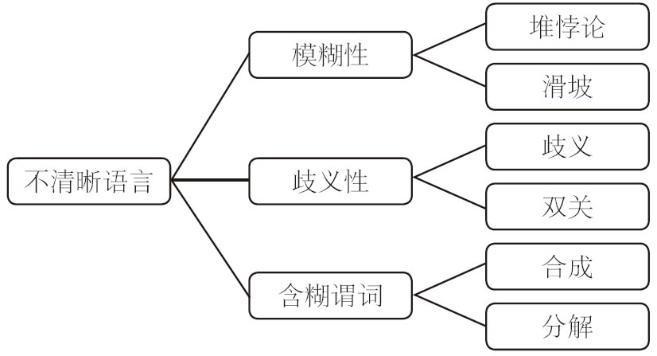

图9-1　一些不清晰语言谬误和一个悖论

希腊哲学家们在两千多年前就指出，语言不清晰性是推理不清晰性的一个标志。今天我们也持几乎同样的观点。假设说话者是诚实的，他们所说的就是他们所相信的。并且因为信念是他们推理的基础构件，所以他们所说的话中的任何不清晰性，都很可能是源自推理过程中的不清晰性（更多关于该主题的讨论可参见第2章和第3章）。

### 语义不清晰性

模糊性和歧义性是两类语义不清晰性，它们可能影响不同类型的语言表达以及它们之间的逻辑关系。当一个表达模糊的时候，我们就不清楚某些情况是否在它的指称范围之内。当一个表达有歧义时，我们就不清楚它的可能意义中哪一个是说话者的意思。假设某人说：

例9-4　她拿起那个杯子。

而且，这句话是在一个有很多女性的屋子里被说出的，但并没有特指哪一位。在该语境中，“她”这个词被应用于谁是不清晰的。同时，“杯子”这个词是有歧义的，因为它可以意味并指称“碗形的饮用器皿”，也可以意味并指称“运动会奖品”。另外，如果我们假设它被用来指称一个饮用器皿，那么它的适用范围是不清晰的。例如，它适用于大咖啡杯吗？大啤酒杯适用吗？这些似乎是关于“杯子”这个词的既非绝对适用又非绝对不适用的临界情况。因此，“杯子”不但是歧义的，而且具有某种程度的模糊性。

专栏9-1　模糊性与歧义性

当一个表达模糊的时候，该表达是否适用的临界情况是不清晰的。

当一个表达歧义的时候，它有多个意义，并且有时候有多个指称。

然而，模糊性和歧义性也建立在构成论证的陈述间的一个较高的层次上。最坏的情况是：这两种不清晰性中的任何一种都会使得一个论证容易被误导。在任意这样的论证中，尽管其结论一开始似乎是基于该论证的前提而可接受，但仔细思考后发现其实不然。前提实际上并没有对它提供支持。

逻辑思考者应该警惕误导性的论证，并且尽量通过仔细地逐项审查而揭示隐藏在模糊或者歧义语言背后的谬误。

这两种类型的语义不清晰性是很多日常论证不可避免的特征。这样的论证毕竟是用自然语言来表述的，而自然语言不同于形式语言，有着丰富的语义内涵。例如，假设在一次考试的日子里，一位大学讲师在电话应答机里收到这样一条电话信息：

例9-5　我是玛丽，考试那天我在银行/河边（bank），因此我想补考。

在无法辨别留言者的声音，并且知道附近有几家金融机构以及一条河的情况下，这位大学讲师就不能理解例9-5。一方面，在几个错过考试并且名字都叫“玛丽”的人中，谁是例9-5中的留言者，讲师是不清楚的。另外，在例9-5中“银行/河边”两个可能的意义中，即或者“金融机构”或者“河边”，打电话者的意图是哪个也是不清晰的。假设留下信息的这个学生后来从当地的花旗银行送来一张便条，证明在考试的那天，她──玛丽·麦克唐纳──不得不去那里为她的抵押债务再次提供经费。将所有信息加在一起，该大学讲师推理如下：

例9-6　玛丽·麦克唐纳是报告缺席的那个学生，她能够证明考试那天她在当地的花旗银行分行，因此她具备补考的条件。

现在就没有歧义了：对语境信息的考察已经消除了上述例9-5中的语义不清晰性。

然而有时候，即使对某一论证进行了宽容并且忠实的重构，但还是不能消除与演绎可靠性或归纳可信度相关的语义不清晰性。在这种情况下，我们必须因为其前提没有对结论提供支持而反驳该论证，尽管前提也许看上去支持结论。正如我们将要看到的，语义不清晰性中的每一种类型都会使一个论证犯错误。

专栏9-2　如何避免歧义性和模糊性

歧义性和模糊性是一个程度的问题。尽管自然语言中的多数表达式都具有这两种性质（这可以部分地解释符号逻辑学家为什么要创制人工语言去研究推理关系），但是它们产生的迷雾可以通过考察语境──即考察其他语言表达式以及论证提出者的自身因素来消除。当重构论证时，宽容和忠实性原则要求我们在条件允许的前提下考察语境以获得语义清晰性。

### 模糊性

模糊性是哲学上一些有趣的疑难论证以及许多谬误的根源。在本节稍后的部分我们将考察一些这样的例子。但首先让我们考察受模糊性影响的论证通常具有的一个缺点：不确定性。

当一个论证的前提或者结论具有显著的模糊性时，该陈述就是不确定的：既不确定为真，又不确定为假。这样的不确定性从整体上削弱了该论证。

这是因为，正如你可以回忆起来的，为了演绎上可靠或者归纳上有力，一个论证必须有确定为真的前提。否则，它既不是演绎上可靠的，也不是归纳上有力的。考虑如下论证：

例9-7　1. 芝加哥的高层建筑有遭受恐怖袭击的危险。

2\. 芝加哥30层的Nussbaum大厦是一座高层建筑。

3\. 芝加哥30层的Nussbaum大厦有遭受恐怖袭击的危险。

该论证似乎是有效的，因为如果它的前提为真，那么它的结论不可能为假。同时，它似乎也是不可靠的，因为可靠性要求确定为真的前提，而前提2的模糊性十分显著：不考虑高的相对性问题，尽管一座100层的建筑显然是高的（即使根据芝加哥标准），并且一座2层的建筑显然不是高的，但一座30层的建筑在芝加哥是否是高的却是不清晰的。没有语境信息可以降低前提2的模糊性，这源于专栏9-3描述的两个事实。问题在于，芝加哥的高层建筑和低层建筑之间没有确定标准或者分界点。

专栏9-3　例9-7错在哪里

（1）它用了表达式“高的”，而“高的”在其确定可适用的情况和确定不可适用的情况之间没有清晰的分界点。

（2）30层的Nussbaum大厦处于临界情况。它既不是确定地高，也不是确定地不高。

当陈述有一个适用于某个临界情况的模糊语词时，该陈述既不确定为真也不确定为假。你自己动手试一试：给出另一组语句，例如与“冷的”相关，从一个确定为真的陈述“0华氏度的温度是冷的”开始，持续到你“不能划定最后界限”的一点。47度是冷的吗？48度是冷的吗？50度呢？同样的，这一系列情况中的分界点无疑是任意的。

然而记住，模糊项的出现也可以是不模糊的。比较以下几个例子：

例9-8　 30层的Nussbaum大厦是高的。

例9-9　 100层的John Hancock大厦是高的。

例9-10　1层的10号线Exxon站是高的。

尽管例9-8是不确定的，但例9-9似乎确定为真，而例9-10似乎确定为假。

专栏9-4　对模糊性的总结

当一个项模糊的时候：

（1）它是否适用于某些不确定的临界情况。

（2）在它确定可适用的情况和确定不可适用的情况之间没有分界点。

当一个陈述模糊的时候，它既不确定地为真，也不确定地为假。

堆悖论

正如发现堆悖论的古希腊哲学家所遇到的迷惑一样，我们今天也被该悖论迷惑。堆悖论也称“来自堆的论证”或者“连锁”（sorites来自希腊语soros，是“一堆”的意思）。该论证开始于明显为真的前提，但因为它们包含一个模糊项，所以结束于一个明显为假的结论，如例9-11。

例9-11　1. 1粒沙子不是一个堆。

2\. 如果1粒沙子不是一个堆，那么2粒沙子不是一个堆。

3\. 如果2粒沙子不是一个堆，那么3粒沙子不是一个堆。

4\. 如果3粒沙子不是一个堆，那么4粒沙子不是一个堆。

5\. 如果4粒沙子不是一个堆，那么……

6\. 很多粒沙子（比方说一百万粒）不是一个堆。

考虑例9-11，无论多少粒沙子，它们都不构成一个堆。例9-11有错误，但因为很难说出错在哪里，所以例9-11是一个难题或者悖论。情况似乎是这样的：

A. 该论证是有效的。

B. 它的前提为真。

C. 它的结论为假。

D. 但一个有效的论证不可能有一个真前提和一个假结论。

因此，与其他堆论证一样，例9-11产生了一个悖论，因为由“有效论证”的定义得出D为真。所以A、B和C不可能都为真，但很难分辨它们中哪个为假。

一个悖论是一个没有明显解决方案的难题，它包含不可能全部同时为真的断言，尽管每一个都独立地为真。一般地，一个悖论可以通过以下两种方式中的任意一种得到处理：它可以被解决，或者它可以被消除。为了解决一个悖论，必须表明它的断言中至少有一个为假。为了消除一个悖论，必须表明这些断言不是真正的不相容。

如果我们不能用其中一种或另一种方式进行处理，那么悖论仍然存在。自古以来，堆悖论已经抵抗住了许多这样的尝试，这些尝试都有这样那样的缺点。

现在让我们用另一个模糊词“孩子”来构造一个简单化的堆悖论，如例9-12。

例9-12　1. 一个3岁的人是一个孩子。

2\. 如果一个3岁的人是一个孩子，那么一个4岁的人是一个孩子。

3\. 如果一个4岁的人是一个孩子，那么……

4\. 一个90岁的人是一个孩子。

同样，该论证看上去是有效的，它的前提为真，而它的结论为假。前提2隐含了一个如下形式的前提链：

例9-13　如果一个4岁的人是一个孩子，那么一个5岁的人是一个孩子。

例 9-14　如果一个5岁的人是一个孩子，那么一个6岁的人是一个孩子。

这组语句最终达到“孩子”这个项既非确切可适用，也非确切不可适用的临界情况，例如14岁或者15岁。在这些情况与前面该词确切可适用的情况之间没有分界点。或者在这些情况与后面该词确切不可适用的情况之间没有分界点：

例9-15　一个110岁的人不是一个孩子。

因此，影响例9-12的不清晰性，归根结底在于“孩子”这个词的模糊性。

关于堆论证中的错误还需要更详细的介绍，但因为它令人费解，因此它具有悖论的全部特征。

上述论证属于堆悖论，因为它们有“堆”和“孩子”这些受模糊性影响的词项。

滑坡谬误

与堆悖论相比，我们能够辨别出犯了此类谬误的论证错在哪里，如下所示。

一个滑坡论证从一个无害的情况出发，前进到一个或多个表面上相同的情况，但这些情况却产生了不受欢迎的结果：或者违反被广泛接受的规则，或者导致灾难。该论证犯了一个谬误，如果没有好的理由认为：

（1）被谈论的情况与该论证中假设的方式是类似的；

（2）所想象的事件链将如该论证中所假设的那样如实发生。

因此，犯了这种谬误的论证开始于一个看上去明显为真的前提，并且通过一系列连续统一的情况前进到一个可靠推理所不可避免的结论。然而仔细考察后，我们会发现它是不可靠的。想象下面两个相反的论证，它是关于市议会辩论是否颁布法律要求手枪注册。

例9-16　
议员罗宾逊论证说：“如果我们通过一项要求手枪注册的法律，无疑会导致要求包括狩猎武器在内的所有枪支都注册的其他法律颁布。这就意味着政府会拥有一张枪械持有者的清单。而如果政府有这样一个清单，那么就必定会没收所有武器。由此就迈出了通往独裁与终结自由的一小步。”

例9-16a　议员理查德森反驳说：“如果我们不通过一项要求手枪注册的法律，那么人们将越来越容易得到手枪。而这会使得各种罪犯和精神病人都可以选用危险的手枪，包括军用武器。这样一来，犯罪率将以几何指数增长，并且我们的城市将会变成无法无天的战场。最后，所有的社会秩序都被打破了。随着我们的国家陷入无政府状态，武装暴徒将肆意践踏公民权利。”

在该辩论中需要注意的是，这两个论证都犯了滑坡谬误。首先，它们分别从应该通过该项法律（罗宾逊）和不应该通过该项法律（理查德森）的初始步骤出发，然后预测了一系列更糟糕的情况，这些情况最终导致了灾难的发生。但是，我们确实有可靠的理由认为，这两个截然不同的论证所预见的不可避免的悲剧性结局确实都会发生吗？当然，这样的事情有可能发生。但是基于此处所给出的“原因”，我们没有理由相信任何一方。这两个议员给出的都只不过是制造恐慌并且天花乱坠的推测性论证。他们显然都犯了滑坡谬误。

在滑坡论证的另一种变体中，一个论证的错误可能是因为没有好的理由认为前提之间确实具有某种假设的相似性。假设你参加一个婚礼迟到了5分钟，并且认为没什么大不了。根据传统规则，参加婚礼迟到60分钟是严重违反礼节的，因而是不可接受的。有人认为你迟到5分钟是不可接受的。因为允许迟到5分钟与允许迟到60分钟没有太大的区别，而这事实上却背离了传统规则。这个滑坡谬误的具体分析如下：

例9-17　支持婚礼迟到5分钟的理由将支持迟到6分钟、7分钟，等等，甚至迟到60分钟！因此，接受迟到5分钟的理由实际上违背了一条重要的社会惯例。

显然，这里使用了一种类比推理，因为一致性要求我们以相同的方式处理类似的情况，即可以推出上文所列举的所有情况都违反了一项重要的社会习俗（迟到6分钟与迟到7分钟没有太大的区别，而迟到7分钟与迟到8分钟也没有太大的区别，等等）。但这里的背景假设似乎是：一系列微小的差异并不能使得该系列中的任何两点之间具有实质性差异。而这显然是错误的。有时候微小的差异加起来最终会达到一个巨大的差异。另外，即使比较两个相似的情况，某些谓词可能在其中一个情况下为真，而在另一个情况下为假。例如，有些高速公路限速每小时70英里。现在每小时70英里的速度与每小时71英里的速度没有太大的区别，但根据限速规定，以每小时70英里的速度行驶在这些公路上是合法的，但每小时71英里严格来说是违法的。因此，“合法的”这个谓词在一种情况下为真，而在另一种情况下为假，尽管这两种情况没有本质的不同。由此我们可以总结出，犯了滑坡谬误的任意论证都基于这样一条错误的规则：对A为真的对Z也为真，只要在A和Z之间有一系列情况B、C、……、Y，而它们彼此之间只有微小的差别。

专栏9-5　如何避免滑坡谬误

拒绝会引发滑坡论证的规则，因为在某个给定情况下为真并不保证在另一个非常相似的情况下也为真。尽管相似的情况合用许多谓词是合理的，但是一系列情况的微小区别加起来能够使得初始情况与滑坡论证的结论之间具有巨大的差异。

### 歧义性

必须区分模糊性（vagueness）与歧义性（ambiguity）。正如我们已经看到的，如果词或短语的指称是不能确定的，那么这个词或短语是模糊的，因此我们不清楚它是否适用于某个确定的情况。但歧义性是语义不清晰性的另一种形式，它也很容易破坏论证，因此同样会导致错误。如果一个词有多个意思，并且我们并不清楚在某个给定的语境中它是哪个意思，那么这个词有歧义。

当一个歧义词出现在一个论证的前提中时，该论证的结论是否得到了支持可能是不确定的。

考虑如下论证：

例9-18　娱乐电视节目经常播出关于星（star）的新闻。因此，可能很多天文学者都看娱乐电视节目。

这里前提中出现的“星”（star）是一个歧义词，因此它没有为该论证的结论提供支持。为了使该论证成立，我们需要知道“星”（star）所意指的是“看起来很小的固定发光的天体”还是“著名的演艺人员”。如果是前者，并且假设我们知道是前者，则该前提就为结论提供了一个理由，只要该前提为真。但如果是后者，那么该前提无法为结论提供理由（因为在这种情况下前提与结论是完全不相关的）。而在例9-18中，“星”是有歧义的，并且依据语境也不能明确是哪一种含义，所以该论证不支持它的结论。现在我们来详细地分析论证由于包含歧义性表达而犯了谬误的一些错误推理类型。

歧义

歧义谬误总是源于一个论证的前提或结论中模棱两可的表达，不管是词还是短语。

在一个论证过程中，如果某个重要表达式被用作多个含义，歧义就产生了（例如在一个地方表达式被用作一个意思，而在另一个地方被用作另一个意思）。并且论证似乎只有在人们没有注意到这种含义转变的情况下才支持其结论。

例如，假设某人论证说：

例9-19　1. 所有“法”都需要一个立法者。

2\. 伽利略惯性规则是一条“法”。

3\. 伽利略规则需要一个立法者。

这里“法”有两个不同的意思，并且被混用了。在第一个前提中，它的意思是“法规”──一个由立法机关或其他权威机构颁布的编成法典的公共规则。而在第二个前提中，它的意思是“基于观察到的自然规律的科学概括”。因为在推理过程中，“法”被用作两个不同的意思，所以这个论证是一个歧义谬误的例子。该论证本身的前提没有为结论提供恰当的支持，因此是失败的。另外一个论证也有同样的问题：

例9-20　“我看到了阿达跑马场的广告。上面写着，'阿达，如果你想外出过得愉快，那么你不能赌输/沉迷（lose）'。但我恰好在那里输掉了（lose）600美元！我的马最后一个跑进来。因此他们的广告有欺骗性。”

这里的“lose”存在歧义。以“因此”为标志的结论只有在我们将其解读为“你不可能赌输”时才能得出，但它实际上意指“你不能沉迷其中”。这里不存在欺骗性的广告！最后考虑如下例子：

例9-21　车库的指示牌写着“只为预先定位的顾客保留（Reserved Customers
Only）”，因此我猜这意味着我那经常说笑话并且模仿农场动物的舅舅埃文鲁德将是不受欢迎的。

如果“reserved”被当作“言行举止得体”，那么他当然不适用于舅舅埃文鲁德。但车库管理人员认为的“reserved
customers”，显然并不一定是安静的并且严肃的，而只需要事先预定过停车位。

要提防导致歧义性的表达式。这样的表达式可能在同一个论证中因不同位置而具有不同的意义，如例9-19和例9-20；也可能在同一位置，但具有两个或多个意义，如例9-18和例9-21。任何一种歧义形式都会使得我们不清楚论证的结论是否从其前提推出。为了找到（并且避免）歧义谬误，可以根据如下规则：

专栏9-6　如何避免歧义

评估论证时，仔细检查该论证以保证其关键表达：

（1）没有模棱两可的意义。

（2）在论证中的每一次出现都有相同的意义。

双关

另一种源于歧义的错误论证是双关谬误。

双关语句的复杂结构──词序的混乱──使其变得不清晰，因而导致得出错误的结论。

我们说结论是“错误的”，是因为结论不是明显从某个双关前提推出或者根本不是从该前提推出的。为了考察刚才说的这种谬误，考虑如下这个来自喜剧小品的笑话：

例9-22　病人：医生，医生！我的胳膊在两个地方痛！我该怎么办呢？

医生：不要去那两个地方。

当我们看到或者听到类似的歧义语句（混乱的词序使得句子有两种解读）时，我们会发笑。当然，这个句子本身并不是一个论证，但如果它的歧义性使得“医生”从中得出一个错误的结论，那么该对话就包含一个隐含的论证。那么，这个论证是如何犯了歧义谬误的呢？显然，由于词序所致的歧义而产生了错误。该论证具体如下：

例9-23　1. 你的胳膊在两个地方痛。

2\. 疼痛要被避免。

3\. 你不应该去那些你胳膊痛的地方。

假设前提2为真，即便如此，因为前提1是歧义的，所以例9-23不支持陈述3。对于那些想警惕这种谬误的人来说，幸好有一个明显的特征可以帮助他们识别出谬误：在所有双关语句中，歧义性可以通过重塑该语句而得到消除。例如在例9-22中，如果重构如下，那么病人的抱怨就不是双关的了：

例9-24　在我的胳膊上有两处疼痛的地方。

尽管并非所有双关都是幽默的，但让我们发笑的双关有很多都是这类谬误。下面还有另外一个例子：

例9-25　美国大通曼哈顿银行曾经推出一条广告，“今天就来咨询大通小型企业顾问”（Talk
to one of Chase's small business advisers
today）。“因此”，一个潜在客户可能会想，“大通的企业顾问平均身高是多少呢？”

这个论证的结论（由“因此”所标记）是一个问句。但它实际上是对该广告的一个讽刺，更直白的解释就是“大通银行从事商业贷款的员工都很矮！”产生这种沟通不良的语义混淆在于双关短语“small
business
advisers”，是小型企业？还是矮个的顾问？让我们再来看一个来自著名经典文学专家摩西?哈达斯的例子。一位作者把自己的书寄给哈达斯，希望得到他的赞赏，却收到了哈达斯尖刻的回复：

例9-26　我已经读了你的书，并且非常喜欢它。（I have read your book and
much like it）

如果这位作者从回复中得出结论“哈达斯喜欢我的书！”，那么他就太草率了，因为我们并不清楚这是不是哈达斯的意思。例9-26是模棱两可的，因为它的语法：在这句话中，“like”或者是一个表达哈达斯赞赏该书的动词，或者是“it”的一个修饰语。如果是后者，这句话的含义就是“我已经读了你的书，以及很多类似的书”（即“这项工作缺乏创意！”）。

我们从所有这些例子中得到的启示是：必须警惕有双重意思的语言。为了发现（并且避免）双关谬误，我们要按照专栏9-7的要求检查一个论证的前提。如果你发现前提有歧义──无论是混乱的语法和词序、过度简洁或者仅仅是措辞大意所导致的，只要有可能，都应该重塑该前提以消除歧义。重塑前提时，务必遵守论证重构的宽容性和忠实性。

专栏9-7　如何避免双关

评估论证时，要警惕前提中模棱两可的词序，因为它会使得人们不确定前提事实上是否支持该论证的结论。

### 含糊谓词

现在我们转向两种由谓词含糊性导致的非形式谬误。首先解释术语。“谓词”的确切含义是什么呢？考虑如下例子：

例9-27　惠特尼山是高的。

专栏9-8　什么是谓词

一个陈述的最小意素是词项或者概念，分为两类：用来谈论个体事物的单指词项，和用来把性质或者品质归于某个事物的泛指词项，例如高的、假设的或者哲学家。泛指词项可以做逻辑意义上的谓词。在许多情况下，指派一个谓词就是描述某事。

在例9-27的两个词项“高的”和“惠特尼山”当中，无疑只有前者是谓词──它把“高的”这个属性归于惠特尼山。谓词通常被用来描述个体本质处于某种特定性状。它们也可以被用来将属性归于复杂实体，如类、集合以及整体。这些实体可以包括一类事物（例如，黄颜色的汽车）、一个集合体（例如，克利夫兰管弦乐团）或者由部分组成的一个整体（例如，一台计算机）。类和集合体由成员组成，而整体由部分组成。谓词被用来把属性或者关系归于个体事物或者人，以及此类复杂实体。考虑如下：

例9-28　黄颜色的汽车是流行的。

例9-29　克利夫兰管弦乐团是第一流的。

例9-30　我的新计算机设计得很好。

在这里，“流行的”、“第一流的”以及“设计得很好”都是谓词所赋予的属性。当然，谓词被这样用来描述单个事物或者类、集合体以及整体是没错的。没有这样的描述词，我们不可能对事物进行描述。

但当论证者没有注意到以下两种情况时，谓词的含糊就可能会导致推理的缺陷：

（1）前提中适用于一个整体、一类事物或者一个集合体的某些属性，并不适用于结论中整体的每个部分或者类和集合体的每一个个体成员。

（2）反之亦然，前提中适用于一个整体的某个部分，一个类或一个集合体的某个个体成员的某些属性，并不适用于结论中的该整体、类或者集合体。

某个个体事物还是某类事物（集合体或整体）具有某个属性，对推理过程中的明确性至关重要。如果忽视了这个区别，论证就可能错误地将前提中某类事物的某个属性归于结论中该类事物的一个成员，正如论证例9-3所示：

例9-3　因为海洋占地球表面的60%，而地中海是一个海洋，所以地中海占地球表面的60%。

现在我们来仔细分析含糊谓词的两种非形式谬误，分别称作合成谬误与分解谬误。

合成谬误

含糊谓词导致了“合成”的非形式谬误。

合成谬误错误地认为，因为某个整体的每个部分、或者一个类或集合的每个成员具有某个属性，所以该整体、类或者集合自身也具有那个同样的属性。

例如：

例9-31　1. 芝加哥俱乐部的每名球员都是优秀球员。

2\. 芝加哥俱乐部是一支优秀的球队。

例9-31的前提很可能为真（在棒球界，一个人必须非常优秀才能加入大的俱乐部）。然而，即使该俱乐部的每名球员都是优秀的，这也并不支持该队作为一个集合体是优秀的这一断言。因为一支优秀的球队不仅仅是所有优秀运动员的集合。球队是作为一个相互协作的整体而良性运行的。因此，论证例9-31是错误的，即使前提与结论都为真。为什么呢？因为它忽视了专栏9-9中的重要区别，从而犯了合成谬误。

专栏9-9　如何避免合成谬误

（1）断定一个团队、班级等群体的每个个体成员的某个属性是一码事，而断定该群体自身的一个属性则是另一码事。在一种情况下为真，可能在另一种情况下就不为真了。

（2）如果一个论证因为某个整体的每个部分都分别具有某个属性，而得出结论说该整体自身具有那个属性，那么它就犯了合成谬误，并且应该被拒斥。

同样地，考虑：

例9-32　1. 一台计算机的每个部分消耗很少能量。

2\. 一台计算机消耗很少能量。

论证例9-32缺乏演绎有效性，或者甚至缺乏归纳强度。一台研究实验室的超级计算机将会使它的前提为真而结论为假。同样地，这个问题的根源在于认为既然整体的每个部分都分别具有一个属性（即消耗很少能量），因此所有这些部分所组成的整体也必定具有该属性。再看一个类似的论证：

例9-33　广告：“戈贝尔环球航空公司的飞机是维护得最好的。我们有500多架最先进的喷气式飞机，并且每架飞机都由专业人员操作。因此，我们的航空公司是专业的。”

断定飞机“由专业人员操作”的性质是一码事，断定该航空公司有相同的性质是另一码事。因此，并不能仅仅因为戈贝尔环球航空公司的每架飞机都“由专业人员操作”，而得出该公司“是专业的”。论证例9-33犯了合成谬误。

记住专栏9-9当中的建议。

分解谬误

含糊谓词导致的另一种谬误是分解谬误。

分解谬误错误地认为，因为整体具有某个属性，所以组成它的每个部分或者成员都有相同的属性。

与合成谬误不同，分解谬误是指以整体具有某种属性为论据，论证其组成部分也具有该属性的谬误。假设某人论证说：

例9-34　1. 美国国会代表美国的每个州。

2\. 每个美国国会成员代表美国的每个州。

这里的前提无疑为真，但结论显然为假。错在忽视了一条简单的规则：群体具有某一属性，并不能推出组成该群体的部分也具有相同的属性。在例9-34中，某人作为代表美国每个州的团体中一名成员的前提，被用来支持该人独自代表美国该州的结论。例9-34的前提当然无法支持其结论。对国会为真的可能恰好对国会的每个成员不为真。因此，该论证犯了分解谬误。

当我们关注华盛顿某个问题时，会看到另一个犯分解谬误的例子：

例9-35　1. 华盛顿的出租车是数不清的。

2\. 华盛顿的每辆出租车是数不清的。

例9-35从前提中某个谓词对一类事物（华盛顿的出租车）为真，推出该谓词对结论中的每一辆单独的华盛顿出租车都为真。因此这是一个分解谬误的例子。只有事物的类（合起来）才可能是数不清的，单个事物不可能是数不清的，因此例9-35的结论完全是荒谬的！正如我们已经看到的，某个集合实体具有某个属性的事实，并没有为“该属性可以肯定地被归于该实体的任意部分”这一结论提供充足的理由。让我们再来看一个论证：

例9-36　年度全国拼字比赛近来变得受欢迎了，这在一定程度上是因为获得奥斯卡提名的纪录片《拼字比赛》。因此，获得拼字比赛冠军的14岁俄亥俄州女孩近来变得受欢迎了。

同样地，问题在于一个复杂整体的某个属性被错误地归到该复杂整体的各个部分。这里的“复杂整体”是全国拼字比赛，而“部分”则是现任比赛冠军──来自俄亥俄州的女孩。所涉及的属性是“近来变得受欢迎了”。从拼写比赛近来变得受欢迎的事实并不能得出这个女孩近来也变得受欢迎了。这个论证也犯了分解谬误。

因此，逻辑思考者应该提防由谓词的含糊引起的非形式谬误，并且应该能够区分分解谬误和合成谬误这两种不同的含糊形式。为了发现并且避免这些谬误，我们要遵守专栏9-10和专栏9-11中的规则。

专栏9-10　如何避免分解谬误

评估论证时，需要考察一个整体的每个部分都有某个属性的结论是不是基于该整体具有该属性而得出的。如果是，那么该论证就犯了分解谬误，并且应该被拒斥。

专栏9-11　含糊谓词总结

评估论证时，检查是否存在下列情况：

（1）论证得出一个整体的每个部分都有某个属性的结论，是因为该整体具有这个属性；

（2）论证得出一个整体自身有某个属性的结论，是因为它的每个部分都具有这个属性。

如果以上任何一种情况存在，那么该论证就犯了含糊谓词谬误，并且必须因此而被拒斥。

## 第10章　避免不相干前提

### 相干谬误

论证在推理中被错误解读的另一原因是它所依据的前提与结论不相干。即使前提是真的，如果它与本该支持的结论不相干，那就不能构成这个结论的理据，论证自然也就不成立。前提与结论不相干的论证通常会把人们的注意力从真正与当前结论相关的东西上分散开。它们有时会被那些依靠心理作用而非逻辑有效的手段去说服我们的、巧舌如簧的论辩家们所采用。“相干谬误”有多种表现形式，如图10-1所示，我们将考察其中的6种。

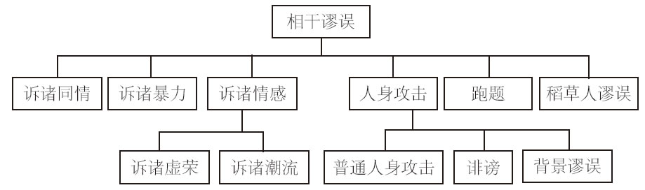

图10-1　相干谬误

### 诉诸同情

相干谬误中有一类是诉诸同情（ad misericordiam）。

一个论证犯了诉诸同情谬误，当且仅当，其前提试图通过激起同情心来确证其结论。

例如，曾经有人论证应宽恕鲁道夫·赫斯。鲁道夫·赫斯原是希特勒的亲信，第二次世界大战期间在英国被捕，后因战争罪判处终身监禁。1982年，赫斯已是暮年，身体状况也十分恶劣，有人构造了一个应释放他的论证：

例10-1　1. 赫斯已在监狱度过了四十余年。

2\. 他现在八十多岁了，身体正在走下坡路。

3\. 应允许这位老人与其家人度过最后的岁月。

4\. 应宽恕赫斯。

但是，赫斯的年龄以及恶劣的身体状况与真正的问题并不相干：他因曾参与建造一个使欧洲人身陷恐惧的政权而被判刑。许多俄国人（他们数以千万的同胞曾被德国侵略者杀害）认识到上述论证是诉诸同情，因此提出了严厉的反驳。结果赫斯未被减刑，最后老死狱中。

最近，一位海盗的母亲依据“受年长朋友引诱而从事海上抢劫”，提出了一个类似的论证，祈求美国总统宽大处理她的儿子。据美联社报道，海盗本人通过一位翻译表达了他的忏悔之意：“我为我们所做的事情感到非常、非常抱歉，”他说，“所有这些都与索马里问题相关。”如果从他生活在遭受战争迫害、法治败坏的地方这一角度看，我们的确应该同情他，但这并不能导出结论──他谋杀那些无辜的外国海商是合法的。这个论证明显是诉诸同情。

然而值得注意的是，诉诸同情的不只是无赖和罪犯。日常生活中有许多伪装形式，包括一些我们可能（错误地）认为没有谬误的论证。如，一位学生论证：

例10-2　我这门课的成绩是B，难道……就不能给A吗？如果没有A，那就意味着我的平均成绩会降低，我将不能进入法学院！但我整个学期都在很努力地学习。

这个论证事实上可以表示如下：

例10-2a　1. 我一直都在很努力地学习这门课。

2\. 任何A以下的成绩都将对我进入法学院产生负面影响。

3\. 这门课我应该得A。

这个论证就是诉诸同情，但并不是因为前提1：显然，学生的努力程度与上述结论并不相干，这称为“跑题”（之后会详细讨论）。上述论证之所以是诉诸同情，是因为前提2：它试图使教授为学生感到抱歉而去论证结论的真。这有可能成功，但并不能为接受结论提供合理的依据。

一般地，利用对某人感到抱歉的诉诸同情谬误通常在心理上会起到激励作用。然而，这并不是支持相应结论的好理由。理性思考者希望辨识并避免这一谬误。专栏10-1提供了若干窍门。

专栏10-1　如何避免诉诸同情谬误

（1）如果论证所依据的前提试图通过激起同情心，从而感动读者或听众使他们接受结论，那么就犯了诉诸同情谬误。

（2）任何这类论证都应被拒斥，因为它没有提出任何与结论相干的理据──也就是说，它没有为结论提供任何理性依据。

### 诉诸暴力

另一个非形式谬误同样是利用情感，但是以完全不同的方式，利用的是诉诸暴力（有时称ad
baculum，意思是“诉诸棍棒”）。

一个论证是诉诸暴力，当且仅当，它把威胁作为确保结论为真的依据。

在这种论证中，辩论者试图引起某人的恐惧感，从而迫使他接受结论（就像是说，“接受，否则后果自负”）。第二次世界大战末期，盟军领导人在德国波茨坦会晤以决定如何瓜分欧洲，为了确保苏联的影响力，斯大林的装甲师已经把东欧包裹在一个铁栅栏之中。当被告知教皇已经提出了一个相对不符合苏联目的的政治方案之后，斯大林轻蔑地说，“教皇手中握有几个师？”

当然，诉诸暴力并不一定非得是人身威胁。也可能是一个告诫反对者将会面临不幸后果的小小暗示。察觉（并避免）这种谬误，可遵循专栏10-2中的规则。

专栏10-2　如何避免诉诸暴力

（1）如果一个论证的前提威胁那些拒绝接受结论的人会遭遇不幸后果，那么就犯了诉诸暴力的谬误。

（2）任何这类论证都应被拒斥，因为其前提提供的仅是一个与结论不相干、因此不能支持它的理由。

1955～1976年，理查德·戴利在去世之前一直担任芝加哥市市长，他在任期间对库克县民主党几乎是独裁统治。政府官员都十分清楚，他们主要是满足戴利市长的喜好，任何不忠迹象都会给他们带来不利后果。每次戴利重新选举时，在其管辖区之内的其他官员都会得到如下消息：

例10-3　我们认为你最好退出此次选举并为戴利市长而奋斗，帕克斯先生（街道委员会负责人，消防局局长等），因为如果不这样，戴利市长当选之后……好吧……你有可能会失业。而且……你也知道……我们也不愿意看到你失业！因此事实上，我们只是给你一个友善的建议……仅此而已。我们会在远处注视你的。

这看起来没什么恶意，事实上却是一个隐藏很深的威胁：

例10-3a　1. 如果你不为戴利市长的重新当选而奋斗，你将失业。

2\. 你应该为戴利市长的重新当选而奋斗。

例10-3a就是诉诸暴力。毕竟，它所提出的依据（收件人不为戴利的重新当选而奋斗，那么他将会有什么样的后果），尽管这在心理上可以看作积极为戴利竞选而奋斗的一个动机，但这与收件人应为戴利的重选而奋斗这个结论不相干。论证本身没有提供戴利应该重新当选，因而人们积极为其重选而奋斗的理据。请注意，完全可以构造一个具有相同结论，但不涉及任何谬误的论证：竞选者可以指出，

例10-4　你应该退出竞选并为戴利重新当选而奋斗，因为戴利政府已为芝加哥市做出了许多伟大贡献。

然后列出戴利政府的一系列成就（事实上有很多）。列完成就之后，例10-4的前提不仅与结论相干而且可以确保其为真。与此形成对比的是，例10-3a的前提与论证的结论完全不相干。

### 诉诸情感

到现在为止，我们已经理解了两种前提与结论不相干的谬误形式。第三种谬误是诉诸情感。

一个论证犯了诉诸情感谬误，当且仅当，它试图通过诉诸人的情感而不是理性去证明结论为真。

这个谬误有时被称为ad
populum，意思是“诉诸人民”。任何犯了这一谬误的论证都会使用富含感情色彩的语言说服某人接受特定结论。有时，富含感情色彩的语言也包括可以传送某种情感的图片，正如电视以及其他媒体上所看到的大量充斥着这类谬误的商业广告所使用的图片一样。但通常情况下，诉诸情感谬误的论证使用的都是精挑细选的、具有极大渲染力的语言。察觉并避免这类谬误的窍门可遵循专栏10-3中的规则。

专栏10-3　如何避免诉诸情感谬误

（1）警惕那些使用可以激起情感共鸣的语词或图片，试图引起强烈的心理感应而使人们接受其结论的论证。

（2）任何犯了诉诸情感谬误的论证都应被拒斥。为什么？因为其前提以（1）所表明的方式为结论提供了不相干“理由”。所有这类论证都不能为其结论提供理性支持。

诉诸情感当然是广大善于摇旗呐喊的政治演说家所喜爱的一种媒介。在1896年，平民主义者、民主党员威廉·詹宁斯·布莱恩，引用《圣经》典故论证美国货币政策关于黄金的标准对工人阶级不利时指出：

例10-5　你们不应将荆棘冠冕压进劳动者的额头；不能将饱受折磨的人类钉在黄金十字架上。

而在40年后的经济大萧条时期，富兰克林·罗斯福总统使用了如下激动人心的语言，试图使大家拥护他的改革政策：

例10-6　这一代美国人受命运的指示在这里相遇。

注意，上述每一例子都可以看作支持以下结论的一个前提：“因此，你们应该拥护我的政策！”上述两个例子都是省略了结论的论证。而且，都是试图通过具有强烈感情色彩的短语，形如“饱受折磨的人类”、“荆棘冠冕”、“十字架”、“命运”等，来感动听众或读者。这些例子表明，诉诸情感谬误不仅被主流政治家使用，而且还同样被蛊惑民心的政客以及专制暴君（例如阿道夫·希特勒）所使用。无论是谁沉迷于这种形式，它都是一种错误的论证形式。

有时，那些犯了诉诸情感谬误的推理使用的是可以激起强烈情感回应的图片。当林登·约翰逊在1964年重新竞选总统时，他的智囊团投入资金，希望使得选民对其对手贝利·高华德产生普遍性恐惧。在紧张的冷战时期，有些选民害怕高华德急于动用核武器，而约翰逊的智囊团就希望利用这种不安。因此，民主党在电视上登了一个竞选广告，广告一开始是阳光普照的晴空下有一片美丽的草原，一个小女孩在草原上采花，然后突然切换成核武器爆炸后产生的蘑菇云升向夜空的景色。最后，在黑色的电视屏幕中间闪烁着一行字：“投约翰逊总统一票。”这是政治广告史上最为臭名昭著的使用图片激发人们情感的事例，后来被广泛指责为庸俗、毫无品位，民主党不得不撤销这个广告。

诉诸潮流

有些诉诸情感形式意图利用看似是人类共同本性的感觉，如不希望错过当前最新潮流──“畅销书”，或被冠之以“夏季最高点击率！”的电影。这类诉诸潮流就是利用我们期望与他人有共同经历，不希望被排除在外的心理愿望。但论证所提供的买书或看电影的理由仅注重流行程度，而不是质量品质。畅销书也有可能很肤浅，高点击率的电影其质量或许和一个肥皂剧差不多。被许多人追捧并不能证明它们物有所值。

诉诸虚荣

诉诸虚荣（有时也称“讲究派头的诉求”）是诉诸情感的另一变体，它试图利用人们压抑在内心深处的关于自尊心的恐惧。如果像例10-7那样给一台汽车做广告，登广告的人就是试图利用未来买家的虚荣心去说服他们买车的。

例10-7　并非适合所有人──这台汽车能够告诉世界你是谁。

这一论证策略的另一个例子是，英国维珍航空公司已决定把“一等舱”改为“贵族舱”来吸引乘客坐豪华舱。你能理解其中的道理吗？

### 人身攻击

另一种由于不相干前提导致论证不成立的谬误是人身攻击（字面意思是“诉诸人身”），它比较常见，相对于情感来说，它更多是人身攻击。有时称为“反对那个人的论证”，下文将使用拉丁名，因为它已经成为了一个常用词汇。

一个论证犯了人身攻击谬误，当且仅当，它试图通过人身攻击使某人（或某团体）的论证、观点或成就不被采信。

也就是说，人身攻击谬误依靠与当前问题毫不相干的个人情面，意图通过破坏当事人的名声，间接地反驳其论证或观点。人身攻击谬误的问题是回避了当事人观点的真正价值。相反地，人身攻击谬误只是恶意中伤当事人而已。在处理特定示例之前，请注意这类论证都不能确保结论为真──但依据专栏10-4中的规则可以很容易辨识和避免这类谬误。

专栏10-4　如何避免人身攻击

（1）要自觉认识到任何诉诸私人（或可疑）事实的论证都与结论不相干。

（2）任何犯人身攻击谬误的论证都应被反驳，因为其前提与结论不相干。也就是说，那些前提被用于质疑论证提出者的声誉而不是论证内容。

不幸的是，我们轻易就能找到一个人身攻击的例子──有时，进行人身攻击的人是你料想不到的。计划生育部最近在公交和地铁上登了一个系列广告，其中的主角是一个身穿制服、看起来脾气暴躁的男性。照片中间是广告词，上面写着，“79%的反堕胎者是男性，他们100%不能怀孕。”上述广告中图片与标语的组合十分巧妙，引人发笑。但毫无疑问，这个广告对男性反对者进行了人身攻击。这个广告并没有关注男性反对者的具体观点，相反，它只是拒绝理会他们的意见。但是，无论是在堕胎还是其他问题上，男性群体的观点不能因为其出处而被合法拒斥。真正的问题是：这些观点有良好的依据吗？观点出自谁并不重要，重要的是反对者是否提出了好的或坏的论证。

假设华府爆出了新绯闻。有人看见邓斯特议员使用政府基金支付他及其家人的奢侈度假费用，而另一位立法委员布鲁斯特已向参议院指控了邓斯特的不正当行为。但作为一名哈佛毕业生，邓斯特忍不住指出布鲁斯特是耶鲁大学毕业生。在一次演讲中，邓斯特高调做出如下回应：

例10-8　这些指控都是假的！这些毫无依据的指控正是从预料中的地方传出来的。显然，布鲁斯特和所有耶鲁人一样，不能停止丑化哈佛人声誉的行为！

邓斯特没有考虑布鲁斯特指控的内容（不正当性），而是针对他是耶鲁人这一事实进行反驳，这就是人身攻击。一个明显的预设是所有耶鲁人都会歧视哈佛人，这就是布鲁斯特做出指控的原因。但是，邓斯特的论证是对布鲁斯特的人身攻击：他引入了一个不具有任何反驳效应的不相干（尽管表面上看相干）内容。

我们仍然需要识记的是，说话者是谁并不能证明一个断言具有或不具有好的依据，论证事实上是否包含好的理由来支持结论才能证明那一点。应评价那些理由的价值：它们或者提供了支持断言的理据，或者没有。例10-8中，我们当然需要听取布鲁斯特议员的论证──假设他提出了证实邓斯特不正当行为的事实──这才能确定他的论证是否有良好的理据。

诽谤

人身攻击论证有时候攻击的是人的性格。假设一个常看电影的人宣称：

例10-9　我没想看伍迪·艾伦最新的电影。我确定它不值一看，我不会在这上面浪费金钱──当我知道他是什么样的人之后就不会了！他背叛了米娅·法罗，他与米娅的养女顺宜恋爱更是伤透了她的心。所以在我看来，他的电影没有任何艺术价值。

例10-9就是人身攻击，因为这个论证试图依据电影导演艾伦与顺宜（两人后来结了婚）的关系，而不是其他能够质疑电影艺术价值的理由去怀疑艾伦的影片质量。但这个论证更是一种诽谤，因为它攻击的是艾伦的品行──他在道德上被指责为“叛徒”，这当然是一个贬义词。但是，无论我们如何评价艾伦的个人品质，这些能证明他的电影很差吗？这些难道不是与其电影的艺术性完全不相干吗？

背景谬误

最后，如果有人试图利用论点提出者的虚伪反驳他的观点，那么就犯了背景谬误。有时也称“tu
quoque”（意思是，你也是其中一员）。我们来考察一下当时英国人对托马斯·杰斐逊著作的印象。杰斐逊在《独立宣言》中有一句名言：“我们认为，所有人生来平等，造物主赋予了他们若干不可剥夺的权利，包括生存权、自由权和追求幸福的权利，这些真理是不言而喻的。”但可以轻易想到，1776年的英国保守党针对上述观点的立场。保守党当然把这些高傲的语言看作可笑的政治修辞，因为他们熟知杰斐逊本人就是一个著名的奴隶主。在伦敦，萨缪尔·约翰逊博士讥讽道：“我们听到，奴隶主中有人大声呼喊'自由'，这是什么感觉？”可以如下扩充约翰逊的评论：

例10-10　1. 杰斐逊宣称所有人生来平等并且享有自由权。

2\. 杰斐逊本人却是一个奴隶主。

3\. 他向别人宣扬连他自己都不遵守的高尚原则。

4\. 杰斐逊关于自由和平等的言论是假的。

但如果真有人如此论证，那他就犯了诉诸背景谬误。毕竟，这个假想的论证试图利用杰斐逊的个人问题──关于种族和人性的伪善生活──质疑他关于人身平等和享有权利的观点。蒙蒂塞洛的圣人当然不允许自己的奴隶享有他和其他白人所倡导的自由和平等。但杰斐逊的个人成败能够表明他关于自由和平等的断言是虚假的吗？我们都自然地认为人们不应该虚伪，人们都应该对自己所宣称的原则身体力行。但是，如果有人没有遵从这个道德准则，我们就指出他是虚伪的，这不能证明他所宣称的原则虚假。事实上，我们只是陷入了一种人身攻击，即背景谬误。

非谬误性的人身攻击

在我们结束人身攻击的讨论之前，还需做出一个重要澄清。有些指责人的论证并不是谬误，因为存在某些语境可以使得这些论证合乎程序。例如在公共生活中，一位政治家的道德品质就是竞选过程中一个高度相干的问题，因为我们确实希望所选的领导人值得信赖。上文给出的第2个例子，布鲁斯特议员把邓斯特议员的个人诚信引入到讨论中就等于是一种人身攻击，但这并不是谬误（邓斯特的回应也不是），因为不道德（或不合法）的行为与一个人是否适合做议员并不是不相干。所以，布鲁斯特的评论是一种人身攻击，但不具有谬误性质，因为那些评论并不是不相干前提。

类似地，英美两国的司法系统使用的是一种敌对模型──其中，原被告双方的律师都会提出自己的论证，而且都试图从根本上反驳对方的观点──法庭上有些论证就是人身攻击。毕竟，律师可以利用证人私生活方面的证据质疑证词。

事实上，这根本不是谬误性的人身攻击。因为在法庭上，证人是否可靠并非不相干。如果证人的目的就是提出证词，那么证人是否可信就是高度相干的。因此，如果律师试图利用证人的私人问题质疑证词，那么他就不是人身攻击。律师的工作就是竭力捍卫当事人的利益，为了达到这一目的，他可能会在证人的出身以及私生活方面大做文章去降低证人的威信。这是人身攻击，但不是谬误。

按照逻辑进行思考的人一定要记住，法庭程序是法学中的一个特殊主题，我们并不准备详细讨论其中的复杂性。如果一个人担任陪审员，那么就应该遵守法官的指示。但现在需要重视的是，非谬误性的人身攻击是存在的，是否谬误取决于语境。

跑题

一个论证可能会因为提出的前提与结论毫不相干而犯相干谬误。这些前提可能支持某一结论，但不支持当前的结论。这种情况称为跑题（也称ignoratio
elenchi）。

一个论证犯了跑题谬误，当且仅当，前提不能以逻辑的方式确保结论为真，尽管它们可能确保其他结论为真。

起初，我们可能识别不出这类论证中混淆的根源。例如，设想反虐待动物者引用法律来禁止某些大型农场虐待鸡、猪、牛的行为。但假设农场主如此回应：

例10-11　这些农场并不虐待动物。毕竟，农场为大多数消费者供应食物，而且供应方式也比较划算；另外，这些家禽肉、猪肉和牛肉产品为美国所有家庭的健康做出了贡献。

例10-11中奇怪的地方在于，前提并不支持“这些农场并不虐待动物”这个结论。或许，那些前提支持某一结论。但它们并不支持这个结论，因为它们并没有提供任何理由说明当前这个大型农场不虐待动物。所以，例10-11犯了跑题谬误。

另一个示例也是如此。贝拉克·奥巴马执政早期，一对没有被邀请、也没有权利进入白宫的美国夫妇参加了在白宫举行的国宴。事实上，他们是派对破坏者。得知自己已经违反了白宫安全条例、因而会被起诉之后，他们指出不应被起诉，理由是“为准备宴会他们牺牲了时间和金钱。”假设他们确实做了牺牲。即使是这样，这与他们触犯法律，不应被起诉有什么相干呢？他们提出的不应被起诉的“理由”（牺牲了时间和金钱）并不支持那个结论。上述论证显然是一个跑题谬误的示例。

还有一个例子，是由一位收音机听众在回复BBC关于联合国预测2051年人口过剩危机时无意提出的。“我们能够应对这次挑战，”听众自信地断言，“因为我们曾团结一心与纳粹做过斗争。”但这个论证不止有一个问题，至少忽略了那些第二次世界大战期间与德国人交战的英国人不会活到2051年这一事实。因此，无论处于大不列颠最好时期的人们是多么擅长解决问题，对于21世纪中期的危机，他们不可能起到什么作用。除此之外，我们不清楚如何从一个拥有能够战胜希特勒军事力量的国家的前提，推出结论──他们具有可以解决未来人口过剩危机这一完全不同问题的能力。因此，这个论证是跑题。尽管前提明显真实，但并不支持它所提出的结论。

例10-12　1. 我们与纳粹做斗争时，能够团结一心。

2\. 我们能够应对未来的人口过剩危机。

专栏10-5　如何避免跑题谬误

进行逻辑推理的人应注意：

（1）论证的前提与要证明的结论不相干。

（2）即使其他地方没有错，但任何这类论证都是有缺陷的。它犯了跑题谬误，应被拒斥。

### 稻草人谬误

最后，考察一个观点被对方错解因而很容易被反驳的非形式谬误。错解的观点可能是一个陈述，或一组相关的陈述（即一个观点或理论）。这类错解忽略的是宽容性和忠实性，即第4章重构论证所使用的原则。宽容性原则是指解释他人观点时要最大程度地保留各组成部分（如果是论证，其组成部分就是前提和结论）的真实性以及部分之间的逻辑关联。忠实性原则是指解释观点时要对作者的意向做最逼真的理解。正是在解释他人观点时缺乏宽容性和忠实性原则，论辩双方才会不一致，最终导致稻草人谬误。

一个论证犯了稻草人谬误，当且仅当，前提通过曲解真实的观点试图破坏某一观点。

这类非形式谬误发生的情境通常包括评议、辩论等。稻草人谬误（令人遗憾的）是公共生活中一个常见的策略，经常会在政治竞选的辩论中听到。典型的表现是，稻草人谬误会扭曲对手的真实观点。这种曲解可能很极端、很不负责任、甚至有些愚蠢，因此可以轻易地反驳。对方的观点变成了一个轻易可以吹走的“稻草人”。但反驳稻草人的结论，当然不是对真实观点的否证。这可参照专栏10-6所勾勒出的稻草人谬误的轮廓。

专栏10-6　稻草人谬误到底是怎么回事

（1）稻草人谬误试图使用“O”，反驳特定观点“V”。

（2）但这个论证把V曲解为W──其中W很容易被O反驳。

（3）论证的结论是基于O反驳了V。

但是，O确实能够反驳V吗？似乎不能。毕竟，O仅能反驳曲解之后的V，即W。

政治辩论中不难找到这类谬误的例子。设想两个持不同外交政策的政治候选人：巴顿宣称整个国家不应单方面、而应在传统联盟的帮助下使用军事力量，但伯顿试图通过下列论证反驳巴顿。

例10-13　1. 对手的国际政策是：行动之前需要外国许可。

2\.
行动之前需要外国许可，与基于我们自己的利益推动国家安全和采取行动的权利之政策不一致。

3\. 基于我们自己的利益推动国家安全和采取行动的权利都是合理的。

4\. 对手的国际政策不合理。

若没有证据表明巴顿的确赞同第一个前提，那又会导致什么后果呢？在那种情况下，例10-13就是稻草人谬误。在采取一个潜在危险行动之前寻求联盟的帮助并不等价于“行动之前需要得到外国许可”。伯顿正在曲解巴顿的论证。

考察另一个例子，有国会成员赞同把拘留在关塔那摩的人放在民用刑事法庭上审理。反对者继而控诉：

例10-14　1. 赞成民事审判的人赞同恐怖主义。

2\. 赞成恐怖主义的人会与我们国家作对。

3\. 赞成民事审判的人是与我们国家作对的人。

察觉（并避免）这类谬误的规则是，核查论证中反驳特定观点的理由是不是反驳那个观点的真实理由。时刻反问自己，目标观点是否依据宽容性和忠实性原则得到了解释。

专栏10-7　如何避免稻草人谬误

反对V观点时，如果论证指出，“因为O，所以V是错的，”那么需要记住，O是否构成对V的反驳，取决于对V的解释是否依据了宽容性和忠实性原则。没有人会赞同一个显然虚假的观点！

### 诉诸情感总是错误的吗

前文已经指出，诉诸情感是相干谬误的一种。但这种观点应该被拒斥，因为进行逻辑推理的人不可能对情感仅采取不信任这一种态度。鉴于情感对人类的重要作用──我们认为如果没有情感，生命将变得空洞乏味──哲学家就不应忽略情感，逻辑学家也应有一种良性表达情感的方式。

那么，哪些是非谬误性的诉诸情感呢？首先，情感在激励行动方面起到了重要作用。不涉及谬误推论的感觉、情感、欲望、日常的倾向和多种厌恶情绪都能促使我们在日常生活中行动。我们没有必要非得依据理性“是而且应该是热情的奴隶”，去认识到感觉和欲望是行动的动机。感觉激起的行动也可以是理性所指导的（例如，己所不欲、勿施于人）。

其次，要警惕我们对爱人、朋友以及同事的情感承诺，它们是我们采取行动和容忍的理据。如果我们知道其他人所关心的事情──尤其是比较深刻而且重要的问题──那么我们就会知道如何避免说一些会伤害他们感情的话。这就是非谬误性的诉诸（他们的）情感。类似地，如果我们知道某些话题会激怒某人，那么我们应该考虑他的感觉，并且在他面前避免谈论这类话题，这也不是谬误。

第三，情感可恰当地促使我们对处于危险或遭遇痛苦的陌生人采取行动。每当有促使我们实施物资救援计划的饥荒、战争、流感和自然灾害的报道时，我们都会同情同胞，这也不是谬误。类似地，当公平的本能促使我们为少数受歧视或遭遇不公平待遇的人辩护时，按照感觉行动也不会犯下谬误。而且，当我们获悉任何残忍和暴虐的兽行，尤其是极为恶劣的犯罪行为时，指出应惩罚或阻止行为者，也不属于谬误。

最后，应情感需要，我们帮助贫困人群的行为（如医生缓解病人痛苦的行为，或者把兜里的零钱赠予大街上乞讨的无家可归之人的行为）都不是谬误。

上述例子的共同点是：他们诉诸的情感并非与结论不相干。也就是说，它们代表的是某人可能合理地被情感感动的情境。相反，诉诸情感谬误对情感的使用总是偏离正题，通常是对某人感觉的细微操纵，它服务于一个与结论毫不相干（尽管看上去相干）的观点。进行逻辑推理的人应辨识这类细微情况，因为它与滥用理性无异。

但是，逻辑思维的目标并不是把人变成冰冷的、毫无情感的理性主体，就像星际迷航中的斯波克先生。（当然，斯波克是半瓦肯、半人类，他可能愿意高估严格的理性行为的价值，并低估日常情感的价值）毕竟，过于理性在生活中的许多情况下都是不合适的，甚至疯狂的。例如，爱上某人，或对父母、对孩子表达爱就属于这种情况。情绪和欲望对任何人都至关重要，而当他们以一种恰当方式被感动时，进行逻辑推理的人就没有犯任何谬误。

# 第四部分　再论演绎推理

## 第11章　复合命题

### 论证：作为命题间的一种关系

在接下来的两章中，我们将进一步讨论曾在第5章中简单论述过的一个主题：命题论证。在这里，我们将详细考察命题，它是命题论证的组成部分。请考虑如下论证：

例11-1　1. 如果地球是一颗行星，那么它运动。

2\. 如果地球不运动，那么它就不是一颗行星。

例11-1是一个命题论证，因为它完全由构成它的命题之间的关系组成。它的前提与结论都是复合命题。这些复合命题由“地球是一颗行星”和“地球运动”这两个简单命题通过逻辑联结词构造而成。联结词“如果……那么……”与“并非”是五种真值函项联结词（或简称“联结词”）中的两种。接下来，我们将对它们进行详细介绍。

|  |  |
|----|----|
| 真值函项联结词 | 标准的汉语表达 |
| 否定\* | 并非P |
| 合取 | P并且Q |
| 析取 | P或者Q |
| 蕴含 | 如果P，那么Q |
| 等值 | P当且仅当Q |

\*否定是按惯例而被称作“联结词”的。

在这里，我们使用了像“P”、“Q”和“R”这样的大写字母作为任意命题的符号。下文中，我们将使用从“A”到“O”的大写字母将命题翻译成符号，而保留从P到W的大写字母来表示非具体命题。当把一个命题表示为符号时，我们挑出该命题中某个词（最好是名词）的对应英文单词的首字母。例如，对于命题“如果地球（Earth）是一颗行星，那么它运动（Moves）”，可以被表达为“如果E，那么M·”，其中

E = 地球是一颗行星

M = 地球运动

对于同一个命题在一个论证中的不同出现情况，我们使用相同的字母对其进行符号化，而对于不同的命题，则选择来自另一个词的对应英文单词的不同首字母。对于例11-1，我们分别用命题符号来替换出现在该论证前提与结论中的命题，而保留联结词“如果……那么……”。经过这样的替换后，我们将得到如下论证形式：

例11-1a　1. 如果E，那么M。

2\. 如果并非M，那么并非E。

现在，让我们将下列命题翻译成符号：

例11-2　1. 渥太华是加拿大首都。

2\. 并非渥太华不是加拿大首都。

例11-3　1. 菲多要么在房子里，要么在兽医处。

2\. 菲多不在房子里。

3\. 菲多在兽医处。

例11-4　1. 简在邮局工作，鲍勃在超市工作。

2\. 鲍勃在超市工作。

例11-5　1. 电视是有趣的，当且仅当它播出好的喜剧。

2\. 电视不播出好的喜剧。

3\. 电视不是有趣的。

一旦我们将这些命题翻译为符号，我们就得到：

例11-2a　1. O

2\. 并非非O

例11-3a　1. 要么F要么E

2\. 并非F

3\. E

例11-4a　1. J并且B

2\. B

例11-5a　1. A当且仅当C

2\. 并非C

3\. 并非A

尽管从例11-2a到例11-5a都以联结词为特征，但并非所有命题论证都是这种形式，例如：

例11-6　1. P

2\. P

在例11-6中，命题符号“P”在前提和结论中代表同一个命题。由于“等同”，任意具有该形式的论证都是有效的，因为如果它的前提为真，那么它的结论不可能为假。不过，这不是我们目前所关注的。相反，在这一节中我们考察了命题论证，发现它们的前提和结论通常是以联结词为特征的。接下来，让我们进一步分析这些联结词。

### 简单命题与复合命题

至少包含一个联结词的命题是复合命题；否则，它是简单命题。请考虑如下例子：

例11-7　席琳·迪翁是一名歌手，罗素·克洛是一名演员。

这是一个复合命题，它是如下两个简单命题的合取：

例11-8　席琳·迪翁是一名歌手。

例11-9　罗素·克洛是一名演员。

合取是5个联结词之一。其他4个分别是否定、析取、实质蕴涵和实质等值。对于每个联结词，我们引入一个符号，并且给出一条真值规则。其中，真值规则用于确定由特定联结词构造而成的复合命题的真值。因为与每个联结词相联系的真值规则定义了该联结词，所以每个联结词都是“真值函项联结词”。不过，在多数时候，我们将它们简称为“联结词”，见表11-1。

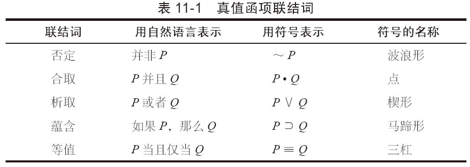

在讨论每个联结词之前，请注意，通常只有一个联结词管辖一个复合命题，称之为“主联结词”。我们通过识别主联结词来确定一个给定的命题属于哪类复合命题：合取命题、否定命题、析取命题等。显然，当一个命题包含多个联结词时，确定哪个联结词是主联结词很重要。

否定

否定是一个真值函项联结词，它一般被表达为
“并非”（即英文“not”），用波浪形符号“～”表示。否定能够影响一个命题自身。即便如此，在习惯上我们也把它当作一个“联结词”。在日常语言中，否定可以出现在一个陈述的任意部分。当一个否定加在一个简单命题上的时候，这个命题就成为一个复合命题。请考虑如下例子：

例11-10　罗素·克洛不是一名演员。

例11-10a　～C

在这里，通过添加一个否定，简单命题
“罗素·克洛是一名演员”变成了复合命题。在例11-10a中，我们用波浪形表达一个否定，用C代表被它影响的那个简单命题。

被否定影响的命题自身也可以是复合命题。例如：

例11-11　并非火星和木星都有水。

例11-12　并非玛丽不在图书馆。

为了表达否定的命题，否定符号通常位于被否定的东西之前。例11-12是“玛丽不在图书馆”的否定，而“玛丽不在图书馆”本身也是一个否定。这样，我们就有了一个双重否定：对本身是一个否定命题的否定。双重否定可以用命题公式表示为：

例11-12a　～～L

因为两个否定互相抵消，所以例11-12a在逻辑上等价于：

例11-12b　L

任意包含否定的命题或者命题公式都是复合命题。如下“真值规则”定义了否定。它们也可以用于确定包含否定的命题（或命题公式）的真值。

一个否定命题为真，如果被否定的命题为假。

一个否定命题为假，如果被否定的命题为真。

当一个命题是另一个命题的逻辑否定的时候，这两个命题不具有相同的真值：当“P”为真时，“～P”为假；当“～P”为真时，“P”为假。例如，上述命题例11-11（即“火星和木星都有水”的否定）为真，而“火星和木星都有水”为假。在如下的例子中，例11-14不是例11-13的否定，因为这两个命题都为假。

例11-13　所有牙齿矫正医生都是高个子。

例11-14　没有牙齿矫正医生是高个子。

现在，请考虑如下命题：

例11-15　有些牙齿矫正医生不是高个子。

例11-16　有些牙齿矫正医生是高个子。

例11-15是例11-13的否定，而例11-16是例11-14的否定。在这里每一对命题均不可能有相同的真值。不过，逻辑上等价的命题会有相同的真值。例如，如果例11-17为真，那么例11-18也为真。

例11-17　林肯被暗杀了。

例11-18　并非林肯没有被暗杀。

例11-18是一种双重否定，即它是“林肯没有被暗杀”的否定。

注意，以“……不是真的”、“……是假的”、“……从来没有发生过”等形式表达的命题通常是一种否定，正如在英语中包含
“in-”、“un-”和“non-”等前缀的命题一样。例如：

例11-19　我的选举权是不可剥夺的（inalienable）。

在这里，“不可剥夺的”（inalienable）意味着“不是可剥夺的”（not
alienable）。例11-19在逻辑上等价于：

例11-19a　我的选举权不是可剥夺的。

同样，因为“未婚”（unmarried）意味着“没有结婚”（not
married），所以例11-20与例11-20a在逻辑上也是等价的：

例11-20　康多莉扎·赖斯是未婚的。

例11-20a　并非康多莉扎·赖斯是结了婚的。

但是，例11-21不是一个否定：

例11-21　未婚夫妇也有获奖资格。

在这里，“未婚的”（unmarried）并不是用来否定整个命题的。它只影响“结婚的”（married）这个词。

最后要注意，尽管在英语中像“miss”、“violate”、“fail”等词语都有否定的意思，但它们不被用来表达否定。

合取

合取是一个真值函项联结词，可以用自然语言表达为“并且”，用符号表示为“·”。相应复合命题称为“合取命题”。合取通常放在两个命题之间，这两个命题都被称为“合取支”。合取支既可以是一个简单命题，也可以是一个复合命题。接下来，我们来考察一些由简单命题经过合取而构成的复合命题。

例11-22　珠穆朗玛峰（Everest）在中国西藏，勃朗峰（Blanc）在法国。

例11-23　火星（Mars）和木星（Jupiter）都有水。

它们可以用符号表达为：

例11-22a E · B

例11-23a M · J

回忆前面的例11-11：

例11-11　并非火星和木星都有水。

表达该命题的公式是例11-11a，它用圆括号表明M和J都在否定的辖域内。

例11-11a　～（M · J）

关于圆括号和其他标点符号的使用，我们将在后面做更多阐述。现在，让我们考虑为什么合取是一个真值函项联结词。这是因为，对于一个合取命题，只要给定其合取支的真值，依据如下规则，就可以确定该合取命题的真值。

一个合取命题为真，当且仅当它的合取支都为真；否则，一个合取命题为假。

例11-22为真，因为它的两个合取支事实上都为真。但是，如果一个合取支为真而另一个为假，或者两个都为假，那么相应的合取命题就为假。对于例11-23，因为我们知道它的两个合取支都为假，所以该命题为假。同样，下列命题也为假：

例11-24　珠穆朗玛峰在中国西藏，但勃朗峰不在法国。

例11-25　珠穆朗玛峰不在中国西藏，勃朗峰不在法国。

因为勃朗峰在法国，所以例11-24的第二个合取支为假，这使得该合取命题为假。因此，在一个合取命题中，“假”类似于传染病，只要存在于一处，整个复合体就会被破坏。在例11-25中，两个合取支都为假，因为它们都是一个真命题的否定。上述两个命题可以用符号表示为：

例11-24a　E ·～B

例11-25a　～E ·～B

另外，需要注意的是，像例11-23一样，在日常语言中许多合取命题都是采用缩写的形式。例如：

例11-26　罗特韦尔犬和多伯曼犬都是凶猛的狗。

上述命题在逻辑上等价于：

例11-27　罗特韦尔犬是凶猛的狗，并且多伯曼犬也是凶猛的狗。

然而，例11-28不是一个由两个简单命题组成的合取命题的简写，而是另一个简单命题，用于描述两种狗之间的一种特定的关系。

例11-28　罗特韦尔犬和多伯曼犬正在互相发出吠声。

此外，还需注意的是，作为一个真值函项联结词，合取满足交换律，即合取支的次序不影响相应复合命题的真值。假设例11-26为真，那么依据相关事实，“多伯曼犬是凶猛的狗，并且罗特韦尔犬也是凶猛的狗”为真，例11-27也为真。然而，对于这一点，我们也得小心，因为有时次序需要被考虑。不过，在这种情况下合取就不是一个真值联结词了，例如：

例11-29　他脱了鞋，上了床铺。

当例11-29和例11-30均为真时，所对应的事实并不完全相同：

例11-30　他上了床铺，脱下鞋。

在这些非真值函项合取命题中，事件的次序（即合取支的次序）的确有影响。我们再观察如下两个例子：

例11-31　他看见她并且说“你好”。

例11-32　他说“你好”并且看见她。

最后，除了“并且”（and）之外，自然语言中还有很多表达合取的词，包括“但是”（but）、“然而”（however、nevertheless、yet）、“也”（also）、“另外”（moreover）、“而”（while）、“即使”（even
though）和“尽管”（although）等。

析取

析取也是一个满足交换律的联结词，可以用自然语言表达为“或者”，用符号表示为“∨”。相应的复合命题称为“析取命题”。在表达一个析取命题的时候，联结词通常放在两个命题之间，这两个命题都称为“析取支”。析取支既可以是一个简单命题，也可以是一个复合命题。下面是两个析取命题（分别用自然语言和符号表示）：

例11-33　罗马在意大利（Italy），或者罗马在芬兰（Finland）。

例11-33a　I ∨ F

例11-34　罗马不在意大利，或者巴黎不在法国（France）。

例11-34a　～I ∨～F

例11-33和例11-34都是析取命题，因此都是复合命题。析取是一个真值联结词，因为对于一个析取命题，只要给定其析取支的真值，依据如下规则，就可以确定该析取命题的真值。

一个析取命题为假，当且仅当它的析取支都为假；否则，一个析取命题为真。

依据上述规则，一个析取命题为真，该命题中至少有一个析取支为真。由此可知，例11-33为真，而例11-34为假。例11-35也是假的，因为它的两个析取支（均为复合命题）都为假。

例11-35　或者雪地（snow）防滑轮胎在热带是有用的并且空调（air
conditioners）在冰岛是流行的，或者企鹅（Penguins）并非在寒冷中茁壮成长。

例11-35a　（S · A） ∨ ～P

显然，合取命题（S ·
A）为假，因为它的两个合取支都为假；同时，～P为假，因为它是P的否定，而P为真。因为例11-35的两个析取支都为假，依据析取的真值规则，可知例11-35为假。

除了“或者”（or）之外，析取还可以由其他自然语言来表示，如“要么……要么……”和“除非”等。有时，析取被嵌入到否定中（例如“既不……也不……”）。这时，否定是主联结词。对于上述这些情况，请看如下例子：

例11-36　她是该课程的主讲教师，除非课程表错了。

例11-36a　要么她是该课程的主讲教师，要么课程表错了。

例11-37是例11-37a的缩略表达：

例11-37　中央情报局和联邦调查局都不容忍恐怖分子。

例11-37a　既非中央情报局容忍恐怖分子，也非联邦调查局容忍恐怖分子。

因为“既不……也不……”通常用于表达一个析取的否定，所以例11-37在逻辑上等价于：

例11-38　并非“要么中央情报局容忍恐怖分子，要么联邦调查局容忍恐怖分子”。

因此，例11- 37和例11-38都可以被符号化为一个析取的否定：

例11-38a　～（C ∨ F）

注意，这里的主联结词是否定，不是析取。另外，例11-37和例11-38在逻辑上等值于例11-39。

例11-39　中央情报局不容忍恐怖分子，联邦调查局也不容忍恐怖分子。

例11-39a　～C···～F

最后，一个真值函项析取是相容的，当两个析取支可能都为真；或者是不相容的，当只有其中之一可能为真。本书着重讨论相容析取，其真值规则已在前面给出。

实质条件

实质条件式是一种复合命题，又称为“实质蕴涵式”或“条件式”。相应的真值函项联结词可以用自然语言表示为“如果……那么……”，或用符号表示为“∩”。例如：

例11-40　如果玛丽亚是执业律师，那么她已经通过了律师资格考试。

一个条件式由两部分构成：放在“如果”后面的是它的前件，而放在“那么”后面的是它的后件。

实质条件是一个真值函项联结词，因为对于由它所产生的复合命题，只要给定其前件和后件的真值，依据如下规则，就可以确定该复合命题的真值。

一个实质条件式为假，当且仅当它的前件为真并且后件为假；否则，它为真。

因此，任意具有真后件的条件式为真，而任意具有假前件的条件式为真。

实质条件式中的两个命题既可以是简单命题，也可以是复合命题。它们代表一个假说关系，其中前件和后件都不是被独立地断定的。例11-40断定玛丽亚是执业律师吗？不是。断定她已经通过了律师资格考试了吗？也不是。相反，在任意条件式“如果P那么Q”中，P和Q代表这样一种假说关系，使得P为真蕴含着Q也为真。为了质疑一个条件式，我们必须表明其前件为真并且后件为假。

注意，有时用于引出一个条件句后件的“那么”可以被省略。另外，除“如果……那么……”之外，自然语言的其他表述也可以用于引入条件句的前件或后件。这些表述可以出现在一个语句的后件之前、前件之前，或者它们二者之前。在下面的例子中，由双下划线标记的是前件，由单下划线标记的是后件：

玛丽亚已经通过了律师资格考试，只要她是执业律师。

假定玛丽亚是执业律师，则她已经通过了律师资格考试。

在假设玛丽亚是执业律师的情况下，她已经通过了律师资格考试。

玛丽亚是执业律师，只有当她已经通过了律师资格考试。

玛丽亚是执业律师，蕴含着她已经通过了律师资格考试。

现在我们把上述条件式用符号语言来表达。用“M·”代表“玛丽亚是执业律师”，“E·”代表“她已经通过了律师资格考试”。如下公式表达了任何以“M·”为前件、以“E·”为后件的命题。它把“M·”放在最前面，然后是马蹄形符号，最后面是“E·”：

例11-40a　M ∩ E

在形式化的过程中，我们遵循的规则是：

为了用符号语言来表达一个条件式，我们必须先列出它的前件，后列出它的后件，无论在自然语言句子中这两部分以何种顺序出现。

依据如下术语，我们把下面的自然语言条件句翻译为用符号语言表示的条件式：

N = 美国是一个超级大国。

I = 中国是一个超级大国。

C = 中国在其他国家有代理机构。

O = 美国在其他国家有代理机构。

例11-41　如果中国是一个超级大国，那么中国和美国在其他国家都有代理机构。

例11-41a　I ∩ （C · O）

例11-42　并非“如果美国在其他国家有代理机构，那么它是一个超级大国”。

例11-42a　～ （O ∩ N）

例11-43　中国在其他国家有代理机构，只要美国和中国都是超级大国。

例11-43a　（N · I） ∩ C

例11-44　如果美国在其他国家没有代理机构，那么它就不是一个超级大国。

例11-44a　～O ∩ ～N

例11-45　中国在其他国家有代理机构，蕴含着：或者它是一个超级大国，或者美国不是一个超级大国。

例11-45a　C ∩ （I ∨ ～N）

例11-46　如果“或者美国在其他国家有代理机构，或者中国在其他国家有代理机构”，那么美国和中国都不是超级大国。

例11-46a　（O ∨ C） ∩ ～ （N ∨ I）

例11-47　如果美国不是一个超级大国，那么它“或者在其他国家有代理机构，或者在其他国家没有代理机构”。

例11-47a　～N ∩ （O ∨ ～O）

注意，“P除非Q”也可以被表达为“如果并非P那么Q”。因此，“美国是联合国的一个成员，除非美国拒斥联合国宪章”，等价于“如果美国不是联合国的一个成员，那么美国拒斥联合国宪章”。

充分条件和必要条件。在任意实质条件式中，前件是后件的充分条件，而后件是前件的必要条件。因此，“如果P那么Q”的另外一种方式是：P对Q是充分的，而Q对P是必要的。某个命题P为真的一个必要条件是指事情的某种状态：若没有它，则P不可能为真；但若仅仅依靠它自身，则并不足以使P为真。在例11-40中，“玛丽亚已经通过了律师资格考试”是“她是一名执业律师”的必要条件（如果她没有通过律师资格考试，那么她不可能是一名执业律师，尽管仅仅通过律师资格考试并不能保证她是一名执业律师）。某个命题Q为真的一个充分条件是指事情的某种状态：仅仅依靠它自身就足以使Q为真，但它并不是使Q为真的唯一途径。在例11-40中，“玛丽亚是一名执业律师”是“她已经通过了律师资格考试”的充分条件（意思是前者保证了后者）。

在一个实质条件式中：

后件是前件为真的必要（但不是充分）条件。

前件是后件为真的充分（但不是必要）条件。

实质双条件

一个实质双条件式是一种复合命题，又称“实质等值式”，或简称“双条件式”。相应的真值函项联结词可以用自然语言表示为“当且仅当”，或用符号表示为“≡”。双条件也可以用自然语言表示为其他形式，如：“恰好在……情况下”（just
in case）、“等值于”（is equivalent to）、“当并且只有当……的时候”（when
and only
when）等，或者缩写作“iff”。一个双条件式的两个部分既可以是简单命题，也可以是复合命题。下面是一个由简单命题构成的双条件式，分别用自然语言和符号来表示：

例11-48　班克斯特博士是这所学院的校长，当且仅当她是该学院的首席执行官。

例11-48a　B ≡ O

对于由双条件式所产生的复合命题，它的真值取决于组成部分的真值，相应的真值规则如下：

一个实质双条件式为真，当它的组成部分有相同的真值时成立，即它们要么都为真、要么都为假；否则，一个双条件式为假。

给定上述规则，为了使得一个双条件命题为真，组成它的命题必须具有相同的真值，即要么两者都为真、要么两者都为假。当一个双条件式的构成部分具有不同的真值时，该双条件式为假。例11-49～例11-51均为假，因为它们中的任何一个都描述了两个具有不同真值的命题。

例11-49　喜马拉雅山是一座山脉，当且仅当罗马教皇是英国圣公会的领袖。

例11-50　伦敦在英格兰，当且仅当波士顿在波斯尼亚。

例11-51　鹦鹉是哺乳动物，当且仅当猫是哺乳动物。

相反，以下双条件式都为真，因为在各种情况下其组成部分都有相同的真值：

例11-52　林肯是被刺杀的，当且仅当肯尼迪是被刺杀的。

例11-53　北京是法国首都，当且仅当比尔·盖茨是贫穷的。

例11-54　“栎树是树木”与“老虎是猫科动物”在逻辑上是等值的。

在任意双条件式中，每个组成部分既是另一部分的必要条件，也是它的充分条件。因此，在例11-48中，“班克斯特是该学院的首席执行官”既是“她是这所学院的校长”的必要条件，也是它的一个充分条件。“她是这所学院的校长”既是“她是该学院的首席执行官”的必要条件，也是它的充分条件。因此，一个双条件式可以被理解为两个条件式的合取。这样，我们可以把例11-52表达为这两种情况中的任意一种：

例11-52a　L ≡ K

例11-52b　（L ∩ K） · （K ∩ L）

例11-52b是两个条件式的合取，其前件与后件互相蕴含。这就是为什么我们把实质等值关系叫作“双条件式”的原因。显然，该联结词满足交换律。

专栏11-1　小结：复合命题

受一个真值函项联结词影响的任何命题都是复合命题；否则，它是一个简单命题。

一个复合命题的真值由如下两个因素确定：

（1）它的组成部分的真值；

（2）与该命题中各个联结词相关的真值规则。

否定是唯一一个能够影响单一命题的联结词。

### 复合命题的命题公式

标点符号

正如我们在以上例子中看到的，圆括号、中括号以及大括号可以被用于指示各个逻辑联结词的辖域，以消除公式中的歧义。当通过逻辑联结词把一个复合命题与一个简单命题（或者另一个复合命题）连接在一起时，圆括号是确定各个联结词辖域的首要选择。对于一个比较复杂的复合命题，可能需要中括号，而对更加复杂的复合命题，则使用大括号来确定辖域。因此，最先使用小括号，然后是括号，最后为大括号。在专栏11-2中，我们列出了一些正确使用它们的例子。

专栏11-2　标点符号

|  |  |  |
|----|----|----|
| 小括号 | “（）” | 如：（P·Q）∩R |
| 中框号 | “\[\]” | 如：～\[（P · Q）∩R\]∨～S |
| 大括号 | “{}” | 如：～{\[（P· Q）∩R\] ∨～S} |

复合命题（P
·Q）∩R是一个条件式，而P·（Q∩R）是一个合取式。如果没有中括号，P ·
Q∩R∨～S是有歧义的，因为在该公式中，哪个联结词是主联结词并不明确。它允许有两种解释，一种是条件式，另一种是析取式。最后，在～{\[（P
· Q）∩R\] ∨～S
}中，主联结词是最左边的否定，它影响着整个公式。这可与～\[（P·
Q）∩R\]∨～S进行比较。现在，在没有大括号的条件下，否定词的辖域是由中括号括起来的条件命题，而整个公式是一个析取式，而非否定式。

合式公式

一个公式表示一个命题。不论它是简单的还是复合的，只要它在我们正在使用的符号系统中是可接受的，它就是合式的。为了确定一个复合公式是否为合式公式，确定其真值联结词的辖域是至关重要的。

在否定的辖域内，紧跟的是简单或复合命题。否定是唯一一个一元联结词，其辖域或是简单命题，或是复合命题。对于其他联结词，在它们的辖域内均有两个公式（简单的或复合的）。合式公式通常需要标点符号来标识出各个联结词的辖域。

回想上述例11-52b，即（L∩K）·（K∩L）。它是包含两个条件式的合式公式，使用小括号来消除歧义。在这里，小括号是为了表明这个复合命题是由两个条件式的合取构成的。

即使两个公式中的命题符号完全相同，改变标点的位置也可以产生不同的命题。例如，我们考虑L∩［K
·（K∩L）］。它是一个条件式，其前件为简单命题，后件为复合命题（是一个简单命题与一个条件命题的合取式）。如果它为假，那么可以引入否定词而得到～{L∩\[K
·（K ∩L）\]}。这些都是合式公式。但是，专栏11-3中的公式不是合式公式。

专栏11-3　某些“不合式”的公式

P～Q

P～

P∨Q · P

复合命题的符号化

接下来，我们将仔细考察一些复合命题。首先，请考虑如下例子：

例11-55　福克斯新闻在电视上播放。

因为在这个命题中没有联结词，所以例11-55可以被符号化为一个简单命题：

例11-55a　F

与之不同的是，例11-56包含一个否定词，因此是复合的。例11-56可以被符号化为例11-56a。

例11-56　哥伦比亚广播公司的新闻不在电视上播放。

例11-56a　～C。

现在考虑例11-57，它是例11-57a的简化形式。

例11-57　福克斯新闻在电视上播放，而哥伦比亚广播公司的新闻不在。

例11-57a　福克斯新闻在电视上播放，而哥伦比亚广播公司的新闻不在电视上播放。

上面两个语句都是包含合取和否定联结词的复合命题。然而，它们的主联结词是合取，其辖域是整个复合命题。否定联结词的辖域仅仅是第二个命题。确定辖域的原则如下：

否定联结词的辖域总是那个紧跟在波浪形符号之后的命题。该命题可以是简单的或者复合的。在有些情况下，为了消除歧义，以获得一个正确的符号表达，我们需要使用标点来指明哪一个复合命题位于否定联结词的辖域之内。

在例11-57中，因为否定词的辖域非常明确，在对它进行符号化时，不需要使用小括号：

例11-57b　F·～C

如果已知F和C都为真，那么上面这个公式的真值是什么？使用否定联结词的真值规则，可以知道～C为假，再使用合取的真值规则可以知道例11-57也为假。

接下来，让我们确定例11-58中的主联结词。

例11-58　如果哈利（Harry）和马吉尔（Miguel）是球队的球员，那么比尔（Bill）就不能在队里。

例11-58是一个条件式，其前件和后件都是复合命题。我们可以用符号把它表示为：

例11-58a　（H · M）∩～B

例11-58a的前件是H与M的合取式H ·
M，后件是B的否定式～B。为了表明主联结词是条件形式，例11-58a的前件需要使用小括号，因为否定词的辖域很明显是B。

假设H和B为真，M为假，我们来计算上述公式的真值。给定这个假设，例11-58a是真的，因为其前件为假。在这种情况下，其后件～B为假并不重要，为什么？因为依据条件式的真值规则，前件为假就足以使得整个条件式为真。例11-58a的前件是假的，因为其中一个合取支M是假的。我们回忆一下，依据合取式的真值规则，一个合取支为假就足以使得整个合取式为假。因为包含假前件的条件式为真，在当前这个假设下例11-58a为真。同时，用自然语言表示的相应句子，即例11-58，也为真。

再考虑一个例子：

例11-59　蝙蝠（Bats）是夜行动物，当且仅当“或者金鱼（Goldfish）是哺乳动物，或者金花鼠（Chipmunks）属于啮齿目”。

我们用“B”表示“蝙蝠是夜行性动物”，用“G”表示“金鱼是哺乳动物”，而用“C”表示“金花鼠属于啮齿目”。主联结词为条件联结词，其左边是一个简单命题，而右边是一个析取命题。例11-59可以用符号表示为：

例11-59a　B≡（G∨C）

令B和C为真，G为假。由于已知B的值，为了确定整个双条件式的真值，我们需要知道G∨C的值。因为这个析取式至少有一个真的析取支C，所以它是真的。由于例11-59a的支命题具有相同的真值，所以它是真的。

使用相同的符号，我们来表示下列两个命题：

例11-60　并非“要么金花鼠属于啮齿目，要么它们不属于啮齿目”。

例11-60a　～（C∨～C）

例11-61　下列情况是假的：“蝙蝠是夜行动物”等价于“如果金鱼是哺乳动物，那么金花鼠属于并且不属于啮齿目”。

例11-61a　～{B≡\[G∩（C·～C）\]}

对于命题C、B和G，在与上述相同的赋值条件下，可以计算出例11-60a是假的。这是因为，当C为真时，析取式C∨～C为真，而例11-60a是该析取式的否定。同时，例11-61a也是假的，这是因为它是一个值为真的双条件式的否定式。在这个双条件式中，两个子公式具有相同的真值。因为\[G∩（C
?～C）\]的前件和后件都假，该条件式为真。C
?～C为假，因为该合取式包含了一个假的合取支，～C。

下面是一些建议。在计算一个复合命题的真值时，如果已知各个简单命题的真值，可以依据如下步骤：

（1） 在各个简单命题符号的下方标出该命题的真值。

（2） 找出主联结词。它是最终结果将要被标记的地方。

（3）
使用联结词的真值规则，先计算较复杂命题内部的相对简单的复合命题的真值，再计算外部命题的真值。

（4）假设你想计算～\[（E?L）∩（M∨～F）\]的真值，而且你知道E和L是真的，M和F是假的。你可以按照步骤（1）～（3），建构下图：

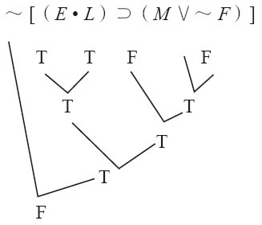

### 使用真值表定义联结词

接下来，我们讨论真值表。它可以被用于机动地确定一个复合命题的真值。但在进入这一话题之前，我们首先使用它来定义上述真值函项联结词。

否定。为了使用真值表来定义否定，需要记住如下规则：

专栏11-4　否定式的真值规则

一个否定式是真的，当且仅当被否定的命题是假的；否则，它是假的。

真值表是通过如下方式来定义否定的：规定简单命题P的否定式～P何时为真，何时为假。

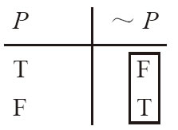

为了构造这样的真值表，我们首先在左上角写上不加否定联结词的P，右上角写上～P。然后在左边P下方的列中，写出P的所有可能的真值，即T（真）和F（假），因为：

对于任意命题，它要么为真，要么为假。

然后，在右边～P下方的列中，写出相应的真值。这些真值是依据P的真值和否定式的真值规则，通过计算求得的。对于左侧列中的每一行，通过运用专栏11-4中的规则，可以得出右下方框所显示的真值：

第一行：当P为真时，～P为假。

第二行：当P为假时，～P为真。

其他真值函项联结词。为了定义其他真值函项联结词，首先要注意的是它们都涉及两个命题，且各个命题的真值均有两种可能：T（真）或F（假）。这决定了写在真值表左侧各列中的真和假的数目。为了计算每一列中T和F的总数，我们使用公式2n。其中，2表示任意命题具有两种可能的真值，n表示出现在公式中的不同命题的数目。在否定式的定义中，只有一个命题，因此n等于1，而2n代表两个真值：一个是T，一个是F。但是，对于合取式、析取式、条件式和双条件，它们均包含两个命题，分别表示为P和Q。这时，n等于2，而2n代表每个命题被赋予四个真值。在左边第一列中，我们自上而下指派四个真值：T、T、F和F。在左边第二列中，自上而下指派T、F、T和F。将要确定真值的那个公式位于表的右上方。在该公式的下面，每一行所填的真值是依据该行左边的真值和相应的真值规则通过计算而得到的。现在，我们为剩下的每一种复合命题构造真值表。

合取。为了使用真值表来定义这个联结词，需要记住如下规则：

专栏11-5　合取式的真值规则

一个合取式是真的，当且仅当其合取支都是真的；否则，它是假的。

真值表的左侧有两列，每一个析取支被赋予四个真值，两个T、两个F。水平的四行是使用专栏11-5中的规则计算出来的真值组合。右侧方框中的结果表明一个合取式是真的，当且仅当它的两个合取支都为真。

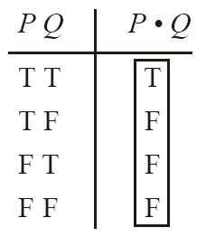

析取。使用真值表定义这个联结词，需要记住如下规则：

专栏11-6　析取式的真值规则

一个析取式是真的，当且仅当至少有一个析取支是真的；否则，是假的。

析取式真值表的左侧共有两列，每个析取都有四次赋值，两次T、两次F。水平的四行是使用专栏11-6中的规则计算出来的真值组合。最终的结果填写在右边那一列，其意义与析取联结词的定义相同；它表明一个析取式是真的，当且仅当，至少有一个析取支是真的。

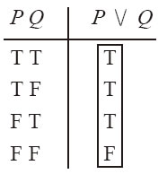

实质条件。为了使用真值表来定义这个联结词，请记住如下规则：

专栏11-7　实质条件式的真值规则

一个实质条件式是假的，当且仅当其前件为真，并且后件为假；否则，该实质条件式为真。

和前面一样，真值表的左侧有两列，每一列包含给前件（后件）赋予的四个真值，即两个T和两个F。表中水平的四行是通过应用专栏11-7中的规则计算出来的可能的真值组合。右侧方框中的结果就等价于实质条件的定义。它表明：除前件真、后件假之外，在其他所有情况下，实质条件式均为真。

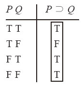

实质双条件。为了使用真值表来定义这个联结词，需要记住如下规则：

专栏11-8　实质双条件式的真值规则

一个实质双条件式是真的，当且仅当它的两个支命题具有相同的真值；否则，它为假。

在这个真值表的左侧有两列，每一列给公式中的简单命题指派四个真值（两个T和两个F）。四个水平的行是通过应用专栏11-8中的规则计算出来的。真值表的结果在右侧方框中。这个真值表就等价于实质双条件式的定义。该真值表表明，只有在双条件式的两个支命题具有相同真值的情况下（即它们要么皆为真，要么皆为假），它才是真的。

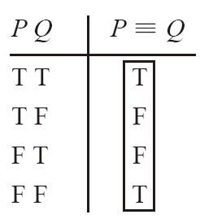

上述的五个真值表为五个真值函项联结词提供了定义。接下来，我们可以用类似的方法来确定其他复合命题的真值。

### 复合命题的真值表

复合命题的真值可以通过真值表确定。为了构造一个复合命题的真值表，首先要找出相应公式中的简单命题。然后，按照这些简单命题在公式中出现的顺序，把它们写在真值表的左上方。接着，以与上述相同的方式给每个简单命题指派真假值。最后，使用2n来计算行的总数。例如，F
·～C的真值表是：

例11-62

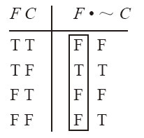

位于这个真值表右侧的公式是F和～C的合取，前者的值在左侧第一栏，后者的值是需要首先确定的。我们通过把否定式的真值规则应用于左侧第二列的每一行而得到～C的值。一旦确定了～C的真值，我们就把它们填入右侧的波浪符下方。然后，把合取式的真值规则应用于F的值（位于真值表的左侧）和～C的值（位于波浪符下方），而得到该合取式的真值。我们把所得到的值写在合取符号（点）的下方，并用一个方框加以标记。在主联结词下方的这一列是最重要的，因为它提供了关于F·～C这一复合命题的真值的信息。它告诉我们这个复合命题为真，仅当“F”和“～C”均为真（如表中的第二行所示）。对于所有其他的真值指派，该命题均为假。

现在，我们为如下命题建构一个真值表：

例11-58a　（H · M）∩～B

例11-58a的真值表是：

例11-63

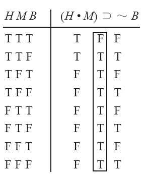

上述复合命题所对应的公式包含三个简单命题：H、M和B。它们的真值的所有可能组合显示在真值表的左侧。如前面所述，我们使用2n来计算所需的行数。在这里，n等于3，因此需要八行。然后，我们把真假值指派给左侧的三个列。从最左侧的那个开始（位于H下方），位于顶部的一半是T，位于底部的一半是F。然后，到了左侧的中间这一列，与左侧的四个T对应，得到两个T和两个F；与左侧的四个F对应，也得到两个T和两个F。最后，对于左侧的最后一列，依据与上述相同的划分方法，可以得到T、F、T、F、T、F、T、F。这个约定保证了我们可以得到真值的所有可能的组合。这样，位于最顶端的一行都是T，位于最底端的一行都是F，而位于中间的则是其他可能的组合。

当我们输入这些值之后，再来查看右上角的那个复合命题公式。它是一个条件式。因此，它的主联结词是“∩”。在它的下方，将放置最终的结果（位于方框中）。但是，只有在先找到了前件H·M和后件～B的可能的真值之后，才能确定该条件式的可能的真值。那些真值构成了位于“·”和“～”下方的列。最后一步是把该条件式的真值规则应用于这两列。

专栏11-9　复合命题的真值表

在一个真值表中，指派给左侧各个简单命题的真值数目取决于待求解的公式（位于右侧上方）中出现的不同命题的数目。对于任何一个简单命题，只有两种可能的真值（真和假）。因此，对于像～P这样的复合命题，只需要两行。但是，随着命题的增加，依据公式2n计算得来的真值数目要相应增加：当n等于2时，需要四行；当n等于3时，需要八行；当n等于4时，需要十六行，以此类推。对于例11-62，需要四行。此外，为了确保能够得到所有可能的真值组合，我们采用如下约定：在最左侧字母下方的那一列，位于顶部的一半是T，位于底部的一半是F；然后，按照前面例子中阐述的模式，自左向右指派各个列中的真值。

### 逻辑必然和逻辑偶然命题

偶真式

关于真值表例11-62和例11-63右侧复合命题的真值，我们学到了什么呢？我们学到的是：它们既不是必然的真，也不是必然的假；而是有时为真，有时为假。这取决于简单支命题的真值和逻辑联结词。具有这类真值的命题是偶然命题。一个复合命题是偶真式，当且仅当，其真值表中主联结词下面至少有一行是真，有一行是假。在例11-63中，至少有一个T和一个F位于“∩”的下方。在例11-62中，同样至少有T和一个F位于“·”的下方。依据这一结果，这两个复合命题都是偶真式。

矛盾式

矛盾式是一种复合命题，总是为假。矛盾式的值可以依据形式来确定，即它与各个支命题的实际真值无关。在矛盾式的真值表中，位于主联结词下方的都是F。请看下面的例子：

例11-64　B≡～B

因为例11-64只包含命题B（它出现了两次），由21可知需要两行，一行是T，一行是F。因此，我们得到如下真值表：

例11-65

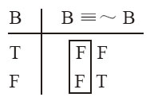

这一真值表表明，例11-64是一个矛盾式。

重言式

有些命题是重言式：仅通过形式就可以断定它们总是真的（与各个支命题的实际真值无关）。在一个重言式的真值表中，位于其主联结词下方的都是T。上述例11-64的否定就是重言式，即：

例11-66　～（B≡～B）

依据这个命题的真值表，可知位于该公式主联结词下方的都是T：

例11-67

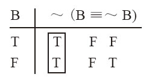

例11-67给出了例11-66的真值，确证了它是重言式。逻辑中著名的重言式是所谓的排中律（即P∨～P）与不矛盾律［即～（P
·～P）］。为了进一步练习，分别为它们构造一个真值表，来检验它们是否的确为重言式。最后，请记住如下要点：

专栏11-10　矛盾式、重言式和否定

矛盾式的否定是重言式，重言式的否定是矛盾式。

## 第12章　核查命题逻辑论证的有效性

### 用真值表检查有效性

正如我们看到的，真值表可以提供确定一个复合命题是否重言、矛盾或者偶真式（或然式、可满足式）的程序。而且，这是一种可行方式，在有穷步骤内应用特定规则就可以产生结果。但是，这里将要详细阐释真值表的另一个用途：真值表可以使我们机动地确定一个论证形式是否有效。考察下列论证：

例12-1　1. 水牛（buffalo）或者丛林狼（coyotes）是食草动物。

2\. 水牛是食草动物。

3\. 丛林狼不是食草动物。

为了确定例12-1是否有效，首先需要获得它的论证形式。第一步，我们把例12-1的前提和结论翻译成标准的符号语言，可以得到：

例12-1a　1. B∨C

2\. B

3.～C

第二步，使用逗号断开前提，在结论前面填上“∴”，读作
“所以”，把上述纵向排列形式转化成如下横向排列形式：

例12-1a　B∨C，B∴～C

现在可以使用真值表检测这一形式的有效性。首先，我们在真值表的右上角输入上述公式，左上角输入公式中出现的所有简单命题。其次，依据2n计算所有简单命题的真值组合，这个公式的值应该是22（因为出现的简单命题只有B和C）。完成这些之后，我们集中考察表示前提和结论的较短的公式，并依次计算出它们的真值。按照第11章所描述的标准方式进行计算。最后一步，我们（按照本章将要解释的方式）检查上述论证是否有效。检查上述例12-1有效性的真值表是：

例12-2

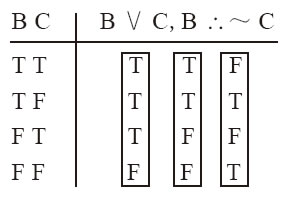

例12-2中表示前提和结论的所有公式的值都被计算出来了。如何做到这一点呢？可以如此推理：第一个前提是析取式，已知B和C的真值，应用析取的真值规则可以计算出整个析取式的真值。楔形符号下面，右边第一栏表示的是计算的结果。因为第二个前提B是简单命题，我们不可能使用联结词的真值规则计算它的真值。因此，它的值与左边第一栏相同。也就是说，我们只要把那些真值转移到表的右边即可（这一步可以省略，因为B的值就在左边第一栏，可以直接使用）。然后在C的真值上面，即左边第二栏上应用否定词的规则计算～C的值。如真值表右边第三栏所示，我们要在波浪线下填写计算结果。现在可以检查右上方的形式是否有效。为了确定这一点，我们横向浏览B∨C，B以及～C的值（忽略列）。找出前提B∨C以及B都真，但结论～C为假的那一行。恰好就是第一行。这就表明公式所表示的论证形式无效，原因如下：

如果检测某一论证形式的真值表至少有一行是前提真、结论假，那就证明这个形式无效。

专栏12-1　真值表与有效性有什么联系

有效性与真值表之间的关系仅是：

（1）如果一个论证有可能是所有前提都真，但结论假──也就是说，真值表有一行或多行是如此情况──那么它就是无效式。

（2）但如果上述情况不可能发生──也就是说，真值表没有这么一行──那么它就是有效式。

（如果一个论证形式有可能是所有前提都真、但结论假，那么从前提推不出结论。）

上述真值表的第一行（如箭头所示）证明了需要检测的形式的无效性（依据专栏12-1中指出的基本原理）。我们以这种方式证明例12-1是无效式。可以建构类似的真值表证明任何具有相同形式的不同论证的无效性。例如，

例12-3　要么是媒体提高了大众的自觉性，要么是大众的观点导致了公共政策。

因为媒体提高了大众的自觉性，所以，并非大众的观点导致了公共政策。

因为这个论证与上述例12-1具有相同形式，任何检测有效性的正确真值表都将与例12-2相同（作为练习，自己应建构这样一个真值表）。

现在使用一个真值表检测另一个论证的有效性：

例12-4　1. 如果萨莉在总统选举中投了票，那么她就是公民。

2\. 萨莉不是公民。

3\. 萨莉没在总统选举中投票。

这个论证的形式是：

例12-4a　M∩C，～C∴～M

首先需要注意的是，这个论证形式包括两个简单命题，M和C，并且分别出现了两次。因此，真值表的左边只需要四个值（两真，两假），共有四行。其次，计算例12-4a前提和结论的真值。它们都是复合命题，真值情况将在联结词下面排列；第一个前提的真值排列在“∩”下面；第二个前提和结论的真值排列在“～”下面。这个论证并不包括简单命题；因此，为了检测有效性，我们仅需浏览联结词下面每一栏的每一行：前提栏是在“∩”和“～”下面，结论的是在“～”下面。最后我们要找出所有前提都真，但结论为假，即表示无效性的那一栏。但真值表中并没有这一行。

例12-5

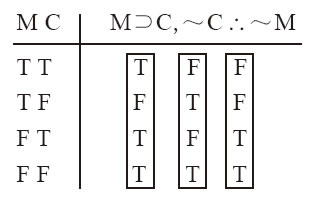

没有这一行意味着例12-4和例12-4a都有效。这个测试可以证明有效性是因为真值表穷尽了所有可能的前提与结论的真值组合，而且没有哪一行显示前者为真、后者为假。因此，具有例12-4a这一形式的所有论证，从其前提可以推出结论。考察以下论证：

例12-6　如果蒂娜·黑尔教授在利物浦大学，那么她就在英国工作。蒂娜·黑尔教授并不在英国工作，因此，蒂娜·黑尔教授不在利物浦大学。

例12-7　如果地球不是行星，那么火星也不是。但火星是行星，因此，地球也是。

自行练习建构一个真值表来检测它们的有效性。你会发现最终结果与上述例12-5完全相同。

再看一个较复杂的论证。

例12-8　因为法国不是联合国成员，可以推出英国也不是。因为，如果法国不是，那么荷兰或者英国是。

可以把例12-8解释为

例12-8a　1. 法国不是联合国成员。

2\. 如果法国不是，那么荷兰或者英国是。

3\. 英国不是联合国成员。

其形式是

例12-8b　～F，～F∩ （N∨B）∴～B

测试例12-8b的有效性，首先需要注意，其中出现了三个简单命题，真值表将有八行。在真值表左边写下这些简单命题真值的所有可能组合之后，计算前提和结论的真值，在右边联结词下面输入计算结果。下面是真值表，箭头指向的行表明这个形式无效：

例12-9

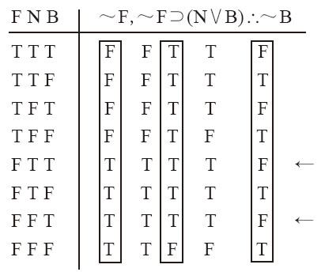

例12-9右边较复杂的公式表示的是论证的第二个前提：它包含三个联结词。如何确定哪个是最主要的？通过仔细阅读和括号来确定：后者告诉我们～F和（N∨B）通过∩连接。但为了确定∩下面一栏的真值，首先需要知道其前件～F，和后件N∨B的真值情况。在真值表左边的F上使用否定词的真值规则就可以确定～F的真值，之后在～F──第一个前提下面输入那些值（也可以不写）。依据左边N和B的真值，使用析取规则计算出N∨B的值。计算～B真值的方式与计算～F的类似。完成这些工作后，我们只需要浏览真值表右边表示前提和结论真值的行。向自己发问：是否存在两个前提都真，但结论为假的行？答案是肯定的！一共有两行：第五行和第七行。这就证明例12-8b无效，而任何具有这一形式的论证，如例12-8就是无效的。

专栏12-2　如何使用真值表检测有效性

（1）使用真值表去检查一个论证的有效性时，首先在右上方写上刻画论证形式的那个公式。

（2）公式中出现的所有不同种类的命题都位于真值表的左上方。

（3）公式下面的行穷尽了所有前提与结论真值的可能组合。

（4）为了确定一个论证形式是否有效，必须浏览公式下面的所有行。

（5）如果有一行显示前提真而结论假，这就证明该论证形式无效。

（6）如果没有这一行，论证形式就是有效的。

### 一些标准的有效形式

正如我们在第5章看到的，任何一个具有有效形式的论证本身也是有效的，可以看作这个形式的替换例或事例。任何一个无效形式的代入例本身也是无效的。然而，命题逻辑系统具有大量的无效或有效形式。因此，仅仅通过辨识某一论证是一个有效式或无效式的例示是不可能学到命题逻辑系统中论证的有效性或无效性知识的。但能够辨识一些最常见的有效式或无效式也是非常有益的。我们将重新考察第5章已经介绍过的五种形式，学习如何认出例示那些形式的论证。

肯定前件式

肯定前件式是一种常见有效式，它的一个前提是条件句，另一个前提是条件句前件的肯定，结论是后件的肯定。如，

例12-10　1. 如果乔斯是消防员，那么他就为消防队工作。

2\. 乔斯是消防员。

3\. 乔斯是为消防队工作。

这个论证举例说明了“肯定前件式”（字面意义是“肯定的模式”）这一有效式，其符号表示是，

例12-10a　1. P∩Q

2\. P

3\. Q

因为实质条件句的前件表达的是后件的充分条件，前件在肯定前件式中被断定为真，任何具有这一形式的论证都有效。换句话说，如果P蕴涵Q为真，并且P为真，那么Q必然为真。具有这一形式的论证的有效性可以通过真值表例12-11证明。

例12-11

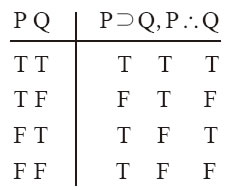

可以看出，这个真值表中并没有两个前提都真，但结论为假的行。

否定后件式

另一常见的有效形式是否定后件式（字面意思是“否定的模式”）。如果一个论证包含两个前提，一个是条件句，另一个是对条件句后件的否定，那么这个论证就是否定后件式的代入例。结论是对条件前提的前件的否定。如，

例12-12　1. 如果铜是一种稀有金属，那么就很昂贵。

2\. 铜并不昂贵。

3\. 铜不是稀有金属。

这个论证的形式是否定后件式，可表示如下：

例12-12a　1. P∩Q

2.～Q

3.～P

实质条件句中，后件表达的是前件的必要条件。如果Q对P是必要的，那么若非Q，则非P。换句话说，否定一个前提的后件可以推出否定其前件。如下表表明，任何否定后件式的代入例都是有效的：

例12-13

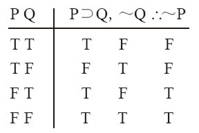

换质位

换质位论证的前提是一个单称的条件句，结论不仅交换了条件句前后件的位置，而且改变了前后件的质，这个论证具有的就是换质位形式。如，

例12-14　1. 如果安娜是一名革命者，那么她就反对建立秩序。

2\. 如果安娜不反对建立秩序，那么她就不是一名革命者。

例12-14的形式正是换质位，因为：

例12-14a　1.P∩Q

2.～Q∩～P

例12-14a使我们认识到，因为例12-14的形式有效，所以论证本身也是有效的。为什么有效？与否定后件式类似：因为Q是实质条件句的后件，是其前件P的必要条件。因此，如果Q假，P一定假。换质位的有效性可由下列真值表表明：

例12-15

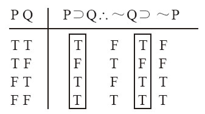

假言三段论

之所以称假言三段论，是因为这种论证有两个前提（与三段论相同），而且其前提（和结论）都是假言或条件命题。如：

例12-16　1. 如果伊莱恩是新闻报道者，那么她就是记者。

2\. 如果她是记者，那么她就知道如何写作。

3\. 如果伊莱恩是新闻报道者，那么她就知道如何写作。

其形式如下：

例12-16a　1. P∩Q

2\. Q∩R

3\. P∩R

例12-16a使我们明白，例12-16具有假言三段论这一有效形式。

仔细考察这个形式就会发现前提1的后件是前提2的前件，而前提1的前件与前提2的后件分别是结论的前件和后件。显然，因为条件命题的前件表达的是后件的充分条件，Q又是P的充分条件，这可以推出P是R的充分条件。例12-16是这个形式的代入例，因此是有效的。下列真值表可以表明假言三段论的有效性：

例12-17

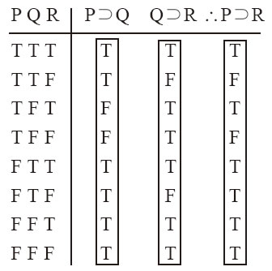

析取三段论

最后，我们要讨论一种不涉及条件前提的有效论证形式：析取三段论。之所以称析取三段论，是因为它有两个前提（与三段论相同），并且其中一个是析取式。一个前提表达的是析取式，另一个是对析取式的一个析取支的否定，这可以导出结论是另一个析取支的肯定。如：

例12-18　1. 我的汽车要么是被警察拖走了，要么是被偷了。

2\. 我的汽车并没有被警察拖走。

3\. 我的汽车是被偷走了。

例12-18是析取三段论的一个代入例。由于否定的析取支不同，析取三段论又可以分为以下两种形式，它们之一可以精确地刻画例12-18：

|  |  |
|----|----|
| 例12-18a 1. P∨Q  |  例12-18b 1. P∨Q |
| 2. ～P | 2. ～Q |
| 3. Q   |   3. P |

因为例12-18否定的是析取前提的第一个析取支，所以正确形式应是例12-18a。但无论是哪种形式，根本原则是：已知相容析取的真值函项定义，如果相容析取前提为真，但其中一个析取支为假，就可以推出另一个析取支为真。因此，正如下列真值表可以证明，任意具有例12-18a或例12-18b形式的论证都有效：

例12-19

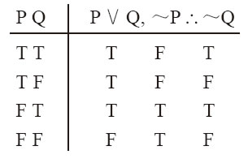

更复杂的有效代入例

当着手分析命题逻辑系统中的论证时，能够辨识上述五种基本的有效形式将是非常有益的。只要某个论证具有上述形式之一，它就有效，不需要进一步的程序！一个论证有效，只要其前提和结论所反映的形式有效即可。这就意味着一个有效论证的前提和结论除主要反映有效形式中的前提和结论之外，还在描述联结词方面起到了十分重要的作用。只要形式和论证的主联结词完全相同就没有问题。以下是我们在判定某一论证具有何种形式时需要识记的几点内容：

（1）一个具体论证，其前提的顺序与它本身是否具有肯定前件、否定后件、假言三段论或析取三段论形式这一问题无关。

（2）联结词除标准的表述之外，还有其他表述方式。

（3）双重否定可以消去。因此，任何不包含否定的命题都可以解释为具有双重否定的命题。

（4）一个有效论证除与基本的有效形式中的主联结词对应之外，还要与形式中的其他部分对应。

下列论证可以说明（1）和（3）：

例12-20　如果跳蚤是微生物，那么就是裸眼不可见的。但跳蚤是裸眼可见的，因此，它们不是微生物。

例12-20这个论证是否定后件式的代入例：

例12-20a　1. E

2\. M∩～E

3.～M

依据（3），前提1中的E等价于～～E，即2的后件──～E的否定。而结论3是对前件的否定。依据（1），这正是否定后件式！

以下论证可以例证（2）：

例12-21　1. 只有空袭结束，军舰才可以起航。

2\. 空袭没有结束。

3\. 军舰不能起航。

一旦使用“如果……那么”这样的标准形式替换“只有……才”，那么例12-21显然是否定后件式的代入例，论证形式是：

例12-21a　1. C∩O

2.～O

3.～C

为什么例12-21的第一个前提可以表示为H∩L的形式？因为“只有……才”是条件句的另一种日常语言表达方式。例12-21中，条件句的前件是“只有”命题之后的命题，后件就是“只有”命题。回顾第11章所讲的复合命题，温习真值函项联结词不同表达方式的知识。但是，还有另一个与（1）相关的例子，这次是用“除非”而不是“或者”表达析取。一旦知道什么词与“除非”等价，就能辨识例12-22、这个析取三段论的形式是例12-22a：

例12-22　1. 乔治今晚会看《辛普森一家》，除非他去踢球。

2\. 他今晚不踢足球。

3\. 乔治今晚会看《辛普森一家》。

例12-22a　1. G∨F

2.～F

3\. G

与上述（1）和（3）相关的另一个例子如下：

例12-23　1. 艾迪是银行雇员蕴涵他有工作。

2\. 艾迪只有是银行雇员，才可以是银行支票员。

3\. 艾迪是一名银行支票员蕴涵他有工作。

前提的顺序（上例是倒置）以及“蕴涵”和“只有……才”，都不妨碍把例12-23看作假言三段论的一个代入例。一旦我们按照逻辑顺序排列前提，使用形如例12-23a中的符号语言表示上述论证。如例12-23所示，令E表示“艾迪是银行雇员”，B表示“艾迪是银行支票员”，J表示“艾迪有工作”，一旦我们依照逻辑顺序重新排列前提，并把例12-23翻译成符号语言，前述观点就是显然的。

例12-23a　1. E∩B

2\. B∩J

3\. E∩J

现在，考察以下论证以及它们的形式表征：

例12-24　1. 哥斯达黎加是一个和平的国家，而且这个国家没有军队。

2\. 哥斯达黎加只有没有公众骚乱，才是一个和平并且没有军队的国家。

3\. 哥斯达黎加没有公众骚乱。

例12-24a　1. C ·∨～A

2.（C·～A）∩～N

3.～N

例12-25　1. 乔伊要么在欧洲受审，要么被引渡美国。

2\. 乔伊要么在欧洲受审，要么被引渡美国，蕴涵他辩护失败而且不是自由身。

3\. 乔伊辩护失败而且不是自由身。

例12-25a　1. J∨E

2.（J∨E）∩（D ·～F）

3\. D ·～F

严格地从前提与结论之间的主联结词的角度看，上述两个论证都是肯定前件式的代入例。因为两个论证都由一个条件前提（恰好是第二个前提）以及条件前提前件的肯定（恰好是第一个前提）构成。一个论证中，前提的排列顺序以及前提本身是包含若干联结词的复合命题，这两点都不会影响整个论证成为肯定前件式的代入例。

一些标准的无效论证形式

我们已经看到，有很多种缺陷可以导致论证不成立。不同缺陷构成了所谓的谬误，包括已经讨论过的非形式谬误。现在，我们来讨论它们在命题逻辑系统中的表现形式，包括一些形式谬误。（如图12-1所示）

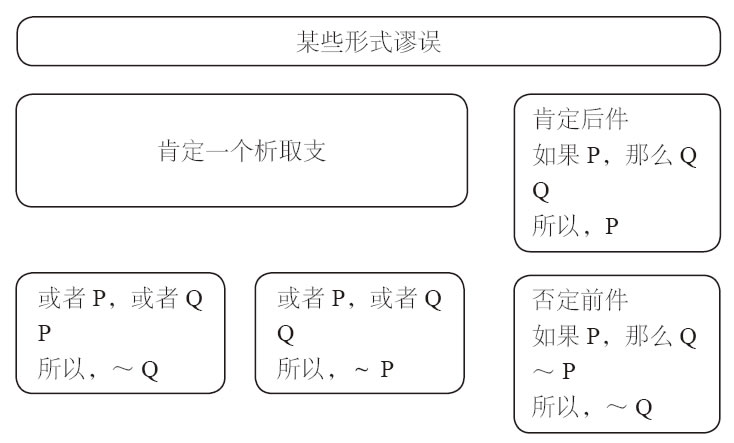

图12-1　无效的论证形式

所有形式谬误都与有效式非常类似，但又有某种程度上的区别。因此，它们是无效的演绎论证形式的代入例。一个论证是无效的，当且仅当具有这一形式的论证有可能前提真而结论假。为了证明一个论证形式的无效性，只需找到一个具有相同形式的论证具有真前提和假结论。如：

例12-26　1. 如果信使来了，钟会在中午响起。

2\. 钟在中午响起。

3\. 信使来了。

这个论证是无效的，因为其前提为真、结论为假是可能的。即使在有些例子中，前提和结论在某种情形下都是真的，也会存在其他情形。其中，具有相同形式的论证可能具有真前提和假结论。

假设信使没来，但钟确实在中午响了，尽管钟是被邻居敲响的。此时，例12-26的前提都为真，但结论为假。因此，当前这个情形就等价于可以显示例12-26无效的反例。

通常在现实生活中，我们都会找到一个反例证明特定论证的无效性。但我们也可以不用反例，因为说明一个论证无效，只需描述一个“可能世界”（可以是、也可以不是现实世界──仅仅是一个内部没有矛盾的情境）。其中，具有相同形式的论证可能具有真前提和假结论。

因此，一个论证的无效性可以通过上述方式证明：试图描述一个可能情境，其中，当前讨论的论证前提真、结论假。如果提不出这样的情境，可以先抽象出论证形式。例12-26的形式如下：

例12-26a　1. P∩Q

2\. Q

3\. P

然后找到一个具有相同形式的论证,在某一可能情形中前提为真，结论为假。如，

例12-27　1. 如果贝拉克·奥巴马是共和党，那么他就是一个政党的成员。

2\. 他是一个政党的成员。

3\. 贝拉克·奥巴马是共和党。

例12-27表明在现实世界，一个具有相同形式的论证（如例12-27）具有真前提和假结论。依据无效的定义，例12-27无效。它等价于任何具有相同形式论证的反例。

肯定后件

上述无效论证都是肯定后件式的代入例。

肯定后件谬误是指一个论证具有一个条件句前提，另一个前提肯定了条件句的后件，其结论是对条件句前件的肯定。

肯定一个命题就等于说它为真。犯了这一谬误的论证所肯定的是一个实质条件句的后件。后件总是表达前件的必要而非充分条件。所以，后件的真绝不能确保前件（结论）的真。以下是一个较复杂的肯定后件的示例：

例12-28　1. 如果奥尔森一家是猎鹿者，那么，若他们打猎，则不打野鸡。

2\. 若奥尔森一家打猎，则不打野鸡。

3\. 奥尔森一家是猎鹿者。

例12-28a　1. O∩（H∩～A）

2\. H∩～A

3\. O

与任何肯定后件式的代入例相同，例12-28也是无效的。这一形式的无效性可通过如下真值表说明：

例12-29

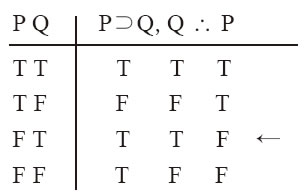

正如你能看到，这个真值表中有一行是前提都真，但结论为假。

专栏12-3　如何避免肯定后件式谬误

在肯定前件式中，一个前提肯定的是另一个前提的前件（而不是后件），同时结论肯定的是其后件。

因此，要谨慎对待看起来像但实际上不是肯定前件式的论证，因为其条件前提的后件被另一个前提所肯定（而它的后件由结论肯定）。

否定前件式

另一个形式谬误是否定前件式。

否定前件式是这样一种谬误，其中一个前提是条件形式，另一个前提是条件前提前件的否定，结论是条件前提后件的否定。

假设我们遇到了如下论证：

例12-30　1. 如果奥斯卡是波士顿交响乐团的提琴手，那么他就懂乐谱。

2\. 事实上，奥斯卡并不是波士顿交响乐团的提琴手。

3\. 他不懂乐谱。

显然，这个论证无效。“奥斯卡是波士顿交响乐管弦乐队的提琴手”是“懂乐谱”的充分条件（如果他在该乐团，那么就懂乐谱）。但不是必要条件，因为有很多不在该乐团中的人都懂乐谱。因此，“他不懂乐谱”不能被必然地推出。简而言之，例12-30无效，因为它犯了否定前件谬误。更普通地说，任何例示这一谬误的论证都是无效的，因为否定条件前提的前件等于说前件假。但实质条件句的前件表达的是后件的充分条件：所以前件假，结论可能是真的。因此，否定条件句的前件不能推出后件的否定。上述论证就是否定前件式的代入例。任何犯了这类谬误的论证都具有以下形式：

例12-30a　1. P∩Q

2.～P

3.～Q

否定后件的无效性可通过真值表例12-31得到说明：

例12-31

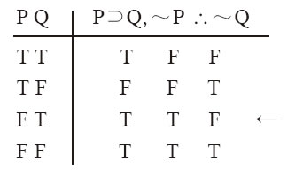

专栏12-4　如何避免否定前件式谬误

在否定后件式中，条件前提的后件被另一个前提否定（结论正是对前件的否定）。

因此，谨慎对待看起来像但实际上不是否定后件式的论证，因为其条件前提的前件被另一个前提所否定（同时论证的结论是后件的否定）。

肯定一个析取支

另一个形式谬误是“肯定一个析取支”。

犯“肯定一个析取支”谬误的论证，特征是其中一个前提是相容析取，另一个前提肯定了前者的一个析取支，结论是对另一个析取支的否定。

肯定一个析取支是无效形式，则是因为，我们是在相容意义上（即，P或者Q，或P并且Q）理解“或者”的。除两个析取支都为假外，相容析取在其他情况下都是真的。因此，假设一个相容析取为真，否定其中一个析取支（即说它为假），可以推出另一个析取支一定为真。但肯定一个析取支（说它为真）并不能推出另一个析取支的否定，即不能推出另一个析取支为假。（在不相容析取的情况下，“肯定一个析取支”并不是谬误）如：

例12-32　1. 我的汽车或者被警察拖走了，或者被偷了。

2\. 事实上，我的汽车被警察拖走了。

3\. 我的汽车没被偷走。

两个前提都为真的情况下，上述结论有可能为假吗？有可能！一种可能情况是，盗窃犯在晚上撬开了汽车，然后非法停车，因此被警察拖走。如果是这种情况，例12-32的前提就都是真的，但结论为假。因此，结论并不必然地从前提推出──也是推不出的。因此，论证无效。任何具有下述一种形式的论证都会犯这样的谬误：

例12-32a

|                                    |                                    |
|------------------------------------|------------------------------------|
| Ⅰ1. P∨Q | Ⅱ1. P∨Q |
| 2. P    | 2. Q    |
| 3.～Q   | 3.～P   |

因为例12-32中的“或者……或者……”是相容析取，肯定其中一个选言支并不能推出否定另一个。从相容析取的角度看，上述两种形式都无效。肯定一个析取支的无效性可通过下列真值表说明：

例12-33

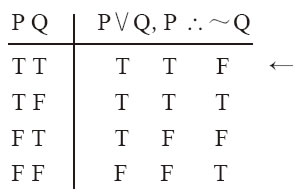

现在已经识别出了与三种形式谬误对应的无效论证形式。如果一个论证具有上述形式之一，那么并不需要通过真值表判定它是否有效。仅需指出这个论证具有：肯定后件、否定前件或肯定一个析取支的形式即可。如果你能区分这三种无效式和之前讨论的五种有效式，那么就会比较容易地区分无效论证和有效论证。

专栏12-5　如何避免“肯定一个析取支”谬误

注意，析取三段论的前提否定的是另一个前提的析取支，结论肯定的是另一个析取支。

因此，要谨慎对待看起来像但实际上不是析取三段论的论证，因为其前提肯定的是另一个前提的析取支，而结论否定的是剩下的析取支。

### 一种证明有效性的简明方法

上文讨论的一些有效论证形式通常被用作有效性证明中的基本推理规则。这是一种程序，旨在展示一个命题逻辑有效论证的结论是如何从其前提一步一步推导出来的。假设一个论证事实上是有效的，可以通过建构一个证明显示这一点。在准备构造这类证明之前，我们将补充一些基本的有效形式和替换规则，使我们拥有足够多的证明所需要的推理规则。

基本原则

为了建构有效性证明，我们需要一些有效论证形式以及一些复合命题之间的等价关系。前者可以作为推理规则，使我们从一个前提或多个前提推出结论。后者可以作为替换原则，允许我们使用一个表达式替换另一个与之等价的表达式。我们的规则可表示如下：

基本的推理规则

|  |  |
|----|----|
| （1）肯定前件式（MP） | P∩Q，P∴Q |
| （2）否定后件式（MT） | P∩Q，～Q∴～P |
| （3）假言三段论（HS） | P∩Q，Q∩R∴P∩R |
| （4）析取三段论（DS） | P∨Q，～P∴Q |
| （5）简化律（Simp） | P · Q，∴P |
| （6）合取律（Conj） | P，Q∴P · Q |
| （7）附加律（Add） | P∴P∨Q |

基本的替换规则

|  |  |
|----|----|
| （8）换质位（Contr） | （P∩Q）≡（～Q∩～P） |
| （9）双重否定（DN） | P≡～～P |
| （10）德摩根律（DeM） | ～（P · Q）≡～P∨～Q |
|   | ～（P∨Q）≡～P ·～Q |
| （11）交换律 （Com） | （P∨Q）≡（Q∨P） |
|   | （P · Q）≡（Q · P） |
| 12）实质条件的定义（Cond） | （ （P∩Q）≡（～P∨Q） |
| （13）是指等价的定义（Bicond） | （P≡Q）≡［（P∩Q）·（Q∩P）］ |
|   | （P≡Q）≡［（P · Q） ·（～P∩～Q）］ |

### 什么是有效性证明

有效性证明可以是形式的，也可以是非形式的。在一个形式化的有效性证明中，推出关系是指在一个逻辑系统内部严格获得的某些合式公式之间的关系，这些公式不必具有一个自然语言（英语、葡萄牙语或普通话）解释。而且，形式证明所使用的基本推理和替换规则可以证明任意从命题逻辑有效论证的前提推出的结论。另一方面，非形式证明中的推出关系是自然语言可表达的特定命题之间的关系。如果推出的证明仅涉及公式，那么可以假设在那些公式中有一个自然语言的解释。另外，使用非形式方法的基本规则不能为所有命题逻辑有效的论证提供一个有效性证明。

尽管我们为了方便，在构造一些论证的有效性证明时使用的是符号语言，但可以假设那些论证都有一个自然语言解释。对于自然语言表达的有效论证，首先把它翻译为符号语言。然后使用上述规则证明它们的有效性。这些规则可以用于证明许多论证的命题逻辑有效性，下文将会讨论如何使用规则证明有效性。

无论形式方法还是非形式方法，所有有效性证明都要求在对前提使用一个或多个推理和替换规则之后，原则上是可以推出结论的。这些规则被公认是“基本”的。（因为这个系统内的任何证明都至少需要预设几个基本的、在本系统内不能证明的规则）

如何构造一个有效性证明

现在使用上述基本规则证明下列论证的有效性：

例12-34　爱丽丝和卡洛琳将都在明年毕业。但如果卡洛琳明年毕业，那么吉赛尔就会获得奖学金，当且仅当爱丽丝明年毕业。因此，要么吉赛尔会获得奖学金，当且仅当爱丽丝明年毕业，要么海伦会是致告别辞的优秀毕业生。

首先把这个论证翻译为如下符号语言：

例12-34a　A · C，C∩（G≡A）∴（G≡A）∨H

现在可以证明这个论证的结论，（G≡A）∨H可从前提推出。如何证明？仅对例12-34a的前提应用基本的推理和替换规则。从例12-34a的前提演绎出结论的四个步骤（3、4、5、6）分别是：

例12-34b

|  |  |
|----|----|
| 1. A · C |   |
| 2. C∩（G≡A） | ∴（G≡A）∨H |
| 3. C·A | 1──交换律 |
| 4. C | 3──简化律 |
| 5. G≡A | 2、4──肯前式 |
| 6.（G≡A）∨H | 5──附加律 |

第3行是对前提1使用交换律（参看上述交换律规则），从而演绎出C ·
A。每演绎出一个公式，都要在右边注明依据。如这个例子，表达依据的语词包括“从”、“且”、“通过”，下文将省略（从）或使用标点替换（“且”和“通过”）。书写依据时要注意两点：（1）标明应用特定规则的前提序号（若多于一个，则按顺序写）；（2）阐明所用到的规则名称。如果证明了某一公式，那么可以把它看作新前提，标明序号。因为第3行的C
·
A已经从论证的前提演绎出来了，那么就可以用于进一步证明的前提。事实上，它在第4行被用作导出C的依据。第5行，前提2和4通过肯前式导出了G≡A。第6行，使用附加律导出了结论，从而证明了例12-34的有效性。如此，例12-34的有效性得证。

证明和真值表

正如我们在真值表中所看到，一个论证前提和结论的真值是与论证有关的真值函项联结词的规则赋予的。尽管这里只定义了五种真值函项联结词，但事实上，它们的总数是16个。这个数目是固定的。与之不同的是，可用于构造有效性证明的有效式和逻辑等价表达式的实际数目会因演绎系统的不同而不同。另外，证明程序并不规定从前提正确演绎出结论的步骤数：它取决于前提与我们决定采用的基本规则。

因为在这些方面，证明有一定的灵活性，所以在一个由基本规则构成的系统中，对于特定论证可以构造不止一个正确的有效性证明。也就是说，与真值表不同，一个证明并不总能在固定步骤内得出一个结论的机械程序。除此之外，为特定有效论证构造证明时，我们可能错误地评价了它的有效性。有可能当时“没有看出”使用特定规则可以从前提演绎出结论，错误地认为论证无效。这就是为什么，任意有效论证在“原则上”有一个有效性证明。然而必须承认，证明在某一方面确实优于真值表：当一个论证涉及很多种命题时，真值表往往会很长而且很不方便。证明就不会有这样的问题。

## 第13章　直言命题和直接推理

### 什么是直言命题

直言命题

直言命题是表征事物类之间的包含或不包含关系的命题，如：

例13-1　所有哲学家都是聪明人。

例13-2　没有哲学家是聪明人。

或者类的部分之间，如：

例13-3　有些哲学家是聪明人。

或类的部分与另一个类的全部之间，如：

例13-4　有些哲学家不是聪明人。

有四种类之间的关系与直言命题相关：

一个类的全部包含在另一个类中，完全包含。

两个类完全排斥，完全不包含。

一个类的部分包含在另一个类之中，部分包含。

一个类的部分排除在另一个类的全部外延之外，部分不包含。

上述直言命题的例子中，“哲学家”是主项，“聪明人”是谓项。这些是直言命题的逻辑，而非语形（语法）主谓项。它们分别指谓一个类：每个类表达的是其元素的共仅属性。因此，“哲学家”指谓哲学家的类，“聪明人”指谓聪明人的类。

直言命题例13-1～例13-4说明了“哲学家”类与“聪明人”类之间的包含或不包含关系。这些关系可由下列方式表示：

例13-1a　所有哲学家都是聪明人。

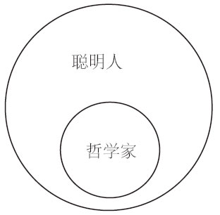

例13-2a　没有哲学家是聪明人。

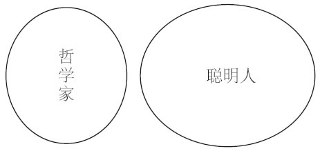

例13-3a　有些哲学家是聪明人。

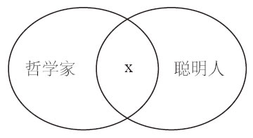

例13-4a　有些哲学家不是聪明人。

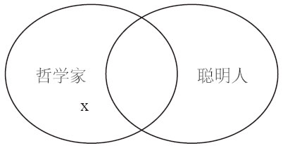

在亚里士多德（公元前384—公元前322）创建的传统逻辑中，表示直言命题逻辑形式的标准符号如下：“S”表示主项，“P”表示谓项。使用这些符号，上述直言命题的逻辑形式是：

1\. 所有S都是P。

2\. 没有S是P。

3\. 有S是P。

4\. 有S不是P。

传统逻辑中，只有具有上述逻辑形式的陈述句才是直言命题。这些命题总是表示上文提及的四种类之间的关系之一，现在，“S”和“P”代表的就是主谓项所表示类。类之间的关系参见专栏13-1。我们也可以使用圆圈图示这些关系，如图13-1所示。

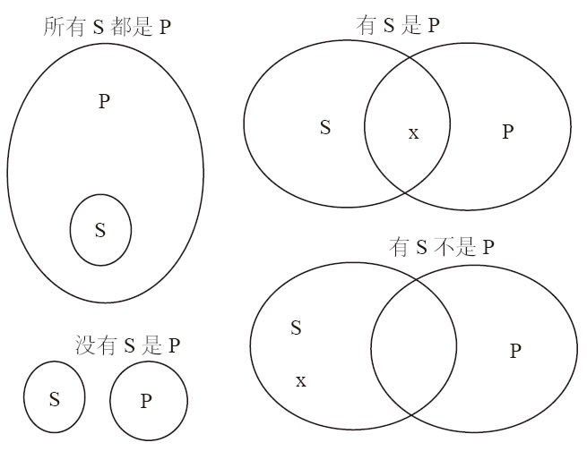

图　13-1

注意，前两个图中的“S”和“P”表示类，另两个图中的x表示S中至少有一个个体。如果“P”至少包含S的一个元素，那就等价于“有S是P”。如果S中至少有一个元素不属于P，那就等价于“有S不是P”。

专栏13-1　直言命题中类的关系

例1 表示的是 S的全部包含在P中。

例2 表示的是S和P完全排斥。

例3 表示的是部分S包含在P中。

例4 表示的是部分S排除在P之外。

标准形式

上述例13-1～例13-4是直言命题的标准形式，它们都由特定的组成部分构成。主项、谓项（不是语法上的，而是逻辑上的）当然是其组成部分。另一个组成部分是所谓的“量”：表达部分或者全部包含，或者不包含。例13-1和例13-2使用的是全称量项，“所有”和“没有”。例13-3和例13-4使用的是特称量项，“有些”。标准的直言命题还有“质”：它们是肯定形式还是否定形式，取决于是否包含否定词。例13-1和例13-3是肯定形式，例13-2和例13-4是否定形式。最后一个组成部分是或单数、或复数的系动词。以上这些就是标准直言命题的基本组成部分。

任意标准直言命题包括如下组成部分：

（1）量。

（2）质。

（3）主项和谓项。

（4）连接主谓项的联项。

任意给定直言命题，可以依据其量词种类和是否出现否定词来确定它的类型。正如表13-1所示，存在四种标准直言命题，每一个都具有独特的逻辑形式──全称肯定、全称否定、特称肯定和特称否定。

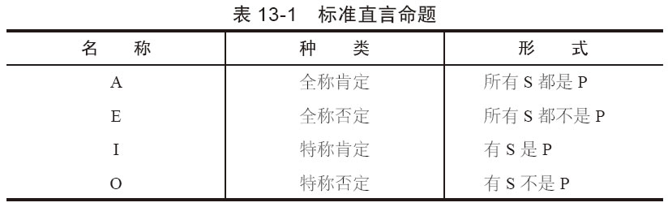

在传统逻辑中，大写字母“A”、“E”、“I”、“O”指称四类直言命题。每个字母都是一类命题的简称。这些字母是传统逻辑学家依据拉丁字母affirmo（我肯定）以及nego（我否定）发明的。每个单词的第一个元音表示全称，即“A”表示全称肯定，“E”表示全称否定；第二个元音表示特称命题，即“I”表示特称肯定，“O”表示特称否定。下文就使用字母表示四种直言命题。重新考察前文提到的例子：

例13-1　所有哲学家都是聪明人。

例13-2　没有哲学家是聪明人。

例13-3　有些哲学家是聪明人。

例13-4　有些哲学家不是聪明人。

这分别是A、E、I、O命题。

非标准直言命题

当然，很多命题都不是标准形式，也就是说，仅有一部分命题明确地包含了A、E、I、O命题中的所有组成部分。然而，通过修改可能会把许多不标准的直言命题翻译成上述标准形式之一。例如，例13-5就可以翻译为例13-5a这一A命题：

例13-5　眼镜蛇很危险。

例13-5a　所有眼镜蛇都很危险。

“每一个”、
“任何一个”、“所有事物”、“所有人”等量词都是全称的，逻辑上等价于“所有”。注意，如例13-5那样，全称量词通常会被省略。如果命题需要翻译成标准形式，那么省略的量词必须明确填写。除此之外，特定条件句也可以翻译成A命题。说所有眼镜蛇是危险的，逻辑等价于：

例13-5b　如果某物是眼镜蛇，那么就很危险。

因此，当你遇到例13-5b这类命题时，你一定要把它翻译成A命题。记住，任何看起来像全称肯定的命题，其省略的是“所有”，除非仔细解读之后是非全称的。例如，

例13-6　狗在晚上叫。

它就不能翻译为标准的A命题，只能译成I命题：

例13-6a　有些狗在晚上叫。

尽管例13-6a听起来比较怪，但我们依据的是逻辑形式：把一个命题翻译成标准形式通常都会有些奇怪。

那么，不标准的全称否定命题又是什么情况呢？如：

例13-7　我们班没有人玩纵横拼字游戏。

因为例13-7是E命题，我们可以把它翻译为标准形式，如：

例13-7a　我们班没有人玩纵横拼字游戏。

因为，一个条件句可以翻译成E命题。“我的同学中没有人玩纵横拼字游戏”等价于：

例13-7b　如果某人是我同学，那么他就不玩纵横拼字游戏。

注意，一个能够译成E命题的条件句，其后件一定包含否定词。现在考察下例：

例13-8　我同学中有人玩纵横拼字游戏。

它可以译为I命题，如：

例13-8a　我的一些同学玩纵横拼字游戏。

也可以表达为：

例13-8b　玩纵横拼字游戏而且是我同学的人存在。

也就是说，如果不包含否定词，任何关于“存在”和“有什么”的命题都可以译为I命题。如果这类命题确实包含否定词，如：

例13-9　我同学中，有的不玩纵横拼字游戏。

它可以译成“O”命题，如：

例13-9a　我的一些同学不玩纵横拼字游戏。

后面将会仔细讨论“存在预设”问题。但下一节，我们先考察与直言命题相关的推理。

### 直言命题的文恩图示

我们可以用标准的文恩图［由英国逻辑学家约翰·文恩（1834—1923）发明］表示四类直言命题。直言命题的文恩图采用两个相交的圆，左边的圆指谓主项表示的类，右边的圆指谓谓项表示的类。首先考察全称肯定命题的文恩图以及与之等价的一些记法。

例13-10　所有美国公民都是选民。

布尔符号：

S P=0。

A命题：

所有S都是P。

表示例13-10的文恩图由两个相交的圆构成，一个表示主项（“美国公民”），另一个表示谓项（“选民”），如图13-2所示。

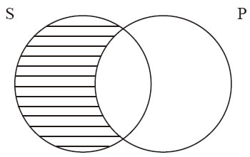

图　13-2

从例13-10可以看出，主项所指谓类的所有元素都属于谓项所指谓的类。S中的月牙部分表示没有元素（不是选民的美国公民）。文恩图中的阴影部分表示这个空间没有元素。上图中不是P的S是阴影部分，意思是，不是P的S的集合为空。这与例13-10所说的不是选民的美国公民是空类，或等价地说所有美国公民都是选民，是一致的。

上一页首先使用的是英国数学家乔治·布尔（1815—1864）发明的代数符号，“S与非P”的交集为空，然后使用传统逻辑符号，“所有S都是P”对例13-10进行了翻译。两种符号的意义可由要点中的文恩图刻画：“S与非P”的交集为空。

现考察一个全称否定命题，例13-11。

例13-11　没有美国公民是选民。如图13-3。

布尔符号：

S P=0。

E命题：

没有S是P。

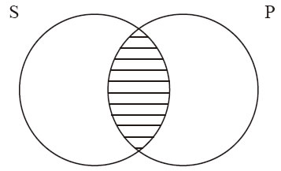

图　13-3

例13-11是全称命题，其文恩图中有一个空子类，即阴影部分：S与P相交的橄榄球形状部分表示是选民的美国公民。例13-11所刻画的是没有这样的选民：换句话说，断定例13-11意味着是选民的美国公民这个类没有元素。图的左边，例13-11的布尔表示“S
P=0”告诉我们“S
P”是空类。继布尔符号之后，可以找到例13-11的传统逻辑符号表示以及所属的种类。需要记住的是，对于所有全称直言命题（不管肯定的还是否定的），都存在一个表示空类的阴影部分。

接下来，考察特称肯定命题。

例13-12　有些美国公民是选民。如图13-4所示。

布尔符号：

S P≠0。

I命题：

有S是P。

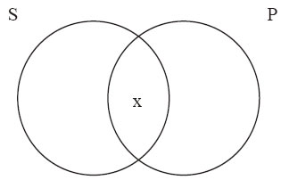

图　13-4

这次是特称命题：关于类的部分的断言。因此，上图并没有阴影，只有x，表明存在一些元素。因为“有些”在逻辑上等价于“至少有一个”，即例13-12等价于：

例13-12a　至少有一个美国公民是选民。

在中间的球形空间写上“x”，说明“S
P”不是空类，而是有几个元素（至少有一个）。图上边可以看到例13-11的布尔符号翻译，“S
P≠0”，即，“S P”这个子类非空，左边还有传统逻辑的符号表示。

最后是特称否定命题。

例13-13　有些美国公民不是选民。如图13-5所示。

布尔符号：

S P≠0。

O命题：

有S不是P。

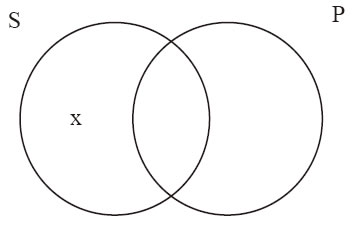

图　13-5

因为例13-13也是特称命题，所以文恩图中没有阴影。“有些”又表示至少有一个，例13-13在逻辑上等价于：

例13-13a　至少有一个美国公民不是选民。

不是选民的美国公民这个类非空，即至少有一个元素──在S与非P的交集这个子类中有x。图上边的布尔翻译指出“S与非P的交集非空”，布尔翻译之后是传统逻辑符号表示。

上述四个图可以表示四种直言命题中类的不同关系。在第14章，我们将学习如何使用文恩图检查某些三段论的有效性。但首先，让我们仔细考察任意直言命题的文恩图所表示的几个空间，如图13-6所示。

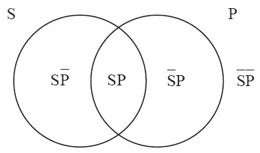

图　13-6

两个相交的圆表示直言命题中两类事物之间的关系──左边指谓的是主项的类，右边指谓的是谓项的类。两个圆所形成的空间也确定了四个子类。两圆重叠形成的中间区域为既是S又是P的元素所构成的类（同时是两个类的元素所构成的类），符号表示为“S
P”。左边的月牙形表示是S但不是P的元素所构成的类，否定是通过P上面的横杠表示的。右边的月牙形表示是P但不是S的事物所构成的类，否定由S上面的横杠表示。两个圆外围的空间表示既不是S又不是P的事物所构成的类。正如我们已经看到，我们能够使用文恩图中的空间表示四类直言命题中类的包含或不包含关系。我们可以考察以“美国公民”为主项，“选民”为谓项构成的四种具体命题。这些命题所表征的美国公民和选民两个类之间的包含和不包含关系，可通过图13-7中的文恩图表示。

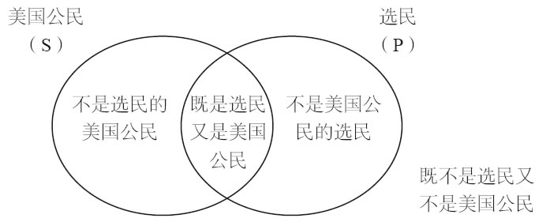

图13-7　直言命题的文恩图示

上图可以表示4个子类：（1）是选民的美国公民；（2）不是选民的美国公民；（3）不是美国公民的选民（例如，在其他国家选举的人）；（4）既不是选民又不是美国公民（例如，其他国家不投票的公民，以及亨利八世、尤利乌斯·恺撒，甚至艾弗尔铁塔、大宪章、大峡谷等）。

对于每一种直言命题来说，都有一个可以说明其所涉及包含或不包含关系的文恩图。底线如下。

表征一个直言命题的文恩图可展示三个区域：相交的两个圆的内部以及两圆相交的区域。

A或E命题的文恩图包含没有元素的阴影部分。这类图中没有“x”。

I或O命题的文恩图包含一个元素为“x”的区域。这类图中没有阴影部分。

### 对当方阵

传统对当方阵

传统的观点是，上述4种直言命题之间的逻辑关系可以使我们进行特定的直接推理。现在学习这些包含一个前提的推理。首先来看下列传统对当方阵所表示的直接推理，如图13-8所示。

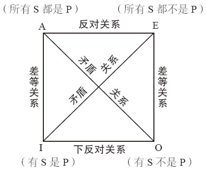

图13-8　传统对当方阵

传统对当方阵表示的是两个直言命题之间的关系，可以概括如下，如表13-2所示。

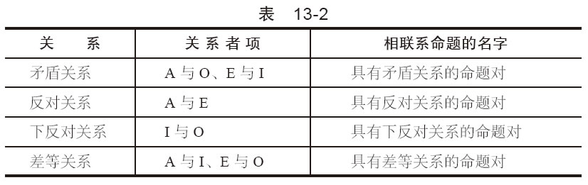

现逐一讨论这些关系。

矛盾关系　位于方阵对角线位置的两类命题构成矛盾关系。具有矛盾关系的命题不可能具有相同的真值：如果一个为真，那么另一个就为假；反之亦然。A与O，以及E与I具有相反的真值，只要两者的主谓项相同。因此，如果例13-1为真，那么例13-4为假：

例13-1　所有哲学家都是聪明人。

例13-4　有些哲学家不是聪明人。

另一方面，如果例13-1为假，那么逻辑上等价于例13-4为真。类似地，如例13-3。

例13-3　有些哲学家是聪明人。

如果例13-3是真的（至少有一位哲学家是聪明人），那么例13-2就是假的。

例13-2　所有哲学家都不是聪明人。

反过来说，如果例13-3为假，那么例13-2就为真。正如上文所述，当从一个命题的矛盾推出这个命题的真值时，就进行了一次有效的直接推理：如果它的前提为真，那么结论一定为真。但是，矛盾关系推理仅是传统逻辑学家接受的有效推理之一，还存在其他有效推理。

专栏13-2　矛盾关系

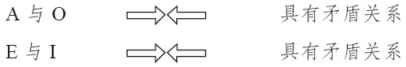

反对，下反对和差等关系　依据传统对当方阵，在特定预设下，依据下列逻辑关系的推理也是有效的：

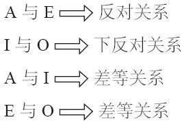

具有反对关系的命题不能同时为真，但可以同时为假。例如，依据反对关系，如果例13-14为真，那么可以推出例13-15为假：

例13-14　所有银行家都是谨慎的投资者。

例13-15　所有银行家都不是谨慎的投资者。

这是因为这类命题不能同真，但可以同假（上述命题事实上也都是假的）。

但反对关系与下反对关系不同，两者都不同于矛盾关系。具有下反对关系的命题可以同真，但不能同假。依据下反对关系，如果例13-16假，那么例13-17真：

例13-16　有些学生是素食主义者。

例13-17　有些学生不是素食主义者。

这类直言命题不能同假，但能同真。

最后是稍微复杂的差等关系，因为真值的变化取决于是从全称到特称还是从特称到全称。逻辑上，A与同一素材的I命题是差等关系，是指：如果A命题为真，那么I命题一定为真；如果I命题为假，那么A命题一定为假。E与同一素材的O命题也具有类似关系，两者是差等关系是指：如果E命题为真，那么O命题一定为真；而且如果O命题为假，那么E一定为假。两种情况中，全称命题称为“上位式”，同质的特称命题称为“下位式”。

差等关系是以下命题之间的逻辑关系：

（1）A和I（A是上位式，I 是下位式）；

（2）E和O（E是上位式，O是下位式）。

在这一关系中：

（1）真往下传递（从上位式传向下位式）；

（2）假往上传递（从下位式传向上位式）。

让我们像传统逻辑学家那样依据差等关系进行推理。假设例13-18为真，那么例13-19一定为真。

例13-18　所有演奏长号的都是音乐家。

例13-19　有些演奏长号的是音乐家。

例13-18和例13-19表明，“真”往下传递。同时，因为“有些长号演奏者不是音乐家”为假，可以推出“所有长号演奏者都不是音乐家”为假──这表明“假”往上传递。但从例13-14这样的假上位式不能推出一个假下位式，因为有些银行家是谨慎的投资者是真的。

例13-14　所有银行家都是谨慎的投资者。

从例13-17这个真下位式也不能推出一个真上位式。因为，所有学生都不是素食主义者是假的：

例13-17　有些学生不是素食主义者。

真值规则和传统对当方阵　现在，总结传统对当方阵中的所有关系，以及可以进行直接推理的规则，如下：

矛盾关系：具有矛盾关系的命题不能具有相同的真值。（如果一个为真，那么另一个一定为假；反之亦然）

反对关系：具有反对关系的命题不能同真，但可以同假。

下反对关系：具有下反对关系的命题不能同假，但可以同真。

从上位式推导下位式的差等关系（即，从全称命题推导同一素材的特称命题）：

如果上位式真，那么下位式一定为真；

如果上位式假，那么下位式真值不定。

从下位式推导上位式的差等关系（即，从特称命题推导同一素材的全称命题）：

如果下位式真，那么上位式真值不定；

如果下位式假，那么上位式一定为假。

已知传统对当方阵中的矛盾、反对、下反对以及差等关系，依据左边列表中假定的命题真值，我们能够推出右边列表中命题的真值。

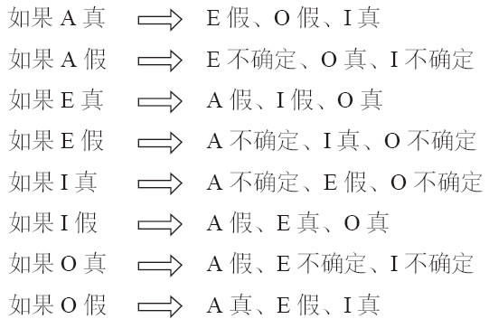

存在预设

尽管依据反对、下反对、差等关系进行的推理被传统对当方阵断定为有效，但我们进行这类推理的能力却被全称命题和特称命题的一个有意义的差异削弱了：I和O有存在预设，A和E没有。也就是说，I和O命题含蓄地预设了它们的主项所指谓的个体存在。因为“有的”在逻辑上等价于“至少有一个”，因此形如例13-20这类命题在逻辑上等价于例13-20a：

例13-20　有些学生是素食主义者。

例13-20a　有些学生不是素食主义者。

提请注意的是，“至少有一只猫”等价于“猫存在”。类似地，形如例13-21和例13-21a这两个相互等价的O命题也预设有些猫是存在的：

例13-21　有些猫不是猫科动物。

例13-21a　至少存在一只不是猫科动物的猫。

另一方面，
A与E命题逻辑上等价于条件句：例13-22等价于例13-22a，而例13-23等价于例13-23a。

例13-22　所有猫都是猫科动物。

例13-22a　如果任何事物是一只猫，那么它就是猫科动物。

例13-23　没有猫是猫科动物。

例13-23a　如果任何事物是一只猫，那么它就不是猫科动物。

以这种方式理解，一个全称的直言命题就没有存在预设，因为它等价于一个条件句，这种复合命题仅在前件为真、后件为假的情况下才为假。因此，当且仅当，一事物是猫但不是猫科动物，例13-22a才为假。而当且仅当，一事物是猫，而且是猫科动物时，例13-23a才为假。如果猫不存在，这些条件句的前件都为假，而整个条件句都是真的（无论后件是真，还是假）。

因此，反对关系推理就被削弱了：如此理解全称命题之后，当他们的主项指谓空类（没有指称）时，具有反对关系的命题就为真。考察例13-24，它与例13-24a等价。

例13-24　所有独角兽都是易受惊吓的生物。

例13-24a　如果任何事物是独角兽，那么它就是易受惊吓的生物。

因为独角兽不存在，例13-24的前件为假，整个条件句为真。现在考察与它具有反对关系的另一个命题，例13-25与例13-25a等价：

例13-25　所有独角兽都不是易受惊吓的生物。

例13-25a　如果任何事物是独角兽，那么它就不是易受惊吓的生物。

还是因为独角兽不存在，例13-25a的前件为假，整个条件句为真。显然例13-24和例13-25可以同时为真！这可以推出，除非我们假设真直言命题的主项非空，否则我们不可能推出与之反对的另一个命题为假。

那么，具有下反对关系的命题又如何呢？这涉及了I和O命题，从现代逻辑的角度看，它们确实有存在预设。尽管依据传统对当方阵，具有下反对关系的两个命题不能同假，但从现代逻辑的角度看，它们可以同假。比较例13-26与例13-26a。

例13-26　有些独角兽是易受惊吓的生物。

例13-26等价于例13-26a。

例13-26a　独角兽存在并且是易受惊吓的生物。

这样解释之后，例13-26为假，因为没有独角兽。比较例13-27与例13-27a。

例13-27　有些独角兽不是易受惊吓的生物。

例13-27等价于例13-27a。

例13-27a　独角兽存在并且它们不是易受惊吓的生物。

因为没有独角兽，所以例13-27也是假的。因此，例13-26和例13-27同时为假。这可以推出结论：依据下反对关系不可能进行有效推理。

最后是差等关系。从上文可以看出，这个关系看起来也是非常可疑的。比如说，一个人怎么可能从一个没有存在预设的全称命题推出一个具有存在预设的特称命题呢？当然，如果它们的主项指谓的事物存在，例如长号演奏者、会计以及老虎，那么从A到I以及从E到O的推理初看起来似乎没有什么问题。但涉及存在性成问题的事物时，差等关系推理可以导致谬误，例如：

例13-28　1. 所有独角兽不是易受惊吓的生物。

2\. 有些独角兽不是易受惊吓的生物。

因为例13-28中的结论与上述例13-26a等价，这个论证似乎已经预设了独角兽存在！这一依据差等关系得出结论的方式失效了，因为它忽略了前提没有存在预设而结论有存在预设的事实。

现代对当方阵

上文表明，需要限制依据传统对当方阵进行的有效直言命题推理的范围。正如图13-9所示，现代方阵修改了传统方阵，消除了反对、差等以及下反对，保留了有效的矛盾关系直接推理。矛盾关系在A和O，以及E与I之间成立，它们位于方阵对角线所标出的对立的角。

从如下现代方阵可以看出，命题与其矛盾命题的否定的两点事实。第一，它们在逻辑上等价：如果位于一角的命题是真的，那么其矛盾命题的否定一定为真；而且如果它是假的，那么其矛盾命题的否定也一定为假。第二，它们互相推出：任何从一个命题到其矛盾命题的否定都是保值的，因此是有效的。

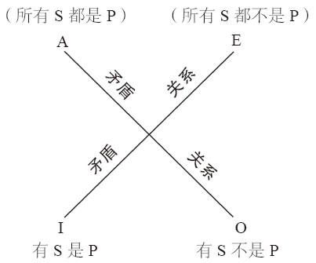

图13-9　现代对当方阵

这是依据现代对当方阵，四类标准命题之中的一个命题与其矛盾命题的否定等价（互相推出）：

（1）A=非O

（2）E=非I

（3）I =非E

（4）O =非A

因此，已知（1），如果“所有橙子都是柑橘属水果”为真，那么“并非有的橙子不是柑橘属水果”为真；反之亦然。但已知（4），如果“有些橙子不是柑橘属水果”为真，那么“所有橙子都是柑橘属水果”一定为假，而“并非所有橙子都是柑橘属水果”一定是真的。读者可以尝试练习其他的有效推理。底线是对所列命题，每一对都具有相同的真值：如果一个为真，另一个一定为真；如果一个为假，另一个一定为假。前者表明有效性，两者结合就是逻辑等价。文恩图与现代对当方阵是一致的。毕竟，只有特称命题才需要“x”说明主项指谓的类有元素（如果存在）。全称命题从不要求指出有元素，只需指出没有即可（通过阴影）。

专栏13-3　逻辑等价式与有效性

逻辑等价

假设两个命题等价，若一个为真，则另一个一定为真；而且，若一个为假，则另一个一定为假。这是因为它们的真值条件相同。因此，逻辑等价的命题具有相同真值：或者同真，或者同假。所以，如果可以替换的话，其中一个可以在不改变它们所出现的复合命题真值的前提下替换另一个。例如，一个命题“P”在逻辑上等价于“并非非P”。因此，如果其中一个出现在更为复杂的表达式中，而且这个表达式又不在引号之中，那么我们就可以在保证整个表达式真值不变的前提下，用另一个替换它。

有效性

假设两个命题逻辑等价，若其中一个为真，则另一个一定为真。这就满足了“推出”或“有效性”的定义：逻辑等价的命题可以互相推出。任何由等价命题构成的论证都是有效的。

### 其他直接推理

现在，我们学习另外三种使用直言命题的直接推理：换位法，换质法以及换质位法。有时，换位和换质位是从全称推特称，但这类形式的有效性却需要预设全称前提中的主项非空，即不能指称美人鱼和圆的方这些空类。

换位法

换位法是通过交换“被换位命题”的主谓项位置，但不改变量和质，从而推出“换位命题”的方法。因此，E命题的换位如下。

例13-29　所有SUV都不是跑车。

例13-29a　所有跑车都不是SUV。

被换位命题的主谓项位置改变了，但其质和量保持不变，依然是全称否定。例13-29到例13-29a是有效推理：如果例13-29为真，那么例13-29a一定为真（反之亦然）。类似地，通过换位，交换被换位命题的主谓项位置之后，从一个I命题能够导出另一个换了位的I命题。例如，例13-30的换位命题是例13-30a：

例13-30　有些共和党人是记者。

例13-30a　有些记者是共和党人。

如果例13-30真，那么例13-30a一定为真，反之亦然。因此这个推理是有效的，两个命题在逻辑上等价。

然而，对于A命题，一个直接换位的推理将是无效的。因为，从例13-31显然不能推出例13-31a：

例13-31　所有猪都是哺乳动物。

例13-31a　所有哺乳动物都是猪。

但A命题可以通过“限制”换位，因为从例13-31可以推出例13-31b。

例13-31b　有些哺乳动物是猪。

限制换位中，被换位命题的量在换位命题中受到了限制：一个A命题的有效换位是I命题。其中，前者的主谓项位置进行了交换，全称量词“所有”替换为非全称量词“有的”。

最后注意，O命题没有有效换位。如果试图对真命题例13-32进行换位，那么将会得到假命题例13-32a：

例13-32　有些珍贵的石头不是翡翠。

例13-32a　有些翡翠不是珍贵的石头。

这证明了例13-32到例13-32a是无效推理。对于任意O命题，换位得到的直接推理犯了非法换位，这与从一个A命题换位得到另一个A命题所犯的谬误相同。总之，换位法的规则如表13-3所示。通过换位得到的等价式和非等价式如图13-10所示。

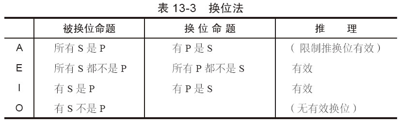

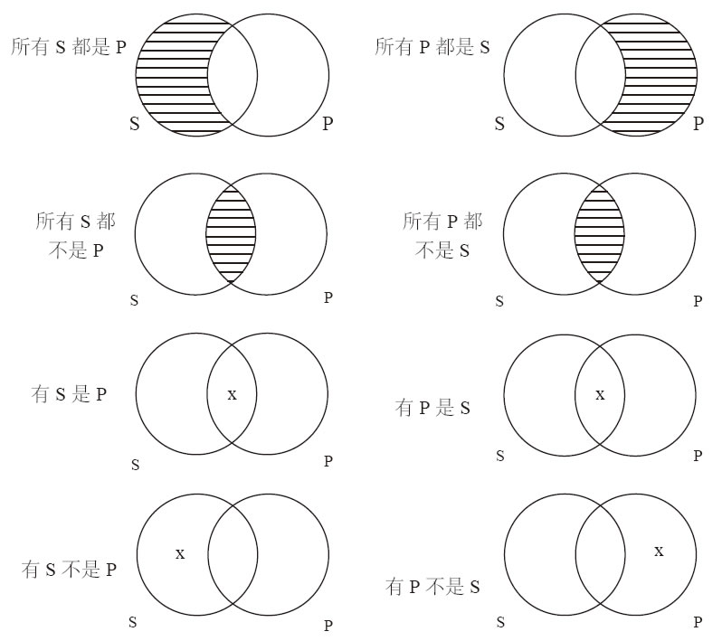

图13-10　通过换位得到的等价式和非等价式

换质法

一个直言命题的换质命题是改变它的质（即从肯定到否定，或从否定到肯定），并且在其谓项的前面增加“非”得到的。通过换质演绎出的命题称为“换质命题”，而演绎出命题的那个命题称为“被换质命题”。换质推论适用于所有命题。因此，依据换质法从例13-33这个A命题可以推出例13-33a。

例13-33　所有鹰都是鸟。

例13-33a　没有鹰是非鸟。

例13-34这个E命题换质可以产生例13-34a。

例13-34　所有手机都不是大象。

例13-34a　所有手机都不是非大象。

例13-35这个I命题的换质命题是例13-35a。

例13-35　有些加利福尼亚人是冲浪者。

例13-35a　有些加利福尼亚人不是非冲浪者。

例13-36这个O命题的换质命题是例13-36a。

例13-36　有些流行病不是灾难性的。

例13-36a　有些流行病是非灾难性的。

在上述推论中，被换质命题的谓项被其补概念所替换。例如，对于议员这个类来说，其补类是由所有非议员的事物构成的，包括市长、医生、砌砖者、飞机、蝴蝶、行星、邮票、惰性气体等。马的补类是非马，也是一个广泛而丰富的类。疾病的补类是非疾病类，如此等等。指谓任何这个补类的项称为补项。

与换位不同，四类直言命题都可以换质。对于下列四类命题，从被换质命题导出换质命题的推理都有效，如表13-4所示。通过换质得到的等价式，如图13-11所示。

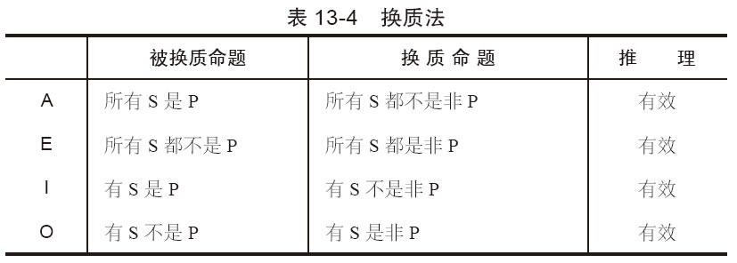

图13-11　通过换质得到的等价式

换质位法

换质位法允许我们交换一个命题主谓项的位置，并且分别在其前面添加“非”，但量和质保持不变，从而推出一个结论。因此，例13-37进行换质位可以得到例13-37a。

例13-37　所有羊角面包都是糕点。

例13-37a　所有非糕点都是非羊角面包。

使用换质位，“所有S都是P”这一A命题在逻辑上等价于“所有非P都是非S”这一A命题。两个命题逻辑等价就是具有相同的真值：如果例13-37为真，那么例13-37a就为真。而且如果例13-37为假，那么例13-37a就为假。正如专栏13-3所提到的，如果两个命题在逻辑上等价，就可以从一个推出另一个：任何这种推论都是有效的。要想形象地表示例13-37和例13-37a之间的关系，可以参看图13-12中的文恩图（可以把图中的S解释为“羊角面包”，P解释为“糕点”）。

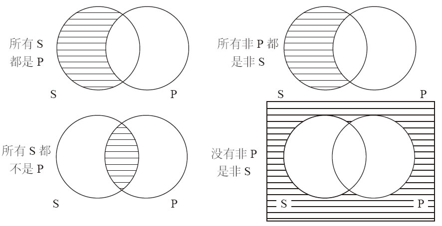

图13-12　通过换质位得到的A型等价式和E型非等价式

对I进行换质位，得到的还是量与质都相同的I命题，后者的主谓项位置与前者不同，而且前面都有“非”。例13-38的换质位命题是例13-38a：

例13-38　有些羊角面包是糕点。

例13-38a　有些非糕点都是非羊角面包。

但从图13-12中的文恩图可以看出，例13-38和例13-38a不等价。因此，任何依据换质位从例13-38到例13-38a的推论都不是有效的，犯了非法换质位谬误。

E命题也存在一个非法换质位谬误。但通过限制被换质位命题的量可以避免这个谬误。也就是说，E的有效换质位命题是O，其主谓项的位置已经被交换，而且在两个项前面都添加了“非”。因此，对例13-39进行正确的换质位（参见图13-13），限制其量、质保持不变，例13-39a是真的。

例13-39　没有美洲豹是爬行动物。

例13-39a　有些非爬行动物不是非美洲豹。

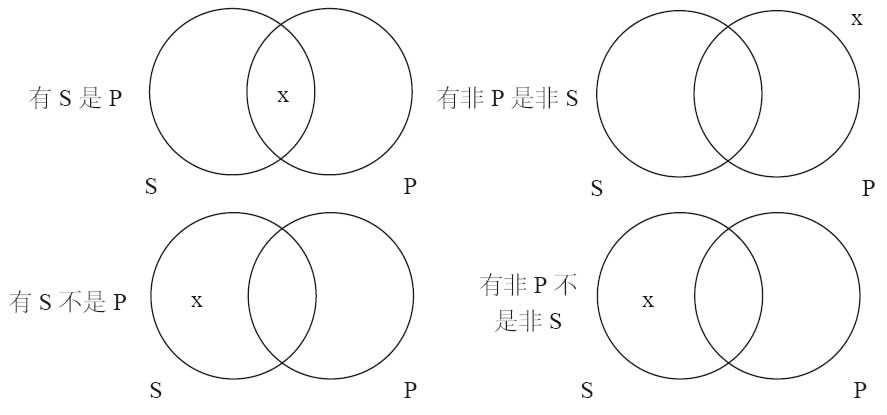

图13-13　通过换质位得到的I型不等价式和O型等价式

如果从例13-39无限制地换质位推出例13-40，那么这个推理就是无效的。

例13-40　所有美洲豹都不是爬行动物；因此，所有非爬行动物都是非美洲豹。

O命题的换质位可以产生一个等价的O命题；因此总是有效的。因此，依据换质位从例13-41可以推出例13-42。

例13-41　有些田径运动员不是跑步的。

例13-42　有些非跑步运动员不是非田径运动员。

本节内容小结，如表13-5所示。

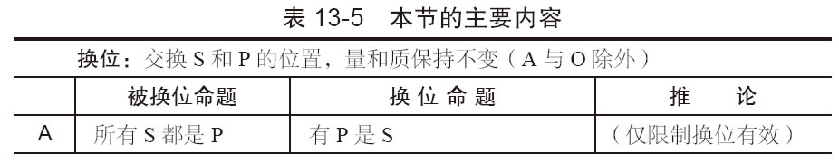

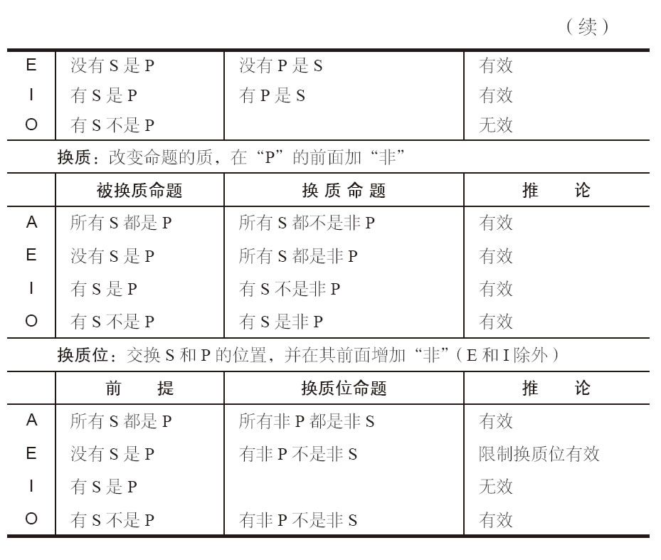

## 第14章　直言三段论

### 什么是直言三段论

从上古的亚里士多德逻辑学，到随后几个世纪的其他逻辑学派，人们提出了很多方法来分析我们普遍称为“三段论”的演绎论证。一个三段论是包含两个前提的演绎论证。一个直言三段论是完全由直言命题构成的三段论。因此三段论式的论证有各种不同的类型，其中有些我们已经在第5章和第12章涉及过。在本章中，我们将详细地分析直言三段论，为简便起见，此后统称为
“三段论”。例如：

例14-1　1.所有长方形都是多边形。

2\. 所有正方形都是长方形。

3\. 所有正方形都是多边形。

论证例14-1是一个三段论，因为它有两个前提和一个结论，并且这三个命题都是直言命题。仔细分析论证例14-1的前提和结论，我们会发现在主项或谓项的位置上恰好有三个词项：“长方形”、
“多边形”和“正方形”。其中每一个词项都表述了一个范畴（或种类）的事物，这些范畴之间的互相关联使得我们能够从前提有效地推出结论。依据该结论，正方形的种类被完全包含在多边形的种类中，只要论证例14-1的前提是真的，这个结论就一定是真的。这是一个有效的演绎论证：结论被前提所蕴涵。但是有些三段论可能是无效的。当一个三段论满足了演绎有效性的标准时，蕴涵取决于三个不同类型的词项间的关系，这些词项是作为组成该三段论的直言命题的主项或谓项而出现的。由于一个论证的有效性取决于其是否具有有效的形式，人们提出了几种方法来确定在什么时候三段论具有这样的形式。但在介绍这些方法之前，我们需要对标准三段论的结构做更多的介绍。

三段论的词项

一个标准的三段论由三个直言命题构成，其中两个是前提，一个是结论。每一个直言命题都有一个主项和一个谓项，分别表述两个种类的事物；而整个命题则表述了其主项和谓项之间的某种排除或包含的关系。我们对上述构成论证例14-1的每个直言命题的观察，表明了该论证的成员命题共有三个不同类型的主项和谓项：“多边形”、“正方形”和“长方形”。事实上，这是所有直言三段论共有的特征，因为它们都有三个不同类型的词项，即所谓的大项、小项和中项。大项是结论的谓项，小项是结论的主项，中项是只在前提中出现的词项。再来看论证例14-1。

例14-1　1.所有长方形都是多边形。

2\. 所有正方形都是长方形。

3\. 所有正方形都是多边形。

根据论证例14-1的结论的谓项和主项，我们得知这个三段论的大项和小项分别为
“多边形”（结论的谓项）和“正方形”（结论的主项）。请注意这两个词项也都在前提中出现，但是这对它们作为大项和小项的状态没有影响：一个词项作为大项还是小项，完全是由它作为结论的谓项或主项所决定的。在论证例14-1中，还有一个词项“长方形”，它出现在前提的主项和谓项的位置。这就是“中项”。之所以如此称谓，是因为它的功能是在两个前提间起到中介的作用──把两个前提连接起来，从而使得它们都在表述同一类事物。在任何三段论中，中项在两个前提中都出现，但不出现在结论中。需要注意的另一点是：虽然论证例14-1的三个词项都是一个独词，但这并不是所有三段论的共性，因为有时候短语也能作为一个直言命题的主项和谓项。

下面我们来确定论证例14-2中的大项、小项和中项。

例14-2　1.没有军官是和平主义者。

2.所有的陆军中校是军官。

3.没有陆军中校是和平主义者。

根据上述规则，我们得知：大项是“和平主义者”，小项是“陆军中校”，中项是“军官”。

专栏14-1　一个三段论的词项

重要的是要记住：为了确定一个直言三段论词项的三个词或短语，我们首先需要检查三段论的结论。大项是出现在结论谓项位置（即在系动词后面）的任何词或短语。小项是出现在结论主项位置（即在量词和系动词之间）的任何词或短语。中项是完全没有在结论中出现，但在两个前提中都出现的词项──无论其是一个独词（如论证例14-1的中项），还是一个更加复杂的表达式（如论证例14-2的中项）。

三段论的前提

论证例14-1的结论是如下命题：

3\. 所有正方形都是多边形。

用传统逻辑的表示法，上述命题可以被符号化为：

3a. 所有S都是P。

通常的做法是把一个直言三段论的小项和大项分别表示为“S”和“P”，而把中项表示为“M”。我们也将沿用这个做法，并用这些符号替代任何一个直言三段论的三个词项，而保留量词和否定词等逻辑词。对于上述的论证例14-1，我们可以得到：

例14-1a　1.所有M都是P。

2.所有S都是M。

3.所有S都是P。

在一个标准的三段论中，小项和大项出现在不同的前提中。包含大项的前提是“大前提”。因为论证例14-1的大项是“多边形”，所以它的大前提是：

1\. 所有长方形都是多边形。

这个命题可以被符号化为：

1a.所有M都是P。

包含小项的前提是小前提。因为论证例14-1的小项是“正方形”，所以它的小前提是：

2\. 所有正方形都是长方形。

这个命题可以被符号化为：

2a. 所有S都是M。

读者可能已经注意到，在上述两个三段论的例子中，大前提都最先出现，然后是小前提，最后是结论。这是一个经过重构的三段论的标准顺序。虽然在日常话语或写作中，一个三段论的前提和结论可以使用任何顺序，但当我们重构它时，前提必须按照标准的顺序放置（这在以后将变得特别重要）。现在我们可以确定在论证例14-1中，哪一个前提是大前提，哪一个前提是小前提：

例14-1a　1.所有M都是P。 大前提

2.所有S都是M。 小前提

3.所有S都是P。

识别三段论

无论直言三段论在现实生活中以何种顺序出现，都可以通过首先确定其结论来识别。一旦我们确定了一个假定的三段论的结论，我们就可以检验它是否确实是一个三段论：结论的谓项作为大项，主项作为小项。在确定了这两个词项之后，我们接着查看论证的前提并询问：哪一个前提包含大项（即为大前提）？哪一个前提包含小项（即为小前提）？用标准顺序将这两个前提分别列为前提1和前提2之后，将相应的词项用符号代替，我们就可以确认该论证是不是一个三段论。这是怎么做到的？通过应用专栏14-2中的规则。

专栏14-2　直言三段论

作为一个合格的直言三段论，一个论证必须有三个直言命题，以及三个词项恰好出现在主项或谓项的位置，并且每一个词项出现两次。

请考虑如下论证：

例14-3　所有的省长都是公务人员。因此，有些公务人员是省长。

论证例14-3不是一个三段论，因为词项和前提的数量都不够。

请比较如下论证：

例14-4　由于没有蝾螈是夜行动物，没有蝾螈是蝙蝠。因为所有的蝙蝠都是夜行动物。

论证例14-4是一个三段论吗？它由两个句子组成，而要成为一个合格的三段论，它必须有两个前提和一个结论。但我们通过仔细查看这两个句子会发现，它们的确表达了三个直言命题。现在我们必须确认哪一个命题是结论。虽然没有结论指示词，但是第一个命题和第三个命题的开头分别有前提指示词“由于”和“因为”，它们可以帮助我们确认该论证的前提，从而确定其结论，它是：

没有蝾螈是蝙蝠。

从这个结论，我们可以马上得出“蝙蝠”（结论的谓项）是大项“P”，
“蝾螈”（结论的主项）是小项“S”。这使得我们能够进一步确定大前提，即包含大项“蝙蝠”的前提：

所有蝙蝠都是夜行动物。

该三段论的小前提，即包含小项“蝾螈”的前提：

没有蝾螈是夜行动物。

接着，我们显然可以得到中项，即“夜行动物”，这是因为它是唯一一个出现在两个前提中的相关类型的词项。现在，我们可以用标准顺序重构该论证：

例14-4a　1.所有蝙蝠都是夜行动物。

2.没有蝾螈是夜行动物。

3.没有蝾螈是蝙蝠。

专栏14-3　直言三段论的构造模块

一个直言三段论（简称为三段论）：

（1）由三个直言命题构成；

（2）有三个词项，每一个都在论证中出现两次。

一个三段论的三个词项为：

名称 逻辑功能 符号

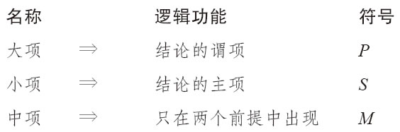

（1）大项和小项在前提中的出现决定了前提的名称和顺序。

（2）一个三段论的两个前提为

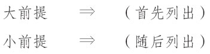

如前面所述，当小项、大项和中项被“S”、“P”和“M”代替后，我们将得到以下模式：

例14-4b　1.所有P都是M。

2.没有S是M。

3.没有S是P。

这是三段论的许多可能的模式之一。有些模式是有效的，而其他的则是无效的。在开始介绍一些用于确定哪些模式有效、哪些模式无效的方法之前，让我们更加仔细地了解这种三段论式的论证模式。

### 三段论式的论证形式

传统上，三段论被认为具有某种形式，这些形式由三段论的格与式来确定的。我们将从格开始分析。

格

因为一个三段论有三个词项（大项、小项和中项），其中每一个词项都在主项或谓项的位置出现两次，所以任何此类论证都有四种可能的“格”或词项配置，如表14-1所示。

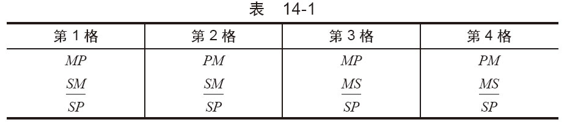

其中，每一种格都表示按照标准顺序排列的三段论的前提和结论（不考虑量词和系动词）。它们之间最大的不同点在于中项在前提中两次出现的位置。因此，中项在前提中的配置决定了任何一个三段论的格。我们可以通过只呈现每一个格的中项来强调这点，如表14-2所示。

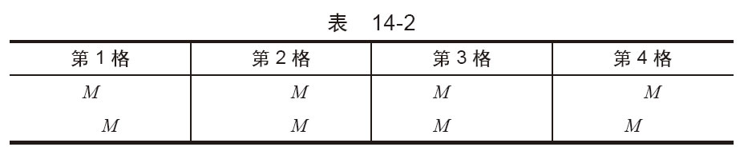

因此，确认任何三段论的格是一件很简单的事情：一旦我们辨认出它的中项，我们就可以观察它是否在相应的主项或谓项的位置上出现，然后检查它属于哪一个格。这样，我们可以确定论证例14-1和例14-2属于第一格，而论证例14-4属于第二格。通过这个方法，我们可以确定任何三段论的格。

考虑下面的例子：

例14-5　因为有些鲨鱼是海鱼，并且没有河生动物是海鱼，所以有些鲨鱼不是河生动物。

首先，我们辨认这个论证的结论，即：

有些鲨鱼不是河生动物。

因为我们现在知道“鲨鱼”是小项，“河生动物”是大项，所以我们可以继续辨认这个三段论的大前提和小前提，并且把它重构成如下形式：

例14-5a　1.没有河生动物是海鱼。

2.有些鲨鱼是海鱼。

3.有些鲨鱼不是河生动物。

用符号替换相关的词项，可以得到论证例14-5a的形式：

例14-5b　1.没有P是M。

2.某些S是M。

3.某些S不是P。

当不考虑量词和系动词时，我们观察中项在每一个前提中出现的位置，就可以轻松地确定该三段论属于第二格。

专栏14-4　如何确定一个三段论的格

（1）只关注中项作为主项或谓项在前提中的出现。

（2）结论总是以小项作为主项，以大项作为谓项。结论的谓项和主项决定了任一三段论中什么是大项和小项。

（3）“P”表示大项，在前提1（即包含大项的大前提）中出现。

（4）“S”表示小项，在前提2（即包含小项的小前提）中出现。

式

怎么样确定一个三段论的式呢？正如我们所见，一个三段论由三个直言命题构成：两个组成前提，一个作为结论。并且，所有直言命题必须是下列四种类型中的一种：全称肯定、全称否定、特称肯定或特称否定，它们的名称（正如我们在第13章所示）分别为A、E、I和O。

一个三段论的式是其三个成员命题的名称列表。

在上述论证例14-5b中，大前提的类型是E，小前提的类型是I，结论的类型是O，因而它的式是EIO。在上面的其他例子中，论证例14-1的式是AAA、论证例14-2的式是EAE，论证例14-4
的式是AEE。现在考虑下面这个论证的形式：

例14-6　1.某些P是M。

2.某些M是S。

3.某些S不是P。

在论证例14-6中，两个前提的类型均为I，结论的类型是O，因此论证例14-6的式为IIO（第四格）。那么下面这个论证呢？

例14-7　1.没有P是M。

2.没有S是M。

3.某些S是P。

因为论证例14-7的前提类型是E，结论的类型为I，所以它的式为EEI。同时，根据论证例14-7的中项的位置，该论证属于第二格。

确定三段论的形式

因此，综合论证例14-7的式和格，我们得到EEI-2。因为一个三段论的式和格构成了它的形式，所以我们可以等价地说论证例14-7的形式是EEI-2。论证例14-6的形式是IIO-4，以此类推。因此，三段论的形式是通过其式和格的组合而给出的。

在传统逻辑中，确定三段论的形式对确立它们的有效性十分关键，因为判断一个三段论是遵循还是违背特定有效性规则的依据正是它所具有的形式，关于有效性规则我们会在后文提到。但是，在这之前，让我们先回顾一下目前为止所介绍的步骤。

式 + 格 = 形式

我们尝试从头开始确认三段论形式的整体过程。请考虑如下论证：

例14-8　没有无线局域网的学校公寓不是居住的合适场所。毕竟有些没有无线局域网的学校公寓是老建筑，但是有些老建筑不是居住的合适场所。

论证14-8的结论是：

没有无线局域网的学校公寓不是居住的合适场所。

我们怎么知道的？因为我们仔细地分析了这个论证并且问自己：我们要做出什么断言？（另外，前提通过一个指示词“毕竟”给出）在找到这个结论之后，我们分别寻找它的谓项和主项，它们分别为大项和小项：

P = “居住的合适场所”

S = “没有无线局域网的学校公寓”

现在我们可以辨认这个三段论的大前提和小前提。因为大前提必须包含大项，它一定是：

有些老建筑不是居住的合适场所。

所以我们可以把它放在第一个前提的位置。同样地，小前提必须包含小项，因此它一定是：

有些没有无线局域网的学校公寓是老建筑。

这是第二个前提。因而被重构的三段论是：

例14-9　1.有些老建筑不是居住的合适场所。

2\. 有些没有无线局域网的学校公寓是老建筑。

3\. 没有无线局域网的学校公寓不是居住的合适场所。

论证例14-9例示了下面的模式：

例14-9a　1.某些M不是P。

2\. 某些S是M。

3\. 没有S是P。

任何符合该模式的三段论都有OIE-1的形式。例如：

例14-10　1.有些中央情报局特工不是联邦调查局特工。

2\. 有些女性是中央情报局特工。

3\. 没有女性是联邦调查局特工。

论证例14-10出错了，并且任何与上述论证例14-9有相同模式的三段论都是错误的。很明显，任何此类三段论都有真前提和假结论。接下来我们要分析哪些三段论的模式是有效的，哪些不是有效的。

### 用文恩图检验有效性

三段论的词项配置可能产生256个不同的形式。因为其中有些是有效式，有些不是，有某个可靠的方法来确定任何给定三段论的形式是否有效就显得至关重要。实际上，有很多不同的方式可以检验有效性，但此处我们只重点介绍一种被广泛接受的基于文恩图的方法，其基础知识已在第13章有所介绍。

如何图示一个标准三段论

在使用文恩图检验三段论的有效性时，我们把直言命题的二圆图修改为一个更大的三圆图。如图14-1所示。

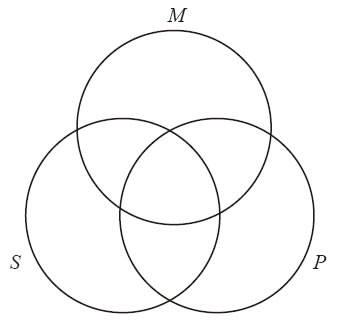

图　14-1

这里的圆代表了三段论三个词项所表述的三类不同的事物。下方被标为“S”和“P”的两个圆是三段论小项和大项表述的类。

专栏14-5　有效性和文恩图

所有三段论都可以用文恩图来检验有效性，从图14-1所示的三个相交的圆开始。文恩图一完成，就能明确该三段论是否是有效式。

上方被标记为“M”的圆表示的是三段论中项所指谓的类。现在要注意这个图的另一点：在这个图中我们可以找到两个重要的子类空间图形，这是整个图中非常关键的部分。对此我们已经在第13章的二圆图中有所接触。它们就是图14-2的橄榄球形状和图14-3的月牙形状。

|  |  |
|----|----|
| 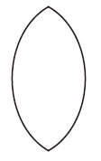 |  |
| 图　14-2 | 图　14-3 |

在三圆文恩图中，有三个橄榄球形状。你能找到在哪里吗？还有六个月牙形状，你能找出来吗？为了在三圆文恩图中打上阴影或标上字母，我们只对橄榄球或月牙形状进行处理。如果给其他形状打上阴影或标上字母，你用的就不是文恩图系统。

最后要注意，在三圆文恩图中，有三种不同的方法对圆进行组对。

这三种组合分别标志着三段论的三个命题所代表的论域：M和P被用来图示三段论的“大前提”，M和S图示“小前提”，S和P图示“结论”，如图14-4所示。此外，我们使用三圆文恩图的目的是检测三段论的有效性。我们需要使用第13章中关于四类直言命题的文恩图的知识，一次性通过两个圆来图示命题。想要完成文恩图，我们每次都需考虑代表大前提、小前提和结论的成对的圆。每种情况下都要忽略与当前论证无关的圆。为明确如何正确画出文恩图，我们举一个三段论的例子。

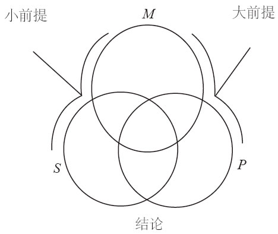

图　14-4

例14-11　1.没有诗人是愤世嫉俗者。

2.所有的警探都是诗人。

3.没有警探是愤世嫉俗者。

快速考察这个按照标准顺序排列的三段论，论证分析的第一步骤已经完成。随后我们可知其大项是“愤世嫉俗者”，小项是“警探”，中项是“诗人”，因此该论证是EAE-1式的一个实例。下面将例14-11抽象成符号公式以详细说明EAE-1式。

例14-11a　1.没有M是P。

2.所有S是M 。

3.没有S是P。

现在来看，该三段论形式是有效的还是无效的呢？一个文恩表就能检测其有效性。首先要遵循的检测规则如下：

先图示三段论前提，而不是结论。

因此在该阶段我们只关注各由两个圆所组成的两个集合。其中一个集合被用来表示大前提（见图14-5），另一个表示小前提（见图14-6）。

|  |  |
|----|----|
| 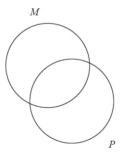 | 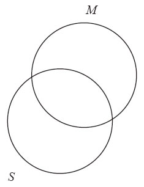 |
| 图　14-5 | 图　14-6 |

那么我们应该先图示哪个前提呢？下面将介绍操作规则，具体原理如下：

如果三段论的两个前提是由全称前提和特称前提构成，无论其具体内容如何，都要首先图示全称前提。但如果两个前提都是全称前提或者都是特称前提，那么先图示哪个前提并不重要。

在论证例14-11a中，两个前提都是全称前提，因此首先图示哪个前提并不重要。随意选择一个作为大前提，比如“没有S是P”形式的E命题。前文图示方法如图14-7所示。

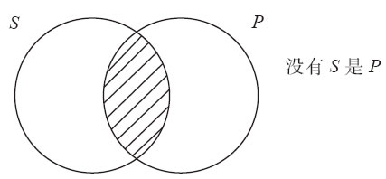

图　14-7

如果想在更大的图中利用上述相交的圆，那么就如图14-8所示。

这是大前提。小前提又该如何呢？论证例14-11a中的小前提是一个A命题，我们可以用两个圆组成的文恩图表示，如图14-9所示。

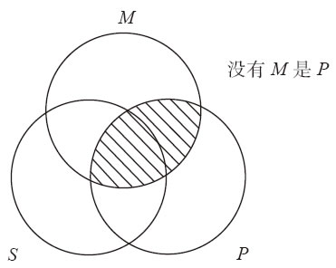

图　14-8

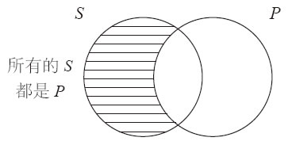

图　14-9

如果图14-9表示的是小前提，那么，表达论证的图如图14-10所示。

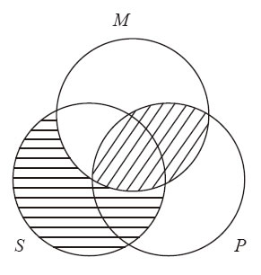

图　14-10

如此，图中包含了全部前提，这个文恩图是完整的了，我们不需要再加入任何标志。最后一个步骤：暂不讨论代表中项的圆，仔细观察标志三段论结论的几个圆后，想一想图中是否包含了代表结论的直言命题的二圆文恩图？如果是，那么文恩图说明了该论证形式是有效的，反之无效。因为论证例14-11a中的结论“没有S是P”是一个E命题，其文恩图与图14-7相同。观察图14-10可知，S和P重叠的呈橄榄球形状的部分确实已被打上阴影。由此文恩图证明了论证例14-11a即EAE-1式的有效性。任何具有该形式的三段论同样有效。规则如下：

如果在画三段论的两个前提时，结论在文恩图中得到自然地呈现，那么论证是有效的。如果图中并不包含结论，那么该三段论无效。

现在让我们使用文恩图来测试另一个三段论：

例14-12　1.有些保守派是公众人物。

2.所有的政治家都是公众人物。

3.有些政治家是保守派。

这又是一个按照标准顺序排列的三段论，分析的第一步已完成。由于论证是按照标准的顺序放置，可知三段论的大项是“保守派”，小项是“政治家”，中项是“公众人物”。论证例14-12a的模式如下：

例14-12a　1.某些P是M。

2.所有S是M。

3.某些S是P。

该模式是IAI-2。为了检测该模式下的三段论的有效性，我们来构造一个文恩图。上文提到，当我们仅仅图示前提（不包括结论）时，会发现图示论证两个前提的次序是很重要的。原因是该三段论中的两个前提一个是全称前提，另一个是特称前提。必须先图示全称前提，然后再图示特称前提。就该三段论而言，我们不得不先图示小前提，再图示大前提。小前提是一个A命题，在文恩图中表示如图14-11所示。

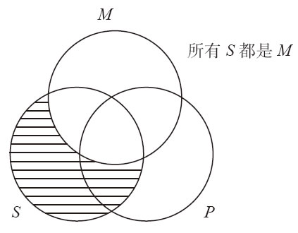

图　14-11

然后，再画三段论的大前提，I命题，如图14-12所示。

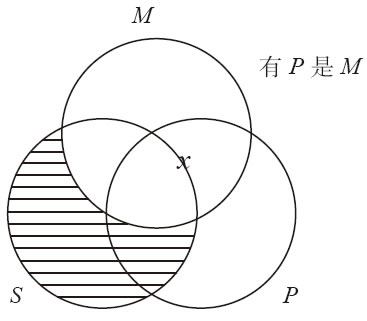

图　14-12

I命题的文恩图如图14-13所示。

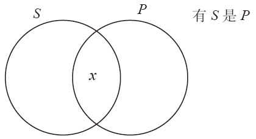

图　14-13

类似地，该三段论大前提的文恩图如图14-14所示。

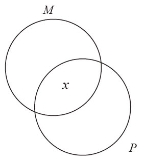

图　14-14

但为什么图14-12中的“x”被标在M和P相交的橄榄球形区域里的线上？显然如果我们将“x”放入橄榄球区域，这意味至少是存在M是P。而我们仍需要决定把“x”放在交界线的哪一侧。如果橄榄球区有一侧的区域被打上阴影，那么“x”应该加在非阴影区域。但问题是两侧都没有被打上阴影，因此无法判断“x”应该加在哪一侧。我们所知道的仅仅是“x”应该加在橄榄球区的某个位置，所以，通过把“x”放在橄榄球区的交界线上，以表明它属于该区域，却未明确说明到底属于哪一侧（当然x并不总是标在交界线上，只是此处如此）。

现在让我们观察图14-12，看看形如例14-12这样的IAI-2的有效性如何。该论证的结论是“某些S是P”，只有当结论从文恩图的两个前提中得到自然地呈现时，该形式才被证明是有效的。作为结论的I命题，当且仅当成对的圆表明了存在处于S和P的重叠区的“x”时，其形式才是有效的。事实上，我们从图中无法得出结论。在图14-12中，S和P重叠的橄榄球区部分被打上阴影，“x”在圆S的边界上。因为并不能确定是否存在这样的“x”于橄榄球状内，然而这就足以让我们通过文恩图断定IAI-2是无效式。这里完成两个前提的图解后，结论无法在文恩图的底部得到自然地呈现。因此IAI-2是无效的，而所有IAI-2式的三段论也都是无效的。我们已经证明，无论构成这个论证的命题的真值如何（该例中它们都是真的），其结论并不能有效地从前提导出。

专栏14-6　如何理解文恩图的结果

使用文恩图检验三段论的有效性，我们需要首先图示三段论的前提，然后检验是否能从图中已有的前提图解自然地呈现结论。如果是，那么该三段论有效，反之无效。

最后让我们使用文恩图来检验OIE-1式三段论的有效性。比如，将上文论证例14-9符号化为如下形式：

例14-9a　1.某些M不是P。

2.某些S是M。

3.没有S是P。

因为两个前提都是特称前提，所以先图示哪个前提无关紧要。我们先图示小前提，如图14-15所示。

增加大前提，如图14-16所示。

|  |  |
|----|----|
| 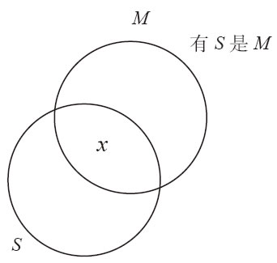 | 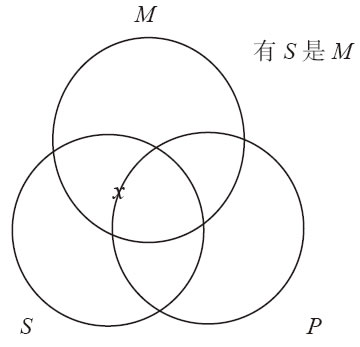 |
| 图　14-15 | 图　14-16 |

大前提的图解表明存在这样的“x”，在圆M内而不在P内。如图14-17所示。

当用三圆图代表前提时，如图14-18所示。

|  |  |
|----|----|
| 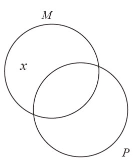 | 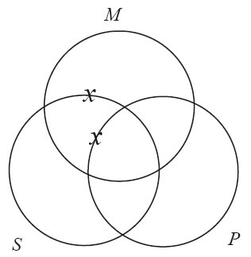 |
| 图　14-17 | 图　14-18 |

为什么会得到这样的图呢？因为在图14-18中，代表命题“某些M不是P”的“x”所在的月牙形区域，被S和M的交界线分隔开，其两侧都未打上阴影。一旦新月状的一侧被打上阴影，“x”应标在另一侧。但是该新月状内部没有阴影，因此如果我们要在内部标上“x”，就必须把“x”放在分割月牙的交界线上，以表明我们并不明确“x”应属于交界线的哪一侧。考虑到代表“不是P的M·”的月牙图被分界线分割开来，因此并不容易决定“x”属于分界线的哪一边。

现在我们已完成文恩图，接下来验证有效性。我们把论证的结论和代表结论部分的文恩图相匹配，结果是怎样的呢？显然，在该论证中二者是不匹配的，原因在于论证的结论是一个E命题──“某些S是P”。任何一个命题的正确文恩图表明，S和P的交叉部分应是打上阴影的（见图14-7），但图14-18并不是如此图示命题的。因此这是个关于两个前提的图解过程无法自然地推导出底部二圆所代表的结论图解的实例。该文恩图可证明OIE-1式三段论是无效的。同理推导论证14-9是无效的。

专栏14-7　本节小结

如何使用文恩图检验三段论的有效性：

画三个交叉的圆。

首要图示前提。

（1）如果一个前提是全称前提，另一个前提是特称前提，无论其大小前提都要首先图示全称前提。

（2）但如果两个前提都是全称前提或者都是特称前提，那么先图示哪个前提并不重要。

完成图示前提之后，如果文恩图已明确图示结论，那么论证是有效的，反之无效。

### 项的周延

虽然文恩图已经为我们提供了一种检查三段论形式有效性的可靠方法，但它并不是唯一的办法。另一种方法依赖的是有效三段论必须遵守的几条规则以及力求避免的几个谬误。在本章剩余部分，我们如何讲解在亚里士多德传统逻辑基础上考察该技术的一些细节。

为了使用这个方法，首先需要弄懂项的周延概念。

在前文中，“项”的一个词义是指称直言命题的具有实义部分。命题的主项和谓项都是它的项。“周延”一词可以指称一类事物的全体。肯定全称命题的周延模式如下：

A命题=主项周延+谓项不周延

例14-13　所有橘子都是柑橘类水果。

因此，在例14-13中，主项“橘子”是周延的，这是因为首个词项“所有”显然是指称橘子类的所有元素。而谓项“柑橘类水果”并不是周延的，因为该句中没有任何全称词汇指称柑橘类的所有元素。

否定全称命题的周延模式如下：

E命题=主项周延+谓项周延

例14-14　没有苹果是柑橘类水果。

如在第13章所示，论证例14-14逻辑上等价于例14-14a。

例14-14a　没有柑橘类水果是苹果。

无论是哪种表达方式，这两个命题都否定了苹果类的所有元素属于柑橘类水果，同时也否认了柑橘类水果的所有元素属于苹果。换一种角度，论证例14-14断言了苹果类与柑橘类水果的全部元素之间所有的相互关系的结论。显然，论证例14-14的主项和谓项都是周延的。该例中我们阐述了类的所有元素（即两类相互排斥对方）。

现在让我们关注特称命题的周延模式。其一是肯定特称命题，例如：

例14-15　有些橘子是可食用的水果。

其二，否定特称命题形式如下：

例14-16　有些橘子不是可食用的水果。

任何肯定特称命题的周延模式如下：

I命题=主项不周延+谓项不周延

任何否定特称命题的周延模式如下：

O命题=主项不周延+谓项周延

论证例14-15相当于至少存在一个橘子是可食用的水果。该命题的主项是非周延的，原因在于词项“有些水果”并不指称橘子类里的所有元素。同理，谓项“可食用的水果”也是不周延的，原因在于，该词项并不指称可食用水果类里的全部元素，而指称可食用水果类中是橘子的部分。

最后，虽然从论证例14-15的主项可推出论证例14-16的主项同样不周延，但论证例14-16的谓项却是周延的。为什么呢？原因在于该谓项指称的是作为整体的可食用类水果。这是很显然的，论证例14-16被重构为这样一个命题：至少存在一个不属于可食用类水果（作为整体而言）的橘子。即可食用水果一类的全体排除这样的一个橘子。

综上所述，周延的四种模式如下：

|  |  |  |
|----|----|----|
| A （肯定全称） | 所有S是P | 主项周延，谓项不周延 |
| E （否定全称） | 没有S是P | 主项周延，谓项周延 |
| I （肯定特称） | 有S是P | 主项不周延，谓项不周延 |
| O （否定特称） | 有S不是P | 主项不周延，谓项周延 |

请记住上文及下图的周延模式，这些将使你更轻松地运用有效性规则去检验三段论式的论证形式是否有效，如图14-19所示。

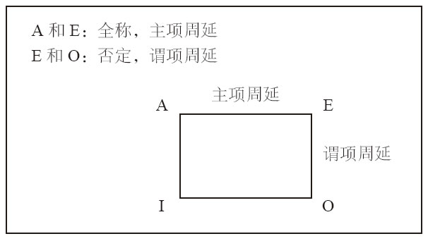

图　14-19

### 有效性规则及三段论谬误

本节我们来关注可应用于检验任何给定的直言命题有效性的六条规则。

专栏14-8　通过这六条规则判定有效性

任何遵守所有这六条规则的三段论都是有效的。

任何违背其中一条的三段论都是无效的，当然一些三段论可以违背多条规则。

同时，当这些规则被打破时，我们也要考察所犯下的谬误类型。下文我们将谈到在亚里士多德逻辑中首个被提出来的规则。这些规则整体可以被看作一个可替换文恩图来检测三段论有效性的处理过程。首先让我们分别考虑这些规则及其基本原理。

规则1：一个三段论必须仅包含意义明确的三项。

三段论的结论是其中两个词项以某种关联相联系的直言命题。但当且仅当只有存在第三个词项同时分别联系着结论中的主项和谓项时，这二者才有关联。这就是说，如果一个三段论想要从两个前提有效地推出结论，就必须明晰地包含三项。这三项不能多也不能少，而且每一项需在三段论中出现两次：其中大项作为结论的谓项和大前提的主项或谓项出现；小项作为结论的主项和小前提的主项或谓项出现；中项在两前提中各出现一次，通常作它的主项或谓项。

但有时，有的三段论的词项在两个位置上有着不同的含义，如此会破坏有效性规则。而这样的论证是模棱两可的。任何犯了这样错误的论证都被称为“四项谬误”。考虑如下：

例14-17　1.所有委员会的成员都是阴险之人（snake）。

2.所有的蛇（snake）都是爬行动物。

3.所有委员会的成员都是爬行动物。

显然，词项“snake”以两种不同的意义被使用。这导致该三段论犯了四项谬误。因此它也是无效的。

规则2：中项至少周延一次。

回顾上文，一个三段论的中项是只会出现在两个前提位置的词项。它在连接大项和小项时发挥作用，因此结论中的大项和小项才有了关联。但是中项只有在至少一次在前提中指称类的全部对象时，才能发挥作用。如果中项仅仅在大前提中指称类的部分对象，而在小前提中指称类的另一部分对象，那么大项和小项分别与中项的不同部分发生了联系，从而导致二者不必然相关联。由此导致大项和小项之间的关联并不足以支撑三段论的结论。任何犯了中项不周延谬误的三段论都是无效的，正如下面这个论证，同样也是无效的：

例14-18　1.所有野生鸽子都是有羽毛的鸟类。

2.有些有羽毛的鸟类是分散攻击类动物。

3.有些分散攻击类动物是野生鸽子。

规则3：在结论中周延的项在前提出现的位置上也必须周延。

上文我们曾说过，论证有效性的一个标志是它的结论必须能从前提逻辑地推导出来。但如果论证的结论比前提断定了更多的东西，那么论证就是无效的。三段论作为一个演绎性论证而言，当它的结论所表达的内容远超出前提所表达的内容时，必然是无效的。即三段论中的小项或大项在结论中是周延的（指称类的全部元素），但在前提中出现时却是不周延的（仅指称类的部分元素）。犯了不当周延谬误的三段论，可能是大项超出了前提，也可能是小项超出了前提，所以该谬误有如下两种表现形式，如图14-20所示。

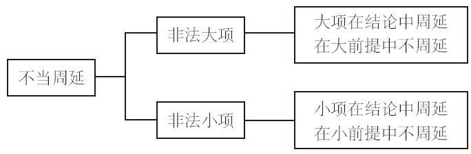

图　14-20

例14-19　1.所有的老虎都是猫科动物。

2.没有狮子是老虎。

3.没有狮子是猫科动物。

论证例14-19的结论中的词项“猫科动物”，指称所有类的猫科动物，即可以说所有狮子都在猫科动物之外。但前提1并没有断言所有猫科动物，因为这里的“猫科动物”一词是不周延的。该论证所犯的谬误是“大项的非法周延”（简称“非法大项”）。

考察下面的例子：

例14-20　1.所有的人体炸弹袭击者都是自愿去赴死的人。

2.所有的人体炸弹袭击者都是当今现状的反对者。

3.所有当今现状的反对者都是自愿去赴死的人。

论证例14-20结论中词项“当今现状的反对者”涵括了某类较特殊的人的全部。即可以说大项所指称的类包含了词项“当今现状的反对者”。但前提2并没有包括全部类的人，因为词项“当今现状的反对者”是A命题的谓项，自然是不周延的。该论证所犯的谬误是“小项的非法周延”（简称“非法小项”）。

最后，一个论证也是有可能同时犯下这两个谬误的。此外，因为在I类命题中没有周延的词项，所以任何结论是I类命题的三段论都不需要遵守规则3。但如果结论是A、E或O命题，那么它一定包含周延的项。而具有逻辑思维能力的人将会核实结论中周延的词项也在相应的前提中周延。

规则4：一个有效的三段论不可以有两个否定前提。

如果一个三段论的大前提是否定的，那么它的中项和大项所代指的类，或部分或全部是相互排斥的。同理，如果三段论的小前提是否定的，那么中项和小项所指代的类，同样是或部分或全部相互排斥。由于小项和大项所指称的类之间的关系是不明确的，所以前提无法有效地推出结论。这种情况下，该论证犯了所谓的“排斥前项谬误”。

例14-21　1.没有蕨类植物是树木科。

2.一些榆树不是蕨类植物。

3.一些榆树不是树木科。

规则4的要点在于前提的某些组合导致三段论无效：EE，EO，OE，OO。为了避免这样的谬误，如果三段论的一个前提是否定的，那么另一个必须是肯定的。

规则5：如果有一个前提是否定的，那么结论一定也是否定的；同样，如果结论是否定的，那么必然存在一个前提也是否定的。

回顾上文，肯定直言命题表示类之间的包含关系，或是一类完全包含在另一类中（A命题），或是一类的部分被包含在另一类中（I命题）。因此，仅当三段论的两个前提中都表示了类的包含关系时，才能在肯定性结论中有效地推出类的包含关系。另一方面，三段论的两个肯定性前提（仅仅断言包含关系）不能有效地推出表示类的排斥关系这样的否定性结论。

当三段论违反了规则5时，它或者犯下了从一个否定前提推肯定结论的谬误，或者犯了从两个肯定前提推否定结论的谬误。无论是哪种谬误，这个三段论都是无效的。例如：

例14-22　1.所有的人都是哺乳类动物。

2.有些蜥蜴不是人类。

3.有些蜥蜴是哺乳类动物。

这个论证就犯下从一个否定前提推肯定结论的谬误。看下面这个例子：

例14-23　1.所有的诗人都是富有创造性的作家。

2.所有富有创造性的作家都是作者。

3.没有作者是诗人。

该例犯下了从两个肯定前提推否定结论的谬误。非常明显，所有违反规则5的三段论都是无效的，因此我们很少碰见犯了该类谬误的三段论。最后请记住，任何只包含肯定命题的三段论都默认遵守规则5。

规则6：如果两个前提都是全称的，那么结论也一定是全称的。

正如我们在前面的章节所见，四类标准式直言命题中只有I和O命题具备存在含义。即，只有I命题和O命题通过主项假定了实体的存在。因此包含两个全称前提和一个特称结论的三段论是无效的。任何从没有存在含义的前提推出有存在含义的结论，这样的三段论都违背了规则6，即犯下了所谓的存在谬误。例如：

例14-24　1 .所有能呼吸的生物都是人。

2.所有美人鱼都是能呼吸的生物。

3.有些美人鱼是人。

该论证的结论与“至少存在一个美人鱼是人”相等价──以支持美人鱼的存在。最后请记住，任何包含一个特称前提或两个特称前提（如I类型或O类型）的三段论都默认遵守规则6。

有效性规则与文恩图

这六条有效性规则中的每一条都规定了使直言三段论有效的必要条件。因此遵守其中任何一条规则的三段论都满足了使其有效的必要条件。当然，这并不构成有效性的充分条件。只有遵守全部六条规则，才构成使其成为有效三段论的充分条件。因此这项技术不仅提供了一种检查有效性的方法，并且完全和文恩图一样可靠。这些规则也可与文恩图同时使用。因此，如果一种方法出了错，另一种方法也能够检查出来。任何三段论形式如果犯了以上一条乃至更多的谬误，都会在文恩图中显示其无效性。任何时候，如果一个文恩图显示形式是无效的，我们就会在三段论形式中发现一个或多个的谬误。同样地，任何遵守全部六条规则的三段论形式也将在文恩图上显示出它的有效性。

为了使用有效性规则和谬误的方法来检验三段论形式的有效性，你需要做两件事：（1）用心地记住哪条规则和哪条谬误是相对应的；（2）请记住规则和谬误不是阐述同一件事情的两种不同方法！规则是当我们断言三段论有效性时，心中所应牢记的指示要求。谬误是潜藏在违反三段论规则的推理之中的错误。每条谬误都忽视一条或多条规则。

再次总结：全部六条规则才能构成三段论有效性的充要条件，犯了任意一条谬误都将使三段论无效。因为有效的三段论是保留真值的，那么就应该遵守规则以避免谬误。

现在总结这八个谬误和六条有效性规则。如表14-3所示。

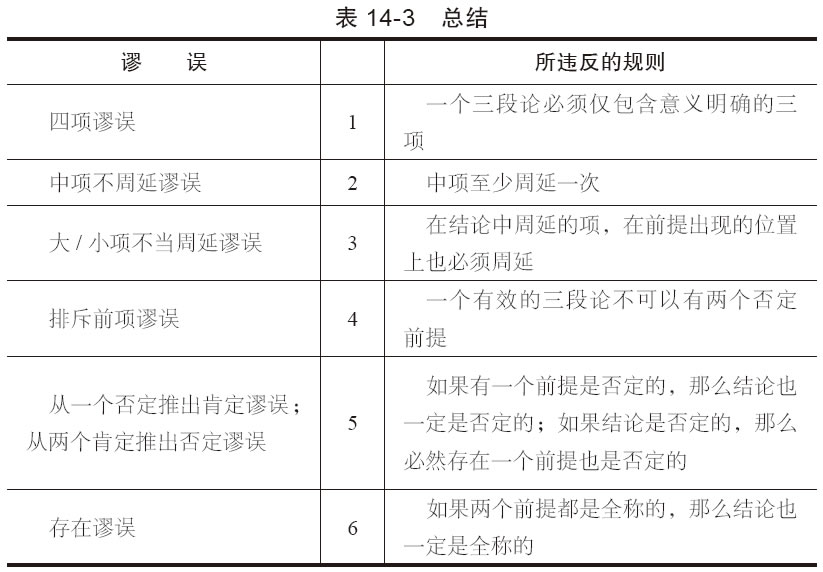

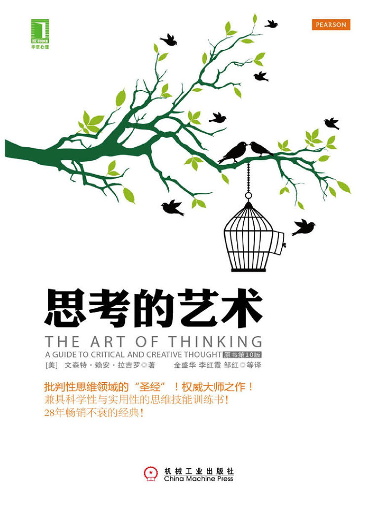

思考的艺术（原书第10版）

The Art of Thinking：A Guide to Critical and Creative Thought

\[美\]拉吉罗（Ruggiero，V.R.）　著

金盛华　等译

ISBN：978-7-111-40531-3

本书纸版由机械工业出版社于2013年出版，电子版由华章分社（北京华章图文信息有限公司）全球范围内制作与发行。

版权所有，侵权必究

客服热线：+ 86-10-68995265

客服信箱：service@bbbvip.com

官方网址：www.bbbvip.com

新浪微博 @言商书局

腾讯微博 @bbb-vip

谨以跨越时间和精力的爱，献给我亲爱的孩子们

思考是一种艺术，它有自己的目的、标准、原理、法则、策略和防范措施。思考也是一种值得学习的艺术，因为我们所做的每一件重要的事都受自己思维习惯的影响。

# 推荐序

思考一直是伴随着人类这个生物体而产生的附带品，也是人区别于其他动物的一个特征，人是可以思考的，而其他动物却不能。虽然思考时时刻刻都伴随着人类这个活的生物体，但是因人类存在个体差异，这种思考却也是千差万别。其在思考的有效性上更是存在很大的差别，从而产生了不同社会分工的人，有的人成为哲学家和科学家，而有的人却成了工人和农民。即便如此，我们社会生活中的每个人在日常的工作和生活中都离不开思考，我们会遇到形形色色的问题和挑战，需要我们对问题进行分析、判断、决策，并找到更好的解决问题的方法。我们知道，思考是在人的大脑这样一个精密的仪器中产生的，由于这种思考的过程是别人不能直接观察到的，所以常常很难被他人所觉察，因而也很难习得。另外，这种思考的加工过程非常复杂且是在短时间内完成的，因而那些优秀的思考者也很难去表达和传授这种思考的方法。在这种情况下，我们迫切需要有一本系统阐明思考方法的指导用书来满足人们的需求。

《思考的艺术》一书的特点是，每章都是一个独立、完整的部分，每章都对所介绍的主题对思考的重要性先做一个阐述，对相关的心理现象的特点和过程进行介绍，并且从心理学的视角来解释产生这些心理现象的内部机制。本书每章都对思考过程中所进行的具体认知加工过程进行了一步步的说明和指导，让读者在明白思考的很多原理和心理机制之后还能够得到一些有效思考的引导。针对这些具体的指导步骤，每章还在最后设有与其对应的练习题，这些题目能够帮助读者很好地掌握该章所介绍的内容，并且能够在实际的思考过程中进行实际应用。而且本书并不是必须读完第一个章节的内容才能去看下一个章节的内容，而是可以根据读者的实际需求随时调整，到相应的章节中去找对应的方法和练习。

本书不仅结合心理学视角科学地解释了思考的各种心理过程的现象和原理，而且还配有各种实例来帮助读者阅读和理解。全书搜集了大量名人名言和典型的实例及练习题，将系统理论与具体实例有机地结合到了一起，使人能够轻松掌握。

本书所讨论的各项内容既是人们日常生活中遇到的问题和面对挑战时所需要具备的解决问题的能力，也是一些奋战在科研部门和研究学院及中、高层管理者都必须掌握的基本技能。现今，无论是进行科学研究，还是从事管理工作，我们每天都会遇到不同的人和不同的问题，这些问题该如何分析、如何解决乃至最后如何做出更好的决策，根本而言都是与我们的思考紧密联系的。

本书具有三大特点。第一，本书从心理学的视角来揭示思考的心理加工过程，让读者了解自我和他人思考问题的心理过程与内部机制。第二，本书的设计是将思考的理论基础和实际应用紧密结合，让读者在理解理论基础知识的同时，能够深入浅出地掌握并很好地应用到日常的工作和生活中去。第三，本书是一本引导人们进行思考的书。书中所有的文字都不是告诉读者不该做什么，而是深入浅出地直接告诉读者该做什么，每一个过程和步骤都介绍得特别详细。阅读本书不仅可以让读者通过自学掌握有效的思考方法，从而优化自己的思维，而且可以了解到他人在思考问题时的心理过程和特点，帮助我们在和他人沟通和讨论的过程中更好地理解他人的观点，并且能够说服他人接受自己的观点。总之，阅读该书能够让读者更加善于沟通、适应社会。这不仅是人们日常工作和生活的需求，更是对那些在科研部门和管理部门工作人员的要求，还是作为一个现代人的基本素质，也是能够幸福生活的基本能力，而这正是本书的宗旨和特色所在。

本书主要包括4大部分共15章内容，各章除了内容的介绍外，还在每章的末尾设有“热身练习”“应用练习”和“综合练习”，以便读者在阅读的时候通过练习来更好地理解和掌握书中的内容。

第一部分主要讲关于思考的一些基本理论和思想，阐述了思考的内涵、重要性及其运行机制，并强调好的思考方式是一种习惯。在思考的过程中，需要先有一个基础，在有关问题和论点上去了解更多的知识来拓宽你的视野；在了解和阅读这些资料的过程中，一定要保持评判性的态度，这样才能对问题有新的见解，才能够更加有效地进行思考。

第二部分主要讲如何培养创造性。为了让你的思考更有价值，在思考的过程中就一定要保持创造性。通过了解有关创造性的实例和具有创造性的人所具有的特点，来寻找进行创造性思考的方式，并将这种方式应用到对实际问题和观点的思考中去。通过表达和阐释你的问题与观点、调查问题及产生思想这3个阶段，就可以获得一些创新性的思考。

第三部分主要讲如何培养批判性。为了让你的思考更加有效，在思考的过程中必须要持批评性的态度。主要是为了让读者明白这种批评是必要的，学会在解决争议时采取什么行动，并识别和克服可能出现的困难。在面对一些已有的观点和事实时，能够以批判性态度去重新思考这个问题，在对观点和事实进行重新讨论的时候提出更加有效的解决方法，最后再对该观点和事实有一个新的认识，并在以后不断进行完善。

第四部分主要讲如何沟通。为了让你在平时的工作和生活中能够更加有效地思考，我们可以将这种思考方式应用到说服他人、有效地写作和演讲中，从而更好地表达我们的观点和意见。通过让读者明白人们更加容易拒绝接受别人观点的心理因素，让读者理解这种现象存在的普遍性，并且能够更加有效地说服他人。通过阅读，让读者了解到有效写作的特点，根据小步渐进法，用概括、简洁的形式表达观点，可以让后续写作的形式更加灵活。为此，书中提供了很好的写作范例供读者借鉴。

本书的翻译分工如下：文前、文后和第1章由金盛华、李红霞翻译；第2章由李红霞翻译；第3章和第9章由杨文琪翻译；第4章由杨金花翻译；第5章由刘瀛翻译；第6章、第8章和第15章由邹红翻译；第7章和第10章由王雪翻译；第11章和第12章由章哲明翻译；第13章由郑明兰翻译；第14章由封子奇翻译。

由于译者本身的学识和翻译水平有限，文中难免还存在一些不足甚至错误，恳请读者不吝赐教。

金盛华

2012年11月10日

于北京师范大学后主楼

# 前言

在20世纪的大部分时间里，许多教育学者都认为，学生是通过学习某些学科，尤其是数学和科学学会思考的，因此不必正式教授。但最近，人们的认识发生了变化：思考技能的重要性（在中学和大学两个层次上，都需要正式教给学生思考技能）已经得到了普遍认可。目前，事实上每一个重要的教育协会都倡导重视思考技能的培养。各学科的教育者、政治家、社会学者和其他领域的学者都开始明白，我们始终生活在各种要求（文字和图像）的包围之中，它们都试图劝导我们相信点什么、做点什么，有时是买点什么、参与点什么。要理解与分析这些诉求，我们就需要掌握思考技能与策略。

本书可用于思考技能的培养，也可供其他学科强化批判性思考时使用。

## 新版特色

本版为英文版《思考的艺术》第10版，全书做了大量的适度调整，并以新的和当下的视角对内容进行了审视。此外，本版中还增加了一些最新的“应用练习”以及“综合练习”中3个新的“议题简述”：

·政府规模的大小；

·《美国联邦宪法第四修正案》的潜在危险；

·交通安全管理的安全程序。

## 保留特色

正如本书的其他版本一样，本版的内容和结构主要基于以下4点设想。

1.一本关于思考的书应该强调去做什么，而不是强调不做什么。思考不是象牙塔里的事业，而是实际问题。思考是主动、动态的，不是被动、静止的。高效能的思考者不会只评判他人的努力而自己不采取行动，他们解决问题、做出决定、在争议中选择立场。因此，一本教授如何思考的教科书如果关注的是错误，它一定不会比关注如何避免演奏错误的音乐书更高明。

2.一本关于思考的书应该向学生教授思考的原则和技巧。过去半个世纪里出版的和思考有关的文献显示，创新过程和批判过程是互相交织的：首先，我们要产生想法（多多少少具有创造性）；其次，我们要对这些想法进行判断。只告诉学生已经形成的问题和争议是不够的，必须让他们学会形成自己的问题和争议。

3.一本关于思考的书应该教会学生评价自己和他人的想法。人类有很强的自我欺骗能力，因此，让学生发现自己的盲点、偏见和错误比让他们发现他人的盲点、偏见和错误难得多。但是，正是他们自己的弱点和错误为有效思考设置了最大的障碍。

4.一本关于思考的书应该教会学生说服他人。很多杰出的想法从未付诸实施，这仅仅因为原创者认为他人不用任何帮助就能够认识到这些想法是杰出的。学生们需要学会预见反对意见，并提前想好如何应对。

为了更好地支持这些设想，我撰写了《思考的艺术》一书，以支持思考技能和策略的构建。

·本书尽可能按照问题解决和争议分析的实际情况对章节的顺序进行安排。例如，我们将介绍如何表述问题（第7章），接着便是介绍如何调查问题（第8章）和如何产生想法（第9章）以及如何改进问题的解决方法（第11章）。

·在第二部分，我们直接针对学生在思考过程中遇到的困扰和障碍作答。这些问题包括：“我怎样才能在提出解决方案时更具有想象力和原创性？”“当我遇到‘思考的瓶颈’，或者感到困惑，抑或停滞于产生相似解决方案的境地时，我该怎么办？”“洞察力是如何产生的？我又该如何培养它？”

·在第1章，我们专门将一节命名为“让讨论有意义”，为“课堂讨论”提供指导。

·在第8章，我们详尽地阐述了如何利用内部和外部的资料库，快速、有效、巧妙地研究问题。我们用专门的小节介绍了11种信息来源（“我们该寻找什么”）、如何利用互联网以及如何避免剽窃。

·在第6章，我们用一节的篇幅来鼓励学生用他们的思考技能解决学校课程、日常生活中的问题和争议。权威人士认可这种做法的有效性，对思考的教学不能局限于介绍思考技巧，还应该关注态度。

·第14~15章旨在帮助学生习得如何有效、有说服力地表达想法。尽管强调书面和口头表达在关于思考的书中已显得不太合适，但表述的质量仍关系到想法传播或执行的成败。我们帮助学生深化对想法和表述之间的互补关系以及想法产生和表述重要性的认识。

·在每章章末的“应用练习”之前，都有简短的“热身练习”。或许这些练习做起来有些单调，但正如爱因斯坦所言，这是“富有成效的思考的基本特征”（参见第5章“富有创造力的人所具有的特质”）。在我的经验中，“热身练习”有助于建立轻松的气氛，有利于学生充分发挥想象力，更为大胆地思考而不是感到尴尬。学生在这种氛围中获得的信心（尤其对于害羞、焦虑的学生）往往会延续到更为严肃的“应用练习”中。

·每一章的“应用练习”都鼓励学生运用所学到的知识。此外，每章还有一个“综合练习”，包括：①对一个典型的社会问题或哲学问题的简要描述（“议题简述”）；②两篇观点不同的文章（“对比阅读”）；③学生针对文章进行的讨论（“课堂讨论”）。这些综合练习比专项练习更具有优势：它们更贴近学生遇到问题和解决问题的双重反应模式；它们显示出教师所期望的观点和表述的质量；它们鼓励学生对问题进行理性分析而不是本能地回答；它们建立了严谨、礼貌的讨论模式（这往往是一般的交流中所缺少的）。

## 更多功能

本书既可作为创造性/批判性思考课程的参考书，也适用于写作课程、公共演讲课程以及很多其他学科，包括商业、人文科学、社会科学以及自然科学。如果读者认为本书的章节顺序不适合他们的阅读需求，可以对内容顺序做以下调整：

用于写作

第15章的前半部分

第1章

第14章

第2章

第3~13章

用于演讲

第15章的后半部分

第1章

第14章

第2章

第3~13章

其他方案

这个方案适用于精通写作和/或演讲的学生。

第1~4章

第14章

第5~13章

# 第一部分　你真了解思考吗

哲学家叔本华说：“每个人都把自己视野的极限当作世界的极限。”所以，一个人要让自己的视野变得更为开阔，就需要更加深入和精确地领悟他每天所经历的事情。

本部分所包括的章节将帮你深入理解思考的过程，澄清一些重要的常见的理解方面的错误概念，如事实、知识和观点，指出那些破坏思考的不良习惯，并教你如何成为一名更具批判性的读者。

## 第1章　发展你的思考

思考是自动完成的活动吗？个人能否控制？做白日梦（凭空遐想）是一种思考吗？感觉可以有效替代思考吗？杰出的思想者是否也会像普通人那样经历思路阻塞、不能专心和思绪混乱？思考技能是后天习得的还是与生俱来的？

本章将回答这些问题，并提供一些基本事例，使你更好地把握本书。

克劳德是一名高中生。课堂上，英文老师正在提问：“同学们，你们昨天在家庭作业中阅读的小故事主题是什么？”看到没人回答，她有点生气：“同学们，你们根本没在思考。动动脑子，好好想想。”

听到这话，克劳德皱起鼻子，紧锁眉头，托着下巴，眼望着天花板：“思考，思考，我必须得思考。这个故事的主题是什么？主题，主题，什么是故事主题呢？”他左看右看，紧抿嘴唇，然后若有所思地开始翻书，似乎在寻找着什么。与此同时，他的脑子里一直在重复“思考……思考……主题……”

克劳德在思考吗？没有！他在尝试思考，也希望思考，但并不是在真正地思考。他的头脑在运转，不过是在空转。他准备思考，却没有思考。

让我们再看一个例子。阿加莎是一名大学生，她正坐在校园的自助餐厅里喝清晨咖啡，同时陷入了沉思。下面是她大脑中所产生的活动：

今天事情好多啊……晚上6点钟要见吉姆……一会儿还得开始准备学期论文……柏莎真懒，但愿这学期她能注意个人卫生……我的头发看起来太糟了——要是能弄成玛莎那样就好了，既干净又不用经常打理……要是冬天马上结束，我就不会这么难受了……为什么我的心情总是受天气影响呢……咖啡有点儿苦，原以为这儿的很好喝呢……我要赶紧回家吃饭……不知道自己是不是又胖了，也许慢跑能减下来点儿……

阿加莎的心理活动比克劳德的更接近于思考。思想、图像和观念浮动在她的脑海，并且她很用心地看着它们飘来飘去。但她的角色却是消极的，因为她在心理活动中扮演着观众的角色。正如我们将要介绍的观点（和大多数权威观点一样）一样，思考并不是漫无目的地白日做梦。

### 什么是思考

那么什么是思考呢？首先，它是有目的的心理活动，而且我们能控制它。在这里，控制很关键。就像开车一样，只有当我们握住方向盘时，我们才能开得平稳。因此，只有我们能指挥它们时，心理活动才会成为思考。

当然，就像旅行一样，思考也各有目的。我们可能在商务旅行，也可能在漫无目的地开车穿过乡村。与此相应，在不同的旅途中我们会看到不同的风景，会收获不同的心情。我们在黑暗或光明中旅行，或快或慢，正确或者错误地转弯，到达目的地或者是别的什么地方，甚至突然无助地发现自己迷了路。然而，只要我们掌控了自己的思想，我们就是在思考。

这并不意味着思维必须始终是有意识的。有证据表明，在无意识中可以加入有目的的心理活动。最显著的例子就是这样一个事实，当我们苦思问题无果并转而做其他事情时，答案自己就跳出来了（第9章有更多这样的例子）。

考虑到这些因素，我们就可以给思考下一个更为正式的定义：思考是能够帮助我们阐述或解决问题、做出决定、了解欲望的所有心理活动；思考是探寻答案，是获取意义。思考过程包括大量心理活动，其中细致的观察、记忆、怀疑、想象、调查、解释、评价和判断最为重要。通常，在我们解决问题或者做出决定时，这些活动中的若干活动是共同起作用的。例如，通过质疑、解释和分析，我们可以确定问题或者困境，然后解决它。

很多人试图阐明思考的性质，其中最为流行同时又饱受质疑的观点认为思考完全是语言性的。根据这一理论，当我们思考的时候，我们就会在心中遣词造句或默默地自言自语。但是，如果是这样的情况，阿尔伯特·爱因斯坦就不会被认为是一个思考者，因为他的思考里包含了更多的图像而非词句。1当代权威人士认为思维在人们头脑中的形式通常是言语性的，但也不尽然，就如我们会使用数学符号或者图片而不是文字来表达某个观点，我们也可以通过这种方式来理解该观点。

### 思考的重要性

成功地分析争议和解决问题需要事实性知识，也就是说，要熟悉问题产生的历史背景并且理解与问题有关的原则和概念。但是，事实性知识一般是我们所熟知的，然而当我们面对大量的具体案例时，对于那些全新的，特别是针对某个特殊问题专门制定的解决方法却并不知晓。因此，专业的事实性知识本身并不能保证成功地解决问题。事实上，你可能是公认的“活百科全书”，但行动起来却相当失败。如果你想要成为一位优秀的问题解决者，就不仅需要具备事实性知识，还需要具备缜密的思维。

要体会思考的重要性，就想想你将要面对的各种不同的情形，在这些情形下，你必须分析争议、解决问题并做出决策。在日常生活中，选择大学专业、决定和谁结婚、信仰哪种宗教（如果需要的话）、参加哪个政党等只是各类常见情境中的少数，而更多的则是你每天要遭遇的新挑战，比如如何应对那些难缠的人，父母不能照顾自己时如何自处，怎么做一个好父亲，如何识别虚假广告，怎样使投资更明智，如何选出更英明（或最无害于国家）的政治候选人，等等。

在分析争议、解决问题和做出决策的技能方面，公司对员工的期望越来越高。在一代人之前，“科学管理”还在流行。在那个系统中，管理者负责思考，其他员工只是完成分配给他们的任务。自“质量管理”问世以来，老板已经学会了评估员工能够改善公司的意愿和想法。近年来，这种观点被3个方面的发展进一步强化：知识大爆炸、通信技术革命和全球经济的崛起。

研究能力的改善使每个领域的基础知识都得到了极大的增长，对人们来说，掌握哪怕是单一学科的全部知识都是相当困难的。此外，由于新知识每年都在成倍地增长，全部掌握几乎是不可能的。更重要的是，人们在整个职业生涯中使用的基础知识都是在中学和大学时代获得的，而它们将在未来的10年或者更短的时间内过时。

通信技术革命的效果日益显著。在不到20年的时间里，个人电脑得到了飞速发展，大批的电脑硬件和软件制造商涌现出来，没人能在这一时代的早期想象到规模如此浩大的商品营销。数千亿美元流入这些新型的公司，如微软、英特尔、戴尔和诸多其他网络公司，它们结束了像IBM这样似乎无所不能（和自满）的企业巨头统治的时代——对各家公司和整个行业的发展来说，这种局面会造成持续的损失。即便是运行良好的组织，也会经历财富的迅速变化，被迫精简业务和裁员。在这种情况下，那些在解决问题和做出决策方面更有技巧的人会更少成为精简业务的受害者，而且也更容易找到新工作。

全球经济的发展源于电视节目的卫星传输、前苏联国家的贸易开放、与其他国家商业竞争的加强和新一代贸易协定的签署，如北美自由贸易协定（NAFTA）和世界贸易组织（WTO）。迎接挑战、抓住全球经济带来的机遇需要创造性和批判性思考技巧。具备这种思考技巧的员工比不具备这种思考技巧的员工具有更明显的优势。

### 运用大脑和心智

一个多世纪以来，研究人员已经使我们加深了对人类思维的理解。现在我们知道思考并不是一个神秘、不可知、不可习得的活动。我们可以对思考发生的模式进行研究和比较，以确定其相对的客观性、正确性和有效性。这种知识可以用来强化和巩固好的思考习惯并战胜不良的思考习惯。就如詹姆斯·莫赛尔（James
Mursell）所观察到的，“任何更好的思想在本质上是不可习得和不能被传授的观念只不过是一个懒惰的谬论，思维永远青睐那些不厌其烦地考虑如何从事实际工作的人”。2

对大脑的研究为我们理解思考提供了新的见解，尤其是大脑的结构比人们想象的要复杂得多。率先取得突破性进展的是一名神经外科医生，他开始使用一种新的方式治疗严重的癫痫患者。他切断了患者的胼胝体（即连接大脑两个半球皮层的横行神经纤维束），消除了病症。这种分离方法给我们提供了了解每个半球功能的可能性。据我们所知，右半球主要掌管非语言、符号化和直觉反应，而左半球则掌管语言的使用、逻辑推理、分析和执行连续性任务。

这一研究的一些普及者认为，这意味着存在“左脑人”和“右脑人”，而且已经出现了一个行业，这个行业不仅帮助人们识别他们是哪种人以及（或者）会变成哪种人。大多数研究者认为，这个新生行业充其量是对数据的简化。例如，杰尔·勒维（Jerre
Levy）指出，没有数据“能够支持这一观点，即正常人和裂脑人一样，一次只使用一侧脑半球”。另外，勒维认为大脑的这种结构意味着左右半球的深层次整合，胼胝体将左右半球连接在一起，促使其唤醒。3

威廉H.卡尔文认为，那些专门研究裂脑人的研究者（正如他自己一样）趋向于普及“一些天文学家对占星术所保留的戒心”。他引用“行为和心理过程高于或者不同于单一脑区的贡献”这段话作为左右脑可以整合的证据。4其他的一些研究者则着重强调这样一个事实，那些关于“左脑人”或“右脑人”的已有研究都是在严重受伤或者通过手术改变的大脑上进行的，而不是在正常人的大脑上得出的结论。正如罗杰W.斯佩里（Roger
W.Sperry）在他的诺贝尔奖获奖演说中所提到的：“在正常情况下，大脑两个半球是紧密联合成一个整体进行工作的，而非一个大脑半球在工作而另一个大脑半球却处在空闲状态。”5

尽管普及人士有些夸张，神经生理学研究却似乎和认知心理学家的早期认识处在同一水平上，即心理活动分为截然不同的两个阶段——产生阶段和判断阶段，在解决问题和决策时这两个阶段相辅相成。高效的思考需要掌握这两个阶段中所有适当的方法。让我们进一步检验每个阶段，看看作为一个好的思考者如何在每个阶段更有效地工作。

#### 产生阶段

这个阶段和创造性思考联系最为紧密，大脑会产生各种关于问题和争议的概念、不同的解决方式和可能的解决途径或者反应。好的思考者会比差的思考者产生更多、更好的想法，他们在思考时能够熟练使用各种各样的创造技术，这使得他们能够更容易发现问题。具体而言，好的思考者在选择一种思考问题的角度时，先从许多不同的视角来看待问题，考虑许多不同的研究方法，并且在做出判断前产生许多想法。此外，他们更愿意冒险和考虑不同寻常的想法，并且更愿意使用他们的想象力。

相比之下，差的思考者往往在有限的视角（常常仅从一个很窄的视角）下看待问题，在问题发生时只采用想到的第一种解决方法，判断每一个问题时都很迅速，并且只有少数几个解决方法。此外，在思考中他们过于谨慎，常常不知不觉地将想法和通常的看法、熟悉和所期待的想法相契合。

#### 判断阶段

这个阶段和批判性思考联系最为紧密，在该阶段，人们对产生的想法进行检查和评估，并且在适当的地方予以补充完善，然后做出判断。好的思考者通常更关注这个阶段并处理得很好。他们能够测试自己的第一印象，做出重要的区分，并且在有证据的基础上得出结论，而不仅仅靠自己的直觉。他们能敏感地觉察到自己的局限和倾向，能仔细检查自己思考的逻辑和解决方案的可操作性。他们能够识别问题不完善和欠缺的地方，对负面的结果能有一个预期，并且常常能够完善和提炼自己的想法。

与此相反，差的思考者快速进行判断并且不具有批判性，忽略了一些必需的证据，在形成结论时常常依靠自己的感觉。他们对自己的局限性和倾向性常常视而不见。差的思考者对他们的盲目判断常常自信满满，而忽略了他们在思考中所存在的一些缺陷。

### 良好的思考是一种习惯

我们常常听到人们这样说，一个好的思考者是天生的，而不是后天培养的。尽管一些事实能够证明这一观点，但是这句话从本质上来讲是错误的。一些人在思考能力上比其他人有着更高的天赋，而一些人能够更快地习得新的知识，因此，经过积累，这些人的思考能力在很大程度上就比其他人发展得更好。然而，有效思考在很大程度上主要是习惯问题。研究证明，要有良好的心理素质，就必须进行良好的思考，我们在产生阶段和判断阶段也都提到，这种特质是可以被任何人所掌握的，这也进一步证明了独创性是可以被习得的。最重要的是，这个结论证明了一个好的思考者不一定需要很高的智商。6E.保罗·托兰斯（E.Paul
Torrance）的研究表明，在所有高创造力人群当中，70%的人智商测试得分都低于135分。7

提高思考能力的难度取决于你的习惯和态度。在此之前，如果你很少有或者没有直接的机会对你的思考技能进行训练，那么你的思考可能就被一些不好的习惯和态度束缚住了。本书为你提供了一些如何进行思考的原则和方法，它将如同导师一样能够对你进行指导。你必须提供最重要的目标：提高思考技能的愿望和学以致用的渴望。

如果一开始你认为改变思考方式和态度似乎不太可能，请想想下面这些事情，比如散步、游泳、打棒球、开车等，最初你也忧心忡忡，但很快你就学会了。不熟悉的事情似乎常常令人望而生畏。

### 本书的结构

熟悉本书的结构有助于你更加自信地面对一些挑战。本书的目的是教会你创造性、批判性思考的能力。从表面上来看，这个说法很明确，但是它常常容易和告诉你什么是思考相混淆。它们的区别在于：告诉你什么是思考会使你依赖其他人的思想；而教会你如何思考会让你从依赖其他人的思想中解放出来，并且帮助你形成自己的思想和明智的想法。本书将指引你对一系列问题和有争议的观点有更加清晰的认识。对你如何思考这些问题提供练习的机会，也就是说，你将把这些策略和方式应用到对这些问题的思考中。但是，本书不会为你做决定，因为这些工作需要你独立完成。

本书总共有4个部分，每个部分都由几章内容构成。“你真了解思考吗”将帮助你扩大视野并成为一个具有批判性思维的读者。“创造”和“批判”将为你展示更加高效地产生和评判想法的一些办法。“沟通想法”会帮助你将想法展示给其他人并说服别人。

不要让这些章节的顺序束缚你。如果你还没有仔细查看目录，那么请立刻查看。无论何时，当你对书中的某个主题感兴趣时，你可以预先阅读它。比如，如果你在写作方面不够自信，那么现在请参考第14章第15章的内容，并且学会将这些建议应用到你的写作中去。

### 努力获得最大收益

人们一度认为，相同的时机、地点和工作条件适合每个人。现在，我们知道没有两个人的需求是完全相同的，对一个人有用的东西未必对另一个人有用。拿莫扎特和贝多芬来说，尽管他们都是著名的作曲家，但是他们的工作内容完全不同。莫扎特在他的大脑中创作出整部交响曲和歌剧的场景，后来再将这些创作在纸上描述出来，而不注重做记录。然而贝多芬则多年坚持做笔记，并不断修改和完善。他的最初想法很幼稚，以至于学者们惊叹他怎么能在音乐方面有如此高的造诣，这简直是一个奇迹。8

我们无法想象如果莫扎特效仿贝多芬的方法结果将会如何，反之亦然。能够确定的是，莫扎特的创作将会减少。如果使用另一种不适合他气质的方法，他的才华甚至可能被扼杀。同理，贝多芬也有可能只是为这个世界创造了一些毫无价值的作品而已。

一种观点认为，当今世界有不少人认识不到自己获取成就的潜力，更别说发展它们了，因为他们使用的是从别人那里学来的，或者偶尔养成的，或受环境限制形成的工作习惯。这种观点并非毫无道理。最好的改善方法不是你假设你的工作习惯符合你的需要，而是通过试验来发现哪些方法对你来说真正有效。或许你的新发现与原来的工作习惯没没有显著的差别，但是哪怕在工作效率上有一些微小的改进，你也将因此终生受益。

考虑时间。状态绝佳时的1个小时常常比状态不佳的2个或3个小时更有效率。在你的工作习惯中，你在什么时候会做最重要的功课？清晨？午夜？中午？在未来的一两周内，尝试在不同的时间工作并且记录下工作的效果。

考虑地点。你可以观察那些在奇怪地点学习的学生：宿舍大厅、嘈杂且拥挤的食堂和小吃店（常常在那些刺耳的自动点唱机附近）。你也可以选择在一些合适的地点学习，在这个时间点或者另外的一个时间点，除了在那个时间你不得不完成一个任务以外再没有其他原因让你出现在那儿。但那也不是一个很好的理由。如果你需要一个安静的环境以使工作更加有效，你应当寻找一个安静的环境——如果不是宿舍，那么应该是一个空旷的教室、公园的长椅，或者是一辆停着的汽车。当然，如果你发现在一个繁忙的地点其实可以激发你思考的话，你也可以通过各种方式在那儿学习。

考虑条件。纵观历史，思考者们偶尔需要一些奇异的刺激。诗人席勒需要一张放满了烂苹果的课桌，小说家马塞尔·普鲁斯特需要一个软木装修的工作室，塞缪尔·约翰逊博士需要一只打呼噜的猫、一些橘子皮和一杯茶。但是，你要不必依赖刺激或奇怪的条件就能做得很好，因为它们很难维持。你不妨在开始学习时或者在学习的同时播放音乐，或者在学习前尝试散步或者慢跑穿过校园。

注意，不要将你喜欢的和最适合你的混为一谈。例如，你或许很喜欢看电视或者听音乐，但是，相对于提升工作效率来说，它们更大程度上阻碍了你努力思考或者写作。同样，酒精和药物会使你感觉良好（至少是短暂的感觉），但效果往往适得其反。尽管有人认为药物可以激发创造性，但研究者们却一致认为它们是有负面作用的，会抑制或者麻痹大脑。

### 利用感觉

在20世纪六七十年代，感觉得到了重视和强调。“做你自己的事”“如果你感觉良好就去做”和“跟着感觉走”等都是那一时期的流行语。由于过去的几十年忽略了这种感觉，强调关注感是可以理解的，但它常常会成为拒绝思考的一种形式。思考和感觉最恰当的关系是和谐的，而不是彼此排斥。

感觉在问题解决和决策方面的作用是不可计量的。感觉不仅常常产生预感、印象、直觉，帮助我们寻找问题的答案，更重要的是，它们常常也为我们应对困难与挑战和坚持不懈提供了勇气和热情。爱因斯坦用7年时间完成了相对论，爱迪生用13年时间完善了留声机，哥白尼用30年时间证明了太阳是太阳系的中心。另外，成百上千万的人们通过不懈的努力去实现最难实现的目标：战胜疾病、贫穷、无知和不人道。他们如果对工作重要性没有一个深刻持久的感觉，就不可能坚持不懈地努力。

有一种流行的观点认为感觉是艺术家的专利，而科学家和一些务实的人解决问题时则采用如电脑一样的方法。9这种观点饱受学者们诟病，爱因斯坦也肯定了感觉在科学中的作用：“要发现（复杂的科学规律），没有逻辑方法，只有用直觉，直觉能感受到表象背后的规则。”10阿瑟·库斯勒（Arthur
Koestler）研究了无数伟大的科学家，他说：“在大众的想象中他们是清醒、冰冷的逻辑学家，有着强大的电子大脑。但是如果不提姓名，让大家读他们的信件和自传中的精选文字，然后要求大家猜测其职业，最有可能的答案将会是一群相当浪漫和天真的诗人与音乐家。”11

当然，不是所有的感觉都是好的。一些感觉指导着我们用这种方法，而理智却禁止这样。即便是那些最温和的人，也会时而感觉到他们想非常暴力地对待自己不喜欢的人，一些人会产生一种想要和对方发生性接触的强烈冲动，即使这些人并不想有这种关系，而一些人则一时冲动想要盗窃。为此，明智的选择是拒绝向感觉屈服，平心静气地反思这些感觉并将有价值的感觉从庞杂的感觉中分离出来。

在经历这个过程时，尝试关注你的感觉。挑战自己，去接受那些最好的和最高贵的感觉，并让它们激发你的行动。

### 学会全神贯注

很多人都认为，所谓全神贯注，就是指思考过程如同一条持续、不间断的线。他们想象科学家、作家、发明家和哲学家集中精神从点A开始慢慢地移动到点B。这个观点无疑是不正确的。全神贯注并不是像这样去阻止其他因素来分散或者干扰我们的注意力，而是当这些分散或者干扰我们注意力的因素产生时我们有能力去克服。保持全神贯注意味着当我们的思维游离时，我们能够将注意力转向我们的思考目的和问题。12

保持全神贯注就像驾驶小汽车一样。当人们驾驶小汽车的时候，他们不会将手臂一直放在方向盘上朝向一个固定的位置，而是可以在行驶的过程中非常轻松地一会儿转向左边一会儿又转向右边。即使是在一条直行的路上，让车一直保持一个方向也仅仅在全程中占很小的比例。驾驶者必须一直不停地调整方向，当然他们当中的很多人平时都是在无意识中完成这项活动的。有经验的驾驶者并非比没有经验的驾驶者有着更高的天赋，他们只是学会了在适当的时候做细微的修正。

同样，比起那些低效的思考者来说，高效的思考者并不是没被打断过，而是他们已经学会了如何更快、更有效地去应对。他们并非会魔法，通过练习，你也可以学会。

### 应对挫折

所有的思考者都分享了他们的一些挫折：思维混乱、心理障碍、一些错误的开始和每个人都会遭遇的失败。然而，一个好的思考者已经掌握了应对这些挫折的策略，而一个差的思考者却很少关注它们，因此他们常常被这些挫折打败。对学生解决问题过程的一项重要研究显示，好的问题解决者和差的问题解决者之间存在一些有意思的差别，如表1-1所示。13

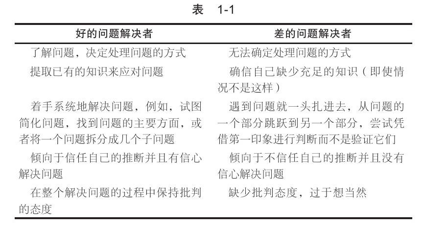

### 让讨论有意义14

讨论的最大作用是能让我们深入理解问题并且提高解决问题和制定决策的能力；讨论最坏的是损耗精神、制造敌意并留下一些非常重要但尚未解决的问题。不幸的是，当代最普通的讨论模式——收音机和电视谈话类节目，常常产生后一种效果。

许多主持人要求嘉宾用简单的“是”或“不是”来回答复杂的问题，如果嘉宾真这样做，就会被指责过于简单化；但如果他们尝试给出一个折中的答案，主持人又会说“你没有回答问题”，然后自己开始回答问题。如果嘉宾赞成主持人的说法，就会受到主持人的热情对待；如果嘉宾不赞成主持人的说法，则会被认为无知或不诚实。在电视上常常可以见到这样的情景，当两个嘉宾辩论的时候，他们会轮流打断对方，而另一方则大声叫道：“让我说完。”双方都没有向对方学习的愿望。而节目快结束时，主持人会对嘉宾的“激烈辩论”表示感谢，并承诺观众将在下次同一时间看到更精彩的辩论。

相比看那些电视节目，下面是一些简单的指导原则，可以帮助你进行讨论，使你在教室、工作场合或者家里变得更有礼貌、更有意义和更有建设性。遵循这些指导原则，你就可以为周围的人树立一个好榜样。

#### 尽可能提前做好准备

并不是每个讨论都需要提前做好准备，但是大多数讨论是需要提前进行一些准备的。商务或者委员会会议一般会提前几天发布议程，而大学课程表清楚地说明在哪一天将讨论什么内容。利用这些信息，就可以着手为讨论做准备。你可以从回顾自己已经知道的知识开始，然后尝试做一定的扩展，并通过实际行动来实现（你可以花上15~20分钟进行网络搜索，这样能得到与主题相关的大量信息）。最后，试着预测讨论中可能出现的各种不同观点，并考虑它们各自的优势，但暂时不要做出结论，这样你就能以开放的心态对待讨论中别人提出的观点和解释。

#### 设定合理的预期

在讨论中你是否常常因为对方没有放弃他自己的观点或者接受你的观点而感到失望呢？当一些人不同意你的观点并且要求你找到一些证据来支持你的观点时，你是否感觉到被冒犯？如果对这两个问题的回答都是肯定的话，那么你可能对对方的期望太高了。很少有人轻易、快速地改变想法，特别是长期持有的信念。

#### 不要以自我为中心和感情用事

要想使讨论具有建设性，就需要营造尊重和文明的氛围。以自我为中心会导致不尊重他人的态度，特别是认为“我比其他人更重要”“我的观点比其他人的好”“这些规则对我不适用”。而感情用事（如不喜欢另一位参与者或者过于热衷某观点）则会导致人身攻击和不屑于听取别人的意见。

#### 贡献但不支配

如果你很能说而且话很多，在讨论中就可能会有更大贡献；如果你很拘谨，说的可能就少些。这两种做法都没错，但只有人人都做出贡献的时候，讨论才最可能出成果。所以，“话痨”要自我克制，而拘谨的人则有责任分享他们的思想。

#### 避免分散注意力的言语举止

这些言语举止包括开始是一个意思然后突然又跳到另一个意思，或是喃喃自语，或是表达比较含糊，或是每个短语或从句间都加上停顿（“嗯”“啊”），抑或一些无意义的表达（“比如”“你知道”“喂”）。这些令人讨厌的言行都会打断人们的注意力。为了克服这些，当你讲话的时候一定要自己听一听。为了能做得更好，你可以用录音机将你和朋友或者家人之间的谈话录下来（在获得他们允许的前提下），然后播放这些录音并仔细聆听你自己的讲话。无论你何时参加一个讨论，目的都是为了明确、直接和有效的表达。

#### 积极倾听

如果参与者不互相倾听，那么讨论就会变成连续的独白。每个人发言时，其他人都不会注意听他讲了什么。这种情况很可能在无意中发生，因为即使以最快的速度说出观点，也比不上头脑处理信息的速度。你的大脑或者厌倦了等待，就像一条松了皮带的狗一样漫无目的地四处游荡。在这种情况下，你也许没有听发言者在说什么，而是在想他的衣着和发型；也许在看窗外，观察一下发生了什么，甚至在努力倾听的时候，你也很容易走神。如果发言者的话引起了你某个不相关的回忆，你的心思也许就会回到以前的情境。如果你同意发言者的意见，可能就会开始设想如何反驳。保持注意力的最好办法就是对这些分心的情况保持警觉并且抵制它们。努力进入发言者的心境，理解他们所说的每句话，并前后联系起来理解。当你意识到自己走神儿时，最好重新集中注意力。

#### 公正判断

从性质上看，观点包括从深刻到浅薄、从有益到有害、从高尚到低贱，因此你需要对它们进行判断。然而，要做出公正的判断，你就需要综合考虑观点的优缺点，而不是仅凭第一印象或最初的感觉。特别要关注那些你不熟悉或与你意见不同的观点，因为这些观点最有可能使你做出不公正判断的。

#### 忍住喊叫和插话的冲动

毫无疑问，喊叫和插话的行为是粗鲁无礼的，可你是否知道，在多数情况下，这种行为意味着缺乏自信呢？常言道，有理不在声高。即使别人冲你喊叫或者无礼地打断你的讲话，你也没必要以其人之道还治其人之身，最好的方式是展现你的自信。你可以表达反对意见，但不要让人觉得讨厌，这是原则。

### 思考的初级策略

在每章的最后，你会发现3项不同的挑战。第1项是“热身练习”，目的是为你思考观点的试验提供一种有趣的方式。第2项是“应用练习”，它会让你将之前所学章节的内容应用到解决实际生活中的问题和争议中去。第3项是每章后面的“综合练习”（写作或演讲练习），需要你进行扩展分析并且更正式地陈述你的观点。

当你阅读到本书的最后，你将会发现通过这些挑战你已经习得了将这些策略应用到创造性和批判性思考当中。同时，你也需要一些初级的策略。本章后面将列出7种有帮助的策略让你在一开始就可以立即使用。因为大多数情况涉及写作方式，这种方式或许是你之前不熟悉的，我们会阐明这种方法到底是什么。

尽管写作是我们表达所思所想的一种方式，但它也能够发现和澄清思想。你也许有过这样的经历——以为已经想明白了，但后来却发现想法非常混乱。这是一种很常见的现象。正如欧内斯特·蒂姆尼特（Ernest
Timnet）所说：

大部分人对于生死、宗教、道德、政治、艺术等的认识模糊不清，直到他们死去时仍是如此，甚至对于一些较为实际的问题，人们也难以弄明白。我们往往认为他人在子女教育、职业选择和理财等问题上有着明确的观点，可我们自己则因为一些很小的不确定因素而难以决断，但事实并非如此。其他人和我们一样，生活在持续的混沌之中。和我们一样，他们自以为在思考重要的问题，但他们其实在思考思考本身。

蒂姆尼特指出，要解决这一问题，可以通过“自由写作”来实现。自由写作是指聚焦在一个问题或争议上，来一个头脑风暴，并写下来你所想到的，并且暂时不要进行评价，以免思路被过早打断。这样写出的东西不是为了给人看，所以不需要遵循写作规范，也不必担心错别字和字迹潦草。与自由写作相似的另一种技巧是“列清单”。因为只涉及词语而不是句子，所以列清单比自由写作效率更高，这使它更易于捕捉乍现的灵光。

一旦你记下了自己的想法，就可以对其进行筛选和改进，并用一种对他人有意义的方式表达出来。通常，你可以采取坦陈自己想法并解释缘由的做法，并提供足够的说明来消除听者的困惑。

以下7个策略能够帮你应对每章末尾的3项挑战。

（1）如果练习包含了一个待分析的陈述，仔细地再读它一遍，确保你已经明白它的意思。问一下自己“这段文字表述清楚吗”，如果你确定地给出肯定或否定的回答，想一想你的理由是什么，这往往就是你需要向听者做出的解释。

（2）如果一开始没看懂文字，不要一直盯着这些内容看。比如，你不慎开车进了死胡同，你不会坐在车里盯着“没有出口”的牌子发呆，而会掉转车头，寻找正确的路。这和碰到难题是一样的道理。解决这种问题的一个有效办法是画图。如果你要评价“所有的狗都是动物，菲多是一条狗，所以菲多是动物”这样的推理，不妨画如图1-1所示的图。

图　1-1

图能让你明白如何解释自己的分析：

将狗归入动物是合理的。这种划分不仅适用于某些狗，还适用于所有的狗，狗显然不能归入其他类别。菲多归为狗是合理的，因此它一定是动物。

（3）如果陈述所说不是事实，指出错误所在并解释这个错误是如何让陈述不成立的。

（4）如果陈述混淆了两个术语或观点，区分它们，并指出混淆所产生的影响。

（5）如果陈述的结论只是可能结论中的一种，指出其他结论，并说明它们为何合理（或者更为合理）。

（6）如果陈述或者部分陈述可以解释，就使用假设法进行分析。比如“每个人都会死”这个陈述，假设法是这样使用的：

按照该陈述所说，它的所指是不明确的。如果将其理解为“目前没有任何可知的办法避免人的死亡”，那么这个陈述就是事实。但是如果将其理解为“永远没有办法避免人的死亡”，那么这个陈述就是武断的。因为，对于现在没有发生的情况，我们无法断定它将来一定不会出现。

在无法确定事实时，假设法也有用。换句话说，你可以说：“我不确定这件事的事实是什么，可是如果照现在的说法，那么结论就是合理的，因为……但是，如果不这么说，那么结论就不合理，因为……”

（7）如果练习包括对话，请带着不同的目的把它读上几遍。首先阅读对话，从整体上理解对话的内容；其次，读每个人的评论，注意每个人思想的变化和逻辑一致性程度；最后，读内在含义和假设，这些是没有直接陈述出来的想法，但可以通过直接陈述出来的话推导出来。（下面的练习2中就包括了一个没有陈述出来的想法。）

### 边练边学

你将要做的每一个练习都各具特色，所以也要求特定的答案。因此，练习的答案没有固定的模式。下面的样题和答案尽管很典型，但只是教你如何回答问题，而不是供你盲目模仿。

#### 练习1

⊙任务

分析下面这段陈述，如果你赞同的话，请判断一下它是否合理以及合理的程度如何，然后全面地阐明你的思考过程。

近期一次全美测试的结果显示，75%的美国中学生阅读能力低于平均水平。

⊙答案

我不知道这个陈述是否属实，但我认为它可以有不同的含义，这取决于我们如何理解“平均水平”这个词。含义不同，陈述的合理性也就不同。

“低于平均水平”可能意味着“低于一半的中学高年级学生在前几年的平均分数”，也可以意味着“低于现在被认为可以接受的分数”。在这两种情况下，这一陈述是合理的，而且也有可能是真实的。

但是，“低于平均水平”还有一个更加专业的定义，即“低于算术平均值”。我不确定75%的学生分数低于这个平均值在数学上是否可能，不过我清楚这种可能性不大。因此，如果这个陈述说的是这个意思，那它就不太合理。

#### 练习2

⊙任务

请仔细阅读下面的对话，然后判断这段陈述（或所暗示的）是否有意义。然后详细阐明你的思考过程。

约翰：现如今，你认为美国的群众是否真正拥有权力？

比尔：那取决于你的“群众”包括哪些群体。其中包括那些专业人士吗，如医生、律师、教师等？

约翰：教师？他们赚不到那么多钱。

⊙答案

约翰最后一句评论揭示了这样的假设，即收入是确定专业人士的标准。这个假设是没有依据的，如果将收入作为判断标准，那么一个收入很少的律师就不会被视为专业人士，而生意很好的水管工则会被视为专业人士。如果商店里的学徒从自己姑妈那儿继承了一大笔钱，前一天他还不是专业人士，第二天他就可能变成专业人士了。专业人士是指从事某种专业的人，这些专业领域要求有文科或理科的教育背景以及工作中某种形式的专业化。一个人的收入多少与此无关。

#### 练习3

⊙任务

罗威纳有3只不同大小且没有标识的水杯，容量分别为3盎司<a href="#part0142.html_ch1-back" id="part0142.html_ch1"
class="pcalibre calibre2">[1]</a>、5盎司和8盎司。最大的那个杯子是满的。他如何在两个较大的水杯中分别注入4盎司的液体？

⊙答案

最初思考这个问题的时候可能会遇到困难，之后，你可以借助视觉辅助工具，在一张纸上画出3个杯子（你也可以用3个相应尺寸的真杯子来做实验），如图1-2所示。

图　1-2

下面做什么呢？你可以将一些液体倒入一个空杯子，实际操作或者在想象中进行都可以。倒入哪个杯子呢？都可以，只要开始做就行。如果一个办法失败了，尝试另一个。

多尝试几次，看你是否能独立解决这个难题。（答案在本书第320页。）

<a href="#part0142.html_ch1" id="part0142.html_ch1-back"
class="pcalibre calibre2">[1]</a>1盎司=29.57毫升。

### 热身练习

1.请判断下面的陈述是否合理，写出一两段内容说明或者解释你的判断。（如果你在做这个练习的时候遇到困难，请参照本书17~20页的建议。）

邮票的价格可能会再次上涨，我现在要多收藏一些邮票，以避免在将来多花钱。

2.要求同第1题。

过去太阳总会升起，因此它明天还会再次升起。

3.一个孩子认为2~3点的时间要比1~2点长。写一段简短的文字解释这一现象，是否有图都可以帮助这个孩子明白两段时间是一样长的。

### 应用练习

1.为下面的每个陈述写一段简短的回应（一两句话），说明你的立场以及解释你为什么持这样的立场。

a.在处理危险局面时，暴力比理性更管用。

b.只有好人不长命。

c.人天生贪婪。

d.死刑对犯罪行为有威慑作用。

e.失业者一定是懒鬼，真想工作的人都能找到工作。

f.每个人都有自己的价值观。

g.我们比别人更了解自己。

h.未出生的胎儿也是人。

i.如果持枪非法，则只有歹徒会有枪。

j.真相因人而异。我认可的真相别人未必认可。

k.胜利不是一切，它只是胜利而已。

l.质疑别人的观点就是不宽容。

m.无神论者通常都是有道德的人。

n.审查制度是邪恶的。

o.与白人相比，黑人是更好的运动员。

p.石油公司操纵油价。

q.脚被打湿会感冒。

r.同性恋者和异性恋者一样能控制他们的性冲动。

2.认真阅读下面的对话，找出对话者说话过程中的错误。指出这些错误，并说明错在哪里，以说服没有发现错误的人；如果发现了两处及以上的错误，确定哪一处错误最为严重，并就此进行讨论。如果在对话中没有发现任何错误，请解释你为何同意这些说法。（如果做这个练习有困难，请参照第20页第7条建议。）

萨利：诺玛，明天要交的作文你写了没？

诺玛：没呢，但我已经搜集了很多相关资料，其中有几个有意思的论据我打算引用。你读了什么资料没？

萨利：没有。我只想在作文里写自己的事，要原创，你懂的。

诺玛：真的？看起来我似乎不应该用那些论据，它们可能对我不利。

3.要求同上一题。

霍默：打扰一下，柯林斯教授，我能跟您聊几分钟吗？

柯林斯教授：没问题，霍默，我能帮什么忙？

霍默：上周的测验您只给我打了40分。

柯林斯教授：哦，这个分数确实有点低。你认真读了全部3章的内容吗？

霍默：认真阅读？我读了4遍，而且将重要的知识点画了线，考前连续3晚我都花大概10个小时来学习它们。考前一天晚上，我吃了提神药，一直到第二天凌晨4点半才上床睡觉。

柯林斯教授：原来是这样，看起来你准备得很充分，那你觉得问题出在哪里呢？

霍默：我认为这次测验不公平……我的意思是，它不是……我知道您不是有意要做一次不公平的测验。我一直认为您是一位好老师，社会学是您的专业研究领域，我只是外行，但毕竟我努力了，如果测验公平的话我不可能只得这么点儿分。

4.要求同上一题。

莉莲：你觉得少女被建议堕胎时，她们的父母应否被告知？

罗伊：当然。在她们未成年之前，她们的父母有监护权，应该被告知。

莉莲：我不这么认为。我认为不告诉她们的父母虽然确实损害了后者的监护权，但现在的家庭很脆弱，难以承受这样大的打击。再者，少女不是物品，她们是人，有自己的权利，包括如何支配自己的身体，而且很多时候她们无法跟父母谈论有关性的问题。

罗伊：胡扯。父母都关心自己的孩子，他们比任何其他人，尤其是那些眼里只有钱的医生和支持堕胎的女权主义者，都更爱自己的孩子。如果孩子真想把事情告知父母，没人能阻止，除非她们不愿听父母的话。

莉莲：还有一件事让我困惑。为什么这个问题总是集中在少女上，而很少涉及少男？

罗伊：这个得问解剖学专家了。

5.要求同上一题。

盖伊：有件事我真受不了，那就是社会对变性人的包容。我无法想象一个人为了实现同性恋的梦想或获得更多性满足而改变自己的性别，这让人无比恶心。

达雷尔：你对变性人了解得太少了。

盖伊：不要告诉我你也会原谅他们这种变态行为。

达雷尔：没什么原谅不原谅的，这种行为并不是变态。

盖伊：除了变态还能是什么呢？一个男人决定变成女人，或者相反，这是对自然规律的嘲弄。我们生来是什么性别就是什么性别，我们有义务接受这一点，像他们那样做是违法的。

6.下面这段文字摘自一个学生的家书。请仔细阅读它，并判断其推理过程是否合理，用一两段话陈述并解释你的观点，其中要包括有助于说服他人的所有论据。

这学期有门必修课让我非常烦，就是“文学概论”，有些同学可能不知道他们将来要做什么，但我非常清楚，爸爸——您是做生意的，我有责任帮您打理并在将来接过您的担子。如果我们家是卖书的，这门课或许还有用，但学习文学肯定不会让我成为一个优秀的家具店经理。

7.一些哲学家认为，如果一个孩子离家出走，他的家庭一定有问题。你同意这个观点吗？解释你的理由，并尝试预测和回应可能的反对观点。

### 综合练习

下面这道题是本章对思考能力最大的挑战，阅读相关材料和两篇观点不同的文章及课堂讨论。<a href="#part0145.html_ch1-back" id="part0145.html_ch1"
class="pcalibre calibre2">[1]</a>分析你读的内容，并搜集更多的背景材料，形成你自己的观点。然后写一篇作文，说明并论证你的观点。注意，在处理一个问题的时候，人们往往会发现其他问题，此外，你将要阅读的内容可能会有错误陈述和（或）不合理的论点，也可能会忽视一些重要的东西。你所面临的一部分挑战，就是识别新观点，发现错误和遗漏的内容。

⊙议题简述：人性

这个议题非常古老，哲学家和科学家一直为之着迷，最近社会学家也开始介入其中。这个议题内容丰富，这里只讨论人是否天生善良的问题。传统的宗教信徒，尤其是犹太教徒和基督教徒，通常持有“原罪说”；而世俗人文主义者和人本主义心理学者则认同“人之初，性本善”，人后来的邪恶是受社会环境的影响。（这个观点源自浪漫主义思想，尤其是卢梭的思想。）当前很多争议讨论的都是人性问题。

⊙对比阅读

人性本善

阿桑蒂·琼斯

卢梭认为人性本善，按照自己的自然倾向和直觉，人们就能发掘自己的潜能，让自己和周围的人得到好处。这个观点很有见地，很多结论都由此而来。

第一，父母不应将自己的观点和价值观强加在自己孩子的身上，而应让他们自由发展，尤其是在宗教、政治和道德等问题上。没有人有权要求他人是非自己之是非，人人都有选择权，而且其选择应受到其他人的尊重。

第二，学校应该尽可能少地设置规定和规范。老师们只需要提出建议，学什么和如何学应由学生自己来定。如果学生发现某堂课或课堂作业无聊或者不符合他们当时的需求，就可以选择其他活动。另外，学生的成绩应当由他们自己来评定——只有他们才知道自己的目标和为达到目标做出了哪些努力。

如果所有人都接受这样的教育，他们将都是健康、幸福和成功的。不幸的是，很少有人能得到这样的教育，所以才出现了犯罪、吸毒等种种社会问题。加强立法和执法显然不能解决问题，关键是要确保人们选择的自由。

只不过是有可能

英加·诺瓦克

如果人性本善，约束人们行为的规章制度就没有存在的必要；但如果人并非生来善良，而是和学习智慧一样要后天习得的，那么规章制度就是有必要的。

只有傻子才会一厢情愿地回答这样重要的问题，但前两代人就是这么做的。他们在家里和学校都坚持放纵主义，任自己的孩子决定如何思考真假、善恶和美丑。他们放弃了自己的义务，让学生自己决定如何学什么以及怎么学。他们的自尊凌驾于自控之上，摒弃了文明和道德的教导。

但后果如何呢？近半个世纪的放纵主义和自我放任导致了社会混乱。父母失去了对孩子的控制，不知如何重新获得控制权；老师不知如何上课，甚至常常担心自己的人身安全；冲动的年轻人让自己和周围的人都不好过，他们满腔愤怒却不知何故。

是时候让美国人明白“人性本善”这种说法的荒唐了。人生来就是一张白纸，将来可能成善也可能成恶，这取决于他们的选择。

⊙课堂讨论

埃德娜：琼斯是对的。常言道“三岁看老”，从一个人小时候的表现就能预测他的将来。

沃利：琼斯的说法不对，这只是借口，一直以来都有人这么说。这种行为甚至可以追溯到亚当那里，亚当责怪夏娃时，夏娃却说是魔鬼让她做的。现在的强奸犯、娈童犯、盗贼和恐怖分子继承了这个传统，他们往往将责任归咎于受害者。不同的是，现在有一些杰出的思想者站到了犯罪分子一边。

埃德娜：你不认为恶劣的环境（如贫民窟）制造了更多违法者吗？

沃利：根本不是这样。在一个家庭长大、受到影响完全相同的两个孩子，长大后往往会有显著的差异。一个成为罪犯，而另一个成为模范公民；一个自恋，一个无私；一个成为罪人，一个成为圣人。

沃利：凡事总有例外，我说的是一般规律。

埃德娜：如果琼斯是正确的，那么较自由的社会就会比限制较多的社会社会问题更少。但是在过去的几十年中，我们的社会日渐开放，问题却层出不穷。

埃德娜：不要自欺欺人。如今父母、老师和其他权威人士的影响仍十分强大，只不过他们变得更精明了。

沃利：我不是说孩子不受父母的影响，我是想说，在这种影响发生之前，他们就表现出了不良行为的倾向。刚刚会爬的孩子就会显示出吝啬和自私，大多数父母引导的目的是纠正这些已经存在的不良倾向。

<a href="#part0145.html_ch1" id="part0145.html_ch1-back"
class="pcalibre calibre2">[1]</a>本章及后面各章综合练习中的文章都比较口语化，采用的是非学术型新闻写作的方式。因此，对于所引内容并没有进行相应注解，所以在有些地方可能难以理解，但这更符合人们阅读和讨论的日常习惯。

## 第2章　建立基础

在建造一所房子之前，你最好确认一下这所房子的地基是否坚固。同样，这种明智的方法也适用于应对发展思维能力的挑战。在本章，我们要讨论一些重要的问题，旨在帮助你判断自己能否成为一个审慎的思考者。

例如，你的思想和行为是受你的掌控，还是由你的基因或环境决定？你想要实现的一些东西能够实现吗？是否存在这样的情况，即你明知某事却仍会误会它们？你的记忆力可靠吗？有权持有自己的观点就意味着所有观点是正确的吗？

如果我们的头脑与世隔绝（是一个“无菌”的思想环境），那么本章中的前期准备工作就没必要做了，或许只需要求助于思考技术和策略。但事实并非如此。人是社会性动物，世界也不完美，人们会受各种相互冲突的观念和想法或好或坏的影响。

因此，在成为思考者的过程中，你关于自由意志、真理、知识和道德等的看法将会发挥不同的作用。一些想法会促进你的思考，而另一些则会阻碍你的思考，有些甚至会使你的思考完全被打乱。所以在思考之前，分析一下这些问题非常重要，这有利于区分有用和有害的观念，建立坚实的概念基础。首先，我们要分析的是自由意志问题。

### 自由意志和决定论

阅读本章的内容是你的自由选择还是被强迫的？我说的不是老师要求你“预习第2章”这种情况，那是友好和温和的压力，并非强迫。一些心理学家则认为，你没有自由意志，你的阅读不是自由选择而是被强迫的。

“等会儿，”你说，“我朋友正在他的房间办派对，我完全可以选择参加，但我为了读这一章内容忍痛割爱，这说明我是有自由意志的。”心理学家耐心地微笑道：“你那种思想上的斗争只是一种错觉，并非选择，只是一种刺激-反应现象。当你形成习惯后，你就会下意识这么做。”

“是吗，”你回答道，“那看看这个。”你猛地合上书并走向门口。心理学家打着呵欠说：“相当没有说服力。你所有这些戏剧性行为都说明你在面对不同意见时，会固执己见。”

这时你双拳紧握，牙关紧咬——这是正常的生理反应。许多学者，包括心事学家，都有着类似的反应。他们中的很多人已经放弃了和严格的决定论争辩，因为他们知道，和那些“不管你说什么都在证明我的观点”的人辩论是不可能获胜的，就像和那些爱耍赖的人打牌不会赢一样。

这些并不说明理性人反对条件作用，他们反对的是“一切人类行为都受条件支配”的极端观点。他们持有中庸的观点，即尽管人们都会受环境和背景的影响，有时候这种影响还会十分强烈，但人们仍保有一定的自由意志。理性人可能会说你读这一章是被迫的，但更可能是你自己选择读书而不是参加派对。那在你的选择中条件作用起了什么作用呢？他们会说，条件作用增加或降低了一种选择胜过另一种选择的概率。若一个学生学会了在自我放纵前采取负责任的行为，那么，在任何特定情境下，他都会选择这样做。

接受这种中庸的观点对你来说很重要，理由如下。首先，只有当你承认他人能够控制自己的行为并为行为的结果负责时，与之讨论道德问题才有意义（如果人们不能在两种行为中做出选择，那么讨论哪个选择更好是没有意义的）。其次，只有承认个人或社会能改变其偏好或政策，我们才能与之讨论诸如核裁军、监狱改革和如何对待老人等社会问题。更重要的是，只有承认你能控制自己的语言和行为，并相信认真思考可以发挥作用，你才能学会用创造性和批判性思维来处理问题。

### 什么是真理

我们生活在这样一个时代，判断对错不仅已经成为评价教育成就的依据，而且已成为我们最持久（但更糟糕）的一种娱乐的主要成分，这种娱乐就是电视节目。因此，对真理如此多的困惑颇为讽刺。即使是智力超群的人，也经常说“每个人都有他自己的真理”“对于一个人是真理的东西对另外一个人可能是谬误”“真理是相对的”“真理是不断发展变化的”。所有这些观点都会破坏人们的思考。

如果每个人都有他自己的真理，那么没有一个人的观点比其他人的更好，所有的观点必须是平等的。如果所有的思想都是平等的，那么科学研究的意义何在？为什么要挖掘地下去研究那些考古学的问题？为什么要探究中东地区局势紧张的原因？为什么要寻找治疗癌症的方法？为什么要探索星系？除非一些人的回答比另外一些人更好，除非真理是彼此独立的个体的观点，并且它们也不会受到个体观点的影响，那么这些活动才是有意义的。

例如，有这样的一个不太重要但比较有趣的问题：美国哪条街的名字最为常见？如果真理是相对的，那么任何回答都一样好。有人会说“枫树街”，有人会说“罗斯福街”，还有人会说“格罗夫街”，等等。许多人会说“百老汇”或者“大街”。1如果每个答案都是正确的，那就很少有人对这个问题感兴趣了。然而人类的进步主要依靠人们的求知欲和兴趣、寻找正确答案的动力以及追求真理的渴望。

真理是关于一些现实的问题，区别于人们所希望的，相信是这样的，或者断言是这样的。用哈佛大学哲学家伊斯雷尔·谢弗勒（Israel
Scheffler）的话说，真理就是“研究者最终都会认同”的观点。2“最终”这个词很重要，因为调查有可能会产生延续几年甚至一个世纪的错误。《戴着金色头盔的男子》是一幅17世纪的著名油画，在很长一段时间内，人们一直认为它是伦勃朗的作品，直到最近，它才被认定是与伦勃朗同时代的另一个无名画家创作的。3尽管好几代艺术家声称这件作品出自伦勃朗之手，但真理不以人们的意志为转移。

在很多时候和很多地方，一些奇怪的想法被人们普遍接受，如把马鬃毛放水里时，它会变成蛇（甚至莎士比亚都相信这种说法）4，人们之所以受骗，是因为人们观察到的光的折射现象误导了他们。

同样，很多人错误地认为小苍蝇、小飞蛾、小蜜蜂都是大苍蝇、大飞蛾和大蜜蜂的幼虫。5医书上也经常收集一些有趣和离奇的民间方子，比如，将一只碗扣在头上，沿边缘剪去周围的头发，然后把剪掉的头发烧掉，以治疗头疼；而治疗耳痛的办法则是在病人的患处涂上烟草汁；把一只活鸡分成两半，然后放到人的肺部上方，以此治疗肺炎；在耳朵上打孔，以此治疗弱视。6

今天，我们对这些观点嗤之以鼻。不过，要知道，我们的嘲笑正说明了真理的不可创造。如果人们创造了真理，科学家又怎样验证它们呢？创造一个真理就能证明其有效性，岂不是所有的道理都会被接受？显然不是这样。从我们的日常经验来看，一些理论被证明是对的，而一些则不对。要证明或证伪一个理论，需要借助理论之外的东西。

但是，如果人们没有创造出他们自己的真理，那他们做了什么呢？他们领悟真理、酝酿表达，希望能忠实地陈述自己的思想。有时他们会成功，有时也会失败。小说家H.G.威尔斯用一个简单的比喻总结了这种挑战和困难：“我们思想的钳子很笨拙，在钳住真理的同时，也粉碎了一些真理。”7

真理曾经发生过变化吗？没有。或许有时它看起来有所不同，但仔细检查后你就会发现它并没有什么变化。例如，多年前，太平洋深处的一种不为人知的鱼类被发现，8我们也许会认为鱼的出现改变了原有的真理（即这种鱼不存在），这种想法是多么愚蠢啊——以为之前水里没这种鱼，是有人在潜水艇里“看”到它之后它才存在。认为这种鱼此前就存在，只是我们没发现它，这样想不是更合理吗？换句话说，在这种鱼被发现前后，真理并没有改变，变的是我们对它的认知。

一种让你不再对真理产生困惑的简单办法，是将“真理”这个词留给问题的最终答案，并更多地使用“信念”“理论”“当前的理解”等词语。这种做法会让你在新证据出现前和（或）自己的观点受到质疑时，更愿意修正自己的观点。

### 什么是知道

下面是一个简短的测试，如果没有完成上一个题目请不要继续阅读后面的题目。

（1）“我唯一感到遗憾的是我只有一次生命可以献给祖国”这句话是谁说的？

（2）如果英国人来了，大家一致认可的、教堂给保罗·里维尔的信号是什么？

（3）在最初的故事中灰姑娘的水晶鞋是什么材料做的？

（4）骆驼毛刷是由什么做成的？

大多数人都能轻松答出这些问题，但自以为“知道”的人却往往答错。9问题的关键在于，以为自己知道和知道并非一回事。我们可以认为自己知道，并大声说出来，但实际上我们可能根本不知道。除非已经成为现实，否则我们的想法不会成为我们的知识。

不幸的是，现实具有欺骗性。1972年，17岁的大学生劳伦斯·博森受到多起强奸案的指控并因此被拘留了一个多星期，直到真凶20岁的理查德·卡波恩认罪。看一下图2-1所示的两张图片，我们就能“知道”为何博森被指控为强奸犯了。10

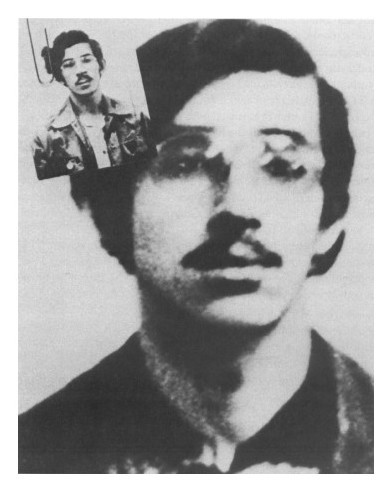

图　2-1　劳伦斯·博森（小图）和与他相貌相近的理查德·卡波恩

资料来源：Copyright©1974 by the New York Times Company.Reprinted by
permission.

很显然，在那种情境下，我们相信自己并不知道的事情这一事实给有效思考造成了一定的障碍。如果一个人认为自己已经知道了，他为何还要探讨同一个问题或者听取相反的观点呢？因此，了解知道的动态过程是非常重要的：我们如何知道以及知道什么类型的知识最可靠。

### 知道的方式<a href="#part0149.html_ch1-back" id="part0149.html_ch1"
class="pcalibre calibre2">[1]</a>

我们可以通过3种方式来获取真实的知识：个人经验、观察和其他人的报道。第一种方式最可靠，但正如我们即将看到的，这种方式是远远不够的。

#### 个人经验

我们不只收藏经验，还会将其与先前的经验对比，对它们进行分类、解读和评价，对它们做出假设。所有这些过程都可能是在无意中不知不觉地进行的，其中的任何纰漏，都会让我们的经验有别于现实。

我们来看个例子。艾格尼丝成长于一个宗教家庭，她上的是教会学校，庆祝所有宗教节日，包括圣诞节。她知道圣诞节是基督教的节日，从小到大，圣诞节一直是个神圣的日子。按照艾格尼丝的经验，圣诞节在基督教中的地位一直如此。不久后，这种模糊的认识变得更为确定了，她甚至能想象在课堂上听到过这个观点。是的，她知道圣诞节一直是基督教的一个重要节日。

事实上艾格尼丝错了。在17世纪的英国，清教徒是禁止庆祝圣诞节的，他们认为这是异教徒的风俗。同样，当时英国的新殖民地英格兰也禁止庆祝这一节日。直到1856年，圣诞节才在马萨诸塞州被确立为法定假日。

还有一个更为普遍的情况。我们所有人都会经历童年。多数人从来不会想有人没有经历过童年，因为我们很容易确信童年总是存在的。然而，研究证明，这个想法是错误的。历史学家J.H.普拉姆写道：

我们认为的童年（童话、游戏、玩具、童书甚至童年这个概念本身）都是过去400年里欧洲人的发明。我们用来指称年轻男性的词语“男孩”（boy、garcon、knabe）在17世纪以前一律被用来指称处于依赖地位的男性，包括30~50岁的男性。而7~16岁的年轻男性并没有专属用词，“孩子”这个词表达的是亲缘关系，与年龄大小无关。11

由于我们的理解不是被动接受的，而是受情绪和心理的影响，所以它们很少能准确地反映现实。事实上，有时它们甚至会歪曲现实。

<a href="#part0149.html_ch1" id="part0149.html_ch1-back"
class="pcalibre calibre2">[1]</a>在这里我们关心的是被讨论得最多的那种“知道”——知道是什么，其关键是信息。另一种同样重要的“知道”是知道如何做，其关键是程序和策略。衡量知道如何做或做的诀窍的标准不是了解内容与否，而是是否运用了技巧。我们在后面的章节里要学习的解决问题和争议的策略就属于做的诀窍。

#### 观察

通过观察能得到较好的结果，但我们常常事与愿违。我们往往戴着经验和信念的有色眼镜来观察世界。如果相信黑人比白人更擅长运动，我们很可能看到在篮球比赛中，黑人比白人表现更好，即使事实并非如此。这种观察的扭曲之所以发生，可以这样解释：

在看到这个世界之前，我们已经先听到了关于这个世界的一些事情；在经历大部分事情之前，我们就对它们进行了想象。除非我们所受的教育使我们确知一些事情，否则先入为主的观念会影响整个理解过程。它们注明哪些东西是熟悉的，哪些是陌生的，并强调二者的区别。这样，略微熟悉的东西会被视为非常熟悉，而比较陌生的东西则被视为异常陌生。它们会被很小的征兆所激发，而这些征兆并非真正的事实。一旦被激发，它们就会用老的印象淹没新的景象，将从记忆中挖掘出来的东西投射到这个世界上。12

#### 报道

这个来源囊括了父母和老师教给我们的、我们从新闻报道中听到的、从报章杂志里读到的大部分信息。毫无疑问，大多数人的想法是试图准确地教给我们知识，而非存心误导我们。他们自己也会相信他们传播的信息，但人非圣贤，孰能无过，我们所接收到的知识至少有部分是错误的。

乔治·塞尔德斯举了一个有趣的例子，说明错误可以逐渐渗透到新闻报道中。下面是原始的新闻报道及塞尔德斯确认的事实：13

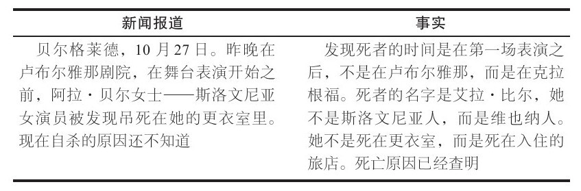

记者为啥会做出如此歪曲事实的报道？其实不难想象，他可能到达现场的时候有点晚了，现场已经被封锁了，这些故事的细节都来源于一些旁观者或者维持秩序的警察，换句话说，这些人对事实真相的了解也是支离破碎的，而且传闻也充斥在他们中间。

错误有时候来自一些很简单的疏忽。例如，纽约北部的一份日报报道，托马斯·西蒙斯因为打了卡尔·彼得森而被捕。一两天后，该报刊登了一则更正报道，似乎是彼得森打了西蒙斯。14所有读了第一则报道而错过第二则报道的人，都会以为自己“知道”发生了什么事，但他们错了。

杂志文章和书呢？与报纸文章相比，它们经过了更为细致的加工，因此，其所传达的信息应该更准确一些。但据埃德温L.克拉克的解释，它们仍存在一些缺陷：

众所周知，二手信息很可能会被写进书里，与普遍被认为的观念和偏见整合在一起。例如，与一手资料相比，多数普遍流传的历史故事里英雄更英勇，坏蛋更邪恶，战争更残酷，和平更辉煌。简言之，它们往往呈现历史事件，但并非历史事件的真面目，而是作者认为的样子，或者作者认为公众喜欢或应该会认为的样子。15

### 记忆的问题

最后，知道的3种方式（个人经验、观察和报道）会遇到另一个问题，即一件事发生之后，经历一定的时间，记忆不再准确。这个诊断似乎有点牵强，因为在人们看来，记忆的准确性无懈可击，就像录像带一样，能够长时间储存信息，在适当的时候播放出来。然而，这种认识是错误的。华盛顿大学的实验心理学家和记忆专家伊丽莎白·洛夫特斯（Elizabeth
Loftus）解释道：

大多数关于记忆的理论都把记忆过程分为3个独立的阶段。第一阶段是获取信息阶段，大脑在这一阶段将对事件的理解放入记忆系统中；第二阶段是记忆的保持阶段，这一阶段存在于事件发生和回想起某个特定信息之间；第三阶段是记忆的提取阶段，在这个阶段，个体根据自己的需要回想之前所存储的信息。但与传统观点相反，事实进入我们的记忆后，并不会自动留存在那里，不受未来事件的影响。相反，我们从外部获得的信息如果与此前的认知和预期（即已存入记忆中的信息）相关，它们就会被放入记忆。因此，实验心理学家认为，记忆是一个整合的过程、一个建构和创造的过程，而不是像录像机一样被动接受信息。16

在她的能够被广泛验证的实验中，洛夫特斯向人们展示了记忆的惊人可塑性。例如，在播放事件的录像并让人们记住看过的东西后，她可以通过微妙的暗示，“植入”在原始经验中没有出现过的人物、地点、事物等，来塑造人们的记忆。但心理学家的微妙暗示不是塑造记忆的唯一要素，我们自己当时的态度也会让我们删除某些记忆、精简某些记忆或创造出原始经验中没有记忆。17

甚至目击者的证词也因受到这种影响而失真。一份报道称：“研究发现，目击者理解和记忆事件，首先是根据自己的预期，其次是根据他们的情绪性偏见，再次是根据个人对事件发生的自然或合理方式的看法。”18

每个人或早或晚都会经历一件事，从而证明我们如何轻易地操纵着自己的记忆。赛奇教授不情愿地参加了一个教员会议，台上的领导喋喋不休，为了摆脱烦恼，赛奇教授打开一本书来看。突然，他听到有人在叫自己的名字：“赛奇博士，请注意听我讲话好吗？”赛奇教授吓了一跳，书掉到了地上，他结结巴巴地说：“啊……我正在听……那个……对不起。”

会后赛奇教授开车回家，路上开始思考当时应该如何回应演讲者。其中一种他最喜欢的方式是，猛地站起身来，很有气势地说：“先生，也许我必须出席这次会议，但要让我集中注意力，你们要努力争取。”几个月后，赛奇教授和一个朋友聊起这段被“重塑”过的记忆，他说的是哪个版本呢？是他相信发生的那个，即想象出来的版本。

这个关于知道和记忆的观点有些悲观，但你也不必泄气。这并非事情的全部，只是被忽略的那一面。尽管准确的知道和较少歪曲甚至没有歪曲的记忆不会自动发生，但如果我们努力争取，还是有可能实现的。

### 什么是意见

意见是极具个人化色彩的，因此人们对自己的意见有强烈的情感是可以理解的。可是很多人让这种情感超出了理智的界限，他们将“人人都有自己的观点”这个正确观点发展为“人人的观点都是正确的”这一荒谬滑稽的观点。对意见的性质没有成熟的理解，是不可能成为优秀的思考者的。

“意见”这个词的根本问题在于它的含义太丰富了，它包括了对喜好和判断的表达，这让人不堪重负。

#### 表达喜好

表达喜好是指内在状态和偏好，本质上就是“我喜欢这个”和“我不喜欢那个”。例如，一个人会说：“我觉得光头男人有魅力”“除了别克我不愿意买别的车”“在看奶牛的画像时，我想看到与奶牛相关的东西，而不是斑斓的色彩”“黄色和紫色很搭”，所有这些陈述都是对喜好的表达。人们可能有共同的偏好，甚至悲哀地发现这些偏好很粗俗，可是我们没有理由让别人为他们的偏好辩护，因为没有必要。

#### 表达判断

表达判断是对事情真相或行为是否明智的判断。因此，如果有人说“光头的人比头发多的人更容易感冒”，或者“别克车比福特车更经济”，或者“看不出是奶牛的奶牛画是拙劣的作品”，抑或“把黄色和紫色放在一起是审美缺陷的表现”，他们就不是在表达喜好（尽管他们的喜好也许隐藏在其中），而是表达判断，就像他们对死刑是否能阻止犯罪或者投票年龄是否应该提高等问题做出评判一样。

对判断提出质疑不会不礼貌或不民主。只有在证据的证明下，判断才是明智的。人类历史充斥着许多在没有充分证据或狭隘地解读证据的基础上做出的判断。在很多情况下，它们带来了极大的危害，因为人们不敢对它们提出质疑。

数个世纪之前，人们一直接受这样一种观点，即人类意识的中心是心而不是脑；17世纪的人们还认为是天使在轨道上引导行星（甚至连著名的天文学家开普勒都不曾质疑这个观点）；19在达尔文出生前很久，人们就知道化石的存在，但它们被视为被“诺亚洪水”毁灭的动植物的遗体，是撒旦创造出来欺骗信教的人，或者是上帝用来考验人们的宗教信仰的。20

人类的判断可能既错误又愚蠢，这是让你根据仔细解读的充分证据，而非偏见、心血来潮或盲目的信念做出判断的最好理由。当新证据对你的判断提出质疑的时候，你也必须迅速地重新思考自己的判断。

### 理解原因和结果21

清晰地理解原因和结果之间的关系对于形成观点至关重要。不幸的是，在这种关系中常常存在大量混淆的东西，因此也产生了大量的错误。第一种错误就是本来没有这种因果关系而错认为存在这种因果关系；第二种是仅仅看到了简单、明显的因果关系而没有看到复杂和细微的因果关系；第三种是相信因果关系和物质力量有关，和人类事务无关。为了避免这种混淆，你必须理解4种事实。

（1）一个事件可以先于另一个事件发生，但是并不一定是另一事件产生的原因。一些人相信当一个事件先于另一个事件发生，那么这个事件必定是第二个事件的原因，大部分迷信都来源于这种观念。例如，打碎一面镜子，一只黑猫从你前面的马路穿过或者从一个阶梯下面走过，这些都被认为是会带来霉运的。你不能相信这种迷信的说法而形成错误观念。你或许会相信，今天教授给你们进行了一次未曾宣布的测验是因为前天学生们的注意力不集中，如果不是这样的话他会在学期开始就宣布这个测验。或者其他因素也可能会促成股票下跌，你也会相信股票下跌是因为新的总裁上任。

那些相信前面的事件会引起后面的事件而导致的问题是由于这种思考方式忽略了巧合因素。这种可能性的原则是“相关并不能验证因果”。为了建立一个因果关系，排除巧合是必要的，或者至少用一种有说服力的情况来反对这种巧合。

（2）并不是所有因果关系都是有力和必要的。“因果”这个词语常常与物理现象相联系，这种现象影响物质现实。例如，房子被闪电击中然后着火了，花盆突然从窗台上掉下来，然后落到地面上碎了，或者一辆快速行驶的小汽车未能顺利地通过一个弯道，倒向了公路的一边，并撞上了一棵树。在这些例子中，一个科学原理或者法则应用（燃烧、万有引力、惯性）的效果是必然的，或者至少有很高的预测性。

因果关系是有效的，但这种因果关系也会使得我们的思维犯错，让我们认为只有这一种关系。因果关系也会发生在非物质的现实中，我们称这种非物质的现实为人类事务，特别是在人的情绪和思考的过程中。如果没有一些科学原理，那么这种类型的因果关系是很少的，从来就不是必不可少的，并且常常很难对其进行预测。

如果能够避免过度简单化，我们需要用物质和非物质的领域结合起来的方式去定义因果关系。因此，我们对因果关系是这样来定义的：一个事件的发生引起了随后另一事件发生的现象。这种影响在时间上或者空间上可能是很大或很微小的、直接或间接的、近处或远处的。它或许是不可抗拒的，正如之前提到的燃烧的房子、万有引力和惯性。或者是可抗拒的，正如我们在随后的例子中要提到的关于父母的教育或者同龄人的榜样作用。在后面这个例子中，在其他的事项中所涉及的想法、影响（原因）并不会迫使结果的产生，取而代之的是邀请、鼓励或者启发。请思考下面这些例子：

罪犯对他们的行为不负责任的观点受到刑事辩护律师的支持，他们把责任从当事人身上转移到父母、老师和整个社会。这种申诉受到法官和陪审团的鼓励，对犯罪分子的处罚因此比之前的要轻。

拿起武器对抗其他人是不道德的观点，让一些人认为这是绝对不可接受的军事侵略，甚至那些防御的国家会反对这种无端攻击。反过来，这种信念又会使一些人不愿考虑“正义战争”这种论点。

智力由基因决定这个观点导致20世纪初的教育家认为思考是不能被教授的，因而强调死记硬背的学习并扩大职业课程。

感情可以有效地指导行为的观点使得许多人抛开约束并冲动行事。这种改变使得不礼貌的行为增加了，其他社会问题也出现得更多了，如虐待配偶。

自尊是成功的先决条件这种观点改变了传统的自我提升的观点，导致很多书籍都关注自我承诺，并且导致教育家对家庭作业、等级评定和纪律等的态度越来越宽容。

以上每一个例子都说明，一种思想会影响到随后的行为或者信念。专栏作家乔治·威尔毫无疑问持有这种因果观点，当他遇到这种宣称“没有一个人可以在看完‘天生杀人狂’或者听那些流氓强暴的录音带后就会死亡”，威尔回答道：“没有一个人会在读了《先锋报》纳粹反犹主义报纸之后死亡，但是文化造成了600万犹太人的死亡。”22

（3）人类事务中存在不确定因素——自由意志。比起物质现象，人类行为更难以预测，但并不是说人类行为根本无法预测。当两种观点或者一种观点与一种行为紧密相关时，就可以通过一个预测另一个。塞缪尔·约翰逊认为：“当人们高估自己时，就会低估他人，并且压迫他人。”约翰逊曾谈到一位熟人：“如果他确实认为善恶没有什么区别，为什么当他离开我们家时让我们数勺子呢？”

习惯和时尚也是不确定因素。习惯使烟民继续抽烟，撒谎者继续撒谎，自私的人依旧如故。至于时尚，当时装设计师说“裙摆应该提高”时，女人们趋之若鹜；当大号无腰带牛仔裤盛行时，男孩们穿着它招摇过市；当某些知名运动员剃光头后，粉丝们也纷纷效仿。

有些时尚会不断发展，流风余韵甚至影响到两三代人。在这种情况下，人们反应的变化是如此之慢，以至于他们根本察觉不到这种改变。想想电视和电影中的色情内容就可以知道这一点。

在20世纪50年代，荧屏上暴力和色情内容很少见，人们看到的内容都被处理过。观众看见的只是一闪而过的血腥和色情场景。随着时间的推移，这种场景开始在屏幕上增多，镜头拉得更近，时间停留得更久，再后来，原有的禁忌也开始被打破了。最终，电视节目中开始出现充斥暴力、色情的内容，甚至连强奸、娈童和吃人这样的主题都登上了荧屏。最近，电视台推出了一档名为“取证程序”的节目，该节目会对刚发生的奸杀案进行细致描述，并用大特写镜头来呈现那些血淋淋的验尸细节，并以图形倒叙法重现令人震惊的犯罪过程。

这些变化引发了强烈抗议，但随着时间的流逝，骇人的影像变得越来越常见，那些反对暴力、色情的抗议者反而被视为异类。简言之，这些影像存在的事实使它们被人们接受了。

到目前为止，我们已经认识到发生在物质世界的因果关系缘于力量或必要性，但这在非物质世界中是行不通的。也就是说，在人类事务中，结果在某种程度上是可以预测的，但不像在物质世界那样容易。原因是什么呢？因为人们有自由意志，可以应对来自外部的强大影响，而自由意志本身也是影响结果的一个核心因素。这就可以解释为什么有些成长于特别恶劣的环境（如家庭暴力、父母离异、犯罪猖獗等）中的人有些可以抵抗这种负面影响，成为正派、勤劳和守法的合格公民。（这也可以解释为什么有些在经济上很幸运的人却因为理念有亏而最终堕落。）

人很难选择自己的出生，但他们可以决定如何活着。在考察人类事务时，自由意志是一个绝对不能忽略的重要因素。

（4）因果关系往往是复杂的。投石入湖，平静的湖面会泛起涟漪，周围的水域会受到影响，甚至千里之外的水域都会被涉及。美国国家航空航天局（NASA）的研究者在大气中发现了类似的现象：大气中的气溶胶层中的微小颗粒会对源区数千英里外的气候产生涟漪式的影响。

人类事务中的影响也是非常复杂的。一个化工厂的老板在努力降低成本，将化学品排放到附近的溪流中并流到江河中。这种行为所产生的后果是他不能预计的，包括污染河流、杀死鱼类甚至让那些远离他的工厂居住的人致癌。这些结果都是无法预料的，因为他没有想让这些情况发生。

一个妇女处在流感的初期，一开始并没有意识到自己生病了，或许会在拥挤的飞机里打喷嚏并且感染很多同行的乘客。随后，被感染的人将失去工作的时间，一些人还不得不去住院；可以想象他们的免疫系统受到了损害。鉴于她本人缺少对自己状况的了解，因为她的喷嚏造成了这些结果就认为她是有罪的（从道义上讲是有责任的），这种说法是不合理的，但毫无疑问，确实是她造成了其他人的这些结果。

夜晚，一辆小汽车行驶在州际公路上。在快速的行驶中，一只鹿跳了出来，司机猛踩刹车，但还是撞死了那头鹿。身后紧随行驶的汽车撞上了他的车，其他5辆车也紧跟着撞了上来。这种结果就像是连锁反应，驾驶者和乘客都会遭遇不同类型的创伤——未成年人处在佩戴安全带的情况下，成年人处在其他的情况下。辨别那些致病因素需要很细心地对细节留心。最初的原因是一头鹿在一个不幸的时间横穿公路，但那不是唯一的原因。首先是驾驶者导致了鹿的死亡。随后的驾驶者发生了相应的连锁反应。23那些没有系安全带的乘客的伤势会比其他驾驶者和乘客更为严重。

这个例子中包含了非常有价值的一课，就是在调查中关心原因和结果。但是，如果我们用那种方式来调查一个案例常常是获益的，它让我们对这一课也更加清晰——在时间上从最近的效果前推到最早产生的原因，也就是说追溯到“根本”原因。

例如，居住在欧洲中东地区的人数相比以往显著增加，一些观察者认为，欧洲被称为“欧拉伯”（Eurabia）可能会更好。是什么引起了这种变化？分析师发现，在政府的支持下，几十年来欧洲公司已经邀请了很多外国人来他们的国家工作，而且这些员工把他们的家人也带来了，并形成了他们自己的聚居地，建造了他们自己的清真寺和教堂，并且“植入”了他们自己民族的文化。随之而来的问题是，什么导致了各国政府允许大量员工涌入这些国家？答案是欧洲国家的当地人口下降到了接近或者低于人口“更替水平”，而且当地出生的员工不能满足工作的需求，因此也不能资助老年人的养老金和医疗保健服务。

是什么导致了人口的下降？在20世纪六七十年代，越来越多的家庭选择了有效的避孕节育措施。是什么导致了这么多的家庭选择限制他们孩子的数量呢？一个因素是，一个世纪以来人口从乡村向城市迁移，孩子成为经济负担而非财富；另一个因素是，人们越来越重视自我实现和相应的倾向，相对应的方式就是扼杀养育孩子的倾向。

正如这个清晰的关于原因和结果的建议，浅显易懂地回答了复杂的问题，这不仅仅是无益的，而且是不公平的。下面的这些技巧会帮助你避免在分析中过度简单化：

记得那些事件是极少见的，如果有的话，就是“恰好发生”。它们之所以发生是因为受到明确的影响而产生的结果，而且这些影响或许是最大的或最小的；是直接的或间接的；是在空间和时间上接近的或远离的；是不可抗拒的（被迫的或者必须的）或可以抗拒的（是邀请的、鼓励的或启迪的）。

需要记住，在人类事务中，自由意志是其重要的影响因素，而且它常常和其他原因交织在一起。在欧洲社会变化的例子中，人们从农村到城市的迁徙和人口控制是个人的选择，但是，去哪个城市工作（是一种经济现实）和人口的控制（是一种科学的发展）却不是个人的选择。

要意识到这是一连串事件，产生的效果往往成了原因。例如，欧洲人口的下降引起了大量外国工人的流入，反过来，也会引起外国公民在本地出生率的变化，这时也会引起国内主流的价值观和态度的改变。

在处理人类事务的时候，结果是不易预测的。因此，在决定性的原因方面，你可能需要解决的是可能性而不是确定性（就如同你在一件事中借助科学测量的方法）。换句话说，你可能会得出这样的结论：在概率很大的情况下，一些事情比其他事情更有可能发生，或者大幅度增加出现的情况，这常常就是产生的原因。两种结论中的任何一种都明显比小概率情况下的要强有力，但它属于短期的确定性。这种不同大致类似于在道德判断标准方面：在民事案件中，标准是“占优势的证据”或者“明确并令人信服的证据”。然而，在刑事案件中，却是更为苛刻的“超越合理怀疑”的标准。

### 道德问题

比起道德问题是否值得商榷这个问题，无处不在的现代思想则显得更为混乱。许多人辩称不是这样，他们说进行“价值观判断”是错误的。这种观点是虚构的。如果价值观判断是错的，那么伦理学、哲学和神学在大学课程中就不会出现了——这种观点显然是愚蠢的。正如下列情况，避免进行价值观判断是不可能的。

拉乌尔·沃伦伯格是一位年轻的瑞典贵族，1944年他去了布达佩斯。再往后的一年，他骗过了纳粹并从死亡集中营救了多达10万犹太人（他自己不是犹太人）。在1954年，他被苏联当局逮捕，被指控从事间谍活动，被关押在苏联的劳动营。最终他死在了那里。24今天，如果我们把他当作英雄（有很好的理由这么认为），我们就是进行了价值观判断。但是，如果我们中立地判断，认为他和别人没有区别，我们也进行了一次价值观判断。我们可以认为他既不是英雄也不是恶棍，仅仅是平常人。

看一下另外一个案例。纽约市一个20岁的母亲将她的3个幼儿丢在满是垃圾的出租屋里，不管不顾。25警察后来在屋里发现了这3个嗷嗷待哺的孩子，最小的孩子被卡在床垫和墙壁之间，身上爬满了苍蝇和蟑螂，而最大的那个在二楼的窗台上玩耍。警察判定这个母亲犯了过失罪，法院同意这种说法。他们判断错了吗？不，判断是无法避免的。她要么犯了过失罪，要么没有。

不管做出这种道德问题的判断有多困难，我们必须对其做出判断。价值观判断是社会规范的基础，就如同我们的道德系统一样。我们的法律质量直接受到我们道德判断质量的影响。如果一个社会判断黑人是低劣的，就不太可能对黑人同等对待。一个相信妇女应该待在家里的社会，就不太可能保障妇女有平等的就业机会。

还有些人只接受在一种文化中做出的、与其他文化无关的价值判断。他们认为，不同文化中的对错判断相去甚远，一种文化反对的行为在另一种文化中可能是被接受的。这种现象是存在的，但差别往往被人为夸大了。他们初次碰到陌生的道德观点时，总是先关注差异，而不是共同之处。

例如，在中世纪的欧洲，动物会因犯罪而受到审判，且常常会受到正式处决。事实上，有时蟑螂和其他虫子是会被逐出教堂的。26这听起来很荒谬，不是吗？但当我们透过谬论看本质时，发现谬论的基本观点不外乎“一些行为应该受到谴责和惩罚”，这并没有什么奇怪的。例如，一个人被狗咬了很冤枉，要求狗还他一个公道，其实质和上述观点是一样的，区别在于我们排斥“狗需要对自己的行为负责”的观念。

那么，我们在其他时间和地点通过道德标准做出的判断是合理的吗？答案是肯定的。只要我们深思熟虑，而不是简单粗暴地得出结论，认为别人的观点都是错的就行。例如，一种文化认为女人是一种财产或者认为她们比男的命贱，这种文化否定了女人的人权，是不道德的。我们来看一下下面这个例子。

19世纪，在巴西里约热内卢，一名戏剧制作人开枪杀死了他的妻子，原因是他的妻子不顾他的反对，执意要在植物园散步。该制作人被指控杀人，但法官驳回了指控，于是该制作人被无罪释放。在这种文化主导的道德观之下，如果妻子不服从丈夫（即使因为很小的事情），丈夫的杀妻行为也会得到宽恕。百年之后，这种道德观并没有多大变化。同样是在里约热内卢，一个富有的花花公子因为他的情人和别人调情，愤怒地朝自己情人的脸部连开4枪，导致后者当即毙命。由于“捍卫了自己的荣誉”，他被判两年徒刑，缓期两年执行。27

如果仅仅因为这些例子发生在不同的文化中，就不对其做出价值判断，显然是不负责任的。在上述两个例子中，两个男子的行为很明显属于谋杀，是对女人的“冒犯”反应过度，因此说明了他们对女性权利的无视。因此，理应判定这两个男人的反应是不道德的。这种判断还有另一种含义：赦免这种行为的文化本身就是不道德的。

### 道德判断的基础

道德判断的基础是什么呢？当然不是大多数人的观点，那太不可靠了。例如，1976年发生在里约热内卢的那起谋杀案，广播电台的一次民意调查显示，90%的被调查者认同法院的判决；美国人曾一度支持奴隶制；更近一些的事情是，多数人最初是反对堕胎的，后来也表示了赞同。道德判断的基础也不是感觉、欲望或偏好。如果是，那我们就必须承认所有强奸犯、杀人犯、抢劫犯的行为都是合乎道德的。良知提供了一个好的判断基础，但它也可能无知或者麻木。（毕竟，最邪恶的罪犯有时并无悔改之意。）

道德判断最可靠的基础是人们有独立于任何政府和文化而存在的权利，它是大多数道德体系的基础。只要一个人没有侵犯他人的权利，他就应该享有被尊重和不受干涉的权利。其他诸如“追求”幸福的权利则是这种权利的扩展。

当然，这个基本原则本身并不足以用来对一个复杂的道德问题做出判断，我们还需要借助其他原则。我们在大多数伦理系统中发现了以下4条原则，即使是对那些持有迥异伦理观点的人来说，这些原则也为之提供了能够相互讨论的共同基础：

（1）人际关系创造出各种职责，除非有令人信服的理由不去这么做，否则我们都应该以履行这些职责为荣。例如，正式协议或合同、对家庭成员的义务（父母对小孩、小孩对父母以及夫妻之间）、朋友间的义务、雇主-雇员间的职责以及商业和职业责任等。

（2）某些理念能够提升人类生活，帮助人们去履行对他人的职责。只要在可能的情况下都应该以此为荣。其中，最重要的理念包括宽容、同情、忠诚、宽恕、和平、手足情谊、公正（给予人们本来属于他们的东西）和公平（不偏不倚）。

（3）某些行动的结果有利于人类，而某些行动的结果有损于人类。人们更倾向于选择前者。当然，结果可以是情绪上的或身体上的、短暂的或持久的、隐晦的或明显的。

（4）情境改变状况。普适观点有它的用武之地，但更多时候是被当作谨慎判断的一种替代。“杀人是错误的”作为一个普适的道德观点，在真实状况的决策中可能无法提供什么帮助。这些普适观点模糊了一些重要的区别。职业杀手为完成一项交易而取人性命，警察出于自卫而杀死抢劫犯，小孩错把真枪当作玩具而意外击中其他孩子，这种情形同样都是杀人，但这3种行为是非常不同的。好的思考问题的方式意味着我们要抛开那些普适观点，具体情况具体分析。

为了获得检验道德问题的深度以及做出道德判断，你必须有效地处理由两种或两种以上相互冲突的职责或理念所带来的复杂性。多重结果的可能性也造就了这种复杂性，一部分结果是有益的，另一部分结果又是有害的。这里有一个简单易学的指南来帮助我们处理这种复杂性：

（1）当两个或两个以上的职责相互冲突时，问问自己哪一个是最重要的或是先出现的。

（2）当两个或两个以上的理念相互冲突时，问问自己哪一个是最高的或最重要的。

（3）当有好有坏的多重结果存在时，问问自己哪个是最重要的，好的结果是否能压过坏的结果，反之亦然。

让我们先来看一个真实的道德问题，看看如何应用这些建议。中年男人拉尔夫年轻的时候是一名优秀的运动员，对运动充满了热忱，儿子马克是在父亲这种热忱的熏陶之下长大的。七年级时，马克参加了3种运动，但其中两项他都不太擅长。篮球算是他最擅长的运动，但表现也差强人意。拉尔夫认为只要接受一些帮助，马克就能成为一名一流的运动员。所以，拉尔夫开始与大学篮球教练们建立关系。他邀请这些教练到自己的家里来共进晚餐，向他们开放自己的个人体育藏馆，利用业务上的关系拿到职业比赛的门票送给他们。

拉尔夫通过自己与教练们之间的友谊来帮助儿子。他常常告诉这些教练马克想要成为一名优秀的篮球运动员的愿望，希望他们能够给予马克一些提高技能的建议。考虑到与拉尔夫的友谊，教练们自然都很乐意帮助马克。他们在周末的时候向马克开放体育馆，以个人身份来帮助马克提高篮球技能。

很快，马克进入大学篮球校队打比赛。拉尔夫不放过任何一次机会提醒教练们注意马克的贡献，并指出其他运动员的弱点。每次比赛，马克都能获得更多的上场机会，自然也就成为团队中的得分王。进入校队以后，马克得到了更多的特殊训练。他几乎从未休息，即使他所在的团队已经遥遥领先时，他仍然在不断地提升自己的总得分。大四那一年，大多数比赛都是为他而设的。拉尔夫还说服教练们写信给许多大学教练，向他们称赞马克的表现。

拉尔夫的行为是道德的吗？让我们应用之前讨论过的原则来思考一下这个问题。在这个事件中涉及3个重要的职责：拉尔夫通过教育和榜样的作用对儿子的成长负有职责，拉尔夫对自己与教练之间的友谊负有职责，教练们对帮助每一个队员提高自身潜能、理解体育价值负有职责。

这里需要考虑到的理念包括对他人需要公正和公平的感知。把第一条理念套用到拉尔夫身上：他应该重视其他运动员（儿子的队友们）对于获得鼓励、支持和平等机会的需要。将另外两条理念公正和公平地套用到教练身上：他们应该给予团队中的每一名队员本该获得的关注和帮助，而不是把注意力集中在某一个队员身上。（当然，这并不意味着给予某个杰出运动员以特殊的关注就是不公正的。注意，马克一开始只是一个表现平平的运动员。）教练们应该公平地对待每一个运动员，要做到这一点，他们可以在周末的时候向每一个想要练习的运动员开放体育馆，而不再只是为一人而开。

整件事情最清晰明了的结果就是，马克的技能得到了提高，而其他队员由于机会的不均等而没有获得应有的发展。另一种可能的结果是，马克的队友对教练的偏心感到怨恨，而马克则会认为，为达到自身目的而忽视他人权利和需要的这种态度是被允许的，甚至是被提倡的。

显然，拉尔夫的行为确实达到了某些好的结果（儿子技能的提高），但同时也损害了一群人的权利。最显而易见的是对其他运动员的损害。拉尔夫的行为也导致教练们为了友谊而违背了自己保持公正、公平的理念。（当然，教练们要为自己的行为负起主要责任，他们完全可以抵制拉尔夫的影响。）此外，拉尔夫的行为还有可能对儿子产生有害的影响。这种自私的态度所带来的长远影响会超过马克在运动技能上的提升。

根据以上的分析，我们会发现拉尔夫的行为是不道德的。从长远来看，拉尔夫理应为他的所想所做而受到谴责。

### 应对困境

道德问题常常让人觉得进退两难，我们有一些选择，但又没有一个是完全令人满意的。这样的情况真是令人沮丧。不管我们做出哪种选择似乎都是错误的。我们告诉自己“我无法做出决策”。遇到这种状况，最好的方法就是在头脑中形成一个清晰的策略。以下策略将帮助你远离无法决策的混沌。

（1）记住，你不需要把选择简单地分成好或不好。你可以用一种更复杂的方式来看待。问问你自己，每个选择在图2-2所示的标尺中处于哪个位置。

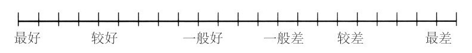

图　2-2

注：当你第一眼看上去觉得每种选择都差不多时，这种方法可以帮助你区分这些选择。

（2）当所有的选择都很好时，你要决定的是哪一个更好；当所有的选择都不好时，你要决定的是哪一个不差。

### 热身练习

记住，这些练习和章节中的内容没有明确关系，通常更注重应用而非结果。请你大胆而富有想象力地去回答它们。

1.你的侄女，一个学龄前儿童，问你这样的一个问题：“未来可以被记住吗？”请写出一个能够让她理解的简短而清晰的回答。

2.如果我连续3天说“我明天见你”，我每次是在说同一件事吗？请全面地解释你的回答。

3.一个人正在下行的自动扶梯上往上走，下行的速度要快于他上行的速度。他是在上楼还是在下楼？请全面地解释你的回答。

### 应用练习

1.请仔细阅读下面的对话，找出思考的缺陷。如果你发现了一个缺陷，请识别出来并且用足够的细节来解释错误的原因，说服那些阅读了短文但是没有找出缺陷的人。如果你发现了两个或者更多的缺陷，请识别出来并且解释你对每个缺陷的思考。

克莱姆：你相信第2章所说关于真理和意见的那些内容吗？我认为大多很垃圾。

克莱德：我不知道……它对我是有意义的。

克莱姆：拜托，老兄，你真会开玩笑。书生气十足的教科书作者告诉我们，对我们来说什么是真理。他是他自己，不是我。他是如何通过看我的眼睛而形成我的精神呢？只有我自己才能做到那些。

克莱德：但是，等一下……

克莱姆：等一下，没什么好等的。老兄，你已经说了所有的内容。正如那些有关意见的废话。这是一个民主的国家，不是吗？在一个独裁的国家，政府可以说什么意见是正确的，但这里不行。我的意见和其他人的一样正确，宪法中就是这么说的。

2.爵士音乐家比利·蒂普顿在74岁时去世，据了解，“他”是个女的。蒂普顿显然在生命早期就开始隐瞒，以提高“他”作为一个音乐家成功的机会。实际上，每个知道或认识蒂普顿的人（包括“他”收养的3个儿子）都知道“他”是个男人。数百万人都相信蒂普顿是男人的事实能够改变事情的真相吗？人们制造了自己的真理，你支持它还是反对它？

3.返回第1章热身练习第1题。在那儿选择一个陈述（a~r）并且回想你当时是如何回答的。根据你在本章学到的关于知识观点的内容来检验一下你之前的回答。也就是说，确定你的看法并完善其来源。

4.下面这段文字出自美国一位著名的政治家。它是否对你从本章中学到的观点构成了挑战？如果是，指出受到挑战的观点，并判断哪种观点更合理；如果没有对任何观点形成挑战，指出本章中哪一部分与其最相符。

所有人都有自由权利的假设是一个巨大且危险的错误。自由是需要争取才能得到的奖赏，不是一个慷慨、无偿的赐予；自由是对智者、爱国者和值得奖赏的人的奖赏，不是给予无知者、堕落者和邪恶者的恩惠，他们既不会重视自由，也无法欣赏自由。（约翰C.卡尔霍恩）28

5.下面的每种情况都有可能产生潜在的因果关系。根据你在本章中学习到的内容来思考每一个题目。

a.美国会被其他国家赋予“最惠国”的身份。其他国家的政府提供大量资金资助恐怖分子训练营。这些国家的宗教领袖承诺上天会赐给那些参加恐怖活动的人奖励。恐怖分子训练营中的教官教年轻人组装爆炸装置，把这些爆炸装置隐藏在他们的身上，并且在拥挤的人群中引爆。年轻人照着教官教的那样去做，杀死了许多毫无戒心的无辜的人。请解释哪一个个体或组织被认为是引起死亡的原因是合理的呢？

b.一个黑客制造了一种病毒，这种病毒可以格式化下载它的人的硬盘。他设计的病毒可以巧妙地通过电子邮件进行伪装并将其自动转发给50个人。在意识到自己的计算机感染病毒之前，那50个人已经将致命的电子邮件转发给别人了。那些接收到电子邮件的人在几个星期内做着同样的事情，结果成千人的硬盘被格式化了。描述因果关系，如果可以，进行角色扮演。

c.许多评论员对美国文明的衰落表示关注。讨论下面这些原因在美国文明的衰落中是否起了作用：“只要随意就好”（澳拜客牛排）；“随心享用”（汉堡王）和“在这个星球锐步没有规则”。电影里打破常规的人往往充满魅力。谈话节目中充斥着露骨、粗俗和无序。在职业摔跤中经常出现口头攻击和打破常规的行为。在电视谈话节目上，如果没有得到鼓励，参与者就不断打断他人讲话并歇斯底里地喊叫。自助手册的作者鼓动读者大胆表达诉求、更自信和/或抵制传统的行为标准。

6.下面的每个例子都和道德有关（有一些问题也和法律相关，但是在这儿我们不关注法律问题）。请识别每个问题中重要的道德因素，然后判断采取这种行为的道德性，并详细解释你的推理过程。

a.在美国马萨诸塞州沃尔瑟姆市一家医院，一名医生因强奸一名护士而被判有罪，在未入狱、等待上诉期间，他向纽约布法罗市的一家医院递交了职位申请。据报道，沃尔瑟姆那家医院的行政部门写了一封信推荐他，而且没有提到强奸案的事（直到沃尔瑟姆市检察署对他提起了一项新的涉及病人的强奸指控时，布法罗的医院才知道之前对他的判决）29。沃尔瑟姆那家医院的行政人员没有提及关于该医生强奸判决的信息，这种行为是否道德？

b.在佛蒙特州蒙彼利埃市，11岁的安娜·索拉被一辆小汽车撞倒，随后被送进医院。她的父亲是耶和华见证人（该宗教流派反对输血），医生认为必须给安娜输血，但她的父亲不同意。法官取消了安娜父亲对安娜的监护权，并把监护权移交给了州政府，这样输血才得以进行。30法官的行为是符合法律的，但是否合乎道德？

c.法律通常倾向于保护有智力障碍者的生育权，除非后者知道绝育的性质并同意这么做。可是多年前，有3个严重智力障碍女儿的一对夫妻通过诉诸法律，获得了替自己的女儿做决定的合法权利。31他们这样做在道德上能否被接受？

7.关于狩猎这样的运动项目是否道德引起了很大的争议。在网上搜一下相关观点，评价矛盾的观点并且判断哪一种观点最合理。确认你期望的回答并且对可能反对你立场的观点做出回应。

### 综合练习

下面这道题是本章对思考能力最大的挑战，像第1章中综合练习那样做出分析并且做出回答，也可以参考本章“道德判断的基础”和“应对困境”部分的内容。

⊙议题简述：政府的规模

对于我们而言，关于政府规模多大合适的讨论并不新鲜，开国领袖们曾经为之激辩。但是，在2007~2008年金融危机的时候，政府对危机的应对使这个话题突然升温。布什政府出台了不良资产救助计划（TAPP），而奥巴马政府则制定了经济刺激措施，任命了超过两打“沙皇”（指不经过参议院确认就被认命的人），并且批准政府紧急援助私营公司。布什政府和奥巴马政府的举措加上此前就已经存在的计划和监管机构，导致国家经济的40%被控制在政府手中。想想生活中有哪些方面受到了政府的牵涉，至少是受到监管机构的干预：铁路、教育、农牧业、印第安人事务、艺术、企业、研究、国家公园、公共住房、福利、战争、外援和体育活动。对于政府规模的讨论常常涉及联邦政府，但在州政府和地方政府的规模上也存在争议，特别是在它们试图调节能量饮料的销售、快乐儿童餐赠送的玩具、食品中的脂肪/糖/盐含量以及超市里塑料包装袋的应用时。

⊙对比阅读

庞大的政府是必需的

科特·韦伯

人们关注这些日子以来遇到的经济问题是可以理解的，但许多人使用这些事项来反对政府的规模和政府的举措。这些争论并不明智。庞大的政府并不是问题，问题在于解决措施。明白这一点，我们仅仅需要思考政府如何处理近期发生的这些事情。

在2008年，主要的金融机构濒临崩溃。仅仅通过不良资产救助计划的实施，它们就被挽救了。在2009年年初，经济在潜在的金融风暴中仍然受到影响，因此政府推出了经济刺激举措并且确保经济恢复计划。同样，通用汽车公司濒临破产时，政府接管了公司才使公司财务状况变好。通用汽车公司的这个案例证明了政府不是私营部门的敌人，而是重要的合作伙伴。

把限制联邦政府的观点写入宪法是一种时尚。然而，持有这种观点的人并不承认现代的美国和18世纪末的美国是截然不同的。开国元勋也不能想象在接下来的几个世纪里所面临的挑战。

我们应该感谢庞大的政府。它为老年人提供了社会保障，为穷人提供了社会福利，最近医疗保健覆盖了3000万老人。政府也解决了2010年墨西哥湾漏油事件并且通过禁止进一步钻探的方案以防止其复发。

比起以前，美国变得更加强大和复杂了，所以这个国家需要一个大政府来和国家的强大与复杂匹配。

政府太大于民无益

杰西卡·托雷斯

托马斯·杰斐逊这样警告：“自然情况下事情是这样发展的，政府攻城略地，自由节节败退。”这句话精确地描述了在我们的时代政府所发生的变化。政府规模的扩大和我们困难的增多并不是巧合。

一些人认为大政府能够解决房地产市场的危机。但现实中，它创造了危机。一些发疯的国会议员认为拥有一个家是一种基本的权利，因此，他们强迫银行给那些没有偿还能力的人贷款。当房地产市场崩溃的时候，他们又归罪于银行家的贪婪。

大政府对能源危机负有相当大的责任。他们取缔海上钻井和阿拉斯加州安瓦尔油田的发展，随后又谴责我们对外国石油的依赖。他们也迫使石油公司进行深海钻探，但随后又指责英国石油公司在墨西哥湾深水处漏油。这还不够，随后奥巴马总统禁止了在东部海湾的进一步钻探，同时巴西和其他的一些国家正在海湾地区的其他地方钻勘。

大政府的出发点是好的，但其结果却很少能够被测量，大社会程序使贫困和失业问题更趋恶化，削弱了许多人自力更生的能力。社会保障是一个很好的思想，但是政府变成了一个不可持续的“庞氏骗局”。仅有的工作是政府部门那些刺激程序的“刺激”。公务员的平均薪水是私营企业员工薪水的两倍。公务员没有为国家创造财富——他们只是寄生虫。托马斯·潘恩曾经观察到“管得最少的政府是最好的政府”。他说的没错。

⊙课堂讨论

米拉：政府应该做什么？不是出台不良资产救助计划，而是坐视银行倒闭？

乔：绝对是。不是所有的银行都有“有毒资产”，那些持有“有毒资产”的银行当然应该倒闭。

米拉：那敢情好，而且政府应当让经济自我刺激，并让通用汽车公司破产。

乔：真够讽刺的，一针见血。许多经济学家认为“经济刺激方案”阻碍了经济的复苏。作为论据，经济学家对比了1920年的衰退和10年后的大萧条。在1920年，政府并不干预经济而且经济可以自行进行调整。

米拉：但是让通用汽车公司破产对于它自己或者国家有什么帮助呢？

乔：如果破产，公司将有机会进行重组并且重新考虑其协议与合同。就通用汽车公司而言，它将有机会改变工会合同，原有的工会合同使通用汽车公司在行业中的竞争力被削弱了。可以说，政府干预阻碍了经济的健康发展。

米拉：我怎么确定你所宣称的事实是真的呢？

乔：很简单，你亲自检验一下就知道了。

## 第3章　拓宽视野

你是否注意到很多人的衣着、谈话方式和行为方式都差不太多？所有剃光头、炫耀文身和在不寻常的地方带环的人都没有受到他人影响，这可能吗？

在这一章中，我们来探讨怎样成为独特的自己，介绍一些可以帮助你增加独特性和发掘自身发展潜力的方法。

你知道盲人摸象的故事吗？从前，有6个盲人很想知道大象是什么样子，可他们看不见，只好用手摸。第1个人摸到了身体，他说：“大象像一堵墙。”第2个人摸到了鼻子，他说：“大象像一条弯弯的管子。”第3个人摸到了尾巴，他说：“大象像一条细细的绳子。”第4个人摸到了耳朵，他说：“大象像一把扇子。”第5个人摸到了腿，他说：“大象像一棵大树。”第6个人摸到了象牙，他说：“大象像一把长长的矛。”每个人都对大象有自己的看法，但这些观点只基于片面的视角而形成，都是不准确的。1

很多时候，我们就像这6个盲人一样，只站在自己的角度看问题，视野狭窄，思维也就窄化。在这一点上，最重要也是最悲哀的莫过于我们对自身的潜力不够了解。大多数人对自己的潜力都没有充分的认识，我们仅知道现在的自己，而不知道自己还有潜能发展成另外的全新的自己。我们从来都不知道，我们之所以会成为现在的自己，只是缘于偶然。

别人对我们的看法在很大程度上会影响我们的发展与成功。有这样一个实验，研究者到某所小学进行一个智力测验，并将一份“最有发展前途者”的名单交给了校长和相关教师。其实名单上的学生根本就是随机挑选出来的。然而，一年之后再对这个学校的学生进行智力测验，奇迹出现了，凡是上了名单的学生，成绩比其他学生高出一倍。

怎样解释这种现象呢？显然，教师对这些被挑出来的学生有更积极的态度并且将这种态度在不经意间传递给了这些学生，学生的自我认识因此而发生改变。2

这个实验的结果令人惊奇吗？接下来还有一个类似的实验，结果更让人惊讶。研究者请实验员教老鼠走迷宫，并告诉实验员，老鼠分两组，一组是聪明老鼠，另一组是笨老鼠。事实上这两组老鼠是相同的，研究者只是将它们简单分成了两组。然而训练的结果是，那些“聪明老鼠”真的更快地学会了走迷宫。和学校里的老师们一样，实验员事先对老鼠有了认识，这就影响了他们训练老鼠时的耐心程度和专注程度，同样也影响了老鼠的表现。3

研究发现，迷茫无助并非天生，而是通过后天习得的。在一项研究中，研究员给被试几道无解的题目，但告诉被试这些题目是可以解答的并要求被试努力求解，被试最终因为不能解答而备感挫折，最后不得不放弃。接下来才是这个实验的亮点：当再次给这些被试真正可以解答的问题时，他们不会再真正努力求解，而是很快就放弃了。4

以上这些研究对我们的现实生活有什么启发呢？有些家长对子女的要求总是不稳定，给子女的反馈也是不能预期的；有些教师只关注学生的消极面而缺乏积极关注；有些领导者对下属的表现和贡献视而不见，这些都会让我们习惯于失败，而不能真正认识到自身的潜能。

许多成功人士的与众不同之处就在于：他们不以别人对自己的评价来定义自己。丘吉尔一直被认为是笨学生；玛莎·格雷厄姆曾被认为是不适合跳舞的；爱迪生曾被认为是没有希望的且曾经被强制退学，后来爱迪生有了第一份工作，成为一名铁路工作人员，但因为和实验助手烧毁了一辆火车而被解雇；爱因斯坦早年的记录更加糟糕，以下是其中的一部分：

·“你不是一个很好的学生，”一位教师直截了当地对他说，“你将来没有任何发展。”

·15岁时被勒令退学。

·爱因斯坦没能通过苏黎世理工大学的入学考试，因而又在瑞士高中学习一年方才入学。

·在苏黎世学校学习时，爱因斯坦表现很平庸，教授并不看好他，拒绝他成为研究生助理，也没有答应爱因斯坦在学校的求职。

·爱因斯坦最后在一所寄宿学校谋到一份工作，即担任一名辅导教师，但很快也被解雇了。

你可能会说：“等一下，丘吉尔、格雷厄姆、爱迪生和爱因斯坦都不是常人，问题在于‘平常人’是否能不受这些负面评价的影响。”确实是这样。例如，一位老师注意到：当学生认为自己在某学科中表现很差的时候，他们自己就会无意识地做得很差，他们相信自己是愚蠢的，进而表现得很愚蠢。当他们开始改变自我认识后，也就不会表现得很差了。5

这并不意味着可以忽视一切批评和忠告，也并不意味着仅仅凭借信念就能成功，而是说你要知道自己的潜能要远远大于你自己所知道的。所以，当你又想到“我不行”“我不会”的时候，记住：之前的经验并不能决定以后的发展，所谓天才，不过是掌握了诀窍而已，诀窍是可以学习的，你也能学会。

### 如何变得有个性

哲学家和圣人告诉我们，独特是罕见的。但有趣的是，所有人都会认为自己是独特的。（请你想一想，你见过谁承认自己不是独一无二的？）如果哲学家是正确的，那么大多数人的自我评价就存在偏差，错误的根源在于多数人的假设前提是错误的，他们认为：独一无二的基因和与众不同的经历构成了每个人的独特性。如果真是这样，就不存在从众，但事实上他们都是从众的人。因此，这个前提假设是没有根据的，独特性并不是与生俱来的，而是后天获得的。

要想变得独特，最重要的是诚实客观地看待自己，这需要勇气，因为这个过程通常需要放弃对自身的一些不切实际的想法。你到底有多么不够独特呢？当你还很小的时候就已经开始在学习了，当你有感觉的时候你就能感知外界的刺激，在你用自己的思维去解释某件事情之前就已经对这件事情有了各种表面印象。在你能有效地解释某件事情的时候，你已经通过模仿获得了大量的行动技能并形成反应系统。你不停地练习讲话、走路，像你的父母或者兄弟姐妹一样思考。

然后，你开始上学，接受老师给你的信息与观念，经常会模仿他们的习惯和态度；你也会受朋友和同学的影响，你做很多事情并不是因为你觉得那样做是合适的，或者你确实想那样做，而是因为你相信那样做会被周围人所接纳。如果你和多数人一样，那么你在言行举止中都会考虑到是否为其他人所接纳。

你的态度、习惯和价值观形成的最大影响力也许并不来自你的父母、兄弟姐妹、老师和朋友，文化才是最大的影响源。根据尼尔森团队的调查，每个儿童每周平均要看28个小时的电视。6这就意味着从幼儿园到高中，每个儿童花在电视机上的时间平均为20000小时；相比之下，儿童花在教室里面的时间是11000小时，这还不算上网、玩游戏、听音乐的时间。

人是怎样受文化影响的呢？电视机使人们变得更被动，到18岁的时候，每个人平均接受广告和商业信息约750000次，这些都使得人们更容易接受信息。电视其实限制了人们的注意范围，广告其实是通过促进和敦促自我放任、冲动与及时满足来削弱自我约束。媒体通过大量的报章杂志来宣扬自己的观点，使人们很难分辨卓越与平庸。

社会学家将这种融入社会（包括家庭、邻里、礼拜、学校等）的过程称为文化适应，该过程的实质是文化的沉淀。文化影响我们的方式受很多因素影响：我们居住的方式、家庭社会经济条件、信仰、政治观点以及家人对我们的照顾。

文化适应可以以很微妙的方式发生，以至于让我们总觉得自己的价值观、态度和观念独立而不受他人与环境的影响。埃利希·弗洛姆（Erich
Fromm）曾经说过：当我们想表达自己的想法时，事实上我们应该说“它使我这样想”。7这就是我们说的这种幻觉。

其实这种现象并不难理解，我们通常只对自己的想法敏感，而不太能意识到周围环境对自身的影响，我们感觉并相信自己当前的经验，所以常常忘了这些经验的来源。让我们承认自己的想法源于他人是具有挑战性的，所以我们都不愿意承认这一点。

要变得更独特不仅仅是宣扬独立性，还要做到真正的独立，以下3个步骤可以帮助你更好地张扬个性：

（1）知道你的思维受到很多东西的影响，对自己说：“我的观念会被其他很多人的观念和态度所影响。因为我自己年轻并容易轻信他人，所以我不加批判地接受了他人的影响。这些观念的态度不一定是正确的，有些还可能是错误的和没有价值的。”那些你格外仰慕和亲近的人（母亲、父亲、叔叔、婶婶、老师、教练、名人），想想他们每个人的信念和行为，看看他们这些信念和行为是如何影响你自己的。

（2）将你自己的观念进行整理和评价，包括那些你特别认可的想法，比如说，问问你自己的政治哲学是什么，也可以问问自己关于宗教信仰、种族、国家、婚姻、道德和法律的看法，把自己的观点和他人的相比较，让自己的观念真正做到有据可证时，而不仅是因为这些观念和其他人的观念相似甚至相同。

（3）选择几个最佳的观念。尽可能客观地找出那些值得认可和追求的观念，当你改变思维习惯，做到任何观点都有据可证，你就变得更具独特性了。

### 阻碍思考的习惯

如果你想努力变得有独特性，就要确认那些干扰思考清晰度的习惯，有些习惯取决于你独特的背景和经验。有许多习惯在某种程度上对每个人造成负面影响，这些习惯包括不愿改变、从众、刻板印象和自我欺骗等。你应该更多地关注那些突显出来的习惯，即“我是更好的”、爱面子、拒绝改变、从众、刻板印象和自我欺骗。

#### “我是更好的”

这种习惯屡见不鲜，并且从小就开始形成了。当我们小的时候，总是说：“我的妈妈更漂亮”“我的爸爸更有力量”，与自己相关的任何事物都是对自我的延伸。承认这些事物的优越性也是对自身优越性的表达。

随着我们渐渐长大，这样的习惯并不会轻易消失。罗兰·杰普森写道：“在后面的生活中，我们开始认为自己身边的世界就是最好的世界，认为那些习俗和观念是充满智慧并极富内涵的。”8我们总是倾向于认为我们现在的观念、价值观、政治观和宗教信仰优于他人。

“我是更好的”这一习惯在人类社会中存在已久，原始社会认为那些与自己不同的人（包括外国人、罪犯、心理障碍者、身体或情绪障碍者、其他种族人群、其他宗教信仰者、其他社会阶层）都是非人类。他们推理：“那些不属于某个部落、团体和教区的人不是真正的人类，他们充其量也就跟我们相似而已。”9所以，在某些社会文化背景中，这些人会被非人格化，被认为没有人权。10

对这样的事情，我们可能会觉得有点毛骨悚然，“我是更好的”这一习惯会让我们多数人都更愿意与别人有相似的言行。如果你的朋友倡导改变，我们会认为他是改革者；如果你的敌人倡导改变，我们会认为他是麻烦制造者和狂热者。爱国者与背叛者、政客与政治家的区别在于这些事物与我们自己的关系。

“我是更好的”这一习惯会阻碍我们的思维，破坏客观性，使我们更容易自我膨胀。如果你想优化自己的思维，那么你必须学会控制这种习惯，在寻求真理的道路上不受自我干扰。

#### 爱面子

与“我是更好的”相似，爱面子也是由自我自然产生的。但与之不同的是，爱面子总是发生在自己形象受到破坏之后。心理学家认为爱面子是一种防御机制，也就是说，爱面子是我们用于保护自我形象的策略。

多数儿童和成年人爱面子最常见的表达方式是：“这不是我的错，是他逼我这样的。”或者“这不是我的错，我没有别的选择。”这种借口尽管是对有益思维的阻碍，但至少是对已犯下错误更好的解释，这种不诚实可以让你推卸责任。

爱面子更危险的表达方式是合理化，合理化可以解释我们为什么“不去寻找真相而固守自己的观念”。11比如说，你是吸烟者，你知道吸烟有害，但是你不会承认这一点，也不会去想办法论证这一点，反而你会说：“这个结论并不十分可靠”“吸烟给我带来精神上的放松，这些好处可以使那一点点害处变得不那么重要”。这就是合理化。

尽管合理化有的时候似乎是真实的推理，但要区分这两种推理，有一种很简单的方法：如果你的推理有理有据，也就是说，你在验证了客观依据之后才有了自己的想法，这就是推理；如果你的依据是由自己的观念形成的，这就是合理化，也就是说，你先有了自己的想法，再来寻找支持你想法的理由。12

罗兰·杰普森总结了爱面子的过程及其对思维的影响：

当我们已经适应了某种观念，内心的骄傲会阻止我们承认自己的观念是错的，当出现不同意见的时候，我们的第一反应是否定这些意见，而不是去深究这些意见是否真实合理；我们总是觉得出现相异意见非常痛苦，只有找出例证支持自己的观点才踏实。我们都知道承认自己犯错令人苦恼，因此我们通常的第一反应就是不承认错误，我们会这样想：“我该怎样解释呢？”13

要想控制要面子的习惯，必须在自我受到威胁时提高警惕，并记住这样一句谚语：拒绝承认自己错误的人会加深错误的严重性。

#### 拒绝改变

拒绝改变是一种对新的观点和做法不加思考而拒绝的倾向。一般而言，拒绝改变是人们对创造性事物的通常反应。伽利略提出太阳才是太阳系的中心，而非地球，他为此几乎付出了生命的代价；发明犁、雨伞、汽车的人都曾被嘲笑过；首先倡导在手术中使用麻醉剂、用验尸来考证死亡原因、为女性争取选举权的人也曾受过同样的待遇；就算是我们现在看来非常合理的拒绝童工的规定，最初也曾被嘲笑：批评者们称其为对儿童的“布尔什维克”尝试。

我们有这种拒绝改变倾向的原因之一在于懒惰。已经习惯了某种方式之后，我们就不再愿意接受新的方式，因为这样做会破坏常规。另一个原因在于对传统方式的过度认可，我们总是相信旧的方式才是最好的，因为这些传统方式都是从我们的父母和祖父母沿袭下来的，新的观念和方法似乎与祖辈的观点格格不入。

但是，真正的传统到底是什么呢？传统就是我们看待事物和做出行动的最佳方式吗？在某些情况下是这样，但在另一些情况下则不尽然，就像萨姆·沃尔特·福斯在一首诗中写到的：

某天，一头乖巧的小牛，走在回家的路上，

穿过一片原始森林，留下一串弯弯曲曲的脚印，

如今，三百年过去了，那小牛已经死去，

我仍然记得那串弯曲的脚印。

第二天，在这条小路上，

又有狗和羊经过，

还有许多人进进出出，

他们会因为这条路很狭窄而不停地抱怨，

但他们仍然会继续在当初那头小牛所经过的路上走过。

渐渐地，

这条森林小径变成了狭窄的小路，

老马背着重物顶着太阳走在这小路上，

一百五十年过去了，

他们仍然跟随着那头小牛的脚印。

时光如梭，

这条小路变成了村落，

村落又变成了繁华的城市，

那条小路也变成了城市中的中央大道，

二百五十年过去了，

众人仍然跟随那头小牛的脚印。

就这样，数百年来，

男女老少都行走在那头小牛曾走过的小路上，

这条路现在竟然也四通八达，

那头小牛虽然已经死去三百年，

却为万人开辟了这条路，

对开路的前辈有种崇敬之情。14

在某些情况下，传统不过是已经确定好的先例，或者说是跟从先前的脚步，前人更喜欢跟从这些规则而不是另辟蹊径。

抗拒改变的另一个更重要的原因是害怕。我们每个人都已经形成了自己的行为习惯，这些习惯就像旧鞋子一样，让人觉得舒服。新事物总是让人觉得有些害怕：“我们要怎样处理日常情况？”我们的想象带来了恐惧感，并且被一切不知名的东西不断强化，所以我们选择抵制新的东西而不是欣然接受；有的时候，我们假装按照规则行事，以避免羞耻感。

不幸的是，如果我们抵制改变，我们就错过了发现、发明、创造、进步的机会，这些都会以新观点的形式出现。抵制改变就是抵制最好、最有价值的观念。

接受改变也并不意味着不加批判地一味接受新观念，因为许多新的观念最后被证实是没有价值的。我们应该对每一种新观念进行足够充分的考证，不管新观念有多么奇怪，都应该给予相同的机会来考证。

#### 从众

不是所有的从众都一无是处。我们把信件放在邮局的指定地点，接电话的时候会说“你好”而不是“再见”，努力拼写正确，遵循语法规则，遇到红灯就会停车，这样的行为数不胜数，这些都是从众行为。在这些情况下如果我们不从众，就会失掉宝贵的时间，惹恼周围人，威胁到自己和他人的安全。

有害的从众是指我们为了获得群体归属感或者害怕与他人的不一致而对自己的言行不加思考地一味跟随。这种从众是胆小的表现，为了得到好的评价而牺牲自我的独立性。有些时候，我们更在乎别人怎样评价我们，而不太在乎到底什么是对的、真实而合理的。一旦我们开始从众，就会很快发现我们的言行并不是最好的，而是我们认为别人更为接纳的，这就阻碍了我们思维的创造性和批判性。

要避免从众并不是一件容易的事情，我们的朋友、家人和同事都会给我们很大的压力，当团体的意见比较一致的时候，说“我不同意”或者“那是错的”是一件很不容易的事情。如果你曾经这样尝试过，你就知道被当作“背叛者”的痛苦，这就是为什么很多人一再地妥协以致最终放弃独特性的原因。有一个被广泛重复的实验研究证实了这一点，实验中有两个被试，告诉被试即将进行的是一个记忆实验，一个扮演教师的角色，另一个扮演学生的角色，当学生回答错误的时候，教师就可以电击学生，并且电击的强度越来越大。

在某种条件下人是被控制的。事实上，在实验中并没有真正的电击，学生的扮演者其实是实验者助手，他假装请求教师停止电击，甚至大喊自己胸闷，在最大电击的时候，学生变得安静。因为学生与教师就在相邻的房间，所以教师可以知道学生被电击死亡的可能性。

这个实验的结果是什么？近65%的教师对学生实施了最大强度的电击，多数教师扮演者都说自己并不想让学生痛苦，但当实验者坚持要求这样做的时候，他们还是照做了。15

如果我们参加这样的实验，可能会有不同的表现，但也可能有相似的表现。总之，从众现象在我们周围很常见，根据亚伯拉罕·马斯洛的观察：

大多数人并不是自己做决定，而是通过销售人员、广告人员、父母、宣传员、电视、报纸等来形成自己的看法，他们总是被别人影响，而不是自我决定，他们因此而感到无助、脆弱、易被影响。16

不从众并不意味着不相信他人的言行，为了不同而不同，这个做法是不对的。对待从众的正确方式是自己思考，而不去担心到底有多少人支持自己的观点。

#### 刻板印象

刻板印象是概括化的极端形式，概括化根据基本要素将人、地点和观念进行分类。因此，我们会说多数篮球运动员个子都很高，医生从业之前一定有了许多实践经验，本田思域轿车会比雪佛兰跑车更省油，这些都是公平合理的概括化。当概括化超过一定程度的时候就称作过度概括化，比如，人们认为城市居民比乡村居民更不友好，运动员的学习成绩都不好。

刻板印象是更严重的概括化，刻板印象是已被固化的不灵活、不合理的概括化，就像沃尔特·李普曼解释的：

刻板印象是一种偏好，充满了喜欢或者不喜欢，伴随着害怕、欲望、强烈的愿望、骄傲和希望。任何能引起刻板印象的东西都是由相应的情感引起的。除非是我们故意保持刻板印象，否则我们不能轻易判断一个人是好还是坏。我们看到坏人、神圣的牧师、一本正经的英国人、悠闲的吉普赛人、轻松愉快的爱尔兰人、纯种的美国人……这些判断并非来源于公正、仁慈或者事实，都是先于证据而存在的。17

最常见的刻板印象出现在民族、种族和信仰当中，也还有其他各种类型的刻板印象，比如同性恋、牧师、辍学学生、男女平等主义者、盲目爱国者、纽约、单身酒吧、母亲甚至是上帝，这些刻板印象因为更不常见而显得不那么严重。

刻板印象是关于很多观念的一个完整而系统的心理仓库，每种事物都有自己的位置，在这里没有比较、分类、权重或者选择，仅仅是储存。任何东西都是预先储存、预先决定和预先判断的。因此，刻板印象阻碍了思维的活动，剥夺了生命的无限多样性，把我们周围的人和环境都进行了事先的分类。

许多人发现要克服刻板印象很难，因为他们会觉得刻板印象是对世界的正确描述，和洞察力的效果是一样的。然而，揭露刻板印象十分必要，因为它歪曲了我们对现实的认识。

#### 自我欺骗

一个小男孩和几个朋友去钓鱼，有人建议把钓到的鱼同大家共享，这似乎是一个合理的意见，所以这个男孩同意了。慢慢地，男孩发现自己钓的鱼比朋友们钓的多，他的态度也因此而转变，到这一天结束的时候，他强烈反对分享，认为好的钓鱼者没有义务这样做。18

这个男孩就是采用了一种自我欺骗的方式，凯瑟琳·安妮·波特这样说过：“阻碍人类思维的习惯之一，就是我们会忘记事物先前的状态并不能决定我们现在对它的观点。”19

我的一位同事在开始上课时会请同学们做这样一个练习：“回想一个你在高中时代十分讨厌的男孩或者女孩，用几句话来解释你为什么讨厌他。”他看了上百条学生的回答，发现多数同学这样回答：“那个男孩有个不好的习惯”“那个女孩缺少……”仅仅有一两个同学会说：“我嫉妒（或者不成熟，或者有不安全感）。”换句话说，多数的怨恨和错误都归结于对方而非自己。还有一种类似的自我欺骗：学生的成绩不好，旷课、不写作业、没有备考，这些现象都是老师对学生的偏见造成的。

当某人得了重病，比如癌症，有时会欺骗自己说状况还没有严重到要看医生的程度；许多离婚的人不正视自己离婚的真正原因；许多酗酒者不承认自己对酒精的过度依赖，他们会说：“我随时可以停下来。”事实上这大多是个谎话。很多大麻吸食者欺骗自己说，他们吸食大麻是因为他们愿意，而不会承认他们是想借此逃避生活中的不愉快和挫折。如果他们吸食得很严重，他们也不承认自己的堕落，尽管他们周围的每个人都清楚地知道他们没有钱、情绪低落、迷茫。

另外，许多人对自己能力的认识也存在自我欺骗，他们在他人面前装作懂得很多，并且自己也开始相信自己真的懂得很多。埃德温·克拉克是这样描述这些行为的：

有些人认为要在设计隧道方面给工程师提建议非常狂妄，但是他们却在一些比如葡萄牙移民、良好的货币流通性等复杂问题上毫不犹豫地发表意见，而这些意见往往很肤浅、来源不正确或者有失偏颇。20

要想成为一个好的思考者，你必须根据事实情况来选择那些能解决问题的信息，要客观公平地评价这些信息，只有在你对自己坦诚的时候才可以做到这一点。

这6种阻碍思维的习惯——“我是更好的”、爱面子、拒绝改变、从众、刻板印象、自我欺骗都根深蒂固，因此要克服它们实属不易，但可以通过愿望和努力达到这一点。

### 克服坏习惯

要克服我们以上所说的这些坏习惯，关键的一点是检验你对问题和争议的第一印象，尤其是那些强烈的第一印象，这些印象会让你在没有检验证据和权衡各种观点的情况下很快做出判断。密切关注这些印象，你就能发现某一种坏习惯在干扰你的思维，比如说拒绝改变或者刻板印象。

马文和玛莎都看了某杂志中的一篇文章，文中讨论了一本以死后生活为主题的书。21这本书研究了116个人的濒死体验以及随后身体漂浮的记忆（有些像一道光穿过黑暗的隧道）。书的作者是一位医学教授、无神论者，他用科学的态度来做这些研究。最后，尽管作者个人相信死后仍然有生命，但他没有再试图用自己的研究来证明死后生命的存在，也没有试图去支持某种宗教立场。

马文读这篇文章的时候，有一个强烈的想法：证明死后存在生命，这正是要向怀疑者和无神论者宣扬的观点。因为缺乏事实依据，马文没有意识到这其中藏着“我是更好的”、刻板印象、从众这些思维习惯。过了几天，他可能会在小吃店里听说该书的作者和自己有相同的宗教信仰。“整个学术界”现在已经“承认”马文关于死后生命存在的真实性。

当玛莎读这篇文章的时候，会产生一种截然不同但同样强烈的感受：这都是那些宗教信徒的看法，他们只是无法面对被遗弃的事实。玛莎的这些感觉也无可厚非，但她没有意识到自己也同样犯了错误。在第二天吃饭的时候，她告诉朋友们，该书没有价值，只是为了给人们洗脑而做的无用功。

马文和玛莎的自我欺骗看似可笑，但实际上令人悲哀。如果不能意识到这种自我欺骗，阅读就不会带来好处，每个人都固守着自己的信念而不会再去学习和成长。亨肖恩·沃德（Henshawn
Ward）用"thobbing"一词来替代对观念的考虑和评价，th代表思维；o代表意见；b代表信念，每当人们想到那些令自己愉快的想法并选择相信的时候，他们就在"thobbing"。22

最好的抵制"thobbing"的方法是对你的想法进行思考（这个过程的专业术语叫“元认知”）。注意一下你对某个问题的最初印象，尤其是那些你没有通过证明也没有通过权衡就形成的印象，一旦有这种感觉就要控制而不是让步，强制自己变得更客观。

### 热身练习

热身练习与本章内容没有什么特别的联系，这需要创造性思维和批判性思维。

1.你刚进入教室，你的同班同学向你发出挑战。“你们正在上一堂关于思考的课程，回答这个问题：如果要完成一件已经超越了人类能力范围的事情，那么怎样才能把事情做得更好？”请回答我。

2.你的侄女看起来一脸迷惑，你问她为什么，她回答：“这是不合理的，当手冷的时候我们会向手心吹气，但我们会在饭很热的时候也向饭吹气。吹气怎么可以使东西变热又可以使东西变凉呢？”给我一个清晰而有意义的回答。

3.在宿舍抱怨时，伯特伦说了下面一番推论，请看看这些观点是不是合理并解释一下你的看法。

如果我没有交作业，我可以明白为什么我的考试成绩不及格，但是我确实交了作业，所以我的成绩不应该是不及格的。

### 应用练习

1.仔细阅读以下对话，找出其中思维方式的缺陷。如果你找到一个，确认它并且找到足够的理由进行解释，试图说服那些没有找到此缺陷的人；如果你找到两个或者两个以上缺陷，确认并解释每一个缺陷。

埃德娜：教授，我不想抱怨，我觉得我在这门课程中的收获没有想象中那么大。

教授：真的吗？你认为问题的原因在哪里？

埃德娜：你要求我们每隔一天都要阅读和回答问题，还要写一篇长作文，但这些似乎都是在浪费时间，因为你仅仅批改了一半的作业。

2.回顾第1章和第2章的练习，回想一下你当时的回答，想想这些回答是否受到这一章所提到的坏习惯的影响。讨论一下你的发现。（注意：在这个任务中你应该尽力抵抗这些影响，克服这些阻力就是有效思考的标志。）

3.重新阅读第64页第3段，去看看一些电视节目、商业广告、纸质广告和流行的网站，看看人们是如何受其影响的。将你的发现与同学分享。

注：接着做下面的应用练习，你的首要目标是检验自己的想法并看看这些想法是不是对相应问题的合理反应。调整那些错误的观念，这样可能完全改变你的思维。你越努力地重复这个过程，你的写和说就越令人印象深刻。

4.当雷·兰道和艾萨克·波斯坦因离婚的时候，兰道女士得到了8岁儿子的抚养权，离婚协议有一项是尊重男孩作为犹太人的饮食习惯，但是兰道女士在5年的时间里都没有遵守这个条款。最后，纽约最高法院判定兰道女士必须将儿子的抚养权交给孩子的父亲。23你同意这样的裁决吗？解释一下你的观点。

5.18岁的旧金山居民控告了自己的高中学校，认为自己的读写能力不好都是学校老师造成的。24你认为这样的控告合理吗？如果你来裁决，会考虑哪些因素？

6.高中教练一般都会禁止队员喝酒，如果教练有了这样的规定后，发现有队员喝酒，教练就把队员开除了，这样的做法是合理的吗？教练是否可以对那些明星队员给予特殊待遇呢？

7.显然，很多美国人相信占星术，认为星星会掌控他们的生活，这种观点合理吗？请解释你的观点。

8.密歇根州庞蒂亚克市的一名牧师因为无照行医而被捕，在这之前，他曾把公鸡的血洒向病人，牧师认为官方剥夺了自己的权利。你认为官方说得对吗？说明你的理由。25

9.许多好莱坞明星认为他们与大多数美国人不同，他们并不羞于表达自我，帕特·萨加克认为，其中的一个原因可能是受电视的影响。他说，明星的价值观、理想、关注的事物、信仰与别人不同是因为他们远离人群，更有自己的独特性。他们之所以可以很快地表达自己的观点，是因为他们经常会得到展示自己特殊价值观的平台。评价一下帕特·萨加克这种解释的合理性，举一些关于明星表达自己观点的实例。首先看一下帕特·萨加克的观点，还可以看一下希尔斯代尔学院2002年7月的出版物《好莱坞和美国的断点》。

### 综合练习

下面这道题是本章对思考能力的最大挑战，根据第1章综合分析的要求来进行这一章的综合练习，也可以回顾第2章的“道德判断的基础”和“应对困境”。

⊙议题简述：恋童癖

《牛津英语词典》将恋童癖定义为“对儿童的性欲”。实际上，一个人即使没有对儿童进行性行为，他也可能患有恋童癖，但人们经常会根据行为来判断，比如给儿童拍摄有关性的照片，向儿童暴露自己的生殖器，或者与儿童发生性关系，所有这些行为都被认为是犯罪行为。近些年来，公众呼吁要加强防范恋童癖者，即使在他们被释放以后，仍然不能放松警惕。

⊙对比阅读

保护儿童

达丽莎·福特

侵犯别人是错误的，侵犯儿童就更无法理，这样做会带来情绪上的伤害，应该受到谴责。事实上，更应该谴责的是整个社会拒绝阻止这样的事情发生。

恋童癖所造成的危害已经被确证，它破坏了儿童的单纯，使受害者对成年人不再信任，让受害者有恐惧感。在许多案例中，受害者内心会存在持久的羞耻感和内疚感，以至于影响他们今后和异性的亲密关系，这些都是因为恋童癖者为了放纵一时私欲、满足自己反常欲望的结果。

恋童癖已经被证明是不能治愈的——一旦成为恋童癖者就永远会是恋童癖。因此，如果仅仅是恋童癖者弥补自己的罪行之后就还给他们自由，这种方法是不适用的。事实上，当恋童癖者被释放后，他们可能变得更加危险：他们可能会做得更掩人耳目，甚至会对儿童施加暴力。

基于此，恋童癖者被释放之后，不仅要登记他们的住所，还要使他们的住处远离儿童区，比如学校和公共游乐场所；更重要的是，他们应该配备跟踪设备，以便警察监督他们的行踪。有人认为，这样的规定对恋童癖者来讲是不公平的负担，但我认为这种负担要远小于他们给受害者造成的终生情绪负担。

恋童癖者应该被公平对待

威廉·墨菲

现在的心理学界对恋童癖者的态度已经比以前更宽容了，许多治疗师认为，恋童癖者对受害人所造成影响的严重程度和持续时间并不像以前认为的那么严重，他们不认为恋童癖者就是毁坏年轻人的魔鬼，而只是在寻求亲近感和亲密感以减少孤独。有少数治疗师证实了恋童癖，比如拉尔夫医生认为恋童癖“表达了上帝对爱和人类团结一致的意愿”。

不可否认的是，拉尔夫的观点比较极端，但是他所提到的恋童癖是一种疾病并且不受个人控制这一观点并不极端。因为恋童癖是不受个人控制的，所以在法律上和道德上都没有与之相对应的处理方式。

当强奸犯、小偷甚至杀人犯在为自己的罪行赎罪后，我们对他们都没有任何限制，没有对他们有种族隔离的羞耻，没有对他们登记，也没有给他们配备跟踪系统，而实际上这些犯罪比恋童癖有更严重的危害。

为了保持社会公正，我们要对恋童癖者持有平等的仁慈和同情。

⊙课堂讨论

沃德：我基本同意达丽莎的观点，只有一点，我觉得她的观点不够强硬，我认为恋童癖者就不能被允许出狱。

多萝西：我不认为达丽莎的观点不够强硬，她很强硬，比如，他认为恋童癖者不应该被允许住在学校、游乐场所或者有儿童聚集的地方。在我看来，这样就只剩下3个地方可以居住了：沙漠、丛林和荒芜的山顶。这样的要求显然荒诞可笑。

沃德：保护公民权利是政府的职责，尤其是保护那些缺乏自我保护能力的人——儿童，如果可以确定某个人会对或者很有可能对儿童造成伤害，比如说恋童癖者，政府就有义务将这些人隔离。

多萝西：大多数人认为，恋童癖者会重复犯罪，并且精神病学也认为恋童癖是不能治愈的，这似乎意味着我们不可以打破不可能发生的事情，也不能克服自己的冲动和上瘾行为。承认恋童癖不可改变就意味着不给恋童癖者任何希望和机会，这是不对的。

汉克：还有一个因素需要考虑。根据我的了解，恋童癖并不像多数人认为的那样可怕，恋童癖的危害被夸大了。其实我们没有必要对恋童癖者判以无期徒刑，也没有必要在他们刑满释放后对他们提特殊要求。

多萝西：我个人很反感恋童癖者，他们不受自己意愿控制，用儿童来达到自己的性满足。所以我认为应该惩罚恋童癖者，我只是反对不合理的极端惩罚方式。

沃德：汉克，除了墨菲那些无聊的蠢话，我不知道你之前还读到过什么类似的信息，这既不能证明恋童癖不是可怕的，也不能证明恋童癖不是持续终生的。

## 第4章　做一个批判者

你可能会想：“这一章的内容对我不适用，因为在理解读到、听到或看到的信息方面，我不存在任何问题。”然而，本章不是探讨一般性的理解问题，而是涉及如何分析和评估你所获取的信息，并决定该信息是否值得接受。对几乎没有接受过阅读、倾听和观察训练的人来说，这次训练是一次绝佳的机会。在本章中，你将学到一些如何分析和评估信息的独特策略。

前不久我在网上搜索，看到了一篇题为“抵抗灰熊的辣椒喷雾”的文章，它出自一位被熊袭击的逃生者，说明用辣椒喷雾可以防御熊、狮子和麋鹿的袭击。生产商承诺该产品“快速存取，具有强力的阻退能力”。我心想，如果去深山野营时带上这么好的产品，我一定会感到非常安全。

然后我扫了一眼，目光落在了搜索内容的正下方，上面写着“专家认为灰熊会被喷雾剂吸引”。我的好奇心大发，读了这篇新闻文章。如果将辣椒喷雾喷到熊的脸上，貌似的确可以阻止正在攻击的熊。然而，如果将喷雾喷到衣服、野营装备上，或者喷在营地周围的地上就会产生相反的效应。一位野营者将喷雾喷到自己的帐篷上，很快他的帐篷就被一群棕熊包围；一位飞行员将喷雾喷到自己的飞机浮筒上后就离开了，回来后发现浮筒被熊咬烂了。

这些经历的教训是：不要轻信你读到、听到或看到的每一件事情。不幸的是，很多人还未吸取这个教训。他们错误地认为，已出版或广播的内容一定是正确的。坦白地讲，在现实生活中，善意的沟通者也会犯错；当然，不完美、会犯错是人类不可避免的。

已出版物或广播误传后的信息虽然不像“被野人家族或饥饿的野兽拜访”等信息那样显而易见，但它们仍然是不真实的。人们每天将读到、听到或看到的各种信息毫无选择性地纳入自己的知识体系，这些信息影响了他们的健康，使其会进行灾难性的投资或发生职业变动，甚至还可能破坏他们的婚姻。对这些不幸事件最为安全的预防措施就是，养成批判性评价的习惯。

### 批判性评价的界定

与消极地接受不同，批判性评价<a href="#part0173.html_ch1-back" id="part0173.html_ch1"
class="pcalibre calibre2">[1]</a>是对读到、听到或看到的信息进行积极、深入的质问。这种评估的评判标准不是评估作者的观点与你的观点之间有多高的匹配度，而是评估作者的观点是否准确与合理。所以，能对信息进行批判性评价的人更不容易被信息所欺骗和操控。

人类并非在当下这个时代才第一次意识到批判性评价的重要性。大约400年前，培根就警示过不准确阅读的危险性。他建议人们不要一味怀疑某位作者的观点，也不要照单全收，而是要“权衡和思考”。19世纪，英国政治家埃蒙德·伯克用更为夸张的语言表达了同样的观点：“不加反思地读东西，就像不加消化地吃东西。”下面是20世纪一位学者对这一观点的发展和详述：

有效阅读（effective
reading）最本质的含义就是阅读内容本身包含一个核心观点，而且阅读能力的提高就在于阅读是一个推理的过程。当你正确阅读时，你要做的不仅仅是接受。不要把从书本上看到的内容自动转化为自己的观点，而是要将书本上看到的内容通过校对、批判、翻译、质问、理解和对比的方法进行加工。如果这个过程做得好，你的阅读能力就会有所提升。但如果这个过程做不好，你的阅读就会出现问题。1

如果扩展开来，可以将培根和伯克对阅读的观察（他们进行观察时，电影、电视和互联网还不存在）应用到倾听和观察中去。当然，并不要求人们对每一个信息都进行紧张的思维判断。公交时间表或菜单就可以不用反思，直接进行阅读；百科全书中的文章、消遣小说或者电视天气预报也需要相对较少一些的评估。当信息是用来说服他人时，批判性评价就具有重要的作用，也是最为必要的。也就是说，当一个人的观点或视角被看作比其他人都优秀或英明时，就需要进行批判性评价。每个学科中都能找到说服性沟通的例子，如政治学、心理学、金融学、宗教、流行文化和企业管理以及体育、国际象棋，甚至是园艺学。虽然说服性沟通与社论、评论文章和读者来信有关，但在电视的脱口秀、访谈节目、广告、博客中也出现了说服性沟通，甚至在新闻报道和教科书中也能找到说服性沟通的例子。对你来说，无论说服性沟通出现在哪里，批判地评价这些信息都是一个不小的挑战。

<a href="#part0173.html_ch1" id="part0173.html_ch1-back"
class="pcalibre calibre2">[1]</a>事实上，“批判”这个词也常用来表示“找出……的错误或不足”，但在此处不是这个意思，请不要混淆。

### 进行重要区分

批判性评价的一个基本要求就是要进行区分，下面提到的这些区别是最重要的，也是常被人们忽略的信息。

#### 区分人物和观点

你对以“希特勒说过……”开头的句子的反应，可能与以“丘吉尔说过……”开头的句子的反应完全不同。在前一个例子中，你很可能不会继续往下读了，至少你会带着严重的怀疑去读，或者做好准备来反对这句话所表达的意思。其实，这不足为奇，因为你早已知道希特勒和丘吉尔，并很难摆脱这些信息的影响。从某种意义上来讲，对这些信息你不会做到置之不理。然而，从另一个角度来讲，要成为一个好的思考者，你又不得不将这些信息抛在脑后。因为，就算是一个疯子有时也会有好想法，而即便是天才也会偶尔犯错。

如果不能控制自己依靠先验信息而接受或拒绝信息，你一定会扭曲地读到、听到和看到信息的内容。你会根据演讲者的民族、宗教信仰、政治派别或出生年代来判断是否接受其传递的信息。这会致使你接受了无意义的内容，而拒绝了智慧的信息。亚里士多德同时代的人告诉我们说，亚里士多德腿很细，眼睛小，喜欢炫耀衣着和珠宝，对自己的发型很挑剔，走路都会梳理头发。2很难去想象一些雅典的无知者，对他们古希腊的朋友们嘀咕说“不要关心亚里士多德说了什么，他是一个无能的人”。

为了防止将人物和观点混淆，需要你意识到自己对人物的反应，并试图去弥补。也就是说，对于自己不喜欢的人，你需要更仔细地听，而对于你喜欢的人，则需要用更批判的方式倾听其观点。我们要严格地判断论点的合理性，但仅限于针对论点的优缺点进行判断。

#### 区分审美和判断

在第2章中，我们看到了完全不同的两类观点：审美和判断。在审美问题上，我们可以表达自己的个人喜好而不为其辩护。但是，在判断问题上，我们有义务提供证据，即提供支持自己观点的材料。只有当证据的质和量都足以摆脱所有的合理怀疑时，才能确定证据是否够格。证据的形式可能是多样的，比如引人注目的事实细节、统计数据、事例、奇闻逸事、引用材料、比较或是描述。

很多人对审美和判断感到困惑。他们认为坚持一个观点的权力是确保观点正确。这种困惑常常使他们提供一些不正确的证据（或者说不怎么能够支持观点的证据）来支持需要支持的观点。例如，他们对诸如堕胎、死刑、教育改革、安乐死、雇用歧视和有关强奸的法律等这些有争议话题表达的评判，这些评判好像是审美问题，而非判断问题。

作为一个批判性的思考者，你要牢记：无论何时何人提出一个问题真相的观点，或者一项行动的至理名言，即无论何时何人提出评判，你不仅有权力，而且有责任去判断该观点是否有证据支持。想要做一名细心的思考者，你必须做到这些。

#### 区分事实和解释

事实就是确定知道的一些事情，是客观证实或已被验证的事情。而解释则是对意义或重要性的说明。事实和解释常相互交叉，以致我们很难判断哪些是事实，哪些是解释。下面是事实与解释相互交叉的例子：

贫穷会引发犯罪？根据詹姆斯·威尔逊和理查德·赫恩斯坦的观点：“20世纪60年代，旧金山的某个街区收入最低，失业率最高，年收入低于4000美元的家庭比例最高，教育成就最低，肺结核发病率最高，不合标准住房的比例最高……这个街区就是唐人街。然而，在1965年，整个加利福尼亚州只有5个中国人犯罪入狱。”（这一段呈现了他人研究中的事实。）

“曼彻斯特的罗克斯伯里街道是贫民区，黑人居多，紧邻着白人居多、贫穷的南波士顿。两个地区都拥有同样比例的单亲家庭和同样人口比例的公租房。然而，黑人地区的罗克斯伯里街道，其暴力犯罪率是南波士顿的4倍。如果贫穷会引发犯罪，人们可以预期两个地方的数据应该近乎相等。”（前4句话是事实陈述，最后一句话是作者的解释。）

“不，可能是另一个原因：犯罪引发贫穷。一个地方的犯罪率越高，就越不可能激发人们从商。商家必须高价兜售商品给消费者，以抵消被偷盗或高额保险费用所损失的利润。房主、公寓居住者和商人支付提高后的担保费用，以抵抗一直存在的偷盗威胁或暴力犯罪。这样贫穷就产生了。”3（整段是作者对前一段提出事实的解释。）

不能区分事实和解释是很危险的，你会留心那些不确定、理应被质疑以及与其他观点相反的观点。如果混淆事实和解释的习惯很严重，你就很难具有批判性意识。

#### 区分字面意思和反语

不是所有事情都可以从字面上理解。有时，作者会表达一个与自己观点相反的观点，也就是说，使用讽刺或反语的方法。例如，假如你在阅读时看到下面这段话：

国会对富人减少的税费比对工人阶级减少得更多，这么做是对的。毕竟富人不但向国库付费更多，而且他们有更高的标准来维持生存的花费。如果黄豆的价格涨了，同样鱼子酱也会上涨；如果地铁费用涨价了，同样劳斯莱斯和利尔喷气机的维护费也会上涨。如果政府听一听少数人的抱怨和失业者的牢骚，一定会对富裕的困境有反应。

从表面上看，这段话在为富人阶层辩护；但是仔细品味，就看得出这是对这种辩护的嘲讽。虽然线索很细微，但确实不可否认：提到更高的生活标准，通过用劳斯莱斯或喷气机出行与地铁出行做对比，提到富人的“困境”。这种半开玩笑的写法更有杀伤力，也会比直接的攻击更有影响力。但是你必须警惕其微妙之处，不能误读，否则你接受的信息可能与信息本身所表达的意思截然不同。

#### 区分表达方式和表达效果

观点表达的方式可以影响人们的反应。这就是为什么像希特勒这种疯子要比其他智者或其他有责任的人更受欢迎，这也是为什么教主的追随者们被告知杀了自己的孩子并自杀。充满激情、有说服力的表达易于激发受众的反应，相反，死气沉沉、口齿不清、漏洞百出的表达则会产生消极的反应。来对比一下这两则信息：

（1）对一些人好，而对另一些人不好，这样做不对。如果一个人不能公平地对待每个人，那么他就不是人。

（2）要在竞争的社会中获得成功，你必须遵循成功的第一条原则：好好对待对你有用的人，而不去理会其他人。

第一个信息看起来并没有第二个信息具有吸引力，但它包含的观点最具哲理性，值得强烈支持，而第二个信息包含的观点应该受到谴责。细心的思考者能够准确鉴别信息，因为他们发现表达可以欺骗人。所以，思考者在批判前需要努力区分内容和形式。这样他们就可以说：“这个观点的表达形式一般，但很深刻。”或者可以说：“这个观点表达的形式很好，但观点本身太狭隘。”

#### 区分语言和现实

语言是我们理解现实和理解他人并进行交流的重要方式。词语自然出现，并变得与其所代表的事物紧密相关。如果我们无意中认为语言就是现实，那就大错特错了。一个人的语言发展依赖于其洞察力和观察力，因为没有一个群体对现实的所有方面都具有相同的洞察力，没有一种语言适合表达所有现实。例如，因纽特人用很多词语来形容雪，每个词语代表了一种特定的雪（湿重对应着轻盈蓬松，小而精细对应着大而密集等），所以他们可以更精确地说出是哪一种雪，而讲英语的人就不行。同样，古希腊有很多词表示爱，每个词代表了完全不同的意思（上帝之爱、家庭之爱、罗曼蒂克之爱和性爱等），而英语却让词语“爱”身兼数职，所以在讲话中会造成困惑。

词语“自我”是另一个很好的术语例子，它承载了词语本身承载能力更多的意义。我们说：“我让自己抵制3层巧克力松露蛋糕的诱惑”，“在遇到下一个之前，你真的应该给自己一个结束一段糟糕关系的机会”，“比尔这些天不是他自己”。这些句子中的“自我”似乎可以分为两个不同的我：首先，一个控制，而另一个被控制；其次，给予还是接受；最后，是比尔，还是不是比尔。正如佩吉·罗森塔尔所证明的，问题并不是限制非正式的日常表达，而是要找到用心理学谈话的方式来表达：

脑子里常想着一件事（写有关心理学的内容）：自我是一些内容的目标。不过内容可能有所不同。自我可以是寻宝游戏（我们熟悉的“找到自我”游戏）、是一段旅行（“获取自我的漫长旅程”）、一种植物（“自我的成熟”），抑或是含糊的亚里士多德程序（“自我实现就是对自我的实现”）。然而，自我有时好像不是一个目标，而有其自身的目标：“现在成熟自我表达……其意图和目标。”……（它甚至可以是）某种气球释放和收缩我们的情绪：“放大自我可以感觉良好”，相反，“减少自我感就会绝望”。4

罗森塔尔指出，一些作者交叉使用“自我”和“自我感觉”两个概念。她问道：“这是为什么？感觉、意识与自我的内容是相等的吗？”在卡尔·罗杰斯写的文章中，也能发现罗森塔尔提出的根本性混淆，罗杰斯用“自我”这个词表示“在同一个句子中同时代表媒介和目标两方面”。5

如果我们有半打的词语可以表示自我，“自我”这个词的现实意义就不会复杂，不单只用一个词，每个词语都会表达自我特定的方面，如果这样我们的表述就不会产生困扰，并可能会更深入、更精确地理解现实。无论如何，牢记区分语言和现实将有利于你的思维方式，也有利于你用更易于接受和谦逊的方式交流。

### 如何进行批判性阅读

批判性评价的根本区分就这么多。现在我们介绍一下批判性阅读的五步策略：略读、反思、阅读、评价和表达判断。下面，我们将依次进行介绍（批判性倾听与观察的策略会在本章后面介绍）。

#### 第1步：略读

略读就是有选择性地浏览书中部分内容和标题以便获得对整本书的概览。一般来讲，略读一本书需要15~20分钟，而略读一篇文章则只需5~10分钟。当效率高时，略读不仅会让阅读简单有效，而且能抽出需要精读的内容或一部分，从而帮你节省时间。

略读需要回答以下几个问题：作者写的是什么主题？作者对该问题的观点是什么？书中或文中主要部分（小标题）是什么？为了支持自己的观点，作者提供了多少论据？论据是什么类型？

以书为例，略读前言或绪论可以了解作者的写作目的和基本信息，略读目录部分可以了解各章内容以及内容的顺序，略读一两章的开头与结尾可以发现，作者是否进行了综述或总结（如果有，略读每一章的总结部分），而略读脚注或参考书目则是要看作者在书中使用了什么资源，对这些资源是如何编排的。如果时间允许，略读整个结尾章节，就能知道作者做了什么评价或建议。有时，最后一章会总结前几章的主要论点。

对于文章来说，略读就是需要读引言、标题、每个标题下的第一段以及结论部分。

#### 第2步：反思

问自己一个问题：我对这个问题持有什么观点使我对作者的观点产生了偏见或敌意，使我不能公正地对待和接受他的观点？

出现偏见可能由下面两种类型中的任何一种所导致。最显而易见的方式是对该问题持有严谨的想法，考虑与其相反的观点，明确更有说服力的支持信息。从思考的目的，即得到结论的角度来讲，这个过程并不可耻，而是值得赞赏的。但是，我们不去理会作者的观点，仅仅依靠先前获得的结论就预先判断该作者的观点，这公平吗？不公平。这位作者可能加入了新的证据，或者可能解释了我们思考中的一个错误看法。让我们确信的做法唯有抛开先前获得的结论，以确保阅读的公平性。

偏见出现的另一种方式不太明显，有时会被我们忽略。我们每个人都有很多没能形成自己观点的观念，不经意间，这些观念就出现在我们的大脑中。这些观念包括我们成长过程中父母和老师的表达，谈话节目中某人说过的话，或者电影中的字幕、广告歌谣以及所有我们的因果知觉、印象、预感和假设。毫无疑问，许多这种观念慢慢消失了，但那些不断出现的观念则会影响我们的思维，如我们经常一次次重复听到的内容显然就成了流行的观念。这种重复出现的观念是如此熟悉和舒适，以至于我们倾向于为其辩护，甚至从不对其进行评价。因此，这不是我们真实的观念。由于这种偏见既是无意识的，也是不合理的，所以会比第一种偏见产生更大的问题。

反思的目的是要明确偏见的两种类型，并在后面的过程中控制偏见。

#### 第3步：阅读

如果你已经略读完毕，下一步就相对简单了。你会了解作者要说什么，也会明白作者阐明观点的顺序、呈现论据的类型和数量。现在你的任务就是加深和精炼你的理解。如果可以的话，一个人坐下来，认真阅读所有内容。手边放一支钢笔或铅笔，读的过程中，随手在最重要的句子下划线做记号。尽量限制你画线的内容，每几段划一个句子。读到有用的地方，在空白处写下你的问题和思考。

以书或一篇长文章为例，总结你读了哪些不错的观点。为了做到这一点，回看你标记的那些重要句子，对其进行合并，只要不改变其意思就行。接下来，用完整的句子写出你的总结，尽可能保持其原有词句和顺序，以免曲解。然后，用你自己的语言对作者提到的例子进行简短的注解。不要试图像作者一样详尽例证，那样你的总结就长而无用了。

如果你高效地完成了总结，那么你应该有了原文的简略版，简略版要忠于原版内容，但应使对原版的分析更为容易。这样，整本书就可以被简化为几句话，长篇文章可变成七八句话甚至更少。但是，不管你什么时候进行总结，要谨防曲解和过度简化的危险。对作者没有说过的内容进行批判不仅不公平，而且也毫无意义。

#### 第4步：评价

从认真阅读你的总结入手，这样你就能抓住作者的主要观点以及支持每个观点的论据。然后回答下面的问题（注意：有的问题需要你不单依靠总结，而且还要再核查原作。这时，总结就有利于你判断需要查看哪一章的哪个部分）。

作者用的术语有模棱两可的地方吗？在这种情况下，你决定用哪个意思。

作者是否用了情绪化的语言来替代论据？例如是否使用下面这些易于激发情绪反应的词语：困扰、恐怖主义、强奸、审查机构、差异、多元文化、人权、家庭价值观、公正、授权、自由、自主、权力和选择。说服性文章（议论文）能让我们感觉和思考，但这些词语会让我们感觉到欺骗，感觉代替了思考。

作者的例证与主题有关吗？无论例证有多广泛，或者有多权威，它在讨论中不承接话题，就不值得我们考虑用它。

作者有没有漏掉什么重要的例证？争辩的缺点常常就在于作者自己没有说什么。让我们来看一个例子：某位作者提到，几年前一位美国工程师和他的妻子去刚果参观，试图找到疑似恐龙的生物在那儿生活过的证据。他们带回来一张照片，说可以以此证明他们看到了这种生物。这对夫妇的说辞一切都没有错，6然而却忽略了一个重要细节：照片严重曝光不足，不能作为支持资料。

作者的例子是否典型和全面？有时候，作者对一些例证的引用似乎不能很好地表达争论的有效性。如果有些例证非常特殊，不具有典型性，那么这些例证的价值也就微乎其微了。同样，如果例子只代表了问题一个很狭隘的方面，可能就不足以支持作者的论证。

假如作者引用了一项科学研究，该研究是否被反复验证过？任何研究者的发现，只要能够被独立证实，都会受到科学界的认可。这种做法很明智，因为一些研究被证明是“偶然的结果”。

假如作者引用了一项调查研究，如何组织和管理该项研究呢？样本量有多大？是随机抽取的吗？不符合已有统计原则的调查不值得当作例证。

作者引用的信息源现在还有吗？并不是说陈旧资源一定就是错的，1800年写的东西可能对今天仍然有用，但后续的发现可能已经修正或颠覆了以往的观点。

作者引用的专家权威可信吗？众所周知的事实并不能让一个人成为权威。诺贝尔物理学奖获得者在心理学或政治学领域就完全不能胜任。甚至可以说，有人在某问题上引用该领域的权威专家，但假如这个人过去犯了错误（如学术造假）、不被信任，那么引用其观点就成了一个问题。

作者引用专家的观点是否得到了其他专家的赞同？在有争议的问题上，很少出现专家之间的支持多于非专家之间支持的情况。一项小调查可能会发现作者引用的专家持有少数派的观点。

作者是否承认逻辑上的错误？例如，作者过度概括化、过度简化，或是在没有例证的情况下假设某事是真的。

作者关于例证的结论最合理或更合理吗？作者跟大家一样，有时也会根据自己的偏见解释证据，倾向于偏爱先前已有的观点。在这种情况下，对例证的客观评价可能会得出截然不同的结论。

毫无疑问，你会发现，从你要评价的书或文章中不可能找到以上这些问题的答案，你的大脑中也没有答案。为了回答这些问题，就要求你自己做进一步的调查。要相信，在做出最后的评判之前，进行什么调查都是必需的。

#### 第5步：表达判断

在评价一本书或一篇文章时，犯错误的读者常常假设他们一定要完全同意或完全不同意作者的观点。通常，最合理的反应是接受作者论证的一部分观点，反对另一部分，或许还有一部分是不确定的。下面的指导策略会帮你做出评判。

（1）如果你部分同意，部分不同意作者的观点，请确切地解释并论证你的立场。记住，好的思考者评判你的论证就像是你评判他人的论证一样。

（2）如果作者的论证中有一些含糊不清或模棱两可的内容，让你不能给出一个表扬的反馈，那就不要试着表扬。相反，你可以说“这取决于……”并继续作解释。假如有人写“人类是动物”，你也许会有下面的反应：

这取决于你所说的动物是什么意思。如果你的意思是说人类包括在广义分类的动物中，与植物和矿物相对，那么我同意你的观点。但是如果你的意思是人类只具有动物的属性，没有智力和意愿，不同于其他动物界的成员，那么我不同意。我认为……

（3）如果你必须处理相冲突的论据，你不能确定自己确切的立场，那么发现冲突并解释为什么你不能确定。如果你认为环境好像有点利于其中一方，那就解释环境因素，以及你为什么这样评判。

冲突论据的例子就出现在几年前广为人知的杰克·亨利·阿伯特审判。在阿伯特37年的生命中，有24年待在监狱酒吧。当他的书《在野兽腹中》出版后，诺曼·梅勒为阿伯特假释。假释6周后，阿伯特在辩论如何使用厕所的问题上，刺伤了一名服务生。阿伯特解释说他看见服务员拿出一把刀，出于自我保护，阿伯特用自己的刀刺向了对方的肺部。但是，旁观者看到了事件过程，并作证说服务员好像做出了“和解的手势”。然而当阿伯特面向他时，他却转身离开了，留给了阿伯特一个肩膀。阿伯特刺杀得“非常凶猛”，并进而在服务员弥留之际嘲讽对方。7

在这个例证中，尽管你不确定哪个例证是对的，但你可能会进行推理，认为从情境看，旁观者的论证更能站住脚。你在后续的解释中，对阿伯特的例证可能会带有一丝情绪化和一副自私自利的有色眼镜，而对旁观者的例证则没有。

这些指南乍一看有点怂恿大家逃避问题或脚踩两只船之嫌，但实际上本意并非如此。当某种场合需要有质量的答案时，你可以采用上述方法应答，但这绝没有暗示你逃避回答之意。

### 评价范例

要想了解经典的评价是如何进行的，请想象你正在评价一篇杂志文章，内容是讨论低等人在其青春期就应绝育。你已经完成了批判性阅读中的前3步，总结了作者的观点，如下所示（为了便于参考，句子和例证的条目都编了序号）：

（1）当前世界人口问题非常严重。

（2）理想的解决方案是每个人自己决定是否生育。

（3）但是，很少有人能够理性地做出决策，因为情感总是战胜理智。

（4）而且，最没有天分和最没有才智者可能有更多的孩子。

（5）这种趋势与进化的过程背道而驰。

（6）最好和最实际的解决方案是找到处于青春期的低等人，强迫他们绝育。

为了支持论证，作者提供了一些论据，如下所示：

（7）联合国对世界人口的统计结果。

（8）选择联合国统计的世界贫穷、文盲和疾病的数据。

（9）一项研究发现，那些富有、受教育程度高和高智商的人倾向于生更少的孩子。

（10）引用遗传学家的观点，表明只有高智商个体的生育才会出现有利基因效应。

（11）引用医学权威的观点，表明如果患有遗传疾病的人不生育，将会有利于世界健康。

你的评价可能是这样的（括号中的数字代表之前的陈述和例证的序号）。

#### 考虑论证的清晰度

几个术语模棱两可。（4）提到的天分和才智是广义的还是狭义的？如果从术语的广义定义的角度来测量，轻度精神障碍的人常具有很高的天分和才智。（5）提到的进化过程是指身体适合存活还是我们所了解的文化永存？（6）提到的低等人是指那些具有遗传疾病者、心理障碍者、神经病患者、不服从传统规范的人，还是所有这些人？

#### 考虑问题引发的批评可能会增加

最有可能的问题是：强制绝育是否会带来比（5）提出的违反进化规律更为严重的文明危机？可能会导致暴政？有没有比改善国际间财富分配、找到疾病治疗方法、共享技术和扩大受教育机会（包括节育方法的教育）等更好、更实际的解决方案？

#### 考虑论据的类型和质量

论据（10）、（11）的典型性和广泛性如何？这个问题非常重要。论据表达的观点是被大多数遗传学家和医学权威所共享，还是只代表了少数人的观点？更重要的问题是，论据是否有遗漏？明确心理学家、社会学家、历史学家和伦理学家对该问题有何贡献。在有些问题上，他们可能这样回答：强迫绝育会对被绝育者产生什么心理效应？可能是一种无价值感，或是愤怒？这个效应的结果可能导致他们采取什么社会行为？暴力？革命？有哪些历史先例能帮助我们测量这些可能的效应？强迫绝育是否与尊重他人相一致？

鉴于以上这些考虑，你可能得出结论：虽然世界人口问题和与之相关的贫穷、文盲、疾病等问题都非常严峻，需要引起重视，但是强迫绝育的观点是要反对的。至少到现在为止，这种倡议阐明了他们的术语，并回答了重要的关键问题。如果你要对分析性论文或文章的论点进行正式反馈，你就会真正形成自己的观点，你希望他人也符合同样的标准（分析性写作中会使用原则和方法的讨论，见第14章）。

### 批判性倾听的策略

从某种角度讲，批判性倾听与批判性阅读大同小异。二者都包含了对文字表达信息的评价，也都要求特别注意本章前面讲的几个区别。但从另一个角度讲，批判性倾听完全不同于批判性阅读。倾听时，在没有交代完之前，我们无法获得信息的整体概貌，换句话说，没有阅读中略读这一过程。表达一旦开始，说完的内容就过去了，由于分心而错过的信息（当然，除非信息是被录下来的）再也无法重新听了。另一个不同就在于，与阅读相比，倾听是更为情绪化的活动。倾听时，我们不只获得了信息，也听到了说话者的音调、曲折变化、强调和激昂。如果我们还可以看到讲话者，就会注意到伴随其语言的一些手势和面部表情。这些声音（动作）使信息比其本身的影响力变得更强或更弱，也会让我们对信息更加关注，或者相反，更让我们分心。

批判性倾听的重要性在政治学中得到了广泛的例证支持。例如，自肯尼迪以后，没有一个政治候选人能比奥巴马更热心于利用批判性倾听，他把吸引人的外表与超凡的辩论合二为一。他的演讲会提到那些具有号召力的领导人，如林肯、丘吉尔和马丁·路德·金等。他在一些段落会提到这些领导人，诸如“我们相信改变……”“未完成完善我国的事业……”以及“地球上诞生自由……”等，还会用到很多有关希望、公平和机会的名言。这些语言引发了强有力的情感，以便抑制批判性质疑。8批判性倾听有一个5步策略，即便在信息强有力的例子以及出现防止批判性评价特征的例子中，依然能使用这个策略。

#### 第1步：将先验观念抛在一边

先验观念是先前对问题形成的信念和态度。除非你将这些先验观念抛在一边，否则你聆听到的内容几乎必然会受到已有信念的影响，产生偏差。要抛掉先验观念，你首先必须承认自己持有先验观念，然后你才会警觉其影响。先验观念常形成一种模式，或用强烈情绪的方式影响人们，更具体地说，对演讲者的积极情绪使你同意他的观点；反之，对演讲者的消极情绪则使你反对他的观点。甚至在演讲者完成演讲之前，这些情绪就产生了。特别是消极情绪，对讲话者所说内容进行了屏蔽（这种行为最明显的例子是，许多谈话类节目的嘉宾有一个习惯，即打断或加大音量以便压倒那些自己不赞同的人）。无论你何时开始感受到自己对讲话者有一种强烈的积极或消极情绪，都要提醒自己可能没有理解对方，你需要批判性评价。

#### 第2步：关注信息

当检查过先验观念后，你的意识或许已经不再关注讲话者说了什么内容。例如，假如讲话者表达了与你不同的观点，你可能觉得需要赶紧组织你的反驳。这是一种自然的反应，如果时机恰当，这没什么不好。但问题是，当对方正在说，你却急于想办法反驳，那么你就不再倾听，就会错过对方观点中的精华部分。也就是说，你会漏掉对方进一步的描述、限制和支持性数据。然而，此时你可能已经仔细设计好了反驳，但这个反驳可能真的不适合讲话者所讲的内容，只适合你主观上认为对方所说的内容。此外，如果你在设计反驳的同时，继续关注对方说了什么时，你或许能得到必要的理解，构建一个真正的反驳。你需要非常认真，因为：当你听到自己不赞同的观点时，可能不仅面临简单的听不下去的冲动，而且还有很多其他冲动，你要抵抗这些冲动。

#### 第3步：确定核心观点和支持信息

所有语言陈述与文字陈述中的观点都包含相同的基本构成，即一个核心观点或主张以及支持该观点的证据或理由。更长、更复杂的表达可能也包含二级观点或主张以及相应的支持证据或理由。批判性倾听的第3步就是明确这些观点以及所支持的信息。再简单点讲，第3步要回答以下这些问题：讲话者所持的观点是什么？为什么他持有这种观点？回答这些问题的最好方法是录下陈述，根据理解的需要经常回放录音。如果完成录音不太可能或不太实际，就在对方陈述时做笔记。如果陈述之后紧接着有问答环节，那么，就需要澄清所有模糊、不清晰的表述。

#### 第4~5步：评价信息并表达你的判断

本章讨论的“批判性阅读的策略”中提到的第4步和第5步对于批判性倾听同样是必需的。唯一不同的是，在批判性倾听时，你不能得到讲话者信息的概要内容，而只能依靠对其核心观点的记录。

### 批判性观察的策略

沟通和交际的技术使更多、更新的视觉资料被使用，也产生了许多如“视觉沟通”和“视觉修饰”的新分支。这就使得批判性观察变得与批判性阅读和批判性倾听同样重要。

视觉沟通的一种形式是统计图表。有人倾向于不批判图表，而批判只有文字的东西，好像图表很少出错。其实这是一个错误的印象。图表专家爱德华·塔夫特把图表看作“量化信息的工具”和“数据的图示”。图表并不像大家所认为的那样很少出错，塔夫特解释说，当数据图与它本身所代表的事实或数字本身不一致时，就会发生图表歪曲或图表错误现象。他补充说：“大规模的图表一般是由搞艺术，而不是有统计背景的人完成。他们的目的是‘美化图表’，而不是‘统计准确’。结果就会出现‘过度装饰和简化的设计，小数据，大谎言’。”9

为了批判性地观察图表，要依靠数据本身来判断其意义，而不是依靠数据的形式。记住图表的设计有助于揭示其意义，也能歪曲信息。

视觉沟通的另一种形式是广告，包括静态形式的印刷广告和动态形式的电视商业广告。不同于统计图表，广告的主要目的是激发情绪，而不是呼唤心灵。广告经理和早期理论家斯科特认为，“对广告的忠告适用于所有人，但即便是最聪明的人，也可能不能理解其中缘由”。斯科特建议广告要激发情感，尤其是激发同理心。10行为主义的创建者约翰·华生是广告顾问，他做出了比斯科特更进一步的解释，认为人的行为完全不是理智驱动的，而更多由情绪所激发。所以，他把广告看作是操控大众情绪，就像巴甫洛夫操控狗的生理反应一样。11虽然现代广告界中的一些人否认斯科特、华生以及其追随者们的哲学主张，但是他们的思想依然掌控着这个领域。

为了批判地观察广告，你必须牢记广告的目的是影响你的情绪而不是你的思维。然后你要问：这个广告设计激发了我的什么情绪？哪个词激发了这种情绪？哪个图片或哪个声音？什么人？我崇拜的名人？我嫉妒或同情的人？回答这些问题就是要把广告从情感领域拉出来，进入思考领域，这样，你就可以评估它了。

视觉沟通的第3种形式是戏剧化表演。虽然这种形式可以追溯到古希腊时期的喜剧和悲剧，但我们最为熟悉的戏剧化表演还是电视节目和电影。戏剧性表演的批判性观察与其自身的历史一样久远，其基本问题与当前相似：角色彼此之间如何关联？他们的个性特征对其关系有何影响？故事的情结和线索是什么？是如何展开的？故事中特定的冲突是什么？冲突的核心是什么？是什么环境影响了事件？表演的主题或意义（之前提出了术语——教训或道德）是什么？也就是说，关于人或生活的观点是什么？

最后一个问题也是最难回答的问题，因为从传统上来看，戏剧性不去劝诫，而是给定行为事件以及角色之间的人物关系对某个主题提出建议。今天的问题甚至更难回答，不是因为戏剧性表演变得更复杂（其对立面一般是实例），而是因为电影技术使戏剧本身充满激情，但却缺乏内涵。例如，一系列追逐的场面、爆炸和性行为，但却很少或者就没有故事情节和角色的发展。

为了批判性地观察戏剧化表演，需要从角色、情节、场景和主题上提出基本的问题。此外，判断现实和可信的表演是如何进行的。尤其要看故事是否有为作者个人经验服务的迹象。典型的迹象包括刻板印象特征、过度简化的关系和离题的对话。

### 热身练习

1.尽你所能组成一些新词语来反映心情，如garrumptive。每个词语在不同情况下反映了特殊的情绪。在选择最好的一个词语之前，一定要多列出一些可能的词语。

2.为自己起一个名字（包括名和姓），名字要符合你的某种特质或你想要努力获得的一个特质。一定要考虑不常用的名字（如Honor
Trueblood、Rick Decent），在选择最好的名字之前，列出多种可能性。

3.你的小外甥学到了两句话：“犹豫不决的人总是会失去”“匆忙导致浪费”。他感到很困惑，说这两句话好像表意相反，他想知道哪个是对的。用他能理解的方式回答他的问题。

### 应用练习

1.仔细阅读下面的对话，判断哪个表述合理，哪个不合理，并简要解释你认为一些表述不合理的原因。

（场景：一间大学宿舍里，一场讨论正在进行。普劳德里学院的新生乔治和埃德，正在与同宿舍大二的舍友杰克讨论学习方面的问题。）

乔治：上个月我来到学校，去拜访指导老师，想免修大一英语课。这次拜访并不顺利。他说：“每个人都要上大一英语，是每个人！”我敢打赌，无论学生什么时候提出这个问题，他都会重复这个要求。但是我在高中时英语全部得了B。我为什么要在大学把很多时间花在这件事情上呢？

埃德：乔治，你说得没错。这个地方跟我们在家里一样，每个人都跟在你屁股后面，要求你做些自己不想做的事儿。我应该去布鲁姆威尔州立大学，而不是待在这个该死的地方。

杰克：布鲁姆威尔州立大学的什么比较好？

埃德：他们让你上你想上的课，对课程完全没有要求。

杰克：我叔叔在越南战争后就去了那里。跟我讲了很多他在大学里的事儿，但是他从未提起这个。

埃德：千真万确。听我说，这是我在来这儿之前，火车站的酒吧里的一个人跟我说的。他去了布鲁姆威尔州立大学，而且还跟我说那儿没有必修课。

乔治：这真的让我发疯。我都得B了，我还是要上这么没有价值的课程……

杰克：朋友，听着，你在写作上富有天赋已经很幸运了。我希望我也有你那样的天资。而对我来说，英语不是D就是F，简直无可救药。

埃德：杰克，谁给你上英语课？

杰克：克劳福德，一个还不错的人，但有点学究气。讲课时会谈论每个人的思想，引用一些作家或是其他什么人的观点。

埃德：我听说过施瓦茨老师，你知道他点什么？

杰克：我的3个朋友去年都上过她的课，两个得了B，一个得了B+。他们都非常开心。

乔治：我很高兴有些人的分数是碰运气，我的分数一定没有什么好运。为了分数，我至今还在写作，我得了一个D+和一个C-。

杰克：你上谁的课？

乔治：斯蒂雷托老师。

杰克：他去年不在这儿。

乔治：我敢打赌，他是刚毕业不久，或许可能他根本就没上过大学。反正我相信，也许他对德国人有偏见。

埃德：或许你选了问题的一个错误角度写了，一个他不赞成的角度。

乔治：哎，你可能说对了。第一个问题是节育，我确信他是天主教徒，因为上周他妻子从楼里拉他出来时，我看到他汽车的仪表盘上有一个耶稣的小像。我写的内容是支持堕胎，噢，我真是个蠢货。嗯，想一想，第二个问题是……

杰克：我会支持他，我也是一个天主教徒。

埃德：第二个问题涉及民权。我知道他反感黑人。我同桌的那个黑人就只迟到一小会儿，斯蒂雷托就真的惩罚他了。而且他还总是叫黑人女孩儿回答难题。我得了C-也就不足为奇了。

杰克：我不知道我是否能坚持到这学期结束，等到明年你们上了心理学课会发现这是最无聊的课程了。克里夫特教授走进教室，打开课本，开始用含糊低沉的语调读他的笔记：“嗯……弗洛伊德说……嗯嗯……恋母情结……压抑……嗯。”他是你听过的最致命的老师。我很高兴我不需要再修其他社会科学的课程了，那些教授真的已经过时了。

埃德：他让你们讨论自己读的书吗？

杰克：是啊，偶尔有。比如说，昨天我们就在讨论一个叫弗兰克尔的人，克里夫特教授说，根据这个弗兰克尔的观点，人们的倦怠会比有压力产生更多的问题。有些学生在课堂上给出了一些例子来支持这个观点，你们知道，总是有一些人同意教授的观点。

埃德和乔治：是啊。

杰克：所以，我举手说弗兰克尔就是大错特错，每个人都知道压力要比倦怠会给人带来更多的问题。我告诉他我自己的经验，因为5年前，当我父亲失业后，我的家庭真的必须奋力打拼。相信我，我们存在的问题不会由倦怠产生。

乔治：他对此说了什么？

杰克：哦，他嘟嘟囔囔地说些什么弗兰克尔不是那个意思。然后他就开始拿出很多统计数字和例子，试图把我们搞糊涂。当然，他蒙骗不到我，最后我说：“弗兰克尔可以有他的观点，我有我的观点。”

乔治：嗯，太好了。我相信他诅咒你小声嘀咕。你真的刺激到他了。

杰克：是啊，我猜也是。如果我生气，我就可以说得更好了。现在我就得小心留意，我们年级里他不会再管我了。

埃德：是啊，伙伴们，我已经彻底不去想，我要去图书馆准备明天的英语课。

乔治：你的作业是什么？

埃德：哦，奥威尔的一篇文章。我们只需要读一读，然后准备讨论。我已经读了5遍了，但我却找不到任何错误之处，也没有不同意之处。我需要再读一遍，再见。

2.要求同上一题。如果你是学校董事会的成员，你会推荐什么行为，并解释这一行为的优势所在。

（场景：在印第安纳州阿勒提亚的市政大厅里，阿勒提亚学校董事会的成员在开会，与会的一些家长们关心学校给七八年级学生设计性教育的新大纲。）

主席：欢迎各位来宾参加我们的例行会议。正如大家所知，董事会同意杰克逊女士提出的要求，给期望展现学校性教育新大纲的人一个机会。我们也知道，这个大纲开始前，性的问题已经存在一段时间了，嗨，嗨。（安静）

舒尔茨女士：的确，这个危险的大纲变化多端让我感到担心。

主席：对不起，舒尔茨女士，我只是开了一个玩笑。

舒尔茨女士：好吧，这个大纲给天真无邪的年轻孩子介绍了原始的性，没什么好开玩笑的。

杰克逊女士：我们要求开这个会的原因是，我们感觉在性教育课堂上发生的事儿超出了正统范围。

主席：请你再说得具体一些好吗？发生了什么事儿？

杰克逊女士：有人告诉我，巴蓓特老师鼓励学生自由地相互抚摸，克服任何他们可能有的性压抑。你能否认这些鼓励没有超过正统的范围吗？

主席：不，我一定不会否认，但是……

布朗女士：我听说上周她还让两个学生走到教室前面，展示什么是爱抚。

格林女士：这个一点儿也不令我吃惊。你知道，她还有一副淫荡样儿。什么迷你短裙啊，长发呀。她对男人说话的方式最具挑逗性，非常淫荡。如果我女儿穿成她那样儿，像她那样说话做事儿，我会认为我是一个失败的家长。

主席：女士们，稍等，我们需要有秩序一些。莱斯洛先生已经举手很长时间了。

莱斯洛先生：当然，谢谢主席。我同意这些优雅的女士们说的内容。但无比尊敬地说，我想她们可能忽略了威胁我们青少年道德的真正本质问题是什么。我们必须牢记，青少年是美国未来的公民。那就让我来告诉你们，如果他们堕落了，如果他们对肉欲的注意力从公民责任和义务上转移开，我们会获利吗？让我们问一问……

董事会成员1：莱斯洛先生，请问谁会获利？

莱斯洛先生：先生，我正要讲这个问题。除了极端分子，还会有谁呢？

董事会成员1：你是在建议极端分子在某种程度上要为美国学校的性教育和我们学校的课程负责吗？

莱斯洛先生：更准确地讲，性教育是吸引我们孩子渴望享乐主义生活的一个阴谋。这个阴谋是由那些想推翻我们国家的人设计和支持的。每个人都需要进行一些阅读、关心一些事实，不会喜欢那种被保护的自由，相信只有保守主义这一个敌人。自由主义者要么是被极端分子误导的傻瓜，要么是心甘情愿的帮凶。

董事会成员2：现在，这的确是一个非常极端的解释……

莱斯洛先生：这是一个极端的阴谋！极端情况下需要极端的反应。

董事会成员2：正如我一开始所说，这是一个对复杂问题的极端解释，我们不应该这么快就接受这么激烈的指控，要变得更为开明。

舒尔茨女士：一个人在寻找真理时需要开明，而不是找到真理后。

杰克逊女士：我只是不能理解人们如何会这样维护常识。这对于每一个人，甚至对这个学校的老师来说，都是非常清晰明确的。当你们把性引进课堂，使之变得正常，当你们鼓励孩子们在学校公开讨论性，他们就会在校外公开讨论。这种讨论和行为已经隔得不远了。我相信没有人希望只是因为这个镇子里坚持所谓的教育，我们的孩子就会胡来。

欧文鲁克女士：首先我并不认为需要开设性教育课程。当然，如果家长们认为需要在这方面教育自己的孩子，那么他们就有责任教给孩子们性知识。性是一个道德行为，学校没有理由去教育孩子的道德方面。学校应该坚持3个原则，把道德和精神教育留给家庭与教堂来做。

舒尔茨女士：如果学校像保护无辜青少年一样担心用性观念填充他们的大脑，可能我们的社会道德今天也不会下滑得如此厉害了。

董事会成员2：我想回到杰克逊女士之前谈到的有关滥交的问题上来。杰克逊女士，没有人想让青少年滥交。就我的理解，这个性教育大纲总的结果可能只是抑制其发展演变。当前广告对性的宣传可谓空前绝后，艺术领域直白的表达也有愈演愈烈之势。虽然董事会对这个课程的主题与方法只是进行了简要解释，但校长却告诉我，董事会的课程是参考了大量的研究数据，每个研究都表明大多数年轻人很少接收到直接、坦诚和准确的性知识。他说，在多数情况下，他们对自己生活的现实处在一种无知状态。这就是为什么这门课程和巴蓓特老师试图克服的无解和无知。

格林女士：（转向布朗女士，小声说）他说得倒轻巧，我曾看到他看巴蓓特老师的眼神。你瞧瞧这些单身汉和他们淫秽的大脑。

舒尔茨女士：用性教育课程减少滥交的方法很奇怪。为什么自从全国这类课程加入教学大纲开始，强奸、未婚先孕和性病的发生率就急剧上升呢？

董事会成员2：我不确定我是否理解了你的观点。你是认为那个……

舒尔茨女士：我认为我应该赞成我们国家不要关注性。我承认虽然我并不完全清楚该怎么办，但我却知道从哪里开始。就从阿勒提亚学校开始，通过取消我们学校的性课程开始。

莱斯洛先生：（热烈鼓掌）这些正是我的观点。虽然我们不能击败华盛顿地区那些我们国家的“敌人”，但至少我们可以阻止他们用阴险的选举来保护我们家中的年轻人。我为学校董事会投一票，可能我们在座的大多数人都会这样做。我们相信你有能力做出明智的选择，做正确的事情。现在你知道事件的真相了，是时候做出行动了。你可以通过要求立即取消这门课程赢得我们对你的信任。

主席：（沉默一两分钟之后）好了，我相信董事会对你们所关心的这门课程的本质已经有了一个好的想法。如果现在没有更多的评论，我要谢谢今晚来参加会议的女士们和先生们，并向大家保证，我们会给你们一个经过深思熟虑的答复。董事会成员留下，我们用几分钟时间继续开会。

3.用本章介绍的方法，评估下面这封给编辑的信中的争论。表达你的评价并给出充分的证据。

尊敬的编辑：

我要同你分享几篇关于宗教的文章。我相信宗教的价值位于一个人心灵的中心。当前，不断有年轻人放弃他们的宗教信仰，因为他们在语言上怀疑那些寻找宗教价值过于保守的人。如果我们中有更多人相信那些语言，年轻人一定会看到宗教的意义，不容易被那些期望误导他们的人所欺骗。

当前所谓“人道主义”盛行，将人的理性放在宗教信念之上。他们认为一个人必须追随自己的内心，主张人们所相信的东西就是真实的。但他们真的是思维开放吗？他们的观点确实谦虚吗？我不这么认为。因为这些观点背后的事实是，他们在支持自己的评判。当他们接受了权威的说辞，那只是因为他们同意权威的观点。然而，他们强烈接受一种权威，而拒不接受其他权威，这也相当于反对其他权威。总之，他们是超我者，他们拒绝接受那些自己无法理解的东西，也试图将自己的理解与上帝相契合。如果一个神能被人们理解，那就不是神，而是低劣的仿造。

我不相信任何一个聪明、诚实的人可以将他们的信心建立在人们的智力与理性上。人类的学习太零散、不完整，以至于很难保证这种信心。人类的知识和理解改变得太快了。昨天的理论已经在图书馆里被束之高阁，历史会残酷地评判一切事情。但是，《圣经》、上帝的言辞却一直保留着。一个人只需要将自己的探索、理解和怀疑抛到一边，像小孩子一样接受就可以了。

您忠诚的琼女士

4.下面这封信刊登在《纽约时报》上。12用本章学到的方法评价信中的争论。说出你的评判并给出充分的理由。

致编辑：

我要描述一下威廉·库恩斯的文章《阿提卡监狱的毕业生告诉你它的历史》（10月10日）：一个人在阿提卡监狱的4年，被视为是一段充满铅弹的监禁，因为监狱采用了内置的盲眼装置。读者只能看到一段说明：残酷的监管，屠夫一样的医生，冷酷无情、昧良心的看守人等。因此，库恩斯影响了读者的思维。他看到一个巨大、长发、尖牙、口吐白沫、光着身子的野兽，叫“刑罚体系”，还有一个衣衫褴褛、令人同情的人物叫“毫无还击余地的犯人”。

我在想，面对着有强烈悔改心的囚犯——他的“兄弟们”，为什么库恩斯先生忽略了最大的障碍物？

相反，库恩斯先生让读者相信监狱的犯人并不简单地弥补了误解，被玷污了的天使不公平地对待那些判刑数十年的人，而他们也仅仅是因为偷了蛀了虫的坏苹果。

让我们想一想，有多少罪犯是无可救药的人渣？这些人就像精神错乱的鳄鱼。即使能确定每周有1000美元的收入，未来能与上帝平分宝座，他们仍不会诚实做人。

他们从自己邻居那儿偷盗，从弱者和受惊吓的人那儿收保护费，他们动物式的吼叫声弥漫在房间里，以致你的大脑在猥琐的声音中晃动，你无法正确地写下自己的名字。他们紧抓监狱改革的喉咙，让它窒息，利用它，损害和践踏它，直至管理机构对其厌恶，进行解除。

继续监狱改革的第一步是集合所有罪不可恕的人渣和那些骚扰监狱人群的恶棍，把他们隔离在独立的机构。让他们相互折磨，归根到底，让他们相互消灭……就像无法治愈的毒瘤一样相互吞噬。

监狱改革如果不采用这一步，不管改革多么伟大和闪耀，都会终成泡影。

匿名人士

5.早在1973年之前，美国精神病学会将同性恋归为心理障碍。很多人，包括一些精神病学家，也坚持这个观点。但是，现在持有这种观点的人就会被认为是憎恶同性恋者。这些人是真的憎恶同性恋者吗？先前持有那种观点的心理治疗师们是憎恶同性恋者吗？构造一个术语“憎恶同性恋”（homophobia）来解决这个争议。试图预测和回应你的抗议，这样就可以形成你的观点。

### 综合练习

下面这道题是本章对思考能力最大的挑战。根据第1章末尾介绍的综合练习的说明，请对其进行分析和回答。同时，回顾第2章“道德判断的基础”和“应对困境”的内容。

⊙议题简述：危机的第四次修订

美国《宪法》的第四修正案将保障公民“确保他们个人、家庭、论文和财产的权利，反对不合理的研究和获取”。它要求在允许任何研究前，法院要基于“合理根据”提出具体的保障措施。1978年，国会通过、卡特总统签署了法律，也就是众所周知的FISA法案，是对“外国势力”和那些忙于间谍活动的中间人（包括一些美国公民）的身份进行核查与电子监控。FISA法案也允许当局在特定情况下，进行一年时间的不正当监控，即没有法律程序的监控。“9·11”事件后，国会通过的“爱国者行动”受到了两党的支持，布什总统签署了法律，FISA法案的规定短期内再次被使用。布什政府随后又扩大了不正当监控，奥巴马政府建议将不正当监控进一步扩大到国际关系中。FISA法案和“爱国者计划”的争议不仅会继续，而且会加强。

⊙对比阅读

监控确保安全

佩德罗·布兰科

总统的政治哲学往往与众不同，然而根本事务却大同小异，即保障美国人民的安全。FISA法案和“爱国者行动”就是绝好的例证。为了支持这些计划，福特总统、布什总统和奥巴马总统都将公共安全置于政治活动之上。

虽然这些行动复杂，有很多规定，但核心的一条就是给智能代理机构授权调查和监控恐怖主义嫌疑犯和其共犯们。批评家认为这种授权会威胁到美国宪法第四修正案。他们错了，第四修正案保护“不合理”调查。FISA法案和“爱国者行动”的规定是完全合理的。

自卡特政府以来，世界早已大大不同。新一轮胆大的敌人恐怖主义已经出现，他们既狡猾又复杂，采用现代技术来计划和实施死亡行动。更为重要的是，它依赖于传统的法律保护，如无罪推定和要求调查合理性，不能探测他们的网络活动。

从2001年开始，美国再没有遭受“9·11”悲剧。这不是幸运的结果，也不是恐怖主义分子伤害我们的热情减少了，而是由于FISA法案和“爱国者行动”授权了调查工具。很多恐怖主义分子受到挫败，包括“内衣炸弹”和“圣诞炸弹”以及类似的很多炸弹不能在公众场合引爆。

这些话题都归结为一个简单问题：危险时代，我们是更相信安全与情报机构的监控有关，还是与盲目的机遇有关呢？

没有自由，就没有安全

温迪·沃克

政治家无论何时想做一些动摇我们基本权利的事，就会让我们想起所谓“危险时代”的特别措施。他们似乎忘记了，开国元勋们也生活在危险时代，从某种意义上说，他们要比我们更容易受伤害。然而他们对自己的安全制定了特定条款，其中一个就是个人安全的权利。

个人安全是第四修正案的基本要求，修正案指出，在可能违背公众威胁和不道德行为的安全条款之前，必须有“誓言和宣言支持的合理理由”。当标准满足，审判和其他适当的官方授权为正当时，特定的调查才能进行，才能查封人或其住所等。

FISA法案和“爱国者行动”授权的不正当监控公然违背了美国宪法第四修正案。将这种监控扩大到互联网，这不仅不利于公民的安全，也威胁到第一修正案提出的言论自由。坦白地讲，FISA法案和“爱国者行动”授权的行为就是犯罪。

政党和一些总统签署这些行动的事实不是让其更合法，选举官员的审判不能战胜第四修正案。如果政府官员认为修正案过时了，他们就应该用宪法的名义进行修订，例如，第十八修正案（关于禁令）。

但我们应该不愿意牺牲一些自由来确保我们的安全吧？富兰克林这样回答：“那些放弃基本自由去购买暂时安全的人，既不配拥有自由，也不配拥有安全。”

⊙课堂讨论

艾格尼丝：在我看来，人们对第四修正案的严厉观点是过去的事儿了。

南森：你是说我们不再需要用法律手段去避免被暗中监视了吗？

艾格尼丝：一点儿也不需要。我只是说如果我们没什么可隐藏的，就不在乎是否被监控了。

南森：我同意玛格丽特的观点。情报机构经常性工作可以发现和阻止恐怖主义，这样使我感到更为安全。

尼克：你们两个都忽略了一点，腐败的权力、监视的权力和探索的权力是基于权威滥用基础上的。第四修正案的精神就在于它要求权威在侵犯公民隐私之前要更为固定和严格。

玛格丽特：我很高兴尼克并没有跟着政府跑，恐怖分子会成功的。

# 第二部分　充满创造力

人们在思考问题和争议时，最大的困难是什么？标准答案是“难以对众多的解决方式进行评估并选出最佳方案”。在一些情况下确实如此，但我们仍面临另外两个难题：在问题和争议演变为危机之前将它们识别出来；用富有创造力的方式解决问题而非遵从毫无创新的、普通的解决方式。

在这一部分，我们将在第5章对创新的过程做一个概述，后续的章节则会尽可能详细地展开叙述，向读者展现如何寻找挑战，如何对问题进行描述和研究并得到多样化的解决方案。在这一部分结束时，你将学会如何积极主动地解决问题以及激发自己的想象力。

## 第5章　创新的过程

你听过下面这些说法吗？“创造力是不能习得的”“富有创造力的行事方法就是忽略传统方式”“只有高智商的人才具有创造力”“服用药物可以提高创造力”“创造力和心理疾病有关”。这些说法流传已久，但是你知道吗，这些观点都是错误的。<a href="#part0196_split_001.html_ch1-back"
id="part0196_split_001.html_ch1" class="pcalibre calibre2">[1]</a>

本章将澄清这些关于创造力的误解，详细阐述富有创造力的人具有的特点，对创新的过程进行概述，并为你提供使用创造力潜能的方法。

我们知道，人类的思维过程分为两个阶段：产生想法，并对其进行判断。这两个过程是相互交织的，在处理问题的时候，我们总是在这两个阶段之间反复，甚至在几秒钟的时间内交替数次。在这种极为动态的情形中，对思考的艺术进行研究是非常困难的。相比而言，对每一个阶段进行单独的研究则容易得多。因此，我们将先集中篇幅对想法的产生进行探讨（第5~9章），然后再阐明如何对想法进行判断。

尽管每个人都会产生想法并进行判断，但是行为的质量却千差万别。在处理问题时，一些人只会想出一个简单、粗浅的解决方案，并且不经辩证、评判就对其加以认可；而另一些人则会尽可能多地提出解决方法，其中包括了许多原创的、具有深意的想法，他们会对那些好想法进行批判性的分析，不断改进，使之更为出色。这便是“创造性的思考”和“批判性的思考”，这两个词将贯穿本书后面的章节。

### 与创造力有关的重要真相

在20世纪50年代之前，创造力并不是学术热点。一名学者对23年间发表在《心理学摘要》上的121000篇文章进行了分析，只有186篇文章与创造力有关，这一比例不到0.2%。1在这项研究之后，人们对创造力的兴趣大为增加，很多以创造力为主题的图书不断出版。2学者们着手研究那些富有创造力的成功人士的生活轨迹，关注创新的过程，对不同情境中、各个年龄层的创造性表现进行测评。

在研究者的努力下，我们对创造力的理解得以深化，一些被当作“真相”并流传已久的误读也得到了纠正。你一定也听说过其中的一些误读，并由此对什么是创造力以及创造力如何运作产生了一些错误的观点。用创造力的真相来取代这些错误的观点，便是开发创造潜能的首要步骤。因此，我们将要列举的事实是非常重要的，其中的一些观点我们在第1章中简要提及过，但这些真相值得我们反复回顾和思考。

#### “做你自己的事情”并不一定是具有创造力的表现

乔治F.内勒认为“对很多人而言，富有创造力似乎仅仅意味着释放冲动或者缓和紧张……然而狂放地扭动身体并不能称为创造性地舞蹈，在画布上随性涂抹颜料也不是创造性地绘画”。3创造性虽然包含着希望打破既有模式和尝试新方向的意愿，但这并不意味着单单为了不趋同而特立独行或者自我放纵。忽略已有的知识和被既存经验所限制都是不对的。正如艾尔弗雷德·诺斯·怀特海所说的，“傻瓜的行为总是基于毫无知识的想象，学究则只凭借毫无想象力的知识进行活动”。4富有创造力意味着将想象和知识合为一体。

<a href="#part0196_split_001.html_ch1"
id="part0196_split_001.html_ch1-back" class="pcalibre calibre2">[1]</a>因为无法将两个阶段完全分开，因此在对创造性想法进行论述时，难免穿插着对判断想法的介绍，反之亦然。

#### 创造力并不要求具有特殊的才智或者高智商

多个世纪以来，人们普遍认为那些富有创造力的人智商高于普通人。在智商测试问世之后，这种观点又兴盛起来，所有达不到天才平均分（135分）的人，都被认为获得创造性成就的机会很少。

尽管如此，当研究人员对富有创造力个体的生活进行研究，对智商测试和创造力测试的得分进行比较之后，他们得出了以下两个结论。第一，创造力并不取决于特殊的天分，而取决于那些几乎所有人都有但只有很少人知道如何运用的才能。第二，智商测试并不是为了测量创造力而设计的，因此高分数不意味着具有创造才能，低分数也不能说明创造力不足。事实上，研究者发现，大多数富有创造力的个体，智商远低于天才平均水平。5

#### 服用药物无益于创造力

尽管很多人对这一事实并不认同，但是研究人员早已证明了其正确性。研究人员提出这样的疑问，如果酒精和其他药物真的能够促使原创性思维的产生，那么街角的酒馆为什么没有诞生更多富有创造力的成就者呢？至今为止，就这一问题，还没有人给出令人满意的答案，也没有人可能做到这一点。布鲁斯特·基瑟林对这一问题的解释是，药物会“降低了人们对行为的判断力，激发出人们的幻想而非思维”。他还认为，创造力的提升并不需要人为地对头脑进行刺激，而需要加强对思维的控制和引导。6

将药物和酒精作为刺激物，只是一个更大误解中的一个部分，这个误解被称作“波西米亚诀窍”，它认为游手好闲的生活方式可以解除对智力的限制，进而使头脑变得开放，可以接纳新的思想。但是大部分研究者都认可艾略特·多尔·哈钦森的观点：“狭窄的街道，破旧的工作室，混乱的生活，对地方艺术的大肆宣传都是伪艺术的表现，这都不是真正的艺术，与必需的创作自由也毫无关系。波西米亚主义的推崇者挥霍自由、浪费时间，但是收效甚微。而富有创造性、有序地利用闲暇时光，则使人们焕然一新、精力充沛并且充满了渴望。”7

#### 具有创造力并非心理不健康的表现

大量的低成本恐怖电影为人们描绘了创造力的形象：一个疯狂科学家在实验室里紧张地来回走动，一边邪恶地搓着双手，一边胡言乱语。很多人都认可这个形象，将有创造力的人和疯子当成近义词，但是他们错了。

哈罗德H.安德森从心理学角度对富有创造力的人的特质进行了总结，我们将在下文介绍他的观点（包括埃里希·弗罗姆、罗洛·梅、亚伯拉罕·马斯洛、J.P.吉尔福德以及欧内斯特·希尔加德在内的众多受人尊敬的思想家都认同安德森的观点）：

这些学者一致认为创造力是心理健康的表现，与整体性、统一性、诚实、正直、个人投入、热情、强动机以及行动有关。

他们也认为神经症会与创造力水平的下降同时出现，或者是其诱因。对神经症患者和其他心理疾病患者而言，下面的说法是成立的：虽然有病，但他们仍有创造力；他们创造的成就低于未患病时的情况；他们的创造力在降低，或者说是一种伪创造，因为他们或许产生了绝妙的想法，但由于病症而无法正确表达。8

### 富有创造力的人所具有的特质

在对富有创造力的成功人士进行研究之后，人们发现了这类人拥有许多共同的特质，9以下罗列的是其中最明显的。

#### 富有创造力的人充满活力

和大部分人不同，富有创造力的人不允许自己是被动的，不加质疑地接受他人的思想。他们设法让自己保持强烈的好奇心，或者至少重新燃起好奇心，使得头脑富有活力的一个原因是趣味性。就像小孩搭积木一样，有创造力的人喜欢摆弄想法，把它们重新组合，从不同的角度看待它们。牛顿对这种活动进行了描述：“我不知道世人怎样看我，但我自己以为我不过像一个在海边玩耍的孩子，不时为发现比寻常更为美丽的一块卵石或一片贝壳而沾沾自喜，至于展现在我面前的浩瀚的真理海洋，却全然没有发现。”10

爱因斯坦乐于思考得更深入，他把趣味性看成“创造性思考的基本特征”。11无论在有创造力的人的特点里，这种趣味性占据了什么位置，有一件事是肯定的：它使这些人产生了比常人更丰富多彩的想法。

#### 富有创造力的人充满勇气

对于有创造力的人而言，思考是一种探险。因为相对来说，这些人不受既定概念和偏见的束缚，不容易被流行的观点影响，思维相对开阔，很少顺从于周围人的想法。他们观念大胆，乐于接受非大众化的想法和看起来不可能的事。因此，例如伽利略、哥伦布、爱迪生和莱特兄弟这类人，比其他人更开放，更愿意容易接受新想法。

他们的大胆还有别的好处：与其他人相比，他们更少顾虑面子问题，愿意面对不愉快的经验，并发挥他们的好奇心从这些经验中学习。因此，与其他人相比，他们很少重复同样的失败。

#### 富有创造力的人足智多谋

足智多谋是解决问题时有效行动并将解决途径概念化的能力——即使缺乏解决问题的资源或者会对他人造成妨碍。这种能力不能由智商测试来衡量，却是人类最重要的实际才智之一。半个多世纪前，《科学美国人》报道了一个戏剧性的事件。西部某州监狱的一名囚犯成功越狱，但是在几周后被抓了回来。监狱官员在几天内反复盘问：“你究竟是如何弄到锯子，然后锯断栏杆的?”不久后，囚犯崩溃了，坦白了他锯断栏杆的方法。他说，他在机械修理厂里捡了一些麻绳，把它们浸在胶水里，然后又粘上金刚砂，偷偷带回自己的牢房。连续几个月，他每天晚上都会“锯”掉一英寸粗的钢制栏杆。监狱官员接受了他的解释，把他关了起来，并且确保他再也没机会去机械修理厂。

然而故事并没有就此结束。大约三年半后的一个漆黑的夜晚，这个人又一次越狱了，监狱官员发现栏杆被锯断的方式和上次一样。而这一次他没再被抓回来，他越狱的方法成了传奇。他第一次交代的使用机械修理厂的材料是在说谎，他比那更聪明。他用的是从袜子上拆下来的羊毛线，用唾沫把它们弄湿，然后在满是灰土的牢房地板上反复揉搓。12

#### 富有创造力的人勤奋努力

威廉·戈登说：“所有的问题，都产生于人们内心对于失败的恐惧。”13只有不愿意接受失败的威胁、下定决心无论付出何种努力都要取胜的人，才有机会成功（当然，这些人也不一定就能成功）。富有创造力的人愿意做出必要的承诺。正如托马斯·爱迪生所说：“天才是99%的努力加上1%的灵感。”萧伯纳也提到：“在我年轻时，发现我所做的事情里十件有九件是失败的。我不想成为失败者，所以我付出十倍的努力。”

富有创造力的人是勤奋的，这既可以归结于他们全神贯注地思索问题，也源自于他们的竞争意识。这种竞争意识不同于一般意义上的竞争意识，竞争的对象不是其他人，而是某些想法，他们接受的是不同观念的挑战。莱斯特·菲斯特就是这样的人，他产生了培育优良玉米品种以消灭较次品种的想法。一开始他种了5万株玉米，全靠手工耕作，一季接着一季种下去，5年后他只剩下4株玉米，一贫如洗，但他优化了玉米品种。14当其他人屈服于挫折和失望的时候，他坚持下来了，因为他不愿意接受失败。

#### 富有创造力的人具有独立性

我们的每个新想法都把我们和其他人区别开来，而将想法表达出来则会使这种区别放大十倍。这样的区别让人害怕，尤其对那些需要从与他人的联系中汲取力量，需要依靠他人的看法认同自己的人而言。这些人不乐于接受新想法，更别说表达新想法，他们太害怕被否定。富有创造力的人则不同。这不是说他们不喜欢认同和支持，或者失去朋友不会令他们难过。对他们而言，不管多想要获得支持和友谊，但他们对这些东西的需求方式和其他人是不同的。他们寻求的不是他人对自己观念的认同，而是自己对观念的认同。15因此，他们不害怕自己表现得古怪，他们更加自信，并且更加自由地发言和独立地行动。

知道这5个特点并愿意付出行动能帮助你开发潜在的创造力，如果你已经具备了这些特点，多加了解也能帮你强化它们。切记这绝非易事，因为旧习惯很难被改变，但即使是最微小的进步也会让你的思考能力有所提升。

### 应用创造力解决问题和争议

我们在两种情况下需要广泛应用到创造力以解决问题和具有争议性的事件。“问题”和“争议”这两个词的含义在很大程度上有重叠，它们都包含了没有统一性的意见，没找出令人满意的解决办法。但“争议”还有一个特点，它往往会把人分成对立的阵营，每个阵营都认为自己是对的，对方是错的。

将创造力应用于解决问题和争议的关键是采取新办法、设计（修改）程序或制度、发明新事物、旧物新用、持续改进以及发明或重新定义概念。让我们用一些例子对这些应用加以说明。

#### 采用新办法

D.B.卡普兰是位于芝加哥的一家熟食店，该店用玩笑式的语言推出了菜单，包括福舌、意大利大葱、香葱火鸡、艾克和蒂娜金枪鱼、意大利辣肠医生、没面包的骑手、安妮特菠菜沙拉、蛋饼传说等，而这些菜的原料就和它们的名字一样富有创造性。

人道协会的检查员发现两只狗被主人残忍地关在一辆车里，车内的温度高达92华氏度。这些检查员想出了一种新办法用来惩戒主人，而非直接对其进行控诉：他们要求狗的主人忍受着高温，在紧闭的车厢里待一个小时，而与此同时，狗在人道协会有空调的大楼里等待着主人。16

密歇根州离婚法庭的一名法官采取了一种新颖的办法来解决监护权和住宅居住权的纠纷。在最小的孩子年满18岁之前，房子归孩子们所有，父母要轮流和孩子居住并负担费用（父母双方都住在该地区，因此这种住房安排是可行的）。17

为了培养学生为有需要的人提供帮助的义务感，杜兰大学法学院规定了一项特殊的毕业考核项目——学生必须为穷人提供至少20个小时的义务法律服务。18

意大利的威尼斯坐落在亚得里亚海威尼斯泻湖的许多小岛之间，长期受周期性水灾的困扰，不断上升的海平面很可能将最终淹没这座城市。为了防止灾难的发生，流传最广和最被接受的建议是在湖底入水口建造79座可移动的中空防水墙。在海水上涨时可以对这些墙充气，使它们上升挡住海水，防止上涨的海水淹没威尼斯。但并非所有人都接受这个方案，一些科学家认为这些墙的设计是基于过时的潮汐表，因此它们最后一定会被换掉；环保主义者则担心这些墙可能加重污染。

#### 设计（修改）程序或系统

杜威十进制计数法和美国国会图书馆检索系统是为图书分类发明的两种技术（当然，字母分类法是一种更基本的分类法）。

几十年前，一种新型治疗牙周疾病的外科手术问世，手术包括去除感染疾病的牙龈组织和牙齿上积累的牙菌斑，进而使人们终生使用自己的牙齿成为可能（如果不加治疗，牙周疾病可能导致牙齿松动和脱落）。

多年来，若干用于判断胎儿是否健康的检查方法得到发展。例如通过抽取羊水进行羊水诊断和绒膜绒毛取样；超声波检查则借助从胎儿身上反射回来的声波形成影像进而加以判断。

在19世纪80年代~20世纪80年代，犯罪调查的主要手段是指纹识别，如今却是DNA鉴定。世界上的每一个人都有自己独特的遗传基因，即DNA。遗留在犯罪现场的一撮头发，一滴尿液、唾液或精液都可以和疑犯的DNA样本进行比对，成为判定疑犯是否有罪的重要证据。

人们普遍批评1988年的美国总统大选只是做表面文章，因此，来自印第安纳州的国会议员李·汉密尔顿建议改变传统的辩论模式。他的想法是让每名候选人单独发言一小时，表述他对一个问题的观点，并回答专家小组提出的问题。整个过程会同步录制下来，稍后在电视上播放19（遗憾的是，这个想法并没有在后来的总统选举中实施）。

#### 发明新事物

1845年，一个人急需钱还债，因此他思索着“我可以发明些什么来筹钱呢”。3个小时后他发明了安全别针，之后将这个想法以400美元的价格出售。实际上，我们每天使用的生活用品都有着类似的故事，尽管可能缺少了一些戏剧性。榔头、叉子、闹钟、电热毯、牙膏和纸板火柴，这些以及其他成千上万的产品一开始都只是富有创造性的新想法。诸如此类的新想法每天都会出现，其中的一些可能你听都没有听说过，例如“涂鸦净”，它是可以去除木头、砖头和钢铁上的墨迹、油漆的化合物。20

自助洗衣店、洗车店和租车店都是非常成功的发明。在租车服务越发昂贵的时候，一些有生意头脑的人发明了老车租赁服务，他们出租一些使用时间较长、里程数较高但状况良好的旧车（这样的店有一家叫“租破车”，还有一家叫“租老车”）。一名有公德心的精神病学家发明了一项叫作“睡眠诗句”的服务，他为失眠症患者提供8分钟的录音（“马上就睡着了……慢慢地……睡熟了……”）帮助人们入睡。21

人们观看百视达、好莱坞电影的方式也发生了变化。这些公司面临着多重挑战，Netflix公司<a href="#part0207.html_ch1-back" id="part0207.html_ch1"
class="pcalibre calibre2">[1]</a>和一些小型服务商为众多消费者提供在线DVD租赁服务，它们不仅推出了DVD快递服务，用户还可以直接、毫无延迟地在线观看影片。

<a href="#part0207.html_ch1" id="part0207.html_ch1-back"
class="pcalibre calibre2">[1]</a>美国的一家电视节目与电影供应商。

#### 旧物新用

东西不论多旧，总会有新用途。从初具雏形的想法开始，人们已经发明出了多少种钉子、螺母、螺钉和刷子。我们甚至发明了水床，并且在这个床的基础之上继续创造出新的用途——模拟子宫温暖、安全的环境，以便对早产儿进行保护。22在一些情况下，看似无用的东西也能够被很好地利用。圣路易斯的一名理发师把剪下来的头发收集起来，同泥炭和其他物质混合在一起，做成一种异常肥沃的土壤，他认为这种土壤有助于恢复亚洲和非洲部分地区被干旱破坏的土壤。不止一名大学生赋予了空啤酒罐和空汽水罐新的使用方式：在空瓶的顶部和底部钻洞，用一根粗绳将这些瓶子一排排密密地串起来做成窗帘。

农作物长久以来都有一些特殊的用途。棉绒被用来制造炸药，烟草被碾碎后可以用作杀虫剂。对于美国产量最大的农作物——玉米，科学家也开发出了的新用途：防冻材料、黏合剂、一次性瓶子以及可生物降解的垃圾袋，这些应用使美国降低了对进口石油的依赖，减少了环境污染。23

电脑和激光的新用途仍在持续增加，一些新的产品将两者相结合：克利夫兰的一家公司销售了一种新的电脑设备，这种产品可以为买衣服的人测量尺寸，然后将信息传送给工厂，车间里则使用激光对布料进行剪裁。24

#### 持续改进

每年获得专利授权的产品中，通过对现有产品进行改进而获得的专利比全新发明所获专利占的比例要大很多。我们有充分的理由对这种现象进行解释：人类并没有完美的发明，所有东西都可以做得更好。回想一下，照明工具从史前文明的火把逐步演化为现在的手电筒，或者想一想照相机和汽车的发展历程。

我们的电话也在不断地发展，我们现在可以进行来电拦截、呼叫追踪、优先呼叫、回拨、重拨和来电显示等。这些功能都是因为已有设备无法满足人们的特殊需要而逐渐发展出来的。

使用创造力对事物进行改进在电脑业的发展中最明显。每隔几个月，电脑硬件或软件就会出现一些重大突破，而且那些细微的改进还在源源不断地涌现。

#### 发明或重新定义概念

我们往往认为，那些帮助我们思考和应对现实的概念是固定和永恒的，然而事实并非如此。就像产品和服务一样，概念也是被发明出来的。例如“税收”和“惩治犯罪”的概念，如今已经是老生常谈了，但它们也曾经是新生概念。很多概念都是相对较新的。很难想象，如果没有“0”，我们该如何计算，然而“0”作为一个数字概念，是印度人在公元500年左右发明的；25同样，“法人”的概念发明于16世纪，而“进步”和“世俗的成功”的概念产生于17世纪，“邮政编码”的概念则是更近一些的年代才有的。

“童年”这个概念我们都很熟悉，是指纯真的、独具特点的年龄阶段，这个概念只能回溯到几百年前，在这之前，儿童是被当作小大人来对待的。历史学家普拉姆写道：“在较早的时期，并没有将儿童和成年人的世界加以划分。儿童和成年人分享一样的游戏、一样的玩具、一样的童话故事。他们的生活是混在一起的，不曾分离。”布鲁盖尔描画了乡村节日中粗野的场景：“男人和女人喝醉了酒，带着放纵的欲望相互抚摸，而孩子则和大人一起吃喝。”26

### 创新过程的步骤

富有创造力不仅仅意味着具有某些特质，还意味着富有创造性的行为，能够用具有想象力和原创性的方法解决我们遇到的挑战。简而言之，富有创造力意味着在创新的过程中显示出技巧。尽管各方权威对创新的过程有几个阶段的意见不一，认为有3个、4个、5个或7个阶段的都有，但这种不一致不是实质问题上的不一致。这种分歧是将某些活动归在一个或几个阶段问题上的不一致，而在创新过程涉及的哪些基本活动上已取得了一致的看法。27

为了方便记忆和应用，我们将创新过程分为4个阶段：寻找挑战、描述问题或争议、研究问题或争议、产生想法。每个阶段都会用一个章节具体阐述，但是接下来我们将对创新过程的步骤进行简要概述，使你能够立刻开始应用。

#### 第1步：寻找挑战

创造力的本质是通过富有想象力、原创性、有效性的方式迎接挑战。一般而言，挑战并不需要刻意去寻找，它们通常会以显而易见的问题或争议的形态出现。如果你的室友每天凌晨两三点以后才回来，冲进屋子后，又在你试图睡觉的时候开始和你说话，无须很强的洞察力你就能知道自己碰到问题了。又如，你发现自己正处于对堕胎是不是谋杀这个问题的激烈争论中，不需要有人提示你就知道自己正在处理争议。

尽管如此，并非所有挑战都那么明显。有时问题和争议太细小、太微妙，很少有人会注意到；有时根本没有问题和争议，有的只是可能改善现有条件的机会。而这样的挑战无法唤起强烈的情绪，因此你必须寻找它们，而不是坐等挑战的出现。

创造的第一个步骤是习惯性地寻找挑战，而非在某个特殊时刻才寻找。寻找挑战的重要性在于，只有在感知到挑战时你才可能具有创造力。

#### 第2步：描述问题或争议

这一步骤的目的是找到描述问题或争议的最佳方式，即最有助于产生想法的表述。<a href="#part0212.html_ch1-back" id="part0212.html_ch1"
class="pcalibre calibre2">[1]</a>亨利·哈兹利特提出：“恰当地表述难题，已经是部分地解决问题了。”28由于不同的表述能启发不同的思路，因此最好想出尽可能多的表述。在解决问题和争议时，最常见的错误之一是只从一个角度看问题，从而扼杀了很多可能会成果斐然的想法。

再想一想那个囚犯是如何逃出监狱的。他最初想的可能会是：“我如何弄到一把枪，从这里逃出去?”或者“我如何才能骗看守打开我的牢房，这样我就能制服他们?”如果他局限于这些想法，他仍旧会待在监狱里。他那巧妙的越狱计划只有在考虑：“我如何在没有钢锯的情况下切断这些栏杆?”才能够得以制定。

通常，在用多种方式描述问题或争议后，你会难以判断哪种表述是最好。当这种情况出现时，暂时不要做出决定，在进行了创新过程的下一个步骤后，才能让你做出决定。

<a href="#part0212.html_ch1" id="part0212.html_ch1-back"
class="pcalibre calibre2">[1]</a>如果没有问题或争议，只有改善现有条件的机会，你可以当成问题来处理，比如你可以说：“我如何让这个过程更有效地运作?”

#### 第3步：研究问题或争议

本步骤的目的是获取能够有效解决问题或争议的必要信息。在一些情况下，这仅仅意味着从过去的经验和观察中寻找解决当前问题的办法。在另一些情况下，这意味着要通过新的经验和观察，访问知识渊博的人，或者通过自己的研究来获取新的信息（在那个囚犯越狱的例子里，研究意味着要仔细观察监狱中所有能接近的地方和物品）。

#### 第4步：产生想法

本步骤的目的是产生足够多的想法，决定采取何种行动或者有什么信仰。这个阶段有两个常见的误区。第一个误区是，人们往往无意识地把自己的想法限制在普通的、熟悉的和习惯的范围内，而限制了不寻常的、不熟悉的想法。防止这种倾向出现需要谨记不论出现的想法看上去多么奇怪或不恰当，创造力正是从这些想法中出现的。

第二个误区是，人们容易过早地停止产生新想法。我们将在第9章讲到，研究证明产生想法的时间越长，产生有价值的想法的可能性就越大。一位作家也写道：“你越是想去钓鱼，你就越有可能钓上鱼。”

在你开始执行创新的过程之前，还有一个问题需要澄清：你如何得知自己已经产生了一个有创意的想法?你可以根据哪些特点把它和其他想法进行区分？一个有创意的想法既是有想象力的也是有效的，后者和前者一样重要。一个想法仅仅不同寻常是不够的，否则那些最怪异、最奇特的想法就是最具有创意的想法。一个有创造性的想法必须是可行的，必须能解决问题或争议，或者必须明确它是针对哪个争议而提出的。一个有创造性的想法不仅要不同寻常，还必须要不同寻常得好，这是评判想法时应该使用的标准。

当你产生了很多想法时，就要判断哪个是最好的。有时可能是某一个想法，有时则是两三个想法的组合。因此，你的决定只是一种暂时的状态，否则你会因为已经对想法进行了评价而忍不住停止有价值的批判性思考过程。

### 热身练习

1.4个朋友共同拥有一个大花园（形状如图5-1所示），他们想把它分成4个同样大小、同样形状的小花园，可是不知道该怎么分。请分给他们看。

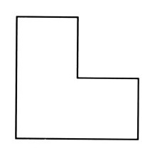

图　5-1

2.你能想出多少种旧短袜、旧长袜和旧裤袜的用途？一定要避免不自觉地限制自己的思路，不要满足于寥寥几个想法。

3.每次换季后，服装界都会出现新的时尚潮流，请尽可能多地设计出新时装（如果你愿意，可以把过时的时装纳入你的设计，只要这些设计不是最近几年流行的就可以）。要求与上题相同。

### 应用练习

1.应用创新过程的第2~4步思考下列问题。记下你所有的想法，然后交给教员。完成最后一个步骤后，请判断哪个解决办法最好，并简要解释原因。

a.巴尼每周有五天早上有课，但他总是睡过头，因此很少去上课。如果不尽快找出办法解决这个问题，他肯定会被退学。

b.学校图书馆里总有一些杂志中的文章，甚至昂贵图书的书页不翼而飞。一些没有责任心的学生把它们撕下来藏在书包里带走。昨天，一个学生在带着撕下的书页离开图书馆时被发现了。图书馆的一些工作人员认为应该以此为例，开除这个学生并对她提起诉讼；一些人则认为只要向这名学生收取被破坏图书的费用就可以了。

c.几乎每座带有公共浴室的建筑都有涂鸦的问题，即使涂鸦的内容不具冒犯性，它们还是会给建筑的维护带来问题。

d.失窃严重影响了商店店主的收益，店主和商店经理都希望有措施解决这个问题。

e.很多老年人和残疾人过着孤独的生活。他们不再活跃于事业，往往会被原来的同事遗忘，被家人和朋友忽略，很多人还缺乏了解社区事务的渠道。

2.想想你曾经遇到的最不愉快但不得不做的事。运用你的创造力使它变得较为愉快。要求与应用练习中的第1题相同。

3.一些人认为批评黑人会让人想到种族主义。这种想法合适吗？是否因为种族不同，会使批评也不尽相同？为什么会？请对“种族主义”进行定义，消除人们的误解。

### 综合练习

下面这道题是本章对思考能力最大的挑战。请按照第1章综合练习的要求对该题进行分析和回答，同时请回顾第2章中提到的“道德判断的基础”和“应对困境”。

⊙议题简述：美国的工作外包

工作外包是指将工作转移到海外。制造业的工作外包最为普遍，例如，美国大多数运动鞋和服装是在第三世界国家或发展中国家生产的。而在技术和专业领域的工作外包则比较少见，但并非没有，比如电脑软件技术的大量工作主要是在印度完成的。很多美国人认为工作外包是对美国工人的背叛，另一些人则认为这对经济发展有益，但所有人都承认这是未来的发展潮流。

⊙对比阅读

工作外包是不公平的

卡利夫·阿里

在几十年前刚开始出现工作外包时，人们称之为“自由贸易”。将类似服装制造的低薪工作外包出去，既能促进第三世界国家的发展，也能帮助我们向海外出售更多的商品。工作外包必须保证我们的高薪工作不受影响，但是这个承诺很快就被遗忘了，流出美国的高薪工作越来越多。弗雷斯特研究公司的一项研究预计，到2020年，美国的外包工作将超过35亿个，其中大多数是白领工作，其薪酬总额超过1300亿美元。

如今，在机械制造、钢铁、电脑服务、银行、医疗服务、飞机设计和制造、保险、平面设计以及和工程相关的领域中，数以百万计的工作都是在海外完成的。当你打电话寻求电脑方面的帮助时，你很可能会和某个正在印度的人说话；照X光片或进行核磁共振后，可能是由日本或菲律宾的放射学专家读片。参与外包的国家和地区包括加拿大、中国、斯里兰卡、巴基斯坦、缅甸、中国香港、墨西哥和巴拿马。

这些将工作外包的公司中，既有美国公司也有跨国公司，但大多公司将总部设在美国。这些公司都追求利润的最大化，它们的贪婪迫使数百万曾经拥有优厚薪水的美国人从事低薪的工作或者失业，失去医疗保险和退休金。若任由这种情况持续发展，将给美国纳税人造成巨大的负担。

工作外包对工作接收国也有不利的影响。由于缺乏工会和政府监管，工人通常在有损健康的血汗工厂工作，每天的工作时间长达十四五个小时。他们的薪水很低，没有医疗保险和退休金，甚至很多儿童也被迫在这种奴隶般的环境里工作。

事实证明，自由贸易和工作外包并非“益事”，对富国和穷国都是有害的。

工作外包是公平的

路易·勒菲弗

在过去的半个多世纪里，工会在美国拥有巨大的权力。最初，他们利用这种权力创造公平的工作条件、统筹薪资、建立医疗和退休保险。但是在为工人争取到公平之后，他们仍不断向管理层提出更多的要求。这些不合理的要求是导致工作外包的主要原因。

工会将企业管理层描绘成贪婪的、毫无良知和同情心的怪物。事实上，这些管理人员和我们并没有差别，除了他们需要面对更为艰巨的挑战。他们必须控制成本、维持工作标准，这样才能应对困难重重的国际竞争。他们不是自己的老板，因为他们需要应对希望用最低价格买到最高价值商品的顾客，还要对希望从投资中获得利润的股东负责。

想想苏德哈卡尔·舍诺伊的例子，作为一家信息管理咨询公司的首席执行官，他需要选择是支付300多万美元在美国国内完成工作，还是用40万美元以下的开销将工作转移到印度完成。和任何有理智的人一样，他选择了印度，否则就会破坏公司的信誉。

批评者抱怨工作外包让美国人丢了工作，但这只是一面之词。对于接受工作的国家而言，人们得到了工作机会。确实，美国同行每天会有50美元的收入，而他们只能挣得2美元。但2美元可能是本国其他工人平均工资的两三倍。此外，将2美元和几百万的工作人数相乘所得到的总资产，就能使这些国家的资本主义制度得以建立，使自由和民主成为可能。这些对我们美国人有价值的东西，为什么不能使别人也拥有呢?

工作外包是新“经济全球化”的核心特点，并且经济全球化会继续发展下去。美国工人最好接受这个事实，并找到生存之道。

⊙课堂讨论

安妮：对于工作外包，我最关心的是公司往往选择报价最低的国家，而这些国家将工人的工资压至最低，他们的工作环境也最差。很多企业的外包工厂会雇用童工，甚至奴役劳工。这些做法是错误的，美国消费者不应该支持这种行为，我们应该拒绝从他人的痛苦中谋取利益。

乔凡娜：你提到的虐待工人的问题在一些国家确实存在，甚至我们的国家也有此类情况。我同意应该让大家都知道我们的担忧，但也不应该否认工作外包带来了巨大的好处。

马丁：一些人抱怨电脑制造商把他们的技术支持业务外包给了印度，可我很高兴他们这么做。我曾经和不少印度技术人员交流过，我发现他们总是很有礼貌、见多识广、乐于助人。而对于很多美国技术支持人员，我无法做出相同的评价。

乔凡娜：人们说要买美国货，但是到了真要买东西的时候，他们却不愿意购买价格较高的美国货。我真的不能因为他们购买廉价的商品而责怪他们。

马丁：我不知道工会是否像路易·勒菲弗说的那样有错。但是我知道，现在美国工人的高额工资和丰厚保险确实让美国公司越来越难以在世界市场中获得竞争优势。

安妮：我看不出大规模抛弃美国工人有什么价值。在我看来，他们有权利保住自己的工作，尤其是当他们为雇主忠诚服务了10年、20年或更长时间，迫使他们失业或将他们调到低薪资岗位是不道德的。政府应该控制这种情况，避免这种闹剧。

马丁：竞争让美国强大。如果国家内部以政府调控经济代替市场竞争，结局会是一片混乱，这就是苏联消失的原因。因此，美国公司应对世界竞争的办法就是继续推行工作外包。如果试图将这些工作留给美国的工人，公司最终会停业，所有的工人都会失业，公司也无法再向国家交税。我不认为对美国人而言，这是一种有效的解决途径。

本杰明：工作外包有利有弊。积极的一面是，它使那些贫穷国家人民的生活标准提高了，减轻了世界的动荡局势；但是消极的一面是，它使美国人的生活标准下降了。美国人可能难以接受这样的事实，但从全球的角度看，这是一种有价值的权衡。

## 第6章　寻找挑战

第5章介绍了创造性思考的4个阶段。在本章，让我们走进第一阶段：寻找挑战。你将了解到好奇心是创造力的核心要素。大多数人都满怀好奇心降临到世界上开始自己的一生，却随着时光的迁移将这份好奇心永远埋葬。更为重要的是，你将学习到6种帮助你重拾好奇心的技术，并将好奇心应用到日常生活中。

一天早上，丹尼斯坐在餐桌上读晨报，不经意间，他注意到两个失踪孩子的照片和信息描述刊登在了牛奶盒上。作为公共服务部门的员工，丹尼斯对此印象颇深。他心中默默想着：“把公共服务的广告印在牛奶盒上的点子很容易想啊，为什么我之前就没有想出来呢？”丹尼斯似乎觉得这个问题无法回答，于是继续阅读手中的报纸。

然而，这个问题并非不能回答。人们无法想出新主意是源于他们已经从心理上反应式化了，无法主动进行思考。就这样，他们的每一天都在毫无想象力中度过，他们从未留心身边的问题直到有人解决了这些问题，他们也从未意识到身边的机会直到别人将这些机会变成了自身成就……当这一切发生后，他们只会偶尔羡慕别人的好运，而后又一心扎入日常安排中，从未意识到有任何不妥。正如罗伯特·克劳福德说道：“好运仅仅是一种对机遇的感觉，而其实每个人都能看到这种机遇。”

领会思考技巧和在日常情境中熟练运用是两回事。在课程结束时，你将掌握各种创造性和批判性思考的技术，但只有具有一颗时刻思考的心及一双发现机遇和挑战的眼睛，你才能真正加以掌握。本章将帮助你学习和掌握这些技术。

### 好奇心的重要性

好奇心是第一阶段，也是寻找挑战必不可少的要素。它不是上天给有天赋的人恩赐的礼物，每一个孩子都有一颗没有边界的好奇心。有研究者记录下一个5岁以下的孩子在4天时间里询问关于“为什么”的问题。请阅读以下记录，这将帮助你回忆自己的童年时光和当年你所感觉自在的心理状态（\*代表没有给出回答，\*\*代表没有答案并且问题没有重复，斜体字代表母亲的回答）。

（1）为什么这个箱子有腿？

（2）为什么他们要把床从阁楼上拿下来？

（3）乔伊斯，拿好你的洋娃娃！为什么？

（4）整理好地毯，你的脚在它边缘的位置！为什么？为什么是我？

（5）为什么你拿了两块饼干？

（6）为什么水壶有两个手柄？

（7）为什么他把合金放在这么多地方？

（8）这只北美歌雀长得不好看。为什么它不好看？

（9）冬天食米鸟变成了棕色。为什么？\*为什么？

（10）你很不小心啊，把铁铲都给丢了。为什么？\*为什么？

（11）这是你的橙汁。为什么？

（12）你来，坐在爸爸的位置上。为什么？\*——妈妈，请告诉我为什么吧。

（13）我们的刘海会长在后脑勺吗？不会！为什么？\*妈妈，为什么呢？

（14）之后他在他自己的小船上制作了一个桅杆。为什么？请告诉我为什么他要做一个桅杆。

（15）为什么要将剃须刀内的毛发清洗干净呢？

（16）（穿睡衣时不把手臂放入袖子里这一行为好吗？）不好。为什么？\*——（很不耐烦）为什么啊？你倒是说啊！（还没等到答案孩子说道）因为这样衣服会掉下来。你瞧，你自己想出来了，不是吗？

（17）你为什么踢到了自己的脚趾？因为我不小心。为什么？

（18）我要讲一个关于柳编果盘的故事。为什么？\*\*

（19）乔伊斯，快点！为什么？\*因为你想要我洗澡？\*为什么你不先洗呢？是不是因为你知道我想和爸爸一起洗？

（20）看看这些茶叶。为什么你当时要买它们啊？为什么你会这么想？因为我觉得我们可能把其他的喝完了。

（21）为什么在制作蛋糕时要同时用到叉子和勺子呢？

（22）妈妈，为什么你要坐在那张椅子上？

（23）不要在椅子里乱爬。为什么？\*\*

（24）为什么你把屏幕挂起来啊？

（25）为什么你要打开窗户？\*\*

（26）为什么小鸡是从鸡蛋里出来的啊？

（27）你这样上蹿下跳也无济于事啊。为什么？

（28）耶利米，耶利米，他走进坑里了。为什么他们要他走进坑里啊？

（29）你要小心，不要把豆类植物弄坏了。为什么？

（30）我从门缝中看见你的蓝色围裙。我还以为那是蜘蛛呢。亲爱的，蜘蛛不是蓝色的啊！为什么？\*妈妈，请告诉我为什么蜘蛛不是蓝色的好吗？

（31）乔伊斯，在客人还没有离开的时候，你不应该讨论他的胡子！为什么？\*请告诉我为什么。

（32）妈妈，为什么你没有胡子呢？

（33）我想把我的眉毛剪成两半！噢，你不会想要这么做的。为什么？因为那样我会很好笑吗？

（34）为什么我们有眉毛？

（35）为什么一定要我快点？

（36）为什么我只能在晚餐后吃糖果？

（37）为什么你跟那个男人说话？

（38）请不要敲车窗。为什么？\*

（39）为什么这些小鸡走在车子前方？

（40）现在我们要回家吃饭了。为什么？\*1

其中一些问题仅仅是为了吸引妈妈的主意。研究者对孩子提问的内容和表达方式进行总结，发现其中有13道问题是纯粹好奇心的表达。从只询问“为什么”而忽略关于“怎么样”“在哪儿”“谁”和“什么时候”这些问题中，孩子们非凡的好奇心显露无遗。

### 好奇心是如何丢失的

很不幸的是，4岁的时候孩子们还兴致勃勃地缠着父母问问题，可到了18岁这种好奇心荡然无存。追根溯源，答案显而易见——父母们厌倦了回答问题并不再鼓励孩子提问。他们斥责孩子：“别再问我这么多问题了，好奇害死猫。”随后在孩子们步入校园后发现一个班上老师有太多的孩子要照顾，时间安排得满满当当，根本没时间回答他们的问题。

扼杀他们好奇心的并不是只有父母和老师。当下各类电视节目为了取悦观众，根本无暇顾及让观众探索复杂问题，这也培养了孩子们被动的旁观者心态（好奇实际上是一种积极的生活反应）。

出版工业也几乎不为好奇心服务：流行杂志滋生出了病态的好奇心，好奇名人生活的隐私，却对生命的挑战这种健康积极的好奇心抛诸脑后；图书出版商也变得只会取悦大众而非鼓励思考；曾经的文学经典也逐渐被节食和塑身等书籍取代并侵蚀整个市场；就连所谓的自我提高类的书籍，打着提高心灵质量的旗号，宣传一些梳妆打扮、玩弄权术或是损人利己的方法。

就这样，对好奇心的压抑和扼杀从童年时期不定期的持续到现在，这也就导致大部分人丧失了对周围世界提出有意义问题的能力。

### 重拾你的好奇心

乍一看，重拾孩童时期的好奇心似乎有点天方夜谭，但不得不说一切皆有可能。很多人勇于尝试并获得成功。而第一步是要能意识到我们对事物缺乏兴趣，同时发现原来自己想当然的事情并不是自然发生的，而要靠后天努力不断习得；换言之，我们要打破缺乏好奇心这一坏习惯。

很多年前，我还是一个年轻的工业设计师，我的上司意识到缺乏好奇心是一种坏习惯，并和他的下属分享他的感悟。我入职的第一天，他给我安排了工作：“在接下来的一周，我希望你除了在工厂（一家大型的邮购公司）周围散步之外什么都别做，你的任务就是向每一件你所看到的东西提问，并记录下这些问题。每天下班的时候，我们用半小时的时间来分享你的问题。”一开始我有点摸不着头脑，心里嘀咕着：“这会有什么收获呢？”但不管怎样，我按照老板的要求做了：我走访不同的部门（收发部、财务部、销售部和订单填充部），记录下我的问题。

一周后，手中的清单越变越长，不仅如此，每天下午和老板的谈话总会让我更加深入了解我的工作。他随即要求我（和其他信赖的工程师）发展一种特殊的工作风格——以孩童般的视角满怀好奇地看待事物，以便能够进行更为高效的思考。“这条生产线完成了什么产品？这些都是必要的吗？还有什么别的方法同样可以完成吗？是不是存在更加简洁、快速、安全和经济的方法呢？谁在做这件事情？比他低一级的员工可以完成这件事吗？是否能将几个人合作完成的工作缩减成一个人可以完成的工作呢？时间、地点、材料和设备的选择是否合适呢？”在做工程师这4年的时间里，这些问题不停地闯入我的脑海，为公司节省了数以万计的成本。同样，进入公司的其他新人也通过重拾好奇心这第一堂课得到了迅速成长。

正如通过适当的锻炼重建结实的肌肉一样，任何人都可以通过同样的方式重拾好奇心。而这样做的好处不仅仅在于个体满意度的增加，更在于事业效率的提升。一个具有好奇心的人能够在怨声载道的环境中理解并解决生活中的许多难题。

### 6种有帮助的技术

值得庆幸的是，我们现在并不需要假装成小孩，以孩子的方式提问（如果你想要尝试，你的朋友可能要把你送去看精神科医生），也不需要采用上述这位资深工程师的方法，因为情境的变化可能会导致方法有效性的差异。这里有一种适用于广泛情境下的方法，包括6种具体的技术：

（1）做一个善于观察的人；

（2）看到事情不完美的一面；

（3）记下自己和他人的不满；

（4）寻根溯源；

（5）对暗示保持敏感；

（6）在辩论中发现机遇。

#### 做一个善于观察的人

生活中有这样一些人，他们过于沉浸在对自身的思考中，却从未留心身边发生的事情。他们忽略了世界微妙的暗示，也未曾从经验中真正体悟到其精髓。他们怎么会这样？因为，他们并没有真正接触外部的世界。

即便你不是这样的人，对生活的观察力度将决定你的进步空间。以下这个小测试能帮助你了解自己到底是不是一个善于观察的人。

（1）你的上司戴戒指了吗？

（2）你母亲的衣服是什么颜色？

（3）你家乡（邻乡）有多少加油站？

（4）你家门前的走廊（走楼梯到你的公寓）有多少步？

（5）你家乡（邻乡）有多少个教堂？它们是属于什么教派的？

（6）你最要好朋友家的院子里种树了吗？如果有的话，有几棵呢？有花吗？如果有的话，是什么品种的花？

（7）你能仔细描述一下你的高中校服吗？你能描述一下运动员（任何运动）的服装吗？

很多人非常惊讶他们对貌似熟悉的人、地方和物品了解得这么少。你也许听过这么一则故事，讲的是有人在一个城市或是镇上住了一辈子，却无法告诉陌生人他住所的准确位置。原因就是他们像机器一样自动重复地走着同一条路，日复一日，年复一年。

当你再开始观察人、地方或是物品的时候，请再细致一些。尽量留意平常会忽略的细节，观察大家的行为。比如，下一次你去餐厅的时候，观察大家的动作，记下多少人是独自一人进来的，比较独身和有伴的顾客不同的行为方式。独自一人看起来到底有多自在？他们是更放松呢，还是更紧张？当他们在寻找餐桌的时候是否很紧张？有哪些线索能帮助你判断出他们的情绪？

当你和一群人围坐在一起讨论问题时，记下这些人的行为。他们惯用的谈话模式是什么？他们如何看待他人？有没有人试图控制全局？如果有的话，用了什么样的方式？他们的行为如何影响他人？

在你走过的大厅中，你能捕捉到学生、教授和行政人员的哪些线索从而推断他们的心理状态？他们用怎样的方式礼貌地打招呼？对于自己喜欢的人，是不是看他的眼神和说话的方式也变得不同了？哪些行为会泄露他们的态度？

人们会为他们的行为找出什么理由？你的朋友有多少会像要求别人一样来要求自己去承担责任？当你的朋友参加聚会时，他们的个性是否有变化？他们的行为是否和在公司的表现大相径庭？你朋友的偏见是什么？他们会怎样显露出来？

你所观察的类型可以无限延伸。但记住，别只观察他人的生活，你同样要观察自己的生活：你的行为方式以及这些行为线索映射出来的态度和价值观。

#### 看到事情不完美的一面

以下的例子乍一看会让人认为大多数父母教育孩子的内容有相悖之处。他们一方面告诫孩子“不要期待事情变得太美好”，另一方面又提醒孩子“接受事物的本貌，对于没有变得更坏的事物抱有快乐之心”。但这其实不是真正的矛盾。看到不完美的一面并不意味着就要变得愤愤不平或是怨声连天，而是意味着能意识到进步的空间。

研究者发现思想家和有创造性的人对于不完美有一种敏锐的直觉，而这种直觉是他们取得成就的一大资源。他们把所有想法、系统、过程、观念和工具都看成是发明，并由此开启了前进之门。2

在一些案例中，负有创造性的人不辞艰辛地发觉不完美之处。比如克莱斯勒公司的一名机械天才，是曾经拿着微薄薪水的铁路机械工，攒了5000美元买了一辆皮尔斯箭头汽车，而在当时5000美元是一个不小的数目。他买车的目的并不是开着新车到处炫耀，而是一个一个螺栓地把车拆解，用这样的方法来探索他所能改进的部分和重新组装设计。3

从制造物品的任何一个角度观察周围：教室的黑板和桌椅，你的床、衣服、车子，图书馆的分类系统，你所喜爱的运动项目的规则和政府的民主制度……所有这些现成的形式都是通过早期的发明不断进化而来。进化过程中的每一步都是对克服缺陷的尝试。想想下面这两项发明的巨大发展。

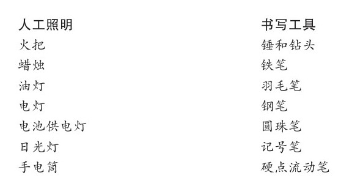

比现在的发展更重要的是将来的发展。任何事情都是不完美的，实在没有必要去埋怨现实的黑暗，你自己可以成为照亮人生道路的指明灯。

#### 记下自己和他人的不满

生活每天都会带来失望和沮丧，我们根本无法避免，但我们可以利用这点。当然，人们通常对这些经历的反应是愤怒、怨恨和焦虑。虽然这些反应差强人意，但很多人深陷其中，任不满摧毁了他们的正常生活。

从今天开始，请记下你感受到的那些不满：教授在你毫无准备的情况下进行突击测验时让你滋生的愤恨，妹妹为了显示自己的重要地位而让你时刻待命时你内心的怨气，车子不合时宜地无法发动给你带来的愤怒，以及在超市排队时感到的不耐烦。不仅如此，当你在和朋友交谈的时候，请专注地倾听他们不满的表达，就连那些一带而过的微小细节也不要放过。

需要注意的是，别让自己陷入自身或是他人负面情绪的泥潭中，从积极的方面进行思考可以发现，实际上每一次不满是需求不被满足的信号。换言之，这种情境带来的不仅仅是伤害，它实际上是对你独创性的挑战，让你思索如何能让这种情境得到改善。

有一个将不满变成创造性想法的例子值得我们借鉴。由于对当时的国民生产总值仅关注物品而不关注人的现象表示不满，拉尔夫·纳德提出了一项维护消费者权益的计算国民经济的新型方案。他指出要记录下多少人能够吃饱而非有多少食物的产出，记录下多少人有居所而非建造了多少房子。4

#### 寻根溯源

创新和成就归功于那些不停琢磨事情的人。他们的寻思能拓展到事物的根源：他人是如何摸索出来这个方法以及他们是如何工作的。

有一个例子：很早以前，人们都知道炭疽滋生在土壤中，但是科学家对于它的形成过程还一无所知。直到有一天，路易·巴斯德在参观一个农场时对此产生了好奇，他惊奇地发现有一小块土地土壤的颜色和它周围土壤的颜色不一样。当他问农民的时候，被告知他们早些年在这里焚烧了一些生病的绵羊。巴斯德依旧觉得很奇怪，是什么原因导致土壤颜色的不一致呢？于是他检测了这些土壤，并注意到蚯蚓粪，从而分析出蚯蚓深入到地下，并携带了炭疽孢子。之后，他的实验室研究证实了他的猜测。5

同样，一个研究助理在他不相关的领域中若没有好奇心，那么糖尿病恐怕仍然是个谜。当他看到成群的苍蝇聚集在用于实验的一只狗的尿液周围，他开始好奇是什么原因吸引了这些苍蝇。他追根溯源，最终了解并控制了糖尿病。6

找寻根源的关键在于对任何新奇的场景保有一颗机警之心，即便你不能做出很满意的解释。一个锻炼你机警性最好的时间就是阅读报纸或是看电视的时候。比如，当你在报纸上读到情人节那天一名男子为了一美分和妻子争吵并将其杀害的时候，你的好奇心油然而生（但从法律上说，他们正解决财产分配问题。妻子拒绝将一枚很有价值的印有印第安人头像的一分钱硬币给其丈夫，导致丈夫开枪杀死妻子）。7“是什么让这名男子做出这么疯狂的事情？”你可能会开始思考，并开始明白人类行为中的挑战性问题（想要知道具体的原因，请返回第2章）。

#### 对暗示保持敏感

孩子们总喜欢将一颗鹅卵石扔进平静的湖面，观赏着丝丝涟漪渐行渐远直到触碰海岸。就算最微小的卵石也会通过涟漪产生巨大影响，想法亦是如此。每一次发现、每一个发明、每一个新的观点或是解释所产生的影响总是超出你的想象。优秀的思想者对于事物暗含的深意很敏感，因此他们总能先于他人发现这种影响。以下几个事例阐述了这种敏感性。

1981年8月，金赛研究所公布了一则与同性恋有关，并颠覆传统观念的研究。研究发现同性恋作为一种根深蒂固的性取向很可能是由生物学因素的差异所导致。8这则报告引发了激烈的争论，没有一个思想者能够断言这就是事实。但是对暗示敏感的人很快就意识到，如果这则报告是真实的，即同性恋是生物学因素导致的，而不是人类自由选择的结果，那么同性恋就不该被划为不道德行为。

多年前，研究者发现对于1/3的人来说，害羞是由遗传导致的而非环境因素。因此，对于这些人来说，克服羞怯确实是一大难题。9对暗示敏感的人就会思考害羞是如何影响个体绩效的，并随之联想到学校和职业相关的问题，包括将课堂参与度作为评判孩子的指标之一是否公平，以及是否应该在更早年的时候为学生提供职业指导。

同时，另一个研究表明有某基因特质会导致犯罪。通过测量脑波、心率和皮肤电解质水平能够提前10年预测犯罪行为。这项研究同样清晰地表明克服这种基因倾向从而防止犯罪行为的发生具有可行性。10但从法律角度上存在较为严重的暗示：这种对犯罪倾向性的测试（比如在学校）是否已经构成对测试主体权益的伤害。

最后一个例子，几十年前，佐治亚州最高法院判决一个犯谋杀罪的罪犯在监狱里有绝食自杀的权利。11这涉及对自杀问题的判定。从传统上来看，自杀被认为是一种犯罪（从技术上来看，若有人自杀但未成功，在法律上被视为自杀未遂罪）。佐治亚州法院的判决暗示着他们认为一个人有拿走自己生命的权利，而这一观念却和当时的传统思想相违背。从那以后，凯沃尔基安在帮助人们自杀上变得声名远扬（帮助他人成功起诉）。

#### 在辩论中发现机遇

在辩论问题时，很多人除了一味畅谈自己观点的英明和咒骂反对意见之外无所作为。他们失去了辩论中真正的机遇，而这种机遇会让你变得更爱冒险，让你在探索新奇观点的同时丰富了自己的知识。

那么到底什么才是值得辩论的问题呢？这些问题的关键在于相关人士所反对的内容——要注意不是任何人，而是掌握信息的相关人士。这些人肯定有不同意的原因：原因有可能是这个事件有多种理解方式，抑或囊括了两种或以上的冲突性价值观，并且每种说法都具有说服力。

因此，在辩论的过程中任何一方持有的观点可能都不是全部事实而只是事实的一部分。那么双方中一方的正确率就是50%吗？可能是51:49、60:40，或是99:1吗？最新的证据说明了什么？自己的观点可能会犯错吗？这些问题中往往隐藏着机遇和挑战。

毕竟错误随处可见，即便在那些被认为是永恒的问题中同样会犯错。比如，直到最近，大多数科学家都认为地球的寿命有2000万年，数据也支持这一观点，这也让我们觉得离真相仅隔咫尺之遥。结果一组宇航员提供了新的数据表明地球的寿命有100亿年。12争论随即爆发，冒险之旅也随即开始。

### 热身练习

1.大多数高中运动队都有一个可预期的、毫无创造力的，甚至略带攻击性的名字：斗牛犬、印第安人、战士等。请为高中运动队想一些你以前从未听到的有创造力的名字，多多益善。请不要禁锢自己的思想，尽可能多地写下自己的想法。

2.为新产品或服务列出尽可能多的点子——这些产品或服务目前不存在，但是人们却有需求。

3.用4条直线将图6-1所示的圆分成尽可能多的部分。

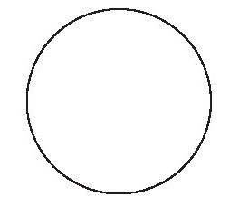

图　6-1

### 应用练习

1.花一些时间去像餐厅、小吃店那样人口密集的地方，并认真听听周围人的谈话（同样，认真倾听你所参与的，或是在收音机听到、电视上看到的谈话）。记录下人们抱怨的所有问题，包括过程、政策、他人的行为、工具和机器（汽车、洗衣机等），同时，记录下他们抱怨的本质。

2.参观一家大型超市（比如沃尔玛），浏览超市里的每一个区域，寻找在设计上可以改进的项目，形成一个清单。你所添加的项目，不管是鞋拔还是烤面包机，只要是你自身经历的感到不完美的项目即可。

3.尽可能想起所有令人感到不满意或是沮丧的经历，这些经历是对你独创性的挑战，却因为你的负面情绪而忽略了它们的存在。请描述你现在能想到的经历并说出它对你的挑战。

注：挑战你习以为常的作风，每天完成该应用练习中的1~3题；另外，准备一本特殊的笔记本，做成记录你每天心路历程的时尚杂志（向你的导师咨询特殊格式方面的要求）。

4.以下有一系列情境，这些行为的缘由都是不得而知的。猜测原因，首先列出你能想到的尽可能多的解释，随后决定哪种解释最为合情合理。说说你选择的原因。

a.据报道，很多运动员都会使用合成类固醇，而这种物质有可能导致生理损伤甚至死亡。

b.许多人认为他们父母信仰的犹太教、清教徒或者天主教与如今这个科学技术时代毫无关联，而他们自己已经变成了诸如占星学、塔罗牌和灵魂交流（超越身体的阻碍而从其他空间得到启发）的虔诚信仰者。

c.3名高中生在进行一个研究，他们在中上阶层居住区附近的大型药店进行入室抢劫，挟持了老板并在走廊上随处走动，他们的口袋里塞满了各种大大小小的物品，包括糖果、杂志、表带、香水、吹风机等。当时有100多名购物者在里面购物，其中至少有50个人目睹了这一幕，但这些人不是离开了药店就是转移了他们的视线。

5.以下每一个例子都是（被看作）一场辩论。请仔细阅读，并决定你是否同意他们的决定或行为，同时做出解释。另外，思考每一个案例暗含的意思以及和其他问题的关联。

a.住在纽约的罗伯特·雷斯认为，并不是每个人都要拥有驾驶执照，他相信国家没有权力要求每个人都获取该执照。因此，他上交了自己的驾照并公然声称自己无照驾驶的意图。在他看来，开车不是一种特权而是享有的一种权利。很多人都不同意他的观点。

b.安东尼·布鲁萨德强奸并杀害了自己的女朋友，将她的尸体抛入峡谷中。在罪行被权威机构揭露之前，他在朋友面前大肆炫耀，并带他们去峡谷里看尸体。其中一个16岁的朋友克斯克·拉斯姆森，踢掉了盖在尸体上的树叶。在布鲁萨德罪行被发现并被逮捕后，拉斯姆森被视为从犯而受到指控。他感到很内疚，并被关在少年管教所3年。很多人都认为对拉斯姆森的处罚太严厉了，还有一些人认为他不应该受到指控。

6.很多官员都赞成全美市民使用身份证。认为身份证比信用卡或是驾照更好，它是对人们飞行、购物和市民身份认证的高效的认定手段；反对者则认为这种卡很冗余，并且可能侵犯到公民的隐私。研究这个问题，考虑这些证据，说出你的观点并解释其原因，要保证参与到有可能反对你观点的讨论中。

7.不可否认，工会为美国社会做出了很多积极的贡献。比如，它提高了工作安全性，提升了员工薪酬福利，并更公平地解决争端。一些人还认为工会在维持社会环境上起着至关重要的作用；然而另外一些人却认为，在最近的几十年间，工会的存在增加了美国公司参与全球竞争的困难。持有这一观点的人认为应该废除工会或至少要改变它们的组织架构和角色定位。研究并思考这一问题，确定哪种观点更为合理。随后说出你的观点并解释其原因，要保证参与到有可能反对你观点的讨论中。

### 综合练习

下面这道题是本章对思考能力最大的挑战。根据第1章综合练习的要求进行分析并做出回答。同时，回顾第2章“道德判断的基础”和“应对困境”。

⊙议题简述：校园暴力

1999年，在科罗拉多州利特尔顿市的一家哥伦比亚公立中学，两名高中生杀死了12名同班同学和一名老师，最后自杀。从这次事件以后，类似的悲剧案件在佐治亚州的康耶斯、俄勒冈州的斯普林菲尔德、田纳西州的费耶特维尔、亚利桑那州的琼斯博罗、肯塔基州的帕迪尤卡西岸、密西西比州的珍珠港不断上演。不计其数针对学生、老师或是教职员工的攻击性或威胁性事件发生在大大小小的学校中，有责任心的个体和组织试图尝试了解这些悲剧事件并找到预防途径。

⊙对比阅读

消除校园暴力

克里斯托弗·佐丹奴

当下对校园暴力事件的关注已经让我们苦盼多时。在过去20年左右的时间里，青少年暴力行为在数量和严重性程度上都有增无减。我们必须要采取一些措施维护校园安全，这其中也包含父母和老师的努力。

海伦·史密斯博士——《当心伤痕累累》（The Scarred
Heart）的作者和儿童暴力研究者，指出将青少年犯罪归功于暴力电影、rap音乐和恶魔崇拜是错误的。她指出校园杀手的最主要原因是对拒绝和压力难以言表的愤怒。她认为，解决校园暴力的最好办法就是增加心理咨询师，对欺负和排斥现象采取强硬措施，并严肃对待孩子们的问题。

另外一种对抗学校暴力的好方法就是“青少年暴力预防训练”。专项训练包括为学生们提供问题解决、角色扮演、愤怒管理和压力应对策略的电影和工作坊，同时用非暴力来感化暴力行为。与之并行的训练是校外社区组织的提升项目——帮助父母提高孩子的技能。

这些项目最核心的因素就是树立孩子的自尊；提升他们对种族、文化、伦理多样性的深入了解；改善他们对不同和差异的包容。

如果这些举措能够在当地甚至是全国实行，我相信校园暴力问题会在未来的几年逐渐减少，并在10年内最终消除。

暴力是一种流行文化

哈姆扎·穆罕默德

大多数社会批判家斥责发生在学校的暴力现象。因此，一些解决措施也如火如荼地开展，包括父母引导孩子用语言而非拳头解决问题，老师也增开了有关自尊和差异性的课程。

尽管意图很好，但结果往往事与愿违，这种具有攻击性和暴力行为的文化越来越泛滥。

青少年暴力这一流行文化是通过电视、流行CD，或是视频游戏传播开，不论在校内还是校外，我们看电视的时间超过任何业余活动的时间，电视占据了我们的生活。但悲哀的是，电视节目不仅充斥着暴力场面，并且那生动和戏剧性的设置让人印象深刻。青少年在观看了成千上万的暴力镜头后，极有可能走上相同的路。

为什么批判家和专家对这一事实熟视无睹？因为他们相信电视行业巨头声称的我们在电视上看到的节目不会产生影响。但是很多研究都驳斥了这一观点。

利伯特和斯普拉金早期总结了数以百计的研究，其中还包括美国外科医生的报告。研究指出电视上几乎所有的暴力镜头会增加攻击性行为，而那些敏感的人更易深受其害。同时，受到情绪困扰的人更倾向于看暴力节目，这变成一种恶性循环，使得这些人更容易受到影响。

现有的来自父母和老师对孩子在这方面的教导确实不容乐观。除非在这种流行文化中我们能对暴力采取行动，否则要解决学校暴力问题希望渺茫。

⊙课堂讨论

弗洛伦斯：学校和家庭担当着很重要的角色，但是它们似乎都没能让学生自我感觉更好。相反，对于一般规则的执行它们恩威并施，同时那些特定的行为准则都是根据维护礼数和社会和谐设定的。

苏珊：我同意前一个观点。没有人会被书上或是电影中的内容影响而攻击他人。

弗洛伦斯：这种想法是很虚伪的。书和电影是没有生命的物体，它们当然不会导致任何好或坏的行为。但人们受到煽动和鼓舞后会影响自己的行为。他们或许可以为达成这一目标构建一个蓝图或模型。

苏珊：你的意思是人们不需要为自己的行为负责吗？

弗洛伦斯：也不尽然。人们需要对自己所说所做负主要责任，但影响他们说话和行为的人或事也要负次要责任。我所指的是道德上的责任感，但与之并行的是法律——在事实面前先想想共谋的可能性。

苏珊：要是按照你所说的那真可以摆脱父母的困境了。如果他们教导孩子非暴力的好处，不给他们看非暴力的电视，那么校园暴力就可以消失了。

弗洛伦斯：你太低估来自同辈群体的压力了。就算警觉性高的家长能在家里防止孩子和这些暴力材料接触，但他们阻止不了孩子和在家看过暴力场面的孩子发生接触，也同样阻止不了在他们身边会发生攻击性行为。

苏珊：听起来你似乎赞同对娱乐媒体的审查机制。我觉得这是对表达自由权利的侵害。

弗洛伦斯：如果审查是唯一途径，我很支持。但是我认为还有别的途径可供参考和选择。那就是让知情人士大声说出暴力娱乐的危害，并说服人们给娱乐行业施加压力使其恪守责任。

## 第7章　表达问题或者争议

想象有这样一类问题，它们可以帮你找到各种各样的解决方案，它们可以帮你绕开迷雾直达争议的核心，了解这些问题可以让你成为一个更加自信、更加成功的思想者。

对！这类问题确实存在。本章内容就是教你如何识别并有效利用它们。

恰当地表达问题虽然非常重要，但是在创意过程中这个步骤往往被忽略。这并不是因为人们太过顽固，在没有找到表达问题的最佳方式时就要贸然行事，而是因为他们往往相信问题总是不证自明的，没有必要浪费宝贵的时间，为问题另找一个精确的表达方式。

实际上这种想法是错误的。正如我们对他人的第一印象一样，我们对问题最初的理解也可能是局限的、肤浅的，受到当时情境的制约，并且刻板印象也会阻碍我们的视线、充斥我们的想象。更重要的是，所有这些都是在无意识的情况下发生的，我们甚至不会对自身局限产生任何警觉。

为了避免自己视野狭窄，你可以用尽量多样化的方式来表达每一个问题或者议题，并养成习惯。在介绍最有效的表达方式之前，我们先来区分一下问题（problem）和争议（issue）这两个不同的概念。

### 如何区分问题和争议

正如前面所说，问题和争议在某些方面存在区别。“问题”是指那些不被接受的情况或者状态，而“争议”却是某些聪明的、见多识广的人在某种程度上不赞同的事件。因此，解决问题就意味着要去决策哪些行为是改变当下状况的最好方式；而解决争议意味着，需要判断哪些信念或者观点是最合理的。

如果你不能确定自己面临的某个挑战是属于问题还是争议，可以问问自己：“这个事情是否会有不同派别的意见，是否会让那些聪明的、见多识广的人产生分歧？”如果答案是否定的，那么这个事件就是一个问题，否则它就是个争议。这里有些属于“问题”范畴的例子：一个学生想在嘈杂的寝室里面学习；一个孩子因为要住院而害怕；一名职业女性面对来自上司的性骚扰。另外，这里还有一些属于“争议”范畴的例子：一个公立学校的老师带领学生们在该学校的教室里面祷告；<a href="#part0230.html_ch1-back" id="part0230.html_ch1"
class="pcalibre calibre2">[1]</a>一名国会议员提议削减老年人的社会保障福利；一位人类学家提出人类天生就是暴力的观点。

在刚刚举的这些例子中，第一部分情境不会让那些聪明博学的人产生分歧，因此它们可以被看作“问题”。当然在某些时候、某些情况下，也有可能对这些情境产生异议，例如有人或许觉得学生并没有权利要求寝室必须是安静的，但这种提出异议的可能性非常小。相比之下，第二部分的每一个情境都可能引发比较大的分歧，这是因为这些情境中本身就包含一些充满争议的事件。

<a href="#part0230.html_ch1" id="part0230.html_ch1-back"
class="pcalibre calibre2">[1]</a>美国政府规定公立学校不能宣扬宗教。——译者注

### 如何表达问题

问题和争议最好都用疑问的方式表达出来，但是提问的方式存在差异。在针对问题进行提问时，最有效的表达方式是“怎么才能……？”下面让我们一起来看一个例子，看看这种提问是如何起作用的：多年前，因为生源不足、预算削减以及通货膨胀，全美国差不多有7000家公立学校倒闭了。1下面就是一些可以被学校管理人员用来表达该问题的方式：

·怎么才能增加学校的生源呢？

·怎么才能减少学校的预算呢？

·怎么才能减轻通货膨胀对教育的影响呢？

·学校倒闭之后，怎么才能让校园里面的建筑发挥最大作用呢？

·怎么才能充分利用校园里面被空置的房舍，来增加收入呢？

·怎么才能让校园里面的房舍在晚上以及周末发挥作用，来增加收入呢？

·学校倒闭之后，怎么才能让失业的老师们重新发挥作用呢？

让我们再来看一个关于毒品问题的例子。毒品无疑是当今社会面临的最大挑战，下面就是一些用来表达有关毒品问题的方式：

·怎么才能让人们学会抵制毒品？

·怎么才能让人们不进行毒品交易？

·怎么才能说服那些名人利用他们的影响来号召人们和毒品作斗争？

·怎么才能让媒体在抵制毒品中发挥作用？

·怎么才能发动每一个公民参与到政府抵制毒品的工作中？

·怎么才能让执法机构不接受毒枭的贿赂？

·怎么才能得到毒品制造国家的配合？

·怎么才能及时铲除那些毒品制造商种植的毒品原料作物？

针对某个问题到底哪种提问方式最有效，这存在一些争议。但可以肯定的是，如果我们花时间来确定以及斟酌所有这些提问，那么我们肯定更容易做出判断，并且发现最有创意的解决方案，这是因为每个提问都提供了一种看待问题的思路。比如在上面这个例子中，教育人们抵制毒品，和直接销毁制造毒品的作物，就是两个完全不同的思维路径。

### 如何表达争议

与问题的提问不同，针对争议最好用下面的方式提问：“……是否（应该）……？”这种疑问并不是简单地询问事实，而是为了挖掘争议的核心要素。在提问的时候，要抓住各方进行争论时的要点，然后将它们转化为刚刚介绍的这种提问形式。

下面举一个关于流产争议的例子，反对堕胎的一方认为胎儿也是人，应该受到法律的保护；而提倡堕胎的一方提出，女人的身体属于自己，因此她有权利独立决定腹中的胎儿何去何从。基于此，你可以这样表达以上争议：

·胎儿是一个个体吗？

·胎儿是否可以得到法律的保护？

·女人的身体是否只属于她自己？

·女人是否有权利决定腹中胎儿的命运？

在关于死刑的争议中，赞成方认为如果一个人犯了死罪，那么政府就有权利决定他的生死；而反对方认为，死刑是一种残酷的、有悖常理的方式，它违背了宪法赋予个人的权利。因此你可以用下面的方式对争议提出疑问：

·如果一个人犯了死罪，那么政府是否有权利决定他的生死？

·死刑是否真的是残酷的、有悖常理的？

·死刑是否违背了宪法赋予个人的权利？

在一场争议中，核心观点往往被直接表达出来，或者至少有明确的暗示。它们可能比我们刚刚在例子中提到的核心观点还要多。

“怎么才能……”是表达问题的最好方式，而“……是否（应该）……”的句式用来表达争议非常有效，但这并不意味着其他提问方式就没有价值。实际上，像“谁”“什么”“什么时候”“在哪里”这些提问在调查阶段就非常有效<a href="#part0232.html_ch1-back" id="part0232.html_ch1"
class="pcalibre calibre2">[1]</a>。而诸如“为什么”“怎么样”这种偏重分析的提问方式，在评价以及细化观点时非常适用。

<a href="#part0232.html_ch1" id="part0232.html_ch1-back"
class="pcalibre calibre2">[1]</a>如果话题不存在争议，那么“是否……”这种提问方式也具有同样的效果。

### 当问题演变成争议

即使暂时没有什么不同意见，争议也随时有可能产生。我们表达问题的方式或者后续解决问题的方案，都可能招致反对的声音。例如刚刚讨论毒品问题时举了这样一个例子：“怎么才能及时铲除那些毒品制造商种植的原料作物？”对于这个提问，即使那些坚决与毒品作斗争的人也可能提出下面的疑问：“大部分用来制作毒品的作物，都有其他用途，因此破坏这些作物是不道德的。尤其当种植这些作物的人是一些贫穷的农民时，破坏这些他们的劳动成果就更不对了。”

西弗吉尼亚州的高中有大量学生辍学，为了把学生留在校园，政府想出一个巧妙的办法：由校方拿走那些16~18岁翘课学生的驾照，然后学校联系机动车辆管理局，请管理局通知那些翘课的学生，要么回到学校，要么放弃他们的驾照。2但这种解决方法存在争议，有人认为学校的做法侵犯了学生的权利，并且把家长对未成年人的管理权转移给了政府机构。

对于问题和声明里面包含的暗示，优秀的思考者总是非常敏锐。问题或者声明一旦演化为争议，应该马上进行澄清。在毁掉毒品作物的例子中，可以询问下面这个问题：“到底在哪些情境中，毁掉制造毒品的作物是不道德的？”从而解决这个争议（如果你确实认为有很多合理的答案可以回答这个问题，那么你就要么修改原先的提问——“怎么才能及时铲除那些毒品制造商种植的原料作物？”，要么直接删掉这个问题）。针对西弗吉尼亚州学生辍学的例子，可以这么提问：“学校的行为是否真的侵犯了学生的权利？是否转移了家长对未成年人的管理权？这么做是否合理？”

### 提出问题和表达争议的准则

（1）识别挑战。当你意识到自己因为什么而烦躁或者对什么不满意的时候，澄清当下的情况，并关注自己的消极情绪，然后问自己下面几个问题：“我的感受到底是什么？悲伤？生气？沮丧？这些感受到底是从哪儿来的？”接着，确定困扰你的到底是个问题，还是个争议。

（2）表达问题或者争议。选择恰当的方式进行提问，针对问题采用“怎么才能……”的句式，针对争议则提出“……是否（应该）……”式的疑问，并且不要仅仅把提问停留在脑海中，而要写下来。这么做有两个重要的原因，首先，结合脑和手使观点具体化，有助于澄清自己的想法；其次，正如任何写作老师认同的那样，写下某一个观点有助于激发其他想法。让自己在表达问题或者争议的时候，提出尽可能多的疑问。

（3）精炼你的表达。等你用尽可能多的方式表达问题或者争议之后，再精炼这些表达，也就是将那些模糊的语言替换成精确的语言，将概括性的词语转化成特定的词语。因为表达太多模糊、概括，就没法确定它所指的解决方案。例如“怎么才能解决学生生源问题？”“怎么才能消除毒品问题？”，这两个表达都过于模糊，没有针对任何具体内容，因此需要进行修改。

### 精炼表达的益处

#### 助你超越习惯

闪现在我们脑海中的第一个念头，往往和我们一贯看待事物、解释经验的习惯有关。因此相比后续的想法，开始出现的念头更容易反映出一些不好的思维习惯，例如认为自己比别人的更好、爱面子、拒绝改变、刻板印象、自欺欺人等。如果存在这些习惯，是不可能产生创造力的。

#### 让你的思维更加灵活

一旦你接纳了某一想法，即使只是暂时的，也很难再接受别的想法。这一规律对于争议性的事情尤其明显。一旦你加入了争议中的某一方，就算没有认真进行分析，只是临时性的行为，也可能一直顽固地坚持下去。这样一来，即使碰到新的有价值的证据，你也难以从更加长远的角度分析问题。

你可能被迅速地局限在某个观点里，并且难以再接纳其他视角，为了让你更加形象地体会这种现象，请近距离观看图7-1和图7-2，每幅图至少看一分钟，然后接着阅读后面的内容。

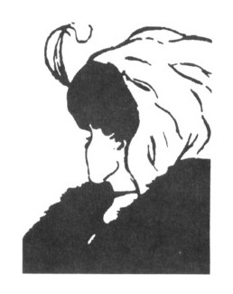

图　7-1

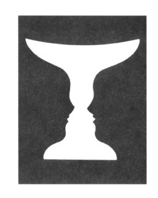

图　7-2

在图7-1中，你可以看到一个老妇人和一个年轻的女孩；而图7-2既是一个花瓶，也是两张脸。许多人看这两幅图的时候，往往只看到其中一个图画，只有明确地帮他们指出来，他们才能看到另一个图。但是一旦你看到了同一幅画中的两个图，就可以在它们之间自由、迅速地来回转换了。这和人们对争议的理解类似。如果你强迫自己同时接纳多种观点，就能更好地保持思维的灵活性。

#### 帮你开启多条思路

一旦你坚定了某一信念，其他思路就会被切断。这时你只能接纳某一类观点，而对其他想法置若罔闻。因此，如果那个发明自动轮椅的残疾人天天只想着怎么打发在床上的时间，而不是想办法离开床到屋子里溜达一会儿，那么他永远不可能有这个发明。

你是否近距离观察过火车的轮子？它们的边缘其实是凸出来的，这样就可以避免车轮从铁轨上滑落。但一开始并非如此，最初人们是把车轨设计成边缘凸出来的样子，这是因为一开始考虑火车的安全问题时，人们总是想着“怎样建设车轨，才能让火车在上面行驶的更安全？”因此，无数的火车轨道都被加上了钢边。之后有人换了一个角度来提这个问题：“怎样才能让车轮把轨道抓得更牢固？”边缘凸出的轨道这才应运而生。3

有时要产生一个突破性的想法，需要耗费数年甚至几个世纪的时间，思路受限就是原因之一。现代牙周手术的发展过程就是一个典型例子。早在有记载的人类历史之前，那些牙齿掉光的老人就可能提出这样的疑问：“怎么才能弄些不用牙也能吃的食物呢？”在这种问题的启发下，他们想到用石头将食物砸成粉末或者糊状。根据随后的历史记载，古伊特拉斯坎人从另一个角度想这个问题：“在牙齿掉光以后，我们怎么咀嚼食物呢？”义齿由此产生。几千年过去了，牙科医生提出新的问题：“我们如何保持牙龈健康，并且让松动的牙齿在底层骨上更加稳固？”于是他们发明了牙周手术。毫无疑问，一些具有创造力的人此时此刻正提出更进一步的疑问：“怎样才能让牙龈永久性地免除疾病？”

在处理争议时，从多个角度看待问题也非常重要。人类总是想要找到事物的意义，这是一种正常的求知欲，但经常让人在面对争端时匆忙站队。一旦支持某一个观点，你就非常容易忽略支持其他观点的信息和证据，并且明明理智上知道要去提一些疑问，但很难执行。

例如，一个极端的特创论者（即相信万物皆由上帝一次性造成的人）认为地球只存在几千年而已，他就不会提出这样的疑问：“如果那些测查岩石年龄的科学技术不准确，那么我的信念是否也可能不对呢？”同样，一个极端的进化论者也不会想到下面的问题：“是否真有上帝存在，他创造了进化的过程，地球上的所有事物才由此产生？”如果他们能提出上面的疑问，无疑能够更好地思考问题。

因此在表达问题和争议时，请你尽量打开思路，这能让你产生先进的观点，避免思维窄化。

### 一个关于“问题”的例子

我们举一件过去在大学城发生的事情，来说明应该如何表达问题。简是一名中年妇女，她毕业多年以后重返校园完成学业。简没有住在学生宿舍，而是住在一个公寓里。在她的楼下住着一个年轻的女人，她喜欢听立体音响，而且声音非常大。简被震耳欲聋的声音和年轻女人的无理解释弄得非常恼火，她尝试用我们之前介绍的方式表达出自己面临的问题：

·怎么才能说服这个女人把音响声音调低？

·怎么才能强迫这个女人把音响声音调低？

·怎么才能威胁这个女人采取行动？

·怎么才能远离噪声？

·怎么才能以牙还牙？

在所有这些表述中，简认为第一个表述最好，因此她开始想办法接触这个女人。她回忆自己曾经遇到的类似的问题，或者从别人那里听来的经验，然后开始思考她可以采取的策略。想了一大堆办法之后，她选择了自认为最有效的一个方式去接触那个女人。但结果失败了，楼下的音乐依然不绝于耳。

失望之余，简重新审视了自己的清单。或许是因为正在气头上，简认为强制性的方法可能比说服更有效。因此她又开始想办法，最后找出了两个解决方案，准备双管齐下：向房东告状，同时向当地警方投诉。但是结果依旧让人沮丧，房东只是简单地提醒了一下楼下的女人，而警察给出了一个一般性的警告。刚安静了一两天，楼下的声音又响起来了。

这下简觉得在剩下的3个提问中，最后一个问题最有效。她幸灾乐祸地列出一大堆报复的办法，甚至包括在自家地板上打了个洞，然后将水从洞里倒到音响上。突然简灵机一动，作为一个热爱运动的人，简擅长网球和瑜伽。为什么不用运动作为报复的武器呢？说干就干，简买了一个跳绳，每天早上4点准时起床，在卧室里跳，这时那个可恶的女人就在正下方做梦呢！嘣，嘣，嘣……这个办法实在是太妙了！

之后发生的事情，让简觉得这个办法比自己想象的还要有创意。几天以后，楼下的女人敲开简的门，不好意思地说，简每天早上跳绳让她没法儿睡觉了。简赶紧趁机说道：“这样吧，只要你把音响的声音调低一些，我就不跳绳了。”女人同意了，问题迎刃而解！

### 一个关于“争议”的例子

下面的例子将告诉我们，表达争议和表达问题到底有什么不同。<a href="#part0239.html_ch1-back" id="part0239.html_ch1"
class="pcalibre calibre2">[1]</a>假设你读了一则新闻说，以后国营便利店不再销售与性有关的杂志。新闻上还说，这表明公众对色情的反对加深了。你决定分析一下这个事件。

首先你需要确定，这到底是一个问题还是一个争议。由于社会主流对色情的看法存在差异，有人认为色情是无害的，也有人持相反的观点，按照我们之前介绍的原则，这是一个争议。紧接着，你需要从正反两方面在色情的观点中总结出核心要素。那些认为色情无害的人，往往提出下面这些理由：①那些对色情传播采取开放态度的国家，它们的性犯罪率并不比美国高；②看色情方面的东西，可以释放人的性紧张；③公民对于色情也应该有言论自由。而那些认为色情有害的人，则认为：④色情是对性的扭曲，是对女性的蔑视；⑤色情会激发不负责、不道德的性行为，例如施虐、受虐，或者成人和儿童之间发生性关系。

综合考虑各方意见的要点之后，你就可以对争议做出以下表述（以下问题的序号与上文论点的序号相对应）：

（1）那些性犯罪率低的国家，是否对色情持开明态度？

（2）看色情的东西是否可以释放人的性紧张？这一规律是否对每个人都适用？这是否受具体观看的色情作品类型的影响？

（3）公民对色情是否具有言论自由？

（4）色情是否会让人们对性的看法产生扭曲，对女性产生蔑视？这只对部分人成立，还是对所有人成立？是否受到年龄的影响？

（5）是否所有与色情相关的东西都会鼓动不负责、不道德的性行为，例如施虐、受虐，或者成人和儿童之间发生性关系？或者只是部分色情作品会产生这种影响？

到底是否应该制止所有销售和宣传色情的途径？认真思索上面的问题，有助于你对这个争议进行更加全面的表述。

<a href="#part0239.html_ch1" id="part0239.html_ch1-back"
class="pcalibre calibre2">[1]</a>要充分解释一个争议的来龙去脉需要大量内容，由于篇幅有限，这里就只对争议本身进行介绍，而不像之前对问题的例子进行充分阐述。

### 热身练习

1.一个猎人看到大树上有一只松鼠，于是他悄悄地靠近，想抓到这只松鼠。但是松鼠听到猎人的动静，蹿到了大树的另一端。于是猎人绕着大树追赶松鼠，松鼠也非常聪明，每次猎人赶到大树的一边，它就马上跳到另一边。他们就这样跑了一圈又一圈，直到深夜。请问，猎人是否会永远追不上松鼠？并具体解释一下。

2.你能否会想象一个你从没去过的城市或者国家？回答并详细解释一下你的答案。

3.认真阅读下面的对话，你认为肯尼斯接下来会说什么，以确保卡尔无言以对。

肯尼斯：每个圆都有里、外两面。

卡尔：我打赌你没法儿证明刚刚那句话。

肯尼斯：我当然可以……

卡尔：要知道你说的是“每个圆”，这可是你要证明的关键！

### 应用练习

1.从你回答第6章应用练习第1题和第5题板块的答案中，选择3个条目，依次判断这些条目是“问题”还是“争议”，然后按照本章阐述的规则把它们表达出来。

注：按照下面的步骤完成后续练习。首先，用本章阐述的规则表达出问题或者争议。其次，想出尽可能多的方法来解决它们，如果必要的话可以进行调查（一旦你有任何想法，请马上记下来，随时准备递交给你的老师）。最后，说说你认为哪个办法最好，并简要解释一下为什么。

2.这里有一件非同寻常的案件，一位洛杉矶妇女和她的丈夫被判卖淫罪。他们承认收了其他男人的钱并提供性服务，但是他们说发生的性行为是宗教仪式的一部分，并非卖淫。这个丈夫说他收到来自上帝的指示，要去复活一个存在于5000年前的埃及宗教。这个男人解释道，根据这个宗教的信仰，这些男人只要和他的妻子（女祭司）发生性关系，就可以免除罪恶。4

3.詹姆斯·库克是托马斯·阿尔瓦·爱迪生基金会的主席，他指出美国的专利申请数量正在逐步减少，并且有大量的申请来自国外。他认为现在人们对发明的兴趣降低了，主要是因为公众沉迷于有限的图像技术（手机、电视、电脑等），这一情况在年轻人中尤为明显。詹姆斯还引用了联合国所做的一项研究，该研究调查了19个工业化国家的公民对科技的理解程度和重视程度。结果日本得分最高，美国最低。5

4.罗科是一个电影院的经理，近几年来他的生意遇到了很多竞争对手，另外有线电视、视频租赁服务商（如Netflix）也让看电影的人越来越少。罗科拼命想增加店里的顾客，尤其是他听电影院的老板说，如果票房收入再这样下去，他就要解雇罗科，并关掉电影院。

5.很多权威人士认为，美国离婚率居高不下的一个重要原因是，很多人进入婚姻以后还认为爱情是天真浪漫的。

6.盖尔一直睡眠不错，但是最近她老是在早上3点醒来，之后就难以入眠了。

7.一个多世纪以来，美国都是全世界最富有、最强大的国家吗？部分美国人对于这种说法不以为然，因为他们觉得这说明他们的先辈占了其他国家的便宜。而另一些人认为，这表明美国人富有创造力，是值得国人骄傲的成就。到底哪种观点是正确的呢？美国到底应该被赞颂还是责备？请思考一下这个争议，想想各方的论点，并且解释一下你的结论和思维过程。同时想想可能的反驳，以及你将如何回应。

### 综合练习

下面这道题是本章对思考能力最大的挑战。按照第1章综合练习的要求来分析下面的内容，同时也回顾一下第2章“道德判断的基础”和“应对困境”部分的内容。

⊙议题简述：关于“司法激进主义”的争议

“司法激进主义”是指法官不仅遵守法律（尤其是宪法），而且也有权力修正法律的一种观点。赞成“司法激进主义”的人认为，法律（尤其是宪法）是一个发展的实体，需要不断修正以适应新的情况和观点。而反对者认为，只有立法机构有权力修改法律，法院的职责只是判断某项法律是否符合宪法。在布什政府时期，有些参议员为了阻止布什一方的法院候选人成功竞选，就故意阻止有些议案通过。在这种情况下，关于“司法激进主义”的争议更是愈演愈烈。

⊙对比阅读

“司法激进主义”实在令人讨厌

汉娜·安德森

虽然美国拥有丰富的自然资源，但最珍贵的资源却是美国《宪法》。在过去的200多年里，这份文件为我们创造了平衡的政治系统和坚实的法律基础，让全世界羡慕。但是今天，《宪法》甚至我们的自由，都受到了“司法激进主义”的威胁。马歇尔是上一任最高法院法官，他认为“司法激进主义”简而言之就是：“你认为是对的就去做，法律文件可以后补。”

正如马克·勒温在《黑衣人》中想要表达的，“司法激进主义”让法学家根据自己的个人观点或者国际公法来进行决策，而不是基于美国《宪法》。他们这样做篡夺了立法职能。例如，他们自创了《宪法》中从未出现过的权利，比较典型的有流产权、卧室隐私权、平权行动权、为非法移民提供福利援助、烧毁旗帜的权利以及在美国法庭上承认敌人的合法地位。

但是和议会成员不同，联邦法学家不会被选下台，他们终身任职。这正是问题所在。让一小堆人基于他们个人的偏好和愿望，为几百万美国民众决定什么是对什么是错、什么是公平什么是不公平、什么是合法什么是非法，这实在太可恶了！最高法院大法官安东尼·史格里亚提出，法院应该用一种清晰、客观的标准来反映宪法的原意，即人们在起草宪法时对它的理解。其他任何方式都违背了宪法建立者和公众的信任。

“司法激进主义”并不只是民主党与共和党的争议，而是党派中两类人之间的纷争，其中一类人认为美国应该被宪法领导，而另一类人更喜欢现在的流行观点。富兰克林·罗斯福总统是民主派人士，他认同前一种意见。正如罗斯福所说，司法部的职责是“做《宪法》规定的对的事情，并且不要逾越《宪法》”。

新旧思想的融合

本杰明·沃德

时间的流逝会改变人们的理解，并且在过去200多年时间里，这种变化令人惊讶。美国在《宪法》撰写之初，生物学、物理学才刚刚起步，而心理学、社会学、人类学等学科还尚未出现。包括哲学、历史学在内的所有领域的探索和发展，让我们对自身、对制度都有了更加深刻的理解。

如果有人认为一份200年前的生物学、航天学或者物理学论文，还可以作为今天科研的标准，肯定会招致嘲笑。与之相比，我认为那些赞成美国司法系统应该始终与过去保持一致的想法，也是同样可笑，甚至更加危险。

当今的法学家不仅充分理解《宪法》撰写者对民主、法律的认识，他们更拥有从《宪法》建立起200年来的知识财富。这一事实既不是对现代法学家的信任，也不是对《宪法》建立者的怀疑，它更不是对《宪法》的批评。这只是基于一个基本常识，那就是无论过去的观点在当时多么权威，它始终不能完全适应现在情况。

当今法学家遵守但不拘泥于《宪法》，换句话说，他们将《宪法》与现代观点融会贯通，在社会、法律不断发展的情况下，给我们提供了最好的服务。哈佛法律教授劳伦斯·特里比认为，与消极地发现法律相比，这种不断建构法律解释的方式更加有效，只要这个解释者能够真诚直率地表达出，为什么他自己所建构的法律文本值得被接受，当然这种观点也可能有失偏颇。

⊙课堂讨论

哈利：沃德先生的观点非常中肯，而汉娜·安德森对法律的认识过时了，沃德指出了她观点中的不足。

爱德华：你的话正好反映了沃德观点中的错误，法律不是潮流，无所谓新与旧。如果法律真成了潮流，那么它在面对任何碰巧流行的古怪观点时，都会变得非常脆弱。

哈利：保持宪法与时俱进，让它反映出心理学、生物学以及其他学科的最新观点，这有什么古怪的！

爱德华：问题就在于，在进行验证之前，很难辨别这些最新的观点到底是成熟的见解还是谬论。除此以外，很多学术假设都忽略了该学科已有的发现。对堕胎的争议就是这种趋势的最好证明，遗传学家认为生命开始于受精卵的形成，而在罗伊·范·维德案中，最高法院却信奉虚假的观点，认为孕妇希望生命什么时候开始，生命就什么时候开始。

哈利：你必须得承认，坚持那些完全遵照《宪法》的观点，那些距今已经200多年的观点，是违反知识规律的。

爱德华：检验真理的标准，不是它已经出现多少年，而是它有多么明智。美国《宪法》是人类提出的所有管理国家的观点中，意义最深远、最实用的。让它在最新的知识潮流面前退步，不仅是荒谬的，更是危险的。

## 第8章　调查问题

设想一下，如果每一个难题都有一整套能够解决它的信息，生活该有多方便！但很不幸的是，这种美好的愿望几乎是空中楼阁，现实生活中我们不得不自己来找寻事实的真相。

在这一章中你将学习到大量信息，并将其融会贯通到方方面面；同时，你也能了解如何在适当的时机进行研究。

要把调查归结为一项创造性的工作，人们似乎都觉得不可思议。在大多数人的心目中，调查需要的仅仅是辛劳的付出而非对问题的思考，更别谈创造性思考了。从某种角度而言，这种想法有其合理之处。很多人在执行调查的过程中几乎不涉及任何思考过程，而这也是他们的调查经常毫无收效的原因。

我们所定义的调查绝不仅仅是遵循一成不变的路线获取信息，而是意味着善于抓住被他人忽视但可能具有创造力的过程和地点，这就意味着调动所有的资源，在研究中充分发挥想象力。

你并不需要系统调查生活中遇到的每一个问题。比如，当你发现运动裤上的腰带掉落出来，又想一改原来愤怒、抱怨的嘴脸时，那么你可以不需要使用调查阶段，发挥你的创造力即可。你可以从不同角度提出问题——“我怎样才能轻易将腰带插进运动裤里？”“什么方式能让我不再需要腰带？”——然后直接进入第三个阶段（创造性阶段）：尽可能多地想出解决问题的方案。

在其他很多例子当中，调查阶段是至关重要的。比如，对于那些想发展出创造性治疗牙周病的外科手术的科学家，首先要做的是调查该疾病的本源，即它的起因，从最初感染到牙齿脱落的发展，以及各种使用的科学方法、医疗工具和手段等。而在不被期望的涂鸦中，街道涂鸦的发明依赖于①了解没能成功使用哪些技术；②了解基本的化学知识。路易斯·巴斯德曾写道：“灵感来源于充分准备的思想。”调查阶段提供了心理上的准备。

调查对那些纷繁复杂和备受争议的问题而言尤为重要。在这些问题上，除非你了解所有相关事实，包括卷入的各种观点以及人们推论出来的不同方向，否则你不可能做出全面的判断并发展出切实可行的解决方案。逻辑分析派哲学家曼特（A.E.Mander）生动地描述道：

事实越少，问题就会变得越简单。如果我们仅仅知道部分事实，那么将能轻而易举地找到解释它们的理论；但是如果还剩下成百上千的事实不为我们所知晓，那么这一理论的适用范围也就可想而知了。1

有时，单一的事实会产生很大的影响。在对人格障碍患者的研究中发现，97%的患者都在早年受到过虐待。2

关键在于面临难题时不应该气馁并轻易放弃，这种思想绝不能帮助你成为优秀的思考者；相反，你应该感激调查中充分准备、透彻思考的重要性，避免急于求成、一蹴而就，不要像很多谚语中的“傻子”那样胆大妄为。

### 我们该寻找什么

广泛地说，解决或重新解决问题的必要信息包括事实和熟识的观点。以下是最常见的信息来源。

#### 目击者证词

目击者证词常用在法庭中，但是从广义来讲，它包含了叙述者观察到的任何事情。一个人报告在委员会会议中所发生的一切组成了目击者证词，正如某人讲述自己目击了一次汽车事故一样。

人们通常认为目击者证词可信度很高，但这恰恰是一种误解。研究表明这种直觉会受到很多因素的干扰，比如时间、大气情况、情绪状态、警觉程度等。另外，记忆会随着时间推移有所改变。

大脑中记忆的“抽屉”总是拥挤不堪，不断进行着腾空、散布和塞满的过程……仅有很少一部分信息转入长时记忆中，因而原有的记忆被移除、替代、扭曲或强挤到某个角落。细节几乎不再增加，令人迷惑或是额外的事实被删除。久而久之，一种对事实连贯完整的构架逐步形成，而这个事实和最原始的事件相差甚远。3

由于目击者的证词时对时错，因此你不能根据其表面价值而全盘接受；相反，若有必要请一定要试图验证它的正确性。

#### 未公开发表的报道

这类信息有时会影响真正的知识，但有时仅仅是谣传。如果熟知“谣言”这个游戏，<a href="#part0244.html_ch1-back" id="part0244.html_ch1"
class="pcalibre calibre2">[1]</a>你就会了解到故事被转述得越多，戏剧性偏离故事本貌的可能性就越大。邮箱中充斥着未公开的信息。即便很少回应，但你每天可能会接收到大量这类的报道。有时它们会警告或是避免你做一些对你和电脑有害的事情，而这些信息经常是错误的。因此，在接收或是重复这些内容的时候一定要谨慎验证这些未公开发表信息的准确性。

<a href="#part0244.html_ch1" id="part0244.html_ch1-back"
class="pcalibre calibre2">[1]</a>这个游戏需要一群人合作完成。第一个人小声告诉他身边的一个人一个观点，第二个人又以同样的方式将该观点传递给第三个人，以此类推，直到最后一个人将观点转述给第一个人，然后对比最终版本与原观点的差异。

#### 公开发表的报道

不论是在书籍、报纸、专业杂志、广播、电视传媒中，还是在参考工具如百科全书、年鉴、字典和网络中，我们总能找到此类信息。有些时候当这些信息标有脚注或尾注时，你可以通过原始资料核对材料的准确性；如果没有提供注释，你应该对作者或是出版物声誉的可信度持怀疑态度，同时对信息的可信程度有所保留。（谨记，就算那些值得信赖的人也会犯错误。）

#### 专家观点

由于专家比外行人士更好地掌握了所研究领域的复杂知识，同时又能更好地区分典型和非典型的事件，因此专家的观点往往比其他来源的观点更值得信赖。然而，在这个知识爆炸的年代，就算在一个学科的一个领域中，专家观点都很难和当前的发展齐头并进，更不用说所有学科了。因此，专家可以在某一学科上举世闻名，但无法在其他领域上有所造诣。在接受专家观点前，最好能①确认这个人在问题所涉及的特定领域有名望；②检查一位专家的观点是否被另外一些专家认同。注意，永远不要将名望与专业能力混为一谈。

#### 实验

实验是指通过对实验程序的控制来验证假设，从而达到预测和解释现象或行为的效果。首先，研究者设定一个或多个假设；其次，进一步决定可以记录或测量哪些行为特征，这些特征称为变量；最后，研究者设计并进行实验，分析结果数据。

有两种类型的实验：实验室实验和田野实验。实验室实验能更好地对环境和条件进行控制，从而得到更为准确的结果和效应。然而，其不足之处在于，实验者有意图的动机和目标很有可能会影响到实验结果。实验室实验结果若能被其他研究者完全复制，那么说明结果可信；而田野实验的结论只要被独立验证，都具有可信度。

在一个著名的心理学实验中，哈尼、班克斯和津巴多验证了一个假设——人们选择或被分配的角色会影响他们的行为方式。研究者（有偿）招募了一些大学生志愿者参加为期六天的监狱实验，实验地点在大学一栋建筑的地下室里。学生被随机分成“罪犯”和“狱警”。在之后的一段时间里，“罪犯”发展出了多种情绪症状，包括沮丧、无助、冷漠、愤怒和恐慌；而“狱警”迅速接受了监狱工作人员的惯常特征，其中一些和蔼公平，而另一些变得残暴、谩骂“罪犯”，即便“罪犯”并未生事。当实验结束后，所有“罪犯”都如释重负，但大多数“狱警”都略感失望：他们享受着地位赋予的权力，并不舍得放下。4

另一个著名的实验中，所罗门·阿希提出一个假设，当面临群体压力的情况下，人们会做出与自己的想法和判断相违背的行为。阿希的实验很简单，主试分别给被试呈现一张纸，里面包含一个10英寸长的线和3段分别标有A、B、C的线段。被试被要求从这三条线段中找出和这条10英寸的线一样长的线段。正确答案是线段A，其他两条线段都有很明显的长度偏差。然而8个被试都不知道的是，所有在此之前做出选择的学生都在主试秘密的指导下选择了线段B。因而这8个学生作答时，遵从的压力已经突显得十分强烈。正如我们所预期的那样，大多数学生都在压力下屈服，选择了错误的答案。5和前一个实验一样，研究者的假设被证实是正确的。

#### 数据

数据这一名词广义上说指量化的信息，狭义上是指获取群体中每一个个体信息。国会成员的投票记录、过去50年的移民模式以及不同种族群体的收入差异，这些都可以看作数据信息。仔细的数据收集以及如实的呈现使得这些数据信息真实可靠，而数据的完整和流通性，以及统计人员的声誉决定了数据信息的可信度。

#### 调查

和数据相类似的是，调查会得到量化信息，然而调查对象是群体中的代表性样本而非整个群体。调查会指明观点、信念或是一些特殊人群的行为，以及人口数量。如果人口数量很少的话，那么所有成员都可能会接受调查。然而，如果人口数量太大，则调查中会更多地限制数量或是样本。样本必须代表总体水平，研究者被要求采用系统的方法，比如从人口名单成员中十里挑一甚至百里挑一进行选择。实际调查可能采用邮件形式（或是邮寄形式）让被试自填问卷，或是通过电话或当面施测。调查的问题多为填空题或是多选题，并通过调查了解被试对所调查问题的情感、想法或行为。为了保证调查的有效性，所有问题必须表意清楚，无偏向性。

#### 观察性研究

究其深意，这一方法包含了在活动进行过程中近距离探测事件，旨在理解其中内涵，并有可能找到改进事件的途径或方法。研究者既可以是参与者也可以是旁观者。在后一个角色中，他可以不必在现场出现，通过视频记录就已足够。比如，想要改善对顾客服务形象的企业执行总裁，既可以亲临现场，花一周左右的时间向员工展示这一行为，也可以用摄像机记录下员工和顾客的交互过程。（企业会告知员工他们的行为会被拍摄下来。）从这一研究中，总裁能够学习到顾客服务代表需要处理的问题类型，在完成交易的时间里员工的差异性、工作带来的困难和挫折以及提高顾客满意度的有效策略。

正式的观察得到的结论将会真实可信，只要①他们有足够的时间确保群体行为的普遍性；②在场的观察者不会影响到群体行为；③不同群体得出的结论也具有特异性。

#### 研究综述

众所周知，一篇研究综述囊括了成千上万的研究结果，通过不同研究的对比形成文章的脉络。由于综述从不忽视任何相关研究，充分展示达成一致和持有争论的论述和领域，因此，它成为最有价值并最值得信赖的信息。

#### 你的个人经验

个人经验经常是最鲜明生动的信息，因为你精通于此，并且信心十足。但不幸的是，这种信心可能会导致你过高地估计了某一经验的典型性，从而过早结束你的调查。因此，最好的方法就是将你的个人经验和其他经验相互结合而非完全依赖前者。

查阅你的个人经验，你要将以下内容铭记于心：这些经验远比你能意识到的要更本质、更相关。特别是当你像其他人一样，把每一个学科、学科内的每一个观点都孤立来看时，这种现象就越发明显。久而久之，你将可能不会梦想着有一天在诗歌或是某一线索中发掘出一种科学的视野来解决数学课本中的伦理问题，然而绝大部分对创造性的洞察力总会在意想不到之处浮现出来。

比如，毫不费力地搬运重物的铲车，是发明者站在面包店前构想出来的。他注意到甜甜圈从烤箱中通过滑轮的作用运输出来，并想到“这种相同的创意何不运用在仓库中呢？”6无独有偶，约翰内斯·古登堡是在观察葡萄榨汁机运作的过程中产生了发明印刷机的想法。他一直都在思考如何提高书籍的产量，那时已有的方法是先费力地将文字刻在木板上，然后将纸对着木板摩擦。葡萄榨汁机提供了这样一个方法，可以通过一个墨水涂染的铅封将信息转移到纸上。7

秘书的桌子和手术室有什么联系？佛罗里达州海洋公园的海豚和患有唐氏综合征孩子的联系又是什么？很多人不假思索地回答道“毫无关联”。而具有创造力的人却能发现其中难能可贵的联系。现在外科医生为了减少时间和血液的流失在缝合时会使用U形夹。而佛罗里达国际学校的心理学教授大卫·纳泽森指出如果让患有唐氏综合征的儿童在游泳池里与训练有素的海豚一起玩耍，他们的这一症状能得到明显改善，说话语速变得更快，并能记住更长的单词。他的这一实验是通过观察到这些患病小孩不能静坐和集中注意力，但能和小狗玩耍15分钟这一现象而受到启发的。8

除了寻找当下遇到的不同事物之间的联系之外，你还可以关注那些原有经历和观察中忽略的关联。你一定有非常丰富的经验将本可以分成好几类的事物归为一类。比如，当你还是孩童的时候曾去过离海岸有点儿远的地方游泳，你可能感到恐慌，不断挣扎，甚至差点溺水，幸好当时有一个朋友救了你。从此，这次“九死一生”的经验深深印刻在你脑海中。但是你不妨想想其他可能对这个事件的分类：对结果的恐惧效应、对父母顺从的重要性、友谊中的自我牺牲定位等。通过将过去经验和观察到的现象紧密连接，你的大脑将能储存多元化的有用信息。

#### 身边人的经验

他人的经验和你自身的经验一样宝贵。和朋友谈论他的经验，问一些问题刺激他的思考，回忆那时的事情。就拿你遇到的难题——怎样克服恐高的心理来说吧。你可以问朋友：“你在高处时有没有过感到害怕的经历？”但这并不是开启话题的最好方法。你朋友任何的恐惧经历都会为你提供有帮助的信息，所以你的问题可以问得更加宽泛。另外，你应该准备一系列问题来引导朋友按照对你有帮助的方式来依次呈现。你可以这样问：

你：你曾经是否对你想克服的事情感到害怕？

朋友：我不知道啊……我想应该会有吧……嗯……（试图搜索特定经历）

你：（激发回忆）我的意思是，比如说对被锁在屋里，或者对狗、对高处的一种恐惧？

朋友：我想起来了，在我12岁的时候，我在送报纸的路上被狗吓过。

你：能和我具体说说你当时的感受吗？

对话的后期，你可以询问他恐惧的来源，更为重要的是了解到你的朋友是通过何种方式来克服恐惧的。同时你也可以问问他是否接受了那些被证明行之有效的意见或是书报中克服恐惧的建议。你甚至可以和朋友分享你的恐惧，并请求得到回应。

当你决定运用他人经验的时候，记住两点。第一，有些人对你更有帮助。一个好的思考者或是心灵开放侃侃而谈的人总比不经思考或是腼腆神秘的人更适合你。第二，成功的提问并不仅仅依赖于你在恰当的时间提出恰当问题的能力，更在于你倾听的意愿，以及对经验的开放程度和全身心的投入程度（不要分析）。

另外，请不要将筹码全部压在你的记忆力上，如果可以的话养成做笔记的好习惯。在多数情况下，对话结束后再记笔记比中途记效果更佳，因为记笔记的过程可能会分散注意力导致遗漏谈话的信息。

### 利用图书馆

如果你认为图书馆是闲来无聊的人的聚集地而非精力充沛具有创造力的人的栖身之所，那就大错特错了。事实上，最好将图书馆视为与专家交流的正式会所，而非其他。这是最杰出的思考者看待它的精准方式。

如果你对图书馆的负面情绪是源于对长时间沉思的恐惧的话，那么当你了解到使用图书馆的大部分人都是专业作家、演讲者和学者的时候，应该已然释怀，因为这些人比你更想节约时间。他们经常会碰到难以完成的截止日期，效率对于他们而言不仅仅是一种偏好，更是金钱的得失。他们不排斥去图书馆，因为他们正更高效地使用它。

专业使用图书馆的第一步就是定下可能和你主题相关的所有标题和副标题。因为信息总是散落在浩瀚图书馆资源中不同的标题下，因此这是至关重要的一步。充分发挥你的想象力，尽可能全面地列出你能想到的标题。比如，在犯罪这一话题上，你可以想到各种小标题像谋杀、强奸、入店行窃、绑架、蓄意毁坏和入室抢劫等。接下来，通过大部分大学图书馆都可利用的两个资源来扩充列有标题的清单：《美国百科全书》的索引卷以及心理学索引词辞典——一本心理学摘要的指南。你将能找到额外标题比如重罪、轻罪、反社会性行为、行为异常、性心理行为以及杀婴罪。

一旦你决定了所寻找信息中标题的分类，使用以下这些简单有效的方法来获取进一步信息。

（1）查阅能总览相关主题的著名百科全书。《不列颠百科全书》和《美国百科全书》最为经典。记录下重要事实和在未来研究中可能有用的特殊名词。

（2）查阅年鉴。这是各种主题且大量事实和数据信息的集合体。例如在犯罪这一主题上，你可以在其下的24个具体分支中找到信息。因此，你可以快速便捷地拿到1970年、1980年和1990年的对照数据。

（3）查阅合适的索引。索引并不能向你呈现你要寻找的信息，但能告诉你这些信息的位置，为你节省大把时间和精力。以下是一些最有用的索引（图书管理员将会向你推荐其他索引）：

·非技术性期刊信息

《文学期刊读者指南》

·具体技术性出版物信息

《应用科学技术索引》

《艺术索引》

《传记学索引》

《生活和农业索引》

《书籍概览索引》

《商业期刊索引》

《教育索引》

《工程索引》

《论文和总体文学索引》

《总体科学索引》

《人文学科索引》

《法律期刊索引》

《杂志索引》

《音乐索引》

《哲学索引》

《心理学摘要》

《宗教学索引期刊》

《社会科学索引》

·报纸报道信息

《纽约时报索引》

·政府出版物信息

《美国政府月刊》和《国家出版物核查月表》

（4）查阅电脑数据库和摘要服务。数据库搜索比现代信息检索技术来得更为简单易行。图书管理员会向你介绍可利用的数据库。同时，别忘了问清楚相关摘要服务内容，比如社会学摘要、美国历史和生活以及国际学术论文摘要。

（5）在你的主题中请使用图书馆在线书籍分类的主题词。表意简单和表意宽泛的主题词可以交叉使用；通常情况下对于一本书中较大的主题都会在你的主题中用一章或两章来表述。

（6）找到并阅读与你主题相关的书籍和文章。尽管你所阅读的数量依赖于主体本身的范围界限，但是5个步骤缺一不可，只是阅读的简短性不一。

以上参考工具书都是最基本的。正是基于此，有一点你要铭记于心：图书馆内你能获取的最重要的资源是在里面工作的员工，即图书管理员和他们的助理。他们可以向你推荐有助于拓宽专业知识的其他研究材料。

### 使用互联网

在相当短的时间内，互联网已经发展成最流行且最有用的研究工具之一。其中一个重要的原因是你就算足不出户也能操作。你所需要的就是一台电脑和互联网服务提供商（ISP）。然后，你只需要拨号就能自由随意在网上冲浪了。你可以通过在网址后输入指定的单词来浏览各种网站：商业网站（.com），组织网（.org）、政府网站（.gov）和教育网站（.edu）。

使用互联网寻找信息的一个主要挑战就是如何快速高效地找到相关信息。如果你没有一个特定的网址，不妨使用一个搜索引擎，其中之一就是谷歌，网址是http://www.google.com。如果你输入这一网址，你将会进入到谷歌首页，如图8-1所示。如果你随后在搜索框中输入"media-bias"这个词，将会进入如图8-2呈现的界面，你可以看到页面的右上角显示出搜索信息的条目数。这一页面仅包含真实网络页面的一部分结果。在页面的底部你可以选择进入下10条结果。点击项目后的“网页快照”，你能看到进入这一项目后谷歌显示的快照。如果你找到一个非常符合的项目，你可以点击入口末端的“相似度”按钮，找到更多焦点信息。

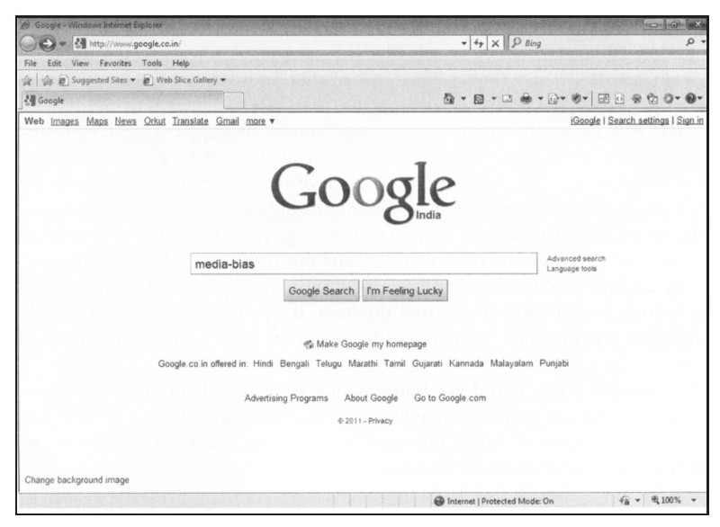

图　8-1　www.google.com，2011年5月17日，下午6点

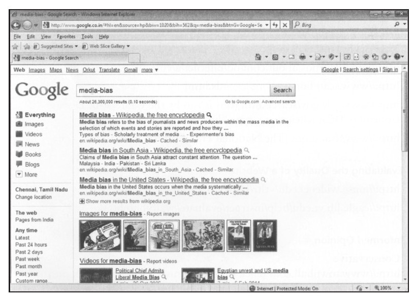

图　8-2　www.google.com，2011年5月17日，下午6点02分

当你不了解不同网站或是想扩展你的研究时，使用搜索引擎可以为你提供要寻找的信息。如果你知道最相关的网站，可以直接输入网址搜索。

### 保持批判精神

当面对已发表的观点，尤其是权威人士的观点时，你可能很容易向这些观点屈服。这种状况的发生本身就是一个错误。权威人士也是普通人，他们同样会犯错误。比如，他们有可能盲目追寻个人偏好，顽固不化地坚持过时的观点，并伴随着推理能力的减退。

即便能避免上述错误，他们也可能会漏掉自己或是相关领域的重要进展，或错误地理解这些进展的重要性。每一领域的研究源源不断，而这些付诸努力得到的结果经常推翻前人的结论。比如，在过去的很长一段时间里，医学专家一致认为食用动植物油会增加患心脏病的风险，过量食用盐会增加血管压力，频繁食用鸡蛋会增加血脂，幼儿时期的饮食习惯会导致成人期肥胖。而之后新发表的研究挑战了上述每一个结论，并修改了专家观点。9

综上所述我们可以得到这样的观点，新视野总要通过多年的沉淀，历经多个专家努力才能成为众所周知的知识。心理学家卡罗尔·塔夫里斯（Carol
Tavris）一项著名的研究，推翻了发泄敌对情绪有益的传统假设，证明愤怒是一种被人误解的情绪。这一研究在1982年出版。然而现在仍有一些文章沿用前期的观点，这些作者很显然忽略了他的成果，盲目轻信错误的观点。

总而言之，我们不仅要找到权威观点，也需要持有批判精神，两者缺一不可。最好的方法就是找出不同权威人士观点的差别，同时针对每一个观点提出探索性问题，并比较他们的回答。

### 访问权威人士

大多数情况下，你的调查能在图书馆或者网上完成，但是你也可能偶尔有机会访问一位权威人士（比如学校里的知名教授，他在你调查的领域中已做了深入研究）。在这种情况下，请遵循这一基本原则：时刻为被访者着想，说到底他将宝贵的时间献给你，你千万不能想当然草草了事。以下是展现你面面俱到的具体方法。

（1）提前电话或邮件预约。解释清楚你想要讨论的内容以及所花时间。（尽可能控制时间，半小时为宜。以遵循被访者日程安排为前提确定访谈时间。）

（2）在访谈前，努力掌握你们将要讨论主题的基本原理。如果这个主题备受争议，了解清楚这些议题，做到心中有数。

（3）事先准备好问题。这些问题一定要简洁明了。尽量避免那些封闭式问题（只需回答是或否的问题），因为这对你并无太大帮助。比如，用“对于管理者的陈述，您有什么看法？”代替“您是否赞同管理者的观点？”如果你了解到有充足证据反对被访者的观点，你可以这样来问：“××教授是这样看待这个问题的，您会做出怎样的回应呢？”如果你听到一些反对的声音但证据并不充分，你可以这样发问：“是什么原因使有些人和您的观点不太一样，您又会怎样做出回应呢？”

（4）预期问题的结果，并准备接下来的问题，以应对被访者的回答只停留在表面上或是没有深入要害的情况。

（5）准时到场。当你开始访谈时，抓住要点。让你的问题显得干脆清晰。切勿在被访者作答过程中思考下一个问题。你要做的是认真倾听并做出回应。如果被访者的评论开启了一个你没有考虑到但值得研究的新议题，请适时跟随。切记不要寒暄时间过长。

（6）尽一切可能不要让被访者在你记笔记的时候等待。如果你不能速记，可以考虑对这段访谈录音（一定要征得被访者的同意。千万别想当然地以为每个人都愿意被录音）。

如果面对面访谈有困难，可以采用电话访谈的方式。访谈过程同样按照上述步骤进行，但要另外注意两点。第一，一定要提前电话或邮件确认哪段时间进行电话访谈最为方便。以己度人的想法绝不可取。第二，记住当开始电话访谈时，你一定要表述清楚，问题明确，提问精准。

### 避免剽窃10

一旦观点形成文字并被发表，这些观点就变成了“知识产权”，作者有权拥有它，就像一个人有占有房屋或汽车的权利一样。而唯一的不同点就在于知识产权倾注的是心智努力而非金钱。只有那些绞尽脑汁解决难题或是尝试一切推陈出新的人才能体会到心智努力绝非易事。

剽窃是将他人的观点和用语据为己有的过程，而剽窃加上欺骗更是罪加一等。在学术圈里，剽窃被认为是一种违反道德的行为，一经发现，课程成绩或论文都会被判不及格，更有甚者会被学校开除。在学术圈外，如果被原作者指控，那么剽窃者会因罪名成立而锒铛入狱。从法律角度来说，盗取他人观点或语言就像偷盗他人电脑一样，需要受到法律的制裁。

在剽窃案中，一部分是蓄意欺骗，另一些是粗心造成的，但更多情况下是由误解导致的。“文章要基于研究而不是自己未成形的观点”和“不要将他人的观点据为己有”这两个观点有点自相矛盾之处，尤其在无进一步阐述时，或许让你感到更加困惑。幸运的是，总有方法能让这两个指导语表述得更为清楚，同时避免剽窃。

步骤1：当你在研究一个主题时，请将你的观点和参考文献的观点分离。对你查阅到的每一个来源的信息都做记录。对于网络资源，记录下网址、作者、题目和你浏览网址的日期。对于书籍，记录下作者、题目、出版刊物、出版商和出版时间等。对于杂志或是期刊论文，记录下作者、题目、出版物名称和发行日期等。对于电视或无线电广播，记录下节目主题、电台和发行日期。

步骤2：在阅读每一个信息来源时，请在写作过程中标注你想参考的观点。如果作者的文字非常清晰准确，那么将它们复制下来并做上引用标注。否则，运用改述的方法，用自己的语言转述原作者的观点，并写下作者文章的页码。

如果作者的观点引发了你心中的思考（比如一个问题，这一观点和你阅读到的其他观点的连接，或者是你自己的经历支持或挑战作者观点），记下来并用中括号（非小括号）标注出来以便于在重新复习笔记时能辨明自己的想法。下面一则案例很好地阐述了这两个步骤。

莫蒂默·阿德勒《伟大的思想：西方思想词典》（纽约：麦克米伦出版有限公司，1992，第867、869页）指出，从古希腊时代开始，哲学家就从未停止对多样性观点正确性的争论。据说很多享有盛名的思想家都认为事实是“思想和现实的统一”。第867页同时提到弗洛伊德把此看作事实的科学视角。他的原话是“和真实的外界世界的统一称为事实。即便工作中的实践性价值让我们毫无兴趣而言，事实依然是科学工作的宗旨。”（第869页）（我认为真实的陈述和事实相符，反之亦然。）

不管是什么时候回顾这则记录，就算已经距离一年了，你还是能清楚地分辨哪些是作者的观点，哪些是你自己的看法。前三句是间接改述了作者的观点，第四句话做了直接引用。最后一句在括号里的话，是你自己的观点。

步骤3：写作时，通过巧妙地引用和改述，将借来的观点和语言写到你的文章中。同时对提出这些观点的作者表示称赞。你的目的就是消除大家对观点和语言来源的困惑。在正式的报告中，赞扬可以放在脚注里；在非正式报告中，简单提及作者的姓名即可。

以下是一则将引自莫蒂默·阿德勒书中的材料融入文章的例子（注意脚注的位置和格式），第二段阐述了怎样扩展你自己的观点。

莫蒂默·阿德勒提出，从古希腊时代开始，哲学家就从未停止过对多样性观点正确性的争论。但阿德勒的卓越之处在于，不管他们怎样争辩，大多数思想者在事实的本质上都达成了共识。他们把它看成是“思想和现实的统一”。阿德勒指出西格蒙德·弗洛伊德认为它是事实的科学视角。他引用了弗洛伊德的一句话：“和真实的外界世界的统一称之为事实。即便工作中的实践性价值让我们毫无兴趣而言，事实依然是科学工作的宗旨。”<a href="#part0258.html_ch1-back" id="part0258.html_ch1"
class="pcalibre calibre2">[1]</a>

这种对事实的统一性观点和常识规则相一致，常识性规则指的是符合事实的陈述就是事实，反之亦然。比如，“纽约国际贸易中心的双子塔在2002年9月11日被炸毁”这一则信息是错误的，因为它们是在2001年受到攻击的。你可能直觉地认为这则信息是正确的，但是这种直觉对你判断信息的真实性毫无帮助。同样，如果一个无辜的人被指控谋杀，法院的裁决也不会判他有罪。我们可能自由地想象着自己希望看到的场景，但是事实却不容改变。

在引用和改述过程中常会遇到以下3个问题。下面是对于每一个问题的解释，同时给出解决该问题的实际操作方法。

问题1：决定到底是引用还是改述。只有当你觉得原作者的表述精准完美，改述后表达力度减弱且显得冗余时，才考虑引用。而这种情况十分少见。多数文章改述后表意清晰，有些甚至起到画龙点睛的作用。

以下这些陈述需要引用而不是改述：

“勿以善小而不为。”——伊索

“思想决定人生。”——佛陀

“要一个人去学习他认为自己已经了解的知识是不可能的。”——爱比克泰德

以下是一些可以改述的句子（以及改述后的句子）。（注意材料的来源在改述过程中呈现出来，同时对引用的观点予以赞扬。）

“他心里怎样思量，他为人就是怎样。”（《圣经·箴言》23：7）（改述后：就像《圣经·箴言》告诉我们的那样，我们会成为我们所想象成的那样。）

“一个不按照自己的信念生活的人，对什么都没有信心。”（托马斯·富勒）（改述后：要想做一个真实的人，必须要练就自身信念。）

问题2：把作者的话变成你自己的语言。改述需要承受很大的心理压力，因为这要求从各种视角来表达观点。人们总是轻易地认为“作者表述的方式是唯一的方式”，并将这一表述用作引言，但你一旦照这样做了之后会发现，你文中的绝大部分语言都贴上了引用的标注。如果想避免这一“惨状”，你可能会放弃引用的记号，而这种做法就变成了剽窃。

解决这一问题的方法是在承认表达方式多样性的同时，加入自己的想象和创新。下面是一则对谢尔比·斯蒂尔的White
Guilt有效改述的例子。（为了达到练习的效果，出现在不同页面中的5篇文章被聚合在一起，并用省略号表示。）

#### 原文

“……这种新型的黑人觉醒运动（20世纪60年代）将黑人引入了一个巨大的误区：在谈论自己的时候毫无目的地丢掉本已赢得的个人自由，不为别的，仅为触发白人的职责和义务……民权运动的结果将纯粹简单对平等权利的要求升级成对黑人和白人社会责任的重新分配，进而使得黑人地位提升。这对于为了美好生活在美国长期奋斗的黑人来说，无疑是一个巨大的悲剧……黑人的斗争性在60年代末不可避免。它充分利用白人的内疚，并把其当作一种压力，使更多美国白人对黑人进步承担责任……因此，自60年代以来，黑人领袖已经得到一个压倒一切的论点：如果没有美国白人承担主要责任，黑人不能实现平等。事实上，黑人的战斗性在白人的权力中成为一个激进的信念，一个相应的激进分子拒绝承认黑人的权力。但这一悲伤的事实体现了一个重要特性：如果不能承担责任，那么人类的人性，个人或者集体，都不能自我改变，这就是自然规律。如果有人已揽下所有责任，其他人在意识到他们要对此负责的前提下，能做的也仅仅就是从旁协助。但是在人类历史上没有哪个群体通过另一群体变得卓越并富有竞争力。”

资料来源：Shelby Steele,White Guilt：How Blacks and Whites Together
Destroyed the Promise of the Civil Rights Era（New
York：HarperCollins，2006），45，58，59，60，62.

<a href="#part0258.html_ch1" id="part0258.html_ch1-back"
class="pcalibre calibre2">[1]</a>莫蒂默·阿德勒.伟大的思想：西方思想词典\[M\].纽约：麦克米伦出版有限公司，1992：867，869.

#### 改述

谢尔比·斯蒂尔认为，在美国，黑人已经允许白人来克服他们对于奴隶制和歧视的罪恶感，把黑人当作受害者并且接管所有黑人进步的责任。他认为这个是一个严重的错误，因为在人类历史上没有哪个群体是借助另一群体之力日臻卓越并具有竞争力的。

注：①第2句前8个字清楚地阐明了作者在改述斯蒂尔的观点；②有一些在原文中出现的关键词语，比如“进步”、“责任”等，在改述后的句子中同样出现。类似这种的重复是不可避免的，这不被认为是剽窃；③只有最后一个句子做了引用的标注（“群体”），引用但未作注释会被视为剽窃；④改述后的文字不仅表达出了原文的中心思想，而且更加清楚简洁。这就是改述后的一大典型特征。

问题3：要建构自己的观点，首先要将改述后和引用的材料恰当结合在一起。如果这一主题你并不了解或太过复杂，你可以试着揣摩原作者的言下之意并加入其中。就拿谢尔比·斯蒂尔的文章为例，你可以这样来解决问题。在改述完他的观点后，你可以尝试做以下几件事：①通过书中提供的例证来详细深入地阐明他的观点；②呈现认同其书中思想的其他作者的观点并列出支撑他们观点的例证；③列出在这一问题上反对斯蒂尔说法的作者的观点并提供他们所举例证（完成上述3个步骤，你将在改述、引用和引证3方面面面俱到）；④写出你对这一问题的评价，呈现你所赞同或反对的作者观点，并提供自己的推理例证。

以上4个步骤将让你的文章或是研究别出心裁，并很好地表达你的思想和观点。深入阐释、提供例证、提前预期并回答反对之声，你做得越到位，文章的质量也就越高。

### 建构你自己的研究

到目前为止，文中已经阐明了调查中最核心的方法，即确定已被知晓的事物。在许多案例中，调查需要你提供解决或分解问题的证据。因此，有时你不仅要将现有资源烂熟于心，还要推陈出新构建你自己的研究。以下是两条建议。

#### 考虑做一个调查

在大学校园中，很多有趣的现象值得作为主题被调查。比如学生对作弊的态度，学校社团对女运动队是否应该和男运动队得到同等水平的资金这一问题的姿态，以及教授对于在校园内公开停车的态度。

#### 考虑做一个观察性研究

大学校园中切实可行的观察性研究是一种动态研究方式，通过观察法，委员会能找到会议的低效之处；通过观察法，你可以研究高峰时期学校自助餐厅的人员流动，从而明确拥堵发生的原因和地点。

在你尝试任意一种方法之前，重新复习本章前面提到的说明。

### 永葆你的创造力

解决问题的策略这一阶段和调查阶段一样，都占有至关重要的地位。但在问题解决的过程中可能会让创造力受到威胁。你积累的信息越多，可能你会感到越迷惑。要永葆你的创造力，你需要克服这种混沌状态。下面告诉你该怎么做。

当你陷入错综复杂的信息空间中难以分辨时，先暂停一小会儿，回过头重新阅读步骤2中你对问题的阐述，并使用那个能明确区分相关和非相关信息的表述。如果你处理的是太难理解的问题，你可能需要多次重复这个方法。即便是享誉世界的创造性思考者随着时间的流逝也可能会迷失方向，但是他们时刻保持一颗勇敢积极的心——日复一日、年复一年地寻找正确方向。

海量的信息还可能会让你的信心慢慢减退。你越是深究一个问题，就越能发现其中的纷繁复杂。终于有一天，你可能在心里暗暗想：“我从来没有意识到这个问题这么难。或许它就没有解决的方法，否则那么多学识渊博的人怎么都没找到呢？那我又在这儿费什么劲呢？”当这种念头在你脑海中飘过时，你要提醒自己，那些人没有找到解决问题的方法，是因为他们输给了对未知的恐惧（它侵蚀着你的创造力），抑或这些专家缺少开启技术的能力，无处使用他们的创造力。（归根到底，创造力并不是大多数中学或大学里传授的那种正统观念，因此很多受过高等教育的人并不知晓也不足为奇。）要谨记，思维中的难题一定有行之有效的解决办法，至于你面对问题时怎样产生创造性的回应，下一章节将会详细阐述。

### 热身练习

1.认真阅读以下对话，并想想如果你是维罗妮卡的话会怎么应答。请确保你的回答能清晰有效地解决这一问题。

佩蒂：人必须要读的唯一一本书就是《圣经》。

维罗妮卡：我不这么认为。其他书也有很多可读之处。

佩蒂：你这种想法大错特错。那些和《圣经》观点一致的书，没有读的必要，至于那些和《圣经》的观点相悖的书，它们都是无宗教信仰的，我们能不读就不读。

2.创造你所能想到的所有新型的食谱，包括原料和烹饪说明。

3.旧牙刷通常被当作垃圾扔掉，但它们真的毫无价值了吗？请想出关于它们尽可能多的用处。

### 应用练习

1.以下每一个案例都以新闻的形式报道出来。绝大多数读者都泛泛而读，认为这些新闻除了字面上提到的最相关主题外，和别的任何主题都没有相关性。然而对于那些解读背后信息的人来说，每个例子都提供了一些有趣的可能性。请对以下每一则例子，列出你能想到的其能运用到的任何主题，越多越好。

a.一些研究表明，个体之间的性格差异更多是由遗传而非环境决定。比如，明尼苏达大学的心理学家对400对成人双胞胎进行研究，结果发现，在诸如愤怒的情绪、谨慎的行为和社会政治宗教性的保守主义上，双胞胎有着惊人的基因联结。宾夕法尼亚大学一项对700对双胞胎的研究也表明，环境因素在解释性格差异时仅占有10%的比例。11

b.一名9岁的孩子罗伯特用玩具枪指着纽约银行柜员并抢走118美元现金。他的律师为他辩护称在这次抢劫行为中他只是在进行角色扮演。最终法院判他缓刑两年。然而在一年之后，这个孩子因带着其余两名共犯持刀抢劫两个男孩的雪橇而被捕。12

c.3岁的查德·钱西成为美国俄克拉何马州法庭上最年轻的目击证人。他是唯一一个在案发当晚经历妈妈和姐姐被谋杀全过程的人。查德称他听见隔壁房间女人的尖叫声和争吵声，像强烈的拍手声一样，随即变成一片沉寂。随后，他在警方档案照片中指认出当晚去过公寓的男人。辩方律师指出查德年纪太小，分辨不清事实和幻想。13

d.1945年，人们在波士顿码头发现查尔斯·贾米森伤势严重。他手中拿着一张纸，上面写着他是卡蒂萨克号的第一位大副，但没发现有关这艘船存在的任何信息，并且对这名男子所有的深入调查都无果而终。在和他的访谈中仅了解到他没有家庭，在13岁那年就随船驶向大海，而这艘船已经被毁坏。之后他一直待在波士顿医院，30年后于医院去世。14

e.精神病和记忆与催眠专家马丁·奥恩教授及心理学和记忆专家伊丽莎白·罗德教授在美国《科学》上发表文章，认为通过催眠技术让目击证人回忆事发当时的细节这一举动可能并不明智。他们的研究发现催眠师提问的方式可能会导致目击证人记忆的无意识扭曲。奥恩说：“如果催眠师持有某种信念，他很有可能在被催眠者的大脑中创造记忆。”15

f.妊娠期满后，婴儿通过手术从母亲子宫中提取出来，手术过后又被放回子宫，直到这时婴儿才算完全得以保全。这个手术往往在怀孕期的第24周进行，用来修正威胁生命的尿路梗阻问题。16

2.沃必冈大学一直受到成绩浮夸的困扰。即便在过去的十几年里其学生的平均入学考试成绩平稳下降，但许多教授提交上来的平均成绩仍然都是B+。在10年或15年前只能得到C的作业在现今都会给到B甚至B+。有60%的学生都在优秀学生名单里。请找到针对这一问题最恰当的表述方式，并做调查，使用在本章介绍的方法，提出你所能想到的所有解决办法（记录下所有你的思考，准备好后提交给你的导师）。最后，阐述你认为最好的解决策略，并阐明原因。

3.人们有时会写一些名为“为什么迪克和简不能写字”或是“英语教室里的丑闻”的文章，旨在抨击当下写作教学的不良现状。公众乐此不疲，呼吁研究该类问题，与此同时，媒体正在探索提高学生语言水平的方法，但不幸的是始终未能找到独具创新又行之有效的办法。认清这一现象并尝试解决该问题，请参考应用练习第2题的要求进行操作。

4.当前社会，酒精与药物滥用已与街头犯罪、健康问题、家庭破裂和低工作绩效这些问题密不可分。认清这一现象并试图解决该问题，请参考应用练习第2题的要求进行操作。

5.在许多州，学校的资金主要来源于财政收入。这一系统严重偏袒富裕地区，导致富裕和贫穷地区教育机会的不平等。认清这一现象并尝试解决该问题，请参考应用练习第2题的要求进行操作。

6.一方面，联邦政府禁止广播和电视中关于烟草的广告，同时在每一包香烟上都标注“吸烟有害健康”的警示语；但另一方面，政府却大比例补贴烟草种植业。关注这一现象，并参考应用练习第2题的要求进行操作。

7.美国专利商标局于1987年提到“扩大专利保护范围，包括非人类多细胞生物，包括植物及非人类的动物在内……”一年以后，哈佛大学创造了一种新型的转基因老鼠，并获得专利。一些人认为科技进步是好事，但另一些人认为这是危险的先兆。17关注这一现象，并参考应用练习第2题的要求进行操作。

8.伊芙是人文科学专业的一名大三学生。她想要设计自己的职业发展路径，但对未来的职业发展并不明晰。她最喜欢且最擅长的技能是写作，但是她不想当小说家，也不想去教书。请帮助她在职业选择过程中找到最有帮助的资源解决这一问题。

9.选美比赛是对女性地位的侮辱吗？餐馆可以要求女服务员穿着暴露，如穿上低胸装接待顾客吗？对于《与星共舞》这一栏目中，男舞者穿着完整而女舞者身体暴露这一现象该如何评价？写下你的答案，并对可能遇到的反对意见做出回应。

### 综合练习

下面这道题是本章对思考能力最大的挑战。分析并做出回应，请参考第1章综合练习的要求。同时，回顾第2章中“道德判断的基础”和“应对困境”。

⊙议题简述：美国的国际援助

每年美国政府会向其他国家捐赠数以亿计的现金、物资和服务。很多美国人认为这种国际援助项目反映了悲天悯人和慷慨大方的大国气度。但有一些人认为这一项目不仅达不到预期目标，还可能适得其反。

⊙对比阅读

加大美国国际援助

米拉·阿努尔

大家想当然地认为美国是世界上最慷慨大方的国家，可事实并非如此。工业化国家的国际援助对比显示，美国的国际援助水平几乎垫底。比如，在2004年，它仅仅超过了意大利，那些排名靠前的国家中有加拿大、爱尔兰、芬兰，甚至小小的卢森堡！

这一事实令人瞠目结舌。这一数据统计不是基于总体捐赠数额多少，而是根据捐款数额所占国民生产总值的比例决定的。这是一个更为合理的计算方法，而美国的国际援助贡献低得令人感到尴尬。归根结底，我们是世界上最富有最强大的国家。我们有责任和义务来帮助第三世界国家的人们走出由于贫穷和疾病带来的灾难。

呼吁美国国际援助力度应该加大并不意味着现有的援助模型毫无瑕疵。我们援助的资金主要流向了埃及、法国和以色列。如果这些资金适当减少，那么那些形势和经济上更严峻的国家会受益更多。另外，我们的援助项目中并未关注资金援助的用途以及分配的有效性。因此在相信享有至高无上荣誉的他国领导人言论的同时，我们也应该要求确凿的数据证据。

同时，我们也应该尝试改变援助形式，更多地以实用技术援助的方式进行国际援助。俗话说的好“授人以鱼不如授人以渔”。

不管如何修正援助模型，我们首先应该加大这笔资金的投入。伟大的民族应有慷慨的气度和风范。

结束国际援助的惨败现状

玛丽·罗宾森

历史上美国是最慷慨大方的国家。我们捐助金钱和服务来帮助那些遭受地震、飓风、海啸和疾病蔓延的国家，帮助那些受到战争毁坏的国家。我们甚至帮助重建那些和美国曾有战争的国家——德国和日本。

我们的慷慨解囊从未改变世界对美国仇恨的目光。英国和其他国家领导人指控我们缺乏同情心，甚至把我们说成是欺压人民的帝国主义形象。我国领导人的肖像和国旗被当众烧毁这一现象已不足为奇。

世界各国不友好的表现足以让我们重新审视国际援助计划。更严重的是，我们的国际援助根本不奏效。这绝不仅仅是一则简讯。1986年，在一篇名为“国际援助接连不断的失败”的研究中，詹姆斯·伯瓦德指出，“国际援助机会对他国的帮助微乎其微，并很可能适得其反”。伯瓦德发现在他国发放免费食物时，当地农民的行动完全毁坏了本应有的和平场景。他还担心国际开发署可能助长了一些腐败政府借机掌控整个工业并因此毁灭私营企业，从而更好地统治他们的民众，限制民主运动的企图。

在他写下这些文字之后，形势变得更加严峻。独裁者和他们的侍从神不知鬼不觉地将这些援助资金转入自己的银行账户，甚至不惜放入恐怖分子的保险箱中。我们不得不承认国际援助毫无成效，只有结束国际援助的惨败现状才是明智之举。

⊙课堂讨论

亚历克西斯：我认为阿努尔的观点比罗宾森的观点更为和谐。她指出援助资金在进行资金分配时应该更为平均，同时她也指出问题，要确保援助资金用在刀刃上。另外，她认为按照美国的实力，应该提供更多帮助。

布鲁斯：我承认这很和谐，但实际的所作所为注定了这一项目失败的结局。我看不到任何优点，这无异于花钱填无底洞。

亚历克西斯：这一项目的优点就在于帮助那些有需要的人。善行是一切宗教和道德的基石。在犹太教中，善行被看做是戒律；在佛教中，善行是一种慈悲观；耶稣也告诫道“不管你做了什么，至少对你的兄弟姐妹们持有善良之心”。

布鲁斯：确实，在宗教中要求个体帮助那些有需要的朋友。但据我所知，没有一个宗教告诉政府要担起这种责任。

亚历克西斯：世界上有这么多贫困的人民和国家，他们急需得到帮助，因此政府援助绝对不可或缺，并且大多数人愿意看到人们的需求被满足的情景。

布鲁斯：你弄错了。目前有成百上千的私人援助项目，包括很多宗教援助，这些项目得到了数以万计人的支持，并且在分发援助上比政府有效得多。

## 第9章　产生新想法

到本章为止，我们已经探讨了创造过程，已经说明了该怎样去认识问题、将问题表述清楚、抓住问题的本质。在创造过程中还有一个环节：产生各种可能的解决方法。

在本章中，你会知道产生大量的想法是有好处的，你还将学会怎样激发自己的想象力、怎样产生更原创的想法、怎样克服创造过程中的常见阻碍。

想象一位在南海小岛上寻找珍珠的潜水者：他把独木舟划离岸边，划进一片环礁湖后潜下水去，从湖底捡上来一只牡蛎，浮出水面，上了小船，划到岸边，打开贝壳，发现贝壳里面只是牡蛎而没有其他的东西，于是他再一次划起独木舟，划进那片环礁湖。“等一下，”你可能会想，“他浪费了太多的时间，正确的方法应该是继续一次一次地潜水而不是又划回岸边，应该把所有牡蛎装上独木舟再回到岸边。”

你是对的。珍珠是稀有的，潜水者必须通过多次尝试才能找到一颗珍珠，而每一次往返只潜一次水是非常耗费时间和能量的。1这与产生新想法的过程非常一致。不够明智的人只想出单一的解决方法，并认为该方法是有创造性的，但就像珍珠一样，创造性的想法并不经常产生，所以明智的人在找到创造性想法之前都会产生很多想法。

研究者发现，新想法的数量和质量是存在一定关系的。产生的想法越多，越有可能产生好的想法。2原因有两个。第一个就是简单的概率问题，创造性想法在概率上是少见的，就像著名的数学家、哲学家和教育理论家艾尔弗雷德·诺思·怀特海所说的：“999个想法可能无法取得任何结果，这可能是因为这些想法本身没有什么价值，也可能是因为我们不知道如何寻找到它们的价值，但是我们最好接受这样的状况，因为1000个想法中有一个可能会改变世界。”3

第二个是原创的想法经常比不上后来的想法，就像自来水要放一会儿才能变得干净、没有杂质，要想使想法变得有创造性也需要经过这样的过程。“早期的想法，”赫伯特·斯宾塞警告说，“并不是真正的好主意。”4引发这种现象的真正原因尚未查明，这很可能是因为最初的想法往往最接近我们的意识表层，是熟悉和安全的。5创造性思维需要不断去掉那些常见、习惯性的东西，然后产生不同寻常和充满想象力的想法。

要处理这些问题，你需要回答关于“如何……”的问题；要处理这些争议，你的想法要更多，不仅要回答诸如“是什么”“怎么样”“应该怎样”这些直接的问题，还要包括那些能帮助你回答这些问题的想法。通常的情况是，能够真正解决问题的想法在最初看来和问题并不相关。

### 激发你的想象力

要产生创造性的解决方法，一种方法是通过产生大量的想法，另一种重要的方法就是激发你的想象力。多数人的行为显得毫无想象力，这并不是因为他们缺少想象力，而是担心别人会对自己的想法有什么反应。人们会压抑自己与常规相悖的想法，以免引起别人的异议。他们这样做对自己极为不利，因为创造力往往源于想象力。“所有伟大的发明都受过严重的质疑。”艾萨克·牛顿说。6爱因斯坦也补充说：“我相信想象力……想象力比知识更重要。”7

要激发想象力，并不是仅仅有决心就能做到的，对于已经习惯于压抑想象力的你来说就更是如此。你需要一些策略来激发自己的创造性想象力，以下是7种有效的策略，有一些更适合处理问题，有一些更适合处理争议：

·加强非常规反应。

·运用自由联想。

·运用类比。

·寻找不同寻常的组合。

·将解决方法形象化。

·建构正面和反面论点。

·建构相关情境。

#### 加强非常规反应

我们注意到最初出现的总是那些常规的、熟悉的想法，这是不可避免的，所以，最好的方法是期待并鼓励这些常规想法的出现，让你自己更自由地进行思考，获得更多初步的想法。先问问自己大多数人会怎么想，并将这些想法写下来，当你写不出来的时候，开始想想大多数人不会怎样想，尽可能在这方面想得更多一些。

你可能会列出一些疯狂、可笑的想法，并因此觉得有点不适应。你可能会想：“这些有什么用处呢？”你可能认为问题和争议都是严肃的而不应该是愚蠢可笑的。请抵制这些想法。好玩有趣正是具备创造性的人的重要特征，这使他们更具活力。写下这些可笑的想法没有任何错误，将想法写下来也并不表示你认可它们，你也可以在随后划掉这些想法，但不要一开始就否定这些想法，你可能在无意中否定了具有创造性的想法。

不要误解，这并不是说你应该疯狂或者搞笑，而是说在寻找不寻常想法的过程中，要对这样的事情持更宽容的态度。

#### 运用自由联想

自由联想是指由一个想法产生另一个想法，“加强非常规反应”要求对思维的方向有所控制，而自由联想要求解除对思维的一切束缚，暂时放松你的思想，你会发现可能产生一些出乎意料并且指向更有趣、更有益方向的想法。像“加强非常规反应”一样，不要放过任何一个联想，把它们全部写下来，那些在最初看起来不相关的联想后来经常被证明是有价值的。

这个策略的目的在于帮助你提取相关信息，解除你对心理的控制，让思想自由流动，可能导致漫无目的空想。因此，你应该把这个策略当作对其他策略的补充，而不能替代其他策略。

#### 运用类比

类比就是在不同的东西中找到一个或者更多的相似点。比如，将足球中卫队员在突破防守区时的奔跑与美洲虎、猎豹的奔跑做类比。

创造性成果的历史证明了类比思维的价值。创造性思维经常会发生在某人将自己领域内与领域外的东西相连接的时候（这个事实证明了博学的价值，狭隘的训练经常会导致狭隘的视角，阻碍了创造力）。古登堡在观察葡萄榨汁机如何运作的过程中产生了发明印刷机的想法，铲车的发明者从甜甜圈运输机得到了灵感，他们都运用了类比思维。

运用类比思维，问问自己那些问题和争议与什么是相似的，让你想起了什么。你可以适当地问更多的问题，比如“这像什么（或者听起来、尝起来、闻起来、摸起来更像什么）？”或者“其作用是什么？”

#### 寻找不同寻常的组合

有时，解决问题最好的方法是将两种不常在一起的东西组合起来。矿工的帽子（把手电筒和具有保护性的帽子组合）、轮椅、时钟收音机都是运用组合思维的发明。最具代表性的发明要数食谱，厨师将不同的原料混合在一起也就有了不同的菜肴，这就是运用了组合的方法。第一个将马苏里拉奶酪放在小牛肉片上的人制作出了“马苏里拉奶酪牛肉”，买不起小牛肉的人用肉饼代替小牛肉就做成了“马苏里拉奶酪肉饼”。

相同的策略在其他领域也同样适用，比如说寻找社会问题的解决方法，当下一个越来越受到关注的问题就是日益增加的监狱成本。有人建议将监狱与工厂合并，犯人在关押期间为工厂干活并有一定的收入，再将税收作为监狱的收入（这个想法来自类比，用监狱类比大的工厂联合体）。

#### 将解决方法形象化

这个策略是指设想问题已经解决并将其形象化。比如，在解决汽车在冰雪路面上行驶的问题之前，一位驾车在冰雪路面上行驶的司机脑中想的并不是轮胎陷入雪中或者在冰面打滑，他想的是车轮能平衡转向，轮胎能咬住雪面并牢牢接触冰面。他的想象力被激发，可能会问自己：“如果要达到这样的效果，车轮应该是什么样子的？”他可能想象出为车轮缠绕一圈金属片，或者为车轮装上凸起的钉子来抓住路面。

#### 建构正面和反面论点

这个策略在处理问题时是非常重要的需要列出关于某个问题的所有正面或者反面的论点。使用这个策略，你要经常问“是什么？”“怎么样？”“应该怎样？”，尽可能多地写下你肯定的回答以及肯定的理由，同时尽可能多地写下否定的回答及理由。如果你在探究关于工业技术对人类社会的积极和消极影响，你可能会列出以下观点（为了简明，这里没有提及支持各种观点的理由）。

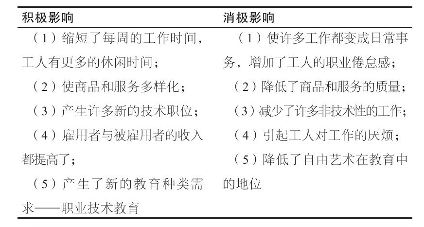

重要提示：要认识到你的观点可能是有偏向的，这种偏向会影响你建构观点。除非你对某件事完全中立，否则你总是会认为某一方面的观点是正确的，这样就会影响你列出的观点清单，也就是说，你总是会有意无意地列出对某问题单方面更好和更多的观点。最好的解决方法是多想想你并不认同的那个方面的观点，如果你能在调研争议时公平听取双方的意见，这个问题就很容易解决。

#### 建构相关情境

我们常常把观点理解为结论，硬说什么是什么或者应该怎么样，比如“在我们的社会中，对别人权利的尊重越来越少”“道德规范教育应该在国有学校实施”，这些都是观点，也是情境，包含想象与问题相关的条件和事件。建构好的情境有结论无法比拟的特殊价值：因为情境代表了事实本身，而不仅仅是关于事实的结论。

让我们来看看这个问题：在法律上对于强奸罪的判定，是否要包含女人是否“坚决反抗”这一条（直到1982年，某些国家的法律规定仍然包含这一条）。下面有3种情境：

·一个女人和一位认识了一段时间的年轻男子约会，他们之前有过约会，并且两人已经有了性关系。这一次，这个女人邀请这个男人到自己的公寓，两人拥抱爱抚，即使女人对男人的性要求说“不”，但仍没有阻止性关系的发生。

·一个女人躺在病床上，在经历了精神崩溃之后，她服用了大量镇静剂，一位男护士知道她没有反抗能力而对她进行了性侵犯。

·一天晚上，一位女大学生在从图书馆回宿舍的路上，经过一片昏暗的树林，突然，两个男人跳到她面前，其中一个拿着刀并警告大学生如果反抗就杀了她，该学生因为害怕而屈服了。

仔细阅读这些情境，你就会明白构建非单一情境的重要性，构建要包含大量的可能性。这些都是可信的——这是每个情境都必须满足的条件。然而，这些情境不能清楚地表明“坚决反抗”是不是合理的法律规定。分开来看，第一个情境支持了肯定的答案，但是，其他两个情境支持了否定的答案，在这种不确定的情境下，将“坚决反抗”作为判罪的条款之一是不合理的。

这7种策略在激发想象力方面会给你很大的帮助，但是不要期望立刻就能熟练运用这些策略，熟悉它们需要时间，在经过几次尝试之后才可以。如果你想放弃，就想象一下你第一次打篮球或者第一次开车时窘迫的样子，这些看起来也是不太可能学会的，但事实上你还是学会了。如果策略之间的转变让你感到迷惑，请你回头再看看要解决的问题，重新审视，然后继续产生新的观点。

### 追求创意

多数人认为创意是一种天分，你可能有，也可能没有，曾有人认为一旦没有天分，是不能通过学习而变得有创意的，但研究已经证明这种观点是错误的。与其他创造性技能一样，创意也是可以学习的。如果你没有有创意的想法，仅仅是因为你已经习惯了没有创意的方式。有研究表明，当一个人意识到创造性这一点时，就可以激发他的创意性。8

为了有创意，你首先应要求自己有创意，提醒自己创意并没有什么神秘性，它只需要不同于常规的一两个步骤。不要把你的思想禁锢在你之前的所听所想。每当你提出问题并试图找到解决方法时，就把自己的思维再延伸一点，比你之前的想法更大胆一点。

还有一种方法可以帮你变得更有创意：考虑你的边缘思维，“边缘思维”是由格雷厄姆·沃拉斯（Graham
Wallas）提出的，意思是说思维发生在意识的边缘，就像物体呈现在我们视野的边缘。每当走在街上或者在路上开车，我们只将注意力集中于我们想去的方向，只有此时有不寻常的事情发生，我们才会将注意力转向它。因为创意总是出现在意识的边缘，所以越多地注意到意识边缘，越会发现更多的创意。

### 保留判断

判断是思维的重要部分，没有判断，我们就不能区分解决方法的好坏，也不能选择哪些是最好和最有效的解决方法。但是做判断的时机不同，结果会有很大不同。多数人不能很好地把握做出判断的最佳时机，他们很冲动，一有了想法就马上做出判断，有时候甚至还没有完全理解，当想法还模糊不清的时候，就会说“不，那是不好的”“这是愚蠢的”或者“这不是可以解决问题的方法”。

创造性想法在一开始往往显得有些愚蠢，急于判断就有可能将最好的想法摒弃——最没有创造性的那些观念被证明是无心的。而让人觉得讽刺的是，当人们特别想有创造性的时候反而没有创造性。

研究已经证明，在想法的产生阶段不要判断，努力构想更多的想法，这样更可能产生创造性的想法。10在你做本章和接下来的一章的“应用练习”时，以及为本课程之外的问题寻找解决方法时，要等到你竭尽所能产生足够多的想法之后再去判断所有的想法。不要限制想法的数量，当你在想“我已经有10个（20个或者30个）想法了，已经够多了”的时候，你要提醒自己：最好的想法很可能会在接下来的10个或者20个想法之中产生，这需要进一步努力。再有，为了保证你没有在无意识地限制自己思维的流动，经常反思一下，比如，回顾一下前几章中的“应用练习”部分，看一看你是否过快地终止了产生想法的过程。

### 扫除障碍

要产生大量多样的想法，在这个过程中经常会遇到3大障碍：思考障碍、模糊和混乱、缺乏灵活性。学习识别这3种障碍，掌握一些简单的应对方式，可以防止你在解决问题的过程中发生混乱。

#### 思考障碍

写作障碍使作家写不出东西，与其相似，思考障碍会阻碍想法的产生，这使我们觉得空虚而紧张，新想法也不会出现。不仅仅是没有创造力的思考者有这些障碍，每个人都有这样的经历。好的思考者知道自己不能受这些障碍的影响，他们知道如何有效地处理这些障碍。

运用我们已探讨的方法可以将这些障碍发生的概率降至最低：当提出想法的时候，要习惯于保留判断。一方面，每当你想停下来做出判断或者只是想停下来一两秒钟的时候，你都很有可能无法重新思考。另一方面，你越能抗拒停止思考的倾向，持续地产生想法，就越能尽可能少地受到思考障碍的干扰。

如果你已经努力避免，但这些思考障碍还是发生了，就请按照顺序尝试以下方法：

（1）回顾你写下的那些想法，集中精神仔细读一读，其中的某个想法经常会让你想到另外的新想法，当这种情况发生时，写下你的新想法。一旦思维又开始流动起来，除非不得已，不要停下来。如果最初的想法偏离了目标也没有关系，你可以慢慢地将思维再聚焦于原来的问题或者争议。

（2）再看一遍这些可以激发想象力的策略：加强非常规反应、运用自由联想、运用类比、寻找不同寻常的组合等，然后看看列出的这些想法。让思维流动起来，前两种策略就足够了。

（3）重复抄写你的想法列表，写下想法的同时要仔细思考每一个想法，特别留心出现于意识边缘的新想法。这种方法可以使你保持思维的活跃不致混乱。

（4）先把要解决的问题搁置一段时间（一个小时、一天或一周），直到你对问题有了新的看法，不要着急。

（5）如果以上方法都失败了，回到第二阶段，考虑对问题有没有另一种表述方式。

#### 模糊和混乱

即使是最出色的思考者，在解决问题的过程中也会遇到障碍，比如爱因斯坦在16岁的时候开始思考和相对论有关的问题，在这个问题得到解决以前，他已经在这上面耗费了好几年的时间。在这段时间里，他经历了模糊、混乱与迷惑，也时时觉得压抑和失望。11

不论这个障碍出现在探究阶段还是想法的提出阶段，如果看不清问题，就经常会遇到这些障碍。要克服这些障碍，最好的方法就是在第8章所讲到的“回头看一下你对问题或者争议的表述”。开始的时候，为了要回头看问题或争议，你可能必须要终止思维的流动，但是只要经过几次练习，你就可以做到边回头看边继续思考，你可能仅仅是减缓了思维的流动速度。这就像开车一样，新手司机需要将车停下来才能调整好行驶方向，但是很快就能学会在保持速度的情况下对行驶方向做微调。

如果你在卡片上或者纸上写下要解决的问题，并在解决问题的时候随身携带，你就会觉得这个技能更容易掌握。

#### 缺乏灵活性

这种障碍的显著特点是：产生许多同类的想法，不同的想法之间几乎没有什么差异。这是你在不知不觉中引导自己朝一个狭隘的思路思考。造成一旦你发现了这种障碍（仅仅是简单地回头去看你的想法就能发现这一点），就要更努力地激发你的想象力。你可以使用我们之前讨论的7种策略，注意前两个和最后一个策略是特别有帮助的。

### 顿悟是怎样发生的

在提出观点的过程中，最令人激动的时刻就是顿悟。我们可以用很多方式描述顿悟的瞬间。一种是“啊哈”反应，就像当初阿基米德进入浴缸的时候突然意识到浸入水中的那部分身体的质量和池中溢出的水的质量相等，并由此开始构建阿基米德定律。“找到了！有了！”据说他当时边喊边在街道上裸奔（可能是那个时候并没有法律禁止这样的行为，或者他跑得很快，总之他并没有因此而被逮捕）。另一种表达顿悟的方式是一种强烈的满足感，比如，我们突然找到了那块失踪的拼图。最常见的感觉是豁然开朗，就好像舞台上某个卡通人物的头上有一个发光的灯泡。

基于某些原因，许多顿悟都发生在休息的时候。现代科学的基石之一，被称作“在整个有机化学领域中最具有智慧的预言”，就是在休息的时候产生的。1865年的一天，弗里德里希·奥古斯特·凯库勒正在小憩，突然间想到某种有机化合物的分子结构并不是敞开式的，而是环形的。他这样描述了他的经历：

我坐在靠近火炉旁的椅子上打盹……那些原子又跃入我的眼帘，这一次这些原子有序地排列着。因为之前对这些原子已经有过反复的思考，所以我的思维变得敏锐，可以辨别复杂重叠的结构，所有的原子之间相互连接，仿佛蛇的形状。看！那像什么？那蛇咬住自己的尾巴，在我眼前旋转，我的脑海中仿佛划过一道闪电。12

这些事实容易让人误以为顿悟是不需要付出任何努力的，研究创造力过程的专家们一致认为顿悟与空闲没有关系（如果二者有关联，那么乡村的流浪者应该是最有创造力的）。顿悟并不是在任何空闲的时间都会产生的。一段时间的高强度思维之后的空闲时间，才会产生顿悟。专家们推测：空闲的时候，问题从意识层面转向了无意识层面，但仍然没有中断对问题的思考，顿悟就是通过这样的努力获得的。13

顿悟和所有戏剧化的经历一样，比起日常发生的事情更让人印象深刻。然而，绝大多数创造性的方法都是逐渐获得的，这要基于对细节的敏感和细心的分析。这样的方法同样有价值，并且比顿悟更有优势，我们可以通过努力学会这样的方法。

### 问题范例

你是一家杂志社的票据收款人，已经在等候室里等待了很长时间，只为见到杂志社的债务人。接待者会让你一直等待，一直到你累了自己离开。你从各个角度考虑这个问题，考虑怎样将这个问题表述清楚。最后，你觉得最好的表述方式是“我在被接待者拒绝的情况下该如何见到债务人？”这就开始了产生想法的过程。

你开始列出你所能想到的所有想法。最初的一些可能很过分，但没关系，你知道你不应该停下来去评价这些想法：

·用枪威胁接待员。

·威胁说要绑架债务人的妻子和孩子。

·把一只具有攻击性的狗带到办公室。

·爬上楼，从债务人房间的窗户爬进去。

·告诉接待者你是老板的兄弟（姐妹）。

·绑架接待者，闯入办公室。

在这个过程中，你会遇到思考阻碍，你可以运用本章介绍的一种或者多种策略来克服这个障碍，思想就又开始流动起来了。

·哄骗接待者。

·提前打电话预约。

·给债务人写信要求还款。

·不断给债务者发传真。

·变动工作。

·采取法律行动。

·坐等办公室关门。

·为自己找个律师。

·找其他人来替你等待。

这时，你已经变得糊涂了，你觉得你已经远离了问题本身。回头再看看你刚刚列出的那些想法，再次确认问题是什么。这些想法与你对问题的表述并不相同，重新看看你的表述，再次产生别的想法。

·惹恼接待者。

·送给接待者一盒糖果。

·请接待者吃饭。

·试图贿赂接待者。

·请求接待者让自己见到债务者。

·等待接待者去吃饭的时候强行进入办公室。

你只能想到这些了，所以你又开始使用最初的策略，回头看看你列出的这些想法，“等待接待者去吃饭，请求接待者见到债务者，贿赂接待者……”你猛然间意识到自己思维的不灵活：你不自觉地产生了相同类型的想法，不同的想法之间很少甚至没有任何差异。这时候你要激发你的想象力，首先是加强不寻常反应，就又可以开始产生新的想法了。

·假扮其他人。

·在办公室抓住债务人。

·在等候室里打扰其他人。

·制造混乱。

·让自己变得令人讨厌。

思维再度中断，你激发了自己的想象力。当你无法产生不寻常的想法时，你开始自由联想，你的每一个想法都可以产生许多联想。比如由“假装成其他人”可以联想到装扮成：

·电话修理工；

·看门人；

·应聘者；

·警察；

·办公用品销售员；

·牧师或者修女；

·电工；

·报社记者；

·杂质竞赛评委（为评励）；

·窗户清洁工。

由“烦扰接待者”可以联想到：

·每隔几分钟就要求接待者通告一声；

·坐在接待员的桌子上；

·不间断地与他说话。

由“在等候室里打扰其他人”联想到：

·大声谈论自己最近患上接触型传染疾病；

·大声告诉接待室中的每一个人债务人曾经经历过生父确认诉讼程序；

·告诉每个人债务人欠债的真相。

由“制造混乱”联想到

·摔倒并假装病情突然发作；

·练习吹大号；

·大喊“着火啦！”；

·一边上蹦下跳一边大声喊叫；

·唱歌跑调；

·搭起一个帐篷；

·大吼大叫；

·写一条标语“这个家伙欠债不还”。

由“让自己变得令人讨厌”联想到：

·戴上令人恐怖的面具并假装流血；

·将蒜和洋葱擦在你的衣服上；

·将你的衣服喷上臭味喷雾。

到这里，你已经产生了足够多的好想法，包括很多具有创造性的想法，现在你可以停下来去选择最好的一个（这个选择可能是不确定的，取决于你怎样运用批判性思维）。哪一个才是最好的选择呢？居住于伦敦的安迪，是一名真正的票据收款人，他使用了最后一种方法，非常成功。他在衣服上喷上臭味喷雾，轻轻地走进债务人的办公室，告诉秘书“你还钱我就离开”。不必说话，也不需要等得太久（这个故事与现实中的情境有异曲同工之妙：办公大楼一般都会在大厅里安装大的显示屏，并记下未缴房租的租客的姓名）。

### 争议范例

你在报纸上看到一条有关电视信息办公室的消息，电视信息办公室是一个由电视产业资助的机构，他们做了多达6页的研究报告来说明一个问题：学生阅读成绩的下降并不是因为电视，而是由“社会经济因素”所导致的；看电视并没有导致学生的阅读问题，而是阅读问题使看电视的时间变得更长。这条消息说明“那些在学业上有困难的学生主要是因为阅读有困难，才会花更多的时间看电视”。14

你觉得会有很多人不认可这样一条消息，所以你把这条消息当作一种争议，并认为最好的表达方式是“看电视是导致阅读成绩下降的原因吗？”你在图书馆查阅了一些学术期刊，咨询了教育学的教授和阅读技巧的指导者（这些人都在你的大学校园里），之后，你有了这些想法<a href="#part0280.html_ch1-back" id="part0280.html_ch1"
class="pcalibre calibre2">[1]</a>。

这是一个由电视产业资助的研究，所以这个争议可能有所偏颇。

研究的结论说电视并没有导致阅读缺陷，这让我怀疑。

\[进行解读\]“阅读成绩与社会经济因素有关”，这样的争议认为不利处境导致了阅读问题，但这并不是证据。

中层和优势群体的学生的阅读缺陷是由其他因素造成的。

阅读问题导致了更严重的看电视问题吗？奇怪的是，我咨询的权威人士对这个问题持肯定的态度。

这是怎样发生的？让我们来看看……

\[现在想象一个情境\]孩子在学校遇到了阅读的困难，因此有挫败感，所以不想再拿起书本，而是选择逃避。他们一回到家就打开电视一直看到深夜。

这是有道理的，似乎说明阅读缺陷可能导致看电视过度。

\[现在开始唱反调\]这些孩子为什么与正常孩子不一样呢？许多好的阅读者也同样看电视，如果阅读问题不会使他们沉迷于电视，那么也不应该使那些阅读差的人沉迷于电视。是因为这个研究错了吗？毕竟看电视确实引起了阅读问题。

如何才能判定看电视是引起阅读缺陷的原因呢？要确定看电视是发生在产生阅读缺陷之前，也就是确定孩子们总是先沉溺于看电视。让我们来看看顺序到底是怎样的。

\[另一种场景\]首先，看电视究竟发生在什么时候？答案是在幼儿时期。为什么？当父母忙的时候孩子们在玩耍，父母把电视看作照看者。孩子们就这样看电视，一个小时接着一个小时、一天接着一天，从一岁看到五岁。当孩子们开始读书学习的时候已经是六岁左右了，这个时候他们已经看了数千个小时的电视了……

这并不是华而不实的假象，这是真实发生的事情，在儿童还没有接受正规教育之前就已经受到电视的影响。

\[尝试解释\]电视对儿童的影响到底是什么？是哪些节目影响了阅读？

\[另一个场景，这是一个在播放肥皂剧时典型的电视片段\]这个片段是由一系列广告开始的，广告大约持续10分钟，这样的广告穿插于两三个故事情节之中，然后又有三四段广告，可能还会插播一条新闻，然后接着播放电视剧中的故事情节……

这些会转化成什么？总是从一种场景转化到另一种场景，总是有广告插播，总是这样转移观众的注意力，没有任何思考，没有任何挑战——相比较之下，阅读就显得困难得多。

从这一点上来讲，你就能理解为什么会得到这样的结论：看电视确实是降低阅读分数的原因之一，但也不要盲目认为这样的结论是完全正确的，你也要运用自己的批判性思维，评价自己的思考方式。我们将在第10章介绍批判性思维的过程。

<a href="#part0280.html_ch1" id="part0280.html_ch1-back"
class="pcalibre calibre2">[1]</a>这个例子的形式和内容并不能反应你真正的做法，你当然可以零碎地列出你的想法，这样就不会打断你的思维流畅性；但是，为了更清晰，要用完整的句子来表达你的想法。再有，你的分析应该包含实际的调查，然后能产生更多的想法，然而在这里，因为空间的限制，调查也只是作为建议仅供参考。在这里并不是强调研究的完整性而是强调运用每一种策略产生想法的过程。

### 热身练习

1.许多演员为了让大家更容易记住，留有更独特的印象，都使用艺名而不用自己原来的名字。因此，早期的电影界有蒂达·巴拉（姓氏是由原来的名字"Arab"倒过来的）和维克多·梅切，摔跤界有霍克·霍根，音乐界有普林斯（直到他被禁止使用这个名字）。尽可能想出一些有创造性的艺名，你想建立的形象可能是男子汉、女人味十足、可爱的孩子或者其他形象。

2.为一家餐厅尽可能多地想一些名字，考虑各种设施，从消费高的高级场所到低消费的咖啡屋，包括各种小吃。

3.我们大多数人都会抱怨自己没有足够的储藏柜，但是我们对自己所拥有的储藏空间又不能十分有效地加以利用，重新设计一下你家的储藏空间以便更好地利用它们，看看储藏空间前后的变化。

### 应用练习

找出对以下问题和争议最好的表述，必要时调查一下，然后运用在本章学到的知识尽可能多地产生想法（只要有想法就记下来，然后准备把这些想法汇报给你的导师）。最后，确定哪种想法是你认为最好的并简要说明原因。

1.你参加了一个雕刻比赛。根据比赛规则，最重要的评判标准是创造性，比赛没有特别的主题，对作品的大小和形状没有任何限制。

2.在第8章中提到这样一个问题：运动裤腰带滑落。这个问题有很多表述方式，但是我们并没有讨论这个问题的解决方法。

3.在某些文化背景中，老年人会得到特别的尊重，大家会认为上了年纪的人的观点是十分有价值的，毕竟他们有丰富的人生经历。而在西方的文化中却十分不同，人们会认为那些年过七旬的老人对社会的贡献有限。

4.许多人尤其是学生，会认为高中的业余活动是对正式课程的补充，为学生的个人成长和成就提供了宝贵的机会。但是许多社区认为，这样的花费对一所学校来说是不能承受的负担，并且在寻找各种办法降低这方面的开销。有些学校干脆决定取消业余活动（包括各种形式的活动）。

5.美国保肺协会一直在寻找各种方法来提醒青少年吸烟的危害。想一些办法来支持这个协会。

6.第一次去医院看病是令人恐惧的，对于小孩子来说更是如此。尽可能多想些办法消除小孩子对医院的恐惧情绪，让他觉得医院是个让人愉快的地方。

7.一些国家现在依然认为通奸是一种犯罪行为，犯通奸罪的人要接受罚款或者被判刑。

8.肥胖问题已经在美国得到了越来越多的关注，权威机构还没有找到对这一问题统一的最好的表述方式。

### 综合练习

下面这道题是本章对思考能力最大的挑战，根据第1章章末综合练习中的要求进行分析和回答，再回顾一下第2章的“道德判断的基础”和“应对困境”部分。

⊙议题简述：平权举措

对于“平权”的概念没有什么争论，平权举措的目的在于帮助少数群体在受教育和被聘用中获得种族的平衡，举措中包括一些“预留”“限额”等多种形式的优先对待。有些人认为这些策略既是必要的又是公平的，有些人则不这么认为。

⊙对比阅读

支持平权举措

劳伦斯·伯特兰

因为白人不会受到歧视，所以他们不会懂得奴隶因此承受的心理负担，也不会感受到黑人所承受的那些被人瞧不起、被侮辱、被剥夺的经历（无论是有意的还是无心的）。因此，白人并不能完全理解平权举措法案对黑人群体的重要性。当然，许多白人会接受黑人群体代言人的证词——杰西·杰克逊和阿尔·夏普顿是支持平权举措的典型代表。

关于平权举措有两种支持性的结论：既是必要的也是公平的。第一，为什么是必要的？对于大量的黑人来讲，没有其他方法可以弥补持续了几个世纪的歧视、剥夺受教育的权利和被雇用的权利的心理阴影。想象一场许多人参加的马拉松比赛，90%的参赛者在上午9点的时候开始比赛，而剩下10%的参赛者在上午10点开始，那么无论那10%的人多么有天赋、多么努力，他们都没有机会赢得比赛了。

这10%的参赛者的处境很像学校和工作场合中的美国黑人，他们要能在学习和工作中具有竞争力并获得成功，唯一的办法就是将这些不利因素去掉。目前这个问题不算严重了，但仍然没有恢复黑人在学习和工作中应该得到的所有东西。

第二个结论是关于平权举措的公平性。一些人认为，为降低黑人学生的高考录取分数或者专门为黑人设置一些工作，这些都是不公平的，都是错误的。极端的情境会引发极端的反应，没有一种情境像奴隶社会一样极端。所以，平权举措是改变美国黑人境遇最公平的措施。

废除平权举措

金柏利·琼斯

政府的平权举措是为了公正，但同时也产生了新的不公正，这不仅针对大多数白人，也针对那些需要帮助的黑人群体。

人权和表决权对于预防种族歧视是必要的，但与之不同，平权举措并不是必要和公平的。它强调了种族比其他一切更重要，认为种族是追求学业和工作成就的必备条件（有趣的是，平权举措忽略了马丁·路德·金的呼吁：重视每个人的特质而不仅仅是他的肤色）。用权利替代价值，平权举措剥夺了黑人青少年的成就动机，影响了他们的自信心和自我价值。

许多黑人接受这样的观念：那些支持平权举措的白人自由主义者是自己的朋友，而那些批判平权举措的保守派则是不尊重自己的。而事实恰恰相反，白人自由主义者认可平权举措的真正原因是他们认为，离开了政府的帮助，黑人没有能力在学业和工作中表现良好。他们只是不愿意公开承认这一点。

许多著名的黑人作家已经认可这些事实并强烈反对平权举措，这其中包括沃德·康奈利、沃尔特·威廉姆斯、威廉·拉斯伯利、托马斯·索威尔、谢尔比·斯蒂尔。比如，伯克利大学教授约翰·麦克沃特在《输掉比赛》一书中认为：导致黑人学生学业不达标的原因并不是缺乏机会，而是他们没有符合传统的学业标准。

简单地说，平权举措弊大于利，应该废除。

⊙课堂讨论

卡伦：我听说了关于平权举措的各种争议，其中有一种观点让我印象深刻，即平权举措给了某个人群优先待遇，我认为这是不公平的。我与马丁·路德·金的观点一致。

艾玛：历史上，成千上万的黑人被剥夺了很多机会，这怎么是公平的呢？

卡伦：这确实不公平，但是解决方法并不是再不公平地对待其他人，这样做只能是使问题复杂化。唯一的解决办法是保证每个人有相同的机会，这其实就是人权运动的初衷，而平权举措与这样的初衷并不一致。

艾玛：我同意对每个人公平是一种理想状态，但是这并不能补偿过去的不公平。

卡伦：它确实不能补偿过去的不公平，那些被不公平对待的人绝大多数都已经过世了，给他们子孙辈优先权绝不可能消除对他们的不公平。这只是将不公平传递给了另一个群体。

艾玛：也不是这样，平权举措既是对民族遗憾的有力象征，也是对黑人成功的一种激励。

卡伦：这两个方面都是错的，象征并不能减轻白人的内疚，平权举措也不能激励黑人的成功。它让人们认为权利阻碍了成功，其实并不是这样的，约翰·麦克沃特引用了许多黑人作家的观点来支持这一想法。

艾玛：这些作家是对自己民族的背叛者。

卡伦：对于你这样的白人妇女来讲，做这样的判断是无礼的。

# 第三部分　保持批判性

解决问题和争议都涉及两个互补的思维活动：用创造性思维产生点子，再用批判性思维进行评价。在第二部分，我们讨论过创造性思维，在第三部分，我们把注意力转移到批判性思维上。理性判断是进行批判性思维的基础，第10章概括地阐述了批判性思维，第11章介绍了如何评价以及改进你对问题的看法，而第12~13章则解释了如何评价并改进争议。

## 第10章　批判性思维的作用

在本书的第1章，你了解到思考存在两个阶段，其中创造性思维用于产生新想法，而批判性思维用于评价想法。之后我们详细地讨论了创造性思维，现在我们就将视线转移到批判性思维上。

本章解释了批判性思维的必要性，同时概括地介绍了如何将批判性思维策略应用于解决问题和争议。

切斯特顿曾经将诗歌比喻成头在云间、脚踏大地的人，这个比喻也同样适用于一个优秀的思考者。他们能够接纳最大胆的想法和出人意料的解决方案，同时还能调整自己的想法来适应现实要求。他们不仅充满想象力，而且脚踏实地。我们已经阐述过前者，即创造性思维，现在我们要展开后者，即批判性思维。

我们认为，批判性思维是指评价那些我们已经产生的想法，然后判断出不同想法的合理性程度，并挑选出解决问题的最优方案，最后评价、改进这个方案或者观点。

### 批判性思维的必要性

批判性思维在解决问题中扮演着重要的角色，其原因如下：首先，没有任何一个解决方案是完美的，无论它多么创新，总会有提升空间。即使已经反复改善，也很难做到毫无瑕疵、面面俱到。和精致的宝石一样，在它们真正具有的潜在价值被意识到之前，需要经过反复雕琢和清洗。其次，许多情况下，在解决方案被改进之前，不能贸然付诸实施。例如，为了改进一个机构或者一个工厂，需要先得到老板或者管理人的同意；要解决家庭关系中存在的问题，需要依赖其他家庭成员的配合；要创造性地解决社会问题，也常常需要政府领导人的支持或者选举人的认可。在这些情况下，即使是世界上最好的点子，也需要其他人认可它的价值，否则它一文不值。

批判性思维在解决争议时非常重要，有时某个想法看似非常合理，能够完美地协调各方想法，但是也可能存在瑕疵。有时只有等想法落实到行动以后，这些瑕疵才可能显现出来。

例如，在20世纪70年代早期，为了回应关于离婚协议书公平性的争议，加利福尼亚州将“（离婚）不追究过失”这一观点加入法律中。在之后的几年间得到很多州的效仿。一时间，这种做法被看作一种处理离婚问题的巧妙方式，因为它能够简单公平地解除婚姻，并且避免后续的痛苦控告。但随后，一些评论家渐渐发现不追究过失的离婚方式会出现一个结果，那就是即使确定了这种离婚方式，但没有一个人真正按照这种方式办理离婚，因为它无法保障妇女和儿童的利益。1

虽然无法保证批判性思维能够找出某个想法的所有漏洞，但是在得出定论之前，如果你先让自己的想法接受各种各样的评价，那么你对争议的看法就可能更合理。批判性思维可以降低你犯错的概率。

### 关注你自己的想法

本章以及后面的内容并不是批评其他人的做法，而是批评你自己，这是一种更加困难甚至更加痛苦的行为。正如其他人一样，你在面对各种错误时会非常痛苦。你可能从别人（包括媒体）那里获得错误信息。另外，你也可能错误地理解一些信息，深受传闻和流言的蛊惑，或者被情绪影响了判断，丧失逻辑。由于可能导致以上负面影响，你需要批判性地看自己的想法。

讽刺的是，虽然你可以自由地评价他人的想法，但是正如大部分人一样，你可能忽略对自己的想法进行审视。这至少有两个原因，一个是你倾向于抵触自我批评。一旦认定某个主意，你就会对它有一种主人翁的情怀，你告诉自己：“它是我的，肯定没错！”并且一旦陷入这种思维模式，你就会时刻准备抵御对这个想法的所有批评，甚至包括那些通过你的理智判断本该接受的批评。在某种程度上，这种情况就像一只守着骨头的狗，只要有人靠近，它都会坚持不懈地咆哮，不是因为骨头多有价值（它可能被嚼完吐出来很长时间了），而只是因为它是狗的财产。

另一个你不愿评价自己想法的原因是它们太相似了，以至于难以看到其中的瑕疵。你在一个问题或者争议上花费的时间越长，你对它的细节就越习惯。并且一旦你倾向于某个解决方案，你就可能过于关注它，而难以客观地进行评价。

### 扫除进行批判性思维的障碍

如果你无视自己想法的不足，那么你在进行批判性分析的时候，可能就做做样子，然后博得一些支持。你可以用两种方法来防止这种错误的发生，一个方法是针对你自己的。在你批判性地看待想法之前，告诉自己：“我知道这个想法对我来说不错，现在我要看看它不足的地方了。这是正常的，我想到了它，当然希望它是完美的，但是我必须压制自己的这种本能反应，强迫自己批判性地检验一下这个想法。”

另一个办法是用你的自我意识进行控制。当你发现自己停止评价自己的想法，但实际上还应该继续的时候，用一段时间来反省一下。如果另一个人尤其是你并非很在乎的人，指出了你想法中的一个严重错误，你会有什么感觉。好好地想象一下这种情况，想象你自己因为这种困窘而局促不安，然后尴尬地找到一个挽回面子的借口。这种想象应该能够激励你继续评价自己的想法。

### 利用好奇心

我们已经了解到好奇心如何提高人们对问题和争议的关注，从而让人更加意识到自己的好奇和不满，并创造性地把它们当作机会和挑战。我们也应该明白，好奇心让你的思维保持活跃、增加趣味性，而趣味性正是爱因斯坦认为的“创造性思维的本质特征”。所以好奇心对于批判性思维同样非常有价值。

或许你有这样的经验，将一列数字反复不停地相加，结果每次都得到相同的答案，并且都是错误的。心理学家很久以前就发现，当我们重复进行第二次或者第三次思路时，我们常常重复自己之前的步骤，却没有意识到自己是在这样做。当我们在加这些数字的时候，也会发生同样的事情。你以为得到的每一个结果都是独立的，但实际上你一直被最初的错误影响着。

在你批判性地检查自己的观点时，也会出现类似的错误。你会反复审视一个观点，但是始终发现不了它的缺点。为了更有效，你需要从不同的角度来检验这个观点，这正是好奇心发挥作用的时候。为了让批判性思维充满好奇心，你可以问自己：“当我的想法付诸行动时，效果如何？”“其他人会有什么反应？”这样一来，你就更容易发现想法中的不足和混乱。

### 避免先入为主

先入为主是指认为什么事情都理所应当，并且希望事情会按照某个确定的方式发展，因为它们曾经是这样的，或者你期待它们如此。先入为主是很正常的，每个人都可能发生这种情况。例如，你觉得课程开始以后老师肯定会出现在课堂上，自助餐厅不会提前两个小时提供午餐，把车放在学校的停车场里就可以避免有人蓄意破坏了，银行会始终兑现你的支票，电梯肯定已经如指示器显示的那样升上来了。即使偶尔出现意外，这些预期也都是合乎情理的。

虽然如此，你仍然应该谨慎地做出预期。并且当你评价和改善自己的想法时，更应该下一番功夫，去想一想你之前可能没有意识到的预期或者假设。这不仅仅是因为这些预期可能会产生出乎意料的结果，让你感到尴尬，更重要的是，对于那些你已经认定的想法，你难以对其进行批判。预期会阻碍你对自己想法的评价。

当然，我们不可能列出自己所做的所有预期或假设。但是，下面这些经常可能出现的假设会严重妨碍批判性思维，特此强调一下：

（1）那些了解你所面临的问题或者争议的人，对这些问题或争议的想法和你一样。虽然这个预期貌似很有道理，但实际上它几乎不成立。人们对于某个问题或者争议越熟悉，就越可能拥有自己的看法。

（2）你想法中的一些瑕疵，不会影响人们对它的接受程度。当其他人的想法和你不同时，他们很可能放大你的想法中的瑕疵，而不是忽略这些瑕疵。这是因为他们在潜意识里会努力找到一个理由来拒绝你的想法。这些瑕疵刚好成为他们的理由。

（3）如果你清楚自己的想法，那么别人也一样清楚。如果你曾经在教室听一个老师阐述他的观点，但是对于他所说的你一点也没听懂，那么你就应该可以理解这种预期可能带来的困惑了。你对于自己想表达的东西并没有建构起清晰的框架。如果你希望问题及其表达有条理，那么你首先需要有清晰的建构，而不是想当然地觉得别人会理解。

（4）那些会从你的想法中获益丰厚的人，不需要你说服就会自动接受你的想法。这种先入为主的想法，会给那些富有创造力的人带来难以估量的不幸。例如，伊莱亚斯·哈维发明了缝纫机后，他知道这个机器会给服装行业带来改革，并且会提高服装生意的利润，因此他觉得缝纫机是服装行业的福音。他当时肯定认为，只需要把这个发明呈现给服装行业的领导者，就肯定会得到他们的赞扬。但事实并非如此，没有一家美国公司想购买哈维的缝纫机，因此他只能到英国去找一个展销会。为了减轻自己的沮丧或者失望，千万别认为全世界都会认可你的观点。要时刻准备说服他人。

### 改善你解决问题的方案

改善解决问题的方案意味着精益求精，也就是说，让你那些充满创意的点子更有效、更可行、更有吸引力。虽然你在这个阶段做的多数事情是要找到自己想法中的缺陷和混乱，但是重点是抱有积极的心态，因为前期的一切努力和付出都是为了使自己的想法得到很好的改善。

当然，不是每一个想法都需要进行改善。例如，如果裤腰带从你的运动长裤中滑落出来，你几乎没有必要去改进解决这个问题的方法，更不需要让其他人来认可你的想法。一旦你想到一个解决方案，马上着手行动就可以了。但是你遇到的大部分问题或者争议可能更加棘手。

下面的章节将充分阐述如何改善和展现自己的想法。马上要介绍的这个方法，你可以一开始就使用，并且在具体应用甚至深入学习时，对这个方法不断进行改善。这个方法就是询问并回答下面4个问题：

（1）你的这个解决方案将如何实施？把所有步骤和重要的细节列出来。

（2）在实施这个解决方案时，会遇到什么困难？如何更好地解决面临的问题？

（3）其他人可能找到什么样的理由来反对你的想法？若这些反对之声有其合理之处，你会怎样修正自己的想法？

（4）你需要向谁（这个人最好具体一点）证明这一想法的优点？用怎样的展示方式最可能说服他们？

### 一个关于问题的例子

下面这个问题也出现在第9章的应用练习部分。

假设你是某大学校报的编辑，你的另外两位同事每周只花几个小时来处理有关报纸的工作。为了让报纸每星期准时出版，你不得不花费远超过你的课业负担允许的时间。有好几次，你不得不通宵达旦地工作，以至于在第二天早晨的课上直接睡过去了。为了多招一些同事，你在报纸上登了一则广告，但是没人来应召。

让我们把你的问题描述成“如何吸引同学加入校报编辑工作”（虽然这个表述不是唯一的，但它肯定是对问题的较好表述之一）。假设在研究了这个问题，并想出一系列可能的解决方案之后，你选择的最好的解决方案是以某种方式给那些为校报工作的人学分。然后，你可以按照下面的方法来进行批判性思维。

（1）你的这个解决方案将如何实施？

首先你必须想清并列出为校报工作而取得学分的要求。其次，你还需要确定由什么部门来允许给出这个学分，需要给出多少学分，以及这是作为选修的学分，还是必修的学分。

（2）在实施这个解决方案时，会遇到什么困难？如何更好地克服面临的问题？

要实施这个解决方案，显而易见的困难就是如何开展课程，以及如何对学生的表现进行评价。谁会教这个课程，在哪儿教（在教室还是在报纸办公室）？如何保证一周一到三次课程以满足编辑报纸的需求？指导老师应该如何评估学生的表现？和记者、设计师相比，应聘编辑的人是否应该满足更高的要求？如果真是这样，负责选拔的工作人员如何根据每个学生的成绩，来决定他属于哪个水平？以上问题以及其他类似的问题都应该充分地提出来，并且做出令人满意的回答。

（3）其他人可能找到什么样的理由来反对你的想法？若这些反对之声有其合理之处，你会怎样修正自己的想法？

人们可能提出下列原因，例如对于学校里面的任何课程来说，这个新开的课都不太合适（如果学校没有新闻专业），或者很多院系都缺乏新闻方面的专家，而且如果开设的课程超负荷，会在一定程度上损害院系的形象。另外，你还不得不考虑这样的窘境，那就是如果你建议他们教什么不教什么，他们可能并不乐意。

鉴于以上这些考虑，你可以按照下面的方式改善自己的想法：你可以在一个已有的课程上给那些校报工作人员额外的学分，而不是专门为他们开一门全新的课程。例如，担任记者的同学可以在英语课上得到额外的学分，担任设计人员的同学在平面艺术课上获得学分，而编辑在商务课程上得到学分。

（4）你需要向谁证明这一想法的优点？怎样的展示方式最可能说服他们？

你肯定需要说服那些教授相关课程的院系老师。

### 细化你对于争议的立场

我们在之前就说过，“问题”“争议”这两个词都代表了不愉快的情境，因为它们挑战我们的独创性，并且“争议”会把人们分成不同的阵营，每个阵营的人都觉得自己是对的而对方是错的。我们也说过，解决问题意味着找到最佳的行动方式，而解决争议意味着找到最合理的方法，因此我们分开阐述问题和争议，并且为它们想出了不同类型的点子。

现在我们还要看它们的另一个差异。细化对于争议的立场，是指不关注想法是否有效，而关注它是否合乎逻辑。因此你必须按照下面的步骤进行：

（1）表述你的论点。你需要表述你个人认为与争议有关的最合理的论点，然后说明为什么认为它是最合理的。

（2）检查你的想法的关联性、综合性、可靠性如何。

（3）检查你的想法中的瑕疵，例如过度简化或者自相矛盾。

当你的目的只是单纯地想去产生一个合理的想法，而不需要对此采取任何行动，那么用上述方法就够了。但是，当你不仅想要确定哪个想法是最合理的，而且也想采取相应的行动时，你就需要提出另一类疑问了。其中有些疑问与细化解决问题方案的疑问类似，另外还包括如何计划以及评估行动的疑问。下面列出了这些问题：

·你建议采取什么行动，具体应该怎样实施？列出所有的步骤以及重要的细节。

·在行动的过程中，会出现什么困难？克服它们最好的办法是什么？

为了生动地展现出如何实施以上步骤，让我们来看一个关于争议的例子。

### 一个关于“争议”的例子

假设你卷入了一个美国为外国政府提供经济援助的事件，但是这些国家欺骗民众、践踏人权。你将这个争议表述为：“美国政府提供这样的援助是否合乎道义？”（这里的例子是第8章所举例子的一部分）假设你的论点如下。

美国为外国政府提供经济援助的行为是不道德的，因为这些国家欺骗民众、践踏人权，而美国是一个民主主义国家，坚持认为政府的职责就是造福民众，天赋人权。美国政府一方面支持暴政，另一方面又鼓吹人权，这是一种伪善的表现。

接下来，你需要检验你的论点是否合理，然后找到一个严重的瑕疵：给这些国家经济援助，并不意味着就是支持暴政，更不一定是伪善的表现，因此观点中的假设不一定成立。经过一番思考你认为，如果这笔钱确实用于资助那些需要帮助的人，那么就不存在以上问题，因此这也就是道德的行为。你修改了自己的观点，将最后一句话用下面的内容代替：“只有在一种情况下进行经济援助是合理的，那就是如果不给予经济援助，民众的情况就会越来越糟糕，并且没法找到更有效的办法。”

### 在争议上采取行动

当你发现除了资助腐败政府以外，很难再找到更好的解决方案，于是开始按照下面的方式进行批判性思维：

你建议采取什么行动，具体应该怎样实施？

假设你决定采取的行动是在技术教育、就业机会方面进行援助，同时这些政府必须答应停止一切迫害民众的行为。接下来，你可以将自己脑海中的技术教育、就业机会进行详细分类。你还需要决定，是由政府还是企业来资助教师和雇员，或者两者都参与其中。最后，你需要细化具体的就业条件，包括工资和收益。

在行动的过程中，会出现什么困难？克服它们最好的办法是什么？

在行动过程中，最明显的困难莫过于如何监督这些政府，如何确定它们真的不再侵犯人权（要解决这个问题，可以让一个联合国任务小组来监控这些政府的情况）。另一个困难就是，如何防止这些腐败官员用意料之外的方式执行计划，例如他们可能利用新的廉价劳动力为自己谋取经济利益（要解决这个问题，可以建立一些利润分配的计划和合作企业，这样一来人们就可以享受自己的劳动成果了）。

最终建议：如果你因为工作中的缺陷和杂乱无章而灰心丧气，如果你倾向于说“我怎么可能解决自己发现的所有问题呢？这完全是不可能的！”那么你可以试试用下面的方法。将每一个明显的缺陷或者混乱点看成一个微型的问题，先将问题用最恰当的方式表述出来，必要的话可以深入地研究一下，然后想出尽可能多的解决方案。并不是每一个问题都需要得到这样细致的关注，但是那些比较重要的问题还是值得关注的。另外，因为你总是按照一定的步骤来阐述问题，进而熟能生巧，所以你越来越自信，越来越能够战胜挑战，同时还激发了自己的想象力。

### 热身练习

1.旧的洗洁精容器（就是那些装各类液体的塑料瓶）一旦用完，往往就被扔掉了，但是它们可能还有一些用处。请想出尽可能多的重复利用它们的方法。

2.一个法律系的学生聘了一位助教来帮助他学习法律，他承诺只要自己通过了律师考试、参与了实践，并赢得第一个案子，就立马把工资付给助教。他最终通过了考试，也参与了实践，但是一年过去了还没赢得一个案子。助教等得有些不耐烦了，所以到法庭上控告他，让他赶紧付款。这个年轻的律师就给助教写了一封信，说：“你到法庭上告我，如果我赢了官司就不用付你钱；如果我输了官司，仍旧不用付你钱，因为按照咱们的协议，如果我打的第一场官司输了，就不用给你报酬。”你是否同意这个年轻律师的推理？请深入阐述。2

3.在下面这个对话中，莉莉说她自己很困惑，或许黛西也一样。请理清她们的困惑。

黛西：生活的意义是什么？

莉莉：这没有固定的答案。

黛西：一定有。否则，如果每个人的看法不一样，不就混乱了吗？

莉莉：不是这样的，每个人都可以决定自己生活的意义。无论他说了什么都可以。

黛西：你的意思是，如果我觉得生活的意义是“尽情地吃喝玩乐，因为明天我们就死了”，那么这也算吗？

莉莉：是的，对你来说这就是生活的意义，虽然我并不一定认可。

黛西：这就是说，每个人从他自己的观点出发，都不可能有错。如果真是这样，为什么每个人这么关注寻找生活的意义呢？

莉莉：我不知道，这也经常让我困惑。

### 应用练习

1.在第7章应用练习第5题中，你将你的创造力应用到问题解决上，这个问题是对于浪漫之爱的观点，这种爱是人们在婚姻中拥有的。请用本章介绍的方法，改善你当时针对那个问题想出的最佳解决方案。

2.在第9章应用练习第3题中，你再次应用了创造力来解决问题，这次是一个关于美国老龄人的问题（见209页）。请用本章介绍的方法，改善你当时针对那个问题想出的最佳解决方案。

3.自从高中毕业，你就开始思考一个问题，那就是从幼儿园到高中毕业这么多年的求学生涯中，哪个进步会对学生产生最有效、最持久的影响。现在你有这样一个的答案：教学生如何直接地、系统地进行思考。请对这个想法进行改进。

4.假设你是好莱坞一位电影制片人。你因为购买了约0.14千克的可卡因而被联邦法院起诉。法官将这个案子的终审时间推迟了一年，但是对你判处了缓刑，并且给你提出这样的挑战：“如果你将自己的聪明才智用于引导青少年不滥用毒品，那么我可以让你的档案清白。”你为自己吸毒的行为深感懊悔，所以决定接受这个挑战。请澄清并解决这个问题，然后改进你的最佳解决方案。

5.迈克尔最近非常兴奋，因为他刚刚得到自己的第一份工作——为周围的邻居送报纸。现在他面临的唯一问题是，他在送报纸的路上会遇到很多大狗，而他从记事起就很怕狗。请澄清迈克尔的问题，并进行解决，然后改进你的最佳解决方案。

6.成千上万的美国成年人都是半文盲，他们没法阅读公交车、火车或者飞机的时间表，没法写信，也没法填一份工作申请。美国政府每年要花费约数十亿美元的经费在他们身上，用于福利和失业津贴。随着联邦政府对教育的投资减少，这个花销可能不断增加。就像你在之前应用练习部分所做的一样，请发挥你的创造力和批判性思维来解决这个问题。

7.从林肯执政开始，美国政府就颁布了军人“不要问，不要说”的条令，因为这个条令，那些参军的同性恋者从未直接挑战过一个存在已久的信念，那就是同性恋不适合待在军队。针对这个条令，奥巴马总统提出了异议，他认为同性恋者可以公开从军。他的观点得到了社会的广泛支持，并且美国大多数同盟的武装力量也认可这个观点。但是目前对这个论题还是存在争议。请你搜索相关资料，决定哪个观点更合理，然后解释你的想法，用心参与讨论，并回应可能的反对意见。

### 综合练习

下面是本章最能挑战综合思维的例子。请按照第1章章末综合练习的要求，对争议进行分析并做出回应。另外，请回顾第2章“道德判断的基础”和“应对困境”两部分内容。

⊙议题简述：学校与公共场所的宗教信仰

几乎每周都有关于学校宗教信仰争执的新闻出现在报纸上，许多人认为公立学校没有任何理由禁止关于宗教的言论和标志，而另外一些人认为这样的言论和标志违背宪法。甚至连美国最高法院在这个问题上都出现了分歧，如此一来，其他美国民众也不知道应该赞成哪方的观点了。

⊙对比阅读

欢迎公立学校里的宗教信仰

伯纳德·霍夫曼

一直在歌颂多元文化、差异性、宽容和接纳的普通教育，却会固执地禁止公立学校出现任何关于宗教的暗示，这真让人震惊。也就是说，任何关于传统耶稣或者基督教的暗示，都不能出现。

自由主义者认为，学生穿奇装异服、吃各种食物，甚至表演其他遥远文化的风俗习惯都是可以接受的，但是一旦他们实践自己的信仰就不被接受。这些事情只能用一个词形容，那就是“神经病”！

一个反对在学校中宣扬宗教的观点认为，宗教是一个存在争议的话题。这纯属谎言。在社会学、心理学、经济学、历史学以及众多其他学科中，有很多观点存在明显不同，但是我们并不认为这些观点就是争议，并且也不会在校园里面禁止它们。另外，正如律师杰伊·塞库劳指出的，联邦政府自成立开始就伴随着这样的句子：“上帝拯救了美国，以及这个受人尊敬的法庭。”《十诫》在美国最高法院展现出来，而世界也并未因此终结。

另一个观点认为，每一个宗教都有自己的经典著作，人们不应该对某个宗教的经典著作表现出偏爱。那么，就请不要刻意挑出某个宗教，而是把所有的都展现出来。

让学生们在学校里放弃自己的宗教信仰，就好比让他们远离自己的精神和心灵。这违背了常识，更违背了他们的宪法权利！

让宗教远离学校

利莎·斯蒂潘诺斯基

对于宗教与公立学校的争议，最明智的办法就是让宗教远离学校。这意味着没有祈祷、不读《圣经》、没有奉献、没有课后的宗教俱乐部，甚至连一天刚开始时的静默都不行，也就是说，连这些伪装了的宗教练习都不允许。如果允许这些活动，就像是谚语所说的，骆驼的鼻子进了帐篷——在你发现之前，整个骆驼都进来了。

那么解决这个争议最有效的方式是什么呢？首先，不要将政府和宗教混淆了。这也就是为什么宪法会禁止“建立”宗教。其次，宗教会带来异议。那些信奉宗教的人对于谁是“上帝”、什么是“上帝”、礼拜的正确方式是什么可能都没有在内部达成一致。回到那些“天父”还在学校中被诵读的日子，天主教徒和新教徒为了决定谁的版本该被采用而大动干戈，犹太人被两个版本同时攻击。

最后，在学校里推行宗教，会让那些没有任何信仰的学生感到压力。保守的基督教徒会认为，当他们祈祷的时候，那些没有信仰的同学只会傻傻地站在旁边或者静静地坐着，但这些想法并不成立。当学校的权威允许宗教言论时，他们实际上是支持了这种不合理的想法，使得那些没有信仰的同学只能做出违背自己良心的选择，冒着惹学校权威不高兴和被同伴拒绝的风险。拒绝可能以排斥、侮辱、威胁甚至身体伤害的方式出现。

一个无神论者最近告诉我，就算耶稣也会拒绝在学校里面宣扬宗教。他引用了《圣经·马太福音》第6章5~6节里面的话，而且他的确是对的。在那篇文章里面，耶稣告诉他的门徒不要在公共场所祈祷，而是要私下里或者在他们自己家中进行。基督教徒很好地关注耶稣的话，并且保持自己的宗教。

⊙课堂讨论

埃德：对我来说，应该鼓励学生表达他们最深刻、最重要的想法，包括他们的宗教信仰。

诺曼：问题在于，学生们用一种宗派主义者的方式来表达自己的宗教信仰，但学校必须避免宗派主义。

埃德：当学生们表达他们对于飞碟、伊拉克战争、校园着装或者其他存在争议话题的观点时，他们是宗派主义者，也就是说，有党派之分。为什么当他们谈到宗教的时候，就必须站在一个无宗派立场的角度呢。

诺曼：因为宗教是一种信仰而不是推理。

埃德：将信仰和推理区分开是不对的，推理中也包含了信仰——神学研究并不比其他学科更少地依赖推理。同样的道理，信仰中也包含逻辑——推理的每个过程都包含这样的假设，而在过程中，仔细、逻辑的思维过程非常重要。

诺曼：对我来说，斯蒂潘诺斯基提到耶稣的警告，要人们私下里进行祈祷，这是对在校园里推行宗教最有力的反驳。还有一个相关的事实，那就是赞美诗里无论何时提到耶稣祈祷，都会说他一个人离开了。换句话说，他用言语和行动做榜样，来反对在公共场所祈祷。

埃德：这段被引用的经文脱离了它原来的语境，其实耶稣只是劝告他的追随者们不要做伪善的人，不要用自己的虔诚作秀。而且他私下里祈祷的事实，并不能告诉我们他是否在公共场所祈祷。

## 第11章　改进问题的解决方法

本章更深入地探讨批判性思维在问题解决中的应用（争议将在第12章中予以探讨）。在本章中，你将会学到如何制定解决方法的具体细节，如何找到方法的缺点与新问题，如何完善你的解决方法，以便让它经得住他人的批评。

人类的声音怎样才能传播超越正常听力的范围？这是亚历山大·格雷厄姆·贝尔所面临的问题。众所周知，解决的办法是电话。但贝尔究竟是如何发明电话的呢？大多数人可能只有个模糊的概念，贝尔有了创造性的想法后，仅仅需要待在自己的工作室里造出机器的模型，然后卖了它，便能名利双收。事实并没有那么简单。尽管贝尔是声学领域的专家，但他对电学几乎一无所知。在他能让自己的想法变为现实前，他需要涉足所有有关电学的知识，并且学以致用，解决技术难题。

改进问题的解决方法并不总是需要涉足全新的知识领域，但也往往不像很多人想的那么容易。正如艾略特·哈钦森说的：

在（改进问题的解决方法）这件事上，没有微不足道、细枝末节或一知半解可言。它需要夜以继日、年复一年的工作，需要一分的天才、九分的汗水。它还会使人疲惫、沮丧、枯竭……艺术史与科学史在很大程度上是人类个人坚持的历史，并以个人的辛劳付出作为成功的代价。诚然，有些人由于一件天才的作品便能名噪一时，但是无论对自己的技术有多么自信，90%的知名作家以及几乎所有的知名科学家都会修改它们的作品，直到他人几乎无法察觉其中的引用。精致的作品只属于成熟的人，属于严谨、细致、深刻的人。1

### 改进的3个步骤

因为改进事关成败，所以你必须非常严肃地对待。但你没有理由被任务吓倒，它通常并不需要特别的天赋或能力。只要愿意努力工作并且付出耐心，任何人都能做到。这三个步骤包括：制定解决方法的细节，寻找缺点和新问题，以及进行完善。

#### 第一步：制定解决方法的细节

第一步意味着准确地确定如何应用你的解决方法。这个步骤很容易被忽略，它的重要性也往往被轻视。毕竟，我们每天习以为常地使用的大部分东西，无论是概念、程序、系统、产品和服务，都是以改进过的形式呈现在我们面前的。我们甚至很少有机会去想象它们以粗劣的形式呈现，也认识不到改进这些事物对它们的创造者来说是多么困难的挑战。

想想圆珠笔。它最早由美国的约翰·劳德于1888年构想出来。他的想法是使用旋转的圆珠将墨水写在纸上，为此他甚至申请了专利。但是他最后还是没能将笔改进得足以使字迹清晰。1919年，匈牙利的拉斯洛·拜罗彻底改进这种笔，但直到1943年他才完成了自己的设计并将这个想法推向市场。即使那时，墨水仍会留下污迹。最终，奥地利的弗兰兹·西彻在1949年解决了最基本的难题（问题的关键在于快干墨水）并成功推销了自己的笔。这样，从最初的构想到改进成功花去了61年时间。2

当英国监狱里的囚犯威廉·阿迪斯在1870年首次产生牙刷的构想时，他的独创性面临着诸多挑战（你也许不知道，1870年以前，人们用抹布擦拭以清洁牙齿）。多大的牙刷最适合？什么形状最好？应该由什么材质组成？哪种刷毛效果最好？刷毛如何聚拢在一起？用什么来组装这些刷毛？阿迪斯从自己的晚餐中保留一根骨头，在上面钻上小孔，从狱警那儿弄来些刷毛，将刷毛剪切、捆绑再黏合在一起，然后把它们塞进骨头里。当他被释放后，他把自己的发明推广出去，获得了商业上的成功。3

对于打字机的改进则遇到了更大的挑战。如何设置按键，如何安排键盘，如何让按键打字，如何固定住纸张，如何让滑竿移动以使按键不会重复打在同一个地方，如何不靠手转动滑竿就能换行，如何让按键沾上墨水——这些仅仅只是有待解决的细节问题中的一部分。鉴于有这么多复杂的问题，那么在1867年克里斯托弗·萧尔斯和塞缪尔·索雷完成第一台可以使用的模型前，曾经有51个其他发明者尝试过却失败的事实就不足为奇了。4

我们还可以援引许多其他的例子来说明大多数有着新想法的发明者所面临的改进难题。关键在于，在制定出具体应用的细节前，即便那些最有创造性的想法都是空中楼阁。下面的方法将帮助你更加有效地制定解决方法的细节。

如果你的问题解决方法涉及实施某事（比如说一种新程序），那么请回答以下问题：

·具体如何一步步地实施？

·由谁来实施？

·什么时候实施？（根据什么时间表？）

·在哪儿实施？

·谁来提供资金支持？

·如果有的话，需要使用哪些工具和材料？

·从哪儿获得这些工具和材料？

·这些工具和材料如何运输，由谁运输？

·这些工具和材料储存在哪儿？

·如果有的话，实施解决方法需要满足哪些特殊条件？

如果你的解决方法涉及制造某物（比如说一种新产品），那么请回答以下问题：

·该产品如何运行？请详细介绍。

·该产品外观如何？请详细描述它的大小、形状、颜色、质地和其他相关细节。

·该产品由什么材料制成？

·该产品的成本是多少？

·谁会购买该产品？

·该产品具体如何使用？

·该产品的使用者是谁？什么时候用？用在哪儿？

·该产品如何包装？

·该产品如何运送？

·该产品如何储存？

#### 第二步：寻找缺点和新问题

在制定好解决方法的细节后，你的下一步是从这些细节中寻找缺点。请记住，尽管你一般倾向于认为自己的解决方法很完美，并且把这个步骤当作没有必要，但可以肯定的是，你的解决方法和其他人一样，至少存在少量的瑕疵。此外，能否成功说服他人相信你的解决方法的价值，就在于你是否愿意竭尽全力改进你的想法。

在学会批判性地分析解决方法前，你可能遇到的最大困难是弄清要寻找什么样的缺点和新问题，以及如何寻找它们。接下来的四种方法不仅有助于你克服最初的困难，而且能确保你分析的全面性。

（1）核查一般性缺点。下面是最常出现缺点的几个方面（当然并非每个方面都适用于每种类型的解决方法）。尽管下方列出的并不是全部，因此你更不应该将自己局限于此，但这是分析大部分解决方法的良好开端。

·清晰性：解决方法是否难以理解？

·安全性：解决方法是否会给使用者或使用对象带来危险？

·便捷性：解决方法是否难以使用或实施？

·效率性：使用该解决方法是否会造成显著的拖延？

·经济性：解决方法是否成本太高，以至于难以建立或实施？

·简洁性：解决方法在设计或形式上是否存在不必要的复杂项目？

·舒适性：解决方式使用起来是否舒服？

·持久性：解决方法是否可能失效或出现故障？

·美感：是否大多数人认为解决方法丑陋或没有吸引力？

·兼容性：解决方法是否与任何其他本需要协调共存的产品或程序存在冲突？

（2）与相互竞争的解决方法做比较。检查你打算取代的现有产品或程序，或是研究另一个与你竞争的解决方法。分析现有产品、程序或竞争的解决方法比你更优秀的地方（尽管你的解决方法应该在大多数主要的方面更加优秀，但可能在一两个较小的方面略逊一筹。所有这样的方面都应该被当作缺点）。

（3）考虑你的解决方法会带来什么样的变化。尝试问自己如果你的解决方法实施的话，会发生什么。哪怕是些微小的变化也不要轻视。如果有变化，判断哪些变化会产生新问题。

（4）考虑你的解决方法会给人们带来什么样的影响。从身体、精神、情感、智力和财务方面来寻找你的解决方案是否带来了影响。连那些可能发生在任何人或任何群体上的细微影响也必须考虑进去。大多数你列举出的变化毫无疑问是有益的。但任何令人不悦的变化都往往标志着你的解决方法中存在缺点或新问题。

#### 第三步：进行完善

改进你的解决方法的第三步也是最后一步，是进行完善，以消除缺点。接下来介绍的是根据解决方法的类型进行分类，适用于大多数情境的完善方式。

对于新的或是修正过的概念：

·改变术语，使其更简单、更易记、更抢眼；

·改变解释方式，使用不同的说明方式，比如类比等；

·改变应用，将其用于不同的情境或采用其他方式。

对于新的或是修正过的程序、系统或服务：

·改变实施方式中的具体步骤；

·改变实施者；

·改变实施的地点；

·改变所使用的工具或材料；

·改变获得工具或材料的来源；

·改变储存工具或材料的地点；

·改变所需要的条件。

对于新的或改进过的产品：

·改变它的大小、形状、颜色、质地等方面；

·改变它的成分（制作材料）；

·改变它的使用方式；

·改变它的使用者、使用时间或使用地点；

·改变它的包装或运输方式；

·改变它的储存方式。

无论何时你想克服缺点并尝试改进你的解决方法，一定要考虑使用第9章中介绍的办法来产生想法。具体而言，你应该强迫自己产生与众不同的反应，使用自由联想或类比，寻找不同寻常的组合，并想象所有的可能性。每个缺点和新问题本质上就是一个个小问题，因此对于创造过程的影响和大问题一样。

最重要的是，一定不能在想到最初的完善方式后就停下脚步。相反，你需要努力产生新想法，保留对任何一个想法的判断，直到你想出了大量的可能方法。

你遇到的缺点偶尔需要你返回创造的第二阶段，对问题进行更深入的探讨——就像亚历山大·格雷厄姆·贝尔花大量的时间学习电学一样。在极端的情况下，你甚至可能发现自己的解决方法有严重的缺点，以至于根本行不通。此时，你会觉得好像自己所有的努力都白费了，但实际上它们是有意义的。找出什么行不通是确定什么行得通的重要步骤。

### 两个示例问题

#### 第一个问题

现在，让我们将这个方法运用到一些案例上，并留意它是如何起作用的。第一个案例讲述的是电影院的经理罗科。他的问题在第7章应用练习第4题中探讨过：“近年来，很多竞争对手在和他抢生意，有线电视和例如Netflix等录像带租赁服务进一步减少了电影观众的数量。洛克急于让更多的观众光临他的电影院，尤其是在他听闻电影院的老板说如果票房没有起色，就关闭电影院，把他解雇后。”

假设在你考虑过这个问题的几种不同表述后，你确定最佳表述是“如何将看电影的人从其他电影院吸引到洛克的电影院里来，以及如何吸引那些平常不去电影院的人”。更进一步，假设你在调研了问题后，产生了大量的可能的解决方法，你认为把三个想法结合在一起是最佳的解决方法：摆放有趣的陈列品，提供现场表演以及提供团体折扣。下面将介绍如何改进这个解决方法（为每点只提供了少许想法。你可以在自己的分析过程中考虑更多的想法）。

#### 第一步：制定解决方法的细节

摆放有趣的陈列品：

·摆放什么陈列品？比如艺术品和手工艺品。

·它们出自哪些艺术家或手工艺者之手？对此无限制。

·洛克如何找来这些陈列品？他可以与当地艺术和手工艺协会联系。

·这些陈列品摆放在哪儿？在大厅。

·需要提供哪些设备以及如何提供？桌子、椅子和展架，由创作者自行提供。

提供现场表演：

·什么表演？业余或专业的音乐家，单独或以小团体形式表演。

·洛克如何找到这些表演者？他可以在大厅张贴广告，也可以与当地的中学音乐教师或音乐家协会联系。

·他如何向表演者支付酬劳？他可以让表演者在地上摆帽子来接受捐款，或者让他们摆出写有自己电话号码的牌子，这样他们就可以通过观众的口碑获得工作。

提供团体折扣：

·哪些团体？老年市民组织、当地某些企业的员工、社团成员（任何社团）。

·如何让人们知道这项折扣？他可以在报纸上传播这些信息。

#### 第二步和第三步：寻找并克服缺点与新问题

摆放有趣的陈列品：

·新问题：这些陈列品有可能阻碍出入电影院的人流，因此带来不便，甚至违反安全准则。

·完善：限制陈列品的数量，把它们摆放在不挡路的角落里。每周更换陈列品。

提供现场表演：

·新问题：音乐家协会可能拒绝无偿演出。

·完善：仅限年轻的业余爱好者（比如中学生）。

·新问题：业余爱好者可能不想找其他工作，因此为他们的技术做宣传可能没有激励作用。

·完善：为他们提供免费电影票作为报酬，每演出一晚可以获得一周的免票。

提供团体折扣：

·新问题：老年人由于担心街头犯罪而不愿意晚上看电影。

·完善：给他们提供日场折扣。

#### 第二个问题

我们在第9章应用练习第6题中第一次介绍过这个问题。该问题是：“第一次去医院看病是令人恐惧的，对于小孩子来说更是如此。尽可能多想些消除小孩子对医院的恐惧情绪，让他觉得医院是个让人愉快的地方。”

让我们假设你想出的最佳解决方法是这些想法的组合：让医院工作人员穿上彩色的工作服，播放儿童音乐，把休息室装修得讨人喜欢。接下来将介绍如何改进这个解决方法（正如前面的案例一样，这里只为每一点提供少量想法。你可以在自己的分析中考虑更多的想法）。

#### 第一步：制定解决方法的细节

让医院工作人员穿上彩色的工作服：

·使用什么颜色？工作服上需要有什么设计吗？它们应该使用柔和的颜色，上面画着动物、小丑和童话人物。

·谁穿着这些工作服？医生、护士、助手、秘书——任何在儿童病房工作的人。

·工作服是什么样式的？医生穿实验室服，秘书、护士和助手穿罩衫或围裙。

播放儿童音乐：

·什么类型的音乐？儿歌、儿童电影中的歌曲等。

·在哪儿播放音乐？整个儿童病房——在房间、大厅和休息室里。

把休息室装修得讨人喜欢：

·采用什么样的装修方式？特别的家具和墙纸。

·具体是什么家具，特别在哪里？硬塑料儿童家具——椅子、书架、游戏桌，也许还有小跷跷板。每件家具都得有鲜艳的色彩和动物的造型。比如说，椅子可以做成袋鼠的模样，育儿袋就是椅面。

·墙纸是什么样式的？《鹅妈妈》里的场景。

#### 第二步和第三步：寻找并克服缺点与新问题

让医院工作人员穿上彩色的工作服：

·新问题：医生可能不喜欢穿比如有“布鲁托”图案的衣服——当他们查房时，其他病房的人可能会觉得他们很奇怪。护士和其他医护人员也很可能拒绝这样不专业的工作服，即便他们赞同让病房变得令人愉快的想法。

·完善：让孩子们穿上彩色的病服，甚至换上彩色的床单。

播放儿童音乐：

·缺点：护士站播放儿童音乐可能影响那里的工作。儿童音乐也不适合某些房间——比如重病的或刚做完手术儿童的房间。

·完善：只在想听音乐的孩子的病房中播放音乐。在休息室放轻音乐。

把休息室装修得讨人喜欢：

·新问题：大规模重新装修和置换家具需要大量资金。

·完善：向当地服务组织（比如狮子会、同济会或轮扶会）申请捐款。

所有这些改进方法在克服缺点和新问题的同时，没有产生新的问题。事实上，并不是所有你想出来的改进方法都如此。许多改进方法会带来比过去更大的缺点和新问题。因为这个原因，你应该小心谨慎地制定完善方式。

### 热身练习

1.连环信或者电子邮件通常与欺骗、迷信，甚至违法行为相联系（邮寄金钱在很多地方是违法行为）。但人们也可以具有建设性和有益地利用它们。想出尽可能多地利用连锁信的方法，并用你希望的方式加以改进。

2.假设你在黑夜里注视一颗星星，比如天狼星。天文学家告诉我们光线在很多年前就从天狼星发出。经过多年的时间，这些光线到达地球，投在你的视网膜上，你才能说自己看见了天狼星。但是当时发出光线的星星可能在光线到达时已经不复存在了。你所看到的东西并不存在可能听起来很荒唐。因此，不管你看到什么，它都不是天狼星。5这个推理合理吗？请详细解释你的思考过程。

3.奥斯卡和菲利克斯正在讨论问题。

奥斯卡：我将向你证明世界上不存在一堆沙。

菲利克斯：这太荒唐了。你做不到。

奥斯卡：哦，是吗？仔细听着。一粒沙不是一堆，对不对？

菲利克斯：是的。那又怎么了？

奥斯卡：如果我们加上另一粒沙，仍然不是一堆沙，对不对？

菲利克斯：是的，是的。请继续。

奥斯卡：如果我们一粒一粒的增加，直到1000多万粒，但我们永远也无法达到从不是一堆沙转换为一堆沙的临界状态。因此世界上不存在一堆沙。

菲利克斯接下来应该说什么来证明奥斯卡是错误的？

### 应用练习

1.许多专家宣称，来自单亲家庭的小孩比正常家庭的小孩具有更多的问题（包括健康问题）。6但是近几十年来，单亲家庭数量急剧上升。定义并解决该问题，之后按本章的方法改进你的最佳解决方法。

2.高校运动员应该是业余爱好者。这就意味着，他们不能因为参与体育运动而获得报酬。美国大学体育协会出版了一本手册，对高校招募运动员的方法、运动员参赛必须达到的学业要求，以及运动员获得的财政和其他补助的限制予以管控。但高校体育是一个庞大的产业：全国排名为大学带来丰厚的电视转播收入，并为教育计划提供财政支持，因此大学往往忽视美国大学体育协会的规定。不久前，圣母大学的篮球教练公开表示至少7所大学（实际可能更多）每年暗中给球队中的明星球员支付1万美元。7请定义并解决该问题，之后按本章的方法改进你的最佳解决方法。

3.假设你有一个8岁的女儿和6岁的儿子。他们喜欢看电视，但你认为大部分的电视节目不是在浪费时间就是在宣扬有害的态度和价值观。请定义并解决该问题，之后按本章的方法改进你的最佳解决方法。

4.1927年通过的《联邦通信法案》规定，无线电频道属于公众所有。广播和电视台只有在其节目服务公众利益的前提下才能获得营业执照。但是在大多数人看来，每隔十分钟就插播广告往往会打断意识，破坏观众的感受。这样的实际情况绝对不是在为公众提供服务。请定义并解决该问题，之后按本章的方法改进你的最佳解决方法。

5.丹尼尔·墨菲教授在一所小型人文艺术学院教授文学。每学期开始的时候，她希望尽可能少地讲课，而将每节课的大部分时间用于课堂讨论。但她总是对学生的反应感到失望。不管布置的是什么样的文学作品，往往只有一两个学生自愿发表他们的评论，而讨论也三言两语就结束了。剩下的学生只是坐着，盯着课桌或是紧张地瞄着时钟。请定义并解决该问题，之后按本章的方法改进你的最佳解决方法。

### 综合练习

下面这道题是本章对思考能力最大的挑战。根据第1章章末综合练习的要求，分析并回答该问题。此外，请回顾第2章中的“道德判断的基础”和“应对困境”。

⊙议题简述：同性恋婚姻

在西方世界，婚姻在传统意义上被定义为男人和女人之间正式的法律契约，其主要目的是生养子女。随着时间的推移和社会农业化程度的降低，子女越来越不被当作资产；另外，节育措施让人们可以选择是否要孩子。因此，很多人开始将彼此间的真爱视为婚姻的主要目的。同时，美国精神病学会已经将同性恋的定义从“不正常的”情绪“障碍”更改为一种可接受的生活方式。相应的，同性恋群体中的许多人都认为法律应该允许用婚姻的形式使他们的爱情正式化。

⊙对比阅读

使同性婚姻合法化

安德鲁·罗索斯基

数个世纪来，美国法律一直禁止跨种族婚姻。这样的结合被视为不正常的，也违反了神圣的法律。最终，该法律被认为带有歧视色彩，而跨种族婚姻如今已经很普遍。将这个历史问题与同性婚姻放在一起比较，两者唯一的差别就是法律中对同性情侣的歧视还没有消除。

令人高兴的是，各类组织，包括支持美国方式的民众、全国妇女联盟、美国精神病学会和美国公民自由联盟（ACLU），也都支持同性婚姻。美国公民自由联盟的发言人詹姆斯·艾瑟克斯为同性婚姻做了简洁地辩护：“相互承诺、共度一生的同性情侣不应该被拒于法律之外。”

同性婚姻并不会强迫教堂违背教义为他们举行婚礼；它仅仅是让同性的结合得到公民认可，并让同性情侣享有和普通夫妇一样的公民权利。特别是对孩子的收养权和监护权、医疗决定权、医疗福利和继承权。总而言之，同性婚姻的核心在于公平理念。

让婚姻保持异性化

维克托·奥提斯

同性婚姻的支持者称，他们只有通过婚姻才能得到和异性夫妇一样的公民权利。这显然不正确。涵盖医疗、税收和继承权利的法律与财政政策已经存在了。

同性婚姻的支持者总是将禁止同性婚姻和禁止跨种族婚姻相比较，但这两者之间不存在可比性。反对跨种族婚姻的根源在于固执，而反对同性婚姻建立在自然法则之上——不同种族的男人和女人可以繁殖后代；两个男人或两个女人则不行。

很多人认为支持同性婚姻的最大理由是禁止同性恋者领养孩子。实际上，该观点是最薄弱的。关于领养，孩子的需要应该是最重要的。被同性恋夫妇收养不符合任何孩子的最佳利益。

那些认为政府没有权利限制人们是否能够结婚的观点也是错误的。政府禁止近亲结婚、成人和儿童结婚、已婚人士和其他人结婚（重婚），以及3个或以上的人结婚（多配偶）。

家庭研究协会的蒂莫西J.戴利博士援引证据“相较于在非传统环境下长大的孩子，在传统家庭由父母抚养长大的孩子更快乐、更健康、更成功”。此外，同性恋家庭很难给孩子提供成长的健全环境，因为同性恋家庭与异性恋家庭相比，往往会有更多的暴力、药物滥用、乱交、心理健康问题、乱伦、自杀问题，以及更低的稳定性。

鉴于上述所有原因，法律应该维持只允许异性婚姻。

⊙课堂讨论

凯瑟琳：我肯定有研究质疑、挑战戴利的发现，但是奥提斯没有提到。

芭芭拉：我花时间阅读了戴利的文章，它分析了对立的文章。戴利表明，对同性家庭和传统家庭的研究都存在致命缺陷，包括“样本大小不足、不是随机取样、缺乏研究被试的匿名性和自我呈现偏差”。

凯瑟琳：公平原则要求法律面前人人平等。禁止同性婚姻是一种违反道德的行为。

芭芭拉：如果法律允许同性婚姻，那在逻辑上也不得不允许重婚和多配偶婚姻。这将会对社会造成毁灭性的影响。

凯瑟琳：我不反对允许重婚和多配偶婚姻。结婚的是人，国家只是见证这个契约，因此没有发言权。顺便说一句，正统基督教徒对同性婚姻的讨伐是错误的；他们同样与耶稣的观点不一致，耶稣从来没有谴责过同性婚姻。

芭芭拉：耶稣没谴责过同性婚姻不能证明什么。在他的时代，同性婚姻不是问题，甚至都没有形成概念。他也没有提到内幕交易或侵犯版权，原因也是如此。

凯瑟琳：如果不能因为公平而允许同性婚姻，你至少可以因为同性婚姻能使成千上万的孩子被充满爱的好家庭收养而允许同性婚姻。毕竟，构成家庭的不是性别，而是爱。同性夫妇可以和异性夫妇一样提供爱与关怀。

芭芭拉：同性恋领养是一个独立问题，它并不依赖于是否接纳同性婚姻。既然你提出这个问题，那么就让我来解释为什么我反对它。首先，男人和女人在育儿中起着不同但又同样重要的作用，因此孩子需要一个父亲和一个母亲。其次，正如戴利所说，同性婚姻比异性婚姻有更多、更严重的问题。简而言之，同性恋领养带来的问题比它所解决的问题多。

## 第12章　评价你的问题论证

在本章中，你将学习到如何在推理中识别并克服错误。这是一个特殊的步骤，仅适用于争议问题，因为解决争议问题包括了寻找最合理的见解。

本章将分析两大类错误——影响你想法真实性的错误和影响你推理质量的错误。本章还将介绍一种评价论证的分步方法。

因为解决争议的主要目标不是找出最有效的解决方式，而是确定最合理的见解，因此改进争议的主要任务是评价你的论证，确保没有错误。你需要考虑两大类的错误：第一类错误影响论证前提或判断的真实性；第二类错误影响论证的有效性，即获得结论的推理过程的合理性。优秀的论证应该是既真实又有效的。

### 影响真实性的错误

通过检验单独陈述中前提和结论的准确性，可以发现影响其真实性的错误。这类错误中的第一种也是最常见的错误是单纯的事实偏差。如果我们恰当地对问题进行调查，尽可能地检验我们的证据，这样的错误应该就不会出现。因此，我们将仅关注那些更加细微和普遍的错误：

·“不是/就是”思维

·回避争议

·过度泛化

·过度简化

·双重标准

·转移证明的负担

·非理性诉求

#### “不是/就是”思维

这种错误是指在实际上不只有两种选择的情境下相信只存在两种选择。这种错误的一个常见例子出现在神创论与进化论的争论中。双方经常犯这样的错误。“《圣经》的创世故事和科学的进化论不可能都正确，只有其中的一种观点是对的。”他们错了，还存在第三种可能性：存在创造万物的上帝，他按照进化论的原则来创造万物。当然，这是否是最佳答案还存在争议，但忽略其存在就是一种错误。

“不是/就是”思维毫无疑问会发生，因为在争议中，人们往往最关注的是那些最明显、在冲突中最清晰的观点。其他的观点，尤其是那些细微的观点，则很容易被忽视。克服这种思维方式的最好方法是在决策前有意识地寻找所有可能的观点。如果发现“不是/就是”思维出现在你的争议观点中，请自问：“为什么不是这个观点正确就是那个观点正确？为什么不是两者都正确或都错误？”

#### 回避争议

一位律师正要开始在法庭上进行辩护，她的助手得知他们的关键证人改变了出庭作证的想法。助手给律师递上纸条：“没有证据。诋毁对方。”这是回避争议的主要表现形式：故意攻击持有不同观点的对方，以期待争议本身被忽略。不幸的是，这种情况在政界也时常发生。例如，辩论的议题是税收改革的某个具体提案。一个候选人说：“我的对手支持这个提案的原因很明确，他是在迎合大众的立场。他过去总是倒向大众一边，以此赢得选民的支持。”当然，该候选人有关对手的观点可能是正确的。如果确实如此，该观点与对手是否值得被选举有关，但是它与要讨论的税收改革提案这一争议问题毫无关系。

回避争议不一定像之前的例子那样都由欺骗引发。它可能因为不经意的误解或是因为下意识地转向不相关的事情而产生。不管有意无意，它始终都是错误。要想检验你的推理，你需要仔细观察每个争议，问问自己，解决方法是不是真的有用，如果没用，设法使其有用。

#### 过度泛化

过度泛化是指接受了一个有效的观点，并将其扩展到合理的范围之外。下面是一些示例：

·堕胎的女性贫穷且未婚。

·政治家都是腐败的。

·保守的基督徒都是不宽容的。

·男人不善于表达自己的情感。

以上每一个陈述在某些时候都可能是正确的。这就是说，我们可以发现贫穷且未婚的堕胎女性、腐败的政治家等。但是，在每一个陈述中，我们也可以找到不符合判断的例子。这就使得这些陈述过度泛化。即使你的过度泛化并没有呈现最极端的状态，即我们在第3章探讨的刻板印象，你也不能因为自满而忽视对这些问题的纠正。它们仍将有损于你的论证，而且通常损害巨大。

想要在论证中寻找过度泛化的问题，你需要警惕是否陈述或暗含了“全”或“无”的观点（之前的4个例子都包含了）。你会发现在某些情况下“全”或“无”是有根据的，但在绝大多数情况下，批判性评价会告诉你并非如此。要纠正过度泛化问题，你需要确定泛化到什么程度是合适的，然后相应地修改你的陈述。比如说，在之前讨论的4个例子中，你可以考虑这些可能性：

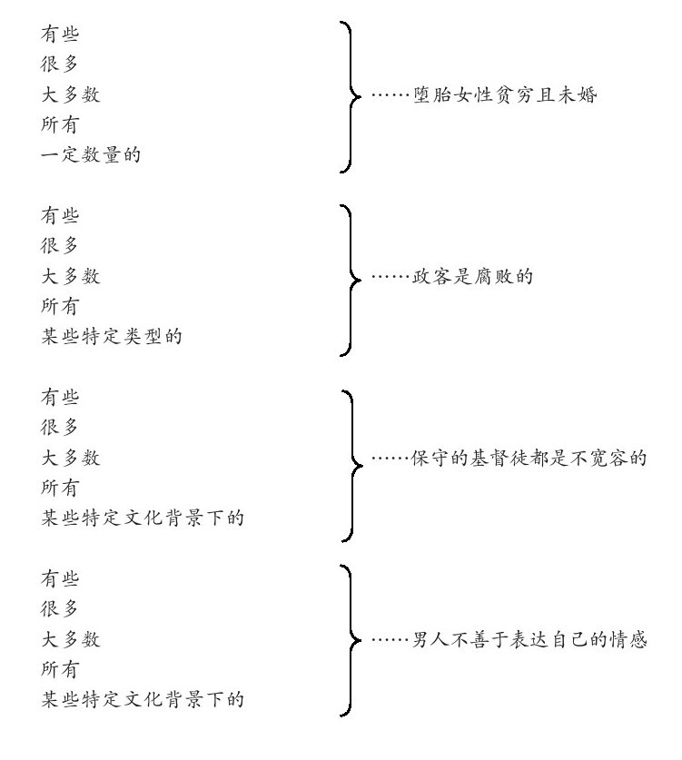

#### 过度简化

为了便于理解或更加清晰地传递观点，将复杂的现实进行简化处理本身没有任何过错。老师们随时都在简化，尤其是在小学。只有在过度的时候，简化才是个问题，即简化并没有让复杂的事物变清晰，而是曲解了事实。这时的简化不再表现现实，而是歪曲了现实。这种过分简化在有关因果的推理中经常出现。接下来是这种错误的3个例子：

·导致2010年大选中选民不满意的原因是高失业率。

·美国纳粹党对国家的思想生活有有益的影响，它提醒人们宪法规定的言论自由和集会自由。

·重新公开执行死刑，并在电视的黄金时段播出，将使犯罪率降低，那时，我们的社会也会变得不那么野蛮，而更加文明。

这些陈述都包含了真实的成分。但是它们没有公正、准确地表现现实。它们集中关注某个原因或结果，仿佛它就是唯一的。事实上，还存在其他的原因或结果，其中一些还很重要。

要在你的论证中寻找过度简化问题，请自问你的陈述忽视了哪些重要的方面。要纠正过度简化问题，要决定哪一种方式最好地反映了现实，而不是曲解它。

#### 双重标准

运用双重标准是指基于不同的行为者或观点持有者，而对同一个行为或观点做出不同判断。通过使用对比强烈的描述或分类，你常常能识别出双重标准。如果政府的援助资金落到我们不认识的或者不同情的人手中，我们会抨击政府把援助计划当作福利施舍；如果援助资金落到我们的朋友手中，我们会支持政府把援助计划当作必要的补贴。同样，如果一个国家的军队跨过另一国家的边境，我们可能将这一行为当作“保卫边境”来支持，或是当作“赤裸裸的侵略”来谴责，这取决于我们对所牵涉国家的感情。

请注意不要将双重标准和根据环境对事件进行合理判断相混淆。认识到它们两者的差别永远不会是个错误。相应的，如果发现你对某个特定事件的判断与同类型的其他事件不同，你需要仔细审视当时的环境。如果环境要求给出不同的判断，你可以不必担心使用双重标准。然而，如果环境不要求给出不同的标准，即你的推理偏向了某一方，你就犯了错，应该更正你的判断，让其变得公平。

#### 转移证明的负担

这个错误是指做出一个判断后，要求对方证明这个观点是错误的。这是不合理的要求。做出判断的人有责任支持自己的观点。尽管对立的一方可能接受这个挑战，来证明你的观点是错误的，但是他们并没有义务这么做。假设你对一个朋友说“上次的选举中存在广泛的选民欺骗”，你的朋友与你发生争论，你回应道：“除非你能证明我说的错了，否则我有理由相信我的观点。”此时，你就转移了证明的负担。提出了有关选民欺骗的判断后，你有义务支持你的观点。为了克服你的论证中的这种错误，你需要找出所有得不到支持的判断，为它们寻找充分的证据。如果你发现你不能支持这个判断，那就收回该观点。

#### 非理性诉求

该错误将你的观点建立在非理性诉求之上。最常见的形式是诉诸一般惯例（“每个人都这样”）、诉诸传统（“我们不能改变长久以来建立的东西”）、诉诸恐惧（“可怕的事情将要发生”）、诉诸适度（“我们不要侵犯任何人”）和诉诸权威（“我们不应该质疑专家”）。当然，维护一般惯例或传统、警惕危险、推崇适度原则以及支持专家的观点不一定是错误的。只有当这些诉求被用来替代仔细的推理，当它们的目标是听众的情感而不是他们的心智时，它们才是被错误地使用了。为了克服非理性诉求，你需要重新将你的论证聚焦于你观点的特定价值上。

### 影响有效性的错误

影响有效性的错误不会在任何单独的前提或结论中出现。它们在通过前提获得结论的推理中出现。因此，确定一个论证是有效还是无效，我们必须检查前提和结论之间的关系。决定有效性的逻辑原则是形式逻辑，它是有关各种论证形式的逻辑。由于对形式逻辑的具体介绍超出了本书的范畴，我们将只关注争议中常见的基本错误：不合理结论。

不合理结论是指无法从前提逻辑推导出的结论。在检查不合理结论前，让我们先看一个合理结论：

任何缩短人们注意长度的事物都会阻碍人们集中注意力。电视广告缩短人们的注意长度。因此，电视广告会阻碍人们集中注意力。

这个结论是合理的，因为如果任何缩短人们注意长度的事物都会阻碍人们集中注意力，且如果电视广告确实缩短了人们的注意长度，那么它们一定会妨碍人们集中注意力。广告归根结底是一种事物，因此它们符合第一个前提中“任何事物”的定义。当我们检验推理有效性时，请记住我们不是在检验前提或结论的正确性，那是另一个独立的问题。因此，即便是荒唐的论证，其在技术上仍可以是有效的。下面便是这样的一个例子：

任何使人们消化不良的事物都会阻碍人们集中注意力。电视广告使人们消化不良。因此，电视广告会阻碍人们集中注意力。

让我们看些不合理的结论，看看是什么使它们不合理：

所有选修明显超过他们能力的课程的人一定会不及格。萨曼莎选修了能力范围内的一门课。因此，萨曼莎一定会及格。

即使所有选修了明显超过它们能力的课程的人一定会不及格，也不能消除其他原因造成不及格的可能性，这些原因适用于有能力的人，也适用于没能力的人。换言之，第一个前提并不意味着只有能力不够才会不及格。萨曼莎可能特别有能力，但由于缺课并且没有提交必要的作业，她还是没能及格。

下面是另一个不合理的结论：

关心环境的人会支持国会当前正在讨论的清洁空气法案。博伊奇克参议员支持清洁空气法案。因此，博伊奇克参议员关心环境。

该论证的第一个前提中提到所有关心环境的人都会支持该法案。然而，它并没有说其他人不支持该法案。因此它留存不关心环境的人也支持法案的可能性，比如出于政治原因的人。博伊奇克属于哪一类型并不明确。因此，该结论是不合理的。

不合理的结论主要出现在假设（如果，那么）推理中。当然，并不是所有的假设推理都是错误的。下面是一个有效假设论证的示例：

如果有人在犯罪中使用枪支，那么他应该被加以重刑。西蒙在犯罪中使用了枪支。因此，西蒙应该被加以重刑。

第一个前提指出在什么样的条件下应该加以重刑。第二个前提提出符合这些条件的案例。该案例应加以重刑的结论，因此也是合理的。

与之相对，接下来是一个不合理的结论：

如果有人在犯罪中使用枪支，那么他应该被加以重刑。西蒙因犯罪被判加以重刑。因此，西蒙在犯罪中使用了枪支。

第一个前提指出在什么样的条件下应该加以重刑。它并没有排除其他加以重刑的可能性。出于此原因，我们不能得知西蒙被加以重刑是因为使用枪支还是因为其他原因。

接下来是另一个不合理结论的例子：

如果某人很富有，那么他可以当选。曼德利斯州长当选了。因此，曼德利斯州长很富有。

该论证的第一个前提指出了当选的一种方式，但还存在其他的当选方法，包括获得有影响力的团体支持或拥有说出人们想听的话的技巧。曼德利斯州长通过哪种方式当选？我们根据已有的信息无法进行判断，因此该结论是不合理的。

假设论证中的不合理结论偶尔也会以不同形式出现：条件颠倒。下面的论证便是这种形式：

如果恢复死刑，那么犯罪率会下降。因此，如果犯罪率降低了，死刑也将恢复。

这里的错误在于对不一定可逆的事物进行了颠倒。第一个前提明确指出恢复死刑和犯罪率下降之间存在因果关系。颠倒这种关系会使结果变成原因，原因变成结果。这样的颠倒不符合逻辑。

### 一个特殊的问题：隐藏的前提

在日常讨论或写作中，论证的表达并不像我们例子中那样精确。句子的顺序可能有很多种变化，比如说结论可能出现在最前头。许多种标志词可能用来替代“因此”，“所以”和“结果是”就是两个常用的替代词。有时候，标志词不会出现。这些变化使我们对一个论证的评价更加费时，但实际上并没有带来真正的困难。然而有一种变化可能带来真正的困难：隐藏的前提。隐藏的前提是通过暗示而非明确指出的前提。下面便是一个含有隐藏前提的论证（这样的论证在逻辑学中被称为省略推理法）。

含有隐藏前提的论证

自由意味着责任。

这是大多数人害怕它的原因。

同样的论证，前提表达明确

自由意味着责任。

大多数人害怕责任。

因此，大多数人害怕自由。

有隐藏前提并非是一种错误。在之前的例子中，含有隐藏前提的论证摘自萧伯纳的作品。不论是哪种形式，这两个论证都是完全有效的。隐藏前提的唯一问题是它们使论证背后的推理过程变得模糊，从而使评价变得困难。相应的，只要前提被隐藏，就应该在评价论证前将它识别出来，并予以阐明。

下面是另外几个含有隐藏前提的论证。请注意当隐藏的前提被阐明后，推理会变得非常好理解。

含有隐藏前提的论证

卖淫是不道德的，因此它应该是非法的。

报纸是对民主的一种威胁，因为报纸拥有的权利过大。

如果布鲁斯特·布兰德是个顾家的好男人，他也能成为优秀的参议员。

艾滋病非常耗钱，且往往是绝症。因此，应该允许健康保险公司不对艾滋病人承保。

很多名人相信被称为“拉姆萨”的35000年灵魂实体可以通过灵媒J.Z.奈特来交流。因此，该信念值得尊重。

同样的论证前提表达明确

任何不道德的事情都是非法的。卖淫是不道德的。因此，它应该是非法的。

所有拥有过大权利的机构对民主都是一种威胁。报纸拥有的权利过大。因此，报纸是对民主的一种威胁。

如果一个人是个顾家的好男人，他也能成为优秀的参议员。布鲁斯特·布兰德是个顾家的好男人。因此，布鲁斯特·布拉德会成为优秀的参议员。

保险公司应该可以不对非常耗钱的绝症承保。艾滋病非常耗钱，且往往是绝症。因此，应该允许健康保险公司不对艾滋病人承保。

如果很多名人相信某事，这一事实会让该信念值得尊重。许多名人相信被称为“拉姆萨”的35000年灵魂实体可以通过灵媒J.Z.奈特来交流。因此，该信念值得尊重。

### 识别复杂的论证

并不是所有的论证都可以由两个前提和一个结论来表述。许多论证是复杂的，由一系列前提和结论组成。此外，有些前提和结论可能像我们之前探讨的隐藏前提一样，没有表达明确。例如下面的这个论证：

传播和娱乐媒体对年轻人的影响比家长和老师更大，所以媒体对青少年怀孕、药物及酒精滥用、暴力和学业不良负更大责任。

乍一看，这个论证似乎只缺少一个前提。事实上，这是一个复杂的论证，它缺少的成分更多。如果没有省略，该论证的表达应该如下所示：

对年轻人的态度和价值观影响最大的机构对由这些态度和价值观导致的行为负有最大的责任。如今，媒体拥有比家长和教师更大的影响力。此外，媒体传播的信息往往导致冲动行为，以及即时满足的需要，从而带来或加重诸如青少年怀孕、药物及酒精滥用、暴力和学业不良等问题。因此，相比于家长和教师，传播和娱乐媒体对这些问题负有更大责任。

接下来是另外两个复杂论证的例子。在每个例子中，论证先用日常对话中经常使用的省略形式表述，之后用完整的逻辑形式表述。

（1）省略形式：政府浪费了数十亿的税款，所以我没有义务申报我所有的收入。

完整形式：政府浪费了数十亿的税款。浪费税款给每个纳税人增加了不必要的负担。我是一名纳税人，所以政府给我增加了不必要的纳税负担。此外，如果政府给纳税人增加了不必要的负担，纳税人就没有义务申报他们所有的收入。因此，我没有义务申报我所有的收入。

（2）省略形式：对自己的性冲动缺乏控制的人是对社会的威胁，所以同性恋者应该禁止从事教师工作。

完整形式：对自己的性冲动缺乏控制的人是对社会的威胁。同性恋者对自己的性冲动缺乏控制。因此，同性恋者是对社会的威胁。此外，对社会构成威胁的人应该禁止从事教师工作。因此，同性恋者应该禁止从事教师工作。

能够识别复杂论证，并在需要时通过更加完整的形式来表述它，是分析论证过程中的必要步骤。但这样的识别和表述并不是分析过程的全部。换句话说，在我们的三个例子中，我们虽然已经知道完整的论证是什么样子，但是我们并不知道它是否合理。也就是说，我们并不知道它的前提是否正确，由前提到结论的推理是否有效。

### 评价论证的步骤

下面的4个步骤是应用本章所学内容的有效方式。换句话说，该步骤有助于你评价自己的论证，并克服论证中可能影响有效性和正确性的错误。

（1）尽可能清晰完整地陈述你的论证。确保识别了隐藏前提，如果遇上复杂论证，你需要将其各个部分表述清楚。

（2）检查你的论证的各个部分，寻找是否存在影响正确性的错误。（确保你的检查不是粗心马虎的，对论证提出反对意见与质疑，提出有针对性的问题，不把任何事当作理所当然）。注意任何形式的“不是/就是”思维、回避争议、过度泛化、过度简化、双重标准、转移证明的负担、非理性诉求。此外，确保论证反映的是你调查的事实（参见第8章），以及正反两面的观点和你之前简历的情境相一致（参见第9章）。

（3）检查你的论证，寻找是否存在影响有效性的错误，并考虑连接结论与前提间的推理过程，确定你的结论是合理的。

（4）如果你发现一处或多处错误，你需要修改你的论证以消除这些错误。在论证中，你需要做出的调整有赖于你所发现的错误类型。某些时候，你只需要做出一个微小的调整，比如增加一个简单的限制条件，或者用一个理性诉求替代一个非理性诉求。有时，你却需要做出更大的改变。举例而言，你可能发现自己的论证漏洞百出，唯一合适的办法就是完全放弃原来的论证，采用另一种论证。在这种情况下，你可能会假装自己的论证很合理，并希望别人不会发现这些错误。你需要放弃这种幻想，因为把时间花在改进一个你明知不合理的观点上是愚蠢而又不诚实的行为。

为了说明如何实践这些步骤，我们将分析两个争议。

### 家长反对电视节目的案例

你最近肯定已经读了大量反对电视广告和节目的文章。这些反对者绝大部分是学龄儿童的家长。他们通过个人或组织的方式，表达了对学校和家庭教导带给孩子的价值观正受到电视侵蚀的担心。具体抱怨的对象包括涉及性与暴力的电视节目、宣扬自我放纵与即时满足的广告，以及提倡“如果感觉对，便去尝试”思想的电视节目和广告。反对者主张关心此事的民众给那些为节目提供赞助的公司写信，威胁说如果情况得不到好转，就抵制公司的产品。

让我们假定此处你需要辨识的争议是“家长对公司提出这样的要求是否合理”。在对问题进行考虑并产生很多想法后，你决定最佳答案是“不，他们的要求不合理”，你对自己的论证陈述如下：

只有为电视节目和广告付费的人才有对电视节目和广告的发言权。只有这些公司为其付费。因此，只有这些公司有发言权。

你检查自身的论证，寻找是否存在影响有效性的错误，然后发现并不存在。接下来你继续寻找影响正确性或相关性的错误。你又提出反对意见，问道，“是否只有公司付费？”“这些费用究竟是怎么处理的？”因为对此不确定，你询问了一位商业教授，得知对电视节目和广告的赞助是整个产品预算的一部分。你还得知这方面的成本，以及原材料、制造、包装、储存和运送的成本都包含在产品价格当中。

“稍等，”你推理道，“如果对电视节目和广告的赞助反映在产品的价格中，这意味着消费者为每个电视节目和每条广告付了费。如果事实如此，家长（和其他消费者）是有发言权的，可以提出需求，威胁公司抵制他们的产品。”因此你相应地修改了自己的论证：

只有为电视节目和广告付费的人才有对电视节目和广告的发言权。消费者为此付费。因此，消费者有发言权。<a href="#part0320.html_ch1-back" id="part0320.html_ch1"
class="pcalibre calibre2">[1]</a>

当然，在详尽阐述该论证时，你会提出由此产生的重要问题，其中包括下面这个问题：消费者在提出这些要求时要遵循什么样的公平原则？你对此的答案和相关的问题也应该评价其合理性。

<a href="#part0320.html_ch1" id="part0320.html_ch1-back"
class="pcalibre calibre2">[1]</a>在评价推理时，对论证正式的、逻辑化的陈述（a+b=c）是必要的。然而，如果要陈述一篇作品的中心思想，这种方法并不合适。在这种情况下，你对中心思想的陈述可能是：“因为消费者支付了电视节目和广告，所以消费者有权提出要求，威胁抵制产品。”

### 智障女孩的案例

这个案例之前我们在第2章应用练习第6题c中遇到过。你可能还记得，有3个严重智障女儿的父母诉诸法律手段，以获取为女儿绝育的合法权利。这里一个更大的问题仍然存在争议。假设你对这个争议的表述如下：“任何人有权利为他人做出如此重大的决定吗？”在调查该争议并产生大量的想法后（其中包括正反面的主要论证和其他相关的情境），你对自己的论证陈述如下。

把孩子的利益放在心上的人如果被合理告知，就能做出明智的判断。大多数家长或监护人都把孩子的利益放在心上。因此，大多数家长或监护人如果被合理告知，就能做出明智的判断。此外，了解孩子能否履行做父母的义务，应该属于被合理告知的内容。合格的医生可以告诉家长或监护人孩子是否能履行做父母的义务。因此，合格的医生可以向家长合理告知该信息。

你检查自己的论证（一个无法用两个前提和一个结论充分表述的复杂论证）后，尽管确定它是有效的，并且基本正确，但仍有一个重要的问题不能被忽略。该问题是：“这个制度能否给孩子提供充分的保护？”你想象很可能出现的各种情况，特别是如下这些情境，并为此提出质疑。

（1）家长担心孩子给他们带来羞耻，因此充满恐惧。他们迫使医生证明他们的孩子永远无法履行做父母的责任，即使事实并非如此。医生尽管有资格做出正确的诊断，但没有医德，因此愿意为了钱而开具任何证明。

（2）家长是负责任的，医生不仅具有资格而且道德上没有问题。当孩子四岁时就已经做出绝育的决定。几年过后，医疗技术发现了治愈儿童智障的方法。孩子变成了正常人，但绝育无法逆转了。

为了防止第一种情况的发生，你需要修改论证，明确必须由医疗委员会开具证明，而不仅仅是一名医生。你可能还需要确定医疗委员会的构成（都是外科医生？一名或多名心理医生？一名智力障碍方面的权威专家）。不幸的是，你没有办法确保第二种情况不会发生，但你可以确定有一种办法可以大幅降低这方面的风险。为此，你在论证中增加一条规定，即在青春期开始前，不允许施行绝育。

该案例和家长反对电视节目的案例是为了说明评价你对争议看法的过程，而不是支持案例中包含的论证。重要的不是赞成这些论证，而是你认识到评价自身论证的重要性。

### 热身练习

1.威利·乔和乔·威利正在聊天：

威利·乔：现实这种东西并不存在，伙计。

乔·威利：不可能……就像，我是说……这样不合理。不，这不可能。

威利·乔：好吧，伙计，你可能说存在现实。那么请给我描述什么是现实。

乔·威利：嗯……噢……呃……

威利·乔：你不能描述它，所以它不存在。事实就是如此。

你会如何回答威利·乔？请仔细解释你的思考过程。

2.对于摇滚，至少有一件事是毋庸置疑的：摇滚乐队的名字都很有创意。不过可能你能做得更好。为一支摇滚乐队想出尽可能多的有创意且你从来没听过的名字。

3.在斯特朗维尔，当地的理发师要给所有不给自己刮胡子的人刮胡子，而且只为这些人刮胡子。理发师给自己刮胡子吗？请完整地解释你的思考过程。

### 应用练习

1.评价本章“识别复杂的论证”中提到的3个论证，请确定每个论证是否合理，并解释你的判断。

2.检查下面的每一个论证，以确保不含有隐藏前提，如果它是复杂论证，请确保所有的部分都被表述清楚。如有必要，对每个论证加以修改，使其表述完整。之后，请评价论证，确定它们是否合理，并解释你的判断。

a.获得巨大的财富是一个有价值的目标，因为它很难实现，且许多名人都追求这个目标。

b.大学里的低绩点对找工作来说是个障碍，所以评分严格的老师是在伤害学生。

c.假装知道自己不知道的东西是不诚实的，所以剽窃是美德，而非恶习。

d.使用信用卡的习惯会使人粗心、浪费，尤其是年轻人。因此，信用卡公司不应该允许21岁以下的人申请信用卡。

e.在这所大学读书的人毕业后都没有取得卓越的成就。马文在这所大学读书。因此，马文毕业后不会取得卓越的成就。

f.毒品交易不应该是一种犯罪，因为它并不直接伤害他人或强迫他人伤害自己。

g.成熟的人应该是自我导向的，所以帮孩子做所有决定的家长是在伤害孩子。

h.上卓恩教授的课毫无意义。他讲授的课程单调乏味。

i.权力一定是邪恶的，因为权力使人腐败。

j.如果进化论像科学研究证明的那样是正确的，人类只不过也是猿类。

k.摇滚音乐者用模糊的发音和喃喃自语的方式进行演唱，这会导致语言退化。

l.如果强调错误会使努力徒劳无功，那么该大学雇用这名英语教授就是想使我永远无法学好英语。

m.核能是对世界和平的一种威胁。核能发电站产生核能，所以核能发电站是对世界和平的一种威胁。

n.卢·费尔曼是州长的最佳候选人，因为他赞成死刑。

o.所有宗教权威都关心核战的危险。所有的政客都关心核战的危险。因此，所有的政客都是宗教权威。

p.政府应该实施全面的审查制度，因为审查制度会消除市场上的不良书籍和电影。

q.如果社会保险体系进一步被削弱，老年人将不得不担心贫困问题。因此，如果社会保险体系不进一步被削弱，老年人就不必担心贫困问题。

r.挑战他人的观点是不包容的表现，所以辩论课不应该出现在大学校园中。

s.禁止使用枪支就能减少死亡是一种荒谬的想法。枪支并不杀人，杀人的是人。

t.反对堕胎的人说胎儿就是人，但他们并没有证明这个观点。因此，他们反对堕胎的观点没有合理的基础。

u.没有谁理应比他的邻居过上更好的生活，所以资本主义是不道德的经济制度。

v.如果怀孕的母亲酗酒、抽烟、吸毒或是不合理休息，那么她将对自己未出生的孩子造成伤害。因此，如果怀孕的母亲做了这些事，她的孩子在出生时就有缺陷或患病，那么这个母亲就应该面对刑事诉讼。

w.习俗是民族智慧的一种形式。在世界的某些地方，有一种习俗是“新娘买家”从父母那儿购买（有时是绑架）年轻女孩，卖给想娶妻子的男人。即便我们可能觉得这种行为令人厌恶，但反对这种行为在道德上是错误的。

3.识别、调查（如果必要的话）和解决接下来的各个争议。确保你没有不加批判地接受自己的推理。请采用本章介绍的方法评价你的论证过程，之后对你的论证进行必要的修改，并确定你将如何最有效地展示其合理性。

a.雷达探测器给超速者警告，这样他们能及时减速，以避免被开罚单。有些人认为探测器应该被禁用，因为它帮助人们破坏法律。另一些人不同意，认为超速者应该得到保护，避免被高速巡警鬼鬼祟祟地巡查。

b.打击毒品犯罪的一个提议是政府没收被定罪的毒贩的财产（车、住宅等）。该建议的一个反对观点是这种行为会伤及无辜者的权益，比如其配偶和子女。

c.因为很多公司不允许员工在办公桌上吸烟，员工有很大一部分时间会浪费在未经批准的，在休息室或楼外的吸烟间隙上。通过建立只雇用非吸烟者的制度，公司可以节省下这些时间和这些时间带来的金钱。当然，有些人会认为这种制度带有歧视性。

d.精神病学家托马斯·萨斯写道：“如果某人违反了法律却没有遭到惩罚，那么遵守法律的人则被骗了。这是违法者应该被惩、守法行为应该被鼓励的唯一原因。刑法的目的不该是纠正或威慑；它应该只能是维持法律秩序。”这个观点合理吗？1请考虑其他的可能性，做出你的判断，并解释你的观点和你支持它的原因。此外，请留心可能产生的反对意见，并予以回应。

### 综合练习

下面这道题是本章对思考能力最大的挑战。根据第1章章末综合练习的要求，分析并回答该问题。此外，请回顾第2章中的“道德判断的基础”和“应对困境”。

⊙议题简述：TSA安全程序

运输安全管理局（TSA）是“9·11”事件后才成立的机构。最初它是运输部的一个部门，而后它被划拨到国土安全部管辖。它的职能是确保美国交通安全，尤其是航空旅行安全。机场可以选择私人公司来执行安检，但绝大多数选择TSA。尽管旅客抱怨机上禁止携带指甲剪和液体，但这些准则是出于对安全的综合考虑。2010年，当旅客被强迫进行全身扫描或搜身时，公开论战也随之爆发。

⊙对比阅读

如果你不喜欢这样，那么别坐飞机了

布赖恩·科斯特洛

谁都不喜欢安检排队、清空口袋、脱鞋和其他的机场常规项目，包括身体扫描和搜身。但是明智者在恐怖主义时代里愿意接受这些必要的程序，因为他们把这种不便当作安全的代价。

并不是所有人都是明智的。许多人过分执着于自己的权利，无论是真实的还是想象的，以至于他们不知道感激扫描程序在保护他们的安全。相比于在12192米的天空中被炸成碎片，他们更担心被别人透视衣服或是被碰到隐私部位附近。这不只是偏执，这简直是疯了。

讽刺的是，如果没有这样的安检程序，恐怖分子导致一架飞机失事，这帮抗议隐私受到侵犯的人将会最先开始责怪国会和总统，认为没能保护好他们的安全。

与其假设TSA和整个国土安全局可能出现的最坏情况，我们更应该认识到他们做的每一件事都是基于非公开的信息，包括有关最新恐怖分子战术、特定安全威胁的情报。身体扫描仪和搜身程序并不像某些批评者声称的那样，是为了创造淫秽图片或提供性满足，这样的说法毫无依据。归根结底，这些程序都发生在其他旅客的眼皮下。设计新的安检程序是为了保护我们的生命。TSA拥有优先权，因为没有了生命，“自由和追求幸福”都是空谈。

追赶永远没有尽头

乔舒亚·利维

TSA工作人员在机场使用的全身扫描和搜身是一种暴行。没有法院会采取他们对待人们的方式，即直到证明清白前都是有罪的。讽刺的是，这正是恐怖分子企图强加在我们身上的制度。我们因为恐惧而使美国变得更糟。

如果我对TSA程序的反对看起来有些极端，那么考虑以下事实：许多国会成员持有同样的观点，尤其是众议员约翰·米卡，他在创造TSA的过程中起推动作用。他认为TSA变得傲慢而低效。因此，他声称当扫描仪对祖母、修女和孩子加以怀疑时，真正的恐怖分子却偷偷地溜了过去。

TSA的扫描浪费了无辜者的时间，羞辱了他们的尊严。更糟糕的是，他们是被动而非主动的。某人携带易爆液体，所以TSA禁止携带液体。另外一个人将炸弹藏在鞋子里，所以TSA让所有人脱鞋。第三个人把炸弹藏在内衣里，所以TSA开始更具侵犯性的搜查。专家警告，恐怖分子的下一个战术是将爆炸材料藏入体腔内或人体植入物中。我担心TSA将如何应对。

我们最急需的是更加聪明而有效的方法。我们不需要发明它，它已经存在。以色列EI
AI航空公司发明了一种称之为“行为描绘”的方法，这与民族或种族歧视性描述没有关系。他们培训雇员探察那些看起来紧张或可疑的人，并只对这些人进行搜查和深度面谈。通过采用这样的方式，我们既能保持自由又能提高安全性。

⊙课堂讨论

瑞贝卡：我厌倦了所有针对我们政府的批评。我们应该让TSA执行他们的工作。

奈杰尔：如果TSA是在执行他们的工作，我同意。但是它们是在浪费时间和金钱，冒犯群众，而不是在探察恐怖分子。

瑞贝卡：他们还能怎么做呢？我不喜欢以色列的做法，因为它把人群进行了分类。

奈杰尔：它并没有。它忽略旅客的种族和民族，而关注他们的行为。据我理解，有些特定的行为特征无法伪装。当安保人员观察到这些特征时，他们会进行深度面谈、全身及行李搜查。

瑞贝卡：TSA不是在用和以色列不同的方法来做同样的事情吗？

奈杰尔：不是。TSA关注的是寻找物品、武器或爆炸材料。以色列关注的是人们的行为。这存在巨大的差异。

瑞贝卡：这种方法在小国家中也许管用，但在像美国这么大的国家里，这种方法还有效吗？

奈杰尔：可能这种方法需要加以改进，但我相信这比我们现行的体系有效。

## 第13章　完善你的争议解决方案

第11章说明了如何使用批判性思维对问题的解决方案进行改进，本章将说明如何使用批判性思考改进争议的解决方案。你将学会在解决争议时采取哪种行动，并识别和克服可能出现的困难。

并非所有的争议都需要用本章所描述的方法进行处理。一方面，在许多情况下，当你对争议中自己所持的观点进行论证后，在必要的时候对论点加以修正以克服其缺点后，你对争议的分析就结束了。例如是在第二次世界大战期间，德怀特·艾森豪威尔将军作为欧洲战区盟军的最高司令，在进军柏林前等待苏联军队是不是一个战术上的错误，这就存在争议。你一旦发现了基于证据的最合理答案后，就不需要做更多的事情了。

另一方面，在许多其他情况下，你不会满足于确定哪种观点是合理的，而是考虑在这种观点下应该采取什么行动。例如，如果你已经确定电视节目和广告对孩子的智力发展有严重的负面影响，那么你可能会考虑采取什么行动去消除或抵制这种影响。如果你认为枪支管制能大量降低意外事件中的死亡人数，你也许会制定一个能够被国会通过的枪支管制法案计划。

本章关注的是后一种情况，你在争议中的立场促使你提出采取进一步行动的建议。在这种情况下，你必须决定应该采取什么行动，预计行动中会出现哪些困难，并考虑如何能够更好地克服这些困难。鉴于以上决策的重要性，你需要思考这样一个事实：欠考虑的实施方案会使最合理的观点看起来有缺陷。

### 第一步：决定采取什么样的行动

这一步骤包括提出和回答合适的问题。尽管以下问题并不能应用于所有情况，但是可以应用于绝大多数的情况：

·究竟应该采取什么样的行动？

·如何采取行动？例如，如果需要分阶段采取行动，详细说明各个阶段；如果需要特殊程序，详细描述该程序。

·由谁采取行动？

·采取行动的人是自愿进行工作的还是被指派的？如果是后者，如何完成任务？

·采取行动的人是否需要接受培训？如果需要，培训由哪些内容组成？如何、何时、由何人实施培训？

·何时采取行动？根据什么样的时间表采取行动？

·如何使这些行动得到资助？是否宣传？

### 第二步：识别和克服困难

在最初考虑时，你可能认为你的行动计划十分完美。这是不明智的，因为无论多么仔细地进行计划，都有可能遇到困难。接受这个事实并提前努力识别种种困难，你就能提高成功实施的概率。以下是4种识别潜在困难的方法：

（1）检查以下常见的缺点：

安全性：计划是否对使用者或者使用对象产生危害？

便利性：计划是否难以实施？

效率性：计划是否牵涉延期？

经济性：计划是否花费太多以至于无法实施？

简易性：计划有没有被不必要地复杂化？

兼容性：计划是否和本应该与它相协调的其他程序冲突？

合法性：计划是否合法或者至少包括准备改变与其矛盾的法律？

道德性：计划是否违反了一个或多个道德准则？

（2）如果有可比较的竞争性计划，与之做比较，确定在那些计划中是否有你的计划中所缺少的有价值的特点。

（3）考虑在现有情况下你的计划会有哪些变化，把这些变化列出来，注意不要忽略任何不受欢迎的变化。

（4）考虑你的计划对人们的影响，不仅包括身体上的影响，还包括精神、情绪、智力和经济上的影响。一定要考虑最终的影响和即时的影响，以及微妙的影响和明显的影响。

在使用这4种方法识别出在你的计划实施中有可能出现的困难后，考虑如何更好地克服困难。当想法产生的时候，要延迟判断，并尽可能多地想出克服各种困难的办法，然后选出最好的，并相应地修改你的计划。

为了解这些步骤是如何在实际案例中得到应用，让我们分析以下两个范例。

### 儿童是否应该宣誓效忠

向国旗宣誓效忠的争议一次又一次被人提起，并且席卷整个美国。这个争议可以表述如下：“公立学校学生是否应该在每天早晨齐声背诵宣誓效忠的誓词？”假设在经过了仔细分析并对最初的想法进行一些修改后，你做出以下推理：

建立在尊重个人尊严和相应权利基础上的制度是值得公民效忠的。无论在应用上有什么样的失误，美国是建立在尊重每个人的基本尊严和相应权利的基础上的。因此，美国值得公民效忠。此外，只要不侵犯个人尊严、不违背个人信念，任何培养公民对国家的理解和重视、使其效忠国家的做法都是可以接受的。但是，要求公立学校的学生在学校背诵效忠誓词，在某种程度上损害了学生的个人信念或者造成伤害。<a href="#part0327.html_ch1-back" id="part0327.html_ch1"
class="pcalibre calibre2">[1]</a>因此，这种要求是不能被接受的。

因为你的论证不是反对效忠国家，而是肯定了效忠的价值并支持培养公民对国家的理解和感激、使其效忠国家，你可能觉得应该建议对该争议采取行动。于是，你认为学校应该要求老师每天早晨让学生静默片刻，让他们反思他们对国家和同胞负有什么责任。你的办法的进一步细节可能包括为这一静默时刻制定适用于全州的指导方针，并把指导方针公布于众，防止产生误解。

在分析这个计划的缺点和面临的其他困难时，你可能认为尽管该计划毫无争议，但还是不能实现目标。学生可能用这段时间来思考自己的社交生活、个人问题等。即使他们是有意识地利用时间，也没有办法确保他们的思考有助于培养他们对国家的理解和重视。

在这种情况下，你的分析可能引导你改变计划，使其更符合你的目标。例如，你会建议每周用一段时间（例如老师指导的时间）对生活在民主国家的权利和义务进行课堂讨论。你也许会更进一步地把讨论明确聚焦在生动体现权利和义务的重要历史事件上，或者当前的问题和争议上。

<a href="#part0327.html_ch1" id="part0327.html_ch1-back"
class="pcalibre calibre2">[1]</a>20世纪30年代，数百名耶和华见证会信徒被迫做出选择，要么背诵誓词，要么被学校开除。因为他们的宗教认为背诵誓词是对神的亵渎，于是选择了被开除。结果大多数信徒遭受了言语上的辱骂，有些还被打。在西弗吉尼亚州的里奇伍德，警察强迫九名拒绝背诵誓词的见证会信徒吞下大量蓖麻油。在其他地方，见证会信徒遭到攻击，身上被涂上焦油并被沾上羽毛，甚至有人被阉割。在缅因州的肯尼邦克，2500名愤怒的暴徒抢劫和火烧了当地王国会堂。起初，最高法庭裁定市政当局有权要求见证会信徒背诵誓词；然后在1943年又推翻了裁定。详情请参考杰里·柏格森，“耶和华的见证会：一个世纪的宗教-国家冲突简史”，网址http://www.freeminds.org/history/conflicts.htm。

### 是否应该废除“米兰达法则”

纽约州最高法院法官哈罗德J.罗斯韦克斯认为美国的刑事司法体系正处于崩溃的边缘。他称，寻找真相的目标已经被对被告权利的关注所取代，这妨碍了警察、法官和陪审员行使职责。罗斯韦克斯为纠正这种情况提出了几个建议，其中一个就是废除“米兰达法则”。1该法则是由最高法院制定的，要求警察在审问疑犯之前，对每位疑犯宣读他们的权利。如果没有做到这一点，疑犯的任何口供，无论是自愿的还是对审问的回答，都可能在审讯时被认为无效。

例如，警察怀疑一个人犯有谋杀罪，将其拘留。在宣读疑犯的权利前，疑犯开始哭诉并坦白：“我杀了那个女孩，她不是第一个受害者，是第10个。我带你们去埋尸体的地方。”然后他带警察去了另9个埋尸体的地点。但由于警察没有向疑犯宣读权利，检察官可能无法采用他的口供，也无法利用他供述的其他证据。

假设你仔细分析了罗斯韦克斯法官的提议，考虑批评者的意见，在评价和修改了最初的想法后，形成以下观点：

任何对起诉犯罪形成障碍的东西都妨碍了公正，并威胁到了守法公民的安全。法庭压制相关证据妨碍了检举犯罪。因此，法庭压制相关证据妨碍了公正，而且威胁到了守法公民的安全。可是，攻击行为是犯罪行为。政治压迫、恐吓和暴力威胁都是攻击的一种形式。因此，政治压迫、恐吓和暴力威胁是犯罪行为。

因为你的论证承认争议双方都有有效的论点，于是就产生了如下问题：“应该采取什么行动？‘米兰达法则’应该被废除还是保留？当警察虐待疑犯时，应该视而不见还是加以惩罚？”这就需要计划好行动过程，并克服实施过程中遇到的困难。在诸多可能的回答中，你也许会采用下列答案：

（1）“米兰达法则”应该被废除，所有相关证据无论它们是怎样获得的，都应该被允许在审判时使用。在“米兰达法则”下，由于警察的失误给社会带来危害，并鼓励罪犯，使得罪犯更加大胆。审讯的唯一目的应该是确定被告人是否有罪，如果有罪，再确定是否存在减刑的情况。

（2）警察对疑犯实施精神和身体上的虐待应该被视为犯罪行为。犯此罪行者应该处以适当的刑事处罚，也有可能被开除出警察队伍。另外，应该允许受害者对涉案警察和雇用他们的市政当局提起民事诉讼。

要改善争议解决方案，最后需要注意的是：对你热衷的计划进行批判性的分析需要真正的自律。这种自律是优秀的思考者区别于其他人的品质之一，也是优秀的思考者能够有效说服他人支持自己观点的重要原因之一。

### 热身练习

1.判断以下的论证是否合理，请详细解释你的判断。

独角兽一定存在，因为从来没有人证明它们不存在。

2.判断以下的论证是否合理，请详细解释你的判断。

指责他人天生的疾病是错误的。犯罪是有些人天生就有的疾病。因此，指责他人的犯罪行为是错误的。

3.一名逻辑学家去世了，留下了遗嘱：“我留下1000美元分给我的4个女儿。其中一部分给安娜贝尔或贝雅特里奇。我知道贝雅特里奇和克拉丽莎听迪尔德丽的，所以我把钱给她们两个人中的任何一个都等于没给。我希望贝雅特里奇和克拉丽莎得到同等的对待，事实上，我希望她们4个人或者尽可能多的人能得到同等的对待。”谁是逻辑学家最喜爱的女儿，她得到了多少遗产？2请详细解释你的推理过程。

### 应用练习

运用你的创造性和批判性思维解决以下争议。解决之后，判断根据你的想法采取行动是否合适（在大多数情况下是合适的）。如果需要采取行动，可以采用本章讲述的两个步骤。

1.如果使用不当，烟花可能导致严重的烧伤或失明。这就是为什么美国很多州宣布普通民众购买烟花是不合法的（在那些州，节假日的烟花燃放是由专业人士操作的）。一些人认为，使人们免于因为自己的疏忽受到伤害，以及禁止所有人购买少数人会错误使用的东西，并不是政府的职责所在。

2.很多环保人士认为政府有义务保护濒临灭绝的动植物，一些人认为如果个人想要从事这项事业，那是他们的权利，但不关政府的事。

3.一些人认为劝诱改变信仰（企图使他人改信自己的宗教）不仅在道德上是合理的，也是道义上的义务。其他人则认为这在道德上是错误的。

4.多年来，人们对色情文学的争议一直不断。一些人认为色情文学有失体面，应该被宣布为非法。一些人认为色情文学没有危害。还有一些人认为色情文学是有益的，它能帮助人们克服性压抑，为宣泄强烈的性冲动提供了一种途径。

5.争议甚至延伸到人性上。人类是否天性善良高尚，但是在发展过程中被社会腐化了？或者人类天性粗暴野蛮，只有通过惩罚的威慑才能制止人类的阴暗倾向。（这两种观点都拥有高智商、有学问的支持者。）

### 综合练习

下面这道题是本章对思考能力最大的挑战。按第1章章末综合练习的要求，对此问题进行扩展分析并做出回答。同时，回顾第2章“道德判断的基础”与“应对困境”。

⊙议题简述：法定强奸

法定强奸是一种特殊的犯罪类别，在这类法定判别中，涉案者年龄是对犯罪行为判定的唯一标准，换言之，在这类犯罪中主观意愿变得无关紧要了。只要一个人和比法定年龄（在美国绝大多数州是18岁，一些是16岁甚至更低）小的人发生了性行为，就是犯罪。几年前，法定强奸的罪犯大多是男性，近年来，女性犯罪者的数量逐步增加，她们大部分是教师。这类案件多发生在田纳西州、得克萨斯州、佛罗里达州和加利福尼亚州，其中登上报纸头条最多的一个案件是34岁的已婚妈妈玛丽·凯·勒图尔勒与她的一名年仅12岁的学生发生性关系，并为其产下两名私生子。她因此被判入狱7年，刑满释放后，她与这名学生结了婚。

⊙对比阅读

过时的观念

塞尔瓦托·史古德利

法定强奸是一个很老的法律类别，它在当性行为只有发生在成年已婚夫妻之间和两个成年人之间才被视为合法的时代，这个法律类别才具有意义。但从20世纪起，弗洛伊德、金赛和其他研究学者已经证明性欲及性冲动即使在幼儿身上也会出现，因此在荷尔蒙分泌旺盛的青春期发生性冲动也是很自然的。

我们只需列举几个假设情况，就可以发现法定强奸罪是不合理的。两个十二三岁或16岁的孩子发生性关系，是不构成强奸罪的；在美国的绝大多数地区，12岁与16岁的孩子（年龄相差4岁）发生性关系也是如此，但在有些州，18岁的孩子和17岁的孩子（年龄相差1岁）发生性关系，就构成了法定强奸。

拥护这项法律的人士称，青春期的孩子不了解自己的想法，无法做出正确的性判断。实际上，多数处在青春期的孩子和20岁的青年人一样具有这样的判别能力。如果14岁的孩子对30岁的邻居或是老师具有性冲动，而且对方也能感觉到这种吸引，那么他们按照自己的意愿行事便是理所应当的了。

仅仅因为年龄偏大就将其送进监狱是毫无意义的。在其他与性无关的事情里，这样的判罚都会被认为是对年龄的歧视，那么在性的问题上也应该界定为年龄歧视。

总之，法律针对法定强奸罪的判定不足以满足时代发展的环境下人们对性的进步认识，也不符合年轻人在当代社会做出的性选择。因此，对法定强奸罪的界定规则应该予以废除。

成长的烦恼

昆廷·米勒

社会有权要求成年人比孩子更负责任，关于法定强奸的法律准则就是基于这种预期之上的，这就是为什么有法律禁止家长忽视孩子，却没有禁止孩子忽视家长的法律。

人类社会经历千年的演变确定了当成年人与儿童的关系越紧密，成年人所承担的责任就越大。老师、学校管理者、运动场工作人员、社团管理员和神职人员都有责任帮助年轻人提高自身的知识与判断力，避免有害的影响。为儿童成长服务是一项崇高的使命，不应该借此获取个人利益或满足个人私欲。

传统观念认为孩子不可能真正认同与成年人发生性行为。如果真的认同，就需要具备发生性行为后成年人对身体、精神、情感等后果的认识，事实上，这种理智的认识只有成年人才具备。

无论未成年人在其他方面多么成熟，无论未成年人是否对成年人带来身体上的吸引，他们都无法真正理解这种认识。这就是为什么成年人与儿童或是青少年发生性行为会令人震惊，严重降低他们的可信度。

成年人与未成年人发生性行为，就是在利用未成年人的天真，就像清醒的人利用酒醉或是智障人士一样。这是具有说服力的观点，因此法律在过去禁止了这种行为，并将一直禁止下去。

⊙课堂讨论

萨曼莎：在所有性关系中唯一需要考虑的因素是双方是否自愿发生，这要根据当事人的感觉意愿而不是用法律来衡量。

阿方索：当成年人为女性，未成年人为男性时，未成年男性也许会将老师当成自己的性幻想对象，所以当幻想成真时自然会有积极的感觉。

梅根：令我惊讶的是你们都不相信感觉可能是具有欺骗性的，尤其是未成年人的感觉。他们会觉得自己可以喝很多酒却不会醉，可以开快车却不会对自己及他人造成任何生命安全，发生性行为却不会产生任何心理和生理的后果，而成年人却深知这些，不应该装作不清楚。

阿方索：你这么说让原本自然与满足的性事听起来肮脏、危险。

萨曼莎：你还让未成年人听起来像个婴儿，要知道他们懂得要比你以为的多得多。

梅根：我并不是低估未成年人，我只是想提醒你们，成年人与未成年人在智力及情感上的差异，以及成年人有义务保护未成年人免于伤害。对于那些深爱孩子的父母，他们极力反对成年人与未成年人间的性行为，坚决拥护法定强奸罪的界定，这些你们都没有考虑进去。

# 第四部分　沟通想法

有的读者可能奇怪一本讲述思考的书中会出现沟通方面的主题，因为思考与沟通这两个主题看似没有什么联系。事实上，它们是有密切联系的。首先，表达观点可以帮助人们更好地理顺思路。正如美国哲学家莫蒂默·阿德勒所说：“思考者倾向于用口头语言或者书面语言表达自己。声称知道自己的想法但无法将其表达出来的人，往往不知道自己的想法。”<a href="#part0332_split_001.html_ch1-back"
id="part0332_split_000.html_ch1" class="pcalibre calibre2">[1]</a>

此外，本书中所指的观点，即对问题和事件的解决方案，只有在与他人交流分享后才更有意义。第14章阐述了怎样更有说服力地表达你的观点。第15章说明了写作和演讲的基本要素。

## 第14章　说服他人

有些人能够非常容易地说服他人支持自己的意见，即使是有争议的话题，而有些人则遇到重重阻力。这是什么原因？难道成功的说服者拥有非凡的天赋？还是与他们掌握的习惯、技巧有关？尽管天赋是一个因素，但后天的学习更加重要。本章的重点就是教你如何了解你的听众、预估他们的异议，以及最好地展示你的观点。

鲍里斯·努德尼克正在家长会上为大家做演讲：“女士们、先生们，我建议老师要求学生每天写一篇小作文，并给予帮助和指导。我想这是提高学生写作能力的唯一办法。”大家对他的提议报以热烈的掌声。他停了一下，问道：“大家对我的提议有什么意见吗？”

这时坐在教室后排的一名女士举起了手，鲍里斯致意她起来发言。她说：“鲍里斯先生，在您讲话的时候我粗略地计算了一下。在我们学校，一名老师差不多要负责27名学生。保守地估计，批改一篇作文大概需要7分钟，那么每名老师每周花在批改作文上的时间是15小时。如果老师每天晚上、周末都需要额外的时间来备课，那么他们上哪儿找时间批改作文呢？”

鲍里斯的脸一下子红了。“哦，好，哦，这位女士。”他结结巴巴地说，“啊，我想一下……我再仔细算算，我刚才确实没有认真考虑这个问题。”可怜的鲍里斯，他的提案似乎可行性不高，大家肯定不会通过。

尽管读者的反应不像现场的听众那么明显，也可能无法想象这种尴尬的场面，但他们的反应一样真实并具有批判性。这并不难理解，说服能够让听众改变原有的观点，接受新的或是曾经思考过但未接受的信息。在很多情况下，说服还能够使听众参与到观点的执行中，投入时间、金钱并承担一定的风险。

说服并不会在你身上自动地发生，对于鲍里斯来说也是如此。要达到说服的目的，需要的不仅是充分的思考。这并不是说创造性和批判性的思考就不重要；正如我们在前几章所说，思考是十分重要的，在说服聪明的听众之前必须提出高质量的观点。然而，仅仅提出高质量的观点也是不够的，你必须帮助听众认识到观点的重要性。为了做到这一点，你必须：

（1）了解人们不接受你的观点的原因；

（2）了解你的听众；

（3）预估听众的反对意见；

（4）最佳地表达你的观点。

### 认识到观点被拒绝的原因

人们的观点和信念越是受到挑战，他们的反对就越激烈。自古以来就是这样，哥白尼最早提出日心说的时候，他的观点并没有得到认同，甚至招致蔑视的目光。马丁·路德对日心说非常不屑，他评价道：“这个愚蠢的家伙竟然想要颠覆宇宙运行的法则。”约翰·卡尔文也对此嗤之以鼻：“傻子才会将哥白尼的理论凌驾于上帝的意志之上。”31年后，哥白尼的理论虽然发表，但社会并不接受，他随之含恨而去。

伽利略继承了哥白尼的事业，他的遭遇也好不到哪里去。他被看作疯子和异教徒，他所在的教会没有一个人替他说情。他被迫以公开批判自己的观点以换取罪行的宽恕。

那个时代的女性科学工作者，特别是内科医生和助产士，面临的是另一种威胁：被当成女巫或遭受酷刑或处决。仅仅17世纪就有约4万名女性因此而死，这种现象一直延续到19世纪。也正是这个原因，只有最为聪明的女性才能在科学界获得成功。一个经典的例子就是玛利亚·盖特纳·阿涅西（Maria
Gaetana
Agnesi），她是18世纪卓越的语言学家、数学家和慈善家，微积分学的重要奠基人。鉴于她在数学领域的非凡成就，人们称她为“魔女阿涅西”，她幸运地没有受到像女巫一样的迫害。有意思的是，直到今天，我们还是将其提出的著名数学方程叫作“魔女阿涅西”。

最具创新性和建设性的观点，往往会被最先否定。当查尔斯·纽伯（Charles
Newbold）发明铸铁犁的时候，农民认为它会污染土壤而拒绝使用。贺拉斯·韦尔斯（Horace
Wells）率先将笑气<a href="#part0332_split_001.html_ch2-back"
id="part0332_split_001.html_ch2" class="pcalibre calibre2">[2]</a>用作拔牙时的麻醉，备受其同伴的奚落。约瑟·李斯特（Joseph
Lister）是无菌外科手术的先锋，但是他的工作一度被人们认为是毫无必要的。威廉·哈维（William
Harvey）发现了血液循环，但是该发现20年都没有被学界承认，他也遭受了嘲讽、辱骂，并损失了很多医疗业务。美国国务卿威廉H.西沃德（William
H.Seward）决定用每英亩（1英亩约为4046平方米）两分钱的价格从俄罗斯购买阿拉斯加时，民众都认为他做了一个错误的决定，称其交易为“西沃德的愚蠢之举”。切斯特·卡尔森（Chester
Carlson）发明了复印机，当他找到愿意生产复印机的公司（现在著名的施乐公司）时，他已经被20多家公司拒绝过了。这些例子，以及成千上万类似的例子都给我们一个启示，就是新颖的观点很可能得到负面的评价。

这里总结了人们拒绝他人观点通常用的理由，这些理由都是进一步提出反对意见的基础：

·这个观点是不切实际的；

·这个观点实现起来成本太高；

·这个观点是不合法的；

·这个观点是违反道德的；

·这个观点是没有效率的；

·这个观点没有可行性；

·这个观点破坏了常规的程序；

·这个观点听起来很俗（丑陋的或是乏味的）；

·这个观点挑战了常识；

·这个观点是有失偏颇的（没有充足的证据而偏向争执的一方）。

<a href="#part0332_split_000.html_ch1"
id="part0332_split_001.html_ch1-back" class="pcalibre calibre2">[1]</a>Mortimer
Adler and Charles Van Doren,How to Read a Book,rev.ed.（New
York：Simon＆Schuster，1940，1972），p.49.

<a href="#part0332_split_001.html_ch2"
id="part0332_split_001.html_ch2-back" class="pcalibre calibre2">[2]</a>即一氧化二氮，有轻微麻醉作用，并能致人发笑。——译者注

### 了解你的听众

这个步骤旨在确定听众对你要讲的主题了解什么，不了解什么，更重要的是他们原本的观点是什么。听众原本的观点会受很多因素的影响，包括年龄、教育背景、宗教信仰、收入、种族、国籍以及从业背景。我们不可能了解每一个听众的情况，但是尽可能多地了解他们的信息很有必要。更重要的是，你应该了解听众在这个主题上的不同观点，分析哪些观点是有影响力的。下面的问题清单会帮助你完成这一过程。

听众是否容易受公众错误概念的影响？询问这个问题，并不是指你的听众愚昧无知、缺乏教育。正如我们在第1章中提到的，如今人们在自由意志、信仰、知识、见解和道德观点等问题上有着很多困惑。很多受过良好教育的人会被错误观点所害，丧失创造性和批判性的头脑。在很多情况下，让听众赞同你的观点的前提是帮助他们认识原本错误的观点。

你的听众是否思维狭窄？回答这个问题需要调查你的听众是否具有“我的比你的好”、怕丢面子、抗拒改变、顺从、刻板思维、自我欺骗等思维倾向，通常，这些思维倾向直接影响他们对你的观点的理解。如果你试着想想这些思维倾向曾经怎样影响你对某个特定问题的认知的，那么你便能更好地理解听众的思维。（你越是能够坦诚地面对自己曾经的不合理认识，就越能发现听众的不合理认识。）

你的听众在重要的问题上是否会听得认真？在第6章中我们提到，大部分人在很小就会失去好奇心和探索精神，而且之后不能完全恢复。你的一些亲身经历和本书后面提到的一些应用会让你更加体会到，即使你有意识地努力去培养好奇心，但是很困难。如果你的听众没有做过这方面的努力，那么他们在听讲的过程中便会漫不经心，忽略掉你讲的很多细节。如果预先了解演讲中哪些地方容易被忽略，我们就可以确定在哪些地方进行更充分的解释。

你的听众在一些问题的理解上是否和你一样清晰？很多人对一些问题不求甚解，而正确的做法是充分考虑多种解释问题的方案并从中选择最好的解释途径。你的大部分听众做不到这一点，他们还会认为你的观点并不是最好的。如果想说服听众，你需要论述问题的多种理解方案，或至少说明你的观点在哪些方面比其他观点优越。

你的听众是否认同你通过调查发现的事实？在说服过程中，我们常常忽略调查数据的重要性。如果你事先对一个问题尤其是复杂的问题，做了充分的调查，相比那些没有做过调查的人来说，你就有了更充分的说服力。但如果听众忽视了这些调查事实，就会妨碍他们接受你的观点。你需要了解哪些事实和解释容易被听众忽视，这样你就会更有侧重地准备你的论文或演讲。

你的听众是否知道各种可能的解决方案？他们能否用批判性的眼光看待这些方案？

在这里我想强调一点，你对一个问题提供的解决方案越多，就越容易使自己的解决方案不被大部分听众认同。要让听众认同你方案的最好办法是让他们认识到其他方案的不足之处。如果他们仍旧对其他方案深信不疑，他们就不会理会你的方案。如果你为听众展示其他方案的无效性、缺点和无法轻易克服的特性，你就能说服你的听众接受你的解决方案。

### 预估听众的反驳意见

预估听众的反驳意见有两个目的。一是帮助自己分清哪些反驳是在理的，你可以根据这些反驳来修正自己的意见，从而打消听众的异议；二是分清哪些反驳是站不住脚的，你可以在自己的演说中直接做出回应。

下面这两种是预估听众反应的有效技巧：头脑风暴和想象对话技术。

#### 头脑风暴

头脑风暴（the
brainstorming）常用在产生新想法和创新观点的过程中，这里我们用它来尽可能多地预估听众的反驳意见。首先，回顾之前我们列出的听众拒绝他人观点的理由，你可以用这个清单来指导头脑风暴的过程。换句话来说，先问问自己，是否有人会觉得你的观点不切实际，然后把他们可能提出的意见尽量多地列出来；然后看看有没有人觉得你的观点实现起来成本太高，然后列出他们的意见；如此依次进行，直到把所有的理由都考虑一遍。

需要注意的是，使用头脑风暴时，千万不要对自己的观点进行评价，这是确保思维流畅性的重要前提。要记住多一分的准备是值得的：你只有摒弃了那些显而易见的惯常思维，才能够预想到听众建设性的意见。当你完成这11项全部针对听众通常反驳意见的头脑风暴后，你就可以评价哪些反驳更可能在演说时发生。我们事先对听众了解得越详细，真正演讲起来就越轻松自如。

#### 想象对话技术

想象对话技术（the imaginary-dialogue
technique）正如它的名称一样，想象你自己与持反对观点的人之间的对话。要想取得最佳的效果，你可以在脑海中想象一个特定的人，最好是你很熟悉但又不会赞同你观点的人。在使用这种技术时，千万不要觉得想象和熟悉的人争论是一件尴尬困窘的事情。如果你发现自己有这种想法，你就会问自己“别人会怎样看我这种自言自语的对话呢”。记住，别人不会太关注你在干什么，你只不过是用一种方法帮助自己思考罢了。

下面是运用想象对话技术的应用范例。请回想我们在第2章中讲到的一个例子，拉尔夫曾经给儿子马克的教练提供过帮助，后来他利用自己和教练的关系帮助儿子得到了优待。我们认为拉尔夫的这种行为是不道德的，尽管它带来了一定的好处（他儿子的球技得到了提高），但是带来了更多的坏处：它剥夺了其他队员提高橄榄球技能的机会，势必给这些队员带来痛苦，更会让马克认为侵占他人的权利达成自己的目的是合情合理的。

让我们进一步考虑这个案例，父亲用不道德的方式为自己的孩子谋取好处。如果你想指导其他父母在面对拉尔夫时解决此问题，那么你必须对拉尔夫的负面反驳有所准备。如果用想象对话技术来帮助我们整理对话的思路，那么我们想象的对象没有比拉尔夫本人更好的了。但是在实际中他不会完全按你设置的情境反应。

那么，怎样在脑海中进行对话的想象呢？首先，你必须直抒胸臆表达自己明确的观点。然后想象自己就是拉尔夫，进入他的思维框架，回答他的质疑。接下来，你表达自己的第二个观点，想象他可能的回答，然后提出自己的第三个观点……这段对话可能是这样进行的：

你：拉尔夫，你的行为是不道德的。

你模拟的拉尔夫：你这么说真是荒唐，我是在帮助我儿子。

你：但是你和球队教练搞好关系，是为了利用他们为你办事，这是不公平的。

你模拟的拉尔夫：你的意思是说我没有权利选择自己的朋友吗？如果我儿子是一名运动员，我就必须和教练拉开距离吗？

你：我不是这个意思。因为喜欢而去交朋友，与利用朋友为儿子办私事完全是两个概念。

你模拟的拉尔夫：这是个弱肉强食的社会。孩子们需要更多的有利条件才能占据领先的位置。

你：可是你获取优势的同时损害了他人的利益，看看球队的其他男孩因为你遭到了多么大的损失！

你模拟的拉尔夫：我不可能像对我儿子一样对待那些孩子，这是不现实的。

你：是的，你不可能同样对待他们。但是我们讨论的不是你关心或不关心，而是你有意做出了那些伤害其他孩子的行为。

你模拟的拉尔夫：但是他们都没有我儿子对橄榄球运动的那份热情和天赋。

你：这些都不是你所决定的，这些事儿应该由教练说了算。再说了，如果你确信你儿子有非凡的天赋，那就没必要去帮助他获得额外的好处啊。他的天分能够为他获得他需要的一切。

你模拟的拉尔夫：我这么做是出于对我儿子的爱。我爱我自己的儿子难道有错吗？

你：那难道出于对儿子的爱就是要让他知道他自己是特殊的，他的意愿可以凌驾于公平的规则之上，可以为所欲为吗？

这段对话展示了想象对话是怎样帮助你思考的。如果运用得当，不仅可以帮助我们找到其他人可能的反驳意见，还可以据此形成更好的回应。在实际的操作中，不必对自己的观点进行细节的模拟和想象，只需保证对话的不断推进，不断地让说服对象做出反应。因为对话中的重要部分不是你自己的观点，而是对方对你的观点的想法和态度。你越是关注他人的反应，就越能够把握高质量演说中的关键。

至于应该进行多少轮模拟对话，没有具体的限制。如果你的听众是多样化的，并且你希望应对更多的反驳意见，那么可以考虑进行更多轮的模拟对话。

最后强调一点：如果你决定使用想象对话技术来提高自己演说的信心，那么你需要注意，模拟的对话可能不会按照你的意志不断地向下进行。在一定程度上，它会自发地按照某个方向进行下去。当这种情况发生时，不必担心，它是一个良好的信号，说明你非常投入于自己的想象之中，和臆想中的对手在进行激烈的智力交锋。这时不要阻止它的进行，其发展的结果通常是很有意义的。如果你发现对话偏离了关心的主题，要将其带回正常的轨道。

### 巧妙地表达你的观点

我们不难发现，在一对一的对话情境中，个体的表达方式常常会影响对方的回应，有时这种效应还会很强烈。举例来说，“你的行为怎么这么愚蠢”和“你的行为哪里出了问题呢”，这两句话就有不同的表达效果。同样，一个礼貌的请求远远比粗鲁的要求有更良好的效果，情绪上的克制会比大发雷霆得到更多的积极回应。同理，也适用于做演讲或写批评类文章。下面的一些建议能够使你在表达观点时得到更多的支持而不是反对。

#### 尊重你的听众

当人们的观点特别是那些有争议的观点出现强烈的分歧时，往往会招致反感。一旦我们深度认同某一观点，就会很容易地认为那些反对我们的人是愚蠢或邪恶的。这种态度不仅会破坏争论的氛围，还会使说服的过程变得异常艰难。

由于人们通常不会被那些不尊重自己的人说服，因而，尊重听众不仅仅是出于礼貌或是礼节的需要，更是一种心理上的需要。你也许相信不用真正尊重听众，通过伪装就能达到相同的效果，但是这种观点大错特错。我们的经历也说明了尊重他人是无法伪装的，我们的行为和表达方式往往会出卖真实情感，无论如何掩饰。态度是通过表达的内容和方式两方面体现出来的。

我们怎样向反对自己观点的人表示尊重呢？首先，在争论时要记住对事不对人。一位正派的、受人敬仰的人可能会提出一个愚蠢的观点，而一位声名狼藉的人也可能提出合理中肯的意见。其次，在争议较大的话题中，你可以暗示自己这些反对意见恰恰表明了这个话题的复杂性而非提出意见的人有什么毛病。

#### 从大家都熟悉的地方开始话题

第一印象虽然不一定是可靠的，但十分强大、不易被改变。如果你从一个大家不熟悉或是不赞同的观点开始，听众可能在演讲过程中就抱着迟疑或反对的态度，甚至会使说服过程变得极为艰难。这就是要从大家都熟悉的地方开始演讲的原因，如果从大家都赞同的地方开始演讲效果会更好。这个方法即把心理学中第一印象的原理运用到指导演讲的过程中了。

从大家都熟悉的地方开始演讲并不意味着撒谎或隐藏与大家不同的观点。你要做的仅仅是，充分估计听众会有哪些反对意见，帮助他们客观地认识到你的解决方案比他们的更好，并且不要回避这些不同的声音。这种方法不是教大家欺瞒听众，也不是让你捏造和听众相一致的观点。即使你的基本观点和大家有很大的分歧，只要认真寻找，也会发现和大家的相似之处。假使你实在找不出和大家观点的相似之处，你可以从说明这个话题的重要性开始，并指出它和其他的争议性话题一样，会引起大家激烈的反响，并不是一个容易引起争论的话题。

#### 选择最为合适的语调

语调的概念是十分微妙的。语调可以理解为演说中合适的情绪或态度。不难发现它和尊重听众的建议在某些方面有相似性。以下这类语调不适用于说服类的文章或演讲，例如“现在听我的”这种语调，它会使听众感到你假充权威、把观点强加于他们之上。另一种不合适的语调是“只有傻子才会像你们那么想”，这种语调充斥着冷嘲热讽。还有一种是“你现在必须同意我的观点，否则就没有时间了”，我们要知道，重大的问题或议题需要大家认真地考虑，冲动地做出某些重大决定是不现实的。要求听众即刻做出决定只会使他们怀疑你的演说动机。他们会想：“如果作者（或演讲者）有充分的理由，为什么他不给我时间认真考虑一下呢？”

在说服时，最为保险和恰当的语调是冷静、客观和礼貌的语调。这种语调不仅能够充分反映出你的能力，而且能够在话题和某些听众的观点中找到平衡的感觉。

#### 着重强调支持你观点的论据

一些作者或演说者认为，说服中最为重要的因素是清晰有力地陈述自己的观点，但这种观点是错误的。最重要的因素应该是支持观点的证据。原因很简单，论据能够使听众自己判断一个观点是否深刻，是否睿智，是否可行。陈述自己的观点是将你所相信的东西表达出来，表述论据则是展现你所说的为什么值得大家的支持。

演说中需要多少或哪些种类的论据，取决于你支持的观点以及演说前你所做的调查准备。论据可能是目击者的证词或出版、未出版的报告；也可能包含权威专家的意见、实验结果、数据、调查、观察式研究、文献综述以及自己或认识的人的亲身经历（每一项具体的含义见第8章）。但为保险起见，你的每一个论断至少应该有两三个支撑的论据。

所有严格限制的演讲，都要求简洁地进行表述，你应该考虑的是如何将重要的调查结果都包含进来。除了展示这些结果之外，你需要解释它们的含义和重要性。当结果中包含你自己的亲身经历和观察时，试着用合适的方式将这些经历和观察结果介绍给听众，尽可能地确保他们也感同身受。如果听众没有和你一样的经历，这就有点儿困难了，你可以试着尽可能生动地表述，并且用直接、形象的语言描述你所知道的原始事件。此外，注意表述时在逻辑上清晰合理。

#### 回应所有反驳意见

你可能会认为在演说中识别出听众合理的反驳意见，并且对自己的观点进行修正，这样做就足够了。这种认识是错误的。即使站不住脚的反对声音也是你说服过程中的绊脚石。因此，你必须直接而彻底地处理好这些反驳意见。要自然巧妙地处理这些意见，不要让听众意识到这针对他们自己坚持的观点，更不要影响到演说的流畅性。

### 把握演说时机的重要性

在进行演说的过程中，还有一个重要的因素。严格来讲，它并不是指导你演讲的指南，然而，它对你演说的有效性有相当大的影响。这个因素就是在呈现演说时把握最佳时机。很多有洞察力的观点恰恰是因为表达的时机错误而被拒绝。听众的注意力、兴趣点和对观点的接受性并不是一成不变的。有些时候他们做得比其他时候好，但是我们不可能随时准确评价听众的心理状态，尤其是当遇到一个庞大复杂的群体时。你必须认真留心说服的最佳条件，并相应地安排呈现演说的时机。这些良好的条件包括以下几点：

（1）听众应该注意并认识到今日讨论的问题或话题是十分重要的。如果我们选择一个有争议的话题，那么它最好是当前新闻关注的热点或是刚刚发生的事情。如果你认为听众并没有留意这个话题，请在你呈现的第一部分里让大家了解这一事件。

（2）听众应该在轻松自在的状态下聆听你的演说。也就是说，不应该有其他事情分散听众的注意力。

（3）听众最好没有接受其他的观点。当听众持有并赞同与你的观点相悖的意见时，他们不会对你的解决方案兴趣浓厚。在这种情况下，你最明智的做法是稍稍克制自己的表达，直到他们的观点被证明是错误的。

### 热身练习

1.假设你听到朋友做出了如下的论断。判断他的推理过程是否合理，并写下一两段话来说明你判断的依据。

对于今年的大选，除非我有充足的把握确定哪位候选人能够做出良好的业绩，否则我就不投票。但是我又没法确定这件事，所以完全没有必要进行投票。

2.本题要求同第一题。

有一个良好的体魄是当今非常推崇的观念。但是伟大的先哲告诉我们心灵比身体更加重要。因此应该停止对健身运动的倡导。

3.本题要求同第一题。

正直的律师不会为被指控有罪的人进行辩护。因为如果这个人是无辜的，他不需要进行辩护；如果他当真有罪，他就不值得进行辩护。

### 应用练习

1.下面所呈现的案例在前几章的应用部分中均有提到。回到前面的章节重新阅读这些应用部分，然后回想自己阅读它们时的立场（如果你愿意，也可以对这些问题重新进行思考）。表明你在这些问题上的立场和选择支持立场的理由。然后按照本章提出的方法预估你可能面对的反驳意见。

a.关于犹太人饮食规定的案例，见第75页，第3章应用练习第4题。

b.不合格的高中毕业生的案例，见第76页，第3章应用练习第5题。

c.竞技体育中酗酒的案例，见第76页，第3章应用练习第6题。

d.政府关于烟草的两种意见之争，见第188页，第8章应用练习第6题。

e.关于生命的支配权的案例，见第188页，第8章应用练习第7题。

f.从第264页的第12章应用练习第3题中，在a~c之间任选一个案例。

g.有关宗教传播的例子，见第275页，第13章应用练习第3题。

h.关于色情文学的案例，见第275页，第13章应用练习第4题。

2.回顾前几章的综合练习部分的案例，从中挑出3个你最感兴趣的话题。然后比较对各事例的反驳文章，判断哪篇文章是你觉得最有说服力的，运用本章学到的知识解释你的判断依据。

3.2010年11月，加利福尼亚州高级法院规定了当地非法移民享有和当地居民相同的教育费用优惠。这意味着相比其他州的美国居民，加州的非法移民进入公立学院学习可少交11000美元的费用，进入公立大学学习少交23000美元的费用（其他的一些州也有类似的法律）。请你对这个问题的争论和反对意见进行调查研究，并提出你的见解。表述你的观点及原因，预估并对可能的反驳意见进行回应。

### 综合练习

下面这道题是本章对思考能力最大的挑战。根据第1章章末综合练习的要求，分析本案例并说出你的见解。为完成好这个任务，你同样需要回顾第2章中“道德判断的基础”和“应对困境”两部分内容。

⊙议题简述：校园演讲准则

在20世纪八九十年代，校园演讲准则备受推崇。这个准则制定的目的就是创造积极的演讲氛围，并规定背景各异的学生在演讲时有统一的礼仪。准则列出了演讲中禁止使用的语言和动作，细化了演讲的流程以及违背准则的惩罚措施。但这套准则掀起了轩然大波。

⊙对比阅读

校园演讲需要礼仪

斯蒂芬妮·罗斯

最初是为了防止工作场所的员工被骚扰、威胁或冒犯，才提出演讲准则的理念。公司的管理者发现这些违背准则的行为不但伤害了员工，还降低了他们的生产力，损害了公司的利益。

校园演讲准则的创立，也是为了创造一个相互学习的良好环境。

从某种意义上讲，演讲准则在校园中比在工作场所中起的作用更大。大学的核心作用是交换思想，而要想使这种交换有意义，必须创设一种礼节性的规则和氛围。如果对人种、民族、性取向、智力水平、年龄或身体残疾抱以漠视、嘲笑或侮辱，会极大地破坏这种氛围。言语侮辱是很恶劣的行为；而在校报等媒体上发表侮辱性的文章，则会给同学带来更严重的伤害。

反对校园演讲准则的人，主要基于宪法中对言论自由的规定进行辩护。他们声称在演讲中的任何限制都损害了言论自由的权利。但是，宪法也同样规定了其他的权利，尤其是对幸福快乐的追求。这种追求从本质上说，是对自尊和良好自我感觉的需要。演讲准则支持了这些权利，因此制定这样的规则是有益的。

一些学校列出了更为细致的禁用语言、话题、视觉上的描绘以及手势。这种值得赞许的办法让大家熟知了哪些语言和行为在演讲中应该避免，确保了对他人的尊重。

演讲准则的制定也有另一个好处：能够令受到攻击的一方提出申诉，或对冒犯者给予适当的处罚——从简单的谴责到建议其调到特殊的班级甚至是开除出校。

给演讲一个自由的环境

海伦·费舍尔

演讲准则的制定反映了这样的一个理念，那就是人类是脆弱的生物，不能够承受令人气馁的或是侮辱性的话语。但事实上人类不是脆弱的，演讲准则带来的负面作用远大于正面。让我们一起考虑下面的例子：

·在某校园里，由于到访家长的抱怨而将宿舍走廊中的国旗拔掉。

·某学校的管理者取消了“平权运动售卖计划”，致使同样的商品需要黑人学生花30美分，拉丁裔学生花35美分，而白人学生仅花1美分（这个行动旨在表达白人对平权运动的不满）。

·某学校扣除了“具有激进思想、种族主义或有党派性质”的社团的活动经费。

·很多校园会对分发印有错误政治倾向演讲者（甚至是优秀的演讲者）言论的传单的学生进行制裁。

反对演讲准则最有力的论据是其违反了宪法对自由言论的规定。个体教育权利维护基金会和美国大学教授协会（就是持有这一观点的社会团体。后者主张“大学校园是自由开放的地方，任何言论都不应该被禁止。任何观点或信息都不应该令人生厌而禁止表达”。美国大学教授协会敦促学校所有的管理者、教师和学生团体成员坚持校园的自由演讲风气。

我们祖父母那辈人从小就被灌输着这样的观点：“棍棒和石头能够打断我的骨头，但是辱骂永远不会伤害我。”凭借着这种心理力量，他们用完整健康的自我战胜了生活中的种种痛苦与磨难。我们应该从他们身上学习这种精神，放弃通过制定演讲准则来“保护”自己的疯狂想法。

⊙课堂讨论

乔：我们必须学会忍受他人对自己的羞辱，否则在校园里很难成功。

贾斯汀：我们永远无法消除粗蛮无礼的对待。只有在我们这个纵容的年代，人们才希望保护自己不受这些行为的损害。

埃德加：贾斯汀，如果我理解正确的话，你的意思是你反对一切保护无礼攻击行为的措施？

贾斯汀：不是。我赞成抵制人身攻击的法案。我只是认为不需要对粗鲁的言语侮辱进行抵制。尽管作为生活的一部分它令人不快，但是我们应该接受它。

乔：贾斯汀，你可能忽视了言语攻击对人们的伤害有多大。黄色笑话和性方面的戏谑，使女性感到侮辱和威胁。对他人智力的侮辱——例如“没头脑的性感美女”——损害了她们的自尊心。有关年龄、种族、政治立场、宗教信仰、肢体残疾或性取向等方面的污名，同样是对宪法中个体追求幸福权利的损害。

贾斯汀：这些标准太为宽泛和模糊，这样就失去了实施的意义。我们如何判断哪种是攻击行为而哪种不是呢？又由谁来下一个权威的论断呢？

埃德加：攻击行为的定义标准可以是使他人感到不适的任何行为。每个人都能感受到这点，所以我们自己就能判断出来。

贾斯汀：如果这么来衡量的话，我们对任何事情都不能够批评了。例如，如果我发表了文化多样性弊大于利的言论，我是不是也因为这个言论可能造成的攻击而深感内疚呢？

乔：你把它过分扩大化了。只有你的言论确确实实伤害到了他人才算攻击。

## 第15章　让写作和演讲变得更有效率

当你看到一本写得很棒的书时，你是否曾想过“如果我像这位作者一样明确和细致，能够思维流畅且毫不费力地写下内心的所思所想该有多好！”你知道吗，就算专业的作家也要对每句话精雕细琢，他们用“删除”或是“空格”键来撤销初稿中含糊不清、模棱两可或是不连贯的地方，有时甚至需要做第二次、第三次修改。作为读者，我们看到的只是成型的作品，无法清晰地了解创作的艰辛和曲折，就像我们看到的电影都是经过反复裁剪和后期制作的一样。如人饮水，冷暖自知。要想看起来不费力，你必须先努力。本章内容将向你展示在写作和演讲中直接有效的方法。

在前几章我们学习了想法是如何产生和如何进行评价的。这些思维过程通常被称作写作或演讲前的构思阶段。在本章，我们会讲到如何有效率地表达你的思想。前一部分聚焦于写作，后一部分着眼于演讲。

### 有效写作的特点

不论是书籍、论文还是报告，所有的有效写作都包含了四种特点：统一协调、连贯一致、重点突出和拓展升华。

要做到统一协调，请先建构一个中心思想并尽早阐述出来。写作如果没有中心思想，就毫无效率可言。中心思想作为核心控制者，掌控着文中所要包含和要排除的内容、开始和结束的位置编排以及最为恰当的逻辑顺序。一旦有了这些指导信息，你着手写作之前，中心思想就会十分清晰；相反，在没有明确中心思想前便匆忙开头，不仅会让你饱受抓耳挠腮、思绪混乱之苦，而且会让你迷失方向，最终走进死胡同。永远不要以为你能了解自己要表达的内容。用一两句话概括你的思想，并将它们写下来，如果有必要的话进行修改以保证这句话能清晰地表达你的想法，并能指导你之后的写作。

要做到连贯一致，请选择组织中可辨识的模式加以遵循。不够成熟的作家总认为世界都在屏住呼吸聆听他们的声音。他们持有这样一种观点：“如果读者弄不明白我的意思，请让他们努力理解；要了解我的思想付出点努力是值得的。”不得不说这种想法十分幼稚。你可以换个角度想一想，当你看到别人不连贯的作品时是什么样的反应，读者对不连贯作品的反应也和你一样。换言之，他们会觉得“这个作者太让人迷惑了，如果他不能清楚地表达自己的想法，那么我也不会浪费时间钻研这种事情”。然后将作品丢在一边。

为了避免出现这种惨状，让你的写作更加连贯，你必须明白观点的先后顺序非常重要。如果可能的话，你在转入另一观点的时候一定要把上一观点的内容阐述完整（这样读者就不必跳着翻看这些观点），同时用一些连接词进行连贯的过渡。

要做到重点突出，请将你的观点按重要性程度排序。我们不排除文中每一个观点都同样重要，但这种情况毕竟是少数。更多情况下，每个观点的重要性都不尽相同。为了确定每一篇文章中不同观点的重要性，要先了解它们和中心思想的关联。那些和中心思想关联更紧密的观点，重要性也越高。可以通过以下几种方法来强调那些更为重要的观点：

（1）给重要的观点腾出更多篇幅，即更为详细地进行阐述。

（2）如果可能的话，给那些最重要的观点一个适当的位置。结尾部分是最重要的位置，开头是次重要的位置。因此，如果文中有四个论点，你应该将最重要的论点放在最后，次重要的论点放在开头，另外两个论点放在中间。

（3）重复使用关键词或运用回声词。回声词不是通过重复关键词，而是通过简单的感官词来敲击心灵。在一篇描写爱的作文中，像“尊重”“奉献”和“喜爱”这类词就是回声词。但要谨记的是，重复或回声词的使用一定要恰到好处，否则它会让文章看起来冗余。

要做到拓展升华，请详细阐述重要的观点。并不是所有的观点都需要延伸。之所以要强调重点，就是因为这些强调的点能够引发读者的共鸣，可以使用例证、描述、定义、释义等方法。如果你的目的是说服读者，那么你应该对大部分观点进行相应的拓展升华。

### 写作的阶段渐进法

#### 计划

在这一阶段，你将为写作构建一个蓝图。比起完整的句子和段落，用概括、简洁的形式表达观点，可以让后续的写作形式更加灵活。在这里，你要处理大量复杂的想法和不同的观点，这点需要多加关注。以下步骤能够帮助你更好地安排写作。

1.整合观点

在产生和评价了自己想法之后，你需要整理一下要用到的材料。不一定要使用完整的句子，或是追求表达的清晰正确，材料可以仅仅是列出你想法的清单，或者是笔记的集合。这个清单不是你文章的草稿，它只是对原材料的整合，同时也是创造性和批判性思维的结果。

2.选择布局

你需要确定如何组织你的观点，以更利于读者理解，并且具有更强的说服力。以下是在说服性写作中常用到的组织形式（长篇或是复杂的文章经常会用到两种或两种以上的组织形式）：

（1）从结论到证据。先呈现结论，再通过例证来支持结论。这是一种简单易行的方法，即“这些是我们的观点，那些是我们持有这一观点的原因。”

（2）从证据到结论。让读者逐步接受你的结论。这种方法适用于辩驳那种广为人知或是根深蒂固的观点。

（3）从原因到结果。先讨论产生某种现象的原因，如大萧条时期是如何产生的，然后说明这一现象的影响。（颠倒一下顺序，从结果到原因顺序也会使用到）

（4）重要性顺序。在叙述过程中可以按最不重要到最重要的顺序来进行。另一种对重要性顺序的变动就是将第二重要的内容放在首位，最重要的内容放在最后。这种编排既能博得良好的第一印象，又能让读者回味无穷。

当你选定了编排的方式后，在相应的内容上标好序号，这样你在写文章的时候，就更容易按照计划实行。

3.选择引言和结论

要为你的中心思想和展开做好准备，怎样开始更好呢？下面是撰写文章引言的一些有效方法：

·提一些突出的问题，并讨论可能的答案。

·讲一则简洁的故事，这则故事能够很好地阐述你将要表达的观点。

·引用名人名言，从而导入你的中心思想。

·提出争议对立方的一个观点，即提出一个你不同意的观点，由此导入你的观点。

下面是一些撰写文章结论的有效方法：

·根据内容中提到的争议提出一个可行方案。

·进一步阐述引言的观点，换言之，回答引言提出的问题，或是对引言和故事加以评论。

·利用新的引言来深化中心思想。

·描述一则新故事，确保这则故事能强化你的中心思想，并且不会带入新的问题。

·阐述采纳你观点的益处和不采纳你观点的害处。

·简明扼要地进行统合，告诉读者为什么应该赞同你的观点。

4.记下哪些观点需要进行论证以及你将如何进行论证

智慧的人绝不仅仅通过单纯陈述观点来说服他人，他们往往会提供一些高质量的证据来支撑自己的观点。如果你客观仔细地分析问题，将会了解到你的哪些陈述与问题相关，以及哪些证据最具有说服力。检查每一个观点和拥有的证据，随后通过以下各类方式呈现出来：

·提供事实性的细节，比如数据。

·描述人或事。

·提供一篇文章或是一本书的总结。

·引用或转述某个学者的观点。

·追溯历史发展。

·对真实或假设性事件简明或扩展地叙述。

·呈现字面上或是深层次的含义。

·细化某一过程或程序。

·解释相似性和差异性的联系与区别。

·分析原因或产生的影响。

·评价某人的论点，阐述其优点和不足。

#### 草稿

在这个阶段，你要开始执行写作计划并写出一个粗略的草稿。独自一人在安静的地方完成整个草稿是明智的选择。尽可能认真地选择词语，写下完整的句子，并把你的文章分成几个段落。但千万别让自己深陷其中不能自拔。如果你不能立即想到一个恰当的词语，可以用相似的词语替代；如果你不确定段落的划分是否合理，可以做一个试探性的决定。不要因为斟酌词意、检查拼写或是核查语法的使用，而停下你写作的脚步。如果你能按照上述建议做的话，相信你的写作过程会更加顺畅。

#### 修改

这一阶段的目的是将粗糙的草稿修改成为光鲜亮丽的文章。用批判的眼光阅读初稿，最好大声朗读出来，因为听觉和视觉的同时加工要比仅用视觉加工的效果更加明显。你可以问自己以下问题，并把所有的修改想法都及时标注出来：

·我可以做些什么让中心思想表达得更为清楚？

·哪些段落需要做进一步全面的解释，以便让读者了解其深意？

·怎样增强文章的连贯性？

·可以用何种形式编排句子和段落，使文中的思想更容易理解？

·我需要在哪儿加上过渡句（连接词），用来标志转入下一个观点？

·在我的观点中，哪些想法需要重点强调，哪些可以一笔带过？

·怎样更好地强调重点？我是否没有找到充足的证据来支持观点？

·哪种技术能够提供最好的支持？

#### 编辑

这一阶段的目的，就是找出并改正那些在语法、使用、措辞、拼写、标点和分段中出现的问题。文字处理程序对拼写和语法的检查很有帮助，但是这不能替代编辑。如果可以的话，多次校正你的文章。用一次校对去发现大体的错误，然后再分别仔细校对，发现写作中可能重复出现的错误。必要的时候还可以求助于字典和写作手册，形成终稿。

### 让模式引人入胜

作为一个有文化的人，或者受过高等教育的大学生，你一定阅读过大量的资料，也一定接触过各种各样的文章风格。有些文章艰涩难懂、不知所云，让你完全不想阅读；而另一些文章让你心花怒放、爱不释手。或许你会认为写作风格是一种遗传性的天赋。这种观点从某些角度上看较为合理，毕竟有一些人似乎在语言表达上有特殊的天赋，就像一些人擅长机械方面的工作一样。但是写作实际上是一个习得的活动，培养习惯比先天遗传更为重要。如果通过不断试误和模仿，到头来形成的是坏习惯，那么你定不会成为一名出色的作家；相反，好的习惯会让你变成一名优秀的作家。下面是一些能够指导你建立好习惯的方法。

1.让你的文字看起来很自然

很多写作很差的人往往口才好，他们当中有一些在生活上还是生动有趣的健谈之人。如果你是这类类型的人，那么可以按照你说话的方式进行你的写作。这并不是指在文字中反映你说话时的那些口头语，比如“嗯”、“啊”或停顿、重复的话，而是利用你说话的节奏。为了完成这一点，你可以把粗略的草稿大声朗读出来，在朗读不自然的地方进行标注，并修改这些语句，直到你能很自然地读出来为止。

2.力求简洁

一方面要保证想法的简洁性，另一方面又要洋洋洒洒地阐述你的观点，这两者看上去有些矛盾，但其实并不矛盾。一篇文章之所以很长，可能是因为里面有很多不必要的文字或堆积了太多的观点。你可以既让思想全面，同时保证写作简洁明了，尽可能用最少的文字清晰地表达含义，并保证其和想要传达的意思一致。

3.用简单的语言表达你的观点

这并不意味着不能夸夸其谈，而是不要进行不必要的夸夸其谈。乔治·奥威尔（英国小说家）说过一句很经典的话：“在表述时，能够用简短的单词说清楚的，千万不要用长单词。”

4.让你的句子富于变化

演讲者最不能让人忍受的特点是什么？很多人会说是单调的叙述。单调就是指使用单一的、一成不变的语言。“单调”（monotone）的英文单词来源于希腊词语monotonous，意思是无变化的音调。单调在写作中的表现就是，用同样的方法、结构和长度来书写句子。这种写作方式没有悬念、可预见性太强，会让读者昏昏欲睡。从现在开始让你的文章逃离单调，尝试不同的句子，试着变化结构，并学习长短句交叉使用。

5.重述多于引用

引用名言很有价值，但是如果用得太多会削弱你的写作风格。如果你能够没有歧义地重述句子（用自己的语言表达他人的观点）的话，那么请尝试重述。当然，你要注明出处，即必须在文章提及原作者或是用脚注的形式进行正式标注。

6.让文字生动起来

别让你的文字暗淡无光，尽量把你的想法用有想象力和色彩的语言表现出来，这样你就为文章注入了新的活力和生机。以下是两则生动且具有想象力的简短例子。

（1）当你翻开美国历史的书籍时，你会发现故事变得越来越沉重。美国最初的移民者登上新大陆，发现了这块已经被人占领了的土地。如果你发现了别人已经拥有的东西，你怎么能说这个东西就是你的呢？我们这里谈论的是光天化日下的犯罪。

这就像我和我的妻子走在大街上，看见你和你的妻子正坐在崭新的车里。假如我妻子对我说：“哎呀，我想拥有这样的一辆车。”我回答道：“那就让我们一起发现一辆这样的车吧。”我边说边和妻子走到你和你妻子面前，说：“从车里滚出来。我和我妻子刚刚发现了它。”你感受到的震惊和诧异，多少会让你了解新大陆上印第安人的感受。1

（2）只有没主见、感情用事且具有奴性的人，才会彻底被广告影响。只要比较有主见、幽默和具有独立思想的人，都会将广告看成简单的玩笑话，而不会被广告或是其他方式的自夸而影响。如果你对一个石器时代的人说“阿格说他能做最好的石斧”。对方可能并不相信这种话，并且也毫无兴趣。如果你对一个中世纪的农民说“制弓匠罗伯特敲锣打鼓、大肆宣扬，说他做的都是好弓”，这位农民会说：“嗯，确实。”但同时他会想些更重要的事情。只有那些思想和心智被某种催眠术催眠的人，才会认为如此简单的把戏也可以作为广告来进行宣传。2

### 写作范例

下面是一篇分析性的文章，它向我们展示了如何将本章阐述的原则运用到传统写作中。这篇文章是对当代电影暴力事件的回应。具体来说，它回答了“对于电影生动描绘暴力场景的倾向，观众最合理的反应是什么”。

电影暴力让我们感到恶心

在看了半小时的电影之后，我决定不看了。该影片的名字叫作“美国狼人在伦敦”。在开始的镜头中，一只狼袭击了两个年轻人，一个被咬死，而另一个身受重伤。随后，这名幸存者在医院恢复期间，他梦到自己赤身裸体在穿越森林，当他发现一只鹿时，便像狼一样猛扑上去并将其吞到肚里。

之后是接二连三的噩梦。一个噩梦是幸存者的家人被残忍地攻击，并且被面目狰狞的怪物杀死。另一个噩梦是他的护士也受到类似的袭击。很快，这名幸存者已经死去的朋友来到医院拜访他，警告说他将变成一个狼人，镜头就定格在这个死人清晰而残缺的面孔上。

影片中的每一个血腥细节都很直白，让人毫无自由想象的空间。尽管如此，还是有很多人对这种视觉的冲击赞不绝口，向我推荐这部影片的一个朋友告诉我它曾经风靡一时。

于是我查阅了该影片发布时评论者的评价。有一些评论者的观点和我朋友一样，认为这部片子让人心情激动。如《新闻周刊》的评论家的影评题目是《冷酷的饿鬼》，认为它是优秀电影的榜样。文章针对电影中主角变成了狼人，“在到达血腥高潮之前嚼烂了半条皮卡迪里大街”。这种评论反映了大众对于电影暴力的随意态度在近几年内备受推崇。这种态度以四个被广泛接受的观点为基础，但深究起来，每个都漏洞百出。

第一个观点就是只要能逗笑观众，效果就达到了。其实这毫无逻辑可言。装傻来逗人发笑或者通过提高讽刺水平让人发笑，与因为强奸等暴力事件发笑的性质截然不同。嘲笑那些精神发育迟缓、肢体残疾和患有绝症的人一点都不好玩。

第二个观点是电影不会影响我们的态度和价值观。这个观点忽略了心理学中的核心理论——观察学习。心理学家告诉我们人天生没有倾向性，是通过对他人经验的模仿，包括观察电影里他人的经验，来形成对人对事的态度和人生价值观。

芝加哥的电影评论家罗杰·艾伯特在报告中提到，他在两个不同的场合，都观察到人们观看女性被袭击、强奸或杀害的电影时会大笑不止。其中一个坐在他身边看上去令人尊敬的男士喃喃自语道：“给她点教训，让她尝尝厉害。”艾伯特觉得观众的这一反应非常可怕。我们也觉得类似的反应很可怕，但这种现象屡见不鲜。正如任何强烈的情感经历一样，这种电影对我们进行摧残，使我们在人性要求我们感到憎恶时却乐在其中。

第三个普遍性的观点是电影不会影响人们的行为，这一观点最令人质疑。没有一部电影需要为他们过激的行为买单，但充斥暴力和恐怖的电影刺激了人们的想象，并为其提供了“滋生的土壤”。

第四个观点是人们都认为民主意味着不应该对艺术表达加以限制，电影制造商也不例外。只要有损个人权利，即使对最普遍的准则表示赞成，也会被视为对美国宪法的侵犯。这种观点过于极端，就像不能剥夺人们呼吸的空气一样，个体利益绝不能凌驾于公共权利之上，就算电影制造商也没有权利污染社会风气。

这并不是说电影产业应该禁止拍摄现实生活中不快的一面。恰恰相反，电影制造商在题材选择上没有界限，因为主题本身并无好坏之分，是人们的处理和对待方式让影片千差万别。在真正的艺术家手里，即便是最极端的暴力也能被处理成非攻击性的场面。阿尔弗雷德·希区柯克的《惊魂记》给观众带来了无与伦比的悬疑与惊惧感受，但是影片中甚至连砍人的画面都没有。

在未来几年中，我们应该在类型和数量上减少并拒绝暴力电影。其中原因不言而喻。在这个国家中，不论是小社区还是大城市，犯罪和暴力每天都在对人们造成威胁。如果要战胜这种威胁，我们必须有一种防止自己被暴力激怒的能力。但是每当我们在抑制内心反感的同时，这种控制能力也在日益削减，随之导致的则是电视屏幕上的暴力场面泛滥。

### 有效演讲的挑战

我们在这一章节中关注的演讲是正式的演讲，即向听众展示你的观点，而非讨论会上的参与（这一点我们在第1章中讲过）。有效演讲和有效写作有共同的特征，即统一协调、连贯一致、重点突出和拓展升华，因此下面重点讲述演讲面临的独特挑战。莫迪默·阿德勒认为作家像油画家和雕塑家一样，在创造的过程中能不断修改他们的作品。相比之下，演讲者就像演员、音乐家、舞蹈家，表演一旦开始，就没有办法修正，因为在它呈现的同时，观众就已经开始观赏或是聆听了，演讲者能做的只是在下次的演讲中争取更好的表现。

阿德勒同时认为，说话的语言不比写作用语，它缺乏永恒性，一旦出口便随即消失。因此，听众不可能像阅读文字一样对每一个句子精雕细琢。3当然，录音机可以录下演讲内容，必要时也可反复听，但是这些做法远不如在书页上对语句的停顿和斟酌来得自然和顺畅。

因此，一位演讲者不仅要用心准备演讲，还要传递内容中的深意。

### 演讲的类型

正式的演讲分为以下4种类型：记忆型的（脱稿），用手稿的（逐字朗读），临场演讲（根据自己的笔记来演讲），还有即席演讲（完全没准备的即兴的）。即席演讲是最有难度的形式，因为很可能出现闲聊和不连贯的情况。记住你的演讲内容会很有效率，但是如果你忘记了观点的顺序，将会陷入尴尬之中。有经验的演讲者把讲稿用作参考，在激情洋溢的演讲过程中总忘不了和观众进行眼神交流；而没有经验的演讲者则将眼睛一直盯着讲稿，单调的演讲形式让观众感到厌烦。因此，对于大多数人，尤其是没有经验的演讲者来说，最好的选择就是临场演讲。它可以给人有稿演讲的安全感，却不会诱使人们念写好的稿子。

### 组织你的材料

正式的演讲分为3个部分：引言、主体和结论。

1.引言

一个成功的引言既能吸引观众的注意力，又能让观众对你将要演讲的内容感兴趣。其中有效的技巧是振奋人心的说明，这包括询问问题或是引经据典。（如果你的导入和中心思想关联不明显，请解释。）引言尽量简明扼要，不要超过整个演讲内容的10%或者15%。

2.主体

演讲的主体包括对自己观点和支撑材料的阐述。除非你有很好的理由，否则中心观点应该立即出现在引言之后，并摆出证据。你的目标就是要让听众记住主要观点，并能理解所讲内容怎样支持你的中心思想。当然，倾听比阅读难，阅读时能够翻回去看遗漏的信息，但在倾听时的任何一次出神都会导致信息的遗漏。（谨记：如果听众听漏了，他们会把主要责任归咎于你。）因此，你要适当控制主要观点的个数，3~5个比较合适，超过5个就很难有效了。

另外，使用清晰直接的组织模式。比如，当你的证据由一系列事件构成时，可以使用时间顺序排列；当涉及原因时，按照原因的重要性程度排列；当解释一种现象如何发生时，可以按因果顺序进行阐述。在解释过程中避免犯下面的错误，“我的论证太复杂了，听众要做一些课后功课来理解”。论点越复杂，演讲者越应该努力将其清晰地表达出来。

下面是3种让你的演讲更有说服力的方法：

（1）只要有可能，就使用大而清晰的视觉辅助工具（图形、表格、幻灯片或视频），要保证以下3点：确保它们能够提升你的演讲，而并非替代演讲；在展示它们的时候，确保你的眼神和听众保持交流；在切换每一个视觉工具前，确保听众有充分的吸收时间。

（2）使用标志词帮助听众对你每一部分的演讲做更好的衔接。比如，“一个原因是……”“第二个原因是……”等。

（3）在下结论前对你的主要观点做总结。

3.结论

在说服性的演讲中，有效的结论能起到深化中心思想和呼吁实际行动的作用。以下是有效提出演讲结论的方法：

（1）根据演讲中论述的问题提出相应的行动。

（2）深化引言里的内容，换言之，回答引言中提出的问题，或是对引言中的引用和故事做出评价。

（3）讲述一个新的故事，但是要确保它既能深化中心思想，又不会引入新的争议。

（4）使用另一个引言。

（5）阐述按照你的观点来执行的好处，或反其道而行之的不良后果。

（6）简明地解释听众为什么应该支持你的观点。

### 演讲大纲和演讲范例

如果使用概要并认真准备，你将会更有自信地完成高效的演讲。下面是一则演讲大纲和演讲的范例。

#### 演讲大纲

引言

当你的孩子观看一段15秒钟的电视广告时，他们的注意力已经被迫转移了50次之多。

正文

中心思想：为孩子乃至国家的前途考虑，电视商业广告的设计和格式必须规范化。

第1个主要观点：注意力长度是一切学习的基础。

第2个主要观点：注意力集中是成年人的日常生活中的优势。

第3个主要观点：在工作中，高度集中的注意力是不可或缺的。

第4个主要观点：解决问题的方法就是减少商业广告中转移注意力的次数，同时在每个广告的结束阶段将相关信息进行汇总。

第5个主要观点：企业领导人应该带头实施这个解决办法。

总结：总而言之，如果美国孩子要面对学习、日常生活和工作等方面的挑战……

结论：家长和老师应该在教育孩子方面发挥更大作用，但是效率并不乐观，除非……

#### 演讲

当你的孩子观看一段15秒钟的电视广告时，他们的注意力已经被迫转移了50次之多。镜头从不同的场景、不同的角度迅速切换，人为地制造兴奋。众所周知，每看1个小时电视其中就有11分钟播放电视广告。如果孩子每天看3个小时电视，他们的注意力将要转移6000次，那么孩子无法聚精会神完成作业也就不足为奇了。

为孩子乃至国家的前途考虑，电视广告的设计和格式必须规范化，但这种规则到目前为止几乎还是一片空白。美国联邦通信委员会有权设定准则。在电视早期，电视广告的标准长度是一分钟；在之后的几十年间，委员会先后通过了30秒、15秒的广告。与此同时，广告商却让人们越来越多地转移注意力。为什么现在需要更严格的规范呢？因为在生活中，注意力不集中是一种严重的缺陷。

第一，注意力长度是一切学习的基础。越细心的孩子，他们听苏斯博士的故事就越津津有味，掌握阅读、写作和算术的速度也越快。随着注意力长度的增加，他们在阅读复杂材料、处理困难事件、坚持调研和数据分析，以及与他人深入讨论问题时表现得更为成熟。

第二，在成年人的日常生活中，注意力集中是他们的优势。成功的人际关系与良好的交流技巧息息相关。这不仅意味着表达思想，还需要认真倾听他人的回答，同时理解其言下之意。因此善于观察和及时深思便显得尤为重要。简而言之，我们需要练习在被干扰的情况下用自我控制力保持注意力的集中。那些注意力维持不到几分钟的人，根本无法投入到与朋友和家庭有意义的讨论中去。久而久之，思想会被慢慢禁锢，并失去了独立解决问题的能力。

第三，在工作中，高度集中的注意力是不可或缺的。任何一个有价值的工作都是对才智的挑战，面临的挑战并非都能够即刻解决，而是需要对细微、琐碎事情保持持久的关注。因此，胜任力和优异的成绩靠的是艰辛的努力。律师对细节咬文嚼字，会计师仔细研读税务数据，医生对复杂的外科手术花上几个小时的时间……要是没有工作中对专注的训练和磨砺，仅靠五花八门的广告来塑造心理习惯，他们绝不可能成功。

解决问题的方法就是减少电视广告中转移注意力的次数，同时在每个广告的结束阶段将相关信息进行汇总。美国联邦通信委员会取缔了潜意识信息，他们认为，信息如果在屏幕上停留的时间太短，就根本无法被受众意识到。委员会应该建立规章制度，减少场景的转换次数，有可能的话回到原始的1分钟广告规则中；同时，委员会应该效仿欧洲国家，消除电视节目中的广告，并将其移至时段的最后。

要解决这一问题，商业领域应发挥其首创精神，因为它们对社会有较为重要的影响。电视上的商业广告由广告行业负责，但对最终达成的商业广告还依赖于投注资金的公司。如果公司总裁能够坚持“这是我们最新的指导方针，请遵照执行”，那么广告行业必将照做。员工的注意力长度影响其工作，市民的注意力长度也将影响国家的实力。

由于美国孩子面临学习、日常生活和工作等方面的挑战，因此发展和提高孩子的注意力长度刻不容缓。

许多商业领袖和媒体代表批评家长和老师对孩子的教育很失败。这在一定程度上没有问题，但他们同样不能忽略了自己对于孩子的责任——让孩子的注意力长度得到发展。

（如果这是一次即兴的脱稿演讲，演讲者不需要拿着整篇文章，仅需要记下每段的几个关键词。）

### 锻炼信息传达能力

如果你有幸听过一位声名远扬的演讲家做过的正式演讲，那么很有可能会被他的魅力深深吸引，羡慕他能够选择如此精准的词语来表达思想，同时清晰且有条理地将观点衔接得天衣无缝。但是就大部分情况而言，看似毫不费力的演讲事实上是艰辛努力的结果。有效率的演讲与高效的写作一样，勤奋比天赋更为重要。这也就意味着你要不断操练，直到能够完美传达其中的主旨为止。在练习和发表演讲时，请将以下几点谨记在心：

（1）从你走上演讲台开始，直到你讲完返回座位，听众会形成对你的印象。坐姿或站姿要直，手势自然一些，切记不要太夸张或分散。

（2）人们往往不相信那些不看着他们眼睛说话的人。当你开始演讲的时候，请和你的听众进行眼神交流，不要盯着后墙或天花板。眼睛自然地注视会场的每一个角落，确保在场的每一个人都感受到你在对他们进行演说，并在每移动一次后停顿一两秒钟。如果你需要低头看稿，那么请迅速看完并继续保持和听众的眼神交流。

（3）确保你的声音足够大，以便会场的每个人都能听见你的演讲。发音要清晰，语气要温暖友善，面带微笑。如果你发现了自己不当的语言习惯，比如咬字不清或是句末声音变得太小，请努力克服这些坏毛病。

（4）每个人在公众场合或多或少都会紧张，即便是声名远扬的职业演讲家也不例外。克服紧张的最好办法就是忘记自己，默念你要演讲的内容很重要，谨记听众对于你成功演讲的渴望（没有一个听众会希望演讲者折磨他们的耳朵，他们希望享受一次听觉盛宴。）不要试图冷静，请将精力全部投入到热情和动力之中。

### 热身练习

1.请判断以下的陈述是否合理，然后写下一两段话来解释你的观点。

如果莎拉是我的好朋友，那么不管我的想法是对是错，她都应该无条件认同。如果我的想法正确的话，即便是陌生人也会认同。对朋友的要求总得比对陌生人高吧！

2.3个女孩和她们各自嫉妒心很重的男朋友准备去一家很远的电影院看电影，她们只有一辆限载两人的摩托车。如何到达电影院，而不让任何女孩与不是她的男友的男孩单独为伴？4

3.赞恩在宿舍的沙发上躺着，滔滔不绝地说着有哲学意蕴的问题。下面是他说的话：

如今在刑事司法体系中最大的问题之一就是法院里堆积如山的案件。而积压的案件每天都在增加，而目前的经济条件已经不可能再负担更多的在职法官了。有一种解决办法，那就是取消审讯那些自首的犯罪嫌疑人。

大家都一言不发，赞恩问你：“这听起来很有意义吧？”你会如何回答？请对自己的立场进行详细解释。

### 应用练习

1.第14章应用练习第1题中要求你预测你对8个具体案例的观点可能遇到的反对意见。记住其中的一个案例，回顾你的发现，并根据这章所学的内容写下一篇具有说服力的文章。

2.选择下面任意一个问题。然后运用本书中你所学的方法，写一篇有说服力的文章以对相应问题进行回应。

a.烟草应该像大麻那样被取缔吗？

b.普通人买枪来自保，这一做法是否明智？

c.所有的州际高速公路都应该限速吗？

d.针灸这一疗法来源于迷信吗？有没有治疗价值？

e.启蒙教育真的能提高孩子学业成功的几率吗？

f.审查制度是否破坏了民主？

g.大学是否应该有公开招生制度呢？（确保每一个想要上大学的人不用顾虑高中成绩，都能进大学，或是加入其中某个项目。）

3.在离婚案件中大家关注最多的问题就是，孩子的监护权的归属问题。传统意义上，法庭会判给母亲；然而在今天，这个问题视案件情况而定。面对错综复杂的因素，解决孩子监护权的问题也并非易事。如果你是家庭法庭的法官，对此事会有什么想法呢？请使用你在书中学到的所有方法，并写下一篇有说服力的文章回答这一问题。

4.当下美国绝大多数人认为高学历是未来安全感的保障，然而也有一些教育批判家主张废除大学学历。他们认为大学学历和工作甚至专业毫无关联。当今很多号称需要本科生或是硕士生的工作，实际上优秀的高中毕业生也完全能胜任。他们相信，只要入职后的培训到位，人们在工作中很容易上手。请站在你的立场上看待这一问题，并写出一篇有说服力的文章进行说明。

5.有人说不明飞行物的确存在，里面载有来自外太空的有智慧的生物。你认为这一说法合理吗？仔细考虑这一问题，并写出一篇有说服力的文章。

6.当代的法院审判费时费力，一条节约成本的途径是废除陪审团制度，所有案子都由法官来决定。这是一个好建议吗？

7.一些学校认为应该有针对学生设计的校服，比如，为女生提供裙子，为男生提供休闲裤。这种类型的校服会带来有利的影响吗？

8.本书中大多数作业并没有清楚地提出问题，目的是通过这种方式让人们学会找出问题。相反，书中的练习大部分提供了一些可以采取的方向，至少给出了一些可以尝试的方向。本书中最后几个问题略有不同，对问题或争议的性质以及你应该采取的方向没有给出哪怕最微小的暗示，仅仅提供了一些有趣的事实。你将要怎么做完全取决于自己。如果你已经完全领会本章内容，那么下面每一个项目都会让你产生很多想法。

a.美国宪法规定第二修正案规定：“一支组织有序的自卫队对于崇尚自由的国家来说是不可或缺的，人民持有或携带武器的权利不得侵犯。”全美步枪协会言下之意就是人民不仅有拥有步枪或是猎枪的权利，还有拥有手枪和攻击性武器的权利。

b.在美国，一夫多妻制违反法律，然而法律上的禁止让有些人无法实践他们的宗教信仰。同样，社会上非传统同居的现象大量存在（其中包括同性恋婚姻和系列一夫一妻制），但很多人一时间难以接受这种现象。

c.根据教育委员会的决议，美国的公立学校不将考勤得分纳入成绩评定。这一决定限制了老师对上课学生的奖励和对逃课学生的惩罚。5

d.一项联邦政府的调查研究发现，超过80%的已定罪的白领罪犯几乎没有蹲过监狱。6

e.美国邮政服务像以往一样超过预算几百万美元。有人说对这一现象最好的解决方法就是不要继续增加邮资，并建立私人邮政服务机构，即与联合包裹运输公司、联邦快递公司或是其他私人代理商签订合约。

### 综合练习

下面这道题是本章对思考能力的最大挑战。根据第1章章末综合练习的要求，对此做出回应。同时，回顾第2章“道德判断的基础”和“应对困境”。

⊙议题简述：边境管理

1822年以来，美国的法律就要求控制移民。法律服务于各种目的，包括确保同化，最大限度地减小语言带来的差异性，并保证民众地位平等（在不同的年代，中国人、日本人及欧洲中部和南部的人曾被划归为低等民族的人）。现在，法律的歧视性成分变少了，它们的主要目的就是防止恐怖组织进入，以保证国土的安全，以及减少公民为额外的数百万民众提供社会福利的负担。但是北部和南部边境（尤其是后者）仍有很多人偷渡，这些人生活在美国的愿望非常强烈，而执法机构又很懈怠。因此，这种情境让亚利桑那州的法律变得更为严格，而其他边境各州，尤其是得克萨斯州也呼吁加强对边境安全的监管。

⊙对比阅读

欢迎“劳苦大众”

雷吉娜·弗莱彻

自由女神像上的题词写着“欢迎你，受苦受累的人们，拥挤着渴望自由呼吸的大众。”崇尚理想的日子是美国人最幸福的时光——我们欢迎经历了大饥荒的爱尔兰人，欢迎逃出专制领导社会的人们。在当今的社会，当看到绝望贫穷的人四处寻觅机会养家糊口时，我们又不得不再次敞开胸怀。

令人沮丧的是，有一些美国人要求对边境进行严格管理。为了达到这个目的，他们提出大幅增加边境卫兵和使用国民警卫队。有些人（尤其是所谓的民兵）甚至自作主张，自行在边境开展行动。这样的行为制造了一种极权国家的形象，令我们所有人蒙羞。

反对非法移民的人担心法治是否能得以维持。但正是这些人的祖辈把这块土地变成了殖民地，实际上，他们才是非法的（美国土著并没有对那些抵达他们海岸边的人发出邀请）。此外就连针对不幸者的慈善法规也比移民法慷慨。

我们生活在一个富有的国度，不只是经济上，还因为我们广袤的土地和丰富的自然资源。我们所有人都有能力展现慷慨。基于这个原因，我们不应该纠结于以下这些问题，包括想要居住在这儿的人到底教育程度如何，是否有特殊技能，会说英语还是其他语言，抑或自给自足还是需要依靠公共帮助等。相反，我们应该对有居住意愿的人表示欢迎。

维护移民法

保罗·埃尔伯格

很多美国人支持非法移民，这一现象已经不足为奇了。一直以来有一种趋势，许多人把移民法看成是对人权的伤害。但是事实上这种盛行的观点，却并不合理。

移民法的目的是定义公民的概念，同时保护公民的权利。就像一家之主有权力决定谁能够来访或是谁能和他们生活在一起一样，公民（国家的主人）也有权决定谁可以来访和居住在他们的国家内，并为这些人设定适当的条件。任何擅自闯入的人都违反了法律，也不尊重我们。

贫穷和受压迫的人都想要摆脱这种境遇，这个逻辑合情合理，现在我们的法律为他们提供了一个富有同情心的解决方案，也提供了公平有序的程序。但是任何一个国家所能容纳的移民数量都是有限的，即使对美国这样一个幅员辽阔的富裕国家来说也是如此。

我们应该鼓励外国人来美国读书或是工作，甚至申请成为美国公民吗？答案是肯定的。这样做对双方都有利。然而，这一过程着实要有移民法来指导实施。

如果我们打着行使公民权利的旗号让人非法进入自己的国家，那这不仅仅是嘲弄了我们的法律，同时也相当于助长犯罪，侮辱合法申请者。这对我们的孩子和其他国家来说都是可怕的教训。

⊙课堂讨论

阿隆索：我觉得弗莱彻小姐关于民兵的观点有误。他们没有将法律掌握在自己手中。他们只不过是巡查墨西哥边境，当有非法移民时就报告给当局。这样做应该使他们成为值得赞扬的好公民，而不是受到谴责。

维罗尼卡：我不同意你用“非法移民”这个词。这很像在说“私生子”——我们用来形容非婚生孩子的词，忽略了人性。请用“非正式居民”这个词。

阿隆索：这太荒谬了。“非法移民”这个词语是完全合法的。移居的人我们就称他为移民。如果在移居的过程中触犯了法律，那这个移民就非法了。顺便说一句，“私生子”让我们觉得很难听是因为它已经作为一种下流话使用，不过从本源上它还是一个可接受的专业词汇。

克劳德：这些都是小问题。主要问题在于我们是否应该欢迎那些非法进入我们国家的人。我认为这些人不尊重法律，而对法律的尊重是构成我们的社会以及社会秩序的基础，因此他们应该被视为罪犯。

维罗尼卡：克劳德，看来你忽略了一个事实。很多美国公司雇用了你所说的罪犯做艰难的工作，可是付给他们的薪水却少之又少，因为这些公司知道这些非法移民根本不敢抱怨或投诉。如果没有这些工人的话，那么农田、建筑还有酒店行业就没办法运营下去了。

克劳德：我不否认公司雇用这些非正式居民的情况，但是我不赞同它们这么做，我也相信如果它们敢明目张胆地做的话，肯定会受到处罚。

阿隆索：就像我所看到的，非法移民是对所有遵纪守法的移民的一种侮辱，合法移民往往是付出了很大的个人代价才获得合法身份的。这些人可能包括我们的父母、祖父母或是先祖。为了他们，我们更应该实行移民法。

# 附录　实例问题的解决方案

## 3个杯子的问题

解决这个问题的关键是使用1个或者更多的杯子作为测量的一种工具。下面介绍如何解决：

（1）用8盎司杯子的液体把3盎司的注满，然后再注满空的5盎司的杯子。然后重复完成上面的任务，让8盎司的杯子能够和5盎司的杯子注入同样多的液体，把8盎司杯子的液体倒出后剩下5盎司。现在3盎司的杯子将会装有1盎司的液体，5盎司的杯子装有5盎司的液体，并且8盎司的杯子装有2盎司的液体。

（2）把5盎司杯子的液体全部倒入8盎司的杯子里。然后把3盎司的杯子里的液体全部倒入5盎司的杯子。现在3盎司的杯子将是空的，5盎司的杯子将会装有1盎司的液体，并且8盎司的杯子将会装有7盎司的液体。

（3）用8盎司的杯子的液体把3盎司的杯子倒满。把3盎司的杯子的液体全部倒入5盎司的杯子。现在3盎司的杯子是空的，并且5盎司和8盎司的杯子将会每个都装有4盎司的液体。

## 年轻女孩和老妇人的问题

年轻女孩正把脸扭过去，你仅仅能够看到她侧面的脸庞。老妇人是向下看的，她的下巴和胸部的最上部接近。

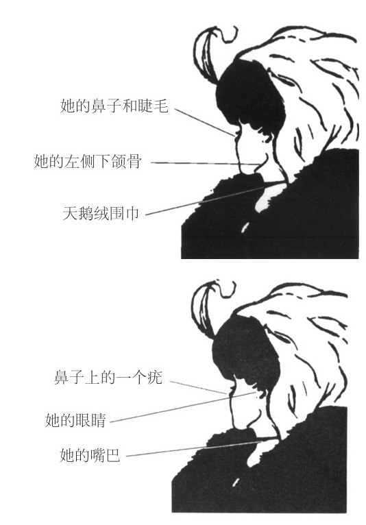

### 花瓶和脸的问题

看花瓶，注意白色的物体在一个黑色的背景中突出出来；看脸，想象一盏灯照亮了整个窗户并且两个人在剪影中面对面站着。

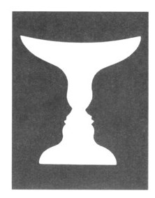

# 注释

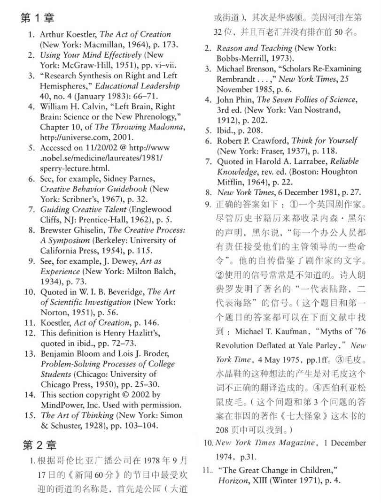

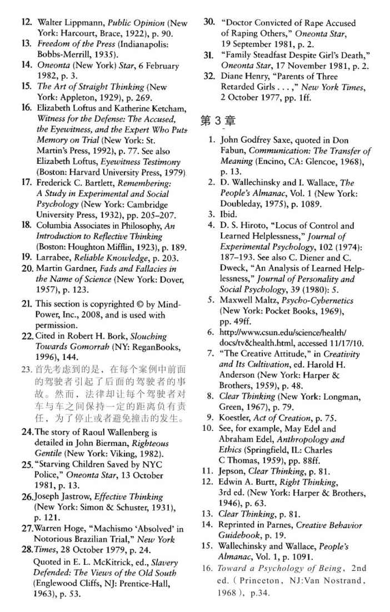

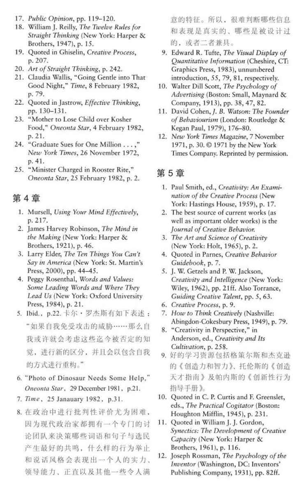

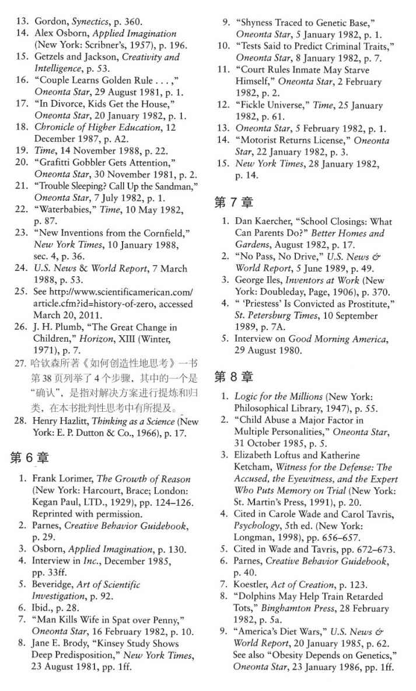

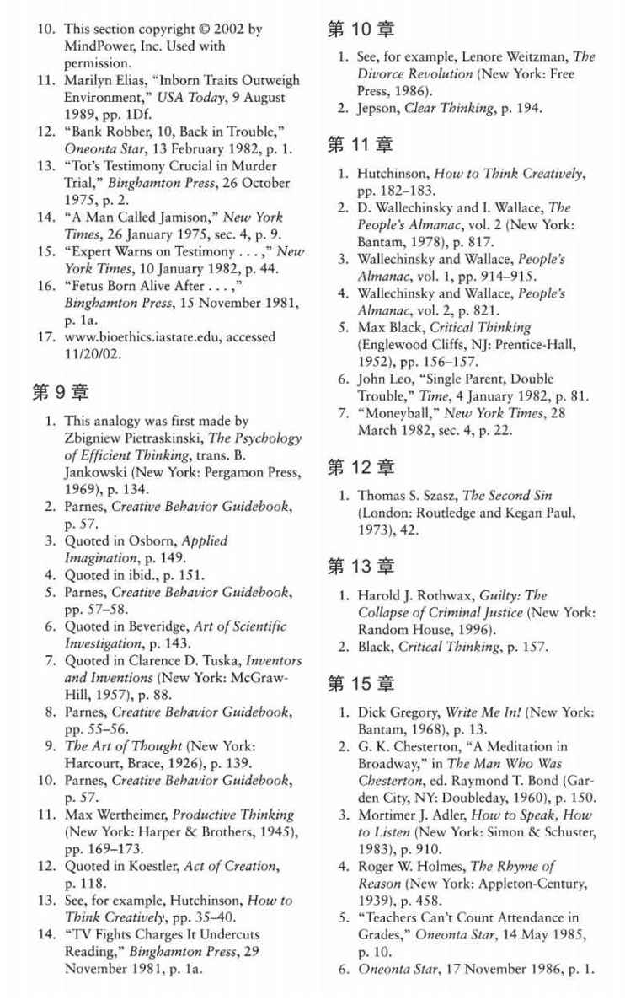

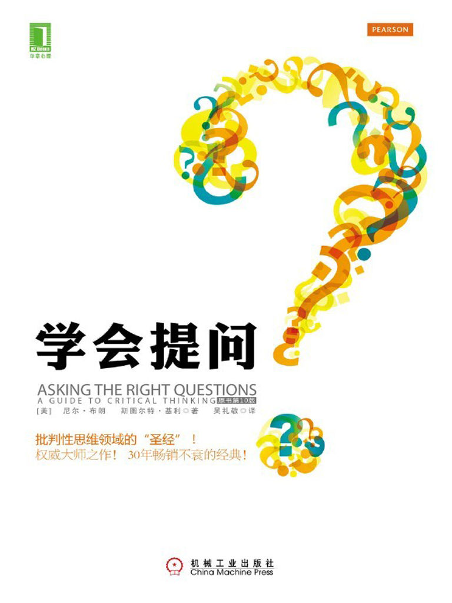

学会提问（原书第10版）

Asking the Right Questions: A Guide to Critical Thinking

\[美\]布朗（Browne，M.N.）

\[美\]基利（Keeley，S.M.）　著

吴礼敬　译

ISBN：978-7-111-40659-4

本书纸版由机械工业出版社于2013年出版，电子版由华章分社（北京华章图文信息有限公司）全球范围内制作与发行。

版权所有，侵权必究

客服热线：+ 86-10-68995265

客服信箱：service@bbbvip.com

官方网址：www.bbbvip.com

新浪微博 @言商书局

腾讯微博 @bbb-vip

这本《学会提问》是一本非常经典的批判性思维读物，很出色地完成了传授批判性提问的技能这一目标，既简洁又全面，实践指导性强，会对同学们提供很大的帮助。想要去国外留学深造的同学，应该学习批判性思维，学会用批判性眼光去看待、评价问题，理性思考，扩展你的思维和眼界，丰富你的内心世界！

——俞敏洪（新东方教育科技集团）

教育的真正目的就是让人不断地提出问题、思索问题。

——哈佛大学名言

美国“神童”教育（天赋教育）的“童子功”入门第一招是“培养批判性的阅读能力”，第二招是培养“批判性的聆听能力”。在小学阶段还是作为一种行为习惯来培养，到了大学阶段就已经成为一种思维方式了。批判性思维能力的培养因而成为各高校尤其是研究型大学课程设计围绕的核心。

——《天赋教育在美国》

如果你不改变问问题的方式，你永远都不会成功。

——现代管理之父德鲁克

提问题比回答问题更启发人的智慧。

——潘石屹

我管理公司是靠“发问”，不是靠“回答”。问答会启动对话，对话会刺激创新。如果你想要一个创新文化，那就多发问。

——谷歌CEO施密特

如何培养批判性思维？我的回答是：1）多问"how"，不要只学知识，要知道如何实践应用；2）多问"why"，突破死背知识，理解“为什么是这样”之后才认为学会了；3）多问"why
not"，试着去反驳任何一个想法，无论你真正如何认为；4）多和别人交流讨论，理解不同的思维和观点。

——李开复

【美国某高中开学演讲】你们需要通过理科课程的学习，获取知识和解决问题的技能，治疗癌症和艾滋病，开发新能源技术，和保护人类的生存环境。你们需要从文科学习中培养洞察力和批判性思维，消灭贫困、愚昧、犯罪和歧视现象。

——美国总统奥巴马

学会批判性分析性的思维方法，坚守实事求是，是促使我不断探索经济学的真理的两个根本动因。希望同学们坚持真理而非教条，努力思考而非盲从，在现实世界中保持理想，不断进步。（2011年某学院毕业典礼上吴敬琏先生以“毕业以后”为题发表演讲。）

——吴敬琏

提问题，体现一个人的思考力、洞察力，反映了一个人快速分析问题的能力，更体现一个人不盲从的理性和积极的态度。在国网信通公司的发展中，我们尤其注重培养员工敢于提问、善于提问的勇气和能力，尤其是青年人，这是激励他们成长的方法之一。只有以“不唯上、不唯书、只唯实”的精神来推进工作，我们的事业才会成功，每个人才能永保生机和活力。学会提问吧！

——国网信息通信有限公司总经理、党组副书记　刘建明

# 前言

“我知道做个慎思明辨的人挺好的，会问很多恰到好处的问题也挺不错，可我就是不知道该问哪些问题，不知道怎么个问法。”很多人不知道怎样切实有效地提出一些关键问题，希望我们能提供较为详尽的指导，鉴于此，我们专门写了这本书来满足大家的需求。目前这本书已经是第10版了。只有公众都能批判性地思考问题，民主制度实行起来才会更加顺利。只有经过关键问题层层考验后形成的决定和看法，才让我们觉得更加理直气壮。

从开始写作时起，本书就一直处在改进和提高当中，30多年来，我们不断汲取来自读者的意见和建议。一方面我们为本书的大获成功和来自许多国家许多读者的积极反馈而感觉无比振奋，另一方面又觉得任重而道远，觉得还需要付出前所未有的巨大努力来指导公众“提出恰当的问题”。新的意见和建议一多，哪些需要牢牢把握，哪些可以不予考虑，取舍也就变得越来越难。每天都有人想尽一切办法要说服我们，对我们死缠烂打，其中很多人都喜欢钻牛角尖走极端，他们的论说诉诸情感的部分多，诉诸理智的部分少。记不清在多少次的公开讨论中，我们遭遇到普遍的极度无视证据、语言草率、错把声高当有理的情况。满足于似是而非，或者说对真相漠不关心的态度正变得越来越普遍。

我们一心追求的是希望新版本既能保持这本书的主要特色，同时又能适应新的重点和读者不断发展的新需求。例如，我们首先最想做的就是保留本书简明扼要、清楚易懂以及篇幅短小的特色。经验告诉我们，这本小书出色地完成了它的既定目标——传授批判性的提问技能。这些技能的训练都是在轻松自然的讨论中展开的。（我们的读者对象是普通大众，而不是什么专业人士。）

40多年向学生传授批判性思维技能的经验也让我们确信，尽管读者能力有差异、术业有专攻，但只要用简单易懂的方法传授批判性思维的技能，他们很快就能成功将其应用于各种实践。在学以致用的过程中，他们的信心逐步增强，在重大社会问题和个人问题方面做出理性抉择的能力也与日俱增，哪怕面对以前极少经历过的重大问题，也一样可以应付自如。

本书最为显著的特色之一就是它的适用范围远远超出你的想象，延伸到形形色色的生活实践之中。很难想象这本书对哪一个专业领域派不上用场。事实上，根据以前的读者反馈，前九版曾广泛应用于法律、英语、制药学、哲学、教育学、心理学、社会学、宗教学及其他各种门类的社科课程，同时还普遍应用于无数的个人抉择当中。当外科医生说有必要做手术时，本书所倡导的“寻找关键问题的答案”这一步骤就可能变成生死攸关的大问题。此外，坚持练习这些批判性思维的问题也可以巩固我们不断增长的知识，有助于我们更好地发现世界万物运行的方式，更好地理解这些方式，教会我们怎样让世界变得更加美好。

本书新版的特色主要包括以下几点。

（1）我们继续在练习的前几篇文章里采取设问的方式来自问自答，即对所读的文章边进行批判性思考边加以解答，好比一个人正努力思考如何评价这篇文章，而读者则在这个人的脑海里旁观整个思考过程。我们认为比起简简单单让学生看一下答案，让学生切身“感受”一个人接受、拒绝、修正和组织这个答案的一点一滴的过程，可以为他们提供一幅更加现实的画面，向他们展示获取答案的批判性思维的真实过程。这里我们借用了著名教育家约翰·加德纳的重要比喻，他严厉批评某些教师和教练，只给学生看知识园地里采摘下来的缤纷花朵，而不给学生看那束呈现在眼前芬芳美丽的花朵的种植、除草、施肥和修剪的整个过程。

（2）我们同时强调了让对话能一直进行下去的重要性，例如，很多读者在与人交往时跃跃欲试地要练习自己批判性提问的能力，却发现并不是每个人都乐于接受批判性的探询。有些互动的方法能在批判性思考的人和演说者/作者之间激发出越来越多令人满意的对话，而另一些方法则难以奏效。我们建议读者采取不同的询问和聆听策略，以便对话顺利进行，而不是迫使对方关闭对话的渠道。比如，常常有被问的人这样来一句：“你怎么单单就盯上了我呢？”让批判性探询的过程就此中止，没了下文。

（3）我们添加了许多新的例子和练习文章，更频繁地涉及当前的热点问题，体现批判性思维在现实生活中的价值和应用。

（4）第10版更注重使用批判性思维的技能来提高读者自身的书面和口头表达能力。这一新的强调重点拓展了批判性思维学习的新疆界。换言之，批判性思维的技能并不仅仅用来评价他人的论证，还能在形成我们自己论证的过程中发挥重要作用。每一章都会有一部分专门提醒读者，轮到你自己写作时（不论是说明文、议论文、毕业论文报告，还是在博客、网络论坛里的留言发帖），应当注意避免的种种问题。

（5）我们在本书的关键地方增加了更多的图表，以便为部分读者提供更强的视觉效果，这样更有利于他们的阅读。

虽然这本书主要是从我们的课堂教学经验中总结出来的，但它的目标在于指导每个人阅读和聆听的习惯。它旨在培养的种种技能，任何一个带着问题去读书的人都应该拿来当成理性决断的基石。本书反复强调的关键问题可以提高每个人的推理分析能力，不论其受过的正规教育有多少。你在书里的收获，相信会大大出乎你的意料。

尼尔·布朗

斯图尔特·基利

# 第1章　学会提出好问题

## 引言：一切从批判性思维开始

很多影评家迫不及待地告诉我们，哪些电影不容错过，哪些电影不看为妙。可是他们的看法到底有哪些我们可以笃信不疑呢？有哪位影评界的权威但凡做出结论一定会提供最令人信服的理由？

本书的几位作者都是铁杆影迷，但和你一样，我们也不想来者不拒地通吃每部电影。说到底，决定看哪部不看哪部电影还真是块硬骨头。为了让这块骨头好啃一点儿，我们常借助几个喜欢的网站。

可是，刚一登录这个网站，你马上就会发觉影评家的观点似乎从来就没有一致过。这个经历不过是万千世相的一个侧面而已。不论医生、立法委员、建筑师、水管工还是侦探，在特定情况下如果问及他们采取什么措施最为恰当，他们无一例外地要各持己见。他们意见相左，我们这些洗耳恭听的人又当何去何从呢？你将开卷阅读的这本书就包含了我们知道的最佳答案。你需要发展相关技能，树立正确态度，这样才能自行判断出哪些观点能为我所用，从而形成你自己的观点。

作为一个富有思想的人，对自己的所见所闻如何回应，你必须要做出选择。一种方法是不管读到什么还是听到什么都一股脑儿地接受，久而久之习以为常，你就会把别人的观点当成自己的观点，是他人所是非他人所非。但没人会心甘情愿地沦为他人的思想奴隶。

另一种更为积极进取也更令人钦佩的方法是提一些较有力度的问题，以便对自己所经历的东西到底有多大价值自行做出评判。本书的读者对象就是舍易就难选择后一种方法的人。我们会为你提供各种指导，教你应该提哪些问题，选择在什么时间提问。但现在，千言万语化作一句话：通往合理结论的道路往往从问题开始，并且一路都有问题相伴。

## 激发你的批判性思维

所谓批判性的聆听和阅读，即对自己耳闻目见的一切进行系统的评判，这需要一整套的技能和态度。这些技能和态度都建立在一系列环环相扣的关键问题上。我们会循序渐进地学习这些问题，而我们的最终目的是能将这些问题融会贯通，从而找出最佳的决断。理想的效果是，经常提出问题将成为你的身份标记和存在宣言，而不仅是你从书本上学来的一套本领。

批判性思维是本书使用的一个术语，其内容主要涵盖以下几方面：

（1）有一套相互关联、环环相扣的关键问题的意识；

（2）恰如其分地提出和回答关键问题的能力；

（3）积极主动地利用关键问题的强烈愿望。

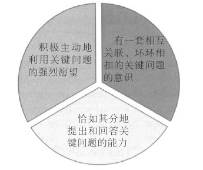

批判性思维的三个方面

本书的目的就是激发你朝这三方面全面发展。

问题一旦提出来，就要让被问对象给出一定的回答。通过提问，我们传达给被问对象的是：“我对这个很好奇”“我想多了解些”“请帮帮我”。这样的要求体现了我们对他人的尊重。关键问题的提出，能让所有听到问题的人得到更多信息，引导讨论的方向。就此而言，批判性思维的起点在于有提高思维能力的强烈愿望。关键问题的提出还有助于提高我们的书面和口头表达能力，因为你将从以下几类情形中获益匪浅：

（1）客观评价图书、杂志及网站上读到的文章或论述，不盲从盲信；

（2）评判一场讲座或演说的水平高低；

（3）提出自己的观点并进行论证；

（4）通读指定文章后撰写有理有据的论文；

（5）积极参与课堂讨论。

小贴士：批判性思维有一套相互联系、环环相扣的关键问题的意识，同时加上在适当时间提出和回答这些问题的能力和意愿。

## 两种思维方式：海绵式思维和淘金式思维

有种常见的思维方式因为类似于海绵放到水中的反应——充分吸收水分，而被称为海绵式思维。这种流行的海绵式思维有以下两个显著优点。

第一，吸收外部世界的信息越多，你就越能体会到这个世界的千头万绪，而你获取的知识将会为以后进一步展开复杂的思考打下坚实的基础。

第二，相对而言，这种思维方式是被动的，它并不需要你绞尽脑汁地去冥思苦想，因此来得轻松而又快捷，尤其当你看到的材料本身已是井井有条又生动有趣时，这种思维方式更显成效。要想成为一个有思想的人，被动吸收外部世界的信息确实为你提供了一个富有成效的起点，但海绵式思维却有个极严重、极致命的缺点：对各种纷至沓来的信息和观点如何做出取舍，它提供不了任何方法。如果读者始终依赖海绵式思维方式，他就会对自己最新读到的一切深信不疑。

我们认为，你一定愿意自己掌握主动权，选择该相信什么忽略什么。而要做出决定和取舍，你就得带着一定的态度去读书，即带着问题去读书。这种思维方式需要你积极主动地参与进来。作者在向你细说原委，而你则随时准备与之辩驳，虽然作者本人根本就不在场。

我们把这种互动方式称为淘金式思维。淘金的过程为积极主动的读者和听众提供了一种可效仿的模式，他们得尽快决定自己的所见所闻到底价值几何。在一场互动的对话中披沙拣金，需要你不断地提问并思考问题的答案。

海绵式思维强调单纯的知识获取结果，而淘金式思维则重视在获取知识的过程中与知识展开积极互动。就此而言，两种思维方式其实可以互补。要想在知识的河流里淘出智慧的金子，你的淘金盘里首先得有点东西供你掂量才行。此外，要评判论争分辨是非，我们还真得有点知识，也就是有点儿可以信赖的见解才行。

我们不妨更进一步，检视一下这两种不同的思维方式会导致怎样不同的行为。采取海绵式思维的读者通常怎样读书呢？他逐字逐句地细读，竭尽所能地记住所读材料。他可能在关键词和重点句子底下画上线，或用彩笔做标记；他可能做笔记来概括主题和要点；他不时复习书本上的画线部分或重温笔记，确保自己没有遗忘任何重要的知识点。他的主要任务就是找出作者的观点并充分加以理解。他记住作者说理论证的全部过程，但不对其做任何评价。

采取淘金式思维的读者又会怎么做呢？像采用海绵式思维的读者一样，他也希望在阅读的过程中获取新知识，但两者间的相同之处仅此而已。淘金式思维要求读者问自己一系列既定的问题，旨在找出最佳判断或最合理的看法。

采用淘金式思维的读者常常质疑作者为何要提出各种各样的主张。他在书本的页边写批注，提醒自己注意作者推理和论述中存在的问题。他无时无刻不在和自己的阅读材料互动，目的是批判性地评价所读的材料，在客观评价的基础上得出自己的结论。

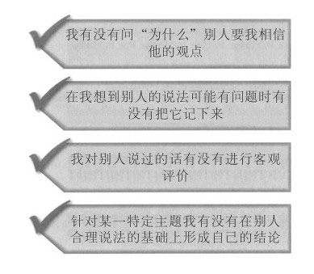

脑海里存一份淘金式思维的清单

## 淘金式思维举例：美国该禁枪吗

美国社会有个久拖不决的重大问题，牵涉到美国人究竟需要什么样的枪支管制法案。让我们来看看有关这个问题的一个立场：

支持禁枪的理由大多是臆造出来的，现在我们需要的根本不是更多的法案，而是更大的执行力度。有个臆造的理由是：很多杀人犯都是普普通通的守法良民，不过出于一时冲动杀了自己的亲人或朋友，因为枪就在手边。事实上，针对杀人犯的每一项研究都显示，杀人犯当中绝大多数人都是惯犯，这些人一生恶行累累、犯案不断。一个典型的杀人犯在犯下谋杀罪行之前平均至少有六年的犯罪史，其中四次是重罪被捕。

另一个臆造的理由是枪支持有者都是些目不识丁的人，动不动就喜欢好勇斗狠。但是，研究向来都显示：平均而言，枪支持有者比没有枪支的人受过更高的教育，从事更有声望的工作。根据他们填写的持枪申请表来看，以下这些人都是（或曾经是）枪支持有者：埃莉诺·罗斯福（总统罗斯福的夫人）、琼·里弗斯（著名影星）、唐纳德·特朗普（房产大亨）和大卫·洛克菲勒（银行家）。

就算枪支管制法案真有可能减少涉枪的犯罪行为，那么将现行法律真正一一付诸实施也就足够管用了。既然法庭不止一次地证明这些法律根本不会得到执行，就算制定再严的法律又有什么用呢？

若用海绵式思维解读上面这篇文章，也许你会花工夫记住我们无须更严格的枪支管制的几点理由。但是对上述几点理由你到底相信几分？如果不利用淘金式思维来解读这篇文章，也就是对这篇文章提一些适当的问题，你根本无法客观评价这些理由。只要提几个适当的问题，你就会发现上文作者的论述存在很多不足。比如，你可能对下面几点非常关心：

（1）作者提到的“绝大多数人”或“典型的杀人犯”是个什么概念？是否意味着剩下来的那“少数人”当中仍然有相当数量的杀人犯出于一时冲动而枪杀了自己的亲人？

（2）“枪支持有者”是什么意思？是不是主张枪支管制的人竭力推动禁持某些特种枪支，而这一部分人持有的正是这些特种枪支？

（3）文中引用的几个研究到底有多大说服力？作者提供的研究样本是不是很充分，是不是随机抽取的，是不是涵盖了不同人群？

（4）有没有什么枪支管制的潜在好处文中没有提及？有没有和作者观点相左的重要研究成果作者略过不提？

（5）每年有多少人死于手枪之下，而实行手枪管制的话这些人可能根本就不会枉死？

如果你总爱提这种类型的问题，那么这本书简直就是为你量身撰写的。本书的主要目的就是帮助你了解何时提问、怎样提问才能让你判断出信什么、不信什么。

淘金式思维方式最重要的特点就是参与和互动，即作者和读者、演讲者和听众之间展开对话。你本着相信他人的愿望而来，但首先他们得对你提出的问题做出令人信服的解答。

别人观点的不当之处总不会一直不停地自动跳到你的眼前。作为读者和听众你必须保持全神贯注，而保持精力集中的最好办法就是不断提问题。批判性的提问是检索信息和搜寻答案的最好方法。恰到好处的连珠发问有个强大的优势：它们能保证你打破砂锅问到底，哪怕你对讨论的主题所知有限也不碍事。比如，你不必成为育儿专家也一样可以针对日托中心的某些举措适当与否提出一些关键性问题。

## 正确答案莫非只是神话

我们能否找到确定无疑的答案常取决于困扰着我们的问题的类型。物质世界的科学难题最有可能找到准确的解答，只要不钻牛角尖，大家几乎都可以接受，因为物质世界较人类社会而言在某些方面更加可靠或者说更能预测。我们也许不能百分之百地确定地球与月亮之间的确切距离，或是一块新发掘的古文明社会的骨头距今有多少年代，但在物质环境的方方面面达成共识的例子却随处可见。因此，在自然科学方面，我们常常能找到“正确答案”。

而问题一旦涉及人类的行为和这些行为的意义，情况就变得截然不同。人类行为的动因太过复杂，某些行为为什么会发生，或者在什么时间发生，我们常常只能做出些聪明的猜测，此外无法前行一步。不止这样，我们当中有许多人都对人类行为的各种解释和描述极为热心和关注，诸如堕胎率、肥胖带来的后果或虐待儿童的起因等问题，我们更热衷于相信那些和我们的期望值一致的解释和描述。这样，我们难免会把自己的喜好带入这些问题的讨论场合，而对那些与自己喜好不一致的说法一概加以排斥。

因为人类行为往往充满争议而又千头万绪，故而有关人类行为的很多问题我们能找到的最佳答案本身也就具有极大的或然性。比如坚持锻炼对保持心理健康确实有效果，哪怕我们明知道一点一滴的证据都能证明这种效果，我们还是不敢保证这些效果必然就会出现。为了以策万全，我们还是得承认不排除意外情况的发生，才能避免让自己沦为“空架子”或“不靠谱”。可是我们一旦承认自己的保证建立在或然性而非必然性的基础上，那么对那些试图说服我们改变观点的人，我们对他们的推理也必然要更加开放和包容才行。毕竟我们的有些看法难免会出错。对那些和我们意见不一的人我们要洗耳恭听他们的观点，也许他们才是正确的。

不管提出来的问题属于什么类型，最需要你细细加以研究的往往是那些与“开明通达人士”看法不一致的问题。实际上，很多问题之所以引人入胜正是因为在解答方法上大家的意见出现严重分歧。任何一场论争都包含不止一种立场和观点。有些立场和观点背后可能有强有力的论据支撑。而对社会问题的论争，很难有一个观点可以让你一锤定音地宣布，“在这个问题上，只有这个观点才完全正确”。如果这样确定无疑的答案有可能出现，那开明通达人士也不会为这个问题辩论不休了。本书就会重点围绕这些社会问题的论争而展开。

## 最好先问一问“关我什么事”

提一些像样的问题虽有难度但结果肯定大有裨益。对你而言有些论争比其他论争显得更加重要。如果一个论争其结果对你和你所处的社会影响甚微，你自然不肯花大把时间和精力去对它加以批判思考，而宁愿把时间和精力投入到更加重要的论争上去。举例来说，对支持还是反对保护濒危物种的论争进行客观评估就很有意义，因为针对这个问题的不同立场将会给社会带来重大影响。反之，一门心思地去评估蓝色是不是大多数公司老总最喜欢的颜色就显得意义不大了。

一寸光阴一寸金，在决定花大把光阴去客观评估一个问题之前，最好先问一下自己：“这个问题关我什么事？”

## 弱势批判性思维和强势批判性思维

前面我们说过，对很多个人和社会的重大问题你都有了自己的观点，那么你现在肯定也乐意对以下问题表达自己的立场，如“卖淫要不要合法化？”“酗酒是难以自控的疾病还是有意为之的恶习？”“乔治·布什在任时是不是一位成功的总统？”带着对这些问题的观点和立场，你在读书和听讲中不断加以印证。

批判性思维可以用来①捍卫自己的观点，②评价和修正自己的初始观点。理查德·保罗（Richard
Paul）教授对弱势批判性思维（weak-sense）和强势批判性思维（strong-sense）的区分有助于我们理解批判性思维两个对立的用途。

小贴士：弱势批判性思维是利用批判性思维来捍卫自己现有的立场和看法。强势批判性思维是利用批判性思维来评估所有断言和看法，尤其是自己的看法。

如果你利用批判性思维来捍卫自己当前的看法，你就在使用弱势批判性思维。为什么说这种思维是弱势的呢？用这种方式来使用批判性思维技能就意味着你对能否接近真理和发扬美德漠不关心。弱势批判性思维的目的就是抵制和驳倒那些与你意见不同的观点和论述。最终看到那些和你意见不同的人服服帖帖地甘心认输，以此作为批判性思维的终极目标，实际上也就摧毁了批判性思维潜在的人性的一面和不断发展进步的特征。

相反，强势批判性思维要求我们用关键性问题一视同仁地质疑一切主张，包括我们自己的主张。强迫自己辩证地看待我们的初始看法，我们才能保证自己不会变得自欺欺人和人云亦云。抱着自己的初始观点死死不放固然很容易，尤其很多人的观点与你相同时更是这样。可一旦我们选择走这条容易的道路，我们就极有可能犯下原本不该犯的错误。

强势批判性思维并不一定就要迫使我们放弃自己的初始看法。它可以为我们进一步坚定自己的看法提供坚实的基础，因为辩证地检查那些看法有时候可以巩固我们当初对它们的支持，从而让我们变得更加笃信不疑。另一个区分这两种思维的方法就是对比一下思想开放和思想封闭这两种状态。当我们思想开放的时候，我们欢迎一切针对自己现有看法的批评，而当我们思想封闭的时候，我们就会维护自己的现有看法绝不动摇。

要对自己持有的某个观点感到自豪，这个观点就应该是我们千挑万选出来的——我们透彻理解并客观评价各种纷繁复杂的观点，然后从中披沙拣金，选出最合理的观点。

## 亲自动手才更有乐趣

亲自动手的乐趣要远远大于袖手旁观，而圆满完成任务的乐趣又远远大于浅尝辄止。如果你按部就班地使用本书所传授的每个互动步骤，那你在读书和听讲中所体会到的骄傲和自豪，与你平时出色地参加体力劳动时得到的那种自豪感完全一样。

学会批判性思考问题的人知道什么时候该对一个思想或观点说“不”，知道为什么他的回答恰如其分，这样做让他觉得无比满足。如果你能坚持不懈地使用这种淘金式思维，那么进入你大脑的任何知识首先都会接受系统的检查。如果一个观点或看法确实符合这里所设立的标准，那么同意或接受它就是明智的决定，至少在新的证据出现之前是这样。

### 勤于练习的重要性

我们的目标是让学习过程变得越简单越好。但是，批判性思维的习惯养成首先得依赖于大量的练习。

除了本章的引论部分，每章末尾的练习题和参考答案是本书不可或缺的重要组成部分。我们所提供的答案并不是唯一正确的解答，但它们确实提供了例证，教我们怎样将各类定义和提问的技能应用于实践。我们特意不给每章末的第三篇文章提供参考答案，目的就是让读者有机会尽量利用本章所学的知识来寻找答案。

## 也许我们根本就问错了问题

一有什么问题浮现在脑海里马上就不加辨别地提出来，这并非是件对我们有帮助的事情。我们得有所选择，就像《黑客帝国》里的干探布朗提醒我们的那样：“也许我们根本就问错了问题。”

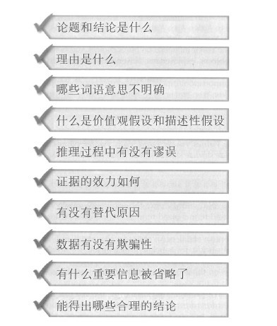

关键问题一览

为了让你初步体会一下本书将帮你获得的技能，我们将为你列举一些关键的问题。等你读完本书以后，你就会明白什么时间、怎样有效地提出这些问题。

## 价值观决定人与人之间的互动

我们的大部分思维活动都不是独自闭关修炼，而往往牵涉到别人。只有全身心投入进去与别人积极互动，我们才能不断向前迈进；没有别人的参与，我们作为学生往往会误入歧途。批判性思维很大程度上依赖于虚心听取别人的意见来取长补短。

### 价值标准和别人

将别人当成你最有价值的资料库，当成你最终获得事实、观点和结论赖以建立的坚固基石，别人是你“结论大家庭”中的一员，他们会以一种重要而又持续不断的方式，孕育和培养你的结论。这个大家庭的主题就是相互联系。

这些人与人之间的互动到底怎样起作用，取决于你的价值观，以及你从那些互动人士身上体会到的价值观。在你发现价值观对于形成结论的重要性之前，你最好先对价值观到底是什么有一个初步的了解。本书所谓的价值观，是指人们认为较有价值的那些观点。你会发现正是人们赋予抽象观念的重要地位对他们的选择和行为产生了重大影响。

通常情况下我们会为自己所珍惜的某个理想而渴望相应的目标、经历和行动。举例来说，我们也许会选择去做一些特定的事情，好让自己有机会接触到大人物。我们重视“大人物”（具体观念）是因为我们重视“地位”（抽象观念）。当我们在本章中使用“价值观”这个词的时候，我们所指的是抽象观念，它代表了别人认为重要和美好的事物。

小贴士：价值观指的是人们认为较有价值而没有明说出来的观点。它们树立了一定的行为准则，据此我们来衡量人类行为的品质高下。

为了让你更加熟悉价值观这个概念，请你先写下自己的一些价值观。注意尽量不要写一些具体的人名，也不要写可以触摸到的物体或一些具体行动。比萨饼或网球也许对你很重要，可正是你赋予抽象观念的重要地位最能影响到你对有争议的社会问题的选择和行动。比如，你甘愿就辅助自杀（assisted
suicide）这一行为与他人辩论，这就与你赋予“人的生命神圣不可侵犯”这一抽象概念的重要地位密切相关。在你列举种种价值观的时候，请注意那些在许多方面影响到你的观点和行为的重要价值观。

你在列举价值观的时候是否遇到了困难？我们可以为你提供一些帮助。价值观就是我们自己认可的行为准则，并且我们希望别人的言行能与之相一致。当我们希望我们的政治代表能够“实话实说”时，我们传达给他们和我们自己的信息是：诚实无欺是我们最为珍视的一个价值观。问问你自己，你希望自己的朋友都是些什么样的人，你希望自己的孩子能培养出什么样的行为准则？这些问题的答案可以帮助你拓展对价值观的理解。

让我们提醒自己对价值观的了解怎样和批判性思维的社会属性联系在一起。虽然我们必须要求自己仔细聆听那些和自己价值观取向不同的人的观点，但是靠价值观建立起来的最显著的社会联系还是价值观之间的相似性。我们当中那些将个体责任当成重要价值观的人，他们会去寻找那些同样相信“经过改善的个体选择乃是解决大部分人类问题的济世良方”的人为伴，和这些人在一起他们才觉得放心自在。因此，我们许多最有价值的社会交往或学习经历都始于和那些拥有类似价值观的人之间的交流。这方面我们遇到的最大挑战是如何让自己尽力理解那些和我们的价值观背道而驰的人的分析推理方式。

冒险精神、雄心壮志、自主性、舒适感、优秀、公平、理性、包容和自觉自愿，对我们而言这些也许都是重要的价值观，但很可能别的讲道理的人也有一套重要的价值观，和上述许多价值观相冲突。我们常见的做法是只愿听那些价值观取向和我们相似的人的观点，党同而伐异。我们必须要与这种倾向作斗争。

### 批判性思考的人拥有的主要价值观

本书的主要目的是致力于帮你成为一个会批判性思考问题的人。而作为一个批判性思考问题的人，你的主要目标是寻求更好的结论，寻找更好的看法，做出更好的决定。有些价值观能加快你实现这些目标的步伐，而另一些价值观则没有这种效果。通过了解和欣赏批判性思考的人所拥有的主要价值观，你也就拥有了一些心智力量，用来提醒自己去重点关注那些和你的价值观取向不一致的人。首先让我们来看看这些主要的价值观。

（1）自主性。乍一看，这个价值观好像和鼓励人们注意不同的观点显得有点儿风马牛不相及。一方面要我们积极主动地形成自己的结论，怎么另一方面又要我们去寻找或聆听那些根本不属于我们自己的观点呢？真搞笑！那在追求这种自主性的过程中你又利用什么样的原材料呢？毫无疑问，我们都想从无限广阔的可能性中进行选择，否则我们就有可能错过某个重大决定或重要选择，而如果我们足够小心，注意那些和我们的价值取向不同的人士，我们本可以挑中这样的决定或选择。举例来说，民主党人如果只听其他民主党人的意见，势必要铸成大错。

（2）好奇心。要想充分利用淘金式思维来立身处世，你需要兼听博观，而且是真正意义上的兼听和博观。他人有驱使你前进的巨大动力，将你从当前偏听偏信的状态中彻底解放出来。要想成为一个批判性思考的人，你需要对自己遇到的一切不断提问。你从别人那里学到的一技之长就是他们的洞见和感悟，只要他们的观点符合《学会提问》这本书教给你的关于正确推理的那些标准就行。

（3）谦恭有礼。哪怕世界上最聪明的人每周都会犯下一堆错误，认识到这一点，就为我们提供了一个理想的平台，让我们积极主动地和他人合作交流。当然我们中有人明察秋毫，有人则不见舆薪，可是我们每个人能做会做的事都非常有限，当我们躬自反省的时候，我们就会回想起苏格拉底说过的话：“我唯一所知的就是我一无所知。”一旦我们接受这一现实，我们就能更好地认识到我们同他人之间的交往至少能填补一小部分我们当前认识的空缺。而且，谦恭的意识让我们能避免批判性思维最为常见的一大障碍，就是相信凡与自己意见相左的人都是立场褊狭，而自己则立场公允。

（4）以理服人者逢之必敬。我们虽然想恭听别人的声音，这并不是说一切观点和结论不分轩轾、价值等同，你在学习本书的过程中掌握的那些关键问题会为你提供一个基本架构，帮助你精挑细选，从所有想对你施加影响的人中择优汰劣。一旦你发现说理透彻、论据可靠的人，不论其肤色、年龄、党派、财富、国籍如何，一定要毫无偏倚地信赖其观点，直到更加透彻明晰的论证出现时为止。

不论怎样，有理有据时做事要信心百倍，下结论时不可犹疑，但一定要留有余地，三思而行，最好扪心自问一下：我的结论有没有可能是错误的呢？

## 理智思考和感情用事

列举批判性思考的人应该具备的主要价值观并且对之条分缕析相对比较容易，但身体力行起来却难上加难。你一开始以为与某个结论不期而遇，其实这个结论早就有来头和历史了。你已经学会对某些事物处处留心，对某些利益鼎力支持，对某一类主张加以漠视。因此你总是在现有的各种观点之间开始批判性思考。你对这些现有观点难免会有情感上的依恋。

这些都是你的观点，你对它们百般呵护也是完全可以理解的。听一听政治讽刺作家斯蒂芬·科尔伯特（Stephen
Colbert）是怎样嘲讽我们以下的看法的：“你知道，我可不是什么事实的‘粉丝’。事实总会不断变化，而我的观点却从来不变，不管事实如何我都无所谓。”

当你改变自己的看法时，就好像当众承认你从前的一切都归于失败，直到此刻才如梦方醒。遇到更强有力的分析推理能引导你进入全新方向时，有勇气当机立断地改变观点和立场，真需要超乎常人的意志，下定决心发掘自己的最大潜能，塑造出史上最强的自己。当然，一直不停地改变观点证明你是个随机应变的人绝对是不智之举。可是当你遇到新的证据和理由，胜过你一直以来依赖的所有理由和证据，你就有必要弃暗投明、轻装上阵。你应该倾力拥抱这个修正后的世界，信心百倍地认为这样的世界才更加可靠。宁可在理由充分、证据确凿时反复无常，也不要在缺乏论据、强词夺理的结论上执迷不悟。

请牢记一点，我们思考时都有明确的目标。换句话说，我们之所以思考正是为了达到一定目的。当我们思考的动机就是为了同以前的思考方向保持一致、毫不更改时，我们就对批判性思考的价值观不管不顾。取而代之的是，我们变成了鼓吹者和宣传家，千方百计地寻找更好的方法来维护自己当前的立场。从这个角度来看，思考的过程其实就是捍卫的过程。

更明智、更进步的做法是一旦思考，目的就是要让我们的思想更有深度，让我们的思想更加精确。为了达到这个目标，我们就要不时锻炼自己，耐心倾听那些和我们意见相左的人的论证。因为我们对自己的论证已经驾轻就熟，大可放心去了解其他人的论证，了解那些我们没有真正全面透彻加以了解的论证，这样就可兼采百家之长而不致迷失方向。

这一点值得一再强调。我们每做一个决定时都携带有太多的个人包袱——经历、梦想、价值观、所受训练、文化习俗等。可是，如果你要茁壮成长，你就得认清这些情感，而且尽你所能，将其搁在一旁暂时不问。要做到这一点就需要不断斗争，正如火柴盒二十乐队（Matchbox
Twenty）在那首名为“争论”（Argue）的歌曲里所唱的那样：

而我也不知道，说过我也不知道，

所有这些感情，让我的分析云遮雾罩，

让我的分析云遮雾罩。

只有尽力认清这些感情以及它们对你造成的影响，当别人提出的观点可能威胁或推翻你当前的看法时你才能仔细聆听。这种开放包容的精神非常重要，因为在有些问题上我们的许多立场和观点并不是特别有理有据不容辩驳，它们也是别人传递给我们的观点，经年累月下来，我们对这些观点产生了难以割舍的感情。事实上，很多时候，当别人提出相反的结论时，我们都将其当做针对我们自己的人身攻击。对一个论题过于感情投入的最大危险，就是你可能考虑不到其他立场潜在的正当理由——这些理由其实非常充分，只要你愿意听一听，足以改变你对这个论题的看法。

请记住：接受还是拒绝一个立场，感情上的依恋绝不应该成为最重要的基础。理想的做法是，只有在经过分析推理以后还对其笃信不疑才可以加大感情投入的力度。批判性思考的人毕竟不是机器，家事国事天下事，他们事事关心。关心的程度如何，只要看一看他们全身心投入与批判性思维有关的智力活动，再苦再累他们也无怨无悔。但投入的感情再多，批判性思考的人也会清醒地意识到他们的当前思想随时有可能得到修正，因此感情时刻受到理智的调节和控制。

## 让对话一直进行下去

因为批判性思维是一种社交活动，所以当我们对他人的看法和结论不断质疑时，我们还得考虑他们可能会有什么样的反应。只要与我们交流的人对批判性思维的主要价值观和我们心照不宣，那么我们的提问就会被当成新的证据而受到欢迎，大家面对的是共同的问题，一起结伴寻找最佳的解答。但是这种共同成长的绝佳机会却不是社会交往的唯一模式。

很多人并不热心别人来探询他们的思考过程，常常是，别人一问到他们，他们就认为别人是没事找茬，有意和他们过不去。有的人可能会问：他为什么要问我这么多难对付的问题？他为什么横竖不肯接受我的观点？如果你求知若渴地不断追问，而他们的反应却是反问你为什么要这样刻薄小气，千万不要觉得惊讶。很多人就是不习惯别人对某个观点的来龙去脉那样好奇偏要去打破砂锅问到底。

为了批判性思考的目的而进行的论证，其面目会大不一样。因为我们将论证看成一种机制，依靠这种机制，我们可以对当前的结论巩固充实、删繁就简，因此我们使用的“论证”这个概念，其含义就变得迥然不同。一个论证是两种不同形式的陈述之间的结合，即一个结论和支持这一结论的理由间的结合。正是理由和结论之间的紧密结合才支撑起一个人的论证过程。我们之所以提供一定的论证，是因为我们关心别人采取怎样的方式生活，他们相信些什么。而我们能不断取得进步，则得益于别人足够关心我们，为我们提供各种各样的论证，而且对我们的论证进行客观评估。只有这样做我们才能成长为有思想的人。

最重要的一点是，当你进行批判性思考的时候，一定要让别人明白你好学上进。此外，要让他们相信你的本意是好的，如果你同他们存在分歧，不管这些分歧有多重要多严重，都不应该以口诛笔伐而收场。以下列举一些谈话策略，你可以利用这些策略来让谈话继续下去而不致中断。

（1）尽量阐明你对别人言论的理解，不妨问一问：“我好像听你说过这个。”

（2）问一下别人，有没有证据能让他改变他的观点。

（3）提议暂停一段时间，你们可以尽量找到支撑自己结论的最佳证据。

（4）问一问别人，为什么他认为你据以形成结论的那些证据显得不堪一击。

（5）尽量弥合分歧。如果你接受对方的最好理由，并将这些理由和你的最好理由放到一起，有没有发现一个你们双方都可以接受的新结论呢？

（6）寻找一些共同的价值观或其他一致同意的结论，以此为基础，找出对话中分歧产生的原点。

（7）好奇心再强，也要表现得体贴关心和不温不火，一旦讨论的语气升温，就要不断提醒自己，你是来虚心学习的，不是来舌战群英的。

（8）确保你的表情和肢体动作都表现出谦恭的样子，而不是摆出一副全知全能、目空一切的架势。

### 营造交流会话的友好氛围

作为一个作者或演说者，你面临一个重要的抉择。你得决定为你的读者和听众营造一种什么样的氛围。你是否会选择这样一种氛围：一旦有人不同意你的结论气氛马上就变得剑拔弩张？在当前这种极端的环境下，这样一触即发的诱惑是非常大的。只要看一看美国大选季期间大家使用的策略，也就是“每日秀”（Daily
Show）主持人乔恩·斯图尔特（Jon
Stewart）在节目里嘲讽的那种谈话策略就知道了，他说：“我不同意你的观点，但我可以肯定你不是希特勒。”

本着斯图尔特引用的这句话的精神，你就可以选择营造这样一种氛围，让讲道理的人可以体面而又大方地表达异见——一种欢迎讨论和提问的氛围。我们当然提倡这样的氛围，但让我们实话实说吧，确实有一些不可抗拒的理由，让我们在写作时语气变得不容置疑，将批判性思考的人拒之门外，甚至将他们全部撂倒。

首先，遇到一个难回答的问题，将它直接枪毙比仔细思考然后做出回答要容易得多。而且，这样做一定让你显得一言九鼎霸气外露，让听众简直没胆量挑战你的权威观点。更不要说这种写作风格有时候会显得非常轻松有趣。不知你有没有读过并且特别享受毒舌王评论的一部电影、一本书、一张唱片或游戏？

看一看下面对2009年票房大获成功的卖座影片《变形金刚2：卷土重来》的一篇评论，注意其中的语气和措辞。流行影片评论家罗杰·艾伯特（Roger
Ebert）这样写道：

你要是想省下这张电影票钱，直接走进厨房，摆出男性唱诗班的架势，大唱地狱之歌（music
of
hell），再让一个孩子胡乱敲打锅碗瓢盆和瓶瓶罐罐，然后闭上眼睛动用点想象力就行了。

请你试着去说服他，告诉他应该冷静下来重新考虑一下。

对于一心一意开发批判性思维的人，使用这种语气和别人交流代价就太高昂了。模仿艾伯特的这种说话方式将我们与我们打算交流的那些人的想法彻底隔绝起来。他们将谈话的通道全部关闭。此外，这种方式和一个批判性思考的人的价值观直接发生冲突，他们的价值观推崇的是好奇心、谦恭有礼的态度和以理服人。为自己的立场据理力争，但若采用艾伯特式的不留情面和不容商榷的口气，无形中就关闭了通往批判性思维一个重要问题的大门：“我有没有可能是错的呢？”我们想鼓励你让自己的文章变成好客的场所，读者即使和你道不同也可以一起商量。

## 一厢情愿是批判性思维的最大劲敌

2005年，斯蒂芬·科尔伯特曾提醒过我们“似是而非”这种危险的心理习惯。当一个人特别喜欢那些他希望是真的概念或事实，而对那些已经证明是真的概念或事实退避三舍时，他就已经钟情于“似是而非”了。我们倒也希望世事都能遂人所愿，这样也就天下太平、一团和气而又事半功倍了。但我们很多人根本不去想一想这样一个升平世界是否接近现实，他们干脆自创一套看法来和这个虚幻的世界相吻合。我们希望什么是真的，干脆就直截了当地宣布它是真的。我们希望产品的标签简单易懂并且名实相副，因此买东西毫不犹豫，相信里面的产品毫厘不爽地印证了标签上的文字。

这样下去，事实就要顺应和符合我们的看法，而不是将我们的看法去与事实相印证。我们可以肯定你一定能发现这里存在的问题。因为我们认为一切事物其本质和表现出来的现象应该有所不同，而我们也相信它们实际上就是有所不同，一旦我们认识到自己有似是而非这样的倾向，我们就要不断问自己：“是不是因为我希望它是真的这事才是真的，还是有确凿无疑的证据证明它是真的？”否则我们就要自取其辱，说出来的话就像哈利·波特在《哈利·波特与混血王子》中所说的那样：

哈利：肯定是马尔福干的。

麦格教授：波特，这个指控可不轻啊。

斯内普教授：说的是。波特，你有什么证据？

哈利：我就是知道。

斯内普：你……就是……知道？（语带讥讽）波特，你的天才又要让我大吃一惊了。

一厢情愿的思维之所以常常挥之不去，是因为我们否认一切的思维方式常常出现。我们在不知不觉中和事实作斗争，在冷冰冰的事实之外尽力强化升平世界的幻想。对我们共同面对或独自面对的种种问题产生的焦躁和恐惧情绪构成了一道防护墙，屏蔽了我们生活在其中的真实的世界，让我们看不见其本质。想一想你一生中多少次反复听到国家元首宣布他们所发动的战争马上就会结束，胜利指日可待。但是这样的预测通常只是些空洞的许诺。我们不得不面对残酷的现实，战争也许会一直不停地打下去，或者本国部队取胜的前景并不明朗，想到这些真让人痛苦不堪，所以我们的思维干脆直接将它抹掉了。

有一种一厢情愿的思考方式叫做奇迹式思考（magical
thinking）。有些事当科学还不能提供较能令人接受的解释时，人们多喜欢依赖奇迹作为因果解释来理解这些事物，或者试图用奇迹来掌控科学无法掌控的那些事物。我们来听听美国动画《辛普森一家》中的顽童巴特是怎样打击奇迹式思维的：

马格：好了，孩子们，把你们的信都交给我。我会把这些信寄到圣诞老人在北极的工作室去。

巴特：不要再胡说啦。这世上只有一个肥佬会不断给我们带礼物来，但他的名字才不叫圣诞老人呢。

这世上有许多事都无法控制，我们也知道与之抗衡的许多力量和困境都好像远远超出了我们的能力范围。结果就是过去了一茬拔牙齿的仙女和复活节的兔子，又来了一茬新的神奇力量和影响，只要它们能带来乐观主义和安全感就行。当人们无力去理解或改变自己的境遇时，奇迹式思维就变得更为强大。在这种巨大需求的驱动下，任何相信人生有随机或偶发因素的想法都被斥为令人沮丧而置之不理，代之以奇迹式的因果关系的承诺。

对抗奇迹式思维的方法就是积极主动地使用本书所教导的关键问题。批判性思维的种种障碍会一直不停地伴随我们，不能忽视它们，但是凭借好奇心以及对批判性思维原则的尊重，绝对可以抵制它们。

# 第2章　论题和结论是什么

在我们客观评价一个人的分析推理之前，首先必须找到他的分析推理之所在。这样做看起来易如反掌，实则不然。要成为会批判性思考问题的人，第一步就得培养找准论题和结论的能力。

手机正在成为今日社会不可或缺的一部分，给我们的生活带来了种种便利，同时也带来诸多不便。手机的便利之处在日程太满和情况紧急时可以体现出来。对那些随时要掌握儿女行踪的父母来说手机也可以派上用场。尽管手机给人们带来了种种便利，但它的不便之处表现在使用的不合时宜。人们正在聚精会神地听讲座或听音乐会时突然有手机铃声响起来，大家会觉得大为扫兴是在所难免的事。尽管文明社会中多有关闭手机的种种提示，但面对日渐增多的手机用户，他们的种种恶习也许需要我们施以更为严厉的惩戒才行。

写这篇文章对手机的作用进行评价的人很想让你相信他的观点。但是他的观点到底是什么，我们为什么要相信他的观点呢？

一般来说，那些建网页、博客、写社论、出书、给杂志写文章或做演讲的人都在竭力改变你的看法或是信仰。你要对他们循循善诱的说法做出客观公正的回应，首先就必须找出其中的争议或者说论题之所在，然后再找到作者要推销给你的结论。（别人的结论也就是他试图传递给你的信息，目的在于塑造你的信念和行为。）找不准作者的结论，你就会曲解别人的意图，这样做出的回应也就显得驴唇不对马嘴。

读完本章以后，你应该能自如地回答我们提出的第一个关键性问题。

？关键问题：论题和结论是什么？

小贴士：论题就是引起对话或讨论的问题抑或争议。它是后续所有讨论的驱动力。

## “是什么”问题和“应不应该”问题

在这里，识别两种你常遇见的较有代表性的论题不无裨益。以下这些问题阐明了其中的一类论题：

·音乐学习是不是有助于提高一个人的数学能力？

·家庭暴力最常见的诱因是什么？

·服用帕罗西汀（Paxil）是不是治疗抑郁症的有效手段？

·美国2016年医疗保险的花费将会达到多少？

·伊利诺伊大学心理学研究院的水平怎么样？

以上所有问题都有一个共同点。对它们的解答无一例外地都要描述世界万物过去、现在或将来的存在方式。比如，前两个问题的答案有可能是：“一般来说，受过音乐训练的孩子比没有受过音乐训练的孩子学起数学来要更省力”“长期酗酒是引发家庭暴力最常见的原因”。

这些论题都属于描述性论题（descriptive
issues）。它们在教材、杂志、互联网、电视节目中较为常见，反映了我们对世间万物存在形式和秩序的好奇。请注意上述问题当中的黑体部分；你会发现以这些方式提出的问题，它们极有可能属于描述性论题。

小贴士：描述性论题是指对过去、现在或将来的各种描述的精确与否提出的问题。

现在我们来看一看第二类论题的一些例子：

·公立学校里应不应该教授智能设计？

·对医疗补助欺诈应该采取什么措施？

·我们应该立法禁止使用运动型轿车还是应该去面对哮喘病发病率的直线上升？

上述所有问题需要的答案都显示出世间万物应该呈现的样子。举例来说，前两个问题的答案可能是：公立学校里应该教授智能设计；我们应该采取更加严厉的惩罚措施来对付医疗补助欺诈。

这些论题都属于伦理或道德范畴，它们提出的都是关于什么是对什么是错、什么该有什么不该有、什么是好什么是坏的问题。它们需要的是规定性的答案。因此，我们将这些问题称为规定性论题（prescriptive
issues）。社会论争通常都属于规定性论题。

这样说有点儿太过简单和笼统了，有时候，我们很难判断自己讨论的到底是哪一类论题。但是，记住这两种不同的论题类型很管用，因为你最终做出的客观评价到底是什么样，主要取决于你所回答的论题的类型，不同类型的论题，评价也自然会有所不同。

小贴士：规定性论题是指对什么该做什么不该做、什么是对什么是错，什么是好什么是坏所提出的问题。

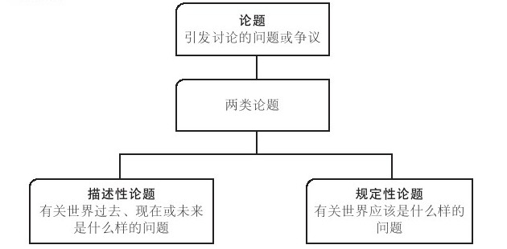

论题的种类

## 他到底在说什么啊

人们应该怎样着手来确定基本的问题或者论题呢？有时候很简单：作者或者演说者会直接告诉你论题是什么。你也可以在文章的正文当中找到论题，通常是在文章的开头，或者在文章的标题中就可以直接找到论题。如果论题是直截了当说出来的，作者会用到以下这些词来加以提示：

·我要问的问题是：我们为什么一定要有规范烟草制品的各种法律呢？

·降低法定饮酒年龄：是不是一件正当的事情？

·学校到底应不应该提供性教育？

可惜很多问题并不总是直截了当地提出来，必须得从交流和会话的其他暗示中进行推断。例如，很多作者或演说者会对他们关心的一些当前热点事件进行回应，比如说一系列发生在校园里面的暴力事件。问一问“作者是在对什么事件进行回应”常常能帮你找出一篇文章的中心论题。还有一个比较好的线索是了解一下作者的背景，比如他所加入的组织机构。所以说在你下工夫找论题的时候查一查文章作者的背景信息也很有必要。

在你辨认论题的时候，要努力抵制这种思想：陈述这个论题的正确方法只有一种，其他都是错误的。一旦你找到整篇文章或整场讲座所要论述的问题，以及这个问题和这篇文章或这场讲座之间的联系，你就已经发现了论题。只要确保你所界定的论题符合“论题”的界定标准即可。

但是，当论题并没有直截了当地说出来时，最有效的方法就是先找准结论。很多情况下，在你能确认论题之前都得先找出结论来。因此，在这些情况下，进行客观评价的第一步就是要找出结论之所在——这常常也是较困难的一步。我们只有找到结论才能进行客观评价！

让我们来看看怎么才能着手去寻找这一至关重要的结构元素。

小贴士：所谓结论，即作者或演说者希望你接受的信息。

## 他想让我相信什么结论

要找到结论，批判性思考的人首先要问：“作者或演说者希望证明的是什么？”或者“和我交流的这个人的主要观点是什么？”这两个问题的答案都是结论。同样，作者或演说者对这两个问题的任何解答都是结论。

在寻找结论的过程中，你也在寻找作者或演说者希望你相信的一个或一系列陈述。他希望你相信他建立在其他陈述的基础上得出来的结论。简言之，有说服力的交流或论证的基本结构是：甲之所以成立是因为乙。“甲”是指结论，“乙”是指结论的支撑材料。这个结构代表了推理的过程。

结论是逐步推断出来的，它们来源于分析推理。结论是一个个观点，需要其他观点来进行支撑。因此，如果有人断言某件事是正确的，或者某件事应该去做，却没有提供相应陈述来支撑他的这一断言，这一断言就不能称为结论，因为提出此断言的人并没有提供这个看法得以建立的任何基础。相应地，我们把没有证据支撑的断言称为纯观点（mere
opinion）。

理解结论的本质属性是通往批判性阅读和聆听的必要步骤。让我们进一步观察一个结论及其推理的过程。阅读下面一小段，看看你能否找出其中的结论，以及支撑这一结论的其他陈述：

大规模室内养殖业不应该合法化，还有其他更自然的方法来生产我们所需的食品。

“大规模室内养殖业不应该合法化”是作者对“大规模室内养殖业应不应该合法化”这个问题给出的答案，这就是作者的结论。作者支撑这个观点的一个理由是：“还有其他更自然的方法来生产我们所需的食品。”

你有没有明白为什么上述用来支撑结论的看法本身并不是一个结论？它之所以不是结论是因为它是用来证明别的论点。请记住：你相信一个陈述（结论）是因为你认为它由其他看法所支撑，这就是在进行推理。当人们从事这一思维过程，他们就是在进行分析推理，分析推理得出来的结果就是结论。

有时候，和我们交流的人并不直截了当地说出他们的结论，在这种情况下，你就得依靠推理来得出结论，你认为作者摆出种种观点来加以证明的就是他的结论。

### 使用这个关键问题

一旦你找到结论，就将结论作为你评论的重点。结论是作者或演说者希望你选择的目的地和终点站。接下来你所关心的是：基于支撑这一论断的所有材料，我该不该接受这个结论？

## 找到结论有线索可循

线索一：问问论题是什么。因为结论总是对论题的一个回应。知道论题是什么将有助于我们找到结论。前面我们已经讨论过怎样确定论题。首先，看看文章标题。其次，看看文章开头第一段。如果这些技巧都不管用，那就有必要再往下浏览几段。

线索二：寻找指示词（indicator
word）。结论前面常有指示词引导，告诉我们接下来出现的就是结论。当你看到这些指示词的时候，务必要提高警惕。它们往往会告诉你后面出现的就是结论。以下我们为你列举一些指示词：

·因此（consequently）

·表明（suggests that）

·由此可知（therefore）

·由此得出（thus）

·因此可以断定（it follows that）

·我要说的重点是（the point I'm trying to make is）

·显示出（shows that）

·证明（proves that）

·告诉我们（indicates that）

·问题的实质是（the truth of the matter is）

阅读下面这篇文章，然后找出其中的指示词并做上记号。这样你就能找出包含结论的那些陈述。

因为宪法上的这些措辞，因此可以断定公学里不得允许有祈祷行为存在。如果这些公学偏袒任何一个宗教，它们就限制了其他人拥护不同宗教的自由。而宗教信仰自由这个理念正是美国赖以立国的基石。

你应该在“因此可以断定”这个词组下面做上记号，结论正是由此引出来的。

可惜很多书面和口头交流并没有用指示词来引导出结论。但是，如果你和别人交流的目的是为了将你的结论明确无误地传达给对方，你就应该用指示词来强调自己的论点以便引起别人的注意。这些词的作用好比闪烁的霓虹灯，吸引读者注意到你想要他们接受的那些要点。

线索三：在可能的位置查看一下。结论一般都在特定的位置出现。首先要注意的两个地方是文章的开头和结尾。很多作家写文章喜欢开门见山，陈述中往往包含了他们想要证明的论点。而其他作家则喜欢在文章的结尾总结出结论。如果你在读一篇篇幅很长且错综复杂的文章，不明白作者到底在说些什么，那就直接跳到结尾去看看。

线索四：记住不可能作为结论的东西。以下这些都不可能作为结论出现：

·例句

·数据

·定义

·背景资料

·证据

线索五：检查一下交流的语境和作者的背景。作家、演说者或网站常在有些论题上持一种可以预见的立场。如果文章的结论并不明显，那么资料来源中可能存在的偏见和文章作者的背景就会变成特别有价值的线索。对那些与作者或演说者有关系的组织机构的信息我们更要特别当心。

线索六：问一问“所以呢？”因为结论常常都是含蓄的，所以我们要问“所以呢”来得出结论本身。问一下“作者是不是要我们从他所提供的信息里面找出隐含的结论”。在政治广告中，诸如“某候选人会对犯罪行为心慈手软”这样的结论经常会留给读者或观众，让他们自己从广告提供的有限信息里推断出来。

## 轮到你自己写时，可得吸取教训

你有没有在阅读同学的文章时这样思忖：“所以呢，嗯，这家伙到底要说什么？”当然，你有个模模糊糊的概念，这位同学在谈Ticketmaster票务公司收费高得离谱时显得有点别有用心，但你所得出的也仅仅是个模糊的概念而已。当我们写文章时，我们常以为自己的意思表达得清清楚楚、一览无余，毕竟我们的论述对自己而言是最清楚不过了。可惜对我们而言明明白白的东西读者理解起来却有几道门槛需要跨越。读者无法听到我们内心的真实想法，我们许多隐藏的看法他们也无法看透。他们不知道我们的价值观和背景，对我们的研究过程或构思腹稿也一无所知。他们所有的就只是摆在他们面前的纸张或是屏幕。因为这个原因，我们建议你一定要下工夫将自己的意思表达得清清楚楚、明明白白。在我们为你提供写作建议的过程中，你应该期望我们一再强调这一点。批判性思维一个最大的障碍就是无法建立起沟通的桥梁。

### 写作之前先将论题的范围尽量缩小

从中学的作文课开始，老师一定经常教你不要急于草草动手写文章，最好先花时间将你的思绪整理一下列出个条理来。也许你已经掌握了很多不同的写作准备技巧，例如“头脑风暴”“上网搜索”或是“自由发挥”等。也许你把这些建议很当一回事，但是对很多人来说，我们怀疑拿到一个题目动笔就写还是太有诱惑力了。某些人就喜欢一边想一边写的蛮干作风。

不管你写作前的准备方法是埋头苦想还是即兴发挥，我们还是强烈建议你在一头扎进写作前最好花点时间确定一下你的论题。有没有一个清楚明确的论题，通常是区别作家成熟不成熟的一个重要标志。

我们之所以建议你在写作之前花点时间想想论题，还有一层原因。许多作者拿起笔来就写，结果常常是贪多嚼不烂，自己却还浑然不知。例如，在一篇3~5页的文章里，年轻的作者很可能竭力要向读者证明：气候改变确实存在，什么原因导致了气候改变，为什么针对气候改变的批评是错误的，以及读者为什么要关心气候改变这个问题。这些论题确实每一个都很有趣又很重要，但要想在有限的篇幅里说清楚，这篇文章的作者也许过于贪心了。

### 引导读者得出你的结论

当你写作的时候，你总想千方百计地说服你的读者，让他们全心全意地相信你的论证。你的结论和理由都应该一目了然。如果你写作或者演说的目的是为了传达某个特定的结论，你的读者或听众就会尽力去寻找这一结论。老老实实地把结论说出来，而且说得清楚明白，其实也就是在帮助你的读者或听众。这才是你想要传达的中心思想。强调一遍，让人们对它实际的意思再没有一点怀疑。要让你的结论一目了然，这样不仅节省了读者的精力，而且可以提高文章的逻辑度。

我们的写作建议有个最为首要的主题，那就是所有作者，也包括我们自己在内，必须竭尽所能地好好组织自己的思想，然后明白无误地表达出来。尽管我们自己对这些思想已经洞若观火，但读者却没有我们这样透彻的了解。如果我们做出这些努力，我们就可以在作者和读者之间架起沟通联系的桥梁，让批判性思考和讨论变得切实可行。

来，做做思维体操

？关键问题：什么是论题和结论？

请找出下面几篇文章里的论题和结论。注意指示词在寻找结论中的提示作用。我们为第一篇文章提供了自问自答的设问模式，展示批判性思维的全过程。通过自言自语的讨论怎样分析这篇文章，我们希望能为你将来自己提出并回答这些关键问题提供一些帮助。我们同时为第二篇文章提供了一个浓缩版的参考答案，而第三篇文章则留给读者自己去寻找其中的论题和结论。

⊙第一篇

如果父母将教育子女当成自己的全职工作，并且具备一定的眼光、知识和耐心来从事这一职业，家庭学校（homeschooling）也不失为一个有根据的想法。但是，问题的实质是父母在家教育子女往往是一种错误。

父母也许基于错误的理由选择将自己的子女从公立中小学中接回家来自己教育。有时候，孩子在学校老是不守纪律，而父母宁愿选择让孩子辍学，也不愿容忍学校处罚违纪儿童的种种规矩。这样的动机并不能保证接下来的家庭学校就可能产生良好的结果。此外，当家里没有其他大人来监控发生在这里的一切时，很可能出现这样的情况：如果父母在家里体罚子女，根本就不会有人知道。而社会需要知道，这些孩子在家是否接受了应当接受的正常教育和待遇。

⊙第二篇

电视广告机构创作广告的手法显示出他们的聪明才智。这些广告往往做得和孩子们喜欢看的动画片非常相似。孩子们看到动画角色都在使用某种特定产品，爱屋及乌，难免会将他们对角色的喜爱转移到那些产品上。广告公司并不想让孩子察觉到他们观看的动画片段和广告片之间有什么不同。使用这种策略，这些公司利用了这样一个事实：孩子们常常不能够区分动画片和广告之间的差别，他们也不明白动画片里面提供的那些东西都需要花钱才能买得到。在通常情况下，这些广告都是关于甜腻的零食或者油腻的食品，让孩子越吃越不健康，身体每况愈下。以孩子为对象的这些广告需要管理和控制才行，就像现在对以儿童为对象的烟酒广告进行管控一样。

⊙第三篇

法庭审判的实况录像该不该在电视上向民众播放？貌似摄像机一进法庭，审判体系很容易就会土崩瓦解。受害人在一小部分人面前作证还吞吞吐吐，一旦他们知道他们所说的每个字都要播送到千家万户，势必导致他们干脆缄口不言拒绝作证。当对被告的审判在电视上播放的时候，几乎就没有了“被告疑罪从无”这一法理可言。人们观看电视上的法庭实况转播，并不是因为他们关心国家有没有能力来确保司法制度的顺利实施；相反，他们都是来看证人出庭作证的刺激场面：把这当成娱乐消遣。因此，还是让摄像机待在法庭外面，让观众看看根据法律体系杜撰出来的情景喜剧比较好。

给个提示

⊙第一篇

·有时候，论题很容易找到，因为它会在论证中明白无误地表述出来。我认为这篇论述文章并没有明白告诉我论题是什么，因为作者根本没有提到引起争议的问题所在。接下来就是去找出结论，这样我就可以更容易地找到论题。这本书告诉我，要找到文中没有明说的论题，最有效的方法就是先找出结论。

·找一下指示词有助于我找到结论。“问题的实质是”在上文所给出的指示词中被列为引出结论的指示词，而这篇论述中恰好用到这个词。也许这篇文章的结论就是“父母在家教育子女往往是一种错误”。这一陈述确实有可能就是结论。另一个找到结论的方法就是在文章的开头和结尾部分寻找。而这句话出现在文章的开头。

·这本书为我提供了一个可以排除出结论范围的论证结构，我应该查一下上文提到的那些部分来确认“在家教育子女的父母很少有人能做到这些”这个陈述不是数据、例证、定义、背景资料或其他类型的证据。很显然，它不属于这些部分。

·到了这一步，我基本可以确定这篇文章的结论就是“父母在家教育子女往往是一种错误”。指示词已经暗示出结论，它所处的位置进一步确定了它就是结论，而它又不属于那些有时会让人混淆成结论的论证构成部分。

·接下来我要弄明白，是什么问题引出了作者的这个讨论或者说论题。如果结论是“父母在家教育子女往往是一种错误”，引出这个讨论的论题有可能是“父母在家教育子女是不是可取的行为？”这个论题可以从结论反推出来，而接下来的所有句子都在讨论家庭学校潜在的种种问题，这一点也可以辅证。

·在我结束讨论之前，我还想搞清这一论题到底是规定性论题还是描述性论题。要做到这一点，我先要问问自己，作者是在描述一种境况还是在规定一种什么是对什么是错、什么该有什么不该有、什么是好什么是坏的立场。作者详细描述家庭学校存在的种种问题，建议社会需要了解这些在家受教育的孩子所接受的是不是他们“应当接受的正常教育和待遇”。这些陈述针对是不是该有某种境况（这里指家庭学校）而提出一系列问题，因此这个论题一定属于规定性论题。

⊙第二篇

这篇文章没有指示词来直接指出结论，但是寻找结论的一个好地方不是在文章的开头就是在文章的结尾。具体到这篇文章，文章的最后一句话就是结论。你可以断定它是结论，因为它使用了“应该”这个词来给整篇文章一锤定音。这个词还显示出文章的论题是个规定性论题。它并不是在讨论一种存在方式看所述事物符不符合，而是在讨论事物应该以什么样的方式存在。这一论题是从结论中推测出来的，结论前面解释作者为什么得出这一结论的陈述也有助于我们找到论题。

论题：以儿童为对象的广告应不应该加以管理和控制？

结论：以儿童为对象的广告应该加以管理和控制。

# 第3章　理由是什么

我们人类总是好奇为什么有人要做出这样的决策，为什么有人会持有这样的观点，而理由则为满足人们这样的好奇心提供了答案。请思考以下几个陈述：

（1）政府只应该保护精选出来的一批濒危物种使其不至于灭绝。

（2）遭蜈蚣蜇伤比被很多种蛇咬伤都更危险。

（3）学校应该有权搜查学生抽屉看有没有毒品和武器。

上述三个断言都缺少了什么东西。我们既可以同意，也可以不同意，但是以它们现在的形式，我们既不能说它经不起推敲，也不能说它经得起考验。这些断言都没有包含解释说明或逻辑依据来论证为什么我们应该同意它。因此，如果我们听到有人提出上述任何一个主张，我们都只有干瞪眼，急切想知道其所以然。

以上陈述所缺的部分正是支撑其论断的一个或多个理由。所谓理由，就是指用来支撑或证明结论的看法、证据、隐喻、类比和其他陈述。这些陈述是构建结论可信度的基础。在第2章里我们已经介绍了怎样找到论证大厦的两大柱石——论题和结论的必要方法，本章则主要介绍找到论证大厦的第三块柱石——理由的各种技巧。

当一位作家有个结论希望你接受的时候，他不但要提供各种理由来说服你他的结论是正确的，而且要证明为什么他的结论是正确的。

一个人有没有头脑，主要的标志就要看他能否提供充足的证据来支撑他的看法，尤其当这些看法存在争议没有定论时更是这样。举例来说，如果有人声称中国不久将取代美国成为世界上的头号霸主，这样的声言理应遭到以下挑战：“请问你何出此言？”这个人的理由可能充分也可能不充分，但只有你提出以上问题并找出他的理由之后你才知道分晓。如果他的答案是：“因为我就是这样认为的。”那么你一定对这样的论证极不满意，因为这个人的理由不过是结论的翻版而已。但是，如果答案是关于两国预计的军事支出和教育支出的证据，你在客观评价这一结论的时候就要认真考虑这些证据。请记住：只有当你找到支撑结论的理由时你才能判定一个结论的价值。

找到支撑结论的理由是批判性思维必不可少的一个步骤。只有我们问一问为什么别人持有这样的观点并且得到一个满意的答复，我们才能公正评价这一观点。关注结论形成的理由就要求我们虚怀若谷，容忍那些可能和我们不一致的观点。如果我们只对结论进行评价，而对其推理过程不闻不问，我们就会坚持自己在论辩或文章中所持的结论，对那些和我们观点相一致的结论立刻青睐有加。而如果我们想要重新审视一下自己的观点，我们就应该保持开放的心态和好奇心，即使我们目前还不能认同某人的观点，我们也要对他的理由细细加以琢磨。

？关键问题：理由是什么？

理由和结论相结合，就构成我们在第2章中所定义的“论证”。

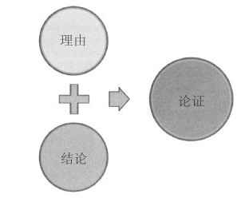

有时候，一个论证只包含单个理由和结论；但是常见的情况是，很多理由用于支撑某个结论。所以当我们谈到某人的论证时，我们可能在谈论单个理由和相关的结论，或者是一整套理由和它们将要证明的结论。

小贴士：所谓理由，即我们为什么要相信某个结论的解释说明或逻辑依据。

在我们使用的术语中，论证（argument）和推理（reasoning）的意思是一样的，都是指使用一个或多个想法来支撑另一个想法。这样，如果某个交流缺乏理由的话，那么它既不属于论证，也不是推理。所以说，只有论证和推理中才有可能存在逻辑错误。因为一个理由本身只是一个孤立的想法，它并不能反映出一种逻辑关系。

论证本身的几个特点值得我们加以注意：

·论证必有其目的。人们展开论证的目的是希望说服我们相信某些事情或是按某些特定的方式行动，所以论证需要别人对之做出回应。不论我们的反应类似于海绵还是淘金者，我们一般总会做出回应。

·论证的质量有高有低。我们需要依赖批判性思维来判定一个论证的质量高低。

·论证有两个明显的必要构成部分——一个结论及其支撑理由。二者当中如果有一个我们找不到，也就意味着我们失去了客观评价这一论证的机会。我们无法找到的东西自然也无法对其做出评价。

最后一点需要进一步加以强调和说明。心急火燎地去推进批判性思维并没有什么意义。实际上，哲学家维特根斯坦就曾说过，一个聪明人和另一个聪明人说话时，大家总是先说：“等一等！”花点时间找出论证之所在，然后再去评估我们认为别人说过的那些话，只有这样对提出论证的人才够公平。

## 他为什么相信这个观点

找到理由的第一步就是采取质疑的态度去接触每个论证，而你要问的第一个问题就是“为什么”你已经找出了结论，现在你想知道为什么这个结论有道理。如果一个陈述回答不了下面这个问题“为什么作者或演说者相信它”，那么这个陈述就不属于理由。要想成为理由，一个陈述（或一系列陈述）必须要被演说者用做结论的支撑或根据。

让我们将这种质疑的态度应用到下面这篇文章中。首先我们必须要找出结论，然后我们要适当地问一句“为什么”。请记住找出结论的那些指南。

①该不该要求飞行员随身携带辣椒喷雾器？②飞行员们在调查中谈到了他们的观点。③很多人表示他们从来不知道乘客会做些什么，他们认为辣椒喷雾器有助于确保乘客的人身安全。④有57%的飞行员认为辣椒喷雾器将增加飞行安全。⑤因此，航空公司应该要求他们的飞行员随身携带辣椒喷雾器。

紧跟“因此”后面的句子回答了第①句陈述所提出的问题。因此，结论是第⑤句陈述：航空公司应该要求他们的飞行员随身携带辣椒喷雾器。请给这一结论做上记号。

小贴士：一个论证由一个结论以及支撑这一结论的各种理由组成。

然后我们问一问这个问题：为什么作者或演说者相信这一结论？回答这个问题的那些陈述就是理由。在以上这个例子中，作者给我们提供了调查得来的证据作为理由。第③句和第④句陈述共同提供了证据，也就是说，它们一起为结论提供了依据，因此成为支撑结论的理由。我们可以这样复述上述理由：大多数接受调查的飞行员都相信辣椒喷雾器有助于提高乘客的人身安全。

现在，请试着找出下面这篇文章中的理由。同上面的步骤一样，我们还是要先找出结论，做上标记，然后问一下“为什么”。

①不应该允许对人类胚胎进行基因筛查。②人们无权捉弄上帝，终止一个即将来到人世的生命，只因为他的性别不尽如人意或可能存在某种生理缺陷。③我有两个罹患自闭症的孩子，他们都活得很快乐。④我们不能说一个人的生活质量会因为出生缺陷而发生重大改变。

第一句当中的指示词“应该”显示出文章的结论：作者反对对人类胚胎进行基因筛查。作者为什么相信这一点呢？他给出的主要理由是“人们无权捉弄上帝，依据一套按照自己喜好制定的标准来决定终止一个即将到来的生命”。第③句和第④句一起提供了另一条理由来支撑作者的看法：作者本人拥有自闭症子女的正面经历显示，一个人的生活质量并不因出生缺陷而发生重大改变。

在你确定一个人的推理结构时，你应该把每一个好像被作者拿来支撑其结论的观点都当成理由，即使你根本不相信它实际上能为其结论提供多大的支撑。在批判性思考的这个阶段，你一直在努力寻找论证之所在。因为你想对做出这一论证的人尽量公平，你就需要利用施惠原则（principle
of
charity），首先假设这个论证是最无懈可击的，理由很充分，然后再着手进行评价。如果作者或演说者相信他正在摆事实讲道理为自己的结论提供支撑，那么我们至少应该先考虑一下他的分析推理过程。后面还有大把时间来细细评价这一推理过程呢。

## 找到理由有提示词

如同寻找结论的情形一样，有些特定的词常常显示出紧随其后的往往就是理由。请记住：推理论证的基本结构是“甲之所以成立是因为乙”。这样，“因为”这个词，以及与之意义相同或功能相近的词，经常提示我们理由会紧随其后出现。以下是表示理由的一些提示词：

·由于（as a result of）

·因为这个原因（for the reason that）

·因为这个事实（because of the fact that）

·鉴于（in view of）

·由以下材料支撑（is supported by）

·因为证据是（because the evidence is）

·研究显示（studies show）

·第一，第二，第三（first……second……third）

## 理由是模具，结论据此成型

理由有各种各样的类型，主要取决于论题的种类。很多理由其实都是提供证据的一些陈述。这里所说的证据，是指人们用来为其断言为真的某些事提供证明的具体信息。持论者往往会诉诸很多不同类型的证据来证明他们的观点。它们包括事实、研究报告、生活实例、统计数据、专家或权威意见、当事人证词以及类比等。在某些情况下使用不同类型的证据比在另一些情况下更为合适，你将会发现，自己摸索出一套规则来确定哪种类型的证据在特定场合下使用较为合适将特别管用。

你经常要问：“哪一类证据可以用来证明这个断言？”然后确定这样的证据是不是可以找到。你应该知道，世间并没有一套统一的“证据代码”（codes
of
evidence）适用于所有严肃的分析推理。本书第7章和第8章将对各种类型的证据展开较为详细具体的讨论。

当作者或演说者尽力证明一个描述性结论，对“为什么”这个问题的回答通常就是证据。

下面这个例子提供的就是描述性论证，请试着找出作者的理由。

美国非法移民的人数正在急剧下降。研究显示2008~2009年非法移民的人数下降了将近100万。

第一句陈述就是结论，你应该已经认出来了。这是一个有关非法移民下降人数的描述性陈述。作者在接下来的部分摆出了证据，也就是他得出结论的理由。请记住：结论本身并不是证据，它是一个由证据或其他看法支撑起来的看法。

在规定性论证中，理由常常不是一般性的规定性陈述就是描述性的看法或原则。下面这个例子就展示了在规定性论证中应该采用哪些类型的陈述来支撑其结论：

①今天的社会有各种各样施加给媒体的控制，比如说电视节目分级制。②这些分级制有没有考虑过让大家自己来理性选择看什么和不看什么节目？③这些分级制是不是怂恿了某些人去观看某个节目，即使他们明知道自己不应该去看？④有多少父母事实上根据分级制来限制他们的子女观看某个节目？⑤电视分级制往往并没有有效阻止孩子们观看社会上认为他们年纪还小不宜观看的节目。⑥电视分级制只是不可强制执行的指导意见。⑦如果有人信奉为未成年人建立的这套媒体节目审查制度，那就应该使用诸如频道锁码功能这样的条款来达到目的，而不是简单地在电视屏幕上标出一个分级限制符号。

这里的争议在于电视分级制度是否可取。作者说如果社会真是关心孩子们在看什么节目，那就应该贯彻执行诸如使用频道锁码功能这样的条款，如第⑦句中所言。让我们来找一找可以回答“为什么作者会相信这一结论”的句子。首先，请注意这篇文章并没有提供什么证据。第②句和第③句一起构成一个理由，这是个描述性的看法：电视分级制度并没有重要到引起什么改变，它们甚至会刺激某些人去观看一些更加不健康的节目，而如果没有分级制度，他们也许根本就不会去看。警告意味并不强，可能让人以为这个节目也许根本就没有那么“坏”。

第④句和第⑤句提供了第二个理由：电视分级制度实际上并没有影响到人们对电视节目的选择，不论是对父母还是对子女而言都是这样。第⑥句提供了第三个理由：电视分级制度根本就不能强制执行。后两个理由都是一般性看法。如果作者有意要扩展他的论证，这些看法本身也许还需要其他类型的证据来加以支撑。

### 让理由和结论一目了然

有很多推理文章篇幅冗长、结构松散。有时候一整套理由只用来支撑一个结论，而这个结论又用于支撑另一个结论的主要理由。理由可能会由其他理由支撑。在比较复杂的论证中，当你试图客观评论自己阅读的东西时，常常很难将论证的结构在脑海里清晰地展现出来。为了克服这一难题，请尝试建立你自己的组织方式，将理由和结论分开，使其自成一套逻辑系统。

我们已经提到过许多技巧，使你可以用来建立一幅清晰可辨的推理结构示意图。如果你有更好的技巧，请务必要加以利用。重要的是，当你打算评价它的时候，一定要让理由和结论变得一目了然。

找到一篇文章中的理由并有效组织它们的一些线索

（1）圈出指示词。

（2）用不同颜色的笔标出理由和结论，或者在理由下面画线，用彩笔给结论做标记。

（3）在页边给理由和结论编上序号。

（4）读完长篇大论后，在文章结尾处按顺序列出所有理由。

### 使用这个关键问题

一旦你找到理由以后，在进一步深入阅读或聆听时你需要一遍又一遍地重温这些理由。结论站不站得住脚主要取决于理由的扎实与否。薄弱的理由必然导致薄弱的推论。

### 先有理由，再有结论

我们在第1章中警告过你有关弱势批判性思维的危险。当有人持有一个观点而被你诘问得理屈词穷时，你会发现他好像是在编造新的理由（甚至是当场编造）来捍卫他先前的观点，这时你用来警惕弱势批判性思维的警铃就该响声大作了。当有人急于和你分享他的观点，好像这是确凿无疑的结论，而一旦他被问及有哪些理由时就变得一脸茫然或恼羞成怒，那很有可能也是弱势批判性思维惹的祸。

毫无疑问，你本来就有一大堆看法，当你遭遇争议的时候它们就变成你的原始结论。随着你对理由的重要性日渐推崇，你会经常性地期望那些结论能在支撑其理由的基础上屹立不倒或是轰然倒塌。随着你充分思考各种支撑理由及其内在含义，你将逐步得出最为稳妥和扎实的结论。

在这一点上你必须要做自己的审查官。在寻找金子的时候你必须不停摇晃自己的淘金盘。要竭力避免“逆向逻辑”或“反向推理”，这样做的理由不过是追加的一记马后炮而已，它们会随着你的结论而变化。理想的做法是，理由是模具，结论据此得以成型和修改。

## 轮到你自己写时，可得吸取教训

在学术写作方面你的推理能力可以说是最重要的一个环节。概述你的理由并为之辩护常常占据你的文章相当大的篇幅。而你的理由扎不扎实在很大程度上决定了你能否说服你的读者。因为理由至关重要，所以作者在写作前和写作中都要特别注意理由。要做到这一点，我们希望你能认真考虑以下几点建议。

### 在作出结论前要探究可能存在的种种理由

在本章前一部分，我们奉劝你不要使用“逆向逻辑”或者“反向推理”。相反，一个关心批判性思维的作者会考虑到可能存在的种种理由并掂量它们的分量，然后才会做出结论。

在开始写作一篇文章之前，你需要投入的研究精力会因文章的不同而不同。有些情况下，你选定了一个论题作为你的写作任务，而你对这一论题所知甚少，需要从零开始去着手研究。例如，你可能在准备第一堂美术课的时候无意间读到对现代舞蹈家和编导阿尔文·艾利（Alvin
Ailey，1931——）的简介，撩起了你的兴致，你决定写一篇文章来讨论他，并利用这个机会来让自己获得更多知识。而在其他情况下，你手边已经有了一点背景资料然后才开始自己的研究项目。你甚至会选择一个项目，只因自己终身对其兴趣不减。比如说你对原版的《星球大战》一直充满激情，因此决定好好利用自己对它的兴趣来作为一个研究项目的跳板。

也许你已经是个崭露头角的专家，熟知《星球大战》、美式轮滑或计算机科幻文学，很可能你自以为不需要再做更加深入的研究了，但我们希望你能三思而行。哪怕你过去已经对这一论题下过工夫研究，你还是应该去探究其他可能存在的理由。一方面，你之前的研究也许是在你还未决定采用批判性思维标准的时候进行的，因此有可能显得武断和片面。更可能出现的情况是，以前的研究也许开展得并不正规，没有坚持不懈地去努力挖掘众多的理由和证据。还有一个原因你应该去探究其他可能存在的理由，那就是你之前的研究很可能已经跟不上形势和潮流了。

在21世纪，要探究潜在的理由，作者常采取的第一步行动就是一头扎进谷歌或其他常用搜索引擎里。虽然搜索引擎提供了难以置信的宝贵资源，如谷歌会为你提供424
000条有关阿尔文·艾利的搜索结果，或6 050
000条关于计算机科幻文学的结果，但很显然常用的搜索引擎通常范围太大而显得过于笼统，难以派上大用场。我们希望能为你提供几个建议，这样你的搜索就不会止于搜索引擎。

### 找到涵盖你的论题的主要刊物

如果你的论题是利用当前时事来探究政治或社会问题，比如公立教育改革或反恐战争，那就应当从主要的新闻出版物着手。《纽约时报》《华盛顿邮报》《华尔街日报》和《今日美国》都是美国读者看得最多的报纸。大学图书馆和公共图书馆都会订阅这些报纸。专业性的数据库（如LexisNexis）也允许你从中搜索和访问这些报纸和其他主要报刊上的文章。很多报纸的网站至少都能让你免费阅读其中的一部分文章，包括我们上面提到的那四份报纸。

几乎所有人们感兴趣的领域都有主要的出版刊物，从音乐（如《滚石》《音叉》和《旋转》杂志等）到商业（如《福布斯》《财富》和《彭博市场》等）无一例外。花点儿时间仔细研究一下涵盖你所选论题的几家主要出版物，这样你对当前讨论的热点问题就有了最新的知识。你也要全身心地投入这些辩论，了解是什么论题吸引了其他论者的注意力至今尚无定论。你还可以利用你找到的文章作为跳板来做进一步的深入研究。例如，假设你对特拉华州2010年参议院选举的茶党候选人克里斯汀·奥唐奈（Christine
O'Donnell）的资格大感兴趣，在读过奥唐奈坦承自己年轻时曾“偶尔练习过巫术”以后，你决定要探究一下这个论题：“候选人的个人经历应在多大程度上对选民构成影响？”

### 帮助读者确定你的理由

当你写作或演说的时候，你一定会时时刻刻惦记着自己的读者或听众。他们需要清楚地了解你的结论是什么，你为什么会得出这样的结论。这样你就要公开列举你的理由。

在特定的句子里尽量使用指示词和短语来帮助读者找到你的理由。有些词会向读者发出明确信号，告诉他们“以下是我的一个理由”，为了帮你在阅读中找到作者的理由，本章前面部分我们已经为你提供了很多这样的指示词。

另一个帮助读者找到理由的方法是给他们提供一份蓝本。所谓蓝本，就是相关文章或演说的提纲或内容梗概。你可以在文章一开始就简要介绍下你的理由，列出文章的提纲。这样读者就会知道从这篇文章里能获得什么信息。

来，做做思维体操

？关键问题：理由是什么？

首先浏览一下文章，找出结论并做标记。然后问一下“为什么”，再找出理由。利用指示词来获得帮助。结论和理由要分开。尽量用自己的话复述理由，用自己的话复述有助于阐明它们的含义和作用。

⊙第一篇

公共游泳池有可能成为威胁健康的公害。很多公共游泳池并不能严格遵守卫生法，因此为水生细菌的感染提供了空间。研究表明60%的公共泳池都不能保证水里的氯含量达到正常水平，任由游泳者感染疾病。很多游泳者在使用公共泳池以后就开始患病。

⊙第二篇

全国的学校都在构建社区服务项目。到底该不该规定学生必须参加社区服务？规定学生必须参加社区服务有许多缺点。

学生被强迫参加慈善活动献爱心，他们就难以理解慈善和爱心的真正含义。强迫的慈善行为显得有违慈善活动的真正含义。如果因为社区服务并非他们的自愿选择而导致慈善活动对他们而言失去价值，他们就对社区服务这个想法产生怨恨，等他们走上社会后就不会主动参加社区服务。

另外，由于这些社区服务是强制的，学生不情不愿，做起事来自然也就马马虎虎。他们也许会觉得只要自己达到最低要求的劳动量就万事大吉。学生还有可能对他们的帮助对象心怀不满或态度粗鲁，这样也会妨碍社区服务的正常进行。由上可知，强制的社区服务对学校而言可能并不是最佳的备选项目。

⊙第三篇

中学阶段的男篮和男足常常一统周五晚上的节目单。应不应该是这个样子？这些比赛对中学经历而言自然意义非凡，可也不至于为此牺牲掉其他所有运动项目。仅仅因为它们有悠久传统并不意味着这种模式就一定要世代因循。

周五晚上腾出时间观看比赛对大多数父母和球迷而言自然要容易得多。因此，周五晚上他们亲自来看男篮和男足比赛自然也很容易。

那么女子篮球队或游泳队又怎么办呢？她们的比赛不应该总是被安排在周一到周五的下午和晚上举行。她们的家人经常不能腾出时间来观看她们的比赛，因为大多数父母下午都要上班。那些参加这些“二流”体育活动的学生根本没有得到聚光灯的平等关注。男篮和男足的日程表应该做出相应改变，为其他的体育活动腾出一点空间。

给个提示

⊙第一篇

论题：公共泳池是不是一个健康的隐患？

结论：是的，确实如此。

理由：很多公共游泳池都不能遵守卫生法。

（支撑理由）

（1）60%公共游泳池的水不能维持正常的含氯水平。

（2）很多人使用公共游泳池以后生病了。

请回想一下，我们是在寻找结论的支撑系统。我们要问自己：为什么作者宣称公共游泳池存在健康隐患？这一描述性的结论有两个理由来证明：一个调查结论和一个很多人使用游泳池之后开始生病的断言。引出支撑理由的提示词是“研究显示”。

⊙第二篇

论题：学校该不该规定学生必须参加社区服务？

结论：不应该，学校不该规定学生必须参加社区服务。

理由：强制的慈善活动没有什么意义。

（支撑理由）

（1）规定的社区服务本身就自相矛盾，可能会引起学生今后对自发参与慈善活动的憎恶和抵制。

（2）因为强制的关系，学生参加社区活动不会尽心尽力。

1）学生只会做满足最低要求的劳动量，而不考虑什么对帮扶对象最有利。

2）学生有可能对帮扶对象态度恶劣。

为什么有人会告诉我们学校不应该规定学生必须参加社区服务？这个问题的答案就是作者的理由。第一条理由是由一系列事例和断言来支撑的，所有事例和断言都显示强迫的社区服务是自相矛盾的。“另外”是指示词，引起我们对第二个支撑理由的注意。注意我们已经在一定程度上复述（或用自己的话说出）了主要的理由。你会发现一个理由越长越复杂，复述一下就越有助于你准确找到这个理由。

# 第4章　哪些词语意思不明确

本书第2章和第3章主要帮助你识别任意一个信息的基本构成要素。这时，如果你能找准一位作者或演说者的结论和理由，那么你已经大踏步迈向理性思考的终极目标——形成自己的理性判断。接下来的一步，就是将论证结构图放到更清晰的焦点之下细细审视。

虽然找到结论和理由为你提供了基本清晰的论证结构，但你还需要进一步检查这些部分的确切含义，然后才能公正地评价呈现在你面前的信息。这时你就要特别注意语言的细枝末节。

准确辨认关键词或短语的确切含义是决定你是否同意别人观点的必要步骤。如果你没有仔细核对起决定性作用的术语或词组的意思，也许你所评价的观点和作者的原意压根儿就风马牛不相及。

让我们来看看为什么把握交流者使用术语的准确含义显得如此至关重要：

旅游业现在已经处于失控状态。旅游业可能对经济发展大有裨益，但是它也会给地区环境和当地居民带来危害。我们应该采取更多措施来控制旅游业。如果我们任由这些人随心所欲地肆意妄为，我们作为原居民必定要深受其害。

注意，如果我们不深入了解作者心目中具体控制措施的类型，那我们简直不知道该对这个论证做出怎样的评价。他是要限制游客的数量，还是要对游客的行为制定一套准则？除非我们知道作者所建议的具体控制措施，否则我们评论起来就会狗咬刺猬无处下嘴。

这个例子说明了重要的一点：只有理解了关键术语和词组的意思（无论是直接的还是含蓄的意思），你才能对一个论证进行评价。怎样解释这些术语和词组常常关系到推理能否被接受。因此，在你决定自己能在多大程度上接受这样那样的结论以前，首先你要尝试找出结论和理由的准确含义。虽然它们的意思一般都好像很明显，但多数情况下并非如此。

发现并阐明准确的意思需要我们自觉遵循一套按部就班的步骤。本章就为读者指出了这样一套步骤。我们重点关注下面这个问题。

？关键问题：哪些词或短语意思不明确？

## 让人捉摸不透的多义词

我们所使用的语言极为复杂。如果每个词都只有一种潜在的含义，而且大家都认同这个含义，那么迅捷有效的交流就更有可能实现。可惜的是，大多数词语都有不止一种含义。

想一想“自由”、“淫秽”和“公平”这些词的多重含义。这些词的多重含义在判断一个论证的价值大小时可能会带来很大的问题。例如，如果有人指出某本杂志根本就不该出版，因为它的内容很淫秽，只有在你了解了作者所指的“淫秽”这个词的准确含义后，你才能对他的论证做出客观评价。在这个简短的论证中，结论和支撑的理由都很容易找到，但是推理过程的质量却很难评判，因为“淫秽”这个词的具体意思模糊不清。这里我们提出一个警告：我们常常误解所读的文章或听到的言论的意思，因为我们常常想当然地以为很多词的意思都是显而易见的。

我们在读书或听讲的时候，一定要强迫自己去寻找那些意思不明确的词或短语，否则你就会抓不住要领。我们说一个术语或词组意思不明确，是指它的意思在我们所考察的论证的上下文语境里让人捉摸不透，我们需要有进一步的解释才能判断推理的过程是否恰当。

如果我们当中有人说话老是含糊其辞，这个人并不一定就做了什么错事或亏心事。事实上，很多文献，如美国宪法，都是有意要显得模棱两可，这样这份文献才能与时俱进，其中的关键词如“自由”、“携带武器”的不同含义才能适应不断发展的现实需求。诚然，因为我们与人交流时主要依靠词语来将自己的意思传达给他人，所以意思表达不明确的情况也就在所难免。但是我们能够而且应该避免的是在论证当中出现意思表达不明确的情况。如果有人想要说服我们相信某件事或者动手去做某件事，在我们认真考虑他的论证到底有多大价值之前，那个人首先就有责任澄清任何可能存在的歧义。

## 找准关键词

要确定哪些词或短语意思不清楚，第一步要以表述出来的论题为线索来确定可能的关键词。这里所说的关键词或短语，是指这些词或短语在论题的上下文语境里有不止一个意思可以解释得通；也就是说，在你决定是否同意交流者的论证之前，你觉得有必要请他进一步解释的那些词或短语。仔细核对一下表述的论题中专门术语的意思有很多潜在的好处，为了说明这种好处，让我们来看看下面几个论题：

（1）高收入能否带来幸福感？

（2）真人秀节目里展示的画面是不是对现实生活的一种歪曲？

（3）大学学生宿舍里的强奸案发生率是不是呈上升态势？

小贴士：歧义是指一个词或词组可能存在多重含义的现象。

以上所表述的每个论题中都含有一些作者或演说者需要进一步加以解释的词组，然后你才能评价他们对这些论题的回应。下列每个词组的意思可能都不是太清楚：“高收入”、“幸福感”、“歪曲”和“强奸案发生率”。因此，当你读到一篇针对这些论题的回应文章，你就要特别注意作者如何定义这些词语。

要确定哪些词或短语意思不清楚，第二步要找出哪些词或短语在决定作者的理由能否支撑其结论方面起到关键性作用；换句话说，就是找出推理结构当中的关键词。一旦找到这些关键词，你就能判断它们的意思是否含糊不清。

在寻找关键术语或词组的时候，你应该牢记你找它们有什么目的。因为有人要你接受他的结论，所以你只需要去寻找那些影响你接受其结论的词或短语。这样说来，你应该在理由和结论中寻找这些词或短语。那些不包括在基本推理结构内的词或短语就可以“从淘金盘里扔出去”。

还有个寻找关键词或短语的好帮手，就是牢记下面这个原则：一个词或短语越抽象，人们越有可能对其做出多重解读。

为了避免在使用“抽象”这个词时意思不明确，我们通过以下方式对其定义：当一个词所指代的对象离特定的、具体的事例越来越遥远，它的意义也就变得越来越抽象。因此，诸如“平等”、“责任”、“色情”和“侵犯”这些词，就比“可获得相同的生活必需品”、“直接引起某一事件的发生”、“男女生殖器图片”和“故意伤害他人身体”这些短语要抽象许多。这些短语提供了更加具体的图像，因此就不会显得模糊不清。

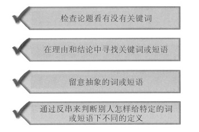

找到关键词的线索小结

你还可以通过反串（reverse
role-playing）来找出潜在重要的又有歧义的短语。问一下自己，如果你采取与作者相反的立场，你会不会选择用不同的方式来定义某些词或短语？如果是这样，你就找到了一处可能存在的歧义。例如，“对动物残忍”这个短语，喜欢看宠物秀的人给出的定义肯定和不喜欢看宠物秀的人大相径庭。

## 检查有没有歧义

现在你知道在哪儿找意思不明确的词或短语了，接下来要做的是重点关注每个词或短语，问一问自己：“我知不知道它的意思？”要回答这个重要问题，你需要克服几个主要障碍。

第一个障碍是你自认为和作者表达的是同一个意思。因此，在开始寻找之前，你就需要避免这种和作者心心相印的想法。你要养成不断提问的习惯，不停地问“你这样说是什么意思”，而不是“我就知道你是这个意思”。第二个障碍是认为术语只存在一个明显的定义。很多术语其实都不是这样。因此，别忘了问一声：“这些词或短语中有没有哪个会有不同的意思？”

做以下测验，你就能肯定自己已经找到了一个意思不明确的重要术语。如果你能找到一个术语的两种或两种以上不同的含义，每种含义放到这个论证的上下文语境里都说得通，假如你选择不同的含义，其理由支撑结论的效度就会大受影响，那么你就已经找到一处重要的歧义。因此，判定你是否找到一处重要的歧义，最好的检测方法就是将这个词的不同含义替换到推理论证的结构中，看看改变这个词的意思是否会对理由支撑结论的效度产生重大影响。

### 使用这个关键问题

前面一段需要你全神贯注地加以细读，它详细说明了将这个有关歧义的关键问题付诸实践的具体步骤。一旦按照这个步骤来做，你就可以对自己或其他人说明，为什么这个推理还需要进一步完善。虽然你也想相信别人说的话，但作为一个批判性思考的人，你就是不能轻易同意他的分析推理，直到他将影响推理过程的那些意思不明确的地方解释清楚才行。

## 判定歧义

现在让我们利用上文提到的线索来帮助我们找出交流者使用的哪些关键词意思不明确。记住：做这个练习的时候，你要不断地问：“作者这样说是什么意思？”尤其要注意抽象词语的使用。

我们将从简单一点的推理结构——广告开始：

“大家牌”（OurBrand）催眠药：30分钟见效。

论题：你应该购买什么样的催眠药？

结论（暗含）：购买“大家牌”催眠药。

理由：30分钟见效。

短语“购买‘大家牌’催眠药”和“30分钟”的意思显得很具体、很清楚。但是，“见效”这个词怎么样呢？这个词的意思是不是很清楚？我们认为并不是这样。何以见得？让我们一起来做个测验。“见效”这个词可不可能有一个以上的意思？当然有可能。它可能意味着这种催眠药让你昏昏欲睡。它也可能意味着这种催眠药让你一下子昏睡过去，直到第二天早上也醒不来，或者它还可能有许多其他的意思。如果说这种药很快“见效”，意思就是它的效果恰如你心中所想的那样不多不少，那你是不是更加急不可耐地要听从广告的建议呢？因此，这个地方的歧义就显得很重要，因为它已经影响到你能否被广告说服的程度。

广告词里常常充满了意思模棱两可的词语。广告商有意使用这些歧义词来说服你相信他们的产品比所有竞争对手的产品都要棒。下面的广告词样本里都有意使用了一些意思不明确的词语。看看你能否找出黑体词其他可以解释得通的含义。

疼痛消（No-Pain）是超强止痛药。

这本书千呼万唤始出版，它将告诉你如何找到好男人，并让他对你不离不弃。

在每个例子中，广告商都希望你把最具有吸引力的意思安到这个意思不明确的词语上。批判性思维有时候能为你保驾护航，让你不贸然做出事后追悔的购物决定。

下面我们来看一个较为复杂一点的例子，其中同样使用了意思不明确的词语。请记住，一开始就要找准论题、结论和理由。千万抑制住自己，不要记下任意一个词语或全部词语的不同含义。对批判性思考的人而言，只有出现在分析推理过程中，意思不明确的词才最为关键。

我们绝对有必要对晒皮肤施加一点限制。晒皮肤构成实实在在的健康威胁，会带来很多严重后果。研究表明，那些晒皮肤的人罹患皮肤疾病的危险大大增加，这些都是暴晒的结果。

让我们检查一下作者的推理，看看有没有词或短语会影响到我们接受这一结论的意愿。

首先，让我们检查一下论题中有没有我们希望作者进一步解释清楚的术语。毫无疑问，我们只有等到作者明确指出他所说的“晒皮肤”到底是什么意思，才能同意或者不同意他的结论。他是指在户外晒皮肤还是人工晒皮肤？这样，我们就想进一步查看他在推理中所下的定义清晰不清晰。

其次，让我们列举出结论和理由中所有的关键词和短语：“健康威胁”“严重后果”“研究表明”“晒皮肤的人危险大大增加”“皮肤疾病”和“我们有必要对晒皮肤施加限制”。让我们进一步查看这些词来判断它们有没有可能还有别的意思，且这些意思可能会对我们如何评价其推理过程产生重要影响。

第一，作者的结论是模糊的。“对晒皮肤施加限制”到底要表达什么意思？是不是意味着要禁止人们使用人工晒肤色器具，还是意味着要限制人们晒肤色的时间长度？在你决定是否同意作者或演说者的意见之前，首先你要判断他到底要我们相信什么。

第二，他说“晒皮肤的人罹患皮肤疾病的危险大大增加”，上面我们已经说过我们不确定他所说的“晒皮肤”到底是什么意思，但这里他所说的“皮肤疾病”又是什么意思呢？他可能是指由太阳暴晒引发的任何形式的疼痛感，也可能是指像皮肤癌那样的严重疾病。如果他要说服我们相信晒皮肤带来的危险和他关于限制晒皮肤的结论，那么搞清楚他指的到底是哪一类的皮肤疾病就显得至关重要。我们可以试着在脑海里想象一下这些短语所代表的现实画面。如果想象不出来，说明这些短语的意思就不明确。如果不同的画面会导致你对其理由做出不同的评价，那你这时就找到了一处重要的歧义。

现在，你可以查看一下我们列举的其他短语。它们需不需要进一步的解释和说明？从这一点可以明白，如果你没有要求作者将这些意思不明确的词语解释清楚就贸然接受了他的论证，那你根本就不理解你同意或接受的到底是什么。

## 看看上下文，这才是它的真实含义

写文章和做演讲的人很少会给关键词下定义。因此，通常情况下你要理解一个模糊不清的陈述到底是什么意思，唯一可以依靠的就是这些词语使用的上下文语境。这里所说的语境（context），是指作者或演说者的背景。这一词语在具体论证当中的习惯用法，以及可能出现的歧义词前后的其他词语和陈述，这些因素合在一起为潜在的关键词句的意思提供了线索。

如果你想搞清楚一篇文章中“人权”这个词语的意思，你应该先问自己：“人权到底是些什么权利？”如果你检查一下这个词出现的语境，最终发现作者是挪威政府的一个主要领导，那你基本可以确定他脑海中所谓的“人权”是指就业权、免费医疗权和居住权。而一个美国参议员所说的“人权”意思可能完全不一样。他心目中的人权可能是指言论自由权、宗教信仰权、旅行权以及和平集会权。注意，这两个版本的人权并不需要彼此一致，一个国家可能在保障一种形式的人权的同时侵犯另一种形式的人权。你必须努力通过检查上下文语境来弄清楚这些词的确切意思。

作者常常通过论证来阐述清楚某个术语在他们心目中的含义。下文就是一个例子：

游乐园给多数游客带来了极大的满足。受调查的人超过半数以上都认为游乐园的游戏项目应有尽有，骑乘设施种类多样，他们很快就会再次光临这里。

“带来极大的满足”这个短语意思可能有点不明确，因为它可能会有很多种意思。但是，作者的论证清楚地表明，在本段的语境里，“带来极大的满足”意思是游客喜欢“游戏项目应有尽有，骑乘设施种类多样”。

注意，即使在这个例子里，你在进园游览之前还想要得到进一步的解释，因为“游戏项目应有尽有”的意思也不明确。也许你还想进一步了解到底有多少游戏项目或骑乘设施，或者其中到底有些什么样的游戏和骑乘设施？很可能尽管游乐园里的游戏项目应有尽有，但所有的游戏项目都已经过时了，或者不再受欢迎了呢？

### 使用这个关键问题

集中讨论歧义现象的关键问题为你提供了一个不偏不倚的基础，让你可以理直气壮地不同意某些推理论证。如果你和想要说服你的人在论证过程中对术语的意思在理解上有偏差，那么你首先就要解决这些偏差，然后才能接受他为你展示的推理过程。

要仔细检查上下文语境来判定关键词或短语的意思。如果意思还是难以确定，那你就发现了一处重要的歧义。如果词语的意思很清楚但你却不认同，那你就要警惕包含这个术语或短语的任何一个推理论证。

## 字典里的定义不一定适合文章里的情境

前面的讨论让我们明白了一点，要找到并解释清楚歧义，首先我们必须知道这些词可能包含的意义。意义通常表现为下列三种方式：同义替换、举例说明以及我们通称的“具体标准定义”（definition
by specific
criteria）。举个例子，对于“忧虑”这个词，我们至少可以找到三种不同的定义方法：

（1）忧虑就是感到紧张不安。（同义替换）

（2）忧虑就是候选人打开电视收看选举结果公布时的心情。（举例说明）

（3）忧虑是一种主观上的不适感，伴随有自主神经系统越来越强烈的感受。（具体标准定义）

要对大多数有争议的论题进行客观评价，同义替换和举例说明这两种定义方式都不合适。它们并不能明确告诉你对清楚理解一个术语的意思起决定作用的那些具体特征。有用的定义则会指明具体的使用规则，而且越具体越好。

到哪儿去找你需要的定义呢？有个很明显又很重要的来源就是字典。但是，字典上的定义常常包含了同义替换、举例说明或是使用规则的不完全说明。这些定义在具体的文章中常常难以确切地界定术语的使用。在这种情况下，你就得从文章的上下文语境中找出这个词的潜在含义，或者从你对这一讨论主题了解的其他知识里发掘其意思。我们建议你手头常备一本字典，但同时要知道字典里可能并不包含你所要找的合适的定义。

让我们来看一看字典定义中存在的一些不合适之处。阅读下面这段文章：

这所大学的教育质量并没有出现滑坡。我在访谈中发现，绝大多数学生和老师都说他们在这儿根本看不出有什么教育质量滑坡的现象。

大家都知道在上面这一段中弄清“教育质量”这个短语的意思非常重要。如果你在字典中查“质量”这个词，你会发现它有很多种意思。考虑到这个词出现的语境，它最合适的意思就是“杰出度”（excellence）和“优越性”（superiority）。“杰出度”和“优越性”是“质量”的同义词，它们都比较抽象。你还是想准确地了解到底“杰出度”和“优越性”是什么意思。你怎么知道教育是“质量高”还是“杰出程度高”呢？理想的做法是，你希望作者准确地告诉你，他在使用“教育质量”这个词组的时候到底是指怎样的一种表现。你能不能想出什么不同的方式来给这个词组下定义呢？下面我们就列出了“教育质量”这个短语可能存在的几种定义：

·学生的平均成绩

·学生批判性思考问题的能力

·有博士学位的教授人数

·考试过关通常要付出的劳动量

每个定义都暗示了一种衡量教育质量的不同方法，每个定义都有不同的具体衡量标准。每个定义都提供了这一词组可能存在的具体使用方法。注意这些定义每个都有可能影响到你想同意作者推理论证的程度。例如，如果你认为这里的“质量”应该指学生批判性思考问题的能力，而大多数受访的学生都把它定义为考试过关要付出的劳动量，那么你的理由就不一定能支撑结论。考试过关也许根本就不需要有批判性思考问题的能力。

因此，在很多说理论证中，你并不能从字典里找到合适的定义，而上下文语境又不能让意思变得清晰。还有一种方法可以帮你发现这个词可能存在的其他含义，那就是尽量在脑海中想象这个词所代表的具体景象，如果你想象不出来，那你很可能就找到了一处重要的歧义。让我们用下面的例子来检测一下：

我们公司一直都有很多能干的员工。如果你加入我们的员工队伍，那你立刻就能享受我们刚谈到的那个工资级别，当然，还有好多额外的福利。我希望你在选择就业的时候考虑一下所有这些因素。

上面这段明显是劝说某人到其就职的场所去工作的论证，理由就是工资和“额外的福利”。你能不能在脑海里想象出一幅清晰的“额外福利”的画面？我们每个人都有这样那样的想法，但是这些想法完全相同的概率实在微乎其微，实际上，它们很有可能是千姿百态的。“额外福利”是指医疗保险，还是指一间拐角的新办公室？我们要评价这个论证，就得知道作者所指的“额外福利”的具体含义。因此，我们就找到了一处重要的歧义。

## 小心那些饱含感情色彩的词语，它会让你的思维短路

你认为哪个对社会的威胁更大：全球变暖还是气候改变？

你更愿意投票支持税收宽免还是税收减免？

你是不是更愿意投票支持削减死亡税而不是遗产税？

研究表明，人们对上述句子中出现的黑体词汇有不同的情感反应，尽管这些词的意思基本相同。美国人对税收宽免这个词的反应要比对税收减免更为积极，他们更愿意支持削减死亡税而不是遗产税。人们对这些选用的术语和词组的不同情感反应会大大影响到我们对论证的评价。术语和词组既有外延意义又有内涵意义。外延意义是指使用一个词的约定俗成的外在描述性的指称对象，也就是我们在本章目前为止反复强调的这类意义。但是词语还有一层重要的意义也需要引起我们的注意，那就是词的内涵意义。内涵意义是指我们对术语或词组所附加的情感上的联想意义。例如，“增税”这个词对人们来说外延意义大致相同，但是每个意义所激发的情感反应却大不相同。那些激发强烈情感反应的术语被称为附加感情色彩的术语（loaded
terms）。它们感动我们的能力大大超越了它们本身的描述性含义。这些术语给批判性思维带来了极大的麻烦，因为它们暂时让思维短路，通过直接连通情感线路来绕过描述性的意义通道，从而欺骗了人们的思想。

歧义并不都是偶发性的事件。那些想要说服我们的人常常清醒地意识到一个词有多重含义。而且，他们知道某些含义携带了强烈的感情色彩。诸如“牺牲”和“公平”这样的词就有多重含义，其中有些含义因为激发我们心中的特定感情而获得了附加的感情色彩。任何一个想利用语言来激发我们情感共鸣的人都会利用这些可能藏在我们心中的感情。他们既可以使用激发我们心中对某些想法的正面情绪反应的语言，也可以使用抑制我们心中负面情绪反应的语言来达到目的。

例如，美国在阿富汗和关塔那摩主管监狱的军方官员急着要避免人们得出这些监狱鼓励大量犯人自裁的印象，但是大量犯人确确实实是在那里自行了断的，而军方不管怎样都必须要统计这些死亡人数，所以他们就别出心裁地创造了一个“惩罚自己的危险事故”这样的死亡类型，使他们既可以承认这些死亡人数，又不用给他们贴上自杀的标签。在这里，“惩罚自己的危险事故”这个短语的意思不明确并不是偶然造成的，它是刻意用来淡化人们对其指代对象的情感反应。

政治语言常常添加感情色彩而且意思模棱两可。例如，“福利”这个词常被我们用来指政府为那些我们不喜欢的人提供的帮助；当政府的帮助提供给那些我们喜欢的人，我们就称之为“扶贫”。下表中列举的是一些政治术语和它们希望取得的情感效果。

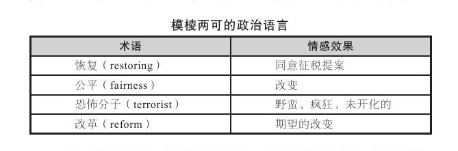

表中所有词的意思都模棱两可，暗含有影响力的感情联想。作为批判性思考的人，我们必须要保持敏感，知道这些词希望达到的情感效果和它们故意模棱两可以激发这种情感效果的作用。一定要对术语引发你怎样的感情保持高度警惕！这些感情有没有蒙蔽你，让你看不到这些术语的某些重要特征？通过明确它们的外延意义，找一下诸如“改革”这类词可以替换的其他意义，我们就可以保证自己不会轻易从感情上迷恋某些论证，而对其不作任何怀疑。毕竟，哪怕是最危险的政治改变，从某种程度上来说也是一种“改革”。

诺曼·所罗门（Norman Solomon）的《不知所云的威力》（The Power of
Babble）就为我们提供了一幅精彩纷呈的画面，展示了玩政治的老手如何轻松利用模棱两可的语言来说服他人。注意所罗门特意将关键的模棱两可的词按顺序排列，以方便我们阅读。

美国胜利归来（两党相互角力），各自紧咬牙关顶住激烈竞争、外交斡旋、高效运作、权力下放、收拾残局以及环保主义的压力，同时怀揣对开国先烈的信念，信奉自由之神的庇佑，信奉自由市场和民族自由，最主要的是，信奉上帝。我们最大的一笔遗产一直与下列种种藕断丝连：人权、个人主动性、公正、子女、领导才能、自由、忠贞、主流价值观、市场、审慎反应、民族大熔炉、中产阶级、军事改革、中庸稳健、现代化、道德标准、国家安全和美国国旗。我们的机会来源于乐观主义、爱国主义、有实力保障的和平、美国人民、多元主义和星星点点的希望之光。实用主义和祈祷的力量有利于建立行为准则，而私营经济则保证了公共利益。现实主义可以指循环利用、自律和反抗精神，同时也带来了社会稳定、战略利益的制高点和高效率的税收。山姆大叔从独立战争时代的福吉谷（Valley
Forge）战场到现在，一直胸怀老兵敬畏的那些价值观——警惕性、魄力、梦想、自觉自愿和西方价值观，英勇无畏地一路向前。

## 谁想要说服你，谁就得负责解释清楚

在你竭尽所能地找出并消除掉有歧义的地方以后，如果你对某些关键想法的准确含义还是拿不准，那又该怎么办呢？接下来应该采取什么合理步骤呢？任何一个理由如何其中包含了歧义，让我们无法判断能否接受这个理由，那我们建议你干脆忽略它。作为一个积极主动的学生，你有责任提出各种问题来消除歧义。但你的责任到此为止。作者和演说者才是努力要说服你接受某些观点的人。身为说客，他有责任回答你对可能存在的歧义的各种关心。

你没有义务来评价那些不明确的想法或选择。如果有朋友告诉你应该选修某一门课程，因为这门课确实“与众不同”，但是他却不能告诉你与众不同的地方在哪里，那你就没有依据来同意或是不同意这个建议。如果他不能提供一幅清晰的说理论证的画面，那他就没有权力强迫你相信他。

这里再提供最后一个例子来说明一下歧义的力量。想想这场最后的法庭较量所牵涉的亿万美元。世贸中心一个租户签订的保单里包括了“每一桩事故”的承保范围限制。“9·11”事件以后，这个租户要求保险公司赔付高达千百亿美元，给在“9·11”灾难中身亡的每一位员工尚活着的家人。他对“每一桩事故”的理解是在这桩事故中死亡的每个人。而保险公司则回答说只发生了一桩事故，就是世贸中心大灾难，而这份保单包含了一条“每桩事故最高赔付35亿美元”的保险条款。

## 轮到你自己写时，可得吸取教训

想象一下你正和室友展开一场热烈的讨论，这场讨论最后以这样一句话作结：“我怎么说你都不懂，你家里都是有钱人。”读完这一章以后，你就知道“有钱人”这个词是附加了感情色彩的词汇，充满了不确定性。每个使用这个词的人都给这个词附加了他自己的文化、意识形态和个人经历上的意义。对于一个刚入籍的难民家庭而言，“有钱人”就意味着有固定工作并且能满足基本的生活需求。而对另一个人而言，它也可能意味着一份稳定的可以按月领薪水的工作。再换一个人，资产达不到六位数以上的在他看来都算不上有钱人。这个词拥有几乎无穷无尽的不同含义，每个含义都合乎逻辑。因此我们很容易就能理解为什么真正意义上的交流显得异常困难。在交谈中，两个人至少还有机会立刻把潜在的不明白之处拿出来讨论清楚，然后再继续讨论下去。而写作就另当别论了。

一个人独自写作的时候，只有手提电脑与你作伴，你面临着巨大的挑战。在写作的孤独中，你一定要抵制住诱惑，千万不要以为这个词的定义众所周知。这样你很容易就会忘记不同文化、不同经历和不同思想之间的巨大分歧，所有这一切都会给词语添加一层层的含义。为了帮你克服这个困难，我们提出以下建议。

### 要时刻留意歧义

效率高的作者总是力求文章表达清楚。他们会反复回想自己要说的话，找出任何一个有可能模棱两可的陈述。因为作者自己很清楚自己要表达的意思，这样要找出对读者而言可能不太明确的地方就是个艰巨的任务。

要帮你完成这一任务，最好采用反串的方法，这个方法我们在本章曾经讨论过。当你留心到某个潜在的歧义，反串让你有机会发挥自己的创造力。尽量采用一个来自不同文化的人或一个有不同政见的人的思维框架。从另一个人的视角来探究你的论证，可能会把你的注意力吸引到你之前并没有意识到的不明确之处。

在研究刚开始的时候，我们希望你全身心沉浸到流行刊物和专业刊物上与你的论题有关的那些持续不断的讨论中。还有个检测你的关键词是否不明确的方法，就是回到这个研究中来。在这些持续的讨论中众位作者是否就某些具体的术语展开争论，还是大家都在使用同一个短语而意思却有所不同？如果你注意到关于某个术语的争论，那么再检查一下你自己的写作任务。你有没有使用这个术语，还是使用了一个意思相近的词语？如果是这样，那你现在知道自己应该小心谨慎、明白无误地说清楚你是怎样使用这一术语的。

写作本来无须是一种完全孤独的活动。要避免认为你的关键词意思众所周知，我们最后给你的建议是展开一场对话。把你的结论和理由拿出来和别人分享，比如朋友或同学。要鼓励他们多提些问题。注意他们使用这个术语的方法是否和你有明显的差别。

在你判断某个潜在的歧义需不需要进一步加以解释之前，先花点时间想想你的读者和听众。有些读者和你拥有一套相同的思想和语言。如果你和一群物理学家一起使用“转矩”（torque）这个词，那么这个词就有一个具体而又众所周知的定义，即一种具体可测量的力。如果你在一群摩托车发烧友中使用这个词，这个词就有了另一个具体而相关的含义。在这群人中，这个词大多只限于指他们摩托车发动机的功率。当一个摩托车手向另一个车手形容他的车的优点，他并不需要限定这个词的用法。想一想你心目中的读者或听众的特点，可以帮助你决定哪里的歧义需要进一步阐释清楚。如果你的写作是面向一群专业人士，对一般读者而言显得非常模棱两可的术语和特殊的专业词汇，他们则可能完全理解。这个现象还可以进一步延伸到共同的课程中。比如在你的高年级心理学研讨课上，你无须像面对一群没有上过这门课的学生那样，绞尽脑汁地给心理分析或退化现象这两个术语下定义。

相反，如果你的写作是面向一群普通读者，请牢记你所使用的专业性语言也许会让他们觉得云山雾罩，这样你很快就会与他们失之交臂，而且可能再难重新吸引他们的注意力。

一旦你判断自己的论证里有个词意思不明确，就一定要解释清楚。在你说服别人接受你的结论和理由之前，你一定要确保读者和你面对的是同样的结论和理由。如果你害怕自己的表达不明确，那就仔细界定你的术语。

来，做做思维体操

？关键问题：哪些词或短语意思不明确？

在下面的文章中，请找出意思不明确的例子。解释一下为什么这些例子影响到说理的效果。

⊙第一篇

学校的着装规定是对不当着装的限制，目的是营造一种专心致志的学习氛围。如果一个学生衣着不当地来上课，就有可能极大地分散其他同学的注意力。在校期间使用着装规定并不是限制学生的表达自由。不同于要求学生统一着装，着装规定仍旧允许学生自由选择自己的服装，只要不是被视为不当着装即可。

⊙第二篇

我们对药物使用应该像对言论和宗教信仰一样，将其作为人的一项基本权利而听任自由。没人必须得服用他不想要的药物，正如没人必须要阅读他不想读的书一样。国家对这类事情施加管控的唯一理由就是为了管制自己的人民——替他们挡住外来诱惑，就像家长管制子女那样。

⊙第三篇

政府需要大大削减美国的外来移民人数。美国现在已经人满为患，我们开始深受其害，比如居高不下的失业率和日渐严重的水污染。同时移民也开始危及美国的文化。

给个提示

对于第一篇练习文章，我们的参考答案将和你一起深度分享“自问自答”这种模式的批判性思考全过程，在本章和前两章中我们已经细细描述过这个过程。

⊙第一篇

·如果这篇文章有什么重要的歧义之处，《学会提问》这本书告诉我可以在论题、结论或理由中找到。所以第一步就是在论证中找出这几个部分。这篇文章既没有明确说出论题，也没有明确说出结论，也没给出明确的指示词。我只有利用其他工具来找出论题和结论了。要找论题，这本书告诉我要问一问：“作者是对什么进行评价？”着装规定，我想是吧。着装规定是不是个好主意。好了，这样我就可以把这个意思重新整理成一个问题：“学校该不该有着装规定？”这篇文章所有的句子都在说服我学校应该有一套着装规定。因此结论一定是：“是的，学校应该有一套着装规定。”

·同样，这里也没有指示词来帮我找到理由。因此我只有试试别的方法。要找到理由，我就得先把自己放到作者的位置上，然后问：“为什么学校要有一套着装规定？”我可以从这篇文章里推测出两个理由：首先，奇装异服容易分散学生的注意力；其次，着装规定并不违背学生的表达自由。

·既然我已经将论证分解到最基本的单元，现在我就可以着手找出重要的歧义了。我要首先找出论题、结论和理由中的关键词和短语，因为这些词和短语对于论证起到决定作用。它们在这个语境里可能有不止一种说得通的含义。例如，它们可能是抽象词汇或者附加感情色彩的语言。“不当着装”无疑是这个论证中一个重要的因素，而作者根本没有告诉我什么样的服装才属于不当着装。我怀疑这个词是不是还有别的意思可以说得通。

·据我所知，“不当着装”就是衣服上面印有伤害人或侮辱人的字句。如果这样的话我也会禁止它们在学校里招摇过市！取笑他人的T恤衫自然属于不当着装，这一点对我来说非常清楚，当然了，本书会说也许我觉得一个术语的定义是显而易见的，哪怕根本不是这样。所以我应该不断追问：这个词组会不会有不同的意思呢？

·本书建议的一个线索是要留意观察抽象词汇的意思，如“淫秽”和“责任”等。这些词是抽象词汇，而且意思模糊不清，因为它们没有为我们提供明确的定义，或没有一套判定的标准。本文中提到的“不当着装”同样也没有一个明确的定义，没有一套判定的标准。作者从没有提到“不当着装”的意思是T恤上面印有伤害人的文字。这个意思是我假设的，因为在我看来这些T恤就属于不当着装。作者也没有说“不当着装”的意思是女生裙子短到一定地步，或是男生裤子短得能让人看见内裤。这个术语看起来比我一开始想的意思要模糊一点。

·在我确凿认定之前，我想试一试反串这个建议。反对这个结论的人会怎么定义“不当着装”这一短语？持反对立场的人也许会反驳说，着装规定确实限制了表达自由。学生穿衣服是希望表达哪些东西呢？T恤上面经常可以看到政治信息。我就看到过年轻人穿着反战口号或支持他们喜爱的总统候选人口号的T恤衫。反对着装规定的人可能担心学生表达对重要问题关切声音的那种权利遭到剥夺。

·呵呵。现在我被困住了。如果作者是在讨论T恤衫上印着伤害人的信息，那我同意他的观点，让我们禁止好了。但是如果作者讨论的是限制学生表达政治观点的权利，我强烈反对。我对这个论题无法做出决断，除非消除掉这个歧义。

⊙第二篇

论题：国家该不该控制药物使用？

结论：国家不应该控制药物的使用。

理由：（1）正如言论自由和宗教信仰自由一样，药物使用也是人的基本权利。

（2）国家控制压制了民众，不准他们对自己的自由行动负责。

这篇论证的关键短语是什么？它们是“药物使用”、“基本权利”和“压制民众”。首先你想判定这些词的意思。作者所谓的“药物使用”意思是否清楚？不是。文章提供的有限的上下文语境并没有显示出一个恰当的定义。如果“药物使用”指的是摄入大家并不认为特别容易上瘾的药物，比如说大麻，那么与作者把海洛因也包含在他对药物的定义之内相比，你是不是更容易接受这个推理？你能不能从论述中搞清楚作者是指全部的药物，还是指小部分目前遭到管制的药物？要能做到同意或是反对作者的意见，在这个例子里作者需要进一步解释清楚“药物使用”这个词的含义。注意“基本权利”和“压制民众”也需要进一步解释和澄清，这样你才能决定是否同意作者的意见。

# 第5章　什么是价值观假设和描述性假设

任何一个想要说服你相信某个立场的人都会尽量拿出与其立场相一致的理由。因此，乍一看，几乎每个论证都显得“有道理”，其外表结构看起来都显得完美无缺。但是表面的、明说出来的理由并不是唯一用来证明或支撑其结论的想法。有些内在的没有说出来的看法在透彻理解论证方面所起的作用可能至少和表面理由同样重要。让我们思考下面这个论证，考察一下这些没有说出来的想法的重要性。

地方执法机构应采取更多措施来强迫乱丢垃圾者承担严重后果。很显然，人们不会积极主动地遵纪守法，因此城市警察必须采取行动。如果不强制执行法律，我们又怎么能期望会有改变发生？

乍一看，这个论证的理由支撑了其结论。如果城市期望其市民在行为上有所改变，城市的执法机构必然就得强制实行这种改变。但是也有这种可能，给出的理由确实有道理，但并不足以支撑其结论。如果你认为制止乱丢垃圾的行为是个人的责任而不是政府的责任呢？这样，从你的角度来看，上述理由就不再能证实其结论了。只有你认同作者以为是理所当然而没有明说的那些特定的想法，这个论证对你而言才是可以信服的。而在这个例子里，作者认为理所当然的一个想法就是有一种价值观（集体责任）要比另一种价值观（个人责任）显得更重要。

在所有的论证中，都有一些作者认为是理所当然的特定想法。但通常情况下作者却不会明说出来，你只有在字里行间仔细推敲才能发现它们。这些想法是推理结构中重要的无形纽带，是将整个论证联系在一起的黏合剂。它们回答了一个非常重要的问题：“必须得有什么样的想法才能将理由和结论从逻辑上联系起来？”这些联系的必要性看起来必须很明显。没有了这些联系，在成千上万不同的想法中人们又怎么能判断哪些才有资格充当理由？只有当你提供了这些联系之后，你才能真正理解这一论证。

如果你没找到这些潜在的联系，你常常会发现自己不知不觉就相信了一些观点，这些观点如果你稍加考虑的话就绝不会接受。请记住：一个论证表面可见的部分常常最有可能穿上华丽的外衣，因为展示这个论证的人总希望能说服你，让你全心全意地接受这个论证。本章对于培养你成为一个批判性思考的人特别有用，因为它让你关注整个论证的方方面面，而不仅仅是它那些较为吸引人的特征。

我们再来看一看，请思考一下你为什么要努力掌握本书所介绍的这些技能和态度。有各种各样的理由都可以说明你完全可以不用学习批判性思维，独立认真的思考需要我们付出更多的精力，比起掷一枚硬币来决定，或是问问身边踌躇满志的专家该怎么办，这种做法要费力得多。但是本书还是鼓励你去学习批判性思考。我们是在告诉你：批判性思考对你而言非常有好处。

我们的建议都是基于一些潜在的想法，如果你不认同这些想法，你完全可以不理会这些建议。批判性思考的人都相信自己做主、好奇心、通情达理等价值观是人类最重要的一些目标。批判性思维的最终结果是要求一个人虚怀若谷地接纳各种观点，理性评判这些观点，然后在理性判断的基础上决定接受哪些思想或采取哪些行动。我们相信你喜欢这种人生经历，因此，你也会想做一名会批判性思考的人。

当你努力理解一个人的时候，你的任务在很多方面都好像没有亲眼观看魔术师魔术表演的每个步骤就自己动手去做那个魔术。你眼看着手帕放进了帽子里，出来的却是一只兔子，而你压根儿就不知道魔术师暗地里玩的到底是什么把戏。要理解这个魔术，你就得搞清楚魔术师暗地里的那些把戏。同样，在论证当中，你也得找到那些暗藏的把戏，实际上，这些把戏就是没有明说出来的想法。我们把这些没有明说出来的想法称为假设（assumptions）。要全面理解一个论证，你必须要找出这些假设。

假设有下列这些特征：

（1）隐藏或没有明说出来（大多情况下如此）；

（2）作者认为是理所当然的；

（3）对判断其结论有较大影响；

（4）可能有一定的欺骗性。

本章将教你如何找出这些假设。但是找出假设的价值远远不止它给你自己的推理带来的正面影响。批判性思维自然免不了要涉及那些和你一样关心同一论题的人。当你找到这些假设并在和别人的交流中说出这些假设，那么在我们这个社会你就为提高推理的质量做出了很大的贡献。

例如，美联社最近刊发了圣路易斯联邦储备银行（St.Louis Federal Reserve
Bank）研究的一份详细报告。这项研究的结论是相貌好的人比相貌平平的人挣的钱多，升职也更快。作为批判性思考的人，你就会质疑隐藏在这份报告背后的假设，如果有的论证使用这项研究数据来证实其结论，我们这样做就可以防止自己很快接受这样的论证。民主社会亟须这种小心谨慎的思考。

？关键问题：什么是假设？

## 到哪儿去找假设

当你寻找假设的时候，你应该在什么地方找？怎么找？每本书、每场讨论、每篇文章里都有无数的假设，但你应该关心的只有很小的一部分。你应该还记得，一个论证的表面结构由理由和结论两部分组成。但是，你所关心的只是影响到论证结构质量的那些假设。因此，你就可以限制自己寻找假设的范围，只在你已经学会怎样去寻找的论证结构中去寻找这些假设。

有两个可以寻找假设的地方你应该特别留意，那就是寻找理由需要它们才能证明结论的那些假设和寻找理由需要它们才能成立的那些假设。我们先介绍前者——价值观假设，然后再介绍后者——描述性假设。两者在形成论证的过程中都极为重要。

小贴士：先检查理由，然后检查结论，寻找价值观假设和描述性假设。

注意理由和结论部分也是我们寻找重要歧义的地方。在这里，我们再一次表现出对文章或演说中理由和结论的充分尊重和重视。

小贴士：所谓假设，就是一个看法，通常没有明说出来，而作者认为是理所当然，并用来证明其表面的推理论证。

## 找出幕后遥控的价值观假设

为什么有些很讲道理的人会大呼小叫地说堕胎就是谋害生命，而另一些同样讲道理的人却把堕胎看成人性化的行为？你有没有想过为什么每一任美国总统，不管其政治信仰如何，最终都会和媒体大打口水仗，喋喋不休地争论该不该发表那些他不愿公之于众的政府信息？为什么有些高智商的人不遗余力地攻击那些露骨的色情杂志的出版发行，而其他人却为之辩护，把它们的出版看作对《人权法案》的终极试金石？

这些不同结论的一个极为重要的原因就是价值观冲突的存在，或者说由不同参照系衍生出来的不同价值观。对于道德论证或者规定性论证，一个人的价值观会影响他列举出的种种理由，因而也影响到他的结论。实际上，只有把这些价值观假设添加到推理中，他们的理由才能从逻辑上证实其结论。下面这个例子展示了在一个规定性论证中价值观假设所起的作用。

我们不应该让娱乐性药物<a href="#part0406.html_ch1-back" id="part0406.html_ch1"
class="pcalibre calibre2">[1]</a>（recreational
drugs）合法化。这些药物引发了太多的街头暴力和其他犯罪行为。

注意，这里的理由只有在假设大家都认为公共安全比个人责任更重要的情况下才能从逻辑上证实其结论。价值观假设对于这样的论证非常重要，因为它在幕后遥控指导着推理论证的过程。和你交流的人可能会意识到这些假设，也可能根本意识不到。你应该养成习惯，找出理由赖以成立的那些价值观假设。

我们这里所谓的价值观假设（value
assumption），是指一种想当然的看法，认为某些相互对立的价值观中一个比另一个更重要。当作者对于社会论争采取了一种立场，他们通常都会选择一种价值观而排斥另一种价值观，他们有价值优先或者价值倾向。要找出这些优先的价值，你需要对价值观的意思有较好的把握。因此，现在是回顾一下第1章里介绍过的价值观的好时机了。

<a href="#part0406.html_ch1" id="part0406.html_ch1-back"
class="pcalibre calibre2">[1]</a>这里所说的娱乐性药物，是指服食以后可能会上瘾的一些药物。——译者注

## 两种价值观冲突时宁可要哪个

要找出价值观假设，我们不能仅限于简单罗列一个个价值观。你的很多价值观别人也一样认同。例如，不是几乎每个人都说灵活性、合作意识和诚实这些价值较为可取吗？

再看看价值观假设的定义，你立刻就会发现，从定义来看，大多数价值观都在每个人罗列的名单上。因为很多价值观都是大家共同拥有的，价值观本身并不能成为理解的有力向导，能导致你对一个规定性问题做出与别人不同的回答的，是你对所持的特定价值观的相对认同的程度。

当价值观发生冲突或抵触的时候，想一想我们对这些论争的回应，由此我们就可以理解为什么我们会对特定价值观赋予不同的认同程度。如果说发现大多数人同时看重竞争和合作并不能让我们茅塞顿开，当我们发现竞争和合作两者发生冲突的时候哪些人宁要竞争不要合作，我们就对规定性的选择获得了一个更加全面的理解。

一个人对于特定价值观的选择常常是不会明说的，但是那个价值观选择无论如何都会对他的结论产生重大影响，同时也影响到他选择捍卫这一结论的形式。这些关于价值取向的没有明说的主张所起的作用就是价值观假设。有些人称这些假设为价值判断。认识到人们对产生冲突的价值观或系列价值观做出的相对支持，能让你既进一步理解所阅读的材料，也能为最终客观评价这些规定性的论证打下坚实的基础。

小贴士：所谓价值观假设，就是在特定情形下没有明说出来的喜欢一种价值观超过另一种价值观的偏向。我们把价值倾向和价值取向当近义词使用。

当你在一场特定的论争中发现了一个人的价值倾向，你不应该期望同一个人在讨论不同的论争时还会持有相同的价值取向。离开了相关的讨论论题，一个人就不再持有同样的价值倾向。与论争有关的语境和事实问题也会深深影响到我们持有某个价值倾向的程度。我们持有特定的价值倾向只到一定程度为止。这样，比如说，有人在多数情况下都认为自由选择比集体幸福重要（例如，穿着印有国旗图案的服装），但是当他看到可能会对集体幸福造成太大损害的行为时（例如，一个人发表种族歧视演说的权利），他就有可能改变自己的价值倾向。换言之，价值观假设随情境的改变而改变，它们在一种情况下适用，而一旦规定性论题的具体条件发生改变，我们就可能采用非常不同的价值倾向。

## 典型的价值观冲突

如果你意识到有代表性的价值观冲突，你就能更快地认识一个作家在得出特定结论时做出的价值观假设。我们已经列举了一些伦理道德论题上常见的价值观冲突，而且提供了这些价值观冲突有可能出现的论辩例证。当你想认出重要的价值观假设时就能以这些列举的价值观冲突为出发点。

在你找出价值观冲突的时候，你常常发现对于特定的论争，好像有几个价值观冲突存在，并且貌似对形成结论都很重要。所以在你评价一个论争的时候，请尽量找出几个价值观冲突，以此来检验一下自己的评论。

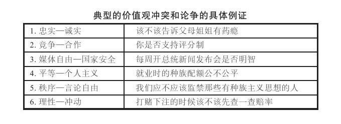

## 对方的背景可以作为价值观假设的一个线索

前面我们已经说过，找到价值观假设一个比较好的起点就是检查一下作者的背景。尽量找出像作者或演说者这样的人通常持有的价值倾向，越多越好。他是公司高管、工会领导、共和党官员、医生还是公寓的一个租客？这样的人最希望保护的必定是什么利益？追求自身利益本身自然没什么错误，但是这样的追求常常限制了一个特定的作者所能包容的价值观假设。例如，一家烟草业的大公司总裁就不太可能特别重视对敏感人群的同情，如果这种对敏感人群同情的选择取代了对公司业绩稳定增长的选择，就有可能导致他丢掉自己的饭碗。因此，你如果是一个批判性思考的人，想象这样的人可能做出的价值观假设，就能很快发现他的价值倾向。

这里要注意一点：并不是因为一个人身为某个团体的一员，就一定会认同这个团体的特定价值取向。以为同属一个特定团体的任何一员想法都完全相同，这就犯了大错。我们都知道商人、农民、消防员在讨论具体论争时相互之间常常意见不一。调查作者或演说者的背景作为判断其价值取向的线索，得到的只不过是个线索而已，如同其他线索一样，也有可能产生误导，除非小心谨慎对其加以使用。

## 可能发生的结果是价值观假设的重要线索

在规定性论证当中，对于某个论题的任何一个立场都会得出不同的结果或后果。每个潜在的结果都有一定的可能发生，每个结果都会在一定程度上让人觉得可以接受或难以接受。

论争中所持的立场带来的结果到底可不可以接受主要取决于个人的价值倾向。在这种情况下，结论到底可不可以接受主要取决于潜在的各种结果发生的可能性大小和对这些结果的重视程度。因此，要判断一个人的价值观假设，一个重要手段就是要注意他用来证实结论的各种理由，然后判断哪些价值取向会导致作者认为这些理由比其他理由更可取，而那些其他的理由本可以从论题的另一个方面来进行论证。我们来看一个具体的例子。

根本就不该建核电厂，因为核电厂里那些危险的核废料会污染环境。

这里提出的理由是建造核电厂所带来的较为具体的潜在结果。作者明显将环境污染当成不可接受的部分。为什么这个结果在作者的思想中占有这么大的分量？防止污染有助于取得哪些更为普遍的价值观？虽然我们不过是猜测，但作者很可能特别重视公众健康或环境保护。换成另一个人，他在这个论证里可能会重视完全不同的后果，例如核电厂对消费者的供电量带来的影响。为什么？很可能因为他非常看重效率！因此，只有一个人选择的价值取向是认为公共健康或者环境保护比效率更重要时，他给出的理由才能支持结论。

这样，判定价值取向的一个重要方法就是问一下这个问题：“为什么作者用做理由的特定后果或结果对他而言显得那样可取？”

记住：在寻找价值观假设的时候，你应该尽量一直说明价值倾向。遇到有争议的主题，以这种方式说明价值观假设可以不断提醒自己作者放弃了什么，又得到了什么。尽量抵制住诱惑，不要一找到作者或演说者的价值观就过早地停止分析的过程。找出这些价值观只是找出价值倾向假设过程中的一个步骤，但是价值观本身在理解论证时所提供的帮助却微乎其微。价值观本质上是所有人共有的东西。

## 如果争论的人采取相反的立场，他们会关心什么

另一个找出价值冲突的有用技巧就是反串。问一下这个问题：“如果所述的论争中的这些人采取相反的立场，他们会关心些什么？”如果有人说我们根本不应该用猴子来做实验，你就应该问自己：“如果我要为使用猴子做实验进行辩护，那么我应该关心些什么？”

最后，你应该经常看看，不同的意见是不是来源于价值观冲突，这个冲突牵涉到个人有权以特定的方式行事，以及这种行事方式对集体幸福造成的影响。很多论证隐含的立场就和这个如影随形的价值观冲突有关。像其他常见的价值观冲突那样，当我们的思维需要去衡量这两个重要的价值观及其产生的影响时，我们都能找出数不清的例子来证明。

例如，当我们质疑在公立学校里使用金属探测器的时候，我们常常从以下方面开始建构自己的论证，首先想到的是学生的隐私权，然后想到如果有学生携带武器来学校的话势必会威胁到其他学生的人身安全。接着我们就试着在这些价值观和其他价值观之间权衡利弊，比如在这个具体例子中，单个学生的隐私权是否应该比其他学生在校期间的幸福更值得保护？在这一价值冲突中还涉及哪些论题？对光头党在民族聚居区巡逻的要求我们又该怎么评论呢？

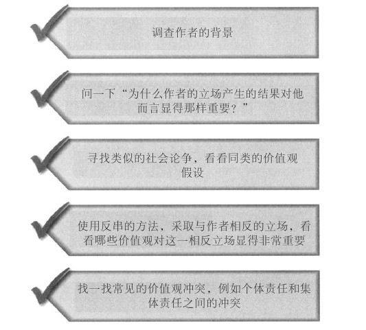

找出价值观假设的其他线索

## 一个例子：关于竞争与合作的争论

让我们一起来看一个例子，这样有助于你更加得心应手地找出价值观假设。

不同的工作场所有不同的工作环境。有些地方实行差别工资制，这里主要评价你的工作表现，并将它和其他员工相比较，以此来决定给不给你涨工资。还有些地方喜欢创造一种和谐的工作氛围，大家作为一个团体一起工作。这里涨工资主要看的是教育程度或工作经验。这种类型的工作场所让员工之间形成了良好的关系，大家作为团队一起工作。哪一种类型的工作环境真的会产生最大的生产率呢？是这种每个人都和其他人对阵、生产率是涨工资的唯一依据的工作环境，还是培养团队一起工作来提升生产率的工作环境？

两种立场的结构轮廓如下。

结论一：工作场所应该实行差别工资制。

理由：涨工资的唯一依据就是工作效率，因此这种类型的工作场所为大家努力工作创造了最大的动力。

结论二：工作场所应该提供一种团队协作的环境。

理由：如果员工之间相互尊重，他们创造出的工作环境就会非常健康，因此可以有效提高生产效率。

注意，涨工资建立在个体生产率基础上的那种工作环境特别看重竞争。营造这种类型工作环境的人相信竞争会提高生产率，因为它激发了个人的斗志。因此，他们声称团队协作的环境会阻碍竞争环境下的生产力的发展。

价值观假设：在这种语境下，竞争比合作更受重视。

另一方面，那些认为团队协作会创造出最大生产率的人特别重视合作。他们相信一起工作有助于团体变得更加斗志昂扬，因此也就更富有成效，因为他们工作并不是为了自己一个人，而是为了公司整体（或团队整体）。他们认为团体协作比提供绩效工资的地方会创造更好的工作环境。

价值观假设：在这种情况下，合作比竞争更受重视。

因此，这里最主要的价值观冲突就是合作和竞争之间的冲突。支持绩效工资工作环境的人相信同事之间在工资报酬方面是竞争而不是合作关系，只有这样才能制造出最富有效率的环境。他在这个问题上的立场并不意味着他就不看重合作，这两个价值观也许对他而言都很重要，但是就工作场所而言，竞争占了上风。

请记住：涉及规定性论题的完整推理离不开理由和价值观假设。

### 使用这个关键问题

一旦你发现了一个价值观假设，你该拿它怎么办？首先，回想一下每个关键问题的目的——是为了使你最终能客观地评价推理过程！因为你知道有思想的人都会有不同的价值观假设，你就有权质疑为什么他会做出这个价值观假设。因此，作为一个批判性思维的人，你就要指出一点，任何一个想要进行论证的人都有必要提供一些解释，说明为什么你应该接受那个论证中暗含的特定的价值观假设。

## 价值观及其相对性

在本章中我们并不想给读者留下这样的印象，让他们以为价值取向就像冰激凌一样，既然我选择了最爱吃的蓝莓奶油口味，你没有理由劝我说选择柠檬松糕口味更明智。冰激凌不过是萝卜白菜各有所爱，那不就行了？

但是，选择价值取向需要一个推理的过程。这种推理和其他推理一样可能有凭有据、考虑周详，并且细心体贴。但是它也有可能是草率马虎、固执己见。因此，价值取向需要有一定的正当理由，这样批判性思考的人才能加以考虑。一个价值取向需要有证实它的理由，正如任何一个结论都需要理由一样。这样我们每个人才能研究其推理过程，然后形成我们的评价。

## 找出没说出来的描述性假设

当你找到价值观假设的时候，你完全明白作者或演说者希望这个世界变成什么样——什么样的目标他认为最重要，但是你并不知道他对世界的本质以及世人的本质是怎样地想当然。例如，人们一般都是懒惰的还是喜欢追逐成就，是喜欢合作还是喜欢竞争，是由生理结构控制还是由成长环境控制，是自私自利还是无私奉献，是一直理性还是反复无常？他的表面推理取决于他的价值观，同时也取决于上述这些想法。这些没有说出来的想法都是描述性假设，它们也是一个论证必要的潜在因素。

下面关于一辆汽车的论证取决于隐含的描述性假设，你能不能把它们找出来？

这辆车一定会将你送往目的地，不论目的地在哪里。我在各种情况下都驾驶过这种型号的汽车。

？关键问题：什么是描述性假设？

描述性假设（descriptive
assumption）就是对这个世界过去、现在或未来是什么样的想法，而你应该记得，规定性的或者说价值观假设是关于这个世界应该是什么样的那些想法。

### 描述性假设展示

让我们查看一下关于汽车的上述论证，以便清楚地展示一下我们所说的描述性假设到底是什么意思。

上述推理的结构如下：

结论：有了这辆汽车你想去哪里就去哪里。

理由：这种型号的车在各种情况下都功能良好。

推理到这里还没有完成。我们知道一个理由自身并不具备与结论之间的直接联系，理由必须通过特定的其他想法（常常是没有明说的想法）才能与结论相联系。这些想法如果真实可行，就证明可以将理由作为结论的一个支撑。因此，一个理由是否能证实结论，或者说是否与结论有关，主要取决于我们能否找到没有明说出来的想法，将理由和结论从逻辑上联系起来。如果这些没有明说的理由是描述性的，我们就称之为描述性假设。让我们为上述论证提供两个这样的假设。

假设一：年复一年，某个型号的汽车质量始终如一。

首先，论证本身并没有提供这样的论述。但是，如果理由是真的，假设也是真的，那么理由就为证实结论提供了一些支撑。但是如果不是这种型号的车所有年份都同样可靠（我们知道这不可能），那么之前年份里驾驶某个型号汽车的经历就不能成为可靠的指导，证明一个人是否应该购买当前年份的同一型号的汽车。注意这个假设是一个关于事情是什么样的陈述，不是事情应该是什么样的陈述，因此它是一个描述性的连接假设。

假设二：将要用新车进行的试驾是由推荐这辆车的人亲自操作，与他之前的试驾完全一样。

我们说到驾驶汽车，如果我们不明确“驾驶”这个词的含义，驾驶行为的模糊性就可能给我们惹来许多麻烦。如果推荐汽车的人所说的驾驶行为指的是常规地去趟杂货店，在安静的郊区道路上行驶，没有山峦，这种驾驶经验作为比较参照来和驾驶一辆新车在科罗拉多州行驶，后面还跟了一辆重吨位的挂车而言就没有多大关系。因此，只有假设作者对驾驶行为做出恰当定义，这个结论才能被其理由所证实。我们可以将这种描述性的假设称为定义性的假设（definitional
assumption），因为我们想当然地认定一个术语的意思，而这个术语可能有不止一层含义。因此，我们要寻找的一个非常重要的描述性假设类型就是定义性的假设，即想当然地认定一个可能有多重意思的术语中的一个意思。

一旦你找出连接假设，你就回答了这个问题：“那个结论根据什么可以从那个理由推导出来？”下一步自然是要问：“根据什么可以接受这个假设？”如果没有，那么对你而言这个理由就不能证实其结论。如果有，那么这一理由就为其结论提供了逻辑上的支撑。因此，当你找出连接假设并且你有可靠的理由来相信这些假设时，你就可以说这一推理完全正确。

小贴士：描述性假设就是没有说出来的关于世界过去、现在和将来是怎么样的一种看法。

## 找到描述性假设的一些线索

找到假设的任务其实就是通过填补缺少的那些联系来重建推理的过程。你想提出一些想法来帮助交流者，让他的推理变得“有道理”。一旦你的头脑里有了一幅整体论证的全面图景，无论是外在的还是内含的因素都得以体现出来，你判定这个论证的强弱就显得更加游刃有余了。

我们怎么才能找到这些重要但缺失的联系呢？我们需要付出艰苦的努力、想象力和创造力。找到重要的假设是个艰巨的任务。本章前面的部分我们为你提供了几条线索来寻找价值观假设，以下是一些可以让你成功找到描述性假设的线索。

不断思考结论和理由之间存在的鸿沟。你为什么一开始就要寻找这些假设呢？因为你想让自己能判断理由在多大程度上证实结论。因此，一定要找到作者或演说者心中可能想当然认为可以用来连接其理由和结论的所有假设。你要不断追问：“你怎么从这个理由得出这个结论？”问一问：“如果理由成立，要得出这个结论还需要哪些东西成立才行？”为了帮助你回答这个问题，你会发现问一问“假设这些理由都成立，有没有可能这个结论仍然是错误的呢”将会很有帮助。

找一下存在的鸿沟对发现价值观假设和描述性假设都不无裨益。

寻找没有明说出来的支撑其理由的那些想法。有时候给出的理由并没有明确的证据，而其有没有道理主要取决于作者想当然的那些想法有没有可能会被接受。这些想法就是描述性假设。下面一个简短论述的提纲就展示了这样一个例子。

结论：中学英语班的所有学生至少应该去看一部莎士比亚的戏剧。

理由：直接经历和感受莎士比亚的著作大有裨益。

必须要假设什么样的想法，才能让这个理由被人接受？我们必须要假设：

（1）表演必须非常逼真，反映了莎士比亚所倡导的一切；

（2）学生将会理解这个戏剧，而且能将它与莎士比亚联系起来。

（1）和（2）两个想法必须都是不言而喻的才能让理由被人接受，因此支持得出的结论。

将自己置于作者或演说者的立场。假设要你去为这个结论辩护，这样你找出作者的假设通常就会容易得多。如果有可能，尽量将自己置于得出此结论的这个人的位置，发现他的背景。当一个煤炭公司的高管说露天采矿对自然环境的美观并不会构成实质性的损害时，他很有可能持有这样的观点，即露天采矿对国家而言有益无害。因此，他可能假设出“美观”的一个定义，以和他的论证保持一致，而“美观”的其他定义则会导致对露天采矿行为的强烈谴责。

将自己置于反对的立场。如果你站在作者或演说者的立场无法找到假设，不妨换换角色。问问自己，为什么别人会不认同这个结论。什么类型的推理会使别人不认可你正在评价的这一结论？如果你扮演一个不接受这一结论的人的角色，你就能更容易识别论证外在结构中隐含的那些假设。

认识到有可能存在其他方法来获知理由中提到的好处。一个结论常常有几个理由支撑，显示出如果依作者的结论而行会带来的各种各样的好处。如果有多种途径都可以获得同样的好处，那么连接理由和结论的一个重要假设就是，获得好处的最佳途径是作者或演说者所提倡的那种途径。

让我们用一个简单的例子来试验一下这种技巧。专家们对于一个人怎样才能取得收支平衡意见不一。他们常常鼓励年轻人通过信用卡来取得收支平衡，是不是有很多别的方法也可以取得收支平衡呢？比起信用卡的方法所带来的严重不良后果，比如说信用卡透支太多，这些方法中有没有一些别的方法可能效果要好很多呢？例如，存一些钱到储蓄账户里，或者持有活期账户来建立信用，这些都是切实可行的建立收支平衡的好方法。因此，那些建议人们通过建立信用卡来帮助取得收支平衡的人没有考虑到他们的解决方法存在的风险，或没有想到另一种较为可行而且风险较小的途径。

避免表述不完全成立的理由来当作假设。当你一开始想要找描述性假设时，你也许发现自己找到的是一个说明理由，你认为这个理由还没有完全成立，以为“这不过是个假设而已，你对它还不够了解，所以说不出个道理来”。或者你只是简单重述一下这个理由来当做一个假设。也许你正确地认识到，作为作者或演说者，他们确实需要更好地证明这个理由的正当性。虽然认识到这种澄清的需要对你而言是一个重要的洞见，但你并没有找到合适的假设，如我们在本章中反复表明的那样。你不过是将理由贴上了一个“假设”的标签。

你是否明白在你这样做的时候，你的所有行为不过是表明作者的理由就是他的假设，而你可能真正想要强调的是作者的理由还不足以由现有证据来确立。

## 避免浪费时间分析无意义的假设

我们也想当然地对一些交流者做出某些假设，因此不需要对这些假设做进一步的客观评价。你也想将精力专注于评价那些重要的假设，因此我们要提醒你注意一些潜在的无意义的假设。这里所谓的“无意义”，意思是一个不言自明的描述性假设。

作为一个读者或者听众，我们自然会假定交流者相信其理由都成立。你可能想抨击其理由不充足，但刻意指出作者或演说者假设他们的理由都成立，这一点就显得毫无意义。

另一种类型的无意义假设涉及推理的结构。你也许想说作者相信理由和结论之间有逻辑联系。的确如此，但毫无意义，重要的是它们之间是怎么产生逻辑联系的。同样，指出一个论证假设我们能理解其逻辑、术语或我们拥有适当的背景知识，这些都是无意义的。

避免花费时间来分析这些无意义的假设。只有找到隐藏的较有争议而又缺失的联系，你的寻找才是最值得的。

## 轮到你自己写时，可得吸取教训

本章到这里为止，你也许会急于下结论，你作为作者的目标就是避免在写作中把你的价值取向和描述性想法混为一谈。因为我们已经说过没有明说的假设对于客观公正的评价带来的危险，你也许想知道我们是否期待你将想法抛在一边而只忠于事实。

在我们沿着这条思路一直走下去之前，让我们想一想这个陈述：“忠于事实。”什么样的事实？你又怎么判断哪些事实对你而言最有力度？你又怎么判断哪些事实需要排除在外？你又怎么去解读事实并从中获得结论？你认为这些事实当中蕴含的道理是什么？忠于事实总是说来容易做来难。

考虑一下这个事实：最高水平的校际体育运动中超过半数以上的体育部门都受到国家拨款、学费和大学经费的各种资助。这个信息有没有把你搞糊涂？好像完全可以接受？我们应该探寻纠正的方法，还是考虑到学生和市民拥有一支成功的足球队所得到的种种好处，然后就认为这种费用合情合理？你对于这个事实的反应受到你的价值倾向和描述性想法的影响，你想到的是大学的目的和团体运动在我们文化中的重要性。

这个例子显示了重要的一点：如果没有价值观和描述性想法影响你的论证，你根本就不可能写作。忘记你的假设并不是有效写作和演说的目标。我们都是人，而不是电脑程序。因为我们的人生和经历的缘故，我们养成这些根深蒂固的想法。这些想法会以重要的形式影响到我们看世界的方式。

既然价值观和描述性想法是我们写作和思考的一个不可或缺的重要部分，那又有什么了不起呢？我们又为什么要在一本主要关注批判性思维的书中花整整一章的篇幅来讨论这个主题呢？作者应该特别注意这些想法在他们的写作中造成的影响，主要有两个原因：第一，这些想法通常都没有明说出来或者是假设成立的。这样读者常常会完全错失它们，他们甚至毫不清楚自己应该要时时警惕这些想法。作者通常并不提供辩护或解释来说明为什么他持有这个观点。作者很可能也不是有意要鬼鬼祟祟，悄悄把没有明说的假设塞进论证里，很可能是没有意识到他是在假定集体责任大于个人责任，或者公立教育的质量比低税率更为重要。他很可能只是假定这些想法实际上都是不言自明的道理，人人都对它们确定不疑。写作的时候，尽最大努力揭示那些引导你的思绪的假设。给那些试着接受你的交流者一个公平的机会，来全面理解你的推理论证。和他们分享一下为什么你确信不疑这些假设就是正确的。

发现描述性假设的一些线索

（1）不断思考理由和结论之间的鸿沟。

（2）寻找支持理由的那些想法。

（3）把自己放到对立的反对立场。

（4）意识到还有其他潜在的方法可以获得理由中提到的种种好处。

（5）对论题进一步学习了解。

来，做做思维体操

？关键问题：什么是价值观假设和描述性假设？

请在以下三篇文章中找出作者所做的重要假设。记住，首先要确定结论和理由。

⊙第一篇

有时候，诚实无欺未必是最好的选择。有些个人想法最好还是不说出来为妙。例如，如果你和一个朋友交谈，他问你对某件事的意见，如果没办法在说出你的观点的同时又不伤害朋友之间的感情，那么最好还是不要说出真相的好。

真相并不总是非说不可。如果你是医生而不得不跟病人说关于他的健康的坏消息，这时候坦诚相告自然显得非常重要。但是，有时候在朋友之间，诚实也许需要一点缓冲地带。

⊙第二篇

美国大学生联谊会因为以大欺小和胡乱聚会而变得声名狼藉，但是加入这类组织还是有很多好处的，会让你认真考虑宣誓入会的必要性。比如，其中一个好处就是让你有机会和真正的好兄弟好姐妹建立联系，结交到一生的至交好友。还有个相关的好处就是建立社交网络。毕业后找工作，大多数人都发现前途并不是由自己知道些什么来决定，而是由自己认识些什么人来决定的。加入女生联谊会或者兄弟会，你就有机会融入专业人士的庞大网络。还有个好处就是锻炼自己胜任领导角色的能力，这样你今后在工作中就有能力与别人竞争，因为兄弟会和女生联谊会经常组织各种活动，例如晚餐会或其他聚会。最后，加入联谊会让你有很多机会一边寻欢作乐，一边进行社交，成为无数人的好朋友。你的大学年华应该丰富多彩，而不仅仅是上课和学习，它应该是你一生光阴中的金色时光。

⊙第三篇

收养的子女应该有权找到他们的生身父母。他们应该找到自己的生身父母既有个人原因，也有健康方面的原因。多数孩子都想知道这些人身上到底发生了什么事，想知道为什么自己被家人抛弃而被别人收养。就算这种见面可能和孩子所料想的有很大不同，这种互动也可能为收养儿童提供一种真正意义上的了断。

给个提示

在展示下列论证中的假设时，我们只列举其中一些假设——那些我们认为最重要的假设。

⊙第一篇

结论：在特定情况下撒谎以不伤害别人的感情是正当行为。

理由：说出真相也许会伤害到友谊。

这个理由强调了伤害朋友关系的负面结果。因此，这里和论证相关的一个价值冲突就是诚实与和谐的人际关系。当然，有人可能会说诚实是他们追求的和谐人际关系的最佳基础，但是重视和谐人际关系胜过诚实的这种价值取向在论证中将理由和结论联系起来。

和很多规定性的争议差不多，这种情形也涉及不止一种的价值观冲突。例如，这个争议也要求我们思考一下安慰和勇气之间的冲突。

⊙第二篇

结论：大学生应该考虑加入联谊会。

理由：（1）学生可以建立自己和他人间的坚强联系纽带。

（2）与他人交往有助于建立人际关系网，对今后求职有帮助。

（3）联谊会活动锻炼了人的领导才能。

（4）联谊会促进了社交活动，同时还能让人寻欢作乐。

是什么将这些理由和结论联系起来？有没有可能它们都正确，但是并不能证实这个结论？价值取向是必需的联系。一个假设的价值取向是归属感和找乐子比自律和学业成绩优异更重要，因此将理由和结论联系起来。另一个有争议的描述性假设也将理由与结论联系在一起：联谊会的好处并不能通过其他途径获得，例如学校社团和组织。有没有什么想法是想当然的，但对我们接受任何一个理由的真相都非常有必要？第一个理由只有未来的老板把大学生联谊会当成个人履历的一部分时才可以成立。例如，也有可能很多老板把这种经历看成缺少独立性、严肃性和积极性的一个标志。

# 第6章　推理过程中有没有谬误

到目前为止，你一直致力于将作者或演说者提供给你的原材料组织成一个有意义的整体结构。你已经学会了从淘金盘里剔除不相干部分的方法，同时也学会怎样去发现那些可以将相关部分黏在一起的“隐形黏合剂”，也就是各种各样的假设。所有这一切的取得都依赖于提出关键问题。让我们简单回顾一下这些问题：

（1）什么是论题和结论？

（2）什么是理由？

（3）哪些词或词组意思不明确？

（4）什么是价值观假设和描述性假设？

问问这些问题，一方面能让你清楚理解交流者的推理过程，另一方面也让你大致了解论证的扎实部分和薄弱环节。接下来的大部分章节都集中讨论组织之后的论证结构到底能不能站得住脚。现在你的主要问题是：按照提供的理由来看，这个结论到底在多大程度上可以被接受？现在你做好准备要全心全意集中火力进行评估。记住：批判性阅读和聆听的主要目标就在于判定结论的可接受程度或者价值大小。

回答开始提出的那四个问题是评价过程的一个必不可少的开端，接下来要探讨的问题需要我们做出更加直接和清晰的判断，评价推理的价值大小或质量高低。现在我们的任务是将破铜烂铁从真金白银中挑拣出来。我们要分辨出最佳的理由——那些我们要严肃认真加以对待的理由。

在评价过程的这一阶段，你的第一步就是要检查一下推理结构，判断交流者的推理是不是以错误的或者高度存疑的假设为基础，或是通过逻辑上的错误抑或其他形式的带有欺骗性的推理来糊弄你。第5章的重点是找出假设，然后思考其质量高低。本章则着重探讨那些被称为谬误（fallacies）的推理过程中的“诡计花招”。

有三种常见的诡计花招，它们是：

（1）提供的推理需要明显错误的或者让人不能接受的假设才能成立，因此使推理和结论显得毫无关系；

（2）把那些明明和结论无关的信息弄得好像和结论有关，以此来分散我们的注意力；

（3）看似为结论找证据，而证据算数的前提则取决于结论本身已经成立。

能够找出这些小花招就能防止自己不知不觉中上了别人的当。下面让我们来看看推理中的谬误到底是个什么样子。

亲爱的编辑：贵报支持参议员斯彭道（Spendall）的论辩，让我感到无比震惊，他提议通过增税来提高国家财政收入以便改善公路状况。参议员先生自然喜欢增税这一套了，一个自由派民主党人，动不动就提议增加税收和支出，你还想从他那儿得到什么别的主意呢？

注意，这封信乍一看好像要举出一个“理由”来反驳这个增税提议，主要通过援引参议员的自由派民主党人的名声，但是这个理由和其结论根本无关。问题的关键在于增税是不是个好主意。写信的人完全忽略掉参议员的增税理由，并且没有提出任何具体理由来反对增税；相反，他对参议员施加人身攻击，给他扣上一顶“动不动就提议增加税收和支出的自由派民主党人”的大帽子。作者在这里犯了一个推理中的谬误，因为他的论证需要一个和结论有关的荒诞不经的假设，以便将人们的注意力从论证本身转移到他的论辩对手——参议员斯彭道身上。一个容易轻信别人并且对此类谬误毫无防备的读者就有可能中了他的招，认为作者提供了一个有说服力的理由。

本章为你提供了许多练习，让你找出这类谬误，这样你就不会轻易中了别人的套儿。

？关键问题：推理中有没有谬误？

小贴士：所谓谬误，就是推理中的欺骗手段，作者有可能利用这个欺骗手段来说服你采纳其结论。

## 不用死记硬背各种谬误的名称也能找到推理中的谬误

推理中的谬误不计其数，它们排列组合的方式也数不胜数。其中很多谬误因极为常见而有了正式名称。你可以在无数的书本或者网站上找到很多有关这类谬误的长长的清单。幸运的是，你并不需要识记所有这些谬误及其名称才能辨别出它们。只要你问出恰当的问题，就能找到推理谬误，就算你叫不出它们的名字也无所谓。

因此，我们采用的策略就是着重强调自己提问自己的这套办法，而不是要你死记硬背一堆各种各样谬误的名称。但是我们相信，了解最为常见的一些谬误的名称可以让你对这些谬误变得更加敏感，同时当你和那些熟悉这些名称的人交流你对错误推理的反应时，表达上也可以少走一些弯路。因此，我们在帮助你识别欺骗性的推理过程时会向你介绍一些谬误的名称，同时也鼓励你学会本章结束部分所描述的那些最常见的谬误的名称。

我们已经在前面的“致编辑的一封信”里向你介绍了一种常见的谬误，我们指出这封信的作者对参议员斯彭道施加人身攻击，而不是直接对参议员的理由加以反驳。这种推理方式就是所谓的人身攻击谬误（ad
hominem fallacy）。拉丁文短语ad
hominem意思是“针对个人”。人身攻击之所以属于推理谬误<a href="#part0418_split_001.html_ch1-back"
id="part0418_split_001.html_ch1" class="pcalibre calibre2">[1]</a>，是因为进行论证的个人品格或者兴趣如何通常和其作出的论证的质量毫无关系。它是在攻击送信的人（messenger），而不是在讨论送来的信息（message）。

下面再举一个人身攻击谬误的简单例子。

桑迪：我认为参加女生联谊会纯粹是浪费时间和金钱。

朱莉：你当然会那样说了，反正什么联谊会都不收你。

桑迪：不说这个，你怎么看我拿来证明自己观点的论证呢？

朱莉：那些根本不算数。反正你就是个输不起的人。

你可以用这个谬误做开端，来开列自己的谬误清单。

<a href="#part0418_split_001.html_ch1"
id="part0418_split_001.html_ch1-back" class="pcalibre calibre2">[1]</a>人身攻击谬误指针对个人的人身攻击或侮辱，而不是直接反驳其提供的理由。

## 有可能假设是明显错误的

如果你已经能找到假设（见第5章），特别是描述性假设，那你就已经具备了判断可疑的假设和发现谬误的主要技能。假设越可疑，推理和结论的相关程度也就越小。有些“理由”，例如人身攻击型的论证，与其结论毫不相干，迫使你不得不提出明显错误的假设来建立一个逻辑上的联系。这样的推理就是谬误，你应该当机立断地予以抛弃。

下面这个部分，我们将带你做一些练习，通过这些练习来找出一些常见的谬误。一旦你知道怎样去寻找，你就能发现越来越多的谬误。我们建议你采用下面的思考步骤来寻找谬误。

为了展示你将要经历的通过评价假设来辨认谬误的整个过程，我们将带你检查下面这篇文章的推理质量。首先让我们来组织一下推理的结构。

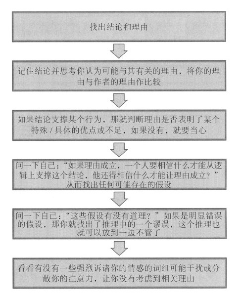

这次立法所牵涉的问题其实并非喝酒是否有害健康的问题，而是国会愿不愿意让联邦通讯委员会随意决定禁止在广播电视上播放酒类广告。如果我们允许联邦通讯委员会采取这一关涉酒类的行动，如果它明年又说糖果有害于公众健康，因为它会导致肥胖、牙齿脱落和其他健康问题，那我们又有什么办法阻止它行动呢？那牛奶和鸡蛋又怎么办？牛奶和鸡蛋的饱和性动物脂肪含量都非常高，无疑会增加血液中的胆固醇含量，很多心脏病专家都认为它们是引发心脏病的重要原因，那我们要不要联邦通讯委员会来禁止在电视上播放牛奶、鸡蛋、黄油和冰激凌的广告？

还有，我们都知道联邦政府的一切行为，不论其多么激烈，都不能也不会在消除酒类消费上完全有效。如果人们想喝含有酒精的饮料，他们一定可以找到办法满足自己。

结论：联邦通讯委员会不应该禁止在广播电视中播放酒类广告。

理由：（1）如果我们允许联邦通讯委员会禁止在广播电视上播放酒类广告，联邦通讯委员会很快就会禁止很多其他类型的广告，因为很多产品都会带来潜在的健康危险。

（2）联邦政府的行动没有一项会或者将会在彻底消除酒类消费方面起到有效作用。

首先，我们应该注意到两个理由都指向限制酒类广告带来的非常具体的不利因素，这是挺好的开端。但是，接受第一个理由的前提条件取决于一条隐藏的假设，就是一旦我们基于一个案例的法理依据来采取行动，那么在类似案例中采取行动我们就再也无法阻止。我们并不能接受这样的假设，因为我们相信法律体系中有很多步骤可以用来预防类似行动，如果这些行动没有正当的理由。这样，我们判定这个理由不能成立，这样的推理方式是滑坡谬误<a href="#part0419.html_ch1-back" id="part0419.html_ch1"
class="pcalibre calibre2">[1]</a>（slippery slope
fallacy）的一个例证。

第二个理由的相关度也值得商榷，因为就算这个理由成立，将理由和结论连起来的假设（禁止在广播和电视上播放酒类广告的主要目标就是完全消除酒类消费）也是错误的。禁止播放酒类广告的一个更可能的目标是减少酒类消费，因此这个理由我们也无法接受。我们把这类谬误叫做追求完美解决方案谬误<a href="#part0419.html_ch2-back" id="part0419.html_ch2"
class="pcalibre calibre2">[2]</a>（searching for perfect solutions
fallacy）。它的形式如下：我们不应该去支持针对甲问题的解决方案，除非它能从根本上解决问题。如果我们真找到完美的解决方案，那么我们就应该无条件地接受。但问题的实质是，尝试某种解决方案之后部分问题仍然存在并不意味着解决方案就不妥当或欠考虑。能提出特定的解决方案比起一筹莫展、束手无策来可能要高明百倍了。它可能会让我们向彻底完全地解决问题迈进了一步。

如果坐等完美解决方案的出现，我们常常会发现自己固守原地、动弹不得。下面是这个谬误的又一例证：家里添一套安保系统纯粹是浪费钱。如果贼要光顾你家，他们总归想得到办法，无论你装什么系统都不管用。

<a href="#part0419.html_ch1" id="part0419.html_ch1-back"
class="pcalibre calibre2">[1]</a>滑坡谬误指假设采取提议的行动会引发一系列不可控的不利事件，而事实上却有现成的程序来防止这类连锁事件发生。

<a href="#part0419.html_ch2" id="part0419.html_ch2-back"
class="pcalibre calibre2">[2]</a>追求完美解决方案谬误指假设因为尝试某种解决方案后还有遗留问题未解决，那么这种解决方案根本就不应该采用。

## 推理理由谬误百出

下面我们要带你做一些练习，以便让你发现更多常见的谬误。在你遇到每个练习的时候，请试着去套一套这个谬误，找一找我们前面提到的种种暗示。一旦你养成良好的鉴别谬误习惯，你就能找到大多数谬误了。下面的每个练习所展示的推理都含有这样那样的谬误。我们先指出为什么我们认为这个推理是荒谬的，然后给出谬误的名称和定义。

练习一

是时候让大麻成为人们缓解慢性剧痛的一种手段了。当社会对一种毒品的药用价值达成共识时，我们就同意使用这种毒品。而现在很显然社会上已经达成了同意使用大麻的共识。最新的民意调查显示，有73%的人认为医用大麻应该得到允许。此外，加利福尼亚州艾滋病受害者治疗协会（The
California Association for the Treatment of AIDS
Victims）也支持让抽大麻成为艾滋病病人的一种治疗选择。

作为分析谬误的第一步，让我们先来整理一下这个论证的框架。结论：抽大麻应该成为一种医疗手段。

理由：（1）一旦对某些药物的医疗价值达成共识，我们就应该审批通过，最近的调查显示，大麻作为药物用于治疗的共识已经形成。

（2）加利福尼亚州的一个协会支持医用大麻的使用。

首先，我们应该注意这两个理由没有一个指出医用大麻的某个特定的好处，因此从一开始我们就应该小心防范。然后，我们进一步细细查看第一个理由的措辞，发现在关键词的意义上出现偷梁换柱，这个偷换概念的做法欺骗了我们。“共识”这个词的意思偷换得非常巧妙，貌似持论者作了一个相关的论证，实际上并非如此。药物审批的共识通常意味着科研人员对于药物的优点达成共识，这和民意测验里得来的美国民众的一致意见相比是种非常不同的共识。因此这个理由根本说不通，我们应该抛弃它。

我们把这个推理中犯的错误叫做偷换概念谬误<a href="#part0420.html_ch1-back" id="part0420.html_ch1"
class="pcalibre calibre2">[1]</a>（equivocation
fallacy）。一旦你看到一个关键词或短语在论证中不止一次出现，检查一下看看其意思有没有发生改变，如果意思发生改变，就要警惕偷换概念谬误。那些高度含混的术语和词组尤其是偷换概念的绝佳材料。

看看你能不能识别出下面这个争论中出现的偷换概念。

朗妲：柯蒂斯真不是个男人。酒吧里那个醉汉威胁说要揍他一顿，他吓得屁滚尿流。

艾伦：他要不是男人，你又怎么解释他身上那些鼓鼓涨涨的二头肌呢？

即使文章中巧妙地利用了“共识”这个词，在医用大麻的论证中，调查结论本身难道还不能证实其结论吗？确实能，但只有我们接受其假设才行，也就是如果某个看法广受欢迎，那这个看法就一定非常好，但这却是个错误的假设。公众常常并没有对一个问题做出足够的研究使他们能进行合乎逻辑的判断。一定要当心那些诉诸普遍观点或者流行看法的说理论证。我们把这种推理中的错误称为诉诸公众谬误<a href="#part0420.html_ch2-back" id="part0420.html_ch2"
class="pcalibre calibre2">[2]</a>（appeal to popularity fallacy,
Ad Populum）。

现在，让我们仔细检查一下作者的第二条理由。作者所做的假设是什么？为了证明医用大麻是可取的，他引用了可疑的权威——加利福尼亚州的一个协会。一个立场并不会因为权威的纷纷支持就光荣正确。判定这样的推理有没有关联，最重要的是权威们据以做出判断的那些证据。除非我们知道这些权威对这一论题拥有特别的专门知识，否则我们就要将这个理由视为谬误。这种类型的谬误叫做诉诸可疑权威谬误<a href="#part0420.html_ch3-back" id="part0420.html_ch3"
class="pcalibre calibre2">[3]</a>（appeal to questionable
authority fallacy）。

下面让我们检查一下和另一个论争有关的一些论证：国会该不该批准联邦政府资助的儿童发展项目为儿童提供日托护理中心服务？

练习二

我反对政府的儿童发展项目。第一，我感兴趣的是保护祖国的儿童。社会规划师和自以为是的鼓吹家常常会扰乱儿童生活的正常发展过程，将他们从母亲和家人身边夺走，使他们变成通用计划的试验品，这些计划设计旨在20年里让这些孩子感到无比的幸福，我们就是要保护儿童不受这些计划的干扰。儿童就应该和母亲一起成长，而不是在一系列的临时看护或护士的帮助下长大。现在争论的问题是父母还该不该继续有权利塑造子女的性格，或者拥有所有权力的国家该不该被赋予各种工具和技术来塑造其年轻人。

现在让我们先整理一下这个论证的框架。

结论：政府的儿童发展项目是个错误。

理由：（1）儿童应该受到保护，不受社会规划师和自以为是的鼓吹家的干扰，这些人会干扰到儿童生活的正常秩序，并将他们从家人那里夺走。

（2）父母而不是国家才应该有权利塑造儿童的品格。

作为批判性思考问题的人，我们应寻找有关这一项目的具体事实。但是我们一个事实也找不到。这里的理由充满了未加定义的和充满感情的一般概括。我们已经将这篇文章当中几个此类词汇标记了出来。这些词语一般都会引发负面的情绪，这样持论的人希望其读者或听众将其与他所攻击的立场联系起来。

作者在这里玩了两个常用的小伎俩。首先，他精心挑选词汇来引发我们的情感共鸣，希望我们的情绪反应，会促使我们同意他的结论。当持论者激发人们的情绪反应，然后利用这个情绪反应让人们同意其结论时，他们就犯了诉诸感情谬误<a href="#part0420.html_ch4-back" id="part0420.html_ch4"
class="pcalibre calibre2">[4]</a>（appeal to
emotion）。当这类情绪反应本不应该和结论的真伪发生关联时，这个谬误就会发生。这类谬误特别常见的三个地方就是广告、政治论辩和法庭论辩。这种谬误的一种常见形式是恶语中伤（name-calling），属于一种人身攻击，主要通过引起人们不好的感情联想的言辞来给人戴帽子，试图诋毁别人。“自以为是的鼓吹家”这样的词就是恶语中伤的一个例子。

其次，作者树立了一个靶子来加以攻击，让我们更容易站在他这边，而这个靶子实际上根本不存在。他有意拓展对方的立场，使其达到易于攻击的程度。这个例子里的错误假设是：作者所攻击的立场和立法中实际呈现出来的立场相同。儿童在一些通用计划里是否真的是试验品？批判性思考的人得出的教训是：如果有人攻击一个立场的几个方面，一定要经常查看一下他是否公正全面地表现了这个立场。如果没有的话，你就找到了一个稻草人谬误<a href="#part0420.html_ch5-back" id="part0420.html_ch5"
class="pcalibre calibre2">[5]</a>（straw-person fallacy）。

稻草人不是真人，而且很容易被击倒，如同一个人犯了稻草人谬误其立场很容易被攻击一样。要检查一个立场被表现得到底有多公平，最好的办法就是找出所有立场的事实。

现在让我们进一步仔细分析第二条理由。作者说要么父母有权塑造子女的性格，要么国家应该被赋予决定权。让我们快速看一看布兰妮·斯皮尔斯（Britney
Spears）在《马戏团》（Circus）里所说的另一个例子：“世界上只有两种人——一种人表演，另一种人观看。”

要让这样的陈述成立，我们必须假设只有这两种选择，是不是这样呢？当然不是！作者创造了一种虚假的两难选择（false
dilemma）。有没有可能既让儿童发展项目存在，同时又让家人对孩子的成长施加重要影响呢？当争议被表现得好像只有两种可能的选择时我们一定要特别当心，事实上总有两种以上的选择。如果一个持论者通过陈述仅仅两种选择来过度简化一个论题，他所犯的这种错误就叫做虚假的两难选择谬误<a href="#part0420.html_ch6-back" id="part0420.html_ch6"
class="pcalibre calibre2">[6]</a>（either-or false dilemma
fallacy）。要找出两难选择的谬误，需时时警惕下列这些词汇：

·不是……就是……（either……or）

·唯一的选择就是（the only alternative is）

·两种选择分别是（the two choices are）

·因为甲不起作用，那只有乙能（because A has not worked, only B will）

看到这些词语也并不一定意味着你发现了一个谬误，有时候真的只有两种选择。这些词不过是引起你当心的警告标志，见到它们的时候要停下来想一想：“在这个案例中是不是还有两种以上的选择呢？”

你能否看出下列对话中的虚假的两难选择呢？

市民：我想美国政府决定入侵伊拉克犯了个大错误。

政客：你为什么要恨美国呢？

当我们要为某一类行为寻求解释时常常会遇到越想越糊涂的情形。大学室友之间的一个简短对话就体现了这种犯糊涂的情况。

丹：我发现查克最近的行为一直有点古怪。他对别人的态度真的很粗鲁，把学生宿舍里弄得一团糟，而且坚决不清理干净。你认为到底发生了什么事？

凯文：对我来说这一点都不奇怪，他就是个混球。

要解释这一点，首先就要分析一下为什么这一行为会发生。解释是个耗时费力的活儿，经常要检验我们知识的边界。在上述例子中，“混球”对查克的古怪行为而言是个难以令人满意的解释。当我们被要求解释为什么特定的行为会发生时，我们常常受到诱惑，想要隐藏我们对很多复杂因果关系的无知，干脆给那种行为贴上个标签或者套上个名字，然后我们错误地假设因为我们知道那个标签或名字，我们就知道事情的起因。

我们这样做是因为命名欺骗了我们，让我们相信自己找出了那个人有什么特点或是什么样，这样也就使他有了相应的行为，斯人有斯事也。例如，比起要详细说出一套又一套复杂的内因和外因导致了一个人大发脾气，诸如人际关系出现的种种问题、父母对他的强化训练、孤立无援的感觉、睡眠不足和生活中的紧张刺激等因素，我们干脆简单地说那个人脾气不好，或者那个人是好与人为敌。这样的解释过于简化问题，阻碍我们找到更富有洞察力的理解。

下面的例子应该提高我们对这类谬误的警惕感：

（1）为了解释老爸酗酒的毛病，当老妈被大女儿问道：“为什么老爸行为这么古怪？”老妈回答说：“他正在经历中年危机。”

（2）有个朋友老是担心其他人背后说他。你问一个心理学家他为什么会这样，心理学家回答说：“因为他有妄想症。”

两个回答问题的人都没有令人满意地解释所发生的行为。比如，老爸基因的具体情况、工作上的压力、夫妻间的争吵还有锻炼的习惯等都有可能提供老爸酗酒的合理解释。“中年危机”不但不合适，而且误导别人。我们本以为自己知道了为什么爸爸酗酒，而实际上什么都不知道。

当有人宣称他们发现了导致某个行为的原因，而实际上他们所做的不过是为这种行为起了个名字而已，我们要对这种乱扣帽子谬误<a href="#part0420.html_ch7-back" id="part0420.html_ch7"
class="pcalibre calibre2">[7]</a>（explaining by naming
fallacy）保持警惕。

<a href="#part0420.html_ch1" id="part0420.html_ch1-back"
class="pcalibre calibre2">[1]</a>偷换概念谬误指在论证中关键词语有两种或两种以上的含义，一旦不同含义之间的转换被认出来，这个论证就讲不通了。

<a href="#part0420.html_ch2" id="part0420.html_ch2-back"
class="pcalibre calibre2">[2]</a>诉诸公众谬误指通过引述大部分人都持有这一观点的说法来竭力证明某个论断有道理，错误地假设大部分人喜欢的一切就是有道理的、可以接受的。

<a href="#part0420.html_ch3" id="part0420.html_ch3-back"
class="pcalibre calibre2">[3]</a>诉诸可疑权威谬误指引用某一权威的话来证明结论，但该权威对这一论题并没有特别的专门知识。

<a href="#part0420.html_ch4" id="part0420.html_ch4-back"
class="pcalibre calibre2">[4]</a>诉诸感情谬误指使用带强烈感情色彩的语言来分散读者或听众的注意力，让他们忽视相关的理由和证据。常被用来加以利用的感情有害怕、希望、爱国主义、怜悯和同情。

<a href="#part0420.html_ch5" id="part0420.html_ch5-back"
class="pcalibre calibre2">[5]</a>稻草人谬误指歪曲对方的观点，使它容易受到攻击，这样我们攻击的观点事实上根本就不存在。

<a href="#part0420.html_ch6" id="part0420.html_ch6-back"
class="pcalibre calibre2">[6]</a>虚假的两难选择谬误指当现实中存在两种以上的选择时却假设只有两种解决方案。

<a href="#part0420.html_ch7" id="part0420.html_ch7-back"
class="pcalibre calibre2">[7]</a>乱扣帽子谬误指错误地假设因为你为特定事件或行为提供了一个名称，你也就合情合理地解释了这一事件。

## 警惕分散注意力的干扰

那些尽力要让人接受其断言的人常发现，只要他们防止别人太过详细地审视他的相关理由，他们就可以捍卫这一断言。他们通过分散注意力的策略来防止人们近距离地查看。在你寻找谬误的时候，你会发现下面这个行为很有帮助，那就是当持论者使用的那些推理论证主要是为了转移你的注意力，让你不再关注最相关的那些理由时，你就要特别警惕。例如，人身攻击谬误可以通过转移我们的注意力，让我们多多关注这个人的本质从而忽略掉那些正当的理由来愚弄我们。在这一部分，我们提供更多练习来展示其他类型的谬误，只要我们提出以下问题：“作者有没有通过转移我们的注意力来欺骗我们？”就有可能发现这类谬误。

练习三

政治演说：在即将到来的选举中，你迎来了为一位女性投票的良机，她代表了这个伟大国家的未来，她为实现民主长期奋斗，为捍卫国家利益不遗余力，她为追寻美国梦想而当机立断、信心百倍、勇往直前。这位女性充满爱心，为儿童福利出力，为环境保护奔走，为推动国家迈向和平、繁荣和自由而出谋划策。投古德哈特（Goodheart）一票就是投真理一票，投梦想一票，投常识一票。

听起来好像古德哈特女士是个完人，是不是？但是这一演说却没有提供任何具体细节，说明这位参议员过去的记录和对重大事件的现有立场，取而代之的是一连串的美德词汇（virtuewords），全都倾向于和我们心中积极的感情产生联系。我们把这类美德词汇称为光环效应（glittering
generalities），因为它们都能让人产生正面积极的联想，而且它们都很概括，简直读者想它们是什么意思它们就是什么意思。这种光环效应的手法让我们赞成或者接受一个结论，而根本不去检查相关理由、证据或具体的优点和缺点。光环效应谬误<a href="#part0421.html_ch1-back" id="part0421.html_ch1"
class="pcalibre calibre2">[1]</a>就好像是把恶语中伤的方法颠倒过来，因为恶语中伤重点是要我们形成负面的评价而不去检查其证据。美德词汇的使用是政客们经常玩弄的手腕，因为这个手法可以分散读者或听众的注意力，让他们不去关注具体的行动或政策，而这些行动和政策更容易招致反对和批评。

让我们看一看另一个非常常见的转移注意力的手法。

练习四

医药公司修改研究数据，以便让它们的止痛药对健康的危险显得比实际中要小一点，我不明白为什么每个人对这种做法感觉不舒服。服用那些药物结果根本不会那样糟，毕竟还有成千上万的人使用这些止痛药，并且从中获得了缓解疼痛的效果。

问题的实质是什么？对止痛药的安全性公众是不是被误导了？但是如果读者不够细心，他的注意力就会被转移到公众是否想使用这些药物的问题上去。如果一个作者或演说者将我们的注意力从论题上面转移走，我们就可以说他故意把话题转移到与其原来主题不相干的事情上去。我们很多人都擅长犯转移话题谬误<a href="#part0421.html_ch2-back" id="part0421.html_ch2"
class="pcalibre calibre2">[2]</a>（red herring
fallacy），正如下面这个对话所示：

妈妈：你和男朋友到哪儿去了？你为什么要跟我撒谎？

女儿：你总是挑我的错儿。

如果当女儿的成功了，问题就变成这个当妈的是不是在挑女儿的错，而不再是当女儿的为什么要跟妈妈撒谎。

只要你脑子里谨记真正的论题所在，同时牢记解决这一论题所需要的证据，一般而言要找到转移话题谬误并不难。

这种类型的推理是错误的，因为仅仅改变讨论的主题，很难被当做反对某一断言的一个论证。

<a href="#part0421.html_ch1" id="part0421.html_ch1-back"
class="pcalibre calibre2">[1]</a>光环效应谬误指使用模糊、引发人们强烈感情认同的美德词汇，使我们倾向于同意某件事而不去细致检查其理由。

<a href="#part0421.html_ch2" id="part0421.html_ch2-back"
class="pcalibre calibre2">[2]</a>转移话题谬误指一个不相干的话题被插进来，将注意力从原来的论题上面转移走，通过将注意力转移到另一个论题上来帮助赢得一场论战。这个例子中的谬误顺序如下：①甲主题正被讨论；②乙主题被介绍进来，好像和甲主题有关，实际上并不相干；③甲主题被置之不理。

## 愚弄人的循环论证

最后要介绍的谬误特别具有欺骗性。有时候，一个结论会自己证明自己，只不过措辞有所改变，用来愚弄那些单纯无知的人！例如，论证退学是不可取的，因为它是不好的，这实际上跟没有论证没什么两样。结论由同一个结论来证明（只是表述不同）。这样的论证其实是在回避问题，而不是在回答问题。这就是循环论证谬误<a href="#part0422.html_ch1-back" id="part0422.html_ch1"
class="pcalibre calibre2">[1]</a>（begging the question
fauacy）。让我们看一个稍微有点不太明显的例子。

阅读传统教科书比阅读电子文本在学习效果上要好得多，因为以教材的形式来展现各种材料非常有利于学习。

同样，支持结论的理由只是用不同词语重申了一遍结论而已。根据定义，传统的教科书都是以教材的样式以供阅读的。作者的论证是：这种做法非常好，因为它非常好。一个合理的理由一定是指出阅读传统教材的某个具体的好处，例如对所学材料的持久记忆。

只要结论本应该是通过推理过程被证明出来的，实际上却是被假设出来的，结论先行就在所难免。当你列出论证的结构提纲后，请检查一下理由，以确保它们不是仅仅用不同的词语在重复结论，再检查一下看看结论是不是用来证明理由的。为了避免你陷入困惑，我们用两个例子来加以展示，一个论证是回避问题，另一个则不是。

（1）让媒体对自己的新闻来源保密对于国家来说非常有利，因为这就增加了个人提供证据来举报权威人士的概率。

（2）让媒体对自己的新闻来源保密对国家而言非常有利，因为个人有权向媒体提供信息而不必确认自己的身份，这样做将非常有助于大集体的利益。

例（2）就是在重复结论，以此来回避问题。它并没有指出具体的有利地方到底在哪儿，而是简单重复新闻来源的保密对整个社会有好处。

### 使用这个关键问题

当你找到一个谬误的时候，你也就发现了一个合情合理的依据来反驳持论者的那部分论证。但是对于建设性的批判性思维精神而言，你还是想要考虑论者提出的任何一个不是谬误的理由。可惜的是，一本书或一篇文章的作者并不能亲自过来和你深入探讨。但是在口头论辩中出现的那些谬误，你想要深入交谈的最有效措施就是问一下犯了逻辑谬误的对方有没有更好的理由来证实其结论。例如，如果一个转移话题的谬误发生，问一下谈话者可不可以回到原来的那个论题。

<a href="#part0422.html_ch1" id="part0422.html_ch1-back"
class="pcalibre calibre2">[1]</a>循环论证谬误指在推理过程中已然假设自己的结论成立的论证。

## 推理错误小汇总

我们已经通过各种练习向你展示推理过程可能出错的大量方法。我们并未穷尽所有的错误方法，但是我们为你提供了一个良好的开端。我们留下一些额外的谬误放到后面的章节中讨论，因为只要你专心关注后面章节中所讨论的具体问题，你极有可能自己辨别出它们。等你遇到每个额外的谬误，请确保将它们添加到这个谬误清单中来。

要找出推理谬误，请记住什么样的理由才是好的理由，也就是与论题相关的那些证据和道德原则。一旦推理中出现了错误假设、分散注意力或是支持已经假设结论就是真理的结论等诸如此类的现象，这一推理就应立刻遭到鄙弃。推理论证一旦诉诸大众认可的观点或者诉诸权威，这样的推理也应该小心对待。你应该不停地问：“将这些请求当成说服人的证据有没有扎实过硬的理由？”下面按顺序给你列出一个预警的提示：不要自然而然地就驳斥依赖诉诸于权威或者大众认可观点的那些推理论证。小心谨慎地评价这样的推理论证。例如，如果国内大部分医生都选择坚持慢跑锻炼，在判断慢跑锻炼是否有益于健康这个论题时就是个值得考虑的重要信息。有些权威确实拥有价值非凡的信息。因为他们作为证据来源的重要地位，我们将在第7章中具体讨论诉诸权威这一部分。

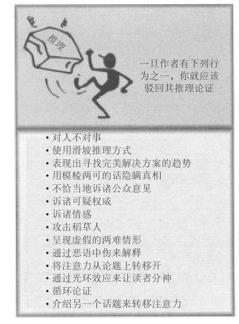

## 扩展你关于谬误的知识

我们建议你参考其他教材和某些网站来扩充你对推理谬误的认识和理解。戴默（Damer）的《抨击错误推理》（AttackingFaulty
Reasoning）就是个特别好的资源，可以帮你更加熟悉推理中的谬误。

## 轮到你自己写时，可得吸取教训

当你和别人交流的时候，自然而然要牵涉到推理论证。如果你的目的是表达一个无懈可击的论证，当中你不想诱骗读者来同意你的结论，那么你就肯定想要避免犯推理谬误。意识到其他作者可能犯的那些错误，前车之鉴让你在构建自己的论证大厦时会加倍小心。你可以细细检查自己的假设，记住多数有争议的论题都需要你具体阐述其中的有利和不利因素，手边时时有一份可能会出现的推理谬误清单，这样你就可以避免这些谬误。

来，做做思维体操

？关键问题：推理论证中有没有什么谬误？

请找出以下三篇练习文章推理中存在的谬误。

⊙第一篇

卫生局局长超越他自己的职位权限，建议从三年级开始就要开展明确的性教育。很显然他又是一个席卷全国的艾滋病严重焦虑的受害者。不幸的是，他的深受媒体宣传影响的宣言给那些支持明确性教育的人打了一针强心剂，哪怕对全国儿童造成损害也在所不惜。

性行为是一直局限在家庭小圈子里的隐秘话题，直到最近性教育才被强加给儿童。卫生局局长的建议将家庭的作用完全取消。本应该是父母对其子女解释性爱行为，而且采用的方式大家都不用觉得尴尬。没有家庭介入的性教育完全剥夺了价值观和任何意义上的道德观，因此应该加以阻止才对。多年来，家庭都承担了性教育的责任，而这才是性教育本应采取的方式。

⊙第二篇

比特犬通常受到大众的无理歧视，因为少数几例比特犬的凶猛行为导致人们异乎寻常的过激反应。只有傻瓜才会禁养这类犬种。大多数有关比特犬的投诉都来自恨犬人士，这些人一见到狗就吓得胆战心惊。我自己养了一只忠心耿耿的比特爱犬安迪已经七年多了，它一直都规规矩矩地表现良好。我坚信它绝对不可能去攻击一个陌生人。同样，还有欧维特医生，本地一家爱犬诊所的主任，他也说绝大多数的比特犬都不是好斗凶猛的。明确颁布某种比特犬禁养令只能是一种无用的姿态。我也见过不少其他犬类，例如金毛猎犬咬人。因此，单纯禁养比特犬并不能完全防止狗咬人。一旦禁养比特犬的法案获得通过，下一步必将是禁养一切可能咬人的狗。

⊙第三篇

比尔：窝藏图谋破坏美国恐怖分子的国家应该被当做美国的敌人。任何不将恐怖分子主动交给美国司法体系的国家都明白无误地站在恐怖分子的一边。这种行为意味着这些国家的领导人不愿看到这些恐怖分子受到应有的惩罚，而是更热心于窝藏杀人犯、强奸犯、小偷和反民主人士。

泰勒：一个人有直系亲属一直在为中情局效力，从他嘴里说出这样的话来，我一点也不觉得奇怪。但是在我看来，一旦你开始将那些和美国政策不一致的人贴上敌人的标签，那么最终导致的结果就是几乎所有国家都会被当做美国的敌人，那么我们最终成为孤家寡人，没有一个同盟。

给个提示

⊙第一篇

结论：性教育不应在学校开展。

理由：（1）卫生局长的报告体现了过度恐慌。

（2）卫生局长受到艾滋病恐慌和媒体渲染的影响。

（3）报告完全排除了家庭的作用。

（4）性教育是父母的工作，这是自古以来的方式，今后也应该保持下去。

作者论证一开始就攻击卫生局长而不是驳斥论题。他断言此建议是艾滋病恐慌的一个连带产品，而不是经过深入研究得出来的。他暗示卫生局长发表报告是为了呼应媒体上的热点问题，削弱了他的可信度和品格，因此是人身攻击。

第二条理由是稻草人谬误，因为它暗示性教育的目标就是包揽儿童性教育的一切。

他的第三条理由混淆了“是什么”和“该是什么”，因此是一厢情愿谬误（wishful
thinking
fallacy）的一个例子。性教育应该由父母承担和决定并不意味着父母会提供这些教育。

第四个理由体现了虚假的两难选择——要么把性教育开除出学校课堂，要么面临道德滑坡和价值观缺失的一代儿童。但是有没有可能即使性教育在家中进行也照样会有道德滑坡的一代儿童？难道学校和家庭联手在性教育上各司其责就没有任何可能吗？教育培养出的儿童做好准备在生活中正确对待性问题，难道不比有道德缺陷的少年犯好？

⊙第二篇

结论：比特犬不应该被禁养。

理由：（1）禁养的愿望来源于公众对少数几例咬人事件的过激反应。

（2）大多数投诉来源于仇恨犬类的人。

（3）狗主人知道比特犬从来不会咬人。

（4）禁养比特犬也解决不了问题，还是有其他种类的狗会咬人。

（5）爱犬诊所主任说多数比特犬都不是特别具有攻击性。

（6）禁养比特犬会导致禁养其他种类的狗。

这篇文章一开始就犯了人身攻击和恶语中伤的谬误，攻击那些想禁养比特犬的人的品格，而不是提出任何具体的论证。一厢情愿好像影响到作者的第三条理由。第四条理由犯了追求完美解决方案谬误。减少恶狗伤人的数量能解决一部分问题，即使解决不了恶狗伤人的全部问题。他的第五条理由犯了滑坡谬误，因为完全有可能立法禁养某品种的狗而不用延伸此法律到其他品种上去。他的最后一条理由犯了诉诸公众谬误，错误地估计因为很多人对狗都有这样一种看法，因此这种看法就是真的。

# 第7章　证据的效力如何：直觉、个人经历、典型案例、当事人证词和专家意见

第6章通过学习怎样找到说理论证中存在的各种谬误，你在评价试图说服你的交流方面已经取得了巨大进步。接下来的几章我们将继续关注评价的过程，主要学习针对推理结构的一个具体部分来提出关键问题：对事实的断言。让我们先来看看这些断言的面目如何。

练习瑜伽减少了患癌症的风险。

打游戏促进手眼之间的协调能力。

越来越多的大学生宿醉以后来教室上课。《时代周刊》报道说，24%的大学生报告过去两周内至少有过一次这类情形，头一天晚上饮酒太多，第二天醒来宿醉未消就去班级上课了。

我们怎么去看待这些断言？它们是否合情合理？多数推理论证都包含这类断言。本章我们就着手开始评价诸如此类的断言。

？关键问题：证据的效力如何：直觉、个人经历、典型案例、当事人证词和专家意见？

## 我为什么要相信它

几乎我们遇到的所有推理论证都包含了对这个世界曾经是什么样、现在是什么样和将来是什么样的看法，持论者希望我们将这些看法当做“事实”来接受。这些看法可能是结论，可能是理由，也可能是假设。我们可以把这些看法称为事实断言（factual
claims）。

对于事实断言你要问的第一个问题就是：“我为什么要相信它？”

接下来要问的问题是：“这个断言需不需要证据来加以证实？”如果需要证据，但又没有看到证据，那么这个断言就是孤立论断（mere
assertion），意思是它是一个没有用任何方式来加以证实的断言。你当然应该认认真真地怀疑孤立论断的可靠性！

如果有证据，那你的下一个问题就是：“证据的效力怎么样？”

为了客观评价推理过程，我们要记住，有些事实断言比其他事实断言显得更加可靠。例如，认为“大部分美国参议员都是男性”这个断言是真的，也许你觉得很有把握，但是要说“练习瑜伽降低了罹患癌症的风险”这个断言也是真的，就不太有把握了。因为对大部分的断言来说，要证实它是绝对的真理或绝对的谬误，如果不是绝对不可能也是极其困难的。与其问一问它们是不是真的，我们宁愿问问它们是不是可靠。其实，我们想问的是：“我们可以依靠这样的看法吗？”一个断言的证据数量越多、质量越高，我们可以信赖它的程度就越高，我们也就越可以称这样的断言为“事实”。

什么证据表明我们的学校需要被拯救

比如，有大量现存的证据表明乔治·华盛顿是美利坚合众国的第一任总统。因此，我们可以将这个断言当成事实。而对于“瓶装水比自来水饮用起来更安全”这样的看法就有许多相互矛盾的证据，这样我们就不能将这个看法当成事实。对于断言到底是观点还是事实，其间最大的区别就是有多少相关证据。支撑一个看法的证据越多，这个看法的“事实性”也就越高。

在我们判断一次交流活动的说服力之前，我们要知道哪个事实论断最为可信。怎么确定其可靠性呢？我们会问以下这样的问题：

·你的证明是什么？

·你怎么知道它是真的？

·证据在哪里？

·你为什么相信它？

·你确信它是真的吗？

·你能证明吗？

如果你养成经常问这些问题的习惯，你离跻身最佳批判性思考者也就不远了。这些问题要求提供论证的人揭示这些论证的基础来为其言论负责。任何一个提出论证的人，如果他想要你认真考虑这个论证，都会毫不犹豫地回答你的这些问题。他们知道自己有实质性的证据来证实其断言，因此，他们也想告诉你这些证据，希望你能渐渐认同他们的结论。如果有人对出示证据这一简单要求的反应是怒火中烧或退避三舍，他们这样做常常是因为自己觉得尴尬难为情，因为他们意识到，没有证据，他们对自己的看法本来不应该那样底气十足。

如果我们经常提这些问题，我们就会注意到，对许多看法而言，总是没有足够的证据来彻底干脆地证实或是驳倒它们。例如，很多证据都证实“每隔一天服用一片阿司匹林可以减少患心脏病的风险”这个断言，虽然同时也有一些其他的证据可以反驳这一断言。在这种情况下，我们就需要判断，证据数量上的优势到底在哪边，这样我们才能决定这一事实断言的可靠程度如何。

做出这样的判断要求我们提出以下重要的问题：“证据的效力怎么样？”第7章到第9章主要关注我们需要问的一些问题，目的是确定持论者能在多大程度上支持他们的事实断言。事实断言的可靠程度越高，这一交流的说服力也就越强。

## 事实断言可靠吗

我们遇到的事实断言是：①描述性结论；②用来证实描述性或规定性结论的理由；③描述性假设。下面我们就每种情况举一个简单例子，通过简短的论证来说明它们。

①经常使用戴在头上的耳机有可能造成听觉损耗。科研人员在251名大学生中研究他们佩戴这种耳机的频率和持续时间，发现49%的学生表现出听力损伤的症状。

注意，“经常使用戴在头上的耳机有可能造成听觉损耗”是个事实断言，同时是个描述性结论，有研究证据来支撑。在这个例子里，我们不禁要问：“那个结论（事实断言）是不是可以由证据来证实？”

②美国需要有更强硬的枪支管理制度。美国涉枪案件的数量在最近10年大幅度增加。

注意这里的事实断言是“涉枪案件的数量在最近10年大幅度增加”，它的作用是作为理由来证实一个描述性结论。在这个例子里，我们需要问的问题是：“那个理由（事实断言）是不是可以由证据来加以证实？”

③教授们在课堂上需要增加更多积极的讨论，因为太多的大学毕业生缺乏批判性思维的能力。

一个没有明说的描述性假设将理由和结论连接起来。这个假设就是：学生们可以通过积极地参加课堂讨论来学习如何批判性地思考问题。

这个事实断言是个描述性假设，有可能可靠，也可能不可靠。在我们相信这个假设之前，也就是相信其理由之前，我们要问一问：“其证据证明这个假设的效力怎么样？”你会发现虽然很多持论者意识到用证据来支持其理由的必要性，但他们却没有明白让他们的假设显得一目了然的这种必要。因此，用来证实假设的那些证据很少会出现，尽管在很多情况下这样的证据在判定论证的质量方面会大有裨益。

## 证据从哪儿来

什么时候我们才能接受一个事实断言，认为它可以信赖？在三种情况下我们最倾向于同意它是事实断言：

（1）当这个断言表现为无可置疑的常识，比如下面这样的断言：“举重可以锻炼出身体中的肌肉。”

（2）当这个断言是从无懈可击的论证中得出的结论。

（3）当这个断言在同一场交流中被很多过硬的证据合理地加以证实，或者由我们所知道的其他证据来证实。

本章我们所关心的是第三种情况。确定证据的适当与否需要我们提出这样的问题：“这个证据的效力怎么样？”要回答这个问题，我们首先必须要问：“我们所说的证据到底是什么意思？”

小贴士：所谓证据，就是持论者所告知的明确信息，用来证实或捍卫一个事实断言的可靠性（参见第2章）。在规定性论证中，需要有证据来证实属于事实断言的那些理由；在描述性论证中，需要有证据来直接证实一个描述性的结论。

证据的质量主要取决于证据的类型。因此，要评价证据，我们首先要问：“这是什么类型的证据？”知道了证据的类型就等于告诉了我们应该问什么样的问题。

如果运用得当，每种证据都可以成为“有效证据”，它有助于证实作者的断言。正如黄金勘探工通过仔细检查自己淘金盘里面的石子来筛查可能的高质量矿石，我们也必须仔细检查证据来判断其质量。我们想知道，“作者的证据是不是为其断言提供了可靠的支撑？”这样，我们一开始评估证据时就要问：“证据的效力怎么样？”

我们要一直在脑海深处铭记，没有一样证据可以像灌篮那样一锤定音、一劳永逸。你总是在找更好的证据，如果一根筋地去找完美证据，那你肯定要泄气。

在本章和第8章中，检查针对每种类型的证据我们可以提的各种类型的问题，以帮助我们决定证据的质量。本章将要考察的证据类型包括直觉、个人经历、典型案例、当事人证词和专家意见。

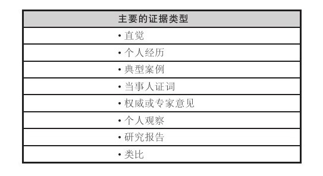

## 直觉作为证据可靠吗

“我就是感觉珍妮特和我是天生一对，尽管我的朋友都觉得我们俩不搭调。”

“我就是有这种感觉，参议员拉米雷斯要让那些搞民意调查的人大吃一惊，然后赢得选举。”

“我一下子就知道这台老虎机今天肯定会让我成为大赢家。”

当我们用直觉来证实一个断言，我们依赖的是“常识判断力”，或者依赖我们的“预感”，或是依赖“第六感”。听听朱厄尔在歌曲里怎样赞美直觉是理解的源头：

跟着心儿走，

跟着感觉走，

它会领着你到你想去的地方。

放飞理智吧，

去寻找你的直觉，

很容易你就找到它。

——朱厄尔《直觉》

如果一个持论者说“常识告诉我们”或者“我就是知道这是真的”来证实其断言，他就是在利用直觉作为证据。所谓直觉，就是我们相信自己对某件事有直接的洞察力，却不能有意识地说出理由的过程。

直觉最大的问题就在于它的私密性，别人根本无法判断它的可靠性。因此，当凭直觉得来的看法相互冲突时（事实上这种情况常常出现），我们就缺乏坚实的基础来判断该相信哪些。同样，很多直觉依赖于无意识的加工，极大地忽视了相关证据，并且反映出强烈的偏见。因此，我们必须要警惕单凭直觉证实的那些断言。

但有时直觉其实也依赖于一些其他类型的证据，比如大量相关的个人经历和阅读经验，会不知不觉地从我们脑海的某个角落释放出来。例如，当有个经验丰富的飞行员在飞机排队起飞时候凭直觉感到飞机有点不对劲，我们很可能非常赞成对飞机做进一步的安全检查，然后再起飞。有时候，第六感并不是盲目的，只是无法对其加以解释。作为批判性思考的人，我们只是想查明那些依赖于直觉的断言有没有其他类型的证据来证实。

## 个人经历作为证据可靠吗

下面这个论证是使用一种特别类型的证据来证实一个事实断言。

“我的朋友朱迪熬了一个通宵来复习备考，结果考得相当不错；明天我就要考试了，所以我觉得今晚没必要再睡觉了。”

“我在吃了一大块巧克力蛋糕后常常觉得好过很多，所以我觉得任何感到郁闷的人只要多吃点巧克力蛋糕就行了。”

这两个论证都诉诸个人经历来作为证据。像“我认识有个人……”“以我的经验，我发现……”这样的句子应该提醒你注意这类证据。因为个人经历过的事在我们的记忆里总是活灵活现，我们总是依靠它们做证据来支持一个看法。例如，也许你跟一个汽修工打交道后确实感觉糟糕透顶，因为他修车的费用高得离谱，这让你认为大多数汽修工都喜欢漫天要价。虽然这样来概括所有汽修工可能正确也可能不正确，但把这样的个人经历当作一般性看法的基础是个错误！因为单一的个人经历，甚至是个人经历的总和，根本不足以构成一个有代表性的经历样本，个人经历常常会导致我们犯下以偏概全谬误<a href="#part0430.html_ch1-back" id="part0430.html_ch1"
class="pcalibre calibre2">[1]</a>（hasty generalization
fallacy）。一次突出的经历或者几次这样的经历可以说明某个结果有可能出现，比如，你可能遇到过几个人声称因为他们没有系安全带，出车祸时因此得以保全性命。但是这类经历却不能说明这样的结果就是有代表性的或极有可能发生的。当你听到自己或者别人说，“嗯，以我的经验来看……”的时候，就一定要当心。

第8章里我们讨论研究证据和样本的问题时还要重温这种类型的谬误。

<a href="#part0430.html_ch1" id="part0430.html_ch1-back"
class="pcalibre calibre2">[1]</a>以偏概全谬误指一个人仅根据群体中极小部分人的经历就得出有关整个群体的结论。

## 典型案例作为证据可靠吗

一所大学的校长说：“我们的学生当然能找到收入丰厚的工作，能进入高等学府进一步深造。为什么？因为就在去年我们欢送过一个毕业生玛佳尼前往哈佛大学法学院深造。入学这一年来，玛佳尼一直排名在班级前5%成绩最好的学生之中。因此，我们的学生当然能在一流大学取得令人瞩目的成就。”

有一种类型的证据经常会被用到，那就是不厌其详而又引人入胜地描绘或是塑造一个或多个人物或事件来证实某个结论。这类描述通常都是基于观察或者访谈，其形式也从深度描述到表面走过场等各不相同。我们把这样的描述称为典型案例（case
examples）。持论者常常在游说型报告的开头部分来一段活灵活现的有关某个事件的生动描述，以便对听众动之以情。例如，支持禁止在开车时使用手机的一种论辩方法就是说一些让人肝肠寸断的故事，都是因为司机边开车边打电话而出了车祸，结果导致一众年轻人死于非命。

对我们而言，典型案例常常很有说服力，因为它们是那样具体生动而又细致感人，很容易就在我们的脑海里浮现出来。政治候选人越来越青睐在演讲中展示典型案例，他们知道案例中所表现出的丰富细节会激发听众热烈的情感回应。

因为生动具体的案例诉诸我们的情感，它们分散了我们的注意力，让我们不再纠缠于它们作为证据的价值，不再搜寻其他更为相关的研究证据。例如，假想出一个故事来描绘一个人怎样折磨并杀害了不计其数的受害人，这样的故事激发起我们强烈的感情，很可能就增加了我们想判他死刑的愿望。但是，这些罪犯中的人伦悲剧却有可能导致我们忽略这样的事实，那就是这样的案例极其罕见，在过去30年里，119名死刑犯都被发现是无辜的，并从监狱中无罪释放。当心那些引人注目的典型案例被人用作证明！

尽管典型案例和某个结论表现出一致性，但不要让这种一致性欺骗了你。别忘了问自己一声：“这个例子有没有代表性？”“有没有强有力的相反的例子？”“这个例子被提及的方式中有没有偏见存在？”

有没有什么情况下典型案例非常有用，虽然它们算不上有力的证据？当然有！如同个人经历一样，它们也展现出各种重要的可能，让抽象的数据呈现出生动的个人面孔。它们让人们更容易联想到某个论题，因此对它产生更加浓厚的兴趣。

## 当事人证词作为证据可靠吗

加油站墙上的一则说明：“我的车老是漏油，送给简修过以后就再也不漏了。因此我强烈建议你将爱车送到简那里维修，不管什么发动机问题她都能修好。”

这本书看起来真不错。在书的封底，有读者评论说：“这本书我拿起来就放不下。”

商业广告、电影预告、图书封底的各式推荐、超自然现象的存在证明或者其他有争议的或意想不到的生活事件的描述，常常都利用一种特殊类型的诉诸个人经历的方法来说服别人相信它们。它们通过引述具体当事人的话，尤其是名人的话，来说明某一个想法或某一个产品是好是坏，或那些非比寻常的事情确实发生过，这些都基于他们的亲身经历。引用具体当事人的这些说法都被称为当事人证词（personal
testimonials）。也许你在选择要上的大学时听过某些大学生的当事人证词。因此，当事人证词也是一种形式的个人经历，在这里某人（常常是名流）提供一种说法来证实某产品、事件或服务的价值，这种赞同和支持缺乏我们需要的任何信息，让我们可以判断应该让它在多大程度上影响我们。

这类的证据到底有多大用处？通常它的用处并不大。大多数情况下，我们对这类当事人证词无须过多关注，直到我们找出它们背后更多相关的专门知识、兴趣、价值观和偏见等。下列和当事人证词有关的每个问题我们都要特别小心。

·选择性。人们的经历总是迥然不同。那些尽力想要说服我们的人总是小心选择他们要用的证人和证词。在图书封底我们最可能见到的总是最好的溢美之词，而不是最有代表性的读者反响。我们应该时时刻刻追问这个问题：“我们没机会听到的那些经历感受又是什么样？”同样，那些站出来提供证词的人往往会对关注的问题有所选择，对那些证实他们看法的信息加倍关在，而对那些证伪他们看法的信息则加以忽略。我们常常说眼见为实，这里则倒过来，相信什么就看得见什么！我们的期盼心理极大影响到我们经历事件的方式。如果我们相信外星人生活在我们当中，或者人类从来就没有真正登上过月球，那么我们就更有可能把模糊不清的影像看成外星人，或者看成政府有关登月阴谋的证据。

·个人兴趣。许多当事人证词，例如图书封面上的推荐、电影宣传、电视产品都来自那些可以从证词中获得一定好处的人。例如，医药公司常常给医生一点津贴让他们做研究，条件是要他们给病人开这家医药公司生产的品牌药。因此，我们需要问一问：“那个作证的人是不是和他提倡的东西有什么特殊关系，因此我们会在他的证词里发现强烈的偏见？”

·省略信息。当事人证词很少会提供足够的信息作为判断的基础。例如，当你的一个朋友鼓励你去看一部新电影，因为它是“从没遇到过的好电影”，你应当善意地问一声，是什么让这部电影这样使人过目难忘。我们的评判标准和那些提供证词的人的评判标准很可能会大不相同。

·人为因素。当事人证词的可信度这样大的一个原因是它们都来自激情四射的人，这些人看起来值得信赖、出于好意而且诚实守信。这样的人让我们想不信都不行。

## 专家意见作为证据可靠吗

根据医生的建议，我应该服用抗抑郁药物来帮助自己克服最近一段时间的抑郁症状，所以我不需要担心药物的副作用。

演说者通过专家意见来为他的断言辩护，专家一向被认为对某个既定主题要比我们绝大部分常人知道得多，当持论者诉诸权威或者专家时，他们求助的是那些他们认为其所处的地位能有渠道接触某些特定事实，并且有特殊资格从这些事实得出结论的人。因此，这些专家意见相对其他证明而言可能为论证添加更多的魅力，这主要取决于专家的背景。你每天都会遇到诉诸各种各样专家的论证，而你别无选择只有依赖他们，因为面对纷繁复杂的生活我们只能在某几个方面小有所成，而要样样精通，我们既无时间也无知识储备。

电影评论家：“年度十佳影片之一。”瓦莱丽影评（Valerie
Viewer），托莱多报（Toledo Gazette）。

参加现场访谈的专家：“经济正在走向衰退。”

社团组织：“美国医药协会支持这一立场。”

科研人员：“研究表明……”

亲戚：“我爷爷说……”

杂志：“根据《新闻周刊》的报道……”

我们可以从这些渠道获取专家的建议，诸如怎样减肥、怎样获取幸福、如何变有钱人、怎样降低胆固醇含量、怎样养育适应社会能力强的孩子，以及怎样钓一条大鱼，等等。你很容易就能在这个单子上添加更多的条目。

很显然有些专家意见应该比其他证据更受我们的青睐。为什么？因为有些专家金口玉言，发表观点要比其他专家谨慎得多。比如，《新闻周刊》和《时代周刊》在发表一个观点之前要比八卦报纸《国家询问报》更有可能仔细评估到手的证据。讨论精神分裂症的文章，如果它们是贴在美国国家精神卫生研究院（National
Institute of Mental
Health）的网页上，比起贴在个人网页上而言就更有可能是基于仔细收集的证据。比起大报主笔来，我们的亲人就不太可能更加系统地评价一个政治候选人。

你应该记住的是专家也会常常犯错误。同样，他们内部也常常意见不统一。下面这些例子，取材于《专家如是说》（The
Experts
Speak）<a href="#part0433.html_ch1-back" id="part0433.html_ch1"
class="pcalibre calibre2">[1]</a>，就清楚地表明专家观点的不可靠。

“我想电脑或许有世界市场，但至多只卖得出去五台。”

——托马斯·沃森，IBM主席，1943年

“录像占领任何市场超过六个月就要全面失守。每天晚上老盯着个夹板箱看，人们很快就厌烦了。”

——达利尔F.扎努克，二十世纪福斯电影公司总裁

以上引用的这些话应该提醒我们，当持论者诉诸专家意见时我们需要问一问关键问题。我们要问的问题是：“我们为什么要相信这个专家呢？”说得更具体一点，我们应该针对专家追问以下这些问题。

对于所谈论的这个主题该专家所拥有的专长、训练或特别知识到底有多少？这个主题是不是他潜心研究多年的成果？或者，这个人有没有与此主题相关的丰富经历？

这个专家所处的地位是否有特别好的渠道来获取相关事实？比如，他所断言的事件他是否涉足其中并拥有第一手资料？总体而言，你应该对掌握第一手资料的专家（他涉足相关事件并拥有第一手资料）比持有第二手资料的专家更有信心。比如，《新闻周刊》和《时代周刊》，都是第二手的资料来源；而研究型期刊，如《美国医学协会杂志》，则是第一手资料来源。

有没有较好的理由让人相信专家的意见相对而言不会受到歪曲？能够影响到证据呈现方式的因素非常多，有个人需求、早先预期、普遍信念、态度、价值观、相关理论和意识形态等。例如，如果一所公立大学校长被问及削减教育经费是否对大学造成不利影响，他十有八九要回答“有影响”，并且给出一大堆过硬的理由。也许他给出的对大学境况的见解不偏不倚，但是由于他所处的职位，我们还是会关心他找出的理由有没有可能只是为他自己的偏见辩护。

我们所说的有偏见或有歧视，意思是我们在查看证据之前就对某事的好坏怀有强烈的个人感情，强烈到干扰了我们公正评价证据的能力。因为几乎在我们所有的判断中都有很多因素让我们怀有偏见，我们很难期望任何专家完全不带偏见。但是我们从某些专家那里可以比从其他专家那里少获得一些偏见，只要我们先通过搜寻专家在这个主题上的个人利益的有关信息来确定这类偏见。比如，当一个专家准备从他提倡的某些行动中获得较大的经济利益时，我们就要特别加以小心。

我们也不能仅仅因为怀疑专家的个人利益有可能会影响到他的公正性，就毅然抛弃一个断言。我们可以采取的一个有效步骤，就是检查一下看看那些持不同观点、不同预期、不同价值观和利益的各路专家是不是同意他的断言。因此，问一问以下问题不无好处：“这个专家是不是因经常做出可靠的断言而名声在外？”

当你在网上遇到事实断言时，你会特别关心专家的可靠度怎么样。我们上网的时候，几乎每个人都变成潜在的“权威人士”，因为人们想说什么就说什么，断言满天飞。电脑并没有内置的处理器来评价这些断言，这明明就是个“购物须谨慎，上当自负责”的情况！

你应该努力了解网站的建设目的、信誉以及与之有联系的发帖者的经历，了解得越多越好，同时了解他们提供的那些用来支持结论的推理的性质，尤其要注意他们的推理结构。检查一下看网站是不是与声誉较高的其他网站有关系或者有链接。

网站可能不可靠的其他线索还包括帖子没有注明发表日期，网站的外观非常不专业，模糊不清楚的断言，泛泛而谈、一概而论（例如用“总是”、“从来不”这样的词），还有感性的而不是小心求证的完全一边倒的观点，缺乏第一手资料来源的证据，将道听途说的证据拿来就用，以及数不清的推理谬误，最后还有从其他网站搬来的有关同一主题的大量证据。

<a href="#part0433.html_ch1" id="part0433.html_ch1-back"
class="pcalibre calibre2">[1]</a>Christopher Cerf, Victor Navasky.The
Experts Speak\[M\].Villard Books, New York，1998.

## 引用套引用的问题

随着很多传媒的新闻从业人员规模越来越小，有种特别麻烦的诉诸专家意见的情况近来变得越来越常见，那就是某种情况下一个专家引用另外一个专家的话来证实某个观点。例如，有份报纸（如《纽约时报》）引用另一份报纸（如《华盛顿邮报》），或者一家通讯社（如路透社）引用另一家通讯社（如美联社）。这些引证给人一种支撑证据的幻象但是却绕过了一个最基本的问题：那个原始专家的断言到底有多大可信度？引用别人引用过的话来获得资讯，就好比把报纸上的同一篇文章读了一遍又一遍，希望得到一些新信息。还有个相关的问题就是引用“不署名的来源”，或者提到“某人说……”。如果你遇到诉诸专家意见的情况让人很难确定原始断言的要点，这时候你就要加倍提防。

### 使用这个关键问题

当你识别出将直觉、个人经历、典型案例、当事人证词和专家意见作为证据所存在的问题，你就有了合理的理由犹豫要不要接受基于这样的证据所得出的结论。知道它们存在的问题让你有了防护盾来抵御一些伪造的推理。但是，你真的很想努力去公平对待人们希望你考虑的那些论证，所以问问那些给你一些经不起推敲的证据的人，他们能不能多给你些扎实点的证据就变得很有意义。要给所有论证它们应得的每个机会。

## 轮到你自己写时，可得吸取教训

作为作家，你理应期待读者和你一样对用过硬证据支撑起来的论证感兴趣。读者可能会基于你的证据来决定是接受还是抛弃你的论证。你应当将证据融入你的写作当中，好像读者和你一样受过严格的训练并拥有相同的期望。让我们进一步考虑一下这个建议。

### 期待批判性的读者

如果读者的工具箱里有和你相同的一套问题，并且和你一样对证据有相同的期待，你又预备怎样去满足这样的读者？你应该站在他们的角度思考。如果你是读者，面对相关证据你会怎么问，那就期待读者提出同样的关键问题，然后未雨绸缪地尽量去回答这些问题。对你所提供的证据要竭尽所能地告诉读者其来龙去脉。谁发表的？作者或者资助这一研究的机构有没有什么明显的偏见？他们的背景是什么？数据新不新？某个观察或经历的概括性怎么样？你有没有注意到证据存在什么潜在问题，比如说样本数量有限或者有遗漏信息？

等你把这些担心的问题都拿到表面来，你就面临自己做决定的时刻了。你必须要判断自己是否提供了足够的质量过硬的证据。这个决定可不好做——每个证据都有其长处和短处。虽然我们不能给你一套明确的规则来让你辨认出你的论证是不是需要更多或更好的证据，但我们确实有几条根据经验得出来的原则让你做参考。

### 判定你要不要更多的证据

你的结论或是理由争议性越大，你花在提供证据上的时间就应该越多。你的听众应该很快就能接受那些相对而言无可争辩的信息，例如，马萨诸塞州州长的名字，情景剧《老友记》播放了多少年，或者卡塔尔的首都在什么地方。但是听众并不情愿接受一个有争议的观点，例如前马萨诸塞州州长德瓦尔·帕特里克应该重新当选为州长，《老友记》比其他任何情景剧都更影响到20世纪90年代后期的衣服款式，或者卡塔尔应该主办国际足联2022年的世界杯足球赛。这些断言都是有争议的，既然这样，读者就会期待从你那里获得更多的证据，这样他们才会接受你的结论。

最后，你应该特别留意那些只依赖于一个当事人证词、一个专家意见或者是其他类型的在学术类写作中较少考虑到的证据来加以证实的论证。这些章节主要是提出更多的证据，接下来的章节会解释为什么。

### 你的学术写作和证据

当你致力于一项写作任务时，你同时也致力于坚守一系列写作习惯和写作期望。很多这样的习惯和期望都和写作风格有关，比如说，是不是要避免前后矛盾或淫词艳语。这些写作习惯会随着环境的改变而改变——也许在网络论坛上和朋友们一起聊天，插一句充满激情的解释可能合情合理，但是在写给导师的正式报告里这样做就不合常规了。这样的原则也延伸到你选择包含到作品里的那些证据的类型。我们在本章所罗列的一些证据对于一般性的写作或者交流而言可能更为合适一些，例如在Urbanspoon.com网站上写对一家新开业的餐馆的评论，或者是催促你的玩家好友下载新的资料片来参加你的多人在线角色扮演游戏。但是，我们怀疑接下来的几年里你的写作大部分都会是学术写作。学术写作对于证据的质量有一定要求，学科不同其期望值也不同，但是都有一定相似性。当你理解了这些要求以后，在你决定是否添加更多证据来扩充论证的时候就能为你提供指导。

在学术写作中，可公开验证、依据科学方法进行并且在出版之前接受同行评价的研究被赋予较高的价值和意义。这些标准都提高了证据的可信度，它们让观察变得更有概括性。我们将在第8章讨论其原因。现在我们想强调的是要在学术写作中留心那些仅仅依靠直觉、个人经历、典型案例、当事人证词或者专家意见得来的那些理由。很可能你想利用经过同行专家评价的研究、用稳妥的研究方法得来的民意调查和严守学术标准进行的科学研究来支撑这些部分。在学术写作中，读者既期盼也欣赏这样的证据。

在本章中，我们主要关注如何评价几类用来支持事实断言的证据：直觉、个人经历、典型案例、当事人证词以及专家意见等，依赖这类证据时一定要格外小心。我们已经提出一些问题，你可以依靠这些问题来判断这类证据是不是可靠的。在第8章中，我们会接着讨论其他类型的证据，同时我们还要问同样的问题：“这个证据的证明效力怎么样？”

来，做做思维体操

？关键问题：证据效力如何：直觉、个人经历、典型案例、当事人证词和专家意见？

评价下列三篇文章中的证据。

⊙第一篇

有些知名篮球运动员一心想在比赛中盖别人一头，他们发现了一种既便宜又有力的装备来提高他们的投篮命中率，那就是“前进”头箍（HeadUp
HeadBand）。根据制造商的信息，制作这种头箍所用的材料可以和头部的自然能量区域相互作用，结果可导致投篮时的注意力大大增强。现在戴这种头箍的篮球明星在娱乐与体育节目电视网（ESPN）体育记者的访谈中这样评论头箍产品：

伦尼·达比芬：“我现在不戴头箍不打球。每投一次球，我都能确切感受到篮球飞往球框的中心点。”

邓肯·丹尼尔斯：“太神奇了。我从来没有在篮球比赛当中这样施展头箍的妙用。现在我力劝全队的人都戴这个。”

⊙第二篇

保妥适（BOTOX）瘦脸针是不是整容手术的一个安全选择？根据《时尚COSMO》杂志上面发表的一篇对莫丹辛医生（Dr.N.O.Worries）的访谈，保妥适注射根本不会产生任何危险的副作用。莫医生每个月都要做几百例保妥适注射，是纽约城外科整形界的一块金字招牌，而且有自己的私人诊所。她宣称自己从来没有遇到过一例因注射保妥适而导致的严重问题，而且她的病人也从来没有报告过一例副作用。此外，好莱坞整形医师协会在新闻公告中发表官方声明，从来没有证据表明保妥适会引起任何不良反应，不管其他医生会不会反驳。

⊙第三篇

苹果电脑是不是真的比常用普通电脑好得多？答案自然是响当当的一声“是”。《电脑发烧友季刊》（Computer
Nerds
Quarterly）最近登出一篇文章，全面列举苹果电脑有而普通电脑没有的每个优点。而且，只要问一问苹果电脑的用户他们立刻就能说出苹果电脑比普通电脑好的一大堆理由。例如，一个苹果电脑用户雪莉说：“我的苹果电脑是我买过的最有价值的商品，速度快，用起来方便，而且从来不死机。我那些用电脑的朋友没一个不抱怨各种各样的电脑问题，而我的苹果电脑从来没有过。”更重要的是，《消费者事务杂志》（Consumer
Affairs）最近一篇报道说，比起常用操作系统，现在更多的新公司开始使用苹果系统。很显然，苹果电脑比普通电脑已经略胜一筹。

给个提示

⊙第一篇

结论：戴“前进”头箍提高了篮球明星的投篮命中率。

理由：著名篮球运动员热烈谈论头箍的正面作用。

我们不能依赖这些名人证词而把它们当作有效“证明”。这篇文章极好地展现了把当事人证词当成证据的弱点所在，同时也展现了期望值在影响人们看法方面的威力。这些成功的故事到底有多大的代表性？随机选择的头箍使用者会不会对它有这么多的溢美之词？运动员是不是确实提高了投篮命中率，如果是，这种提高是不是偶然事件？有没有其他原因引起命中率的提高？这些挑选出的运动员是不是耳根子特别软？如果没有收集到更多的系统研究数据，我们就不能下结论说这些头箍对于提高篮球运动员的投篮命中率非常有作用。

⊙第二篇

结论：保妥适注射是安全的。

理由：一个整形医生和一家国立专业机构都宣称保妥适安全。

我们到底该有几分相信这些专家意见？信不了几分。首先，这两个专家都有可能非常偏颇不公，因为他们宣布这个产品安全便可以坐收渔利。莫医生的证言尤其值得怀疑，因为这仅仅是依据她个人的经历，很可能她没有去找失败的证据。那家专业机构的断言和莫医生的断言一样值得怀疑，因为这家机构就是由整形医生组成的，这些人都可能在做保妥适注射。如果这家机构认认真真拿出点系统研究，证明为什么保妥适是安全的，也许其断言还能让人少点儿怀疑。

# 第8章　证据的效力如何：个人观察、研究报告和类比

本章我们继续评价证据的效力。我们集中讨论三种常见类型的证据：个人观察、研究报告和类比。当我们遇到有人把它们当作证据时，就要对这些证据逐个加以质疑。

？关键问题：证据的效力如何：个人观察、研究报告和类比？

## 个人观察作为证据可靠吗

警察向徒手的人开枪并将其射杀就应该论罪处罚。尽管他宣称自己以为受害者是在伸手拿枪，旁观者报告说受害人根本就没有做出任何有威胁性的举动。

我们能在多大程度上依赖这样的旁观者的观察呢？一种有价值的证据就是个人观察，它是很多日常推理和科学研究的基础。例如，我们对亲眼所见的事情会感觉信心十足，因此我们倾向于依靠目击证人的证词来作为证据。但是，因为很多的原因，个人观察常常被证明是不可信赖的证据。

观察者，不像特定的镜子，并不能给我们提供“纯粹”的观察。我们所“见”所说的都是经过一系列的价值观、偏见、态度和期望值过滤后剩下来的东西。我们见到和听到的东西都是我们愿意听到和见到的东西，我们挑选和记住的那些经历的侧面都是和我们此前的经历和背景最相符最一致的那些侧面。此外，很多情况下都有各种重要的障碍阻止我们看清楚所发生的一切，比如说注意力无法集中，观察事件的快速进行，以及压力重重的环境。例如，你可以假想一下，如果一个人挥舞手枪指着银行出纳，而你站得离他非常近，你的观察有可能出现的偏差。

当报纸、杂志、书本、电视、网络和研究报告中使用观察得来的报道作为证据，你就得判断有没有过硬的理由来信赖这样的报道。最可信的报道往往是基于最近得来的观察，而且是几个人处在最佳环境里同时得来的观察，他们没有和观察的事件有关的明显而又强烈的期望值，同时也不带有任何偏见。

## 研究报告作为证据可靠吗

“研究表明……”

“研究人员在最近一份调查中发现……”

“《新英格兰医学期刊》（New England Journal of
Medicine）的一份报告显示……”

有一种类型的权威意见常常大量依赖于观察，并且常常占有特殊的分量，那就是研究报告：通常是由训练有素的科研人员来系统地收集观察数据。研究结果到底有多大的可信度？如同一般情况下诉诸权威意见那样，只有等我们问了一堆问题以后才能知道答案。

我们的社会越来越依赖于科学方法，并将其作为重要指导，帮助人们判定事实真相，因为这个世界上各种事件之间的关系错综复杂，因为人类对于这些事件的观察和理论总是错误不断。科学方法力求避免我们在观察这个世界时所携带的许多内在的偏见，避免我们的直觉和常识中存在的种种偏见。

科学方法有什么特别之处呢？首先，它追求的信息是以可公开验证的数据的形式出现的，也就是说，它的数据是在一定条件下获取的，如果其他的合格人士按照同样的条件，可以展开同样的观察，并进而获得同样的结果。因此，比如，如果有研究人员报告说他能在实验室条件下获得冷聚变，只有其他研究人员也能获得同样的结果，这个实验才会显得更加可信。

科学方法的第二个主要特点是它的可控性，也就是说，可以使用特别的程序来减少观察和研究成果诠释中的犯错率。例如，如果说观察中存在的偏见可能是一个主要的难题，那么研究人员就要尝试去控制这类的错误，主要方法是采取多个人员一起观察，然后看看他们相互之间能在多大程度上取得一致。物理学家经常在实验室中研究问题，以便能让外部因素的影响最小化，通过这种方法来加大对观察行为的控制力度。可惜在真实社会里实施控制通常比在物理世界里要困难得多，因此，很难将科学方法成功应用到解决复杂人类行为的很多问题中去。

语言的精确性是科学方法的第三个主要构成部分。许多概念常常容易混淆、模糊不清并且模棱两可。科学方法则力图在语言运用上做到精确和前后一致。

关于科学，虽然还存在远比我们能在这里讨论的要多得多的方方面面，我们只想让你记住，科学研究，如果进行得比较理想的话，是我们获得证据的一个最好的来源，因为科学研究强调可验证性、可控性和精确性。

## 研究结果能采用吗

可惜的是，一个问题应用了科学研究方法并不必然就意味着研究证据就是可靠的，或者对于证据含义的解释就准确无误。如同诉诸任何来源作为证据一样，诉诸科学研究的证据也需要谨慎对待。同时，有些问题，尤其是那些关注人类行为的问题，哪怕有最好的证据证明，我们也只能尝试着去进行解答。因此，对于研究报告而言，我们还要提出很多重要的问题，这样才能决定它们的结论到底有多大的可信度。

当持论者诉诸科学研究作为证据来源，我们应该记住以下几点：

（1）研究的质量有高有低，差别很大。有的研究精耕细作，有的研究偷工减料，我们自然更应该相信前者。因为研究过程太过复杂，而且受到太多的外来因素影响，哪怕是训练有素的研究人员，有时所做的研究也难免存在重大不足，在科学刊物上发表文章并不能确保这项科学研究就没有重大缺陷。

（2）研究成果常常会互相矛盾。因此，一旦脱离了研究某一具体问题的研究群所有研究的大环境，单一的研究所呈现的常常是引起误导的结论。最值得我们注意的研究结果是那些不止一个人或者是一群研究人员反复做过的研究。有很多断言从来没有被重新验证过，有很多断言重新验证以后得出的结果不能重复其原始的结论。比如说，最近发表在一份声望很高的医学杂志上的研究结果，对宣称成功进行过医学干预的那些备受重视的研究断言重新加以检测，结果有令人信服的结论表明，原来的断言中有41%都是错误的，或者有人为的妄自夸大存在<a href="#part0440.html_ch1-back" id="part0440.html_ch1"
class="pcalibre calibre2">[1]</a>。我们需要不断追问以下这个问题：“其他的研究人员有没有核实过这些发现？”

（3）研究结果并不能证明结论。充其量它只能支撑结论。这些研究结果本身并不足以说明问题。研究人员总是要解释他们的科学发现的意义，而所有的科学发现都可以找到不止一种的解释方法（参见第7章）。因此，研究人员的结论不应该被当成证明了的“真理”。当你遇到“研究结果表明……”这样的表述，你应该重新将其解读为“研究人员解释他们的研究结果是表明了……”

（4）如同我们大家一样，研究人员也有他们的期望值、态度、价值观和需求，这使他们所问的问题、做研究的方法、解释研究结果的方式都烙上了偏见的印记。例如，科学家通常都对某个特定的假说投入大量的感情。如果美国食糖研究所（American
Sugar
Institute）支付你的暑期研究津贴，那么你就很难发现青少年过量消费食糖的问题。好像所有容易犯错的人一样，科学家也可能会发现，要客观对待那些和他们相信的假说相冲突的数据是异常困难的。科学研究一个主要的长处就在于它总是尽力将程序和结果公开化，这样其他人就可以判断研究的优缺点，然后可以进行验证。但是，不论一个科学报告看上去显得多么客观，还是难免会夹杂了重要的主观因素。

（5）作者或演说者常常歪曲或者简化研究结论。主要的分歧常常发生在原始研究得来的结论和使用这个证据来支持持论者的看法之间。例如，研究人员可能在其原始研究报告中仔细限定了他们的结论，只不过结论到了他人手里，这些限定马上就被拿掉了。

（6）研究的“事实”会随着时间的流逝而发生改变，尤其是关于人类行为的那些断言。比如，下面的研究“事实”都在主流科学资料来源上报道过，但是都被最近的研究证据所驳倒：

·百忧解、左洛复和帕罗西汀对于大部分抑郁症患者来说医疗效果要比安慰剂好得多。

·吃鱼肝油、锻炼身体、做智力游戏能有效抵抗老年痴呆症。

·麻疹疫苗可引起孤独症。

（7）研究的人为程度到底怎么样常常也会导致研究的变化。常常是为了达到控制实验的目的，使得研究失去了一部分现实世界的特征。研究的人为因素越多，就越难将研究结论推广到外部世界去。研究的人为因素问题在研究复杂的社会行为时变得尤其明显。例如，社会科学家会让人们坐在一间房间里，里面有电脑可以打游戏，主要为了测试人们的推理过程。研究人员尽力要理解为什么当人们面对不同场景时会做出不同决定。但是，我们应当问：“一边坐在电脑前一边通过假想的情境来思考，是不是太过于矫揉造作，其实根本就不能告诉我们人们在面临真实的两难处境时做出决断的方法？”

（8）对经济效益、社会地位、人身安全和其他因素的需求可能会影响到研究的结果。研究人员也是人，不是电脑，因此要他们做到百分百的客观是极其困难的。比如说，研究人员想通过他们的研究来发现某个特定结果，这样他们就会按照心中所想的来解释研究结果，以便能发现他们想要的结果。获得资助、职位或其他个人奖励，这些压力可能会最终影响到研究人员解读数据的方式。例如，一家制药公司出钱赞助一个项目，主要研究使用这家公司的药物来进行药物干预的结果，比其研究同样的药物但是受到与那家制药公司无关的资助，如联邦政府基金的资助，这项研究更倾向于得出较高比率的正面结果。

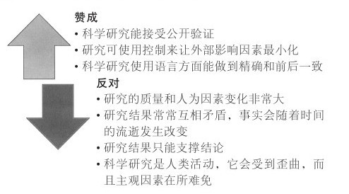

科学研究作为证据

现在你发现，尽管研究证据有很多积极正面的特征，我们还是要避免过早地去拥抱研究结论。但是，你也不能仅仅因为有一丝疑云，就武断地抛弃一个建立在科学基础上的结论。“必然发生”常常只是个不可企及的目标，但并不是所有的结论都同样不可捉摸，我们应该时刻准备去拥抱其中某些结论，而抛弃其他一些结论。因此，当我们批判性地评价研究结论的时候，请小心不要犯这样的推理错误，在有些结论中强求确定性，而我们明明只能从中得出一些并不能否定这一结论的不确定性。我们把这一推理错误称为强求确定性谬误<a href="#part0440.html_ch2-back" id="part0440.html_ch2"
class="pcalibre calibre2">[2]</a>（impossible certainty
fallacy）。

评价科学研究的一些线索

将以下这些问题应用到科学发现中，以此来判断这些发现是不是可靠的证据。

（1）报告的资料来源的质量怎么样？通常情况下，最可靠的报告往往出自那些发表在由同行专家评定的期刊上的文章，在这些期刊中，一项研究结果只有被一系列相关专家评价过以后才会被接受。通常情况下，但也不总是这样，资料来源的声誉越好，研究设计也就越好。所以要竭尽全力找出资料来源的声誉如何。

（2）除了资料来源的质量外，交流中有没有其他的线索显示这项研究完成得很出色？比如，报告有没有详细说明这项研究有什么特别的过人之处？可惜，我们在流行杂志、报纸、电视报道和博客里遇到的绝大部分关于研究结果的报告都没有提供足够的细节来说明此项研究，以确保我们对于这项研究质量的评价。

（3）研究进行的时间离现在有多久，有没有理由让人相信研究结果可能会随着时间的流逝而发生改变？很多研究结果会随着时间的流逝而发生改变。例如，有关抑郁症、犯罪或者心脏病的起因在20世纪80年代可能和在2010年看起来大不相同。

（4）这项研究的结果有没有被其他的研究重复过？如果某一种联系总是在精密设计的研究中不断被重复并且总是前后一致地被发现——比如吸烟和癌症之间的联系——那么我们就有理由相信它，至少在那些不同意这一结论的人能提供较有说服力的证据来证明他们的观点之前，我们都会相信它。

（5）持论者在选择研究的时候是怎样精挑细选的？比如，有没有得出相反结论的相关研究被他忽略不计？研究人员是不是只选择那些支持他的观点的研究？

（6）有没有什么强势批判性思维的证据？作者或演说者对于先前那些支持他的观点的研究有没有表现出一种批判的态度？由于研究条件的限制，研究得到的大部分结论都需要进一步的证明。持论者有没有表现出要进一步加以证明的意愿？

（7）有没有理由让人蓄意要歪曲这项研究？我们要当心研究人员亟须找到特定结果的那些情况。

（8）研究的条件是不是人为制造的并因此遭到扭曲变形？记住一定要问一声：“研究进行的客观条件和研究者概括的情境到底有多少相似之处？”

（9）根据研究样本，我们概括的范围到底有多大？因为这个问题非常重要，我们将在下一部分深入讨论。

（10）研究人员所使用的调查报告、问卷调查、等级评定或其他测量结果有没有偏见或者歪曲的现象存在？我们应该相信研究人员想要测量的东西他们一定会测量得准确无误。但是片面的调查报告和问卷调查这一问题在科学研究中简直无孔不入，我们只有在后面部分详细加以讨论。

<a href="#part0440.html_ch1" id="part0440.html_ch1-back"
class="pcalibre calibre2">[1]</a>"Lies, Damned Lies, and Medical
Science"，November 2010，Atlantic Magazine.

<a href="#part0440.html_ch2" id="part0440.html_ch2-back"
class="pcalibre calibre2">[2]</a>强求确定性谬误指认为一个研究结论如果不是百分百确定的话就应该被抛弃。

## 样本能够代表整体吗

作者或演说者通常拿研究报告来支撑他们的概括性结论，也就是关于一般性事件（events
in
general）的断言。比如，“在本研究中，此例药物对75%的癌症患者治疗效果明显”并不是一个概括性的结论，而“此例药物可治愈胰腺癌”才是概括性的结论。我们对见到的很多公开发表的概括总结都需要做进一步的检查，看看有没有可能是过度概括（overgeneralizing）。下面让我们来看看是为什么。

首先，我们抽取样本的方式对判断我们能在多大范围内进行概括至关重要。能否从研究结果中进行概括主要取决于科研人员所研究的事件或人群的样本数量、覆盖范围和抽取的随机性。选取事件或人群进行研究的过程就叫做抽样（sampling）。

因为研究人员永远不可能对他们想概括的所有事件或人群无一例外地进行研究，他们必须要选择一些样本来做研究，但是有些抽样的方法比其他抽样方法更加可取。在你评价研究样本的时候，有几个重要的考虑因素必须要铭记在心。

（1）样本的覆盖率必须要大到足以产生概括或得出结论的程度。多数情况下，研究人员观察的事件或人群越多，他们得出的结论也就越可靠。如果我们要对“大学生在做学期论文时从别人那里获得帮助的频率有多高”这一课题概括出一般性的看法，我们研究1
000名大学生比只研究100名大学生自然会更有说服力。

（2）对研究者将要从中得出结论的所有事件的类型，样本必须覆盖足够的范围或者说包含足够的多样性。例如，如果研究者想要归纳出大学生一般的饮酒习惯，那么他们的证据必须要建立在从各种不同类型的大学的各种不同类型的学生中进行抽样的基础之上。

（3）样本的随机性越大越好。如果研究者随机取样的话，他们就在尽量保证想要概括的所有事件都有同等的机会得到抽样，同时也在竭力避免片面的取样。大型的民意调查，像盖洛普民意测验，常常都尽量随机地抽取样本，这样可避免特定类型的有片面特征的事件或人群局限了样本范围。你能不能看出以下每个样本具有什么片面特征？

（1）自愿报名接受访谈，讨论他们性行为的频率的一群人。

（2）只有有线电话的一群人。

（3）一堂心理学导论课上的学生。

（4）特定电视网的观众，比如说福克斯电视网（FOX）或者是微软全国有线广播电视公司（MSNBC）。

因此，我们就要对所有的研究问一问，“他们抽样的事件或人群有多少，样本的覆盖率有多大，样本的随机性怎么样？”

没有致力于搜集足够样本进行研究所导致的就是研究结果的过度概括，所表述的概括性结论远远超过此项研究所能保证的范围。在第7章里，我们已经提到过以偏概全这样过度概括的谬误。现在我们来仔细看看一项过度概括的研究：

参加在线约会的人极有可能成功找到自己的佳偶。有一项针对229人的在线调查，对象是年龄在18~65岁有过互联网在线约会经历的人，调查询问他们在网上的主要人际关系。调查结果显示：接受调查的人当中有94%的人在第一次见过他们的网络伴侣之后会再次约会，这种网络情缘平均持续时间至少可达到七个月。

抽样的程序不允许这样一个宽泛的概括结论。此项研究的报告暗示这一结论可以推广到“所有”使用在线约会服务的人，而研究本身却只针对一个在线网站和229人这样一个小群体，而且研究并没有交代样本是如何选取的，因此，网站的随机性和覆盖率也无从得知。例如，也很有可能那些自愿参加调查的人都是那些成功找到佳偶的春风得意的人们。因此研究报告有瑕疵，因为它过度概括的程度太大。

小贴士：只有和我们研究过的人群或事件类似的或相同的情况我们才能加以概括。

## 调查和问卷的回答真实吗

夜幕刚刚降临，你才吃过晚饭，电话铃声响了。“我们正在做一项民意调查。你能否回答我们几个问题？”如果你回答说“可以”，你就变成成千上万年年参加调查的受访大军中的一员——这种调查是我们最常遇到的一种研究方法。想一想你听到下面这个词组的频率有多高：“根据最近的民调结果。”

调查和问卷通常被用来测试人们的行为、态度和看法。它们的可信度怎么样？信不信它们得看具体情况！调查的回答会受到多种因素的影响；所以，我们在解释它们的意义时不得不倍加小心。下面我们就来盘点一下其中的一些影响因素。

首先，要使调查的回答变得有意义，针对这些调查的回答就必须是实话实说。也就是说，口头汇报必须要反映心中真实的看法和态度。可是，由于各种原因，人们常常要掩盖真相。比如说，他们可能会提供自己认为应该提供的答案，而不是真实反映内心想法的答案。他们可能会对问卷调查或者向他们提出的那一类问题心怀敌意，他们可能对这些问题不作任何思考。如果你曾经接受过任何类型的调查，也许你就能想到很多其他的影响因素。

小贴士：你不能想当然地以为调查得到的答案就准确反映出调查对象真实的态度。

其次，有很多调查问题的措辞显得含糊不清，这样的问题可以做出多重解读。不同的人其实很可能是在回答不同的问题！例如，设想一下这样的调查问题可能会面临多种可能的解读：“你认为电视上有没有高质量的节目？”调查的措辞用字越含混，你对调查结果的可信度就越要打折扣。

你应该时刻记住要问一下这个问题：“这个调查里的问题是怎样措辞的？”通常情况下，一个问题的表述越具体清晰，不同的人就越有可能对其做出相同的解读。

最后，调查本身所包含的很多偏见让它们变得更加可疑。其中两个最重要的偏见是措辞偏见（biased
wording）和语境偏见（biased
context）。所提问题的措辞偏见是最常见的问题，对提出一个问题的方式稍加改变就会对其回答的方式产生重大的影响。我们先来看看下面这个基于最近的民意调查得出的结论，然后再回头看看调查中所提出的问题。

一个大学教授发现，在他所任教的大学有56%的调查对象相信奥巴马的医疗改革方案对于国家而言是大错特错。

现在我们再来仔细看看调查中所提出的问题：“你对于总统误入歧途地在全国大张旗鼓地强制推行奥巴马医改式的社会主义有什么看法？”你有没有看到问题本身存在的偏见？其中引导性的词语是“总统误入歧途地在全国大张旗鼓”以及“强制推行奥巴马医改式的社会主义”。如果将问题稍作改变，变成“你对总统的医改尝试，即要建立一套覆盖人群更广、成本更低廉而医保覆盖项目却大大增加的医疗体系有什么看法”，答案的面目会不会大不相同？因此，这里获得的答案只显示了一个关于新的医改方案的歪曲的观点。

调查和问卷数据必须接受审查来看看它们有没有可能存在偏见。小心查看问题的遣词用字！

语境对问题的答案所产生的影响也很可能非同小可。哪怕同样的问题答案也会随着调查的不同而有所不同，主要取决于问卷是怎样呈现的，问题是怎么放进调查中去的。下面这个问题包含在最近进行的两个调查当中：“你认为我们要不要将饮酒年龄降低到21岁以下？”在一个调查中，这个问题的前面还有另一个问题：“你认为选举权应不应该像现在这样被赋予18岁的孩子？”另一个调查中，前面的问题并没有出现。毫不奇怪，两个调查的结果会完全不同。你能明白语境会怎样影响到调查对象了吧？

另一个重要的语境因素就是问卷长度。在比较长的调查当中，人们对后面问题的回答可能和对前面问题的回答有很大的不同，只是因为他们做题做烦了。在评价调查结果时一定要警惕语境因素的影响。

因为人们回答调查的方式会受到许多未知因素的影响，比如说讨好访谈者的需要，或者对问题的不同解读，那我们应不应该将调查证据当成好的证据？对这个问题有激烈的争论，但我们的回答是“当然要”，只要我们足够小心，不要在调查证据范围之外去过多概括。有些调查的声誉要高于其他的调查。调查的质量越高，你就越应该受到其结论的影响。

我们的建议是仔细盘查调查的程序，然后再接受调查的结论。一旦你确定程序的质量，你就可以选择做出自己的合理概括——这个概括会考虑到你可能发现的任何一种偏见。哪怕是片面的调查也可能会承载大量的信息，但是你需要知道偏见之所在，以防止自己过分被调查结果所说服。

## 一个例子：对取消终身教职的批判性评价

以下论证中研究证据被用来证实其结论，现在让我们使用上述针对研究的问题来对下面的论证做出评估。

根据《时代周刊》进行的一项调查，现在是时候在公立学校体系中取消终身教职了。这项调查询问美国人他们对公立教育的现状有什么看法。调查设计的众多问题当中就有：现行政策应该怎样改变才能让公立教育体系变得更好？下面这一报道的结果显示了美国公众对于终身教职体制的严重不满：28%的调查对象支持现行的教师终身制，这种制度让教师有了铁饭碗很难失业；56%的调查对象认为获得终身教职的吃长俸的教师失去努力工作的动力。

这个调查是采用电话访问的方式在2010年8月进行的，在全国范围内随机抽取1
000名18岁及以上的成人进行了访问。

这个证据的证明效力怎么样？在这里这项研究是以非批判性的方式展现出来的，我们看不到任何强势批判性思维的迹象。报告没有提到任何有关这项研究的特别的长处或是不足，尽管它确实也提供了有关抽样程序的一点粗略的细节，这样我们就可以推断出它作为一个概括性结论的基础其价值之所在。没有任何迹象显示这一研究有没有重复被人做过，对于提高公立教育质量所需采取的具体措施这个更大范围内的研究，我们也不知道它合不合适。我们同样不知道发表这些研究结果可能给做出这一论证的人带来什么样的好处。

有没有什么过度概括的证据？样本相对而言还是足够大的，而且据说也是随机抽取的，这是它的两个优点。但是这一研究是利用电话进行访问的，因此我们无从得知是哪种挑选因素促使人们选择参加这样的调查。同样，我们也不知道调查中是不是使用了手机，因此受访者的参与度有可能会对“只用手机”的人构成偏见。我们不可能判定样本的覆盖率，因为根本不知道电话回答代表了普通大众的哪些方面。比如，有些地区、有些职业、有些年龄段的人是否比其他人群抽取得更多？如果提供更多信息，介绍这个调查的具体情况是怎样介绍和描述给接电话的听众，以及那些自愿接受访谈的人的具体特点，将会对我们的评论更有帮助。那些自愿参与电话访谈的人中有没有可能存在着一种偏见？这些问题显示出我们应该要当心从这些结果当中得出的过度概括。

调查的问题本身有没有存在偏见？这个论证省略了两项研究结果中使用的那些问题的具体措辞，也没有列出调查中所包含的其他问题，因此我们无法判断会有什么样的排序问题或者语境偏见呈现在问卷当中。“让教师有了铁饭碗很难失业”这样的句子突出了教师长俸制消极的一面，显示出所提的这个问题是一个暗含反对教师长俸制的问题。

我们已经对上述文章提出了足够的问题，让我们小心防范这个事实断言的普遍适用性。我们还想进一步细细查看全部的研究，同时依赖更多的相关研究，然后才能得出结论说这些断言是可以信赖的。

下面让我们看一看另一个迥乎不同的证据来源。

## 类比作为证据可靠吗

让我们仔细看一看下面这个简短论证的结构，尤其要注意支持结论的理由。

根本没必要害怕互联网会让报纸和杂志统统消失。不管怎么说，冷冻快餐的风行也并没有让下厨烧饭这个传统消失嘛。

作为教育工作者，早点清除掉问题学生并处理好他们带来的问题是很重要的，因为一枚臭鸡蛋往往会弄糟一整块鸡蛋饼。

两个论证都使用类比（analogy）作为证据，类比和我们前面评价过的所有证据类型都有所不同。乍一看，类比常常显得非常有说服力。但是类比往往会欺骗我们，我们需要问一声：“我们怎么才能判断一个类比是不是好证据？”在接着讨论这个话题之前，请试着去判断一下上述两个论证的说服力怎么样。

你有没有注意到类比往往涉及比较，它们依赖相似度来作为主要类型的证据。推理的方式如下：“我们对自己生活的世界中某件事（甲）所知甚多，而另一件让我们感兴趣的事（乙）看起来和甲在某些重要方面非常相似，如果这两件事在一个或多个方面非常相似，那么很可能它们在其他方面也会非常相似。”

举例来说，让人们变得抑郁不振时，很多心理医生会把这种抑郁行为当成一种精神疾病来医治，因为他们认为这种抑郁行为和身体患上疾病有很重要的相似之处，因此他们用抗抑郁的药物来治疗患者。他们把精神问题看得好像是身体失调的一个“症状”。如果他们将这种精神行为看成“正在经历生活中的一大难题”，他们很可能就会用不同的方法来医治这个病人。当我们因为朋友的极力推荐而选择买下一张CD，我们也是在以相同的方式进行推理。我们这样推理是因为我们彼此之间非常相像，喜欢或不喜欢的东西有很多都是相同的，因此我们肯定也喜欢听同样的音乐。

一个论证用两件事物之间熟知的相似点作为基础，推导出关于其中一件事物的一个相对未知特征的结论，这样的论证就叫做类比论证（argument
by analogy）。

类比既能激发深刻的见解同时又能蒙蔽我们。例如，类比在科学推理和法学推理中就极富成效。我们以对老鼠的研究为基础推导出关于人类的结论，这就是通过类比得出结论的论证。我们关于原子结构的思考有很多也都属于类比推理。当我们在一桩法律案件中做出判断，我们这个判断的基础就可以建立在这一案件和以前其他案件的相似性的基础之上。例如，限制财团资助政治候选人是否违反宪法中的保护言论自由和表达自由，当法官面对这个问题的时候，他们就要判定经济援助是不是可以和言论自由相类比，因此，他们也是在通过类比进行论证。这样的推理可能是极富洞见和说服力的。

### 识别和理解类比

具有人们熟知的某些特征的事物被用来帮助解释和它具有类似特征的事物，通过留意这一现象，你就可以识别类比论证。做类比论证时，我们做以下的假设：如果我们有兴趣要解释的事物与被拿来和它作比较的事物在很多重要方面都很相似，那么它在其他重要方面也会与那事物相似。

例如，我们可以想一想这个类比：“重新学习几何就像重新骑自行车。一旦开始了以后，所有的一切都会自动扑面而来。”骑自行车这项活动有很多大家熟知的特征，它用于解释重新学习几何，这是一项不太为人所知的活动，和骑自行车有一些相似的特征，但并不完全相似。

我们都熟悉隔一段时间再骑自行车，“所有的一切都自动扑面而来”。因此这个类比用同样的方式解释了“重新学习几何”这项活动，认为一旦人们开始做几何题，怎么做这些题目的记忆就会瞬间回到这个人的脑海里。注意这里我们是从一个相似点开始，即两种活动都涉及学习一种技巧，并由此假设二者之间会有其他重要的相似点。

一旦我们理解了类比的本质和结构，我们就能识别出论证当中的类比了。当类比用于设定谈话的语气时，识别它们就变得尤其重要。这些类比通常都用来搭建一个论证的“框架”。要识别框架类比（framing
analogies），先要寻找这样的对比：它不仅用于解释一个要点，同时还要影响讨论的方向。

例如，在2004年的美国总统选举中，伊拉克战争是个重大论题。战争的反对者使用了类比，把伊拉克战争比作越南战争。这个类比不仅旨在解释伊拉克发生的一切，而且还要引起人们对伊拉克战争的负面印象。相反，支持伊拉克战争的人也在使用类比，将伊拉克战争比作第二次世界大战。第二次世界大战比越南战争带有更多的正面色彩，所以这个类比用于重新建构讨论的框架，其表达方式对伊拉克战争更加有利。一定要经常寻找那些试图通过框架把人们的反应引向一个特定目标的比较。通过仔细评价框架类比，我们就可以避免一个潜在的具有欺骗性的类比的误导。

在论证中寻找类比的时候，框架类比并不是唯一需要我们加以防范的类比。我们在评价那些使用过度情绪化的比较进行的论证时也需要格外当心。例如，有些政治家在驳斥最近讨论的医保法案时将临终护理计划比作死亡专案小组，谁又会支持一个旨在号召成立死亡专案小组的法案呢？过度情绪化的类比遮蔽了论证中的真正论题，而且阻碍了实质性的对话。尽量识别包含了重要的情感内涵意义的那些比较，这样做才能避免受这些类比的欺骗。

### 评价类比

因为类比推理过于普遍，而且可能既具说服力又有迷惑性，你会发觉辨认出这样的推理并且知道如何系统地对其加以评价非常有用。要评价一个类比的质量，你需要关注以下两个因素。

（1）两个作比较的事物相同和相异的方式。

（2）相似点和不同点之间的关联。

提醒一句：任意两个事物之间你几乎总能找出一些相似点。因此，类比推理并不会仅仅因为有很多相似点就具有说服力。在强大的类比中，我们所比较的两件事物具有相关的共同点而缺乏相关的不同点。所有的类比都想要展示潜在的原则。相关的共同点和不同点就是直接和类比所展示的那些潜在的原则相关的。

让我们来看看下面这个通过类比所进行的论证的合理性。

我不会让自己养的狗在附近四处乱跑给我惹麻烦，所以我为什么不能对16岁的孩子强加一个八点钟的宵禁呢？我有责任保证女儿的安全，同样也有责任承担她晚上在外面做什么事所带来的后果。我的狗乖乖待在院子里，我想让女儿乖乖待在屋子里。这样，我就十分清楚他们都在做什么。

宠物和孩子之间最大的相似点就是两者都被认为不是拥有和成人那样完全权利和责任的完全行为责任人。而且，正如作者所说的那样，他有责任保证自己的小狗和女儿的安全。但是我们也注意到一些相关的不同点。狗只是宠物，缺乏高级的思考能力，不能分辨对错。但是女儿却是人，有认知能力，能分辨出对错，知道什么时候她不该做什么事，这会让她（或者她的父母）陷入麻烦。同时，作为一个人，她拥有某些特定的权利，应该获得相应的尊重，获得一定的自主权。因为女儿能做的事小狗做不了，这样的不同点在评价这个类比时就是相关的。这个类比因为没有考虑到上述这些区别，因此导致它不能为结论提供强有力的支撑。另一个可能帮助你评价类比推理的策略就是找出可替代的类比来理解作者或演说者想要理解的同一个现象。这样的类比要么支持要么反驳从原来类比中推断出的结论。如果它们推翻了结论，那么它们就反映了一开始用类比进行推理所存在的问题。

要找到你自己的类比，有一种建设性的方法如下所述：

（1）识别你正在研究的情况的一些主要特征。

（2）尽量找出与上述情况有相同特征的其他你所熟悉的情况，开动脑筋，尽量想象出多种不同的情况。

（3）尽量判断熟悉的情况是否能为你提供关于不熟悉的情况的一些洞见。

比如说，当我们思考色情作品的时候，我们可以尽量思考一些其他的情况，这些情况下因为人们在某个特定情境中受到他人的对待的方式不同，或者因为人们观看的某些东西可能会引起他人的相关反应，这些都会导致人们一再认为某些事情是有损人格的。种族隔离、种族主义者或性别歧视者的笑话，或者就业歧视，这些情况是不是会涌上你的心头？断言玩暴力电脑游戏、观看动作片电影或者听重金属音乐会导致儿童的暴力倾向，这样的论证又怎么样？这些论证会不会引发我们思考色情文学的其他方式？

现在你应该能系统地评价本节一开始就提出的那两个简短的类比论证了。首先提一些你需要提的问题来辨认出一个类比论证。然后，再提一些问题来评价这个论证，寻找相关的相同点和不同点。通常情况下，相关的相同点比相关的不同点所占的比例越大，类比的效力也就越高。如果你找不到任何相关的不同点，同时你能找到有力的证据证明相关的相同点确确实实存在，这样的类比往往就特别有说服力。

对于本节一开始提到的两个类比例证，我们找出了一个相关的不同点削弱它们的论证效力。检查一下你的评价，看看它们和我们所列举的东西有没有重合。

（第一个例子）冷冻快餐和互联网都能更快捷、更容易地完成复杂而又耗时的任务。阅读杂志和报纸却不太可能提供烹饪美食大餐那样的乐趣。

（第二个例子）教室环境里学生之间的互动非常复杂。任意一个学生对班集体可能带来的影响并不能轻易确定，正如班集体对单个学生可能造成的影响也很难预测。相反，一枚臭鸡蛋却肯定会毁了任何用它作原料做成的食品。同样，把人类当成永远不变的物体，像臭鸡蛋那样不可能成长和改变，这也大有问题。

哄骗或者欺骗我们相信的类比符合我们对下面这个推理谬误的定义，这样的欺骗叫做错误类比谬误<a href="#part0445.html_ch1-back" id="part0445.html_ch1"
class="pcalibre calibre2">[1]</a>（faulty analogy fallacy）。

从某种意义上说，所有类比都是错误的，因为它们做出了错误的假设：两样东西在一两个方面有相似之处，它们在其他重要方面也必然会有相似之处。也许你还是认为类比质量有高有低，有些类比经不起推敲，有些类比经得起考验，但即使最好的类比所提供的也只是暗示。因此，如果一个作者通过与另一件事作对比来得出一件事的结论，那么他就应该提供进一步的证据来支撑两者间最重要的相似点揭示出的具体原则。

<a href="#part0445.html_ch1" id="part0445.html_ch1-back"
class="pcalibre calibre2">[1]</a>错误类比谬误指有人提出一个类比，其中却存在重要而又相关的不同点。

## 轮到你自己写时，可得吸取教训

为了帮助你在自己的写作中提高证据的含金量，我们提出以下建议。

当你自己做研究的时候，你应该不断观察并做好记录。在开始独立研究之前，研究者往往先建立一套程序或规则来指导研究的过程，这些程序的正式名称叫做方法论（methodology）。当你仔细敲定方法论的问题，你常常会抢占先机，避免出现我们在本章中讨论过的那些问题，比如说片面的问卷调查和抽样中存在的问题。

做研究的另一个重要方面就是保留精确的可随时查看的记录。我们的记忆是不可靠的，在我们努力回忆自己的所见所闻时常常倾向于出错。但是，科技却创造出一些非常有用的工具来帮助我们解决这一顾虑。你可以对采访或者观察过程进行录音或录像，还可以用网络做工具来进行调查。你应当一直记下观察、调查或者访谈的日期，而且你要将它们用电子手段或者用复印文本按顺序存档。读者应该能够核查你的研究结果，你甚至有可能为了其他项目而想重新查看一番这些研究结果。

最后，记住你的研究结果所存在的局限。我们在本章前面部分讨论过过度概括的风险。如果你将自己的研究和自己的写作任务结合在一起，这种担心尤其值得你加以注意。你的研究所揭示的问题只局限于你调查或者观察过的领域。如果你要展示你的研究结果有更为广泛和深远的涵盖面，你就应该用其他作者的发现来充实你的文章。

### 科学研究和互联网

现在是21世纪，我们怀疑你和像《辛普森一家》中的爸爸霍默·辛普森那样的技术傻瓜之间的差距要用光年来加以衡量，他大吃一惊地问：“现在他们的电脑上都有互联网了？”如果你准备写作却不会利用互联网，那我们也会像霍默这样大吃一惊。互联网从根本上改变了我们大部分人收集证据的方式，让我们获得的信息呈现几何级数的增长。怎么样来平衡这种史无前例数量的到手的资料？我们不得不加倍小心地思考我们得到的证据。记住这些建议，可以帮助你解决这些随互联网调查而来的特殊难题。

在本章的前面部分，我们讨论过调查作者背景的重要性。我们现在要督促你判断一下利益不同可能带来的偏见或者冲突。为了估量一个权威观点的分量，我们首先得知道那个人的身份和可能存在的偏见。“洋葱头”（the
Onion），一个流行的讽刺新闻网站，展示了互联网怎样让这个任务变得异常困难。在2008年一篇题为“促狭鬼网上发评论”的调侃文章里，作者引用了“促狭鬼”透露玄机时所说的话：“今天晚上，我打算看看街谈巷议的那部视频，点击视频上方专为用户评论而预留的那个‘回复’链接，然后草拟一个回复，我一定小心，要尽量一点脑筋都不动，同时保证都用大写字母，标点胡用一气……虽然我现在还不清楚我的评论具体包含哪些内容，但是我可以百分百肯定地说它一定傻到家了。”但愿所有网络上的意见提供者都可以这样直言不讳！

当我们把互联网资源添加到论证里的时候，调查资料来源的可信度就显得尤为重要。互联网常常被人比作大开发前的西部荒原。小镇上根本就没有治安官来确保大家尊敬的人只会出面发布真实而又公正的声明。以现在这种形式，互联网变得相对无拘无束。随便什么人都能建一个网站或者博客。网站貌似值得信任而实际上发表信息的人暗地里都有一个标准。让我们看看名为“老好人”（The
Yes
Men）的社会活动家创建的一些网站，比如http：//www.dowethics.com，他们创建的这个网站看上去听起来都真像那么一回事。但是稍稍做些调查，浏览这个网站的人就会发现它根本就不是由陶氏化学公司创建。实际上，这个网站是对这家化学公司在环境方面的实践进行辛辣批判。虽然这样的例子颇为罕见，但我们希望能警醒你，一个网站的创建者很可能有一个政治的、商业的甚至是艺术的标准，只是表面上看不出来。

哪怕你判断出在这个网站上活动的作者是可信的，你也应该多提一些问题。因为这个网站并没有一个治安官，即使可疑的或者虚假的证据也很容易就能贴上去。美国喜剧频道的讽刺专家斯蒂芬·科尔伯特（Stephen
Colbert）想说明一下错误信息多么容易就能贴到互联网上去。在他的脱口秀节目《科尔伯特报告》有一集里，他编辑了互联网百科全书——维基百科。有五个小时，维基百科的词条里显示说乔治·华盛顿根本没有蓄养过奴隶，非洲大象的数量在过去的六个月里增长了三倍。（要看对这个真实问题的另一个讽刺，请查看洋葱头网站2002年的文章“互联网上发现的事实错误”，开篇就说“信息时代在本周一被狠狠击了一记闷棍，有桩事实性错误在互联网上被人揭发”。）为了和这样的问题作斗争，我们就要避免使用还没有注明具体来源的证据。花点时间去查看一下资料的原始来源。当某一篇文章的片段被贴出来或被人引用时，贴出文章片段的作者也许误解了原作者的意思，或者是将此消息剥离了原来的语境加以使用。

来，做做思维体操

？关键问题：证据的效力如何：个人观察、研究报告和类比？

评价下面的文章，查看一下作者提供的证据的质量。

⊙第一篇

酒鬼生的孩子是不是也更容易成为酒鬼？为了回答这个问题，研究人员在匿名戒酒会（Alcoholics
Anonymous）里抽取了451个人，看看其中多少人会说父母中的一个或者双双都是酒鬼。这项研究中调查的戒酒会的人现在都在参加俄亥俄州、密歇根州或者印第安纳州某处的戒酒会，负责当地戒酒会项目的人要求他们自愿填写这样的调查表。调查发现77%的调查对象将他们父母当中至少一个人归入酒鬼之列。这项研究还从上述那些州里面随机调查了451名宣称自己不酗酒的人。在这些酒瘾不大的人当中，23%的人将他们父母当中的至少一个人称为酒鬼。

⊙第二篇

为什么法律系的学生参加难度极大的考试不允许使用手提电脑？律师都能使用电脑来查阅棘手案件的相关信息啊。

⊙第三篇

美国最伟大的象征之一就是美国的国旗。过去很多案件虽然都把亵渎国旗的行为辩护为一些象征性的言论，但我要说：“在这些亵渎国旗的行为中哪里看得到言论呢？”如果你要说美国的坏话，直接说出来好了，但是不要用你的行动来贬低美国的国旗。

为了让这面国旗飞扬，有多少美国人肝脑涂地啊。

那些想支持焚烧国旗或其他类似可鄙行为的人毕竟是少数。上个月，在得克萨斯州的达拉斯市一家饭店里，75人接收了调查，他们被问及是否支持这种没有爱国心的亵渎美国国旗的行为，而这种行为的目的就是为了表达某种形式的反美思想。有93%的调查对象回答说他们不喜欢亵渎美国国旗的行为。因此我们国家的立法者应当通过一份法律来保护美国国旗，禁止这类可怕的行为发生。

给个提示

⊙第一篇

结论：酒鬼的儿女比常人的子女更容易变成酒鬼。

理由：比起常人来，更多的酒鬼报告说他们父母当中至少有一个人酗酒。

注意这里所呈现的结果来自一份并没有说明其结果有多大代表性的研究。我们也不知道这个信息到底发表在什么地方，所以也无法评估这份研究在发表之前到底经过了怎样严格的评定。尽管如此，对这份研究我们还是可以问几个有用的问题。样本的数量非常大，可是它的覆盖面有问题。尽管有好几个州都被抽样，但这些州的戒酒会项目组的人又能在多大程度上代表全国的酒鬼呢？同样，戒酒会里面的酒鬼和那些没有寻求帮助的酒鬼相比又怎么样呢？也许样本存在的最大问题在于缺乏随机抽取的样本。虽然那些自封不酗酒的人是在三个州里面随机选取的，戒酒会里面的调查对象却是在自愿的基础上选择的。那些自告奋勇地谈论自己父母的人是不是有别于那些不愿公开信息的人？如果自愿的人和不自愿的人之间有区别，那么这个样本选取就是片面的。

这种评级分等式的测量到底有多准确？首先，除了那些已经在戒酒会中回答这份调查表的人以外，文章并没有提供酒鬼的明确定义。此外，我们也没有被告知有什么具体标准提供给调查对象，据此将他们的父母界定为酒鬼。因此，我们也就无从确定判断某人到底是不是酒鬼的准确程度如何。同样存在问题的还有以下事实，选取所谓的对照组中不酗酒的人全是基于他们的自我评定。我们都知道做一个不酗酒的人是社会普遍认可的答案，而一旦大家知道这个普遍认可的答案时都会给出这个答案，这种回答问题的倾向也会对所谓的对照组里的取样过程造成偏见。关于这些评定标准的准确度如何，我们希望知道更详细一点的信息，然后我们才能对这一结论更有信心。

⊙第二篇

结论：参加考试的学生应该能使用手提电脑。

理由：学生参加有难度的考试用手提电脑找答案，就像律师可以用手提电脑寻找不同案件的答案一样。

首先我们要注意这个推理建立在比较的基础上。我们较熟悉的情况是，律师用电脑帮助他们处理棘手的案子，这被用来帮助我们更好地理解一件在某种程度上与之有些类似的事件：两种情况都涉及使用手提电脑查找难题的答案。但是，其中有个极大的不同之处，那就是参加考试的学生正在被测试他们本该不借助任何外部帮助而能顺利掌握的那些知识。这个差异足以让我们舍弃这个用来证明结论的类比。

# 第9章　有没有替代原因

本章我们先从一个故事开始：

一个爱问为什么的孩子注意到太阳早上出现在天空，到夜里就不见了。不知道太阳夜里到底哪儿去了，孩子想方设法地要凑近看看太阳落山。可是，不管怎么努力，他还是不知道太阳到底去哪儿了。后来，孩子又注意到他的保姆也是早上出现在家里，到夜里就不见了。有一天，他好奇地问保姆她晚上去哪儿了。保姆回答说：“我回家去了。”孩子将保姆的来去和日夜的循环一联系，得出结论，保姆的离去导致太阳也一起回家了。

这个故事清楚地表明了使用证据过程中一个常见的问题：要想弄清楚一件事，就必须弄清楚引起这件事的原因。只有我们从一开始就理解了某件事的前因后果，我们才能选择一个明智的办法来避免某个问题的发生，或者促使某个特别正面的结果的出现。比如，我们想知道是什么引起了2008年的金融危机，或者，为什么过去的十年里肥胖的比例会有如此显著的上升。

这个故事同时还显示出在使用证据证明一件事引起另一件事发生的过程里常见的一个难题——替代原因（rival
causes）的问题。那个虚构的小男孩对他观察到给出了问题的一个解释：“太阳晚上下山是因为我的保姆回家了。”我们希望你能明白另一个对太阳为什么下山的非常可靠的解释。

尽管替代原因很少会像我们的故事里所表现的那样明显，但你还是经常会遇到专家提出一个假说来解释某件事或某个研究发现，而同时还有其他言之成理的假说同样也能解释它们。通常情况下，这些专家不会透露出替代原因给你，因为他们不想让你贬低他们那些断言的确凿无疑性；这样你就得自己去发掘。这样做特别有助于你去判断“证据的效力怎么样”。对于一些事件，存在各种各样言之成理的替代原因，这就削弱了我们对作者提供的原始原因的信心。

？关键问题：有没有替代原因？

小贴士：所谓替代原因是指一个言之成理的替代解释，可以说明为什么特定的结果会发生。

## 有果必有因

当你有足够的理由相信作者或演说者使用证据来证实关于某件事的起因的一个断言的时候，你就需要去寻找一些替代原因。“起因”这个词的意思是“引起，使……发生，或影响”。持论者可以用很多种不同的方式为你指明因果的思维。下面我们仅列出一些供你参考。

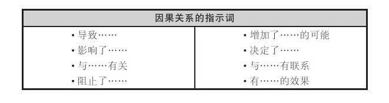

这些对因果思维的暗示应该能帮助你认出持论者什么时候在做一个因果断言。一旦你注意到这样的断言，一定要警惕存在替代原因的可能性。

## 可能的原因不止一个

发现替代原因有助于我们更好地对自己所遇到的有因果关系的结论进行回应，遇到这类结论的情形主要有三种：①我们日常的人际交往；②以往或正在发生的世界大事；③科学研究的结果。

下面我们来看几个例子。

例1　日常人际交往中的推理

大学生和她的朋友间的对话：都已经过了24小时了，我男朋友还没有回我的短信。他肯定生我的气快气疯掉了。

替代原因：也许他忙着准备考试呢，又或者他忘记手机放在什么地方了。

例2　世界大事

2009年11月5日下午，得克萨斯州大型军事基地胡德堡（Ford
Hood）发生了一起大屠杀事件。报告上说，一名精神科医生纳迪尔·马利克·哈桑走进他位于士兵战备中心（Soldier
Readiness
Center）的工作场所，士兵通常在这里接受例行的医疗检查以后立即展开军事部署；接着，他坐下来点点头，然后站起身来一阵乱射，射死13人，射伤30人。目击者报告说他用了两把手枪，好像专门射杀穿制服的士兵。

如同经常发生在这样的暴力行为之后的情况，种种方法都用来解释这个行为，并且出现了有关其起因的种种争论，替代原因包括：

（1）心理压力过大的反应。这是由哈桑11月28日将要被部署到阿富汗所引发的。他每天都能看到回国士兵的悲惨状况，被这些惨痛的事实吓得胆战心惊、不能自己。根据他一个亲戚的说法：“被派遣到国外简直是他最糟糕的噩梦。”

（2）工作场所发生的事情的过度反应。根据有些病人在精神治疗期间对他所做的陈述，这些病人应该被起诉犯下战争罪，而哈桑的上司拒绝处理他的请求。

（3）政治立场。哈桑表现出许多精神障碍的迹象，而且表现出支持恐怖主义的倾向，但为了保护民族多样性这些都被略过不提。

例3　科学研究

最近一项研究显示母乳喂养对妈妈和宝宝都有好处。研究发现一生当中哺乳期超过一年的女性绝经以后患心脏病或中风的危险要比从没有哺乳过的女性减少大约10%，她们患糖尿病、高血压、胆固醇偏高等的风险也大大降低。这项研究发表在五月号的《美国妇产科》（Obstetrics＆Gynecology）杂志上，分析了139
681名女性的数据，这些人都登记参加了妇女健康启动项目（Women's Health
Initiative）——一项长期跟踪调查绝经后女性的国家级研究项目。

在这项研究当中，研究人员很可能以一个假设开始，那就是母乳喂养给母亲带来了健康上的好处，结果他发现了与他的假设相一致的证据。但是让我们来看看其他不同的，或者说替代原因，同样可以支持这个研究发现。

（1）哺乳的女性可能只是平均而言比那些没有哺乳过的女性过着更为健康的生活。比如，她们可能比那些没有哺乳的女性锻炼得更多，或者吃得更为多样化一点。

（2）选择不用母乳喂养孩子的女性可能在外工作更长的时间，可能因此引起更大的生活压力，这样会带来更多的健康问题。

（3）女性拒绝母乳喂养的原因也可能是她们本身比那些选择母乳喂养的女性有更多的健康问题。比如，那些服药的母亲或抽烟的母亲就可能会担心到母乳喂养的安全问题。

得到的教训

（1）很多类型的事件都可以通过各种相互替代的原因来加以解释。

（2）专家可以检查同一个证据而发现不同的原因对其加以解释。

（3）大部分持论者只给你那些他们喜欢的原因，独立思考的读者或者听众必须自己找出替代原因。

（4）想出替代原因是个创造性的过程，通常情况下，这类证据不会是一目了然的。

（5）最后，特定因果断言的确定性和言之成理的替代原因的数量正好成反比。因此，找到多个替代原因可以让批判性思考的人真正变得理智而谦逊。

在接下来的部分，我们将会探索以上这些教训对批判性思考的人的深层含义。

## 找到更多的替代原因

找出替代原因就好像做一名出色的侦探。当你发现替代原因可能会出现的种种情况，你就要问一下自己这些问题：

·我能不能找到其他的方法来解读这个证据？

·还有什么别的可能会引发这个行动或者导致这些发现？

·如果我从另一个角度来看这个问题，哪些东西我可能会当成重要的原因？

·如果这个解释是不正确的，还有什么别的解释可以说得通？

## 唯一的原因，还是原因之一

小学适龄儿童中抑郁症的发病率有了惊人的增长。脱口秀主持人开始采访各路专家引发这一现象的主要原因：是遗传造成的；是同龄人中间流行的取笑戏弄造成的；是父母疏忽大意造成的；是电视新闻里太多的恐怖主义和战争造成的；是缺乏宗教信仰造成的；是压力过大造成的。专家们可能会宣称他们手中有答案，但其实他们不太可能知道答案。这是因为人们常犯的一个错误就是试图找出一件事的简单而又唯一的原因，而事实上这个原因是由许多共同起作用的原因联合起来的结果——这些原因共同起作用创造了事件发生所需要的整体环境。比如，很可能是许多原因结合在一起的独特作用促成了大屠杀的发生。

在那些涉及人类特征或者活动的情况下，多个原因共同起作用比单一原因起作用发生得更加频繁。最好的因果解释常常结合了多种原因，只有这些原因一起作用才能引起事件的发生。所以，针对脱口秀主持人的问题，专家给出的最佳答案就是：“我们不知道这类事件发生的确切原因，但是我们可以推测出促成这类事件发生的多种可能的原因。”因此，在寻找替代原因时，我们必须要记住，我们找出的任何一个单独的原因都极有可能是引起事件发生的其中一个原因，而不是其唯一的原因。

如果持论者不能考虑到各种原因的复杂性，他们就犯了过度简化因果关系谬误<a href="#part0450.html_ch1-back" id="part0450.html_ch1"
class="pcalibre calibre2">[1]</a>（causal oversimplication
fallacy）。

在某种意义上，几乎所有的因果解释都会过度简化，因此，有些持论者所提供的解释即使并不包含某桩事件每一种可能的原因，你也得公平对待他们。但是，通过因果关系得出的结论应该包括足够多的因果因素，以说服你它们并不是太过简化，或者作者应该向你说明，他在结论中所强调的因果因素仅仅是一堆可能的原因当中的一个——只是其中一个原因，而不是唯一的原因。

<a href="#part0450.html_ch1" id="part0450.html_ch1-back"
class="pcalibre calibre2">[1]</a>过度简化因果关系谬误指依赖并不足以解释整个事件的具有因果关系的因素来解释一个事件，或者过分强调这些因素中的一个或多个因素的作用。

## 组间差异的替代原因

研究人员想要发现某个事件的一个起因，最常见的方法之一就是进行组间比较，就像前面提到过的有关母乳喂养的那项研究那样。比如说，你会经常遇到下面这些组间比较的各种参照：

·研究人员将一个实验组同一个控制组进行比较。

·一组人接受甲种治疗，另一组人则没有接受这种治疗。

·一组有学习障碍的人同一组没有学习障碍的人进行比较。

当研究人员发现两组比较对象之间有差异，他们常常得出结论，“这些不同点证明了我的假设”。比如说，一个研究人员可能发现一组背痛的病人接受一种新药的治疗后报告说他们的疼痛感减轻了，相比另一组没有接受新药治疗的背痛病人治疗效果要好得多。然后这个研究员就得出结论说这种新药的使用导致了治疗效果的不同。问题是研究组几乎总是在远远不止一个重要方面出现差异，因此研究组之间的差异常常伴随着多种原因。因此，当你看到持论者利用组间差异的发现来证明一个原因时，记住要常问一句：“有没有可能存在替代原因也解释得了这种组间差异？”

让我们来看看下面这个研究，在组间进行比较，尽量找出可以替代的原因。

在最近的一项研究中，准备参加一场标准化考试的一部分学生去上了一门专教学生如何应付考试的特别课程，结果，比起那些仅通过复习与考试相关的几本书来准备同一场标准化考试的学生，他们的得分普遍要高。

我们需要问的问题是：“除了他们准备考试的方式，这两组学生还有可能在哪些重要方面会有所不同？”你有没有想到两组学生之间可能存在以下两个重要不同点中的任意一个，而这就有可能解释了考试分数的不同？

·学生经济背景的不同。也许这门课非常昂贵，只有有钱的学生才上得起。此外，也许付得起这个班学费的那部分学生在参加这场考试之前也能付得起更好的私立学校的学费，因此和那些没有上这个班的学生比起来，他们享有一个优越得多的起点。

·动力的不同。也许报名参加培训的学生是那些真正想顺利通过考试的学生。只读几本书的学生也许对在标准化考试当中拿个像样的成绩并不太感兴趣。又或者，也许这些学生选择的学习方法建立在他们的学习效率上。在班级里学习效率更高的学生可能更有意向在标准化考试当中取得好成绩。

可能你还会想到其他重要的不同点。记住：很多种因素可能引起研究组之间的差异！

注意到组间比较的有些方法在最大限度地减少替代原因上要比其他方法优越很多，这是非常有帮助的。要让你去熟悉所有研究设计的优缺点超出了本书的范围，但是我们要鼓励你熟悉各种各样的研究设计，同时要帮你找出专家们一致认同的最好的组间设计——随机化实验设计（randomized
experimental
design），以便将替代原因减到最少。这种设计常被称作黄金标准，常常拿一个研究组组对一个实验性干预的反应，比如说药物治疗，与一个相同的研究组在没有干预的情况下如何反应进行比较。

这样的设计将替代原因最少化，因此你应该对由这样的研究方法支撑的因果结论更有信心。当你评价组间研究的结果时请找找有关这个设计的参考资料。

## 相关不能证明因果关系

我们生来就喜欢“见到”相互联系的事件，或者“相继发生”的事件，这些事件环环相扣互为因果。也就是说，我们得出如下结论，因为特征甲（如消耗的能量棒<a href="#part0452.html_ch1-back" id="part0452.html_ch1"
class="pcalibre calibre2">[1]</a>的数量）与特征乙（如在一场体育运动当中的表现）之间有联系，就可以说甲引起了乙。下面再举一个按这种思路进行推理的例子。

你有没有注意到随着街舞音乐越来越流行，越来越少的年轻人去参加教堂活动了？这样的音乐正在引起年轻人道德品质的下滑。

如果我们这样思考问题，那么我们常常会大错特错。为什么？通常情况下有多种假设可以解释为什么甲乙两者相继发生。实际上，至少有四种不同的假设可以解释任何一种这样的关系。知道这些假设是什么可以帮助我们找到替代原因。让我们举一个研究的例子来分别看看它们是什么。

最近的一项研究报告指出“吸烟可抵抗流感”。研究人员分析了525个烟民，结果发现67%的烟民在过去三年里从没有得过一次流感，他们推测说香烟燃烧时产生的尼古丁杀死了感冒病毒，让它无法传播并引发疾病。

在觉得不舒服的人纷纷开始吸烟来预防感冒的侵袭之前，他们应该好好考虑下面四个对这项研究发现的可能解释。

解释一：甲是乙的一个起因。（吸烟确确实实杀死了感冒病毒）。

解释二：乙是甲的一个起因。（从来不受流感病毒侵扰的人更有可能会继续吸烟。）

解释三：甲和乙有关系是因为第三种因素——丙。（吸烟和不患流感因为第三种因素联系在了一起，比如说吸烟以后经常洗手阻碍了流感病毒的传播。）

解释四：甲和乙相互影响。（不常患感冒的人有吸烟的倾向，而吸烟有可能影响到一些潜在的疾病。）

记住：有相关并不能证明存在因果关系！

但是大多用来证明因果关系的证据仅仅建立在相关的基础之上。当你发现一个作者指出两者的特征之间有联系来支持他的一种假设，记住要问他一句：“有没有其他原因也可以解释这种联系呢？”你可以用下面这个研究来检验一下自己的猜测。

最近一项研究报告指出“冰激凌会导致犯罪”。研究人员研究了美国十大城市过去五年冰激凌的销量和犯罪率的大小，结果发现随着冰激凌销量的增长，犯罪率也呈现出上升的趋势。他们由此推测吃冰激凌在人大脑里诱发一种化学反应，促进了人们的犯罪倾向。

我们希望你现在能明白，吃冰激凌的人根本无须担心他们马上就要以身试法变成罪犯。你能想到哪些替代原因？难道就没可能夏天逐渐升高的气温是冰激凌销量（甲）和犯罪率（乙）二者间产生联系的原因吗？

将因果关系和相关关系二者混淆起来，既可以理解，同时又异常危险。虽然原因确实先于结果出现，但先于结果出现的还有很多种其他因素，而其中很多不是引发结果的原因。

仔细分析上面提到的为什么事件之间可能会有联系的四种可能的解释，你现在应该能够辨认出两种常见的因果关系的推理谬误了：因果混淆谬误<a href="#part0452.html_ch2-back" id="part0452.html_ch2"
class="pcalibre calibre2">[2]</a>（confusion of cause and effect
fallacy）和忽略常见原因谬误<a href="#part0452.html_ch3-back" id="part0452.html_ch3"
class="pcalibre calibre2">[3]</a>（neglect of common cause
fallacy）：

<a href="#part0452.html_ch1" id="part0452.html_ch1-back"
class="pcalibre calibre2">[1]</a>一种补充能量的棒状食品。

<a href="#part0452.html_ch2" id="part0452.html_ch2-back"
class="pcalibre calibre2">[2]</a>因果混淆谬误指将事件的起因和结果相混淆或是认不出两件事之间可能是相互影响的关系。

<a href="#part0452.html_ch3" id="part0452.html_ch3-back"
class="pcalibre calibre2">[3]</a>忽略常见原因谬误指认不出两件事之间之所以有联系是因为常见的第三种因素在起作用。

## “在这之后”不等于“因为这个”

在《体育画报》封面刊登他的大幅特写照片之后不久，芝加哥熊队的四分卫杰克·卡特勒（Jake
Cutler）就在全国橄榄球联盟的锦标赛中早早受伤，结果熊队输给了绿湾包装工队，比分为31:17。是令人闻之色变的《体育画报》封面霉运（即一登上《体育画报》的封面霉运必定随之而来）再度光临，还是其他有因果关系的解释可以说得通这个四分卫的坏运气？我们认为你能看得出很多其他的替代原因可以解释卡特勒和熊队的失败，比如说包装工队的坚强防守。

通常我们想这样解释一桩特殊事件：因为乙事件发生在甲事件之后，所以甲事件引发了乙事件。这样的推理之所以会发生，是因为人类都有这种强烈的倾向，愿意相信如果两件事紧随前后发生，那么第一件事肯定导致了第二件事。

但是很多事件紧随在其他事件后面发生，却并不是由前面事件所引发的。如果我们错误地得出结论说第一件事引起第二件事是因为它发生在前，我们就犯了事后归因谬误<a href="#part0453.html_ch1-back" id="part0453.html_ch1"
class="pcalibre calibre2">[1]</a>（全称为"post hoc, ergo propter
hoc
fallacy"，拉丁文的意思是“在这之后，所以是因为这个的谬误”。）这种推理方式是造成许多迷信的直接原因，例如前述的《体育画报》封面霉运之类。再比如，你可能在写出一篇极出色的论文的同时戴了某一顶帽子，所以现在你每到写论文就坚持非要戴同一顶帽子不可。

下面这个例子进一步阐释了这种推理方式所带来的问题。

“我昨天找到的那个25分硬币肯定是我的幸运币。找到它以后，我有门特别难的功课考了个A，最不喜欢的一门课也停了一次，而我最喜欢看的电影昨天晚上又在电视上播出了。”（也不管我为了准备考试埋头苦读，教授六岁的孩子最近得了流感，电视节目早在我找到硬币之前就已经定好了。）

你也许能够猜到，政治领导人和商界头面人物都喜欢使用事后归因这种论证，特别是当它对他们有利的时候。比如说，他们喜欢把自己走上领导岗位之后发生的一切好事都揽到自己头上，而发生的一切坏事则推到其他人头上。

记住：一件事紧接在另一件事后面发生的这一发现本身并不能证明两者之间有因果关系，这可能只是一个巧合。当你看到这种推理方式的时候，你要问你自己一声，“有没有替代原因能解释这个事件”和“除了一件事紧随在另一件事后面发生这个事实以外，还有没有什么其他过硬的证据”。

<a href="#part0453.html_ch1" id="part0453.html_ch1-back"
class="pcalibre calibre2">[1]</a>事后归因谬误指假设某件事乙是由另一件事甲所造成的，仅仅因为乙在时间上紧随在甲之后。

## 很多事件并非只有一种解释

是什么原因引起2010年冰岛火山的爆发？为什么脸谱网（Facebook）这么风行？为什么茶党在2010年议会选举中能这样呼风唤雨？

和我们对胡德堡大屠杀惨案存在的疑问一样，这些问题都在寻求单个历史事件的解释。首先，就像我们在胡德堡案件中所见到的那样，同一事件有多种不同版本的故事能说得通。其次，我们解释事件的方式深受各种社会力量和政治力量的影响，同时还受到与信仰有关的个人心理视角的影响。

比如说，男人所认为的滥用药物的原因就和女人不同，民主党所认为的贫困的成因就可能和共和党不同，生物学家所认为的抑郁症的病因也可能和心理学家或社会学家大不相同。

同样，有一种常见的偏见就是基本归因错误（fundamental attribution
error），在这种错误里，我们在解释他人的行为时普遍高估了个人倾向的重要性而低估了环境因素的作用。也就是说，我们喜欢把别人行为的动因看成是来自其内部因素的作用（他们个人的性格特点），而不是来自外部因素的作用（环境的力量）。因此，当发现有人偷窃，我们很可能将偷窃行为一下就看成小偷骨子里没廉耻或是没良心的结果。但是我们还应该考虑一下外部环境的作用，比如说贫困或者来自同龄人的压力。

还有一种常见的心理错误就是一开始就确定了少数几种可能的原因，然后再拿另外的信息（哪怕是不相干的信息）来证实这些既定的假设，而不是将这些信息另行考虑或是去推导出新的、也许更复杂的假设。我们都想简化这个世界，然而，解释活动往往需要抽丝剥茧。解释事件可不像流行谈话节目里那些访谈嘉宾经常说的那样简单轻松。

构建过去事件的各种原因还存在一个重大的难题，那就是很多证据依赖于人们的记忆，而大量的研究显示记忆往往会遭到极大的扭曲。

那我们怎么知道我们是不是有了某件事或某些事的合理解释呢？我们永远也不可能有百分之百的把握。但是通过问一些关键问题我们可以取得一些进步。

一定要当心，千万不要贸然接受你所遇到的事件的第一个解释。要寻找替代原因，努力去比较它们的可信度。要考虑采取其他不同视角，这样事件所涉及的利益方就可能会被考虑进去。阅读事件的多种不同版本来帮助你扩大见解的范围。我们必须接受这一事实，那就是有很多事件并不是只有一种解释。

## 哪个原因更合理

你想出来的替代原因越显得言之有理，你对刚开始见到的那个解释的信心就越打折扣，至少在进一步的证据被认真考虑之前是这样。作为一个会批判性思考的人，你就得竭尽所能地评估各种不同的解释中每种解释怎样契合当前的证据，要竭力对你自己的偏见保持敏感和警惕。

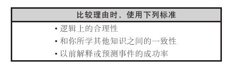

## 轮到你自己写时，可得吸取教训

因果论证对于作者而言是最难写的论证之一，你必须要筛查一大把可能的原因，有些原因货真价实，而另一些原因则能以假乱真。然后你还必须展示一种实实在在的因果关系。这个问题在美国公共电视台（PBS）《芝麻街》的一个经典桥段中得到了发挥，在这个桥段里木偶伯特发现阿尼把一根香蕉举到耳朵边。伯特问他为什么有这样奇怪的举动，阿尼回答说：“听着，伯特，我是用这根香蕉来驱赶短吻鳄的。”更加不解的伯特指出芝麻街上压根儿就没有短吻鳄，阿尼骄傲地回答说：“对啊，因为这根香蕉起大作用了，是不是啊，伯特？”阿尼错误地推断出这两个同时存在的事件相互之间有关系。

在你证明了一种关系的存在以后，接下来你必须要说明这种关系会按照你暗示的那种方向发展。也就是说，甲导致了乙，而不是乙导致了甲，或者是丙导致了甲和乙，或者完全是别的什么东西——在J.K.罗琳的《哈利·波特》系列著作中，作者重现了有关因果先后方向的经典的鸡和蛋之谜，“凤凰和火焰，哪个先有？”卢娜·洛夫古德，小说主角们的一个奇奇怪怪的朋友，回答得非常正确：“一个圆圈根本就没有起点。”

最后，你也许想说明你一直聚焦的因果关系解释现象要优于其他替代原因。这整个的过程可能来势太猛。我们建议你将其拆成碎片一步步学习。第一步就要涉及批判性思维。

### 发掘潜在的原因

你开始因果关系写作的过程就像写其他论证一样。先选定一个自己感兴趣的特殊论题。在这种情况下，你寻找的论题主要探索的是因果关系。这样的论题可能明确提到“原因”这样的词语，比如说，“美国AMC有线电视台播放的《行尸走肉》（The
Walking
Dead）观众人数打破了有线电视台的收看记录，这是什么原因造成的？”或者，“是什么原因造成疾病对治疗有了一定的抵抗力？”同样，这个论题也可以明确使用“结果”这个词语，“勒布朗·詹姆斯决定离开这座城市前往迈阿密热火队效力，这对于克利夫兰的经济可能带来怎样的结果？”

一旦你选定了一个论题，下一步就是竭力思考这个问题可能存在的答案。这个过程可能变成一个富有创造力的过程。处理这个任务的一种最佳方法就是采取一个五岁淘气小孩爱问个不停的态度，一直不断地追问为什么。我们回到AMC的《行尸走肉》这部电视剧的例子来做一下说明。为什么《行尸走肉》能打破有线电视台的收视记录？嗯，也许是因为18~49岁的人喜欢看僵尸题材。采取五岁儿童的态度：他们为什么要喜欢僵尸题材？你怎么来回答这个问题？我们心目中的小年轻接下来有可能会问什么问题？“还有什么原因呢？”18~49岁的人喜欢看动作片。“还有什么原因呢？”《行尸走肉》填补了一个任何一家别的电视台都不曾填补过的空白。“还有什么原因呢？”表演、剧本和导演都完美无缺。“还有什么原因呢？”你现在明白了，朋友、同学还有生活中的其他人在你开动脑筋的时候都可以帮助你。他们可能想出一个你从来就没有想到过的原因。

### 逐步缩小潜在原因的范围

一旦你开动脑筋想出来一个现象的足够多的原因或者结果，就可以开始着手研究了。你可以回到第7章和第8章去寻找指导，收集证据。你应该特别注意，你考虑要吸收到论证当中的文章是不是真的展现了一种因果关系。标题可能会误导读者，让他们以为一个研究证实了因果关系，而原来的研究人员并没有充分展现出这个事实。想一想CNN有线新闻网的标题“坚持吃奶油夹心蛋糕帮助营养学教授减掉12公斤体重”暗示了什么。吃奶油蛋糕能让人减肥！实际上，小心控制卡路里的摄入量可能使得那位教授减掉了12公斤，而不是奶油蛋糕的功劳。

你应该时时刻刻向读者证明你并没有忽略其他可选的解释。也许随着你的研究的展开，你发现貌似言之成理的解释实际上并不能被证据所证明。你应该老老实实地告诉读者。

来，做做思维体操

下面每个例子都提供了论证来证实一个因果关系的论断。请尽量为这些断言想出可以替代的原因。然后努力判断通过了解替代原因你在多大程度上削弱了作者原来的断言。

⊙第一篇

吃橙子可以战胜抑郁症。研究人员最近揭示每天吃两个橙子有助于缓解抑郁症。研究人员研究了13个有抑郁症感觉的病人。经过三周每天吃两个橙子的过程，13人中有9人报告说他们的状况有所改善。研究人员猜想橙子里富含的柠檬酸和维生素C刺激了血清素的产生，有助于战胜抑郁症。

⊙第二篇

为什么公司高管要从自己的企业里偷钱呢？细细查看一下他的生活就可以找到清晰而又令人信服的答案。这个高管来自一个非常成功的家庭，父母都是医生，兄弟姐妹都是律师。作为公司高管，他挣的钱不如家人多。同时，这位高管坚信美国梦和以下思想：一个人只要努力工作最终总会成功。但是，不管他工作如何卖力，这位高管最近还是经历了许多生意上的挫败，包括在股市里赔掉相当一大笔钱。更糟糕的是，他的孩子需要做手术上支架。为了不让家人失望，成为一名成功人士，给家庭提供稳定的收入，这位高管不得不从自己的公司里偷钱。

⊙第三篇

坚持锻炼能保护人们在寒冷和流感季节不受疾病的侵扰。根据最近一项针对1
000名成人志愿者为时三个月的研究，那些一周至少锻炼五次的人比那些每周锻炼不到一天的人生病的时间要减少43%。

给个提示

⊙第一篇

结论：吃橙子有助于缓解抑郁症。

理由：13个病人中有9个吃橙子的人抑郁症的症状有所改善。

除了吃橙子之外，还有没有别的东西可以解释这个变化呢？当然有，研究者没有排除很多明显的别的解释。比如，病人有可能期望自己早日康复，这样的期盼导致了自己感觉变好。同样，他们知道吃橙子的目的，一个可替代的原因是他们尽量讨好研究人员，报告说他们感觉好多了。我们还可以假设三周治疗期间有外部事件引起了这种变化。比如，也许在三周治疗期间，天气特别好，这些人比平常花了更多的时间进行户外锻炼，这样也有助于缓解抑郁症症状。还有一种可能就是这些人患的是某种形式的抑郁症，他们在短期之内可以自然治愈。你还能想到其他可以替代的原因吗？

⊙第二篇

结论：高管从自己的公司偷钱是为了和自己家人竞争，显示他不是失败者，同时为了养家糊口。

理由：高管很可能关心上面提到的所有因素。

有可能上面所有的因素在导致公司高管从自己公司偷钱方面都很重要。但是社会上还有很多其他人士肩上也背负同样的压力，他们却没有诉诸非法手段来获得钱财。有没有其他可能的原因导致这种行为？就像胡德堡大屠杀的例子一样，可能存在多种言之成理的解释。比如说，我们想要多了解他的童年，了解他生活中最近发生的事件。这个公司高管最近有没有和老板吵架？他有没有服药？他最近有没有承受高度压力的经历？他有没有偷窃的历史？通过事后观察，我们常常可以发现儿童时期的经历作为成人行为的原因总是可以说得通。但在我们做出因果结论之前，必须要寻找更多证据来证明是一系列事件引起了另一系列事件的发生，而不是仅仅说出一系列事件先于另一系列事件发生这样一个简单的事实。我们还必须小心不要成为基本归因错误的牺牲品，要确保自己考虑外部因素，同时也要考虑内在因素。

# 第10章　数据有没有欺骗性

下面这段话能在多大程度上说服你？

新闻简报：经济获得了长足发展。上个月我们的失业率就下降了一个百分点。

上面的推理压根儿就没法打动你。这个论证用数据欺骗了我们！

作者提出的证据当中最为常见的一种就是“统计数据”。你可能经常听到人们使用下面这句话来帮助支撑他们的论证：“我有统计数据来证明。”我们使用统计数据（通常以不合适的方式）来揭示战争伤亡人数的增加或减少，来提醒公众注意发病率的变化，来估量一种新产品的销量，来判断某一只股票的赚钱能力，来决定下一张牌是A的概率，来衡量不同大学的毕业率，来记录不同年龄段的人们性生活的频率，来为很多其他问题提供数据。

统计数据就是用数字表达的证据。这样的证据可能看起来非常动人，因为数字让证据显得非常具有科学性，非常精确，似乎它就代表了“事实”。但是，统计数据能，而且经常会，撒谎！它们并不必然就证明了它们想要证明的一切。

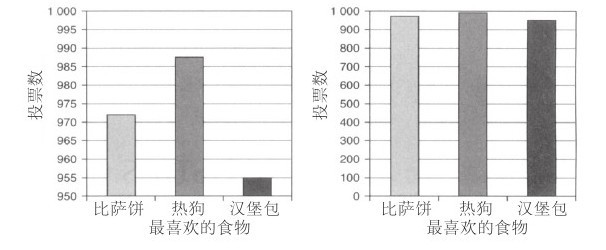

两种不同的提供数据的方式有可能会产生欺骗性

小贴士：统计数据可能而且经常骗人。它们并不必然就证明表面上想要证明的一切。

作为一个批判性思考的人，你应该努力辨别出错误的统计数据式的推理。在几个较短的段落中，我们无法向你全面展示人们用“统计数据帮忙撒谎”的所有不同方法。但是，本章我们将为你提供一些基本策略，你可以用来发现这些欺骗的小伎俩。同时，它还通过展示许多作者错误使用统计数据来当证据的最常见的方法，提醒你注意数据推理当中存在的缺陷。

？关键问题：统计数据有没有欺骗你？

## 不知来历的和带有偏见的数据

最近一个新闻标题：40%的大学生饱受抑郁症的折磨！

在你情绪低落的时候你该不该过分担心呢？你又怎么知道自己可以相信这样的统计数据？

任何统计数据都要求将发生在某地的某些事件界定并准确识别出来，这常常是一项非常艰巨的任务。因此，要找出欺骗性的数据，第一个策略就是尽量找到足够多的关于这些数据是如何采集的信息。我们能不能准确地知道美国到底有多少人在报税单上做过手脚，多少人有过婚前性行为，多少人开车打手机，或多少人使用违禁药品？如果你想象一下做这些统计的细枝末节，我们怀疑你的答案会是“不太可能”。为什么？因为要为特定的目标而得到精确的数据，你常常会遇到各种各样的拦路虎和绊脚石，其中包括关键词语的模棱两可，识别相关人员或事件的种种困难，人们不愿意提供真实信息，人们不能报告各种事件，还有观察事件的种种身体上的障碍等。因此，统计数据往往只能是基于事实做出的一些估计。这些估计有时候很有用，但它们也可能有欺骗性。记住总要问一句，“作者是怎样得出这个估计的？”你得到的细节越多越好。

不知来历的统计数据最常见的一个用处就是用大量的数字给别人加深印象或让别人肃然起敬，这些呈现出来的数字的精确性常常会让人怀疑。比如，大量的数字可能被用来提醒公众注意日见增长的身体失调或精神失常的发生率，例如癌症、饮食异常或幼年孤僻症等。如果我们能知道这些数据确定的过程是如何仔细，我们肯定会更加深受这些数据的感染。比如一直以来人们都在努力统计大学生抑郁症发病率的准确数据，但是不知来历的数据问题已经成为影响统计的一个主要因素，研究报上来的发病率存在10%~40%的跨度。所以，本章一开始提到的那份研究如果让你觉得过度惊慌的话，你未免显得有些杯弓蛇影。记住：在对这样的数据做出反应之前，我们先要问一声它们是怎么得来的。

## 令人困惑的平均值

请检查下面的陈述：

（1）快速致富的一个方法就是做一名职业足球队员，2010年国家足球联盟球星的平均收入是180万美元。

（2）在大学里要取得好成绩学生需要付出的努力是越来越少了。根据最近一项调查，大学生每周平均花在学习上的时间是12.8小时，和20年前的大学生相比大概只有他们的一半。

两个例子当中都使用了“平均”这个词。但是实际上却有3种不同的方法来测定平均值，而且在大多数情况下，每种方法都会给出不同的数值。

第一种方法是把所有数值相加然后用总数除以相加的数值个数。这种方法所得的结果就是平均数（mean）。第二种方法是将所有数值从高到低排列，然后找到位于最中间的数值，这个中间数值就是中位数（median）。有一半的数值在中位数之上，另一半在中位数之下。第三种方法是将所有数值排列好，计算每个不同数值出现的次数或每个不同数值范围出现的次数，出现频率最高的数值就叫作众数（mode），这是第三种平均值。

作者谈论的是平均数、中位数还是众数，将会产生很大的区别。

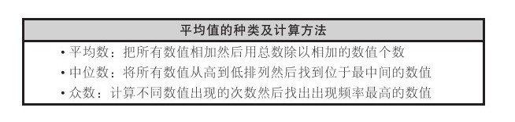

第一个例子当中取哪种平均值最能说明问题？考虑一下职业化运动当中大牌球星的收入与那些一般球员的收入对比。最大牌的球星，比如说橄榄球明星四分卫，收入比球队里大部分其他球员要高出很多。事实上，2010年度薪酬最高的橄榄球运动员岁入超过1
500万美元——远远高于平均值。这样高的收入将会急剧拉高平均数，但是对于中位数或众数而言则影响不大。举例来说，国家橄榄球联盟的球员2010年度工资平均数是180万美元，但是其工资中位数却只有77万美元。因此，在大部分职业运动当中，平均数工资比中位数工资或者众数工资要高出很多。所以，如果有人想让工资水平显得非常非常高，他就会选择平均数作为平均值。

现在让我们来仔细看看第二个例子。如果这里列举的平均值要么是中位数要么是众数，我们有可能就高估了平均的学习时间。有些学生很可能花很多时间学习，比如一周30或40个小时，这样就提高了平均数的数值但是却不影响中位数或者众数的数值。学习时间的众数可能花远低于或者远高于中位数，主要取决于花多长时间学习对学生而言最为常见。

当你见到平均值的时候，一定要记得问一下：“是平均数、中位数还是众数，选择的平均值不同会不会产生什么影响？”要回答这个问题，请想一想平均值的不同含义会对信息的意义造成怎样的改变。

不仅判断一个平均值是平均数、中位数还是众数非常重要，判定最小数值和最大数值之间的差距（即全距（range））以及每个数值出现的频率（数值分布），常常也显得异常重要。

下面我们来看一个例子，在这个例子里全距和数值分布就显得非常重要。

医生对20岁的病人说：你所患癌症的预后不容乐观。患同样癌症的病人存活时间的中位数是十个月。所以剩下来的这几个月你想做什么就做点什么吧，不必有什么顾虑了。

病人听到医生给出这样的诊断结果，他对自己的未来该做出怎样可怕的展望呢？首先，我们确定的是获得这种诊断的病人有一半不到十个月就去世了，还有一半人存活时间超过了十个月。但是我们并不知道活下来的那部分人的存活时间的全距和数值分布。这些可能显示出有些人甚至是很多人活得远远超过了十个月时间。其中有些人甚至很多人可能活到80岁以上呢！知道病人存活时间的完整分布可能会改变这名癌症患者对未来的看法。

一般来说，病人应该考虑国内不同的医院对于他的疾病的存活率是不是有不同的全距和数值分布。这样他就应该考虑选择在那家有最乐观的数值分布的医院就诊。

当我们遇到平均数的时候，了解全距和数值分布的一个总体好处就是这样做会提醒你大多数人或事并不正好符合平均值，与平均值差异极大的结果也在意料之中。例如，在有些健康议案中许多旨在改善我们健康状况的医疗干预措施事先都会给我们看一看其平均获益情况，尽管这项研究中的许多人获益极少或压根就没有获益，甚至有些人会不同程度地受损。

## 把一个结论改头换面包装成另一个结论

有些数据确实能证明一件事，而持论者往往宣称这些数据证明了另一件性质完全不同的事，这时候他们往往在欺骗我们。这些数据压根儿就证明不了它们用来证明的一切！我们有两种策略可以帮你找出这类欺骗。

一个策略就是对持论者提供的数据视而不见，然后问自己：“什么样的统计数据作为证据在证明他的结论方面会有帮助？”然后，将“所需”的数据和所给出的数据进行比较。如果两者之间难以吻合，你可能就发现了一个数据上的欺骗。下面的例子为你提供一个机会来应用这种策略。

有种新的减肥药“肥脂畏”（Fatsaway）在帮助肥胖人士减肥方面卓有成效。在临床试验中，服用此药的100例人员当中仅有6例报告有药物副作用。生产这种药物的公司说：“94%的人服用‘肥脂畏’之后有了显著的积极效果，因此我们可以放心地说，我们的药物是市场上疗效最为显著的减肥类药品之一。”

生产这种药物的公司怎样才能证明其结论——“肥脂畏”作为一种减肥药物能够达到94%的疗效？难道它不应该做一项研究，看多少人服用此药以后体重有所减轻，看这些人体重到底减轻了多少？相反，这家医药公司呈报的数据却是关于副作用出现的频率，他们假定，如果这药物没有出现副作用，那么它帮助人们减肥就会效果明显。这家公司证明了一件事（相对较少的人服用此药以后报告说有副作用），却拿它作为另一件事的结论（“肥脂畏”帮助人们减肥效果显著）。从这个例子当中得到的一个重要教训就是，我们要加倍注意统计数据的措辞和结论的措辞，看看二者是不是指的同一件事情。如果不是，作者或演说者就很可能是在用数据说谎。

知道什么样的数据证据应该用于支持一个结论是很难的。因此，另一个策略就是不急于去看作者的结论而是先非常细心地检查作者的数据，然后问自己：“从这些数据我们可以得出什么合适的结论？”然后拿你的结论和作者的结论相比较。用这个策略来检验一下下面这个例子。

大约半数的美国人欺骗了自己的另一半。研究人员最近在一家购物中心采访了很多人。在接受采访的75人中，有36人坦承他们有朋友曾承认欺骗过自己的约会对象。

你有没有质疑这个例子一开始得出的结论？大约一半人在某个特定地点承认自己有朋友告诉过自己他们在和他人约会或交往过程中至少有过一次的欺骗行为。你有没有看出数据所证明的东西和作者的结论之间存在巨大差异？如果你看出来了，那你就发现了这位作者是如何利用数据来进行撒谎欺骗的。

## 省略数据也是欺骗

统计数据经常因为不完整而欺骗我们。因此，另一个在数据推理中找到缺陷非常有用的策略就是问一问：“在你判断数据的影响力之前还需要哪些进一步的信息？”让我们先看看下面的例子，诠释一下这个问题所派的用场。

（1）大公司正在将市中心地带的小镇气息破坏殆尽。就在去年，城里的大公司的数目增长了75%。

（2）尽管大家都挺害怕，但跳伞运动其实比其他活动比如说驾驶汽车要安全得多。拿某一个月的时间来做比较，这段时间里，洛杉矶有176人死于车祸，而死于跳伞事故的却只有3人。

（3）艾滋病预防项目需要较大的资金投入。2009年，有54
000人饱受艾滋病的折磨。

第一个例子当中，75%这个数字显得很吸引眼球。但是缺少了一些东西：这一百分比所依据的绝对数值。假如我们知道这种增长是从4家增长到7家，而不是从12家增长到21家，我们还会觉得如此惊讶吗？在第二个例子里，我们倒是有数字了，但是却不知道比率。难道我们不需要知道这些数字对参加这两种活动的人数的百分比而言有什么意义吗？不管怎样，参加跳伞活动的总人数比起驾车的总人数而言简直是微不足道。

第三个例子展示了我们社会当中常见的一个事实，通过聚焦全国范围内受病痛折磨的总人数来企图引起公众对某个社会问题的关注。尽管这显然是个亟待解决的问题，但当我们将54
000除以美国的大概总人口数3亿，我们只得到一个大概2%的数值。

当你遇到听起来让人动心的数字或者百分比，一定要当心！你可能需要其他信息来判定这些数字到底有多让人动心！当只有绝对数值摆在眼前的时候，问一问百分比是不是有可能帮你做出更好的判断；当只有百分比出现在眼前的时候，问一问是不是绝对数值会丰富它们的含义。

另一个重要的有可能缺失掉的信息类型是相对比较（relevant
comparisons）。问一下这个问题常常很管用：“这是和……相比较？”

下面每个陈述都展现了要求做比较会给统计数据带来的好处。

·美杜莎发胶，现在效果要好50%。

·运动型轿车很危险，不该让它们上路行驶。2006年，有4
650名车主死于运动型轿车事故。很显然，应该采取行动才行。

·电影预算这些年简直是骇人听闻。看看《哈利·波特与火焰杯》：这部电影的预算是308
000 000美元！

·我们的文化正在日益向弱智化靠拢，更多的证据包含在以下事实当中：最近《纽约时报》一篇文章说接受采访的年轻人中知道美国内战哪一年开始的人还不到一半。

说到第一个表述，我们难道不需要问一问：“比什么要好50%？”是其他没效果的发胶？还是美杜莎以前的发胶产品？第二个例子，难道你不想知道如果不涉及运动型轿车，这些死亡数字中本可以避免掉的有多少，其他不含运动型轿车的机动车恶性事故又有多少，和它们涉及的死亡数字相比上路行驶的运动型轿车到底有多少，和运动型轿车发生的死亡数字比较运动型轿车行驶的里程数有多少？谈到第三个例子，一部电影的预算和其他电影的预算之间有怎样的联系，是这部电影特别不同寻常，还是它代表了整个的电影产业？谈到美国内战的日期方面的知识，这样的调查结果和20年前类似的调查得出的结果比起来又怎么样？

当你遇到数据的时候，一定要问一句：“有什么相关的信息缺失了？”

## 表述方式不同效果更加动人

每天吃太多高脂肪含量的肉食品使患肠癌的概率增加了25%。

新的癌症药物的效果令人失望，数据显示乳腺癌减少的绝对值只有0.5%。

统计数据在论证中的常见用法（尤其是关于健康风险类的论证）就是报告作为某种医疗干预后的风险降低情况。这里的报告很可能具有欺骗性。同样数量的风险减低可以用多种不同的形式报告，例如用相对方式而不是绝对方式进行表述，这些不同形式可以极大影响到我们对于实际的风险降低数值的认识。

想象一个65岁的女性刚患了中风，和她的医生一起商量治疗的方法。医生引用了三种治疗方法的相关统计数据：

（1）甲种疗法可以减少33%的未来再次患中风的可能；

（2）乙种疗法可以减少3%的绝对风险，从6%降低到3%；

（3）丙种疗法，有94%的女性在十年里不会再患第二次中风，而没有接受这种疗法的病人有91%的人十年里不再患中风。

她该选择哪种疗法呢？我们猜想要是你的话，你会选择第一种治疗方法。但是所有这些选择都指向同样的治疗效果，只不过是以不同的方式来表达风险而已。第一种（33%）是相对危险度降低率，如果一种疗法将心脏病的风险从100例中的9例减少到100例中的6例，风险就降低了1/3，或者33%，也就是9减去6再除以9，或者说不治疗的风险减去治疗的风险再除以不治疗的风险。但是绝对风险的变化，从9%到6%，却只有区区3%，而疗效好的结果只是从91提升到94，也仅仅只是提高了3个百分点。关键问题是以相对方式，而不是绝对方式来表达风险减低值，可以让疗效显得比实际情况好得多，而当一种疗法其好处是以相对方式而不是以绝对方式表达时，个人更愿意使用这种疗法。正如你所期望的那样，医药公司通常在他们的广告中使用相对风险，媒体报道也倾向于关注相对风险。

在你知道了肠癌绝对发病率是从4%增长到5%，癌症绝对发病率是从1%降低到0.5%以后，现在你明白了该怎样给本部分一开始提到的那两个事关风险的例子提供不同的答案了吧。当你遇到使用这样的统计数字的论证，一定要判断这些风险降低是怎样判定的，如果用绝对方式进行表达这些结果会有怎样的不同，会变得更加动人还是褪色不少。

## 轮到你自己写时，可得吸取教训

我们希望你将统计数字吸纳到自己的写作中。如果运用得当，它们会是极有价值的工具。它们帮助我们描述和理解那些不同的趋势和类型。它们可以帮助我们进行预测。统计数据还可以强化我们的论证。即便这样，本章也说明了在论证中引用数据可能存在的一些非常严重的风险。对于没有受过训练的读者而言，统计数据看起来像是权威事实，但是你知道事实是多么容易被人操纵。作为一个关心批判性思维的写作者，你面临着一个重要的平衡举动。你必须尽量避免欺骗手法，但同时以一种明白易懂的方式呈现出那些常常是复杂万分的数据。

你有没有注意到看起来最容易理解的数据常常都是质量最低劣的？想一想《美丽佳人》（Marie
Claire）、《今日美国》和《纽约时报》杂志上的那些读者调查，或者是亚马逊网站或在线旅游网站（Priceline）上的用户调查。这些统计数字当然是容易阅读了。比如说，《时代周刊》杂志报道了2010年年度人物评选的读者投票情况：“维基解密的朱利安·阿桑奇狂揽382
020票，轻轻松松拔得头筹。比银牌获得者，土耳其总理埃尔多安领先148
383票。”又如，2010年12月，亚马逊网站152名评论员当中有101人认为《欢乐合唱团：第一季完整版》（Glee：The
Complete First
Season）是五星级产品。这些数据看上去是不是像老生常谈？现在你更加明白了。你知道这些事实缺少了一些相关信息。我们不知道一个人可以为年度人物投多少次票。我们知道这两个样本里哪个都不是随机抽取的——这个投票是基于网络的，所以很可能它排除了很多年长的、不懂电脑技术的读者，而是有利于那些更年轻的、精于电脑的读者。

要想小心对待带有数据的论证，你可能要从论证中专门拿出点时间来解释这些数据是怎么产生的，数据的含义，以及数据存在的局限。这样做会增加你在读者中的可信度。你在向他们表明你并不是在偷偷摸摸地向他们灌输东西。你同时也在鼓励他们成为批判性思考的人，让他们自己对数据的质量得出结论。你可以决定将这些解释包含在论证的文本当中，或者你可以选择将它们放到脚注、尾注或者附录里面，这个决定很可能要基于你的研究领域的通行做法和你写作的正式程度。

评估数据的一些线索

（1）尽量找出如何获得数据的相关信息，越多越好。问一下：“这位作者或演说者是怎么知道的？”持论者想要用大量的数字来让你动心或者让你惊心的时候，你尤其要警惕。

（2）要对描述的平均值的类型感到好奇，分析一下知道事件的全距和数值分布是不是会对数据多了一个有用的视角。

（3）数据使用者拿一件事的结论来证明另一件事时你要特别当心。（4）先不去看作者或演说者使用的数据，把所需的数据证据和实际提供的数据做比较。

（5）从数据中得出你自己的结论。如果这结论和作者或演说者的结论不一致，那么很可能其中有什么地方出错了。

（6）判断有什么信息缺失了。对于误导性的数字和百分比以及缺失的比较，你要特别当心。

来，做做思维体操

！关键问题：统计数据有没有欺骗你？

在下列每篇练习文章里，请你找出证据的不当之处。

⊙第一篇

政府部门职位的竞选和角逐变得越来越失控。越来越多的选举中金钱开始起到关键作用。现在赢得普通的参议院席位平均花在竞选活动中的支出就要超过800万美元，而典型的总统竞选人则要花费超过3亿美元。现在是时候来点实质性的改变了，因为我们不能只让那些政客通过广告宣传的大笔花费来购买他们的职位。

⊙第二篇

家庭正变成越来越危险的栖身之所。和家庭相关的伤害案件的数量正在直线上升。2000年，大约有2
300名14岁及14岁以下的儿童死于家庭中发生的事故。同时，每年有4 700
000人被狗咬。更糟糕的是，哪怕电视机这个相对安全的家用电器也开始变成危险源。事实上，每年有42
000人被电视机或者电视机架所误伤。既然家里发生这么多的事故，也许人们需要花更多的时间待在户外。

⊙第三篇

攻击型的心理咨询减少了部队的精神问题。最近在一场重要的战斗冲锋期间由部队开展的一项针对10
000名士兵的研究显示，更具攻击性的心理咨询手段使士兵们企图自杀的危险行为减少了超过50%。

给个提示

⊙第一篇

结论：有必要改变对政府部门职位的竞选角逐。

理由：政客们花在竞选活动上的钱太多了。普通的参议员在竞选活动中花费超过800万美元。总统候选人花费超过3亿美元来进行竞选活动。

竞选活动是不是太费钱了？“平均”和“典型”这样的词应该提醒我们注意其潜在的欺骗性。我们需要了解用来计算这些数据的平均值的种类。是平均数、中位数还是众数？比如，在参议院席位竞选数据中使用平均数有可能会得出一个歪曲的数字，因为某些参议员，尤其是那些势均力敌的参议员在竞选中作为候选人花费的钱确实数额巨大。但是，由于很多参议员基本上是必定会重新当选，这些竞选活动很可能花费并不大。我们知道只有极小一部分参议员的竞选活动双方实力极其接近。因此，如果用平均数来代表平均值，多数人可能不会花费报道中提到的那么多钱。换句话来说，如果用中位数或者众数就可能表现出低得多的数值。同样，知道数值分布和全距也会让你更加了解你所关心的竞选活动的花费到底有多少。

附带提一句，重要的参照数据也缺失了。竞选活动的花费和过去类似的活动花费比起来怎么样？其他政府部门的竞选花费又怎么样？很可能竞选活动的花费近几年实际上一直在走下坡路。

⊙第二篇

结论：花时间待在家里正变得越来越危险。

理由：和家庭相关的伤害正在日渐增多。

证据：一年期间，2 300名儿童死于家中发生的事故。

每年有4 700 000人被狗咬。

每年有42 000人被电视弄伤。

要评价这个论证，我们首先需要确定什么样的证据拿来回答下面的问题最为合适，“现在的家里比起从前来是不是更加不安全了？”在我们看来，用来回答这个问题的最佳数据就是拿现在每年家中重大事故的发生率和过去几年的事故发生率做比较。同样有关的是每小时在家里发生的伤害事件的数量和过去几年同样的数据之间的对比。很可能更多家庭伤害的发生是因为人们比过去花在家里的时间增加了很多。如果他们待在家里的时间更多，在家中发生伤害的数字相应增加，这就显得符合逻辑了。

这个论证当中提供的证据很可疑，有下面几点理由。第一，关于家庭伤害的总数作者根本没有提供任何数字。我们知道作者说它们在直线上升，但是根本没有证据表明这样的上升。第二，有关儿童在家庭事故当中丧生的具体细节也没有披露。这个数据和过去儿童在家中身亡的数据相比又怎么样？是什么类型的事故导致这些儿童的死亡？第三，狗咬的数字具有欺骗性。我们根本不知道这些狗咬事件是不是发生在家中。更重要的是，狗咬人的数字好像不能引导我们得出结论说待在家里是不安全的。第四，有关电视机的数据也很可疑。作者是从哪里得到这些动人的数据的？同样，这些伤害中大部分到底伤得有多严重？

# 第11章　有什么重要信息被省略了

下面这个广告多么让人难以抗拒：

试试“欢乐时光”（HappyTyme），它是医嘱治疗抑郁症的头号特效药。

这广告的目的当然是劝说你购买更多的指定产品。就算你的批判性思维能力还没有发展到现在的水平，你也知道这类广告所说的绝不能全部当真。比如，如果这家“欢乐时光”制药公司比其他制药公司给了心理治疗师更大的折扣，给心理治疗师提供更多的免费试用药，或者是给那些使用他们药品的治疗师提供豪华游轮旅游，你是不太可能在广告中看到此类信息的。你看不到这些信息，但是它们对于你决定吃什么药来治疗抑郁症却有很大的关系。

批判性思考的人追求独立思考的力量时，如果他们做决定的基础是极为有限的一点信息，他们也就无能为力了。几乎所有的结论或者产品都有一些正面的特点。那些只想告诉我们他们想让我们知道的信息的人，就会告诉我们所有这些正面的特点，而且是不厌其详，活灵活现。但是他们会隐藏那些结论的负面因素。因此，真正的自主思考需要我们坚持不懈地寻找作者到底隐瞒了什么信息，不论其是无心省略还是有意隐瞒。

通过追问前面几章里我们学习的那些问题，诸如那些涉及歧义、假设和证据之类的问题，你就能找出许多非常重要的省略信息。本章尽量让你对那些没有明说出来的信息的重要性变得更加敏感，以此作为重要提示来提醒我们，如果我们仅仅评价那些摆在面上的信息，那么我们仅仅是在对不完全的论证画面做反应。因此本章专门论述一个极为重要的附加问题，你必须要问这个问题才能判断推理的质量：有什么重要信息被省略了？

？关键问题：有什么重要信息被省略了？

## 接受说服之前，先打个问号

你应该记住几乎任何一个你所遇到的信息都有一个目的。换句话说，这个信息的组织结构是由别人精心挑选和呈现的，目的就是希望它能从某种程度上影响到你的思维方式。因此你的任务就是判断你自己是否想成为这一目的的傀儡。这个选定的目的常常就是为了说服你。

广告商、教师、政客、作家、演说家、研究员、博主和父母都在精心组织信息来影响你的判断和决定。因此，那些尽力要说服你的人几乎总是将他们的立场置于最强的光线之下。所以，当你发现那些你相信是较具说服力的理由，即那些你正在努力勘探的金块时，较为明智的做法是犹豫片刻，想想作者可能没有告诉你的那些信息，那些你的批判性探询还没有能揭示出来的信息。

这里所说的重要的省略信息，是指那些将会影响到你该不该被作者或者演说者的论证所影响的信息，也就是那些影响到你的推理过程的信息。穿插在本章中的都是些说服力不够强的推理的例子，它们说服力不够，并不是因为说出来的不顶用，而是因为省略掉的信息太关键。仔细研读这些例子，注意在每个例子当中找不到省略掉的信息会怎样导致你做出仓促和有可能错误百出的判断。

小贴士：重要的省略信息就是那些影响到推理过程的信息。

## 不完整的推理在所难免

不完整的推理在所难免，主要有以下几点原因。第一，由于时空的限制。论证不完整是因为持论者并不需要常常去组织这些论证，他们也没有不受限制的空间或时间来展现他们的理由。第二，我们大部分人的注意力持续的时间都很有限，如果信息长得没完没了我们就会觉得厌倦。因此，持论者常觉得有必要让他们的信息尽快传达给目标受众。广告和社论都反映了这两个因素。比如，社论的字数都有特定的限制，论证必须既要引人入胜又要切中肯綮。因此社论作者不得不点到为止，这让人心痒难搔。电视评论员更是出了名的会将极其复杂的问题弄得听上去像小儿科一样简单。他们的时间有限，无法提供足够精准的信息使你能形成一个合情合理的结论。

人们难免要省略信息的第三个原因是进行论证的人所拥有的知识总是不完全的。为什么要省略掉某些信息？第四个原因是因为作者直截了当地想要欺骗你。广告商知道他们正在省略关键的信息。如果他们要描述产品当中所含的所有化学成分或不值钱的成分，那你基本就不会购买他们的产品了。每个领域里的专家都有意要省略有关信息，如果公开展示这些信息，那就会削弱他们所提建议的说服效果。如果那些尽力要给你建议的人把你当成一块“海绵”，那么这类省略对他们而言就特别有诱惑力。

为什么省略信息变得这样肆无忌惮？第五个原因就是那些尽量给你提建议或想要说服你的人的价值观、信仰和态度常常和你的并不相同。因此，可以预料，他们的推理会受到不同的假设引导，而这些假设和你对同样的问题提出的假设可能会完全不同。批判思考的人看重好奇心和合理性，那些力图说服你的人常常想要打消你的好奇心，鼓励你依靠违反常理的情绪反应来形成你的选择。

一个特定的视觉就像马眼睛上所戴的一副眼罩。眼罩让马心无旁骛全神贯注于正前方的道路。但是，一个人看问题的视觉也像马所戴的眼罩那样，阻止他去关注某些特定的信息，而这些被他所忽略的信息对那些从不同参照系进行推理的人却显得至关重要。演员马特·达蒙所扮演的角色在电影《伯恩的身份之最后通牒》里表达了对这个关键问题的理解：“不同的东西到底是什么样，主要取决于你坐在什么地方，这真有意思。”除非你看问题的视角同那个力图说服你的人完全相同，否则你就一定要关注那些重要的省略信息。

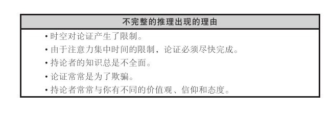

## 识别省略信息的线索

你怎么才能识别那些省略的信息？首先你得提醒自己，不管支撑特定的判断或者观点的理由乍一看是多么吸引人，你都必须要再看一眼以便寻找那些省略掉的信息。

你怎么去找，你又到底希望自己找到些什么？首先你得提出一些问题来帮你判断自己还需要哪些额外的信息，然后再提一些准备的问题来找出那些信息。

你可以利用很多种问题来识别相关的省略信息。有些问题你已经学会怎么问，它们才会凸显出这些信息。此外，为了帮你判断可能被其他关键性问题所忽视的省略信息，我们为你准备了一个单子，上面列举了一些重要类型的省略信息，同时列出一些提问的例子来帮助你发现它们。

找到常见类型的重要信息的一些提示

1.常见的反驳论证

a.反对的人会提供什么样的理由？

b.有没有研究和所说的研究相冲突？

c.有没有备受尊敬的权威人士提供的例子、证词和观点被省略掉，或者支持论证的对立面的类比被省略？

2.遗漏掉的定义

如果关键词用另一种方式定义，这个论证会有怎样的不同？

3.遗漏的价值观偏向或者视角

a.不同的价值观会不会产生处理这一论题的不同方法？

b.从与说话者或作者不同的价值观出发会产生怎样的论证？

4.论证中所指的“事实”的来源

a.这些“事实”的来源是什么？

b.事实断言是不是由出色的研究或者可靠的来源支撑？

5.用来获得事实的程序细节

a.有多少人完成这个问卷调查？

b.调查的问题是怎样措辞的？

c.调查对象有没有大量的机会来提供与问卷选项不同的答案？

6.收集或组织证据的其他技巧

a.访谈研究得来的结果和书面问卷调查得到的结果可能有怎样的不同？

b.实验室试验会不会产生更可靠更丰富的结果？

7.遗漏掉的或者不完整的数字、图表、表格或者数据

a.如果数据包含早期或者后来的证据看起来会不会不一样？

b.作者有没有故意“拉长”数字让差距显得更大一些？

8.省略的结果，不管是正面反面结果，短期长期结果，还是提倡和反对的结果

a.论证有没有遗漏了提议的行动所带来的重要的正面或反面结果？代价是什么？好处又是什么？

b.我们需不需要知道行动对下列任何一个领域的影响：政治的、经济的、社会的、生物的、精神的、健康的或环境的？

9.当为特殊的预测技巧进行辩护时省略掉预测的失败，或者预测的失误

a.当“通灵巫师”或者“直觉主义者”推销他们的特异能力时，我们需要追问他们的预测被证明不真实的概率有多少。

b.我们需要知道经济学家、理财顾问、体育运动赌博人士和政治权威人士预测失败的概率，如同要知道他们成功的概率一样，然后我们才能得出结论说他们拥有特殊的才干。

意识到这些具体的类型应该大大有助于你找准相关的省略信息。因为有这么多不同种类的重要省略信息存在，所以，你应该时刻问自己这个一般性的问题：“作者或演说者有没有遗漏什么其他信息，而我在判断推理的质量之前必须要知道这些信息？”让我们来检查几个论证，它们都省略了一些上述名单所列举的各种类型的信息，看看每一种省略会怎样导致我们形成错误的结论。每个例子中只有要求省略掉的信息被补充完整你才能避免得出错误结论的危险。让我们看看这个广告的断言。

祛痘灵（Zitout）洗面奶祛除95%的深层污垢和油脂，帮助祛除不好看的斑点。

我们要不要趋之若鹜地去购买祛痘灵洗面奶呢？请等一等！在诸多省略的信息当中，这个广告没有包含下列任意一个信息：①其他品牌洗面奶祛除深层污垢和油脂的百分比，也许它们能祛除99%的污垢和油脂呢；②单单用香皂清洗可以祛除的污垢和油脂的数量，也可能只要用平常的香皂就可以把脸洗得干干净净；③使用这种特殊产品可能带来的负面效果，很可能里面有些成分会引起皮肤过分干燥或者有致癌危险；④斑点的其他来源，也许污垢和油脂在洗脸时并不是人们最关心的部分；⑤造成斑点的污垢和油脂的分量，也许5%仍然能造成足够数量的斑点；⑥这种洗面奶的其他优点或缺点，比如气味、价格、有效时间。广告商省略掉许多关键数据，而你如果想要购买得明智些就需要这些数据。

你有没有明白仅仅因为省略掉的信息的缘故，像“五个医生当中四个都同意”“纯天然”“无脂”“低碳”“有利于心脏”“头号领衔商标”“ADA认证”以及“没有添加防腐剂”这些广告词可能都很准确但却产生了误导效果？

## 考虑是否有负面效果

还有一种类型的省略信息识别起来异常重要而又常常被人忽视，我们想在这里特别强调一下：被提倡的行动的潜在负面效果，比如使用一种新型药物，建设一所大型的新学校，或者提议减税。我们在这里刻意强调负面效果，因为通常情况下这些行动的提议都发生在支持者宣称他们的意见非常棒的语境下，例如某个医学难题的大幅解决，容貌更好，更多休闲时间，更多教育机会，更长的寿命，更多/更好的商品。但是，因为大部分的行动有这样广泛的正面和负面影响，我们需要问一问：

·社会的哪一部分并没有从提议的行动当中受益？谁蒙受了损失？受损的人对此有什么话说？

·提议的行动对权力分配有什么影响？

·这个行动对我们的健康有什么影响？

·这个行动怎么影响我们相互之间的人际关系？怎么影响我们与自然环境之间的关系？

对上述每一个问题，我们都不要忘了问一句：“这个行动潜在的长期的负面效果是什么？”

小贴士：在考虑省略掉的信息时要记住问一句：“这个行动潜在的长期的负面效果是什么？”

为了展示一下提出这些问题的用处，让我们思考下列这些问题：建设一所面积大的新学校有什么可能的负面效果？你有没有考虑到以下这些问题？

·破坏环境。比如，建造这样一所新学校会不会涉及砍伐一片森林？当地的野生动物失去一片栖息地之后会造成怎样的影响？

·教育质量的变化。如果新学校将其他学校有经验的教师或者有才干的学生都吸引过去了怎么办？如果新学校吸纳了大部分拨付给当地学校的教育经费，而让其他学校享受不到同样的资金怎么办？

·房地产价值的影响。如果这座学校相对于全国标准来说做得并不怎么样，那么这会对周边社区房屋的房地产价值产生怎样的影响？

·增加的税负。新学校的资金是怎么筹集的？如果新学校是一所公立学校，新学校的开张可能会导致当地社区不动产税税率的增加，这样才能帮助支撑学校的运转。

这样的问题能让我们在追随被提倡的行动的浪潮时停下来思考思考。

## 面对信息缺失的现实

仅仅因为你能要求别人提供重要的省略信息并不能保证别人就能给你一个满意的回答。很可能你探究的问题根本就得不到回答。不要绝望！你已经尽力了。你要求得到这些亟须的信息然后你才能做出决定，现在你必须在找不到缺失的信息时确定你是否还有可能得出一个结论。我们早先曾警告过你推理的过程从来都是不完整的。这样，自动声明只要信息仍然找不到你就不能做出决断，那就会阻止你形成任何观点。

## 轮到你自己写时，可得吸取教训

省略信息是难以避免的。我们并不期待你接受我们在本章前面列举的每个问题。相反，在你的写作当中，我们希望你自己做出决定。你得自己判断什么样的省略信息是最重要的。当一条省略的信息能够强烈影响到读者对你的论证所持的立场，那么这个信息就非常重要。你必须问自己：“如果我的读者知道这个信息，这会怎样影响他们对我的论证的反应？”你觉得它的影响越大，避免在写作中省略这样的信息就显得越重要。

尽管我们不能替你做决定，但我们还是有一些建议给你。它们和我们早先提供的一些技巧非常相似。让我们假设你在尽力判断是不是省略了你本该包含进去的信息，比如一个反驳的论证或者一项和你的证据相冲突的研究。做出判断的一种方法就是回到你原来的研究当中。他们在争论的到底是什么关键点？比如，如果你在写作谁本来应该赢得2010年度奥斯卡最佳画面奖，你可能会完全沉浸在顶尖评论家对自己最喜欢的作品和为什么喜欢这些作品的相互争论中。你可能意识到因为自己的疏忽大意你没有提到《社交网络》，这部将脸谱网的创立经过编成小说之后所拍的电影，有很多评论家认为它是角逐这个奖项的热门影片。即使你不同意这些结论，你知道这些评论家的立场很有影响。你还知道你无须与读者分享安吉丽娜·朱莉和约翰尼·德普主演的影片《致命伴旅》的优点。基于蹩脚的整体评价，你判断任何提名这部电影去角逐最佳画面奖的提议很可能都显得微不足道。

我们的另一个建议你听起来应该也很熟悉，请利用你生活当中的各色人等，尤其是那些持有不同的价值取向和世界观的人。问问他们需要什么样的信息才会接受你的结论。这样的谈话也许能引导你发现自己省略掉的重要信息。同样的道理，你可以通过创造性的思考来独立探究这个问题。假设一个各色人等组成的读者团，尽量把自己放在他们的位置。比如，想象一个不同政治派别的读者或者不同文化特征的读者，或只是有一套不同的生活重心的人。从另一个角度，假设一下那个人在评价你的论证之前想获得什么样的信息，他们能不能在你的作品中找到这些信息呢？

### 使用这个关键问题

一旦你想到一个论证中存在遗漏的信息，你应该怎么做呢？第一个符合逻辑的反应就是去寻找这个信息。但是通常情况下你会遇到一定的阻力。作为批判性思考的人，你的选择就是由于缺失的信息你要表达你对这个论证的不快，不断搜寻你所需要的这个信息，或者谨慎地同意这个推理，理由是这个论证比他的对手的论证要好。

来，做做思维体操

？关键问题：有什么重要信息被省略了？

下面例子中的每篇文章都有重要的信息缺失了。将你要问的问题列出来，然后去问写这篇文章的人。解释每种情况下为什么你所寻找的信息在你尽力判断这篇推理文章的价值时显得非常重要。

⊙第一篇

最近一项研究显示戒酒可能会缩短人的寿命，更加引人注目的事实是禁酒主义者的死亡率要远远高于那些酗酒者。适量饮酒，即界定在每天喝1~3次酒，常常和最低的死亡率联系在一起。在长达20年的研究周期里，那些目前不喝酒的人死亡率最高，不管他们过去喝不喝酒，酗酒者死亡率排第二位，适当饮酒的人死亡率最低。样本包含了1
824名参加者，在20年研究周期的一开始他们的年龄分别是55~65岁不等。死亡率如下：从来不喝酒的人为69%；酗酒者为60%；适量饮酒的人为41%。研究人员表示酗酒者比滴酒不沾的人寿命要长，一个重要原因是社会交往活动所起到的润滑效果。

⊙第二篇

克隆技术可以在医疗领域取得很多积极的突破。如果我们适当地发展克隆技术，人们就无须因为缺少器官捐助者而死亡了。有了克隆技术，研究人员可以为那些急需做器官移植手术的人人工培育新器官。此外，因为这些器官是从病人自己的人体组织当中克隆出来的，根本就不会再出现病人的身体排斥移植的器官这种情况。克隆的器官可以在没有头颅的身体中进行培育，这样就不会牵涉到要死亡一个人来拯救另一个人的生命。克隆的另一个优点是它将有助于人们战胜疾病。通过克隆产生的某些蛋白质可以用来战胜诸如糖尿病、帕金森症和囊性纤维化这样的疾病。

⊙第三篇

美国是世界警察。奔赴需要我们帮助的国家并且看管好这些国家是我们的职责所在。限制我们和其他国家互动的一个有效方法就是在这些国家鼓励民主的发展和自由市场的建立。不管怎样，现代的西方民主国家还没有兵戎相见、相互残杀，它们都是民主社会，拥有自由市场的结构。而且，看看德国统一时过渡的过程有多容易。民主制度顺利推行，原来分裂的西德与东德和平共处相安无事。实际上，德国经济在过渡时期也极为健康强劲。现在德国的国内生产总值在全世界范围内排第三位，一切都是因为民主制度和资本主义。

给个提示

⊙第一篇

结论：酗酒者比不喝酒的人寿命更长，适量喝酒的人寿命最长。

理由：最近一项研究发现了寿命的这种排名。

省略的信息分析。这三群人相互之间还在哪些方面有所区别，比如说社会经济阶层和生活中的压力源，而这些区别有可能导致死亡率之间的不同？适量饮酒和过量饮酒有什么潜在的负面效果？有没有可能对记忆、婚姻满意度和工作表现产生影响？这些结果有没有在其他类型的研究当中发现？研究的参与对象都是怎么挑选的？比如，自愿参加这项研究的人和随机抽取的人有没有什么不同，这样会不会限制概括的效度？怎么去衡量喝酒的频率？这样的衡量准不准确？

⊙第二篇

结论：克隆可以带来积极的医学效果。

理由：（1）克隆可以用于器官移植。

（2）克隆可以用来帮助人类战胜某些疾病。

首先，这种推理促使我们去追求一项新技术——克隆人类，而且只援引了它的好处。作者省略了可能存在的不利之处。我们需要综合考虑其有利之处和不利之处。使用克隆的人体器官可能带来什么严重的副作用？克隆器官是不是和正常器官一样稳定？克隆技术对于人类的决策会带来什么样的正面和负面作用？如果人们知道新器官可以被任意培育出来取代现有的器官，他们会不会对身体和器官不再那样精心呵护？克隆技术的获得会不会导致人们为了不可告人的目的而滥用克隆技术来制造完整的克隆人？人们会不会克隆出自己，让地球上现有的人口负担又加重一层？这项技术的优点或许远远大于其缺点，但是我们需要明白其优缺点，这样才能判断这个结论的价值所在。

此外，让我们进一步来看看和这项研究相关的缺失信息。你有没有发现没有一项研究在这里被引用？实际上，论证没告诉我们在美国根本没有发生过一例克隆技术应用于人体的实验。因此，所有这些有关克隆技术的优点的讨论都是假设而已。真实的实验会不会证明这些假设的优点确有可能存在？我们根本不得而知。

# 第12章　能得出哪些合理的结论

到了这个阶段，你应该已经完全学会披沙拣金的功夫了，也就是分清坚实的理由和牵强的理由。

请思考下面这个论证：

大型企业花大量时间和金钱来对儿童进行广告轰炸。儿童节目中精心设计了各种商业广告，竭力向他们推销最新款的玩具，告诉孩子们只有得到这些新玩具他们才能活得幸福快乐。向孩子做广告这种行为简直令人发指，应该被宣布为非法行径。向孩子做广告，而孩子根本不能客观评价他们看到的广告，实际上是给他们的父母带上了紧箍咒，要么对孩子说“不”让孩子老大不高兴，要么对孩子的各种要求有求必应，最终宠坏孩子。

你会不会敦促本地的议员宣布针对儿童的广告为非法？假设你检查过作者的理由发现它们都很确凿可信，还有没有其他的结论可能和作者这个结论一样与这些理由契合无间？本章将会提出几个可能存在的备选结论。

你很少遇到一种只能从中推断出一个合情合理的结论的情形。在第9章当中，我们讨论过替代原因的重要性，其重点是对于一个因果结论来说可能存在不同的因果依据。但是本章我们主要关注从单独一套理由中可以推断出多个备选结论，它们都有可能是这套理由得来的结果。

因此，你必须要确定你最终采纳的结论最合乎情理，和你的价值取向最吻合一致。一旦你发现了其他的备选结论，你就能更加有备无患地从一大堆可选的结论当中发现那个最说得通的结论了。

？关键问题：能得出什么合理的结论？

## 各种假设和多个结论

试图用来支撑某个事实断言的证据，或是用来支撑某个规定性结论的一堆过硬的理由，都可以解释成不同的含义。理由一般并不都是一目了然和不言自明的。我们已经不止一次地见到，结论只有在某人对理由的含义进行特定的解读或者假设之后才能得出来。

如果你对理由的含义进行不同的推测，那你就会得出不同的结论。因为我们所有人都具有不同水平的认知准确度、不同的参照体系和先验知识，对哪些假设更为可取我们不断表达不同意见。我们从理由当中得出不同的结论是因为我们的背景各不相同，目标千差万别，这样我们在决定将理由和结论连起来的时候必然会被不同的假设所吸引。

## 二分式思维方法：妨碍我们考虑多种可能性

很少有重要的问题我们可以用简简单单的“是”或斩钉截铁的“不是”来回答。当人们习惯用非黑即白、非是即否、非对即错、非正即误式的方式来思考问题的时候，他们就是在应用二分式思维方法（dichotomous
thinking）。这种类型的思维方式往往将一个可能存在多种答案的问题假设成只有两个可能的答案。这种喜欢看待和提及一个问题的两个方面，仿佛天下所有问题都只有两面的习惯对我们的思维有毁灭性的破坏效果。通过将我们能加以考虑的结论局限在仅仅两个以内，细心推理可衍生出的无穷可能性就会急剧减少。

前面我们讨论虚假两难选择这种谬误的时候遇到过这种二分式思维。这种类型的谬误，以及一般的二分式思维，因为过度限制我们的视野而破坏了推理的进程。我们以为考虑了两个可选的决定以后就万事大吉了，因此忽略了很多其他的选择，从而错过了做出一个其他选择有可能带来的积极后果。

运用两分法思考问题的人常常是一成不变，容不得异议存在，因为他们不能理解语境对特定答案产生的重要性。为了让这一点更明白，请你想象下面的情形：

你的室友让你帮他设计一份生物学的论文。这份论文要设法解答以下问题：“科学家应不应该继续从事干细胞研究？”在他看来，这份论文首先需要他选择一个“该”或“不该”的立场，然后加以论证。

你已经知道二分式思维可以通过限定结论的条件，将各种结论放到具体语境中来加以避免。这种限定的过程需要你对任意一个结论提出以下问题：

（1）结论在什么时候是精确的？

（2）结论在什么地方是精确的？

（3）结论为什么或为了什么目的才是精确的？

然后你开始将这个过程应用到这份论文中。

当你解释在某个特定的时间、特定的环境里，为了利益最大化或目标最大化，人们不得不允许干细胞研究，你的室友因此而感到越来越沮丧，你会不会觉得很惊讶？他本来是在找“该”或“不该”，而你则给他带来了较为复杂的“这取决于……”。

一成不变的二分式思维限制了你决定和选择的范围。更糟糕的是，它过度简化了复杂的情况。结果采用二分式思维的人很容易变得糊里糊涂不知就里。

下面这个部分展示了二分式思维带来的局限性结果。

## 两面还是多面

在我们查看几个存在多种潜在结论的论证之前，让我们先确保你已经体会到对大多数重要的争论而言，出现大量的结论是理所当然的。下面是两个当代的问题：

（1）美国应不应当涉足其他国家的维和行动？

（2）莎士比亚是不是有史以来最伟大的剧作家？

乍一看，这些问题以及很多类似的问题好像是在寻求一个“是”或“不是”的答案。但是，一个限定条件的“是”或“不是”往往是最佳的答案。用“也许”或者“这取决于……”进行回答的优点就在于它迫使你承认你所知道的一切还不足以给出确定无疑的回答。但在你避免了一个确定答案的同时，你也形成了一个不确定的决定或者观点，需要进一步投入时间精力付诸行动。寻找可以提高对你的观点的支撑力度的额外信息是明智的行为，但是到一定程度你必须要停下来做出决定，即使你愿意为之辩护的最有力的回答是“是的，但是……”。

现在回过头去看前面刚提出的两个问题。问一下你自己，什么样的结论最有可能回答每个问题。自然，简单地回答“是”或“不是”就可以得出两个结论。但还有没有其他可能？是的，还有很多种可能！让我们来看看可以回答第一个问题的一小部分可能的答案。

美国应不应当涉足其他国家的维和行动？

·应该，当这个国家和美国有千丝万缕的联系时，比如沙特。

·应该，如果美国被看成唯一的超级大国，就有责任维护世界和平。

·应该，如果美国的角色定位于维护和平而不牵扯到一场战争。

·应该，当我们海外的经济利益濒临危险的时候。

·不应该，美国国内亟待处理的问题已经数不胜数，根本不应该在其他国家浪费时间。

注意在每种情况下我们都添加了一个必要条件，这样才能证明这个结论。在缺乏任何数据或定义的前提下，以上七个结论（包括简单地回答“应该”和“不应该”这两个结论）中的任意一个都可能是最合理的。而后面五个结论只是第一个问题的诸多可能结论中的一小部分。

## 寻找多个结论

本部分主要包括一个论证指向多个结论，这些结论都可以从论证的理由当中推断出来。这部分的目的是为了在你寻找多个结论时为你提供一个可以借鉴的模型。我们先给你提供论证的结构，然后再指出多个备选的结论。你先要研究这些理由，不要急于去看结论，尝试从这些理由中推断出尽可能多的结论。你大可一直使用前面提到的“什么时候”、“什么地方”和“为什么”等问题来帮助你得出备选的结论。

结论：美国应该继续使用死刑作为一种惩罚罪犯的形式。

理由：（1）没有死刑，有些人犯了罪就没办法处罚，比如说已经判了终生监禁的人伤害监狱看守或者同监的犯人。

（2）一个人故意剥夺了他人的生命，只有以死偿命才够得上公平。

让我们先接受这些理由，当它们符合情理，然后开始讨论。我们怎样来看待这些理由？我们在作者的结论中已经得到一个回答：继续使用死刑。

但是即使我们接受这两个理由，我们也不一定就能得出同样的结论。基于这些理由其他的结论至少一样说得通。例如，由此我们也可以推断出，我们应当继续使用死刑，但是仅仅限于其人已经被判处终生监禁在监狱服刑，而且杀害了监狱守卫或另一名犯人。或者说，这些理由可能显示我们需要保留死刑，目的是在囚犯伤害守卫或其他囚犯的情况下使用。这个备选的结论不仅被上述理由从逻辑上所证明，它还引出一个和原始结论全然不同的新结论。

## 某个条件下才合理的结论

如果你回头重温一下本章当中讨论的所有备选结论，你就会注意到每个备选的结论都有可能成立，这是因为我们缺少了某些信息、定义、假设或者分析这些理由的人的参照系，所以，我们需要谨慎地使用条件句（if-clauses）来创造多种结论。在条件句中，我们陈述一个假设的条件，目的是帮助我们得出某个特定的结论。注意使用条件句让我们能得出某个结论，而不用面对某个特定的争论假装知道我们本来不知道的一切。

当你在结论前面使用条件句时，你就指出了这个结论是建立在你所不确定的特定断言或假设的基础上。为了理解我们的意思，请看看下面作为样本的可能会引导出结论的条件陈述句。

（1）如果税收减免政策是针对那些低收入人群的，那么……

（2）如果一部小说包含一个极易辨认的正面人物，一个一望即知的反面人物，以及一个扣人心弦的高潮，那么……

（3）如果汽车制造商能制造出油耗更低一些的汽车，那么……

创造条件句特别有助于为评价型的论证找到合理的结论，比如说那些评价音乐、艺术、大学或者总统演说的质量怎么样的论证，因为这些论证需要我们在使用什么标准来进行评价方面表明立场。

条件句为你提供了多种结论，在你对争论做出评判之前你应该先评估一下这些结论，它们同时也增加了可能的结论的范围，从中你可以选择出自己的立场。

## 以解决问题为导向的可能结论

我们经常遇到以下面这种形式提出的问题：

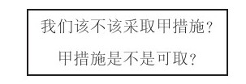

这样的问题自然引出二分式思维。但是，用这种方式提出的问题常常掩盖了一个更广层次的问题，“我们应该怎样处理乙问题？”（常常是一些棘手的问题。）用后面这种方式重新表述问题就让我们创造出特定形式的多种结论：从理由提出解决问题的方法。这样创造出多种解决方法大大增加了我们思维的灵活性。

让我们查看下面这篇文章，展示一下创造多种解决方法作为可能的结论的重要性。

我们要不要关闭市中心地区的酒吧？答案必然是一句振聋发聩的“要！”自从这些酒吧开业以来，已经有十几个年轻的大学生深受酒精中毒的折磨了。

一旦我们把问题变成“我们应该采取什么方法来解决一部分大学生深受酒精中毒折磨”这个问题，很多可能的解决方法就涌上我们的脑海，这些解决方法有助于我们形成对这个问题的结论。例如，我们可能得出这个结论：“不，我们不需要关闭市中心的酒吧，相反，我们应该严格执行饮酒年龄的限制，对卖酒精饮料给未成年人的酒吧施加罚款。”

当一个规定性论证中的理由是在表达实际存在的问题时，寻找这个问题不同的解决方法就是这个论证可能得出的结论。

辨认备选结论的一些提示

（1）努力找出从理由当中可以推导出的尽可能多的结论。

（2）使用条件句来限定备选的结论。

（3）重新将论题表述为“我们该怎样来处理乙问题”。

## 让思维更加灵活

如果逻辑、事实或者研究本身可以自圆其说，我们就会用特定的方法来学习。我们的任务就是请教另一个人，也许是老师，让他们来告诉我们应该持有的看法。具体来说，我们就会去寻找逻辑和事实一统天下的那一套极易辨认的看法。

虽然我们对于逻辑和事实表示出极大的敬意，作为形成结论的向导，我们也不能过分夸大它们的价值。它们只能引导我们走到一定地步，然后我们就不得不使用逻辑和事实为我们提供的那些帮助，自己走完通向确定看法的剩余道路。

要使用逻辑和事实为我们提供的那些帮助，第一步就要寻找那些有可能存在的与我们所知的逻辑和事实相一致的各种结论。这种搜寻通过一种重要的方式解放了我们。它将我们从上面所勾勒的那种刻板僵硬的学习模式中解放出来。一旦我们认识到种种可能存在的结论，我们每个人都会体验到个人选择得到提升的那种激动。

## 不是所有的结论都生来平等

我们要提醒你一下，得出多种不同的结论常常随之而来的那种劳有所获的感觉，可能会诱使你对所有结论一视同仁，认为自己一旦把所有结论罗列出来就已经万事大吉。但是你要记住有些结论可能比其他结论更能站得住脚，而最值得相信的结论应该是那些最能影响到你对作者的推理进行反应的那些结论。实际上，针对全球变暖、伊拉克战争的起因、远程学习的明智之处等论题的滔滔雄辩，削弱它们的一个聪明的方法就是说一句：许多专家不同意你这个观点。

这样一个表述的内在含义就是一旦分歧确立，那么一个论证就和另一个论证地位相等。因此，想要讨论这个问题的新的努力就失去了基础。但是这样的方法对谨慎的批判性思维是极为无礼的。批判性思考的人有一套细心推理论证的标准，这些标准可以用来识别最强有力的推理。

## 更多可能的结论，更多可能的自由选择

理由很少会只有一种含义。在评估一整套理由以后，你还要判断什么结论与争议中最好的理由最为契合。为了避免你寻找最好的结论时出现二分式思维，你可以使用前面提到过的“什么时候”、“什么地方”和“为什么”等问题来为这些结论提供限制的语境。

为结论添加的限制将会让你远离二分式思维。条件句为表达这些限制提供了技巧。

例如，让我们再来看一下本章一开始提到的限制针对儿童的广告的那个论证。什么样的备选结论可能与给出的理由相一致？

作者的结论：面向儿童的广告应该被宣布为非法。

备选的结论：1.如果企业被当作人一样对待，那么它们也有言论自由的权利，其中就包含了广告权；因此，它们做广告的权利不应该受到限制。

2.如果可以证明儿童评价不了他们所看到的东西，会深受他们看到的广告的影响，那么面向儿童的那些广告理应宣布为非法。

3.如果提议的立法旨在限制面向儿童的广告的内容，那么政府不应该宣布这类广告为非法，而应该在规范面向儿童的广告的内容方面扮演积极主动的角色。

根据作者提供的理由，很多额外的备选结论有可能成立。如果我们不考虑这些备选的结论，不把它们作为我们形成自己的看法的潜在基础，那我们的决策质量就会大大缩水。

来，做做思维体操

？关键问题：能得出什么合理的结论？

请找出以下每个论证中可以从其理由得出的不同结论。

⊙第一篇

为大量的食客提供伙食并不是件容易事，但是学校食堂应该尽量满足不同口味的人的饮食需求。整座校园的学生都异口同声地抱怨，不仅抱怨食堂饭菜的质量，而且抱怨食堂饭菜千篇一律无可选择。其实食堂所需做的只是提供种类繁多的饭菜来取悦更多的学生而已，这样就能让更多的学生选择在食堂就餐，而不用去校外觅食。学校后勤服务每天没有提供种类丰富的伙食选择，就是没有尽到为学生服务的职责。

⊙第二篇

我从来就没有做过那样强悍的跑步者，但是，当我购买了这双新的水星牌训练鞋，我的跑步能力大大提升了。现在我能跑得更快更久，跑过以后脚跟也不那样疼痛了。《跑步者文摘》（Runner's
Digest）也说水星牌运动鞋是市面上最好的运动鞋之一。所以，想要跑步的人都应该买一双水星牌运动鞋。

⊙第三篇

十几岁的少男少女同性恋，对家人公布性取向可能是个压力重重、情绪激动的过程。最近的研究显示家人的接受和支持有助于这些少年人避免抑郁和自杀的倾向。一项针对245名男同性恋、女同性恋、双性恋和变性人的青少年及其家属的调查显示，那些获得家人最大的支持的青少年，比如说父母公开探讨孩子的性取向，与那些家人不太愿意接受这个事实的青少年相比较，在研究的六个月期间里，前者报告有抑郁症症状的可能只有后者的一半。

给个提示

⊙第一篇

结论：学校食堂没有正确履行为学生提供食品的职责。

理由：（1）学生对饭菜质量非常不满。

（2）每天提供的饭菜选择范围有限。

（3）更多选择会让学生心情舒畅，让他们愿意留在学校用餐。

要致力于发展这项批判性思考的技能，我们首先需要假设其理由站得住脚。如果我们接受这些理由，认为它们都很可靠，那么我们也能合情合理地推断出下面这个结论：

如果食堂服务的目标是提供种类繁多的饭菜，同时还确保每天用餐结束后浪费的饭菜最小化，那么他们目前为学生提供的饭菜选择就并没有让学生失望。

如果食堂的目标是让校园饭菜的价格维持在最低水平，而提供一份丰富的菜单会导致饭菜价格上涨，他们对学生就不算没有尽职尽责。

注意，和原始结论中食堂所受到的负面描述相比，备选结论将食堂置于完全不同的评价中。

⊙第二篇

结论：所有想要跑步的人都应该购买水星牌运动鞋。

理由：（1）作者购买了水星牌运动鞋以后，他的跑步时间大大增加了。

（2）《跑步者文摘》说水星牌运动鞋是市面上最好的运动鞋之一。

首先注意“所有的”这个词显示出作者可能存在过度概括，需要加上限定词。

基于这些理由，我们可以得出好几个合理的结论：

（1）和作者情况差不多的跑步者应该考虑购买水星牌运动鞋。

（2）如果一个人买得起水星牌运动鞋的话，那么对那些想要跑得更快更久的人而言水星牌运动鞋是个很棒的选择。

（3）如果一个跑步者对他现在训练时穿的运动鞋不满意，那么购买水星牌运动鞋很可能可以提高他的跑步效果。

# 最后的话

批判性思维是一个工具，它能助你一臂之力。为了实现工具的作用，批判性思维可能让你如虎添翼，也可能让你折戟沉沙。既然你耗时费力苦练批判性思维能力，我们奉劝你最大限度地利用批判性思维带给你的各种态度和技能，并以此来结束本书所有章节。

你怎样向别人传达这种感觉，即你的批判性思维是一种友善的工具，它可以改善演说者和听者、作者和读者的生活质量？和其他批判性思考的人一样，我们也一直为回答这个问题而孜孜以求不息奋斗。但我们发现最有用的一个办法就是大声说出你的关键问题，好像你对此充满了好奇。如果总是摆出这样一副态度说：“哈哈，我可逮着你的一个错了。”那没什么比这个对有效利用批判性思维更为致命的了。

作为临别赠言，我们想鼓励你将批判性思维与不同的论题结合。批判性思维不是只开花不结果的业余爱好，只能在教室里摆摆架子，在考试时临阵磨枪，或者要显摆你智力超群时拿来充充门面。它是通情达理的人的坚实基础。信仰固然很奇妙，但是信仰的结果却寓于我们随后的行为之中。在你发现一个问题的最佳答案之后，请依据这个答案采取行动。让批判性思维成为创造新身份的基石，你会为这个新身份而感到骄傲自豪。让批判性思维为你效力，为你觉得自己乐在其中的那个集体效力。

期盼有朝一日我们能从你今日学会的知识和技能中大大受益。

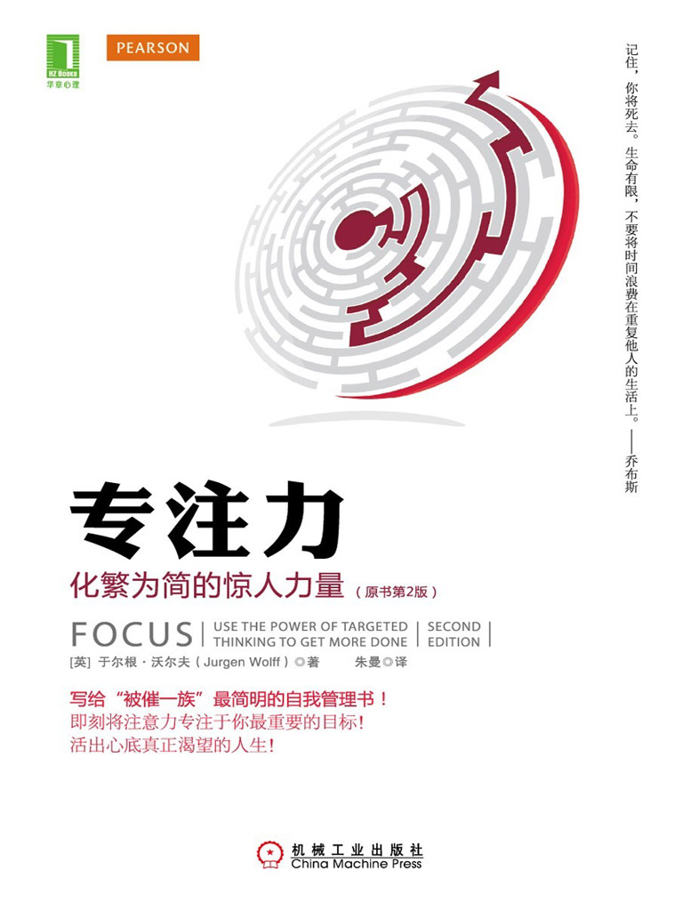

专注力

——化繁为简的惊人力量（原书第2版）

Focus: Use the Power of Targeted Thinking to Get More Done

\[英\]沃尔夫（Wolff,J.）　著

朱曼　译

ISBN：978-7-111-42041-5

本书纸版由机械工业出版社于2013年出版，电子版由华章分社（北京华章图文信息有限公司）全球范围内制作与发行。

版权所有，侵权必究

客服热线：+ 86-10-68995265

客服信箱：service@bbbvip.com

官方网址：www.bbbvip.com

新浪微博 @言商书局

腾讯微博 @bbb-vip

# 序

如果这世上有人需要专注且有效的时间管理技巧，毋庸置疑，这人一定是杰克·鲍尔（Jack
Bauer）。他的生活就像铆足劲的时钟发条，他的每年每天每小时都要争分夺秒地用来拯救世界。截至此时，在写作方面他已经成功了8次，但事实却一年比一年更艰难，至少他是这样告诉我的。

作为一名电视撰稿人和制片人，我不必去拯救世界（世界的万幸），但和其他人一样，为实现自己的长期目标，每天我都要花一定的时间来完成一些必要的工作。正如于尔根·沃尔夫所说，实现目标的要诀是专注。

就电视节目的制作过程而言，当第一剧集处于拍摄过程中时，第二集就应该处于编辑阶段，当第三剧集处于评审中，第四集故事应该已经编成，第五集故事情节应该正在修改，第六集应该进行构思和选角……好了，你该明白这个过程是怎样的了。每天每刻决定从何处以及如何配置自己的精力无疑是通往成功的唯一路径。本书将帮助你找到这条路径，更重要的是，会帮助你沿着这条路一直向前。

本书包含了解决时间管理问题的众多见解和最新方法。其中有些观点我个人非常喜欢，比如将80/20法则运用于你的生活（而不是在公司中）；如何认知你可能尚未发觉的有害行为模式；如何运用你已有的力量，从而帮助你取得更大范围的成功。我还可以再说出一些，但当你翻阅本书时，你可能很快就会说出自己喜欢的部分。

简而言之，本书确实名副其实，我的办公室里就有一本。下次我再见到杰克·鲍尔，我想我会送他一本，希望他能有时间读一下这本书。

鲍勃·科克伦（Bob Cochran）

美剧《反恐24小时》节目监制及主创人之一

# 导言　专注的建立将怎样改变你的人生

你是否有过这样的沮丧经历，你知道自己的事业和人生其实可以比现在更成功，但无论你如何努力，你好像就是没法实现这个目标。有时你是否会因为时光不断流逝，你却无法充分释放潜力而生自己的气？你明白自己想要怎样的生活，但你却不清楚如何才能过上那样的生活。

如果这些话听起来耳熟，那么你来对地方了。本书不是关于“什么”，而是关于“怎样”。你可能已经知道你想从生活中得到些什么（如果你还不知道，本书的第一部分会帮你理清思路，明确你的目标）。或许你脑中的大问题是，“怎样从这里到达那里？”

这一改变需要专注，不过实际情况却好像整个世界都串通好了要一直阻碍你拥有那种专注。你如果注意力分散、无法集中精力，那是再正常不过的事。在清醒的每一刻，你忙于应付来自外界的各种干扰，这会儿你的注意力被铺天盖地的广告占据，下一秒你的注意力可能就被父母或同事的期望所占据；也许你经常会有这样的梦魇，你所设定的那些目标，那些无论你如何努力都无法实现的目标像鬼魂一样反反复复纠缠着你。不仅如此，大家还希望你能做到24/7（一天工作24小时，每周工作7天），于是你连一丁点儿可以用来进行反思的时间都没有了。在这种情况下，如果你还能集中精力做到专注，那简直是奇迹。

好了，现在准备好给自己和别人一个惊喜吧！

本书将带你一步一步地经历这个过程：从决定你真正想要的，找出过去失败的原因，弄清你时间利用中的干扰性因素（以及如何处理这些干扰），从而学会如何克服这些阻碍绝大多数人取得成功的因素。最后，本书将教会你怎样综合这些信息形成一个规划，日后在你为自己设立新的目标时，你可以重复运用这个规划帮你实现目标。本书中所揭示的方法会自然而然地成为你的习惯，并引导你到达成功，你将会越来越轻松地做到专注。

书中的很多技巧都是前所未有的。这些技巧是在以往老旧的方法已经不再有效的基础上诞生的，尤其是对于右脑型人群而言。传统时间管理技巧是在工业时代发展初期出现的，这一时期的技巧主要是帮助人们在进行重复性劳作时能够更加有效率。在现今这种信息无处不在的条件下，运用这些过时的技巧只会造成在多项任务中手忙脚乱、四下救火的情形，结果只会是事倍功半。

如果你曾经尝试过使用那些传统的时间管理方法，结果发现这些方法非常耗时，对工作的局限性非常大，并且根本没什么效果，那很有可能你就是一位右脑型人才。如果你喜欢多样性且直觉很准，你喜欢迎接新的挑战但又讨厌陷入旧路，那么本书完全就是为你专门定制的。

如今，人们需要的是创造力、灵活的变通能力以及做出正确选择的能力。本书将告诉你如何认清最重要的事情以及让你的精力集中，并投入到引导你取得成功的任务中去。我知道这些技巧会奏效，因为它们已经在我本人以及其他成百上千参加了我所举办的“创建你的未来”讲座的人们身上都有效。我敢说，你一定会喜欢使用这些突破性技巧，比如利用“第二自我”策略在规定时间内完成任何任务，或者利用平均残差绝对值（mean
average difference,
MAD）策略快速解决进展缓慢或者让人感觉进退两难的项目。你将要体验的，正是这样一条捷径。

也许你以前曾经听说过80/20法则，但你很可能并不知道怎样把这一法则运用到你的工作和个人生活中。通过专注于生活中会给你带来最大价值的20%，你的成功概率将以指数方式增长，你将在第1章中学到这些内容。

在第2章中，你将把前面所学到的内容转化为一个令人振奋的巨大目标，但在此之前，你一定要找到那个会让绝大多数目标无疾而终的陷阱并避开它。

第3章中，你将了解时间模式如何奏效，你的时间模式如何阻碍你取得原本可以实现的成功。你还会了解怎样将更有效的时间模式投入使用。

你是否曾经注意到明白下一步要做什么非常简单，而真正去做这件事却又无比困难？第4章揭示了阻止绝大多数人实现目标的那些潜在的障碍。正是这一拦路虎使人们无法坚持去健身房健身，摧毁了人们学习新语言或新技能的决心。你将会发现一个右脑适用策略，在困难每次出现时你都可以依靠这一策略克服困难。

如果你一直都专注于自己的弱点而不是强项，那么你已经在无意中阻碍了自己的进步。在第5章中，你会发现将注意力集中在优点上是所有伟大成功者之间公开的秘密，并且通过这一章，你将会找到做到这一点的方法。

拖延是专注最大的敌人。如果你想要战胜拖延这个敌人，答案就在第6章。

如果你曾经在做一些重要的事情时因为心情不好而拖拖沓沓，第7章所描述的开创性第二自我策略将释放你的生产力。一旦开始使用这一策略，你便能立刻改变自己的工作效率。

自我专注非常重要，当然你还需要依靠他人和你进行合作。第8章将告诉你如何设置界限，怎样对他人说不，以及怎样对他人进行管理，从而可以让其在实现自我目标的道路上助你一臂之力。

第9章深入说明了一些运用语言的具体技巧，揭示了为什么很多对话最后无疾而终以及如何将这些失败的对话转变成有说服力的沟通。你将了解如何识别他人的语言模式以及使用这种语言模式与他人建立融洽良好的沟通氛围。另外，还有一些方法包括重新架构、调整与引导、利用比喻和故事。

接下来几章几乎包括了创造力和生产力最强有力的敌人：超负荷信息量（第10章），文山文海（第11章），邮件怪兽（第12章），没完没了或不相干的会议（第13章）以及截止日期和处理多项任务的需要（第14章）。对于以上提到的每一项，你都能找到对应的解决措施。

事业的发展给你带来的不仅有压力，也有回报，第15章将告诉你怎样冷静、放松并灵活地使自己保持专注。

在第16章，你将看到其他人是怎样把这一切综合起来形成一个行动计划，从而实现他们所梦想的目标的。

第17章，你将找到这样一个引导你通过同样的方式取得成功的计划。第17章重述了所有章节的要点，并引导你通过这一方法最终实现自己的目标。当你为生活中的各个方面设立新的目标时，你可以一次一次地重复使用这一计划。

你将开始一段伟大的冒险，这是一段最终实现你所等待的并且该得到的成功的冒险。让我们开始出发吧！

# 第一部分　找到专注的焦点

## 第1章　如何专注于至关重要的20%

如果我告诉你，只要你把更多时间和精力专注于你已经在做的一些事情，你就有能力彻底改变你的人生，可以完成更多的事，赚更多的钱，享受更多的成功，你会怎么看？这是真的，这种说法是根据一条已经存在了近100年的著名原理得来的。只不过，大多数人都因为某个简单却又隐藏不见的障碍而无法使用这个方法。这就像是一个充满宝藏的洞穴，从入口处能够很容易看到里面闪闪发光的宝石和金子在召唤着你，但只有千分之一的人能成功地进入洞穴深处获取这些财宝。

本章将告诉你这一原理是什么以及它在你的生活中如何奏效，本书的其余部分将提供给你所需要的工具和技巧，从而帮助你克服那些让大多数人碌碌无为的障碍，这些人之所以无法突破成功的一般水平，正是因为他们无法将这一原理运用于实践。我保证只要你坚持运用这一原则，它一定会使你的生活发生巨大改变，它会使你的生活变得越来越好。

帕累托法则（Pareto’s Principle）

经济管理思想家约瑟夫M.朱兰（Joseph
M.Juran）提出这一理论，并最终以意大利经济学家维尔弗雷多·帕累托（Vildredo
Pareto）之名进行命名。维尔弗雷多·帕累托发现意大利20%的人拥有全国80%的收入，他随后在其他国家也开展了类似的调查。研究结果发现，这些国家的收入分配均呈现相似的情形（在某些国家，财富甚至集中在更小比例的人手中）。最终，他的发现成为商业社会的一条经验法则。例如，20%的客户人群贡献了80%的销售额。

### 80/20法则

你可能在某一时刻已经遇到过80/20法则，也就是众所周知的“帕累托法则”。它的核心思想是，你的80%的收益或价值其实仅来源于20%的努力。

大多数办公室白领都能很容易地验证这一现象。每天的8个小时工作时间里，很可能只有一个半小时的工作才会真正有所回报，这就是那20%。这很可能包括为开发一种新产品或新的服务类型作决定、创建新的优先顺序或目标、指导他人工作等。其余的80%可能包括一些含金量比较低的活动，比如整理邮件、出于礼貌而参加的一些与你关系不大的会议、做一些微不足道却又很紧急的小事、拒绝一些向你推销不适合你的产品或服务的推销员，或是接听一些和工作关系不大的闲聊电话。

费时的同事

你有没有这样的同事，他们花了你80%的时间却只给了你不到20%的回报（不论你怎么定义）？是时候重新分配他们接近你的机会了，把更多的时间放在那些能带来更多回报的人身上。

同样的规则通常也适用于产品上。许多公司都有非常庞杂的产品线，如果他们对其利润来源进行分析，就会发现这些利润其实来自相对很少的产品。这很可能是因为这些产品的销量很大或者因为其价值最高。

服务行业可能拥有很多的客户，但大部分的利润其实来源于相对较少的一些客户。他们很可能还发现20%的客户占用了80%的时间来处理一些费时的问题、细枝末节的抱怨以及在最后时刻做的变动。值得注意的是，提供最大价值的这20%通常并不是制造最多问题的20%。商人发现放弃那些最难缠的客户能使他们解脱出来赚取更多的钱，更别提因此而无需再承受的巨大压力和内心的愤怒。

这一准则甚至还可以运用在家庭生活的某些方面。很可能你80%时间里的穿着只是衣橱中衣物的20%，家中80%的磨损只是发生在20%的地毯身上。很可能你和配偶或伴侣80%的争执都源自你们意见有分歧全部话题的20%（对于大多数夫妇而言，这些问题一般是金钱、谁来做家务以及养育孩子等问题）。

### 消除20%的消极力量

目前我们所说的大多是些能带来积极结果的行动，而80/20法则同样适用于消极的事情之中。比如，80%的犯罪事件是由20%的罪犯所为，这就是纽约“零忍受”（zero
tolerance）政策能够见效的原因。事实证明，街头所抓获的那些犯小事的人都曾有过大罪的犯罪记录。

举个常见的负面商界案例：在我们和某家公司或者某种产品的接触中，遭遇一位行事粗鲁或毫无头绪的客服代表可能只占到很小的比例，但这就足以改变我们对于该公司的整体印象。

在个人生活中，有时候我们在20%或更少时间里做的事，造成了我们80%的不开心。比如说，有人和配偶只用了很少的时间争吵，但可能正是这次争吵造成了日后很多的不愉快。

自然，对于消极举措我们应该尽量减少而不是增加这20%。因此，在大多数情况下，最好的策略就是做一些能够给我们带来正面效果的事情，从而让消极的事情无处立足。那些过着真正多产的、快乐人生的人常常会对他们曾经肆意放任的消极行为失去兴趣。

### 专注于积极事件为什么重要

《改变你看待事物的方式》（Change the Way You See
Everything）一书的作者、心理学家凯瑟琳D.克拉默（Kathryn
D.Cramer）指出，80%的时间里我们都在关心哪些事情没做好，而研究表明，将注意力集中在我们做好了什么上才是加速进程的关键。那么我们为什么要关注这些消极的方面呢？因为我们被训练成这样。她指出，在三四岁之前，不管我们做什么事情，大人们都会给我们掌声和称赞。但是等到我们上学以后，他们专注的焦点开始变成我们都做错了什么，这种状态在我们以后所接受的教育阶段一直存在。

你可以选择你要考虑的东西，将80%的注意力集中在你的优势上，集中在日常生活中做得比较好的事情上以及你的潜能上，这种做法会更加有效。

■如果你已经习惯于强调消极的事情，那么想要改变这个习惯就需要花些时间了，不过还是有些方法可以帮你转到更积极的方向上来。每天早上醒来的时候，花一两分钟想想生命中值得感激的事情。同时，想一想这一天你所期待的事情。

■在一天当中，当有事情进行得很好的时候，花点时间把它记下来。这些事情并不一定要是什么大的成就，可能只是你处理得非常得当的一通电话或者你回答同事的一个问题。这听起来也许很琐碎，但是想想，你一天中会注意到多少消极的小事？花些时间注意这些积极的东西，这可以帮你在思想上达到某种平衡。

■同样，注意其他人所做的积极而有价值的事情，花点时间去赞美他们所做的事。糟糕的项目经理常常只会记住下属犯错的时候，而优秀的项目经理则懂得培训员工的最好方式是强化他们的有效行为。

■夜晚时分，简要回顾一下当天发生的事情。积极和消极方面的事情都要想一想，想想从这些事情中你都学到些什么。如果这天确实有很不好的事情发生，那么下一次在遇到类似情况时你要怎么处理呢？那种有关个人发展的说法，什么“人生没有错误，有的只是不同的经历”这种话听起来不免有些幼稚，但其中确实有一丝真理的成分。

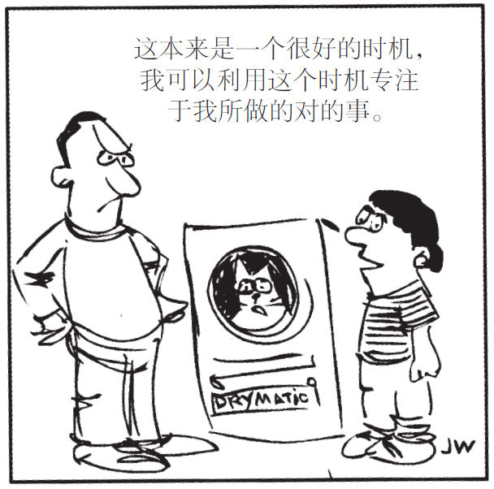

你的这种思维方式上的改变可能实际上成为实施80/20法则最重要的方面，因为如果不首先改变消极的态度，你是很难改变那些消极行为的。

让我们看看通过关注最有价值的20%，你的职业生涯能发生多大的改变。

### 工作中你需要关注的积极的20%是什么

花点时间想想80/20法则可以怎样运用到你的工作中。在工作周中，你所做的最多产的事情是什么？

现在大概估算一下，你有多少时间是花在真正做这件事情上。我曾经对很多人问过这个问题，包括行政人员、艺术家、儿童节目喜剧人员、教师、医生，基本上这些人都说他们只花费了10%~20%的时间做这些最有产出性结果的事情。当然这也就表明，他们的大多数时间都花在一些产出性很少的事情上。这个事实解释了为什么如此多的人总是无法摆脱平庸的境地，我们大多数人都在浪费自己的宝贵时间。

80/20法则的寓意很简单，它几乎可以运用于一切场合。如果你能够在关键的20%事项上花费更多的时间，那么你就可以做到更多产（并且很有可能赚到更多的钱）。

简化你的工作空间

你可以对你所工作的环境运用80/20法则。你工作中80%的时间都会需要的物品（例如订书机、目前正在执行项目的文件夹、胶带等）是否在唾手可得的位置，或者你的办公桌上是否堆满了你在平时工作中连20%的时间都不大可能用到的东西？根据实际情况对这些物品进行重新摆放。

这个过程也很简单：确认你最重要的20%工作事项，更多地重复这20%的工作，这当然就意味着，少做那些不太有利的80%。稍后我们会提到远离那些不太有价值行为的最佳途径。

“找到你最重要的20%的工作，多做这些工作。”

首先第一步要看看你目前正在做些什么。在下面的横线上写出你工作时会做的10项任务或活动。当然，从事不同职业的人所给出的答案千差万别，但这里面可能会包括写报告、参加会议、拨打销售电话或者浏览网页了解相关新闻。这十项任务不要写成你的工作描述或者你打算做的事情，而要实实在在是你工作时间中确实会去做的事。

目前占据你工作时间的十项任务：

1.\_\_\_\_\_\_\_\_\_\_\_\_\_\_\_\_\_\_\_\_\_\_\_\_\_\_\_\_\_\_\_\_\_\_\_\_\_\_\_\_\_\_\_\_\_\_\_\_\_\_\_\_\_\_\_\_\_\_

2.\_\_\_\_\_\_\_\_\_\_\_\_\_\_\_\_\_\_\_\_\_\_\_\_\_\_\_\_\_\_\_\_\_\_\_\_\_\_\_\_\_\_\_\_\_\_\_\_\_\_\_\_\_\_\_\_\_\_

3.\_\_\_\_\_\_\_\_\_\_\_\_\_\_\_\_\_\_\_\_\_\_\_\_\_\_\_\_\_\_\_\_\_\_\_\_\_\_\_\_\_\_\_\_\_\_\_\_\_\_\_\_\_\_\_\_\_\_

4.\_\_\_\_\_\_\_\_\_\_\_\_\_\_\_\_\_\_\_\_\_\_\_\_\_\_\_\_\_\_\_\_\_\_\_\_\_\_\_\_\_\_\_\_\_\_\_\_\_\_\_\_\_\_\_\_\_\_

5.\_\_\_\_\_\_\_\_\_\_\_\_\_\_\_\_\_\_\_\_\_\_\_\_\_\_\_\_\_\_\_\_\_\_\_\_\_\_\_\_\_\_\_\_\_\_\_\_\_\_\_\_\_\_\_\_\_\_

6.\_\_\_\_\_\_\_\_\_\_\_\_\_\_\_\_\_\_\_\_\_\_\_\_\_\_\_\_\_\_\_\_\_\_\_\_\_\_\_\_\_\_\_\_\_\_\_\_\_\_\_\_\_\_\_\_\_\_

7.\_\_\_\_\_\_\_\_\_\_\_\_\_\_\_\_\_\_\_\_\_\_\_\_\_\_\_\_\_\_\_\_\_\_\_\_\_\_\_\_\_\_\_\_\_\_\_\_\_\_\_\_\_\_\_\_\_\_

8.\_\_\_\_\_\_\_\_\_\_\_\_\_\_\_\_\_\_\_\_\_\_\_\_\_\_\_\_\_\_\_\_\_\_\_\_\_\_\_\_\_\_\_\_\_\_\_\_\_\_\_\_\_\_\_\_\_\_

9.\_\_\_\_\_\_\_\_\_\_\_\_\_\_\_\_\_\_\_\_\_\_\_\_\_\_\_\_\_\_\_\_\_\_\_\_\_\_\_\_\_\_\_\_\_\_\_\_\_\_\_\_\_\_\_\_\_\_

10.\_\_\_\_\_\_\_\_\_\_\_\_\_\_\_\_\_\_\_\_\_\_\_\_\_\_\_\_\_\_\_\_\_\_\_\_\_\_\_\_\_\_\_\_\_\_\_\_\_\_\_\_\_\_\_\_\_

现在对你所列出的这十项任务，分别写出它们在你工作时间中所占据的比重。如果你所做的事情远不止十件之多，那么你的比率总数就无法达到100%，你也不用像个完美主义者，一定要把所有比率计算准确，只要合理地猜测就好。如果你想更准确，那你可以用计算器。比如说你一周工作40个小时，你花了3个小时做第一项工作，那么就用3除以40，结果得到7.5%，那么这个数值就是你在这件事情上所花费时间的比重。

在下面的空白处，写下你工作时所做的三件最有价值的事情，也就是帮你取得更多金钱或者代表你所做出的最大贡献。这些事情可能已经包含在你以上的清单内，又或者它们中的某个或多个根本不在你做得最多的十件事清单中，因为这些事情实在占据了太少的时间。

工作中最能增加价值的三件事情：

1.\_\_\_\_\_\_\_\_\_\_\_\_\_\_\_\_\_\_\_\_\_\_\_\_\_\_\_\_\_\_\_\_\_\_\_\_\_\_\_\_\_\_\_\_\_\_\_\_\_\_\_\_\_\_\_\_\_\_（
%）

2.\_\_\_\_\_\_\_\_\_\_\_\_\_\_\_\_\_\_\_\_\_\_\_\_\_\_\_\_\_\_\_\_\_\_\_\_\_\_\_\_\_\_\_\_\_\_\_\_\_\_\_\_\_\_\_\_\_\_（
%）

3.\_\_\_\_\_\_\_\_\_\_\_\_\_\_\_\_\_\_\_\_\_\_\_\_\_\_\_\_\_\_\_\_\_\_\_\_\_\_\_\_\_\_\_\_\_\_\_\_\_\_\_\_\_\_\_\_\_\_（
%）

现在估算下你在这三件事情上花费了多少时间。理想状态是这三件最有价值的事情同时占据你工作中最大的三块，但实际情况往往并非如此。不过别担心，用不了多久你就能了解一种方法，这种方法将教会你如何改变对于时间的利用方式，而这将会彻底引导你走向快速成功。

### 休闲时间中你最关注的20%是什么

现在对你日常生活中常做的事情排一个类似的清单，看看帕累托法则在你的个人生活中是怎样起效的？在下面写出你工作之余所做的十件（或者更少）事情（睡觉和吃饭除外）。同样，不同的人所给出的内容也千差万别，但是可能会包括看电视、阅读、运动健身或者去影院看电影。在这个清单里，只列出你确实会做的事情；比如，你可能会对去剧院或者博物馆感兴趣，但是除非这些事情确实是你空闲时最常做的十件事，否则就不要写它们。

目前空闲时，你最常做的十件事：

1.\_\_\_\_\_\_\_\_\_\_\_\_\_\_\_\_\_\_\_\_\_\_\_\_\_\_\_\_\_\_\_\_\_\_\_\_\_\_\_\_\_\_\_\_\_\_\_\_\_\_\_\_\_\_\_\_\_\_（
%）

2.\_\_\_\_\_\_\_\_\_\_\_\_\_\_\_\_\_\_\_\_\_\_\_\_\_\_\_\_\_\_\_\_\_\_\_\_\_\_\_\_\_\_\_\_\_\_\_\_\_\_\_\_\_\_\_\_\_\_（
%）

3.\_\_\_\_\_\_\_\_\_\_\_\_\_\_\_\_\_\_\_\_\_\_\_\_\_\_\_\_\_\_\_\_\_\_\_\_\_\_\_\_\_\_\_\_\_\_\_\_\_\_\_\_\_\_\_\_\_\_（
%）

4.\_\_\_\_\_\_\_\_\_\_\_\_\_\_\_\_\_\_\_\_\_\_\_\_\_\_\_\_\_\_\_\_\_\_\_\_\_\_\_\_\_\_\_\_\_\_\_\_\_\_\_\_\_\_\_\_\_\_（
%）

5.\_\_\_\_\_\_\_\_\_\_\_\_\_\_\_\_\_\_\_\_\_\_\_\_\_\_\_\_\_\_\_\_\_\_\_\_\_\_\_\_\_\_\_\_\_\_\_\_\_\_\_\_\_\_\_\_\_\_（
%）

6.\_\_\_\_\_\_\_\_\_\_\_\_\_\_\_\_\_\_\_\_\_\_\_\_\_\_\_\_\_\_\_\_\_\_\_\_\_\_\_\_\_\_\_\_\_\_\_\_\_\_\_\_\_\_\_\_\_\_（
%）

7.\_\_\_\_\_\_\_\_\_\_\_\_\_\_\_\_\_\_\_\_\_\_\_\_\_\_\_\_\_\_\_\_\_\_\_\_\_\_\_\_\_\_\_\_\_\_\_\_\_\_\_\_\_\_\_\_\_\_（
%）

8.\_\_\_\_\_\_\_\_\_\_\_\_\_\_\_\_\_\_\_\_\_\_\_\_\_\_\_\_\_\_\_\_\_\_\_\_\_\_\_\_\_\_\_\_\_\_\_\_\_\_\_\_\_\_\_\_\_\_（
%）

9.\_\_\_\_\_\_\_\_\_\_\_\_\_\_\_\_\_\_\_\_\_\_\_\_\_\_\_\_\_\_\_\_\_\_\_\_\_\_\_\_\_\_\_\_\_\_\_\_\_\_\_\_\_\_\_\_\_\_（
%）

10.\_\_\_\_\_\_\_\_\_\_\_\_\_\_\_\_\_\_\_\_\_\_\_\_\_\_\_\_\_\_\_\_\_\_\_\_\_\_\_\_\_\_\_\_\_\_\_\_\_\_\_\_\_\_\_\_\_（
%）

跟之前一样，估算下这些事情在你空闲时光里所占据的大概时间。

然后写下三件让你觉得最开心的事情。如果有些事情你觉得自己非常满意，但它们并不在你上面所列的清单中，那么添加这些内容。

### 闲暇时会做得最有意思的三件事情

1.\_\_\_\_\_\_\_\_\_\_\_\_\_\_\_\_\_\_\_\_\_\_\_\_\_\_\_\_\_\_\_\_\_\_\_\_\_\_\_\_\_\_\_\_\_\_\_\_\_\_\_\_\_\_\_\_\_\_（
%）

2.\_\_\_\_\_\_\_\_\_\_\_\_\_\_\_\_\_\_\_\_\_\_\_\_\_\_\_\_\_\_\_\_\_\_\_\_\_\_\_\_\_\_\_\_\_\_\_\_\_\_\_\_\_\_\_\_\_\_（
%）

3.\_\_\_\_\_\_\_\_\_\_\_\_\_\_\_\_\_\_\_\_\_\_\_\_\_\_\_\_\_\_\_\_\_\_\_\_\_\_\_\_\_\_\_\_\_\_\_\_\_\_\_\_\_\_\_\_\_\_（
%）

现在估算下这三件事情在你所有空闲时间里所占的比重。在人们的生活中，对于大多数人而言，他们花了最多时间做的那三件事往往并不是能给他们带来最多欢乐的事情。

要了解更多有关帕累托法则的信息，企业家、管理咨询师理查德·科克（Richard
Koch）著有三本关于帕累托法则实际运用的书籍：《迈向成功：80/20法则》（The
80/20 Principle），《发挥你的潜能：80/20法则》（The 80/20
Individual）以及《生存方式：80/20法则》（Living the 80/20 Way）。

### 为什么我们总是在做那些令人不甚满意的任务或行为

你可能发现你所列清单里的一些事情占用了很多空余时间，但它们所带来的效果却很一般。只是我们早就习惯了要去做这些事，或者因为我们认为有人想要我们这么做。我们常常并不立即去做一些会给我们带来更多欢乐的事情，因为这些事情迟早都会去做。迟早可能是指“当孩子们再大些”，或者“等我退休以后”，或者“等我们存够钱”。然后不幸的是，我们往往都盼不来这些日子。

还有一个因素就是“无底洞现象”。决策研究表明，人们在某件事情上投入越多（这种投入可以是金钱、时间或情感），就越难以舍弃这件事。举个例子，一本300页的书，你已经看了200页，而你越看越觉得这本书没意思，但是你很有可能觉得还是应该把这本书看完，因为已经看了这么多页了。这一效果同样适用于其他方面，比如不应该再继续投资某个项目或者以前所购买的那些不再适用于你的东西。（“我不能就这么放弃或者以这么低的价格出售，当初买的时候，我可是花了一大笔钱！”）

克服这种心理有个很好的策略，那就是运用“零容忍”准则。试问：“如果当时我并没有买这个（或者在这上面花时间），现在还会这么做吗？”如果答案是否定的，那么是时候停止、甩掉或者卖掉它了！

还有一种因素可能是面子问题。比如你告诉了所有认识你的人，你将去参加一场马拉松比赛，之后你却发现参加这个比赛会对你的膝盖造成疼痛和其他损伤，但即便如此，你依然会去参加这场比赛，无论弃赛对你的健康多有利。解决这个问题的一个很好的方式就是倒退一步，更客观地对整个事件进行思量。如果你有朋友也碰到这种问题，你会怎么做？你很有可能会说，“别傻了，健康比什么都重要。”这也是你对自己的答案。

### 下一步是什么

通过本章，相信你已经明白在你的工作和业余生活中哪些方面可以进行改善，从而极大地提升你的快乐和幸福。下一章，你将了解怎样在具体的目标中专注于这些事情，以及帮助你实现所设定目标的秘诀。

## 第2章　如何专注于你的第一个目标

上一章谈到获取巨大成果的诀窍是找到你工作或休闲时间能带来最大收益的20%，花更多的时间做这20%，少花点时间在那些给你带来较少价值的80%的事情上。一旦你明白这关键的20%是什么，你便可以设定使你快速成功的目标了。但如果你以前曾经为自己设定过目标，你可能会觉得这项工作有点令人沮丧，因为你还不了解大多数目标设定的方法中都有两个致命的错误。在本章，你将不仅会了解这些错误是什么，还会明白应该怎样纠正它们。

### 如何设定SMART目标

要想做到专注，首先需要明确你想要获取什么，这也就是为什么要设定SMART目标。首先，我们来看看设定目标的步骤，这样你就可以把它运用到上一章你所确定的领域中。

SMART目标指什么？S（specific）代表具体。像“减些体重”、“挣更多的钱”或者“更受欢迎”这种目标都没什么意义，因为这些目标太模糊。如果你只减掉1公斤，虽然你确实瘦了些，但你很可能对这个结果并不满意，因此设定一个具体的体重目标更有意义。同样的道理也适用于金钱甚至于更受欢迎的个人魅力。究竟怎样才算是更受欢迎呢？是再多两个关系密切的朋友？或者再认识六个新朋友？如果你对于这些确切数字感到有难度，那就问问你自己，当目标实现时，你会看到和听到些什么，这和你现在看到和听到的有哪些不同？

当你做这些决定的时候，要确定你所使用的准则都是对你有实际意义的，而不是你认为其他人希望你这样做。想要满足他人的预期是傻瓜才会做的事情，因为假设我们真的按别人的期望去做，他们的期望可能瞬息万变，而我们只会一直处于苦苦挣扎的困境中。

还有一点就是，最好要设立一些积极的目标，也就是像“减轻10公斤体重”这种目标，最好能设定为“达到健康体重X”。否则，你时不时就会想到消极的方面。

M（measurable）代表可计量。一旦变得具体，计量你是否实现目标的方式也常常不言自喻。如果是关于体重，你会使用体重计或者脂肪监控仪；如果是关于金钱，你的银行账户会让一切明了。事实上，你是否能够对目标进行计量是对你是否已经足够具体的最佳检测。如果你无法对目标进行计量，那么倒退回去，重新调整你的目标。

接下来的两个目标，A和R，分别代表可获得的（attainable）和现实的（realistic）。我并不是有意过多强调这些。如果你想要目标能够激励你做必要的工作并最终实现这些目标，那么你就需要设立远大的鸿鹄之志，最令人兴奋的目标应该是那些你并不100%确定是否确实可获得，是否确实可实现。虽然你以前从没写过书，但你的书能成为畅销书吗？你能否做这样一个生意，这个生意能让你在未来五年挣到足够的钱，然后退休开始做自己喜欢的事情或者做慈善事业？其实，很多人都做过那些事。要想知道答案，只有一种方法：那就是立刻写书或者马上开始做这个生意，然后看看会发生些什么。

唯一现实的问题是你所愿意做出的牺牲和你的目标范围是否吻合。如果答案是肯定的，那么放手去做。如果你竭尽全力付出，你便很有可能实现自己的目标。

顺便说一下，如果你想咨询其他人关于是否实施宏伟计划的问题，一定记得要去问一问真正做过这件事的人，而不要去问那些毫无经验的人。前者会是问题处理专家，而后者只可能是问题制造专家。

SMART中的T代表及时（timely），一般而言，这是指为将要实现的目标设置一个截止日期。这个因素也摧毁了很多的希望和计划。

### 当心致命的最后期限

事情常常这样发展：你设定了一个有截止日期的目标，比如说“到3月1号，我的体重要达到70公斤”，或者“到9月底的时候，我要为我的书找一名经纪人”，或者“到2月15号，我要开始经营我的网店生意”。

然后你开始做那些你觉得能让你在截止日期之前实现目标的事。如果你和我们大多数人一样，通常情况下，你一定无法实现你的目标。事实是，要么你的体重有所增加，要么你还保持原样，或者你确实减轻了一定的体重，但这个数字达不到你所设定的目标。又或者是你没法在9月底的时候找到你想要的经纪人，或者又因为网络问题，你的网店没法在2月中旬顺利开业。

假设你失败了。当遭遇失败，我们都会觉得失望或沮丧，并且很可能放弃我们所设定的目标。更糟糕的情况可能是，我们甚至不太愿意为其他目标而努力。

这种传统目标设定方法有两个致命的缺点。首先是设定截止日期。自我发展专家一定会被上面这句话吓得目瞪口呆，这些专家的观点是没有截止日期的目标只是一个良好的愿望而已。对此我想说，通常情况下，设定截止日期的目标注定要失败。让我来告诉你为什么。当你开始为某个目标努力奋斗时，一般情况下你并不知道将要怎么做。可能你只是对于该用什么方法和要做些什么事有那么一点儿概念，但你并不知道这些方法和事情是不是真的有用或者到底有多少用处。第二个缺点是在很多情况下，要想实现目标，你需要其他人的配合。你可以影响他们的反应情况，但你却无法对此进行控制。综上可见，在这些因素的不断作用下，你怎么可能为你的成功设定一个时间限制呢？

### 只有一个真正目标节点

前文中，我谈到这个过程通常是怎样发展的。下面我们来谈谈如果你确实想要实现目标，设定目标的过程应该怎样进展。

1.设定一个目标。在例子中，我们还是以实现目标体重为例。

2.开始做一切你认为可以帮你实现目标的事情。比如为了燃烧卡路里，你决定坚持每周徒步三次，每次一公里，目标是每周减轻一公斤的体重。

3.对运动过程效果进行监控。如果你所做的事情确实给你带来所希望的成效（比如，你发现自己每周都比设定的目标轻了一公斤），那么你就坚持做下去直到目标实现。

4.如果你所做的事情并没有给你带来想要的结果，那么赶快进行头脑风暴，找些能够替换的措施，开始做些改变。这可能只是一个很小的调整，也有可能是整个策略的彻底改变。比如，你可能发现你的体重只下降了一点点，因此你决定除每周的徒步外，你还要对饮食进行控制，将小吃和甜点改为只吃一些水果。或者你可能决定试试聘请私人教练每周陪你锻炼两次。

5.重复步骤3和步骤4，直到实现你的目标。你的截止日期开始变为“直到实现我所设立的目标”。你所要做的承诺只不过是一直尝试做些不一样的事，直到找到有效的方法。有的目标可能很快实现，有的目标可能需要很长时间才能实现。用这种方法，你永远不会失败，这只是一个不断学习的过程。

我还想重复强调一下：利用这种方法，你永远不会失败！可能失败的唯一原因就是你的放弃。

这还能帮助你避免“更快更多”综合征。当截止日期临近，而你所使用的办法却没有多少效用，在这种情况下，就很容易出现欲速则不达的情形。为了能在截止日期前实现目标，你就有那种想要更快更多地做你正在做的事情的冲动。但很显然，不管你做了多少这些并不奏效的事情，或者对于这些事情做得多快，这都不是解决问题的真正答案。如果没有截止日期的压力，你才有可能以开放的姿态考虑其他选项。

从未有过的研究

很多有关自我发展的书都提到了20世纪50年代哈佛大学（也有说是耶鲁大学）所做的一项研究，在这项研究中，学生们被问及是否为自己设立目标。30年后，给出肯定回答的3%所获得的收入比剩余97%挣到的全部收入还要多。唯一的问题是，从未有人做过这项研究。没人知道这个故事的由来是什么，但确实从没有过这项研究曾经发生的真实佐证。不过，很多成功人士确实表明他们为自己设定过目标。

这并不表示你不能为目标内所能控制的任务设定截止日期。比如，假设你的目标是找人为新的网络业务设计网页，你可以决定对候选人进行考察，并在周末前和排名前三的人选进行联系。如果你的目标是找一名经纪人，你可以明天就给其中的三人写信。如果你决定去健身房健身，你可以为自己设定截止日期，比如周一前选定一家健身中心。

### 宏伟的目标很大，将它们分解成一个个小目标

宏伟的目标能够让你看到未来想要的生活。同时，有一点很关键，那就是你需要把这个大的目标分解成很多小目标，这样你才会一直有进步和有所成就的感觉。在你实现最终目标之前，不要吝啬于庆祝。建立一些里程碑式的事件，在这些事件完成之时，进行庆祝。

### 规划诚可贵，行动价更高

对于你来说，进程中的每一步都需要做些计划，但是要小心，千万不要变成规划上的巨人，行动上的矮子。如果你喜欢做一些详细的计划、表格、流程图、思维导图等，建议你考虑少做些规划，把更多的注意力放在实现目标上。当然，使用图表和其他一些视觉辅助措施能够帮助你专注于所需要做的事情，但它们不能成为你所需要做的事情的替代品。在商业社会，进程中的这两个部分分别被称为计划工作和实施计划。

万事万物都在以前所未有的高速变化着，这一事实同时意味着我们需要比以往更加灵活。如今，设置一个一成不变的5年计划根本就是不现实的，你需要时时准备着，要注意在计划执行过程中可能出现的一切具有更好导向的蛛丝马迹，无论是关于你将去往何处或者如何达到目的。

艺术领域里的一个试验可以很好地对此进行类比。这个试验对比了两组技艺纯熟的艺术类学生的作品。第一组学生对于他们想要的成果了然于心，为此他们进行了仔细的计划，并朝着这个成果一步一步地努力，在计划执行过程中很少改动。第二组学生对于想要的东西只有一个模糊的概念，他们的设计平均有17次的改动。最终，裁判对两组绘画作品进行了评估，得出结论是第二组学生的作品更具创造性。这项试验给我们的启示是，项目执行过程中保持灵活贯通能给我们带来更好的成果。

### 你的坚持战略

到目前为止，一切都很好，但你还有一个隐藏的障碍需要克服。通常我们采用一个策略（比如，一周徒步三次），我们在第一个星期甚至第一个月，对这项策略执行得很好。然后，生活中的琐事打乱了我们的计划，我们开始可能一个星期只徒步一次，或者根本就不再去了。结果自然是失败。每个健身中心靠的正是这点。每年一月份，很多人办理了会员年卡（新年心愿效果），但到三月份，大多数新会员便不再来健身中心了。这对于健身中心来说，当然是件好事；但如果你是会员，那可就不怎么样了。

“失败的唯一途径就是你的自我放弃。”

我们不仅需要实现目标的策略，还需要保证我们按照策略进行执行的方法。就像我前面所说的，你可能失败的唯一原因就是自己的放弃。但通常情况下，我们确实会停止执行策略。一旦你发现这一现象发生，执行B计划。

■确定你停止执行的原因是否是你对策略尝试了很长时间，但并不奏效。如果答案是肯定的，那么是时候进行头脑风暴想出一个新的策略并开始执行它。如果停止的原因是你所做的事情太难以执行，那么同样采取上述办法。比如，你决定每个礼拜去健身房7次，但你发现这个安排其实不太现实。你可以改变计划，比如改为一个礼拜去3次，然后看看效果如何。

■如果你停止的原因仅仅是因为忘记了，或者这个策略不太方

便，或者你变懒了，那么是时候进行头脑风暴想出一个新的策略，可以让你以一种更轻松、更快乐、更容易上心的方式来做这件事。在去健身房这个例子中，可以是找一个健身搭档，或者雇用私人教练，或者跟伙伴许诺，每次你没按约定去健身房健身，就要给他一笔钱。

学习经验

把暂时的失败看成通往最终成功的一步，你便能摆脱失败带来的阴影。如果你觉得这有些困难，记录下你生活中各方面所拥有的技能。然后想一想为了掌握这些技能，你曾经犯了多少错误或者学到了多少教训。你可能需要花点时间好好想一想，因为我们一旦实现了某一目标，我们就很容易忘记在这一过程中所遭遇的障碍。同样，一旦你实现了这些目标，你会感觉当初为了实现目标而努力都是很久以前的事了。

### 你无法专注于看不见的事物

研究表明，当糖果被装在透明容器里时，会比装在不透明的容器里吃得多；当容器在伸手可及的地方比在你不得不起身去拿的地方要吃得多。这些结论并不是什么大不了的事情，但它们确实提醒我们一个重要道理：眼不见，心不烦。（就像“见到才能记住一样”。）

如果你想保证每天花点时间做些对你来说比较重要的事情，那么就在身边保有一个与此相关的视觉或听觉符号。这可以是照片或者图画，一个单词、一个短语或者一段音乐。定期改变这个符号，这能帮助你更新其力量以提醒你采取行动。

### 是时候专注于你排名前三的目标了

明白目标是如何设置的原理后，你已经准备好设置自己的首要目标了。回头看看你的80/20清单，花点时间想想你觉得哪些目标最会让你感觉兴奋和满足，然后写下三个你最想实现的目标。

目标1：\_\_\_\_\_\_\_\_\_\_\_\_\_\_\_\_\_\_\_\_\_\_\_\_\_\_\_\_\_\_\_\_\_\_\_\_\_\_\_\_\_\_\_\_\_\_\_\_\_\_\_\_\_\_\_\_\_\_

目标2：\_\_\_\_\_\_\_\_\_\_\_\_\_\_\_\_\_\_\_\_\_\_\_\_\_\_\_\_\_\_\_\_\_\_\_\_\_\_\_\_\_\_\_\_\_\_\_\_\_\_\_\_\_\_\_\_\_\_

目标3：\_\_\_\_\_\_\_\_\_\_\_\_\_\_\_\_\_\_\_\_\_\_\_\_\_\_\_\_\_\_\_\_\_\_\_\_\_\_\_\_\_\_\_\_\_\_\_\_\_\_\_\_\_\_\_\_\_\_

这三个目标中的哪一个是你愿意即刻投入为之努力的？你可以选择其中的一个、两个或者这三个的全部。如果你认为同时开始为这三个目标而努力会花费非常多的时间，那么选择其中的一个或两个作为开始吧。实现一个目标比同时为了实现三个目标而苦苦挣扎，能够给你带来更多的精力和满足感。如果你确实想要同时开始追求一个以上的目标，那么最好这些目标不在你生活中的同一个领域。比如，你可能选择一个和你事业相关的目标、一个和健身及健康相关的目标，以及一个与改善重要人际关系方面相关的目标。

为每个目标准备一个你很乐于在上面进行书写的精美笔记本。你可以使用本书里的空白和表格，但是你肯定还需要更多的空间来记录你采取的所有行动、你经历的里程碑式事件，你所采用的效果很好的策略，这些策略你可以用于其他目标的实现过程中，等等。

### 从这些问题开始

针对你认为最重要的目标，回答以下问题（如果你需要更多的空间，利用你的笔记本）。在我们的例子里，假设你意识到在你的80/20评估中，做设计工作能赚到更多的钱，但是你缺乏使用Photoshop软件的专业技术，这让你没法实现目标。那么你需要设立的目标之一就是拥有那些技术。

1.明确了解现在的实际情况。越具体越好。

例如：我已经购买了Photoshop软件的教学DVD，但却从未看过。

2.过去你所做过（或没做过）的什么事造成了现在的局面？

例如：我从没安排时间学习这个程序。

3.为了获得想要的结果，你将做哪些不一样的事情？

例如：我将每周花4个小时学习这个程序。

4.为了保证你可以做到上一步中明确的事情，你需要拥有些什么，或者需要做些什么？

例如：我必须决定改变目前每周4小时所做的一些事情，用这4个小时进行学习。

5.你需要哪些资源（时间、金钱、他人的帮助）？你如何获取这些资源？你需要为此放弃或者停止做些什么事情吗？

例如：我所需要的资源是时间。我将每周减少4小时看电视的时间。我还需要一个系统来提醒我做功课。

6.做些不一样的事情，并对这些事情的效果进行持续评估。如果无效，考虑做其他事情来达到你所希望的效果。坚持这种做法，直到你最终实现目标。

例如：如果你发现自己在家总是没办法专心地花4个小时学习这个程序，你可能会想把笔记本带去图书馆或者其他可以让你不受干扰的地方学习。或者你可能发现自学对你来说效果不大，那么最好还是参加一个教学课程。

如果你想要实现一个以上的目标，对每个目标回答以上相同的问题。

### 用一张前十名清单点燃你的激情

特别是当你有一个雄心壮志的目标时，你会在开始的时候感到畏怯。也许你很熟悉脱口秀节目主持人大卫·莱特曼（David
Letterman）的《前十名排行榜》（Top Ten
List）。你可以把它改编成一个能让你兴奋起来的起点。做一个清单，写出你为什么认为这些目标对你的将来很重要，或者为什么你确实想要实现这些目标的前十个理由。这个清单将会在你筋疲力尽的时候帮助你，激励你继续前进。在办公室或者会议室做一些前十个理由的海报将会更有用，这些海报将时时提醒你这些关键的动机。现在就开始，为你的某一个目标做上面说的这些事情吧。

我想要实现这个目标的前十个理由：

10.\_\_\_\_\_\_\_\_\_\_\_\_\_\_\_\_\_\_\_\_\_\_\_\_\_\_\_\_\_\_\_\_\_\_\_\_\_\_\_\_\_\_\_\_\_\_\_\_\_\_\_\_\_\_\_\_\_

9.\_\_\_\_\_\_\_\_\_\_\_\_\_\_\_\_\_\_\_\_\_\_\_\_\_\_\_\_\_\_\_\_\_\_\_\_\_\_\_\_\_\_\_\_\_\_\_\_\_\_\_\_\_\_\_\_\_\_

8.\_\_\_\_\_\_\_\_\_\_\_\_\_\_\_\_\_\_\_\_\_\_\_\_\_\_\_\_\_\_\_\_\_\_\_\_\_\_\_\_\_\_\_\_\_\_\_\_\_\_\_\_\_\_\_\_\_\_

7.\_\_\_\_\_\_\_\_\_\_\_\_\_\_\_\_\_\_\_\_\_\_\_\_\_\_\_\_\_\_\_\_\_\_\_\_\_\_\_\_\_\_\_\_\_\_\_\_\_\_\_\_\_\_\_\_\_\_

6.\_\_\_\_\_\_\_\_\_\_\_\_\_\_\_\_\_\_\_\_\_\_\_\_\_\_\_\_\_\_\_\_\_\_\_\_\_\_\_\_\_\_\_\_\_\_\_\_\_\_\_\_\_\_\_\_\_\_

5.\_\_\_\_\_\_\_\_\_\_\_\_\_\_\_\_\_\_\_\_\_\_\_\_\_\_\_\_\_\_\_\_\_\_\_\_\_\_\_\_\_\_\_\_\_\_\_\_\_\_\_\_\_\_\_\_\_\_

4.\_\_\_\_\_\_\_\_\_\_\_\_\_\_\_\_\_\_\_\_\_\_\_\_\_\_\_\_\_\_\_\_\_\_\_\_\_\_\_\_\_\_\_\_\_\_\_\_\_\_\_\_\_\_\_\_\_\_

3.\_\_\_\_\_\_\_\_\_\_\_\_\_\_\_\_\_\_\_\_\_\_\_\_\_\_\_\_\_\_\_\_\_\_\_\_\_\_\_\_\_\_\_\_\_\_\_\_\_\_\_\_\_\_\_\_\_\_

2.\_\_\_\_\_\_\_\_\_\_\_\_\_\_\_\_\_\_\_\_\_\_\_\_\_\_\_\_\_\_\_\_\_\_\_\_\_\_\_\_\_\_\_\_\_\_\_\_\_\_\_\_\_\_\_\_\_\_

1.\_\_\_\_\_\_\_\_\_\_\_\_\_\_\_\_\_\_\_\_\_\_\_\_\_\_\_\_\_\_\_\_\_\_\_\_\_\_\_\_\_\_\_\_\_\_\_\_\_\_\_\_\_\_\_\_\_\_

时刻准备着

如果你对自己的动机有些犹豫不决，那么就把你的前十个理由清单写在一张纸上，放在你的口袋或者钱包里，并常常拿出来看看。当别人问起为什么你的目标这么难实现时，这个列表能帮你轻松摆脱困境。大多数人对待事物的看法都是消极的，因此准备好应付这些消极的观点，对你也是大有益处的。

### 把自己看成英雄

相信以你的能力可以实现目标，提升自信的一个好方法就是使用“英雄之旅”作为行动的样板。“英雄之旅”的构想来源于约瑟夫·坎贝尔（Joseph
Campbell）的作品，约瑟夫是世界最具盛名的神话研究学者之一，他发现许多文化中都有结构基本相同的神话：探索的英雄。

在旅途中，英雄找到了指引者，但这位指引者并不能在英雄的全部旅途中陪伴他，他只能陪伴英雄的一段旅程，在此之后英雄必须独自前行，独自面临各种考验和挑战，并走向冒险世界的深处。

在某一时刻，他将遭遇最大的挑战，或许这一挑战使得他对成功甚至生存都感到绝望。就在此时，他发现一种新的力量或目标使他能够继续前进，并最终收获胜利。

通常情况下，英雄所获得的财富只是象征性的东西，像宝石或者珍贵的高脚杯，这些东西也代表了他完成旅途后所获取的新知识或智慧。有时候这份财富不仅仅给英雄自己带来好处，而且也给英雄身边的人们甚至他所在的整个部落或国家带来好处。

如果这种模式听起来很熟悉，这并没什么值得奇怪的，因为这种故事结构也出现在很多小说和电影中。著名导演乔治·卢卡斯（George
Lucas）将其运用在《星球大战》三部曲的第一部中，并因此和坎贝尔建立了友谊。

更有趣的是，这种模式和现实生活中的冒险也会不谋而合。当我组建“开创你的未来”（Create
Your
Future）研讨会时，我邀请了一些参与者首先用这个结构来描述他们以前是如何处理挑战的，例如上大学、开始工作，或者学习一种新的技能。而事实常常是，人们在意识到自己曾经也是英雄时，都会倍感意外。

然后我要求他们用这个结构来描述自己能够如何完成一件从未做过的事情，结果总是很有趣，也引人深思。这种英雄旅程不仅是一个有用的计划工具，而且这种把自己想象成冒险旅途中的英雄做法的效果，常常能起到非凡的激励效果。从“我有个问题”甚至“我有个目标”转变至“我在探索途中”，这是一个巨大的转变。

尝试着将这一方法运用到你的某个伟大目标上。在以下空白处填写，要是某些问题你并不知道答案，那么就随便猜一个。如果你让自己放松，让那些答案自己跑出来，你可能会惊讶地发现你的潜意识会提供比你所料想的多得多的关于这趟旅途的信息。

你英雄式的旅程

1.平凡的世界中，英雄横空出世。（在你开始“英雄式旅途”前，你正在做些什么？）

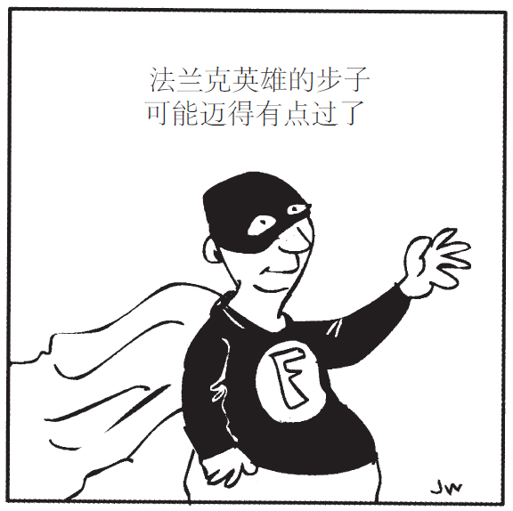

2.冒险的召唤。（什么事情让你意识到有麻烦了或者面临挑战，或者你想要开始一段新的冒险？）

3.英雄起初有些不情愿，并且对未知满怀恐惧。（对于开始这段新的旅程，你最大的恐惧是什么？）

4.英雄受智慧老人或智慧老婆婆所鼓舞。（能够给你一些指导或灵感的指引者或角色楷模是谁？他可以是来自过去或未来的真实的某人，甚至可以是小说里杜撰的角色。）

5.英雄越过第一道门槛，完全进入新世界。（你将在什么时候或者曾在何时全身心地投入冒险之中。）

6.英雄遭遇考验和帮助他的人。（你认为首先将面临哪些挑战？谁能给你提供支持和帮助？）

7.英雄来到山洞的最深处，这是一个危险的地方。（你认为何时你将面临最大的挑战？通常情况下，这时你很有可能会考虑放弃。）

8.英雄经历了最严峻的考验，好像一种死而复生的感觉。（你的何种品质能够让你战胜这最大的挑战？你重生的信号是什么？）

9.英雄手握宝剑并获得了财富。（你将获得什么宝藏？可能是知识、经验或者一些有形资产。）

10.回程之途以及追求。（一旦你实现目标，还有些什么小的困难需要克服？）

11.英雄带着宝藏回到平凡世界中。（当目标实现，你的世界会有哪些不同？它将如何影响你圈子里的其他人？）

约瑟夫·坎贝尔

坎贝尔（1904—1987）是一名神学教授、作家和演说家。他的著作包括《千面英雄》（The
Hero with a Thousand Faces）以及《神的面具》（The Masks of
God）四部曲，但大众主要还是通过他对比尔·默亚斯（Bill
Moyers）的系列访谈节目《神话的力量》（The Power of
Myth）开始了解坎贝尔本人。这一节目于1987年在美国公共电视台（PBS）播放。坎贝尔去世之后的第二年重复播放了很多次，这一节目也被录制成DVD销售。

### 你的视觉焦点：绘制你的目标地图

下一步是绘制一幅目标地图，在这张地图上你可以规划好所有通向目标的主要步骤。如果这个目标很宏大，那么你便需要将这个目标分解成一些小的目标，并为这些小的目标绘制分解地图。例如，你的目标是成为广受认可的市场营销专家，年收入总和至少达到10万英镑。要实现这一目标，必要的步骤可能包括撰写关于市场营销的文章，成为一名言辞精炼的演说家，训练自己成为一名商场导师，编写一本关于市场营销的书籍，创建一个网站并进行自我营销。

下图是目标地图的一个例子，在这幅目标地图中简要表明了实现目标所需要的步骤（你还需要制定更为具体的实现方式）。这种地图一般都是以顺时针方式排列，从右上开始。

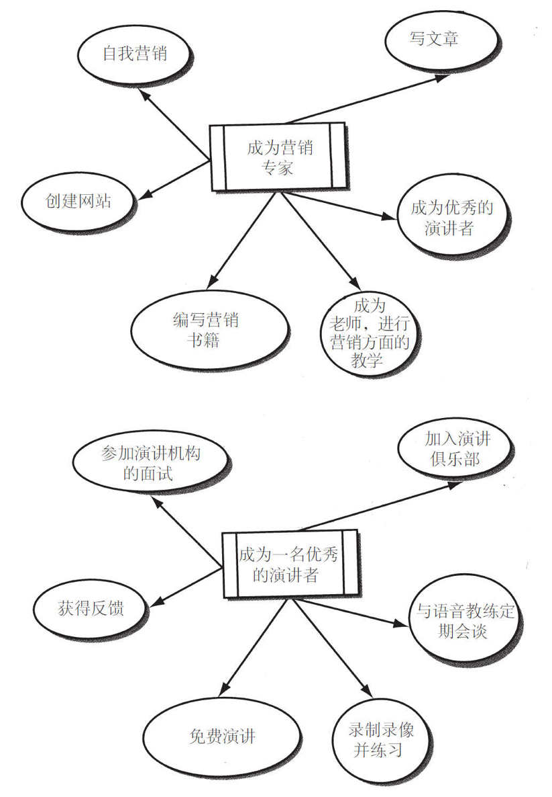

因此，在这种情况下，你的首要任务应该是写文章，然后成为一名优秀的演讲者，以此类推（当然，这些任务可能会有些重叠的情况出现）。尽管本章强调了不必过分纠结于截止日期，不过在这种情况下很多步骤都会在你的掌控之中，因此你可以为这些步骤设置一些目标日期或时间期限。

你还可以把这些通向最终目标的步骤看做一个个的项目，并为每个项目绘制一张项目进程图。我们在“营销专家”地图下绘制了一张“成为优秀演讲者”的步骤实现图，第一个任务是“加入演讲俱乐部”，下一步是“与语音教练定期会谈”。和目标地图一样，你可以为这些任务增加日期和其他细节。

### 是时候绘制你的目标地图了

轮到你了。不管你是利用软件还是用钢笔或铅笔在纸上绘制地图，现在为你最为激动的目标绘制出目标地图。你可以利用本章出现的所有信息帮你规划出需要实现的主要子目标，从而帮助你实现主要目标。然后继续研读本书，为这些子目标中的每一个绘制目标地图，对于你所需要规划的一切，考虑得越具体越好，比如，你将需要做些什么，怎样做这些事情以及何时开始做这些事。如果你愿意，你可以继续研读本书其余部分，然后按照本书最后一章所说“综合所有方法”来绘制你的目标地图。不过，我还是强烈建议你现在还是先做一张粗略的地图。

### 下一步是什么

通过明确一个或者更多目标，明白如何克服目标设置中的一般问题，你迈出了为成功之旅带来激光般专注的关键一步。在下一章中，你将学习如何改变你的时间模式，使其彻底成为支持你进步的利器。

# 第二部分　专注策略

## 第3章　如何专注时间模式以取得成功

通过前一章的学习，你明白至少要为一个主要目标而奋斗，并了解了如何绕过目标设置过程中那些典型的陷阱。通过专注于那些能使你的生活产生明显改观的目标上，你就会逐渐把精力转移到最重要的事情上。然而，如果你还沿用以前使用时间的方式和习惯，这对于快速成功可能就不是什么特别好的办法了。

通过阅读本章，你将学会识别那些可能会拖你后腿的时间模式，学会怎样建立新的、更加有效的时间模式。首先，我们来大概谈谈这些技巧都是怎么得来的。

### 出人意料的时间模式

■每个人都有自己的行为模式。当然，一遍一遍做同样的事就自然会一遍遍得到相同的结果。例如，有的人一直在变换交往的对象，但换来换去，他身边出现的都是同一类型的人，或者有的人总是因为信用卡使用不当而重复陷入资金困境中。当然，也有积极的模式。你可能认识那些总能找到好工作或者总能安全驾驶的人。人们都有一套关于如何利用时间的模式。比如，有的人总会选择先去做一些他们认为最容易的工作，有的人却总是喜欢先解决工作中最难啃的那块骨头。

■更不可思议的是，人们还总是喜欢重复旧有的方式，即便以前利用这些模式所得出的效果并不理想。换句话说，并不是所有人都会从以往失败的经历中总结出换个方式做这件事效果可能更好这样的经验教训（稍后我们会分析为什么会产生这种情况）。所以，这样来看，人们会年复一年地使用低效的甚至无效的时间模式就不足为奇了。

■人们通常能够意识到别人的模式，却意识不到自己的模式。如果我们连自己的模式都不清楚，就更别提改变了。一旦我们弄清楚这些模式是什么，那么想要改变就会比较容易了，如此才能改变结果。

■模式也可以包括情感、想法、影像和行动。比如，你向老板提出涨工资的请求遭到拒绝，你可能会接着想起自己之前遭人拒绝的所有事情。接着，你耳边可能会响起儿时某个曾在你心里留下阴影的成年人的声音，这个声音在说你永远也做不成任何事。接着你脑中可能会浮现出目前你所做的一个项目将来也遭到拒绝的画面，然后你可能觉得摆脱这些消极想法和感觉的最好办法就是去酒吧买醉。那是一种灭人志气的消极模式。有效的模式可能是真正把拒绝听进心里去，然后回忆起以前那些一开始被拒绝之后又重新被接受的事，并问清楚要想以后能有机会涨工资，你需要做哪些不一样的事，然后按照要求去做（或者考虑换个工作，如果你目前所从事的职位不可能再给你上升的空间）。

### 如何发现你自己的模式

这里列举了一些最常见的不良模式：

■保持身材的老调常谈（在健身中心报名后，锻炼了一个礼拜，放弃）

■持续对工作的不满

■持续对财务方面的不满

■反复出现的有害关系

以下是一些最常见的与时间利用相关的不良模式：

■先做最不重要的事情

■拖延

■“救火”（做最紧急的而不是最重要的事情）

■任由内心的自责主宰思想

那些惯用这些模式的人们极易受到干扰从而无法实现目标，这是日常生活中随随便便就能看到的事。

然而我们大多数人，通常都是双眼紧闭看不到自己的模式，怎样才能改变这一现状呢？首先，让我们先弄清楚做这件事的目的是什么：明白自己的模式之后，我们就能找出取得更好的结果需要做哪些不一样的事。将这一点铭记于心，来一起学习发现自我模式的六种不同做法。

1.询问他人。我们能够看到他人的错误，他人自然也能看到我们的错误之处。但是你必须要说服他人对你坦诚相待，并且你必须保证自己听到这种开诚布公的言论后不会影响你和他人的关系。忠言逆耳，可能这些话听起来让人很不舒服，但是你要明白，只有这么做，你才能进步。如果有几个人都在你的生活中发现了相同的模式，那么他们很可能是正确的。比较好的问题可以是：“你对我利用时间的方式有什么意见？你觉得我在哪些方面浪费时间？你觉得我什么时候做得最好？”如果你实在找不到会让你觉得舒服的提问对象，那么就问问你自己这些问题，然后记录下你的答案。

2.想想你父母都有哪些消极的模式，然后评估自己是否正在复制这些模式。或者出于对父母管教的叛逆心理，你的表现之一就是采取与父母完全相反的模式，但这一模式也是消极的（例如，“不要相信任何人”或“相信所有人”）。在时间利用方面，你父母可能有拖延的习惯，不到万不得已的时候不会去做某件事，或者他们是那种完美主义者，从来没时间去做完所有他们想做的事。如果是这样的话，你觉得这会对你使用时间的观点有什么影响？

3.使用分解法。考虑一种你想要更好地了解自己行为的情形。想象在那种情形中你看到了自己，就像你是电影中一位能被他人观察到的演员。这就是一种“分解状态”，和通过你自己的双眼看事物的“联合状态”相反。如果你确实游离于真实自我以外，你就不会对你所看到的东西有任何特殊的感情，不会觉得罪恶、尴尬或任何其他的感觉。你的观察仅仅是要找出对于这种模式你能做些什么。比如，如果你曾经已经开始但之后又放弃学习一种新的技能，仔细回顾并想想到底发生了什么。

4.使用“把你的问题教给别人”技巧。利用这种方法，你假装自己需要教会别人怎样用你的方式工作。你必须给他们确切的详细指导。比如，你要处理的问题是为什么周末总是没法及时把账单都付掉，尽管你一直都想这么做。要教会别人怎么处理这个问题，你可能要教他们首先跟自己的配偶、伴侣或孩子做出承诺，这些承诺包含了周末的活动，而这些活动会占据周末大部分时间。你可能要教他们工作日的时候不要做那些不太重要的工作，这样到周末的时候，他们不得不把这些事情完成。你可能要教他们在周五和周六晚上熬夜，这样到周六和周日的时候，他们不到中午就起不了床。你可以把这些详细的日程写下来，或者录成录音，或者如果你很勇敢，你可以和另一个作为“学生”的人一起做这件事，让他们为你记录。到时候你就能拿到一张问题行为清单，可以一条一条地进行改变。

5.下一次运用某一模式时，同时进行规划。比如，假设你计划周五在家完成一份报告。周五到来了，然而直到这天结束，你都没能完成报告。当这种情况发生时，记录下那些让你改变想法的过程。比如，可能你起床后发现家里的脏衣服已经堆积成山。你决定把衣服放进洗衣机然后再来写报告。可是当衣服洗好后，你可能又想迅速地把家里收拾一下，这样你就能专心致志地写报告了。你终于把这一切做完，并且准备在书桌前坐下，开始你的报告写作，这时一个朋友给你打来电话。她非常难过，需要有人能够在她痛苦时给一个可以依靠的肩膀，于是你花了一个小时倾听她不幸的爱情遭遇。现在你饿了，于是你给自己做了一份午餐，因为在你饿的时候，你肯定没法写好报告……当然还有其他一些类似的事情都会发生。（注：当一种模式总是以模式干扰的形式重复出现时，把它记录下来，这能让你继续按照原计划做事，因此这能成为一种治愈和诊断练习。）

6.使用“高层自我”来信技巧。对于那些你想要改变的事情，静静地坐下来，问问你的“高层自我”对于你目前的主要时间模式有些怎样的见解。这里所提到的“高层自我”并不是什么神秘的东西，只是游离于目前你所承受的压力之外的自己，是能够客观地看清楚问题、了解什么才是最好的你自己。记下任何你所想到的事情，先别管你所写下的这些内容是不是真的来源于你的“高层自我”。有人发现用“错误”的手（正常情况下不写字的手）做记录，会获得更好的见解。你可能会发现在这一过程中，你的“高层自我”不仅发现问题所在，还有可能提出解决问题的可行性方法。

现在开始在下列横线上粗略写下至少三种让你无法高效并专注地利用时间的模式。如果你做一些更深入的研究，你还能再加些其他的时间模式。

对你而言无效的时间模式有如下几种：

1.\_\_\_\_\_\_\_\_\_\_\_\_\_\_\_\_\_\_\_\_\_\_\_\_\_\_\_\_\_\_\_\_\_\_\_\_\_\_\_\_\_\_\_\_\_\_\_\_\_\_\_\_\_\_\_\_\_\_

2.\_\_\_\_\_\_\_\_\_\_\_\_\_\_\_\_\_\_\_\_\_\_\_\_\_\_\_\_\_\_\_\_\_\_\_\_\_\_\_\_\_\_\_\_\_\_\_\_\_\_\_\_\_\_\_\_\_\_

3.\_\_\_\_\_\_\_\_\_\_\_\_\_\_\_\_\_\_\_\_\_\_\_\_\_\_\_\_\_\_\_\_\_\_\_\_\_\_\_\_\_\_\_\_\_\_\_\_\_\_\_\_\_\_\_\_\_\_

4.\_\_\_\_\_\_\_\_\_\_\_\_\_\_\_\_\_\_\_\_\_\_\_\_\_\_\_\_\_\_\_\_\_\_\_\_\_\_\_\_\_\_\_\_\_\_\_\_\_\_\_\_\_\_\_\_\_\_

5.\_\_\_\_\_\_\_\_\_\_\_\_\_\_\_\_\_\_\_\_\_\_\_\_\_\_\_\_\_\_\_\_\_\_\_\_\_\_\_\_\_\_\_\_\_\_\_\_\_\_\_\_\_\_\_\_\_\_

6.\_\_\_\_\_\_\_\_\_\_\_\_\_\_\_\_\_\_\_\_\_\_\_\_\_\_\_\_\_\_\_\_\_\_\_\_\_\_\_\_\_\_\_\_\_\_\_\_\_\_\_\_\_\_\_\_\_\_

### 了解目前模式都给你带来了些什么

一项非常有效的心理学研究称作神经语言程式学（neurolinguistic programming,
NLP），该研究的假设之一称每种行为都附有一个积极的意愿。这个意愿总是想要给你带来某些好处。

神经语言程式学

如果你想对神经语言程式学有更多的了解，不妨读一读由约瑟夫·奥康纳（Joseph
O’Connor）和约翰·西摩（John
Seymour）合著，哈珀柯林斯出版社（HarperCollins）于2003年出版发行的《NLP入门》（Introducing
NLP）一书，这对你来说会是一个不错的开端。

一旦你识别出某个消极模式，要弄清楚这种模式都给你带来了什么。通常情况下，这一模式能够给你提供某些保护，比如需要面对挑战时的保护，要知道当挑战来临时，一开始给人的感觉总是不怎么舒服，有的时候还确实挺恐怖。即便如此，这种保护还是有其消极的副作用，你要明白这种模式其实是一个恶魔。这种模式让你继续做以前早已学会的事情，而不是做一些改变。

“当你识别出消极模式，要弄清楚这一模式给你带来了些什么。”

再举几个例子。

■总是拖延着不愿意清空“垃圾废物间”的人可能是害怕扔掉那些对他来说带有感情价值或者精神安慰的物品。不做这件事，想到这些东西还在那，他们就能继续拥有那份慰藉。

■那些画了幅油画、写了篇文章、诞生了新生意想法或者有些新创造的人，却从来不把这些东西拿给别人看，这可能是因为害怕遭人嘲笑，就像自己小时候在体育课上被人嘲笑是小胖子那样。通过永远不让别人评价他们的作品，他们就能避免受人嘲笑。就算某个主意或者产品不怎么样，也不太可能不给人看，但我们这里所谈论的并不是逻辑，而是情感。

■想要跳槽却从来不采取行动的人所收获的，是永远不必面临被拒绝的风险。

有些简单的模式可能没有深层次的回报，它们可能是你养成的一些坏习惯。要改变这些模式应该比较简单。当你碰到一些难以改变的行为时，研究这些行为会带来什么好处就比较有价值了。这里需要重复一下，这么做的目的并不是要对你做这些事情进行批判，而是要利用它，并把它作为改变的一个起点。写下排名前三阻止你获得成功的时间模式，然后在每条后面，写下你觉得这一模式能给你带来什么好处。

模式1.\_\_\_\_\_\_\_\_\_\_\_\_\_\_\_\_\_\_\_\_\_\_\_\_\_\_\_\_\_\_\_\_\_\_\_\_\_\_\_\_\_\_\_\_\_\_\_\_\_\_\_\_\_\_\_\_\_\_

好处：\_\_\_\_\_\_\_\_\_\_\_\_\_\_\_\_\_\_\_\_\_\_\_\_\_\_\_\_\_\_\_\_\_\_\_\_\_\_\_\_\_\_\_\_\_\_\_\_\_\_\_\_\_\_\_\_\_\_

模式2.\_\_\_\_\_\_\_\_\_\_\_\_\_\_\_\_\_\_\_\_\_\_\_\_\_\_\_\_\_\_\_\_\_\_\_\_\_\_\_\_\_\_\_\_\_\_\_\_\_\_\_\_\_\_\_\_\_\_

好处：\_\_\_\_\_\_\_\_\_\_\_\_\_\_\_\_\_\_\_\_\_\_\_\_\_\_\_\_\_\_\_\_\_\_\_\_\_\_\_\_\_\_\_\_\_\_\_\_\_\_\_\_\_\_\_\_\_\_

模式3.\_\_\_\_\_\_\_\_\_\_\_\_\_\_\_\_\_\_\_\_\_\_\_\_\_\_\_\_\_\_\_\_\_\_\_\_\_\_\_\_\_\_\_\_\_\_\_\_\_\_\_\_\_\_\_\_\_\_

好处：\_\_\_\_\_\_\_\_\_\_\_\_\_\_\_\_\_\_\_\_\_\_\_\_\_\_\_\_\_\_\_\_\_\_\_\_\_\_\_\_\_\_\_\_\_\_\_\_\_\_\_\_\_\_\_\_\_\_

在把消极模式转换为更有效的模式之前，你需要找到其他方法来获得这些模式所能带来的好处。

### 找到获得类似好处的更好途径

让我们把这和80/20法则联系起来看。假如有人认为做电子商务的利润很大。如果他把自己能支配的时间中的80%都用来实施他的想法，这可能会给他带来极大的价值。相反，如果他把80%甚至更多的时间放在研究、阅读和学习关于电子商务营销方面的知识，却根本不采取任何实际行动来建立一个网站、开发某种产品或者服务，也根本不去吸引潜在的客户。

他可以给自己找借口说他需要在采取行动前获取所有的最新信息，但你觉得这么做的真正结果会是什么呢？

只要他一直只是在计划，他就不会失败。但是我们是从尝试和错误中不断学习成长的，再完美的计划如果不付诸行动，永远都不会给我们带来金钱。然而，只是简单地告诉他（或者你自己）这个道理似乎作用并不大。你必须想出一个办法，这个办法同现有模式差不多一样安全，但处理事情的方式就不一样了。

采取行动

如果你正遭遇“分析麻痹征”（paralysis by
analysis）的折磨，持续不断地研究计划而没有任何实际行动，那么迈出第一步才是比较理智的做法。然后你可以在需要的时候再搜集其他更多的信息，而不是在开始行动前就想着把所有事都考虑好。

一旦你对结果有所识别，你就能想出一些替代方法，用更加温和的方式取得相同的效果。假设我们刚刚起步的企业家最大的恐惧是来自他人的嘲笑（可能因为他曾尝试过一个商业项目却失败了），他无须将自己的计划告诉任何人，而是先对自己的一些想法进行测试，然后看看这会产生怎样的结果。一旦他得到测试结果是积极的这种感觉，他就可以和生命中最支持他的人分享这一信息。如果他犯了几乎不可避免的错误，他能够从这些错误中学习经验并不断前进。

关键的一点是：仅仅改变模式还不够，你必须通过这样一种方式来进行改变：那就是在改变的同时，还能获得原有模式所能够给你带来的同样结果。如果这个条件没法满足，那么这种新的模式也不会持续很长时间。

总是逃避于清理垃圾间的人可能会有意识地选择保留一些带有情感或慰藉价值的物品，而会扔掉其他垃圾。或者他们可以把这些物品放进盒子里，保留在阁楼上，而不是当垃圾扔掉。这样如果需要的话，这些物品还在。一年或者两年后，当人们对这些物品的特殊情感渐渐淡去，这时他们可能才会觉得是时候把这些东西扔掉了。

做出开创性努力的人如果惧怕他人的嘲笑，可以首先找支持自己的朋友或同事来做个测试。

想要开始一份新的事业但又害怕失败的人可以把这一过程分解为若干个更安全的部分。他们可以在从事压力较小的志愿者工作时尝试使用自己的新技巧。如果你要想成为一个活动组织策划人员，不妨从为慈善组织创办集会开始。

分析模式

如果你无法弄明白你的模式会带来怎样的好处，那么就问问自己，“如果我不再做这件事，最坏的情形将是怎样？”然后，要想找到替换做法，问问自己，“我还能做些什么更积极的事，能够阻止这种最坏的事发生。”

关键是要找出对你有用的方式，这就是不断尝试不断犯错的过程。千万别指望你试着做的第一件事会有一个完美的解决方案。把玩和实验的精神投注到整件事情上。我们是寻找有效工作方式的社会科学家；或者，如果你愿意的话，我们是自我学习之旅中的英雄。你可以更进一步，通过回过头重新审视你的这三个最消极的模式以及它们的后果，然后再想出一些能够取得相同结果而无需重复消极做法的方式。在下面画线处写出针对你的三种模式，至少为每种模式写出一种解决办法。

好处1：\_\_\_\_\_\_\_\_\_\_\_\_\_\_\_\_\_\_\_\_\_\_\_\_\_\_\_\_\_\_\_\_\_\_\_\_\_\_\_\_\_\_\_\_\_\_\_\_\_\_\_\_\_\_\_\_\_\_

获得这一好处的更好办法：

\_\_\_\_\_\_\_\_\_\_\_\_\_\_\_\_\_\_\_\_\_\_\_\_\_\_\_\_\_\_\_\_\_\_\_\_\_\_\_\_\_\_\_\_\_\_\_\_\_\_\_\_\_\_\_\_\_\_\_\_\_\_\_\_\_

\_\_\_\_\_\_\_\_\_\_\_\_\_\_\_\_\_\_\_\_\_\_\_\_\_\_\_\_\_\_\_\_\_\_\_\_\_\_\_\_\_\_\_\_\_\_\_\_\_\_\_\_\_\_\_\_\_\_\_\_\_\_\_\_\_

好处2：\_\_\_\_\_\_\_\_\_\_\_\_\_\_\_\_\_\_\_\_\_\_\_\_\_\_\_\_\_\_\_\_\_\_\_\_\_\_\_\_\_\_\_\_\_\_\_\_\_\_\_\_\_\_\_\_\_\_

获得这一好处的更好办法：

\_\_\_\_\_\_\_\_\_\_\_\_\_\_\_\_\_\_\_\_\_\_\_\_\_\_\_\_\_\_\_\_\_\_\_\_\_\_\_\_\_\_\_\_\_\_\_\_\_\_\_\_\_\_\_\_\_\_\_\_\_\_\_\_\_

\_\_\_\_\_\_\_\_\_\_\_\_\_\_\_\_\_\_\_\_\_\_\_\_\_\_\_\_\_\_\_\_\_\_\_\_\_\_\_\_\_\_\_\_\_\_\_\_\_\_\_\_\_\_\_\_\_\_\_\_\_\_\_\_\_

好处3：\_\_\_\_\_\_\_\_\_\_\_\_\_\_\_\_\_\_\_\_\_\_\_\_\_\_\_\_\_\_\_\_\_\_\_\_\_\_\_\_\_\_\_\_\_\_\_\_\_\_\_\_\_\_\_\_\_\_

获得这一好处的更好办法：

\_\_\_\_\_\_\_\_\_\_\_\_\_\_\_\_\_\_\_\_\_\_\_\_\_\_\_\_\_\_\_\_\_\_\_\_\_\_\_\_\_\_\_\_\_\_\_\_\_\_\_\_\_\_\_\_\_\_\_\_\_\_\_\_\_

\_\_\_\_\_\_\_\_\_\_\_\_\_\_\_\_\_\_\_\_\_\_\_\_\_\_\_\_\_\_\_\_\_\_\_\_\_\_\_\_\_\_\_\_\_\_\_\_\_\_\_\_\_\_\_\_\_\_\_\_\_\_\_\_\_

让我们对最常见的一种消极的时间模式按照这一过程走一遍。

### 如何避免过多承诺

一个典型的消极时间模式就是过分安排时间。如果你这么做的话，结果就是你所要做的比你所能做的要多得多，你筋疲力尽、疲于应付，最后只得偷工减料，上交一份令人失望的产品或服务，也可能是你错过截止日期，让那些对你满怀期望的人大失所望，又或者是你完全毁了一个或者更多个项目，这不仅让人失望，更有可能会让你丢了工作或者客户。正是因为你试着做太多的事，这使得你无法将全部精力集中在任何一件事情上。

如果我们用图片形式把这一过程表现出来，以便于更好地理解到底发生了些什么，我们就会发现当有人要你做某件事情时，你都倾向于立即做出肯定回答，或者当你想到一个新项目时，你自己心里就已经默默地同意要去做这个项目，于是你立即着手开始做这件事，甚至有可能把这件事情全部告诉了其他人。然而不幸的是，你没有考虑到的问题是这将如何和你承诺好的想要达成的其他事相衔接。

重复做这件事情的好处是什么？即便你意识到过去你的这些做法最终的结局都很差。这里有两点：

■如果是其他人要求你做些事情的话，你可能不想让他们失望或沮丧，因此你都一口应承下来。

■如果是项目本身确实很吸引人，让你很兴奋，你就只是单独地考虑这个项目，而不是把这个项目放到所有你需要做的事物中进行综合考虑，并且你不想错过这样一件很棒的事。

在这些例子中，真正的元凶其实是你的想象力。在你的想象中，别人会很失望。你想象这个项目将很棒，你想象着如果错过了什么，那会是多么令人沮丧的一件事。

“商场中最不为人知的秘密就是真正伟大的领导者几乎都是非常懒的人，但他们却依然有能力应付突发的密集工作。这并不是什么不可思议的巧合，而是因为懒惰意味着有时间可以进行思考：思考可以带来好的想法，而好的想法比缺乏思考的埋头苦干在如今的商业社会更具优势。”

汤姆·霍奇金森（Tom Hodgkinson）

《懒人杂志》（The Idler Magazine）共同创刊人

休息一下

给自己时间，来克服平常一些感情方面的反应，至少花些时间（如果必要的话，花一天时间）考虑一下新项目能否排进你目前的日程表。

如果是你自己的主意，那么务必记录下来。记录下方方面面你所能想到的全部内容，把这些内容保存在一个新的文件夹内。但是至少一个礼拜内不要立即采取行动真正去做这件事（除非你确实无事可做）。当你最终需要决定是否真正要去做这件新的事情时，在头脑中把你正在做的所有项目都列出来，然后想一想每个项目需要多少时间才能完成。如果你一直以来都会高估自己完成事情的速度，那么在你第一次预测的时间基础上再加上25%~50%的时间。

如果是有人找到你，向你提出要求，你也觉得他们的想法非常好非常令人兴奋，那么就把你的想法完全表达出来，但同时你要告诉他们，你不能立即作决定。如果换作是我，我可能会这么说，“这听起来真是棒极了，但在我作决定之前，我需要确认下是否有能够很好地完成这项工作所需要的时间。我能明天再告诉你，是否可以接下这个项目吗？”这给了你24个小时的时间去综合考虑目前你所做的其他事情，而不是一时激动而忘乎所以做出不合时宜的决定。

如果你意识到接下新工作会让你过度负重，那么想想其他能让你获得你所习惯得到的好处的办法，但是这个新的方法要让你能够说不。

■好处1：不让要求你做更多工作的人感到失望或沮丧。

■替换做法：想象一下，如果你现在同意，但之后并没按照你所承诺的去做，或者半路退出，他们的失望程度会比现在高多少。向别人解释你不能接受这个项目的原因，以及如果硬要接受这个项目，所可能造成的结果就只能是双方的失望。这种事理明白的解释应该会让你赢得他人的理解，而不会造成任何过激的情感反应。如果合适的话，推荐其他人做这项工作。

■好处2：这个很棒的新项目给你带来的兴奋感以及不愿错失这个项目的愿望。

■替换做法：新的项目总是让人激动，因为它新鲜，也因为随之而来的所有艰难困苦都还隐含不见。要提醒你自己，每个新项目都有这种绊脚石，想象下这个项目会有怎样的障碍在前面等着你。想象下因为没有足够的时间来好好地做这件事，于是你不得不中途放弃，这将是多么令人沮丧的一件事。再想象下，因为你试着要去做更多的事，于是你无法成功地完成目前正在从事的工作。然后再想象下如果你成功完成了你现在手头上正在做的事情，这将是多么令人高兴的一件事。

正如你所看到的，在每个案例中，你都在使用着同一样东西——你的想象力。但是在替换做法情景中，你使用想象力是要借助这个工具来弄清楚你正在做些什么以及避免在事情处理极限上再添加更多的事。

### 下一步是什么

既然你已经有了一些目标，并且找出了如何改变可能阻止你前进的模式，现在是时候来看看大多数人无法成功的两个绊脚石了，以及你怎样才能成为那些知道如何处理这些绊脚石的少数人之一。这些内容都在第4章。

## 第4章　如何克服专注障碍

专注于所做事情中最关键的20%，要诀在于摆脱那些没给你带来很好回报的80%的事情。通过本章的学习，你将清楚如何做到这一点。除此之外，还有另外一个障碍，这是个隐藏得极深的障碍，那就是做最重要的事。学会如何克服这一障碍，可能会是你阅读本书所能取得的最为重要的收获。首先，让我们来处理那些较为明显的障碍。

### 摆脱不太重要的80%

这听起来很简单：停止做那些不会给你带来最大价值的事情，这样你就能集中时间精力去做那些真正有用的事。但是当你仔细观察，你会发现，实际上这80%里的很多事情对你的高价值任务都会起到很好的支撑作用，甚至可以说这些事对促成高价值事项的完成是必要的。

让我们来举一个和工作相关的简单例子：归档。这是一件非常枯燥无聊的事情，并且这件事本身并不会给你所做的其他事情带来任何价值。但是，如果你长时间不对文件进行归档，这最终将导致你没法找到那些重要文件，从而会对你所从事的重要事项产生不利影响。

再举另外一个例子：日常来电。这种电话看上去好像很浪费时间，然而正是这些电话让你可以和他人一直保持联系，而这些人的合作与配合很有可能会在你最有价值的任务中起到重要的作用。

同样，即使在做研究的时候，人们的注意力也很容易被其他事情吸引。特别是身处现在这种网络社会环境中，在查找一条简单信息的时候，我们很容易会分神，去访问一些相关的网站，浏览些有趣的内容，不知不觉中一个小时就过去了。很显然，要克服这个问题，答案肯定不是停止做任何研究，而是留意可能的注意力分散点。

最后一个例子：在写作时，人们都想仔细推敲出一个完美的开篇，于是他们花很多时间对文章第一段或第一页写了改，改了写，而不是先完成整篇文章再进行修改。这和前面所举的例子一样，并不是你所做的事情有任何问题，而是你做事的方式过于浪费时间。

这些问题都有自己的解决方式。让我们来看看你都有哪些选择。

### 可选项1：删除或减少

通常情况下，有些事情是可以完全不必去做的，或者可以少花点时间在上面。对大多数人来说，这至少代表了他们所花费时间中的10%~15%。这听起来可能并不算多，但在一天的工作时间中，这代表着每天多出45分钟至1个小时能用于高附加值任务的时间。试想，如果每天在你最重要的目标上多花一小时，你能额外收获多少。

这里列举了一些绝大多数人都能从日常工作中进行删减的事项，稍后会详细讨论：

■获取不相关的信息（参见第10章）

■低效地处理文书工作（参见第11章）

■在邮件上花费过多时间（参见第12章）

■毫无价值或不必要的会议（参见第13章）

### 选项2：分配任务

第二步就是看看剩下的工作哪些可以分配给其他人去做。要记住，你的目标是尽可能多地把时间利用在能给你带来最大价值的事情上。如果你目前还在自己做归档、复印、出差、接听日常电话等工作，你很可能正在浪费大把的时间。你分配任务的可选方式包括：

■雇用兼职人员：根据任务的性质，可以雇用高中生或大学生，或者半退休状态的人。

■利用虚拟助手：你的很多任务并不需要助手在自己身边办公。事实上，他们甚至可能在世界的另一边。虚拟助手能帮你处理文秘、办公室、记录以及计算服务工作。在搜索引擎里敲入“虚拟助手”几个词，你就能找到提供这些服务的人。一旦你发现有人能够满足你的需求，你就可以持续雇用这个人。

■利用在线自由撰稿人：利用譬如elance.com<a href="#part0514.html_ch1-back" id="part0514.html_ch1"
class="pcalibre calibre2">[1]</a>的服务，你能够对你所需要的一次性项目进行指定，比如设计手册。世界各地的自由撰稿人会竞标参与你的项目。你可以先对他们的作品样本进行了解，然后再看看曾经雇用过这些撰稿人的客户对他们作品的看法，最后选定在你看来性价比最高的人选。

如果通过删除日程表中不必要的事项能够为你赢得一小时，而通过分配其他人完成某任务，能够为你赢得另一个小时，这也就意味着每个月你会多出来整整一个礼拜的时间能够用来做附加值最高的任务。

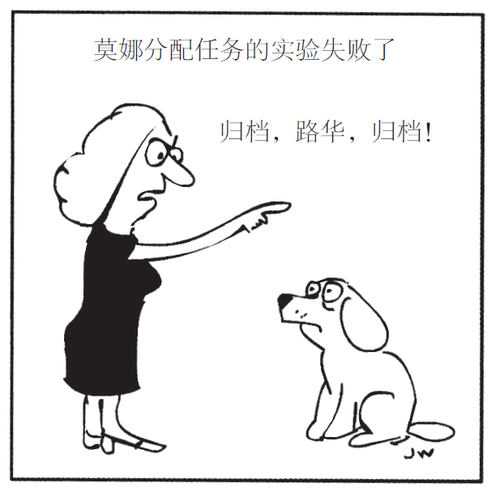

<a href="#part0514.html_ch1" id="part0514.html_ch1-back"
class="pcalibre calibre2">[1]</a>美国专业提供自由撰稿人服务的网站，网站为保护买卖双方利益，提供第三方保证金服务，并对此抽取少量佣金，买家先打预付款到卖家ELANCE账户，卖家开始提供服务和产品。——译者注

### 真正做你应该做的事情的秘诀

一个隐藏的障碍会经常阻碍人们运用自己所了解的知识。你是否曾经阅读过关于个人发展的书籍，你是否曾经若有所思地在书中重要提示下画线，并开始运用书上所提到的技巧和策略……但几个星期后，你是否发现自己又重新回到以前使用老办法做事的状态？如果是这样的话，那你就已经遇到这个问题了。大多数关于时间管理的书籍都不会提到这一内容，因为那些书都是用线性思维考虑问题的人所写的，他们还不太接受事情很少沿着符合逻辑的方向发展这一现实。他们和那些极具创造力且思维方式天马行空的右脑型人群并不合拍。因此，在建议的实施过程中，这些人往往会忽视那些隐藏的障碍。

“很多时候，做其他事情比做我们必须要做的事情要有趣得多。”

通过打电话推销产品或者新项目和稍微看看那本可能有某个章节跟你所做生意相关的书籍，或者查收一下邮件和浏览刚发生的新闻中随便哪一件事相比较，你可能都会觉得前者对你的吸引力几乎为零。看看那些和你的高附加值活动相关的任务，我敢说你会觉得这其中很多都挺难的、有些令人生厌，你甚至不自觉地就不想做这些事。

再来看看那些附加值低的活动，你肯定觉得这些事情对你来说简直可以信手拈来，你丝毫不害怕做这些事，并且你很可能会很乐意去做这些事情。

“低附加值活动倾向于那些很容易的、不会给人带来恐慌甚至可能会让人感到身心愉悦的事情。”

现在我们已经到达问题的关键所在，即便人们知道更好的问题处理方式，但大多数人仍保持自己原有的80/20平衡的真正原因。我为什么把这叫做“秘密”障碍呢？因为几乎没人承认这个障碍的存在！

随便问问你的任何一个朋友或者同事，问问他们是否觉得自己的潜力都已经得到充分发挥。我很怀疑会有很多人给出肯定的回答。接着再问问为什么他们的潜力并未完全得到发挥。你会得到各种各样的答案，有人会责怪外部环境：他们所接受的教育有问题、没有遇到对的人、经济形势不好、没有人能给他们提供好的建议。另外一些人可能会选择自己承担责任，他们可能会说自己的判断有误或者选错了生意行当。

可能一千个人中只有一个人会说，“你得知道，这是因为当我在做容易的事情还是困难的事情两者之间作选择时，我一般都会选择做简单的事。”

很多书籍和课程都会宣传一些极具鼓舞性的讲话来激励你做那些困难的事情。它们让你变得跃跃欲试，它们让你觉得必须马上开始接受任务。有的会使用大众的力量来振奋你，有的会让你劈断一块木板、赤脚踏过灼热的炭火或者攀登某个高峰。这些都是很棒的精力增强剂，但第二天早上，当你回归现实社会，之前那些做法都会悄然失色，不论你多想用劈断木板的技术来对付你那位难缠的上司，这真的不是什么可取的做法。

行走于炭火之上的秘诀

如果你想知道人们为什么可以在炭火之上行走，其实这并不是什么很神秘的事，而是简单的物理知识。这里列举了部分关键要素：通常这些煤炭上都覆盖了炭灰，而炭灰导热性能很差；煤炭的表面并不平整，因此足底实际接触煤炭的表面非常小；当煤炭冷却时，燃烧会停止，新的热量并不会生成；行走者通过的时间非常短。参与者可能觉得自己完成了一件不可能完成的任务而大受鼓舞，实际上，这件事任何人都能做到。

你所需要的是真正能让困难的事变得简单、变得更加有趣的方法和技巧。这是人类的天性：一旦你曾经觉得很困难的事情、那些高附加值的任务开始变得和低附加值任务一样简单和有趣，你就会做更多这类事。这些事情做得越多，你就能创造更多的价值，并且获得更多的回报。

现在，你找到了80/20法则中缺失的部分：抛开不必要的工作、处理能够委派的工作、更有效地做你该做的事，至此你已经成功了一半。成功的另一半就是让高附加值的工作变得更加有趣、更加简单。在谈到如何才能这么做之前，你需要花点时间回到第1章看看你所列的工作项目清单。对清单上的每一件事从1到10标上数字，1代表你讨厌做的事，10代表你真正喜欢做的事。

你时间花得最多的那些事，并没能给你带来最多的价值，但这些事情却比最有价值的事情得分要高？如果答案是肯定的，那么运用本章接下来将要提到的技巧很有可能会给你的生产力带来巨大的改变。

如果答案并非如此，那么你所面临的问题可能就不是你并不喜欢做排名前三的那些事，而是你任由满足他人需求或者“紧急但不重要”的任务主宰你的时间。在这种情况下，你还是需要阅读本章剩余部分的内容，你会发现更大的改变发生在本书稍后将提到的策略。

### 将任务分解之后再开始做

一项过于庞大的任务会让人望而却步、心生不悦。要完成这种任务，秘诀是把任务分解成易于完成的子任务。要持续不断地对任务进行分解，直到这些子任务都很容易完成，直到你不再惧怕面对这些任务。举个例子，你不得不打电话解雇你的网站开发工程师。你知道这不是什么令人愉快的差事，于是你就一直没打这个电话。但这么做有个问题，那就是原本的工程师只要还在位，你就没办法雇用新员工，这使得网站信息的更新受到延误，而网站信息的滞后直接限制了网站盈利收入的增加。这种“捡了芝麻，丢了西瓜”的现象非常普遍。首先，检查这项任务是不是可有可无？不是。第二，这项任务是否可以委派他人完成？有可能，但如果没法分配给其他人，那么你可以把打电话这件事情分解成以下步骤：

■找到这人的电话号码，记录下来。

■写下你想要说的话以及你将怎样说这些话。

■做好最坏的打算。在这种情况下，这可能是对方非常情绪化的或者非常敌对的反应，那么你可以准备好说这样一些话，比如，“很抱歉这件事情让你如此烦恼，我会给你发一个书面声明，表明我们之间的合同将不再生效。”如果这听起来好像整个事情即将变成一个法律问题，告诉对方剩下的事情将由你的律师出面解决。大多数情况下，这种最坏的情形并不会出现。

■现在不要去想这个任务会怎样，而是想想结果会怎样。一旦你打完这个电话，你将会感觉多么轻松？不用再为这件事感到烦恼将会多美好？用这种积极的预期激励你完成这项任务。

“良好的开端是成功的一半。”

古罗马诗人霍勒斯（Horace），公元前65——公元8年

有人觉得把大任务分解成很多小任务挺傻的，但这确实是一个让你行动起来的好方法。比如，你决定要一个礼拜去健身房锻炼三次，但实际发现自己不太愿意这么做。那么先这样，拿着你的健身包跨出自家大门，告诉自己，如果你不想去健身了，就可以立刻回家。事实上，一旦你拿着包走到门外，很有可能你就会真的去健身。

同样，如果你要写一份报告，试着先开始写出第一句，很有可能你就会继续写下去。

现在就试试。找一个和你的目标相关的而你一直都不想去做的任务，把它分解成三个或更多的小部分。

任务：\_\_\_\_\_\_\_\_\_\_\_\_\_\_\_\_\_\_\_\_\_\_\_\_\_\_\_\_\_\_\_\_\_\_\_\_\_\_\_\_\_\_\_\_\_\_\_\_\_\_\_\_\_\_\_\_\_\_\_

部分1\_\_\_\_\_\_\_\_\_\_\_\_\_\_\_\_\_\_\_\_\_\_\_\_\_\_\_\_\_\_\_\_\_\_\_\_\_\_\_\_\_\_\_\_\_\_\_\_\_\_\_\_\_\_\_\_\_\_\_\_

部分2\_\_\_\_\_\_\_\_\_\_\_\_\_\_\_\_\_\_\_\_\_\_\_\_\_\_\_\_\_\_\_\_\_\_\_\_\_\_\_\_\_\_\_\_\_\_\_\_\_\_\_\_\_\_\_\_\_\_\_\_

部分3\_\_\_\_\_\_\_\_\_\_\_\_\_\_\_\_\_\_\_\_\_\_\_\_\_\_\_\_\_\_\_\_\_\_\_\_\_\_\_\_\_\_\_\_\_\_\_\_\_\_\_\_\_\_\_\_\_\_\_\_

部分4\_\_\_\_\_\_\_\_\_\_\_\_\_\_\_\_\_\_\_\_\_\_\_\_\_\_\_\_\_\_\_\_\_\_\_\_\_\_\_\_\_\_\_\_\_\_\_\_\_\_\_\_\_\_\_\_\_\_\_\_

部分5\_\_\_\_\_\_\_\_\_\_\_\_\_\_\_\_\_\_\_\_\_\_\_\_\_\_\_\_\_\_\_\_\_\_\_\_\_\_\_\_\_\_\_\_\_\_\_\_\_\_\_\_\_\_\_\_\_\_\_\_

部分6\_\_\_\_\_\_\_\_\_\_\_\_\_\_\_\_\_\_\_\_\_\_\_\_\_\_\_\_\_\_\_\_\_\_\_\_\_\_\_\_\_\_\_\_\_\_\_\_\_\_\_\_\_\_\_\_\_\_\_\_

你觉得今天就完成第一部分怎么样？如果行的话，你可以现在就开始做，并且享受开始实施任务所带给你的满足感。如果你觉得还能继续，那么接着做；否则，把部分2放到你明天“即将要做事项”清单中，第二天再做，这样一天一天继续下去，直到你完成这项任务。

### 谁说你必须从头开始

很多情况下，你并不需要从头开始。打个比方，我在教那些写作有困难的人写文章的时候，我会建议他们准备一盒索引卡，记录下一天中他们脑子里所冒出来的所有想法。这个方法可以很容易地运用到书写商业计划、开创新发明，或者任何其他大目标的实现过程中。把这些卡片收集起来，差不多每周都拿出来翻一翻，看看这些想法是不是能拿出来用，或者这些想法能不能促使你想到其他主意。然后再决定你现在能做这一大项工作中的哪一小块。如果你正在写一部小说，你可能已经对最后的关键场景进行了设想，那么完全没理由不先把这个场景的情形写下来，然后再完成之前的其他剧情。如果你正考虑开创一种新产品，而你早就想好了新产品要怎么包装，那么你完全可以在产品完成之前先处理包装方面的工作。如果你选择以做你觉得有意思的事情为开始，这么在做的同时你已经为剩余的工作准备好了冲劲。

花一分钟想想你的某一个目标。这个目标的哪一部分对你来说是最有吸引力的？不管它们是否与逻辑上正常的开头相关。哪些部分能让你足够激动到想要今天或者明天就立即开始？

捕捉你的灵感

如果在灵感乍现的瞬间你没能及时捕获它们，很有可能你很快会忘掉这些灵感。你可以用纸、笔，或者索引卡，或录音笔，或者你可以给自己打电话，把这些想法记录在语音邮件上。要经常捕获这些想法，然后决定哪些可以付诸行动。

### 创造流程

你可能对“流程”的概念比较熟悉，米哈里·奇肯森德米哈依（Mihaly
Csikszentmihalyi）教授对这一概念进行了深入的阐释。当“流程”状态出现时，你常常无比投入于你所从事的事情，而失去了时间的概念。这是一种令人愉悦的经历，在这个经历中，你仿佛成为你所做事情的媒介——一种紧张而又容易的专注状态。问题是，你要怎样创造这样一个状态，而不是一味地等待并希望这个状态自然发生？这里有三个关键因素：

1.选一个刚好在你能力范围之内或者刚刚高出你能力范围的任务，要是这个任务太难或者太简单，你都不会进入“流程”状态。因此，如果你想写些东西，把这个任务分解成你能够处理的部分。这可能是撰写大概的框架，可能是列一个关键点的清单，或者在脑子里先绘制一张目标地图。像这样写下一个和你的目标相关的任务。

2.确保任务包含即刻的反馈，这样你便能在任务执行过程中随时了解任务的完成情况，是完成得好还是不好。比如，你可以开始设定一个要写一定字数文章的目标，或者在你第一个工作时间内获取某一特定信息。一般来说，你需要在任务前期拥有乐观积极的感觉，渐渐地这项任务可能会让你非常投入，使得你不再去想怎样做这个项目或者项目做得怎么样。写下能够给你带来这种反馈的方法。

3.创造一个注意力分散点尽量少的环境。同样，稍后在这一过程中，你可能会非常投入以至于你甚至注意到电话铃响之类的事，但是如果你能在一个容易集中精力的地方开始工作，这显然更有益处。这也包括预留一段时间，在这段时间里，你不会觉得自己必须要去做些其他的事情。写下在何时以及何地你会集中精力做之前所选择的任务。

安排一些时间来处理对你的最高价值目标有益的任务，创造上面所描述的所有条件。带着这种想法进行工作，那就是如果“流程”出现，这自然很棒，但如果“流程”并没有出现，你还是能做成很多事情（那种精神状态会让你不至于总是用“我进入‘流程’没有？”这种问题来分散自己的注意力）。

### 充分利用零碎时间

分解策略同样适用于时间。把那些零散的时间利用起来，我们可以做成很多事情。只是这需要一些新的策略，这里有三点建议：

■在你的电视节目表里放上一张便笺纸，上面写着“下午7点半到8点半，目标时间，我自己主演”。然后把你平时看电视的一小时或半小时时间用来进行工作。从现在开始的一年以后，你会更后悔做了什么：没看成新的一季《X音素》（The
X Factor）<a href="#part0519.html_ch1-back" id="part0519.html_ch1"
class="pcalibre calibre2">[1]</a>，还是在实现你最重要目标的道路上，没有任何进步？

■在你的购物清单上，加上“为实现目标奋斗20分钟”。当你外出购物时，在购物前或者购物结束后，去附近的咖啡店花20分钟在你的项目上。

■下次当你的孩子或者伙伴想让你去看一场你自己其实不怎么想看的电影时，你可以和他们一起去电影院，让他们进去看电影，然后你到附近的咖啡店做和你的目标相关的事情，直到他们看完电影。然后你可以带他们去吃冰激凌，让他们告诉你关于这部电影的一切。

在群体中创造“流程”

奇肯森德米哈依提出了一些可以依靠群组刺激“流程”的方法，包括：拥有一个多元化的群组；不用桌子，这样人们只能站着或不停走动；很多记录观点的方法，包括图形和图表；轻松的氛围。

<a href="#part0519.html_ch1" id="part0519.html_ch1-back"
class="pcalibre calibre2">[1]</a>由“选秀节目之父”英国娱乐电视大亨西蒙·考威尔（Simon
Cowell）创办的美国版《The X
Factor》，即《X音素》唱歌选秀类节目。——译者注

### 发明你自己的障碍克服策略

本章提到的所有策略都是为了使你之前想要逃避的任务变得更容易做，做起来更有意思。除了上面提到的，还有些其他方法，包括：

■做这些工作的时候，听一些你喜欢的音乐。

■和你喜欢的人一起工作。

■当一件事情完成时，给自己一定的奖励作为回报。

■和别人打赌你一定能完成这些工作，要保证赌注是你真正会心疼的东西。

你可能很清楚最能对自己起到激励作用的东西是什么。有的人会对回报有更好的反应（获得晋升），而对有的人来说，惩罚更有效（失业的威胁）。对于你而言，最有效的是什么呢？写出三种你会用来使你曾经想要逃避去做的事情更加容易的技巧或策略，这些技巧或策略可以是这一章里提到的，也可以是你自己想出来的。

1.\_\_\_\_\_\_\_\_\_\_\_\_\_\_\_\_\_\_\_\_\_\_\_\_\_\_\_\_\_\_\_\_\_\_\_\_\_\_\_\_\_\_\_\_\_\_\_\_\_\_\_\_\_\_\_\_\_\_\_

2.\_\_\_\_\_\_\_\_\_\_\_\_\_\_\_\_\_\_\_\_\_\_\_\_\_\_\_\_\_\_\_\_\_\_\_\_\_\_\_\_\_\_\_\_\_\_\_\_\_\_\_\_\_\_\_\_\_\_\_

3.\_\_\_\_\_\_\_\_\_\_\_\_\_\_\_\_\_\_\_\_\_\_\_\_\_\_\_\_\_\_\_\_\_\_\_\_\_\_\_\_\_\_\_\_\_\_\_\_\_\_\_\_\_\_\_\_\_\_\_

### 下一步是什么

现在，当你为自己的目标努力时，你知道秘诀是什么了：你需要为专注于所有事项中最重要的20%制造空间，并且你需要让做困难的事和容易的事一样充满乐趣。在下一章节中，你将学会使用另一个关键策略：专注于已经奏效的事。

## 第5章　如何专注于已经奏效的事情

你知道吗？在为成功而努力的过程中，大多数人专注的焦点都不是他们真正应该做的事情。这千真万确，很可能过去你也犯过这种错误。一旦这个问题得到纠正，你将很快获得成功。

这个错误的策略就是专注于你的弱点，而不是你的强项。我们来看看一些非常成功的人物和品牌的例子，看看他们都是怎么做的。唐纳德·特朗普（Donald
Trump）<a href="#part0522.html_ch1-back" id="part0522.html_ch1"
class="pcalibre calibre2">[1]</a>和理查德·布兰森（Richard
Branson）<a href="#part0522.html_ch2-back" id="part0522.html_ch2"
class="pcalibre calibre2">[2]</a>都非常擅长自我营销，他们很清楚要怎样把每个新投机都变成一个新闻事件，而通常情况下，他们所操作的项目并非是用自己的钱。他们自己本身就是极具广告效应的品牌，他们专注的正是这一品牌效应。至于生意上那些具体的事情，则分配给其他人来打理。

这和产品的品牌效应有着异曲同工之妙。所有苹果产品的关键特色就在于完美的设计。苹果产品并不是要成为最便宜的或者最流行的产品。而沃尔玛超市（Wal-Mart）的目标就是要做世界上最便宜最大的超市，并由此成为零售行业最为成功的佼佼者。

大多数人对于专注的态度恰恰相反。他们找到自己的弱点，然后一直专注于这个弱点，想要强化自己的弱项。当他们忙于把自己并不擅长的事情做得马马虎虎时，他们便错过了将这些时间利用起来做一些以他们的能力可以取得很出众成绩的事情。这便是平庸的原因。

当你做80/20分析时，通常你会发现给你带来最多价值的那20%是你已经在做的事情，只是你做得还不够多。同样，在寻找会帮你取得成功的策略时，聪明的做法是先考虑那些对你来说已经起效的策略，然后多运用这条策略，或者把它运用到更多的挑战中去。通过阅读本章，你会发现自己的强项，并且学会怎样发挥这一优势以使其对你的人生产生最大影响。

“每个人都应当注意感受自己内心最向往的方式，然后竭尽全力地选择这个方式。”

哈西德派<a href="#part0522.html_ch3-back" id="part0522.html_ch3"
class="pcalibre calibre2">[3]</a>谚语（Hasidic Saying）

这一点实在是太重要了，所以我不得不再重复一遍：假若你想成为任意领域中那5%的胜者，你需要多做你擅长的事，少考虑要把你做不好的事做得更好这样的问题。这非常符合逻辑，对吗？如果你已经在一些事情上做得很好，那么再在上面多花一点精力，你就会把这件事情做得非常完美，你就能把大多数同样做这件事情的人远远地甩在身后。反过来说，一件你没办法做好的事，你努力想要能够做得更好点，结果很可能是你花费了很多时间和精力，做了很多工作，只不过拿到一个很普通的成绩。当然，你不能无视那些必要的你却做不好的事情，但你可以把精力放在找一些能把那些事做得比你好的人去做这件事情上，然后把这些事情分配给他们去做。举个例子，看看这些工作，哪些会让你激动不已，哪些会让你感到惧怕？

■报账

■在公共场合讲话

■设计网页

■头脑风暴演讲会

■构建网络

■市场营销

■会议

这里所列的内容没有哪一条是本来就令人生厌的，除了报账。开个玩笑。不过我确实不喜欢做报账的工作，对于这件事情，我是打心眼里害怕，但却有人就靠这门技术过日子，我本人非常喜欢在公共场合演讲，但有的会计无论如何也不愿意在一群人面前说话。这并不仅仅是关于你所喜欢的事情这么简单。我其实挺想学学网页设计，但是我意识到这样我的时间可能就没有得到很好的利用，并且我很可能根本没办法做的和专业人员一样好，所以一般我都会让别人来做这件事情。利用我之前提到的一些网络在线服务，比如elance.com，找人来做你没法做的或不想做的事要比以往容易很多。

### 你的强项是什么

我敢打赌，如果我问你，你最大的弱点是什么，你可能毫不费力地就能把它找出来。然而，对于大多数人来说，找出自己的强项就没这么容易了，虽然了解这一点很重要。因此，让我们把你的优势、你所擅长的东西都找出来。对于以下问题，写下第一时间出现在你脑中的答案。

1.论及观点创新，你最大的优点是什么？

\_\_\_\_\_\_\_\_\_\_\_\_\_\_\_\_\_\_\_\_\_\_\_\_\_\_\_\_\_\_\_\_\_\_\_\_\_\_\_\_\_\_\_\_\_\_\_\_\_\_\_\_\_\_\_\_\_\_

2.对于表达自我，你最擅长的是什么？

\_\_\_\_\_\_\_\_\_\_\_\_\_\_\_\_\_\_\_\_\_\_\_\_\_\_\_\_\_\_\_\_\_\_\_\_\_\_\_\_\_\_\_\_\_\_\_\_\_\_\_\_\_\_\_\_\_\_

3.和他人打交道方面，你最擅长什么？

\_\_\_\_\_\_\_\_\_\_\_\_\_\_\_\_\_\_\_\_\_\_\_\_\_\_\_\_\_\_\_\_\_\_\_\_\_\_\_\_\_\_\_\_\_\_\_\_\_\_\_\_\_\_\_\_\_\_

4.完成任务方面，你最擅长什么？

\_\_\_\_\_\_\_\_\_\_\_\_\_\_\_\_\_\_\_\_\_\_\_\_\_\_\_\_\_\_\_\_\_\_\_\_\_\_\_\_\_\_\_\_\_\_\_\_\_\_\_\_\_\_\_\_\_\_

当然你肯定有自己想做的事情，做这些事也确实是你的强项，但你却并不总是能充分发挥自己的能力做到最好。在这种情况下，要找到做这些事情的更好方法就是回想一下以前你确实做得很好的时候，都采用了哪些方法。

<a href="#part0522.html_ch1" id="part0522.html_ch1-back"
class="pcalibre calibre2">[1]</a>唐纳德·特朗普，曾经是美国最具知名度的房地产商之一，人称“地产之王”。依靠房地产和股市，特朗普拥有纽约、新泽西州、佛罗里达州等地黄金地段的房地产，并且创建了“特朗普梭运航空”，也是新泽西州“将军”职业足球队老板。——译者注

<a href="#part0522.html_ch2" id="part0522.html_ch2-back"
class="pcalibre calibre2">[2]</a>理查德·布兰森，全称理查德·查尔斯·尼古拉斯·布兰森（Sir
Richard Charles Nicholas Branson,
SRB，1950年7月18日-），是英国著名企业维珍集团总裁。1999年，英国伊丽莎白女王册封布兰森为爵士。集团旗下包括：维珍航空（英国航空的主要竞争对手）、维珍铁路、维珍电讯、维珍可乐、维珍能源、连锁零售店维珍唱片行以及维珍金融服务。——译者注

<a href="#part0522.html_ch3" id="part0522.html_ch3-back"
class="pcalibre calibre2">[3]</a>美国犹太教中，正统派中的一派。——译者注

### 你何时做了正确的事

我的一名职业为作家的学生告诉我说，她开会的时候“总是”迟到。这些会议对她的工作很重要，参加这些会议也并非让她感到不愉快，她也并不是不想参加这些会议，可她就是会一直迟到。那些编辑、代理商或其他一些不得不一直等着她的人自然没法对她产生好感。

进一步的分析之后，我们发现有一个重要的例外情况：这名作家从来没有错过航班。很显然，当她要赶飞机时，她所运用的是完全不同的另一种时间模式。问题是她在那些场合采用的不同做法也可以运用到一些她需要在某一特定时间到达某一地点的其他场合中。

她的回答是，当她需要乘飞机去某个地方时，她会提前一天打包行李并且做好一切准备。尔后我们又比较了对于参加其他活动她所做的准备工作，虽然这相比较于乘坐飞机工作量要小很多，结果却大相径庭。

这里有些相关问题，可能会对你有所帮助。

■一般情况下你做事都会拖延，但在做什么事情时你不会拖延？

■一般情况下你都不会完成已经开始的工作，但偶尔也有例外，那这些例外有什么不同？

■一般情况下你工作日的工作都不是从做最重要的事情开始，但有时你确实是这样做的，这些时候和平时有什么不同？

对比徒劳无益的模式和那些例外，你会找到改变的线索。而这些问题本身常常都有解决的办法。

你现在就可以试试这个方法。

1.首先写下一件你通常没法做的跟自己想象中一样好的事：

\_\_\_\_\_\_\_\_\_\_\_\_\_\_\_\_\_\_\_\_\_\_\_\_\_\_\_\_\_\_\_\_\_\_\_\_\_\_\_\_\_\_\_\_\_\_\_\_\_\_\_\_\_\_\_\_\_\_

2.现在想出至少一次你曾经做好的时候：

\_\_\_\_\_\_\_\_\_\_\_\_\_\_\_\_\_\_\_\_\_\_\_\_\_\_\_\_\_\_\_\_\_\_\_\_\_\_\_\_\_\_\_\_\_\_\_\_\_\_\_\_\_\_\_\_\_\_

3.你曾做好的那次有什么不同之处？

\_\_\_\_\_\_\_\_\_\_\_\_\_\_\_\_\_\_\_\_\_\_\_\_\_\_\_\_\_\_\_\_\_\_\_\_\_\_\_\_\_\_\_\_\_\_\_\_\_\_\_\_\_\_\_\_\_\_

4.下一次你需要做相同的工作时，你将如何运用这一策略？

\_\_\_\_\_\_\_\_\_\_\_\_\_\_\_\_\_\_\_\_\_\_\_\_\_\_\_\_\_\_\_\_\_\_\_\_\_\_\_\_\_\_\_\_\_\_\_\_\_\_\_\_\_\_\_\_\_\_

### 留意事情发展好的时候

一个比较好的养成使用最有效做法的学习习惯，就是在这些好的方法出现时，及时注意到它们。我们大多数人并没有这么做，当事情发展得非常不好时，这会引起我们的注意，而当事情发展得比较好的时候，我们大多却不以为然。从现在开始，在每天快结束时，花点时间回顾一下当天发生的事情，注意那些对你有效的事物，并想想这些事为什么会对你有效。比如，你终于处理完积压了很久的邮件，为什么今天做这件事好像挺容易？可能你给自己设定了一个在30分钟内处理完所有邮件的时间期限，因为时间很有限，你便没有被那些有趣但却不相关的邮件分散注意力，或者你发现了一个新的系统文件夹使用方法，这能够使你更加有效地对邮件进行分类。

你的每夜回顾

一个能让你记得回顾每天以及回顾你能从那些进展好的事情上学到些什么的好办法，就是把回顾工作和你每天晚上都要做的事情联系起来，比如刷牙。你可以在身边放好纸笔，这样方便你随时写下自己的想法。

现在再花点时间想想你可以怎样把这些确实有效的技巧运用到目前你所面临的其他挑战上去。你是不是也可以为你计划要写的报告设定一个类似的截止日期？比如在某某时间必须完成粗略的第一稿？你是不是可以利用新的邮件文件夹系统来提高文案工作的效率？

最好是能把所有有效的内容都记录下来，这样将来遇到困难的时候，你就可以看看这份清单，然后找出已经被证明有效的方法来帮助你解决这些新的挑战。这种方法最妙的地方在于你其实是在向自己学习，并且你知道这些技巧确实是有效的。

### 学习巴甫洛夫和他那些流口水的狗

你有没有看过或者听说过关于巴甫洛夫的狗的故事？这位俄罗斯科学家每次在喂狗吃东西的时候都会摇铃。这些狗在看到食物的时候都会流口水。过了一段时间之后，他只需要简单地摇摇铃，那些狗就立刻会条件反射地开始流口水。它们对于食物和声音的联系紧密到尽管没有食物，但一听到铃声，它们的身体就会立即作出反应。你可能会奇怪这和我们所说的事有什么关系，大概因为你对于让狗在不必要的时候流口水这件事情并没多大兴趣。这一相同的“经典条件反射”现象却是你可以拿来为己所用的方法。

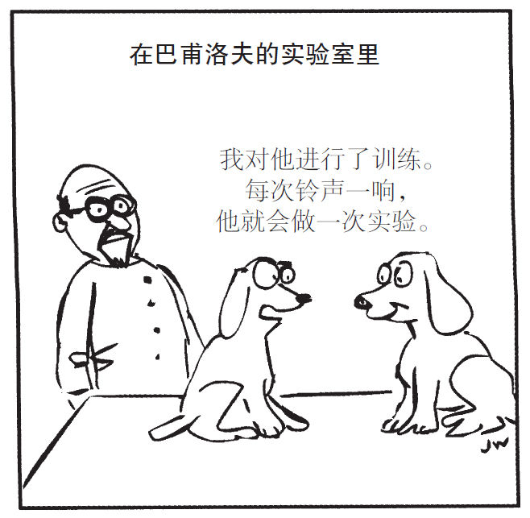

有的时候你确实可以状态极好地完成一件事，只不过对于我们大多数人而言，那些体力和脑力状态是可遇而不可求的，它们并不在我们的掌控之中。如果你能在需要时随时到达那种状态，那该有多好？答案是，你真的可以。秘诀就是使用巴甫洛夫所使用的原理。一旦你意识到自己处于一种产出能力特别强的状态时，把它和一种声音进行关联（比如，一种你用MP3播放的特别声音，切记要选择一种平时你并不常播放的声音），或者一种气味（例如，薄荷油的味道，抑或是你平常不太用的一种须后水或香水的味道）。你这么做过几次之后，这种精神状态和其他元素就会联系起来，直到形成那种一旦你听到这种声音或者闻到这种味道，积极状态就会出现的情形。我们将在下一章谈这种方法的一个变体，你将学习如何利用“第二自我策略”。

### 你在何时何地获得最好的主意

由英国电信公司（British Telecom, BT）和《今日管理》（Manage-ment
Today）杂志所作的一项研究表明，2/3的管理者均表示他们最好的主意都是在工作之余产生的。你最好的主意是在什么时候、什么地方产生的呢？典型的答案是：

■洗淋浴的时候

■泡澡的时候

■剃胡子的时候

■开车上班的路上

■乘坐列车或地铁时

■打高尔夫的时候

■走路或慢跑的时候

■在床上，刚醒来的时候

■在床上，刚要睡着的时候

■电视节目插播广告时

■在健身房里

如果上面所提到的某些时机和你得出最好主意的时机相吻合，用圆圈做出标记。如果你的答案和上面的都不一样，那么把它写出来。

就像我们注意到的，好的主意出现时，我们应该在自己分心前、在这些主意消失前及时把它记录下来，这一点至关重要。在房间里你容易产生想法的地方随处放些纸笔：浴室、床头、客厅沙发边、厨房。如果你在一些不方便写东西的地方产生了好的想法，比如在慢跑或锻炼的时候，你可以考虑随身携带一个小型数码录音笔或者MP3播放器，我们可以在这种情况下采用录音的方法。

“在你分心前捕捉好的主意很重要。”

### 如何驾驭白日梦

很不幸，在我们的成长过程中，我们一直接受着这样的教育：白日梦很愚蠢，很浪费时间。然而，这正是你在洗澡、走路、在健身房跑步机上跑步时所做的事情，也就是在这些时候，突然间会有一个想法出现在你脑中。这信息来自于你的潜意识，而你的潜意识中则充满了各种你在清醒时所做的事。虽然我们并没有什么方法能促使这种多产的白日梦生成，不过确实有些方法能使这些白日梦出现的频率更高。如果你想要这种白日梦出现得更多，那么就需要：

■用更多时间来做那些使你有可能产生想法的事情（例如，泡个长澡）。

■当有主意产生时，不要立即对它们进行评判。一个消极的主意会很快扼杀新的主意。即使你的直觉告诉你这个主意并不现实或者并不相关，不要放弃这个主意。它可能会引导你想出另外一个有用的主意。

■永远不要逼自己去想而是让这些主意自己主动冒出来。比如，如果你想知道怎样才能做一个有力的演讲，你可以回顾过去你所看到的那些效果好的和效果差的演讲，然后注意你的脑中会出现什么想法。如果这些想法出现，不妨娱乐一下，想想那些“疯狂”的主意，霍默·辛普森（Homer
Simpson）<a href="#part0527.html_ch1-back" id="part0527.html_ch1"
class="pcalibre calibre2">[1]</a>会怎样进行演讲……

<a href="#part0527.html_ch1" id="part0527.html_ch1-back"
class="pcalibre calibre2">[1]</a>霍默·辛普森（Homer
Simpson）是美国电视动画《辛普森一家》中的一名虚构角色，辛普森一家五口中的父亲。——译者注

### 隐藏的想法来源：夜晚所做的梦

人们早就知道很多伟大的作家都曾受到过他们所做梦的启发，包括创作了《化身博士》（Dr
Jekyll and Mr Hyde）的罗伯特·路易斯·史蒂文森（Robert Louis
Stevenson）。英国著名歌手保罗·麦卡特尼（Paul
McCartney）在梦中获得了歌曲《昔日》（Yesterday）的曲调。沃克夫人（Madame
C.J.Walker）<a href="#part0528.html_ch1-back" id="part0528.html_ch1"
class="pcalibre calibre2">[1]</a>做了一个梦，有人在梦里告诉她怎样对护发产品进行混合，这使得她成为全美第一位白手起家的百万富翁。如果你从来都记不住或者不曾写下你做过的梦，你可能会错过很多信息。

研究表明，你甚至可以在梦里解决很多具体的问题。《睡眠研究期刊》（Journal
of Sleep
Research）（2004年12月刊）曾报道过一篇文章，该研究要求470名被试对他们的梦进行记录，并且对这些梦在强度、情感和影响方面进行评分。参与者还被要求对前一个星期所发生的事情进行回忆，之后由独立评判对这些梦进行评估，以找出这些梦是否含有解决那些事件所引发的问题的方法。他们的结论是：梦境确实提供了所出现问题的一些见解和方法。这些方法会在问题第一次出现当天的梦里出现，也会在六七天后出现。

试试结构化白日梦

如果你想用白日梦来解决问题，随便从杂志上挑个词，然后试着想一想，看这个词能怎样和解决方法联系起来。比如，你想就一个新想法的价值说服你的老板，而你所选中的词是“医生”，你的想法可能会引导你达到这样一个见解，医生是一个受人尊敬的权威人物，可能你需要专家对你的意见进行引荐。

如果你在快睡觉前把注意力集中在这个问题上，你很可能会获得一个解决方法。我所说的专注于这个问题，并不是说要去担心这个问题，而是把它作为你正寻求答案的问题。然后睡觉。第二天一早写下任何你能记住的梦的内容。如果你在梦境中醒来，那么立即进行记录（因为你很可能会在早上忘记这些内容）。第二天，坐在一个安静的地方看看你所写下的内容。梦境是有寓意的，因此问题的解决方法可能会以某种符号的形式出现。让你的思想自由发散，想想你的梦可能在试着告诉你些什么。

<a href="#part0528.html_ch1" id="part0528.html_ch1-back"
class="pcalibre calibre2">[1]</a>沃克夫人是20世纪初一家大型美容化妆品公司的创办者，是身价百万的第一位美国非洲裔妇女。——译者注

### 下一步是什么

现在你对于激励你通向成功的关键力量有了更好的认识。当做你认为自己该做的正确事情时，你便拥有了无穷的力量。然而，很多人发现这些力量会被拖延的坏毛病摧毁。在下一章，你将学会如何一劳永逸地战胜那个消极的坏习惯。

## 第6章　如何战胜拖延

拖延是专注的天敌。当我们拖延的时候，我们会做各种事，但就是不会去做我们所明白的自己该做的事。这是几乎所有人在为目标努力的时候都会碰到的最大问题，因此我们需要花整整一章来好好谈谈这个问题。你会了解其实有很多不同的方法能帮助你克服拖延这个毛病。一旦找到对你最有效的方法，你就几乎能战胜所有的竞争对手。

### 首先：你确定自己有问题吗

在我们开始看处方之前，先保证你确实患有这一疾病。如果你一直把事情放着直到最后一刻才去做，不过最终你还是会完成这件事，并且每次都做得很好，那就不算是拖延。你只是选择把时间花在其他事情上，一直到确实需要来做这一特别的项目，然后你才会做这件事。你可以准确判断做某件事情所需要的时间，你只是不想过早开始做这件事。如果困扰你的唯一问题是其他人把你的这一行为定义为拖延，那么你完全可以无视他们，继续自己的做法，因为这种做法对你有效。

莎士比亚对时间的看法

“宁早三小时不晚一分钟。”

《温莎公爵的婚礼》（The Merry Wives of Windsor）

“我以前荒废了时间，现在时间便把我荒废了。”

《理查德二世》（King Richard II）

### 拖延的诱惑力

要了解拖延的动力学，让我们来看看诱惑是怎么奏效的。通常情况下，你需要从两个或更多事情中作选择。有时这是一个简单的“是与否”的选择：你是否应该吃这块巧克力蛋糕？有时这是几项活动中的一个选择：你将要在家看电视还是去健身房运动？什么在左右着你的决定？

当英国物理学家、数学家以及天文学家艾萨克·牛顿（Isaac
Newton）发现运动定律时，不经意间他也发现了一些人类活动的定律。人们常会提起的牛顿第一定律是：

任何物体在不受外力作用的条件下，都将保持静止或匀速直线运动状态。

这条定律反映到人类行为方面，就是躺在沙发上休息的人倾向于继续躺着休息。处于向某方向运动的人（比如，享用一顿丰盛的晚餐）将倾向于继续此方向上的运动（吃一大块巧克力蛋糕作为甜点）。

所以，为了改变方向，我们需要做些努力。但为什么做这件事会这么难呢？因为我们都清楚这么做的好处是什么。比如，吃健康的食物、锻炼或者有分寸地做事，而不是一直拖到最后一秒才做？

一个原因就是“错误”的选项在当下显得非常有吸引力。“正确”选项的吸引力（或者忽视正确选项的惩罚）在当下显得很弱，它的吸引力要长期才能体现出来。关键问题是：通常而言，“正确”选项在长期才能给我们带来回报。“错误”选项的回报则是立竿见影的。因此，“错误”选项的吸引力会比较强。

举个例子，假设接下来我选择花几个小时浏览网页，这马上就能给我带来欢乐。可能我确实应该写那份两个礼拜后就该交的报告，不过就算我现在不作报告，即刻也不会有什么惩罚或者不利情况出现。一个礼拜后我受到了惩罚，当我意识到自己已经无可救药地远远落在别人的后面；或者两个礼拜之后，我错过截止日期，客户对我大发雷霆。

这是另外一个关键的不同：短期选择常常含有我们强烈的感觉和情感，而长期选择因为并不在眼前，只是和我们的智慧相关。

在情感和智慧的对决中，你觉得谁的胜算更多？提示：看看我们周围的世界，看看战争、环境的破坏和普通人的债务平均水平，答案不言自明。

巧克力蛋糕看起来很棒，闻起来很香，舌尖上的感觉很柔滑细腻，味道好极了！保持身材的想法……呃，嗯，这是个很好的想法……有的时候，比如我们满怀深深的愧疚，这确实有点效果。但不幸的是，这种事情通常只在我们过分放任自己的情况下才会出现。

这里有个办法可以让你每次做出更好的选择：选择“正确”选项的秘诀就是将正确的选项变得和“错误”选项一样生动，一样富有感情，一样的吸引人。怎样才能做到这一点？发挥你的想象力，用比感知“错误”选项更强烈的态度去观察、倾听、品尝、闻、感受“正确”选项。

■闭上你的双眼，开始想象“正确”选项将带来的结果。这很重要：不要想象你做这件事情的过程，想象最终结果或者一个阶段性的成果。

■当完成这件事你将看到什么？比如，你刚开始为自己的生意写经营计划，当生意取得成功，你将看到什么？如果你所经营的生意是一家店铺，你可以想象店堂里充满热情的顾客。

■你将听到些什么？可能你会想象顾客称赞你所销售的货物，或者把你的生意打电话告诉他们的朋友。

■你将感受到什么？这可能是最重要的部分，可能你会觉得骄傲、开心、兴奋和欢乐。

■有时候你可以想象一些味道。你可能会想象自己在闻一些摆放在柜台上鲜花的味道。

■甚至味觉也能成为一个因素。你可能会想象举办一场晚宴来庆祝开业，有人向你敬酒，你喝了一杯香槟。

你想象得越生动越令人兴奋，你就能为开始这项工作释放更多的力量。

成功的具象化

如果你无法对自己所期待的结果进行具象化想象，那么开始回忆以前曾给你带来巨大满足感的成功经历。记住自己全部感官的感受，然后把这些特点转移到你目前的目标上。

对于本书中提到的所有练习，要多加体验，直到找到对你自己最有效的形式。比如，有的人会觉得想象生意开业这么远对于他们来说实在太可怕了；他们可能会先考虑想象取得用于租赁经营场所的贷款，或者只是想象银行家对于他们刚做完的经营计划给予肯定。

当你想象完那些最能激励你的事情，在睁开眼后继续保持停留在这种状态，你会突然发现，相比之下看电视或者浏览网页都会显得很无聊。趁着这份新鲜感还没消失，立刻开始执行你的任务。

### 用锚的力量添加专注

要想让具象化技巧真正奏效，你必须把这项工作付诸行动。要做到这一点，你需要在过程中停顿下来，而不是遇到一点点困难就放弃。这有点像我们前面所说的，记得在生气的时候数十个数，而不是立刻勃然大怒。这样你就不用在受到诱惑时，每次花时间做这件事，让理想的状态通过一种能让你轻松做出最佳选择的方式“锚”住，停留下来，这是一个很有效的方法。你已经从前文以及巴甫洛夫和他的狗朋友实验的来源了解到这种方法。现在让我们看看怎样把这一技巧运用到你想要避免拖延的各种情况中去。

■选择一个最能代表你想要拖延的事件所产生的会给你带来积极情绪状态的结果。假设你总是拖延锻炼身体，那么就用锻炼所能带来的极好的健康能量这种状态。要是你总倾向于拖延长期项目，那么就想想完成这个项目将带给你的快乐。如果你倾向于拖延做行政工作，那么就想想当这些事情都完成之后，你所能感受到的轻松和惬意。

■站起来，闭上双眼，回忆过去或者展开想象，尽你所能为这个积极的状态创造生动画面。这情景需要包括你经历这种状态的一切，包括看到的、听到的、感受到的甚至于品尝和闻到的一切。

■将这些感觉不断“放大”，直到它们给你带来足够强烈的感觉。

■当你到达顶峰时，做一个手势，比如捏紧拇指和食指。将这两个指头捏一秒钟，然后再放开。这成为你的“锚”，你将经历这个状态的一个信号。

■重复这个过程，多做几次，最好能持续一天或两天。

■检查一下这之间关系的紧密程度，“抛锚”，也就是做出这一手势，然后检查自己的感觉。如果感觉还是不强烈，那么继续练习。

下一次如果你还是想要拖延，那么做出适当的姿势，你会发现自己比以前更容易做出引导你取得理想结果的选择。

### 抗拒的原因以及如何进行克服

可能有些更深层次的原因使得你不想做某件事情。如果是这样的话，这将帮助你找到这些原因或者观念，并且克服它们。以下列举了最常见的抗拒种类以及进行应对的方法。

■条件不符。列出你认为自己需要的所有条件。这些条件都存在吗？如果不是，那么将你的项目分解成若干个小任务，然后问问自己现在这些条件是否足够自己完成第一个小任务。答案很可能是肯定的，那么就做这个小任务，然后再继续做另一个小任务。如果你还有问题，那么就把这些小任务分解得更细。

■我在危机中状态最佳。如果你是危机爱好者，那么考虑通过其他方式给自己增加这种肾上腺素震荡所带来的兴奋感：蹦极，可能？真的，你可以试着在工作间隙给自己安排一些高难度网络游戏或者高强度的训练。

■我不想做，你也不能强迫我！试着对你不想做的事情说不。如果有什么办法可以让你不想做的事情消失，那么尽早去做（比如，通过分派给其他人去做）。如果不行的话，不妨对做这件事会给你带来什么好处进行评估，然后记住这些好处。

■因为我坚持完美。允许自己做事不完美。练习不完美地做一些小事，然后观察会发生些什么（或者不会发生些什么）。让自己严格而挑剔的内心缓和下来。

■这会让别人发疯，哈哈！如果你的拖延是对那些让你做事的人的一种对抗，那么想想有没有其他更直接的方法来表达愤怒、怨恨或者建立一种控制感。通常最好的方法就是在一开始就不要接受这份工作，如果可能的话。

■这感觉不好。这并不要感觉很好，只需要工作完成。但如果你可以把它和一些感觉很好的事情联系起来（比如，在做税单发票分类工作的同时听听音乐），或者在任务完成后奖励自己，这会容易得多。

你的理由是什么？

上面所提到的这些，你觉得哪些和你拖延的理由最接近？

下一次，当你想要战胜拖延的坏习惯时，你会做哪些不一样的事？

### 如果你还是不确定……

可能有的时候，你并不清楚自己为什么会拖延，把这个问题弄明白了，这会对你克服拖延的毛病大有益处。在那些情况下，问自己一些问题将会很有帮助。以下句子填空技巧对此非常有用，因为这能帮你把潜意识里隐藏的想法挖掘出来。一旦真相浮出水面，你就能用我们所谈到的技巧来处理相应问题。如果现在你正拖延着什么事，试着立刻完成以下的句子填空练习；如果没有的话，把这些问题放在身边，下一次当拖延的问题出现时，立即做这项练习。

拖延句子填空

在以下句子空白处填写你脑中最先出现的想法。我正拖延的任务是：

1.这项任务最重要的是

\_\_\_\_\_\_\_\_\_\_\_\_\_\_\_\_\_\_\_\_\_\_\_\_\_\_\_\_\_\_\_\_\_\_\_\_\_\_\_\_\_\_\_\_\_\_\_\_\_\_\_\_\_\_\_\_

2.能帮助我做这项任务的一个人是

\_\_\_\_\_\_\_\_\_\_\_\_\_\_\_\_\_\_\_\_\_\_\_\_\_\_\_\_\_\_\_\_\_\_\_\_\_\_\_\_\_\_\_\_\_\_\_\_\_\_\_\_\_\_\_\_

3.我曾经成功完成的一件类似任务是

\_\_\_\_\_\_\_\_\_\_\_\_\_\_\_\_\_\_\_\_\_\_\_\_\_\_\_\_\_\_\_\_\_\_\_\_\_\_\_\_\_\_\_\_\_\_\_\_\_\_\_\_\_\_\_\_

4.对于这项任务，别人所不知道的事是

\_\_\_\_\_\_\_\_\_\_\_\_\_\_\_\_\_\_\_\_\_\_\_\_\_\_\_\_\_\_\_\_\_\_\_\_\_\_\_\_\_\_\_\_\_\_\_\_\_\_\_\_\_\_\_\_

5.这项任务的一个好的标志是

\_\_\_\_\_\_\_\_\_\_\_\_\_\_\_\_\_\_\_\_\_\_\_\_\_\_\_\_\_\_\_\_\_\_\_\_\_\_\_\_\_\_\_\_\_\_\_\_\_\_\_\_\_\_\_\_

6.我知道这项任务被成功完成是当

\_\_\_\_\_\_\_\_\_\_\_\_\_\_\_\_\_\_\_\_\_\_\_\_\_\_\_\_\_\_\_\_\_\_\_\_\_\_\_\_\_\_\_\_\_\_\_\_\_\_\_\_\_\_\_\_

7.对于这个问题/挑战的一个很好的歌名是

\_\_\_\_\_\_\_\_\_\_\_\_\_\_\_\_\_\_\_\_\_\_\_\_\_\_\_\_\_\_\_\_\_\_\_\_\_\_\_\_\_\_\_\_\_\_\_\_\_\_\_\_\_\_\_\_

8.能真正帮助我做这项任务的一种个人品质是

\_\_\_\_\_\_\_\_\_\_\_\_\_\_\_\_\_\_\_\_\_\_\_\_\_\_\_\_\_\_\_\_\_\_\_\_\_\_\_\_\_\_\_\_\_\_\_\_\_\_\_\_\_\_\_\_

9.如果我有一把魔杖，它能改变这项任务的一个方面，我想要改变

\_\_\_\_\_\_\_\_\_\_\_\_\_\_\_\_\_\_\_\_\_\_\_\_\_\_\_\_\_\_\_\_\_\_\_\_\_\_\_\_\_\_\_\_\_\_\_\_\_\_\_\_\_\_\_\_

### 走出第一步

第一步通常是最难的。相比于处理一项艰巨的任务，拖延、做别的事，这些都要简单得多。在第4章，你学会了把庞大的任务分解成小步骤的方法。任务越小，越容易完成，你也会越快地感受到自己在接近目标的路上不断前进。

“任务越小，越容易完成。”

渥太华卡尔顿大学（Ottawa’s Carleton
University）的拖延研究小组主管蒂莫西·派尔教授（Professor Timothy
Pychyl）曾揭露了该方法奏效的原因。他的系列研究表明，根据不同的行为模式，可以把人分为两类：行动导向型人群，这类人群可以在不同任务间自由变换；状态导向型人群，这类人更容易拖延，更容易遭遇不确定、挫折、空虚以及内疚感。如果你是状态导向型的人，皮奇乐教授建议你首先认同自己不愿意做这件事情，然后许诺你只做10分钟。当你即将到达自己所规定的时间时，很可能你的状态将发生改变，你可以继续做这件工作。

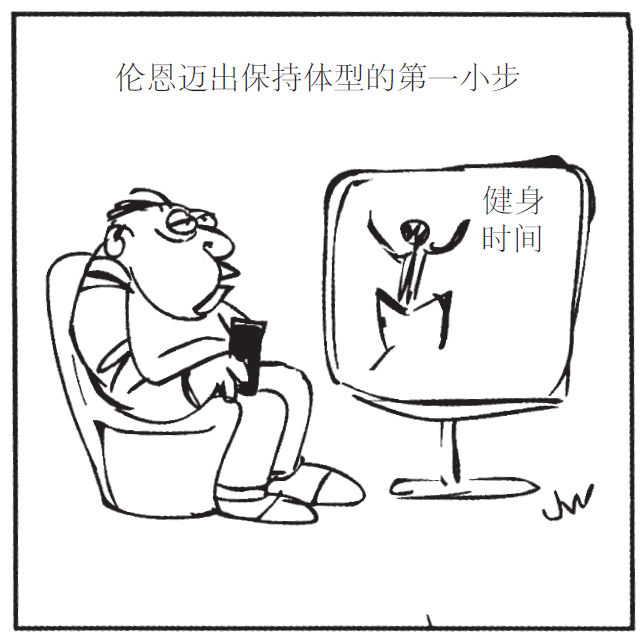

你还可以对小块任务策略的外延进行拓展，比如在通向目标的过程中设置一些有纪念意义的里程碑式节点。研究表明，这种做法的力量非常强大。根据一份由麻省理工学院（Massachu-setts
Instituteof Technology, MIT）斯隆管理学院（Sloan School of
Management）心理学家丹·艾瑞里（Dan
Ariely）和法国欧洲工商管理学院（INSEAD）克劳斯·韦坦布洛克（Klaus
Wertenbroch）于2001年所作的一项关于拖延的研究，两组相同水平的人完成同样的任务，对实验组仅给出最终截止日期，而对照组则给出了每周须完成任务的截止日期。研究结果表明，只有一个截止日期的实验组平均完成任务的时间要比预定晚12天。而设定每周截止日期的对照组平均仅比预定时间晚半天。

具像化

对于大的项目，你可以画一个类似温度计的进度表，将需要完成的任务以间隔形式在表中进行标注，并且标出目标日期。在完成每项任务后用彩笔涂出已完成的部分。把这个“温度计”放在你（最好也包括其他人）每天能看到的地方。

### 拖延以及你的“任务”清单

大多数人在处理“任务”清单时可能都曾有过拖延的经历。除了运用我们所提到的那些方法，弄清楚自己属于哪种人同样会有所帮助。大致有三种基本类型的人：

1.清教徒：这些人首先会去完成最困难的任务，然后再享受做剩下那些容易的事的过程。这些人会先吃掉一串葡萄中最小最不成熟的那颗。

2.享乐主义者：这些人首先会去做一两件容易的事，然后再慢慢开始做其他一些更复杂的事。这些人会先吃掉一串葡萄中最大最成熟的那颗。

3.赌徒：这些人会把任务写在分类卡片上，然后闭上眼，把这些卡片的顺序弄乱，然后再根据所出现的卡片顺序来做事。（不能重新洗牌！）这种做法正符合赌徒对于不可预知事件的热爱。

哪种是最好的？对你来说有效的就是最好的。把这些方法都试一遍，然后采用能让你在一天中完成最重要事情的方法。

### 接下来是什么

现在你对于战胜拖延、对于专注于将加速使你获得成功的方法有了更为深刻的理解。在第三部分，你将发现一系列能够使这一旅程更加简单更加迅捷的开创性工具。

# 第三部分　专注工具

## 第7章　如何利用“第二自我”策略

通过前面几章的学习，你已经知道应该如何利用自己的优势把精力集中到目前最重要的事情上。不同的任务要求有不同的精神状态。举个极端的例子：税单分类任务和为新产品命名的对比。好消息是无论你是否知道这一点，你其实已经拥有这些状态。通过本章的学习，你将明白怎样对精神状态进行选择以及利用这种力量来改变你对时间的运用方式。这么做的结果就是你能够最高效地将全部精力集中在所有需要完成的任务上。

### 你拥有多重性格

研究表明，每个人在不同情况下都会保持一种稳固不变性格的看法根本就是无稽之谈。我们在不同情况下会表现出不同的性格特征。同一个人在有的情况下会很慷慨，而在有的情况下可能很小气；有时会很温柔，有时会很好斗，等等。

“我们在不同情况下会有不同的表现。”

有时候我们会如何表现和我们跟谁在一起有关。即便是成年人，当和父母在一起的时候往往会表现得很孩子气，或者会表现得比较好。

一致性的两种看法

“一致性要求你今天和一年前一样无知。”

伯纳德·贝伦森（Bernard Berenson，1865—1959年），美国艺术史学家

“一致性是想象力极度缺乏的最终避难所。”

奥斯卡·王尔德（Oscar Wilde，1854—1900年），爱尔兰作家，智者

有时如何表现取决于我们所承受的压力大小。可能你有过和一位平时脾气很好的人共事的经验，当他们被逼到一定程度的时候，也会勃然大怒。事后他们可能会说，“不好意思，我刚才有点冲动”，但其实这也是他们自己，只不过这是你不常看到的不同的他们而已。

这种性格的不一致性并没有什么问题；事实上，我们在不同情况下会有不同的反应很正常。只是大多数人并不清楚他们其实可以选择反应方式，不清楚他们所拥有的选择代表了很大的潜在资本。非但如此，人们总是倾向于把他们的情绪、态度甚至行为归咎到外部因素上，他们会这样说：

■“我被他气坏了。”

■“当她用那种眼神看着我的时候，我就是没办法说不。”

■“当我的待办事项清单越来越长，我没法不抓狂。”

### 你确实可以选择

“第二自我”策略是关于决定你的众多性格中哪一条对给定情景最有效，以及让这一性格进行主导。我把这些性格称作你的“第二自我”。让正确的性格做主，你会发现自己的办事效率变得更高，并且所需承受的压力也会更少，甚至你会觉得做这些事很有乐趣。

你可以在需要对某一情形进行反应时或者计划做某一任务时对“第二自我”进行选择。首先，如果在某些情况下你的反应总是毫无建设性可言，你可以停止做出这种反应，用其他方式进行替代。这么做的一个例子就是在你愤怒的时候，“从一数到十”。在不满情绪不断上升的情况下，这给你时间考虑不满情绪是否真的有用，也给你时间重新进行反应。即使“急性子的你”想要控制场面，你还是可以选择让“坚定而冷静的你”来处理问题。

当你准备着手处理一项任务时，这也同样有效。假如你得打扫车库，但你真的不想做这件事。你宁愿四处闲逛，或者看看今天早上刚寄来的杂志。你可能会拖拉着不去打扫车库，或者你可能会强迫自己清理车库，但你还是会想着出去逛逛或者看看书要比这有意思得多。如果你做后者，这项工作很有可能会花费你更多的时间，完成得也很一般，当然也没什么乐趣可言。

你可以把“第二自我”策略运用到下列这些情景里。

■假装你将要雇用别人来帮你做这项工作。你想要这人具备怎样的品质和态度呢？这可能包括专注、集中精力、能理智（不感情用事）地判断什么该扔掉、有效率、动作快且目的性强。

■回忆你曾经表现了这所有或大多数品质的时候。这和你手头上哪些工作无关。你可以把记忆中不同的事组合起来（比如，你精神完全集中的时候和你非常理性地对待所需处理的事项的时候可能是两件不同的事）。

■现在站起来，然后让你的记忆进入那种状态。闭上双眼，花几分钟来完全投入这种状态中，这会比较有帮助。当你通过这种方式进行感受时，记住你所看到的、你所听到的（比如，你对自己说了些什么，别人对你说了些什么）以及你内心的感受。如果你对此并没有什么很深的印象，用你的想象力创造这些感受。给这个状态的自己取个有意思的名字会很有帮助。

■现在让“第二自我”来负责，做你需要做的所有事情。如果你发现自己忽然有些分神，那么赶紧打住，立即引导自己进入理想状态。举个例子，你在清理车库时发现了一些过期的杂志，你忍不住翻看起来，那么赶快停止这么做，重新集中精力，做你该做的事。

### “第二自我”类别

这里列举了一些你可能会有用的“第二自我”。

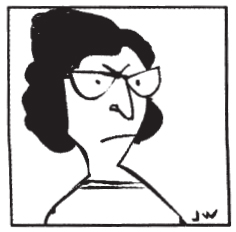

■钱眼小姐（Miss
Moneypenny）：理性、能干、保守。是准备税务、决定购置物品的好人选。

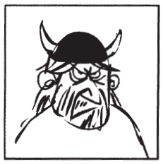

■匈奴王（Attila）：坚强，始终清楚目标所在，不屈服。如果曾经有人盛气凌人地欺负你，让你不能做自己喜欢的或者需要的事情，或者当你处理手头工作时受到很多外界的干扰，这会是很好的人选。

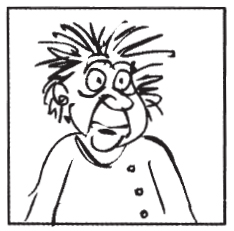

■阿尔伯特（Albert）：能够打破陈规、别出新意地想问题，不惧怕失败或他人的嘲弄。当你需要创造力时，这是很好的人选，是头脑风暴的很好选择。

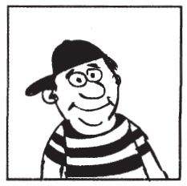

■大孩子（Big
Kid）：幽默、爱冒险、思想开放。当你发现自己对事太严肃认真时，这是个好选择。

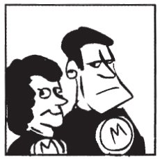

■超人（Mightyman/Mightywoman）：坚强、自信、能干。当需要信心，比如在做演讲、拨打并不太肯定的电话时，你需要这样的人选。

■哈耳摩尼亚修女（Sister
Harmonia）：温柔、善于安抚、致力于为有关人士寻求双赢局面。在和通情达理的人进行协商时的有利人选。

更多“第二自我”

如果你无法建立自己的“第二自我”，花一个上午看点动画片，然后选一个最能代表你所希望的情绪的角色。如果你需要快乐，海绵宝宝（SpongeBob
Squarepants）迟早会有用。

以上是我觉得会有用的一些“第二自我”，你可能觉得想些属于自己的“第二自我”会更有用。可能在一些情况中，你还需要变换自己的性格。举个例子，如果“哈尔摩尼亚修女”在谈判中无法取得任何成效，在必要的时候，我们就需要“匈奴王”来接管这件事！但我希望你能明白如果我们不加任何考虑地就让错误的人选来负责某件事情，结局会变得非常糟糕。你肯定不希望“大孩子”来查收税单的事，或者让“匈奴王”参与你和潜在客户的初次会谈。

从现在开始，你可以从自己的多重性格中选择合适的来对某件事情进行主管。这一过程的简略步骤如下：

1.分析手头的任务。处理这项任务需要什么品质？

2.用你的记忆或想象力创造或再造一个拥有那些品质的人，然后进入这种理想状态。给“第二自我”取个名字。

3.让“第二自我”主宰你，直到任务完成，或者直到你到达某个需要另一个“第二自我”的时刻。

4.完成这项任务，然后自觉地从这种“第二自我”中退出，进入到更典型的自我中，或者进入另一种更适合于你将要做的事的“第二自我”中。

### 试着体验一种“第二自我”

现在是时候体验这一技巧将会怎样对你起作用了。在以下横线上写出三件典型的任务，对于这些任务，你觉得换个时间会比现在处理得更好。具体的例子可能包括处理邮件、完成积压已久的行政工作、给潜在客户打电话或者开始新项目。

任务1：\_\_\_\_\_\_\_\_\_\_\_\_\_\_\_\_\_\_\_\_\_\_\_\_\_\_\_\_\_\_\_\_\_\_\_\_\_\_\_\_\_\_\_\_\_\_\_\_\_\_\_\_\_\_\_\_

任务2：\_\_\_\_\_\_\_\_\_\_\_\_\_\_\_\_\_\_\_\_\_\_\_\_\_\_\_\_\_\_\_\_\_\_\_\_\_\_\_\_\_\_\_\_\_\_\_\_\_\_\_\_\_\_\_\_

任务3：\_\_\_\_\_\_\_\_\_\_\_\_\_\_\_\_\_\_\_\_\_\_\_\_\_\_\_\_\_\_\_\_\_\_\_\_\_\_\_\_\_\_\_\_\_\_\_\_\_\_\_\_\_\_\_\_

为你将要处理每个任务的“第二自我”命名。比如，有时我发现在让大男孩处理邮件的时候，我会去看所有有趣的链接，会分神浏览一些新闻，等等。结果，一个小时后，我还是没把邮件处理完。

通常会处理任务1的“第二自我”：\_\_\_\_\_\_\_\_\_\_\_\_\_\_\_\_\_\_\_\_\_\_\_\_\_\_\_\_\_\_\_\_

通常会处理任务2的“第二自我”：\_\_\_\_\_\_\_\_\_\_\_\_\_\_\_\_\_\_\_\_\_\_\_\_\_\_\_\_\_\_\_\_

通常会处理任务3的“第二自我”：\_\_\_\_\_\_\_\_\_\_\_\_\_\_\_\_\_\_\_\_\_\_\_\_\_\_\_\_\_\_\_\_

在以下空白处，为你觉得能够更好处理该任务的“第二自我”命名。在我之前的例子中，可能“匈奴王”会更合适，因为他在处理不重要的邮件时会毫不手软。

更适合处理任务1的“第二自我”：\_\_\_\_\_\_\_\_\_\_\_\_\_\_\_\_\_\_\_\_\_\_\_\_\_\_\_\_\_\_\_\_

更适合处理任务2的“第二自我”：\_\_\_\_\_\_\_\_\_\_\_\_\_\_\_\_\_\_\_\_\_\_\_\_\_\_\_\_\_\_\_\_

更适合处理任务3的“第二自我”：\_\_\_\_\_\_\_\_\_\_\_\_\_\_\_\_\_\_\_\_\_\_\_\_\_\_\_\_\_\_\_\_

最后，在下面的空白处写出你觉得更有效的“第二自我”将会如何处理任务。如果你觉得有必要，可以花点时间闭上双眼，真正进入角色。继续拿我的例子作比，“匈奴王”会立即删除垃圾邮件，然后迅速将其他邮件整理到文件夹中，以便日后在合适的时间进行处理。在实际回复任何信息之前，我可能想要转换到一种不同的“第二自我”，因为“匈奴王”总是很直接。

新的“第二自我”将会如何处理任务1：\_\_\_\_\_\_\_\_\_\_\_\_\_\_\_\_\_\_\_\_\_\_\_\_\_\_\_\_\_\_\_\_

新的“第二自我”将会如何处理任务2：\_\_\_\_\_\_\_\_\_\_\_\_\_\_\_\_\_\_\_\_\_\_\_\_\_\_\_\_\_\_\_\_

新的“第二自我”将会如何处理任务3：\_\_\_\_\_\_\_\_\_\_\_\_\_\_\_\_\_\_\_\_\_\_\_\_\_\_\_\_\_\_\_\_

### 雇用你自己来做顾问

能在多种情况下依然保持有效的“第二自我”身份是顾问。通过假装你是自己高薪聘请的顾问来对如何使生活回报最大化进行评估，这能让你对自己的生活获得一种全新的看法。用一种中立的、质疑的态度来对你正在做的事以及做事的方式进行分析，问题的症结在哪里，哪些方面需要更多或更新的资源，以及其他。

这在你生命中的任何时期都有效：成果可能是赚取一定数额的金钱，或者和你的孩子建立很好的关系，或者使身材变得更好。通常情况下，你总是用“关联”的眼光来看待自己的生活。也就是说，通过你自己的双眼看待身边的一切。当你用一种“抽离”的状态来重新审视自己的生活，也就是说好像从外界来看待你的生活，就像在看一场电影，忽然间你会获得一种全新的画面。要想让这一画面真实形象，你可以站起来，闭上双眼，然后用你的所有感官再造这样一个人。举个例子，如果在你的想象中，这位顾问的个子比你要高，你可能会注意到自己的姿态有些转变。如果你觉得顾问应该不像你自己那样情绪化，你可能会感觉自己的精神状态变得更加冷淡。

就像其他顾问一样，注意什么起作用，什么不起作用，需要什么，什么对其他人有用，然后写下你的建议。

“建议是我们已经知道答案但却希望我们并不知道时所渴望得到的东西。”

艾丽卡·琼（Erica Jong），美国作家

然后再回归到相关的状态（也就是正常情况下的你自己），阅读这份报告然后决定你想要接受这些建议中的哪些，并开始将这些建议付诸行动。定期召集顾问来对你的做事方式以及确实有效的变更进行评估。你甚至可以把每个月的第一天约定为和顾问见面的日子。

### 创造你的终极敌人

一般来说，积极地想问题比较好，但有时策略性的消极思维也是有所裨益的。你是否曾经注意到人们在对敌作战时是多么地全身投入？敌人越具体越好。你可以通过创造“第二自我”的最终变体来利用这种力量：可能会阻止你前进的任何事物的象征，一个终极敌人。

现实生活中，在大多数情况下，这都不是另一个人，而是你自己的某一方面。比如，如果你正试着要减肥，要塑造一个好的身材，很可能饮食习惯或者健身安排会成为你成功的拦路虎。你可以为这个“敌人”创造一个形象。你可以把它想象成Blimpo——卡通片里非常肥胖非常懒惰的一个角色。Blimpo讨厌你进行锻炼，讨厌你拒绝巧克力的诱惑，因为他想要把你变成另一个他自己。

下一次，当你受到诱惑时，想想你所创造的这个敌人，让Blimpo进入你的大脑。做出正确的选择，看着Blimpo变得更瘦些，享受敌人被打败给你带来的满足感！最妙的是这一切都只是你的想象。你不需要把这件事告诉任何人，他们所能注意到的只是你做得比以往都要好。

### 接下来是什么

通过运用“第二自我”策略，你将能更好地控制自己的行为。当然在这个过程中，你必须和其他人打交道，在下一章，你将学会寻找同盟，学会如何和同盟一起工作以及像大师一样和人谈判。

## 第8章　如何管理其他人

到目前为止，我们所关注的都是你的行为模式以及你所能运用于自身以加速目标实现的技巧，除此之外，身边人的行为方式对你造成的影响也是不容忽视的。通过本章的学习，你将了解如何克服身边那些人的消极影响并取得他们的支持。

### 我们都需要支持

缺乏身边最亲近人的支持，这对你所努力的事而言会是极大的拖累。举个例子，你的另一半、合伙人或者父母对你的目标不屑一顾或者充满怀疑。你能让他们改变模式吗？嗯，当然，但是你只能通过先改变自己的模式，从而使他们的模式产生变化。有句名言对此进行了很好的阐述：“我们通过训练他人以使自己获得正确的对待。”

当其他人嘲笑你的目标时，你可以这么说，“通常我会试着假装自己没有听到这种评论，但无论你是不是故意这样做，我还是决定告诉你，这种话让我很难过。现在你可以决定是否还要继续开那种玩笑，或者严肃地对待我的目标，因为这对我而言很重要。”

如果你坚持采用这种新的处理方式，其他人不太可能继续之前的做法，尽管他们的第一反应可能会是怒气冲冲地走开，或者生气，或者做些不太积极的举动。但至少你打破了旧的模式，并且表明改变是可能的。顺便说一声，很可能那个人会试着把你拉回到以前的模式中，并且他会不止一次地这样做，所以你自己必须很坚定。

当然，你必须对其他人所看重的东西表现出同样的尊重，即使这件事情对你毫无吸引力，因此在开始试着改变其他人之前，你需要确保自己不会做类似的事。道歉从来不是一件容易的事，但如果你意识到自己确实对目前的关系状态负有部分责任，并且想要改变这种状态，那么这会是一个好的开始。

你没法保证别人会表现得和你想要的一样，但通常你惯有模式的一个小小改变会对他人的行为产生正面的影响。你可以像对待自己其他目标一样对待这一过程，尝试不同的方法直到找出真正有用的方式。

如果你想获取某人的支持，把他的名字写在下面的横线上。

\_\_\_\_\_\_\_\_\_\_\_\_\_\_\_\_\_\_\_\_\_\_\_\_\_\_\_\_\_\_\_\_\_\_\_\_\_\_\_\_\_\_\_\_\_\_\_\_\_\_\_\_\_\_\_\_\_\_\_\_

你会对这个人说些什么让他们更加支持你？

\_\_\_\_\_\_\_\_\_\_\_\_\_\_\_\_\_\_\_\_\_\_\_\_\_\_\_\_\_\_\_\_\_\_\_\_\_\_\_\_\_\_\_\_\_\_\_\_\_\_\_\_\_\_\_\_\_\_\_\_

### 为什么人们会消极

《个人及财务机密》（Personal＆Finance
Confidential）实事通信撰稿人、培训专家朱利安·范因斯坦博士（Dr.Julian
Feinstein）指出，这个世界上的人基本上可以分为积极人士——那些希望获胜的人，和消极人士——那些希望正确的人士。

万能回复

美国作家及播音员亚历山大·伍尔科特（Alexander
Woollcott）对其节目持有不同见解的听众来信总是这样回复：“尊敬的先生/女士，你可能是对的。”这通常都能让听众不再继续纠缠这个问题。

这是个很棒的见解。那些对新事物或者不常见的事物总是表现出消极态度的人对这些事并没有多少兴趣，他们只是决定不要犯错。因为很多新事物最终都不能成功，要想保持正确，最好的做法就是对新事物采取消极态度。当然那些领导人、有远见的人以及下定决心的人会一直坚持做某件事情直到最后成功，这正是为什么这类人总是很反感态度消极的人群。

如果生活中确实有人拒绝改变他们对于你正在从事的事所持有的消极态度，最好的做法就是直接无视他们。但一定要确保生活中有人愿意分享你的热情和志向。如果你的朋友没人喜欢你的想法，可能是时候你要去结交一些新的朋友或者同事了。专业团体、联络小组以及其他一些协会是认识这类人的理想场所。

如果你觉得朋友圈里多些支持你的人会有帮助，那么写出你会在哪些地方遇见这些人。

### 你是否知道人们想要什么

想要他人给你所希望得到的东西，秘诀在于帮助他人获得他们想要的。人们最希望得到什么？日复一日，绝大多数人都在渴望着同一样东西：认同感。我们都希望能够被他人欣赏、关注，希望自己与众不同。当我们还很小的时候，我们就已经在渴望着同样的东西：“妈妈，看看我！”“爸爸，看我能做什么！”只不过随着渐渐长大，我们学会了要表现得冷静，不去过多地显露出我们对于关注的热切渴望。如果你学会了认可他人，并且能始终如一地要求自己这样做，你不仅会被认为是非常有魅力的人，并且你会发现人们都很乐于帮你实现你的目标。

“我们都渴望被欣赏、被关注，希望自己与众不同。”

### 腼腆学生的案例

如果你对认知的影响力持有怀疑，那么不妨听听这个故事。这是曾接受已故催眠治疗大师米尔顿·艾瑞克森（Milton
Erickson）治疗的一位年轻女士讲述的故事。艾瑞克森因其不同寻常又非常有效的治疗方法而闻名，他所运用的技巧后来成为神经语言程序学（neuro
linguistic
programming）基础的一部分。一位刚考入大学的腼腆女生拜访了艾瑞克森。她的情绪非常低落，她感觉非常孤独。艾瑞克森先生给她开了一剂处方：每天给自己的同学一个真实的赞美。这个赞美必须真实，这意味着她必须把注意力放在他人身上，并找寻她所真正喜欢的东西，这样她的赞美就不会被认为仅仅是奉承。

### 如何认可他人

极具讽刺意味的是，尽管人们最想得到的东西并不需要我们付出什么，但大多数人对此却非常吝啬。可能我们担心表扬或欣赏感觉会不真诚，或者这样做会让我们感觉自己显得渺小。这并不对，当然，如果你能战胜自己天生的沉默，你会惊奇地发现这会给你的社会关系带来怎样的改善。以下是给予人们所希望认可的一些方法。

1.学会倾听。大多数情况下，当有人和我们说话时，我们会在听到一半的时候就走神，开始想要怎样对我们听到的内容进行评论，而不是注意听别人把事情说完。不要这样做，注意用心倾听他人所说的事直到结束。你依然可以很快给出答案或者评论。第9章对这一点进行了更详细的阐述，专注于语言卓越的力量。

2.增加目光接触。大多数人在倾听他人说话时都会保持很好的目光接触，但当他们自己说话的时候，情况就不一样了。当然，你想要自然的而不是令人不悦的凝视，即便如此，如果你能增加和对方目光接触的时间，哪怕只增加25%，谈话效果会有很大不同。如果直视他人的双眼会让你觉得紧张，你可以把目光放在双眼中间，或者轻轻地让你的目光在他们左右眼间移动。不过，不要过多地把注意力集中在这件事情上，以免无法注意别人所说的话。

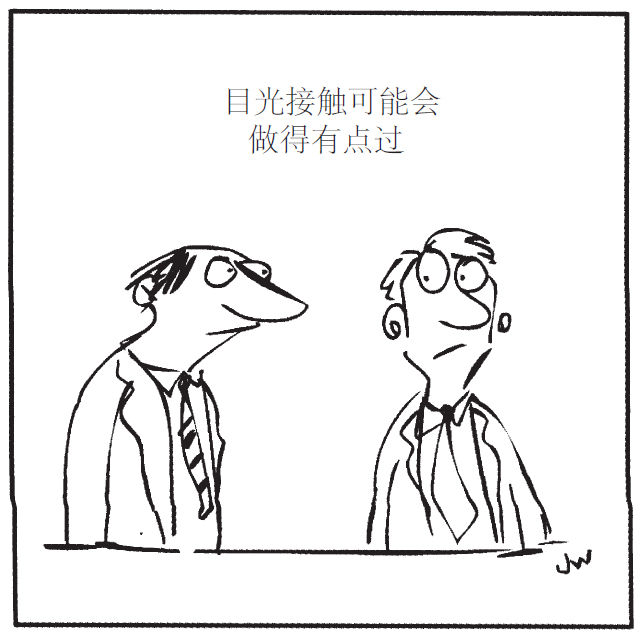

3.以姓名称呼对方。我并不是建议你像肥皂剧里所表演的那样每句话都要以他人的姓名来开头，只是很随意地在谈话中偶尔提到。最自然的做法就是在和人刚见面打招呼时以及道别时提到他们的姓名。虽然这种做法很没创意，不过人们最爱听到的声音确实就是自己的名字。

4.给出真诚的赞美。这可以是他人姣好的外貌、一件衣服、一件别人刚做的事情或者其他任何事。如果你真心觉得这值得赞美，这些话听起来就不会让人觉得虚伪，即便在你习惯这么做之前还是会感觉有些不真实。你不必做得太过火。这可以是简单的赞扬，比如“那双鞋真好看”，或者“你在会上提出的观点很正确，这对事情的进展非常有帮助”。

找寻赞美

如果想出赞美的内容这件事情对你而言有困难，那就花些时间考虑哪些赞美会让你自己感觉很好，你想要得到怎样的赞美。这些赞美也是别人想要获得的。

■当有人做了你想让他们去做的事，要及时注意到这一点并且立即加以评论。研究表明，动物和人类在某些方面都是一样的：受到奖励的行为会倾向于再次发生。对动物而言，这种奖励是食物，对人类而言赞美或认可就已足够。这是截至目前规范他人行为最有效的方式。一个心理学班的学生决定在他们的教授身上测试这一理论。他们的课程被安排在一个很大的讲堂里，教授在上课时习惯于在讲台上来回踱步。每当他走到讲台左端，学生们都会全神贯注地看着他听课。每当他走到讲台右边，学生们就不会像之前那样看着他，他们会靠在椅子上，或者表现得对讲课内容没什么兴趣的样子。在上了几次课后，教授就不再两边踱步了，而是定定地站在讲台左端上课，他丝毫没有注意到自己在做些什么，或者为什么要这么做。

■寻求建议。人们都爱解决他人的问题，可能因为这样可以让注意力不再集中在他们自己身上。当你向他人征询建议时，这意味着你看重他人的智慧和经验，这对别人来说就是一种奖励。在征求别人意见时，你需要保证自己所选择的事情是自己确实希望采取别人意见的事。至少有时是这样，在接受别人指导后，切记要向对方表示感谢。

■说谢谢。再重申一遍，不要等到重大事情发生后再表示感谢，这可以是简单的一句“谢谢你在会上对我表示支持，这让我的工作容易很多”，或者“谢谢你给我机会设计网站，相信我们一定能创造出一个特别的作品”。

■用笔和纸。在电邮时代，手写的便条或者信件真的会创造出意想不到的效果。美国维克森林大学（Wake
Forest
University）的一项实验对国会议员心目中电子邮件的分量进行了研究，结果表明：电子邮件在国会议员心目中分量很轻。在他们的心目中，这些电邮和请愿书、群发邮件的效果几乎相同，令他们印象更为深刻的反而是私人信函（亲自到访会更有力）。无论你是给好朋友写信、让别人接受某个新的观点抑或是业务往来，想象下如果是私人信函，用打字机或者打印机打印的，但是附有手写的附记，这会产生怎样不同的效果。

### 你将使用哪种策略

在以下策略中，选择你现在要使用的策略并做上对勾标记。

■更仔细地倾听。

■增加目光交流。

■多提到他人的姓名。

■多赞美他人。

■强化理想行为。

■要求建议。

■多说谢谢。

■使用手写消息。

在未来24小时内，你能在什么情况下使用这些策略中的一项或者多项？

### 开始创建彼此欣赏的社会

认可他人的方式有一种特别强有力的变体，这有点偷偷摸摸的感觉。刊登于《快速公司》（Fast
Company）杂志2002年2月刊的一篇文章中，哈丽雅特·鲁宾讲述了以下故事。据说波兰军队中的两位女士私下做了一个约定：她们会互相帮助以达到彼此都晋升的目的。当玛格达参加会议，她一定会在讨论时对特丽莎进行赞扬。而当特丽莎写报告时，她会推荐玛格达承担新的责任。没过多久，其他人都在说，“我听说特丽莎非常聪明”，或者“有考虑让玛格达来担任某某职位”。

找一个你真正欣赏其工作能力的人，和他做一个类似的约定。当然，这在你们双方之间不存在竞争关系，约定仅限于你们之间，没有其他人知道，互相的赞扬在不过于张扬的情况下效果最好。

你可能会考虑和谁建立这种关系呢？

做些不一样的事情

要想了解更多使业务或服务更出彩的创造性方式案例，维京出版社（Virgin
Books）出版的由我撰写的《做些不一样的事》（Do Something
Different）一书提供了100个案例分析。

### 接下来是什么

本章提到的所有技巧有一个共同点：它们为你和为实现梦想所需要获取支持或帮助的人创造了一个双赢的局面。另外一种获取理想效果的方式是专注于你在和他人说话时以及和自己说话时的语言，这将在下一章谈到。

## 第9章　如何专注于语言以取得非同寻常的效果

上一章我们谈到了很多让他人配合你，以助你实现目标的方式。一个关键的技巧是说服力，而最强有力的工具就是你所说的话。这是另一种已经被证明有用的技艺，只是你可能并不十分了解要怎样不出意外地利用它。通过阅读本章，你将明白如何在需要的时候使用这门技艺。

### 你已经是一名有说服力的沟通大师

如果你对自己已经拥有使用专注语言的能力仍持有怀疑，考虑以下内容：

■你是否曾经让父母相信你只是在朋友家学习，而实际上你却\_\_\_\_\_\_\_\_\_\_\_\_\_\_\_\_\_\_\_\_\_\_\_\_\_\_\_\_\_\_\_\_？

■你是否曾经成功说服某人和你约会或和你结婚？

■你是否曾经成功阻止过某个孩子，让他不再做危险的事？

■你是否成功通过工作面试？

在上面那些情况下，我们都会变得很有说服力，因为我们非常清楚自己想要怎样的结果，并专注于这一结果。我们会本能地和对方建立融洽的关系，并且会运用一切我们觉得最有可能成功的方法。通过学习如何像这样更加专注于你的沟通方式，你会取得一个有力的成功工具。

### 多数交谈存在的问题

我们喜欢把交谈看作一种交换的过程，在这一过程中，我们听取他人的谈话，和他人分享我们的想法和感受。这应该是件很简单的事，但通常在谈话或商业会谈结束后，我们会觉得自己的想法并未被对方理解，我们常常会感到失望和挫败。而对方也常常会有相同的感受。为什么交谈会这么困难？

一个问题是我们总是忽视人类沟通的现实。举个例子：乔治和比尔是同事。星期一早上他们在公司的茶水间相遇，乔治发现比尔晒得有点黑。

乔治：嘿，比尔，有点晒黑了嘛？

比尔：是啊，我和简带儿子们去湖边玩了。这是我们全家第一次外出露营……

这时候，乔治听到了触发词“露营”，于是开始构思自己对于这一主题想要说的话。正好比尔还继续说着话，这让乔治有时间思考。

比尔：……而不是外面的厕所，哈哈，但是……

乔治准备好了，于是他打断比尔。

乔治：我小时候经常出去露营。我爸爸以前是童子军教练，所以我们能……

乔治的插话让比尔有些不高兴，毕竟比尔还没告诉乔治自己抓到的那条鱼。哦，好吧，乔治总会要休息的……

乔治：所有那些徽章，我还都收藏着呢，只是不太记得放在哪儿了。（他喘了一口气）

比尔比乔治要老练些，因此他决定把乔治刚刚说的话和自己即将说的话通过某种方式联结起来。

比尔：你在童子军训练营里一定抓过鱼吧？这周末，我抓到……

谈话会这样继续下去。大多数交谈实际上并不是对话，而是交叉进行的独白而已。你是自己生活中的明星，其他人只不过是配角而已。当然在别人的生活里，他们也是自己的主角，你也只不过是帮衬的配角。我们都在不同的剧本中表演，难怪交谈会困难！

“我们都在不同的剧本中表演，难怪交谈会困难！”

让我们来看看一些能让你更有效沟通的语言使用和相关行为方式。对于每种情况，我会列举些具体的例子，因为“沟通”是一个抽象词汇，只有在你明白自己想要说些什么以及对谁说的情况下才有意义。一旦你清楚这一点，你便能决定哪种方式最有效。这些技巧对家庭生活、朋友交往、咨询建议和商业往来都有效。继续看下去，可能你想要考虑使用它们对自己生活中的哪些方面的帮助会最大。

火星和金星的神话

最近几年，人们普遍认为和男人相比，女人说得更多，而男人更喜欢打断对方的谈话；以及女人会更多地谈到感受和关系，而男人对事实说得更多；女人的对话更加具有合作性，而男人的对话更具竞争性。然而，美国麦迪逊市威斯康星大学心理学家珍妮特·海德博士（Dr.Janet
Hyde）针对男性——女性交流进行了一项元认知分析研究，她发现不同性别人群在交谈的数量和质量方面并无明显不同。

“性别相似性假说”（The Gender Similarities
Hypothesis），《美国心理学家》（American Psychologist），2005年9月

### 利用融洽关系建立联系

人们常用来暗示自己与他人之间拥有良好关系的一句话是，“我们是天作之合”。如果你和别人之间有这样一层关系，那很可能这人会为你做任何你想要他做的事情。虽然这种关系的建立常常是自发的，但技巧还是能帮助更好地建立这种关系。

研究表明，融洽的关系主要基于相似性或者对于彼此间相似性的感知。这种相似性可能只适用于某一方面。举个例子，你喜欢一起去看球的人肯定和你一样是运动迷，但同一个人，可能不会和你一样对老电影也情有独钟；但当你们一起看球或者谈论足球时，你们之间就会拥有很多默契和融洽。

也就是说，你可以通过寻找自己和他人之间的共同兴趣，从而在你们之间建立密切的关系。那么大多数时候，人们最感兴趣的究竟是什么呢？对了，是他们自己。所以只要你对他们真正感兴趣，你可以和任何人建立这种良好的关系。我想要强调一下“真正”。真实的兴趣比假装出来的兴趣对会双方更有益。以我的经验，只有精神病患者和演员才能假装得很好。

你可能会在哪些时候想要建立这种和他人间的融洽关系呢？一般来说，在和陌生人会面时以及你想要别人接受你的信息时，你会想要和对方建立这种关系。你的信息可能是你觉得对方很有魅力，想要和对方约会，或者你有很棒的产品，你觉得对方应该购买。

学会倾听

如果你觉得认真倾听是件困难的事情，试试以下做法：

■在你的头脑中，对他人所说的话进行重述。

■试着评估别人会怎样看待自己所说的话，而不是自己想一个答案。

■给自己规定在一定时间内注意倾听，开始可以是五分钟。逐渐延长这个时间段，直到倾听成为很自然的事。

所有情形之下，人际关系的相处都会有一个“破冰”期，在这期间建立融洽的关系至关重要。首先，实实在在地用心倾听，打破前面例子里比尔和乔治之间的那种模式。让谈话继续，而不是让触发词进入你自己的世界里（这时候，你只是用了一半的心思在听）。听人们所说的话，与此同时，观察他们说话时的那些非语言线索，以了解他们对于所形容的事物有怎样的感觉。给出语言和非语言（点头、微笑等）形式的反馈，以表明你理解且和对方的思维同步。

一旦你开始真正倾听，你会发现对别人真正产生兴趣并不像过去那么困难。让我们来看看约见潜在客户的例子。把专注的焦点从自己的销售兴趣转移到了解你的生意伙伴上。问些问题，并仔细倾听他们的回答。如果他们的需求和你所提供的物品间有很好的联系，那么你们的对话将自然进展到介绍你的产品和服务。

### 通过语言匹配建立更好的关系

倾听还将给你带来源自神经语言程序学领域关于融洽关系策略的有用信息。这技巧就是和你所交往的人进行匹配。你可以进行匹配的其中一项就是他们用来代表自我世界的语言。

主要代表类别是视觉（图像）、听觉（声音）和感觉（感受）。在倾听他人说话时，相较而言，你会发现对方更倾向于使用以下分类中的某一类。

■视觉型人群会说这样的话——“清楚了”，“我懂你的意思了”或者“给我点时间再看看”。

■听觉型人群会说这样的话——“我听到你所说的话了”，“这听起来很耳熟”或者“我喜欢那声音”。

■感觉型人群会说这样的话——“我有个大概的想法”，“那些数据很有力”或者“我的直觉告诉我，你是对的”。

大多数人会使用一种组合，有的人还会使用一些味觉的句子——和味道相关，或者嗅觉——和气味相关，但基本还是以上面所列举的三种为主。你可以在看电视采访时注意这方面的信息，把这当做一种练习。

如果你在语言方面和对方保持这种一致性，你们的步调将会更加一致。如果是对大众，那么在谈话时，你需要使用所有种类的语言；如果你只使用自己最喜欢的一种语言方式，你的某些听众就不会和你产生共鸣。

### 练习使用表象系统

观察、协调或体会，花点时间考虑自己的喜好。如果你无法对此进行确定，默默在内心对你所做的事进行描述或者解释。你很快会注意到自己使用的语言会泄露你所热衷的类别。写下你更喜欢的表象系统（视觉、听觉或感觉）：

\_\_\_\_\_\_\_\_\_\_\_\_\_\_\_\_\_\_\_\_\_\_\_\_\_\_\_\_\_\_\_\_\_\_\_\_\_\_\_\_\_\_\_\_\_\_\_\_\_\_\_\_\_\_\_\_\_\_\_\_

现在在你的脑子里重复这段描述，但这一次使用其他两个主要系统的一些措辞。比如，假设你主要是视觉型的人，你所描述的第一句话是，“当和新客户合作时，我试着从这个过程中看出他们真正需要的东西”。假设你之后转换到使用听觉型措辞，你可能会说，“当和新客户合作时，我会从过程中听取他们真正需要的东西”。如果你转变到感觉模式，这可能会是，“我试着感受他们真正想要的东西”。写下你的选择：

选择1：\_\_\_\_\_\_\_\_\_\_\_\_\_\_\_\_\_\_\_\_\_\_\_\_\_\_\_\_\_\_\_\_\_\_\_\_\_\_\_\_\_\_\_\_\_\_\_\_\_\_\_\_\_\_

选择2：\_\_\_\_\_\_\_\_\_\_\_\_\_\_\_\_\_\_\_\_\_\_\_\_\_\_\_\_\_\_\_\_\_\_\_\_\_\_\_\_\_\_\_\_\_\_\_\_\_\_\_\_\_\_

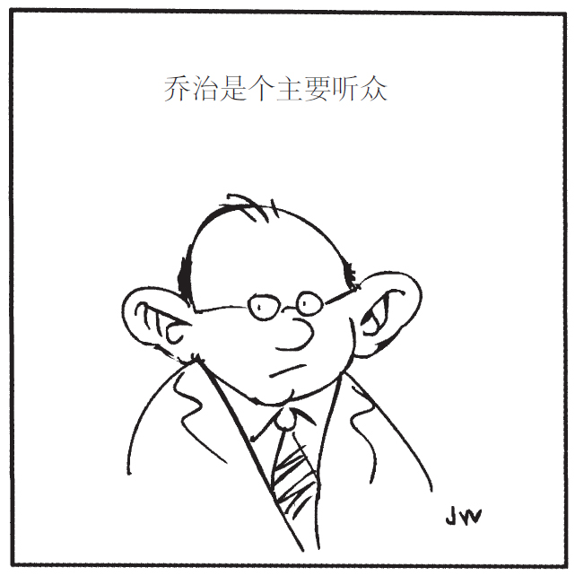

### 用先跟后带的方式引导对话

还有另一种神经语言程序学概念，即先跟后带，这非常有利于建立良好的关系，并且有助于将消极的谈话转变为积极的谈话。让我们举个例子：一个朋友打电话给你，你们的交谈如下：

对方：我心情糟透了！

你：开心点！阳光这么明媚，鸟儿都在歌唱，你应该为活着而高兴！

这种谈话不会有效果，对吗？当一个走极端的人遇到另一个走极端的人，什么都不会改变。如果有的话，那一定是使另外那个走极端的人情况变得更糟。在我们的例子里，这另外的一个人现在更多了一个让他心情不好的理由：你丝毫体会不了他的感受。让我们再试一次。

对方：我心情糟透了！

你：（充满同情的声音语调）发生什么事了？

对方：我这个星期又胖了两公斤。我真是一点意志力也没有！

你：控制饮食太难了。

对方：上个礼拜我生意上有三个饭局，我吃得太多了。

你：嗯，是啊，在同一个饭桌上吃饭，你很难不和别人吃一样的东西。那你下个礼拜还有饭局吗？

对方：只有一个。我要请一个潜在客户吃饭。

你：日本菜很健康而且热量也不高，他们会不会同意去日本餐厅用餐？

对方：这主意不错，我可以问问看。

这段对话很简短，不过你还是能看出这段对话所用的模式。首先你通过自己的声音和措词来表达同情。然后你找到一个真实而积极的方面，并将精力集中在这方面（在这种情况下，就是下周只有一次商务宴请；在现实生活中，发现积极方面的时间可能会比这更长）。然后你接着看看一些有用的可选方案。有时候，这最后一步可能不是那么必要；对方可能已经有其他可供选择的做法，他们需要的只不过是一点同情。

完善你的跟进方式

假如你无法捉摸他人的情绪，试着在姿态以及举手投足方面和对方保持一致（当然，要通过一种巧妙的方式），然后逐渐让你的姿态朝更加符合你想要的对方应具有的情绪方面转变。如果你做得好，对方也会开始改变他们的姿态。

让我们来看看另外一个简短的案例，这是个销售场景。

客户：这些车都太贵了。

销售人员：不见得。这些车都物有所值，一分钱一分货嘛！

和前面的例子一样，这种做法不太可能会成功。换一种说法看看。

客户：这些车都太贵了。

销售人员：现在物价飞涨，什么都比以前要贵，不是吗？

客户：我想买辆价格便宜点的车。

销售人员：说实话，短期来看，这主意好像不错。但长期来看，还是买贵点的车更省钱。

客户：这话怎么说？

然后销售人员可能会谈到车辆折旧、油耗、融资计划或者其他一些会让这辆车看起来物有所值的内容。

首先你需要建立起你是他们同盟军的地位，你能理解他们的情况。然后再逐渐地重新专注于谈话的内容。要注意自己的行为方式不要超出对方可接受的范围。一旦发现对方发出抵触信号，后退一步，和对方保持步调一致，然后再小心地慢慢向前。最终你把双方的谈话引导到有利于自己目标的方向上。

### 用重新架构的力量说服他人

重新架构意味着用不同的方式看待事物。这和打比方、讲故事有些类似，通过这种方式，同一件事经过重新架构就像一个新的故事。比如，如果玻璃杯有一半是空的，那么另一半一定是满的。这里是谈话中重新架构的一个例子。

玛丽亚：我妹妹一直对一个有关个人发展的讲座赞不绝口，这个周末又有这个讲座。你想不想参加？

特德：我不知道。在什么地方？什么时候？

玛丽亚：这个周末。在伯明翰。我们必须早上6点从伦敦出发。

特德：星期六早上6点起床？算了吧！

玛丽亚：是啊，确实有点早。当然这只是一个早上而已，但这个周末会改变你的整个人生。

特德：改变我的人生？怎么改变？

这里的导火索是早上6点。可能特德当时立刻在心里勾勒出一幅要在早上6点起床的画面，他一点也不喜欢这个感觉。然后玛丽亚对这个话题通过另一种方式进行了重组，把整个事件放在更大的概念下来谈：通过一天的早起改变一个人的人生。这足以让特德对此重新萌发出兴趣并且想要了解更多的信息。

举个父母都很熟悉的孩子不想上学的例子。你可以换个说法来对这个概念进行重新架构，“我敢说其他孩子一定觉得今天的美术课特别有趣，用手指画画。我猜你最好的朋友苏西肯定会自己吃饭，可能她会找其他人一起玩。”突然之间，起床的需要变得很迫切，也更具吸引力。

用数量进行重组

广告人用于重组的典型方式之一就是对大的事物进行分解描述（“每天的花费不过一杯咖啡而已”），或者用积少成多的方式描述小事物（“到年底，你的积蓄将能让你为全家购买圣诞礼物”）。如果你试着要在有关时间或金钱数量方面说服别人，考虑一下通过哪种重组方式将会更有效。

### 重组练习

想出你希望说服别人的一件事。这可以是私人的，也可以是生意上的事。在下面写出来：

\_\_\_\_\_\_\_\_\_\_\_\_\_\_\_\_\_\_\_\_\_\_\_\_\_\_\_\_\_\_\_\_\_\_\_\_\_\_\_\_\_\_\_\_\_\_\_\_\_\_\_\_\_\_\_\_\_\_\_\_

现在想出一种你可以对这件事进行重组的方式，这种方式能让这件事在你所希望说服的人面前更具吸引力。

\_\_\_\_\_\_\_\_\_\_\_\_\_\_\_\_\_\_\_\_\_\_\_\_\_\_\_\_\_\_\_\_\_\_\_\_\_\_\_\_\_\_\_\_\_\_\_\_\_\_\_\_\_\_\_\_\_\_\_\_

### 用比喻和故事来专注于你的交谈

所有伟大的宗教作品，像《圣经》（Bible），都会运用比喻和寓言来支持其观点。讲故事可以非常有用。让我来给你举个例子，这是我最喜欢的禅宗故事。

一个老和尚和一名小学徒经过一个村庄。他们来到一条汹涌的河边，发现有个年轻的少妇站在河边不敢过河。老和尚背起少妇，带她过了河。少妇对他千恩万谢，之后他们各自上路。接下来的三天，小学徒坐立不安，并且越来越焦躁。最后老和尚问他为什么如此不安。“师傅，”小学徒说，“你知道我们是不能和女人有身体接触的！”“噢，”老和尚说，“那个河边的女人。我三天前就已经把她放下了……你还背着她么？”

我敢说没人能有更优雅更有力的方法来说明这一点！

比喻的妙处在于听者不得不弄清楚它的含义，把它和自己的生活或者所讨论的话题进行联系。通常这都发生在潜意识中，因此会给人们留下比较深刻的印象。

长期以来，演讲者都在使用比喻和寓言故事，看看第16任美国总统亚伯拉罕·林肯（Abraham
Lincoln）、英国政治家及作家温斯顿·丘吉尔（Winston
Churchill）或者其他一些雄辩家的例子，便可见一斑。除此之外，比喻还很有效，因为它们不仅寓意深远而且极具娱乐效应。

比喻不一定是完整的故事，它可以是一个短语或者一句话。比如一个同事觉得谈判进入了僵持阶段，没有再进行下去的必要。你可以这样说，“是的，这感觉就像撞上了一堵墙。我很好奇下面是不是有什么地道能穿过去。”这样简单的一句话，可能就会让同事不再坚持之前的策略，转而考虑其他方法。

下一次当你需要表明立场，但又担心直接说出来可能会遭遇抵触，那么用比喻的方法来带出这个话题。避免想要解释比喻所表达含义的意愿，否则这种方法的价值将不复存在。

### 练习运用比喻

想出一个你希望传达出的信息内容（这可以是你在练习表象系统时曾经用到的，也可以是新的）。在下面把这个信息写出来：

\_\_\_\_\_\_\_\_\_\_\_\_\_\_\_\_\_\_\_\_\_\_\_\_\_\_\_\_\_\_\_\_\_\_\_\_\_\_\_\_\_\_\_\_\_\_\_\_\_\_\_\_\_\_\_\_\_\_\_\_

现在想出一个可以让别人更易理解或关联该种情形的比喻、故事或者短语。如果你实在想不出，想想是不是可以从著名的民间传说或者童话故事中提取素材。比如《三只小猪》（The
Three Little
Pigs）的故事讲述的就是准备工作，《金发姑娘和三只熊》（Goldilocks and the
Three Bears）的故事讲述的是正确的方法。在这里写出来：

\_\_\_\_\_\_\_\_\_\_\_\_\_\_\_\_\_\_\_\_\_\_\_\_\_\_\_\_\_\_\_\_\_\_\_\_\_\_\_\_\_\_\_\_\_\_\_\_\_\_\_\_\_\_\_\_\_\_\_\_

### 用“三问”技巧消除对立

有的时候，你所提出的观点会遭到反对，这是再平常不过的事情。“三问”技巧的目的就是阻止对立的过快恶化，并给你提供可以用来改变自我定位基础或者改变他人观点的信息。

这个技巧很简单：在反对他人观点之前，至少提出三个问题。

让我们来看一个编剧和制片人之间的例子。

制片人：我不喜欢你这个剧本的结局。

编剧：随着剧情的发展，产生这样的结局根本就是必然！

制片人：是的，但我就是觉得不好。

编剧：你是第一个说这话的人！所有人都喜欢这个结局。

我可能创造了一个比制片人通常所遇到的编剧都要蛮横得多的人，但你仍能看出这是一个很常见的模式，这种谈话毫无结果。让我们来看看如果问三个问题，这会起到怎样的作用。

制片人：我不喜欢你这个剧本的结局。

编剧：我知道了。那具体是哪些内容，你觉得不太好呢？

制片人：我就是觉得那个女人不应该那么演。

编剧：嗯，那挺有意思。她所做的什么事让你觉得不太对劲？

制片人：她拿起了一把枪，然后走到街上。我的意思是，她怎么就突然知道使用枪了？

编剧：我明白了，也就是说你觉得我们在之前的剧情中没有对这一细节交代清楚？

制片人：对！

编剧：那么，我们可以对前面的剧情进行些修改，表明她能够使用枪。可能她父亲以前一直带她去打猎，或者她参加了自我保护课程类似的一些内容。

你可能会讶异于很多时候人们最开始所说的一些话并不是他们真正想表达的内容。问至少三个问题，这将帮助你了解他们的真实意图，然后你便可以对此进行回应。多问三个问题，这可以不让谈话立刻转变为一场战斗。你可以给人留下非常通情达理的印象，这对于之后的讨论将会非常有帮助。

### 如何打破僵局

有时候，无论态度多友好，你都会发现自己和谈话的另一方就是无法在某些方面达成一致。这种情况下应该怎么做呢？将观点在此基础上进行一级或者多级倒推，直到来到自己和对方观点一致的地方，然后再得出其他可选的做法。换句话说，就是把焦点从意见不统一转移到统一上，然后在此基础上再寻求新的一致。

举个商业案例：你公司的公关代理在一次活动中表现得非常差，你想要立即解除和该代理的合约，而你的同事希望对他们进行严肃的谴责，但还是会给他们一次机会。

后退一步，你和同事就此事所能达成一致的事是什么？大概只能是公关代理做得很差，他们没有在信息发布之前和你的公司保持足够密切的联络。

现在开始想出需要处理问题的可选方案：也许你可以建立一个正式的信息交流系统；也许你可以要求公关公司的一名雇员在你的公司办公；也许你可以指定一名员工每天与公关公司进行联络，或者去公关公司工作。对这一问题，拟出不同的答案，直到找出你们双方都认可的方式。

这一技巧的另一个好处在于退回到双方意见一致的水平，你们可以消除彼此间因意见不同而各自为政所产生的敌意。

### 因为你同意，所以他们提出反对（如何应对极性反应）

和四岁小孩打过交道的人想必已经明白极性反应的概念。这意味着无论你说什么，对方总会自动说出相反的话，这是叛逆和试探极限的一种策略。大多数人在三四岁的时候都会经历这一过程，然后在青少年时期还会再次经历，但对于有的人，这种行为却会纵贯其一生。

我曾经和一个我所见过极性反应（结合了一般消极主义）最极端的女士一起共事。无论别人提出怎样的建议，她都会提出反对意见，并且能够立即举出22个理由说明这个方案不可行。我最终还是找到了一个建设性的办法来解决她的问题！我们意识到她其实是一个能够给我们提供计划在哪些方面可能出错的很好的信息源。在那22个理由里，有些并不仅仅是偏执的看法，而是真实存在的问题，如果解决掉这些问题，我们的计划就能更加强大。

注意一下发生了什么：我们重组了对她的看法，从以前那个消极的末日预言家转变为能够给我们提供一些有价值信息的人士。这种做法使我们和她之间的关系（这并不等于她不再惹人烦……）得到改善，从而让我们的工作更加容易开展。这是个很好的例子，说明重组不仅有关形象或者感受，还能产生看得见摸得着的效果。

有时候，你需要和有习惯性极性反应的人就一件事达成一致。你需要怎么做呢？这里有两种策略：

■给他们一些选择，这些选择对你来说都是可以接受的，然后要求他们选择其中之一。这些选择他们可能一个都不喜欢，但你还是能让他们选择一个最不那么讨厌的。

■选择一个和你的真正立场相反或者最起码不一样的立场。对方会提出反对意见，然后你可以让他们来说服你。但不要轻易退让。有个朋友在看望住院的亲戚时用过这种方法，他的这个亲戚对任何积极的话都会做出消极反应（例如，“你今天看起来好多了”这样一句话，她会回复说“哦，但是我感觉还不如以前”）。最后我的朋友开始用比这个病人更消极的口气说话（“你今天看起来简直就好像站在鬼门关似的！”）这样的话，让这个病人无比震惊，以至于她开始反对说自己感觉没那么糟。

### 专注于你的自言自语

你的自言自语和你对别人所说的话同样很重要。我们大多数人内心深处都在不停地对外界事物进行评述。通常情况下这些评述都非常苛刻而严厉。我们对自己所说的话是我们永远也不可能对朋友或者同事所说的。就像你现在能更用心地倾听别人所说的话，你可以开始更关注于你对自己所说的话，并且开始在这些话变得难听时或者不那么具有建设性时对其进行改变。你可以使用本章里提到的很多同样的技巧。例如，当你犯错时，进行重组而不是对自己失去信心。用这一视角来看待你做的所有其他事情。犯错并不意味着你很傻或者很失败，我们是人类，所以我们会犯错。我们所有人都会犯错，当我们意识到自己犯了错，我们可以选择惩罚自己或者从中学到新的东西。

回想最近你曾经犯错的时候，你都对自己说了什么？如果你忘了曾经说过的话，那不妨据理推测一番。

\_\_\_\_\_\_\_\_\_\_\_\_\_\_\_\_\_\_\_\_\_\_\_\_\_\_\_\_\_\_\_\_\_\_\_\_\_\_\_\_\_\_\_\_\_\_\_\_\_\_\_\_\_\_\_\_\_\_\_\_

当时你是否能说些更具建设性的话？如果是，在这里写出来：

\_\_\_\_\_\_\_\_\_\_\_\_\_\_\_\_\_\_\_\_\_\_\_\_\_\_\_\_\_\_\_\_\_\_\_\_\_\_\_\_\_\_\_\_\_\_\_\_\_\_\_\_\_\_\_\_\_\_\_\_

要想让这种变化一直延续下去，需要一些练习。每天对自己自言自语的话进行几次审视，如果有过于严责的言论，立即进行纠正。这样过段时间，你将养成听从建设性内心引导的习惯，而不是严格的自我批判。

### 下一步是什么

本章的所有技巧在你明白自己想要说些什么以及你确实尊重他人的现实下效果最明显。现在一切就绪，你可以用那种能够帮助你达成目标的方式来专注于沟通了。影响专注的众多因素之一是过量的信息。在下一章，你将了解攻克这一难题的技巧。

## 第10章　如何建立信息专注

困扰那些天生好奇的、乐于寻求并接纳新观点的创造性思维人士的最大问题之一，是信息过量问题。我们很容易淹没在来自电视、收音机、杂志、报纸特别是网络灌输的信息中。如果你想要把精力集中在最有价值的事情上，学会如何处理不断增多的信息这一点至关重要。通过阅读本章，你将找到能够帮助你专注于自己所需要的信息以及忽略剩余信息的工具。

“专注于你所需要的信息并忽略剩余信息。”

### 你正接受越来越多的信息

1990年，信息架构大师理查德·索尔·威曼（Richard Saul
Wurman）撰写了一本名为《信息焦虑》（Information
Anxiety）的书籍。该书的中心思想是我们被淹没在信息的海洋中。他列举的突出例子是《纽约时报》（New
York
Times）每周特辑所涵盖的内容比17世纪英国一个普通人一生所能接触的信息总量都要多。威曼撰写这本书的时候，互联网尚未得到长足的发展，知识大爆炸时代尚未到来。

当然，能够轻而易举地获取大量信息是再好不过的事。问题是当信息排山倒海地向我们涌来时，我们不得不对信息的真伪进行分辨——什么信息是真实可信的、什么是宣传或者错误信息、什么消息是刚刚发生的、什么消息已经过时以及什么消息在某一时刻和我们将面临的挑战有关。

“人们一天中所获得的来自外界如此多的信息，使他们逐渐失去自己的理智。”

美国作家，格特鲁德·斯泰因（Gertrude Stein，1874—1946）

2003年《人格与社会心理学》（the Journal of Personality and Social
Psychology）杂志报道的一项研究表明，创造性的人不善于阻断无关信息。极端的解释是把这一行为和精神疾病相关联，而温和一点的解释是此类人之所以具有创造性，正是因为他们能够将看起来似乎不相关的信息进行联系，从而解决实际问题。不过，这种趋势会使人很难集中注意力，并降低工作效率。

### 噪声=冗余信息

隔间文化的出现增加了工作环境的噪声水平。现在的公共场所中，你很难找到不播放音乐、没有闪烁的大屏幕以及其他吸引你注意力的地方。有的公共汽车站台和广告牌是声控的，一旦有人从旁边走过，就会自动播放促销信息。甚至伦敦的很多出租车都安装了播放广告的电视屏幕，在你想要放松心情抬眼望街外投去随意一瞥的短短几分钟内，它们都想要引起你的注意。所有这些都是信息，即使这并不是你想要得到的信息。

研究表明，居住在机场或者闹市街区的孩子们的阅读分数普遍较低。美国国家职业安全卫生研究所（US
National Institute for Occupational Safety and
Health）听力学家爱丽丝H.苏特博士（Dr Alice
H.Suter）指出：“噪声所引起的疾病包括高血压、消化性溃疡、心血管疾病引起的死亡、中风、自杀、免疫系统退化以及学习障碍。噪声还与侵略性的增加以及合作减少有关。”

如果你发现自己有时需要在公共场所工作，比如在火车站等车时或者在咖啡店两次约会的间歇，你可以随身携带一种很棒的工具——消音耳机。我最初买这些耳机是为了在飞机上戴，用来减少引擎的轰鸣声以及其他一些噪声。你可以把它们插入飞机娱乐系统，这比飞机上那些廉价的耳机声音效果好多了。你还可以在想要降低噪声时随时随地戴着（不接通播放器）它们。如果你觉得不好意思，就把插头放到口袋里，这样人们就会以为你在听MP3播放器。另外，你也可以选择科技含量低一些的产品：耳塞。

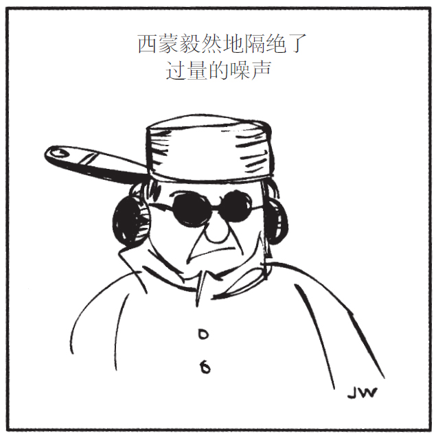

你还可以找一些咖啡馆、图书馆或其他一些不放音乐能提供安静氛围的地方。如果你习惯于在安静的地方工作，你可能会惊讶于自己的冷静和高效。

### 改变环境以达到专注

你能做些什么来让你的工作环境更易于专注？

\_\_\_\_\_\_\_\_\_\_\_\_\_\_\_\_\_\_\_\_\_\_\_\_\_\_\_\_\_\_\_\_\_\_\_\_\_\_\_\_\_\_\_\_\_\_\_\_\_\_\_\_\_\_\_\_\_\_\_\_

如果你的工作压力过大，你能在哪两三个地方找到庇护所？

\_\_\_\_\_\_\_\_\_\_\_\_\_\_\_\_\_\_\_\_\_\_\_\_\_\_\_\_\_\_\_\_\_\_\_\_\_\_\_\_\_\_\_\_\_\_\_\_\_\_\_\_\_\_\_\_\_\_\_\_

### 如何带有目的地消费信息

当你对于信息的使用缺乏目的性时，你便无法掌控信息。如果一开始便带有目的性，你会自动对信息进行筛选过滤，这能帮助你分辨有关及无关的信息。多数人接收到的大量邮件就是个很好的例子。有些是需要你关注的私人邮件，有些是能立即删除的垃圾邮件，问题是剩下的那些邮件。80/20法则再次适用：这些信息中可能只有20%适用于你最重要的目标。剩余的80%可能只是在一般意义上比较有趣，并没有直接的关系。我们将在第12章具体讨论如何处理邮件，目前还是来看看你所能够运用的四条策略，这些策略同样也可以运用于处理其他来源的信息。

■在接触新信息之前，先快速提醒自己此时最具吸引力的话题，那些和你最重要的目标相关的话题。

■如果你知道这条信息并不相关，看都不要去看它一眼，直接丢弃这条信息或者先将这条信息搁置在一边，直到它所含的信息可能更加相关时再去看。

■在可能的时候，分配其他人进行这份材料的查阅工作，告诉他们你正在寻找什么信息。他们可以复印或者扫描相关内容以供你查看。

■对于你所面对的信息，扫视最重要的信息点而不是全部通读。利用章节名称、标题以及副标题、主题句子、标注下划线或者粗体的文字，以及章节结尾关键点来引导你找到最相关的内容。

太多杂志？

如果你有很多积压的杂志没看过，浏览杂志的目录就可以直接找到相关的文章阅读。如果没有任何相关的内容，那就扔掉这些杂志。

如果你和我一样非常喜欢在网络上浏览有趣的信息，这种建议也许听起来会让你感觉很不舒服，但它只在你的工作时间内有效。如果你并没有什么特别的目的，只是想在业余时间看看杂志或者浏览网页，这也未尝不可。

### 从可靠渠道获取信息

这个时代里，任何人都能在很短的时间内创建一个网站、博客或者播客（通过互联网传输的音频或视频），把一些不实的信息当做事实发布出来，或者把自己伪装成权威，实际上他们并没有受过任何相关的教育或者拥有任何相关经验。也可能这些人确实具备某些资质，但他们发布信息的隐藏目的是要向你兜售商品或者改变你对于某件事情的看法。当你准备采用某条信息时，对信息背景和可靠性进行考察是很有必要的。搜索引擎的好处之一就是相对于仅依赖于一条信息来源，它们的出现使得不同来源信息间的横向对比变得非常容易。如果信息很重要，在基于信息采取任何行动前，需要反复对信息的真实性进行考察。

### 认识并运用你的学习方式

人们通过不同的方式进行学习。有的喜欢阅读，有的喜欢听讲座，有的需要在自己能够掌握前先经历一些事。现今，几乎所有类型的信息都能以所有形式获取。比如，假设你想要学习使用一种软件，你可以阅读相关手册，或者收听和观看视频课程，或者参加可以亲手实践的学习班。如果你最近还不曾了解都有哪些可选项，你可能会惊讶地发现有很多信息现在可以通过音频书籍和播客、视频播客以及教学DVD获取。

如果你没有使用对你来说最好的模式，应对教学信息就会变得繁琐不堪，并且会花费很多时间。

如果你有需要通过学习从而帮助自己实现目标的事情，试一下所有可能的方法，然后使用那些最适合你的方法。

### 你需要怎样的连接

关于成功商人的一个很老套的看法是，这类人每天24小时、每周7天无时无刻不通过电话和外界保持联系。但现实真的如此吗？《财富》（Fortune）杂志就成功秘诀的问题采访了一些拥有突出成绩的人。以下引自固定收益投资者太平洋投资管理公司（Pacific
Investment Management Company, PIMCO）首席投资官比尔·格罗斯（Bill
Gross）的话：“我没有手机，我没有黑莓。我的格言是，我不想被联系，我希望与世隔绝。”他补充说，他每天中最重要的部分是一个半小时的瑜伽和每天早上的锻炼。

如果一天中你没有与外界隔离的时间或者锻炼的任何时间，那么从现在开始这么做，这会是个不错的主意。如果这个方法对直接掌管了投资领域200亿美元的人有用，那它一定也对你有效。

“生活就是你在忙于制定其他计划时发生在你身上的事情。”

约翰·列侬（John Lennon，1940—1980），英国摇滚音乐家

以下简短地列举了其他一些你可以用来将自己与外界隔离，从而让自己有时间思考的方式：

■使用答录机。你可以表明自己将会再次接听电话以及回复电话的时间。

■一天仅察看手机短信两三次。

■一次打完所有需要拨打的电话。

■保留通话记录，这样你可以容易地找出之前曾经拨打过的电话号码。

■避免呼叫等待（这只会让你一次惹恼两个人）。

■决定哪些信息可以通过简短的邮件方式进行快速便捷的答复。

■告诉谈话冗长的来电者，五分钟之后你将参加会议。

■午休时离开办公室并且关闭手机。

■在家中用餐时关闭手机（如果可能的话，其他时间也一样）。

### 什么时候将自己隔离出来

列举你在工作时将自己与外界隔离的时间，即便只有几分钟。

\_\_\_\_\_\_\_\_\_\_\_\_\_\_\_\_\_\_\_\_\_\_\_\_\_\_\_\_\_\_\_\_\_\_\_\_\_\_\_\_\_\_\_\_\_\_\_\_\_\_\_\_\_\_\_\_\_\_\_\_

你可能将自己隔离出来从而能放松地想问题的时间是什么时候？

\_\_\_\_\_\_\_\_\_\_\_\_\_\_\_\_\_\_\_\_\_\_\_\_\_\_\_\_\_\_\_\_\_\_\_\_\_\_\_\_\_\_\_\_\_\_\_\_\_\_\_\_\_\_\_\_\_\_\_\_

上面提到的策略中，你会将哪些立即运用到自己的工作中？

\_\_\_\_\_\_\_\_\_\_\_\_\_\_\_\_\_\_\_\_\_\_\_\_\_\_\_\_\_\_\_\_\_\_\_\_\_\_\_\_\_\_\_\_\_\_\_\_\_\_\_\_\_\_\_\_\_\_\_\_

### 下一步是什么

通过运用本章提到的方法，你将能摒弃对你毫无价值的那80%的信息，并获取足够多的安静时间，以供你专注于并吸收对你有用的那20%的信息。在下一章，你将发现大多数人所遇到的应对无穷无尽文案工作的策略。

## 第11章　如何战胜堆积如山的文案工作

通过前一章的阅读，你学会了处理过量信息的方法。通过专注于你真正想要实现的事情，你现在拥有对每天涌到面前的大量信息进行过滤的工具，以及确保那80%不相关的信息不会让你手足无措的方法。在工作和生活中，几乎每个人都会有大量的文案工作需要处理，如何高效地完成这项繁琐的工作，本章将告诉你答案。

### 你是不是个邋遢的人——那会怎样？

你的桌子和办公室是否到处堆满材料，一派杂乱不堪的景象？如果是的话，那会不会对你的工作造成影响？嗯，套用美国电视菲尔博士（Dr
Phil）的问题，“那对你来说效果怎么样？”如果你能在需要的时候找到需要的东西，那么你的办公室乱不乱就不是什么问题。不过，很多邋遢的人（包括我自己）发现创造性混乱会出现失控的情况，当这种情形出现时，想要随时取得所需要的东西就成问题了。2004年，一份针对三菱日电（NEC-MITSUBISHI）所做的研究表明，混乱的办公桌会使办公人员患发疾病。研究所采访的2000名员工中，40%的员工表示杂乱的办公桌会让他们暴躁不堪。尽管如此，他们还是不愿意收拾桌子，35%的员工表示他们的脖子和后背都会因为坐姿不舒服而疼痛。

“我们能够对抗地心引力，但有时候文案工作实在太多了。”

沃纳·冯·布劳恩（Wernher Von Braun，1912—1977），德裔美国火箭物理学家

如果对你而言，办公桌的状态是个问题，那么很可能这是你处理文案工作的一个缩影，你缺乏明了的归档系统，需要更加系统的相关文案工作的处理方法。不过，如果你恰好是右脑创造型人士，你需要的是和大多数有关时间管理或者组织类书籍中所介绍的不同的文案处理解决方法。

### 你喜欢怎样工作

要知道你在处理文案工作和组织工作时更偏向于右脑还是左脑，你可以看看下面两份清单哪一种方式更接近于你想要的工作模式？

左脑型：

■喜欢一次做一件事；

■文件在档案柜进行实时归档；

■根据优先顺序处理待办事项；

■利用电子记事簿对约会进行管理等；

■能够按照进度表行事，从不迟到。

右脑型：

■喜欢一次处理几项任务；

■到处都是成堆的文件；

■归档工作不及时，喜欢将文件夹放在能看到的地方；

■利用纸条或便笺纸记录约会等；

■容易错失截止日期，经常迟到。

你在第5章已经知道要专注于自己的强项，如果你是右脑型的人，想要把自己变成左脑型的人是毫无益处的。无论这上面哪些内容最接近对你的描述，都会有适合你喜好的工具和方法。因为大多数书籍都不会特别提到右脑型人所喜欢的系统和策略，本章对此将会有所侧重，不过还是有些所有人都适用的方法。

### 处理文案工作的新策略

“每张纸仅处理一次”。这是所有传统时间管理书籍所给出的建议。我一直都觉得这条左脑型时间管理策略不太现实。是的，这想法其实不错，立即考虑你要处理的一张纸，是需要：

■扔掉（最好方法，如果合适的话）

■归档

■让其他人处理

如果需要对文件进行归档，在文件上贴一张便签条，写出其所应归属的文档名称，那意味着你不必做两次这样的决定。

如果需要将文件分配给其他人进行处理，在文件上贴一张便签条，注明为什么将该文件转给其他人。

根据我的经验，这样做之后，还会剩下很多其他文件。可能有些是在你找到其他信息前无法回复的信件，是你想要购买但还未下定决心的某个产品广告，是你想要参加的某个社会活动通知，但你还需和别人进行确认，等等。

在便签纸上写出你需要采取的行动，把它贴在这张纸上，然后把这类纸张整理在一起。如果是账单或者其他可能会引起麻烦的东西，把这些材料单独放在一起，并确保这些材料能首先引起你的注意力。当你一个礼拜后再次翻阅这些文件时，你的便笺纸将能快速告诉你需要做些什么。有些纸将不再有用，你可以把它们扔掉，此时你掌握了更多的信息，因此能够对某些纸张进行处理，其他的还需要再放些时间。

我肯定这一系统会让很多左脑型的人很不舒服，但这种方法确实有效。

### 归档：你为什么可能讨厌档案柜

很多创造性的人都讨厌使用档案柜，因为他们都是视觉导向的人，他们喜欢能看到东西的这种感觉。一旦文件被放进档案柜，他们便不再能一眼看到这些文件，这会让他们觉得很不安。

你的新策略：

■使用档案盒。你可以在盒子一侧写出文档的名称，然后把档案盒放在架子上。文件很多的时候，这是个很好的办法。

■对于少量的文件，你可以使用带折叠封面的文件夹，在封面顶端靠近边缘的地方写下名称，让文件容易看到。

另外，档案柜和文件夹会让所有东西看起来都差不多，感觉很单调。要想能够通过视觉就将事物区分开来，我们通常会使用不同的颜色。你可以使用彩色编码的文件夹或者文件盒，比如，绿色代表财务，蓝色代表参考，红色代表邮件。

### 有用的归档系统

过去很长时间里，我都用带封面的文件夹对我的写作进行分类，比如“故事片”、“电视电影、”“情景喜剧”、“戏剧”、“非小说类图书”等。这样做的问题是，最后某些类别里会有很多文件夹，那么要找出某个特定的文件夹就意味着要查找很多文件夹。

现在我的替换做法是，对每个主要类别用一个字母进行标记。例如，A代表故事片，B代表电视电影，C代表情景喜剧，D代表非小说类图书，依次类推（哪个字母代表哪个类别完全是随机的，如果所有字母都用上了，你可以使用些字母的组合，例如AA、BB等。）我所使用的例子和关于写作的项目文档有关，当然你可以调整类别使其和你的工作相关。

给每个类别中的文件夹编定一个特定号码，使分类看起来像这样：

A　故事片（类别标题）

A1《超级鲍勃》（Superbob）（这是适合该类别的项目标题）

A2《疯狂！》（Mad！）

A3《分崩离析》（Coming Apart）

A4《无价之狗》（Million Dollar Dog）

A5《转化》（Switch）

下一个类别，电视电影，用下一个字母：

B　电视电影

B1《我会不会骗你？》（Would I Lie to You？）

B2《鱼和单车的故事》（The Fish and the Bicycle）

B3《一无所知》（At Sea）

下一个类别，情景喜剧，用字母C：

C　情景喜剧

C1《热点》（Hot Spot）

C2《你想要什么》（What you wish for）

C3《奇异的人生》（Strange Life）

建立新的文件夹时，给这个新文件夹标注一个合适的字母，以及该类别下的一个数字。整理出一份总清单放在手边，这样你就不需要在找文件夹的时候每次都重新查看一遍所有文件夹。假设我正查找有关情景喜剧的手稿，我的清单显示它的位置是C3，我就能轻而易举地在架子上找到它。我把这份总清单在抽屉和电脑里各放了一份，我的助理也有一份。我们随时会对这份清单上的内容进行更新，先是手写更新，然后大概一个月左右会打印出一份更新后的文件。

这个系统的唯一缺点在于，当分类里的内容太多时，架子上的所有东西都必须挪出一些。

### 归档操作手册

你是否曾经有过这样的经历？你买了些高科技产品，如打印机、数码相机或者MP3播放器，结果没几个月这东西就坏了，你需要找到相关产品的操作手册。问题是你不知道操作手册在哪儿，然后你花很多时间找这个手册，找了很久却一无所获，你因此感觉无比沮丧，或者你想在网上进行搜索，想在厂家的网站上找到手册的相关内容。

Verco公司那些制造办公椅的聪明家伙想出了一个很棒的主意：他们在玛雅系列办公椅的坐垫下方设计了一个口袋，以供客户放置操作手册。你可以灵活运用这一方法，比如在设备或最常用的东西（扫描仪、打印机、复印机等）下面或者附近贴上一个塑料信封，把操作手册放在里面，这样它们就不会遗失了。

### 利用清单的专注力

有一种文件你可能使用得还不够多，那就是清单。对于所有需要做的要动些脑子的事情，你应该有一份能够帮助自己更快完成这件事情的清单。出差前的行李打包就是一个例子。很可能你每次都需要准备相同的东西，那为什么不做一份清单，让这个过程更快些呢？你甚至可以分配别人来做这个打包的工作。这里是我主清单的一部分：

袜子　　　　　　　　　积分卡

T恤衫　　　　　　　　 地铁卡

内衣　　　　　　　　　驾驶执照

手帕　　　　　　　　　通讯录

裤子　　　　　　　　　日记本

鞋　　　　　　　　　　办公装备

衬衫　　　　　　　　　荧光笔

运动夹克　　　　　　　折叠文件

外套　　　　　　　　　名片

套头外衣　　　　　　　手机

游泳裤　　　　　　　　手机充电器

手表　　　　　　　　　笔记本电脑

行程表　　　　　　　　磁盘驱动器

票　　　　　　　　　　笔记本电脑适配器

护照　　　　　　　　　磁盘（包括需要进行的项目）

在打包之前，我要决定自己将会需要多少衣服（3天的行程=3双袜子），划掉清单中不适用的物品（如果酒店没有游泳池，那么就不需要带泳裤）。然后按照清单中的其他内容进行收拾，这样收拾行李整个过程只需要几分钟。

对于工作上会反复做的事情，清单的作用也非常大。比如，你可以准备一份清单，把每次写新闻稿需要涵盖的内容都列在上面。

商务清单

由吉恩·马克思（Gene Marks）编辑、亚当斯媒体（Adams
Media）公司出版的《街头小生意清单手册》（the Streetwise Small Business
Book of
Lists）一书提供了一个绝佳的清单来源，书中介绍了成千上万个帮你削减成本、增加收益以及刺激盈利的清单。

其他一些需要用到清单的场合包括准备以下事项：

■介绍

■网络事件

■访问

■谈判

这种清单能够让你更容易地把自己之前一直在做的任务分配给其他人，因为清单能够帮助确认接手工作的人不会忘记或者忽略任何重要的步骤。同时，制作一张你委派任务的清单，表明任务由谁负责做，什么时候做以及要取得什么结果。你可以每天检查清单，定期和清单上的人进行核实以保证任务将按承诺完成。

“清单能够让你更容易地把自己之前一直在做的任务分配给其他人。”

另外一份需要随身携带的清单是，当问题出现时你可能需要的联络人电话。这可能包括电脑维修服务、软件咨询、中介公司、送货服务、运送色剂盒以及其他办公用品的商店，等等。事实上，最好在清单上写出至少两个联系人的电话。众所周知，问题总是在最不合时宜的时候发生，这时你肯定不想因为慌乱地四处寻找帮助而浪费更多时间。

### 什么清单会帮助你专注

花点时间想出三份可能对你的工作有所帮助的清单，在这里写出它们的名称，并安排时间制作这三份清单。

\_\_\_\_\_\_\_\_\_\_\_\_\_\_\_\_\_\_\_\_\_\_\_\_\_\_\_\_\_\_\_\_\_\_\_\_\_\_\_\_\_\_\_\_\_\_\_\_\_\_\_\_\_\_\_\_\_\_\_\_

\_\_\_\_\_\_\_\_\_\_\_\_\_\_\_\_\_\_\_\_\_\_\_\_\_\_\_\_\_\_\_\_\_\_\_\_\_\_\_\_\_\_\_\_\_\_\_\_\_\_\_\_\_\_\_\_\_\_\_\_

\_\_\_\_\_\_\_\_\_\_\_\_\_\_\_\_\_\_\_\_\_\_\_\_\_\_\_\_\_\_\_\_\_\_\_\_\_\_\_\_\_\_\_\_\_\_\_\_\_\_\_\_\_\_\_\_\_\_\_\_

### 待办清单中需要做的事和不需要做的事

最常用的清单是每天的待办事项清单。这是一个很棒的工具，但却常常被误用。它不应该是你在未来数天或数礼拜中要做的所有小事的集合。一定要先做一份下周所有需要注意事项的总清单，但每日清单应该仅包括你在当天需要完成的任务。好的经验法则是一天中最多专注于6件事情。

如果你发现自己不得不重复地把一张清单上的任务挪到另一张清单上，这说明你对自己在可用时间内所能完成的任务并没有现实的考虑。每天都不能按时完成任务的挫败感将耗尽你的精力。一个能够解决问题的方法是将80/20法则运用到你的待办清单中。

首先依惯例制作你的待办事项清单。对大多数人而言，这个清单是他们应该做的、想要做的或者能够在那天做的，不是他们真的想要在那天做的所有事情的组合。

从现在开始，把那种清单作为你的清单第一稿。利用这份清单凭直觉说出所有你可能会做的事情。然后仔细察看清单，从每10个项目中选择两个会给你带来最大价值的项目，只选两个。

只有你能够对“价值”进行定义，因为这只对你适用。通常人们会将价值解读为能带来最多财富的东西，但如果你的办公室混乱得无法处理重要工作，那么整理办公室可能就是你所能做的最有价值的事情。

如果你一开始有10件或者更少的事情需要处理，那么现在你首先需要处理的就只有两件事。如果你开始时有20件事情需要处理，那么现在减少到4件，你还必须再重复这一过程：这4件事情中（或者6件，或者其他可能的数字），哪两件会给你带来最大价值？

如果可能的话，先做这两件事。这可能会需要一点意志力，因为通常最重要的任务都不是最有趣的事。把它们先放在一边，做些不那么费神的事情来暖暖身，或者根本不去做这些事，或者采用其他一些看似合理的做法要容易得多。等到热身完毕，我们会突然发现还有些其他事情需要关注，我们真的必须再查看一遍邮件，然后接个电话……不知不觉中（一天结束时），你忽然意识到不得不把那些关键的事情转移到明天的待办清单上。

首先处理真正有价值的任务的意思是把这些事情做完。这会让你这天之后的时间轻松不少，你将因为这么早就完成这些事而感到压力小很多。有时我们会逃避做那些最有价值的事情，因为这些事看起来很复杂、很难完成。在这种情况下，把大任务分解成小任务，直到形成你可以在45分钟之内完成的任务块，然后一点点向着更大的任务进军，你很快会意识到自己有很大进步。

如果你无法首先做最重要的任务，那么至少交替做一个容易快速完成的任务以及一个有些困难但却重要的任务，这样来保持前进。不过最好还是能花一个礼拜的时间先做最重要的任务。到这星期结束时，这么做的好处将会非常明显，你会觉得更有动力，从那以后你会觉得做起来越来越顺手了。

如果你喜欢每件事情都能被看到，你也可以把每项任务写在便利贴上，贴到墙上，等这些任务完成之后，再把便利贴拿下来。把这些便利贴作为你已完成任务的工作记录保存起来。

保留那些清单！

把旧的待办事项清单放在一个文件夹或者文件盒里，至少保存一年时间。如果你需要记起开始新项目或者电话会谈的时间，这些清单将会有所帮助。

总是在身边放一份待办事项清单。你可以在索引卡上手写或者打印一份迷你清单，把这份清单放在口袋或者包里。那样当你参加会议或者外出时，就不会忘记你在当天所需要完成的任务了。

最后，在清单中安排一些休息和反思的时间，哪怕一天中只有一到两次的15分钟也行。像对待清单中其他任务一样严肃地对待这件事，如果清单上的其他任务花费了比你想象中要长的时间，休息和反思的任务不应该成为首先被牺牲的选项。记住，当今世界要想成功，你应该更聪明地工作而不是更努力地工作。更聪明的工作是洞察力和创造性思维的产物，这需要时间和思考。

### 如何处理未来的任务

有些任务很重要，不过你知道自己并不需要今天就去做它。事实上，这其中的某些事，比如电话或者会议，是将来某个特定时间才需要做的。记住这些事的一个好办法就是做一个盒子，里面放上从1到31排好序的文件夹，每个文件夹代表一天，再加上12个带有月份名称的文件夹。如果今天是6月12号，你知道6月20号需要给潜在客户打电话，把这件事写在便条上，然后把它放进编号为20的文件夹。在6月19日，当你计划第二天的待办事项时，打开那份文件夹然后安排打电话的事。如果这个工作需要在8月份才做，你把它放进8月的文件夹内。在每个月开始的时候，检查月份文件夹里的内容，然后把它分配到每个月具体天的文件夹里。

### 接下来是什么

现在你已经知道怎样更有效地处理文件了，但还有一项毁誉参半的主题：邮件。在下一章你将了解驯服“邮件怪兽”的策略。

## 第12章　如何驯服“邮件怪兽”

现在你已经熟悉了如何处理过量信息和文件工作，但现在还有一个令每个人都无比烦恼的失望之源：电子邮件。一方面，它是世界各地人们即时沟通的杰出方式，它对我们的工作产生了革命性的影响。另一方面，你所收到的垃圾邮件和大量的合法信息，也会让你感到非常烦恼，它能轻而易举地占用你的时间和精力，让你无法做本该做的事。不仅如此，发送电子邮件的过程也会充满陷阱。在本章，你将找到使电子邮件成为正如其所设计成的最伟大工具的最好策略。

### 控制时间

除非你负责了，比如说，保卫自由世界的任务，你真的需要在收到每封邮件后立即阅读邮件吗？并非如此。如果真那样的话，设定每天察看邮件的次数。你头脑中是否已经有这样一个数字？很好，把这个数字减去一半。很少有人真的需要每天察看邮件4次以上，3次或2次会更好。作为初学者，尝试根据下面的安排来查阅邮件：

■早上刚坐到办公桌前

■午餐之后

■快下班前一小时

如果你有立即回复邮件的习惯，担心如果忽然改变做法，人们会好奇发生了什么事，那么你可以开启自动回复功能，就像你不在办公室时所可能做的那样。回复的内容可以是，“为了提高我服务您的工作效率和能力，我会在上午9点、下午2点和5点定时察看邮件。如果有事需要我的及时关注，请拨打×××（电话号码）和我取得联系。”那些确实有急事的人不会感到失望，一般来说，电话是处理特别紧急事情的更好办法。你将发现其实真正紧急的事情实在少而又少。

保持专注

如果你无法坚持设定次数，另一个方法是在不同任务的间歇察看邮件。如果你在工作期间察看邮件，这会使你无法集中注意力。

### 新的邮件计划

从现在开始写出你计划每天察看邮件的次数，然后复印一份贴在电脑附近。

\_\_\_\_\_\_\_\_\_\_\_\_\_\_\_\_\_\_\_\_\_\_\_\_\_\_\_\_\_\_\_\_\_\_\_\_\_\_\_\_\_\_\_\_\_\_\_\_\_\_\_\_\_\_\_\_\_\_\_\_

### 邮件选择1：删除

处理邮件的最快方法就是删除。显然，对于垃圾邮件，这是很容易的事。如果你收到了过多的垃圾邮件，那么你需要调整或者更换你的垃圾邮件过滤器。然而，有很多邮件看起来似乎非常有趣。这会成为消磨时间的一种方式，而这些时间你本该用来做那些最有价值的20%的工作。如果你一直在使用这种方法，那么你需要考虑使用你在第7章所建立的某种“第二自我”，“匈奴王”也许是个不错的选择——果断地删除这些邮件。这里是应该删除的两大类邮件：

■笑话、怪异的新闻、卡通片等。这些信息可能大多来自数量很少的一群人。你有一个选择：你可以删除，或者把这些邮件转移到“休闲时光”文件夹中。你也可以给发信人回复一封邮件，写这样的内容，“尽管你发给我的笑话和卡通片很有意思，但我很难处理收件箱中过量的邮件，所以请不要再给我发送这些邮件。我非常感谢你的初衷，不过我肯定你能理解我的做法。”

■抄送给他人的邮件，通常标注为“供你参考”。如果你一直收到你并不需要的信息，这些信息对你来说和垃圾邮件一样。和之前的做法一样，你需要给那些给你发送这些邮件的人附上一条言辞委婉的信息，比如，“感谢你让我随时跟进事态的发展，但是你真的不必将这些信息抄送给我”。重要的是：如果有你需要被通知的情况，需要添加一个限定条件，例如，“除非项目无法按进度规定执行”，或者“除非你需要我的直接参与”。

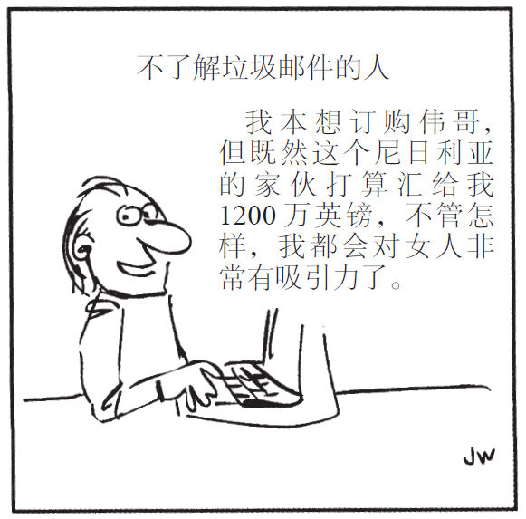

你删除的“第二自我”

你将运用第7章中创造“第二自我”的哪种，来删除无关邮件？

\_\_\_\_\_\_\_\_\_\_\_\_\_\_\_\_\_\_\_\_\_\_\_\_\_\_\_\_\_\_\_\_\_\_\_\_\_\_\_\_\_\_\_\_\_\_\_\_\_\_\_\_\_\_\_\_\_\_\_\_

### 邮件选择2：委派

你已经删除邮件了，现在进行委派。如果一封邮件要求你采取某种行动，不要不假思索地立刻行动起来。首先想想是否利用他人的时间会更好（当然在你有这种权利的条件下）。如果是的话，把邮件转发给那个人，并附上一则附言告诉他们要求。附言的内容可以很简短，“玛利亚，请处理这件事”，或者你可能需要提供更多细节内容，然后通知发送邮件的人，你已经把这项任务分配给玛利亚进行处理，其他关于此事的讨论将由玛利亚直接负责。你自己当中间人的次数越少越好。这种方法甚至可以运用到一些小事上。比如，我有时会收到我自己某个网站的信息，说某个链接出问题或者某个视频不能正常播放。我的第一反应就是亲自去那个网站查看一番，即使我并不知道如果确实出现问题该怎么处理。现在我只是把这封邮件转给我的技术人员，并让他在解决问题后通知我或者发信人问题是否出现在客户端。

“你已经删除邮件了，现在进行委派。”

如果你想要委派任务的人是你同一级别的同事，而不是下属，你得采取不同的处理方式；也就是找到发送邮件的人，使他相信玛利亚才是处理这一工作的更好人选。你也许会想要自己处理这件事情，特别是当这件事并不会花费你很长时间，但当你这么做的时候，你也就开创了一个先例，那就是以后只要遇到类似的事，你都想亲自去做。

如果身边没有能够处理这项任务的人员，特别是你自己经营的事情，考虑是否可以通过虚拟助手或者相关服务把它委托出去。

你的委派计划

你能想到谁，你可以将至少部分邮件相关工作委派给谁？

\_\_\_\_\_\_\_\_\_\_\_\_\_\_\_\_\_\_\_\_\_\_\_\_\_\_\_\_\_\_\_\_\_\_\_\_\_\_\_\_\_\_\_\_\_\_\_\_\_\_\_\_\_\_\_\_\_\_\_\_

### 邮件选择3：处理邮件

对于剩下的邮件，你可以使用和前一章推荐的真实文件夹相同的虚拟文件夹系统。任何你需要当天处理的邮件都可以归入标记有当天日期的文件夹，然后你可以安排最适合自己的时间来处理这些邮件。一般来说，最好能集中处理这些任务，而不是一件件地处理。如果这件工作并不紧急，你可以把它归入标有其他日期的文件夹，到时再进行处理。如果有些事情需要一个多月以后再去关注，你可以把它归入那个月份的文件夹内。

如果你正同时处理多个项目，那么你可能需要为每个项目建立单独的系统。当你为第二天的待办事项清单作计划时，你可以迅速查看那天的文件夹并相应做出安排。如果你想更直接地看见要做的事，一个替换做法就是为每个项目单独准备日程表，然后把工作记录在日程表上。

你可能已经有自己喜欢的对邮件进行分类和归档的方法，那很好！主要目的是不要让邮件累积到100封或更多，否则你每次打开收件箱都要重新查看一遍。

有几类邮件特别麻烦。

■永无止境的信息。有句名言曾帮助过很多人，包括马克·吐温和亚伯拉罕·林肯。那是一封长篇书信的附言，它这样写道，“很抱歉我写了如此长的一封信，因为我没时间写一封短的。”你也许认识喜欢写长信的人，如果这些信能短点会更好。如果可以的话，你可以建议他们在邮件开头把邮件将要提到的关键点简明扼要地提出来。如果他们习惯给你发一些包含以前邮件内容的信件，要求他们对之前的内容进行总结。如果这些没完没了的邮件是你老板写的，你可能就不得不忍耐一番了。但你可以使用浏览印刷品时使用的相同技巧：先看第一段和最后一段以及每段的第一句话。通常这样就足以让你了解邮件的主要思想。

“艺术之真谛，表达之荣耀，文字之光芒，唯简洁而已。”

美国诗人沃尔特·惠特曼（Walt Whitman，1819—1892）

■不应发出的邮件。你可能发现自己会收到一些情绪化的邮件，信里的一些内容显然是头脑发热或者酒后的胡言乱语。如果你很仁慈，最好的举动就是假装你从未收到过这封邮件，或者几个小时或一天后给发信者回复邮件，表示你的收件箱中有一封他们发来的邮件，但你无法打开这封邮件。他们也许会看穿这个策略，但他们还是会永远感激你。

### 发送邮件时该做的以及不该做的

想知道在发送邮件时该做些什么，最简单的方法就是尽量避免别人做过的所有让你觉得厌烦或者浪费时间的事情。这里有些具体的方法让别人喜欢收到你的邮件。

■在主题中写出信息。如果邮件的主题是你想要对方执行当天早上讨论过的采购事宜，不要在主题中写“回复：购买新打印机”，然后在邮件主体中写更多的东西。只要在主题栏中写明“请采购我们今天上午所讨论的打印机”，邮件正文部分不需要写任何内容。这将节约时间，同时树立一个令人赞赏的简洁邮件的榜样。

■不用电子邮件传递敏感信息。如果你不得不告诉别人他们的工作做得不够好，甚至他们被解雇了的信息，这种内容不适合通过电子邮件来表达。去找那个人谈话或者至少打个电话。永远不要在电子邮件中传递任何小道消息或者谣言。电子邮件很容易被打印出来，也经常会被打印出来。如果你不想自己说过的话在办公室里永远流传，那就不要用电子邮件发出去。我们总能听说一些愚蠢的人因为自己在邮件中所说的话而丢掉工作或者感情的事。出于某种原因，我们认为这种事情不可能发生在自己身上，这和他们过去所认为的情况一样。

■别用邮件承认自己的错误。同样，这也是敏感的事情，最好能在会议上解决。电子邮件的一个缺点是它无法表达出情感上的不同，就算你使用笑脸或者皱眉的图标也无济于事。任何带有情感内容的信息最好能用其他方式处理。

■在邮件开头简明扼要地概括邮件内容。一封以“不，这不是个好主意”开头，然后继续解释为什么这不是一个好主意的邮件，如果收信人根本不了解“这”指代的是什么，这种写法就毫无意义。记住你的邮件可能会是别人50或100封邮件中的一封，所以别指望收信人记住“这”指的是什么，别让他们再重读之前发给你的原始邮件。最好你的标题就已经告诉他们这封邮件是关于“重建接待处”，更好的做法是，标题就能告诉他们，“重建接待处，我不同意”。然后，如果有必要的话，邮件的正文可以列出你不同意的三个理由。

■别忘记附件。我们都经历过这样的事情：我们写了一封标明带附件的邮件，但却忘记粘贴附件，于是不得不写一封致歉邮件，再发送附件。简单的解决方法：养成在写邮件之前粘贴附件的习惯。

■尽量具体地说明你希望收信人所做的事。如果你正发送一封要求收信人采取行动的邮件，尽量明确地说明你要求他们做的事，如果可能的话，写出截止日期。

■如果你正处理多个项目，每个项目单独发送邮件。这样更有利于收件人对你的邮件进行分类，并归入适合的文件夹中。

■像对待手写邮件一样尊重并严肃对待电子邮件。商务信件无需使用彩色背景、表情符号，不能有错误的语法或标点符号。你的电子邮件发送了关于你和你形象的第二信息。

### 底线：掌控一切

这是本章的关键内容：控制电子邮件而不是被电子邮件所控制。电子邮件的作用是服务于你，而不是让你沮丧和惹恼你。你可以选择是否查看邮件以及何时查看邮件。你可以选择是否回复以及何时回复邮件。你甚至可以就邮件内容以及发送邮件的最好方式对发信人进行教导。当你发邮件给他人时，你可以模仿这些有效行为以使你和收件人都有所收获。所有这些都将阻止电子邮件在你做最重要的事情时分散你的精力。

### 接下来是什么

现在你知道了如何毫无压力地处理电子邮件，下一章提供了掌握会议和建立关系网的工具。

## 第13章　如何掌控会议和社交

除了过量信息、文案工作以及邮件，我们工作中还会遇到的两个最容易引起焦虑和挫败的主题是会议和社交。你将在本章找到处理这两者的技巧。让我们先从会议以及你必须要问的最重要问题开始。

### 这场会议真的必要吗

删除是处理文件和电子邮件时的一项重要技巧，它也适用于会议。一旦会议开始，就好像要很长时间才会结束。我们稍候将看到如何缩短开会时间，但最好是尽量减少会议数量。如果你是决定是否开会的人，那么考虑一下备忘录、电子邮件、电话或者简短的电话会议是否可以达到同样的效果。

### 你是否真的需要出席会议

如果会议由他人组织召开，考虑一下这场会议是否真的和你相关。如果不相关，不要参加。如果你需要向上级领导就此事进行解释，简明扼要地强调如果你将这段时间用来做最重要的事情，这将带来更大的价值。

如果你只需要参与会议议题中的一项，看看是否可以把这一项目提前，这样一旦事情处理完，你就可以提前离开。如果不行，而会议的时间会很久，可以让他人在你需要参与的事项即将被讨论时提前给你打电话，你再马上过去开会。

### 你们是否都知道会议的目的

很多会议之所以会开很长时间是因为缺乏明确的议题。会议的目的表达得非常模糊，比如“回顾马丁计划取得的进展”或者“解决上个月出现的所有问题”。这是会议漫无边际、毫无重点的症结所在，这种会议把时间都浪费在不重要的80%事情上。需要事先制作一份具体的会谈议程并提前通知参会各方。如果你的会议没有议程，把这件事情汇报给你的老板；如果你就是老板，安排处理这件事。

### 大家是不是都准备好了

如果你希望参会人员有可供分享的具体信息，也应该为此制作会议议程或者备忘录。这样就不会有人在被要求提供事实和数据时表示惊讶了。

### 是否有日程和时间限制

如果暖身闲谈似乎是让大家把注意力从几分钟之前从事的事情中抽离出来的会议必需部分，那么为这个闲谈设定一个时间限定。你可以在会议室中来回走动，让每个人都有几分钟时间来谈谈他们工作得怎么样。如果有人超过了时间限制并且没有停下来的迹象，主持人必须解决这个问题。

快速会谈的诀窍

■如果可能，让人们到你的位置上。

■保持凉爽的室温，使参会人员保持警觉。

■对于一对一的会谈，在散步时开会。

最好在议事日程上注明讨论每项议题的时间限制。这可以通过计时器强制执行，计时器可以在项目讨论时间即将结束时发出信号。如果有项目明显需要花费更多时间，最好为其另外安排会议时间，而不是让这个项目扰乱其他项目的进程。当然这也意味着需要为整个会议安排一个时间期限。就像工作需要根据时间来做一样，会议也是如此。明白时间期限将会被强制执行，每个人都会集中注意力，在更短的时间里说出需要说的话。

“在午餐前一小时制定一个一小时会议计划。”

一个聪明的策略就是在午餐前一小时或者下班前一小时制定一个时间期限为一小时的会议。这样，每个人都会希望会议能够按计划进行。

### 会议中所作的决议是否清晰

会议过程中应该有人对所形成的决策以及哪些人同意在将来采取何种举措进行记录。每项议程结束时，会议记录人员应用一两句话对要点进行总结。这些内容也可以写入总结性的会议纪要，并分发给参会人员以及任何需要了解这些信息的人。这会防止类似于“哦，我以为我们达成一致的情况不是这样的！”等问题。

如果这是集体讨论会议，你是否遵循了以下四条准则？

如果会议初衷是产生新的想法，遵循以下四个集体讨论法则：

■数量第一。集体讨论的目的就是生成尽可能多的想法。

■不加评论。在想法产生时对其进行评判会中断思路，稍后会有时间进行评估。

■把每件事都写下来。选择性的记录本身就是一种评判。确保身边有足够大的活动挂图、纸张或白板供人们用大字写下所有内容。

■别害怕在别人的观点之上形成自己的观点。有时一点点改进就能够使概念更加完善。

### 你是否保持会议尽可能简单

如果可能的话，尽量使用活动挂图、白板和笔。不要使用幻灯片或任何其他需要科技含量的设备。这些东西会出现故障。开会的时候，我们都曾遇到这样的事情，投影仪的灯泡突然烧坏、笔记本电脑接口不匹配或者电脑死机。这些事情不仅令人难堪，而且浪费时间。

“当你什么都不想干的时候，开会是个好主意。”

约翰·肯尼斯·加尔布雷思（John Kenneth
Galbraith，1908—2006），加裔美籍经济学家

### 是否已设定基本准则

有些能使会议更富成效且更有乐趣的基本准则。前文已经提到的是对每个参会人员都已做好准备的期望。这里还有其他一些内容：

1.每个人都要准时。这个方法极端但却有效：迟到者不得参加会议。下一次他们就会准时。

2.关闭手机。这个方法极端但却有效：在门口没收通讯设备。你可以做个轻松的暗示“酒吧门口上缴枪支”，参会者都会明白你的意思。

3.每个人都需保持警醒。这个方法极端但有效（同时也有利于缩短开会时间）：把椅子都搬出去，这样每个人都必须站着开会。

4.气氛热烈的讨论固然很好，但也要有基本的互相尊重，表现为不打断他人的讲话以及不主宰整个谈话。如有必要，这应由主持人强制执行。

5.冗长的会议中应安排合理的休息时间。

6.应提供健康的零食（特别是水果）和水。

你可能无法控制或影响会议中的所有因素，但改变其中哪怕很少的几个因素，都会带来很大不同。如果你无权决定会议的方式和时间，和负责此事的人进行讨论，很可能他们和你一样对冗长而缺乏重点的会议感到沮丧不已，因而非常愿意接受你的想法。

你的会议决策

你能够运用或建议以上哪些策略，从而使你参加的会议产生不同？

\_\_\_\_\_\_\_\_\_\_\_\_\_\_\_\_\_\_\_\_\_\_\_\_\_\_\_\_\_\_\_\_\_\_\_\_\_\_\_\_\_\_\_\_\_\_\_\_\_\_\_\_\_\_\_\_\_\_\_\_

### 社交天敌

一种值得单独提出的会议形式是社交。这里有个小测试。下面的话出自一位不愿透露姓名的企业家。读一读这段话，注意它给你的感觉：“（社交）很有意思也很有意义……随时跟人们交谈，在商店里、沙龙、飞机上……不知道怎么开始谈话？随便说一句赞美他人的话。一个陌生人身上总有吸引人或令人羡慕的东西引起你的注意。真诚地看待这一点。”

如果你觉得“当然，那千真万确！”那么跳过本章的其余部分，因为你显然是：（1）美国人；（2）是一个天生的社交达人。但如果这段话让你觉得有些不安，那就跟我来，我们将找到让你专注于自己长处的方法，即便社交并不是其中之一。

通常，社交活动中会有很多人一边要稳住手中的葡萄酒杯，一边互相递送着名片。到活动结束时，你的口袋或者包里满是名片，但你已丝毫不记得这些名片的主人都是谁。所有那些拿到你名片的人的感觉也是一样。常规的建议是你要表现出对他人的兴趣。这就造成了两个人都假装对对方感兴趣，私下里却一直等着要谈论他们自己以及他们所提供的东西。我的建议是：如果你对参加这种社交活动感到不自在，那就不要去参加。是的，互相联络很重要，但还有其他方法。我们稍后会讨论那些方法，但如果你已经参加了某个社交活动，有些指导性原则会使你的参与更富成效。

### 找到最有效的社交“第二自我”

你是否有非常乐意结识新朋友的时候？是否有一些你在展示自我时感到非常放松和自信的时候？回忆这样的时刻，或者想象那种时刻会是怎样的情景，然后为那种状态创造一个“第二自我”。当你选择参加社交活动时，进入那种状态。不必试着努力模仿那些热情四溢的、外向的在和人握手时主动而有力的人，表现得像个理想的社交人士；你只需要寻找一种自己觉得舒服的状态就可以。

### 参加20%的最易取得成功的活动

很多的大会、小会、商业聚会和其他活动每天都会举行，对这些活动的优先顺序进行排列很重要，你只需要参加这其中可能给你带来80%回报的那20%的活动就可以。这些活动有两个共同的元素：

■那里的大多数人和你所从事的行业不同。如果你自己就是保险代理人，那么去参加保险代理的聚会有什么意义？当然，谈谈老本行、抱怨某种类型的客户或者最新的政府规定可能会很有趣，但这并不能给你带来更多的生意。参加一些能找到可能需要你所销售险种的客户活动会更有前景。

■除了社交，还有其他活动。这可以是颁奖典礼、庆功会或者慈善活动。这能给你提供一些除自己以外的谈资。如果人们对你所从事的工作感兴趣，你可以简单地介绍一下，如果他们仍然感兴趣，他们可能会向你索要名片。没有人会觉得尴尬或者感觉强买强卖。如果你付不起入会费，你可以做志愿者为客人登记或者帮助提供茶点，只要确保你能有足够的时间进行社交。

你能参加哪些符合上述标准的活动？

\_\_\_\_\_\_\_\_\_\_\_\_\_\_\_\_\_\_\_\_\_\_\_\_\_\_\_\_\_\_\_\_\_\_\_\_\_\_\_\_\_\_\_\_\_\_\_\_\_\_\_\_\_\_\_\_\_\_\_\_

### 怎样不费力地与人闲谈

尽量提前到达社交场所，并和尽可能多的人交谈。你依然不必强行进行推销。那些潜在客户会自然而然地对你所从事的工作感兴趣。

一个让人们知道你从事什么工作的好方法就是问别人他们是做什么的。给他人关注，如同你想要得到的，毕竟对他们而言你也是一个潜在客户。

你不需要为谈话准备一个开场白，只要评论一下正在发生的事情就可以。如果能想出一个轻松有趣的评论当然更好，不过任何表述都能让谈话继续下去，“你觉得演讲者怎么样？”或者“参加活动的人真多啊，对吗？”不过，一旦僵局被打破，你就要准备一个包括更多内容的陈述或者问题。

你腼腆吗？看看房间里有没有其他腼腆的人，和他们进行交谈。他们会因为有人找他们说话而感激不尽。但不要整晚一直和同一个人说话。

对于由他人主办的活动，建立一个容易逃脱的途径，如果你不喜欢这个活动或者没法取得自己需要的东西，可以预先告诉主办人你可能需要提前离开，这样你就可以在不冒犯任何人的情况下中途退场。

### 深居简出的人如何进行社交

现在有一种个人社交的很好选择：互联网。如果你没有在鸡尾酒会时和别人闲聊，你还是能够结识新朋友，至少是通过虚拟的方式。找出你想要吸收成客户的人最常访问的网站，经常浏览这个网站上的内容。在博客和网站论坛上发表相关评论，尽量少地提到你自己的网站以及业务。当你成为这些网站上的常客时，人们将开始询问你所从事的工作，然后你可以告诉他们更多细节。

如果你本身就是很腼腆的人，那为什么不让别人主动来找你呢？不必和那些与你所服务市场无关的80%的客户打交道，而又能够吸引真正有关的20%的客户，这难道不是特别棒的事么？为了吸引这些人，你应该创建一个个人网站，网站上发布一些和你所从事项目有关的文章和小窍门，以及人们能够与你取得联系的方式。

博客的效果更好，因为在博客中添加内容比网站容易得多，你还能用它来建立粉丝基地。鼓励他人的评论，但如果没有收到评论，也不要因此而感到沮丧。不要期待立刻能看到结果，人们发现你的这个过程需要时间。一旦你拥有了大量的文章，搜索引擎也会开始把人们引导到你那里，如果有其他博客和网站链接到你的网址更好。不要在博客上强卖，只是让人们开始认识你。如果你让自己的博客（播客，或者网站）反映自己的个性，人们将能感受到与你合作会是怎样的感觉，你的生意也就来了。决定你想要发表新内容的频率，并坚持下去。

“永远不要惧怕对生意的渴望。一个工作做得好的人永远也不会失业。”

美国总统托马斯·杰斐逊（Thomas Jefferson，1743—1826）

你也可以写关于自己的文章，并把它们发表在类似www.ezinearticle.com的网站上。每篇文章的末尾带一份个人小传和你个人网站的链接。人们会阅读这些文章并且可能会被其他网站转载。比如，我本人会写些文章，我在那个网站上发表了25篇与写作相关的文章，这些文章有3300次的阅读量，并且被245个ezine出版商转载。这些效果的出现是缓慢而长期的，如果你坚持定期发表文章，效果会更好。

考虑为当地出版物撰写一篇关于你所从事的工作的文章。编辑会允许你在文章结尾署上自己的名字、业务名称以及联系方式。如果你拥有能吸引大众兴趣的专业知识，你也可以定期为专栏写稿。其他媒介包括公司的新闻通讯和行业出版物。

如果适合于你的工作，你可以考虑出版通讯季刊。即使你的主要目的是推广产品或服务，你还是要确保这其中包含足够多的有价信息，使其具有较强的阅读性。

你是否觉得说话比写作更舒服？如果是这样，你可以考虑创建一个播客。就像在博客上发表文章一样，定期发表视频比创建新视频的频率更重要。如果你愿意进行公众演讲，那是另外一种吸引他人的好方法。

你的社交策略

以上提到的吸引他人的策略中，你认为哪些策略对你最有效？

\_\_\_\_\_\_\_\_\_\_\_\_\_\_\_\_\_\_\_\_\_\_\_\_\_\_\_\_\_\_\_\_\_\_\_\_\_\_\_\_\_\_\_\_\_\_\_\_\_\_\_\_\_\_\_\_\_\_\_\_

### 接下来是什么

本章我们讨论了很多专注于会议及社交的方法，以使它们相对不那么让人痛苦并且更容易让你取得想要的结果。你可以把这些方法添加到前面章节你获得的武器库中。如何运用这些工具以使你可以轻松应对截止日期以及多项任务是下个章节将要讨论的内容。

# 第四部分　归纳总结

## 第14章　如何应对最后期限和多项任务

专注于一件事情比多件事情要容易得多。但在现实生活中，一次仅处理一件事情对绝大多数人而言都只是一种奢望。本章讲述的正是怎样游刃有余地同时处理多项事务，以及确保项目按时完成的最佳技巧。

### 如何通过逆向思维反推工作步骤设定最后期限

对于最后期限，人们常会问起这样一个问题：“你是要做得好，还是要做得快？”在如今的工作环境中，答案当然是“两个都要！”如果你把我们之前提到的策略都能付诸实践，我想你很快就能把事情做得又快又好。而第一步就是需要确认你所认可的最后期限是合情合理的。

设定最后期限的最佳方法就是从目标开始反推工作步骤。从最后一步开始，推断到达最后一步你所需要做的上一步工作，如此反复，类推之前的每一步工作。比如你计划在7月15日举行一场为期一天的研讨会。以下是逆向工作的部分清单：

1.7月15日：研讨会

2.7月14日：向所有参加人员发送最终邮件确认时间、地点等。最后检查视频设备是否均已到位。与配餐供应部门就会间休息提供的咖啡甜点做最终确认。

3.7月12日：复印研讨会所需的所有宣传材料。

4.7月10日：再次确认已预订所需视频音频设备。

5.7月8日：向配餐供应部门预订茶点。

一般而言，所有项目都可以被分解成类似的步骤。如果是长期项目，而项目涉及一些不在你管辖范围内的人员，你可能无法为他们执行项目所需的每一步骤规定具体时间。即便如此，给每个步骤限定日期依然可以帮助你管理项目进程。为项目的每一阶段都预留富余时间。很多人在安排项目日程表的时候总是想当然地认为一切都会按部就班地进行，而实际情况是，每天都有很多意想不到的情况发生。说不定什么时候，就有人忽然得了流感，需要休息一周；或者某个供货商突然破产，让你措手不及；又或者意外发现一份印刷品里有个大错误，需要重做。正因为这许多不可预知的情况存在，我们的日程必须提前考虑这些人为和技术性失误的因素。如果真的奇迹发生，一切都很顺利，你提前完成了任务，那么，恭喜你！

### 逆向工作进程具像化

具像化工作方式能帮助你从目标结果逆向推导工作过程。让我们以一场全国脱口秀节目为例（这仿佛是最近很流行的一个目标……）当你对其进行具像化管理，你会很自然地想要用一个对你有意义的目标来对这个脱口秀节目本身进行替代。

用15分钟时间进行这项练习。闭上双眼，放松，在最开始的一两分钟缓慢地深呼吸。然后用心观察、仔细聆听并感受当你实现这一目标之后，一切都有什么不同。这其实是“第二自我”策略的另一种解读——在这种情况下，你假设自己的另一身份已经实现了某一目标。

现在，尽情地享受成功。你需要考虑的是这些事情：

■人们在对你说些什么？他们在问你哪种问题？

■你的周围都有些什么事物？和你在一起的人都是谁？

■你的感觉怎么样？

让你的身心沉浸在这种幻想中，不要急着回归现实。现在想象你正接受某杂志的访问。采访者对你如何成就今天的事业非常感兴趣。在你的想象中，你倾听他们的问题以及你自己的回答。不要强迫自己说一些违心的话，想到什么就说什么。

让采访者渐渐深入，但也不要咄咄逼人。例如，假设他们会问，“你是怎样成为全国脱口秀节目主持人的？”你的答案可能是，“嗯，我先是做了一档地方台的脱口秀节目，这档节目非常成功，正因为如此，我才受邀主持全国脱口秀节目。”接下来，他们可能会问：“那么你是怎样让地方台脱口秀节目与众不同的呢？”再接下来，问题可能会是：“为什么会举办那场脱口秀节目？”

给自己足够的时间，假想采访经历的好处在于你有足够的时间来思考回答问题。不要评判你的答案，让一切顺其自然。当采访结束后，从你的白日梦中醒来，让你的灵魂归位，并迅速用笔记录下你所能记住的一切。有的人喜欢用录音机在他们做白日梦的同时记录下所发生的一切，这未尝不是一个好选择。

备忘录做好后，把它放好，改天再打开看。在那些你认为是通向你所要到达目标必须经历的步骤事件下划线做好记号。在一张白纸上按时间顺序进行粗略排序，从现在一直到达成你的目标。如果其中有些步骤，你分不清它们之间的时间顺序，那不妨先猜一猜。

找到你认为至此你的目标已完成一半的这一中间步骤。在我们刚才的例子中，这可能是你刚刚开始做地方台电视节目的时候。重复这一过程：花20分钟想象下那会是怎样一个情景，你会看到些什么，听到些什么，感受到些什么。想象下另一个自己刚刚达成这一目标，然后想象你接受了另外一场采访。记录下你的发现，找出其中的步骤，然后按顺序进行排列。每次你这么做的时候，你都会获得更多的细节。

你可能需要再这么做一两次（每次从剩余步骤中部开始），这取决于你的目标大小，如果你即将面对的是一个很宏伟的目标，你可能需要重复的次数更多，一直到你认为你所得到的这一系列步骤，已经能够让你很舒服地从现在开始进行你的工作。在我们的例子中，或许你需要参加一个有关公共演讲的课程或者购买一台录像机对自己进行录像，这样你就可以开始掌握要成为一名脱口秀主持人所必须要掌握的各种技能。

所有信息都能用于描绘通向成功的地图，而这张地图是你完成所有步骤的指引。不过这种策略在运用的时候有一个难题，那就是为你需要完成的任务分配合理的时间。

### 利用时间评估经验

根据你做其他项目的经验，对于你认为某件事情需要多久，以下哪种表述最准确？

■我一般会低估50%或更多。

■我一般会低估25%~50%。

■我一般会低估10%~25%。

■我估计的时间通常与实际需要的时间差不多。

■我一般会高估10%~25%。

■我一般会高估25%或更多。

通过回答这个问题，你便能了解要完成你的下一个项目大约需要多少时间。如果你对于时间的估算总是少25%，那么下一次在你所估算好的时间上最少再补上25%或者更多。如果你想对于时间的把握更准确，那么在这个时间段上再增加10%的时间。对你的客户而言，他们所想要的“惊喜”一定是你提前完成任务而不是错过最后期限。

### 牢记3D准则

对于完成项目所需要的每一个步骤，你需要考虑它们分别适用于3D准则中的哪一条：跳过（delete）、委派（delegate）或者执行（do）。如果这一步骤对你来说无关紧要，那大可跳过，不必去做。如果其他人比你做得更快更好或者更节约成本，并且这在你80/20分析的20%以外，那么就让别人去做。否则，就自己用心去做。大多数成功人士在项目执行的每一步骤都会自然而然地考虑这些选择。

你的具像化预测过程和在以前类似项目中你所积累的经验一样，将会让你提前了解项目执行过程中可能存在的障碍。而你需要做的，就是多花点时间考虑如何解决这些问题。你最好能提前找到两个或者更多解决问题的办法。

“你的具像化经历将会提醒你潜在的障碍。”

### 监控你的进展

利用你的目标地图，你可以很轻松地监控自己的进展。如果你的项目中有其他参与者，那么你还需要监控他们的进展情况。如果他们的工作需要很长时间才能完成或者工作量很大，那么你便需要和他们沟通，为他们的工作过程设立节点，通过定期检查这些节点来避免意外的情况发生影响，从而保证项目按时完成。

即便如此，还是会有问题发生。让我来告诉你一个真实的故事。我曾经雇用过一位自由撰稿人帮我准备一系列案例分析的资料，这些资料将用于我所在公司为政府部门准备的一项重要报告中。每个礼拜我都和这位自由撰稿人联系，了解资料的准备情况，她一直向我保证资料的准备工作非常顺利。然而，到了要交稿的时间，她不但没出现，反而连电话也不再接听。

最后，无计可施的我只得找到她的丈夫询问情况，他的回答让我吃惊万分。原来这位自由撰稿人患有臆想症，她一直以为自己在做着我需要她做的事情。至于她的丈夫为什么不早点把这个消息告诉我，这个问题咱们暂且搁置一边，当下最棘手的是，到目前为止，我一个案例也没有，而只剩下一个星期的时间，这份代表公司的报告就该交给政府了。为此我所付出的代价是每天工作18个小时补齐所需要的资料。因为这件事，我才明白这句格言的真正意义：“不要寄一切于希望，要仔细检查！”

在你的工作中，你会以哪三种方式开始运用“不要寄一切于希望，要仔细检查”这一格言？

不要急于追究责任

当问题发生时，人们很容易立即想到是谁的过失引发了这一问题，而不是应该怎样解决问题。在这种情况下，更具建设性的做法是提出以下问题：

■现在能做些什么来解决问题？

■谁是解决问题的最佳人选？

■我们怎样避免相同问题再次发生？

### 留意暗示和机遇

一旦计划中的某一部分出现问题，它就有可能影响到项目执行过程中的其他步骤。因此，你需要经常审视目标地图并对其进行必要的相应修改。如果对于可能发生的情况，你已经进行考虑并预留了充足时间，那么它们应当不大会对你的项目进度产生影响。如果真的有很严重的问题发生，那么你需要考虑的是你的计划中有哪些因素会因此受到影响，以及你需要为此做些什么。有可能你需要为此寻求外界的帮助，看看哪些事情可以让别人去做，或者对原始计划进行修改，从而让你依然可以按时完成任务。如果确实需要对最后期限进行调整，那么你应该尽早通知可能因此而受到影响的人。

在项目执行过程中，你也有可能为某些步骤找到捷径，比如采用新技术或者把更多的事项分配给其他人去做。实际情况是，在项目执行过程中，人们往往过于依赖原计划而无法认识到这样的机会。既然你的目标无法改变，那么实现目标的最好办法就是保持思路开放。

保留之前的项目地图，定期查看你曾做出的调整，看看这些改动能否给项目的剩余部分或未来的项目提供某些启发或者教训。

### 隔离问题

如果你发现自己落后了，不要只是试着更快地做每件事。把问题隔离出来：是什么让你无法实现目标？是因为其他人没能按时完成工作？如果是这样的话，有些最重要的问题需要考虑：

■他们是否清楚你对他们的期望？如果不知道的话，你将如何改变和他们的沟通方式以解决这个问题？一种做法是给他们一份目标地图，这样他们就能明白自己的工作对其他任务的影响。

■他们是否同意根据你的要求按时按量提交工作？

■你是否为他们建立了确保工作按进度开展的时间表？是否有对应的检验方法？

■如果他们未能按时交付工作，问题是什么？你和他们需要做什么来保证解决问题？

■如果解决方案不起作用，你是否准备了备选方案？

如果问题出现在你身上，问自己这些问题：

■你落后的具体原因是什么？

■你可以立即做些什么来对当前的状况进行弥补？这可能需要你从当前形势下后退一步，换个角度看待问题。正如爱因斯坦指出的一样，你无法在问题产生的层面解决问题。通过利用第7章描述的几个“第二自我”的视角看待这个问题，你将会获得很多关于正在发生事情的信息。

■如果你依然无法找出问题的症结所在或者找到解决方法，谁能够给你提供帮助？理想人选是能够以全新的视角，毫无偏见地看待当前情况并给你提供建设性反馈的人。不过，仅靠听听其他人的观点就足以让你想出新的办法来。

■你能否在不对自己的其他义务产生消极影响的情况下执行解决方案？从一个项目往另一个项目中挪用时间或者其他资源只会转移问题，不能解决问题。

### 用MAD创造动力

大多数项目都有进度减慢、延迟或其他不顺利的事发生的时候，这不仅会减弱参与者的动力，也会削弱士气。这是使用高度专注技巧的好时机，我将这一技巧称为MAD：大规模行动日（massive
action
day首字母的缩写）。这一天你抛开其他所有事，集中全部注意力，在8个、10个或12个小时内完成平时可能要花一星期才能完成的事。当然你并不会想要一直保持这个速度；这和长跑运动员要超过对手时所进行的冲刺道理相同。它能够给项目注入新的能量，能够重振你和其他人的热情和信心。以下是如何进行MAD的方法：

■提前一天准备好所有必需物品和文件。在大规模行动日，你不想为寻找文件、钉书钉或任何其他东西而浪费一点时间。

■在大规模行动日开始时为这一天设定明确的目标。制定一份以小时为单位的行动计划。完成每项任务后在计划表上相应做出记号，保持享受任务完成所带来的成就感。

■每90分钟休息一次。研究表明，90分钟是注意力集中的循环周期，所以每过一个半小时休息10分钟将会比连续工作更具成效。

■在休息时做些体力活动：绕建筑物快走或者上下楼梯，伸展运动甚至原地跑步都可以。你可以做任何能够加速血液流动的事。

■保证大量饮用水和健康零食的供给。如果你通过喝咖啡或者喝茶来保持警醒，要少量多饮，而不要多量少饮。

■在大规模行动日结束时，进行庆祝并给自己一定的奖励——一顿丰盛的晚餐，看场电影，或者任何其他你喜欢的事。

你的生活中目前是否有停滞不前的、能够在大规模行动日受益的任务或项目？如果有，在这里对它进行描述，并且表明你将利用大规模行动日重新做这件事情的时间：

\_\_\_\_\_\_\_\_\_\_\_\_\_\_\_\_\_\_\_\_\_\_\_\_\_\_\_\_\_\_\_\_\_\_\_\_\_\_\_\_\_\_\_\_\_\_\_\_\_\_\_\_\_\_\_\_\_\_\_\_

### 专注的另一个秘密武器：“时间胶囊”

过于频繁地使用MAD是不切实际的，但你可以使用另外一种技巧以在更短时间里取得最佳效果。我把这一技巧称为“时间胶囊”，建议你把它用在90分钟的时间段里。这里是它的使用方法：

■拿一张纸。在纸的顶端写出你在未来90分钟内将要完成的任务。要有野心。

■接下来，写出为了实现目标所需要的全部物品，比如某些文件、办公用品、书籍等。

■准备清单上你认为必要的所有物品。

■关闭手机，在办公桌上放置“请勿打扰”的标牌，做好一切能够确保自己不被打扰的准备。如果有必要，去另一个地方。

■设置一个每90分钟响一次的计时器（比如厨房计时器或者电脑桌面上的计时器，甚至可以是闹钟）。

■开始工作。不要查看邮件、手机短信或做任何其他会干扰你的事。全神贯注地工作。

■如果你在90分钟之内完成任务，继续做下一件事。如果没能完成任务，当计时器响后，停止工作。

■在这张纸的最下方写下你在“时间胶囊”中完成（或未完成）事项所得到的经验教训。比如，如果你发现隔壁工作间传来的噪声会让你分心，那可能意味着下一个“时间胶囊”的执行需要更换地点。

如果你没能在那90分钟里完成所有你所期望的事，你可以选择将未完成的部分转移到另一个“时间胶囊”中。但要先休息一下，做些必要的事以免之后受其干扰，然后重复这个过程。重要的是在这一过程中进行记录。你所记录的内容会帮助你真正做到专注，并能够从有效的和无效的事情中汲取经验，这样才能在今后使用“时间胶囊”时变得更加熟练。

### 如何利用恐慌

如果已经使用了这所有技巧，你应该永远不必感到恐慌。假设你已经做了最大努力，但项目还是失去控制，这就要求你做出重大努力来赶上截止日期，这里有些建设性的方法能够让恐慌为你所用而不是妨碍你。你会发现，这里面的一些方法其实是大规模行动日方法的延伸。

■果断地删除项目中可有可无的东西。这是调整多余元素的时机。现在你的目标仅仅是交付完全承诺的东西。摒弃自己身上任何完美主义的残留。在步入正轨之前，你的新目标是“足够好”。

■果断删除任何项目以外并非绝对必要的东西。如果这个项目需要你投入更多时间，那么取消所有社交活动，并推迟其他项目，前提是这种做法不会造成致命后果。保持适量能让你清醒且有效工作运动的睡眠，不必贪睡。

■寻求帮助。委派别人做哪怕很少的一些基本工作，比如校对、查证事实以及保持咖啡供应都会有所帮助。如果这个项目需要团队的力量，营造一种“齐心协力”的氛围。比萨、音乐甚至一些简短而滑稽的游戏都会使团队成员保持清醒。对愿意和你一样做出牺牲的人承诺一些奖励办法。比如，如果你要求别人加班，可以告诉他们，问题解决后，他们可以获得丰厚的加班补偿。

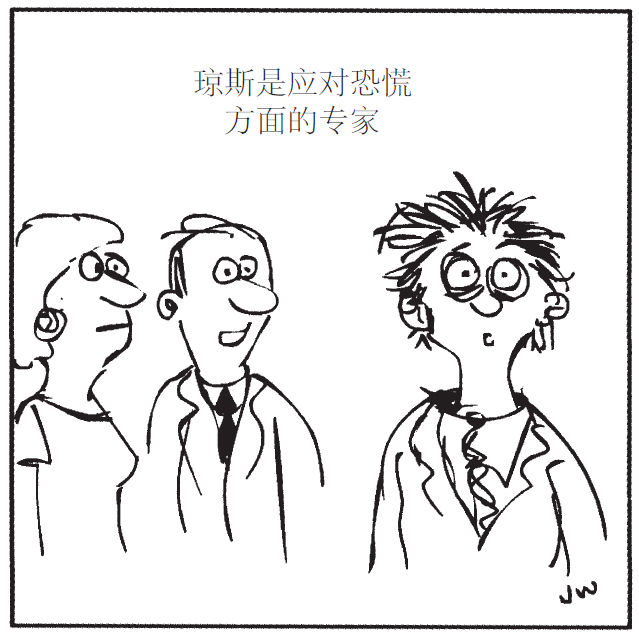

这些特别的方法应该留待特殊场合使用。如果所有项目都以这种恐慌告终，你就无法做出计划。恐慌结束以后，花些时间分析你可以做哪些事情来避免恐慌，以及下一次碰到这些事情的应对方法。

### 如何管理多个项目

很少有人能够享受一次只做一个项目的奢侈待遇。事实上，如果真的这么做了，很多富有创造力的人们一定会觉得枯燥至极。无论是你自己的选择还是他人的要求，你很可能必须要同时应付多个项目。令你难以想象的是，你可以利用它，使其成为自己的优势。要想让这种方法发挥作用，你需要做几件事：

■如同前文提到的一样，为每个项目制定目标地图，标明你想要实现每一步骤的时间。通过这种方式，你可以对项目进行排列，从而了解自己在某个星期、某天中所需要完成的任务集合。

■把所有相同的活动安排在一起，按照活动而不是项目来给自己制定日程表。假设有两个项目需要你进行一些网上研究和拨打电话，先做完所有的网上研究再拨打电话和先在网上研究项目A，随后拨打项目A所需要打的电话，接着在网上研究项目B，然后再拨打项目B所需要打的电话相比，前者会使你的工作更有效率。

■对于一个项目，无论你正在学习或者经历些什么，主动寻找能够运用到其他项目上的方法。这并不要求所有项目都是相似的；事实上，通常最具创意的解决方案都是人们把一种情况下的有效方法运用到另一种情况时产生的。比如，麦当劳开发出的标准流程相关课程现已被其他众多行业采用。

■利用一个项目中的间歇时间来促进另一个项目的进展。当你到达一个无法让项目继续前进的节点时，可能因为你正等待别人的帮忙，这时你很容易转移到80%的那些低价值活动中。如果休息时间到了，一定要休息，这会是查看其他目标地图的好时机，看看在等待的过程中你可以做些什么。值得注意的是，这并不是广受质疑的多工作业。结果毋庸置疑，当我们试着同时做两件事情时，我们没法把其中的任何一件事做得跟我们倾注全部精力做一件事情时一样好。

### 如何为多个项目设定时间

如果有选择的余地，最好把几个项目错开，这样它们各自的最后期限就不会离得太近。无论如何计划，你可能还是会发现截止日期到来前的一两个星期，你需要投入更多的努力。如果碰巧两个或两个以上项目同时出现的情况，这就会造成压力。同样，很多人发现他们更愿意使项目处于不同的活动阶段，这样在某个星期里，他们可能处于项目A的计划阶段、项目B的早期执行阶段以及项目C的完成阶段。

调整项目的另一种做法是把一个项目中的大部分工作分配给其他人去做，此时你可以集中精力全面参与到另一个项目中去。

### 接下来是什么

利用这些工具来应对目标截止日期，运用技巧来应对多项任务，你现在已经了解了成功的全部技巧。当然只有当生活的所有部分处于平衡时，真正的成功才会到来，这就是下一章的主题。

## 第15章　如何保持新发现的注意力

你现在拥有很多能够帮助你在规定时间实现所设定目标的工具。你将通过本章了解保持新发现注意力的有用技巧。你将会发现，这包括拥有平衡的生活、足够的休息时间、锻炼和娱乐，对生活和工作保持玩乐和富有创造性的态度。这些是成功人士的秘诀，为生活而工作，而不是为了工作而生活。

### 你的生活是否平衡

从本书开篇，你便了解了如何运用80/20法则在生活中各个领域取得你想要的结果。然而，在我们的世界里，人们总喜欢从狭义上定义成功，这大多涉及金钱和荣誉。但很多人为了获得荣誉和财富而付出了沉重的代价，那就是为什么很多人把全部精力投入到事业或生意上，却忘记了他们也有创造美好家庭和个人生活的工具。

如果你觉得寻找平衡很难，那么在生活中每个领域都设定一些目标，然后保证所有的目标都能得到你平等的时间和关注。这些领域包括：

■健康和健身。通常我们认为健康是理所当然的事，直到我们不再拥有它才会意识到它的珍贵。如果身体不好，你就无法完全享受生活中的其他部分。给自己在锻炼、健康饮食、休息以及娱乐方面设定一些目标是合乎情理的。

■家庭关系。如果你因过于努力工作而错过孩子的童年，你获得的东西值得你做这样的牺牲吗？就算你认为自己已经在这个领域取得了平衡，问问“专家”的意见：你的配偶、你的孩子以及家庭中的其他成员。如果他们的答案和你的不一样，可能是时候重新考虑你对于时间和精力的分配方式了。

■友谊。你有没有花时间和老朋友保持联系，结识新朋友，特别是工作圈以外的朋友？有的时候你想“以后”再来办那些事，这倒是很容易，但什么时候才是“以后”呢？

■你的宗教或精神纬度。只有你才知道自己喜欢的模式，但你是否关注过这方面的问题呢？

■社区活动的参与。这可以有很多不同的形式，从志愿者工作到捐赠，到你最喜欢的慈善，或者仅仅是邻里间的相互认识。

### 你的非工作目标

为这些领域至少写下一个目标：

健康和健身\_\_\_\_\_\_\_\_\_\_\_\_\_\_\_\_\_\_\_\_\_\_\_\_\_\_\_\_\_\_\_\_\_\_\_\_\_\_\_\_\_\_\_\_\_\_\_\_\_\_\_\_\_\_

家庭\_\_\_\_\_\_\_\_\_\_\_\_\_\_\_\_\_\_\_\_\_\_\_\_\_\_\_\_\_\_\_\_\_\_\_\_\_\_\_\_\_\_\_\_\_\_\_\_\_\_\_\_\_\_\_\_\_\_\_\_

朋友\_\_\_\_\_\_\_\_\_\_\_\_\_\_\_\_\_\_\_\_\_\_\_\_\_\_\_\_\_\_\_\_\_\_\_\_\_\_\_\_\_\_\_\_\_\_\_\_\_\_\_\_\_\_\_\_\_\_\_\_

宗教/精神\_\_\_\_\_\_\_\_\_\_\_\_\_\_\_\_\_\_\_\_\_\_\_\_\_\_\_\_\_\_\_\_\_\_\_\_\_\_\_\_\_\_\_\_\_\_\_\_\_\_\_\_\_\_\_

社区\_\_\_\_\_\_\_\_\_\_\_\_\_\_\_\_\_\_\_\_\_\_\_\_\_\_\_\_\_\_\_\_\_\_\_\_\_\_\_\_\_\_\_\_\_\_\_\_\_\_\_\_\_\_\_\_\_\_\_\_

“新事物的创造并非由智者完成，而是内心需要的游戏本能。”

卡尔·荣格（Carl Jung，1875—1961），瑞典心理学家

### 减少睡眠或锻炼时间：不经济

有的人是如此投入或者热衷于追求目标，以至于他们认为减少睡眠时间是能够释放更多时间来追求目标的好办法。但不幸的是，用不了多久，睡眠被剥夺的问题就会出现。起初你可能根本注意不到，特别是当你试着用增加咖啡因剂量的办法来补偿这一点。但缺乏足够的休息，大脑的快速反应功能会很快恶化。这么做的影响包括注意力降低、记忆力减退、易怒以及更缓慢的反应时间。长期如此，这更有可能引起心脏病、高血压和肿瘤。最新研究同时表明，缺乏睡眠可能导致肥胖。

专家一致认为，个人睡眠所需的时间通常为每天7~8小时。如果你的睡眠时间没有那么多，并且常常会感到有些疲劳，可能正是因为睡眠被剥夺。不仅如此，缺乏睡眠还会影响你形成创造性想法的能力。试着增加一些睡眠时间，你将会了解自己真正需要多少睡眠。

如果你需要改变睡眠习惯，在这里进行总结：

\_\_\_\_\_\_\_\_\_\_\_\_\_\_\_\_\_\_\_\_\_\_\_\_\_\_\_\_\_\_\_\_\_\_\_\_\_\_\_\_\_\_\_\_\_\_\_\_\_\_\_\_\_\_\_\_\_\_\_\_

同样，有些人说他们太忙了没时间锻炼。说这话的英国和美国人中，60%都有超重或肥胖的问题，众所周知，这会对健康产生严重影响。本书并不是一本健身书籍，但缺乏好体魄的人显然很难做到专注高效地工作。如果你担心这会浪费时间，那么你可以听一些播客或者业务相关的音频书籍，这样你就能一边锻炼一边学习了。

如果你需要改变健身习惯，在这里进行总结。

\_\_\_\_\_\_\_\_\_\_\_\_\_\_\_\_\_\_\_\_\_\_\_\_\_\_\_\_\_\_\_\_\_\_\_\_\_\_\_\_\_\_\_\_\_\_\_\_\_\_\_\_\_\_\_\_\_\_\_\_

### 压力传染病

其中有些现象我们已经讨论过，比如过量信息以及你必须一周7天、一天24小时与外界保持联络，这些都极大地增加了你所承受的压力，并且会你的健康产生消极影响。充足的睡眠、锻炼以及休息能够抵挡压力传染病，因此，假期甚至简短的休息都能够让你从日常工作中解脱出来，哪怕只有半天时间，最好能在自然环境中（即使只是当地的公园）。

现在连半天时间空闲也没有吗？那么就从短时间开始停下来想……什么也不要想。坐在路边的咖啡屋，点一杯果汁（而不是浓缩咖啡），关闭你的手机，然后就这么看着过往的人流。注意他们中有多少人在打电话。数一数有多少人在微笑，多少人在皱眉。数一数有多少人会抬头看看其他人或者看看周围。深呼吸。

“停下来想想……什么都不要想。”

如果你需要做更多事来减少压力，写下你将在今天或者明天要做的一件事：

\_\_\_\_\_\_\_\_\_\_\_\_\_\_\_\_\_\_\_\_\_\_\_\_\_\_\_\_\_\_\_\_\_\_\_\_\_\_\_\_\_\_\_\_\_\_\_\_\_\_\_\_\_\_\_\_\_\_\_\_

“最好能让你的生活保持平衡，这是最安全的做法，确定我们周围以及我们身边存在着伟大的力量。如果你能做到这一点，并且接受这一点，你就是一个真正智慧的人。”

欧里庇得斯（Euripides，公元前484——公元前406年），希腊悲剧作家

### 花时间玩乐

本章给出的最后建议是：找时间玩乐。玩乐和创造力之间有着非常紧密的联系，成功靠的是聪明地工作而不是一味埋头苦干。有的人一直很努力地工作，他们甚至想不出任何有意思的或者愚蠢的事情来做。对于那些人，这里有通过30天解放创造力的做法（如果这个月有31天，你得自己再想出一个办法）。

### 创造力的30天

1.写一首与你生活相关的乡村歌曲。

2.问你的祖母，要如何解决你最紧迫的问题（如果你的祖母已不在人世，想象她会如何回答）。

3.看看你杯中的茶叶。写下你看着这些茶叶残渣时脑海中浮现出来的任何想法。

4.如果你有一个知名品牌，你的广告语会是怎样？你希望它会是怎样的？你得做些什么来让你喜欢的这个广告语合乎情理？

5.中午到公园里逛一个小时，看看公园里的人。

6.对你今天遇到的人说三句真诚的赞美。注意他们的反应。

7.花半个小时参观艺术展。选一幅画，至少研究十分钟。

8.在睡觉前给自己讲一个睡前故事。

9.给朋友寄一张感谢卡。不要留你的姓名和地址。在里面写上，“只是觉得需要向你表示感谢”。伪装你的字迹，并且永远不要把这件事说出来。

10.趁没人注意的时候，在街上放一枚硬币，然后在路边看看谁会捡到它以及他们的反应。如果你很大方的话，放五元钱。

11.乘坐一辆开往任何方向的公共汽车或者地铁。随身带一副纸牌。任意拿出一张牌。牌面的数字就是你乘车的站数，下车后，在周围逛一个小时。

12.到玩具店买一个儿时曾经玩过的简单玩具（比如，悠悠球或者一些黏土模型）。周末花一个小时玩这个玩具（如果你觉得尴尬，那就在没人的地方偷偷玩）。

13.出去散个步，想象自己是一本书或者电影里你最喜欢的角色。他们会怎样看待这个世界？他们会对遭遇到的事情有怎样的感觉？如果你很勇敢，那么以这个角色的身份和他人交谈（也就是像你的角色那样说话）。

14.到一家专门供应你很少吃的那种食物的饭店。让服务员替你点菜。

15.在浮力舱中买个舱位。如果不行的话，坐在放满和体温相当的水的浴缸中，关掉所有的灯，戴上耳塞，放松，让你的思绪四处游离。

16.收看播放你听不懂语言的电视台。编造属于你自己的对白翻译。一开始假设播放的是科幻剧，然后是喜剧，再接下来是肥皂剧。

17.躺在衣柜里朝上看。

18.选择最近发生你身上的最重大事情。假设这是你所接受到的很有价值的一堂课。从这段经历中你能学到什么？

19.假设你是爱因斯坦，他第一天做你日常所做的那些事。他会问些什么？他会做些什么？

20.回忆你现在已经不再联系的一个儿时好友。花五分钟时间为他们与你分别之后的日子编造自传。

21.写一份疯狂的个人广告。如果你喜欢，可以真的把它刊登在杂志上，然后看看你会得到什么样的答复。对收到的所有来信进行回复（但你不必告诉他们你的真实姓名和地址……）。

22.找一本漫画书，用涂改液涂掉所有对白，然后自己编写新的对白。

23.一天中，花三倍于说的时间来倾听。注意人们对你的反应有什么不同。

24.一天中，在口袋里放一枚硬币。通过扔硬币决定所有小事。

25.一天开始的时候，写下你自己的占星结果。一天中，看看你能让其中的多少变成现实。

26.在书店阅读一本惊险小说或者犯罪小说的最后10页。试着想象之前都发生了什么。

27.准备一张明信片。在正面贴上你的办公室或者工作区域的照片。在背后写下你过得很好。（你确实过得很好，不是吗？）然后再写一点你正在做的事。把它寄给一个朋友或亲戚。

28.下一次你问别人他们过得怎么样时，他们敷衍地答复你“很好”，你接下来说：“很棒……那现在发生的最好的事是什么呢？”

29.为自己所做的值得骄傲的事做一份令人印象深刻的证书或者奖状，裱上框，挂在墙上。你可以随意使用沃尔夫注意力及创造力高级学院（Wolff
Institute of Advanced Focus and Creativity），作为颁奖单位，我信任你。

30.创立你自己的十项戒律。跟之前有所不同，你需要专注于什么该做，而不是什么不该做。

当然，这30个创意举动只是一个开始。为什么不在月初想出你自己的30个点子呢？

如果你有朋友忘记在娱乐和创意上花时间，在一张明信片上写下上面的一个点子或者你自己的一个点子，寄给他们，并且要求他们把自己的想法回寄给你。

### 接下来是什么

保持一份玩乐的态度、一份平衡感以及充足的休息、锻炼时间，你会发现保持专注的能力和实现你最珍视的目标变得容易起来。本书的下一章是关于一个30人的团体怎样使用专注的方法实现突破性的目标。他们学到的内容能够帮助你快速实现自己的目标。

## 第16章　目标突破经验

你可以以天为单位把本书介绍的技巧运用到你的工作中去，或者像第2章谈到的那样，设定并实现对你有意义的目标。本书第一版发行后没多久，我通过互联网和世界各地的30个人一同行动，我教他们使用读到的这些方法来帮助自己在60天内实现目标。我也为自己设定了一个目标。我想在本章和你分享这其中的一些例子，包括我们遇到的诱惑、障碍以及克服它们的方法。

如果你想跳过本章并开始创建自己的专注目标计划，你可以直接阅读下一章的内容，但我认为你可能发现我们的例子会对你有所帮助和启发。因为有些个人目标是很私密的信息，所以对于例子中出现的人物，我只用姓名中的名来称呼。

### 设定目标

我们的目标多种多样，包括：

■写一部犯罪小说的开头30000字；

■控制血糖，将血糖水平控制在7%的平均水平或者更低；

■为一部19世纪背景下的某人物传记小说寻找出版商；

■对文件、文档、投资记录、照片资料进行整理使其易于进行更新和归类；

■为一部已完成的剧本寻找制作人；

■使白天工作时数增加一倍；

■考察是否改变职业，如果是，要采取哪些步骤；

■身体脂肪比重从18%降低到15%；

■创制10件新的珠宝首饰，对它们拍照，并在互联网上销售；

■执导一部微型电影。

当然，我鼓励人们设置大胆的目标，但同时也提醒他们，这些目标只需要对自己有意义。以我为例，18%的身体脂肪比重是完全健康的，因此并没有什么“合理”的原因需要把它降低到15%。但我却想要这么做，这只是给自己一个进行锻炼的动力，看看那会怎样。

### 60天计划

我们把60天作为实现目标或者大目标某一部分的时间单元，因为这段时间长到足够你做很多事情，但也足够短，短到你可以看到终点。

不过，你可能还记得本书早些时候曾提到我并不认为硬性的截止日期效果会好，除非你能够对这一过程中的所有因素进行控制。在减少我身体脂肪含量的例子中，这千真万确。我可以通过控制运动量和卡路里的摄入量来减慢或加速实现目标的进程。同样，设定在6周内撰写30000字目标的作家也能够对目标实现过程进行控制，只不过这可能意味着需要牺牲一些睡眠或其他活动的时间。

另一方面，想要为手稿找到出版商的作家能够说清楚他愿意做些什么，会试着做些什么来让这一切发生，但最终决定权还是在出版商手里。因此，我鼓励他想想自己的努力都会采取哪些形式，如果他无法为手稿找到出版商，他需要准备一个备用方案。

### 保持警惕

参与人员注意到一件事，那就是当你开始朝着目标方向思考时，靠近你想要的结果的机会似乎会突然出现。

要保证你发现这些机会，做一张你想要拥有的所有机遇的清单很有必要，因为那会使你的思路更加开放。记住，它们通常会带着你意想不到的伪装。参与者发现了一个有用的技巧。

每天早上，在你的笔记本里写下，“今天我要注意……的机会”，用和你目标相关的内容对这个句子进行填空。比如：

■如果你的目标是扩展业务，你可能会写，“今天我要注意其他类型企业成功的方式”。

■如果你正写一部小说，你的句子可能是，“今天我要注意遇到能够写进我小说里去的人或者事的机会”。

每天晚上在你的笔记本里写下，“今天发生的一件能够帮我朝目标前进的事是……”并完成句子。如果你什么也想不起来，重新回顾当天发生的所有事，你可能会发现自己差点错过了一个机会。

参与者中的一位，吉赛尔（Giselle）说：“共时性来得正是时候！我相信这个，并且有办法利用它。我会在晚上完整地写下自己想要处理的问题或事情。不可思议的是，第二天答案就会以对话、电子邮件或者其他方式出现。当然这是让你的潜意识提前做好准备以取得原本就在那儿的东西。这并不是魔术，但有时感觉还是挺神奇的！”

### 障碍1：网瘾

所可能出现的最大障碍之一是对互联网和电子邮件的迷恋。波琳（Pauline），一位单口相声表演者，发现在没法上网、没法查看邮件的情况下，自己更具成效：“我在爱丁堡参加演出，做些我自己的事情，尽管如此，我还是有很多时间用来写作（几乎和在家时一样多的时间！）这有几方面的原因：其中之一是我没法获得和平时一样多的无限网络资源，所以在看别人博客和自己写博客上浪费的时间便少了……”

一些参与者采用的最简便解决方法是：到没有无线网络的咖啡厅或者其他地方工作。另外一个做法是每45分钟专注的努力后，花几分钟时间上网，把它当作对自己的奖励。有人发现每天只查看2~3次邮件的做法很有用。

### 障碍2：旧的习惯很难改变

参与者注意到，虽然放弃80%低产出的时间使用方法并不算难，但如果这还涉及其他人，就要困难多了。我的建议是：有时暂停活动要比直接宣布不再做这项活动要容易。比如，如果你很多年以来每周都会和朋友一起吃饭，但你越来越觉得这件事不如以前有趣，你可以告诉他们你参与了一项非常耗时的项目，未来几周你都会很忙，你需要暂停和他们之间的这种约会。你可以等这段时间过后，再决定是否恢复和朋友的聚会，改变（比如一个月见一次，而不是一个星期）或者完全废除这个聚会。或者你可能决定要和那人做些不同的事，这样你们都会重新喜欢上这个活动。

### 障碍3：挫折是难免的

有时开始新目标的激情会在前一两个星期让你全速前进，但之后你会遇到挫折，这让人非常沮丧。但这是成功的必经之路。

比如，卡门报告说：“我这个星期过得糟透了，一直没锻炼，手机还掉到了水池里，天气热得要命，气温超过30度，等等。发现这些后，第二天我让事情都慢了下来，一切才渐渐回归理想状态。休息了一段时间之后，我解决了手机的问题，找来一些新的树木种在家里，这很棒，也很让人满足。我觉得人应该经历一些苦难的日子，这是有好处的——保持注意、小心，然后再重整旗鼓。”

海伦这样形容她的情况：“有成功也有失败。比如，上周四我在接听一通重要电话时表现得很不好，这让我那天后来一直都非常沮丧。然后，周五的时候，我的活力又恢复了，我在工作时间完成了一份投资者简报，这打破了我的记录。”

给自己留些余地会有帮助。比如，我知道在实现15%的身体脂肪含量的计划期间，我要去柏林待4天，所以考虑了在烈日炎炎的热天畅饮爽口德国啤酒所需要付出的“代价”这一因素，我并不期望那个星期自己在减脂行动会中有所进展，因此我强化了这之前一周和之后一周的努力强度。对于工作而言，当截止日期即将到来，而你也清楚其他任务会在某些时候占用你的大部分时间，在这种情况下，这一策略也同样有效。

其他情况下，一些不可预知的事情会突然出现，比如得了流行性感冒或者需要应付一个“紧急”项目，在这种情况下，做该做的事，然后回到正轨上。如果最初的计划中你已经为任务预留了比你所认为实际需要的时间多至少25%的富余，那么这一切都将简单很多。

“做该做的事，然后回到正轨上。”

### 障碍4：中间时刻

到目前为止，对大部分参与人员而言，最困难的时候是目标执行到一半时。最初的激情渐渐消退，困难开始出现，而终点似乎还在很远的地方。这个阶段我们最需要的就是支持。对于这个计划而言，那就是学员所得到的经验教训、所进行的练习，以及学员交换意见和想法的能力。沃尔特报告说，“我能感觉到身后有一股力量，这是我真正喜欢这个计划的地方。就像一台不断向前驶进的柴油机（不太快，也不太慢）。”记住，如果你没有支持你的家人或者朋友，那么去结交一些新朋友（无论是网络上的，还是现实中的）。

中间时刻也是审视你的计划是否按部就班执行的大好时机。有些人意识到自己的野心太大了。比如，乔什一开始计划在8个星期内写50000字，结果因为还有其他事情要做而无法完成。如果硬要这么去做，那很可能会影响作品的质量，所以最好还是对目标进行相应调整。

波琳注意到中间时刻的来临会引发一些心理问题。她写到，“我痛苦地意识到自己的工作成效在计划执行到一半时所产生的衰退，那是一种既‘害怕失败’又‘害怕成功’两种感觉的混合。我反抗的方法之一就是硬着头皮继续做下去，每天早上设定好闹钟，到时候就起床。”

有的人能够正好按进度完成计划，甚至会提前完成。比如，柏妮丝的目标是让她的碗柜和抽屉有很多空间。计划执行到一半时，她报告说，“这个计划已经完成了50%不止。上个周末我们进行了大规模行动日计划。我们在星期六花了8个小时、星期天花了5个小时来整理橱柜。好意慈善事业组织（Goodwill）<a href="#part0636.html_ch1-back" id="part0636.html_ch1"
class="pcalibre calibre2">[1]</a>可能得建个新仓库来放我们的东西了。整理好之后的碗柜和抽屉看起来简直棒极了，我们就那么站在一边欣赏，这感觉非常好。”

无论是落后、提前还是正好按时完成任务，中间时刻都是再次利用80/20规则的好时候。具体做法就是在你的笔记本中写下：

■你所做的三件已被证明最为有效的事。

■你怎样才能更多地做这些事（假设它们相关）。

■你试过的但却不像你想象中那么有效的三件事。对于每件事，写下你正在使用的或者可以尝试的替换方法。

■你将怎样把这些最有效、最有希望的方法运用到你第4周的计划中。

随着时间一周周地过去，你找到最有效方法的能力也会逐渐提高，这将能够给你提供越来越多的力量使你实现目标。比如，珠宝制造商桑迪报告说，“我的80/20法则是珠宝配件和半成品比成品更好卖。我要找到更多不常见的珠宝半成品和配件，然后把工作重点放在这些东西上面。”

沃尔特的目标就是销售显示器，他记录到，“我感觉通过写私人邮件，附上故事简介以及个人简历（特别是这一点，这是我个人的感觉），然后邮寄给对方会比较有用，所以我会尽量多地这样去做。我另外的策略就是问问我的朋友，看他们是否认识在影视界工作的人。结果确实有人认识，这样我和一些不认识的或者没想到的人取得了联系。”

<a href="#part0636.html_ch1" id="part0636.html_ch1-back"
class="pcalibre calibre2">[1]</a>Goodwill，‘好意慈善事业组织’是美国著名的非营利慈善机构，它的运营主要包括物资接收、物品处理、物品销售三个流程，该慈善机构的广泛设置捐助站（点）、积极寻求与其他组织的合作、‘以劳代工’的救助方式等经验为中国慈善机构的发展提供了借鉴。——译者注

### 决定因素：1001个决定

参与者在这一过程中认识到的一个关键问题是决定目标只是第一步，实际上目标能否实现取决于我们每天所做的那些小的决定。我把这称作你的“1001个决定”。

你的这1001个决定在每天你决定向目标继续前进或远离时发生。有时这些决定是那样微不足道，你根本都注意不到它。

比如，如果减肥是你的目标，这些决定可能包括：

■乘坐电梯还是走楼梯；

■在喝咖啡时吃一个松饼还是不吃；

■在吃糖果之前，查看糖果包装纸上所注明的卡路里含量还是直接吃掉糖果。

如果你的目标是每天或每周完成一定字数的写作，你的决定可能包括：

■观看真人秀节目或者把这时间用于写作；

■在等公共汽车或地铁时，只是站着看看周围的人还是拿出一本便签，对场景或角色进行构思；

■闹钟响过以后，翻个身继续睡觉还是起床进行写作。

如果你的目标是工作上取得晋升，你的决定可能包括：

■准时回家或加班一两个小时完成一个重要报告；

■继续保持现有水平或者参加一门新技术的课程；

■阅读逃避现实主义者的书籍或者阅读和推进与事业相关的书籍。

好消息是如果你一直做出些有助于目标实现的决定，一段时间之后，这就会成为你的习惯，你便不再需要思考或者意志力来做这些决定。比如，海伦想要使她的工作成效翻倍，她记录到，“我意识到如果对自己进行计时，我就会做得很好”，她也通过决定“早点睡觉而不是浏览脸谱网（Facebook）或其他网站。当睡眠不足时，我会发现自己不够专注……这会减少工作时数”，从而取得了很好的成果。

### 成功的喜悦

目标实现后，你不仅会获得直接的好处，而且你会发现这能够大大提升你追寻其他目标的自尊和能量。就算你没能100%地实现自己的目标，这感觉也是存在的。这里列举了部分参与人员在项目结束后所做的评论：

■艾德丽安：“这个项目强迫我集中精力并且对时间进行记录。我现在知道每个星期可以花10个小时用来写作，我有一个每日健身计划（8月中旬以来，我的体重减轻了4公斤），我完成了一个章节的写作和第二个章节的初稿。可以说，我的目标已经实现了75%。我还对自己拖延的方式和事件有了更加深刻的了解。最后，我还对自己年前的所有目标和指标进行了安排。”

■尼克：“我的目标是拍摄自己的微型电影，这个目标大概完成了60%~70%。虽然我并没有完成这部电影，但我还是把它看作一个成功的经历，因为我以前计划花6个月时间来做这件事，但却什么都没做。另外，这个计划没能进一步实施，是因为有外界因素的影响，比如其他人的档期问题，这也得考虑进去。但目前，拍摄日期已经确定，拍摄地点和剧组人员都已经找好，所以这个项目已经蓄势待发。”

■桑迪：“我以前并不知道自己的注意力有多么不集中，也不知道这对我的结果影响有多大。我已经制定了每日计划来帮助自己保持专注。我为自己认为重要的事情预留了时间——锻炼和健康。”

■本找到了三个愿意出版他手稿的出版商，但他有新的决定：“我在过去60天里的突破是我认识到可能要自己出版这本书，因为这是我能够控制出版质量的唯一途径。”

■海伦：“对我来说，经历这个项目最重要的是我更加完整地了解了自己在这些目标背后的情感状态，以及这些目标的技术障碍。这些帮助‘英雄’有勇气继续在旅程中走下去。”

■我：“我实现了脂肪含量达到15%的目标，最终测量数据是14.75%。比实现具体目标更为重要的是，在这个过程中我了解了关于饮食和锻炼的重要信息，这对我未来的人生都非常有用。”

### 接下来是什么

接下来是你了！如果你想了解更多关于60天在线突破计划的内容，你可以登录www.jurgenwolff.com网站，阅读相关内容。当然你也可以利用下一章节的内容建立你的目标计划并实现这个目标。

## 第17章　如何有条不紊地实现所有目标

如果你在阅读本书的过程中也一并做完了所有练习，那么你就已经朝着自己的目标迈出了一大步。不过，在阅读这种类型的书籍时，很多人喜欢先将全书通读一遍，然后再回过头做练习。为方便起见，本章对全书所有要点和重点步骤进行了整理，这样你就可以轻松地将“专注法”运用到以后所有的目标和项目上了。

### 确定你想要通过专注法得到的东西

通过运用构成专注法的技巧，你想要使你的生活发生什么最大的变化？

\_\_\_\_\_\_\_\_\_\_\_\_\_\_\_\_\_\_\_\_\_\_\_\_\_\_\_\_\_\_\_\_\_\_\_\_\_\_\_\_\_\_\_\_\_\_\_\_\_\_\_\_\_\_\_\_\_\_\_\_

### 步骤1：分析你的80/20时间

■在生活的很多方面，你所做的事情中只有20%给你带来了80%的好结果。

■把精力集中在具有积极意义的东西上，是成功的捷径。

■通过找出你所做的给自己带来最大价值的三项活动以及最近你花费在这些事情上的时间，你能够了解有多少空间可以对时间分配方式进行改进。

■坚持做不会带来物质价值或情感愉悦回报的事是人的天性，但战胜旧习惯，你将在成功和快乐上取得收获。

就工作而言，目前能给你带来最大价值的事情是什么？

\_\_\_\_\_\_\_\_\_\_\_\_\_\_\_\_\_\_\_\_\_\_\_\_\_\_\_\_\_\_\_\_\_\_\_\_\_\_\_\_\_\_\_\_\_\_\_\_\_\_\_\_\_\_\_\_\_\_\_\_

\_\_\_\_\_\_\_\_\_\_\_\_\_\_\_\_\_\_\_\_\_\_\_\_\_\_\_\_\_\_\_\_\_\_\_\_\_\_\_\_\_\_\_\_\_\_\_\_\_\_\_\_\_\_\_\_\_\_\_\_

就个人生活而言，目前能给你带来最大价值的事情是什么？

\_\_\_\_\_\_\_\_\_\_\_\_\_\_\_\_\_\_\_\_\_\_\_\_\_\_\_\_\_\_\_\_\_\_\_\_\_\_\_\_\_\_\_\_\_\_\_\_\_\_\_\_\_\_\_\_\_\_\_\_

\_\_\_\_\_\_\_\_\_\_\_\_\_\_\_\_\_\_\_\_\_\_\_\_\_\_\_\_\_\_\_\_\_\_\_\_\_\_\_\_\_\_\_\_\_\_\_\_\_\_\_\_\_\_\_\_\_\_\_\_

工作生活中，你没有做到的哪三件事能带来巨大价值？

\_\_\_\_\_\_\_\_\_\_\_\_\_\_\_\_\_\_\_\_\_\_\_\_\_\_\_\_\_\_\_\_\_\_\_\_\_\_\_\_\_\_\_\_\_\_\_\_\_\_\_\_\_\_\_\_\_\_\_\_

\_\_\_\_\_\_\_\_\_\_\_\_\_\_\_\_\_\_\_\_\_\_\_\_\_\_\_\_\_\_\_\_\_\_\_\_\_\_\_\_\_\_\_\_\_\_\_\_\_\_\_\_\_\_\_\_\_\_\_\_

个人生活中，你没有做到的哪三件事能带来巨大价值？

\_\_\_\_\_\_\_\_\_\_\_\_\_\_\_\_\_\_\_\_\_\_\_\_\_\_\_\_\_\_\_\_\_\_\_\_\_\_\_\_\_\_\_\_\_\_\_\_\_\_\_\_\_\_\_\_\_\_\_\_

\_\_\_\_\_\_\_\_\_\_\_\_\_\_\_\_\_\_\_\_\_\_\_\_\_\_\_\_\_\_\_\_\_\_\_\_\_\_\_\_\_\_\_\_\_\_\_\_\_\_\_\_\_\_\_\_\_\_\_\_

你的工作生活中，什么旧习惯代表了时间运用上价值较低的80%？（这将是删除的一个好选择。）

\_\_\_\_\_\_\_\_\_\_\_\_\_\_\_\_\_\_\_\_\_\_\_\_\_\_\_\_\_\_\_\_\_\_\_\_\_\_\_\_\_\_\_\_\_\_\_\_\_\_\_\_\_\_\_\_\_\_\_\_

\_\_\_\_\_\_\_\_\_\_\_\_\_\_\_\_\_\_\_\_\_\_\_\_\_\_\_\_\_\_\_\_\_\_\_\_\_\_\_\_\_\_\_\_\_\_\_\_\_\_\_\_\_\_\_\_\_\_\_\_

你的个人生活中，什么旧习惯代表了时间运用上价值较低的80%？（这是删除的另一个好选择。）

\_\_\_\_\_\_\_\_\_\_\_\_\_\_\_\_\_\_\_\_\_\_\_\_\_\_\_\_\_\_\_\_\_\_\_\_\_\_\_\_\_\_\_\_\_\_\_\_\_\_\_\_\_\_\_\_\_\_\_\_

\_\_\_\_\_\_\_\_\_\_\_\_\_\_\_\_\_\_\_\_\_\_\_\_\_\_\_\_\_\_\_\_\_\_\_\_\_\_\_\_\_\_\_\_\_\_\_\_\_\_\_\_\_\_\_\_\_\_\_\_

### 步骤2：设置你的第一个目标

■目标应该积极、具体且可衡量。

■目标还应该是可实现和现实的，但你才是决定什么是可实现以及现实的人，这将基于你准备付出多少努力。宏伟的目标都很振奋人心。

■传统的那种强调目标硬性截止日期的方法注定了很多目标无法完成，因为几乎所有目标都包含了超乎控制之外的时间因素。硬性的截止日期只能在你能控制的任务上使用。

■如果你一直能够对策略进行调整改变，直到找到真正有效的策略，你就不会失败。失败的唯一方法就是停止尝试。

■你可以将大目标分解成几个小目标，然后决定你需要做哪些事来实现这些小目标。目标地图是很好的图解方法。

■将你的目标实现之旅想象成英雄之旅，这能让你保持动力。

写下一个大到足以让你感到兴奋和动力十足的目标，你愿意为该目标付出时间和精力。确保用积极的言辞对这个目标进行描述（你想要什么，而不是不想要什么）。

\_\_\_\_\_\_\_\_\_\_\_\_\_\_\_\_\_\_\_\_\_\_\_\_\_\_\_\_\_\_\_\_\_\_\_\_\_\_\_\_\_\_\_\_\_\_\_\_\_\_\_\_\_\_\_\_\_\_\_\_

你将如何知道自己已经实现了目标？你将怎样对此进行衡量？

\_\_\_\_\_\_\_\_\_\_\_\_\_\_\_\_\_\_\_\_\_\_\_\_\_\_\_\_\_\_\_\_\_\_\_\_\_\_\_\_\_\_\_\_\_\_\_\_\_\_\_\_\_\_\_\_\_\_\_\_

在通往目标的路途中，你需要实现哪三个子目标？你可以在下面列出来，然后用软件或笔和一大张纸来绘制你能想到的为实现每个子目标所需要完成的所有相关任务的目标地图。若有必要，用第2章英雄的旅程练习和具象化方法来想出更多关于通往成功道路所需步骤的方法（每次重复这两种方法都可能给你带来新想法）。

如果你必须为这个目标取一个超级英雄的名字，你会取什么名字？

\_\_\_\_\_\_\_\_\_\_\_\_\_\_\_\_\_\_\_\_\_\_\_\_\_\_\_\_\_\_\_\_\_\_\_\_\_\_\_\_\_\_\_\_\_\_\_\_\_\_\_\_\_\_\_\_\_\_\_\_

目标地图的创制是整个计划过程中最重要的一步，因此别指望一次就完成地图的绘制工作。在阅读本章其他部分时，你可以一直对地图进行扩张和改进。

### 步骤3：检查并改变你的时间模式

■我们都有一些行为模式，我们会不断重复这些模式，尽管这并不会给我们任何想要的结果。

■确定阻碍你前进的模式很重要。

■即使是经常带来负面效果的模式也能给我们一些好处，通常它使我们免受拒绝或失败。

■一旦明确消极模式带来的好处，你就可以知道如何从积极模式中取得同样的好处。这是保持改变的关键。

回过头来看看你现在的生活，什么模式可能限制了你的成功？这可能和信仰、习惯、行为、关系或生活中的任何其他方面有关。除非你是特蕾莎修女、比尔·盖茨和南非前总统纳尔逊·曼德拉三者的共同体，否则你一定会找到限制你成功的模式。在第3章中，我们主要讨论了时间利用模式，现在你可以综合起来，进行更全面的考虑。

\_\_\_\_\_\_\_\_\_\_\_\_\_\_\_\_\_\_\_\_\_\_\_\_\_\_\_\_\_\_\_\_\_\_\_\_\_\_\_\_\_\_\_\_\_\_\_\_\_\_\_\_\_\_\_\_\_\_\_\_

\_\_\_\_\_\_\_\_\_\_\_\_\_\_\_\_\_\_\_\_\_\_\_\_\_\_\_\_\_\_\_\_\_\_\_\_\_\_\_\_\_\_\_\_\_\_\_\_\_\_\_\_\_\_\_\_\_\_\_\_

你认为自己从这些模式中获得了什么好处？

\_\_\_\_\_\_\_\_\_\_\_\_\_\_\_\_\_\_\_\_\_\_\_\_\_\_\_\_\_\_\_\_\_\_\_\_\_\_\_\_\_\_\_\_\_\_\_\_\_\_\_\_\_\_\_\_\_\_\_\_

\_\_\_\_\_\_\_\_\_\_\_\_\_\_\_\_\_\_\_\_\_\_\_\_\_\_\_\_\_\_\_\_\_\_\_\_\_\_\_\_\_\_\_\_\_\_\_\_\_\_\_\_\_\_\_\_\_\_\_\_

对于这些好处，想出一种不仅能让你获得相同或相似的好处，而且能避免旧模式弊端的方法。这可能需要一些时间进行仔细考虑。

\_\_\_\_\_\_\_\_\_\_\_\_\_\_\_\_\_\_\_\_\_\_\_\_\_\_\_\_\_\_\_\_\_\_\_\_\_\_\_\_\_\_\_\_\_\_\_\_\_\_\_\_\_\_\_\_\_\_\_\_

\_\_\_\_\_\_\_\_\_\_\_\_\_\_\_\_\_\_\_\_\_\_\_\_\_\_\_\_\_\_\_\_\_\_\_\_\_\_\_\_\_\_\_\_\_\_\_\_\_\_\_\_\_\_\_\_\_\_\_\_

对于你确认的新策略或行为，写下它们将如何帮你实现所设定的目标。

\_\_\_\_\_\_\_\_\_\_\_\_\_\_\_\_\_\_\_\_\_\_\_\_\_\_\_\_\_\_\_\_\_\_\_\_\_\_\_\_\_\_\_\_\_\_\_\_\_\_\_\_\_\_\_\_\_\_\_\_

\_\_\_\_\_\_\_\_\_\_\_\_\_\_\_\_\_\_\_\_\_\_\_\_\_\_\_\_\_\_\_\_\_\_\_\_\_\_\_\_\_\_\_\_\_\_\_\_\_\_\_\_\_\_\_\_\_\_\_\_

### 步骤4：战胜最常见的障碍

■要有更多的时间来实现目标，你必须找到减少花费时间在不太重要事项上的方法。

■通过找出可以取消的任务或活动，你能够节省10%的时间。

■通过委派任务，你还可以节省10%的时间。你可以雇用学生或者使用网上虚拟助手和自由工作者。

■人们不做一些重要任务的原因是做这些事没有做其他事有趣，但你可以找到使它们变得更为吸引人的方法。

■将任务分解成小的步骤是让任务不那么令人生畏的方法之一。另一个方法是创造使自己进入过程状态的条件。

■你还可以利用计划中的零散时间。

为了能够有更多的时间来实现你的目标，你可取消或减少的关于时间利用的一至三种模式是什么？

\_\_\_\_\_\_\_\_\_\_\_\_\_\_\_\_\_\_\_\_\_\_\_\_\_\_\_\_\_\_\_\_\_\_\_\_\_\_\_\_\_\_\_\_\_\_\_\_\_\_\_\_\_\_\_\_\_\_\_\_

\_\_\_\_\_\_\_\_\_\_\_\_\_\_\_\_\_\_\_\_\_\_\_\_\_\_\_\_\_\_\_\_\_\_\_\_\_\_\_\_\_\_\_\_\_\_\_\_\_\_\_\_\_\_\_\_\_\_\_\_

为了能够有更多的时间实现你的目标，你可委派他人关于时间利用的一至三种模式是什么？同时说明你将委派谁承担工作。

\_\_\_\_\_\_\_\_\_\_\_\_\_\_\_\_\_\_\_\_\_\_\_\_\_\_\_\_\_\_\_\_\_\_\_\_\_\_\_\_\_\_\_\_\_\_\_\_\_\_\_\_\_\_\_\_\_\_\_\_

\_\_\_\_\_\_\_\_\_\_\_\_\_\_\_\_\_\_\_\_\_\_\_\_\_\_\_\_\_\_\_\_\_\_\_\_\_\_\_\_\_\_\_\_\_\_\_\_\_\_\_\_\_\_\_\_\_\_\_\_

你必须继续做的三件你觉得不愉快或者无聊的工作是什么？

\_\_\_\_\_\_\_\_\_\_\_\_\_\_\_\_\_\_\_\_\_\_\_\_\_\_\_\_\_\_\_\_\_\_\_\_\_\_\_\_\_\_\_\_\_\_\_\_\_\_\_\_\_\_\_\_\_\_\_\_

\_\_\_\_\_\_\_\_\_\_\_\_\_\_\_\_\_\_\_\_\_\_\_\_\_\_\_\_\_\_\_\_\_\_\_\_\_\_\_\_\_\_\_\_\_\_\_\_\_\_\_\_\_\_\_\_\_\_\_\_

对于每件事，写出一种你能让它更有趣或至少更易忍受的方法。可能的策略包括分解任务、使之与你喜欢做的事情联系起来以及创造流程状态。

\_\_\_\_\_\_\_\_\_\_\_\_\_\_\_\_\_\_\_\_\_\_\_\_\_\_\_\_\_\_\_\_\_\_\_\_\_\_\_\_\_\_\_\_\_\_\_\_\_\_\_\_\_\_\_\_\_\_\_\_

\_\_\_\_\_\_\_\_\_\_\_\_\_\_\_\_\_\_\_\_\_\_\_\_\_\_\_\_\_\_\_\_\_\_\_\_\_\_\_\_\_\_\_\_\_\_\_\_\_\_\_\_\_\_\_\_\_\_\_\_

### 步骤5：利用已见效的方法

■在充分利用自己的优势之前，你必须了解自己的优势。

■专注于利用自己的优势，而不是试图改进自己的劣势。

■对于任何必须要做的但你通常都做不好的任务，留意在什么不同情况下，自己确实能做好这项任务。利用你从特例中学到的，并使其成为规律。

■注意事情进展良好的时候，考虑相关因素以便在其他情况下使用相同的方法。

■当你表现得特别好时，把这项活动和一种声音或者令人愉悦的气味相关联。当你再次需要有如此表现的时候，利用这种声音或者气味来激发正确的情绪。

■了解自己拥有最好想法的时间和地点。不要忽视白天和晚上所做的梦的贡献。

“总是专注于利用你的优势。”

在你的工作生活中，你的三个最大优势是什么？

\_\_\_\_\_\_\_\_\_\_\_\_\_\_\_\_\_\_\_\_\_\_\_\_\_\_\_\_\_\_\_\_\_\_\_\_\_\_\_\_\_\_\_\_\_\_\_\_\_\_\_\_\_\_\_\_\_\_\_\_

\_\_\_\_\_\_\_\_\_\_\_\_\_\_\_\_\_\_\_\_\_\_\_\_\_\_\_\_\_\_\_\_\_\_\_\_\_\_\_\_\_\_\_\_\_\_\_\_\_\_\_\_\_\_\_\_\_\_\_\_

在你的个人生活中，你的三个最大优势是什么？

\_\_\_\_\_\_\_\_\_\_\_\_\_\_\_\_\_\_\_\_\_\_\_\_\_\_\_\_\_\_\_\_\_\_\_\_\_\_\_\_\_\_\_\_\_\_\_\_\_\_\_\_\_\_\_\_\_\_\_\_

\_\_\_\_\_\_\_\_\_\_\_\_\_\_\_\_\_\_\_\_\_\_\_\_\_\_\_\_\_\_\_\_\_\_\_\_\_\_\_\_\_\_\_\_\_\_\_\_\_\_\_\_\_\_\_\_\_\_\_\_

现在你有什么利用这些优势以实现目标的新方法？

\_\_\_\_\_\_\_\_\_\_\_\_\_\_\_\_\_\_\_\_\_\_\_\_\_\_\_\_\_\_\_\_\_\_\_\_\_\_\_\_\_\_\_\_\_\_\_\_\_\_\_\_\_\_\_\_\_\_\_\_

\_\_\_\_\_\_\_\_\_\_\_\_\_\_\_\_\_\_\_\_\_\_\_\_\_\_\_\_\_\_\_\_\_\_\_\_\_\_\_\_\_\_\_\_\_\_\_\_\_\_\_\_\_\_\_\_\_\_\_\_

选择一件你想要更加清楚的事。花15分钟做做关于它的白日梦，不要刻意追求结论，只是让你的思绪游离，然后注意出现的任何想法。

\_\_\_\_\_\_\_\_\_\_\_\_\_\_\_\_\_\_\_\_\_\_\_\_\_\_\_\_\_\_\_\_\_\_\_\_\_\_\_\_\_\_\_\_\_\_\_\_\_\_\_\_\_\_\_\_\_\_\_\_

\_\_\_\_\_\_\_\_\_\_\_\_\_\_\_\_\_\_\_\_\_\_\_\_\_\_\_\_\_\_\_\_\_\_\_\_\_\_\_\_\_\_\_\_\_\_\_\_\_\_\_\_\_\_\_\_\_\_\_\_

在今晚睡觉前对同样的事或另外一件事提出一个问题。第二天早上，回忆你做的所有梦或者梦的片断，描述它们对这件事有怎样的影响。

\_\_\_\_\_\_\_\_\_\_\_\_\_\_\_\_\_\_\_\_\_\_\_\_\_\_\_\_\_\_\_\_\_\_\_\_\_\_\_\_\_\_\_\_\_\_\_\_\_\_\_\_\_\_\_\_\_\_\_\_

\_\_\_\_\_\_\_\_\_\_\_\_\_\_\_\_\_\_\_\_\_\_\_\_\_\_\_\_\_\_\_\_\_\_\_\_\_\_\_\_\_\_\_\_\_\_\_\_\_\_\_\_\_\_\_\_\_\_\_\_

### 步骤6：最终克服拖延的毛病

■把事情留到最后关头才做并不是什么问题，除非这会让你错过截止日期、工作质量下降或者让你感到很有压力。

■拖延通常是因为其他选择的吸引力立竿见影，而你所想逃避的事的回报是以后才能看到的。

■你可以利用所有感官进行生动的想象，使未来的利益更诱人。

■你可以创造一个帮你进入正确状态的锚来战胜拖延。

■如果你并不确定自己拖延的原因，可以通过句子填空技巧让自己了解更多。

■“分解”策略使开始行动和坚持完成任务变得容易。

■你的个性和“第二自我”策略能帮你实现待办事项清单上的所有事。

拖延对你来说是个问题吗？如果不是，跳过这个部分。否则，写下你经常拖延的三种情况或事情。

\_\_\_\_\_\_\_\_\_\_\_\_\_\_\_\_\_\_\_\_\_\_\_\_\_\_\_\_\_\_\_\_\_\_\_\_\_\_\_\_\_\_\_\_\_\_\_\_\_\_\_\_\_\_\_\_\_\_\_\_

\_\_\_\_\_\_\_\_\_\_\_\_\_\_\_\_\_\_\_\_\_\_\_\_\_\_\_\_\_\_\_\_\_\_\_\_\_\_\_\_\_\_\_\_\_\_\_\_\_\_\_\_\_\_\_\_\_\_\_\_

对于每种情况，写出你所追求的结果能够产生的吸引人的景象。比如，如果你总是延迟准备纳税申报单（你也无法委派他人做这项工作），尽可能详细地写下完成这项工作所能够带来的轻松感受。

\_\_\_\_\_\_\_\_\_\_\_\_\_\_\_\_\_\_\_\_\_\_\_\_\_\_\_\_\_\_\_\_\_\_\_\_\_\_\_\_\_\_\_\_\_\_\_\_\_\_\_\_\_\_\_\_\_\_\_\_

\_\_\_\_\_\_\_\_\_\_\_\_\_\_\_\_\_\_\_\_\_\_\_\_\_\_\_\_\_\_\_\_\_\_\_\_\_\_\_\_\_\_\_\_\_\_\_\_\_\_\_\_\_\_\_\_\_\_\_\_

如果你还没这么做，创造一种精神状态或身体状态的锚，让自己在这种情况下能够精力充沛，并准备好处理之前那些不愉快的琐事。如果你需要重温这一过程，可以回过头看看第6章。如果你需要强化锚，只需反复多做几遍这个练习。

描述你一直拖延的一项今天要做的任务（或者至少打算开始做），以及你要使用的克服自己在这种情况下拖延的冲动。如果你需要更多帮助，返回第6章做（或者重复）句子填空技巧和个性分析联系。

### 步骤7：使用“第二自我”策略

■你有很多不同的个性，这些个性会在不同情况下表现出来。

■你可以选择在不同时期使用不同个性来确保你想要完成的任务得到最好的处理。

■给“第二自我”命名能帮助你抓住个性的精髓。比如“匈奴王”、“钱眼小姐”、顾问和“头号恶棍”。

你能给自己个性中的哪三种或更多“第二自我”取什么名字？（你已经为你的超级英雄角色取了名字。）

\_\_\_\_\_\_\_\_\_\_\_\_\_\_\_\_\_\_\_\_\_\_\_\_\_\_\_\_\_\_\_\_\_\_\_\_\_\_\_\_\_\_\_\_\_\_\_\_\_\_\_\_\_\_\_\_\_\_\_\_

\_\_\_\_\_\_\_\_\_\_\_\_\_\_\_\_\_\_\_\_\_\_\_\_\_\_\_\_\_\_\_\_\_\_\_\_\_\_\_\_\_\_\_\_\_\_\_\_\_\_\_\_\_\_\_\_\_\_\_\_

参照你的目标地图，选择接下来你要采取行动的三个步骤。明确在每个步骤中起作用的“第二自我”。

\_\_\_\_\_\_\_\_\_\_\_\_\_\_\_\_\_\_\_\_\_\_\_\_\_\_\_\_\_\_\_\_\_\_\_\_\_\_\_\_\_\_\_\_\_\_\_\_\_\_\_\_\_\_\_\_\_\_\_\_

\_\_\_\_\_\_\_\_\_\_\_\_\_\_\_\_\_\_\_\_\_\_\_\_\_\_\_\_\_\_\_\_\_\_\_\_\_\_\_\_\_\_\_\_\_\_\_\_\_\_\_\_\_\_\_\_\_\_\_\_

### 步骤8：通过影响他人来获取支持和帮助

■你可以影响身边的人，使他们能够支持你。

■人们最渴望的东西是他人的认可。

■你能够认可他人的方式包括倾听、增加眼神交流、用名字称呼他们以及询问他们的观点。

■奖励你想要被重复的行为。

生活中，你是否希望能够得到某人更多的支持？如果有，写出他们的名字。

\_\_\_\_\_\_\_\_\_\_\_\_\_\_\_\_\_\_\_\_\_\_\_\_\_\_\_\_\_\_\_\_\_\_\_\_\_\_\_\_\_\_\_\_\_\_\_\_\_\_\_\_\_\_\_\_\_\_\_\_

\_\_\_\_\_\_\_\_\_\_\_\_\_\_\_\_\_\_\_\_\_\_\_\_\_\_\_\_\_\_\_\_\_\_\_\_\_\_\_\_\_\_\_\_\_\_\_\_\_\_\_\_\_\_\_\_\_\_\_\_

你会使用什么策略来使这些人更加支持你？

\_\_\_\_\_\_\_\_\_\_\_\_\_\_\_\_\_\_\_\_\_\_\_\_\_\_\_\_\_\_\_\_\_\_\_\_\_\_\_\_\_\_\_\_\_\_\_\_\_\_\_\_\_\_\_\_\_\_\_\_

\_\_\_\_\_\_\_\_\_\_\_\_\_\_\_\_\_\_\_\_\_\_\_\_\_\_\_\_\_\_\_\_\_\_\_\_\_\_\_\_\_\_\_\_\_\_\_\_\_\_\_\_\_\_\_\_\_\_\_\_

你会使用什么方法来对支持你的人或者做着对你很重要的努力的人表示更多的支持？写下这些人的名字和你将使用的方法。

\_\_\_\_\_\_\_\_\_\_\_\_\_\_\_\_\_\_\_\_\_\_\_\_\_\_\_\_\_\_\_\_\_\_\_\_\_\_\_\_\_\_\_\_\_\_\_\_\_\_\_\_\_\_\_\_\_\_\_\_

\_\_\_\_\_\_\_\_\_\_\_\_\_\_\_\_\_\_\_\_\_\_\_\_\_\_\_\_\_\_\_\_\_\_\_\_\_\_\_\_\_\_\_\_\_\_\_\_\_\_\_\_\_\_\_\_\_\_\_\_

### 步骤9：专注于你的语言

■大多数对话都只不过是交叉的独白。你可以通过认真倾听将它们转变成真正的沟通。

■通过寻找共同点和巧妙的配合人们的表象系统（视觉、听觉、感觉）来建立融洽的关系。

■要说服他人，先站在对方的立场，通过先跟后带的方法将他们引导到你的方向上。

■另外一个有力的沟通工具是重组，这意味着改变语境或者从另一个角度诠释问题。

■你可以针对原因，通过问三个问题的方式来化解对立。

■当意见不一致时，后退到意见一致的层面，然后基于此寻找解决问题的替换方法。

■有的人会习惯性地反对任何意见；你可以通过提供可选项或者反向建议的方式处理这种极端的反应。

从你的个人或工作生活中选择三个人，在接下来的几天里和他们一起练习你的倾听技巧。写下他们的名字，根据他们的语言，写出你察觉到的他们的主要表象系统（视觉、听觉、感觉）。

\_\_\_\_\_\_\_\_\_\_\_\_\_\_\_\_\_\_\_\_\_\_\_\_\_\_\_\_\_\_\_\_\_\_\_\_\_\_\_\_\_\_\_\_\_\_\_\_\_\_\_\_\_\_\_\_\_\_\_\_

在未来几天里，至少找一次通过先跟后带的方式与持不同意见的人就更有建设性或积极意义的意见达成一致。写出你注意到的事和在此过程中学到的东西。

\_\_\_\_\_\_\_\_\_\_\_\_\_\_\_\_\_\_\_\_\_\_\_\_\_\_\_\_\_\_\_\_\_\_\_\_\_\_\_\_\_\_\_\_\_\_\_\_\_\_\_\_\_\_\_\_\_\_\_\_

\_\_\_\_\_\_\_\_\_\_\_\_\_\_\_\_\_\_\_\_\_\_\_\_\_\_\_\_\_\_\_\_\_\_\_\_\_\_\_\_\_\_\_\_\_\_\_\_\_\_\_\_\_\_\_\_\_\_\_\_

至少找一个使用重组方法的机会，无论是和自己或者其他人。同样，写出你注意到的东西。

\_\_\_\_\_\_\_\_\_\_\_\_\_\_\_\_\_\_\_\_\_\_\_\_\_\_\_\_\_\_\_\_\_\_\_\_\_\_\_\_\_\_\_\_\_\_\_\_\_\_\_\_\_\_\_\_\_\_\_\_

\_\_\_\_\_\_\_\_\_\_\_\_\_\_\_\_\_\_\_\_\_\_\_\_\_\_\_\_\_\_\_\_\_\_\_\_\_\_\_\_\_\_\_\_\_\_\_\_\_\_\_\_\_\_\_\_\_\_\_\_

下一次，当你遭遇反对或者不同意见时，试着使用最可能有效的方法：三个问题方法、退回到最后同意点或者把极端转回到他人身上的方法。写下你注意到的东西。

\_\_\_\_\_\_\_\_\_\_\_\_\_\_\_\_\_\_\_\_\_\_\_\_\_\_\_\_\_\_\_\_\_\_\_\_\_\_\_\_\_\_\_\_\_\_\_\_\_\_\_\_\_\_\_\_\_\_\_\_

\_\_\_\_\_\_\_\_\_\_\_\_\_\_\_\_\_\_\_\_\_\_\_\_\_\_\_\_\_\_\_\_\_\_\_\_\_\_\_\_\_\_\_\_\_\_\_\_\_\_\_\_\_\_\_\_\_\_\_\_

### 步骤10：创造信息专注

■我们接收到的信息比以往任何时候都多，这造成的噪声污染引发了压力和过重的负担。

■目的明确时，滤除无关信息会比较容易。

■有些信息，特别是互联网上的信息，有可能来自偏见的或者带有隐含目的的不实来源。对信息来源进行核查非常重要。

■如果你了解自己的学习风格，可以选择易于自己处理和吸收的信息。

■真正的成功人士并不认同随时与外界保持联系的观点。拥有可以思考和反省的安静时间很重要。

过量信息对你来说是个问题吗？如果不是，跳过这一部分。否则，写出给你带来压力的三种信息过载类型。

\_\_\_\_\_\_\_\_\_\_\_\_\_\_\_\_\_\_\_\_\_\_\_\_\_\_\_\_\_\_\_\_\_\_\_\_\_\_\_\_\_\_\_\_\_\_\_\_\_\_\_\_\_\_\_\_\_\_\_\_

\_\_\_\_\_\_\_\_\_\_\_\_\_\_\_\_\_\_\_\_\_\_\_\_\_\_\_\_\_\_\_\_\_\_\_\_\_\_\_\_\_\_\_\_\_\_\_\_\_\_\_\_\_\_\_\_\_\_\_\_

对于这些问题，从第10章中至少选择一种策略来应对信息过量问题（这些策略包括降低噪声、阅读前明确目的以及使用应答机）。

\_\_\_\_\_\_\_\_\_\_\_\_\_\_\_\_\_\_\_\_\_\_\_\_\_\_\_\_\_\_\_\_\_\_\_\_\_\_\_\_\_\_\_\_\_\_\_\_\_\_\_\_\_\_\_\_\_\_\_\_

\_\_\_\_\_\_\_\_\_\_\_\_\_\_\_\_\_\_\_\_\_\_\_\_\_\_\_\_\_\_\_\_\_\_\_\_\_\_\_\_\_\_\_\_\_\_\_\_\_\_\_\_\_\_\_\_\_\_\_\_

你会做些什么来让自己每天拥有属于自己的时间，你会做些什么让自己有时间进行反思？

\_\_\_\_\_\_\_\_\_\_\_\_\_\_\_\_\_\_\_\_\_\_\_\_\_\_\_\_\_\_\_\_\_\_\_\_\_\_\_\_\_\_\_\_\_\_\_\_\_\_\_\_\_\_\_\_\_\_\_\_

\_\_\_\_\_\_\_\_\_\_\_\_\_\_\_\_\_\_\_\_\_\_\_\_\_\_\_\_\_\_\_\_\_\_\_\_\_\_\_\_\_\_\_\_\_\_\_\_\_\_\_\_\_\_\_\_\_\_\_\_

### 步骤11：征服堆成山的文案工作

■如果混乱的办公桌或办公室会带来麻烦，那它就是个问题。

■一旦你弄清楚自己是更偏向于右脑型或左脑型的人这个问题，你就能相应选择组织工具。

■理想状态是每张纸只处理一次，但这并不现实。

■对于右脑型的人而言，能够看到资料的归档系统会更令人满意和有效。

■你可以利用清单的力量使重复性任务井井有条。

■你的每日待办事项清单应该仅包含你在当天需要完成的任务。其他任务应放在总清单中。

■利用日、月文件夹的组合有助于对未来的任务进行计划。

你是否对目前处理文件的系统感到不满？如果不是，跳过这个部分。否则，写出你认为造成最大问题的三件事。

\_\_\_\_\_\_\_\_\_\_\_\_\_\_\_\_\_\_\_\_\_\_\_\_\_\_\_\_\_\_\_\_\_\_\_\_\_\_\_\_\_\_\_\_\_\_\_\_\_\_\_\_\_\_\_\_\_\_\_\_

\_\_\_\_\_\_\_\_\_\_\_\_\_\_\_\_\_\_\_\_\_\_\_\_\_\_\_\_\_\_\_\_\_\_\_\_\_\_\_\_\_\_\_\_\_\_\_\_\_\_\_\_\_\_\_\_\_\_\_\_

如果你的归档系统没有效果，创建第11章中所描述的系统，利用字母和数字的组合以及总清单。这将如何帮你解决刚才所列的问题？

\_\_\_\_\_\_\_\_\_\_\_\_\_\_\_\_\_\_\_\_\_\_\_\_\_\_\_\_\_\_\_\_\_\_\_\_\_\_\_\_\_\_\_\_\_\_\_\_\_\_\_\_\_\_\_\_\_\_\_\_

\_\_\_\_\_\_\_\_\_\_\_\_\_\_\_\_\_\_\_\_\_\_\_\_\_\_\_\_\_\_\_\_\_\_\_\_\_\_\_\_\_\_\_\_\_\_\_\_\_\_\_\_\_\_\_\_\_\_\_\_

如果你的任务组织和时间安排有问题，创建第11章中所描述的31天/12月文件夹系统。这将如何帮你解决刚才所列的问题？

\_\_\_\_\_\_\_\_\_\_\_\_\_\_\_\_\_\_\_\_\_\_\_\_\_\_\_\_\_\_\_\_\_\_\_\_\_\_\_\_\_\_\_\_\_\_\_\_\_\_\_\_\_\_\_\_\_\_\_\_

\_\_\_\_\_\_\_\_\_\_\_\_\_\_\_\_\_\_\_\_\_\_\_\_\_\_\_\_\_\_\_\_\_\_\_\_\_\_\_\_\_\_\_\_\_\_\_\_\_\_\_\_\_\_\_\_\_\_\_\_

如果你的每日待办事项清单没有效果，采用第11章中描述的格式，清单上仅列出你确实需要在当天完成的任务。这将如何帮你解决刚才所列的问题？

\_\_\_\_\_\_\_\_\_\_\_\_\_\_\_\_\_\_\_\_\_\_\_\_\_\_\_\_\_\_\_\_\_\_\_\_\_\_\_\_\_\_\_\_\_\_\_\_\_\_\_\_\_\_\_\_\_\_\_\_

\_\_\_\_\_\_\_\_\_\_\_\_\_\_\_\_\_\_\_\_\_\_\_\_\_\_\_\_\_\_\_\_\_\_\_\_\_\_\_\_\_\_\_\_\_\_\_\_\_\_\_\_\_\_\_\_\_\_\_\_

如果你或者你共事的人经常需要处理相同的事，建立一个清单系统，通过这种做法，这些问题或者任务可以快速有效地解决。这将如何帮你解决刚才所列的问题？

\_\_\_\_\_\_\_\_\_\_\_\_\_\_\_\_\_\_\_\_\_\_\_\_\_\_\_\_\_\_\_\_\_\_\_\_\_\_\_\_\_\_\_\_\_\_\_\_\_\_\_\_\_\_\_\_\_\_\_\_

\_\_\_\_\_\_\_\_\_\_\_\_\_\_\_\_\_\_\_\_\_\_\_\_\_\_\_\_\_\_\_\_\_\_\_\_\_\_\_\_\_\_\_\_\_\_\_\_\_\_\_\_\_\_\_\_\_\_\_\_

如果你列举的问题无法通过这些方式解决，回到第11章求助于那些特殊情况下的做法。

### 步骤12：驯服邮件怪兽

■每天仅在固定的时间查看邮件。

■果断进行删除——使用“第二自我”策略。

■引导他人使其了解你想要的邮件以及不想要的邮件。

■如有可能，进行委派。

■建立与真实归档系统类似的邮件归档系统。

■利用邮件标题栏给出尽可能多的信息。

■不要用电子邮件发送任何关于他人或自己的敏感信息。

■在电子邮件中，简要提供语境并具体说出你需要对方采取的行动。

处理电子邮件对你来说是个问题吗？如果不是，跳过这个部分（并且恭喜你！）否则，描述你遇到的关于电子邮件的主要问题（这可能包括必须经常检查邮件的压力，花费太多时间回复邮件等）。

\_\_\_\_\_\_\_\_\_\_\_\_\_\_\_\_\_\_\_\_\_\_\_\_\_\_\_\_\_\_\_\_\_\_\_\_\_\_\_\_\_\_\_\_\_\_\_\_\_\_\_\_\_\_\_\_\_\_\_\_

\_\_\_\_\_\_\_\_\_\_\_\_\_\_\_\_\_\_\_\_\_\_\_\_\_\_\_\_\_\_\_\_\_\_\_\_\_\_\_\_\_\_\_\_\_\_\_\_\_\_\_\_\_\_\_\_\_\_\_\_

对于这些问题，至少从上面总结的方法中或者第12章中找出一种解决策略。

\_\_\_\_\_\_\_\_\_\_\_\_\_\_\_\_\_\_\_\_\_\_\_\_\_\_\_\_\_\_\_\_\_\_\_\_\_\_\_\_\_\_\_\_\_\_\_\_\_\_\_\_\_\_\_\_\_\_\_\_

\_\_\_\_\_\_\_\_\_\_\_\_\_\_\_\_\_\_\_\_\_\_\_\_\_\_\_\_\_\_\_\_\_\_\_\_\_\_\_\_\_\_\_\_\_\_\_\_\_\_\_\_\_\_\_\_\_\_\_\_

至少选择一种策略并立即予以实施。按照这个方法处理邮件，几天之后，在下面写出结果。

\_\_\_\_\_\_\_\_\_\_\_\_\_\_\_\_\_\_\_\_\_\_\_\_\_\_\_\_\_\_\_\_\_\_\_\_\_\_\_\_\_\_\_\_\_\_\_\_\_\_\_\_\_\_\_\_\_\_\_\_

\_\_\_\_\_\_\_\_\_\_\_\_\_\_\_\_\_\_\_\_\_\_\_\_\_\_\_\_\_\_\_\_\_\_\_\_\_\_\_\_\_\_\_\_\_\_\_\_\_\_\_\_\_\_\_\_\_\_\_\_

几天之后，增加并实施另一种策略，然后注意结果。

\_\_\_\_\_\_\_\_\_\_\_\_\_\_\_\_\_\_\_\_\_\_\_\_\_\_\_\_\_\_\_\_\_\_\_\_\_\_\_\_\_\_\_\_\_\_\_\_\_\_\_\_\_\_\_\_\_\_\_\_

\_\_\_\_\_\_\_\_\_\_\_\_\_\_\_\_\_\_\_\_\_\_\_\_\_\_\_\_\_\_\_\_\_\_\_\_\_\_\_\_\_\_\_\_\_\_\_\_\_\_\_\_\_\_\_\_\_\_\_\_

你可以继续这个过程，直到完全控制你的电子邮件。这是一项要求持续敏感性的工作。

### 步骤13：掌控会议和社交

■处理枯燥会议最便利的方式是不去参加这种会议或者仅参加会议中和你相关部分的会谈。

■会议应有明确的目的和议程、时间限制以及行为准则。后者可以是不能打电话或者发短信。

■对于集体讨论型会议，为保持观点的持续性，需要遵守四条准则：数量、不加评论、记录每件事以及发展原有观点。

■尽量保持会议低技术含量（避免使用PPT）。

■传统社交会议常常很浪费时间，对很多参会人员来说都是一种折磨。使用“第二自我策略”选择参加其中最有用的20%。

■你可以进行虚拟社交，使用互联网、博客、播客和文章来分享你的知识，把人们吸引到你的身边。

会议

你是否觉得会议是个问题？如果不是，跳过这第一部分，直接参看社会交往部分。否则，写出给你带来问题的三个最大会议问题。这些可能包括太多的会议、太长的会议和缺乏组织的会议等。

\_\_\_\_\_\_\_\_\_\_\_\_\_\_\_\_\_\_\_\_\_\_\_\_\_\_\_\_\_\_\_\_\_\_\_\_\_\_\_\_\_\_\_\_\_\_\_\_\_\_\_\_\_\_\_\_\_\_\_\_

\_\_\_\_\_\_\_\_\_\_\_\_\_\_\_\_\_\_\_\_\_\_\_\_\_\_\_\_\_\_\_\_\_\_\_\_\_\_\_\_\_\_\_\_\_\_\_\_\_\_\_\_\_\_\_\_\_\_\_\_

你现在参加的会议中，是否有些不必参加的会议，或者只参加其中一部分的会议？

\_\_\_\_\_\_\_\_\_\_\_\_\_\_\_\_\_\_\_\_\_\_\_\_\_\_\_\_\_\_\_\_\_\_\_\_\_\_\_\_\_\_\_\_\_\_\_\_\_\_\_\_\_\_\_\_\_\_\_\_

\_\_\_\_\_\_\_\_\_\_\_\_\_\_\_\_\_\_\_\_\_\_\_\_\_\_\_\_\_\_\_\_\_\_\_\_\_\_\_\_\_\_\_\_\_\_\_\_\_\_\_\_\_\_\_\_\_\_\_\_

对于你必须参加的会议，哪些改变最能影响它们的效率？这可能包括设定更加明确的会议议程、强制执行诸如禁止发短信以及消除科技手段等规则。

\_\_\_\_\_\_\_\_\_\_\_\_\_\_\_\_\_\_\_\_\_\_\_\_\_\_\_\_\_\_\_\_\_\_\_\_\_\_\_\_\_\_\_\_\_\_\_\_\_\_\_\_\_\_\_\_\_\_\_\_

\_\_\_\_\_\_\_\_\_\_\_\_\_\_\_\_\_\_\_\_\_\_\_\_\_\_\_\_\_\_\_\_\_\_\_\_\_\_\_\_\_\_\_\_\_\_\_\_\_\_\_\_\_\_\_\_\_\_\_\_

社交

你是否喜欢结交新朋友？如果是这样，跳过这个部分。如果不是，写出三件你最不喜欢的关于社交的事。

\_\_\_\_\_\_\_\_\_\_\_\_\_\_\_\_\_\_\_\_\_\_\_\_\_\_\_\_\_\_\_\_\_\_\_\_\_\_\_\_\_\_\_\_\_\_\_\_\_\_\_\_\_\_\_\_\_\_\_\_

\_\_\_\_\_\_\_\_\_\_\_\_\_\_\_\_\_\_\_\_\_\_\_\_\_\_\_\_\_\_\_\_\_\_\_\_\_\_\_\_\_\_\_\_\_\_\_\_\_\_\_\_\_\_\_\_\_\_\_\_

你能运用第13章推荐的哪些技巧来使社交不那么痛苦和更有成效？写出能帮助你的一种“第二自我”。

\_\_\_\_\_\_\_\_\_\_\_\_\_\_\_\_\_\_\_\_\_\_\_\_\_\_\_\_\_\_\_\_\_\_\_\_\_\_\_\_\_\_\_\_\_\_\_\_\_\_\_\_\_\_\_\_\_\_\_\_

\_\_\_\_\_\_\_\_\_\_\_\_\_\_\_\_\_\_\_\_\_\_\_\_\_\_\_\_\_\_\_\_\_\_\_\_\_\_\_\_\_\_\_\_\_\_\_\_\_\_\_\_\_\_\_\_\_\_\_\_

你如何用互联网替代传统社交技巧将人们吸引到身边？如果合适的话，回到你的目标地图，看看这些技巧能运用在哪些方面。

\_\_\_\_\_\_\_\_\_\_\_\_\_\_\_\_\_\_\_\_\_\_\_\_\_\_\_\_\_\_\_\_\_\_\_\_\_\_\_\_\_\_\_\_\_\_\_\_\_\_\_\_\_\_\_\_\_\_\_\_

\_\_\_\_\_\_\_\_\_\_\_\_\_\_\_\_\_\_\_\_\_\_\_\_\_\_\_\_\_\_\_\_\_\_\_\_\_\_\_\_\_\_\_\_\_\_\_\_\_\_\_\_\_\_\_\_\_\_\_\_

### 步骤14：应对截止日期和多项任务

■解决通往成功所需步骤的最好方法就是从你想要的结果往前进行倒推。

■你可以靠经验完善自己对于每项任务或步骤所需时间的预估。

■在每个步骤的执行过程中运用“3D”准则（删除、委派、执行）。

■检查，而不是期望。

■灵活对待实现目标的方法很重要。

■当问题出现时，孤立问题，并解决问题。

■如果项目偏离正轨，有建设性地恐慌。

■在处理多项任务时，寻找任务间的同质性，并对项目进行计时，这样它们的截止日期就不会互相冲突。

此时你可能已经建立了你的目标地图（如果还未完成，现在开始做）。你可以进一步对这些地图进行细化，首先对预计任务所需时间的精确性进行评估。如果你总是低估所需时间，那么给原本的时间加上一些富余，以保证时间不够的情况不再出现。

再次检查地图上的每一步骤，以确保没有错过任何删除或委派的机会。

接下来，在地图上添加视察点，当需对计划中他人所做的贡献部分实施情况进行检查时，你需要检查他们是否按进度完成任务。

如果你追求多个目标，看看所有的目标地图，查看是否有任何可能协同作用的部分，这既能节约时间，也能节约精力。

最后，如果你遇到意料外的障碍，准备好对它们进行隔离，并立即解决这些问题。最后，建设性地恐慌。

### 步骤15：保持新发现的专注

■保持平衡，为生活中的所有重要方面设定目标。

■减少睡眠或锻炼时间是错误的经济行为。充足的睡眠和锻炼将有助于全效的工作和娱乐。

■至少安排一些简短的时间用于放松以减轻压力。

■玩乐是创造力的重要组成部分。每天找些时间用于玩乐。

你生活中的每个重要部分是否都有目标？如果情况并非如此，想出一些目标以保证生活中的每个重要部分都能得到足够的时间。

健康和健身目标：\_\_\_\_\_\_\_\_\_\_\_\_\_\_\_\_\_\_\_\_\_\_\_\_\_\_\_\_\_\_\_\_\_\_\_\_\_\_\_\_\_\_\_\_\_\_\_\_\_

家庭关系目标：\_\_\_\_\_\_\_\_\_\_\_\_\_\_\_\_\_\_\_\_\_\_\_\_\_\_\_\_\_\_\_\_\_\_\_\_\_\_\_\_\_\_\_\_\_\_\_\_\_\_\_

朋友关系目标：\_\_\_\_\_\_\_\_\_\_\_\_\_\_\_\_\_\_\_\_\_\_\_\_\_\_\_\_\_\_\_\_\_\_\_\_\_\_\_\_\_\_\_\_\_\_\_\_\_\_\_

精神目标：\_\_\_\_\_\_\_\_\_\_\_\_\_\_\_\_\_\_\_\_\_\_\_\_\_\_\_\_\_\_\_\_\_\_\_\_\_\_\_\_\_\_\_\_\_\_\_\_\_\_\_\_\_\_\_

社区目标：\_\_\_\_\_\_\_\_\_\_\_\_\_\_\_\_\_\_\_\_\_\_\_\_\_\_\_\_\_\_\_\_\_\_\_\_\_\_\_\_\_\_\_\_\_\_\_\_\_\_\_\_\_\_\_

生活中其他重要部分：\_\_\_\_\_\_\_\_\_\_\_\_\_\_\_\_\_\_\_\_\_\_\_\_\_\_\_\_\_\_\_\_\_\_\_\_\_\_\_\_\_\_\_\_\_

这些目标都可以使用专注法。

你可以通过什么方式保证自己至少每周三次的健康锻炼？如果目前没有，你打算做些什么计划？

\_\_\_\_\_\_\_\_\_\_\_\_\_\_\_\_\_\_\_\_\_\_\_\_\_\_\_\_\_\_\_\_\_\_\_\_\_\_\_\_\_\_\_\_\_\_\_\_\_\_\_\_\_\_\_\_\_\_\_\_

你生活中的何种玩乐方式让你感到轻松快乐？如果目前没有，你将做些什么计划？

\_\_\_\_\_\_\_\_\_\_\_\_\_\_\_\_\_\_\_\_\_\_\_\_\_\_\_\_\_\_\_\_\_\_\_\_\_\_\_\_\_\_\_\_\_\_\_\_\_\_\_\_\_\_\_\_\_\_\_\_

### 这并不是终点，而是开始……

这是你以令人称羡的轻松姿态一个接一个实现目标旅程的开始。当你不确定接下来要做些什么时，回过头来看看本书，经常访问www.focusquick.com网站，我们会不断更新网站内容并且添加一些新的资源。你也可以直接通过网站给我发送电子邮件。

如果你有任何问题，请与我联系，我会试着给你提供帮助。

我也很乐意与你分享使用专注策略后你所取得的成功，能够和你一起庆祝成功是我最快乐的事！

批判性思维工具（原书第3版）

Critical Thinking：Tools for Taking Charge of Your Learning and Your
Life

\[美\]保罗（Paul，R.）

\[美\]埃尔德（Elder，L.）　著

侯玉波　等译

ISBN：978-7-111-42235-8

本书纸版由机械工业出版社于2013年出版，电子版由华章分社（北京华章图文信息有限公司）全球范围内制作与发行。

版权所有，侵权必究

客服热线：+ 86-10-68995265

客服信箱：service@bbbvip.com

官方网址：www.bbbvip.com

新浪微博 @言商书局

腾讯微博 @bbb-vip

# 译者序

思维是人类最重要的高级心理活动之一，思维和意识的存在才使人类和其他的动物有了显著的不同。心理学很早就关注对思维的研究，但传统的心理学把思维与问题解决等联系起来，对思维如何影响人类生活很少关注。随着文化心理学的发展和积极心理学运动的进一步深入，人们开始把研究的重点放在思维方式的影响上，心理学家意识到思维方式是一个人幸福和成功的决定性因素。本书就是这种思路的体现，作者理查德·保罗和琳达·埃尔德通过对成功人士的分析，总结出了一系列优秀的思维特征，并试图把这些成功思考者所使用的方法提供给我们每一个人，掌握了这些思维方法的人将会成为命运的主宰。

本书用17章的篇幅阐述了批判性思维的问题，这些问题包括从批判性思维的概念、意义到如何成为一个批判性思考者以及一个好的批判性思考者应该是什么样的等问题。作者在第1章里首先阐述了公正性的含义，并把它看成是批判性思维的正确走向。第2章分析了批判性思维的不同阶段，看看你是处于哪个阶段的思考者是进一步思维训练的基础。第3章从自我理解的角度分析了如何做到思维公正。第4章则详细阐述了批判性思维的组成。第5章给批判性思维确立了标准。第6章从提问的角度阐述了批判性思维如何通过训练而养成。第7章阐述了批判性思维学习中要掌握的内容。第8章讲了优秀思考者的学习过程。第9章则是对学习的评估。第10~13章进一步阐述了批判性思维在一些特殊领域的培养和应用问题，这些问题涉及决策、自身非理性的克服、媒体和宣教偏见以及心理谬误的问题。第14章从道德的要求阐述了批判性思维的问题。随后的第15章和第16章则从策略性角度阐述了批判性思维。第17章则对如何成为一名高级的批判性思考者做了总结。通过这一系列的分析，我们能清楚地看到批判性思维是如何培养和建立起来的。

本书的最大特点是实践性强，每一种观念或观点都有方法的支持，也就是说，只要你遵照作者提供的方法，你一定能够把自己训练成为一个具有批判性思维的思考者。与布鲁克·诺埃尔·摩尔和理查德·帕克所撰写的同类书籍《批判性思维：带你走出思维的误区》相比，这本书所提供的方法操作性更强。批判性思维作为心理学应用的一个重要领域，对我们每个人的成长都是必不可少的，我们相信这本书所提供的理论和方法能对我们每个人训练自己的思维有所帮助。

感谢北京大学心理学系人格与社会心理学研究中心的研究生参与了这本书的初译，他们是郭晓明、蔡雯欣、陈书怡、李昕琳、姜佟琳、孙晓琪以及华南师范大学的董梦辰同学。也感谢本书的策划编辑李欣玮及责任编辑赵艳君，她们从选题到统稿都付出了巨大的心血。全书由我校稿审定，由于时间关系和译者的水平有限，难免会有不当之处，欢迎读者批评指正。

侯玉波

2013年3月20日

于北京大学静园3院

# 前言

思维方式决定着行为方式。思维决定行为、感受和需求。如果思维方式不现实，你将会因此身陷沮丧和挫折之中。如果思维方式过于悲观，你就会错失生活中很多快乐的事情。

认真思考生活中能够引发你强烈情感的事情，然后分析在这些事情中，是怎样的思维方式引起了你这样强烈的情感。举个例子说，假如上大学使你感到无比兴奋，这可能是源于你对大学的美好预期。而如果你不愿意去上课，这可能是因为你认为上课很无聊，或者可能是学习内容太难。

同样的，如果你觉得自己的生活质量不够理想，这也很可能是你的思维方式导致的。在生活中，积极的思维方式带来积极的心理感受，相反，消极的思维方式带来消极的心理感受。

当你认为大学生活必定是充满了快乐、友谊，受到同学的尊重和喜爱时，你的生活也会充满同样的欢乐和激情。而当你认为原本设想的一切美好都没有实现、你对这耿耿于怀的时候，你会深感失望甚至沮丧（这主要取决于你对经验解释的消极程度）。

大多数人的思维方式都是潜意识的。这就像大部分悲观的人都不会承认自己是悲观的一样，他们绝不会承认他们自己以消极悲观的方式来思考自我和自己的生命经验，并且总是千方百计地让自己不高兴。

而要想在人们没有意识到自身思维过程的情况下改变思维是不可能的。当思维在潜意识中运作时，我们无法察觉到思维的存在，从而也就不会想去改变我们的思维方式。

在现实生活中，只有少数人能够认识到思维方式在生活中的重要作用，并且能够对其进行控制。对于大多数人而言，在很多情况下，我们都是自己思维方式的受害者，我们惯常的思维方式常常对我们有害无益。我们是自己最大的敌人，潜意识中的思维方式成为我们生活中问题的来源：它妨碍我们对机会的觉察和把握，使我们不能专注于最有意义的事情；妨害我们的人际关系，使我们坠入痛苦的深渊。

我们如何界定一名优秀的大学生呢？决定一名大学生是否优秀的最重要因素就是他们的思维方式。从事学术研究时思维质量高，研究质量就会相应地提高；阅读的时候思维方式活跃，读书就会卓有成效；写作的时候思维质量高，写出的文字自然经读耐读。总的来讲，如果一名学生研究做得不错，阅读和写作也优秀，那么这名学生就是优秀的。当然，导师也会在学生的学习中起到一定的作用。在帮助学生学习的过程中，有的导师做得好，有的做得差一些，但是即使最好的导师也不能代替学生学习、思考、阅读和写作。如果一名学生缺少对课程内容进行思考的必要思维技能，他就不是一名优秀的学生，就不会在大学中获得成功。

本书探讨的一个关键问题就是：如果思维方式是一个人幸福、成功与否的决定性因素，我们为何不去发现和学习那些幸福、成功人士的思维技巧呢？你或许不能精通所有的思维技巧，但是学到任何一种思维技巧，你都会获益匪浅。

本书将会呈现那些成功思考者所使用的思维方法，并且提供学习和练习这些思维方式的方法。通过对本书的阅读和学习，你将会成为一个掌握自己命运的批判性思考者。但最终决定你的思维方式能否改善的关键还是你自身提高的意愿。下面是成功思考者的一些特征：

■优秀的思考者总是在思考他们的思维过程。优秀的思考者认为思维并不是自动的。他们不认为优秀的思维方式是天生的，他们关注自己的思维过程，不断地对其进行反省和调整。

■优秀的思考者都有明确的目标。优秀的思考者从不盲目，他们知道自己的目标所在。他们清楚自己想要什么，拥有明确的目标并知道这些目标之间的优先顺序。他们不断地检查和调整自己的行动使其服从于目标。

■优秀的思考者使用一些思维“工具”来提升他们思维的质量。优秀的思考者知道如何清晰地表述自己的思维方式、如何检查思维方式的准确性和精确性。他们知道如何专注于与目的相关的问题上。优秀的思考者知道如何全方位深度地看待问题，使思维方式更加具有逻辑性。

■优秀的思考者能够将他们的思维与感受、需求相分离。优秀的思考者清楚想法自身不能转化为现实。他们知道人们会不理性地感到愤怒、害怕或者是缺乏安全感，但他们不会允许无端的情感左右他们的决策。他们能洞察自己的心思，这使得他们可以审查自身思维运作的过程，从而可以仔细地控制思维过程（见第1章）。

■优秀的思考者常常分解、剖析事情。优秀的思考者常常“分析”他们的思维方式。他们不相信心智可以自动对思维方式进行分析。我们必须有意识地学习分析思维方式这个方法，这需要我们了解（思维组成部分的）相关知识和进行（精确控制这些思维组成部分的）练习（见第2章）。

■优秀的思考者经常评估自己的思维方式——找出他们思维方式的优缺点。优秀的思考者不相信心智会对自己自动地进行评估。他们认识到心智对自己的评估方法有天生的缺陷。人们必须有意识地学习评估思维方式的方法，这也需要（关于思维普遍标准的）知识和（执行这些标准的）练习。

本书作为一个整体，将会向我们展示对生活中的问题和困难进行正确思考的思维方法和技巧，帮助我们解决学习中、生活中和职业道路上遇到的困难。如果你能认真学习这些方法和技巧，并练习使用它们，你就可以控制自己的思维方式，从而最终提升自己的生活质量。

## 新版的特点

■新！对于原版中一些过于前端的章节，我们很多老师在授课时都没能把它纳入自己的课程中，因此我们将这些章节删除掉了。本书所有的内容都可以在一个学期或者两个学期内授完。

■新！新版中修正了书中的很多图表，并且添加了一些新的图表，这些图表可以让我们更加直观地理解书中的观点。

■修订！新版第15章、第16章提供了一些练习策略，有助于我们提高生活质量、设计自己批判性思维方式的练习计划。

■修订！第14章强调了我们发展批判性思维的主要障碍——自我中心和社会中心。让同学更真实地了解要成为一名优秀的思考者所需要做的种种努力。

■修订！本书使用的批判性思维的概念是全面、综合、详尽的。此外，我们还以简明、易懂的语言向同学介绍批判性思维的原则。本书阐明的批判性思维的概念适用于所有与人类思维和生活有关的领域。

■修订！书中的概念都建立在公正思维的基础上，以帮助教师培养学生公正的思维方式、拒绝诡辩的思维方式。

■修订！第1章不仅强调了思维技能的发展，更强调发展思维特质。这能够有助于教师培养学生换位思考的思维能力，训练学生的正直性、公平公正等其他思维品质。

■修订！本书选用了通俗易懂的语言而不是专业术语，以使同学能够很好地理解书中的观点。

## 感谢

感谢以下学者阅读我们的草稿并提出了宝贵的建议，他们是：Dr.Rochelle
R.Brunson,Alvin Community College；Jan C.Graham,Maryland Community
College；and Bob Schoenberg,University of Massachusetts,Boston.

献辞

谨以此书献给那些因普遍存在的偏见、自欺和不道德的思维方式而遭受苦痛折磨和不公的人。

感谢

特别感谢Gerald Nosich——一名有奉献精神的思想家、学者典范、我的终生挚友。

# 绪论

心灵自有所归属，天堂或地狱只在一念之间。

约翰·弥尔顿，《失乐园》

就像其他语义丰富的名词概念有很多定义的方法一样，批判性思维这一概念也有很多定义的方法。然而，与其他概念一样，批判性思维也具有一些不可忽略的本质要素。在绪论中，我们会介绍批判性思维的本质。我们将为你展开它神秘的面纱，介绍它与你日常生活的关系。最后，我们需要你用自己的语言陈述你对批判性思维的理解，以证明你掌握了这一概念。

## 最新的批判性思维概念

让我们思考批判性思维这一新的定义。

批判性思维是一种对思维方式进行思考的艺术，该艺术能够优化我们的思维方式。而它包括三个紧密联系、互相影响的阶段：分析思维方式阶段<a href="#part0662_split_001.html_ch1-back"
id="part0662_split_001.html_ch1" class="pcalibre calibre2">[1]</a>、评估思维方式阶段<a href="#part0662_split_001.html_ch2-back"
id="part0662_split_001.html_ch2" class="pcalibre calibre2">[2]</a>和提高思维方式阶段<a href="#part0662_split_001.html_ch3-back"
id="part0662_split_001.html_ch3" class="pcalibre calibre2">[3]</a>。

要想掌握批判性思维方式，个体要有对思维方式进行仔细检视和反思的意愿，必须愿意对自己的思维方式进行分解剖析（把它视为一些独立建构的成分），愿意去正视我们思维方式中的弱点，并且能够在此基础上对思维方式进行重塑（见图0-1）。想要克服思维方式中自有的刻板、故步自封的倾向，个体必须要有足够强烈的动机。

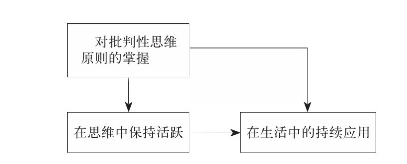

图　0-1　批判性思考者使用理论来理解思维的运作方式，然后将这些理论应用到日常生活中去

要想掌握批判性思维方式，个体必须为自己制订高标准，必须学习可行的方法，一步步地趋近这些标准，以致最终达到这些目标。本书将会帮助大家明白如何掌控自己的思维方式、如何在意识层面觉察出自身的思维方式，将它分解剖析，更好地去了解它，最后优化自身的思维方式。

<a href="#part0662_split_001.html_ch1"
id="part0662_split_001.html_ch1-back" class="pcalibre calibre2">[1]</a>通过在任何情境中关注思维的各个元素：目的、悬而未决的问题、信息、解释和推理、概念、假设、结果和意义、观点。

<a href="#part0662_split_001.html_ch2"
id="part0662_split_001.html_ch2-back" class="pcalibre calibre2">[2]</a>通过指出它的优势和劣势：内容的清晰度、准确性、精确性、相关性、深度、广度、重要性和公正性。

<a href="#part0662_split_001.html_ch3"
id="part0662_split_001.html_ch3-back" class="pcalibre calibre2">[3]</a>通过强调其优势，减少劣势。

## 作为一个思考者，你的技能如何

没有什么比优秀的思维方式更实用的了。无论你在什么情境下、有什么样的目标，也不管你面对什么样的困难，只要你能够掌控自己的思维方式，你就能使事情向好的方向发展。无论是学生、消费者、雇员、市民，还是为人父母、爱人或朋友（生活的各个领域的人），所有人都能从良好的思维方式中获益。相反，不良的思维方式总会招来麻烦、浪费时间和精力、带来沮丧和痛苦。

批判性思维方式可以使个体无论在什么情况下都可以用最佳的思维方式解决问题。人们进行思考通常是为了了解一些情况、应对一些困难、回答一些问题或是解决一些事情。每个人都需要了解我们所居住的这个世界，这种了解对我们的生活很关键。

无论我们如何理解一件事情，我们都会有多种方法去解决它。我们需要充分的信息来帮助我们选择解决的办法。我们需要弄明白：正在发生什么？这真的与我相关吗？当我选择相信某事的时候我是否在欺骗自己？失败的后果是什么？当我想做某件事的时候，我应该如何做准备？我如何才能做得更好？这是我最大的问题所在吗？我需要将精力集中在这上面吗？恰当地应对这些问题是思维每天都面对的任务。

无论何时都没有一种万能的方法能保证你发现事情的真相，但是，却有一种方法可以让你更加接近真相，这就是优秀的思维方式。为了最大限度地发挥你的思维技能，你必须学会有效地批判自己的思维方式。要做到批判性地对待自己的思维方式，你必须首先了解思维的本质。

用一分钟时间思考一下你自出生以来获得的所有经验：有关运动、财富、友谊、怒与怕、爱与恨、父母、自然、城市、习惯和禁忌、人类习惯与本性方面的所有经验。这些学习是一种自发的过程。学习可以分为很多种，其中一种非自发的学习就是内源性学习——学习关于自我的知识、关于思维本身是如何运作的知识、关于我们如何思考以及为何这样思考的知识。

让我们从回答这些不常见的问题开始：你是否了解你的思维方式？你曾经研究过你的思维过程吗？我们知道思维过程涉及很多智力过程，而你又对这些智力过程了解多少呢？更进一步，你是否了解如何去分析、评估和改造你的思维方式？你的思维方式来自哪里？其中有多少是高质量的思维方式？有多少是低质量的思维方式？你思维中有多少是模糊、混乱、不连贯、不准确、无逻辑甚至是肤浅的？在哪些情况下你能够控制你的思维？你知道如何检测自己的思维方式吗？你是否有明确的标准来判断你思维方式的好坏？你是否曾经发现你思维方式中存在的严重问题，然后有意识地进行改正？如果有人希望你能告诉他改进思维方式的心得，你是否确定自己已经掌握了改进思维方式的方法，并且清楚学习这种方法的过程？

如果你跟大多数人一样对于上述问题的答案是：“好吧，我承认我对思维方式没有太多的了解。我在一定程度上认为思维方式是理所应当的。我真的不知道思维方式是如何工作的。我从来没有研究过它。我也不知道如何检测它，即使我的确检测过。思维方式在我的头脑中是自动进行的。”

在一生中，我们很少认真地对思维方式进行研究和思考。思维方式的训练既不是学校里的科目，也不能在家庭中学到。但是，如果你停下来想一想思维方式在你的生活中所起的作用，你就会发现你做过的、想要做的和感觉到的任何事情都受到你思维方式的影响。如果你了解到思维的作用如此重要，你就会对人们很少关注自己的思维方式而感到惊奇。进一步讲，如果你像植物学家观察植物那样开始关注自己的思维方式，你的人生会就此改观。你会注意到他人注意不到的东西。你将成为那些致力于发现人类思维实质，了解人类在思考什么、如何去思考，能够对人类思维方式进行评价和改进的少数人之一。

你逐渐会发现：我们所有的人在成长道路上都养成了一些不良的思维习惯。例如，在没有证据的时候就匆匆得出结论；让刻板印象主导我们的思考；形成错误的信念；立场先行、以既定视角来观察整个世界；忽视和抨击那些与我们相悖的观点；编造一些谎言和虚假的讹传；进行一些与我们的经验不符的思考。当你发现自己的思维中存在这些问题的时候，我们希望你能询问自己或思考一些关键的问题：我能够学着避免这些不良的思维习惯吗？我能够养成良好的思维习惯吗？我是否能够很好地或者更好地进行思考呢？

很少有人会发现思维中的这些习惯和问题。然而，随着你对于良好思维方式和不良思维方式理解的加深，你从中受益就会越多，你就可以开始做出恰当的决策，可以享有更多重要的权利。你的生活也有更多的可能性，会有更多的选择，会减少不必要的错误，会对生活有更多的理解。如果你想要像优秀思考者一样生活，为何不试着对思维方式进行思考呢？

## 良好的思维方式需要付出努力

任何事情都会有思维误区。为了提高自己思维方式的质量，你必须完成繁杂甚至令人痛苦的劳作：思维劳作。如果你想要提高自己的思维水平，你必须有所付出。一个人不可能一夜之间就成为一个优秀的篮球运动员或者是舞蹈家，同样，我们也不能期望自己一夜之间就变成一个熟练的批判性思考者。为了提升思维水平，你必须有对思维方式进行思考的动机。在体力劳作中，我们常说：“没有付出就没有收获！”在这里，更准确地说应该是：“没有思维的付出，就没有思维收获！”

这意味着你必须做一些麻烦、困难、具有挑战性的思维练习。像运动员通过练习和反馈学习肢体动作那样，你要学习思维的“动作”。思维方式的进步就像其他领域的进步一样，这些进步都需要理论的指导、精力的投入和努力练习。本书虽然可以提供成为优秀思考者的练习方法，却不能提供完成这些练习的内部动机，对此，你必须自己做出努力。这就像你必须成为爬下树观察其他同伴动作的那只猴子那样，在观察他人的同时，还必须要检视自己的思维方式。

我们进一步讨论体力和思维活动的相似性。我们相信它们之间的相似性体现在许多方面，因此，体力活动可以为我们的思维活动提供一个可以参照的原型。假如你学习打网球并且希望能打得更好，最好的办法就是通过观看那些优秀运动员的动作影像，认真观察他们是如何打球的。研究他们的动作、知道应该多做什么动作、少做什么动作，不断地练习，然后经过很多练习、反馈、再练习的反复。反复的练习会加深你对这门技艺内部和外部的了解。在这个过程中，你会掌握评论自身表现的专业术语。或许，你会有一个教练伴随你渐渐地进步。同样的方法也适用于芭蕾舞、长跑、钢琴、棋艺、阅读、写作、抚育儿女、教学以及研究等的练习。

思维练习中存在的一个主要问题是：大多数技能练习都是看得见的，而思维并不可见。我们可以看到一项技能表演的录像，但是，观看人坐在椅子上思考，我们会觉得那个思考者好像什么也没做一样。而越来越多的劳动报酬都是由劳动者所能做的思维活动水平决定的，而不是他们的身体力量或者体力劳动。因此，即使思维方式在大多数情况下都是不可见的，但它却是我们拥有的最重要东西。思维的质量决定了我们的贫富、强弱。但是我们通常在思考的时候，并没有注意到我们的思维是如何运作的，我们常常认为思维是理所应当自然发生的。

例如，日常生活和思考中我们经常曲解爱、友谊、诚实、自由、民主、道德这些重要的概念。我们的潜意识总是偏重于我们想要得到的东西，而不是真实地描述自我和世界。

即使我们日常的对话和行为当中暗含了很多概念，但是在很多情况下，这些概念都是不可见的。我们的思维方式也一样，假如我们能够把思维方式呈现在大屏幕上，我们或许会惊奇，甚至震惊于竟然有如此多的思维过程是我们没有注意到的。

要想成为一名优秀的思考者，你必须在思考自己的思维时关注其中暗含的结构——概念就是其中一种，如果你能够认真使用思维的技巧，你就能更好地利用这些结构。当你能清楚地注意到自己的思维、认识到自己思维方式的优缺点、能够像看大屏幕播放节目一样监视自己的思维过程时，你就成了一名优秀的思考者。

批判性思维方式为你提供了思考工具，它适用于生活和学习中所有需要思考的事情。随着思维技能的提高，你会掌握更多思维工具，这些工具可以帮助你在思考任务中更谨慎地推理。无论你追求的目标是什么，目标实现的方法都有好坏之分。批判性思维能够帮助你使用更多好方法，而规避不好的方法（见图0-2和图0-3）。

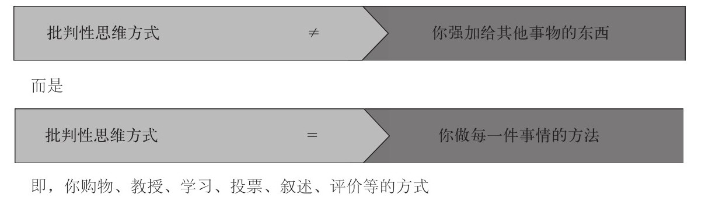

图　0-2　批判性思维方式是我们理解一切事物的方法

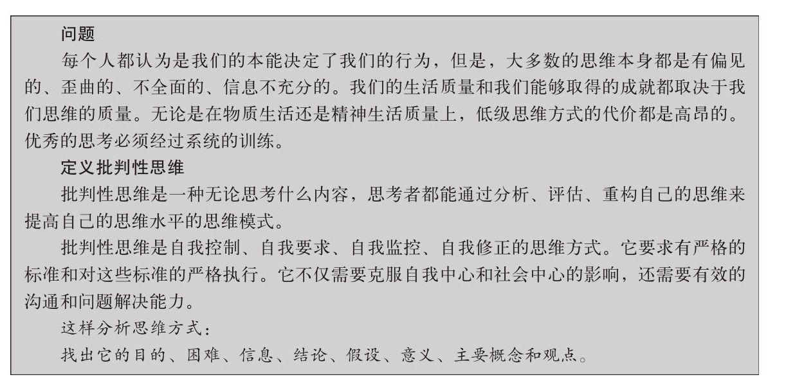

图　0-3　为什么批判性思维如此重要（更详细的“定义”）

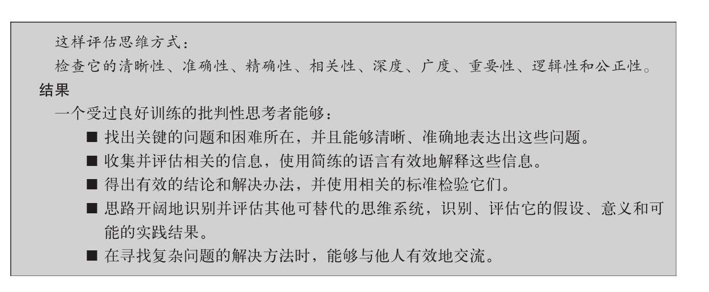

图　0-3　（续）

## 批判性思维的概念

批判性思维的概念反映了一种古希腊的观点。批判性这一词汇有两个希腊根源：kriticos（意思是“恰当的判断”）和kriterion（意思是“标准”）。从语源学上来讲：批判性这一概念的含义是“建立在某些标准上的恰当判断。”在《韦伯斯特新世界词典》（Webster's
New World
Dictionary）中，进入批判性有关的词条显示“以仔细的分析和判断为特点的”，后面接着写道：“严格地理解，批判性指尝试对事物的好坏进行客观的判断。”综合这些定义，批判性思维合适的定义为：

批判性思维是建立在良好判断的基础上，使用恰当的评估标准对事物的真实价值进行判断和思考。

批判性思维有三个维度：分析、评估、创造性。作为批判性思考者，我们分析思考以评估我们的思维，而又在评估思考中提高自身思维的质量。

换一种说法，批判性思维是指为了提高我们的思维水平而对自身思维进行的系统性监视。当我们批判性地进行思考的时候，我们不能从它的表面价值进行评定，我们必须清晰地、准确地、相关地、有深度、有广度和有逻辑性地对思维进行分析和评价。我们发现所有的推理都发生在观点和参考框架中，这些推理都是由一定的目标引发，并具有一定的信息基础，用来推理的所有信息和数据都必须能够被解释，这些解释涉及概念，这些概念需要假设，思维中使用的基本参考信息都有一定的意义。思维中的缺陷可能发生在思维过程中的任何一个阶段，因此我们要密切注视思维的每一方面。

当我们进行批判性思考的时候，我们自己是能够对思维的各个方面进行批判性的分析和质疑的，这种质疑十分重要。批判性思维一些常用的质疑方式如下：

让我们来思考一下，这里最基本的问题是什么？我应该用哪种观点思考这一问题？这样假定对我来说有没有意义？我能从这些数据中做出哪些合理的推论？这些图形有什么含义？这里最基本的概念是什么？这些信息与那些信息一致吗？什么原因使问题变得复杂？我怎么才能检验这些数据的准确性呢？如果这些都符合，这有什么其他的含义吗？这是一个可靠的信息来源吗？

在运用上述问题来反思我们的思维方式时，你可以发现批判性思维活动中的一些最基本的“动作”，这些基本“动作”适用于任何学科、任何问题。本书的主要目的就是帮助你学习批判性思维语言，并且帮助你把这种语言内化为自己的学习和生活基本工具。积极使用批判性思维中的分析和评估工具，你就能够提高自己的思维质量。

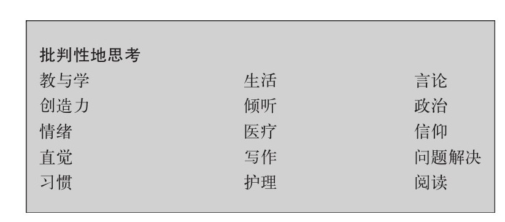

图　0-4　批判性思维可以用于我们思考的所有事情

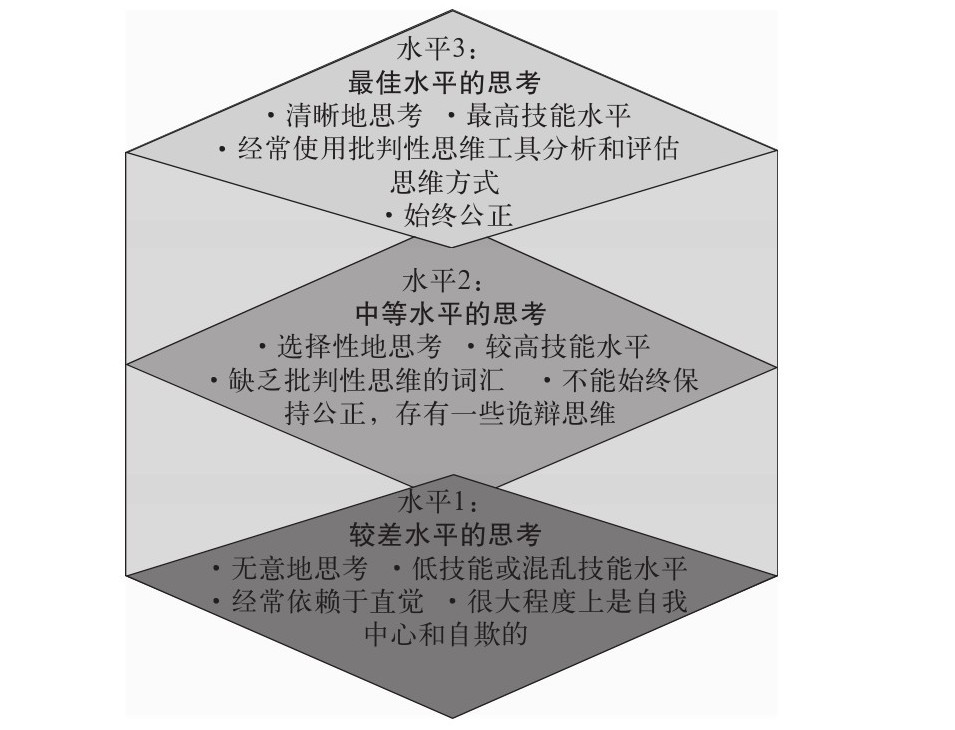

图　0-5　思维的三个水平

## 成为自己思维的批判者

你可以为自己做的最重要、最有意义的事情就是开始批判性地思考自己的思维方式。这么做并不是否定自己，而是对自己的完善。这样做能够是练习思维技能的开始，是终生学习的开端。为了成为自己思维的批判者，你首先要觉察到自己的思维方式，了解它的结构，观察它的含义，找出它的基础和优缺点。你必须认识到：只有通过精力投入和刻苦练习，你才能够彻底改变你的思维方式。你需要了解你思维缺点，以及你努力想要学习的优点。无论你现在的思维处于哪个层次，你要明白通过努力你可以改善自己的思维。批判性思考者努力追寻的最终目的就是促进自己思维创造性的进步。

## 建立新的思维方式

在学校教育中，大部分人使用试误这种费力的方式来改变思维方式。在学校学习批判性思维的过程中，学生很少得到过他人帮助。他们掌握的思维工具很少，结果是总以一种无意的方式依靠我们的天生能力进行思考。在这样的思考过程中，学生养成了一些好的思维习惯，同时也形成了一些不良的思维方式。这些思维混杂在一起很难进行区分。通常情况下，学生往往在没有清晰认识到思维目标的情况下就进行学习。作为一个思考者，他们不清楚自己的目标，只是机械地将每一节课当做任务来完成。不知道如何更好地去学习。

为了能够进行深层次的学习，在学习上，学生需要一个有力的杠杆。学生要清晰地知道自己努力的目标，而且需要有力的工具来帮助优化他们的思维和学习过程。

批判性思维正是这样一个有力的杠杆。它实用性很强，能够帮助学生节省时间和精力，使他们享受生活中更多积极快乐的情绪，它会使学生更加成功。因此，无论你的角色是一名学生、学者、父母、消费者、市民还是其他，成为自己思维的批判者对你都是有益的。

如果你还没有改善你的生活质量，那么你还没有发现批判性思维真正的力量。我们希望本书会成为你生活转变的推动力。任何人都能从良好的思维方式中获益。

## 培养对自己推理能力和识别事物能力的信心

无论你在学校中表现得如何，重要的是你能认识到人类思维的力量。思维的力量，是无穷的。但是，如果我们想要发掘自己的潜力，我们必须要掌控自己的思维。能够掌控住自己思维方式的人能够在各个方面取得进步。

对于学龄儿童，我们经常会认为那些问题回答得最快、考试卷子交得最早、测试题做得最快的学生是最“聪明”的学生，他们也因此获得更好的印象，这往往使得这些学生视自己的智力为骄傲的资本。相反，那些看起来反应相对慢的学生常常认为自己是不重要的、无能的，从而轻易地放弃了学习，他们不明白龟兔赛跑的道理。

事实上，标准化的智力试验常常成为学习的阻碍。是否掌握了知识不重要，关键是看是否注重提高并控制自己的思维方式。批判性思维是一种学习工具，并且它适合所有水平的学生。世界上很多最优秀的思考者不是最快的思考者，例如爱因斯坦、达尔文和牛顿。优秀的思考者可能是那些一直辛勤地工作、经常提问、追求重要观点、综合思考各种信息、区分地对待事物、试图在重要的思想观点之间建立联系的人。他们对自己的思维有强烈的信心，他们享受学习和思考过程中不同观点的碰撞交锋。

看一看达尔文（F.Darwin，1958）是如何描述他在学习中的挣扎的：

我很难清晰准确地表达我自己的观点，这浪费了我大量的时间；但是这也有好处，这种缺陷强迫我专心思考每一句话，因此我可以发现自己推理、观察以及其他方面出现的错误（p.55）。

在解答思维问题的时候，达尔文（1958）依靠的是勤奋和不断的反思，而不是惊人的记忆和快速的反应。

我没有快速的理解力和过人的智力……我理解冗长抽象的思维过程的能力有限……我的记忆量很大，但是却很模糊……我的记忆很差，我对日期或者一句诗的记忆从来没有超过几天……我的创造力一般，至少不比别人好……我想我只是擅长注意到别人常常忽视的东西，并能够认真地观察他们……我有耐心花几年的时间来思考一个未解的难题（p.55）。

爱因斯坦（Clark，1984）在学校中表现很糟糕，当他的父亲询问班主任“孩子将来应该从事什么职业”的时候，老师回答说：“无所谓，因为在任何领域他都不会取得成功。”他没有在任何方面表现出过人的天分。成为科学家后，他也否认自己的智力超常：“我没有任何特殊的天分，我只是好奇心比较强”（p.27）。

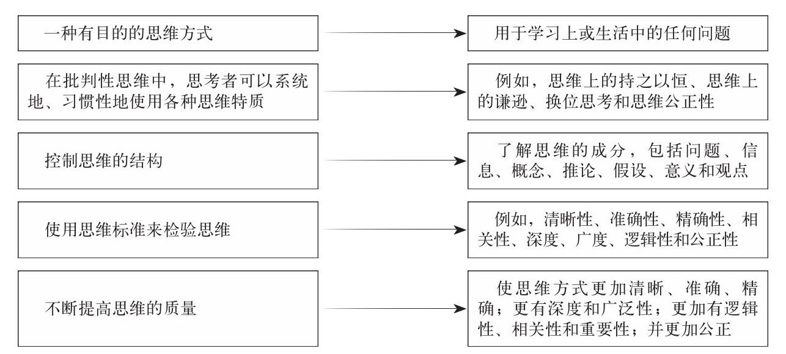

图　0-6　批判性思维：一个详细的定义

优秀的思考者有一些共同特征，他们会系统认真地思考自己解决问题的方式；会对自己不理解的问题进行提问；他们不关心对他们智力水平的界定，也不理会智力试验的结果；他们认为无论记忆好坏、反应快慢，学习最重要的是坚持不懈的投入，以及在学习过程中掌握优秀的思维技巧。只要去做，个体就能养成优秀的思维技巧。本书就是要教会你这些思考的技巧。

记住，赛跑的胜者是乌龟，而不是兔子。成为赢得赛跑的乌龟吧。

# 第1章　成为公正的思考者

并不是所有的思维方式都是公正的，我们可能会成为一名不公正的思考者。我们常常自私、狭窄地学习和应用思维技能。很多思维技能娴熟的人都在这样做。例如，那些政治家，他们利用圆滑（虚假）的说辞操纵人们，他们做出承诺却不去履行，为了维护自己的权力和威望而说假话。从某种意义上说，这些人是技能娴熟的思考者，他们的思维能够帮助他们实现自己的目的，但是最优秀的思考者不会用思维技能来追求自私的目标。优秀的思考者不会试图去控制他人。即使需要付出代价，他们也会努力保持公正。他们了解思维不是与生俱来就是公正的，人的本性是自私的。他们了解要想做到公正需要养成特定的思维特质——谦逊、勇气、整合性、自主性、换位思考、坚毅及对推理的信心。

本章将介绍公正性的含义，并讨论公正性思维的特质。如果你想成为一个公正的思考者，那么你必须进行公正性的“练习”。你必须能够发现你自私的行为，并不断努力改变这些行为。你要变得理性、有同情心、有奉献精神，跳出自己的思维框架来观察自己和自己行为对他人的影响。你必须不断地做出判断，将公正思维内化为自己自我认同的一部分。

## 批判性思维的强弱

批判性思维可能走向两个不同的方向：自我中心或公正。当我们学习批判性思维所需要的思维技巧时，我们既可以自私地使用这些技巧，也可以公正地使用它们。例如，当教给学生如何识别推理中的错误（通常称为谬误）时，大多数学生能很容易从他人的推理中找出错误，但是却很难找出自己推理中的错误。学生善于通过指出他人谬误使得对手的思考看起来很糟糕，但是却很少以此来分析和评价自己的推理。

自由党的人善于发现保守党观点的错误，保守党常常看到自由党观点中的错误。宗教信徒常常看到非信徒思维中的错误，非信徒能看到信徒思维中的错误。反对堕胎的人很容易发现支持堕胎言论中的错误，支持堕胎的人也很容易发现反对堕胎观点中的错误。

我们称这些思考者为批判性程度较弱的思考者。我们之所以称之为“弱的”，是因为即使这些思维在很多方面是很好的，如高水平的思考技巧及批判性的思维方式，但是它却缺少了很多重要的内容，就是比那些技巧更为重要的公正。批判性思考者没能善意地考虑反对者的观点，缺少公正性。

批判性较弱的思考者传统上被称为诡辩家。诡辩是一种以赢得辩论为目的的思维技巧，它不管思维中是否存在问题，也不管相关的观点是否被忽略了。诡辩性思维的目的就是要赢。诡辩的思考者使用低水平的言辞和论证，使得不合理的思维看起来合理，使合理的思维看起来不合理。诡辩性思维是律师、法庭原告和一些政客经常使用的思维方式，对于这些人，他们更加关心的是输赢而不是公正。他们利用思维技巧和诡计来操纵人们的情感和观点。

只要没有遇到批判性程度更强的思考者，诡辩思考者就能赢。批判性程度强的思考者不会轻易地被圆滑、诡辩的言辞和思维诡计所蒙蔽。批判性强的思考者最鲜明的特点就是对公平和正义的追求。他们总是向着道德而努力，决不会做出利用或是伤害他人的行为。他们能对他人观点进行换位思考，尽管不一定赞同，但是，他们也渴望倾听别人的观点。当遇到更合理的推理的时候，他们也会改变自己的观点。他们用合乎道德的方式进行思考，不会用他们的思维来控制他人或者隐瞒真相（用批判性较弱的思维方式）。大概一个世纪以前，威廉·格雷厄姆·萨姆纳（William
Graham Sumner，1906）就描述了批判性程度强的思考者。他说他们：

不容易被外界干扰……不会轻易相信某人的唯一论断……总是考虑事情的各种可能性，不论处理的事情是十分确定的，还是十分复杂的……都能权衡不同证据……能够抵抗住偏见的影响。

世界上有太多自私的思考者，太多诡辩家、欺骗家，太多不道德的律师、政客，他们擅长歪曲信息来服务他们自身的利益。我们希望你能够成为一个技能熟练且公正的思考者，一个能够甄别那些损害他人利益的诡辩游戏的思考者。我们也希望你能够有勇气公开地反对那些不道德的思维方式。这本书也是假定你会认真地学习批判性思维的公正性。

进行批判性程度强的思考需要我们在学习批判性思维的基本技能时就培养公正性，并且“练习”公正的思维方式。如果我们掌握了这种公正性，我们就能避免利用思维技能来服务自身的利益；我们就能以同样的标准对待所有的观点；我们会希望自己和对手都能合理地推理；我们就能对对手和自己采用同样的推理评判标准；我们就能像质疑他人一样质疑反思自己的目的、证据、结论、意义和观点。

对于推理的评估，公正思考者会试着找出这些推理真正的优缺点。本章的目的就是要培养公正的思考者。开始，我们会探讨那些优秀思考者的特点，而余下的内容我们注重培养批判性思维的公正性。事实上，除非特别的说明，之后提到批判性思维指的都是批判性程度高的公正思考者。

本章余下的内容将探讨公正思考者所要具备的各种思维特质。公正性要求的比我们想象的要多，它需要一系列相互联系、相互依赖的思维特质。

最后一点：除公正性以外，批判性程度高的思维方式还要求思维有高度的条理性。当你培养自己的推理能力、内化本章提出的思维特质的时候，你会培养出许多诡辩家没有的技能和洞察力。

当我们考察公正性思维者具备的思维特质时，我们也要考察这些思维特质是如何提高思维质量的。除了公正性以外，批判性程度强的思考者还有深度的洞察力。批判性程度弱的思考者虽然掌握了一些能够帮助他们达成目的的思维技能（例如辩论的技巧），但是他们不具有本章所强调的特质。

例如，一些学生利用思维技能在学习上取得了优异的成绩，但是他们却从来没有认真思考过他们所学的学科。他们成为“攻破考试”的专家，练就了强大的通过考试、做笔记和短期记忆的技巧，他们懂得如何获取老师的喜爱。但是，他们只是学术上的诡辩者，只具有蒙混过关和达到目的的手段，就算他们甚至可以将这些技能迁移到生活的其他领域，但是无论如何，他们都不能成为公正的批判性思考者。（例如第12章和第13章中讲的媒体偏见和谬误。）

我们现在开始介绍公正批判性思考者所包含的思维特质（见图1-1）。在每一部分，我们：

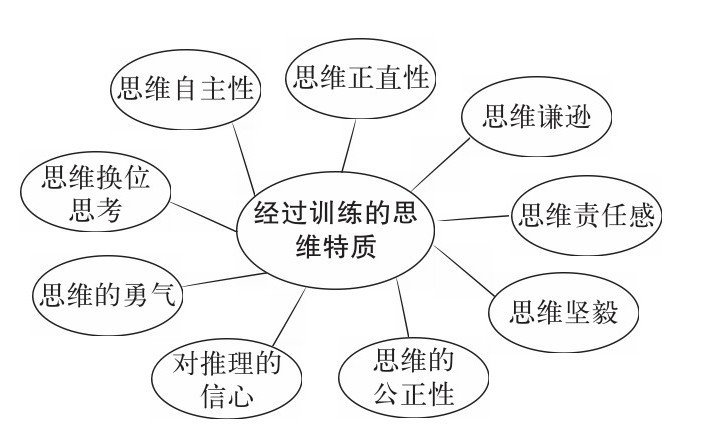

图　1-1　批判性思考者需要努力培养必要的思维特质和品质

（1）介绍一种思维特质。

（2）讨论与之相对的特质。

（3）说明这一特质与养成公正的批判性思维习惯的关系。

（4）说明这种特质与公正性的关系。

首先让我们弄清楚公正性的概念。

这些特质是相互联系的，可以让一个人经验更开放、有原则、提高思维功能。

我们会不自觉地发展图1-2所示的这些特质，因此我们需要训练自己，培养思维的优良特质。

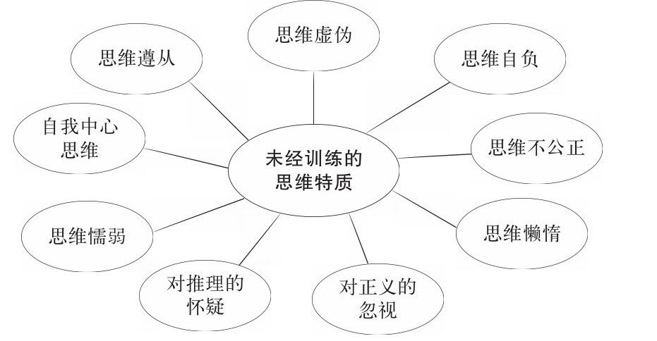

图　1-2　与优秀的思维品质相反的一些特质

## 公正性需要什么

公正性要求我们努力平等地对待每一种观点。这需要我们认识到我们常常对他人的观点抱有偏见，我们常常会给他人的观点贴上“喜欢”（赞成我们观点的）和“不喜欢”（不赞成我们观点的）两类标签。我们常常忽视反对意见，这在我们有自私的理由时更为明显。例如，为了避免帮助贫困人口而牺牲自身的利益，我们就选择忽略成千上万贫困人口的呼声。因此，当情境要求我们考虑自己不愿接受的观点时，公正性的思维品质就显得尤为重要了。

公正性需要我们没有偏见地对待所有相关的观点，排除个人、亲友、集体和国家的感受和利益的影响。它要求坚持良好的思维标准（如准确性、逻辑清晰、广度等），不受个人和团体利益的影响。

公正性的反面就是思维的不公。思维不公指的是推卸准确、清晰地表达相左意见的责任。当我们不公地思考的时候，我们总是认为自己是正确的、公正的。不公的思考和行动中通常有自欺的因素。我们常常为自己进行公正性的辩护，努力找出能够证明我们自身行为是合理的理由，努力去证实我们自己是“正确的”。

因为我们天生都是以自我为中心的，所以我们都会落入不公正的思维陷阱。事实上，在理解人类思维不公的时候，我们应该了解到自我中心（也因此是不公正思考）是人思维的一种固有本性（见第11章）。在这里，我们想强调的是我们永远不可能完全掌握本章中所有的思维特质。没有永远公正的人，人的自私本性是与生俱来的。公正性的每一点进步都是个体不断地与自己内在私心进行斗争的结果，我们时刻都要面对这样的心理斗争。心理斗争势必会产生痛苦，但回报却是高度自控的批判性思维，这种思维不会轻易地被别人操纵，持这种思维的人能够看到事实和真相，做到客观公正。

完全公正的思维状态是我们永远也达不到的理想状态。公正性要求我们同时拥有思维的谦逊、勇气、换位思考、正直性、坚毅、自主性和对推理的信心（用好的推理说服自己）特质。除非这些特质整体发挥作用，否则公正性是不完备的。

然而，这些特质并没有受到普遍的重视。我们日常生活很少讨论这些特质，教学中也很少涉及，电视上也不会谈论。这些思维特质不是学校课程的内容，也没有专门的测验来测试这些特质。但是这些特质却是思维公正性及批判性思维必不可少的。让我们从思维谦逊开始进行详细解释。

### 思维谦逊：努力发现自己对未知知识忽视的程度

简单地介绍思维谦逊就是：

思维谦逊就是要认识到自己对未知知识的忽视程度。因此，思维谦逊要求个体清晰地认识到自我中心导致的自欺行为（认为自己比自己实际知道的要多）。这意味着个体要对自己的偏见和观点的局限性有所了解。它要求我们清晰地认识到自己有哪些信息是不知道的，特别是事件能够引起个体强烈情感的时候，更要知道对该事件自己有哪些不清楚的地方。思维谦逊要求我们不能宣称自己知道我们实际上并不知道的事情。思维谦虚并不是懦弱、服从，而是摒弃自负。思维谦逊要求我们觉察并且评估自己信念的基础，要求我们找出那些不能被正确的推理所支持的信念。

与思维谦逊相反的就是思维自负，即认为自己知道了实际并不知道的事情。思维自负的人缺乏对自欺行为和观点局限性的认识，他们常常声称了解自己其实并不了解的事情。思维自负的人常常也会成为自己偏见的受害者。

当我们谈论思维自负时，并不一定就是指那些外表上看起来自以为是、高傲自大的人。这些思维自负的人外在表现很可能是十分谦虚的。例如，一个不加思考就顺从邪教领袖的人表面上经常否定自己（“我什么也不是，你是无所不能的”），但是实际在思维上，他却对自己错误的信仰十分坚定。

不幸的是：现实生活中大多数人都认为自己知道其实并不了解的事情；我们都有错误的信念、偏见、错觉和谬见。当这些错误信念受到挑战的时候，我们都不愿意承认自己的思维是“欺骗性的”。我们总认为自己是谦虚的，但往往我们是很自负的。我们不但没有意识到自己知识的局限性，还忽视和掩盖这些局限性，这带来了大量的痛苦和时间浪费。

例如，当哥伦布“发现”北美大陆时，他相信奴役印第安人是上帝的意愿。据我们所知，他当时根本没有认识到声称遵从上帝的意愿是他自己思维自大的表现。下面摘选自霍华德·津恩（Howard
Zinn）的《美国人民的历史》（A People's History of the United
States，1995），思考这一段内容：

哥伦布报告说，那些印第安人“十分的幼稚和无私，如果你没有见过他们的话，你是绝对不会相信的。当你索要他们的财产时，他们从来都不会拒绝。相反，他们乐意与任何人分享……”他以向印第安人的族长寻求帮助来总结自己的报告，作为回报，他答应印第安人在下次航行中将为他们带来“他们需要的足够量的黄金……”哥伦布的语言中充满了宗教词汇：像“永恒的上帝，我们的主，给予信徒以无所不能的胜利。”……哥伦布后来写道：“让我们以主的名义继续从事奴隶买卖。”（pp.3-4）

思维的自负和公正是不兼容的，因为如果我们对自己判断的事情过分自信，我们就很难做出公正的判断。如果我们不了解某一宗教（如佛教），我们就不能公正地评判这个宗教。如果我们对宗教存有误解、偏见或假象，我们就会曲解这一宗教。错误的知识使我们不能做出公正的判断，错误的概念、偏见和幻想等都是错误的知识。我们喜欢快速地、过分自信地做出判断。在人们的思维中，这些不良的习惯是普遍存在的。

思维谦逊对于成为公正的批判性思维者十分重要。要成为公正的思考者，就要了解自己缺乏哪些知识，这种了解可以让我们从多方面提高我们的思维。它可以让我们认识到偏见、错误信念和不良思维习惯能够导致学习缺陷。例如，思考我们学习肤浅性这一倾向：我们才学习了一点，我们就认为自己知道了很多；我们才获得了有限的信息，就草率地进行概括；我们混淆了死记硬背和深层学习之间的区别；我们会不加思考地接受了我们听到和读到的信息，特别是当这些信息与我们所坚信的信念一致时。

本章接下来的讨论将会鼓励你做到思维谦逊，帮助你提高对思维自负的警惕。从现在开始，看一看你是否能够提高对自己知识局限性的意识。努力发现自己的自负思维（这种思维在你身上应该每天都会出现）。当你发现了自己的自负思维时，你应该为能发现自己思维中的弱点而奖励自己。

能够觉察出缺点是一种优点。作为初学者，回答下面的问题：

■你能够列出你经常持有的偏见吗？\[思考一下你对你的国家、宗教、朋友、家庭的印象，你的这些印象仅仅是根据他人（父母、朋友、同伴、媒体）传达给你的信息做出的。\]

■你是否曾经在没有证据支持自己的判断的时候，就坚定地支持或者反对某一观点？

■你是否曾经在没有充分信息去评判某一争端时，就假定自己的群体（你的家庭、宗教信仰、国家、朋友）是正确的。

### 思维的勇气：培养自己敢于挑战大众信念的勇气

思维公正性的第二个特质就是思维的勇气。

具有思维勇气就意味着个体能够公正地面对各种意见、信念和观点，即使这会让你感到痛苦。它可以让你准确公平地评判与你意见相左的信念。思维的勇气一个重要的作用，就是可以帮助你判断在社会大众普遍接受的观点中，哪些是合理的，哪些仅仅是主观喜好的结果。具有思维勇气的人知道有时候社会传输给我们的结论和信念也是错误的。

为了确定信息的准确性，一个人不能只是被动地、不加批判地接受所有东西。要具有思维勇气，要了解那些被社会认为是危险和荒谬的观点常常包含着一些真理，而群体普遍认同的观点也可能包含错误。要做到公正地思考，我们必须培养思维的勇气，必须不畏惧不遵从大众观点可能受到的社会严厉惩罚。

与思维的勇气相对的是思维的懦弱，是害怕自己与他人观点不同。如果缺乏思维勇气，我们就不敢对那些我们认为是危险荒谬的意见、信念和观点进行认真思考。如果缺乏思维勇气，当我们面对强烈冲突观点的时候，我们会感到威胁，不愿意去检查审视自己的思维，也就很难做到思维的公正性。

下面的观点或者与之相反的观点在一些人心中是“神圣的”：

■做一个保守的人/自由的人。

■信仰上帝/不信仰上帝。

■信仰资本主义/信仰社会主义。

■赞成堕胎或不赞成堕胎。

■赞成经济制裁或不赞成经济制裁。

不管你站在哪一边，我们常常会这样描述自己：“我是一个\_\_\_\_\_。”（这里填一个内部信仰。例如，我是一个基督教徒；我是一个保守主义者；我是一个社会主义者；我是一个无神论者。）

一旦我们使用信仰来定义自己，那么当这些信仰被质疑的时候，我们内心就会产生恐惧，屈服于这些恐惧就是思维懦弱的表现。质疑我们信念就好像质疑我们自身一样，我们内心强烈的恐惧会阻碍我们公正地对待那些相反的信念。当我们“考虑”相反的意见时，我们会潜意识地抨击这些观点，拒绝这些观点。我们需要思维勇气来克服与特定的信念相联系的内心恐惧。

思维勇气重要的另一个原因，是它能够有力地帮助我们应对他人的反驳。他人有对我们提出质疑的权利，他们持有特定的信念，当我们挑战他们的信念时，他们可能会做出反驳。很多人通过别人的观点来判断自己，从他人的称赞中来认同自己。这些人的思想背后隐藏着对被反驳的恐惧，很少有人会去挑战自己所属群体的意识形态和信念系统，这是思维懦弱的第二种形式。这两种形式都使我们不能公正地考虑自己和他人的观点。

我们不应该以自己的个人信念来定义自己，界定自己最好的方法是根据形成信念的过程来做出关于自己的定义。这就是我们所谓的批判性思考者。思考下面的解决办法。

我不会认同任何信念的内容。我只认同自己形成信念的过程。我是一个批判性思考者，我愿意检验我的信念，并且愿意放弃那些不能被证据和理性思考支持的信念。我会时刻跟随证据和推理的脚步。我的真实身份是一个批判性思考者、一个终生的学习者、一个通过建立更加合理的信念不停寻求提高自己思考水平的人。

当我们不再将我们自己的身份和信念联系起来的时候，我们的思维就会更有勇气、更加公正。我们不会再为有相斥的信念而感到恐惧，不会再为自己的信念被证明是错误的而感到恐惧。我们可以轻松地承认自己曾经犯过的错误，并乐意去纠正自己：“告诉我你的信念、理由，或许我可以从你的信念中进行学习。我会随时准备放弃那些与事实不相符的信念。”了解了思维勇气之后，思考你认识的人中有多少具有思维的勇气。

### 思维换位思考：从他人的角度学习理解相反的观点

现在让我们来学习另一个公正思维的必要特质：思维同理心、换位思考。

思维的换位思考就是站在他人的角度思考问题，从而真正地理解他人的观点。这要求我们准确地再现他人的观点和推理，从他人的前提、假设和观点进行推理。这一特质要求个体积极回忆自己坚持错误的情况，也要求个体有能力辨别在当前情况下也可能会犯类似的错误。

与思维换位思考相对的是思维的自我中心性，即以自我为中心来进行思考。当我们从自我中心的角度进行思考的时候，我们就不能理解他人的思想、感受和情感。很不幸，自我中心倾向是我们思维的自然本性，我们大部分的注意力都集中在自己身上。我们的痛苦、需要和希望都是最重要的，他人的需要无关紧要。我们不会主动地从反对者的角度考虑问题，也不会主动从那些可能改变我们自己观点的角度思考问题。

不能够理解他人的观点，又如何能够公正地对待他人呢？公正的思维需要努力置身于他人（或其他有知觉的动物）情景，思考他人观点。这需要我们尊重那些孕育出不同观点的背景和环境。人类思维的方式源于人们生活情景，源于不同的背景和情况。如果我们不能从他人的角度出发准确地理解他人的观点，我们就不能公正地评判他们的观点和信念。但是，从他人的观点思考问题不是一件容易的事，这是一项很难获得的技能。

为了培养思维换位思考的技能，请练习下面的策略：

（1）在不同意某人观点的时候，换位思考。告诉对方，“接下来10分钟我将从你的观点出发与你谈话，如果你也能从我的观点出发进行谈话。这种方法可以使我们更好地了解对方。”确保你能够准确地表达对方的观点。

（2）在讨论的过程中，用下面的句子总结对方的谈话：“你是不是想说\_\_\_\_\_。对吗？”

（3）阅读的时候，告诉自己你认为作者想要说什么。这样可以使你能够正确地理解他人的观点，从他人的观点思考问题。只有这样你才有资格来评论他人的观点。

### 思维正直：用同样的标准评判他人和自己

让我们来思考思维正直这一特质：

思维正直是指尊重严谨的思维，用同样的标准要求自己和他人。例如，在寻求证据的时候，要求对手证据的标准，我们自己也应该做到。我们要经常练习为他人辩护，这要求我们承认自身思维和行动的不一致性，并识别出自身思维中的不一致。

思维正直的反面就是思维虚伪，是指一种不诚实、自相矛盾的思维状态。因为思维的天性是自我中心的，是虚伪的，它会为我们不合理的思维和行为进行辩解，使之合理化。自我内部需要塑造一个积极的形象，对于自我中心思想来说，诚实的表象是很重要的。因此，我们常常将虚伪隐藏起来，即使我们要求他人的标准更加严格，我们也认为自己是公正的。即使我们声称遵守某些信念，但却常常言行不一。

假如我对你说我们两个的关系对我来说很重要，但是，你却发现我在重要的事情中对你撒了谎。我表现得很虚伪。然而，在自我中心思想中，我会为自己的撒谎行为进行合理化解释，我会为自己辩解道：“她最好不知道这件事，这件事会让她难过，也不利于我们关系的发展。毕竟这件事也不是那么重要，不是什么大不了的事。”当我用这样的方式合理化我的撒谎行为后，我就能隐藏自己的虚伪。即使我曾经撒过谎，但是，我也能使自己确信我做了当时情景下最应该做的。简单地说，在自己的思想中，我是好的。

当思想和行为一致的时候，我们就是思维正直的。我们做到了我们承诺的，没有表面说一套实际上却做另一套。

很明显，如果我们用不一致的标准去评判自己和他人的思维，我们就无法公正地对待他人，虚伪的实质是不公。如果我们不能认识到自己思想和行为之间的不一致性，我们就不能对自己的道德问题进行合理的推理，就会为了自身的利益歪曲其他的观点。

思考下面的政治案例：一直以来，媒体都在质疑中央情报局行为的合理性。这些屡遭媒体质疑的行为涵盖从暗杀外国政治领袖（如试图暗杀古巴总统卡斯特罗）到培训其他国家（如中美洲和南美洲国家）的军警刑讯来从犯人口中获得信息。在了解到这些阴谋行为时，我们只要想象一下，如果其他国家想要暗杀我们的总统或是教给我们军警如何虐待犯人，我们将做何反应。一旦我们意识到这一点，我们就会发现自己行为中的不一致性。在对执行这些阴谋行为的人的态度上，我们的思维是不正直的。

所有的人都有思维不正直的时候。当我们这么做的时候，我们的思维是不公的，没能通过合理的思考来发现自身思维和生活中的矛盾。

### 思维坚毅：不轻易地放弃；战胜挫折和困难

让我们思考思维坚毅。

思维坚毅指的是战胜挫折、完成复杂任务的品格。有些困难十分复杂，不容易解决。但思维坚毅的人面对复杂任务和挫折时不会放弃，他们清楚认真地对复杂问题进行推理比快速得出结论更加重要。思维坚毅要求严格遵守理性标准，而不是根据第一印象做出判断或是快速给出简单化的答案。它还要求对困惑和未解决的问题进行长时间努力的思考，并从中获得深刻的见解。

与思维坚毅相反的是思维的懒惰，思维懒惰的人在应对具有挑战性任务的时候很容易放弃，他们对复杂思维活动带来的痛苦和沮丧容忍度较低。

高水平的思维活动需要思维坚毅，因为高水平的思维活动都包含一定的思维挑战。没有思维坚毅性，就无法克服这些挑战。数学、化学、物理、文学、艺术及其他任何领域的高质量推理都需要思维的坚毅。很多同学在一门学科的起步学习阶段就放弃了。由于缺乏思维坚毅，他们没有能够深入地思考这一学科，从而没有获得更深的见解。他们回避可能会令他们沮丧的思考，毫无疑问，最终，他们会因为无法解决生活中遇到的复杂问题而处处受挫。

学生常常因为以下两种原因而缺乏思维坚毅性。

（1）本能地厌恶思维困难，往往选择容易的事情，选择最省事儿的方法。这就是思维的自我中心本能。

（2）学校教育中不但很少培养思维的坚毅性，反而鼓励学生快速地完成任务。那些反应最快的学生被认为是最聪明的，认真、谨慎地解决问题通常得不到赞赏。这导致学生认为速度是学习中最重要的。那些没有快速完成任务的学生会认为自己没能力、很笨或者幼稚。然而我们生活中需要解决的问题都是复杂的，因此需要勤奋、努力和扎实的思维技巧而不是反应的速度。在思维过程中的专注程度将决定我们解决问题的程度。

反应较快的学生在面对困难任务的时候也容易放弃，因为他们认为自己能够快速地找到“正确”答案，能够避免思维痛苦。当他们没有能够快速并且轻松地找到正确答案的时候，他们常常责备老师的题目“愚蠢”。事实上，这些学生没有认识到每一个问题都没有唯一“正确”的回答；一些答案仅仅有恰当和更恰当之分，并且不存在简单、快捷地解决这些复杂问题的有效方法。

缺乏思维的坚毅是如何影响思考公正的呢？在理解他人的观点时，只要他们的观点与我们的不同或是本质上较复杂，都需要思维坚毅。如果我们不能理解他人的观点，考虑他人使用的信息，理解并分析他人对这些信息的解释、他人的信念，那么我们就不能了解他们的目的以及他们看待世界的观点，就不能公正地对待他们的观点。

举个例子来讲，假如我们是基督教徒，想要公正地对待无神论者的观点，只有通过阅读和理解那些优秀无神论者的论著，我们才能公正地对待这些观点。一些有洞察力的无神论者写了一些书来解释他们的观点以及这么想的原因，这其中不乏一些复杂推理，只有那些思维坚毅的基督教徒才能够坚持阅读和理解无神论者的观点，从而能够公正地对待这些观点。当然，无神论者要理解基督教徒的观点也是相似的。

### 对推理的信心：重视证据和推理，将之视为发现真相的重要工具

对推理的信心是思维公正的又一个重要特质。

对推理的信心是建立在两种信念基础上的，第一种信念就是给人们提供自由推理的环境、鼓励人们靠自己的推理能力得出结论会满足人们高层次的需要。这种信心同时也建立在第二种信念基础上，这种信念就是人们可以学会自己思考；形成有价值的观点；得出合理的结论；清晰、准确、相关、有逻辑地思考；借助良好的推理和明确的证据来说服彼此；并且排除那些人类本性和社会生活中障碍的影响，成为理性的人。

当一个人有了对推理的信心时，他就会按照合理的推理行动。合乎理性这一观点就成为人们一生最有价值的东西。简单来讲，对推理的信心就是将正确的推理作为接受或拒绝某一观点和立场的基本标准。

与推理信心相反的是对推理的怀疑。不严谨的思考者会感到合理推理带来的威胁。人在本性上是不擅长分析自己观点，而又对自己的观点坚信不疑的。我们对自己的观点分析得越多，我们就会发现自己观点中存在越多的问题，就会更少地去坚持未经分析过的观点。没有对推理的信心，人们自然地会坚定地相信自己的观点，不管这些观点有多么荒唐。这就像是下面的对话一样，因没有对推理的信心，思维是不公的：

“在生活中，我已经形成了很多信念，但是这些信念没有经过仔细的分析。如果让我思考这些信念，我也会非常吃惊，但是我还会固守这些信念，因为仔细分析这些信念是十分费时和痛苦的。所以我会仍然坚持我已有的信念，并且事事也都会一切如常。”

在很多情况下，我们生活在一个不理性的世界里，一个充满了各种不合理信念和行为的世界里。例如，除了那些建立在严格观察和实验证据基础上的科学解释外，人们还是会相信未被证实的观念，如占星学。面对困难的时候，很多人会跟随自己的原始本能行动。例如，有人会跟随一些领导者，而这些领导者唯一的资本就是他们操纵、激发大众热情的技能。只有少数人才能够认识到理性思维在我们生活中的积极作用。很少有人拥有对推理的信心。相反，人们经常会有下面的不合理、盲目的信念，这些错误信念通常是由不合理的动机和情感产生的。

（1）新任有魅力的国家领袖（思考那些能够激发大众并使群众支持不公正战争的领导者，如希特勒支持灭绝一个族群）。

（2）新任有魅力的邪教领袖。

（3）认同父亲是一家之主的传统观念（被信仰或者社会传统授予的）。

（4）信任权威机构（警察、社会工作者、法官、神父、福音派传教士等）。

（5）信仰宗教力量（如被许多宗教信仰定义的“圣灵”）。

（6）新任一些官方或非官方的社会团体（信仰一个帮派、一个经济团体、一个教会、一个政党等）。

（7）相信意识形态（如右翼分子、左翼分子、共产主义、资本主义、法西斯主义）。

（8）相信直觉。

（9）相信未经分析的情感。

（10）相信本能冲动。

（11）相信命运（一些未知的力量主宰我们的命运）。

（12）相信社会或法律机构（法院、学校、商业团体、政府）。

（13）相信一个社会群体或文化的风俗习惯。

（14）相信自己未经分析的经验（相信自己对过去经验的解释是唯一正确的解释）。

（15）相信具有一定社会地位的人（富有的人、著名的人、有权利的人）。

在特定的情况下，对推理的信心是可能与上面的一些情况兼容的，决定是否兼容的关键是信念依托推理和证据的合理程度。我们要思考的是：相信某一信念充分合理的依据。例如，如果一个朋友的行为长期一致，那么我们就有充分理由信任这个朋友。但是，即使我们喜欢新认识的人，或者新认识的人承认彼此之间存在友谊，我们都不能做出信任新认识的人是有充分合理依据的结论。

当你考虑不同观点以及自己对推理的信心时，问一下自己你被合理推理改变的可能性有多大？假设你遇到一个对你男朋友/女朋友有兴趣的人，你对这个人非常嫉妒和反感。如果你了解到这个人是一个非常和善、有思想、宽容的人，你是否会改变自己的看法？当你希望你的男朋友/女朋友为了你而拒绝这个人的时候，你是否会改变自己的看法？如果你认为你的男朋友/女朋友跟另外一个人在一起会更加开心，你是否会因此而做出理性的改变？随着阅读、经验的增长和反思，你是否会觉察并放弃自己的不合理观点？你是否会承认你最坚信不疑的信念（例如，你的信仰或政治信念）可能是不合理的？

对推理的信心和思维公正之间具有直接的联系。一个思维公正的人不可能对推理的重要性置之不理。如果我宣称能够做到思维公正，而我却不考虑与我观点相左的合理推理，这就是一个缺乏对推理的信心、思维不公正的例子。思维公正要求我们考虑以前从未考虑过的推理、考虑合理推理，要求我们根据更合逻辑、更准确、更公正地推理调整自己的观点，而做到这些的前提是对推理拥有信心，当能够进行合理的推理时，我们就能更好地思考。

### 思维自主：重视思考的独立性

最后一个思维的特质就是思维自主。

思维自主意味着坚持用合理的标准进行思考。这意味着自己要对事物进行思考而不是不加判断地接受别人的观点。思维自主的思考者在决定接受或者拒绝某观点的时候不依赖于他人。只有证据证明他人的观点是合理的时候，他们才会接受他人的观点。

在形成观点的过程中，批判性思考者不是被动地接受他人的观点，而是自己积极主动地对环境和事件进行思考。他们拒绝不公正权威的影响，能够认识到合理权威的贡献。他们仔细地建立自己思维和行动的准则，而不是盲目地接受他人提供的准则。他们不局限于常规做事的方式，经常批评他人对社会习俗和现实的盲目接受。独立思考者努力探索有深刻见解的观点，不管这些观点是否被社会接受。独立的思考者不是任性的、顽固的、对他人合理的建议不负责任的，他们是自我检视的思考者，审慎地对待自己的错误和思考中的问题，他们能够自由地选择自己认为有价值的观点。

当然，对于思维自主的理解不能局限在其这一特质本身，我们应该将它理解为与思维其他特质互相联系、互相影响的一个维度。

与思维自主性相反的是思维遵从和思维依赖。思维自主是很难培养的，是因为无论是在知识领域、政治领域还是经济领域，在很大程度上，人们总是被动地接受社会现实，自主性思考几乎肯定不会得到社会权威认可的结论，只有简单地遵从社会期望的思维和行为模式才能被社会接受。

因此，大多数人在思维和行为上都是因循守旧的，像镜子一样接受周围人的价值和信念系统，缺少自己独立思考的能力和动力，成为思维遵从的思考者。只要人们不加批判地接受他人的文化价值观，只要人们没有经过自己分析就遵从别人的信念，人们的思维就不是自由的。

即使是经过多年学习获得了博士学位的人也可能是思维依赖的，这种依赖在学业和个人生活上都有体现。他们可能不加批判地接受学科中一些错误的实践，并且以此为基础不加批判地反驳合理的批评。不管接受了多少学校教育，他们依然可能被社会制度和规则所奴役，而又对这些社会规则带来的痛苦和伤害一无所知。

人们不可能在思维遵从的情况下做到思考公正，因为独立思考是多角度看待问题的前提条件。当我们思维遵从的时候，我们仅仅能在“接受”的观点中进行思考；而要做到思考公正就是要拒绝不加判断的接受，没有亲自对这些观点的优缺点进行思考就不能接受这些观点。没有思维自主性的人在思考其他观点时，要么是非常容易被这些观点动摇（因为我们没有能够看穿操纵与宣教），要么会歪曲这些观点（因为这些观点与我们从前形成的信念系统不一致）。

## 认识思维特质之间的相互关联性

批判性思维所有必要的思维特质是相互关联的。思考一下思维谦逊：为了能够意识到自己知识的局限性，我们需要思维勇气来面对我们自己的偏见和无知。为了能够发现我们的偏见，我们常常需要注重那些反对观点并进行合理推理。为了达到这些目的，我们必须要有思维的坚毅性，因为学着理解我们的偏见需要时间和努力。除非我们有对推理的信心来相信我们不会犯错误，不会被相反观点所误导，否则这种努力不会显得公正。

此外，虽然思考其他观点不会损害我们的利益，但是这并不足以激发我们去仔细思考这些观点。我们必须做到思维公正，必须认识到公正地对待反对观点的责任，必须倾听那些反对观点来确保我们没有忽视和偏见。而要做到这一点，我们又回到了最初的出发点：思维谦逊。

让我们从另外一个角度考虑思维正直。思维正直是一个很难培养的思维品质。我们经常会在思考过程中设立不一致的标准，不承认或者有时根本没有意识到背后的动机。例如，我们的自我中心和社会中心倾向使我们容易相信利己的好消息。同样，我们倾向于相信那些能够实现我们自私愿望的言论。每个人都有使用双重标准的内在倾向，这明显是一种不良的思维信念。这一思考模式与争做世界的领导者、扩大权利和优势、更多地满足自私愿望的思考模式是非常一致的。

然而，我们不能公开地使用双重标准。因此，我们需要避免仔细地考察证据和解释。而要做到这种忽视，思维傲慢是非常有用的。例如，我可以假设我知道你将要说什么（在你说之前），精确地知道你依据的是什么（在证据证明之前），以及目前的状况（在我仔细研究情况之前）。思维傲慢使我们很容易忽视对待自己和他人的双重标准。没有同理心使得我们很容易忽视自身的自欺行为，更容易坚持自己的观点。回避对自己判断的思考，会让我们规避觉察到自己不一致时产生的恐惧感。在这种情况下，思维谦逊、换位思考和思维正直的缺失证明了我们的思维是不公正的。

从另一个方向考虑，如果我们感觉到自己有责任公正地对待他人的观点，这种责任要求我们从他人的角度来思考问题，做到思维谦逊，这样要使用双重标准就很难了。我们不喜欢他人，然而却能公正地对待他人的观点代表我们做到了思维公正。

表1-1是惯常思维和批判性思维的区别。

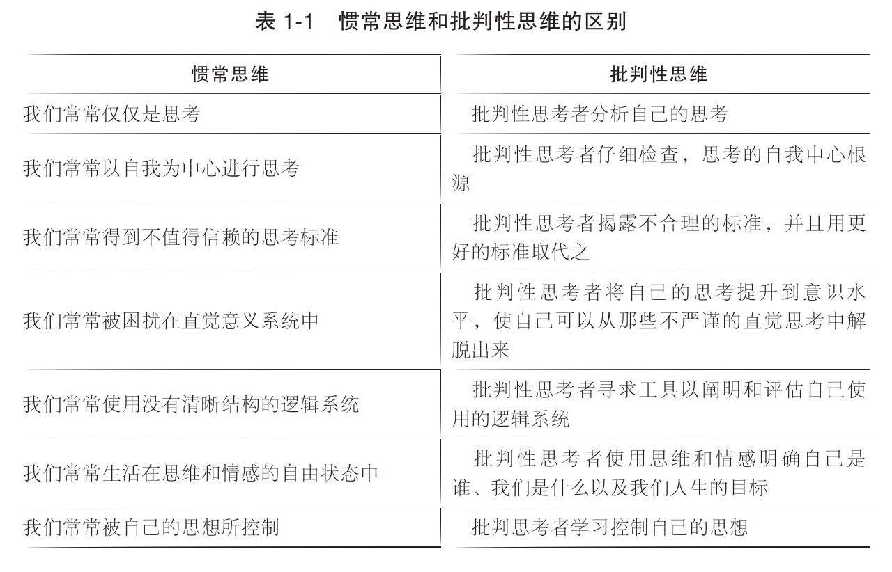

表1-2是培养优秀的思维特质需要经常问自己的问题。

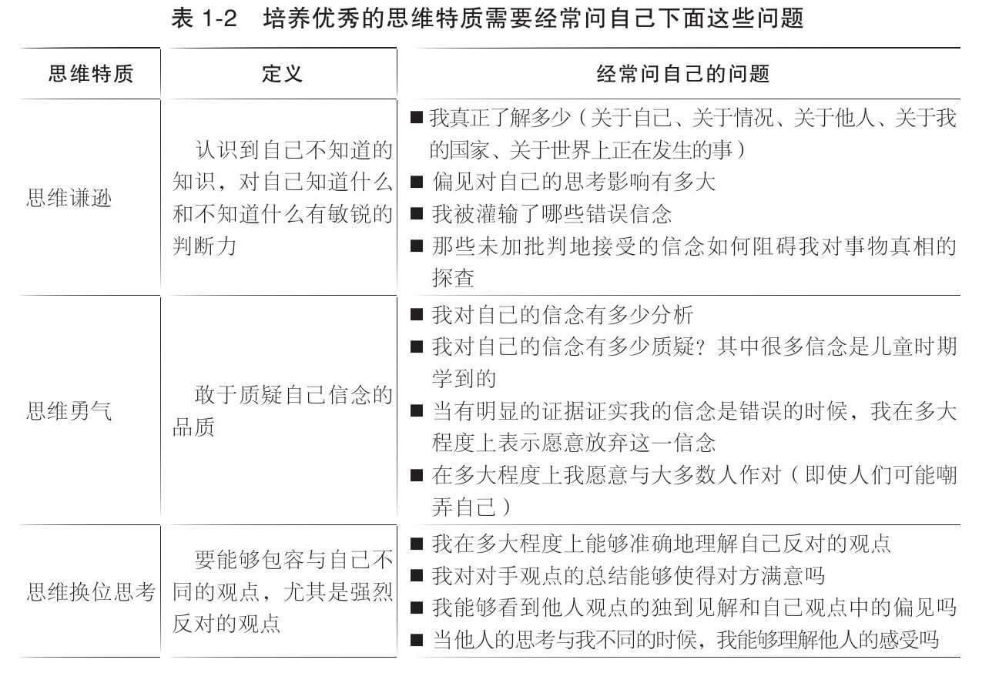

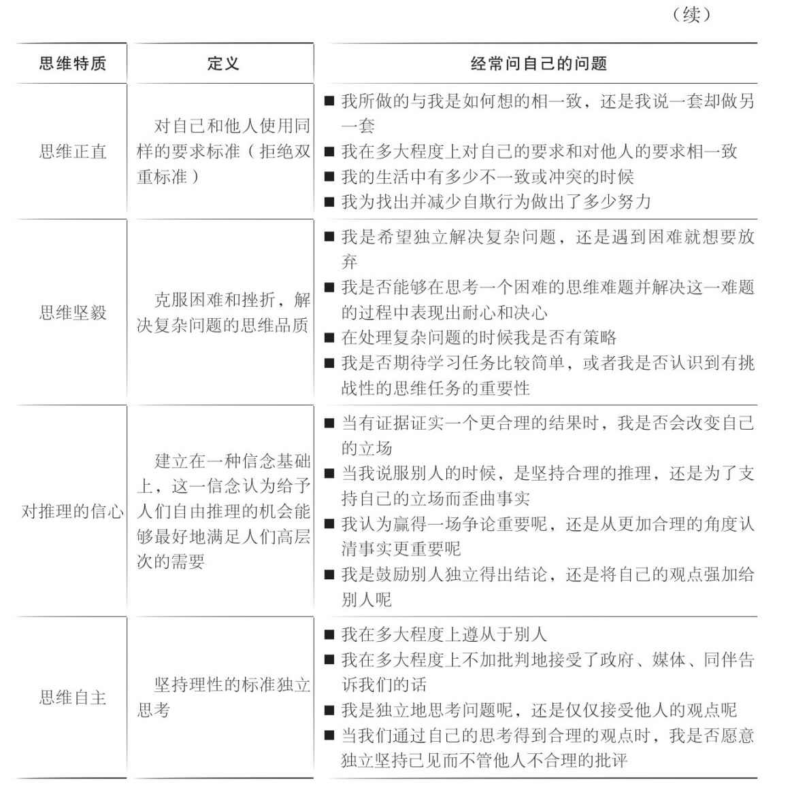

## 小结

真正杰出的思考者并不是孤立思维特质的产物。没有这些优秀思维特质的人，会不可避免地犯错而自己却时常觉察不到。这些人的思维特质是不严谨的，当他们无意识地去相信自己想要相信的观点、相信那些可以令自己舒服的观点、相信那些可以符合自身利益的观点、相信那些满足自己自私需求的观点时，这些人就不是一个理性的批判性思考者了。阅读本书的时候，我们希望读者能够自己思考并内化这些必要的思维特质。思考自己是否能够抵抗住外部遵从力量以及内部自我中心思想的影响。

# 第2章　你处于批判性思维前四个阶段的哪个阶段

我们大多数人都没有完全表现出自己思维发展的潜能。我们有巨大的潜力，但是我们的潜力绝大多数仍处于休眠和未开发状态。思维技能的进步就像打篮球、跳芭蕾舞或者吹萨克斯的进步一样，没有有意识的投入和学习是不可能做到的。只要我们还认为当下的思维水平是理所当然的，我们就不会进行提高思维的练习。

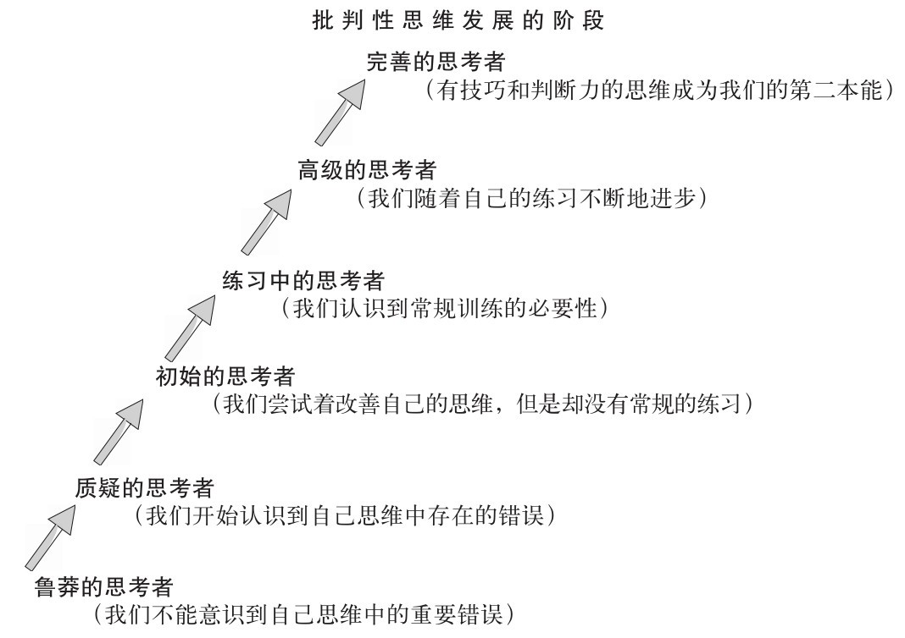

图　2-1　批判性思维发展的阶段

多数人终生都停留在鲁莽的思考者阶段，想要成为完善的思考者需要每天坚持练习

提高思维水平是一个缓慢进步的过程，需要长期乏味的练习和努力。仅仅参加一个初级的思维训练是不可能成为一个杰出的思考者的。改变思维习惯是一个需要几年的漫长过程，它不是几个星期或几个月就能完成的。我们在第1章中讲到的批判性思维所必需的特质只有经过长期的努力才能够养成。

如果想要发展成为一名思考者，我们需要经历的发展阶段分别是：

阶段1鲁莽的思考者（我们不能意识到自己思维中的重要错误）

阶段2质疑的思考者（我们开始认识到自己思维中存在的错误）

阶段3初始的思考者（我们尝试着改善自己的思维，但是却没有常规的练习）

阶段4练习中的思考者（我们认识到常规训练的必要性）

阶段5高级的思考者（我们随着自己的练习不断地进步）

阶段6完善的思考者（有技巧和判断力的思维成为我们的第二本能）

多数人终生都停留在鲁莽的思考者阶段。想要成为完善的思考者需要每天坚持进行练习。

## 阶段1　鲁莽的思考者

你是一个鲁莽的思考者吗？人生来就是鲁莽的思考者，其中大多数人终生都停留在鲁莽的思考者阶段，从不对自己的思维进行反思，根本没有意识到思考在我们生活中的重要作用。在鲁莽的思考者阶段，没有思考所需要的概念。例如，作为鲁莽的思考者，我们根本没有注意到自己如何做出假设、形成概念、寻找信息、利用观点进行思考。在这一阶段，我们不知道如何分析和评价自己的思维方式。我们不知道如何确定自己的目的是否清晰、自己的假设是否公正、自己的结论是否符合逻辑。我们根本没有认识到思维特质的存在，因此更不会努力去掌握这些特质。

在这一阶段，错误的思维方式经常会给我们生活中带来很多问题，但是我们并没有意识到这些错误。我们并不会质疑自己的信念和决定。我们没有思维标准，也不知道这些标准应该是什么。我们缺乏良好的思维特质但是却意识不到。我们没有意识到自欺行为，有很多不实际的幻想，相信自己信念的合理性。我们满怀信心地谈论着这个世界，并且认为真实情况就如我们所看到的一样。我们对“好坏”进行判定，赞成某些活动，反对另一些活动。我们做出决定，对别人做出反馈，有着自己的生活方式，并且不会认真地反省自己的思维及其结果。

尽管我们没有认识到，但这一阶段自我中心倾向主导着我们的思考。由于缺少思维技能，我们注意不到自己的自我中心和偏见，注意不到自己常常对他人进行归类，注意不到自己不合理地忽略很多观点仅仅是因为我们不想改变自己的行为和观点。

如果你在回答上面有关自我思维中的问题时遇到困难，那么你可能就是处在鲁莽的思考者阶段。如果真是这样的话，你也不需要感到抱歉和羞愧，大多数人都处于这一阶段，并且不知道自己处于这一阶段。传统的学校教育和育儿方式并不能帮助人们成为批判性的思考者。通常，父母和老师本人也是鲁莽的思考者，这是一个恶性循环，鲁莽的人培养了鲁莽的人。清楚地知道自己处于这一阶段是向下一阶段过渡的条件。当你过渡到下一个阶段的时候，你就会打破这一恶性循环。为了做到这一点，我们必须深思熟虑，必须能够意识到自己思维中的错误、认识到自己的思维常常是自我中心和不合理性的、认识到改变自己的思维是必要的。

真诚的反思能够激发我们做出改变的动机。我们不仅应该看到自己思维中存在的错误，也要知道如何去发现这些错误。我们必须合理地写出做出改变所必须要做的事情。动机很关键。没有动机，做什么也不可能成功。

## 阶段2　质疑的思考者

你准备好接受质疑了吗？我们不能解决自己没有意识到的问题，不能处理一个不存在的情况。如果不能认识到自己知识的局限性，我们就不能寻求自己没有的知识。如果不知道自己需要哪些技能，我们就不能培养他们。

当我们意识到“一般”的思考者思维方式较差时，我们就已经进入了批判性思考的第二个阶段，即质疑的思考者阶段。我们开始注意到我们常常：

■做出有问题的假设。

■使用错误的、不完全的或是误导性的信息。

■做出与所掌握证据无关的推论。

■没有发现我们思维中的重要意义。

■没有发现自己的错误。

■形成错误的概念。

■从具有偏见的观点中进行推理。

■自我中心和偏离理性地思考。

当我们认识到思考方式塑造着我们的生活、意识到思维中的问题可能导致生活中的问题时，我们就进入了质疑的思考者阶段。在这一阶段中，我们能够认识到低级思维可能威胁到我们的生活，可能给我们自身和他人带来伤害。例如，我们可以反思下面这些人的思维方式：

■认为抽烟很性感的青少年。

■认为子宫检查不重要的妇女。

■认为头盔影响了视野，因而觉得不戴头盔更安全的摩托车驾驶员。

■认为喝醉酒也能安全驾驶的驾驶员。

■决定与一个自私的人结婚，并且认为他在婚后将会改变的人。

我们也能认识到提高我们思维水平的过程困难重重。如果你的思维是在这一阶段，你会发现改变自己的思维习惯是一项很大的挑战，它需要你在日常生活中做出广泛而艰难的改变。

一些出现思维的标志：

■你发现自己在努力地分析和评估自己的思维方式。

■你发现你自己在发掘那些能够产生思考的思维结构（例如，概念、假设、推论、意义、观点）。

■你发现自己在考虑能够优化思维的品质（清晰性、准确性、精确性、相关性、逻辑性），即使你对这些品质可能只有初步的了解。

■你会发现自己关注思维中的自欺行为，即使你的理解相对比较“抽象”，并且或许不能从生活中找到太多的例子。

在发展对自己思维的质疑能力时，自欺是一个明显的障碍。很多人拒绝承认他们自身的思维是生活中麻烦的来源。如果你像他人一样也拒绝接受这一事实，那么你又回到了鲁莽的思考者阶段，你对自己思维进行剖析的经验也会消失，先前的不良思维习惯仍会继续。例如，你可能用下面这种方式为自己开脱：“我的思维其实没那么坏。事实上，我已经能够进行合理的思考了。我提出质疑，我尽量摒弃偏见，我的思维是具有批判性的，我不自欺。”

如果你用这样的方式进行推理，你并不孤单，大多数人都是这样。许多人都认为“如果每个人都能像我一样进行思考，世界将会更加美好”。无论是否接受过教育，人们都会持有这种观点，没有证据显示教育水平与自我反省是相关的。事实上，反而因为受到过教育，很多大学毕业生的思维都是傲慢的。鲁莽的思考者广泛存在于社会的各个阶层，心理学家、社会学家、哲学家、数学家、医生、议员、法官、公务员、社区律师、律师等都可能是鲁莽的思考者。

简单地讲，思维谦逊的缺乏广泛见于社会的各个阶层、各个职业和各个年龄段。人们会或主动或被动地抵制批判性思维的挑战。无论是无意的耸肩还是明显的抵抗，多数人都会采取不同的形式拒绝批判性思维的挑战。这就是为什么在这一阶段对自己的思维进行详细检查十分重要的原因。

## 阶段3　初始的思考者

准备好开始了吗？当一个人积极地接受质疑并且想要成为一个更好的思考者时，那么他就进入了所谓的初始思考者阶段。在思维发展的这一阶段，我们开始仔细地对待思维方式。这一阶段的发展为我们进入下一个阶段做好了准备，能够带领我们向着能够清晰地控制思考的终极目标前进。这一阶段是一个获得领悟和培养毅力的阶段，就像是酗酒者认识到并承认自己是一个酗酒者一样。例如一个酒鬼说：“我是一个酒鬼，只有通过自己的努力才能有所改变。”现在想象一下你自己，说：“我是一个差劲、不严格的思考者，只有通过自己的努力才能有所改变。”

一旦人们发现自己习惯于不良的思维方式，那么就必须意识到问题的严重性。如果我们处于初始的思考者阶段，我们就应该认识到我们的思考有时候是自我中心的。例如，我们可能发现自己常常忽视别人的需求、过分专注于自己的需求。我们会发现自己很少去理解他人的观点，并且总是假设自己的观点是“正确的”。我们甚至会发现自己试图控制别人以达到自己的目的，或是过分地听从于他人来实现自己的私利（为了回报而遵从于他人）。我们也可能会注意到自己在多大程度上不加思考地遵从他人。

作为初始思考者我们思考自己的思维方式，我们开始：

■分析情景或问题的逻辑性。

■清晰、准确地表达问题。

■检查信息的准确性和相关性。

■区分出原始信息和他人对此事件的描述信息。

■找出得出结论的假设。

■找出有偏见的信念、不公正的结论、错误使用的词汇和忽略的意义。

■注意到什么时候我们的私利会影响我们的观点。

作为初始的思考者，我们会逐渐懂得如何处理相关的思维元素（目的、问题、信息、解释等），会逐渐认识到检查思维方式清晰性、准确性、相关性、精确性、逻辑性、公正性、广泛性、深刻性和公平性的好处，尽管可能还不能娴熟地掌握这些能力，尽管在这些技能上的表现还很笨拙。我们必须强迫自己严格地思考。我们就像芭蕾舞的初学者一样，我们感觉学习基本动作很傻、一点也不高雅，我们会摔跤、犯错误，没有人会花钱看我们表演，我们自己对现在的思维水平也不满意。

要想达到初始思考者阶段，我们的价值观必须进行改变。我们必须探索自己思考的根本，并找出我们为什么做出这样的思考的原因。让我们详细地讨论这一目标。回忆一些影响我们思维形成的主要因素：

（1）你出生在一种文化当中（例如，欧洲文化、美国文化、非洲文化、亚洲文化）。

（2）你出生在某一个时代（某个世纪某个年代）。

（3）你出生在某一个地方（哪个国家、哪个城市、北方还是南方、东面还是西面）。

（4）你的父母抱有特定的信念（包括关于家庭、人际关系、婚姻、童年、服从、信仰、政治和教育等的信念）。

（5）你建立了各种关系（主要建立在周围人群的基础上——和这些人有同样的观点、价值观和禁忌）。

如果改变任何一种影响因素，你的信念系统就会不同。假设你是生活在法国中世纪的一个奴隶，你是否能够意识到你所有的信念都会发生改变？看看你是否还能进行和现在类似的思考。例如，假设其他的因素改变，那么想象一下你的信念与现在的信念有什么不同。你将会发现这些不可控的影响因素是如何塑造我们的信念的。没有人能够控制这些影响。这些影响有好有坏。

例如，假设许多影响因素使我们产生了错误的信念。这些错误的信念就存在于我们的思维中，我们根据这些信念采取行动，而我们的思维却不能筛选出这些错误信念。我们都从自己的文化、成长的地方、父母、朋友那里得到了一些偏见。批判性思维要求我们找出这些错误信念，并且用合理的信念代替这些错误的信念。另外，我们可以从因素的“影响模式”出发，来看待这些影响因素。

例如，我们思考这些领域：社会、哲学、道德、智力、人类学、意识形态、政治、经济、历史、生物、神学和心理学。我们形成了自己独特的信念系统，因为我们从以下方面受到影响：

■社会的：我们的思维方式受到所属社会团体的影响。

■哲学的：我们的思维方式受我们人生观的影响。

■道德的：我们行动和义务的一致程度，以及我们界定义务的方式将会影响我们的思维方式。

■智力的：我们的观点、推理方式和处理抽象概念的方法会影响我们的思维方式。

■人类学：我们的思维方式受到文化实践、风俗习惯和禁忌的影响。

■意识形态和政治：我们的思维方式受到权力结构和权力应用的影响。

■经济的：我们的思维方式受到个体经济条件的影响。

■历史的：我们的思维方式受到我们的历史时间以及我们对历史事件解释的影响。

■生物学的：我们的思维方式受到生物和神经结构的影响。

■神学的：我们的思维方式受到宗教信仰和态度的影响。

■心理学的：我们的思维方式受到我们性格和个体心理学的影响。

通过上面的思考我们应该意识到我们对自己的思维方式了解得很少。我们的思维方式是一个未开发的世界、一个被我们的生活所塑造的内部世界。我们生活在这个世界中凸显出这一内部世界的重要性。它决定我们是高兴还是沮丧，决定我们所看到的、所想的事物。它可以让我们疯狂，也提供给我们安慰和平静。如果我们能够认识到这些事实，我们就会有动机去控制自己的思考，不做别人手中任人塑造的泥人，最终，掌控自己的生活。

让我们思考初始思考者容易走入的两个误区：

误区1：教条专制主义——相信真相不是通过推理和调查获得的，而是通过一些预先设定的、非理性的信念获得的。

误区2：主观相对主义——相信不存在评判事物对错的思维标准。

两个误区都给我们提供了简单化的答案。作为一个初始的思考者，想要获得进步、避免进入任何误区，就需要培养推理的信心，将推理作为我们获取知识和见解的方法。这两个误区是相互呼应的。如果我们成为教条专制主义者或者主观相对主义者，我们就丧失了成为批判性思考者的动机。作为教条专制主义者，我们会随自己的“信念”行动。作为主观相对主义者，我们会相信每个人都会通过一些难以解释的方式，自动地获得“他们自己的真相”。在两种情况下都没有为思维活动和批判性思维标准留出空间。两者都认为批判性思维是多余的，认为我们不必去思考。

如果我们能避开这两个误区，如果我们知道自己是如何受到那些不可控因素影响的，如果我们知道技能可以帮助我们控制自己的思维方式，如果我们建立了对推理的信心，如果我们能够做到思维谦逊和思维坚毅，我们就为自己创建了一个良好的基础，在此基础上我们可以重构完整的人格和思考者的身份。

关键问题是如何做？我们如何精确地行动？本章余下的部分将集中于这一问题。从某种意义上讲，这也是本书最重要的目标。

## 阶段4　练习中的思考者

良好的思维方式可以像打篮球、打网球或跳芭蕾一样训练出来。从初始的思考者走向练习中的思考者的唯一途径，就是进行日常的练习并设计练习的计划。当你这样做了，你就成了所谓的练习中的思考者。

有很多设计训练计划的方法，其中的一些可能更加适合你。例如，你可能会快速浏览一下本书的其他章节。每一个章节都会给你一些提高思维方式的建议，你可以从任意一章开始。

你可能会复习那些自我思考中的任务。你可能会复习思维的成分、思维的标准、思维的特质。你也可能学习第10章关于问题解决和第17章有关思维策略的知识。你在本书中读到的任何内容都是帮助你设计思考练习计划的一种资源。阅读本书的时候，常常问自己：我在这一部分学到的知识如何应用到我的日常训练中呢？

像大多数人一样，你可以发现一些合适的起点，制订出自己的计划，而真正的挑战是能够坚持完成你的计划。这也是其他技能培训的挑战所在：人们常常不能坚持下来。他们在没有养成练习的习惯之前，就被劳累和笨拙的尝试吓退了。

为了成为一名思考者，你必须编制一套有效的训练计划，这个计划应该是你能够完成的，不会使你的负担过重。最后，胜利属于那些有毅力并且有策略的人。

另外，在这一阶段你可能的确不知道什么对你是有效的，仅仅是觉得可能有效而已。你必须检验你的方法。现实一点，你应该有多个计划进行验证，并最终找到一个有效的训练计划。

戒骄戒躁，不要气馁。练习过程中难免会有反复失误，准备好接受一些暂时的失败，不要轻易气馁。成功需要战胜暂时的失败，其逻辑就像是试穿衣服，试穿的很多衣服可能都不合适，但是你会继续尝试直到找到适合自己的衣服。

考虑另外一个类比：如果你想成为一个优秀的网球手，一开始就想要打得很好、赢得所有的比赛、经过很少的训练就能习得新的击球方式，这些想法并不能帮助你进步。只有通过制订计划并且在实践的检验下反复修改才能让你获得进步。今天，你或许决定眼睛要盯着球；明天，你可能就会在转身的同时眼睛也能够盯着球。每一天，你都要反复思考能够使你取得进步的策略。人类思维的发展就像人类身体的发展一样。理论指导、反复训练和及时的反馈是必要的。

## 一份通向进步的“游戏计划”

当你认真地思考自己的思维方式的时候，想一想怎么做可以让你的思维不断地进步。优秀的思考者需要具备一系列各自独立却又密切关联的技能和特质，你可以随时选择一些批判性思维的技能进行练习。关键是注重培养基础技能并且确保自己不会贪多。选择你的突破点，反复练习，但是又要限制对突破点的选择，不要过分贪多。过分贪多很可能让你因困难而完全放弃，而如果不重视基础技能，你就永远不会拥有牢固的思维基础。

一步一步地训练并且注重基础技能。记住是乌龟赢得了赛跑的胜利，而不是兔子。做一只明智的乌龟，每天踏出坚实的一步，最终你将会走向成功。

## 为制订练习计划而建议的策略

我们收集了一些能够激发你制订出一份练习计划的建议。这些建议没有任何魔力，其中的观点也不都是非常必要的。然而，每一条建议都代表了一个可能的突破点、一种可能提升我们思维方式的方法。即使你不能同时实施所有的建议，但是可以根据我们提供的这些建议对你的练习计划进行检验。你也可以加入自己的观点，在你了解这些建议后，我们会解释这一建议计划是如何发挥作用的。

1.利用“浪费”的时间

所有的人都会浪费一些时间。没有人能够充分、有效甚至快乐地利用所有的时间。有时候我们从一种娱乐活动转到另外一种，然而，这两种娱乐活动却都没能使我们感到快乐。有时候我们会被无法控制的事情激怒。有时候我们由于缺乏良好的计划带来了许多消极的后果，例如如果提前半个小时出发，我们就可以错开交通拥堵时段从而节省时间。有时我们无端地担心，将时间浪费在为过去的事情感到后悔懊恼中。有时甚至我们会只是注视着某个地方出神。

关键是时间已经过去了，被浪费掉了。如果我们认识到这一点，并且当时考虑了其他备选方案，我们就不会以这样的方式浪费掉这些时间了。所以我们的意见是：利用你常常浪费掉的时间来练习你的思维能力。例如，晚上不要为找一个好节目而不停地进行频道转换，你可以用这些时间来回忆自己一天的思维，并评估自己思维的优缺点。你可以问自己下面的问题：

■今天哪些时候我的思维是最差的？

■今天哪些时候我的思维是最好的？

■我今天实际上在思考什么？

■我解决了哪些问题？

■我是否无谓地为一些消极的思维而感到沮丧？

■如果我重新过这一天，我应该做出哪些改变？为什么？

■我今天做了哪些对自己长期目标有益的事情？

■我所做的事与自己的价值观相一致吗？

■如果我以今天的方式生活10年，最终，我能够完成一些有价值的事情吗？

每个问题花上一点时间是很重要的。时常或每个星期回顾一下这些问题是很有用的，并且将你的答案写成日志，这样可以保留一个你思维方式发展的记录。

2.每天解决一个问题

从今天开始，每天（或许是开车上班的路上，或是上学路上）选择一个问题，以便当你有空闲的时候进行思考。通过分析这个问题的要素找出它的逻辑。系统地思考这个问题：这个问题到底是什么？我怎么才能使它成为一个问题的形式？（参考第10章中的模板。）

3.将思维标准内化

每个星期选取第5章中描述的一个思维标准进行研究，并积极地将它应用到你的思维中。一个星期专注于清晰性，下一个星期专注于准确性，如此坚持下去。例如，如果你正在专注于清晰性，那么试着注意自己在交流中不够清晰的地方。注意别人没有清晰地表达的情况。在阅读的时候，看看你是否清楚自己阅读的内容。在写报告时，问一问自己是否清楚自己想要说什么、是否清楚地将自己的想法写了出来。

在这样做的时候，你要练习四种清晰表达的技能：①在开始说话的时候考虑一下自己的措辞是否准确；②用其他的语句详细表达你的意思；③从你的生活经验中找出例子来证明你要表达的意思；④利用类比、隐喻、图示、表格来说明你的意思。在清晰地表达自己的思想时，你要陈述、详细描述、说明、举例证明你的要点，也要经常鼓励他人这样做。

4.坚持做思维日记

每个星期写一定数量的日志条目。按照下面的格式将重要的事件记录下来：

■描述那些对你情感重要的事件（你非常关心的事情）。

■一次只记录一个事件。

■单独描述自己在这一情况下的行为，描述要详细和准确。（你说了什么？你做了什么？你是如何反应的？）

■在你描述的基础上，分析在事件中到底发生了什么，挖掘事件的深层含义。

■评价你对事件的分析有什么含义（你在这一事件中学到了什么？如果你可以重新来过，你会对自己的行为做出哪些改变？）

5.练习思维策略

在第16章战略性思考中选择一种策略。当你使用这种策略的时候，在日记中记录你的观察，包括你对自己有了什么新的认识，以及你如何应用这种策略来提高自己的思维水平。

6.重新塑造你的性格

每个月，选择一种思维特质进行练习，努力思考你如何才能培养这一特质。例如，如果专注于思维谦逊，试着注意自己承认自己错误的情况。找出即使面对有力的证据证明自己是错误的时候也拒绝承认自己犯了错的情况。当别人试图指出你工作或者思维中的缺陷时，注意在什么情况下你会开始防御。注意在什么时候你的自大阻碍了你的学习，例如，你对自己说：“我已经懂得了该学科中所有需要学习的东西。”或者是，“我跟他知道的一样多，他以为他是谁啊，凭什么强迫我接受他的观点？”

7.改变你的自我

每天通过回答下面的问题观察自己的自我中心：当我反思自己一天的行为时，我是否被细小的事情惹怒了？我是否说了一些失去理性的话来坚持自己的意见？我是否将自己的意愿强加给他人？当我对某种事物有强烈的情感的时候，我是否没能表达自己的意愿，以致后来愤恨自己？

一旦你意识到自己的自我中心思维在起作用，你就能通过系统思考得出更合理的思维方式来代替它。一个理性的人在特定情况下会有什么感受？理性的人会怎么做？这些与你的行为有什么区别？（提示：如果你总是得出一个理性的人与你的行为是一致的，你可能在自欺。）（在第11章中找出更多识别自我中心思维的方法。）

8.改变你看待事物的方法

不管是个人生活还是社会生活事件，我们都生活在一个每个事件都被定义了的世界，在这个世界中，每一个事件都会有一个基本的意义。事件的界定情况决定了我们对它的感受、我们的行动方式，以及它对我们的意义。而事实上，每一种情况都有很多种定义的方法。这给我们很多机会去改善我们的生活。原则上，只有依靠我们自己的力量，才能使自己生活得更加快乐和圆满。

理论上，我们可以将生活中所有事件的消极定义转换成积极定义。这样，我们就可以在可能遭受损失的情况下获得收益；我们就可以在可能带来悲伤的情况下感到高兴；我们就可以在可能带来沮丧的情景中感到满足。在这一建议中，我们要练习改变自己看待事情的方法，将消极的事件看作积极的事件，将山穷水尽看成柳暗花明，将犯的错误看成学习的机会。为了使这个建议更加可行，我们应该给自己一些具体的指导。例如，我们可以列出5~10种会令你感到沮丧、气愤、难过、担心且经常发生的消极情景。然后我们可以找到带来消极情绪的不合理的定义，再用一种更加合理的定义来代替它们，并做出自己新的反应和情感反馈。

假如你有一个舍友，他不停地向你讲述生活中的琐事，这使你感到很厌烦。你会想“多么讨厌！我怎么能听一个学期无聊的肥皂剧呢？”你可能做出这样的反应：“既然我要为自己的心理学课程做一个研究项目，那么这个项目就是关注我室友的心理好了。”现在，有了这个想法后，你不再是被动地听你室友不停地给你讲述他一天的生活，而是主动地询问他，从而收集心理学作业上用到的信息。因为你现在主导着谈话的内容，你就不会为你室友不厌其烦的讲述感到厌烦，而是会将你们之间的互动转变成自己学习的经验。

另外一个例子是将“不可能完成的困难课程”重新定义为“找出新的基础概念和新的思维方法的挑战”。例如：你对接触异性朋友的方式进行重新定义，从原来的“他的反应将会决定我是否具有吸引力”变成现在的“让我根据自己的感觉来判断一下这个人是不是一开始就被我吸引了”。

如果你采用的是第一种定义，他人对你没有兴趣的话你会感到很失落。如果你采用的是第二种定义，你清楚人们最初的反应不是针对一个陌生人的吸引力，而是针对一个人正在盯着自己看的方式，那么，你就不会把别人没能对你表现出兴趣理解成不喜欢你。

9.关注自己的情绪

无论何时当你感到一些消极的情绪时，问自己“是什么思维产生了这一情绪？这一思维有没有缺陷呢？我的假设是什么？我应该做这些假设吗？我做此思考所依据的信息是什么？这种信息可靠吗”等（见第3章和第16章）。

10.分析群体对你生活的影响

仔细地分析你所属的群体鼓励哪些行为、不鼓励哪些行为。对于一个特定的群体，它要求或者希望你相信什么？禁止你做什么？如果你的结论是你的群体没有要求你相信的任何东西，也没有任何禁忌的事情，那么这很可能是因为你还没有对你的群体进行深入分析。为了增加对社会化过程和群体成员的理解，复习一下社会学的相关知识（见第11章）。

### 将建议中的策略一个个合并起来

在制订计划的时候，最关键的是在自己的生活中检测计划中的这些策略，并将策略整合成一个完成的计划，在自己的生活经验上检验，实施这一计划。所有的策略都有优缺点。一个可取的办法是用任意的次序使用下面的所有策略。

（1）利用“浪费”的时间。

（2）每天解决一个问题。

（3）将思维标准内化。

（4）坚持做思维日记。

（5）练习思维策略。

（6）重新塑造你的性格。

（7）改变你的自我。

（8）改变你看待事物的方法。

（9）关注自己的情绪。

（10）分析群体对你生活的影响。

当你用制订的计划提高你的生活质量的时候，假设你发现“改变你看待事物的方法”这一策略一直在你的直觉当中，你就可以把它作为开始的策略。当你专注于这一想法并将它应用到你的生活中时，你会发现群体中存在的社会定义。这样的发现能够使你意识到你的行为是如何受社会定义控制和影响的。你会开始认识到你和他人是如何不加思考地接受了群体定义的。注意隐含在下面陈述中的定义：

（1）“我组织了一个聚会”。

（2）“我们将参加一个会议”。

（3）“你为什么不参加选举”。

（4）“葬礼是在周二”。

（5）“杰克是一个熟人，但不是真正的朋友”。

当你理解这些观点的时候，你就会知道这是社会上多么普遍的定义。你对社会定义了解得越透彻，就越可以用与社会定义相反的方式对情景进行重新定义，进而你就能够理解对情景和人际关系进行重新定义是怎么帮助你“关注自己的情绪”的。对事物的定义带来了你的情绪，当你认为你受到威胁的时候（你将情景定义为“有威胁的”），你会感到害怕。如果你将一种情景定义为“失败”，你就会感到失落。而如果你将同样的情景定义为“一个学习的机会”，你就会产生学习的动力。当你发现你能够主导这样的练习的时候，这两种策略就能够一起工作并且互相促进。

之后，你就能将策略10（“分析群体对你生活的影响”）与你已经内化的两种策略进行合并。群体对我们的影响主要是通过其传递给我们的定义来实现的。当一个群体认为一些事情是“很棒的”，而一些事情是“糟糕透的”时，群体的成员就会努力让自己看起来更棒。当一个老板说，“这很有意义”，他的下属就知道自己不应该说“不，这很荒唐”。他们这样做是因为他们认为“老板”的名称使得他人在定义情景和人际关系的时候具有优先权。作为一个发展中的思考者，你应该决定接受哪些群体的影响而拒绝哪些群体的影响。

你现在有三个相互联系的策略了：你“改变了你看待事物的方法”并且“关注自己的情绪”，还能“分析群体对你生活的影响”。这三种策略合并成了一个。现在，你可以寻找机会将其他任何一种策略合并到自己的思维和生活中去。

■利用“浪费”的时间。

■每天解决一个问题。

■将思维的标准内化。

■坚持做思维日记。

■练习思维策略。

■重新塑造你的性格。

■改变你的自我。

如果你成功地完成了计划，你就超出了初始的思考者阶段，你成了一名练习中的思考者。我们将在第17章中讨论这一阶段及其他两个阶段。

# 第3章　自我理解

在阅读本章之前，你首先应当明确：

■批判性思维的存在和发展是以与思维相关的基本知识、技能及洞察力的发展为基础的。

■成为熟练思考者的过程就如同习得篮球、芭蕾舞或萨克斯演奏等程序性知识技能过程一样。

■这些思维技能可以兼容性地同时服务于两种不兼容的思维极端：自我中心与公正之心。

■批判性思维技巧的学习可以在较低意识水平的层面上实现，培养出一种程度较弱的批判性思维放肆（如习惯性的自我中心思维）。

■而本书中我们关注的主要是具有较强程度的批判性思维的发展。

■公正心的发展需要我们形成思维特质间相互关联的心理网络。

■批判性思维的发展具有明确而可预测的阶段性特点。

■批判性思维的培养极富挑战性，因为这既有赖于“计划性的训练”，同时需要经过数年的积累与发展，绝非数周或数月即可一蹴而就的。

本章的目标在于使读者更好地理解人类的思维本性。我们将从人类的自我中心及其呈现的干扰开始，之后我们将会探讨获得更好自制的基本特性。通过本章的学习我们可以看到，我们头脑中的一些基本机制总是在维护我们自身潜在的自我中心的。我们必须理解这些机制。它们以互相关联的方式运作，因此，只有通过实际的视角洞察我们的大脑运作方式，我们才能有望去理解和改变自我。

## 监控日常思维和生活中的自我中心

倾向于被自我中心的思维和感受所主导是人类在学习中面对的一个最基本的挑战。我们即刻的欲望、痛苦、想法和感受深深地主导了我们的生活。出于本质上的自私，我们去寻求自我满足。我们并不去考虑自身的看法是否精确，反而总认为我们已经思考过；我们并不去深入思考个人成长、发展和自我完善的问题，也总是认为我们已经思考过；我们并不会去主动地发现自己的弱点、偏见和自欺。相反，我们总是以满足自己的需求为目标，避免他人的反对，合理化自己的观点和行为。

人们倾向于用自我中心的方式进行思考，这意味着我们几乎没有真正地理解自身思维和情感的本质。例如，我们中的很多人无意识地相信，不思考也是有可能获得知识的，也是有可能阅读的，并且优秀的写作能力是一个人与生俱来的，而非后天努力的结果。因此，我们倾向于逃避学习的责任，不再尝试学习新的思维模式。我们中的很多人在思维上是墨守成规和过于简单化的，而自我中心又妨碍了我们发现这一问题，我们用自己发明的内在枷锁束缚住了自己。

这些内在的枷锁会对我们的人际关系、成功、成长和幸福感带来负面的影响。通过忽视自我或假装自己是思维公正的就想克服人类的自我中心是不可能的。只有发展明确的习惯，才能约束住我们的自我中心。我们只有看到自己回应方式的不足，通过重组思维来调整，而不是简单否认这些回应模式，才能超越自我中心式情感的回应。例如，如果你想被老师提问，却又“担心会被嘲笑”，你必须明确产生这种恐惧情感的自我中心思维：“如果我问了这个问题，其他学生可能认为我很木讷或很愚钝。”明确这种思维之后，你可以对其进行替换。例如：“我的任何问题都能帮助我学习，其他学生也是这样。更为重要的是，如果有学生认为我的问题是愚蠢的，那是他们的问题，他们缺乏一种将提问理解为学习的能力。我不会因为他人对学习的狭隘理解而阻碍我的学习。”

我们之后将回到处理自我中心的问题上来。同时开始思考自我中心是什么，并且找出它的存在。

## 努力做到思维公正

尽管没有人会将自己定义为自我中心者，但是每一个人都应该认识到，自我中心是我们了解自身思维时所需理解的一个重要内容。应对自我中心的一个方法就是探索我们被自我中心塑造的程度。例如，就像我们之前强调的，我们都出生在特定的文化、国家和家庭中。父母向我们反复灌输某一信念（与家庭、个人人际关系、婚姻、童年、服从、宗教、政治、教育等），我们与有某些信念的人建立各样的人际联系（那些鼓励或期待去被接受的人）等。我们是这些影响的产物。只有通过自我理解，我们才能成为一个不是仅仅受到影响，而是能够独立进行批评性思考的人。

如果我们不加辨别地去相信他人的灌输，我们的信念很有可能就是自我中心的，并且深深影响我们的思考习惯。例如，一个关于态度的研究显示，我们无意识地使用自我中心标准去证明自身信念的合理性。

（1）“它是真的，因为我相信它。”虽然人们并不会公开做出这样的声明，但是却经常采取这样的模式：当别人认同我们时，便觉得他们是对的；反对我们时，便觉得是错的。我们对他人的回应方式表明，我们自我中心地认为自己的视角一定是正确的。

（2）“它是真的，因为我们相信它。”我们自我中心地认为自己所属的团队看待事情的视角是正确的。在这样的思维方式下，我们的宗教、国家、朋友是特别的，并且比其他宗教、国家和朋友都更好。

（3）“它是真的，因为我想相信它。”我们更乐意相信自己愿意相信的事物，不考虑事物是否是荒谬的。

（4）“它是真的，因为我曾经总是相信它。”我们更乐意相信与自己信念一致的事物。我们自我中心地假定自己信念的正确性。

（5）“它是真的，因为相信它符合我的利益。”我们更乐意相信那些有益于自己财富、权力和地位的观点，哪怕这些观点与自己的道德信仰相冲突也无所谓。

如果我们能自觉地意识到自身的这些倾向，并有意识地通过客观思考去克服它，这种对于自己的清晰理解就能够帮助我们成为一名批判性思考者。这要求我们将自己的思维分为两类：①自我中心的思维方式；②发展理性公平心的思维方式。而为了有效地进行分类，我们必须清楚我们思维的运作方式，就像病理学家理解大脑的运作方式一样，我们必须对我们的思维运作方式有深刻的洞察。

## 识别大脑的三个与众不同的功能

大脑拥有三个基本的功能：思维、感受与需求。

（1）思维的功能是指创造意义：对我们生活中的事件赋予意义，将事件分类进已被命名的种类，并寻找相对应的模式。思维不断地让我们理解正在发生的事情，注意到事情的各个方面，弄清事情的本质。

（2）感受的功能指的是，对思维功能所创造的意义进行监控或评价，根据我们赋予它们的意义，评估我们生活事件的积极性或消极性，感受让我们知道如何体会生活中发生的事情。它会告诉我们何时产生这样的感受是正确的、何时这样的感受会招致麻烦。

（3）需求的功能是指分配行动的能量，以让我们能够保持自己的渴望和对可能的事物的追求。需求能够让我们清楚什么是值得去追求、值得奋斗的东西，也能够让我们明白哪些事物并不值得追寻，不要自寻烦恼。

我们的大脑会不断地让我们理解三个方面：①我们生活中正在发生的事情；②对于这些事情的感受（积极或消极的）；③运用我们的能量去追寻的东西。更为重要的是，在思维、感受和需求之间，存在着一种隐性的、动态的关联，三者是相互作用的。例如，当我们认为受到威胁时，我们感到恐惧，并且不可避免地想要逃离或攻击威胁我们的东西。当我们认为需要学习的科目与我们的人生和价值毫无关联时，我们就会对学习它感到厌烦，并不会尊重这一学科。

图3-1表示大脑的三个基本机制是复杂相关的。

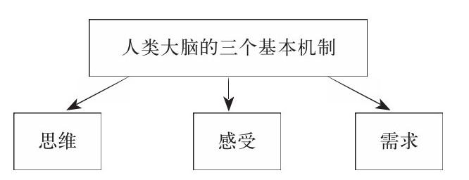

图　3-1　大脑的三个基本机制是复杂相关的

## 理解你与大脑间的特殊关系

现在已经可以很明显地看出，每个人都和其大脑无意识地形成了一种特殊关系。而要成为批判性思维者，我们必须将这种无意识的关系提升到意识水平。我们所有的行为都是关于“我们是谁、我们正在经历什么（现在每时每刻）、我们将要去哪里（我们的未来），以及我们从哪里来（我们的过去）”这些内在想法的产物。此外，所有这些想法都在和我们的情绪和感受相互作用。情绪和感受机制不断地对我们的生活质量进行评估。

对于我们“相信”的每一个积极想法，我们的头脑会很自然地倾向于产生积极的情感去与之匹配。相反，对于每个消极的想法，大脑倾向于产生消极的情感。如果我们能够很明确地识别大脑中这三个机制持续作用的相互关系，我们将对我们自身的思维进行控制和调整。让我们更进一步来思考这个观点。

图3-2表示大脑的三个基本机制是如何运作的。

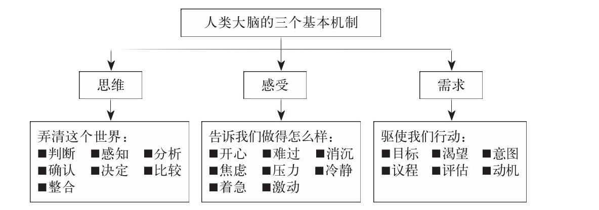

图　3-2　思维指出正在发生的事情；感受告诉我们事情的进展是顺利还是糟糕至极；

需求则驱动我们指向或脱离某一行动

正因为我们给经历的每个情境赋予意义，故而我们体验着愉悦、幸福、沮丧、痛苦、困惑、渴望、激情和冷漠等情绪。我们选择某一特定的视角思考事件，将事件与我们曾经历过的相似或相关环境中的情感体验进行联结。我们根据客观现实，在对现实的客观解释、洞察甚至歪曲中理解事物的意义，做出相应的反应。例如，相同情境中的两个人会做出完全不同的反应，一个体验到痛苦和沮丧，而另一个却感受到好奇和兴奋。

来思考这个例子：两个学生要完成提升写作能力的任务。第一个人可能体会到困难、遭遇挫折，并且最终放弃。这个学生给提升写作能力的任务赋予了消极的意义，将之定义为一个注定失败的情境。因为他认为学习写作应该是容易的，而当他实际遭遇困难的时候，他感受到沮丧情绪，感受到挫折感。而在相同情境中，另一个人将写作能力的提升视为挑战，他体验到激动、令人愉快的情绪，这并不因为他拥有别人所没有的写作技巧，而是因为他对任务有着积极的心态。他认为学习写作应该是困难的，需要很多时间。而高水平写作能力的达成必须要重复地修订。

在这个例子中，严格来说，实际的任务完全是一样的。然而，困难或简单取决于个人应对挑战的方式。是决定勇敢面对还是完全避免挑战最终决定着这个人是成功还是失败，而从根本上来讲，这又是由思维习惯所决定。思维的差异导致了行动和情感体验的差异。

图3-3表示大脑的三个基本机制的相互关系。

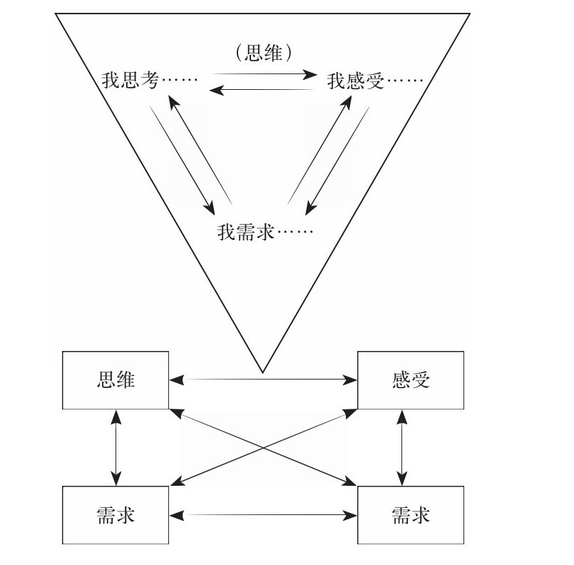

图　3-3　思维、感受和需求的互相关系

这三个机制持续地相互作用，并且在动态的过程中相互影响。

如果不控制自己的思维，那些带给我们消极体验的思维习惯将会使我们最终变为难以改变的、顽固不化的人。例如，当我们接受忽略情感回应、“填鸭式”的数学教育时，我们常常会成为“数学憎恶者”或患上“数学恐惧症”，从而最终终止学习。从此，我们也会尽可能地回避任何与数学相关的事情。在我们眼中，数学就是莫名其妙的、一串与任何生活无关的公式。或者，我们常认为自己“太笨”，不能理解数学。

但是，如果我们在课堂里控制自己的思维，谨慎地分析课堂中讲授的内容，以确定对于我们来说最重要的内容。那么，无论课堂本身有多枯燥，我们都能进行自主学习。

图3-4表示我们如何影响自己大脑的运作。

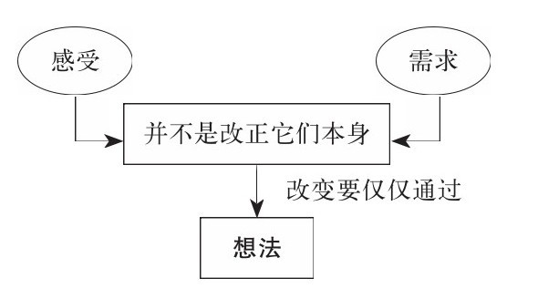

图　3-4　通过改变想法来改变不良的感受和需求

我们要相信，只要努力，我们就有能力学会任何事情。当我们在学习过程中感到沮丧的时候，我们要继续坚持。当我们感到困惑时，我们知道提问可以帮助我们理解。我们不害怕说：“我不理解这个问题。”我们知道最好的思考者就是那些能够区分能够理解和不能理解的人。

图3-5表示通过控制思维方式，我们可以控制大脑全部的三个机制。

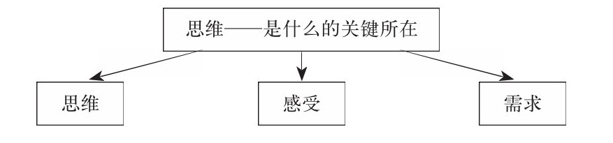

图　3-5　通过控制我们的思维方式，我们可以控制大脑全部的三个机制

当我们理解了思维、感受和需求之间的关系，意识到每一种感受状态背后都有一个思考过程时，我们就能够在情感和需求的基础上分析想法。如果我在课堂中感觉厌倦，我会问自己：“究竟是什么想法导致了这种厌倦情绪？”如果我对所学并不感兴趣，我会问自己：“是什么样的想法影响了我不愿意学习这个内容？学习这个内容的实际价值是什么？这是我需要学习，并且对我有益的东西吗？如果是的，我需要做些什么来学习吗？”

图3-6表示你的想法控制着生活的每个部分，但你能控制自己的想法吗。

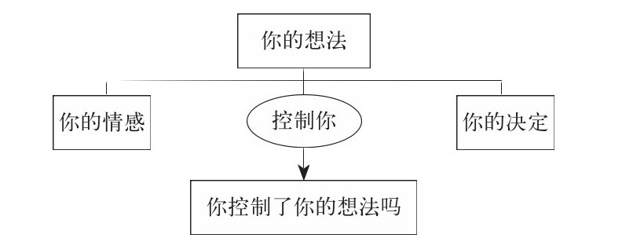

图　3-6　你的想法控制着生活的每个部分，但你能控制自己的想法吗

## 将所学课程与你的生活问题建立联系

作为一名学生，你要全面理解自己的“情绪情感是如何对学习产生好的或者坏的影响的”，你要知道如何走进课堂学习；要知道自己的情绪、情感是怎样影响你的学习的；知道自己的目标是怎样影响你的视野的。

如果你没有达到深层学习水平，你必须找到那些阻碍你实现深层学习的想法、情感和需求。你必须能够掌控主导自己的观点，对自己的学习进行深入的思考。你需要去探索理性的思考——可靠论证的力量；去体验非自我中心化的思考。

当我们在某一具体学科中学习和思考时，我们要注重使用在那些学科中重要的观点进行自由的思考。如，社会观点使我们从贵族群体的支配中脱离；哲学观点让我们对生活方向和价值进行全面的自由论证；经济学观点使我们获得对这个世界界定的有力力量。

## 整合理智和情感的学习

我们花费大部分的时间去思考个人想要的或看重的是什么。我们的情绪情感让我们关注我们个人价值的成功。只有当我们能够将所学和个人生活联系起来时，在学校里所学的课程才能帮助我们成长。如果我们能从个人的角度看待文献的价值，自发地开展阅读，而并非是为获得分数，我们就能探求出文献视角与我们生活的关系。当我们看见故事中的人物与我们自身所面对事物之间的联系时，文献中死的知识才会在我们的生活中重新焕发生命。我们所阅读的内容存在于我们的大脑中，我们与读到的人物一致，同他们一起面对困惑、承受痛苦，并感受成功的喜悦。

当学术逻辑在我们生活中产生积极的意义时，我们会被激发去了解更多内容，解决更多问题，“研究”更多课题。如果我们想激发我们自己学习和思考的潜能，我们必须寻找出所学的内容和我们的情感与价值之间的联系。

只有你自己才能构建生活的意义。如果学习变成了一项苦差，你看不到其中的价值，你会尽可能地拖延，寻找捷径（例如“填鸭”）来用短期记忆替代长期的掌握和内化。这种想法会慢慢地成为你的学习习惯，你会认为：“如果我能够通过填鸭的方法掌握学习内容，那为什么还要努力工作来吸收这些（无价值的）材料？”你的生活虽然有情感体验，但却没有真正的思考活动。你沦为脑力劳动的苦工，只会反复枯燥的记忆，体验不到理智分析带来的积极情感。对你来说，思维活动成为一系列疏远的仪式：你的学习生活只是记笔记（对你来说意义很小），为考试死记硬背（使你毫无洞察）和粗制滥造论文（主要都是因循别人的想法）。

整合理智和情感学习的一个关键点在于，识别出每门学科中的思维模式，这些思维模式帮助你理性地思考，发展成为一名批判性的思考者。只有你感受到了学科思维方式的作用和影响，你才能在这些思维方式的驱动下不断发展自己、完善自己。例如，除非你体验了历史思维的作用，否则你不会注意到这种思维方式，也不会有动机去掌握它。

而在整合理智和情感的学习上，通常存在一个恶性循环，思维蒙昧、未开化人的思维方式常常阻碍了他们思维启蒙的进程。当我们处于思维蒙昧状态时，我们并不看重思维方式，也不会将时间、精力运用到提高思维水平的训练上。克服这种思维蒙昧的阻碍是我们每个人都需要面对的挑战。我们要看重充分学习的价值，看重每个学科独特思维方式的力量，而不要像其他学生一样，仅仅是为了考试而学习。

从某种意义而言，所有的知识都是个人的，因为如果人们不去主动地获取它，知识便将不复存在。从长远的角度来看，我们获取那些我们认为重要的知识，我们仅仅内化我们认为对我们所需和所想重要的思维模式。我们自己决定何时、何地并以何种方式去学习掌握哪些内容。

你越能够将所学和生活中看重的事物建立有力的情感联结，你越会容易理解学习的内涵。思考学习学科的最基本概念，尽量摒弃专业术语，通俗地表达这些概念，将生活中的概念与学科中的基本概念相联系，将学科的目标与你生活中的目标联系起来。本书为读者提供的一些方法能够帮助读者向高水平的思维转化。但是作为读者，你必须调动自己全部的力量和情感，积极投入到思维工作中来。

# 第4章　思维的组成

在阅读本章之前，你首先应当明确：

■批判性思维的存在是以与智力相关的基本知识、技能及洞察力的发展为基础的。

■成为熟练思考者的过程就如同习得篮球、芭蕾舞或萨克斯演奏等程序性知识技能一样。

■这些思维技能可以兼容性地同时服务于两种不兼容的思维极端：自我中心与公正之心。

■批判性思维技巧的学习可以在较低意识水平的层面上实现，培养出一种程度较弱的批判性思维方式（如习惯性的自我中心思维）。

■而本书中我们关注的主要是具有程度较强的批判性思维的发展。

■公平心的发展需要我们形成思维特质间相互关联的心理网络。

■批判性思维的发展具有明确而可预测的阶段性特点。

■批判性思维的培养极富挑战性，因为这既有赖于“计划性的训练”，同时需要经过数年的积累与发展，绝非数周或数月即可一蹴而就的。

■人们的自我中心是人们进行公正性思考的最大妨碍。

■要战胜自我中心，我们必须对它有深入的理解，并能够有意识地去控制自我中心。人类的思维有3个基本功能：思维、感受和需求。

在本章中，我们主要介绍如何将思维分解为不同的成分——如何通过对思维组成的研究分析思维的本质。第5章主要讲述思维的评价标准，分析思维的子成分，以确保高质量的批判性思维。

我们首先简短探讨一下思维推理，这一理解事物与寻求意义的心理过程。

## 推理无处不在

“思考”与“推理”这两个词在日常生活中常被人们作为同义词使用。推理一词则似乎显得更为书面与正式，因为它突出了思维的智力维度。理解事物的过程随时随地地伴随着结论的推演，而任何时候，当我们的头脑试图根据一些原因得出结论时，这实际上就是一个推理的过程。也就是说，思考即推理。每当我们试图对外界事物或其任意部分进行概念化的理解时，我们都在推理。当然，在通常情况下，我们无法完全意识到自身全部的推理过程。

图4-1展示了批判性思考者经常会将思维标准权衡并融入推理元素中，进而发展自己的思维特质。

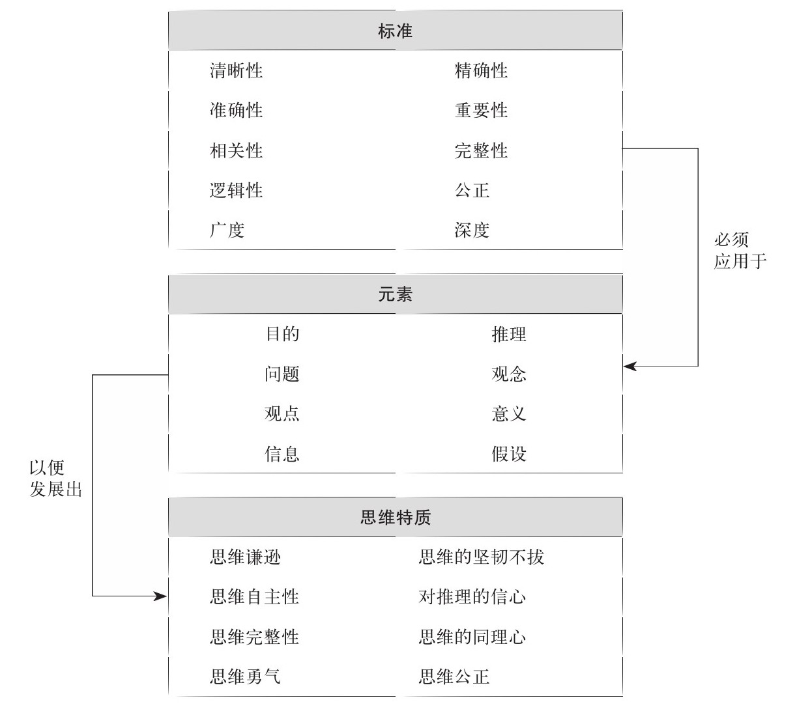

图　4-1　批判性思考者经常会将思维标准权衡并融入推理元素中，进而发展自己的思维特质

推理伴随着我们每天的生活，从早晨起床开始我们便不断地做出选择、完成推理：早餐吃什么，穿什么衣服出门，是否要走进上学途经的商店，选择跟哪个朋友吃午餐，等等。此外，不论解读对面司机的行为，还是对迎面而来的车辆做出反应，选择加速或减速，这些过程中同样伴随着连续性的推理过程。由此，每个人都会对日常生活中遇到的事物，甚至是所有的物质存在，包括诗歌、微生物、民众、数字、历史事件、社会背景、心理状态、个性特质、过去、现在和将来等进行归因和推理。

为了更好地进行推理，我们必须试图挖掘这一过程的本质机制。我们想要解决的问题是什么？我们需要怎样的信息？我们又是否拥有这些信息？如何检验这些信息的准确性？只有深入理解推理过程及其机制，我们才能有效规避某些错误，减轻错误发生的可能性。为了促进更有效的学习，其后本章内容将会引导你超越以往简单的观察，对自身的推理进行更为深入的分析与评估。

## 思维的成分

思维的要素（elements）也称为思维的成分（parts）或思维的基本结构（fundamental
structures）（见图4-2和图4-3）。我们会在文中交替使用这几种不同的表述方式。作为推理的基本维度，推理的成分会随时随地地伴随着推理过程而存在，这并不受推理水平高低的影响。这些基本要素的组合塑造了推理的过程，同时也为思维的运作提供了整体性逻辑。

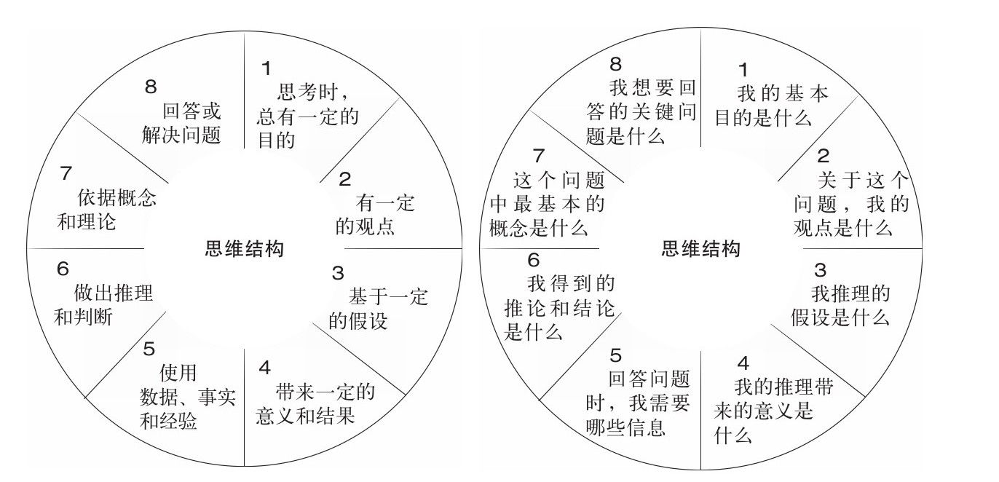

图　4-2　要分析思维，我们首先要了解思维的基本结构

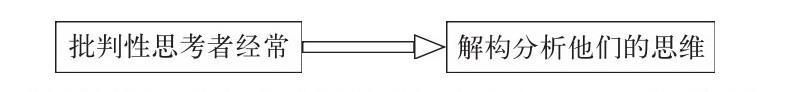

图　4-3　批判性思考者知道将思维分解成各个元素，并分析其重要性

当我们能够熟练地识别出推理的要素时，我们就能从基本成分层面更好地理解问题，由此也就能更好地识别出思维缺陷。识别思维成分的能力对于批判性思维是至关重要的，这也是批判性思维中的重要能力表现。

推理是个体根据原因得出结论的心理过程。表面看来，推理似乎是没有成分结构的一元变量，但严密的分析表明，推理是隐含着一系列相互关联的思维加工活动的过程。无意识思维的意识化练习有助于我们更好地理解思维表面之下隐藏的深层信息。本章将会着重介绍一些重要的理念，来帮助读者完成意识化的任务。

### 思维元素概览

首先，思维元素总是以一个相互关联的集合序列呈现，通过这一集合序列，让我们来分析一下思维元素的组成。

我们可以通过一个稍显复杂的句子涵盖所有的思维成分：

每当你在进行思考时，

这一过程都发生在一定的情境中，

你根据一些理由或信息（以及假设）

会得出一些推论（包括关于事物的含义或结果），

运用一些概念知识

用以解答理论问题（或解决现实问题），

推论的过程从一定的立场出发

指向特定的目的。

如果你愿意，也可以将思维的成分纳入以下两句话中：

每当你在进行思考时，

都是从一定的立场出发

试图达成某种目的，

并在此过程中运用一些概念知识。

你关注于特定的问题或论点，

运用信息

基于假设

得出结论，

这些结论都具有产生特定的结果和意义。

图4-4是思维的八种元素。

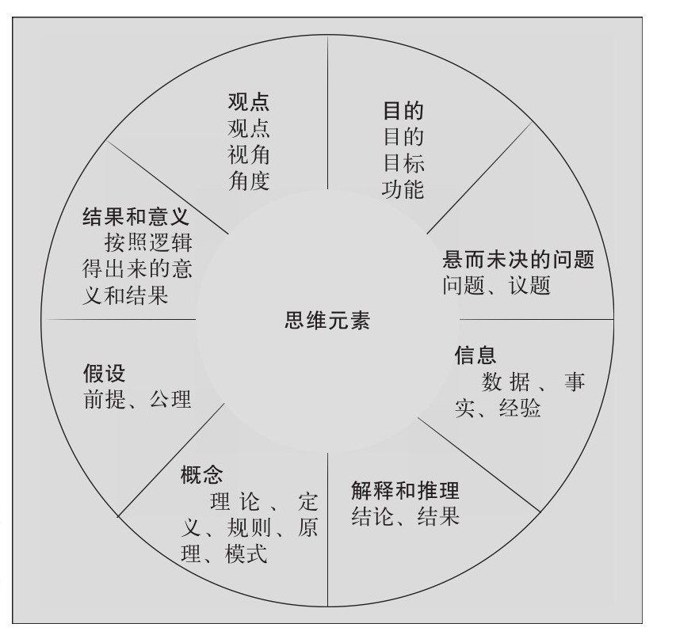

图　4-4　思维的八种元素

所有的思维中都有八种元素：我们的思维有一定的目的性。我们在一定的观点下，做出假设，产生一定的意义和结果，并用一定的观念、理论来解释我们的数据、事实和经验，并解决问题。

让我们花点时间巩固一下（至少是短暂地回顾一下）这些至关重要的概念。这些概念将贯穿全书的始终，因此我们必须将它们纳入我们已有的批判性思维概念体系中，并加以流畅地应用。可以自我检验一下，阅读这些概念的书面解释时，你是否能够结合自身经验，用自己的语言对其进行更为详尽的描述说明。

在推理的过程中，我们总是通过赋予事物一定的心理意义来理解客观事物。所有的思维活动在本质上来说都是主体意义建构的活动。我们听到抓门声会想到，“那是狗”。我们看到天空中阴云密布会想到，“要下雨了”。其中的一些思维活动发生在无意识的层面。例如，所有与自己相关的情景和声音都对个体具有独特意义，而这些意义的建构则不需要明确的外在表征。多数时候我们的思维过程都不是明确可见的，只有在有人质疑我们思维的可靠性，我们需要为自己的逻辑推理进行辩护时，思维过程才会变得意识化与清晰化（“为什么你说杰克令人讨厌呢？我反而觉得他很讨人喜欢”）。纵观人的一生，我们都在不断经历着确定目标，然后寻找途径实现目标的过程。而在此过程中，让我们得以做出决断的正是推理这一心理机制。

推理具有目的性，这一目的性是指人们对事物的思考都是与其目标、欲望、需求及价值观念相一致的。每个人都存在着应对外部环境的模式化行为，而我们的思维也是这一模式化的主要部分之一，也就是说个体的思维，即使是针对简单的事物，同样遵循个体的行为模式，并迎合个体预设的目标。想要了解一个人的思维（包括我们自己），尽管很难了解思维背后的意义，我们也必须了解他思维的目的、内容、思维活动发展的趋势。将个体的目标与需求提升到意识认知层面是达成这种理解、培养批判性思维的重要部分。

推理过程常常从一定的立场出发，这是指我们的思维具有指向性，从一定的角度出发的思维会指向特定的事物。而思维指向的焦点和角度都是可以发生改变的。通常我们会为自己思考事物的角度进行归类命名，例如，我们可以从政治或科学的立场、从韵律或哲学性方面进行思考，可以通过传统的或者自由的、宗教性或世俗性的角度审视问题，也可以从文化、经济抑或两者兼顾的角度出发进行思考和推理。了解人们思考问题的起点（即他们的整合性观念），能够帮助我们更充分地把握思维的整体运作方式。

在推理中运用的概念知识，是指我们在解读、分类或整合信息时所凭借的整体观点或概念范畴。例如，在本书中，批判性思维和非批判性思维的概念是十分重要的。书中所讲述的内容都可以归属为试图对这两种不同思维类型进行的解释。一些观点用以解释其中之一，相应地另一些观点则为另一种思维提供解释。因此，对批判性思维这一概念的理解就参照于其他一些知识（如思维的智力标准等）获得。所有的学科（化学、地质学、文学、数学）都存在一系列的基本概念或专业性词汇以帮助人们理解、掌握这一学科的内涵，体育活动也是如此。例如，当你向他人介绍棒球运动时，就必然需要使用这些概念：击打、球、游击手、回合、上场击球、击中、跑、安全、出局、投手犯规。要进行体育运动时，我们就必须依靠这些基本概念对运动过程中的各种事项进行解释。没有对这些基本概念的理解，人们就无法理解各种运动项目的含义，就无法理解运动项目的规则。

推理是根据特定的问题或论点做出的，是指当我们采用与自身目标、需求与价值导向一致的方式理解外部世界的行为时，我们都要应对日常生活中的问题，即日常生活中我们要解答的问题、处理的纠纷驱动了我们推理的过程。因此，当我们发现自己身处困境时，问问自己“我需要解答的问题是什么”“我需要解决的事情是什么”，这么做有助于我们有效地思考和问题解决。为了提升思维能力，我们必须学会用明确清晰的方式表述问题。一旦问题发生变化，我们也必须对问题的解决方法进行思考，对问题解决的标准进行调整。

推理过程中信息的使用，是指通过一些事实、数据或经验来支持推理的结论。当人们在进行推理时，“你得出结论的依据是什么？”这一问题是很有价值的，因为推理的事实根据是十分重要的。例如，下面的一篇新闻广告就依据一些事实论据对反对死刑的观点进行了有力的反驳：

■“自从1976年最高法院恢复死刑判决以来，每7个被判死刑的犯人中就有1人被证明是无辜的。”

■“从1963年算起，至少有381例谋杀判决被推翻，而误判的原因在于原告隐瞒了被告无罪的证据或是呈交了虚假的证据。”

■“美国审计局的一项调查研究发现了死刑判决中的种族偏见……：相较于黑种人，白种杀人犯更大比例地被判处死刑。”

■“从1984年至今，有34名精神病患者被处以死刑。”（《纽约时报》，1999年11月22日）

从这一事例中，你是否能够感受到推理中事实信息所发挥的重大作用？当然，批判性思维中对事实信息的重视带来的效果是具有双面性的，这也会使对立的信息具有更高的反驳力度。批判性思维的重要公理：检查你的事实！检查你的数据！

得出结论，是指基于一些信息（我们认为自己掌握的）得出另一些结论信息。这一过程是通过推论完成的。例如，如果你从我身边走过却没有跟我打招呼，我会推断认为你在生我的气。而如果炉子上的水壶开始鸣响，我会得出结论：壶中的水煮沸了。在日常生活中，我们总在不断地对人、事、物、地点及事件做出推论（得出结论）。

推论时依据的假设，是指任何我们理所当然地认为是推断前提的信息。因此，如果你认为一个共和党候选人一定会支持平衡预算的政策，那么你的假设就是共和党派人士都会支持平衡预算。如果你认为新闻中被报道为美国“敌国”的外国元首就是美国真正的敌人，那么你的前提假设就是新闻对于外国领导人的报道都是客观准确的。如果你认为一个在派对后邀请你去他（她）的公寓“继续这段有趣的对话”的人是想要与你发展恋爱关系的话，那么你的前提假设就是派对后深夜前往他人公寓的原因就是想要发展关系。所有的推理都是以我们的前提假设为基础的（虽然我们通常并不会对其进行明确表达）。

推理的意义，是指我们思维背后的意义，是思维引导我们的方向。如果你告诉一个人你爱他，也就暗含着你关心他的幸福。如果你做出承诺，就意味着你要履行你的承诺。如果你认为一个国家是“民主”的，那你就暗示了这个国家的政权掌握在多数人民（而非统治阶级）手中。如果你认为自己是“女权主义者”，也就意味着你支持男女在政治、社会及经济方面的平等地位。我们经常通过检验一个人是否言不由衷来判断他是否值得信赖。批判性思维的一项可靠原则（就考察个人诚信而言）就是，看一个人是否“言必行，行必果”。

### 生活实例：杰克与吉尔

现在让我们共同分析一个案例，这个案例是日常生活中常见的一个争议场景——在这一案例中，一对恋人面对相同场景却得出迥然不同的结论。设想杰克和吉尔是恋爱中的情侣，他们相约共同参与一次派对。但在派对上，杰克整晚都在与苏珊交谈，这令吉尔感到心烦意乱。在回家的路上，杰克感觉到吉尔的情绪不太对劲，就问她：“怎么了？”

吉尔犹豫片刻，对杰克说：“你整晚都在与苏珊调情，这令我很不开心。”

杰克：调情……调情！我没有调情！

吉尔：那你怎么解释这种行为？

杰克：我只是表现得很友善罢了，只是友善而已。

吉尔：当一个男人整晚只关注一个女人，就坐在她身边，用柔情似水的眼神凝视她，还时不时地装作不经意地碰触她，他的行为只能被解释为调情。

杰克：那么一个女人整晚盯着自己的男友，关注他的一举一动，搜集证据想要证明一个一直衷心爱她的男人企图背叛的行为，只能说明这个女人是个偏执狂。

吉尔：偏执！你怎么可以这么说我！

杰克：好吧，我还能怎么形容你的行为呢？很明显是你自己缺乏信任和安全感，凭什么来指责我。

吉尔：不要装作很无辜的样子，这应该不是你第一次跟别的女人调情了吧。我们在一起之前我就听说过你是个玩弄女人感情的花花公子。

杰克：我也对你的占有欲和嫉妒心早有耳闻。我觉得在你批评我之前应该先反思一下自己的问题。如果你问我，我觉得你需要心理咨询。

吉尔：你真是个大男子主义者。征服越多女人，就越觉得自己有男子气概。你这么自我中心，是不知道还是不敢承认自己都干了些什么。如果你不愿意改变，我觉得我们没必要继续在一起了。

杰克：我也觉得我们没必要继续发展下去。这绝不是因为我承认自己花心，而是因为你的妄想和偏执。除非你跟我道歉，否则我绝不妥协。

### 实例分析

让我们借助思维的元素分析一下这段对话：

■目的：杰克和吉尔都希望能够与对方发展出一段和谐的恋爱关系，这是他们潜在的共同目标。

■悬而未决的问题：他们遭遇了阻碍他们关系继续发展的分歧，但对于同一问题，他们却有各自不同的理解。对于杰克，他认为问题在于“吉尔何时才会意识到自己的偏执”；而吉尔则觉得应该解决的是“杰克何时才会为自己轻浮的举止负责”。

■解释和推理：杰克与吉尔是对相同场景下的同一行为做出推断，却得出了完全不同的结论。杰克认为，他的行为仅仅只是“友善”；而在吉尔看来，杰克的行为只能被解释为“调情”。

■信息：未经加工的信息包括杰克在派对的场景中所说和所做的一切。其他相关信息包括以往杰克与其他女性相处时的行为表现、吉尔和自己前男友的交往情况以及任何可能确定她是否具有不安全感和偏执心理的个人经历。

■假设：杰克认为他可以问心无愧地说自己并没有与苏珊或其他女性调情。他同时假定自己能够通过他人的行为鉴别这个人是否有偏执与妄想，而一个女人在正常情况下不会像吉尔这样，因此她只可能是得了妄想症。而吉尔则假定杰克的行为绝不仅仅是一般程度的友善。而他们都认为对方对自己的评价是不准确的，也都觉得自己应当得到辩护。

■概念：这段对话的逻辑中包含四个关键的概念：调情、友善、偏执和男性自我。

■结果和意义：杰克和吉尔的推理过程都暗含着这样的态度取向——针对杰克在派对上的言行，两人观点的矛盾之处都应该归咎于对方的责任。同时两人也都在争论的结尾表现出对恋爱关系的消极态度。

■观点：杰克和吉尔对对方的看法都是基于自身的性别偏向做出的推断，认为自己是对方行为的受害者，而自己是无可指责的。

在这场恋人间的争论中，我们无法仅仅根据对话做出孰是孰非的判断。为了证实究竟谁的解释更为合理，我们还需要更多的事实信息。如果我们更多地确证了杰克对苏珊做出了许多细微动作，我们便会倾向于认为真的如吉尔所说，杰克是个轻浮的花花公子。但如果我们先入为主地听到了这段对话，也可能会认为吉尔是在无理取闹。

## 思维成分的整合

要掌握思维这些元素，关键就在于你必须用不同的方式对这些基本元素进行解释，直到这些元素间非线性的复杂联系在你的头脑中形成直觉性的概念联结。例如，你或许可以将思维成分类比为人体的基本结构。不论我们健康与否，这些结构都是存在的，而思维成分的存在也是如此，并不受思维质量或水平的影响。思维成分之间的相互关系可以表述如下：

■我们的目标决定我们提出的问题。

■我们提出的问题决定我们搜集信息的内容。

■提取的信息内容影响我们解释问题的角度。

■解释问题的角度决定我们抽象概括信息的方式。

■抽象概括信息的方式影响我们确立的假设。

■确立的假设影响我们思维的潜在意义。

■思维的潜在意义又会影响我们理解事物的方式，即观点立场。

在本章接下来的部分中，我们会详细介绍概念（concept）、假设（assumption）、推论（inference）、意义（implication）、观点立场（point
of
view），并且着重区分假设与意义这两个概念，因为我们发现在初期学习阶段的学生往往很难区分两者。一旦你能够清晰地区分这两个概念，也就意味着你能够更为迅速地理解与掌握其他概念。本书中将对涉及的所有核心概念进行详细阐述，甚至“思维中的问题提出”将单独作为一章进行阐述。请定期放下书本，看看你是否能够通过自己的语言和例子对思维的成分进行详尽的描述说明。对这些概念的精细加工将有利于你对知识的内化。你必须能够通过说、写、想等各种方式，将这些概念内化进你自己的知识体系。

## 思维要素之间的关系

思维的各个要素之间并非是彼此独立存在，而是相互关联的。因此我们也应当明确要素之间并没有绝对的界限，他们的区分总是相对的。例如，如果我们的目的是找出少花钱的方法，那么需要回答的问题就是，“怎样才能少花钱呢？”这一问题的提出实质上是对目的的重组。另外，在这一问题中，我们的观念立场可以理解成“利用消费习惯减少生活开支”。而这一观点可以是对目的和问题的重组。认识到各种思维元素之间的紧密联系十分重要。

有时，对一些思维元素的明确言语化表达似乎是一件很勉强的事。但持续练习，你会发现对这些元素进行意识化的分析能够为思维能力的提升提供助力。

## 批判性思维指向一定目标

英国学者苏珊·斯特宾（Susan
Stebbing）在1939年写过一本专门讲述思维目的重要性的书。她在书中写道：“逻辑性的思考就是围绕思维中最初的目标，进行相关性的思考，有效的思考都是指向一定目标的。”我们也认同她这一观点。所有的思维过程都有想要实现的目标。人们对事物的思考都是与其目标、欲望、需求及价值观念相一致的，而并非随意的或无规律的。每个人都存在着应对外部环境的模式化行为方式，而我们的思维是这种模式化的主要部分之一，也就是说，个体的思维，即使是针对简单的事物，同样遵循个体特定的行为模式并迎合个体预设的目标。想要了解一个人的思维（包括我们自己），我们必须了解他思维的功能、内容、思维活动发展的趋势及其目的。

思维背后的深层意义多数是隐晦、不为人知的，因而将个体的目标与需求提升到有意识认知的层面是批判性思维的重要一部分。尽管思维总是有一定的目的性，但我们却常常只能模糊地感知到它，不能充分意识到思维的目的。例如，你出于获得学位的目的在大学里深造，但你并没有深入思考过获得学位对你意味着什么。你上大学或许只是因为你所有的朋友都这样做。在这种情况下，你并没有认真思考过自己的目的性。而事实上，明确的目的会使我们更容易在现实中实现自己的目标。

不过，人类思维时常存在的一个问题是，人们时常会追求相互矛盾的目标。我们希望受到良好的教育，却不想费脑子参与脑力劳动。我们想要得到他人的关爱，却并不用相同的方式对待他人。我们想要获取信任，却表现出破坏信任感的行为。我们自己的外显目标可能只是我们自己想要相信的，而真实目的却反而是自私的，是我们羞于承认的。我们或许觉得自己考入医学院的目的是帮助他人，但潜在的真实目的则可能是希望获得更多的财富、更高的社会声誉与地位以及他人的赞赏。因此，我们绝不能理所当然地认为自己还有他人声称的目标与真实的目标是一致的。

此外，我们追求的目标与感知世界的方式是相互影响的。我们的目标塑造了我们感知世界的方式，而我们感知世界的方式又会影响我们所要探求的事物。每一个人都会结合自身的经历和人生背景，从既有的观点立场出发制定自己的目标。为了理解行为的目的，我们应当考虑到自己感知事物的立场与情境。

例如，一个美发师出于他的职业立场，会比门卫更关注个人形象。对自己和他人良好外在形象的塑造会更紧密地与他个人的价值观念相联系。而牙齿矫正医师也会比一般人更多地考虑到牙齿的外形。拥有整齐的牙齿对于她的价值会远远超过对于一个足球运动员的价值。而她想要矫正出整齐牙齿的目标就是源于她的观点和立场。

## 批判性思考者能够组织概念

概念如同我们呼吸的空气一般无处不在。尽管如此，我们却很少意识到它的存在。而只有在我们已经对某件事物进行概念化的解读之后，我们才能对它进行思考。我们并不是天生就知道如何对事物进行抽象概括，这种抽象概括能力需要我们自己后天的学习和创造。而实质上，概念化的过程是在事物与已有的概念网络之间形成联结与整合（因为概念都是相互关联而非独立存在的）。

我们对事物的理解实质上都是通过“译码”或是建构概念的方式来赋予其心理意义，并在此基础上做出推论的过程。由此，这也进一步建构出相关的其他概念。这一过程对我们而言通常是自动化的，我们通常并不会意识到这一过程的发生。在日常生活中，我们理解事物的过程并不是先从不涉及概念形式的初步感知，到经由意识性加工将概念纳入我们已有的知识范畴来完成的。而事实正相反，概念和名称似乎是作为事物的固有属性与事物本身同时被我们感知到的。所以我们看到的是树、云、草、道路、人群、孩童、日落等名称的事物。我们直觉地应用这些概念，就如同这些概念名称是事物本身的自然属性，而不是我们人为后天加工的一样。

如果你想要成为一个批判性思考者，你必须掌握好自己构建概念的能力。你必须突破既有概念对这个事物的限制，多尝试其他备择概念。正如语义学家所说：“概念并不等同于事物本身。”如果你对事物的理解被一组概念（观念、名称）限定住，你的思维也会局限于单一的思路，概念与事物本身于你而言就是等同的。

为了明确概念的恰当用法，理解对物体、事件、情景、情绪以及抽象观念的合理构建概念的方法，你首先应当掌握正确的词汇运用方法。例如，如果你擅长英语，就会很明确地知道needing（需要）和wanting（想要），having
judgment（有判断力）和being judgmental（有批判精神），having
information（获得信息）和gaining knowledge（增长知识），being
humble（谦卑）和being servile（卑微），stubbornness（倔强）和having the
courage of your
convictions（坚信）之间的显著差异。掌握语言中不同表达方式的差异会对我们的经验解释产生重要的影响，缺乏这种辨别能力的人往往会混淆这些差异，对事情产生曲解。

在学习母语的过程中，我们习得了很多概念。如果运用得当，这些概念能够帮助我们对经验到的事物做出合理的推断。但不幸的是，在学习语言的过程中，从未有人提醒我们要谨慎使用概念，避免运用概念做出不合理的推论。

我们受到社会文化的影响，时常会误用或混淆一些思想观念，导致对概念本身的扭曲解读。作为批判性思考者，我们应当持续地对社会场景与日常言语系统中的思想观念进行区分。很多国家或文化背景的人都使用相同的语言系统。加拿大人、爱尔兰人、苏格兰人、英格兰人、澳大利亚人和美国人都说英语。虽然他们都共享相同的语言概念集合（《牛津英语词典》中编纂为23卷），然而不同国家的人却受到不同社会条件的制约。

除此之外，尽管没有英语背景，但这并不妨碍中国人对英文的熟练掌握程度。因此，语言（法语、德语、英语、斯瓦希里语以及北印度语等）中虽然蕴含着众多的概念储备，但这些概念在不同社会文化背景下表达出的概念内涵却存在着很大差异。这一点很难理解，但对于批判性思考者则是至关重要的。

例如，由于社会环境的影响，多数的美国人认为资本主义经济体制是全世界最发达的（我们称之为“自由企业”），认定任何国家要想实现真正的民主都需要拥有与美国相似的经济体制，而且认为与之相对的经济体制是错误的、奴役的、邪恶的（“邪恶帝国”）。他们通过电影、新闻、教育、政治演讲以及种种社会惯例被灌输这些观念，用这样的方式看待世界。美国人与伊朗人都生活在特定的社会环境中，他们内化的自我和世界的概念、信仰、假设必定是不同的。

但词典的编纂者则不会在正规的英文词典中将概念的社会内涵和心理意义与词汇本身的字面意义相混淆。例如，资本主义不会被定义为“民主社会的基本经济体制”。

尽管如此，在社会化的过程中，我们学会相信自己是自由、公道、正义、有同情心的，因此认为我们的表现与这些词语表达的含义是相互匹配的。语言常常替代了那些以其命名的现实事物，由此语言表意与事物本质间存在的根本性矛盾就是不可避免的了。这也是人类自我欺骗这一心理现象的重要表现。

批判性思考者会剥去表层语言表达的束缚，用其他的方式思考与谈论事物。例如，当我们采用社会取向的思维方式时，我们会被局限在周围人与社会普遍认同的价值观念当中，意识不到应当理智化地寻求对情景、人物及事件提出其他概念的方法。出于对社会习俗惯例的尊崇，许多人的思维局限在社会权威、地位与声望当中，生活在表层的语义结构层面里。而要成为一名批判性思考者，我们就应该进行合乎逻辑的思考，同时要识别出自己在特定社会惯例、期望与禁忌中观念的局限性。

## 批判性思考者评估获取的信息

推理必须根据一系列的事实、数据与经验等基本成分做出。找到可靠的信息来源并掌握个体经验的界定方式是批判性思考者的重要目标。换言之，我们必须对采纳的信息来源保持警惕，同时对自身经验的解释保持分析与批判的态度。经验或许是最好的老师，但他绝不可能是完全正确的、毋庸置疑的。信息只是思维的一个组成维度，与其他维度一样，应当受到批判性的分析与检验。不加审视地根据经验做出推论会带来思维偏差与自我错觉。

我们通常会通过三种独特的途径获取信息：①背诵事实或惰性知识（即尚未完全理解并能灵活应用的信息）；②错误学习、局部学习或者接受非理性信念（其后会主动地忽略）；③积极地获取重要概念（随后会形成激活状态的知识）。

### 惰性知识

惰性知识是指我们并不完全理解仅通过机械记忆进行加工的信息，但是我们总会自以为已经理解了信息的意义。例如，很多人在校期间都接受过民主知识教育，这让人们相信自己已经理解了这一概念。而事实上，人们内化的“民主”信息往往只是一些没有实质内容的口号罢了。许多学生在学校学到的民主只是一句响亮的口号，“民主主义国家是人民的、由人民组建的、为人民服务的政体”。尽管很少有人会将其学到的知识转化为评估国家民主程度的实际标准，但还是有很多人自以为自己已经掌握了民主的内涵。明确地讲，尽管接受了民主教育，但是很多人都应该无法回答以下的几个问题：

（1）人民的政权和为人民服务的政权有什么区别？

（2）为人民服务的政权和由人民组建的政权有什么区别？

（3）由人民组建的政权和人民的政权又有什么区别？

（4）“人民”指的究竟是哪些人？

学生通常并不会充分地思考他们在学校里通过死记硬背而获得的知识，也就无法将这些知识转化为实际可用的有意义的信息。人们掌握的很多信息都只是由一些没有实质意义的语词构成，批判性思考者会尽可能地识别并清除这些惰性知识，同时通过分析，将这些惰性知识转化为有实质意义的知识内容。

### 主动性忽略

主动性忽略，是指人们将实际错误的信息看成是正确知识，而且这些错误的信息还在头脑中获得加工并得以积极应用的心理过程。哲学家笛卡尔坚信动物并没有真正的感觉，只是具有一些机械性反应。出于这种主动性忽略观点，他在动物身上进行痛觉实验，完全将动物疼痛的眼泪作为干扰信息忽略掉了。有些人认为主动性忽略可以帮助他们更好地理解人、事、物与情景，但实际上，人们根据主动忽略后剩下的错误观念、幻觉所采取的行动往往会造成无谓的浪费、痛苦或灾难。主动性忽略是很多人日常活动的基础（想想纳粹主义“德国人是统治的种族，而犹太人是低等血统”的观念所带来的毁灭性后果。）但有时，它只是个体特定错误观念在有限背景环境中的反应。无论何时，主动性忽略的存在都是十分危险的。

因此，质疑我们的信念是十分必要的，尤其是当这些信念可能造成伤害性或灾难性后果的时候。每个人都有主动性忽略衍生的观念，尽可能多地消除这些信念是我们共同的责任。想一想醉酒司机坚信自己可以安全驾驶可能造成的严重后果，想一想吸烟人认为吸烟不会影响健康的潜在威胁，我们要尽可能地减少这些错误信念。

虽然识别主动性忽略的情景并不是一件容易的事，不论我们能否有效地辨识信息的正确性，我们都要对主动性忽略抱有审慎的质疑态度。我们必须时刻对主动性忽略保持清晰的认识，对可能存在错误的信息保持内在的警觉。大多数人可能都会主动忽略自身能够对他人造成伤害的行为，并没有意识到自身行为的严重后果。承认主体性忽略的真实存在对培养批判性思维有着重大的意义。

### 活性知识

活性知识，是指在头脑中获得加工、被积极运用，同时又被深入地内化理解的正确信息。活性知识可以潜在地引导我们获得更多知识。以历史课程的学习为例，很多学生仅仅是为应付考试，对历史书中孤立的片段内容进行死记硬背。有些内容（他们并不理解也不会解释）成为学生的惰性知识，另一些内容（学生错误理解与不恰当解释）成为主动性忽略的信息。当然，更多的内容在考试结束后就被完全遗忘了。

但对批判性思考者来说，更为重要的是将对历史思维逻辑的学习作为学习理解历史的重要途径。当我们理解了历史学科的基本概念，这些基本概念就成为我们活性知识体系的一部分，能够帮助我们在充分理解以往历史概念的基础上获得新的历史知识。

例如，在历史学习的初期阶段，我们可能只是了解到一些历史思维的基本理念：以史为鉴可以使我们更好地理解现在、合理地规划未来。一旦我们拥有了这样的历史逻辑观念，我们就会认识到历史思维早已融入了我们的生活，意识到学科知识与日常生活情景的联系。根据以往的经历与观念，我们为现在的生活赋予意义、为将来的发展制订计划。然而，大部分人却意识不到这一点。

如果我们仔细思考史学逻辑及其深刻内涵，我们就会发现历史思维与生活中常见的“绯闻八卦”之间存在相似之处：我们编造一个以某人为对象的故事，并将这一故事传播给其他人。如果我们继续深入思考史学的逻辑，就会发现报刊中的新闻事件都是通过类似的思维方式编写的。无论是八卦绯闻还是新闻事件，都是人们建构故事的过程，都是通过对以往事件的解读来适时地对当下情况进行解释。

对史学逻辑的深入反思会引导我们提出很多疑问，例如，“在介绍一段历史时期时，真实的历史描述大约占历史事件的多大比例”。这会使我们发现，在特定的历史时期，即使是一天的时间内也会发生不可计数的历史事件。这也就意味着任何的历史描述都可能包含有大量的虚构描述。因此历史学家必须不断地做出价值判断，决定在他们的历史叙述中哪些内容应该包含，而哪些内容应当摒弃。

同样，我们也会明显地察觉到不同的故事与描述本身就反映了历史事件中特定的模式与时代背景，譬如，强调高层领导者（伟人）或强调不同社会与经济阶层群众的描述。而特定的历史研究者提出的问题也都取决于他的议题或目标。

■提出的历史问题决定了哪些资料或事件是相关的。

■同样的事件可以通过不同的概念化方式进行阐述（例如，关于人与社会变迁的问题，就可以从不同的政治、社会或经济理论出发进行解释）。

■不同的历史学家会做出不同的假设（这些假设会影响他们提出的问题以及关注的信息）。

■如果一个历史学家认同某个群体的历史人物，那么他就会在历史描述中强调这一群体的优点，也会突出对立群体的消极特征。

正是凭借这些觉察与发现（我们必须深入思考以保证切实掌握这些知识），我们的历史观念才能有所转变，我们才能够透彻地理解历史，才能进行历史性的思考。这样的思考能够帮助我们了解历史知识，也能帮助我们明确对历史的借鉴以及历史对现实社会的安定效用。

因此，活性知识是指源于动态的启发式观点的知识。当活性知识被普遍地应用时，它就可以促使我们推论得出更多的知识。任何一门学科都可以产生活性知识，对于每一个科目的学习，我们开始掌握某一领域中的基本信息，并以这些基本的概念原理为基础，理解这一领域中相互关联的思想、知识及经验，培养出一种探求事物逻辑的学习习惯，这是发现活性知识的强有力途径，而这其中最关键的是要树立终生学习的人生理念。

## 批判性思考者能够区分推论与假设

正如前文所述，推理各成分之间是相互联系的。它们既影响着其他因素，也受到其他元素的影响。我们现在主要介绍推论与假设这两种思维成分之间的关系。有效区分推论与假设是批判性思维中的重要技能。而许多人都会对两者产生混淆。让我们先来回顾一下它们的基本意义。

（1）推论（inference）：推论是思维的一个阶段，也是个体根据一些正确或看似正确的命题归纳总结、得出结论的过程。如果你手持凶器朝我走来，我可能会推断认为你意图伤害我。推论可能是准确的也可能是不准确的，可能是符合逻辑的也可能是不符合逻辑的，可能是公正的也可能是不公正的。

（2）假设（assumption）：假设是我们认为理所当然是推理前提的信息。它通常是指我们先前学习过并不会质疑的知识内容，是我们信念体系的一部分。我们通常都假定自己的信念是正确的，并运用这些信念解释周围的世界。如果你觉得深夜在大城市里闲逛是一件危险的事，而恰巧你又居住在芝加哥，那么你就会推论认为深夜出门是件危险的事。而你会理所当然地认为“深夜在大城市里闲逛是一件危险的事”这一信念是无可厚非的。如果你的信念是合理的，那么你的假设也就是正当的，反之亦然。信念与假设都既可能是正确的，也可能是错误的，这取决于我们是否有足够的证据支持它。思考一下这个例子：“我听到了抓门声，于是起床放门口的猫进来。”我的推论依据的前提假设（预存信念）是，只有猫会制造出这样的抓门声，而它只有在想要进屋时才会发出这样的声音。

我们人类时常会不自觉地将自己的信念作为假设，并依据这些假设做出推论。我们必须通过这样的方式才能理解周围发生的事。假设与推论渗透我们生活的各个方面，因为我们必须依靠它们进行思考与行动。我们只有根据自身的价值信念才能做出判断、形成解释、得出结论。如果置于任何一个有意义的环境场景当中，人们会自动化地做出某些推论，为他们随后的思维和行动奠定基础。在没有经过事先训练，同时尚未明确环境条件的情况下，人们能够迅速而自动地做出推论。我们看到乌云，就推测可能下雨；听到敲门，就知道有人来了；看到皱眉的面容，就推断他在生气；遇到朋友迟到，就断定他是不体谅他人感受的。我们看到高个儿男子，就推断他擅长篮球；看到亚洲人，就想到他成绩很好；阅读一本书，就能根据故事大意推断语句的引申含义；我们聆听他人的对话，然后对他们所表达的观点做出一系列的推论。

写书也是一样，我们会推测读者在阅读过程中可能产生的心理感受。我们会考虑自己的表达是否足够清晰、哪些内容需要进一步解释、哪些内容需要举例或图示说明，而哪些内容又不需要这样复杂的解释，我们试图从读者的角度对这些问题做出推论。很多推论可能是正当而合理的，但另一些则不然。

要养成批判性思维习惯，重要的一点就是要求我们将思维从无意识层面提升到意识化觉知层面。这其中就包括识别与重建推论的过程，通过这个过程，我们就能够获得清晰地意识到自己塑造自身经验方式的能力。这一能力使我们能够将自身经验区分为两种类别：未经处理的信息与我们对这些原始信息的主观解读。最终我们会发现，我们做出的推论在很大程度上受我们的个人立场与基本假设的影响。这一发现有助于我们拓宽视野，从多种角度审视事物，也能够由此获得更为开阔的思维境界。

通常，不同的人从不同的立场出发，会对相同的情景做出不同的推论。这是因为他们的思维推理是以不同的假设为起点的。例如，有两个同事看到一个躺在水沟里的男人，其中一个或许会推断，“这是个醉酒的流浪汉”；而另一个则可能会认为，“这个男人需要帮助”。这些推论都是建立在关于躺在水沟里人的基本假设基础上的，而这些假设也与推断者事先形成的观念立场有关。第一个人的假设是“只有醉汉才会躺在水沟里”，而另一个人的假设则是“躺在水沟里的人是需要帮助的人”。第一个人已经建立的观念是“人们都要为发生在自己身上的事情负责，也都应当有能力照顾好自己”，而第二个人已经形成的立场则是“人们面临的问题多是由外界环境造成的，存在很多人力不可控的因素”。这两个人的逻辑假设和推论可以归纳如下：

第一个人

情景：一个男人躺在水沟里

推论：这个男人是流浪汉

假设：只有流浪汉会躺在水沟里

第二个人

情景：一个男人躺在水沟里

推论：这个男人需要帮助

假设：躺在水沟里的人都是需要帮助的人

为了发展批判性思维能力，我们要了解我们做出的推论、推论依据的假设以及我们理解世界的观点立场。因此，我们需要长期的训练以提升自己识别推论与觉察假设的能力。

充分认识我们做出的推论以及推理背后隐含的前提假设，能够帮助我们增强对自身思维的控制力。因为人类所有的思维本质上都是推论性质的，对思维的控制力也就依赖于对思维中推论及假设的控制能力。思考一下我们平时计划与考虑日常行为的方式。我们认为自己在准备早餐，吃早餐，准备上课，准时到达教室，坐在特定的座位上，开始上课，考虑午餐吃什么，支付账单，与别人闲聊，等等。

其实在这一过程中，我们也是在不断地解释自己的行为，赋予行为意义，对生活中正在发生的事做出推论。我们必须从各种各样的可能意义中做出选择。例如，我在“放松”还是“浪费时间”？我是“坚定的”还是“顽固的”？我究竟是“参与”了讨论还是“打断”了别人的对话？某人是“跟我一起笑”还是“在笑话我”？我是“帮助了朋友”还是“被人占了便宜”？每当我们解释自己的行为并赋予它们意义时，我们都是在完成基于假设做出推论的过程。

作为一个人，我们都在不断地做出关于自己、工作、同伴、老师、家长甚至关于世界的假设。我们将一些事物视为理所当然，这只是因为我们无法质疑一切。有些时候，我们也会将错误的事视为理所应当。例如，我跑到超市（假定自己带了钱）却发现自己把钱落在了家里。我以为车里有足够的汽油，却发现已经用光了。我假定打折的商品都是便宜货，却发现它是在涨价之后打折的。又譬如，我假定不会（会）下雨；假定当我拧过车钥匙、踩过油门之后车就会启动；假定我与他人相处时都是心怀善意的。

我们做出了许许多多的假设，而这些假设在很大程度上都是没有意识、不加考虑的。这些假设多数都是正当而合理的。然而，有些却不是。那么问题在于：我们如何才能识别自己做出的推论、推论依据的假设以及我们理解世界的观点立场？

有很多方法可以培养我们对推论与假设的意识觉察能力。一方面，所有学科学习的共同之处在于，它们都需要我们基于学习内容做出正确的假设，并能够熟练地得出合理的推论。举例来说，学习数学时，我们会基于我们的数学假设做出数学推论；学习科学时，我们会根据我们的科学假设得出科学推论；在解释历史事件时，我们会依据历史假设做出历史推论。在不同情况下，我们做出的假设都依赖于我们对基本概念与原理的理解。

随着我们能够越来越熟练地鉴别自身的推论与假设，我们也就逐渐具备了质疑假设正确性的能力。例如，我们假定人人都在中午吃午餐是合理的吗？我们有理由假设阴云密布就是下雨的征兆吗？我们假设头上的肿块一定是由于殴打造成的，合乎情理吗？关键在于，我们都会根据日常经历做出假设，而我们应该学会识别假设并质疑其合理性。当你逐渐具备了这些批判性的直觉，你就会越来越多地觉察到自己和他人的推论中被认为理所当然的事，也会越来越深刻地体会到你的观点立场如何塑造了你的经验感受。

图4-5是人们在情景中做出结论的过程。

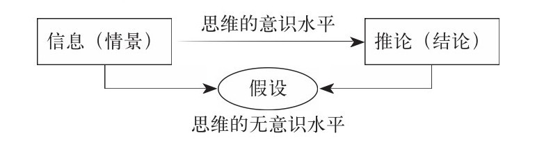

图　4-5　人们在情景中做出结论的过程

人们经常在情景中做出结论，这些结论常常是根据假设做出来的，而我们形成假设的过程常常是无意识的。

根据表4-1中的项目，分别写出各个情景下的可能推论，以及导向推论的前提假设，然后在表4-2中自己设想出十二种情景，并分别写出其推论及假设。

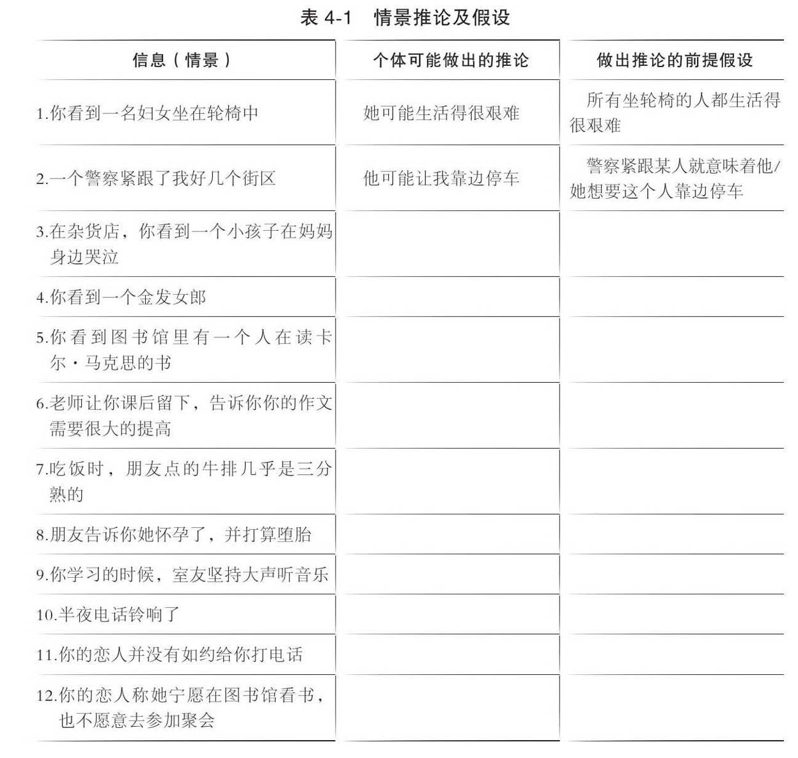

## 批判性思考者能够透彻理解推论的意义

批判性思维最重要的技能之一，是区分一项陈述或情景的真实意义与人们由此做出的虚假推断。再次说明，推论是导向结论的一个思维阶段。例如，由太阳升起，我们会推论出是早晨。批判性思考者会试图监督自己的推理过程，不多不少地针对某一情景的含义做出推论。如果我生病看医生，自然希望医生由我的症状精确地推断出我的病症。例如，我不希望当我被病毒感染需要抗生素治疗时，医生却诊断我只是患了感冒而不需要药物治疗。我的症状预示着我患了某种疾病，而这又进一步说明我需要特定的治疗。我希望医生能够正确推断我的病症，然后采用恰当的治疗方法。

在很多时候，人们都无法透彻地理解一个情景、问题的正确意义。这往往会产生一定的不良后果。

任何情景都包含有三种不同的意义：合理的意义，可能的意义，以及必然的意义。例如，每次你开车都暗含着可能发生事故的合理意义。而如果你在醉酒的同时还超速行驶在雨中拥挤的街道，一种可能的意义是你将会发生事故。如果你在高速公路的主干线上快速行驶，在迎面开来一辆车时发现刹车失灵，将要发生的事故就是这种情况下难以避免的意义。

我们将特定场景引发的真实事件称为结果。如果我们能够有效识别（做出合理推论）合理的、可能的及必然的意义，我们就可以采取措施以增加积极结果同时减少消极结果。一方面，我们希望潜在的积极意义得以实现，另一方面又不愿意合理的和可能的消极意义成为现实。我们希望了解特定场景中固有的现实可能性并对这一联系加以有效运用。

我们学习事物的逻辑是为了能够熟练地发现其意义并据此引导自身行为。而实现这一目标的关键在于，借助对事物逻辑的准确把握对特定情景隐含的意义做出合理的推论。我们希望能够在采取行动之前透彻地了解自身决策可能存在的所有意义（合理的、可能的与必然的）。

在特定情景的意义之外同时还包括语言表达的意义，这是伴随自然语言的固有意义而产生的一种意义。我们日常交流所使用的语言词汇往往都是有引申含义的。例如，我告诉自己的女儿因为她没有打扫房间，作为惩罚，她不能去朋友家里玩。那么我的言外之意就是她应当知道如果想出去玩，就必须把房间打扫干净。我认为女儿应当为没有完成打扫房间的任务得到惩戒，这一观点以及我对她所说的话的合理性建立在以下两个前提上：

（1）经过事先交流，我已经明确告诉她希望她保持房间的整洁。

想要成为批判性思考者，我们必须精准地把握自己言语表达的言外之意，同时保证我们表达的意义是正当合理的，做到“言必行，行必果”，这也是批判性思维的重要原则。

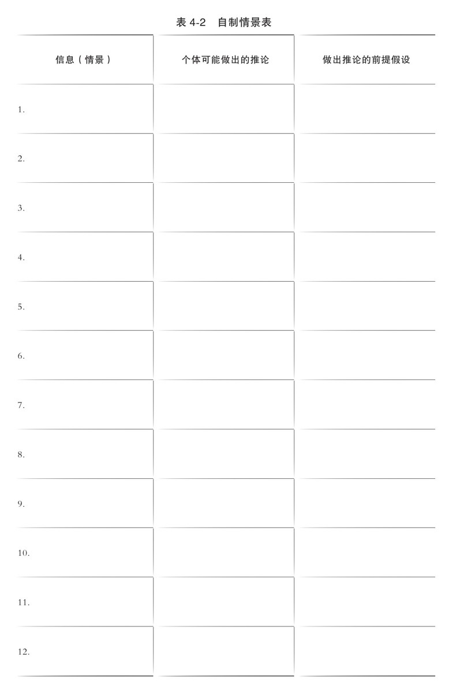

正如我们用以交流的语言有其特定意义一样，我们描述事物的方式也具有一定的意义。例如，面对“你为什么没有清扫厨房”这一相同陈述，平静的询问与气愤的喊叫就具有不同的意义。第一种情况只是表达，我以为你已经打扫过了。而在第二种情况下，我的话则意味着，你没有打扫房间是个严重的失误，并且应当受到训斥。

正如我们会忽略情景或自身语言的意义一样，我们也可能会忽略他人对我们所说的话的意义。人们经常无法正确推断他人通过语言想要向我们传达的意义，甚至会有过度推论的倾向。例如，如果你的老师告诉你论文需要进一步修改完善，这其中并没有别的言外之意，却可能被你推断为“他认为你不如其他学生聪明”“他认为你学习能力不足”等。

总体而言，我们必须意识到推论在人类生活中扮演的重要角色。当我们思考问题时，我们要考虑到关于自身决策的所有可能意义。我们要了解推论出特定情景的意义，要了解自己或他人使用语言时所表达的意义。在每种情况下，我们都希望能够恰如其分地解释事物的逻辑并推论得出其真实意义。

## 批判性思考者能够调整观点立场

观点立场是思维成分中最难以为意识控制的因素。一方面，我们在思考时都会从一定的观点立场出发，对于大多数人而言这是高度自动化的直觉性行为；另一方面，当我们要求人们在思维过程中报告或解释他们的立场时，他们很可能会开始说明他们想到的任何或者所有内容。我们可以很明显地看出，大多数人并不清楚如何识别自己和他人的观点立场。

让我们先来认识一下我们立场产生的潜在来源：时间、文化、宗教、性别、学科、职业、同伴、经济偏好、情绪状态、社会角色或年龄阶段，等等。例如，我们可以从以下的观点立场出发感知世界：

■特定的时间点（16世纪、17世纪、18世纪、19世纪）

■特定的文化背景（西方、东方、南美、日本、土耳其、法国）

■特定的宗教信仰（佛教、基督教、伊斯兰教、犹太教）

■特定的性别或性取向（男性、女性、同性恋、异性恋）

■特定的职业（律师、教师……）

■特定的学科（生物的、化学的、地质学的、天文学的、历史学的、社会学的、哲学的、人类学的、文学的、艺术的、音乐的、舞蹈的、诗歌的、医学的、护理的、运动的）

■特定的同伴群体

■特定的经济偏好

■特定的情绪状态

■特定的年龄阶段

在个体层面，我们的观点立场是这些维度的整合。可惜的是，我们并不了解这些因素是如何塑造影响我们的观点立场的。人们通常不会说“这是我从……立场出发而有这样的观点的”，而是说“事情本身就是如此”。我们的意识总是倾向于将自身知觉到的观点视为绝对正确的，而总是忽视个人观点偏向性的局限。

这并不是关于思维相对性（任何事物都是相对的，因此无法得到验证的自我反驳观点）的探讨。从特定的立场出发看待事物，并不会削弱我们价值判断的能力。医生从医疗健康的立场出发诊断病人，这并不会使得他们的诊断显得“相对”、武断。

正如其他的思维元素一样，我们通过意识化的训练可以在批判性思维中应用观点立场。随着对自身与他人观点识别能力的提升，我们能够学会采用更多的观点立场进行思考，并且有效利用这一元素成分促进批判性思维的发展。

## 批判性思考者的观点立场

最高明的思想家都会认同批判性思维的价值，并将其作为思维的核心目标。批判性思考者将对思维过程的意识化控制作为控制其自身行为的关键。因此，优秀的思考者在学习过程中，无论是在阅读、写作、交谈还是在倾听，都应该不断练习对自己思维的意识化控制过程。

阅读时，学习者要将文本作为作者思维的言语表征形式。努力理解作者的立场，并且将作者的思维方式在自己的头脑中重建。写作时，学习者会有意识地思考目标读者的观点，试图洞察潜在读者的看法，并通过读者可以理解的方式呈现自己的故事。与别人的交谈也体现出相似的特点，通过对话了解他人的观点以及交谈者的关注点，不将自己的观点强加于人，能够意识到人们是如何通过自己的方式形成观点和信念的，因而他们会更多地与他人分享经验及信息而非最终结论。他们愿意专心聆听他人的想法，提出问题而非做出评断。

他们也清晰地知道不同学科之间具有不同的独特视角。当学习一门学科时，他们会努力领悟这一学科的视角并以此为主导进行思考。他们搜寻基本的原理、概念、方法与程序，试图以该学科的逻辑进行思考。例如，在学习数学时，他们会努力发展数学的思维观点，学习如何像一个数学家一样思考。相似的逻辑观点也在其他学科中逐渐发展起来。

优秀的思考者对自己也持有独特的观点。他们将自己看作有能力的学习者，对自己的学习抱着乐观进取的态度，不会将相反的观点视为威胁或挑战。他们将所有的个人观点看作可以被挑战的，随时准备根据新的证据与合理的推论修正自己的观点。他们将自己视为终生学习者。

## 小结

在学习篮球、网球、足球或者其他任何运动的过程中，最初的起点都是了解这项运动的基本要素组成。批判性思维的学习也是如此，我们首先需要掌握思维的基本成分。这些成分是批判性思维的根基，只有对思维成分进行准确分析，我们才能对它进行有效的评估。因此，识别思维成分的能力对优秀的思考者而言是必不可少的。

对思维组成的分析是思维评估的必要非充分条件。有效的评估需要有效衡量思维优缺点的思维标准。例如，清晰明确是思维的优势，而模糊混淆则是劣势；准确是优点，而不准确则是思维弱点。我们会在第5章中着重介绍这些标准，阐明并解释这些标准是如何应用思维成分的。

# 第5章　思维标准

批判性思维的基本功能之一就是评估自己和他人思维的能力。而要想善于评估，就需要我们一贯地对思维进行剖析，并对思维的质量水平进行检验。我们根据清晰度、准确性、精确度、相关性、深度、广度、逻辑性和重要性的标准来完成对思维评估的任务。批判性思考者承认，他们的思维活动都是有目的性的（论证的元素）。他们的思维过程中有隐含的目标，但只有当他们清楚这些隐含的目标时（思考标准），他们的思维活动才能获得显著的提升。相似地，为了更好地论证，他们需要知道，他们正有意识或无意识地使用思维中的信息（论证的元素），但当他们确定所使用的信息是准确的时（思考标准），思维活动才能获得显著的提高。

换句话说，我们评估自己的思维是想知道自己的思维水平。我们不是为了好玩或仅仅服从权威来确认思维元素。恰恰相反，我们使用思维标准来评估我们自身的思维，因为我们清晰地意识到评估失败所带来的负面影响。下面是我们提出的最简化的思维标准：

■清晰性

■准确性

■精确性

■相关性

■深度

■广度

■逻辑性

■重要性

■公正性

这些不仅仅是个人可能使用到的思维标准，它们也是最基本的评估思维的标准。当然在这方面，思维元素是更加基础的，因为我们所介绍的思维八个元素是普遍通用的，它们存在于所有时刻、所有文化下的所有主题的思考和论证中。一方面，个体不能脱离于对观点的假设与提问的信息进行思考论证；另一方面，还存在广泛的可选用的思维标准，例如可信性、可预测性、可行性和完整性，但在日常的评估中它们并不常用。

作为批判性思考者，要评估我们的思维，我们要用下面这些问题来思考我们的思维：我清楚信息吗？信息准确吗？信息足够精确吗？所用的信息相互关联吗？我的思考有逻辑吗？我处理的事情是重要的吗？我的思考在上下文中的情景中有道理吗？通常来讲，我们使用这些标准评估思维中的一个或多个元素。

## 深入理解通用思维标准

批判性思考要求深入理解思维标准。批判性思考者通常思考如何提问，以更恰当地应用思维标准。而提出这些问题的最终目标是要引发我们自发思考，让思考成为我们的内在需求，指导我们不断地更好推理、论证。在这个部分，我们将关注思维标准和可以应用在生活不同方面的问题。

### 清晰性

能够提升思维清晰性的问题包括：

■你可以详细描述那个观点吗？

■你可以用另外一种方式表达那个观点吗？

■你可以给我一个图解吗？

■你可以给我举一个例子吗？

■我用自己的语言表述你刚刚说的话，看我是否弄清了你的意思。

清晰性是最基本的标准。如果一个陈述是不够清晰的，我们便不能确定它的准确性和相关性。如果我们不清楚这个陈述，我们就不能对这个陈述做出判断。例如，“我们能对美国教育系统做些什么”这个问题就是不清楚的。为了充分地了解这个问题，我们需要问“在这个问题中，难题是什么”，来获得更清晰的理解。此外，另一个更清晰的问题可能是：“教育者可以做些什么来保证学生获得学习技术和能力，以帮助他们在工作中更成功地解决问题？”这个问题，因为增加了清晰度，从而对思维提供了更好的指导，它以更确定的方式展示了思维任务。

### 准确性

能够提升思维准确性的问题包括：

■那的确是真的吗？

■我们怎样检查那是不是准确的？

■我们怎样确定它的正确性？

一句话可能是清晰的，但不一定是准确，例如：“大部分狗重超过300磅<a href="#part0708.html_ch1-back" id="part0708.html_ch1"
class="pcalibre calibre2">[1]</a>。”这句话就不准确。准确性要求表达出与实际事物相一致的信息。但是，人们经常用与实际事物不符的方式呈现或描述事件，频繁地歪曲或错误描述事件，当人们用某个特定方式看待事物的时候，这种歪曲尤甚。广告制作者经常使用这种手段以避免消费者看到他们产品的弱点。例如，实际的水中包含小部分的氯和铅等化学成分，而广告陈述：“百分之百的纯净水。”这则广告是不准确的。再如所有小麦都被漂白、施肥，面包里添加了许多添加剂，而广告表示：“这是款百分之百全麦面包”，这条广告也是不准确的。

批判性思考者能仔细地倾听陈述，并且对所听到信息的真实性和准确性进行有根据的质疑。同样地，他们也质疑所阅读内容的准确程度。批判性思维，是关于“哪些是事实，哪些不是事实”的思考，是对描述的一种健康怀疑态度。

同时，因为我们倾向于从狭窄、自我服务的角度进行思考，要实现信息的准确性可能会很困难。我们自然地倾向于相信自己的想法是准确的，反对我们的想法都是不准确的。当我们倾向于质疑与自己冲突的观点时，我们也就丧失了对自己早已确信之物的质疑能力。但是，作为批判性思考者，我们必须要求自己准确地获得自己以及他人的观点，我们要直面我们思考中的缺陷。

<a href="#part0708.html_ch1" id="part0708.html_ch1-back"
class="pcalibre calibre2">[1]</a>1磅=0.45359237千克。——译者注

### 精确性

能够使思维更精确的问题包括：

■你能给我更多的细节吗？

■你能讲得更详细一些吗？

陈述能够同时保证清晰度和准确性，但并非能做到精确，就像“杰克超重了”这句话（我们不知道杰克究竟超重了多少——1磅或500磅）。精确性指的是给予他人需要的细节，以让他人理解自己表述的真正含义是什么。当然，一些情境不需要细节。如果你问：“冰箱里有牛奶吗？”然后我回答：“是的。”问题和答案对于这个情境来说，都比较精确（尽管澄清还有多少牛奶可能更发挥作用）。或者想象你病中就医，他不会说：“一天吃两次1.4876946颗抗生素药片。”在这种情境中，这样的精确度水平是没有用的。

但是在很多情境中，细节能够优化我们的思维。例如，你朋友正在经历财政难题，他问你：“现在这个处境中，我能做些什么？”因为没有足够的细节，你不能帮助她。你会问：“详细的情景是怎样的？一些可能解决问题的方法是什么？”

### 相关性

能够使思维更具相关性的问题包括：

■这个观点是怎样与问题相关的？

■它是怎样对问题产生影响的？

■这个观点是如何影响其他观点的？

■这个问题是如何与我们需要解决的问题相关的？

一个陈述可能是清晰、准确、精确的，但却并不一定与争论的问题相关。例如，学生通常认为，对课程投入的努力可以帮助他们提升成绩。但通常来讲，努力并不能衡量学生学习的质量，因此努力并不与成绩相关。当一件事与急需解决的问题直接相关，并对其产生影响时，这件事是具有相关性的。当一件事适用于我们尝试解决的难题时，这件事是具有相关性的。无关联思维会让我们思考应该搁置一旁的内容。而相关性思维则让我们的思路保持在正常轨道上。人们的思维缺乏严谨性导致了思维的不相关，这让人们不知道如何分析真正影响问题的因素，进而不能对难题进行有效的思考。

### 深度

能够使思维更具有深度的问题包括：

■你的答案是怎样解决这个复杂问题的？

■你是如何考虑这个问题中的难点的？

■你是如何处理这个问题中最重要的因素的？

当我们进入到一个问题的里层时，我们需要深入地思考，确认问题中固有的复杂性，并以积极主动的思考应对这些复杂性。但是我们要意识到尽管我们能更深入地思考、能更好地应对复杂问题，我们仍然也会发现问题难以解决，不要因此气馁，因为只有我们能够识别并确定问题的复杂性，我们的思维水平才能获得明显的提升。

一个陈述可以是清晰、准确、精确、相关的，但很可能却是表面的——缺乏深度的。譬如，当你被问及如何应对美国的毒品问题时，你回答：“对毒品说不。”这个长久以来用于打击青少年使用毒品的口号，虽然清晰、准确、精确并具有相关性，然而，却缺乏深度。它仅仅将美国文化中人们普遍使用毒品这一极其复杂的问题表面化。这个回答并未从历史、政治、经济、心理或其他重要角度来探讨毒品成瘾的因素。

### 广度

能够使思维更广阔的问题包括：

■你需要考虑另一个观点吗？

■是否存在另一种方式看待这个问题？

■从保守的角度看待这个问题会怎样？

■从……的角度看待这个问题会怎样？

一连串的论证可能是清晰、准确、精确、有相关性、有深度的，但却可能缺乏广度。无论保守主义，还是自由主义观点的辩论都是例子，它们都深入到问题中去，但仅仅展现出问题的一个方面。

当我们从不同相关观点的角度思考问题时，我们就在用广阔的方式进行思考。当多种不同的观点都与问题相关，但我们忽略了这些观点，没有尝试从其他可选择性的观点来看待问题，我们就是目光短浅、思维狭隘的。

人们频繁地重复着思维狭隘的错误，原因通常很多：教育的限制、先天的社会中心、本性中的自私、自欺欺人以及思维上的狂妄自大。那些与我们相左的观点经常对我们构成威胁，与把反对观点看成审视自我观点的动力相比，忽略反对观点要容易得多。

例如，你我同住一处，我喜爱大声播放音乐，这惹恼了你。问题是：我应该在你出现的房间里播放音乐吗？你我的观点都与这个问题相关。当我设身处地地考虑你的观点，并理智地进行移情，从你的角度出发时，我会意识到把我的音乐强加给你是不公平的。我也能够想象，当我被强迫听那些让人懊恼的音乐时，自己会产生怎样的感受。但是，如果我不去设身处地地为你着想，我便不会改变自己自私的行为。主动拒绝考虑相反观点是人的本性。

### 逻辑性

能够使思维更有逻辑性的问题包括：

■这些组合起来后具有逻辑吗？

■这个真的是有道理的吗？

■这是根据你的论据推断出来的吗？

■如何从证据中得出这样的推论？

■之前你提到过那个，但现在你又在说这个。我不明白两者如何能够同时成立。

在思考过程中，我们会按照一定顺序进行思考。当按这些顺序进行的思考能够相互支持并能结合得有意义时，那么这样的思维就是有逻辑的。而当按这些顺序进行的思考并不相互支持，在某种意义上自相矛盾或根本没有意义时，那么这样的思维则不具有逻辑性。因为人们通常无法意识到自己的冲突信念，因此，在人类的生活和想法中发现不一致是很容易的。

通过对比学校中的标准试验和学生实际学业表现，我们知道学生通常在基本能力（例如阅读、写作、会话的基本学术技能）和基本学科（例如数学、科学、历史）上存在缺陷和不足。尽管存在这样的证据，教师仍认为他们不需要改变对学生学习的指导（事实上他们教学的方式确实没有基础性的错误）。根据证据来看，教师得出的这个结论是没有逻辑的，这个结论并没有考虑事实。

让我们再举一个例子。如果你知道一个人患有心脏病，并且医生已经告诉她必须谨慎饮食，以避免病情恶化，但她仍旧认为饮食无关紧要。这里，她得出的这个结论是缺乏逻辑，是没有道理的。

### 重要性

能够提升思维重要性的问题包括：

■我们需要明确的问题中最重要的信息是什么？

■这个事实是如何在情境中发挥重要性的？

■这些问题中的哪一个是最重要的？

■这些观点或概念中的哪一个是最重要的？

思考问题时，我们要能关注问题最重要（与问题相关）的信息，并且考虑最重要的观点或概念。但通常来讲，我们并没有意识到要关注问题中的重要信息。尽管许多观点与问题相关，但它们并非具有同等重要性。我们经常没有提出重要的问题，仅仅被表面的、无足轻重的问题所困住。

例如在大学中，很少有学生关注重要问题，例如：一个受到教育的人意味着什么？我需要做些什么来成为受过良好教育的人？相反，学生们关心的只是如何在测验中获得优秀成绩？发表一篇文章要求多少页？怎样才能讨得导师开心？

### 公正性

确保公正性的问题包括：

■我是根据证据做出的判断吗？

■我考虑了其他可能的证据了吗？

■这些假设合理吗？

■考虑到我行为的意义，我的意图公正吗？

■我解决问题的方式公正吗？或者我既定的利益会妨碍我从另一个观点考虑问题吗？

■我合理地使用概念了吗，或者我有没有使用概念操纵他人（来谋求自己的私利）？

思考问题时，要做到思维公正。思维公正意味着在情境中公平地思考，根据推理论证得出结论。如果谨慎地使用本章提出的这些思维标准，你会做到思维公正。我们之所以单独地提出思维的公平性，是因为人类思维中存在自欺本性。例如，我们经常自欺：当我们拒绝相反观点（并因此不能追求我们自私的利益）、追寻非公正的目标、为谋求自己的私利甚至不惜伤害他人时，我们还常常认为自己的思维是公正的。

让我们思考一个非公正思维造成对相关事实进行忽略的例子。例如，克里斯蒂和艾比住在一起。克里斯蒂性情冷淡，而艾比性情火热。入冬时，艾比喜欢开着房间的窗子，而克里斯蒂喜欢紧闭窗子。艾比坚称窗子紧闭让她感到极其不适。她在言辞中使用的信息全部是她自己的观点，即她感到热，关窗对她健康不利，并且如果克里斯蒂感到寒冷，可以穿一件毛衣。艾比的思维是不公正的，她没有从克里斯蒂的观点思考支持克里斯蒂的信息，因为这样做意味着艾比将会对开窗做出一些让步。她持有的观点并不合理、公平。

操控他人的人通常以不公正的方式使用概念。让我们想象约翰，例如他很想借杰伊的便携式音箱去旅行。因此，约翰不时地开始拉杰伊出去闲逛。他们在一起时，约翰将杰伊作为自己的“朋友”介绍给他人，而杰伊也开始将约翰认作自己的朋友。所以当约翰开口向杰伊借音箱时，杰伊爽快地同意了（因为约翰是他的朋友）。但当约翰不归还音箱时，杰伊向他讨要，约翰撒谎说弄丢了，事实是约翰从来没想过要把音箱物归原主，并显然从未把杰伊当作自己真正的朋友。约翰仅仅是运用了“朋友”这个概念去谋取自己的私利。成为“朋友”仅仅是为了操控杰伊。在这个情境中，约翰对“朋友”这一概念的使用是不公正的。

当我们对结论开展论证时，我们要确认所使用的假设是合理的、基于具体情境事实的。然而，在对假设的思考中，我们常常囿于不合理的偏见之中，经常宽泛、极端地概括，例如：

■自由党对犯罪的态度是软弱的。

■年长者对性没有兴趣。

■年轻人仅仅对性充满兴趣。

■运动员很酷。

■金发女郎是愚蠢的。

■知识分子是书呆子。

■学习很枯燥。

■学校的学习内容与生活毫不相关。

上述这些假设是不合逻辑的，它让我们盲目地做出判断，做出错误结论。例如，如果我们相信所有的知识分子都是书呆子，无论何时我们遇见一个知识分子，我们都将断定他是书呆子（并且不公平地对待这个人）。

总之，公平性，是一个重要的思维标准。思维公正能够让我们意识到自己和他人如何歪曲事实来获得自私的目的。

图5-1表示我们如何将思维标准应用到思维的评估当中。

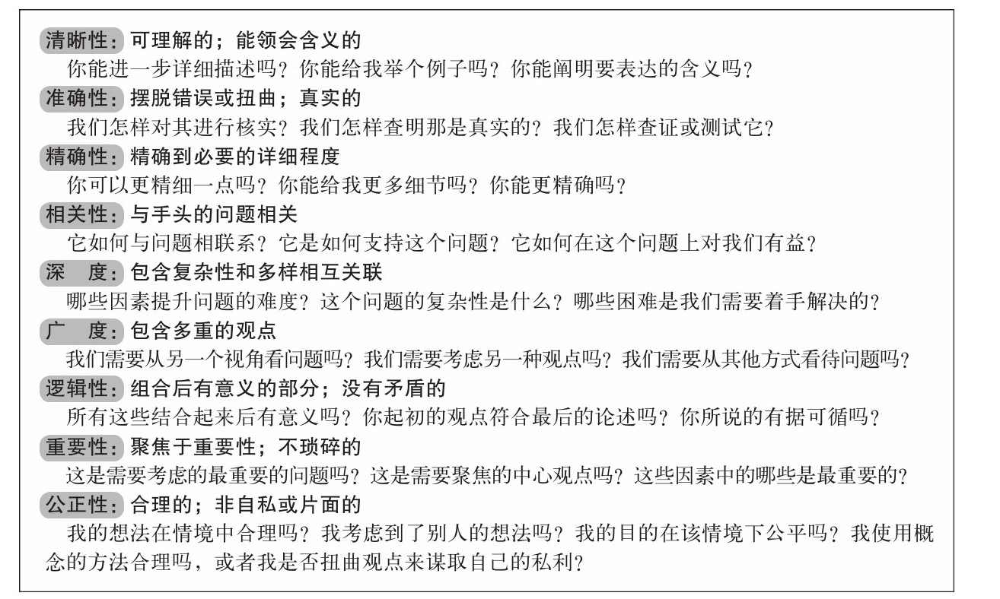

图　5-1　为了评估思维，我们必须将思维标准应用到思维元素中

## 将思维元素和思维标准结合

我们已经探讨了思维元素，并详细地分析了它们，这能够使我们更好地识别思维中的瑕疵。同样，我们引进思考标准作为评估的工具。现在让我们看一看如何使用思考标准对思维元素进行评估。

图5-2表示批判性思考者一贯地将思维标准应用于论证的元素。

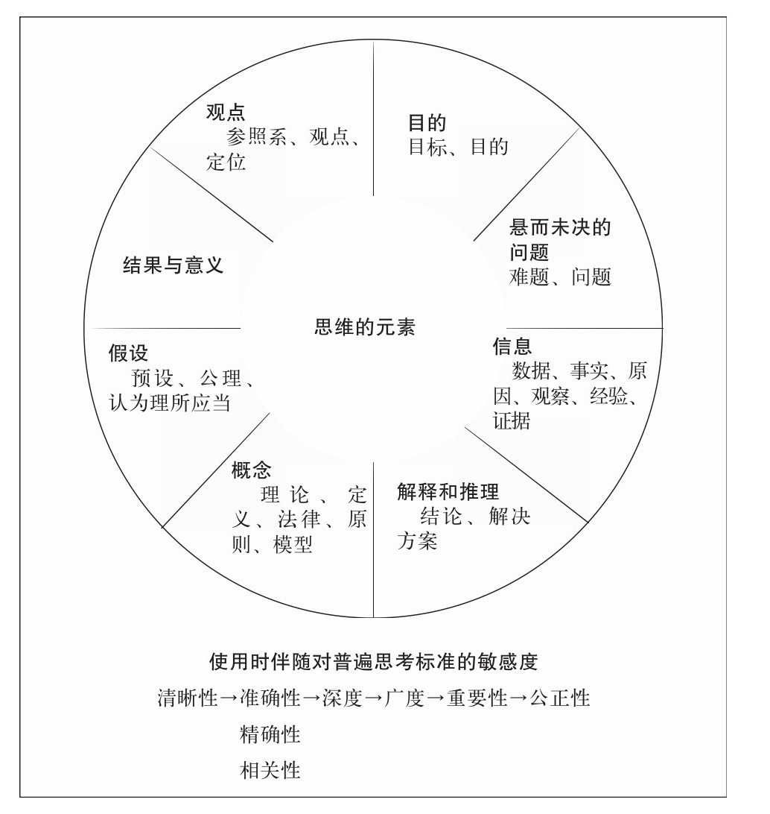

图　5-2　批判性思考者一贯地将思维标准应用于论证的元素

### 看得见的假设、目标和结果

我们的思维都具有一定的目的。如实现某些目标，满足一些欲望，达成一些需要。人类思维困难的一个来源是目标、假设和结果水平上的缺陷。如果目标不切实际，例如，相悖于我们拥有的其他目标，或者目标是令人困惑、含糊不清的，那么我们用以实现目标的思维过程也将遭遇重重困难。

作为一个不断发展的批判性思考者，你需要培养自己明确阐述目标的习惯。你应该努力澄清某一情境中的目标，清楚并坚持自己的目标，你才能取得成功。例如，你在大学的目标是获得学位从而获得拥有好工作与丰厚报酬的机会。如果你清晰地认识到这个目标，并为此不断努力，你就可能获得成功。但如果你沉溺于社交活动中，忽略自己的目标，你预期的结果就难以实现。

表5-1列出了评估思维的元素。

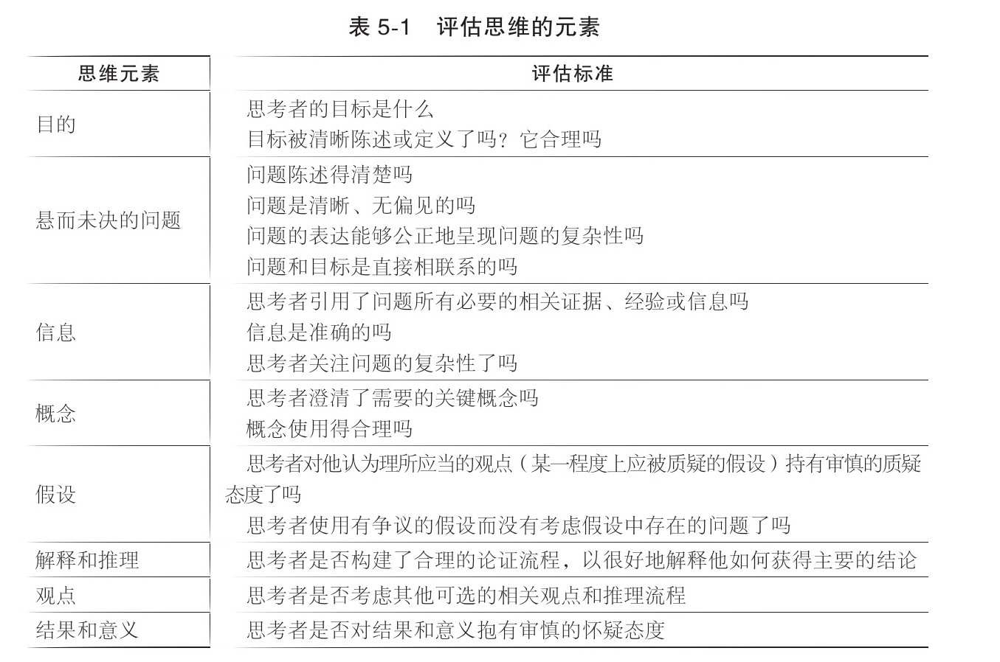

作为一个有志启发自我思想的学生，你应该关注能够提升自我能力的提问，从而使自己更加明确自己的课堂目标。例如：在课堂随笔中、研究项目中、口头报告与讨论中，我清楚自己的目标吗？我能够详细明确地阐释目标吗？我的目标重要吗，现实吗，可行吗，合理吗？我还拥有其他相悖的目标吗？

### 需要解决的重要问题

在思考时，你都要解决思考事件中至少一个核心问题。因此，对问题的思考过程就以那个问题为中心展开。

开展优秀思考的关键是：对你陈述问题方式的清晰性和相关性进行评估。这你需要思考你面对的问题是否重要、是否能够解答、是否理解解决这个问题所需要的答案。

作为一个致力于发展批判性思维的学生，你可以问一些问题，使自己能够提升对课堂重要问题进行关注的能力。例如你可以问：讨论中最基本的问题是什么（在演讲、章节或讨论中）？精确地说，答案是什么？这个问题是简单的还是复杂的？如果是复杂的，是什么导致它的复杂性？我能够坚持思考这个问题吗（在讨论或文献中，我为此持续工作吗）？这里存在不止一个重要的问题需要考虑吗（在演讲中等）？

### 观点或参照系

我们的思考总是在一些观点或参照系中展开。任何观点或参照系中的缺陷都可能是思考过程中困难阻碍的来源。

一个观点可能太过于狭隘、包含错误信息或者充斥着不公正和矛盾冲突。批判性思考者努力去采纳一个公正的观点，他们会考虑对立的观点，希望自己的观点有广度、灵活并且能够被合理、清晰地陈述，对自己的观点能够始终如一地坚持。优秀的批判性思考者在论证一个问题时，会考虑不同可选择的观点。

作为一个致力发展批判性思维的个体，我们要问自己问题，使我们能够提升对课堂观点进行关注的能力。这些问题可能是：我从什么观点来看待这个问题？我的观点是否太过教条，从而让我无法从另一个观点来看待问题？我必须要考虑多重的观点以良好地论证手边的问题吗？这个作者的观点是什么？这个学科的参考框架是什么？这些观点蕴含的世界观是否不同？

### 信息、数据、经验

思考时，我们总会发现一些关于我们所思考话题的“材料”和现象。思考中所考虑的经验、数据、证据中的任何“缺陷”，都有可能成为思维过程困难的来源。

思考者应对证据收集的准确性进行清晰、公正和准确的报告和评估。因此，作为学生，无论是在课堂考试、学科问题还是个人生活难题上，你都应该评估得出结论信息的准确性。评估你所使用的信息是否与问题相关，评估这些信息是否适合于你的目标。同时，你也要评估自己是否准确地呈现了信息。

作为致力于发展批判性思维的学生，问自己问题，使自己提升对课堂信息关注的能力。这些问题可以是：很好地论述这个问题所需的最重要的信息是什么？还存在我需要考虑的其他信息来源吗？我怎样核查正在使用的信息是否准确？我是否确定正在使用的所有信息都与这个问题相关？

### 概念、理论、观点

所有的思考都要运用概念。这些概念包括我们思考过程中运用的理论、原则、公理和规则等。概念和理论上出现的任何缺陷都是我们思考过程中可能的困难来源。

作为批判性思考者，我们要深入分析自己所使用的概念，要评估概念的清晰程度，评估这些概念是否与问题相关，评估我们是否根据自己的观点歪曲了这些概念。我们要注意如何使用概念、什么概念最重要，以及概念之间的相互联系。

作为致力于发展批判性思维的学生，你要问自己问题，提升自己对课堂概念重要性关注的能力。这些问题可能包括：我需要学习的关于人生的最基础的概念是什么？这个概念是怎样与其他关键概念相联系的？这节课最重要的理论是什么？我是否清楚地知道课堂中的重要概念？我需要问什么样的问题才能更清楚地理解教师解释的概念呢？

### 假设

所有的思考都从基本的假设出发，这就要求把一些事情认为是理所当然的。任何初期假设中出现的缺陷都可能是思考困难的可能原因。

思维评估的技巧包括评估我们识别和有力表达假设的能力。我们的假设可能会是清晰的，也可能会是不清晰的；可能是合理，也可能是不合理的；可能是一致的，也可能是矛盾的。

作为致力于发展批判性思维的学生，你需要问自己问题，提升自己对课堂中假设的辨识能力。这些问题可能包括：与这个学术科目（讲座、讨论、文章或实验）相关的是什么？这些假设合理吗，我应该质疑它们吗？在第2章中，本书的作者假设了什么？这些假设都是公正的吗？它们应该被质疑吗？

### 结果与意义

意义伴随着我们的思考而来。结果伴随着决定而来。作为批判性思考者，我们要了解每时每地所产生的意义，要能够追踪逻辑结果，了解行动带来的结果。我们要对每个可能出现的难题有所预料。

思考中意义和结果的任何缺陷都会成为我们思考过程中困难的潜在来源。我们是否能进行合理的思考，部分是通过我们对意义、结果的理解和阐明的能力来衡量的。

作为致力于发展批判性思维的学生，你要问自己问题，提升自己对思考中的重要意义的关注能力。这些问题可能包括：这个生物学理论、现象、经济政策中最显著的意义是什么？这次政治活动的意义是什么？在这个情景下，失败的意义是什么？如果我们采取了这一行动，最有可能的结果是什么？我们倾向用这种方法而非那种来解决社会问题有哪些显著的意义？美国卷入第一次世界大战的意义是什么（社会的、政治的、经济的、文化的）？

### 推理

按步骤进行思考的过程如下：“因为这是这样的，同样那也是这样的（或者大概也是）”，或者，“因为这样，所以那样”。我们的思维活动能够察觉到情境中的一套事实，并且根据那些事实做出结论。我们这样进行推理时，就完成了一个思考过程。我们逻辑推理能力中的任何缺陷都可能会造成思维过程中的困难。例如，如果你看见一个衣衫褴褛的人坐在街边角落，手中的棕色纸袋包着一个瓶子，身边是破旧的铺盖卷，你可能会推断他是流浪汉。这个推理是根据你在环境中感受到的事实，以及你对他们的假设做出的。但是，在这个情境中这个推理可能不具有逻辑性。

批判性思考者需要做出彻底可靠的推理，要做到这一点，首先，你必须学会确认你和他人做出的推理。例如，你可以问：在这篇新闻报道中，进行了什么关键推理？推理的根据是什么？它们合理吗？在这篇文章中我得出的关键结论是什么？这是合理的吗？

## 使用思维标准的简要指南

正如我们已经强调的，思维包括八个元素，每一个元素都含有可能出现的错误。在此，我们总结一些优秀批判性思考者思考时使用的主要“检查点”。你也可以在思考的过程中，使用这些相同的检查点。

（1）所有的思考都有一个目标（见表5-2）。

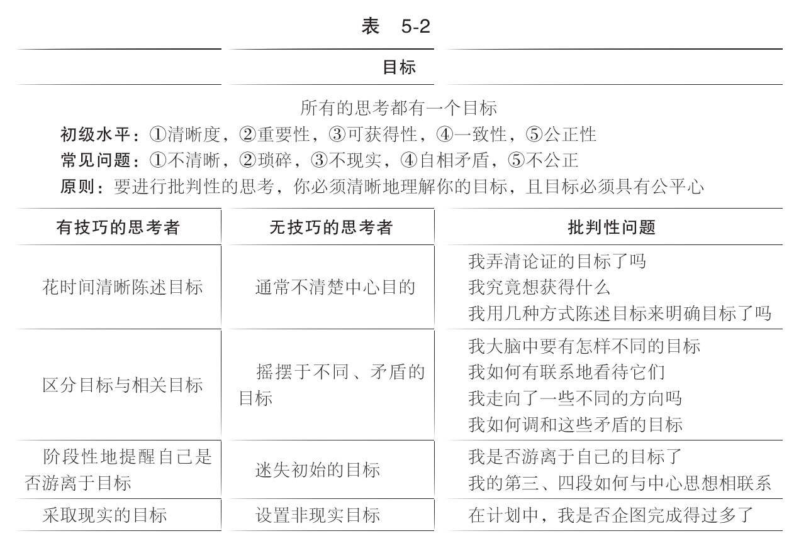

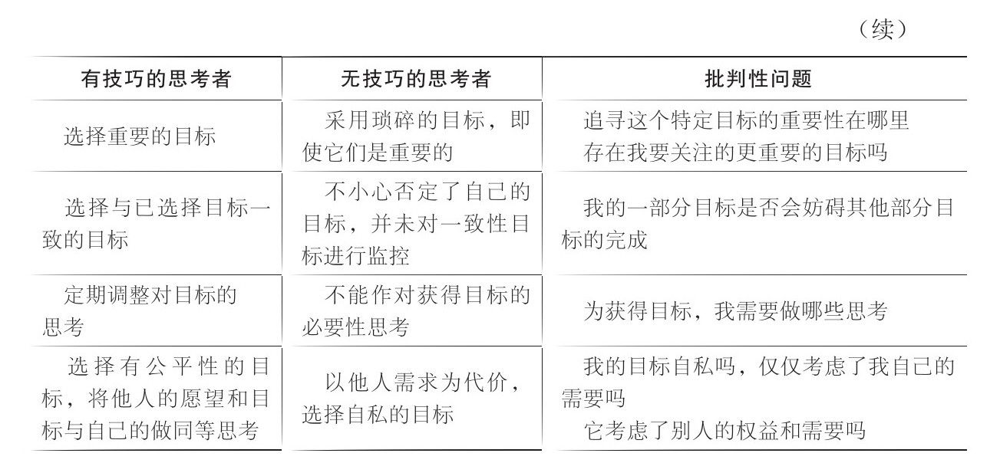

■花时间清晰地陈述你的目标。

■选择重要的以及现实的目标。

■将自己的目标与其他相关目标做区分。

■确定你的目标在情境中是公正的（不违背他人的利益）。

■阶段性地检查，以确定你仍旧坚持自己的目标，没有从中偏离。

（2）所有思考都是澄清一些事实，去发现一些问题，解决一些问题（见表5-3）。

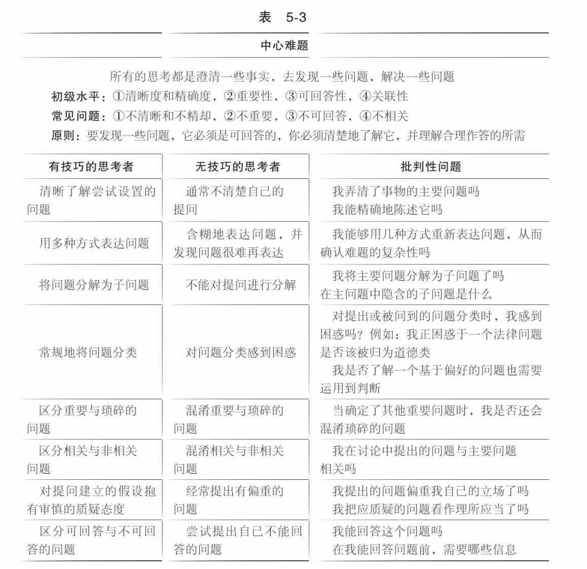

■花时间清晰并准确地陈述问题。

■用几种方式表达问题，以阐明它的意义和范围。

■将问题分解为子问题（当你可以的时候）。

■确认你正在处理的问题类型（历史、经济、生物等），并且思考这个问题是否只拥有一个正确答案；确认它是只需从一个观点进行思考，还是需要从不同的观点进行论证。

■彻底地思考问题的复杂性（彻底深入地思考问题）。

（3）所有的思考都要来自一些观点（见表5-4）。

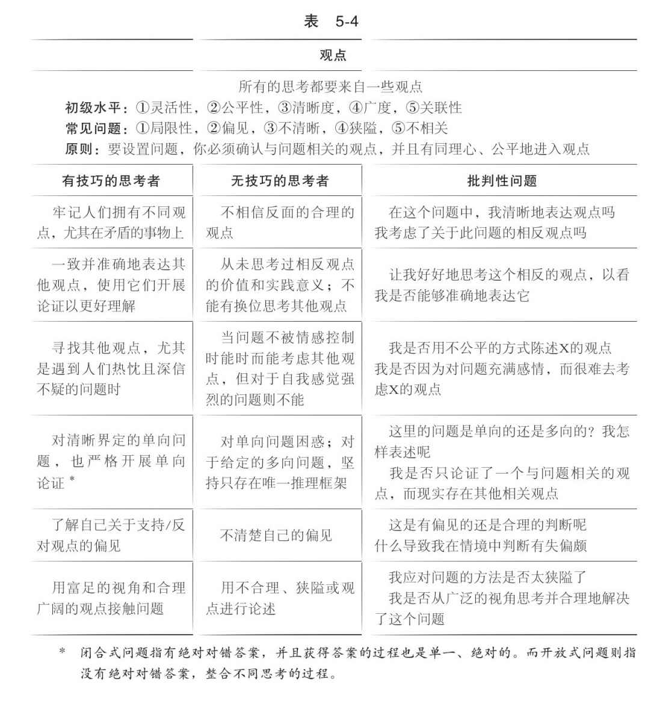

■清晰地确认你的观点。

■寻找其他相关的观点，并确认它们的优缺点。

■公平地评估所有观点。

（4）所有的思考都是根据数据、信息和证据做出的（见表5-5）。

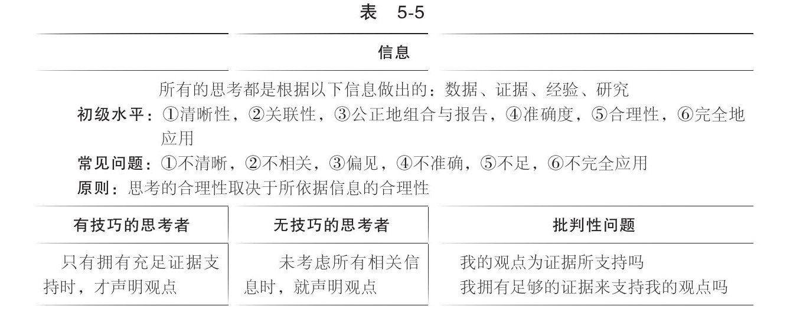

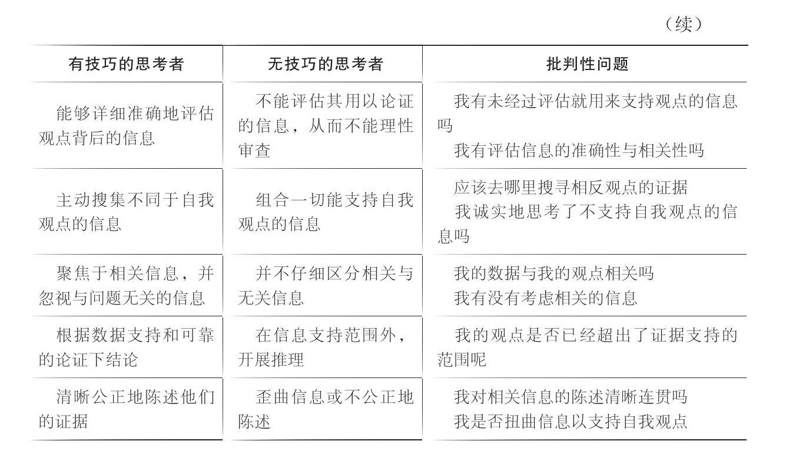

■用具有支持性的数据来严格控制你的思考。

■寻找反对你的信息，以及支持你的信息。

■确认你使用的所有信息清晰、准确，并与需要解决的问题相关联。

■尤其要确认，你已经考虑了与问题相关的所有重要信息。

（5）所有的思考都通过概念和理论来表达并塑造（见表5-6）。

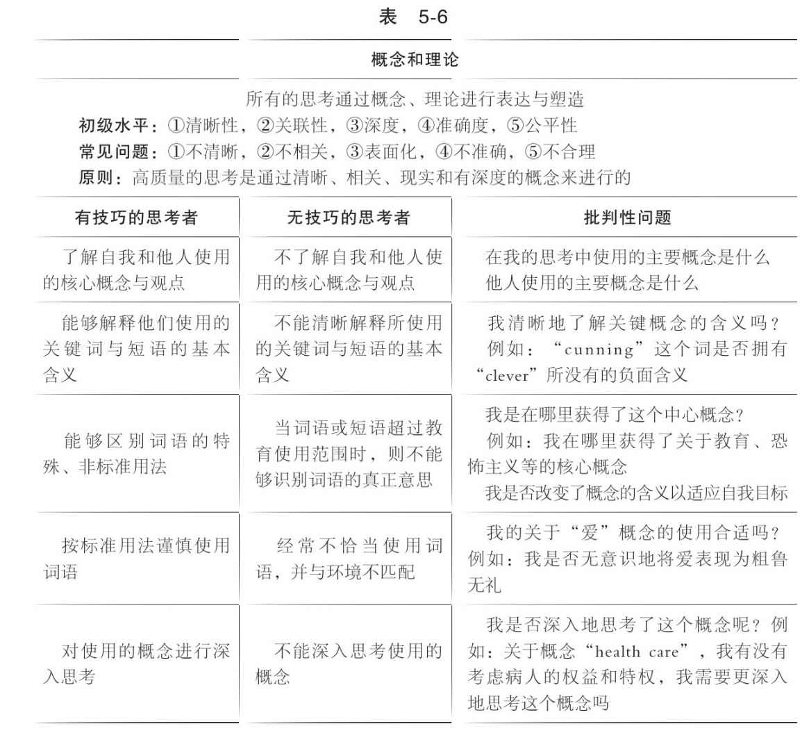

■清晰地确定关键的概念。

■考虑可供选择的概念，或概念的多重定义。

■确认你正在小心正确地使用概念。

■公平合理地运用概念（而非扭曲它们已有的意义）。

（6）所有的思考都基于假设（见表5-7）。

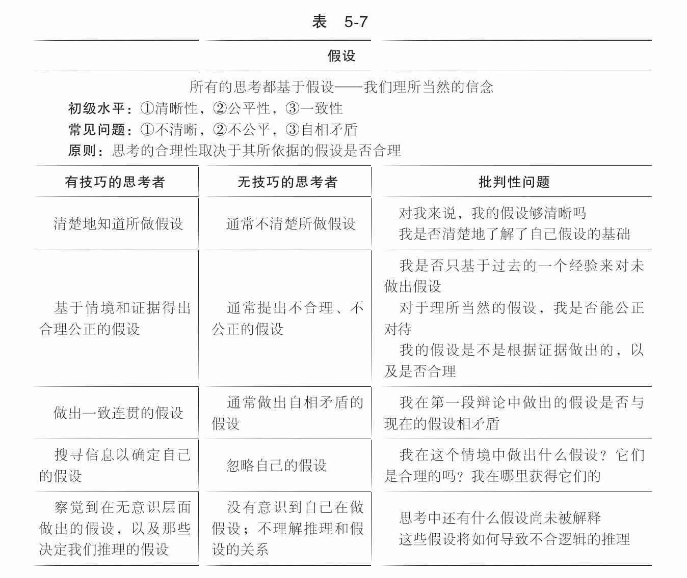

■清晰地确定你的假设，并确认它们是否合理。

■考虑你的假设是如何塑造你的观点的。

（7）所有的思考都会产生一些意义和结果（见表5-8）。

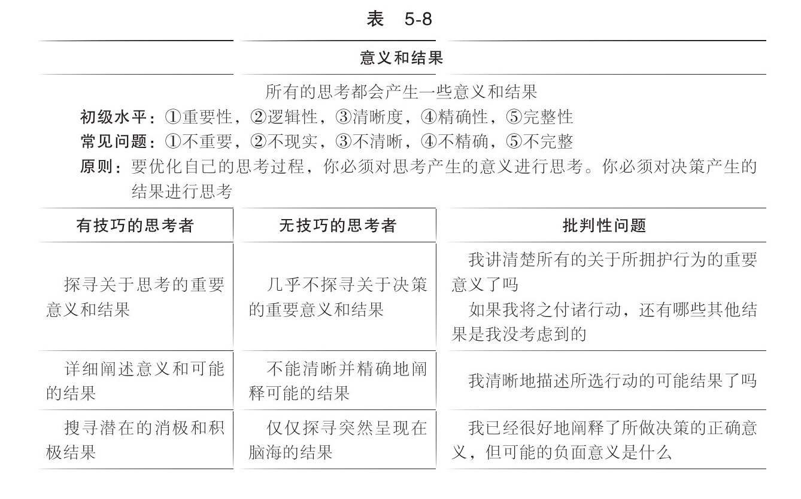

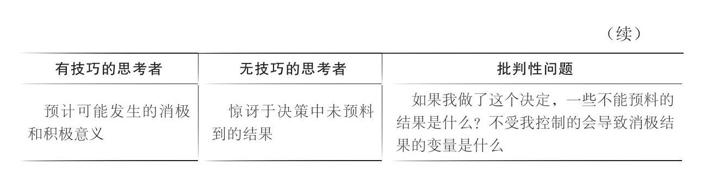

■考虑思考产生的逻辑意义与结果。

■同时搜寻消极与积极的意义。

■考虑所有可能的重要性结果。

（8）所有的思考均包含推理，以及能够得出结论、赋予数据意义的解释（见表5-9）。

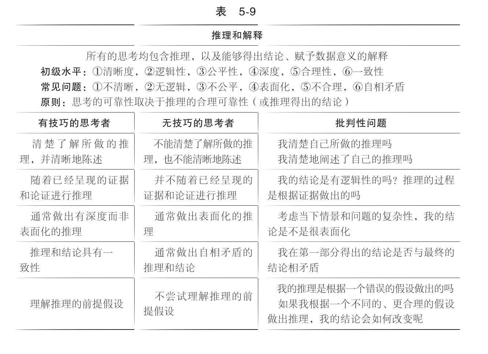

■根据证据做出推断。

■检查每项推理的一致性。

■确认推理的前提假设。

■确定你的推理有逻辑性。

# 第6章　培养良好思维的提问

至今为止，通过我们强调的内容，你应该能够清楚养成批判性思维需要：

■对思维感兴趣。

■成为自己思维的批判者。

■愿意建立新的思维习惯。

■对发展批判性思维拥有热情。

■了解观点、感受和需求之间的相互影响。

■重视思维在生活中的作用。

■经常地将思维分解为它的元素。

■经常地评估自己思维的优缺点。

■经常地评估自己的学习习惯。

■学会在不同的思维系统中的思维方式。

在本章中，我们将探索提问在发展思维中的作用，明确批判性思考者会提出的问题。

## 思维中提问的重要性

一个不善于提问的人不会是优秀的批判性思考者。答案不能推动思维的发展，真正能推动思维发展的是问题。那些学科（例如物理学或生物学）的奠基人，如果不善于提出问题，那么这学科就不可能发展起来。每个学科领域的产生都得益于研究者不断提出的问题。此外，每个领域都根据不断提出并认真思考的问题得以发展，问题是思维发展的驱动力量。

当一个研究领域不再提出新的问题时，它的发展便也停止了。要想仔细反复地思考，个体必须提出能够促进我们思考的问题。

一方面，提出问题有助于我们清楚任务要求，清楚与表达相关的问题，并使我们了解需要处理的事物。而从另一方面来说，答案则意味着思维的全面停滞。只有当答案能够更进一步地催生出问题时，思维才能得以继续发展。此外，你所提出的问题质量决定着你思维的质量。当没有问题时，你便不再思考解决问题的答案。

例如，生物学家和生物化学家都是在提问中促进了思维的进步，他们通常会问：“我们是由什么构成的？我们的身体怎样运作？生命是什么？”当他们从亚细胞和分子层面思考问题的时候，他们的思维进步得更多。他们在分子层面上，对单独分子和分子活动进行思考，会问：“蛋白质是什么？酶是什么？酶反应是什么？分子活动是怎样为宏观现象奠定基础的？”（Jevons，1964）。通过对这些亚细胞的问题进行思考，他们会问：“维生素是怎样与生物体内的化学物质发生反应来产生更健康的机制的？癌细胞和普通细胞有什么差别？哪些食物与体内化学物质作用后能减少癌细胞产生的可能性？”

最好的老师通常是那些深刻理解学习和提问关系的人。正如Jevons（1964）在谈到他的学生时说：“那些提问的学生给我带来的帮助最多，他们通常激发我去寻找加深自己理解的更多有效途径，而那些仅仅看上去有困惑的学生给我的帮助很少。”

## 质疑你的问题

当你与某人第一次见面时，关于他/她，你最愿意了解的问题是什么？或者也许我们可以这样问：“你第一次见到某人时，你会搜寻他们的什么信息？”这些问题（以及搜寻的信息）会使你清楚自己的价值观、关注点以及自己打算的建立人际关系的什么信息呢？根据论证元素和思考标准来思考以下类型的问题。

■关于能够让我们了解任务的目标问题。

■关于能够推动我们查看信息的来源以及信息质量的信息问题。

■关于能够推动我们检查自己组织信息、赋予信息意义的方式，以及不同赋予意义方式的解释问题。

■关于推动我们反思我们认为理所应当观点的假设问题。

■关于能够推动我们不断思考的意义问题。

■关于推动我们检视观点并考虑其他相关观点的观点问题。

■关于能够使我们去区分哪些有影响，哪些没有影响的关联性问题。

■关于能够推动我们对真相和正确性进行评估和检测的准确性问题。

■关于能够推动我们给出细节，并做到精心细致的精细性问题。

■关于能够推动我们检验思维中矛盾之处的一致性问题。

■关于能推动我们考虑思维整合，确认思维在某种合理系统中整合性和意义性的逻辑性问题。

## 呆板的问题反映惰性的思考

几乎大部分学生提出的问题都不是能够刺激大脑思考的问题。大部分问题十分呆板，如学生会问：“试验中会出现这个吗？”这种问题提出者通常没有提问和思考的愿望。

我们必须不断地提醒自己，只有提出问题，思维才能得以开展。没有问题（被提出）等同于不理解（获得），表面的问题等同于肤浅的理解，不清楚的问题等同于含糊的理解。如果你安静地坐在教室里，你的大脑很可能也是静止的，并没有做出思维活动。这种情况下，你并不打算问问题，或者你的问题本身就非常浅表、缺乏架构残缺和自利的。你应当努力追寻一种状态，即使外在波澜不惊，但你的头脑却在不停地提出、思考问题。你应该思考并提出优化你学习的问题。

如果你想要深入独立地思考，你就应该努力学习，用问题激发你的思维，并长久地抱着问题去思考，促进思维的发展。

## 三种问题类型

在进一步讨论深度提问之前，我们想要介绍一个对问题进行分类的有效方法。这个问题分类法为我们提供了一个提问时所需的“快速启动”法。这三种问题类型如图6-1所示。

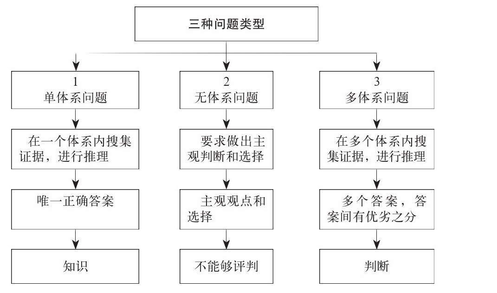

图　6-1　三种问题类型

1.基于事实的问题。只有一个正确答案的问题（事实题属于这一类）。

■铅的沸点是多少？

■房间的大小是多少？

■这个方程的微分是多少？

■电脑上的硬盘是怎么运作的？

2.基于偏好的问题。问题随着个体的不同偏好而拥有不同的答案（纯粹主观意见的分类）。这些问题让你去表达出某种偏好。

■山间和海边旅行，你更喜欢哪一个？

在提问题时，了解问题的类型很有用。这是一个有唯一答案的问题吗？这是一个要有主观选择的问题吗？或者这是一个要求你考虑不同答案的问题吗？

■你对佩戴假发怎么看？

■你愿意去看戏剧吗？

■你最喜欢的食物类型是什么？

3.基于判断的问题。需要进行论证，并不止一个可行答案的问题。这些问题是具有辩证意义的，答案有更好和更坏之分（被有效论证和不充分论证的答案）。我们根据答案的可能范围，搜寻最佳的答案。

■我们怎样才能准确地弄清当今国家最基本的重要经济问题？

■什么措施可以有效地减少非法吸毒人群的数量？

■要拯救地球，我们能做的最好的事情是什么？

■从道德的角度来看，堕胎是合理的吗？

■死刑应该被废除吗？

只有第二种问题（关于偏好的问题）需要绝对的主观意见。第三种问题是与论证判断有关的。我们应该运用普遍的思维标准（如清晰度、深度、一致性等）来理性地评估问题的答案。一些人会把判断型的问题当作事实问题，或主观偏好问题。他们认为，提问要么引发事实性的回应，要么引发观点性的阐述。但是，我们希望读者掌握第三类的判断型问题。这类问题是在现代社会中几乎全部被忽略的问题种类：它反映了人们理性判断的忽略。

例如，我们希望法官的法律判断是理性判断的问题，因为其法律判断是根据可靠的证据和有效的法律推理展开的。一个依据伦理和法律义务的判断是不会根据某人的主观偏好或个人意见为转移的。

以可靠论证为依托的判断超越了事实和观点本身，并从来不等于事实或是观点。尽管通常我们运用事实来进行论证，但论证却远超于陈述事实之外。此外，良好的论证并不能被描述为“观点”。当然，我们有时称判断的结论为“观点”，但我们不仅仅重视观点，也重视做出这个论断和观点的可靠论证基础。

当判断型问题被当作偏好问题来对待时，个体好像掌握了批判性思维，但这种批判性思维是虚假的。在这种情况下，个体非批判性地提出所有人的主观偏好都是等同的假设，不重视思维标准，我们甚至能够预期他们提出这样的问题：如果我不喜欢这些标准会怎样？我为什么不可以使用自己的标准呢？我没有使用自我观点的权利吗？我是一个感性的人，那又会怎样？我喜欢跟随直觉又怎样？我觉得直觉比论证更重要又会怎样？我不相信“理性”又会怎样？当人们拒绝对问题进行合理推理和深度思考时，他们混淆了提供合理论证支持观点和仅仅坚持某个观点正确之间的差别。

相反，对思维负责的人能够知道判断型的问题是需要考虑多种论证方式的问题。换句话说，对思维负责的人能识别出需要良好论证的问题，并且能够对这些问题进行推理和论证。这意味着他们能意识到这类问题可以有不止一个合理解答的方式。更重要的是，他们有责任感，不惮推理论证过程中的困难，在做出最终结论前能够认真考虑与自己截然相反的观点。

总结一下，我们需要能够对下面三种要求做出区分：

（1）去表达一个主观的偏好。

（2）去寻找一个客观的事实（在良好定义的系统中）。

（3）去提出最佳的竞争性答案（通过竞争系统产生）。

直到我们清楚当下问题对我们的不同需求时，我们才能全面理解我们所面对的任务。这个问题需要一个主观看法或个人意见吗？如果是这样，我们可以根据个人偏好做出选择。如果不是，那么这个问题存在唯一正确的答案吗（一个确定的系统中找到答案）？或者，这个问题有不同的解答角度吗？如果是后一种情况，在考虑所有角度的情况下，这个问题最好的答案是什么？

你可以在学习时，区分问题的三种类型。寻找拥有确定的或正确答案的问题，这些问题是由定义或确定下来的公认程序设置的。寻找那些关乎个人选择的问题。此外，最为重要的是，要找出那些可以从不同角度看待，接近于可争论的问题。这些问题通常出现在学科中存在相互矛盾的学说、思想或理论的领域中。例如，心理学领域包含许多不同的对立学说：弗洛伊德、荣格、阿德勒、认知行为治疗、完形主义，等等。很多心理学的问题可以通过不同的学科背景进行论证。这些问题将需要从不同角度思考论证，做出合理判断。

## 成为苏格拉底式提问者

你已经理解了问题分类，现在让我们来讨论该如何提出促进我们更好思考的问题。作为批判性思考者，我们希望能够摆脱那些混乱、无头绪、杂乱无章的问题。因此，我们将简单的提问转向“苏格拉底式提问”。“苏格拉底”为一般提问方式增加了系统性、深度和强烈的提问兴趣。

批判性思维最重要的目标之一是建立训练有素、“执行性”强的思维方式，要培养有力的论证需求来理性地监控、评估和反思我们的思维、感受和行动。苏格拉底式的提问提供了我们内在论证需求。下面是一般形式的苏格拉底式提问，按照这些问题案例的方式，你可以运用苏格拉底式的对话提问来深入地探查他人的思想（见图6-2）。

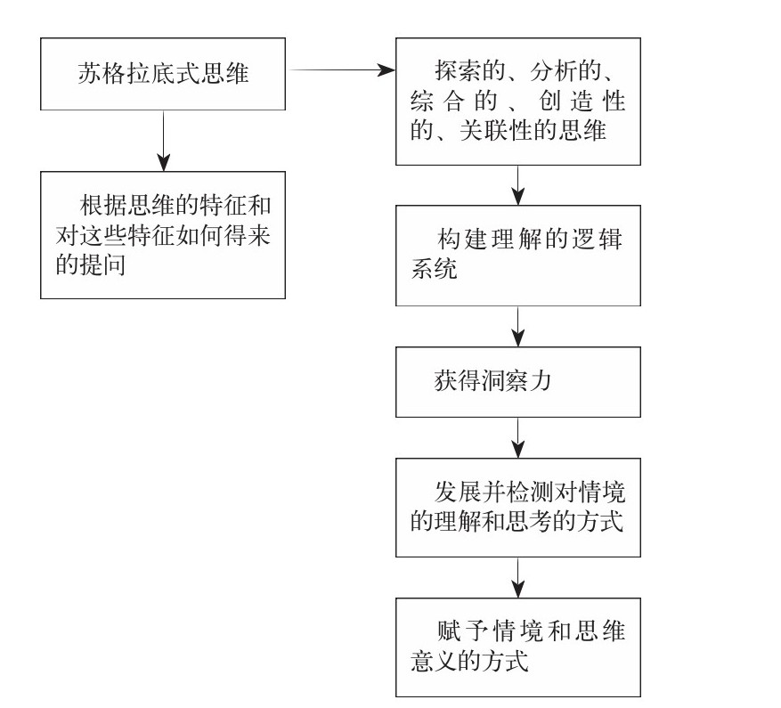

图　6-2　苏格拉底式思维是一种整合的、可训练的思维方式

■尽最大可能去理解所说或所信事物的根本基础，并且通过更深入的问题弄清这些基础的含义。（例如你可能会问他人：“你形成这个观点的依据是什么？你能详细地向我解释你的推理过程，从而让我更全面地理解你的观点吗？”）

■找出与其他观点相互依存、不能单独自证为真的观点。找出观点间的联系，深入思考。（例如，你可能会问他人：“如果你说的是真的，为什么X或Y却不是真的呢？”）

■用不断完善的需求对待所有的观点。（你可能会问他人：“你能够详细阐释从而让我更好地理解你吗？”）

■要认识到所有的问题都以先前的问题为基础，所有的思维都以先前的思维为基础。提问时，对之前的问题持有开放的态度，也要不断地对它们进行思考。（例如，你可能会问：“为了回答这个复杂的问题，我们还需要回答哪些其他问题？”）

要提升思维水平，掌握受过训练的提问方式和苏格拉底式的思维和提问方式，你可以按以下方式行动：

（1）你可以把问题聚焦于问题的类型上（事实、偏好或判断）。

（2）你可以把问题聚焦于对思维标准的评估上。

（3）你可以把问题聚焦于对论证元素的分析上。

（4）你可以通过优先回答对获得最终答案最有效的问题来“拆解”复杂问题。

（5）你可以抓住复杂问题的主要矛盾。

在后面的讨论中，我们将详细说明苏格拉底式提问的模式。当然，你在既定情境下所提的问题受你所处的环境影响。当你能够熟练地应用问题时，你就会看到它们在提升思维中的重大作用。反复加以练习，他们会成为你直觉的一部分，对于它们的应用信手拈来。当你不清楚事实时，你会很自然地提出事实问题来弄清楚状况；当数据看上去不准确或存在疑问时，你会很自然地注重对信息的提问；当人们错误地把判断型的问题回答为偏好型的问题时，你会敏锐地有所察觉；等等。进一步说，直觉能力只会在大量的练习之后产生。

## 关注问题的类型

正如本章中先前讨论的，当你系统地提出问题时，你能够发现所有的思维都拥有三种作用功能：表达主观的偏好，获得一个客观的事实（在一个准确定义的系统中），或提出最佳答案（由竞争系统产生）。只有了解思考问题的类型，你才能全面地理解思维。

下面的问题能帮助你了解问题类型：

■这个问题需要主观意见的或个人观点吗？如果是，根据个人的偏好做出归类。

■如果不是，这是一个拥有唯一正确答案，或者说只能在唯一确定系统中寻找答案的问题吗？

■或者这个问题可以从不同的角度来有所差别地作答吗？

■如果是，考虑所有情况之后，问题的最佳答案是什么？

■当问题需要开展论证时，某人却说他不需要论证自己的答案，他是否把判断类的问题当作了偏好类的问题呢？

■这个人是否把判断类问题当作了只存在唯一正确答案的事实类问题？

图6-3提供了五种能够培养批判性思维方式的提问方法。

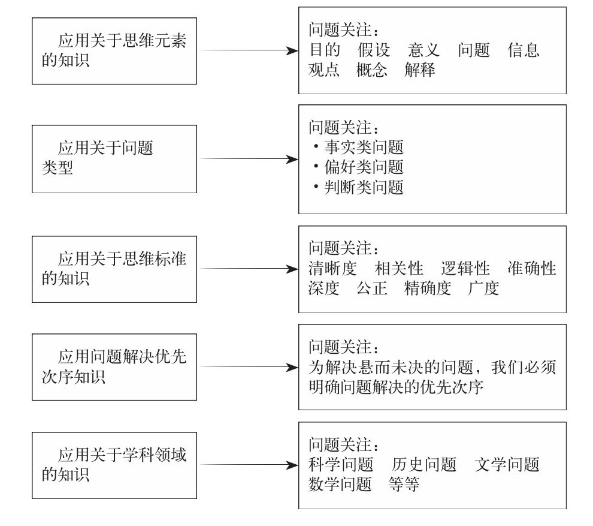

图　6-3　五种能够培养批判性思维方式的提问方法

## 关注思维标准

系统提问时，你会发现人们何时没能遵守一般的思维标准。你也会注意到自己何时没能很好地遵守这些标准。并且当你按照思维标准的要求提出问题，你的思维会得到很大的提高。

根据前面章节的讨论，你可以总结出以下纲要：

（1）承认思维总是或多或少地不够清晰。除非你能够详细阐释，并能用例子来解释这一观点时，否则，你不能全面理解一个观点。关注思维清晰性的问题是：

■你可以详细阐释你所说的吗？

■你能举例说明你的观点吗？

■我没有听错吧，你说了"X"；或者我是否误解了你？

（2）承认思维总是或多或少地不够精确。除非你能够精细地把握细节，否则你无法全面理解一个观点。关注思维精确度的问题是：

■关于那件事，你能给我多一些细节吗？

■你能更明确一些吗？

■你能更加全面地详细阐释你的主张吗？

（3）承认思维总是或多或少地不准确。除非你能够确认它按事物原本的情形呈现，否则你无法全面理解一个观点。关注思维准确度的问题是：

■我们怎样检查信息是否真实的？

■我们怎样核实这些所谓的事实信息？

■我们能够相信这些可疑来源数据是准确的吗？

（4）承认思维总会偏离当下任务。除非你能确保所有用来理解它的信息与之切实相关，否则，你无法全面地理解一个观点。关注思维联系性的问题是：

■我看不到你所说的与问题之间的关联。你能给我演示它们是如何关联的吗？

■你能解释你所说的问题和我们要解决问题之间的联系吗？

（5）承认思维总是停留在表面，没触及到事实与观点的深度。除非了解到解决当下问题需要了解到的深度信息，否则，你无法全面地理解某一观点（思考一个问题是否有深度，我们需要充分考察它的复杂性）。关注思维深度的问题是：

■这个问题是简单还是复杂？它很容易或很难回答吗？

■是什么让它成为一个复杂的问题？

■我们如何应对问题中的复杂性？

（6）承认思维总是思维狭隘的，并且要达成思维广度，需要思考者用不止一个观点、在不同的推理框架下进行深度思考。除非你能够确定思维的广度（并且认识到这种广度的实践程度），否则你难以全面理解一个观点。关注思维广度的问题是：

■什么观点与这个问题相关？

■因为我不愿意改变观点，我是否没有从相反的视角考虑问题？

■我遗漏了哪些相关观点？

■我是真正地理解了相反的观点，还是仅仅满足于找到它们的缺陷？

■我已经从经济学的观点看待这个问题了。那从道德的角度来看，这个问题又是怎样的？

■我已经在自由主义立场上考虑了这个问题。那对于这个问题，保守主义又会怎样说呢？

## 关注思维元素

另一个训练你提问的有效方法是关于思维的元素。提问时，可以参照：

（1）所有的思维都有一定的目标。除非你理解了观点背后想要达成的目标，否则，你不能全面理解某人的想法（包括自己的）。关注目标的问题包括：

■陈述这个观点时，你想要达到的目标是什么？

■这些观点的中心目标是什么？

■这次会议的目的是什么？

■这一章想表达的是什么？

■我们建立人际关系的目的何在？

■我进入大学的目的是什么？

（2）所有的思维产生都以信息为基础。除非你理解了支持或阐明它的背景信息（事实、数据、经历），否则你并不能全面地理解一个观点。关注信息的问题包括：

■你根据什么信息得出了这个评价？

■什么样的经历使你相信这个观点？你考察情景的方法是不是建立在一个扭曲的观点之上的？

■你如何确认这个信息是否准确？

■我们是否遗漏了需要考虑的重要信息？

（3）所有的思维都需要经过推理、得到结论、创造意义的过程。除非你理解了产生观点的推理过程，否则你并不能全面地理解一个观点。关注推理的问题包括：

■你是如何得出那个结论的？

■你能解释你的论证吗？

■存在其他可供选择的可信结果吗？

■基于所有事实，最佳的可能性结论是什么？

（4）所有的思维都离不开对概念的使用。除非你理解了界定观点的概念，否则你并不能全面地理解一个观点。关注概念的问题包括：

■你论证中使用的主要观点是什么？

■你能解释那个观点吗？

■我们对概念的使用合理吗？

（5）思维中所有的观点都依赖于其他观点而存在，也就是思维活动离不开前提假设。除非你能了解某一观点的前提假设，否则你并不能全面地理解这一观点。关注假设的问题包括：

■做出这个结论的依据究竟是什么？

■你为什么做那样的假设？

■我是否应该对自己关于舍友、朋友、父母、导师和国家的一些前提观点持审慎的怀疑态度？

（6）所有的思维都朝向特定的方向发展。它不停留在特定观点、事物上（假设），思维是往某一方向发展的（带来意义和结果）。除非你知道思维活动产生的意义和结果，否则你并不能全面地理解思维。关注意义的问题包括：

■你持这样观点的时候意味着什么？

■如果我们做此事而非彼事，有可能发生什么？

■你这么说意味着……？

（7）所有的思维活动都在某个观点或推理的框架中发生。除非你理解了思维活动中的观点或推理框架，否则你并不能全面地理解思维活动。关注观点的问题包括：

■你是依据哪个观点得到这个结论的？

■存在我们需要考虑的其他观点吗？

■这些可能的观点中，考虑当下情境，哪个最有意义？

（8）所有的思维活动都来源于问题。除非你理解了是什么问题引发了某一思维活动和观点，否则你并不能全面地理解这一观点。关注引发思维问题的提问包括：

■我不是很确定你提出的问题，你能解释一下吗？

■这个问题可以最好地解决我们的关注要点吗，还存在其他需要关注的更紧迫的问题吗？

■我的疑问是：你如何发现这个问题的？

■你的问题是怎样与已经论证过的问题产生联系的？

## 关注问题优先次序

在应对复杂问题时，另一个解决思维难题的有用工具是：确定问题的优先顺序，即确定我们需要在解答更复杂问题前需要回答的问题。例如要回答：“什么是多元文化？”我们必须首先设置问题：“什么是文化？”而解答上述问题我们必须还要问：“通过哪些因素，个体决定自己所属文化？”当你确认并解答了优先问题时，你便会产生下一个“想法”，从而发展自己在任何情境下的学习能力。

列出一张问题优先次序表，只需写下你关注的主要问题，并尽可能多地写下你认为应该先行回答的问题。接着从列表中决定，为解决最终问题而必须要优先回答的问题。以此类推，对列表中的每一个问题都进行同样的思考。

关注列表上第一个到最后一个问题。如果你能做得很好，你就会按照探索第一个问题的逻辑来完成整个列表的建构。构建逻辑顺序优先的问题需要我们将提问定位在更大的问题上，如“什么是历史”。

■历史学家都写些什么？

■“过去”指的什么？

■一本历史书中有可能囊括所有过去发生的事吗？

■一个特定时期中，会有多少事件被遗忘？

■被忽略的历史多过被记载的吗？

■历史学家如何知道哪些事实该被强调？

■历史学家如何做出价值判断来确定历史事件是否被收录？

■历史书中仅仅需要陈列事实，还是要包括历史解释呢？

■有没有可能不以历史性的观点来决定哪些事实被保留、哪些事实被剔除，以及解释史实的方式？

■我们如何对历史性解释做出判断？

■我们如何对历史的观点做出判断？

当你通过确定问题优先次序来解决复杂难题时，你便“拿起”了苏格拉底式的提问工具，随时准备回答复杂问题。你会发现植于其他问题中的问题，分解问题是解决这些复杂问题的最好方式。在别人不能很好地考虑问题的复杂性时，你就能做出这种优先性的识别。

## 关注思维领域

当你的复杂问题不止涉及一个思维领域时，你可以以问题的思维领域来设置问题的优先次序。例如，这个复杂的问题涉及经济学方面吗？它涉及生物、社会、文化、政治、伦理、心理、宗教、历史或一些其他方面吗？要从问题中的每个领域来考虑问题的复杂性，不要遗漏每一个领域（见图6-4）。这一问题涉及这些领域，而这些领域又包含其他一些问题，按照这种模式思考以下问题。

图　6-4　复杂问题涵盖多个领域

复杂问题：要测算非法药物的人数，能做些什么？

在我们回答这个复杂问题之前，我们需要确定问题中涉及的领域，以及在每个领域中我们需要解决的问题：

（1）经济学

■支持药物滥用的背后经济力量是什么？

■我们能做些什么来使金钱在药物销售中的作用最小化？

（2）政治学

■有哪些措施可以解决药物滥用问题，但在政治上却是不允许的？

■存在政府能够接受的现实解决方案吗？

■政府在多大程度上激化了这个问题？

（3）社会的/社会学

■什么社会结构和社会活动支持了药物滥用？

■帮派成员是怎样推动药物滥用？

■非组织成员或者孤立的个体是怎样滥用药物的？

（4）心理学

■压力、个体人格差异和童年创伤如何影响药物滥用的？

■人类的非理性行为在药物滥用中起到了怎样的作用？

（5）生物学

■遗传基因是如何影响药物滥用的？

■药物滥用带来了哪些体内生物变化，而这种变化又加剧了药物滥用问题？

（6）教育学

■教育机构在支持减少药物滥用问题上起到了什么作用？

（7）宗教学

■宗教机构可以做些什么减少药物滥用？

■目前的宗教在药物滥用上起到了什么作用？

（8）文化

■哪些文化信念支持了药物滥用？

■我们能够从那些药物滥用发生率低的国家文化中学到些什么？

当我们要提出问题以找到问题涉及的领域时，我们可以问如下的问题：

■这个复杂问题包含了哪些领域的问题？

■这个人考虑了问题中的所有相关领域吗？

■在论证这个问题时，我是否遗漏了一些重要的领域？

## 小结

问题在批判性思考者的大脑中扮演着重要的角色。关于问题的三种重要分类是：基于事实的问题、基于偏好的问题和基于判断的问题。批判性思考者能够区分这些问题的类型，因为问题的类型决定了思考的类型。对于批判性思考者，不仅要提出对问题类型的提问，也要提出与所要达成目标相关的重要问题（包括那些能够让我们检查自身目标的问题）。苏格拉底式的系统式提问方式是能够优化我们思维的有效提问方式，而苏格拉底式提问方式首先要求确定问题的优先等级。

“只有提问时，你才在思考”，希望自己能发展成不断完善的批判性思考者就需要关注问题在你的思考中扮演的角色。关注你所提问题的重要性程度？关注自己是否能够区分问题类型？关注自己是否能逻辑清楚地提问从而得出合理的答案？关注自己是否能够确定问题的优先次序，从而解决复杂问题？通过不断练习本章提出的基础性提问步骤，你会发现自己作为提问者以及思考者的进步。

# 第7章　掌握思维，掌握内容

如之前所强调的，开始阅读本章前你应该明确：

■批判性思维需要基本智力、能力和洞察力的发展。

■掌握熟练思维技巧就如同掌握篮球、芭蕾舞、萨克斯演奏方面的技能一样。

■这些技能能够为人性截然相反的两方面服务，即人性的自我中心与公正之心。

■批判性思维技能掌握得比较狭隘（熟练地掌握了思维技能，但是却有着自私心理）。

■本书关注的是批判性思维的全面发展（熟练且公平的思维）。

■要达到公平就需要我们发展相互联系的多种心理特质。

■批判性思维可以有步骤地培养和发展。

■批判性思维的培养过程是具有挑战性的，需要有计划的练习和持之以恒的坚持。

■人类自我中心是发展公平的批判性思维的重大障碍。

■为了克服我们的自我中心，我们必须理解并且练习控制人类头脑的三大基本功能：思维、感受和需求。

■人常常关注于自己的需要和价值，我们也需要思考自身的价值观。

## 超越表面化的记忆，深度学习

作为一名学生，认真思考你要在每门课上完成的目标、在大学想要获得的收获是非常重要的。如果你仅仅想要通过这门课，达成这一目标很简单：去上课，了解到课程的最低通过要求，然后你便可以花费最少的努力来完成这些要求。获得学分，开始下一个学期，如此这样，四年后，修完相应的课程学时，你便能获得学位。在你的这种思维中，大学仅仅是找工作的工具。这种“努力最小化”策略让你错过了学习一生受用的技能和洞察力的机会。你仅仅是毕业了，但是并没有成为一个终生的学习者。

相反，如果你将大学看作学习获得知识方式、发展心智、寻求思考问题的新方式、扩大知识面、获得解决生活问题办法的场所，你必须发展一系列内在的智力技能，对每门课程进行更深刻、更长久的学习。有了合适的自我愿景和目标，在所有课程上你都可以练习有效的思维方式。如果你努力发展谦卑、坚持不懈和公平的思维方式，掌握这种思维方式能够让你在任何一种挑战性的情境中游刃有余。掌握良好的思维和学习方法，会让你对每门课程都能提出丰富且富有见解的问题，学习中，你无时无刻不在提出问题、思考问题。

你会意识到，各个学科中的定义、内容必须通过思考才能掌握。不注重思考的学习很难带来理想的效果，只有对学习材料进行深入的思考才能透彻地掌握学习内容。因此，如果你不想沦为考试工具，而是想认真掌握知识，你必须重视发展批判性思维能力，有效地组织脑海中的知识，使之与经验相联系，并用恰当的标准进行评价。

相反，如果你潜意识中已经习惯于死记硬背的学习方法，如果你准备考试的方法就是将内容零碎地填进大脑，你可能会暂时地通过考试，但是却没有真正地掌握知识，很快你便会忘记所学习过的内容。长此以往，对于重视员工系统地达成目标能力、觉察和分析重大问题能力、沟通重要概念和评估自我工作表现能力的雇主来说，你是一个毫无价值的人。

## 内容和思维的关系

洞悉内容和思维的关键在于，要清楚所有的内容代表了特别的思维方式。当一个人掌握了数学思维，数学学习就会变得简单；掌握了生物学思维，生物学习也会变得简单；掌握了历史学思维，历史学习也会变得简单。同样，如果掌握了合格父母的思维方式，做父母也变得容易了。在第8章中，我们将会详细描述如何在一门课程或者其他领域的逻辑思维中去理解和思考。

要想激发学习的积极性，你需要理解学习的内容和思维之间的联系。只有这样，最初看起来无趣、枯燥的学习内容才会变得富有活力。太多的学生甚至老师没有重视这两者之间紧密的联系。作为本章的开始，请思考以下内容：所有你学习的科目（即所有内容领域）都是人类思考的结果。这些内容：

通过思维概括，通过思维评价，

通过思维组织，通过思维重建，

通过思维分析，通过思维保持，

通过思维综合，通过思维转化，

通过思维表达。

这些内容：

通过思维学习，

通过思维理解，

通过思维应用。

如果你曾将思维与内容分离，这样的学习你会一无所获。掌握良好的思维方式是学习任何内容的关键。

图7-1说明思维是所有内容的关键。

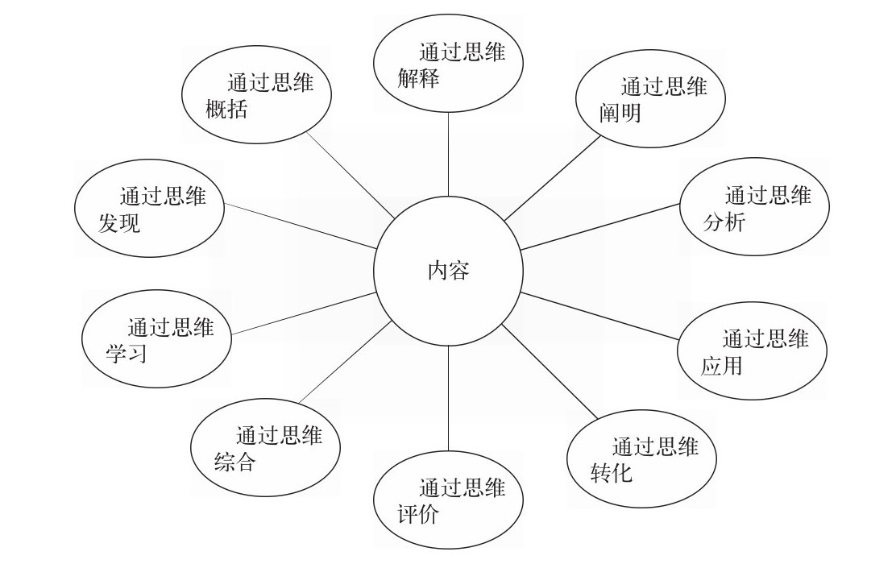

图　7-1　思维是所有内容的关键

## 通过思维理解内容，通过内容进行思考

说到深入学习，首先我们要清楚的是，大学课程中包含的内容和课本中涵盖的内容，说到底，不过是一种对特定事物的特殊思维方式。我们用例子来具体解释下，例如历史学内容是关于过去发生事件的特殊思维方式；生物学内容是关于生命体的特殊思维方式；代数内容是关于数学运算的特殊思维方式；物理学内容是关于质量、能量和它们之间关系的特殊思维方式；社会学内容是关于人类在社会群体中活动的特殊思维方式。

理解所有内容其实都是特殊思维的方式、特殊看待问题的方式、特殊理解事物的方式，方法有很多种。其中的三种方法将在后面讨论。

学校学习的内容都包含在学科之中，而所有学科中的内容必须通过思考掌握。每一门学科都是一个知识领域，而我们有兴趣了解这些知识领域。这些知识领域的发展已经很先进了。我们可以用已有的方式去了解这一领域的知识内容。要探究清楚事物不可能忽略思维方式，除了掌握如何计算出数学问题的正确答案外，其他任何一种方式都不能学好数学知识；除了弄清楚历史疑问和难解之题的正确、合理的答案外，没有任何一种方式能够学好历史知识；除了找出生物问题的正确解答外，没有任何一种方式能够学好生物知识。每一门学科或知识领域都是一种探究一系列问题的正确、合理答案的方式。我们学习化学是为了弄清楚化学制品的问题（回答关于化学制品的问题）。我们学习心理学是为了理解人类的行为问题（回答特定的人类问题）。只有通过特殊的方式，才能深刻地理解一门特定学科。

### 所有内容都是由概念组成

学习任何内容都离不开学习定义和构成这些内容的概念，而学习任何一个概念也离不开对如何运用概念的深入思考。例如，学习民主概念，就必须学习如何判断一些组织是否民主；学习公平竞争的概念，就必须判断在一项比赛中参与者是否做到了公平；学习小说的概念，就必须能将小说与剧本还有短篇故事区分开；学习家庭的概念，就必须学习对家庭与群体或者俱乐部的区分。因此，学习任何内容，都需要准确、合理地掌握界定这些内容的思维和概念定义。

### 所有内容逻辑上是互相依存的

为理解学习内容的某部分，我们必须弄清它与其他部分内容的联系。例如，我们要理解一项科学实验就必须理解相关的科学理论。我们要理解一则科学理论也必须要理解相关假设。而要理解科学假设也只有建立在理解科学结果预测的基础上。要理解科学结果预测，则必须懂得如何从科学的角度去验证一个观点。要理解如何科学地检验某一论点，就要理解如何操作一项科学实验。因此，要学习内容的任何一部分，必须弄清（原因或思维）各部分内容之间的联系。没有这样的思维过程，内容的学习必然不可能见到成效。

如今，许多老师和同学没有通过思维模式或系统性思考来完成内容的学习，他们只是按照常规的顺序将内容保存在记忆中。这样低水平的方式学习很容易让人失去智力发展的基础，无法构建更深层次的知识结构，更无法长期掌握知识内容。

相反，批判性思维学习的方法能够对学习内容明确地进行思考，为原有的思维注入新的思考活力，并用这种学习方式不断评价思维、运用思维。它重视如何更好地思考：更加清晰、更加准确、更加相关、更加深刻、更加广泛，也更加有效进行思考。

## 用思维的知识在课堂上思考

掌握好任何知识内容都需要将该内容作为一种思维模式来理解，你对思维模式了解得越深，你对知识内容掌握得就越好。首先，必须清楚思维有八个基本特征：思考时，我们根据某一论点，提出假设，做出结果预测，并思考结果的目的和意义。我们运用概念和理论来解释获得的数据、事实和经验，回答问题，解决难点。以下是列出的八个基本特征：

（1）所有的思维都有目的。

（2）所有的思维都至少提出一个问题。

（3）所有的思维都需要信息支持。

（4）所有的思维都需要概念。

（5）所有的思维都包括推论。

（6）所有的思维都包括假设。

（7）所有的思维都包括预测。

（8）所有的思维都包括观点。

现在，我们来了解当思考大学课程资料时，上面的八个特征是如何引导你的思维的。例如：

（1）如果所有思维都有目的，那么你可能总是问自己：这次作业的目的是什么？这个故事的主角的目的是什么？老师问我这个问题的目的是什么？我在课堂上的目的是什么？我读大学的目的是什么？我的长期目标是什么？如果你保持头脑中的这些中心目的，那么你将会圆满地达成目标。

（2）如果所有的思维都需要信息，那么你可能总是问自己：我需要什么信息去解释这个问题呢？研究者运用怎样的信息得出这个结论？这个历史学家的结论是用哪些信息来支撑的？要在大学里取得成功我需要什么信息？关于成功人士我了解什么信息？我有足够的信息来达成我最重要的目标吗？如果你形成习惯来思考自己的信息来源，那么你的思维质量将会得到提高。

（3）如果所有思维都关注某个问题，那么你可能总是问自己：这次作业的关键问题是什么？研究者关注的关键问题是什么？这个故事核心的关键问题是什么？我在大学想要成功的关键问题是什么？在生活中呢？所有优秀的思考者都是好的提问者。学会提富有见解的问题，你将会发现学得越来越多，进步也会更多。

这里仅仅列出了提高思维的三个结构性引导问题，关于八个思维基本特征都可以用相似的问题来引导。

### 提醒

没有人能代替你思考。除了你自己，没有人能真正改变你。成为自己成长的主人要面对很大的挑战。我们都容易固守习惯，都会自欺，都非常擅长自我辩护、合理化和自我防御。我们不会在没有人要求我们的情况下主动增加自己的负担。学术或者社交生活很少鼓励独立、批判性思维。尽管大学给人们提供了成为终生学习者的良好机会，但并不是所有大学都重视批判性思维并积极地向自己的学生教授这种思维方式。

在历史学课程上，老师可能对课程的历史学内容要求太多，而弱化了对历史学思维的重视。数学课程上，数学思维可能被记忆解决标准化问题的复杂程序所取代。心理学课程上，多种逻辑视角的心理学观点（不同的心理学院校可能对同样的数据和问题持有不同的观点）被忽视，你只学到了物理学或化学一样的定义准则。同样逻辑学课程关注抽象的概念，而与日常生活中实际应该思考的问题偏离很远。因此，你很容易得出结论：逻辑学课程根本不能提高思维质量。

简言之，如果你真的想从所学的内容中受益，你就要超越课程要求，进行更高层次的学习。为了做到这一点，你必须发展自己的智力技能，让自己能够用规范的思维方式进行思考，这种方式能够帮助你完成更深层次的学习，能够帮助你捕捉到课堂上知识蕴含的观点，能够帮助你更加深入地理解知识，并将这些知识运用到生活中。

# 第8章　了解优秀思维者是如何学习的

一个人可以听一千场讲座，读一千本书，好似通过这种方式获得了知识。但是求知的过程不仅仅是被动地接受知识，而是让知识进入自己的头脑。求知不是消极地接受，而是真实主动地进入知识领域，拥抱知识，掌握知识。思维必须行动起来，主动出击，迎接迎面而来的知识，丰富自己的心智，让自己从无到有。

——约翰·亨利·纽曼，《大学的理念》，1853

优秀的思维者都是会学习的人，他们能够掌控学习过程、制订学习计划，并严格执行这一计划。根据目标制订学习计划会使学习过程清晰起来，在这一过程中，你必须知道想要回答哪些问题、得到哪些信息、学习哪些概念、掌握哪些观点。优秀的学习者清楚他们想要理解的逻辑是什么，他们的学习有着明确的策略，并且坚持运用这些策略来完善自己的思考。通读完本章时，你应该选择并练习一些策略，让自己的学习更有成效。

我们将从18个学习策略讲起，这一章将会对大部分策略进行详细阐述和举例说明。而另外两个最重要的学习——精细阅读和大量写作会在单独的章节阐述。

图8-1展示了为什么批判性思考者有信心找出事物中的逻辑。

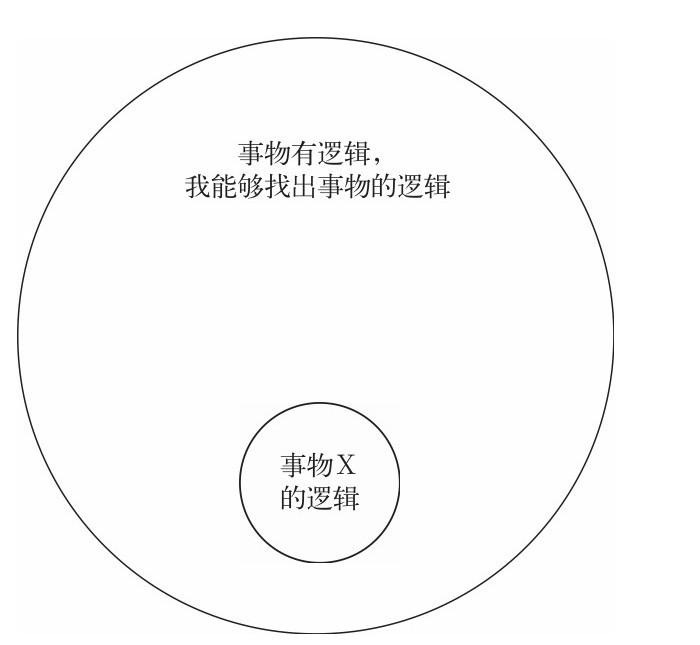

图　8-1　批判性思考者有信心找出事物中的逻辑

## 优化学习的18个策略

策略1：确保了解每门课程的要求，即这门课程是如何被讲授的，对你有什么要求。了解课程评分方法以及做好课程准备的建议。

策略2：成为一个积极的学习者，通过主动阅读、写作、报告和听课让知识真正融入思维当中。

策略3：将你所学的每一科目内容都看作一种特殊的思维方式（在历史课上用历史学思维思考；在化学课上用化学思维来思考；等等）。

策略4：成为一个勤学好问者。通过提出问题投入课堂的讨论中。如果不提问，你很难知道自己掌握了哪些内容、没有掌握哪些内容。

策略5：探寻内在的相互联系。每门课上的学习内容都是相互联系的知识体系，绝不是随机任意的记忆知识点。不要像鹦鹉学舌一样地机械记忆，而要进行探索性的学习，将新的知识与之前的知识体系联系起来。

策略6：把你的大学老师当作教练，把你自己看作团队的成员，努力练习教练示范出来的思维方式。例如，在代数课上，想象自己是代数学员，仔细聆听教练对比赛准备的要求（在允许的范围内思考）。

策略7：试图从作者的角度理解教科书，思考作者在编写这本书的时候的思维是怎样的。例如，可以做角色扮演，假如你就是该书作者，向你同学解释这一章的主要观点。

策略8：在课堂上，练习对基础概念和原理的思考（在学科范围内）。不要被动地坐在教师后面，知识不会像雨水落到雨伞上那样自动地进入你的大脑。

策略9：尽可能地时刻将学到的内容与现实问题相联系，注重知识在实际生活中的运用。如果你不能将知识与生活实际联系起来，你便不能在深层次上理解知识，更不能将知识运用到自己的思维中。

策略10：清楚你需要发展什么样的学习技能，时刻注意练习这些技能。记住，能够意识到并纠正弱点是你真正的优点。

策略11：经常问自己是否能够清晰地解释知识，且也能让他人准确地听明白吗。（如果不能，你就没有真正掌握这一知识。）

策略12：在课程开始时就注意该课程的核心概念。例如，在生物课上，尝试用自己的话来解释生物学。将这些基本概念与之后学习的内容联系起来，因为基本概念是所有其他内容的基础。

策略13：经常性地问一些问题，完成学习中的遗漏点。例如问自己：“我能够阐述这个知识点吗？我能够举例说明吗？”如果你不能举例说明所学的知识，那么你并没有将学到的知识与实际应用联系起来。

策略14：在课前总结、写下之前课上的主要观点。如果你不能总结出所学的主要知识，那么你就没有掌握它们。

策略15：用智力标准来检查你的思维：“我掌握清楚了吗？掌握得准确吗？我掌握相关内容和逻辑了吗？我掌握最重要的内容了吗？”

策略16：写作是重要的学习工具，用自己的语言写下教科书或阅读材料中的重要观点来巩固学习。制定出自己的测试问题，然后写下问题的答案。

策略17：经常评估你的听讲能力。你是积极主动注意到主要知识点吗？你能用自己的语言总结老师讲授的知识吗？你能够用关键词详细阐述所学知识的含义吗？

策略18：经常评估自己阅读的深度。你是主动阅读教材吗？阅读的时候会提出问题吗？你能够区分理解和不理解的内容吗？

## 典型大学课堂的逻辑

因为你在大学课堂中学习，理解大学课堂的逻辑是非常有帮助的。而要理解大学课堂逻辑，就需要我们从历史和传统角度看待大学。

今天的大学是过去学院的传承和发展，大学里的传统可以追溯到几百年前。例如，大学教授讲解知识的最常见方法是阐述知识、向学生提问，然后要求学生自己在课堂外将知识吸收并内化。在这种模式中，课堂中通常穿插许多小测试和考试来检验学生对知识的掌握程度。

通常小测试的间隔不会多于6周。在这种传统教学方式下，学生通常会有两种应对策略，但都不是有效的深度学习策略：

（1）上课比较随意，没有发展出联系性思维，只在课堂上记笔记（关注可能会在考试中出现的知识点）。

（2）在小测试或考试前突击一两个晚上（靠短期记忆来存储大量的信息）。

在这些情况下，许多学生学习的积极性一点点被侵蚀。而另一方面，天生善于记忆的学生总会比其他学生取得更高的分数。这会让一些学生认为高分数是与学习技能相联系的。换句话说，因为记忆力直接与分数相关，他们会认为记住了学习内容就是达到学习的深度。在这样的教学模式下，学生理解的学习概念是肤浅、暂时的。

### 成为熟练的思考者

理想的大学可以有不同的界定方式。但是，不管它是如何被界定的，一些基本的技能和气质是必须包含在内的，以准确概括受教育者的特征。一个受过良好教育的人，必须包含以下特征：

（1）精通阅读和大量写作。

（2）能够掌握并有效运用重要的信息，准确推理，有效交流，能够解决问题，并且做出合理的专业评价。

（3）善于详细阐述、评价目标和目的、问题和困难、信息和数据、结论和解释、概念和原理、假设和预想、预测和结果以及观点和论点等。

（4）能够进行清晰、准确、严格、有关联、有深度、有广度和逻辑性的思考。

（5）要做到思维上的坚韧不拔、有责任感、有原则性，要做到思维谦逊，有同理心和活跃性。

（6）无论是个人还是世界的复杂问题，都能够合理、有道德、有效地分析原因。

（7）终生学习者能够有效地应对如今日新月异、复杂多变、相互依存的社会。

现在你应当清楚，这些特征和技能都不是仅仅通过课上记笔记和突击应对考试能获得的。如果你想获得上述特质，如果你想成为一个受过良好教育的人，那么，你必须建立与其他学生不同的自我要求，实践这些特质，将这些特质内化成自己的行为习惯。你必须有高于群体的期望（甚至可能是群体蔑视），达成自己的学习深度。

你必须意识到知识掌握需要自己的构建，要将其他人的观点转化为自己的观点。要将知识印在自己的脑海中，你必须能够对知识进行详细阐述，并可以举例说明。你必须掌握将外在观点内化为自己观点的能力。这些观点可能来自老师讲授，可能来自课本或有其他的来源；永远不要低估自己，不要仅仅按照老师或者课本的原话来描述这些观点。一个鹦鹉学舌者，录音带似的死记硬背并不能让你真正掌握这一知识。只有能够用自己的语言解释一个观点，并从自己的经历中举例，你才能真正地掌握观点，真正地掌握知识。

### 典型的大学课程设置和典型的大学生

尽管所有的大学生都修读大学的课程，但只有很少的学生能够掌握他们所学学科的学术逻辑。很少有学生能够了解他们的课程是如何设置的，不清楚他们在学习过程中会遇到怎样的问题。下面会列举一些重要的背景知识：

（1）任何一个学习领域连续地、扩展式地发展。

（2）大多数大学课程基础的教科书变得越来越厚，课程涵盖的内容也越来越多。

（3）大多数学生不知道如何去系统地组织学习内容，不知道如何运用自己的思维完成这种整合。

（4）大多数学生都采用阶段性的死记硬背来应对考试。

（5）大多数学生的阅读、写作和听力水平都浮于表面。

（6）大多数学生缺乏评价自身思维和学习水平的知识标准。

以上描述的事实对我们的学习有一些重要的影响：

（1）大多数大学中的考试都不会让多数学生挂科——只要记住了相关知识点就能通过考试。（如果很多学生都没有通过考试，那么老师将从学生处获得非常低的评价。）

（2）考试分数偏高是非常普遍的。

（3）如果6个月后再考学生一次，很多第一次通过考试的学生这次很可能不能通过。

（4）大多数学生都不能在广阔的学科背景下思考课程（例如，上历史课，学生并没有学会历史学思维；上科学课，但没有学会科学思维）。

这些事实的重要影响是，大学成了滋生自我欺骗的温床：大学老师并没有让学生理解了学科内容；学生很快就会忘记死记硬背的大部分内容；教学成果考察也无法证实学生掌握了他们声称学到的内容。

优秀的思考者要求的不仅仅是通过大学考试而已，他们希望通过大学教育成为终生学习者和思考者。

理解课程设置是很重要的。要弄清楚课程的逻辑思路，可以通过分析教学大纲、教科书以及老师对这门课程的介绍等方式。每门课程都有需要理解的关键点。首先，要清楚课堂的正式要求是什么？指定的阅读、写作以及计划的考试和评价是什么？如果有论文要求，什么时候完成？小测试和考试什么时候进行？这些都是显而易见需要弄清楚的事实。

然而，如果达成学习的深度，就有比通过考试更重要的事情。你需要在你学习的过程中学会思考、内化核心概念，并且获得对这门课程最基本的见解。你需要吸收该学科中的思维模式，使它变成你自己思维的永久部分。为了达到这些更高层次的目标，你需要经常问自己三个相互联系的关键问题：

（1）这门课程的最基本概念是什么？

（2）这门课程最根本的思维模式是什么？

（3）我应该如何在学科逻辑下开始思考？

让我们按顺序一一探讨。

## 理清你所学课程的最基本概念

如果你认为一门课程内容是各种信息随机构成的结果，那么这门课程似乎没有任何潜在关联的信息集合。但是事实上，所有的课程都有内在的统一系统，如果了解了这门课程，其内在逻辑会将所有学习内容都联结成一个整体。每一个学科的基本概念都会对该学科及其目的进行界定，这就是这种内在统一的典型体现。

例如，如果你明白了历史上重要的“事实”是历史思维的产物，并且意识到这些思维的基本模式，你就学会用一种历史的视野来看待课本和课堂中的所有内容，这种视野就是认为历史内容是历史思维的结果。你会用特别的方式来阅读课本、听课，以探究历史思维的构成。你意识到，要想理解历史你必须明白：

（1）历史学家的目标或者目的。

（2）历史学家首要关注的问题和困难。

（3）历史学家特别选择的与他的问题相关的历史事件。

（4）历史学家关于事件及其意义的解释。

（5）历史学家用来解释事件的原理性概念。

（6）帮助说明历史学家观点的基本假设。

（7）在给定观点下，学习该历史事件的意义。

（8）了解形成整个历史事件中历史逻辑的历史观。

如果我们意识到每个人每天都会进行历史性的思考，那么我们的历史学习就会有很大的不同。例如，我们每一天的生活都是我们个人史的有机组成部分。对自己过去的看待方式，决定着我们今天做出的决定和未来的计划。我们自己的历史反映了我们的历史假设、概念和观点。它使得我们在头脑中形成特定的问题和目的，让我们做出特别的推理，并根据历史信息而做出结果预测。

当你从这个更宽泛的、相互联系的角度看待历史时，你会探究到所有历史解释中存在的问题。你注意到其中包含的历史事件，并且寻找历史解释中遗漏的部分。你思考历史学家给出的历史结论、关键假设和基本的史学观点。然而，大多数历史课程很少关注学生的历史思维，大部分学生也缺乏历史学科背后的系统性观点，缺少洞悉历史学逻辑的思维。而自身的历史学习也没有培养出他们的历史思维，他们没有将重要的历史概念内化。这种内化是十分关键的，因为如果他们内化了历史知识，他们将能够对过去进行批判性思考，并且将历史学概念应用到日常生活中。

考虑另一个学科——经济学。如果我们理解“稀缺”是经济学中的基本概念，我们便会以特别的方式来学习经济学。我们会意识到经济学上所有的其他概念都与这一中心概念有关：稀缺意味着我们任何一个人都不可能拥有所有想要的资源（稀缺的事实），我们要想得到一些东西必须先放弃另一些东西。人们愿意放弃某一资源来获得其他资源，就构成了他们经济决策的基础。当一些人掌控了稀缺但受欢迎的资源，另一些人只有做出重要的牺牲时才能获取这些资源时，经济领域中的权力就出现了。“权力”也是经济学中的重要概念。

下面是一些其他学科的基本要点概括：

■数学是数量语言的发展。

■代数是对未知数的运算。

■社会学是研究社会成员在群体中生活方式的学科。

■物理学是关于体积、能量以及两者之间关系的研究。

■哲学是关于根本性问题及其合理答案的研究。

■生物化学是关于分子水平上的化学的研究。

## 清楚课程和学科必要的思维模式

一门课程的核心概念通常就是该学科的中心概念。如果你理解了这一核心概念，你应该能够从下面八个结构性问题来界定任何思维模式：

（1）该课程或学科的目标是什么？

（2）核心的问题是什么？

（3）基础的概念是什么？

（4）深入学习该学科需要运用哪些信息？

（5）要做出推理，我需要哪些观点和参考文献？

（6）定义这门课程或学科的假设是什么？

（7）我需要哪种结论来学会如何推理？

（8）这门学科中科学推理的意义是什么？

如果我们所说的每一门课程内容都构成了独特的思维模式是正确的，那么每一堂课都会给你带来不同的思维模式。在任何一门学科中的良好推理能力直接取决于你理解定义该学科的思维能力，取决于这门学科中的专业思维方式。

考虑下面该学生在修读历史课程中的思维：

为了学好这门课程，我必须开始学习历史思维。阅读教科书的过程中，不能将内容只看作要记忆的不相关联的模块，而是必须学会像历史学家一样思考。我必须开始清晰思考历史的目的。（历史学家试图完成的事情是什么？）开始提出历史学问题（并且意识到课堂和教科书中都有历史学问题）。开始浏览大量历史学信息，得出一些历史学结论。我必须开始质疑这些历史学信息的来源。

我必须注意到，历史学家对历史信息给出的历史学解释。我必须质疑这些解释（至少有效地理解它们），质疑不同的历史学解释的含义，研究历史学家是如何为达成某一结论而推理的。我必须学会像历史学家一样看待这个世界，发展历史学的世界观。我必须认真阅读教科书的每一章节，寻找各个章节中的思维元素。我将从批判性思维的角度，在课堂上主动地提出历史学问题。在日常生活中，我也会开始注意自己的历史思维。总而言之，我将努力使得自己的历史思维更加清晰和突出。

那些将历史课当作历史学思维来学习的学生开始很好地能理解其他学科中的历史部分。例如，他们会意识到，每个学科都有自己的历史，并且学科现在的状态是历史发展的成果。更重要的是，学习了较近的人类历史（过去的30000年）和更久远的人类历史，有历史学思维的学生开始注意到历史中的重叠。他们能够将过去30000年的历史融入到更广阔的人类学视野中，研究过去150万年或者更久远的历史，那时我们人类的祖先还是矮小、多毛发的攀爬类人猿的生物，开始学着使用工具挖掘，并主要依靠植物食物生存。

更进一步，他们将这段漫长的人类文明看作由几个重要阶段组成：人类的文明发展历经了从狩猎采集文明到农耕文明，再到工业文明和后工业文明的转变。这还没完，这些学生还将能够从人类学思维转换到地理学思维，将历史学思维发展为一个更广阔的历史学观点。他们开始意识到，人类历史在更古老的历史中只是很小的一部分，整个历史进程还包括整个哺乳动物时期、爬行动物时期，以及煤矿的植物化石时期、鱼类时期、软体动物时期。接下来，学生将掌握地理学历史，即使追溯到地球几千万年前的历史，这与整个太阳系历史相比还是非常短的，而太阳系与整个银河系历史相比也是非常短的，而银河系与整个宇宙的历史相比又是十分短的。

从历史学角度对更广的时间跨度进行思考的能力，会随着对所有学科的学习而有所发展。历史学的思考者将能够完成从历史到史前、从史前到人类历史、从人类历史到地理历史、从地理历史到天文历史的转换。在这个日渐扩大的视野中，人类知识的历史相对短得可怜：只是地理学史中的一秒，天文学史中的一毫秒。从天文学角度讲，仅仅一毫秒前，一个物种出现了——智慧人，这个物种能够自我推动，并且以一种全新和不可预测的方式创造自我适应的条件。仅仅一毫秒前，拥有这种批判性思维能力而非倾向的物种出现了。

### 了解一门学科的逻辑

当你对自己的目标有整体的把握时，当你能够对一门学科的核心观点明确表述时，你可以进行分阶段有计划的学习，有序地掌握课堂或教科书中呈现的知识内容。接下来在课堂上，带着你阅读课堂笔记和教科书时产生的问题听课。你也可以通过阅读百科全书的条目来获得有关学科的基础逻辑的帮助。一些基本的问题可以是：

■学习这门学科的主要目标是什么？

■这一领域的研究者努力要完成什么？

■研究者通常会问哪种问题？他们试图解决什么问题？

■研究者需要收集哪些信息或数据？

■研究者收集信息研究方式与其他领域相比有什么独特之处？

■这一领域最基本的观点、概念或者原理是什么？

■学习这一领域将会对我的世界观产生何种影响？

■将这一领域运用到日常生活中会有怎样的成果？

这些问题都能够在课堂、课本和学习情景中被具体化。例如，在任意一天学习中，你可以问自己以下问题：

■今天我们的主要目标是什么？

■我们努力要完成的事情是什么？

■我们要问哪种问题？我们要解决哪类问题？

■我们需要哪方面的信息或数据？

■我们如何获取这方面信息？

■为了解决我们紧迫的问题，需要了解哪些最基本的观点、概念和原理？

■我们如何看待这个问题？我们要采取哪种观点？

■这个问题与日常生活的关联如何？

## 生物化学的逻辑

现在，让我们通过分析教科书中的一些关键知识点，来详细讲解一门学科的逻辑。思考下面一段节选：

\[生物化学\]……探索宏观现象背后的分子活动，尤为关注在有关维生素、药物和遗传因子影响下的分子活动方式。生物化学家需要分离解剖生物体来确定其生命的结构。他们需要共享其他生物学家的已有成果。

生物化学包括一种亚微观的解剖学，研究分子的结构和大小。因为传统的解剖学研究的是肉眼可见的实体，解剖学家只需切分实体来描述确定他们的组成部分。而显微镜可以显示另一个全新世界的结构和组织，这比肉眼可见的小得多……细胞成为显微镜下的关注焦点。随着化学的发展，人们可以在分子层面研究生物架构。

大的方法策略不变，还是从组成部分的角度更好地了解生物。然而，具体的方法要研究生物的大小和部分。对机体的解剖，手术刀是合适的解剖工具。而对于细胞结构，对于只有显微镜可见的小分子，我们需要采用的相关技术需要从化学中来汲取……从这个角度来看，生物化学是解剖逻辑的发展，是“分子生物学”的缩影……

生物化学家的目标不仅仅是确定生物结构。他们感兴趣的不仅是生物的成分，还有它们做什么——能够清楚表达现象背后的化学方程式。化学活动不断变化是活体生物最主要的特征。因此，生物化学继承生物学的传统，研究这种不断变化的生命活动。像解剖学脱离生理学、静态生物化学脱离动态的生物化学并不能增加人对于自然的掌控力量。毕竟，生命不断向前运转，而不仅仅只要维持自身结构；生物化学家试图通过解剖方法来阐明生物的结构及其不断发生的变化。

总体来说，生物化学的技术层面是化学的，它的难题在于生物的基本层面。化学是它的方法，探究生物是它的最终目的，生物化学是关于生命现象的研究，它要探寻解释生物体组成的亚单位。在这样的生物分析中，这种亚单位代表了最终的状态——最终指的是将分析层面更深一步，从分子层面到原子层面，研究透彻有机体的生物特性。同样，在无机领域，这样透彻的原子分析也是适用的……生物化学家关注的不是即刻的生物现象，而是分子层面的生物现象，而这一数据的收集离不开对更具有组织性的结构系统的观察（Jevons，1964）。

1.生物化学的目标

从上文中可以清楚看出，生物化学的目标是决定生命体的生物化学基础，以及通过这些研究来发展合理的化学疗法。它旨在成为一种在分子层面运用化学变化的基础生物学，如蛋白质和单纯酶反应，进而进一步超越分子和亚分子粒子层面的研究。

2.生物化学的问题

化学概念阐述了生命的现象，从单个的分子角度，生物化学关注下列问题：人的生命体是由什么构成的？我们的躯体如何发挥作用？什么是生命体？更具有特色的问题有：宏观生命现象背后的分子现象是怎样的？构成生物的成分是什么？它们的结构是怎样的？它们是如何起作用的？

维生素在人体内如何起作用？药物如何起作用？遗传因子如何影响生命体？生物化学关注的生物体分子部分是什么？（什么是蛋白质、碳水化合物和脂肪？它们分别起什么作用？什么是核酸？它的作用是什么？）酶在生物体内是如何反应的？酶在生物领域有何作用？我们如何理解生物体中化学作用？酵母和肌肉的相似之处是什么？蛋白质在生命体内的作用是什么？我们如何将不同组织层面的观察联系起来？我们如何开发药品和合理的化学疗法？我们如何生产有针对性的药品？

3.生物化学的信息

从以上问题我们可以看出，生物化学家寻求的信息有：组成生命体单元必需的蛋白质和酶的信息，生命体必需的关键化学反应的催化作用过程的信息，人造生命反应的信息（例如在试管里的单纯酶研究），关于生物细胞分子结构不同酶的信息，关于多种酶系统运行的信息，等等。

4.生物化学的判断

从以上生物化学信息可以看出，生物化学家需要对重要的酶和蛋白质本质做出判断，需要对生物体新陈代谢、复杂保持过程和生命体成长做出基本判断。

5.生物化学的概念

从对以上生物化学的判断中可以看出，我们需要理解一系列重要的概念，才能明白生物化学的逻辑：研究生命过程的组织层面的概念（分子层面、亚细胞粒子层面、细胞层面、器官层面和整个生物体层面）。

6.生物化学的假设

从上述生物化学的概念可以看出，生物化学思维背后的关键假设：这些生物化学基础是建立在分子层面；对分子层面生命体研究最适合的技术是化学技术；用化学概念解释生命体是可能的；分析和发现单个分子的结构和动力是可能的；蛋白质和酶是生命过程的基础和关键；酶的反应对于理解生命体是非常重要的；并且，发展合理的化学疗法，并运用到医药和拯救生命体是可能实现的。

7.生物化学的意义

生物化学的逻辑有着特别和一般的意义。特别的意义与生物化学家提问的方式、信息收集方式还有信息解释过程有关。例如，这一领域的研究现状凸显出对上文所述概念分析的重要性，凸显出对生命现象进行分子层面分析的重要性（包括蛋白质、酶和化学催化反应）。而一般性的意义是，如果现在生物化学的原理是正确的，我们将越来越有能力增强人类和其他生物的生命力，减少疾病和其他亚健康状态（通过化学疗法的应用）。

8.生物化学的观点

生物化学的观点聚焦在生命体的分子层面，并且将这一层面视为生命体本质、功能和结果的最基本发现。生物化学中最重要的技术是化学，最重要的问题是生物。它将生命过程看作分子高度组合的结果，而从整个生物角度来看，生命过程又是丰富多样的。它将分子层面的过程看作研究的关键，包括遗传因子，都是对于宏观层面多样性的解释。

显然，只要我们理解了生物化学的基本逻辑，我们就可以在生物化学课堂上通过自我提问将逻辑具体化：

●今天我们的主要目标是什么？

●我们努力要完成的事情是什么？

●我们要问哪些问题？我们要解决哪类问题？

●我们需要哪方面的信息或数据？

●我们如何获取所需的信息？

●为了解决当下问题，我们需要明白哪些最基本的观点、概念和原理？

●我们如何看待这个问题？

●这个问题与日常生活有什么关联？

一次课可能特别关注某个概念如催化作用，而另一次课可能关注大分子、亚分子粒子，或是另一种酶、能量交换、DNA。理解整个生物化学的逻辑将使你了解自己对生物化学的理解程度，为什么某些概念重要，如何将前后所学联系起来。

## 另外四门学科的逻辑

现在请思考生物学的逻辑，它可能隐含在标准的生物学教科书中。此外，还有另外三门学科：生态学、航空航天工程和电气工程，需要我们进行类似的思考。

### 生物学的逻辑

1.生物学的目标

生物学是关于所有生物形态的科学研究。它的基本目标是理解生物体是如何存在的，包括生物形态的基础过程和组成部分（生态系统总共约10000000个物种）。

2.生物学的问题

生物学关注的问题有：生命是什么？生命系统是如何工作的？生物体的结构和功能组成部分是什么？在不同研究水平上（分子、细胞器、细胞、组织、器官、生物体、种群、生态群落、生态圈），生命体的相似点和不同之处是什么？我们如何理解生物圈？

3.生物学的信息

生物学家探寻的信息有：构成生命体基本单元的信息，生命系统持续运转的过程，生命系统的多样性以及他们的结构和功能组成部分。

4.生物学的判断

生物学家致力于对生命的维持和成长的复杂过程进行判断。

5.生物学的概念

对理解生物学的逻辑非常重要的基本概念有：不同层面生命过程的组织概念（分子层面、亚分子粒子层面，细胞器层面、器官层面以及生物体系统层面），生命结构和过程的概念，生物体多样性的概念，生命过程和多样性的生物体形态的概念。

6.生物学的假设

生物学思维背后的关键假设有：生命体是存有基础的，这些基础是可以被定义、研究、描述和解释的；人们可以运用生物学概念解释生命；可以分析和发现生命体系统的结构，它的动态性和组成成分；所有的生命都经历产生、成长和适应环境的过程；所有生物之间有着庞大的关系链；所有生物形态，不管多么丰富多样，都有着共同的特征：①由细胞构成，但其结构决定着它与其他物种不同；②包含携带遗传物质DNA或RNA；③有新陈代谢的过程，实现能量的转化，维持生命。

7.生物学的意义

生物学的逻辑也有特殊和一般性的意义。特殊意义与生物学家提问、收集信息的方式和解释信息的过程有关。例如，这一领域研究进展体现了上述概念关注的问题和信息的重要性，体现了从所有研究层面探寻生物系统关键答案的重要性。一般性的意义是指生物学使我们拥有关于理解、维持和保护生命形态的知识。

8.生物学的观点

生物学的观点关注生命体的所有形态和层面。它将所有生命形态视为结构和功能的持续。它从分子层面看待生命过程，从整个生物系统角度看待生命体的多样性。

### 生态学的逻辑

1.生态学家的目的

生态学家致力于研究自然界存在的植物与动物，特别是它们在环境中相互联系、相互依存、相互作用的关系。他们致力于研究所有外界因素对特定动植物的产生和改变的作用，以及这些因素对动植物在栖息地生存和它们特点的影响。

2.生态学家关心的问题

植物与动物之间是如何相互作用的？动物之间又是如何相互作用的？动植物之间是如何相互依存的？不断变化的生态系统功能是如何作用于在其中生活的动植物的？它们是如何与其他生态系统相互作用的？环境因素是如何影响植物和动物的？动物和植物是如何完成从生长到死亡的一轮一轮更迭的？动物和植物之间如何保持一定平衡？如果打破了动植物之间的平衡，会怎么样？

3.生态学家运用的信息

生态学家使用的第一手资料是通过对动植物本身、动植物之间的相互作用以及在生态环境中生存等的直接观察。生态学家记录下动物和植物是如何产生、发展、死亡、进化以及如何受环境变化影响的，他们也使用其他学科的信息，包括化学、气象学和地理。

4.生态学家的判断

生态学家对生态系统的自然功能进行判断，对动植物如何生存进行判断。如果生态系统平衡被破坏，他们要对如何重新获得平衡进行判断，要对自然群落是如何分类的进行判断。

5.引导生态学家思维的概念

生态学中最基础的概念就是生态系统。生态系统的定义是，一定的生物群体相互依赖和生存的生态环境。生态学家研究不同生态系统的功能。生态学中另一个关键的概念是生态演替，生态演替是自然进程中每个生态系统中群体自然变化的模式。这一过程包括出生、发展、死亡和被另一生物群体取代。生态学家将不同的生物群体归到更大的单位，称为生物群系。这些群系是根据世界范围内的地理环境特征，包括温度、雨量、植被等进行划分的。另一个基本的概念是自然平衡，自然平衡指自然界中保持动植物之间平衡的出生、繁殖、捕食和被猎食的过程。另外的关键概念包括不平衡、能量、营养、数量增长、多样性、栖息地、竞争、捕食、寄生、适应、共同进化、演替和顶级群落、守恒等。

6.生态学家的关键假设

生态学家假设动物和植物群落中存在特定模式，这些群落应该被研究和分类，动植物之间是相互依存、相互改变的，这种相互作用使得生态系统得以维持平衡。

7.生态学的意义

生态学的研究对地球上的生命有着重大的意义。例如，通过研究自然界的平衡，我们可以觉察到自然界的平衡被打破，像我们注意到现在的人口爆炸现象；通过研究生态学，我们可以发现杀虫剂消灭农业植物虫害的同时，也直接或间接地通过食物链对哺乳动物和鸟类带来伤害；通过研究生态学，我们也能注意到过度耕地带来的土壤流失，以及土地营养贫瘠的现象和去营养化。

8.生态学家的观点

生态学家将动物和植物视为生态环境中相互依存的统一体，并且认为只有维持住它们之间的平衡才能实现全球环境的可持续健康发展。

### 航空航天工程的逻辑

1.目的

航空航天工程主要是为满足防御、科学、商用、民用、娱乐市场需求和任务而发展的航空体系。一般性的任务主要包括交通、地空遥感和通信。代表性的产品有火箭、航天飞机、导弹、人造卫星、宇宙飞船等。此外，还包括地面的一些支持设施、配套硬件和软件产品。

2.关键问题

能够最好满足国家级任务或市场需求的具体系统特征是什么？如何设计、建造、测试和维护航空航天工具？

3.观点

概念性任务的描述提供了所有产品的设计要求和设计方案框架。该领域主要根据任务要求者的观点来决定航空航天工具的具体设计。其他相关观点有：飞行员、维修师、工程师、后勤人员和技术人员的观点（结构工程师、航空动力学家、控制工程师、推进工程师等）。政治家也热衷于在大型航空航天项目中伸展手脚，表达观点。有关伦理和环境问题的政治观点也是这一领域经常要考虑的观点。

4.关键概念

关键概念包括经典物理学相关概念，特别是：牛顿力学和轨道力学，质量、动力和能量守恒，低速和高速的航空动力学，材料属性和轻量结构、推进技术的概念。

5.关键假设

在这一领域中，有些假设是所有科学家和工程师共享的。其中一个假设是，宇宙是按照数学公式描述的普遍定律那样运转的。另外，航空航天工程师假设，一项航空航天解决方案一定是在整合了多项技术学科以及平衡了不同竞争性设计张力后做出的决议，这包括航空动力学、天体动力学、稳定性和控制、推进力、结构和航空电子学。还有，航空航天系统是多个科学技术系统中的一个，必须与整个大系统相匹配。

6.数据和信息

航空航天工程师使用实验和计算数据，研究原有设计、常规需要、市场分析和任务需要的信息。

7.推理、概化或假设

多数航空航天工程活动的结果已经成为产品推广到客户中。

8.意义

航空航天工程产品和服务有着广泛的意义，与全球、国家和区域经济相关联，还与伦理、防御、安全、环境问题（如噪音和人口等）密切相关。此外，航空航天工程还关乎机场基础设施等任何影响人类生活质量的问题。

### 电气工程的逻辑

1.目的

电气工程为公众、商业和客户市场发展电气和电子系统。它的范围非常广泛，跨越多个领域，包括娱乐型电子、住宅照明、空间沟通和电气设施等。

2.关键问题

能够最好地满足国家任务或市场需求的系统具体设计特征是什么？我们应如何构想、设计、实施和操作电气及电子产品和电子系统？

3.观点

一般式设计和制造团队的观点。其他相关的观点包括顾客、股东、市场、维修者和运行者。

4.关键概念

概念包括电磁学、材料的电化学属性、离散和模拟数学、电阻、电流、电荷、电压、场和电波，等等。

5.关键假设

在这个领域中，一些假设是所有科学家和工程师共享的。其中一个假设是，宇宙是按照数学公式描述的普遍定律那样运行的，并且这些定律能够用来规范电气系统。电气工程师假设，电气和电子产品能够十分恰当地满足一些重要的市场需求。另外，电气工程师经常假设，在产品设计和应用上，他们的工作能够与其他工程学科相整合（如机械、化学等）。

6.数据和信息

电气工程师使用实验和计算数据，此外，原有设计、常规需要、市场研究和任务需要的信息对他们也十分重要。

7.推理、概化或假设

多数电气工程的结论已经成为产品推广到客户中。

8.意义

电气工程产品和服务有着广泛的意义，影响着全球、国家和区域经济。对公共基础设施、医疗卫生和沟通有重要的影响。此外，对人们的生活质量也有着积极或消极影响。

## 确保课程设计对你有效

在修读任何一门课程之前，问你自己：我该如何让这门课的课程设计能够促进我进行有效学习？我该如何发展重要的洞察力、理解力、知识和能力？我该如何学习来解决这一领域的问题？

在课程前期，寻找这门课程最重要的概念和解释。你应当整合该门课程所有主题的思考，以达到对课程、学科的全面性理解。

图8-2~图8-7是各门课程的逻辑。

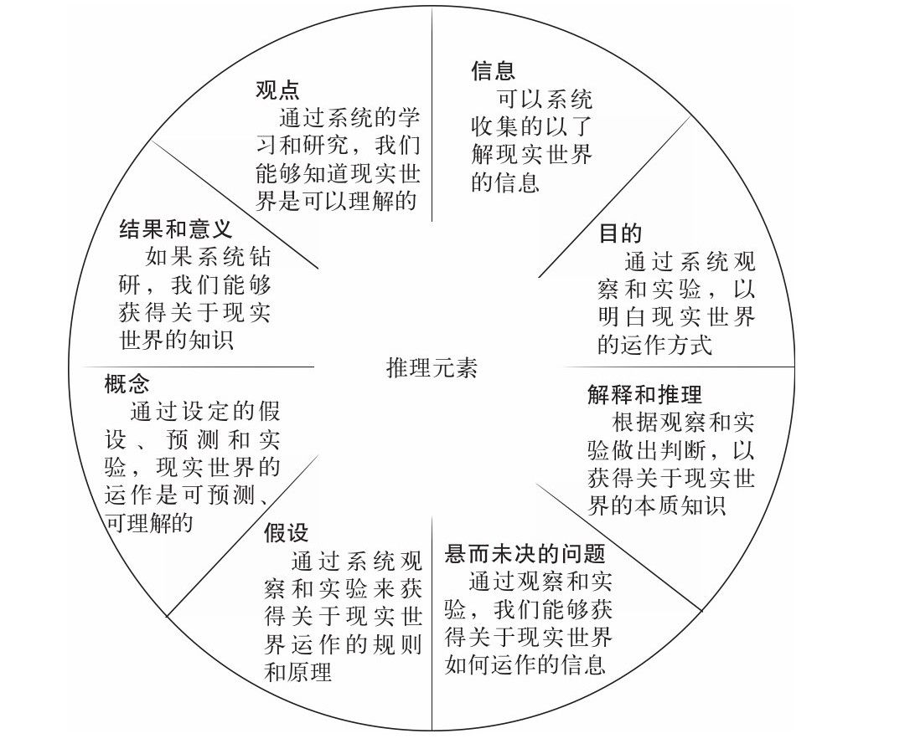

图　8-2　科学课程中的逻辑

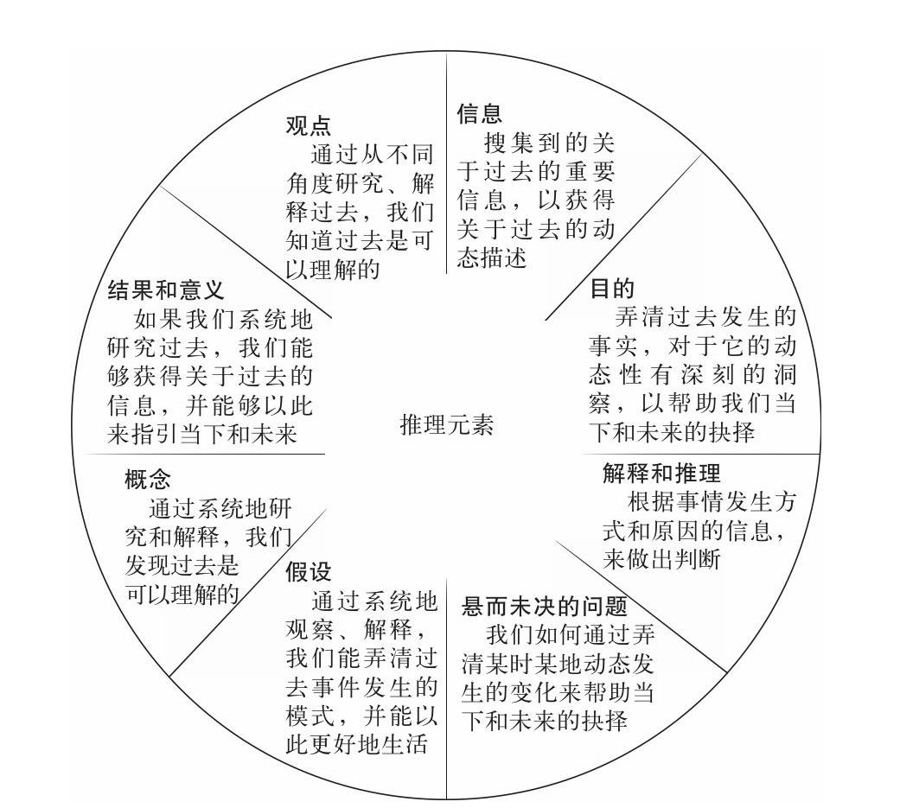

图　8-3　历史课程的逻辑

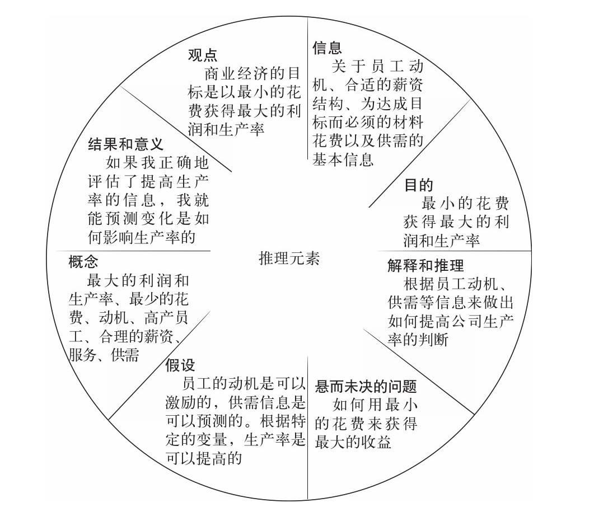

图　8-4　商学课程的逻辑

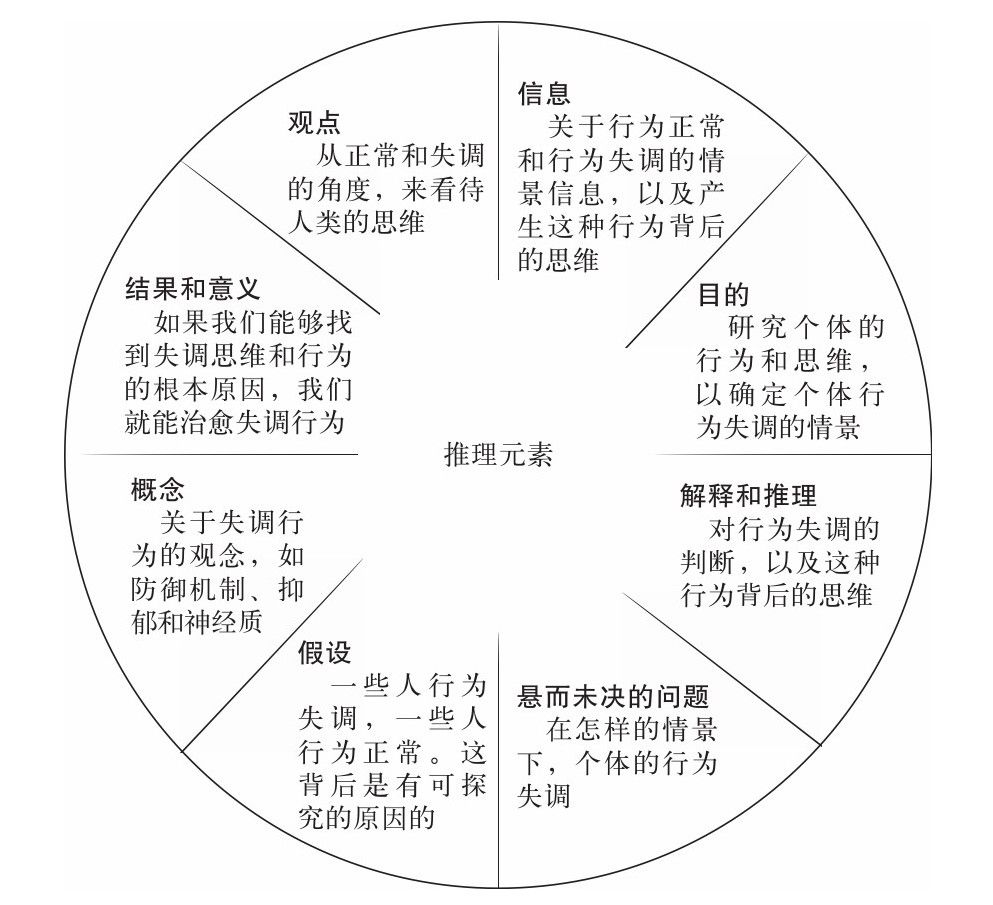

图　8-5　变态心理学课程的逻辑

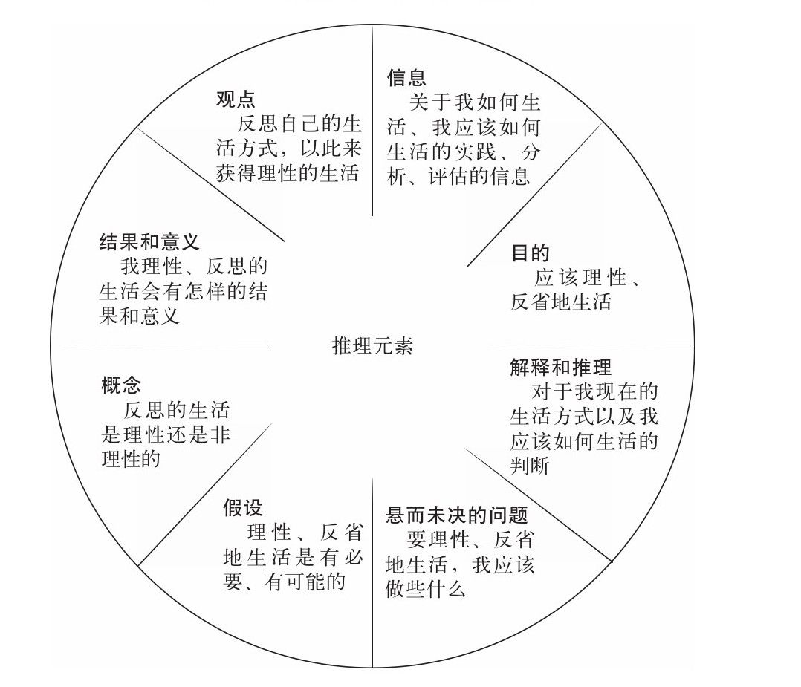

图　8-6　哲学课程的逻辑

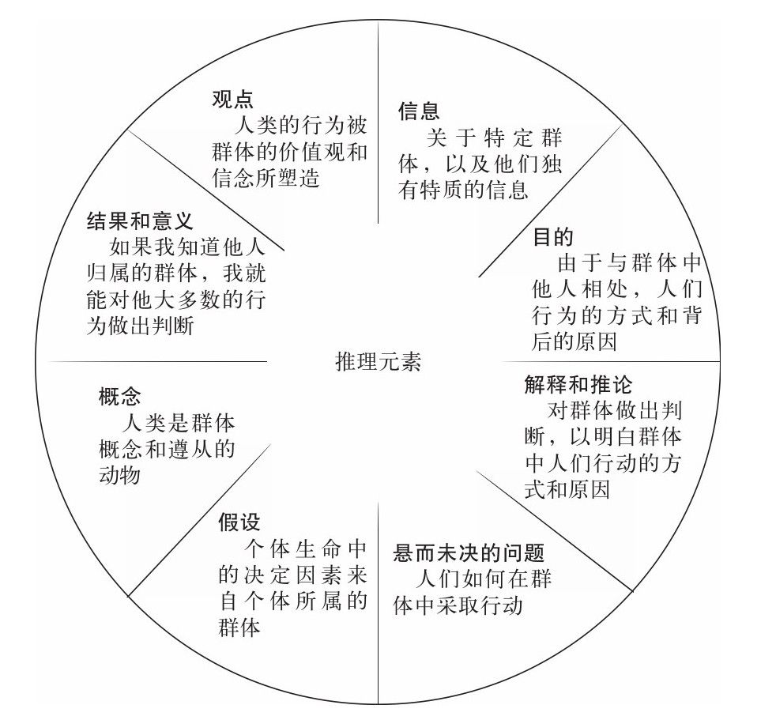

图　8-7　社会学课程的逻辑

示例课程：美国历史，1600~1800年

（1）目的。课程的目的是用历史学思维思考1600~1800年间美国历史的情况和主要趋势。

（2）悬而未决的问题。在1600~1800年的美国历史中，美国的情况和主要趋势是什么？

（3）信息。学生将参考一系列原始资料和二手信息，包括记录、日记、信件、传记、报纸以及书本和文章中的历史事件。

（4）解释和推论。学生将学习如何从大量历史资料中整理、分析数据。

（5）概念。学生将学习如何运用基本的历史、经济、政治和宗教的概念，也包括社会生活和价值观中的概念。

（6）假设。这门课程的基本假设是，学生能够深入洞悉1600~1800年间的美国历史，并以此认识现实问题。

（7）结果和意义。学生如果能够很好地把握十七八世纪的美国历史，那么他们就能以史为鉴，用联系性的眼光来看待20世纪发生的事件。

（8）观点。学生将了解保守派和自由派历史学家看待历史的方式，并综合地进行相关经济学、政治学和社会学分析。

## 听说读写和思考

现在让我们转向听说读写。这四个方面的能力对于成为一名优秀的学生是很重要的。如果你受过训练，那么不需要讲座和课堂讨论，你就能通过独立阅读书本来掌握课程内容。许多优秀的读者常常是通过独立的阅读来获取知识、提高心智的。

写作方面。良好的写作能力能够帮助我们清楚地表达我们理解的观点，以及这些观点之间的相互联系。通常情况下，只有能够将自己的理解用文字表达出来的时候，我们才真正地理解了某一理念。在写作方面，我们很容易发现问题，发现自己不能够清晰地阐述自己所理解的概念，或者我们在阐述方面有障碍，或者我们发现很难清楚地给出例证以及做出具体阐述。写作能力是深层次学习的强有力工具。那些不能够用文字表述自己掌握内容的学习是低层次的学习。

表达是深层次学习方面另一个有力的工具。如果我们能够向别人解释我们所掌握的内容，我们就能够显著地提升我们的学习能力。表达就与我们经常所说的“教学相长”有关，与其他学习者的口头对话是一个强有力的学习工具，这要求对话的口语能力是要受过训练的。当然，没有经过深度讨论的观点可能激活人们的“无知”，以为我们理解了内容但其实并没有。在这种情况下，口语能力会深化错误理解而不是加深个体对内容的理解。因此，你需要确定自己的口语能力足够将自己的观点表达清楚，提供合适的问题并且有效地评估学习。

良好的倾听能力可能是我们提出的四种沟通方式中最不容易理解的。很多学生的倾听能力是没有受过训练的，通常都是被动、笼统、不质疑和流于形式的。低层次的倾听能力会带来明显的误解。

听说读写都是思维方式。作为学生，你的主要目标应该是：学习在阅读的时候是一个合格的读者；在书写的时候像一个合格的书写者；在表达的时候像一个有效的演讲者；在倾听的时候像一个有见识的聆听者。这四个不同的思维方式是相互联系的，掌握一个方式对于掌握其他三个方式是很重要的，要记住这个正确的论断，因为听说读写都是一种思维方式，并且正如我们在这本书中所强调的，这些思维方式都有共同的特征。

不论你是否听、说、读、写，你都希望思维变得清晰、缜密、准确、有相关性，能够对复杂性做出反应，具有广泛性，并且着重于合适的观点。合格的读者、写作者、表达者、倾听者以及思考者认识到，他们各自拥有处理问题、使用信息、做出推论、得出结论、做出假设以及在观点中合理质疑的方式，并同时考虑到推理的结果和意义。

以写作为例。写作方面的所有智力缺陷都可以解释为思维的缺陷。这些缺陷典型性地表现为违反了思考的标准。即：

■当你写出的语句可以用多种方式来解读，并且没有将含义表达清楚的时候，你的语句和思考都处于模糊的状态。

■当你没有给出具体的例子和解释来清晰阐述观点的时候，你表现出的是不知道如何清晰地阐述自己的思想，或者因为某种原因选择有意如此。

■当你没有运用合适的过渡词语和批判性的词汇来表达清楚语句之间的逻辑关系时，你表现出的是你没有依据思维的逻辑性来思考，即没有完全理解自己推理的结构。

■当你没有分析关键概念，并且阐明逻辑的时候，你表现出的是你在概念分析能力上的薄弱。

■当你在没有明显的原因的情况下，没有弄清正在处理或涉及的问题事件时，你表现出的是缺少思维严谨性、缺乏关联性。

■当你在没有进行充分的同理性分析就对一个心理学情境做出笼统性的论断时，你表现出的是思维的狂妄自大。

以阅读为另一个例子。阅读层面的所有缺陷都是由于思维的缺陷违反了思考的标准。即：

■当你不能够辨别出一篇文章的内容框架的时候，你的阅读能力是有问题的（或者在课文中）；

■当你不能够辨别出一篇文章的主要问题的时候，你的阅读能力是有问题的（或者该文）：

■当你不能够辨别出一篇文章的主要信息的时候，你的阅读能力是有问题的（或者该文）；

■当你不能够辨别出一篇文章的主要概念的时候，你的阅读能力是有问题的（或者该文）；

■当你不能够辨别出一篇文章的主要设想的时候，你的阅读能力是有问题的（或者该文）；

■当你不能够辨别出一篇文章的主要含义的时候，你的阅读能力是有问题的（或者该文）；

■当你不能够辨别出一篇文章的主要观点的时候，你的阅读能力是有问题的（或者该文）；

口述和聆听的能力可以用一种类似的方式来分析。现在让我们将这些准则应用到对一篇论文的阅读中去。

## 找出一篇文章的逻辑

理解一篇论文或者文章的重要技能是对于作者推理的分析。一旦完成了对推理的分析，你就可以使用思维标准来评价作者的推理。

## 弄清教科书的逻辑

正如你能够通过分析作者的推理来理解一篇论文一样，你同样能够通过分析作者在教科书中的推理部分来找出该教科书的逻辑。为了理解作者在教科书中的推理，使用以下模板来自我思考。

## 评价作者推理的标准

现在你已经做完了对一篇文章、一本课本逻辑方面的思考工作，目前，你已经掌握了从推理的不同因素来评价作者推理的能力。选择有关文章或者课本，从推理的每个因素和这里罗列出的思维标准来评价他们的推理：

（1）关注作者的目的：目的是否很好地罗列出来？目的是否清楚和合理？

（2）关注书面部分回答的主要问题：问题或者事件是否得到很好的表述（或者清楚地提及）？问题是否清晰和准确？问题是否清晰表述了事件中问题的复杂性？问题和目的是否相互关联？

（3）关注作者提及的最重要的信息：作者罗列的相关证据、经验或者信息对于事件是否充足？信息是否准确？是否与事件直接相关？作者是否罗列出体现事件复杂性的信息？

（4）注重作者推理的核心部分最基本的概念：作者是否恰当地阐述了重要的概念？概念是否被合理地使用？

（5）注重作者的前提假设：作者是否对他认为理所应当的前提假设抱有敏感的质疑态度（只要那些前提假设可能被合理地质疑）？作者在使用前提假设时，是否提出了可能与那些前提假设相关的问题？

（6）注重书面部分最重要的推论或者结论：作者提出的推理或者结论是否与事件紧密相关？作者是否跳跃到了不合理的结论？作者在复杂事件中是否考虑到其他可选择的结论？作者是否使用了一系列的合理推理来得到逻辑性的结论，或者你是否能辨别出作者某处推理的错误？

（7）注重作者的观点：作者是否审慎地对待可选择的相关观点或者推理？作者是否对其他相关的反对观点做出反应？

（8）注重结果和意义：作者是否对自己观点与结论的意义和结果抱有审慎敏感的态度？

# 第9章　重新评估自己思考和学习的水平

与优秀的思考者一样，优秀的学习者根据有关标准来持续评估自身的学习程度。对学习充满热忱、优秀的学习者喜欢那些可以提高他们学习水平的衡量标准。优秀的学习者不依赖导师的评价，他们自己拥有可以评价学习所有维度的标准。如果局限于导师的评价，并缺乏评价的独立自主性，学习者将无法进行批判性的思考。优秀的学习者不会过分依赖于老师，他们需要寻求发展独立、严谨的思维方式。

学习中的每一步，例如批判性思维的过程都是相互联系的自我反思、自我评估的过程。作为一个优秀的学习者，你不仅仅要简单地拥有学习的目标，而且要清楚自己的目标是什么。你的主要目标应该是在学科的逻辑范围内进行思考，就如同科学家、心理学家、艺术家那样去思考。

优秀的学习者要了解进入每一门学科的基础知识，并且运用这些基础知识去理解学科的其他内容。他们要理解学科内最基础的问题；他们要掌握学科专家使用的最基本信息和学科内使用的最基本概念，奠定学科的最基本设想以及定义学科的最基本观点。

优秀的学习者不会去关注对那些随机的、片段信息的记忆，他们的学习是以问题为基础的。但是他们不会简单地随意提出一个问题，他们会评估问题的准确性。他们不会简单地收集信息，他们会根据信息的相关性和重要性来收集、检测信息。他们不会简单地做出解释，他们会考察解释的依据，并且会鉴别依据是否正确。

## 发展自我评估的策略

在第5章，我们介绍了许多常用的思维标准，通过这些标准你可以来评价自己的思维和你所思考的东西之间的关联性。这里，我们将会介绍更多可以用来评估你学习能力的整体性标准。实质上每一天的学习都需要你评价自己的学习程度。你需要经常运用思维标准，并且进行更进一步的探究，定期评价自己的学习，思考自己脑海里的知识体系是否准确界定了自己所学的学科领域。

在下文中，我们将介绍用来评价可以对学科（不论是什么学科）学习做出整体性评价的评价标准。你可以独立于你的导师，自己运用这些标准来评估自己的学习。当然，你的导师也可以在课堂上运用这些标准作为评分的框架。

## 运用特征来评价你的表现

思维和学习在特征上的五个等级的是：模范学生，高层次学生，中间品质学生，表现不良学生以及表现很差学生。如果我们掌握了充分的能够反映你在课堂测试和作业上表现的资料，我们就能评价你在每一节课上的思维和学习水平。

尽管这些评价特征都是根据普遍学业要求提出的，但是大部分的学生不清楚在这些特征上存在的表现差异。你需要养成用这些标准来复习自己功课的习惯。长期坚持下来的话，你将成为一名优秀的学习者和思考者。如果按照模范学生的方式进行学习，每一门课上你都会表现出色。

当你阅读模范学生的这些特征时，你可以将任何特征都纳为评价自身学习的标准。

模范学生经常会提出重要的问题和论点，清晰准确地分析关键问题，甄别出关键的假设，有效地阐述关键概念，使用专业性的语言，能够识别并分析相关竞争性观点，并且根据清楚论断过的前提谨慎地做出合理推理，审慎地对待重要结果和意义。

将标准转化为对评价自己表现的问题：

在以下方面，我做到何种程度：

■在课堂上提出重要问题和论点？

■准确清晰地分析关键性的问题？

■找出关键性的前提假设？

■阐述关键的概念？

■使用专业性的语言？

■识别出竞争性的观点？

■通过明确提出前提假设做出推理？

■注意到重要的意义和结果？

### 模范学生（A档）

模范学生的思维表现（在学业表现上）意味着掌握了学科领域杰出的思维能力（例如，优秀的历史思维、优秀的生物思维、优秀的数理思维），同时这种表现也包括通过思维技巧和能力的练习来获得更多的知识。模范的思维表现总体来说是准确清晰的、合理推理的并且信息丰富和具有洞见的。在这种水平上，对学习中术语和细微差别的理解和把握有助于学生对基本概念和准则有更深的洞见。

模范学生已经将基本的思维标准内化，能够合理地评价自己在一个学科内的表现。模范学生同时拥有极高的自我评价能力。模范学生通常——

■提出重要的问题和论点。

■精确清晰地分析关键问题。

■识别可疑的前提假设。

■有效阐述关键观点。

■使用专业性的语言。

■识别出相关的竞争性观点。

■审慎地呈现重要的意义和结果。

■根据学科中清晰陈述的前提假设进行认真推理。

模范学生能够展现出对一个学科有高水平思维掌握的推理和解决问题能力。他们能够将多领域的知识联系起来，将学到的知识运用到实际生活中去。

### 高层次学生（B档）

学科中表现出来的优秀思维方式表现出学生在一门学科领域里卓越的思考能力，以及通过思考能力发展出的一系列其他能力。总体上来说，高层次学生的思维和学习能力是精确的、清晰的且是合理推理的，但是这种思维能力有时是缺乏深度的（尤其是在涉及对立观点的时候）。在这个水平上对基本术语和细微区别的把握有助于学生全面理解学科基本概念和原则。

高层次学生将基本的思维标准内化，能够合理地评价自己在一个学科内的表现。模范学生同时拥有很高的自我评价能力。高层次学生——

■时常提出问题和论点。

■一般来说能够清晰明确地分析问题。

■识别出大部分的前提假设。

■阐述主要概念。

■典型性地使用专业性的语言。

■一般能够辨别相关的竞争性观点。

■对许多重要意义和结果都抱有审慎态度，并且时常通过清晰阐述的假设来认真推理。

高层次学生展现出一个学科领域里较为优秀的推理和解决问题的能力，他们的思维表现还有很多可以改进的地方。他们时常将许多领域内的知识联系起来，并且将学到的知识应用到他们的生活之中。

### 中间品质学生（C档）

在一门学科和课程领域内，中间品质学生的思考能力的表现不具有连续性、一致性，思维技巧和获得知识的能力只得到有限的发展。中间品质的学生时常尝试用记忆代替理解。中间品质的思维在清晰性、准确性和合理推理方面不具有一致性、连贯性。此外，这种层次的思维能力大部分情况下无法展现出深度的理解。在这个水平上对基本术语和细微区别的掌握，不能让学习者完全理解学科中的基本概念和准则。

尽管中间品质的思考者内化了一些思维标准来评价他们的学习和思维表现，但是他们表现出自我评价能力不具有连贯性和一致性。中间品质学生——

■间或能够提出问题和论点。

■间或能够清晰明确地分析问题。

■甄别出一定量的可疑前提假设。

■阐述出一定量的合理概念。

■间或使用专业性的语言。

■间或辨别出相关的竞争性观点。

■间或能根据学科假设进行推理，并且不能谨慎地对待重要的意义和结果。

中间品质学生在展现一个学科领域内质疑和解决问题的能力时，连贯性和一致性较差，他们的思维表现充其量处于合格水平。同时，在联系学科知识方面的能力不是很强，很难将中学习到的知识应用到生活中去。

### 表现不良的学生（D档或者F档）

表现不良的学生在一门学科或者课程领域里的推理能力比较薄弱。总体上来说，他们尝试通过运用回想和记忆来完成课程学习、通过考试，他们只是试图记忆内容，而不是理解来获取知识。表现不良的学生不会去发展理解课程不可或缺的批判性思维。他们的思维表现通常不准确、不清晰以及缺少合理推理的。表现不良的学生学业表现很差。他们经常错误地理解基本的术语和差别，肤浅或错误地理解基本概念和准则。

表现不良的学生没有将内化思维标准来评价自己的学习和思维表现。他们在自我评价方面做得较差。表现不良的学生——

■极少提出问题和论点。

■肤浅地分析问题。

■不能清楚表达前提假设。

■只能部分地阐述概念。

■极少使用专业性的语言。

■极少辨别出相关的竞争性观点。

■不能通过清晰阐述的前提假设进行推理，不会审慎地对待重要意义和结果。

表现不良的学生在学科领域里的推理能力和问题解决的能力是非常薄弱的，思维表现很差。表现不良的学生不能联系不同学科间的知识。他们极少能够将所学到的知识运用到他们的生活中去，因为他们理解不了课程知识和现实生活之间的联系。

## 运用学生特征去评价你自己在具体学科中的表现

作为积极练习将知识应用到新情境中的思考者，你可以将学习到的水平层级评价应用到任何学科中去。本书将以心理学这门具体学科的学习作为一个范例。

### 模范心理学学生（A档）

模范心理学学生的表现是，真正地掌握什么是心理学的思维，以及一系列具体的心理学思维技巧和能力。有关课程要解释得准确、清晰以及做出合理推理。在模范性的表现中，学生能够有效地掌握心理学的术语和区别，对心理学概念、设想和推论有深度的掌握和理解。心理学系的模范学生——

■准确清晰地分析心理学的论点。

■准确地搜集心理学信息。

■能够区别相关信息和不相关信息。

■识别出关键的、值得推敲的心理学设想。

■阐述重要的心理学概念并且检测这些概念运用的合理性。

■运用已有心理学方面的专业术语，同时合理地质疑心理学领域里关于人类行为的不恰当概念。

■思考心理学领域里不同的竞争性观点，准确地描述每一个观点。

■通过清晰阐述前提来进行合理推理，并且要表现出对于重要的意义和结果抱有审慎的态度。

模范性学生表现出卓越的心理学推理和问题解决的能力，有非常高的思维技能，且思维具有连贯性和一致性。模范性学生经常会地将心理学知识与其他领域的知识联系起来（诸如将历史学、社会学、人类学和哲学等与心理学知识有机地联系起来）。模范学生会将心理学的概念和准则应用到生活中。

### 高层次的心理学学生（B档）

高层次的心理学学生掌握了什么是心理学思维方式，同时掌握了一系列具体的心理学思维技巧和能力。在课程结束的时候，高层次学生的表现在总体上来说是清晰精确和合理的，但也存在着一些失误。高层次心理学学生大致上能够有效运用心理学术语。这类学生对心理学思想、设想和推论有初步的了解。高层次的心理学学生——

■时常提出重要的问题和论点。

■大概能够清晰准确地分析心理学的问题。

■识别出大部分值得质疑的心理学前提假设。

■较好地阐述重要的心理学概念以及检验应用的合理性。

■能够使用一般的心理学专业术语，同时合理地质疑心理学领域有关人类行为不恰当的概念化描述。

■一般能思考竞争性的心理学观点。

■对于很多重要的意义和结果具有审慎态度。

■常常通过清晰阐述前提来合理推理。

高层次的心理学学生表现出较为优秀的心理学方面的推理能力和解决问题的能力。他们能够较好地将心理学知识和其他诸如历史学、社会学、人类学和哲学等学科的知识有机联系起来，能够较好地将心理学的准则和概念应用到生活中。

### 中间品质的心理学学生（C档）

中间品质的心理学学生能够对心理学思维能力有一定程度的掌握，他们的心理学思维的技巧和能力有一定的发展。这种类型学生的表现能够呈现出一定程度的心理学思考能力，但是有很大的薄弱性。尽管一些工作完成得还可以，但是另外一些则完成得较差或者充其量勉强合格。推理能力非常薄弱。尽管有时能够有效地掌握心理学术语和区别。在少数情况下，这种层级的学生能够表现出对心理学观点、前提假设和推论的掌握。同时中间品质学生的思维也较少地表现出严谨性和清晰性。中间品质的思考者有时能够——

■清晰准确地分析心理学论点。

■正确地搜集心理学信息。

■辨别相关和不相关信息。

■识别出主要的可疑前提假设。

■有效地阐述主要的心理学概念，以及能够辨别出何时概念被合理运用。

■使用已经存在的心理学专业语言。

■辨别出相关的心理学竞争性观点。

■审慎对待重要的心理学意义和结果，并且通过心理学假设来合理推理。

通常情况下，中间品质思考者的目标仅仅是通过课程考试，对知识的掌握完全流于形式而疏于理解。总体上来讲，这个层级的学生仅仅表现出合格（缺乏连续性）的心理学推理能力和解决问题的能力。中间品质的学生在一定程度上能够将心理学知识以及一些与心理学相关领域的知识联系起来。中间品质的学生在一定程度上能够将心理学知识和概念应用到实际生活中。

### 表现不良的心理学学生（D档或者F档）

表现不良的学生表现出很少对心理学思维的理解，他们充其量表现出低层次的心理学思维技能和能力。表现不良的学生有偶尔能（有可能）表现出少许的心理学技巧，其心理学思维能力缺乏批判性，大部分的作业完成得很差。很少表现出合理的推理能力。通常情况下，这种层级的学生很难通过课程考试，对知识的掌握只是流于形式而缺乏实质性的理解。他们很难掌握心理学思想、设想和推论。大致上来看，他们的思维缺乏严谨性和清晰性。在低层级的工作中，学生通常——

■不能够清晰准确地分析心理学论点。

■不能够准确地提供心理学信息。

■不能够区别相关和不相关信息。

■不能够识别主要的可疑性前提假设。

■不能够有效地阐述主要的心理学概念。

■不能够使用已经存在的心理学专业术语。

■不能够辨别出相关的竞争性心理学观点，并且不能够根据准确阐明前提来合理推理，以及不能够分辨出重要的意义和结果。

表现不良的学生很少表现出优秀的心理学质疑能力和问题解决能力。这个层级的学生几乎从来不会将心理学知识与心理学相关领域的知识联系起来。他们很少将心理学准则和概念应用到生活中。

## 小结

要成为一名优秀的学习者，你首先必须是一名优秀的思考者。为了达成有效的学习，你必须掌控你的学习过程。你必须计划并执行你的学习过程。你可以通过明确学习目标、清楚必须或者想要回答的问题、弄清必须获得的信息、需要掌握的概念，以及关注点和如何运用所学来计划你的学习。

在这一章中，我们已经给出了相关特征，你可以运用这些特征和你的学习经验去评价自己在每一门学科中、在每一节课上的学习和思维表现。在脑海中熟记这些特征，你会成为学习和思维自我评价的主人。你要明白的是你对学科的思考能力是由你对那门学科的学习中发展出来的思维技巧决定的，而不是你的导师给予你的分数决定的。掌控自己的学习很简单。你要知道的是，只有客观评价你自己的学习和思维发展水平，你才能明白你对内容的思考达到了什么程度，才会发展成为一个独立的思考者。

# 第10章　决策和问题解决

日常生活中充斥着各种各样决策和问题解决。决策的质量和问题解决的能力在很大程度上决定着我们生活的质量。大多数人是根据自己的直观判断而不是系统的方法来进行决策和问题解决。有时，抛弃系统方法的直观判断是可行的，但有时却行不通。只有当我们把批判性思维运用到我们的决策和问题解决过程中，我们才有可能更好地解决我们所面临的问题，并做出理性的决定。在这一章，我们提供一个决策和问题解决的系统方法。首先我们谈决策，然后再谈问题解决。请以自己的方式阅读这一章，注意两个心理过程之间的关系。

## 决策

生活就是行动，行动就要做出决定。每天，我们都面临着无数的决策问题。一些小的决策是无关紧要的，但是有些大的决策将会影响我们的一生。当我们的决策模式合乎理性的时候，我们会生活在一个充满理性的环境中。当我们的决策模式偏离理性时，我们的生活就难免处于一个非理性的混乱状态之中。理性的决策可以帮助我们在不违反人权和伤害他人利益的情况下，优化我们自身的生活质量，这包括幸福、成功和满足感等。具体而言，我们可以将批判性思维应用于决策和问题解决当中，将决策模式提升到意识和慎重选择的水平，这就会增强我们决策的理性。

没有人追求非理性混沌的生活。然而，常常事与愿违，很多人无意识的选择造成了他们偏离理性和道德的生活现状。非理性决策和问题解决加剧了他们生活的不幸和沮丧，这种非理性甚至让一些人去牺牲他人的利益来追求他们自己的利益。

### 评估决策的模式

如何发现我们的决策是错误的？首先，我们有时意识不到，我们的决策通常是非理性的决策。让我们先来分析一下我们潜意识的决策。

如果问问自己昨天做了多少决策，你可能会疑惑，不知如何确定决策的数量。在某种意义上，做了多少决策并不重要，重要的是要认识到我们做了哪些类型的决策，并且找到一个识别及判断这些决策模式的方法。

每个人都有人类的基本需求，我们都会做出一些决策来满足我们的基本需求。此外，我们都会按照一定的价值标准做出选择。我们倾向于选择符合并有助于提高我们利益的生活方式，没有人会主动选择以损害自己利益、伤害自己为代价的生活方式。并且，我们也倾向于做出对他人有益的选择。然而，当我们做出的决策伤害了别人，我们所做出的决策就是不道德的。当我们做出的决策对我们自身的利益造成了损害，这种决策就是非理性的。

一些常见的偏离道德或理性的决策模式是：

■选择损害我们自身利益的行为。

■决定不参与对我们长期有益的活动。

■选择损害他人利益的行为。

■决定与那些怂恿我们损害自身和他人利益的人同流合污。

这些模式听起来很奇怪，难道会有人做弄巧成拙或者自我伤害的决策吗？而这个问题的一般答案是：这些非理性的决策会有即时满足的作用，并且能够带来短期收益。当我们对特定模式有更深入的了解后，上述问题便不成为问题了。比如“选择破坏自身利益的行为”表现在：

■决定吃不健康的食物（缩短我们的寿命，或是能够导致疾病和不良生活品质的食品）。

■决定吸烟、酗酒或者使用有害的毒品。

■决定不去锻炼或不从事足够的有氧活动。

显然，我们做出这些决策是由于即时的快感和短期的满足。事实上，我们头脑相信即时的快感和短期的满足是至关重要的。毕竟，我们的精神会因为直接和短期的快感而变得“兴奋起来”，长远的考虑需要反思。正如皮亚杰所说，我们必须将我们的行为提升到有意识的认识层面。当然，我们或许意识到某个问题，但我们并没有采取措施纠正它，将长期而深刻的洞察实践出来需要严格的自律精神和强大的意志力。

当我们识别到了生活中非理性的决策模式时，我们就注意到了所谓的坏习惯。当我们用一个理性的决策模式去替换一个非理性决策的模式时，我们就是在用一种好习惯代替一个坏习惯。这种替换是处于行动水平上的，因为习惯的养成是一个很长的过程。坏习惯是在成百上千的非理性决策中积累形成的。因此，我们可以通过用好习惯代替坏习惯的练习，进而改善我们的决策。例如，我们可以做很多的理性决策，只吃健康的食物，不吃不健康的食物。一旦这个决策变成一个长时间内稳定的行为模式，它就是一个有益的习惯。

### “重大”决策

个体在生活中需要重视两大类型的决策：

（1）那些或多或少有明显长期影响的决策（基本的职业选择、伴侣的选择、价值标准的选择、人生观的选择和基本的教养方式选择等）。

（2）那些对我们生活有影响，但是这种影响慢慢显现出来决策（如我们的日常生活习惯，其中包括我们的饮食和锻炼习惯）。

最具危险性的一般是“未思考过”的决策，这些决策蛰伏在我们的生活中，无时无刻不影响我们的生活，但是我们却从没有觉察到他们。显然，并不是所有的决策都会提升到意识层面，那样，人类就没有习惯可言。因此，我们的目标是评估决策类别，同时评价集体决策和个人重大决策。

### 决策的逻辑

考虑决策的逻辑是十分有用的。这种逻辑是由决策的目标和遵循这一目标的问题所决定的。

■目标：在多个选项中做出抉择，选择最符合所有人利益的选项。

■问题：完成以下句子：“在我生命的当下阶段，ABCD四个选择，哪个是对大家都有益的？”

合理决策的四个关键点：

（1）认识到你面临一个重要的决定。

（2）准确地了解所有选择方案。

（3）对选择方案进行逻辑思考和评价

（4）坚定地按照最佳选择方案采取行动。

每一点都是思考者需要思考的潜在问题。

1.认识到你面临一个重要的决定

大部分决策之所以偏离理性，是因为决策当时我们未能意识到我们正在做决策，这难免造成大多数决策是在潜意识里做出的，而个体的潜意识常常是自我中心或社会中心的。人们对朋友、同事、课业、家庭、娱乐（包括酒精和药物的使用）以及个人需求满足的决策都是“不加以考虑的”盲目决定（“我从来没有想过！”“我根本就没有意识到！”）。而没有考虑常常是我们对非理性决策的借口。

2.准确地了解所有选择方案

做决策时，除了意识到决策还远远不够，我们还必须认识到我们的选择方案是什么。如果我们未能准确地了解选择方案，很多决定都走了样。选项识别错误有两种形式：

（1）认为其他某一方案是可选择的，但实际上却不是（思维不切实际）。

（2）未能认识到其他选择方案（思维过于狭隘）。

第一种错误的常见决策是这样的：

■“我知道他的缺点，但他爱我，我可以帮他改变！”

■“我知道我们之间有很多问题，但是我们彼此相爱，这才是重要的！”

■“我知道我的课业成绩并不好，但我篮球打得好！”（或“我想成为一个摇滚明星！”）

■“我知道我需要学习这些，但是我也可以在考试前一晚通过填鸭式的恶补来掌握这些知识！”

第二类错误是（思维过于狭隘）很难改正，因为没有人相信自己的思维过于狭隘（当事人）。实际上，思维越窄的人越觉得自己视野开阔。一个很好的判定规则是，如果你只能想到一两个选择方案，你的思维很可能过于狭隘。

克服思维狭隘，下面两个规则是有用的：

规则一：总会有办法。

规则二：总会有另外的解决办法。

说到这里，我们来看看一个熟练决策者的成长过程。

3.在决策中投入更多时间

如果我们不花时间来反思我们所做的决定，我们的决策模式就不能得到改善。行为的真正改变需要我们对现在的行为进行思考。在这里关键是要认识到，现实生活中非理性的决策浪费大量时间十分常见。例如，一对夫妇花5~10年的时间才意识到他们这段婚姻是多么糟糕，才想要结束它。人们常常因为选择了错误的职业而浪费多年光阴。学生经常因低效的学习模式而浪费大量的时间。把更多的时间投入到对我们的决策思考中去，做出更好的理性决策，这有助于我们节约时间，使我们不必再去花费时间纠正错误。

4.系统化

每个人都需要反思自己的习惯。个体需要给自己时间来考虑自身的主要需求以及相关决策，如饮食习惯、锻炼习惯、娱乐活动、社会交往，等等。人们要批判性地思考，在整个生命过程中，他们各种习惯是如何影响他们的生活质量的。例如，如果你决定一天大部分时间都去玩电脑游戏，思考这个决定的含义是什么？有没有一些重要你却没有时间做的事情？

5.一次处理一个重大决策

快速思考通常对理性决策无益。我们试图把事情做得又多又快，追求速度的同时我们失去了对事情质量的把握。我们生活在一个快节奏的世界中，决策时很难认识到花时间进行推理和思考的重要性。做出错误的决定之后，我们有时会找借口说我们没有足够的时间来思考这个问题。但实际情况恰恰相反，我们有时间但却不愿花时间。一般来说，我们在思考方面所花费的时间精力越多，对事情越是深思熟虑，我们的决策质量也越高。

6.了解自己的无知

我们通常不了解我们的决策。我们对自己的无知（关于决定）了解越多，我们的决定便会越发理性化。了解和直面我们的无知将帮助我们确定应该去了解哪些信息。我们往往不知道做出有效的决策需要哪些信息，但我们的通病是，认为自己已经知道决策所需的一切信息。这是思维上的狂妄自大。

### 决策的维度

参照思维的维度，我们至少可以确定决策行为的九个维度。这些维度跟问题解决的维度大致相似，这将在之后的章节探索。这些维度并未定义一个决策流程，能够让我们不假思索、机械地遵从。这些维度认为，合理判断和理性思考存在于决策的方方面面中。

成为一个理性的决策者，需要做到：

（1）整理并定期重新阐明最基本的目标、目的和需求。你的决定应该帮助你消除障碍，创造机会来实现目标、满足需要。

（2）在时间允许的情况下，一个个地解决问题和考虑决定。尽量清晰和明确地澄清情境和选项的情况。

（3）研究可选项的周围情境以便清楚你正在处理决策的情况。找出各种可选项对你的影响，将那些控制你和你可以控制的决策区分开。集中精力去思考那些你可以控制和影响的决策。

（4）找出你需要的信息，并积极寻求该信息。

（5）仔细分析和解释你收集的信息、做出合理的推断。

（6）找出你可以采取的行动。短期内能做什么呢？长期呢？明确你对金钱、时间和权力认识的局限性。

（7）在情境中评估你可以采取的行动，考虑到他们的优劣势。

（8）采取战略性的决策，战略性的决策可能是直接行动也可能是谨慎观望。

（9）行动的时候，监督自身的行为出现的含义，根据情境需要随时准备修订行动策略。随着决策信息的增多，随时准备调整你的策略、决策分析和关于决策的解释。

在之后的问题解决章节中，我们将逐一详细阐述这些维度。

### 早期的决策（2~11岁）

通过回顾塑造了我们生活方式的主要决策行为，我们可以洞察决策过程中的固有问题。例如，在我们早期的生活中，作为孩子，我们无法对我们的决策行为有主要的控制作用，但是，我们的父母通常会给我们一些做决定的机会。可是，由于当时我们的年纪很小、眼光狭隘，我们很自然地只看眼前的事物，世界观是高度自我中心的。此外，在孩子的决策过程中，许多父母的做法颇显极端：要么过度地干涉和控制孩子的决策，要么对孩子的决策不闻不问。

当我们还很小的时候，需要发展出自我中心思维和社会中心思维的限制，从而就能在当时修正这些负面行为模式，避免对自己和其他人造成的伤害。然而，就算是小孩子也需要在自己的生活中行使权力，并开始学会接受自己的决定产生的后果。如果孩子没有机会自己做出决定，那么他们就无法学会为自己的行为负责。

孩子的决策存在一个问题，他们的决策往往是他们所属群体的集体决策结果。青少年文化，包括媒体、电影、音乐和英雄人物，这些都会对孩子的决策造成影响。人类不安全感驱使孩子寻求来自其他孩子的认可和接受。他们的许多决定和行为都是为了获得同辈群体的认同。在决策过程中形成的行为模式常常是短期和长期的问题来源。

我们所做的决定会以这样或那样的方式影响我们的人格和个性。决策影响我们的信念和态度、对自身的看法以及我们对于生活的世界的感知。

### 青春期决策（12~17岁）

在我们的生命中，青春期是我们一生当中决策的重要时间段。作为青少年，尽管有时我们并不愿意为决策承担责任，我们还是倾向于寻求更多的独立决策。事实上，一些青少年认为：“我有权利自己去做决定，但每当决策带来负面后果的时候，他人有责任帮我应对这些后果。”

像小孩子那样，青少年也不太有远见。他们常常认为眼前事情就是一辈子的情况（直接的自我中心）。为了实现独立性，青少年经常与他们的父母或其他权威人物进行权力斗争。

跟孩子一样，青少年的决定也是他们所属集体“同化”的结果，青少年的文化，包括媒体、电影、音乐和偶像，都对他们的决策起了很大的作用。人类的不安全因素驱使青少年互相寻找认同感。与多数儿童期的孩子一样，青少年的决定和行为都是为了获得同辈群体的认同。在决策过程中形成的行为模式常常是短期和长期的问题来源。

爱情、性以及全面的世界观对青少年来说非常重要，但是他们对这些问题的了解还是非常肤浅。青少年对这些问题的概念主要来源于他们看的电影、电视节目和听的音乐。这难免会带来青少年拙劣的决策行为和不良的习惯。

例如，影片中所塑造的英雄经常以成功者的形象出现，通过使用暴力来打败那些邪恶的反面角色，在影片好坏截然划分的世界中，一切都非黑即白。恶人欺负、伤害弱者，只有等到有人有勇气用暴力对付恶人的时候，这些软弱善良的人才得以获救。

在浪漫关系的影片中，爱情通常是自发的、非理性的和一见钟情的，爱情与性格无关。在青少年影片中，几乎没有英雄通过理性思考来实现他们的英雄壮举。如果在青春期形成的决策和行为模式以及生活习惯来去轻易，我们就可以坐等那些不好的习惯溜走。但事实并非如此。影响我们一生的行为习惯都是在这重要的几年里形成的，所以有意识的干预是必要的。

## 问题解决

我们强调的是，我们每个人的生活都需要不断地做决定，并且我们可以通过以下方式提高我们决策的能力：①对生活中决策的本质以及作用进行批判性的反思；②根据决策的本质以及作用，系统地采用那些增强我们决策行为合理性的策略。

我们决策的要点可以使我们的问题得到解决。问题解决在某种意义上和决策一样，在我们的生活中是无处不在的。我们每个决策的领域都意味着一个我们不得不去解决的领域。每个决策对于我们的问题解决都有影响，这与问题的大小和复杂程度没有关系，不合理的决定就会制造问题。如果我们的早期决定合理的话，很多问题都是可以避免的。

我们并不是要试图重申特殊问题解决的决策要点。相反，我们的目标是沿着这样一条问题解决的线来帮助读者思考在我们生活当中凸显它的地方，以及如何运用本书所讨论到的工具、价值观和特质来有效地解决问题。

### 成为一名积极的问题解决者

存在一些困难的问题和决策，尽管不做处理，有时它们也是能够自行解决的。如一个恼人的室友搬走；你的父母给了你需要的钱；伤害你感情的朋友向你道歉；或是得到一个意想不到的工作机会。

然而绝大多数的问题是不能自行解决的，必须要积极处理，否则，就会越变越糟。因此成为一个积极处理问题者非常有益，在问题找上你之前把它解决掉，并以一个理性的方式做出讨论。古夏威夷人曾说过，“个体若不应对自己的生活，生活就会反噬其身”。在童谣《鹅妈妈》中有如下描述：

世上的所有问题

必然只有有解和无解两种情况

如果有解，追寻直到找到它

如果无解，也不要介意

上述古语都展示了积极的问题解决者与决策者具有的精神气质。想要成为问题的解决者需要的不仅仅是积极的精神，它还需要对问题的理解、洞察力及相关解决技巧，这些因素都是我们需要关注的。我们已经在前面的章节中关注了理解、洞察力以及相关技巧，通过思考，你可以主宰自己的问题解决和决策。

首先要认清你所面对的问题的类型。问题可以被分为两种：

（1）因我们自己的决策或行为产生的问题

（2）因外力产生的问题

然后将问题分为两类：

（1）我们可以全部或部分解决的问题

（2）超出我们解决能力范围的问题

显而易见，那些我们自身产生的问题比外力造成的问题更容易解决，因为我们有能力对我们从前做过的决定做出纠正，改善我们曾经的行为。

### 问题解决的评价模式

如何判断你的问题解决方式是否是不合理的？不合理的问题解决至少有下述两种模式：

（1）伪解决方案（问题看似解决实则没有）

（2）以牺牲他人权益和需求为代价的问题解决方式

上述两种不合理的问题解决方式都是自欺欺人的，都没有关注问题解决最本质的东西。这两种问题在人类生活中都普遍存在。我们都有基本的需求、价值观和愿望，当这些诉求无法得到满足的时候，我们会感到受挫。我们经常混淆对错的需求、合理与不合理的价值观之间的区别。结果，我们常常会寻求满足自身错误的需求而产生不合理的行为结果。

1.去除错误的解决方案

因为我们总是在满足错误的需求、实现非理性的目的。那些应该被解决的问题仍悬而未决。要解决这些问题，我们首先应该去除对错误需求和非理性目的的追求，这样，我们才能真正地将那些伪问题解决掉。

2.错误的需求和非理性的结果

考察一个需求是否是错误的，首先问问自己下述问题：“我是需要这个，还是仅仅想要得到它？”大多数的孩子和很多成年人会用“需要”这个词代替“想要”。但是，谨慎思考，我们会发现，答案很可能是“想要”并非“需要”。这两种描述有着本质性的区别：“我需要食物来维系生存”和“我想要跑车来让自己开心起来”是不一样的。你想要富有，但你并不需要这些财富。你想和某人热恋，但你并不需要他。你想要一份体面的工作，但你并不需要这样。区分清什么是“想要的”，什么是“需要的”，我们就可以处理很多问题。

生活中一些不合理的价值观和目的源于某些特殊理由，而并非真正意义上的需要。比如说，政治构建了制度体系，但这一制度体系并没有解决问题，反而带来了更多的麻烦。这些本应使从政人员更为轻松的制度规则反而增添了更多的障碍。一些政治家有时会制定牺牲公众利益的法律来获取财团的支持。

非理性的价值观有时会造成更大伤害。许多人深陷价值误区，愿意牺牲大部分人的利益来迎合少部分人。这些情况下，我们不应该继续寻求非理性价值观和不合理愿望的满足，而是要对这种非理性的满足感抱有警惕和抵制的态度。

比如说，一些学生会背下考试的核心考点，因为这比真正理解意义容易得多。但是，这样做是不合理的，因为日后工作要求学生理解，而没有真正理解知识的学生就会在这样的要求下感到迷失，他们的课业和自尊心会遭受到相应的打击。这种不合理的学习方式在数学和自然学习的课堂中很常见。这是一种典型的自我欺骗行为。

### “大”的问题

人们需要思考生活中的以下两种“大”的问题。

问题一：我们对这个问题的反应势必会有长期的影响。

问题二：这种长期性的影响势必显露出来，被人们发现。

消极回应上述任何一种“大”的问题，都会是危险的。

### 问题解决的维度

让我们来探讨一下问题解决的维度，这和决策制定的维度类似，这些维度并没有界定一个可以供人们盲目机械执行的流程，它们是以优秀判断力和良好思维为前提的。

1.找到并再次规范表达和评估你的目标、目的和需求

我们所有人都过着有目标的生活。在日常生活中，我们制定并试图达成目标；我们希望达成与价值观相应的结果；我们不断满足自己的需求。如果我们的目标和愿望可以自动地达成和满足，生活中将不会存在问题，我们也不会面临抉择，但事实并非如此。因此问题的产生可以归纳为两个来源：

●达成目标、实现目的、满足愿望的阻力或条件

●定义目标和愿望时的错误理解

首先，讨论一下第二个问题。有些时候，我们会对认为值得争取和追求的目标产生错误的理解。经验丰富的决策者会经常反思他们的一些目标是否值得追寻。通常一些问题的产生仅仅是因为人们追逐了一些不应该追逐的东西。比如说，如果你定义你的快乐来源于对你自身生活和一些你生活中重要人物决策的掌控，那么这个目标势必会对你和你想掌控的人构成问题。人类总会追求一些“额外目标”——财富的“超标”（贪婪）、权力的“超标”（控制欲）和食物的“超标”（导致身体不健康）。我们经常会对别人做出一些不合理的要求——要求每个人相信我们相信的、信仰我们推崇的、做我们所做的。人类经常会建立一些不一致的标准——期待其他人对我们自己都不会喜欢的东西满意，要求根据某些条款来评判他人的行为，而却抵制这些条款施用在自己身上。

2.准确地辨别你的问题并分析它们

如果我们没有认识到问题，就不能解决问题。成为一个问题解决者的第一步是有效地阐述问题。很多人的问题停留在一种模糊不清的状态中——知道某些事情是错误的，但不知道具体是哪一个。还有一些人对这种模糊不清的状态不满，但是并没有发现问题产生的根源。回避问题或等着问题自行解决都无助于问题解决。尽管有时候需要静观其变，但如果只是哀求、不断地发牢骚与抱怨，或者仅仅坐在那里表达不满，那么是不能有效解决问题的。

如果你清晰地表达和评估你的目标、愿望，你就能理性地表达和评估你的问题。一旦你能够进行这样的理性表达和评估，你就能解决问题，而不是将他们揉成一团，置于模糊不清的状态中（除非这些问题密不可分，需要相互关联、全盘性的策略）。

尽可能详尽、准确地说明你的问题，然后研究你遇到的问题是哪一种。一组问题会有一些共通性，弄清楚你要解决的问题是哪一种类型。作为一个积极的问题解决者，你要尽可能详尽准确地描述你的问题。你不但要花费时间阐述清楚你的问题，而且要充分地弄清你的问题的类型。

我们面临的很多问题是十分复杂的，复杂的问题有很多纷繁难懂之处。通常来讲，问题可以从不同角度、不同方面来解决。因此，我们需要具备解决问题的技能，从不同角度进行思考。

以美国毒品泛滥作为例子。毒品泛滥涉及的问题很多。假设我们面临的问题是：我们如何做才能减轻这个国家吸毒的人数？我们需要至少从三个方面对这个问题进行有效思考：

■人文方面（问题部分是由文化规范造成的）

■社会方面（问题部分是由社会群体影响造成的）

■心理方面（这些人遇到焦虑或者其他负面情绪时，不能很好地解决问题，他们依赖可以让他们感觉良好的东西，毒品可以让他们即刻满足）

■生理方面（这些人生理上依赖于毒品）

■法规方面（国家的权力结构阻碍了毒品泛滥问题的解决）

如此可见，当我们遇到复杂问题的时候，我们要做的是尽可能地去推理，直到我们想清楚这些问题的重要方面。当你思考问题的时候，分清楚哪些问题是你可控制的，哪些问题是你无能为力。将你无能为力的问题搁置一边，集中全部精力去解决你有能力处理的问题。担忧那些我们无能为力的问题是无意义的，这还会降低我们的生活质量。

3.弄清需要的信息并积极获取这些信息

事实上，所有问题的解决都需要获取一些重要的信息。任何问题都需要你去理解并积极地去获取解决这些问题的信息，而信息是依所提出问题的性质而定的。如果你要解决一个历史性的问题，那么你需要历史方面的资料。如果你要解决一个生物学问题，那么你需要生物方面的知识。如果你要解决一个多学科综合性问题，那么你应该去从这个问题所有相关的条例、条规中寻找信息。如果你询问一个概念化的问题，那么你必须至少去分析一条相关概念。如果你问一个伦理道德问题，那么你必须去了解至少一条相关道德规范。如果你的问题是社会学方面的，那么你必须收集社会学资料。简而言之，作为一个积极的问题解决者，你应该试着去理解并搜集解决这个问题所需要的资料。

4.认真分析、解释和评估收集到的材料，并得出合理结论

掌握相关信息是解决问题的必要条件，但不是充分条件。为解决一个问题，你必须对你所拥有的信息进行解释，理解它、消化它。我们生活在一个信息爆炸的时代，大多数信息都是不可靠、扭曲甚至是错误的，所以我们必须对信息进行分析和评估。作为一个问题的解决者，你必须习惯于应对这种信息爆炸的状态，必须具备检测信息源的能力。

5.按计划行动并对其进行评估

有时候，你所收集的信息将明确地指导你应采取的行动。然而，更多的时候，你需要做进一步的推论（推论中的推论）以做出行动计划。从某种意义上说，这是信息加工过程的扩展。而在另一种意义上，这超越了信息本身，因为这进一步的推论指导了我们的行动。

例如，您可能会从观察一个朋友开始，他对待你的行为不同于过去。你的第一个推论可能是：“杰克今天对我很怪。”你的第二个推论可能是：“他对待我的行为比以往任何时候都更客气，要么是他对我失去了信任，要不就是他对我有什么看法。”

假如你直接问他：“杰克，我做了什么让你这样淡漠？你似乎对我越来越疏远。”杰克回复说：“哦，没有啊，你什么都没有做错，一切都很好啊！”

如果杰克的行为和你有重大关系，你可能会开始考虑你的行动。你可能会：

（1）更加密切地观察杰克的其他行为以验证你的第一个解释。也许误解是你投射在他行为上的，他的行为本身不具有疏远的意思。

（2）疏离他。你可能会避开他一段时间。

（3）问一个共同的朋友，求得他的解释。

（4）重新询问杰克。

（5）得出这样的结论：杰克不再是你的朋友，把他拉黑。

作为一个批判性的思考者，你会仔细评估这些选项，而不是简单地相信第一反应。特别是如果你重视杰克的友谊，你会非常想确定自己没有曲解他。你会审慎地采取行动，紧密围绕事实，并积极解释所发生的状况。

在任何情况下，实践才能出真知。善于解决问题的活动家不单纯是一个思考者，同时也是一个实干家。然而，我们的所作所为有其特定意义，不同的行为有不同的含义。行动一旦发生，结果便会随后到来。作为批判性思考者，我们要确保我们的行动是理性、明智的，并且是有意义的。因此，采取行动之前，我们要经常反思我们的选择，充分考虑其可能的意义，根据意义采取行动。

我们通常会问如下一系列的问题：

■这个问题在我的控制范围内吗？

■短期内我有什么选择？从长远角度考虑，我又有哪些选择？

■我是根据情景考虑多种选择，还是囿于主观判断限制自己的选择？

■在金钱、时间和能力方面，我的弱点是什么？

我们的决定都具有正反两方面的影响。因此，必须充分考虑每个选择可能产生的影响。某一选择在短期内可能是很有诱惑力的，但长期来看就会有负面影响。很多人都遭受了严重的痛苦或伤害，或给他人带来严重的痛苦或伤害，都是由于其未能充分考虑到他们决定的影响。

作为一个积极解决问题的人，个体要从一个长远角度不断思考所做的决策。从长远来看，我想要什么？从长远来看，什么是值得追求的？从长远来看，什么将会是对我一生都有意义的呢？这些都是你经常要自问的重要问题。应该警惕日常生活中自欺欺人的二元思维：决策主要是为了实现短期满足，在某些情况下，才要服务长远利益。在这个模式中，我们追求眼前利益却不敢公开承认，而那些高于眼前利益的长远价值在我们的日常决策中被忽视掉了。

6.找到解决问题的策略方法并严格执行这一策略

在某些情况下，解决问题的最好策略可能是一个经过深思熟虑的等等看的策略。然而，在大多数情况下，需要的是更直接的策略。一旦我们已经做出最好的选择，我们通常就需要思考如何采取行动。我们需要策略来实施行动。

7.当你行动时，密切监控你的行动所带来的影响

作为一个积极解决问题的人，一旦开始行动起来，我们的工作就不会结束，我们必须随时准备根据情景调整我们的策略。随着更多信息的获得，我们必须随时改变我们的策略、分析以及关于问题的陈述。生活中往往充满了未知和变化，今天看起来是最好的选择明天可能会变成是错误的。当我们能明确我们第一个行动方针的结果时，我们的行动方针也会做出相应的调整。

作为批判性思考者，我们必须学会逆向思维、综合考虑内外因素。我们认识到，事实应该是我们思考的最终结果。只有采取行动，事实才可以实现。但是，这种灵活的思考方式是具有挑战性的，人的心理是闭合的，表面上我们做出详尽的思考，而事实上我们却没有充分清晰地考虑这个问题。

### 越过解决问题的陷阱

成功解决问题绝不是通过一组既定程序或遵从他人的规则就能实现。太多的方式误导我们的问题解决。通过获取指导来解决问题是好事，但同样重要的是，要随时注意可能会出现问题的解决途径，要对问题解决要素和推理标准时刻保持敏感。一项关于问题解决维度的研究发现，一些思维元素在问题解决上的作用非常突出。请注意下面的黑体字。

（1）弄清楚你的目标、目的和需求，并经常重新整合。在达到目标、实现目的、满足需求的过程中，认识到问题带来的障碍。

（2）明确地识别你的问题，然后对它们进行分析。在可能的情况下，逐个分析问题。尽可能清晰、准确地描述问题。研究问题，并对问题进行清晰的归类。制订周密计划，比如，你必须做些什么来解决这个问题。将你能控制的和你所不能控制的问题区分开。抛开你无法控制的问题，集中精力在可能解决的问题上。

（3）确定你需要的信息，并积极寻求这些信息。

（4）仔细分析、解释和评估收集的信息，把所有可以得出的合理推论记录下来。

（5）计划你的行动，并对其进行评估。在短期内，你可以做什么？长远来看呢？分清哪些在你的操控下，哪些没有。明确认识到自己在金钱、时间和能力方面的限制。评估你的选择，在具体情景中考虑优缺点。

（6）采用策略性的方法解决问题。这个策略可能是直接行动，也可能是深思熟虑的等待观察。

（7）行动后，密切注视行动所产生的影响。根据情景需要，随时修正行动策略。随着获得的信息增多，我们必须随时调整我们的策略、分析以及我们关于问题的陈述。

没有标注黑体的元素有概念、假设和观点。这些元素，也是有效解决问题的关键。没有明确提到它们是因为它们暗含在每个维度中。让我们先来简要地回顾问题解决的前两个维度，并考虑其中所提到的概念、假设和观点是如何相关联的。读者要自己从解决问题的每一个角度思考这些因素的影响。

1.计划，并定期重新阐释你的目标、目的和需求

问题是阻碍我们实现自己的目标、达成自己的目的、满足需求的障碍。

显然，我们必须将我们的目标、目的和需要概念化，并认识到不同的概念将产生不同的影响。例如，我们将大学概念化，把它看成一个提供学位、使学生能够在毕业后找到一份工作的地方。因此，学生在大学的主要目的就是拿到学位、也就是说，学生将把学习放在第二位，不重视头脑的开发。因此，大学是提供学位的地方这一概念或想法将成为阻碍我们实现发展目标的一个障碍。

我们也应该认识到，我们的目标准确地反映了我们的观点，观点的变化对问题解决会有明显的影响。再以大学为例，如果我们上大学的目的仅仅是为了拿到学位、找到一份好工作，我们对大学的观点是：大学是提供就业机会的工具。这个观点就很可能让我们不关心或很少关心我们的学习内容和学习方式。但是，如果我们改变了我们的观点，认为大学有助于我们发展自己的推理能力，能够帮助我们有效处理生活中的问题，那么我们与课程间的联系将会发生很大的变化，我们将更多地关注我们的智力、能力的发展。

最后，无论何时，我们都会根据目标和需求来做出关于我们自身和世界的重要假设。如果这种假设发生了改变，通常，所有的其他元素也会变化。在上面的大学例子中，如果大学只是就业的一种手段，那么上大学的目的就是，获得一个学位进而找到满意的工作。我们只需做那些为获得学位而必须去做的事，而学习对于获取学位来说是次要的。要获得学位，在大学里，我们只要完成通过每科考试进而顺利毕业的最低要求即可。相反，如果我们认为大学是一个有助于发展技能和能力的机构，大学学习会使我们终身受益，那我们努力的方向就与“单纯通过考试”差别很大。

2.清晰界定你的问题，然后对它们进行分析

如果条件允许，逐个分析问题。尽可能清晰、准确地描绘问题。

我们必须密切关注如何使我们的目标、目的和需要概念化，认识到不同的概念会产生不同的影响。我们也应该认识到，我们的目标和需求准确地反映了我们的观点，观点的变化通常会对目标和需求的实现产生重要影响。最后，我们确定目标定义需求时，我们也在做出关于我们自身和世界的重要假设。如果这一假设发生改变，所有的其他元素通常会变化。

### 用思维元素来分析问题

现在大家应该明白，思维的元素在所有决策和问题解决当中都起着关键的作用。在解决问题时，可以尝试从不同角度去思考，还可以运用思维元素分析该问题的逻辑结构。回忆一下思维的元素组成：

不论何时我们进行推理，都会暗含目的性，总会使用假定的信息得到我们想要的结论。不论何时我们进行推理，我们都会从某一个观点出发来得出结论，解决问题。

当我们思考问题时，都会涉及思维的元素，因此我们可以对这些元素进行分析和评估。换句话说，每当我们要解决生活中的问题或者想要弄清某些事情时，我们都可以仔细地了解我们思维的元素和步骤，从而逐步提高我们处理问题的能力。对思维元素和步骤了解越深、划分越细，我们就越善于思考。

让我们回到之前要解决的问题上来：到底读大学的时候要不要参加工作？假设具体的情形是，你的父母只承担你的食宿费用，可是你还想要一些额外的花销。你也知道如果去打工的话，你的学习和社交生活的时间就会缩减。

我们看一下你在考虑这个问题时是如何运用思维步骤这一工具的。对于这一问题，我们只需要分析五个部分：

（1）目的。你思考这个问题的目的是想搞清楚：在上学的时候做兼职到底有没有意义？情况如下：

1）你想有更多的零花钱。

2）你需要足够的时间来学习。

3）你想要保持自己充分的社交活动。

（2）悬而未决的问题。你所要回答的关键问题是：在上学时做兼职对于我来说到底有没有意义，或者说，做兼职会不会影响我完成自己的学习计划和我所想要的社交生活？

（3）信息。在思考时，你所用到的信息至少可以分为三类：①能够工作的可能性，②大学的学业要求，③你想要的社交生活信息：

1）工作信息包括：你所能胜任的工作种类、这些工作需要的工作时间，以及工作压力（压力大小会影响你的学习效率）。

2）学业的要求包括：①你每天大概需要的学习时间，以及每周上课所需要的时间。比如，如果你在周二和周四有课，而这些课都要求交一篇论文，那么你会需要足够的课余时间来准备论文；②课程安排情况，即按照你的课程表可以选择白天还是晚上工作。

3）你所想要的社交生活信息。比如你什么时候想去参加活动，多久参加一次，等等。

4）下面几个问题你更看重哪个？①学业有成；②有额外的花销；③保证社交生活。

（4）概念。你在思考过程中所要用到的关键概念是：

1）更多的钱。在上大学的时候，你希望挣多少钱来提供自己的花销？

2）保证学业。你期望自己的学业取得怎样的成绩？在考虑课业的准备时间时，你是想深入理解课程，还是简单了解一下即可。你的“学业有成”定义在哪一个层面？

3）社交生活。你想拥有的社交生活，包括你想与朋友们共度多少时光，想在白天玩儿还是晚上玩儿。

（5）假设。在对这个问题的思考过程中，你会做出一些既定假设：

1）你要参加所有的课程，因此在上课时间不能去工作。

2）你一定要有一些交际生活。

3）不求深入地对课程进行深入研究，你认为每门课程拿个优秀即可。

4）因为你所有的朋友都在做兼职，你也想去做。

不管在思考过程中你做出何种假定，它们都会在你处理该问题的过程中起到关键的作用。

### 解决问题的艺术

如果你渴望成为一名批判性的思考者，那么你首先必须成为一个能够积极解决问题的人。而积极地解决问题要求个体需要意识到批判性思维是必要的，是可以起到决定性作用的思维方式。批判性思维要求在解决问题时不能把过程过分简单化。解决问题有一定的可以遵循的步骤，但是这些步骤并不能简化为一套严格的、所谓的通往正确答案的教条。问题解决涉及的步骤越多，这个过程就会越复杂。在分析问题步骤时可以确定我们在解决问题时所需要的信息。就像你记得的那样：

几乎所有问题解决都需要获取关键的相关信息。对于任何你要解决的问题，确定你所需要的信息，积极地去寻找它！

但是，你也会记得：

相关信息是由所要解决的问题本身所决定的。如果你要解决一个历史性问题，你需要史学的信息。如果你要解决生物学问题，那么同样你需要获取生物学的相关信息。如果你要解决一个涉及多学科的问题，那么你必须去搜索与该问题相关的所有领域的信息。如果你要解决一个概念性的问题，那么你至少要分析一个相关概念。如果你要解决一个道德问题，那么你需要确定至少一个相关道德准则。如果你需要解决一个社会问题，那么你必须要搜集社会学的相关信息。

因此，要想成为一个问题解决的专家，你必须要在脑海中构造一个复杂的问题分类图。然而，问题分类的数目并不少于我们所要解决的问题数目，并没有简单的方法来创建一幅这样的分类图。我们可以按照很多不同的方式把所有的问题进行归类，比如，在这本书中，我们经常按照不同的学科将问题进行分类：化学问题、数学问题、生物问题，等等。我们也可以从系统的角度对问题进行分类：单系统问题、无系统问题、多系统问题。另外，还有其他许多有效的方法可以用来对不同的问题进行归类。

当我们把要解决的问题与和它的解决方法类似的问题进行比较时，我们能够更好地理解这一问题。每个问题的解决都需要我们去做一些工作，当我们在解决问题的过程中遇到困难时，问题解决就增加了难度。对于每一个问题，我们都可以按照其中所包含的主要困难和复杂性对它进行归类。

我们不能向他人或组织寻求一个确定的问题分类表。就算是有，我们也只有通过自己对这些分类的吸收理解才能够在解决问题时应用这些分类。因此，我们每个人都必须要规划我们自己的问题分类图谱。分类时可以参考如下两个方面：

（1）我们已有的分类知识（比如我们已经用到的那些）。

（2）按照问题在我们生活中的重要程度进行分类。

在解决问题时，我们一定要一视同仁地执行所有问题解决的步骤。

批判性思维理论为我们提供了一个对问题的思考范式，但是它没有也根本不可能在人们没有思考的情况下就解决问题。这个理论并不能代替我们进行思考。对它进行吸收理解并且积极地将它与我们的实践经验相结合，才是问题解决的关键。在应用过程中，我们要善于判断并且时刻注意该理论的不完善之处。有效解决问题的方法离不开批判性思维的基本准则，作为思维方式的主体和独立的思考者，我们保证思维的质量。有效的问题解决为我们提供了基本准则，但是这些准则的运用是一门艺术，而不是呆板的教条。

## 小结

本章强调了人们生活中的决策和解决问题的重要性。就像你看到的那样，这两个过程之间有很多交叉的地方。决策是问题解决内在的一部分，因为每当我们考虑完一个问题后，最终都需要做出一个决定。当然，有一些决策并没有涉及问题。然而，就像你在本章看到的，在问题解决和做出理性决定的过程中，有效的思维技巧是一样的。

尽管没有人可以完全掌握决策和问题解决的所有技巧，但是我们每一个人都可以通过一些方式来提高自己的能力，这些方式如下：

（1）对我们生活中决策的本质和作用做出批判性的思考。

（2）判断我们生活中的大问题，进而专注于这些问题的解决。

（3）系统地采取某些策略来提高我们有效做出理性决策和问题解决的能力。

在应用这些提高策略时，我们可以按照自己的需求来思考、行动，以使我们能够充分意识到以下这些过程：

■我们在童年阶段所做的主要决定。

■我们在青春期所做出的主要决定。

■我们做出决策和解决问题时所采用的模式。

■我们决策和解决问题的方法有多大程度是出于即时的满足和短期目标。

■我们最终的和最基本的目标。

■我们可以做的选择。

■在决策和解决问题时，我们必须自觉地采纳最好的选择。

■决策和问题解决需要足够的思考时间。

■需要系统地进行。

■决策和问题解决的不同维度。

决策和问题解决的熟练程度与思维技巧紧密相关。一个优秀的决策者和问题解决者了解自我，知道怎样运用批判性思维的基本规则。他能够很好地意识到思维中固有的自我中心、社会中心主义性质，从而能做到思维上的谦卑、耐心和公平。

# 第11章　应对自身的非理性

人类经常陷入非理性行为之中：我们打斗、发动战争、杀戮、自残、目光短浅、睚眦必报……我们会因为欲求没有得到满足而采取行动，我们会虐待我们的配偶，还会忽视我们的孩子。我们时而情绪化、大肆发泄，时而又回归刻板。我们言行不一，忽视证据，妄下结论，相信无稽之谈，自欺欺人。我们才是自己最大的敌人。

在人类非理性行为背后隐藏着两个既存在交互关系又有内在联系的动力因素，这两个动力因素就是本章的主题：

■人类的自我中心，人类自然倾向于自我中心地、从自己的角度去观察世界万物（《韦伯斯特新世界词典》）。

■人类的社会中心，可以简单地定义为群体的自我中心。要界定群体的自我中心，我们可能需要参照《韦伯斯特新世界词典》上有关自我中心的定义，用群体自我中心代替自我中心。它认为：社会意识指的是人类的自然倾向，人类自然地以所在的群体为中心、以自身群体的角度去观察世界万物。

人类自我中心有两个基本倾向：

（1）倾向于自我服务，追求个人良好感觉，却总是自私地以牺牲他人的利益和需求为代价。

（2）倾向于坚持自我信念。

第一种动力因素是自我中心，它是一种思想上的僵化。它常常将非理性信念视为理性的。

第二种动力因素是社会中心思想，这是自我中心的延伸。人类是群居动物，很大程度上受群体影响，并在群体中长大。大多数人基本上都是自我中心的，都关注自己，所以最终形成的群体也会是群体自我中心的。自我中心和群体中心造成的结果是，大多数人都是自私的、僵化的、服从群体意识的，并认定自己的信念和所属群体的思想是正确的。

社会中心思维是自我中心的直接延伸，它从根本上源于自我中心的两种基本思想倾向：

（1）寻求满足自身或自身所在群体的欲望，而不去考虑其他人的权利与需求。

（2）使群体的信念和行为合理化（不论这信念和行为是否荒谬）。

社会中心思想假定人类存在自我中心倾向，而群体中的自我中心正是自私的源头。组织基本只会接纳组织内的群体，而拒绝组织之外的群体。这在各种社会冲突、惩罚以及报复中十分常见。同时，它也是许多战争和犯罪的根本原因。它使一些（享受特权的）人面对他人的苦难无动于衷，也使得群体中的一些人（精英）对另一些人（平民百姓）进行操纵。

思考一下街头帮派和国家之间的相似性。黑帮集团追求的目标是非理性的，用暴力解决与其他帮派之间的争执。如果非要指出他们行为中的合理性的话，只有从片面服务自身群体的角度，我们才能说这些行为是合理的。相似地，一国频繁入侵其他国家，同样也只能从片面的国家利益至上的角度来看，这些行为才是合理的。这两个例子之间的差异很小，但是前者遭到了社会谴责，而后者却得到了社会支持。

总之，人生于群体，融入群体，在这个过程中发展出群体中心。群体中心者的人很少提出异议，很少考虑自身，也很少注意到自己的盲从与非理性。人类都是自私自利的，并且总是从他们所属群体的角度来看待世界。自我中心和群体中心意识都是理性思维发展过程中的巨大障碍，在我们的意识中，我们根本觉察不到两种倾向的非理性。除非我们能完全意识到这两种倾向并克服它们，否则我们的理性是不能得到充分发展的。我们将在本章的最后一部分进一步阐述这些观点。

## 管好自私的天性

自私指的是不考虑别人的权利和需要，这是人与生俱来的本性。我们不会自然欣赏他人的观点或认识到自己观点的局限性。只有经过专门训练，我们才能明确意识到自身存在的这种自我中心。我们不会轻易地承认自我中心，总是从自我中心的角度解释信息数据；我们不会意识到自身的自我中心及其产生的影响，也不会发现自身的自我服务倾向。

人们非常自信地认为自己已了解了事情的真相，但情况并非如此。尽管直觉可能并不准确，但是人们很自然地相信自己的直觉。在思考时，人们不会运用理性标准，而往往从自我中心的角度（而不是知识）来确定该相信什么、该拒绝什么。人类在思考时最常用的标准是：

■“因为我相信它，所以它是真的。”先天的自我中心论：我认为我所相信的就是真的，尽管我从未质疑过这些信念的基础。

■“因为我们相信它，所以它是真的。”先天的社会中心论：我认为我所属团体相信的就是真的，尽管我从未质疑过这些信念的基础。

■“因为我想要相信它，所以它是真的。”满足自己的诉求：例如，我相信对我（或者我所属团体）有利的信息，而不相信不利的信息，即使我没有仔细考虑更多不利的证据。我相信“感觉好的信息”，相信那些支持我信念的信息，相信那些不需要我改变观点的信息，相信那些不要求我承认错误的信息。

■“因为我一直相信它，所以它是真的。”自我确认：个体有强烈的愿望来证实自己坚持许久的信念，虽然并没有严谨地确认过这些信念中哪些是合理的。

■“因为相信它符合我的利益，所以它是真的。”先天自私：我相信能够证明我行为合理性的观点，这有助于我获得更多的权力、金钱和利益，尽管这些信念不是建立在合理的推理和证据基础上，但他们符合我的利益，所以我选择相信。

人类天生倾向于非理性地思考，作为一个物种，我们没有制定和发展合理的智力标准不足为奇。我们不希望我们的思考受到太多的质疑，不希望我们的偏见受到挑战。我们自私自利，不关心他人的权利。我们不会牺牲自己的欲求来满足他人的基本需求。我们不想知道那些本以为神圣的信念其实并不神圣。如果偏听偏信能使我们拥有更多权力或优势的话，我们会对一些基本原则视而不见。

幸运的是，人类并不总是以自我中心为导向的。我们每个人内心都有两种潜在的思想：一个是先天的自我中心的和自我服务的倾向，另一种是后天培养的、合理的和高层次的倾向（经过教养）。从这一章开始，我们将关注自我中心在人类生活中的意义，然后将这一有缺陷的思维方式（见图11-1）和与其对立的理性思维方式进行对比。与自我中心相对，我们探索哪些合理的信念、情绪和价值。接下来，我们将关注两种不同形式的自我中心思维：主导行为和顺从行为。

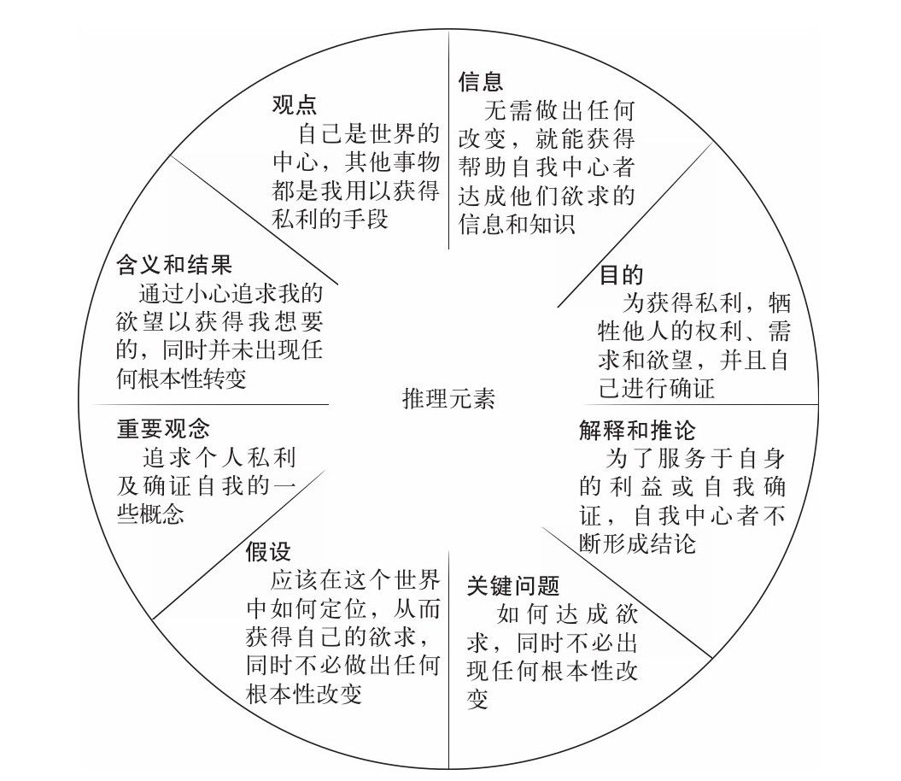

图　11-1　自我中心逻辑包括的几个元素

### 了解自我中心思维

自我中心思维源于我们人类天生的狭隘倾向，我们生下来就倾向于从一个狭隘的、自私的角度来认识世界。我们天生就会认为世界是为我们服务的。我们本能地以符合我们利益的方式解释情景和他人的行为。

同时，我们很自然地认为我们的思维方式是合理的。当我们从自利的角度来看待问题时，不管我们的想法是多么不合理、对他人多么有破坏性，我们总是认为我们的思考是合理的。在我们看来，我们的想法是正确的、正当的。我们自我中心的天性是批判性思维中最可怕的障碍。

从童年开始，我们就发展出自己对世界的认知。因此，如果我们的信念和思维方式是非理性的，在某种意义上，我们就是这种信念和思维方式的受害者。

随着年龄的增长，当我们的推理能力发展到一定程度时，我们会对生活进行更为合理的思考，这可以通过他人的指导和自己的经验来实现。如果我们生活的环境将合理行为作为榜样，我们的行为也会变得更加合理。然而，要人们放弃自我中心思维是很困难的，除非我们对这种自我中心思维有非常清楚的认识，并且知道如何摒弃这种思维。人类的思维有太多不合理的地方，但总能伪装出合理的假象。

当然，表象上的合理并不等于理性真的存在。而且，很多看似理性的成年人行为其实是根源于自我中心或社会中心。人们对自身的大脑运作机制没有清晰的认识，也没有认识到自身思维中带有的偏见、虚假、模糊不清和刚愎自用等。

### 自我中心是一种思维方式

自我中心思维的运作是无意识的，它存在于我们脑海中，而我们却否认它的存在。没有人会说“我的思考是自我中心性的”。自我中心思维的最终目标是自我满足和自我验证（见图11-2），并不尊重别人的权利和需要，只维护自身和与自身利益一致者的利益。在进行自我中心思考时，我们总是认为自己是正确的，那些与我们观点不一致的人是错误的。

图　11-2　自我中心思维的两大基本动机

在我们的自我中心思维里，我们的家庭、孩子、国家、宗教、信仰、感受以及价值标准都是最优的。自我证实对我们而言至关重要，即便在我们不公平地对待他人或损害别人的利益时，我们也会寻求这种确认。我们只重视那些我们可以掌控并用以支持我们的事实时，讨厌那些指出我们前后不一致的人。自我批评并不意味着行为的改变。相反，这种批评往往是用来避免这些改变。比如说，如果我说：“我知道我脾气暴躁，但是我没办法。我和我父亲一样爱发脾气。”这种自我批评是用以证明我继续发脾气是合理的。

人们的自我中心思维主要是为了验证我们当前的信念体系。如果受到认可，我们会感到很舒服，即使我们正在做的事情实际上是不道德的。例如，如果我们从小被灌输某一个种族的人是下等的，自我中心思维就会使我们持有这样的观点：①我是没有偏见的（他们的确是下等的）；②我是根据他们的特点做出的判断；③我是一个思想开明的人。

这些信念在我们的思想中作祟，使得我们认为自己并没有对这些种族的人妄下结论，认为自己没有误解他们，相信自己只是简单地以事实为依据。尽管忽视了那些可以推翻这些信念的证据，我们却认为自己没有忽略这些证据，从不承认自己是一名种族主义者。

只有在自我分析能力得到显著提高后，我们才能意识到自己的自我中心倾向。只有在我们对自我中心思维进行分析的时候，自我中心思维才不会合理化我们的非理性行为。自我中心思维是一种高超的自我欺骗技术，为理性代替非理性设下了障碍。自我中心思维的自我欺骗程度越高，我们认识到自己非理性的可能性就越小，认识到自我中心思维之外的相关信息就越少，想要增加我们的合理信念和动机就越难。

### 成功的自我中心思维

虽然我们与生俱来的自我中心思维是偏离理性的，但是它可以在非正常的逻辑中起到好的效果。例如，它可以使我们自私地得到我们想要的东西，而不用去担心其他人的权利。这种思维模式虽然在证据、推理合理性、客观性以及公平性等方面存在缺陷，但是却能“成功地”实现自我满足。因此，尽管自我中心思维天生存在缺陷，但是它可以成功地使人们得到想要得到的东西。

我们可以从很多有权力有地位的人身上发现这一点，如成功的政治家、律师、商人等。他们通常都善于得到他们想要的东西，大量诡辩的言辞能够将他们不道德的行为合理化。这个过程很简单，比如：“这是一个残酷的世界。我们必须面对这一现实。虽然我们希望一个完美的世界，但是我们必须清楚地认识到现实并不是这样。毕竟，我们只是按照既定一贯的方式在做事情。”当然，合理化的过程也可以变得非常复杂，如同高深的哲学、观念学以及党派斗争一样。

尽管自我中心者可能在合理化过程中引用道德准则，但是他们自身并不诚心尊重和遵守道德准则。只有当道德准则可以让他们谋求私利的行为合理化的时候，他们才会想到道德准则。

自我中心思维在本质上不同于道德准则和真正的良心。我们不可能在自私地为自己着想的同时又真诚地考虑到他人的需要。只有当为了自己私利而不得不去考虑他人的需要时，自我中心思维才会促使我们去考虑他人。因此，只有当一个组织有能力决定政治家连任与否时，这个自我中心的政治家才会去考虑这个组织的公共利益。政治家关注的不是这个组织的意见，而是组织对他连任的影响。他真正关心的只是他自己的利益。只要对他人的关心是出于私利的考虑，这就不能视作真正的关心。

越来越多的公司老总对外夸大公司的预期利润（以便以较高的价格卖出股票），造成越来越多的人在公司投资中赔钱。多数CEO在操作数据时从不考虑投资者的利益。他们称提醒过“投资需谨慎！”通过这种方式，他们回避了自身行为的不道德本质。

高度娴熟的自我中心思维存在于各种情形之中，甚至包括两个人之间的简单互动。想象一下马克斯和玛克辛夫妇像往常一样到音像店租影碟。马克斯想租一个动作电影，而玛克辛想租一个爱情电影。虽然玛克辛通常会放弃自己的选择来满足马克斯的欲望，但是马克斯从来不会去迁就玛克辛。马克斯为了使自己的行为合理化，他会告诉玛克辛，他的选择是更好的，因为他选的电影中充满了激动人心的动作，而爱情电影总是冗长无聊，他选的总是获奖电影，没有人喜欢看那些会让人哭的电影……说出了很多理由。其实他掩盖了真实的原因：马克斯只是简单地想看他喜欢的电影。在他的意识里，就应该看他想要看的电影。

马克斯的自我中心甚至向他自己掩饰了真相。他无法理解玛克辛的想法，也看不到这对于玛克辛的不公。他的自我中心思维使他的欲望得到了满足，同时还将推理中的缺陷合理化，他是成功的自我中心者。

### 不成功的自我中心思维

当自我中心思维不成功时，它带来的问题不但影响他人，还影响自利者本人（见图11-3）。让我们再回到马克斯和玛克辛租影碟的事件里。想象两人逛了很长时间的音像店，马克斯通过自私的论点让玛克辛迁就他对影片的选择。但是，有一天玛克辛决定不再迁就马克斯的自私行为。她开始感到愤恨，认为马克斯可能并不是真正关心她。她越这么想，就越意识到马克斯与她交往时的自私行为。她不再愿意迁就他的电影选择甚至其他决定：什么时候及去哪里吃午饭；什么时候去见他们的朋友；等等。

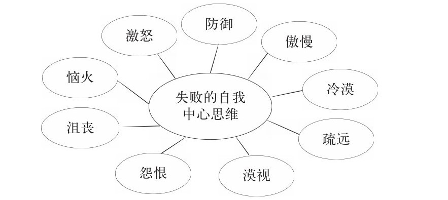

图　11-3　失败的自我中心思维

玛克辛开始感觉到被马克斯操纵和利用，进而产生出对马克斯的防御态度。她开始反抗，不再一味迁就马克斯的单方面决定，当她不同意他的选择时，就会提出反对意见。

问题转向马克斯，他的自我中心思维已经不再有效。当事情不能按照他期望的方式进行时，他会特别生气。他没能洞察到自己不合理的行为，也没有意识到他对待玛克辛的方式实际上是不公平的。而玛克辛的怨恨让她产生了报复行为，马克斯的生活不再像以前那么顺利了。玛克辛可能决定，她以后不会再附和马克斯的电影选择。她可能会寻求某种小小的惩罚去宣泄她的不满。如果她同意马克斯选择的电影，她可能会在整个看电影的过程中表现出生气的情绪。他们可能会陷入无休止的战争中，两个人都不开心。

这仅仅是失败的自我中心思维的一个例子。自我中心思维及其等效的社会中心思维（在本章稍后讨论）可能会导致社会偏见、社会冲突、战争、种族灭绝等各种灭绝人性的行为。尽管有时某人或某团体可能因为自我中心思维取得暂时的“成功”，但最终对他们自己以及他人都会造成负面影响。

设想一下，一个帮派骚扰一个人可能只因为这个人穿着的运动衫与他们帮派的颜色相同。刚开始时只是口头攻击，紧接着就发动身体攻击，这不仅对受害者造成严重的伤害，帮派成员也要为袭击事件负责，因涉嫌故意伤害而被捕甚至坐牢。

即使不对别人造成直接伤害，自我中心思维也可能会导致慢性的自怜或抑郁。出现这种问题的人常常会这样想：

我不知道为什么我总是受到不公平的待遇。就在我认为一切都很顺利时，我又必须面对另一个问题。还有完没完？生活似乎充满了一个又一个问题。我的导师对我期望太高了。我父母给我的钱太少了。我的老板认为我工作得不够好。我的妻子总是对我抱怨，现在我又得弄清楚如何伺候我的这个车。生活真是让人讨厌，我不知道事情为什么永远不按照我设想的方式进行。

自怜的人没有办法认识到生活中积极的方面。他们对快乐视而不见，总是自怨自艾。他们总是抱怨承担了不必要的痛苦，对自己说“环境这样糟糕我怎能过得好？”在这种情况下，由于思维本身不能进行自我纠正，个体成为自我中心思维的受害者，因为他只选择关注消极事件（见图11-4）。

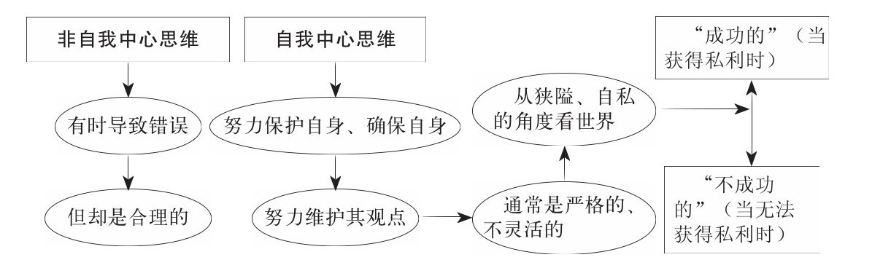

图　11-4　思维中的问题：自我中心思维和非自我中心思维

### 理性思维

尽管非理性思维对人类生活影响巨大，但人类还是能够理性地思考和行动。我们应当尊重证据，即使这些证据可能不支持我们的观点。我们可以用同理心去看待别人的观点，要注意我们的言论和行为的意义。我们应该更富同情心，既可以为他人做出牺牲，也可以与他人合作解决问题，及时发现并纠正自私的想法。

因此，尽管自我中心思维使我们饱受各种错误观点的折磨，但是我们可以通过换位思考克服这些错误观点。正如我们可以接受听到的观点一样，我们也可以站在他人的角度看待问题。自我中心思维阻碍了我们对自己思维和行为的认识，而批判性思维可以向我们澄清这个思维过程。就像我们对自己的观点总是持绝对态度一样，我们也应该认识到自己的观点并不总是完整的，有时甚至是非常自私的。就像我们总是对自己不合逻辑的观点也非常自信一样，我们也可以学着找到自己思维中缺乏逻辑的地方，并找出偏离逻辑的原因（见表11-1和图11-5）。

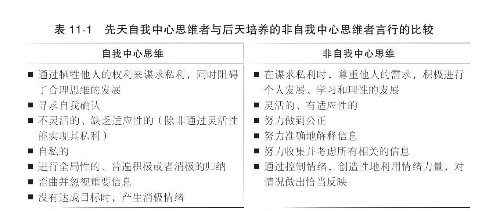

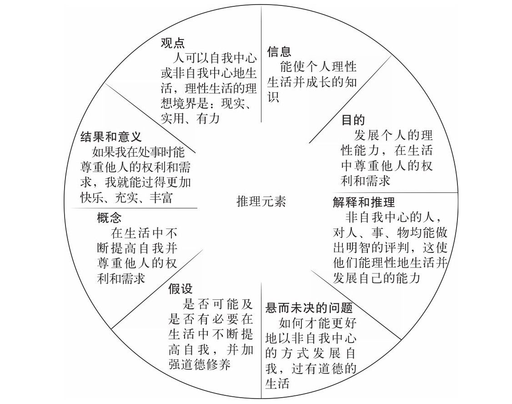

图　11-5　非自我中心思维的逻辑

我们不要总是坚持自己的世界观，也要学会考虑和理解他人的观点，从不同的角度看问题。我们要公正地评价自己的观点，随着“第二本能”的发展，我们可以努力去认识自己的想法。

我们每个人都有发展理性思维的潜能，并用它来修正自己的自我中心思维模式（见图11-6）。理性思维的发展要求我们对思维有一定的控制力，但很少有人具备这种控制力。它要求缜密思考、有责任心以及很强的内在动机。它要求三思而后行，辨别和审查我们的目的和步骤，明察自我中心倾向。它要求识别出非理性思维，并努力将之转化为理性思维。

我们可以想想托德和特蕾莎的故事。他俩正在恋爱中，托德发现在特蕾莎与其他男士谈话时，自己会感到嫉妒，并且意识到这种嫉妒是非理性的。现在他可以通过理性思维阻止自己自我中心性的胡思乱想。他会问自己一些跳出“自我”的问题，如“为什么她不能与别的男士谈话呢？我有理由不相信她吗？如果没有，为什么她那样做我会很烦呢？”

通过这种自我审查，理性的人会发现自我中心思维背后隐藏的真正动机。他们能够与自己的自我中心思维和解，与爱人确立一种理性的、相互尊重的关系。理性思维是以灵活的、严格的和公正的方式坚持道德准则，让自己远离非理性的倾向。

因此，正如无意识和自欺会导致非理性结果一样，有意识和自我感知则会带来合理的思维结果（见图11-6）。所以，理性思维中包含的一个重要内容就是，要将具有内在不合理性的所有思维都提升到可意识的水平。要想彻底改掉坏习惯，我们必须承认坏习惯的存在，然后积极地进行自我分析。

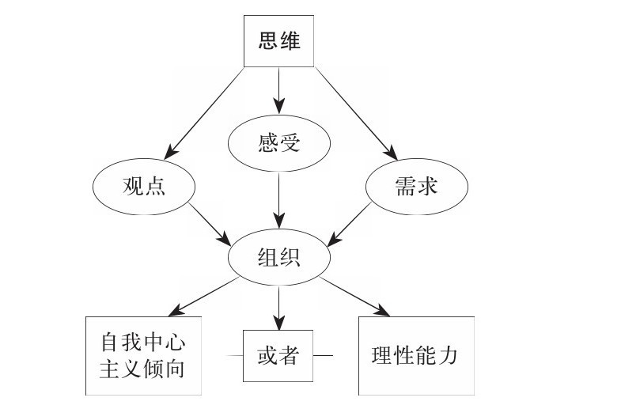

图　11-6　理性或自我中心倾向控制我们的思想

头脑的三个功能（思维、感受和需求）可以被个体的自我中心或潜在理性能力引导或控制。其中，自我中心倾向是自动的和无意识的，而理性倾向是主动发展的和有意识的。

根据推理的思路可知，理性行为即使被公之于众，它也能经受住任何合理的批评。而所有未能坦承的思想都应该遭到质疑。就像一份合同里有好几页细则是一方不希望另一方完全理解的，自我中心思维掩饰了正在进行的思维活动。这种掩饰不仅针对自己也针对别人，这样使自己显得一直都是合理公平的。

相比之下，理性思维是用合适的推理来证明自己。它不是自欺，也不隐藏什么。它并不局限于一种观点，而是努力收集各种观点，保持其前后思维的一致性和完整性。理性的人寻求通过本质来充分、完整地理解和体验世界。理性的人积极地面对生活，勇于承认错误并吸取教训。事实上，他们希望看到自己的错误。

为了发展理性能力，你就必须意识到，你的观点、感受和需求要么被自我中心性思维控制，要么被理性思维所控制。为了让你的理性思维战胜自我中心倾向，你就要像乐队的指挥一样，控制整个音乐的演奏过程，维护乐队的纪律，评估声音的质量，纠正缺点，通过每天的检查以及不断练习，最后演奏出高品质的音乐。

为了开发理性的潜能，在日常生活中，你必须在理性和非理性之间相互转换，而且必须认识到非理性思维的存在。然后你的思维才会对你产生深刻的影响，进而决定你的生活品质。

### 自我中心的两种模式

我们已经介绍了理性和非理性的区别，现在开始讨论自我中心思维的两种不同模式。两种模式都体现了自我中心思维用来实现目标的一般性策略，或者说体现了获取权力的非理性方式。

首先，让我们关注一下权力在日常生活中扮演的角色。我们所有人都需要感觉到自己享有一些权力。如果没有权力，我们就无法满足我们的需要。没有权力，我们将任人摆布。我们所有人都需要行使某种权力，这与权力的大小无关。因此，获取权力对人类生活而言至关重要。我们可以通过理性或非理性的方式来获取权力，同时又可以利用获取的权力来为理性或非理性服务。

获取和使用权力的两种非理性方式形成了两种不同的自我中心策略：

（1）控制其他人的艺术（直接获取自己想要的东西）。

（2）顺从他人的艺术（间接得到自己想要的东西）。

目前，自我中心思维可以通过直接控制别人或间接顺从他人来满足我们的欲望。说得透彻一些，要么威胁他人，要么卑躬屈膝。它要么威胁弱者，要么顺从强者，或两者兼具。

这两种追求利益的方式都是非理性的，在本质上都是有缺陷的。两者都是建立在非理性的思维基础上，都是认为自我中心者的需求比他人的利益重要得多。我们接下来将简要地探讨这两种非理性思维的模式，并列出来每个模式的基本逻辑。

在讨论这些模式之前，我们认为有必要提醒读者：正如我们已经提到的，生活中的很多情况都涉及权力使用。然而，权力的使用并不意味着这一行为本身是不正当的。例如，在商业环境中，分层协议需要经理做出决定，也许员工不同意经理的决定，但有胆识、有气魄的经理可以要求行使决定权。事实上，无法行使职能权力的经理通常是无能的。经理要为完成任务负责，因此他们必须利用自身权力来了解任务的完成情况。当然，这并不意味着他们可以滥用职权以满足私欲。

行使权力已成为人类生活中必不可少的一部分。权力行使是理性的还是非理性的，取决于使用者的动机和态度。因此，如果权力以合理的方式来服务合理的结果，那么这种权力行使就是正当的。相反，如果权力是被用来控制他人以实现私利，那么这种权力行使就是不正当的。

现在让我们转向非理性思维的两种主导模式，这两种模式在某种程度上体现了我们的自我中心：

（1）控制性的自我中心思维：“我可以通过自己的奋斗实现我的诉求。”

（2）顺从性的自我中心思维：“我可以通过取悦他人来得到我想要的。”

自我中心思维通过习惯或对现状的评估来选择具体的模式（见图11-7）。例如，它既可以通过取代上级，又可以通过取悦上级来实现它的诉求。当然，我们必须记住这些选择以及伴随这些选择的无意识思维。

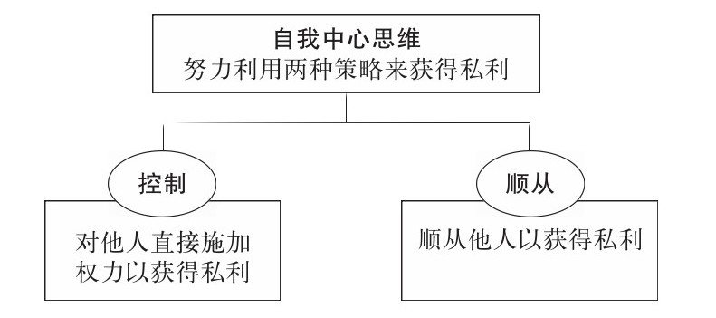

图　11-7　自我中心思维所采用的策略无论何时，我们为了私利，进行自我中心思考，我们都是在努力控制或顺从他人。

1.控制性的自我中心

自我中心思维的两种功能当中，控制性的功能或者称为控制性的自我中心也许更容易被人理解，这也是我们本章的主旨所在。当我们用这种思维方式思考时，我们首先关注的是权力的行使，让别人按照我们想要的方式去做。因此，控制性的自我中心者通过武力、口头恐吓、威胁、暴力、侵略、权威和其他形式的公共权力来实现自身目的。这受到一种信念的驱使，即我们要想获得我们想得到的，就必须以一种方式对他人进行控制。即便是他们想要拒绝，我们也能控制他们，让他们按照我们的想法去做。当然，有时候，这种控制可能是微妙的或间接的，其表现形式也可以是温和的或不易被察觉的。

例如，要想了解生活和工作当中的控制性自我中心，我们仅仅需要去看看那些被配偶控制的人或者被父母虐待的孩子。其基本模式是，“如果别人不做我让他做的事情，那么我就强迫他去做”。想象一下酒吧里的一个人为了强迫他人远离自己的女朋友而对他人拳脚相向。表面看来他是为了保护她，实际上，他的目的可能是确保她不会与他人产生浪漫的关系，或者是让那人在同伴面前难堪。

对他人的控制通常会产生权力感和唯我独尊的感觉（见图11-8）。控制者通常狂妄自大，同时伴有自我欺骗和高度的伪善。对控制者而言，控制其他人似乎是正确合理的。控制者声称他们是为了被控制人的“利益”才行使权力。在行使权力和强迫他人服从的过程当中，控制者会产生一种自我确认感，而其他人必须为此承受无尽的麻烦、痛苦、折磨和损失。

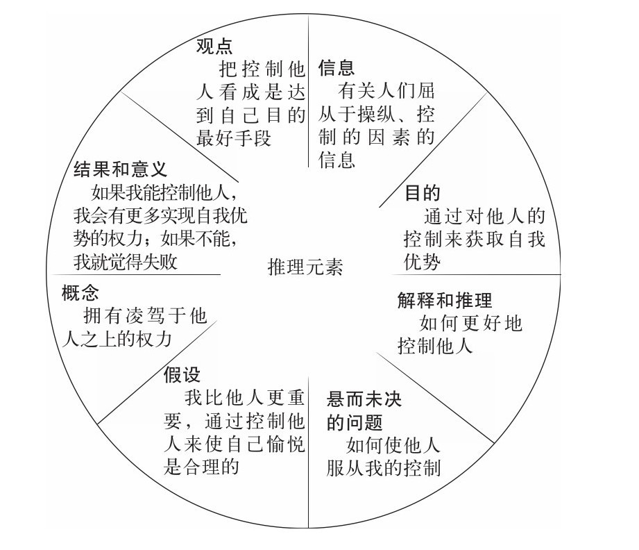

图　11-8　控制性自我中心的推理元素

思维的心理结构是双向的，对于那些能成功支配他人的人而言，要认识到自己行为的错误是非常困难的。这就像如果你认定你所做的就是应该做的事情一样，那又为什么会去改变呢？因此，只要控制性的自我中心获得成功，它就会带来积极的情绪反之会产生消极情绪。

消极情绪的产生通常是因为失去对他人的控制，这些情绪包括生气、愤怒、怨恨、敌意、对抗、抑郁和悲伤。设想一下虐待成性的丈夫，多年来他成功地控制着他的妻子。而当她决定离开他时，他可能会暴怒并杀了她，甚至杀了他自己。只要他认为他能够控制她，他就会感到满意。但当他不再能控制她时，他的非理性愤怒很可能导致他的极端暴力行为。

从以下这些例子来看，控制性自我中心者会将自己的非理性行为合理化：

“我知道的比你多。”

“因为我知道的比你多，我有责任负责。”

“如果我必须使用武力来做正确的事情，我应该这么做，因为我清楚地知道需要做什么。”

“如果我比你有更多的权力，那是因为我的技能和领悟力比你好。”

“我有权领导大家，我最了解情况。”

“你在做愚蠢的行为，我不能让你伤害自己。”

“我是专家，因此没有什么我需要知道或不知道的东西，你没有什么可以教我的。”

由于潜意识中的信念和观点，自我中心者的人际关系并不好，尤其是同类似的自我中心者或者是强大的理性思考者。无意识的控制倾向不仅会妨害人们健康的人际关系，对于早已学会使用控制性自我中心策略和技巧的人而言，它也会阻碍这些人的学习进程。

控制性自我中心者常常轻视知识。对于他们而言，以下列出的所有思想通常都是无意识的。而且老师和父母的非理性倾向也会让学生轻视知识，不重视学习。

“我为什么要学这些？这些东西对我没用。”

“这只是理论和抽象，我想要实践知识。”

“关于这个主题，我了解所有需要知道的内容。”

“这不在我的专业范围内，我永远都不会用到它。”

“我很聪明，如果我不明白正在学习的内容，这显然是教师教授的方式有误。”

“我之前总是取得好成绩，所以，在这个班我没有取得好成绩是老师的错。”

控制性自我中心的另一个标准是，我倾向于对他人施加比自身更高的标准。例如，尽管自身存在明显的缺陷却要求他人几近完美。举个交通堵塞中经常发生的例子：人们开车时总认为自己的“权利”是神圣不可侵犯的（“没有人可以阻碍我”），然而自己却经常侵犯其他人的权利（我要进入这个车道，否则等着别人太糟糕了）。简而言之，控制性自我中心者期望别人遵守规章制度，而自己却有“权力”违反制度。

从道德的角度来看，那些寻求控制他人的人经常侵犯别人的权利，自私和残忍是这些人的共性。规劝他们是很难成功的，因为他们会用大量的非理性伎俩来避免承担道德上的责任。

接下来，我们将展示服从性自我中心思维的逻辑，这种逻辑是一种通过依附于其他处于优势地位的人来寻求权力和安全感。这并不意味着任凭人都通过顺从有权利的人来实现他们的诉求。他们可能通过理性的方式来获取权利和自身利益。带着这种想法，我们接下来讨论这种服从性自我中心的情况。

2.服从性自我中心

如果控制性自我中心的标志是控制他人，那么服从性自我中心的标志就是战略上的服从（见图11-9）。在这种思考模式下，人们并不是通过直接的方式获得权力，而是通过服从于有权力的人间接地获得权力。他们通过服从有权利者的意志来达成私人利益。通过这种方式，服从性自我中心者间接地获取了权力。为了达到目的，他们学会了如何奉承和操控他人。不可否认他们都是出色的演员，表面上他们对他人的幸福和利益表现出关切，而实际上他们只是通过其他人来实现自己的利益。同时，他们又必须通过这种行为模式将自己掩饰起来，因为他们必须在一定程度上维持自尊。如果他们不得不承认他们是通过服从别人而达到目的的，那么他们就很难会有满足感。

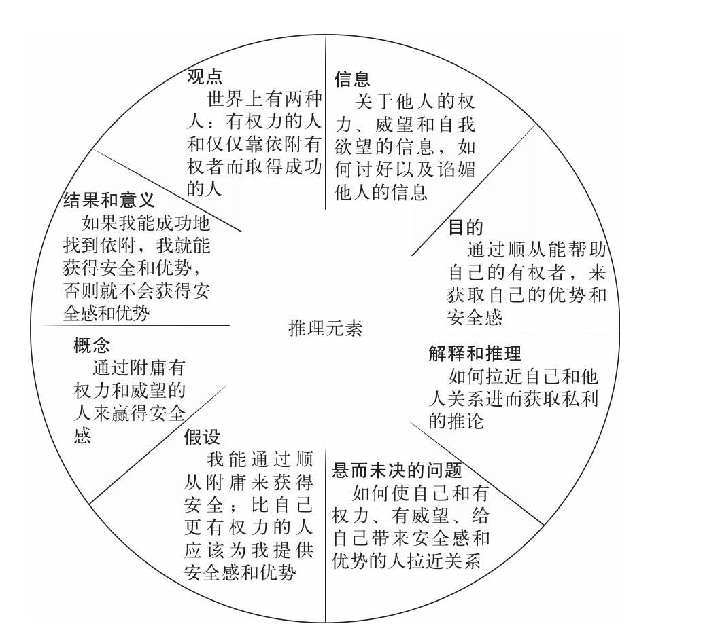

图　11-9　服从性自我中心的推理元素

在现实生活中，这种模式的例子不胜枚举。例如，一个十几岁的女孩装作十分喜欢钓鱼（然而实际上很讨厌钓鱼），想借此让她的男朋友更喜欢她，这就是一种服从性自我中心的思维模式。这个女孩服从于男友的意愿，因为她想达到特殊的目的（有一个显赫的男友，吸引他的注意，在这段恋情中享受安全感等）。即使这个女孩随时都会同意和男友一起去钓鱼，但是维持了很长一段时间后，尤其是当她确认了男朋友对她的感情之后，她很可能会拒绝这么做。根据服从性自我中心思维策略的特点，卷入这种思维模式当中的人最终会拒绝服从。

我们设想，有这种服从性自我中心思维模式的年轻女性，很可能最终会嫁给一个富有的丈夫，从而确保自己得到照顾、不用工作甚至不用付出就能享有奢侈的生活。但实际上，她可能会欺骗自己，让自己认为自己是爱丈夫的。然而，因为他们在感情上并不和谐，所以这种婚姻关系很可能无疾而终。

一种相似的倾向还体现于社会团体中。在很多团体的权力结构中，有人扮演着控制者的角色，其他人扮演服从者的角色。

大多数人则同时扮演着这两种角色，这取决于具体的情境。纳粹德国和法西斯主义为我们呈现了一个同时培养控制者和服从者的绝佳例子。在这个体系中，几乎每个人都根据情况学习了两种自我中心的模式。这个体系建立了一个个体必须服从上级同时对下级享有绝对权力的等级制度。只有希特勒不需要服从于他人，因为他高高在上。理论上，在这个体系中，没有人会理性地劝说他的下级。这种模式是很清晰的：位低者服从，位高者控制。

在人类文明的大多数意识形态中，官方赋予的理性在人类生活当中的使用远比在法西斯社会多得多。然而，大多数的官方意识形态都是被过度粉饰的。需要补充说明的是，因为所有的社会都是有等级之分的，而且所有有等级之分的社会都有权力等级体系，因此，目前所有的社会都鼓励控制性和服从性的自我中心思维。

在一些工作情形中也会有等级之分。在很多工作情形下，人们被迫服从他们的主管，服从领导控制以赢得领导欢心、保住工作或得到晋升。

因此，服从性自我中心者通过自欺欺人来获得安全感、优越条件和个人满足。为了达到这个目标，他们将自己伪装成顺从、卑微、畏缩甚至心甘情愿。他们屈从于他人的意志以获得虚伪的自尊。

为了避免屈服于领导而产生的卑微感，最有效的措施就是支持领导的观点。在这种情况下，这种服从可以解释为“他并没有强迫我，我完全同意他的观点”。

只要这种服从性自我中心获得了“成功”，就会引发一系列的积极情绪，包括满足、幸福、愉悦等。然而，如果没有达成目标，那么一系列不同程度的负面情绪就会随之而来，比如失望、憎恶、恶意、报复、憎恨、反感和敌意等。在不同的情况下，这种失败甚至会导致个体失去安全感，陷入恐惧、无助、抑郁和焦虑等情绪当中。

当失败时，相较于控制性自我中心，服从性自我中心者将会在内心深处更为严厉地惩罚自己，给自己和他人都带来痛苦。自我中心的感觉是自我中心思维的反映。因此，服从性的自我中心会将自身的不良情绪合理化。在感受负面情绪时，它会有一种病态的快感。

例如，一个女人认为她的丈夫应该解决所有不愉快的事情。如果丈夫让她从中做出某些决定，她虽然会同意但是会感到十分愤恨。她也许会有这种想法：“为什么要让我做出这些不快的决定？这是他的责任。我一直都在做他不愿意做的事情。如果他真的在乎我就不会让我做这些事情了。”

她并不认为这些消极思考是不合理的。从某种意义上讲，她很享受伴随这种思维而来的愤恨情绪。

服从性自我中心者总是跟控制性自我中心者相处得很好。这个观点可以在一个丈夫控制、妻子服从的婚姻关系中得到很好的阐释。妻子服从于丈夫的意愿，他可能要求她做所有的家务。反过来，丈夫或含蓄或明确地表示他愿意照顾她（扮演最基本的养家糊口的角色），因此对妻子的控制是合理的。即使妻子有时会反抗，但是她明白应该接受丈夫的控制。她劝慰自己她嫁给其他男人可能也不会过得更好，而现在这个丈夫可以给她带来舒适感。实际上，妻子之所以能够接受丈夫的专横跋扈，是因为她觉得代价是值得的。

所以，只要自己的愿望达成了，服从性自我中心者会感受到一种不健康的“成功”感。例如，一名雇员服从于言语侮辱自己的经理而获得升职。只要经理关心雇员的想法，给他提供他一直奋力争取的升职机会，雇员就会产生一定的积极情绪。但是一旦经理不像之前那样关心雇员的需求和想法，那么这个雇员就会感到失去尊严，对自己向经理的服从充满怨恨。

服从性自我中心者与其他人紧密联系，他的感情、行为和想法都是由潜意识中的自卑感引起的。为了证明服从于其他人需要和意愿是合理的，个体就必须欺骗自己不如其他人。否则，就无法将自己的服从性自我中心合理化，从而形成不健康的想法和行为。以下几种无意识信念促使了服从性自我中心的发生：

■“即使我不同意，我也必须服从这种决定，否则的话，我将被排斥。”

■“为了得到我想要的，我必须要服从于那些比我有权力的人。”

■“因为我不聪明，所以我必须依靠他人来为我着想。”

■“因为我没有权力，所以我必须采用操控性的策略来让其他人帮我达到目的。”

自我中心思维的表现形式并不完全处于意识之中，这些信念是需要自欺的，否则大脑就会觉察到这些观念是偏离理性、不健康以及十分荒诞的。因此大脑加工有意识地对自我中心中不合理信念视而不见。思考第一个观点“即使我不同意，我也必须服从这种决定，否则的话，我将被排斥”，与这种无意识观点相对应的有意识观点应该是“因为我不了解足够多的情况，所以我无法做出决定。我不确定这个决定是否正确，但是我认为其他人比我更适合做出决定”。在现实中，这种意识层面的观点是大脑根据其他无意识的推理而产生的。按照这种逻辑，人就会不诚实地“同意这个决定，但所做的一切都只是为了获取认同感”。

除了阻碍合理关系的建立外，这种服从性自我中心也阻碍了理性思维的形成，限制了人们深入了解自己的能力。它通过大量的自我保护想法来达到目的：

■“我太笨了，学不会这个。”

■“如果我有什么问题，别人会认为我很愚蠢。”

■“我不像其他人那么聪明。”

■“不管我多努力，也不能做得更好了。”

■“我不可能解决这个问题。”

■“因为我知道我学不会这个，所以也没有必要学。”

这种服从性自我中心和控制性自我中心相似，都会给个人发展带来很大的阻碍。即使自己能独立完成某项工作，个体也会习惯性地向他人求助。在学习过程中，一旦失败，这种服从性自我中心就会引起挫折感、焦虑感甚至是抑郁情绪。控制性自我中心是相信自己已经掌握了需要掌握的东西，而服从性自我中心则是一直坚信自己没有学习的能力。

### 人类心理的病态倾向

我们现在可以非常明确地说，人类心理那些互相联系的特质是心理病态发展的结果。为了发展我们的思维，我们必须觉察出生活当中的不良病态行为倾向，并且通过批判性思维纠正它们。阅读下面内容时，思考你自己是否意识到这些病态倾向曾经常出现在你的脑子里（如果你得出“不是我”的结论，请再想想）：

■自我中心的记忆：本能倾向，“忘记”那些不支持我们思维的证据和信息，只记住支持我们思维的证据和信息。

■自我中心的目光短浅：本能倾向，以狭隘的视角进行绝对化的思维。

■自我中心的自以为是：本能倾向，感到有优越感，确信掌握了真理，实际并不然。

■自我中心的虚伪：本能倾向，忽视公开的矛盾。例如，我们的信念与自己的行动不一致，或者我们对自己要求的标准和希望他人坚持的标准之间存在矛盾。

■自我中心的过分简单化：本能倾向，为了追求简单化，忽视世界上真正重要和复杂的事物，因为考虑复杂的事物需要个体修改原有的信念或价值标准。

■自我中心的盲目：本能倾向，不去注意那些与我们所支持信念或价值观相冲突的事实和证据。

■自我中心的即时性：本能倾向，过分简单地概括直接的感受和经历，当生活中出现某个非常有利或不利的事情时，好像整个生活都变得特别有利或不利。

■自我中心的荒谬：本能倾向，忽视荒谬的思想。

### 挑战人类心理的病态倾向

仅仅抽象地认识到人类心理存在可预测的病态倾向是远远不够的。作为有抱负的批判性思考者，我们必须采取具体措施来纠正它。这需要我们形成有助于辨认这些倾向的习惯，而这是一项永远完不成的长期工作。在某种程度上，它类似于剥洋葱。我们剥掉一层，就会发现下面还有一层。可是我们只有剥去洋葱最外面的一层，才可以认识到里面的那一层。因此，下面的每一个建议，都是任何人可以立即付诸行动的简单有效的措施，而且也是每个人都要长期实践的目标。我们都可以实践这些修正措施，而且这些措施需要长时间的努力和大量的实践经验积累。

修正自我中心的记忆。我们公开地搜寻那些不支持我们思维的证据和信息，并且加以重视，我们就可以纠正我们自我中心记忆的本能倾向——“忘记”那些不支持我们思维的证据和信息，并且“记住”那些明显地支持我们思维的证据和信息。如果你试图找但找不到这样的证据，也许是因为你的搜寻方式不对。

修正自我中心的目光短浅。通过以冲突的观点和视角思考，我们会克服狭隘、绝对化思考的本能倾向。比如说，如果我们是自由主义者，我们可以去深入阅读保守派写的书籍。如果我们是保守派，可以花时间去深入阅读自由主义者写的书籍。如果我们是美国北部的人，我们可以阅读美国南部人的观点或者是欧洲、远东、中东或者非洲人的观点。如果你没有在这个过程发现个人偏见，那么请思考自己是否已尽力确定自己的偏见。

修正自我中心的自以为是。我们可以通过不断地提醒自己所知甚少来纠正我们的本能倾向——确信自己掌握真理并拥有优越感。在这种情况下，无论我们有多少知识，我们都可以思考关于我们掌握多少知识这个没有确切答案的问题。如果你没有发现实际上你不知道的比你知道的多很多，那么你就该反思你对上述问题的思考方式。

修正自我中心的虚伪。我们可以修正我们的本能倾向——忽视信念与行动的不一致以及我们自己做事的标准和期望他人的标准间的不一致。这一修正可以通过定期比较判断自己的标准和判断别人的标准来实现。如果你找不到思想和行动间的矛盾，那么反思你挖掘的是否足够深入。

修正自我中心的过分简单化。通过关注事物的复杂性并试着用语言描述这种复杂性，我们就可以修正我们忽视复杂事物的本能倾向。如果你没有找出过去把很多事情过于简单化的例子，那么你应该反思自己是否真正地看到了问题的复杂性。

修正自我中心的盲目。通过明确地找出与我们信念相矛盾的事实和证据，我们可以修正自我中心的盲目本能倾向。如果你在追求这些事实的过程中没有感到极大的不适，那么你应该反思是否很严肃地对待了这些事实。如果你认为你以前的信念都是正确的，那么你就达到了一个更复杂的自我欺骗程度。

修正自我中心的即时性。通过更广阔的角度来看待积极和消极的事情，我们就可以修正笼统概括直接感受和经历的倾向。你可以通过提醒自己拥有很多别人没有的东西来缓和消极情绪。你也可以通过提醒自己还有很多事情有待完成、还有很多问题依然存在来缓和积极的情绪。无论在积极还是消极的情况下，要保持平稳，这样你才有精力有效地采取某种行动。如果你被你的情绪固定化，你就是自己情绪的受害者。

修正自我中心的荒谬。我们可以通过明确地表达我们的观念，并评价它的现实性来纠正我们的本能倾向。这要求我们经常反思我们观念的影响和后果。例如，我们要经常问自己“我真的相信这一点吗？如果真的相信，那我该怎么做？我这么做了吗？”

顺便说一下，个人道德规范是揭露自我中心荒谬的有效工具。我们经常根据我们相信的和我们所坚持的观点来采取荒谬的行动。如果经过仔细的思考，你没有发现自己的自我中心荒谬，那么请再思考一遍，你可能正在发展你自欺的能力。

### 理性的挑战

人类的思维天生存在非理性的倾向，表现为控制性的自我中心和服从性的自我中心，但是同时，它也有一个以自知能力形式存在的理性能力。我们都有虚伪和不一致的倾向性，但是我们能够向着诚实和一致性一步步地迈进。我们可以通过提高我们思维的谦虚来制衡我们思维上狂妄自大的本能倾向。另一种方式，我们可以学着不断地问自己：“我知道什么？”从而保证我们不会不加批判地接受没有事实依据的观点。此外，我们可以通过换位思考进入别人的观点，从而不再把自己限制在自己观点中；我们可以通过学习测试我们结论的有效性和可行性来抵消我们急于下结论的倾向；也可以通过学习发现自己的控制性或服从性自我中心来减少这两种本能倾向；我们要清楚地认识到服从和控制本身的问题，从而避免选择这两种模式。我们可以练习自我剖析以及自我批判，这将有助于我们朝着非自我中心的方向成长。

## 控制你的社会中心倾向

就像人是天生的自我中心者一样，我们同样是天生的社会中心者。社会中心思想，是将自我中心思想提升到群体的水平。它可能比自我中心更具有破坏性，因为它包含了一个社会团体的制裁（这显然比个人拥有更多的权力）。自我中心和社会中心的思想都是自私的和教条的。像自我中心思想一样，社会中心思想在意识层面上同样是荒谬的。换句话说，如果个体能够在意识中察觉社会中心思想的存在，那么它的不合理性是显而易见的。因此，作为批判性思考者，我们的目标是要弄清楚社会中心思想是如何影响我们的行为的。

图11-10是社会中心逻辑的推理元素。

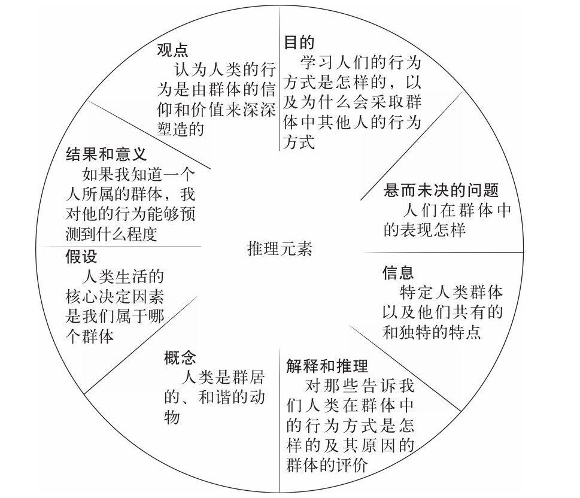

图　11-10　社会中心逻辑的推理元素

注意以下自我中心思维和社会中心思维的关联性：

■自我中心标准：“因为我相信它，所以它是真的。”

相关的社会中心的标准：“因为我们相信它，所以它是真的。”

■自我中心标准：“因为我想相信它，所以它是真的。”

相关的社会中心的标准：“因为我们想要相信它，所以它是真的。”

■自我中心标准：“相信它符合我的利益，所以它是真的。”

相关的社会中心的标准：“相信它符合我们的利益，所以它是真的。”

■自我中心标准：“因为我一直相信它，所以它是真的。”

相关的社会中心的标准：“因为我们一直相信它，所以它是真的。”

正如个人通过自我中心思维欺骗自己一样，同样，团体组织也会通过社会中心思维进行自欺。正如自我中心思维可以为个人利益提供服务一样，社会中心思维也可以为团体组织利益提供服务。正如自我中心思维可以用来验证个人的非批判性思维一样，社会中心思维可以用来验证团体的非批判性思维。

### 社会中心的本质

一个人的生活需要加入各种各样的社会团体。这些典型的团体包括国家、文化团体、职业团体、宗教团体、家庭和同龄群体。在我们意识到自己存在之前，就已经发现自己正在参与社会团体活动。我们发现我们作为个体，存在于团体组织当中的每个方面。更重要的是，我们所属的每个组织都有它自己的定义和不言而喻的“规则”来规范团体成员的行为。作为认同接纳条件，我们所属的每一个组织都要求我们遵从它的习俗、信仰、宗教和禁忌。

在某种程度上，所有人对所属社会团体要求的行为和信仰都会不加批判地接受，认为它们是正当和正确的。下面的例子对此阐释得很清楚，在这个例子中，一个青少年加入一个街头帮派，通过结成帮派，青少年希望以此达成自我认同：

■一个定义他是谁、做什么的名字。

■一种交流的方式。

■一群朋友和敌人。

■必须参与的帮派仪式。

■帮派成员所应表现出来的行为。

■置身敌人中所应表现出来的行为。

■帮派内部的权力结构。

■穿着和说话的方式。

■帮派每个成员所必须符合的社会需求。

■一系列规范——为了逃避严厉的惩罚，帮派的每个成员不能采取的行为。

团体成员被清楚地赋予某些权力，但获得这种权力优势需要付出一定的代价。组织要求成员遵守它的规则（道德观念、风俗习惯和禁忌）。在生活的方方面面都对组织成员进行不同的要求。比如，你认为你是世界公民，你不想加入任何国家，不想成为任何国家的公民，但你没有这个自由。你会发现你不被允许随意在任何地方落脚，也不允许随意从一个地方到另一个地方旅行。世界上的每一个地方都归属于一个国家（作为其主权占有），而且每个国家都要求所有的入境游客必须是某个国家的公民（因此需要护照）。

此外，任何地方都会有国家声称对其拥有主权，它要求所有人都要遵守成千上万的法律条文（如果不是成百上千）。当然，没有人可以记住这些法律条文，因此，生活在一个不违反法律规定的社会几乎是不可能的。这就会造成，在任何一个复杂的社会中，都会有一个拥有权力的小团体总以一种方式去惩罚团体中的弱势成员。

对于大多数人来说，盲目地遵守组织的限制是自觉的行为。大多数人都是自觉地服从，甚至都没有意识到他们的服从性。他们把组织的规范和信仰内化、扮演组织给定的身份、按照组织期望的方式行动，丝毫没有质疑过他们正在做的事情。大多数人都在像街头帮派一样的社会团体中服从机械的信仰、态度和类似的行为。

这种思想、情绪和行动的一致性并不仅仅局限于群众、低等的人或者穷人。它是人们普遍的特点，不受人们的社会角色、社会地位、声望以及教育程度的影响。它对于教授和总统，学生和保管人，参议员和首席执行官，建筑和装配工人也同样适用。这种思想和行为的服从性是人类共同的规则，特例十分罕见。

社会中心思维已经不是一个新的观念，关于这个主题出版了很多著作，它已经成为社会学研究的焦点。在1902年出版的重要著作《社会习俗》（Folkways）当中，威廉·格雷厄姆·萨姆纳深刻地阐述了社会期望和禁忌。作为社会学的学科创始人之一，萨姆纳记录了群体思想是如何渗透人类生活的每一个层面。他以这样的方式阐释了民族优越感的概念：

民族中心是一个人认为自己的群体是一切的中心，是评价其他群体的参照。每个群体都有自己的骄傲和虚荣，吹嘘自己的优越性，有自己的神学家，蔑视外人。每个群体都认为自己的风俗习惯是唯一正确的，对于其他群体的习俗会予以轻视。（p.13）

萨姆纳认为社会习俗是用以满足所有人利益的、由社会所孕育出的“正确”方式，符合集体规范和标准。他认为在任何一个社会：

总是有一种正确的方法能获得游戏的胜利，赢得芳心，使个人脱颖而出，也总是有一种正确的方法来对待同事或路人等。这种“正确的”方法是先人所用并传承下来的。传统即是对习俗的保护，无需经验证明……在社会习俗中的一切都是正确的。（p.28）

关于对集体成员的期望，萨姆纳阐述道：

不管是什么类型的集体，都要求成员维护集体利益。同时，集体的力量也被用于巩固加强个体对集体利益的贡献。这造成不允许判断、不允许批判……爱国、爱集体的偏见上升到集体意识并不断扩散，侵蚀教育对我们的积极影响。（p.15）

即便是少年儿童，他们身上也反映出社会中心的思想和行为。皮亚杰对联合国教科文组织所做的研究（Campbell，1976）中有这么一段话，是就战争原因而对三个小孩进行的采访：

迈克（9岁半）：你听说过外国人吗？是的，法国人、美国人、俄罗斯人、英国人……不错。这些人之间有区别吗？是的，他们的语言不同。还有什么别的不同吗？我不知道。比如说，你觉得法国人怎么样？法国人很严肃，他们无忧无虑，法国很脏。你觉得俄罗斯人怎么样？他们很坏，总是想打仗。你认为英国人怎么样呢？我不知道……他们挺好的……那么，你告诉我的这些事情，你是怎么知道的呢？我不知道，我听来的……人们都那么说。

莫里斯（8岁零3个月）：如果让你选，你愿意出生在哪个国家？瑞士。为什么？因为我是瑞士人。你觉得法国和瑞士比，哪个国家更好？瑞士更好。为什么？法国人总是令人讨厌。瑞士人和法国人相比，谁更勤劳？为什么？还是他们一样勤劳？瑞士人更勤劳。为什么？因为瑞士人学法语学得很快。如果我去问一个法国男孩，让他自己选择自己喜欢的国籍，你认为他会选哪个国家？他会选法国。为什么？因为他是法国人。那他会认为法国人好还是瑞士人好，还是一样好？他会说是法国人好。为什么？因为他是法国人。那他会认为谁更勤劳些？法国人。为什么？他会说法国人比瑞士人学得快。现在你和那个法国男孩的回答是完全不同的，你认为谁的回答更好？我的，为什么？因为瑞士永远比其他国家好。

玛莉娜（7岁零9个月）：如果让你选，你愿意选择出生在哪个国家？意大利。为什么？因为意大利是我的祖国。我的父亲在阿根廷工作，但我更喜欢意大利，因为阿根廷不是我的祖国。意大利人比阿根廷人勤劳吗？或者一样勤劳？或者阿根廷人更勤劳些？你怎么看？意大利人更勤劳些。为什么？因为我认识的人都是意大利人，如果我让一个阿根廷的小孩选择出生地，你认为他会选哪个国家？他会选阿根廷。为什么？因为那是他的祖国。如果我问他意大利和阿根廷人谁更勤劳，他会怎样回答？他会说是阿根廷人。为什么？因为那里没有战争。那么在做了这么多回答后，你和那个阿根廷小孩，谁的选择是对的呢？或者都是对的？我是对的。为什么？因为我选择了意大利。

很清楚，这些孩子都在进行社会中心的思考。他们对自己国家和文化的信念体系已被教条化，作为意识形态深植他们心中。他们不能阐明为什么他们的国家更优越，但对此他们深信不疑。认为自己所属的集体比别的集体优越，这既是人类思想的自然产物，同时也是我们所处的文化宣扬的信条。

### 社会分层

在复杂的社会中，社会中心常常用以证明社会、国家或文化中不同的处理方式以及不公正行为的合理性。复杂社会体制的这个特性，已由社会分层现象方面的专家形成书面观点。实际上，所有社会都是复杂的，以下是所有社会都具有的分层特点。根据Plotricov和Tuden（1970）的观点，每个社会团体都：

（1）有不同的阶层划分。

（2）维护团体中相对恒定的阶级分层。

（3）有对权力、重要经济和政治资源的不同控制。

（4）群体成员被文化和歧视性的差异所分离以维护着集体之间的社会差距。

（5）有一种清楚阐明的意识形态，该意识形态为建立阶层划分提供了合理的理由。

据此理论，我们就能对社会中任何集体的社会分层有大概的了解。

我们应该能够识别出社会中的这一现象，能够识别出社会中某一特定群体所在的权力阶级以及这一群体掌握的资源和权利。我们应该理解资源和权力的差别形成了不同的社会阶级和地位，应该理解群体间的社会距离是如何维持的，而统治者的意识形态又是如何影响社会阶级和社会距离的。

### 社会中心思维是无意识并有潜在危险的

与自我中心思维一样，人们经常认为社会中心也是合理的、正当的。因此，虽然群体往往为了追求自己的既得利益而扭曲概念的意义，但是他们几乎从不认为自己是滥用语言。虽然群体总是可以找到其他群体意识形态的问题，但是他们很少能找到自己信念系统中存在的缺陷。尽管群体通常可以识别出其他群体对他们的偏见，但是他们很少能够识别自己群体存在的偏见，总之，正如自我中心思维是自欺欺人的一样，社会中心论思维同样也是自欺欺人。

尽管自我中心思维与社会中心思维类似，但是他们之间存在一个很重要的区别。我们之前指出，自我中心思维是有潜在危险的，个人可能导致自我欺骗，合理化自己的不道德行为以及给他人带来伤害。社会中心思维也会如此。不过，通常来讲，自我中心思维的危害性是有限的，而社会中心思维带来的伤害则严重得多。

例如，天主教会控制的西班牙宗教裁判所处死了上千名异教徒，德国纳粹折磨屠杀了数百万犹太人，美洲的“发现者”奴役、折磨并杀害了大量印第安人和非洲人。

总之，从古至今，社会中心思维给无数无辜的人带来了巨大的痛苦和伤害。这是因为群体在社会中心思维下会非常草率地滥用权力。一旦集体内形成自我服务的意识，他们就会悍然违背曾经宣称的道德，而且它们不会意识到行为中存在的矛盾和不一致。

### 社会中心语言在集体当中的应用

社会中心的思维是集体通过使用语言培养而成的。群体通过对概念和观念的使用，将不正当的行为或者思维方式合理化。比如，萨姆纳指出，在群体为自己选择名称或是与其他较小群体进行区分时，都可以看到社会中心：

当加勒比人被问到名字的由来时，他们回答说“我们是人。”基奥瓦这个名字的含义是“真正的或重要的人。”拉普人自称是“男人”或“人类”。格陵兰爱斯基摩人认为，欧洲人曾被送往格陵兰并从那里学习了美德和良好的举止。加利福尼亚州的塞里人对所有外族人充满怀疑和敌意，并严格禁止本族人与外族人通婚。（p.14）

日常生活中，我们会发现社会中心的人常常使用自我中心性语言来掩盖不道德行为。当欧洲人第一次居住在美洲的时候，他们以发展文明的名义强行奴役并杀害了印第安人。他们把印第安人称为野人，为自己的不人道行为寻找借口。同时，他们认为自己是文明的，他们认为自己为野蛮人带来了所谓的文明。

诸如发展、野蛮、文明和真正的信仰等词语，成了欧洲人奴役美洲印第安人以获得物质财富的工具。正是通过这些词语的应用，他们抹杀掉自己的人性，剥削印第安人，占有他们已经居住了几千年的土地。

萨姆纳说，社会群体所使用的语言往往是在维护他们的特殊或优越阶层：

犹太人把全人类分为自己和异教徒。他们是“上帝的选民”。希腊人称外族人为“野蛮人”……阿拉伯人认为自己是最高尚的民族，其他人都是野蛮的……1896年，中国教育部大臣和他的顾问编辑出版了一本手册，在里面声称：“大清帝国是何等的宏伟辉煌，大清是天朝上国！”……世界上最优秀的人是我华夏子民……在所有国家的所有文学作品中都有同样的语句出现。俄语书籍和报纸上要传播俄罗斯的文明使命，就像法国、德国和美国的书籍期刊要以通俗易懂的方式传播他们的文明使命一样。每个国家都认为自己作为文明的领导者，是最好的、最自由的和最聪明的，其他所有的国家都是低劣的。（p.14）

### 通过概念分析来披露社会中心思维

概念是人类思维的八大基本要素之一，没有概念我们就没办法思考。概念有不同的分类，并能够表达理论知识。通过概念，我们可以解释我们所看到的、尝到的、听到的、闻到的和感觉到的。我们生活在一个概念的世界里。如前文所述，社会中心思维与群体使用概念的方式有关。

如果我们在思考当中使用中世纪欧洲的农奴概念，我们能体会到像他们那样的世界。如果我们使用的是奥斯曼土耳其人的概念，我们会思考和体验到他们感知到的世界。以此类推，如果我们把电工、建筑师、地毯销售员、照明专家和水管工带入相同的建筑，请他们来描述看到的东西，十有八九，他们最终会有一系列不同的描述，这些描述显示出每个人的特殊“偏见”。

又或者，如果我们让不同的民族、文化、宗教的代表来讨论一个全球性问题，不仅仅对问题的解决方案有许多种，而且在讨论问题的根源时也会发现不同的观点。

很难想象一个经验丰富的批判性思考者不擅长概念分析，概念分析在各种情况下都是很重要的：

（1）受过语言教育的人能够识别和精准分析某些语言的差别（受的教育能够让我们区分词义）。

（2）能够识别意识形态和非意识形态词汇概念的差别（能够识别出他人根据意识形态提出的不合理概念）。

（3）能够准确识别出界定不同学科和思维基本概念的语词（能够在某一学科或者专业领域内分析词汇的含义）。

思考中的许多问题都是由于人们没有掌握词汇和概念隐含的含义。例如，如果人们不清楚“爱”在以下这三种情况中的差别，恋爱关系就会出现问题：①自我中心性的附属和真正的爱，②友谊和爱情，③误用的“爱”（例如许多好莱坞电影）和英语中真正“爱”的含义。

### 通过概念分析揭示工作中的意识形态

人们很难区分意识形态和非意识形态的词汇，因此他们不能轻易使用下面的词语：资本主义、社会主义、共产主义、民主、寡头政治、金权政治、爱国主义、恐怖主义。让我们更详细地分析这种情况。

当以上词语被意识形态所用时，对他们含义的理解就会是不一致和片面的。这时，人们常常遗忘或者扭曲了词语的根本含义，只是用这个词来做积极的或者消极的掩饰，掩盖了事情的真相。因此，在资本主义意识形态盛行的国家中，社会主义和共产主义是被妖魔化的，民主与资本主义等同起来，而忽视了其中的财团统治。如果国家中占统治地位的意识形态是共产主义，资本主义就会被妖魔化，民主等于共产主义，而不提这里存在的集团统治。通常群体要么被一方称为恐怖主义者，要么被另一方称为爱国者。

如果我们检查一下这些词的核心意义，保持他们的原意，我们会发现，当集体滥用这些词语以满足自己的目标时，这些词语的意义就会被歪曲，就会产生矛盾、不一致。让我们来看看《韦伯斯特新世界词典》对这些词语的核心含义是如何定义的：

■资本主义：一种经济体系。在这种体系当中，全部或大部分的生产及分配手段如土地、工厂、铁路，等等，都是私人拥有并经营的。资本主义出现于充分的竞争条件下，它的特征是趋向于财富集中。

■社会主义：任何形式的生产资料、分配所有权及其运作都归属于社会或者团体而非个人，所有社会成员或团体共享工作和劳动成果。

■共产主义：所有财产的所有权都归属于整个社会。

■民主：政府的一种形式，人们可以通过直接或者间接选举代表来实现执政的权利，由统治者负责管理。

■寡头政治：一种政府形式，统治权属于少数人。

■财团统治：①由财团统治的政府，②控制或影响政府的一个财团

■爱国主义：热爱、忠诚、热心于支持自己的国家。

■恐怖主义：使用武力或威胁来实现恐吓、胁迫或征服，尤指政治政策。

现在，在资本主义意识形态占主导的国家，社会主义和共产主义的含义是“一个不鼓励个人积极性并拒绝人民大众自由的政治体系”。相反，在社会主义和共产主义点主导意识形态的国家里，往往用“少数富有阶层对大众进行剥削”来定义资本主义。双方都把使用武力的对方看成恐怖主义，都认为对方否定自己的基本人权，都倾向于忽视各自的不一致性。

## 小结

直面承认自我中心和社会中心思维的存在并敢于破除这些思维，我们就可以成功地应对我们与生俱来的自我中心思维和社会中心思维。如果我们对自己的自我中心思维没有一个明确的认识，就会陷入一个狭隘和自私的角度。如果我们对社会中心思维没有一个清醒的认识，就会陷于偏激的群体性思维中。

应对自我中心和社会中心不是件容易的事情。这两种思维都是无意识的，很难被觉察。虽然有时没有人会公开指责我们的自私自利（个人），但如果我们公开地偏离群体信念，我们便会面临着一系列严重的惩罚。

最重要是，现在我们已经能够认识到自己的自我中心和社会中心的存在。当意识到我们思维中的自私和刻板时，我们就应该减少这些情况的发生。在工作当中，我们所属的群体是一个很容易存在社会中心思维的地方。当我们觉察到我们的生活处于自我中心和社会中心模式时，我们就应该开始试着摆脱这些模式。一开始，我们不需要给自己提出太大的挑战或者极大地否定自己，此外也不需要袒露自己的一切想法。问题的关键在于，我们处理头脑中的隐私时，要坚持一致性，花时间逐步成长为优秀的批判性思考者。经历这一自我思考过程后，我们就可以成长为坚持统一理性标准、发展协调思维以及公正正直的人。

# 第12章　如何甄辨新闻中的媒体偏见和宣教

新闻媒体中偏见和宣教的逻辑很简单，而且全世界通用。每个社会和文化都有其独特的世界观，深刻影响着这种社会和文化下人们的生产和生活方式。立足于文化的新闻媒体反映了它所在文化的世界观，但是，真实的世界却比媒体中呈现出来的文化形态要复杂得多。面对媒体，要成为一名批判性的受众，个体必须直视这一事实，并做相应的解读。批判性思维就是战胜个人本性和直觉思维的一系列复杂技能。

正如我们前面所指出的那样，不具有批判性思维的人会无意识地根据一些潜在标准来确认信息的真实性。这些潜在标准如下：

“如果我相信它，它就是真实的。”

“如果我们相信它，它就是真实的。”

“如果我们想相信它，它就是真实的。”

“如果相信它符合我们自身的利益，它就是真实的。”

而具有批判性思维的个体会有意识地根据直觉-调整准则来判断事实的真实性。这些标准如下：

“我相信它，但是它未必就是真实的。”

“我们相信它，但是我们也许是错的。”

“我们想相信它，但是这也许是因我们内心愿望而产生的偏见。”

“相信它符合我们最大的利益，但是我们的利益与它是否真实无关。”

社会中的主流新闻报道是按照以下原则进行的：

●从我们的角度看，事情是这样的，那么，事情就是这样的。

●如果有事实支持我们的观点，那么，这些就是最重要的事实。

●对我们友好的国家值得表扬。

●对我们充满敌意的国家应该遭到批评和谴责。

●最能引发读者的兴趣、激发他们情绪的故事是新闻中最重要的故事。

具有批判性思维的新闻读者反对这些新闻报道原则。本章的主要内容就是向读者解释其中的具体操作事宜，以此减少媒体偏见和宣教对个体的影响。

## 民主与新闻媒体

没有什么比赋予人们权力却不让他们知晓相关信息更加荒谬的事了，缺乏信息背景，权力便会被滥用。一个人要想战胜自己、管理自己，就必须用信息武装自己。一个缺少基本信息或者缺少获得信息渠道的政府只是一场闹剧或悲剧的序曲。

——詹姆斯·麦迪逊

只有当公众能充分知晓世界上发生的事情，并能够对这些事件进行独立、批判性的思考时，民主才是政府的有效形式。如果绝大多数民众不能识别新闻中的偏见，不能甄辨新闻中的意识形态、偏见和捏造的谎言，人们就不能理性思考并决定媒体报道中哪些信息应该得到补充、哪些应该得到平衡以及哪些应该彻底舍弃。

一方面，从媒体逻辑（说服和操纵大众的方法）上讲，新闻来源日趋精细复杂，这为从事新闻报道的媒体罩上了“客观”和“真实”的光环。不过在另一方面，只有少数人能够识别出媒体新闻中的偏见和宣教。极少数人能在识别出媒体的偏见后，主动去寻找主流媒体外的其他信息和观点来源。目前，世界上绝大多数人没有受过批判性思维训练，毫无防御地置身于媒体新闻报道影响的洪流之中，他们对世界的看法（如哪些国家是友邦，哪些国家是敌国）大多都是其各自国家新闻媒体（和传统信念、社会中的公约）的意识形态所决定的。

媒体中存有偏见的报道不是“虚构的情节”，也不是什么媒体刻意策划的“阴谋”。它仅仅和媒体从业人员的教育背景和经济地位有关。记者和新闻编辑自身就是文化（德国、法国、墨西哥、中国、韩国、日本、印度尼西亚、俄罗斯、阿尔及利亚、尼日利亚、北美等）群体中的一员。他们和他们的目标传播受众拥有同样的世界观。对于自己的历史和国家有着共同的忠诚和责任感。通常，他们有共同的宗教信仰和共同的信仰体系。阿拉伯国家的新闻编辑和他们的以色列同行看到的是不同的世界，巴基斯坦的新闻编辑和他们的印度同行看到的是不同的世界，中国的新闻编辑和美国的新闻编辑看到的也不会是同样的世界，其他的新闻从业人员也莫不如此。此外，新闻从业人员在严苛的时间和空间（新闻版面的限制）限制下工作。因此对于国与国之间、文化与文化之间新闻报道的巨大差异，人们不应该感到诧异。

无论如何，只有了解新闻媒体运作情况的人才有可能控制新闻媒体对他的影响。本章的目的就是帮助读者打下坚实的思维基础，识别并消除媒体的操纵影响。对于媒体报道，能做到批判性地思考评估而不是不假思索地加以接受，有助于我们自我完善。通过本章的学习，我们希望读者能够更加独立、更有洞察性、更有批判性地应对媒体的新闻报道。

## 使得新闻媒介逻辑晦涩难懂的谬见

新闻媒体产生了一系列关于媒介运作的谬见。对这些谬见的相信使得人们难以用批判性的眼光来看待新闻事件。这些谬见包括：

●绝大多数新闻是通过记者独立调查而获得的。

●新闻记者只报道事实，并不下结论。

●在新闻报道中，事实和观点是清楚分开的。

●存在客观事实（实际的“新闻”），媒体仅仅是对客观事实进行报道（本国媒体客观进行报道，外国媒体则歪曲事实）。

●与众不同（新奇、奇特、怪诞）的才是新闻，常见的不是新闻。

## 新闻媒体的客观性

新闻报道的逻辑和记录历史的逻辑是相通的。在两种情况下，尽管所涉及的事件均含有大量的背景信息，但也都只能在极有限的空间里呈现。因此，结果是一样的，99.9999%的“事实”根本没有被提到。

如果新闻报道中的客观和公平意味着呈现所有的事实，而且是只呈现事实（刊登一切适合刊登的新闻），这样的客观和公平只是人们的一种幻觉。人们只能了解全部事实的冰山一角，呈现所有的事实（就算人们能够获得全部的事实真相）是不可能做到的（见图12-1）。甚至呈现所有“重要”的事实都是不可能的，因为定义“重要”的标准是不同的。我们必须经常问问自己：哪些内容没有被收纳到这篇报道之内？要是不同的事实得以强调，又会怎样？如果这篇报道的作者和报道人物的观点截然相反，又会怎样？

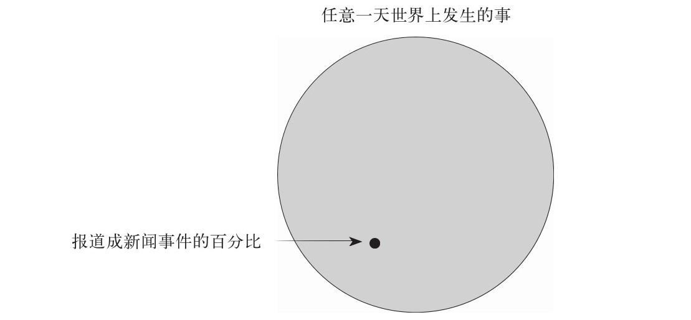

图　12-1　任意一天世界上发生的事报道成新闻事件的百分比

例如，人们一般会根据事件是否对他们自身有重大意义来判断事件的重要性：事件报道会对我产生怎样的影响？这会花费我多少钱？会怎样影响我的收入、居住环境、休闲活动和我享用的便利条件？这些报道的事件又会对他人产生怎样的影响？尤其对那些离我们很远甚至从未出现在我们生活中的那些人，对我们来说事件对他们的影响完全又是另一回事，是根本不值得考虑的。因此，对于世界上哪些事件是重要的，媒体间的分歧很大。

媒体关注读者个人关心的问题。因此，尽管人们可能存有非理性的信念（例如，他们怀有非理性的怨恨），媒体也会将人们这些怨恨和敌意合理化。当美国普遍接受奴隶制时，媒体在报道中称奴隶制是自然的存在；当美国国内对奴隶制的存在产生分歧，媒体也随之改变，做出配合（每份报纸都会和读者的意见保持一致，将读者认为是准确无误的信息报道为是正确的）。

想想媒体是怎样处理社会中“耸人听闻”“激动人心”“令人厌恶”“大快人心”的事件的。例如，一名女性在法国蔚蓝海岸不穿衣服晒太阳浴是常事，不会招致人们批评，她的行为也不是新闻。但是，同样是这名女性，如果她在黎巴嫩海滩以同样的方式晒太阳浴，她的行为就会招来批评，她的行为也会被当做新闻来报道。或者以奥运会为例，每个国家的新闻媒体都密切关注着本国运动员可能会取得突破的项目。当某一运动员在这样的运动项目上取得金牌时，媒体会密集地进行相关的报道，好像这个项目比那些没有赢得金牌的项目重要得多。这些报道的受众也会为这些项目的“胜利”“激动不已”，而对其他项目的胜利不感兴趣。

人类的“客观性”是一个没有人能真正达到的理想。他需要一个人思想上的谦逊，以及在做判断时既考虑自己观点，也考虑其他来源的信息和观点。

### 观点

一般来讲，任何新闻事件都可以从不同的角度来看待和解释。对不同观点持开放态度，愿意接受对自身观点的质疑，这对保持“客观”至关重要。通过图12-2我们可以看到不同观点和同一事件的关系。只有当人们从不同的角度来看待问题、吸收不同角度的观点、看到每个角度的弱点和偏颇、并将所有了解到的观点综合成一个更为全面、更为广角的整体观点时，人们才能尽可能地接近并达成客观性。每一个角度都能够“纠正”其他观点中夸张和歪曲的部分，并且补充其他角度没有提到的事实。

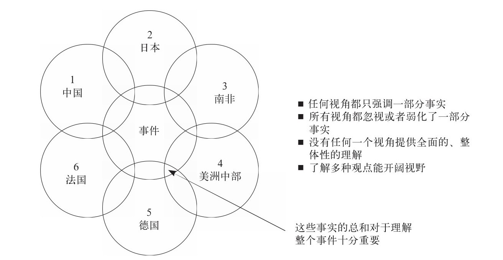

图　12-2　关于同类事件的六个视点

只有将故事和叙述放到一个更广阔的历史背景中，并且从多角度来进行评论，我们才能（在记录历史和报道新闻中）获得“客观性”。例如，要理解英国与其殖民地北美的战争（1776~1783），人们至少可以从三个角度来看待这一问题：英国政府的角度、殖民地领袖的角度和本土民族的角度。

为了达到客观性，我们需要：

（1）确定新闻报道和历史记载中作者的观点。

（2）确定新闻报道和历史记载的目标受众。

（3）确定文章中否定和忽视的观点。

（4）区别新闻报道中的原始事实和报道中加进去的解释和编造。

能做到以上几条，我们就能够更好地进行独立判断，能够更具洞察性地理解哪些信息是最可信的、哪些是最不可信的，这样，新闻媒体想操纵影响我们就没那么容易了。当然，如果我们不能查找多方面的信息，不能确定信息的可信度，要做到不受媒体的影响就很难了。

### 客观的形式

“客观”可以呈现为三种形式为：两种是真实的客观，另一种则是虚假的客观。我们将在下面的篇幅中探讨这些“客观”形式。

1.思想上谦逊的客观

第一种客观形式是基于思想谦逊的客观，也就是承认我们的无知。因此，一个批判性的新闻受众知道获得一则信息与判断这则信息的真伪之间是有区别的。他们知道新闻中呈现的事实未必就是真正的事实，也许是宣教、误传、曲解或真假参半的信息。了解到这些，批判性新闻受众就会意识到他们在新闻中了解的信息并不等于自己知道了事实，他们就会放弃原有观念，以尝试性的态度吸收不同信息来不断接近事实（这可能对也可能不对）。这就像具有批判性思维的陪审员不会根据案件一方的观点就判断一个人是否有罪一样。

不幸的是，思想谦逊是人身上罕见的品质。世界上大多数人每日接收到的仅是有限范围的观点，对人们影响最大的也是自身文化中的主导观点。因此，人们常常认为自己掌握了真相，而这种自信其实正好证实人们不具有“客观性”的证据。许多人并不知道什么是思维谦逊，更不会努力去做到思维上的谦逊。

2.公正的客观，多角度思考

第二种形式的客观是优于第一种形式的。要做到公正和多角度思考首先要做到思维谦逊，其次在解决问题时从多种互为冲突的角度进行大量的推理。这种客观与洞察理解重要事实以及大规模冲突的复杂性和多面性有关。拥有此项客观能力的人可以对事件有多方面的洞见。他们能够权衡不同角度的利弊，乐于扮演质疑者的角色，但是决不会为了质疑而质疑。他们反对政党路线、社会中心的心态以及思想的同化一致。他们在思想上是独立的、锲而不舍的，并且具有整合性的思维特征。

3.诡辩的客观

第三种形式的客观是“诡辩”的客观。这种客观是人们在学习新的观点时，有着强烈动机来捍卫预设观点造成的。这种心理状态在一些人中很普遍，这些人常常为了获得金钱（和提高名望）而为强权利益辩护。为预设观点、经济利益辩护的诱惑是十分巨大的，因为这里常常涉及金钱、地位和名望。通常来讲，律师、政客和公共关系专家常常扮演这样的角色。

许多国家的新闻评论员也常常扮演这一角色。他们评论的立场和受众的世界观是一致的。受众也会根据评论员的观点是否反映了主流观点来评判这些评论员是否达成了客观。

## 对主流观点偏见的知觉

人们认为和他们看法一致的观点就是客观的，不一致的就是存有偏见的，这是一件相当自然却又缺乏批判性的事情。因此，如果新闻评论将主流观点稍微转向自由方向，那么只有有自由思维倾向的受众才会认为这些信息是客观的。如果将主流观点向保守方向偏转，那么只有在保守派受众的眼中，这些信息才是客观的。因此媒体发表自由还是保守的言论取决于他们受众的观点。

### 宣教和新闻报道的撰写

《韦伯斯特新世界词典》将宣教定义为“特定观点、学说或惯例等被系统地、广泛地传播和推动，以深化自己的理由依据，弱化相反的观点。”根据这一定义，以特定受众为目标的新闻报道和宣教之间就没有明显的差异了，两者间存在惊人的相似逻辑，都是系统地贬抑或弱化相反观点的价值。甚至历史的编纂撰写都会有宣教的成分，当人们有意忽略一些不支持预设观点和意识形态的信息来“神化”或“妖魔化”特定人群时，宣教就出现了。

因为宣教这个词带有负面含义（意味着欺骗或者歪曲），很少有新闻记者会承认他们的报道里有宣教成分。但是，如果一个人仅从单一文化或国家来源来接受信息，他们的思维就会受到这种歪曲和欺骗的影响。因此，大多数人都深嵌于单一世界观的窠臼中（因为他们接受的仅是从单一角度出发的新闻报道，并没有认真考虑其他任何可供选择的替代角度）。

当然，这并不意味着已有的世界观是单一不变的。并不是所有人对所有的议题都有一致的观点。并不是所有的德国人都同意其他任意一个德国人的观念，德国人、日本人或是墨西哥人对世界的看法也有明显的差异。此外，从本质上来讲，虽然每一个观点都会带来一些洞见，但这并不意味着每个观点都能带来相同的洞见。

通常情况下，人们识别他国或其他文化下新闻报道中的信息倾向要容易得多，尤其是这些国家和文化与他们存在很大差异时。例如，尽管对本国新闻报道不敏感，以色列人却能够轻易地察觉阿拉伯国家新闻报道中的宣教，反之亦然。

当美国总统小布什发表演说称伊朗、伊拉克和朝鲜是“邪恶轴心”的时候，他的演讲受到了绝大多数美国人的欢迎。接下来布什总统承诺要“根除邪恶轴心”，爱国主义浪潮席卷美国。美国新闻媒体通过报道引发了公众的义愤，在绝大多数美国人眼中，美国政府象征着高尚的理想（自由、公平、民主、自由市场和人权），布什总统用武力捍卫美国、击溃敌人的形象鼓舞着美国人的爱国主义情绪。

然而，布什的演讲在海外却是另一种待遇。伊朗、伊拉克和朝鲜的新闻媒体将布什批评为一个狂妄自大的人。而美国的盟友则称布什根本不了解事实的复杂性。下面是一些法国和德国媒体面向自身受众对布什演讲的报道（New
York Times,January 31，2002，p.A12）：

■“在法国，《法国世界报》头版刊登了一副布什身穿迷彩服的漫画，标题写着‘布什指出他最新的敌人’。”

■“法国24小时新闻站，LCI上的电视新闻主笔称布什的演讲听起来就像‘一州之长笃信自己有权控制调整地球，发现地球不需调整时，勃然大怒，声称要施以惩罚’。”

■“在德国，日报《南德意志报》上的评论称，他们为今晚奔赴美国的德国总理施罗德表示同情。‘可怜的施罗德，对于这位性情乖戾的欧洲第一人来说，站在刚刚加冕的美国恺撒面前不是件容易的事’。”

以下同样是出自《纽约时报》中的伊朗和朝鲜国内的新闻报道：

■“布什企图在中东问题上转移公众舆论，并且为其支持以色列残酷镇压巴勒斯坦积蓄民意。”（伊朗国家电台报道）

■“朝鲜官方媒体嘲笑布什将朝鲜纳为世界最危险国家之列，该媒体称布什‘高呼危险’主要是为了替美国在韩国驻军进行辩解。”

在每一个例子中，媒体很容易说服人们相信外国媒体报道存有偏见，但是要让同样一批人相信他们国内新闻报道同样存有偏见要难得多。在每一个文化下的公众眼里，本国家的新闻报道都是不言而喻的真相。因为这些新闻通常上是呈献给有同样世界观的受众。

当深陷一种依存于文化的世界观时，人们在自利的假定下进行思考。认为他人（国家或文化的敌对、反对者）都是宣教和操纵，而自身则是公平诚实的；认为他人是在运用宣教和操纵手段，而自身则是自由表达观点。这种心理状态不是什么阴谋和诡计的产物，当媒体为了谋利而向本国受众呈现歪曲的信息时，这是再自然不过而且可以做出预测的结果。

### 避免本国受众产生负罪感

主流媒体通常禁止报道能够引起人们对本国文化社会道德中的错误进行指责和批评的事件。例如，美军在日本广岛和长崎投下的原子弹让日本民众遭受了常人难以想象的苦难，尽管美国媒体对此事发生了争论，但是据我们所知，美国主流媒体还是很少提及此次事件为日本人民带来的巨大伤痛。

我们将德国纳粹集中营的苦难和日本广岛长崎的核灾难进行对比。在事件过去50年后的资料搜索中，我们只找到一家美国媒体对日本原子弹事件所做的一篇报道，即北加利福尼亚州圣罗莎市的《民主报》（Press
Democrat）对日本民众遭受核辐射进行的详细报道。这篇报道是其特邀评论员大卫R.福特（David
R.Ford）所写。1965年间，大卫R.福特在CBS电视台火奴鲁鲁附属机构工作，目前居住在加利福尼亚的圣塔罗莎。以下是他这篇报道的节选（删去了恐怖细节）。

1965年，我在日本广岛度假。我希望在8月6日，也就是原子弹在广岛爆炸后的20年，对事件中受伤和正在老去的人们进行采访。我的采访开始于女性病房。

文章接下来是有关受难者的具体细节性图片，想到自己政府造成这么大的伤害（那天，就广岛一座城市来说，就有200000人丧生），美国读者陷入极端的痛苦情绪之中。这位美国记者对日本受害者说，

“美国政府事先投下了上百万的警示册子告诉市民撤离。”他看着我的眼睛说，“没有什么小册子，甚至连警示都没有。”

## 辨别社会中心思维

世界上大多数媒体都是根据预设假定和本国主流价值观认为的“正确”观念来从事报道的。我们并不企图改变新闻媒体。新闻记者和编辑是在经济需求和工作限制中进行报道的。他们和受众都从属于一个已经同化的世界观。

当然，作为具有批判性思维的大众媒体受众，我们必须清楚地认识到，主流媒体的新闻不可避免会建立在社会中心的世界观基础上。我们必须学会识别自身文化中的偏见。假定我们文化中占主导地位的世界观比其他文化中的世界观更准确和深刻的观点是毫无根据的。认为自己文化比其他文化呈现的事实更为准确这一思维方式并不是更深的洞见，反而是自我中心的体现。社会中心是所有文化的基本特点。新闻媒体不过是一个反映社会规范和禁忌的不明真相的机构。

我们在大众媒体中可以发现许多社会中心思维的例子。新闻媒体是其所立足文化中固有的一部分。同时，媒体又要“售卖”他们的新闻报道，媒体的报纸、新闻播报和杂志必须获得经济利益才能继续运转。

新闻媒体提高利润的压力并不是一个孤立的现象。纵观全美经济，获取最大利润，将股东利益置于所有考量之上是每个企业都面临的史无前例的压力。拥有新闻媒体的公司也不免受到商业趋势和经济需求的影响，这些影响塑造了美国20世纪八九十年代的经济形态，影响了美国社会的各个方面（Downie＆Kaiser,p.25）。

由于任何文化下的个体思维方式本质上都是社会中心的，新闻媒体别无选择只能在一个社会中心的框架中进行工作。任何一种文化下的所有媒体无一避免地为该文化服务，提升该文化的自我形象。有偏见的新闻报道是既定规则，没有例外。

这样，世界上主流新闻媒体都是偏向于自身国家的“盟友”，而对“敌对国家”怀有偏见。因此，在报道其“盟国”发生的事件时，新闻媒体尽可能地支持、赞许并凸显他们的“正面”做法，对负面事件轻描淡写。而在报道其“敌国”的事件时，媒体则表现出截然相反的报道方式，报道中禁止出现有关敌国令人敬佩人物的正面事件，最常见报道的还是敌国的消极事件，这些消极事件常常被报道和突出。对于受众来说，识别这些有偏见的报道，并且在心理上从对立面重写这篇报道的关键是具有批判性思维能力。拥有这一能力，人们就会发现新闻中遍地都是带有偏见的报道。当人们能够透过这些偏见看到事实本质的时候，新闻报道对人们的说服效应也就消失了（见图12-3）。

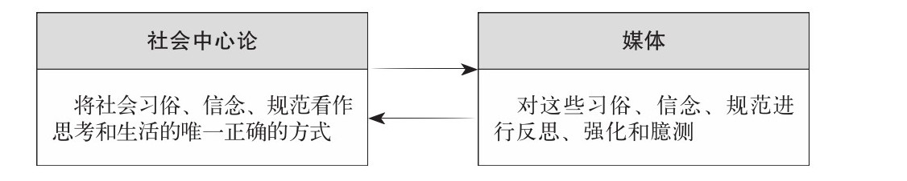

图　12-3　培养社会中心思维方式的相互强化关系

## 歪曲报道来支持特权的观点

每一个记者都自觉地知道用哪些词语来描述世界上受欢迎的国家和不受欢迎的国家（在某一文化视角下的）。我们计划……他们图谋；我们足智多谋……他们鬼鬼祟祟；我们部署策略……他们图谋不轨；我们有信念……他们只有幻想；我们骄傲自豪……他们自高自大；我们巍然屹立……他们自吹自擂；我们发展武器来保护自己……他们发展武器来威胁我们；我们调停……他们入侵；我们有宗教信仰……他们只有盲目迷信；我们是自由战士……他们是恐怖分子；当规则阻碍发展时，我们才打破规则……他们破坏规则是因为他们不负责任，不可信，没有道德。

记者通常选择那些能够强化目标受众已有观点的词汇。讽刺的是，如果记者报道新闻时所持的观点和他们社会中的主导观点明显不同，这些记者就会被认定为是有偏见的和不负责任的。如果你和主流观点一致，那你就是负责的记者，否则你就是不负责任。

当然，也有例外发生。如果相当大一部分人持有相反观点，就像自由派与保守派一样对峙的双方，支持与反对的词汇都会被采用（这主要取决于媒体是被保守派还是自由派所控制）。然而，如果一个人的观点和社会主流对自由派和保守派的观点都不同，这个人将会被视为“激进分子”而受到排斥。激进分子通常被定义为是不负责任的（因为他们不同意任何一种传统观点）。

以下的新闻摘录反映了世界上的媒体如何迎合受众的观点，而不是客观报道呈现事实。

1.“美国人看不见的战争”<a href="#part0803.html_ch1-back" id="part0803.html_ch1"
class="pcalibre calibre2">[1]</a>

资料来源：Press Democrat,April 4，2003，editorial by Rami
G.Khouri,executive editor of the Daily,Star,a Beirut newspaper

阿拉伯报纸，像《阿拉伯公共舆论》，全都反对英美对伊拉克开战，并且毫不迟疑地将其态度刊登在头版头条上、写进文章里而且记录在照片中。尽管阿拉伯媒体并不是整齐划一地反对美国，但是从这周的阿拉伯文（阿尔及利亚和法国也是如此）报纸的头版中我们可以看到，美国和阿拉伯世界对这场正在拉开帷幕的战争持有截然不同的看法。但是在阿拉伯世界及其周边主流报道的头版中采用了美国和伊拉克两国的视角，并且刊登了大量戏剧性的照片，一方面将美军描述为入侵者，另一方面又宣扬美军的人道主义。

近来，一份报纸的头版上刊登出一张伊拉克市民为美军倒茶的照片。但是，更常见的是大量伊拉克死伤儿童的照片，大量父母对着在美军轰炸中死伤亲属的棺椁哀号的照片，大量伊拉克平民建筑在战争中大规模受损的照片以及伊拉克平民被美英军队羞辱的照片。有时，在美国报纸上会刊登无伤大雅的照片，在阿拉伯的报纸上则会刊登措辞严重和激烈的评论。

报纸的倾向反映了意识形态。在伦敦编辑但在整个中东刊印的地区性泛阿拉伯报纸《中东日报》和《生活日报》是最为中立的报纸。其余更多的意识形态报纸，拥有范围更窄小的受众群，则主要反映了它们经济支持者的情绪，它们更倾向于迎合受众中的民族主义分子、政客和激进分子。这篇专栏的观点和评论有很强的反美情绪。只有很少的情况下，才会出现像贝鲁特《白天报》（AN
Nahar）的阿拉伯作者号召结束萨达姆·侯赛因政权统治这样的新闻报道（这常常也和反对美国占领一同出现）。

评注：这篇社论支持了我们的观点，即世界各国的媒体都在证实它们受众（和支持者）已有的信念。当然，在国家级和地方级的媒体中也存在这样的偏向。因此，《民主报》（在加利福尼亚出版）刊发这篇评论，告诉人们阿拉伯世界的报纸并不完全反对美国。这篇文章的题目强调美国人应该扩大他们的消息来源（“美国人看不见的战争”）。与此相反，《纽约时报》在报道中则激烈地指责阿拉伯媒体反对美国和以色列，而《纽约时报》是我们一直默认为客观、平衡和公正的美国媒体。下面是《纽约时报》报道的节选：

2.“阿拉伯媒体将战争描述为杀戮场”

资料来源：New York Times,April 4，2003

这篇文章刊登了一张照片，在这张照片中，一个男孩惊恐地望着遭到轰炸的建筑，与此同时，一位戴面纱的妇女在她亲人的尸体边苦苦哀号。这是刊登在沙乌地阿拉伯知名媒体Al
Watan网站上的一张合成照片。这篇文章想要告诉读者伊拉克战争是美军对无辜阿拉伯百姓的一场永无休止的残忍屠杀。这篇文章中，以色列的国旗附加在美国国旗之上。手无寸铁的百姓的悲惨故事充斥在全世界阿拉伯人的电视、报纸和生活中。他们企图向阿拉伯人传达美军是冷血的屠杀者这一信息。这篇文章称，阿拉伯媒体越来越倾向于用大量的标题直接指责美军有意残杀无辜的百姓。

评注：这篇文章意在指出阿拉伯媒体关于伊拉克战争中平民伤亡的报道是完全不正确的。《纽约时报》的读者基本上是保守的，完全支持以色列政府和美国领导的多国部队入侵伊拉克。因此，这样的读者群势必会反对有关美军、美国政府或是伊拉克政府的负面描述和报道。因为这篇文章强烈地批评了阿拉伯媒体关于伊拉克战争的报道，所以这篇文章并没有被淹没在信息海洋中，而是被置于首要的位置上（头版）。

### 如何从宣教和标准新闻报道中获得有益信息

只有懂得如何批判性地看待新闻报道，个体才有可能从宣教和片面的新闻报道中获取有益信息。这意味着我们必须清晰地意识到报道中隐含的观点，认清报道影响我们思维和信念的意图。当我们从某一个角度来分析观点时，我们必须对这些新闻报道进行全面剖析。尽管报道中的部分事实也许能够支持所讨论的观点，但是片面的新闻报道并不是纯粹的简单事实。此外，要注意的是，在标准的新闻报道中也会提及一些反对观点，通常在报道的最后几个段落中弱化处理或者以引言出现，并建议读者不予理会这些观点。

具有批判性思维的读者能够识别报道中的片面观点，知道哪些信息是该忽视的和不值得考虑的。他们会注意到哪些事实得到了突出报道（如，在头版），哪些淹没在大量背景信息中（如，在第24页）。分析和解释新闻报道时，我们需要思考一些关键问题：

■谁是目标受众？

■哪个观点得到强化处理？

■哪些观点被忽视或者被弱化处理？

■我怎样才能找到被否定的信息？

■哪些新闻刊登在头版？为什么？

■哪些信息淹没在文章中？为什么？

<a href="#part0803.html_ch1" id="part0803.html_ch1-back"
class="pcalibre calibre2">[1]</a>Reprinted with permission by the
author.

### 成为新闻批判性读者的步骤

（1）理解“媒体新闻报道”的基本流程。要时刻记住主流新闻报道是为了经济利益而向特定受众（特定的信念、价值观和偏见）出售新闻信息。媒体报道并不是为了教育，也不是要对多方公平（将所有信息都呈现给目标受众是很罕见的）。为了向受众售出报道，新闻记者必须针对目标受众进行报道，强化证实受众的信念、偏见、价值观和世界观。记者通常都和目标受众有共同的信念、偏见、价值观和世界观，因此，对事件进行“歪曲”是很自然的事情。

为特定受众报道新闻需要记者清楚：

a.受众怎样看待这则报道？

b.在这则新闻报道的信息中，哪些是和受众最相关的，哪些相关性最小？

c.如何撰写新闻报道中的“导言”和“标题”？

d.报道这则新闻需要多少空间和时间？

e.如何将这则新闻报道和其他报道、和受众的自我概念和世界观联系起来？

f.如何将这则新闻报道得“专业”？（客观，不存在偏见，仅仅是陈述事实。）

（2）理解新闻报道的逻辑。首先，解构这些报道，然后尝试着以其他角度来重构这篇报道。个体要成为有批判性思维的媒体受众，首先要理解媒体的报道日程和媒体报道新闻的标准（决定这是一则什么“报道”，要报道哪些事实，怎样报道才能获得最高的收视率或者最好的销售额）。有经验的媒体受众知道如何识别并评估国内外社会和政治的重点和议程。他们知道如何读到字里行间的隐含意思，知道如何从其他角度重构这篇报道。

（3）掌握重新定义事实的方法，评估其他来源信息，以历史的角度报道事件，注意报道过程中的假定和暗示。系统地质疑和评估，对批判性地思考媒体信息至关重要。

（4）通过认清文章中隐含的利益和受众情绪来识别可信度低的新闻报道。当媒体制作人和受众的利益，或是大众的情绪（大众的愤怒、憎恨和爱国情绪等）卷入新闻报道中时，这样的新闻报道是最不可信的。例如，当一个国家发动战争时，该国媒体关于战争的报道就是值得质疑的，因为在战争时，所有国家都会对大众进行宣教来支持战争。另一个例子是对于坚持禁欲行为个体的报道，因为读者对禁欲行为的嫌恶，那么新闻报道就会将这些嫌恶反应合理化。通常来说，能够激起大众情绪的新闻报道都是片面的，具有批判性思维的读者需要常常质疑这样的报道。

### 媒体对媒体偏见的意识

媒体到底在多大程度上能够意识到自身报道新闻时存在偏见和宣教呢？这个问题没有确定答案。所有的记者都清楚他们是为特定的受众进行报道。可是，这并不意味着受众能清楚理解其中的内涵。当然，对此问题，一些记者也会比其他记者要清楚得多。

在美国，以色列是受欢迎的“盟友”，所以以色列对巴勒斯坦人的虐待和施暴常常是在“正当报复”观点下被报道的。而美国视古巴的卡斯特罗为敌人，因此美国主流新闻媒体对卡斯特罗和古巴的报道通常是负面的，完全忽视了古巴政府所取得的成就（像全国医保覆盖、低婴儿死亡率）。一旦进行新闻报道的记者意识到这样的报道模式，他们就会很审慎地进行报道，以免自己被贴上“不负责任”和“偏见”的标签。

1.谨慎对待广告商

对媒体而言，文化中的所有群体并不是都是同样重要的。国家媒体偏向那些支持国家文化、宗教、主导信念和社会价值观的群体。但是在媒体逻辑下，任何复杂的文化中，一些群体总比其他群体的作用更大。例如，新闻媒体的收入来自广告商。如果媒体对这些广告商或者广告商代表的利益进行负面曝光，就会招致资助媒体的广告商的不满。因此，新闻媒体会避免报道对他们广告商不利的新闻。

换一种说法，因为新闻媒体可以从大量现有的新闻事件中选择性的进行报道，即任何一家媒体都不能对发生的所有事件进行报道，媒体报道的信息只是所有事实中的一小部分。因此，媒体自然地回避那些容易触怒他们广告商的报道。当然，也有例外。不过，这主要取决于这则报道会制造多大的轰动效应，或者是否已有媒体报道了此事。

2.谨慎对待政府

国家媒体对政府的权力十分敏感。一方面，通常来讲，国家政府通过法律准许媒体成立，并调控媒体。另一方面，许多国家新闻都是国家高层官员和机构告知媒体的。鉴于以上原因，新闻媒体人士在批评政府时总是谨小慎微。

例如，如果国家政府认定一些群体或国家是敌人，国家新闻媒体就会尽可能地将这些“敌人”描述得不受欢迎。如果政府无理进攻另一国家，国家媒体就会像体育赛事的拉拉队长一样站在国家这边为其加油鼓气。此外媒体还常常为政府错误的政策和法案道歉。

也有例外，那就是当国家媒体和在野党有关时，这些媒体就会受到在野党所代表的权力和利益的保护，媒体也会报道他们政治支持者的观点。在美国，这样的新闻报道通常受到民主党和共和党的影响，但是两党在基本的世界观和信念上是一致的。两党在敌对和友好国家的划分、主要经济力量和权利以及资本的聚集上都存在共识。

媒体持特定的观点来报道新闻，这些观点代表了能够在经济上影响媒体的集团的利益，并且这些观点还深深嵌入到社会意识形态当中。尽管媒体对利润的关注不那么明显，甚至被隐藏，但是新闻媒体关注利润是铁定无疑的事实。

美国电视网络解雇了一些报道记者，并且关闭了一些外语报道机构以减少机构的开支。他们通过将新闻报道划分为生活、名流、娱乐等版块专题来吸引受众，并且用敏感的性、犯罪和庭审故事来填充他们低预算、高回报、黄金时段的“新闻杂志”节目（Downie＆Kaiser，2002，p.10）。

3.谨慎对待权力集团和利益

新闻媒体常常希望用最少的支出换来最大的利益。调查性新闻报道比现成的新闻（新闻发布会、记者会、和演讲中的新闻）花费要多得多。而权力集团意识到，若是不能维持在公众中受欢迎的形象，就会在文化中失去权力地位，便一直积极地投资经营他们在公众中的形象。因此，在权威媒体（需要新闻报道）和权力集团（依自己的利益产生，传播新闻）之间存在一种共生关系，没有国家存在例外。

包括制造、交通、农业、武器制造、航空、司法机构（监狱、警察、律师、社会工作者）、建筑、银行、汽车、保险、公共关系广告、广播和娱乐等在内的行业都依据其自身利益来调控每日的新闻报道。从事管理、立法、司法、军事和情报工作的政府机构和工作人员也根据自身的利益调控着每日的新闻报道。宗教团体、学术团体、工会和其他团体同样也是按照自身的利益调控着每日的新闻报道。

20世纪30年代爆发的大萧条，贯穿第二次世界大战始终，一直到20世纪50年代冷战拉开帷幕时结束。在报道大萧条时，记者通常反映已有的观点，对权力集团的失误很少提及。对于私人公司、娱乐行业的新闻炒作和政府的新闻监管，记者也很少提出质疑。

由于大多数人关于世界的基本信息都来自大众媒体，因此，积极的新闻报道对于维持一个积极的公众形象至关重要。

4.审慎对待竞争媒体

新闻媒体会报道其他媒体关注的内容。当一些主流媒体对事件进行“大篇幅”报道时，其他的媒体通常也会对此事进行报道，以免自己被视为报道缺席。主流媒体像“牧群”一样行动，都亦步亦趋地追随着他们的领头者。在任何国家，各家报纸上的国内外新闻都相差无几。

### 对新奇和轰动效应的偏爱

新闻媒体通常愿意报道那些新鲜、古怪和轰动性的奇特事件。日常发生的事件，不管其内涵多么重要，都会遭到媒体的忽视。然而，重大的社会问题通常都暗含在日复一日发生的事件中，只不过暗含这些问题的个案（尽管通常发生）通常不具有戏剧性。

例如，如果一家大型银行每次总是从其数百万客户中多扣一点点钱，这家银行就成功地偷取了数百万美元，这样的举动不成新闻。然而，一个劫匪劫走银行10000美元就是条新闻。类似地，每天有数百万儿童遭到欺侮并因此身心受到伤害不算新闻，而一个孩子和另一个孩子在学校发生性关系则是条重大新闻。每晚有无数儿童饿着肚子睡觉不算新闻，而学校为学生提供鱼子酱做午餐则是条新闻。每日有许多妇女和儿童被非法贩卖不是新闻，而老师和学生发生性关系则是条大新闻。

### 新闻批判性读者

新闻想要操纵批判性读者很难，这是因为批判性读者：

●知道人们有不同的视角和世界观，知道人们能够从多角度来看待问题。

●通过多来源的观点和信息来理解事情，不迷信大众传媒。

●知道如何辨别新闻中的隐含观点。

●会在心里从多个角度重构这则新闻报道。

●以分析现实的方式分析新闻报道。

●评估新闻的清晰度、准确性、相关性、深度、广度和重要性。

●会注意到新闻中的矛盾和不一致之处。

●会注意到新闻中的操作议程和新闻媒体服务的利益。

●会注意到新闻中被报道的事实和被忽视的事实。

●会注意到哪些信息被作为事实呈现。

●会注意到报道中隐含的存疑假设。

●会注意到报道的潜在含义。

●会注意到哪些信息得到强调，哪些信息受到忽视。

●会注意到哪些观点受到作者青睐，哪些受到排斥。

●意识到受既有观点影响，这些罕见的、戏剧性、轰动性报道中存在偏见，并且会对这些报道进行纠正、重构。

●会质疑社会规范界定问题的合理性。

### 关于新闻媒体的疑问

1.媒体改革是可行的吗

为了给公众提供不偏不倚的新闻报道，首先，记者都需要对他们之前不认同的世界观抱有理解的态度。他们需要想象受众的世界观与他们自身的世界观是截然相反的，他们需要了解自身的社会中心，要像批判性读者那样对待新闻报道。

然而，这样做的一个难题是：在受众眼中，他们这样报道的文章是存有偏见的，是宣教而不是新闻报道。在受众眼中，这些记者也会是不负责任的，他们的观点影响了他们的报道。想象以色列记者从同情理解的角度对巴勒斯坦进行报道，巴勒斯坦的记者也以同样的角度来报道以色列时，这两国的记者在他们各自国家会有怎样的遭遇？

新闻媒体中的记者是无法决定事实本质和他们工作需求的。他们不能决定受众的所思、所做、所爱和所怕。事件本质和工作要求是由社会和社会成员的价值观、信仰和世界观所决定的。在这里，以自我中心和社会中心的视角来看待问题是人的本性，大多数人都不愿意拓宽他们的眼界，只是一味地希望自己的观点得到证实和支持。就像球迷，他们一心希望自己支持的球队获胜，球队获胜，他们会欣喜若狂，但一旦失败，他们会托辞说这场比赛不重要，另一方作弊或者是裁判偏袒另一方。

就广阔社会空间中的绝大多数受众来说，他们倾向注意能够加强自身信念，不会对其秉持观点产生质疑的新闻报道。这里的逻辑就像塑造一个国家的饮食习惯一样，知道大多数人喜欢高脂肪和腌制食品，市场就会销售这些高脂肪和腌制的食品。只要大多数人喜欢那些能够加强自我中心和社会中心思维的极简报道，喜欢那些以绝对好坏之分呈现世界的报道，新闻媒体就会报道这样的新闻。这样地紧随其受众脉搏，媒体的利益和收视率势必会大幅上升。

2.“批判性社会”的出现能否成为现实

在1906年出版的《民俗学》的结束章节中，威廉·格雷厄姆·萨姆纳提出了发展“批判性社会”的可能性。他指出，在这样的社会中，批判性思维是人们生活方式中不可缺少的一部分。萨姆纳认为批判性思维能够帮助人们克服偏见、欺骗、迷信和对我们自身及周围环境的误解。他认为只有能够培养人们批判性思维的教育才是最好的教育。他写道：

如果社会中的普通人都具有理性思维习惯，这样的思维方式将会得到更为广泛的传播，并渗透到社会习俗中，因为这种思维方式可以帮助人们解决人生困惑、完善自身并改善人生。接受批判性思维教育的人不会自乱阵脚……对于是否相信，他们始终会持谨慎的态度。他们会区分事件在不同程度上的可能性，不会十分确定，也不会因此苦恼。他们会寻找证据，考虑不同证据的权重，不会受一方对观点强调或过分自信的影响。他们能够抵抗对自身有利的偏见和任何形式的哄骗影响。只有进行批判性思维培养的教育才是真正能培养出合格公民的教育。

世界上没有哪个国家和文化是按照萨姆纳构想的那样发展教育事业。按现状看来，任何社会中，这样的教育都是个罕见的例外。但是，辨别媒体中的偏见和宣教对那些愿意从多角度、多观点和多来源看待世界的人来说倒是可能的。对那些在阅读、思考和判断中愿意逆势而行的人来说，辨别出媒体中的偏见和宣教也是可能的。

## 找到替代的信息来源

在一个文化下找到支持主导观点的信息并不难，难的是找到一个质疑主流新闻的思考观点。以前苏联为例，当时很难找到一条批评苏联路线的观点。在一个社会中批评这个社会通常总是困难重重，很难实现。不过，还是会有少数一些思想家，他们的思考目光会超越主流观点，深挖现象下的本质，最后带来令大众不悦的观点。在这要强调的是，世界上任何社会都有主流观点和异见，重要的是要意识到我们并不是说异见就是正确的、主流观点就是错误的。我们应该找出主流和异见观点，从所有对立的观点中获得洞见。对于任何重要的议题，都要以全方位的视角进行观察。

要做到这些，个体要做到以下两点：

（1）找到各个角度的观点。

（2）在所有观点中找到全方位的角度。

让我们以美国为例，美国主流观点可以在任何一家大型主流报纸中找到（《纽约时报》、《华盛顿日报》、《巴尔的摩太阳报》、《波士顿环球报》、《芝加哥论坛报》、Cleveland
plain Dealer、Los Angeles Times、Minneapolis Star Tribune、Philadelphia
Inquirer、Sacramento Bee、San Francisco
Chronicle，等等）。同样，其他国家也可以列出相似的主流媒体列表。当然，不同国家和文化的主流媒体观点可能会有一些重合，这主要取决于他们，在多大程度上信仰同样的宗教，有共同的经济利益和政治传统。

找到文化或国家内的异见就不那么容易了，这是因为异见者常被限制在“地下”。搜寻异见信息最好的去处就是翻阅学术性的杂志和报纸。在一些情况下，个体能够找到比主流媒体报道更为深入、更为细致的出版物。

再以美国为例，开办于1865年的《民族报》，从其创办之初就为公众提供了仔细思考的异见。它的投稿者有Nelson
Algren,Hannah Arendt,W.H.Auden,James Baldwin,Willa Cather,Emily
Dickinson,John Dos Passos,W.E.B.DuBois,Albert Einstein,Lawrence
Ferlinghetti,Robert Frost,Carlos Fuentes,Emma Goldman,Langston
Hughes,Henry James,Martin Luther King Jr.，D.H.Lawrence；Robert
Lowell；Thomas Mann；H.L.Mencken；Arthur Miller,Pablo Neruda,Octavio
Paz,Sylvia Plath,Ezra Pound,Bertrand Russell,Jean Paul Sartre,Upton
Sinclair,Wallace Stevens,I.F.Stone,Gore Vidal,Kurt Vonnegut,Alice
Walker和William Butler
Yeats。显而易见，这是非主流信息重要的来源。除了周刊上报道的有争议的政治和文化议题外，The
Nation还建立了包含6500个议题在内的电子数据库（见www.archive.thenation.com）。

所有来源的新闻和评论都应该受到批判性的分析和评估，个体应该利用这些信息培养自己思维的独立性，将这些信息看作整个事实的一部分，而不是事实本身。这样一来，最终便会突破观点所缚，不受任何一个观点的限制。

## 成为一个自我思考者

要辨别媒体中的偏见和宣教就要进行独立思考。阅读著名异见者对他所处时代主流观点提出质疑的著作，也会帮助个体成长为独立的思考者。

### 被淹没、忽视和弱化处理的报道

每一天，世界上都会有数以万计的事件发生，而其中只有少数被媒体报道，成为新闻。通常来讲，被报道的是那些能够证实社会主流文化观点的事件。与主流观点相违背的事件常常受到媒体的忽视和弱化处理，淹没在海量的信息中。然而，在某一文化下被淹没的事件，常常会在另一文化下成为新闻头条。

当文化间存在冲突时，这种现象会有加剧的倾向。在这种情况下，尽管是同一件事情，但是在不同文化下媒体的报道却大相径庭。例如，在战争时期，交战的双方都是从自利的角度向本国受众报道此次战争冲突。因此，尽管双发都对对方施以暴行，各自的媒体还是会强化对方的暴行，否认、压制或弱化本国的暴行。每一方都认为自己代表了正义，而对方代表了邪恶的力量。互为“敌人镜像”的研究认为大众媒体的这种自利性是可预测的：

互为敌人镜像指的是对立的双方总是将美德、优点归于自己，而将恶习、缺点归于敌方。“我们”是可靠的、热爱和平的、可敬的和人道主义的，“他们”是邪恶的、好战的和残忍的。1942年，在对美国人的调查中，美国人对德国和日本（敌方）评价的前五个形容词包括好战和残忍，而这些都没有出现在对苏联（盟友）的评价中；而在1966年同样的调查中，美国人对德国和日本（盟友）的印象不再像从前一样负面，而对苏联（不再是盟友，称不上是敌人，但也是一个强大的竞争者）的评价则是邪恶、好战……

敌人镜像就像一个扭曲镜，能够证实自身的信息得到过分突出，而与自身不符的信息则被过滤掉。因此，大众媒体大肆宣扬对方的邪恶残忍举动，而忽视了对方人道、可敬的行为（Jerome
Frank,Chemtech,August
1982，p.467）。<a href="#part0810.html_ch1-back" id="part0810.html_ch1"
class="pcalibre calibre2">[1]</a>

接下来，我们将会提供几个被美国主流新闻媒体忽视、弱化以致淹没在信息海洋中的新闻报道。这些被忽视的信息在媒体的报道中只是稍稍一提，并没有得到详尽的报道。我们主要是在异见者和非主流出版物中找到这些报道的。在每个例子中，要格外注意那些与美国主流媒体强调的美国形象和美国在世界中的地位不符的报道。如果这些被忽视的信息在大众媒体中得以突出，美国树立的致力于自由、公平、人权、保护地球资源、捍卫国际法和民主的公共形象就会遭到破坏。

要记住的是所有国家的媒体都会通过报道什么、不报道什么、哪些进行积极报道和哪些进行消极报道来塑造一个对自身文化有利的形象。我们的例子主要是美国主流媒体弱化处理的报道，因为我们认为我们的读者大部分都应该是美国人。我们的分析类似于在任一给定的文化或国家下，媒体对新闻处理的研究。当然，媒体对新闻的歪曲存在着国家间的差异，只有通过对一则报道的深入研究才能得以了解。

（1）美国是世界和平的威胁吗？社论《盲目自大可能再次袭扰美国》作者：尼古拉斯·克里斯托夫（Nicholos
Kristof）（资料来源：New York Times,Feb.3，2003.）

欧洲版的《时代》杂志在其网站上举行了一次投票：“2003年，哪个国家对世界和平造成了最大的威胁？”目前有318000人参与了此项投票，结果是：朝鲜，7%；伊拉克，8%；美国，84%。

评注：除了这篇简短的社论，我们在美国媒体中没有找到对此事的报道。美国是世界和平最大的威胁者与美国树立的自身形象截然相反。

（2）美国要对伊拉克50多万伤亡平民负责吗？《巴士拉的背叛》作者：查克·萨迪蒂克（Chuck
Sudetic）（资料来源：Mother Jones,Nov/Dec.2001.Mother
Jones是一份持有异见的非主流新闻媒体，提供新闻和评论）

10多年来，美国政府一直坚定地支持对伊拉克实行严密的经济封锁，呼吁国际社会对伊拉克获取外国商品和收入进行严格控制。但是，这并没松动萨达姆的政权统治，也没有迫使萨达姆放弃对伊拉克余下的化工、生物和核武器项目的控制。制裁带来的只是死亡。

根据以色列海法大学的伊拉克分析师Amatzia
Baram的估计，在1991~1997年间，有50多万的伊拉克人死于营养不良、可预防性疾病、药品短缺以及制裁带来的其他因素。死者大多数为老人和儿童。同一时间，联合国儿童基金会统计的死亡率显示伊拉克2300万人中有100多万人死亡。

这篇文章讲到，伊拉克人：

视萨达姆政府最大的敌人——美国为自己的敌人……1991年，华盛顿放弃推翻萨达姆政府，现在尝到了苦果。萨达姆政权下台将会成为反美煽动者和恐怖主义分子统治的成熟时机。

这篇文章引用居住在美国的伊拉克人的话称：“伊拉克人不会忘记在他们身上发生的事情，在他们眼里，这是种族屠杀，伊拉克人不会忘记种族屠杀。”

（3）美国有责任遵守它签订的国际条约吗？《布什寻求使用溴甲烷豁免权》（资料来源：Press
Democrat,Feb.9，2003；mass media news source.）

这篇报道称，美国在1987年和182个国家签订了《蒙特利尔议定书》，号召停止使用伤害臭氧层的溴甲烷。但是据这篇报道称，美国农民说没有其他合适的可供替换的药品可用。“溴甲烷是一种无色无味的气体，每18个月注入土壤一次，以杀死蠕虫、有害昆虫、老鼠和病菌等，该化学药品于2005年在发达国家禁用。”

这篇文章称布什政府向美国环保署寻求16项使用溴甲烷豁免权。文章引用自然资源保护委员会气候中心主任David
Doniger的话称：“我们知道禁用溴甲烷是一项艰巨的任务，需要更长的时间来完成。但是，我们从来没有想到农业企业竟然会破坏这一药品的禁用过程，布什政府竟会对种植业者和化学工厂卑躬屈膝，对国际协定熟视无睹。”

根据这篇文章的报道，“从原子层面上看，从溴甲烷中释放出来的溴化物对臭氧层造成的伤害是氯氟烃中释放出来的氯化物的60倍。”

评注：这篇文章登在当地新闻版块的背面，淹没在信息海洋中。

（4）美军开办的学校是用来训练军官严刑拷打和谋杀技能的吗？《新军事计划：施虐者学校》（资料来源：Counter
Punch,Feb.1-15，2000；Counter
Punch是一份持有异见的非主流新闻媒体，提供新闻和评论）

根据Counter
Punch的报道，美军开办的坐落在佐治亚州本宁堡的美洲学校，有60000名毕业生，这其中不乏许多最狠毒的杀手和拉美军队中的严刑拷问人员……年复一年，针对这所学校的游行示威日益增多，本宁堡外的抗议集会人群和非暴力反抗人数急速增长。去年秋天，有15000人抗议示威，900人进行非暴力反抗。

这篇文章继续称由于这些示威，美军意识到改变他们形象的重要性。因此，美国陆军部长决定取消美洲学校，建立军事西半球安全合作学院，取代美洲学校发挥作用，“培养新任军官，他们能够且愿意执行美国要求的监管任务。”

（5）美国监狱将那些有心理疾病的犯人长期单独收监有人性吗？评论：《无敌解决方案》作者：Regan
Good（资料来源：The Nation,March 3，2003；The
Nation是一份持有异见的非主流新闻媒体，提供新闻和评论）

根据这篇评论的报道，有心理疾病的犯人被长期单独关押在囚室之中，也就是众所周知的无敌监禁。“有心理疾病的犯人一天有23小时被监禁在单独的囚室中。吃喝拉撒睡、读写（如果他们有能力的话）、看电视和听广播（如果允许的话）都是在同一间8m×12m大的囚室中进行的，这种情况往往持续数年之久。单调的生活、感觉剥夺和被迫的无所事事……对患有心理疾病的人来说是巨大的折磨。”这篇文章称这些囚犯只有通过“纠正他们的行为”才能走出这单独的囚室。但是，正如吉恩·麦克莱恩·斯奈德（Jean
Maclean
Snyder）——塔姆斯监狱一位这样犯人的代理律师所说，单独监禁无法让患有心理疾病的人表现良好。“没有擅长的事可做，也不会有允许的行为出现。”这篇文章指出，每时每刻，“美国有大约25000人被长期单独监禁。”

评注：其他媒体也做过相关的报道，1998年10月5日的《纽约时报》报道了国际特赦组织称美国在国内侵犯了基本人权，指责美国司法体系普遍存在的残忍暴力行为。据《时代》报道，国际特赦组织秘书长Pierre
Sane称：“我们认为一些大国用国际人权法来指责别国，而不用同样的法律来规范自身的行为是十分讽刺的。”

（6）美国在多大程度上卷入了反人类的罪行中？《真实的和想象的罪犯》作者：格雷戈里·埃里什（Gregory
Elich），（资料来源：Covert Action Quarterly,Winter 2001；Covert Action
Quarterly是一家异见信息媒体。下面的是文章中的信息总结，引用了33个支持文献。）

印度尼西亚：1965年，美国中情局支持的印尼军事政变推翻了苏加诺总统的统治，把印尼领导权让渡给苏哈托将军。这场政变后，有50万~100万的平民被苏哈托政府杀害。这些平民中包括工会会员、农民、华裔和印度尼西亚共产党党员。在这期间，美国给苏哈托政府一张计划铲除的共产党人名单，并提供了大量秘密军事武器。一旦苏哈托成为代总统，美国就会向印度尼西亚提供军事援助，并且来自美国和西欧的顾问还会帮助规划印尼的经济政策。1969年，美国对印尼的援助提升到两亿美元。在印尼政府通过了对外国公司有利的法律之后，“其后的数年间，建立起新秩序的印尼一直关押、虐待并处死了成百上千的百姓。”

伊朗：1983年，美国中情局提供给伊朗霍梅尼政府一张写满伊朗群众党中共产主义人士的长单，称这些人是威胁，希望霍梅尼政府能够将他们逮捕并处决。最终，整个伊朗群众党被霍梅尼政府铲除，造成10000多人死亡。党首遭到严刑拷打，并被迫在电视上认罪。1989年，同样是在美国政府的支持下，伊朗特殊委员会处决了不同政党的5000多名成员，这些被处决的人被认定为左翼分子，这为后霍梅尼政府带来了潜在的问题。

柬埔寨：1975年，美国中情局支持红色高棉推翻柬埔寨政府。事实上，这之后，整个柬埔寨成了一个只能发展原始农耕经济的劳改营。在接下来的4年里，200多万柬埔寨人死于饥饿、疾病和杀戮。数十万人遭到虐待和谋杀。当红色高棉入侵越南时，起义的柬埔寨人民和越南军队将红色高棉赶下台。美国支持红色高棉对柬埔寨社会主义政府进行游击战，通过美国的努力，支持羽翼未丰社会主义政府的在柬越南军队最终被赶出柬埔寨。西哈努克亲王和宋双被迫接管政府，并且美国坚称红色高棉在新政府的成立中发挥着至关重要的作用。但是由于柬埔寨民众反对美国的说法，而且军事法庭开庭在即，红色高棉将其领导人波尔布特移交给美国政府。由于美国控制着联合国对红色高棉的审判，所以中情局支持红色高棉臭名昭著的历史从来没有被报道过。

（7）布什政府威胁墨西哥在联合国上投票支持伊拉克战争了吗？《只要他们畏惧，就让他们恨下去》作者：保罗·克鲁格曼（Paul
Krugman），《纽约时报》专栏作家（资料来源：Press Democrat,March
10，2003；first published in the New York Times.）

根据这篇评论，布什政府威胁墨西哥在联合国安理会上投票支持伊拉克战争。《纽约时报》专栏作家保罗·克鲁格曼称：“上周，《经济学家》引用美国外交官的话称，如果墨西哥不支持美国的决议，就会在美国境内卷起针对墨西哥人的敌对情绪。”他将墨西哥所面临的情景和1941年日裔美国人遭受囚禁的情景进行了对比，他问墨西哥是否想挑起战争时期侵略主义的火焰。接下来，布什总统在周一接受科普利新闻社（Copley
News
Service）的采访时，暗示如果墨西哥不支持美国政府，将会遭到美国政府的报复。克鲁格曼在文章中写到，如果墨西哥和其他国家反对美国，“美国就会给他们些颜色看看。”克鲁格曼继续写到，“一直维护美国的新闻媒体并没有对这些言论进行报道，但是这些言论却在墨西哥引起了政治风暴。而白宫却出尔反尔，称布什说的‘颜色’并不是威胁墨西哥。但是根据采访情景和信息，可以肯定他是这个意思。”

（8）美国政府知道伊拉克宁愿破坏化学武器，也不愿承认拥有这些武器吗？《弥天大谎？》作者：拉塞尔·贝克（Russ
Baker<a href="#part0810.html_ch2-back" id="part0810.html_ch2"
class="pcalibre calibre2">[2]</a>）（资料来源：The Nation,April
7，2003）

在3月3日发行的杂志中，《新闻周刊》报道称布什政府故意压制证明伊拉克无罪的信息，并称此信息来源可靠。早前布什政府曾引用同样来源的信息称，伊拉克在1991年海湾战争后发展大规模杀伤性武器。由于此信息的轰炸性影响，《新闻周刊》决定对此轻描淡写……此次事件的背景是：萨达姆的女婿陆军中将Hussein
Kamel，他曾是伊拉克军事工业的前部长，伊拉克核武器、化学武器和生物武器项目的负责人。他逃出伊拉克并且提供了美国认为确切翔实的关于这些武器的描述。Kamel提供的信息是美国攻打伊拉克的关键证据。

在2月5日向联合国安理会陈述时，美国国务卿科林·鲍威尔说：“要让伊拉克承认生产了4吨的致命性神经毒剂VX，可能花费数年的时间都难以实现……但是由于萨达姆女婿Hussein
Kamel的变节，美国的调查人员搜集到大量的文件信息，这使伊拉克的俯首认罪成为可能。”但是《新闻周刊》的约翰·巴里（John
Barry）指出，美国政府删去了Kamel证词的核心部分，在这一部分中，Kamel称，据他所知，“伊拉克销毁了所有生化武器和搭载这些武器的导弹。”……据报道称，联合国调查人员一边要防止这些信息外传，一边又在威胁萨达姆会公布更多的信息。但是鲍威尔只用Kamel一半的证词又是出于什么理由呢？为什么《新闻周刊》和其他的美国媒体对此事很少进行报道？对此事，《新闻周刊》没有做封面报道，也没有对美国政府毫无理由就匆匆出兵伊拉克一事作一篇焦点报道，只在其潜望板块做了一则500字的简短报道……其他媒体没有报道Kamel事件也不足为奇。大型报纸和杂志不愿意承认他们被竞争对手捷足先登……Kamel事件也许是伊拉克战争中被隐藏的最大新闻，但是这并不是唯一的例子。值得注意的是，英国披露英国国家安全局在伊拉克战争审议期间，曾对联合国安理会成员国大使进行监听，但是《华盛顿邮报》只是稍稍提及，并没有在布什的新闻发布会上提出任何质疑……这些事实证明了在决定对伊拉克用兵的过程中存在弥天大谎，他们用伪造的证据欺骗了整个国家和整个世界。

世界上的所有民众都需要获取新闻和评论，并对本国主流媒体树立的自我形象进行批判和质疑。没有一个文化完全符合它所营造的自身形象。自利形象和现实之间的差异需要有批判性思维的公众自己去判断。以美国为例，以上呈现的是一些淹没在大众媒体中或者很少被读到的异见媒体中的报道例子，美国实际的形象和其主流媒体报道中塑造的积极形象相差甚远。

在大多数美国人心中，美国是人权的捍卫者，个人自由、民主价值观和社会公平存在于美国社会。可是，需要我们了解的是，大量媒体受众不知道如何获取被忽视的信息。他们不知道如何批判性地接受新闻。大多数受众从没有认真质疑过他们国家的形象。因此，他们认为没有理由去搜寻异见信息或质疑国家形象，更不会从建设性的批判思考中获得高层次的爱国主义。而这样的爱国主义能够使一个国家超越它所承诺的形象，成为一个更好的国家。

<a href="#part0810.html_ch1" id="part0810.html_ch1-back"
class="pcalibre calibre2">[1]</a>Reprinted in part from
Frank.Jerome,Chemtech,August 1982，p467.Published1982 American Chemical
Society.

<a href="#part0810.html_ch2" id="part0810.html_ch2-back"
class="pcalibre calibre2">[2]</a>Used with permission of Russ
Baker（www.russbaker.com），an award-winning investigative journalist
and essayist.Russ Baker is the editor of Who What Why.com and author of
Family of Secrets：The Bush Dynasty,America's Invisible Government,and
The Hidden History of the Last Fifty Years.

### 使用网络

在世界上任何一个国家，人们都可以使用网络查找主流和异见媒体的观点。下面三个是可以查找异见观点的去处。同样，我们提供的不是事实，而是获取主流信息以外观点的帮助。

（1）国际特赦组织。在一些例子中，尤其是在一些异见者被投进监狱或者惨遭杀害的国家里，异见只能从流亡者而不是该国居民中获得。国际特赦组织（www.amnesty.org）是找到异见者的好去处。该组织出版的一份季刊揭露了世界各国违反人权现象（Amnesty
Now，见www.aiusa.org）。

（2）美国国家观察。另一个重要的网络信息来源是国家观察（State
watch）。它下设有一个监察机构和数据库来监管欧盟国家及其民众的自由情况。从1991年起，它开设了25500个数据库入口，包括新闻专题、来源和报道。除了小册子和报道之外，它还出版双月刊《国家观察》（State
watch），它的认真负责可见一斑。

（3）琼斯母亲。琼斯母亲（Mother
Jones）是一个侧重调查、政治和社会公平报道的非营利性新闻组织。它有两个主要“平台”：一个是国家性的双月刊（发行量240000份），另一个是刊登最新消息和原创报道的网站。琼斯母亲提供“睿智和无所畏惧的新闻”，使人们充分享有知情权。琼斯母亲认为“充分享有知情权”是正常民主运行中不可或缺的元素。它的工作不受任何公司资助，这能够让其自由地进行调查性报道。

还有一个策略是在网上搜索诸如“日本人观点”、“亚洲人观点”、“中国人观点”、“非洲人观点”、“中美洲人观点”、“南美洲人观点”、“伊斯兰人观点”等的关键词，这也可以帮你找到不同文化下的不同政治观点。

### 其他可供选择的信息

下面列出的是一些提供非主流新闻和新闻背景信息的学术资源。读者可以在阅读新闻时批判性地翻阅这些资料。同样地，我们提供的不是事实，而是获取主流信息之外有益内容的帮助。

《哈珀斯》（Harpers），www.harpers.org

《进步杂志》（The Progressive），www.progressive.org

《反击》（Counter Punch），www.counterpunch.org

《印地媒体中心》（Indy media centre），www.indymedia.org

《民族报》（The Nation），www.thenation.com/

《言论自由电视》（Free Speech T.V.），www.freespeech.org/

In These Times,www.inthesetimes.com/

《Z杂志》（Z Magazine），www.zmag.org/

《路透社》（AlterNet），www.alternet.org/

《跨国监测》（The Multinational Monitor），www.essential.org/monitor/

Dollars and Sense,www.dollarandsense.org/

《卫报》（The Guardian），www.guardian.co.uk/

《乡村之声》（The Village Voice）www.villagevoice.com/

《新闻查禁榜》（Project Censored）www.projectcensored.org/

## 小结

辨别国内外新闻中的偏见和宣教需要花费一定时间来练习。这对养成思维的责任感、整合性和自由来说不可或缺。这章只是培养理智分析和评估新闻报道的开始。随着我们这种能力的不断发展，我们身上固化的社会教化和民族优越感就会不断剥落。

最后，我们必须自己决定该相信什么以及如何去做。我们既可以是批判性的又可以不具有批判性，既可以是理性的又可以是非理性的，既可以是自我中心的又可以是非自我中心的。我们可以安静地接受我们的社会限制和与它相适应的意识形态，也可以仔细地、有意地去超越这种状态。选择由我们自己决定，没有人有权替我们选择。如果我们超越了社会限制，为自身而思考，我们就会成为自由的人，成为有责任心的公民。

# 第13章　谬误：心理诡计和操纵诡计

了解人心，就是了解自我欺骗

——佚名

谬误（fallacy）这个词来源于两个拉丁词——fallax（欺骗的）和fallere（欺骗）。这是人们生活中一个重要的概念，因为人们在欺骗他人的时候，同样也在欺骗自己。人类心智不会自发地发现事实，也不会自发地追求和热爱事实。人类心智热爱的是自己，是对自己有利、向自己献媚和满足自己所需的那些信息。而对那些给自身造成威胁的信息，则无情地加以贬抑和摧毁。

至少可以从两方面研究谬误。第一，传统研究。界定、解释并引述例子来说明在哪些情况下，个体会将不合理的观点合理化。第二，深入研究。在什么情况下，人们产生谬误是为了自身的利益和非合理性的欲望。如果采用第一种方法，学生在对谬误的记忆和定义学习中很难获得更多的收获，而且他们不久便会遗忘，心智没有被触动，固有的思维方式很难被改变。如果采用第二种研究方法，学生会探其本源，了解人们如何使用不合理论据和智力“诡计”，从而获得长达一生的洞见。

当我们仔细审视人们的决策和行为的时候，我们很容易发现，人们认为生活中最重要的事情不是谁对，而是谁赢。那些在财富和武力上拥有权力的人就是决定哪些事实能够在世界范围内大张旗鼓地宣扬、哪些事实要被压制或淹没的人。世界上的大众媒体源源不断地产生信息流，也在不断地歪曲事实。当我们透过表面进入报道深处的时候，我们会发现那里存在着另一个世界。在这个世界中，“传播”和“操纵”沦为同义词。

学生需要用开创性的洞见和思维方式来保护自己，使自己免于沦为媒体食人鱼的餐饭，也免于沦为媒体食人鱼群中带有偏见的一员。洞见和思维工具的获得是以思维整合为基础的，这是学习“谬见”的根本目的，也是本章的目标。

## 人类心理的真实和自欺

人类大脑是一个神奇的结构和系统，它是意识和行动的核心，有独特的个人认同和世界观。人们在和世界的交往中获得丰富的经验，在这个过程中，大脑会思考、感受、获取、理解事实、避免犯错、获得洞见以及形成偏见。有用的事实和有害的错误观念是混合相伴而生的，相信某事是错的就像相信某事是真的一样简单。

人类复杂的大脑能够看出正确行为的美好和罪恶行为的丑恶；能够爱，也能够恨；可以十分友好，也可以很残忍；能够提出真知灼见，也可以做出错事；能够做到思维谦逊，也能表现出思维上的狂妄自大；能够极富同情心，也能够心胸狭隘；能够敞开心扉，也能关上心门；能够达到不断获取、追求知识的永恒状态，也能甘于愚昧无知的麻木状态；既有高于低等生物的地方，也会用它的自欺和残忍对其他生物表现出狂妄自大。

人们是怎样在其内心中创造出如此矛盾的理性和非理性的混合物的呢？答案是自欺。事实上，关于人类最正确、最有用的定义就是“自欺动物”。欺骗、口是心非、强词夺理、妄想和虚伪才是人性最本源和未受教育时的状态。而大多数教育和社会影响不仅没有努力减少人类的这种倾向，反而强化了人的这种状态，使得人们更加狡猾、世故和难以捉摸。

继续深化这个问题，人类不仅天生自欺，而且本性也是社会中心的。每个文化和社会都视自己是特殊的，认定自身价值观和规范中所有的基本信念和实践都是合理的。民俗中这样武断、专制的本质仅为少数人类学家所知（如果有的话），绝大多数人并不知道。

## 三种类型的思考者

### 非批判性思考者（无思维技巧的思考者）

绝大多数的人不能自由地决定自己的信仰，在这个问题上，人们深嵌于社会框架中，不具有反思精神。人们的心理是社会和个人力量的产物，这是大多数人不了解、不关心也无法控制的事实。他们的个人信念通常建立在偏见之上，思维方式通常包含大量的刻板印象、讽刺、过度简化、过分概括化、错觉、幻想、合理化和虚假两难困境等。而这样的思维动机是有迹可循的，这个动机往往来源于他们内心非理性的恐惧、疑虑、虚荣心、妒忌心、思维上的狂妄自大和心智简单。这些构念已经成为他们自身认同的一部分。

这样的人关注对他们即刻产生影响的事件，他们以自我中心和民族主义的眼光来看待这个世界，总是对其他文化下的个体抱有刻板印象。尽管他们自身的观念是不合理的，但当这些观念受到质疑时，他们会感到自身受到了攻击，从而回到最初幼稚的想法，并且会做出情感上的回击。

当他们的偏见受到质疑的时候，他们通常感觉受到了冒犯，刻板地认为质疑者是狭隘并且存有偏见的。他们依靠过分概括化来支持自己的观点，讨厌被纠正和受批评，讨厌别人与他们意见相左。他们渴望被肯定和称赞，希望自己被重视。他们希望面对的是心智简单的、非黑即白的世界，很少能够体察事件间的细微差别，甚至对此一无所知。

他们只想知道谁好谁坏，总是视自己为正义的一方，视敌人为邪恶的一方。他们希望所有的问题都有一个简单的答案，而且这个答案是他们所熟知的。例如，用武力和暴力来惩罚坏人。在他们看来，视觉图像比抽象的语言有力量得多，他们对权威、当权者和名人有极深的印象。想要控制他们不难，只要称赞他们，使他们相信他们自身的观点是正确的，就能实现控制的目标。

大众媒体就是在吸引这些人。有细微差别的和复杂性的问题都被缩减成极简的模式。所有的事情都是被歪曲的，在这里，事实无关紧要。

### 熟练的操纵者（稍有批判性思维的思考者）

这是较小的一个群体，这个群体里的人擅长操纵和控制。这些人精明地追求自身的利益，不顾这会对他人造成怎样的影响。尽管他们和非批判性的人有许多相似点，但是他们自身的一些特点将他们同非批判性个体区分开。相较于非批判性的人，熟练的操纵者有更好的说服技巧，更加世故，巧言善变，通常还有更高的社会地位。

通常来讲，熟练的操纵者比非批判性的人接受过更多的教育，获得了更多的成就。而且，他们拥有更多的权力，掌控着权威的地位。他们习惯在人际关系中占主导地位，知道如何使用已有的权力来提升自己的利益。他们对获得合理观点根本不感兴趣，他们感兴趣的是他们能获得什么，因此，他们总是小心翼翼地向他们的操纵对象呈现观点。

熟练的操纵家很少是社会上有洞见的异见者或批评家。道理很简单：如果要求他们在受众面前证实自己的观点，他们便会暴露，不能有效操纵受众。

操纵家也不会利用自己的智谋来谋求公共利益。他们只会服务于自身或与其有共同利益的人。操纵、支配、煽动和控制是他们谋取私利的武器。<a href="#part0816.html_ch1-back" id="part0816.html_ch1"
class="pcalibre calibre2">[1]</a>

擅长操纵的人希望影响他人的信念和行为。他们希望了解哪些事情能够使他人容易受到操纵。因此，他们努力在他人面前呈现出权力、权威和传统道德的形象。这样做的动机再明显不过，就是为了实现操纵的目的。例如，政客常常在大众面前做着辞藻华丽但是言辞空洞的演讲。

许多其他标签也可以用于“操纵者”身上：骗子、诡辩家、宣教者、灌输者、煽动者，通常还有政客。他们的目标就是通过控制信息的呈现方式来控制他人的观念。他们会使用那些表面看起来客观的“合理”方法，而实现目标的关键是要使一些信息和观点不会被平等地传播和接收。

值得注意的是，“操纵者”往往还是自己宣教和把戏的受害者，囿于自己宣教和狭窄的视野之中往往造成了他们的失败。许多公司由于不能认清自身的幻象而倒闭。国家因为元首无法认清对世界的错误观念而出现问题。操纵家通常不是什么阴谋家，在那些能够区分“自利”和“公正”思想的人面前，操纵家的片面观点是很明显的。只有那些能够自我批评、自我审查的人才能够准确评估他们在社会、心理和智力上有多大程度受控于他人。

<a href="#part0816.html_ch1" id="part0816.html_ch1-back"
class="pcalibre calibre2">[1]</a>煽动者并不是社会的真正批判者，他们是诡辩家。因为他/她总是通过偏见、情绪混淆视听，以便快速控制受众，牟取利益（《韦伯斯特新世界词典》）。

### 公正批判性思考者（具有高度批判性思维的人）

最后，人数更少的群体是公正批判性思考者。他们掌握思维工具和方法，但是却不想去操纵控制他人。他们用批判性思维、公正心、自我洞见和真实想法来寻求公众利益。他们足够智慧，知道自利的人怎样用人性的知识和能言善辩来追求自身的利益，能够察觉说服和社会控制的技巧。他们不会受到控制，也不会控制他人。

他们对一个更完善更有道德的社会有自己的看法（包括我们究竟离这个社会有多远）。他们会亲身实践去改造社会，向社会“应该”的样子去努力。他们在和自身的自我中心特质以及非理性行为的斗争中获得洞见。没有人会从有公平心的思考者转变成自私自利的人。自私是自发的、天生的。我们首先都会关注我们自己——我们的痛苦、欲望和关切。我们只有在被迫的情况下才会关心他人所需。只有不断完善我们自身的思维品质和品德情操，我们才能够发展出公平心这样的特质。

有公平心的人会一直努力获取最为全面的观点。他们不希望任何观点受到压制。他们希望新闻报道能够在异见和主流观点中取得平衡。希望人们在了解到异见之后，能觉察出他人的操纵。他们希望每个人都能够识别出操纵说服的“肮脏把戏”。他们想公开有权势的人操纵弱小群体的情况，想让人们知道那些有权势的人是怎样欺骗那些容易轻信以及没有受过良好教育的人的。

## 思维谬误的概念

《牛津英语大词典》中是这样定义谬误（fallacy）的：

1.欺骗，欺诈，诡计，陷阱。

2.欺骗的，擅长误导的，不可信的。

3.欺骗性或误导性的言辞，强词夺理。尤其是指逻辑上的瑕疵，材料或者形式上的，破坏了三段论。

4.误导性的观点、错误。尤其是基于错误推理上的观点。同样也指被欺骗。

5.诡辩性的，不合理的，错误的，错觉。

人们的思维方式通常是自欺的，因此，每一个人都是一个有“谬见”的思考者。知道自己所相信的东西是错的无疑很痛苦，人类为此发展出了抵御这种痛苦的方法。

心理学家称之为“防御机制”，即人们否认或忽视事实以避免痛苦。防御机制并不是在有意识的情况下启动应用的。它的启动是不可预见的和无意识的。这些防御机制包括压制、投射、否认、合理化和刻板印象。

### 界定谬误

提到说服的诡计，哲学家叔本华曾说，要是每一个诡计都能有一个简短合适的名字就太好了，这样的话，当一个人使用某一诡计时，我们就能立刻以此为依据对他做出惩罚。不幸的是，人们有无限多的把戏来掩饰不良的推理，模糊事件真正的进展，使不怎么样的思考看起来似乎还不错。此外，当不良推理支持人们的观点时，尽管这个推理再怎么不合理，也不会遭到人们的反对。这好像是人们无意间默认了在追求权力、金钱和地位的道路上，所有的行为都是合理的一样。任何言论、想法、心理操纵和建构，只要能够证实人们情感上支持的观点，它就是合理的。人们越是支持这一观点，想要用推理和证据撼动这个观点就越难。

正如我们之前所讲，人类心理通常是目光短浅的、不自由的和从众的。与此同时，它又是擅长自我欺骗和合理化的。人在本质上是高度自我中心、社会中心和自私自利的。人们的目标不是获取事实而是获取好处。不是通过理性过程来获得自身的观点信念，而是反感理性批评。盲信、担心、偏见和自利是人类思维的主要特征。自我欺骗和缺乏自控是人类思维最重要的特点。这些破坏了人们思维的完整性。如果你指出大多数人的错误，他们可能会暂时沉默。但是绝大多数情况下，人们就像橡皮筋一样，这是暂时的拉伸，不久后还会回到原样。

这就是培养思维品质对人类发展如此关键的原因。没有长期对心智的培养，人们不会产生深刻、成熟的思维。当人们的观点受到威胁时，人们会自发地按照原始思维方式进行思考，这在政治、经济、宗教和战争的历史中都能得到证实。事实上，在任何深入探索人类心理的历史中都能得到证实。

因此，掌握识别普遍说服诡计的方法很重要，这样我们就能够更好地理解自身和他人。在他人身上，谬误是说服和操纵他人时难以识别的思维诡计；对于我们自身，谬误是自欺的工具。本书中，我们会关注一些最常见的思维诡计和陷阱。有时这些诡计是良好思维的“仿制品”，例如，虚假两难就是真实两难的“仿制品”。我们会在处理概括和比较中的错误时更加清晰地意识到这一点。

### 错误和谬误

你也许会问，“谬误会不会是犯错误呢？”它难道不会是有时我们无心所犯的错误么？答案是肯定的。有时人们难免会犯错误，但他并不想欺骗任何人。要检验人们是简单犯错还是有意欺骗非常容易，指出他所犯的错误，观察这个人面对自己思维错误时的反应。在没有改变的压力时，他是回到原先的谬误呢，还是真的被说服了？如果这个人回到原先的谬误，或者产生新的合理化观点来解释自身的行为，我们就可以认定这个人是利用谬误来获取利益，而并非只是简单的犯了个错误。

### 没有穷尽的谬误列表

要给出穷尽所有谬误的列表是不可能的。人们经常使用的思维诡计、圈套和陷阱可以从不同角度、多方面来探讨。本书中，我们呈现的只是最常见、最容易辨识的谬误。我们的列表和分析也没有什么研究权威性可言，这只是人们思维常见问题的列表。看看你是否能够在此表的基础上再添加一些谬误。人们在思考时经常：

●头脑不清晰，思维混乱

●匆匆下结论

●没有思考含义

●忘记自身的目标

●不现实

●关注琐事

●没有注意到冲突

●使用不正确的信息

●问含混的问题

●回答含糊

●问含沙射影的问题

●问不相关的问题

●没有注意到他人的假定

●做出不合理的假定

●错过关键观点

●使用不相关观点

●产生混淆观点

●产生肤浅观点

●措辞不当

●忽视相关观点

●没有从自身之外的其他角度来看待问题

●混淆不同类型的话题

●没有识别出他人的偏见

●思维狭窄

●回答自己无法回答的问题

●根据错误或不相关的信息下结论

●只用支持自己的信息

●做出与自身经验不符的推理

●歪曲数据，不正确地呈现

●没有注意到自己所做的推理

●得出不合理的结论

●做出错误决定

●不知道自己的无知

●思考得不准确

●思考得片面

●思考得过于简单

●虚伪地思考

●思考得肤浅

●思考得不合理

●种族中心的思考

●自我中心的思考

●无法解决问题

上述谬误很少能完全归入一般谬误之列。然而，上述列表对于我们理解一般谬误和区分谬误的合理推理方法还是有一定的帮助。

所有的谬误都源于思维方式的滥用，而通常这种滥用还被视为是合理的。例如，概括是人类思维最重要的活动之一，另一个则是通过类比和隐喻来进行比较。我们研究谬误，就从具体的概括和对比开始，之后会关注一些最常用的谬误。

我们没有空间具体阐述所有的谬误，在本章节中，我们会阐述44个诡计。这些诡计是人们为赢得辩论和操纵他人而使用的不道德策略，它们是“肮脏的诡计”。那些成功使用这些诡计的人能够准确地操纵他人，因为他们在一定程度上，相信自己的推理是合理的。

## 错误的概括化

作为人类，我们生活在一个充满抽象和概括的世界中。我们用来命名和界定事物的所有词汇都是心理概括活动的产物<a href="#part0821.html_ch1-back" id="part0821.html_ch1"
class="pcalibre calibre2">[1]</a>。可是，正如语义学家所提醒我们的那样：“牛1不是牛2也不是牛3”，每一个存在的事物都有其独特性。巴特勒主教用至理名言向我们陈述了这一道理：“每件事物都有自己的独特性，它不能成为其他事物”。<a href="#part0821.html_ch2-back" id="part0821.html_ch2"
class="pcalibre calibre2">[2]</a>

尽管事物存在独特性，我们用来分类的词汇却忽略了事物的独特性，仅将目光关注在事物的异同上。照此，我们在谈话时频频使用的词语如桌子、椅子、牛、乌鸦、人、诗歌、社会运动等都具有概括性。尽管我们能够谈论单个的桌子、影子、牛、乌鸦、人、诗歌和社会运动，我们还是不可避免在以数不胜数的方式进行概括。我们概括性地谈论所有令我们感兴趣的事情：生死、爱恨、成败、战争与和平。

我们应该注意，不要因识别出谈话中的一个概括化例子就欢欣雀跃。我们应该清楚概括化只是交流基础的一部分，它让我们能够通过思维方式来建构自身的概念。

概括之所以成为谬误，要么是根据太少见的例子达成了结论，要么就是达成结论的例子不够典型。例如，如果我们在罗马旅游时遇到了三个非常风趣的意大利人，我们不能就此推断意大利人都是非常风趣幽默的。

但是，并不是根据少量事实做出的概括就是不可信的。例如，如果你赤手摸到一个热炉子，这一次的经历足以使你知道，“不要赤手摸热炉子”。根据这少数的经验，你也足以得到概括性的结论，“不要让皮肤直接接触过热的物体。”

那么，我们怎样才能保证做出合理的概括呢？答案是我们需要足够的证据来支持我们的概括。要概括的群体越复杂多样，要做出合理正确的概括就越难。例如，做出关于青蛙的概括比做出关于家狗的概括要容易得多；同样地，概括家养狗比概括人类要容易得多，因为人类的行为是多元化的。

以自己为例思考一下：

你出生在某个特定文化当中，生于特定时间的某个特定地点。把你养大的父母有着特定的信念。你与生俱来的特质和环境相互作用，影响你的成长过程。你和他人结成各种各样的人际关系（主要是和你周围的人）。你还会和有不同观点、价值观、遵从某一特定规范禁忌的人结成联系。正是因为这些影响，你成为一个复杂独特的个体。因此，在概括自己时要小心谨慎，在概括他人时也一样。

这并不意味着我们不能对人类进行概括。我们和他人有共同的特点。根据我们对人们心理的了解，我们能够做出以下概括：

（1）了解心智潜力和局限对人们思维的发展是必要的。

（2）大多数人没有意识到自身存在的自我中心和种族中心的思维倾向。

（3）大多数人不愿去了解他们的社会限制和这种限制中的种族中心主义的影响。

著名的研究——米尔格拉姆实验<a href="#part0821.html_ch3-back" id="part0821.html_ch3"
class="pcalibre calibre2">[3]</a>证实了人们服从权威的倾向。尽管权威无权惩罚人们，也没有权力要求人们一定要服从，可权威要求人们做“不道德”的事时，服从还是会发生。

另一著名的敌人镜像研究表明了人们思维上的缺点和不足。互为敌人镜像发生在两个群体为同一目标产生冲突的时候，冲突的双方都将优点归于自己，缺点归于对方，认为我们是“可靠的、热爱和平的、可敬的和人道的”，对方是“邪恶的、好战的和残忍的”。<a href="#part0821.html_ch4-back" id="part0821.html_ch4"
class="pcalibre calibre2">[4]</a>

我们可以轻易地在每日新闻中找到这种现象的例子。这些新闻中充斥着对自身的积极报道和对对方的无情讽刺。自夸概括能够迎合人们的自我，因此受到欢迎，也很容易被相信；类似地，出于同样原因，对对立群体进行消极概括也会受到欢迎。作为社会性动物，我们不想面对自身的恐惧，也不想面对对立团体成员的不信任，所以，我们选择忽视。阻碍我们心智发展的自我中心和社会中心思维是这一切内心纠结的根源。

<a href="#part0821.html_ch1" id="part0821.html_ch1-back"
class="pcalibre calibre2">[1]</a>例如，当我们称某人是“女性”的时候，我们在她的特质中形成抽象，关注她和她同性别人共同的特征。几乎所有的词都可以举出这样的例子。事实上，我们的生活中离不开抽象，抽象是我们人类特有的行为。因此，抽象本身并无好坏之分。

概括的作用很简单。没有概括，我们就无法对事物做出解释。事情产生的原因我们可能就无法理解。我们会一直处于一个迷蒙状态中，不能将事物联系起来。因为概括只是简单地通过“抽象”词语将我们不理解的事物与理解的事物进行类比。

批判性思维如何帮助我们形成抽象和概括呢？答案很简单。批判性思维能够帮助我们掌握在日常生活中形成的抽象和概括，进而影响我们推理的质量。

那么又是为什么有那么多人误用了抽象和概括呢？答案同样简单，因为人们对抽象和概括理解得很少。大多数人并不懂得推理。没有批判性思维，个体不知道如何形成合理、有用的推理和概括。个体不知道灵活应用抽象和概括，不知道如何在现实世界中规范地使用这些抽象和概括。

<a href="#part0821.html_ch2" id="part0821.html_ch2-back"
class="pcalibre calibre2">[2]</a>Joseph
Butler（1692—1752）主教是一位神学家和作家。

<a href="#part0821.html_ch3" id="part0821.html_ch3-back"
class="pcalibre calibre2">[3]</a>See studies by Stanley Milgram at
www.Stanleymilgram.com.

<a href="#part0821.html_ch4" id="part0821.html_ch4-back"
class="pcalibre calibre2">[4]</a>See studies by Jerome K.Frank,et
al.，www.globalcommunity.org.

## 分析概括

要想担负起责任，我们就必须质疑我们对自己、对他人的概括。我们必须去掉我们所经历事物的标签，一遍遍地问自己“我真的理解这个或者那个了吗？”

通常情况下，错误的概括要么是“匆匆”做出的，要么是“不具有代表性的”。以下两个建议可以帮助我们避免错误概括：

（1）注意开始做出概括的时机。

（2）注意是否有足够的证据来支持你的概括。也就是说，确定你是否已经收集到足够的证据来支持你的概括，确定你的证据能够“代表”所有相关信息。

有能力的时候，要对你的概括进行限制（“大多数”、“许多”、“一些”、“少许”比“所有”好）。

作为人类的一员，你的话语中充满了概括和抽象。努力培养自己的这样一种能力——自己不论在说什么事情时，都能避免用自己的内在经验对事情进行解释。看看将解释性的概括降到最少之后，你能否更加准确、不偏不倚地进行你的描述。

思考下面概括的例子，这些都是人们常做的，其中有些是合理的，有些不是：

●例子：“昨天，我见到了一位卓越人士——友好、细心、敏锐又富有思想”。

评注：对刚接触不到一天的人进行特质概括通常是不合理的。

●例子：“好吧，你不打算去捍卫我们的国家吗？我认为你是个爱国主义者。”

评注：这里具有压倒性力量的概括是：一个人不应该批评自己的国家，因为这样的批评相当于对国家的不忠。这样的政治概括类似于对人类之爱的概括：“如果你真的爱我，你就不会批评我。”这两个概括忽视了一个重要前提，即合理的批评是正常的、必需的。许多伟大的批评家也是伟大的爱国者，托马斯·潘恩（Thomas
Paine）就是这样的人。

●例子：“你为什么总是这么挑剔？你就不能人性化一次？”

评注：除了“这么挑剔”表述太过模糊外，这里一个压倒性的推理就是挑剔、批评是“非人性的”。另一个压倒性的推理是你“总是”太挑剔。你有时太挑剔是可能的，你经常太挑剔是可能的，但是你总是太挑剔的可能性不大。

●例子：“不，我不是一个理性的人，我有情感。”

评注：这句话的意思是说理性和情感是不相容的，但事实并非如此。一个理性人的情感可以像非理性人那样饱满，两者的差别就在于，理性人的情绪反应是合理的、可以理解的、和环境相适应的。理性人更加完整，面对的冲突很少，有更多的洞见。对于理性人来说，思维、情感和需求的一致性是对生活充满热情和投入的基础。这个例子认为理性和情感不兼容是以刻板印象为依据做出的有偏见的论断。

●例子：“这个问题的答案是爱，爱是创造更好世界的唯一通路。”

评注：如果每一个人都爱其他所有人的话，无疑我们会有一个更好的世界。但要是这爱充满了人类自我中心和民族优越感带来的贪婪、暴力、自私和残忍时，会怎么样？要是我们通过操纵人的思维方式来获得更多的爱会怎么样？“爱是答案”不是一个好的概括，需要从多角度来限制这个概括结论。

●例子：“与其他挽救生命的方式相比，我们花费在打击生物恐怖主义上的钱的作用有限。我们花费数千亿美元来挽救生命的行为可能造成，大后方每日有成百上千的人和死神见面。根据医学研究所的报告称，每年有18000人由于没有保险而过早死亡，这是‘9·11’死伤人数的6倍。”（资源来源：San
Francisco Chronicle,April 27，2003.）。

评注：如果上述事实是准确的话，这个例子中的逻辑很精彩。这个概括是合理的，减少死亡的钱应该花在能够产生最佳成效的地方。

●例子：“世界粮食产量足以养活所有的人。我这么讲的原因是：世界产粮超过15亿吨，每天消耗两磅粮食的话，这么大的产量足以养活世界人口。此外，按照美国人的平均热量消费，现在的蔬菜、水果、坚果和肉的产量足以每日向每个人提供3000卡路里的热量。”

评注：如果上述事实是准确的话，这个例子中的逻辑很精彩。世界能够产出足够多的食物来养活所有人是合理的。

●例子：“饥饿是人口过剩引起的，如果人们少生养孩子的话，人们就不会挨饿。”

评注：在点评这句话之前，我们先看看其他相关事实。根据食品与发展政策研究所的报告称，人口过剩并不是饥饿的原因，相反，饥饿是人口过剩的原因。贫困家庭生养的孩子越多，他们就越可能在艰难的环境中幸存下来。他们的子女可以在田间或到城市工作来添补家用。而且成年后，他们能照顾年迈的父母。高出生率是社会体系（不足以养家糊口的收入、营养不良、失去教育机会、医疗和养老保证不健全）不健全所致。如果这份报告是正确的，上述概括就是不合理的。

在审视概括时，首先要确定你是否准确理解了概括所要表达的内容。例如，如果某人说爱国的重要性，你就要准确理解他说了些什么、没说些什么。比如他说的爱国指的是爱什么呢——是土地、天气、理想、传媒、好莱坞电影、司法体系、医疗体系、清教观点、政客、法律、财富、军队还是外交政策？一旦人们清楚概括讲的是什么，就要找到相关的信息和证据来检验这个概括。此外，正如我们之前所说，仔细使用限定词“大多数”“一些”“少量”对于避免错误概括有重要的作用。记住以下规则：

●当你指大多数的时候，不要说所有。

●当你指一些的时候，不要说大多数。

●当你指少量的时候，不要说一些。

●当你指一个的时候，不要说少量。

### 事后概括

"Post hoc ergo propter
hoc"是一句关于错误概括的拉丁名言。它的字面意思是“它在那之后而来，故必然是从此而来”，指的是如果我们仅仅因为一件事发生在另一件事之前，就想当然地认为前者是后者的原因，那么我们就犯下了事后谬误。这样的例子很多，如“昨天我做代数题时胃疼，我以后就不做代数题了”，再此如“昨天我儿子出车祸了，事故发生时，我感到不详的事情将要发生。这说明对你挚爱的人产生消极想法也会伤害到他们。”

在任何一件事情发生之前，都会有许多其他事情发生。这并不意味着前面的这些事情引发了后面的事情。周一在周二之前不意味着周一带来周二；夏天在秋天之前，不意味着夏天带来了秋天；早餐前我穿上鞋子，不意味着我穿鞋子的活动导致我吃早餐的行为。

●例子：“上次，许多老师罢课，一名学生在冲突中死亡。这显示出罢课的老师不负责任。”

评注：听到这个消息很难过，但是老师罢课和学生死亡之间并没有因果关系。仅仅是罢课发生在学生冲突之前，将罢课认为是学生冲突的原因，理由是不充分的。

●例子：“上次在杰克家吃过饭后，第二天我就胃痛了，杰克家的食物一定已经变质了。”

评注：关于杰克家食物变质的推断是事后概括。胃痛有许多引发原因，你可以看看其他在杰克家吃过饭的人是否生病了。

### 类比和隐喻

我们通过将新经验和新事物类比为已知的事情来认识它们。当我们意识到新旧经验间只有部分相似时，我们应该知道我们需要以类比和隐喻的方式表述它们。类比和隐喻之间的差别很简单。当你在描述时使用“像”的时候，你在做类比，如他像一只老鼠。如果我们去掉“像”，我们就是在做隐喻，“他是一只老鼠”。

类比和隐喻帮助我们理解这个世界。我们经常通过与相似事物的比较来解释事物。隐喻和类比为我们提供了一个暂时的模型，通过这个模型我们可以理解我们“字面”上不理解的事物。

任何情况下都存在三种描述：字面描述、类比描述和隐喻描述。例子如下：

山里有许多树桩。（字面）

树桩就像山里的椅子。（类比）

山里有成千上万的树桩，每一个树桩都是对伐木业威力的颂歌，也是对生态漠视的挽歌。（隐喻）

接下来我们将呈现类比和隐喻的一些例子。类比和隐喻都能澄清事实，思考它们分别是怎样做到的。在评估一些例子中，我们需要澄清事实和背景。

●例子：“生活就像一条美丽曲折的小路，路的每一边都有鲜艳的花朵、漂亮的蝴蝶和诱人的水果，可是我们很少停下来欣赏和品尝，我们总是步履匆匆地去往前方一片开阔之地，以为前方景色会更加美丽。”——G.A.Sala

评注：你怎样认为？我们每个人都根据自己的经验来决定类比是否有效。

●例子：“生活是我们不朽的童年。”——歌德

评注：此类比假定上帝和灵魂是存在的。如果你同意这个假定，类比成立；如果你不同意，类比不成立。

●例子：“常识不会下一场不可能的棋，它会在不可能之前就进入棋局，开始游戏。”——温德·腓利

评注：此隐喻的意思是与应对不可能相比，我们更应该处理生活中不可避免的事情。有人能反驳这一观点吗？可能不会有。但是会有人疑问什么是不可能的，什么是不可避免的。

●例子：“问题是：你是否打算站起来支持你的祖国？”

评注：“站起来”指的是什么？为什么不是“躺下”支持，或者“上蹿下跳”地支持？无疑作者的意思是要我们爱国，但是爱国指的是什么？一种解释是“我的国家对与错”，当你的国家发动一场非正义的战争时，如果你拒绝站起来支持，你就会被贴上不爱国的标签。另一种解释是，如果你的国家进行的是一场正义的战争，你有责任去支持你的国家；如果战争是非正义的，你有责任去反对这场战争。

●例子：“战争是野蛮人干的事。”——拿破仑

评注：令人遗憾的是拿破仑说的并不是这个意思。

●例子：“鲜血，只有德国人的鲜血决定了我们的命运。”——希特勒

评注：这句话有世界上最臭名昭著诡辩家和煽动家惯常言语的特征——含糊不清、极具威胁而且误导性强。这句话的意思可能是：“如果德国人愿意牺牲的话，德国会在任何一场战役中战无不胜。”另一个可能的解释是：“德国是优等民族，这种民族特质决定了最终谁赢谁输。”

●例子：“战争是人类所有罪恶的集中。战争中存在一个明显的、令人发指的烙印。在这个烙印下，暴力、罪恶、暴行、欺骗、背信弃义和贪婪抢夺在此聚集。如果战争只是杀掉一个人，这还不算怎样。可怕的是战争将人类变为嗜血捕食的猛兽。”——W.E.Channing<a href="#part0823.html_ch1-back" id="part0823.html_ch1"
class="pcalibre calibre2">[1]</a>

评注：当爱国音乐响起、国家部队向战争进发时，很少有人能够想起这个隐喻。你同意我们对这个隐喻背后观点的评论吗？

<a href="#part0823.html_ch1" id="part0823.html_ch1-back"
class="pcalibre calibre2">[1]</a>William Ellery
Channing（1780—1842）是美国的一位教义派牧师及作家。

## 44种赢取辩论的诡计

如果你想知道那些政客、新闻媒体、广告公司、公共关系专家、政府官员和你的朋友、敌人是怎样对你进行操纵和欺骗的，那就走进他们的观点。了解到他们的思维陷阱，甚至你会比他们思考得更深入。

首先，识别那些想要通过操纵你以从你这获取东西的人，这些东西可能是你的金钱、选票、支持、时间、灵魂或其他东西。但是他们不会让你知道他们想要什么，总是会隐藏他们的目的。他们不会使用合理的证据和有效的推理，他们低估你的心智，认为你没有能力看透他们的把戏，并认定那些操弄技巧会在你身上起作用。

而你要做的就是识别他们的鬼把戏。谬误是这些人赢得影响、好处和权力的计谋。当你能够识别出操纵者谬误的时候，你就能有效地抵抗这些谬误的影响。当你发现你的生活中处处都是伪造的良好推理时，你就能抵御这些伪造推理的影响。当你对这些谬误产生免疫的时候，你对谬误的反应就发生变化了。你会抓住关键问题，刺破操纵者精心设计的形象，触到一切浮华繁荣背后的实质。这时，你开始自己管理你的思维和情绪，逐渐成为独立的自我。

接下来让我们了解一些思维中最常见的谬误。在看这些鬼把戏的时候，想象自己正在教一些不择手段的人这些操纵技术。想象你正在试图影响他人，想要得到他们的选票、支持、钱财或是其他东西。目标迫在眉睫，你十分担心，这时又有人反对你，所以你希望赢得辩论，获得更多的影响力，以达成自己的目标。而对自己怎样实现目标，你并不关心。

辩论时，你可以在下面44个诡计中选择一个或者多个诡计。如果你不介意成为一个不择手段的人，使用这些诡计，你就能操纵那些心智简单的人，甚至连那些成熟老练的人你都能控制。你可以观察每天都在熟练运用这些诡计的政客是怎么做的。不用担心有负罪感，你与生俱来的自欺能力不会使你知道你在做不道德的事。下面这些就是能够打败你自身良心的一系列策略。

诡计1

以其人之道还治其人之身，将对手对你的指责奉还给他。<a href="#part0824.html_ch1-back" id="part0824.html_ch1"
class="pcalibre calibre2">[1]</a>这个诡计被称为“指向对方错误”。当受到攻击又无法为自己辩护的时候，操纵家常常扭转局势，将对手对他们的指责悉数奉还。“你说我不爱你，我认为是你不爱我！”

操纵者知道这是让对手为自己辩护的一个很好的策略。他们通过指责对手做得更糟糕来加大辩论赌注。如他们会反问对手：“你怎么敢指责我不爱干净，你上次冲澡是什么时候的事了？”

诡计2

指责他犯了滑坡谬误。操纵者利用这一诡计，指责做了A事的人，会引发多米诺效应，带来一系列负面事情。A并不是很糟糕，但是A导致B,B导致C,C简直糟糕透顶。

想象一位母亲告诫她年轻女儿说：“亲吻自然没有什么，但是想想亲吻能带来什么，接下来又会发生什么。只有你弄清楚这些，你才会避免成为一个可怜孩子的妈妈，否则你年轻的生命就永远地被毁了！”利用滑坡谬误的操纵者忘了一点，那就是许多行走在滑坡上的人都很小心，不会跌倒。

诡计3

诉诸权威。<a href="#part0824.html_ch2-back" id="part0824.html_ch2"
class="pcalibre calibre2">[2]</a>大多数人都敬畏当权者、社会名流和权贵。此外，人们对许多宗教符号也有强烈的认同感和忠诚心。尽管当权者、社会名流和权贵并不意味着有丰富的可深刻洞见的知识，人们还是深深地为他们着迷。

成功的煽动家深谙人们的这种心理，所以他们用旗帜来包装自己，将自己和当权者、社会名流和权贵联系起来。有时，他们还会找科学家和一些“学识渊博”的人来支持自己的观点。

烟草公司曾经就雇用过科学家出面宣称没有证据表明烟草会导致肺癌，尽管他们知道存在这样的证据。烟草公司还开设了美国烟草机构来研究吸烟对人类健康的影响。事实上，这些研究者是以科学的名义在维护烟草公司的利益。他们欺骗了数百万人。自然，在做此事时，他们也自欺地认为这样做是在维护科研的严谨性。当然，在这个过程中，他们赚了很多的钱。

诡计4

诉诸经验。熟练的操纵家、谎言家和政客经常用经验来支持他们，尽管有时他们的经验有限，有时甚至没有经验。他们知道当提及经验时，他人就很难否定他们的说辞。当然，操纵家有时会遇到比他们更有经验的人。这时，他们就会攻击对手的经验，指责对手的经验不具代表性，是偏颇、歪曲、有限或者主观的。

诡计5

诉诸恐惧。从深层次来讲，大多数人都有恐惧。人们害怕死亡，害怕疾病，害怕丧失吸引力，害怕失去所爱，害怕青春不在，害怕没了保障以及害怕受到拒绝。操纵家熟知当人们这些恐惧被激活时，人们就会产生本能的反应。因此，操纵家把自己装扮成有能力帮助人们抵御这些威胁的人来达成他们的操纵。在日常生活中，我们对官方指责某一群体是威胁的言论要抱有质疑：“记住，这些人威胁到我们的自由、我们的生活方式、我们的家园和我们的财产”。政客有效地使用这一策略来让人们站到政府这一边，做政府也是政客想要人们做的事情。

诡计6

诉诸怜悯。为获得同情，操纵家知道如何将自己描述成让人们为之心疼、可怜的人，这种现象在操纵者不想为自己所做的事情负责时表现得更加明显。

设想一个没有完成作业的孩子可能哭诉称：“你根本不了解我的人生有多么艰难。太多要做的事情让我无法完成作业。我不像其他孩子那么幸运。因为我的父母没有钱供我上大学，我需要一周工作30小时来赚取学费和生活费。当我晚上回到寝室时，室友还弹琴到半夜，所以我没能学习，我能怎么做？给我放假吧！”

谋求同情也常常可以为操纵者认同的人辩护：“在你批评总统之前，想想他在做着世界上最难做的工作吧。他必须夜以继日地工作，为我们的幸福劳心，他总是在寻求更多的方法来实现我们的利益诉求，自由世界的命运牢牢地压在他的肩上，为这个可怜的人想想吧！”操纵者用这个策略来转移人们的注意力，让人们的目光不再停留在无辜的人身上，而这些无辜的人所承受的苦难正是总统的错误决定造成的。

诡计7

诉诸大众偏好。<a href="#part0824.html_ch3-back" id="part0824.html_ch3"
class="pcalibre calibre2">[3]</a>在向有共同价值观和观点的群体呈现自己时，操纵家和诡辩家常常会很小心，尤其是当这群人有同样的宗教信仰时。群体中每个人都有偏见，都会对某事或某人心怀芥蒂。诡辩家会搅起人们的这些偏见、憎恨和莫明的恐惧。操纵家表示他们和这一群体的看法一致，按照群体的方式行动，表现出和群体有同样的看法。他们会努力贬抑反对者，使群体认为反对者不相信群体信念的神圣性。

这一诡计有很多的变形，比如“朴素乡情谬误”，操纵者会这样说道：

“回到家乡，和我能够真正信任的人在一起真好。和那些直面事实、用常识去解决问题以及不相信那些自夸自大言行的人在一起真好。”

诡计8

诉诸传统和信仰。和诡计7很相似，这个诡计强调的那些事情好像已经经过了时间检验。人们经常被社会习俗、文化规范和传统信仰所深深影响，传统认为是对的事情，就是我们一贯去做的事情。

对于目标人群熟知的事情，操纵者会表现出坚定不移地相信。他们暗示受众，反对者会破坏这些传统和信仰。操纵者从不担心这些传统是否会伤害无辜的人。他们常常会伪装出一副独立思想者的样子，而他们的独立思想碰巧和他们的目标受众相同。操纵者知道人们会怀疑那些违反社会规范和传统习俗的人，因此他们会避免公开违反目标受众潜意识中严格遵守的社会习俗。

诡计9

采取一个圣洁的姿态。人们深信自己是心存善意和有道德的。我们有时会犯错，但是我们心地还是善良的：“我们国家有最崇高的理想。当然，我们会犯错，会做出很愚蠢的事情，但是我们的动机是好的。不像其他国家，我们是无心犯错的，我们的心地是善良的。”

国内外新闻通常也以这个前提进行报道：我们可能会犯错，但是我们的动机是好的。操纵者也会利用这个经不起推敲的前提。这和窃取观点或问题回避诡计密切相关。

诡计10

攻击他人。<a href="#part0824.html_ch4-back" id="part0824.html_ch4"
class="pcalibre calibre2">[4]</a>当对手做出合理的论断时，操纵家会忽视这些论断，转而对对手进行人身攻击。谩骂是一种很好的方式。操纵家知道如果受众知道他的对手支持一项受众厌恶的事，他的对手就会遭到受众唾弃。如给对手贴上无神论的标签，或者称对手支持恐怖主义或者对犯罪的态度不够强硬。

这个策略有时被称为“井里投毒”。这种策略会让受众一次性对操纵者的对手感到彻底的反感，不论这个人为自己辩论些什么都无济于事。当然，操纵者知道正确引导受众的重要性，会避免让受众走得太远。操纵者知道他们的操纵越是精细，操纵的效果就越有成效。

诡计11

窃取观点。<a href="#part0824.html_ch5-back" id="part0824.html_ch5"
class="pcalibre calibre2">[5]</a>证明某事的一个简单的方法就是将它置于首要位置。思考下面的例子：

“你需要什么样的政府？是自由主义者建立起来的随意花掉你辛苦钱的政府，还是经济人士建立起来的知道如何在紧缩的预算下运作、能够为人们提供工作的政府？”

这句话包含以下两个假定，每个假定我们都不能想当然地认为是真的：

●自由主义的政府总是随意、不理智地花销。

●经济人士知道如何在紧缩的财政下运作政府，并且能够为人们提供工作。

这种谬误的一个变式被称为“回避正题”——使用能够预设判断的语词来提出问题。例如：“我们是该站起来去捍卫自由和民主，还是任由恐怖主义和暴政所控？”这样的提问回避了一些问题，如：“我们真的推动人们自由进步了吗？我们真的传播民主了吗？”注意操纵家在提出问题说明某个“事实”时，通常会选择那些预设他们立场正确的语词。

诡计12

要求完美。对手要求操纵者同意X，操纵者为了不失去信誉就不能反对X。那好，可以接受X，但是要满足一些条件：“是，我支持民主，但是必须是真正的民主，这意味着在我接受它之前，这儿，那儿，还有那个都要改变。”

通过这种诡计，操纵者转移了人们的注意力，人们很难发现其实操纵者并不希望X的发生。这和诡计32很像（“一直反对”）。

诡计13

制造出一个虚假两难。真正的两难是指我们被迫在两个同等不喜欢的选择中做出一个抉择。而虚假两难则是我们本有许多可能，但是我们说服自己只有两个不喜欢的选择可供抉择。就像这句话：“我们要么在反恐怖主义战争中失败，要么放弃我们一贯享有的自由和权利。”

人们通常愿意去接受虚假两难，因为很少有人喜欢面对复杂和有细微差别的事物。我们喜欢一刀切，我们想要的只是清晰简单的答案。所以，擅长操纵的人经常使用虚假两难策略。

操纵者以黑白截然二分的形式呈现问题。例如：“你要么支持我们，要么反对我们。你要么支持民主和自由，要么支持恐怖主义和专政。”他们知道只有少数人能够觉察出这一虚假两难并做出回应：“但是这些并不是我们唯一的选择，在A和Z之间，我们还有B,C,D,E,F,G,H,I,J,K……可以选。”

诡计14

用类比和隐喻来支持你的观点。类比和隐喻是字面上未必正确的比较。思考“你难道不认为到了我们打击那些对待犯罪软弱的法官的时候了吗？”黑体的词是隐喻。对那些司法体系知识主要来自“警察与小偷”类电视节目和媒体轰动性报道的受众来说，这些隐喻有很大的吸引力。

要想赢得辩论，操纵者就会利用比较来美化自己的形象，并丑化对手的形象：“你像过去我父亲待我的方式对待我，他那么对待我是不公平的，同样你也是。”或者：“你对我的态度就像向一匹倒下的马补踢一脚一样，你就看不到我这一天过得有多糟糕吗？！”

这样的类比和隐喻能否起作用，部分取决于受众的偏见和观念。这就要求操纵者熟知观众的世界观和其中包含的隐喻。例如，如果操纵者试着用宗教观影响某人，使用宗教隐喻和类比成功的可能性大。熟练的操纵家知道在和一个原教旨主义基督徒说话时，使用《古兰经》中的隐喻是错误的。

诡计15

质疑对手的结论。操纵家希望受众接受他们的结论，同时拒绝反对的结论和解释。如果他们记得拉丁语："non
sequitur"（指不合逻辑的推论），他们就可以指责他们的对手不合逻辑，要求受众质疑他们对手的推理。一旦对手得出结论，操纵者就会说：

“等等，这不合逻辑！你的结论和你的前提不符。首先，你说X，现在你又说Y。你怎么从X得出的Y？你怎样解释这其间的跨越？你说的没有逻辑。你没能证实Y，只证实了X。”

通过这个诡计，操纵者推翻了对手所做的任何合理推论，同时显示出他们自己严密的逻辑性和不偏不倚。

诡计16

制造担忧：无风不起浪。操纵者知道，对手一旦面临着严重的指控就很难洗清自己的嫌疑。持续的怀疑将破坏这个人在公众心目中的形象，谣言将困扰他一生。因此，这是44个诡计中最邪恶的一个。

在美国麦卡锡时代，许多人的家庭、友谊和事业都被谣言和“无风不起浪”的心理摧毁。参议员麦卡锡和他的非美活动调查委员会在对人们进行公共裁决之前，会对他们说，如果他们热爱自己的国家，那么就要和委员会合作，提供“左倾”观点人的姓名。如果人们拒绝这样的要求，电视机前的美国民众就会认为这些“不配合的”市民是“非美国人”。

大多数反对该委员会的人都失去了工作，他们的家庭被边缘化，他们的孩子在学校里受到嘲笑和欺侮。他们大多数遭到排斥，不能在自己专业领域中找到工作。

当然，私人谈话中也会时常出现这类不道德的指控。不用再多做任何事情，人们便会散播一些谣言比如：“当然，我不信，但是你听说杰克打自己的妻儿了吗？真是不可思议，你觉得呢？”

而政府对这个诡计的使用经常被认为是传播“不实信息”。例如，传播某个国家存在暴政，这样就能够为另一国家入侵该国做出合理辩护。希特勒有效地使用了这个诡计。美国政府也经常传播虚假信息。例如，美国政府总是不断地向美国民众传达，美国向中、南美洲派遣海军以驱逐现有政府、让另一个更“友好的”政府上台是合理的。

这些报道多年后的失信对于报道的虚构者来说没有影响。信息的作用不是长效的。信息失信通常很久之后才会发生，这时已产生不了什么影响了。多年后，人们已经不再关心这件事。

人们倾向以最简单的方式进行思考，因此，仅仅通过提及某些看起来不恰当或是违反社会规范的信息，操纵者和政客就可以让人们反对某人。例如：“凯文已经承认吸食大麻，这足以让我们看清他了！”或“看那个穿小背心的女孩，我猜我们知道她追求什么了。”

诡计17

稻草人谬误。操纵者知道丑化对手形象的重要性。不管对手的观点是什么，熟练的操纵家都会让对手的观点看起来不可信。这种曲解他人观点使自己获利的方法被称为“稻草人谬误”。尽管看起来和真实的一样，但是稻草人事实上并不存在。稻草人谬误指的是错误地呈现或者歪曲他人的逻辑。

设想有人想要改革我们的司法体系，其反对者就会用稻草人谬误歪曲这个人的观点：“那我想你是要释放所有的犯人，进而将我们置于更加危险的境地。”

但没有人说要这样做，所以反对者反驳的对象其实是并不存在的“稻草人”。他成功地运用稻草人策略，曲解了一个人的观点，将他人观点歪曲成人们反对的那样。

除了曲解对手的观点，操纵者还会声称对手曲解了自己的观点。这种情况下，操纵者称是他的对手使用了稻草人谬误。

在任何情况下，操纵者都希望自己呈现出的推理是最好的，而对手的推理要差得多。操纵者希望在对手观点看似糟糕的同时，突出自身观点的合理性。

想象一名环境学家会这样说道：

“我们每一个人都在努力减少我们对地球造成的污染。例如，汽车企业需要寻找新的可替代性能源——清洁能源。我们不应该继续将汽油作为我们首要的汽车燃料，否则，我们的星球会继续遭到污染侵害。”

反对这名环境学家的操纵者可能会这样歪曲他的观点：

“我对手真正希望的是一个更加强大的政府。他希望剥夺你选择的权利，给官僚政府更多的权力来控制你的生活。不要让他得逞。”

诡计18

否认不一致或为不一致辩护。操纵者知道前后不一致会影响个人的形象。说一套，做一套，有时支持X，有时又攻击它，这会招致人们的反感。当被受众发现自己存在矛盾时，操纵者一般会有两个选择：要么否定矛盾的存在；要么承认矛盾，并称这是一个合理的转变。

人们的生活中充满矛盾和不一致。那些最一致完整的人是那些承认矛盾和不一致存在并且努力去减少他们的人，而操纵者则努力去掩盖它们。

诡计19

妖魔化对手的观点，神化自己的观点。大多数人并不世故，要想操纵他们，操纵者只要使用“正性”词汇来描述自己，用“消极”词汇来描述对手即可。因此，操纵者称他们自己相信民主、自由、稳定、和解、公平、力量、和平、保护、安全、文明、人权、主权、改革、开放、保护无辜、上帝的安慰、常态、骄傲、独立、包容和共克时艰……

而称反对者相信暴政、压制、冲突、恐怖主义、进攻、暴力、颠覆、野蛮、盲信、暴乱、伤及无辜、极端主义、专政、密谋、狡诈、残忍和破坏……

这个诡计的变式包括神化自己的动机，称自己的理由是正当的：“我并不是为了利益或是贪婪，我也不想要提升我的权力和影响力，我不希望控制或是主导他人。我要的是自由的传播以及人们共享民主的美好生活。”

操纵者模糊了他真实的动机，使自己的动机看起来正当合理，使自己看起来心灵高尚。这种策略，有时被称作“找到好的理由”，即口头上称所作所为是出于高尚的目的。

诡计20

巧妙地回避问题。操纵者知道如何预测受众可能会提出来的难题，也知道如何巧妙地回避这些问题。第一种回避的方法就是用玩笑来化解这个问题。第二种方法就是给出一个众所周知的道理（“军队多久才能从X国撤兵？”答案：“只要不需要，我们一天都不会多待。”）第三种方法就是给出的答案尽可能长而且尽可能提供更多的细节，使得操纵者可以将问题转移到一个更为简单的问题上。

操纵者不会直接回答会使他们陷入困境或者迫使他们承担不愿承担的责任的问题，他们会用含糊不清、玩笑、转移注意力和众所周知的道理来回避这些问题。

诡计21

迎合你的受众。人们乐于接受迎合：“能够和抱有传统常识，并且对社会问题有真正洞见的人谈话真好。”“一个真正聪明的人是像你这样不会受骗的人……”在使用这个策略时操纵者会很小心，避免太过明显而让受众对自己产生怀疑。

大多数的政客都非常善于迎合和逢迎。他们的目标是赢得受众。政客希望降低受众的防备，希望受众对他们的批评有所减少。

诡计22

隐藏自己所述。操纵者经常有选择性地使用语言，拒绝表态或者不给出直接的答案。这能够让他们在必要的时候全身而退。如果受众发现他们遗漏了重要信息，他们就会宣称没有找到一手消息。在面对逼问时，他们能够限制自己的立场，这样就没有人能够证明他们是不对的。当面对压力时，他们会掩盖和回避。熟练的操纵家都是这类高手，他们必须掩盖自己的错误，为自己的言论进行辩护。

诡计23

忽视证据。<a href="#part0824.html_ch6-back" id="part0824.html_ch6"
class="pcalibre calibre2">[6]</a>为了不改变自己的立场，操纵者常常忽视证据。通常情况下，他们会忽视那些威胁到他们信念和利益的证据。想象一个冷血的基督徒不相信一个无神论者可以过着有道德的生活（在没有《圣经》的指导下）。如果这个人知道一个无神论者过着自我牺牲、同情怜悯的生活，那么这个人的观点就会发生冲突，最终会想办法在头脑中去除它。

诡计24

忽视主要观点。<a href="#part0824.html_ch7-back" id="part0824.html_ch7"
class="pcalibre calibre2">[7]</a>操纵者知道如果他们在某一议题上不能获胜，他们就会想办法将受众的注意转移到另一个点上。这个点和之前的议题可能没有任何关联。熟练的操纵者知道如何在受众不知晓的情况下完成这次转变。

诡计25

攻击证据。当操纵者不能成功回避那些不支持他们论断的证据时，他们就会攻击这些证据。在进攻伊拉克之前，美国坚称伊拉克有大规模杀伤性武器就是这样的一个例子。美国政府没有切实的证据表明伊拉克有大规模杀伤性武器，所以它努力制造一些公然想象出来的证据。没有证据能够使美国政府相信他们做错了，因为人们不愿意思考要是错了会怎样。诡计44双重标准谬误也是对证据的回避。

诡计26

大声坚持次要点。操纵者知道，在他们要输掉辩论时，分散人们注意力的一个好方法就是大声坚持辩论中的一些次要点。因为大多数人的思考总是很肤浅的，很少有人会注意到操纵者疾呼的这个点，其实不重要，尤其当他们沉浸其中时。

例如，由于媒体热切关注小的议题，人们常常错过一些过大的议题。世界上的营养不良和饥荒问题很少得到媒体的报道，这类报道只是偶尔在特殊的时刻才见诸报端。与此同时，一些国家拒绝执行政府要求则被媒体视为大议题，从而被大肆地渲染和报道。

诡计27

采用“艰难、残忍世界”的论调。我们常说，良好的结果不能为卑劣的手段开脱。但是我们真的相信这句话吗？当我们做出不道德行为时，政府发言人会用“这是一个艰难、残忍的世界”来为此开脱。

当个体或国家拥有大量权力时，他们就会认为他们应该做更多的事情。他们相信他们的目标总是美好公正的，而他们做的那些负面事情是因为受到邪恶力量的强迫。操纵者坚称他们是被迫使用这些卑劣手段的，他们从内心深处想避免这些手段，但这是个艰难、残忍的世界。采用这样的论调，他们就能够赢得辩论。

例如：“我们不希望看到战争，我们是被迫加入战争的。”“我们不想看到失业现象，但是自由市场经济需要有人失业。”“如果我们将资源给那些不努力工作的人，他们会越发的懒惰，最终我们将成为一个集权的国家。”“我们不希望中情局卷入到刺杀、严刑拷问、散布不实消息或其他任何卑劣的行为中，但不幸的是，我们被迫使用这些伎俩来捍卫世界的自由和民主。”

诡计28

做出笼统、粉饰的概括。操纵者和政客会用概括来支持他们观点，并且他们知道，不管他们是否有充分的证据来支持这些概括，受众都会接受他们的概括。他们经常做出受众乐于接受的积极概括，例如关于我们忠诚于上帝、国家，热爱祖国、家庭和自由市场经济。操纵者会故意将自己的概括与受众的思维契合。当然，这些操纵者采用的概括多是模糊不清的，这样他们就能在需要的时候全身而退。

诡计29

尽可能找到你对手观点的不一致处。我们每个人都有不一致的地方。有时，我们不能去实践我们的承诺，因而每个人都会陷入双重标准之中。操纵者能发现对手中任何的不一致，并能快速地指责对手的虚伪，尽管他们比对方更虚伪、更不一致、更心口不一。虚伪从来不是困扰他们的一个问题。

诡计30

使你的对手看起来荒谬可笑。操纵者总是试图使对手及其立场看起来荒谬可笑。人们愿意嘲笑，尤其是嘲笑那些带有威胁性的观点。这样的嘲笑通常能够释放人们的压力，使人们可以不用认真思考令他们不快的事。操纵者会巧妙地使用质疑策略，从而让他们的嘲笑看起来不像是酸葡萄。

诡计31

简化问题。大多数人不愿意去理解深度或者是细小的问题，操纵者就借此将问题过度简化，以符合他们所需：“我不关心统计数据得出的虐囚结论，真正的问题是我们是否应该严格惩罚犯罪。把你的同情留给受害者吧，而不应是那些罪犯。”在这里，人们对虐囚的忽视本身就是一种犯罪。不幸的是，一些人并不关心虐囚行为。在他们眼中，世界仅有好坏之分，有时好人需要以卑劣的手段对付坏人，坏人需要得到惩罚。通过将这一问题简化，他们不需要去处理监狱里真正发生的犯罪。

诡计32

一直反对。假设你的对手做出了合理的推理来论证某一结论，但是你的心定如铁，没有什么能改变你的想法。这时你可以提出一个又一个反对。对手一旦回应某一个反对意见时，你又可以提出另一个反对意见。这是操纵者常用的诡计，他们心想：“我会一直提出反对，没有什么能让我相信对手的观点。”

诡计33

按照自己的方式重写历史。历史记载中，残忍的行为和暴政都被抹去，那些不切实际的幻想和虚构看起来倒成了铁定的事实。这在“爱国历史”中十分常见。歪曲历史常常因为所谓的爱国情怀而变得合情合理。如果你不这么做的话，就将会受到人们的指责：“你总是看到我们哪里做错了，怎么不去看看我们做对的事情呢？！”

人们的记忆是对过去事件的不断重构，通过这种方式人们为自己开脱，对质疑提出谴责。历史记载也遵循这一规律，尤其是作为学校教科书中的历史。所以，在讲到过去的事时，操纵者可以随心所欲地按照自己的需求进行歪曲。当然，一如往常，熟练的操纵者随时准备好为自己开脱。

诡计34

找到自己的既得利益。操纵者总是攻击对手的动机，同时坚称自己动机的纯正。通过表达高尚的理想，他们隐藏了自己真实的动机。

当操纵者寻求自己的利益而遭到对手警告时，操纵者要么否认这个指控，要么还击称，每个人都有权维护自己的利益。如果遭到进一步的追问，他们会称“你也这样”来为自己辩护。

诡计35

改变论据。当操纵者感到他们将输掉辩论的时候，他们不会放弃，而会改变他们的论据。有时，他们只要在同一个词的不同意义上来回摇摆就能实现这种改变。如果操纵者之前说某人肯定没被教育好，因为她见识浅薄、知之甚少的话，之后会改变他们的论据称：“当然她接受过很好的教育！看看她读过多少年的书，如果这都不算受过教育，我不知道什么才叫受过教育！”

诡计36

转移举证责任。举证责任指的是辩论中的一方有责任证明他的观点。例如，在法庭上，检察官需要证明犯人有罪，以打消人们合理的疑虑。而辩护人则不需要证明犯人的无辜。操纵者不希望承担举证责任，他们会将举证责任推给他们的对手：“等等，在我证明进攻伊拉克是合理的之前，你先要证明这为什么是不合理的。”

事实上，任何国家进攻其他国家都需要找到证据证明自己进攻的理由。没有国家有责任去证明自己不去进攻他国的理由。根据国际法，举证责任归属于首先发动战争的一方。

假设操纵者质疑你的爱国主义，而你问他有哪些证据证明你没有爱国，那么他会试图将举证责任转移给你：“等等，你做过什么事表现出你对国家的忠心了？你有社会主义观点，不是吗？你难道没有反对自由贸易吗？你没有反对越南战争吗？”所有这些谬误都是想将举证责任退给你。

诡计37

歪曲，歪曲，歪曲。在《华尔街日报》（2004年5月7日）刊登的评论中，对主导媒体中的歪曲报道，Daniel
Henniger写道：

我们所栖息的媒体无一例外都是一个歪曲的世界。大多数人已经放弃获取纯粹事实的希望，将自己与歪曲的报道为伍。

“大多数”人可能不知道媒体充满着歪曲的报道，因为我们已经是这一事实的受害者。

熟练的操纵者无一不重视歪曲的重要性。操纵者不断地歪曲对手的观点，同时积极地呈现他们自己的观点。

要想抵制歪曲的影响，识别哪些事实是最重要的、哪些解释是最合理的，这就需要批判性读者意识到媒体无处不在的歪曲和选择性。批判性的读者必须考虑其他看待问题的方式、其他信息来源以及其他思考问题的方式，最重要的是要知道信息最佳的呈现方式。

诡计38

含糊的概括。当人们不清楚对方在说些什么的时候，很难证明对方是错的。不关注具体信息，操纵者的话语中满是含混不清的概括。这个策略在政客身上很常见：“忘了那些没骨气的自由分子说的话吧。是我们强硬起来的时候了，我们要坚定不移地打击犯罪，打击恐怖分子，打击那些蔑视我们国家的人。”

操纵者知道他们不提具体事情可能会招致人们的质疑。例如：你到底要对谁强硬呢？你打算对这些人怎样强硬呢？严刑拷打，羞辱，还是刺杀？是没有指控就长期监禁他们呢，还是将他们关押在没有厕所的小囚室中？

当他人对你使用这个策略时，你可以要求他给出具体的例子，询问他对关键词的界定，坚持让他用具体例子表达观点。不要让他们含糊不清的概括得逞。

诡计39

故弄玄虚，双言巧语。我们经常会做一些我们指责对手所做的事，但是我们绝不会去承认，因为这会阻碍我们达成目标。双重标准就是这样的一种策略。同样的事情，我们用正性的词语来描述我们的所作所为，而将消极的词语贴到做同样事情的对手身上。

例如，在第二次世界大战前，美国政府称发动战争的国家为“战争国家”；第二次世界大战后，美国改称这些国家为“防卫国家”。发生这样的转变是由于这些国不愿意承认他们发动了战争，而且这还能让人们相信他只是防卫那些入侵国家。简而言之，从政治的角度看，“防卫”比“战争”更容易接受。

当敌对政府成员向我们透露敌方消息时，我们称他的行为是“勇敢”、“极富勇气的”；而当我们国家的人向敌方透露消息时，我们称这个人为“叛徒”。<a href="#part0824.html_ch8-back" id="part0824.html_ch8"
class="pcalibre calibre2">[8]</a>我们是聪明的，他们是狡诈的；我们支持为自由而战的战士，他们支持恐怖主义分子；我们建立收纳所，他们开设集中营；我们策略性地后退，他们大规模地败北；我们信仰宗教，他们满是盲信；我们坚定不移，他们固执己见。有成千上万个这样成对的词来描述同一件事。我们做，就是正确的；他们做，就是错误的。大多数人没能发现这其中的双重标准。

诡计40

扯下弥天大谎。生活中绝大多数人都会撒一些小谎，但是却没有胆量扯下弥天大谎。操纵家就不怕，他们知道如果他们足够坚持，人们就会相信，尤其当这谎言在媒体上直播出去时。熟练的操纵者关注的是他们能够让人们相信什么，而不是什么是对、什么是错。他们知道人类的心理天生不会自发地寻求事实，人们渴望的是安慰、安全感、个人确认和既得利益。人们不渴求事实，尤其那些令人不快的事实，那些能够揭露人们矛盾和不一致、能揭露人们不想了解真相的事实都会遭到人们的排斥。

操纵者擅长说谎，擅长让受众相信他们所说的是事实。例如，在翻看中情局的历史时，人们会发现中情局许多不道德的行为都被谎言所掩盖。<a href="#part0824.html_ch9-back" id="part0824.html_ch9"
class="pcalibre calibre2">[9]</a>事实上，这些不道德的行为发生时，官方否认中情局采取了这些行为。

诡计41

将抽象词语和符号描绘得像它们是真的存在一样。<a href="#part0824.html_ch10-back" id="part0824.html_ch10"
class="pcalibre calibre2">[10]</a>操纵者深知大多数受众并不精通语言学。大多数人不会思考他们的话语和世界上具体事物之间的关系。语言和具体事物是存在一定距离的，这为世界提供了更宽泛的解释。大多数人认为他们的世界观准确地反映了世界上的事实，并不知道自身的观点是高度歪曲的。在大多数人眼中，抽象并不是抽象，而是事实。思考下面的例子：

●我们是自由的代表。

●民主的要求。

●公正坚持我们要……

●旗帜向前行进。

●科学称……

注意在上面所有的这些例子中，抽象观点由于和动词一同出现就有了生命。例如，旗帜如何前行？这是不可能的。但是人们就被这种炫目的、高度误导性的词语所深深影响。

诡计42

“抛进一条红鲱鱼”（指转移受众注意力）。在这个策略中，操纵者通过关注不相关但却能调动受众情绪的事情来转移注意力。当操纵者发现自己不能驳倒对手的推理时，他就不会继续反驳了，而是抛进来一则能够煽动其受众情绪的议题，将受众的注意力从对手的推理上吸引过来。

思考下面的例子：操纵者的对手称，由于人类的活动，尤其是工业垃圾的大量产生，世界上的海洋正在走向灭亡。没有反驳对手的观点，操纵者是这样转移受众注意力的：

“真正需要我们关心的是，所有的政府都在监管他们的工业。如果这些行政监管继续增长的话，我们就会失业。我们需要的是人们能有工作的机会、孩子能有发展的机会以及人们能实现自己潜能的国家。”

这和海洋消亡有关吗？当然没有。这是操纵者丢进来的“一条红鲱鱼”，目的是转移受众注意力。

诡计43

诉诸统计。人们对数字印象深刻，尤其是精确的数字。所以无论何时只要可以，操纵者就会引用统计数据来支持他们的观点，尽管这个数据是值得怀疑的。操纵者的受众常因为他们所引述的数据而印象深刻：“你知道吗？有78%的学生读了这本指南后，两学期内平均绩点提高了1.33个水平，比你们学校还要高！”

诡计44

双重标准。操纵者经常使用双重标准——对自己和他人的标准不同。比如，我们不能忍受国家发展核武器（除了我们自己和我们的盟友），我们谴责入侵（除非我们是入侵者），或者我们不能忍受敌人的严刑拷问和破坏人权（尽管有时我们自己这样做）。

<a href="#part0824.html_ch1" id="part0824.html_ch1-back"
class="pcalibre calibre2">[1]</a>通常称为Tu
Quoque——字面意思是：“你也是。”

<a href="#part0824.html_ch2" id="part0824.html_ch2-back"
class="pcalibre calibre2">[2]</a>通常称为Argumentum ad Verecundiam.

<a href="#part0824.html_ch3" id="part0824.html_ch3-back"
class="pcalibre calibre2">[3]</a>通常也称为Argumentum ad Populum.

<a href="#part0824.html_ch4" id="part0824.html_ch4-back"
class="pcalibre calibre2">[4]</a>通常称为Argumentum ad hominem.

<a href="#part0824.html_ch5" id="part0824.html_ch5-back"
class="pcalibre calibre2">[5]</a>通常称为Petitio principii.

<a href="#part0824.html_ch6" id="part0824.html_ch6-back"
class="pcalibre calibre2">[6]</a>通常称为（invincible ignorance）.

<a href="#part0824.html_ch7" id="part0824.html_ch7-back"
class="pcalibre calibre2">[7]</a>通常称为Ignoratio elenchi.

<a href="#part0824.html_ch8" id="part0824.html_ch8-back"
class="pcalibre calibre2">[8]</a>当我方阵营中无辜的人（甚至没有意识到他们身处危险之中）被杀害，我们称他们为“英雄”。当敌方的人为他们的信仰牺牲生命，我们称他们为“胆小鬼”、“狂热分子”。讽刺的是，当美国政府训练本·拉登和其他穆斯林激进分子利用恐怖手段打击在阿富汗的俄罗斯人时，我们称这些激进分子为“自由圣战者”。现在，同样是这批人，因为他们与美国作对，我们有称他们为“恐怖分子”。

<a href="#part0824.html_ch9" id="part0824.html_ch9-back"
class="pcalibre calibre2">[9]</a>info@covertactionquarterly.org.

<a href="#part0824.html_ch10" id="part0824.html_ch10-back"
class="pcalibre calibre2">[10]</a>Traditionally called "reification."

## 谬误识别：分析过去的一则演讲

现在来检查一下你对上述谬误的掌握程度。阅读下面这则历史上十分重要的政治演讲，这篇演讲凭借其极大的说服力帮助演讲者赢得了1897年的国家选举。思考演讲者是如何应用上述44个诡计的。

设想你自己是1898年美国的一位选民，正在听阿尔伯特J.贝弗里奇（Albert
J.Beveridge）<a href="#part0825.html_ch1-back" id="part0825.html_ch1"
class="pcalibre calibre2">[1]</a>的演讲“星条旗在前进（The March of
the
Flag）”。通读这段节选，思考作者使用了上述44个策略中的哪些策略。找到这些策略时最好用下划线标出。

开篇

同胞们：上帝赐予我们一片高贵的土地，这片土地足以使整个世界衣食无忧，这片土地的海岸线足以环绕半个欧洲，这片土地是这个星球上两大帝国海洋间的守卫，这片土地是一个拥有高贵命运的新英格兰。上帝安置在这土地上的，是一个强盛的民族。这个民族从血雨腥风、荡气磅礴的历史中走来，它的刚健威猛、它的勤劳民众让整个民族焕发着永恒的生机和活力，它的权力美德、它的习俗风范、它奉神的旨意而孜孜不倦地追求让这个民族更突显其至高无上的品质。

上帝赠予它选民的，还有一段辉煌的、追求自由的历史，一段对我们的追求和未来有笃定不移信念的英雄史，一段政治家们将合众国的边界线向外猛推、囊括蛮荒未垦之地的历史，一段将士们高举星条旗、穿越酷热沙漠和暗藏敌人的山脉、抵达日出之地的历史，一段先知们预见到从过去中继来的罪恶后果和殉道者们牺牲自身来保护我们这些后人免受伤害的历史，一段拥有神圣逻辑，而且这一逻辑仍沿用至今的历史。

贝弗里奇对议题的界定

在本次竞选中，以下议题超越了党派层面。这是一个所有美国人的问题，这是一个世界的问题。美利坚民族要不要继续前进，为夺取世界商业霸权而奋斗？当自由之子力量壮大时，自由主义的制度要不要拓展它神的统治，直到我们的意识形态体系在全世界人民的心中扎根？

难道我们对我们的同胞们就没有义务、没有责任吗？上帝赐予我们的，仅仅是我们的沙漠，仅仅是我们在自私中腐朽的特殊身份，仅仅是像印度、埃及一样自命不凡，蔑视他人的民族气质吗？

我们应该是有天分、却百般隐藏的民族，还是天资聪颖、又充分利用以更具才能的民族？我们是不是应该等到最终目标实现、成为整个地球的主宰后才来享受成功的喜悦？我们要不要为我们的农民种养的、工厂生产的、商人销售的和轮船运输的东西占领新的市场？

……我们的商业是否应该受到支持和鼓励？美国的贸易是不是应该成为主宰世界的贸易？

……从今天起，我们就应该应对我们旨在打入市场的贪婪，应对拥有训练有素政客的国家，应对拥有船只、炮弹、枪药和金钱的国家……世界刚刚从睡梦中清醒，对美国这个无法抗拒的国家和它实现共和的命运拭目以待。

他对西班牙和美国战争的看法

……一个国家针对他国进行的最神圣的战争，这是一场为了文明的战争，是一场为了长久和平的战争，是在上帝的旨意下，对世界贸易敞开大门之战。

对美国殖民史的看法

上帝保佑1898年的战士，保佑1861年英雄的子女，保佑1776年勇士的后裔。在历史的厅堂中，他们会和荣誉之子并肩而立，就连华盛顿政府的反对者也不能否定他们的功绩。

不！没有人可以偷走他们的功绩，人们也不能否定美利坚合众国为它子民所做的一切努力。威廉·麦金莱（William
McKinley）延续了杰弗逊（Jefferson）制定的政策，继续践行着共和国发展的要求；门罗（Monroe）也曾延续杰弗逊的政策；西华德（Seward）曾对此进行了完善；格兰特（Grant）曾对此进行过改良；哈里森（Harrison）也曾高声拥护它。

他对美国殖民他国的看法

夏威夷已是我们的，波多黎各将成为我们的，古巴也终将是我们的。东部岛屿，甚至亚洲的门户都将会是我们的！自由主义政府的旗帜将会飘扬在菲律宾上空。但愿这旗帜是泰勒（Taylor）在得克萨斯展开的那面，是Fremont带到加利福尼亚海岸的那面充满骄傲和荣誉的星条旗！

关于征服他国与他国自治权相冲突的观点

反对派对我们说：“没有取得他人同意，你们不应该统治其他民族。”我的回答是：自由主义的统治，即所有合法政府的权力源自被统治者的同意，仅仅适用于那些有能力自治的民族。我的回答是：我们统治印第安人，没有取得印第安人的同意；我们统治我们的领土，没有取得领土的同意；我们统治我们的孩子们，也没有取得孩子们的同意。我的答案是：在这些没有获得同意的情况下，你又是如何认定我们的政府统治是合理的呢？

贝弗里奇认为其他民族欢迎美国的统治

相较于野蛮、血腥、抢夺、强取的统治，难道菲律宾人不更喜欢公平、文明、人性的共和政府吗？

他视他国被权力和贪婪驱动，视美国为其殖民民族的利益而战

我们要不要将这些民族推回那些魔爪，尽管此前我们刚从那些爪中解放了他们？我们要不要在德国、英国和日本对他们垂涎三尺时抛弃他们？我们将他们从那些国家的魔爪中拯救出来，难道只是为了让他们悲剧般地自治？

反驳其他国家有权自治的观点

……让他们自治无疑是像给婴孩一个剃刀。这就像给打字员一本爱斯基摩语，并强求他印出一份世界最好的日报。

你能够通过你的选票证明你不迷恋美国梦吗？或者证明我们是世界的统治民族，证明我们是政府的血液，是世界统治的心脏，是管理的精英和天才。

距离并不能成为否定我们对异族统治、践行我们使命的借口。因为，科技的发展为我们助力，蒸汽、电力，科技的每一份进步都在帮助我们一步步接近使命的完成。古巴不与我们毗邻，夏威夷、菲律宾不与我们接壤，没关系，我们的海军会让它们与我们联系在一起。Dewey、Sampson和Schley会让它们和我们接壤，美国速度、美国枪支、美国心脏、美国头脑和神经都会让它们永远和我们接壤。

想想当联邦的法律以法制和安全恩译那片土地时，成千上万的美国人会蜂拥至夏威夷和波多黎各！想想当自由政府在菲律宾的土地上建立起秩序和公平时，成千上万的美国人会来到这片土地上开矿、生产。

想想当联邦的法治代替古巴无政府和暴政的双重压迫时，毫无疑问，成千上万的美国人会到这片土地上建立公立学校和能源产业。想想英国女王询问遵守法纪的百万富翁想要什么赏赐时，其子民要求的至高荣誉是星条旗下的身份，是成为美利坚合众国的一员。

这些对我们来说意味着什么？这意味着向联邦所有年轻人敞开的机会，他们是世界上从未有过的最刚毅、最有雄心、最有气概的年轻人。这意味着这些属地的资源和商业机会增加了美国的资源规模，这将远远高于西班牙的怠惰所获，因为美国人将会专有这些资源和商机。

就古巴自己而言，这里有15000000英亩<a href="#part0825.html_ch2-back" id="part0825.html_ch2"
class="pcalibre calibre2">[2]</a>土地没被开发，有取之不尽的钢铁，有无价的矿藏……

这有数百万英亩土地未被开发……

波多黎各的资源从未被认真开发。菲律宾丰富的资源从未被现代技术染指。

这意味着联邦的工人们将会获得新的工作机会和更丰厚的薪水。这意味着每蒲式耳<a href="#part0825.html_ch3-back" id="part0825.html_ch3"
class="pcalibre calibre2">[3]</a>的麦谷、每一磅<a href="#part0825.html_ch4-back" id="part0825.html_ch4"
class="pcalibre calibre2">[4]</a>的黄油和牛肉，农民所有的产出都有更理想的价格。这意味着美利坚合众国这片土地上每一美元的资本投资都有着积极的、强劲的投资回报。

这意味着未来，甚至永远，美利坚合众国经济霸权的地位会使美国成为世界和平的决定因素。未来的冲突将是商业冲突——市场争夺及贸易生死战。

啊！随着我们商贸的发展，自由之旗会在全球飘扬，会将贸易带到每个人的日常生活中。而美利坚合众国捍卫自由之旗的意志也绝不会动摇。随着旗帜高高飘扬，迷蒙混沌中的人们会听到自由之声。最终，文明的曙光会照亮这些迷蒙的心灵。最终，自由和文明、基督福音、商贸浪潮将会莅临这片混沌的大地。

美国人民承担着世界上最重大的历史任务。他们要实现一个商贸的世界，他们不能终止财富、权力、荣誉和基督文明前进的进程……

这是一个牢记我们对自己家园责任的时刻，这是一个庆祝我们被上帝选中的时刻，直到全世界和我们一起高歌对美国政府的忠诚。

同胞们，我们是上帝的爱子，是上帝选择的民族。靠着上帝奇妙的引导，我们才走到今天。在约克镇，上帝的保佑与我们同在。我们不可以逃避我们对世界的责任，我们必须完成上帝的神圣旨意，以超越我们自身的浅薄追求。我们不可以从任何上帝展开了星条旗的土地上抽身撤退。为了自由和文明，为了拯救那片土地，为了实现上帝许下的承诺，星条旗必须成为所有人类的象征符号。前进！星条旗。

<a href="#part0825.html_ch1" id="part0825.html_ch1-back"
class="pcalibre calibre2">[1]</a>Thomas Deed（1903）.

<a href="#part0825.html_ch2" id="part0825.html_ch2-back"
class="pcalibre calibre2">[2]</a>1英亩=4046.856平方米。——译者注

<a href="#part0825.html_ch3" id="part0825.html_ch3-back"
class="pcalibre calibre2">[3]</a>定量容器，好像我国旧时的斗，升等计量容器。1蒲式耳在英国等于8加仑，相当于36.268升。——译者注

<a href="#part0825.html_ch4" id="part0825.html_ch4-back"
class="pcalibre calibre2">[4]</a>1磅=0.45659237千克。——译者注

## 谬误识别：分析当代的一则演讲

下面是布什总统在新闻发布会上一则关于伊拉克战争局势的开篇演讲（2004年4月14日）。识别出他使用的谬误。

谢谢。晚上好，在我回答你们的问题之前，让我先谈谈伊拉克局势。几周来，伊拉克的局势一直很恶劣，盟军在许多地方遭到了暴力袭击。我们的军队指挥官报告称，主要有三股势力煽动针对盟军的暴力活动。萨达姆政权的残余和伊斯兰激进分子在费卢杰向盟军发起了进攻，其他国家的恐怖主义者也混入伊拉克煽动、组织攻击行为。

在伊拉克南部，盟军遭到了什叶派激进领袖萨德尔组织的骚扰和袭击。他聚集支持者组织成非法的民兵组织，公开宣布支持恐怖组织哈马斯和真主党。

萨德尔的暴力和恐吓行径遭到了什叶派的反对。伊拉克官方称他参与谋杀了什叶派的一位著名领袖。尽管这些暴力煽动来自不同的派别，但他们却有着共同的目标。他们希望将我们赶出伊拉克，击碎伊拉克人民获得民主自由的希望。

这些暴力行为是那些极端分子掌握权力的结果。这不是内战，也不是起义。伊拉克大多数的地方还是很稳定的。大多数伊拉克人反对暴力和专制。在伊拉克人探讨他们政治未来的论坛中，在伊拉克管理委员会筹备的过程中，伊拉克人清楚地表达出了他们的观点。他们希望个人权利得到保护，他们渴望独立、渴望自由。

美国致力于推动伊拉克的民主自由符合我们国家的理想，这也是我们利益的诉求。伊拉克要么是和平的民主国家，要么则成为暴力恐怖的天堂——这是美国的威胁、世界的威胁。

为了确保一个自由的伊拉克，美国军人在这个国家保护着他们这些同胞。我代表国家向这些军人和他们家庭所做出的牺牲、承担的困难和长久的分离表示感谢。

周末在胡德堡基地医院，我代表所有美国人向一些在战争中受伤的士兵颁发紫心勋章，这是他们应得的荣誉。我们知道，还有一些人甚至为此付出了宝贵的生命。我们的国家会永远记住那些在这场战争中不幸遇难的人，我们为他们、为他们的家庭祈祷，希望这些不幸的家庭会在痛苦中寻得上帝的安慰。正如我对那些失去挚爱的人说：我们会代替他们的挚爱完成他们未了的心愿。

美国的军队骁勇善战，他们的素质和荣誉远高出我们的期待。我们一直密切注视他们的处境，根据情况调整军事力量部署。如果需要支援，我会即刻派遣部队前去支援，如果需要其他资源，我们及时地提供补给。

美国人民团结在美军背后，美国政府也会尽其所能保证这一历史性任务的胜利。这一任务的核心就是将政权交还给伊拉克人民。我们已经确定6月30日为撤兵最终期限，设定最终期限对我们来说至关重要。作为骄傲独立的民族，伊拉克人民不会支持永久的统治，也不会接受美国的统治。我们不是日本和德国帝国主义那样的政权，我们是自由主义政权，欧亚两洲的国家可以作证。

美国在伊拉克的目的是有限的，也是坚定的。我们追求的仅是一个独立、自由稳定的伊拉克。要是盟军背弃了6月30日的誓言，许多伊拉克人就会质疑我们的意图，并感觉受到了欺骗，那些在伊拉克散播阴谋论和憎恨说的人就会找到更多的听众。我们不会背弃我们的承诺，6月30日，伊拉克的主权将会交到伊拉人的手中。主权体现的不仅仅是一天，或是一个仪式，它要求伊拉克人民为他们的将来负责。

在过去的几周，伊拉克政权面临着巨大的安全挑战。在费卢杰，盟军已经停止了暴风行动，允许伊拉克管理委员会的成员和当地官员筹备重建中央政权。这些官员还和反叛者进行会谈，以确保该城被有序地移交给伊拉克军队，而且战火不必重新燃起。他们还坚持将那些残害四名美国合同工人的罪犯移交法庭进行审判。

此外，伊拉克管理委员会的成员还希望改善南方局势，萨德尔针对指控做出回应，解散他的非法军队。

在伊拉克组建政府时，我们的盟军是和这些负责任的伊拉克领导人站在一起的。政权的过渡要求我们表现出对伊拉克的信心。我们必须怀有信心。伊拉克领导人表现出个人的勇气，他们会鼓舞整个伊拉克。

政权的过渡还需要安全的气氛。我们的盟军正在努力维持伊拉克的安全和稳定。我们会继续做出最大努力保护平民不受伤害。我们不允许骚乱和暴力的发生。我已经告知军队指挥官，必要时可以当机立断，保护我们的部队。

伊拉克这个国家正走在自治的路上。在不久的将来，伊拉克人民和美国人民会看到伊拉克自治的景象。6月30日，当自由伊拉克之旗在伊拉克上空冉冉升起时，伊拉克官员会从此承担起对伊拉克的责任。那天，阿拉伯世界史无前例的过渡行政法和人权法案会正式生效。美国及其盟国会和伊拉克开展正常的外交关系，在伊拉克设立大使馆及常驻外交大使。

根据管理委员会批准的这一计划，伊拉克最迟在明年1月举行国会选举。届时，国会会起草新的永久宪法，这一宪法会在明年10月呈现给伊拉克人民并进行国民公投。2005年12月15日，伊拉克人民会选举出正式的政府，这会是伊拉克从专制向自由转变的标志。

其他国家和国际组织也会承担起建立一个自由和安全伊拉克的责任。目前，我们正在和联合国特使布拉希米（Lakhdar
Brahimi）以及伊拉克方面探讨6月30日接管伊拉克政府的具体问题。由Carina
Pirelli领导的美国选举助理团队正在帮助伊拉克制订来年1月的总统选举计划。

北约也在为波兰领导的伊拉克多国部门提供支持。北约26个成员方中的17个国家也在积极地维护伊拉克的安全。国务卿鲍威尔、国防部长拉姆斯菲尔德和许多北约国防、外交官员都积极地寻求北约在伊拉克有更加正式的身份，如将波兰领导的多国部门改造成北约机构，赋予北约更多的权力以承担他的责任。

伊拉克的邻国也有责任维护伊拉克的稳定，所以我派副国务卿阿米塔格访问中东，和这些国家探讨伊拉克问题。建立一个自由独立的伊拉克符合所有国家的愿望，希望他们能够为此做出努力。

正如之前一直所说的，我们对伊拉克安全维护和成功建设的支持并不会在6月30号停止。此后，我们会帮助伊拉克重建，继续提供军事援助，帮助伊拉克建立新政府。联合部队会协助伊拉克政府抵御外来入侵和内部暴乱。

伊拉克自由政府的成立具有重要的意义。一个自由的伊拉克之所以如此重要是因为2500万伊拉克民众能够像我们一样过上自由民主的生活；是因为它会成为中东改革的典范；是因为这将会展示出美国是支持渴望和平的穆斯林的，就像我们早在科索沃、科威特、波斯尼亚和阿富汗展示出来的一样。一个自由的伊拉克能够向世界证实，在最艰难的时刻，美国的民主和自由是可以依靠的。

总而言之，对伊拉克暴力和恐怖分子的打击对打击世界上的恐怖主义至关重要，对美国民众的安全至关重要。此时此刻，伊拉克是检验文明世界打击敌人的决心的地方，我们决不能犹疑。伊拉克国内的暴力行为对我们来说是熟悉的：劫持人质、在巴格达附近埋放炸弹的恐怖分子的逻辑和在马德里火车上屠杀无辜民众、在耶路撒冷虐待屠杀儿童、在巴厘岛袭击酒吧、割断犹太记者喉咙的恐怖分子的逻辑是一样的。

屠杀贝鲁特241名海员、攻击世贸中心、袭击非洲两座大使馆、进攻科尔号驱逐舰以及在制造无数无辜人伤亡的“9·11”事件都有这样的逻辑。这些举动不是出于宗教，而是源于邪恶的政治意识形态。这些意识形态的拥趸们在中东制造暴乱，镇压迫害妇女，屠杀犹太人、基督徒和渴望和平而非神权的穆斯林。他们企图恐吓我们，制造大规模杀伤性武器进行敲诈勒索并制造大规模的屠杀。

在过去的几十年里，我们看到妥协只会带来更多的敌人和流血事件。在过去的31个月里，我们不再背弃自己的信念，并没有对他们让步。文明世界首次向邪恶和恐怖力量做出猛力的回击。

恐怖分子失去了在塔利班的庇护所和在阿富汗的训练基地，也失去了在巴勒斯坦的天堂。他们失去了在巴格达的盟友，利比亚也开始加入打击恐怖分子的阵营。在国际搜捕中，他们的恐怖首领也被一一擒获。也许最令恐怖分子害怕的是看到中东的自由和民主的改革，因为这预示着中东更美好的明天。

身陷绝望、孤注一掷的敌人是最危险的敌人，因此我们的任务也愈发困难。没有人能够预测前方的困难和我们将为此付出的代价。在这场冲突之中，除了坚定的出击外，我们没有别的选择。

伊拉克战争失败的后果无法想象。要是失败，伊拉克国内每个支持美国的朋友都会被送进监狱，甚至遭到屠杀，一场新的暴乱即将展开。届时，美国的敌人也将为此欢呼，庆祝我们的失败与妥协，并以此招募更多的恐怖分子。

我们会在伊拉克战争中取得胜利，我们的决心不可动摇。伊拉克将成为自由独立的国家，美国、中东也会因此变得更加安全。我们为自由而战，这是一个值得为之战斗的理由。

## 谬误识别：分析一则总统候选人的演讲

读下面第三党派总统候选人Ralph
Nader在2004年的演讲。在演讲中，他提到伊拉克战争、外交政策和“打击恐怖主义”。找出他的谬误。

布什政府和民主党将其企业赞助人的利益放在了美国人民利益之上。

——Ralph Nader

关于入侵占领伊拉克

伊拉克战争本是可以避免的，目前需要做的就是马上停下来，用联合国维和部队代替美国军队。在美国在伊拉克战争泥潭中越陷越深之前，我们必须加快总统选举进程和对伊拉克的人道主义援助。伊拉克战争以来，美国已经目睹了大量的军人伤亡、巨额的财政支出和越来越多伊斯兰国家的敌意。为伊拉克战争编造的理由和错误使得美国深陷战争泥潭，在伊拉克战场上我们已经花费了1550亿美元。而且国内的需求还没有得到满足，这加大了布什政府的赤字问题。我们必须摆脱伊拉克战争这个泥潭，否则在国内基础设施、学校和医疗体系日渐恶化的情况下，我们将经受国内动荡的风险。要知道1550亿美元可以满足美国所有学生4年公立大学学费的需求。

美国撤军

美国在伊拉克驻军妨碍了伊拉克的进步，也拖垮了美国经济。每天，我们的军队在被战争蹂躏得支离破碎的伊拉克执勤，而我们国内的安全岌岌可危。战争拖垮了我们的经济，国内的重要诉求被忽视，而这也妨碍了伊拉克进行自治。我们需要尽快撤军，而不是继续增加驻军。

许多总统候选人都称继续在伊拉克驻军会引发伊拉克的犯罪螺旋。美军的存在引发了伊拉克社会中的绑架、恐怖主义、无政府主义等一系列问题。完全撤军和结束美国对伊拉克经济和石油的管控，可以将大多数伊拉克民众和少部分恐怖分子分开，这会让伊拉克民众看到独立自主而非被侵占的希望。

宣布撤军所需的三个步骤

1.在联合国的援助下，从经验丰富的中立国和伊斯兰国家中发展出一支维和部队，用这一部队来取代美国军队。韦斯利·克拉克（Wesley
Clark）将军称布什的外交政策是牛仔式单边主义，这与美国想要向世界呈现出的形象是相违背的。是美国回到世界大家庭的时候了，美国的承诺应该是低花销和短期的军队支持。

2.在国际监管下，尽早举行自由公平的选举，让伊拉克自治，允许伊拉克自行维持国内安全。长期以来，伊拉克为独裁者控制，经济制裁拖垮了它的经济，战争让这个国家分崩离析。在这个过程中，逊尼派、什叶派和库尔德人的政府却运行得顺畅有效。在美国撤走所有驻军和14个军事基地后，我们相信伊拉克能够更好地处理国内问题。因为在伊拉克人眼中，美国驻军伊拉克意味着美国为了占有石油资源而想要向伊拉克安插傀儡政府。

3.美国和其他国家应该为伊拉克提供人道主义援助。经济制裁和战争对伊拉克基础设施和民众造成了极大的伤害。1991年海湾战争之前，侯赛因一直是美国反社会主义的盟友。20世纪80年代，在里根和老布什执政期间，美国还向伊拉克出口制造化学和生物武器的材料。美国石油和其他公司不应该从非法入侵伊拉克中获利，对伊拉克石油和其他资源的监管权应该归伊拉克人民所有。

关于打击恐怖主义对公民自由和宪法权力的影响

公民自由和相应的法律正遭受“打击恐怖主义战争”的侵蚀。新型高科技可以很容易地侵犯他人隐私，尤其阿拉伯裔美国人和美国的穆斯林受这种地毯式的侵扰十分严重。我呼吁重新重视公民自由、废止爱国法案、停止对他人隐私的探查、终止无指控的逮捕、结束军事法庭对平民的审判并结束军事法庭不可挑战的绝对权威地位。我呼吁扩大公民自由权，将受雇用权和不论性别、性取向、种族、宗教的公平权纳入到美国民众的基本人权中。

关于外交政策

我们的外交政策要重新界定全球安全与和平的元素。我们要限制军队，结束核武器，利用自身的资源和其他国家一起应对全球性传染疾病——艾滋病。目前，该疾病正以更强的抗药性侵扰我们的健康。其他低投入、高回报的事业也会强化我们在国外的积极形象，比如承担起控制饮水健康、控制吸烟的公共卫生事业的责任，承担控制土壤流失、沙漠化、化学药物滥用的责任，承担起推广国际劳工标准、刺激民主制度与农业合作、展示合理处理农业、交通、房屋和有效再生能源技术的责任。

联合国开发计划署和许多NGO都会展开海外合作，为减少饥荒、营养不良和利用有效药物治疗合成疾病提供核心经验和指导。随着对外政策的彻底转变，我们能够发现并培养出第三世界国家的天才，就像是巴西的Paulo
Freire、埃及的Hasan Fathi和孟加拉国的Mohammed Yunis。

提示：许多学生在学习这些谬误时会发现自己的朋友曾大量地使用这些谬误。要知道其实自己和朋友使用谬误的频率差不多，请完整地看待自己并找出自己思维中的谬误。记住Pogo的名言：“我们最大的敌人就是我们自己。”

## 避免两个极端

这两个极端是：

（1）只能看到他人思维中的谬误，而觉察不到自己存在的谬误。

（2）在每一篇文章中都能找到相同数量的谬误。

在日常生活中，识别谬误要注意避免两种风险。第一种风险是一种无意识偏见，认为谬误只存在于他人的思维之中，而看不到自己思维中的谬误。在这种情况下，你将谬误的标签贴到你对手的身上，而不去对自己的思维进行批判性的思考。如果你的“对手”应用一个类比，你就会立刻反驳说他是错误的类比。如果你的对手提出一个概括，你会立刻反驳说他的概括是匆匆做出的，不具有代表性。你从心里反对他，因此，你会发现他的思维中满是谬误。你笃信自己的观点，因而你不会发现自己观点中的谬误。

第二种风险在于，人们相信每个人都会做出数量相当的谬误，因此，没有必要关注自己的谬误。你对自己说“前景无望”。

在任何情况下，谬误都是以不正当的方式赢得辩论的卑劣手段，总是频繁地被人运用，尤其是那些操纵家。我们每个人都会犯下谬误，但是和操纵家相比，量上是有显著差别的。

可以将犯下谬误比作空气污染。所有的空气中都含有一定量的污染物，但是并不是所有的空气都受到高度的污染。要求人们认真地思考以完全避免谬误是不可能的，但是却有可能减少谬误。

为了保护我们自己，我们需要有能力识别他人企图用来操纵我们的谬误。而我们自身也必须尽量避免使用这些谬误。要减少谬误，我们必须对自己和他人的思维进行监控，进行批判性的思考。除了必须清楚地了解我们自己的观点及其有限性外，我们还要走进他人的观点，对他人的观点进行系统性的思考，在思考中看清自身和他人的思维本质：本质的事实、本质的推论和本质的假定。

我们必须像审视对手思维那样认真仔细地审视自己的思维。我们的思维应该处于一个不断改变、不断塑造的状态。通过我们的努力，可以减少我们的缺点，最终尽可能地减少我们所能犯下的谬误。

## 小结

在一个公平批判者的世界中，那些做出最佳推理的人应该和那些对世界做出最大贡献的人是同一批人。但是我们并不生活在一个思维训练有素、有同理心的理想社会中，我们生活在一个不具批判性的社会里，在这个社会里满是熟练的操纵者，他们为了实现他们的地位、利益而不择手段。

对权力和控制的谋求存在于每天的日常生活中。在这种谋求中，事实和洞见几乎不可能战胜推动媒体运行的财团大亨。通常，财团大亨通过媒体运作的逻辑、华丽的辞藻和大众宣教来实现自己的目的。大多数人由于都没有得到有素的思维训练，因此不能对此做出有效的回应，甚至都不知道自己的思维中存在谬误。

我们希望读者知道，我们通常所说的谬误是塑造他人观点和信念极其有效的策略。谬误也是模仿良好推理的“赝品”，是操纵思维上“沉默羔羊”的有效工具。此外，我们希望读者能够意识到那些使用策略操纵他人的人事实上也是自欺的受害者，否则，他们也不能操纵他人。人们往往希望自己是公正公平的，不是居心叵测的操纵家，这就使得个体使用谬误来操纵他人时，必须先欺骗自己，使自己相信自己的思维是公正的。

在一个理想的社会中，孩子们应该从小接受良好的教育，从而能够识别出谬误。他们应该知道谬误在人们每天交流谈话中是多么常见。他们应该从生活的不同角度识别谬误。他们应该了解到人们思维中存在的弱点和不足，从而学会识别自己思维中的弱点和不足——他们思维中的自我中心和社会中心。他们应该知道非批判性思维、诡辩思维和公正思维之间的差别。

他们应该能熟练地识别出非批判性思维、诡辩思维和公正思维。他们应该能不断发现自己思维中的自我中心和社会中心，能够坦诚自己的错误，接受合理思维的论断。

但是，我们并没有生活在一个理想的社会中。我们这个社会，谬误是赢得辩论的诡计，因此操纵家每天会利用这些诡计来赢得辩论。大众媒体充斥着谬误。谬误逐渐成为政治演说、公共关系和广告的主要内容。我们无时无刻不受到谬误的影响，在这样的情境下生活，我们甚至误认为这些谬误就是事实。

你的目标应该是识别这些谬误以及那些利用谬误为自己谋利的人。这些谬误是操纵家获取影响、利益和权力的策略。识别这些策略，你就能有效抵制住这些谬误的影响。当你知道这些谬误如何运作时，你就能更好地抵制这些谬误的影响。

当你对这些谬误免疫的时候，你就会改变对谬误的反应，你会问关键问题，刺破面具和操纵者精心设计的形象，触到一切浮华繁荣背后的实质。这时，你开始自己管理你的思维和情绪，逐渐发展出独立的自我。最重要的是，在你追求自己目标的时候，你能够努力避免犯下谬误。

# 第14章　努力成为一名有道德的推理者

人们自我服务、自欺欺人的推理方式是实现公平公正的最大障碍。目前，人们的这种自欺倾向已经对理解道德概念和原则的理解造成了障碍。为了理解道德推理，我们首先要了解以下基本内容：

（1）道德原则与主观偏好无关。

（2）所有公正的人都有义务尊重清晰的道德概念和原则。

（3）为了在道德问题中进行良好的推理，我们必须知道如何合理地在这些问题中应用道德概念和原则。

（4）道德概念和原则应该与社会和同伴团体、宗教教育、政治意识形态、法律规范和禁忌进行区分。

（5）开展道德推理最主要的障碍是人类的自我中心和社会中心。

我们的问题会从澄清人类生活中的道德开始：道德是什么，它的基础是什么，人们通常对什么感到困惑，有哪些道德陷阱以及如何理解这些陷阱。紧接着，我们强调了合理道德推理的三个重要成分：①作为道德基础的原则，②要避免的伪造品，③人类心理的病态倾向。

## 为什么人们对道德感到困惑

每个人都清楚道德最根本的基础：个体的行为会对他人的幸福造成影响。我们的行为可以提高或降低他人的生活品质。我们能够帮助或伤害到他人。另外，我们能够了解何时我们帮助了他人、何时又伤害了他人。这源于我们与生俱来的同理心——想象自己处于他人的位置，对他人的遭遇感同身受。

即使是小孩子，他们也对帮助和伤害有一些了解。孩子们根据这些道德意识做出推理和判断，形成自己对生活中善恶道德意义的观点。但是孩子们更容易意识到自己受到的伤害，而不容易觉察到自己对他人造成的伤害：

“这不公平！他比我拿得多！”

“她不让我玩儿玩具！”

“他打了我，我什么都没对他做。他真卑鄙！”

“她承诺把我的娃娃给我，现在又反悔了！”

“骗子！骗子！”

“现在轮到我了，你已经轮完了。这不公平。”

通过积极的例子和鼓励，我们能够培养孩子的公平心。孩子能够学会尊重他人的权益和需求，而不仅仅只关注自己的愿望。主要问题不在于很难决定什么有益、什么有害，而是我们自我中心的天性。很少有人深入地思考过自己对金钱、权力、特权和个人财产的自私追求会对他人造成的影响。这导致尽管有大部分人（不论他们的社会、种族和宗教如何）口头上支持道德原则的共同核心（即蒙蔽、欺骗、剥削、虐待、伤害或盗窃他人在道德上是错误的：我们有责任去尊重他人的权利、自由和幸福；我们有责任去帮助最需要帮助的人；我们有责任去寻求共同利益而不是我们的一己私利；我们有责任努力使这个世界更加公正和人道）但很少有人一直遵循道德原则行事。

所有国家都认可的《世界人权宣言》阐述了普遍的道德原则。原则的核心在一般意义上为理性人定义了道德和道德规范的领域。然而，许多人并没有根据道德原则行事。在抽象层面上，很少有人有不同意见。大部分人都会认同，出于一个人的需求或原始本能去蒙蔽、欺骗、剥削和伤害他人在道德上是不正当的。然而在行动层面上，口头同意并不会带来行动上的尊重。人们可以采取许多方式合理化自己的贪婪需求，从而使得自己在利用弱者时能够心安理得。人类生活中有太多的力量——社会群体、宗教或政治意识形态，人们在这些力量的主导下，生成正误的规范，忽视甚至扭曲了道德原则。另外，人们太擅长于自我欺骗的艺术，以为口头上同意的抽象道德原则就是道德现实，认为自己塑造出了一个道德公正的世界。

让情况变得更加复杂的是道德行为并不总是不证自明的（即使对那些没有自欺的人来说也是这样）。在复杂的现实情境中，看似有道德的人通常不同意在具体事例中应用道德原则。同样一种行为在得到一些人道德赞扬的同时，也会受到另一些人的谴责。

换种方式来表达这一问题：不管动机有多强烈，人们只有在了解了什么事是道德公正的时，才会做出有道德的行为。如果他们将自己认为道德正确的事和既得利益、个人愿望、政治意识形态或者社会规范混为一谈，或者缺乏道德判断和推理的能力时，人们就难以做出道德正确的行为。

由于上述的复杂性，熟练的道德推理能力就成了自我批评和道德自我测评的先决条件。我们必须学会反思我们的自我中心、社会中心和自欺思维。而这些又要求个体的思维符合之前提到过的思维标准，包括思维谦逊、完整性和公平等。

合理的道德推理通常能够让思考者觉察并跨越道德评价的陷阱：道德褊狭、自我欺骗和不加鉴别地依从。合理的道德推理通常需要我们注意我们的推理何时反映了社会教化；合理的道德推理通常还要求我们多关注他人的观点、从不同角度收集事实、质疑我们的假设并考虑讨论问题的多种方法。

然而，很少有成年人掌握了洞察日常道德问题复杂性的能力，很少有人能够觉察出他们自己的道德矛盾，很少有人能够将真正道德的问题与他们的既定利益、自我中心的需求清晰地区分开来，也很少有人通过洞察道德复杂性和推理陷阱来认真思考虚假的道德情感和评价。这导致人们在日常的道德评价中，总是无意识地混淆真实和虚伪的道德，混淆了人们的道德见解和伪善偏见。每个人都从自己的信念体系出发，相信自己观点中不证自明的道德感。

不经意间，我们自己的道德感缺失、道德扭曲和思想闭塞，并会影响我们的孩子和学生。那些最为大力鼓吹学校应该教授道德的人，只希望学校教授学生的是他们所坚持的信念和观点，而对这些信念的瑕疵不管不顾。他们认为自己掌握了“真理”，从自己的角度解释所有道德事件。这些人最害怕的是他人的道德观点被看作真理并得到普遍传播：保守派害怕自由派观点主导掌控地位，自由派担心保守派观点主导掌控地位；有神论者担心无神论观点会起到主导作用，无神论者害怕有神论观点起到掌控作用。以此类推，不一而足。

这些担心都是合理的。人们都倾向于认为自己所信就是真理，几乎没有特例的存在。正如我们已经强调的那样，“因为我们相信它，所以它是真的”是我们大多数人心中的潜意识，我们认为自身的信念就像“真理”一样。在“一般”人看来，永远都是其他人在做坏事、欺骗人、自私自利以及思想闭塞，而我们永远是正确的、对的、或拥有真理的。因此，老师经常不知不觉地向学生灌输自己的观念，总是奖励那些与自身信念和观点一致的学生，忽视了对学生真实道德原则的培养。从这个意义上来讲，他们是在向学生灌输，而非教育学生。

## 道德推理的基础

要精通某个领域的推理，我们必须理解这一领域的基本原理。如要精通数学推理，我们必须理解基础的数学原理；要精通科学推理，我们必须理解科学的基本原理（物理、化学或天文学的原理等）。同样的，要精通道德推理，我们必须理解基本的道德原则。光有好心肠是不够的，我们必须以基本的道德概念和原则为基础，原则是道德推理的核心。

在全面考虑一个道德事件时，人们必须能够识别与特定道德情境相关的道德原则。针对当下事例或情境他们同样需要运用思维技巧公正地应用道德原则。但是道德原则本身不能解决道德问题，道德原则在复杂的情况中需要不同的应用。

比如考虑这个问题：美国应该和侵犯人权的国家之间建立邦交关系吗？与这个问题最相关的道德概念是公正和正直，但是也同样需要考虑实用性和有效性的问题。公正和正直似乎要求美国中断与任何侵犯人权的国家间的邦交关系。但是，我们需要思考的是：孤立和对立是实现这些道德目的最为有效的方式吗？另外，历史提醒我们，几乎所有国家都在以这样或那样的形式侵犯人权，美国也不例外。我们怎么有权去要求其他人遵守我们自己都经常达不到的标准呢？不论是天生的好心人还是自欺的愤世嫉俗者，都时常忽略这些具有挑战性的道德问题。

因为道德推理通常都很复杂，我们必须学习应对这些复杂性的策略。我们认为，以下三个思维任务对于掌握道德推理最为重要：

（1）掌握道德问题中固有的最为基础的道德概念和原则。

（2）学会区分道德和其他常与道德混淆的思维领域。

（3）学会觉察自己与生俱来的自我中心和社会中心对道德判断的影响（或许是三个任务中最具挑战性的一个）。

如果一个人的道德推理中缺少了以上任意一个基础，道德推理就有可能存有缺陷。让我们来思考这些能力。

### 道德概念和原则

对于每个道德问题，我们必须识别与该问题直接相关的一些道德概念或者概念集。如果我们不能清楚地理解道德术语和它们的区别，我们就不能对道德问题进行良好推理。最基本的一些道德概念包括诚实、正直、公正、平等和尊重。在许多情况中，应用这些概念暗含的原则很容易；但是在另一些情况中，应用这些原则则很困难。

想想一些简单的事例：如为了从他人那里非法谋求物质利益，而撒谎、误传或者歪曲事实，这无疑违反了诚实概念的基本原则；“己所不欲，施之于人”无疑违反了正直概念的基本原则；以自己不想被对待的方式去对待他人，违反了正直、公正和平等概念中的基本原则。

人们生活中每天都充满了明确违反基本道德原则的事。没有人会否认为了取乐而用微波炉加热猫咪是一种不道德的行为。为了钱而杀害他人，或者由于我们认为某人有罪就去折磨他，这些行为在道德上都是不可接受的。

然而，除了这些清晰明确的事例之外，还有许多复杂的、一时间难以做出道德判断的事例，这就要求我们进行道德对话，从不同角度考虑对立的论点。比如，安乐死在道德上究竟是不是合理的？当然，有许多例子证明安乐死是不合理的。然而，要做出究竟是不是合理的论断，我们还必须考虑使安乐死看似合理的许多条件。比如说，让那些遭受疾病无情折磨的人们接受安乐死怎么样？在这个群体中，有些人请求我们帮助他们结束生命，以使他们免受痛苦折磨（在痛苦之中，他们没有别人的帮助无法结束自己的生命）。

假如有一个人，他正处于剧烈的疾病折磨之中，一个与理解该问题相关的重要道德概念是残忍。《韦伯斯特新世界词典》将“残忍”定义为“引起疼痛、紧张等的原因；‘残忍的’意味着对他人痛苦的漠不关心，或者对给他人带来痛苦漠不关心的性情。”在这个例子中，残忍指“引起”这个人不必要痛苦的原因，意味着我们本可以不费吹灰之力地减轻他人痛苦，结果却没有这么做，而让一个无辜的人遭受不必要的痛苦和折磨。

当残忍被确认为一个相关的概念时，这里的道德原则就清晰了：努力去减轻、去终止无辜的人不必要的痛苦和折磨。这条道德原则能够让我们清楚地判断在哪种情境下拒绝帮助痛苦的人是残忍的、在哪种情况下这种拒绝不能归于残忍。

另一个可能与之相关的道德概念是：生命本身就很美好。从这一概念中发展出的道德原则是：生命应该被尊重。考虑到这个原则，一些人会认为在任何情况下，生命都不应该被人为地终止。

作为一个能够批判性思考的人，你应该能够通过思考得出自己的结论。同时，你必须准备详细地陈述自己的推理，解释你自己认为与之相关的道德概念和问题，以及你这样思考的原因。你必须认真地考虑关于这个问题的不同观点，不能忽略其他冲突的观点。你必须找出最为相关和重要的事实，对问题进行批判性思考。尽管事实证明你的道德判断是正确的，但这并不意味着你可以放弃对自己思维严谨性、清晰性的要求。

再思考一个问题：动物实验在道德上是不是合理？如果是的话，列出合理的情况。同样，相关的道德概念是残忍，因为任何一个了解动物实验的人都知道，人们有时出于科学研究的目的，会让动物遭受极端的痛苦、焦虑和折磨。动物权益组织——善待动物组织（PETA）则关注动物实验的负面效应。在其网站上，PETA说道：

■每年都有成千上万的动物因为在化妆品和家用产品的检验实验中遭受痛苦折磨而死去。从眼影和肥皂，到家具擦亮剂和烤炉清洁剂，这些产品无一都不在兔子、老鼠、豚鼠、狗和其他动物身上进行的试验，但试验结果却无助于人们减轻伤痛。这些动物通常被关在笼子里，只有头部可以伸出来。这些试验通常将液体、火花或者其他粉末状物质滴到一群白兔的眼睛里，由于之前不会对动物进行麻醉，滴入眼睛内的物质会使兔子的眼睛肿胀疼痛，实验者再用夹子把兔子的眼睛夹起来。当然，一些动物也会在挣扎逃跑的过程中扭断自己的脖子。

■尽管黑猩猩的免疫系统不受艾滋病侵扰，但是艾滋病研究还是喜欢用黑猩猩做被试。黑猩猩同样被用于痛苦的癌症、肝炎、心理实验、对人工授精和生育控制方法、血液疾病、器官移植和实验外科的实验研究当中。军队实验中黑猩猩的使用受到了人们的质疑，但是这些信息是保密的，很难证实。黑猩猩是高度活跃的和社会性的动物，一旦在实验室中被隔离，失去与人类或者其他猩猩的常规身体接触时，它们很快就会精神异常。由于成年黑猩猩很强壮，并且通常难以管理，加之被感染的黑猩猩不能放在动物园或者保护区内，许多黑猩猩在10岁之前就被杀死了。

■全世界每年有超过205000种新药投入市场，它们大部分都采用了仍在使用的不可靠的古老测试方法：动物研究。许多医生和研究者公开反对这些过时的研究，他们指出，这些不可靠的动物试验会让危险的药物投入市场，而且可能埋没潜在的有效药物。例如，如果青霉素当初用豚鼠（常见的实验室被试）来做试验的话，今天就不会被广为使用，因为青霉素会杀死豚鼠。同样，阿司匹林会杀死猫，而吗啡，一种对人类适用的镇静剂，则是猫、山羊和马的兴奋剂。我们不能用动物实验的方法来检测人类对药物的反应，因为不同物种（甚至是同一物种中的不同个体）对药物的反应不同。

责任医疗医师委员会报告称，复杂的非动物研究方法比传统的动物研究方法更加精确、便宜并且节约时间。

一些人认为在不能避免动物遭受折磨的实验中，这些折磨在道德上是合理的，因为从长远来看，从这些实验当中获得的知识可以减轻人类的痛苦和折磨。这些实验的支持者认为，减轻人类痛苦比免除动物的痛苦更具有道德性。

在对复杂的道德问题进行推理时，批判性的道德推理者能够识别与这些问题相关的道德概念和事实，并且能合理地应用这些概念。在做出总结判断时，他们能尽可能地考虑更加合理的方法。经过这样的批判性思考后，他们能够发展出区分清晰与复杂道德问题的能力。当道德问题不清晰的时候，正是锻炼我们道德判断的关键时刻。

### 道德原则的一般本质

对于每个道德问题，都有需要识别和应用的道德概念和原则。这些概念中暗含的原则是《世界人权宣言》中阐明的权利。1948年12月10日，联合国大会对这些权利的表述是：

承认人类大家庭中所有成员固有的尊严以及平等的、不可剥夺的权利是世界自由、公正和和平的基础……对人权的忽视和蔑视已经造成了人类野蛮的行动，践踏了人类的良心，阻碍了一个自由平等世界的出现，在这个世界中人类可以享受言论和信仰自由，不受恐惧威胁，并享受普罗大众拥有的希望。

《世界人权宣言》被视作衡量“所有民族、所有国家成就的标准”。它清楚地陈述了一些重要道德原则。

以下是30条宣言中展示的一些原则：

■在尊严和权利方面，人人生而平等。

■每个人都享有生活、自由和安全的权利。

■没有人应该受到奴役。

■没有人应该遭受折磨，受到残忍、不人道的对待和惩罚。

■每个人都有使生活能满足其和其家人健康幸福的权利。

■每个人都有受教育的权利。

■每个人都有自由参与和平结社和集会的权利。

■不用区分诸如种族、肤色、性别、语言、宗教、政治、民族、财产、出身或地位，每个人都享有宣言中提出的所有权利和自由。

■所有人在法律面前一律平等，并且不加区别地享受法律的平等保护。

尽管世界人权宣言中列出的道德原则在理论上被广泛地接受，但是，即使是民主国家也未必遵照这些原则行事。比如，《纽约时报》（“特赦组织发现美国侵犯权利的‘普遍模式’”Oct.5，1998，p.A11）报道，国际特赦组织以侵犯基本人权为由传讯美国。国际特赦组织的报告指出：“没有警察机关和刑事、法律系统长期存在侵犯人权的普遍模式。”

报告中，国际特赦组织指责美国没有“向所有人兑现捍卫人权的基本承诺。”报告指出：“美国全国有成千上万的民众遭到警察持续、故意地暴行侵扰。残忍、可耻甚至威胁生命是美国刑事司法系统的特征。”

担任国际特赦组织秘书长达6年的沙勒（Pierre
Sane）曾说：“世界上最强大的国家使用国际人权法批评他国，却不用同样的标准要求自己，这不是讽刺吗？”

理论上，每个国家都同意基本人权的重要性，然而在实践中，它们通常不能坚持这些原则。

### 区分道德和其他思维领域

除了知道如何识别与道德问题相关的道德概念和原则之外，熟练的道德推理者必须能够对道德和其他思维领域进行区分，如社会习俗、宗教和法律等。道德推理通常会与其他的思维模式相混淆。比如，人们通常会把社会价值观和社会禁忌当作道德原则。

因此，通常人们会错误地认为宗教意识形态、社会规范和法律等观念规范本身就是道德的。如果我们将这些领域与道德混合在一起，我们就会认为任何宗教系统里的行为实践都是道德的，任何社会规范都是道德的，每条法律都是公正的。这样一来，我们就不能批评某一宗教实践（比如折磨异教徒）是不道德的。

同样，如果道德和社会习俗规范是一样的，那么任何文化下的社会实践都是道德的（包括纳粹德国的社会规范）。因此，不论在道德上多么不合理，我们都不能在道德上指责任何社会传统、规范、习俗和禁忌。另外，如果道德和法律逃脱不掉这样的混淆，那么任何法律系统内的任何一条法律都是道德的，包括那些公然违反人权的法律。

如此看来，学习区分道德和其他通常与道德相混淆的思维领域就很关键了。掌握了这种区分能力，我们就能够对被普遍接受但不道德的社会习俗、宗教实践、政治观点和法律做出批判。缺乏这种区分能力的人很难做到公平公正。

1.道德和宗教

理论推理回答了形而上学的问题，例如：

什么是所有事物的起源？上帝存在吗？存在不止一个上帝吗？如果有上帝的话，他的本质是什么？上帝传达神法来指导我们的生活和行为了吗？如果有神法的话，这些神法是什么？它们如何传达给我们的？我们应该做些什么来忠于神的旨意？

2.宗教信仰具有文化多样性

宗教的多样性源于神学论信仰本质上就易受争议的事实。人们有无数种方式去思考并解释“精神”的本质，比如《美国百科全书》列出了300多个宗教信仰。被社会群体和文化接受的传统信仰通常具有社会习俗规范的力量，因而一代一代地传承下来。对于任一群体中的个体来说，他们的信仰似乎是思考“上帝”的唯一合理方法，他们并不清楚自己的宗教信仰只是许多宗教信仰中的一种。思考宗教信仰与道德原则混淆的一些例子。

■多数派宗教团体成员通常将自己的信仰强加给少数派。

■宗教团体的成员通常认为他们的神学观点是正确的，是不证自明的。他们不假思索地依照自己的信仰采取行动，蔑视持有其他观点的人。

■宗教团体的成员通常不清楚“原罪”只是一个神学概念，而不是道德概念（“罪”是神学上定义的。）

■不同的宗教以不同的方式定义原罪（但是通常将自己的观点强加于所有人，把它当成通用的道德原则）。

当宗教信仰在人们生活中占支配地位时，它会通过规则、要求、禁忌和仪式影响人们生活的方方面面。在道德上，这些规则大部分都既非正确也非错误，它们仅仅代表了一种社会倾向和文化主体的选择。

每个人都有选择自己宗教信仰的权利，比如不可知论和无神论。这就是为什么在《世界人权宣言》当中（第18条）有对宗教信仰权利的描述：

每个拥有思考、行动和宗教自由的权利，这种权利包括改变宗教信仰的自由……

众所周知，关于神和精神的信仰是多种多样的，因此宗教信仰并不具有强制性。任何一个信仰都不能证明自己优于其他信仰，进而排除其他所有信仰而存在。出于这个原因，宗教自由是一项人权。人们可以客观地证明谋杀和袭击的有害性，但是却不能证明不信上帝的有害性。

受到宗教激情驱使而谋杀、折磨他人的事实表明，道德评判必须处于宗教信仰之上。历史上的宗教迫害现象司空见惯，只有在道德的庇护下，人们才能保护自己免受宗教的迫害。

思考这个例子：如果一个宗教团体认为每个家庭必须用第一个出生的男孩献祭神灵，那么这个团体中的所有父母都会认为自己有道德义务杀死第一个男孩。他们的宗教信仰会让他们做出不道德的事情，并且降低这些父母觉察自己残忍行为的能力。

另外，如果一个社会中的宗教实践包含任何形式的奴役、折磨、性别歧视、种族歧视、迫害、谋杀、攻击、欺骗、谎言或者恐吓，那么这个社会就是不道德的。暴行经常发生于宗教冲突中，即使现在，宗教迫害和宗教冲突还是很常见。没有宗教信仰能够证明违反人权是合理的、有道德的。

简而言之，神学信仰不能超越道德原则。我们必须依托道德原则才能保护自己不受宗教实践的侵害。

3.道德和社会习俗规范

让我们回到道德和社会习俗规范之间的关系。过去在美国，人们有100多年的时间都认为奴役制是合理的，这是当时社会习俗规范的一部分。毫无疑问，自始至终这一规范都是不道德的。另外，在整个历史当中，许多妇女、儿童和残疾人都成了歧视的受害者，这种歧视在当时的社会规范中被认为是有道德的。然而，不论多少人支持这些规范，作为一个批判性思考者，我们都有必要对这些违反道德的行为规范进行审慎思考。

除非我们能对从一出生就强加在我们身上的社会习俗规范进行彻底的批判性思考，否则我们就会把这些规范视为权利而不加批判地接受、遵从。由于我们所有人都受到社会的制约，因此不会自然而然地发展出针对社会习俗规范的有效批判能力。

学校往往成了传统思想的捍卫者，教师不注重培养学生区分社会习俗规范和道德的能力，因为他们已经内化了社会习俗，不会对这些习俗规范进行批判性思考。因此，真正的教育，应该培养学生区分文化习俗和道德原则的能力，以及区分社会法令和道德的能力。出现道德冲突时，道德原则应该占支配地位。

4.社会文化下的不同实践

文化的多样性源自社会群体满足其自身需要的方法的多样性。通常来讲，社会群体和文化内的传统生活方式会作为习惯和风俗而被传承下来。对于群体中的个体来说，这些方式似乎是唯一合理的行事方法，并且具有道德含义。社会风俗习惯回答了这样一些问题：

■婚姻如何产生？哪些人可以结婚？在什么条件下，用什么样的仪式或庆典？一旦一对夫妻结婚了，男方应该扮演什么角色？女方应该扮演什么角色？多个婚姻伴侣可行吗？可以离婚吗？在什么条件下可以离婚？

■谁应该照顾孩子？他们应该教给孩子哪些行为？如何对待犯了错的孩子？

■孩子在什么时候应该被当作成人对待？他们何时结婚？他们是否有选择结婚对象的权利？

■当孩子产生生理需求时，他们应该怎么做？习俗允许他们和谁发生性关系？什么样的性行为是可接受的、健康的？什么样的性行为是堕落的、有罪的？

■男人和女人应该如何穿着？允许他们暴露身体的程度是多少？如何对待裸体？如何处理那些违反社会准则的人？

■应该如何获取和准备食物？谁有责任获取食物？谁来准备它？食物应该如何保存？如何吃？

■社会是如何分层的（分成权力的不同水平）？如何控制社会？哪些信念观点能够证明稀有货物的分配以及社会规范、社会实践是合理的？

■如果社会受到外部的威胁，它该如何应对这些威胁呢？如何保卫自己？社会如何加入战争？或者它应该加入战争吗？

■在这个社会中，应该开展什么类型的游戏或娱乐活动？谁可以参与其中？

■这个社会中，哪些宗教信仰是可以得到传播的？谁被允许参加宗教仪式？或者谁会向群体阐释神灵的旨意？

■社会中的不满如何解决？谁来决定孰是孰非？违规者会受到怎样的处理？

■许多社会对人的身体制定出许多禁忌，并且会严厉惩罚违反这些禁忌的人。

■许多社会制定禁忌，反对给予男女平等的权利。

■许多社会将宗教迫害合法化。

■许多社会禁止跨种族的婚姻。

对接受这些社会禁忌的人来说，他们认为这些实践是道德的。

5.道德和性禁忌

社会禁忌通常与强烈的情感有关。当他人违反禁忌时，人们通常会感到厌恶，这种厌恶情绪告诉他们，这种行为是不道德的。但是他们忘了，社会厌弃的东西可能并不违反任何道德原则，它只是与社会习俗的要求不同而已。性方面的社会教义就是一个典型的例子，社会把习俗对性的界定当成了道德真理，常常对违反习俗的行为进行严厉惩罚，甚至惩罚人的身体。如一些社会会对妇女进行不公正的惩罚，仅仅妇女是在公众场合没有用棉纱完全包裹住自己的这一行为，都会被许多文化视作不得体的甚至含有性挑逗的。但是，根据道德原则，只有带来伤害的性行为才是不道德的。

我们希望这一章会激励读者努力去做到准确熟练的道德推理，能够对道德原则与社会禁忌、法律和宗教信仰做出明确的区分，不会再混淆这些领域。由于这些领域都有可能出现在读者的生活当中，所有读者在做出道德判断时，都应该对每个领域进行恰当的思考。

6.道德和政治意识形态

政治意识形态分析了当下的财富和权力分配，并且形成了与这些分析相一致的策略。它既对当前权力结构提供了“支持”，又对这种权力结果提出了“批评”。它既想保护和维持事物的现状，又试图改变它们。它既寻求细微的改变，又希望巨大的变革它既将现在和过去对比，又将过去、现在与将来进行比较。

保守的意识形态“支持”现状，或者希望回到之前的“理想”时代；自由的意识形态批评现状，并试图证明纠正当下问题的“新”政治形式是合理的。反动的意识形态为“彻底”回到过去进行辩护，革命的意识形态为“彻底”推翻（“腐朽的”）基础结构辩护。保守的意识形态认为最高价值体现为私有财产、家庭、上帝和国家，自由的意识形态认为最高价值体现为自由、平等和社会公正。

分析意识形态具有重要的道德意义。这种分析应用于实践时通常会对人类幸福产生深远的影响。政治家公开支持的意识形态通常与他们追求的个人目标有很大的不同。所有的政治意识形态都以“人民”的名义说话，然而，大多数意识形态只是为了维护竞选活动团体的既得利益。最终，这些既得利益者会退出统治地位，独立于“官方的”意识形态而存在。因此，不难理解，在后苏维埃时代的权力结构中，许多之前在共产党中掌权的人都位于贪得无厌的新资本家之列。

政治家的行动很少是出于道德考虑，他们相互之间为了权力而斗争，不惜牺牲道德理想。他们通常还会为不道德的行为找借口，称这些行为是不可避免的（比如，是他们的对手“逼他们”的），利用宣传加快自己利益的获取。

7.道德和法律

要发展道德推理能力，你应该能够对道德和法律做出区分。违法不等于违背道德原则，道德上义不容辞的事情也可能是非法的。道德和法律之间没有必然的联系。

法律通常源自社会习俗和禁忌。因为我们不能预设社会习俗是道德的，所以我们也不能说法律就是道德的。而且，大多数的法律根本上是由政客制定的，他们经常混淆社会价值观和道德原则。正如前文所述，除了在极个别的情况下，否则政客的首要目标都是权力或私利，他们不会考虑道德问题，因此制定出来的法律未必是道德的。比如，1900~1930年，美国政治家回应宗教信仰者的要求，通过了禁止包括医生在内的任何人宣传任何生育控制信息的法律，结果造成无数贫困妇女因非法用药和不卫生堕胎而遭受严重伤害甚至死亡。给违反社会习俗的行为“定罪”对政治家来说是一种由来已久的获胜方式。思考下列人们混淆道德和法律的例子。

■许多具有非常规行为的人（比如同性恋者）受到了终身监禁或者死刑等不公正的惩罚。

■许多社会根据种族主义观点制定了不公正的法律。

■许多社会制定了歧视妇女的法律。

■许多社会制定了歧视儿童的法律。

■许多社会的法律认为折磨和奴役合法。

■许多社会制定法律，武断地禁止人们使用某一药物。

8.自身不道德的行为

任何不道德的行为都内在地否定了其他人或者生物的一些应有权利。下列行为本身是不道德的，个人可以站在道德立场上，有充分依据批判有下述行为的人或群体：

■奴役：以个人或群体的形式拥有、役使他人。

■种族灭绝：大规模杀戮以铲除整个民族或种族。

■折磨：出于报复或其他不合理目的，对他人施加严重痛苦。

■性别歧视：由于他人的性别而不公平地（并且有害地）对待他人。

■种族歧视：由于他人的人种或种族而不公平地（并且有害地）对待他人。

■谋杀：为了报复、取乐或者获得好处而有预谋地杀害他人。

■攻击：攻击他人，给他人带来身体伤害。

■强奸：迫使他人进行性行为。

■欺骗：故意地欺骗他人放弃自己的财产或权利。

■欺诈：把假的东西说成真的，以达到伤害他人的自私目的。

■恐吓：用威胁或者暴力迫使某人伤害自己利益的行为。

■不告知指控理由就将人关进监狱，不给他人自我辩护的机会。

■仅仅因为政治或宗教观点而将他人送进监狱，并施以惩罚。

培养判断任何信念系统、实践、规则或法律是否符合道德的能力对于个体来讲是非常重要的。擅长道德推理意味着要有不屈从不道德法律、社会习俗和宗教信仰的决心。在你处理生活中的道德问题时，你要合理地运用道德原则。反复练习，你的道德推理能力会有明显的提高（见图14-1）。

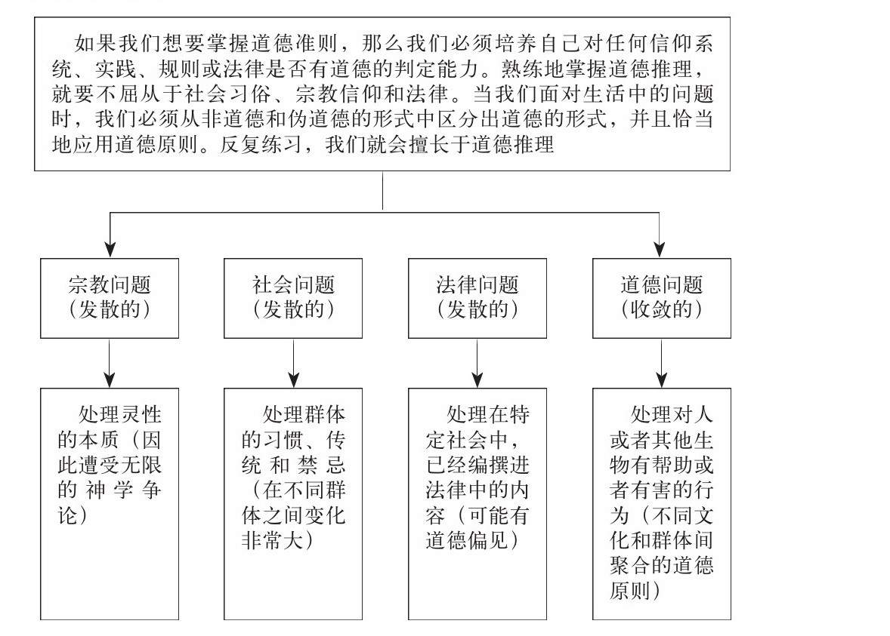

图　14-1　我们应该学会区分道德、社会习俗、宗教和法律问题

### 理解我们的固有自私

除了以上几点之外，道德推理还需要我们控制自身从自我服务视角看待世界的自私倾向。在第11章，我们探讨了人类的无理性倾向，详细地分析了人类自我中心的问题。在这里，我们将会应用第11章的一些主要观点来解决道德推理中的问题。

人类天生就是心胸狭窄、自我中心的。我们可以轻易感受到自己的痛苦，却很难感受到他人的痛苦。我们想自己之所想，却不容易想到他人的想法。并且，随着我们的成长，我们的共情能力不会自发地发展，我们也不会去考虑与我们对立的观点。出于这些原因，我们通常不能从一个真正道德的角度进行推理。共情并不是人类都有的能力，但掌握批判性的思维，或批判性地思考道德问题则是有可能的。经过恰当的练习，我们能够掌握从对立角度分析情境的能力。

正如我们在前面章节中提出的，人类倾向于从自我服务的角度来评判世界，擅长自我欺骗和合理化。我们通常会悍然不顾我们眼前的证据，坚持错误的信念，做出公然违背道德原则的行为，并且不会觉得不合情理。

每一个偏离道德的行为实质上都存在着一定形式和程度的自欺，而每一次自欺实质上都存在一些思维的漏洞。比如，希特勒自信地认为，他对犹太人的迫害和屠杀是正确的事情。他认为犹太人要比雅利安人低下，并且犹太人是德国问题频发的原因。他的行为就是这种错误信念的产物。在铲除德国犹太人的活动中，他相信自己在做符合德国最高利益的事。因此，他认为自己的行为是完全正确的。他偏离道德的推理导致无数犹太人遭到伤害和屠杀。

要掌握道德推理能力，我们必须清楚即使面对强大的自私欲望，我们也要做正确的事情。要生活得有道德，我们必须要控制固有的自我中心倾向。单单理解道德生活的重要性是不够的，单单在不损害自己利益时做正确的事情也是不够的，我们必须牺牲自己的私欲来履行道德义务。因此，理解人的自私倾向与掌握道德推理能力是道德生活的关键。

图14-2是对三种思维模式的综合描述。

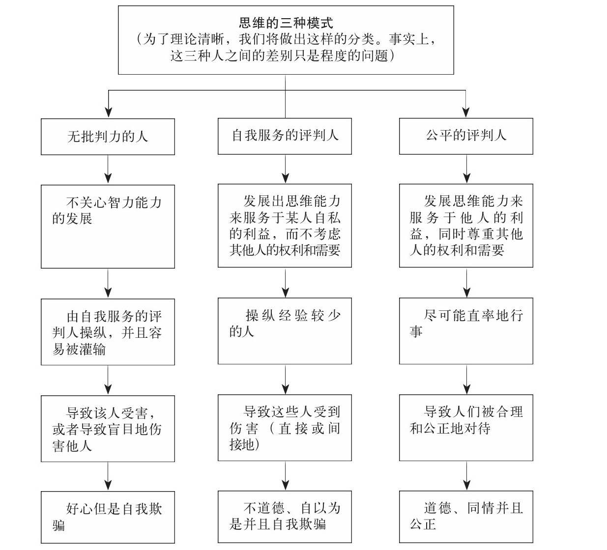

图　14-2　思维的三种模式

## 小结

为了掌握道德推理能力，我们必须内化道德推理的基本原理。这意味着我们必须精确地识别和区分道德概念和原则，必须清楚如何在相关的道德情境中应用这些原则，必须对道德和容易混淆的思维领域做出区分。

道德推理能力要求我们做到思维谦逊，要求我们控制固有的自我中心。如果没有这样有组织、有整合性并且基于批判性的道德推理方法，就可能会导致一些虚假道德的出现。到目前为止，在整个世界范围内，道德经常与其他思维领域相混淆，道德的误用是普遍存在的。

# 第15章　策略性思维：第一部分

策略性思维有两个发展阶段：

（1）理解核心理念。

（2）发展基于该理念的行为策略。

本章和下一章的主要内容将围绕策略性思维的这两个阶段展开。策略性思维是行为实践的规则化。从理解到策略，再从策略到自我改善，是我们要完成的目标。

## 理解和使用策略性思维

如果我们理解头脑的三种功能——思维、感受和需求，并且意识到这些功能是相互依存的，这就意味着，我们能够意识到，头脑某种功能的变化都会导致另外两种产生相应的改变。如果我们改变了自己的思维方式，那么感受和需求水平也应该会发生一些改变。所以，如果我认为你在侮辱我，我会感到愤怒，并想要对侮辱做出回应。

同样，如果我们感受到一些情绪变化（比如难过），那么势必也会引发关于情绪影响因素的思考（比如，思考我们失去了一些重要的东西）。如果我们体验到非理性的负面感受或者非理性的需求，理论上，我们也能够找出产生这种感受和需求的非理性思维。

一旦我们发现了自己的非理性思维方式，我们应该通过更加合理的思维来修正它。当新的理性思维在我们头脑中生了根，我们会体验到感受和需求的变化。合理的感受和需求应该产生于合理的思维。

现在思考：假如你最近结束了一段恋爱关系，并且正在与另一个人约会。在此期间，你发现你的前任正在与你的室友约会。你突然感受到一股强烈的嫉妒情绪，想要痛斥你室友。这时，你非理性的思维是这样的：

我不能允许我的室友和我的前任约会，他们约会对我来说是不公平的。尽管我已经放弃了这段恋爱关系，但我仍希望能够控制她，她现在还是我的！我的室友也没有资格做让我这么苦恼的事情，他应该知道我的感受，我的感受是第一位的。所以，他喜欢我前女友又怎样？他应该去找其他人，而不是我的前女友。如果他是我的朋友，在他的心中，我应该是第一位的。

这种思维（如果我们准确地重现）在很大程度上是无意识的。事实上，没有人会有意地拥有这种思维。不过，通过努力，我们是有可能意识到自身的这种倾向的。首先，你要认识到每个潜在的非理性感受背后都有一个非理性的思维过程。要达成这种认识，你应该首先明确自己正体验到的感受，然后追溯原因，找到产生它的思维。因此，在这个案例中，你应该能够找出引起你对室友产生嫉妒和愤怒情绪的无意识思维。

你会发现，思维通常是高度自我中心和幼稚的。这些暗含的思维正是产生负面情绪的原因。如果你能够确定影响你的情绪和行为的非理性思维，你就能通过调整非理性思维来改变情绪和行为。

简而言之，通过主动地审查、分析和重构，你就能够意识到自己的思维有多么不合理和自我中心。意识到这种非理性后，你就可以主动地使用策略性思维，用理性思维取代非理性思维，例如：

等一等——我的前女友约会有什么问题吗？我自己不也在和新女友约会吗？我的室友与我的前女友约会有什么问题吗？她没有义务在约会前征求我的意见。如果我真的关心我的前女友，我应该祝她幸福。如果他们真心相爱，我难道不应该祝他们幸福吗？如果情况反过来，我难道不希望我的前女友以这种方式对待我吗？

无论何时你产生嫉妒情绪，你都应该慎重地按照上述推理方式进行思考，反复练习直到你发现自己的感受和需求发生了积极的改变。不过我们的大多数非理性思维、感受和需求都是无意识和原始的，改变它们很难。因此，我们不应该奢望自己能够完全摒弃非理性。但是，我们可以通过将非理性思维明确化，来一点点去除自身的非理性。如果我们一点点地去除自身的非理性感受和需求，我们就有可能成为一个拥有健康情绪和需求的理性人。

现在，让我们看看在上述例子中，我们是如何从理解进步到策略，又是如何从策略走向自我改善的：

理解。人类头脑中有三种相关的功能：思维、感受和需求。这三种功能相互依存、相互影响。

策略。不论何时发现自己拥有非理性的感受或需求，都要尽可能找出产生这些感受和需求的思维。然后努力发展理性的思维，用它取代你在这种情境下的非理性思维。最后，当你再感受到非理性的负面情绪时，运用以下步骤在心里预演理性思维：

（1）明确地陈述这种感受和需求是什么。

（2）理解产生这种感受和需求的非理性思维。

（3）理解如何将非理性思维转化为理性思维。

（4）不论何时当你再感受到负面情绪时，反复练习取代非理性思维的理性思维，直到你感受到了理性情绪。

在第15章和第16章中，我们将简要地回顾了书中讨论过的重要概念、原则和理论，并且给出策略性思维的例子。这样做是为了描述怎样应用，以让你更好地理解。

我们希望你能对自我改善有自己的看法。简单、快乐的生活没有公式可循。和你一样，我们也在致力于解决自身思维缺陷的问题。和你一样，我们也在努力变得更加理性和公正。当然，要发展出自己的看法是很有挑战的。

像所有形式的个人发展一样，思维的发展也意味着深刻地改变根深蒂固的习惯。只有当我们成为一名理性人、对自己的成长负责时，这种改变才会发生。策略性地思考必须成为一生的习惯，我们必须用这种思维方式代替惯有的思维习惯，代替那些无意识的、自我中心的思维习惯。

你愿意让自我反省成为一生的习惯吗？你愿意成为策略性的思考者吗？你愿意找出思维黑暗角落里非理性的思维、感受和需求吗？你愿意培养自己的同理心吗？如果答案是肯定的，你会发现这两章策略性思维的内容很有帮助。

## 策略性思维的成分

在继续本章策略性思维的例子前，你要清楚，进行策略性思考时，你自己的思维中必须包括两个成分：

（1）识别活动的成分。你必须能够弄清楚自己的思维何时是非理性或者是有缺陷的。

（2）思维活动成分。你必须主动思考，谨慎地对待自己的思维活动。

在思维活动成分中，你必须弄清楚四种信息：

（1）现在的事实究竟如何。

（2）你对行动的选择。

（3）做出这种选择的合理性原因。

（4）当意识到自己的非理性时，推理的方式或减轻自己非理性的方法是什么。

## 策略性思维的开始

现在，我们考虑一些批判性思维的基本概念、原则和理论，提供这些原则中隐含的策略性思维的例子。在每个情况下，我们都从一个核心的观点开始，然后根据这个观点探索发展思维的策略。我们将通过这种正规方式来解释策略性思维。

### 核心理念#1：思维、感受和需求是相互依存的

如前所述，头脑包括三个功能：思维、感受和需求。这三种功能是互相依存，互相影响的。我们的思维影响我们的感受和需求，我们的感受影响我们的思维和需求，同样，我们的需求也影响我们的思维和感受。

我们不能够立刻改变我们的需求和感受，我们只与思维有直接联系。有些人会要求你去感受你没有感受过的东西，或去追求你不需要的事物，但这些都是没有意义的。我们不会通过其他感受替代的方法而改变感受，也不会通过其他需求替代的方法而改变需求。不过我们可以用一种新的思维方式来代替原有的非理性思维方式，从一个对立的角度进行思考是可能实现的。因此，我们可以通过重新思考我们的逻辑和推理来改变我们的思维。当思维发生改变时，我们的感受和需求也随之做出改变。

策略性理念

只有对思维、感受和需求之间的相互关系有基本的理解，我们才可以注意并评价我们的感受。比如，如果我体验到自己的愤怒情绪，我就要确定这种愤怒是否符合理性。我应该通过评价产生它的思维来评价愤怒是否合理。

真的有人冤枉我了吗？或者是我误读情境了吗？

这种冤枉是故意的还是无意的？

还有其他的角度看待这个情境吗？

我是否公平地聆听了其他信息？

通过追溯思考这些问题，我能够更加理性地理解该情境。

即使我对情境的理解是合理的，我的愤怒是合理的，但考虑到情境的各个方面，我的行为不一定是合理的。愤怒是合理的，但不能因此就做出非理性的行为。

该策略简要概述如下：

（1）识别一种你体验过的非理性情绪感受（诸如非理性、怨恨、自大或抑郁的感受）。

（2）该情绪感受是由什么思维导致的？如果不止一种，弄清楚哪个思维的可能性最大。

（3）确定该思维的理性程度。密切关注你用以证明该思维合理的理由。这些理由会不会并不是实际原因？你能想到其他可能的动机吗？考虑其他的解释。

（4）如果你认为该感受是非理性的，那么，请准确地表达你得出这一结论的原因。

（5）建构该情境中的理性思维。

主动地用理性思维来取代非理性思维，反复演练理性思维。

比如，假设我阅读了一篇关于绝症的文章，通过文章对症状的描述，我认为我很有可能患有绝症，这个结论让我十分沮丧。晚上，想着自己即将死亡，我越来越沮丧。很明显，沮丧就是个非理性感受，它的非理性在于，除非医生给我做了检查，确诊我患有绝症，否则我没有理由相信自己确实患有该疾病。我的非理性思维就像这样：

我有这篇文章描述的所有症状，所以我肯定患了这个病。我很快就要死了，我的生命没有意义。这为什么会发生在我身上？为什么是我？

在相同的情境中，理性的思维会是这样：

是的，考虑到我似乎具有这些症状，我有可能患有这种疾病，但是很多时候，健康的身体也会出现同样的症状。既然如此，有可能我并没有患上这种罕见的疾病，而且这样仓促地下结论对我来说是没有好处的。还有，出于谨慎考虑，为了内心的宁静，我应该尽快去看医生，得到医生的专业诊断。在我拿到诊断之前，我应该去想其他事情，去想比未经证实的病症更加值得思考的事情。

当我发现自己因为文章内容感到沮丧时，我会在脑海反复进行理性思维，并且强烈地批评自己：

嘿，不要走极端。记住，星期一你就会去看医生。不要让自己经历不必要的痛苦，有许多原因能解释你的症状，回到现实中来。记住：“并不是世上所有的问题都有解决的办法。”如果有，那就去把它找出来；如果没有，那就也不要介意。不要沉迷在痛苦中了，因为那只会降低你生活质量，百害无一益。

现在，想想下午打一场网球，晚上看一场好电影，怎么样？

通过改变非理性的需求和动机来改变非理性行为：

（1）识别问题行为（让你陷入困境、给你或者给别人带来问题的行为）。

（2）识别产生该行为的思维。产生这种行为的动机的思维是什么？

（3）分析思维合理的程度，不要遗漏任何重要的相关信息。

（4）如果思维是非理性的，发展理性思维。

（5）主动地用理性思维去代替非理性思维。

有许多例子可以用来阐述上述观点。这里让我们思考一个十分普遍的非理性行为的例子。思考这个情景，人们因为不愿意克服习惯改变过程中产生的痛苦情绪而放弃改变自身的非理性行为：

（1）人们意识到自身已经养成了很多坏习惯，并且理性地认识到必须改变这些行为。如：抽烟、酗酒、吃垃圾食品、运动不足、花太多时间看电视、浪费钱和考试之前“临时抱佛脚”等都是需要改变的习惯。

（2）下定决心改变坏习惯。

（3）在短时间内，人们确实改变了自己的行为，但在此期间，人们体验到了痛苦的情绪。这些负面情绪使人们气馁，所以人们选择放弃。

非理性的情绪感受带来痛苦和不舒服，这让人感到气馁，最终放弃改变自己的行为。这种负面的情绪感受是非理性思维的结果（可能是潜意识的），这种情况下，人们会做出这样的思考：

我希望改变习惯的过程并不伴随痛苦的感受，这种坏习惯已经有好多年了，改变它产生的痛苦太强烈了，我不能忍受这种强烈的痛苦。另外，我真的没有看到改变后的行为对我有多大的帮助。虽然我做出了很大的牺牲，但我并没有看到很大的进展。算了，不要去改了，不值得付出这么大的牺牲。

这种思维是不合理的，改变习惯的过程势必会有体验到痛苦和不舒服的情绪。在这种情景下，理性思维应该是这样的：

不论什么时候，只要我想改变一个习惯，我就必须做好忍受痛苦的准备。改变原有习惯对每个人来说都是不易的。但是，改变不良习惯、做出理性行动必须要忍受伴随而来的痛苦情绪。如果我不愿意忍受改变过程中的痛苦，我就不是真正地改变。与其期待没有痛苦，我不如把这种痛苦当作真正改变的信号，去欢迎它、拥抱它。不要去想：“我为什么不得不忍受它？”要想：“忍受这些痛苦是通往成功的必由之路。”要记住：没有付出就没有回报。

### 核心理念#2：这是有逻辑的，并且你能把它弄清楚

作为一名批判性思考者，你通过在自己的头脑中建构意义体系并做出逻辑推理来弄清事情的方方面面。“逻辑”是这个系统的最大特征。作为一名批判性思考者，你能认识到学术科目是有逻辑的（化学、物理、数学、社会学的逻辑），问题也是有逻辑的（经济问题、社会问题、有争议性的问题、个人问题的逻辑）。

情境有逻辑，个人行为也具有逻辑。有外显和内隐的逻辑，也有公认的和隐藏的逻辑。福利有逻辑，和平有逻辑，攻击有逻辑，防守也有逻辑。有政治逻辑、社会逻辑、制度逻辑，也有文化逻辑等等。

人类大脑的运作方式有逻辑，权力有逻辑，统治、大众信念、宣传和操作也有逻辑。社会习俗有逻辑，道德概念和原则也有逻辑。有神学逻辑、生物学逻辑和心理学逻辑，甚至还有病理学逻辑（疾病和功能失调的逻辑）。具有批判性思维的人，要能弄清楚每一个逻辑。

我们希望你能够用思维元素去弄清事物的基本逻辑，这是获得洞见并掌控事件的有效策略。接下来讨论的内容大体上是在个人生活逻辑范围内的。

人类生活中，多重意义系统十分常见。作为一名批判性思考者，你会发现为什么你的父母、朋友、老师和员工会以这样或那样的方式与你建立各式的联系。每个人都用自己的方式来解释生活情境。在这个过程中，他们应用了思维的八个元素。如果你能够识别出他人思维的元素，你就能够更好地理解他人的逻辑。

你可以思考以下所有内容：

■你所交往的每个人都有自己想要实现的目的或目标。

■每个人都有与这些目的相关的问题。

■他们根据信息进行推理。

■他们根据信息得出结论，但这些信息在该环境不一定都是有逻辑的。

■他们认为一些观点是理所当然的，或做出某些特定预设。

■他们在思维中使用某些核心理念或概念。

■他们在某一框架内思考，这使他们难以客观地看待事物。

■他们产生这种思维的结果和意义。

相信世上万物和人的思维都是有逻辑的，你就能理解这些事物和思维。因此，你会质疑肤浅的解释，达成更深层的理解。你会提出这些问题：

■与你交往的人的目标和目的。

■他们定义自己疑问和问题的方式。

■他们做出的假设。

■他们用来支持论证的信息。

■他们得出的结论。

■指导他们思维的概念。

■他们思维当中的内在意义。

■他们看待情境的观点。

像质疑自己身边人的思维逻辑一样，质疑你自己的思维逻辑。

策略性理念

当你能够意识到任何事情都有逻辑时，你就能对情境中的逻辑进行仔细思考。根据你的目标和目的，你可以通过不同的方式运用该原则。思考批判性思考者理解自己和他人思维逻辑时提出的问题：

（1）对目的、意图和目标的疑问。思考某人、某个群体和自己的中心意图是什么？我们会发现，思维中的问题通常是由基本目标层面的错误造成的。我们必须培养调整自身目标和目的的能力。我们必须清晰地知道自己和他人的目的，并且审慎地对待自己和他人的目的。

（2）对问题建构、难题提出和争议表达方式的疑问。在这种情境下应该强调哪些问题？应该提出的关键问题是什么？我们会意识到，被错误概念化的问题得不到妥善的解决，被误解的问题也无法找到答案。同时，我们需坚持当前问题，明白在有效处理争论中的问题之前，不偏离正题是很重要的。要注意其他人没能坚持的问题情境。

（3）对信息和信息来源的疑问。为了弄清楚正在发生的事情，我们需要收集哪些信息？能够从哪得到这些信息？如何检验这些信息？其他人使用什么信息？他们的信息准确吗？与争论相关吗？我们会意识到，如果我们缺乏有效应对问题所需要的信息，我们的推理效果会大大削弱。同样，我们也很清楚在推理中使用不正确信息会带来怎样的问题。

（4）对解释或结论的疑问。该情境有什么重要的解释、评价和结论？我们得出了什么结论？其他人得出了什么结论？要清楚解释情境的方式不止一种。在解释情境时，需要考虑多种方式，权衡各种方式的优缺点，然后再得出结论。同时，我们也要评价其他人的结论。

（5）对假设的疑问。什么被人们视作理所当然的？存在合理的假设吗？在该情景中，怎样假设是合理的？假设通常是无意识下做出的，因此很难被意识到。我们要能够识别并纠正有缺陷的假设，同样准确地评价他人使用的假设。

（6）对使用概念的疑问。该情景中使用了什么主要概念？这些概念有哪些意义？在该情境中应该理解的重要概念有哪些？我们要清楚，我们思考时都会使用概念，并且我们使用概念的方式是由我们的思考方式所决定。因此，我们必须密切关注自己和他人使用概念的方式。

（7）对考虑观点的疑问。情景中考虑了哪些观点？一些与理解该问题相关的观点是否没有被考虑到？我们会意识到，良好的推理需要考虑多种看待事物的方式。因此，重视从多角度思考问题的价值。

（8）对意义的疑问。我们的推理可能带来哪些结果和意义？有哪些积极的意义？又有哪些消极的意义？如果将两个结论进行比较，会带来哪些意义？我们发现，不论何时，推理都会产生意义。因此，我们需要仔细思考我们和他人的推理或结论会带来哪些潜在后果和意义。

通过上述方法，我们可以理解自己和他人思维的逻辑。要实现这种理解，下面这个例子会提供很大帮助。设想一个人，她日常生活的思维逻辑是：

简单快乐是幸福的关键：睡觉、把玩花草、散步、享受大自然、讲笑话、听音乐和读书。寻求满足生存需要之余的权力和金钱是没有意义的。不要试图去改变世界，因为不论你做什么，都不会有多大的变化。位高权重的人时常会腐败，总是会用他们手中的权力来伤害他人；而普罗百姓又总是慵懒且不负责任。不要卷入他人的事务中，这能避免流言蜚语。

不要为他人的事情担心。不要担心不公正，不公正的人自然会自食其果。对一切事情处之淡然。不要对自己太苛刻，要时常拿自己开玩笑。要避免和他人产生冲突，做好分内工作，珍惜你的朋友，因为朋友会在你需要的时候陪在你身边。

任何想要说服这个人积极主动参与社会、政治和道德活动的行动都是徒劳的。如果你理解她思维的基本逻辑，你会发现，她的回应永远都是一样的：“你不能与政府作对，不要为政府的事情操心。你要避开冲突，你不可能做出任何有益的事，一意孤行很可能对自己造成伤害。”

这种思维逻辑的意义有积极的一面，也有消极的一面。从积极的一面看，这种思维会让这个人比其他大多数人都能更好地享受生活，因为她总是将他人眼中稀松平常的事件看作快乐高兴的事。远望窗外树枝上的鸟儿，这样一个简单的举动就能让她心生温暖。而从消极的一方面看，她认为自己对任何掌控之外的事情是没有道德责任的，这种思维模式让她对那些与自己没有直接联系的人漠不关心。尽管她读书，但是只读小说，读小说也只是为了消遣娱乐。

现在，让我们通过考察其内在思维元素来评价该思维的逻辑：

（1）这个人的主要目标是享受生活，避免卷入任何痛苦之中。这个目标的前半部分是完全正当的，因为人们有权利享受生活。但是后半部分值得怀疑，我们可以从不同的角度思考这一目标。一方面，当自己和与自己有关的人遭受不公正对待时，她认为有义务去帮助遭受不公正待遇的人；另一方面，如果是与她无关的人遭受不公待遇，那么她会认为自己没有义务去帮助这些遭受不公的人。

（2）这个人关心的主要问题是：最大限度地享受生活，避免卷入家庭和工作之外的任何问题。如上面对目标的分析一样，从不同角度评价这个问题。

（3）这个人在追求自己目标的过程中使用的主要是与日常生活直接相关的信息。这种信息是合理的，因为它可以帮助思考者实现她的目标。但是，她并没有使用那些客观公正的信息（关于努力改善环境的信息、关于友好行为可以帮助人们的信息，等等）。

（4）这个人在思维中使用的主要假设是：每个人都可以生活得简单、快乐，这比获得社会赞扬更为重要。在权力的世界中，没有什么是可以真正改变的。只有家人才可以对我们提出道德要求。类似地，假设的前半部分是合理的，而中间部分是不正确的。即使权力结构很难改变，但是辛苦付出确实也能够带来一些改变，支持这一观点的例子很多。至于假设的最后部分，如果她遭遇不公，她希望能帮助她的，不仅是她的家人，而且包括她所称的外人。因此，在这里她可能存在的无意识假设是：“如果我遭遇不公正，希望有人会帮助我走出困境，我有权利受到公正的对待。”

（5）这个人在思维中使用的一些主要概念或原则是：最佳的生活方式是享受生活中的简单快乐。不论你做什么，你都不能和政府作对。不道德的人会遭受自然法则的惩罚。第一条“简单快乐”的概念应用是合理的，这帮助她享受生活中的小乐趣，欣赏日常生活中的简单快乐。第二条原则“不能和政府作对”是不合逻辑的，因为勤勉和毅力能够促进制度的改善。第三条“自然法则”的原则也是不合逻辑的，因为许多做出不道德行为的人并没有遭受任何惩罚，反而给无辜的人带来了痛苦和折磨。使用这个理念，她证实了自己不去改善世界的非理性行为是合理的。

（6）这个人得到的主要结论是：忠于自我和家人，沉醉于自己喜欢的事情中，珍惜每一分钟时间来欣赏生活中的细微欢乐，我可以很好地享受人生。综合考虑她在思维中使用的信息，她得出这样的结论是非常有逻辑的。但是她没有考虑减少不公正现象的道德义务信息，她的结论认为自己对家人以外的人没有道德义务。

（7）这个人的观点是：每一天都是简单、充满乐趣的，并且认为自己只对家人有道德义务。这个人只关心自己和家人的观点，而不关心其他人的观点。

（8）这个人思维的主要意义是，拥有这样的思维可以让她享受生命中许多细小的快乐，但是却不会促使她承担社会责任。这个人只关心欢乐生活，不关心自己可以做些什么来改善这个世界。

### 核心理念#3：进行定期评价，提高思维的质量

拥有批判性思维的人会定期进行自我评价，寻找思维中缺陷，提高自己思维的质量并不断改善自己。作为一个理性的人，我们要不断改善我们的思维——不仅要思考，还要批判性地审视我们的思维，定期地用思维标准来审查自己的思维。也就是说，我们需要不断进行清晰、精确、准确、相关、符合逻辑、广泛、深入以及合理的思考，我们还需要掌握如何用这些标准定期审视自己的思维。

策略性理念

作为一名批判性思考者，我们需要定期使用思维标准来审查我们的思维，评价并改善我们思维的质量。看看真正的批判性思考者是怎么做的：

■关注思维的清晰度。我清楚自己的思维吗？我能够清晰地将我的思维表述出来吗？我能清晰地描述它吗？我能清楚地给出具体的例子吗？我能用类比或暗喻来描述我的思维吗？别人表述的思维足够清晰吗？我需要询问他们思维中的要点吗？我需要他们详细阐述吗？我需要他们举例描述吗？

■关注思维的精确度。我提供了足够多的细节让人完全理解我的意思了吗？我需要更多的细节和特性吗？

■关注思维的准确性。我使用的信息是准确的吗？如果不确定，我如何检查它们的准确性？我如何检查本书中信息的准确性？

■关注思维的相关性。我的观点与当前问题有多大关联？我的解释与他刚刚所说的是如何联系的？他的问题与我们正在讨论的问题是如何联系的？

■关注思维的逻辑性。在当下情境中，考虑到收集到所有的信息，我能得到的最有逻辑的结论是什么？或者还有哪些有逻辑的结论？我不确定他的结论是否符合逻辑，但其他可行的结论是什么？有其他更有道理的结论吗？该结论会带来怎样的后果？

■关注思维的广度。在得出结论前，我是否还需要考虑其他的观点？在仔细考虑该问题时，我还应该考虑哪些观点？

■关注思维的深度。该问题有多复杂？我是否不经意间用了一种肤浅的方式处理复杂问题？我如何深入挖掘情景，处理其中最有问题的内容？

■关注思维的合理性。他的目的是合理的吗？考虑到情景因素，我的目的是合理的吗？或者，是否有自相矛盾的地方？他是如何使用信息的？他是否无意歪曲或者夸大了信息的含义？

# 第16章　策略性思维：第二部分

正如第15章所述，策略性思维包含以下过程：

（1）理解核心理念。

（2）发展基于该理念的行为策略。

本章将讲述批判性思维发展最为重要的障碍——自我中心。第15章介绍了前三个核心理念，所以我们从核心理念#4开始。

### 核心理念#4：自我中心是默认的心理机制

人类的心理是具有二元性的：一方面，人类具有非理性的本能倾向；另一方面，又具有追求理性的能力。为了有效控制我们的思维，使我们的思维趋向理性，我们必须有能力去①监控自我中心和非理性倾向，并且②用理性来制衡非理性倾向。

有自我中心倾向的我们并不关心他人的权利或需要，没有道德底线。只有经过恰当的发展，我们才能发展出理智、逻辑和有道德的理性。这种理性能够调整我们的思维，同时又能提升我们的道德责任感。它是一种结合了思维技能和公平性的思维整合模式。然而，当我们的理性尚未充分发展或者没有被充分使用时，我们与生俱来的自我中心就作为一种默认的心理机制起作用了。如果我们不控制它，它就会控制我们！

策略性理念

对我们来说，只有充分了解个体的自我中心倾向，我们才有充分的能力来制衡它。我们越是了解个体的自我中心，就越能在自己身上找到它，也就越能够去除这种自我中心倾向。实现摒弃自我中心这一目标，就要培养对自己思维逻辑进行分析的习惯。在接下来的例子当中，让我们看看批判性思考者是如何应用这一策略的：

（1）能够分析自己的目标和目的。在该情境中，我真正追求的是什么？我的目标合理吗？我是善意做出的行动吗？我是否有任何不可告人的目的？

（2）质疑自己定义问题的方式。我提出问题的方式合理吗？我是否借由提问的方式给予不同问题有偏的权重？我提出问题的方式是不是一种自我服务式的？我的提问是否仅仅为了追求自己的私利？

（3）评价思维的信息基础。我思考的信息基础是什么？该信息的来源合理吗？我需要考虑其他来源的信息吗？我是否考虑了所有相关信息，还是我仅仅考虑了支持我观点的相关信息？我是否以自我服务的方式歪曲了信息，有意地夸大了一些信息，同时又忽略了另一些相关信息？我是否犯了自我中心的错误，拒绝检查一些信息的准确性？我担心如果信息不准确，我就不得不改变我的观点。

（4）重新考虑自己的结论或解释。我是否为了自身利益而得出了一个逻辑错误的结论？我是否仅仅因为自己的意愿，就拒绝以更符合逻辑的方式看待问题？

（5）分析在思维中使用的理念或概念。我是如何使用基础理念的？我是否使用了正确的专业术语，或者我是否为了自身利益而偏向或误用一些语言？

（6）识别并检查自己的假设。我假设或者认为理所当然的事情是什么？这些假设合理吗？它们是自我中心的吗？我在自己的思维中做出自我中心的假设了吗（例如，“每个人都总是责备我”，“生活应该没有问题”，“我什么也不能做，我被困住了”）？我对他人的期待合理吗？我是否使用了双重标准？

（7）分析自己的观点。我是否固执地坚持自己的观点？是否拒绝考虑其他相关观点？我充分考虑他人的观点了吗？还是仅仅是“听”却没有听进去别人说什么？换句话说，我是否真正地尝试从他人角度理解情境，还是仅仅想赢得一场争论？

（8）思考思维产生的意义。我是否仔细考虑了我思维和行为的意义或可能的结果？我是否拒绝考虑思维带来的结果和意义（因为这样我就必须改变自己的思维而更加理性地考虑情境）？

现在让我们看一个例子，这个例子中的主人公用理性思维发现并制衡了非理性的思维。接下来就是例子情境中的思维片段。编号1~8对应于上面8个策略。

情境如下：

星期五晚，我和女朋友在音像店选择要看的电影。她想看爱情片，而我想看动作片。我给了她所有我能够想到的动作电影更好的理由。但是我发现，我仅仅是想让她遵从我的意见。在我陈述所有支持我的理由的整个过程中，我心里都在暗想：“我要看动作电影，我不喜欢爱情片，我不要看爱情片。另外，因为是我埋单，所以我应该有选择权。”

（1）在该情境中，我的目的是说服女友接受我喜欢的动作片。我意识到我的目的是自我中心的，因为当我回想这些理由时，我发现这些理由一点也不比女友的好。我真实的目的是看动作片。

（2）我提出的关键问题是：“我需要说些什么来说服（或者真正地操纵）她支持我的电影选择？”我现在意识到这个问题是自我中心的，因为我的信念对任何人特别是我爱的人是不利的，这是不道德的。我的问题完全是自私的，它意味着我不在意我女朋友的需要。

（3）我在推理中使用的关键信息是：我为电影埋单，以及其他说服女友的信息。通常我通过经验来获得这些信息，比如，我知道如果我足够坚持，她就会支持我，因为她希望我开心。我知道如果我说出这些理由，她最终是会选择动作电影的，我的理由通常会说服她。现在我回想起来，我不知道她是真的喜欢这些电影，还是她只是想让我高兴。我知道我使用这些信息的方式是自我中心的，因为我没有去思考支持她选择爱情电影的信息，只关注了支持我的信息。我没有注意到自己可能遗漏掉支持她立场的相关信息。

（4）我得到的主要结论是：我们应该选择我喜欢的电影，她很可能也会喜欢它。我意识到这些结论是非理性的，因为它们完全是出于我的自私，只能够让我对看动作电影这件事感觉良好。

（5）我在思维中使用的关键概念是操控，因为我的主要目的是操控她支持我，并且使用的原则是“谁为电影埋单，谁就应该有权选择我们要看的电影”。我意识到自己的这些概念和原则是不正确的，因为它们完全是为自我服务的，导致我以不道德的方式行动。

（6）我在思维中使用的主要假设是：“如果我能够有效地说服我的女朋友，我就能得到自己想要的。如果我的女朋友表现得好像她喜欢动作电影一样，她就确实是喜欢它们。谁为电影埋单，谁就有选择的权力。”我意识到这些假设都是自我中心的，并不是以合理的推理为基础的，它们能够证明我的行为是不道德的。

（7）我进行推理的观点是将我女朋友看成容易被说服和操控的人，并且我还认为自己享有选择电影的权力，因为埋单的人是我。我意识到这些观点都是自我中心的，因为我知道对所爱的人不诚实是错误的。

（8）我的思维带来的结果和意义就是我能够说服操控女友，但是她有可能对我的电影选择感到愤怒。因为我坚持自己的选择，她就不能看爱情电影。我意识到如果我理性地思考和行动的话，就不会出现这些结果。如果我富有理性的话，我会以尊重女朋友愿望的方式思考和行事。看爱情电影，并且让她知道我愿意为她做些事情，而并不总是期望她为我牺牲，她就会更加珍惜我们在一起的时光。

### 核心理念#5：审慎对待我们周围人的自我中心

因为人类在本质上是自我中心的，并且很少有人知道如何制衡自身的自我中心，因此识别我们周围人的自我中心就显得很重要。不过我们必须承认，即使是高度自我中心的人，有时也会理性行事，所以我们必须注意不要形成刻板印象。同样，每个人都会有非理性的时候，所以我们必须以开放的、切合实际的方式评价他们的思维和行为。当我们理解了自我中心的思维时，当我们能够准确地识别他人自我服务的模式时，我们就能够制衡这种自我中心。

我们要对制衡自己的非理性和制衡他人的非理性进行区分。对于他人，我们必须学会沉默，换句话说，我们要将自己和非理性的人拉开距离，或者去间接地处理他们的自我中心。很少有人会对我们指出了他的自我中心表示感谢。人越是自我中心，就越拒绝承认自己的自我中心。自我中心的人拥有的权力越多，他们就越危险。作为一名批判性思考者，我们要学习如何更好地应对他人的非理性，而不被他们所控制或操纵。

当非理性主导人们的思维时，人们会发现很难站在他人的角度进行思考。人们会无意识地拒绝考虑与我们自我中心观点相违背的信息。人们会无意识地追逐不正当的目的和目标。我们的假设也是根据自身的偏见做出的。人们总是无意识地自欺，拒绝发现自身的自我中心。

另一个与应对他人自我中心相关的问题是我们自己的自我中心倾向。当我们与自我中心的人交往时，我们自己的非理性天性很容易被激起。或者更为通俗地讲，我们的自我中心按键很容易被按下。当他人以自我中心的方式对待我们、侵犯我们的权利或忽视我们正当的需求时，我们自身与生俱来的自我中心很可能会被启动来保护自己。在这种争斗中，自我中心遇见自我中心，这里，每个人都是输家，没有赢家。因此，在应对他人的自我中心时，我们必须能够觉察自己的自我中心，并用恰当的理性思维来应对它。

策略性理念

一旦我们清楚人类的自我中心是与生俱来的，并且大多数人都没有意识到自身与生俱来的自我中心时，我们就会知道我们在任何场合都在处理和应对这些非理性的自我中心。因此，我们可以质疑他人是否提出理性的理念，是否追求理性的目标以及是否以非理性的动机行事。我们能够觉察出他人的错误观点。我们会仔细地观察他们的行为，确定他们行为的实际的意义。

我们知道我们自身的非理性很容易被他人的非理性行为唤起，因此我们必须要谨慎地观察、评价自己的思维，确保自己理性地应对他人的自我中心。我们要密切监视自己自我中心的思维，当觉察到它的存在时，要采取行动制衡它，尽最大的努力去除它。当我们意识到自己在应对一个人的非理性时，我们要尽最大努力不让这个人的自我中心唤起我们的非理性天性。

要避免被他人的非理性影响，策略上讲，最好是尽可能避免与高度自我中心的人接触。当我们发现自己深深地卷入了与这类人的交往中时，应该寻找方法脱离这种人际交往。而当脱离不可能实现时，我们应该将交往减到最少，或者以能最小限度唤起他们自我中心的方式来行动。

了解到哪些条件下他人可能产生最高限度的自我中心反应，我们就可以将一个人的自我中心唤起降到最小。能够唤起他人自我中心的情景主要是人们感觉受到威胁、羞辱或者严重涉及利益和自我形象。从他人的观点进行思考，我们就可能预测我们周围人的自我中心反应。这样，我们就可以通过调整自我反应来回避掉他人自我中心的影响。

### 核心理念#6：人们倾向于做出超出个人经验的概括

著名的儿童心理学家让·皮亚杰在研究儿童时，得到一个重要发现，即儿童倾向于过度概括自己的直接感受。如果一些好事发生在他们身上，对他们来说，整个世界都变得美好了；如果一些坏事发生在他们身上，对他们来说，整个世界都糟糕透了。他把这种现象称为直接的自我中心。

然而，皮亚杰没有强调的是，许多成人思维也有相似的反应模式。用长远的眼光看待世界对每个人来说都不容易做到。因为我们的即时（情绪的）反应要保持看待事物的恰当角度是不容易的。

生活中某一情境和事件的负面性常常会带来广泛的负面影响，这种负面性有时甚至会在我们整个生活中投下阴影。不论发生在我们身上的是负面还是正面事件，过分悲观主义还是愚蠢乐观主义，这些不合理的想法总会主导我们的思维。我们能够迅速地从生活中一两件负面（或正面）事件上跳到认为我们生活中一切都是负面（或者正面）的想法上。自我中心的负面思维很容易带来放纵和自怜，而自我中心的正面思维很容易导致不切实际的自满。

甚至一个国家都可以通过一件积极事件就给自己贴上不切实际的自满的标签。1938年在英国，张伯伦（Neville
Chamberlain）带着与希特勒达成的协议从慕尼黑回到伦敦，他宣布：“我们的时代是和平的！”大多数英国人洋洋得意地庆祝获得了希特勒的承诺，但却没有考虑到希特勒一贯食言的事实。整个英国陷入了一种由直接自我中心带来的全国性狂喜状态。

丘吉尔表达了对希特勒让步的怀疑，但像这样理性的声音被视作杞人忧天，因而被毫不留情地弃置一边。但是，丘吉尔的怀疑是从长远、实际的眼光来思考整个事件的。

思考悲观主义者每天所必须要面对的问题。早上醒来，他们不得不处理一些意料之外的琐事。随着他们处理的“问题”增多，生活中所有的事情都开始显得负面起来，渐渐地，坏事像滚雪球一样越滚越大。这一天结束时，他们已经看不到生活中任何积极的事了。他们的思维（通常是隐性的）是这样的：

所有事都很糟糕，生活不公平，我身上从没有发生过任何好事。我总是不得不应对问题，为什么发生在我身上的事都这么糟糕？

一旦这些想法主导了他们的思维，他们就失去了用理性思维制衡负面思维的能力。他们看不到生活中的美好事物，他们的自我中心思维让他们看不到更加实际、积极的事实。

策略性理念

如果我们在自我中心的负面作用开始主导我们思维之前就能够理性地思考，那么我们就能减轻这种负面作用的影响甚至根除它。首先，这要求我们了解直接的自我中心。然后，在自己和周围人的生活中找到直接自我中心的例子。

接着，我们要列出一张丰富且全面的生活事实的清单。摒弃自我中心，以理性思考的角度列出这张清单是很重要的。

不论事件积极还是消极，我们都要以长远的视角给予事件恰当的考量。我们必须确定我们最为重视的事情，必须形成长远的历史的视角，必须以正确的价值观和长远视角来看待问题，必须摒弃片面的、过分概括化的自我中心。当我们头脑中形成一个看待问题的完整“大图”思维框架时，那些不重要的事情就不会因为我们的偏见和错误信念而被不成比例地放大。

当我们感受到自己存在直接的自我中心倾向时，我们要主动地以理性思维来制衡它。我们要对自己的思维进行推理，指出思维中的缺陷，识别我们忽略的相关信息，找出我们歪曲的信息，检查我们的假设，并思考我们思维产生的结果。

简而言之，通过在头脑中形成一幅深刻全面的“大图”思维框架，通过在日常生活中尽可能全面地考虑观点，我们能够将自己的直接自我中心倾向减到最小。我们可以有效地分析我们生活中事件的重要性，进而无论在大风大浪的生活海洋中，还是在琐碎平静的日常湖面上，我们都能掌握好正确的人生方向。

### 核心理念#7：误把自我中心思维作为理性思维

人类难以识别自我中心思维的首要原因是，它常常以理性的样子出现。没有人会对自己说：“我应该非理性地思考这一问题。”当我们处于非理性状态时（比如非理性的暴怒状态），我们通常会感到愤愤不平并认为受到不公平的对待。自我中心思维以各种各样的方式蒙蔽我们，它让我们自欺。

我们总会认为自己是理性的——我们的感受似乎完全是合理的，我们的思维似乎没有任何漏洞，我们没有任何理由去质疑自己的思维，我们找不到任何理由以不同的方式行事。我们总是很难意识到自身的自我中心是非理性的，当这种自我中心能够让我们实现自己的目的时尤其如此。

策略性理念

一旦我们意识到自我中心思维常常以理性思维的形象出现，一旦我们用自己生活中的例子来证实这一事实时，我们就能够做出改变了。我们能够学会预测自我中心的自欺，之前我们需要觉察这种自欺的线索。比如没有真正思考反对观点、对反对者形成刻板印象、忽视相关的证据、情绪化地反应，以及为非理性的行为找借口，等等，都是我们应该注意的线索。思考下面这些例子：

情境1：你正开车去学校。马上要开过去时，你才注意到出口匝道。这时，你突然转弯驶向匝道，这让后面的司机防备不及而突然停车，他向你鸣喇叭大吼，你又吼回去。而另一辆车又突然变道，迫使你突然停车，你又向他鸣喇叭大吼。

在这件事中，你心里感到自己的行为是“公正”的。毕竟，你要准时到达学校，你并不是有意想阻碍谁的行驶，而且另外一个人也没有权力阻碍你。我们自欺时，经常使用这种过分简单化的思维：我们忽略否定自己观点的证据，并且强调支持自己的证据。因此我们不会体验到负面的情绪，并且认为自己的思维、感受和行动是公平的。

情境2：你考试考得很糟，回到自己的房间后，你发现你室友在很大声地播放音乐并跟着唱歌。你说：“我们就不能安静一会吗！”你的室友说：“你怎么了？”你摔上房间的门，闷在屋里一个小时，特别沮丧、愤怒。过了一会儿，你走出房间，发现室友正在和一个朋友聊天，他们没有理你。你说：“好吧，你们俩对我可真是友好！”摔上门，你走了出去。

有时在这种情况中，冷静下来之后，我们会从自己的直接自我中心中恢复过来。但是在现实情景中，我们感到自己的愤怒和沮丧是正当的，自己是公正的，从而我们会强化自身的愤怒，发现自身的委屈并将其任意夸大，却感受不到自己的自欺。

理论上，我们有能力发现自己何时在自欺以及何时在歪曲事实。我们能够培养自己以下这些行为习惯：

（1）从我们自己和与我们意见相左的观点出发来全面分析事件。和他人交谈时，我们可以通过解释自己对他人观点的理解来审视自己。

（2）不论何时，当我们感到自己完全正确、反对我们的人完全错误时，都要对自己对问题的解释持怀疑态度。

（3）当我们受强烈情绪的影响时，推迟对他人和事件的评价。直到我们可以冷静地质疑自己，并且相对客观地看待事实时，再做出评价。

### 核心理念#8：自我中心思维是自动发生的

和理性思维不同，自我中心思维以高度自动的、无意识的方式起作用。基于原始的、“幼稚的”思维模式，自我中心思维程序化且机械式地对情境做出反应。因此，我们必须承认，在我们有机会回避或制止它之前，它已经出现并运作起来。它坚持，它回避，它拒绝，它压抑，它合理化，它扭曲，它否定，它为其他事物做替罪羊……一眨眼的工夫内，它就能完成所有这些，且完全没有意识到这些都是自欺的把戏。

策略性理念

因为我们知道，非理性思维以可预测的、程序化的和自动的方式起作用，我们要想成为对自己思维中自我中心机制的观察者，就要观察思维的机械动作并主动地将无意识水平下的思维活动提高到有意识的水平。就像皮亚杰要求的那样，在我们发展成为批判性思考者的初期阶段，努力将思维活动带入到意识水平，通常会表现出事后诸葛。不过，通过一段时间的练习之后，我们就可以敏锐地意识到自我是如何起作用的，我们就可以用理性思维活动阻止自我中心思维。

比如，正如核心理念#7当中提出的，我们要能够识别我们的思维何时倾向将事件合理化，并且熟悉我们倾向使用的合理化方式。比如，“我没有时间做这些”是一个普遍使用的合理化方式。不过，记住“对于重要的东西，人们总是有时间”，我们就可以很好地限制这种合理化方式的使用。紧接着，在识别之后，我们要面对事件的实际情况，上述例子的实际情况是“我不愿意为此留出思考空间”，也可能是“我知道它很重要，但只是通过说‘我没时间’来自欺”。

经过一段时间的训练，我们能够注意到我们何时会否定一些重要事实。我们开始能够注意到我们何时会拒绝思考一些事实，而不去开放、直接地应对它。我们能够识别自己何时会自动地用不诚实的方式思考，来避免继续寻找问题的解决方案。

理论上，我们能够分析自我中心思维这一自动模式。最为重要的是，我们能够学会在意识到自己的这种非理性倾向后，主动施加干预，以积极摆脱非理性的思维。简而言之，我们能够拒绝受到原始需求和思维模式的控制，能够主动地用理性思维来取代自动的自我中心思维。

### 核心理念#9：我们经常通过控制或顺从来谋取权力

当人们非理性地思考时，人们会通过控制或顺从行为来实现自身的目标。换句话说，当处于自我中心状态时，我们会试图通过控制或顺从他人来获得他人的支持以达到我们的目的。欺凌弱小（控制）和卑躬屈膝（顺从）在本质上是不易察觉的，在人类生活中，这两种行为很常见。

权力本身并不是坏事。我们都需要一些权力来实现我们的理性诉求。但是在人类生活中，人们通常把权力本身作为目标来追求，或者利用权力来达成不道德的目的。自我中心的人或者社会中心的群体要获得权力的典型方法：一个是控制更加弱小的人或群体，另一个则是向更有权力的人扮演顺从的角色。人类许多历史都可以用来说明这两种被个人和群体使用的自我中心的方法。通过观察个人行为的这两种模式，我们可以更深地理解个体行为。

尽管不同的个体会对这两个行为模式有不同的偏向，但是每个人都在一定程度上使用所有的两种模式。比如，一些孩子向父母扮演顺从的角色，同时又会欺凌其他小孩。当然，当一个更强壮的欺凌者出现时，这名欺凌者通常会顺从更强壮的人。

我们并不容易觉察我们的控制和顺从行为。比如，人们参加滚石演唱会是为了享受音乐，但是有一些观众表现出的行为通常是高度顺从的（崇拜的、追星的），甚至会有许多人扑倒在名人脚下，通过附于名人来获得自己的重要性。相似地，体育迷经常神化、理想化他们的英雄，对他们来说，这些英雄比生命更重要。如果他们的队伍或英雄成功了，他们也会感受到成功并拥有更多的力量。他们会说“我们真的彻底击败了他们”，其实这句话的意思是：“我像我的英雄一样重要、成功。”

理性的人可能崇拜他人，但不会理想化、神化他们。理性的人可能有自己的组织，但不会在组织中受他人控制。他们不期望他人盲目地顺从自己，也不会盲目地顺从他人。尽管我们都不能完全实现这种理性理想，但批判性的思考者会不断地向这个方向努力。

顺便说一下，传统的男女性别角色需要男性控制女性，女性对男性顺从。女性通过附属于有权力的男性来获得自身的权力，男性在对女性的控制中展现权力。这种传统的男女关系在当今还没有消失。比如，许多媒体仍然以传统的性别角色来描绘男女。因为受一些社会的影响，男性倾向于表现出更多的控制、更少的服从，而女性倾向于更加服从，这在亲密关系中尤为明显。

策略性理念

如果我们意识到自我中心的控制和顺从在人类生活中的作用，我们就能够观察自己的行为，确定我们何时在非理性地控制或顺从于他人。当我们理解自我中心是人的本能，意识到要识别控制和顺从的模式时，我们就要审慎地检视我们的思维。通过反复练习，我们就能觉察自己和他人的控制和顺从模式，就能够注意到上司、朋友、父母行为中非理性的控制和顺从倾向。

简而言之，我们对人类生活中控制和顺从的模式了解得越深，我们就越能够在自己的生活中觉察到它们。而只有我们觉察到它们的时候，我们才能够采取行动改变这些行为。

### 核心理念#10：人类的社会中心倾向是天生的

我们除了有天生的自我中心倾向外，还很容易卷入社会中心的思维中。群体给我们带来安全感，能够让我们内化并且不假思索地遵守它们的规则、命令和禁忌。在成长的过程中，我们会遵从许多群体，同龄群体特别能影响我们的生活，我们会无意地接受该群体的价值观，相信“如果我们相信它，它就是真的”。

我们不仅会接受我们所属群体的信念，还会依照这些信念行事。比如，许多群体观念在本质上是违反自然规律的，会带来许多不合理的行为。比如，一些年轻群体将群体成员对外人的侮辱作为权力和勇气的象征。

除了我们直接从属的群体之外，我们还间接地受到体现我们社会成员身份的宏观社会的影响。比如，在资本主义社会，占统治地位的思维是：人们应该尽可能多地赚钱，以及社会中存在的巨大贫富差距是正常的。

又比如，社会中大多数公共事件的提出和解决方案都由新闻媒体做出的，这造成人们通常根据过分简单的媒体思维来思考复杂问题。就像媒体的报道让许多人相信要“对犯罪采取强硬态度”一样，简单的思维取代了处理复杂社会问题的合理方式。

好莱坞电影中对生活的描绘也会对我们看待自己和生活问题的方式产生重要影响。社会中心倾向的影响能够公然地在社会生活各个水平上发挥细微的作用。现代社会中普遍存在许多社会中心的力量。

策略性理念

人类天生是社会中心倾向的。我们通常会认为，因为我们是群体成员，我们的行为必须要反映我们所属群体的规范和禁忌。我们都在不同程度上不加鉴别地遵守我们群体的规则和期望。当我们能够意识到这些时，我们就能够对这些规范进行批判性的分析和思考，并理性地思考群体的期望是否合理。

当我们识别出群体中的非理性期望和要求时，我们就能够拒绝遵守这些要求，就能够调整自身的团体成员身份，加入到更加理性的团体中。我们也能够主动创造新团体，创造重视正直和公平、重视成员思维的独立性以及重视共同努力实现该目标的团体。

或者，我们也可以将自己所属的群体最小化来减少自己的社会中心。我们要审慎地对待大众媒体的传播和报道，抵制媒体的简单化思维。简而言之，通过深入理解社会中心思维，我们能够控制群体对我们的影响，并能显著地减少这种影响。

### 核心理念#11：理性的发展需要练习

理性能力获得重要发展会花费数年时间。现代社会中流行的“现在就不可或缺”的观点阻碍了人类能力向更高水平的发展。想要发展自身的理性是没有捷径可以走的。想要更擅长于推理和应对复杂的问题，我们必须坚持练习。就像垒球运动员必须一遍遍地练习跑位才能在比赛中表现出精湛的球技一样，批判性思考者必须不断地练习才能掌握批判性思维。

策略性理念

了解到日常练习对于我们理性能力的发展是非常重要的，我们必须养成不断追求理性发展的习惯。我们必须能够识别自我中心倾向，并且不断减少这种自我中心倾向对我们思维的影响。当我们发现我们经常根据自私的本性来做出决定时，我们就能够用同理心、用替代观点来对这种自私进行制衡。

我们要培养自己经常评价自身思维清晰度、准确度、逻辑性、重要性、广度、深度以及合理性的习惯。比如，要想培养我们评价自己思维清晰度的习惯，我们就要定期地详细阐述自己的观点，向他人陈述观点时要给出的具体例子。同时，我们也要要求他人在陈述观点时，详细阐述并且举例说明他们的观点。要养成运用思维标准评价自己的习惯，定期反思自己以确定自己是否形成了这些习惯，以及确定我们的思维发展程度。

## 小结

批判性思维能力的培养（批判性思考并且不断寻求能力提高的思维）以两个相互重叠但是却截然不同的原则为前提。首先，我们必须对我们思维的运作方式有深入的理解。与批判性思维有关的概念、原则和理论是本书着重探讨的焦点。然而，仅仅知道这些概念、原则和理论是不够的，我们必须将他们内化为自己的一部分，必须能够熟练地运用他们。没有理解和内化的概念、原则、理论对我们来说没有一点儿用处。

其次，真正的策略性思维要求从理论水平上获得原则和理念，并在实践水平执行这些理论原则来不断改善我们的所思、所行和所想。在你思考自己的思维和行为时，要注重将掌握了的批判性思维的重要理念带入到现有思维、改善行为的方式。将抽象的概念理解发展到应用理解来改善生活是我们应该达成的最终目标。只有当你开始策略性地思考时，你的思维品质才会得到显著地改善。

# 第17章　成为一名高级的思考者：总结

在学习任何一种技能时，反复练习都能带来进步，并且是持续进步。本书中的内容为训练批判性思维提供了丰富的练习和参考。要养成批判性思维，我们必须参考这些方式进行反复练习。运用本书中提供的参考技能和工具，反复练习，最终成为一个高级的思考者应该是读者阅读本书的目标。

高级的思考者能够形成分析自己思维的习惯，会在更深层的思维水平上理解观点，能够控制个体与生俱来的自我中心和社会中心倾向，而且能够做到思维上的谦虚和持之以恒。

## 练习批判性思维

高级的思考者是会系统审查自己对概念、假设、推理和观点的思考的人。换句话说，对那些有批判性思考能力并且定期剖析自己思维的人，高级的思考者是他们发展的第5个阶段。那些注重培养自己思维清晰度、准确性、精确性、相关性、逻辑性和合理性的人也是高级的批判性思考者。

高级的思考者具备的一些重要特征是：

■理解思维在自己生活中扮演的重要角色。

■理解思维、感受和需求之间的密切关系。

■自己需要对思维、感受和需求做定期监控。

■有效使用一系列改善自己思维的策略。

■定期批判性的思考自己的习惯。

■坚持发展新的思维习惯。

■注重思维的完整性。

■审慎对待生活中的不一致和矛盾。

■有同理心，与他人换位思考。

■有勇气直面产生负面情绪的思维。

## 阶段5：高级的思考者

练习阶段和高级阶段有明显的持续性。没有一条明确的分界线清楚地区分这些阶段。然而，简要地说，当我们发现自己能够很好地掌握理性生活规则时，我们就接近高级思考者的阶段了。一些人已经达到了高级阶段，下面罗列的是这些人的特点。当然，我们并不认为所有人在所有这些特点上的发展程度都是一样的：

■定期寻找思维中的缺陷，并成功地处理这些缺陷。

■准确地识别出生活中需要得到改善的重要领域（例如，学生、员工、父母、丈夫、妻子、消费者），并通过练习在大部分领域中取得显著进步。

■不再极度迫切的强求理性。

■继续搜索思维、情绪和行为中存在的自我中心，能够克服这些非理性的思维和情绪，并且相应地改变自己的行为。

■能够很好地承认自己犯了错误。

■喜欢那些给我们建设性批评的人。

■享受在行动中观察自己思维的过程。

■享受理解分析他人观点的过程。

■从学习与我们有显著不同的思维中获得满足。

■定期识别分析思维中的假设。

■不再关心维持肤浅的形象，在反对集团信念时不会再感到不适。

■确定错误思维带来的非理性行为、动机和感受。在这一学习过程中获得令人满意的结果。

■用不同的方法来调整自己的思维，并改变自己的感受。

■经过反复练习，发现并调整思维的活动是自动发生的，并且不需要很大努力。

■通过对行为和思维的分析，理解自我中心和社会中心在人类生活中造成的问题。

■意识到自身发展程度取决于减少生活中自我中心倾向的程度。知道如何减少对他人的操纵和顺从。

■意识到与生俱来的自我中心思维不是一种理性的思维模式。

■擅长觉察自己和他人的自我中心思维。

■能觉察出他人思维的逻辑，并且能觉察出他人何时在以自我中心的方式行事。

■能够识别他人何时试图对我们进行思维操纵。

■定期写下自己思考的东西以便更好地分析。

■向批判性思维者详细阐述自己的思维，来确保我们没有不合逻辑地解释情境，并对抗自我中心的无意识思维。

■因为人生来倾向自欺，所以必须主动调控自己的思维。

■使用内在对话来审视并改善思维。思考下列高级思考者内在对话的例子。

内在对话的例子

■我不清楚这个人试图跟我传达些什么。我需要问些问题来弄清楚情况。我应该要求她详细阐述自己的观点，我想我还需要一个具体例子。

■我不确定他说的是否与问题相关，他的信息是否与我们试图解决的问题相关，他的问题是否与这次会议的焦点相关。

■似乎我对情境的解释存在一些不合逻辑的地方。也许我在收集相关信息之前太急于得出结论。也许我这个结论是根据不准确的信息得出的。也许我的解释只是出于对自己利益的考量。有可能我固有的自我中心阻碍了我重新思考结论。

■我开始意识到自己听不进他人的观点，因为他的观点会让我不得不反思自己的立场。不论何时，当我感受到自己的这种防御性时，我知道我犯了自我中心的毛病。我会努力发现自己的荒谬，强迫自己理性地思考对立的立场，以善意行事而不是去实现自己试图隐藏的目的。

■我能知道自己在想些什么。我没有试图解决观点冲突，而是试图强迫他人接受我的观点。我希望他人完全按照我所说的行事，即使伤害他也在所不惜。我能够觉察出自己操纵他人的想法，并且知道不论何时出现这种想法，我就是非理性的，很可能对他人造成伤害。我必须认识到企图操纵他人的想法是一种伤人的思维模式，要努力摒弃这种想法。

■我会考虑为什么我要屈从于他人。不论什么时候屈从于他人，我都要问一问自己是不是想在该情境中得到些什么？是不是想从这个人那里得到什么？为什么在这种环境中，我会选择服从而不是更加理性一点？也许屈从他人的真正原因是想要操控他以得到我自己想要的东西。如果我告诉他真实的原因，我还能够得到自己想要的东西吗？我会发现自己需求中的荒谬吗？

达到思维发展的高级阶段可能要花几年时间，许多因素都会影响该方向的发展，其中最重要的是动机、投入和反复练习。

## 阶段6：完善的思考者

练习阶段和高级阶段是连续的。没有明确的分界线清晰地区分这两个阶段。然而，简要地说，当我们能够自动地做出原本需要刻意付出努力的事情时，我们就已经接近高级批判思考者的阶段了。反复练习会使得行为自动化，当高度熟练的表现成了思维活动的特征时，我们就进入了完善水平阶段。

“完善”思维有以下特点：

■系统地管理自己的思维，不断地监控、修改并且重新思考策略以获得思维的持续进步。

■拥有深刻的、内化了的思维技巧，批判性思维既是有意识的又是高度自觉的。将批判性思维提升到皮亚杰所说的“有意识”水平。

■积极地自我评价，主动地分析生活中所有重要领域的思维，并且不断发展出在更深思维水平上的新见解。

■致力于公平的思维，尽力控制自我中心本性。

■系统地监控思维中概念、假设、推理、意义和观点的作用，并且不断地完善这种监控。

■对思维有高水平的认识和实际洞察力。

■自觉地评价自己思维的清晰度、准确性、精确性、相关度、逻辑性以及所有的思维标准。

■将批判性思维内化为自己的思维习惯。

■经常地、有效地并且富有洞察力地批评自己的思维，并不断改善自己的思维。

■不断地监控自己的思维。

■经常有效地、极富洞察力地表达自己思维中固有的优缺点。

■关注自己思维的易谬性。

■能够做到思维的谦逊、公正、坚毅、有勇气、有同理心、自主、有责任感和公平。

■能够很好地控制自我中心和社会中心思维。

我们中的大多数都不会成为高级批判性的思考者，这就像高校棒球运动员中不会有很多人发展成专业棒球运动员，或者学生作家中不会有很多发展成著名小说家那样。然而，我们要认识到成为一名高级批判性思考者是很重要的，要把它作为理想去奋斗，把它看成是可能实现的并为之不断奋斗。也许在未来，批判性思维将会成为一种受到高度尊重的社会价值。

发展的第6阶段——完善的批判性思考者阶段，也许我们用第三人称来描述它最合适，因为我们不清楚在非理性时代中生活的人是否有资格做一名真正完善的思考者。可能是因为所有人都深陷社会制约之中，所以我们不太可能成为完善的思考者。然而这个概念是很有用的，因为它提出了我们奋斗的目标，并且理论上，一些人是可以达到这个阶段的。

完善思考者需要一个批判型社会，一个重视批判性思维、会对有批判性思维的个体进行奖励的社会，一个父母、学校、社会团体和大众传媒重视培养并尊重批判性思维的社会。而在当下的社会中，当人们必须用理性来应对解决生活中的非理性时，要求人们达到批判性思考者发展的最高水平就显得过于苛刻了。

## 完善的思考者的心理品质

以下罗列的是对完善的思考者来说最为重要的心理品质。完善的思考者：

■能够意识到自己思维的运作。

■是高度整合的。

■是合乎理性的。

■是有逻辑的。

■是目光长远的。

■是深刻的。

■是能够进行自我修正的。

■是自由的。

下面将详述每一条心理品质。

完善的思考者能意识到自己思维的运作。他们：

■意识到自己的思维和行动模式。

■深思熟虑地做出思维改变。

■赞同自己的内在逻辑。

完善的思考者是高度整合的。他们：

■灵活地运用不同的知识。

■洞察基本概念和原则，组织大量信息。

完善的思考者是合乎理性的。他们：

■能够概括知识。

■遵从语言逻辑。

■合理地使用概念和问题的逻辑。

■能够在多重思维框架下推理。

■能够通过思考“增加”理解和洞察力。

完善的思考者是有逻辑的。他们：

■经常分析事物的逻辑。

■综合分析多个理由和证据。

■保持高度的一致性。

完善的思考者是目光长远的。他们：

■采取长远的观点。

■规划自己的发展。

■关注最终价值。

完善的思考者是深刻的。他们：

■对自己的基本信仰和价值观有深刻见解。

■抓住自己思维和情绪的根本。

■确保自己的信仰有理性的基础。

■了解思维、感受和行动背后的深刻动机。

完善的思考者是能够进行自我修正的。他们：

■应用思维标准评价自己的思维、感受和行为。

■发现并批评自己的自我中心和社会中心。

■关注自己的矛盾。

完善的思考者是自由的。他们：

■追求理性。

■能够调整自己的生活模式、习惯和行为。

■是理性和公平的榜样。

## 完善的思考者的内在逻辑

因为完善的思考者成功地将自己的理想和思维、情感、行动联系起来，他们在行动时是有很高的自我实现感和幸福感的。理性是他们自我认同的重要部分，他们能够很好地调整自己的思维，能洞察那些企图利用地位和权势来威胁他们的策略，能够对那些因为惧怕权势而企图逃避的人表达异议。他们意识到了人类生命的短暂，从而更加珍惜现有的生活。他们努力做到诚实和自我完善，建立没有自欺和欺骗他人的人际关系。

完善的思考者能够意识到自身在广阔世界中的位置，努力去实现自己能够实现的目标。他们不被他人所控制，有自己的信念和观点却不深陷自己的观点之中，不被自己的偏见和谬见所蒙蔽。

## 完善的思考者

不论是否存在或者将来是否会出现完善的思考者，都不可能存在“完美的”思考者，因为人类头脑不可能以一种“完美的”方式运转。人类所有的发展都受到人类易谬性的限制。不论我们的理性发展到了多高的程度，我们固有的自我中心和社会中心都不可能完全被去除。不论我们的整合性发展到多高的程度，我们的意识还是会错过一些矛盾和不一致。不论我们的洞察力发展到多高的程度，我们都会有无法达成的洞见。不论我们内化了多少观点，我们都无法全面理解所有的观点。不论我们的经验多么丰富，我们都无法获取所有有益的经验。

不论我们大脑开发到何种程度，我们的思维永远是有限的、易犯错误的、自我中心的、社会中心的、存有偏见和非理性的。正因如此，完善的思考者能够强烈地意识到自己的局限性，知道自己离“完美的”思考者还有多远。因此，他们会不断地学习，不断地开发自己的头脑，以及不断地反思批评。

# 参考文献

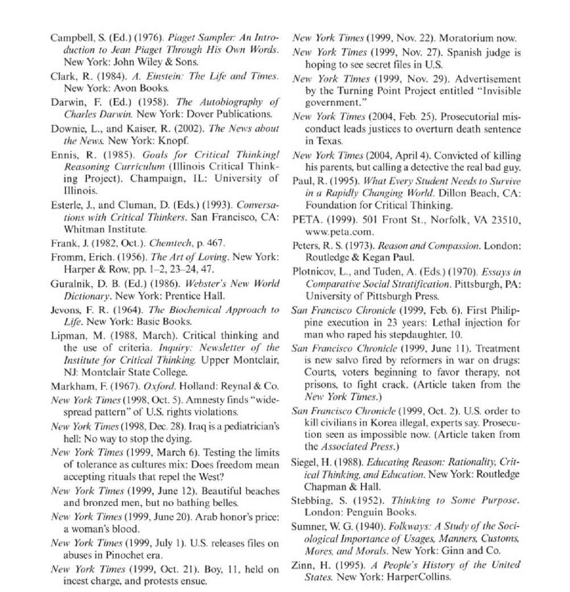

