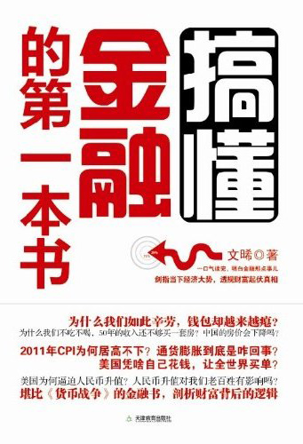

<svg xmlns="http://www.w3.org/2000/svg" xmlns:xlink="http://www.w3.org/1999/xlink" version="1.1" width="100%" height="100%" viewbox="0 0 341 500" preserveaspectratio="none">

<image width="341" height="500" xlink:href="cover.jpeg"></image>
</svg>

目　录

<a href="#part0001.html_chapter1"
id="part0000.html_title1">第一章　钱是如何进化的？</a>

<a href="#part0001.html_subid1"
id="part0000.html_title2">钱是怎么来的？</a>

<a href="#part0001.html_subid2"
id="part0000.html_title3">什么叫做钱？</a>

<a href="#part0001.html_subid3"
id="part0000.html_title4">货币天然是金银</a>

<a href="#part0001.html_subid4"
id="part0000.html_title5">从金银到金本位</a>

<a href="#part0001.html_subid5"
id="part0000.html_title6">唯有黄金才是钱</a>

<a href="#part0001.html_subid6"
id="part0000.html_title7">绿纸片变黄金</a>

<a href="#part0001.html_subid7"
id="part0000.html_title8">世界从此不同</a>

<a href="#part0002.html_chapter2"
id="part0000.html_title9">第二章　银行是干什么吃的？</a>

<a href="#part0002.html_subid8"
id="part0000.html_title10">它为什么叫“银行”</a>

<a href="#part0002.html_subid9"
id="part0000.html_title11">最早的银行</a>

<a href="#part0002.html_subid10"
id="part0000.html_title12">文艺复兴教父</a>

<a href="#part0002.html_subid11"
id="part0000.html_title13">不一样的银行</a>

<a href="#part0002.html_subid12"
id="part0000.html_title14">从银行到中央银行</a>

<a href="#part0002.html_subid13"
id="part0000.html_title15">中国银行的前世今生</a>

<a href="#part0002.html_subid14"
id="part0000.html_title16">“欠条”与中央银行</a>

<a href="#part0002.html_subid15"
id="part0000.html_title17">一道数学题</a>

<a href="#part0002.html_subid16"
id="part0000.html_title18">银行的家族成员</a>

<a href="#part0003.html_chapter3"
id="part0000.html_title19">第三章　加息咋就这么难</a>

<a href="#part0003.html_subid17"
id="part0000.html_title20">钱为什么有利息？</a>

<a href="#part0003.html_subid18"
id="part0000.html_title21">近代利率史话</a>

<a href="#part0003.html_subid19"
id="part0000.html_title22">零利率与QE</a>

<a href="#part0003.html_subid20"
id="part0000.html_title23">负利率之罪</a>

<a href="#part0003.html_subid21"
id="part0000.html_title24">看不见的手</a>

<a href="#part0003.html_subid22"
id="part0000.html_title25">利率是怎样设定的</a>

<a href="#part0003.html_subid23"
id="part0000.html_title26">想说加息不容易</a>

<a href="#part0003.html_subid24" id="part0000.html_title27">让物价飞</a>

<a href="#part0003.html_subid25"
id="part0000.html_title28">爱、恨、咳嗽和利率</a>

<a href="#part0004.html_chapter4"
id="part0000.html_title29">第四章　美元为啥这么牛？</a>

<a href="#part0004.html_subid26"
id="part0000.html_title30">货币“一哥”的出身</a>

<a href="#part0004.html_subid27"
id="part0000.html_title31">美联储与美元</a>

<a href="#part0004.html_subid28"
id="part0000.html_title32">马歇尔计划</a>

<a href="#part0004.html_subid29"
id="part0000.html_title33">从黄金美元到石油美元</a>

<a href="#part0004.html_subid30"
id="part0000.html_title34">“狡诈”的杨白劳</a>

<a href="#part0004.html_subid31"
id="part0000.html_title35">纸币的宿命</a>

<a href="#part0005.html_chapter5"
id="part0000.html_title36">第五章　中国有多少钱？</a>

<a href="#part0005.html_subid32"
id="part0000.html_title37">汇率·缘起</a>

<a href="#part0005.html_subid33" id="part0000.html_title38">汇率变迁</a>

<a href="#part0005.html_subid34"
id="part0000.html_title39">“有罪的”外汇储备</a>

<a href="#part0005.html_subid35"
id="part0000.html_title40">不是灵丹妙药</a>

<a href="#part0005.html_subid36"
id="part0000.html_title41">外汇储备怎么花</a>

<a href="#part0005.html_subid37"
id="part0000.html_title42">不是双赢是奴役</a>

<a href="#part0006.html_chapter6"
id="part0000.html_title43">第六章　通胀还是通缩</a>

<a href="#part0006.html_subid38"
id="part0000.html_title44">天上掉馅饼</a>

<a href="#part0006.html_subid39"
id="part0000.html_title45">通胀的规律</a>

<a href="#part0006.html_subid40"
id="part0000.html_title46">中国有多少钱</a>

<a href="#part0006.html_subid41"
id="part0000.html_title47">很傻很天真的CPI</a>

<a href="#part0006.html_subid42"
id="part0000.html_title48">通货膨胀是一种病</a>

<a href="#part0006.html_subid43"
id="part0000.html_title49">贫富差距谁之过</a>

<a href="#part0006.html_subid44"
id="part0000.html_title50">未来，通胀还是通缩？</a>

<a href="#part0007.html_chapter7"
id="part0000.html_title51">第七章　大城市的房价会不会降？</a>

<a href="#part0007.html_subid45"
id="part0000.html_title52">相对值和绝对值</a>

<a href="#part0007.html_subid46"
id="part0000.html_title53">“保障”还是“暴涨”</a>

<a href="#part0007.html_subid47"
id="part0000.html_title54">第八次的经验</a>

<a href="#part0007.html_subid48"
id="part0000.html_title55">香港啊香港</a>

<a href="#part0007.html_subid49" id="part0000.html_title56">他山之石</a>

<a href="#part0007.html_subid50"
id="part0000.html_title57">神奇的国度</a>

<a href="#part0007.html_subid51"
id="part0000.html_title58">房价必涨吗？</a>

<a href="#part0007.html_subid52"
id="part0000.html_title59">买房，不仅仅是居住</a>

<a href="#part0008.html_chapter8"
id="part0000.html_title60">第八章　人民币国际化，臆想还是理想？</a>

<a href="#part0008.html_subid53" id="part0000.html_title61">国际货币</a>

<a href="#part0008.html_subid54"
id="part0000.html_title62">从德国马克到欧元</a>

<a href="#part0008.html_subid55"
id="part0000.html_title63">日元国际化之路</a>

<a href="#part0008.html_subid56"
id="part0000.html_title64">“老大哥”与卢布国际化</a>

<a href="#part0008.html_subid57"
id="part0000.html_title65">小国大货币</a>

<a href="#part0008.html_subid58"
id="part0000.html_title66">人民币国际化的条件</a>

<a href="#part0008.html_subid59"
id="part0000.html_title67">零和游戏与综合实力</a>

<a href="#part0008.html_subid60" id="part0000.html_title68">真谛</a>

<a href="#part0008.html_subid61"
id="part0000.html_title69">货币国际化的软实力</a>

<a href="#part0009.html_chapter9"
id="part0000.html_title70">第九章　谁是欠债天王</a>

<a href="#part0009.html_subid62"
id="part0000.html_title71">村子里的怪事</a>

<a href="#part0009.html_subid63"
id="part0000.html_title72">冰岛的“国家破产”</a>

<a href="#part0009.html_subid64"
id="part0000.html_title73">希腊的“技术性违约”</a>

<a href="#part0009.html_subid65"
id="part0000.html_title74">难兄难弟好作难</a>

<a href="#part0009.html_subid66"
id="part0000.html_title75">欧元沦陷，世上再无清白纸币</a>

<a href="#part0009.html_subid67"
id="part0000.html_title76">明星大国，明星印钞机</a>

<a href="#part0009.html_subid68" id="part0000.html_title77">债务天王</a>

<a href="#part0009.html_subid69"
id="part0000.html_title78">老去的世界</a>

<a href="#part0010.html_chapter10"
id="part0000.html_title79">第十章　神话到神器</a>

<a href="#part0010.html_subid70"
id="part0000.html_title80">“神话”起源</a>

<a href="#part0010.html_subid71"
id="part0000.html_title81">股票、股份公司与证券交易所</a>

<a href="#part0010.html_subid72"
id="part0000.html_title82">“未来”就是期货</a>

<a href="#part0010.html_subid73"
id="part0000.html_title83">衍生的世界</a>

<a href="#part0010.html_subid74"
id="part0000.html_title84">中国股市——离成熟有多远？</a>

<a href="#part0010.html_subid75"
id="part0000.html_title85">天道酬“奸”时代</a>

<a href="#part0010.html_subid76" id="part0000.html_title86">结束语</a>

第一章　钱是如何进化的？

</a>

毋庸置疑，钱是个好东西——有了钱，你就能吃饱饭，而且可以食不厌精、脍不厌细；有了钱，你就能穿锦衣华服，金缕玉衣、花枝招展随你喜欢；有了钱，你就不用出卖青春血汗乃至生命而为别人辛苦劳作、血泪交加；有了钱，你就可以领导别人，颐指气使、威风八面；有了钱你就可以去环球旅游，有了钱你想上天就上天，想入地就入地……

钱是如此重要，以至于对普通老百姓来说，“有什么别有病，没什么别没钱”就成了活在世上的最高理想，而要说起“金融”，还真是不得不从“钱”这个概念说起。

毕竟，钱，始终是金融的核心要素！

不过，“钱”，或者说“货币”，还真不是我们想象中的那么简单。

钱是怎么来的？

</a>

说起“钱”的历史，那可远了去了。

众所周知，老早老早的时候，咱们老祖宗们是拿着石头当工具过日子的，那个时候叫做“石器时代”，或者也叫“茹毛饮血”时代。

“石器时代”分两个，从大约300万年前第一只猴子变人到1.8万年前，人类的石头工具都是通过简单的敲敲打打弄出来的，所以叫做“旧石器时代”；从1.8万年前到距今6000年前这段时间，由于出现了磨制石器这样的“新技术”，所以被叫做“新石器时代”。

“科学技术是第一生产力”，磨出来的石头和敲打出来的石头就是不一样，技术改进了，干活就容易了，生产力就得到了大发展，人们在满足自己温饱之外，居然还能有点产品剩余。

正如互联网技术的出现和MSN、QQ等网络聊天软件的发明，使得一大批孤男寡女们产生了“感情剩余”，有了网络交流的强烈需求一样，有了产品剩余，老祖宗们也产生了物品交换的强烈需求。

比方说，老祖宗张三做砍柴的石斧，做完了之后还是有一会儿闲着无聊，为了体现自己的人生价值，于是他就又做了一把，可是实际上他只能用一把斧子。

另外一个老祖宗李四，他养的老母猪生小猪崽，生了一个之后，居然又生了一个，可是他家的剩菜剩饭只能养活一头猪崽。

还有一名老祖宗王五，种了一地的萝卜白菜，可是又吃不完，于是只能腌成一坛子一坛子的泡菜自己守着。

老祖宗周六、老祖宗杨七……就这样，很多老祖宗都有了产品剩余，眼看着张三的石斧要白白扔掉、李四的猪崽要活活饿死、王五的泡菜要发霉变酸……怎么办呢？

三个人都在发愁，他们就凑在一起商量问题的解决办法。俗话说得好，“三个臭皮匠，顶个诸葛亮”，这不，大家灵机三动（三个人嘛），犹如醍醐灌顶：“咱们交换交换不就得了？”

我给你一坛子腌萝卜，你给我一个猪崽，我一把石斧，换你一坛子腌白菜……

于是，皆大欢喜。

一开始，这个交换还进行得不亦乐乎，但慢慢地，大家就发现问题了。

张三愤愤不平地说：“我这石斧是祖传三代的工艺品，纯手工家庭制作，除实用价值外，还有很高的艺术含量和收藏价值，结果被王五的一坛泡菜给换走了，而且那泡菜也不合我们一家人的口味，这太不公平了！”

李四满腹牢骚地说：“这头老母猪我养了两年了，才生下来两猪崽，王五不过用他吃不完的一坛子烂白菜，一下子就把我可爱的小猪猪给换走了，凭什么啊？”

于是乎，大伙儿都开始愤愤不平起来。

他们发现，在这样的交换过程中，要找到一个价值衡量的媒介和准绳，还真不是那么容易的一件事呢。要知道，不管是新石器时代还是母系氏族时期，那个时候还是最淳朴、最民主、最公平、最公正的共产主义社会（当然，我们叫人家“原始共产主义”），不是少数几个或者一个部落领导玩暗箱操作说啥就是啥的年代，遇到事情大家都必须公开集体讨论。

然而，尽管大家集体讨论了很久，还是没有结果，因为——这个问题可太难了。

正在发愁的时候，大家一扭头看见部落里的几位美女，不过，他们的眼光不是欣赏美女，而是发现了美女脖子上的挂饰——美丽的贝壳饰品。

要知道，在原始社会，我们那些一直生存于大江大河边的老祖宗们，一向把来自海边的贝壳看作是珍贵的东西，它坚固耐用，可以做装饰品，又是吉祥的象征，便于携带，再加上有天生的单位，一个一个的，适合于计数作价。

正如无数现代“艺术家”一看见美少女就才思泉涌一样，老祖宗们看到那些贝壳饰品之后，立马也灵感无限：“用贝壳来做交换物的价值计量单位不挺好的嘛？”

一把石斧，10个贝，一坛子泡菜，3个贝，一个小猪崽，7个贝，谁如果觉得自己吃亏，不同意，那就自己提高价格，只要别人接受就行，如果别人都不接受，那你就不做石斧了，改养猪崽、改腌泡菜好了。

就这样，经过无数老祖宗部落的“民主决议”，大家取得了一致的意见，贝壳于是就逐渐在人们的生产生活中固定地充当货币的角色。

货币，或者说“钱”，就这么产生了。

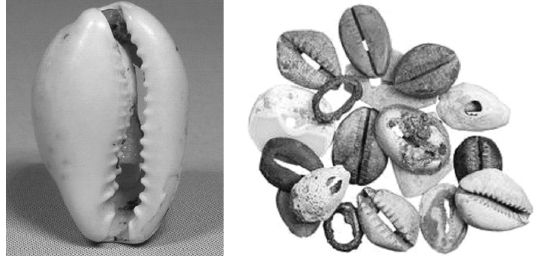

中国出土的贝壳货币<a href="#part0001.html_id2" id="part0001.html_id_2">[1]</a>

“实践是检验真理的唯一标准”，老祖宗们正是在不断实践的过程中，逐渐发现经过加工的贝壳最为适合充当货币。

显然，“钱”是因为商品交换的需要而产生的，套用马克思他老人家的专业术语来说：“货币是从商品中分离出来，固定地充当一般等价物的特殊商品。”

在中国，货币的“货”、发财的“财”、商人的“贾”、欠债的“账”、放债的“贷”，甚至连买卖（“買”、“賣”）这两个动词都带有贝字，充分说明了贝壳的地位。

再想一下，你把自家的孩子和爱人都叫成啥呢？

“宝贝”、“贝贝”，某种意义上说，这差不多就相当于喊着
“我的钱啊”、“我的钱啊”……

贝壳钱自打出现以后，就很重要很重要。

根据甲骨文记载，商朝的时候，商王就经常把贝壳赏赐给臣下僚属，谁要是能获得商王的贝币赏赐，那可真是极大的荣耀。

贝壳并不仅仅在商代使用，一直到西周时代也大量使用，在交通及经济欠发达的西南、西北少数民族地区，贝壳作为货币从商、西周、春秋战国、秦汉直至唐宋时代都一直在使用。在云南，一直到明朝时期，被称为“滇贝”的贝壳还在作为货币广泛使用。

根据考古学家们的精心研究，我们中国古代的贝币，大部分是来自于海南。

你想想，海南，距离黄河流域或者长江流域有多远，尤其那时候没有飞机、火车、汽车、轮船，连千里马、千里驴这样的动物也都还没有“训练”出来呢，甚至连成形的路都没有，完全靠人背运回来的一袋子贝壳，你想想能不珍贵吗？

用这么珍贵的东西做钱用，自然是再合适不过了。

我们现在使用的钱，其单位是元、角、分，那你猜猜贝壳钱最常用的单位是什么？

一枚两枚当然也行，但最常用的计量单位是朋友的“朋”。

就看“朋”这个字的形状，像不像“贝”字串了串？“朋”在古字里面的本义是指两串相连的“贝”，不过，因为考古资料缺失，到今天大家也还没有搞清楚到底“一朋”是二枚、五枚、十枚还是二十枚。

俺自个儿琢磨着，因为“朋”是好几个贝壳一起的意思，后来就演变出“天天在一起”、“结党营私”的含义来了，你知道形容坏人一起干坏事有个成语叫做狼狈为奸，下次你改一个说法，说他们“朋比为奸”，文化水平立马就上升一个档次。

后来，这个“朋”就和“友”一起组成“朋友”这个词，现代社会这个词的用法可广了去了：男女恋爱叫“谈朋友”、商业公关叫“交朋友”、官场爬升叫“处朋友”……

可不嘛，没有钱的话，扯什么朋友呢？

老祖宗们造字的时候，就把现代人这些花花肠子都猜到了。

什么叫做钱？

</a>

有人说了，把贝壳当成钱的事儿是不是“中国特色”呢？

借用专家们的话来说，把贝壳当钱使，那可是“与世界接轨”的广泛现象——在亚洲，除中国使用过贝壳货币外，今天的印度、斯里兰卡、孟加拉国、东南亚区域，都有使用贝壳钱的历史；在美洲，当西方殖民者16世纪首次踏上这个大陆的时候，他们发现当地的印第安人使用的货币正是贝壳；在非洲，包括坦桑尼亚、埃塞俄比亚、索马里等国在内的绝大多数黑人部落一直到20世纪初依然在使用贝壳作货币；在印度洋及太平洋一些偏远岛国，诸如瓦努阿图、巴布亚新几内亚等，到现在依然把贝壳当成非常重要的货币。

当然，根据前面所说的，作为满足交换功能需要的实物商品，最早的货币也不一定非要是贝壳，以捕猎为生的部落可能以石矛砍刀作为货币，以农耕为生的部落可能以铲子镰刀为货币，以打鱼为生的部落可能选择鱼叉网钩作为货币，至于选择粮食、布帛、盐巴、茶叶、陶罐、瓷碗之类最常用的商品来充当货币的现象更是在各个民族的历史中普遍存在。

例如，云南的佤族，一直到解放前还习惯于用牛作为货币进行交易，而在历史上绝大部分时间里，中国周边少数民族例如匈奴、鲜卑、柔然、突厥、回鹘、吐蕃、契丹、蒙古、女真等民族，一开始都是采用牲畜、盐巴、茶叶等实物商品当钱使的。

除了上面这些常见的“钱”之外，世界上还存在着各种各样你意想不到的“钱”，其种类之丰富，足以让你大开眼界。

在太平洋的美拉尼西亚群岛（the Melanesia
Islands），土著居民习惯用狗牙当钱使用，一个狗牙可以买100个椰子，娶一个老婆要“花费”几百颗狗牙；在南太平洋岛国瓦努阿图（Vanuatu），几千年来人们一直使用猪牙作为货币，一个普通家庭一年的开销，只需二十几个猪牙就可以应付，其中最大面值的“钱”是长而且有弯曲的尖猪牙，而且尖牙越弯曲越值钱，弯成圆弧状，甚至弯成两圈、三圈。

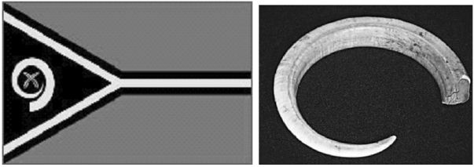

瓦努阿图的国旗（注意上面的那个猪牙图案）以及他们的猪牙“大钞”<a href="#part0001.html_id3" id="part0001.html_id_3">[2]</a>

在非洲科特迪瓦的一些原始部落，他们传统上使用手镯充当钱币，持有者可将其戴在手上、颈上和脚踝上；印度东北部阿萨姆省（Assam）的某些氏族，至今还在使用母牛的头盖骨作为货币；马来西亚的沙捞越地区（Sarawak），从公元9世纪起就用玻璃珠子当货币，价值很高，就像现在人们手中的黄金一样，不到万不得已的情况绝不使用；在中世纪的俄罗斯，松鼠毛皮是一种常见的流通货币，其常见程度超乎想象，以至于松鼠的口鼻部位、爪子和耳朵也常常被用来作“零钱”。

中国的元朝，因为朝廷印刷的纸币面额过大，小钞不足，民间不得不用茶帖、面帖、竹牌、酒牌等充当小钞，还有的干脆用油漆的小木片当做小钞；德国人在第一次世界大战后经济遭受毁灭性破坏，各地的乡镇开始印制“代用货币”作为本地支付工具，使用的材质各式各样，有木材、铝箔、丝绸亚麻布，甚至包括扑克牌等，这种状况一直持续到希特勒上台后德国央行恢复元气。无独有偶的是，在2008年的金融危机之中，美国一个小镇的人们应对美元纸币通货紧缩的办法就是自制小木片，用来充当交易货币。

在第二次世界大战刚刚结束的时候，德国法西斯战败，新的政府还没有来得及发行纸币，在这种情况下，德国民间全境使用美国产的香烟作为货币，作为货币的香烟甚至要远比香烟本身更有价值；1970年代，意大利的货币里拉（Lina）遭遇了严重的通货膨胀，人们干脆用糖果作为货币来进行交易。

不过，在世界上的所有货币当中，最让人匪夷所思的当属南太平洋上密克罗尼西亚联邦（Micronesia）所属的雅浦岛（Yap
Island）上的石头货币了，近2000年来，雅浦岛的居民就一直使用石头做货币，他们称之为“雷（Rai）”。

“雷”是由大而坚硬、厚重的石轮组成，石轮的直径从1码到12码不等，石轮的中央有一个孔，便于滚动搬运，雅浦岛居民就用这种石头来购买土地、独木舟或办婚事等。

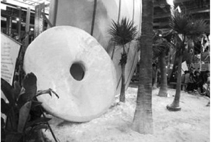

2010年上海世博会密克罗尼西亚馆所展示的“雷”币

你还真别说，相比你手中的纸币，这个“雷”还真的是有价值的！

原来，由于雅浦岛缺乏制造“雷”的石灰岩岩石，村民们不得不冒着生命危险，划着独木舟前往太平洋上的另外一个岛屿帕劳（Palau），在那里的山腰上切下这些庞然大物，然后用独木舟运回岛上。

“这些巨石货币的部分价值在于其尺寸之大，但真正的价值在于它们来到岛上的代价——将它运回来时死去的人的数量”，货币收藏家对“雷”的价值做了如此解释。

说了这么多种钱，那么究竟什么商品能够被定义为“金钱”呢？

按照马克思的观点来看，货币必须是拥有价值的实物商品，货币具有五种基本功能：价值尺度、流通手段、支付手段、贮藏手段和世界货币。

也不晓得是翻译的学问太深还是咋地，马克思的话对大多数中国人来说迄今还是“专业术语”，一般人不太明白，所以我就对这五种功能给您进行一个通俗的解释。

“价值尺度”嘛，就是用数字来衡量一个产品究竟值多少钱。

比方说你去北京街头的馒头店，1个雪白的大馒头要5角钱，这就是它的价值，如果你去北京燕莎友谊商城，1件内衣要卖1万元，这就意味着，那件内衣的价值是这个馒头的2万倍——不管你承认不承认，这就是人民币这个时候的价值判断标准。

“流通手段”，简单来说就是买东西的时候“一手交钱一手交货”，有钱才能买东西，有钱商品才能流通。

“支付手段”比较复杂一点。

比方说你很阔气，大学毕业在北京奋斗了五六年，每个月能挣五六千元人民币，可北京房价这么贵，为了娶媳妇，你只能在距离河北比较近的区域（以能收到“河北移动欢迎你”的短信为准）贷款买一所“每平方米仅售1万元”的房子，榨干了爹妈一辈子的积蓄并且从七大姑八大姨那儿借了一屁股债才凑齐了首付，之后在你勒紧裤腰带当“房奴”的过程中，每支付给银行一笔房款，人民币都在执行“支付手段”的功能。

“储藏手段”的意思是货币可以作为你储藏财富的一种方式。比方说农民们收获粮食到粮仓，一看满满的，就感觉自己很富裕；牧民们赶着一大群牛羊，也觉得是一笔财富；货币呢，就是说你家里存着一堆这东西，你会感觉是一大笔财富。

“睡觉睡到自然醒，数钱数到手抽筋”是我们每个人的人生理想，但理想与现实总是有一定差距。比方说，在你家的地窖里，藏着成吨的金条、银币，天天让你点数目，你肯定每次下去点的时候都兴致勃勃、兴趣盎然；但如果天天让你在家里数草纸，你肯定就觉得索然寡味、意兴阑珊，这就很典型地说明了货币作为储藏财富手段的功能。

世界货币的意思就是说，货币可以在世界市场上购买国外商品、支付国际收支差额，这是作为社会财富的代表在国与国之间流通时才会产生的一种功能。

有人分不清“流通手段”和“支付手段”这两种功能，这里给你个简单的区分办法——流通手段就是“一手交钱、一手交货，现货现钱、钱货两清”；支付手段呢，就是“欠债还钱，延期支付”，不管方式是“先交钱，后服务”，抑或是“先服务，后交钱”。

在马克思他老人家看来：“钱”必须是某种有相应价值的商品。

诸君该说了：“不对啊，我们现代社会都一直在用纸当钱使，纸币难道不是钱吗？但它又有什么价值呢？”

的确，按照马克思的思维，这纸币还真不是“钱”，因为它只是具备了货币五大功能之中的“价值尺度、流通手段、支付手段”这三种功能而已，而“储藏手段”和“世界货币”这两大功能，纸币却根本不具备。

更加准确地说，除了纸币之外，刚才提到的其他所有“钱”，其实都是有着相应价值的人类劳动的血汗结晶，与这些“钱”相比，我们的纸币反而显得无比怪异。那么，为什么纸币还会被大规模地充当货币来用呢？以下的章节中，我们细细道来。

货币天然是金银

</a>

当人类掌握了冶炼金属的技术之后，鉴于金属体积小、价值大、容易分割、可塑性强、耐磨耐腐蚀、色泽光亮、能长久保存、便于铸造成各种形状等等原因，世界上主要文明国家的货币都逐渐由常见商品过渡到了金属身上。

比方说，中国在商朝晚期的时候掌握了冶炼青铜的技术，慢慢地人们就发现青铜价值很高，既不会碎掉、也不容易磨损烂掉，即使你要融化它还要高温烧烤，人们干脆就用青铜做成贝壳的样子当“大钱”使。随着青铜产量的逐渐提高，人们慢慢发现仿造的青铜贝比真贝壳还好用，于是其使用范围就越来越广，并且在流通和使用中改造成一片一片的青铜小片片，大小都差不多，容易携带，还容易计算呢！

从此，中国进入了青铜货币时代，并且一直到民国时期还在使用铜钱。

在西方的货币体系中，金、银等贵金属一开始就是“大腕”——这些贵金属最初按照重量计价，后来就出现了有意识的铸造行为，标准的金属铸币（coin）由此产生。

在古埃及（Egypt），人们在买卖奴隶的时候使用的是金块和银锭。在公元前14世纪的一幅古埃及壁画上，清楚地显示了人们把一头猪和一些金臂环放在天平的两端，表示它们两个的价值是等同的；同一时期的另外一幅壁画则显示了努比亚人（Nubians）向埃及法老贡献黄金的场景。

西方有记录的最早的金属铸币大约出现在公元前7世纪的吕底亚（Lydia）王国，其图案是雄狮和公牛的复合体，铸币材料是天然的金银合金（大约2/3是黄金，1/3是白银），也被称为琥珀金（Electrum），因铸币呈现白色，通常也称为“白金币（White
Gold）”<a href="#part0001.html_id4" id="part0001.html_id_4">[3]</a>。

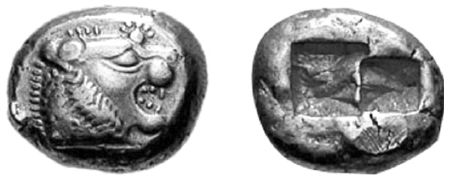

最早的金属铸币

除天然合金的白金币之外，吕底亚人后来还开始开采砂金以及白银，并采用标准的重量和成色铸造了大量带有图案的金币和银币——吕底亚最后一任国王克鲁伊索斯（Croesus）因为拥有这些铸币，也成了当时世界上最为富有的人。

后来，作为美索不达米亚文明（Mesopotamia，也被称为“两河流域文明”）后期代表的波斯帝国（Persia）征服了吕底亚王国。为了学习货币铸造的“先进经验”，波斯帝国也铸造了自己的货币，分别是达利克（Daric）金币和西格罗斯（Siglos）银币，而这两种货币上所铸造的图案是人的肖像，据说就是自称为“万王之王”的波斯皇帝大流士（Darius）本人，金币上的肖像头戴王冠、手持弓矛，尊贵庄严而又勇武善战，栩栩如生。

下图即为达利克金币和西格罗斯银币的图案
。<a href="#part0001.html_id5" id="part0001.html_id_5">[4]</a>

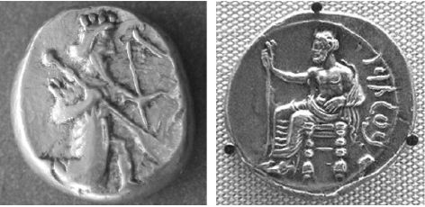

波斯帝国铸币

不过，说到西方的历史，那一定是“言必称希腊，路必通罗马”。

就在吕底亚人采用贵金属铸造货币之后不久，爱琴海（Athens）沿岸的希腊城邦国家也开始采用白银铸造自己的货币。

根据古希腊历史学家希罗多德（Herodotus）的记载，在公元前594年，梭伦（Solon）造访吕底亚，当时的国王克鲁伊索斯向阅历丰富的梭伦炫耀，问他游历各地的时候，是否见过一位像自己这样拥有大量的黄金和白银的人——“看，我多有钱！”

面对如此自恋的家伙，梭伦告诉他，那些财富“无足轻重”，因为“战争英雄、运动员以及他们的母亲”相比金钱而言更为伟大。

这么有水平的一番话，亏得梭伦的机敏和口才！

但对于克鲁伊索斯王来说，那可是伤自尊了——据说，他咆哮不已。

尽管贬损了吕底亚国王一番，但梭伦也很明白，相比于按照重量计价的金块和银块，先进的金属铸币更加有利于商业和贸易。因此，当梭伦出任希腊雅典城邦第一任执政官（CEO）之后，雅典也开始铸造贵金属货币。其中最常见的是银币，其名称叫做德拉克马（Drachms）<a href="#part0001.html_id6" id="part0001.html_id_6">[5]</a>，其中以希腊城邦之中最为强大的雅典所造的4德拉克马银币流传最广。

下图就是雅典的4德拉克马银币，其正面图案为希腊神话中的战争与智慧女神雅典娜（Athena），背面为雅典的守护神猫头鹰，所以也被称为“猫头鹰币”<a href="#part0001.html_id7" id="part0001.html_id_7">[6]</a>。

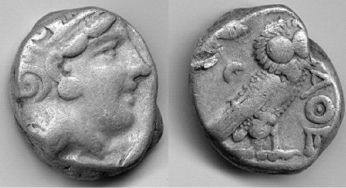

古代雅典银币

稳定的“猫头鹰银币”作为周边国家都广泛使用的货币，时间长达6个世纪，在希腊当时的德拉克马货币体系下，一只山羊价值10德拉克马；一匹马价值200德拉克马——在长达600多年的时间里，这个数字基本上都没有变动过。

稳定的货币造就了一种诚信、民主的文化，在猫头鹰币出现大约85年之后的公元前508年，雅典城邦建立起民主制度，取得了那个时代难以想象的社会进步。

希腊之后，罗马人逐渐崛起，在上千年的时间里，罗马人建立了一套金、银、铜复合货币体系，他们最常用的铜币叫做阿斯（As）、最常用的银币叫做迪纳利乌斯（Denarius）。

罗马帝国崩溃之后，从漫长而黑暗的中世纪到文艺复兴，再从地理大发现到工业革命，上千年的历史中西方一直采用金、银作为主要的货币，而铜则是辅币。

对于整个西方来说，截止到1816年英国政府正式采用金本位以前的整个文明史中，金银就是钱，钱就是金银，从未变过——其中，黄金多用于大额支付，而白银则用于一般的贸易，铜一般作为辅币或者加入银币中使用。

相对于西方习惯于使用金银做货币，中国由于长期以来人口众多，在历史上也不是产银大国，所以从周朝一直到明朝中期之前都将铜钱作为最主要的货币。

直到明朝中期以后，随着美洲大陆白银的开采和全球贸易的发展，为了购买中国的商品，全世界的白银都开始像潮水一样向中国涌来，从而使得中国在明朝中后期也逐渐确立起以白银为主、铜钱为辅的货币体系。

“货币天然非金银，金银天然是货币”，马克思老人家的论断果然是精辟准确！

从金银到金本位

</a>

有喜欢探究的人就问了，既然马克思老人家所处的时代还依然保持着“金银是货币”的状态，为什么到了现在，大家却纷纷都开始使用纸币呢？

“孩子没娘说来话长”，且听笔者慢慢道来。

最早的纸币出现于中国北宋时期的四川，当时叫做“交子”。

怎么出现的呢？又为什么叫做“交子”呢？

在赵宋王朝代表革命的、正义的力量解放四处之后，对四川实施地域歧视，不允许他们用铜钱（禁止铜钱入川，违者杀头！），只允许他们用价值比较低贱的铁钱，而这个铁钱呢，典型的傻大笨粗——当时最常用的是一种叫做“景德元宝”的大铁钱，这种铁钱每一贯的重量是25.8斤！根据当时的价格，要是上街买一匹布，用大铁钱，重量有500斤！

中国形容人有钱有个成语叫做“腰缠万贯”，谁缠一下这个铁钱试试看？

大家想一想，这么鬼重鬼重的钱，是不是会严重影响人们的正常买卖交易——今天上街，为了买几只鸭子回来炖着吃，结果不得不哼哧哼哧背上一袋铁钱走上几十里路，干脆还不如背上一袋麦子以物易物好了。

人被逼到这个份上，创造力也就出来了——公元1005年，据说是成都有16家富商，用大铁钱作保证，发行用纸印刷的“交子券”作为交易凭证，交子，就是“交易凭证”的意思。

交子纸币出现之后，大家很快就发现纸币的方便了，慢慢地，纸币的使用范围就越来越大。这时候，有些发行交子券的一些富商起了歪心，他们开始玩10个锅8个盖的把戏，本来自己只有100贯大铁钱，却发行了200贯的交子券，变魔法一样无中生有变出来很多交子券，进而为自己“广置邸店、屋宇、田园、宝货”，导致“奸弊百出、狱讼滋多”。

因为这个原因，1020年，四川的益州（今成都）知府就义正辞严地发表公告，为了切实维护人民群众利益，保护单纯的民众不再上当受骗，政府决定下令关闭交子铺。

政府为民着想，做出了正确的选择！

接下来老百姓没有想到的是，宣称别人“奸弊”的政府，原来是要自己造纸币！

原来，在整治和取缔民间交子券的过程中，某些聪明的政府官员一看，这玩意儿好啊，方便交易、促进贸易，发行者还能借机大赚一笔，这种好事哪能错过呢？

于是，在这些官员的奏请之下，北宋朝廷于1023年设立益州交子务，1024年北宋朝廷开始发行第一届官交子，发行数量为125.6万贯，用36万贯铁钱作为保证金——也就是说，政府干脆一开始就玩杠杆，每1万贯铁钱，发行3.48万贯的交子纸币。

官方交子纸币的出现，表明了代表政府信用的纸币正式在人类历史上出现，这也意味着原来代表真实财富的实物货币（金银铜铁、谷物、布匹、贝壳、猪牙等），开始向一种不具有真实财富的价值符号过渡。

中国北宋时期出现纸币以后，接下来的金朝、南宋、元朝和明朝都采用了纸币方式，每一种纸币在一开始发行的时候，总是道貌岸然地与金属铸币价值相等。然而过不了几年，这种纸币就陷入恶性通货膨胀之中，没有任何一种纸币例外，而纸币体系的一次次崩溃也引发了一次次的社会动乱和王朝更替。

元朝末年流行一首民谣：“堂堂大元，奸佞专权，开合变钞祸根源，惹红巾万千，官法滥，刑法重，黎民怨；人吃人，钞买钞，何曾见？贼做官，官做贼，混愚贤，哀哉可怜！”

“开合变钞祸根源”，说的就是元朝纸币滥发是导致政局腐朽没落的根源！

中国古代的纸币体系崩溃与王朝覆灭的循环持续了将近五百年，一直到明朝中期人们才发现，依靠纸币建立起一套可信赖的货币体系无异于痴人说梦，于是朝廷决定逐步废弃纸币，重新采用以银为主、以铜为辅的金属货币体系。

此后，一直到1935年之前的民国时期，中国一直都采用白银和铜钱作为货币。

相比中国人在纸币发明方面的“聪明”，西方人就显得太过于“老实”了。

实际上，就在四川交子出现前后，11世纪的意大利城邦国家也出现了商业银行的信用票据，具备了一部分纸币的功能；到了13～16世纪的文艺复兴时期，国债、股票等“很现代”的金融产品相继出现，商业信用票据的使用在一些家族银行中已经相当普遍。

只是，纸币依然迟迟难产。

关于西方现代纸币的源头，经典的说法是来自英国的金匠们。

17世纪英国资产阶级革命时期，国王查理一世强行没收商人们的黄金，商人们只好把自己的黄金偷偷存放在金匠们的地窖里，金匠们则给商人们开出手写的收据。为防止被国王发现，这些黄金收据没有署名是属于谁的，时间久了，人们觉得没必要总是到金匠那里存取金币，而是直接采用这些收据进行交易，于是这些收据就成了纸币。

1694年，英格兰银行（Bank of
England）成立，作为全世界第一家中央银行，英格兰银行模仿金匠券正式发行了纸币并将其成功流通——西方真正的纸币由此诞生。

不过，截止到1914年第一次世界大战爆发之前，西方的纸币都是可以兑换确定数量的黄金或者白银的，纸币无非是拥有黄金或者白银的一个凭证而已，所以这种纸币体系也被称为“可兑现纸币（Redeemable
Paper Money）”。

“可兑现”的意思是，如果纸币能够兑换到确定数量的黄金，这种纸币体系被称为金本位制（Gold
Standard）；如果能够兑换到确定数量的白银，就称为银本位制（Silver
Standard）；如果白银和黄金之间政府规定了确定的兑换比率，这张纸币代表着确定数量的黄金或者白银，就被称为金银复本位制（Bimetallic
Standard）。

简单地说，区别在于纸币是跟着白银走，还是跟着黄金走，抑或是白银黄金两条腿。

17世纪之前，西方国家实施的基本上都是金银同时流通的货币制度，这一阶段欧洲的货币也五花八门，许多国家和地区都铸造了各自的银币和金币，而最大的麻烦就是，金币和银币币值对比并不是固定的，而是根据市场价格随时变动，这就导致许多产品都有两个价格：金币价格和银币价格，这大大阻碍了商业贸易和物资交流。

例如，英格兰银行成立之前，英国就是基尼金币（Guinea）和先令银币（Shilling）通行，每一样商品都需要标上基尼金币的价格和先令银币的价格。

这个时候，一个在数字上狂热追求精确的人出现了，这个人是个大科学家，根据传说，有一个苹果砸到了他头上，他由此发现了万有引力定律！

是的，他就是人类有史以来最伟大的科学家之一——艾萨克·牛顿（Isaac
Newton）！

很多人不知晓的是，我们伟大的科学家牛顿先生，其生命历程可以这么简单划分和描述：“前三十年玩科学，后三十年玩货币”——因为牛顿后半生担任大英帝国皇家铸币厂厂长达三十年，他在这个职位上一直工作到1727年去世。

对于科学上追求确定和精确的牛顿先生来说，金银币相对价值的变动真的很令人讨厌。于是，在他的推动之下，英国议会于1717年立法，规定1个金基尼和21个银先令等值，等量金银的铸造比价为15.21∶1，这就形成了刚才提到的复本位制。

这样一来，英格兰银行所发行的每一张纸币，都是代表着一定数量的金币或者银币。

牛顿的确是个狂热追求精确和准确的人，他不仅对于自己的铸币工作极为认真，对于那些扰乱这些精确而铸造假币的人也恨之入骨，甚至还亲自去刑场观看处决造假币的罪犯。

在确立复本位制的同时，牛顿还将每盎司黄金的价格确定为3英镑17先令10便士。

到了1816年，英国议会通过法案确定了英镑纸币只盯住黄金，这标志着英国在世界上第一个从法律的角度确定了金本位制——从此，每一张英镑纸币都代表着确定数量的黄金，而白银则成了普通商品，价格自由浮动。

就这样，大英帝国忙乎了上百年，最终确定自己的英镑纸币跟着黄金走。

稳定的货币为英国称霸全球打下了坚实的基础，在金本位的支撑下，大英帝国蒸蒸日上，建成了一个殖民地遍布全球的“日不落帝国”，以至于到了19世纪后期，“像英镑一样好”已经成了世界各国货币改革的“最高理想”。

怎么样才能做到“像英镑一样好”？

当然就是纸币体系像英镑一样采用金本位！

在确定纸币跟谁走的这件事上，从19世纪下半叶开始，西方各国经过好一阵的忙乎，在货币方面基本都走上了和英国一样的道路，无论最初是银本位制还是复本位制，基本都演化成了金本位制，这些国家包括葡萄牙、德国、丹麦、芬兰、瑞典、瑞士、海地、加拿大、阿根廷、埃及、日本、俄国以及美国等。

到20世纪初，当时的大国之中，只有中国和印度还在实行银本位制，而除了中国和印度之外，整个世界的纸币体系都统一到黄金这种闪闪发光的黄色金属上面。

唯有黄金才是钱

</a>

既然世界各国的纸币都统一到了黄金这种金属上，那么每一个国家的纸币都代表了一定的含金量，这样的话各国货币的汇率也就基本固定，消除了汇率波动的不确定性，有利于世界贸易和商业活动的进行。

在金本位的体制之下，只有通过诚实劳动，生产真实的财富，才能换回来真金白银，不可能有哪个国家有什么特权，天天靠着借钱还能一直吃香的喝辣的，威风八面。

1974年7月13日，著名的英国《经济学家》杂志发表了一份英国工业革命时代的物价统计报告。

这份物价记录数据显示，从1664年到1914年的250年时间里，英国的物价始终保持着平稳而略微下降的趋势，英镑的购买力保持了惊人的稳定性。

如果将1664年的物价指数设定为100的话，除了在拿破仑战争期间物价曾短暂地上涨到180之外，在绝大部分时间里，英国的物价指数都低于1664年的标准。

1914年第一次世界大战爆发时，英国的物价指数为91。

如果我们再从黄金和白银供应这个视角来进一步考虑英国这250年的物价变化，就能够从更深的程度上理解“金本位”的意义。

从1664年到1914年的250年间，美洲产的黄金白银一直源源不断地涌入欧洲，而从19世纪中叶开始，美国的加利福尼亚、南非以及澳大利亚又相继发现了大型金矿，无论黄金还是白银的产量都急剧增加，而英国作为世界上最早进行工业革命的国家，是金银等贵金属的最主要涌入国。

然而，即便在贵金属货币供应量逐年增加的情况下，英国还是在250年间里基本保持了物价的平稳，这是一个客观的、不必讨好谁的货币体系，即使贵金属的供应量逐年自然增加，由于社会上的商品数量以更快的速度增加，根本不可能会造成通货膨胀——毕竟，贵金属再怎么大量涌入，折算到长达250年的时间里，其年增长率也不会超过2%，属于有约束和节制的增长。

长期稳定的货币，使得小小的英伦三岛，雄霸世界长达200年。

英国的现象绝对不是个例，无论是金本位制、银本位制还是金银复本位制，在采用商品货币的情况下，根本不可能发生大规模的、难以治理的通货膨胀。

例如，美国在建国以后即采用了金银复本位制度，1800年美国的物价指数约为102.2，到1913年时，物价下降到80.7——和英国一样，在这期间，美元纸币的供应量也是在随着美国贵金属拥有量的逐渐增加而缓慢增加的。

1800年到1913年，恰恰是整个美国工业化的巨变时代，美国物价反而在逐渐下降！

欧洲主要国家在从农业国向工业国转变的关键时代，尽管社会经济空前大发展，但由于受到了贵金属产量的约束，各国的货币和物价都非常稳定，基本上都没有发生通货膨胀。

法国法郎，从1814年到1914年，保持了100年的货币稳定；

荷兰盾，从1816年到1914年，保持了98年的货币稳定；

瑞士法郎，从1850年到1936年，保持了86年货币稳定；

比利时法郎，从1832年到1914年，保持了82年货币稳定；

瑞典克朗，从1873年到1931年，保持了58年的货币稳定；

德国马克，从1875年到1914年，保持了39年的货币稳定；

意大利里拉，从1883年到1914年，保持了31年的货币稳定。

看看以上数据，再对比一下中外主流经济学家们的言论——必须保证物价以一定的速度上涨，否则通货紧缩就会引起经济衰退的理论，是不是就像听到有人在放一个晴天霹雳般的屁？

实际上，中国最初发行的交子纸币也是可兑现纸币，根据其规定，是可以兑换成铁钱的，但后来发行量扶摇直上之后，就再也不能兑现了。到了金朝、元朝和明朝，朝廷发行纸币，干脆一开始就规定不能兑现，变成了“我的地盘我做主，想怎么发就怎么发”！

如此一来，中国古代的纸币体系不一次次崩溃才怪呢！

相比之下，欧洲在纸币出现以后的200多年里，由于实施了金本位、银本位或者金银复本位，而且政府权力受到了较大的约束，其货币体系相比以前反而更加稳定。

从世界范围内来说，如果我们把从17世纪末到20世纪初这段时间放到整个历史长河中思考一下，货币最稳定的一个阶段，恰恰是整个人类文明进步最快的阶段。

难怪奥地利学派的米塞斯（Ludwig von
Mises）将金本位高度评价为整个西方文明在资本主义黄金时代的最高成就。没有一个稳定合理的货币制度，西方文明在资本主义迅猛发展的阶段所展示出来的巨大的财富创造力，将是一件无法想象的事。

可惜，好景不长。

1914年，第一次世界大战爆发，为了弥补财政赤字和扩军备战，欧洲国家相继停止了黄金的自由输出和银行券兑现，并陆续废除了金本位。为了战争，参战各国竞相滥发不兑换的纸币，通货膨胀在参战各国纷纷出现，各国货币流通和信用制度遭到严重破坏，各国出口贸易萎缩、国际收支恶化。

国际范围内的金本位就此崩溃。

第一次世界大战结束之后，由于各国钞票币值起伏不定，汇率变化无常，国际贸易和商业遭到了严重的破坏，经济一片混乱，于是一些国家再度呼吁恢复金本位制，但主要国家已经无力恢复原来随时可供民众兑换金币的那种严格金本位制。

于是，1922年在意大利热那亚召开的世界货币会议上，世界各国决定采用“节约黄金”的原则，实行金块本位制（Gold
Bullion Standard）和金汇兑本位制（Gold Exchange Standard）。

什么是“金块本位制”和“金汇兑本位制”呢？

经历过一次世界大战之后，即使如英、法等战胜国，其政府所拥有的黄金已不足以供人兑换，于是干脆流通纸币，也不再铸造金币和实行金币流通，虽然纸币规定了含金量，但黄金只作为货币发行的准备金集中于中央银行——中央银行掌管黄金的输出和输入，保持一定数量的黄金储备，禁止私人输出黄金，以维持黄金与货币之间的联系。

当然，如果你是大老板、狂有钱的人，政府可以对你网开一面，规定你手中的纸币达到一定数量，可以到中央银行来兑换金块，所以叫做“金块本位制”。比方说，英格兰银行规定，只有达到最低限额400盎司黄金的银行券（约1700英镑）才给你兑换；法国则规定银行券兑换黄金的最低限额为21500法郎，等于12公斤的黄金。

这样一来，政府就成功地把绝大部分穷鬼们挡在了兑换黄金的门槛之外。

在金块本位制之下，由于普通民众不能随时兑换黄金，政府就可以授意中央银行玩所谓的“杠杆”游戏——本来只有1千克黄金，却发行了相当于10千克黄金的纸币……

因此可以说，在金块本位制中，通货膨胀之门已经打开。

二战之后，实行金块本位制的国家主要有英国、法国、美国等。

“金汇兑本位制”，又称“虚金本位制”，是针对一些没有黄金储备的国家而言的，要求该国货币盯住另一个金本位制国家，保持固定的外汇比价，准许本国货币无限制地兑换外汇，从而间接实行了金本位制。

中国国民政府1935年发行的法币，一开始盯住英镑，这就属于典型的金汇兑本位制。

如果说金块本位制是剁掉了双脚的金本位制的话，那么金汇兑本位制就是剁掉了双手双脚的金本位制，这种金本位会导致一国货币附属于它所盯住的那种货币的发行国。

无论金块本位制或金汇兑本位制，这种脆弱的、扭曲的、虚假的金本位制度实施了大约十年左右，遇到了1929年～1933年的世界经济危机，基本上全部冰消瓦解。

当残缺不全的金本位也灰飞烟灭之后，经济危机终于在德国逼出来一个希特勒上台。

几年之后，第二次世界大战爆发。

令人唏嘘感慨的是，在两次世界大战期间，即便各国都在使用不兑现纸币，但黄金却始终是国际硬通货，主要被参战国政府控制，用于国际间购买军火和其他重要物资。

也就是说，截止到第二次世界大战结束之前，在世界范围内来说，只有黄金是真正的钱，而任何一个国家的纸币，只不过是黄金的代表而已，并不是真正的钱。

唯有如此，你才能明白为什么2008年金融危机之后，黄金价格暴涨，而世界各国政府每印刷一轮钞票，黄金就会上涨一轮——在一些以最简单的方式来理解货币史的人眼里，黄金，唯有黄金，才是真正的钱！

绿纸片变黄金

</a>

无论是第一次世界大战还是第二次世界大战，在那些自诩文明的欧洲强国都一股脑儿陷在战争泥潭里互相死掐的时候，大西洋对岸的美国则借机大发战争财。

实际上，美国的先贤们自建国以来，就一直在执行“闷声发大财”的战略，尽量不插手欧洲事务，埋头发展生产力，到了1914年第一次世界大战爆发之时，美国的经济总量就已经排名世界老大了，其余最大的三个工业国英国、德国、法国都得靠边站。

既然排名世界第一，那美国的美元地位自然就日益突出。

第一次世界大战期间，战火并没有烧到美国本土，所以美国可以大量生产粮食、棉花、石油、枪炮、船舰……趁着欧洲国家打得不亦乐乎，美国使劲倒卖各类物资，只要黄金不要纸币，大发了一笔战争财。到战争结束之时，美国的黄金储备已经增加了一倍，经济总量更是超过了英、德、法三国的总和。

由于战争期间放弃了金本位，英国英镑、法国法郎和德国马克在第一次世界大战期间可谓是信誉尽失，但美国根据当时的《金本位法》规定，美元始终保持着和黄金的可兑换能力。毫不意外的结果就是，英镑、法郎和马克货币，对国内是不断的通货膨胀，对美元是一次又一次的贬值。就这样，在这场较量中，美元逐渐成了公认的世界强势货币。

第一次世界大战之后，欧洲各国勉强建立起金本位制和金汇兑本位制，但很快就不得不再度放弃，由此导致国际汇率起伏不定，只有黄金始终是国际硬通货，而为了参与第二次世界大战，无论是战争中还是战争后，欧洲各国不得不再次到经济蓬勃发展的美国批量购买各种物资，而无论是民用物资还是武器军火，欧洲各国都得用他们积攒的黄金来买。

到了第二次世界大战结束前夕，美国的中央银行黄金储备已经超过了2万吨，占全世界黄金储备的75%！

记住，黄金是当时国际间唯一认可的货币，而美国占有了全世界黄金储备的75%，可谓是天下之大，谁与争锋？

不仅仅是货币财富上美国如此强大，就在第二次世界大战战后初期，人口和土地均占了全世界6%的美国，却占有西方世界2/3的GDP份额，1/3的外贸出口份额，冶炼钢的61%、汽车的84%——经济上完全可以雄霸天下！

挟着巨大的国力、财力，再加上美元纸币长期以来的良好信誉，1944年第二次世界大战即将结束之时，在美国主导之下全世界建立起一个被称为“布雷顿森林体系（Bretton
Woods System）”的一套全球货币、贸易和经济新秩序。

布雷顿森林体系规定，美元直接与黄金挂钩，1个美元的含金量为美国《黄金储备法案》中规定的0.888671克黄金，其他各国货币则与美元挂钩，外国政府或中央银行可以随时按35美元一盎司的价格向美国财政部兑换黄金！

由此，美元替代英镑成为全世界有史以来使用最广泛的一种世界纸币。

记住，只有外国政府或者中央银行才能找到美国来把纸币兑换成黄金，个人是不允许的！

这也是美元与早期的英镑纸币不同的地方。

尽管如此，我们依然可以这样认为，在任何时候，在任何地方，只要你持有1个美元纸币，它的价值就是1/35盎司黄金，而其他国家的纸币，如马克、日元、法郎、英镑等，全部都与美元保持基本固定的兑换比率，也都代表着各自不同的含金量。

比方说，1个马克，代表着0.222168克黄金；1个日元，代表着2.46852毫克黄金……就连原苏联的1个卢布，在1971年之前也被官方规定了代表0.222168克的黄金。

不过，所有的纸币中，只有美元可以直接兑换黄金，只有政府和中央银行才能去兑换！

硬通到如此地步，难怪人家美元由此获得了“美金”这一光荣称号。

就这样，在国际货币体系中，美元处于“等同于”黄金的地位，代替黄金成为各国最主要的国际储备；就这样，美元这种绿纸片，变成了黄金的替代物。

某种程度上说，甚至比黄金更好，因为美元纸币可没有黄金那么笨重和难以携带……

在一套稳定的国际货币体系之下，人们不用担心自己辛勤创造的财富是否会因为通货膨胀而变成废纸，而每个国家纸币固定的含金量也形成了固定汇率，这消除了各国的汇率风险，所以人们可以普遍专注于创造真实的物质财富。

在1945年～1971年的布雷顿森林体系之下，西方国家普遍实现了经济高增长和低通胀，各种改善人类生活质量的创造和技术发明也遍地开花，全世界进入了资本主义第二个黄金发展期。再联想到18世纪到19世纪全球资本主义经济的另外一个黄金发展期，恰恰也是在金本位之下而产生的，有了黄金作为价值稳定的世界货币的基石（先是英镑，后是美元），人类文明取得了难以想象的进步。

正因如此，欧洲大陆的老牌大国刚刚从第二次世界大战之中缓过劲来之后，就开始不遗余力地用外汇盈余向美国财政部兑换黄金。

例如，从1945年～1970年，德国的官方黄金储备从0吨增加到了3537吨，法国从588吨增加到3139吨，意大利从228吨增加到2565吨，荷兰从280吨增加到1588吨，瑞士从1306吨增加到了2427吨……

从1945年起，由于美元成了世界货币，美国人总是出手阔绰，风头之劲一时世界无二，有钱得不得了，相继发动马歇尔计划、朝鲜战争、越南战争，还动不动“援助”其他国家，还要充当“世界警察”，再加上为了和前苏联搞冷战在全球建立军事基地，美国就此陷入了持续不断的贸易逆差中……

一直这么大手大脚乱花钱，当然不可能有那么多黄金，有没有问题？

当然没有问题！无非就是多耗费一点纸张和油墨，印刷成美元就是了！

就这样，美国“请客”，全世界“买单”的世界经济运行模式一直持续至今。

世界从此不同

</a>

按照布雷顿森林体系的设想，美国为世界提供美元纸币，世界为美国提供真实的商品和服务，这个模式要得以持续下去，美国必须一直保持贸易逆差，如果美国不再“出口美元”，就会发生美元不足，影响国际贸易与经济增长的情况。

然而，美元纸币的“供应”如果超出他自己的黄金储备太多，世界人民自然就会发现不对劲，“美国不可能有那么多黄金嘛”！如果再有一些政府或者中央银行去找美国财政部兑换黄金的话，美国就会出大麻烦。

此问题最早由经济学家罗伯特·特里芬（Robert
Triffin）在1960年提出，所以被称为“特里芬困境（Triffin
Dilemma）”或“特里芬难题（Triffin Paradox）”。

很不幸地，事实很快就验证了特里芬先生的预言。

实际上，由于美国对欧洲存在长期的支付赤字，到1959年底，美国的官方外债就已经与美国的黄金储备总价值几乎相等了，两者均为200亿美元左右——也就是说，在这个时候，如果美国以外的国家都过来要求美国履行黄金兑换义务的话，一度占有全世界75%黄金储备的美国，其所有黄金储备将在瞬间消失殆尽。

只是这个时候其他国家还不足以强大到那么做——那不是故意跟世界老大过不去嘛？

于是，就这样，“美国请客，全世界买单”的模式也还继续着。

到了1971年8月份，美国仅短期外债总额就已经达到了600亿美元，而当时美国所有黄金储备如果按照35美元/盎司的价格计算，价值只有97亿美元！

针对美国已经没有能力向其债权人支付黄金这一事实，当时法国经济学

家雅克·吕夫<a href="#part0001.html_id8" id="part0001.html_id_8">[7]</a>就评论：“这就像让一名秃子去梳理他的头发一般，纯粹是无稽之谈。”

美国政府终于撑不住了，最后时刻到来，一位美联储官员讲述了这样一段故事<a href="#part0001.html_id9" id="part0001.html_id_9">[8]</a>：

“1971年8月10日，一群银行家、经济学家和货币专家在新泽西州的海边举行了一次非正式讨论，探讨货币危机问题。大约下午3点，保罗·沃尔克（Pual
A.Volcker）的车来了。他当时是财政部次长，负责货币问题。

……

“这时，保罗转过来问我，如果我来决策应该怎样做，我告诉他因为不愿升息，又不愿黄金涨价，那就只有关闭黄金兑换窗口，以35美元一盎司出售黄金已经毫无意义了。”

1971年8月15日，华盛顿阳光明媚。

然而，正是在这么美好的一天的晚上，帅得一塌糊涂的美国总统尼克松（Richard
Milhous
Nixon）发表演讲，他猛烈抨击“国际投机分子”制造了金融市场混乱，为了保卫美元，美国政府必须“暂时”关闭财政部的美元兑换黄金窗口。

“暂时”是多久——答案是“永远”！

如果我们追问一下，谁是尼克松所指的“投机分子”呢？

要知道，根据布雷顿森林体系的规定，不是谁都可以找美国财政部兑换黄金的，只有各国政府或者中央银行才有资格去兑换。看来，法国政府、德国政府、意大利政府、荷兰政府、瑞士政府大概都是尼克松眼中的投机分子吧？

尼克松这一宣布，意味着美国背弃了1945年对全世界所做出35美元兑换1盎司黄金的承诺，意味着布雷顿森林体系的彻底垮台，意味着美国政府对全世界的赖账。

怎么比喻好呢？

这就像有个人欠你100万元，给你打了一个白条，但等你真正去找他的时候，他却忽然不认账了，开始耍无赖——黄金是钱，而美元就是白条。

不过，人家美国这个债主，身强力壮、武器先进、富饶强盛、财大势雄，赖了你的账你也只能吃个“哑巴亏”——你还能咋地？

实际上，其他国家吃点儿“哑巴亏”并不是这个事件的关键，倘若把“美国赖账”这件事情拉到人类的整个历史长河中来看，尼克松总统这个决定更加非同一般的意义就是——

全世界几千年来认同的“钱”这个概念，就从这一天发生了质的改变！

要知道，从二次大战以后，美元实质上就一直充当着世界货币，可是从1971年8月15日开始，整个人类第一次同时沦落到不兑现的法币时代！

1971年8月15日，从这一天起，金银不是钱，纸片当钱花——钱的概念被彻底颠覆！

如果你是一个关心“钱”的人，务必要真正理解1971年8月15日这个日子，唯有如此，你看待财富的眼光，才会和那些只知道两眼盯着纸币的人大为不同！

美国决定关闭黄金兑换窗口，纸币从此与一切实物商品斩断了关系！

许多人都知道布雷顿森林体系的垮台是一个非常大的金融事件，但这个金融事件和以往金融事件的本质区别，以及它对于未来世界究竟有多大影响，更多的人并不真正理解。

诺贝尔经济学奖得主米尔顿·弗里德曼（Milton
Friedman）曾经用这两句话来评价布雷顿森林体系的垮台。

“从远古直到1971年，每种主要货币都直接或间接地与一种商品相联系。偶尔与固定联系相脱离的事情也出现过，但那通常都只是在危机时期。

“（现在）世界上每一个主要货币都直接或者间接地实行不兑现纸币本位制，这种货币体系的最终结果如何，还是一个未知数。”

是的，最终结果如何，谁也不知道——但至少，我们已经看到了2008年的金融危机。

也正是在绿纸片变黄金的过程中，全世界的“钱”也一步步地“进化”（或者你可以称之为“退化”），由最早的粮食、牲畜、布帛、贝壳，变化到铜钱、黄金、白银，再变为金本位制，再变为布雷顿森林体系，最后终于演变成了目前的这种彻底的法币体系。

从美国宣布美元脱钩黄金那一刹那起，我们的这个世界与以前的世界就已经截然不同！

以前，人们必须依赖于诚实的劳动才能获得金钱，而金钱本身也是人类真实财富的结晶，当整个世界的纸币与黄金白银脱钩之后，由于只要“信用”就行，通过创造出来诸如“花未来的钱”、“花明天的钱”这种概念，债务可以无限制地增加，钞票也开始无限制地印刷……

连世界货币的核心——美元都不绑定黄金了，其他哪个国家政府还会傻到把自己的纸币绑定黄金或者白银？更何况，脱离了黄金白银的束缚，任何一个国家的纸币数量，都由自己政府和中央银行决定，终于到了他们可以大展身手的时候。政府不断告诉民众，通过所谓的“宏观调控”，他们可以成功实现熨平经济波动、创造经济永久增长的梦想……

天文学概念中有一种引力极强的天体，它就像宇宙中的无底洞，任何物质一旦掉进去，就再不能逃出，甚至就连光也不能逃脱，这就是“黑洞”。

尼克松总统那短短的一句声明，也意味着整个世界从那时起就开始掉入“法币”的黑洞、债务的黑洞，再无任何一个国家和个人可以逃脱这个黑洞的折磨，只有在黑洞里坠入18层地狱（全球性的恶性通货膨胀）之后，再一次重建世界货币体系，我们才能获得新生。

时至今日，无论是希腊还是意大利，葡萄牙还是西班牙，无论是美国还是中国，日本还是英国，大家都在这个黑洞中忍受着债务的煎熬和炙烤……

【注释】\

<a href="#part0001.html_id_2" id="part0001.html_id2">[1]</a>图片来自百度百科。

<a href="#part0001.html_id_3" id="part0001.html_id3">[2]</a>图片来自百度百科。

<a href="#part0001.html_id_4" id="part0001.html_id4">[3]</a>图片来自维基百科。

<a href="#part0001.html_id_5" id="part0001.html_id5">[4]</a>图片来自维基百科。

<a href="#part0001.html_id_6" id="part0001.html_id6">[5]</a>2002年加入欧元区之前，希腊的货币依然叫做德拉克马。

<a href="#part0001.html_id_7" id="part0001.html_id7">[6]</a>图片来自百度百科

<a href="#part0001.html_id_8" id="part0001.html_id8">[7]</a>Jacques
Rueff，曾任法国总统戴高乐的经济顾问。

<a href="#part0001.html_id_9" id="part0001.html_id9">[8]</a>摘自William
Engdahl所著的《一个世纪的战争》（A Century Of War）。

第二章　银行是干什么吃的？

</a>

现代社会的每个人对银行应该都不陌生。

我们要储蓄，去银行；我们要贷款，去银行；我们要汇兑，去银行；我们要买房，去银行；我们要投资，去银行；我们领工资，去银行……

生活在这个世界上，只要和钱打交道，我们都离不开银行，甚至我们对那些做着白日梦、想发横财的人开玩笑都要说：“去抢银行好了！”

不过，就是这个每天你都要接触到的机构，你却未必真的了解它！

比方说，你知道银行是怎么来的吗？你知道中央银行与商业银行的区别吗？你知道现代银行体系的本质是什么？你知道当代世界的银行体系是如何运转的吗？

问题有点复杂哦！

它为什么叫“银行”

</a>

从“银行”这俩字来说，“银”是银子，“行”是商行，合起来，“银行”就是与银子有关的商行——的确如此，“银行”这个词儿最初就是这么个意思！

在宋朝那会儿，黄金和白银虽然已经有了一定的货币职能，但整个社会公认的“钱”却依然是铜钱，对于专门经营黄金和白银兑换或者打造金银首饰业务的店铺，就分别被称为“金行”、“银行”。鸦片战争以后，现代银行被引入中国，由于当时的中国已经普遍使用白银作为货币，中国人将那些办理存款、贷款、账号划拨、支票兑现等业务的机构叫做“银行”，实在是再合适不过了。

汉语的“银行”是关于银子的商行，那西方语言中的“银行（bank）”呢？

想想你是不是每次去银行办业务都要等待，等待中你是不是需要坐在长板凳上？

那就对了！西方语言中的“bank”，正是“长板凳”的意思，意大利语写作“banco”。

原来，在中世纪中期的欧洲，各国之间的贸易往来日益频繁，意大利的威尼斯、热那亚等几个港口城市由于紧靠地中海，地处亚非拉三大洲交汇处，水运交通便利，各国商贩云集，成为欧洲最繁荣的商业贸易中心，而各国商贩又带来了五花八门的金币和银币，不同的金币和银币由于品质、成色、大小各不相同，其估值和兑换可不是一件简单的事儿，干这活儿的人，不仅得有知识、有文化，还得有鉴别的能力和经验——于是就出现了专门为别人鉴别、估量、保管、兑换各种货币的人，这就是货币兑换商，西方现代银行家的前身。

按照当时的惯例，这些货币兑换商都在港口或集市上坐着长板凳，等候需要兑换货币的人前来兑换，渐渐地，这些人就有了一个统一的称呼——“坐长板凳的人”，他们也就成了最早的银行家（banker），而他们所经营的货币兑换机构，自然就被称作“板凳（bank）”。

如果按照我们普通人的理解，银行就是一个存钱和贷款机构的话，那么世界上最早的银行应该是祭司们所居住的寺庙。公元前2000年的巴比伦神庙、公元前500年的古希腊神庙，都有经营保管金银、发放贷款和收取利息的功能，而公元前200年左右的罗马，甚至出现了专门经营货币兑换和贷款信托业务的机构。

根据历史记载，古希腊的神庙为城邦统治者和个人提供贷款，从公元前377年到公元前373年的4年间，希腊有13个城邦从德洛斯（Delos）神庙<a href="#part0002.html_id2" id="part0002.html_id_2">[1]</a>贷款，结果只有2个城邦按时归还了贷款，而多达4/5的钱最终没有被偿还；位于雅典的德尔菲（Delphi）神庙曾被描写成为古希腊最大的银行家，从公元前5世纪到公元前2世纪长达300年的时间里，他们为希腊人提供稳定的贷款，期限一般是5年，年利率为10%<a href="#part0002.html_id3" id="part0002.html_id_3">[2]</a>。

在私人银行方面，根据文献记载，在公元前600年前后，巴比伦就出现了类似于银行的私人机构，当时的埃吉比（Egibi）和穆拉苏（Murassu）两个大地主家族，承担着和现代银行有得一拼的业务——他们为存款人支付利息，将巨额款项贷款给政府和个人，甚至还根据要求将存款由一个商号划拨到另外一个商号。

中国的“银行”也具有悠久的历史，《周礼》中的“泉府”就是办理赊贷业务的机构，而到了春秋战国时，借贷行为已经相当普遍。

到了商业发达的唐代，不仅开办了称为“飞钱”的汇兑业务，还出现了“质库”——即后来的当铺；宋朝的金融业空前发达，还专门设置了钱币兑换机构——“便钱务”，而刚才已经说过，汉语“银行”这个词儿本身就是产生于宋朝的；到了后来，金朝的“质典库”、元代的“解典铺”以及明清两代的“钱庄”和“票号”，都是把钱币经营作为核心业务的，他们吸收公众存款，发放贷款并收取利息。

不过，如果讲到承担汇兑、存款、贷款业务的现代银行的起源，则需要追溯到文艺复兴时期的意大利城邦国家。

最早的银行

</a>

在13世纪的时候，意大利北部城邦由于航海贸易、羊毛和纺织业而发展起来，从威尼斯到热那亚，从佛罗伦萨到比萨，到处商贾云集，世界各国做贸易的人都在这里汇聚、交易。

然而，麻烦在于，且不说远道而来的非洲和亚洲商人，仅仅是欧洲，在当时就有几十个、上百个城堡国家，很多封建城堡的领主们都铸造了自己的货币，各种各样的金银币五花八门，怎么确定各种金银币的成色、重量、价值，都得依赖于专门的货币兑换商。

随着少数货币兑换商在经营货币兑换业务中慢慢发展壮大，又开始为商人们提供汇兑业务，乃至开始涉足实业投资和商业贸易，吸收存款和发放贷款。到1338年，佛罗伦萨已经有80多家商号经营货币兑换业务，首屈一指的是巴尔迪（Bardi）家族和佩鲁齐（Peruzzi）家族，或者你也可以称之为巴尔迪银行和佩鲁齐银行。

这些家族银行一方面经营商业贸易和实业投资，另一方面从事货币兑换业务，在西欧主要城市都设有分支机构，欧洲的大部分贸易都掌握在他们手上。

其中，佩鲁齐家族经营的主业是纺织业，这是带动佛罗伦萨繁荣的主要经济力量，他们从英国买入羊毛，然后贩卖到巴黎、那不勒斯，同时将东方运来的丝绸、药物、香料推广到整个欧洲市场。广泛的市场需求创造了广泛的信贷需求，为佩鲁齐家族创造了巨额的财富。依赖于活跃的银行业务和强大的银行家族，佛罗伦萨也成了当时整个欧洲的金融中心、贸易中心和经济中心。

比方说，1325年佩鲁齐银行就拥有临近的那不勒斯王国的所有财政税收权，他们负责组建和管理国王的军队，任命官员，征集税收并销售粮食等必需品（意大利城邦国家大都不产粮食）。佩鲁齐家族还是英国、法国国王的债主，是教皇和许多大贵族的客户，此外还垄断着英国的羊毛销售。

但是，让人难以想象的是，这个位于佛罗伦萨的强大银行家族，其崩溃居然源于一场遥远的英法战争。

1339年，英法爆发战争，佩鲁齐家族赖以生存的海外交易被战火切断，因为佩鲁齐家族与英法双方都有商业贸易往来，而且也是双方的大债主，战争双方都借机打击佩鲁齐家族。法国逮捕了许多佩鲁齐商业分支机构的代表，而释放他们要付出大笔赎金；债台高筑的英国王室更绝，国王爱德华三世<a href="#part0002.html_id4" id="part0002.html_id_4">[3]</a>干脆直接宣布拒绝偿还巴尔迪和佩鲁齐银行的巨额贷款。

要知道，佩鲁齐银行和巴尔迪银行为英国王室提供近50万英镑的贷款<a href="#part0002.html_id5" id="part0002.html_id_5">[4]</a>，爱德华三世的赖账行为立即导致了巴尔迪银行和佩鲁齐银行的崩溃破产。

和2008年的雷曼兄弟破产一样，两家银行的破产随后在欧洲金融中心佛罗伦萨掀起多米诺骨牌的恐慌效应，进而波及整个欧洲社会经济的所有领域，由于当时还没有全球一致的“救市方案”，欧洲金融业和实业都因此遭受毁灭性打击。

保罗·加拉格尔在《威尼斯是如此引发世界上第一次也是最严重的全球金融崩溃》（How
Venice Rigged the First, And Worst, Global Financial
Collapse）一文中总结说，这一次的欧洲金融业破产从人口和规模上的影响都远远超过了1930年代的经济危机，它波及将近50%的欧洲人口，导致刚刚萌芽的私人资本主义再次倒退，而在随后的饥荒、战争以及黑死病中,
欧洲将近3000万人丧命——从1340年到1440年，欧洲经济整整经历了一百年的颓废！

银行充分展示了它的威力——尽管是在破产的时候！

显然，这次遍布欧洲的“国际金融危机”是由英国王室和法国王室的奢侈消费和拒绝偿还债务引起的，这和2008年爆发的金融危机并无任何本质区别。

债务，始终是引发银行业爆发严重危机的核心因素！

另一方面，英国国王爱德华三世的赖账也清晰地表明，当一个国家欠债达到了一定程度，赖账违约是唯一的出路。

想一想就应该明白，在2011年全球各种货币利率都接近于0的时候，希腊、爱尔兰、葡萄牙、西班牙和意大利还都能爆发债务危机！那么，可以肯定地说，接下来，赖账违约将是这些国家唯一的出路，不管这种赖账是直接赖账还是“印钞票式”<a href="#part0002.html_id6" id="part0002.html_id_6">[5]</a>的赖账。

文艺复兴教父

</a>

不过，真正要说到“地理大发现时代”前全世界影响力最大的银行，还不是佩鲁齐银行，而是1397年成立于佛罗伦萨的美第奇（Medici）银行。

和佩鲁齐银行一样，美第奇家族经营从亚洲来的羊毛、丝绸和其他奢侈品，垄断了明矾贸易（当时是重要的染色剂），当然，还有他们的老本行——贷款业务，同时还大打政府牌和宗教牌——美第奇银行以高利率向国王、教皇和商人借贷，他们最大的客户是教会，他们也帮助教皇征管巨额资产。

美第奇家族在佛罗伦萨经营羊毛工厂和货币兑换业务，后来在威尼斯、罗马、日内瓦、比萨、伦敦和阿维尼翁都开设了银行分行，经营银行业务，而在美的奇家族的早期银行业务中，特别重要的一个方面是商业汇票——中世纪发展起来的一种贸易融资手段。

怎么解释欧洲中世纪的商业汇票呢？

比方说，一个人卖羊毛，一个人买羊毛，但买者可能需要几个月后将羊毛变成羊毛大衣并将其卖出之后才有钱支付给卖羊毛的人，他手头并没有现金，于是就开一张票，上面注明某某某欠款多少多少，代表了债务索取权的这张票据是可以转让的——这就叫做商业汇票。

佛罗伦萨地处三大洲交界处的地中海沿岸，是当时欧洲的商业贸易中心，无数的人因为急着要用现金，愿意将商业汇票低价转让，而美第奇银行的业务呢，就是吸收储户的存款，然后低价收集这些商业汇票，到期后将其按照票面价值兑现。

在中世纪的时候，根据罗马教廷的规定，收取利息是罪恶的、肮脏的、不道德的行为，但美第奇家族的这种赚钱方式却丝毫不触及此项规定，所以财富滚滚而来。

按照许多人的观点，不管你的财富怎么来的，反正钱多了就是一种罪过。因此，富可敌国的美第奇家族在佛罗伦萨也曾屡次被政府驱逐，财产曾被悉数没收充公，住宅曾被放火焚毁，家族成员也不断遭到流放、处死、暗杀的“待遇”。但每一次打击过后，统治者却总会发现，他们比以往更加需要美第奇家族，于是他们不得不恭恭敬敬地再把美第奇家族的人请回来。美第奇银行家族就这样
“统治”了佛罗伦萨达300多年。

进一步讲，让美第奇家族名垂青史的，不仅仅是他们的财富，更重要的是这个家族银行在连续几百年的时间里对艺术和科学孜孜不倦的援助。

马萨乔（Masaccio，1401～1428)、多那太罗（Donatello，1386～1466）、波提切利（Sandro
Botticelli，1445～1510），达·芬奇（Leonardo Da
Vinci，1452～1519）、拉菲尔（Raphael
Sanzio，1483～1520）、米开朗基罗（Michelangelo
Simoni，1475～1564）、提香（Tiziano Vecellio,
1490～1576）、曼坦尼亚（Andrea
Mantegna，1431～1506）等这些现代艺术的鼻祖们，这些文艺复兴时期的杰出代表，全部都受到过美第奇家族的资助。

比方说，波提切利所创作的最著名的肖像画，其实是献给美第奇银行家族第二代掌门人柯西莫·美第奇（Cosimo
de
Medici）的，而他所创作的《博士来访》，画上的三名智者全部来自美第奇家族，名画《维纳斯的诞生》，也直接被美第奇家族收藏。

除了艺术之外，美第奇家族还对建筑、数学、科学也青睐有加，连伽利略（Galileo
Galilei，1664～1642）这样桀骜不驯的科学巨匠都曾经受到美第奇家族的资助。

从银行业挣下的巨额利润中，美第奇家族源源不断资助佛罗伦萨的艺术、科学和建筑，听一听这些如雷贯耳的艺术巨匠和科学巨匠的大名你就知道，美第奇家族被视为“文艺复兴教父”绝非浪得虚名，如果没有美第奇家族的援助，欧洲的“文艺复兴”是不可想象的事情！

即便到今天，你去意大利的佛罗伦萨，从圣科马修道院到圣洛伦佐教堂，从乌菲兹美术馆到碧提宫，从波波里庭院到贝尔维德勒别墅，这些著名景点都与美第奇家族息息相关。

不仅如此，美第奇家族还诞生了两位教皇、三位大公<a href="#part0002.html_id7" id="part0002.html_id_7">[6]</a>、两位法国王后……

不一样的银行

</a>

榜样的力量是无穷的，有了佩鲁齐银行和美第奇银行这样的榜样起模范带头作用，向他们学习的银行不断增加。

1407年，城邦国家热那亚成立了世界上第一家国家存款银行——圣乔治银行（Bank
of Saint
George）；1472年，城邦国家锡耶纳的行政执行官则创建了世界上最早的公众储蓄银行——锡耶纳牧山银行（Banca
Monte dei Paschi di Siena）。

令人称奇的是，锡耶纳牧山银行迄今为止依然在运行，现在你去意大利，随处都能看到这家银行的巨幅广告牌。

如果把“信用”作为现代银行的根本特征的话，那么1587年在威尼斯共

和国成立的黎多银行（Banco di
Rialto）和1619年成立的威尼斯信用通汇银行（Banco Giro of
Venice）则是现代银行的鼻祖，因为这两个新式银行成立的目的就是为了保障商人们的贸易通货需求，只要某个商人在这个银行里有存款，即使没有实质的金属铸币，他也能够进行商业交易——这就是信用。

随后，1593年在米兰、1609年在阿姆斯特丹、1621年在纽伦堡、1629年在汉堡以及其他城市也相继建立了商业银行，而成立于1656年的瑞典斯德哥尔摩银行（Stockholms
Banco）在其成立之后不久，也就是1661年就发行了真正的纸币——这是西方有记录可查的最早纸币，银行号称自己存储足量的等额铸币，可以随时实现兑现。

然而，纸币发行很快就失败了，因为斯德哥尔摩银行一开始就没安什么好心，所以其纸币发行量扶摇直上，很快便不能兑现。到了1664年，这家银行就不得不关门大吉。然而，在这家倒闭银行的基础上，瑞典成立了“瑞典中央银行（Sveriges
Riksbank）”，也叫“国家银行”，这是世界上最早的中央银行之一，该行于1755年开始正式印制纸币并在全国流通，币面印着“仿冒者将处以死刑”的警告。

这些银行之中，最值得说道说道的是荷兰的阿姆斯特丹银行（Bank of
Amsterdam）。

16世纪末到17世纪初，位于欧洲大陆北部从事海上商业贸易的尼德兰地区<a href="#part0002.html_id8" id="part0002.html_id_8">[7]</a>（the
Netherlands）有几个行省，因为实在不能忍受西班牙王室的压榨，再加上宗教冲突，商人们干脆于1581年合伙成立了一个联省共和国，从西班牙独立出来，这就是荷兰。

在荷兰独立和崛起的时候，欧洲的货币依然是五花八门、种类繁多，金币、银币、铜币，再加上每一种银币的重量、含金量、含银量和含铜量不同，其价值计算极为繁琐，给商业贸易和经济交流带来极大的不便，而这对以商业和贸易立国的荷兰来说，简直是个超级大麻烦。

为此，荷兰议会专门在1606年发布了《货币交换手册》，列出了341种银币、505种金币的兑换及计算方法，其中仅荷兰本国的货币就有14种之多。

复杂还远远没有到头呢！

原来，由于金属货币的掺假、打磨等种种方法，即便是相同的硬币，其价值也不相等。比方说，打磨硬币，就是将很多硬币放在一个袋子中，用力抖动，让硬币之间相互摩擦与碰撞，可以得到少量的金银碎屑，硬币拿出来仍然可以用，而将这些金银碎屑积攒起来，集腋成裘、聚沙成塔，慢慢地就白赚了一笔——现代大多数硬币都专门在外圈上设置纹路或者凸起，就是最初的硬币制造者为了防范这个问题而想出来的办法！

作为由商人建立的国家，荷兰人在对待金融创新问题上绝对不含糊，为了保护本城市的商业贸易利益，并解决金属铸币不标准的问题，1606年阿姆斯特丹市议会决定成立一家银行，这就是1609年正式开始营业的阿姆斯特丹银行。这家银行广泛接受公众存款，但其特点就是，无论你存入的是外国铸币还是本地铸币，或者是金块银块，一律要经过称重和金属含量检验，然后阿姆斯特丹银行会按照金属的真实价值折算成标准的荷兰盾<a href="#part0002.html_id9" id="part0002.html_id_9">[8]</a>记账，给你一个证明，存款人就用其存款证明的信用与所有人进行交易。

简单来说，人们的钱一旦存入到阿姆斯特丹银行，就会自动转化为标准的荷兰盾。

要澄清的是，此时所谓的“荷兰盾”这种货币并不真实存在，它只是阿姆斯特丹银行的一个标准记账单位而已。

看似简单，当时却是一个了不起的创举，这等于一下子将整个欧洲，不，是将所有存入阿姆斯特丹银行的金属铸币给标准化了（当时全世界都在使用金银作为货币），不仅省略了金银币兑换的麻烦，而且消除了汇率波动的风险，对商业和贸易的促进作用可想而知。

所以，阿姆斯特丹银行成立之后不久，人们就争着抢着要来阿姆斯特丹银行存款，欧洲有钱人都以将自己的钱换成标准的荷兰盾为荣。

你要问了，倘若阿姆斯特丹银行耍奸使滑，给人多开“存款证明”怎么办？

看来该给你讲个荷兰人如何守信用的小故事。

在1596年到1598年，一支荷兰商船试图穿越北极，可结果被冰封的海面困住，靠着拆掉甲板当燃料，船长和17名水手在船上度过了8个月的漫长冬季，他们靠捕鱼和打猎勉强维持生计，其中8个人死去了，但这些人却没有动船上的任何货物，因为这是别人委托给他们的货物，尽管这些货物中有可以挽救他们生命的衣物和药品。

冬去春来，幸存的荷兰商人终于把货物完好无损地带回荷兰并送到委托人手中。

荷兰人就是这样用生命来守护自己的信用，而阿姆斯特丹银行早期的银行业务也是如此。

阿姆斯特丹银行在本地由市政府担保，所有的存款都只能存在银行里，存款就是存款，不能用于其他任何目的，当然更不必说将钱放贷出去赚钱了，而银行在各地分支机构都储存了大量的金银现金，根本没有任何停止支付的危险——这使得阿姆斯特丹银行成为17、18世纪全世界最有信用的金融机构，其他对手难以望其项背。

1672年，法国与荷兰发生战争，法国国王路易十四<a href="#part0002.html_id10" id="part0002.html_id_10">[9]</a>军队即将开进阿姆斯特丹这座城市，而荷兰的爱国主义教育一向宣传得不咋地，不懂得爱银行就是爱祖国的荷兰商人们惊恐万状地包围了银行纷纷要求兑现，阿姆斯特丹银行显示出了自己的诚信，所有要求兑现的人全部得到支付——结果，当大家看到所有人都得到支付之后，反而又不想取款了。

这就是信用的奇妙之处，当你想要的时候，它必须展示给你，而当你确保它有的时候，你反而又不需要它了。阿姆斯特丹银行的信用由此可略见一斑。

让人匪夷所思的是，阿姆斯特丹银行的信用还不仅限于此！

1621年，荷兰与西班牙军队开战，按照常理，两国交战期间西班牙的金融资产应该被荷兰人创立的阿姆斯特丹银行冻结才对。但实际上，西班牙人的金银币依然可以自由地从阿姆斯特丹银行的保险柜中流进流出，阿姆斯特丹银行也依然满足客户的要求并从中正常收取自己的费用。

在以阿姆斯特丹银行为代表的金融业务支撑下，仅比中国的台湾岛稍大的荷兰迅速崛起成为“海上的马车夫”，继而成为世界上最强大的国家。

到了18世纪，以自己的信用和实力为依托，阿姆斯特丹银行开始发行纸质凭据——银行券，这些银行券保证了人们存放于银行中的一定数量白银的所有权。在任何时候，人们只要拿着银行券到该行去提款，都能即刻兑现金银货币。为了保证银行券的流通，荷兰政府还规定，凡是在阿姆斯特丹市600荷兰盾以上的汇票，都必须用银行券来支付。

为了兑付外国汇票，荷兰商人们不得不习惯与这些银行的汇票打交道，随着银行券逐渐替代白银，人们很少在交易过程中使用实物白银，而是直接用银行券买卖商品，纸币交易就这样慢慢地流行起来。

当时的一位经济学家曾经如此描述过阿姆斯特丹银行的信贷能力：“他们当场能够让2亿的纸币在欧洲流通，而且比现金更受欢迎，没有一个国家的君主能够做到这样的事情！”

由此可见阿姆斯特丹银行的信用力量之大，正是依赖于阿姆斯特丹银行的信誉，荷兰商人能够以3.5%的利息得到贷款，而欧洲其他国家的商人却不得不支付至少6.25%的利息。

当然，并不是说阿姆斯特丹银行不存在一点儿问题，它的命运实际上与荷兰在世界上的地位息息相关，与荷兰东印度公司这个世界上最早、最大的股份制公司的兴衰连接在一起——伴随着1780年荷兰对英战争失败，东印度公司的船只和货物损失严重，阿姆斯特丹银行的经营也日益困难，甚至开始限制和拒绝储户的铸币兑现要求。

1819年，以信用著称而屹立于这个世界200多年之后，阿姆斯特丹银行宣布倒闭，而这也意味着荷兰在全世界持续了一百多年的国家霸权“无可奈何花落去”了。

从银行到中央银行

</a>

“钱能生钱”是很多人的梦想，但他们所想到的“钱能生钱”靠的无非是利息——这个想法当然没有什么错，但实际上真可谓是说起来容易做起来难！

比方说，根据2011年世界各国的银行利息，你存上100元钱到银行，1年过后你的钱最多是变成105元，即便你有耐心等上漫长的10年，也无非变成150元钱而已，而按照我们现代社会的通货膨胀速度，10年后的130元，实际上连现在的30元也不如！

这样一来，你别说什么财富增殖了，连财富保值都成了奢望，还何谈增殖？

实际上，历史上绝大多数的银行能够实现财富暴增，绝对不仅仅是靠利息，银行能够发展壮大并且不断地创造财富，更多的，它们依赖的根本是——“信用（Credit）”。

尽管阿姆斯特丹银行的纸币信誉良好，但毕竟阿姆斯特丹银行不允许私人账户透支，也不向客户提供任何私人贷款，而只是为了实现金银币的标准化和汇兑而存在，因此它也被称为“阿姆斯特丹汇兑银行”。对比现在的银行，或者，我们也可以说，阿姆斯特丹银行并没有将“信用”的力量发挥到极致。

什么样的银行能够将“信用”的威力发挥到极致呢？

答案是中央银行（Central Bank）。

在17世纪末，连年的战争给英国政府（王室）财政造成了巨大的压力，为了解决战争的资金来源，一个叫做威廉·帕特森（William
Paterson）的苏格兰人给英国政府提出了一个解决方案，他建议以国王特许的名义组建一家拥有120万英镑资本的股份制银行公司，这家公司享有在英国发行纸币的垄断权。

只需要颁布一个特许状，政府立马就可以白白得到120万英镑的现金，这样天上掉馅饼的好事可不多见啊！

在英国财政大臣的建议下，再加上英国王室火烧眉毛地着急用钱，英国议会下议院很快就通过了《1694年英格兰银行法》，英格兰银行（Bank
ofEngland）旋即成立。

仅仅在10天之内，英格兰银行120万英镑的股份就被商人们认购一空。

当时的英国有一句谚语：“国家是一条船，地主是船主，商人只是乘客。”当时的地主们没有意识到的问题是通过英格兰银行的成立，商人们快要替代地主而成为船主了！

英格兰银行成立之后，很快便模仿金匠们的黄金券开始发行纸币，赚来的钱自然成了股东们的利润，但截至此时，英格兰银行只不过把自己看做是一个比普通金匠们多享有一点特权的银行家而已。

随着大英帝国经济的蒸蒸日上，英格兰银行的信贷业务飞快拓展，并且承担了英国政府一部分公债的承销任务，但它在1720年的时候却遇到了一个强劲的竞争对手——南海公司（South
Sea
Company），这家公司和英格兰银行竞争，要求接管英国政府所有公债承销并且希望得到英国和西班牙殖民地贸易的特许权。

通过大肆行贿，南海公司战胜了英格兰银行。

南海公司承诺接收全部国债，而为了从公众那里筹集购买公债所需的资金，公司允许客户以分期付款的方式（第一年只需支付10%的价款）来购买公司的新股票。

承销全部国债，带有国家信用性质——南海公司的股票你说我能不买吗？

南海公司的股票很快开始暴涨，投资者趋之若鹜，英国上下两院，有超过一半的议员们都购买了股票，甚至连国王本人也心痒难耐地认购了10万英镑股票。

南海公司的股票简直比2005年～2007年间中国的股市还要火，投资者的疯狂很快演变成了股票投机事件，南海公司股票在短短的几个月时间里上涨了500%。

南海公司股票的成功刺激了一堆乱七八糟的股份制公司开始“上市”，相应的股票也都跟着鸡犬升天，据说有这么一家“从事特别赚钱的产业，却不知道它到底干什么”的公司，股票价格涨幅居然也达到了好几倍。

为了遏制那些“泡沫公司”的泛滥，避免它们分流购买南海公司股票的资金，在南海公司的建议下，英国国会通过了《泡沫法案》（Babllle
Acts），禁止皮包公司“上市”。

福兮，祸之所伏，祸兮，福之所倚。

南海公司以为搞个法案就可以把那些皮包公司挤出股票市场——的确，《泡沫法案》戳破了股票泡沫，那些乱七八糟的公司股价一落千丈，可南海公司本身的弄虚作假和官商勾结行为也被媒体披露，公司股价也一起飞流直下，后来被政府立案调查，最终一蹶不振。

这就是金融史上著名的“南海泡沫事件”。

值得说明的是，南海公司的投资者当中，还包括大名鼎鼎的科学家牛顿先生，他当时担任皇家铸币厂厂长的年收入是2000英镑<a href="#part0002.html_id11" id="part0002.html_id_11">[10]</a>，却在南海公司股票投机中一下子赔了2万英镑！赔个底朝天之后，大科学家痛心疾首地仰天长叹：“我能计算出天体的运行轨迹，却难以预料到人们如此疯狂！”

英格兰银行却因祸得福，南海公司的冒进恰恰体现了英格兰银行的“稳健”——尽管在南海泡沫形成的过程中，英格兰银行慷慨供应的纸币起到了推波助澜的作用。于是，“稳健”的英格兰银行自然就成了后来英国国债当仁不让的承销人。

在逐渐的历史演变中，英格兰银行慢慢变成了英国纸币供给和政府财政问题的大管家，英格兰银行所发行的票据随时可以兑换为铸币，结果无人来兑，其他个体经营者的票据远远给不了公众这样的信心。到了1770年代，英格兰银行几乎垄断了伦敦周边区域的纸币发行。

由于声望已经如此之高，英格兰银行开始堂而皇之地充当“银行的银行”，也就是说，英格兰银行不仅可以兑现自己发行的纸币，通过与其他银行签署协议，英格兰银行甚至可以兑现其他银行所发行的商业票据。

1816年，英国确立了金本位，每一张英格兰银行发行的纸币都代表着固定的含金量。

1844年，英国国会通过了《银行特许条例》，其中规定，英格兰银行分为发行部与银行部；发行部根据英格兰银行现有的证券及贵金属贮藏总和价值，发行1400万镑英镑的纸币；以后，只有在库存里有了更多的黄金白银的时候，才可以发行不超过金银价值4倍的纸币。

注意最后一句，此时的英格兰银行与荷兰阿姆斯特丹银行相比，在拥有相同金银储蓄的情况下，已经可以多发行3倍的纸币了！

凭空发行出来的3倍于自身储蓄金银价值的纸币，就是“信用”所创造的财富！

在接下来的时间里，这家“银行中的银行”凭借着自己日益提高的地位，开始广泛承担其他英国商业银行之间债权和债务关系的划拨冲销、票据交换的最后清偿等业务，在经济繁荣之时接受商业银行的票据再贴现，在经济危机的打击中则充当商业银行的“最后贷款人”，由此而取得了商业银行的信任，并最终确立了自己“银行核心”的地位。

第一次世界大战期间，为了筹集到足够的战争资源，英国政府放弃了金本位（1914年），而英格兰银行则逐渐垄断了全国的纸币发行权，到了1928年，英格兰银行成为大英帝国唯一的纸币发行银行。

在放弃了金本位并且成为唯一的纸币发行银行之后，即便仓库里1克金子都没有，英格兰银行也可以“根据需要”发行英镑钞票，真可谓“想要多少有多少”——银行终于实现了“信用”无限扩张的梦想。

在英格兰银行的示范带动之下，两次世界大战前后，法国、德国、奥地利等主要的西方国家都逐渐出现了一个或隶属于政府或不隶属于政府的“银行的银行”。

无论是“最终贷款人”、“银行的银行”抑或是“银行的核心”，它们现在都有一个共同的名字——中央银行。

中国银行的前世今生

</a>

尽管长久以来，中国就存在钱庄、商行、票号等承担货币存贷及兑换业务的机构，而且在纸币发明上甚至比老外们还早了600年，但毕竟这些机构都是古代流传下来的“老古董”，不能与现代的银行相提并论。

被西方列强轮番暴打之后，大清朝在金融领域全面“对外开放”，外国列强纷纷在华成立银行，发行以银两、银元或者外汇作为兑现本位的纸币。典型的如英商1845年在香港成立的丽如银行（即东方银行）、1857年的英国麦加利银行（即渣打银行）、1865年的英国汇丰银行，此外还包括法国的东方汇理银行、美国的花旗银行、日本的横滨正金银行、德国的德华银行、沙俄的华俄道胜银行等。

1895年中日《马关条约》签订后，鉴于高达2.35亿两白银赔款的筹集问题，在全国铁路事务大臣盛宣怀的建议之下，中国第一家现代银行——中国通商银行于1897年建立并发行纸币；到了1905年，清政府又采取“官商合办”的形式成立了户部银行；1907年成立了交通银行，并开始发行银两票、银元票和钱票，这些银两票、银元票和钱票，可谓是中国最早的现代纸币。

清朝灭亡之后，民国政府将大清户部银行改组为中国银行，北洋政府的财政部也指定由中国银行发行纸币兑换券，“完纳各省地丁、钱粮、厘金、关税，购买中国铁路、轮船、邮政等票及交纳电报费，发放官俸、军饷以及一切官款出纳、商民交易，皆一律通用，不得拒收及折扣、贴水，并按券内地名由各地中国银行随时兑现”。

到了1913年，北洋政府颁布了《中国银行则例》，规定该行享有代理国库，经理和募集公债，发行钞票，铸造银币等权力，事实上已具有国家银行的性质——就在同一年，当今世界上最强大的央行美联储也成立了。

1913年初，由大总统袁世凯下令，交通银行可以按照中国银行兑换券章程发行钞票。于是北洋政府交通部于1914年3月颁布《交通银行则例》，规定该行不仅经管路、电、邮、航四项款项，而且经营“受政府之委托经理国库”、“受政府之特许，发行兑换券”等，因而也成为具有国家银行性质的银行。

中国银行和交通银行，由此成为北洋军阀政府的两大金融支柱。

伴随着民族资本主义的发展，中国许多民间或地方商业银行也相继成立，如盐业银行、新华储备银行、中华商业储备银行、山西裕华银行、农商银行、中国农工银行等等，他们也都发行了相应的钞票——不过，由于银元才是北洋政府时期中国的法定货币，所有的这些纸币，本质上说只不过是银元的兑换凭证而已。

注意，此时的中国银行和交通银行，尽管具有了国家银行的性质，但在其股份构成上，和当时的美联储基本一样，国有股份很低，主要以民间股份为主，是典型的公私合营。

1935，南京国民政府发布币制改革公告，实施“法币”政策，宣布自1935年11月4日起，“以中央、中国、交通三家银行发行的钞票为法币，取消白银、银元为流通货币的资格；法币一元收兑原银元一元，其他金融机构发行的钞票数额以11月3日为限不许继续发行，己发行的由财政部酌定期限兑换成中央银行所发钞票”……

这里面的第一句话大有玄机，也就是说当时中国只有四大家族所控制的中央、中国、交通三家银行才拥有发行钞票的权力（1936年又规定蒋介石的御用银行——农业银行也有发钞权），其他的所有银行纸币发行权被取缔。

然而，由于法币发行不受黄金白银的制约，国民政府又刻意通过法币通货膨胀来掠夺民众，导致法币发行量直线上升——1935年法币发行量是4.5亿元，到了1945年抗日战争胜利前夕，居然暴涨到5569亿元，到了1948年9月法币系统崩溃前夕，其发行量更是达到了恐怖的664万亿元，而物价相比抗日战争前夕更是上涨了3492万倍！

1948年9月之后，国民政府采用金圆券，但依然是一模一样的发钞模式，9个月时间，钞票印刷量增长了1000倍！

国民政府一次又一次地玩弄货币政策，在货币发行中欺骗和残酷掠夺民众，直到除了“四大家族”之外的所有人都一无所有，也用最快的速度为这个政权敲响了丧钟。

伴随着国民党政府纸币系统的崩溃，人民币逐渐成长起来。

人民币，顾名思义，那是人民的货币。

如果要追本溯源的话，人民币甚至比国民党的法币产生时间还要早，而这又离不开中国人民银行最早的前身——江西瑞金革命根据地的中华苏维埃共和国国家银行。

原来，早在1932年江西瑞金的中华苏维埃共和国政府就发行了5分、1角、2角、5角和1元5种面值的银元券（可以兑换成银元）。

1947年7月，在中国人民解放军打得国民党军队节节败退之际，在华北财经办事处主任董必武的提议下，中央开始考虑组建中央银行，制定统一解放区货币的措施。

关于中央银行名称，当时很多人建议用“联合银行”、“解放银行”等，但最终“中国人民银行”这一名称体现了人民特色，得到了中共中央的认可。于是，1948年12月1日，经中央批准，以华北银行、北海银行和西北农民银行为基础，合并成立了中国人民银行，总行设在河北省石家庄市，发行在全国解放区流通的“中国人民银行券”。

为区别于以往各解放区银行所发行的地方纸币，这种纸币最初被称为“新币”、“人民券”、“中国人民银行券”等，直到1949年6月才被正式定名为“人民币”。

新中国成立之后，所有旧银行取消，全国只有一家银行——那就是中国人民银行，为与高度集中的银行体制相适应，中国从1953年开始建立了集中统一的综合信贷计划管理体制——全国的信贷资金，不论是资金来源还是资金运用，都由中国人民银行总行统一掌握，实行“统存统贷”的管理办法。银行信贷计划纳入国家经济计划，成为国家管理经济的重要手段。

可不嘛，计划经济，就是一切都要按照计划来，根据计划可能长期忍饥挨饿。

1979年开始，中国迈开经济改革开放的步伐，为了加强对农村经济的扶植，中央恢复了中国农业银行；为了适应对外开放和国际金融业务发展的新形势，中央又改革了中国银行的体制，中国银行成为国家指定的外汇专业银行；同时，还设立了国家外汇管理局，并逐步恢复了国内保险业务，重新建立中国人民保险公司；此外，各地还相继组建了信托投资公司和城市信用合作社，出现了金融机构多元化和金融业务多样化的局面。

日益发展的经济，金融机构的日益复杂，迫切需要加强金融的统一管理和综合协调，向成熟的西方中央银行体制学习，由中国人民银行来专门承担中央银行职责，成为完善金融体制、更好发展金融业的紧迫议题。

1983年9月，国务院决定向西方国家的中央银行体制靠拢，于是在1984年，国家将商业银行的职能剥离出去成立中国四大银行（中、工、农、建），中国人民银行成为专职的中央银行。

1986年，中国第一家股份制商业银行——交通银行组建成立，接下来的1987年到1992年，中信银行、招商银行、深圳发展银行、兴业银行、广东发展银行、中国光大银行、上海浦东银行、华夏银行等一系列股份制国有商业银行相继成立。

1995年3月18日，第八届全国人民代表大会第三次会议通过了《中华人民共和国中国人民银行法》，第一次以法律形式确定了中国人民银行是中华人民共和国的中央银行。1998年中国人民银行撤销省级分行，跨省（自治区、直辖市）设置九家分行。

1996年，民生银行成立。这是我国第一家由民营资本投资的全国性股份制商业银行。

2003年开始，对于国有独资的商业银行，中国开始实行剥离不良资产政策，并开展股份制改革最终将其上市，到2010年，中、工、农、建、交五大国有银行全部挂牌上市。

与此同时，随着证券市场的繁荣，中信证券、国金证券等一系列专门从事投资银行业务的金融机构在我国逐步建立，与国际接轨、以中央银行为核心的银行体制在我国逐渐确立。

“欠条”与中央银行

</a>

对于当代任何一个国家来说，中央银行都是有且只有一个。

在今天，英国的中央银行是英格兰银行，美国的中央银行是美国联邦储备委员会（Federal
Reserve
System，Fed），中国的中央银行是中国人民银行，日本有日本央行（Bank of
Japan，BOJ），而欧洲则有欧洲中央银行（European Central Bank，ECB）……

1920年在比利时布鲁塞尔召开的国际经济会议提出，没有建立央行的国家要尽快建立，已经建立了的要加强央行独立性，共同维护国际货币体系和世界经济的稳定发展。

第二次世界大战以后，为了恢复经济、稳定金融秩序，西方各国在对中央银行加强控制的同时，也强化了央行的权力与责任，这一时期成立的央行大多借助政府力量，借鉴他国以往的经验，从而使其全面、直接地具有“银行的银行”的特征。

到了1980年前后，亚、非、拉等一些国家普遍设立中央银行，这标志着中央银行制度在全球的普及。

某种程度上，现在全世界各国的金融体系都是以中央银行制度为核心的。

当世界各个国家都建立了各自的中央银行之后，其他银行及所有金融机构的任务就是紧密团结在中央银行这个核心周围，为实现每个国家经济的永久增长而奋斗。

所有的中央银行都具有四大功能——印刷钞票、管理银行、调控经济、代表政府。

其实在使用金银币做货币的时候，只要有足够的信誉，根据自家银行的金银币储藏量，每家银行都可以发行自己的钞票。然而随着岁月的流逝，某一家大的银行就借助政府权力，有一天突然宣布其他银行“不许再印钞票”，自己就垄断了“印刷钞票”这个活儿，慢慢地它就变成中央银行，变成了一个国家唯一的印钞票的机构。

既然央行彻底垄断了纸币的发行，所以我们手中的任何一张“钱”，都是出自中央银行的印钞机；另一方面，由于现在没有一个国家实施所谓金本位、银本位或其他任何商品本位，中央银行印出来的每一张钞票，本质上说都是凭空印刷的——既然是凭空印刷，而且还可以拿到市场上购买东西，那其实就是中央银行对全国民众的欠债。

所以，大家要明白的是，现在的纸币，无论是美元还是人民币、欧元还是英镑、日元还是瑞士法郎，它不是财富的凭证，而是债务的凭证！

对此，各个中央银行倒也从不隐瞒，你去任何一个中央银行查阅它的资产负债表都会发现，它把自己发行的钞票量全部列在“负债”这一栏里，而把诸如外汇储备、黄金、印刷机等等都列在自己“资产”这一栏里。

不过，要是你对比一下中央银行的“自由资产”和“负债”，估计你会大吃一惊。

为什么呢？

因为所有中央银行的自有资产和总负债都极不对称，表现出来就是只有1元钱的资产，却有几十元、上百元、甚至上千元、上万元的负债——比方说根据2011年7月公布数据，中国人民银行的自有资产只有219.75亿元，但其总负债却达到了28.07万亿元！

219元的家底，却欠债28万元，无论是公司还是家庭，你说它该不该破产？

央行当然不会破产，因为它管的就是“印钱”！

由此也形成了一个怪异的现象，当代所有国家的钞票，根本与真实的财富毫无关联，每一个人手头的“钱”，归根结底其实是一张欠条——如果对这个债务进行清偿，那么世界上所有的纸币应该立即全部消失。

听起来很怪异？

毫不怪异！因为纸币本身就是凭空印刷的，除了纸张材料和油墨材料外，它本来就并不含有任何真正的价值和财富。

大多数国家的中央银行都隶属于政府，属于100%的“国有资产”，例如中国人民银行是直接受国务院领导的。不过，也有些国家为了让央行保持一定的独立性，确定了公私合营的方式（如美联储），而诸如英格兰银行这样的央行，开始的时候甚至是100%的私人所有。

现在有些人抓住人家美联储是私营机构的事儿大炒特炒，认为私营机构为了自己赚钱肯定会大肆印刷钞票搞通货膨胀，容易造成货币不稳定，还会严重损害国家利益，其中有些观点笔者就严重不同意。

前面有关英格兰银行的叙述中我们就知道，大英帝国最辉煌的19世纪实行的是金本位制，当时中央银行是100%私有的，其英镑货币也超级稳定；反倒是1946年英格兰银行被“收归国有”之后，英镑钞票的币值开始了江河日下的日子。

中央银行“印刷钞票”的职责说完了，该说说“管理银行”的事儿了。

中央银行充当所谓的“银行的银行”，就说明中央银行也办理“存款、放款、汇兑”等各项银行业务，但其业务对象却不是一般企业和个人，而是商业银行与其他金融机构。

理论上来说，中央银行和政府一样，不仅不能满脑子想着“赚钱”的事儿，而且压根儿就要杜绝“赚钱”的想法，只是管理全国的金融机构而已。

管理的内容呢，具体体现在集中所有商业银行的存款准备金、当所有商业银行的贷款人、组织全国的银行清算等等。

至于“调控经济”，这可真是中央银行的绝活儿！

英格兰银行早在第二次世界大战之前，就通过再贴现<a href="#part0002.html_id12" id="part0002.html_id_12">[11]</a>和公开市场活动<a href="#part0002.html_id13" id="part0002.html_id_13">[12]</a>等调节措施，成为近代中央银行理论和业务的样板；发展到今天，中央银行已经拥有了调整利率（包括贴现率）、调整存款准备金率、公开市场操作三大调控经济的“法宝”。

比方说，经济过热的时候，央行就会提高利率、增加存款准备金率、发售国债（或者三种活动之一），紧缩经济，降低市场流动性——其实就是减少流通中的钞票量；相反，经济衰退的时候，央行就会赶紧降低利率、降低存款准备金率、收购国债（或者三种活动之一），增加市场流动性——其实就是增加流通中的钞票量。

依赖于以上三大“法宝”，中央银行就拿到了能预测未来的神秘水晶球，可以把复杂无比的社会经济体系当成泥巴来捏，不但能够实现熨平经济周期的愿望，甚至能够不断刺激经济增长，让整个国家的财富不断地增长、增长、再增长……

中央银行“代表政府”，一般是指大多数国家的中央银行通常还代理政府国库款项收支，代理国家债券买卖，代理保管外汇和黄金储备，制订并监督有关金融管理法规，充当政府的顾问提供经济、金融情报和决策建议，另外代表政府参加国际金融组织，出席国际会议，从事国际金融活动以及代表政府签订国际金融协定等。

也就是说，中央银行是政府的财务“大管家”。

不过，有时候当一个国家的金融体系比较庞大、金融机构太复杂的时候，中央银行作为金融监管的唯一家长，就有点管不过来了。换成官方语言就是，“无法适应新的金融格局”，所以一些国家通过另设监管机构来监管非银行金融机构，如银监会、证监会、保监会等。

一道数学题

</a>

“钱能生钱”，当人们一旦发现了这个秘密，世界就与往日大不相同了。

在懂得放贷之前，人们让财富增加的方式就是更努力地耕作，或更多地血腥掠夺，而一旦懂得货币的自我增长法则，财富就以几何数的方式膨胀起来。

从某种意义上讲，金融家们借给人们金钱，并收取一定的利息，改变的不仅仅是一种财富的积累方式，更是人们对自我欲望的控制方式。在大部分宗教的教义当中，借债都被看作是需要谨慎对待的事情，“如无必须，切勿举债”，这也是人们在人生经验中的一种总结。

然而，现代金融体系打破了这个禁忌，他们让债务变得理所应当，并鼓励人们把未来的欲望放置到今天来完成。

欲望的洪水一旦泛滥，淹没的不仅仅是个人，还有古老的生活方式，借贷——这个悄无声息的幽灵，不仅仅改变了整个世界的经济格局、政治格局，甚至还有整个文化信仰，而我们现在所赖以生存的社会模式，也正是由此生根发芽，演变进化而来。

实际上，“金融业”这个词儿，在国外的翻译就是banking（银行业）。

在现代社会，银行这种机构，估计大家都有点羡慕，老百姓买房要仰仗银行、政府搞基础设施建设要仰仗银行、国家追求GDP要仰仗银行……

为什么自从银行开始玩起了“钱能生钱”的游戏，整个社会的财富天平全部开始向金融业倾斜呢？

前面曾无数次强调，从中央银行到商业银行，甚至包括投资银行，现代银行是以“信用”为其生存的根本，那么，该怎么理解“信用”的威力呢？

你不妨把自己当做一个高中生，来完成下面一道数学题吧。

0.9+0.9×2+0.9×3+0.9×4+0.9×5+……=？

你该问了，算这道数学题和现代银行体系有什么关系呢？

别着急，马上就要用到了。

按照绝大多数公众对银行的理解，银行就是个吃存款、放贷款，赚利息差的食利阶层而已。这个理解当然没有什么错，但事实远非如此简单。

走在大街上，看着那工商银行、建设银行、中国银行办公楼都是靓丽辉煌，一个比一个气派，但它们只不过是绕着中央银行这个核心转圈的商业银行而已，中央银行发放货币给商业银行，商业银行发放贷款，也同时接受存款，老百姓拿到钱，存钱……

为了保证存款者（普通民众）的利益，商业银行每接受一笔存款，必须上缴给中央银行一定比例，比方说10%，这个比例就叫做存款准备金率——当前我们中国的存款准备金率在20%左右，美国的美元呢，美联储规定的存款准备金率大概在10%左右。

对于中央银行和商业银行的关系理解清楚了，现在该说这道数学题的来源了。

如果中央打算给某商业银行1万亿元的货币量，中央银行首先扣下存款准备金率，假定是10%的话，商业银行实际上得到的货币量是9000亿元；

简单假定，比方说收破烂的A觉得收破烂又辛苦又不赚钱，觉得B的羊肉串摊很赚钱，于是到商业银行贷款9000亿元买下B的羊肉串摊；

B得到这9000亿元，首先想的是，这些钱存在土坯墙角下的老鼠洞多不安全啊，有贼倒在其次，什么老鼠啃了、雨天淋湿了，或者谁一下子上厕所没有手纸了临时用了怎么办？

毫无疑问，B会将这9000亿元存回银行，于是银行又吸收了9000亿元的存款；当然，这9000亿元存款，商业银行需要再向中央银行上缴10%，于是就剩下了8100亿元；

C觉得拉三轮车好像很挣钱哎，于是跑到商业银行，贷款8100亿元，买下D的三轮车；

同样，D立即又把这8100亿元存入银行，商业银行再向中央银行上缴10%，余下的贷款给E；E觉得给人擦鞋子的生意不错，于是到银行贷款，从F那里买到一个修鞋摊，F再把钱存入银行……

其他的诸如卖冰棍的、修铁锅的等等（这些人都相当于我们实体经济中的企业）都从银行贷款，又给银行存款。

这样，你算一下，本来1万亿元的货币投放量（不考虑原来社会上已经在流通的货币量），最终社会上增加的货币流通量数目是多少呢？

这，是不是就是上面说到的那道数学题呢？

上过高中的人都知道，这是个很普通的“等比数列求和”问题——在比值q小于1且不等于0的情况下，其所有项的和的公式为：Sn=A/(1-q)。

其中，Sn 为所有项的和，A为首项，q为等比数列的比值。

所以，上面这道数学题的答案是：0.9/(1-0.9)=9。

也就是说，如果是中央银行发放1万亿元的货币量，在存款准备金率是10%的情况下，最终造成社会上流通货币量将是1×9＝9万亿元；

就这个数字9，有一个专业名词叫做“货币乘数”，如果实际上不是9万亿，而是3万亿或者4万亿，货币乘数就是3或者4。

根据多个中央银行一直以来的统计数字来看，一般而言，这个数字在3～6之间。

经济活跃，数字偏大，经济紧缩，数字偏小。

所以，在制造纸币泡沫的过程中，存款准备金率是一个最大的概念。

本来只有1万亿元的基础货币量，多出来的那8万亿元，就是“信用”的力量——比方说，假定居民存款和贷款的利息差5%，央行给了商业银行1万亿元，按道理来说，商业银行最多只能挣5%——也就是500亿元。

然而，有了货币乘数的存在，实际上商业银行挣的是5%的好几倍，在准备金率是10%的情况下，那就是500亿的9倍，4500亿元！

如此一来，银行怎能不成为一个国家最赚钱的部门？

银行的家族成员

</a>

前面讲了那么多中央银行的事儿，你就该明白，下次你看到挂着“中国人民银行”这个牌子的机构时，应该肃然起敬，因为它是标准的政府机构，是为了实现经济永久增长这一崇高而伟大的理想而设立的，与你随随便便在街头都能看到的那些工商银行、建设银行、农业银行、中国银行是有着根本区别的，更不必说什么民生银行、华夏银行、北京银行之类的中小银行了。

如果从职能上划分，除中央银行外，还有商业银行、投资银行、储蓄银行和其他专业信用机构，国际间的贸易和清算还需要一些不隶属于任何国家的国际银行。

商业银行，其实就是我们通常所说的“银行”，这些银行针对公众和企业，靠着吸收存款、发放贷款以及为普通民众提供汇兑而生存，它们与民众直接接触并为民众提供支付中介和金融服务——当然，在央行的领导之下，它们客观上也承担着信用创造和调节经济的作用。

商业银行在各国的名称和叫法不大一样，美国叫做commercial
bank，英国叫做clearing bank，德国叫做credit bank，日本叫做general
bank，澳大利亚叫做trading bank。

本质上说，商业银行是一个企业，它的目标是追求盈利，对任何一个商业银行来说，只要不违背国家法律，赚钱越多越好。同时，作为一个企业，商业银行也应该自负盈亏，赚钱多了是自己的，赔钱赔到家了就应该破产。

比方说，大家经常接触的中国银行、工商银行、建设银行、农业银行、交通银行等，都是商业银行，而且它们都是中央政府的国有企业，而诸如民生银行、华夏银行、北京银行等，也是商业银行，只不过是股份制民营企业或地方政府银行。

值得说明的是，因为中央银行不直接对民众，而其他金融机构又不能直接得到央行印刷出来的钱，所以商业银行也是唯一能够直接为公众提供货币的机构。

当然，也有政府建立的、特殊的、不以盈利为目的的商业银行，这在中国被称为“政策性银行（policy
bank）”。根据中国银监会2010年年报批露，中国目前有3家政策性银行（国家开发银行、中国进出口银行、中国农业发展银行三家）、5家大型商业银行（中、农、工、建、交），12家股份制商业银行(中信、华夏、招商、深发展、光大、民生、浦发、渤海、广发、兴业、恒丰、浙商），一家邮政储蓄银行（中国邮政储蓄银行），147家城市商业银行，85家农村商业银行，349家村镇银行。

“储蓄银行（savings
bank）”，是指通过吸收储蓄存款获取资金从事金融业务的银行，存款人将资金存入银行，银行以优惠的形式向存款人提供贷款，这种组织形式在许多国家比较普遍，一般而言是具有互助性质的合作金融组织。尽管储蓄银行是世界上最为古老的金融机构之一，而且在世界各国普遍存在，但中国目前不存在这类银行。

“投资银行（investment
banking）”，是主要从事证券发行、承销、交易、企业重组、兼并与收购、投资分析、风险投资、项目融资等业务的非银行金融机构。

投资银行作为当今全球资本市场上的主要金融中介，可谓是时代宠儿，我们经常听到的高盛银行、摩根斯坦利银行以及2008年倒闭的雷曼兄弟银行、贝尔斯登银行都是典型的投资银行，而我们天天听到“华尔街金融中心”，其实基本上以投资银行为主。

在我国，投资银行并不列入中央银行管理的范围，而是属于证监会管理的范畴，一般叫做某某证券公司，例如中信证券、海通证券、国金证券等。

原来，投资银行和商业银行一直混业经营，所以形成了许多所谓的“全能银行”（Universal
Bank），其中著名的如德意志银行、荷兰银行、瑞士银行、瑞士信贷银行等。不过，这样做常常造成一些银行拿着储户的钱跑到市场上搞期货、股票和其他的金融衍生品投机。为了遏制这种现象，美国在1933年对综合性银行按照法案强行进行了拆分，其中最典型的例子就是把著名的摩根银行分拆为从事投资银行业务的摩根士丹利以及从事商业银行业务的摩根——这就是现在依然在世界金融市场上叱咤风云的“大摩”和“小摩”。

除了美国之外，其他国家大多没有对银行业务进行拆分，而美国在1999年之后也再次允许混业经营。2008年雷曼兄弟倒闭之后，为了遏制金融危机的蔓延，美联储还紧急允许高盛、摩根斯坦利转行从事普通的商业银行业务，以避免倒闭。

在国际银行方面，20世纪以来，随着国际贸易和国际金融的迅速发展，在世界各地陆续建立起一批世界性的或地区性的银行组织，如1930年成立的国际清算银行（Bank
for International
Settlements）、1945年成立的国际复兴开发银行（即世界银行）、1956年成立的国际金融公司、1964年成立的非洲开发银行、1966年成立的亚洲开发银行等，银行在跨越国界和更广泛的领域里发挥作用。

【注释】\

<a href="#part0002.html_id_2" id="part0002.html_id2">[1]</a>德洛斯神庙（Delos），德洛斯是希腊的一个小岛，方圆仅5平方公里。公元前7世纪，以雅典为首的希腊城邦为抗击波斯人入侵结成了联盟，总部就设在德洛斯岛，史称“德洛斯同盟（Delos
League）”，他们在公元前454年约定将神庙里的财富作为联盟的战争基金，但当希波战争结束后，这些神庙的财富被用于向城邦和个人放贷并收取利息。

<a href="#part0002.html_id_3" id="part0002.html_id3">[2]</a>贷款期限短的也有1年，而时间长的大都是因为拖欠贷款，有高达33年和54年的，数据资料来源于Sidney
Homer和 Richard Sylla合著的《利率史》（第四版）（A History of Interest
Rates (Four Edition)），2005年罗格斯大学出版社(Rutgers University
Press)出版。

<a href="#part0002.html_id_4" id="part0002.html_id4">[3]</a>爱德华三世，Edward
III，英格兰国王，生卒年1312年～1377年，其中1327年到1377年在位。

<a href="#part0002.html_id_5" id="part0002.html_id5">[4]</a>50万英镑在当时是极大的一笔钱，按照黄金价格计算，至少相当于今日的15亿美元，如果按照一个国家的财政支付能力或者GDP比例折算的话，50万英镑很可能超过今天的100亿英镑！

<a href="#part0002.html_id_6" id="part0002.html_id6">[5]</a>因为现代社会不是采用金银做货币，纸币也不代表对金银币的索取权，所以诸如美国这样的国家，可以直接将纸印成美元还债，欧洲国家则可以通过欧洲中央银行将纸印刷成欧元还债——但归根结底，“印钞票”是稀释了现有纸币的购买力水平，让债务缩水，是另外一种形式的赖账。

<a href="#part0002.html_id_7" id="part0002.html_id7">[6]</a>大公，西欧各国介于国王与公爵之间的爵号，城邦共和国的执政官，相当于现在的共和国总统。

<a href="#part0002.html_id_8" id="part0002.html_id8">[7]</a>荷兰这个国家的正式名称就叫做“尼德兰（Nederland）”，而“荷兰（Holland）”只不过是这个国家最大的行省的名字，尼德兰的意思是“低地”，因为荷兰地处欧洲大陆北部、地势低洼的河流下游。

<a href="#part0002.html_id_9" id="part0002.html_id9">[8]</a>“荷兰盾”（Dutch
guilder），也被称为Florin，欧洲早期的一种金币，由于最早被铸造于13世纪的意大利城邦国家佛罗伦萨而得名，由于其币值在随后300多年时间里一直保持稳定，在欧洲商业贸易中信用极佳。17世纪荷兰崛起之后就采用Florin作为货币单位名称，并且一直使用到2002年荷兰加入欧元区。

<a href="#part0002.html_id_10" id="part0002.html_id10">[9]</a>路易十四，Louis-Dieudonné，法国波旁王朝皇帝，生卒年1638年～1715年，其中1643年～1715年在位，统治法国长达72年，自诩为“太阳王”，奢靡好战，其执政期是欧洲君主专制的典型代表。

<a href="#part0002.html_id_11" id="part0002.html_id11">[10]</a>在牛顿所处的时代，1英镑折合7.32238克黄金，1克黄金当时的价格在360元左右，折算下来，牛顿当时的年薪2000英镑可不是个小数目，折合人民币大概有527万元，而他的股票投机损失则超过5000万元！

<a href="#part0002.html_id_12" id="part0002.html_id12">[11]</a>中央银行通过买进商业银行持有的已贴现但尚未到期的商业汇票，向商业银行提供融资支持的行为。

<a href="#part0002.html_id_13" id="part0002.html_id13">[12]</a>中央银行在公开市场上买卖政府有价债券—国库券和债券，为了体现自己的高级，央行的这种买卖活动只与银行或大企业进行交易，但不与政府进行交易。

第三章　加息咋就这么难

</a>

2011年人民币一年期存款利率是多少？

想必存款的人都知道——3%！

作为对比的是，从2011年下半年起，中国官方公布的居民消费价格（CPI，代表了通货膨胀的程度，或者说纸币的贬值程度）就从来没有低于过6%——存款利率3%，通货膨胀率6%，两下相抵，倘若存款一年，你的钱实际上贬值了3%！

专业人士就说了，这叫“负利率”。

老百姓不管什么CPI、什么负利率，他们只知道，他们存在银行的财富总是在年复一年的“被缩水”，他们只会说，这人民币存款利息太低了，实在太低了，赶不上物价上涨……

钱为什么有利息？

</a>

“春种一粒粟，夏收万颗籽”，这是农作物，属于植物；猪生猪崽、羊产羊羔、马下马驹，这是牲畜，属于动物。

毫无疑问，生物有繁衍生殖的功能，这都是自然界很正常的事情。

但是，如果现在有一个人期望“大石头生小石头”，你说大家会不会觉得他脑子有问题？

可金钱这玩意儿也一样啊！无论是贝壳、金属还是纸币，它既不属于植物，也不属于动物，不管是埋在土里还是放到什么动物的肚子里，别说放上一年，哪怕“等你一万年”，它也是不可能会给你下崽子的。

所以就要问了，谁规定了金钱一定要有“利息”？

这个问题要从财富和金钱的概念说起。

对于早期的人类来说，在种庄稼的时候，他们看到点下几颗种子，来年收获一堆谷穗；在豢养动物的时候，他们看到，牲畜养个一年半载，总会生出来幼仔。

粮食和牲畜，这正是古人们的财富——至于钱，无论是贝壳还是金属铸币，只不过是用来交换这些财富的媒介，或者说，是粮食、牲畜的一个代表。

既然无论是粮食还是牲畜，都会孳生更多的财富，那么作为财富代表的金钱，人们在借出的时候，也自然而然地想到要得到利息。

比方说，苏美尔人用mas表示牲畜的“幼崽”，这个词同时也表示“利息”。

在今天，西方语言中极为常用的“capital（资本）”这个单词，它的本意就是“牲畜总头数”或者“财富”；“pecuniary（与金钱有关的）”这个单词，则是来源于拉丁语的pecus，也是表示“一群牲畜”的意思。

也就是说，钱，因为是财富的代表，所以要有利息。

说一句所有人很难相信的话：利息这东西，产生的时代比正式的钱还要早！

在针对公元前3000年的苏美尔文明考古发掘中，人们在他们泥版记录的文献中，发现了那个时候的苏美尔人就要求按照数量来借贷粮食、按照重量来借贷贵金属，并且需要为这些借贷支付利息。到了大约公元前1800年左右，著名的汉谟拉比法典中规定，谷物借贷的最高年利率为本金的1/3，而银子贷款按照重量计算每年利息最高为本金的1/5，债主的土地、妻妾、子女和奴隶都可以用来抵押。

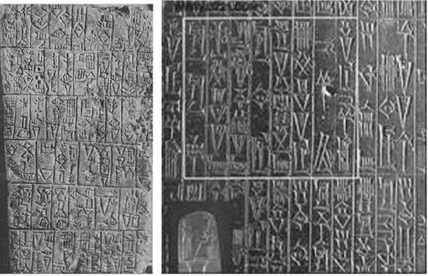

古代苏美尔人的泥版文献及刻在石碑上的汉谟拉比法典

中国的“货贝”（充当货币的贝壳）产生于公元前1600年～公元前1000年的商代时期；而世界上最早的金属铸币，产生于公元前700年～公元前550年左右的吕底亚（Lydia）王国。

这样推算一下，利息的产生年代是不是怎么着都比钱要早？

注意，这里要区分一下利息（interest）和利率（interest
rate）——利息是增殖的总量，利率则是增殖的百分比，比方说100元钱，存款1年，利息3元，利率则是3%。

自从代表着财富索取权的标准金钱产生之后，“金钱”和“利率”就成了一对孪生兄弟，各个民族在制定自己经济方面的法规之时，金钱的借贷利率都是其中极为关键的一个方面。

在历史长达3000年的金属铸币时代，钱这玩意儿和社会诸多商品并没有太大区别，少了贵，多了贱——当货币充裕的时候，其借贷利率相对较低，反之则较高。

例如，古希腊的城邦国家有一段时间经常和波斯发生战争，贵金属匮乏，社会上用钱很紧张，搞得雅典人甚至把神像身上贴的那层黄金白银都给剥下来。有些高利贷者按照每月48%的利率贷出资金，即使不考虑复利，其折合年利率也高达576%。而当雅典人彻底击败了波斯帝国之后，神庙里借贷金银的年利率就迅速降到了10%……

在古罗马社会早期，通过战争掠夺了大量贵金属财富，国家金银币充足，于是在法律中就将年贷款利率规定为本金的1/12（8.33%），实际中的贷款利率甚至低到只有4%——曾经有这么一个故事：凯撒大帝（Caesar）的朋友布鲁特斯（Brutus）试图收取殖民地萨拉米斯城（Salamis）48%的年贷款利率，同时代的西塞罗（Cicero）就提醒这个想钱想疯了的家伙，说我们的法定利率上限才是12%。

利率还有一个很重要的决定因素，那就是中国的那句老话——借钱，要看借给谁了！

这个意思就是说，要根据对方的信誉高低，来决定自己是否借出金钱，借出金钱的时候，又要求多高的资金回报。从这个意义上说，信用，也决定了你借钱的利率。

罗马帝国灭亡之后，欧洲进入了长达上千年的中世纪时期（Middle
Ages），因为王国林立，打来斗去，各个国家的经济稳定性有很大差异，这就导致了货币贷款利率存在很大不同。

比方说在14世纪，英国由于封建农奴制的盛行，经济一片死气沉沉，个人贷款常常需要支付52%～120%的年利率；同样的14世纪，威尼斯共和国由于资本主义得到了充分发展，还款记录良好，于是他们发行利率为5%的债券，销售时的价格甚至超出原有面值；同样在14世纪，当时的奥地利国家领导人长期不注重自己的信誉，长得比郭富城还帅而被称为“英俊公爵”的奥地利腓特烈三世（Friedrich
III），却不得不为借款支付80%的利息！

所以，帅哥们要记住了，长得帅，并不能降低自己借钱的成本！

到了17世纪，荷兰第一个建立现代资本主义制度，政府信誉极其良好，所以荷兰政府能够以3.75%的利率为其国债融资。同一时期，尽管西班牙是开采和攫取“新世界”金银最主要的主儿，按道理应该最有偿还能力，但由于王室奢侈无度的挥霍和战争造成多次国家债务违约，信用状况很糟糕，于是西班牙王室的短期贷款利率高达40%。

可见，不管个人还是政府，都要有信用，这才可以降低资金借贷成本！

总体来看，整个中世纪期间，欧洲最普遍的借款利率一般介于8%～10%之间，部分国家或极端时期的利率也有可能降低到5%以下，或者高于20%以上。

相比之下，一直处于小农经济的古代中国，借贷的利率可谓是“高处不胜寒”。

先秦时代的著作《管子》提到，在现今的齐鲁大地，民间借贷往往是“倍贷”，也就是说，年利率是100%，此外还有“中伯伍也”、“中伯二十也”，其借贷年利率分别是50%和20%；到了秦汉时代，编写《史记》的司马迁认为，做生意中的各行各业都有20%的利润，所以借贷利率也应该设置在每年20%左右。

司马大史学家的观点实在是太过于仁慈。

实际上，由于中国长期处于小农经济时代，政府也一向采取重农抑商政策，借贷并不是一种普遍现象，只有在兵荒马乱的年代，几近饿死的贫苦百姓才不得不选择借贷，此时的放贷方具有完全的议价权。因此，从秦汉到宋朝以前，无论是政府还是民间，中国的借贷年利率一直维持在50%～100%的高位。

到了宋朝之后，随着纸币这种“廉价货币”的出现，中国的利率有所下降，但也长期保持在35%～60%之间。

由此而知，中国历史上，借贷资金的成本一直如此高昂，从事商业贸易真的是风险非常大的一种行为，大家的选择自然便是躲开这一块儿。

市场经济为什么能够从欧洲孕育，却没有在经济更发达的中国产生，你不能不说与高昂的借贷利率一点关系都没有。

近代利率史话

</a>

从“地理大发现时代”开始，贵金属的大量开采和涌入，带动了以后几百年世界范围内利率的降低，欧洲国家发行国债的利率甚至降到了5%～8%的水平。

转了几个圈儿之后，美洲出产的白银绝大部分都运到了中国，这导致中国在经历了五百年的纸币轮回之后（纸币以前是铜钱），从明朝后期开始，货币制度再度从纸币转向了实物（白银）。随着白银的大量涌入，中国借贷的利率也下降到了25%～40%之间，但相比西方国家，依然是高得离谱。

持续几千年的高利率，中国老百姓骨子里都对借钱心存恐惧，反感借贷，黄世仁和白毛女的故事也绝非虚构——借来的是一点点钱，但还回去的却都是血和肉！

鸦片战争以后，罪恶的资本主义国家又一次影响了我们中国。

帝国主义国家侵略了中国之后，看到中国的利率如此之高，赶紧把他们的钱拿过来贷给中国人民，只要10%～15%的利率，一下子就把中国原来的高利贷行业给打垮了，中国沿海地区的借贷利率很快降低到了10%～15%左右。

大家还记得鸦片战争是因为什么事儿爆发的吗？

因为英国鬼子贩卖鸦片，导致中国白银大量外流，民族英雄林则徐给满清皇帝的奏折中为国为民更为了他的满清皇帝痛心地指出：“若泄泄视之，是使数年后，中原几无御敌兵，且无充饷之银”——意思是说，现在不禁止鸦片的话，任由白银外流，将来有一天，中国连征兵的银子都没有了。

可实际上，中英鸦片战争之后，中国战败，走私鸦片的事儿没人管了，尽管中国割地赔款赔给洋人们近10亿两白银，但因为看到中国借贷利息高，洋人们还是不断把白银往中国运，导致中国境内的白银实际上相比鸦片战争之前反而是大大增加了——根据资料记载，相比1840年，满清朝廷的财政收入中，到其灭亡前夕，白银的量更是增长7倍<a href="#part0003.html_id2" id="part0003.html_id_2">[1]</a>！

我们的民族大英雄，对经济和货币的判断真可谓是“差之毫厘，谬以千里”！

进入19世纪以来，众多的西方国家开始实施“金本位制”，金本位制国家的货币本质上说都是黄金，货币的一致性大大促进了世界经济和贸易的发展，也使得欧洲各国的经济发展日趋均衡，各国利率也趋向于一致，普遍都在5%左右。

第一次世界大战的爆发严重冲击了原有的世界利率格局。

大战爆发之后，原有的货币“金本位制”解体，不兑现纸币的普遍出现，为利率升降和变化打开了另外一扇荒唐之门。

第一次世界大战前后，无论是英国、法国还是德国，都出现了严重的通货膨胀，而世界历史上著名的德国通货膨胀也是发生在这一阶段。当时在德国，危机最严重的时候，工人们的工资一天要分早晚两次支付，到了傍晚，一个面包的价格等于早上一幢房屋的价值。在这种恶性通货膨胀之下，素以严谨著称的德国人创造了世界纪录——1922年，柏林交易所记载的活期贷款利率超过10000%。

第二次世界大战结束之后，在美国的领导下，世界经济领域建立了以美元为核心的布雷顿森林体系，所有实行市场经济的国家，其货币都与美元挂钩，实施固定汇率，而美元则与黄金挂钩。美元当仁不让地成为最有价值和最有信誉的货币，美元的利率也成为其他各个国家确定货币利率的标准。

由于美国有美元作为世界货币储备，美国政府信用状况当然是最好的，自然也能够享受到最低的借贷利率。从1945年到1971年，美国政府发行的国债利率在3%～5%之间，而优质公司发行的债券也可以以4.5%的利率实现融资。

其他国家的政府和公司自然就没有美国这么优越的融资条件了，但鉴于西方国家货币与美元保持固定汇率，利率也并不十分离谱，诸如英镑、马克等发行国债和优质公司债券融资的利率大都在4%～8%之间。

1971年布雷顿森林体系的垮台，意味着全世界第一次同时滑入到不兑现纸币时代，每一个国家纸币的发行数量完全取决于这个国家政府对自身的约束程度，由此导致了全世界的纸币利率可谓千差万别。世界到了一个光怪陆离的由政府强行规定超低利率和匪夷所思的超高利率交替出现的时代。

从1970年代到1980年代，由于全世界都陷入了滞胀，借贷利率普遍暴增，尽管中央银行规定的利率只有6%左右，但西方国家的实际借贷利率却普遍达到了10%以上，连政府的国债和住房抵押贷款，其利率也升高到8%左右。

到了1980年～1981年，美元的官方拆借利息达到了惊人的20%，基本利率更高达21.5%，国债利率冲上17.3%，另一个重要的国际货币英镑也与此类似。自进入现代社会以来，除非某些国家出现恶性通货膨胀或政府多次违约，这是极其罕见的官方高利率！

从近40年的事实来看，美联储一直企图将美元利率维持在4%～5%的水平；日本政府和日元的信誉一直比较好，所以2001年以来，日本央行可以持续多年维持着0.01%～0.1%的历史罕见超低利率；拉美国家政局动荡，动辄陷入通胀危机，于是我们就看到1990年元旦前夕，阿根廷银行为大储户提供超过7200%的年利率。

零利率与QE

</a>

总结5000年的利率史就可以发现，在以金属铸币充当货币的小农社会，利率往往异常高昂，如果国王或者有权有势的人能够以低于10%的利率为人民提供借贷的时候，常常被视为一种善良之举。

随着现代市场经济逐步发达，当一个社会的货币价值稳定的时候，那些有足够信誉的政府、公司和个人，常常能够以5%～6%的利率实现融资。

如果一个国家陷入通货膨胀，尤其是严重的通货膨胀，其利率常常能够飙升到10%以上，甚至达到20%以上，比方说1980年前后的美元和英镑。这是因为所有人都想及早拿到钱用来换成实物，避免自己的财富受到通货膨胀的侵蚀，而后来的钱相比此前的钱，其购买力也确实下降很多，这自然而然就推高了利率。

如果陷入恶性通货膨胀，像德国1922年那样，早上能买一栋别墅的钱，到了晚上只能换一个面包，那么利率也会飙升到匪夷所思的高度，比方10000%。

其实，在恶性通货膨胀下，更有可能的是，无论你声称多么高的利率，也没有人愿意借钱给你，因为大家都急着立马把手头的现金换成实物。著名国学大师季羡林先生曾说过，在国民党1940年的通货膨胀时期，他每次领到工资后，第一件事情就是要跑步去买米，而且跑慢了与跑快了米价都是不一样的——可想而知，这个时候你拦住这位未来的国学大师，声称给他按照多少多少的利率支付法币，你认为他会借给你钱吗？

纵观整个世界历史，利率变化之大的确让人瞠目结舌。然而，即便在过去5000年中已经见识过各种各样的利率，但面对今天我们各个中央银行所设定的低利率，估计还是要让人目瞪口呆。

到底怎么回事？

原来，自2008年9月份金融危机爆发以来，在“挽救世界经济”名义之下，全球央行的老大——美联储在2008年12月17日，将美元的基准利率降低到0～0.25%的历史低位。

此后全世界其他央行纷纷跟进。

2009年5月7日起，欧盟央行将欧元的基准利率降低到1.00%的历史低位；同日，英国央行也将英镑利率降低到0.5%的历史低位；

瑞士央行，2009年3月12日将瑞士法郎的利率降低到0.25%的历史低位；

日本央行更是及早动手，在2008年12月19日就将日元利率降低到了0.1%；

其余的，加拿大央行，在2009年4月21日，将加元的利率降低到0.25%的历史低位，新西兰元0.25%，挪威克朗
1.75%，丹麦克朗1.2%，瑞典克朗0.25%，韩元2%，港币0.01%，台币1.625%……

相比之下，当时中国央行2.25%的一年期存款利率，不是太低，反而是太高了。

更要命的是，以上国家经济总量相加的话，差不多要占到全球经济总量的70%以上！

无怪乎有人感叹，布雷顿森林体系的解体让人类一起跨入信用货币时代；本次金融危机，则是让人类携手跨入了“零利率时代”！

新时代的央行们，不仅有零利率，还有“定量宽松（Quantitative
Easing，QE）”……

定量宽松，也称为量化宽松，“定量”指的是扩大一定数量的货币发行，“宽松”就是为市场供应更多的货币，当银行和金融机构的有价证券被央行收购，新发行的钱币便被成功地投入到经济体系中。

说白了，QE就是凭空印刷钞票送给金融机构的一个好听说法。

比方说，美联储在2008年宣布的QE1，说白了就是凭空印刷1.75万亿美元钞票来收购华尔街金融机构那些卖不出去的垃圾债券；2010年11月份的QE2呢，是美联储确定再次印刷6000亿美元钞票去市场上购买各类债券……

在纯信用纸币时代，无论是“降低利率”还是“定量宽松”，其目的都是为了增加社会上的钞票供应，而一般情况下，出现“定量宽松”都是因为利率已经降无可降了，也就是说，“零利率”差不多是“定量宽松”的前提。

信用货币时代，在中央银行规定的某个利率下，大家都从央行来借钱，由于不必受到借贷数量的限制，只要不存在印刷钱币的纸张或者油墨不足的情况——钱嘛，对于借贷者来说，只要你愿意接受约定的贷款利息，只要银行同意你来借，可谓是能借多少借多少，而对于中央银行来说，则是“我的地盘我做主，想印多少有多少”！

因此，只要能够将利率降得足够低，就一定能鼓励人们更多的贷款、更多的借债，而这种贷款和借债的最终源头呢，归根结底还是央行的印钞机——降低利率之前，全世界有1万亿元钞票，利率降低之后，信贷规模扩大，全世界的钱变为2万亿元了，你说多出来那1万亿元钞票是怎么来的？

要知道，对于央行们来说，货币政策就像武林高手的绝招，看似神秘莫测、天下无敌，但实际上全世界央行加起来的招数，也无怪乎调整利率（包括贴现率）、存款准备金率以及公开市场操作这“三板斧”，据说，这“三板斧”足以打通经济运行的经脉。

如果真的三板斧过后还是不行的话，那就只能采取所谓的“非传统措施”了——这就是QE。某种程度上说，QE就类似于华山论剑中西毒欧阳锋变疯了之后所练的绝世蛤蟆功，“经脉倒行，五脏俱废”。

当今的美联储主席本·伯南克（Ben Shalom
Bernanke）在欧洲吹牛说，“零利率”和“定量宽松”是美联储的“重要创新”，也真得佩服他说谎话不打咯的脸皮厚度——无论是零利率还是定量宽松，美联储都绝对不是第一个实践者，所谓的“创新”桂冠，怎么也应该戴到日本央行头上！

由于房地产泡沫破灭和银行体系坏账造成的经济衰退，从1991年7月11日到1995年9月8日，日本央行连续9次下调官方贴现利率，由最初的5.5%下调至0.5%；1998年9月将无担保银行间隔夜拆借利率由接近官方贴现利率水平的0.5%降至0.25%……

可是，日本经济还是丝毫不见起色，怎么办呢？

于是，1999年初日本央行干脆将无担保隔夜拆借利率调低到0.02%，让日本那些本来应该倒闭破产的大银行从中央银行得到贷款，由于当时日本银行业短期融资的手续费也是0.02%，两者相抵为零，日本央行实践的“零利率”比伯南克还要彻底！

甚至，将凭空印钞票文雅称之“定量宽松”，也还得归功于日本央行2001年的“创举”。

2001年～2003年，当时日元的利率已经降低到零，降无可降，但日本仍有大量银行资不抵债处于破产边缘。为此，日本央行凭空印钞大量买入市场上无人认购的政府和企业债券，向银行体系注入大量资金，试图为经济体系创造新的流动性，以便鼓励开支和借贷。

想想看，这和2008年金融危机爆发之后美联储干的事儿有什么本质区别吗？

至于“零利率”和“定量宽松”到底有没有效果，用一句广告词来说：“谁用谁知道！”

下图是日本央行1972年以来所执行的基准利率情况，看看是不是1999年以来基准利率都一直在0那儿“趴窝”呢？

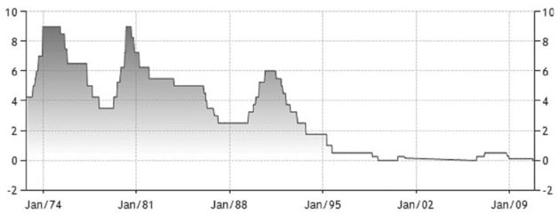

日本1974～2009年基准利率走势

再对比一下日本从1981年以来的经济增长情况。

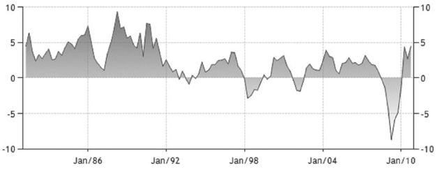

日本1986～2010年经济增长走势

看看上面两幅图的对比就知道，日本的“零利率”和“量化宽松”的蛤蟆功练了十多年，迄今也没有能够让日本走出经济泥沼。

根据主流经济学家的权威说法，日本遭遇了所谓的“流动性陷阱”！

流动性陷阱，说的是当一定时期的利率水平降低到不能再低时，人们就会产生利率上升的预期，货币需求弹性就会变得无限大，即无论额外增加多少货币，都会被人们储存起来。一旦发生“流动性陷阱”，再宽松的货币政策也无法改变市场利率，使得货币政策失效。

这种专业的概念那是相当让人头疼——所以我来给大家做一个通俗的解释。

中央银行使劲地降利率，一直降到了“0”这个极限，是个人都明白现在利率是历史最低，所以大家都知道将来利率一定会升高，现在的物价也可能是最高，所以中央银行无论增加多少货币供应，大家还是宁愿把钱存起来，等着将来花，结果导致央行和政府期望通过“居民消费促进经济增长”的想法泡汤。

说白了，就是央行和民众之间“斗智斗勇”——老百姓日益增强的经济智商与央行货币愚弄手段日益拙劣之间的矛盾！

早在2000年，日本央行刚刚开始实施零利率货币政策的时候，美联储内部的研究人员就对此进行过审慎研究，并发表了零利率货币政策效果之研究报告。其基本结论是：“零利率条件下的诸般政策工具有内在的局限性，它们的实际效果是非常不确定的。”

既然有了日本的前车之鉴，为什么以美联储为首的全世界的中央银行还是坚持把利率降到接近于零，而且还不遗余力地搞“定量宽松”呢？

原来，有一些学者提出了貌似有理的 “零利率货币政策”发挥作用的机制。

仔细分析一下这个理论，各国央行依然还是期望忽悠民众，和民众玩“心理战”。“零利率”条件下，央行虽然无法改变利率，但只要动不动来一下QE，民众总会嗅到“无限量印刷钞票”的信号，人们将会恐惧物价的上涨，从而不再将钱存储起来而是用于消费。

而美联储从QE1的1.75万美元到QE2的6000亿美元，而且似乎将来还要追加QE3、QE4……就是想要验证这个机制是否能够发挥作用。

关键是“无限量供应钞票”这样的信号一旦被人们确认，恐怕不仅仅是促进消费和投资的事了，更有可能是严重的通货膨胀。这样一来，人们的确是跳出了所谓的“流动性陷阱”，但恐怕从此也一下子跌进了恶性通货膨胀的万丈深渊！

负利率之罪

</a>

世界之大，无奇不有，不仅仅有零利率，还有负利率呢！

在百度百科上查阅“负利率”，你会得到如下定义：“是指通货膨胀率高过银行存款利率。”进一步的解释是，“消费者物价指数（CPI）快速攀升，导致银行存款利率实际为负”。

而这种负利率还只是老百姓计算自己实际存款财富损失时候所说的负利率，实际上还有名义上的负利率。

名义负利率极为罕见，至少在1971年之前5000多年的时间里没有出现过。

罕见是有原因的——利率倘若为负值，意味着借钱人不用从事生产，只用借钱就行了，杨白劳从黄世仁那里借到钱之后，黄世仁从此必须源源不断地给杨白劳送钱花，而且越来越多……这是什么样的“美好时光”啊？

不过，“极为罕见”并非意味着“从未出现”！

在2008年金融危机的“救市”过程中，就有一家央行实施了史无前例的名义负利率——这就是瑞典央行。为了鼓励商业银行放贷给个人而不是囤积现金，从2009年7月8日开始，瑞典央行对商业银行放在央行的存款准备金支付负利率，也就是说，往央行存钱，不仅收不到利息，还要倒贴钱。

不过值得注意的是，瑞典央行规定的这个负利率是对银行的，不是对普通大众的，因为商业银行的存款准备金必须强制放入央行的，所以这个负利率也就是强制的。瑞典央行对此做出的解释是，按照传统的理论，“0”是借贷利率的极限，实际上绝非如此，即便是纸币这样极其容易存储的钱，也是有存储成本的。

可不，你买个保险柜也还要钱呢！

美联储就估计，纸币的实际存储成本大概介于现金价值的1%～2%，这意味着-1%或-2%的利率，可能不会引发人们一下子都冲到银行去提取现金。在这个利率水平上，人们还是愿意把现金存到银行，而不是把它藏在床底下、墙缝里，并雇佣几个彪形大汉24小时看守。

正是根据这一理论，2010年10月25日，参考美国的CPI数据，美国财政部发行了规模100亿美元的通胀挂钩债券（Treasury
Inflation Protected Securities，TIPS），设定的利率居然是-0.55%！

当然，要是说到实际的“负利率”，中国可谓是最有经验的国家——从1980年以来的30多年间，一年期名义存款利率年均为5.5%，而即使按照国家公布的CPI来计算通货膨胀，年平均CPI涨幅也达到了6%，平均算下来，实际存款年平均利率是-0.5%！！

也就是说，自从改革开放以来，总体上而言，人民币居然一直都是负利率！

在1997年以前，中国实行储蓄存款保值政策，当存款利率低于国家公布的CPI，商业银行要对储户贴补存款利率低于CPI涨幅的差额部分，实际存款利率至少为0而不是负数。在1997～2003年存款利率高于CPI，表面上看中国难得的有了一段正利率的时间，但从2003年开始，中国再次出现负利率并一直持续至今，而储蓄存款保值政策也没有恢复实施。

从这一点上来看，最近这八年的中国存款利率，可谓是历史最低水平！

下面就是1990年～2011年的国家公布的22年间每个月的CPI增幅情况和一年期存款利率的对比图表，大家不妨进行一个对比。

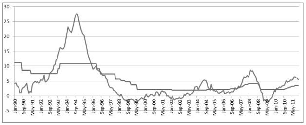

中国1990年~2011年CPI增幅及一年期存款利率图表

接下来，我们不妨分析一下，负利率到底补贴了谁、伤害了谁？

一般来讲，利率水平高低首先影响总的资金供求，进而影响社会上的钞票总量；其次，利率是一种分配手段，调节存款人、金融机构、贷款人之间的利益分配；最后，利率可以引导稀缺资本流向，把资本分配到经济效益更高的地方去。

在中国1996年以来的长期低利率政策之下，人民币的广义货币供应量快速激增，
1990年年底人民币广义货币供应量为1.53万亿元，到了2011年10月底，已经暴增至81.68万亿元。1.53变到81.68，单位还是“万亿元”，你说说降低利率的方式印钞票猛不猛？这种情况下，中国为啥“蒜你狠”完了是“豆你玩”，“姜你军”还没有结束，“苹神马”、“煤超疯”又来了，都是这样一个道理——更不必说坚持暴涨了8年的“房坚强”！

归根结底，都是低利率造下的孽！

在银行存款实际利率为负数的情况下，存款越多，账面无形损失越大，存钱不如花钱，对于中高收入群体而言，负利率可能有利于刺激他们消费，扩大他们购买耐用消费品和大件商品的需求，比方汽车，这两年为啥中国汽车卖得那么火，该明白了吧？

然而，银行里还有相当部分的钱不得不接受这些损失，这恰恰就是中低收入者的“强制性储蓄”——所谓强制性储蓄，因为这些钱是中下层人民为自身的教育、医疗、养老、保命所攒，或是随时应急所需，不到万不得已不能动用，它们不能也不敢消费，更不能、也不敢转化为投资，尤其是占中国人口大多数的农民。

根据中国人民银行公布的数据，目前中国居民储蓄存款约30万亿元，按照目前的情况，负利率大约为3%左右，相当于居民每年收入少增加9000亿元！从这个意义上讲，负利率作为一种财富再分配的工具，它在进一步掠夺社会弱势群体原本就很可怜的那一点点财富。

低利率的廉价货币政策所带来的另外一个后果更是对社会道德具有深深的摧毁作用，那就是“花自己的钱不如花别人的钱，花今天的钱不如花明天的钱”！当能贷到款的个人和企业几乎是零成本拿到钱之后，有钱就能投机，投机就有钱赚——这时候，只要能借到钱就是赚，或者说，借到钱的就总是赢。

又是哪些人能不断地从银行里借到钱呢？

毫无疑问，当然是那些有财产作抵押的富人！

在负利率时代，普通百姓的钱在银行里蒸发、缩水，而另一方面，能够最先从央行获得钞票的银行业和金融业，能够从银行得到大量贷款的地方政府、大型国有企业却从中受益。

不妨先来看一个最直接的受益者——银行业。

实际上，自2008年全球金融危机爆发以来，全世界银行业一片低迷的时候，中国银行业的表现却反而分外靓丽。

根据英国《银行家》杂志公布的消息——2009年，中国工商银行、中国建设银行、中国银行雄踞全球市值最大银行排行榜的前三名，总市值更是占据了全球十大银行总市值的51%，怎一个“牛”字了得啊？

不仅市值上做大做强，中国银行的盈利能力在全球更是一枝独秀——2010年，中国工商银行以325亿美元的盈利在“全球最赚钱银行”中拔得头筹，中国建设银行也以203亿美元的业绩名列第二……按照利润算，2009年全世界十大银行中前5名有4个都是中国的！

中国金融业果然在世界上拔得头筹，中国银行业已经率先在全球“崛起”啦！

那么进一步地问，中国银行业崛起的“法宝”何在？

答案很简单——中国人民银行“特许”的存款和贷款的利率差！

根据2011年上半年中国16家银行上市公司年中业绩通报，16家银行共实现营业收入10870.6亿元，而其中利息差的净收入就达到了8283.74亿元，占所有收入的75%以上！

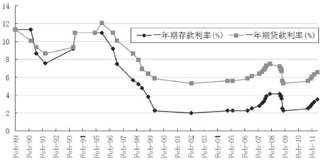

1989年～2011年中国一年期存、贷款利率变动表

由图可见，自2000年以来，中国的银行存贷款利率差长期维持在3%这样的高位！

要知道，无论发达国家还是发展中国家，世界上其他国家的银行，存贷款利率差一般为1%左右，银行业不是天天喊着要“与世界接轨”吗？为什么利息总不能与世界接轨呢？

根据2011年全国沪深两市2244家上市公司披露年中业绩通报，所有上市公司实现净利润9943.30亿元，而16家上市银行就实现净利润4610.88亿元，占了全部上市公司净利润的46.4%！

要知道，2244家上市公司差不多代表了全国各行各业的利润情况，可银行业一下子就占去了全部利润的近50%——据此，我们可以大胆估计，在2011年上半年，全国人民所赚到的钱中，有将近一半都是中国的大小银行赚的，除此之外的全国老百姓才赚了一半！

你觉察出来这个金融体系的疯狂了吗？

原来，全国劳动人民那么辛辛苦苦劳动了一年，加起来挣到的钱才只不过和那些吸收存款、放出贷款的银行赚到的钱相当！

实际上，不仅仅是2011年上半年，从2007年、2008年、2009年到2010年，中国上市银行实现的净利润一直都占到了所有上市公司净利润的40%以上！

比金融业收入次一级的，是那些可以第一手从商业银行得到贷款的大型垄断国企，他们几乎可以无限制地获得廉价信贷，得到资金之后，转手就可以投资土地、物资、房子、股市，一年半载下来，获得的收益都是普通老百姓难以想象的天文数字……

众所周知，连海尔和海信这样中国驰名的家电品牌，都开始投资房地产，连杉杉服装这样的纺织企业，都变身资本运作公司……

还有谁来从事实业生产，还有谁来辛勤劳动，还有谁来创造财富？

所以，“负利率”的问题不仅仅是一个简单的物价问题或通胀问题，它更是社会财富再分配的一种工具或手段，它掠夺弱势群体，并帮助强势利益集团敛财致富。

正如货币政策委员会周其仁先生所说：“（投机）赚快钱心理侵蚀的是

企业家精神和工作伦理，似乎好好工作没有了意义。很多炒股经历过1000点到6000点的人，很难回头好好上班，他不觉得上班有意义，货币稳定非常重要，不要让人无端地发飘。”

2010年9月，当国家统计局公布8月份经济数据的时候，对于已经出现的负利率现象和当时3.5%的CPI增幅，统计局和发改委都在引导群众向前看，他们告诉人民，“通过加强农产品供给和调控物价，CPI预计到年底就会降下来……”

结果，一年过去了，到了2011年7月份，CPI竟然高达6.5%，负利率情况反而更加恶化——不知道这个耳光，算是打在了谁的脸上？

经济学家易宪容就指出：目前的负利率意味着社会财富大转移，意味着把普通居民的财富转移到暴富的房地产商手中、转移到效率低下的国有企业手中、转移到地方政府手中、转移到中央政府手中……

看不见的手

</a>

亚当·斯密（Adam Smith）在其著名的《国富论》（An Inquiry into the Nature
and Causes of the Wealth of
Nations）中提到，尽管每个人在经济生活中都只考虑自身的利益，但是市场上有一只“看不见的手”，驱使着人们通过分工和市场作用达到国家富裕。

“看不见的手”由此成为形容市场竞争的形象用语，而许多人所不知道的是，在有约束的货币供应条件下，利率本身也是一只“看不见的手”。

如果一个国家的货币总量保持大致的稳定，无论是金属铸币时代还是金本位制下的纸币时代，利率并不需要哪个中央银行或者政府强行规定为多少多少，而是自由浮动的。

有人问了，没有中央银行的调节，那自由浮动的利率岂不是会很离谱？

你错了，自由浮动的利率，既不会高得匪夷所思，也不会低得离谱。

为什么呢？

比方说，全社会总共储蓄了10000枚金币，现在“经济过热”，炒股能发财，一年股市就上涨30%，于是大家都来借金币，金币就那么多，大家都想借，自然是谁给出的利率高谁借走，于是利率自然而然地就会升高，但是如果升高到30%的时候，你即使借到了金币，买了股票也挣不了钱，借钱活动自然就得到了遏制。资金成本的升高，使得过热的经济自动得到“冷却”，消费和投资自动得到抑制，不会整体“发烫”的经济当然不会搞得到处都充斥泡沫，绝对不可能出现所谓的“流动性泛滥”之类的伪命题。

反之，当经济衰退的时候，人们普遍悲观，不愿意借钱投资或者消费，货币数量一定，没有人借，利率自然就会降低、降低、再降低，一直低到有人觉得借钱能够挣钱、能够投资的地步，于是这样的低利率反过来为那些真正的投资机会、或者真正有用的发明创造提供了一个较低的资金借贷成本……

从国际范围内来看，如果一个国家的利率高企抑制了经济活动，其他国家的贵金属（货币）就会大量涌入，从而导致其利率降低，促使经济景气；相反，如果一个国家利率很低，经济过热，其贵金属就会大量流出，促使利率升高，经济降温……

也就是说，在有节制的货币供应数量下，无论在一个国家还是世界范围内，利率本身就是一只“看不见的手”，自动地调节着经济的运行。

1971年之后，全世界一起滑入了100%的纯信用纸币时代，纸币再也不代表任何固定数量商品或财富的索取权，其数量可以由中央银行根据经济发展需要随意增减，而利率则成为政府和中央银行“调控经济”的魔杖，世界上几乎所有国家的政府都实施了“盯住利率，放开货币”的政策——通过“点纸成金”法术，中央银行强行为社会规定一个利率，然后还自作聪明地调来调去，号称是为了对经济活动进行“调控”，好像他们能够比客观的经济规律更强大，更能充当人民的救世主。

具体来说，“盯住利率”，意思就是由中央银行或政府规定一个利率标准，比方说存款利率是多少、贷款利率是多少、银行间借款利率是多少；“放开货币”的意思是说在设定的利率条件下，全社会钞票的数量自由浮动，想要多少有多少。

就这样，利率就成了政府和中央银行“调控经济发展”的重要工具——“经济过热”的时候，通过提高利率抑制投资和消费，吸引人们把钱存入银行，社会上流通的钱就会减少，经济就会自然“降温”；相反，如果“经济衰退”，就降低利率，鼓励投资和消费，这样经济就会成功“复苏”……

就如同孩子们所玩的跷跷板游戏一样，这头压下去，那头提上来，有了这样的政策，无论一个国家还是全世界，经济就可以实现永久地平稳增长……

果然美妙无比！

然而，如果与1971年之前不受操纵、自由浮动的利率相比，自诩在为经济保驾护航的政府和央行们在“调控经济”方面的表现实在太过于拙劣！

要知道，从1944年布雷顿森林体系建立到1971年尼克松总统宣布关闭黄金兑换窗口，除了几次小规模的汇率危机外，根本没有、也不可能出现全球性的金融危机或金融泡沫。

相比之下，极具讽刺意味的是，恰恰是自1971年绝大多数国家政府都可以随心所欲控制货币数量以来，他们所宣传的“经济平稳发展”却从来没有实现过。

从20世纪70年代的滞胀，到80年代的债务危机，到90年代的债务危机与金融危机同步，到2008年的全球金融危机，金融危机爆发的规模和次数都远远超过了以前的时代，“三年一小祸，十年一大灾”，世界经济由此总是处于动荡不安之中。

根本原因在哪里呢？

并不是说“盯住利率，放开货币”的货币政策本身有什么问题，而是各国政府实在都太偏爱低利率了——因为低利率能够持续增加钞票供应，造就经济持续繁荣的假象。

即便由于低利率存在的时间过久，市场上钞票供应量过多，出现了明显的通货膨胀现象，在“避免经济大起大落”的借口之下，全球各国央行在加息问题上可谓是上山如乌龟，从来都是观察再三、思前想后，然后疑虑重重、一步三回头地加息，今天加0.05%，明天降0.025%，一年后加息0.05%，把加息的时间段尽可能延长。

相反，如果出现了一点所谓“经济衰退”的苗头，央行们在降息的时候可谓是下山如猛虎，经常忙不迭地就把利率一降再降……

大家可曾记得，2008年金融危机爆发以来，全球央行是不是在几个月内就不约而同地以迅雷不及掩耳之势把利率降低到接近于零？

如此一来，长期日积月累，哪个国家的货币供应数量不快速增加那才是怪事呢！哪个国家通货膨胀不肆虐才是怪事！金融体系不出问题才是怪事！经济不出大麻烦才是怪事！

利率是怎样设定的

</a>

按照2008年到2010年世界各国央行强制规定的利率，要想实现数值上的翻倍，不考虑复利，存在中国的银行，需要40年；存在美国的银行需要400年；存在日本的银行变成“一千年以后”；存在香港的银行那是“等你一万年”！

如果一个人从25岁开始工作挣钱，到65岁退休，劳动年龄总共才40年，至于所谓的400年、1000年和10000年，对于个人来说，已经变得毫无意义——因为这已经远远超出了个人的生命长度。

《中华人民共和国中国人民银行法》规定：货币政策的目标是保持货币币值的稳定——100元存款，40年翻一番，根据“币值稳定”的说法，难道按照中国过去30年年均6%的CPI计算，40年后的200元钱，相当于今日100元人民币的购买力？

就不说40年前了，如果谁有兴趣，有资料，有数据，可以把30年前或者20年前乃至10年前的物价数据与现在比一比，就知道是什么情况了，更不必说官方公布的那个CPI，已经极其严重地低估了实际的通货膨胀情况！

在全世界都是一个货币供应模式的情况下，我们也不能期望中国人民银行能够把那个“盯住利率、放开货币”的政策改过来，但在利率的设定上其实还是有很大的改进余地。

有人就反问了，你认为当前的利率低，那你说货币利率设定在多少合适呢？

应该说这不是个什么问题。

早就有经济学家曾经严格论证过，在一个公平公正的经济体系中，长期的货币政策应该是中性的（既不扩张也不收缩），中性利率水平相当于名义GDP增长率——也就是说，真实财富的增长率是多少，利率就应该是多少。

真正注重公平公正的国家基本都是如此。比如过去十年，美国GDP增长率约4.5%、欧元区为3%、英国为4.5%、日本为1%，其利率平均水平也基本与这个持平。

相比之下，中国2009年GDP年增长率是8%，那么2010年一年期存款利率就应该设在8%左右；2010年经济增长率是9%，那么2011年一年期存款利率就应该设在9%左右……

唯有如此，利率才能够营造出公平、公正的经济发展环境，而不是出现大型国有企业、地方融资平台、房地产开发商可以按照央行的利率得到资金，而真正需要资金的民营中小企业为了生存下去，却不得不跑到市场上去借高利贷……

当有人就这个问题在2010年底向中国央行行长周小川提问的时候，周行长说：“加息是两难选择……想使手里少数几项货币政策的工具，满足所有不同利益群体的要求，是很困难的。”

刚才说了，全世界的绝大多数政府都执行了“盯住利率、放开货币”的政策，那么这个世界上有没有政府反其道而行，执行“盯住货币，放开利率”？

完全执行的没有，但有两个国家很接近这样的政策——智利和德国。

不妨以智利为例来讨论。

在1975年之前，智利和其他拉美国家没有什么区别，军人政府独裁体制，民生凋敝官员腐败，通货膨胀肆无忌惮，1973年和1974年智利的通货膨胀率分别高达606%和702%！

1975年开始，当时的军政府发现，这样下去自身政权也要完蛋，于是开始大刀阔斧地实施经济改革，将国有企业全部私有化，取消政府对经济的干预和价格控制，削减关税推动自由贸易——但最最关键的是，大幅度减少政府开支，限制智利境内的货币发行量，利率则基本上自由浮动。

具体的做法是，设定一个良性的货币增长目标（比如每年增加3%），其他的一切都交给市场去做，中央银行行长几乎成了闲职——用诺贝尔经济学奖获得者弗里德曼（Milton
Friedman）的话来说，完全可以用一个最简单的电脑代替！

很长时间内，人们不相信政府能够限制住货币数量，加上社会上货币短缺，短期贷款年利率一直保持在60%以上的高位。

但是后来，奇迹出现了！

智利的通货膨胀率从1974年中期的年均700%迅速降到1975年的10%，1976～1980年的经济年平均增长率为8%。到了20世纪80年代，由于货币逐渐稳定下来，智利的短期贷款利率开始逐步下降，到了1988年，短期贷款的年利率已经降低到了22.4%。

1990年，军政府还政于民，由于政治清廉、经济自由，政府信用逐渐建立，到了2004年，智利短期贷款的年利率已经降到了5.13%。

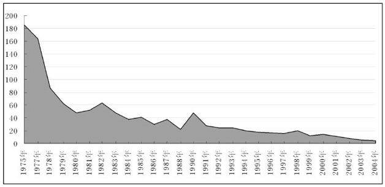

1975年～2004年智利短期贷款利率a

随着利率的下降，1990年以来，智利步入了稳定发展的轨道。近20年来，包括巴西、墨西哥、阿根廷在内的许多拉美国家经济走走停停，债务危机动辄爆发，而智利却始终保持着平稳的经济发展势头，在所有拉美国家之中可谓一枝独秀。

控制住了货币增发的阀门，智利的利率调整就能根据市场需求灵活调整。

观察智利这15年来的利率变化就会发现，相比中国、美国、日本的中央银行所指定的基准利率，智利的利率波动较大且变动频繁，比较接近于自由市场的情况。

智利一方面坚持自由贸易政策，消除贸易堡垒，保护私有财产；另一方面，它又注重公平，把2/3的中央财政收入用于地方扶贫、教育、医疗等社会民生保障，就这样，左手公平，右手发展，公平发展的智利被誉为“南美的瑞士”。

根据《华尔街日报》排名，在经济自由度上，智利在157个国家中排名第8位，位居拉美第一；智利的经济竞争力，在世界排名第25位，好于不少欧洲国家；智利是拉美贫困率和赤贫率最低的国家；军政府还政于民之后，智利实施了普选制，各级政府必须真正接受人民的监督。在全球180个国家当中，智利的清廉指数与法国、乌拉圭一起并列第23位；20年前智利约五分之二的公共开支都用于偿债，如今这一数字为零，而社会服务则占用了全部公共开支的70%。

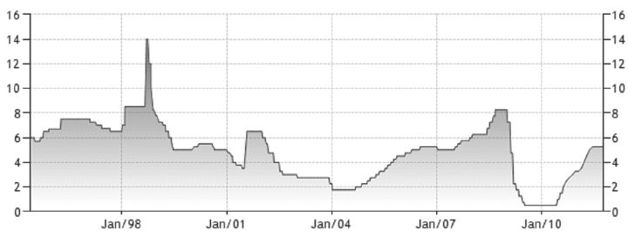

1995年智利基准利率<a href="#part0003.html_id3" id="part0003.html_id_3">[2]</a>

正是因为利率根据市场经济状况适时调整，近20年来，智利货币比索的稳定性令人赞叹，成为世界上价值最稳定的货币之一，CPI数据更是让其他国家艳羡。

要不是智利2010年8月份的大地震和10月份的矿工营救，我们还真少见到真正的“智利奇迹”！

然而，可能大家并不知道的是，两件“奇迹”的背后是经济奇迹，而经济奇迹的源头就是尊重利率这只“看不见的手”。

想说加息不容易

</a>

大家该问了，既然利率这么低，为什么美元不加息？为什么人民币不加息？为什么欧元不加息？为什么英镑不加息？为什么日元不加息？

可能，从心底里来说，中央银行行长们不是不想加，只是“加息，想说爱你不容易”！

原因只有一个字：“债！”

截止到2011年11月底，美国联邦政府的国债总额已超过15万亿美元，而其2010年的GDP总额仅为14.66亿美元——按照美国当前的超低利率水平，美国政府为2010年的国债所支付的利息总额就达到4140亿美元！

要知道，美国联邦政府2010年的财政收入总额也只不过才2.16万亿美元！

你想想看，收入2万元，4000元都用于支付利息了，这是个什么概念？

如果把利率提高一倍呢？那就是支付利息要花掉8000元！

如果再提高呢？世界上最强大、最有钱的美国政府，干脆直接破产得了！

你说美联储能不能选择加息这条路？

不仅仅是美国如此，欧元区好不到哪儿去，英国好不到哪儿去，日本更是好不到哪儿去！

希腊的外债高达GDP的140%，意大利外债高达GDP的120%，即便是看上去似乎安然无恙的法国，国债也超过了1.7万亿欧元（占法国GDP的近80%），你说说欧央行会不会大幅度提高利率，直接让希腊、意大利、爱尔兰、葡萄牙、西班牙都因为国债问题而经济崩溃，让整个欧洲彻底沦陷？

独立于欧元区之外的西欧国家——英国，到2011年底，拥有将近1万亿英镑的国债（占英国GDP近70%），你说英国能不能提高英镑利率？

什么，你问日本是不是好一点儿？

日本是当前全世界主要国家之中公共债务问题最糟糕的国家，比希腊还要糟糕！

根据日本财务省2011年8月10日公布的数据，截至2011年6月底，日本的国家债务总额（包括国债、借款和短期政府债券）为943.8万亿日元，占GDP的比例高达185%，远远超出几近破产的希腊——在日元国债利率仅为1.2%的情况下，2010年日本偿还债务利息就花掉了财政预算的1/5以上，你说日本央行能不能提高利率？

利息是老虎，要人命的啊！

放眼西方资本主义国家，那真是满目疮痍，按照伟大领袖毛主席的“不是东风压倒了西风，便是西风压倒了东风”观点，中国形势一定是一片大好。

乍一看官方公布的数字，还真是这么一回事！

根据中国官方公布的数据，截止2010年底，中国当年有8000亿元的财政赤字，占GDP比重2.8%，国债余额约6.75万亿元，占GDP比重还不到20%。

怪不得赵本山在小品里说：“纵观世界形势，风景这边独好!”

简单看数字对比，美、日、德、英、法他们这些老牌帝国主义国家都被债务缠身，不能提高利息，但咱们中国升高一点利息那是一点问题都没有！

问题是，既然这么好，2010年底中国人民银行的周小川行长接受采访的时候为什么还是表示自己的工作“挺难做，压力比伯南克更大”？

为啥呢？

原来，中国欠债最多的，不是中央政府，而是各级地方政府。

2010年3月份，全国政协委员、国家税务总局原副局长许善达在政协会议中认为，中国的地方政府根本还不上他们欠银行的债务！

根据国家审计署披露，截至2010年底，全国地方政府的债务余额为10.72万亿元人民币，而按照美国西北大学教授史宗瀚（Victor
Shih）2010年的估计，中国地方政府在2009年底的负债就已经高达24万亿人民币，是地方政府2009年全部财政收入的7倍。

按照6%的最低贷款利率计算，24万亿元债务一年需要支付的利息就是1.44万亿元；即便是较低的那个10.72万亿元，一年需要支付的利息也达到了6430亿元！

这样高的债务，意味着中央银行只要将利率稍稍提高一点儿，地方政府几乎要集体破产！

下面就有这样一个活生生的案例。

2010年4月份，为了显示湖北省发展GDP的决心和投入，湖北省发改委主任公布了其未来3年内高达12万亿元的投资计划（其他各省与此类似）。

12万亿，啥概念啊——湖北省2009年全年的财政收入只有814.78亿元！

一个年收入只有800元的人，却要在接下来的3年里花12万元？

你觉得这人正常吗？

有父母祖宗留下的一大笔钱吗——没有，没听说以往的湖北省政府累积了几百年的财政盈余留给这一届政府让他们花！

是不是天上哗啦哗啦地掉人民币砸到他们院里了——好像也没有，因为地方政府没有印钞权，印钞权只在中国人民银行那里！

那么，到底钱从何来呢？

毫无疑问，只能从银行贷款。

12万亿元都从银行贷款，按照当前最低的贷款利率6%计算，每年利息支出就达到了7200亿元——这样算来，湖北省政府的800亿元财政收入全部送给银行当利息也不过满足一个零头！

天底下怎么会有这么不合常理的事儿呢？

如果中国再提高利率呢？

当然，大家也都心知肚明，这几年地方政府财政收入大头不是别的，而是卖地收入！

根据财政部2011年3月5日提请十一届全国人大四次会议审议《关于2010年中央和地方预算执行情况与2011年中央和地方预算草案的报告》，2010年中国地方本级收入40609.8亿元，其中国有土地有偿出让收入为2.9万亿元，占了地方财政收入的70%。

可以说，要不是有卖地收入作支撑的话，中国的地方政府根本已经还不上银行利息了！

问题在于，土地可以永远卖下去吗？房价会永远涨下去吗？

几乎可以断定的是，即便加上卖地的收入，即便中央银行规定如此低的贷款利率，地方政府2012年～2014年的收入恐怕也不足以还上银行利息！

接下来的两三年间，因为利息问题，地方政府的日子难过着呢！

让物价飞

</a>

无论东方还是西方，古代的借贷利率许多时候被认为是一种罪恶，莎士比亚的《威尼斯商人》中放高利贷者夏洛克要求安东尼割下一磅肉来偿债的故事家喻户晓，而中国《白毛女》的故事也是无人不知、无人不晓。

从小就生长在社会主义的幸福生活中，我们都知道在万恶的旧社会里，你要是借钱，有利滚利、有驴打滚……每当从地主恶霸或者资本家那里借来一个子儿，过了一年归还的时候，那都是翻着倍归还的，借1个银元，要还2个银元——老百姓的日子，那真叫一个苦啊！

看看现在，你到中国的银行那里去存人民币，一年的利息只给你3.5%，贷款利息也只有6.56%，这样说来，老百姓的日子，那该幸福到什么地步啊？

问题在于，老百姓能贷到吗？

比方说，像我这种没车没房没关系的，又没有什么固定资产，谁贷给你钱啊，银行放款的对象可都是国际级的大企业！

2009年一年，中国人民银行一年期存款利率是2.25%，想想看，如果你能够得到资金，随便在哪个大城市买一栋房子，或者买点股票，到年末卖掉，收益率有低于50%的吗？

不仅仅是人民币的负利率伤害普通劳动者、鼓励投机，世界霸权货币——美元的零利率同样鼓励投机，伤害普通人。

因预言了2008年金融危机而声名鹊起的美国纽约大学(New York
University)斯特恩商学院(Stern School of
Business)教授鲁尼埃尔·鲁比尼（Nouriel
Roubini）在2009年11月份就说：“因为美联储一直维持利率不变，并预计将长期不作调整，那些做空美元、以很高的杠杆买入高收益资产和其他全球性资产的投资者，岂止是在以零利率借入美元，他们简直是在以负利率（年化利率为-10%或-20%）借入美元……”

他进一步总结说：“所有玩这种高风险游戏的投资者看上去都像是天才——尽管他们只不过是骑在一个由（绝对值）较高的负借款成本融资的巨大泡沫上——自今年3月以来，他们的总回报率已达到50%～70%。”

看见没有，几个月时间，投机者就可以获得50%～70%的收益！

更远一点儿的，从2008年年底美联储实施0～0.25%的零利率以来，如果那时候你能够借到钱，换成石油、黄金放到现在，想不赚翻了都难！

而普通劳动者辛辛苦苦工作却只有低得可怜的薪水……

21世纪的第二个十年刚刚开始，美联储仍在不遗余力地“降低利率”，甚至不惜通过“定量宽松”这样的下三滥手段来解决高失业、高负债以及庞大的财政赤字。美联储认为，经济出问题就像汽车抛锚，这时候，只要能把利率降低下来，就像有人帮着推汽车，直到它自己打着火，问题将不复存在。

问题是，过去30年间中央银行们一直都在这么干，降息印钞票，制造泡沫，升息收钞票，压制泡沫，长此以往问题不断累积，才导致了2008年的全球金融危机。

2008年金融危机爆发以来，包括美联储在内的所有中央银行都在辩解，说如果没有他们大幅度降低利率的“高招”，现在的经济状况一定是更糟糕！

这些话一贯是政治流氓们的策略，因为时间是单向的，2008年、2009年和2010年都已经过去，如此的断言永远无法被证明。

为什么不找当初没有大幅度降低利率的国家来验证一下呢？比方澳大利亚……

本来就是中央银行降低利率所制造出来的泡沫破裂，现在他们又声称没有他们的“拯救”将会更糟糕。到了现在，我们整个社会的经济状况如此糟糕，结果他们还是采用以前降低利率制造泡沫的老办法来解决，居然还信誓旦旦说这种做法是最好的……

为什么会有次贷危机、金融危机这样的毒瘤？恰恰就是因为低利率引起的泡沫堆积。而现在，全球央行一致的零利率决定，更是让泡沫充斥所有经济体。

正是以美联储为代表的中央银行，拿着一把罪恶的大刀，把世界的经济砍了一个又一个伤口。现在，这个伤口正在溃烂和发炎，可他们为了所谓的“利益团体”，不仅不肯提高利率来为我们的伤口消毒杀菌，相反却通过零利率再狠狠地砍上一刀、两刀……

按照世界各国中央银行的理论，我们为什么把利率降到这么低，为的就是不想让老百姓存钱，就是要让老百姓花钱！

问题是，我们个人的“花钱”和“不花钱”难道都需要中央银行来指手画脚吗？

“你去买苹果四代，我买回四袋苹果”——谁不知道花钱啊？

我渴了饿了没衣服穿了想要炫耀了，我自然会去花钱；相反，如果我的钱要留着给孩子上学用、留着买房子用、留着生病去医院用，我自然就要存起来！

本来就是你们中央银行故意通过滥发钞票的办法制造通货膨胀，现在你们再度刻意制造通货膨胀来恫吓国民赶紧花钱……

从2008年10月份到2009年6月，为了“应对金融危机”，美国的基础货币迅速从9000亿美元膨胀至1.8万亿美元，到了2011年9月份，已经暴增到2.6万亿美元！

正如某著名导演所说：“人怎么可以无耻到这个地步？”

在全球银行存款利率如此之低的情况下，世界范围内的商品物价其实却一直在可着劲儿地上涨。从原油到黄金，从小麦到大豆，从棉花到铜铝，从老百姓的菜篮子到欧美的大飞机，甚至连以往每隔一年半载价格就会大幅度下降的电子产品都出现了涨价趋势！

因为美联储和其他央行“坚决果断而且勇敢的”把利率一下子降至史无前例的零附近，就挽救了世界经济，挽救了全人类，所以——所以世界经济就复苏了？

真是天大的笑话！

准确地说，应该是全世界的钞票数量大幅度增加了，真实的世界却更加糟糕了！

这些钞票用来买股票，股票自然上涨，用来买石油，石油自然上涨，用来买什么，什么就涨价，于是全世界各个国家的GDP就这样“被增加”了。

所谓的“宏观调控”，就是把利率折腾来折腾去，一会儿“鼓励消费”，一会儿“抑制投资”，一会儿“解决坏账”，一会儿“上市融资”……更有一部分积极向政府靠拢的专家学者，喊出了什么“通胀有益论”、“泡沫有益论”等等“天上掉馅饼”的经济学理论……

真不晓得人怎么可以居心叵测到如此地步！

美联储一直嚷嚷着要对抗通缩——这是真的，他们的真实目标就是美元通胀！

因为美国期望通过通货膨胀来赖掉自己的债务，美联储最理想的状况是，美元逐步贬值，以反映美国的高通胀，如果美联储能够将5%的实际负利率保持十年，美国的总体负债水平可减少40%，回到历史平均水平。

因为中央政府不想忍受房地产泡沫破裂的痛苦，地方政府也不能够一下子集体破产，中央银行唯一的办法就是维持负利率状态，让价格逐渐上升，以抵消过去10多年来的货币数量疯狂增加，同时不至于让债务人受苦，因为负债的主要是地方政府和国有企业。

一个真，一个假，但目标却绝对一致，那就是：“让物价飞！”

爱、恨、咳嗽和利率

</a>

更进一步地说，难道利率这只“看不见的手”，真的已经被全世界的中央银行“成功斩断”，然后取而代之了吗？

非也。

地理大发现时代以来的历史表明，每当一个社会的实际利率能够维持在5%～10%的时候，常常是这个社会经济增长、社会进步、文明发展最好的时期；对应之下，出现20%以上高利率的社会，常常都是处于通货膨胀肆虐、货币体系混乱乃至崩溃、国家动乱、政府垮台、人民饥寒交迫的危险境地。

1971年布雷顿森林体系解体，当时全世界央行所强行设置的低利率大概持续了9年左右，到了1980年的时候，终于以一场猛烈的全球通胀为代价，换来了利率的暴涨，当时最主要的两种国际货币——美元和英镑，其利率都报复性地被推高到20%以上。

从1990年到现在，中央银行降低利率制造泡沫，而且这个大泡泡一吹就吹了20年，一直吹到目前的“零利率时代”。虽然当前的中央银行都强行将利率规定在接近于零的地步，但实际上民间利率早已大幅度飙升，高利贷全球盛行。

例如，尽管中国人民银行将人民币的一年期贷款利率确定为6%左右，但根据《华夏时报》记者2010年12月2日对人民币民间借贷利率的调查，到了2010年底，民间借贷4.5%的月息已经是最低要求，5%～7%是正常水平，最高的达到9%，折算成年率超过100%！

再比如美元，尽管美联储已经将其基准利率降到0～0.25%，但根据2008年12月24日美国中文网的报道，美国民间最流行的发薪日贷款（Payday
Loan），为普通人提供的短期贷款年利率折算高达459%，而其最高的利率年化之后甚至达到了800%！

再以日元为例，尽管十多年来日本中央银行的基准利率一直保持在接近于0的水平，日本政府也规定民间最高利率不能超过29.2%，但根据诸多调查，2005年以来日元的民间借贷成本普遍月息都在30%左右，折合年利率超过300%！

由此可见，虽然各国中央银行仍然期望把利率压制在接近于零的水平，以满足他们所谓“不同利益团体”的要求，但人们已经听到被压制的利率在愤怒地咆哮！

有时候，沉下心来想一想，当全世界央行都规定了名义零利率、实际负利率的时候，这意味着什么呢？

这或许意味着我们处于全球货币领域一场重大变革的前夜。

“零利率时代”的到来，意味着政府通过摆弄利率来玩弄货币的政策已经基本走到了尽头，世界货币，很有可能再一次向商品货币回归！

2010年11月7日，世界银行行长佐利克（Robert
Zoellick）在英国《金融时报》发表文章，提出一揽子措施来为国际合作建言献策，其中一点提到，应考虑重新实行经过改良的全球金本位制，为汇率变动提供指引。

到了2010年12月22日，佐利克在巴黎的爱丽舍宫会见法国总统萨科齐（Nicolas
Sarkozy）后对记者说，他与萨科齐讨论了国际货币体系改革，再次建议世界各国考虑将黄金作为全球货币的基本参考点，并以此作为国际货币体系改革的一种选择。

贵为世界银行行长，佐利克2个月之内两次建议世界各国货币参考黄金，这难道不是一个非常具有警告性的信号吗？

这场“金融危机”彻底了结之时，我们很有可能过渡到另外一种货币体系，而具体到利率水平，很有可能的是，在5～10年之内银行利率就会大幅度飙升到10%、20%甚至30%以上！伴随着各国中央银行对利率的“镇压”，在这个过程中，毫不意外的是，全球将持续通胀，即便偶尔的、短期的一年半载通缩一下，但长期下来一定是很严重很严重的通胀！

归根结底，当前的资产泡沫，在20年后回过头来看，可能是这个世界无锚纸币下的最后、同时也是最大的一场欺骗、讹诈和投机的狂欢盛宴而已。

一百年前，沃尔特·白芝浩（Walter
Bagehot）在谈到货币信用的时候说到：“信用是一种力量，他能够自然生长，但不能人为构建！”

这句话同样适合利率的规律，如果你强行将利率规定为这么低，那么利率将来的上涨就会愈发猛烈而迅速！

有人说，世界上有三样东西，你越压制它，它反而越是强烈——那就是爱、恨和咳嗽！

现在，应该加上——利率！

【注释】\

<a href="#part0003.html_id_2" id="part0003.html_id2">[1]</a>道光二十一年（1841年），满清朝廷岁入白银4125万两，到了清朝灭亡前夕的宣统三年（1911年），朝廷的岁入白银是30191万两。

<a href="#part0003.html_id_3" id="part0003.html_id3">[2]</a>数据来源于来源于Sidney
Homer和 Richard Sylla合著的《利率史》（第四版）（《A History of Interest
Rates (Four Edition)》），2005年罗格斯大学出版社(Rutgers University
Press)出版。

第四章　美元为啥这么牛？

</a>

当前全世界最有权势而又最神秘的机构是哪个？

很多人可能会回答美国中央情报局、美国国防情报局——这些部门的确都很有权势，而且也足够神秘，但毕竟，他们都还受美国国会的辖制，而且对普通人的生活影响也是微不足道的。

真正的答案应该是美联储！

因为，钱，实在是太重要了，而美元又是当前唯一一种全球通吃的货币，换句话说，美元是全球货币“一哥”。

美联储，则是掌管美元的机构，而且，还不用受到美国国会的辖制……

货币“一哥”的出身

</a>

既然美元“一哥”如此荣耀，不妨探讨一下它的由来。

“美元（dollar）”这个词的诞生地并不是美国，而是来自于遥远的波西米亚（Bohemia，今捷克境内）地区一个叫做阿希姆斯塔勒的小镇（Joachimstal）——Joachimsthal这个词儿的意思是Joachim山谷。因为这个山谷盛产白银，居住在这个镇上的里克伯爵（Count
of
Schlick）就铸造了大量1盎司重的银币，由于做工精美、重量标准，受到人们欢迎，从而得以广泛流通，被称为“阿希姆斯塔勒（Joachimsthaler）”或“希里克斯塔勒（Schlichtenthaler）”。

鉴于这两个名称都很长，人们干脆简称之为“塔勒（thaler）”，在荷兰及德国南方一带，“thaler”一词开头的辅音常常软化而变成“达勒（daler）”，银币传入到英国之后，英语按照发音将其拼写为“道勒（dollar）”。

美国独立以前，北美殖民地有人采用“道勒”的模具铸造1盎司的银币，而北美殖民地人们使用最广泛的银币——西班牙比索（Peso），无论其重量还是外形都与“道勒”颇为相似，所以他们被称为“西班牙道勒（Spanish
dollar）”，即西班牙元。

1775年北美独立战争打响，1783年脱离英国，为了显示自己与宗主国大英帝国不一样的“新人新气象”，刚刚获得独立后的美国将官方货币从英镑转到了美元，国会正式通过将“元（dollar）”作为美国的法定货币单位。不过，由于当时美国主要使用的贸易货币西班牙比索的含银量已经从1盎司降低到了0.8盎司左右，所以美元的最初价值被定为0.8盎司的白银。

美国的宪法中有这样一个条款，那就是只有国会才具有“铸造货币、调议其价值，并厘定外币价值，以及制定度量衡标准”的权力，而在宪法第一条第十款中明确规定，各州“不得铸造货币，不得发行纸币，不得指定金银币以外的物品作为偿还债务的法定货币”。

也就是说，美国宪法从一开始就规定，不得发行纸币，纸币不能替代美元！

美国国会进一步决定美元采用金银复本位制（Bimetallic
Standard）<a href="#part0004.html_id2" id="part0004.html_id_2">[1]</a>来决定美元的价值，按照当时颁布的《铸币法案》，1个美元折合371.25格令<a href="#part0004.html_id3" id="part0004.html_id_3">[2]</a>纯银或24.75格令纯金。《铸币法案》还同时规定，美元采用十进位制，美元以下的辅币有五分银币（half-disme）、一角银币（disme）和贰角半银币（quarterdollor）。任何人都可以携黄金或白银到铸币厂铸成金币或银币，人们可以用247.5格令黄金，换得l0美元金币，或者用371.25格令白银，换得1美元银币——这意味着美国当时规定的金银比价是15︰1。

就是这个金银比的问题，还有人从中看出了“挣钱”的门道。

由于法国政府在1803年将金银价值比规定为15.5∶1，有人就在美国用15磅白银换1磅黄金，然后拿到法国，兑换成15.5磅白银，然后再跑到美国兑换成黄金，来回倒腾。

到了杰克逊（Andrew
Jackson）政府执政时期，美国发现国内的白银日渐增多，干脆在1834年将金币贬值，规定10元金币的含金量减少到232.2格令黄金，但银币含银量不变。这样一来，1盎司黄金的价格就变为20.67美元，而1盎司白银的价格则变为1.292美元（原来是1.25美元），金银价值比也变为16︰1。

这下你以为人们不会再在美国倒腾黄金白银了吧？

错！还是要倒腾，只不过方向相反而已——因为这个时候法国的金银比率还是15.5︰1，人们在法国用15.5磅白银换1磅黄金，然后跑到美国兑换成16磅白银……

不管倒腾不倒腾，反正截止到1857年以前，美元都是标准的金币或银币，即使某个银行发行纸币，纸币上也都清清楚楚地注明“持有人可凭此兑取金币”或者“持有人可凭此兑取银币”之类的字眼——这种纸币可称之为“金元券”或“银元券”。

1857年，由于经济萧条的影响，华盛顿的联邦政府开始出现大规模赤字，到了1860年12月，当美国南方各州纷纷脱离联邦政府之时，北方政府的国库中已经空空如也——尽管当时美国联邦政府每天的支出费用仅为17.2万美元<a href="#part0004.html_id4" id="part0004.html_id_4">[3]</a>，可政府甚至没有足够的钱来支付国会议员的薪水。

1861年夏天美国南北战争打响，联邦政府每天费用支出迅速上涨到100万美元，到了12月已经上涨到每天150万美元，联邦政府根本没有那么多的真金白银来支付相关费用，政府只有宣布废除金银本位。

为了筹措战争费用，无论是北方联邦政府还是南方政府，除了增税、借钱<a href="#part0004.html_id5" id="part0004.html_id_5">[4]</a>之外，他们想到的第三种办法，就是通过银行发行不兑现纸币，这就是著名的“绿背钞（Greenback）”，战争期间绿背钞发行总额达到了4.5亿美元，占了当时美国全部流通货币量的一半，占联邦政府战争融资总额的13%。

毫不意外的是，绿背钞的使用引发了通货膨胀，美国的战时物价是战前的180%。

南北战争后（1867年6月），美国社会流通的各种货币情况见下表<a href="#part0004.html_id6" id="part0004.html_id_6">[5]</a>（单位：百万美元）。

不过，此时的美国政府依然把发行信用纸币看作紧急状态下一种不得已的行为，因此当战后经济稳定下来之后，美国国会于1873年通过了《铸币条例》，强调金币铸造的合法性；到了1875年，国会又通过了《恢复硬币支付法案》，确定将以1盎司20美元的战前平价，用黄金兑换绿背钞，以确保所有的纸币都是可兑现纸币。

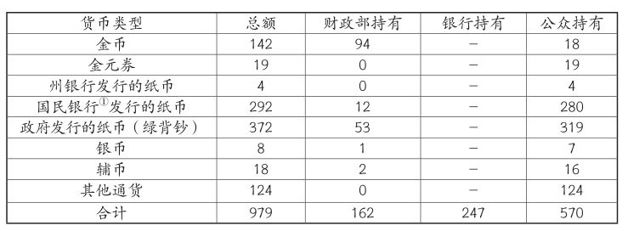

当时的国民银行是政府特许建立的银行，也被称为第二国民银行，相当于今天的中央银行。

由于1873年的《铸币条例》根本没有提到银币的铸造，a从这个意义上说，美国已经进入金本位时代。

然而从1874年起，美国西部各州相继发现大型银矿，一时间世界白银供应量开始急剧增加。例如，内华达州银矿，1873年还只是产出了64.5万美元的白银，到了1875年居然产出了1612.5万美元的白银，暴涨了25倍<a href="#part0004.html_id7" id="part0004.html_id_7">[6]</a>。雪上加霜的是，恰好在这个时期，主要的欧洲国家的货币制度纷纷从银本位或金银复本位制变为金本位制度，由此开始在市场上大量倾销原来作为货币储备的白银，国际市场银价开始急剧下跌。

美国银矿主们发现，如果不是因为1873年《铸币条例》的话，本来他们可以以1盎司1.292美元的价格出售白银给国家铸币厂，但现在他们却要以远低于1.292美元/盎司的价格在市场上出售他们的白银。利益受损的银矿主们联合当时的农场主群体<a href="#part0004.html_id8" id="part0004.html_id_8">[7]</a>，要求政府购买他们所生产的白银，并以16︰1的金银比价自由和无限制地铸银币。

为此，他们甚至指责1873年《铸币条例》是“1873年之罪行（the Crime of
1873）”<a href="#part0004.html_id9" id="part0004.html_id_9">[8]</a>这就是在美国货币史上赫赫有名的银币自由铸造运动（Free
SilverMovement）。

迫于白银运动的巨大民意压力，美国国会于1878年5月通过了《白兰德·艾利森法案》。该法规定财政部每月购买足量银锭铸成不少于200万不多于400万美元的标准银币。鉴于这一铸造额度太低，农场主们和银矿主们又迫使国会于1890年通过了《谢尔曼购银法案》，规定美国财政部每月购买450万盎司白银，并以此为基础发行国库兑换券（treasury
notes）。金库兑换券是法币，可随时兑成铸币，或者黄金或者白银。

一下子，美元体系等于又恢复了金银复本位。

随着美国银币铸造量的迅速上升，白银兑黄金的价值不断下降，再加上欧洲多国都已经实施金本位，人们开始用绿背钞、金库兑换券和银币兑换美国国库的黄金储备。到了1893年，美国财政部的黄金储备已降低到公认的最低安全额度以下。

人们担心美国的黄金储备很快就会消失，由此爆发了1893年恐慌，数千家企业破产，数百家银行倒闭。新上任的克利夫兰（Grover
Cleveland）总统认为，美国爆发经济恐慌和萧条的根本原因是美国没有坚定地遵守金本位，因此他要求财政部无条件停止购买白银，随即就废除了《谢尔曼购银法案》。

《谢尔曼购银法案》的废除刺激了白银运动相关利益方，他们愈挫愈勇，“银币自由铸造运动”达到了高潮，“是否坚持金本位”成为美国南北战争以来最尖锐的全国性问题，并在1896年的美国总统大选中摊牌。

当年的美国总统大选在共和党候选人麦金莱（William
McKinley）和民主党候选人布莱恩（William Jennings
Bryan）之间展开，而支持金本位的民主党人前总统克利夫兰甚至被分离了出去，以免影响民主党的选情。

这是一场精彩的对决。

布莱恩说：“你们不应当把带刺的王冠按低而压在劳动者的眼眉上，你们不应当把人类钉死在金十字架上！”布莱恩还谴责金本位“是英国政策，会使美国成为伦敦的金融奴隶”。布莱恩的民主党发誓：“要废除国民银行纸币，代之以一个政府发行的纸币，并且可以兑赎铸币，当然包括白银铸币……”

相比之下，麦金莱说，“我们不能拿货币那样神圣的东西来赌博，人民党和白银党宣称自由和无限铸造银币，对我国的金融和工业利益是一个威胁，并已经产生了普遍的惊慌……这危及到工商企业对国家信心。”他还提到：“共和党无保留地支持健全货币，自从1879恢复硬币支付以来，每一个美元都像黄金一样好。我们坚定不移地反对任何旨在使我们的货币贬值或损害国家信用的行为。除非与主要商业国家达成国际金银复本位制协议……现存金本位制必须维持……”

总统选举的结果是支持金本位的麦金莱以微弱优势获胜。

四年之后的1900年，同样的总统选举，同样的两个人，同样的议题，同样的论战——同样的结局，这次麦金莱是以更大的优势获胜。

布莱恩两次大选失败标志着美国白银运动的彻底失败，金本位在美国取得了最终胜利。

1900年，美国《金本位法》确立，美元确定了跟着黄金走。

美联储与美元

</a>

金本位确立之后，黄金就成了美国唯一的钱，纸币啊、白银啊，要么是黄金的一个代表，要么是以黄金计价的商品，而美元呢，就是黄金！

不过，1913年建立的美国联邦储备系统改变了这一切。

1913年，美国国会通过《联邦储备法案》<a href="#part0004.html_id10" id="part0004.html_id_10">[9]</a>，建立了政治上独立的联邦储备系统，其主要职责包括监管银行系统、管理货币供应等。

按照“法案”的规定，全国划分了12个联邦储备区，每一个区在指定的中心城市设立一个联邦储备银行，全国共有12家联邦储备银行行使中央银行的职能。首都华盛顿则设立了联邦储备委员会（Federal
Reserve System），作为最高领导机构。

这就是当今执世界经济之牛耳的美联储的由来。

美国自建立之后就尽量远离欧洲事务，一心一意发展生产力，“闷声发大财”，再加上制度先进、土地肥沃、人口适中，长期坚持下来，到了1914年第一次世界大战爆发时，美国的经济总量就已经位居世界第一了，美元的地位日益突出。

为了更好地“管理货币供应”，美国的联邦储备银行于1914年11月16日开始发行一批叫做“联邦储备银行券（Federal
Reserve Bank
Notes）”的纸片片，这就是今天世界上使用最广泛的美元的正式名称。当然，根据当时的法律规定，持有联邦储备券的人可以在任何一家联邦储备银行将手中的纸片片兑换成黄金或其他任何法定货币——“其他货币”包括国库券、金币、银币以及银元券等。

也就是说，此时的联邦储备银行券只不过是美国政府所发行的众多纸币中的一种，至多可以叫做“假美元”，而诸如黄金、国库券、金币、银币以及银元券才是真正的美元。

从1914年到1918年，趁着欧洲正在进行第一次世界大战，美国大发了一笔战争财，其黄金储备增加了一倍，经济总量更是超过了英、德、法三国的总和。

在第一次世界大战当中，老牌欧洲强国诸如英、德、法都先后放弃金本位，而美国的“联邦储备银行券”却根据美国《金本位法》的规定，始终保持着和黄金的可兑换能力，逐渐成为了公认的世界强势货币——可以说，第一次世界大战的爆发和持续，促使联邦储备银行券由一国的普通纸币（甚至还不是主要纸币）变成了重要的国际货币。

由于美联储在20世纪20年代长期放松货币供应，接下来的1929年，爆发了众所周知的美国大萧条，进而引发了世界范围内的经济危机。

尽管如此，美元与黄金20.67︰1的兑换价值一直持续到1933年罗斯福（Franklin
Delano Roosevelt）当选美国总统之时，并无太大改变。

在1933年4月5日，刚刚上任不久的罗斯福总统发布一道行政命令，要求所有人向银行交出金币、黄金券和金条，以每盎司黄金20.67美元的价格兑换纸币或银行存款；银行也必须向美联储上缴黄金，而任何私藏黄金者，将被重判10年监禁的重罪和25万美元罚款。

从此，美国不允许私人拥有黄金，更不必说拿着美元去找美联储兑换黄金了！

1934年的1月，美国通过了《黄金储备法案》，将金价重新确定为35美元/盎司，但美国人民无权兑换黄金，这个禁令直到40年之后的1974年才被解除。

美国人民刚刚上缴黄金不到一年，他们拿到的美元纸币就贬值了70%！

号称黄金价格为35美元/盎司，却不让人民拿纸币兑换黄金，这个规定颇为荒谬，其实就是告诉你我这张纸相当于0.888671克黄金，但是你不能向我兑换。

更绝妙的是，《黄金储备法案》通过后，美国联邦储备银行券的回购条款标注有了一个“小小的”修改，上面注明“本券是对一切公私债务的法定支付手段，可在美国财政部或任何一家联邦储备银行兑换法定货币”——注意，去掉了“可以兑换为黄金”。

也就是说，从1934年开始，联邦储备银行券开始一步步地篡夺真正的美元名号。

对此，罗斯福的前任胡佛（Herbert C Hoover）总统有着更为清醒的评价，

他引用了一句古老的格言说：“我们之所以拥有黄金，是因为我们不能相信政府，因为政府可以‘通过操纵通货膨胀和通货紧缩来掳掠人民的储蓄’。”

另外一个意想不到的结果是，美国“白银自由铸造运动”的所有政治诉求在失败33年之后居然在罗斯福时代得以实现。

原来，此时的白银价格相比黄金已跌至历史低点，每盎司低至0.3美元左右，罗斯福政府为了满足农场主、产银者、债务人关于在国内实现货币贬值、通货膨胀的要求，于1933年底要求铸币当局以1盎司0.6464美元的价格购买国内新产白银，并建议财政部在国内外购买白银，直到白银市价达到1.29美元/盎司，或直到财政部白银储备的价值达到黄金储备价值的三分之一。由此产生了1934年6月的《购银法案》，该法案直到1963年才废除。

从1933年底到1961年，美国财政部共花费20亿美元购入白银，这使得美国政府拥有了全世界最大的白银储备，总量高达60亿盎司！

在购买白银的过程中，美国政府发行了大量银元券，因此，某种程度上说，美国又恢复成为金银复本位制国家。

即使1934年之后的美国联邦储备银行券只不过规定了其黄金价值，而且不允许人民用联邦储备银行券向政府兑换黄金，但毕竟还固定黄金数量的价值对应，发行量上不可能任意胡来，相比欧洲各国在1933年之后全部彻底废除金本位而实施信用纸币制度，美国的美元还是要有信用得多！

第二次世界大战爆发期间，英、德、法等欧洲强国，政府在信用纸币数量上倾向于无限多发的事实再一次得到了证明！相比之下，不管是没有参战阶段还是后来参与战争时期，美国的1个联邦储备银行券至少名义上保持着1/35盎司黄金的固定价值。

整个第二次世界大战时期，由于能够在美国买到大批物资，也由于其价值长期保持稳定，美国的联邦储备银行券（或许该称之为“美元”了）变成了当时世界上最有信誉的纸币！

马歇尔计划

</a>

1944年7月，在二战进入尾声之际，44个国家的经济特使聚集在美国新罕布什尔州的一个叫做布雷顿森林的小镇上——尽管这个小镇风景优美，但他们却不是为了看风景而来的，而是有着重要的使命和任务。

这个使命和任务就是，商讨战后的世界经济和贸易格局。

说是商讨，以美国当时巨大的国力和财力，实际上大家只不过是来“学习学习”而已。学习的内容呢，就是美国财政部长助理怀特（White）通告的美国对于世界战后货币金融体系的安排，然后由前任世界霸主英国提一些修补性的意见。

布雷顿森林会议最终通过了《国际货币基金协定》，决定成立一个国际复兴开发银行（即世界银行），一个国际货币基金组织，以及一个全球性的贸易组织（即后来的关贸总协定）。

一年半之后的1945年12月27日，参加布雷顿森林会议的22国代表在《布雷顿森林协定》上签字，正式成立国际货币基金组织和世界银行，被称为“布雷顿森林体系（Bretton
Woods System）”。战后国际货币体系就此正式成立。

尽管前文提过，有必要再强调一遍——布雷顿森林体系规定，美元直接与黄金挂钩，1个美元的含金量为美国《黄金储备法案》中规定的0.888671克黄金，其他各国货币则与美元挂钩，外国政府或中央银行可以随时按35美元一盎司的价格向美国财政部兑换黄金。

就这样，在国际货币体系中，本名“联邦储备银行券”的美元处于了“等同于”黄金的地位，同时也成了各国外汇储备中最主要的国际储备货币。

现在中国老有人嚷嚷着人民币国际化，好像只要中国政府在国际上喊几嗓子，以后中国人扛着人民币就可以像美元似的满世界买东西了。他们所不知道的是，真正代表纸币购买力的，是一个国家所拥有的真实财富和国力。当中国无论在经济上、政治上还是军事上都远远没有达到那个实力的时候，空喊着“人民币国际化”无异于痴人说梦。

可不，人家美国拥有全世界75%的黄金，有这能力和财力，现在中国拥有的黄金在全世界占多大比例？拥有白银占多大比例？

绿纸片变黄金，美元纸币一下子成为相当于黄金的世界货币，这可算是引发了全世界人民和各国政府的“收藏热”。然而，问题在于，美元纸币绝对不会自己长了翅膀主动飞入到世界各国政府和人民的手中，如果大家手中都没有美元，那么世界人民不能养成使用美元的习惯，美国煞费苦心搞出来的这个美元货币本位制度岂不是“竹篮打水一场空”？

美国当然不会这么傻！

由于欧洲各国经济在第二次世界大战当中几乎被战火完全摧毁，布雷顿森林体系刚刚建立，时任美国国务卿的马歇尔将军（George
Catlett Marshall）就提出了 “欧洲复兴计划（European Recovery
Program）”，声称美国应该援助欧洲经济从战争中恢复和重建，于是，很快有了大名鼎鼎的“马歇尔计划（The
Marshall Plan）”。

具体什么内容呢？

就像江湖社会里义薄云天的老大一样，美国说，你们欧洲被战火都摧残成这个样子了，接下来的社会经济重建工作一定非常艰巨，我作为老大，对你们重建工作要给予坚定的支持——这样吧，我援助你们一大笔钱吧。

一大笔钱是啥？

当然就是美联储所印刷的美国联邦储备银行券（美元）嘛！

马歇尔是在1947年6月5日的一场演讲中提出援助欧洲计划的，他宣告美国“已经为帮助欧洲复兴作好了准备”，并且号召欧洲人民团结起来，共同规划一个他们自己的重建欧洲计划，然后由美国为这一计划提供资金。

这一援助计划于1947年7月正式启动，持续了4个财政年。

在这段时期内，西欧各国通过参加经济合作发展组织（OECD）总共接受了美国包括金融、技术、设备等各种形式的援助合计130亿美元。

有趣的是，马歇尔计划的援助对象本来也包括当时的原苏联和所有东欧国家，但要求被援助国必须参与欧洲统一市场的建设，放弃部分经济主权——当时的苏联和东欧国家实行计划经济，还不会创造“社会主义市场经济”这一概念，所以断然拒绝了这一计划<a href="#part0004.html_id11" id="part0004.html_id_11">[10]</a>。

至于那些西欧国家，得到了能直接兑换成黄金、购买大批物资的宝贵美元自然是感激涕零，自此唯美国马首是瞻——就这样，由经济领域出发，以美国为代表的资本主义阵营和以苏联为代表的社会主义阵营在全球开启了二战之后持续40多年的冷战。

马歇尔计划援助和稳定了西欧，美元也在世界人民的心目中建立了无比崇高的信誉。

不仅仅是西欧国家，包括当时的日本、拉美、中东产油国、南亚国家、东南亚国家、非洲国家，即使包括原苏联、东欧国家、中国、越南、朝鲜等这些宣称美帝国主义是最大敌人的国家，也都对美元趋之若鹜。

可以说，从1945年起一直到现在，美元都是世界货币体系的绝对核心。

从欧洲经济逐步重建开始，为了进一步得到更多的美元，欧洲各国都大力提倡向美国出口，为美国人民提供真材实料的产品和服务。

不仅仅是欧洲，而是全世界除了美国以外的所有国家，为了增强自身经济实力，为了得到美元，都必须依赖于对美国的出口得到美元。

这意味着什么呢？

这意味着美国只需要把纸印成美元，扛到世界上就能换东西！

就这样，美国一直逆差，世界其他大国几乎都是顺差的经贸模式确立了，并且一直持续到今天。可以想象，只要拥有印钞用的纸张和油墨，美国可以给世界其他国家提供不限量的美元纸币，想要多少有多少！

就这样，从1945年到1971年，美国一直扮演着世界上最拉风、最强大、最富裕的老大……

从黄金美元到石油美元

</a>

伴随着1971年8月15日尼克松总统宣布关闭美国财政部的黄金兑换窗口，布雷顿森林体系轰然倒塌，世界由此进入了纯信用纸币时代。

不过，虽然尼克松单方面废除了美国为世界其他各国按照35美元/盎司兑换黄金的义务，但美国仍然还想继续享受美元的特权呢！

所以，1971年12月，美国联合主要的西方国家达成了一个新的国际货币制度协定，即史密森索尼安协定（Smithsonian
Agreement），将美元相对黄金的比价稍稍下调了一点儿（下调为38美元/盎司），其他欧美各国货币则相对于美元略有升值。虽然任何人拿到美元已经不能再找美国财政部兑换黄金，但仍然维持各国货币相对美元的固定汇率。

该怎么比喻呢？这就像一个无赖，单方面废除了自己对所有人的欠债，同时还要求别人都遵守以前的约定，白供他吃、白供他喝、白供他玩！

西方国家迫于美国的强大，同意了这一协定，但世界人民对美元的信任度已经开始急剧下降，随后几年美国依然实行“廉价货币”政策和赤字财政政策，反正尼克松已经关闭美国的美元黄金兑换窗口，美元印钞机自然是夜以继日、从不停息。相应的，美元价值每况愈下，国际市场上美元泛滥成灾，其他国家如果要绑定美元的固定汇率，就必须也印刷大量的钞票来购买这些美元，从而导致相应国家国内通货膨胀急剧恶化，经济体系动荡不安。

诸如德国、日本、英国、法国等主要西方国家，实在受不了美元钞票的源源不断，于是1973年之后，不得不接连违反史密森索尼安协定，开始对美元实施浮动汇率制度。

以日元为例，布雷顿森林体系下日元与美元的兑换比率为360，1973年的时候日元升值到270左右，虽然在1974年到1977年，日元出现过短暂升值，日元汇率一路升值到290左右，但到了1980年前后，日元汇率就再次回落到220左右。

再来看另外一种重要的货币——德国马克，布雷顿森林体系下其与美元的兑换比率为4，到1973年变为2.6左右，到了1980年前后，已经变为1.8左右了。

前面说过，对于纯信用纸币来说，汇率无非是一个纸片互换比例的游戏，美元真正的“升值”还是“贬值”，需要看的是它针对商品的价格变化。

虽然没有魔法水晶球，不能借此预知未来，但要长期来看美元相对于商品究竟是升值还是贬值，幸好我们还有历史可以考察——所谓以史为镜、以史为鉴，差不多就能为美元未来的升值、贬值情况画出一个大致的轮廓。

在尼克松关闭黄金窗口几个月之后，1972年2月，伦敦自由市场上的黄金价格就从35美元/盎司上涨到了75美元/盎司。国际上最重要的大宗商品——原油，其离岸价格则在尼克松关闭黄金窗口前后，从2.22美元/桶迅速上涨到2.89美元/桶。

要知道，每桶原油的价格，在布雷顿森林体系建立之初的1946年，本来是1.05美元的！

也就是说，从1945年到1971年的27年间，由于美国政府凭空印刷的美元导致美元贬值了50%以上——无论是相对于黄金这个使用了3000年的诚实货币，抑或是石油这个国际上最重要的大宗商品。

随后的1972年到1980年，以美元计价的大宗商品价格变化，就像中国近几年的房价一样——那叫一个惊心动魄啊，不是一般的心脏能承受得了的。

采用黄金价格的全年平均数值来衡量1美元的价值变化，1972年为1/58盎司，1973年～1975年的数字分别为1/97、1/154和1/161。由于美联储提高美元利率，收紧货币，1美元的价值在1976年短暂升值到1/125盎司，但很快在1977年又再度贬值到1/148盎司，1978年是1/193盎司。从1979年下半年开始，以美元计价的黄金价格像是坐上了火箭，6月份，黄金价格还在279美元/盎司，11月份，已经变成了430美元/盎司，到1980年1月份，更是达到850美元/盎司价位。而美元相对于黄金贬值的这一历史记录，保持了28年之久，一直到2008年初，黄金价格才再度突破850美元/盎司。

如果用原油价格来衡量这一阶段的美元价值，美元是在一路狂贬。面对美元的快速贬值，石油输出国组织（欧佩克）不干了，1971年，差不多12桶石油就可以换1盎司黄金，但到了1973年，40桶原油才能换1盎司黄金。

1973年10月份，爆发了第四次中东战争，美国却公开支持以色列，11个阿拉伯产油国一怒之下，将原油价格由3.01美元/桶直接提高到5.11美元，并采取限产和禁运措施；3个月之后的1974年1月1日，再度提高到11.65美元/桶。

3个月的时间，全世界工业的血液——石油，暴涨4倍！

石油，你怎么可以这样？

其实，不是石油怎么可以这样，而是美元，为什么需要这样？

到了21世纪，众多解密文件资料表明，美国的几个大银行（包括当时的摩根银行、雷曼兄弟投资银行、花旗银行、大通曼哈顿银行等）和英美主要的几个石油公司（包括英国石油公司、皇家荷兰壳牌公司以及埃克森、美孚、沙特阿拉伯美国石油公司等），在推动和深化1973～1974年的第一次石油危机、推动石油急速涨价方面“居功至伟”——由当时美国国务卿基辛格（Henry
Alfred Kissinger）执行的这一政策叫做“穿梭外交（Shuttle Diplomacy）”！

保存在胡佛研究所（The Hoover Institution on War, Revolution, and
Peace）有关1973年5月彼尔德伯格会议的一系列文件表明，石油价格到1974年初每桶上涨至原来的4倍，是由1973年5月10日至13日在瑞典召开的彼尔德伯格会议（Bilderberg
Group）上英美金融精英人物早就谋划好了的。

可笑的是，当时陷入“水门事件（Watergate
scandal）”而被搞臭了的尼克松还真是想最后“为美国人民服务”一把，降低石油价格，可惜他派遣到财政部说服金融精英们的白宫官员却被猛批了一通。这位郁闷的白宫官员在备忘录里抱怨道：“是银行界的领袖们不愿意接受让石油降价的建议，而是主张使用‘再循环’计划来适应高油价<a href="#part0004.html_id12" id="part0004.html_id_12">[11]</a>……”

到了1978年底，世界第二大石油出口国伊朗政局发生剧烈变化，亲美的温和派国王巴列维（Pahlavi，Mohammad
Reza
Shah）下台，接着伊朗和伊拉克两个产油国又爆发了两伊战争，世界石油供应量骤减，油价再度暴涨，从每桶13美元猛增至1980年的34美元。

下台之后的巴列维也承认，1973年底，是基辛格施加压力让他将石油涨价4倍的，而当时的他是欧佩克的轮值主席！

黄金和石油价格的暴涨，意味着美元的快速贬值，作为实质上的世界货币，美元的快速贬值把整个世界都给搞晕了。

你想一想，短短的3个月之内，石油，是石油而不是其他的商品，价格暴涨4倍，哪个国家的经济能够承受？难怪整个西方国家在上个世纪70年代陷入了经济发展停滞与通货膨胀并存的怪圈，简称“滞胀（stagflation）”时期。

说到这一阶段美元相对于大宗商品剧烈贬值的根本原因，其实是美国的金融精英们需要通过大宗商品价格的猛烈上涨来吸收已经超量印刷的美元，但民众收入却没有随之大幅度增加，所以经济发展不得不处于停滞状态。

不过，让所有人大跌眼镜的是，从1973年到1978年的5年间，在滞胀年代，面对大宗商品急速贬值的美元，其他所有国家货币如日元、法郎以及许多发展中国家货币（如印度卢比等）在汇率上却是一直在不断升值！

一边是商品惨烈贬值，一边是其他货币又剧烈升值——很奇怪吗？

实际上，一点都不奇怪！

早在1945年的时候，世界最大的产油国沙特的王室与美国政府之间“石油换安全”的基本关系模式就已经确立。在这种模式之下，石油只能以美元计价，而沙特等产油国得到美元之后，再存回美国的几个大银行购买美国国债，以至于其他国家很难从中东国家这里得到美元。相对应的，美国以世界第一强国的角色保障沙特王室的统治，并保障其领土安全。

在1974年的“石油危机”中，基辛格的处理同样完美体现了这一思路。

1974年12月，在基辛格的“大力斡旋”和“艰苦谈判”下，美国财政部与沙特阿拉伯货币局签署了一项协议——那就是，沙特阿拉伯卖高价石油所得的大部分税收收益，都通过纽约的联邦储备银行购买美国财政部的国债，也就是用来弥补美国政府的财政赤字。华尔街投资银行家直接担任沙特货币当局的首席“投资顾问”，指导着沙特把自己的石油美元投资到“正确的银行”——毫无悬念的是，这些银行就是诸如花旗银行、摩根银行、大通曼哈顿银行！

众所周知的是，石油被誉为“工业的血液”，是世界上任何一个国家工业化必需的资源，由于全世界的石油主要都产自中东，而绝大多数国家的石油都需要进口，石油价格暴涨，就意味着美元需求量会大增。为了得到美元，他们只能使自己的货币贬值，只有这样，他们辛辛苦苦所生产出来的产品相对于美元就会显得更便宜一些，才能得到宝贵的美元，去交换他们急需的石油。

布雷顿森林体系下的黄金美元，就这样成功地转化为石油美元！

在1973年～1974年油价暴涨4倍的过程中，另外一个毫不意外的结果也“顺便”产生了：那些发展中国家，例如印度、巴基斯坦、菲律宾、泰国以及其他所有的非洲和拉美国家在石油涨价的冲击下，即使原来有外贸盈余，也变成了严重负债——1974的时候，这些发展中国家的财政赤字正好变成1973年的4倍。

自此，几乎所有的发展中国家，从此都被美元套上了债务的枷锁！

欧洲盟友们也没有得到多少好处，不得不忍受滞胀的同时，他们在二战结束以后辛辛苦苦劳动二十多年挣下的财富，很大一部分都通过中东石油这个中转站，流入了美国的少数几个大银行。对于这一过程，当时法国总统蓬皮杜（Georges
Pompidou）的话可谓击中要害，他拒绝响应美国要求整个西方国家支持以色列的态度，在中东直截了当地对基辛格说：“你们只有10%的原油消费依靠阿拉伯人，而我们是全部依靠他们！”

正如“滞胀”这种看似不可能存在的经济状态能够在整个西方国家持续10年之久一样，对美元体系来说，剧烈升值的同时猛烈贬值，没有什么不可以！

“狡诈”的杨白劳

</a>

为了应对1980年美元的快速贬值，被誉为“一个正直的人，一个天生的领袖”，同时又是“外表严厉、内心仁慈”的美联储当值主席保罗·沃尔克（Pual
A.Volcker<a href="#part0004.html_id13" id="part0004.html_id_13">[12]</a>），声称要“打断通胀的脊梁”，以不可思议的方式提高美元利率，遏制美元的快速贬值。

你猜猜他把美元利率提升到多高？

眼见美元相对于石油已经贬值得差不多了，美元开始供不应求，从1980年～1981年，保罗·沃尔克把美元拆借利息提高到20%，基本利率更高达21.5%，国债利率冲上17.3%。

神话传说啊，什么利率水平——要知道，现在美元的基本利率是0～0.25%！

如果你借钱投资，一年利息就是21.5%，这么高的利率，即使你有钱你也不会去投资——投资了又不一定能赚钱。而直接存钱到银行，就有极其丰厚的存款利息，谁去投资或者借钱，那简直是100%的傻瓜了嘛！

果然，沃尔克的“杀手锏”使出来，商品市场迅速降温：1982年，美国经济陷入深度衰退，所有行业投资急剧减少，消费陷入冰点，当时的汽车销售量甚至创出20年的新低。

与此同时，全世界所谓的“美元热钱”都开始大批大批地回到美联储手中，美元供应量急剧减少，这样一来，美元不升值才怪！

随着美元的走强，黄金、石油价格都开始暴跌。

到1980年下半年，金价就迅速跳水到517美元/盎司左右，到1982年，甚至出现了低于300美元/盎司的情况——随后的整个1980年代，黄金价格一直在300美元/盎司~500美元/盎司之间徘徊。

石油的情况也好不到哪里去，中东离岸原油价格从34美元/桶的价位被腰斩，然后又被再度腰斩，到1986年6月份已经跌到了10美元/桶以下。欧佩克不得不采取紧急限产措施，协议原油价格不低于18美元/桶，但很快约定被打破，此后的连续15年，除个别年份外，油价长期徘徊在10～15美元左右。

不管怎样，沃尔克的“休克”疗法治理美元贬值成功了——从此后美国20年经济繁荣的效果上看，那是相当成功！

当然，沃尔克的成功还有另外一层含义，那就是所有的发展中国家，尤其亚非拉那些借有外债的国家，由于美元和英镑利息暴涨，全部都陷入到无底洞一般的债务深渊，不得不通过贱价出卖国家的战略资源来进行还债。

据世界银行数据统计，1980年，发展中国家所欠外债总额不过为4300亿美元，在1980年到1986年，为这些债务支付的利息就高达3260亿美元，本金又偿付了3320亿美元！然而，让人万万不能理解的是，到了1987年，109个债务国反而还欠着西方国家13000亿美元！

与当时的西方主要媒体所大肆宣传的拉美及非洲穷国欠了英美的钱赖账不

还恰恰相反，“债务国偿付了好几遍欠债，他们正是以血和‘一磅鲜肉’来偿还给现代纽约和伦敦的夏洛克们的……他们的头上被顶着枪，在IMF的威逼下，签署了银行家们美其名曰‘债务解决方案’的协议，参与的都是著名的纽约花旗银行或大通银行”。<a href="#part0004.html_id14" id="part0004.html_id_14">[13]</a>

纵观整个20世纪80年代，那种“狡诈奸猾的农民杨白劳借了仁慈善良的地主黄世仁的钱最后不得不用女儿还债的故事”一直都在国际社会上演着！

接下来的整个20世纪90年代，正如强盗不再抢劫改行做了绅士一样，大肆洗劫了绝大多数发展中国家的财富之后，美国经济乘上了平稳发展的列车，基本上没有出现严重的通货膨胀或通货紧缩。借用《格林童话》中一个小女孩在3只熊家吃饭所感受到的气氛来形容——“既不太冷，又不过热，一切只是刚刚好”，因此这一阶段也被誉为“金发女孩经济”（Goldilocks
Economy）时期。

从1989年到1999年，美元价值基本保持稳定，相对于黄金和原油甚至还略有升值——1989年黄金价格全年平均值为381美元/盎司，而美国市场的石油价格则为18.33美元/桶；到了1999年，这两个数字分别变成279美元/盎司和16.56美元/桶。

从2000年科技股泡沫破灭和2001年反恐战争开始，为了刺激濒临衰退的经济，美国政府和美联储又再度祭起大规模财政赤字的“法宝”，通过滥发美元来“促进消费，促进经济增长”，美元由此再度走上了漫漫熊市。

如果我们再一次利用黄金和石油价格来表示美元贬值的过程，其表现如下：2000年的时候，黄金的全年平均价格为279美元/盎司，2001年～2008年这些数值分别271、310、363、410、444、603、695、871；美国市场的原油价格在2000年全年平均是27.39美元/桶，2001年～2008年这些数值分别为23、23、28、38、50、58、64、91。

尤其是从2006年下半年到2008年上半年，美元开始加速贬值，原油和黄金价格急剧上扬——2008年黄金价格迅速超过历史高点850美元/盎司，并达到1038美元/盎司的历史新高，而原油也在2008年7月份创下147美元/桶这样一个不可思议的高价。

接下来的事情大家都晓得了，2008年9月份爆发了金融危机，由于美元受到追捧，随后黄金价格和原油价格不断走低，黄金价格最低跌到709美元/盎司，跌去了32%，而石油价格则又是腰斩之后再被腰斩，最低点达到34美元/桶。

然而，令人匪夷所思的是，到达低点之后不到3年时间，到2011年9月份，黄金价格再度暴涨到1900美元/盎司，而石油价格更是剧烈上涨至81美元/桶左右，从价格低点到目前，上涨幅度分别达到了诡异的167%和135%。

为了看清楚美元相对于黄金和原油的贬值过程，请看两幅图表。

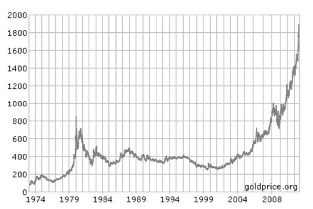

1974年~2008年，美元标价黄金价格日变动曲线<a href="#part0004.html_id15" id="part0004.html_id_15">[14]</a>

下图中包括了经通货膨胀调整（根据美国劳工部的CPI指数调整）和未经通货膨胀调整两组数据<a href="#part0004.html_id16" id="part0004.html_id_16">[15]</a>。

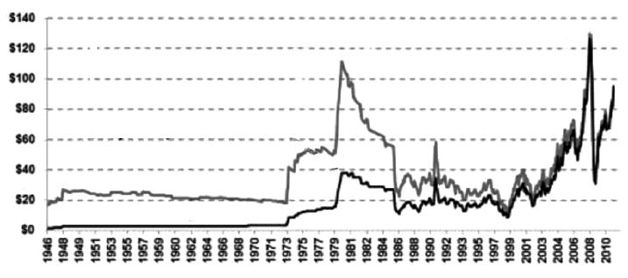

1946年~2010年，美国市场石油价格日变动曲线

从1971年8月15日到2011年8月15日，若采用黄金衡量，美元的贬值幅度是97.9%，若采用石油衡量，美元的贬值幅度是97.6%！如果计算通货膨胀，假定1971年的物价水平为100，那么现在的物价水平应该是4167（石油）~4761（黄金）之间。

也就是说，在40年的时间里，美元计价体系下商品平均价格上涨了40倍以上。

尽管美元如此贬值，很多人应该很奇怪美元为何还拥有如此威风的地位——根据国际货币基金组织（IMF）连续多年的报告，自1995年以来，美元在全球货币储备中的比重始终保持在60%左右。

为什么？

大多数人所不晓得的是，1971年以来，除了瑞士法郎、德国马克（欧元）和日元之外，相比这个世界上其他的所有纸币，美元依然是这个世界上贬值最少的纸币；如果时间段进一步放长到70年、100年、200年，美元更是世界上纸币价值保持得最好的！

更何况，1944年布雷顿森林体系以来的习惯使然，美元自然仍是世界人民在贸易中最常用、最喜欢用的纸币。

纸币的宿命

</a>

即便美元依然是当前世界上最常用的纸币，但从历史上的所有例子来看，纯信用纸币永远逃脱不了它本身的宿命——2008年爆发的国际金融危机就是一个最好的警告。

在开始接下来的内容之前，大家不妨来听听2009年底美联储主席伯南克在美国国会的听证实录<a href="#part0004.html_id17" id="part0004.html_id_17">[16]</a>：

议员：“谁拿到了钱？”

伯南克：“欧洲或其他国家的金融机构。”

议员：“具体是哪个？”

伯南克：“我不知道。”

议员：“你给了数万亿美元，却不知道给了谁？”

伯南克：“钱给了国外央行，他们再向本国机构注资，目的是为了压低世界市场急剧上升的短期利率。”

议员：“那好，我们再来看看下一页，有关美元名义汇率的问题。美元名义汇率当时上涨了20%，而这与你向外国人提供数万亿美元资金恰好发生在同一时间。你认为这是巧合吗？”

伯南克：“是的。”

议员：“我听说您将物价作为通胀指标，认为单纯地印钞票不会引起通货膨胀，对这种说法我很好奇。那么请问，您认为什么会引起通货膨胀？”

伯南克：“让我们好好把这个问题解释一下。美联储并没有直接印钞票，然后把这些钱撒向整个经济体。我们只是为银行提供了新的准备金，这些钱躺在美联储为成员银行开的账户里，并没有被使用，并没有追逐任何商品。所以，只要那些钱还躺在那里，标识流通的广义货币并不会……”

议员：“但那些钱并不会永远躺在那里，我们的目的也不是让那些钱永远躺在那里。或许这只是因为一些延迟……”

实际上，2008年金融危机一来，别看美元一会儿升值，一会儿贬值的，不管怎样，它始终站在国际货币体系的核心。但美元的大幅度、甚至是自美元产生以来最猛烈、最快速的贬值将在5～10年之内出现。

连美国广播公司CNBC评论员都在2008年金融危机之后在电视讲话中说道：“美国官员也意识到存在这种可能性，即美元忽然出现无序下跌，他们将其描述为‘无视基本面的疯狂抛售’。官员手中一定有份‘应急计划’，提前想好到时该说什么或做什么。目前他们拒绝透露这份‘应急计划’的内容，因为混乱的状况还未出现，他们只是做一些准备。就像防止一个国家忽然入侵，虽然这不太可能会发生，但毫无准备显然是愚蠢的。”

……

就像1971年尼克松总统突然宣布关闭黄金兑换窗口一样，美国自然有自己的解决办法，可其他国家中持有美元储备的政府和人民怎么办呢？

“我们正处在金融体系全面崩溃的边缘，现在所经历的只不过是一个序曲，真正的灾难才刚刚开始。”

这句话是《美元大崩溃》的作者彼得·希夫（Peter D. Schiff）说的。

实际上，彼得·希夫早在2006年8月CNBC的一次电视辩论中，就以令人吃惊的准确性预言了2007年的房市崩盘和经济危机，而和他辩论的另一个经济学家Art
Laffer后来却拒不认输，并辩称他当时有关“经济依旧欣欣向荣，房价仍将上涨”的预测“时限是9个月”……

“美元最终会退出流通，届时所有人都将知道自己的资产究竟价值几何！”

这句话是另外一个人说的，他的名字叫做让·保罗（Ron
Paul），是美国德克萨斯州的共和党国会议员。

我估计，有95%以上的可能你会摇摇头说“不知道这个人”。

让·保罗是和奥巴马（Barack Hussein Obama）、希拉里（Hillary Diane Rodham
Clinton）以及麦凯恩（John
McCain）一起参加2008年美国总统大选的竞选者之一，希拉里后来放弃竞选给奥巴马让路，保罗后来放弃竞选给麦凯恩让路。

奇怪的是，与彼得·希夫一样，恰恰这样的人物，总是在有意无意之间被西方的主流媒体给“消音”了。

保罗本来是一个负责接生婴儿的妇产科医生，但1971年布雷顿森林体系的垮台，却促使他步入政坛，因为他不能容忍美元的蜕变。

“听到这个消息（美元与黄金脱钩）我惊呆了，从那天起，金钱失去了真正的价值，只剩下政治意义了。”

在这场席卷全球的金融危机里，美元的问题再次暴露无遗。美联储对华尔街大银行的偏袒，更激起民怨沸腾。在此情况之下，让·保罗参加2008年总统竞选，寻求真正的改变。虽然最终并没有当选美国总统，但他却在网上赢得民意，支持率极高，被称为“网络总统”。

2009年，保罗和他的民主党盟友艾伦·格里森发起了一项审计美联储的提案，并在10月份在美国众议院通过。

用让·保罗的话来总结美元未来的大贬值：“这不是什么新鲜事，历史上很早以前就出现过。古代君王无一不想控制货币，他们的手段五花八门，例如切割、稀释金属币、印刷纸币……而到了今天，造假手段更加先进了，一切都可以在计算机上神不知鬼不觉地做。这就是为什么现在比以往更加危险的原因。”

早在1911年，被誉为美国有史以来最伟大的经济学家欧文·费雪（Irving
Fisher）就曾经说过：“不兑现纸币对于使用它的国家来说，始终是一种灾难。”

不幸的是，时至今日，这一灾难却一直不间断地在国际社会上演着。

中国北宋时期的交子、南宋时期的会子、金朝时期的交钞、元朝的中统钞、一战结束后的德国马克、二战结束后的匈牙利潘戈、中华人民共和国成立之前的国民党法币、二十年前的阿根廷比索和墨西哥比索、四年前的津巴布韦币、二年前的朝鲜元……

十到二十年之内，或许，当前的世界第一货币，美元也会陷入一样的境地。

当有“新末日博士”之称的鲁比尼（Nouriel
Roubini）在2009年11月份指责伯南克领导下的美联储采用的0利率政策助长资产泡沫的时候，另外一位“末日博士”麦嘉华（Marc
Faber）干脆直接说：“10年或12年之内，美元将变成墙纸！”

中国3.2万亿美元的外汇储备，其中65%都是诸如美国国债、有价证券之类的美元资产，一旦美元真的变成了墙纸，这些资产也只不过是墙纸的平方和立方而已。

就说美元的通货膨胀吧，美国国内其实已经开始了。

在NIA（美国国家通胀联盟）的视频里，有人列举当前美国的物价状况：

“用1美元你能买到什么？饼干、1包薯条，或者1瓶果汁，1美元能买到这些东西已经很不错了……2年之前，1瓶果汁只要35美分，可是现在就要卖到69美分，已经翻倍了，这已经是恶性通胀了！”

“人们没有意识到，是因为这些东西的价位很低。所有日常的东西，像什么糖果、水果……价格早已翻倍，为什么就没人注意呢？看看米价都涨成什么样了（美国一袋大米由5美元涨到19美元）！”

“我说过，我现在正在买青椰子，4个月前它是19美元，可现在已经涨到69美元了，平均每个月上涨40%
～ 50%。”

要知道，在世界5000年的贸易史上，一直到二次世界大战结束之前，没有谁会把纸存起来当财富——哪怕它是世界上最强大的国家的纸币。

在中国的宋代、元代、明代，尽管那个时候中国的经济总量差不多占了世界的一半，是当时世界上最为强大和富裕的国家，而且中国那时候也使用纸币，但世界其他国家来中国做贸易的人，没有任何一个人会把一堆中国的纸币带回家当做财富来储存——他们认的要么是金银，要么是铜钱，如果不是金属货币，至少也要是中国的瓷器、香料、丝绸等实物商品。

两次世界大战下来，通过和欧洲各国以及全世界国家做贸易，美国为什么能够成为世界第一强国，不是因为他拥有了多少最终贬得一文不值的德国马克、法国法郎、俄国卢布或者贬值了一大部分的英国英镑，而是因为他拥有了全世界75%的黄金！

当时的你如果拿着国民党的一堆法币去美国做贸易，想想美国人会接受吗？

在布雷顿森林体系崩溃之前，拿到了美元，至少你可以到美国财政部的窗口按照35美元/盎司去兑换黄金，而现在，你能找到美国给你兑换什么？

中国手头现有的美元，在美元猛烈贬值之前，能买到什么样的实物商品，这才是真正的财富——至于纸上财富，在变为现实的财富之前，都只不过是纸而已！

既然当前世界主要的大宗商品都是以美元来计价，那么无论是中国、欧洲、日本、中东抑或其他任何卷入“全球化”浪潮之中而使用美元的国家和地区，都已经被美元绑在了一条船上，无路可退。美元的贬值也已经是命定了的，而这一轮金融危机真正结束之时，一定是全球的货币体系重构之时，并无其他办法。

2010年1月份在达沃斯论坛上声称现在黄金价格是终极泡沫的金融大鳄乔治·索罗斯（George
Soros），他旗下的索罗斯基金管理公司（Soros Fund Management
LLC）却在去年第四季度将其所持全球最大黄金ETF-SPDR
GoldTrust的份额翻了一倍以上，成为该公司最大的一笔单体投资！或许，索罗斯的“终极泡沫”，其意思就是说，在世界货币体系重构之前，黄金正是你的终极资产！

根据美国证券交易委员会(SEC)在2月5日公布的文件显示，中国政府成立的从事外汇资金投资管理业务的中国投资有限责任公司（简称“中投”），也刚刚以1.556亿美元的价格收购了ETF-SPDR
Gold Trust的145万股股份。

【注释】\

<a href="#part0004.html_id_2" id="part0004.html_id2">[1]</a>复本位制是指同时以金银作为本位货币的货币制度，它在西欧资本主义发展早期阶段较为流行，对应的是单一采用金或银作为货币本位的金本位、银本位。

<a href="#part0004.html_id_3" id="part0004.html_id3">[2]</a>格令（Grain），是西方历史上使用过的一种重量单位，最初在英格兰定义一颗大麦粒的重量为1格令，折合现在的重量单位为0.0000648克。

<a href="#part0004.html_id_4" id="part0004.html_id4">[3]</a>对比2010年，美国联邦政府每天的花费大约是95亿美元。

<a href="#part0004.html_id_5" id="part0004.html_id5">[4]</a>1861年，美国联邦政府国债只有6480万美元，但到内战结束之后，美国联邦政府国债已达27.55亿美元。

<a href="#part0004.html_id_6" id="part0004.html_id6">[5]</a>数据来源于佛里德曼（Milton
Friedman）和施瓦茨（Anna Jacobson
Schwartz）合著的《美国货币史（1867~1960）》（A Monetary History Of The
United States(1867～1960)），“-”表示无法确定。

<a href="#part0004.html_id_7" id="part0004.html_id7">[6]</a>资料来源：《美国白银运动的历史渊源及其久远影响》。《湖南科技大学学报》（社会科学版）2004年5月第7卷第3期。

<a href="#part0004.html_id_8" id="part0004.html_id8">[7]</a>美国此时正处于农业机械化的起始阶段，农场主们希望得到更多的借款来实现最大程度的机械化，以便耕种更多的土地、生产更多的粮食。另一方面，美国内战之后，由于恢复硬币支付，粮食价格持续下跌，农场主们认为这是货币供给减少引起的，所以希望政府能够尽可能的增加货币供应，铸造更多的银币以增加货币供应，符合农场主们的利益，因此银矿主能够与农场主们结盟。

<a href="#part0004.html_id_9" id="part0004.html_id9">[8]</a>摘自Milton
Friedman的《货币的祸害》。

<a href="#part0004.html_id_10" id="part0004.html_id10">[9]</a>关于美联储的建立过程，具体可参见穆瑞·罗斯巴德（Murray
Rothbard）所著的《对美联储说不》（The Case Against the
Fed）一书或者爱德华特·葛莱芬（Edward
Griffin）所著的《哲基尔岛上的大人物——审视美联储的第二视角》（Creature
from Jekyll Island：A second look at Federal Reserve）一书。

<a href="#part0004.html_id_11" id="part0004.html_id11">[10]</a>当然，万万没有想到的是，1991年冷战结束之后，原来的东欧社会主义阵营国家，又一个个忙不迭赶紧实施市场经济，争取加入欧盟，生怕谁落在了后面。

<a href="#part0004.html_id_12" id="part0004.html_id12">[11]</a>摘自《石油战争》

<a href="#part0004.html_id_13" id="part0004.html_id13">[12]</a>Pual
A.Volcker，2009年任奥巴马政府经济复苏顾问委员会主席。

<a href="#part0004.html_id_14" id="part0004.html_id14">[13]</a>摘自William
Engdahl所著的《一个世纪的战争》（A Century Of War）

<a href="#part0004.html_id_15" id="part0004.html_id15">[14]</a>图片及数据来源：goldprice.org

<a href="#part0004.html_id_16" id="part0004.html_id16">[15]</a>图片及数据来源：www.inflationdata.com

<a href="#part0004.html_id_17" id="part0004.html_id17">[16]</a>对话内容摘自让·保罗著，朱悦心、张静译的《终结美联储》。

第五章　中国有多少钱？

</a>

2005年以来，中国境内通货膨胀泛滥，根据中国诸多媒体的说法，中国为什么会出现通货膨胀，全是美国人印钞惹的祸！

可不嘛，一桶石油本来50美元，美国一印钞，变成100美元了，中国一进口，按照同样的汇率折算，一下子油价就涨了60%，可不就是美国印钞引起的嘛！

还有这么一位记者，为了证明中国通货膨胀是美帝国主义的责任，他拿着一张美元，到一家中国银行兑换人民币，然后告诉大家，你们看，美国多印刷了美元钞票，流入中国，我们拿去兑换人民币，国内人民币自然就变多了，所以中国就通货膨胀了……

真的是如此吗？

这一切的一切，都要从汇率和外汇储备说起。

汇率·缘起

</a>

自2001年中国加入世贸组织（World Trade
Organization，WTO），尤其是2003年中国与西方发达国家动辄发生贸易摩擦以来，汇率问题不仅成了我国广播电视报纸网络等诸多媒体的热点，也成了街头巷尾寻常百姓的话题。

一应专家学者慷慨激昂、粉墨登场，广大民众被撩拨得热血沸腾、义愤填膺。

要讨论汇率，不妨先说一个老掉牙的故事。

假定有2个海岛，A岛上的人们以种植农作物为生，他们一直吃白米饭和煮麦子，吃得都快吐了，从来不知道吃肉可以增强体质；B岛上的人们以放牧牛羊为生，他们一直吃肉，吃得腻歪腻歪的，根本不知道粗粮更有利于健康。后来有一天，两个海岛通航了，人们开始接触，他们都相互感叹，“哇，你们吃的东西原来都这么好吃啊”！于是他们开始交换，2袋麦子1头羊，10袋稻谷1头牛……

粮食换牛羊的贸易发生之后，A海岛的人增强了体质，B海岛的人更加健康，世界真正变得“你好我也好”——显然，基于平等自愿的交换使得原来孤立的两个海岛上的人们享受的福利都得到了大幅度的增加，是个大大的好事。

国家与国家之间的贸易（国际贸易）本质上与A和B两个海岛之间交换粮食和牛羊并没有什么本质的区别，也都能促进两个国家国民福利的增加，这就是为什么各国领导人都把捍卫“贸易自由”作为口号挂在嘴边的原因。

不过，两个海岛之间牛羊换粮食的交易与今天的国际贸易还是有很大区别的。毕竟，这两个海岛都处于原始的以物易物时代，现在都进入21世纪了，国家和国家之间当然要用更加高级的交换媒介来进行交换——这个交换媒介就是各个国家的钱，或者说纸币。

这里要注意一点，大家愿意接受纸片来交换商品，是因为确信自己得到对方的纸片能够购买到相应的东西，纸片本身的价值虽然很难评估，但各个国家的纸片终归代表着某个国家政府的信用，由此也代表着在市场上一定的购买力。

也就是说，大家眼睛里盯着的貌似是用来交换的各国纸片，实际上，各自心里头琢磨的是这张纸片所代表的产品和物资的价值——要不然的话，2009年的津巴布韦可就赚大发了，这个国家2009年发行了面值为10万亿元的大钞，要是和美元1︰1的比例兑换的话，一张纸就可以把美国的商品给买光！

由于各国政府的信用不同，各国钞票在各自国内市场上能够购买到的商品也大不相同，由此就产生了一美元能换几元人民币的问题，这个比值就是汇率。

既然交换的本质是为了以物易物，互相促进，“你好我也好”，可有这么一种极端情况，比方说甲国什么资源产品都有，而且物美价廉，而乙国资源产品匮乏，会出现什么情况呢？

出现的情况就是——乙国只能眼盯着甲国的资源和产品流哈喇子，甲国的钞票要远远比乙国的值钱，因为乙国迫切需要甲国的产品资源，它情愿用更多的产品来换取甲国的钞票以购买甲国的资源，否则甲国就不会与你交换。

有人说了，汇率不是由政府决定的吗？政府可以强行将汇率规定得很高，不遵守这个规定的人，就给他安上一个“外汇投机分子”的罪名抓进监狱……

的确，历史上很多专制政府都是这么做的，到现在也有政府这样做。但问题在于，财大才能气粗，如果政府没有“财大”（社会产品和物资很丰富）而只是“气粗”（滥施刑罚），外国人得到你的货币根本无法实现购买物资的目的，这样一来你的货币对外国人来说就毫无用处，没有人愿意用自己的货币和你进行兑换（除非你拿实际的物资），政府强行规定汇率，只会严重扭曲国际贸易，甚至造成一个国家市场经济的彻底崩溃。

改革开放初期的中国，缺少制造技术，轿车、电脑、飞机及各种机械装备皆不能造，所以我们迫切需要美元在美国乃至世界市场购买先进的设备与技术；另一方面外国人拿到了大把人民币却发现在中国市场上没有什么他们需要的东西，于是人民币在国际贸易中就非常不值钱，不管官方将人民币汇率规定多高，人民币兑美元的实际汇率肯定很低。

即使是实际汇率，这个比值也不是一成不变的。

还是以中国和美国为例，2000年以来，中国制造业逐渐崛起，变成了所谓的“世界工厂”，电视、冰箱、空调、电脑以及大多数机械装备都能够制造了，美元换到人民币，就可以买到这些相应的商品，而中国得到美元呢，也可以到国际市场上购买石油、矿产……

这时候，汇率的作用就显现出来了。

比方说，美元兑人民币1︰5的时候，中国国内生产一样产品，在国际市场能卖到1美元，而其全部生产成本为4元人民币，企业有20%的利润可赚，自然就会去生产。同样的产品、同样的国际价格，同样的企业，同样的生产成本，如果汇率变为1︰8，100%的利润，那企业可赚大发了，会加班加点的多生产这种产品；相反，如果汇率变为1︰3，企业每生产一件产品结果要亏掉1元钱，企业就无法支撑下去了，只有两个选择——要么提高国际上的售价，要么只能破产倒闭……

究竟多少元人民币的中国产品才能换回一美元的世界产品，这可是一个大难题。

老实说，的确是挺难的——因为纸币这玩意儿，本质上都是纸，价值谁也说不准，你能说人民币100元这张纸就一定比美元的100元那张纸的价值低，或者高吗？

不过，说难不难！要真是自由市场，根据不同国家人们生产产品的效率和数量，两个国家的人们很快就会自己搞定这个事儿！

为啥呢？

根本上来说，不同国家的人们愿意选择贸易和交换，是因为他们都想要提高自己的生活质量和生活水准，所以对于对方纸币与本国纸币价格究竟该怎样换算，大家各自有一个自己能接受的程度。

以中美两国而言，人民币对美元的汇率其实是由中国对美国各类资源产品和美国对中国各类资源产品的供需决定的<a href="#part0005.html_id2" id="part0005.html_id_2">[1]</a>，换句话说，人民币汇率就是人民币在世界市场上的价格。

汇率变迁

</a>

在金属铸币时代，一般来说没有什么所谓的汇率问题，如果非要说有，那就是一个国家的金币（银币、铜币）与另外一个国家的金币（银币、铜币）的兑换比率，但这个兑换比率基本上是确定的，那就是铸币中的贵金属的含量。

人类后来习惯了使用纸币，但在金本位时代，依然不会出现汇率问题——既然每个国家的每一张纸币都代表着确定数量的黄金，那么政府所规定的纸币黄金含量比值就是两个国家纸币的汇率，肯定也是确定的。

所谓的汇率问题，只是在金本位被废除之后才出现的——比方说1914年～1922年和1933年～1944年的欧洲，都是在参战国先后废除了金本位之后才产生了汇率问题。

由于布雷顿森林体系的核心——美元，是盯住黄金的，所以某种程度上说1944年～1971年全世界都是一种变体的金本位，虽然人们不能够真正兑换黄金，但各国货币都严格规定了各自的含金量，因此汇率也基本固定，即便有小范围的汇率波动，也不是什么问题。

1973年布雷顿森林体系彻底崩溃后，主要国际货币的汇率相继浮动，从此进入浮动汇率制度时代。所谓“浮动汇率”，是相对于1973年之前的固定汇率的说法，因为从那个时候起，主要西方国家的货币都根据市场供求关系而自由涨跌，货币当局不进行干涉的汇率。

可不嘛，由于各国的纸币都脱离了黄金的束缚，不再代表固定数量的黄金，在各国政府“我的地盘我做主，根据需要印钞票”的理念指导之下，每一种纸币与另外一种纸币的价值比率自然就会经常处于变动之中。

正是由于进入了浮动汇率时代，从此以后，人们动不动就会听到美元升值、美元贬值之类的把戏了。

无论是在金本位制、银本位制、金银复本位制还是在布雷顿森林体系时代，在固定汇率条件下，国家经济发展与人民生活水平提高是完全一致的。1946年～1971年，日元和马克长期维持和美元的固定汇率，德国和日本的经济奇迹并没有表现在汇率升值贬值上，相反，它表现为德国和日本人民真实收入的大幅度上升。

然而，浮动汇率时代可就大不一样了——某个国家不断地增印钞票，在整体汇率还没有剧烈变化之前，物价还没有全面上涨之前，你还以为他经济发展得很好呢！比方说，从1990年～1995年，由于采用了“盯住美元”的策略，阿根廷、墨西哥、巴西等主要拉美国家都取得了GDP的快速增长，结果到了1996年之后，由于债台高筑，经济危机全面爆发，人民生活水平马上一落千丈，辛辛苦苦好几年，一夜回到解放前！

布雷顿森林体系之下，世界上大宗商品价格及国际贸易结算当仁不让地均以美元计价，即便现在变成了浮动汇率制度，但由于历史沿革下来，大宗商品价格及国际贸易依然以美元结算——也就是说，美元依然是整个世界货币体系的核心。

为了体现这种“核心”，“美元指数”这个概念就被创造出来了，其含义是通过计算美元与选定的一揽子货币的综合变化率，来衡量美元相对于其他货币的强弱。

美元指数最初设定为100.00，并以此作为基准点，如105.5点的报价是指从1973年3月份以来其价值相对于其他货币上升了5.5%。

当前美元指数的构成中，各货币的加权平均计算权重如下：欧元57.6%、日元13.6%、英镑11.9%、加拿大元9.1%、瑞典克朗4.2%、瑞士法郎3.6%。

鉴于国际货币体系陷入一片混乱中，1976年国际货币基金组织的“国际货币制度临时委员会”在牙买加首都金斯敦的会议上达成了国际货币制度的新协定，确认了浮动汇率制，并且认为成员国可以自行选择汇率制度，同时明确提出黄金非货币化，按照市价自由交易，并取消各成员国与国际货币基金组织之间用黄金清算的义务——这就是著名的牙买加协议（Jamica
Agreement）。

由于失去了黄金这个定海神针，所谓的牙买加体系，说白了，无非就是各国政府印刷的纸片互换游戏而已——谁印刷得少，纸币就升值，谁印刷得多，纸币就贬值。

为了避免哪个国家恶意操纵汇率或破坏国际货币体系，由美国控制的IMF于1977年4月29日通过了一项旨在避免成员国操纵汇率的决议，这就是美国动辄指责中国所谓的“汇率操纵国”名称的由来。

浮动汇率制度有很多种，从大的分类上说有所谓的自由浮动制度（汇价自由浮动，政府完全不干预，也称为“清洁浮动汇率制”）和管理浮动（国家政府出面买入或卖出外汇，干预外汇市场，也被称为“肮脏浮动汇率制”）。

1978年4月，国际货币基金组织开始在全球范围内正式实施“有管理的浮动汇率制”，这其中又分为单独浮动、钉住浮动、联合浮动、弹性浮动等多种。

比方说，咱们中国当前正在实施的汇率制度，就叫做“参考一篮子货币进行调节、有管理的有弹性的浮动汇率制度”。

改革开放之前，人民币与美元兑换比率固定在2.46，鉴于1973年石油危机之后欧美货币大贬值，因此在改革开放之初，中国政府将美元和人民币汇率调整为1.5——不过，整体而言，改革开放之前的几十年间，中国大陆对外贸易额很小，人民币汇率意义不是很大。

从1981年～1984年，中国实施双重汇率制度，即除官方汇率外另行规定一种适用进出口贸易结算和外贸单位经济效益核算的贸易外汇内部结算价格，该价格根据当时的出口换汇成本确定为2.8，而官方兑美元汇率则逐渐由最初的1.5调整到1984年的2.3。

1985年1月，中国宣布取消双重汇率制改为固定单一汇率制度，美元兑人民币汇率设定为2.3，由于改革开放之初人民币钞票发行量增加过快，从而导致人民币币值高估，所以人民币兑美元汇率逐渐调低到1990年底的5.2。

在人民币汇率下调的同时，为了鼓励出口，国家提高了出口企业的外汇留成比例，按照市场供求状况浮动的外汇调剂市场汇率应运而生。

这样一来，调剂市场汇率与官方汇率实际上又形成了新的双重汇率，到1993年底，人民币对美元官方汇率与调剂汇率分别达到了5.7和8.7。

为了进一步改革汇率制度，中国人民银行发布《关于进一步改革外汇管理体制的公告》，宣布实现汇率并轨，实行以市场供求为基础的、单一的、有管理的浮动汇率制。于是，从1994年起，人民币与美元非正式地挂钩，汇率只能在1美元兑8.27至8.28元人民币这样非常窄的范围内浮动。

稳定的汇率为我国外贸经济的发展创造了极为有利的环境，低廉的劳动力成本、廉价的土地资源、便利的交通运输条件，使得中国一步步地演变为“世界工厂”，中国的出口迅速增长，外汇储备成倍增加并很快成为世界第一大外汇储备国——从1993年底到2005年底，中国的外汇储备迅速由212亿美元增加到8189亿美元。

随着我国外汇储备积累越来越大，2003年以来，国际社会要求人民币升值的诉求越来越强烈，国内外关于人民币是否该升值、该升多少的论战不断升级，美国和欧洲方面通过经济、政治等形式向我国施压，要求人民币升值。

压力之下，2005年7月21日中国人民银行正式宣布废除原先盯住单一美元的汇率政策，开始实行以市场供求为基础、参考一篮子货币进行调节、有管理的浮动汇率制度，并在2006年引入询价交易方式和做市商制度，改进了人民币汇率中间价的形成方式。

尽管人民币兑美元汇率逐渐由2005年汇改前夕的8.3逐渐升值到2010年6月份的6.83，但这种参考一篮子货币的汇率制度并没有阻止中国外汇储备的急剧增加，中国对欧美国家的贸易顺差仍然大幅增长，到了2010年4月份中国外汇储备已经高达2.43万亿美元，占到全世界各国政府外汇储备总和的1/3！

这样一来，不仅欧美发达国家强烈要求人民币升值，甚至包括巴西、印度、俄罗斯等新兴国家也大声呼吁人民币升值。2010年6月19日中国人民银行宣布，进一步推进人民币汇率形成机制改革，增强人民币汇率弹性，坚持以市场供求为基础参考一篮子货币进行调节。

到2011年9月底，人民币兑美元的汇率已经升至6.35左右。

“有罪的”外汇储备

</a>

正如前文所说，当全世界的纸币都变成了信用纸币之后，所谓的汇率无非是各国政府的纸片互换游戏而已。不过，不管是采取固定汇率制度，还是“有管理的浮动汇率制”，中国的这个纸片互换的价格形成与德国、日本等同为出口国的国家不大一样。

毫无疑问，任何一个国家的外汇储备都是企业出口产品和服务挣回来的，但诸如德国、日本这样的国家，如果企业和个人挣到了美元的话，他们自己掌握外汇用途，愿意花掉就花掉，愿意存银行就存银行，愿意兑换成本国货币就找到相应的银行兑换成本国货币……

可中国不一样，自中华人民共和国成立以来，任何企业出口所得的外汇，必须上缴国家，对应的呢，国家给你兑换成相应的人民币。

怎么兑换的呢？

按照国家确定的汇率，央行直接哗哗哗印出来新钞票给你兑换。

当然，绝大多数发展中国家的央行一直以来都是这么干的，在美元流入量很小的时候，直接印一点人民币不是个什么问题，中国过去多年封闭，没有多少外汇进来，国家外汇严重不足，所以我们就通过直接增发人民币的方式来换美元，为了给国家积攒点外汇储备，让人民币贬值一点儿，全国人民都做点贡献，也很正常。

可随着我们贸易顺差的不断增加，进入中国的美元越来越多，老早中国的外汇储备就已经成了天下第一了，我们中央银行还在这么干。

有人问，为什么企业要选择把美元卖给中国央行？

很简单，因为央行的出价最高——央行管着钞票印刷机，当然可以出价最高！

从1994年到2005年，1个美元进来，8.3元人民币就跑到国内市场上；即便在今天人民币兑美元的汇率已经升值到6.5左右，一个美元进来，依然有6.5元人民币就放出来了。

2000年以前，我国每年外汇储备的增加量一直维持在百亿美元规模，但从2002年开始，我国的外汇储备开始猛增，近几年来每年的外汇储备增加量更是达到了4000亿美元以上。1989年底，中国的外汇储备总额仅55.5亿美元，而截止到2011年6月份，中国的外汇储备已经高达3.2万亿美元。

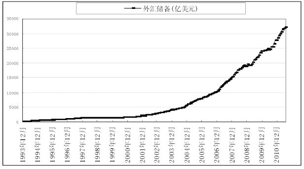

1993至今中国外汇储备

如果按照这十多年来美元对人民币的中间汇率7.4折算，中国至少多印刷了23.7万亿元人民币的钞票。截止2011年8月份，中国的广义货币供应量是78.1万亿元，其中有30%以上都是由于外汇储备增加引起的……

2005年以来，人民币对美元的汇率逐渐提高，而同时国内的人民币却泛滥成灾，人民币表现出来可不就是对外升值、对内贬值吗？

这，也正是中国诸多媒体天天宣传的美国印钞导致中国通货膨胀的根源所在。

可进一步追问一下，这个问题的责任真的应该怪罪美国印钞吗？

归根结底，中国国内并没有使用美元做货币，而是使用人民币做货币，老百姓念叨的通货膨胀，也是人民币的通货膨胀，这和美元滥发有什么关系？

如果中国的中央银行不采用新印刷人民币钞票来购买美元钞票的话，中国境内的人民币怎么可能有那么多？

大家为什么不想一想，日本外汇储备也那么高，日元钞票原有总量更是远远少于中国，为什么日本没有通货膨胀，更不会有日本人把通货膨胀责任推到“美元滥发”那里去？

有人问了，在2011年外汇储备如此高的情况下，人民币究竟是该升值还是贬值？

有一群专家说，应该升值，使劲儿升值，升值越高越好——可不嘛，升值了之后，老百姓手中的人民币在国际上更当钱使了，中国的GDP折算成美元也能大幅度增加了……

还有一群专家说，从2005年到现在，人民币已经升值了近30%，不能再升了——说得很客观，人民币确实已经升值了27%了，怎么能继续升值呢，日本不就是因为日元升值而垮掉的吗，让我们升值根本就是美帝国主义的阴谋！

又有人干脆说，人民币不仅不应当升值，还应当贬值，因为贬值意味着我们的产品价格便宜，更有利于抢占世界市场——根据前面所讲到的汇率的道理，好像也蛮是那么回事。

还有的骑墙派专家说，汇率问题是主权问题，升不升应当由我们国家自行决定……

不过，如果根据外汇储备的数量来看的话，恐怕人民币贬值之说实在说不过去——为什么我们国家会积累这么多的外汇储备，恰恰就是因为我们长期以来通过低汇率来鼓励出口、压制进口所造成的。人民币贬值或保持低汇率固然也有利于出口，可大家要知道，出口攒美元纸片可不是我们的最终目的，我们的目的是为了让企业和个人能够买回相应的商品。

现在问题在于，按照现行的人民币汇率，大多数人用不起在政府那里堆积如山的美元。

所以，人民币汇率变动的方向出来了——当前阶段人民币应该升值。

不是灵丹妙药

</a>

人民币的确应该升值，于是，又有人马上兴奋地嚷嚷着人民币大幅度升值的好处了。

根据他们的说法，人民币大幅度升值有助于改善中美和中欧的贸易不平衡，有利于中国实现产业结构调整、有助于解决国内通货膨胀、有利于改善中国与西方关系、有利于促进消费增加GDP、有利于提高人民生活水平、有助于解决中国贫富差距……

怪哉！

人民币升值，突然一下子成了医治中国绝大部分经济问题的“灵丹妙药”，似乎这剂药一旦服下去，中国经济可以脱胎换骨，步入经济发展新时代！

有个成语叫做一箭双雕，还有个成语叫做一石二鸟，说的都是一举两得这种事儿，对于更好的事情，有人发展了一下，说叫一石三鸟或者一举三得——然而，有人居然能从人民币升值一件事情中看出来七、八种好处，这样的好，天底下哪里去找？

就拿“产业结构调整”这事儿来说吧。

长期以来，中国依赖于“血汗工厂”的发展模式，在引进外资的基础上，用中国几近于无限丰富而又便宜的农村劳动力，为全世界的人民生产“衣食住行用”等各色产品，终于成就了“世界工厂”的称号。

人如果患了肾病，临床检查有一个“三高一低（血压高、血脂高、尿蛋白高、血蛋白低）”的说法。在持续20多年的高速发展之后，当前中国的经济体恰恰也患了这种“三高一低”的怪病——高投入、高消耗、高污染、低效益。

实际上，中国患上“三高一低”重症的根本原因在于中国延续了长期以来政府推动型的经济发展模式，行政权力干预经济较多。

减少贸易顺差，优化发展环境，可能是四个目标之中最靠谱的一个，可是国际社会其实对人民币升值期望很高，恐怕远非国人所能接受——例如，按照IMF的购买力评价法（PPP，Purchasing
Power
Parity）计算，人民币与美元的汇率应该是2.66——这意味着人民币要升值166%，中国显然是不能接受的。

至于靠人民币升值抑制通货膨胀的事儿，只有在货币供应量一定的情况下，汇率上升才可以起到抑制通货膨胀的作用。坦率地说，所谓的国内“通货膨胀”问题其实是货币供应量过大而导致的人民币贬值，要想控制通货膨胀，最有效的办法就是拧上货币供应量这个闸门——否则，一方面在水池边上凿一个小口放水，一方面又把水龙头开到最强档，结果还期望这个水池子里的水不要溢出来，这无异于天方夜谭。

对人民币升值这事儿，国外众多名家之中叫得最响的、也是最离谱的论调，当属2008年诺贝尔经济学奖得主克鲁格曼（Paul
R. Krugman）。

2009年5月，借着新晋诺贝尔奖得主的辉煌桂冠，克鲁格曼先生来到中国的北京和广州做“非凡财富”主题的巡回演讲，短短一周时间，狂赚人民币500万元！

也许是见识到了中国两个典型的“明星城市”在金融危机后的无比奢华和繁荣，也许是邀请他的那些中国人所显露出来的富裕和阔绰实在让自我感觉优越的克鲁格曼太过震惊，这种奢华、繁荣、富裕和阔绰，在擅长国际贸易理论的他看来，一定是刻意压低人民币汇率换回来的！

中国之行后，克鲁格曼改变了以往指责自家金融体系出现问题的观点，开始“移情别恋”，努力从外部寻找原因，并逐渐把矛头集中到人民币汇率问题上来！

2009年10月22日，克鲁格曼在《纽约时报》发表文章“中国式脱钩（The Chinese
Disconnect）”一文，称中国的货币政策蛮横残暴而令人憎恨（outrageous），以邻为壑（beggar-thy-neighbor）的中国正在偷窃（stealing）别人的工作，搜刮（siphon）民脂民膏，谩骂得起了劲儿的他，居然说中国的贸易顺差和购买美国国债造成了全球金融危机！

这是德高望重的诺贝尔经济学奖得主说出来的话吗？

原来，中国通过降低劳动力成本、耗费资源、污染环境辛辛苦苦为美国人提供便宜的产品，并且把储存的钱用来购买美国国债，居然引发了全球金融危机？

就在这篇文章中，对于2009年美国财政部没有将中国列入“汇率操纵国”，克鲁格曼认为那是“滑天下之大稽（They're
kidding）”！

到底是谁在“滑天下之大稽”？

自此，克鲁格曼先生和人民币汇率较上了劲，动辄就在专栏里大放厥词。

2010年3月14日，克鲁格曼先生再度发飙，在他的专栏中写下“对抗中国（Taking
On
China）”一文，认为极度扭曲的（distortionary）人民币汇率损害了全世界（damage
the rest of the
world），呼吁美国政府不要害怕激怒（provoke）中国，假如人民币不大幅升值的话，就别和中国客气（reason），直接针对中国进口产品征收惩罚性关税就是。

克鲁格曼不是一个人在“战斗”！

他是美国那些惯于推卸国际责任的凯恩斯主义精英人士的灵魂附体——2010年美国130名国会议员集体“上书”就是很好的例子！

不妨按照克鲁格曼先生的思路，先来看看假定人民币升值40%的后果。

美国人现在衣服鞋袜是从中国进口，冰箱彩电空调是从中国进口，玩具礼物是从中国进口……人民币升值之后，相当于美国人的日用消费品现在立马全部提价40%！

对于克鲁格曼这样的精英人士来说，日常消费品涨价40%可能不要紧，但对于那些面临着失去房子、失去工作、失去信用卡并且遭受债务压迫而一无所有的大批美国普通民众来说，他们能够承受这个成本吗？愿意承受这个成本吗？

一旦这些热爱自由、注重人权的美国民众不能忍受，后果又是什么呢？占领华尔街运动已经在全美如火如荼地开展起来了，难道克鲁格曼希望“让暴风雨来得更猛烈些”？

至于美国增加出口，克鲁格曼先生可以好好想一想，美国出口给中国的产品有哪些可能因为便宜40%而大幅度增加——是高精尖的军事武器还是航天技术？还是电子技术？或者是像悍马、劳斯莱斯之类的大排量、超豪华的美国汽车？

前者，美国人恐怕不愿意出口，后者，中国那些极少数富豪们该买的也早就买了！

到最后，美国恐怕还是只能“出口”他们最擅长的东西——美元纸币，除了折腾一把美国的普通民众和中国的外向型企业之外，美国对中国的贸易逆差不会有什么根本改观！

回头看看历史，恐怕更能让克鲁格曼这种嚷嚷人民币大幅度升值的凯恩斯主义者清醒！

25年前的1985年，美国也是财政赤字连年暴涨、贸易逆差持续剧增——在美国的压力之下，当时五个最发达的工业国家于1985年9月达成“广场协议（Plaza
Accord）”，五国政府联合干预外汇市场，促使美元对主要货币的汇率有秩序地下调。

以日元为例，3个月之内升值25%，一年之后，升值70%；二年之后，升值110%以上……美元兑日元汇率由早期的1︰300左右暴涨到最高的1︰80左右，升值幅度超过250%——然而，美国和日本的贸易逆差减少了多少？到现在为止，还不是年年逆差？

2001年的时候，1欧元只能兑换0.8美元左右，现在呢，可以兑换1.4美元左右——欧元的升值显而易见，可是美国什么时候出现过对德国贸易顺差呢？

克鲁格曼声称人民币升值可以解决贸易赤字，这简直是撒了一个弥天大谎！

对于货币知识的无知、对于过去历史的“选择性健忘”，再加上他给美国政府所提出的草率昏招和蹩脚建议，证明克鲁格曼先生根本就没有资格获得诺贝尔经济学奖！

难道我们的诺贝尔经济学奖获得者克鲁格曼先生不晓得，人民币绑定美元的货币政策给美国带来了极大利益，表面互惠的“中美国”关系，实质上是美国对中国的变相奴役。

为使人民币对美元保持固定汇率，中国一直大量买入美元，其结果就是，美元不断流入中国并且“被储备”，中国国内却是人民币泛滥，资产泡沫惊人，通货膨胀山雨欲来；另一方面，真实财富与产品却源源不断地出口到美国——到底谁占了大便宜？

现在绝大多数美国人所谓的“高品质生活”的根本源头，恰恰是中国工人、农民工的“低品质生活”换来的！

人民币升值就可以“依靠消费拉动经济增长”的观点，更是荒谬！

饿了要吃饭、渴了要喝水、冷了要穿衣，有钱了自然知道享受，这些消费都是自然而然发生的事情，不需要谁来促进!

无论中国、欧洲还是美国，当前遇到的经济问题都一样——那就是财富太过于集中于一小撮人，大部分人相对贫穷，哪怕人民币升值成与美元1︰1兑换，背着“三座大山”（住房、医疗、教育）的绝大多数中国人，能跑到美国去大肆消费吗？

外汇储备怎么花

</a>

中国的外汇储备现在有3.2万亿美元，3.2万亿！

要知道，美国2011年9月份的广义货币供应量才8.9万亿美元，可中国就拥有了3.2万亿美元——这个规模实在巨大，大得远远超过中国在正常情况下所需要的外汇储备。

很多专家就热烈讨论起来了，有人说买黄金，有人说买石油，有人说买资源，有人说买企业，有人说将外汇储备直接用于养老、医疗、教育等社会福利，还有人说不要购买欧洲或者美国的国债而购买中国国债……

中国的国家外汇管理局表示，黄金、白银等贵金属和石油、铁矿石等国际大宗商品价格波动较大、市场容量相对有限、交易和收储成本较高，现有外汇储备投资组合中已包含与之相关的投资，此外国内另有专门的机构已经在从事大宗商品收储等相关工作……

按照国家外汇管理局的说法，如果中国的外汇储备用于购买全世界的黄金、白银等贵金属和石油、铁矿石等大宗商品，结果他们都是“市场容量有限”，那反过来只能证明一个问题——美元纸币发行得太多了、太不值钱了！

本来，纸币发行应该与市场上的商品相对应，多少商品对应多少的货币，当你用货币去市场上购买商品的时候，发现“市场容量有限”，你说不是纸币发多了是什么情况？

当年二战结束之后，美国政府为什么没有嫌弃黄金的“市场容量有限”，而是一股脑儿把当时全世界各国政府黄金储备的75%都收到自己名下，并以此为基础建立了布雷顿森林体系？

所以，“市场容量有限”这个理由根本站不住脚！

经济学家张维迎干脆提出，除留有必要的外汇储备外，这部分外汇储备应该分给老百姓，结果无数“专家”对张维迎的观点大肆批判，讽刺他不懂“外汇储备”是什么概念，说这样会造成中国“二次印钞”云云……

市场上民众也曾热烈讨论的“可否分给民众或者是剥离一部分外汇储备成立主权养老基金”，国家外汇管理局回应说，若免费使用外汇储备，性质上相当于中央银行随意印钞票，无节制地扩大货币发行，会造成通货膨胀等严重后果。

可实际上，随意讥讽和反对张维迎分流外汇储备观点的人才是真正的不懂经济！

根据前面讲到的中国外汇储备的来源，如果将外汇储备直接分给民众，民众再去找银行兑换，的确是会造成“二次印钞”，也会造成通货膨胀——但第一次印钞购买外汇的时候不就制造了一轮通货膨胀吗？只不过利益全部归了中央政府而已！现在，外汇储备分给老百姓，无非重新再来一轮通货膨胀，至少全民都得到利益了，而且减小了贫富差距<a href="#part0005.html_id3" id="part0005.html_id_3">[2]</a>，对于整个中国社会而言，这种通货膨胀何乐而不为呢？

要知道，最初通过印钞购买外汇储备就是货币贬值，让全国人民都受了损失，现在只不过是把这些损失还回来一些而已！

更何况，如果第一次购买外汇储备的时候不是“无节制扩大货币发行”，分给老百姓之后又怎么可能“无节制扩大货币发行”？

人家新加坡都曾经给每个公民发钱，难道就不知道会引起通货膨胀吗？

至于“剥离一部分外汇储备成立主权养老基金”的建议更是完全可行，这不会造成印钞，也不会造成通胀。挪威当年发现北海油田之后，就利用石油出口收入建立了全国的主权养老基金，实践中运行得很好。

总之，以上提到的种种外汇储备处理方式，都比买美国国债<a href="#part0005.html_id4" id="part0005.html_id_4">[3]</a>、欧洲国债这种终归要大幅度贬值甚至是变成废纸的东西要好无数倍！

最骇人听闻的观点是某位“距离诺贝尔经济学奖最近的”华人经济学家提出的，他居然说宁肯把外汇储备烧了也坚持不让人民币升值……

要知道，3.2万亿美元的外汇可都是中国那些辛辛苦苦一天工作十几个小时的打工仔、打工妹通过劳动换来的财富，更包含了无数中国廉价劳动力的青春、血汗乃至生命，你居然建议把它烧了，你说你这是什么思维？

更何况，倘若真的烧掉这些外汇储备的话，美国人是最为感激涕零的，原来，我们用纸印刷成美元购买了中国这么多的资源、商品乃至中国人的青春、血汗、生命，现在你突然烧掉了，相当于宣布我白白享受了30年这些好处，我们能不感激涕零吗？

更何况，中国人烧掉了这么多美元，美国人手头的美元当然就更加值钱了，美元会持续升值，仍然能够购买中国的产品和资源、青春和血汗……

不是双赢是奴役

</a>

2009年初，美国国务卿希拉里访华时向中国推销美国国债，希拉里说：“中国应该购买美国的国债，然后我们把这些钱交给我们的公民，让他们来购买你们生产的产品，与此同时，你们的公民可以获得工作。”

“这是双赢（Double Win）的行为”，希拉里说。

归根结底，说白了，希拉里在说：“我们得到了东西，而你们得到了工作。”

中国政府用人民的储蓄购买美国国债，美国政府把这些钱转移到美国消费者手中，美国人就有钱来购买中国的产品和服务，中国人由此得到工作——这是什么理论？

记住，人们真正需要的是有价值的产品和服务，而非工作本身！

如果我不用工作就有人给我大把大把的钱去消费和享受，我为什么要去工作？

正如彼得·希夫在一次演讲中提到中国购买美国国债的事情时说：“让别人享受产出，让我们的人民工作，这算什么？这不是工作，这是奴役！”

都知道，中国是美国最大的债主，可笔者在这里还是要大声喊一句，千万别幻想着中国可以收回美国所欠的全部债务！

2010年4月9日，在上海参加“沃特金融峰会”的彼得·希夫接受“21世纪”采访的时候就表示：“美国不可能偿还欠中国的债务，中国借出去的越多，亏的也就越多！”

记者接着追问：“那中国对此可以做些什么？”

希夫的回答是：“什么也做不了！”

就像我们自己借给别人的钱一样，要不回来你还能怎样，难道你还要借给他？

2009年3月，米塞斯研究院（The Ludwig von Mises
Institute）邀请彼得·希夫做了一次精彩报告，题目是《为什么我们不应对金融危机感到意外》（Why
the Meltdown Should Have Surprised No One）。

在这篇报告中，彼得·希夫提到中国、日本等购买美国国债的问题，论述极为尖锐和精彩，不妨原文引用几段。

“想象一下，某一天奥巴马总统会对着数万亿美国民众发表一次公开的电视演说。他这样说道：‘亲爱的美国同胞们，今天非常不幸地，我给你们带来了一个坏消息。政府决定对美国普通民众大幅加税，那些仍然没有失业的人，将为此支付更高的个人所得税；政府将全面削减社会福利，仍然没有实施的各种福利措施将彻底取消；我原先制定的所有计划，包括全民教育、医疗保障、自主能源，所有这些计划将被无限期搁置。因为中国人要我们还钱！（台下长时间狂笑）

“我们借的实在是太多了，全世界妇孺皆知（台下笑）。欠债还钱，天经地义。所以我们必须勒紧裤腰带给中国人还钱！（台下大笑）

“大家认为这样的事可能发生吗？别开玩笑了。我们更应该对中国人说‘你们是食利者！放高利贷者！我们需要修改游戏规则（笑），我们要打破债务枷锁！你们明知我们还不了，还借给我们那么多钱！（台下大笑）这不是我们的错！’

“中国人自己很清楚，他们无法参与我们的政治选举，我们为什么还要在意中国人怎么想？华盛顿难道会得罪选民，去取悦非选民？别人借我们钱，我们是怎么还的？再去借新债！这和伯纳德·麦道夫的骗局是同一个道理。

“如果有一天谁也不愿再买我们的国债了，那就只能违约，和麦道夫一样。违约只有两条途径，要么直接宣布不还，要么印钱。这就是这些债务唯一可能的结局，无论如何，反正它们不可能被偿还！

“几周前，希拉里·克林顿访华，其目的就是乞求中国继续购买美国国债。她说‘我们是拴在一条绳上的蚂蚱’（台下笑）。

“实际上，她想告诉中国人的是：‘你们应该让你们的公民把钱拿出来，借给我们，然后我们可以把这些钱交给我们的公民，让他们用你们的钱购买你们生产的产品，与此同时你们的公民可以获得工作’。这就是希拉里想达成的交易。

“中国人完全应该这样告诉希拉里：‘不不不，你知道吗？我们有个更好的主意。（台下大笑）为什么不把那些钱留给我们自己的公民，让他们用自己的钱买自己的东西。这样一来我们还能保全所有的产品。’

“希拉里想说的是‘我们得到了东西，而你们得到了工作。’但让别人享受产出的工作算什么工作？这不是工作，是奴役（全场大笑）。

“因此，他们以后一定不会再继续购买我们的国债，美联储将接手买下所有国债，美元会急剧下跌，最后本轮危机将以货币危机收场。而在货币危机下，物价会大幅上涨，利率也会大幅上涨。”

……

【注释】\

<a href="#part0005.html_id_2" id="part0005.html_id2">[1]</a>因为美元是世界通用货币，所以也可以说美元体系的商品价格是世界市场价格。

<a href="#part0005.html_id_3" id="part0005.html_id3">[2]</a>假定有2户人家，其中一家财产只有1万元，另外一家有100万元，显然贫富差距很大，现在政府给中国每个家庭分10000美元外汇储备，这两户人家都又将外汇储备卖给政府（实际上人民不可能全部将外汇储备卖给政府），各自换回65000元人民币，这样一来，1个家庭变成了7.5万元财产，另外一个家庭变成了106.5万元财产——相比最初的贫富差距，是不是大大缩小了呢？由于外汇储备被卖回给央行，央行的确可能会再度印刷很多钞票，社会也的确会通货膨胀——但这个通货膨胀对所有人都是相同的。

<a href="#part0005.html_id_4" id="part0005.html_id4">[3]</a>当前阶段中国外汇储备的主要用途是购买各国国债，其中美国国债是最大头，根据最新公布的数据，中国持有美国国债1.17万亿美元，如果再加上中国原来购买的已经破产的房利美和房地美的债券，中国购买美国的债券总量超过1.5万亿美元，另外的部分自然就是欧元债券、日元债券，等等。

第六章　通胀还是通缩

</a>

从2007年美国次贷危机爆发至今，短短的二三年时间里，中国乃至世界的经济可谓是在通胀和通缩之间已经摆动了三四个来回了，到底这个世界的未来，是要通胀呢，还是要通缩？

政府告诉我们说，CPI增幅数据就能代表通货膨胀水平。

对此，我想起来一个词儿——“很傻很天真”！

天上掉馅饼

</a>

问一个问题：“天上会掉馅饼吗？”

的确，一般人都认为天上是不会掉馅饼的——问题是，不管你信不信，自从货币出现以来，世界上一直有人试图从天上接馅饼，到今天依然如此。

更让你觉得不可思议的是，他们的确也白白接到了从天上掉下来的馅饼!

怎么回事呢？还是先讲点小道理。

假定全中国只有100个馒头、100碗米饭和200元钱，正常的对应关系应该是1个馒头和1碗米饭都是1元钱，现在社会上的钱一下子变为400元，有人看出来馒头比米饭能多储存两天，于是就用自己手头的钱买馒头存起来，导致馒头从1元涨价到3元……

你说馒头价格能不能降下来？

中国移动专门请万科的老总王石做了一个广告，他站在珠峰顶端，豪气干云地说：“我能！”

是，政府动用行政手段，甚至国家权力机关，的确能够强制让馒头价格下降。

比说从3元降到2元吧，但钱的总量有那么多，你强行规定不让馒头涨价，那就只能米饭涨价了，于是1碗米饭价格就立即从1元涨到2元。

反过来理解，如果200元钱的数量没有变，因为小麦减产，馒头变成了80个，于是馒头开始涨价，借用国家政府部门的话来说，假定有人囤积投机，导致1个馒头变成2元，用来买米饭的钱就只有40元，那么1碗米饭就一定会降价为0.4元。

上面说到的米饭和馒头都还是属于一般的东西，如果要是考虑到房子这种“大件商品”的话，更是不得了，因为房子价格在所有花费中的比重很大，房价稍稍上涨10%，其他几乎所有东西的价格都必须大幅度下跌才能应对。

现在的问题在于，我们到处看到涨价，却几乎没有看到降价的东西——尤其是房价暴涨了好几倍，其他物品价格却不仅没有下跌，反而在持续地上涨！

推断下来，只有一个原因，那就是钱变多了，而且是变得太多太多了！

事实也的确如此，1990年代早期，全社会人民币的数量每年只不过增加4000亿左右，到1990年代后期，年度增加额达到了1万亿左右；2003年前后，达到3万亿元左右，2007年左右，达到了6万亿元左右；到了2009年，一年就猛增了13万亿！

1990年初人民币供应量是1.53万亿元，到了2011年10月底变成了81.68万亿元——22年增长了53倍，这样满天的钞票撒下来，你说让不让物价上涨？

诚实地说，这整天想着“天上接馅饼”好事儿的，并不是信用纸币体系时代才有的思维，而是自从标准的金属铸币出现以后，这思维就从未从统治者头脑中消失过。每一位当权者，无论是国王、皇帝还是议会、总统，他们都试图采用直接增加钱币数量的办法，来为自己奢侈无度的花费、连绵不断的战争、光辉不朽的业绩筹集资源……

在金属铸币的时代，铸币贬值的方式总结起来有三种：

第一种，说白了就是缺斤少两，降低铸币重量——比方说本来某种铜钱的重量是12铢<a href="#part0006.html_id2" id="part0006.html_id_2">[1]</a>，我给铸造成8铢或4铢，让它缩小一点、变薄一点，卖东西的人一般也不会注意到，这样岂不是就从容实现了“一分钱掰成两半花”的目标？购买到的东西自然也就翻倍了。咱中国古代使用铜钱，就不断有政府带头“缺斤少两”，搞什么榆荚钱、鹅眼钱、綖环钱<a href="#part0006.html_id3" id="part0006.html_id_3">[2]</a>等减重钱。

第二种，是虚增铸币币值，说白了就是玩数字概念——比方说当前铜钱重量是5铢，我发行一种重量为6铢、7铢或者10铢的钱，却规定这种钱一枚当以前的钱10枚、100枚、1000枚，这样一来，天上的馅饼岂不是哗啦啦地往下掉，铸钱人那不是嘴巴都要笑歪了？别笑，历史上无数次有人干过这样的事儿，大赚而特赚平头老百姓的钱。比较典型的就是《三国演义》里刘皇叔的那个以“仁义”和“正统”而著称的蜀汉政权！

第三种，就是以次充好，采用更加便宜的贱金属替代较贵重的金属，降低材料成本——这个应该先要有个认识，那就是银比铜贵、铜比锡贵、铜比铁贵、铜比铅贵。比方说，本来是银币，我给改成镀银铜，再改成纯铜，再改成铜镀锡，再改成纯锡，再改成铁镀锡——这个通过“降低成本以次充好”的钱能生钱的事儿，就发生在罗马帝国时期最常用的迪纳利乌斯（Denarius）银币身上。

不过，当信用纸币出现之后，以往的金属铸币贬值方式一律都显得忒小儿科了。

在金属铸币时代，政府玩弄“天上掉馅饼”的游戏毕竟还不是那么称心如意，不管是钱币变小变薄还是加锡加铁，这种拙劣行径老百姓一般稍加注意就能发现，这常常导致了公众对政府的严重不满，如果民众反应更激烈的话可能会选择造反而让政府垮台。

纸币出现以后，“天上掉馅饼”的好事就变得简单而且隐蔽得多了。

可不，不就纸片上印一个数字吗？谁不会啊？至于我是否多印了，老百姓怎么能知道？

关于货币的无敌秘籍就这么被发明了。

于是政府就这么偷偷地增发纸币，天知地知我知，你民众可就不知道了，等民众差不多醒悟过来的时候，你的财富早就被掠夺一空了……

从这个意义上说，纸币可谓是为通货膨胀创造了最好的温床，被众多现代经济学家誉为“美国历史上最伟大的经济学家”的欧文·费雪（Irving
Fisher），在考察了所有纸币的命运之后，得出这样一个结论：“纸币，对于使用它的国家来说始终是一种灾难。”

为什么呢？只有一个原因——人性。

由于人性的自私、贪婪和不自律，导致纸币发行者始终面临着“天上掉馅饼”的诱惑，一旦遇到危机，或者想取悦某一利益集团，或者为了自己奢侈无度的花费，或者为了战争，或者为了镇压反抗，甚至是为了赈济灾民，增发纸币就成为最快捷的选择，于是纸币的数量猛增，通货膨胀最终把人们对货币系统的信任全部毁掉，然后就是各阶层人民对这个政权完全丧失了尊重，国家陷入灾难。

政府每一轮凭空印刷纸币，都相当于稀释现有纸币的价值，相当于把手伸到每一个老百姓口袋里掏钱，掏来掏去，老百姓的财富被掏得一干二净，政府还在那里可劲儿印钞票呢，你说那钞票最后怎么可能不贬值得像废纸一样？从这个意义上说，谁控制了纸币发行权，谁就可以轻松掠夺全体民众财富并将其转移。

在金属铸币时代，物价上涨幅度一般也不过几倍、几十倍或者几百倍，而信用纸币出现之后，通货膨胀水平绝对让以往的所有铸币时代都相形见绌！

在第二次世界大战之前，世界范围内纸币通货膨胀的记录由魏玛共和国治下的德国马克所创造。1923年11月德国的通货膨胀率达到了三百万倍；1971年布雷顿森林体系崩溃之前，纸币通货膨胀的记录由中国国民党政府的法币系统所创造，1948年8月其通货膨胀率达到了上千万倍；人类有史以来最为严重的通货膨胀还当属2000年～2009年的津巴布韦，根据有关计算，其通货膨胀率居然达到了几万亿倍！

通胀的规律

</a>

无论是前面讲到的馒头米饭的道理，还是按照诺贝尔经济学奖得主米尔顿·弗里德曼的说法，通货膨胀就是一种印刷机现象，印刷多少钞票，通货膨胀就是个什么样子。

根据弗里德曼针对美国、英国、日本、德国、以色列以及拉美等众多国家长期货币供应和通货膨胀数据的分析，通货膨胀与钞票数量存在着几乎是完全一致的对应关系。

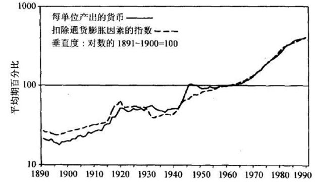

1891～1990年美国钞票数量与通货膨胀的对比

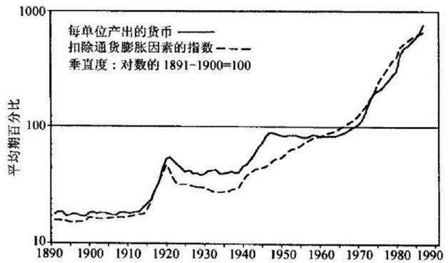

1891～1990年英国钞票数量与通货膨胀的对比

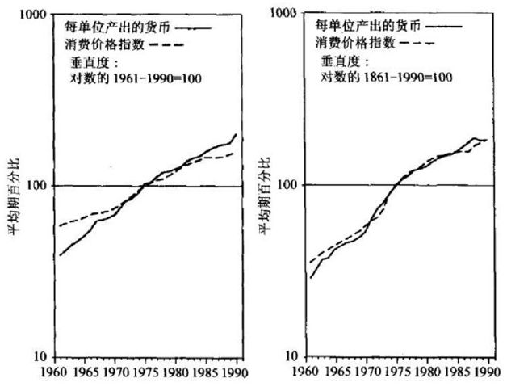

德国和日本30年钞票数量与通货膨胀的对比<a href="#part0006.html_id4" id="part0006.html_id_4">[3]</a>

既然钞票数量与通货膨胀存在着完全一致的对应关系，那么普通人更感兴趣的问题可能是，通货膨胀究竟在钞票发出来之后多久才会发生？

这的确是个有趣的问题！

虽然不像牛顿的万有引力定律或者爱因斯坦的质能方程那样有着确定的规律，但通过总结几千年、尤其是最近几十年来纸币体系下的通货膨胀案例，我们还是可以寻觅出通货膨胀的一些规律。

想象一下，凭空印刷出来的新钞票首先进入到某些人的手中，他们拿着这些钞票去买东西，第一个卖东西的人并不知道钞票数量变多了，他还是保持原来的价格出售，由于观察到销售额上升，卖东西的人赶紧去进货，进而导致商品和货物的需求增加，工厂开始加速运转、工人们加班加点，产品的产量开始增加，就业也开始增加，他们都以为自己多挣到了钱，这就成了政府告诉我们的所谓“经济繁荣”。

然而，随着一些人手中钞票数量的增加，他们开始买入房产、股票、黄金等能够长期保值的物资，于是这些物资的价格开始上涨，人们慢慢也发现钞票越来越多，看似挣了很多的钱，实际上能够换到手的财富却越来越少，他们要求提高报酬，要求提高自己出手产品的价格，这进而导致了全社会价格的升高，于是通货膨胀就发生了。

通货膨胀一旦真实地发生，那些本来以为自己挣到了更多钱的人，就会普遍感觉受到欺骗和玩弄，他们本来以为能够购买更多的东西，实际上在价格上涨之后，他们还是购买原来的那么多东西，产品开始积压和过剩，原来由于增发钞票而刺激出来的产能也毫无用处，大量的人失业，产品产量开始下降，无数的资源、产品被浪费掉——这就是一些御用经济学家口中所谓的“经济衰退”。

根据所谓的“宏观经济学”理论，经济陷入衰退，我们再次增加钞票供应，继续刺激生产，继续玩弄所有人，然后又一轮的“经济繁荣”来了，就这样，周而复始……

根据弗里德曼的研究，在欧美等市场经济成熟的西方发达国家，钞票数量的增长反映到商品价格的增长上的时间滞后大约在12～24个月；对于20世纪后期的拉美国家而言，由于长期持续的严重通货膨胀，人们习惯于政府的滥发钞票，所以人们得到钱之后就会尽可能的花出去，由此导致钞票数量增长与通货膨胀发生的时滞缩短到6个月左右。

不过，笔者认为弗里德曼还没有提到另外两种极端情况。

一种极端情况就是中国改革开放之初的那一段时间，由于改革开放之前几十年人民币的价值都十分稳定，再加上社会保障体系极不完善，老百姓也过惯了苦日子，这个时候人们得到新的钞票，首先想到的就是把它储蓄起来以备后用——由此而导致的结果就是，政府在开始好几年里大量增发钞票，但通货膨胀常常是在好几年的时间里都并不显现，只有当大家忽然发现绝大多数商品的价格都在以极不正常的速度上涨之时，害怕自己的财富变成废纸，他们才会赶紧去提取钞票，不顾一切地把它花掉。

这种情况下，增发的钞票所导致的通货膨胀时间会延长，根据中国历史的情况，最长的可能达到3～5年时间。归根结底，通货膨胀只是在累积力量而已，到了某个合适的阶段，可能以“价格改革”的名义，以一种突然的方式爆发出来。

中国自改革开放以来，1983年～1984年、1988年～1989年、1993年～1995年、2006年～2008年的四次通货膨胀，都是以这样的形式爆发出来的。

另外一种极端情况就是恶性通货膨胀时期。

一战后的德国、二战后的中国、匈牙利以及2009年的津巴布韦，几乎都验证了这样一个颇为搞笑的规律——有时候，政府的钞票还没有印出来，价格就已经“提前”增长了。

1937年6月抗日战争爆发前，国民政府的法币发行额为14.8亿元，随后逐年快速增加，到了1945年8月抗日战争胜利前夕，法币的发行量达到了5569亿元。8年抗战，钞票发行量增加了376倍——根据当时有记录可查的“上海批发物价总指数”，如果以1937年抗战前夕的物价指数为100的话，1938年～1944年年底的价格指数分别为115、308、653、1598、4929、17602和250971，到1945年8月，物价指数已经暴涨至8640000。

将1937年6月法币发行指数也确定为100的话，将此后每月的法币发行指数与物价指数进行对比，就会发现上面说的那个规律。

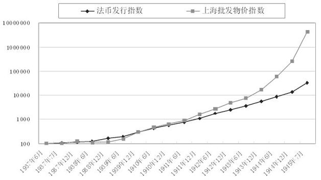

1937年到1945年国民政府法币发行指数与上海批发物价指数对比情况<a href="#part0006.html_id5" id="part0006.html_id_5">[4]</a>

对比之后就会发现，开始的三年内，钞票发行量基本与物价对应，但从1940年开始，物价上涨幅度开始超出钞票发行速度，到后来，物价上升越来越快——最终，钞票发行量不过增加了376倍，但物价却上升至原来的8.64万倍。

以上数字还只是截止到1945年的数据，等到国共内战爆发之后，国民政府法币发行量更是失控，法币钞票在一年多之后就彻底变成了废纸。

为什么出现这样的情况？

原因很简单——在社会产品总量变化不大的情况下，纸币发行数量自然对应着商品的价格指数，而一旦人民群众意识到政府在糊弄他们，预计到政府一定会多印纸币，所以提前将其计算在内，此后物价上涨就如同脱缰野马，上涨速度甚至远远超出你发钞票的速度。

更加有趣的是，经历了2006年～2008年的通货膨胀之后，中国人对通货膨胀的感觉方面似乎开始与西方发达国家“接轨”——2008年年底，为了应对金融危机，中国政府推出“四万亿”计划，人民币广义货币供应量一年暴增13万亿元，结果从2009年年底到2011年整年，中国开始出现持续的通货膨胀，这正好符合佛里德曼12～24个月的时滞论断。

中国有多少钱

</a>

既然有多少钞票，通货膨胀就是个什么样子，接下来的问题就是：中国现在有多少钱？

有这么一个故事，话说1970年前后，以口才闻名的美国著名外交家基辛格（Henry
Alfred
Kissinger）来中国访问，由周恩来总理接待。当谈到中国还很贫穷的时候，基辛格就问了一个问题：“中国有多少钱？”急中生智的周总理假装计算了一下，回答了一个数儿：“中国的钱加在一起一共有十八块八毛八。”

原来，周总理把当时中国发行的人民币钞票面额相加，一分、二分、五分、一毛、二毛、五毛、一块、二块、五块、十块相加，加起来当然就是“十八块八毛八”了。

不过，今天要讨论的这个问题，可不是让人来练脑筋急转弯的，而是要认认真真讨论，在数量上中国现在究竟有多少“钱”。

这个问题看似简单实际却并不简单。

由于中国“财不外露”的传统，一般情况下这个问题大家不大问得出口，但实际上我们每一个成年人对自家的“钱”恐怕也都是心知肚明，你会如数家珍地算一下自己有多少现金，银行有多少活期存款、定期存款；如果愿意，你还可以计算自己有多少股票、基金、债券；进一步的，还有房产、汽车啥的，因为只要你愿意，这些东西很容易就可以转化为钱……

要算中国有多少钱，首先要搞清楚一个概念——什么叫做“钱”？

可能你会很不屑地说：“这还用你说，人民币钞票就是钱，钱就是人民币钞票！”

关于一个国家在某一时期内所有“钱”的总量，有一个专业的名词，叫做“货币供应量”——当然，一个国家“货币供应量”有着不同的层次，而由于各个国家经济体制的不同，对不同层次的“钱”，各个国家统计内容也不大相同。

对于“钱”，也就是社会上货币总量的各个层次，世界各国通常称之为M0、M1、M2（M就是Money之意）……如果直译为汉语，就是钱零、钱一、钱二……

世界各国对于M0、M1、M2、M3等的定义并不完全相同，但大致可以做如下划分：

M0=现金；

M1=通货+商业银行的活期存款；

M2=M1+商业银行的定期存款；

M3=M2+商业银行以外的金融机构的金融债券；

M4=M3+银行与金融机构以外的所有短期金融工具。

其中，对M1到M3的监测和调节被大多数国家的中央银行采用，并据此采用货币政策。中国人民银行监测人民币的M0、M1、M2数据并定期公告，但对于美元、欧元、英镑这样的国际储备货币来说，M3、M4的数据监测实际上也相当重要。

为了“与国际接轨”，我国从1994
年三季度起由中国人民银行按季向社会公布货币供应量统计监测指标。参照国际通用原则并根据我国实际情况，中国人民银行将我国货币供应量指标分为以下四个层次：

M0：流通中的现金；

M1：M0+企业活期存款+机关团体部队存款+农村存款+个人持有的信用卡类存款；

M2：M1+城乡居民储蓄存款+企业存款中具有定期性质的存款+外币存款+信托类存款；

M3：M2+金融债券+商业票据+大额可转让存单等。

其中，M1是通常所说的狭义货币供应量，M2是广义货币供应量，这两个数据中国人民银行每个月都会公布。M3则是最近考虑到金融创新而设立的，截至目前尚未进行统计。

该怎么理解中国央行规定的这几个层次呢？

区别就在于所谓的“流动性（Liquidity）”高低，流动性高就是资产互换的时间短、交易费用低；流动性低则是成交时间长、交易费用高。

首先，M0最好，因为购物时用现金钞票无论是哪个卖家都会接受；M1其次，你不用去银行，直接用M1（比方储蓄卡，因为里面有活期存款）也可以实现买卖交易；M2更次一级，你不能直接购买东西，需要去银行办一下手续，才能够实现买卖目标。至于国外的M3、M4、M5、M6什么的，都是一些通过某一个途径可以变成现金的东西，但流动性依次递减。至于股票、房地产，因为要通过特定的证券公司或者房地产经纪公司才能变现，所以其流动性相对于M系列就更差，迄今并没有被列入各国中央M系列的统计内容。

在统计一个国家有多少钱的时候，M0可以说是银行数值上表现最小的一个指标，也是其他所有钱的基础，由此M0被称为基础货币（Money
Base）；更神奇的是，因为这个M0就像神话传说中的孙悟空一样，拥有一种神奇的“魔法”，摇身一变，立马就能让一个国家的钱成倍、甚至成十倍的增加，所以M0也被称为高能货币（High-powered
Money）。

M0是怎么“变魔术”的呢？这就是让大家计算数学题的那个“货币乘数”问题。

搞清楚“钱”的统计层次，所谓的“中国究竟有多少钱”这个问题也就不难回答了。

从1994年起，中国人民银行就定期公布M0、M1和M2的相关数据，并且将1978年～1994年间的有关数据也重新进行了编制，你可以在中国人民银行网站上查阅到1978年以来每个月份“中国究竟有多少钱”。

从1978年1月到2011年1月份，33年时间，396个月的数据，为了不让这些数据把你眼睛晃晕，我简单挑出每隔5年左右M0、M1、M2数据供你参考，单位均为“亿元”。

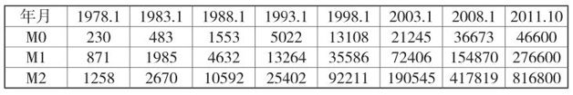

由表中可以看出从1978年～2011年的33年间，中国境内“钱”的数量变化：流通中的现金M0从230亿元增长到4.66万亿元，增长了203倍；狭义货币供应量M1从871亿元增加到27.66万亿元，增长了317倍；广义货币供应量M2从1258亿元增加到81.68万亿元，增长了649倍。

前文中笔者多次提到的“人民币发行量”或“人民币供应量”，所说的也正是人民币的广义货币供应量（M2）数据。

有兴趣的人估计还要问了，那美元的相关数据呢？欧元的相关数据呢？

在美联储的网站上可以查到美元的相关指标，在欧洲央行的网站上可以查到欧元的相关指标，其他的主要货币也都可以在各自的央行查到相应的数据。不过，要提醒大家的是，世界主要储备货币中，包括整天被中国媒体大批特批的美元，在长达60多年的时间里，其M0、M1、M2的增长数据相比中国要温和得多。

下表是美元1959年～2011年以来的变化情况，单位为“亿美元”。

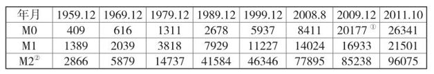

从1959年到2011年的53年间，美元钞票体系中的M0增加了64倍，M1增加了15倍，M2增加了34倍。<a href="#part0006.html_id6" id="part0006.html_id_6">[5]</a>

虽然美元是全世界都使用的货币，但按照当前汇率折算，就M2这个指标来看，无论是美元、欧元还是日元，其发行量都已经远远落后于人民币——2011年10月，人民币发行量折算成美元为12.86万亿美元，而美元这一指标仅为9.61万亿美元，欧元、日元的这一指标分别为11.39万亿美元（86051亿欧元）、10.29万亿美元（7997529亿日元）。

如此来分析，当前全球最大的央行不是美联储、欧央行和日本央行，而是中国人民银行。

下图是世界最大的4个经济体最近10年来的M2增长率情况统计<a href="#part0006.html_id7" id="part0006.html_id_7">[6]</a>。

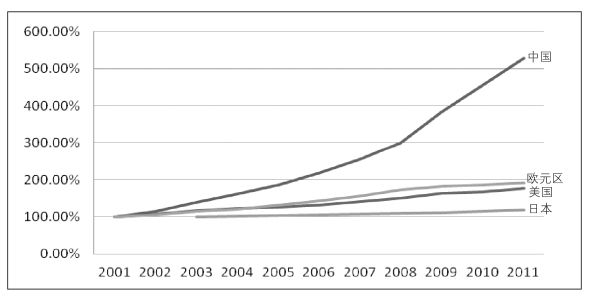

各主要经济体2001-2011年广义货币增长

从2001～2011年，各主要经济体广义货币供应量M2变化情况是——中国：增长428%；欧元区：增长90%；美国：增长76%；日本：增长18%。

10年之内，中国的货币增长率是欧元区的近5倍、美国的近6倍，这也充分说明中国的货币超发是多么的严重，中国的通货膨胀不肆虐才怪。

很傻很天真的CPI

</a>

有人说，政府公布的消费者物价指数（CPI），这难道不是通货膨胀的代表？

媒体狂轰滥炸之下，连买菜的大妈都知道：“你可以跑不过刘翔，但一定要跑赢CPI！”

不过，严格说来，就从“通货膨胀”这个词上，我们就可以认为通货膨胀与CPI毫无关系。

为什么这么说呢？

“通货”的意思就是货币，就是钱，咱们中国古代的铜钱，大都叫做什么什么“通宝”，意思就是“通货宝物”；“膨胀”这个词儿大概不用解释，就是说变多了，变肥了，变臃肿了。

“通货膨胀”合起来的意思其实就是说钱变多了，跟具体商品的价格上涨不上涨没有多大关系，自然就和CPI也毫无关系了。

按照这种严格的解释，只要社会上的钱变多，不管物价涨不涨，都叫做通货膨胀。

当然，这种解释比较严格，而且与老百姓感性认识不够协调。

所以就有了另外一个更为通俗易懂的定义——通货膨胀是因为钞票供应多于实际需求，导致一段时间内商品物价持续而普遍上涨的现象。

如前文所说，如果只是馒头这种商品由去年的1元/个上涨到当前的2元/个，其他所有商品的价格基本没有变甚至下降，这不叫通货膨胀，只能叫“馒头涨价”。

只有在馒头涨价的同时，米饭涨价、衣服涨价、房子涨价、水电费涨价……什么玩意儿都在涨，这才能叫做通货膨胀。

也只有从“普遍的物价上涨”这个意义上来说，CPI才能与通货膨胀扯上关系。

美国应该是世界上统计CPI最完善的国家了，其构成中包含了全体消费者所涉及的200多个行业、8000多项商品和服务的价格，涵盖了衣、食、住、行、娱乐、教育、医疗等百姓基本生活需要，还包括各种政府收费项目，如水费、污水处理费、汽车管理费、过桥费、关口费等，也包含与特定商品、劳务价格相关的税费，如销售税、零售税等。

即便如此，美国的CPI也不能代表美元体系下真实的通货膨胀。

可能许多人都听说过美国不仅有CPI，还有“核心CPI（Core
CPI）”。而这个“核心CPI”就是在1970年代中期，由于受到第一次石油危机的影响，美国的CPI数字频频亮起红灯，于是，美国劳工统计局（BLS）提出，消费品和服务的数量只不过是影响生活标准的一个因素，除此之外还有诸如天气、环境、安全、公共品、政治状况等，都有可能影响人民群众的生活质量，比方说，寒冷的冬季会增加对燃油、煤气、电力等的需求……

由于当时CPI上涨主要受食品价格和能源价格上涨影响，一些经济学家就嚷嚷，美国发生的食品和能源价格上涨，主要是受供给因素的影响，受需求拉动的影响较小，应该从CPI中扣除食品和能源价格变化——这就是所谓的“核心CPI”。

“核心CPI”让官方统计的通货膨胀数字至少看上去显得“小”一些嘛！

进入1980年代以后，美国劳工部又大幅度修改了CPI统计方法，对CPI统计进行“技术修正”，造成公众对通货膨胀的错觉。

怎么修正的呢？

比方说，你原来使用最老式的诺基亚手机，除了打电话发短信没别的功能，现在诺基亚出了一款新的带mp3、带照相功能的手机，价格也比原来那个贵——美国劳工部在统计的时候，就要把mp3、照相机这两个功能的价格给你“剔除”掉，这样算下来，就手机价格这一块儿，CPI不仅没有增加，还降低了呢！

采用技术修正后的官方CPI数据与未修正前统计出来的CPI数据有很大的差距。

显然，图中上方的曲线是修正前的CPI，而下方的则是修正后的CPI。

刚才说到的都是美元体系下的CPI，至于人民币体系下的CPI，也值得说道说道。

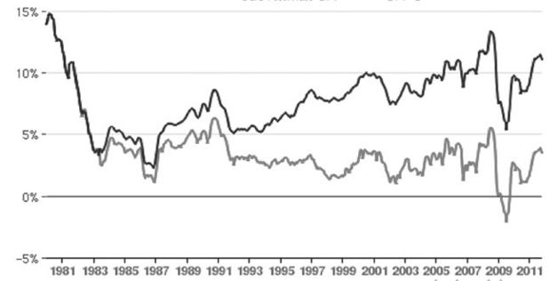

1980年～2010年30年间CPI-U<a href="#part0006.html_id8" id="part0006.html_id_8">[7]</a>图表<a href="#part0006.html_id9" id="part0006.html_id_9">[8]</a>

中国现行CPI的前身是原来的“职工生活费用指数”，1990年国家统计局建立了消费品及服务项目价格调查内容，开始编制全国生活费用价格总指数和零售价格总指数；1994年，国家统计局取消职工生活费用价格指数的编写，开始统一编制居民消费价格总指数和商品零售价格总指数。

从2000年开始，价格指数的公布改为以居民消费价格指数为主，也就是CPI，涉及的商品按用途划分为8大类，其权重分别是：食品33.2%、烟酒及其用品3.9%、衣着9.1%、家庭设备用品和维修服务6%、医疗保健和个人用品10%、交通和通讯10.4%、娱乐、教育、文化用品和服务14.2%、居住13.2%。

CPI的统计和计算方法就这样一直延续下来。

不过，相比美国的CPI需要调查8000种商品和服务的价格，中国的CPI总共只包含700多种商品和服务的价格，代表性方面当然就差一些。

比方说，2009年年底的时候，中国国家统计局新闻发言人盛来运说了一句“11月CPI负转正，主要是由食品和居住类价格上涨带动，目前不存在通胀”——这句话在网上引起了广泛质疑，遭到众多网民言辞激烈的抨击。

可不嘛，在2009年一年间，中国明明石油涨价、煤气涨价、水涨价、电涨价、食用油涨价、粮食涨价、饮料涨价，幅度都在10%以上，而北京、上海乃至深圳、海南的房价更是暴涨了50%、60%、甚至80%、100%，统计局发言人却突然公开声称说CPI只不过“由负转正”，所以“不存在通胀”……

到了2010年年初，中国国家统计局又公布了他们统计出来的大中城市房价数据，结果是——“2009年全国70个大中城市平均房价上涨了1.5%”。

到了2011年，我国再度开始对CPI权重进行调整——国家统计局2011年2月15日在发布2011年1月份居民消费价格指数总水平数据时，公布了权重调整的详细情况：居住提高4.22个百分点，食品降低2.21个百分点，烟酒降低0.51个百分点，衣着降低0.49个百分点，家庭设备用品及服务降低0.36个百分点，医疗保健和个人用品降低0.36个百分点，交通和通信降低0.05个百分点，娱乐教育文化用品及服务降低0.25个百分点。

当然，咱老百姓不太懂这“娱乐教育文化用品及服务”降低0.25%有多大意义，但把“居住类”一下子提高4.22个百分点确实体现了房子在中国的重要性——可要是“挑刺儿”的话，应该问一句，在2003年～2010年房价和房租上涨最猛烈的阶段，居住类所占的百分比为什么那么低呢？

笔者不免想起2010年底美联储主席伯南克先生在为美联储大肆凭空印钞做解释的时候说，美国通胀率太低，为了对付通货紧缩，所以美国要印钞——实际上，从2008年年底美国推行第一轮“量化宽松”货币政策以来，许多大宗商品价格都翻了一番还多，石油飞涨、金属飞涨、米面粮油肉飞涨，除了陷入泥沼的房地产，美国一切因素都清楚地显示了“通胀凶猛”，伯南克偏偏要说美国通胀率太低……

为什么2009年和2010年美国“通胀率太低”呢？恰恰就是因为美国的CPI之中，居住类比重高达40%，房子不涨价，通胀率肯定低；相比之下，2003年～2007年中国房价每年都暴涨30%以上，我们的CPI中，居住类比重却只有13%，通胀率自然也很低；到了2011年，中国的房价涨到差不多了，不可能再像前几年那样大涨了，于是提高居住类的比重……

即便按照政府部门的说法，把CPI作为通货膨胀的风向标，那么根据当今主流经济学家们的说法，CPI如果每年保持2%～3%的涨幅，通货膨胀能像润滑油一样刺激经济的发展，这就是所谓的通胀“润滑油”理论。

这个理论纯属糊弄民众和误导群众，让大家以为物价上涨是一种正常现象——即便按照“润滑油理论”，物价每年上涨3%，25年之后，社会整体物价就会翻一番。

实际上，从1451年～1555年这一百年的时间里，英国的物价上涨了270%，折算下来每年上涨率不超过1.5%，当时已经引发了严重的公众不满，导致民众多次游行示威；同一时期欧洲大陆发生著名的“价格革命”，西班牙在100年里物价上涨400%，年上涨率同样不足2%，这导致了整个西班牙帝国的逐渐衰落……

更何况，庞杂的社会经济系统是你这么容易“精确”控制的吗？想3%就3%，想2%就2%，我们干脆恢复到计划经济时代好了，搞什么市场经济？

众所周知，现在中国的CPI不统计房地产价格、不包括教育费用、不包括医疗费用，而无论中国或者世界其他国家的CPI，如果都不统计资产价格的膨胀，那么这个CPI数据就根本不能真实反映当时的物价水平，这样的CPI除了供经济学家们打口水仗之外还有什么用处？

更有最流行的“经典说法”，当CPI增幅\>3%时，我们称之为通货膨胀，也就是说，当CPI的增幅\<3%的时候，不叫通货膨胀——对应的，1970年代遍布整个西方国家的“滞胀（Stagflation）”，折算下来其每年CPI涨幅也不过在5%～8%，难道我们有一天再把通货膨胀重新定义一下，CPI每年涨幅在10%以下都不叫通货膨胀？

通货膨胀是一种病

</a>

无论从哪个方面来说，通货膨胀都是一种病，是一种让整个社会机体逐渐中毒的病！

那么，通货膨胀这种“病”为什么会产生？

如果你接受“钞票印得太多导致通货膨胀”这种观点的话，通货膨胀这种病的原因并不难找——谁在掌握印钞机？

答案是隶属于各国政府的中央银行！

当然，不管是中国还是外国，从来没有一个政治家主动承认是自己制造了通货膨胀，他们总能找出形形色色的替罪羊——西方的政治家们，总是在指责贪得无厌的企业家、指责得寸进尺的工会，指责挥霍无度的消费者，指责控制石油的欧佩克……中国呢，最常见的指责对象则是心怀不轨的囤积商、兴风作浪的游资客。

当然，对于通货膨胀，中外政府还有一个共同的敌人，那就是老天爷——每次物价上涨，政府都会告诉我们是气候异常造成粮食减产，自然灾害造成商品短缺……

企业家当然是贪得无厌的，工会也的确是得寸进尺的，消费者也有些挥霍浪费，阿拉伯人也确实提高了石油价格，投机商人的确在囤积居奇，游资也的确在兴风作浪，甚至老天爷也确实不是那么仗义。可是，上述所有因素，都只会造成个别商品的价格上涨，而不会造成持续的通货膨胀。

更进一步的，根据前面所讲过的馒头米饭的道理，即使出现了个别商品价格上涨，那么也一定应该有其他商品的价格下跌与之对应！

因为，所有那些被当做替罪羊而备受指责的“罪犯们”，没有哪一个拥有印钞机，能够凭空印出来那些被称为“钱”的纸片片。

进一步的问题就来了，为什么每一个政府都这么喜欢印钞票？

这个原因简单到了极点，我都有点不好意思回答——因为政府想通过印钞票来讨好那些它想讨好的人，在表面上不掠夺他人手中钞票的基础上，政府可以凭空印刷出一堆钞票来，送给那些他想讨好的人。

其实，政府本来有另外几个可供选择的途径来达到自己的目的，比方说通过增加赋税、或者向公众借款的办法来筹集到钱，然后再发给那些他希望讨好的人，这样就不必凭空印刷大堆大堆的钞票，自然也就不会引发通货膨胀了。

麻烦在于，征税要遭到纳税人的激烈反对，而借款也终归要偿还，对于政治家来说，这两条途径无异于政治自杀。

更大的问题在于，谁会觉得自己的钱太多了花不完呢？

对于越来越庞大、越来越臃肿的政府来说，多少钱都不够他花——谁嫌弃钱扎手啊？

结果就是，即便政府增加了赋税、向民众借了很多钱，他还是要选择凭空印刷钞票这个途径来讨好某些利益集团，有时觉得太麻烦的话，干脆就只选择印刷钞票这种办法。

政府想讨好哪些人？

对专制和集权政府来说，他们想讨好的人无外乎整个社会的权贵阶层、与他们自己有连带关系的国有企业、地方政府、商业银行等等；对于民主政府来说，虽然没有了权贵阶层，但他们需要讨好的人反而更多，商业银行、投资银行甚至包括每一个支持这一届政府当选的选民、失业者……

每一次，当他们这样做了之后，通货膨胀也随之而来。

诚实的政府有时候也承认这一条，比方说1976年英国的卡拉汉首相（James
Callaghan）在工党全国代表大会上发表针对解决失业问题的演讲时就说：“我们过去经常认为，我们可以用削减税收和增加政府支出的办法增加就业，并度过经济衰退，现在我非常坦率地告诉你们，这种抉择已经不复存在；如果说过去存在过并且似乎真的起过作用，那也只不过是给经济体注射了更大剂量的通货膨胀，而下一步紧跟而来的就是更高水平的失业……”

自从人类进入纸币时代以来，直接开动印钞机，纸就哗啦哗啦变成钱而出来了，而且印上一个数字之后就能拿出去买到东西，简直如同神话中的点石成金魔法，天上的馅饼就如此轻而易举的掉下来了，这种诱惑谁能抵挡得了？

比方说，现在政府要修一个水坝，本来没有钱，于是打着降低利率的名号，让中央银行印出一大堆钞票来，以“贷款”的面目出现在工地上，科研人员拿到科研费、设计人员拿到设计费、大包二包三包四包的施工老板也赚到了承包费、修大坝的工人拿到了工资，政府管理人员也发了工资，不管是白色、灰色或者黑色与此大坝相关的各级利益方也都发了一笔横财，而且政府也建成了水坝……

那么，到底是谁付钱建设了这座大坝？到底是谁遭受了损失？谁占了便宜？

答案是，所有人民币的使用者在为这个大坝买单，所有人民币的使用者都遭受了损失，新增加的货币伴随着科研人员、设计人员、施工老板、政府管理者、大包二包三包四包的花费进入到流通领域，从而使得物价持续不断地上涨……

至于谁占了最大便宜？

首先就是凭空印出来一堆钱的政府，其次就是那些与政府关系密切的相关利益团体。

这样一来，你就该明白，通货膨胀实际上是针对全体国民的一种征税——这个征税的额度可能远比你想象的要多。

对于政府来说，通货膨胀还有一个很重要的功能——赖账！

就前面谈到的这个水坝，如果不是通过凭空印刷钞票来建造，而是通过向民众借款（发行国债）的方式来建造，等到民众要求政府偿还这些借款的时候，政府就直接印刷了一堆钞票给你——你认为这叫还账还是赖账？

2008年金融危机爆发以来，美国联邦储备委员会宣布启动总额达1.75万亿美元“量化宽松（Quantitative
Easing，QE）”措施，购入包括国债在内的各类债券；到了2010年11月份，又再度启动6000亿美元的QE2，这些事件为什么引起举世哗然，为什么全世界都在说美国开动印钞机，为什么所有人都说伯南克“开着直升机”撒钱……

就是这样一个道理。

甲用白条向乙购买了一堆实用的商品，当乙拿着这张白条要求甲来付钱的时候，甲所做的事儿就是凭空写下更多的白条付给乙。这叫赖账，还是还账？

贫富差距谁之过

</a>

美国幽默大师罗伯特·奥本（Robert
Orben）说过一句话：“每天早晨起床第一件事情便是查看福布斯富豪排行榜，如果上面没有我的名字，那么就爬起来去上班！”

尽管不少普通人可能天天在努力按照“成功学”的要求来做，不过绝大多数人应该明白，福布斯排行榜与普通人的距离实在太过遥远。

如果有这样一些人，他们变着法儿把普通人的财富向富豪们集中，掠夺那些贫穷的地区，补贴那些富裕的地区，你是不是会觉得极其荒谬和卑劣呢？

没有什么荒谬的，因为这正是当代许多政府通过摆弄货币政策正在做的事儿。

美国巴德学院利维经济研究所（Levy Economics Institute of Bard
College）的沃尔夫教授（Wolff·E·N）曾经以美国家庭净财产（Net
Worth，财富减去负债）在不同家庭中的分配比例作为指标，针对1922年～2007年长达85年里美国家庭的贫富差距状况进行过专项研究。

就85年的总体状况而言，美国1%的最富有家庭占有美国全部家庭财富的比例一直都在1/3左右（见下图），但在1922年～1929年、1975年～1995年这两个时期中，美国1%的富人们所拥有的财富比例大幅增长，而99%的民众所占有的财富比例却急剧下降。

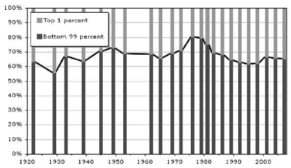

美国1985年家庭财富时比

为什么呢？

沃尔夫教授并没有分析原因，但这一时期的货币政策变动却为我们提供了一些线索。

1922年～1929年，美国经济处于“咆哮中的20年代”，貌似无比繁荣的背后是美联储极为宽松的纸币扩张政策。然而，由于纸币超量供应所造成的股市泡沫和通货膨胀，迫使美联储不得不提高利率（当时美国实行金本位，如果美联储不提高利率，人们可以用美元纸币把美联储储存的黄金全部兑换光），进而引发了1930年代的世界经济大萧条——这一货币折腾，导致最富裕的1%家庭财富比例从36.7%暴涨到44.2%。

1975年～1995年，正是布雷顿森林体系垮台之后信用纸币可以随意扩张的初期，除1980年前后两年之外，这一阶段美联储一直实施低利率政策，美元纸币供应急剧扩张，导致美国1%的最富裕家庭的财富比例从1980年代早期的25%左右，再度急剧升高到1990年代中后期的39%左右，接近1929年的贫富差距数据。

沃尔夫的研究中另外一个值得注意的数据是，1983年以来，80%位于底层的美国普通大众所占有的社会总财富比例其实是一直在下降的（见下表），而恰恰从1983年迄今，美元纸币的不断增发开始陷入常态。

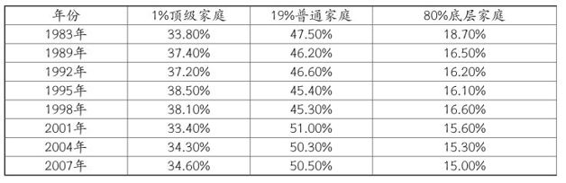

不仅美国的长时序贫富差距历史数据能证明中央银行印钞的恶果——中国长时序的地区贫富差距历史数据也一样。

一直以来，媒体总是在告诉我们，中国日益严重的贫富差距应该归咎于中国市场化改革，市场很有效率，但不够公平，而政府主导经<a href="#part0006.html_id10" id="part0006.html_id_10">[9]</a>虽然缺乏效率，却能够保证公平并缩小贫富差距。

然而，通过研究中国27个省市1952年～2003年的经济数据，耶鲁大学陈志武教授就分析出一条让国人无比诧异真的结论——政府的控制力越强（主要指经济支配的能力），收入差距离“公平”就越远！

陈教授利用27个省市人均GDP的方差系数反映各省市贫富差异大小，用中央政府开支占GDP的比例作为政府控制能力强弱的指标，结果发现，就时间序列来看，两者曲线几近完全一致——政府开支占GDP比例上升，地区贫富差距就开始变大，政府开支占GDP比例下降，地区差异就开始逐渐缩小<a href="#part0006.html_id11" id="part0006.html_id_11">[10]</a>。

实际上，如果下层民众有可能对政府权力形成有效制约的话，政府“保障公平”的说法还有一点道理，但在政府配置权力缺乏民主制衡的时候，资源配置既不遵照效率原则，又不符合公平原则，而是遵照权力关系原则。

这样的结果就是，哪里掌控的权力越大，哪里得到中央银行的纸币就越多，在政府和中央银行的密切配合和操纵之下，无论地区贫富差距还是城乡贫富差距，都在一直不断地拉大、拉大、再拉大！

作为全国权力中心，北京永远不可能缺乏投资，只要需要，任何北京工程都将被首先供资支持——根据陈志武计算的人均固定资产投资额以及GDP增长率数据，北京的固定资产投资回报率是全国最低，但得到的投资却反而永远最多！

上行下效的结果就是：哪怕在最贫困的省份，也要把全省几乎所有的资源都集中到省会等一两个明星城市；哪怕是在最贫困的县市，也要把几乎所有的资源都集中到县城等一两个明星乡镇！

如此一来，中国的贫富差距如果不逐渐扩大，反而才是咄咄怪事！

政府这样做的理由就是——虽然没有促进公平、更没有促进效率，却最大化了权力的操作空间、最大化了更高一级政府的控制能力！

美国和中国绝不是什么个例，陈志武对日本、西欧各国的地区贫富差距长时序历史数据也进行了分析，都得出了同样的结论；他也针对美国、英国、德国、西班牙、印度、法国、日本、意大利等一系列国家开展横向对比研究，结果发现，哪个国家对经济控制越高，哪个国家地区间人均收入的差距就越大！

实际上，只要政府停止滥发钞票的把戏，不要人为制造通货膨胀和通货紧缩，通过正常的社会调剂，富豪们的一部分财富会通过市场途径逐渐流向普通民众，这样贫富差距自然就会逐渐缩小并保持在一个正常的状态，但恰恰每次贫富差距开始缩小的时候，政府立即站出来“振臂一呼”——“缩小贫富差距问题”、“挽救经济危机”，再度玩起滥发钞票的“法宝”，最终恰恰导致了全社会财富再一次向少数人集中，再一次把贫富差距强行拉大。

如果看透了凯恩斯主义者的把戏你就会发现，每一次政府主导的“宏观经济调控”之后，每一轮大规模的货币刺激、货币紧缩政策之后，整个社会财富的分配从来都不是更公平、更合理，反而是更集中、更垄断了。

每一次遇到所谓的“危机”，那些中央银行都要展现他们“点纸成金”的魔法，从中央银行直接开动印刷机，哗啦哗啦地印钞票就行了。然后，一旦通货膨胀真的变成了问题，他们又忙不迭地赶紧实施所谓的“货币紧缩”政策，就这样来回折腾……

即使我们能够接受他们动辄印刷成捆成堆的钞票来“救苦救难”，可我们心里还是有一个疑问——为什么增发货币之后，富豪们都能快速增加财富，而我们这些普通人，财富不仅没有增加，还要承受失业、收入下降和通货膨胀的痛苦？

简单来说就是，政府所增发的钱，为什么绝大部分都到富人那里去了？

米塞斯研究院（The Ludwig von Mises Institute）的刘·洛克维尔（Lew
Rockwell）在评价美联储每一笔增发的美元受益者时说：“那些最先得到新钱的人可以充分受益，买到更多的东西；而最后得到钱的人则利益受损，因为物价已经大幅上涨，他们只能买到很少的东西……所以，中央银行的所作所为只不过把财富和权力从经济体内的一部分人转给了另一部分人。一般来说，最受益的往往是政府本身、大银行、政府签约企业，以及所有和联邦政府关系密切的人。”

比方说，当前在世界各国，金融业都是收入最高的行业，并不是因为金融业发明了什么烛照千古的思想或者造福人民的技术，而是因为他们距离中央银行最近，能够最先拿到中央银行增发的货币，转手放贷给别人挣钱！

2009年的福布斯排行榜榜单上，大陆富豪人数从2008年的28人暴增到64人，并不是为中国经济在2009年一下子做了一个无比灿烂的撑竿跳，而是因为在中央政府的“4万亿”投资计划宣布后，央行2009年一年就新增了13万亿元的人民币供应量（2008年年底中国M2数据为47.1万亿元，到了2009年底已经变为惊人的60.6万亿元，增长率高达27.6%）！

这新印刷出来的13万亿元人民币，第一步就是由中央银行流入到普通商业银行，然后，这笔钱再从全国各地的商业银行那里流入到股市、基金、债券、房市、大宗商品期货以及那些与政府关系密切的企业之中。

富豪们的主要资产都是以什么来体现的呢？

恰恰正是股票、基金、债券、大宗商品、别墅、企业这类资产！

这么一来，你就看懂了福布斯富豪排行榜，看懂了为什么中国银行业的利润占了全中国人民所创财富总和的一半，你也应该明白为什么大陆富豪上榜人数一下子急剧增加了！

同样是2009年，《福布斯》杂志说：“受益于国际金融市场回暖和世界经济复苏，今年上榜的富豪们资产总额达到了3.6万亿美元，比去年增加了50%……”

为啥全球富豪们所拥有的财富总额在2009年增加了50%？

毫不奇怪！因为2009年一年，在美国政府所推出的7000亿美元救市计划和7800亿美元经济刺激计划下，在美联储针购买华尔街金融机构1.15万亿美元债券的情况下，美国股市的上涨幅度恰恰就在50%左右！

40年前，关闭了黄金兑换窗口、改变了世界货币体系的美国总统尼克松在访问中国前曾说：“现在，我们都是凯恩斯主义者了。”

正是因为政府能够主动控制货币数量，政府自然就变成了凯恩斯主义者，而在凯恩斯主义主导之下，几乎每一个国家经济的不稳定性与不确定性都在与日俱增，政治家们用无数复杂的理论去解释为什么国家经济黯然失色，但总是避实就虚、不着边际。

其实，创立了凯恩斯主义的约翰·梅纳德·凯恩斯（John Maynard
Keynes），恰恰对于货币增发所导致的贫富分化后果有着最为清醒的认识，他说：“通过连续的通货膨胀过程，政府可以秘密地、不为人知地没收公民财富的一部分。用这种办法可以任意剥夺人民的财富，使多数人贫穷的过程中，却使少数人暴富。”

未来，通胀还是通缩？

</a>

不管有什么人用什么样的方式来美化和粉饰通货膨胀，通货膨胀就是一种社会病，它或迟或早都会对社会机体造成严重损害，并且带来大量的不公平和痛苦。

在我们讨论了通货膨胀产生的原因和规律之后，通货膨胀治理也就显得无比容易。

方法有且只有一种，那就是——拧住钞票供应量这个阀门，别满天撒钞票就行。

既然各个国家的政府是唯一掌握印钞机的人，所以只要政府下决心控制通货膨胀，那么他首先要做的，就是放慢钞票的供应量，甚至不需要它抽走原来的钞票，除了以旧换新之外，只要不再凭空印刷新钞票就行！

真是说起来容易做起来难。

因为这就像要一个吸毒上瘾的人要戒掉毒瘾。

戒毒方法其实很简单，那就是以后再也不要吸食毒品，无论毒瘾发作的时候如何痛苦、如何失态、如果丑陋，都不要通过吸毒来缓解，毒瘾自然就戒掉了。

然而，对于大堆毒品放在自己眼前的吸毒者来说，又有几个人能够实现戒毒？

对于戒毒的人来说，毒瘾发作时候的那些痛苦、失态、丑陋，其实都是在为这个人当初吸毒之时的那种快活、兴奋和美妙赎罪，是必须要付出的代价。

通货膨胀的治理也一样。

现在，为了要治理通货膨胀，政府如果减少钞票发行量，必然会在短期内带来失业增加、房屋价格下跌、产品生产量减少等一系列副作用，这个后果必须要有人承担，但又有谁愿意承担呢？

比方说，在2003年以来买到房子的那些人，如果政府不再印制新的钞票，你告诉他房价其实应该下跌为现在的1/5，你觉得他能够接受吗？

虽然人们能够接受房价在5年上涨5倍，却没有一个买房者愿意接受房价下降20%。

有人希望房价跌，有人希望房价继续涨，利益集团、社会矛盾就这样被“制造”出来了。

弗里德曼对于通货膨胀的治理有着另外一个比方，他说一个人患了阑尾炎，医生建议割除，这样以后就不会再受其折磨，但手术之后，人需要卧床休息一段时间。这个病人听后拒绝手术，他认为手术太麻烦，吃一点止疼片就好了，因为这样没有什么痛苦……

病人的选择当然显得愚蠢可笑，但我们掌管印钞的政府相比这个病人又好到哪里呢？

更重要的是，要政府不再发行新的钞票，也就是要求政府不能再去讨好他想讨好的利益集团，这就会导致某些利益集团的不满，很可能会导致一些意想不到的后果。

真是难啊！

可这些难题恰恰都是掌握着印钞机的政府有意制造出来的！

当今社会的主流经济学家们一直在声称，物价下跌不是好事，那样会让社会陷入“通货紧缩”，而政府为什么不断印钞呢，目的就是促进社会经济不断发展，防止通货紧缩。

可是，让人疑惑的是，物价下跌难道真的是非常糟糕的事情吗？

看看过去的20年间，中国诸如手机、电脑、MP3、数码相机等电子产品以及汽车产业等政府资本没怎么介入的领域，价格一直在持续下跌，但其质量却变得越来越好，人们享受到的福利也越来越多；相反，政府深度介入的一些领域，诸如房地产、银行、高等教育、医疗、保险、行政服务等等，价格一直在持续上涨而且某些产品的质量还变得越来越差……

难道，手机、电脑价格下跌不是好事，而房子、医疗涨价是好事？

有人说了，我就想问未来一段时间之内是通胀还是通缩，通胀如何，通缩如何？

好吧，用数字说话：100～90～120～105～180～150～200～140～300～200～500～1000～5000……

什么意思呢？

意思就是说，在当前的货币价格体系依然维持的情况下，在未来的5～10年之内，假定现在的物价指数为100，那么全世界都会在通胀和通缩之间来回晃荡。

为什么呢？

前面说过，所有的金融危机都是债务问题，而债务问题一爆发，因为需要钱来偿还债务，资金变得稀缺，于是经济体就开始出现所谓的“通缩”——在1971年以前的时代，因为政府不能随意增加钞票供应，经济通缩就只能通缩了，要么债务违约，要么慢慢等着恢复。

但现在不一样了，“我的地盘我做主，根据需要印钞票”，如果通货紧缩真的严重到影响了与政府相关的重大利益集团（比方美国的华尔街金融业、比方中国的银行和房地产业），政府就会再次使用“点纸成金术”，哗啦啦印刷一堆钞票，来冲抵坏账，来购买债券……

这样，一时间大家又都有钱了，然后经济体就会通货膨胀，政府会做做样子控制通胀，但实际上什么都没解决，因为他们最终想要的就是通胀，唯有如此才能降低债务压力。

不过，如果一个经济体不想很快因为通货膨胀而崩溃的话，政府每次印钞就不会一下子印很多，而是一小批一小批地印刷，但对应的，这一次的全球债务问题累积了几十年，小规模印钞又不行，所以通胀一段时间，债务问题会再度爆发，经济体就会再度转入通缩。

就这样，周而复始，一直到经济体通货膨胀到足够程度，直到债务问题变得不是问题……

按照当前的货币计价体系，等到经济再度恢复正常的时候，物价上涨5～10倍应该是个可期的数字，无论每一次的通胀或者通缩，持续时间都会在0.5年到1.5年之间——其中，通胀时间会长一点儿，通缩会短一点儿，因为政府希望的是通胀，而通缩真的严重的时候政府又可以印钞。

假定货币体系不进行大的变革，经济体不出现大的崩溃，这一过程，至少需要5～10年左右的时间。

如果中间出现了大的危机，经济体崩溃或者货币体系崩溃，那我们就有可能过渡到另外一种货币体系——
不得不说的是，无论是对中国、美国还是欧洲、日本，这种可能性也非常之高，与前面提到的循序渐进解决办法的几率大概是50%对50%吧。

【注释】\

<a href="#part0006.html_id_2" id="part0006.html_id2">[1]</a>中国古代的一种重量单位，秦汉时代1两=4锱=24铢，著名的“秦半两”铜钱标准重量就是12铢。

<a href="#part0006.html_id_3" id="part0006.html_id3">[2]</a>榆荚钱、鹅眼钱的意思是铜钱像榆荚、鹅眼一样大，綖环钱是方孔超级大外面只留一个圈儿的铜钱。

<a href="#part0006.html_id_4" id="part0006.html_id4">[3]</a>以上图表均引自弗里德曼《货币的祸害》第八章。

<a href="#part0006.html_id_5" id="part0006.html_id5">[4]</a>数据来源于《楮币史话》一书。

<a href="#part0006.html_id_6" id="part0006.html_id6">[5]</a>注意，从2008年9月到2009年底，
M0数据有一个暴增，原因在于金融危机之后美联储实施QE政策，直接购买市场债券，导致基础货币供应量剧增，加入2008年8月的数据正是为了读者便于对比。

<a href="#part0006.html_id_7" id="part0006.html_id7">[6]</a>值得说明的是，美联储的统计数据中本来还包括一个M3指标，但这一统计指标值仅截止到2006年2月。此后美联储声明说这个指标对于货币政策没有指示意义，所以不进行统计了。但实际上，因为M3统计了外国政府储备、境外投资者持有的美元等，其实更广泛意义上代表了美元的数量。因此关于M3的统计数据的中断，被许多人认为是美联储的一个阴谋。

<a href="#part0006.html_id_8" id="part0006.html_id8">[7]</a>图表中及以上有关货币供应量数据均来自于各经济体央行网站，日本自2003年才开始统计M2数据。

<a href="#part0006.html_id_9" id="part0006.html_id9">[8]</a>美国的CPI指标体系包括了工人与职员CPI（CPI-W），用于调整社会保险体系中的年度生活成本标准，同时也被作为劳资谈判中工资水平的参考；城市CPU（CPI-U），这个指标于1978年1月开始编制发布，覆盖美国87%的人口，是最受关注的指标。

<a href="#part0006.html_id_10" id="part0006.html_id10">[9]</a>图表来源于www.shadowstats.com

<a href="#part0006.html_id_11" id="part0006.html_id11">[10]</a>具体内容可参见：陈志武，《国有制和政府管制真的能促进平衡发展吗——收入机会的政治经济学》。

第七章　大城市的房价会不会降？

</a>

21世纪，什么最贵？

看过《天下无贼》的人都会条件反射地回答——“人才！”

别做梦了！

在中国的21世纪，最贵的是大城市的房子！

相对值和绝对值

</a>

房价贵不贵，国际上最流行的一个参照物就是这个城市普通居民的收入，这叫房价收入比(Housing
Price-to-Income Ratio)
，是指城市居民家庭年收入与住房价格之比，国际上一般在4～6之间，极高的和极不正常的房价收入比能达到10～15。

比方说，美国在“次贷危机”爆发之前，主要城市的房价都涨到了历史最高点，大城市平均一栋房子大概要25万美元左右（一般都是几百平米，前面带草坪，后面带花园的那种，在中国被称为“别墅”），美国普通人的年收入大概在4万美元左右，买一栋房子要6年左右的收入——这已经被全世界的媒体（包括中国媒体）大肆宣扬成大得不得了的“房价泡沫”。

“次贷危机”爆发以来，美国房价一路走低，绝大多数大城市的房价都降低了一成到两成，平均约折合18万美元左右一栋，美国普通人的年收入大概在4万美元左右，现在美国人4.5年左右的收入就可以买一套房子。

注意，美国人民的“共同富裕”基本落到了实处，地区居民收入差距没有中国这么大，各地区房价差别也没有中国这么大，除极个别、极特殊区域外（如金融中心曼哈顿），所以房价上不需要做那么详细的区分。

那你现在不妨来猜猜北京的“房价收入比”是多少？

2011年1月20日，北京市统计局公布了北京市2010年全年城镇居民人均可支配收入（农民就先不必说了），这个数字是多少呢——29073元，先记下这个数字。

北京市一栋建筑面积90平米（使用面积大概在70平米左右）的房子有多贵呢！

北京市三环以内，最普通的那种6层小楼二手房，连电梯都没有，小区环境更不必说，大概是3.5～4万元一平米；如果是条件稍好的，电梯入户那种，一般是4万元/平米左右，这样折算下来，90平米的价格大概是360万元/栋左右。

北京的北五环以外位于偏远郊区（昌平县）的天通苑或者是通州区，你随便搜索一个网页就知道，一栋90～100平米的房屋价格大概在150万。

用前面的居民人均可支配收入一除你就明白，普通北京市民，哪怕在北五环以外的地方买一套房子，首先就要保证自己五十年之内不吃一口饭、不喝一口水、不穿一件衣……

房价相对值比较中，还有一个叫做租售比(Price-Rent
Ratio)的概念，是指每平方米使用面积的月租金与每平方米建筑面积的房价之间的比值，国际上用来衡量一个区域房产运行状况良好的租售比一般界定为1︰300～1︰200，超过1︰300一般都意味存在房地产泡沫。

再拿北京城来做例子，是多少呢？

根据2010年北京中原地产三级市场研究部统计，北京市2009年整体房屋租售比达到了1︰545，而其中诸如通州区域超过600，大兴区域逼近1000，房山区域超过1000，而燕郊区域甚至达到了1200。

中国的另外一个明星城市——上海也不遑多让，全市房屋租售比全部在500以上！

与居民收入相对值比较过了，不妨再来比较一下绝对值，北京、上海这么有档次的城市，咱就拿世界上最最有档次的城市，世界经济的中心——纽约，来和北京比。

全世界人都知道纽约房价高，很高——联合国总部呀什么的，都建在纽约，那可真是世界人民都向往的地方，房价当然很高了。

纽约市由五个区组成，最核心的区是曼哈顿岛，天下闻名的华尔街就是曼哈顿的一条小街，自由女神像也在这里。众所周知的是，曼哈顿是世界的金融中心，59平方公里的土地上，住着163万人。

这是怎么样的一个概念？用北京做比较，北京中心的东城区、西城区、崇文区、宣武区四区（现在合并成东城区和西城区了）总面积大约90平方公里，人口227万——两者相比，人口密度差不多，经济地位嘛，就不用比了。

再往大了说，整个纽约5个区790平方公里，人口827万。这又是一个什么样的概念？

北京五环以内750平方公里，而俗称的“城八区”（东城、西城、崇文、宣武、朝阳、石景山、海淀、丰台）人口大约也是800多万。为了简化比较，我们假设“城八区”的人全部居住在北京市五环以内，这么算下来的话，市区人口密度上北京也跟纽约差不多。

作为世界经济的中心，曼哈顿的房价自然不会便宜，一般而言2室2厅100平米多一点的公寓都是100万美金以上，高不封顶，算下来大概10000美元/平米左右。

不过你要记住，他们的房产概念中没有“建筑面积”这一说，要说就是使用面积，量出来是多少就是多少。

北京二环以内的房子，按照当前人民币兑美元汇率6.35折算的话，再进一步将中国的“建筑面积”折算成使用面积的话，算下来北京市二环以内电梯入户的公寓价格大概在8500美金/平米左右，比曼哈顿便宜个1/5～1/6的样子。

根据美国官方数据，曼哈顿区人均年收入10万美金，号称美国首富区——也只有曼哈顿人的收入才买得起曼哈顿的房子！但高达1万美元/平米的房价，对于绝大多数美国人民来说（虽然他们的收入是北京人平均年收入的20倍）是买不起的！

普通人即便在曼哈顿上班，也不会在曼哈顿买房，毕竟房价太贵了！所以，很多人跑到纽约其他区或者是临近纽约的新泽西州去买房——这个道理北京人应该都懂，因为不少收入比较低的北京人，别说买不起北京市区的房子，连郊区的都买不起，所以不得不跑到靠近北京的河北燕郊去买房子，许多人每天上下班途中就要耗时4个小时。

不过，就像更多的北京人把家安在了北京的通州、昌平等偏远郊区一样，很多纽约人也把目光投向了纽约的另外几个区——好家伙，一出曼哈顿，房价立马降下来40%左右，比方说与曼哈顿岛隔了一条河的布鲁克林区，面积100平米的同等档次公寓，50～60万美金可以轻松拿下。

就这价格，还有人觉得贵！那他就只能去皇后区了，价格在布鲁克林区的基础上再降30%～40%，30～40万美金可以轻松搞定一栋100平米的公寓。

当然，公交系统是绝对便利的，人家纽约的地铁老早就很发达了，上下班也十分方便，也从来没有听说地铁沿线房价就应该飞涨这个道理！

对比之下，我们的首都北京，刚才说到的天通苑和通州区，相对于市中心的偏远程度，已经和纽约的新泽西州有得一拼了，结果房价还能高到接近2万元/平米，而且还是“建筑面积”，真是远远把纽约的房价甩在了后面！

“保障”还是“暴涨”

</a>

在日本1990年前后的房地产泡沫期间，据说仅东京一地的土地价格便可买下整个美国的房子，如果现在对比中国的北京、上海，日本可谓是大大地落伍了——在我们人均GDP仍然只有日本1/10的历史阶段，仅北京的土地即可买下整个美国的房子！

根据北京市土地管理储备中心2010年全年土地成交信息统计，2010年全年北京成交土地总额达1639.4亿元，住宅用地平均地价约为7400元/平米。

北京市土地面积为164亿平方米，两者相乘为121.4万亿元，折合美元为18.4万亿美元。

根据美联储网站数据，截止2010年第三季度，美国全部家庭房产总值为18.3万亿美元，前面提到，美国每栋房子价值18万美元左右，美国约有3.1亿人口，平均3个人一栋房子，显然，人家住得很宽敞。

可就这个18.3万亿美元，与北京2010年的地价相比，还差1千亿美元呢，实在寒酸！

北京的“面粉”都这么贵了，你说“面包”能不贵吗？

1998年，中国启动住房制度改革，当时有一个被称为“国23号文”的文件，规定中国住房问题80%要建经济适用房，10%建廉租屋，剩下的10%才是商品房。

然而，鉴于中国老百姓几千年来从没有养成“花明天的钱”的习惯，更不习惯于向银行贷款买房，所以从1998年～2003年，中国的房价一直“太过于稳定”。

从2003年开始，一个有关中美老太太对比的故事慢慢在广大人民群众中流传开来。

“一个美国老太太同一个中国老太太死后在天堂相遇了。美国老太太年轻的时候就通过贷款买了大房子，享受了大半辈子宽敞明亮的豪宅，一直到退休之前才把房款还清，因为房子会不断涨价，美国老太太退休之后就把房子卖了，换了一大笔钱，过了一辈子又安逸又幸福的生活；中国老太太呢，一辈子省吃俭用，和别人一起挤在狭窄的单元房里，一直到退休之前才攒够买房子的钱，可买了房子之后，就再也没有钱过安逸生活了，于是不得不继续过着省吃俭用的生活，没有多久就去世了，自己一辈子也没有享受什么好日子……”

中国人这个时候才恍然大悟，哦，原来通过贷款买房，生活还可以这么过？

“花别人的钱买房”、“花明天的钱买房”这种思维逐渐在社会上流传开来。

到了2003年8月，国务院不失时机地发布了“国18号文”，即《关于促进房地产市场持续健康发展的通知》，将原来的80%要建“经济适用房”改成了“具有保障性质的商品房”，并且把房地产定调为“促进消费、扩大内需、拉动经济增长”的“支柱产业”。

随着故事流传得越来越广，越来越多的人开始贷款买房，房屋价格从2003年以来更是一路暴涨，几乎所有买房的人都大赚了一笔，充分体验到了美国老太太的幸福，于是，买房就能赚钱，买房就能发财，买房才能幸福，买房，成为了全社会的“共识”。

第八次的经验

</a>

眼看着中国大城市的房屋价格一路飞涨，几个“明星”城市差不多10年涨10倍，到了2011年，中央政府再一次表示对“过快上涨”的房屋价格进行“调控”。

根据2004年、2005年、2006年、2007年、2008年、2009年和2010年连续7年来的经验，每次中央政府说要“调控”房价，并且出台一连串的政策措施以后，房价都是暂时被压制一下，几个月之后，房价就会再度出现暴涨势头。

用财经专家们经常采用的术语来说，这叫“报复性上涨”。

从2004年以来中国大中城市的平均房价都上涨了200%以上，而诸如北京、上海、深圳、广州之类的大城市上涨幅度更是全部超过400%！为什么中国人对于在大城市买房变得如此热衷——无他，赚钱太爽也！

如果某个人有20万元，2003年的时候付1/5的首付，在北京买上一套50万元的房子，现在，房子价格涨到了250万，我们大多数人都会说，这人财富涨了400%！

我想提醒你的是，你错了！

这人的财富涨了2400%！

因为他本来就只付10万元钱，就是利用这10万元，他的财富净增加值却是240万元，所以他的财富增长了2000%，1/5的首付，其实就是使用了5倍的杠杆！

马克思说过，如果有50%的利润，资本就会铤而走险；为了100%的利润，资本就敢践踏一切人间法律；有300%以上的利润，资本就敢犯任何罪行，甚至去冒绞首的危险……

可是，在21世纪之初的中国，在中国房地产，普通百姓就可以轻松实现2000%以上的利润！

2000%以上的财富上涨速度，想想多么刺激人的神经！

社会财富是由所有人共同创造的，某一个时间，其总量是恒定不变的，既不会凭空消失也不会凭空增加，既然有了那些能挣到2000%利润的人，相比之下，同一时期那些没有买房的人，财富会相应“被缩水”了90%以上！

所谓“社会矛盾”、“利益集团”，何尝不是这样被强行制造出来的呢？

根据过去7年间房价连续七次暴涨的经验，2011年的调控结果似乎也应该不出乎意外，所以，有人就说了，不妨趁着政府调控，赶紧买房，明后年又可以大赚而特赚一笔！

实际上，按照笔者的看法，这一次中国政府对待房价问题恐怕是要更认真一些的，期望趁着现在买房，然后一两年后房价再次大涨恐怕是不切实际的幻想。

资金成本是房价的首要因素——加息当然是提高资金成本的一个方式，但还有一个方式就是降低杠杆率：20%首付的时候，我0.2元钱能买到1元钱的房子，60%首付的时候，我0.6元钱才能买到1元钱的房子……

2003年以来，在北京买房一直都可以使用4倍、5倍的杠杆，20%首付，有20万，就可以买100万的房子；然而，在2011年中央政府新出台的房地产“调控”政策中，却有一条措施就是——“二套房首付比例上调至60%”。

这意味着购房的启动资金成本被提高三倍，当资金成本上升之后，依靠“炒房”而发财的人会大批大批地撤退，而没有了炒房族支撑的房价，注定不会像前几年那么火……

你能觉察出来“第八次调控”和以前的“七次调控”区别在哪里了吗？

当然，如果你要问我，北京、上海等地的房价会不会“崩盘”？

从意愿上来说，政府从来都不想让房地产价格下跌，如果“房地产促进经济发展”的模式可以一直持续下去，掌握土地的政府甚至希望房价能一直上涨，永不下跌。

2011年开始的第八次调控，中央政府的政策明确说了：“要坚决遏制部分城市房价过快上涨势头。”——看清楚，要“坚决遏制”的只不过是“部分城市”，只是房价的“过快上涨”。

更重要的是，中国政府不会允许房价大幅度下跌，这个原因很多人也都探讨过——房价倘若大幅度下跌，比方如某某名嘴所说，一年下跌30%，那当初出1/5、1/4首付买房的人，房子立马变成负资产，到时候，谁还付剩下的房屋贷款谁才是傻瓜呢！

如果有一大批人不支付房款的话，中国最大的几个银行就会如同2008年金融危机之中的美国大银行一样，岌岌可危！日本的房地产泡沫、美国的次贷危机会再一次在中国重演！

所以，对于房价会不会表现出暴跌的势头，你尽可以响亮地回答——不会！

即使出现了2008年房价大跌那样的势头，政府也会考虑采取各种各样的“救市”措施。

当然，笔者说中国大城市房价不会大跌和大涨，不意味着它不会微跌或者微涨。实际上，日本1992年房地产泡沫破裂之后，以日元计算的东京房价经过20年之后，跌到原来的1/3，靠的就是“蜗牛精神”，一年跌一点（比方说5%～10%），20年之后就变为原来的1/3了。

政府只是希望房价不要再猛涨，或者略有下跌，或略有上涨，然后维持低利率，印钞票，让其他的所有物价都涨。这样一来，当物价泡沫逐渐起来的时候，房价的那个泡沫就逐渐减轻、甚至消除了。

香港啊香港

</a>

很多中国人坚信北京、上海等大城市房价还要涨，并且拿香港作例子，认为现在北京和上海的房价只有香港的60%左右，咱中国大陆经济这么多年蓬勃发展，将来也一定是牛气哄哄，我们的政治中心、北京首都的房价怎么可能比香港还要低？

就房地产而言，香港还真是个好例子！进入21世纪以来，中国大陆大城市房价为什么开始快速飙升，所有的“成功经验”几乎全部来自香港！

香港房价有多贵？

2011年1月25日，美国研究公司Demographia发布报告称，在其调查的全球325个主要大城市中，香港的房价高居所有城市榜单之首！

香港房价怎么起来的？

答案很简单——政府垄断土地供应，通过土地拍卖制度抬高地价。

现在你听起来觉得很正常，因为中国的城市土地都是这么卖的，但之前，全世界的主要经济体中，只有香港一家政府在这么干！

那为什么香港政府会这么做呢？这就真的要说一说香港的“特色”了。

大家都知道香港的土地是清朝时期割让和租借给英国的，其中，香港岛和九龙半岛是割让，新界区域是租借（占现在香港总土地面积的80%以上），租期是99年。

香港自被割让以后就实施“自由港（free
harbor）”制度，税种少、税率低（迄今都是），可怜的税收根本不足以维持正常的政府运作。加税吧，会葬送“自由港”的名声，不加税呢，怎么维持香港社会体系的运行是个大问题。

无奈之下，当时的港英政府想出来土地拍卖这一招儿，就是政府垄断土地供应，实施拍卖制度，每年只供应那么一点点土地，地价自然可以使劲抬高，政府也可以获得最大收益。

既然香港的绝大部分土地都是英国从中国租借的，当然没有办法卖给别人了，只能说是拍卖一个“租期”，最早的土地拍卖中，新界的租期只剩下70年了，所以香港政府就只能拍卖70年的租期。

到了1980年，卖地收入几乎占到了当时港英政府财政收入的一半，不妨对比一下，现在的北京、天津、上海，每年的卖地收入也基本达到了地方政府财政收入的一半！

就这样，香港政府实行“低税收、高地价”政策，政府财政收入一半来源于卖地，几大房地产开发商垄断了70%的新房供应量，政府和房地产商博弈的结果就是高地价、高楼价、高利润——想想看，香港那么一个弹丸之地，居然有李嘉诚、李兆基、郭炳湘、郑裕彤等几个世界巨富，而且还一溜儿都是搞房地产的，房价不高到天上去才是怪事！

政府有意抬高地价的行为，导致香港房价从1985年到1997年上涨了近10倍，到了1990年，香港和日本东京一起并列成为世界上房价最贵的两座城市！

尽管抬高了地价导致香港房价飙升，但作为一个民主政府，香港的土地出让金使用流程却是完全透明和公正的，利用土地出让金，香港政府维持了自由港的“低税收”传统，建立了完善的社会福利保障制度，建设了一套廉洁、高效、民主、服务的政府机构。

同时，香港政府也为中下层民众开工建设了足够的廉租房，其申请过程也“方便透明”，所以香港老百姓并没有太大怨言。

即便香港的畸高房价有如此多的理由，但在2011年3月份《经济学人》杂志发布的最新全球房价排名报告中，依然判定香港的房价泡沫指数仅次于澳大利亚（澳大利亚国土面积850万平方公里，2177万人口，房价居然堪比中国中小城市，实在有点离谱！）。相比之下，香港仅有1100平方公里领土，人口700万人，房价高一点儿很正常的，但居然还被列为房地产泡沫的老二，可见世界经济学界对于香港的房价是如何的不认可了。

费了这么多口水，不妨来看看1980以来香港私人住宅售价指数的变动情况<a href="#part0007.html_id2" id="part0007.html_id_2">[1]</a>。

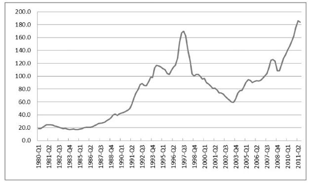

1980至今香港私人住宅售价指数

由图中可以看出，从1980年～2011年，1997年是香港房价的一个顶点，但随后由于亚洲金融危机的爆发，香港房价开始大跌。不过，中国大陆当时刚刚接手香港，为体现“一国两制”的优越性，中央政府大力支持香港政府救市，由此挽救了香港房地产市场，香港房价才没有像泰国曼谷、马来西亚吉隆坡等城市的房价那样崩盘，但相比其高点下跌幅度也在60%左右，随后伴随着内地经济的蓬勃发展，买房客涌入香港，其房价才逐渐再次回升。

直到2011年一季度，在世界性的印钞狂欢中，香港房价才再次超越1997年水平。

他山之石

</a>

人都说“他山之石可以攻玉”，最好的“他山之石”当属日本和美国。

在本次金融危机爆发以前，鼓吹房地产泡沫最著名的国家当属日本。

日本的房地产市场从1966年一直到1980年都很正常，1985年“广场协议”签署，日元大幅度升值（注意，2005年人民币也开始大幅度升值），为了避免日元升值，日本中央银行采取了非常宽松的货币和金融政策，大力增加日元供应（中国2004年迄今一直在这么做），一时间日元钞票满天飞，大笔资金流入房地产及股票市场，致使房地产价格暴涨。

受到股市和房价骤涨的诱惑，许多日本人纷纷拿出积蓄炒股票和房地产（和中国好像没有任何区别）。到1989年，国土面积仅相当于美国加利福尼亚州的日本，其地价市值总额竟相当于整个美国地价总额的4倍。当年日本的GDP为3万亿美元左右，而当年日本的全国住宅价值为6.47万亿美元，到1990年，仅东京的地价就相当于美国全国地产价格总和（和笔者前面的计算方法一样）。

最后的结果是，日本一般工薪阶层即使花费毕生储蓄，也无力在大城市买下一套住宅，能买得起住宅的只有早期的那些幸运儿，以及后来的亿万富翁和极少数大公司高管（中国目前何尝不是）。

不管怎么被鼓吹“支柱产业”，但本质上房子是用来住的，如果涨到普通人都买不起的时候，你还期望他能够再上涨吗？

于是，从1991年开始，日本房价开始走上了漫漫熊途，尽管日本政府屡次企图“救市”——可由于日本政府虽然在印钞方面做了不少工作，毕竟远远没有中国政府那么“大胆”，所以日本的房价不管是6个大都市，还是全国范围，就那么跌呀跌呀跌，一路跌了20年，20年时间里，到目前，连顶点时期价格的1/3也不到了！

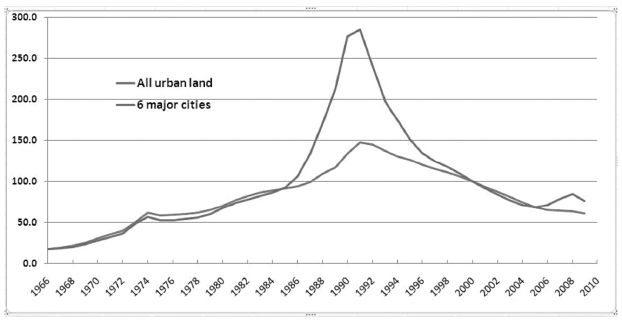

日本1966年以来全部城市房价和六大城市的房价<a href="#part0007.html_id3" id="part0007.html_id_3">[2]</a>。

从日元利率变动上，能够更清楚发现日本房地产泡沫的鼓吹过程。

1985年以前，日元基准利率还基本维持在5%以上，可从1986年起，为了阻止日元升值，日本政府大肆降低利率，猛印钞票，宽松货币政策导致房价飙升；到了1989年以后，发现不对劲儿，开始缓慢提高利率（中国从2007年也曾经这么做）。不想，利率仅仅从2.5%提高到6%，1992年日本的房地产泡沫就轰然破裂，尽管日本政府发现问题不对，赶紧降低利率，大肆印钞救市，可房地产已经是“无可奈何花落去”了，再无雄起之日。即便日本央行在2000年左右把利率降到了0.02%这样的历史低位，亦是无用。

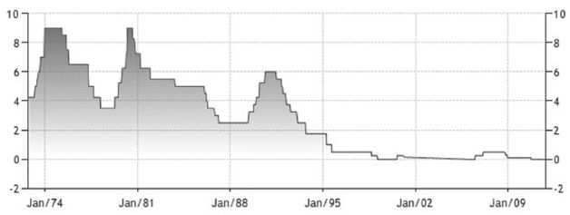

日本1972年以来银行间基准利率<a href="#part0007.html_id4" id="part0007.html_id_4">[3]</a>

从图中可以看出，1985～1990年间刚好处于日本把利率降到历史最低的时期，日本的房地产价格自然也随之膨胀。1992年以来，与房价一同趴下的，是日本的经济，2000年的时候日本人叫做“失去的十年”，到了2010年，已经变成了“失去的20年”了。根据笔者的判断，以日本现有的债务问题，似乎还要演变成“失去的30年”……

疯狂过，总要付出点代价。

跟随日本之后，美国的房价泡沫又一次最生动地演绎了“降息印钞票，制造房价泡沫，升息收钞票，戳破房价泡沫”的故事。

从2001年起，为了避免科技股泡沫破裂和“9·11事件”之后美国经济陷入衰退的阵痛，美联储祭起降低利率鼓吹房地产泡沫的政策，从2000年～2005年美国房价蹭蹭蹭地上涨——全美平均房价增长了58%，年均涨幅超过10%，2005年美国的房价收入比、房价租金比达到历史最高水平。

美联储看到了危险，于是从2004年开始连续升息，加息之后，房屋还贷资金成本大幅度提升，大量房屋所有者开始抛售，导致了房价急剧降低，许多做着“房屋升值”美梦的贷款买房者，一夜醒来之后，百万富翁变成了“百万负翁”——当千千万万个低收入的美国“房奴”发现他们要付出的贷款额度已经不敌房屋价值总额的时候，他们最好的选择就是不归还贷款，让银行来把房子收走。

于是，2007年就爆发了举世瞩目的“次贷危机”。

银行要房子有什么用？它要的是你支付贷款的本金和利息！

这下，银行贷出去的钱没有人归还了，全成了坏账、呆账、死账，而在房地产基础上衍生出来的各种债券一下子变成了垃圾资产——就这样，贝尔斯登倒下了、美林证券倒下了、雷曼兄弟倒下了，连美国最大的储蓄银行华盛顿互惠银行也在2008年年底倒下了！

“次贷”危机终于演变成了金融危机，并且开始蔓延全世界。

下图是经过通货膨胀调整之后，美国30年来的凯斯·席勒房价指数（Case-Shiller
HPI）中10大城市房价综合指数及20大城市房价综合指数的变动情况<a href="#part0007.html_id5" id="part0007.html_id_5">[4]</a>。

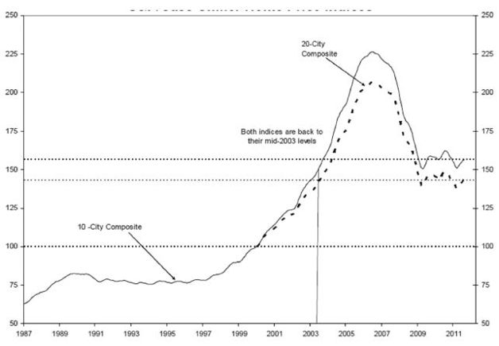

1987年以来，美国大城市房价综合指数

对比1987年以来美元利率变动情况你就会发现美国和日本有着一样的规律<a href="#part0007.html_id6" id="part0007.html_id_6">[5]</a>。

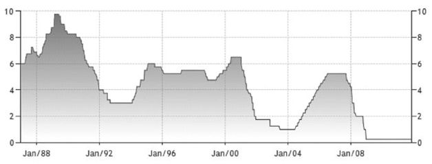

1987年以来美元利率变动

由图可见，在2000年以前，美国大城市的房价十分稳定，恰恰是在2001年美联储降低利率至历史低点之后，美国的房地产价格开始蹭蹭地上涨，并最终涨至历史最高。

由日本和美国的例子都可以看出，在一个市场经济国家中，当中央银行开始执行历史最低利率的时候，房屋资产的价格总是能够创造历史最高水平！

神奇的国度

</a>

鉴于日本、美国（其实还有英国）通过降低利率制造房地产泡沫、升高利息刺穿房地产泡沫的现实，中国人民大学经济学教授黄卫平就说了：

“在这个世界上，凡是靠房地产拉动经济的国家，结果没有不崩盘的，世界老大美国靠房地产拉动经济结局是崩盘；世界老二日本靠房地产拉动经济结局也是崩盘……尤其当房地产和金融紧密结合成为一种金融衍生工具时，不崩盘那简直就不是经济。”

现在，似乎出现了一个奇迹和例外——那就是中国的房地产。

美国和日本的大城市，10年之内房价也就上涨了2～3倍，然后就撑不住了，房地产泡沫破裂，而中国大城市，从1998年～2008年大城市房价至少涨了5倍……

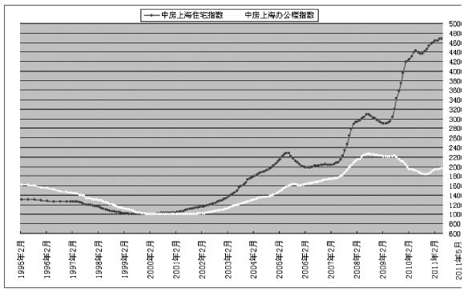

1995年～2011年上海房地产价格变化图<a href="#part0007.html_id7" id="part0007.html_id_7">[6]</a>

涨了这么多，有事吗？没事——涨得太少了呢！

2008年金融危机爆发，中国房价略有下跌，中国人民银行立即大幅度降息，引发2009年中国印钞票创出天量，一年时间，主要大城市房价再度飙升，上涨幅度都在50%以上！像海南这样的中国“国际旅游岛”，还有我们首都北京，从2008年年底以来的两年时间里，房价更是在原有基础上暴涨100%！

研究一下利率就会发现，中国鼓吹房地产泡沫的过程与美国、日本没有任何本质区别！

从1998年起，中国开始大幅度降低利率，到2002年降到底端，于是从2002年开始，中国房价飙升，到了2007年，中国政府似乎有点看不下去，开始提高利率，一下子房地产泡沫就破了，2008年借口“金融危机”，中国政府赶快大肆降低利率，疯狂印钞救市，中国房地产居然在2009年打了一个极漂亮的翻身仗，一举上涨50%以上……

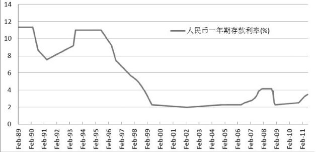

1989年以来人民币一年期存款利率<a href="#part0007.html_id8" id="part0007.html_id_8">[7]</a>。

由图可以看出，正是从1998年中国房改以后，中国的一年期存款开始降至历史新低，鼓励人们“贷款买房”、“花明天的钱”，中国的房价也在“市场化改革”中突飞猛进。

网友模仿《沁园春·雪》写了一首词，很能代表中国2003年以来疯狂的房价：

“神州大地，千万蜗居，亿人房飘。望京沪上下，楼宇莽莽。长城内外，房奴滔滔。袓孙三代，尽其所有，欲与房价试比高。须钞票，倾储蓄贷款，分外心焦。楼价如此虚高，引无数英雄竞折腰。昔秦皇汉武，略输钞票，唐宗宋袓，紧捏钱包。一代天骄，成吉思汗，只好屈身蒙古包。俱往矣，数天价楼盘，还看今朝！”

当然，如果非要说中国房地产市场与美国、日本的不同，那是因为中国的房地产市场背后有了政府这只看不见的手在托着，所以即便有泡沫，也不可能像美国和日本那样破裂。

由于政府100%垄断了大城市的土地供应，中国的房地产业本质上已经不是市场经济行业，而是像中国的税收与垄断行业的垄断价格一样，成了一种少数人剥夺多数人财富的工具。

房价必涨吗？

</a>

房价泡沫形成的根本原因，国外的历史经验都分析完了，但还有几个中国“房价必涨”的论调也需要认真对待，包括人口数量论调、城镇化论调、年轻人结婚买房论调……

好吧，这里用四根神针，来刺破这四个被别有用心的人刻意鼓吹的七彩大泡泡。

论调一：中国有13亿人，都向往城市生活，尤其是大城市生活，所以城市住房，尤其是大城市住房需求几乎是无限的，房价会一直上涨。

不妨假定这个理论是正确的，那么，按照这个逻辑来分析，全世界有65亿人口，都想去美国，都想去美国的大城市（要知道，美国大城市不要说户籍限制了，连国籍限制都没有，只要你有钱就能买房），所以，美国大城市的房价应该会高到天上去……

然而，现实却是美国的房价（包括纽约等大城市）正在下跌，即便其他的大宗商品价格在一路上涨，美国大城市的房价却是不跌就是万幸，更别说大幅上涨了。

为什么美国房价会有这种情况？

总结起来，只有一个原因，美国的房价对于全世界其他国家的人民来说还是太贵，所以只有美国的那3亿人去消费，而这3亿人目前的消费需求已经饱和（很多美国人的房子面积总和都有一个篮球场那么大），所以房价开始下跌，而且很长一段时间内几乎不可能上涨。

中国当前城市房价又何尝不是如此？

那些嚷嚷“人口数量一定会推升房价”的经济学家们也许忽略了以下这些事实：中国现在从农村出来的打工者，每月工资能够超过3000元的可谓是凤毛麟角，而现在中国随便一个大城市房价都在8000元/平米以上，即便是这些凤毛麟角的“高级打工仔”一直保持3000元/月的工资，那么，要想买一个90平米左右的住房，也需要他们不吃不喝20年的总收入方能买得起。如此情况下，谈何“人口数量一定会推升房价”？

论调二：在中国未来十几年内，都有着强烈的城市化需求，城市化一定会造成房价上涨。

我们也假定这个论调是正确的。

先看一份数据，据国土资源部的统计，当前阶段，中国城市居民的人均住房面积为28平方米。

按照国际平均的水平来衡量，28平米/人的居住面积，不算低，俄罗斯和东欧等许多人均GDP比我国高的国家，都远远达不到这一标准呢。

当前中国的城市化率是50%左右，据说它可以上升到70%～75%，所以20年之内，中国的城市人口会另外增加3亿人。

3亿人，那需要多少住房呢？

不妨按照目前这个28平米/人的标准计算——未来20年，我们继续假定普通农民工的工资水平能够增加到和国家公务员一样的水平（以今天的体制来说，这个说法简直是荒谬），所以新增加的3亿人都能够负担得起一处房产（以今天的价格来看，这个说法也非常可笑），中国的城市可能需要额外84亿平方米住房，这也是未来20年内，我国居民住房面积需求的最大可能。

再来看一组现在的数据，当前中国已经完成了超过20亿平方米房产的建设，储备的土地足够容纳另一个20亿平方米——还有，当前我国每年建筑业生产能力约为15亿平方米！

我们前面计算的是20年之内中国的住房需求，结果你发现，如果按照目前的建设速度，5年之内中国就可以完成这一目标——那接下来15年会发生什么情况？

你自己想想看吧。

产能绝对过剩，没有足够的人来住满所有的房屋，当出现这一情况的时候，房地产价格只有一个前途——那就是大幅度降价，正如日本在过去的20年中经历的一样。

更可怕的是，房贷和更多注定赔钱的“铁公基”的建设，可能是我国整个银行系统贷款的主体（80%以上应该没有问题），死账、坏账问题将会摧毁现在拼命发放贷款的整个银行系统，导致中国出现长期经济萧条。

这个方面，可能是我国房地产上涨不可持续的最致命原因。

论调三：中国现在城市里有很多年轻人，他们都要面临结婚、生子的问题，因为他们的需求，所以城市房价还要上涨。

这个论调乍一听似乎很有道理，但实际上，说这话的人根本不了解中国人口的年龄状况。

我国人口统计资料显示，2009年是中国处于婚龄及生育年龄人口数量的顶峰，从2009年起，中国30岁左右因为结婚、生子而需要购买房子的人口会持续下降，一直下降……

从这个意义上说，2009年也将是我国城市房屋需求的顶点。

动态来看，中国的计划生育政策更是会导致未来20年的城市人口剧变。

我们不妨想想看，在我们当前的城市里有多少房产是被60岁以上的人所拥有的，这些人在20年之后可能绝大部分已经去世，他们遗留的房产会怎么处理。

笔者就有2位50来岁的同事，很普通很普通的北京人，他们都只有1个孩子，他们自己有一套住房，夫妻双方的父母也各有一套房子，而且他们也都给自己25岁左右的孩子买了一套房子——20年之后，他们的孩子也都会结婚，很有可能也都是独生子女，这么算下来，想想这对年轻人手里会有几套房子？

是的，小两口将至少拥有7套房子——难道，为了显摆自己房子多，这小两口从周一到周日，每天都换房子住？

需要不了的时候，是不是要出售呢？这么多房产同时出售，价格会上涨吗？

所以，未来20年，在面临人口老龄化以及人口总数下降的局面时，中国的房地产实际价值将不断下降，并且一低再低。

论调四：中国人多地少，所以房价也应该像香港一样，一直不断地上涨！

这个观点可是相当受追捧，可不嘛，中国有13亿人口呢，领土面积却和只有3亿人口的美国相当，美国大城市房价1万元/平米的话，咱中国岂不是至少得卖4万元/平米！

按照这种比较方法的话，用人民币来计价，日本城市房价至少得卖10万元/平米，最穷的孟加拉国房价也应卖25万元/平米，香港和新加坡卖100万元/平米都是少的——相反，地广人稀的加拿大、澳大利亚的房价只能卖1000元/平米！

中国人口是多，但不是什么事儿都能扯上这个原因！

就拿日本来说，日本全国领土面积37万平方公里，中国领土960万平方公里，中国面积是日本的将近30倍，人口是日本的10倍，中国房价按道理应该是日本房价的1/3才对，可北京房价已经和东京完全持平了！

有人说中国西部大部分领土都不能用，所以应该去掉——这些人难道没有概念，人家日本绝大部分土地都是山地，也是不能用来盖房子的！更何况，即便是中国东部和中部的领土相加，也是日本国土面积的20倍左右！

房价上涨不上涨，只与可供盖房子的土地面积有关，与国土面积基本没有关系，世界上没有哪个地区连盖房子的土地都没有——即便是世界上人口最拥挤的香港和新加坡！

香港总面积1076平方公里，人口640万；新加坡总面积683平方公里，人口370万，按照前面这个论调计算的话，那房价还不得卖10亿元/平米？

可我们知道的是，新加坡的房价还没有咱们的北京、上海高！

即便是香港房价比北京、上海高出来不少，但我还是建议你用“谷歌地球（Google
Earth）”看一下香港地图——香港根本不是没有地方盖房子，而是70%可用于盖房子的空地都被政府以“保护绿地”的名义给“圈”起来了，政府故意每年只拿出来一点点土地进行拍卖，所以才导致香港的房价全球最贵！

也就是说，政府故意垄断土地供应，才是房价昂贵的最根本理由——香港的模式，和中国内地大城市的房价模式相仿。

香港虽然房价高，但香港有便宜的物价（税率低），有完善的社会福利和社会保障体系。

更不必提新加坡！新加坡政府以几乎每个家庭都能承受得起的低廉价格大量出售可供新加坡居民永久居住的房子（叫做“政府组屋”），哪怕是四室两厅这样我们可以称之为“豪宅”的房子，价格也不过在600万元人民币左右，一般的100平米左右的房子，就人民币150万左右。额外强调一句，新加坡土地总面积还没有北京市五环以内面积大，所以人家的“郊区”可比咱们的市区还要近！

对比一下，在新加坡买房子可以永久居住，中国大城市的房子最多不过拥有“70年产权”，还有所谓的“50年小产权”，哪一个更划算呢？

买房，不仅仅是居住

</a>

不得不承认，有一个关于房价上涨的论调，看起来我是无法反驳的——长期来看，纸币终将贬值，而房屋是必需品，所以房价必涨。

这个论点的前一半，也就是说论据，是正确的，但后面的结论却不一定正确。

纸币逐渐贬值是一个全球性的趋势，房屋也的确是必需品，所以这个论据并没有错误。这也正是笔者所说的以后房价在数字上不可能降价太多的原因——因为纯信用纸币时代以后，为了“避免经济通缩”，政府印钞票的步伐从来就没有停过。

不过，一个政府为了保持自己的政权稳定，它所选择的货币贬值路径一定是一个缓慢的过程，而不是像今天的津巴布韦币一样恶性贬值（1万亿元只能买到1个面包），如果政府刻意制造严重的通货膨胀，2010年以来的中东国家可谓是最好的前车之鉴。

例如，当年的大英帝国在1816年开始实施过短期的不兑现纸币本位，导致当时大约5%～10%的年通货膨胀率，但当时民众对于商品价格不稳定的愤怒就爆发了，动辄游行示威，以致威胁到大英帝国的统治，于是导致英国在1821年开始恢复纸币与金属货币的兑换关系，随后就是英帝国一个世纪的繁荣昌盛。

当今世界大国之中，无论是美国、中国、日本、德国、英国、法国还是俄罗斯、巴西、印度，意大利或西班牙，一旦产生剧烈的通货膨胀，国家政权的稳定性一定会受到严重影响——这其中，政权的稳定性和连续性最强的美国、英国、德国、日本恰恰是纸币贬值速度最慢的几个国家。

所以，如果没有政权更迭之类的意外产生，人民币的贬值也将是一个缓慢的过程。可是，中国大城市的房价呢，从1998年到现在，几乎涨了10倍，已经透支了未来纸币缓慢贬值可能造成的名义价格上扬。

更何况，当前中国许多大城市房产的名义价格已经达到了纽约、伦敦、东京、香港等世界最发达城市的标准，你还指望它能够上涨吗？德国的柏林，可谓是欧洲的政治中心，那你猜猜现在柏林的房价是多少——只有北京的1/2左右！

你觉得中国大城市的普通居民，什么时候收入水平能够达到纽约、伦敦、东京或者香港的普通居民的标准？或者，最次的，达到柏林人的收入水准？

房子是用来住的，否则，不管出于何种理由维护高房价，一旦远远超出普通居民的购买能力，这种房价终归是不可持续的。

当然，这个论调有一个成立的前提——那就是除非中国央行极不负责任地天量增发货币，引发恶性通货膨胀。

然而，即使在恶性通货膨胀的条件下，也可以肯定，房价的上涨速度与大宗金属商品价格、与原油价格、与粮价相比，一定是上涨最慢的那一个。

很多普通老百姓抱有这样一个观点——因为房子是必需品，哪怕我祖宗八代攒一辈子钱用来买房子，只要买房是用来住的，下跌或者上涨与我的生活无关！

可怜小百姓所不知道的是——不管房价上涨还是下跌，都会有人利用你的这种思路，大肆搜刮你的财富！

人穿衣服是不是必须？

正常情况下卖100元一条的牛仔裤，占你每月收入的1%，现在突然卖到了10000元，占你每月收入的100%，你难道会认为：“我只要是买来穿的，贵不贵都与我无关？”

财富是什么？财富是保证你这辈子过上理想生活的时间！

对于有些人来说，花掉他们财富的1%甚至更低就可以轻松买到一套房子，而对于我们大多数普通人来说，花掉的却是我们一辈子所创造的财富！

我们的纸币价值可能会动辄变化，但除非你拥有某方面的天赋，否则我们绝大多数普通人，这辈子所能创造的财富却基本上是个定值——如果你把绝大部分财富都用在这一样东西上，那么就不能用在另外的东西上！

对于中国普通百姓来说，买房子，相当于人生中最大的一笔财富支出，无论你买房是用来居住还是用来投资，买房都与你息息相关，与你这一辈子所创造的财富息息相关——在买房之前，你应该考虑一下更长久的人生……

记住，你选择现在买房子，就是在今天花掉这辈子所创造的财富，从现在开始，你就不得不选择一辈子紧紧巴巴地过日子，整天战战兢兢，怕失去工作，怕老板给你脸色，怕这怕那，怕到最后，只能勒紧裤腰带，一辈子点头哈腰、低眉顺眼、逆来顺受地给银行当房奴！

因为，一旦你失去每个月的收入，还不起月供，房子马上会被银行没收！

相反，现在你选择租房，10年后或者20年后买房子，那个时候，虽然房子可能价格没有啥变化，但其价值已经大大降低，占你这辈子所能创造的财富比例会大幅度下降。

如果你一定要选择现在买房，最强大的理由不是什么“为了居住”，而是要有人给你保证，未来房价还要像过去7年一样大幅度上涨，而且上涨幅度都远远超过你的工资收入、远远超过社会物价上涨速度——唯有如此，你买房子才有可能实现所谓的“财富增殖”。

可惜的是，根据前面的说法，笔者认为，按照真实价值计算，2011年中国大城市的房价，差不多就相当于2007年中国股市的5000点，甚至是5500点！

所以，综合各种因素，总结下来，有必要再重复笔者的结论：

中国大城市房价绝对不可能再次大幅度上涨，但阿拉伯数字表现出的价格却很难下跌！

价格可能不会下跌，但相对于其他商品，房地产的实际价值却在未来20年一定不可能上涨，而是下跌、下跌、再下跌……

当然，你可以不信笔者所说，就是钱多，为了改善自己的生活质量，那你就赶紧买房吧！

【注释】\

<a href="#part0007.html_id_2" id="part0007.html_id2">[1]</a>全香港私人住宅以港元计算的售价指数，数据来源于香港政府的物业市场统计资料，图表为笔者所做，时间范围从1980年一季度到2011年三季度。其中，新界区域住宅1984年以后才开始计入售价指数。

<a href="#part0007.html_id_3" id="part0007.html_id3">[2]</a>数据来源于日本统计局。

<a href="#part0007.html_id_4" id="part0007.html_id4">[3]</a>数据来源于日本央行网站，图中纵轴为利率的百分比。

<a href="#part0007.html_id_5" id="part0007.html_id5">[4]</a>图表数据来源于标准普尔公司的凯斯·席勒住房价格指数，包括了全美房屋价格指数（national
home price index）、20城综合指数（20-city composite
index）、10城综合指数（10-city composite index）三个指数。

<a href="#part0007.html_id_6" id="part0007.html_id6">[5]</a>美国银行间基准利率的历年变动情况数据来源于美联储网站，图中纵轴为利率的百分比。

<a href="#part0007.html_id_7" id="part0007.html_id7">[6]</a>数据来源于上海市房地产估价师协会网站http://www.valuer.org.cn，笔者能够找到美国、日本、香港长达几十年的房地产价格指数情况，却查不到中国主要大中城市15年内的房地产价格指数情况。笔者所找到的“中房上海指数”是唯一一个统计时序超过15年的城市房价指数情况。

<a href="#part0007.html_id_8" id="part0007.html_id8">[7]</a>数据来源于中国人民银行。

第八章　人民币国际化，臆想还是理想？

</a>

从2008年金融危机爆发以来，天天听着美元贬值，美联储印钞之类的话，不少中国人开始憧憬了：人民币是不是可以将其取而代之呢？

从此以后，咱中国人也像美国人一样牛气哄哄，用印钞机把成堆的纸张哗啦哗啦印刷成人民币，扛到世界上任何一个国家都可以购买各种实物商品、服务和资源，想买豆浆买豆浆，想买油条买油条，羡慕死那些老外们！

这就是“人民币国际化”的问题。

人民币国际化，到底是一个传说、美梦、臆想还是伪命题？抑或是一种理想和目标？

国际货币

</a>

首先要解释一下“人民币国际化”这个说法。

所谓“人民币国际化”，指的是人民币能够变成所谓的“国际货币”，跨越国界在境外流通，成为国际上普遍认可的计价、结算及储备货币的过程。

按照专家们的说法，人民币国际化的含义包括三个方面：第一，是人民币现金在境外有一定的流通度；第二，是以人民币计价的金融产品成为国际各主要金融机构包括中央银行的投资工具，这一条最重要；第三，是国际贸易中以人民币结算的交易要达到一定的比重，这一条也很关键。

以上的三条内容，可以说是衡量一种货币是否是“国际货币”的通用标准。

“国际货币”，其实就是马克思所谓的“世界货币”，就这个词儿的含义来说，其实就很值得说道说道。

在实物货币年代，人们都采黄金、白银或者铜的重量来作为货币，货币的额度本身就是实物商品的数量，无论是黄金还是白银，拿出去就是国际货币，自然无所谓是否国际化的说法。对于要与外国进行交易的某个经济体来说，最多要关注的，是这个国家习惯于使用黄金、白银还是青铜，他们的比率又是多少……

按照马克思的说法，“货币天然是金银”，黄金、白银或者铜具有作为货币的天然属性，它们本身就是有价值的商品，凝结着人类的辛勤劳动，自然可以作为贸易凭证。

所以，如果要说最早的国际货币，其实是黄金和白银，甚至包括铜币。

地理大发现使得世界真正地联系到了一起，而最早在全球通行的货币，应该是伴随着两个全球性殖民帝国的崛起——这就是西班牙和荷兰。在这两个国家的鼎盛时期，西班牙银元以及荷兰盾银币，完全可以配得上“国际货币”这样的名号。

第一个可以称之为国际化的纸币，是英镑。

英国是世界上第一个采用金本位的国家，从1717年～1914年的近200年间，每一张英镑纸币所代表的黄金数量从未变过。任何一个人拿到了英镑，随时随地可以兑换成黄金，如此硬通和有信用的货币，人们如何能不喜欢？

英镑能够轻易地“冲出英国走向世界”的另外一个原因是英国占领了大片大片的海外殖民地，作为殖民地统治者的“白人老爷”们所使用的英镑纸币，当然会在殖民地广泛流通，更何况还能随时随地兑换成确定数量的黄金，英镑纸币的国际化自然是顺理成章。

总体而言，英镑纸币的国际化与“日不落帝国”的命运息息相关，当日不落帝国的纸币在两次世界大战之后再也撑不起黄金自由兑换的面子时，它的“国际地位”自然就慢慢弱化。在接下来的岁月里，国际储备货币第一名的桂冠则花落美元。

相比较英镑纸币200年里保持其价值不变，美元纸币的价值则在1934年1月被罗斯福总统一下子打了6折还多（由原来的相当于1.504656克黄金变为相当于0.888671克黄金）——尽管如此，美元却是第二次世界大战前后唯一仍然能够保证兑换成黄金的纸币，当时也只有美国拥有这样的实力。

1944年的布雷顿森林体系确认了美元“等同于黄金”的地位，随后又通过“马歇尔计划”加强了其在欧洲国家的流通，这样一来，英镑纸币在国际储备货币中的“王者之位”让位给美元，自然是顺理成章的事。

随着1971年尼克松总统的一个决定（关闭黄金兑换窗口，布雷顿森林体系垮台），点燃了世界范围内大规模通货膨胀的火源，5000年的经济史就此改变——世界人民从此生活在纸币的阿拉伯数字幻觉之中，今年100，明年120，后年150，财富增长似乎永无止境……

“国际货币”也由此陷入了群雄逐鹿的状态。

不过，再怎么“群雄逐鹿”，美元在国际货币储备领域始终稳坐头把交椅，老二、老三、老四的位置倒是换了一拨又一拨，从英镑到德国马克再到日元，从法国法郎到瑞士法郎，直到1999年欧元异军突起之后，老二的位置才确定了下来。

根据国际货币基金组织公布的数据，2011年第二季度国际储备货币构成情况见下图<a href="#part0008.html_id2" id="part0008.html_id_2">[1]</a>。

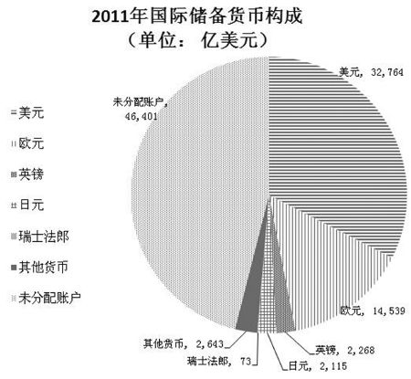

显然，人民币目前并没有在国际储备货币上占有一席之地。

不过，要是从历史上来分析当前的国际储备货币构成，也颇有点搞笑。在中国的宋代、元代、明代，那个时候中国经济总量差不多占了世界一半，是当时最为强大和富裕的国家，而且从宋朝开始，中国就在使用纸币，但世界其他各国商人来到中国做贸易，没有任何一个人会带一堆中国的纸币回家当做财富来储存，他们认的要么是黄金白银，要么是铜钱，最不济的，至少也要是中国的瓷器、香料、丝绸等实物商品。

由此来看，在美国关闭美元兑换黄金窗口之后，当前世界各国政府依然都把天量的美元纸片作为财富储存，真可谓是人类5000年经济史亘古未有之奇观！

根据经济学家鲁政委的说法，“货币国际化”只有在金汇兑本位时代以后才具有意义。从典型货币的国际化性质来看，总体上可以分为三大类型，即强权辅助下的国际化、区域一体化助成的国际化、金融市场改革推进的国际化，三种类型的代表货币分别是英镑和美元、马克（欧元）、日元。

显然，就可预见的时期来看，强权辅助下的国际化——英镑与美元的国际化都是人民币无法复制的经验，那就只能看看德国马克（欧元）和日元的国际化经验了。

从德国马克到欧元

</a>

继承了德国马克稳定性的欧元，可谓是当今世界上币值最稳定的纸币，但你可能想象不到的是，在2008～2009年津巴布韦出现恶性通货膨胀之前，世界上面额最大的纸币居然是“德国制造”——在1922年～1923年的通货膨胀中，德国马克纸币的最大面值为100万亿！

经历了恶性通货膨胀惨痛教训的德国人，对于货币价值稳定始终报以高度警惕，对于政府支出的财政约束极严，成了第二次世界大战之后世界上对货币贬值容忍度最低的国家。

这方面有个显著的证明，发行国债是西方国家发展经济的惯例，在西方已经实施了几百年，但德国政府在二战后却一直对此非常谨慎，1983年西德才第一次发行马克国债。

1971年之前，美元与黄金挂钩，是唯一的国际货币，西德马克与美元挂钩，1个美元等于4个德国马克，这一汇率从1945年～1971年一直持续了27年。这一阶段，由于美元能兑换黄金，德国马克不能，所以这一阶段的货币储备根本没有马克什么事。

布雷顿森林体系垮台后，美国人开足了马力印美元，导致了美元纸币的快速贬值，美元购买力急剧下降，作为国际货币的价值稳定性遭到质疑。相比之下，尽管德国也同样受到1970年前后石油危机的冲击，但德国马克却在币值稳定方面表现优异。

1970～1989年的20年间，德国的通货膨胀率在西方大国中是最低的（当时的意大利则是最糟），相比较美国、英国等动辄百分之十几的数据，德国的通货膨胀率只有区区的3.9%，这就给德国马克这种货币树立了极好的信誉，导致最终整个欧洲大陆的货币价值其实都在以德国马克的名义支撑。

与中国现在许多人极力希望人民币国际化的思路相反，在1980前后，德国政府甚至不鼓励国际贸易使用德国马克，因为这会干扰德国中央银行对马克数量的控制，进而影响德国马克币值的稳定。

所以，某种程度上说，德国人根本没有主动推动“马克国际化”——纯粹是布雷顿森林体系垮台之后德国马克20年的表现让世界人民无比信任，因此不得不变成了国际货币！再加上德国经济体比较庞大，进出口贸易占了欧共体国家的60%～70%，相比当时美元价值的极度不确定，大家实在太习惯于使用德国马克了。

依赖于德国马克的稳定以及德国庞大的经济份量，当时的欧共体<a href="#part0008.html_id3" id="part0008.html_id_3">[2]</a>在1990年7月开始尝试资本流动自由化，欧洲经济货币联盟第一阶段开始实施。

1991年12月，欧共体成员国首脑在荷兰召开的马斯特里赫特首脑会议通过了建立欧洲经济货币联盟和欧洲政治联盟的《欧洲联盟条约》（即《马斯特里赫特条约》）。到了1992年，欧共体成员国正式签订《欧洲联盟条约》，条约生效，对欧洲各国的财政约束纪律出台。

《欧洲联盟条约》规定，在欧共体内部实现资本的自由流通，真正实现统一市场，并使经济政策完美地协调起来——区内各国都必须将财政赤字控制在GDP的3%以下，并且把降低财政赤字作为目标。同时，各成员国必须将国债与GDP的比保持在60%以下。

3%和60%的这两个指标也成为其他欧盟国家加入欧元区必须达到的重要标准，而这次“欧洲五国”<a href="#part0008.html_id4" id="part0008.html_id_4">[3]</a>所爆发的债务危机，就是因为这些成员国长期没有遵守上述目标的结果。

1995年12月，欧盟决定使用欧洲单一货币，名称叫做“欧元（Euro）”；1998年6月，欧洲中央银行成立，区域货币一体化进入加速阶段；1999年1月，欧元诞生，2002年1月，欧元开始在欧元区正式流通，各国主权货币逐渐退出流通领域。

由于德国是欧元区经济份量最大的国家，再加上德国马克优异的通货膨胀控制记录，新面世的欧元很快获得了世人的认可。尽管由于各种原因，欧元区2000年以来经济发展缓慢，相比较美联储快速增长的钞票供应，欧元币值始终保持稳定，而欧盟的财政纪律约束使得任何一个欧盟成员国不能随便滥印钞票，这也加大了人们对于欧元的信心——欧元/美元的汇率一路升值，从2002年的0.8左右一直升值到本次金融危机爆发前的1.5左右。

相比较美元，升值的欧元在人们心目中越来越有吸引力，多个国家开始将欧元纳入自己的外汇储备之中。在国际贸易中，除了欧洲国家之外，也有更多的国家开始采用欧元进行结算，这进一步推进了欧元的国际化。

2009年底以来，由于“欧洲五国”债务问题相继爆发以及2010年5月欧盟央行印钞“救市”的决定，导致欧元一路下行，目前欧元对美元已经贬值到1.3左右。

不过，如果欧元能挺过这一关，因为有了自己的财政纪律，所以欧元依然是比美元更可信的一种国际货币。

相反，如果欧元挺不过这轮债务危机，那么结局就是欧元区解体。

日元国际化之路

</a>

相比较德国马克的“背靠大树（欧盟）好乘凉”，作为美元“一哥”扶持下的小兄弟，日元的国际化之路走得并不怎么顺利。

实际上，一直到今天，所谓的“日元国际化”都并不怎么成功——想想也能理解，亚洲国家如果都改用日元做外汇储备，那么老大哥美国印刷的那一堆纸片片找谁换东西去？

不管怎么样，以美国超级大国的地位，一定要首先保证美元在世界上的可接受性。

然而，日元的国际化，恰恰对人民币更具有借鉴意义，因为背景太像——与当前的中国类似，也是在当时外汇储备高居世界第一的情况下，日本自己的钱都花不完，还要搞什么日元国际化，而且也是由政府和财政当局主动推进的！

“苍蝇不叮无缝的蛋”，如果大家都很满意当前的国际货币，任凭天王老子也无法推进自己货币的“国际化”。一种货币要走向国际化，首先就是利用大家对已有国际货币贬值的不满让自己货币逐渐升值，当年美元替代英镑是这么做的，德国马克、欧元是这么做的，日元也只能这么做。

可以说，升值，是一个主权货币走向国际货币的必由之路。

只有当一种纸币相对于其他纸币（以美元为代表）价值更加稳定（也就是缓慢升值），别人才愿意持有这种货币。

实际上，贬值的货币，不要说老外，连自己的国民都不愿意持有了，还谈什么国际化？

1985年9月，著名的“广场协议”<a href="#part0008.html_id5" id="part0008.html_id_5">[4]</a>签订，五国政府联合干预外汇市场，促使美元对主要货币的汇率有秩序地贬值。作为美国在亚洲最亲密的盟友，日本坚决地执行了协议内容，日元迅速升值：3个月之内日元升值即达25%，一年之后，升值70%；二年之后，升值110%！最终美元兑日元汇率由早期的1︰300左右暴涨到1︰100左右，升值幅度超过200%。

看着这种景象，是不是想起2005年以来人民币兑美元的升值之路了？

也正是在1985年，日本外汇审议局发表了《关于日元的国际化》等一系列官方文件或协议，正式开始推进日元的国际化进程。为了使得日元广泛流通，日本利用资金雄厚的优势，开始向包括中国在内的亚洲国家提供大量的日元贷款，接受日元的逐渐升值，鼓励与日本进行贸易的经济体采用日元进行结算，日元由此逐渐走向世界。

想想看，短短3年之内，一种货币升值即达100%，你说你愿不愿意持有？

当然愿意！快速升值之下，日元的国际化进程真是高歌猛进，一路向前。

在1980年，在日本进口额中，按日元结算的比重仅为2.4%，世界各国外汇储备中日元比例也仅为为4.5%；各国银行对外资产中，日元资产也不过占3.7%而已。

到了1990年，这三个数字分别变成了14.5%、8.0%和13.5%！

日元国际化就这样成功实现了！

可惜好景不长，1990年当日本以房地产拉动型和金融投机型的经济泡沫破灭以后，世界人民对日元的信心再度下降，人们拒绝日元——到1999年底和2000年初，世界各国外汇储备中，日元比例再度下降到5.1%（很大一部分是中国持有），而世界各国的日元资产比例一样下降到8.7%，而全世界的日元债券的比重也从17.3%的高点一路下跌到8.6%。

2000年以来，欧元越来越流行，尽管日元对美元一直还算坚挺，但日元的国际化进程却并无大的进展，在国际货币体系中地位也越来越边缘化，变成了鸡肋。要不是中国和东盟依然还在大规模使用日元的话，日元国际化可谓是一败涂地。

后世不忘，前车之鉴——日本通过拉升房地产价格、吹大金融泡沫加上货币升值的手段，固然在一段时期内推进了日元的货币国际化，但归根结底，在美元的霸权之下，在美国的超强国力面前，要想炼成货币国际化的绝世武功，必须得引用“葵花宝典”中的说法——要想成功，必先自宫，即便自宫，不一定成功！

“老大哥”与卢布国际化

</a>

二次世界大战之后，世界分为社会主义和资本主义两大阵营——在“敌人的敌人就是我们的朋友”这种理念的指导下，两大阵营针锋相对。

美帝国主义搞出来一个布雷顿森林体系，让美元成为资本主义国家的国际货币，成功地从世界经济中汲取营养，苏联老大哥怎么那么傻，不知道印刷卢布就可以掠夺周边社会主义国家的财富？

1917年，苏联“十月革命”胜利之后废除了腐朽的、反动的金本位，为了革命事业，自然就使劲儿发行俄罗斯卢布。从前面的道理就知道，卢布纸币使劲儿发行，对实物商品就只能使劲地贬值。眼看不行了，苏维埃政权干脆发行了自己的货币“科仁基（Kerenki）”，但由于没有任何信誉担保，很快再度急剧贬值。当时的苏维埃革命家们，大都认为革命成功后就要过共产主义生活了，货币根本就不重要，也没有谁在乎货币滥发问题。

格里高利·索克林科夫（Grigory
Sokolnikov），这个名字你肯定极其陌生，他是个俄罗斯籍的犹太人银行家，“十月革命”之后依然待在俄罗斯。鉴于他的银行家背景，在列宁的特批下，1921年11月26日，33岁的索克林科夫进入“人民金融事务委员会”。

索克林科夫给列宁建言，认为若不尽快实现货币稳定，经济稳定就是无稽之谈。

列宁接受了索克林科夫的这一建议。

索克林科夫恢复了沙皇俄国时代的金本位——1922年，苏维埃政权的“切沃奈茨（Chervonets）”货币正式发行，1个切沃奈茨相当于7.742克黄金，由25%的黄金和75%的实物商品为支撑。

由于以黄金和实物商品为依托，切沃奈茨的货币信誉迅速建立，很快站稳脚跟。随后，苏联马上进行币制改革，1个切沃奈茨兑换过去的5万旧卢布货币——交换的基础有了信誉，经济开始逐渐恢复，苏维埃政权活了下来。

切沃奈茨在苏联的新经济政策中发挥了重要作用，一直使用到二战前夕。

列宁死后，索克林科夫调任苏联驻英国大使。然而在1938年斯大林所发动的大清洗中，索克林科夫被审判有罪关进监狱，最终因为“狱中斗殴”被打死，新经济政策也被终止。

然而，1920年前后恶性通货膨胀的后果，以及稳定经济的货币必须与黄金挂钩的想法，自此却刻进了苏共领导人的脑子里，他们不再随意发行那些没有任何支撑的货币。

第二次世界大战爆发前后，苏共再度开始大量发行切沃奈茨，从而导致其急剧贬值，苏联不得不在二战结束后的1947年再次进行货币改革，发行新的卢布纸币。根据规定，1个新卢布等于10个切沃奈茨，但1个新卢布的含金量却下降到0.222168克，在此基础上，东欧各国货币也与苏联新卢布建立固定汇率的联系。

按照我们今天的说法，苏联从此开始了“卢布国际化”的进程。

由于拥有固定的含金量，卢布一度也成为社会主义阵营的硬通货——苏联本身是黄金生产大国，为了显示自己财大气粗，1961年苏联再次进行货币改革，1个卢布的价值被确定为0.987412克黄金，0.9卢布就可以兑换1美元。

这种卢布一直使用到苏联解体。

1971年美元与黄金的挂钩被斩断后，卢布曾急剧升值，价值最高的时候曾经达到0.5个卢布就能兑换1个美元。

然而，整体上看，当时包括苏联和东欧在内的整个社会主义阵营内民用产品都十分缺乏，即使东欧国家的人们拿到了宝贵的卢布，却依然换不到想要的产品，卢布在东欧国家的使用也就那个样子，反倒是由于美元可以从西方国家那里换到东欧国家急需的商品，东欧国家和苏联自己都对罪恶的美帝国主义所发行的美元趋之若鹜。

随着东欧国家逐渐开始用物资换取美元，美元开始悄悄进入社会主义阵营。

对于苏联来说，国家整体上实施的是计划经济，许多交易不需要通过市场实现。此外，前苏联本身各类资源极其丰富，想要什么资源，领导人一个行政命令立即就可以开采出来，即使缺了什么资源，东欧国家有的话，直接强行问那些小兄弟们索取，他们还敢不给？

如此一来，你说说苏共领导人怎么会有动力推进“卢布国际化”？

更为关键的是，苏联本质上来说是一个专制独裁政权，连社会主义阵营的小兄弟们其实对苏联并不完全信任，即便是“送”给老大哥物资，也是迫于强权和压力，而不是市场经济条件下“一个愿打一个愿挨”的自由交易。

在苏联解体前后，波兰、南斯拉夫、捷克斯洛伐克、罗马尼亚等社会主义国家都先后与老大哥反目成仇，就是一个最好的证明——不认同你的体制，不认可你的统治方式，接受你的货币又购买不到自己想要的产品，“卢布国际化”自然就成了无源之水和无本之木。

所以，二战结束之后一直到1990年之前的苏联，尽管贵为超级大国之一，对东欧、中国以及全球社会主义国家的影响力也不是一般的强，但从未有所谓“卢布国际化”的提法——原因就在于这个国家的体制不能得到别人的认可。

连自己的伙伴都不能对你的制度产生信任，那你还指望谁能对你产生信任？

小国大货币

</a>

与当年的苏联卢布相反，国际上有这么一个国家，国土面积狭小且资源匮乏，人口不多，经济规模也不大，除了金融领域，在国际上也没有什么大的影响力，但这个国家的货币却很长时间以来一直都是著名的国际货币。

这个国家是瑞士，货币是瑞士法郎。

估计很多人该奇怪了：瑞士这么一个小国家，经济规模那么小，她的货币凭什么可以成为国际货币之一，为什么大家愿意用这个国家的货币？

很简单！因为一个多世纪以来，瑞士人始终把自己的货币与金银绑定在一起。

瑞士法郎在1850年成为瑞士联邦的法定货币，并确定1法郎=100生丁（centime），其最初价值被确定为与当时的法国法郎等同。在屡次的欧洲战争中，瑞士严格奉行中立政策，因此自1848年建国迄今，瑞士基本没有受到过战火的蹂躏。

从19世纪开始，瑞士的银行家们就一直在国际上享有盛誉，尽管法国法郎随着本国政治经济的变迁经历了多次的币值变动，但瑞士法郎却始终保持币值稳定，坚持货币与实物金银之间的联系。

布雷顿森林体系建立后，1952年瑞士确定1个瑞士法郎的含金量为0.2032258克；到1971年5月份布雷顿森林体系解体前夕，瑞士甚至把瑞士法郎含金量提高到0.2175926克。

随着尼克松关闭美元黄金兑换窗口，相对于其他满世界的信用纸币，瑞士法郎瞬间成了世界上唯一一个与实物商品有联系的货币，币值当然飙升。

布雷顿森林体系垮台以后，瑞士人依然长期坚持金本位，直到1990年代中期以前，每一个瑞士法郎的发行都有40%的黄金作为支撑——这可是当时世界上唯一的把货币与实物商品联系起来的国家。

1970年代和1980年代，随着美元的贬值，国际金融市场出现抢购德国马克和瑞士法郎的风潮，从而使瑞士法郎汇价不断上升，越来越多的人把资产兑换成瑞士法郎——这一度导致瑞士国内产生通货紧缩，但瑞士央行始终保持瑞士法郎可兑换黄金的功能，这更使得瑞士法郎得到了全世界人民的信任。

长达一百多年的坚持，再加上实物黄金的支撑，瑞士法郎的信誉谁能撼动？

长久以来经济、金融和货币的长期稳定、金融机构的业绩和服务质量、银行和保险业的悠久历史和丰富经验、多语言、高素质的员工队伍、适当的金融市场法律、持续而有效的金融市场监管等等多种原因，都促成了瑞士成为一个重要的国际金融中心——在20世纪80年代的世界金融中心排名上，瑞士曾经一度超越伦敦，而占据世界第二位。

货币含黄金，再加上世界金融中心，瑞士法郎想不国际化别人都不答应呢！

由于瑞士国内多年保持低通货膨胀率、低利率的货币环境，瑞士法郎的购买力始终稳定，再加上瑞士一向保持中立，国内政治和经济局势稳定，瑞士对外国人在境内存款采取严格保密措施等，这都大大加强了瑞士法郎的荣誉和信用。

不过，裂隙还是出现了。

1992年，因为各种原因，瑞士希望加入国际货币基金组织，但IMF却把瑞士法郎斩断金本位、出售他的黄金储备作为瑞士加入IMF的条件。结果，瑞士人不得不大量出售黄金，并在1997年将每一个瑞士法郎的黄金含量由40%降低到25%。

不久之后的1999年，瑞士最终废除了金本位——世界人民从此完全统一到纯信用纸币的幸福生活之下，而从1999年起瑞士决定出售自己一半黄金储备的决定，也导致了世界黄金价格持续两年的低迷。

即便如此，瑞士迄今依然是全球第六大黄金储备国。

不过，因为瑞士废除了金本位，2000年以来瑞士法郎作为国际货币的地位也是江河日下，再加上2008年金融危机以来，瑞士央行也积极响应美联储和英格兰央行的号召，实施“量化宽松”的货币政策，作为国际货币，瑞士法郎其实已经一天不如一天了。

之所以大家还在把瑞士法郎当国际货币，是因为看到了瑞士还有那点与其国家经济规模极不相称的巨额黄金储备，是因为美元和欧元实在比瑞士法郎还要糟糕……

人民币国际化的条件

</a>

根据历史经验，总结相关要素，有人总结了影响货币国际化的5个主要方面：

1）该国在全球经济中的相对规模；

2）该国贸易在全球贸易总量中的相对规模；

3）该国货币的币值稳定性；

4）该国金融市场的稳定和完善程度；

5）历史偏好问题，换句话说，就是该国货币在历史上的信用如何。

逐项来分析中国目前的条件。

2011年，中国经济规模全球第二，仅次于美国，若按照IMF的购买力平价法（PPP法）所计算出来的汇率，中国GDP已经超过美国GDP的50%<a href="#part0008.html_id6" id="part0008.html_id_6">[5]</a>，条件尚可。

在全球贸易方面，根据WTO发布的数据，2007年我国商品出口占全球出口份额的8.7%，仅次于德国的9.5%，名列第二；商品进口占全球的份额为6.7%，仅次于美国的14.2%和德国的7.4%，名列第三；然而，中国在服务贸易领域却远逊于商品贸易。所以，从总额上来看，中国的出口占全球第七，进口占全球第五，条件略逊。

人民币币值的稳定性，似乎就不用说了，人民币广义货币供应量从改革开放之初（1979年12月份）的0.1555万亿元一路猛增到2011年10月份的81.68万亿元，33年增加了525倍，怎么可能稳定？

不要说和瑞士法郎、德国马克或者日元比较，就说我们极力批判的美元吧，前文已经比较过，同样选择广义货币供应量（M2）这个指标，美国53年增长了34倍——在这一条上，人民币肯定属于严重不及格的货币。

“金融市场的稳定和完善程度”方面，相比当今世界的其他几种主要货币，人民币肯定也是属于严重不及格的货币。

“历史偏向”方面，早在200年以前，世界人民就在使用英镑作为国际货币；早在100年前，欧洲人民就在使用瑞士法郎做国际货币；早在70年前，世界人民都在使用美元作为国际货币；早在40年前，世界人民就开始使用日元和德国马克做国际货币——相比较之下，似乎人民币只能比1999年诞生的欧元好一点点了。

可实际上，前文已经讨论过了，欧元也是从德国马克过来的，问问中国央行的决策者们，他们私底下觉得自己在历史传承方面有资格和欧元比较吗？

在以上5个条件之中，要排序的话，最核心的其实只有1个，那就是币值稳定——瑞士法郎的国际化就是一个典型，其次是历史偏向，再其次才是经济规模、贸易总额和金融市场的完善性。

对比以上5个条件，诸君可以掂量掂量人民币国际化的可能性。

实际上，以上5个条件当中，除经济规模和贸易总额外，其他的条件都与一个国家长期以来的政治和经济体制有关。

就说币值稳定和历史偏向，其实就是取决于这个国家的行政体制在世界人民心目中是不是有地位，取决于这个国家货币发行部门是不是有信用。

也就是说，一个国家在国际上的政治地位，在世界人民心目中的形象，这个国家的制度安排是否能最大程度激发民众的创造力，是否代表了最先进的生产力，是否代表了最广大人民的根本利益……这些因素，对于一个国家货币的国际化，其实非常非常重要。

最早的全球化货币应该算是荷兰盾，而17世纪的荷兰，为了保证自己作为金融中心的货币信誉，即使在打仗期间，也从不禁止敌对国家从自家银行里取走资金……

大科学家牛顿将1个英镑的黄金价值确定以后，在近200年的时间，英镑的含金量已经成为所有大英帝国精英心中的一个圣像，坚决不得玷污和折腾，所以即使经历了无数次战争，英镑的币值依然坚如磐石，稳定如一。为了保持英镑的含金量，为了控制黄金，英国甚至不惜多次与其他国家开战，也不惜让自己的国家在第一次世界大战之后陷入经济衰退，以此来捍卫英镑的地位。

从另外一方面来说，无论是西班牙、荷兰还是英国，乃至现在的美国，当他们扩展自己的货币在全球使用的时候，其政治体制基本上都是代表着当时最先进的生产力和生产方式！

例如，西班牙是欧洲经历了中世纪黑暗之后出现的第一个强大的封建制王权国家，他们鼓励冒险，激发人们对新世界的追求；荷兰，则是通过地区联盟的方式，成为世界上第一个建立资本主义制度的国家，他们不要国王，遇到重大事情必须通过人民代表的议会商议，实施宗教宽容，各色人种和平共处，鼓励参与工商经营、国际贸易以及海外殖民冒险；英国，则是第一个通过和平方式而建立的现代化国家，进而把国家权力放到整个“民族”而不是国王一人手中，同时在经济上建立契约社会，这个社会鼓励发明创造和海外冒险，鼓励通过个人的“自私行为”实现整个国家福利的增加……

今天的国际货币霸主——美元，其产生国美国从这个国家建立的第一天起，便将“人人生而平等”确立为国家至高无上的准则，同时把民主自决的原则深入到国家每一级政府机构、每一个人民的血液之中，一直到今天，依然是这个世界上最大程度的鼓励自我奋斗、发明创新和自我实现的国家，吸引着全世界最聪明的人移民到这个国家……

零和游戏与综合实力

</a>

在世界贸易额总量一定的情况下，假定有A货币（美元）、B货币（欧元）和C货币（人民币）三种国际货币，在某一次国际交易中，使用了A自然就不会使用B和C。如果现在用货币C代替A，那么本来设计好用于这场交易的A货币就会多余——换句话说，如果人民币国际化了，其实就是在侵犯美元的利益，就是在抢美元的一杯羹。

抢美国人民的福利，美国会答应吗？

为什么欧元建立之初就遭到美国精英人士的口诛笔伐，为什么就在最近一段时间，除了希腊等个别国家爆发债务危机外，欧元区的主要大国，法国和德国财政状况尚好，至少比美国好得多，可美国华尔街金融家们依然声称，欧元可能解体、应该解体、将不得不解体……

1980年以来，美国精英们所迅速推进的“全球化”、“市场化”、“私有化”，其实就是所有国家的经济活动最大程度的“美元化”——应该说，“让每个人都用得起美元”是美国精英阶层的最高理想！

从拉美国家的现代化进程，到苏联东欧剧变后的经济改革，再到东南亚小龙小虎们的出口贸易，乃至当年日本和现在中国的外汇储备，美元的使用规模不断扩大。所以，即便美元的供应量从1980年初的1500亿美元增加到2003年的6000亿美元，美国的商品价格却上涨很少——为什么？

因为美元都跑到别的国家去了！

美国的金融精英人士们真是把美元的这一套“经济永动机”游戏玩得得心应手，并把全世界都拖入到美元体系之中——陷入最深的就是中国和日本。

问题是，真的到了全世界每个人都在使用美元的时候，怎么办？

2003年以来，这种端倪已经开始出现——美元仍在持续增发，接下来却很难找到合适的“出口”了，中国和日本的外汇储备似乎到了极限，不管什么社会主义、资本主义还是封建主义国家，乃至偏远的海岛原始部落，都已经开始使用美元……

没有出口，只能通过商品价格上涨来“消化”——这与1971年那场滞胀的解决办法并无区别，这也是2001年以来全世界通货膨胀的根源。

可想而知，在美元的持续增发之下，本来世界上美元都已经多出了不少，你却喊着“人民币国际化”，美国怎么可能让你顺利“国际化”？

有可能和日元当年的趋势一样，先升后贬，而且很有可能在贬值的时候更加惨不忍睹！

任何一个大国主权货币的国际化，不仅要有强大的经济实力，更要有军事实力以及技术实力作为对应，荷兰盾的国际化、英镑的国际化、美元的国际化，都是因为他们是当时世界上最强大的国家——当中国还没有成为世界上最强大的国家之时，所谓的人民币国际化就是一个伪命题。

像德国马克和日元这样的货币，只要德国和日本不是世界第一强国，日元和德国马克就永远不会成为超越美元的国际货币。

即便现在的欧盟，在经济总体规模上已经超过美国，却只是一个主权的联合体，没有控制各个国家财政支出的能力（希腊危机是最好的证明），再加上军事上依赖美国、技术创新比不上美国，欧元在国际货币体系中的地位，依然不可能超过美元。

1980年以来的30年间，别看美元汇率对外币升值或贬值，其国内市场上的物价长期以来一直保持着相对稳定。这表明，美元的真实币值，即实际购买力是稳定的，这些年并没有发生大的贬值。

比方说，美国金融资本几乎垄断、主宰、控制着世界市场上的多数石油、主要粮食以及多种重要原料资源，也控制着高端科技、医药、军工品的资本市场。如有必要，美国可以通过抛售这些金融资产回笼美元，从而抑制美元贬值。

有人已经在怀疑，去除美国国债部分后，目前中国的外储加外债已经是负值……

真谛

</a>

从2008年年底到2011年6月，中国央行先后与韩国央行、香港金管局、马来西亚国民银行、白俄罗斯国家银行、印度尼西亚银行、阿根廷央行、冰岛、新加坡金融管理局、新西兰储备银行、乌兹别克斯坦、蒙古中央银行、哈萨克斯坦国家银行等12个国家或地区签署了双边本币互换协议，总金额已达8412亿元人民币。

许多爱国人士开始欢呼了，看，这不就是人民币正在大踏步走向国际化吗？

货币互换协议，只能说明中国的金融开始多样化了，也可以说是帮助这些国家购买中国的商品，同时也让中国能够直接用他国货币购买他国商品，是便利双方的事儿。如果说与人民币国际化沾一点边倒也可以，但如果觉得这就是国际化，那就实在是某些国人的一厢情愿和自作多情了！

那些整天喊着人民币国际化的人是否知道，在信用货币体系下，什么才是一个国家货币国际化的真谛？

是资本输出！

换句话说，就是你直接拿自己印出来的纸，跑到国际上能买到别人的实物商品，这才是国际化——当资本输出不是一个国家对外贸易主体的时候，过分追求货币国际化无非是追求面子工程的假、大、空事件而已。

你看看在世界上实现了“货币国际化”的国家，诸如美国、英国、德国、日本、瑞士等，哪个国家不是通过资本输出首先保证国内居民的人均收入在全世界位居前列？

美国有美元，欧洲有欧元，把纸张印刷成美元、欧元，不用提供任何的商品和服务，就可以拿到中国来买走真正的商品和服务，这就是美元和欧元国际化的真谛，这就是资本输出；即便是日本，至少人家的国民生活水平在国际上也是领先的，至少也有大量的资本输出！

就拿中国和韩国的货币互换协议来说，我给你1800亿元人民币，你给我38万亿韩元，以后中国人买韩国东西，直接用韩元，韩国人买中国人东西，直接用人民币——那我想问，中国的巨额美元外汇储备留着干什么？

如果你的目标是减少自己的巨额外汇储备，结果现在你做的事情是大笔大笔地“节约”了外汇储备——你告诉我，这就叫人民币国际化？

货币互换协议，对那些缺乏外汇储备的国家有莫大的好处，可对于有着最大外汇储备的中国来说，货币互换协议更大程度上可以说是国际金融领域的“活雷锋”而已。

比方说韩国如果没有美元储备，不能买中国的东西，和中国货币互换之后，他就能用人民币买到中国的东西了，原来他必须用美元来买的——与此同时，你去韩国买东西，本来可以用美元买，结果现在你改成了用韩元买。

如果这叫人民币国际化，我想，这也应该被叫做阿根廷比索、马来西亚吉林特、韩元、印尼盾、俄罗斯卢布的国际化！

实际上，日元的国际化为什么不是特别成功，就在于它有很多的外汇储备！

日元国际化最成功的那个阶段，很多亚洲国家都开始使用日元交易，日本也由此“节约”了大量的美元，可从那时到现在，日本节约下来的美元，只要没有购买国际上的实物商品，最终无非是躺在国库里静悄悄等着缩水而已。

有人说，当前很多国家的人都愿意要人民币，难道不能借机推动人民币的国际化吗？

这个问题也需要好好解释一下。

从小学课本上，我们都学过“狐假虎威”这个成语故事——森林里的动物们真正害怕的不是狐狸，而是狐狸身后的老虎；同样，当前很多国家都愿意要人民币，是因为中国政府有充足的美元来兑换人民币，他们更信任的依然是美元，中国外汇管理局那里静静地躺着的3.2万亿美元外汇储备，才是真正的“虎威”。

倘若他们真的是“就爱人民币”，那么不妨反问一下，30年前的时候，人民币币值和购买力相比现在显然都要高得多，为什么其他国家的人民那时候不要呢？

换个说法，现在随便拿出一张人民币百元大钞，我们应该想想这张纸凭什么能买到那些东西？它肯定是抵押了某种东西，抵押品是什么？就是美元，就是中国的外汇储备！

倘若有一天，中国的外汇储备掉头向下，那就意味人民币的币值也会掉头向下，一旦中国境内流出的外汇资金量大于流入量，中国外汇储备则会陷入负增长，中国将反而成为国际上的最大负债国，人民币的汇率发生贬值就是不可避免的。

有人进一步问了，那美元的抵押品是什么？

美元的抵押品是美国国债！

美国国债是什么？

美国国债就是美国政府的欠债，就是一张张的IOU欠条！

也就是说，当前中国人民币币值的最终支撑，是来自美国政府愿意还债的意愿，取决于美国政府的信用！

既然美元币值依赖着美国政府的信用，能让全世界相信，那么人民币币值为什么就不能依赖着中国政府的信用而让全世界接受呢？

很简单，就当前全世界的各国政府比较而言，中国政府的信用比不上美国的！

所以，当前的人民币升值，无非是假以“美元”虎威而“升值”，如果想依靠这种升值来推进人民币国际化，无异于狐狸真正把自己当老虎了！

货币国际化的软实力

</a>

信用货币的国际化，某种程度上说也是世界上主要国家之间政治体制、经济模式的竞争以及由此造成的其他国家民众对一个政权、一种货币的信任程度，这或许就是美国国务卿希拉里·克林顿所说的“软实力”。可以想象，在现代媒体资讯极度发达的世界里，如果有一个政权在政治上对内强权压迫，在国际事务上说谎耍滑、经济民生一片凋敝，打死也不会有人相信这个政权所发行的纸币能够“国际化”。

普遍来讲，信用货币体系下，一个政权在国内和世界得到越多的人拥护，政权得来和维持的合法性越高，政权的稳固性和连贯性越强，这个国家的货币体系就越能博得人们的信任。

比方说，一个专制政权，不需要经过学术界和民众的充分讨论，只需要一个人或者极少数人就能决定是不是凭空印刷钞票，那么为了不断地“奖赏”那些维护政权的人，为了解决出现的社会矛盾，甚至为了讨好某一利益集团……统治者都会主动选择印刷钞票这样的策略——因为，相比较增加税收、相比较开采资源、相比较辛苦劳动，印钞票是成本最小的一种选择，也是最奏效和最快捷的方式。因此，在信用货币体系之下，只要有可能，所有的专制国家都会把印刷钞票作为应对绝大多数危机的不二法宝，从而导致这种纸币的价值越来越低，通货膨胀越来越严重，直到崩溃。

当然，不是说民主国家货币不会贬值，民主国家的每一届领导人同样有讨好选民的需要，同样有印刷钞票的冲动，但至少民主国家有相应的制衡因素。一旦那些讨好选民、讨好利益集团的印钞票行为可能从根本上伤害大多数民众，那么就有意见相左的社会精英提出反对意见，从而大大约束某一届领导人的这种冲动。

相反，在独裁国家、专制国家以及那些极为脆弱的民主国家，没有自由独立的媒体或者媒体声音完全被强权压制，没有制衡意见，货币体系受制于某一两个领导人的决策，实在太过于危险。

美国开国先贤，第三任总统托马斯·杰斐逊（Thomas
Jefferson）就曾经说过：“在一个文明的国家，指望在无知中获得自由，过去从未有过，将来也不会有。”

即便是强盛如美国，经济规模全球第一，也要经过30年的卧薪尝胆<a href="#part0008.html_id7" id="part0008.html_id_7">[6]</a>，而我们中国人民币经济规模不过全球第二，人均收入更是只有人家的1/10，就开始梦想“国际化”了？

小孩子，不会走路就想学跑，勇气可嘉，但其状堪忧。

虽然在布雷顿森林体系垮台以后，美元的确是在逐渐贬值，美元不值得大家那么信任它——可问题是，其他货币更不值得，因为他们贬得更厉害。

不信，你把参加G20的那些国家的纸币掰起指头数一数，除了欧元（马克）、瑞士法郎和日元之外，其他的所有纸币如英镑、卢布、巴西雷亚尔、印度卢比、沙特里亚尔、阿根廷比索、墨西哥比索、土耳其里拉、印尼盾、越南盾、南非兰特、加元、澳元、韩元，包括在非洲使用最为广泛的西非法郎，当然也包括我们自己的人民币，从1971年以来，他们兑换商品的贬值速度都远远超过美元。

更何况，中国发行人民币的机构——中国人民银行，无论是从建立历史、央行的独立性以及长期信誉度方面，还有很长的路要走。

英格兰央行，是世界上最老牌的中央银行，有200多年的历史；美联储，也有近100年的历史；日本央行，则是有50年的历史；欧盟央行虽然成立时间短，但主要来源于德、法央行，这两个央行实际上都有超过100年的历史。

中国，在1993年银行体制改革之后才有了所谓的央行和商业银行之分，即使考虑到更早的1984年的银行改革，中国央行成立的时间也不到30年。

2010年7月，《财经》杂志采访了一位105岁的老人，这个老人说：“最近有两大新闻，一个是富士康的新闻，一个是悟本堂，说明中国落后是惊人的，我们的现代化没法说。”

这位老人，是“汉语拼音之父”周有光，但很少有人知道，周有光老人的前半生是一个经济学家。他在银行供职二十多年，和几个著名经济学家在上海主办刊物《经济周报》，还在复旦大学经济研究所和上海财经学院讲授经济学。直到1955年，周有光才奉命改行从事语言文字研究。

对于所谓“中国模式”下的经济奇迹，在周有光看来，只不过是在政治权力高度集中的制度之下发展经济，放开了原来被政府严密控制的经济成分，市场经济规律开始一点点的发挥自己的作用而已，这恰恰证明了长期以来政府管制的失败之处。所谓的中国经济奇迹，本质上说与日本的明治维新、印尼的裙带资本主义、俄罗斯的寡头经济没有什么本质区别，如果说发展阶段，那么可以说中国刚刚发展到日本的明治维新时代。

周有光说：“有人认为美国的民主模式不行了，美国在慢慢衰弱下去，要衰亡，中国的模式起来了，大国崛起嘛。这种说法鼓吹，将来的世界格局中，中国模式将代替美国模式。”对此，周有光说：“我想可能性不是很大。中国的社会结构水平还是很低的。”

活过一个世纪的百岁老人，他的话或许更能给人以警醒。

【注释】\

<a href="#part0008.html_id_2" id="part0008.html_id2">[1]</a>数据来源：国际货币基金组织网站。根据国际货币基金组织对各国外汇储备的掌握情况，国际货币储备被分为已分配储备（Allocated
reserves）和未分配储备（Unallocated
reserves），而已分配储备中又被划分出美元、欧元、日元、英镑、瑞士法郎以及其他货币（Claims
in other currencies）。

<a href="#part0008.html_id_3" id="part0008.html_id3">[2]</a>二战结束后不久的1952年，西欧法国、联邦德国、意大利、荷兰、比利时和卢森堡六国合伙组建了欧洲煤钢共同体，1958年又建立了欧洲经济共同体和欧洲原子能共同体。到了1965年4月8日，六国签署了布鲁塞尔条约，上述三个共同体机构融为一体，统称欧洲共同体，简称“欧共体（EC）”；欧共体成立后，成员国数目不断增加，相互之间合作日益密切，1993年欧洲共同体发展为欧洲联盟，简称“欧盟（EU）”。

<a href="#part0008.html_id_4" id="part0008.html_id4">[3]</a>欧洲五国（PIIGS），指的是2009年以来爆发了债务危机的欧元区五个国家——葡萄牙（Portugal）、意大利（Italy）、爱尔兰（Ireland）、希腊（Greece）、西班牙（Spain），分别用其首字母合称。

<a href="#part0008.html_id_5" id="part0008.html_id5">[4]</a>广场协议（Plaza
Accord），20世纪80年代初期，美国财政赤字剧增，对外贸易逆差大幅增长。到1984年，美国的经常项目赤字达到创历史纪录的1000亿美元，美国希望通过美元贬值来增加产品的出口竞争力，以改善美国国际收支不平衡现状。因此，1985年9月22日，美国召集了日本、联邦德国、法国以及英国的财政部长和中央银行行长在纽约广场饭店举行会议，达成五国政府联合干预外汇市场，诱导美元对主要货币汇率有秩序地贬值的协议，以解决美国巨额贸易赤字问题的协议。因协议在广场饭店签署，故被称为“广场协议”。

<a href="#part0008.html_id_6" id="part0008.html_id6">[5]</a>2008年，根据IMF的购买力平价法统计，GDP排名世界前四位的国家——美国、中国、日本、德国各自占世界经济总量的比例分别为20.9%、11.4%、6.4%、4.2%。

<a href="#part0008.html_id_7" id="part0008.html_id7">[6]</a>早在一次大战开始之前，美国经济规模就已经跃居全球第一，但世界上使用最多的纸币依然是英镑，一直到1945年二战结束，通过布雷顿森林体系，才最终确定了美元的国际货币地位。

第九章　谁是欠债天王

</a>

“杀人偿命，欠债还钱”，这似乎是天经地义的事儿。

“放贷的是大爷，借债的是孙子”，借债的肯定不能比放贷的过得还奢侈、拉风，这似乎也是顺理成章的事儿。

可在当今的世界上，还真就不是这么一回事儿！

村子里的怪事

</a>

有这么一个村子，大概有200多户人家，其中有几家大户，有的是因为家里人多，所以算大户，有的是因为家里非常有钱，当然更算是大户。

人口多的家庭以钟家为代表，家里一堆人，人口多，人均收入也不高，家里还有人吃不饱饭、上不起学；而家里最富裕有钱的大户，以梅家为典型，家庭财富全村第一，富得流油，住豪宅乘豪车，天天锦衣玉食，每个家庭成员到哪里都是吃香的喝辣的，衣着光鲜，红光满面……

看样子，这钟家一定是天天要向梅家借钱才能生活了，要不然怎么能维持呢？

然而，现实却是另外一番景象。

原来，村子里欠债最多的家庭根本不是钟家，而是梅家——更让你眼珠子都要掉下来的是，梅家所欠的外债，绝大部分是钟家借给他的。换句话说，虽然家庭财富号称全村第一，可梅家同时也是村子里欠债最多的一个家庭，而最大的债主恰恰就是穷得家徒四壁的钟家！

没什么怪异的，这个村子叫做“地球村”，钟家是中国，梅家是美国，你要问梅家欠了钟家多少钱，可以去查美国财政部年度国债持有人数据报告——根据最新数据，梅家欠钟家至少1.2万亿美元！

前文曾经说过，每一次国际金融危机其核心问题都是债务问题——无论是2008年的金融危机还是2010年到现在的欧洲主权债务危机问题！

“主权债务危机”，听起来挺新鲜的一个词儿，不过它可绝对算不上什么新鲜事儿！

债务的历史几乎与人类历史一样悠久，而主权债务的起源，也要从现在被主权债务缠身的希腊说起。

众所周知，古希腊文明是依赖着城邦国家而崛起的，而这些城邦之间也经常相互开战。当公元前431年的伯罗奔尼撒战争，斯巴达和其同盟城市就因为缺少金钱而直接从奥林匹亚的神庙里借钱——这些金银理论上是资助祭祀礼仪和维持宗教开支的；在相反的阵营，雅典公国在这场战争中逐渐破产，他们也不得不求助于名为波利亚（Polias）、耐克（Nike）和阿尔特米斯（Artemis）的三位祭司，同样是以主权的名义借款。

根据小亚细亚流传下来的碑文记载，古希腊的米莱托城（Miletus）在一次筹款行动中允许居民购买有价证券，而发行这些债券还需要经过议会批准，每一份债券的发行价为3000德拉赫马<a href="#part0009.html_id2" id="part0009.html_id_2">[1]</a>，其中首付不得低于2/3，剩余部分可以年底付清，利率为每年10%，按月支付。

罗马时期的国王或者执政官，当无法通过征税手段获取必需的资源维持战争之时，他们也会以国家的名义借债，然后用战后掠夺的战利品来偿还，甚至，因为不能偿还叙拉古岛（Syracuse）国王的债务，他们干脆强迫这个岛国归顺了罗马。

文艺复兴前后，意大利的城邦国家崛起，为了掠夺财富，佛罗伦萨、威尼斯、比萨和锡耶纳经常处于战争状态，连年争战使得各城邦财政收支陷入危机。为了解决堆积如山的债务，政府不得不发行国家债券强迫市民购买，后来西方国家大都效仿这一途径解决政府财政赤字（不过，不强迫购买），“国债、公债（public
debt, national debt）”一词由此而来。

实际上，西方语言中的“国库（treasury）”这个词儿就产生于当时的威尼斯共和国<a href="#part0009.html_id3" id="part0009.html_id_3">[2]</a>。当时为了和热那亚进行战争，威尼斯政府委托了一个机构来管理政府财务，这就是国库。战争，那可是很花钱的，威尼斯总督为了鼓励人们，尤其是富有的贵族能够积极“为国捐钱”，为所有借给政府的钱规定了5%的年利率，同时禁止威尼斯的有钱人在威尼斯以外投资。

效果很显著——包括两个方面：一方面是威尼斯支撑战争的能力越来越强；另一方面是威尼斯的政府债务也直线上升，债券堆积如山，当时的人们就称之为“债山（Debt
mountain）”。这些债券正常的情况下还本付息支付的还算正常，而一旦爆发战争，利息支付就被停止，这常常导致债券价格大跌，极端的时候跌价达70%！

既然威尼斯这么搞效果很显著，当时的另一个城邦国家——佛罗伦萨共和国也积极借鉴国外“先进经验”，开始发行公债，随后，热那亚共和国也如法炮制……

直到1381年，佛罗伦萨和热那亚债务缠身，再也借不到钱来资助他们和威尼斯的争霸战争，于是不得不承认威尼斯在地中海和黑海周边的霸权地位。

就这样，国债逐渐变成了主权国家的持续行为，而那个借款的凭证（债券）也变得可以互相转让和交易，利息则变成了主权政府筹款的成本和借贷者应得的合法利益。

如果某个政权很有信用，借债之后能够做到“还本付息、有借有还”，那么下次借款自然就是“利率低廉、再借不难”。反之，如果一个政权信用很糟糕，动辄拒绝还款甚至屠杀债权人，其结果自然就是下一次借款不那么容易，而且要支付特别高的利息。

为什么2009年底以来的欧洲债务危机中，哪个国家利息暴涨，就证明这个国家的债务危机爆发，就是这个原因——因为大家对你能够按时还款的可能性表示怀疑了，你必须支付更高的利息才能吸引一些人冒险将钱借给你。

可问题是，“欧洲五国”本来就是因为国债太多而爆发债务危机的，投资者要求他们支付更高的利息，无疑是把套在他们脖子上的绞索更加收紧了，最后形成债台高筑的恶性循环，直到这个政府不得不选择违约——实话告诉大家：“我根本还不了这个债！”

那么，从“国债”出现之后，古代欧洲国家有没有出现“欠债不还”的先例呢！

当然有，而且还很多，非常多——比方说，1223年，法国王室欠下巨额债务，当时的法国国王路易十三就觉得，还本付息多麻烦啊，直接把债权人抢了不就得了？说这么干，他就真的这么干了！

榜样的力量是无穷的，无论是好榜样还是坏榜样！

法国王室由此开了一个很糟糕的先例，到了新的继任者以及继任者的继任者上台，知道上一届领导都这么干过，于是也都如法炮制，后来甚至连遥远的英国王室也学会了这一招，包括后来强大一时的西班牙王室，都屡次干过这种“欠债不还”的不要脸事儿。

由此也导致了一个结果，除了后来信誉慢慢恢复的英国王室外，法国王室和西班牙王室倘若借款，利息要远远高于意大利城邦国家。在17世纪有一段时间，无论法国王室还是西班牙王室，甚至没有人愿意借给他们钱——而同一时期还款信用记录极其良好的荷兰政府，却能够以3.75%的利息轻松实现国债融资。

冰岛的“国家破产”

</a>

在2008年国际货币基金组织的一份研究报告中，伯仁茨特恩（Borensztein）和潘尼扎（Panizza）曾经指出，从1824到2004年，拉丁美洲国家有126次政府违约，非洲国家有63次违约，其中很大一部分都发生在20世纪的最后30年。

为什么很大一部分发生在20世纪的最后30年？

那是因为布雷顿森林体系的垮台，让人类跨入了信用纸币时代，当人类打开这个“潘多拉盒”之后，关于债务方面的妖魔鬼怪都要出来混江湖了！

自1971年布雷顿森林体系垮台到整个20世纪完结，从巴西、墨西哥、阿根廷、智利等拉美国家的债务深渊到遍布整个非洲的债务枷锁，从俄罗斯国债违约到东欧国家转型阵痛，从东南亚金融危机到一两年前的津巴布韦政府破产，归根结底都是国家（政府）没有能力支付债务，出现了主权债务危机！

主权债务危机，说白了，就是一个国家（政府）借钱太多了，还不了或者还不起了！

然而，2008年金融危机爆发以来的主权债务危机与以往债务危机的重大区别就是：以往的主权债务危机都是发生在那些所谓的“不负责任”或“赖皮”的发展中国家，或者像苏联和东欧那样的转型国家，而本次主权债务危机的核心却基本上都是发达国家！

更让人纳闷的是，还不是一个两个发达国家出现了主权债务危机问题，而是世界上主要的发达国家，除了德国和法国稍好一些之外，其余的无一幸免。

别看现在“欧洲五国”的主权债务危机闹得红红火火，实际上，在2008年金融危机以来，第一个发生主权债务危机的国家，不是希腊，而是冰岛。只是因为这个国家人口太少，GDP总额不大，影响没有希腊、爱尔兰以及后来的意大利、西班牙闹得大而已。

冰岛是北欧的一个岛国，全国人口仅有32万人。在2008年金融危机爆发之前，受惠于自由开放的金融政策，冰岛银行业红红火火，国家赚钱如流水一般哗哗哗地往里进，普通人收入水平也噌噌噌地水涨船高，成了经济全球化、金融自由化的“模范生”。

2008年初，冰岛GDP达194亿美元，人均收入排名全球第四，还长期跻身“世界最幸福国家”之列，多次被联合国评为“最宜居国家”——一个童话般的冰雪世界，实在令人艳羡不已！

可惜，好花不常开，好景不长在——2008年全球金融海啸爆发，冰岛银行业首当其冲受到影响，全国最大的三家银行全部宣告破产，被政府接管。

政府一算，好家伙，就这3家银行，所欠外债已达1380多亿美元，将近达到冰岛GDP的7倍，再加上其他负债，冰岛的总外债高达GDP的9倍！

怎么办？

一个人所有财富只有100亿元，欠款1000亿元，你说怎么办？

赖账呗！

2008年10月6日，冰岛总理称：“结果会是国家破产。”10月9日，德国和英国分别采取措施，冻结冰岛主要银行在本国的资产，保护本国储户；10月11日，冰岛政府分别与英国及荷兰政府达成协议，同意通过相应形式确保两国个人储户能够取回遭政府接管的冰岛银行的存款。

没有想到的是，2010年3月7日，冰岛通过全民公决，否认了原来政府所达成的向英国和荷兰偿还巨额赔款的协议。

这意味着冰岛将拒绝偿还其国家所欠的债务。

欠债还钱，天经地义——冰岛欠债不还，就成了所谓的“国家破产”！

也因为拒绝了外债偿还义务，所以现阶段的冰岛不能再进入国际金融市场借款贷款了！

冰岛毕竟是一个仅有30万人的国家，其主权债务违约事件对全世界的金融体系冲击有限。即使冰岛人民，对国家破产似乎也不以为然，反正已经享受过一把了，没有了金融业，渔夫、教师、工人、护士等普通职业再度受到人们的尊重，原来运转良好的社会福利制度依然存在，太阳照常升起，人民生活依旧。

甚至，据说在冰岛“国家破产”之后，因为人们减少了那种追求金钱的强烈欲望和一夜暴富的浮躁想法，少了那些利益上的钩心斗角，人们之间的相处反而更加紧密、更加融洽、更加富于人情味了，甚至原来一些移民到国外的冰岛人现在都开始返回国内——人们尊重劳动、鼓励工作、承认付出，冰岛依然是一个童话般的世界！

希腊的“技术性违约”

</a>

虽然违约，冰岛人的确足够“浪漫”，可希腊的债务危机就没有这么轻松了！

先来看看希腊主权债务问题怎样一步步演变为“危机”的。

一切要从2001年谈起。

正如前面提到过的，根据《马斯特里赫特条约》（Maastricht
Treaty）有关文件，为了保证欧元区经济的稳定与增长，欧元区内各成员国都必须将财政赤字控制在GDP的3%以下，而国债与GDP的比例则应该保持在60%以下——这也是欧盟其他国家加入欧元区的两个重要标准。

当时的希腊急切渴望加入欧元区，享受欧元区资本自由流动和低利率的好处，然而当时希腊的财政赤字和债务相比那个3%和60%的标准还有那么一段距离，怎么办呢？

“救命恩人”出现了——这就是世界排名第一的大投行，高盛投资银行！

高盛为希腊设计出一套“货币掉期交易”，方法就是让希腊发行一笔价值100亿美元、为期10～15年的国债——有了这笔现金收入，希腊的国家财政预算赤字一下子“靓丽”了很多，从账面上看仅为GDP的1.5%（实际是5.2%）。

除此之外，高盛还为希腊设计了多种敛财却不会使负债上升的方法，例如将国家彩票业和航空税等未来的收入作为抵押，再加上高盛为希腊政府掩饰了一笔10亿欧元的公共债务——满足了相关条件，希腊终于顺利加入欧元区。

其实，这并非什么独门绝招，意大利、西班牙当年也是通过这么干而加入欧元区的。

加入欧元区之后，有了廉价而又坚挺的欧元资金，希腊人民那真是掉进了蜜罐里，幸福像花儿一样——再加上民主的好处、工会的压力，希腊的国民福利水平不断向德国等西欧最发达国家看齐，政党竞选的一次次承诺，使得希腊政府不断增加公共支出种类，大幅度提高工资和养老金待遇……

转眼之间到了2010年，一大笔债务到期了。

可是在这个时候，由于金融危机影响，希腊不仅没有摆脱财政赤字，而且财政赤字还进一步上涨到了占GDP的13.6%——没有钱怎么办？

没有钱，唯一办法就是再度发行更多的国债，借新债还旧债！

正当希腊跑到国际金融市场上准备借钱的时候，却发现气氛不对。

原来，希腊所欠外债总额已接近3000亿欧元，三大评级机构穆迪、标普和惠誉都先后多次调降希腊的主权信用评级，全球投机金融资本趁机落井下石——投资人对购买希腊国债要求的利率，居然比处在半战争之中的黎巴嫩都高，高得希腊根本无法忍受！

当时火烧眉毛的问题是，就在2010年，希腊有到期债务超过500亿欧元，仅4月到5月就有200亿欧元。希腊财长很恼火地说：“如果我们以这样的利率条件来应对540亿欧元的债务利息，这对于我们政府的财务状况将造成灾难性的打击。”

这就好像一个习惯了借债消费的公子哥儿，忽然间发现大家都不愿意借给他钱花了，他责怪大家给他要的利息太高，当然要恼火一下了。

好吧，对比《马斯特里赫特条约》规定的3%和60%，不妨来看一下2010年希腊的财政赤字和国债总额占GDP的比例分别是多少——这个数字分别是10.5%和142.8%！

2010年，希腊GDP规模仅为2302亿欧元，而债务却是3286亿欧元！

由欧盟、欧洲央行和IMF联合发布的债务可持续报告预计，2011年希腊的债务/GDP数字将上升至157.7%，到2012年将上升至166.1%，到2013年将触及186%的顶峰。

天啊，这是什么债务水平？这是2008年非洲津巴布韦政府彻底破产前的债务水平！

其实，从2009年底开始，人们就怀疑希腊政府能不能偿还他们所欠的债务，全球三大评级机构相继下调了希腊的主权债务评级，从而导致投资者抛售希腊国债。根据前面所讲的道理，希腊如果这个时候借钱，借贷者要求的利息将会异常高昂。

事实果然不出所料，2010年希腊财政部长还觉得7%的国债借款利率已经很高呢，可到了2010年底，这个利率却涨到10%以上，从2011年7月末开始，希腊一年期国债开始跳着往上涨了，当月超过40%，一年期的希腊国债收益率收盘突破117%，盘中一度超过139%！

这意味着什么？

这意味着如果希腊政府真的按期偿还债务的话，你现在花100万欧元购买希腊国债，1年到期后将额外获得117万欧元——这种收益将远远超过股票、黄金乃至其他绝大多数投资产品。

按照常规思路，这种收益率，那大家还不疯抢才怪！

错了，根本没有机构或投资者购买，都是一些冒险赌博投机的人在买！因为，大家都在心里琢磨，希腊早已经资不抵债了，它的国债很可能根本连一年都撑不了，希腊肯定违约，我现在投入100万欧元，别说明年拿回193万欧元，搞不好，一分钱都拿不回来！

果不其然，仅仅1个多月之后，2011年10月27日，欧元区领导人达成对希腊的新救援协议，银行业将对希腊债务实行50%的减记，据说“这将有助于使希腊的负债逐步减少到可持续水平”。

如果你1个多月前真的投入100万欧元购买希腊国债的话，现在这个国债的价值立马缩水一半变成50万欧元，即便希腊政府按时支付这个117%的收益率，明年也只不过额外还回来58.5万欧元而已，而且还要承担一年内希腊可能再次出什么问题的风险。

本来欠人家100万，还钱的时候却按照50万元还人家，你说希腊是不是债务违约？

当然，人们给起了一个好听的名词，叫做“技术性违约”。

有人说了，希腊怎么不知道印钞还债啊？像美国那样。

问题就在于此，希腊使用的是欧元，欧元的印钞权掌握在欧洲央行手中，要想借债，希腊只能从市场上借。而国际金融市场不再认可希腊的国债，市场上借不到钱，希腊只能转向欧盟和IMF求救。

为了满足向欧元区其他国家以及国际货币基金组织的借款要求，希腊政府不得不采取严厉的财政紧缩政策。

从2010年5月1日开始，希腊爆发全国性大罢工，抗议政府财政紧缩计划；5月5日，在首都雅典，示威者与警方发生冲突，遭警方发射催泪瓦斯驱赶；同一天，雅典市中心银行遭人纵火，3人因火灾死亡……

机场员工罢工，航班停飞，学校教师罢工，全国学生停课……

甚至，连新闻工作者也开始罢工，希腊国家电视不再播出新闻，只好播放文艺和音乐！

按照当时希腊总统帕普利亚斯（Karolos
Papoulias）的说法，希腊已到了“深渊的边缘”，因此希腊所有公民都有责任不要让希腊滑入深渊，用当时希腊总理帕潘德里欧（George
Papandreou）的话来说：“希腊正面临崩溃或救赎的艰难选择。”

到了2011年10月，一年多来为希腊债务危机忙得焦头烂额的总理帕潘德里欧心力交瘁之下宣布辞职，64岁的原欧央行副行长帕帕季莫斯（Lucas
Papademos）被选为希腊新总理。

难兄难弟好作难

</a>

大家最初肯定想到的是，为什么欧元区其他国家不救助希腊呢？

问题是，欧元区的那些兄弟们，也都在债务的重压下喘气呢，他们的状况比希腊好不到哪儿去——怎么能有大笔现金来拯救希腊？我们不妨看看本轮主权债务危机的核心——“欧洲五国”的财政赤字、国债与GDP的比例情况。

在财政赤字占GDP的比例上，2009年爱尔兰是14.3%，葡萄牙为9.4%，西班牙为11.2%，意大利情况稍好，但也达到了GDP的5.3%。

年度财政赤字只是代表了当年的负债，而债务的累积总额或许更有意义。

当前，意大利的国债与GDP的比例为119%，葡萄牙为93%，爱尔兰95%，相比之下西班牙政府的60%虽基本满足欧元区规定标准，但失业率却高居欧洲之冠，高达20%以上<a href="#part0009.html_id4" id="part0009.html_id_4">[3]</a>。

更麻烦的是，主权债务问题在欧洲绝不仅仅是“欧洲五国”的“专利”！

欧洲一堆的难兄难弟！

在欧盟27个国家中，有12个成员国的政府债务占GDP的比例大于60%，除“欧洲五国”之外分别是：比利时96.7%、匈牙利80.2%、法国82.3%、德国84.0%、马耳他67.2%、奥地利72.2%、荷兰63.7%。

在年度财政赤字问题上，只有丹麦、爱沙尼亚、卢森堡、芬兰、瑞典5个欧盟成员国政府财政赤字/GDP的比例小于3%，其余全部超过3%的标准，财政收支状况超标的欧元区成员国经济总量更是占到了欧元区GDP比重的97%以上。

看看以上数字你就明白，即便德国、法国这两个欧元区的核心国家，其财政赤字和国债所占GDP的比例，也都已经双双超过3%和60%的欧元区标准！

麻烦大了！

2009年底爆发的希腊债务危机只是欧债危机的一个导火索——在标普2010年4月底下调葡萄牙和西班牙的主权信用评级之后，这两个国家的债务危机问题也近在眼前了，至于意大利，也在列队等候之中！

希腊和葡萄牙的经济规模相对较小，其GDP分别只占欧盟总GDP的2.0%和1.4%，但意大利和西班牙却分别是欧洲第三和第四大经济体——如果这两个国家爆发债务危机，那几乎等于宣判了欧元的死刑！

当年欧盟国家费了九牛二虎之力，终于建立起欧元区，如果仅仅因为少数几个国家的主权债务危机，导致这些国家不得不退出欧元区，让欧元大厦崩塌，那简直是开欧洲一体化的倒车，得不偿失！

为了欧元，为了欧洲一体化的伟大理想和光明前途，必须要“救救希腊”！

救希腊，可不是那么简单！

整个欧元区行动能力最强的是德国，可德国本身2009年的财政赤字和国债占GDP的比例分别已经达到4.3%和73.2%，“成双成对”地超过了3%和60%的标准！

为了尽量达到欧元区设定的标准，德国人承受着通货紧缩、经济增长乏力以及失业率高企的经济环境，德国国内的保守势力完全有理由认为，根本不应该用德国纳税人的钱去救助“懒惰”和“欺骗成性”的希腊人——民意调查显示，高达56%的民众反对救助希腊，超过6成的人建议将希腊逐出欧元区！

两个国家媒体甚至因此爆发口水战——德国《焦点》周刊以一幅希腊著名爱神维纳斯做出不雅手势的图画作封面，指责希腊是“欧元家族中的骗子”，两名德国政客甚至在《图片报》上撰文，让希腊卖岛屿还债，并且愤愤不平发出了“你不走，我走”<a href="#part0009.html_id5" id="part0009.html_id_5">[4]</a>的口号。

希腊副总理等官员也不甘示弱，指责德国在纳粹时期掠夺希腊财富，战后根本没有就希腊蒙受的损失做出足够赔偿。

德国尚且如此，更不必说其他国家了。

果真“见死不救”？

如果当时真的对希腊问题“见死不救”，从2010年5月11日到7月1日这5个多星期之内，希腊、葡萄牙、西班牙三个国家主权信用的国债市场都会相继崩盘——到那个时候，动摇的就不仅仅是希腊社会了，整个欧元体系的根基都会摇晃，危机已经关系到欧元的生死存亡！

有人说，希腊人懒惰和享受，福利水平那么高，而且63岁就退休（德国是67岁才退休），一年可以拿14个月工资，所以才导致了这场危机——有人还据此建议希腊人现在应该牺牲午休时间，用来工作……

尽管有一定的道理，但总体上我还是不太赞同这种说法——本质上说，能懒惰谁不愿意懒惰、能享受谁不爱享受？这就是民主的好处，有好处你总得分给普通民众一点吧？

根据有关资料，在金融危机爆发之前，希腊人平均每周工作时间为42个小时，而欧盟全部成员国人口平均每周工作时间只有40个小时——这说明希腊人并不懒惰！

问题出在哪里呢？

很多人想不到的是，希腊债务危机爆发的根源，绝大部分居然出在庞大的公务员队伍上，问题出在严重的腐败上！

非政府组织“透明国际（Transparency
Internernational）”针对希腊债务危机的调查结果显示，危机与希腊严重的腐败息息相关——腐败像毒瘤一样已经滋生在希腊社会的各个领域。有例为证，如果你在希腊想快速办理驾驶执照，或者生病了想快速进入公立医院治疗，都要支付贿金；此外，建筑许可证可以购买，纳税可以通过行贿随意操控，这导致了几乎所有的希腊人都有偷税逃税的行为！

以上问题只是希腊腐败的“冰山一角”，“透明国际”的调查结果显示，2009年希腊私营行业人均行贿金额为1671欧元，2008年这一数字是1575欧元——在欧盟成员国的“腐败程度”调查中，希腊已经连续四年位居“榜首”！

庞大的公务员队伍更是国家的沉重负担，希腊著名经济学家亚尼斯·斯图尔纳拉斯表示，希腊公务员数量占希腊全国劳动人口的10%。如果算上养老金管理机构等一些公共部门的从业人员，这一比例会更高！

多年以来，极其庞大的公务员队伍，加上腐败滋生的环境，再加上逃税行为的普遍化，希腊债务危机几乎成了必然的结果。

希腊的普通民众参加游行示威，很大程度上是认为他们不该为银行的那些负债买单——这和冰岛民众全民公决拒还外债的理由完全一样！

希腊一家电视台的评论员悲哀地说：“从今天开始，希腊将不再是我们所熟知的希腊——对大多数希腊人来说，好日子到头了！”

希腊旅游局的口号是“生活在你的希腊神话中”，现在，神话已经破灭。

正可谓“快快乐乐十几年，一朝回到解放前”。

即便上万民众在雅典街头集会抗议紧缩政策时，雅典的海边也有不少人在享受蓝天、海水与日光，酒吧依然人流如织，而每个周末开着游艇到附近小岛度假的有钱人也到处都是。

是啊，尽管悲观情绪笼罩希腊，可有谁愿意改变维持了几十年的生活呢？

在别人眼里，可就没有这么轻松了！

希腊，这个最重要的人类文明发源地之一，却被人斥责为“放纵的发源地”，这何尝不是一个令人悲哀的文明之殇呢？辉煌而又美轮美奂的2004年雅典奥运会，是希腊人最后一次在国际上展现他们的华丽身姿，现在，大戏已经落幕，遍地狼藉！

正如英国一家媒体所言：“本次金融危机过后，作为西方文明发源地的希腊，闻名世界的将不再是历史古迹，而是财政废墟。”

欧元沦陷，世上再无清白纸币

</a>

救助希腊，怎么救是关键。

最初，当希腊人第一次在市场上借不到钱的时候，2010年4月13日，欧元区成员国财政部长在紧急会议后商定援助细节，同意“在必要的情况下”与国际货币基金组织（IMF）联手提供450亿欧元的贷款支持。

按欧元区各国政府的预想，他们联合上阵给希腊做担保，相当于替希腊债务买了一份保险，市场不必再“人心惶惶”，但钱还是要希腊自己去市场上借。

2009年初，美国政府在金融危机最危险阶段搞了一个金融机构压力测试，并承诺以公私合营方式购买毒资产（PPIP），相当于政府为被判处缓期执行死刑的数万亿“毒资产”买了保险，以便让金融市场逐渐稳定下来——不管美国财政部和美联储“用大泡沫淹没小泡沫”的这一救援计划是否会引发更严重的问题，反正从2009年4月份开始，全球的股市开始了疯狂上涨，商品价格急剧上涨，全球经济已经“复苏”！

用担保换援助，用信心保安稳，欧元区各国也想学一把！

可惜，这一招很快就被精明透顶的国际金融投机资本看穿——上一次，是因为眼看着大家要一起玩完，所以他们才接受了那个心理上的虚拟保单，这一次，他们可不想再要一个画在纸上的大饼，他们要的是真金白银！

于是，希腊去市场上借钱的时候，却忽然发现利率更高了——内外交困、走投无路的希腊不得不再度回头求助于欧盟和IMF。折腾了一番之后，就不仅仅是原定希腊一年内到期债务450亿欧元了，而是希腊三年内全部债务偿付的保证！

欧盟和IMF协议救助希腊的规模上升到1100亿——其中欧元区出资800亿欧元，IMF提供300欧元。

2010年5月2日，这个救助方案刚刚敲定，更严峻的问题却接踵而来！

如果你救了希腊，马上就是西班牙，你救不救？

等你救了西班牙，马上就是葡萄牙，你救不救？

接下来就是爱尔兰，接下来就是意大利……

这恰恰正是德国当初不愿意救助希腊的根本原因！

怕什么，就来什么！

2010年5月3日，市场上忽然出现西班牙向欧元区要求2800亿欧元援助的说法——尽管这一消息随后就遭到了西班牙首相（Jose
Luis Rodriguez Zapatero）萨帕特罗的坚决否认！

由于担心希腊成为欧洲版的“雷曼兄弟银行”，全球资本市场一时风声鹤唳，股市和大宗商品市场接下来连续三天暴跌，在美国东部时间2010年5月6日2点45分左右，当电视中正播放希腊骚乱场面的时候，全世界股市的风向标道琼斯工业指数忽然出现诡异的近千点暴跌行情，创下历史最高纪录！

眼看着“希腊债务危机”愈来愈演变成了全球经济复苏的定时炸弹，欧元区的政府们真的着急了，从2010年5月9日凌晨0时30分到5月11日凌晨2时9分的50个小时之内，欧元区的财政部长们以破纪录的高速匆忙推出了史上一个最大型的救市行动：欧盟提供的针对所有欧元区国家债务问题的一揽子财政扶持计划，规模总计为5000亿欧元，而IMF同时承诺进一步出资2500亿欧元帮助面临财务问题的欧元区成员国缓解财政危机。

7500亿欧元——这可是世界历史上迄今最为庞大的救助计划！

美国总统奥巴马也推波助澜，致电给法国总统萨科齐和德国总理默克尔，敦请尽快达成协定。甚至在协商过程中，67岁德国财长朔伊布勒（Wolfgang
Schaeuble）因压力太大突然感到不适而被送医院治疗。

为了表示支持，伯南克领导的美联储与欧洲、加拿大、日本、英国和瑞士央行，重新启动美元互换协议，大量注入美元，以纾缓欧元市场的压力。

欧洲央行2010年5月9日确认，将在二级市场买入政府债券，其实就是欧央行开动了印钞机，购买欧洲各国国债，这其中当然包括希腊、爱尔兰、葡萄牙、西班牙和意大利。

2010年5月，欧洲央行终于选择了和2009年美联储一样的道路——直接印钞票!

也就说，和美国2008年～2010年的救市方式一样，欧元区选择的方式也是“点纸成金”，以一个更大的纸币泡沫，来淹没各成员国债务泡沫破裂所带来的痛苦——通过稀释所有人持有的欧元价值，让所有欧元区成员国债务得以在账面上减少！

这是继2008年年底美元价值稀释之后，世界第二大储备货币的价值稀释！

“赢得可信性需要数年的努力，但失去可在一夜之间。”

欧元设立之初，他们以15%的黄金作为担保，并且严格约束自己成员国的财政赤字和国债总额，尽管欧元区经济增长一直乏力，按道理欧元应该贬值，但恰恰因为欧央行的自律行为，因为欧央行的诚信行为，因为欧央行一贯的负责任风格，因为欧元有15%的黄金储备作为担保……所以，尽管欧元区经济疲软，欧元却一直十分坚挺，相对于储备货币的“一哥”——美元币值还不断上升，欧元成了世界上最值得信赖的货币——而欧洲央行，也成了比美联储更值得信任的一个货币央行。

然而，就在2010年5月9日，当欧洲央行同意购买陷入债务困境的欧元区国家政府债券时，恐怕他们要与多年苦心经营所赢得的信誉道别了。

欧洲央行丧失诚信的购买行为，实质上等于将欧元区问题成员国政府的债务货币化——这等于在为那些习惯于通过欺骗和说谎来骗取利益的政府提供另一种形式的“奖励”，开了一个道德风险的敞口！

于是，欧洲央行也像美联储一样，失去了自己的“清白”！

最终，我们每一届政府都可以拼命地借债、借债、再借债，然后把这个问题推给下一届政府解决，如果不幸自己踩到了自己埋下的那颗债务地雷，发生了债务危机——那就自己再印刷一堆钞票扛到市场上，购买自己发行的国债。

印钞票就能最终解决所有问题，原来这个世界如此美好啊！

央行们和政府们，固然左手倒右手，变魔法一样凭空在市场上倒出来大笔大笔的钞票，自产自销，自得其乐——吃亏的却是所有持这种货币的人！

问题是，即使如此，欧洲央行此举真的能够最终解决希腊、葡萄牙或者西班牙的财政赤字和债务危机问题吗？

下一次债务到期了怎么办？难道，再次印刷钞票？

即便你再次印钞票，购买国债的投资者难道会一次次地被央行的花招愚弄——借给你钱，宁愿10年之后你用一堆贬值的货币还给他？

当美元和欧元都相继开动印钞机的时候，你还能相信哪一种纸币？

欧洲央行失去了他们的清白，而这个世界也从此再无清白的货币！

从欧央行2010年5月份决定印钞以来，再加上2010年11月份美联储的印钞，黄金白银价格大幅度上涨，昭示着我们手头的纸币价值已经一步步走在被稀释的道路上……

很遗憾的是，这一计划出台还不到两年时间，欧洲债务危机“烽烟再起”，2011年10月份，最终的希腊债务甚至不得不做出50%的减记！

难道，是欧央行印刷的钞票不够多吗？

明星大国，明星印钞机

</a>

在希腊债务危机发生之后，英国《金融时报》称希腊人是“世界上最挥霍的人”，因为他们净存储率仅为GDP的-7%，国债的70%由外国人持有！对于债务危机《金融时报》义正问严：“这完全是一个国家放荡不羁的应有后果。”

不管怎样，欧元区还对自己的成员国有那么一个3%与60%的限制性指标——其他拥有自己主权货币的国家，可是没有这一硬性指标限制的！

也就是说，在欧洲央行5月9日决定印刷钞票之前，相比较美联储、英格兰银行、日本央行或者中国人民银行，他们是最严格自律的！

通俗点说，恰恰是因为欧元这种货币，相比较美元、日元和英镑而言，更严格自律、更负责任，才会让那几个国家遭遇危机！

可惜，这个世界总是这么荒唐——负责任的人，却总要承受更多的痛苦！

即便在承受痛苦之后，他们也还是被现实逼良为娼了，打破了欧元自建立以来“金身不破”的神话！

别看评论人家的时候一副隔岸观火、评头论足的样子，英国这个隶属于欧盟、但不隶属于欧元区的老牌明星大国，其国家债务状况也好不到哪儿去！

特别是说到2008年金融危机之后第一个敢冒天下之大不韪直接开动印钞机来购买国债的国家，恰恰就是英国的中央银行——英格兰央行。

2009年3月5日，在宣布将英镑基准利率调低至0.5%的同时，英格兰银行还宣布实施总规模高达1500亿英镑的“定量宽松”（Quantitative
Easing）货币政策，其中750亿英镑购买中长期英国国债；到2009年11月6日，其债券购买规模一路狂飙到2000亿英镑！

印钞印够了吗？没有！

歇了一年多之后，2011年10月6日，英格兰银行行长再度断然宣布：“英国

央行货币政策委员会已决定再购买750亿英镑政府债券以创造流动性。”

真是不愧有“老牌明星”的风采！

2010年，英国政府公共部门借款为1750亿英镑，占GDP的12.4%，而其国债总额占GDP的比例则为75.5%——要不是英格兰银行动辄大手笔印钞购入英镑国债的话，估计英国的债务问题也早该爆发了。

英国《每日邮报》网站估计，到2013、2014财年，英国政府债务总额将达到1.5万亿英镑，占英国GDP比重90%——如果加上私人债务，英国债务合计将超过GDP比重的180%！

从IMF主席卡恩到评级机构惠誉、标普和穆迪，都对英国的财政状况提出警告，称英国“AAA”主权评级遭下调的风险很大！

如果英国处在欧元区，那么“被修理”的可能性并不小于希腊！

如果非要说英国比那些遭遇债务危机的欧元区伙伴们好，好就好在，英镑是英国人所掌控的货币，自己可以决定是否开动机器印钞，不像希腊，不能自己印刷欧元——只能取决于欧元区伙伴们一起商量之后来解决！

不过，真正要说到国债天下第一的主儿，无论希腊、意大利还是英国，都远远排不上号儿，真正排第一的，是“地球村里最风光的梅家”！

一家美国媒体在5月1日的时候讽刺说：“希腊像一个亿万富翁那样消费，可事实上他们连百万富翁都算不上，拿着士兵的工资，却过国王的生活。”

可笑的是，通过大量借债“过着国王生活”的还不是希腊，而是美国——如果用绝对值计算，美国的国债恰恰是天下第一！

2008年9月15日金融危机爆发，10月3日美国就通过了7000亿美元的财政救市计划。2009年3月18日，除了保持零利率的超宽松货币政策之外，美联储还亲自撸袖子上阵，大手笔购买3000亿美元国债、7500亿美元房产抵押债券、1000亿美元房贷机构债券——实践伯南克先生所谓的“直升机撒钱理论”。

1.15万亿美元的纸币撒下来，伯南克先生一定会说：“撒钱的感觉，真爽！”

到2010年初，美联储购买美国国债和抵押贷款机构债券的规模实际已经达到1.725万亿美元——这么多钱全部都是凭空印刷出来的！

印钞印够了吗？没有！

2010年11月份，美联储决定重启量化宽松，即所谓的QE2出台，美联储再度冲到市场上购买6000亿美元的债券。

从2008年9月份到2011年9月份，三年时间，美国的基础货币供应量从8400亿美元暴涨到2.63万亿美元，这都应该拜直接印钞票所赐。

美联储为什么要亲自开动印钞机上阵购买国债，原因和希腊完全一样，就是国债在市场上没有人认购，借不到钱了，什么歪招都使！

作为地球村的“一哥”，美国当着超级大国无比风光——实际上，美国主权债务违约的风险程度，与希腊、葡萄牙、西班牙以及英国相比，毫不逊色！

美国政府2010财年预算赤字高达1.56万亿美元，约占美国GDP的10.6%，继上一个财年的1.42万亿美元财政赤字后再创历史新高；美国联邦政府负债总额已超过15万亿美元，与美国GDP的比例超过100%——这将相当于平均每一个美国人负债约5万美元。

为避免触及美国国会定下的国家债务上限引发危机，奥巴马政府不得不强力推动美国国会修改法案，将政府负债上限由12.4万亿美元提高至14.3万亿美元；2011年8月，又不得不再度修改，将借债上限提高到16.4万亿美元。

这还仅仅是美国国债，如果再加上私人债务，美国债务在2007年就已达到53万亿美元，达到了GDP的361%！

美国国债曾经用了25年时间才翻了一番，从1950年的2570亿美元，到1975年的5330亿美元；然而，国债再次翻番，即从2001年的5.8万亿美元到目前的12万亿美元，这一切仅用了8年时间。

2010年一年，在如此低利率的环境下，美国政府为13万美元国债支付的利息总额就超过了4100亿美元，而美国政府2010年财政收入不过2.16万亿美元。

随着美国国债的规模越来越大（动辄都是万亿规模），没有哪个国家继续有能力无限的购买下去，即使中国、日本、英国愿意继续帮忙，也恐心有余而力不及——谁的国库存了那么多钱啊？

谁的GDP有那么高啊？

既然美联储曾经在2009年开动过印钞机，如果美国国债销售再度遇到和希腊一样的问题，美联储一定会再度开动印钞机！

尤其是，下一次开动印钞机的日子，并不会太远！

反正，美联储的印钞机，是排名全球第一的明星印钞机！

债务天王

</a>

从美国到英国，从德国到意大利，从法国到西班牙，世界上主要的发达国家数完了？

不对，还有一个日本！

就是日本——在当前世界上主要的主权国家之中，按照政府债务总额与GDP的比例来计算，日本才是真正的“债务天王”！

希腊的财政负债占到该国GDP的143%，就令希腊陷于破产边缘，让欧盟饱受拖累，最终不得不实现50%的减记，那你猜猜日本的主权债务是多少？

一个你很难想象的高值——214%！

1991年算是日本财政收入与支出的转折点，当年日本经济泡沫破裂，财政收入从1990年顶峰时期的60.1万亿日元开始不断下滑，而基础建设支出却开始大幅度增长。显然，钱是不够政府用的，无奈之下只有大肆举债。1997年东南亚金融危机，日元资本在东南亚遭受严重打击，日本的财政收入再次迅速下滑，日本政府的收支差距开始急速拉大，为弥补收支不平衡，自然又是国债上阵，平均每年都要增加20万亿日元左右的国债；2008年，在美国金融危机的影响下，日本的财政收支状况进一步恶化，而日本为了刺激经济，政府开支急剧增加，每年新增加的国债规模达到了40万亿日元左右。

到2010年底，日本发行国债的金额占日本总财政收入的47.9%，日本国债累计未清偿余额达到了668万亿日元，占GDP的138%，而日本长期债券（含国债及地方政府债）累计总额达到了创纪录的891万亿日元，是日本GDP的184%。

在2011年年初，在政府制定的2011年度国债发行计划中，包括新发国债、借新债还旧债（以及利息）等在内的发行总额预计将扩大到历史最高——170万亿日元的规模。在日元国债利率仅为1%的历史低点的情况下，对于日本公共债务的还本付息就占了日本税收总收入的44.7%，是所有国家中最为严重的一个！

如果是一个公司的话，日本政府早就应该破产了。

前文曾经说过，日本还是全球第一个提出“量化宽松”货币政策并将其实施的国家！

2008年金融危机以来，全世界主要央行差不多都把利率降低到了零，可是信贷市场和消费市场依然处于冰冻状态，饥不择食，寒不择衣——最终，从英国到美国，从瑞士到欧元区，大家一股脑儿开始搞什么“量化宽松”政策！

全球国家都在向日本学习呢！

日本当然更要搞“量化宽松”了，英国和美国的量化宽松是周期性的，需要的时候宣布一个总额，而日本央行则干脆将每月购买政府债券的数量确定在1.8万亿日元左右！

2011年3月11日，日本爆发大地震，并由此引发了核电站泄露危机，为了刺激经济和压制汇率上升，日本政府更是不断大手笔购买国债。

结果，根据日本共同网2011年11月8日报道，到了2011年年末，日本的国家借款将再度刷新最高纪录。国债和借款的总金额将首次突破1000万亿日元，达到10,241,047亿日元，日本财政状况恶化已成事实，公共债务与GDP的比率已经达到了令人恐怖的214%！

这种欠债额度也意味着平均每个日本人背负804万日元的债务！

2009年5月，日本丧失了AAA级国家信用评级，而2010年1月，国际评级机构标准普尔将日本AA长期主权信用评级前景由“稳定”调整为“负面”。

根据IMF的预测，到2014年，日本政府债务对GDP比率将上升到246%！

日本国债有2个主要特点：一个是利率超低，相对其他国家的国债，这个利率基本上没有什么吸引力；二是国债持有者以本国百姓和国内机构（公共部门、银行、保险公司等）为主，很少有外国人参与，所以外围的经济市场波动一般很少影响到日本国债。

这就可能是日本国债唯一能够让人聊以自慰的方面了，正是因为有了这样的持有结构，在其他国家早就不能容忍的债务泡沫，在日本居然一直都没有破裂。

不过，这么低的收益率，这么大的泡沫，估计也就只有执著坚韧的日本人才能继续坚持。

老实说，这种自己人玩自己人的“日本风格”，在上个世纪的泡沫经济破灭中并未显示出多大实效——银行、企业、财团间的相互持股并未能阻止日本股市泡沫的崩盘，银行系统贷款支撑下的土地、楼市泡沫最终还是破灭。

正如《中国青年报》所说：“对于日本的现任经济决策者们而言，既然开了这辆没有刹车的汽车，燃眉之急只能是将这个车子越开越远地‘挑战极限’，飞速膨胀的债务赤字就是这种无奈的最佳见证。”

如果像2009年4月份的美联储、2010年5月份的欧洲央行一样——在承受不了自己的债务时，日本央行将会大量印发日元购买国债，借助通胀以减轻债务负担，那么日元的流通量将迅速蹿升，币值也将快速下挫。

日本第一生命研究所首席经济学家Kumano就坦率地说，日元对美元最近的强劲走势并不是日本经济的“担保书”，而是日元“最后的一次雄起”。随着日本国家债务的逐渐失控，日元会走上恶性通货膨胀的道路，最终引起经济全面崩溃，使日本变成一个在国际经济版图上无足轻重的边缘国家。

日本某些政府官员坚信，在某种程度上日本情况比美国乐观。

因为日本个人存款和财产比美国人多，海外欠债也不超过10%，而且日本是世界上最大的对外债权国，另外还有着排名世界第二的巨额美元储备——与此相对，美国被中国、日本等国家持有的债务高达46%。

然而，外汇储备在某种意义上不过是美国人开出的空头支票。

所以，这种乐观，其实和1980年代后期“日本人可以说不”的时候那种乐观完全一样。

正如前文所言，如果美国国债销售一旦遇到什么问题，美联储再一次开动印钞机的时候，美元必将开始猛烈贬值，到那个时候，日本投资者很快就会放弃日本国债，日本政府也就只剩破产一条路可走了。

美国高频经济信息社首席经济师卡尔·温伯格（Carl
B.Weinberg）说：“我们相信，一场财政危机即将来临。”温伯格表示，日本新政府采取的措施可能造成政府债务扩大，导致日本公共财政崩盘！

一个小小的希腊，让整个世界战战兢兢过了2年多，而日本可是全世界第三大经济体，日本公共财政崩盘将成为对世界经济冲击最大的事件，很有可能令2008年的金融危机、2010年的希腊债务危机都相形见绌。

或者，你想知道，一个发达国家在经济彻底崩溃前到底能背负多少债务？

答案可能是——该国国内生产总值（GDP）的246%。

老去的世界

</a>

2008年开始，堆积如山的债务导致全球最大的一些银行轰然倒塌，并将国际金融系统推到了灾难的边缘。从2009年到2010年，各国政府打着“挽救金融危机”或者“刺激经济”的名号，让这些债务转移到了自己身上，现在他们也处于麻烦之中了<a href="#part0009.html_id6" id="part0009.html_id_6">[5]</a>。

对于本轮的欧元区债务危机，有人就比喻：“我们的债务负担过重，我们不是采取措施来削减债务，而是将其从一个资产负债表转移到另一个资产负债表。我们所做的一切就像是在即将沉没的泰坦尼克号的甲板上移动座椅”。

不妨来看一下美国、日本以及欧洲的主要经济体1995年以来（德国、法国、英国、意大利、西班牙）的债务增长历史<a href="#part0009.html_id7" id="part0009.html_id_7">[6]</a>。

2009年，日本名义GDP下滑了6%，至5.85万亿美元，实际GDP则比上年下滑了5%——至此，日本的GDP已经再度回到1992年的水平；同期，美国名义GDP下滑了1.3%，实际GDP则下降了2.4%。

有没有人想过，现在日本的社会情形，或许就是20年后中国的情形？

谢国忠说：“如果去日本的二线城市旅行，你会对街上年轻人如此少、服务业老年人又如此多而印象颇深。事实上，大多数出租司机大概在70岁左右，酒店和餐馆的服务员经常是六七十岁的女性，他们呈现了一幅仅由老年人支撑的经济体的超现实图景。”至于东京，“呈现出了另一幅景象，它似乎和世界上其他主要城市一样充满了活力。但是，东京的活力是来自于吸纳二线城市的年轻人”。

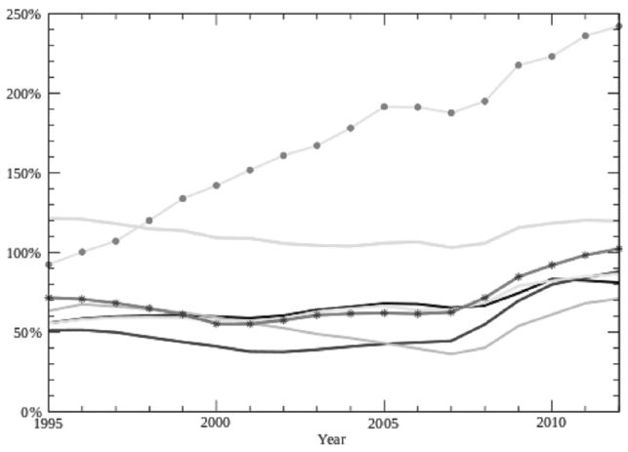

欧美、日1995年以来债务增长

美国何尝不是呢？

欧洲何尝不是呢？

日本何尝不是呢？

中国，也何尝不是呢？

正如现在你到中国改革开放的窗口深圳，你可以看到这个城市很年轻，到处都是年轻的来自农村的打工者——但如果你追踪到这些打工者的家乡，就会发现，那些生活在村镇中的人们，绝对以中老年人居多！

是的，整个世界都和中国一样，那些大城市丰富多彩的生活像磁石一样，把整个社会的年轻人都给吸引过去，让他们把青春和灿烂都留在那里——而小城镇和乡村，则正在变得老态龙钟、破败不堪！

日本已经变老，中国正在变老！

为什么日本成了现在世界上的主权债务天王，一个很重要的原因，就是因为人口结构太老了，没有能力再像人口结构很年轻的时候那样创造财富了——他不得不靠借钱来生活。

由于中国执行着世界上最严厉的控制人口政策（独生子女政策），如果与其他国家相比，中国将来的人口年龄结构变迁将极为迅速和陡峭！

不仅仅是中国，在当今的整个世界范围内，生育率下降与预期寿命的延长是一个趋势，这也意味着，整个世界都在慢慢变老——人一旦老去，创造力和活力也都会一并衰老，整个经济也一并老去。

在老去的经济体里，大家更愿意墨守成规，真正的技术创新越来越少，企业的利润也会停滞不前，股票价格会大幅度下跌，经济和生活的节奏也会变得迟缓下来——为了讨好选民，许多政府可能不得不选择借债这一条路。

那么，到那个时候，政府的主权债务危机会愈演愈烈！

当前，在我们中国这个社会依然年轻的时候，是要尽量减少债务，而不是累积债务——如果现在就使劲儿累积债务，相信什么“花未来的钱”（根本上说，未来的钱还没有挣出来呢，你花个什么呢？），等到整个中国都变老了的时候，那政府还要怎么借债来偿还人口老龄化的成本呢？

如果中国仍然采取像1978年改革开放以来年均30%左右的速度增发人民币，依靠政府的投资来“拉动经济”（到底“拉动没拉动”还不好说），那么债务水平一定会更快、更迅速的累积到很高，高到难以为继，政府唯一的办法，就是和美联储、欧央行一样，再度打开印钞机，拧开货币增发的水龙头，人为的制造大规模的通货膨胀——正如中国2002年所谓的银行业改革一样！

我们天天喊着“可持续发展”，实际上，我们却恨不得把儿孙们、乃至儿孙的儿孙们的钱都拿到今天供自己花销和享用，于是“借债消费、提前消费、花未来的钱”成了时髦！

谢国忠说：“长期来看，经济高增长时代的高房价政策最有破坏性……一旦老龄化来袭，中国的楼市将经历比日本更为可怕的熊市，这一切很可能用不了15年就会成为现实。”

即使发生了很严重的通货膨胀，至少我敢肯定，中国盖了这么多房子，而人口总量的增长已经基本停滞——15年之后，楼市是不可能会有什么牛市的。

爱因斯坦说过，债务的复利是人类发明的第八大奇迹！

2008年以来的这场金融危机远没有结束，而债务问题的解决之日，同时也是当今货币体系脱胎换骨的重构之日，或许才是这一轮金融危机的真正结束之时！

【注释】\

<a href="#part0009.html_id_2" id="part0009.html_id2">[1]</a>Drachma，古希腊银币单位。

<a href="#part0009.html_id_3" id="part0009.html_id3">[2]</a>威尼斯以前是拜占庭帝国的附属国，687年建立共和国，10世纪末的时候获得完全的独立，选举出来的领导人被称为“总督（Doge）”。由于控制了当时东西方贸易的主要海上通道，威尼斯变成了一个富裕的商业国家。1298年～1382年，威尼斯共和国同热那亚共和国之间连续进行四次海战，击败这一贸易竞争对手，从而成为地中海和黑海地区的强国。威尼斯共和国直到拿破仑时代才被奥地利吞并，存在时间长达1110年，是迄今为止世界上存在时间最久的共和国。

<a href="#part0009.html_id_4" id="part0009.html_id4">[3]</a>本部分数据及以下国家债务数据均来源于国际货币基金组织2010年4月公布的世界各国公共债务情况。

<a href="#part0009.html_id_5" id="part0009.html_id5">[4]</a>指的是如果希腊不肯退出欧元区，德国可能主动选择离开欧元区。

<a href="#part0009.html_id_6" id="part0009.html_id6">[5]</a>数据来源于2011年4月29日IMF关于公共债务（Public
Debt）的报告。

<a href="#part0009.html_id_7" id="part0009.html_id7">[6]</a>数据来源同上，其中D是德国，UK是英国，E为西班牙，I为意大利，USA为美国，J为日本。

第十章　神话到神器

</a>

自金融交易市场诞生以来，就一直是一个缔造神话的地方，这里几乎每天都在上演一夜暴富的传奇，也上演着亿万富翁瞬间变为穷光蛋的残酷现实。

当商品市场、证券市场发展至今，股票致富已经算不上什么新闻了，“金融衍生品”才是真正的神器。有了这种神器，既可以让约翰·保尔森这位籍籍无名的对冲基金经理在2008年全球金融市场哀鸿遍野的时候获取高达38亿美元的利润，从而成为当年全球挣钱最多的人；也能让希腊、意大利等国家的国债发行成本一下子飙升好几倍，更能让一个国家原本正常运作的金融体系一下子陷入瘫痪。

“神话”起源

</a>

交易所的诞生并没有确定的年份，可能就像中国的乡民们约定某个日子赶集一样，早在几百年以前欧洲的商人们就会定期聚集到一起商讨和买卖商品。慢慢地商人们意识到，如果能够有一个专门提供某种商品或证券交易的场所该多好，于是交易所便出现了。

交易所分为证券交易所和商品交易所两类，我们一般所说的“股市”是指证券交易所；商品交易所交易的则主要是大宗商品，所买卖的商品可以是现货，也可以是期货，如果以买卖期货为主，也可以称之为商品期货交易所。

实际上，欧洲在中世纪后期就出现了证券交易所的雏形。13﹑14世纪，在意大利的佛罗伦萨已经有了类似于固定交易所的记载，在佛兰德尔（Vlaanderen）的城市布鲁日（Bruges），布尔斯（Burse）一家就专门为商人们提供旅馆，让他们在那里与来自不同国家的同行结识，签订买卖合同，并互相交换价格信息、相关的大宗交易以及破产传闻，甚至这家旅馆还专门提供了一个供商人们放置随身商品的仓库，而这个仓库附近就是意大利佛罗伦萨和热那亚的代表处。慢慢的，人们干脆就以店主的名字来命名这座建筑物，这就是荷兰语中的“交易所（Burse）”名称的缘由。

在15～16世纪，西班牙王室驱逐犹太人，法国王室驱逐胡格诺派教徒（Huguenots）<a href="#part0010.html_id2" id="part0010.html_id_2">[1]</a>，无奈之下，这些异教徒纷纷逃往荷兰的港口城市安特卫普（Antwerp）。实际上，被西班牙王室和法国王室驱逐的这些人主要是银行家、商人和技术工人，既有技术又有金钱，他们在安特卫普越聚越多，慢慢地将安特卫普建设成为欧洲的商贸与金融中心。

安特卫普沿用了布鲁日的“交易所”这一名称，并逐渐取代了布鲁日而成为欧洲商品和证券交易的中心。到了1531年，安特卫普就建立起世界上第一个真正意义的商品交易所（commodity
exchange），交易所大厅前刻有碑文：“为商人服务，不管他们来自哪个民族，使用何种语言。”

在商品交易所出现之后，很快就出现了专业的商品贸易经纪人<a href="#part0010.html_id3" id="part0010.html_id_3">[2]</a>，他们代理商品的买进卖出业务，抽取佣金，带活了整个商品交易市场。比较好笑的是，由于当时信息传递和交通都极不发达，对于商品价格的起起落落，人们不知道商品价格波动的根本原因，于是另外一个行业也发展起来了——占星术，安特卫普的商人与银行家们经常雇用算命大师来预测商品市场的变化。

1581年7月，以荷兰省为核心的北方各省宣告成立联省共和国，这就是尼德兰共和国，也就是现在的荷兰。当时的西班牙国王当然不可能容忍这颗“西班牙王冠上的珍珠”独立，于是派遣军队镇压，而刚刚独立的荷兰十分弱小，西班牙远征军的铁蹄很快便蹂躏了大半个尼德兰。占星术终究还是没有预测出来安特卫普衰落的命运，1585年西班牙军队攻陷安特卫普，十多万安特卫普的金融家、商人和技术工人逃到阿姆斯特丹，北部海港城市阿姆斯特丹开始取代安特卫普成为荷兰乃至于整个欧洲的金融中心。

不过，在强大的金融商业的基础上，弱小的荷兰反而愈战愈勇，由英格兰人、法国人和苏格兰人组成的荷兰雇佣军<a href="#part0010.html_id4" id="part0010.html_id_4">[3]</a>顽强地抗击西班牙的入侵，相比之下，封建军事强国西班牙却因为战争支出浩大而导致财政破产。到了1609年，无力再战的西班牙只好与荷兰讲和，签署了12年的停战协议，事实上等于承认了荷兰独立。

在荷兰依然面临西班牙军事压力的时候，荷兰人也不忘金融创新——1602年，荷兰人成立了荷兰东印度公司（荷兰语：Vereenigde
Oost-IndischeCompagnie，简称VOC），这是世界上最早的股份制公司之一。为了方便东印度公司的股东们交易公司股票，荷兰人建立了阿姆斯特丹证券交易所<a href="#part0010.html_id5" id="part0010.html_id_5">[4]</a>（Amsterdam
Stock Exchange，AEX）——这是世界上最早的证券交易所（securities
exchange）。

到了1773年，伦敦的股票商人们在乔纳森咖啡馆成立了英国第一家证券交易所，这就是现在伦敦证券交易所的前身；1792年，北美的24个证券经纪人在纽约华尔街的一棵梧桐树下签署“梧桐树协议”，这被看做是现在大名鼎鼎的美国纽约证券交易所诞生的标志。

西方的这些证券交易所最初成立之时，大都以交易各类政府债券为主，后来才逐渐过渡到以交易矿山、运河、贸易、铁路等股票上来。自20世纪70年代以后，随着金融自由化和金融创新的不断发展，许多原有的证券交易所与其他商品交易所或期货交易所合并，所以不仅仅交易公司股票、政府债券和公司债券，包括期货、期权、保险以及各类金融衍生品等几乎所有的金融产品都可以在证券交易所进行交易。

要知道，证券（securities）是个很广义的词汇，理论上说凡是具有一定的金额，证明持券人或证券指定的特定主体拥有所有权或债权的凭证，包括公司股票、公司债券、期货、政府债券、商业本票、承兑汇票、银行定期存单乃至钞票本身，都属于证券。

所以，那些金融产品都在证券交易所里交易自然就变成了顺理成章的事儿。

截至目前，全球五大洲主要国家大都建立起了自己的证券交易所。

在欧洲，除由阿姆斯特丹证券交易所、巴黎证券交易所、布鲁塞尔交易所及纽约证券交易所演化而来的纽约-欧洲交易所之外，还有伦敦证券交易所、德意志交易所集团<a href="#part0010.html_id6" id="part0010.html_id_6">[5]</a>、瑞士证券交易所、西班牙马德里交易所、意大利证券交易所、奥斯陆证券交易所等。

在北美，除历史悠久且已与欧洲交易所合并的纽约证券交易所之外，还有纳斯达克证券交易所、美国证券交易所、多伦多证券交易所、墨西哥证券交易所等。

在亚太地区，主要的证券交易所有东京证券交易所、香港交易所、新加坡交易所、印度国家证券交易所、孟买证券交易所、澳大利亚证券交易所、韩国证券交易所、台湾证券交易所、马来西亚证券交易所、以色列特拉维夫证券交易所、泰国证券交易所以及中国大陆的上海证券交易所、深圳证券交易所等。

在南美，有巴西交易所和智利圣地亚哥证券交易所。

在非洲，则有约翰内斯堡证券交易所。

股票、股份公司与证券交易所

</a>

说到西方的股份制公司，有必要特别说一下股票的由来。

现代证券的“股份制”起源于合伙制。早在罗马时代，在开展有风险的海上贸易之时，人们就知道通过签订契约将几十份自有资产组合到一起形成一个合伙企业来降低风险，这种企业被叫做“publicani”，而每一份出资凭证则被叫做“socii”。

15世纪末，意大利的航海家哥伦布发现了南美洲新大陆，随后葡萄牙的航海家麦哲伦又完成了第一次环球航行，东西方贸易的航线被发现，“地理大发现时代”到来了。一时间，海外贸易和殖民地掠夺成为欧洲最诱人的“买卖”。

然而，在当时的技术条件和国际环境下，看起来的“大馅饼”，也很有可能是个大陷阱。

要知道，当时欧洲国家的贸易船只远远比不上我们中国明朝郑和的官船威风，这些船容易受到风暴海浪的威胁，瘟疫会削减船员数量，海盗们会偷窃运载的货物，而遥远海岸上的居民还会袭击、残害船员，更有淡水补给、食物供应等其他不可预计的事情也都可能使得航海计划失败，寻找到遥远的东方国家并与之贸易成功的几率堪比购买中国福利彩票中500万元大奖。

更糟糕的是，当时掌握了东西方航海线路的葡萄牙人和西班牙人，都将自己的航线作为“国家机密”而对其他国家的人进行封锁。如果有哪个国家胆敢从他们碗里抢一杯羹，他们就会劫掠这个国家的商船，让其在半途中消失或者有去无回。毕竟，大海就是最好的坟场。要知道，劫掠式的海盗行为在大航海时代的西方国家普遍是被鼓励的行为，葡萄牙人就通过这种方式垄断了东西方之间的香料贸易并阻止其他国家参与，而大英帝国的海外殖民活动刚刚起家的时候，还把从美洲归来装满了黄金白银的西班牙商船作为主要的劫掠目标。

可见，听起来很诱人的贸易，也很有可能是铤而走险的亡命之旅。

既然组织远航贸易要冒很大风险，为了筹集资本和分摊风险，就出现了股份集资的方法，每次出航之前招募股金，航行结束后将资本退还出资人，并将利润按股金的比例进行分配。鉴于某些生意经营的长期性，英国人在16世纪中后期出现了永久性的股份制公司，股份不再退还给出资人而是将除了分红之外的资金（包括本金和利润）留作公司发展资本。

最早的、最著名的股份制公司当属成立于1602年的英国东印度公司（English East
India Company），公司被当时的英国女王伊丽莎白一世（Elizabeth
I）赋予了15年的东印度贸易的皇家特许垄断权，并获得了行政管理权和军事功能。随着时间的变迁，东印度公司不仅变成了商业贸易帝国，也成了印度的实际主宰者，直到1858年公司被英国政府解散。

也正是这家公司，从18世纪末开始向中国贩卖鸦片并最终引发中英之间的鸦片战争。

荷兰东印度公司的成立则颇具传奇性。

1592年，一位叫做科恩奈里斯·浩特曼（Cornelis de
Houtman）的年轻人被阿姆斯特丹商人派到了葡萄牙里斯本（Lisbon）工作，而他的真实任务却是一名商业间谍，目的是刺探当时被列入机密的葡萄牙到东方香料群岛的航线资料。获取情报之后，浩特曼回到荷兰，与资助他的这群商人合伙成立一家公司，利用刺探来的资讯往东印度地区发展<a href="#part0010.html_id7" id="part0010.html_id_7">[6]</a>。在此基础上，从1595年至1602年，荷兰陆续成立了14家以东印度贸易为重点的公司。

在1602年，为了“做大做强”，同时也避免过度商业竞争，这14家以东印度贸易为目标的公司合并成为一家联合公司，也就是荷兰联合东印度公司。像英国东印度公司一样，荷兰当时的国家议会授权荷兰东印度公司在东起非洲南端好望角西至南美洲南端麦哲伦海峡之间具有贸易垄断权。

由于东印度公司本身并没有足够资金，荷兰商人一开始就将公司的股份面向所有人公开出售，人们购买这些股份，而公司则承诺将来对这些股份进行分红，荷兰国会也将一些只有国家才能拥有的权力（如雇佣士兵、发行货币等）折合25000荷兰盾入股东印度公司，这大大加强了公司的信誉。

鉴于荷兰东印度公司是全世界第一个可以自组佣兵、发行货币、与其他国家订立正式条约的股份有限公司，并被获准拥有对殖民地实行殖民统治权力，荷兰人大量踊跃地购买东印度公司的股票，甚至连市长家的女仆也都成为了东印度公司的股东。由于不可能所有人都买到股票，在几天后股票甚至被加价15%出售，而为了方便东印度公司的股东们交易公司的股票，荷兰在1602年创办了世界上第一个证券交易所——阿姆斯特丹证券交易所。

世界上第一个证券交易所和第一只股票就这样开始了他们的历史使命。

随后不久的1609年，荷兰的阿姆斯特丹银行诞生。

可以说，荷兰人是现代商品经济制度的创造者，他们将银行、证券交易所、信用以及有限责任公司有机地统一成一个相互贯通的金融和商业体系，由此带来了爆炸式的财富增长。

尽管东印度公司的股票在最初的10年间都没有一分钱的分红，但由于存在着自由交易的股票市场，东印度公司经营并没有出现大的问题。

荷兰东印度公司果然没有让股东们失望，它成功在印度尼西亚实现殖民统治，甚至还赶走了斯里兰卡的葡萄牙人，贸易的触角延伸到亚洲绝大多数国家，成功地建立起了亚洲国家贸易体系。到1669年，荷兰东印度公司已经成为世界上有史以来最富有的公司，拥有150条商船、40条战舰、50000名员工和10000人的私人武装，公司投资的收益率为40%！

股票投资者当然也大发其财，到了1612年，东印度公司的股票红利就达到了57.5%，而在公司成立之后的80年间，东印度公司的股票分红居然达到了原有资本的1482%——在货币没有贬值的金属货币时代，这简直是一项极其了不起的成就！

更大的成就体现在荷兰的阿姆斯特丹证券交易所身上。

股票的公开发售和自由交易市场的形成极大地刺激了荷兰的金融创新，大大加快了整个欧洲的货币流通速度。阿姆斯特丹的交易所就像现在的华尔街，欧洲各地的资金都潮水般地涌入这里，以至于城市里有名气的贸易和银行家族相互之间的贷款利率低到了那个时代难以想象的2.5%。另一方面，几乎整个欧洲都向阿姆斯特丹借债，这些借债人当中包括了瑞典国王、丹麦国王、俄国沙皇、神圣罗马帝国皇帝、萨克森选侯、汉堡市政府，甚至包括北美独立战争中的美国起义军，没有城市里富裕商人们的资金援助，没有荷兰的阿姆斯特丹证券交易所，任何一方的战争就不会取得胜利。

随着阿姆斯特丹证券交易所交易的发展，除了东印度公司和其他公司的股票之外，交易品种中逐渐加入了荷兰公共债券、英国国债等政府债券品种。到了17世纪中叶，阿姆斯特丹证券交易所大厅的四十多根柱子周围，就开始经常聚集着一些证券经纪人。他们都有固定的席位，分成多空双方进行交易战，通过股价或者债券价格涨跌挣钱，有超过1000名股票经纪人以此为生，而前来从事股票和债券交易的不仅仅有荷兰人，更有来自全欧洲的外国人，大量的股息收入和税金收入流入荷兰国库和普通人的腰包。据统计，仅英国国债交易一项，荷兰每年就可以获得2500万荷兰盾的收入，这在当时对其他国家来说是天文数字！

作为著名的国际金融中心，当时荷兰成了全欧洲最富裕的国家。

在阿姆斯特丹证券交易所，除了最基础的政府债券和股票买卖之外，人们可以对某只股票和债券赌涨赌跌，投机者可以空手买进，也可以空手卖出，收盘时结算盈亏，交割差额。人们可以随时将自己持有的股票变成现金，或者，将现金变为股票，流动性、公开性和投机性等现代金融市场的关键要素，在阿姆斯特丹证券交易所一样不缺。

从这个意义上说，阿姆斯特丹证券交易所的成立标志着现代金融市场开始形成。

显然，脱离了君主专制统治的荷兰人很早就认识到股票市场的几个作用——募集生产资金、优化资源配置、吸引公众参与管理、促进企业改革、集中风险分散化……

不过，证券市场一经建立，在成功实现金融资本合理配置的同时，投机行为也随之而来，1688年东印度公司的股票投机就颇能说明当时阿姆斯特丹证券交易所的投机氛围。

最初，从好望角传来消息说，荷兰东印度公司在其印度的领地获得巨大丰收，现在船队正满载着丰富的货物赶回荷兰，股票立即开始上涨；没过多久，交易所里的人以及在附近咖啡屋里进行交易活动的大投机商们忽然又慌张不安起来，因为据说整个船队在沙滩搁浅，所有财富都全部损失，传言导致了股票行情下跌；这个时候又传来消息说，船队已经脱离了危险并且船员增加了，行情重回升途。

实际的情况是，船队一直在正常航行，并安然无恙地返回到荷兰港口，此时交易所里的人们沉浸在一片乐观之中，但是他们马上又失望了。因为检验货物之后，他们确定这一批商品最多只能卖到34桶黄金，而他们最初估计这一船货物能卖50多桶黄金呢。显然，这一消息对期盼行情下跌的人有利，为了使股东陷入恐慌，他们又不遗余力地散布消息，说荷兰与法兰西国王路易十四的战争已经迫在眉睫了，荷兰马上就会遭遇税收增加、市场崩溃等灾难性后果——结果就是，几天之内证券行情持续下滑，东印度公司的股票几乎无法卖出去。“到后来，人们简直是在用股票来乞求施舍，好像人们是在向买主要求救济。交易所里出现了一片恐慌，一种不可阐释的动荡，好像世界要灭亡，地球要坠落，天空要塌陷一样。”<a href="#part0010.html_id8" id="part0010.html_id_8">[7]</a>

“未来”就是期货

</a>

“future”这个词儿想必学过英文的人都知道，就是“未来”的意思。不过在金融市场上这个词儿却是除了股票之外最为著名的一个品种，我们汉语翻译为“期货”。

期货的意思就是“交易双方共同约定在未来某一时候以某种价格交收实货的合约”。

可以想象的是，期货交易来自于现金现货交易，当交易双方承诺进行远期交易之时，期货就产生了。随着交易范围的扩大，口头承诺逐渐被买卖契约代替，而随着对商品交割时间、交割方式、交割内容等方面的契约要求日益复杂化，又需要有中间人来担保，以便监督买卖双方能够按期交货和付款——商品期货交易所便出现了。

早期的期货合约与农产品价格波动有关——比方说，每年的收成季节，因为各种原因，粮食价格可能压低或者抬高，而农民们在播种的时候对这种价格毫无把握能力，他们根本没有稳定的收入预期；另一方面，商人们对于收购粮食价格也有着同样的不确定性，他们同样面临价格风险。双方都有需求，有些约定便一拍即合，农场主与商人约定在粮食收获后以某种价格交割，这样的合约慢慢就变成了期货。

根据记载，英国伦敦的皇家交易所（The Royal
Exchange）是世界上第一个处理远期合同的交易所。而早在1620年江户时代的日本大阪，就有被称为“定屋米市”的场所，在这里可以开展远期合约的稻米交易，世界上第一个现代商品期货交易所也正是起源于1710年的日本幕府时代的大阪稻米交易所。

随着美国农业在世界上的崛起和美国交通运输业的发展，谷物交易开始不断集中并向远期交易的方式发展。作为美国最大谷物集散地的芝加哥，1848年由82位商人发起组织了芝加哥期货交易所（Chicago
Board Of
Trade，简称CBOT）。尽管其成立之后相当长一段时间内，并没有发展期货合约交易，而只是一个集中进行现货交易的场所。

到了1865年，芝加哥谷物交易所推出了一种被称为“期货合约”的标准化协议，合约标准化包括合约中品质、数量、交货时间、交货地点以及付款条件等的标准化，从而取代原先沿用的远期合同，这为期货合约交易创造了条件。

使用这种标准化合约，允许合约转手买卖，并逐步完善了保证金制度，这样一来，专门买卖标准化合约的期货市场正式形成了。不过，直到19世纪末现代结算系统的建立，真正意义上的期货交易才渐趋完善，整个健全的期货市场结构终于建立起来。

简单来说，期货，就是用一定的保证金（CBOT最初的保证金比例被确定合约总价值的为10%）来签署一个标准的远期合约，到行权日进行交割，早期必须按照产品的现货结算，后来则可以按照现金结算，也可以选择现货结算。

期货交易所早期，交易的产品主要是大宗农产品，如稻米、玉米、小麦、燕麦和大豆，后来又加入棉花、洋葱甚至鸡蛋、黄油、牛肉以及黄金、白银、铜、铝等贵重金属。

既然商品可以采用保证金的方式来签订购买合约，为什么股票不能呢？

当然也能。

于是，股票期权（Stock Options）便产生了。

尽管现代的股票期权制度最初产生于20世纪50年代的美国，其目的是为了激励公司管理人员，同时避免高额的个人所得税，但最终它却发展为现代金融市场一个重要的期货交易品种，这就是曾经在中国证券市场风靡一时的权证——香港称之为“涡轮（Warrant）”。

股票期权多由上市公司本身发行，但在某些金融市场也可能由投资银行发行，如香港的很多“涡轮”都是这种情况。

1971年布雷顿森林体系的垮台导致全球出现了巨量的美元，为了吸收在商品市场和金融市场上“过剩”的美元，各金融机构相继开发金融期货，金融创新层出不穷。

1972年，美国芝加哥商业交易所(Chicago Mercantile
Exchange，简称CME)，开始了第一笔金融期货交易——关于外汇的期货合约交易，交易所甚至开辟了国际货币市场分部（IMM），进行英镑、加拿大元、德国马克、意大利里拉、日元、瑞士法郎和墨西哥比索等币种同美元的汇率期货合约的交易。

CBOT的第一种金融期货合约于1975年推出，该合约为基于政府全国抵押协会抵押担保证券的期货合约。随着第一种金融期货合约的推出，期货交易逐渐被引进多种不同的金融工具，其中包括美国国库中长期债券、股价指数和利率互换等；到了1984年，CBOT又成功地将期权交易方式应用于政府长期国库券期货合约买卖，从此产生了期货期权。

全球其他期货交易所也不甘落伍，先后不断推出抵押证券期货、国库券期货、股票指数期货等金融期货合约的交易。

商品期货交易经历一二百年发展才到今天的规模，而金融期货交易只不过短短的十几年便一举成型。1986年，包括外汇期货、利率期货和股票指数期货三种期货在内的金融期货就已经占到全球期货总交易的70%，而到了21世纪，这一比例更进一步提高到80%以上。

期货，尤其是各类金融期货，实在是人类想象力无限的一个明证。

客观地说，期货市场不能创造出任何价值，本质上这是一个零和游戏，自从正式的期货市场在美国建立以来，有关期货市场投机的道德讨论就从未停歇过。

早在芝加哥期货市场建立之初，人们就普遍认为，应当得到酬劳的是用其汗水和辛劳把小麦带到市场上的农场主，而不是那个在交易所里叫喊着买进和卖出小麦指令的人。

相反，期货交易商们声称，如果没有期货交易，留给农场主们的就是卖不出去的谷物，而价格在收获季节突然变化还可能引发经济崩溃，所以他们的交易发挥了有效的经济效能。

对农场主们来说，他们最初愿意建立远期合同，是希望能够实现对农产品价格的控制，然而当期货市场建立之后，他们却发现农产品价格的波动更加剧烈了，一小撮从未从事过农业生产的期货交易商们却通过简单的卖空和卖空而操纵着谷物价格。

农场主们认为，受过投机和剥削训练的城市期货交易商们一直在利用农场主的孤立和经济上的无知去获取好处，正是期货交易榨干了高尚的耕作劳动的生命力，因此他们强烈要求关闭期货市场。

也许，人类天性中最热衷的恰恰就是丝毫不创造新的社会财富的那些“零和游戏”——比如赌博，明明人们知道输赢只不过是大家口袋里的钱币互换，人类却始终极其热衷，从未摆脱。就期货市场来说，如果没有了投机者，期货交易所立即就会变成毫无生机的一个地方，而正是人们那种对金钱投机的渴望，支撑着期货市场不断发展。

同样是金融产品，但如果将股票与期货对比，就能发现许多根本性的区别。

股票是出资人拥有一个公司一部分产权的凭证，代表着真实的财富拥有权，而且公司从股票市场上募集到的资金也是为了投入到公司实际的生产中，是有利于真实经济增长的；可期货就不同了，除了用于“对冲风险”之外，它不会创造任何价值，而金融市场发展至今天，“对冲风险”的那点好处要是与期货市场投机所造成的经济不稳定性相比，恐怕连提都不值得一提。无论期货合约是买进还是卖出，本质上只不过是从别人的腰包里把钱拿走而已。

目前，在全世界商品交易所中的期货，既有传统的大宗农产品的期货，如稻米、玉米、小麦、燕麦、棉花、小麦、油菜籽、燕麦、黄豆、玉米、糖、咖啡、可可、猪、猪肚、活牛、木材等等期货；又有金属期货，如黄金、白银、铂、铜、铝、铅、锌、镍等，有方兴未艾的能源期货，如原油、汽油、柴油、燃油、天然气等；更有20世纪70年代以后迅速崛起的金融期货，如外汇期货、利率期货、股票期货等。

长期以来，在美国市场交易的期货中，CBOT以农产品期货和国债期货见长；同城的CME则以畜产品、短期利率欧洲美元产品以及股指期货而出名；成立于1973年的芝加哥期权交易所（CBOE），以交易指数期权和个股期权最为成功；地处纽约曼哈顿金融中心的纽约商业交易所（NYMEX）则是全球能源、铂金及钯金交易的翘楚；位于纽约的纽约商品交易所（COMEX）则是黄金、白银、铜、铝及其他金属期货的权威；纽约期货交易所（NYBOT）则的交易品种则主要是棉花、咖啡、糖和可可。

近年来，交易所合并步伐加快，1994年NYMEX和COMEX合并组成纽约商业交易所；
NYBOT
也是1998年由棉花交易所和咖啡、糖和可可交易所合并而成；2006年，CBOT和CME合并组成芝加哥交易所集团；到了2008年3月17日，芝加哥交易所集团又对纽约商业交易所进行收购，芝加哥交易所集团从此在北美期货行业一家独大。

在欧洲市场，期货市场主要包括欧洲期货交易所（EUREX，主要交易德国国债和欧元区股指期货等）和泛欧交易所<a href="#part0010.html_id9" id="part0010.html_id_9">[8]</a>（Euronext：主要交易欧元区短期利率期货和股指期货等）；另外还有两家伦敦的商品交易所——伦敦金属交易所（LME：主要交易基础金属）、国际石油交易所（IPE，主要交易布伦特原油等能源产品）。

作为期货交易所的发源地之一，亚太范围内日本的期货市场较为发达，包括东京工业品交易所（主要交易品种是能源和贵金属期货）、东京谷物交易所（主要是农产品期货）等为主的商品交易所，以及以东京证券交易所（主要交易国债期货和股指期货）、大阪证券交易所（主要交易日经225指数期货）和东京金融交易所（主要交易短期利率期货）为主的金融期货交易所；另外韩国期货市场、新加坡期货市场、澳大利亚期货市场在交易金融期货方面也比较发达；香港地区的期货市场背靠中国大陆，近年来期货交易发展很快，主要是以香港交易所集团下的恒生指数期货、H股指数期货以及各种涡轮为主。

中国内地目前有上海期货交易所（主要交易金属、能源、橡胶等工业品期货）、大连商品交易所（交易大豆、玉米等农产品期货）、郑州商品交易所（交易小麦、棉花、白糖等农产品期货）、上海黄金交易所（主要交易黄金、白银、铂金）等，而中国金融期货交易所也已经上市沪深300股指期货。

衍生的世界

</a>

2008年金融危机的爆发，让大家都了解了“金融衍生品（derivatives）”这个词儿，可究竟什么叫做“金融衍生品”呢？

简单来说，金融衍生品就是由原生资产（Underlying
Assets）派生出来的一些合约，就像豆浆是大豆的衍生品一样。

其实，期货就是最典型的金融衍生品之一，它将远期交割的产品（无论商品、股票、外汇、利率还是债券）的交易价格、交易时间、资产特征、交易方式等都事先标准化，然后在交易所上市交易。

当然，金融衍生品绝不仅仅是期货一种，而是五花八门。至于合约，可以是标准化的期货合约，也可以是非标准化的其他合约，可以在交易所进行交易，也可以场外交易（over-the-counter，OTC），更有那些纯粹买卖数字的金融衍生品，例如纸豆浆……

你没有听说过“纸豆浆”？这里有必要给你好好解释一下。

比方说，现在豆浆100分（即1元）一杯，记为100点，世界上的那些投资银行、商业银行，就开始大卖而特卖了，怎么卖呢？就卖给你100这个数字，1个点卖100元，那么如果你要买1杯纸豆浆的话，就需要出1万元来买（当然，很公平，谁都可以买）；如果你买10杯，就是10万元，如果1万杯，那就是1亿元，你想买多少有多少，反正银行只不过卖一个数字给你。

当然，你要拿真金白银的钞票来买！

直觉上你肯定会说，谁会有那么傻？会去买这种玩意？

信不信由你——很多人在买，很有可能你自己就在买！

为什么能卖出去，是因为它有可能赚钱！

如果你认为将来豆浆会涨价到150分一杯，那么你当初花1万元买的这杯豆浆衍生品，直接卖给银行就可以卖1.5万元（当然，银行要收取一定的手续费，这就是我们通常所说的“佣金”）；如果将来豆浆跌价到50分1杯，那么你卖给银行，就只能换回来5000元了，当然，银行手续费是照收不误的。

要强调一下，不管你如何买卖，银行绝对不会给你支付任何1杯真的豆浆的，因为人家事先在你购买的时候就已经说明是“纸豆浆”，已经明明白白告诉你是假的豆浆——更何况，1万元1杯豆浆，你愿意去买吗？

不必发笑，这是千真万确的事情。

实际上，现在全世界都大卖而特卖的“纸黄金”，就完全和我所讲的“纸豆浆”一模一样，仅仅需要把“豆浆”二字换成“黄金”即可，股指期货也是同样的道理。

不信，如果购买你了纸黄金或纸白银，你让银行给你支付实际的黄金白银试试看？

另外你想想，股指期货是个什么玩意儿？不就一个数字么？为什么每个点能卖你300元，一笔下来要你近10万元，你还哭着喊着觉得人家如果不卖给你是看不起你呢（中国的沪深300股指期货对入市资金规模有限制）。

有人问了，股票是不是金融衍生品？看起来它也是在卖数字（价格）。

需要澄清的是，股票不是金融衍生品，因为股票是拥有一个公司一部分真实资产的凭证，所以他是实体经济的衍生物，是“金融品”而不是“金融衍生品”。不过，再由股票衍生出来的玩意，例如股指期货、股票期权（权证），因为他们都是由股票这个“金融品”衍生出来的，所以就变成了金融衍生品。

除了纸黄金、纸白银之类直接从商品价格数字上衍生出来的衍生品之外，其余的金融衍生品基本上都是保证金交易，即只要支付一定比例的保证金就可进行全额交易，不需实际上的全部本金转移，合约了结一般也采用现金差价结算的方式进行，只有在满期日以实物交割方式履行的合约才需要买方交足贷款。

因此，金融衍生产品交易具有杠杆效应，保证金越低，杠杆效应越大。

根据原生资产分类，金融衍生品可以分为股票类衍生品、利率类衍生品、汇率类衍生品和商品类衍生品四大类。

各种商品期货都是商品类金融衍生品，还有前面讲到的纸黄金、纸白银之类的就是买卖某种商品数字儿玩的东西，都是商品类金融衍生品；股票类金融衍生品包括了具体的某个上市公司的股票期货、股票期权以及纯粹买卖数字儿玩的股票指数期货和股票指数期权；诸如货币远期、货币期权、货币掉期合约等涉及货币之间汇率的金融衍生品都属于汇率类金融衍生品，所谓的“炒外汇”其实就是炒汇率期货。

利率类金融衍生品比较复杂，除直接涉及利率本身的利率期货、利率远期、利率期权、利率掉期合约等金融衍生品之外，还涉及各类长期利率的债券，比方说美国国债、地方债、公司债以及引发2008年金融危机的房屋债券等。

更为关键的是，在利率类金融衍生品中所涉及的债券基础上，又发展出来另外一类金融衍生品——信用衍生品，而这正是2007年迄今一直搅动金融市场神经、并且一次次成为次贷危机、银行业金融危机以及主权债务危机核心因素的信用违约掉期（Credit
Default Swap，CDS），也被称为“贷款违约保险”。

值得说道说道的，就是由2007年次级房屋贷款所衍生出来的那些金融衍生品。

美帝国主义就是反动，2001年以后居然让自己国家的穷人也买得起房子住，为了帮助穷人买房，美联储猛降利率，银行也趁机大量发放贷款。

发放贷款之后，一大堆穷光蛋们的欠条窝在银行的手里，看着多窝心啊！所以有聪明人就想到了华尔街的那句名言：“如果要增加现金，就把它做成证券；如果想经营风险，也把它做成证券。”

对啊，证券化啊！

按揭抵押债券（MBS，Mortgage Backed
Securities）一词由此而来，其大致意思就是将条件接近房屋按揭债务，集成在一起打包，然后制成标准的凭证，再将这些由按揭债务作为抵押的凭证卖给投资人，债务的利息收入与债务风险也同时“传递”。

简单解释，就相当于把一大堆性质类似的“欠条”，打包作为资产卖给别人。

别人也不傻啊，怎么才能卖出去呢？

这就用到我们娱乐圈的话了——包装、包装、还是包装！

房利美公司（Fannie Mae）和房地美公司（Freddie
Mac）以及华尔街五大投资银行，都是干这种“包装”业务的顶级高手。根据过去几年房价猛涨的势头，他们首先将那些房屋MBS按照可能出现还款拖欠的几率分类，其中违约可能性较小的自然被叫做“特优级放贷”；违约风险中等的叫做“优质级放贷”，违约风险最高的，就叫做“次优级放贷”。

真是“坑爹”的时代啊，连褒义词都大贬值了！

你看见“优质”或者“次优”两字你就真以为是优质或者次优了，实际上这是最烂的贷款包，典型的资产毒垃圾——美国的“次贷”全称是“次优级房屋贷款”。

将MBS划分等级之后，投资银行这时候找到评级公司（如穆迪、标普等），按照过去几年房地产价格连续上涨所形成的数字，用一堆公式演算一番——天啊，这些“特优债券”都是收益大、风险低的良好投资产品，这还用说，大笔一挥，投资评级“AAA”。

市场嘛，一看，专家都说话了耶！那还想什么，赶紧踊跃响应评级公司的号召，购买、购买、再购买，这些购买者当中包括了国外主权投资基金、美国各州的保险基金、政府基金、养老基金、教育基金等。

出售MBS的房利美、房地美和银行把握在手里的欠条换成了大笔现金，笑得合不拢嘴，投资者买到了心仪的投资品，自以为大赚而特赚，也是心里偷着乐，看似皆大欢喜。

别忙，还有“优质级放贷”和“次优级放贷”呢，标普和穆迪都不好意思太昧良心乱给评级，可对投资银行和“两房”来说，总不能把这些“资产”砸在自己手里吧？

怎么办？买保险呗！

投资银行或者房利美、房地美，主动为这些“欠条”将来的违约买一份保险，这就是贷款违约保险——CDS，将违约风险转嫁给卖保险的那家伙身上，果然是天衣无缝、滴水不漏！

最不可思议的是，房利美、房地美以及这些投资银行，他们自己也大量吃进MBS和CDS。

你该奇怪了，这些投资银行不是一边自己在处理这些资产吗？为什么自己又参与进来？

中国有句老话叫做“骗人骗多了，连自己都信”——从2001年以来，美国房屋价格蹭蹭蹭一路上涨，房屋市场一片火爆，眼看着那些MBS和CDS都成了聚宝盆，干这行当的那些投资银行、保险公司把钱赚得盆满钵满，谁不眼红啊？

那些投资银行的领导们，作为职业经理人，和中国的官员们一样，都是一届一届的，这一届只要为公司挣了大钱，奖金、分红都是几千万、上亿美元的，CEO们发了大财，哪管下一届的时候公司会出什么问题！

于是，从2003年起，华尔街的各个投资银行、保险公司以及房利美、房地美之间，也开始互相买卖各种MBS和CDS，转了几圈下来，CDS的总额急剧上升。到了2007年“次贷危机”爆发前夕，为各种金融品提供担保的CDS总额和全球GDP总量相当。

或者，这大概就是传说中的“葵花宝典”——欲练神功，必先自宫！

到了2007年年初，美国的房价上涨无以为继的时候，MBS开始大幅度贬值，CDS开始清算了，这立即导致了一系列的问题——比方说2007年8月，贝尔斯登一家投资银行就面临高达13万亿美元CDS清算，能不破产吗？就在2008年9月8日当天，房利美和房地美就面临高达1.4万亿美元CDS清算，能不破产吗？

2008年～2009年的金融危机中的美国国际集团（American International
Group，AIG）为什么成了美国政府援助最多资金的公司（美国政府先后对其援助1800亿美元）？

因为它就是个保险公司，在没有倒闭的公司当中，它卖出有关“次贷”的CDS最多！

说到这里，你不妨猜猜看，现在全世界的金融衍生品的规模有多大？

说出来的数字吓死人——614.67万亿美元<a href="#part0010.html_id10" id="part0010.html_id_10">[9]</a>，而其中大约有相当大一部分是CDS！

对于陷入主权债务危机的国家来说，投资者购买CDS，就相当于为他们自己手中国债违约买一个保险，无论是针对这个国家国债的CDS价格急剧上升还是CDS总额急剧上升，都说明投资者不看好这个国家的偿债能力。这样一来，这个国家很有可能在金融市场上根本就借不到钱，或者像希腊那样承受畸高的利率。

中国股市——离成熟有多远？

</a>

中国有一个成语叫做“债台高筑”，这个词儿来自于春秋战国时期。

周朝最后一任天子周赧王向富人借债组织一支军队去伐秦，钱花完了，伐秦却没有成功，债权人拿着那些债券天天来找周天子追债，周赧王无奈之下，只好叫人修筑了一个很高的楼台，然后自己跑到台上去躲债——这就是成语“债台高筑”的由来。

到了明末清初之时，一些投资大、收益期限长且又具有较高风险的行业，如四川井盐业、云南矿冶业和山西金融业等已经较多地采用“招商集资、合股经营”的经营组织形式，这可谓是中国最早的“股份制公司”。

不过，真正具有现代意义的证券在中国出现，是1840年鸦片战争以后的事。

随着第一批外国洋行进入中国通商口岸，西方的有价证券及其交易在中国出现，外资在华设立的各类股份制公司企业，把西方国家已普遍采用的股份制公司的生产经营形式和集股筹资的方法带到了中国。

在大陆，1872年上海轮船招商局成立，随着其第一期股本的认定和筹集，中国第一家近代意义的股份制企业和中国人自己发行的第一张股票诞生。随后，保险业、矿业、纺织业和通讯电报业等方面普遍采用股份制方式建立公司，于是又有一批华商股票应运而生。

1894年清政府为筹措甲午军费，仿效西方国家政府债券的发行，向国内发行公债“息借商款”，此后又发行了“昭信股票”和“爱国公债”两种公债。甲午战争之后，在金融、机械制造、电力、采矿、棉纺和其他工业方面华商创立了众多的股份制公司，华商股票的发行量也随之大幅度地增加。

随着鸦片战争后殖民经济的初步繁荣，外商证券交易也日趋活跃，买卖证券的掮客于是在1891年组织成立了“上海证券掮客公会”，即“上海股份公所”。

1913年，上海一些兼营证券买卖的大商号成立了“上海股票商业公会”，北洋政府还于1914年颁布《证券交易所法》，旧中国的证券交易开始走上正轨。1920年2月，上海证券物品交易所在总商会开创立会，1920年7月上海股票商业公会经北洋政府的农商部批准改组为“上海华商证券交易所”，以上海为龙头的全国证券市场开始形成。

1949年5月上海解放，随后不久，上海证券交易所停业。

中华人民共和国成立前后，为了吸纳、疏导社会游资和支持股份制企业公司，政府一度成立了天津证券交易所和北京证券交易所，但到了1952年10月，两个交易所先后关闭。

改革开放以后，随着中国提出“有计划的商品经济”和“社会主义市场经济”的概念，证券市场再度成为中国推动社会资源配置改革的重要力量。

1984年11月，上海飞乐音响面向社会发行1万股股份，成为新中国第一支公开发行的股票，在海内外引起巨大反响；1986年9月，上海飞乐音响的股票在上海南京西路的静安证券业务部正式挂牌买卖；1988年4月，深圳发展银行的股份在特区证券公司柜台开始了最早的证券交易，随后深圳市国投证券部和中行证券部相继开业，万科、金田、安达、原野等公司的股票也陆续上柜交易，这五家公司的股票被称为“老五家”。

1990年11月底，由中国人民银行批准建立的上海证券交易所正式成立，12月19日，包括延中实业、真空电子、飞乐音响、爱使股份、申华实业、飞乐股份、豫园商场、浙江凤凰在内的8只股票开始上市交易，他们被资深股民们称为“老八股”——当天，上海证券综合指数基点设为100点，当天开盘96.05点，无量涨停。

1991年7月3日，深圳证券交易所也开始正式营业，同年10月31日，首家B股公司深南玻B也开始了公开招股。

在远离证券市场近40年后，中国再度开始与证券交易所“亲密接触”。

上海证券交易所重新成立这二十年来，中国的证券市场可谓是风云激荡、几经沉浮，在缔造无数财富神话的同时，也让许多人梦碎股市，锒铛入狱甚至丧失性命。

证券市场形成初期，股票点燃了人们的财富梦想，大量的投资者涌向深圳和上海交易所，争相入市抢购股票。一时间交易所内人山人海，一些持有原始股的股民一夜暴富，证券交易达到十分疯狂的地步。

1992年初，邓小平“南方讲话”鼓励开展股市试验，5月21日上证所取消股市交易价格限制（开始是1%，后来是0.5%），交易价格尝试由市场引导。当天，上证指数直接跳空高开在1260.32点，较前一天涨幅达104.27%，随后3天，所有股票价格都一飞冲天，5只新股的市价竟狂升2500%～3000%！

3天时间财富暴涨25倍、30倍，想想这种暴富模式的示范效应有多大？

也正是从这个时候起，人们开始将中国的股市比喻成“赌场”。

1992年10月，国务院决定成立国务院证券委和证券监督管理委员会——这两家机构于1998年合并为证监会。

1993年，中国股票发行试点在全国推广，全国各大省会城市相继出现证券公司营业部。

1992年底中国股市开始被爆炒，到1993年2月已上涨至1558点，3个月内暴涨303%，随后出现暴跌，这成为中国股市第一次快速的牛熊市转换。

由于庄家操纵股价明显，管理层采取一系列打压股市措施，被戏称为“12道金牌”，1996年12月中国股市开始实行10%的涨跌停制度，并开始新股网上认购。

上海交易所和深圳交易所在最初成立之后，国债交易一直占交易量的大头，1995年5月政府宣布国债期货暂停交易，股票从此占据了中国资本市场的绝对主导地位。

1999年7月，《中华人民共和国证券法》正式实施，标志着我国证券市场建设步入法制化和正规化阶段，同年9月，沪深两市上市股票突破1000支。

2000年开始，因为政府担心国内股市扩容压力，所以优质企业如中石油、中石化、中海油、江西铜业、中国铝业、中国人寿等纷纷到海外上市，相反，国内证券市场在“服务于国企改革”的指导思想下，成了部分国企圈钱的工具。

2005年4月30日，股权分置改革试点工作正式启动。

股权分置改革的成功推行，改善了上市公司的治理结构，提高了投资者信心，在乐观的经济前景和充裕流动性的支持下，2005年～2007年A股市场走出了气势磅礴的大牛市，2007年10月上证综指达到牛市顶峰6124点，2年多的时间里暴涨了5倍！

接下来的股市一路下跌到2008年10月底的1664点，跌幅达73%，一年时间完成了牛熊转换——不过想到前面上证指数曾经创造过一天大涨104%的历史，个别股票更是有过3天之内价格飙升3000%的传奇，你一定会看淡云卷云舒，宠辱不惊。

无论是国有企业还是民营企业，无论是大型企业还是小型企业，无论处于传统行业还是新兴行业，中国证券交易所成立之后，多层次、多元化的证券市场为众多上市公司圆了创造非凡财富的梦想。

根据世界证券交易所联合会（WFE）数据，截至2009年底，A股市场以24.27万亿人民币的总市值成为仅次于美国的全球第二大市值市场。

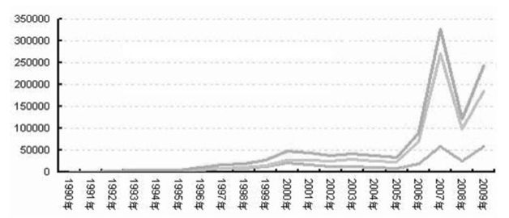

中国证券市场20年总市值增长

在为企业融资方面，近几年来中国证券市场已经成为全球融资能力最强的市场。2007年、2008年和2009年，中国证券市场融资额分别达到9400亿元、5600亿元和8200亿元，稳居世界第一。时至今日，上市公司已经成为中国企业的骨干和中坚力量，这其中，证券交易所可谓功不可没。

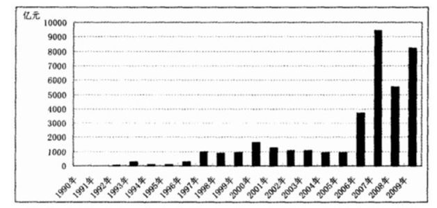

中国证券市场20年融资金额

市值全球第二、融资世界第一就能代表中国证券市场成熟了吗？

未必。

由于中国股市从成立之初就带有极强的政府烙印，所以中国股市在为企业、尤其是国企融资方面能力超强，但其长期偏高的估值使得其投资功能被异化，中国股市更像投机者和冒险家的乐园，同时却是普通投资者的财富吞噬场所。

有人做过统计，从中国股市建立以来，投资者从股票中获得的分红和利润，还抵不过证券交易所的印花税，股票交易纯粹成了零和游戏，甚至是负值游戏。

更为严峻的是，从上证所成立之初到现在，不断有股市操纵案被披露，许多操纵股票的庄家狂赚之后神秘失踪、出逃，也有不少人获刑，基金公司动辄就玩“老鼠仓”，企业财务造假更是屡见不鲜……

难怪经济学家吴敬琏屡次声称中国股市是“赌场”。

摩根士丹利资本国际公司（MSCI）从国民总收入、市场深度和流动性、政府监管、潜在投资风险、外汇管制等方面对新兴市场（Emerging
Markets）和成熟市场（Developed
Markets）做出区分，新兴市场包括了印度、韩国、俄罗斯、中国等21个，而成熟市场包括了美国、以色列、法国和中国香港等24个——从这些相应的指标来看，中国证券交易所也的确与“成熟”相距甚远。

2002年12月，中国股市实时QFII制度；

2004年5月，深圳证券交易所在主板市场内设立中小企业板块；

2009年10月30日，中国创业板市场正式启动，28家创业板挂牌上市；

2010年3月31日，深沪交易所融资融券交易试点正式启动；

2010年4月16日，股指期货正式上市交易，中国股市单边做多时代结束。

2011年底，传说中的国际版即将推出……

天道酬“奸”时代

</a>

根据政治经济学理论，到了共产主义社会，生产力得到极大提高、社会产品极大丰富，人们已经不能靠金钱或权力来赢得别人的尊重了，实现自己人生价值和幸福生活的方式只能是通过自觉自发的劳动。

在现代社会，除极少数类似雷锋同志这样品德高尚的人士专做毫不利己专门利人的事情之外，绝大多数人都是想着如何不用从事物质生产，不用辛苦劳作，就可以大把大把地挣钱，然后用挣得的这些钱购买所有的商品和服务，让别人来为我服务。

不止一次，有人问股神沃伦·巴菲特（Warren
Buffett），你拥有那么多财富，为什么不肯投资实业从事真正的生产呢，而习惯于在股票、债券和商品市场上通过左右手倒卖来获利呢？巴菲特回答：“既然股票、债券买卖如此简单，我为什么要去做那些辛苦异常而且又是费力不讨好的复杂事情呢？”

就是这样简单，巴菲特成了全世界数一数二的大富翁。

其实，巴菲特回答了一个很关键的问题，马克思当年在《资本论》里面就解释过这个问题：“资本是没有办法才从事物质生产这种倒霉的事情，它也不愿意去从事物质生产，它总希望有更快、更轻松的赚钱手段……”

可怜的是，我们当中的绝大部分人都没有这样的机会，我们中的一部分人，希望自己或者是觉得自己有巴菲特那样的聪明头脑，于是一头扎入股市、外汇或者其他金融产品行业之中，但诚实地说，在金融市场的惊涛骇浪当中，绝大多数都是输客。

每次股市大跌或者商品价格大跌的时候，总有媒体很热心地告诉我们说，多少多少万亿的财富消失了、蒸发了——很多时候，这种胡言乱语简直是侮辱大众的智商。

要知道，什么股市和金融市场价格变动，实质上变动的只不过是阿拉伯数字！

只要不是通过战争或其他物理手段摧毁，人类所创造的财富从来都不会像孙悟空的戏法一样，一个“变”字就会凭空消失的，在金融市场上，只要有人输，就一定有人赢——以股票为例，每一只股票价格下跌，都一定是因为有人卖出去了，那个人已经把钱拿走了！

这个让我们输得不知不觉、憋屈无奈的就是所谓的“货币经济（Monetory
Economy）”。

货币经济，也称为“虚拟经济”，是指那些不从事实际生产，也不直接参与价值转换和价值创造，直接“以钱生钱”的所有经济活动，其投资回报纯粹来自资产价格本身之上升或下跌，不创造任何真实的价值。比方房屋产权的买来卖去、股票、国债、公司债、期货、期权以及直接针对各国钞票的外汇买卖……

虚拟经济的循环基本都是在金融市场上，先通过交换，把钱换为借据、股票、国债、公司债券、房屋债券、保险单、期权等，然后在适当的时候，再通过交换把借据、股票、债券再变回钱，直接用钱生钱。

与货币经济相对的，真实的“经济”包括了农业、工业、交通通信业、建筑业、文化产业等从事实实在在的物质、精神产品生产和流通的活动，这才是我们平常所说的“经济”。

毫无疑问，真实经济是人类社会赖以生存和发展的基础，全世界绝大部分人口所从事的工作主要也都是实体经济，可是让咱们这些老老实实、脚踏实地从事劳动的“傻帽们”惊诧得眼珠子都要掉下来的是——按照当前经济规模来比较，实体经济如果算是一个苹果的话，虚拟经济早膨胀成一个大西瓜了！

前文说过，不说股票，不说房屋产权，不说大宗商品，就说那些买来卖去的金融衍生品，总量就已经达到了614万亿美元，是全球GDP的9倍！

如果1971年布雷顿森林体系解体之前把全世界最能干的那些经济学家冷冻起来，到今天如果苏醒过来，今天的经济体系估计足以让他们神经错乱。

可不嘛，这40年来，在人类经济体系里的钞票总量和信用总量直线上升，虚拟经济无限膨胀，远远超过了人类真实财富的增速和规模<a href="#part0010.html_id11" id="part0010.html_id_11">[10]</a>：

1970年，全球钞票存量合计不过400亿美元，今日已经超过6万亿美元；

1970年，全球的信用总量（银行资产+债券+股票）不过几千亿美元，今日已经超越400万亿美元；

1970年代，全球债务规模合计不过千亿美元，今日已达几十万亿美元，仅美国国债一项就超过15万亿美元；

1970年，全球外汇交易、衍生金融产品之交易量微乎其微，今日仅每天的外汇交易规模就达到了4万亿美元（2010年年底数据），而金融衍生品的日交易量更是达到10.4万亿美元之巨（2010年年底数据），两者合计全年交易量超过3500万亿美元。

3500万亿美元，这是人类多少辈子都创造不出来的财富啊！

正如争论人是“性本善”还是“性本恶”一样，诚实地说，每一类货币经济本身的发展并不能简单定义为善或者恶，在人类的发展史上，国债、股票、期货等虚拟经济形式的出现，一度都是当时社会经济发展极大的促进因素，如果能够和实体经济保持一定的对应比例，也能够增进整个人类的福利。

坏的总根子还是在“钱”这种玩意儿身上。

上帝创造世间万物并教化世人，希望人们在精神和道德上能够完美无缺。

然而，他没有想到的是，有一样人类自己创造的东西，其教唆世人作恶的能力，可能远远超过上帝的教化作用。“钱为万恶之源”、“金钱万能”、“有钱能使鬼推磨”，这些话都把矛头指向同一个东西——钱。

的确，钱——也就是货币，确是关乎人类的社会行为和道德规范。

然而，作为现代人的我们也都明白，具体的某一数量的钱币，它们本身是并无所谓“善恶”之分的，教唆世人作恶的乃是一个社会的货币体系。

丢掉了商品之锚的货币体系，钞票数量供应失去了硬性约束，政府和中央银行不断地加速印刷钞票，实体经济也根本吸收不了这么多钞票。

为了让20世纪70年代以来政府和中央银行海量增发的钞票能够顺利流通、泛滥于世界各地，金融精英们创造了“贷款买房、按揭抵押、利率互换、违约掉期、特种期权”……一大堆让普通人摸不到名头的词语，鼓励企业和个人“交易”、“投资”、“上市”、“并购”、“拆分”、“融资”、“对冲”等等，创造各种各样的金融衍生品，然后他们从中大捞特捞……

当人们一遍又一遍确认政府在不断加速印刷钞票，存款利率又几近为零的情况下，人们在无奈中都涌向了股市、房市、期货以及所有可供选择的实物资产或金融资产，一次又一次的通货膨胀可谓是逼良为娼的罪魁祸首，而凡是通过印钞票来发展经济的货币制度就一定会逼迫世人投机成风！

自从有人类以来，劳动是人类社会得以存在和发展的基础，更是人类的基本美德之一，辛勤劳动也是人类创造财富、获得财富最主要的途径。

不过，在当今彻底信用纸币体系之下，“劳动创造财富”这句话显然已经过时。

全世界农民种地供养世人吃喝，能挣下多少财富？

全世界工人做工为世人提供吃、穿、用、住、行、娱乐等各色产品，又能挣下多少财富？

只需设定金融规则、只需收买经济政策、只需创造数学公式、只需放出各样消息、只需挥舞手中资金，鼠标上手指轻点，金融市场涨跌之间，一国资源瞬间转移，亿万财富轻松入囊，何需实业家辛苦创业、何需知识者殚精竭虑，何需农民工人辛苦劳动？

在这种货币体系之下，凡是有点想法的人们都不再满足于从事平平常常、需要一步一个脚印才能慢慢获得成功的工作，而是以投资之名义大行投机之风，不劳而获、挣钱享乐、消费至上成为世人共识，劳动再也不是美德，劳动是傻瓜、劳动是笨蛋、劳动是活该被掠夺、劳动是天生被剥削，才是当代信用货币体系之下普通劳动者地位的真实写照。

结束语

</a>

财富，是人类的一个结，永远不能解开的一个结。

然而，在近现代银行出现以前的漫长岁月里，人类获取和积累财富却是一件相当困难的事情，这不仅是因为在那个时代里财富本身就少得可怜，更在于技术革新发生以前，自给自足的社会人们获取财富的手段只能是通过艰辛的劳动。

在一个社会财富总量有限的情况下，财富竞争纯粹变成了零和游戏，一将功成万骨枯，一人巨富天下贫，可谓是那个时代财富分配的最好写照。

倘若有某个人，想要实现大笔财富的积累，要么选择剥削别人在土地上的辛勤劳动果实（当大地主），要么直接通过暴力掠夺和消灭他人（战争方式），而每一次某个人或者家族财富暴涨的过程中，总是充满了暴力、血腥和杀戮。

贸易和银行的出现打破了一切，做贸易的叫商人，而直接“玩钱”的人，叫做银行家。

贸易的生财之道绝大多数人都明白，无非是低买高卖和贱进贵出的把戏，而“玩钱”的银行，究竟是如何实现“钱能生钱”的财富增殖秘诀的呢？

【注释】\

<a href="#part0010.html_id_2" id="part0010.html_id2">[1]</a>胡格诺派，法国16世纪新教中的一个派别，该派反对君主专制，主要成分为反对国王专制、企图夺取天主教会地产的新教封建显贵和地方中小贵族，以及力求保存城市“自由”的资产阶级和手工业者。

<a href="#part0010.html_id_3" id="part0010.html_id3">[2]</a>经纪人在早期欧洲原指拉皮条的人或皮条客。

<a href="#part0010.html_id_4" id="part0010.html_id4">[3]</a>也有荷兰人，不过荷兰人在士兵总数中只占6%。

<a href="#part0010.html_id_5" id="part0010.html_id5">[4]</a>阿姆斯特丹证券交易所一直运营到现在。2000年9月22日，阿姆斯特丹交易所与巴黎交易所、布鲁塞尔交易所正式宣布合并，形成全球第一个跨国境、跨币种的股票和衍生品的欧洲交易所；2007年4月，欧洲交易所又与世界最大的证券交易所——纽约证券交易所合并，成立了纽约·欧洲交易所。

<a href="#part0010.html_id_6" id="part0010.html_id6">[5]</a>德意志交易所集团是由法兰克福证券交易所发展而来，就销售收入、税前利润和市值而言，德意志交易所在2006年之前是世界规模最大的证券交易所，2011～2012年，德意志交易所集团正在谋求与纽约-欧洲交易所合并。

<a href="#part0010.html_id_7" id="part0010.html_id7">[6]</a>正如前文所说，此时的海外航行和殖民贸易是一场亡命之旅，在回到荷兰之后的第一次航海出行中，浩特曼的生命就终止于船队与印尼土著的一场战争中。

<a href="#part0010.html_id_8" id="part0010.html_id8">[7]</a>引自西班牙人约瑟夫-德-拉-瓦格《混沌中的混沌》一书，转引自\[德\]彼得-马丁，布鲁诺-霍尔纳格著，王音浩
译《资本战争》。

<a href="#part0010.html_id_9" id="part0010.html_id9">[8]</a>2006年6月，纽约证券交易所和泛欧证券交易所已达成涉及金额近78亿美元的合并协议。

<a href="#part0010.html_id_10" id="part0010.html_id10">[9]</a>国际清算银行2010年5月10日公布数据，截止到2009年底，场外交易的金融衍生品规模达到了614.67万亿美元，而这其中，商品期货和信用违约掉期两个项目名义价值还分别比2008年减少了21%和9%。

<a href="#part0010.html_id_11" id="part0010.html_id11">[10]</a>数据均来源于BIS（国际清算银行）、IMF（国际货币基金组织）和Fed（美联储）不同时期发布的报告。
