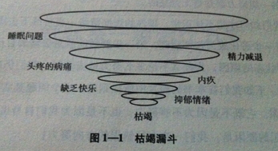
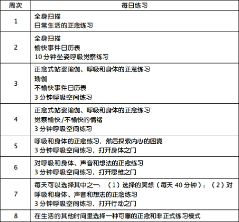

### 目录

[导言 分享正念的奇迹](#0preface.html)

[长期的抑郁让人枯竭](#0preface_1.html)

[如何使用本书](#0preface_2.html)

[第一部分 抑郁消然而至](#1part1.html)

[第1章 抑郁的根源](#1part1ch1.html)

[烦恼总是挥之不去](#1part1ch1_1.html)

[烦恼变成长期抑郁](#1part1ch1_2.html)

[抑郁症的结构](#1part1ch1_3.html)

[情绪](#1part1ch1_3_1.html)

[思维](#1part1ch1_3_2.html)

[抑郁和身体](#1part1ch1_3_3.html)

[抑郁和行为](#1part1ch1_3_4.html)

[第2章 觉察是一种治疗方式](#1part1ch2.html)

[抵抗抑郁只会更加抑郁](#1part1ch2_1.html)

[探索情绪的作用](#1part1ch2_2.html)

[情绪是行动的信号](#1part1ch2_3.html)

[心境和记忆](#1part1ch2_4.html)

[心境引发的记忆](#1part1ch2_4_1.html)

[关键时刻](#1part1ch2_4_2.html)

[不要总是追问自己](#1part1ch2_5.html)

[问题解决式的方法为何无法应对情绪问题](#1part1ch2_5_1.html)

[泼出的牛奶](#1part1ch2_5_2.html)

[沉思的替代法则](#1part1ch2_5_3.html)

[正念：觉察的种子](#1part1ch2_6.html)

[正念的概念](#1part1ch2_6_1.html)

[第二部分 每时每刻都可以练习](#2part2.html)

[第3章 尝试正念](#2part2ch3.html)

[体会每一口的滋味](#2part2ch3_1.html)

[保持觉察状态](#2part2ch3_2.html)

[活在当下](#2part2ch3_3.html)

[别把短暂的想法当真](#2part2ch3_4.html)

[正念训练需要意志力](#2part2ch3_5.html)

[直接去体验](#2part2ch3_6.html)

[变化盲视](#2part2ch3_6_1.html)

[清洗盘子](#2part2ch3_6_2.html)

[超越寻常的目标追求](#2part2ch3_7.html)

[接近而不是逃避](#2part2ch3_7_1.html)

[日常生活的正念](#2part2ch3_7_2.html)

[觉察的清新空气](#2part2ch3_7_3.html)

[即使一个小小的正念也可以在某一刻打破抑郁的顽固锁链。](#2part2ch3_7_4.html)

[第4章 正念式呼吸和行走](#2part2ch4.html)

[觉察的入口](#2part2ch4_1.html)

[训练气定神闲](#2part2ch4_2.html)

[小僧的故事](#2part2ch4_2_1.html)

[意志什么时候优于强制力](#2part2ch4_2_2.html)

[正念式呼吸](#2part2ch4_3.html)

[意料之外的宁静](#2part2ch4_3_1.html)

[应对思维的游离](#2part2ch4_3_2.html)

[由发现到期待](#2part2ch4_3_3.html)

[接受思维的游离，重新开始](#2part2ch4_3_4.html)

[顺其自然：放弃控制](#2part2ch4_3_5.html)

[专注地呼吸：感受此刻](#2part2ch4_3_6.html)

[正念式行走](#2part2ch4_4.html)

[在行走中学习](#2part2ch4_4_1.html)

[从无觉察到觉察](#2part2ch4_5.html)

[第5章 重新看待世界](#2part2ch5.html)

[避开沉思式思维](#2part2ch5_1.html)

[去体验而不是想象](#2part2ch5_2.html)

[全身扫描：躺姿冥想练习](#2part2ch5_3.html)

[它是一种放松的冥想吗](#2part2ch5_3_1.html)

[思维游离：另一个认识行动模式的机会](#2part2ch5_3_2.html)

[冥想没有好坏之分](#2part2ch5_3_3.html)

[早晨醒来时的正念](#2part2ch5_4.html)

[第三部分 改变抑郁状态](#3part3.html)

[第6章 和你的情绪对话](#3part3ch1.html)

[各种各样的情绪](#3part3ch1_1.html)

[善待我们的情绪](#3part3ch1_2.html)

[内部气压计](#3part3ch1_2_1.html)

[打开新的可能性](#3part3ch1_3.html)

[迷宫中的老鼠](#3part3ch1_3_1.html)

[正念式瑜伽](#3part3ch1_4.html)

[对瑜伽的回应](#3part3ch1_4_1.html)

[把身体作为整体](#3part3ch1_5.html)

[玛利亚的故事](#3part3ch1_5_1.html)

[读出你的示数](#3part3ch1_6.html)

[第7章 善待我们的情绪](#3part3ch2.html)

[信任身体的觉察力](#3part3ch2_1.html)

[抵达极限](#3part3ch2_2.html)

[在坐姿冥想中抵达极限](#3part3ch2_2_1.html)

[安东尼的故事](#3part3ch2_2_2.html)

[转变不良的情绪](#3part3ch2_3.html)

[阿曼达的故事](#3part3ch2_3_1.html)

[梅格的故事](#3part3ch2_3_2.html)

[我们身体是一间客房](#3part3ch2_4.html)

[与狼共舞的智慧](#3part3ch2_4_1.html)

[第8章 把想法看成大脑的作品](#3part3ch3.html)

[把想法只当做想法](#3part3ch3_1.html)

[倾听你的想法](#3part3ch3_1_1.html)

[意识流的席卷](#3part3ch3_1_2.html)

[警惕自我批评式的评价](#3part3ch3_2.html)

[为负性思维模式命名](#3part3ch3_2_1.html)

[抑郁症状中的负性思维](#3part3ch3_2_2.html)

[善待思维和情绪](#3part3ch3_3.html)

[无选择性的觉察](#3part3ch3_4.html)

[第9章 日常生活中的正念](#3part3ch4.html)

[呼吸空间的练习](#3part3ch4_1.html)

[觉察和承认](#3part3ch4_2.html)

[使用呼吸空间技术](#3part3ch4_3.html)

[不费力去修理东西](#3part3ch4_3_1.html)

[在事情忙乱之际](#3part3ch4_3_2.html)

[正念是邀请和宽恕](#3part3ch4_3_3.html)

[呼吸空间技术是一扇门](#3part3ch4_4.html)

[选择之一：折返](#3part3ch4_4_1.html)

[选择之二：身体之门](#3part3ch4_4_2.html)

[选择之三：思维之门](#3part3ch4_4_3.html)

[选择之四：技巧性行动之门](#3part3ch4_4_4.html)

[选择的自由](#3part3ch4_5.html)

[第四部分 改造你的生活](#4part4.html)

[第10章 完全的活着](#4part4ch1.html)

[从长期抑郁中释放自己](#4part4ch1_1.html)

[佩吉的故事](#4part4ch1_2.html)

[戴维的故事](#4part4ch1_3.html)

[第11章 把正念融入你的生活](#4part4ch2.html)

[注意事项](#4part4ch2_1.html)

[现在开始系统地参与](#4part4ch2_2.html)

[第一周（第3章和第5章）](#4part4ch2_3.html)

[第二周（第4章）](#4part4ch2_4.html)

[第三周（第6章和第9章）](#4part4ch2_5.html)

[第四周（第6章和第7章）](#4part4ch2_6.html)

[第五周（第7章）](#4part4ch2_7.html)

[第六周（第8章）](#4part4ch2_8.html)

[第七周（第3章和第9章）](#4part4ch2_9.html)

[第八周（第10章）](#4part4ch2_10.html)

[第八周是我们所推荐的正式练习的结尾](#4part4ch2_11.html)

### 导言 分享正念的奇迹

导言 分享正念的奇迹

### 长期的抑郁让人枯竭

抑郁令人痛苦。它是夜晚夺走你安眠的那条黑色恶狗，是让你始终无法入睡的那个诡谲念头。它是白日里只有你才能看得见的魔鬼，是那片只会笼罩在你头顶的阴云。

翻开这本书的你，恐怕很清楚上述的这些比喻并不夸张。任何患过抑郁症的人都明白，它会带来令人疲惫不堪的焦虑，过度的自我责备，以及空虚的绝望感。它会让你变得绝望、倦怠，为那永远都得不到的快乐而悲伤和失望，最终陷入心理枯竭的深渊。

任何一个人都会不惜一切代价去避免那种痛苦。但是，讽刺的是不论我们做什么都收效甚微……至少无法一劳永逸地解决问题。因为一旦你患上抑郁症，它便很容易再次发作，哪怕在你康复好几个月之后，它仍会再次来袭。如果你遇上了抑郁症的复发，抑或你总是感到不快乐，那么你可能会对自己评价很低，认为自己是一个彻头彻尾的失败者。当你试图去探究更深刻的意义，试图理解自己的情绪为何如此糟糕时，这些想法会不断在你脑中盘旋。如果你找不到一个满意的答案，那么你会感到更加空虚和绝望，最终渐渐相信自己得了什么毛病。

但是，如果你事实上根本没得任何“毛病”，那又会怎么样呢？

正如很多经历过抑郁反复发作的人那样，当你努力地用自己的理智和英勇去拯救自己的时候，其实你正在成为这种努力的牺牲品，——就像那些陷入流沙中的人拼命挣扎想要把自己拉出来，可结果却只是越陷越深。如果你也是这样的情况，那又将会怎么样呢？

我们写这本书的目的就是想要帮助你们理解这种情况是如何发生的，以及有什么样的应对方式。通过分享一些最新的科学发现，我们对于抑郁和长期的不愉快感有了根本上的全新认识：

 ●
当心境刚开始变得低落时，不愉快感本身并不是造成伤害的真正原因，我们应对这种不愉快感的方式才是根本问题所在。

 ●
那些我们习惯性用来摆脱困境的方法，并不能让我们获得真正的解脱，反而成为困住我们的一座牢笼。

换句话说，当我们悲伤的时候，所有像解决问题那样去摆脱抑郁，去治疗自身障碍的方法都是行不通的，那只是自掘坟墓。比如在凌晨三点时对自己的强迫性反省……在感到悲伤时苛责自己的“软弱”……为了摆脱心理和生理上的痛苦所做的绝望的努力，——这一切都像一台精神碎石机把你推向更加痛苦的深渊。任何一个在无眠之夜辗转反侧过的人或者是曾经抛开一切专心反省的人都明白，这种努力是多么地无效。但是，我们同样也明白自己是多么容易陷入到这种习惯性思维当中。

在接下来的章节中，我们提供了一些练习，你可以将它们融入日常生活中，让它们帮助你摆脱造成不愉快感的那些思维习惯。这个疗法被称为正念认知疗法，它结合了现代科学的最新发现和在主流医学与心理学中被证明具有临床效度的冥想形式。这种把思维和身体通过不同方式结合起来的新颖而有效的方法可以帮助你在负性思维和情绪方面有一个较大的转变。通过这种转变，你可以打破导致情绪恶化的螺旋锁链，阻止它最终发展成抑郁症。我们对于这种疗法的研究表明，对那些已经复发过3次以上抑郁症的人来说，它可以降低将近一半的复发率。

学习本书疗法的男性和女性大都经历过抑郁症反复发作的痛苦。但是，即便你从未在临床上被诊断为抑郁症，你仍能从本书的学习中获益。很多忍受着抑郁的绝望和痛苦的人从来不寻求专业的帮助，但是他们明白长期的抑郁情绪正在伤害着自己，这些情绪占据了生活的大部分内容。如果你感到自己反复挣扎于绝望、倦怠和悲伤的流沙之中，我们希望你能够从这本书中发现一些有价值的东西，去帮助你从不断下陷的情绪中解脱出来，重新获得快乐。

由于个体差异的原因，很难准确地说明你的负性情绪将会有一个怎样深刻的转变，也难以预计治疗方法的准确结果。想要知道这种方法的益处的惟一途径就是暂时收起你的犹疑，全身心地投入到这个方法的训练中，——大约八周左右之后看看有什么变化。这正是我们要求参加训练课程的病人所做的。

在进行冥想训练的过程中，我们建议你试着像灌溉植物那样有耐心和同情心地对待自己，带着开放的心态和温柔的坚持。这些品质能够帮助你从抑郁症的重压中解放出来，它们会提醒你那些科学已经证明的关键点：你必须停止用问题解决式的途径去处理“心情不好”的状况。事实上，任何你习惯采用的解决问题的方法几乎都会从不同程度上加剧情况的恶化。

作为科学家和临床心理学工作者，在经过迂回坎坷的探索研究之后，我们对于哪些方法治疗反复发作的抑郁症是有效的，哪些是无效的，有了全新的认识。在20世纪70年代之前，科学家们一直致力于寻找急性发作的抑郁症的治疗方法，——那种来势汹汹的抑郁发作往往源自于某次人生中的灾难事件。科学家们发明了抗抑郁药物，至今仍然对于很多抑郁症的治疗发挥着巨大的作用。但之后他们又发现抑郁症被治愈之后，常常会复发，——并且随着每一次的复发，它再次发作的可能性也会增大。这个发现改变了我们对抑郁症以及持续恶劣心境的整体看法。

研究者们发现抗抑郁药物能够“治好”抑郁症，但这仅限于病人持续服用药物的期间。当患者停止服用药物，抑郁症就会复发，有时候甚至才治好不到几个月的病人都会再次发作。不论是病人还是医生都不愿意采用终生服药的方式来把抑郁的恶魔拦在门外。因此在20世纪90年代，我们（马克•威廉姆斯，津戴尔•塞戈尔，约翰•蒂斯代尔）开始探索发展一种全新的治疗方法的可能性。

首先，我们着手去探究抑郁症复发的原因：在每一次遭遇流沙时，是什么使得它更具危险性。结果发现每当某个人患上抑郁症的时候，大脑中和抑郁相关的情绪、思维、身体和行为之间的联结变得更强大了，从而使得抑郁症更容易被诱发。

然后，我们开始探索应对这种不断发展的风险的措施。有一种叫做认知治疗的心理疗法能够有效治疗急性抑郁发作并且也让很多人免受抑郁复发之苦。但是，没有人确切地知道它是如何起作用的。我们需要找出这个答案，——不仅仅为了学术研究的兴趣，更为了给临床实践带来巨大的革命。

过去，所有的心理治疗师只有在病人已经患上抑郁症的情况下才会开具抗抑郁药物或者进行认知治疗。我们设想，如果可以分辨出认知治疗当中的关键因素，或许我们可以在人们还健康的时候把这些技术教给他们。与坐等抑郁症的急性发作相比，我们更希望人们能够用这些技术把抑郁的幼苗扼杀在萌芽状态，彻底杜绝它的发生。

带着足够的好奇心，我们的研究和调查最终将我们带入某种冥想训练的临床运用，这种训练是用来培养某种被称为“正念”的意识状态，源自于亚洲的古老智慧。这类训练方法，曾经是太平盛世年代佛教文化的一部分，现在被马萨诸塞州立医学院的乔•卡巴金和他的同事们重新吸收和提炼，用于治疗抑郁症。乔•卡巴金博士在1979年创立了压力减轻程序MBSR，也叫做“基于正念的减压程序”，它致力于正念式冥想的训练，并且将它运用于压力、疼痛和慢性疾病等领域。正念也可以被叫做“慈悲心”，因为它是一种充满了同情心的意识。MBSR对于患有慢性疾病和身体虚弱的病人非常有效，同时也可以用来治疗如焦虑症和恐怖症等心理疾病。它的疗效不仅反映在患者情绪、思维和行为方面的改变，而且反映在大脑的负性情绪脑区在激活模式上的改变。

虽然同行和病人们可能会质疑我们，居然考虑采用冥想作为预防抑郁的方法，但它还是值得我们仔细研究一番。很快我们就发现西方的认知科学和东方的冥想训练的结合，正是打破抑郁症反复发作循环链的途径，它可以阻止我们一遍又一遍地去思考自己到底出了什么问题以及为什么所有的事情都不对劲。

当抑郁情绪开始影响我们的时候，通常最合情合理的反应是，通过压抑情绪来摆脱它们的困扰或者想个什么办法来对付它们。在这个过程中，我们挖掘出了过去的伤心事，也幻想了未来的诸多烦恼。我们在脑海中想了千百种方法来解决情绪困扰，却仍然因为想不出减轻痛苦的方法而苦恼不已。我们迷失在对现实自我和理想自我的比较中，不一会儿便感到头昏脑胀。就这样，我们把全部精力都投入到对自身的情绪的关注当中。渐渐地，我们失去了和世界的联系，和周围人的联系，甚至是和那些我们最爱和最爱我们的人的联系。我们拒绝外界丰富多彩的生活信息的输入，变得垂头丧气，软弱无力。然而，这正是正念式冥想可以发挥巨大作用的地方。

### 如何使用本书

本书中所介绍的冥想训练可以帮助你以一种全新的方式去打破负性思维的循环锁链，降低抑郁症患病风险。事实上，它还能够使你从抑郁症的整个精神活动模式中解脱出来。冥想状态能够帮助你放下对过去的积怨和对未来的担忧。它能够增加思维的弹性，在你意识到自己的无力之前，为你打开了另一扇大门。冥想训练可以防止普通的日常烦恼演变成为严重的抑郁。它帮助你重新获得内部和外部的学习、成长以及治疗的资源，——那些你可能从不相信自己拥有的资源。

不论抑郁与否，我们常常忽视或者视之为理所当然的内部资源就是我们的身体本身。当我们沉迷于纷繁的想法，努力去压抑自己的情绪感受时，却往往忘记关注来自身体的生理感觉。但是，这些身体内部的感觉却能把情绪和精神状态的情况以最快速的方式反馈给我们。它们能在我们探求摆脱抑郁的过程中给予最有价值的信息，对它们的关注不仅能够使我们远离对未来的担忧或者对过去的执着，而且还可以改变情绪状态本身。本书的第一部分阐述了思维、身体和情绪如何一起作用于抑郁症的形成和维持，此外，还有一些来自前沿领域的观点将告诉我们如何打破这个可恶的抑郁循环锁链。它可以极大程度地改变我们所依赖的习惯性模式，——思想、情感和行为，——这些模式会降低我们与生俱来的感知快乐的能力。事实已经证明，在你生存的每时每刻，都存在着一种全知全觉、不容置疑的力量。

逻辑和最新的研究结果或许很有说服力，但它们却无法用于实践，其中部分原因可能是它们倾向于通过思维和推理来作用于大脑。因此，本书的第二部分便邀请你亲自体验一下，当你陷入迷惘，被理智碾得粉碎时，当你执着地想要“治好”自己的苦恼，却触碰不到生命的本相以及执着冥想的智慧时，你所失去的究竟是什么东西。从这个意义上说，冥想只是一个抽象的概念，是你自身所孕育出来的思想、身体和情感。因此，本书的第二部分就是帮助你发展出自己的冥想训练模式并让你亲自体会到它所带来的深刻的改变和解放。

本书的第三部分是帮助你改进自己的冥想训练，并且用它来抵御那些会导致抑郁的负性思维、情绪、身体感觉和行为。

本书的第四部分将所有的方法结合成为一个系统的策略，用来更加全面而高效地应对生活中的挑战，尤其是抑郁症的复发。我们分享了一些人的故事，他们有过抑郁症的病史，但通过冥想训练获得了成长和改变；我们还提供了一种系统的、易于实施的八周治疗程序，这个程序把书中提到的所有因素和训练都结合到了实践当中。我们期望读者在读完本书并参照着进行冥想练习之后，能够切实地体会到内心蕴藏的智慧以及自愈的能量。

本书所介绍的方法有很多不同层面的益处。虽然在时间允许的情况下，做完整个疗程是大有裨益的，但练习者不必拘泥于训练的时间长短。事实上，即便你完全没得抑郁症，也可以从书中介绍的某几个正念训练中获益。几乎所有人都被某些习惯性的、自动化的思维所折磨，我们只有学会控制它们，才能得到真正的解脱。一开始，你或许只是想简单地学习更多自我思维和内部情绪状态的内容。然而，通过这种学习，你可能会渐渐被好奇心所驱使，去尝试书中第二部分所介绍的某些正念训练。渐渐地，你或许会全身心地投入到八周治疗程序当中去，迫切地想了解究竟会发生什么样的改变。

在你开始阅读本书之前，我们还想提醒两点。首先，书中介绍的各种冥想训练常常需要一定的时间才会显示出它们的效果。这也是称它们为“训练”的原因。它们需要你带着开放的心态和好奇心一遍又一遍地去尝试和练习，而不是单纯地为你所投入的时间和精力回报一个结果。这对于大多数人来说，是一种全新而又十分值得尝试的学习方式。我们希望本书所谈到的一切都能够支持你不断地努力。

第二点要注意的是，最好不要在临床的抑郁发作期尝试完成整个训练程序。最新的证据表明，最好等到病人经过必要的治疗脱离了危险期，能够用自己的思维和情绪、心灵和精神去学习这种新的概念之后再尝试这个方法，否则很容易被急性发作的抑郁吞噬掉全部的心智。

不论你的起点是什么，我们鼓励你带着耐心、慈悲、坚持和开放的心态去练习本书所教导的冥想训练。每个人都会倾向于用某种固定的方式去做事，并且想当然地认为它们应该会那样，在这里，我们希望你能够放弃这种行为方式。在你完成整个训练的过程中，尽自己最大的努力去相信自己基本的学习、成长和自愈的能力，——让这种训练成为你生活的根基，其实从很多方面来说，它们确实也是真正哲学意义上的根基。然后，剩下要做的就是坚持到底。

### 第一部分 抑郁消然而至

对于大多数人来说，抑郁是对生活中灾难或者逆境的一种反应。当我们感到被周围所抛弃，当我们丧失了重要的东西，被羞辱、打击的时候，抑郁便悄然而至。

### 第1章 抑郁的根源

第1章 抑郁的根源

### 烦恼总是挥之不去

爱丽丝辗转反侧，难以入睡。

现在是凌晨3点，两个小时前她被一阵震动吵醒，脑海中立刻浮现出当天下午和上司谈话的场景。只不过，这一次的画面中还带上了评论。评论者正是她本人，以一种尖厉的声音责问着自己：

“我为什么要那么做呢？听起来简直就像个傻瓜。他所谓的‘基本能胜任工作’背后的意思究竟是指什么呢，——是说我还不够升职的条件？好吧，难道他要把项目交给克里斯蒂的部门去做吗？可是，那些人能对这个项目做什么呀？那可一直是我负责的项目……至少到目前为止都是。他说要评估项目进展的情况莫非就是这个意思？想要让其他人来负责这个项目，对不对？我知道我干得不够好，——不够升职资格，甚至可能都不够资格继续干这份工作。但是，如果能让我看着它完成那该多好……”

爱丽丝无法重新入睡。当闹钟响起的时候，她的担忧已经从当前的工作职位转向了寻找新工作时，她和孩子将会面临可怕的困境。当她勉强拖着浑身疼痛的身体起床，挣扎着向浴室走去时，她脑海中又开始浮现出自己被一个又一个的雇主拒绝的画面。

“我不应该责备他们。我只是不明白自己为什么那么容易沮丧。为什么我对所有的事情都如此敏感？
别的人都过得很不错。只有我没办法同时应付好工作和家庭。唉，老板究竟是如何评价我的呢？“

她头脑中的磁带又开始周而复始地转动了。

吉姆没有任何睡眠的问题。事实上，他觉得要保持清醒很不容易。今天在公司停车场，他又一次呆坐在车里面，感觉被一整天的压力钉牢在座位上。他浑身感到异常的沉重。惟一有力气做的只是松开自己的安全带。然后他继续坐着，一动不动，没法推开车门出去工作。

如果他想想一天的工作安排也许能够站起来……以前这种想法总能让他走出去，让生活像球一样滚动起来。但是，今天却不行。每一次谈话，每一个会议，每一通需要回复的电话都让他感觉像在生生地吞咽着一个又一个的铁球，而随着每一次的吞咽，他的思绪便从日程安徘转向了那些每天早晨都会反复问的问题：

“为什么我感觉这么糟糕？
我已经得到了大多数男人想要的一切，——相爱的妻子，健康的孩子们，稳定的工作，漂亮的房子……我到底怎么了？为什么我的思想老是集中不起来？
而且，为什么总是这个样子？
温蒂和孩子们已经被我的自责感折磨得痛苦不堪。他们已经无法再忍受我了。如果我能够弄明白这一切，事情也许会变得不同。如果我能知道为什么自己感觉如此虚弱，也许就能够解决那些问题并且像其他人一样好好地生活。这一切是多么愚蠢啊。”

爱丽丝和吉姆都希望过得快乐。爱丽丝会告诉你她曾有过幸福的时光，但这样的日子却并不长久。她的生活陷入一片混乱之中，那些曾经可以轻松应对的事情，如今却会在不知不觉中将她推进绝望的深渊。吉姆也说他有过美好的日子，——当然这种美好充其量不过是没有痛苦而不是真正过得快乐。他不知道是什么让那种钝痛的感觉时而消退时而卷土重来。他只知道自己已经很久没有和家人或朋友谈笑风生地度过一个夜晚，——那仿佛已经是上辈子的事情了。

失业的场景不断在爱丽丝的脑海中盘旋，对于自己和孩子们未来生活的担忧反复打磨着她脆弱的神经。她一次又一次地叹息着，思索着这一切。她还记得很清楚，当时她是如何发现伯特有外遇并把他赶出了家门。毫无疑问，爱丽丝感到又伤心又气愤，同时也为伯特如此对待自己而感到羞辱。他居然背叛了她！她气昏了头，也失去了挽救婚姻的最后机会。于是她不得不开始面对单身母亲的困境。最初，为了孩子她必须打起精神。每个人都很支持她，帮助她。于是，有一天她觉得应该挥别过去，不能总在家人和朋友的帮助下过日子。可是才过了四个月，她就变得越来越抑郁，整日以泪洗面，对于参加孩子的唱诗班也失去了兴趣，在工作时无法集中精神，并且为自己是个“坏妈妈”而感到内疚。她无法入睡，食欲不佳，最终去看了家庭医生，并且被诊断为患有抑郁症。

爱丽丝的医生给她开了抗抑郁的药物，这对她情绪的改善起了很大的帮助。几个月之后，她恢复了正常的生活，——但是到第九个月时，她驾驶着自己的新车出了车祸。尽管她只是受了点皮肉的擦伤，
但却无法摆脱死里逃生的恐惧感。在她的脑海中反复地回放着车祸时的场景，还有一个声音不断责问着自己，怎么能如此冒险，怎么能把自己置身于那样的危险之中，这场车祸险些就让她的孩子们失去了现在惟一的亲人。随着这种阴暗的想法一再放大，她又一次给医生打电话要求开药，而服用药物之后她感觉心情有所好转。这样的模式在接下来的五年中反复出现了好几次。每当她发现自己要跌进抑郁的漩涡时，她就会增加药物的剂量。爱丽丝已经不确定自己是不是还可以继续依赖这种药物了。

吉姆从未被诊断为抑郁症，——他甚至没有和医生谈起过自己那些消极的想法或者是经常感到低落的心情。他是成功人士，生活中的一切都如意；他有什么资格对别人抱怨呢？他只是一味地坐在车里，直到有什么事情令他打开车门走出去。他试图去想想自己的花园以及那些含苞待放的美丽郁金香，但是这些念头只会令他想起自己已经很久没有做清理的工作，光是要把院子弄整洁一点的活儿就让他头痛不已。他想起孩子和妻子，想到晚餐时可以和他们聊聊天，但不知道为什么这个念头只会让他更想早点上床睡觉，就像昨晚那样。他本来计划今天早点起床来完成昨天剩下的工作，可是他又起晚了。也许今晚他应该待在办公室，哪怕熬夜也要把所有的事情一次做完……

爱丽丝患有周期性反复发作的重度抑郁症。吉姆也处于心境恶劣的状态，这是一种比较轻度的慢性抑郁，通常不会急剧地发作。其实，诊断对他们来说并不重要。爱丽丝、吉姆以及我们很多人共有的问题是我们都迫切地希望过得快乐但是却不知道如何获得快乐。为什么有些人会反复地感到心情低落？为什么有些人发现自己从来没有真正地快乐过？我们只是在任由自己虚度光阴，变得越来越低落而消沉、疲惫而冷漠，甚至面对那些曾经带给我们快乐让生活充满意义的事也提不起任何兴趣。

对于大多数人来说，抑郁是生活中的灾难或者对逆境的一种反应。当我们感到被周围所抛弃，当我们丧失了重要的东西，被羞辱被打击的时候，抑郁便悄然而至。爱丽丝变得抑郁是在失去了和伯特的婚姻关系之后。一开始站在正义一边的愤慨感让她鼓足勇气，想要报复伯特的心理也让她拼命去与单身母亲的困难抗争。但是为了照顾好家里的事情，她夜晚下班回家后还要继续奔忙，再也没有时间和朋友聚会，也没有时间和母亲吃一顿饭，甚至连和住同一个洲的姐姐打个电话都抽不出空来。久而久之，她—越来越孤独，体重下降，经常被一种抛弃感所击跨。

而对吉姆来说，他所失去的东西是更加细微的，可能对于外部的世界来说根本觉察不到。吉姆在咨询公司获得升职的几个月后，突然发现自己少了很多和朋友相聚的时间，此外他还放弃了园艺俱乐部的活动，而与此同时他在办公室待得越来越晚了。他还发现自己并不喜欢发号施令的角色，想要回到原来的工作。其实，对他来说那样或许能稍微减轻一点压力，但是却没有人能理解这一点，也没有人觉察到吉姆的不快乐，——甚至吉姆自己一开始都不知道。然而，他渐渐变得迷迷糊糊，经常心烦意乱。在吉姆的脑子里，总是不断衡量着自己的决策，过分地去在意和老板的每一次简短交流，反复地责备自己令公司出现的任何差错。他没有对此发表过任何抱怨，总是试图去忽略这些想法。但是在随后的五年中，他出错越来越频繁，患上了很多身体方面的小毛病，此外用他妻子的话说，——“简直不像我原来认识的那个男人了。”

丧失是人生无法避免的事情。很多人会像爱丽丝那样，在经历过灾难之后发现生活充满了艰辛，也有很多人像吉姆那样因为对自己或者他人的失望而自我贬低。但是，爱丽丝和吉姆的故事给我们另外一些启示，那就是为什么有些人会长期地处于这种痛苦当中。

### 烦恼变成长期抑郁

当前抑郁正成为影响千百万人的沉重负担，越来越普遍，当然在那些经济越来越“西方化”的发展中国家也同样如此。40年前，抑郁症的平均发病年龄在40岁到50岁；而如今则是20多岁。尽管很多患者已经表现出完全的康复，但至少有50%的抑郁症患者会出现症状的反复。在第二次或者第三次抑郁症复发之后，反复发作的概率上升到了80%~90%。在20岁左右时初次发病的人特别容易再次患上抑郁。这是什么原因呢？作为治疗和研究抑郁症多年的心理学工作者，我们三人都非常希望能够找出其中的原因。这一章的余下部分和第2章，将会科学解释抑郁症和忧伤的含义，另外还
将介绍我们和第四位作者（乔•卡巴金）如何将这些知识用于开发这本书所要探讨的治疗方法。

\[专栏1-1当前抑郁症的流行\]

大约12%的男性和20%的女性会在他们人生的某一阶段患重度抑郁。

重度抑郁的第一次发病通常在20多岁。有相当一部分人在童年晚期或是青春期便经历了第一次的抑郁症发作。

任何一个时间点，都有5%的人口正经历着严重的抑郁。

有的时候抑郁会持续，15%~39%的个体会在症状出现一年之后仍处于临床抑郁状态，而有22%的个体在两年后仍然无法摆脱抑郁。

抑郁症的每一次发作都会使得再次发病率提高16%。

美国有1 000万人正在服用抗抑郁药物。

\[专栏1-1 结束\]

我们认识到最关键的问题在于，那些有过抑郁经历的人和没有体验过抑郁的人之间存在着显著的差别：抑郁会在大脑中祷造一条悲伤心境和负性思维之间的纽带，因此即便是普通的悲伤也会唤起严重的负性思维。这个发现为我们理解抑郁症的发病机理开拓了视野。几十年前，先驱科学家如亚伦•贝克(Aaron
Beck)就发现负性思维在抑郁症中扮演着重要的角色。贝克和他的同事们发现情绪会严重地受到思维的影响，这为我们理解抑郁症带来了极大的飞跃，——驱动我们情绪的并不是糟糕的事件本身，而是我们对于那些事件的信念或者解释。现在我们知道了更多这方面的内容。不仅仅是思维可以影响到情绪，对于那些抑郁的人们来说，情绪也可以影响思维，从而使得低落的心境变得更加低落。因此，即便不是创伤性的丧失也可以让脆弱的我们再次陷入到痛苦的泥潭之中；大多数人可以轻松应对的日常烦恼都能让我们郁郁寡欢，无法自拔。随着这种联系越来越强，有时你甚至会发现，一些平时根本无法察觉的生活小事都可以触发负性思维，从而导致抑郁。

难怪我们不论怎么努力，仍然有很多人感觉无法从抑郁的深渊中脱身。因为我们根本不知道是从哪里摔下去的。

不幸的是，虽然我们勇于去探索自己究竟是从哪里摔下去的，但很多时候这种努力最终会因为某种复杂的机制，把我们拖进更深的泥沼。为什么我们试图去理解自身的方式只会带来更多的问题，而不是解决的方法呢？这是一个非常复杂的过程。首先需要去了解抑郁症的结构以及它的四个关键维度：情绪、想法、身体感觉和应对生活事件时所采取的行为。而其中最关键的一个问题在于理解这四个维度是如何相互作用的。

### 抑郁症的结构

在我们谈论每一个维度之前，先来看一下整个抑郁模式的发展过程。

当我们变得非常不开心或者抑郁时，铺天盖地的情绪、思维、身体感觉和行为都会涌现出来，正如重度抑郁的典型症状自查表中描述的那样：一般来说，丧失、分离、被拒绝或者其他可能造成羞辱或挫败的打击都会给我们带来巨大的情绪波动，这是人之常情。烦恼的情绪是生活的重要组成部分。它们既能够提示我们也可以向他人表明，我们的生活中发生了不幸的事，我们正在经历着痛苦。但是如果这种悲伤变成了自我苛刻的负性思维和感受时，抑郁就会占据主导：负性思维会产生紧张、疼痛、痛苦、疲劳和混乱。这些情绪又反过来哺育出更多的负性思维；于是抑郁就会变得越来越严重，同时也会带来更多的痛苦。而这时，如果你放弃了那些能够支撑和鼓励你的事情，比如与真正支持你的朋友和家人在一起，那么全部被掏空的感受就会更加强烈。如果你只知道一味地努力的工作，想要以此来解决问题的话，那么你最终只会被拖跨。

不难发现情绪、想法、身体感觉和行为组成了抑郁的全部。在本章的前面部分我们描述了爱丽丝在责备自己一夜之后感觉到浑身疼痛，而吉姆在思考自己一天的工作时就像在吞咽着“铁球”。由于大部分人都很敏感，消沉的情绪会妨碍我们做很多事情或者决定自己要走的路。因此我们不禁要问，抑郁结构中的每一部分是如何引发情緒的山崩地裂？每个部分之间又是如何互相影响和加强作用？正是通过这种相互作用的模式，“不开心”的心理结构才变得越来越强大。从这个意义上来说，仔细观察抑郁的每个部分会有助于更清楚地理解抑郁症的结构。

### 情绪

如果你试着回忆一下上次你不开心的时候是什么感觉，也许会有各种各样的词语涌进你的脑海：伤心、忧郁、闷闷不乐、痛苦、沮丧、低落、自责等等。这类情绪的强度是有弹性的；比如，你的心情可以在“悲伤”到“十分悲伤”之间起伏。一般来说，情绪的出现和消失是很正常的，但是这类抑郁的情绪却很少自己冒出来。它们通常会与焦虑和恐惧、生气和愤怒、无助和绝望联系在一起。愤怒是抑郁最常见的一种表现；当我们心情低落的时候，常常会对身边的人和事感到不耐烦，会比平常更容易发火。对于某些人来说，尤其是年轻人，抑郁症表现出来的愤怒可能比忧伤更加强烈。

通常我们用来定义抑郁症的那些情绪状态常常被认为是抑郁所导致的结果。我们抑郁，所以我们感到伤心、低落、忧郁、痛苦、沮丧、绝望。但是，有的时候这些情绪本身也是诱发抑郁的原因：研究表明患上抑郁的次数越多，悲伤心境带给人的低自尊和自责感也就越多。我们不仅会感到伤心，而且还会觉得一败涂地，无能，没有人爱自己，是一个彻头彻尾的失败者。这些感受会引发非常强烈的自责。我们会因为那些情绪而不停的责备自己：这没有意义，为什么我们没法停止这些想法重新开始呢？当然，这种思考方式只会让我们跌入更深的泥沼中去。

这样的自我责备既强大无比又祸患无穷。正如我们的情绪，它们既可以是抑郁的终点也可能是抑郁的开端。

\[专栏1-2重度抑郁\]

对重度抑郁的诊断，首先必须符合下列第一、第二两条症状的任意一条，此外还需要符合至少四条其他的症状。病症持续两个星期以上，并且严重损害了正常的生活功能。

1.大部分时间感到抑郁或者悲伤

2.对几乎所有平素感兴趣的事物都失去了兴趣或者从中获得快乐的能力

3.在没有节食的情况下出现明显的体重减轻，或者体重增加，或者每天都有明显的食欲变化。

4\. 夜晚入睡困难或者变得比以前更加嗜睡

5\. 注意力减退或者整日恍惚不安

6.每天都感到疲劳或者精力减退

7\. 时常感到无价值的、极端的或者不合理的内疚感

8\. 无法集中精神思考，在旁人看来个性变得犹豫不决

9.反复想到死或者有自杀的念头（可能会有执行自杀的计划）或者尝试自杀

\[专栏1-2 结束\]

### 思维

利用一点时间尽可能生动地想象以下的场景。请尽量从容地去留意有什么念头闪过你的脑海：

你正在一条熟悉的街道上走着……你看到街道对面有一个熟人……你冲对方微笑和招手……但是那个人却没有任何反应……他似乎没有注意到你……径自走出了你的视线，根本没有注意到你的存在。

●你有什么感受？

●你的头脑中闪过了什么念头或者画面？

你可能会认为这些问题有显而易见的答案。但如果你让身边的朋友和家人来尝试想象一下这个场景，他们可能会出现千奇百怪的反应。而我们每个人的情绪感受主要取决于如何看待那个人视若无睹地
从我们身边走过这个事实。整个情境是非常模棱两可的。它可以从多个角度进行解释，因此也可能引发多种不同的情绪反应。

我们的情绪取决于我们对自己所讲述的故事，取决于我们接收到情境信息后大脑的评价系统所做出的分析。如果这个场景发生在你心情大好的时候，大脑的评价系统就会解释说，那个人可能是因为没有戴眼镜或者正在想心事而没有看见我。因此，你心里不会有太多的负性情绪反应。

如果那一天你恰好有些不开心，那么这个自圆其说的故事可能就会变成，此人故意对我视而不见，他不再当我是朋友。你的大脑会开始胡思乱想，不停地想法一些自己得罪过那个人的事。即使你一开始并没有很不开心，但这样的自我责备却让情绪变得越来越糟。如果大脑对你说，他故意无视你，那么你会感到非常愤怒。如果它说你很可能失去了一个朋友，那么你会学得又孤单又伤心。

面对同一个事实，常常可以有多种不同的解释。我们的世界就像一场无声电影，而每一个人在其中撰写着自己的台词。对于此时此刻的解释会影响到下一刻所发生的事。带着积极的解释，我们会很快忘记那些不愉快。带着消极的解释，则很可能会和爱丽丝一样滑入自我责备的深渊：我究竟干了什么？我到底是怎么了？为什么我交不到更多的朋友？负性的思维常常伪装成一些看似有答案的问题出现在我们面前。五到十分钟之后，这些问题可能仍然在一遍又一遍地敲打着我们的脑壳，但是答案却从来就没有出现过。

很多情境都是模棱两可的，但是我们解释它们的方式却会带来截然不同的情绪反应。这就是情绪的ABC模型。A是指情境事实本身，——正如摄影机拍摄下来的画面。B是指我们对于事情的解释。这往往是一个"潜在的故事"，处于我们的意识之下。但它却常常被认为是事实本身。C是我们的反应：我们的情绪，身体的感觉和行为。通常，我们可以看到情境(A)和反应(C)，但是却觉察不到潜在的解释(B)。我们会认为是情境本身引起了情绪和生理反应，但事实上对情境的解释才是真正诱发情绪的原因。

“我知道是因为我干得不够好，”爱丽丝和上司谈话之后这样说道。但事实上，爱丽丝的上司之所以找她谈话，是因为发现她整日筋疲力尽，希望给她一些帮助来减轻她工作上的压力。上司根本没有想过爱丽丝不能胜任自己的工作。

“温蒂和孩子们已经被我的自责感折磨得痛苦不堪，”吉姆说，“他们肯定无法再忍受我了。”其实吉姆的家人对他的情况担心得要死，他们一直想方设法来让他感到高兴，或者让他重新燃起对生活的斗志。但是吉姆因为太过自责，以至于都没有注意到这一切。

我们的反应可以使事情更加复杂化。当我们感到失落的时候，我们往往会采用那些最消极的解释。比如看到有人视若无睹地从我们身边走过，便会搬出他“故意无视我”这样的解释，从而使我们的心情变得更加低落。接着，这种不断恶化的情绪导致我们去质问为什么这个人会“怠慢我”，于是我们就会整理出越来越多的证据来支持“我不受欢迎”的结论：这种情况上个礼拜跟某某人也发生过；没有人喜欢我；我无法维持朋友关系；我究竟出什么问题了？这一连串的想法最终汇成一个主题，那就是无价值感、孤立无援以及无法胜任。

如果你也熟悉这一连串的想法，那么在得知很多人都有类似的负性思维时，你也许会感到好受些。1980年，菲利浦•肯德尔
(Philip Kendall) 和史蒂芬•宏龙 (Steven Hollon ) 根据抑郁症病人的描述做
了一个负性思维的列表。无价值感和自我责备几乎占据了整张表格的主题。在你心情不错的时候，你会很清楚地发现这些想法都是歪曲的。但是，当你处于抑郁状态时，它们看起来简直就是真理。抑郁症就仿佛我们和自己进行的一场战争，所有负性思维都被搜集起来作为我们的武器。可是，究竟谁才是这场战争的真正赢家呢？我们常常把一些有害的、歪曲的想法作为一个不容辩驳的真理来
对待，而这种行为恰恰强化了抑郁情绪和自责想法之间的联系。理解这一点至关重要，它可以帮助我们理解为什么有的人会被抑郁侵害而另一些人却不会，为什么抑郁发生在某些场合而不是另一些场合。当负性思维在某个场合影响了我们，它们也将会在其他场合被诱发。而这些负性思维会让我们的心情变得更差，把我们应对当前问题的精力完全耗尽。想象一下，当你拼命地想要解决当前的困境，却有个人站在你背后不停地指责你多么的没用，那将会是种什么样的滋昧。如果这种尖酸刻薄的批评正是来自于你的内心，那必然更让人难以接受。所以，难怪那些负性思维会显得如此真切，——毕竟，谁会比你更了解自己呢？这些思维让你掉进陷阱，把一些细琐的悲伤变成占据你全部思维的一团乱麻。

负性思维能够引发抑郁，在我们心情不好时雪上加霜。当我们脑海中浮现出我从来没有做对过事情的念头，就会陷入抑郁的心境。然后，这种抑郁的心境会引发自我责备，比如为什么我是一个失败者？当我们试图去解释自己不快乐的原因时，我们的情绪就会变得低落。当我们试图去研究自己的无能时，我们便为自己的将来设置好了一个负性思维的陷阱。

烦恼本身并不是问题，——它是人类与生俱来、不可避免的部分。只有那些对自身苛刻的负面看法才是真正引发不愉快情绪，使我们身心纠结的东西。它们令短暂的忧伤变成了持久的烦恼和抑郁。而且这些苛刻而负面的看法一旦被激活，不仅仅会影响到我们的思维，也会影响到我们的身体，——而身体反过来又会对思维和情绪产生作用。

\[专栏1-2抑郁症患者的自动思维\]

1.我觉得全世界都在跟我作对。

2.我不是个好人。

3.为什么我无法获得成功呢？

4.没有人真正理解我的想法。

5.我总是让别人不开心。

6.我坚持不下去了。

7.我真希望自己是个更优秀的人。

8.我是如此不堪一击。

9.我从来没有按照自己的想法过生活。

10\. 我对自己非常失望。

11\. 没有什么能让我好受一些了。

12\. 我无法再承受这一切了。

13\. 我没法再重新开始。

14\. 我究竟出了什么问题？

15\. 我真希望此时此刻自己不在这里

16\. 我无法将事情整合起来。

17\. 我讨厌自己。

18\. 我根本毫无价值。

19\. 我真希望自己能够消失。

20\. 我到底怎么了？

21\. 我是个失败者。

22\. 我的生活一团糟。

23\. 我简直一败涂地。

24\. 我永远也完成不了这件事。

25\. 我感到非常无助。

26\. 有些事情必须改变。

27\. 我肯定是有了什么毛病。

28\. 我的前景一片黯淡。

29\. 我根本不值得（别人为我做）这些。

30\. 我什么事情都做不好。

菲利浦•肯德尔和史蒂芬•宏龙 (1980)”自动思维间卷”

### 抑郁和身体

从重度抑郁的早期症状就可以看出，抑郁会影响到身体的状况。它会导致我们的饮食、睡眠和精神状态的不规律。我们可能会变得没有食欲，体重出现病态的下降。或者我们也可能会暴饮暴食，变得过于肥胖。睡眠生物钟也会被打乱：有的人整天感到困倦，总感觉睡眠不足，也有的人开始患上了失眠。我们可能会发现自己在半夜或者凌晨醒来，然后就难以入睡了。就像在爱丽丝的案例里面，生活中令人困顿的事情不断地在她脑子里打转，而她对此却无能为力。

重度抑郁症带来的生理改变会严重影响到我们的感受和认知。假如身体方面的某些变化诱发了过去埋藏下来的某个思维模式，让我们想起自己是多么地无能而没有价值，即便这种变化很细微短暂都会让我们陷入更深的抑郁情绪。

80%的抑郁症患者都以生理疼痛作为主诉前往医院问诊，他们无法解释这些疼痛的来源。事实上，这些病痛大部分都源自于因抑郁产生的疲劳和倦怠。通常来说，当遭遇不幸的事情时，我们的身体会变得紧绷。进化过程赋予了我们一个随时备战的身体，当知觉到环境中有危险（比如一只老虎）时，我们能够及时躲避或者逃跑。我们会心跳加速，血液从皮肤和消化道转向末梢的肌肉，严阵以待准备战斗、逃跑或者变得机警。但是，在本书的第2章至第6章中我们会谈到，大脑里面这些古老的防御机制无法区分来自外部（比如老虎）的威胁和来自内部（比如对未来或者过去的担忧）的“威胁”。当消极的想法或者画面在头脑中出现时，身体的某个部分会出现收缩、紧绷或者僵硬的现象。它们可能会表现为皱眉、胃疼、面色苍白或者背部肌肉紧张，——所有这些都是预备战斗或者逃跑。

一旦我们的身体对于消极的思维和画面做出上述的反应，它便会向大脑反馈某种信息，即我们受到了打扰或者威胁。研究表明身体的状态能够在无意识的情况下影响到精神的状态。在某个研究中心理
：
让人们看一部卡通片，并评价影片是否有趣。其中一半的被试在观看影片时需要用牙齿衔住一根铅笔，因此他们会不自觉地拉动微笑时所使用的肌肉群。另一半被试则被要求用嘴唇这样含住铅笔，这样他们就无法做出微笑的表情。结果表明那些看片时使用微笑肌肉群的被试，认为影片更加有趣。另外一个研究是让被试在看卡通片时使用皱眉的肌肉群。这些不自觉做出皱眉动作的被试对影片的评价也变得更加无趣。在第三个实验中，研究者发现在被试听声音信息的时候，让他们做出摇手或者点头的动作能够影响他们对于信息的判断。以上所有这些例子里，被试都没有觉察到身体动作对心理的影响。

这些实验对我们有什么启示呢？当我们不开心的时候，心境对于身体的影响能够左右我们对周围事物的看法和解释，而我们却完全觉察不到这种影响的发生。

在辛苦工作一天之后，山姆开着车往家赶。为了尽快摆脱工作烦恼，他期待着一顿丰盛的晚餐以及随后的棒球赛实况转播。他没有注意到自己紧握着方向盘的手指关节已经发白，右手臂到肩膀的肌肉始终紧绷着。但是，当一辆车突然从街边冲出来，使得他不得不猛踩刹车时，他不禁狂按喇叭叫道：“蠢蛋！
你就不能尊重一下别人吗？”他感到自己的脸颊莫名地发烫，突然间想起了某个非常难缠，也同样很不尊重人的客户，他还想起了自己一直都没有得到过别人的尊重，工作和生活都搞得一团糟。当他回到家的时候，已经失去了胃口，只能用冷漠伪装自己，在看棒球赛的过程中没有跟家人说一句话。

不仅仅是负性思维会影响到我们的情绪和身体健康。反过来也一样，身体能够对思维起作用，使得烦恼和不满反复出现甚至不断加深。

身体和情绪之间这种紧密的联系意味着，我们的身体是一个高度灵敏的情绪觉察器。它时时刻刻都在读取我们的情绪状态。当然很多人是觉察不到这个过程的。人们都太忙于思索。为了达到我们所渴望的成就，大部分人在成长过程中都学会了忽略身体的需求。通常，我们不知道关注自己的身体是一种学习和成长的方式，它可以提高社会交往的效率，甚至增进治疗的效果。事实上，如果你患有抑郁症，你可能会对身体上出现的任何信号产生强烈的反感。这些信号往往是频繁的紧绷感、疲倦以及生理机能的紊乱。你或许会对它们置之不理，寄希望于这种内部紊乱会自行好转。

不想应付头疼、疼痛和紧张感自然就意味着采取更多的逃避行为，从而造成更多对身体和头脑的无意识压抑。渐渐地，你的生理功能就会变得越来越迟钝。抑郁就开始影响生活的第四个方面：行为。

### 抑郁和行为

在童年或者刚成年的时候，常常会有一些好心人教育我们，在心情不好或者感到痛苦的时候要“克服困难、坚持到底”。或许在你的成长道路上，还学习到“流露内心的情感是羞耻或者脆弱的表现”这样的思想。因此，人们会很自然地假设，如果别人知道自己得了抑郁症，后果将不堪设想。

当爱丽丝的情绪开始变得糟糕时，她感觉到精力逐渐减少，于是她有意识地采取了某种策略来应对，那就是放弃那些“不重要”和“不必须”的日常活动。但事实上这些活动却能给她带来真正的快乐。比如跟朋友见面或者外出游玩，在她看来这种策略是有效的，因为这意味着她可以把自己日渐减退的精力（这在她看来是非常有限的资源）用于更加“重要”和“必须”的责任和义务。这样的想法固然可以理解，但是如果不考虑合理性或者现实性的话，她做人的基本义务应该还包括做一个完美的家庭主妇，完美的母亲以及完美的员工，此外，当然还包括满足家庭、朋友、同事和老板的所有需求。当爱丽丝放弃了能够改善情绪、增添活力的那些“不必要且不重要”的日常活动之后，她其实已经失去了最简单有效的预防抑郁的方法。

斯德哥尔摩卡罗林斯卡研究所的玛丽•埃斯伯格 (Marie Asberg)
教授把这种“放弃”的策略描述成一个枯竭的漏斗（见图1-1)。当
我们的生活圈变得越来越小时，这个漏斗便形成了。这个漏斗变得越窄，人们便越容易感到疲惫和枯竭。

吉姆也发现他不再像以前那样跟朋友们聚会，同时他也放弃了自己喜欢做的一些事情。每当他考虑出去走走的时候，某个念头便随之而起，这有什么意义呢？——没有什么事情能够让我好受些，我还是省点力气，待在家里休息，——那样对我来说更好些。不幸的是，当吉姆躺在沙发上休息的时候，他脑中仍旧是那一套自我责备的顽固想法。这当然为抑郁症状的持续和恶化创造了最好的条件。吉姆的“休息”到头来只能让他感到更加郁闷。

抑郁会让我们的行为变得跟平常不一样，而我们的行为反过来又会作用于抑郁。首先，抑郁会影响到我们做什么，不做什么，以及如何去表现。如果我们认为自己“不好”或者毫无价值，那么我们还会去追求生活中那些有价值的东西吗？而当我们根据抑郁的头脑来做出决策时，这些决定必然会进一步将我们推向烦恼的深渊。

如果你曾经患过抑郁症，那么低落心境的出现会变得越来越容易。因为每次抑郁的发作都会让相关的思维、情绪、身体感觉和行为之间形成越来越强大的纽带。最终，任何一个单独的因素都可以导致抑郁的发作。比如，某种突如其来的挫败感就可以引起极度的疲倦；家庭成员一句小小的抱怨可以触发一场自责和歉疚情绪的大崩溃，从而加重无能感。正因为这类极小的事件或者情绪波动都可以触发这种恶性循环，所以它们简直变得无孔不入。而抑郁一旦发作，就很难阻止它们进一步恶化，更别提有所改善了。想要控制思维或者从情绪中跳出来的一切努力都是毫无意义的。

我们如何才能不让正常、理性的烦恼情绪一直持续下去或者阻止他们进一步恶化成为抑郁症呢？第一步要做的就是去理解自己无法改变情绪状态的原因，为什么不论多么努力地去控制，我们仍然变得越来越糟。正如我们在本书的前言中所提到的，这个问题其实有十分合理的答案。它既不是因为不够努力，也不是因为我们自身出了什么问题。真正的原因是，我们一直在往错误的方向努力！

摆脱抑郁是完全有可能的，但是这种解脱需要一种全新的观点以及对于问题的真正理解，——这种观点将会引导我们进入一个自身经验的新领域，在那里我们可以开发和利用之前从未觉察到的心灵资源。

### 第2章 觉察是一种治疗方式

第2章 觉察是一种治疗方式

### 抵抗抑郁只会更加抑郁

抑郁症的反复发作并不是我们的过错。在你意识到自己变得不开心之前，情绪的螺旋早已将你拉进泥潭，不论你付出多大的努力都无法让自己获得救赎。而事实上，你越是挣扎，就陷得越深。你会责备自己为什么要苦恼，——但是你越这样想就越觉得痛苦。而这种精神模式或者说心理模式，能够在无意识间被不愉快的情绪所激发，因此你几乎注意不到真正发生了什么。

为了理解这种精神机制的实质，我们需要去探索情绪本身以及情绪反应。这个探索的过程将会向我们揭示，对抑郁的抵抗是如何把我们变得更加抑郁，——因而责备自己是非常不公平的。更重要的是，理解这种心理模式能够提供另外一种更合理的情绪处理方法：将旧的心理模式彻底转变成全新的模式。在这个转变过程中，我们需要在一些关键时间点进行反复的练习，才有可能改变我们和抑郁症的关系并且真正从抑郁的魔掌中解脱出来。

### 探索情绪的作用

情绪从某种程度上来说，是非常重要的信息来源。在进化过程中，情绪是基本需求得到满足的信号，包含了自卫、安全以及个体和种群的生存等信息。情绪的表现五花八门，既有内部的表达也有外部的表达，它们所传递的信息也往往是既强烈又复杂难懂的。但即使如此，情绪其实也只有几种基本的类型而已。最主要的情绪类型包括高兴、悲伤、恐惧、厌恶和愤怒。每一种情绪都对应着我们对某种情境的身心反应：当危险逼近就会引发恐惧；当令人极度不快的事物出现便会感到厌恶；当重要目标被妨碍就会产生愤怒；当需求得到了满足就会感到高兴。毫无疑问每个人都会关注这些情境的信号。它们告诉我们应该怎么生存下去以及如何生活得更好。

大部分的情况下，进化形成的情绪反应往往是短暂的。而且也必须是短暂的。因为人体还要应对下一次警报的出现。只有引起警报的对象一直存在，最初的情绪反应才会持续，——通常也只有几秒钟而不是几分钟。因为如果这种反应的持续时间太长就会导致对环境中新的变化不敏感。我们可以从非洲大草原上的瞪铃羊的行为中清楚地看到这一点。当有肉食动物在追捕瞪羚羊的时候，它们全部吓得拼命狂奔。但是，一旦某只瞪玲羊被抓住了，剩下的羊群就立刻恢复了吃草的状态，好像什么都没有发生过一样。情境变了；危险过去了；羊群不能无休止地奔逃下去，它们仍需要靠吃草以维持生存。

当然，有些情境会比较持久，因而我们的情绪反应也会持续较长时间。比如失去至爱亲人的悲伤便会持续很长时间。通常在丧亲之后的好几周甚至好几个月里，我们仍然会被突如其来的悲痛所侵袭。但即便如此，心灵也有自愈的能力。大部分人会发现，即使再痛苦不堪，生活也会一点一滴地恢复到某个常态，他们还能再一次微笑和快乐。

那么，为什么抑郁和苦恼会持续得比引起它们的情境还久呢？或者说，为什么有的时候不舒服和不满的感觉总是挥之不去呢？简单说来，这些情绪之所以持续不断，是因为我们对它们有持续不断的情绪性反应。

卡罗尔发现，每当她要睡觉的时候，心里就会有点儿”悲惨”的
感觉。这让她很苦恼，特别是她根本不明白这种感觉因何而起。“比如说，上个周五，”她解释说，”安吉过来找我玩，我们一起看电视。一切都很正常。但是，在她走了之后，我打扫屋子的时候，那种悲伤的感觉又一点点涌上来了。我开始回想起过去有几次朋友让我不开心的经历。而当我这样想的时候，脑中不断闪现出那些话：为什么我又伤心了？为什么我又想起了这些事？是不是因为我本来就很悲伤，只不过安吉的到来暂时分散了我的心思？或者说，是不是因为入睡前的孤独影响了我的心情？

卡罗尔常常通过躺在床上阅读或者看电视来驱散不愉快的心情……但是那毫无用处。因为她的思维很快就会打断阅读或者电视的内容。

“我想要知道为什么我会有这样的感觉：是不是今天发生的什么事让我感到难过？我通常都能想出几件不太好的事，比如今天简去吃午饭的时候没有叫我，我很担心她是否还当我是朋友。但是，这些事情也无法完全解释我此时此刻的感受。于是，我开始进而思考自己是不是出了什么问题，别人都很快活，偏偏我却如此郁闷。然后，我很快挖掘出了更多消极的想法，比如，也许我会一直闷闷不乐下去。那么，我的人生将会变成什么样子呢？到那时候，我要如何跟别人交往，如何处理我的工作呢？我还会有快乐的时候吗？
自然，这些想法让我更加郁闷了。最后，我对自己感到无比失望：每一件事情看起来都是那么费劲，——交朋友，工作，一切的一切。

有的时候，我很清楚自己在做的事只能让我变得更加痛苦。比如我会被窗外的某些噪音分散心神，但不知为何，那反而给了我更多时间去体会那一刻的恶劣心情。我很惊讶自己居然会变成这样。这个星期有一回，我躺在床上心情恶劣地翻动身体，晃动的一刹那让我想起了几分钟之前在被窝里的感觉，——那种深深的舒适和温暖，可以裹着温馨的被子和枕着柔软的枕头安睡的感觉。我意识到在那—刻，这个世界是美好的，但是这种感觉怎么会消失了呢？于是，我反复对自己说：想这些事情完全没有用处。但是我立刻又对自己说，那么，为什么我总是想着这些事呢？然后我又开始了新一轮的思考，自己究竟出了什么问题。”

卡罗尔明白自己对于悲伤事件的反应正是令她更痛苦的原因。她努力地想要改善状况，——拼命去理解自己的思想出了什么问题，——但那只能让她更加抑郁。

抑郁症持久并反复发作的原因并不在于刚开始感到悲伤的那一瞬间。悲伤是人类自然的心理状态，是人与生俱来的一部分。我们既不现实也没有必要去摆脱它。真正的问题根源在于悲伤出现之后所发生的事。问题不在于悲伤本身，而在于之后我们对它的反应。

### 情绪是行动的信号

情绪对我们说，某件事情不太对劲的时候，我们心里肯定会感到很不舒服。情绪的作用本来就应当如此。它是让我们采取行动的信号，督促我们做些什么来纠正情境的偏差。如果这种信号没有让你感到不舒服，不能促使你采取行动的话，你还会在一辆快速驶来的卡车前面跳开吗？你还会在看到孩子被欺负时出手相助吗？你还会在看到厌恶的事物时掉头走开吗？只有当大脑的记录表明危机已经解除的时
候，这种信号才会消退。

当情绪的信号表明问题就“在那里”，——可能是一头怒气冲冲的斗牛或者大举压境的龙卷风云，——我们会立刻采取行动避免或者逃离这个场景。大脑会调动一套自动化反应的程序来帮助我们处理危机，
摆脱或者避免危险的侵袭。我们把这种最初的反应模式，——也就是内心感到不安，想要逃避或者消除某样事物的反应，——叫做厌恶。厌恶会迫使我们采取一些适当的措施来处理危机情境，进而把警报信号关掉。从这个层面上来说，它可以为我们所用，有时甚至可以救我们的性命。

但是，当情绪性反应指向“自我”，——包括我们的想法、情绪以及自我意识的层面时，同样的反应就可能造成完全相反的结果，甚至危及到我们的生命。没有人能够摆脱自身经验的追赶。也没有人能够通过威胁恐吓的方式把那些烦恼、郁闷和威胁性的想法和感受赶跑。

当我们对消极的想法和情绪采取厌恶的反应机制时，负责生理躲避、屈从或者防御性攻击的大脑环路（大脑的“逃避”系统）便被激活了。而这个环路一旦开启，身体就会像准备逃跑或者战斗时那样紧张起来。我们还会启动思维的厌恶机制。当我们的全副精力都用于如何摆脱悲伤或者厌恶情绪时，我们的所有反应都是退缩的。头脑被迫关注着这类摆脱情绪的无效工作，将自己彻底封闭了起来。于是，我们的生活经验也变得越来越窄。不知怎么的，就像被挤进了一个小盒子。我们的选择面也变得越来越窄。你会渐渐感到和外界接触的可能性正在不断地被削减掉。

在我们的一生中，难免会讨厌甚至是憎恨某些情绪，比如恐惧、悲伤或者愤怒。打个比方，如果曾经有人告诫你不要“那么情绪化”，那么你可能就会认定情绪流露是不得体的，甚至还可能会认为人不应该有任何情绪。或者，你可能还清楚地记得痛苦难耐的丧亲之痛，当你再遇到类似的情况时，便会心存畏惧。

当我们用消极的方式，——厌恶反应，——来对待我们的消极情绪时，当我们把情绪当做必须击倒、消灭、打败的敌人时，我们就把自己推入了陷阱。因此，理解厌恶机制就成为理解我们为什么长期陷于苦恼的根本所在。而不愉快的情绪又会引发过去记忆中那些无益的思维模式，从而使问题加剧。

### 心境和记忆

你是否曾经去过已经离开多年的地方，比如自童年之后便再也没有回去的故乡？在你去到那里之前，可能对于曾经生活在那个地方的记忆都已经模糊了。但是，一旦你踏上那块土地，在街上呼吸到熟悉的气息，听到车水马龙的声音，一切仿佛都回来了，——不仅仅是记忆，还包括各种情绪感受：兴奋的、悲伤的、有关初恋的感觉等等,
回到过去的环境，能够让我们想起那些哪怕最牢靠的记忆也记不住的事情。

情境对于记忆有着难以置信的力量。记忆研究专家邓肯.戈登 (Duncan
Godden)和艾伦• 巴德雷(Alan
Baddeley)发现如果深海潜水员在海滩上记住了某件事，那么当他们下海之后就会很容易忘记这件事，直到返回沙滩时才能重新回想起来。反过来也是一样。如果他们在水底下学习了一个词表，那么回到岸上时对该词表的记忆会比较差，而当他们重新回到水中时便又回想起来了。海水和沙滩是记忆的一种强有力的情境线索，正如童年的故乡或者大学校园的某个熟悉的角落一样。

### 心境引发的记忆

在过去的几年中，心理学家已经发现人们的情绪状态对于思维有着无处不在的影响。心境可以作为一种内部的情境；它对我们的影响就像海水对于潜水员一样，当我们回到某个时间曾经体验过的心境时，那些与之相关的记忆和思维方式便涌上心头，就像我们再次回到那个特殊的海水之中一般。当我们回到某种心境状态，不论我们是否愿意想起与之相关的一切，让我们郁闷的想法和记忆便不知不觉地回到了脑海当中。当心境再次出现，相关联的思维和记忆也会造访，这其中当然也包括那些造成这种心境的思维模式。

由于每个人都过着不同的生活，因此能够引起烦恼的过去经验也存在着个体差异。正是由于这个原因，每个人被当前心境激活的记忆和思维方式也会非常不同。假设过去最令你感到悲伤的事情是失去亲
人，比如敬爱的爷爷去世，虽然现在你已经不再悲伤了，可这个记忆却还会再次出现。于是你可能再一次陷入伤感之中。但是，如果你能够坦然承认这份丧亲之痛，把心思转向其他的事情，那么悲伤的回声就会自动慢慢消失。

但是，如果过去的苦恼和抑郁的心境被当前的某种情境所激发，而这种心境又引出了一连串的思维和情绪，令我们觉得自己不够好，没有价值，是个骗子，那又会变成什么样呢？如果在童年期或者青春期，在我们还不具备成年人的生存技能之时，就过度地体验到被抛弃、虐待、孤独或者抱怨的话，那又会如何呢？令人悲哀的是，很多患上抑郁症的成年人都有过这样的经历。如果类似的童年经历在你的人生中占据了显著的位置，那么，当时让你感到抑郁的思维方式，让你自卑的经验就会被当前情境中哪怕很小的烦恼所激活。

这就是为什么我们会对烦恼做出如此消极的反应：我们所体验到的不是一个简单的悲伤事件，而是被那些缺点和无能感所渲染放大的事件。而我们常常意识不到那些思维模式仅仅是记忆的一部分，并不是现实，于是给自己造成了很大的伤害。我们对此时此刻的自己产生了不满的情绪，但是却意识不到这种不满其实来自于过去的思维模式。

卡罗尔14岁那年，随着父母的搬迁而转到了另外一所学校。虽然分别时朋友们都信誓旦旦地说要保持联系，但结果并没有，所以她失去了原来的朋友。在新的学校要交上朋友是非常困难的，而她又刻意不参加任何交流的活动，于是大家很快便忽略了她的存在。她感到孤独孤立，是个多余的人。

卡罗尔迫不及待地希望结束高中生涯。她独立上了一所大学。但是，她常常会出现突如其来的情绪波动，有时会持续好几周，让她筋疲力尽，感觉像被扔到了某个角落里。她的情绪会在任何时刻突然崩溃。最近，非常细小的伤感都能够唤起一连串的自卑情绪，让她处于孤立无援的境地。而在这种情况下，她根本无法把自己的注意力转向手边的事情，——思维完全被情绪牢牢占据了。

卡罗尔的经验清晰地向我们展示了困扰着很多人的抑郁循环链。负性的记忆、思维和情绪一旦被不愉快的心境所激活，并上升到意识层面，就会产生两个主要的效应。第一，毋庸置疑的是，它让我更加烦恼，就像卡罗尔那样，变得越来越抑郁。第二，它会带来一连串看似迫切需要关注的优先问题，——我们自身的缺点以及克服它们的方法。正是这些迫切需要关注的问题占据了我们的大脑，让我们无法将注意力转向其他的事情。因此，我们就像发了疯似地一遍又一遍地去拷问自己究竟出了什么问题，或者是生活方式出了什么问题，并且尽一切可能去改正这个问题。

在这种僵化的思维模式当中，我们如何能把注意力从这些迫切又可悲的想法转向其他事情呢？明知道那能够改善你的心境，你也做不到。我们一直以来最信奉的方法是整理思路并寻找解决的途径，——找到自身的缺点，把烦恼对生活的破坏降到最低。但事实上，用这种方法来解决这类问题就如同用菜刀剪指甲一般，完全不得章法。它只能火上浇油，让我们始终固着在不愉快的想法和记忆上面。它就像在我们面前播放的一部恐怖电影：我们不想看，却又无法将视线从那里移开。

### 关键时刻

当我们不开心的时候，过去的记忆和自我批判的想法就会被激活，这是无法被改变的。我们也根本觉察不到这个过程的发生。但是，我们或许可以改变这之后的事。

如果卡罗尔能够理解，她小小的情绪波动是怎样激发旧的思维模式，而这种思维模式又是如何被过去的孤单、被误解、被贬低的感受堆积起来的，那么或许她就会看开一些，好好地过自己的生活。甚至她还会对自己更加宽容一点。

我们要学会从不同的视角去理解自身的烦恼。首先要做的就是搞清楚自己是如何把自己推进困境的。特别是要认清引发抑郁并带来诸多痛苦的思维模式。

### 不要总是追问自己

当抑郁心境激活了负性思维，让我们认为问题出在自己身上的时候，我们会希望立刻摆脱掉这种情绪。但这时更大的问题出现了：我们好像不仅仅是此时此刻做得不好，而是整个人生都出了问题。我们像蹲在监狱里的囚犯，妄图找到逃脱的方法。

然而，这种试图通过找出自身问题来处理情绪的方式本身才是真正的问题。我到底出了什么问题？我为什么总是不知所措？在不明白所以然的时候，会强迫性地一遍又一遍地质问自己究竟出了什么问题或者自己的生活有什么问题，然后再去解决这些问题,
所有的力量都用来对付这些问题，而我们所仰仗的本领就是批判性思维的技术。

不幸的是，批判性思维的技术恐怕是一个错误的工具，它无法应付这项工作。

每个人无疑都为自己利用批判性分析思维所做的事情感到骄傲。这是人类进化历史中所取得的最高成就之一，同时也让人们的生活彻底摆脱了困境。所以，当我们发现内部的情感生活发生了问题时，大脑很自然地就会快速地启动在外在世界行之有效的问题解决式的思维模式。这种模式包括了认真分析、问题解决、判断和比较，它主要致力于缩短实际的问题空间和理想的问题空间之间的距离。因此，我们把它称为思维的行动模式（doing
mode of mind）。这是一种当我们听到什么就会立刻做出反应的模式。

之所以采用行动模式是因为它既能够帮助我们在日常情境中实现目标，也能够解决很多与技术相关的工作难题。想象一下你每天在城里面开车的行为。为了完成某次出行，行动模式为我们设立了目前所在地点（家里）和计划前往地点（体育场）这两个概念。然后，它
动地聚焦到这两个概念之间的不匹配，发动一些行为来缩小它们之间的差异（坐上车并驾驶）。接着，它继续监控着概念差异的变化，检查当前的行为是否达到了缩短“出行距离”的目的。在必要的情况下，它还会做出一些调整来确保概念之间的差异是在不断缩小而不是持续增加。它反复进行着上述的过程：最终，概念之间的差异消失，我们到达了目的地，目标被实现，于是行动模式就准备迎接下一个任务了。

这种策略为我们提供了一种达成目标和解决问题的普通方法：如果我们希望某件事情发生，那么就去致力于缩小现实概念和理想概念之间的差异。如果我们不希望某件事情发生，那么就去增加现实概念和想要回避的概念之间的差异。这种思维的行动模式不仅仅帮助我们管理日常的生活琐事，而且也使得人类在改造外部世界的过程中取得了令人敬佩的成就，从金字塔的建造，到现代摩天大楼的工程技术，
再到人类登上月球。所有这些成就都需要某种精致而简洁的问题解决模式。因而，当我们想要改造自己的内部世界，——改变自己以获得快乐，摆脱烦恼的时候，我们自然也会想到这种思维策略。但不幸的是，事情正是从这里开始错得离谱了。

### 问题解决式的方法为何无法应对情绪问题

想象你在一个阳光灿烂的日子，沿着河边漫步。你感到有点儿低落，心情不佳。一开始你并不在意自己的心情，但渐渐地你意识到自己不是很开心。同时你也注意到阳光很明媚。你心想，这是一个美好的日子；我应该变得开心才对。

仔细地去理解这句话：我应该变得开心才对。

你现在有什么感觉？如果你觉得更不开心了，放心，你并不是惟一的一个。事实上，几乎所有人都跟你有相同的反应。为什么会这样呢？因为在处理情绪低落的问题时，一味地去关注现实情绪状态和理想情绪状态（或者应当是什么样的情绪状态）的差异只会让你感觉更加郁闷，更加远离理想的情绪状态。这是大脑在事实跟预想不一致的时候所习惯采用的一种策略。

通常情况下，如果你的情绪不是很紧张，那么当心情和理想状态有所落差时，你并不会注意到轻微的心情低落。但是，如果你的大脑处于“行动模式”,——拼命想要解决“我究竟出了什么问题”和“为什么我如此脆弱”的问题，——我们反而会因为这种自救的念头而彻底陷入绝境。我们的大脑总是会不自觉地产生各种念头（然后将它们引入意识层面）,——比如，我现在是一个什么样的人（悲伤而孤独的），我想要变成什么样的人（平静而愉快的），以及如果我的情绪一直低迷下去发展成抑郁症的话，我会变成什么样的人（悲惨而脆弱的）。然后，行动模式就开始致力于解决现实和理想之间的巨大差异了。

当行动模式开始以它的方式介入时，这种关注现实自我和理想自我之间差异的问题解决方式却只会让你感觉越来越难受。你会在想象中穿越时空，回到过去的场景去理解自身问题的根源，你也会预期将来的痛苦生活，努力提醒自己避免那种情况的出现。过去失败经历的记忆和对未来场景的恐惧，会往不断恶化的情绪锁链上再拧一把劲。你过去遭受的创伤越多，当前的心境激发出的负性画面和自我自责也就越多，而你的心智也更容易被那些过去的模式所控制。但是，那些模式在此时此刻看起来简直是千真万确。我们对于无价值感或者孤独的情绪体验总有一种似曾相识的感觉，但是我们把这种熟悉感当成了真实的东西，并没有认识到那其实只是大脑在走老路而已。因此无论家人和朋友怎样劝说，我们都无法摆脱这种感觉的控制。大脑的行动模式始终坚持把行动的最高优先权赋予“找到问题并解决问题”这一过程，从而导致我们无法放弃心中的执着。于是，我们就会质问自己更多的问题：“为什么我总是表现成那样”，“为什么我没法做得更好呢”，“为什么别人都没有我这样的问题呢”，“我做了什么要受这样的罪”。

你可能会把这种自我关注，自我批评的大脑模式叫做反省。而心理学家也把它叫做过度沉思。当你沉思的时候，你就会毫无理由地被烦恼本身以及引起它的原因、它的意义和它所带来的后果满满占据。很多研究都已经证明，如果你在过去曾经对悲伤或抑郁的心境采用过某些应对策略，那么当你的情绪再一次变糟的时候，你很可能会采用相同的策略。而那样只会带来一种结果：你会陷入你拼命想要挣脱的情绪中，无法自拔，从而变得更容易遭到消极情绪的侵袭。

那么，为什么我们要做这些过度的沉思呢？为什么我们都像卡罗尔那样，明知执着于思索只会让事情变得更糟，却依然执迷下去呢？当研究者对那些沉思过度的人提出这个问题时，得到的答案非常简单：他们这样做是因为他们深信通过反复地思考可以帮他们克服烦恼和抑郁。他们相信如果不这样做，情况会变得越来越糟。

当你心情低落的时候就会陷入沉思，因为你相信思考能够帮你找到解决问题的方法。但是研究却表明，过度沉思往往起到相反的作用：我们解决问题的能力恰恰在沉思的过程中大大降低了。所有的证据都指向同一个事实，那就是过度沉思并不是解决问题的一部分，而是问题本身。

请想象在一次驾车旅行中，每次你感觉离目的地已经很近了的时候，它却突然离得更远了。这和你内部的情绪世界一样，当你采用行动模式去解决问题时，情绪反而变得更糟了。所以，我们才常常自言自语说“我不明白为什么自己如此抑郁；我真没什么可烦恼的”，然后变得更不开心。我们不断地去确认自己和快乐之间的距离，结果却发现离它越来越远。于是我们忍不住提醒自己，心情有多么的糟糕。

### 泼出的牛奶

故事发生在20世纪40年代，那时第二次世界大战仍然在欧洲肆虐。英国的一位乳牛场的老农场主正在和新来的雇农谈话，这名雇农是来帮忙照料奶牛的，以促使农场尽快从前线的损失中恢复过来。这名雇农已经学会了如何把奶牛召回牲口棚，带它们去牛厩，喂它们食物，帮它们清洗，并且挤出鲜奶，然后把满满的奶桶搬到冰箱里，再搬去搅拌。但是，他在搅拌的时候不小心泼出了一些牛奶，他感到极其不安，就试图用水管冲洗掉那些痕迹。正当这名毫无经验的雇农绝望地看着地上被自己弄出来的一个个白色大坑时，农场主正好走了过来。“啊，”农场主说，“我看到你干的好事了。水一旦和牛奶掺杂在一起，总会变成这个样子的。如果你只泼出了一品脱，看上去就像浪费了一加仑那么多。而如果你泼出了一加仑，那么看起来就会……嗯，正如你脚边的那片汪洋大海一样了。它泄漏了你把牛奶泼出之后所用的小把戏。关掉水管，把这些都扫进排水沟里面去；等牛奶全部扫干净了之后，再用水管冲洗地面。”

雇农一开始泼出的牛奶和他用来冲洗的水混合在了一起，就全部变成了牛奶的样子。我们的情绪也是类似的。我们竭力想要治疗悲伤的行为只会让情绪变得更悲伤，但我们却没有意识到这一点：情绪和行为看起来像是一回事，并且不断地鼓励我们去改正错误。没有人挥着小旗帜大声对我们说，“等一下，你刚刚感觉到的痛苦已经不是最初的那件事引起的了。”没有任何东西“在那里”提醒我们，所以，无论带着多好的初衷，我们都只会把事情越弄越糟。

讽刺的是，当所有这一切发生了之后，最初引起事端的情绪却可能早已悄悄溜走了。但是我们却没有注意到它的逃跑。我们忙着摆脱它，并且在挣扎的过程中制造出越来越多的痛苦。

反复沉思总是带来事与愿违的结果。它只能让我们的痛苦加剧。它是一种试图解决自己根本无法应付的问题的盲目英雄主义。总而言之，在解决烦恼的问题上，我们需要另一种全新的思维模式。

### 沉思的替代法则

如果卡罗尔在打扫房间的时候，能够把情绪联系到其他方面，也许就不会跌进思考的旋涡里面了。她可能会意识到，其实最初的情绪感受只是一阵短暂的伤感，每当和朋友一起欢度的夜晚结束，她常常会有类似的感受。朋友的离去会引起伤感。这当中并不需要挖掘更深的原因。但是我们却不喜欢伤感，因为它很快会让你觉得自己犯了什么错，或者有什么缺陷；于是我们把这种现实状态和理想状态之间的差异交给智力去解决。由于我们无法接受痛苦的信息本身，所以我们就试图射死信息的传递者，同时也射伤我们自己。

其实，还有另外一个方法可以应对当前出现的负性情绪、记忆和思维模式。进化的过程赋予我们某种可以替代批判性思维的方法，而人类才刚刚开始意识到它的作用。它就是觉察（awareness）。

### 正念：觉察的种子

从某种意义上来说，我们很早就熟悉这种替代性方法的功能。只是行动模式掩盖了它的力量。这种功能并不是通过批判性思维来实现的，而是通过觉察本身。我们把它称做思维的存在模式。

我们不仅仅思考事物，同时也通过感官去体会它们。我们可以直接感受和回应万事万物，比如郁金香、汽车以及一阵冷风；也可以觉察到自己的经验本身。我们对事物和情绪具有天生的直觉，不仅仅通过头脑去了解事物，也通过心灵和感官。除此之外，我们也可以觉察到自我的思维；思维并不完全是意识层面的内容。存在模式和行动模式是截然不同的。并不是说它们中哪个更优，而仅仅是不同。存在模式可以给我们一个全新的方式去生活，去理解情绪、压力、想法和身体状态。它是一种我们早已拥有的能力，只是被忽视和未得到开发而已。

头脑的存在模式是对行动模式所引起的问题的解药。

通过培养存在模式的觉察力，我们可以：

●跳出思维的局限性，摒除冰冷的思考，直接而经验性地去感受这个世界。或许我们将能够为自己打开由生命赋予的通向快乐的无限可能性。

●把头脑中的想法当做来去自如的浮云，不拘泥于字斟句酌。我们可以把那些关于自身不完美、不可爱以及一败涂地的想法仅仅当做是想法，——而不是真实存在的状态，然后比较轻松地去对待它们。

●开始学会每时每刻都活在当下。当我们停止对过去的执着以及对未来的恐惧，就会发现很多一直以来忽视掉的信息资源，——这些信息能够帮助我们远离抑郁的侵犯，获得平和而丰富的生活。

●关闭头脑中的自动化思维。对我们自身有更多的觉察，——通过感觉、情绪和思维——来帮助自己达成真正想要完成的目标，让自己成为更有效的问题解决者。

●回避那些会让我们的情绪一落千丈的思维陷阱。当我们拥有觉察能力时，就能够在最初的阶段识别出那些会让我们陷入抑郁的情境，并进一步阻止自己越陷越深。

●不要因为此时此刻的不如意就把生活推向某个特定的方向。我们会发现，希望事情变得跟当前状态不一样的想法，正是沉思开始的标志。

本书的下面章节将会详细介绍，如何培养觉察的能力。它的核心技术就是正念。它能够深刻地改变你的生活。

### 正念的概念

正念是指通过有意的注意和对事物不做评价的方式而产生的一种觉察能力。你或许会问，注意什么内容呢？注意世间的一切，尤其是那些我们常常想当然或者忽视的生活内容。比如，我们可以开始注意生活经验的方方面面，我们的情绪感受，我们大脑的思维以及我们如何知觉和理解事物。正念意味着随时随地都对事物的状态保持关注，并且关注的是事物本身的状态，而不是我们希望它应该具有的状态。为什么这种注意的方式能够起作用呢？因为它是沉思式思维的对立面，是造成低落心境持续和反复的原因的对立面。

第一，正念是有意向性的。当我们培养自己的正念时，就会觉察到更多的现实环境和可能的选择余地。我们可以更加清醒地去行动。而沉思的方式则相反，它会对任何引发情绪的事物做出下意识的反应，就像无意识一样，完全迷失在思维当中。

第二，正念是经验性的，它直接指向当前的现实经验。然而当我们沉思的时候，大脑却被非现实、非感观性的想法和抽象概念所占据。它们将我们的思维推向过去的记忆或者想象中的未来。

第三，正念是非评价性的。它的优点就在于能够让我们看到事物当前的真实状态，并且允许它们维持这样的状态。而沉思过程和行动模式则恰恰相反，充斥着判断和评价。任何一种形式的评价（无论好或坏，对或错）都意味着我们自身或者身边的事物需要去符合某种内部或者外部的标准。自我评价的习惯看似是为了让我们生活得更好，成为更好的人，但实际上它却像一个永远不会满足的暴君，不断提出各种不合理的要求。

通过正念的培养，卡罗尔也许能够意识到外部事件、情绪感受、想法和行为之间的复杂联系，了解某个因素是如何诱发另外一个因素，从而点燃了整条抑郁的锁链。她或许就不会再反复地陷入永无止境的抑郁情绪，因为她现在能够以全新的更明智的方式去理解当前的经验。她甚至还会在脆弱的时候，找到自我安慰的方法，加强对新事物的兴趣，交到更多的新朋友。

本书后面的章节中将会介绍，正念的训练并不仅仅是去关注身边被忽略的事物。它还需要你通过学习觉察到一些思维模式，也就是那些被你错误地运用于自身和情绪问题，从而带来诸多窘境的思维模式。接下来的章节还会介绍一些练习技巧，帮助你摆脱无效的思维模式，转向另外一种不会带来窘迫的模式。随着正念能力的不断提高，你还可以去探究，当用非评价和慈悲心去觉察情绪的来去时，你的身心会发生什么样的改变。

在后面的章节中，正念的训练会教你如何进入存在模式，与自身的情绪和平共处。毕竟情绪并不是我们的敌人，它只是传递信息的使者，通过最基本而亲切的方式把我们和外部的风险以及生活经验联系在一起。

### 第二部分 每时每刻都可以练习

“我觉得全世界的重量都压在我的肩头。”这是我们很多人抑郁或者烦恼时的感受。在这一章中，我们会通过慢慢品尝葡萄干的练习和正念式行走，来向当前的状态敞开怀抱。

### 第3章 尝试正念

第3章 尝试正念

### 体会每一口的滋味

一位知名的旅行作家被邀请去参加一个地位显赫的日本家庭的宴会。这位主人邀请了很多的客人，并告诉他说，当晚有很重要的事情要宣布。宴会上有一道菜肴是河豚肉，这在日本是极其精致的食物，因为河豚肉具有毒素，只有技艺精湛的厨师才能将毒素完全剔除。因此，提供这种鱼肉作为菜肴实在是非常盛情的款待。

作为被热情款待的客人，这位作家怀着极大的期待接过盛有河豚肉的盘子，有滋有味地品尝着每一口食物。这种美味真的不像以往任何一种他吃过的东西。他对河豚肉的精致口感深深着迷。不需要任何夸张，这种鱼肉真是很令人赞叹，是他吃过的最好的食物。就在这时，主人突然宣布说其实作家所品尝的鱼肉只是一种普通的鱼类。另一位客人吃到的才是河豚，但他却完全没有注意到。这次的经历让作家领悟到了一件“重要事情”，那就是并非这种罕见而昂贵的食物有多么美味，而是如果你仔细地去体会每一口的滋味，那么即便是普通的食物也会十分出色。

### 保持觉察状态

当那位作家在品尝一块普通的鱼肉时，他体会到了一种不寻常的经验。这种经验的产生来自于他关注事物方式的转变以及由此带来的某种觉察。宴会的主人艺术性地安排了一个情境，使得这种转变得以发生。而本书最基本的课程就是学习如何用上述方式去关注每一种经验，并改变这些经验的性质。这种被称为正念的觉察，不仅仅是全神贯注地去关注某件事物，更需要用不同的方式去关注事物，——改变你关注事物的角度。

当被问及对事物的关注时，大部分人都会说我们已经在关注了，——我们必须把所有需要自己做的事情做好。从另一个角度说，如果我们长期处于抑郁状态，那么关注的程度可能已经过高了，——至少对于那些因心境低落而产生的痛苦。但是，大部分人所采用的注意方式（特别是在抑郁的时候），其实只是一种视觉通道的注意。正如第2章中所提到的那样，我们的注意力总是倾向于放在需要解决的问题上面。任何大脑认为与当前问题无关的事物都会退出我们的视野。通过正念，我们可以看到某一时刻生活的全部面貌，而不会任由思维将我们带往某个并不想去的地方。正念可以把我们从反复的沉思中释放出来，从行动模式的监牢中逃脱出来，不再陷入更加痛苦和抑郁的深渊。

正如我们在上一章中提到的，正念是指通过有意的注意和对事物不做评价的方式而产生的一种觉察能力。它是一种从行动模式向存在模式转变的方法，让我们可以在行动之前接收到某个经验的全部信息。因此，正念就是指我们暂时搁置评判标准，把对未来的目标放到一边，接受当前事物的本来面目，而不是理想的模样。它还意味着用开放的心态去面对情境，哪怕情境会引起诸如恐惧之类的情绪。正念是指有意地关掉那些习以为常的自动思维模式，——比如，对过去的反思，或者对未来的担忧，——用全身心的觉察来整合事物当前的状态。它还意味着想法只是大脑短暂的精神活动，并不是现实本身，如果我们能够通过身体和感观去体验事物，而不是用未经检验的习惯去思考的话，我们就能接触到生活的本来面目。

正念并不是投注更多的注意力，而是用不同的方式，更加智慧地去关注事物，——用完整的思维和心灵，用身体和感观的全部资源。

你也许很难相信我们平常注意事物的方式是多么地有限。为了证明这一点，你可以尝试一下这个简单的练习，让思维有意识地、不带评价地向一切经验开放，你将会感受到那些经验栩栩如生地出现在你面前。如果你能够做到这一点，请允许这种体验维持几分钟。如果你觉得现在还无法做到这一点，那么请稍后等你有空的时候再进行尝试。

\[专栏3-1吃一粒葡萄干：正念力量之初体验\]

1.拿起

首先，拿起一粒葡萄干，把它放在手掌上或者夹在拇指与其他手指之间。

注意观察它，想象自己是从火星来的，以前从来没有见过这个物体。

2.观察

从容地观察；仔细地全神贯注地盯着这粒葡萄干。

让你的眼睛探索它每一个细节，关注突出的特点，比如色泽，凹陷的坑，褶皱和凸起，以及其他不同寻常的特征。

3.触摸

把葡萄干拿在指间把玩，感受它的质地，还可以闭上眼睛以增强触觉的灵敏度。

4.闻

把葡萄干放在鼻子下面，在每次吸气的时候吸入它散发出来的芳香，注意在你闻味的时候，嘴巴和胃有没有产生任何有趣的感觉。

5.放入口中

现在慢慢地把葡萄干放到嘴唇边，注意手和手臂如何准确地知道要把它放在什么位置。轻轻地把它放到嘴里面，不要咀嚼，首先注意一下它是如何进入嘴巴的。用几分钟体验一下它在嘴里面的感觉，用舌头去探索。

6.品尝

当你准备好咀嚼它的时候，注意一下应该如何以及从哪里开始咀嚼。然后，有意识地咬一到两口，看看会发生什么，体会随你每一次的咀嚼它所产生的味道的变化。不要吞咽下去，注意嘴巴里面纯粹的味道和质地，并且时刻留心，随着葡萄干这个物体本身的变化，它的味道和质地会有什么样的改变。

7.吞咽

当你认为可以吞咽下葡萄干的时候，看看自己能不能在第一时间觉察到吞咽意向，即使只是你吞咽之前经验性的意向。

8.接下来

最后，看看葡萄干进入你的胃之后，还剩下什么感觉。然后体会一下在完成了这次全神贯注的品尝练习后，全身有什么感觉。

\[专栏3-1 结束\]

如果你有时间的话，或许可以再尝试一次。你可以用更加缓慢的方式，不仅仅去体会这一粒的味道，更要留心去注意想要把上一粒葡萄干和这一粒做比较的冲动。

当我们全神贯注地做这个简单练习的时候，究竟发生了什么呢？跟河豚的故事一样，它可以给我们带来很多重要的启示。汤姆是一名正念训练课程的学员，他对于这个小练习和自己平时饮食方式的对比感到十分惊异：“我知道自己在吃一粒葡萄干，”他说，“但是它比我平时简单地把它吞下去要生动得多了。”

加布里埃拉做出了类似的评价：“我对于自己所做的事有非常清晰的觉察。以前我从来没有以那种方式去品尝过一粒葡萄干。事实上，我根本没有注意过一粒葡萄干长什么样。第一眼看上去它干瘪起皱，但是慢慢地我注意到它在不同角度的灯光下会呈现出不同的样子，好像一粒珠宝。当我把它放进嘴里时，它很硬以至于我没法立刻咀嚼它。接着，当我用舌头四下探索它的时候，我可以分辨出哪里是哪一面——虽然这时我还没有尝到它的味道。然后当我终于咬下第一口时——哦，简直太美妙了。我从来没有尝过那么美妙的东西。”

那么，加布里埃拉是如何产生这种不同的感受的呢？“它不是一种寻常的做法，”她说，“不是我平时吃葡萄干的方式。以前我不会放很多心思在自己的行为上面。我总是很下意识地去吃它。而这一次，我真正把注意力放在自己的行为上面，不再想一些无关的其他事情。”

在这个简单的正念练习中，汤姆和加布里埃拉获得了直接的示例，了解到一种如何与日常经验联系起来的新方法。他们获得了第一手的对比资料，一方面是习以为常的行动模式，另一方面则是用存在模式牢牢把握住每一刻。他们在吃东西的时候，意识到了吃这个行为本身。这是一种全神贯注的吃法。

放慢速度，刻意地对感官经验的每个方面都投入注意，——这种方式可以揭示很多我们从来没有注意过的事情。葡萄干的气味或许就与想象的不同。舌头上面葡萄干的质地也是种新奇的经验。而用这种方式尝到的味道也会不同于以往，往往比二十粒葡萄干一起塞进嘴里更加多滋多味。这种全神贯注的方式可以彻底改变饮食经验的性质。

既然全神贯注的方式可以改变我们的饮食经验，那么它能否对悲伤的心境做出一定的改变呢？如果我们能够保持正念的觉察，就能为悲伤的心境导入一种不带任何的预设和臆断体验。最终我们会认识到一时的悲伤并不是整个人生的完结——我们仅仅是在某一刻感到悲伤而已。虽然这种转变本身并不能让我们的心情立刻好转，但是它却能够把我们带往另外一条路，一条抛却抑郁残酷的道路。

### 活在当下

我们很容易被卷入到精神的时间旅行器当中，它不让我们活在当前状态，而是让我们回溯过去又展望未来。吉纳吃葡萄干的经历就是一个最好的例子。当她在尝试第一粒葡萄干的练习时，正好从非常繁重的工作下班过来，这一整天她都在四处奔波，碰了很多壁。在葡萄干练习的时候，她脑中闪过了当天的画面：

我女儿昨天吃了葡萄干当点心。但是她没有吃完。

然后她又想，我饿了。今天都没有吃午餐。如果不是杰德打断了我，就会从容得多，也许还能吃上午饭。

想到这里，她开始感到有些气愤。但是，过了一会儿她的愤怒消失了，转而思考今天的晚饭应该吃什么。再接下来她便开始计划晚餐的菜谱，并且预计着孩子们几点会回家。尽管她的注意力应该放在每时每刻葡萄干的色泽，质地，气味和味道上面，但是她的心思却完全不在这里。“相反，”她说，“我脑中全是念头、念头，各种各样的念头。”而这些想法将她远远带离了当前的状态以及对葡萄干的觉察。她总是一遍又一遍地想到她女儿的点心，然后是杰德的打扰，再进一步想到晚饭和孩子们回家的时间。这些并不是吉纳主动选择去想的事。她的大脑简直像脱了缰的野马，完全按照自己的步调行事。

在这种精神的时间旅行中，我们思索着过去和未来的种种场景，很容易就会忘记自己当前所处的时刻。而当我们完全沉浸在过去和未来的画面中时，甚至会以为那些想象就是现实。我们常常重温过去的情绪体验或者预期未来可能出现的经验。由此，我们不仅脱离了此时此地的直接现实，而且还经受着很久之前的伤痛或者是从来没有真正发生过的痛苦。因此，难怪我们会觉得心情越来越差了。

在头脑的存在模式中，我们学习用澄明的感官与当前的状态和平共处；在这一刻，我们不需要去任何其他的地方，也不需要做任何与这一刻无关的事。我们全身心地投入到此时此刻的觉察当中，与生活所赋予的每一种经验交融。当然，这并不意味着我们不可以回忆过去或者计划未来；它只是告诉我们，当你思考过去和将来时，要首先觉察到自己当前正在做的事。

### 别把短暂的想法当真

大脑的思维过程有一种神奇的力量，可以在你行动之前先想出问题解决的方法。这种能力使得我们可以做计划，可以想象，可以写出一本小说来。但是当我们把对事情的想法和事情本身混淆在一起的时候，就会陷入困境。想法涉及到解释和判断，但这并不是事实的本质；它们只是衍生出来的更多想法而已。

在头脑中想象一把椅子，并且确认它和我们起居室里面坐着的椅子不是同一把，这个过程相对来说是比较容易的。但是，当头脑中的想法涉及到某些非物理性质的事物时，——比如我们作为个体存在的价值，——那么，想法和现实之间的差别就难以区分了。对于我们自身价值的看法并不比对于一把椅子的想象更加真实。如果我们通过正念的方式转换到存在模式的话，就能够更加清楚地看到这一点。我们可以把自己的想法，——以及情绪等，——当做头脑中自由来去的经验。就像街道上呼啸而过的汽车的声音，以及天空中飞驰而过的小鸟的身影。想法是我们头脑中自然产生的精神活动，它会短暂地停留片刻，然后循着自己的轨迹消退。

这种方法非常简单，却充满挑战，改变对思维的理解就可以挣脱它的控制。每当你有了某种想法，比如“这种烦恼会永远跟随着我”或者“我是一个不可爱的人”，请不要把它们当做现实。一旦你把它们当真了，就会永远跟它们斗争下去。但事实是，这些想法只是类似于天气状况那样的短暂精神活动，是大脑在此时此刻因为某个理由而产生的一个波动。如果我们可以用正念式觉察来关注和接受它们，那么最终就会明白它们是什么时候以何种方式消退的。与此同时，我们当然也不会把它们当做需要打倒的暴君了。

活在当下，把思维和情绪当做类似于声音、形状、气味、味道以及触觉那样短暂的信息，不让它们淹没感官发出的信号，——这些信号可以阻止我们走上沉思式思维的老路。

### 正念训练需要意志力

在吃完葡萄干之后，很多人都意识到自己平时很少用这种全神贯注的方式去吃东西。他们开始觉察到这种方式和我们平常吃东西的习惯有极大的不同。

保拉比较了她平常吃葡萄干的感受。

其实，我从来没有在吃葡萄干这件事上获得过乐趣。我也没想到自己会注意到吃葡萄干这个行为。我通常不会主动决定去吃某粒葡萄干；这个行为往往只是另外某件事情的一部分而已。因此吃东西可以看成是一天中的某个时刻我必须要做的一件事，而不是真正让我乐在其中的事情。”

无意识的行为充满了我们的生活。吃东西就是一个极好的例子。即使它动用了我们所有的感官，但我们仍然对吃东西的行为毫无觉察。有时候，你甚至在连续几周的饮食中，都没有注意过食物的味道。我们有时边吃饭边说话，有时边吃饭边看书，或者单纯地边吃饭边想心事。我们完全沉浸在思维的意识流当中，被日常生活的需要压得喘不过气来。

膳食学家已经指出，这种无意识的饮食方式可能是造成肥胖的原因之一：我们注意不到身体发出的已经吃饱的信号。同样地，让我们苦恼和抑郁的大脑模式也是一种旧有的习惯，它们从记忆中被拉出来，在我们不够清醒和觉察之际迅速占据控制权。我们大脑中自动思维的机器挣脱了缰绳，给了这些无意识机制可乘之机。

行动模式可以独自承担全部的生活，尤其在我们不开心的时候，它也能照常工作。因此，向正念的转变才需要主动的意志和练习。

在我们每天的生活中，都会开动自动思维的机器，而我们也明白它常常把我们带到根本不想去的地方。打个比方，在回家的路上你要绕道去卸下一个包裹。但是如果你驾驶的是一部自动思维、白日做梦、问题解决、沉思式的汽车，那么会发生什么结果呢？很有可能当你到家的时候，你会发现包裹还在车上。当我们的心思在别处时，沿着老路回家的习惯就会接管工作任务。很多时候你会发现，自己的购物袋里面除了真正想买的，其他什么都装进去了；或者，有时你会反复地拨打一个早就已经换号的电话号码；甚至有的时候，你伸手去擦掉弟弟脸上的污渍，却忘了他已经是27岁的成年人了。

觉察可以让那些自动思维的习惯失去行为决策的话语权。它甚至可以让我们认出自动思维并看清楚它们的真实模样。最后，我们还可以用同样公正而仁慈的方式去看待我们的沉思式思维模式，看待那些让我们忘记了孩子们已经长大，最好的朋友们已经离开，而我们需要牛奶的时候却走进了百货大楼的错误。在行动模式中，我们的大脑充斥着关于当前所发生的事情的各种想法，但对于真正发生的情况却只有非常模糊的觉察。存在模式则恰恰相反，它是一种对当下的觉察，对现实的感官体验。每时每刻我们都与生活亲密接触。这种新鲜而直接的经验接触带来了一种全新的认识世界的方式。这是一种不言自明的、直觉性的、非概念化的直接认识，根据世界所展示的方式去了解它所展示的内容，根据我们正在做的事情本身去了解正在发生的事。

没有这种觉察力，我们就会走上渐行渐远的通向抑郁的老路。我们的自动思维模式会一遍又一遍地把我们带上同一条路，而我们会做出同一个行为反应，从而导致同一种恶劣的情绪——抑郁症的每一个成分都互相诱发，从而被完全激活。缺乏觉察力使得我们看不见其他的可能性。从根本上来说，它使我们看不到整体上改变的可能性。

### 直接去体验

直接去体验

### 变化盲视

心理学家丹尼尔•西蒙和丹尼尔•莱文在康奈尔大学做了一个实验，他们想要看看当人们在步行穿过校园的时候，是否会注意到周围所发生的事。其中一名实验者拿到一幅校园地图，向路上的普通行人打听附近一幢建筑的方位。在询问到一半的时候，心理学家安排了两个人搬着一扇大门从询问者和行人中间穿过。因此，其中有一段时间，询问者会被门挡住身影。经过事先的训练，另外一名实验者趁机和第一名实验者交换了位置。他们两个是完全不同的人：不同的服装、不同的高度、不同的嗓音。

接受询问的行人中有多少人发现了这个变化呢？在一个研究中是47%，而另外一个研究中只有33%。很显然大部分人都没有注意到在他们眼皮底下发生的事：询问者已经被掉包了。怎么会发生这种现象呢？当我们被打扰并要求完成一个问题解决式的任务时，大脑会立刻锁定问题解决的目标。正如我们这一章的开关提到的，在行动模式中大脑只会选择和目标任务相关的信息。在我们完全没有意识的情况下，大脑自动地过滤掉了其他的感官信息，甚至没有注意到正在与我们交谈着的人。心理学家把这种现象称为变化盲视（change
blindness）。

行动模式把我们的注意局限于那些占据着头脑的事情，制造出一系列的想法来阻止我们接触直接的经验。在上述实验研究中，它使得行人的注意力只集中在目标相关的信息上，把问路者仅仅看成了一个普通的“向我询问方位的人”，因此并没有真正去注意他。而我们在吃食物的时候，行动模式也仍然在运行，我们大部分的注意力都被如何达到未完成的目标任务所占据或吸引，它们成为了大脑中永恒的思维背景：白日梦、计划、问题解决、回顾、预演等等。在行动模式的狭隘目标下，食物的开关、气味、感受和味道都变成了无关事项，只得到非常有限的注意。结果，我们大部分人都意识不到自己失去了生活中很大部分的内容。

### 清洗盘子

你是否注意到，我们常常把当前的时间抵押给未来的承诺？举个清洗盘子的例子。当我们处于行动模式时，会倾向于尽快把盘子洗干净以便继续下一个任务。而很多时候，我们还会被别的事情占据着头脑，以至于无法专心洗盘子。你会希望有一个属于自己的休息时间，想象着来上一杯咖啡，感受那份惬意和从容。但是，如果你突然发现有一只盘子没有洗干净（或者更糟的是，别人发现你漏洗了一只脏盘子)，那么你可能会感到非常愤怒，因为这只倒霉的盘子阻挠了你尽快完成任务的计划。最后，你终于洗完了所有的盘子，总算可以坐下来喝一杯咖啡。但是你的思绪却仍然处于行动模式当中，被各种各样的计划和目标占据着。因此，即便在喝着咖啡的时候，你很可能已经在想下一步应该做什么（回几个电话，浏览一下电子邮件，付几笔账单，写一封信，跑腿办几件事，回来学习等任何诸如此类的事情）。

当你回过神来的时候，突然发现手中的咖啡济已经空了。我刚才
喝了吗？我肯定喝了。但我不记得了。你错过了那杯在洗盘子时渴望坐下来享用的咖啡，正如你错过了洗盘子时的所有感官体验：水的质感，水泡的模样，刷洗盘子和碗时发出的声响。

生活正以这种方式，在我们不知情的状况下一点一滴、时时刻刻地悄然溜走。总是想着要去某一个地方，却几乎不曾注意到我们此刻所处的风景,。我们总是以为，不论任何时间任何地点，只有去另外的某个地方，才会感到快乐。到那时候，我们才会“有时间休息”。于是，我们推迟了自己的快乐，没有向此刻的经验敞开怀抱。结果，我们就像错过了洗盘子和喝咖啡那样，错失了生活中每一刻展现出来的魅力。如果我们继续浑浑噩噩的话，也许还会以这种方式错过生活中大部分的色彩。

### 超越寻常的目标追求

行动模式就是通过锚定现实状态和理想状态之间的差异，来达到预定设定目标的一种模式。而存在模式而不考虑事物的现实善和我们希望它达到的状态。至少在原则上它没有任何需要完成的目标。这种非努力的倾向可以帮助我们从行动模式狭隘的目标追求中解脱出来。同时，它也具有两方面更加深远的意义。

\[专栏3-2 平静\]

平静只存在于当下的时刻。如果有人说“等我干完这件事，然后就能平静而自由的生活”，那是非常可笑的说法。什么是“这件事”？一篇论文、一份工作、一栋房子，或者一笔债务？如果你那样想的话，就永远无法获得平静。永远会有“另一件事”跟着现在的“这件事”。如果你此时此刻不能平静下来，那么你永远也达不到那种状态。如果你确实希望获得平静，那么一定要立刻沉静下来。否则，你永远只拥有“某天能够平静下来的希望”罢了。

——释一行禅师《心灵的阳光》

\[专栏3-2 结束\]

在存在模式中，我们不需要时刻监视和评判当前状态是不是跟设定的目标更加接近了。这体现在注意方式的非评价性和接受性上。在存在模式中，我们可以放弃所有评价性的字眼，包括事物“应该如何”或“理应如何”，是“正确的”还是“错误的”，是“成功的”还是“失败的”，甚至包括我们自己是“开心的”还是“悲伤的”。我们可以拥抱每一个时刻，感受它的深度、广度和丰富程度，不需要藏在角落里不断地评估着世界离我们希望的目标还有多远。那将会是多么轻松愉快啊！但是，有一点需要特别注意，我们放弃对生活经验的评价，并不意味着成为飘浮不定，没有目标的人，也不表明我们不可以有目的地去行动。我们仍然可以有意地、直接地去行动；强迫行为、习惯性的无意识行为并不是唯一的动机来源。我们可以通过存在模式展开行动，区别在于我们不再拘泥于狭隘的目标和概念。这就意味着不论现实情况如何，我们不会因为达不到自己的预期或者目标而
感到不安或者崩淸。也许有的时候我们也会非常非常不安甚至会感到情绪的崩淸。但是通过对这些情绪的觉察，如同我们在下一章会讲到的那样，能够带来全新的自由状态，让我们和事物当前的状态和平相处（包括和我们当前的不安情绪和平相处），而不是去拼命地改变现状。

我们已经说过，通过存在模式将觉察导入某个特定的无意识目标，将会带来第二个深远的影响。那就是我们不会再因为专注于现实和理想的差异而产生一系列下意识的不愉快情绪。当我们从行动模式转向存在模式时，随之产生的觉察能够切断那些“越做越糟”的烦恼来源，比如被烦恼折磨得更加烦恼，因为恐惧而更加害怕，对于自己的愤怒愈加感到生气，或者因为无法摆脱痛苦而更加痛苦。通过这种方式，那些容息让人感到不满和抑郁的罪魁祸首就无法再获得滋生的送料。于是，我们也不会再执着于自身的问题，打开了自我与世界的和谐统一的无限可能性。

从小我们就被教育，设定一个目标并不断朝它努力就能达到我们想去的目的地，——快乐。但是，你也许会感到难以置信的是，其实放弃目标（哪怕是远大的目标）才是脱离苦海的根本途径。既然，我们已经看到执着于修复不完善的自我会把我们推进沉思和抑郁的旋涡，那么现在可以来看一下有意地不设定目标是否可以避免落入老套路。它能够让我们不去评价和责备自己的情绪，也不试图从当前的糟糕情绪中逃离出来。然后，我们就可以拔掉抑郁性沉思的插头，将自己从抑郁无情的拉扯中挣脱出来。

### 接近而不是逃避

正如我们前面说过的，不努力并不意味着没有方向的漂浮。它的是超越我们所关注的特定目标。同时它也意味着，与其一腔热血地去抗拒“不良”情绪，不如用一种接受的心态去面对它们。但是正念不是被动地顺从式的。它是一种主动的接近一切事物的立场，——包括我们常常想要逃避的内心体验。接近（approach）和逃避（avoidance）机制是一切生命系统和生物生存的基础。接近和逃避的环路存在于我们大脑的特定区域。正念体现出接近的原则：感兴趣、开放、好奇（来自于拉丁文《箭毒》中的“关心”一词），善意和热情。正如正念大师克里斯蒂那•费尔德曼（Christina
Feldman）所说：

正念的性质并非中性或者空白的状态。真正的正念是充满着温暖、热情和兴趣的。导入这种注意的同时，我们会发现自己难以去憎恨或者害怕真正了解的人和事。正念的本质就是关注：凡是有兴趣存在的地方，就会有自然而非强迫的注意跟随。

正念的这种开放而接近态度正好阻断了引起沉思的本能性回避策略，给予我们一种全新的接触自我和世界的方式，甚至在面对外部的威胁或者内部的压力时也是一样。通过重新掌握注意的内部控制权，我们可以把自己从烦恼和抑郁的泥潭中拯救出来。

葡萄干的练习向我们展示了这种注意的内部转变的情况。如果我们把吃葡萄干的方式拓展到生活的其他方面，会发生什么样的情况呢？

### 日常生活的正念

我们当然希望正念式注意可以在需要的时候出现，帮助我们更有技巧地应对烦恼，活得更加丰富多彩，更加自由。那么应该怎么做呢？我们可以开始有意地把吃葡萄干的注意方式应用于每天的日常生活。比如每天用正念的方式做一件日常的事情。

主要的方法就是对我们做的任何事情都进行温和的注意。不论我们做任何事情，都尽可能地用全新的、每时每刻的、非评价的觉察去面对它们。当然，这种方式并不是要对普通行为引起过度警惕，带来更多压力。事实上，我们会发现把正念的觉察导入到当前事物当中，不仅可以省力，而且能够使事情变得更加简单。

但是，我们会发现要做到这样简单（显而易见）的事情却相当困难。别人是如何对日常生活进行正念式注意的呢？吉纳做了很多对日常生活觉察的练习。然后她报告了在接下来的感恩节中发生的事。通常感恩节对她来说都是非常仓促而混乱的。而这一次显得尤为复杂，因为几周后她将要搬到新房子里去。

“好吧，”她说，”感恩节是非常忙碌的，而这次又加上搬家，可是我却很意外的应付得很好。因为我在做事的时候，注意进行了觉察。我们家有11口人，总共是5天的时间，每一件事情都发生在我身边。因此，我关注自己所做的每一件小事，甚至对于削土互或是打扫卫生这样的事我都特别留心。比如我会在削土豆的时候注意土豆在手中的感觉。

“我应付得很好，考虑到感恩节的人比平常都要多，可以说我做得比平日里更好。说实话，我从来没有想过自己能够应付得这么好。“

\[专栏3-3 把觉察带入日常活动\]

练习正念式思维的一个方法就是选择一些日常活动来进行关注。我们可以尽量用一种新鲜的、有意的、温和的、每时每刻的觉察来完成这些任务或者活动。把觉察带到这些曰常的活功中去能够让我们更清楚地认识到，什么时候采取了行功模式，什么时候开启了自动思维的机器；此外，它还为我们提供了另一个选择，一个开启并维持存在模式的机会。

以下是几项可以进行练习的活动：

●洗盘子

●使用洗碗机

●扔垃圾

●刷牙

●冲澡

●洗衣服

●驾驶汽车

●离家出门

●回家进门

●上楼

●下楼

请随意往这个清单上面添加你所选择的活动，你可以每周选定一件事，然后下周再增加新的事项。

\[专栏3-3 结束\]

吉纳所做的事情究竟有什么特别之处呢？其实，关注此时此刻的事情（不论它有多么复杂）总会带来意想不到的好处。一方面，它可以关闭吉纳脑海中对即将发生事情的预演。另外一方面，它也可以阻止她采用行动模式，——那个过去她用来回避想象中灾难的行为方式。她是这样描述的：

“我假定这样一个事实，不去想如果不做这个，不做那个会带来什么后果。我只关注此时此刻所要做的事，也不去想要是我之前做了什么会变成怎样。以前我总是会想，哦，这要是没干完怎么办？要是我没有做这件事该怎么办？现在，那种想法已经很少出现了。“

“还有这次搬家，——我们已经在原来的房子住了快20年，你无法想象我们有多少东西要搬。我曾经失眠过好几个晚上，满脑子都是需要做的事情。后来我想，算了，顺其自然吧。这种想法帮助我度过了忙乱的感恩节。我实在找不到更好的理由了。“

吉纳并没有主动选择去担心什么问题。但是，当我们的心思在别处的时候，当我们和身边发生的事情失去联系的时候，陈旧的思维模式就会控制我们的看法和行动。于是，我们的经验知觉就不容易被觉察到了。我们总是把自己放在受害者的位置，却没有意识到自己才是阻止事情顺利发展的元凶。

我们已径知道，陷入旧的思维模式是导致我们被长期抑郁困扰的主要原因。我们在吃饭、洗盘子或者做任何我们列出的日常小事时，都很容易无意识地滑入白日梦或者问题解决式的思维当中。但是，白日梦是沉思式思维的大表哥。因此，如果你过去经历过较长时间的抑郁，那么你的白日梦很可能（特别是在你感到不愉快的时候）会轻而易举地滑入负性思维的陷阱。如果你无法注意到此时此地所发生的事，就根本抓不住情绪下滑的锁链。因此，我们要做的第一步就是辨认出自动思维出现的时刻，并且有意地用一种更加开阔、仁慈和智慧的觉察去面对它。

### 觉察的清新空气

对于大部分人来说，典型的一天就是奔忙于一个任务又一个任务之间，忘了其实我们还拥有很多别的可能性。即使在任何时刻，一个小小的正念都可以将我们唤醒，至少能够在那一刻摧毁行动模式的力量，——而那正是我们所要关注的。我们不需要停止手中正在做的事。我们只需要为当前的时刻导入一种每时每刻、非评价性的、智慧的觉察。解决情绪问题的方法并不需要改变内心感受的伟大尝试，也不需要去改变包括人、地点和工作在内的外部世界。相反，它仅仅需要我们改变之前关注事物的方式。

如果你曾经买过二手房，或者看到某个人买过，那么你会知道干腐病是一个很大的问题。如果干腐病已经侵害到房子的木材，那么它会毁坏一切。很多房屋测量师谈到如何处理这类问题时，反复提到的一个经验就是空气流通的重要性。干腐病菌的孢子无法在空气新鲜、流通的地方生存。有的房屋测量师会建议安装一些气孔或者其他的设备来保持木材的干燥。通过这种方法，虽然干腐病菌的孢子仍然存在并吸附在木材上，但是它们却无法大量繁殖。

### 即使一个小小的正念也可以在某一刻打破抑郁的顽固锁链。

与这种情况类似，我们也可以说压力、疲倦和冲突的情绪会在没有觉察的空气中生存。虽然并不是说有了觉察它们就会消失，但是觉察却能够为它们腾出更多的心灵空间，而这种开阔的心态就像新鲜空气对干腐病菌的孢子一样，能够让自我贬低的思维模式无法继续繁殖。正念能够在早期觉察它们，认清它们，并且注意到它们产生和消亡。正念为我们提供了一种不需要抓住它们也能将它们看清楚的方法。觉察本身是我们的亲密战友，但是我们却常常没有用到甚至没有发现思维的这个维度。它是我们每个人都拥有的强大力量，却被大多数人所忽视。在下一章中，我们将介绍很多方法去探索思维和心灵这一新的维度。

### 第4章 正念式呼吸和行走

第4章 正念式呼吸和行走

### 觉察的入口

吃葡萄干的练习虽然很简单，但是它的意义却非常深远。它向我们展示了如何通过转变注意的方式来获得不同的经验。利用觉察的力量可以打破沉思式思维的僵化锁链，把我们从长期的抑郁中释放出来。但是要开发这种力量需要某些我们尚不具备的技巧。这一章和第二部分余下的章节会向你介绍一些正念的练习，它们可以有效地帮助你发展某些能力，辨认出行动模式并将其转化为正念的觉察。

### 训练气定神闲

转换思维模式的能力培养需要我们学会如何与此时此地的现实（不论它对我们来说是何种存在状态）相联系。这个说法听起来容易，但是却很难做到。很多时候，如果事情没有按照“我们的方式”发展，我们就不希望活在现实中，而是希望能够逃到别的地方，任何别的地方都行。此外，大部分的时间里，不论你多么努力，想要把注意集中在当前的状态是十分困难的。我们的思维四处乱窜，就像热带雨林里的猴子似的，从一棵树跳到另一棵树。

你多半有过这样的经历，当你走出一个房间想要找一把剪刀或者电话号码簿时，却发现自己茫然地站在另外一个房间里不知道要干什么。还有的时候，你读完一个笑话想要跟朋友们分享，但一两分钟后你却在思索有没有检查支票簿的事情了，——你根本没有意识到思维是如何从一个转向另一个的。我们的大脑好像自己长了个脑子似的，根本不听我们指挥。

仅仅能够意识到这个事实本身就是一个很大的发现。但是，接下来我们该怎么做呢？我们如何训练自己的大脑，让它即便在有很多干扰的时候，在面对不愉快的情境和压力的时候，也能够不慌乱无措，更加集中于当前的事情呢？我们如何维持和加强自己的注意力呢？

我们需要通过选择注意的点和注意的方式来实现上述目标。为了使这个策略奏效，我们还需要发展一定程度的动机和意向性，以防止被大脑根深蒂固的旧反应模式所摆布。但是这并不意味着付出更多的努力，我们会在下面的内容中详细解释。

### 小僧的故事

在古代喜马拉雅地区的某个王国里流传着一个历史悠久的故事，说的是某个新入佛门的小僧非常期待与师父的第一次见面。尽管他心中藏着许多的问题渴望得到解答，但考虑到这还不是询问的恰当时机，因此他识大体地专心倾听师父的教诲。师父的指示简短而直接。“明天早起，然后爬到山顶的洞穴。在那里，从清晨一直打坐到黄昏，心无杂念。用任何方式去摒除杂念。当一天结束之后，来找我并谈谈感受。”

第二天一早，这位小僧就来到了洞穴，找个舒服的地方坐下，然后等待思绪沉静下来。他想只要坐得时间足够久，大脑自然会一片空白。但事与愿违，他的脑中挤满了各种念头。过了一会儿，他开始担心完成不了师父交给的任务。他试图把念头从脑中强行驱赶走，但是那反而招来了更多的念头。他对着脑中的思绪大喊：“滚开”，可是只有他的声音在洞穴里回荡。他上蹿下跳，屏住呼吸，使劲摇晃脑袋。但是任何方式都不起作用。他这一生都没有经历过如此可怕的思维轰炸。

一天结束之后他下了山，感到非常沮丧，不知道师父会有什么反应。也许他会因为没有完成任务而被劝退，师父可能会认为他不适合更深入的修行。但是，师父听了他描述种种精神和身体上的努力之后，哈哈大笑。“干得很好！你确实非常努力，而且做得也不错。明天你再回到那个山洞。在那里从早坐到晚，除了思考什么也不做。一整天都要想着各种你喜欢的东西，中间不要有停下来的时候。”

小僧非常高兴。他觉得这个任务很容易，肯定能够出色地完成。毕竟，“想事情”正是他今天一直在做的事。

第二天他踌躇满志地爬到了山顶，在洞穴里面坐下来。没过多久，他就发现事情变得不大对劲了。他的想法少了起来。偶尔，一个愉快的念头会冒出来，他决定多想一会儿这件事。可是没多久这个想法就枯竭了。他试图想一些伟大的事，做一些哲学的思考，关心一下宇宙的存在状态。总之，竭力想任何诸如此类的问题。然后，他又开始想一些细枝末节的事，哪怕是有些沉闷的事。可是，他的想法都跑到哪里去了呢？不久之后，他发现即便是“最好”的想法也会变得陈旧，就像一件已经穿过的衣服，已经不再新鲜了。然后，他注意到思维中间开始出现停顿。这是师父告诫他不可以出现的事。他感到自己又一次失败了。

在这一天结束的时候，他的心情依然非常沮丧。他再一次失败了。他下山找师父，而师父又一次哈哈大笑。“恭喜你！太棒了！现在你应该知道如何修行了。”他不明白师父为什么如此高兴。他到底学到了什么呢？

师父高兴的是，这名小僧现在已经体会到一些重要的事情：你无法强行控制思维。即使你试图去控制，也得不到想要的结果。

不过，我们不需要爬到山顶也能够体会这个重要的结论。请尝试一下这个简单的练习。让眼睛离开书本一会儿，想一想事情，但脑中尽量不要想到一只白熊。请坚持一分钟。一定不要让有关那种动物的想法或影像出现在你的脑中。

一分钟过去了吗？你有什么发现？

大部分人会发现他们没法压抑白熊的念头。丹尼尔•威格纳（Daniel
Wegner）教授和他的同事的研究表明，当你越是想要压抑某个念头的时候，它反而越挫越勇：我们对思维的控制只能让它往相反的方向发展。我们不仅在一开始难以压抑思维的涌现，而且当我们被允许想白熊的时候，关于白熊的想法也会比没有压抑过的时候来得更多。

既然对于熊这类普通的想法和意象都存在着这样的规律，那么当我们试图去压抑个人的负性想法、意象和记忆时，也就不难想象会发生什么了。假如过去你经历过长期的心境低落，那么就会付出很多精神上的努力来压抑负性思维。温斯拉夫•贝茨（Wenzlaff
Bates）博士等人发现这种压抑可能会暂时起到作用——但是代价十分昂贵：那些努力压抑负性思维的人最终会比不做任何努力的人感到更加抑郁。从类似的研究中，很多心理学家终于确认了冥想智慧早就指出的结论：试图压抑不想要的念头并不是让头脑冷静而澄明的有效方法。

注意此时此地所发生的事情，需要的是意志，而不是强制力。

### 意志什么时候优于强制力

既然强制力起不到作用，我们应该如何令头脑平和冷静下来呢？

一切的秘诀就在于不要迷失。你有没有见过一个婴儿在那里研究自己的手，全身心地投入到对这件不可思议造物的探索之中？他的注意力可以毫不费力地保持一分钟左右的时间。我们的大脑具有维持、警觉和引起注意的神经机制。我们如何开发和利用它呢？

其中一种方法就是让自己不断地把注意力投入到某样事物上。在历史上，各种各样的东西都被用来作为集中注意、稳定思绪的目标物，比如一团微弱闪烁的蜡烛火焰或者脑中重复默念“嗡”的声音。研究发现，通过有意地关注某个事物的方式可以稳定我们的思绪，激活大脑网络中注意选择对象的区域，并且抑制其他竞争性的注意需求，这个过程是不需要任何强制的。它就像是大脑“照亮”了那些被选择的物体的同时，使不被选择的物体“变暗”了。

为了更好地利用这些基本的神经过程以及这些大脑和思维的本能倾向，我们需要做一点努力——但这是一种温和的努力。我们把注意的聚光灯打到所选择的物体上，每当这个物体要慢慢淡去的时候，就反复地再用注意的聚光灯照射它。这种稳定思维的方法和目标导向的方式不同，它不是把某种思想强行灌入脑中，也不是把其他思想驱赶出来，更不是为糟糕的想法和情绪设置一道围墙。它是一种优雅而温和的努力，指向思维模式的转变，让我们能够拥有好奇心、兴趣和探索周围的意向。正如第3章中谈到过的，它是一种对大脑能力的开发，让我们更加接近情境而不是回避情境。

传统上，我们常常把开发头脑的稳定情绪的能力比喻成处理一杯泥水。如果你不断搅拌这杯水，那么它永远都是浑浊的。但是如果你耐心地等待，那么泥土最终会沉到杯底，留下干净纯洁的水浮在上面。同样地，如果我们试图稳定、控制思维，那么只能把事情搅乱，让一切变得更加浑浊。但是如果我们让大脑专注于某件事情，那么或许可以摆脱上述的思维模式。当我们有意识地放弃控制事物的努力，头脑就会自动地安静下来，留给我们更加冷静而澄明的空间。

因此，选择作为注意焦点的客体就非常重要了。这个客体不应该有情绪上的负荷或者智力上的兴趣，否则就会打断思维稳定的过程。自古以来，呼吸一直是用于注意的比较方便的客体。我们可以随着吸气和呼吸，把意志尽量灌注于持续变化的物理感觉之中。

### 正念式呼吸

如果你身边有可以随意躺下的地方，可以马上来体验一下正念式呼吸的练习。如果没有的话，请稍后再试。

\[专栏4-1正念式呼吸，——躺姿\]

为了感受气息在身体内流动的情况，请仰面躺下并将一只手放在你的腹部（大约在肚脐的位置）。在这个部位，你会注意到腹壁随着吸气和呼气而上下起伏。看看你能否掌握这个动作。首先用你的手去体会，然后放开手，“仅仅把意念放在腹部”。你不需要控制呼吸的幅度，且让它自由地进行，尽量去体会生理感官上的变化。在此时此地的觉察中慢慢安静下来，让气息以某种方式在身体内流动，就像腹部跟随着呼吸节律而动那样。

\[专栏4-1 结束\]

站立的姿势也可以培养正念式的呼吸。令人欣慰的是，这种关注呼吸状态的练习在世界的某些地方，已经持续了至少2500年的历史。它为冥想练习打下了极好的基础。呼吸总是跟我们形影不离（我们不能不呼吸）；不论我们在做什么、感受什么、经历什么，它总是能够帮助我们重新回到对当前现实的注意。

学会如何对呼吸进行注意、再注意的过程，我们就能够做到不论此时此地境遇如何，都完全地活在当前，活在当下，活在每一个短暂的瞬间里。因为对呼吸的注意要求我们必须在每一个呼气和吸气的瞬间捕捉它的运动，因此就可以让我们和现实在一起，特别是当我们意识到自己渐行渐远，走向“彼时彼地”的时候，它会用锚绳将我们重新拉回到此时此地中来。

当头脑被想法、感受、身体感觉以及外部的分心物吸走时，我们将很难保持对呼吸的觉察。但是，如果我们能够把思维的波动理解成“大脑在做的某件事”，那么情况可能会相对容易些——就像看待水面的波澜那样平常。如果我们把思维的波动看成是自然而不可避免的事，那么注意在意识中的来去就是练习的核心部分，而不是偏离或者背道而驰了。从中我们可以学到一些必须的知识：觉察出行动模式的出现，摆脱行动模式，然后进入存在模式。

\[专栏4-2正念式呼吸，——坐姿\]

1.找一个舒适的位置坐下来，可以坐在直背的椅子上，也可以坐在地板上，在臀部放上一块柔软的坐塞，或者—张矮凳，或者瑜伽垫子。如果你坐在椅子上，请注意不要让脊柱倚靠着椅背。如果你坐在地板上，双膝着地是比较理想的姿势，虽然一开始可能不大做得到；调节垫子或者矮凳的高度，让自己感觉比较舒服和稳定。

2.让你的脊背处于挺拔、高贵而舒适的姿势。如果你是坐在持子上，让你的双脚平放在地板上，双腿交叉。如果你觉得闭眼舒服的话，也可以闭上眼晴；或者盯到四至五英尺开外的地板某处。

觉察身体的状态

3.将注意集中在身体和地板或者其他物体的触感和挤压感上面，也就是去觉察自己的生理感觉。用一到两分钟去探索这些感觉。

关注呼吸的感觉

4.现在把你的注意力放到腹部的生理变化上面来，像躺着的时候那样，观察你的腹部随着每一次的吸气和呼气所产生的起伏。

5.关注每一次吸气时腹部肌肉的伸展，每一次呼气时腹部肌肉的收缩。尽量把注意力停留在腹部，体会在整个吸气和呼气的过程中腹部的生理感觉变化，还有在一次吸气和呼气之间的短暂停顿以及一次呼吸和吸气之间的短暂停顿的感觉变化。当然，你也可以选择自己喜欢的其他身体部位作为注意的对象，不过这个部位在呼吸时的感觉应该是非常生动且变化分明的，比如像鼻孔这样的部位。

6.你不需要通过任何方式去控制呼吸的节律，——只要让身体自然地呼吸就可以了。尽量把这种宽容的态度带到生活的其他方面，——不需要任何陈规戒律，也不需要达到任何特定的目标。尽量让生活顺其自然，不需要有任何标新立异。

如何对待思维的游离

7.我们的思维迟早会从腹部呼吸的感觉中游离开来，陷入到想法、计划、白日梦，或者漫无目的的游荡之中。但是不论发生什么，不论你的思维是被拉走还是被什么吸引，都不必紧张。思维的游离或被别的事情吸引都是很正常的事情，既没有犯什么错误也不能算是练习的失败。当你注意到自己已经不再关注呼吸运动的时候，你应该感到庆幸，因为你终于又回来了，再一次地回到了觉察之中。你可以简单地整理一下刚才的所思所想（留意自己的思维过程，并做一个简单的记录：“想法、想法”或者“计划、计划”或者“担心、担心”）。然后，轻轻地把注意力拉回到腹部上面来，再一次关注吸气和呼气的感觉。

8\.
不论思维游离的次数有多么频繁（其实，这经常会反复发生），你只需要每一次都留意思维偏离的方向，
并把注意重新拉回到吸气和呼气的生理感觉上来。

9.尽量宽容地对待我们的觉察，把思维的游离看成培养耐心和宽容的机会，对生活报以更大的慈悲和同情。

10\.
请坚持练习10分钟左右，也可以根据自己的意愿坚持得稍微久一点。不断地提醒自己要把意志力放在对经验的觉察上，尽量用呼吸作为连接此时此刻的钮带，——当思维游离时，当你无法体验到腹部的感觉和呼吸运动时，通过对呼吸的觉察让思维重新回到当前的状态中来。

\[专栏4-2结束\]

### 意料之外的宁静

文斯第一次尝试呼吸练习的时候，就发现对呼吸的关注能够让他很好地平静下来。长久以来，他比任何时候都感到头脑明晰，心情平静。他决定要养成在工作餐的时候进行正念式呼吸的习惯。每天中午他都关上办公室的门练习。其实不仅仅是文斯自己，周围的人也都注意到了他的变化。

“以前，老板总觉得我面色憔悴，压力很大，”他说，“每次见到我总会说‘你没事吧？你感觉还好吗？’之类的话。自从我在工作餐之余开始做冥想练习之后，整个人感觉放松多了。昨天中午，当我打开办公室的门开始工作时，老板从门边探出头来问我身体怎么样。我说感觉挺好的。‘我要告诉你，’她说，‘已经有数不清的人来我办公室谈事情的时候提起，文斯下午的时候看起来总是很精神。’

“我的工作需要跟很多人接触——需要和客户交流各种各样的事情。他们都注意到我下午的时候更加放松更加愉快。我很喜欢那种感觉，就好像午餐以后我又‘重新活过来’了一样，但是我没有想到别人也都看出这一点来了。我能理解自己的感受，却没意识到别人也都注意到了我的变化。”

那么，文斯注意到了什么样的变化呢？

“我注意到，当我和别人谈话，或者和一群人交谈的时候，我整个人是全神贯注的，我能够觉察到随着交谈的进行，呼吸感觉的变化。比如我们这样交谈着的时候，如果我全神贯注的话，就能够觉察到呼吸的运动；仿佛它就在我的眼皮底下；这种方式能够帮助我平静下来。”

这种结果并不是因为文斯努力想表现得更好或者在工作中技压群芳而带来的。这只是他在午餐时间安静地打坐，关注自己的呼吸而带来的副产品而已。在这种正规的正念训练当中，他有了非常重要的体会，也就是说，一旦我们放弃用特定方式去行事，头脑就会自然而然地沉静下来。他发现这个简单的练习还可以帮他处理各种其他的问题，——这是一种有意识地回应，而不是自动化地反应。他明白了让头脑自然冷静和迫使头脑冷静下来的区别。

正念式冥想是一种对当前状态的积极回应，让我们从沉思式思维的本能反应中解脱出来。

多年以来，这种让头脑自然冷静的力量已经得到了反复的证明。它有两方面的重要启示。首先，它是一种富有技巧性又行之有效的方式，让头脑在陌生而自然的情境中冷静下来。其次，它告诉我们其实每个人都具有让头脑冷静、内心平和的能力。我们不需要做任何特别的事情来达到这种状态——只需要停下自己的脚步，停止那些让头脑更加浑浊的搅拌动作就可以了。令人惊奇的是，这种令内心平静欢愉的能力是与生俱来的，并不仰仗命运的好歹。只要我们掌握可靠的方法，就可以随时运用它。在面对生命中不可避免的得意和失意、欢笑和痛苦时，它能够给我们带来更多的平和与快乐。它就像是一种天生的体验快乐的能力——既属于你也属于任何其他的人——和事情的发展方向或者预期的结果都没有关系。但是要掌握和运用这种内部的能力却并不容易，它需要一定程度的训练。

### 应对思维的游离

卡特丽娜有点儿泄气。她本来希望呼吸的冥想练习能够带来冷静与平和，能够逃离那些纷繁复杂的念头，但是却并不如愿。“我已经快想到第一千零一个念头了，”她说，“我觉得要让自己停止思考简直比登天还难。我努力去控制念头，但坚持不到两分钟，我的思路就又游离开了。”

卡特丽娜在控制思维的战争中功败垂成，这是冥想练习初级阶段最常见的反馈之一。要放弃习以为常的行动模式是一件既陌生又空虚的事。我们太习惯于快速而繁忙的生活，以至于当我们要放慢速度去关注某件事情的时候，体内的某些东西就开始反抗了。当我们躺着或者坐着开始正式的练习时，往往过不了多久，就会发现思维像是自己具有生命一样，不论我们多么想专注于呼吸或者某件事情，它总是冒出各种各样的想法，这些想法常常是关于过去和未来的。

这种思维游离的倾向是很正常的。虽然想法总是会不断地冒出来，仿佛永远没有尽头，但这并不表示我们无法对自身进行调节。当然，在你第一次发现这一点时可能会有点儿受打击。事实上，能够认识到意识流的千变万化以及注意的不稳定性正是冥想式觉察开始的标志。不过，我们每个人在面对汹涌的思维狂潮时难免会感到不安，并怀疑自己是不是做错了什么。这时，我们必须打起精神告诉自己，这种担忧既没有用处也毫无意义；即使我们一遍又一遍地坚持把注意力拉回到对呼吸或者其他事物的觉察，思维仍然会不受控制地游离开。“好无聊啊！”思维常常会这样对自己说。

当思维游离到这里、那里等各个地方去的时候，请不要认为冥想被打断了。其实，这正是冥想练习真正开始变得有趣和关键的时刻。每一次思维的游离，都是一次觉察存在模式的退出（或者已经退出）和行动模式介入的机会。它可以让我们更清楚地看到那些把我们带离现实的想法、情绪和身体感觉。而且值得庆幸的是，这样的时刻非常多，也就是说我们有无数的机会去见证行动模式的压迫力（可能比平时看得还要清楚）。这些时刻还为我们提供了培养冥想能力的机会，让我们摆脱行动模式，重新回到充满正念的存在模式之中。

现在你也许能够理解，为什么正念－呼吸练习的指导语让你在第一次注意到自己脱离了对呼吸的觉察时，一定要恭喜自己。在那一刻，你可以单纯地留意自己的思维并说出当时头脑中的内容（比如“想法、想法”或者“计划、计划”或者“担心、担心”）。不论当时你的想法和冲动是什么，你要做的事都是相同的：留意当前思维的内容，然后把注意力重新拉回到呼吸的觉察上来，不论发生什么，你只要关注每一刻的呼吸就足够了。

在这一点上，我们可能会对自己很严厉，因为我们常常为自己的努力感到灰心沮丧。为什么我不能做得更好呢？我们可能会这样责问自己。在这种时刻，我们要用更加宽容的心态去面对觉察，把自我批评和责备的念头以及情绪放到一边，把它们看成是头脑中根深蒂固的思维模式，既不重要也不正确。不过，它们的存在让我们看到了生活的多样性，提醒我们对待自己的生活要耐心、宽容和开放。既然事情已经发生了，为什么不看开一点呢？如果因为不喜欢事物的现状，就对自己百般苛刻，那无异于雪上加霜，是毫无必要的事。如果我们的判断力不是通过觉察产生的，那么它反而会阻碍我们认清事物，妨碍事物自然的发展。

### 由发现到期待

和很多事情一样，冥想也非常容易被行动模式所掌控。当你的内心有过几次从紊乱到平息的经验之后，你就会期待在每一次坐下来冥想的时候都能获得平静的感觉。但是如果某一次我们没有体验到安定和镇静，就会感到失望和沮丧。虽然从某种程度上我们明白，应该放弃内心的期待，然而我们却往往禁不住要问自己，为什么上一次我能冷静下来，这次却不行了呢？不知不觉，我们的冥想练习也演变成目标寻求的过程。然后，我们会被一股更强烈的情感所激发，认为冥想练习非但没有让我们进步，反而正在退回到起点。

“有时候，我会感到十分恼火，”保拉说，“一般下班回家的时候，我会做一会儿冥想练习。通常我都会感觉非常舒服，但也有完全得不到放松的时候，于是我变得非常恼怒。”

在保拉身上究竟发生了什么呢？首先，她的身心无法放松下来。那是一系列的身体感觉伴随着内心的“感受”。然后又出现了其他附加的情绪：恼怒。当出现这种情况的时候，她是怎么处理的呢？“我尽量让它们顺其自然，做眼前该做的事，——回到对呼吸的关注。你这样做有一定的帮助。但没多久我又开始感到紧张和生气了。”

恼怒常常和挫折联系在一起，而挫折往往是某个期待的目标没有达成造成的。那么，保拉的目标是从哪里来的呢？

“有时候，冥想的感觉真的很棒，”她说，“我能感觉自己与现实紧紧地联系在一起，但是也有的时候我感到很焦躁。”

保拉没有意识到，其实她给冥想练习设定了一个“感觉良好”的目标。在某些时刻，我们常常会觉得自己“达到了某种境界”，然后认定“这种境界”就是你要追求的东西，可是这种境界只有在失去的时候才能被真正觉察到，甚至只有在失去的那一秒你才能够真正感受到。在冥想练习的开始阶段，这种情况是很常见的，如果你可以觉察到它并对行动模式的可笑念头付之一笑，那么它并不会是什么大问题。然而，一旦我们体会到某种平和的感觉（即便只有很短的一瞬间），目标取向的行动模式就会介入，并产生期待，希望在下一刻或者下一次我们做练习的时候还能达到这种境界。但是，如果这种经验没有如期地出现，我们就会很容易变得失望和恼怒。而且，即便我们觉察到了内心的期待和恼怒，也仍然会责备自己。批判性思维永无止境地盘旋着，让我们无法看清事物的本来面目。我们对冥想产生了太多幻想和理想化的东西，甚至还会认为有经验的冥想师永远不会体验到恼怒。

有意识地承认思维的游离能够提醒我们，注意力已经回到了当前的时刻，我们应该放松对自己“做错了事”的严厉批评。

因此，当你感到恼怒的时候，最好不要采取批判或者幻想的方式，只需要把恼怒看做“恼怒情绪”本身，承认它的本来面目。然后，悄悄地把注意拉回到对呼吸的关注。

期待“我们应该有什么样的感受”，会让我们不由自主地唤起陈旧而熟悉的思维方式，偶尔还会引起无意识的挫败感。在这种时刻，我们要把“应当、理应、应该、必须”等诸如此类的念头当成老朋友。把它们仅仅当做“想法”、“批评”或者“斥责”来看待，然后重新回到对呼吸的关注。

随着时间的推移，我们对这些目标驱动的思维状态会越来越熟悉，渐渐不再把它们看成是敌人或者障碍物。尽管在被它们激怒的时候，我们仍然会抗争，但是慢慢地，我们会把这些古怪的念头当做某种善意的提醒，告诉自己行动模式对生活的干预有多么强大，甚至会影响到自己的想法、情绪和动机。我们与其把这些目标驱动和批判性的思维当做“崩溃”的理由，不如把它们看成是一种提醒，告诉我们“实现某个目标”或者“取得进步”的口号很容易让我们陷入抑郁。这样，我们才能像第2章中描述的那样，把思维和情绪仅仅当做思维和情绪来对待，——认识到它们既不准确也没有特别的帮助。

\[专栏4-3 如果你因为思维的游离而感到挫败……\]

提醒自己

思维的游离只是行动模式在作怪；

在你认识到它的那一刻正念就会随之产生。

如果你感到“我现在应该感觉更好才对”……

提醒自己

注意那些“应当、理应、应该、必须”的念头

注意批判性的思维，并回到呼吸上来。

如果你发现自己试图去控制呼吸……

提醒自己

让呼吸顺其自然

\[专栏4-3 结束\]

### 接受思维的游离，重新开始

如果你在正念训练的过程中不小心进入了行动模式的状态（认力冥想“没有用”或者自己“做得不对”），那么请提醒自己，培养呼吸的正念以及对其他任何事物的注意，都是一个不断重新开始的过
程。每当我们人了迷，思维游离开，就要重新开始正念的练习。

“我能够发现思维的游离，”文斯说，“但在我意识到这一点时，脑子已经胡思乱想好一阵了。我常常为此感到愤怒和挫败。不过现在，我开始意识到思维的游离其实是相当频繁的事。

“所以我现在让思维自由地发散，只要我能够把握住自己，那些想法就不会干扰到我。虽然它们曾经很尖锐，但现在已经变成了浮动的泡沫”

文斯学会了辨认思维的游离，他不再苛责自己，而是把注意力重新放到呼吸上面。他不再感到挫败，因为他知道注意力只是被各种各样的思绪栏截了而已。当然，这并不是表明类似的事情不会再发生
了。只是在他目睹了整个过程之后，终于意识到不对思维的游离做自动化反应，比自我批评更能够让我们回到呼吸感觉上来。

重新开始练习并不意味着我们做错了什么。它并不是对练习背离，反而是最关键的一个部分。

我们往往是在意识到思维的游离，并且已经回到了现实状态的时候，才开始对冥想练习进行最大的抗争。但是，这个时刻正是—次重要的学习机会。我们可以通过反复的练习一遍又一遍地去体会，每一次吸气都是一个新的开始，而每一次呼气都是一次放松。我们会认识到，思维模式的转变可以在瞬间发生。所以，我们总是可以用这种方式，在这一刻，这一次的呼吸中重新开始正念练习。如果在一次练习中思维游离了100次，那么就心平气和地重新开始100次。这就是文斯所报告的经验。

最终我们会明白，这个练习真正要告诉我们的是：认识并接受思维的自主性，它不可避免地会从我们所设定的注意客体中游离开，——在上述的例子里，呼吸是注意的客体。每当这种事情发生时，我们只需要把注意轻轻地拉回到呼吸上来就行了。最后，温和地接触能够让一切都浮上意识层面，包括游离的思维以及所有对它的抵抗和斗争。就是这么简单。这就是解决一切的办法。挣扎得最痛苦的时刻正是能够学到最多东西的时刻。在重新开始的那一刹那，虽然你的内心还在争扎，但你会体验到片刻的欢愉，那是一种回家的熟悉感或者是认出某个老朋友的欣喜之情。然后，这种感觉能够唤醒好奇心和冒险意识，让我们在想放弃的时候仍然有勇气继续坚持下去。

### 顺其自然：放弃控制

苏珊娜发现在关注着呼吸时很难做到不去控制它：“我发现自己在努力地控制着自己的呼吸，让它变得更慢一些。我总是在想呼吸方式是否正确。我觉得自己呼吸得很不自然。”

在冥想练习的早期阶段，试图去控制呼吸的节律是一个常见的现象。但事实上，我们身体知道应该如何进行自然的呼吸。事实上呼吸能够非常出色地完成自己的任务……除非想法、怀疑或者控制性思维在一旁横加干涉。在那种情况下，我们很难放松自己，也很难消除对事情“应该如何”的期待。因为我们根本就不相信，呼吸自身就能把事情办好。

后来，苏珊娜发现她不需要减慢自己呼吸的频率，不需要做任何特别的事情，——事实上，她根本不需要做任何事。她开始关注呼吸的各种感觉，不再试图去控制呼吸。

“我很享受这个过程，”她说，“我以前总是有意识地想要控制一切：控制这个控制那个，包括控制呼吸的频率。后来我发现如果让呼吸顺其自然的话会轻松很多，我只需要在胡思乱想的时候把自己拉回到呼吸上面来就行了。如果你能够不被任何思维模式所束缚，那将会变得很轻松。”

在练习冥想式呼吸的时候，你不需要达到任何特定的状态，——只需要让每一刻都顺其自然，不必拘泥于任何形式。换句话说，去觉察你的呼吸，沉浸和停留在那种状态里面。

### 专注地呼吸：感受此刻

关注一次又一次呼吸的生理感觉，能够教会我们如何一次只做一件事情，如何一次只感受一个时刻。我们每天都会遇到无数的情境，在这些情境中我们常常预期未来可能发生的情况。这就好比你面前有—大堆木材，要从屋门前搬到屋后去。如果你两眼盯着整堆木材，那么恐怕心里惊意阵阵，力气也使不上来，只想逃到哪里去看电视剧。但是如果你一次只搬一根木材，全神贯注地投入其中，然后再搬第二根，那么零散的工作就让一切变得容易多了。这种方法的关键并不是是让你欺骗自己说这堆木材不庞大，而是要你去探索另一种思维模式的可能性。那种模式要求你关注当前的情境，不去预期搬完全部木材之后的筋疲力尽。

木材堆效应可以在我们的生活中推广。我们常常因为肩上的无数担子而感到精力枯竭，我们需要考虑的不仅有今天的事，还有几周之后的事，几个月之后的事。也就是说，我们在无形中背负了不需要此刻承担的包袱。如果我们有意地把精力集中于眼前的事，那么就会有力量去完成当前的任务。

### 正念式行走

书中介绍的所有练习几乎都是针对生活中某方面的经验，学习如何将注意力引导到当前时刻。这种练习能够培养正念式觉察，同时稳定我们的思绪。事实上，当我们需要对生活经验有更多的觉察时，这种稳定都是必要的。但是有的时候，在静止的坐姿或者躺姿的状态下我们的思维会过于焦躁而不能将注意力有效地集中于呼吸活动。在这种时候，我们可以采用其他熟悉的生活经验，比如说：行走时的生理感觉。在古代，正念式行走和正念式呼吸是相提并论的。这也是一种非常出色的冥想练习方式。

你可能早已对运动相关的冥想方式很熟悉了，比如正念式行走怎样改变思维模式。太极、气功以及哈达瑜咖都是运动式的冥想。也许对你来说，出门遛狗或者慢跑可能是一种“放松大脑“的好方式，——你的思维陷入激进的循环模式，当你千方百计想各种方法的时候，那样做通常能让你得到放松。此外，你可能会回忆起上周末的派对，你在那里翩翩起舞，感觉充满了活力，好像从一周的重压中活了过
来。又或者，你会觉得做一些运动有助于宣泄压力，避免走上思维的老路。其实，如果这些生理运动能够伴随着觉察和有意的注意转换，那么它们都可以是潜在的正念练习。行走式冥想是在运动中培养正念的有效方式，我们接下来会介绍这个练习。

你可以有很多不同的方法来进行正念式行走的练习，也可以有很多不同的身体部位来体验把分散的注意力重新拉回来的感觉。其中之一便是关注双脚在行走过程中的感觉，尤其是它们与地板或者地面接触的感觉。读了下面的指导语，你或许会想要立刻尝试练习。当然你也可以选择其他时间来进行练习。

\[专栏4-4 正念式行走\]

1\.
选择一条你可以来回走动的小路（室内或者室外），这个地点必须安全，——不会感到别人在用怪异的眼光看着你（甚至包括你自己也不会觉得正在做奇怪的事）。

2\.
站在小路的一端，双胸并列，与肩同宽，双膝放松可以自由地夸曲。双臂松池地放在身体两侧，也可以双手交又放于胸前或者身后。两眼直视前方。

3\.
把全身的注意力都放到双脚上面，感受脚掌与地面接触的直观感觉，以及全身的重量通过双腿和双脚传递到地面的感觉。你或许会发现让膝盖稍稍弯曲几次能够更好地体验到脚掌和腿部的感觉。

4.轻轻地抬起左脚后跟，注意小腿肚肌肉感觉的变化，然后继续抬起整只左脚，把全身的重量转移到右腿上。全神贯注地觉察左腿和左脚向前迈进的感觉，以及左腿和左脚后跟着地感觉。脚步不必迈得太大，自然的一步就可以了。让左脚的其他部分也完全着地，继续择右脚后跟，体会全身重量落到左腿和左脚的感觉。

5.当体重全部转移到左腿之后，把右脚抬起向前迈进，觉察右脚和右腿在感觉上的变化。当右脚后跟着地的时候，把注意力集中到右脚。随着右脚掌完全着地，左脚跟微微抬起，身体的重量又全部落到了右脚上。

6.通过这种方式，一步一步地从小路的一头走到另一头，要特别注意脚底板和脚后跟与地面接触时的感觉，还有两腿在迈动时肌肉拉动的感觉。你还可以把觉察扩展到其他你所关心的部位，化如关注行走过程中呼吸的变化，呼气和吸气分别是如何进行的，有什么感觉。你的觉察还可以容纳整个身体的感觉，包括行走和呼吸，以及每走一步脚和腿的感觉变化。

7.当你走到小路的尽头时，请静止站立一会儿；然后慢慢转过身，用心地觉察转身时身体的复杂动作，然后继续正念式行走。随着脚步的前进，你还能不时地欣赏到映入眼帘的风景。

8.以这种方式来回走动，尽量对每时每刻行走中的体验保持完全的觉察，包括脚和腿的感觉，以及脚接触地面的感觉。保持目光直视前方。

9.当你发现思维从行走的觉察中游离时，请把行走中的某一个步骤作为注意的客体重新进行关注，利用它将你的思绪拉回到身体以及行走上来。如果你的思绪非常焦躁，那么静止站立一会儿，双脚并列与肩同宽，把呼吸和身体作为一个整体进行觉察，直到思维和身体都慢慢平静下来。然后继续进行正念式行走。

10.持续行走大约10~15分钟，也可以根据你自己的意愿多走一会儿。

11\.
一开始请走得比平时慢一些，让自己能够更好地去觉察行走时的感觉。一旦你掌握了这种行走的方式就可以稍稍加快步幅，但是不要超过正常行走的步幅。如果你内心感到特别焦躁，那么一开始可以走得快一点，然后再慢慢地放慢速度。

12.记住在行走的过程中要注意几点。你不需要盯着自己的脚。它们知道路在哪里。你要用感觉去体会它们的存在。

13.在你平常走路的时候，也尽量采用冥想式行走的方式。如果你是一个慢跑运动员，当然也可以把类似正念式行走的注意方式带到奔跑的每一步、每一刻、
每一次呼吸中去。

\[专栏4-4 结束\]

### 在行走中学习

当我们感觉焦躁不安，无法安静下来或者当我们没法再继续安静地坐着的时候，行走的练习就会显得特别有帮助。当我们情绪糟糕的时候，行走的生理感觉能使我们感到更加踏实，它甚至比冥想打坐还要有效。正念式行走常常被称为“运动的冥想”。它就是让你毫无目的地留心觉察每一步的行走。没有目的地也没有目标，正如我们一遍又一遍地吸气和呼气一样，行走也是建立在相同的主题之上：它提醒我们虽然行动模式总是要把我们带往某个目的地，但我们还可以选择其他的思维模式。在同一条路上单纯地来回行走，——象征着一个主题：“不需要去任何地方，不需要做任何事，不需要争取任何东西”。你只需要单纯地活在当下，关注着眼前的这一步。

“我喜欢行走式冥想，”苏珊娜解释说，“因为在我下班的时候我能够想起它。我要接孩子放学，有时候需要步行到学校去。我发现自己常常边跺脚边往前走，因为我总是走得很匆忙，心里面压着很多事。现在，我有时候能够觉察到这一点，然后刻意地放慢脚步，你知道的，随着呼吸的节奏慢慢行走。所以当我走到小路的尽头，看到孩子们在等着我时，心里面感到非常地平静。”

显然，一旦苏珊娜学会了觉察行走的过程，她就能够全神贯注地去行走甚至是跺脚。不过，放慢身体的速度能够更好地帮助她安定下来。有的时候她发现，在接孩子之前在车里面坐一会儿，观察自己的呼吸状态会非常地有帮助：

“你会发现自己的脑子在旋转，而当你起来活动的时候，整个身体都在跟着旋转。如果我放慢速度，那么所有的事物也都会慢下来，我就又可以觉察到当前发生的事情了。虽然我以前只需要10秒钟就可以走到路的尽头，现在却需要30甚至40秒，但是这个时间花得很值得。迟到几秒钟并没有关系。当你能够觉察到时间的存在时，我想，一分钟就可以变得很长很长，只要你愿意。”

苏珊娜的经历告诉我们如何利用正念去对待任何一个时刻。对于她来说，正念式行走能够帮助她把在家里面学到的安静而有规律的正念练习扩展到吵闹的日常生活的其他方面去。

### 从无觉察到觉察

在本章的开关提到了一位小僧控制自己思维的故事，开始是要把想法都清空，后来又想让想法装满自己的大脑。不论是专注于某个目标还是去判断跟目标的差距，都无法让他获得平静。我们进行正念式的呼吸或者行走的练习是为了获得更多的觉察，而不是为了清空思想或者其他的东西。心智的明晰和平和是这种觉察的产物，是让事物顺其自然的产物，如果我们把一时的平静作为进步的标志，把一时的烦躁作为退步的标志，那么我们只是在播撒挫败和绝望的种子，让行动模式把“成果”和某些目标又做了一次比较而已。只要我们仍执着于摆脱郁闷的想法，或者试图获得心灵的平静，那么我们就会一直挫败下去。

正念练习的目的不是去强行控制思想，而是去知觉健康或有害的思维模式。它让我们的心智和身体达到一种好奇、开放和接受的状态，让我们活在当下，不再做无意义的挣扎。通过这种方式，我们可以一点一滴地从旧的思维模式中解脱出来。我们会开始明白自己要做的正是眼前的事情。我们将会慢慢实现从无觉察到觉察状态的优雅转身。

### 第5章 重新看待世界

第5章 重新看待世界

### 避开沉思式思维

“那件事就像在挠我胳肢窝，让我心痒痒。”

“我的心仿佛在展翅高飞。”

“我为昨天的事感到非常难过。”

“我的心在下沉。”

“我紧张得要命。”

“我的心脏都停止了跳动。”

我们用上述比喻来表达自身的情绪状态。身体以及它无穷的感官细胞是情绪的储藏室和信息传递者。快乐、高兴或者逗人发笑的情绪就像在挠人的胳肢窝。当然所谓心在飞翔或者下沉也并不是说心脏真的在身体里面移动，只是有某种生理的感觉让我们做出了这样的形容。当我们被震惊或者惊吓的时候，心脏也并没有真正停止跳动，只是因为情绪来得那么强烈以至于在那一瞬间我们产生了类似的感觉。

事实上，身体并不仅仅在情绪的高峰期才会传递相关的信息，它每时每刻都在传达着我们内心的感受。然而，我们却无法用智慧的心灵去倾听它所传递的讯息，因为我们总是忙于做各种反应，而这些反应方式会激发一连串糟糕的想法和评价。因此我们所面临的挑战就是，能否在存在模式下，用开放的心态去了解和接纳身体内部的感觉和情绪。不论它们究竟是什么样的，都要用全新的姿态去
接受它们，因为它们正是此时此刻身体内部感觉的真实写照。如果我们可以用这种开放的心态去倾听，那么不论当前时刻的体验是愉快的、不愉快的还是中性的，我们都可以用一种强大的力量去包容它们。

“我觉得全世界的重量都压在我的肩头，”有的时候我们会这样说。我们可能会觉得自己比任何人都要熟悉这种感觉，——而这种感觉也出现得比我们预料得要频繁。这是我们很多人抑郁或者烦恼时的感受，——仿佛有一个巨大的重担压在身上，让我们做任何一个普通的动作都更加费力。在第1章的抑郁症结构中，我们强调了身体的重要性。通过葡萄干的练习和正念式行走，你或许能够更加清楚地看到我们和身体感觉（包括身体传递给我们的各种信息）的脱离有多么严重。如果我们能够向当前的状态敞开怀抱，立足于身体的感觉，不再被头脑的想法和情绪牵着鼻子走，那么一幅多姿多彩的生活画卷将展现在我们面前。

我们前面提到过，生理感觉、思维、情绪和行为的共同作用造就了抑郁的状态。让我们先来看一下身体的感觉如何引发负性思维。设想一下如果你的心情已经低落了一段时间，在早上醒来的时候你会有什么感觉呢？或许你会注意到的第一件事情就是，自己的身体非常沉重，而且浑身疼痛。你甚至还会觉得一个晚上的睡眠根本没能休息好。你浑身无力，仿佛比昨晚入睡之前还要感到疲倦。这种情况最近可能常常发生。

除了这些生理感觉之外，类似于我今天什么也干不了或者又要浪费一天的时间的想法就会在你的头脑中浮现出来。这些想法会让你感觉又挫败又伤心，对自己充满了失望。最终你还是要挣扎着起床，但是你的身体又重又疲倦，每一个动作都很迟钝。你也许会试图把筋疲力尽的想法从头脑中摒除。你肯定不会喜欢这样的想法。因为你整天都在和疲倦斗争，对它们简直厌烦极了。我得起床去上班；这样懒懒散散对我一点儿好处都没有，你可能会这样自言自语。终于，当你起床的时候，这些疲倦的感觉消失了，你又开始投身于一天的繁忙工作当中。然而，这场起床战役却变成你的一个越来越沉重的负担。

在第1章中我们已经谈到过，生理感觉、思维、情绪和行为共同作用，将你拉入抑郁的旋涡。如果我们仔细分析一下上述情境就会发现，假如一天的早晨是在无精打采的疲倦中开始的，那么这种无精打采的会立刻引发情绪反应。而情绪反过来又作用于身体，进一步加重了生理上的沉重感。这个情境非常形象的说明，我们是多么容易陷入到某个循环链条当中，——对于生理感觉的想法会将我们拖进抑郁的深渊。

但是，如果我们能够敞开怀抱接纳直观的生理感受，而不是被思维和情绪的反应牵着鼻子走，结果又会如何呢？我们已经知道，当我们将下念导入当前状态的时候，生理感觉所包含的信息就能上升到一个崭新的维度，——正如吃一粒葡萄干可以变成一种全新的感官甚至是肉体上的快乐，而行走可以成为一种机械的、触觉的和运动觉的非常神奇的经验那样。如果我们可以直观地认识感觉和情绪，照顾好自己身体的感觉，就能够以全新的方式去体验生活，以更加智慧的态度去面对每一刻（不论我们早上醒来时是感到高兴、不高兴或者中性）。在这一章中我们将更加深入地探究对身体感觉的正念，致力于了解正念如何帮助我们打开新的认识通道，让我们不再落入习惯性思维的圈套。

### 去体验而不是想象

引起烦恼的那—套机制一直在平稳地运行着，有时候我们甚至都无法觉察到它的运转。但是，这并不意味着它是一台永不停止的重型机器。这台机器的每一个环节，——身体-思维，思维-情绪，情绪-身体等等，——都是可以被重新排序的。如果我们能够把正念的觉察引入到这些环节，尤其是身体这个环节当中，就可以轻易地打破这个循环。这听起来有点让人难以置信。坦白说，要确认这一点的惟一方法就是亲自尝试。如果有的人想的是，我已经觉察到自己的疲倦了（事实上，觉察到得太多了），那么请回到第2章和第3章的话题，——正念并不是投放更多的注意，而是培养一种与众不同的、更加智慧的注意方式。

我们已经看到，行动模式认识世界的方式不是直观的，而是隔着—层思维和评价的面纱。如果我们用平常的方式去看待自己的身体（从思维的角度），那么当我们早晨醒来感到疲倦的时候，思维就会立刻被各种想法所占据，我们的生活究竟怎么了，一切到底出了什么问题等等。而相反，如果我们从存在模式的角度去看待身体的状况，就能够直接体验到身体的感觉。每时每刻，我们都能够用
一种新的方式去觉察身体的感觉，这种方式不会强制我们对身体的感觉进行思考。通过这种方式，无精打采的念义就会消散或者消融，就像一阵薄雾慢慢地褪去。我们不需要驱赶它们。只要我们不
再用负性的思维滋养它们，甚至不再意识到它们的存在，那么它们迟早都会自行消退的。在这个过程中，我们就从面对它们时的手足无措转变成为以切实可行的方式与它们和平共处，——与任何它们所引起的事物和平共处。

正念就存在于觉察之中，它和思维以及情绪是全然不同的，正如天空本身和在它之中的云朵、飞鸟以及天气变化的状况是完全不同的。它是一个更大的容器，能够包容所有思维和身体的状况。这是一种全新认识方式，全新的存在方式。它是我们每个人都拥有的能力，是与生俱来的能力。我们要试着去相信它。我们可以通过这种认识和存在的方式，训练更多的觉察能力。你会发现它是躲避生活压力和痛苦的避难所，它能够把你从习惯性的残酷的行动模式中解脱出来，从抑郁的阴霾之下释放出来。

当思维本能地通过各种想法对生理感觉做出反应时，沉思的阶段就开始了。而正念为我们提供了一种全然不同的方法去认识我们的身体，这是一种不会让我们陷于痛苦的方法。

我们已经说过，行动模式以及它的思维方式会阻碍存在模式的体验。因此，在正念训练中就需要大量的练习来直观地接触生活经验。我们的身体是用来培养这种全新的存在方式的最佳起点。身体的直观感觉为我们提供了一个理想的平台，用来发展出一种新的、更加直接的、更加经验性的、更加感性的认知方式。

听起来也许有点令人吃惊，其实我们的身体随时随地都可以进入正念觉察的状态。通过下面的简单实验，你现在就可以开始练习。

选择身体的某一个部位，在脑中想着它。比如以双手为例，想着你的双手但不要用眼睛看着它们。通常，当我们想着自己的手时，脑海中会浮现出平时看到它们时的模样，这是用心灵的眼睛看到的。这种感觉就好像有一双眼睛凌驾于自己的头脑之上。我们知道双手在什么位置，也知道它长什么模样，但是我们和它们是有一定距离的。我们的脑中可能会闪现出关于双手的各种各样的念头可能会喜欢或者不喜欢双手的形状；可能会比较自己的手或者指甲跟朋友们的有什么不同，或者这双手如何慢慢老化。但是如果我们用一种全新的方式去看待这双手，会有什么结果呢？

\[专栏5-1 对双手的正念觉察\]

首先，不论你的手这一刻在什么位置，请尽量把注意力放到你的手上，但不要用眼睛去看它们。从里到外，从指骨到皮肤以及指甲，全神贯注地觉察到你的双手。体会指尖、手指的所有感觉，注意手指和周围的空气，手背和手掌、拇指，以及手腕上面的感觉。同时，还可以注意手与物体接触的感觉，比如你把手放在膝盖上，就可以注意手跟膝盖接触的感觉，此外也可以是跟椅子或者沙发的接触。请注意接触时的触感和温度，是坚硬还是柔软，是冰冷还是温暖，——用心体验一切当前的感受。

现在把你的手移到坐着的椅子上面，轻轻地用指尖触摸椅子的边缘，要非常轻柔，体验手指的触觉。现在，抓住椅子的一边，注意抓握时身体的感觉，比如手指和手在接触椅子时的感觉，包括抓握时指尖的压力，还有手指和椅子接触的感觉。体验肌肉收缩时的张力，可能会有一种冰冷或者麻刺的感觉。然后，把手从椅子上移开，继续注意手上的感觉，看看有没有什么变化，静止地等一会，然后再观察手上还有什么感觉。

\[专栏5-1 结束\]

从这个小练习中，你能注意到用头脑去思考你的双手和直接体验它们之间有什么差别吗？直接体验的其中一个特点就在于你手上的感觉跟“手的开关”无关，——是直接通过感官去体验：压力、温暖或者冰冷，刺痛或者麻木。

思考身体和直接体验身体的感觉，——这两者之间的差别至关重要。通常我们总是从大脑这个至高无上的堡垒去俯视我们的身体。我们往下看着身体（生理上和意念上）的时候就想：“哦，是啊，那个部位有点儿痛，那个部位有点儿痒，——我得想个办法处理一下。”但是，我们其实还有另外一种不同的选择。我们可以把思维完全融入到身体当中去，让它充满觉察地去体验身体的感觉。

直接的身体体验让我们学到了什么

让我们来看看南希是如何完成上述实验的。在练习的第一个阶段，南希很容易就想象出了自己双手的模样，——她最近常常想到，自己的外貌看起来很憔悴，并且她也注意到自己的双手正开始变得衰老而没有光泽。想着自己的双手，她不禁陷入了回忆：她想起了母亲的那一双手，在南希小的时候母亲的手是多么健壮有力，而很多年后轮到南希来照顾母亲的时候，那双手又变得多么苍老而脆弱。那是20年前的事情了。现在轮到南希的手开始渐渐变老，轮到她来感受岁月无情地流逝。思索和回忆都是行动模式的认知方式，它们把南希完全带离了此时此刻的经验。

在实验的第二部分，南希把注意力直接放到双手的生理感觉上面。她注意到手指有些发痒，当然一开始的时候她也怀疑过，是否这样做真的能够解决问题，但最终她还是一心一意地关注起感觉来。她注意到手指搔痒的感觉在渐渐消退，她的手开始感到温暖，——但是这种温暖随着她的注意力而不断地变化着。当她触摸到椅子的时候，她体验到一种金属的冰凉感和抓握的麻木感。她开始被这种跟手形无关的感觉所吸引，——这是一种全新的体验。在练习快结束的时候，她意识到自己非常地专心，也没有那么多胡思乱想了。对身体感觉的注意暂时缓冲了头脑中纷繁复杂的想法；而存在模式的这种直接体验的认知方式也使得她可以接触到直观的、纯粹的经验，不再被思维牵着鼻子走。

对身体的直接感知能够增加身体信息的话语权，减少思维的喋喋不休。

南希从这个实验中学到了什么呢？她发现有全然不同的方式去观察并且认识这个世界。如果她只是用平常的方法去思考自己的身体，那么头脑中就会充斥着想法、概念和其他相关的东西。现在她可以用直接体验的方式去关注身体或者任何其他的内容。虽然她以前并不了解相关的理论，但是通过这次实验她已经知道如何从行动模式转向存在模式。

这种转变对于长期抑郁的患者来说尤为重要，因为我们都知道，那些负性的、自我责备的想法会快速地跳进我们的大脑并占据高地，然后轻易地将我们拖入抑郁症的深渊。用觉察去体验身体的感觉，并且不屈从于大脑对身体的想法，——能够深刻地改变我们与身体的关系，并进一步改善我们与生命的关系。

我们要及时地将“双手”的实验推广到全身，用正念去觉察全身的感觉。在这个过程中，我们能够实现注意方式的深刻转变，从完全依赖头脑转变成让觉察来管理我们的身体。在我们的正念训练中，把孕育这种转变的冥想练习称为“全身扫描”。

### 全身扫描：躺姿冥想练习

全身扫描是一种躺姿的冥想练习，是我们所介绍的正念训练的第一个阶段，通常我们会要求受训者每天在家练习至少两周的时间。全身扫描的练习引导我们直接而系统地对身体的每一个部位轮流进行注意。它使我们和身体的当前状态能够建立更加好奇、亲密而友好的关系。有时候，你还可以挑战一下，用这种方式去关注身体所有的部分。基于这个原因，我们用呼吸把觉察“导入”到身体的每一部分去。想象和体会气息在身体内流动的情况，从而给我们所关注的身体部位带来直接而经验性的感觉和认知。

你现在就可以利用本书开始进行练习。当然，你也可以稍后再进行尝试。

\[专栏5-1全身扫描式冥想\]

1\.
请找一个温暖而不会被打扰的地方，仰面舒适地躺下来。你可以选捧躺在地板的垫子或者地毯上，也可以躺在自己的床上。然后，轻轻地闭上眼晴。

2.花一点时间去觉察呼吸的运动和身体的感觉。当你准备好了的时候，将觉察放到身体的生理感觉上，特别是身体所接触的地板或者床垫带来的触感和压力。随着每次的呼吸，让你的身体更加沉入垫子或者床垫里。

3.为了集中意志，你要提醒自己这是一个“进入清醒”的时间而不是“进入睡眠”的时间。此外，还要提醒自己，不论当前的情境如何，你要做的只是单纯地去觉察当前的时刻。这个练习并不是要你改变体验世界的方式，也不是让你系统性地对身体的每一部分轮流进行关注，然后能够觉察到所有的感官（包括之前觉察不到的感官）。

4.现在把你的注意力放到腹部，随着呼气和吸气进行，注意腹壁的起伏变化。用几分钟的时间去注意腹部随着吸气而膨胀，随着呼气而收缩的情形。

5.在保持着对腹部觉察的同时，把注意的焦点转移到左腿，顺着腿部一直到脚部，然后再延伸到每一个脚趾上面。依次关注每一个脚趾，用轻轻的、好奇的、温柔的注意去探索你的感觉，也许你会注意到脚趾之间搔痒、温暖或者麻木的感觉，也可能什么感觉都没有，不论怎样，用心去感受就行了。事实上，不论你体验到的是什么，你已经活在当下了。

6.在准备好的情况下，尝试在每一次吸气的时候
，体会或者想象气息进入肺部之后顺着流向全身，通过左腿一直到达左脚的址头。而在呼气的时候，则体会或者想象气息从脚赴和脚上面流回来，顺着左腿和躯干从鼻孔里面出去。用这种方式呼吸几次，每一次的吸气都直脚趾，每一次的呼气也都从脚趾开始回流。当然，要进入这种状态有一定的难度，——你只要尽量去尝试这种“深度呼吸”的练习，慢慢地就能接近那种状态。

7.现在，当准备好了之后，在某次呼气的时候，把注意力从脚趾转向左脚的底部，——轻轻地去探索脚掌的感觉，然后是脚后跟（比如，你可以注意脚后跟和垫子或者床接触的感觉）。尝试着让“呼吸灌注”到所有的感觉，——在探索脚底的感觉时，把呼吸作为一种觉察的背景。

8.现在把注意力放到脚的其他部位，——脚踝、脚背以及骨头和关节。深深地吸一口气，让气息灌注于整只左脚，然后随着气息的吐出，将注意力从左脚上完全移开，再依次转移到左腿的小腿部分，——腿肚、胫骨、膝盖等。

9.继续扫描全身，依次在身体的每个部位停留一段时间：左小腿、左膝盖、左大腿；右脚趾和右脚以及右脚踝、右小腿、右膝盖、右大腿；盆骨部位——腹股沟、生殖器和臀部；下背和腹部，上背和胸部以及肩部。然后我们转移到手部，通常可以和上述活动同时进行。首先放松手指和拇指的感觉，然后是手掌和手背，手腕，小臂和手肘，还有上臂；然后又回到肩部和腋下；脖子；脸部（下颌、嘴巴、唇、鼻子、脸蛋、耳朵、眼睛、前额）；然后就是整个头部。

10.当你注意到身体的某个部分有紧张的感觉时，你可以通过“深度呼吸”来消除这种感觉，——首先通过吸气，把注意力放到那个部位，尽量去体会它的感觉变化，然后随着每一次的呼气使它慢慢放松下来

11.思维有时难免会从呼吸和身体上游离开。那是很正常事情，也是思维的一个特点。当你发现这种情况时，请承认它的合理性，并留意思维的去向，然后把注意力拉回到你原来关注的部位。

12\.
当你用这种方式扫描完全身之后，花几分钟的时间体会一下全身的感觉，以及气息在身体内自由来去的感觉。

13\.
此外，对于大部分长期遭受轻度失眠的现代人来说，有一点非常需要注意，因为我们是在躺着的状
态下进行全身扫描的，因此很容易就会睡着。如果你发现自己睡着了，可以用枕头把自己的脑袋垫起来，睁开你的眼暗，或者采用坐姿来进行这个练习。

\[专栏5-1结束\]

### 它是一种放松的冥想吗

从全身扫描的指导语中我们可以看出，这个练习的关键在于觉察身体当前的状态。它并不是为了达到一种放松的状态。但是，在我们练习的过程中，常常会出现深度放松的状态，于是很多人发现自己在练习中睡着了。当然，如果真的发生了这种事，我们也不必责备自己，更不必把自我责备的苦刑搬出来。其实，我们可以尝试一些替代的训练方法，比如睁开眼睛练习，或者坐着练习，或者选择一天中其他的时间来进行练习。我们还要对困倦的感觉保持宽容的态度，比如可以探究一下困倦本身是一种什么样的感觉。总之，通过各种各样的方式，我们能渐渐掌握在练习中“保持清醒”以及在躺着冥想时不睡着的方法。

简在全身扫描的练习中感到非常放松，她觉得身体好像在飘浮一般。

“到最后，我感到非常放松，仿佛我的四肢和躯干都不存在了。我知道这听起来可能有些奇怪，但这种感觉真的很美妙，我简直就像飘浮着一样。真的很难形容。我想我的呼吸变得更加缓慢了；我的心跳也越来越慢。感觉上我整个身体都进入了一种放慢的状态里面。”

简还说，当头脑不再被思维占据时，便立刻感觉轻松了很多。她说自己可以在全身扫描的时候忘掉所有的烦恼，获得真正的平静。

为什么在我们没有刻意放松自己的情况下，却能够获得放松的感觉呢？全身扫面的练习和第4章中所介绍的呼吸冥想一样，让我们只关注于当前某个状态的有限的经验。此外，它还让我们在充裕的时间内，系统地将注意力从一个部位转向另一个部位。我们可以预期，在这种的训练之下，我们的心智会更加稳定，感觉也会更加放松。当简用思维去了解自己的经验时，她便活在“自己的思维”当中，也就不可能全身心地去觉察身体的感觉。思维总是短暂而稍纵即逝的，它们在引发了一连串的联想和回忆之后，在将我们带离当前的状态之后，就溜之大吉了。它们无法为我们带来平和的心智所需要的平静和稳定。而我们在培养正念的时候，通过对身体每时每刻感觉细节的注意，可以和每一个时刻生动地联系在一起。即使身体的部位在不断地变化，这种注意却不会改变。通过这种方式（每一刻只注意一件事物），简的思绪得以平静下来。虽然她没有刻意地去寻求放松的感觉，但却体验到一种前所未有的平静。

同样，在第4章中我们介绍过，正念具有顺其自然的特点，而这种特点也可以发展出平和与冷静。每天早上醒来，没有急迫的日程表需要跟进，没有特定的地方要去，也没有特殊的目标要实现。不论全身扫描带给你什么样的感觉，——也许是一种麻木感或没有任何感觉，可能是某个部位难受甚至疼痛的感觉，——我们要做的就是让这些感觉顺其自然，不强迫它们做任何改变。我们不需要缩短事物的现实状态和理想状态（那是行动模式所期望的）之间的距离。相反，我们感知每时每刻的经验，认识最直接的现实，——完全不通过思维这个中介。你可以说我们是活在存在的状态里，活在对生活的觉察中。因此，你就不难想象为什么这种处事态度可以为我们带来平静。

换句话说，请不要把全身扫描单纯地视为—种放松训练，否则的话你又会陷入陈旧的思维习惯当中。正如在呼吸冥想练习（第4章）中那样，我们会不经意地把对正念的发现转为一种期待，最终演变成在全身扫描中寻求放松的目标：“这种平静正是练习的力量；这意味着我已经达到了某种境界。”这是简所体验到的感觉。她感到很放松，身体飘浮着，妙不可言。“但是两天以后，我还想重温那种轻快的感觉。我记得那种‘啊，那种感觉又来了。这真是太美妙了’的心理感受。但是，当我这样想的时候，我却无法再获得那种体验，‘哦，我想再次进入那种状态’。于是我变得很失望。最近两三次，我总是会想，‘哦，太好了。我希望还能够获得那种美妙的感觉’。然而，那样的状态却再也没有出现过。”

简是多么渴望体验到放松的滋昧，但是它却像抓在手里的沙子一般，你抓得越紧便流失得越快。那么在这种情况下，简应该怎么做呢？

如果你发现全身扫描可以带来平和与冷静，那么就单纯地去体验这些感觉。体验感觉意味着了解它们的来和去，它们的现身和消失。关键是要和这些感觉在一起，觉察它们当前的状态，不论它们是快乐的、不快乐的，中性的，还是仅仅被感知到的。

渐渐的人们会发现，通过这种方式去对待全身扫描中出现的感觉是非常有效的。它是一种深刻的洞察：当我们停止追寻快乐的感觉时，这种感觉反而更容易出现。这种洞察还带来了另外一个重要的信：事实上，我们已经拥有了体验平静和快乐的能力。正如前面提到过的，我们不需要费尽心机地去匹配它或者在别的地方寻找它。摆脱旧的思维方式就能够让我们发现体内蕴藏着的平静和快乐，并且与它们走得更近。对于那些已经和抑郁“斗争”了大半辈子的人来说，这恐怕是一个翻天覆地的改变。

\[专栏5-3\]

当我们不再逼迫自己快乐时，

快乐便自行出现了。

当我们不再抵抗不快乐时，

不快乐便主动撤退了。

当我们不再主动出击时，

一个崭新而出乎意料的世界便展现在了我们眼前。

\[专栏5-3 结束\]

全身扫描以及其他形式的正念练习都要求我们尽量放弃自己的预期。预期会变成目标，阻碍我们对当前状态的体验。但是，当我们像简那样觉察到心中的预期时，就能够清楚地看到当前的经验是多么容易被转变成定的目标，——这是一个非常重要的教训。它能够让我们了解在什么样的情况下思维会陷入行动模式。在全身扫描的练习中，通过对正念的培养，简开始认识到这种模式，并且学会笑着应对这一类问题。

### 思维游离：另一个认识行动模式的机会

思维的一个最重要的功能就是，不断地把未完成的事项提上日程，以便我们不会漏掉那些重要的目标。这个小小的备忘系统可以防止我们错过重要事项的期限或者及时去修补一段重要的人际关系。但是这个功能也常常会在你不需要的时候自告奋勇地来帮忙，就像罗伦在全身扫描时体验到的那样。

罗伦家最近发生了很多事。她年迈的公公菲尔摔了一较，摔伤了臀部。由于他的子女们都要上班，照顾他的事就变得很麻烦。罗伦发现当她把注意力集中于自己的臀部时，思维出现了游离。

“首先我把注意力放到臀部，”她说，“接着我开始想象它的形状，并且想起以前生理课本上所示意的臀部的模样。然后，我又想起菲尔的臀部受伤了，——我开始关心他在医院里的情境。”

我们可以注意到，罗伦的思维游离的第一步很微妙：她从臀部直接的感觉转向了思考与臀部相关的事情，——也就是认知的媒介从经验变成了思维。

这个潘多拉的盒子一旦打开，所有和行动模式相关的记忆、想法都会涌进意识层面，把罗伦越推越远：首先是想到了过去的某件事，然后想到了公公，再然后就开始关心他躺在医院的情境。她的胡思乱想还没有在此中断。

“那让我又想起了比尔（她的丈夫）的妹妹。她说会找时间来照顾菲尔的，但是她却没有做到。然后我又想起另一个姊妹打来电话，说她再也不会来照顾父母了。”

只要罗伦一旦从生理感觉上面走了神，她就会立刻把注意力转向未完成的任务，比如照顾老人和家庭。在某些时候（她不太确定时间）她还会睡着几分钟。

一开始，罗伦对于自己的胡思乱想感到十分恼火。但是，做了几周的全身扫描练习之后，她发现自己的身上有了明显的变化。“以前，”她说，“我会变得十分慌张，锅碗瓢盆乱摔一气，——当然只是在意念中的。我会反复地想：哼，没有人在乎；只有我才会去照顾菲尔，盖尔如果不愿意做，在可以轻松地冷眼旁观。好吧！但是，在脑海中摔的那些锅碗瓢盆只会砸到我自己，别人根本看不见它们。现在，当我感觉到身上的压力时，既不躲避也不紧张，就让它顺其自然吧。”

罗伦发现当思维游离的时候，笑着坦然地承认这一点并将注意力拉回到当前的状态，是更加有效也更加合适的方法，一味地责备自己只能使事情变得更糟。此外，她还说对生理感觉的关注，能够使她在体验到压力的时候，不做出过激的反应。

### 冥想没有好坏之分

不论我们是对全身扫描的放松与平静充满向往，或者对思维的游离感到自责，我们总是很容易为冥想练习设定一个目标，并且给某个阶段贴上“好”与“坏”或者“有效”与“无效”的标签。由于我们都讨厌负面的情绪，所以当我们感到不耐烦、疲倦、不舒服、发痒或者被激怒时，就会不自觉地说冥想的“坏话”。你可能会说自己再也不做全身扫描了，因为它根本“没有效果”。然后，一切都乱了套：我们会责备光盘，责备老师，责备整个疗法，还会认为自己是个失败者。如果这时候你再想到别人正享受着全身扫描的美妙体验，就更觉得自己一败涂地了。

在冥想中没有失败一说，不论你体验到的是什么，只要你保持着对经验的觉察，就不会出现失败。事实上，这正是全身扫描的力量所在。它给我们一次又一次的机会回到存在模式，即使在强烈的情绪、
想法和感觉之下，也能够直观地去认识世界。和其他的冥想练习一样，全身扫描练习可以成为我们学习和成长的基地，——学习如何不被充满偏见和烦恼的循环锁链所束缚，成长为更加亲近和喜爱自己的人。对于全身扫描中出现的那些开心、不开心或中性的事物，就让它们成为失去这种学习和成长的良师益友吧。

只要我们全神贯注地觉察着当前的生活，清楚地看到自身的状态，就不存在“好”的冥想和“坏”的冥想之分。

全身扫描练习的目的在于，把我们从强求改变现状的痛苦中解脱出来。在全身扫描的练习中，和生活的本质一样，只要我们放弃对于平静的渴求，——或者是对常识、和平和快乐的追求，——取而代之以当前的真实感受，那么就能够登上一个更加强大、更加自由的平台。

而这就意味着我们应该去觉察身体某些部位的紧张与不安，尽量让它们顺其自然，而不是在心里反复琢磨为什么会活得这么紧张。

它可能还意味着我们应该承认所有疲倦的感觉，不要求自己拖着筋疲力尽的身子去振作精神。

它或许还意味着我们应该在密密麻麻的情绪、紧张和愤怒的土壤下面，找到那一点微弱的平静和快乐，告诉自己知道它们就在那里，但不要发疯似地去把它们挖出来，要求它们来主宰我们当前的情绪感受。

### 早晨醒来时的正念

让我们回到本章开头的话题：当你早上醒来的时候，感到浑身沉重而疲倦。对于很多人来说，这种感受是很难处理的。当然，我们情愿这种感觉不要出现。但这恐怕正是全身扫描可以大展身手的地方。如果你已经练习了一段时间，那么应该能够按照现实而不是理想的狀况去看待自己的身体。在全身扫描的练习中，我们已经发现可以用全新的视角去看待事物，而这一发现能够被应用于任何时刻，——即使在你没有充分的时间做一个完整的全身扫描时。

所以当我们早晨醒来的时候，该如何让这个情境变得有所不同呢？首先，我们需要辨认出引起问题的警示性标志，让思维进入存在模式。我们要把注意力放在身体上，去感受和觉察它当前的状态。这可以帮助我们和那些不舒服的感觉和平共处，既不躲避它们也不折腾各种念头把心情弄得更糟。即使在全身扫描的最初阶段，行动模式对我们的影响也会像早上起来穿衣服那么平常。身体的沉重感会随着负性想法而不断增加。但是，正念却可以给这样的情境充电，——它把轻柔的充满仁慈的觉察灌注到全身的感觉，不试图去改变它们，放弃所有关于自身或者其他事物的念头。

当我们有了一定的全身扫描的经验，就可以在任何时刻进行觉察。我们甚至可以在一次呼吸中扫描我们的全身或者在5分钟、甚至起床前的一两分钟内扫描全身。

这种方式可以改变我们一整天的心情。

\[专栏5-4 为什么要坚持做全身扫描\]

在我们的正念训练课程中，全身扫描具有很多重要的作用；最早参加这个课程的人每天要花45分钟做这个练习，每周坚持6天，持续至少两周以上。即便是这样的强度，很多时候他们还是得不到任何直接的好处。如果你发现自己挣扎于是否坚持做这个练习的矛盾之中，可以读一下我们给参加训练课程者的建议：你只要尽量去做，不论是否“有效果”。只要你坚持下去的话，这个练习本身就能够为你揭示新的可能性。为什么这样说呢？

●首先，全身扫描为你提供了一个很好的平台，去培养一种全新的、经验性的认知方式。

●全身扫描给我们一个机会去重新关注自己的身体，
而这一点对于情绪的体验和表达是非常重要的。

●对身体感觉的正念式觉察能够切断身体感觉和思维之间的纽带，而这条纽带往往是导致沉思和抑郁的罪魁祸首。

●全身扫描能够教会我们，即使面对激烈的不愉快的情绪，也要用智慧的、开放地心态去觉察，——这种能力在生活的其他方面也能够得到很好的运用。

而最迅速的、几乎肯定会发生的就是，我们将会从强加给自我的种种限制中解脱出来，获得真正的快乐和健康。

\[专栏5-4 结束\]

### 第三部分 改变抑郁状态

或许所有令我们害怕的事物，从最根本的意义来说，都是那些迫切需要我们去爱的事物。从现在起，我们要学会和我们的情绪对话，通过呼吸、行走和冥想等练习跳出情绪的困境。

### 第6章 和你的情绪对话

第6章 和你的情绪对话

### 各种各样的情绪

在约翰下班回家的路上，前面的一辆大卡车突然向后退，撞到了
他的车头。虽然没有造成很大的损伤，但也足以让约翰打电话让保险公司理赔了。更糟糕的是，卡车司机拒绝承认自己的车向后退了。他说是约翰的车从后面撞上了他。于是，约翰怒气冲冲开车回了家。他肌肉紧绷，满脸通红，血压升高，眉头紧皱。当他走进家门，—屁股跌座在椅子上时，决定明天再想车子的事情。这样想着，他总算好受了一点。于是就拿起了手边的信件。第一封信是银行寄来的，希望他能够打电话过去商量一下养老金支付的事宜。约翰突然就从椅子上站了起来，重重地敲了一下桌子，然后无比愤怒地离开了屋子。

直到有一次他和妻子又谈到这件事的时候，他才意识到当时把对于汽车事件的紧张情绪投射到了无辜的信件上面。约翰的妻子和家人都说，他们可以通过观察约翰的神情分辨出他的紧张程度。比如整个身体都是紧绷的，动作像一个极度不耐烦的人。约翰本人完全意识不到自己的情绪有多么恶劣。当他的妻子问他心情有没有好一点的时候，他觉得很奇怪，还说自己根本不在意汽车或者信件的事。他把它们当做暂时的烦恼轻松地掸掉了，
还说自己没事，并对妻子扮了一个僵硬的鬼脸。

约翰完全感知不到身体向他传达的信号，——不仅仅是在这个场合，而是对一切场合都已经习以为常。由此便造成约翰注意不到自己所有的情绪反应，一一至少在恶劣情绪对他产生破坏之前都觉察不到。而到了那时再采取对策，就为时已晚。不仅如此，约翰对于银行来信的过激反应也是他遭遇卡车事件后难以释怀的表现。他的这种无觉察力表明，他的思维已经被身体和情绪所控制，并且到了无法发出警报的程度。正如我们在第2章和第5章中谈到过的那样，我们的身体状
态为思维提供了非常重要的信息，如果我们无法察觉到的话，就会严重影响到我们的判断、想法和感受。比如，皱眉这个举动就会让我们
对自己的生活有更加负性的判断。同样地，约翰紧绷的身体以及勉为其难的表情激起了内心强烈的挫败感，从而导致他对银行来信大为光火。

### 善待我们的情绪

在第2章中我们已经讨论过，如果你曾经经历过痛苦的情绪和心境，便会很自然地把情绪当成自己的敌人。我们常常把烦恼当做某种威胁来对待，——而当我们这样做的时候，大脑的回避环路便启动了。它不仅仅会使我们减少积极的行为，比如好奇心、专注度以及善意，
而且大脑还会逃避它自己，通过压抑、麻木或者各种置若罔闻的手段来逃避烦恼。由此造成的结果是我们不仅仅隔绝了负性的或者不愉快的情绪和身体感受，同时也丧失了感受一切刺激的可能性，——不论是正性还是负性的刺激。我们阻碍了自己更好地处理烦恼的能力，并且在内心强化了一种意识，那就是我们失去了和一切生活经验的联系却根本不知道为什么。

这种回避情绪、思维、感受和身体感觉的行为被称做经验性回避。它会成为我们的一种习惯，真是一点儿也不奇怪。假如某个波段的新闻总是播送一些令人不快的新闻，想必任何人都会把它关掉，——
就像我们主动过滤掉那些不愉快的心情和身体感觉一样。但是要假装某种情绪并不真实存在，就好像你在高速公路上开车时，听到汽车引擎有点奇怪的噪音，你试图开大汽车广播的音量来掩盖它那样。虽然这种方法可以帮你遮蔽掉噪音，但是却无法挽回引擎在公路上抛锚的事实。心理学家史蒂夫·海斯(Steve
Hays)和他的同事们总结了
100多篇文献，最后得出了如下结论：大部分情绪障碍的病因都来自于对情绪的不健康的压抑和回避，——亦即经验性回避的结果。如果我们试图封锁那些对情绪经验非常重要的身体感觉、想法和心情的话，那么我们头脑中的引擎也很可能会抛锚。

从长远来看，经验性回避并不是解决不愉快情绪的方法。尽管有时我们意识不到某些不愉快的情绪，但它们仍然跟随着我们，并且会引发一些习惯性的反应，将过去的不愉快经验叠加到当前的痛苦中去。除非我们能够意识到这些不愉快的情绪，否则它们会以直接和间接的方式去影响我们的态度和判断，从而使得烦恼更加根深蒂固。除非我们能够意识到它们。这正是问题所在。当“关掉收音机”已经成为一种习惯，我们如何学会在不被打垮的情况下，将收音机的波段重新调出来呢？这时，你需要了解某种内部的经验，——我们把它称为“内部气压计”。

### 内部气压计

当我们寻找新居的时候，会花很多时间去看房源。你有没有遇到过某栋听起来近乎完美的房子或者公寓，——它有你所需要的房间数目，极其宽敞的面积，出色的娱乐设施和令人满意的邻居，——但是在你看到它的时候却完全不是那么回事了？
一旦你走进大门，你知道这不是你要的那个房子。你可能说不上为什么。这只是一种直觉。它是意识层面的，——你很清楚地觉察到这一点，——但是它却无法付诸语言。它就像是直接来自于五脏六腑的一种评价。它甚至可能强烈到令你一刻也不想在这屋里继续待下去了。

人类的情绪有很多不同的维度，但是其基本功能是在头脑的量表中把经验简单地登记为“正性”、“中性”或者“负性”。这种功能就像是一支内部的气压计。正如真实的气压计能够提供大气压连续变化的读数一样，内部气压计也向我们提供每时每刻经验的“内部大气压”指数。
但是，就像我们需要读气压计来了解天气情况那样，我们同样需要通过对每时每刻情绪感受的把握来读出（或者有必要的话，试着学会读出）内部气压计的示数。通过这种方式，我们的举止得以更加稳重，心智得以更加平和，即使面对非常困难的情景也能够表现良好。

为了做到这一点，我们需要对任何一个事物、个体、地方或者遭遇的事件所做出的反应锁链都进行更加细致的关注。如果我们这样做了，就能够发现对愉快的、不愉快的或者中性的经验的直觉感受。如果某种经验被登记为是愉快的，那么反应的锁链就会倾向于推进它，使我们希望这种经验能够持续下去。如果某种经验被登记为是不愉快的，那么反应的锁链就会逆向它，使我们不想要这种经验或者希望逃离它。通常，这个过程都是自动化的，在我们的意识层面之下进行。

如果我们能够将觉察真正导入到特定的时刻和场景的反应锁链，那么就能够在这个过程中打破那些基本的“直觉性情绪”以及紧随其后的自动化、无意识反应，尤其是我们称为厌恶的反应。既然“不愉快感”很常见并且是所有负性情绪的基础，——悲伤、愤怒、厌恶和焦虑，——那么，我们就可以发展出一套对所有痛苦情绪通用的“早期报警系统”，不论这些情绪最初进入意识的模样是什么，都能被该系统识别出来。通过悉心收听内部气压计所传达的信息，我们能够识别出那些之前被筛掉的不愉快情绪（事实上它们正在不断壮大）。一旦觉察到这些情绪的存在，就能够削弱它们对思维的影响，让我们的反应既不是厌恶性的，也不会陷入抑郁的深渊。

我们每个人都拥有一个经验的内部监视器，它记录下每个事物的性质，——愉快的、不愉快的或者中性的。它可以作为一个早期的报警系统。当我们学会读出它的示数时，就能够从本能般的厌恶式反应以及沉思式思维中解脱出来了。

想要收听早期报警系统，最可靠的方法是什么呢？在第5章中，我们已经得到了启示。通过某种方式去觉察我们的身体，就可以发现并且明智地利用好内部气压计。

### 打开新的可能性

为了实现这一目标，我们需要一个有效的方式去了解身体的感觉和感受，也就是去了解最直接最及时的直觉性评价。这将使我们不再有机会使用习惯性的、自动化情绪反应，从而能够以更加有效的方式去对某个特定情境做出反应。

打个比方，如果某个记忆的片断突然令我们感到很伤心或者不开心，我们不会去追求是哪一部分的记忆诱发了这种情绪。记忆本身以及它所诱发的情绪会被登记为“不愉快的”，而这种直觉性的不愉快感将会诱发反应的锁链。它曾经是引发抑郁的起点，但现在不同了，——我们可以把反应的旋涡转变成一系列新选择的起点。

当我们把某个事件（比如伤心的情绪）登记为不愉快的，并且觉察到厌恶反应出现时，——这正是一个定义性的时刻。在这个关键时间点上，正念可以为你打开全新的可能性。一方面，通过对不愉快的身体感觉的非评价性觉察，可以让我们更加明智地利用感觉和情绪当中暗含的信息。最终我们能够找到利用正念来应对不愉快感的方法，因为它就存在于我们身体的内部。同时，这也大大增加了它自行消融或者在适当的时间内慢慢消散的可能性。

我们现在应该明白，对身体感官的觉察是如何帮助我们重新接通情绪的。对于大部分人来说，一开始要分辨不愉快感和厌恶性反应是有困难的，因为它们是交融在一起的整体。但是没关系，我们可以一
步一步地来完成它。首先，我们可以把这个交融在一起的整体看做是身体因不愉快感而表现出的一种整体性的紧张。其次，当我们认识到
这种紧张是来自于感官层面并且越来越熟悉它的时候，就能够清晰地辨认出不愉快感、厌恶性反应。这就是一个很大的进步。然后，通过把注意力灌注全身的冥想练习（比如全身扫描以及本章中介绍的练习），你可以在不愉快感诱发厌恶反应之前就觉察到它的特质。最后，我们会慢慢认识到它们是不同的，——首先是不愉快感被登记下来，然
后产生了“让我离开这里”的厌恶性反应，而这种反应本身也被登记为不愉快感，如此这个循环便持续下去了。

那些最容易被辨认出来的身体厌恶反应的表达方式有：肩膀或者背部下方的紧绷，前额的收紧，下颌咬紧以及腹部的紧缩。不论我们是要挑离虎口还是逃离自身的情绪，都会出现这种战斗 -
逃跑式的反应。但是，跟约翰一样，当情绪的猛虎存在于我们身体内部并且和我们朝夕相处了一段时间（完全没有离开的打算）时，我们常常就会注
意不到这些厌恶性的心理反应了。

那么，我们如何通过一步一步地方式来觉察到那个交融的整体，也就是利用身体感觉去揭开内部气压计“不愉快感”的读数和习惯性反应之间的混乱关系呢？其实，你已经开始了这个过程，因为在你练习全身扫描（第5章）的时候就有无数的机会可供选择。你能觉察到每时每刻或愉快或不愉快情绪以及它们所带来的身体感觉吗？随着这个练习的不断持续，你会很自然的熟悉那种感觉，它们不仅仅来自于身体的特定部位，而且来自于全身，就像你在做完全身扫描之后所体会到的那样。

本章中介绍的练习能够拓展并加强我们的分辨能力，从而对直觉性评价和身体表达出来的愉快、不愉快或中性的经验进行区分。而这种能力能够加深我们对于身体的整体性觉察的熟悉度和舒适感，并且让我们知道它如何帮助我们读出内部气压计上面所显示的风向指数。但是，首先我们必须探索一些有关觉察性质的问题和我们潜在的动机，以及它们在所有我们设计的正念练习中的重要性。

### 迷宫中的老鼠

你还记得自己小时候读过的谜题书吗？那里面可能有“点连线”的谜题和“找不同”的谜题。那个时候，每一个照顾我们的人可能都希望这类把点连成线或者找出两幅相似图片的不同的游戏能够让我们玩上好几个小时。有的时候，还会有走迷宫的游戏，——我们的任务是在铅笔不离开纸面的情况下找到出口。

几年前，心理学家在大学生被试者当中做了一个类似于迷宫游戏的实验。在一张图片上面，有一只卡通老鼠被困在迷宫里，被试的任务就是帮助老鼠找到出口。
总共有两种不同的任务。其中一种是正性的，目标是接近型的；另一种是负性的，目标是回避型的。在正性的条件下，出口处放着一块瑞士奶酪，正对着老鼠洞。而在负性条件下，虽然迷宫是完全相同的，但不仅仅没有瑞士奶酪，而且还有一只猫头鹰在上空盘旋，随时准备俯冲下来抓走这只老鼠。
这个迷宫任务只需要不到两分钟便可以完成，所有参加实验的大学生都完成了这个任务。但是不同的迷宫类型所带来的后果（aftereffect）却令人感到惊讶。在事后完成的一个创造力测验中，那些帮助老鼠躲避猫头鹰的被试者的得分比帮助老鼠找到奶酪的被试者的得分要低50%。对猫头鹰的关注使得思维状态出现了延迟性的谨慎、回避以及因为害怕犯错而产生的警觉。而这种思维状态反过来又削弱了创造性，关闭了其他的可能性，从而降低了大学生在随后任务中反应的灵活性。

这个实验告诉我们一个非常重要的事实：相同的行为（即使是解决一个简单的迷宫问题）也可以有非常不同的结果，这取决于行为的目标是为了接近某个我们喜爱的事物（激活大脑的趋近环路）还是逃避某个消极的事物（激活大脑的回避环路）。在这个迷宫实验中，像猫头鹰那么微弱的刺激便诱发了厌恶性的反应。它导致探索性和创造性行为的减少。这个实验非常戏剧化地证明，当回避系统哪怕仅仅是被象征性的事物所激活时，都会使我们的视野变得狭窄。此外，这个实验也指出了我们在培养正念的练习中注入动机的重要性。如果我们带着兴趣、好奇、温暖和善意的心态去关注身体的经验，那么不仅能够对当前的感觉和情绪有更多的接触，而且还能直接面对厌恶或者回避行为所产生的一切效应。现在我们已经可以明白，对于冥想训练来说，培养健康而有益的意向和动机和学习如何用特定方式投入注意同样重要。

对于情绪的善意和好奇心能够让我们对生活中每时每刻的经验都有更加全面的接触。

### 正念式瑜伽

\*
在正念式运动的练习中，如果你有限制行动的生理缺陷，一定要注意保护自己。如果你不确定自己能否进行练习，请咨询你的医生或者物理治疗师。

接下来的练习是基于在全身扫描中开始的提升身体觉察力的工作，在我们完成一段10分钟的站姿瑜伽伸展动作的过程中，将注意力带到身体的各种感觉和情绪中去。你可以现在就着手进行练习。

在整个基于正念的认知治疗程序中，在介绍性的演示之后首先是练习坐姿的冥想，然后再渐渐转换成瑜伽气功的一系列更加复杂的动作、伸展和姿势（这在瑜伽气功来讲，也是一种冥想的形式）。

老鼠走迷宫的实验提醒我们在练习的过程中意志的作用非常重要。我们要像研究如何吃一粒葡萄干那样邀请自己去探索身体的内
部，觉察每时每刻所感受到的经验。为了实现这一点，我们要学会觉察某些回避事物的习惯，特别是对那些不愉快的事物的回避。在我们做瑜伽的时候，不愉快的感觉总会不时地在身体的不同部位出现。而这是一个非常好的机会去了解不愉快感与厌恶性反应的联系。因此在站姿瑜伽中最大的挑战便是如何带着开放的心态去体验身体每时每刻的感受，让每一次体验都像是初体验，同时还要学会在每一个伸展和姿势中探索和了解它的局限性。

举个例子，我们可以从辨认身体的感觉开始，在各种感觉出现又消失的过程中，了解它们的真实面目。为此，我们需要打破那道装满了恐惧和期待的屏障。比如我们拼命地保持一个伸展动作或者姿势较长时间
后，就会开始体验到肩膀或者背部不舒服的感觉。这个时候，最大的挑战在于将这些感觉容纳在觉察的范围内，并且在意识层面辨认出它们令人不愉快的特质。你能否注意到自己内心的那股冲动，——恨不得把这种感觉叫做“疼痛”或者把这整个经历当做一次纯粹的“折磨”呢？

\[ 专栏6-1 正念式站姿瑜伽 \]

1.首先，光脚或者穿着袜子站在地上，双脚距离与髋部同宽，膝盖微微弯曲，双脚平行（事实上，我们很少让双脚像这样站立，这能够带来一些新鲜的身体感觉）。

2.然后，在心里默念这次练习的目的：要在一系列的伸展动作中觉察生理的感觉和身体的感受。尊重并探索身体在每一个动作上的局限性，尽量克服想要突破极限的念头或者想要超越自己、超越他人的想法。

3.然后深深地吸气，同时缓慢而留心地将双臂举向两侧，与地面平行。接着，在一次呼气之后，继续在吸气的过程中将双臂上举，慢慢地，在觉察中进行，
直到你的双手碰到头部。在这个过程中，你或许会感到双臂上举时肌肉的紧绷，以及保持这个伸展姿势时的张力。

4.接下来，让呼吸自由地进行，我们继续向上伸展，让手指轻轻地伸向天空，双脚牢牢地踩着大地。这时我们能够感觉到肌肉的伸展，从脚到腿再到背部，然后延伸到肩膀、手臂、手和手指之间的身体连接。

5.请保持这个姿势一段时间，自由地呼吸，注意随着这种姿势的继续以及呼吸的变化，我们身体感觉和情绪有哪些变化。当然，在这个过程中你可能会感到越来越紧张和不舒服，请尽量不要让自己受到它们的限制。

6.在差不多的时候，慢慢地，非常缓慢地在呼气的过程中把双臂放下来。一定要放得非常慢，手腕向外翻，手指朝上，手掌向外推（这又是一个独特的动作），直到双臂回到身体的两侧，轻轻地挂在肩膀下面。

7.然后，轻轻地闭上眼晴，把注意力放到呼吸和身体站立的感觉上来，比如观察身体姿势重新恢复到自然状态时生理上放松（常常是释放）的感觉。

8.现在，继续有意地伸展每一条胳膊，轮流将它们向上举，就像在够一棵长得很高的果树一般，全神贯注的觉察身体和呼吸；看看如果在伸展一条手臂的同时抬起另一侧的脚后跟，那么，手和呼吸的感觉会有什么变化。

9.做完这一系列动作之后，请慢慢地，有意地高举起双臂，让它们保持相对平行，然后让身体向左侧倾斜，臀部向右侧突出，形成一个月牙的形状，让侧面的脚、躯干、手以及手指形成一条曲线。然后在吸气的过程中恢复到站立的姿势，接着在一次呼气中把身体慢慢地弯向另一个方向。

10.每当你恢复到自然地站姿，双臂平放在两侧时，可以转动肩膀让手臂被动地摆动。首先把双肩往上提好像要够到耳朵一般，然后往后伸展就像要把肩胛骨碰到一起那样，然后让它们完全地放下来，接着再把双肩尽量向前挤，好像你要让它们碰在一起似的，在这个过程中手臂始终是被动地摆动着。继续“转动”这些不同的姿势，尽量平缓，尽量用心，摆动的手臂时而往这个方向，时而又摆向另一个方向，就像做出来回划船的动作一样。

11.然后，当你又一次回到自然的站姿时，慢慢而有意地转动你的头部，尽量做到让自己觉得舒服，非常轻柔，就像用鼻子在半空中画圆圏一般，让这个圈绕着一个方向转动，然后再换成另外一个方向。

12.最后，在这一系列动作的结尾，我们安静地站立或者坐一会儿，细细体会身体内部感觉。

\[ 专栏6-1 结束 \]

通过直面身体的不舒服感和不愉快感，并且有意地将它们纳入到意识的层面上来，我们可以提升心灵的开放度和宽容度。通过这种方式培养起来的觉察力，能够削弱我们逃避自己厌恶的内部经验的倾向。与此同时，也能削弱我们和行动模式之间的无意识联系，使自己不会在恐惧的时候将自己推入绵延不绝的郁闷里。有些人发现不断地在心里默念“这是什么？”可以帮助他们更深入地觉察自身的经验。

当我们遇到不愉快的情境时，可以轻轻地在心里默念“这是什么？”可以帮助我们跳脱“我讨厌它，——快让我离开这里！”的思维陷阱。

生理上的运动和伸展能够为我们带来精神上的平静、善良和自我同情心，它不会将我们逼到绝境，更不会对我们的表现进行指责和批评。

### 对瑜伽的回应

人们对于我们所介绍的练习会有各种不同的反应，但是大多数人都表示瑜伽伸展训练是很有帮助的。对于很难长时间保持静止的人来说（比如那些难以完成全身扫描的人），正念式瑜伽往往会特别有效。这些姿势、动作和伸展就在我们眼前，我们能够充分地感觉到身体的存在，并且对每一个动作都有更加清醒的体验。

运动和伸展跟行走一样，常常能够比呼吸或者全身扫描体会到更多身体的感觉。因为有时候，这些动作能够让我们更容易集中注意和放开心态。此外，当那些长期处于扭曲状态的肌肉得到伸展的时候，我们就能摆脱那些自己都不甚明了的情绪困扰。

跟其他练习一样，我们在正念式瑜伽中培养的觉察力，对于所有的时间段都是适用的。利用身体将自己置身于觉察其实并不困难，它们就像我们觉察每一个或大或小的动作那样简单。而且，它跟脱离身体地、自动化地、毫无觉察地行动相比，也并不见得会花费你更多的时间。比如你正伸手要拿某样东西。你可以用任何方式去拿，也不需要做任何多余的事情。你要做的只是单纯地将注意力放到身体上，去觉察正在活动着的身体部位和没有活动的部位。我们可以训练自己活在当下，活在此时此刻当中，让身体处于全知全觉的状态。不论思维和身体是何种状态，只要我们选择去读内部气压计的示数，它包含的信息总是都能为我们所用。这就为下一刻创造了更多选择的机会。同时，它本身也增加了我们和内部经验之间的自由性。

### 把身体作为整体

除了利用正念式瑜伽的练习之外，我们还可以通过其他的方式来加深注意力，以便接收到内部气压计发出的信号。其中一个行之有效的方式就是把我们在第4章中学过的正念式呼吸进行拓展，把身体当做一个整体来进行练习。和我们设计的其他练习一样，记住要尽量把开放的心态带到每一个动作当中，直接地体会身体的感觉以及情绪。

\[ 专栏6-2 坐姿冥想：呼吸和身体的正念 \]

1.挺直身子坐在椅子或者地板上，进行前文中介绍过的正念式呼吸练习，大约做10分钟左右。

2.当你渐渐平静下来，感觉到呼吸在腹部或者鼻孔中自由来去的时候，请有意识地把对呼吸的觉察扩展到其他各种感官，把坐着和呼吸着的感觉融合成一个整体。你会感受到呼吸在身体的内部游走。

3\.
如果你愿意，还可以体会全身的感受，包括气息在身体内的来去，身体和地板、椅子、垫子或者凳子接触所产生的局部感觉，——触感、压力感，还有脚和膝盖与地板的接触感觉，某样东西支撑着臀部的感觉，双手放置于某物或者交叉于胸前的感觉。尽你所能，把呼吸和全身的感觉保持在一种更宽容更宏观的觉察之下。

4\.
当然，十有八九你会发现自己的思维总是不断地出现游离，从对呼吸和身体的觉察中跑开。记住这是头脑的自然现象，它不是一个错误也不是一次失败，
更不是你“做得不对”。我们之前提到过，当你意识到注意力从身体感觉上面游离时，你可以记录下这个事实，——对现实的觉察表明你已经回到清醒的状态，意识到了思维的走向。在那一刻，好好地记住脑中的念头（“想法”、“计划”、“记忆”），然后重新将注意力放回到对呼吸和全身的感知。

5.尽量让自己沉浸在每时每刻身体的真实感觉里，注意内心出现的任何愉快的、不愉快的或者中性的感受。

6.随着练习时间的不断延长，你会感到身体的某个部位变得越来越紧绷，也许是背部、膝盖或者肩膀。当这种感觉加剧，尤其当它们是不舒服和令人不愉快的感觉时，你会发现自己的注意力难以集中于呼吸或者全身，总是不断地被这些部位的紧绷感牵引着。在这种情况下，与其改变你的姿势（当然，你完全可以这样做），不如试着将注意力有意地放到最紧绷的部位，并且用最温柔而宽容的心去探索这些感觉的细节，——它们到底是一种什么样的感觉；它们来自哪个确切部位；它们是否会不断地变化，或者从一个部位转移到另一个部位？这种探索应该是基于感官而不是基于思维。然后，再一次对现实的经验敞开怀抱，让自己去了解从直接经验中获得的感觉。你可以像全身扫描那样，用呼吸作为媒介去对紧张的部位进行觉察，让呼吸“灌注”于那些部位，然后再随着呼气而放松。

7.一旦你被紧张的生理感觉或者其他事物带离了现实，请尽量通过呼吸或者全身的觉察回到现实中来，即使在最紧张最难受的时候，也尽量保持对当前的觉察。你一定要认识到，很多时候不舒服感是通过想象变成“痛苦”的，尤其是当我们总是想着这痛苦何时会结束的时候。

\[ 专栏6-2 结束 \]

当我们立足于现实，放弃所有关于紧张痛苦的过去和未来的想法时，我们便能对疼痛和痛苦有新的认知，对如何包容和了解它们有了潜在的能力。每当在冥想练习中出现生理的或者情感的痛苦时，你可以试着转变动机和觉察的方式。你不需要跳进水池里去，只要将脚趾头轻轻沾一下水（如果这正是你当前惟一可做的），就能了解其深刻的意义以及潜在的治疗作用。

\[ 专栏6-3 深度呼吸 \]

在坐姿冥想中，把注意力从呼吸扩展到全身的练习能够帮助我们进一步提升在全身扫描中提到过的“深度呼吸”的能力。当我们将注意力渐渐移到全身，把呼吸作为一种背景，并对最紧张的生理部位进行觉察时，能够发现很多的东西。虽然我们的注意力可能会集中于紧张部位（因为头脑一直在叫着“喂，快注意这里！”），但是逃避消极经历的旧思维习惯却会对这种行为进行抵制，不让我们将觉察真正带到最敏感最痛苦的生理部位（那是不舒服感的核心区域）中去。“深度呼吸”能够对这种经验性的逃避给予有力的反击。呼吸可以作为一种媒介，将温柔而具有穿透力的觉察导入紧张部位。我们体会或者想象着气息渐渐进入身体，随着不断地深入它遇到了那个疼痛的部位，觉察到它的存在。如果在练习的过程中，你的紧张感太过强烈，可以通过另一种补偿性的练习来稳定注意力，这种练习叫做平行呼吸，它是让我们同时关注紧张部位和作为背景出入于身体的呼吸过程。

\[ 专栏6-3 结束 \]

\[ 专栏6-4 平行呼吸 \]

不论是对身体还是对自身经验的其他方面来说，要扩大觉察的范围都是很困难的，因为每时每刻都有很多事情在发生：我们的生活、我们的思维以及我们的身体。除了深度睡眠，我们几乎一直在被信息刺激的输入和输出狂轰烂炸着。在这种情况下，我们如何将平稳的思绪和更加宽广的觉察结合在一起呢？有一个非常明显而深刻的事实就是，我们的生活经验总是（或者曾经总是）和作为背景的呼吸活动联系在一起，利用这一点可以帮助我们解决上述问题。只要你愿意，就可以准确无误地将对呼吸的觉察和对其他经验的觉察编织在一起。这种做法可以帮助我们恢复平稳思绪的能力，而这种能力也正是在我们之前的呼吸练习中发展出来。我们把这种练习叫做“平行呼吸”。在我们关注某种体验的过程中，将对呼吸的觉察“作为一种背景”，它可以帮助我们平稳心智，并且觉察到每时每刻的真实体验。

举个例子，比如你现在打开一段音乐，那么在你关注音乐一段后就会发现自己的思维开始游离了。现在（或者选个适当的时间）来做个实验，看看你能否做到在关心音乐的同时也注意到作为背景的呼吸在身体内的流动。请尝试几分钟，也可以让注意力交替，首先单独聆听音乐，然后把呼吸作为背景加入到注意的范围内。你可能需要几次尝试错误来找到最适合自己的方式。需要注意的是，你可能需要花一段时间在注意的核心目标（即作为前景的音乐）和起稳定作用（作为背景）的呼吸活动之间找到平衡。令人欣慰的是，很多人都发现这种努力是值得的，它为我们在复杂而困堆的情境中稳定自己的情绪提供了一种通用的方法。尤其在将注意力扩展到对全身时，它提供了非常宝贵的支持，让我们不必再面对那些紧张的生理感觉和不愉快的情绪体验。

\[ 专栏6-4 结束 \]

### 玛利亚的故事

当玛利亚的两个孩子走了之后，她开始在家里搞大扫除。她的孩子们都二十多岁了，已经离开家工作或者上学好几年。他们的很多私人物品还放在屋子里面，仿佛提示着这个家永远欢迎他们回来。这个周末，他们为玛利亚庆祝了50岁的生日，然后今天早晨他们搭上了回程的火车；喧闹和欢笑随着他们的离去而渐渐消失在路的转角。玛利亚本来打算马上去上班，但是她又想洗一点衣服并打扫一个房间。当她走进一个儿子的房间时，突然感到一阵悲伤和孤独。“不，”她说，“我不能那么多愁善感；我要坚强起来。悲悲戚戚的样子很傻。”这悲伤的一刻终于过去了；她拿起床单，检起废纸篓，走下楼去。

玛利亚已经习惯了用这种方法来应对艰难的时刻；这是她应付生活中大量压力的策略。这种策略曾经很有效，但是如今却意味着她切断了和自身感受的联系。她害怕体验任何情绪，害怕这些情绪会打倒她。她开始觉得和自己以及所爱的人生活在两条不相交的平行线上。
她总是觉得有些隔膜，从来无法真正地融入到和他人的关系中，从来
不能清楚地意识到自己所扮演的角色。她注意到最多的事实是她经常惑到莫名其妙的疲倦，筋疲力尽。

从某种程度上她觉得，如果她哭出来的话，就会停不下来；她可以为了整个世界而哭，为她生活中所失去的一切人和事而哭，为她的错误决定而哭，为她失去的孩子，没有完成的梦想而哭。但是，那样会让她心情更加低落；那样做是非常羞耻而失控的。很久很久以前，她就已经学会如何避免自己陷入这种危险的情绪陷阱里面。

几周之后，玛利亚报名参加了我们的正念训练疗程。她非常喜欢全身扫描和瑜伽的练习，不过她发现呼吸的冥想有一点点难。她的思维总是在游离，所以她无法在练习中获得安静，并且也不相信这会对她有帮助。

然后，第四疗程开始了。指导师首先让大家进行呼吸的冥想练习，然后引导大家慢慢地将觉察的范围从呼吸扩展到全身。一开始玛利亚觉察不到任何身体的感觉。后来她注意到了某种不舒服的感觉，一种来自胃部顶端的轻微感觉，就在她的躯干正中，胸廓之下。这种感觉并不强烈，也不疼痛，但是它就在那里：一种空虚的感觉，在边缘微微伸展，令人感到不快，不过有意思的是，她以前从来没有注意到它。当她觉察到这种感觉后，脑海中开始浮现出儿子和女儿的画面，然后是家中那些空荡荡的房间。然后，这种感觉慢慢消失，她第一次带着兴趣而不是恐惧结束了这个练习阶段。

几周之后，当孩子们的离开，她的屋子再一次空荡下来的时候，她倒了废纸篓，然后上楼把它放回原处。这时，她又一次感到了悲伤的侵袭。但是这一次，她没有压抑它，而是坐在床边，细细体味情绪对身体的影响。她注意到胸廓下面的那种感觉，以及手臂和腿部的疲倦感。她把所有的感觉都放入觉察的范围，并且第一次和它们产生了距离感，仿佛有空气在围绕和包裹着这些感觉。她开始哭泣，并且没有试图要停下来。她感到孤单，同时也勇敢地向自己承认这一点。她为自己和丈夫的婚姻感到愤怒，但是她觉得这样想并没有什么错。她看到自己在哭诉，却没有失控，也没有刻意地去控制，——控不控制的问题已经变得无关紧要。大约一到两分钟之后，这种哭泣开始变化；有时会出现片刻的安静，无声；然后又突然哭得更厉害，接着再一次变得安静。不知怎么地，她开始感到平静，尽管一切并未真正地改变。她感到没有什么可以让自己害怕的了。她站起来，把废纸篓放到房间的角落，然后准备去上班。

对于玛利亚来说，将觉察的范围从呼吸扩展全身可以帮助她摆脱“回避的习惯”，直面自己的思维以及她身体中悲伤的部分。我们有很多方法可以重新连接那些曾经被忽视、被排挤的感觉。通过一系列的正念训练，我们最以找到独特的方式去了解和亲近所有的情绪感受。在这种精神的指导下，让我们再来看看两个能够提高觉察力的练习，它们能让我们更好地接受自己那些难以捉摸的情绪。

\[ 专栏6-5 觉察愉快和不愉快的情绪体验 \]

我们如何才能在生活中对自身的情绪（愉快的、不愉快的或者中性的）和生理感觉有更好的觉察呢？你可以试试以下的方法：

在接下来的几个小时里，请注意哪怕是非常短暂的“愉快”或者“不愉快”的瞬间。你可以使用偷快和不愉快事件的日历表来记录下当前的真实情况，尤其要注意每时每
刻情绪、思维和生理感觉之间的相互作用。记录下每一次得的真实感受是非常有价值的。

\[ 专栏6-5 结束 \]

要觉察每时每刻的愉快和不愉快的情绪，就需要对内心的真实情况保持敏感。当然，这就需要积极地参与，而不是经验性的回避。我们要有意地去觉察某个经验在身体、心灵和头脑中愉快或者不愉快的感受，这样做不仅仅能够帮助我们更好地觉察到真实的经验，而且还能抵制自动化的经验性回避的习惯。

**我们可以从不同的角度培养对情绪的觉察：注意观察此时此刻，看看有什么感觉产生，或者注意某种愉快或者不愉快的情绪，并觉察到与之相伴的想法、情绪和身体感觉。**

这正是山姆的经验。他在正念训练的过程中，花了一周的时间寻找日常生活中愉快的瞬间。但是，他的经验性回避非常强烈，每当他手头无事的时候，即使不累也会睡着。睡眠成了他隔绝外界情绪的一种方式。在治疗的早期阶段，山姆显得退缩而与人隔绝。到了第三个阶段，他终于有了一些变化：他看起来富有活力而忙碌；常常微笑。当参加训练的人被要求汇报使用愉快事件日历表的经验时，山姆说他发现生活中愉快的事情远多于想象：擦肩而过的熟人的微笑，树在水中的倒映。虽然山姆的生活并没有实质性的变化，但是他却重新发现了很多早就存在的快乐源泉，——它们一直在等待着他去发现。他所要做的只是有意地将注意力放到那些原本就属于他的事物上去。只有当他有意地去关注周围的世界，准备好去体验自身的情绪时，这种归属感才会真正出现。自然而然地，他会感到快乐；虽然那并不是这个练习的主要目的。山姆探索的是参与每时每刻的真实生活的冒险，不要因为害怕它可能出现的变化而选择逃避。

\[ 专栏6-6 闪亮的大地 \]

我看到那一瞬间，

太阳刺穿云层

照亮了一片大地

而我在前行的途中遗失了它。

但那是高贵的珍珠

是藏宝的大地。我意识到

必须倾尽所有去拥有它。

生命并不是赶往

一个不断接近的来来，亦不是渴求

一个想象中的过去

没有期盼。它就像摩西脚下燃烧的

奇迹般的荆棘地，将你引向青春一般

短暂的光明。而那就是你一直等待的永恒。

——R.S. 托马斯，《诗歌集》

\[ 专栏6-6 结束 \]

### 读出你的示数

我们的同事崔西•巴特利开发了一种练习，可以将情绪的觉察拓展到日常生活中去。她把这种练习称做“生理气压计”，在她的同意下我们将练习的指导语放在下面。首先，我们要把注意力指向身体某个大致的部位（比如躯干），然后辨认某种细微的身体感觉的特殊模式（结合生理感觉和愉快/不愉快/中性的直觉感受）。这段指导语可
以帮助我们发现之前所没有发现的资源。对于大多数人来说，这种资源可以为日常生活带来非常有益的帮助和提高。

\[ 专栏6-7 生理气压计 \]

如果你有一个气压计或者见过别人使用气压计，那么你应该就知道，首先轻轻地拿住它，看玻璃管里面的细线往哪个方向移动。如果细线向上升，就表明气压在升高，天气很可能会好转；而如果细线往下降，那么很可能要下雨。但是季节也会导致气压的变化，因此要预测天气是相当复杂的。

我们也可以通过相似的原理，利用身体随时随地反馈周围事物对我们的影响。

以下是方法：

1.首先选定身体的某个部位，——比如胸部、腹部或者胸腹之间的部位，——这个部位对于压力和痛苦必须是特别敏感的。

2.一旦你选好了某个部位，它就变成了你的“生理气压计”，你可以经常查看它，注意它的感觉，——每时每刻，每一天。如果你的生活有压力，就会注意到它出现紧张或者不舒服的感觉。根据压力的大小，这些感觉可以非常强烈和不是很强烈之间变化，并且当你注意它们的时候，也会产生变化。在你感到平静和愉悦的时候，也可以读取它的示数，你会体验到全完不同的感觉。

3.随着你读取生理气压计的技术不断提高，你会开始注意到一些细微的改变，从而了解到那些长久以来未曾发现却始终存在的具体情绪信息。

4.当你读取自己的生理气压计时，如果你愿意的话可以做一个呼吸空间的练习（breathing
space）（见第9章），它可以帮助你处理困境的情境或者不舒服的感觉。然后，你可以继续观察每时每刻气压计的感觉，按照它们的本来面目与之相处……让一切顺其自然……接受事情的本相……每时每刻都与现实的经验紧紧相连。

\[ 专栏6-7 结束 \]

我们为什么要把时间和精力用来培养更加宽容更加深入的觉察力呢？这涉及到很多的原因：首先，它让我们和此时此地联系在一起；它减少了经验型回避并且让我们体验到更加丰富的生活；它令我们更少用自动化的反应去加工身体的感觉和情绪；它打破了引起抑郁的循环锁链并纠正了我们的思维和判断。

当情境引起了不愉快的感受，或者当紧张的身体传达出厌恶性的反应时，我们首先要辨认出这样的时刻，然后学会更有技巧地去应对这种情境。那么我们能够与不愉快的情绪和平共处吗？我们能够不陷入强迫性的思维、无止境的沉思以及长期的抑郁和低落吗？我们能够改变和情绪的关系吗？这个疑问将在下一章中得到解答。

### 第7章 善待我们的情绪

谁都不会忘记本民族最初的那个古老神话，——这些神话讲述的是龙在最后一刻变成了公主。也许我们生命中所有可怕的龙都只是美丽而勇敢的公主，在等待着我们的到来。或许所有令我们害怕的事物，从最根本的意义來说，都是那些迫切需要我们去爱的事物。

所以，当悲伤以前所未有的方式袭来时，当焦虑像光和云影一般掠过你的双手和你的一切时，请不要害怕。你必须意识到自己发生了什么事；生活并没有将你遗忘；它会把你捧在手心，不让你下坠。你为什么要将生活的不如意、痛苦或者郁闷关在门外呢？毕竟，你并不了解这些情境对你的真实影响。

-培那·玛利亚·里尔克《给年轻诗人的一封信》

每个踏上冒险征程的人都知道，一路上会遇到很多看似不可战胜的困难。受训几个月的登山队员知道，一开始的缓坡最后常常会变成难以攀爬的峭壁。所以，他们仔细翻阅地图，将地形烂熟于心。但是，再多的准备也无法避免真实情境中的挑战。每一个登山者都有一堵看似无法翻越的峭壁。我们现在便处于这个严峻的时刻，因为我们试图扭转抑郁循环的齿轮。

当前我们所面临的挑战是，能否和不良的情绪和平相处，而不是把心情弄得更糟。这个说法可能有点奇怪并且听起来像是个不可能的任务，因为我们很容易陷入厌恶反应和行动模式。但是，这种刻意地、有意识地去拥抱我们最害怕的事物的矛盾姿态，却可能是一个强有力地释放自我的行为。是的，头脑急于用问题解决式的途径去处理不良情绪。它对不愉快体验的厌恶反应，以及哪怕面对一点儿悲伤就会采取的本能式自我责难，都是阻碍我们的悬崖。但是，登山者通过他们在训练课程中学到的技能和知识，总是能够翻越不可战胜的悬崖峭壁。这本书所提供的训练正是我们面对不良情绪挑战时所需要的技能和知识。

在上一章中，我们介绍了一系列的练习，可以帮助我们认识到身体所发出的厌恶和不愉快的信号。由于我们已经习惯了回避负性的情绪，所以我们无法辨认出用来作为“逃跑工具”的情绪或者厌恶反应。在本章中将会进一步练习去辨认、接近、接受和善待这些情绪，不让它们引发可怕的抑郁循环锁链。

善待我们视之为“敌人”的情绪，会让你遭遇到很多本能的自我防御反应。但是，当我们面对它们的时候，能不能做点别的什么呢？一直以来，当事情不遂人愿时，我们所做的就是抗争，然后感到痛苦。或许我们现在应该寻找另一种应对方法了。

在面对悲伤，低落和抑郁的沉思式思维时，培养正念并不是一件容易的事。但它是可行的。此外，它还能激发我们内心最深处最好的力量。在这本书中我们提供了很多建议，让大家可以更有技巧地对待烦恼经历。但是最终，每个人都应该通过正念的培养来找到自己的方式，然后改变和不愉快、困难以及威胁事物的关系。

利用我们已经介绍过的正念训练，你能够很好地理解自己对困难和烦恼的习惯性拒绝。用开放的心态去对待某件麻烦的事情，这本身就是一种很好的接受的态度。如果我们能够不断地提醒自己这个简单而强大的真理，将会十分有益：有意地将某事放入你的觉察范围，便已经表明它是可以被面对、谈论和相处的。事实上，这本身也是与其面对、谈论和相处的直接表现。

### 信任身体的觉察力

最关键的一点是要将不愉快的情绪体验从本能的厌恶反应中分离出来，——或者，如果我们已经做出厌恶性的反应，那么尽快脱离它的魔掌。正如我们可以通过关注身体的感觉来辨认出厌恶反应一样，我们也可以通过身体对诱发厌恶反应的事件做出更有效的回应。不过，最大的困难在于，我们常常要花很多时间才能认识到，不论多糟糕的情况都可以利用身体去做出回应。尤其当我们身体的每一寸本能都要求尽快逃离困境时，我们必须牢记这一点。

不愉快的事物一旦出现，大脑的报警系统就会启动：它就像一口发出巨响的大钟，让我们不得不对那些不愉快的事物投入最高的注意。我们可以做很多事情来分散自己的注意力，——比如打开电视机，——但是那口钟却一直在响个不停。这时，担忧便开始在我们的意识中蔓延。不论电视机开着还是关着，那些烦恼的思维和情绪迟早都会汹涌而至。

现在就到了这个紧急关头。听起来或许有些不可思议，假如我们能够直接面对那些害怕的、困难的、抑郁的事情，而不是无效地分散自己的注意力，那么就可以完成大脑真正希望我们去做的事：对手头的事情保持高度的关注。我们不再用旧的“行动”模式去对事物进行注意。我们正在接近现实，——不论它是什么样的，怎么样的，——我们不是通过反应，而是通过回应，通过将开放的、宽容的、仁慈的注意投注于身体的感受去接近现实。现在，我们可以和那口警报的大钟建立一种新的关系，为自己提供一种切断沉思式思维的切实有效的方法。

到目前为止，我们已经多次看到自己如何诱发思维的行动模式，然后对不良情绪做出自动化反应，最终被无穷无尽的想法所占据。这个循环链的开端源自于我们害怕出错，害怕事情变得更糟，于是就开始思考应该做些什么来应对。我们挖掘出了陈旧的记忆，投身于无止境的反思。但是，这些反应在内部气压计中都被标记为“不愉快的”，因此便诱发了另一个无意识的过程，——厌恶反应。

但是现在有了另外一种可能性。我们学会了读出内部气压计的示数并觉察到自己希望摆脱烦恼的尝试，就可以在身体中找到不舒服感觉的来源，——肌肉的紧张以及全身的紧绷，——这些事实使我们有机会利用身体的信息来打破沉思式思维和抑郁的循环锁链。我们要相信自己能够将不良的情绪状态纳入觉察的范围，——这种觉察也包括了身体的感觉。通过在“不愉快”经验和自动化的厌恶反应之间打开哪怕最小的一丝缝隙，——都能够让我们获得一次强大而珍贵的机会去培养对现实的观察和反应的能力。我们会接触到大脑最深沉的智慧，这种智慧不依賴于思维，而是以变通和自由的方式对困境做出回应。以下是具体的做法：

每当我们注意到不愉快的情绪出现时，尽量把注意力集中在身体所体验到的感觉上面。在这一刻，将我们对呼吸的觉察和当前的不愉快情绪连接起来，——在第6章我们把这种方法叫做“深度呼吸”。这种对情绪和呼吸本身同时进行觉察的呼吸方式能够稳定我们的心智。第6章中提到过，这种方式就是要把对呼吸感觉的觉察扩展到身体的其他任何部位。它的练习形式包括有意地将注意导入疼痛或者不
舒服的任何一个部位，探索这些感觉的“边界”和变化的强度，把它们包容在觉察范围之内。在这一刻，我们能辨认出身体因收紧而表达出来的厌恶性反应的信号。把呼吸的觉察和身体其他感觉的觉察捆绑在一起，使呼吸成为觉察转移的媒介，就像我们在全身扫描中体验到的那样。由于觉察也可以容纳思维和情感，因此当它们出现的时候，觉察的领域可以胸有成竹地容纳并且安顿好它们。觉察自身就可以安顿好一切。

我们可以通过上一章介绍的正念式瑜伽来开始学习这种与不愉快的感觉和情绪相处的新方法。你可以在读完下面一段之后，放下书去做一些伸展运动。请尽量用我们刚描述过的心境状态去完成这些伸展动作。

### 抵达极限

当我们在做正念式瑜伽的伸展动作时，几乎所有人都会遇到一定程度的局部身体的不适感。而那正是这个练习起作用的地方，它让我们能够带着更多的宽容、好奇、温和而仁慈的心态去学习与不良的、不喜欢的体验和现实相处。此外，对哪怕很小的生理不适感的容忍都能够直接被应用于所有的情绪不适状况。

让我们想象一下，将双手放于头部之上，全身向上伸展，然后你开始感到肩膀和上臂出现不舒服的感觉。其中一种反应方式（回避方式）是，在刚感到不舒服的时候就立刻收回，比如立刻放下我们的双臂并且将注意力放到身体的其他部位或者身体之外的部位，例如思维和表象的意识流。另一种反应方式（欠考虑的方式）是咬紧牙关，告诉自己必须忍耐疼痛和不舒服，不要太在意身体的感觉，仿佛忍耐就是练习的终极目标。然后我们会更加努力地去做伸展的动作。在这种方式下，我们最终很可能变得麻木，无法再感知和觉察到不舒服的身体部位。

但是，我们还有第三种选择，可以在一感到不舒服便退却和强迫自己去追求忍耐力之间找到某种平衡。这种正念式的方法我们需要在温和的培养精神下去接近情境，利用伸展运动来扩展自身和不舒服感之间的联系。我们要尽力把注意力放到不舒服的部位，像全身扫描那样把呼吸作为导入觉察的媒介。我们可以带着温柔的好奇心去探索那个部位，——生理上的感觉和感受，感觉的产生、消失和变化。我们直观地去感受和体验，比如随着时间的推移，感觉强度的变化。这个练习并不是要维持一个姿势直到你感觉疼痛。它是让你去体会保持某个特殊的伸展姿势时身体活动能够达到的极限，然后请你没有任何挣扎地停留在这种强烈的感觉状态之中。自始至终，我们都要尽量保持对生理感觉和情绪的注意；尽量关注生理感觉的性质，包括任何紧张、拉伸、烧灼、发抖或者振颤的感觉；让和这些感觉有关的想法在觉察中自由地来去。

我们可以通过改变伸展的姿势来体验感觉强度的变化，尝试抵达不舒服感和容忍度的极限，探索自身如何对每一个细微的感觉变化进行回应。这种方法会让我们意识到自己可以调节不愉快感的强
度。它让我们在学习与身体感受进行接触的同时拥有了一种更加温柔和培养性的对待自己的方式。我们不需要把任何事情都控制在极限之内。

身体是一个极佳的场所，让我们可以直接见证厌恶反应的作用和接纳性觉察的包容力量。举个例子，当我们不断地将双臂举过头顶，并且感到越来越不舒服的时候，可以做一个简短的全身扫描，看看能否找到一个肌肉紧张收缩着的部位（即使这个部位跟手臂上举的动作没有直接的关系）。通常人们会意识到脸部肌肉出现紧张和收缩，比如下颌或者前额。很显然，这些部位跟手臂上举的动作没有任何瓜葛。但是，为什么它们也会收缩呢？事实上，它们的收缩正是我们对不愉快经验做出厌恶性反应的标志。了解了这一点之后，我们就可以通过吸气的过程将温和的、好奇的、滋养性的注意力导入身体的这些部位，然后再通过呼气的过程排除所有的抵抗或者挣扎。我们尽量让紧张感随着呼气而消散。面部的放松和轻松的感觉会给我们带来直接的反馈，在一定程度上，我们已经从无意识的紧张和陷入厌恶性反应的习惯中解脱出来了。

**面部可以是紧张程度的“天气风向标”，它会发出厌恶反应的信号。而面部肌肉的不断放松则指示出，在厌恶反应中正念带来的某种程度的放松。**

正念式伸展为我们探索全新的方式来应对不适感，提供了一种有效的训练形式。同时，它也为我们在陷入抑郁情绪的时候转变思维模式，提供了一种非常有价值的方法。当我们的心境开始变差，当我们发现自己难以集中注意力时，可以尝试去觉察伸展和转动身体时产生的具体感觉。这种温和而又富有挑战性的生理活动还有一些令人愉悦而激发性的效果，能够切断令抑郁不断加深的慵懒状态。事实上，在做正念式瑜伽的过程中，你很难维持悲伤或者焦虑的心情。它简直就像在打扫我们的身体一样，——同时也在打扫着我们的心灵。

### 在坐姿冥想中抵达极限

在第6章中我们已经看到，在坐姿冥想中保持一段时间的静止之后就会出现某种程度的不适。如果你是双腿交叉坐在地板上，这种不适感会更加强烈。其中一个膝盖或者两个膝盖，后背、脖颈或者肩膀会开始疼痛，而这种疼痛会随着时间不断加剧，有时甚至会超乎你的想象。回忆一下，在坐姿冥想中，我们首先将注意力放在呼吸感觉上，待到稳定之后再将它们扩展到全身或者身体的某个特别紧张的部位。因此，跟正念式瑜伽一样，在坐姿冥想中也有一种有效的方法，可以发展出抵达极限的能力。那就是通过接触和包容去善待当前的身体经验，即使我们的第一反应是厌恶。在第6章中我们已经看到，当注意力反复倾注于这些不舒服的感觉时，就能够把最紧张的部位也容纳于觉察范围之内，体验到它们每时每刻的感觉变化（即使一开始只能持续很短的时间）。在这里我们通过面对并包容那些感觉，去轻柔地触碰自己的边界和极限，直到我们感觉自己已经达到了当前的极限
状态。然后我们小心翼翼地撤回努力，将注意力从最紧张的部位转移到我们收集和重组的资源上来。我们可以有很多方式来完成这一步：

•其中一种方式是在紧张部位的内部进行注意力的转移；不再专注于最紧张的部位，而是转换到相对不紧张的部位上面去。

•另一种方法是让呼吸和不适感平行，将对紧张感觉的觉察和作为背景的呼吸结合在一起。

•或者，如果紧张感太过强烈，我们可以将注意力从那个部位完全撤除，仅仅专注于呼吸。

•如果在坐姿冥想训练中出现紧张感太强烈的状况，我们完全可以移动身体或者变换身体的姿势，这是一种仁慈而明智的行为，并不是失败的标志。我们还可以觉察姿势的转变过程，这样不论我们对紧张感做出何种反应都可以对身体进行连续的觉察。

这个练习的关键在于，发现一种对待内部经验的不同方式，即使这些经验是不愉快的或者非常负面的。它提醒我们，不需要把自己一
股脑儿地扔进旋涡之中，而是应该先把脚趾头放到水中试一下溫度。

**当我们对待生理不适感的方式从忽略和排斥转变为友好而好奇地关注时，我们就能够转变自己的内部经验了。**

我们在这里学到的觉察力，——那种包容现实而不是排斥或者逃避现实的力量，——可以被应用于其他任何生理或者情绪的紧张体验。通过真正地包容和善待自己的情绪，我们可以照顾好自己，让情绪总是处于充满了仁慈、开放和兴趣的觉察当中，——不论我们在现实上体验到的是什么。

### 安东尼的故事

安东尼的经历正好向我们展示了正念所带来的改变，他是由于经常的紧张和病痛而来参加正念训练课程的。但是，对身体的关注只能让他的不适感更加明显。一开始他没法和身体的紧张感“和谐相处”。
他一直希望事情能出现转机，却屡屡因为冥想训练没有起色而感到挫败。后来有一天，他在树林里散步的时候，他的狗打翻了一个蜂巢。
把狗牵走之后，安东尼发现几只蜜蜂叮着自己的腿。有几只蛰到了他的腿，所以他立刻回家涂了一点药膏，一两天之后，被蛰伤的部位不再疼痛了，但开始变得奇痒无比。安东尼被警告千万不要去抓挠它，可是他根本忍不住，那种痛痒实在太难以忍受了。他决定尝试一下将觉察导入搔痒和不适的部位，利用“深度呼吸”去更好地了解它们。他注意到搔痒不是一种单纯的感觉，而是好多种混杂在一起的感觉。此外，这一系列的感觉每时每刻都在变化，有一些变化得很快，而另一些则更慢。

后来，安东尼把他对付生理的搔痒和不适感的这种技巧扩展到情绪层面。当身体感到紧张时，他不再心烦意乱或者试图逃避。现在，
他能够和紧张感相处，和它一起呼吸，深入地接近它，更亲近地接触它所带来的各种感觉。他发现有了更大的热情去面对自己的身体，并且也有了更加正性的态度去接纳自己。

安东尼学会了逃避困难（把自己和困境隔离）和接近困难（开放地面对经验）之间的区别。他发现这种差别非常微妙，但却是真真切切的。从回避到开放的转变过程伴随着人脑的问题模式向接近模式的转变，从而让我们获得了一种自由自在的感觉。就像老鼠迷宫实验那样，这种新的模式具有更大的反应灵活性。

当我们意识到身体正在紧绷，或者觉察到威胁的来临时，这正是大脑在向回避模式转变的标志。作为回应，我们的正念能够把接近的属性比如好奇、热情、善良和平衡导入大脑，将回避模式替换成“欢迎”的模式。

**现在，为了照顾好自己，我们需要建立对身体的信任力。**

正念式觉察和学习与不愉快感相处，并不是指在面对困难的时候拼命营造快乐的气氛，——那只会给我们自己套上另一个目标的枷锁。它更像是让自己沐浴在困境之中，甚至是沐浴在厌恶性反应之中，用开放、热情而宽容的觉察，像母亲一样去拥抱自己受伤的孩子。我们既能在生理不适时运用它，也能够在情绪不适时运用它。

### 转变不良的情绪

不愉快的情绪总是伴随着身体的感觉和感受。如果我们将注意直接放在紧张和不适的部位上，能够带来短期和长期的效应。短期来看，我们能减少头脑中对不愉快情绪的回避倾向。同时，也能打破身体感觉、情绪和思维之间无意识的抑郁循环锁链。从长期来看，我们能发展出更加技巧性的方法去和不适经验相处。我们不会再把不愉快经验看成是“恶劣的威胁性的事物”（这种观点总是引发回避反应并让我们陷于痛苦），而是开始按照它们的本来面目去对待它们：短暂的精神性事件，——一系列的身体感觉、情绪和想法。我们尽量用充满兴趣和好奇的心态去欢迎它们，让不安、憎恨和恐惧慢慢消融。我们欢迎它们，就仿佛它们已经在这里一样。

在MBCT疗程中，我们特别设计了一种练习去应对富有情绪挑战性的情境。这个练习能够帮助我们探索和培养更多的技巧，去应对那些关键的时刻。首先，我们有意地想象一些困难的情节或者情境。其次，通过身体来对它们进行应对，将觉察导入其中，深度呼吸，发现更加宽阔的空间。这个练习的指导语如下。我们建议你先通过对呼吸和身体的关注让心智稳定几分钟，然后再按照指导语进行练习。

\[ 专栏7-1 用身体冥想应对想象中的困境 \]

静坐几分钟，关注呼吸的感觉，然后将觉察扩展到全身（见坐姿冥想：呼吸和身体的正念）。

当你准备好之后，看看能否回忆起近期的一个困境，某件你不介意想一会儿的事。它不必是很重要的或者关键性的
事件，但是应该是让你感到不愉快或者难以解决的事件。比如一个误会或者一次争吵，总之是一件让你感觉有点生气、
遗憾或者内疚的事情。如果你想不起来，那么试试从过去的事件中寻找，可以是近期的也可以是很久以前的，只要是曾经带给你不愉快感的事情都可以。

现在，当你关注于一些麻烦的想法或者情境（某种担忧或者紧张的感受）时，请你用一点时间去体会因困境而导致的生理感觉。看看你能否注意到、接近并探究身体中的感觉，能否觉察到这些生理感觉，能否有意地把注意力放到
感觉最强烈的部位，并与之共处。这个姿势包括了吸气时的“气息灌注”、呼气时的“彻底放松”和对感觉属性的探索，此外，还要观察每时每刻感觉强度的变化。

一旦你把注意力放在身体感觉上，而它们生动地存在于你的觉察范围时，不论你体验到的感觉有多么令人不快，你都可以通过对自己说“没关系。不管它是什么，它已经存在了，
我要看开一些。”来扩大你的宽容和开放程度。然后，容纳你的身体感觉以及你和身体之间的关系，与它们一起呼吸，接受它们，让一切顺其自然。在心里默念“没关系。不管它是什么，它已经存在了。我要看开一些。”放松身体的感觉，让紧张和紧绷慢慢消退。在每一次呼气时，对自己说“松弛”或者“放松”。请注意，你所说的“它已经存在了”和“没关系”，并不是你在对最初的情境做判断或者在说一切都很好，而仅仅是帮助你将觉察导入身体的感觉。如果你愿意的话，还可以试着将身体的感觉和呼吸时气息的出入一起纳入觉察的范围，仿佛你每时每刻都和生理感觉在一起进行着平行的呼吸。

当你意识到身体的感觉不再引起自己的注意力时，请完全地回到呼吸上来，继续将它作为最大的注意目标。

如果接下来的几分钟并没有很强烈的身体惑觉出现，那么请随意地选择其他的身体感觉进行练习，即使它们并没有特别的情绪指向。

\[ 专栏7-1 结束 \]

### 阿曼达的故事

阿曼达是我们的训练课程的学员。她一开始无法完成练习。当请她想出一个困境时，她的第一反应是“我不确定自己是不是能够想出来。我想不起任何事情。”她开始担心自己会错过这个练习。然后,
她脑中突然出现了一件事。这件事跟她的儿子有关。

“他最近真的让我们备受折磨，——整天不在家，跟一些不三不四的人混在一起。两个月前，我们还卷入过一场真正的危机，警方也涉入其中。我只要一想到这件事，便再也无法将它从我的脑海中摒除。
我尽量不去想它，但是每当我这样做时，我就会想我到底哪里出了问题？”

阿曼达相信自己无法将这个困境从脑海抹去，因为她的经验已经表明了她的失败。现在，她批评和责备自己，质问自己为什么会造成当前的困境。请大家注意，这个麻烦的情境立刻启动了我们称为“沉思”的思维模式。

下一个指导语是去关注身体的感觉和感受，这对她来说也很难做到。一开始，她觉得自己的呼吸仿佛已经完全停止了。
接着，她认识到自己全身都很紧张。平常她会尽量想些别的事情，——来分散自己的注意力，想些愉快的事情。但是这一次，她被要求把注意力和呼吸都放到最紧张的部位。阿曼达意识到自己在那一刻非常紧张，她有意地
将注意扩展到全身，然后将气息灌注到最紧张和收缩的部位。

然后，事情出现了意想不到的转变。她突然觉察到自己完全可以多给这些感受一点空间。“当气息在身体内进出的时候，它突然变得有了更大的空间，”她说，“你知道，有时你度假回来发现屋子里面满是灰尘，然后你打开所有的门窗，让风吹进来？是的，就是那种感觉，——打开门窗，窗帘吹动起来，空气自由地进出。这种感觉真是妙极了。我对儿子的担心和紧张仍然存在。我心想，哦，你还在这里，但是没关系，——风在吹拂，那就很好了。”

这种意想不到的转变其实就在于阿曼达能够直面困难了。她身体的感觉仍然有一些紧张，但是紧张的部位却开始缩小，同时还能够感觉到空气的流动。

阿曼达的经历表明，我们可以包容不良的情绪和记忆，承认它
们，允许它们存在，不把它们赶走。我们可以把冥想当做是一种摆脱思维的恐惧状态的智慧方式。但是，你一定要记住，正念并不是摆脱什么东西，也不是让这些感受压根儿不存在。相反，我们培养情绪状态的正念，其背后的意图是去学习一种不会被烦恼束缚又能与之和平
相处的方法。如果我们在容纳身体感觉的时候能够和它们保持一种距离感，这说明我们走上了正确的轨道。那些感受还在，就像阿曼达体验到的那样，但是它们似乎不再占据全部的思维空间。它们被放置于某种更宽广的觉察之中，——那是一种更有洞察力更加开放的觉察。此外，非常有意思的是，你可以亲自去探索和试验，——这种觉察本身并没有痛苦，或者不愉快，或者任何其他的属性。

阿曼达对于自己特殊经历的描述是很有启发性的。“一开始，”她说，“它就像一块坚硬的岩石。很庞大。它非常坚硬，你根本无法绕开它，但是之后它缩小成一块小石头。它仍然是一块石头，但却小多了。这真是太好了。因为我可以推动它，坐在它上面，不再让它充满全部的视野。我以前从来不允许它待在这里。我觉得它会吞没我自己。它太大了，我这里装不下，所以我的自然反应就是用力将它赶走，眼不见为净。”

**如果你寄希望于对困难的注意就能将它摆脱，那么你只能被困得更深。**

阿曼达发现让事物顺其自然地待在这里，这种方法具有很大的转变事物的力量。就像我们在第6章的老鼠迷宫实验中看到的，为了逃避可怕的事物而发出的行为和为了实现美好的事物而做出的行为带来的结果是截然不同的。

### 梅格的故事

我们所介绍的练习的关键是，在治疗课程的课堂上以及冥想练习的过程中，为你提供一个又一个的机会去探索和发展出对待不愉快的情緒的更加有效的方式。这些技巧虽然是从我们这个高度兼容的正规学习情境中发展出来的，却可以被运用于真正需要它们的地方：我们的日常生活。有时候，这些练习的效果是非常惊人的，正如梅格所报告的：

“昨天醒来时，我感到非常生气，简直气得冒烟。当然，我很清楚这是为什么。前天我和我的导师有过一次面谈（我在上一个夜间课程以获取职业资格，——这个课程要求我们完成一个项目）。她答应在我们的会面之前看一下我的计划草稿，以便给我反馈。交稿的日子一天天逼近，而我还有很多其他的事情要做。但是我现在十分需要她的意见，所以整个假期都在赶这个稿子。当我去她那里时，她却向我道歉说她还没有拿到我的稿子。她出去了一段时间之类的。她简单浏览了一下我的稿子，给了一些笼统的修改建议，然后说没问题了。会面就这样结束了，
当时我感觉还挺好的。我打算第二天早上再修改稿子，然后就上床睡觉了。这是前天的情形。

“但是在我见过她的第二天早晨，我却感到很辛酸。好多愤怒的想法不停地在我脑中打转：她知道稿子什么时候到她家的；她根本就是不在乎。或许她不想指导我。好吧，如果她确实是那样想的，我就不学了。我不需要再继续下去。我只要给她留个纸条，告诉她我不会再回到课堂上来了。到时候她会后悔的。我告诉自己这样的想法很愚蠢，我的反应过激了。但是每当我觉得自己冷静下来了，另一个愤怒的想法又会出现，比如我会想象她打开我的笔记或者想象我自己走出大学校门的样子。

“我想，我大概躺了足足有5分钟，气急败坏。然后，我想起自己学过的处理这类自言自语的泥沼的方法：从当前的想法中转移，——把觉察带入到身体中，关注身体对这些想法和情绪所产生的感觉。我把自己的注意力转向身体，然后非常清楚地感受到胸口和胃部的紧张感。我躺在床上，把这些感受顺其自然地纳入到觉察范围内。过了一会儿，那种感觉消失了，
愤怒也随之而消散。那就像是一瞬间的事。
我简直无法相信；就像我轻轻地碰了一下肥皂泡，——它就消失了。

“我起床，来到写字台前，打开电脑，开始修改论文。尽管我时不时地还会想起她没有读我的论文的事，但我已经不把它放在心上了。”

这看起来简直就像变魔术。事实上，很多经历过正念训练课程的人都有过像梅格那样称之为奇迹的经历。随着正念的不断发展，我们能够越来越清楚地觉察到想法和情绪，它们就像是沸腾的水壶中升起来的气泡；我们只要看着它们自行在水的表面破裂。有的时候，似乎觉察本身在触碰到思维或者情感时，就能将它们熄灭，正如梅格的肥皂泡一样。而藏人把这种观点说成是，思维在纯净的觉察中自我释放。

梅格的经历表明，当我们体验到不良的情绪时，我们可以有意地将仁慈或宽容的觉察导入这些想法和情绪在身体中的感觉，以此来改变我们的经验。此外，我们要在情绪活动初露端倪之际便通过身体来进行觉察，这样就能够避免自己陷入持续的烦恼和抑郁。这种方式令我们和持久的不愉快感和谐相处，为我们提供了生命全知全觉的可能性，甚至在我们面临生活的挑战时，它也能很好地做到这一点。

### 我们身体是一间客房

到目前为止，我们已经清楚地知道，通过身体来包容困境并不是让你只想着它的可怕。正念既不是禁欲主义也不是思索。安东尼、阿曼达和梅格都有勇气以好奇、热情的方式将他们的经历纳入觉察范围。所以他们和不良情绪的关系也有了奇迹般的转变。

过去，他们在身体内部感受到的压力是为了保护自己不被那些不良情绪所吞没。但是，他们所做的一切都只能冻结正常的情绪表达和解决的过程。厌恶和回避，还有包围在它们周围的紧张压力，让我们无法克服过去的伤痕和自我责备的陋习。

在面对困难的时候，无条件地放弃习惯性和直觉性的防御，——想要获得这种基本的自信需要一段较长的时间。有的时候，尤其是对那些经历过严重创伤的人，要有效地完成这项任务需要一个保护性的、
高度支持性的治疗环境。我们每个人都应该选择自己的步调去处理痛苦和不良情绪的极限，尤其当它们是一些异常痛苦的回忆时。面对这些情绪并且去体验它们是一件非常需要勇气的事，但是从自我保护的本能来看，这同样也是一件非常疯狂的事。然而，如果我们希望从习惯性的思维反应中得到解脱，那么别无选择，——最终，通向正直而坦率的道路惟有进行治疗和解决。其他的方法或者无法足够地深入，或者缺乏真实性。

这种彻底接受的态度在13世纪苏菲派诗人鲁米的诗歌《客房》中被简单而深刻地表达出来了。

人类的身体是一间客房。

每天清晨都有新的客人來访。

快乐、抑郁、卑鄙，

一些记忆的片断就像

意料之外的访客。

欢迎并款待它们！

即便它们是一串伤心事，

粗暴地扫落你的房间

抢走所有的家具，

你仍然要真诚地对待每一位访客。

他可能会为了一丝欢愉

将你洗劫一空。

阴暗的念头，羞耻，恶意，

在门口笑着迎接它们

请它们进门。

感谢毎一个来访的客人，

因为它们是来自远方的向导。

把更加宽容的觉察导入旧的创伤、当前的痛苦或者困境，这种做法能够为我们的思维和身体打开了一种新的可能性。它是指“让我们重新开始。让我们允许困境停留在此地，——我会与它和睦相处，在每一刻，就仿佛它是一个黑夜里需要温柔地拥抱和安慰的生病的孩子。”

**彻底接受的态度可以让我们在面对痛苦经验时不会越来越退缩。它让我们即使在事情最坏的时候，也能够体验到生命的丰富多彩。**

在正念练习中，仁慈和温柔的精神与冒险和探索的精神同在：“让我们看看这一刻发生了什么，——还有这一刻，——还有那一刻。”这意味着我们只需要解决当前时刻的问题，——而在这一刻，它们可能都称不上是问题，——我们不需要把下周、下一年以及下半辈子的问题全堆在一起解决。如果思维说服我们说，生括将永远一陈不变（“这就是我的本性”），那么我们一开始的疼痛、紧张或者悲伤就会变得更加剧烈。但是如果我们只关注此时此地，并且接纳那些想法、情绪和身体感觉，那么在下一时刻，我们的思维模式就会有一定的改变，再接下来还会继续改变，最终整件事就会以完全不同的方式展现出来。而且，你永远处在此时此地，因此你永远都能够用“客房”的态度来对待你的生活。

### 与狼共舞的智慧

停止评价，然后转变对不良情绪的知觉，这对我们来说是大有裨益的。不愉快的情绪和愉快情绪都是一系列千变万化的生理感觉、想法和情绪。它们好像有自己的生命，但是它们可以在觉察中被发现和包容。
如果你想和自身的情绪握手言和就意味着要深入地去了解它们。治疗的核心，以及各种练习的关键在于，仁慈而温和地接纳我们在困境中发现的任何事物。这些发现可能会很令人惊讶。你或许会发现，当没有任何可怕的事物进入你的意识时，恐惧也会在你的觉察范围内不断增加。你或许会第一次注意到一种深刻而疼痛的空虚感。比如你会发现一种迟钝的痛楚始终在你的体内起伏涨落，并且包含了各种各样不能称之为疼痛的感觉。了解并彻底接受当前的这些感觉，就可以避免我们再次打开“厌恶性反应转变器”，再次绝望地思索着如何摆脱这些感觉。

单纯地关注不良经验的生理特性，能够促进这种知觉的重要转变。它还可以使我们熟悉和厌恶性反应有关的那些特殊的、与众不同的身体感觉模式。学会辨认这些模式能够让我们更快地觉察到它们。
然后，当我们看到这些特征性模式一次又一次地出现在生活中时，就能够理解不良的情绪既不是一个问题也不是一种威胁……而厌恶性反应本身也只是一种旧习惯而已。最终，我们甚至可以把它看成是一位熟悉而来访频繁的客人：“哦，你又来了。”通过一次又一次地亲眼目睹这位客人对我们的影响，我们能够越来越清楚地看到这位客人的本质，它对任何人都没有好处，会带来很多痛苦，但它并没有我们想象得那么强大。这种认识可以帮助我们逃脱厌恶性反应的魔掌。

**回避困难是一个强大的旧习惯。但事实上，你还有其他的选择机会。**

这种方式还会影响我们对痛苦的体验。我们无法预计在开始正念式练习之后，自己是否还会感到痛苦。我们只能在它到来的时刻，在我们深入了解它的时候，才能了解这一点。因此，如果你感到痛苦，并且将它纳入鲁米所指导的开放性觉察中，那么你会更加能够忍受它。你可能还会感到疼痛，但是却没有那么痛苦了。

通过把正念式觉察导入真实的经验，我们不再需要去改变身体感觉的阀限。但是，当我们能够更加准确地看清楚现实时，就拥有了其他选择的可能性。我们可以选择和旧的精神习惯建立一种全新的关系。我们既可以选择像“客房”中那样，用觉察去打开所有的悲伤和愤怒的思维和情绪，也可以选择屈从于退缩和逃跑的旧习惯。

我们的旧习惯会试图说服我们必须逃避困难。但这并不是真的。你还有其他的选择。我们完全可以把自身从下坠和退却的绝望中解脱出来。一旦我们学会了如何进行觉察，就会发现我们的世界所拥有的希望远远多于我们在痛苦的监狱中所想象的。

### 第8章 把想法看成大脑的作品

想象你只有12岁，正在上学。日子过得很无聊。不过当你想起今天是星期三的时候，心情突然好了起来。爸爸答应今天放学后来接你，然后带你去买一双新跑鞋。你父母离婚已经7个月了。你很想念爸爸，所以很期盼去逛街买鞋。

放学后，你没有和其他同学一起等校车。你在教学楼前站了一会，然后又沿路走出了校门。爸爸不在那儿，但是没
关系。他可能被耽搁了。 但他从来不会失约。10分钟，接着又是15分钟过去了，
你看到一些老师开着车离开了学校。 其中一位老师停下来问你怎么了，
你说没事。半个小时之后，天开始暗下来。所有的校车早就已经开走了。

你开始担心爸爸在哪里。他是不是出了车祸？
他是不是把你给忘了？当然不会。你真希望自己有手机，能够给他打个电话。你想起有一次自己被落单的情形。你开始感到郁闷。你怀疑是不是一切都错乱了。
学校生活也一团糟；你并不像其他孩子那样有真正的好朋友。

你试着让自己高兴起来。今天的电视节目演什么呢？
可是这没有用。你最喜欢的节目是昨天播出的，星期一晚上的节目。星期一？那意味着今天不是星期三！
你搞错了日子。
你觉得自己很傻，但也感到很释然，甚至有点儿高兴。你跑回学校，问看门人能不能打个电话给你的妈妈。

------------------------------------------------------------------------

在你读这一段场景，并想象自己是那个孩子的时候，内心有什么感受？你的脑中闪过了什么样的画面？
你可能已经注意到，想象自己是这个孩子的时候，你的感受首先取决于每一个阶段你对父亲所发生的事的判断，其次取决于你对自己当前生活的看法。在这个场景中，我们很容易看到由一个事件引出的某些想法，是如何带来其他的想法和感受的。比如，由于父亲的爽约而带来的孤单会导致他想起自己不像别人那样有很多朋友，——而对大部分人来说，这种感觉会一直持续到成年。

这个故事的转折点发生在孩子意识到他搞错了日子的时候。这个新的信息（今天不是星期三）完全改变了孩子看待情境的角度。观点的改变带来情绪的改变。

虽然这只是一个故事，但我们每个人都能想起一些类似的场景，
像故事中的孩子一样对事物做了错误的解释。往往只有在这些情境中，我们才能发现自己的情绪是多么依赖于对事实的解释。很多时候我们并不会去核对事实的真相。

**我们总是对这个世界有自己的解释，井且根据这些解释而不是事实本身去做出情绪反应。**

大脑的工作方式并没有特别的神秘之处。正如我们看到的那样,
它创作了一个叙述性的故事去配合事实。而一旦创作完成，这个故事很难被废除。但是，这个故事对人的情绪和感受却有着可怕的影响力。即使它完全是虚构的或者只是基于部分事实编造的，它仍然能够发动情绪的引擎。故事中的孩子体验到的所有情绪，——对他父亲的担
优，被抛弃感，孤独感，——都是由一件根本没有发生过的事情带来的。孩子只是错以为他父亲没有在约定的时间出现。

一个世纪之前，弗洛伊德普及了一个概念，我们每个人都有一个深藏于意识表面之下的潜意识，它是引发我们行为的复杂动机，需要很多的时间去发现和理解。主流心理学家认为这种观点无法得到证明而放弃了它，转而关注可观察的行为（掀起了一场“行为主义”的运动）。对弗洛伊德的反对非常激烈，直到60年代至70年代，行为主
义取向的心理治疗师才开始关心病患的内心世界：主观的想法、记忆、观点、预期和计划。而且，他们有了重大的发现：驱动我们情绪和行为的大部分事物并不存在于深藏的潜意识，而是在我们觉察的表面之下。不仅如此，如果我们敢于面对，就能看到一个充满了动机、
期望、解释和故事的丰富的内心世界。我们可以对每时每刻大脑中的“意识流”有更多的觉察。它常常是以流动着的评价作为基本的形式。如果说它会对我们造成潜在的伤害，那也不是因为它在我们心灵深处燃烧，而是我们从未真正注意到它。我们太习惯于它的窃窃私语，以至于根本没有注意到它就在那里。于是，它慢慢地改变了我们的生活。

每当我们对一个特定情境做出反应时，我们很少回头检查一下我们对情境的解释是否正确。当然，在故事中这个父亲也许真的忘记了接孩子的事。这是完全有可能发生的事。但是，我们的大脑常常不考虑其他的可能性；我们的第一个反应性的印象往往被当做真实的写照，——事实真正的样子。

儿童放学等人的例子，以及我们在第1章中让你想象过的熟人在路上对你视若无睹的场景，都向我们表明一个小小的情绪或者想法的改变能够决定我们对事件的看法。当我们不断地去思考那个永远不会出现的答案时，这些小小的情绪或者想法就会转变成思维的混乱，并且产生更多低落的情绪和心境。因此，我们创作了一个故事，——一场“关于我的戏剧”，——让我们越来越远离此时此地，远离事物的真实面貌。我们为自己编写的剧本一旦完成，就会不知不觉地把它作为现在和将来判断的参考点，——几乎从来不和现实进行核对。在不知不觉中，我们的想法不再是写在水中的字，而成为携刻在石头上的永恒。

我们创作的自我叙述的故事很快便成为未来判断的参考点，——不论它们离现实的真相有多么遥远。

### 把想法只当做想法

正如我们在第1章和第2章中看到的那样，想法会影响情绪和身体感觉，同时反过来又会被情绪和身体感觉所影响。但是，这个过程并不能让我们的想法变成真实，尽管它们在感觉上是那么地强烈。

我们已经知道，在正念疗法中，获得心智平衡的一个非常重要的策略就是直接去面对身体的感觉。就想法本身而言，通过正念我们可以和它们建立一种全新的关系，让想法单纯地存在于现实，不去分析它们，了解它们，或者试图用各种方法摆脱它们。在觉察中，我们能够即时地看到它们的真实面貌：解释，大脑的神秘作品，能或者不能反映现实的精神事件。我们开始意识到想法并不是事实。它们只是“我的想法”而不是“我”。

**想法不是事实，这个认识对所有人都至关重要。**

在培养正念的时候，我们会采取这种倾向。因为如果我们把一个想法（比如“我总是感到这样”）仅仅当做想法，那么很快就能消除它给我们带来的不安。它不会再反复地逼迫我们去回避可怕的（但其实是想象出来的）场景。正念练习让我们看清楚想法和情绪之间的联系。但是，我们的任务不仅仅是对想法有更多的觉察，而且还要对它们有不同的觉察，——通过思维的存在模式将它们联系起来。在存在模式中，你会更加清楚哪个想法是有用的，哪个想法仅仅是抑郁的“宣传片”而已。

如果你一直在做之前介绍的冥想练习，那么你和想法之间的关系很可能已经出现了转变。当你发现自己跳进了那些“寻常的”命中注定的绝望论调时：“她想贬低我，让我出洋相”，“我永远都干不完这活”，“我的话永远是最无趣的”，你也许偶尔会发现自己的反应变得不同了（甚至开始微笑了）。你可能不会立刻开始沉思。也许你会像第7章的梅格那样，想起一些曾经带来不安的事情，但并不会把它们放在心上，——因为现在你可以把想法和所有潜在的负担都一股脑儿扔掉了。

虽然你可能意识不到，但这些改变已经反映出，你开始在冥想中学习如何更有技巧地应对自己的想法了。在觉察中记录下思维的游离，这是从完全迷失于意识流到超然于意识（并看清事实真相）的重要转变。每一次我们将想法标签为“想法”，并且有意地将它从意识流中分离出来时，就能进一步巩固把想法当做想法的改变。它们只是头脑中转瞬即逝的精神事件，就像天空中流动的云朵或者变幻的天气一样。

### 倾听你的想法

一个想法出现，在意识中逗留短暂的一瞬，然后消失。这是一个精神事件，是我们可以关注的“客体”，但既不是“自我本身”也不是现实。可是，有的时候我们需要一个更加具体的方式去转变我们的观念，以便能够切实地了解这一点。倾听的能力为我们提供了一条途径。

声音一直在我们周围回响。我们不需要走出去捕捉它们。只需要将自己交付给当前所能听到的一切。声音是大脑接收世界信息的一个媒介。

这些事实决定了我们和声音的联系方式。当我们在街上听到一辆卡车的声音，我们不会下意识地把它当做自身的一部分；我们知道它属于街上的外部世界。

如果我们把大脑当做倾听想法的“耳朵”，那么我们可以像声音到达耳朵那样去理解想法和头脑的关系。通常我们觉察不到头脑“接收”想法的范围，只有当我们提升了觉察力，有意地按照它们的本来面目去看待和理解它们，才能够真正看清楚：它们是觉察范围内独立的事件。通过类推，倾听的正念能够帮助我们发展出一种辨別力，宽厚地包容想法，允许它们自由地来去，不被怂恿走入它们创作的戏剧当中。

**请用这种方式去思考：大脑和想法的关系就像耳朵和声音的关系一样。**

在接下来的练习中，我们练习对声音的觉察并且倾听（正念式的倾听）一段时间，然后观察一下我们能否将想法和思维以类似的方式联系起来。在我们将注意的焦点从声音转向想法的时候，我们通过对经验的关注创造了“画面定格”的最佳条件。倾听和思考的正念练习的指导语如下。

\[ 专栏8-1 倾听和思考的正念 \]

1.练习呼吸和身体的正念，直到你感到足够的平静。

2.把觉察的焦点从身体的感觉转移到听觉上，——注意你的耳朵，把觉察打开并扩展，以便能够接收到任何声音，来自任何地方的声音。

3.你不需要寻找声音或者倾听某个特别的声音。相反，你应该尽量敬开心扉，以便觉察到来自各个方向的声音，——消失的声音，遥远的声音，前面的、后面的、
旁边的、上面的、下面的声音，——打开你周围全部的声音空间。既要觉察明显的声音，也要关注更加微弱的声音。让觉察范围包括从声音到沉默的全部空间。

4\.
尽量把声音仅仅知觉为声音、纯粹的听觉对象。当你发现自己在思考声音的意义或者暗示时，尽量重新连接到它的感官属性（音调、音色、响度和持续时间的模式）。

5\.
一旦你注意到自己不再关注当前声音的特征，请温和地承认这一点，并且注意思维的去向，然后把注意重新拉回到每时每刻的声音上来。

6\.
当你准备好了之后，放下对声音特征的关注，转而觉察心中的想法。就像你觉察任何响起的声音一样，——注意想法的出现、停留和消失，——所以，现在请你用相同的方式去辨别任何出现在脑海中的想法，——关注想法的出现，它们在脑海中的停留，以及它们最终的溶解和消散。不要刻意地让想法出现和消失，——就让它们按照自己的意志来去，就像你对待声音的产生和消失那样。

7.或许你会觉得把想法像电影一样投射在屏幕上会对你的觉察有很大的帮助，——你坐下来，看着屏幕，等待一个想法或者意象出现。当它出现时，你观看着它“在屏幕上”的样子，然后当它消失时你也忘了它。另一个办法，你也可以把想法看成是穿梭于广阔天空的云朵。有时乌云密布暴雨欲来，有时明媚而晴朗。有时它们充满了整个天空。有时它们完全消失，晴空万里。

8\.
如果有的想法充满了紧张的感受或者情绪（快乐的或者不快乐的），请尽量注意它们的“情感变化”以及强度，让它们顺其自然。

9\.
如果有时你感到思维无法集中，或者反复地回到自己的想法或者意念的戏剧中，请试着回到对呼吸和身体感觉的觉察，坐着，呼吸着，利用这种专注去锚定和稳定你的心智。

\[ 专栏8-1 结束 \]

### 意识流的席卷

跟其他的冥想练习一样，我们大部分人会不时地发现思维陷入了一种特定的意识流里面，并且在随后的练习中被它席卷而走。我们可以回到关于电影的比喻，这种情况就像思维离开了自己的座位，走进屏幕里面，扮演它之前观看着的故事里面的角色。当你意识到这类事情的发生时，你只需要承认思维被意识流卷走了，
现在让觉察恢复原位。请对任何对故事情节的情绪反应或者紧张感保持注意，然后温柔而仁慈地将思维引回自己的座位，重新开始观看思维和情绪的表演。每当你发现思维无法集中并且四处游离，或者反复地陷入意念中的戏剧情节时，你可以回到身体的呼吸感觉中来，利用呼吸作为锚来稳定你的注意力。

**至少在一开始，我们建议你对思维的关注每次不要超过5分钟。**

我们必须承认这个练习的难度，这对我们来说是至关重要的一点；我们太习惯于生活在思维的框架之中，难以注意到它们的存在，要对思维保持一定的正念关系是相当具有挑战性的。

在用这种方式处理思维过程的时候，我们必须格外小心。在把想法仅仅当做精神事件来对待和被它们的内容及情绪色彩引诱之间存在着一条界线。但是，我们几乎总是被它们诱惑和袭击，不知不觉便深信它们是真实的，它们就是我们，而我们就是它们。一旦我们变成了“它们”，就会迅速陷入行动模式的泥坑，轻易地回到沉思式遐想中去。其实，我们和思维之间的这种新关系要维持短暂的一段时间并不困难。但是，在练习的初级阶段，我们对想法的关注越多，就越容易被它们牵着鼻子走，从而失去了对它们的正念式观察。

冥想大师约瑟夫·戈德斯坦（Joseph Goldstein）简洁地描述了这种情况：

当我们在想法中迷失了自己时，认同感会非常强烈。想法扫荡我们的大脑并将其带走，在很短的时间内我们就会被扔得远远的。我们跳上一辆裁满联想的火车，却不知道自己上车了，
当然也就更不知道自己要去往何处。在路途的某个地点，我们或许会清醒过来，认识到自己一直在思索，自己被强行带走了。
而当我们走下火车的时侯，周围的精神环境已经和我们上车时截然不同了 。

如果你发现自己被意识流挟持并带走了，那么你需要通过对呼吸的关注来稳定和集中你的意志（见第4章），记住每一次吸气都是一次新的开始，毎一次呼气都是一次放松，一种全新的放手。

### 警惕自我批评式的评价

虽然我们每次练习对想法的注意只有5分钟，但是还有很多其他的机会能够应用和拓展这种新方法。随着我们对各种冥想练习体会的不断深入，我们便越加能够清楚地意识到自己对生活经验的反应，对于事物发展的评价，以及当我们觉得没有达到理想的情绪状态或者在冥想中做得不够好时，我们是如何责备自己的。这种的情况为我们提供了很好的机会去记住，评价和批评仅仅只是更多的想法而已。在这种时刻，我们能够把这类思维模式仅仅当做精神事件吗？它可以帮助我们回忆起，在对想法的正念练习中，自己是如何对待那些比较平淡的想法和意向的。这种方式的练习能够让我们把对想法的关系带到更多其他的场合，把自己从想法的束缚中解放出来，让我们内部的智慧去分辨大脑中更加包容性的运动和模式。随着时间的推移，我们也许能够体验到一种开放的、
宽容的觉察，能够包容思维或者身体上出现的任何事物（包括任何评价性的想法），并学会依赖自身的这种觉察状态。

雅各布每天做冥想练习时总是伴随着一个批评性的评价：你又失败了。难道你甚至连每次对呼吸保持半分钟的注意都做不到吗？真是浪费时间。你什么事都做不好，这个练习也弄得一团糟。你就不能做对一次吗？你到底是怎么了？真是失败之极！首先，雅各布发现这种评价虽然很熟悉，却是一种不安的“干扰”，阻挠和妨碍他进行“合适的”冥想，而他认为合适的冥想应该是将注意力一动不动地保持在呼吸上。这是一种常见的感受。慢慢地，我们会意识到对这些思维模式的觉察也是一种冥想。我们怎样才能明白这一点呢？

### 为负性思维模式命名

其中一个可行的方法是为经常出现的思维模式命名。我们可以采用“评价性思维”或者“绝望的心灵”这样的标签标注它们，或者把它们定义为次级人格：“最苛刻的评论家”，“爱怀疑的托马斯”等等。最重要的是，我们可以用这种方法打破大脑中一系列特殊的想法，将思维引向普通的线索和主题。情况比较理想的话，我们所选择的标签能够帮助我们用更加开阔更加智慧的观点去看待这些思维模式。这种标签可以让我们不带着执念去看待它们，把它们当做大脑的访客而不是把它们当做自身的一部分，或者当做真理和真相的声音。

雅各布发现他可以把整个批评性、评价性的模块标注为“批评性的思维”。当他这样做了之后，他就能够注意批评性思维的来访时间，把它当做不那么受欢迎的老熟人。这种方式让雅各布能够自如地对待批评性思维，不会再引起负性思维的狂潮，也不会再陷入熟悉的泥沼之中。

### 抑郁症状中的负性思维

把负性的评价性想法看成是反复发生的精神事件是非常有益的，它让我们能够更加客观地看待这些想法。如果你曾经患过抑郁症，那么你可以进一步来看看自己能否认出这些负性思维的常见形式：抑郁症状的显著特征。

\[ 专栏8-2 辨认自动化的负性思维 \]

下面是我们在第1章中见到过的自动化思维表，根据抑郁症患者的报告编制而成：

1.我觉得全世界都在跟我作对。

2.我不是个好人。

3.为什么我无法获得成功呢？

4.没有人真正理解我的想法。

5.我总是让别人不开心。

6.我坚持不下去了。

7.我真希望自己是个更好的人。

8.我是如此不堪一击。

9.我的生活从来没有按照自己的想法去过。

10.我对自己非常失望。

11.没有什么能让我好受一些了。

12.我无法再承受这一切了。

13.我不能重新开始。

14.我究竟出了什么问题？

15.我真希望自己此时此刻不在这个地方。

16.我无法将事情整合起来。

17.我讨厌自己。

18.我根本毫无价值。

19.我真希望自己能够消失。

20.我到底怎么了？

21.我是个失败者。

22.我的生活一团糟。

23.我简直一败涂地。

24.我永远也不会成功。

25.我感到非常无助。

26.有些事情必须改变。

27.我肯定是有了什么毛病。

28.我的前景一片黯淡。

29.我根本不值得（别人为我做）这些。

30.我什么事情都做不好。

当你在看这个思维列表时，请想一想如果它们现在跳入你的脑海，你会在多大的程度上相信它们。

当你看完这个列表之后，请回想过去某一段患抑郁症的时间，然后再一次回到列表中。现在再想一想如果在这些想法发生的那个时间，你会在多大的程度上相信它们。

\[ 专栏8-2 结束 \]

这些想法中是否有一些和你的生活经验很相似？如果你曾经患过一段时间的抑郁症，看着这个列表可能会让你回到过去，不由自主地想起那些曾经占满了你的大脑的想法。即使你没有体验过长期的抑郁，你仍然能够回想起心情“低落”时出现过类似的想法。

当杰德在参加我们的疗程时，被问及是否对列表中的一些想法感到熟悉，她的回答是：“是的，——全部都很熟悉。”对她来说，这个练习揭示了一个重要的差异：“当我处在抑郁状态时，我120%地相信它们，——毫无疑问，这就是事物的真实状态，——我看到的“就是真相”，
严酷但真实。但是现在，——当我绝大部分时间都没事的时候，——我不再经常想起这些念头，如果我想起，也仅仅把它们当做过去的一种遥远而苍白的回响而已。回过头，我很惊讶自己居然会相信那些事情。
我永远也不会成功，——是的，那就是我当时的想法，就像完全没有希望从抑郁的深渊中走出来一样，——但是我却走到了今天！，——生活证明我成功了。”

这个简单的练习有几点深刻的启示。当我们抑郁的时候，脑中出现的这些念头看起来并不仅仅是想法那么简单。它们似乎说明了我们的本质、价值以及生存状态。但是，几乎所有患抑郁症的人都有过相似的想法。所以这就表明了一个截然不同的可能性：这些想法仅仅只是抑郁症状的一部分。它们是抑郁症的表现，就如同头痛和疼痛是感冒的症状一样。它们是伴随着抑郁症而出现的。从这个角度去看，这些想法是有信息量的，但并不是以我们想象的那种方式。它们能够告诉我们很多关于抑郁的思维模式的信息，以及低落心境如何影响思维过程。但是它们无法告诉我们自身、世界或者未来的真实状态。

**负性思维是抑郁症状的一部分。它跟我们自身的状态无关。**

当参加正念认知治疗的人们都有过各种各样的抑郁经历（现在情况相对比较稳定）的时候，这种看待负性思维的方式就会变得特别有效。当他们全部都回答“是的，——全部都很熟悉”，或者其他对自动化思维很熟悉度的问题时，就会出现一种不同寻常的情况。很多人会突然间同时认识到“那是抑郁症状，——不是我自己”。学员会把彼此看成是“正常”人，——友好、互助而快乐。他们每个人都曾在某个时间，体会过深深的绝望，坚持着自己固执的信仰“这就是我，——只有我，——一点儿也不好”。现在他们意识到其他人在抑郁的时候也有过同样消极的自动化思维，——甚至比他们更加坚信。突然之间，他们不再感到孤单。进而，他们开始认识到抑郁的力量有多么强大：它有着多么可怕的说服力。当我们的心情跌至低谷的时候，我们相信自己就是全世界最差劲的人，未来黯然无光，但是现在，仅仅几周之后，当
我们回头看时，却难以置信地惊叹，我那时候怎么会这么想呢？

**我们的思维常常反映出我们的心境以及思维模式，但那不是“真实”的情况或者我们真实的模样。想法不是事实。**

如果我们此刻能够允许想法按照它们本来的面目在觉察中被看待、了解和辨认，那么就能在下一时刻改善它们之间的关系。通过这种方式，我们可以从它们潜在的纠缠、扭曲和伤害中解脱出来。

杰德一直认为只有通过分析自己的想法（她把这称做“盘旋式分析”）才能够减少它们的破坏作用。后来在某次练习中，她突然意识
到，“我努力做的一切分析，——并不能让自己更加安心，那种想法只能让事情变得更可怕！”

通过正念式冥想练习，杰德得以睹见自由的可能性，它来自于我们对辩证思维的放弃，来自于对头脑中浮云（甚至是暴风雨）一般的想法来去自如的觉察。她发现当事情和自己无关，且不是可靠的真相时，不需要把事情都往自己身上揽。带着这种洞察力，杰德发现自己从分析一切的习惯中解脱出来了。她终于明白，思考事情太容易把自己拉进无尽的记忆和焦虑的迷宫了。

“事实上，和思维单纯地待在一起比分析它来得更加安全，”她说，“这对我来说是个全新的概念：和思维待在一起比分析它更加健康。”

**当低落的心境出现时，理智和分析起不了作用。记住，想法只是“想法”，这是更加明智的策略。**

### 善待思维和情绪

在各种思维模式中辨认出自动化的负性思维是非常有价值的。发现它们并按照它们的本来面目去看待它们，是打破抑郁循环的另一种可能，——从一个不同的角度去撬动抑郁锁链。不过，这些思维常常只是冰山的一角。而这一小角却提醒我们水面之下更大的冰山所在。如果你希望减少来自整座冰山的威胁，那么仅仅关注这一角恐怕是不够的。即使你把这一角冰山炸掉了，下面的冰山截面又会浮出水面。因此，如果你希望安全地绕过冰山，就需要去丈量水面下冰山的大小而不仅仅是避开水面上的那一角。

虽然我们的思维会影响到情绪，但思维本身也来自于潜在的、难以察觉的情感体验：冰山的底部。这些情感体验会在个体的负性思维产生、经历和消失之后仍然持续存在于觉察范围的边缘。因此，一旦我们承认当前的想法只是精神事件，那么就需要突破思维的层面，直面身体的经验，——不愉快的经历带来的情绪（比如愤怒的情绪）以及生理感觉。为了实现这一点，我们可以利用第7章的冥想练习，将富有同情心和洞察力的觉察导入情绪体验的每一个层面。我们可以注意到每时每刻的变化，——比如，愤怒的感觉转变成了受伤的感觉，然后又变成较轻微的伤感。我们将在第9章和第10章中再次用到这种方法。

\[ 专栏 8-3 \]

从恐惧中觉醒的关键在于，将我们心里的故事转换成对恐惧感觉的直接体验，——紧缩、挤压、烧灼、颤抖……事实上，心灵故事，——只要我们保持清醒，不被它迷惑，——可以成为接触元恐惧的通道。当大脑持续地产生各种关于恐惧的想法时，我们可以辨认出它们，一遍又一遍地推开它们，去体验身体直观的感觉。

——泰拉·布拉池，《完全的接受》

\[ 专栏 8-3 结束 \]

当你的思维是关于过去的悲伤事件或者当前立刻需要采取行动的任务时，要想探索思维和情感的性质是非常困难的。而且，这些想法似乎会对你有很大的作用力。有效的应对方法不是去忽略它们，而是用觉察将它们看清楚。当你让它们顺其自然的时候，你仍然拥有自由选择的权利，去决定哪些想法是合适的，明智的以及健康的；哪些想法应该去倾听、相信并且付诸行动，哪些想法只需要当成无用的，可以放弃的东西。

**当你的思维和过去的悲伤事件相关或者大脑认定它们是当前任务中优先级最高的活动时，你就很难清晰地将想法只当做精神事件来看待。**

在练习的过程中，我们理解了在警觉到不愉快的想法和情绪时将正念导入的重要性。在这样的时刻，当我们觉察到不愉快的想法或者情绪时，常常希望立刻将注意力转移到别处，比如可以将注意的焦点转向关注呼吸的避风港。但是，更有技巧性的做法是停留一段时间，并且将询问和好奇的精神，——一种探索性的觉察导入其中：啊，你们在那里；让我看看你们究竟是什么。通过这种方式，我们不仅发展出一种全新观点去看待它们，把它们当成短暂的精神事件。而且，我们还对反复出现的信息内容有更多的了解。此外，这种开放性、好奇性和探索性将会激活思维和大脑的接近模式。这样就能够抵抗回避模式，并且为我们带来一种更加稳定深远的影响，——摆脱抑郁的牢笼、吹散所有的想象。

定义并命名当前的思维模式能够帮助我们看清“思维的录音带”的本质。当这些想法出现时，我们及时辨认出了它们，然后可以说“啊，我知道这卷录音带；这就是那卷‘我是个彻头彻尾的失败者’的带子，或者那卷‘我从来没有快乐过’的带子。”
你没有必要关掉它，也许它很快还会回来的。只有我们和它的关系是可以改变的：它是一个我们无能为力的事实，还是一卷高度自动化的，不正确的思维录音带，只有“电池”用完，它不再转动，才能够停止它所带来的麻烦。

令人惊讶的是，当我们能够带着澄明的头脑和自我接受的态度去看待、理解和领会当前的事实时，大脑的录音带就能在不受任何阻力和挣扎的情况下，自然地停止转动。放松和停止存在于理解之中。这就是觉察和澄明的观察最重要的特征。它存在于正念练习这个礼物之中，这个礼物是我们可以不断地给于自己的。是的，它有很多的规则，
但是那些规则本身，以及去看去听的意愿是我们能够给予自己最有价值的礼物。

### 无选择性的觉察

到目前为止，我们已经介绍了正念疗程中循序渐进的一系列正念式冥想练习：味觉品尝的正念；呼吸运动的正念；躺着、伸展、运动和行走中身体感觉的正念；愉快、不愉快和中性感觉的正念；厌恶性反应的正念；声音的正念，最后的关于思维和情绪的正念。每一种练习都让我们反复地将注意的焦点指向生活经验的某个特定方面。通过这种方式，我们不断的培养着正念的能力，发展出能够摆脱烦恼和抑郁的技术。

目前我们体验的正念练习都是针对某个特定事物的觉察。它们阐明了我们生活和内心世界的不同方面。但事实上，这种分类有点儿主观；不论是针对呼吸、味道、身体感觉、情绪还是思维，我们所培养的觉察其实是相同的。

下面的练习把所有的正念训练都拧成了一股绳，让你看到它们其实只是一个整体的不同部分。这就是无选择性觉察的练习。这是我们所介绍的最后一个正式的练习。在下一章中，我们主要考虑的是，正规而设置安全的正念练习被用于更富挑战性的日常生活的情况。那正是我们最急需用它们的地方，也是它们能够发挥最大作用的地方。

在开始正式练习无选择性觉察之前，
我们可以先做几分钟其他的正念练习。只要放弃所有注意的客体，你就可以在任何时刻进入无选择性觉察。这个听起来容易，但事实上却极富挑战性，因为你没有任何特别的东西可以去注意。我们存在于觉察之中，除了觉察本身，不试图去注意任何事物。你甚至不需要去思考自己正在冥想或者在这里还有一个“你”存在着。即使在觉察中，某些想法被看见，被了解，在这种看见和了解中，它们也会再一次消融，就像肥皂泡般一碰即破。

【专栏 8-4 无选择性的觉察】

在这个练习的早期阶段，比较明智的做法是先进行较短时间的练习，其他时间可以回到对呼吸或者其他客体的注意。“只要坐着”，不用对任何客体进行注意，——这听起来简单，——单纯地觉察，单纯地体验。但是，它并不容易做到。不过只要你肯花时间用心去做，无选择性觉察的练习也可以变得越来越强大而吸引人。

我们首先练习几分钟对呼吸的注意，然后，如果我们愿意可以将觉察的范围扩展到以下全部的项目：身体的感觉（包括呼吸），声音，想法和情绪。

然后，等我们准备好了之后，可以尝试放弃对任何特定客体的注意（比如呼吸），或者其他注意的客体（比如声音和想法），让觉察的范围向思维和身体上的所有事物都彻底地敞开。我们只是待在觉察之中，不费力地理解每时每刻出现的任何事物。其中包括呼吸，身体的感觉，声音，思维或者情绪。我们尽量坐着，
保持完全的清醒，不执着于任何事物，不寻找任何事物，除了全知全觉没有任何其他的任务。

这个练习让我们对进入觉察的任何事物都保持开放而接纳的态度，就像一面空镜子，简单地反映出任何站在它面前的事物，没有任何的预期和执念；觉察本身就是在绝对的寂静中注意当前经验的全部内容。

【专栏 8-4 结束】

当我们在做这个练习的时候，或许会渐渐意识到我们直接关注的客体本身和全部经验所存在的觉察空间之间的区分。客体可以被看成是挂在空间里面的某个星体。在无选择性觉察中，我们成为了容纳任何浓缩体的空间本身。觉察，就像空间，没有界限，没有边界和极限。请你进入这种觉察当中，去了解，心无杂念地去理解什么是纯粹的觉察。觉察本身并不受到痛苦的支配，虽然它对痛苦充满了深刻而同情的观察。因此，一旦你成为它的常客，你会发现即便在最困难最痛苦的经验中，你都能够轻松地面对。你甚至会进一步发现，觉察是一种自由的、本质上完整而深刻的知晓。

### 第9章 日常生活中的正念

第9章 日常生活中的正念

### 呼吸空间的练习

正念既不困难也不复杂；记住去进行觉察才是最大的挑战。

——克里斯蒂娜·费尔德曼

那些想在生活中培养更多正念的人们迟早会发现，在最需要正念的地方培养它恰恰是最困难的。当压力来袭的时候，当我们心情恶劣的时候，当我们腾不出手的时候，——在这些时间进行正念觉察是一个极大的挑战。但它们同时也是我们最需要正念的时候。

我们在日常生活中对正念的需求，至少和安静地做正规练习时需要的正念一样多。事实上，我们可以说，生活本身就是终极的练习；在任何清醒的时间内，我们都需要和觉察保持更加活跃的练习。因此，正念真正的任务应该从生活本身开始，从生活的纠结和挫折中开始，从生活的伪装和掩饰中开始。当生活非常困苦，当它难以维系，当思维占满了所有的空间时，这种做法就显得尤为必要。在这些时刻，我们最需要正念所带来的稳定、澄明和洞察力。在这一章中，我们集中了目前为止学到的所有内容，来尝试如何将现有的技能应用到日常生活的琐碎小事中去。

从一开始，基于正念的压力减轻训练（MBSR）和基于正念的认知疗法（MBCT）就都强调把正念带入日常生活的重要性。它们邀请我们对日常的活动进行注意，比如刷牙，喂猫，扔垃圾（第3章）；正念式的行走（第4章）；利用身体的感觉去觉察每时每刻（第6章）；通过“深度呼吸”将正念导入任何一种体验（第6章）。此外，MBCT
疗程还提供了一种特殊的工具来将正念导入日常的生活，尤其适用于情绪的转折点。这个工具是一种迷你的冥想，叫做三分钟呼吸空间技术。在MBCT的疗程中，它常常被用来作为处理困难情境和情绪的第一个步骤。

**三分钟呼吸空间技术被用来作为处理任何挑战性情境和情绪的第一个步骤。**

在呼吸空间的练习中，整个MBCT的教程被浓缩于三个步骤。很多参加过这个疗程的学员都认为这个练习是整个教程中最有用的部分。当我们的日常任务中有很多看似需要行动模式的批评性思维时，这个练习能够给我们提供一种进入存在模式的快速而高效的方法。

如果你想要实验它的效果，可以阅读下面的指导语，然后尝试做个三分钟呼吸空间的练习。你会发现在每个步骤中花大约一分钟的时间是个不错的选择，或者你也可以灵活地改变时间的跨度（比如，在第二个步骤上面花稍长一点的时间）。

一开始，我们要在固定的时间段进行三分钟呼吸空间的练习，每日三次，在正规的方式下进行。但是，一旦我们掌握了这种方法，它就可以在任何时间，任何地点进行，只要条件允许，它可以是一两次呼吸的时间，也可以是5-10分钟的时间。很快你会发现自己在很多场合都可以使用它，比如你注意到不愉快的情绪时，身体出现紧绷或者缩紧的感觉时，或者感到被过多的事情淹没时。在低落心境威胁到我们的生活时，呼吸空间技术能够让我们稳定自己的情绪。它让我们通过直接而经验性的知觉去觉察当前的事物，为我们提供了一个平台，使我们可以有意地根据自身所处的环境选择下一步要做的事。

【专栏 9-1 三分钟呼吸空间 】

第一步 进入觉察

请采用一个挺拔而庄严的姿势进行练习，可以坐着也可以站着。如果可能的话，闭上你的眼睛。然后，将觉察导入你的内部经验，自问：我此时此刻的体验是什么？

●有什么想法掠过脑海？尽量将这些想法看成是精神事件，把它们用语言表达出来。

●现在的心情如何？请留意任何情绪上的不适或者不愉快的感受，承认它们的存在。

●此时此刻的身体感觉是什么？比如可以快速扫描全身去找到任何紧绷的感觉。

第二步 集中

然后将你的注意力集中到呼吸的生理感觉上来。

近距离地感受呼吸在腹部的感觉……感受腹壁随着吸气而鼓起的感觉……以及随着呼气而下沉的感觉。

跟随着吸气和呼气的全过程，利用呼吸将自己锚定于当前的状态。

第三步 扩展

现在将觉察的范围从呼吸扩展开去，除了呼吸的感觉，还包括全身的感觉，你的姿势以及面部的表情。

如果你觉察到任何不舒服、紧张或者阻抗的感觉，请通过深度呼吸将它们消融在每一次轻柔而开放性的吸气和呼气之中。如果你愿意的话，也可以在呼气的时候对自己说：

“没关系……不管它是什么，既来之，则安之。”

然后，尽量将这种觉察扩展到接下来一整天的每一个时刻中去。

【专栏 9-1 结束 】

在呼吸空间的第一个步骤中，我们被要求完全进入当前时刻，跳出自动思维的驾驶舱，跳出行动模式。我们要有意地去质疑那些习惯性的自我批评，放弃去往某处的执念，让自己活在当下。我们努力地克制行动模式想要修理事物的倾向。我们单纯地承认现实并将觉察带入事物此时此刻的本来面目。

维持这种承认和关注现实的开放立场是非常困难的。旧的思维习惯有一套本领，能将我们的意识卷走。所以我们要采取第二个步骤，集中并将我们的意识放在一个客体上：呼吸的感觉，——就是这一次吸气，就是这次呼气。通过这种方式，我们能够使自己的心智稳定下来，存在于此时此地。

当我们通过这种方法将自己稳定之后，就可以采取第三个步骤，——把觉察的范围扩展到全身。我们进入存在模式的广阔空间，并且在回到现实的时候，能够拥有更加宽广的存在领域。这三个步骤帮助我们准确无误地从行动模式转向了存在模式。

对于大部分人来说，把正念导入日常生活是一个巨大的挑战。呼吸空间技术就是让我们能够对每时每刻所发生的事做出一个有意的立场上的转变。在一些潜在的困境面前，这种思维模式的转变能够带来有效而合适的反应。正因为如此，三分钟的呼吸空间练习才会比我们目前为止介绍的其他练习都更具结构化和定向性。特别需要指出的是，我们的练习是从一个明确的姿势改变开始的，我们要提醒自己这个练习有三个不同的阶段（比如，采用“第一步”，“第二步”，“第三步”这样的词语），而采用这种外显的结构化的指导语并非一种偶然。练习的时间越短，你就越可能把它当成一个短暂的暂停，然后继续被当前的危机所捆绑，无法真正做到思维模式的转换，——从行动模式转换成存在模式。

我们可以把呼吸空间练习中注意转变的方式比喻成一个沙漏的模样。沙漏有一个宽阔的开头，一条窄的脖颈，以及一个宽阔的底部。这个模型可以提醒我们，在第一步中打开我们的经验，然后在第二步中将注意力集中于呼吸，第三步中再将注意向全身的感觉开放。

**可以把呼吸空间练习中的注意力的转变看成是穿越沙漏那样的路途。**

呼吸空间的练习需要锋利而鲜明的刀刃的特质；带着同情心，它可以斩断行动模式，为我们提供一种强大而有效的疗法。这个练习为我们带来全新的自由和选择，告诉我们不论生活的内部和外部发生了什么，应该如何更好地去应对。

呼吸空间的练习为我们前面几章中介绍的正念练习和日常生活之间打造了一条鲜明的纽带。它就像一根绣花针，把常规练习中自然开放的心态绣到了日常生活的这块布当中。呼吸空间的第二个步骤“集中”就像正念式呼吸中的集中注意阶段（第4章）。而第三个步骤“扩展”则类似于正念练习中将注意从呼吸扩展到全身的感觉（第6章）和包容不良情绪（第7章）的技术。第一个步骤的重要性可能不是很明显，下面让我们来好好看一下这个方面。

### 觉察和承认

进入觉察状态是有目的的呼吸空间练习的第一步。这个步骤的目标就是利用正念的力量。

●从行动模式和沉思式思维中解脱出来

●进入感觉/感官/知晓/存在模式

●在觉察中承认或者观察我们的想法、感受和身体感觉

因为这个练习叫做“呼吸空间”，所以你也许会倾向于直接进入呼吸的步骤。但是，第一步的指导语却根本没有提到呼吸这两个字。相反，它要求你对自己的姿势进行觉察，让它处于一个端庄的姿态，此外还要觉察当前的生活、身体中尽可能多的感觉。通过这种方法，我们“调节了乐器的频率”，跳出自动驾驶的模式，承认当前发生的一切。跳出自动驾驶模式和进入觉察状态是紧紧联系在一起的。

接着，第一个步骤的指导语让我们把注意力转向内部，
依次地承认那一刻的想法、情绪和身体感觉。我们通常从想法开始，因为那是呼吸空间练习中思维倾向于关注的地方。然后我们关注身体的感觉，直到在第二个步骤中自然地过渡为对呼吸感觉的注意。你可能会感到惊讶，这种在语言上将经验分成三个方面的做法，——想法、情绪和身体感觉，——其实是非常重要的。尽管我们一开始会把不愉快的经验笼统地知觉成“不好的东西”，一团我们努力要摆脱的阴影，
但如果我们更加真切地观察它，就会发现它可以分为相互联系的想法、情绪和身体感觉三种模式。通过这种方式去觉察经验的不同成分是非常有价值的，——大脑能够以截然不同的、全新而更加有效的方式去应对一种不同经验的复杂组合，而不是去应对一整个厌恶的事物。

跟其他参加训练疗程的学员一样，
马尔科姆首先利用第6章中的愉快和不愉快事件日历表，体验到了将自己的经验言语化的力量。因为马尔科姆恰巧也是一名心理学家，所以他很清楚情绪性的经验可以被分成三个部分。但是当他进行这个简单的关注每个部分的练习时，却被这种经验性的差异震撼了。突然间，他能够将不愉快的经验当做是单纯的思维、情绪和身体感觉的集合体。随着他对不愉快事件的反应变得更加客观，他发现整个情境也变得更加轻松，更加宽融，更加自由。三分钟呼吸空间练习的第一个步骤同样可以从不同的程度为我们带来观念上的转变，——对经验的每一个部分都有全新的改变。

呼吸空间练习的第一个步骤也常常为我们完全承认当前的经验提供了一个机会，正如马修发现的那样：

“有一次我去外地出差，妻子跟我同行。在开会的前一天晚上，我正在熨烫衣服，而妻子坐在我身后的角落里看书。我很累，而且对第二天的行程感到有点焦虑。我是否充分准备好了呢？

“我感到有一股怨恨慢慢爬上心头。我在这里，熨衣服，可是如果妻子能够帮把手的话，我就可以为明天的会议做更多的准备。她却在那里，看书。我认识到这些想法只是无用的意识流，——我应该把自己想象成一位”现代先生“，能够照顾好自己的所有需求。我告诉自己妻子有权利享受她的假期，而我也有责任管理好自己的衣服。但是不知怎么的，
有一部分的我却并不满意这个说法。不久另外一个想法出现了。但是这是一个非常重要的会议，——这不是一个可以把准备会议的时间用来熨衣服的场合。她为什么看不到我的难处，来帮一把手呢？怨恨和恼怒立刻涌了上来。

“越南的冥想大师一行禅师说，做事就是单纯的做事，——洗盘子就是洗盘子（不要急于完成它们然后奔赴下一个任务）。现在就是一个很好的机会来练习他的教诲。没错。关注熨衣服……衣服的质地，热气的味道，熨斗的运动。然后又一个想法出现了：不，我不应该在这里熨衣服。我试图再一次集中注意，在意念中咬紧牙关。关注熨衣服，
热气的味道，衣服的感觉！可是完全没有用。想法不断地涌上来。

“在那一刻，我想起了呼吸空间的技术。第一个步骤不是集中注意，而是承认。我觉察到自己正试图利用冥想来改变现实，但是我并没有承认现实情境的状况！这里是烫衣服，这里是怨恨，这里是那些想法。承认意味着让当前的一切顺其自然，随着呼吸空间的打开，对自己说没关系，不论它是什么，既来之则安之。对我而言，它意味着放弃做”好人“的挣扎，放弃做正确的事，承认自己那一刻真实的怨恨，——并且告诉自己有这种感觉是很正常的。当然这听起来很危险，我的怨恨仿佛立刻会成为脱缰之马。

“但事实上，令人惊讶的是，它却得到了缓解。为什么会这样呢？因为我第一次在那种情境中，承认了一切我觉察到了所有正在发生的事情，而不是我认为应该发生的事情。”

“最后的结果表明，我根本不需要关心会议的准备工作。那天晚上，有人在我们熟睡的时候闯进了旅馆的房间，偷走了大部分的行李，包括电脑、日记、信用卡和现金。在第二天的会议上，不论是熨衣服还是准备会议都变得不那么重要了。”

马修随后又说，他一开始认为自己已经承认了现实并且开始付诸行动。但是后来他意识到这种承认仍然是片面的。他认识到自己试图利用这个练习去逃离、修理或者赶走糟糕的心境。只有当他能够将一切（包括他的怨恨）都容纳在觉察中的时候，他才能够利用这种完全的承认带来思维模式的改变。正如我们在第7章中看到的，从拒绝一个情境或者条件转变为按照它的本来面目去接受它，——这对于技巧性地应对困难或者不愉快的情境来说，是非常有必要的。通常，就像马修在这个过程中发现的那样，全身心地承认事情的现状就是我们所需要做的一切。呼吸空间练习的第一个步骤为我们提供了一个结构化、系统化的方式去实现这一点，也就是全身心地承认事实的现状。而第二个步骤和第三个步骤则是让这种观念上的转变更加坚固和稳定。

有的时候，仅仅承认事物的现状，而不执着于它“应该”是什么样的，就是改变我们经验惟一需要做的事。

### 使用呼吸空间技术

在我们使用呼吸空间技术的时候，需要特别小心一个潜在的陷阱。人们很容易把呼吸空间看成是一次短暂的休息，一个我们可以逃避、放松的瞬间，然后再转身投入生活的激流之中。尽管这种做法在短期看来有一定的帮助，但是从长期来看，短暂休息的思路却远远没有把行动模式转变成存在模式来得有效，因为它无法改变我们在压力和应激之下的心理感受。因此，我们最好将呼吸空间技术看成是将觉察导入现实的一个机会，去注意并跳出我们常常被束缚的旧套路，从而和我们所面对的困境建立完全不同的联系。

单纯的休息和呼吸空间练习之间有什么区别呢?
我们可以来看一个类比。我们大多数人都经历过被倾盆大雨困住，在某个地方避雨的事情，比如躲在商店的出入口。有时我们会很高兴躲避了大雨。我们站着等了一会儿，希望雨能够停下来。这一刻我们身上是干的，但是随着大雨下个不停，我们意识到自己迟早都得面对这场大雨；我们想要逃避的事物仍然还在这里。最终，在某个剧本的情节中，我们跑回到雨中，抱怨着，甚至咒骂着雨把我们弄得浑身都湿透了。

在另一种情况下，另一个剧本会呈现在我们面前。我们可以把避雨的场所用作另外一种用途。我们在出入口站了一会儿，预期到可能会淋得湿透，并且打心眼里不喜欢变成那样。我们注意到自己希望雨能够停下来的念头，但是它却毫无停止的迹象，我们还意识到对于自己可能被淋湿的担心和不安只能增加自己的不愉快感。所以，我们不再祈求雨停，而是走入瓢泼大雨中，让自己被淋湿，并且接受这个现实。通过这种方式去接近情境能够让我们体验到大雨本身。我们会注意到有些东西非常强大，能够扫荡所有它遇到的事物。大雨始终都没有停止。我们可能会变得越来越湿。但是我们和现实的关系却改变了这次的整个经历。

**做一次呼吸空间的练习并不是进行一次休息。**

在暴雨中寻找避雨场所的类比，引出了任何冥想练习都可以采用的一种方式：要么就聪明地逃避痛苦的经验，希望它们能够自行消失；要么就直面它们，改变我们和它们之间的关系。呼吸空间练习并不仅仅是一次休息，也不是避雨的时候咬紧牙关希望大雨停止的时候。通过跳出自动驾驶器，我们把此时此地的一切都作为注意的客体，包括呼吸，身体感觉以及情绪和思维的混合体。在这个过程中，我们会发现对情绪或者想法的觉察为我们带来了一个全新的变革性的视角。突然之间，我们栖息于更加开阔的观点之上，而不再被经验所束缚。这就是伊丽莎对呼吸空间的体验。

“我在有压力和事件发生，需要集中精力的时候，经常使用它……啊，它就在那里，我的呼吸……然后我就进入了觉察状态。上周有一段时间我必须刻意地进行这个练习，因为我几乎不由自主地就会进入某种心境，——来自于抑郁根源的消极反应，把一切都变得那么阴暗，糟糕。为了让自己跳出这种心境，重新集中注意，我会停顿一会儿。我利用这段时间来让自己保持正确的心态，——不对情境做出反应，而是和情境在一起。

伊丽莎发现自己不需要对恶劣的心境做出反应，也不需要相信它们对现状的说辞：

“过去我感到情绪崩溃的时候，就会想我永远也不会快乐；这种情况将一直持续下去，那将会变成什么样子呢……如今一切都完了。现在事情变得不同了……我是说我可以真实的意识到，好吧，继续，它还没有结束呢。在某些情况下，它甚至还没有开始，因此让我们坚持看看真正会发生什么，——坚持这样做，而不是让思维决定应该怎么做。”

为了使三分钟呼吸空间技术成为一种停止和挽救困境的方法，我们需要进行一定量的练习。这就是为什么要安排一天三次定时的呼吸空间练习。那可以让我们不仅仅在预定程序中使用它，更可以在任何我们急需的时候使用它，比如当我们遭遇到某种压力的时候。

三分钟呼吸空间练习的目的是要成为把正规冥想练习的力量导入日常生活的重要手段。虽然我们把它称为三分钟呼吸空间，但是一定要认识到呼吸空间的准确形式和持续时间是可以根据现实的情境进行任意变换的。如果我们把自己带到一个安静的房间，就可以从容地享受完整的三分钟呼吸空间练习所带来的闲适，如果需要的话还可以闭上眼睛。但是，如果我们处于一次辩论当中，塞车在路上，困在一个会议中，或者在超级市场购物，那就需要灵活而有创造性地去处理我们所遭遇的现实。我们要睁大眼睛，把步骤压缩到一分钟之内，比如你正在走路的时候，就可以把散乱的注意集中于脚步，而不是放在呼吸上面。最重要的是我们要理解自己正在做的事情；然后尝试各种呼吸空间的方法来满足现实生活的需求。请一定要记住，你永远都可以利用呼吸空间技术来深刻地改变生活的各个方面。

如果你经常进行呼吸空间的练习，那么就会发现跳出自动驾驶器之后，紧跟着实施三个步骤的练习，是将正念导入日常生活的最好组合。它可以帮助我们技巧性地去处理困难和充满压力的生活事件，并且也能够在这些常常被我们忽略的时刻，发现值得欣赏的积极的东西。

### 不费力去修理东西

和所有冥想练习一样，三分钟的呼吸空间练习需要付出一定的努力。但是如果我们在做这个练习的时候过于目标取向，那么每一次努力都只会加深痛苦，就像泰拉的经历一样。在她的案例中，她感到呼吸空间的练习时间太短了。“我注意到只有三分钟的时间”她解释说，“所以我觉得必须赶时间，尽快思考自己应该想的事，——冷静下来，然后我就有点害怕自己会错过这三分钟。于是我无法放松下来。”

如果你带着修理东西的心态去进行呼吸空间的练习，那么这个练习本身就可能变成一种厌恶性反应。当泰拉发现自己内心有着一种期待，希望把这个能够帮助她“冷静”的事情“做好”时，便意识到了这一点。她对自己说，要换一种视角。好的，记住，没有目标。我要做的只是注意内心产生的变化，——想法、情绪、身体感觉，把注意力集中到呼吸和腹部，然后把更加宽容的觉察导入全身。如果我那么做了，那就行了。我做了必须做的事。剩下的事情就顺其自然吧。

对于泰拉以及我们当中的很多人来说，这个简单练习的挑战和责任在于要尽量把我们自己交付给它，记住真正重要的是我们对于现实的适应，——我们给它带来的东西。至于我们从这个练习中获取的东西，并不在我们的控制范围之内。尽量充满同情地去观察，去探究是什么导致了我们日常生活的停顿和崩溃。那就是我们需要做的全部。当我们再被诸如这没有用、我没有时间或者我显然没有做对之类的想法困扰时，就能够用这种方式去发现这些想法正是我们需要去觉察、去承认的东西。如果我们接受了“理解生命”的挑战，那么惟一需要做的就是，利用充分的时间去进行呼吸空间的练习，然后尽量在每一个时刻都把自己交付于它。换句话说，我们每个人都应该为输入的内容负责。我们不需要去担心输出的结果，特别是那些是否“起作用”的问题。我们只需要耐心地坚持练习，看看会发生什么。

**和所有冥想练习一样，如果在呼吸空间的练习中我们发现自己正在设定目标，那么我们就会从存在模式退回到行动模式。**

当泰拉进行第二周的呼吸空间练习时，她决定尝试导入包容（allowing）的意识。她决心不再逼自己“做得好”或者达到某个特定的结果。只要能够进入练习的状态就足够了。当她再一次回到训练课堂时，她为自己的改变感到非常吃惊。“我注意到了感觉，”她说，“我从来没有注意过，不知道它们以前是否就在那里；换句话说，我也不知道它们是不是新出现的。但是我非常确定地体验到焦虑感，仿佛我从来都没有体验过似的。我怀疑它们以前是不是一直都在那里。”

在泰拉所描述的这个阶段中，她并不知道事情会朝着什么样的方向发展，但是她的经验确实表明，用觉察去包容焦虑的生理感觉，使她能够用一种全新的角度去看待它们，并且看到它们新的方面。她把这个过程叫做焦虑感觉的“潮起潮落”。

“我想，我的身体让我觉察到了它们的存在，”泰拉说，“然后我关注它们，你知道的，感受当前的状态。以前，我从来没有注意过生理上的感觉。我已经很习惯于关注想法，但是从来不关注感觉。这种方式改变了一切。它并不是把事情变得更好或者更坏，它只是一种潮起潮落，一种连续的心境和情绪的变化。”

呼吸空间的练习向泰拉提示了整个正念疗程的核心信息：学会如何与不断变化的思维和身体模式进行全新的接触；用接受而开放的心态将当前的思维和身体模式包容于觉察之中，特别是当我们感到疲惫、低落或者焦虑的时候，当思维的反应和旧习惯开始蠢蠢欲动的时候。泰拉对此有很好的总结：“它经历潮起潮落，不断地变化，但是我不需要去修理它。我只需要和它待在一起，不再惧怕它就可以了。”

### 在事情忙乱之际

哈娜发现在自己冷静的时候，能够很好地完成呼吸空间的练习，但是在事情比较忙乱之际，就不容易完成这个练习。“当我相对冷静的时候，这很容易做到。即使当你看到一大片乌云压境，要你来接管此事，也没问题。但是昨天和今天，我真的非常忙。每个人都在冲锋，我一直在上上下下地进出电梯。”

哈娜感到所有的事情都非常忙乱。在这种情况下，呼吸空间练习也不知不觉被卷入其他事务的旋涡当中，而且她还会批评自己没有记得使用这个技术。“真可怕”，她说，“我本来应该深呼吸，然后稳定自己的情绪，但是实在太忙了，我甚至都想不起这个方法。事情多得已经把我淹没了。”

在为自己设定了很多“应该”之后，哈娜的行动模式就开始对练习施加压力了。当练习欲望产生的时候，她没有做三分钟的呼吸空间，反而只是单纯的想了想它。在这里，
我们看到了行动模式的威力：测量事物的现实状态和“应该”状态之间的距离，然后试图消除这个差异。我们的练习成为了思维和努力的牺牲品。

### 正念是邀请和宽恕

现在，我们谈到了关键一点。我们似乎总是在最不需要正念的时候，最容易进入觉察的状态。然而，当我们最需要正念的时候，进入觉察状态的能力却人间蒸发了。如果我们想要躲避这个残酷的因果锁链，就需要重建一套新的态度去对抗旧习惯。当我们感到烦乱的时候，正是运用呼吸空间技术的最佳时间。即使我们无法在事情发生的时候做这个练习，只能在事后进行也没有关系，它可以帮我们建立一种全新的观察、理解和应对压力情境的方式。它意味着我们要在某个恼人的电话结束之后，或者重新遇到那些意外的困难时，进行呼吸空间的练习。因此，即使在一天结束的时候我们才意识到，哦，老天，——已经晚上八点了，我今天居然一次也没有关注自己的身体和呼吸，即使在那个时候，那一刻，只要我们觉察到了这一点，就可以马上进行呼吸空间的练习。那一刻是意识到现实的时刻，也是练习和植入呼吸空间技术的最佳时刻。我们既不需要担心也不需要强迫进行练习，因为练习本身会以不温不火的方式去影响我们和生活的关系。随着练习的不断持续，延续了一辈子的行动模式将会慢慢减弱，逐渐消融在宽厚而包容的正念之中。在这种方式之下，每一次的呼吸空间练习都是在建立一种新的学习方式。所以，即使我们想着，哦，我已经好几天没有练习了，我们也可以抓住这一刻，马上进行练习。我们或许还会有这样的想法，这没有意义，我错过好多练习了；我可能还是会停止这个练习，半途而废。这些想法可以作为线索，提示我们要重新开始练习。否则，沉思式思维就有机会占领最高堡垒，而我们又会开始痛斥自己没有做好“应该”做的事。可笑的是，沉思式思维的循环也常常持续至少三分钟以上！你是要选择再一次被“可以，应该，将要，必须”式思维打倒，——还是主动地对抗它们呢？

**一旦你感到忙乱，就可以做一次呼吸空间的练习，——哪怕在事情已经发生之后。**

正念练习是非常宽容的。它邀请我们一次又一次地重新开始，也不会因为忘记练习而批评我们。所以我们在任何时间任何地点都可以进行练习，它是我们友善地对待自己的一种姿态。不论过去你是否记得在真正需要正念的时候进行呼吸空间的练习，只要你带着这种“现在就开始练习”的倾向和意愿，就能增加下一次进行练习的可能性，到时候呼吸空间技术会自动跳出来向你推荐它自己。

### 呼吸空间技术是一扇门

我们可以把呼吸空间技术看成是一扇门，——穿越思维中炎热、黑暗、拥挤、被动的通道，进入一个更加明亮、清爽、包容的空间。如果我们把呼吸空间技术仅仅看成是对烦恼、愤怒、恐惧等情绪的正念式反应，那么我们的关注将永远停留在这一扇门上。但是，一旦你穿过了这扇门，一旦你进入了思维的另一个空间，就会有无数扇门出现在你面前，指引着你继续前进。每一扇门都为进一步的正念式反应提供了不同的选择，而我们需要在意识层面决定选择哪一扇门继续前进。当然，我们的选择可能会受到当前的状态的严重限制。但即使如此，我们总是可以再次回到这些能够扩展和加强练习效果的选择面前。

### 选择之一：折返

当我们完成了呼吸空间练习的第三个步骤之后，最简单的选择就是放任它在那里。在全新的思维模式之下，我们可以在意念中再次进入练习之前的困难情境。我们会发现负性的思维，不愉快的情绪，紧张的生理感觉，怒斥的老板，或者失声痛哭的婴儿都还待在原地。但是，现在我们可以通过存在模式去接近它们，以一种集中的、彻底的、更加开阔的、更少自我中心的视角去发现所有的变化。

现在，我们可以按照事物的本来面目去接近它们，
有技巧性地回应当前的需求，再也不会做出使事情越来越糟的自动化反应。一旦我们进入这种思维模式，它内在的智慧将会使我们看清楚下一步应该做什么。而我们也可以通过关注现实，对每时每刻的身体感觉尽量保持觉察来支持这种更加智慧的思维模式。

有的时候，改变是很细微的。一个学员报告说“星期三早上，我醒来的时候感到非常难受。我没有睡好；感到又累又头疼。但是，我却不得不去面对一整天的工作。我感到那种熟悉的绝望感正在慢慢浮现。当我躺在床上自怜自艾的时候，大脑的某个部分想到了呼吸，然后我做了一次呼吸空间的练习。做完之后，我又在床上躺了一会儿，单纯地观察着自己的呼吸以及身体的感觉。虽然有点不可思议，但是我真的感到脱胎换骨了，——我仍然觉得疲倦、头疼、厌烦，但是那些症状却不再显得那么可怕！”

虽然感觉层面的改变是非常细微的，但思维模式却会呈现巨大而重要的变化。而且，任何一个微小的变化，不论多么微不足道，都可以为接下来要发生的事情打开新的可能性。

它可能意味着，每一次只做一项工作表上的任务，不被尚未完成的事项压垮。它可能意味着在打完一个令人沮丧的电话之后，有点儿恼火但是并不会感到自卑或者羞辱。它或许还意味着严厉地痛斥同事之后感到抱歉，但并不会在接下来的时间里面一遍又一遍地责备自己。也许，它就意味着当某个情境提醒你发生了一项损失之后，你会感到有点心情低落，但是并不会增加对情境或者自身的愤怒，也不会陷入“我永远也做不完”的宿命论里。

当然，如果时间允许的话，我们可以通过再一次的体验来确立这种技能：再一次进行呼吸空间的练习来巩固这种全新的、更为深入的正念式思维模式。但是，这样做的风险在于我们可能会以目标取向的方式去完成这次练习，——把它当做“修理”困境的工具。从这个角度来说，如果第一次呼吸空间练习没有起到摆脱不良情绪的作用，我们可能会想要再试一次，甚至会更加努力地再做一次尝试。这个时候我们就面临到一种风险：修理事物本身变成了问题的部分。第一次练习的“失败”以及第二次试图摆脱负性情绪的努力，会带来更多的负性情绪。这是正念的对立面。

**如果我们选择再一次尝试呼吸空间的练习，就必须确认自己并不是把它当做快速修理情绪问题的工具，——也就是正念的对立面。**

我们会发现自己必须不断地明确地提醒自己，三分钟呼吸空间的练习并不是为了立刻处理所有的消极状态，但是让我们能够接近一种思维模式，从而更加有效、更加清晰地和消极状态相处。虽然这种方法不能立刻消除所有我们不希望发生的事，但是它能让我们做出更加自由和理性的反应，让不愉快的情绪和困境自行瓦解，不再持续存在。换句话说，至少我们能够停止滋养它们，阻止痛苦的加剧。

如果我们希望探索多次使用呼吸空间技术的可能性，比较明智的做法是把每个场合的练习次数控制在两次之内。我们要记住，呼吸空间技术，在使用得当的情况下，也仅仅只是一种提醒我们（在面对现实的时候）正念所展现的意义和感受的方法。

### 选择之二：身体之门

我们已经多次强调过，烦恼的经验会带来不愉快的情绪体验。首先出现的是负性的情绪，比如恐惧或者悲伤，然后常常会跟随着一个厌恶性的反应，或者是对这些情绪的抵抗，通常会表现在面部或者身体肌肉的变化上，比如皱眉；颈部、下颚和肩膀肌肉的紧张；或者后背下方的紧绷。所有这些感觉都可以被直接地注意，而且我们改变和不良情绪关系的第一个策略就是在这个觉察的范围内进行工作（第7章）。因此，如果在第一个呼吸空间练习做完之后，我们想要进一步处理自己的情绪，那么就应该很自然地把注意力放到身体的感觉上面。

首先，我们要尽可能地把友善的、开放性的注意投入到生理感觉最紧张的部位。一种方法是像全身扫描那样，利用呼吸去引导注意，在每一次吸气的时候将注意导入那个部位，每一次呼气的时候将注意带离那个部位。随着每一次的呼气，紧张、绷紧或者抵抗的感觉会自然地放松和消退。虽然我们并没有刻意去追求这种结果，但紧张和坚持的感觉会随着呼气而消融。如果这种情况确实发生了，那很好，但如果它没有发生，也很好。只要将觉察导入厌恶性反应和抵抗的意识中就足够了，不要过分地执着于放松的效果。我们可以通过在意念中默念放松，打开，包容来提醒自己容纳和接受经验的意向。

**如果我们去强迫它的话，身体某个部位的紧张会随着呼气而自然地消散。**

一旦我们注意到生理上、身体上对情绪的抵抗或者厌恶性反应，就能够探索到很多和情绪状态和平相处的可能性。保持和情绪状态的接触，能够让它们以截然不同的方式存在。一种方式是单纯地在感觉的觉察中呼吸，比如把柔和、包容而宽厚的觉察导入呼吸感觉当中。另一种方式则是用更加细节化的、狭窄的、专心的注意去探究生理紧张的部位，了解这些感觉是如何从一种变成另外一种的。不论我们选择哪一种注意方式，都需要努力保持觉察的状态并且支持它。为了实现这一点，我们可以有意识向它灌输兴趣、探索、善意和仁慈。如果我们发现自己不知不觉地进入一种强迫或者努力的状态，就应该温和而坚定地摒除这种想法。此外，我们随时随地都可以通过打开和拓展觉察的范围来更新我们的思维，比如声音、空气中的芳香，或者皮肤表面的感觉。

我们也可以通过相同的方法接近任何一类负性的情绪。通过对自己说没关系，我们能够和这类情绪建立一种接受性的、包容性的关系，既来之则安之；让我敞开怀抱面对它。当我们把这类情绪放在觉察范围之内时，就会对它们属性上的变化投入特别的注意。

当你处在强烈的负性情绪中时“抵达极限”的策略可能会对你有帮助。正如之前介绍过的，这种方法是指尽量把注意放到最痛苦的经验上，然后尽可能地和它保持轻微的接触。当这种痛苦超过了承受极限时，我们可以在自我同情心的引导下，轻轻地将注意一点点转移到更加温和而且良性的客体上。比方说，我们可以把注意拉回到呼吸运动上面，来稳定自己的情绪，直到我们感觉可以再次接近更痛苦的部位为止。我们既可以单纯地注意呼吸本身，也可以把不愉快情绪和感觉当做呼吸的背景（“平行呼吸”）。用脚趾试过水之后，我们可以和不愉快的经验发展出更融洽的关系。这本身就是一条通向智慧和慈悲的路途。

米歇尔发现自己光是想着即将到来的家庭聚会就已经感到筋疲力尽。“我不断地告诉自己，去见见好久不见的人是很好的。”她说，“但是，我一想到订机票的事，就支撑不住了。”第二天回家的时候，我应该订好机票的想法又一次跳进了她的脑海。这一次，她没有立刻逼迫自己给售票中心打电话，相反，她决定做一个呼吸空间的练习。几分钟之后，米歇尔注意到自己的胸口感到压迫，喉咙发紧。当她想到父亲会带着新的伴侣简来参加这次家庭聚会时，不舒服的感觉变得更强烈了。一般情况下，米歇尔会把注意力从这些想法中移开，告诉自己现在应该“为家庭做些有益的事”。但是这一次，她却认出了熟悉的厌恶性反应，并决定去接近这种不舒服感的极限。当她和腹部的呼吸的感觉建立联系之后，就把注意转移到喉咙，并开始通过呼吸将觉察放到紧绷的感觉上面。她发现这些感觉并不是一成不变的；它们时而出现时而消失。喉咙的紧张感会变成颈部的紧绷感，而且这些感觉有时会随着呼气得到缓解。她注意到你应该欢迎简加入你们的家庭这一想法很快就被替换成他怎么能这么无情呢？妈妈过世才不到半年。现在，她的喉咙感到有点哽咽。但是，她仍然继续呼吸，把愤怒和伤害都记录下来，还有她对于失去母亲的悲伤和丧失感。“虽然我不知道自己究竟会变成什么样，”她说，“我只是关心着当前的一切。或许，这就是一个很好的开始。”

**当某个经验令人非常痛苦，很容易诱发厌恶性反应时，利用抵达极限的方式可以很好地帮助我们试一下水的温度。**

### 选择之三：思维之门

在呼吸空间技术的第一个步骤中，我们会出现情绪评价性可能是我们经验中最显著的一个特征。在第8章中，我们可以辨认出一些经常发生的负性思维模式。如果这些想法在你做完呼吸空间的第三个步骤之后仍然占据主导，你就可以选择打开思维之门，有意地从不同的角度去接近你的想法。这包括:

写下这些想法

●观察这些想法如何产生又如何消失

●把想法看成是精神活动而不是事实

●像倾听声音那样去接近想法

●辨认出反复出现的某个特殊的思维模式的套路

●轻轻地问自己

我是不是过于疲惫了？

我是不是过于武断了？

我是不是用非黑即白的思维方式去思考了？

我是不是过于完美主义了？

最关键的一点是，根据我们之前冥想练习的经验，我们已经发现了一些全新的、更富创造性的方法去和负性思维建立联系。在呼吸空间的技术中，我们可以采用各种方法去提醒自己，我们并不是自己想的那样，想法也不是事实（即使那些号称是事实的想法！）。这种提醒将会有一种深刻的积累效应。

### 选择之四：技巧性行动之门

在我们完成呼吸空间练习之后可以选择的第四个方法是打开技巧性行动之门。我们已经强调过把接受性、包容性的觉察导入糟糕而不愉快的经验的重要性（第7章）。但是，这种新的取向并不意味着我们要采取被动的姿态。通常，在我们承认了不愉快的情绪之后，最合适的反应是采取一些深思熟虑的行动，在清醒的选择下行动。

在这种情况下，行动背后的动机将会决定这些行动的结果是有益的还是有害的。正如老鼠迷宫的实验那样（第6章），同样的行为可以有截然不同的结果，这完全取决于动机是基于回避还是接纳。如果我们被迫去摆脱不愉快的情绪，那么我们的行为就会像手枪走火，最终只能自掘抑郁的坟墓。而另一方面，如果我们带着良好的意愿去照顾好自己的心情，那么我们的行为就会有效地带来更多的平静和放松。

贝蒂利用呼吸空间的技术来为压力满满的工作找到更多的空间。作为会计，她常常在报税季节和会计年度的末期感到脆弱无力。这往往意味着每天工作很长时间，周末也要加班，没有业余的空闲。当贝蒂意识到上次的抑郁症就是在这种情况下发作的时候，她决定下午要走出去喝一杯自己最爱的混合咖啡，然后坐在高脚凳上，悠然地看着其他的顾客。有时她还会从邻居经营的小饭馆外带一顿晚餐，以省去做饭的麻烦。“过去，我总是要等到所有工作干完之后才会出去走走。”她说，“现在我意识到，‘马上就做，不要等’：我应该放慢节奏，给当前的自己更多的时间。”

低落的心境特别会影响两方面的活动：它让那些我们平时喜爱的活动变得无趣，使我们失去兴趣，最终放弃这些活动。它还会让我们难以胜任日常的活动，这些活动虽然不能给我们带来快乐，但是却能让我们觉得自己是一个对生活认真负责的人。在各种细微或者不那么细微的方面，抑郁和低落心境暗中夺走了我们的能量，让我们不再继续从事那些最能够支持自己的活动。而事实上，单纯地从事这类活动就有着不容置疑的力量。

因此，呼吸空间之后的第四种选择就是有意地做一些曾经能够给我们带来（a）快乐（比如洗个热水澡，遛狗，看望朋友，听舒适的音乐）或者（b）一种精通、满足、成就或者控制（不论多么微小）的感觉（比如清理一个橱柜或者抽屉；做一些我们一再推迟的事，比如付一笔账单，给家人或者朋友写一封信，整理你的书桌）。即使只是很小的一件事，也会带给我们一种能够影响这个世界的感觉。即使是很小的一点效应都能够对抗低落心境造成的无助感和失控感。尤其是在非常焦虑、恐惧的心境中，采取直接面对恐惧情境的行动将会比较有效。此外，将任务分割成小的步骤，然后每次只做其中的一小步，这对于我们来说也是比较现实而有意义的。在所有的情况中，我们都要记得在完成了一个小小的任务或者某个任务的小部分时，要对自己表示祝贺。

在探索如何最有效地通过正念式的行动去应对抑郁心境的过程中，有两点必须牢记。首先，低落心境会削弱和破坏动机。一般情况下，我们总是会等到自己有了做某件事的欲望，然后再去做它。但是，当我们感到心境低落的时候，我们必须在有欲望之前就让自己去做些什么。第二，抑郁症状中的疲劳和困倦可能会成为一种误导。在我们不抑郁的时候，疲劳意味着我们需要休息。因为在这种情况下，休息可以恢复我们的精力。但是抑郁症状中的困倦常常不是一种正常的疲劳，它需要的可能不是休息而是更多的活动（只要活动比较短暂的话）。休息只能加剧困倦的感觉。因此在这种情况下，自我保健的其中一个方法就是继续参与日常的活动，即使我们的心境和想法认为这不是时候。

最具挑战性的时刻往往是忧伤演变成抑郁的时候，比如早晨醒来的时候。在这种时刻，我们的第一个反应也都可以从呼吸空间的练习开始。此外，你还需要问几个重要的问题：

•“我现在怎样做，才是对自己最好呢？”

•“此时此刻，我能给自己最好的礼物是什么？”

•“我不知道这种心境会持续多久，所以在它消退之前我该如何照顾好自己呢？”

•“如果此时此刻，我关心的人有这种低落的心情，我应该怎么做呢？而我自己又应该怎样照顾好自己呢？”

当然，即便带着最好的意图，有时我们也无法超越自己；有时我们会感觉自己跨出了界限，进入了一种更加持久而严重的负性情绪当中。在这个时候，我们一定要记住，不论正念练习的效果是多么微弱而短暂，它仍然是自我保健的最佳方法。这时，我们所需要的策略其实和应对不那么负性的心境时所采用的正念式方法是一样的。当然，在这种时刻，我们要跟负性想法建立新的联系会更具挑战性。比如，那些让心情轻松起来的活动也会被这种情境完全淹没。但是，把所有我们能够培养的正念全部导入当前的时刻，并且采取合适的行动去照顾好自己的心情，将远远好于让自己陷入更深的沉思式思维中去。

我们这里要说的是，当任务比较艰巨时，我们要关注每一刻的情况尽量处理好每一刻的事情。如果我们和困难的关系能够有百分之一的转变，那么它所带来的潜在变化将会十分巨大，因为它能影响下一个时刻，再下一个时刻，如此积累出庞大的效应，因此，一个看似很小的变化能够带来令人惊讶的巨大影响。

### 选择的自由

路易斯在考虑他从正念课程学到的东西时，挑选出了他认为呼吸空间技术最重要的一个方面：

“我学到了很多东西，但我想分享其中的一样。我认识到以前对自己的逼迫有多厉害。这是我做得最好的一件事情。所以我花了很多时间去思考自己是如何认识到这一点的。三分钟呼吸空间技术确实帮了我的大忙。我每天会做很多次这个练习。有的时候做三分钟，
有的时候是5分钟，有的时候正是在我犹豫不决或者不知道怎么回事之际，
或者，当我手边有6件事情却只有半个小时或一个小时时间去做时；这种时刻最能体现它的作用。它对我的帮助真的很大……坐下来…承认当前的一切……然后包容这种不知道怎么回事的焦虑……因为有的时候我实在不知道压力感是从哪里来的。难道我必须逼迫自己说，在半个小时内干完这个项目吗？有的时候，
我就是不知道怎么回事……而且不知道也没关系，就算什么都不做也没关系。我的生活之所以有那么多压力，
就是因为我太容易采取行动，采取了太多的行动，我在盘子里装了太多东西并且希望全部吃完……还有我常觉得在所有的事情干完之前不能睡觉。但是，我必须明白这一切已经结束了。很多时候，我也根本没有必要这样想。这对我来说是一种新的观点……不需要做某件确定的事情……还能够感觉心安理得。这种方式还让我改变了对时间的看法。你知道吗？就是我自己所拥有的时间，我可以自由地支配自己做事情的时间。因为这种变化，我变得没那么抓狂了。“

路易斯提出了一个重要的观点。我们很难简单地回答不同的人会有哪些不同的需求。有一些人太忙了，他们需要从无休止的活动中逃离出来，寻求时间上的平衡。另外一些人或许会发现自己没有尽全力去做事，因此他们的问题在于找到一种可以更加投入地参与生活的方法。其中一种方法是把觉察导入当前的时刻，去感受此时此刻的情绪体验。这是一种评估内部和外部的情境和条件的更加敏感而准确的方法，——不仅仅是理性上，更通过正念式的觉察。这种觉察反过来又为我们扩展了选择的范围，增加了我们做出健康、明智而技巧性的选择的可能性，不会再被习惯性的力量牵着鼻子走。

选择面的扩展可能是即时和意料之外的。凯特在出差回来后去接15
岁的儿子放学时， 发现了这一点。

“我忘了15岁男孩的脾气会有多么乖戾，”她说，“我问他那天在学校过得怎么样。他很生气地说，‘你老是问同一个问题。’”

“我愣住了，感觉到胸口一阵收紧的感觉。这种感觉十分明显。我知道那是紧张和恼火。我常常会在这种情况下有类似的反应。”

对于凯特来说，就是那短短的一愣，即时地承认、关注和觉察身体感觉，就足以让这个艰难的时刻自动地度过了。

“以前我总会生他的气，冷着脸开车回家，”凯特继续说，“但是这一次，我转向他并对他说，‘我很想你。’你知道发生了什么吗？他也转向我，并且笑了。我已经好多年没有见到那种笑容了。这简直就是一个奇迹。”

三分钟的呼吸空间练习能够帮助我们在面对旧的思维模式时，拥有对潜在选择范围的敏感性。这些旧的思维模式涉及用特定的方式去看待自己，或者用不健康的方式处理自己的情绪，或者让自己发疯一般地忙碌，并把责任推卸给外部的环境。这些习惯性的倾向仍然会存在；正念练习并不能立刻改变这一切。但是，它能给我们片刻的停顿，向我们展现之前没有看到的选择余地。我们可以从对呼吸的注意开始，完全承认和接受当前所处的位置，所处的时刻。否则的话，我们就会像以前那样被自动化的反应所卷走。这正是路易斯认识到的事实。

“我真的很欣赏这种不知道的状态”，他解释说，“我真的是这么做的。因为它给我一种真正的停顿，打开了通向现实的思路。而且不知怎么回事，有的时候一个想法会冒出来，然后由我决定接纳或者拒绝。但是，把它放在觉察范围之内也是非常重要的，不要像我以前那样，只会对事物做出自动化的反应。”

有规律地练习使用呼吸空间的技术，可以让我们渐渐地明白，有一种方法可以改变我们和自身以及世界的关系。我们会发现其实可以和曾经觉得痛苦的那一部分自我建立一种新的关系，也能和之前逃避的情境建立新的关系。不论这些情境是内部的还是外部的，它们曾经诱发了我们相同的反应：回避、逃跑和压抑。为了不再屈从于这些不明智的模式，我们直接去面对诱发了这类反应的事物。因为我们对困难情境的习惯性厌恶反应是导致我们抑郁的必要条件，因此这种直面困境的意识性反应，哪怕仅仅只是转变了一个小小的角度，也能够为我们的生活方式带来一种根本性的改变。

### 第四部分 改造你的生活

如果我们能够活在当下，让事情按照它们的本来面目存在，那这就是练习的本身了。如本章的几个故事所展现的，就在你无法预言的未来，正念的奇迹发生着。

### 第10章 完全的活着

第10章 完全的活着

### 从长期抑郁中释放自己

人们说，我们在寻找的是生命的意义。我不认为那是我们真正在寻找的。我认为我们在寻找的是活着的体验。

——约瑟夫·坎贝尔《神话的力量》

------------------------------------------------------------------------

在《青蛙与癞蛤蟆在一起》这本儿童书中，讲述的对成年人适用的道理和对孩子们适用的道理一样多，阿诺德·洛贝（Arnold
Lobel）详细描述了一只癞蛤蟆一天的生活。在一天开始的时候，癞蛤蟆在床上坐起来，写了一张纸条：今天要做的事情列表。然后它写道：醒来。因为它已经醒来了，所以它直接将这一条划掉了。然后它又在纸上面写下了这一天余下的计划：吃早饭，穿好衣服，去青蛙家，跟青蛙聊天，吃午饭，打个盹，跟青蛙玩游戏，吃晚饭，睡觉。它爬起来，实施列表上的一系列活动，每做完一件就划掉一项。当它来到好朋友青蛙的家里时，对青蛙说“我的计划表上写着我们要出去散步。”于是，它们就去了，癞蛤蟆把散步这一项也从列表中划掉了。这时，灾难发生了：一阵强风把这张计划表从癞蛤蟆手中吹走了。青蛙跑了一路去追那张纸条。但可怜的癞蛤蟆却没法那么做，——因为这件事并不在它的计划表上！因此，当癞蛤蟆坐在那里一动不动的时候，青蛙跑了好几英里去追那张纸，——但徒劳的是，它并没有追到，而是两手空空地回到闷闷不乐的癞蛤蟆面前。癞蛤蟆想不起来自己的计划表上还有什么事情没有做。所以它就一直坐着，什么也不干。终于，青蛙说，天黑了，它们应该睡觉了。“睡觉！”癞蛤蟆神气活现地叫了起来，“那是我的计划表上最后一件事！”于是，癞蛤蟆用树枝在地上写下睡觉两个字。然后，它又把这两个字划掉，并且很欣慰地感到，它终于把一整天的事项都划掉了。然后，青蛙和癞蛤蟆都去睡觉了。

可怜的、单一模式的癞蛤蟆！然而，我们之中很多人常常跟癞蛤蟆的行为表现是一样的，仿佛行动模式是我们惟一可采取的措施。很多时候，我们的生活看起来就好像只有一张长长的“计划表”一样。

不过，有一张那么长的“计划表”并不是问题的关键。真正的问题，在于我们完成计划表这个过程中那种宿命感，也就是那种对于命运只能顺着一个方向发展的短视行为。在《完全灾难生存手册》一书中，乔恩讲述了一名参加MBSR
疗程的男子的故事，这位男子在18个月之前患上了心脏病，他参加这个疗程就是为了阻止心脏病的重发。他的名字叫做彼得。晚上十点钟的时候，他用探照灯在路上洗着自己的汽车。为什么要这么做呢？因为他认为自己必须在一天的这个特定时间洗车子。因为洗汽车这项任务在他的“计划表”中，而且他始终相信如果，如果计划表中有什么事情是需要做的，他应该毫无疑问地去完成它。不难理解，这种生活态度使他有一种被驱使着的感觉。彼得总是感到紧张和焦虑。这种生活的取向威胁到他的心脏和健康，但是他却根本没有觉察到这一点。当彼得完成了正念训练之后，他觉察到了自己的这种思维模式，并且能够辨认出想法仅仅只是想法而已。他很快就意识到自己其实并不必洗车。他完全可以选择继续洗车还是休息一会，然后上床睡觉。他把这种认识称为放弃。

生活在“计划表”之中，既损害了彼得的心血管健康，也威胁到了他的生命。而当我们之中有些人持续和无情的抑郁进行斗争，让我们的内心世界也被“计划表”控制的时候，我们的心理健康就会遭到破坏。这将威胁到我们的生活。行动模式不仅无法有效地阻挡抑郁症的发生，它还限制了我们的生活，以至于最后我们只能躲在世界中某一个很小的角落生存着。

虽然我们还不能充分地意识到这些，但是作为人类，其实我们每个人都可以生活在存在模式的开阔天地中，这远远胜过我们现在能够做到的。即使通过很细微的方式，只要我们能够接近存在模式越多，我们的生活也就会变得越丰富，我们的精神健康也会越好。那么，在行动模式能够有效处理的情境中，我们把精力放在培养存在模式上是否明智呢？确实，这种更加正念式的方法需要一些时间和勇气。不过我们可以从那些参加MBCT
疗程的学员当中，以及从他们完成这项内部工作的情况中获得鼓励和灵感。请记住这些正规的疗程只需要8周的时间，但是却降低了一半人复发的风险。

“我真的脱胎换骨了。以前那种情境总是会把我惹恼，让我偏离正常的轨道，然后我会非常不安并且做出点儿什么事情，——这种情况现在已经不那么经常发生了。而且当那种情境发生的时候，令人惊讶的是它常常只有很短的一瞬，——我能够冷静下来，不会失控。”

“在我参加这个疗程之前，我不知道应该如何与自己的压力和平相处。我在5岁的时候或许有过这样的体验，但是到了现在已经完全不记得了。我看到了一种截然不同的方式，而且它还是如此地简单。它对我来说，就是其他每个人都一直能够做的事。从来没有任何人阻止我进入这种状态之中。”

"我们从这个疗程中学到了一些东西，并且这些东西已经融合成我们身体的一部分。我们知道它永远也不会再离开我们。事实就是，我知道存在的困难在哪里，我可以自己面对这些困难，并不需要借助任何人的力量，也不需要觉得自己无能。我现在已经清楚地知道自己身体内就存在着某种力量，而这种力量可以帮助我面对任何困难。“

我们的理论、研究，以及其他人在正念疗程中的经历都指向一点，那就是有意地培养觉察的重要性。但是，所有这些都不能最终取代你个人的体验。我们每个人都需要亲自去了解并体验行动模式和存在模式在我们日常生活中的模样。为了获得这类经验，我们需要在日常生活中去培养我们的正念，因为这里正是大部分痛苦产生的源头。在日常生活的引导和交互中，我们才有机会觉察到行动模式的失控以及进入存在模式可能性的第一手体验。

不论事物怎样变化，生活在正念式觉察之中、生活在存在的思维模式里面，能够让我们完全地清醒，完全地活着，完全地成为我们的自己。我们并不是说不应该去完成任务或者为你自己的生活和世界带来改变。只是我们应该更加明智地去行动，——这是一种来自于存在模式的行动，——你可以把它称为“正念式的行动”。首先，我们把自身的种种体验或感受仅仅当成是这种体验本身，而非关注其背后的问题。然后，我们可以选择有意地主动地采取一些合适地行动去善待自己，或者对特定的情境做出富有同情心的反应，下面讲述两个人用他们各自的方式所做的反应。

### 佩吉的故事

佩吉从事着一份非常费心的工作，——为父母亲处理最困难的情境提供一些建议。每天早晨，她都在忧虑中醒来，然后立刻开始担心今天应该如何处理那些问题。每天的问题都是千变万化的，但是潜在的主题却是相同的：她害怕自己无法处理好这些困难的情境，害怕自己无法想出解决困难的方法，害怕事情失去控制，害怕自己无法满足别人的需求，害怕所有的事情都出了极其可怕的错误。在最糟糕的日子里，这种特定的担忧会引发反复发作的、更加普遍的、广泛性的恐惧情绪。她感到自己的心脏跌入到毫无希望的前景之中：哦，上帝，事情永远都是那么糟糕。我永远也解决不了；这种情况会一直持续下去；我永远也不会有自由或者放松的时刻。

在佩吉参加正念训练之前，她会躺在床上，并通过对脑中最紧急的工作问题进行控制来处理这些焦虑。她会辨认出令自己担忧的事，预测可能出错的情境，然后思考自己该如何避免它们，并确认自己已经做了一切必要的准备，或者通过计划新的方法来解决问题，从而避开那些令她害怕和担心的情境。有的时候，这种方法能够在一定程度上缓解佩吉的恐惧。但是，这种效果却并不能持续很长时间。当佩吉在第二天早上醒来的时候，她仍然担忧着各种新的问题。

那么在佩吉参加正念训练之后，有什么变化呢？首先，早在起床之前，她便开始把注意力集中于自己的身体。她开始觉察到胃部紧张的感觉以及全身紧绷的感觉，仿佛她已经在抵抗紧张感。然后，她把注意力放在自己的这些情绪感受上：担忧、恐惧和焦虑。由此她便可以意识到这些感觉有多么强烈，以及自己多么痛恨这些感觉，极力想要摆脱它们，此外，还有叹息着承认它们把自己弄得筋疲力尽。与此同时，她还明白了用任何方式去解决问题或者修复这些情绪都是不可能的。她认识到，在白天的工作中，自己可以拼命对那些带来压力的问题采取一定程度的控制，但是一旦到了夜晚，一切细微的控制感都会丧失殆尽。这种感觉就好像她思维中的某个部分分崩离析了一样。她认识到，她的“夜晚思维”和“清晨思维”勾结在一起……来攻击她，而这正是她清晨醒来时所产生的一系列新的担忧的来源。她的一部分大脑似乎一直都在跟她作对，它们将她的注意力持续地限制在对忧虑内容的关注上。

通过培养正念，佩吉发现，当她把注意力扩展到当前的所有体验时，她能够辨认和区分出自身体验的4个方面：（1）不愉快的生理感觉；（2）不愉快的情绪体验，比如担忧和恐惧；（3）先前没有说出的对情绪的负性想法；（4）对生活中特定问题的担忧。

在这种开阔视野的启发下，佩吉在自己和困难的关系方面做出了重要的改变。佩吉不再和那些导致自己担忧的未来恐怖画面进行斗争，相反地，她让自己去面对当下的现实和自己真实的体验。她意识到自己根本无法控制自己所担忧的内容，——这些问题在她睡觉的时候就已经形成了，——她的大脑越是四处奔命，想要解决问题，她就会感到越紧张。不仅如此，她还发现自己去关注某个担忧内容，这种关注本身其实永远无法提供一个长远的解决方案，她说：“总是会有问题存在的。”如果一个担忧平复了，另外一个会很快冒出来占领位置。她认识到，只要自己还在关注于大脑冒出来的各种让自己担忧的想法，那么在这些忧虑产生的源头上就永远不会有长久的改变。事实上，她一直是在处理自己的症状，而不是去真正发现病因。

在这些发现之下，佩吉创建了自己的练习方法。每天清晨，她一醒来就会去直面自己的体验。她会接纳胃部或者喉咙里坚硬的东西，完全承认那种糟糕的感觉：“你们在那里，我看见你们了。”然后，她既不逃跑也不躲避，而是把这些可怕的感觉仅仅当做感觉来对待。它是什么样的呢？还有没有其他的感觉伴随着它？她承认，恐惧感的存在，意味着她知觉到有某些事情在威胁着自己。但是，对她来说有一个重要的转变就是，她不再关注特定威胁刺激的内容。她不再试图去处理想象中具体的未来的困难或者威胁的情境。相反，现在她最关心的是如何以更大的觉察和包容性去应对当前情境中的威胁。这种转变带来了这样的一种认识，那就是，相比于分析性的问题解决，善意和温柔才是她真正需要的，——在这个清晨，你不需要知道细节是什么，——细节并不重要。真正重要的是你对自己的善意和温柔。

**在对威胁性刺激做出反应时，对自己多一点善意和温柔将会比任何分析性的问题解决方式都更加明智和富有技巧。**

如果她有时间的话，她还会用善意包裹住可怕的感受，用呼吸将温柔的觉察导入其中，——这不是一个摆脱可怕感觉的聪明方法，但却是一种将善意扩展到体验的各个部分的方法。通常，当她用呼吸将觉察导入自己的这些感受时，脑海中会浮现出这样的一幅画面，即可怕的感受都变成了海滩上的一块岩石，海水会包围着它，海浪随者她的呼吸而起伏，每一个波浪都会轻轻拍打它，照料它，用温暖和仁慈轻轻的包裹住它。这种想象能够磨光岩石的尖锐，也能够缓和那些伴随着可怕情绪的生理感受，此外，它还能够减小这两者的大小和程度。可怕的感受并不需要消失，它只需要不那么占据自己的中心视野，不那么耗费我们的精力去挣扎和冲突。

如果佩吉没有时间去想象这个画面，她会有意地将善意和温柔（那正是感觉告诉我，我自己所需要的东西）集中放在她为这一天所做的准备上面，这样不论她面对什么样的困境，都能为她带来一种善意和照顾的意识。

佩吉发现自己担忧的心态仍然会出现，但是次数没有以前那么频繁了，而且每当它出现的时候，她能够客观地对待它。她不再把自己恐惧和担忧的感觉视为“错误”，也不再把它们解释为自己的缺憾，或者她的生活有什么严重的问题。现在她把这种感觉看成是一种提醒，让她在压力时刻对自己更加温柔、更加友善、更加照顾。

像第4章中的那个小和尚一样，佩吉发现，通过修复不愉快的想法和情绪，或者大声让它们走开并不能够帮助她，反而会增加她的无助感。她的担忧总是把她倒吸回去，因为她认为它们应该能够得到解决。她的头脑始终在激活行动模式：修理、分析、判断、比较。最终，她把整个思维模式看成是一个转向存在模式的机会。她认识到，自己可以用温柔的坚持，有意地将注意投注到当前每一个时刻，而不论她的体验是什么，也不论它们是外部的还是内部的。她知道用非评价性的觉察容纳一切正是自己所需要做的。她可以将觉察的范围扩展到全身，——这往往会很有帮助。这种方式不仅能够让佩吉看到自己每时每刻的变化，而且也能够以直接而非知觉的方式接触到自己的经验和体会。她找到了一个新的立足之地：在思维的急流和纷繁思维情绪的背后。这有点儿像站在一个瀑布的后面；她可以站得离瀑布近一点，看到它的水流，但是不会被急流卷入并被冲向下游。

### 戴维的故事

当戴维在第一节课上看着葡萄干，观察它的褶皱、光亮色泽和丰富的色彩时，就已经对探索正念非常感兴趣了。这个经验唤醒了他记忆中非常珍贵的时光：很久以前当他还是个年轻人时，他会坐在一个荒废沙滩的小丘上面，看着闪闪发光的海平面；还有一个星期天的早晨，拉开窗帘看到一地的白雪。在这些时光中，他感到自己和整个世界在一起，完全地活在当下，对生活着充满了感激。

对于戴维来说，意识到自己能够通过改变对每个时刻关注的方式来改变自己的体验是非常具有力量的。他让自己将正念导入生活的每个方面。随着时间的推移，
他学会把注意力最优先地放在生理感觉上，这样能够接触到即时的体会。每当他醒来的时候，就刻意地先做三分钟正念式呼吸，体会着腹部随着呼吸而起伏。在他被一天的预期和计划卷入并分散注意之前，就先利用身体的感觉作为焦点来集中注意。在他冲凉的时候，他利用跟水流的第一次接触来提醒自己以完全地进入当下的时刻，感受身体的感觉，——水花散落在皮肤上的刺痛感，以及把肥皂涂满全身的过程中肢体的运动。当他穿衣服的时候，他有意地夸大穿衬衣系鞋带时的伸展和弯曲的动作，以提醒自己要注意肌肉的感觉，就像他在正念式瑜伽中练习的那样。

戴维还改变了他和家人吃早饭的方式。收音机里不再播送新闻，——全世界的灾难事件和当地的交通情况，这些东西以前常常是家人们在准备一天的工作时模糊的背景。他不再快速地翻阅报纸，不再囫囵吞枣地把食物往嘴里塞，也不再仅仅只能觉察到吐司或者玉米饼，咖啡或者茶，或者哪个孩子正在吵着找不到书包。现在他用更深刻的觉察来渡过每一段时光。他将觉察导入到当前的正念之中：戴维的意图是活在属于他的早晨的每一个时刻，为了他的家人和他自己。毕竟，这一切不正是他的生活吗？

戴维上班的路上会出现铁路轨道交叉的地方。那里常常会设有关卡，阻止汽车行驶，以便火车能够顺利通过。过去，他会叹息道，——“哦，上帝，不要再发生这种事了！”，——然后坐在那里，垂头丧气地看着方向盘。现在他的反应是“好吧，我现在有机会可以做一次呼吸空间练习啦。”只要时间允许，他尽可能多地做那三个步骤的练习，——当然，睁大了眼睛，看着什么时候关卡放行。重新和此时此刻建立联结之后，他努力地开车，注意手指触碰方向盘的感觉，以及他的背部、臀部和椅子的接触，以及通过挡风玻璃所看到的景象，——路上其他车辆的细节，它们的颜色，发动的方式。当他到达工作地点的停车场时，已经不会再为这天的活而感到筋疲力尽了。

戴维通过努力地活在当下的大部分时间，不仅仅改变和丰富了早晨的生活质量，同时也改善了他的夜晚和周末。家庭生活变得更加愉快，而不会再成为他的负担。但是，他生活的其他部分怎么样了呢？他在工作日花在工作上的绝大部分时间都是什么样子的呢？

这里事情就变得不那么单纯了。戴维的大部分工作都需要“脑力劳动”，——思考、计划和写报告，所有的任务都有紧迫的期限。虽然戴维已经能够在每一天的开始准备好，但是他试图将正念导入到这些任务中去却“不起作用”，——他似乎没法用吃早饭、听音乐或者和家人在一起的方式去达到这些任务的正念状态。他可以带着清晰的意向开始进入正念的状态，但是只要他一坐下来开始回电子邮件、写报告、做计划或者为客户做日程安排，他就“失去了正念状态”，——他会被干扰，卷入到工作任务、提出解决方案的工作中，他需要表现得聪明并避免出现麻烦。他会不时觉察到自己失去了和现实的联系，但是这种觉察只能让事情变得更糟糕，——他会开始感到失望，痛恨自己的工作方式抢夺了他在其他生活领域所体验到的快乐和澄明。

偶尔，戴维会做一次呼吸空间的练习。有时这会很有帮助，让他能够集中注意，重新更加清楚地看到现实的状况。但是通常，他仍然会从第三个步骤中出来，感到自己仍然没有获得在其他生活领域体验过的包容和澄明。在这种时刻，他的主要情绪就成为他回到当前任务中最大的压力源，——尽快摆脱当前的任务，然后他才能开始探索如何在工作中进入正念状态。但是，一旦他完成了一项任务，很自然地就会有第二项任务等待着他，需要他的关注。所以，他又会陷入到尽快摆脱这一项任务的执着当中，——然后他才有空闲去获得正念。但是，就像彩虹的尽头那样，不论他多么努力，目标永远不会退后。

戴维暂时放弃了，他认为工作是需要忍耐的；工作场所是正念无法抵达的禁区。所以，他决定把精力放在工作之前和之后的时间，
当他在地里辛勤耕种时，正念是“关闭”的。但是，某件事情不对劲的感觉却无法消除。他开始幻想放弃自己的工作，举家搬迁到乡下，过简单的生活，种自己的粮食，养一些小动物，还可以成为一名制陶工人。他渴望再努力工作几年，然后就有足够的钱可以放弃眼前的这一切。

幸运的是，戴维仍然坚持正念的练习，坚持通过阅读冥想的书籍来加深探索，坚持听冥想大师谈话的磁带和现场演讲。综合戴维自己的练习，他最终获得了方法上的根本转变。第一件对他有帮助的事是，他在一本书上读到了一个清晰的道理，——正念不仅仅是针对生活之外最易于训练的时候比较容易训练的，它是生活的全部。从这里他得到了一个清晰的指令，他把生活分成容易进入正念状态和不容易进入正念状态的做法是不可行的。接着，他觉察到自己并不是惟一拥有这类问题的人，——即使是非常著名的冥想大师，在进行脑力劳动时，也难以将正念导入当前的工作之中。一行禅师是一位享受盛誉备受尊敬的越南冥想大师，他的书和修行在西方被介绍了成百上千次。他有一次说，当他用手捆绑书本的时候可以进入正念状态，但在写书的时候却难以做到。另一位冥想大师，也是一位作家，说有段时间他几乎每天早晨都恨不得把自己和电脑绑在一起，那些文字会自己从他的头脑中冒出来，占据他的思想。戴维发现大师们的自我承认让人很释然。他无法将正念导入脑力劳动的这个事实并不意味着他出了什么问题。这类言语-知觉任务很难承载觉察，这是一个固有的事实。另一位著名的大师描述了他在写作或者进行其他脑力劳动时，如何通过每半小时就进行一两分钟的感觉觉察来转变自己的精神模式：他会在室外进行正念式的行走，感受身体的运动，脸部新鲜空气的清爽，倾听鸟儿的鸣叫。通过这种方式，他能够短暂地确认存在模式，重新和这种模式相联系，不让它溜得太远。

**间隔性地打断脑力劳动任务，把觉察扩展到周围的世界，能够让我们不至于离存在模式太远。**

戴维由此受到启发，更新了他试图将正念导入工作情境的意图。他发现坦率承认他想做的事情的困难性比认为那是他必须做的事并且因此感到挫败要轻松多了。他还发现了“中场休息”的很多好处。通常他采用的是站起身来，轻轻伸展，关注自己的呼吸，以及脚掌站立的感觉，以此体会和脚下的大地接触，以及在伸展过程中全身的生理感受。但是，他发现自己仍然会把当前的状态和工作以外的那种澄明感做没有意思的比较，——他仍然觉得自己离正念的状态很遥远。行动模式不会让他忘记现实状态和理想状态之间的差异。

然后，在某一天，他碰巧看到了冥想大师罗森伯格对正念式生活的指导：

全天候练习正念的五部曲：

1.如果可能的话，一次只做一件事。

2.对你做的事情全神贯注。

3.当思维从你手边的事情游离开去时，把它拉回到现实中来。

4.几十亿次地重复第三个步骤。

5.研究让你分心的事物。

戴维发现步骤一到步骤四对于引导他的生活进入更加深入正念的状态有很大的价值；特别是步骤四的智慧和幽默令人赞赏。但是，他从来没有做过步骤五，事实上他不太确定这个步骤的意义。所以，他决定多做一次呼吸空间的练习，——毕竟，呼吸空间技术的第一步就是让他觉察当前发生的事：想法、情绪和身体感觉。到目前为止，他对这一步的处理都是小心翼翼的，在他进行第二步和第三步之前，都会有一个对经验的简短认定的过程。所以，现在他在步骤一上面逗留更长的时间，有意地更加细致地观察“中场休息”时体验到的想法、情绪和感受。他为自己所发现的经验内容感到震惊：在他的情绪中，有延伸的不愉快感、不满和渴望；他的想法有无数次都围绕着“我不要这样，——我要那样”；他的身体中有很多紧张、抵抗和厌恶的感觉。戴维感到惊骇。但是他还觉察到了一种对于当前痛苦的慈悲的萌芽。

【专栏10-1 日常的正念】

以下是佩吉、戴维以及其他很多正念训练课程的学员认为比较有效的建议：

●当你每天早晨醒来的时候，请在起床之前将你的注意放到呼吸上，至少做5次完整的呼吸，让呼吸“自然进行”。

●注意身体的姿势。当你从躺姿变成坐姿，然后站起来，行走的过程中，觉察你的身体和头脑中的感觉。请注意每一次你从一个姿势变换成另一个姿势的感觉。

●当你听到电话铃声、鸟儿鸣叫、火车呼啸、笑声、汽车喇叭声、风声以及关门声时，用任意一种声音去提醒自己完全进入此时此境之中。真正地去倾听，存在并觉醒。

● 在一天中， 做几次将注意放到呼吸上的练习，每次至少要做5次完整的呼吸。

●当你在吃饭或者喝水的时候，停顿一下并且呼吸。用正念去观察食物的模样，闻食物的气味，
品尝食物的味道，咀嚼食物，然后再吞下食物。

●在行走或者站立的时候注意自己的身体。用几分钟观察自己的姿势。注意双脚和大地接触的感觉。感受行走时脸部、手臂和腿部的空气。你有设有迫不及待地想要进入下一刻？即使在你匆忙的时候，请和这种匆忙和平相处，确认你是否做了多余的事，比如对自己说所有的事情都出了问题。

●将觉察导入倾听和交谈之中。你能否在不需要你在表示同意或不同意，喜欢或不喜欢的情况下倾听？或者你能否在不思考下一句话讲什么的情况下倾听别人的话？你能否注意到自己的头脑和思维的感受？你能否注意到自己的声音传递出什么讯息？沉默是否会是一种更好的讲演。

●当你发现自己正在排队等待时，利用这个时间去注意站立和呼吸。感受你的脚与地板的接触，以及身体的感觉。把注意力放在腹部的起伏上。你还觉得不耐烦吗？

●觉察一天中任何身体感到紧绷的时刻。看看能否将呼吸导入，然后在呼气的时候把所有多余的紧张释放。觉察任何藏在你体内的紧张感。你的脖子、肩膀、胃部、下颚或者后背下部有没有紧张的感觉？理解厌恶性反应的模式（见第7章）。如果可以的话，每天做一次伸展或者瑜伽。

●把注意力放在每天日常的活动上，——比如刷牙，梳头，洗手以及穿鞋。把正念导入每一个活动中。

●在晚上睡觉之前，用几分钟把注意力放到呼吸上，至少做5个完整的呼吸。

【专栏10-1 结束】

随着戴维坚持不断地探索呼吸空间的练习，
他越来越体会到自己的行动模式是非常繁忙的。它都在干些什么呢?它总是做着一直在做的那些事：计算目标和现实之间的沟壑的大小，——它们之间是否匹配。对于戴维来说，采用行动模式意味着把工作状态和他所渴望的正念、澄明而平静的状态做比较，然后让自己变得更加抑郁。他体验到的似乎是一种“渴望”，——希望事情变得与现状有所不同。他一遍又一遍地觉察到这种渴望令他变得多么痛苦。最终，
他深刻地认识到，正是自己在制造痛苦，——这种认识不仅仅停留在头脑当中，更深深刻入了他的骨髓。而这种认识带来了更加仁慈的反应：为什么不帮帮自己的忙，放开一切呢？他想到了那句话“我不是必须要变得快乐”。当戴维这样对自己说时，他体验到一种很棒的轻松感，仿佛一个长久以来背负的包袱突然就被卸掉了。他感到非常快乐！

**放弃渴望快乐的目标，可以为快乐的自行出现铺平道路。**

戴维继续干同一份工作，——他仍然体验不到在生活其他时候所感到的那种澄明和平静，但是他现在可以更加轻松地面对工作环境。就像佩吉一样，他能够用更加善意和仁慈的心态去做出反应，在困难的情景中照顾好自己。他现在知道，事实上，正念不仅仅是更加注意树的颜色或者鸟儿的声音，这些讨人喜欢的东西。正念同时也是让你能够分辨对我们有益的思维模式和产生维持痛苦的思维模式。而且，他还发现我们每个人都可以通过自己的方式去理解：我们的头脑、身体和心灵当中蕴藏着深刻的智慧。

我们的正念练习并不是以某种方式抵消了困难的情境、担忧、记忆和人们，也不是让我们变得对它们漠不关心。相反，当我们导入此时此刻的觉察时，我们为它们提供的空间更大了：大到足以让它们仅仅成为当前经验的一小部分。我们会发现自己开始为此刻的现实提供更多的空间，这样就能够意识到并且包容自我以及所处的位置等一系列事实。我们会以全新的方式去信任自己。我们会与自己和睦相处，接纳自己的全部。我们会开始对自己拥有的生活充满感激，不再紧紧抓住那些幻想的东西。我们会利用这个机会去欣赏和品尝生活的滋味，正如生活每时每刻像我们所展现的那样。这就是正念的奇迹，活着的奇迹。

当我们的大脑被终点站的奖赏或危险满满地占据时，我们就切断了丰富多彩的生活，也失去了去了解每一刻的细节的能力。也许在某一刻，这看起来不是很大的损失，——但是实际上，如果你失去了生命中的每一个时刻，也就是失去了生命的全部。

对我们大部分人来说，可悲的并不是生命的短暂，而是我们花很久的时间才能懂得真正去生活。我们在正念练习中发现的智慧之源（如果我们允许的话），可以最终向我们展示无意识中巨大的痛苦。如果我们有勇气培养觉察的话，它能够让我们去看、去停留、去珍惜每一刻当中蕴藏的平静，就在此时此地。如果有机会的话，它还能够让我们体验到完全地活着，——就在此时此地。

【专栏10-2 无限的爱】

总有一天

你会兴高采烈地

站在家门前，站在镜子面前

迎接自己的到来

和他相视而笑

井对他说清坐。请吃饭。

你会再一次爱上这个作为陌生人的自己。

为他倒酒。递上面包。把你的心交还给他

交还给这个一生都爱着你的陌生人

这个你一直忽略的人

这个真正了解你的人。

你会在书架上、照片中、绝望的日记里

找到属于你们的情书

然后，他会从镜子里面走出来，

坐下来。和你一起享受生命。

——德里克·沃尔科特

【专栏10-2 结束】

### 第11章 把正念融入你的生活

第11章 把正念融入你的生活

### 注意事项

在本书的开头我们已经提到过，如果你正处于临床抑郁症发作的时期（见第1章），我们建议你不要立刻开始进行完整的疗程。你最好等到渡过抑郁症最严重的阶段，同时感觉好了一些之后再开始正念式的练习。

### 现在开始系统地参与

不论你在阅读的过程中是否尝试过书中的某些练习，现在，你或许想系统化地参与整个疗程。在这一章中，我们将会引导你逐步体验用以抑郁治疗，为时8周的正念认知疗程。完成这个工作最好的方法是留出8周的时间，在这段时间中你每天都保证可以拿出一个小时左右的时间来参与我们所介绍的各种冥想练习和训练。

跟学习其他新技能一样，我们所介绍的正念练习也需要在学习方法上有一定的转变。以学习游泳为例，在某一个阶段，教练不会再教导我们应该怎么游，而是让我们亲自下水体验一番。用言语去讲述如何漂浮，不论讲得多好，
都是不够的，——我们需要亲身而直接地体验。正念练习也是一个道理。跟游泳一样，当我们要把谈论正念变成亲身体验它时，内心会产生一种畏惧（尤其对于那些在生活的其他领域中总是力争做到最好的人而言）。在两个例子中，坚持练习都是必要的。轻轻地蘸一下水并不能学会游泳。同样的，一两次的冥想也起不到长期持久的作用。正念式冥想有时会让你感到兴奋和通透，但是它也会让你对这种治疗觉得彻底地厌倦，特别是在早期阶段，只有当你学会如何处理厌倦的心理和情绪状态之后，才能摆脱这一问题。在不同的阶段，我们会遭遇到疲倦、沮丧、不耐烦，以及其他很多的心理和生理状态。但是，只要我们记得把它们每时每刻都放在觉察范围内，这些就都不是问题了。

每一周，我们都会为日常练习带来新的元素，因此在8周的疗程中你将会不断巩固和强化你所学到的东西。从容地进行冥想练习至关重要。如果你感到困难，那么结果取向的行动强迫性思维就会试图控制下一个练习，以希望能够获得更多的平静。但是，你要看着自己是否还记得这样的要领，——不要追求某个目标，甚至不要寻求放松或者寻求心理的平静。如果你体验到愉快的情绪，那这也只是练习过程中比较受欢迎的副产品，然而它们绝不是练习的目标。如果非要有什么“目标”的话，那也仅仅是带着开放而宽容的心态去面对当前的一切经验，去觉醒，去充分地生活，去充分地做好当前的自己。

冥想练习毫无疑问也需要一定的努力，但这是一种耐心、承诺和信任的明智的努力，它绝不是不断地核查你离自己的“目的地”又进步了多少。这个过程好比希望一只蝴蝶能够落到你的肩头。所有试图去实现这一点，或者当实现不了时感到恼火的行为，
并不能促使蝴蝶落下这样的事实如你所愿地发生。事实上，你只要放弃一切的努力，静静地观察蝴蝶是否会降落就行了。

你最好能够每天都留出一定的时间来进行正式的冥想培养（利用本书中介绍的各种练习）。你可以把这段时间看成自己的一段特殊时光，并且相应地保护和尊重它。为自己保留这样一段时间并不是自私的做法。相反，它是一种智慧而慈悲的做法，去造访当前的时刻、当前的状态。选择一个特殊的地方和一段特别的时间来进行练习，这意味着要稍稍改变一下你的作息。因为几乎没有人能够每天都挤出一个小时左右的时间，我们所有的时间都被家庭或者工作，——还有睡眠占据了。所以，在8周的治疗过程中，某些已经约定俗成的事项需要被修改或者重新安排。这样做可能会带来一些挑战，更何况还要坚持两个月的时间，但是，做出这样的约定并且坚持它，也是正念的一种内部规则。否则，我们可贵的练习意向就会不可避免地被其他优先权看起来更高的事项挤走。行动模式的思维总是很乐于充当迫使你“今天”不练习的角色，或者从你预定的时间中占去部分。你会发现早起一段时间，并利用这段时间进行练习会是最有效的。如果这样的话，
你就需要早点上床睡觉，以确保练习不会耗费你的睡眠时间。当你确定了时间和地点之后，去告诉所有需要知道你在做什么的人，以避免被人干扰或者打断。如果在你练习的时候电话响了而没有人去接听，那么试试看，看自己能否放任它继续响而不去接听它。对于打电话的人来说你“不在家”而对于你自己来说你“在家”。这种独处是一种强大而培养性的练习，尤其在我们这个手机和互联网，这些用以联络人和人的技术高度发达的时代。我们可以把这段时间看成是一个为了改变，自己与自己联络的时间。这对我们所有人来说都是越来越难得的事。

当我们在练习的过程中偶尔需要处理来自外部的干扰时，相应可能产生的内部“干扰”其实才是最具挑战性的。因为事实上，我们在不断地干扰自己。当我们为了维持某种注意力，而开始去观察自己思维活动的时候，这种情况就变得非常明显了。这种干扰可以有各种不同的表现形式，比如游离的思维，希望的思维，评价性的思维，计划的思维，担忧的思维，以及强迫性、沉思式的思维等。我们经常会想起一些需要我们去做的事情，以及随之而来的应该“现在就去做”的情绪感受。当这种情况发生的时候，请试着让这些观点和计划、判断和自语，像天空中的云朵一般在思维中来去自由，——让他们简单地飘过去，不要总是因为觉得某些事情必须立刻去做，就动身去完成它们。我们还要尽量克制自己把冥想练习也当成一件需要我们去完成的“事情”。因为，它本身并不是一个行动，而是一种存在的状态，即做回你自己。

我们在指导很多病人进行8周正念疗程的时候发现，在每次训练之前，必须强调诸如本次练习对自己的意义，还有其他各方面的安排、打算和计划。同样，我们也建议你在每周练习开始之前，重新阅读一下本书相关的章节。为了帮助你更好的做到这一点，我们在本章随后的疗程提纲中强调了每一周需要注意的事项。如果你还没有进行如此计划的话，想必这会是让你更好掌握每一章所介绍的练习的好方法。

最后，你必须记住，你不要期待从这个练习中获得快乐。事实上，你根本不需要去喜欢这个练习。你唯一需要做的就是完成这8周的练习计划，尽你所能遵从指导语，把对练习的评价放到一边。尽量忘掉生活中其他种种事项的计划，甚至于心中想让自己变得更好的“计划”，只要用心体验着每时每刻、每一天、每一周所发生的事就可以了。坚持这种训练、这种彻底做回自己的行动和这种从容不迫的心态，能够让这种练习成为你生活的亲密伴侣和你日常习惯的一部分，当然，它并不会成为生活习惯本身。这就要求我们永远要向新事物敞开心胸，因为每一刻都是新的、独特的、为我们所有的。

当我们经历了对自我的访问，发现自己生活得多么丰富，或者可以生活得多么幸富时，我们仅仅完成了练习中输入的部分，也就是我们能为这个练习主动注入的内容。而输出的部分，或者说练习的结果，在某几个方面可以被预测，而另外一些方面则完全无法预期。对于我们每个人来说，每一个结果都是与众不同的，并且这些结果能够持续地以任何方式改变我们的生活。没有一个人可以预言在未来某个时刻会发现什么。我们能够做的一切都在当前。如果我们能够活在当下，让事情按照它们的本来面目存在，那这就是练习的本身了。而其他的事情会顺其自然。

第二件重要的事情是，每天都应该坚持练习，哪怕其中有几天只能练习5分钟。最重要的是记住，真正的练习，其实就存在于你时时刻刻的生活之中。

### 第一周（第3章和第5章）

在第一周的正式练习中，我们建议你做全身扫描。不管你是否喜欢这个练习，请坚持每天都进行。你可以尝试去找一天中哪段时间最适合自己进行这个练习，但是请记住，这个练习需要你“进入清醒状态”而不是进入睡眠状态。如果你总是昏昏欲睡，那么一定要试着睁开眼睛进行练习。

为了在日常生活中培养正念，——我们把它叫做“非正式的练习”，——你需要每时每刻都把觉察带到日常活动中来，比如刷牙、洗澡、擦干身体、穿衣服、吃饭、开车或者倒垃圾等。可以觉察的事情数不胜数，但最关键的一点是要在做这件事情的时候，体验到自己正在做着这件事情，同样也要关注自己每时每刻的思维和情绪。你将发现每周只选择一项特定的日常活动来进行这项练习会比较有帮助，比如刷牙，看看你能否在每一次刷牙的时候都记得全神贯注地刷。当然，要每一次都记得这么去练习并不容易，因此在忘记之后要记起来并恢复全神贯注，也是这个练习非常重要的一部分。此外，你还可以尝试每周用正念的方式来吃一顿饭作为练习。

### 第二周（第4章）

你要记住，全身扫描是一种基础性的练习，它的好处有时并不那么明显。除了全身扫描之外，在一天中的某个时间，练习坐姿状态的正念式呼吸大约10分钟左右。

第二周的非正式练习，我们建议你通过增加新的日常活动来扩展每天的正念练习，就像对第一周中选择的活动那样，对这周增加的新事项进行特别的关注。每天觉察生活中发生的一件快乐的事情，是一个不错的选择。做一个每周的日历表，简单地记录下所体验的内容，以及在它发生时你有没有觉察到它（这是一个作业，但它并不是能够很好地被觉察），你的身体在当时有什么感觉、什么样的想法和情绪，以及当你写下它们时脑海中闪过了什么样的念头。

### 第三周（第6章和第9章）

在第三周我们建议你暂时停止全身扫描，换成需要更长时间进行练习的坐姿瑜伽，每次练习大约10分钟左右。你会发现最简单的方式是这样的，首先准备好坐姿练习的场地，然后进行练习。如果你希望进一步探索正念式瑜伽，你可以在www.mindfulness.com网站上找到两段45分钟的正念式瑜伽的视频，它们是乔·卡巴金创立的MBSR和MBCT疗程中作为系列一的指导性正念冥想疗程。在牛津大学的MBCT课程中采用的正念式瑜伽练习可以在马克·威廉姆斯的正念练习集中找到，它在牛津大学认知治疗中心的网站（www.octc.co.uk）上可以下载。请记住，在力所能及的范围内进行瑜伽练习，任何时候都要尽量保守。同时，在练习的过程中需要仔细关注身体传递的信息。记住要跟你的医生或者生理治疗师确认自己是否有慢性疼痛，以及任何肌肉骨骼存在的问题，或者肺部和心脏的疾病。

第三周也是开始三分钟呼吸空间练习的适当时间（第9章）。我们建议，你首先可以每天进行三次练习，并且事先确定进行练习的时间。然后，进行练习，直到你完全掌握。

第三周的非正式练习是，每天尽量去觉察一件不愉快或者压力性质的事件。观察并且记录下这些不愉快的事件，就像你在第二周中针对愉快事件所做的那样。

### 第四周（第6章和第7章）

第四周的正规训练，我们建议你继续进行正念式瑜伽，正念式呼吸，以及呼吸和身体的正念练习。在这一周里，你可以尝试着利用这个练习去感受各种愉快就不愉快的情绪体验（第6章）。如果你在练习的过程中，觉察到任何紧张或者不愉快的体验，以及任何厌恶或者不喜欢的情感，那么便可以把它们当成是一次机会，尝试着不再仅仅被动地产生反应，而是技巧性地、温和地对困难和不喜欢的事物主动地做出回应。以下是8周正念疗程练习表11-1和愉快事件日历表11-2，以及不愉快事件日历表11-3。

【表11-1 8周正念疗程练习一览】

【表11-2 愉快事件日历表】

【表11-3 不愉快事件日历表】

每天继续在事先设定好的时间表下，进行三次呼吸空间的练习。此外，你还可以开始尝试在日常生活中，对不愉快和有压力的事件做出有意的回应。一旦你觉察到自己无法保持对当前的觉察，感到不愉快、有压力，或者失去了平衡，就可以采用三分钟的呼吸空间练习。

### 第五周（第7章）

在第五周中，我们暂时停止正念式瑜伽的练习，当然，如果你愿意的话也可以继续进行练习。但是，这一周的正式练习应该是觉察厌恶反应，并且培养用更多的宽容和接受的态度对不愉快的情绪做出温和的回应。我们的建议是，你可以每天进行正念式呼吸，以及呼吸和身体的正念练习，有意地在脑海中想象出一个困境或者忧虑的情境。利用第7章的建议，探索和尝试更加温和友善的反应，以回应不愉快的情绪和相应的生理感受。在这些探索的过程中，一定要确保能够使用第7章中的指导语来照顾好自己。通过这种方法，当你与困境或者忧虑相处5分钟左右的时间之后，你或许会发现把3分钟呼吸空间练习融入到你日常的打坐会产生比较好的效果。

和第四周一样，每天继续有规律地进行三次三分钟呼吸空间的练习。此外，在你觉察到不愉快情绪的时候也可以进行这个练习。这一周里，你可以探索打开身体之门的可能性（第7章）。

### 第六周（第8章）

第六周的焦点是思维。

继续在每天固定的三个时间以及觉察到不愉快情绪的时候，进行三分钟呼吸空间的练习。在这一周里，
你需要在自己体验到不愉快情绪的时候，专注于自己当时产生的想法。为了做到这一点，我们可以进行打开思维之门（第9章）的练习。

这一次，你很可能会希望由自己来决定练习的时间、内容以及持续的长度。在进行了四到五周的练习之后，很多人会觉得自己已经可以开始设计他们自己的冥想练习，使它更富个性化，而我们的指导语仅仅只是建议而已。而我们的目标是，在8周的练习之后，你可以根据自己的时间表、自己的需要以及自己的个性来设计练习方式，把最能够帮助你的正式和非正式技巧结合在一起。

### 第七周（第3章和第9章）

为了鼓励自我指导性的练习，如果可能的话，这一周里面的某几天你可以不在光盘的指导下进行练习。我们建议在这几天中，
你可以每天花40分钟左右的时间，把坐姿瑜伽、正念式瑜伽和全身扫描结合起来，并由你自己来决定混合练习的内容。我们鼓励你在一天中尝试两种，甚至三种的练习方式。比如在某一天中，你可以先进行10分钟的瑜伽练习，紧接着再进行20分钟的坐姿冥想，最后在一天里另外的某个时间进行10分钟的全身扫描练习。在其余的各天中，进行完10分钟正念式呼吸练习之后，你可以在接下来的40分钟里面进行无选择性觉察的打坐冥想练习。

在这几天中，我们推荐采用第六周正式练习的建议，然后继续无选择觉察的练习，或者仅仅回到对呼吸的觉察也可以。

在这个时候，
你或许会重新阅读本书第9章的内容，来帮助你反思三分钟呼吸空间的练习。继续每天三次有规律的呼吸空间练习。当采用呼吸空间技术对不愉快事件做出回应时，请关注打开技巧性行动之门（第9章）。

### 第八周（第10章）

疗程的第八周，是决定你未来需要选择哪些日常正念练习的时间，被选择的正念练与模式对于你来说，必须是有足够帮助的。在这一周中，我们可以重温所有正式练习，包括全身扫描。你最终选择的练习模式必须是你在无指导语的情况下就能够顺利完成的集中练习。在我们的经验中，几乎跟我们的预期一样，人们大都发现呼吸空间练习对于它们的日常练习是非常有价值的。在第10章（“日常的正念”一栏）中，你会找到更多的建议，告诉你如何保持正念练习的动力，并且随着时间不断加深。

### 第八周是我们所推荐的正式练习的结尾

第八周是我们所推荐的正式练习的结尾，但同时它也是你独立练习开始的第一周。我们告诉学者，第八周正象征着你未来的生活。它既是一个重要的总结，也是一个全新的开始，它不是任何事物的终结。生活不断地继续，呼吸不断地往复，我们的时间也在不断地在前行。练习并不会因为我们到达了旅程的某一点而结束。现在，你将牢牢地坐在自己的驾驶席上，但像一个不安的小僧一样，会觉得自己目前掌握的练习还是远远不够成熟的。这是完全正常的感受。它也是基于现实的。因为正念练习没有终点，它给我们的是成长的无限潜力。但是，如果到目前为止，你一直坚持有规律地、严格地按照我们建议地去练习，那么你很可能会体会到当前时刻的丰富多彩，并希望能够以存在方式继续自己的生活，并且让行动模式（不论对内部还是对外部），都远离我们的生活。到这个时候，无论你的判断性思维是否相信，这八周的努力都能够让你发展出足够的技巧和经验去保持练习的动力。而这种动力和心灵的内部智慧结合在一起，将能够持续地指引和深化你自己的正念练习，并帮助你穿过层层迷雾，去完全地拥抱惊险的生活。

所有当代的冥想大师，包括笔者们，都鼓励学生在每天的生活中留出一定的时间进行正式的冥想练习，比如安静地坐着，觉察呼吸本身。不在乎你练习时间的长短。不论练习的时间有多么短暂，你只要努力地从所有行动和前进的活动中暂停下来，
并进行练习就足够了。最终，正念和时间无关，它关乎此时此刻。因此，即使时间上只有很短的一瞬，如果我们真正用觉察和存在的模式去面对它们，就会有深刻的转变和治疗作用。但是，为了真正了解我们的思维，和身体的全部风景，你应该有规律地去拜访，或者拿到一个永久居住权，也就是说，不要总是做一个常年的旅客。更重要的是，我们迟早还得学会该国的语言。就像学会流利地说外国话一样，居住在它的里面，一遍又一遍地使用它是至关重要的。流利的语言需要有规律的练习。

如果你通过有规律的练习来培养正念，就必然会发现你的心灵具有难以发现的巨大资源。或者，甚至在你很怀疑的情况下，你很可能仍然不知道，这些心灵资源可以从思维、心理、身体的深处获得，并且能够很好地为我们自己和别人的健康所服务。无论上述哪种情况，你都会突然之间惊讶地发现，在生活中一种新鲜而纯粹的看待事物的观点本能而自然地产生。当它在你的心灵和思维中植入更多的空间，为你带来自由的感受时，你会感到更加惊讶，——你能够自由地和生活建立更加明智的关系，同时也能够在合适的时候学会放弃，并且用一种之前看起来根本不可能甚至难以置信的方式去继续你的生活。你正在发掘内心的智慧，这是一种能够改变你的情绪和生活的智慧。一旦你亲自体会到了这一点，并且看到了进一步深入的可能性，那么一切都将随之而改变。
