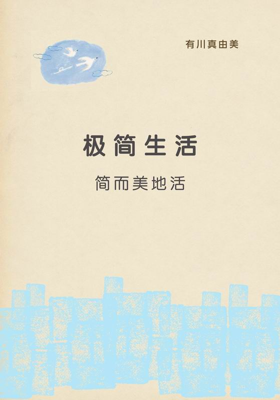

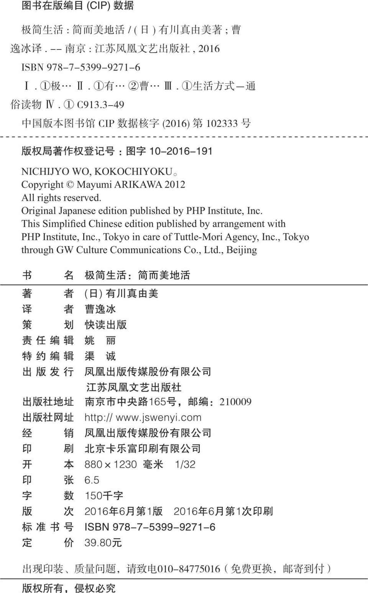

# 前言

有时候，我们会突然发现，自己被肉眼看不到的压迫感逼得喘不过气来，过得非常不舒心。抑或者说，我们早已习惯了这种状态，已然麻木了。

为什么会这样呢？因为生活中的“事物”太多了。要做的事情太多，心里难免烦躁。家里的东西太多，总也收拾不干净，房间自然就显得拥挤了。要花钱的地方多，成天担心钱不够花。人际关系上的烦心事太多，身心俱疲……

曾经的我也是如此。那时，我总是被各种各样的琐事牵着鼻子走，什么都不舍得扔，这也想做，那也想干……我一心想成为大家心目中的“好人”，却搞得自己疲惫不堪。

经历过人生起伏之后，我才下定决心：一定要改变这种状态。因为我意识到，人生苦短，必须把每一分每一秒都用在“真正想做的事”和“真正重要的事”上。而“化简为繁”的罪魁祸首，其实就是我们自己。

在环游世界的过程中，我结识了许多过着“极简生活”的人。他们的生活虽然简单，却精彩纷呈，充满了欢声笑语。同时，我也切身感受到，旅行时带的东西越少，人就会越“舒心”。

放飞心灵，享受“当下”的时光；抬头发现窗外绝美的晚霞；在舒适的房间和爱人谈天说地；品尝美味佳肴；穿戴上最喜爱的衣物；品味完成一项工作所带来的成就感……也许这些拨动心弦的瞬间，才是我们苦苦追寻的“宝物”。

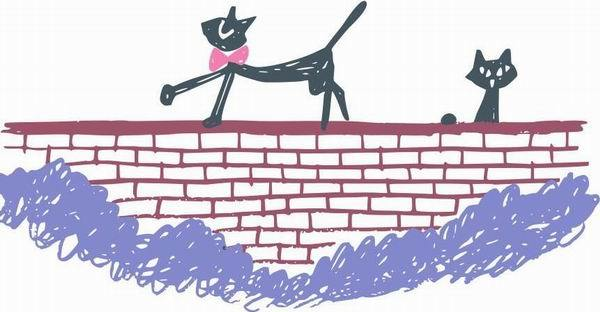

真正精彩的生活，靠的不是堆满房间的东西，也不是用之不尽的金钱。“我经历过怎样的时光？”“我将要度过怎样的时光？”—对时间内涵的正确理解，才是舒心生活的关键。

人最为珍贵的财富，莫过于时间。要如何在有限的时间里活出精彩，活出幸福呢？—答案就是把生活变得更简单一些。

哪些东西该大胆舍弃？哪些东西又该妥善保存？本书将从日常生活的各个角度，向您传授过上“极简生活”的小秘诀。您可以从简便易行的小诀窍做起，也可以根据自己的实际情况加以调整，打造出更适合自己的生活方式。

希望本书的每一位读者都能成为人生的主角，在日常生活的舞台上大放光彩。如果本书能为大家提供一个停下脚步、深入思考的契机，我就心满意足了。

谨以此书献给想让生活充满欢笑的所有人。

有川真由美

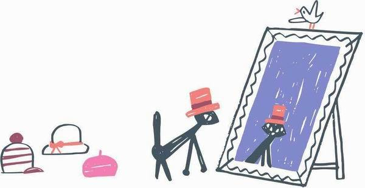

\

【更多得到系列图书、订阅专栏、喜马拉雅付费资源分享微信：boksharer，本书仅供学习，请勿他用】

# 第1章 简单舒心的生活

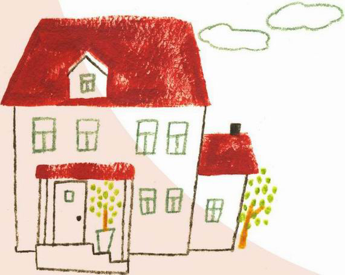

我们身边总是围绕着错综复杂的东西与信息。

要是放任不管，难免会和真正重要的事物失之交臂。

如果你家里有很多不那么重要的东西，

何不趁此机会与它们挥手告别呢？

如此一来，你的生活定会更加舒心愉快，

你也能带着爽朗的心情，面对真正的自己。

整理过后，你定能深刻感受到：我把精力用在了正确的地方。

## “身边的小幸福”最宝贵

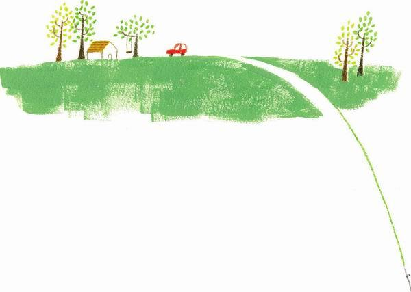

许多职业女性总是被“待办事项”追着跑。

无论是工作还是生活，大家都把更多的精力耗费在了“不得不做的事”上，而忽略了“真正想做的事”。为了完成任务，我们每天都忙得不可开交。一眨眼的工夫，一天过去了，一星期过去了，一年过去了……许多人回过神来才发现：“咦，我这段时间到底在瞎忙什么啊？”

为什么生活会变得如此匆忙？

因为我们把自己“周围”的某样事物当成了“行为标杆”。

我们会下意识地和周围的人统一步调，或是被各种各样的信息牵着鼻子走。“这个也得做好!”“那个也要完成……”久而久之，就没有喘息的时间了。

可是，请大家问一问自己的内心，仔细想一想：

真正宝贵、必要的东西，其实寥寥无几。把你折磨得筋疲力尽的“待办事项”，也许根本就没有那么重要，只是你误以为它很重要罢了。

“没有也无所谓”“没有了反而更好”……许多人偏偏为这样的事物牺牲了生活的大部分时间，与真正重要的事物失之交臂。我们应该为自己而活。

因为，能为你的人生与幸福负责的人，只有你自己。

我们完全可以主宰自己的生活，选择自己“真正想做的事”，打造出适合自己且舒心的生活方式。

人生要懂得取舍

然而，我们的日常生活中存在着各种各样的“制约”。

好比“金钱”。我们能自由使用的金钱是有限的。正因为它有限，所以我们才需要“在某些方面节约，把省出来的钱花在其他地方”。

“这个也想要!”“那个也想买!”—如果你老是冲动购物，花钱没有计划，你就永远都攒不到钱买“真正想要的东西”，也没有条件去做“一直想做的事”了。

我们能自由支配的时间也是有限的。

对职业女性而言，时间尤其宝贵。

“工作好忙啊……”“每天的生活都好匆忙……”长此以往，你就没有时间做自己想做的事，也没有闲心去关心身边的人，与他们深入交流了。

如果你的生活中堆满了难以处理干净的东西与信息，成天被“待办事项”追着跑，那你就很难察觉到自己真正需要去做的事，或是真正有价值的东西了。匆忙的生活状态，也不可能孕育出真正的幸福与精彩。

其实，真正的幸福与精彩，就隐藏在我们的日常生活中。为了让心灵重获自由，为了感受到生活中的小幸福，为了不牺牲真正重要的东西，我们应该把自己周围的物品、人际关系、金钱、空间、时间与生活方式变得更简单一些，让自己过得更自由、更舒心。

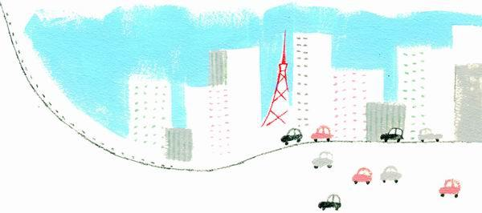

让我们把眼光放得更长远些，明确未来的目标。“我想做这样的事!”“我想变成那样!”—只要朝着这样的目标循序渐进，你总有一天能实现最终目标，开拓出一片属于自己的小天地。

摆正心态后，你还能把精力集中起来，提升自己的能力和水平，为现在与未来的幸福生活打下坚实的基础。

需要牢记的3个基本点

在我看来，现代女性最需要的是“以自己的幸福为主轴，有取有舍”的价值标准。

为了打造出稳固不动摇的标准，请大家牢记下面3个基本点：

● 将“自己想做的事”“让自己舒心的事”放在首位

● 不要攀比，按自己的步调，走自己的路

● 别考虑“应该做什么”，而是思考“想做什么”

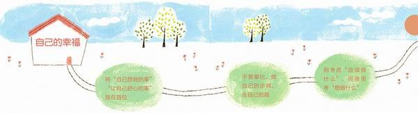

努力向这3个基本点靠拢，用在无谓事物上的时间就会逐渐减少，用在自己身上的精力，以及提升自身潜力的时间则会相应增加。

只要把不需要的事物赶出去，你的生活就会变得更简单。久而久之，你定能察觉到身边的小幸福。而你的内心世界，也会比之前丰富精彩得多。

东西越多越好？东西越多越放心？让我们告别这样的价值观吧。

一味迎合周围的人？花时间做不乐意的事？不要在把时间和金钱浪费在这些事上了!

如何利用有限的资源，创造出精彩的价值和幸福？你有这方面的知识与技能吗？从今往后，这才是决定人生幸福与否的分水岭。

在本书中，我将向大家介绍许多将生活与生活方式变得更简单的小诀窍，帮助大家在与时代和环境和谐共存的同时，过上舒心快乐的极简生活。

## 为什么东西越少越好？

“拥有物品”，其实是一件很消耗能量的事情。

东西越多，我们消耗的能量就越多。

打个比方吧。假设你有50件衣服。

为了买这些衣服，你要看杂志了解流行趋势，逛街货比三家。然后你还得提着硕大的购物袋，把这些衣服拎回家。衣服脏了，你就得把它们洗干净，烫平整。要是衣服上有污渍，你还得把它们送去干洗店。纽扣掉了，就要拿出针线包来把扣子缝上……

“拥有物品”，就等于“将能量耗费在物品上”，只是我们很少意识到这一点罢了。

可你要是只有20件衣服呢？那你耗费在衣服上的能量自然就少了一半。

购买剪裁好、容易打理的好衣服，就能进一步节省能量了。

我们应该购买适合自己的衣服。如果在买的时候就考虑好了搭配方法，那么早上出门前选衣服的时候也不会犹豫不决了。

只要你愿意调整，就能把之前浪费在无谓事物上的时间用在自己身上。

我们可以想办法缩短纠结着装的时间，在出门前仔细检查东西是不是带全了。或是把花在衣服上的钱用在兴趣爱好上，对自己进行投资。

要是房间里堆满了平时不太穿的衣服，那就好好收拾一下，把空间变得更舒适。

下面我将从①时间、②空间、③金钱、④心态这几个方面详细阐述“为什么东西越少越好”。

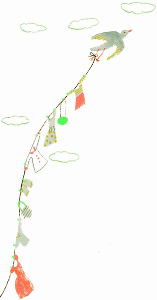

### 时间 增加让自己高兴的时间

“如何使用时间”，是人生中最重要的课题之一。

因为每一个人能使用的时间都是有限的。东西越少，就越容易高效使用宝贵的时间。

设想一下，如果你的办公桌上堆满了文件和资料，乱七八糟的，那你肯定要花很多时间去整理，对不对？

将文件分门别类整理好，从文件堆里找出需要用的文件，大扫除的时候把文件搬来搬去……这些动作都相当费时。

要我说啊，没有比“找东西”更费时费力的事情了。

我们完全可以把大多数资料存在电脑里，把用过的纸质文件处理掉，或是存放在固定的地方。如此一来，就能大幅缩短花在“找东西”上的时间了。

换言之，减少多余的东西，能有效节约耗费在“购买”“存放”“移动”“清扫”“寻找”“处理”等动作上的时间。

你可以把节约出来的时间放在工作上，也可以用这些时间来享受生活、搞搞兴趣爱好、挑战新事物……哪怕什么都不干，让自己放松放松也是个不错的选择。时间宽裕了，人就会变得从容。

只有让时间宽裕起来，我们的生活才有可能变得更精彩、更充实。这是堆积成山的物品所无法实现的。

人生精彩与否，不在于“拥有多少物品”，而在于“拥有多少让自己愉悦的时间”。

为了把有限的时间用在刀口上，让我们从“减少身边的物品”做起吧。

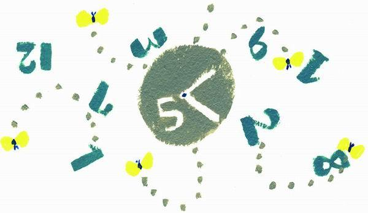

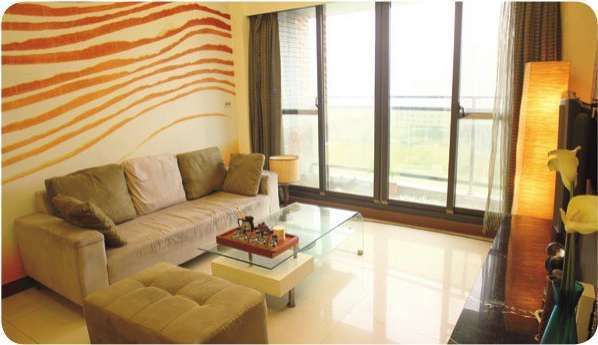

“房间(空间)”“时间”与“心灵”的关系密不可分。时间宽裕了，每天的生活都会变得更舒心。

### 空间 东西太多的空间会消耗人的能量

我们的生活空间本该是我们的心灵港湾，为我们补充能量。

干净整洁、没有太多杂物的空间，能让心情变得更平和，帮助我们集中注意力。在这样的环境中生活，不会被多余的东西弄得头晕目眩，可以把能量尽情使用在真正必要的地方。

可要是家里堆满了东西，乱得连落脚的地方都没有呢？

忙碌了一天，推开家门一看……无论坐哪儿都觉得不舒服，整个人比上班的时候更累。地上要是乱七八糟的，你一定也会把手提包随手丢在地上的。

“算了，就这样吧……”这种破罐子破摔的心态，会让你养成做事拖拉的坏习惯。拖延症越严重，房间里就越乱，这样就形成了恶性循环。东西太多的空间，会消耗我们的能量。

而且，“空间”可以跟“金钱”画等号。

要是不经常收拾，家里的东西就会越来越多。杂物最占地方，没地方放了，就得买新的橱柜把它们装起来。如果你住的是三室一厅，说不定还要专门分出一个房间来当“储物室”。实在堆不下了，就只能搬去更大的房子住。

可是，我们完全没有必要为了“东西”开辟新的空间—把多余的东西处理掉就行了。你真正需要的东西，不过凤毛麟角。

空间也好，房间也罢，都是你花钱买的，或是每月用房租换的。家里的东西越少，需要的面积就越小，不用出太高的房租也能找到合适的房子。屋里有足够的空间，就能放上一个小花瓶，插上一枝花养养眼，或是邀请三五好友来家里开个派对。总之，我们可以发挥创意，巧妙利用节省出来的空间，让自己生活得更惬意。

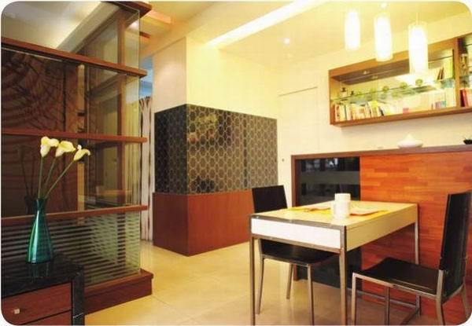

整洁的房间最舒适。房间简洁了，才有精力梳理生活的各个方面。

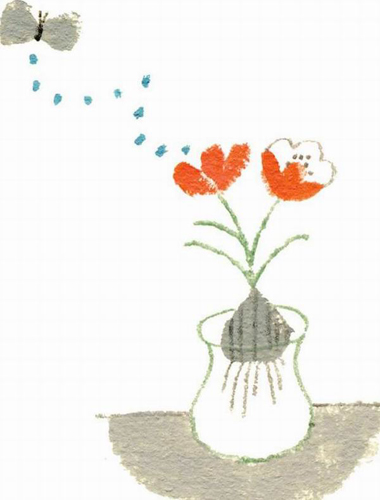

### 金钱 金钱是孕育出新价值的能量

“拥有很多东西”，就意味着“要花很多钱”。

大家不妨扪心自问一下：我花钱买回来的这些东西，真的值吗？

在商场打折的时候一下子买了好几件衣服，事后一试才发现“好像不太合适”，最终被打入冷宫；被天花乱坠的广告所吸引，买了很多功能相同的化妆品；明明已经有某款饰品了，却完全不记得自己买过了，又买了一个一模一样的回家……想必有这种经历的人不在少数。

“我怎么会买这种东西啊!”—小小的“挥霍”积少成多，积蓄自然就少了。

上班用的包，买稍微贵一点的也没关系。因为你每天都会用到这个包，当然得买一个用得顺手，质量也过硬的。可是登山包呢？你又不是天天去爬山，何必在这个东西上花好几千块呢？

使用频率比较低的东西或是临时性的东西完全可以向亲朋好友借，买二手货也行，租一个也没问题。

物品越多，使用频率越低，单个物品的“使用价值”就越低。在这种情况下，你花出去的钱没有产生出应有的价值。

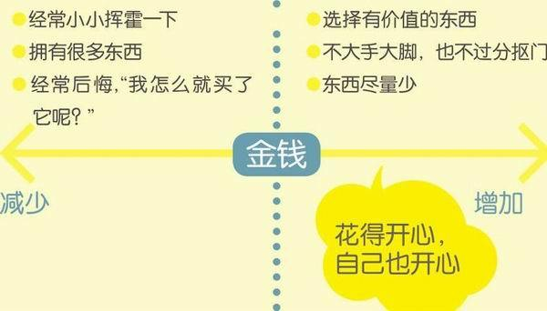

金钱是孕育出新价值的能量，但我们这辈子能花的钱是有限的。要是把钱浪费在了多余的事物上，不就没钱买真正想要的东西，做真正想做的事了吗？

所以，我们应该为真正重要的事物留出能自由支配的资金。

但这并不意味着我们要“一毛不拔”，也不是让大家“不消费”。

实践起来其实特别简单：把钱花在有价值的东西上，不盲目攀比，不过分抠门就行了。只要摆正心态，我们就能开开心心地花钱，开开心心地过日子了。

减少身边的东西，是过上极简生活的第一步。

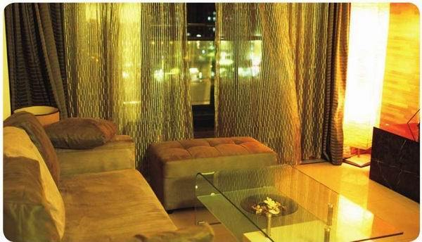

在“精品”的环绕下生活，心情自然差不了。团聚的时光，离不开温暖的灯光。

### 心态 东西越多，人就越是难以喘息

拥有的东西越多，人就会觉得越压抑。那是因为东西都在不断释放“信息”。

客厅的摆设在说：“我都积灰啦，快给我擦擦吧!”高级家具在说：“我身价不菲，你可得好好伺候我啊!”厨房的常备食品在说：“我都快过期啦，还不快来瞧瞧!”……

每天听这么多东西“说话”，想不累都难。就算你想装作没听到，心里总归还是放不下的。“得赶紧处理一下……”为了解决这些问题，我们总是手忙脚乱。

人能管理好的东西十分有限。想拥有平和的心态，就把多余的杂物处理掉吧。如此一来，你就不用耗费多余的精力了。

你是不是觉得“扔东西”就是“丢掉自己的价值”？

你是不是“不舍得”丢东西？

问题是，你依依不舍的这些东西，并不能愉悦我们的身心，反而会带来无尽的压力。

东西越多，内心的从容就越少。久而久之，你就分不清事情的轻重缓急了。没了这些东西，你反而能过得更从容、更有活力。

身边的杂物，就跟我们身上的赘肉一样。“赘肉”越少，心就越轻松。你一定能切身体会到，处理杂物能释放出源源不断的新能量。

“这个也想要!”“还想要更多!”……与贪婪的物欲说再见，才能在生活中发现更多的乐趣。

比如，度过愉快的时光，与他人畅谈，让自己更上一层楼，重新审视自己拥有的财富……

减少身边的东西，就是为心灵留出呼吸的空间，提升精神的层次。

如此一来，我们就能过上从容舒心的生活了。

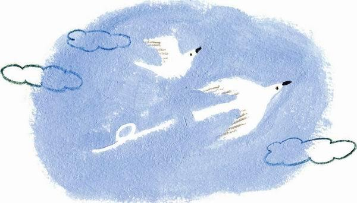

# 第2章 不添置、大胆扔、巧收纳

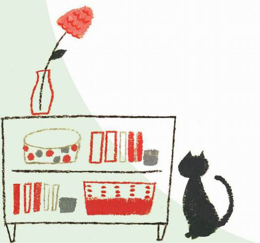

“我有很多想做的事，就是没有勇气去实践……”

“脑子里乱七八糟的，都不知道该先做什么了……”

如果你也是这样，

不妨先把自己周围的杂物清理干净吧。

只要把不需要的东西处理掉，

就知道自己到底需要什么了。

　　

“果断决定”+“立刻执行”

八字真言，打造极简生活。

## “没有”比“有”更轻松

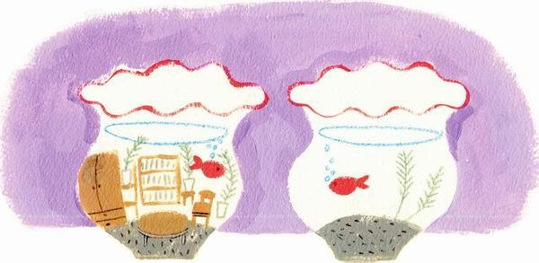

要和“东西”构筑起良好的关系，关键在于塑造一个能与东西和谐共处的环境。

和自己最喜欢的东西一起生活，岂有不幸福之理？

好东西能给我们加油打气，能让心情变得平和，能让生活更舒适，甚至能孕育出新的价值。换言之，这样的东西，能给我们注入能量。

可正如我在第一章里所说，大多数人家里的东西都“太”多了，而且这些东西大都是没有意义的杂物。我们被这些杂物耍得团团转，耗费了许多宝贵的精力。

杂物，会模糊“必要”与“不必要”的界线。生活在这样的环境中，我们会搞不清“真正重要的事”是什么，甚至连轻重缓急都分不清。

让我们把耗费在多余杂物上的能量转移到自己和重要的人身上吧。

与其被一堆杂物包围，不如和杂物说再见，这样才能过上更舒心的生活。为了和真正的“好东西”和谐相处，我们需要把多余的杂物处理掉，摆脱杂物的支配。

东西少了，心田自然开阔

为什么我不爱往家里堆东西呢？很简单。因为我想集中精力，做好眼前的工作，办好我该办的事。

我平时在家工作，所以要是房间里乱七八糟的，我就不得不花很多时间找东西。“我也想打扫啊，可是没时间啊……”越是这么想，心情就越是烦躁。所以要集中注意力，要保持心情舒畅，最好的方法就是在家里少放东西，打造一个简单舒适的环境。

这个道理不光适用于工作空间，做家务、放松的居住空间也是如此。在家里放松身心的时间极为宝贵，能少做些杂事，当然是再好不过了。可家里要是有很多东西，你就不得不花时间去管理它们。于是你就把宝贵的能量耗费在了杂物上，无法全身心投入到自己真正想做、真正应该做的事情上。

其实这些让人操心的杂物的使用频率并不高，基本都是摆在家里积灰。仔细想想，你就会意识到，“也许我并不需要它”“也许我没有必要为那个东西操心”……

想要的东西越多，心就越不容易得到满足。即便你最后如愿得到了那些东西，心情也会倍感压抑。本该为你带来快乐的东西，反而成了压力的源头，在你的心头蒙上了一层阴霾。

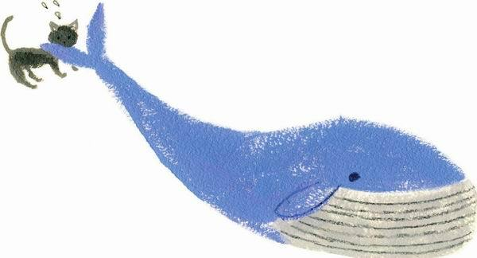

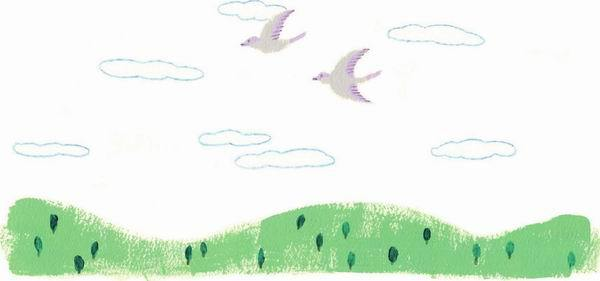

我们真正需要的东西并不多。

其实，“没有”比“有”更轻松。

多余的东西少了，让心灵舒展的空间自然就多了……

丰富的内心世界，精神上的成长，踏踏实实的每一天—这样的生活，有着金钱无法买到的宝贵价值。来人世间走一趟不容易，要是不让自己发光发亮，那多可惜呀!

要“活得精彩”，首先就要学会和“东西”打交道的3个技巧：①不添置(KEEP)、②大胆扔(OUT)、③巧收纳(STORAGE)。

只要养成这些好习惯，过上极简生活，无论你在生活或工作中做出了怎样的决定，都能怀着自信，勇往直前。

和“东西”打好交道的3个技巧

要尽可能减少自己周围的东西，过上舒心简单的生活，

关键在于做到“不添置(KEEP)”“大胆扔(OUT)”和“巧收纳(STORAGE)”。

一定要记住，任何东西的容量都是有限的!

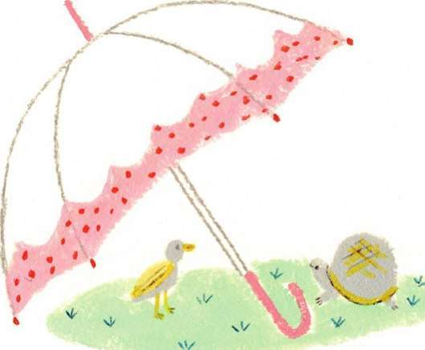

STEP1　不添置(KEEP)

过上极简生活的第一步，就是养成“少买东西”的习惯。

“需要了再买”“用现有的东西代替”“不拿免费的东西”……

不添置物品的方法还真不少。

做决定之前，一定要先扪心自问：“我现在真的需要它吗？”

STEP2　大胆扔(OUT)

过日子，免不了要消费。要是总也不扔，家里的东西就会越来越多。

“这东西没用了!”—我们要养成“当机立断，痛下决心”的习惯。

只要品尝到扔东西的快感，包你欲罢不能!

遇到不舍得扔的东西，不妨换个角度想一想，这样更容易下决心。

STEP3　巧收纳(STORAGE)

“把有某种作用的东西放在固定的位置上”—只要做好这一点就行。

只要牢记“哪里有什么，有多少”，

就省去了满世界乱找的麻烦，也能避免多余的开支。

收纳的关键不在于把东西“藏得多深”，而在于“方便取用”。

## STEP1 不添置

不要让东西的数量超出自己的管理能力

A. 去熟悉的商店买东西，出门前列好清单

B. 用租赁或一次性用品代替购买

C. 不拿免费的东西

D. 替换品能少则少

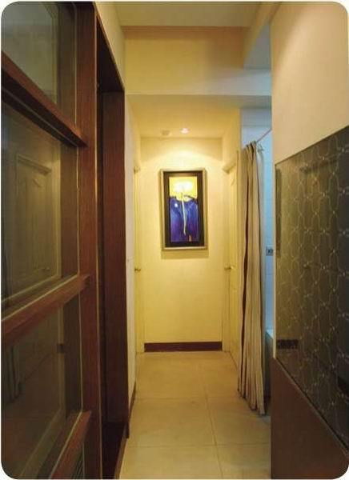

过道上绝对不堆放东西

因为我经常搬家，也经常出门旅行，所以我养成了尽量不买东西的习惯。就算我以后买了房子，这个习惯恐怕也改不掉了。

为什么改不掉呢？因为“东西少”的生活真的很轻松，心理负担也小，管理起来超级方便。

我本来就是个很怕麻烦的人，也不擅长整理东西。经验告诉我，要保持房间的整洁，充分利用屋里现有的东西，关键在于“不要让东西的数量超出自己的管理能力”。

现在我是东西越少，心里就越轻松。但也有过“家里东西越多就越安心”的阶段。我会囤上一堆食品和日用品，一看到打折的商品就想：“此时不买更待何时啊!”看到大家都在买某个东西，我也会随大流。

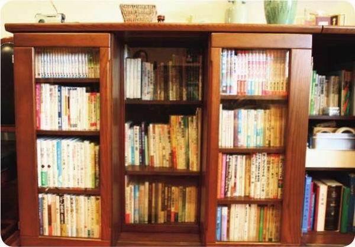

家中存放的书本数量保持不变放不下了，就把最旧的处理掉。

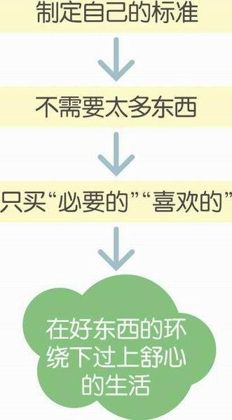

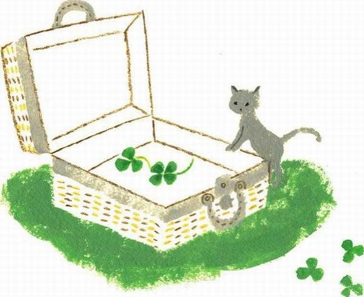

人为什么会花不必要的钱，买不必要的东西呢？这恐怕是因为我们想用东西来抚平心中的焦虑，缓解心中的不满吧。亦或许是因为我们对自己的决定没有信心。

久而久之，家里就堆满了用不上的东西，或是“买错了”的东西。房间越来越乱，根本提不起劲去整理……这就形成了恶性循环。

我受够了。我再也不想被杂物牵着鼻子走，也不想再随波逐流了。“有了这个可能会很方便”“可以买一个放着”“这个东西最近很流行”……我再也不会因为这种理由乱买东西了。

如果一样东西不能在我的生活中发挥出重要的作用，那我就不会去买它。

“我真正需要的东西是什么？”—只要细细思考这个问题，我们就会发现：我们真正需要的东西其实并不多。

当然，“必要的东西”和“真正喜欢的东西”我还是会高高兴兴地掏钱买下。正因为我没有把钱浪费在乱七八糟的东西上，我才能有足够的资金购买自己真正想要的东西。连精挑细选的过程，都充满了快乐。

“不添置”的意思，并不是让大家做一毛不拔的铁公鸡。大家只要选择自己真正需要的，能让自己的生活变得更精彩的东西就行了。

只要用自己的标准筛选一番，剩下的东西就都是“精英”了。

### A.去熟悉的商店买东西，出门前列好清单

我一般是3～4天采购一次日常用品。“面包、鸡蛋、番茄……”想到什么，我就会记录下来，写一份购物清单。等到有时间了，再拿着清单逛1～3家熟悉的商店就行了。这样买东西不容易有遗漏，也节省下了漫无目的瞎逛的时间。

买东西不带购物清单，就跟出门旅游不带地图一样。没有计划，就很有可能浪费时间、金钱与体力。

去熟悉的商店购物有很多好处。因为你熟悉这家店，所以你知道店里有什么，这些东西大概是什么价位。有了这些信息，就很容易制定出合适的购物计划了。相熟的店员还会向你提供第一手情报呢。现在什么蔬菜最好吃，怎么做腌菜，怎么存放食材……专家提供的情报可以和“金钱”画等号哦!

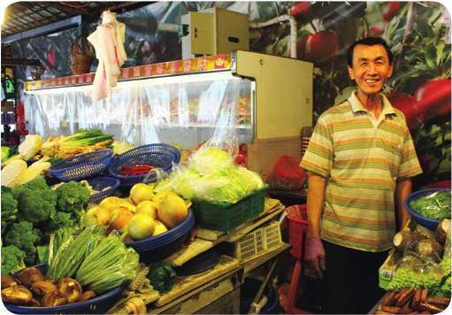

家附近的蔬果店是我们的好帮手有时候还会给你一个小惊喜呢!

### B.用租赁或一次性用品代替购买

使用频率特别低的东西可以用“租”的，或是直接买“一次性用品”。

比如，我家只有一套给客人用的被褥。要是家里来了好几个客人，我就会找好朋友借上几床被子用。在家里开5人以上的派对时，我会用漂亮的一次性纸碟盛放饭菜。

“反正每次招待客人都要用碟子，那还不如买些便宜的餐具呢，这样又便宜又环保……”肯定有读者会产生这样的疑问。

可问题是，买自己并不喜欢的餐具回来，只会占用宝贵的收纳空间。而且这类餐具的使用频率真的不高。所以在掏钱购买之前，我们最好仔细想一想“买了之后要怎么管理”。

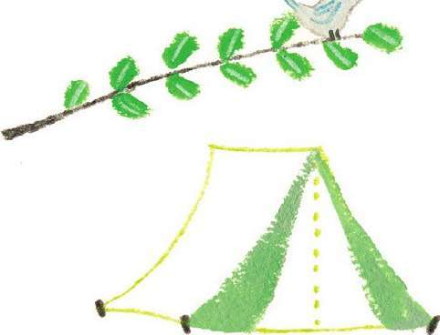

### C.不拿免费的东西

很多人都会觉得小样、小奖品、宣传品等等“很划算”“不拿白不拿”“这么点东西不会占地方的”……不幸的是，免费拿的东西一般都不合你的品位，也不会在我们的生活中发挥出太大的作用。增加“用不着的东西”，就是给自己增加负担。

还有人跑大老远去拿免费的赠品呢!要我说啊，这种人就是浪费了自己的精力和时间。如果那赠品很稀有也就罢了，可为了没什么用的杂物浪费时间，未免也太本末倒置了吧？我们应该把宝贵的时间用在更有价值的地方呀!

### D.替换品能少则少

毛巾、床单、内衣……这类需要换洗的东西，我的原则是能少则少。

为什么呢？因为需要“替换”的时候，只需要“洗”和“晾”的这一小段时间啊。

我家只有1条床单(当然，我这种情况可能比较极端了)。找个晴朗的早上把床单洗了，晾到傍晚它就干了。当天晚上，我就能躺在刚洗好的床单上睡觉啦。

内衣裤也是一样的道理。与其买一堆便宜货，不如买几条合身的，款式好看的。毛巾也不需要太多。

花钱也讲究“质量”。买质量好的东西，心情自然愉悦。而且质量好的东西也都比较耐用。

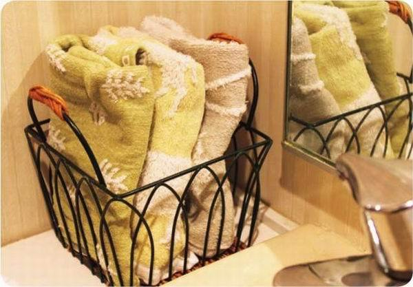

毛巾也尽量少买。洗脸台上只放用得到的数量。

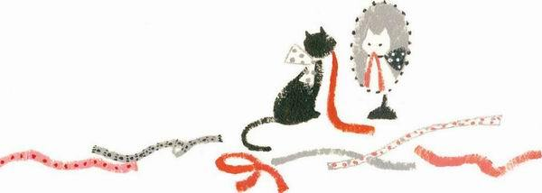

## 一定要添置的话……

就算你想“尽可能不添置东西”，可该买的东西还是得买。

什么东西该买呢？“该买的东西”有两个必备条件。条件之一，它必须是“你打从心底里想要的东西”。想要的东西不能买，想做的事情不能做，那辛辛苦苦工作还有什么意义啊!

条件之二，你必须“能想象出自己要如何用这个东西”。

以衣服为例。你要是能想象出自己穿上它的样子，并明确它的用途，比如：“这件衣服可以穿着去参加聚会，也可以和那件毛衣搭配，打造出很休闲的风格”，那就可以买了。如果你看中的是家居用品，就要先想一想买了之后要放哪儿，和房间的整体风格搭不搭。想好了再买，就不容易出错。关键就是“充分发挥想象力”。要是有些犹豫，不如先冷静几天，想清楚了再做决定。

添置物品，和“迎接新的家庭成员”一样，需要小心谨慎地“审查”。买的时候太随便，就有可能买到不耐用的东西。要是买回来的东西和周围的东西“不搭”，看着也会不舒服。我们总不可能在大街上随便抓一个人回家吧？道理是一样的。

我们的最终目的不是“买”，而是“用”。“和自己真正喜欢的东西和谐共处”，才是重中之重。

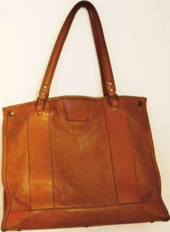

我最喜欢的包包。背着舒服，也好搭配。越用越有味道!

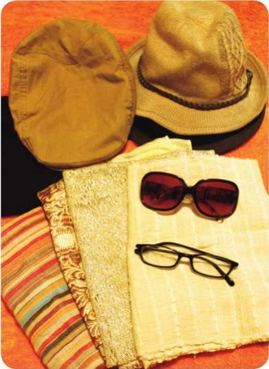

“那件衣服配这条围巾很不错!”在脑子里搭配好了再买!

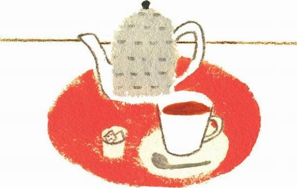

3条黄金守则

助你选择能长久使用的好东西

既然要买，当然得买让自己开心、舒心的好东西!

选东西，其实是为我们的心灵选择一种积极的能量。

活用下面3条黄金守则，选购能长久使用的东西吧。

●耐用顺手

添置物品时，要以“自己的生活”为标准，不要刻意追逐流行，也不需要多余的功能。耐用顺手的东西才是最好的。要是没用几天就坏了，那损失可就大了。所以添置物品的时候，首先得看它的质量是不是过关，是不是耐用。

●喜欢

“东西好不好”和“喜不喜欢”是两回事，但这两点同样重要。“我好喜欢这个哦!”—只有产生了这样的感情，你才会小心翼翼地使用这件物品，不是吗？不喜欢的东西，怎么会一直用呢？所以在添置物品的时候，我们一定要坦诚面对自己的内心，千万不要被别人的评价标准迷惑了双眼。

●能搭配现有的物品

衣服与家居用品一定要买“好搭配”的。有些家电与工具只能单独使用。买两个功能重复的产品最浪费。购买前，要先想好“放在哪儿”和“怎么用”。

只选对的，不选贵的

找到最适合自己的“好东西”，是让你活出自我、过上极简生活的第一步。

一般来说，对生活越有追求的人，对物质的欲望就越大。

可真正的“好东西”，不一定就是“最贵的”，只要适合自己就行。以“笔”为例吧。我用来记日程的笔永远是百乐(PILOT)0.3mm的中性笔，用来记采访笔记的则是0.5mm的那种。

这款笔一支只要210日元(约12元人民币)，但我觉得它握着很舒服，出水也顺，我至今没有找到能取代它的产品。签字时用的签字笔、写信和文件时用的圆珠笔也是万年老花样，从来都不换。

仔细想来，深得我心的“好东西”的确是一年比一年多。“外形”“功能”“顺手度”“耐用度”……它们吸引我的地方虽然各不相同，但都是我的生活好帮手。

我始终认为，“好东西”就是不可或缺的家庭成员。

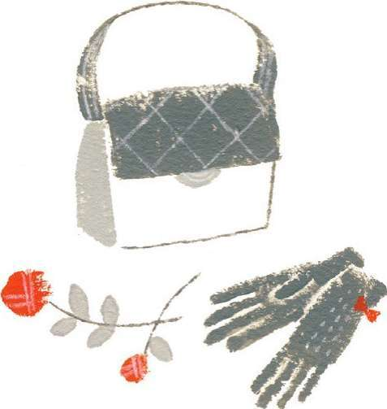

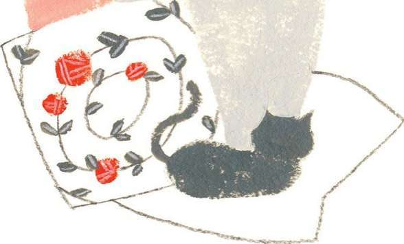

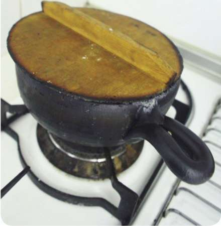

用了好多年的砂锅。价廉物美，省时省力，做出来的东西也好吃，我简直离不开它了!

好东西有很多优点。“用着舒服”“靠谱”“效果好”“耐用”……

我们应该选择最适合自己的产品。

在某些关键场合，我们就需要以一顶十的好东西!

不过有时也得鼓起勇气挑战新产品哦。

哪些地方要选用“好东西”？

随身携带的物品

钱包、名片夹、记事本、眼镜盒……你的随身物品，就代表了你自己。“喜欢什么风格”“重视什么东西”“生活水平如何”—虽然我们不能通过一个人的着装和随身物品了解他的全部，但了解个皮毛还是不成问题的。随身物品不需要都买名牌，只要适合自己，又能体现出个人风格就行。带着好东西走南闯北，心情当然会不错啦。

长期使用的物品

像电器、家具之类的“大件”，或是大衣、手提包之类的“耐用品”，我们完全可以买稍微贵一点的“好东西”。要是贪便宜，也许用不了几年就得换，花的钱反而会更多。我在两年前买了一辆二手车和一辆二手摩托车。买二手车之前，我做了很多功课，虽然这辆车已被人开了18年，但也没辜负我的期待，到现在都没有出过任何问题。可随随便便买的摩托车呢？虽然之前才被用了5年，却成天出故障，愁死人了。所以啊，大家买东西之前一定要做好功课，买自己真正中意的“好东西”。

每天都要用的消耗品

我每天喝的茶、每天早上吃的切片面包都有固定的品牌。平时用的沐浴露和洗发水也会选择质量好、味道好闻的产品。米、洗涤剂、化妆品、营养品……不同的人有不同的关注点。既然不可能做到事事周到，那就把精力集中到自己最关注的地方吧。用好的消耗品，能让我们的心情更舒畅，为生活增光添彩。

能孕育出新价值的工具

厨具、工作时用到的工具、文具……如果你想“做出好的成绩”“合理安排好时间”或“节约时间”，那最好在这几种工具上多花点心思。我是个很讲究“吃”的人，特地从日本带了一口厚厚的砂锅过来，专门用来煮饭。只要用它煮上15分钟，什么样的米都能变成可口的米饭。顶尖运动员都会选择最好的体育用品，可见“工具”会极大地影响最终的结果。

## STEP2 大胆扔

将扔东西产生的“痛感”变为“快感”

A. “丢弃”三原则

B. 养成“丢弃”习惯的三步骤

C. 如何对待“实在不舍得扔的东西”

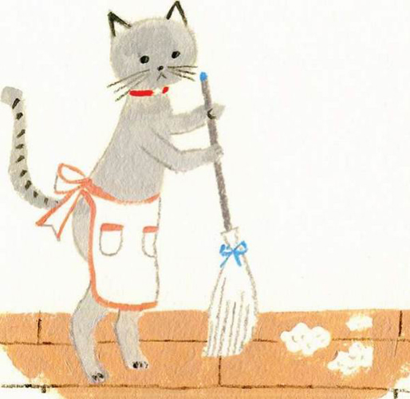

家里东西越来越多，那是理所当然的事。因为我们在不断用“收入”换“东西”。要是只进不出，东西当然会多起来。

杂物就跟赘肉一样，一年比一年多，把我们牢牢困住，害得我们动弹不得……

“为什么不扔呢？”其实问题就出在“有没有快感”上。

人只会做“有快感”的事。

“得到东西”，就能带来一定的快感，让人高兴起来。这种快感具有极大的威力，很多时候，我们就是为了享受这种快感，才会去买不必要的东西。

反之，“扔东西”常会带来一定的“痛感”。这种痛感的根源，就是对未来的担忧(“也许哪天会用到……”)，或是对过往的执着(“好容易买回来的……”)。

说白了就是“对失去的恐惧”。

我这种怕麻烦的人啊，通常会选择最省事的活法。好容易提起劲来收拾房间，动机也带有负面的情绪—“我不想待在不舒服的房间里”。

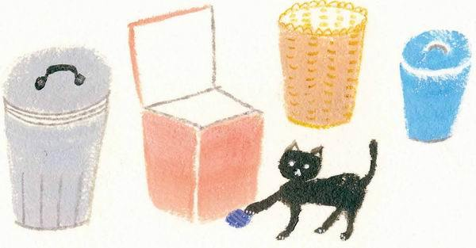

但是我在不知不觉中，品尝到了“扔”这个行为带来的“快感”。

扔吧，解放你的心灵

“扔”，怎么会带来快感呢？因为我意识到，“扔”就等于“我不用再为这个东西操心了”。

打开衣橱，把不穿的衣服统统拿出来。把名字跟长相已经对不上号的人请出名片本。把一大摞书搬出家门。在完成这些动作的瞬间，我总能体会到一种难以名状的爽快感。

当你拒绝一场你并不想去的应酬时，也会产生类似的安心感与爽快感：“对不起，我今天去不了!”

把多余的东西扔掉之后，你的心情一定会轻松许多。

有人曾做过一项问卷调查。“如果你只能再活几个月，你想在死前做些什么？”—很多人回答，“我会拜访帮助过我的人，亲口向他们道谢”“我想去旅行”“我想吃很多好吃的”……也有不少人回答，“我想把生活‘收拾干净’。”

此处的“收拾干净”，并不是“整理房间”的意思，而是“把自己的东西清零”。要是把这些事丢给亲朋好友去做，会让他们产生莫大的痛苦。毕竟，谁都不舍得扔掉至亲的遗物。

世事难料。想做什么，就立刻动手。真到了最后关头，就把一切都收拾干净吧。为了应对人生的种种变故，确保自己“身轻如燕”也是相当必要的。

### A.“丢弃”三原则

如何判断一样东西该不该扔呢？我的判断标准可以总结成一句话—“现在不需要的东西立刻就扔”。

要享受“当下”，就不能把太多的精力耗费在属于“过去”与“未来”的东西上。

大家不妨按照下面介绍的三大原则，甩掉心中的焦虑与纠结，果断挑出“现在需要的东西”吧。

“现在不需要”的东西要立刻扔掉

“不舍得扔”的原因总是五花八门：“这东西可贵了(价格)”“这是我从小用到大的(感情)”“这东西还能用(状态)”……而我的判断标准则建立在时间轴上，简单明了—现在需要的东西就留着，其他的统统扔掉。

不过“需要”和“使用频率”之间不能完全画上等号。有些东西的使用频率很低，但“在不远的未来一定会用到”，比如运动用品、旅行用品、消耗品的囤货等等。还有一些则是“需要永久保留的东西”，好比宝贵的照片、合同、防灾用品等等。如果你能确定某件物品属于这两个类别，那就把它留下来吧。其实这两类也可以归入“现在需要的东西”。

拿不准主意的时候，不妨开动脑筋想一想，“这个东西有什么用”。

“属于过去的东西”要扔掉

长时间不使用的东西，就是“属于过去的东西”。

很多人之所以保留没有用武之地的东西，是因为他们觉得“我以后说不定会用”。无奈江山易改，本性难移。除非你痛下决心要改变自己，否则你的行为模式绝不会有任何变化。

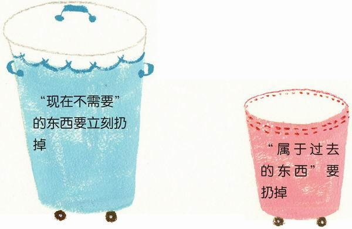

我们可以给自己定一个处理旧物的期限，比如衣服一年没穿过就扔掉，保健器械一个月不用就处理掉。礼物和书信是回忆的载体，所以这类物品基本都属于“过去”。如果它们没有在你的日常生活中发挥作用，那就怀着感激之情送它们“上路”吧。

“不舍得扔”，换个角度看就是“抓着过去不放”。常有人担心丢弃物品就是变相抛弃自己的价值。殊不知它们带来的经验与回忆，早已成为我们不可分割的一部分……

经验和回忆都到手了，夫复何求啊？

“属于遥远未来的东西”也要扔掉

“等我有时间了，就能看这本书了”“等家里来客人的时候，可以用这个大盘子”“等我出门旅游的时候，这些化妆品小样就能派上用场了”……其实啊，我们永远都“等”不到这样的时刻。

也许有人会想：“要是现在扔了，万一哪天要用，不得后悔死啊!”别担心，要不了多久，你就会忘记这些东西的存在。坐视“未来”占领“现在”的空间，才是因小失大，得不偿失。对未来的担忧，其实是“对自己想象出来的假定状态的担忧”。

我们无须为未来忧心忡忡。只要脚踏实地过好“现在”，“未来”就一定会以最佳的状态呈现在你面前。到时候，再根据实际情况准备合适的物品就行了。

属于“过去”与“未来”的东西，还是痛痛快快丢进垃圾桶吧!

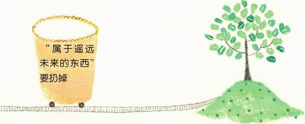

### B.养成“丢弃”习惯的三步骤

明明想扔，却坚持不下来……这是因为你没有养成“丢弃”的习惯。

要养成“丢弃”的习惯，关键在于“约法三章”。只要尝到了扔东西的甜头，就能自然而然地养成不拖拉、大胆扔的习惯了。

邮件要在5分钟内整理分类

不舍得扔，东西越堆越多的人有一个明显的特征：他们明知道杂物没用，可就是下不了决心，没有勇气采取行动。

随手往桌上一放，随手往抽屉里一塞……杂物就是这么攒起来的。

从“不需要(决定)”到“立刻扔掉(执行)”，要一鼓作气，没有丝毫犹豫。这是养成“丢弃”习惯的基础。我们要多多练习，尽量在3秒内完成这个过程。

把邮件带回家之后，最好在5分钟之内把它们打开，分门别类，而不是丢在桌上不管。如果是需要回信的，那就立刻写好寄出去。要是想慢慢写回信，就把邮件放进自己能看到的“处理盒”里。

广告传单之类的东西，当然要立刻丢进垃圾桶啦。

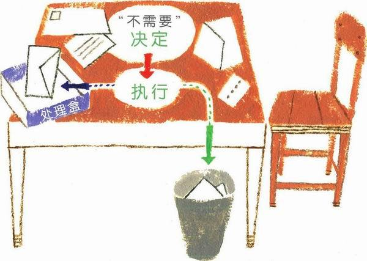

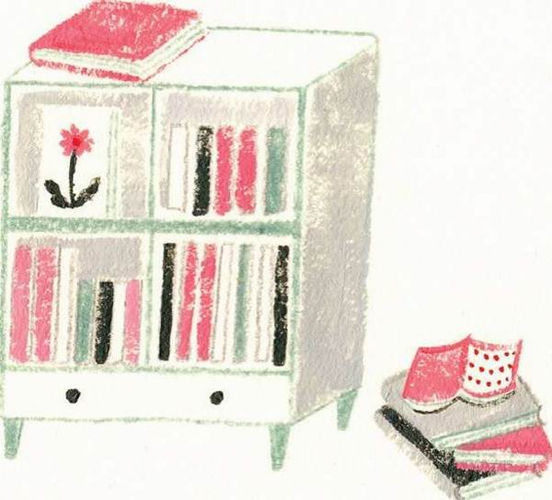

超过一定数量了就扔掉

人能管理的物品数量是有限的。除非你是收藏家，否则太多的东西只会占地方，让你晕头转向。

“东西”存在的意义并不是“放着积灰”，而是“被人使用”。

书架、名片夹、CD盒、DVD盒、毛巾架……这些地方尤其需要我们多加小心。添置了一样新的，就得处理掉一样旧的。装文具的抽屉变得拥挤了，就把用不上的处理掉。总而言之，我们要提前给收纳的地方制定一个明确的“收纳量”。

要是有小恶魔在你耳边说道：“放着又不会少一块肉……”你就得义正词严地告诉自己：“不，囤没用的东西有百害而无一利!”

设定“整理日”

就算养成了“一发现杂物就扔”的习惯，家里的东西还是会越来越多。

所以我们需要定期给家里的东西“分门别类”，只保留“有用的”，把“没用的”请出门去。

实在不好判断的东西，就丢进写有“待定”字样的袋子里。要是你在很长一段时间里都没有打开那个袋子，那就可以放心大胆地把它们丢掉了。

把“整理日”定在休息日是最方便的，我一般会在休息日的早上做这件事，顺便给家里做个大扫除。如此一来，就算整理东西的时候在地上摊了很多东西，弄出了很多灰尘，也能顺手清扫干净，省去了不少麻烦。

整理的步骤和打扫卫生基本相同。以“房间”为单位，不放过任何一个角落。要是家里有装满了旧物的橱柜或箱子，不妨提前定好计划(比如“用4个周末处理掉”)，这样就不会手忙脚乱了。

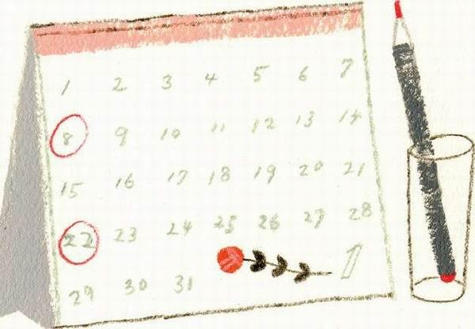

### C.如何对待“实在不舍得扔的东西”

“虽然它没什么用，但我就是不舍得扔”—这样的东西，人人都有。遇到这种情况时，我们可以开动脑筋想一想让它“发挥余热”的方法。

我们千万不能忘了，东西的存在价值在于它如何被使用。

送人

开始在中国生活之后，我养成了一个习惯，那就是“和朋友以物换物”。

“哎，这个给S小姐正合适!”—一发现这样的衣服、书本、盘子或消耗品，我就会把它装进纸袋，下次见面的时候送给对方。

当然，我们不能随随便便把自己不需要的东西送给人家。送人前，要充分考虑对方的喜好，以及对方是不是需要这个东西。

关键在于要和朋友构筑起能交心的关系。“唔……这个我好像用不着哎”—只要关系够亲密，就能拒绝自己不需要的东西了。被朋友拒绝的时候，心里也不会有疙瘩。除了送朋友，我们还可以把书送去图书馆，把衣服捐给慈

善机构，参加小区的跳蚤市场，把没用的小摆设卖掉。

没用过几次的东西还很新，不舍得扔也是在所难免。希望大家都能找到让“东西”循环起来的好方法。

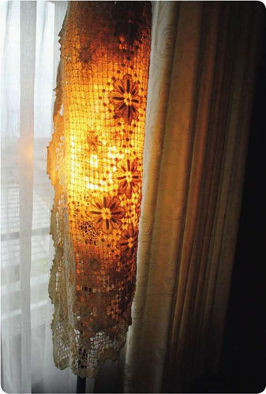

落地灯的灯罩碎了，我就在上面盖了一块蕾丝布，让它焕发新生。

拍照

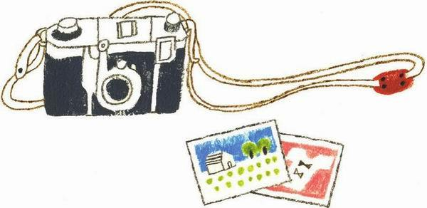

承载着回忆的东西、别人送的礼物、纪念品、家人的遗物、心血来潮搜集的东西……我们对这些东西有很多感情，自然就不舍得扔了。

不仅如此，我们内心深处还有“对失去的恐惧”。

最近常有人“把遗物拍成照片留念”，再把实物处理掉。其实其他东西也可以这么处理。想时不时看一眼的话，就拍成数码照片存在电脑里吧。如此一来，就能放心大胆地扔了。

如果你连照片都不会经常看，那甚至可以在一段时间过后把照片也删掉。毕竟，真正值得记住的东西，一定会留在我们的回忆中。

废物利用

“留着碍事，扔了吧，又舍不得……”遇到这种情况，我们可以“保留一部分”，或是“废物利用”。

我的好友小T的母亲把她的母亲留下的大岛绸腰带改造成了门帘，还把和服的一部分裱了起来，变成了非常漂亮的家居装饰，在客厅陪伴大家。

小O给老家的老家具上了一层白色的新漆。差点就要进垃圾站的破家具就此获得第二次生命，摆在刚装修好的新家也毫不突兀。

我也会经常改造旧饰品，让它们变得更适合现在的我。把废物利用起来，兴许能想到相当不错的点子!

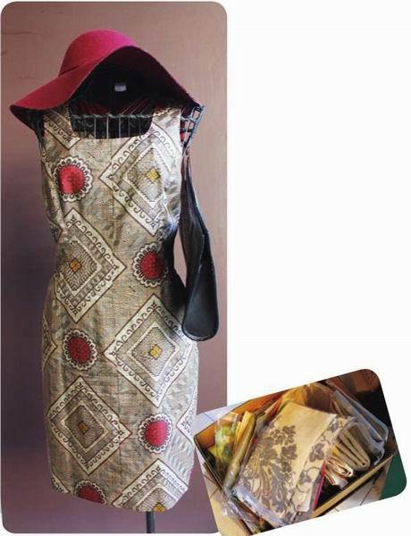

把尺寸不合适的大岛绸和服改造成了连衣裙。配套的腰带用来点缀餐桌。

## Column ① 中国台湾人的极简生活利用旧物，让生活更丰润

去中国朋友家做客时，最先映入眼帘的就是极具存在感的古董家具。这些典雅的家具，很好地起到了提升格调的效果。

我还有个很喜欢日本文化的朋友。他收了些别人不要的橱柜、屏风和桌子，还在古董市场买了餐柜……他找了一栋二战前建造的日式房屋，把他祖父母用过的日式家居搬了过来，开了一家很有日本风情的咖啡馆。

中国的台湾人不仅能把古董家具用得风生水起，还会巧妙地改造“稍微有点旧”的家具。上个漆，盖层布，都是改造旧家具的好办法。

“这东西好像很不错哎!”一旦找到自己喜欢的东西，我的朋友们就会想方设法让这个东西融入自己的生活。这样的态度，能让生活变得更加愉悦。很多中国人都喜欢在自己家里放松身心，或是叫上亲朋好友来家里聚会。

我认识一对跨国情侣，男的是加拿大人，叫杰森，女的是中国台湾人，达小姐。他们可算是把古董家具用到极致了。中式的茶色家具十分典雅，和公寓的白色墙壁非常搭，日式房间里的其他现代家具摆在一起也很协调，真是不可思议。

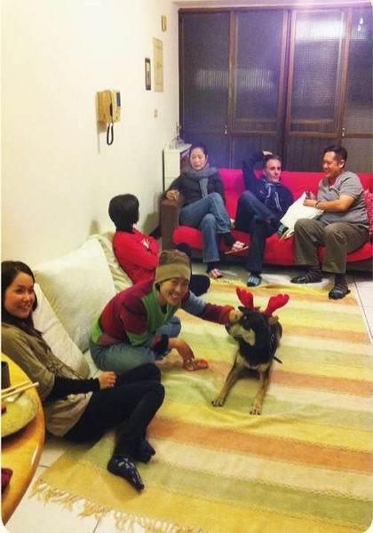

亲朋好友齐聚一堂。集合时间和解散时间都很随意。互相汇报近况，聊一聊新的计划，相谈甚欢。

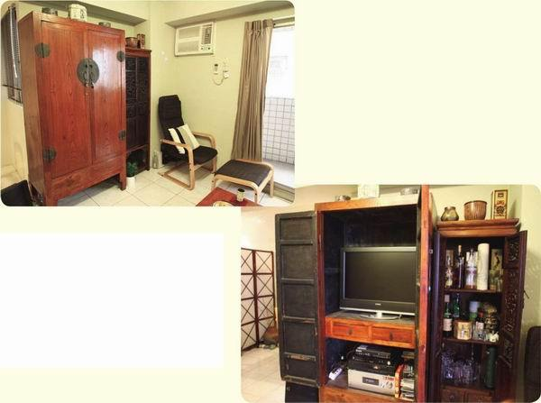

把古董柜子稍稍修整一下，就成了电视柜+酒柜。用的时候再打开，不用的时候把门关上，房间就显得特别整洁了。

“这个柜子啊，是中国大陆人坐船过来的时候用来装大米的哦!”杰森很是得意地向我介绍了他的心爱之物。这个大柜子原本是衣橱，现在被他们改造成了放电视机和音响的地方。旁边是改造过的餐柜，现在用来放酒和书。

他们不会直接使用买来的古董。把隔板的位置改一改，换一个更好用的把手……他们会自己动手，来个DIY大改造。丰富的想象力和坚持自己动手改造的毅力，让我佩服不已。

这两位的兴趣爱好是搜集陶器、古董和旅游。他们一起走访了四十多个国家。为了采购陶器，他们足足去了日本十多次呢。

“这是江户时代的陶器。那个时代的日本人能设计出这种形状可是很不容易的哦!通过它我能想象得到，江户时代的人有着很丰富的文化生活。”一聊起陶器，杰森就停不下来了……

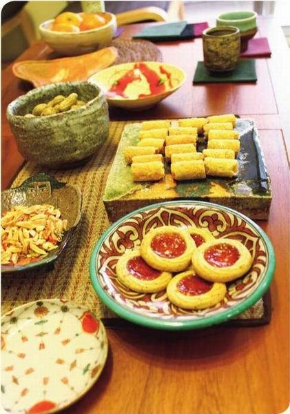

平时也会用搜集来的陶器。把常见的中国小点心往五颜六色的盘子里一放，卖相好像也变得更好了!

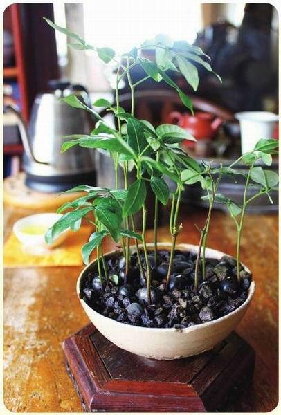

把龙眼的核种起来，就成了盆栽花盆是有缺口的碗。

他们花了十多年的时间，搜集了三百多种珍贵的陶器。不过他们并没有把宝贝供起来，而是用来盛饭喝茶，每隔一段时间就换一批出来用。而且他们能记住每一件陶器的来历，“这是某某年的伊万里烧”这种话脱口而出。

“换成我这种粗心大意的人，早就把宝贝摔烂了。你们有没有失手过啊？”

听到我的问题，他们俩你看看我，我看看你，随即哈哈大笑。

“小达真摔过一次，那是因为她在洗碗的时候开小差了。只要专心就不会摔啦。”

没错，他们就是这么专心，就是这么享受每一段好时光。他们在中国台湾开了一家英语培训学校，每天从早忙到晚。对他们来说，10分钟的课间休息都很宝贵。

“好容易有时间休息一下，当然要用好茶具喝点好茶啦。人一天要吃三顿饭，喝好几杯茶。每天都是这样……只要用心过好每一刻，生活自然就精彩起来了。”

这两位不光讲究茶具和餐具，还讲究茶叶和美食。他们研究过日本茶和中国茶，也研读过有关日本料理摆盘方法的专业书籍。由此可见，他们真的在用心过好每一刻。

“不奢求事事周到，而是把精力集中在一件事上，生活自然而然就简单了。‘Mind
Fulness(心灵的满足)’才是最重要的啦。”

达小姐说：“看我家的狗查理吃饭的时候，或是看它躺在地上打瞌睡的时候，我会觉得特别幸福，心里暖暖的，不由自主地笑出来。”

做自己最喜欢的事，在自己最喜欢的东西的环绕下，享受生活的每一刻……这样的生活态度，与点缀着古董的空间相映成趣，催生出了宁和而平静的时光。

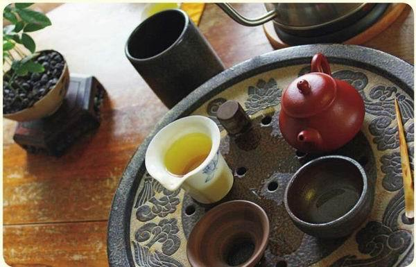

用了二十多年的茶具。好东西总是越用越有味道。

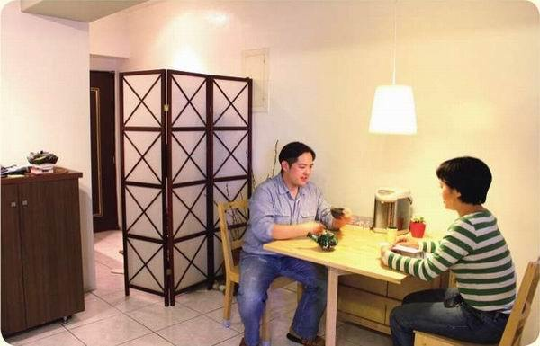

杰森和达小姐。两个人平时都很忙。正因为忙，他们才更重视能一起相处的时光。

## STEP3 巧收纳

收纳的目的是方便取用

A. 明确每样东西的固定位置

B. 做到一目了然

C. 把使用频率高的东西收在一起

D. 尽量少用收纳工具

通过“不添置”和“大胆扔”控制住物品的数量之后，下一步就是把剩下的精英“收纳”好了。

要是把东西放得乱七八糟，或是一股脑地塞进抽屉和柜子，造成“房间很整洁”的假象，我们就没法和东西“和谐相处”了。

那么，我们要如何和东西“和谐相处”呢？

我的朋友T女士是个整理达人。她是那种“不把东西放在外面”的人。所有的东西都收在橱柜里，家里跟样板房一样整洁干净。

T女士如是说：“什么都不摆才轻松呢，只要保持原样就行了。要是把一堆东西放在外面，还要考虑怎么摆放，打扫的时候也麻烦啊。”

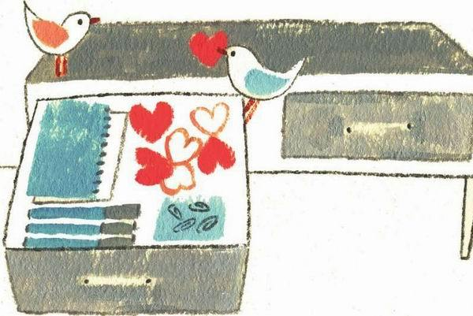

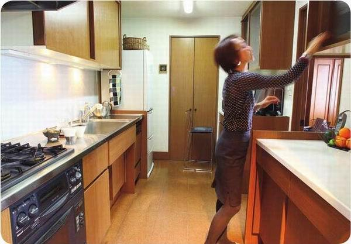

“不把东西放在外面”的T女士。抽屉和柜子里的东西也整整齐齐。

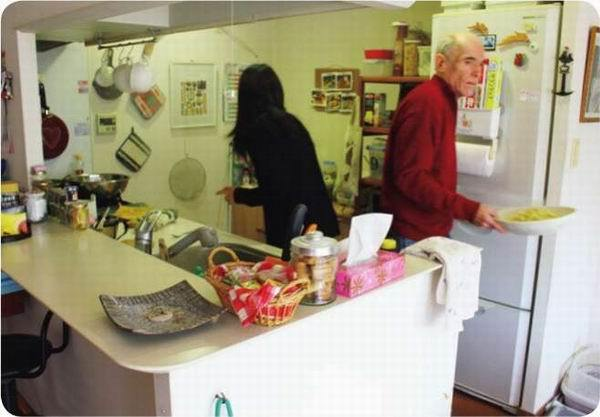

“把东西摆出来”的K女士。每样东西都有固定的位置，不是随随便便乱放的哦!

而另一位收纳达人K女士则喜欢把东西“摆”出来。书本、餐具、文具、化妆品……不同的东西有不同的放置区域，整个空间显得非常温馨。

K女士如是说：“我就喜欢把东西放在一伸手就能够得着的地方。藏得太深，我就不知道它在哪儿了。一直不用，就再也想不起来要用了。”

“不把东西放在外面”的T女士和“把东西摆出来”的K女士走的是两条截然不同的收纳路线，但她们的收纳原则其实有一个共同点。

那就是，“想用的时候，就能立刻拿出来”。

无论是什么东西，只要有需要，她们就能立刻拿出来，就好像她们对房间的每个角落都了如指掌一样。

没错，“与东西和谐共处”，就是这样一种“呼之即来”“沟通顺畅”的关系。

要用的时候找不到，好容易找到了，却发现东西已经坏了，或是量不够用了……这就意味着你跟东西的“沟通”出了问题。

收纳的目的，并不是把东西“藏”起来，而是“方便取用”。

怎样收纳才能做到“方便取用”呢？给大家介绍4个小诀窍吧。

### A.明确每样东西的固定位置

不会收拾，总是在找东西的人，都有大致相同的行为模式：把新买的东西随手一放；拿出来的东西也随手一放；用完了再随手往抽屉里塞……

问题就出在“随手”二字上。要避免天天找东西，就得明确每样东西的固定位置。

定好每样东西的位置，用好了就放回原位。只要做到这两点就行了。

书信、小票、笔、钥匙、手表、手机、遥控器、化妆包……别让它们到处乱跑啦，给每样东西找个“家”吧。

“东西”跟我们的家人一样。千万不要把新来的家庭成员随手乱放，而是要把它放在最合适的地方。

这个“固定位置”一定要具体。冰箱的哪个位置，抽屉的哪个部分，化妆盒的哪一层……随便乱塞是肯定不行的。明确了“固定位置”，东西就有家可回了。

然后，你只要把用过的东西放回原位，把位置“固定住”就行了。

只要养成这个习惯，就不用再花时间满世界乱找了，收拾房间的时候也能轻松不少呢。

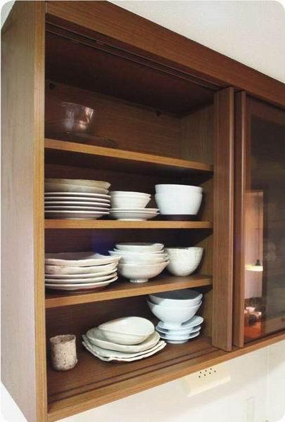

把白色的餐具和其他颜色的分开。常用的放在下面，拿起来更方便。

### B.做到一目了然

那我们到底该把东西放在哪儿呢？

“谁都能一目了然的地方”才是最理想的。别人不能一目了然，你自己恐怕也好不到哪儿去。

怎样才能做到一目了然呢？最简便易行的方法就是把东西归归类，把同一种类型的东西放在同一个地方。

文具、化妆品、卡和存折、电线和充电器、保修卡、针线和纽扣……先把东西分好类，再按类别分别收纳。要是同一种类型的东西分散在家里的各个角落，找起来自然就不方便了。

下一步，就是让东西变得更“好拿”。要是把东西叠着放，被压在下面的东西就很难被找到，真要拿的时候也很麻烦。

书和文件之类的东西最好“竖着放”，内衣要先叠一下，再整整齐齐摆好。如此一来，哪里有什么就一目了然了。架子和抽屉不要塞得太满，可以留下两成的空间，取用时会更方便哦。

一目了然的收纳，能让家务变得更轻松，节省大量的时间。

希望每一位忙碌的女性朋友都能在家中享受悠闲的好时光。

### C.把使用频率高的东西收在一起

旁边这张照片上的是我一位朋友的父亲用来收纳小东西的文件夹。里面放着列车时刻表、保险证、常去的饭馆的外卖菜单……换言之，他把许多使用频率高的东西集中在了这一个文件夹里。如此一来，需要使用的时候就不用绞尽脑汁回忆东西的收纳位置了。我还有一位朋友喜欢用竹筐收纳东西。吃早饭用的餐具装一筐，熨衣服用的工具装一筐……如此这般。

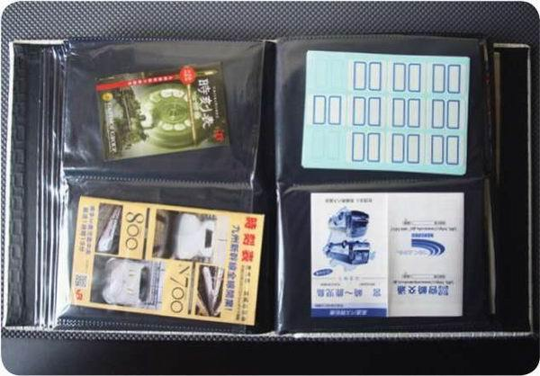

连用药记录本和贴纸都收在里面

当然，我们也需要充分考虑到东西的用途，适当调整收纳的位置。好比菜谱，就可以放在餐具柜的角落里，这样比摆在书架上更方便。用来擦桌子的海绵也可以放在水池边的角落里，随用随拿。

“东西”的存在，是为了方便我们的生活。在选择收纳位置的时候，我们不妨仔细想一想“这个东西的作用是什么”，选择最便捷的存放地点。

### D.尽量少用收纳工具

篮子、盒子、箱子、文件夹、衣架、晾衣竿、隔板……我会尽量少买这类收纳工具。

为什么呢？因为有了收纳工具，就有了“退路”，家里的东西就会越来越多了呀(笑)!

要是把乱七八糟的东西统统塞进收纳盒，就不知道里面到底装了什么了。要是抽屉里装满了隔板，打扫起来反而麻烦。

当然，为“方便取用”服务的收纳工具还是很必要的，可是“会让东西变多”的收纳工具只会帮倒忙。家里的收纳容量最好固定不变，放不下了就把不需要的处理掉。

更何况，收纳工具本身也是“东西”。只要积极开动脑筋，就有办法在不增加“东西”的情况下把家里收拾干净。

比如，我们可以把这一季不穿的衣服装进行李箱，把小包装进大包，把漂亮的零食包装盒利用起来……用好手头现有的东西，就能解决燃眉之急了，不是吗？

“需要收纳的东西”和“收纳的位置”会随着生活的变化而变化。有时候，我们也需要把现有的东西改进一下，让它们成为“多面手”，适应新的生活节奏，这也是“巧收纳”的诀窍之一。

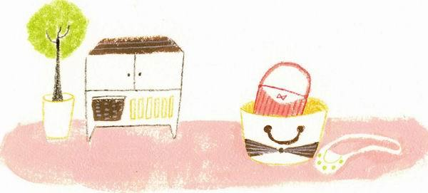

# 第3章 打造极简舒心的房间

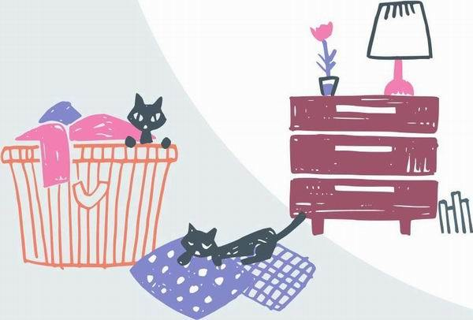

“整理生活空间”就是为自己打造生活的舞台。

一个人住的公寓，一家人一起生活的小区，独门独院的房子……

无论你生活在怎样的环境中，“家”都应该是一个愉悦身心，放松心情的地方。

而“家”的主角，并不是家具摆设，而是“你自己”。

在简单的空间中生活，就不容易被乱七八糟的东西扰乱了心绪。

你定能活出自己的风格，发挥出十二分的活力。

## 为什么简单的空间最舒心？

有这样一种说法：“你的房间是什么样的，你的心就是什么样。”恐怕没有人会觉得不对吧？

要是一个人的房间乱七八糟，摆满了杂物，大家就会觉得这人“没有享受生活的时间”“不会审美”“没品位”。说得再难听点，他就是“没有自我，没主见”。

杂乱无章的房间，还会逐渐腐蚀你的心灵。

想静下心来看一本书吧，家里也没有合适的地方，让你倍感烦躁；想准备一下第二天要用的东西吧，看到屋里这么乱，你就会想“算了算了，明天再说吧”。久而久之，你甚至会觉得浑身无力，什么都不想干了，打扫和收拾都成了全世界最麻烦的事。于是你的房间就会越来越乱……这就形成了一个恶性循环。

“邋遢”和“随便”的习惯，在潜移默化中影响着你的心态，让你失去前进的动力。

这是因为，杂乱的空间会释放出“负能量”。

如果你的房间整洁而简单呢？

忙碌了一天，拖着疲惫的身躯回到家中，你最爱的空间会敞开胸怀，迎接你的归来。这是多么幸福啊。在这样的空间里休息，要不了多久你就能恢复元气了。

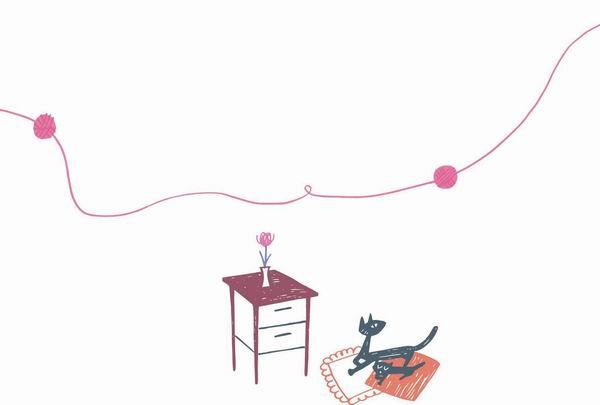

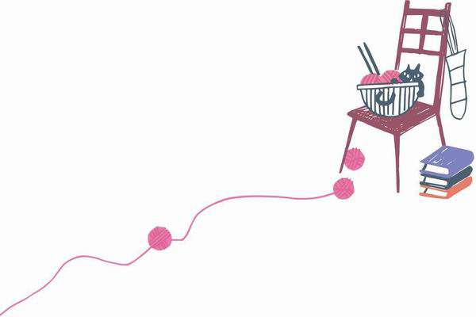

在整洁的厨房做几道小菜，在干净的浴室舒舒服服地泡个澡，在舒适的客厅放松放松……“明天再接再厉吧!”舒心的环境，会让你自然而然地产生对未来的向往。

心境平和了，你就能细细思索“我现在应该做什么”了。也就是说，舒适的环境还能为我们带来迈出下一步的勇气。不被烦心事牵着鼻子走，大跨步向前!这份自信，定能在不知不觉中成为我们的心灵支柱。

舒心的空间会为我们注入无穷的正能量。要是你想让自己更加“积极向上”，不妨从打造“能让人变得积极向上的环境”做起吧!

为什么简单的空间能让人“舒心”？

为什么简单的空间能让人觉得“舒心”呢？这不仅是因为“空间释放出的信息会影响人的心情”。

首先，简单的空间容易管理。房间里的东西少，井井有条，打扫收拾起来就会比较方便，不用花太多精力就能维持现状。“哪里有什么？”“需要采购什么？”也是一目了然。

其次，空间越简单，你的感性天线就会越灵敏。如此一来，你就能在自己最喜欢的“好东西”的环绕下生活了。

我们会在追求“舒心生活”的过程中自然而然形成自己的风格，逐渐明白“我最重视的是什么”。而“家”，就是这样一个能让你专注于“最爱”的地方。家，不仅能让我们“痛痛快快做自己”，更是“追逐梦想、实现目标的大本营”。

如果你热爱生活，对自己的生活有充分的自信，请朋友来家里做客也会变成一桩快事。“在这个世界上，我最喜欢的就是我的家!”—能抬头挺胸说出这句话，是多么美好的事情啊!

其实，把生活空间变得更简单，也是直面自己的内心世界、爱上自己的必经之路。

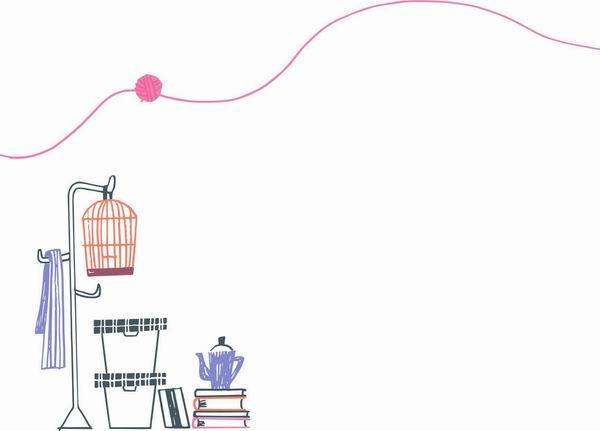

## STEP1 打造好用清爽的空间

A. 明确主色调

B. 家具布局要得体

C. 统一材质

D. 学会做减法

你对“舒心空间”的定义是怎样的呢？

摆满欧式家具的典雅空间？用大花纹布料打造的北欧风格？融合了亚洲风与传统日本风格的现代和风？“舒心空间”的定义因人而异。

无论你走的是哪条路线，都得找到适合自己的风格，不要刻意模仿别人。不过，“舒心又好用的房间”还是有规律可循的。一位室内装潢设计师告诉我，只要在“颜色”“布局”与“材质”这3个方面做文章就行。我实践了他教我的方法，效果还真不错。

只要牢记以上3点，空间就会显得有条有理。在添置物品的时候，你也会变得更慎重，不容易花冤枉钱。

其实“好用”跟“舒心”完全可以画等号。不过“舒心的空间”不是在一天之内就建成的。我们需要不时调整家具的布局，添置自己需要的、喜欢的东西，或是根据季节点缀几块漂亮的布料……细微的调整，能让空间变得越来越舒适。在这个过程中，你对“家”的感情也会愈发深厚。

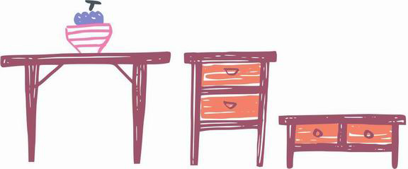

### A.明确主色调

“色调”，会直接影响一个房间给人留下的印象。

“使用什么样的颜色？”“每种颜色用多少？”“怎么搭配颜色？”这些因素都会对空间给人的印象产生莫大的影响。

在选购家具、窗帘、靠垫与摆设时，必须充分考虑到“颜色”的问题，否则空间就会显得杂乱无章，给人留下“没条理”的印象。

我们可以根据色相(区别颜色的属性，如红、黄、蓝)、明度(颜色的亮度)、饱和度(颜色的鲜艳程度)来选择颜色。不过最简单的方法，莫过于以“色调(明度+饱和度)”为标准。

明亮的色调，能让房间变得休闲活泼。浓郁的颜色，能打造出沉稳高档的氛围。我们甚至可以同时使用好几种同一个色系的颜色。只要色调一致，颜色很多也不会显得杂乱。

问题是，要是整个房间都是同一个色调，那也会给人留下“无趣”的印象。所以我们可以把用在房间里的颜色分成3种：①主色、②副色、③点缀色。依次选好这3种颜色，就不容易出错了。

在选择颜色的时候，我们也要考虑到色彩带来的“效果”。比如，红色、橙色这样的“暖色”能让人感到温暖，而蓝色、绿色这样的“冷色”有放松身心的作用。

大家不妨根据房间的使用目的和自己的喜好，巧妙搭配不同的颜色。

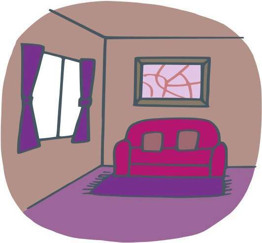

浓郁的色调显得典雅精致

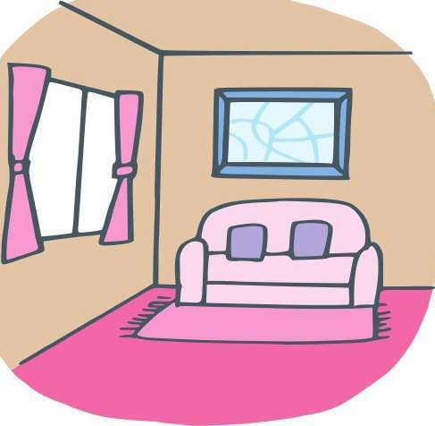

明亮的色调显得休闲轻快

如何打造“有品位”的房间？

3种颜色的选法

米色的墙壁和地板，深褐色的家具，亮蓝色的小摆设……选择颜色的时候，要充分考虑到前一页提到的“3种颜色”的平衡。这种配色方法也可以应用在着装的搭配上哦!

1　主色

用于地板、墙壁、天花板等约占总面积的70%

主色需要大面积使用，最好不要选浓郁的颜色，否则房间就会显得很压抑。而且深色不容易和其他颜色搭配。建议大家用米色、白色等较为自然的颜色当主色。因为这类颜色会让空间变得更明亮，看上去更宽敞，而且百搭。

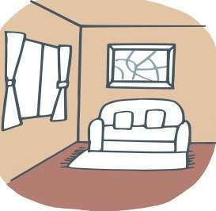

2　副色

用于窗帘、地毯、沙发、床等约占总面积的25%

副色要选择和主色相近的，或是比主色稍微“素”一点的，如此一来，房间的配色就会显得比较稳重。把深色用在靠近地面的地方，把浅色用在高处，就不容易有头重脚轻的感觉了。

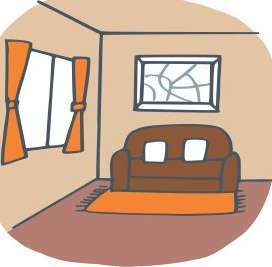

3　点缀色

用于小家具、靠垫、装饰画等约占总面积的5%

房间的“点睛之笔”，可以大胆选择副色的对比色，或是色调完全不同的颜色。这样能让空间张弛有致。我们还可以不时用布料给房间来个大改造，或是装饰一些有季节感的东西。用来点缀的小摆件最好也把色调或色系统一一下，这样看上去更齐整。

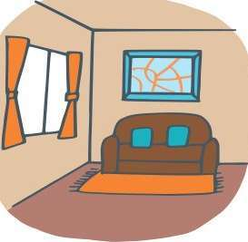

### B.家具布局要得体

要让空间变得更“整洁”，关键在于“严选家具”。

要是家里就两个人，那就没有必要在房里摆四把椅子。为了收纳不知不觉变多的杂物和书而特地买柜子更是要不得。为了防止这种情况，我们必须调整好心态，认清自己的生活方式，审视自己已经有的东西，只添置最必要的家具。有时候，把一些不必要的家具处理掉，反而会让房间变得更舒服。

选好家具之后，下一步就是确定家具的放置位置了。这一步的关键在于，要留出足够的墙面与地面，让房间显得更“大”。

下面介绍的5个诀窍也很有用哦!

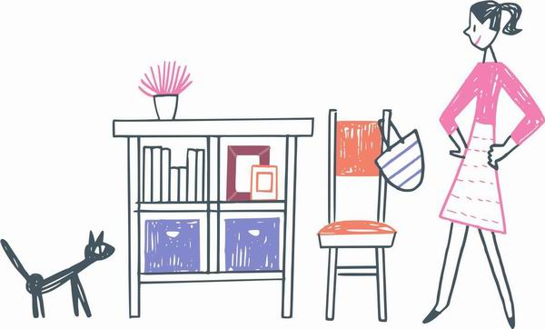

让房间变得更舒心的5个诀窍

要打造出一个整洁舒心的房间，关键就在于“如何布置家具”。

“墙面”和“地面”要留白，要空出“移动路线”，要充分考虑到“视线”的走向，还要把“表面”对齐。

●视线

考虑到人进屋时的视线走向

高的家具最好靠墙放在门边，或是放在门口看不到的死角。如此一来，视野就会变得更开阔。我们还可以在房间的各处安置一些用于点缀的小家具和照明灯，把视线带动起来，这样也会给人留下“房间很大”的印象。

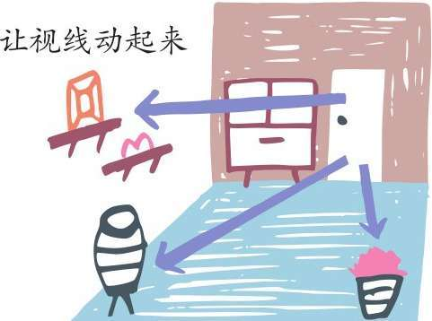

●表面

把表面对齐

要是靠墙的家具没有对齐，一个凹进去，一个凸出来，屋里就会显得很乱。书架上的书也是如此。不同的书有不同的宽度，所以我们可以把窄的书稍微拉出来一点，把书脊对齐。小摆件最好也要等距摆好，这样会显得更整洁。

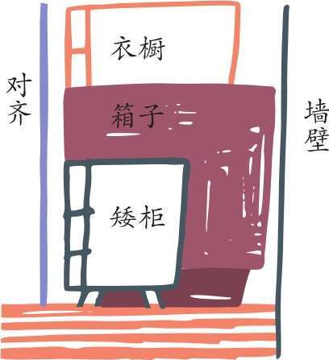

●墙面

选择低于视线的家具

家具低于视线，会让空白的墙面显得更大，使空间变得更开阔。尤其是小房间，最好选用又矮又胖的家具，而不是又高又瘦的。如果一定要用高的家具，那就靠墙摆一排一样高的。高度不同，那就按阶梯状排好。没有门的开放式家具，会比有门的显得更开阔。

●地面

尽量把家具摆在一起，留出足够的空地

摆放家具时，要把每一个角落都利用起来，尽量减少无谓的“死角”。高脚的沙发和操作台，还有玻璃桌都是“能露出地板的家具”，它们也能起到让房间显得更大的效果。

●移动路线

布置家具时，要考虑到人的移动路线

要是家里连“走路”的地方都没有，无论去哪儿都是七拐八拐，收拾起来自然就麻烦了，日常生活也会变得非常不便。客厅、餐厅、厨房这种出入频率较高的地方尤其需要留出足够的空间供人走动。提前了解自己的移动模式，就能有的放矢了。

### C.统一材质

布置房间时还有一个要点—材质。材质能大致分为两种。

【温暖的自然材料】

木材、纤维(棉、羊毛、藤、榻榻米等)、皮革、砖块、玻璃、石材(天然石)、纸等

【冰冷的人工材料】

钢、铝、铁、瓷砖、玻璃、石材(人造石)、树脂等

一般情况下，把家具饰品的材质统一成其中的一种，空间就会显得比较协调。

照明灯的选择也是有讲究的。整体照明、部分照明和间接照明需要的色温和亮度各不相同。巧妙搭配白炽灯或荧光灯，效果绝对差不了。

如果你的卧室用的是木床、藤架和针织床罩，走“温暖”路线，那么床头柜上的台灯最好选白炽灯。如果餐厅是“高冷”风格，摆着磨砂玻璃桌面的餐桌和钢管椅，那就装一盏荧光吊灯，把菜肴的色泽衬托得更诱人……总而言之，我们可以根据房间的用途和气氛，巧妙搭配家居用品的材质。

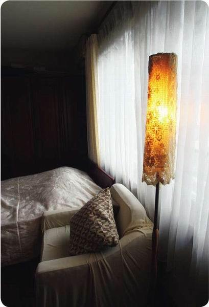

白炽灯搭配蕾丝和其他天然材料制成的布料，倍显温暖。

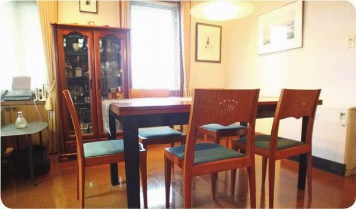

合家团聚的餐厅，统一使用木纹的家具和木地板，打造出温馨的氛围。

冰冷的人工材料

●钢

●铝

●铁

●瓷砖

●玻璃

●石材(人造石)

●树脂等

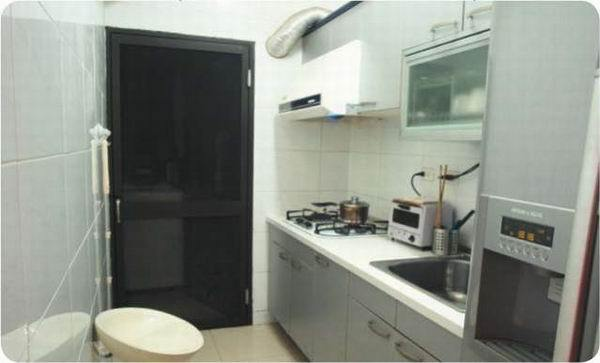

这间厨房用了很多不锈钢和瓷砖，有一种冰冷的现代感。

温暖的自然材料

●钢

●木材

●纤维(棉、羊毛、藤、榻榻米等)

●皮革

●砖块

●玻璃

●石材(天然石)

●纸等

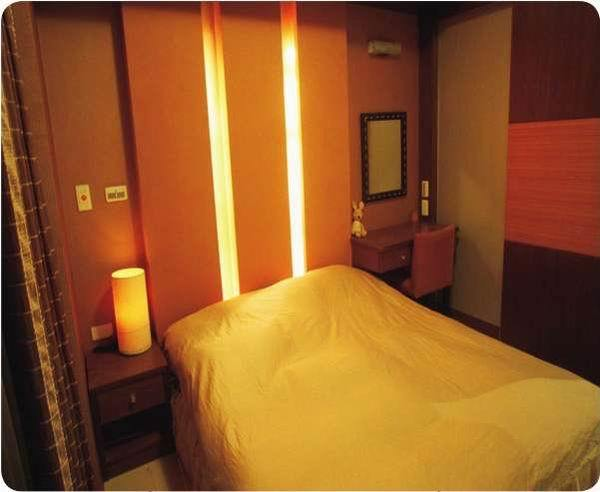

卧室多用温馨的材质，带我们步入梦乡。

无论你主打的是自然材料还是人工材料，都可以稍微点缀几件另一种风格的物品。两种风格会相映生辉。

假设你的卧室走的是自然、现代的风格，主要使用浅色的木材，在这样的房间里点缀一张不锈钢做的床头柜，就会显得很别致了。我们还可以把若干个拥有相同质感、和房间的色调相符的画框点缀在房间的各个角落，使房间的氛围更协调。

再假设，你的书房主打钢材，走的是“近未来”路线。把稳重的木质柜子放在里面，就会特别显眼，还能起到柔和气氛的效果。

“玻璃”和“皮革”是两种百搭素材，也能让房间变得更精致。

玻璃可冷可暖，被灯光和阳光一照，还会闪闪发光。用玻璃做桌面是一个不错的选择。在屋里点缀些玻璃的小装饰也很有味道。

皮革是一种能打造出“高级感”的材料，可以用在沙发、椅子或小摆件上。搭配木材和天然石材，就显得特别稳重。和玻璃、钢材放在一起，又会给人留下摩登现代的印象。

如果你能把材质和照明都考虑周到，那你也能以家装达人自居了。让我们巧妙搭配颜色，合理布置家具，创造出一个简单而舒心的空间吧!

### D.学会做减法

统一色彩、布局和材料，是打造简洁房间的有效方法。不过啊，太“统一”也会显得呆板。要是家里跟样板房一样规整，日子过起来也憋屈呀。“得把表面对齐!”“颜色要统一好!”成天为这些事发愁还怎么得了啊!

家，是让我们放松身心的地方。稍微留点“小问题”，才有“放松”的感觉呀。

关键在于，我们要把握好一个“度”。只要自己觉得“现在这样很好”，那就没问题了。太过整洁的房间，也需要一丁点儿杂乱来点缀。太柔和的空间，也需要一点犀利去中和。学会做减法，空间的“表情”才会变得更丰富。

我们甚至可以发挥创意，点缀一些和房间的风格完全不搭的东西。这样也挺有意思的呢!

在时髦的空间里放上一件古董家具，在书房里摆上一排玩具车。“我家没那么多规矩!”“混搭也不错嘛!”这么布置一下，你的心情也会更从容，心态与生活节奏也会变得更平和。

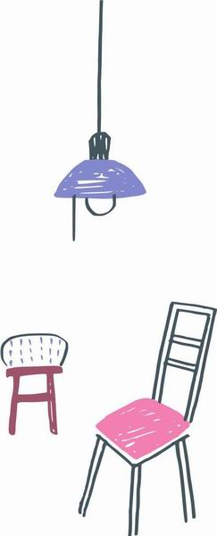

## STEP2 排除多余的物品

A. 桌子和沙发上不要放东西

B. 把“不想看到”和“不想让别人看到”的东西藏起来

C. 不用伞架和拖鞋架

D. 商标越少越好

“简单的空间，能释放出正能量(正面的信息)!”—这是我钟爱简单空间的原因之一。

肉眼可见的每一样物品，都会或多或少地释放出某种视觉信息。要是一下子接收了太多的视觉信息，人就会觉得疲劳，就算这些信息再好也一样。如果家里堆满了杂乱无章、毫无意义的东西，那就更不用说了。你一定会觉得浑身不舒服，怎么看都不痛快。末了，你只能对它们“视而不见”，自我安慰道：“算了算了，让它们去吧。”久而久之，你就麻木了，习惯了“到处堆着杂物的状态”。

那就让我们从现在做起，把“不应该出现在视野中”的杂物清理掉吧!

只要完成这一步，你就一定会变得更积极向上。到时候，你就能集中精力做好眼前的事，怀着恰到好处的紧张感，不断提高自己了。这就是“极简空间释放出的正能量”的神奇作用。

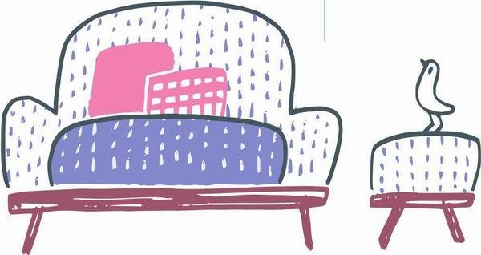

### A.桌子和沙发上不要放东西

餐桌、沙发、厨房的操作台、书房的书桌……这些地方的使用频率很高，最值得我们去整理。

正因为它们的使用频率高，所以我们很容易随手把东西放在这些地方。

只要在桌面上放了一样东西，你就会觉得“放一个也是放，放两个也是放”。于是桌上的东西会越来越多，一层放不下就叠着放。为了防止这种情况出现，我们绝对不能开这个“坏头”。

为什么不能在桌上堆东西？这不仅是因为杂乱的桌面不美观。桌面是拿来“用”的，而不是拿来放东西的。

沙发和厨房的操作台也是如此。你想坐在沙发上休息一下，却得先把堆积成山的衣服挪开，这多烦人啊。想做个菜吧，一看到乱七八糟的操作台，恐怕就没了热情。请大家设想一下，你是喜欢在干干净净、没有杂物的餐桌上吃饭呢，还是想和调味料、报纸分享宝贵的桌面空间呢？

走廊和楼梯也不能堆放杂物，因为它们是给人“走”的地方。

打造舒适空间的第一步，就是保持一个“没有任何杂物的桌面”。

让大家一下子把整个房间收拾好，未免有些强人所难。可你一旦养成了“保持桌面整洁”的习惯，就会自然而然地想办法收拾房间的其他地方了。

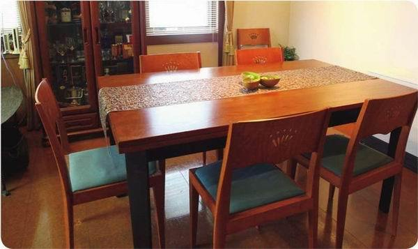

很多人习惯把调味料放在餐桌上。瞧瞧，没有杂物的餐桌多好看!

### B.把“不想看到”和“不想让别人看到”的东西藏起来

什么叫“不想看到”的东西？举个例子吧—垃圾桶。谁愿意成天看到垃圾桶和桶里的垃圾呢？

问题是，家里不能没有垃圾桶啊……

为了解决这个问题，我想了3个办法。①尽量不放垃圾桶、②用有盖子的垃圾桶、③把垃圾桶放在看不见的地方。客厅是我用来放松身心的地方，所以我没有在客厅放垃圾桶。要扔垃圾的时候就走去厨房。厕所的小垃圾桶是有盖子的，不会看到里面的脏东西。而且我会把垃圾桶和垃圾袋藏到不容易看到的地方。

抹布、海绵等清洁工具、有线电视的机顶盒、打印机、扫描仪等电器最好也藏起来，或是放在不那么惹眼的地方。

我们还可以使用和房间的整体氛围比较协调的隔板或小帘子，或是把这些不想看到的东西放在房间的死角。一点生活感都没有的房间固然乏味，但是把“不想看到”的东西和“不想让别人看到”的东西藏起来，就能有效提升房间的舒适感。

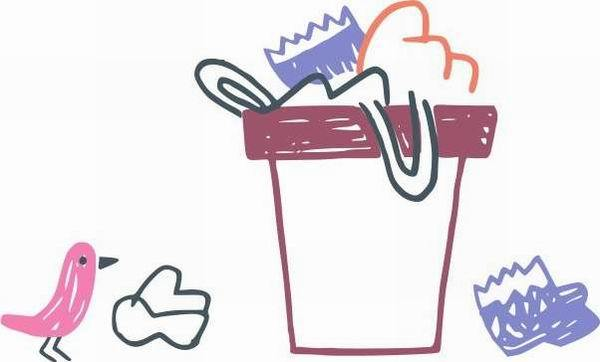

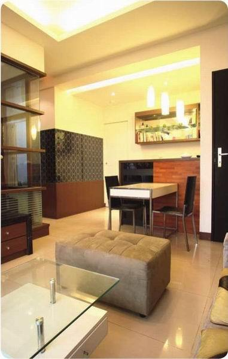

不把遥控器和杂志放在桌椅上，保持客厅整洁有序。

### C.不用伞架和拖鞋架

我家没有伞架。因为“伞”本就不是使用频率很高的东西。

一年的降雨天数不过50天左右(当然，也有雨水更多的地区)。平均下来，每星期也就下个一天，剩下的日子里都不会用到伞。那又何必为了这一天在家门口放一个占地方的伞架积灰呢？我们完全可以把用过的伞拿去阳台或浴室晾干，然后再收进壁橱，这样反而更卫生呢，还能节省宝贵的玄关空间。不用拖鞋架也是一个道理。

其实，我们的生活中有很多“不必要”的东西，只是你误以为“我很需要”罢了。没了它们，你也能太太平平地过日子。“我是不是真的需要这样东西？”—我们要养成这样的习惯，学会审视自己的生活与人生。

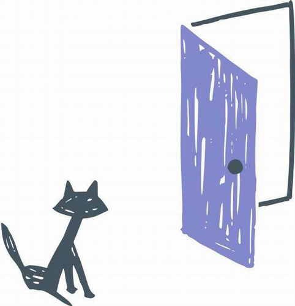

### D.商标越少越好

难得住一次高档酒店，却发现客房里的日用品看上去很没档次，包装上印着硕大的商标，一看就是便宜货……遇到这种情况，你会不会对这家酒店大失所望呢？

没错，商标虽小，却有莫大的影响力。

我这人啊，只想看到漂亮的东西，也想尽量减少双眼接收的信息。所以我会尽可能把日用品的商标藏起来。怎么藏呢？我会把容器里的东西转移到更好看的、没有商标的容器里，或是把整个容器裹起来。

我追求的是“极简生活”，而不是“随便生活”。正因为家里的东西少，我才能照顾到每一个细节。

## STEP3 用“装饰”提升存在感

A. 划出一块“装饰区”

B. 用植物点缀心情

C. 装饰“喜欢的东西”

“极简生活”的基础，是“减少房间里的东西”，但“简单≠什么都没有”。要是生活空间里没有任何能够治愈我们的东西，没有任何点睛之笔，那岂不是很无趣吗？

画作、照片、摆设、杂货……我们可以在屋里放一些能让生活变得更有趣、更精彩的东西。这样的物品也能让乏味的房间更有情趣。

不过，在装饰房间之前，请大家牢记：只装饰精挑细选的“精英”，其他的一概不管。

要是把喜欢的东西统统装饰起来，那就没有重点了。好好的摆设也难以发挥出它应有的作用。

要是你觉得自家的隔板上东西太多、太乱，不如先把所有的东西都拿下来，挑一个你最喜欢的东西摆回去。如此一来，经过筛选的“精英”就能大放异彩了。

总而言之，装饰的时候一定要“花心思”。越是讲究这些小装饰，你的空间就会越有个性。久而久之，你也会更喜欢自己布置的小家。

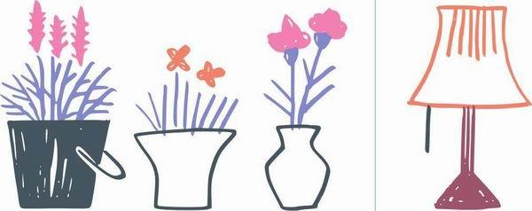

### A.划出一块“装饰区”

装饰达人都是怎么装饰的呢？许多装饰达人都会在家里开辟一块专门的“装饰区”。他们并没有用装饰品把整个空间填满，而是把装饰品集中在了一小片区域里。

如果你家有壁挂式的装饰柜，千万不要用装饰品把它撑满。多露一点墙面出来吧，这样会让房间更有开放感。把柜子的一部分划为“装饰区”，剩下的地方留白，这样就不会显得太乱了。如果你喜欢收集某种特定的东西，也可以找个专门的区域装饰起来，绝对能让人眼前一亮。

我也是这么处理书橱的。我没有把书橱的每一层都塞满，而是把顶层空了出来，摆了一排可爱的小玩意。

总而言之，我们要学会在空间里“留白”。

大家还可以参考一下下一页介绍的4个小诀窍，让“装饰”变得更有趣、更有效。

“装饰”，说白了就是一种“娱乐”。希望大家都能享受装饰的过程，将自家的空间装点得别具一格。

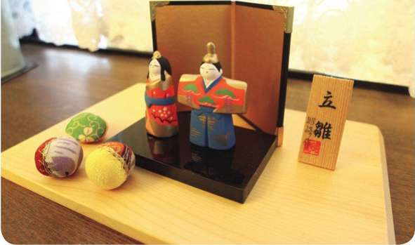

把玄关的矮柜变成“装饰区”。一开门就能感受到四季的变化。

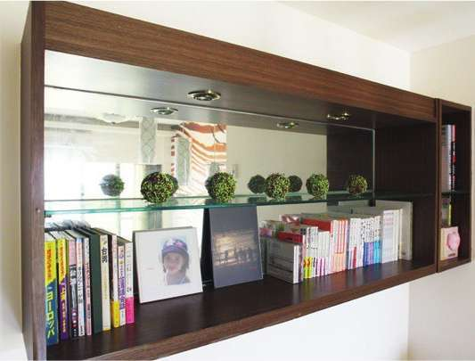

恰到好处的留白，让装饰柜显得更漂亮下层摆满了书，上层的小摆件则很整齐

怎么装饰更有品位？

4个装饰小诀窍

摆上一些自己喜欢的摆件作为装饰，让房间更美。

掌握如下这些小诀窍后，不管是空间还是装饰物本身，都会显得更上一个档次。

●分类

把同一种类型的东西装饰在同一个地方。分类方法可以是物品的种类、色调或主题。如此一来，能有效防止装饰区域变得杂乱。如果是设计感很强、很有个性的摆件，就单独装饰起来。低调的小玩意可以好几个放在一起，让人留下更深刻的印象。

●和周围保持协调

选择与房间的整体风格相符的装饰品。“颜色”尤其重要，要么靠近主色，要么就和主色截然相反，这样才能让空间更趋于平衡。如果选择后一种装饰品，那么它的颜色最好不要超过两种，还要考虑到和其他小家具、小摆件的搭配。

●摆法

摆放整齐，间隔相等。在同一个地方摆好几个小玩意的时候，在摆法上下点功夫也是个好方法，不过最保险的摆法还是“等距摆成一条直线”。无论是小摆件还是相框，并排摆上3个，就会给人留下“整齐”的印象。

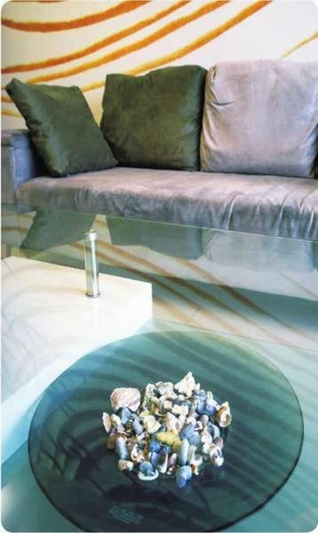

清凉感十足的玻璃茶几与贝壳十分协调。贝壳种类丰富，让人过目不忘。

●变化

小摆件要常换常新。不同的季节，装饰不同的东西。时不时给摆件挪个窝也不错。不断变化的空间，会给我们带来更多的快乐，放松我们的身心。调整位置的时候顺手打扫一下，不是一举两得吗？

### B.用植物点缀心情

装饰在玄关的野花，窗边的观叶植物，放在浴室的小盆栽……小小一棵植物，能让空间变得生机勃勃。

浇水的时候，摘枯叶的时候，你能亲眼见证植物的成长。“啊呀，长新芽了!”“开花了!”……植物所展现出的“生命力”，也能滋润我们的心灵。

我的母亲常会把胡萝卜和白萝卜的头，还有发了芽的红薯养在扁平的容器里，变废为宝。

“蔬菜的生命力可强了，只要有水和空气，无论在哪儿都能活。”

我有一棵很宝贝的观叶植物，中国人管它叫“桃花心木”。有一次，我住进一家被桃花心木环绕的民宿，而这棵小树苗就是民宿老板送给我的。老板说，中国原本会从南美进口桃花心木，可现在这种树越来越少见了。民宿周围的树都是老板已经过世的父亲种下的，已有五十多岁。但老板说，桃花心木要“成材”，还得等上三百年。

“那我们岂不是没机会看到它们长成参天大树的样子啦？”听到这话，老板微微一笑：“那可不一定哦。人不是会转世投胎的嘛？说不定我能在三百年后看到它们郁郁葱葱的模样呢。这么一想，不就有盼头了吗？”好浪漫的想法啊……老板还说，“我希望大家不要把树木看成商品，要学会欣赏它们的美。”

我家的桃花心木长得很慢，但我的确能看出它在生长。看到它茁壮成长的模样，我就会怀着无限的期许遥想未来—“三百年后，这棵树会看到怎样的风景呢？”

植物有很多益处。它们能净化空气，调节湿度，释放出负离子。乍看之下，是人在养植物，殊不知是植物在守护着我们的身心。

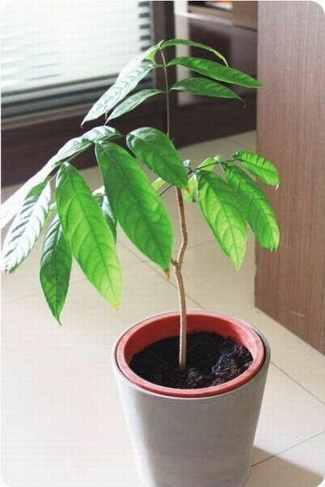

我家的“桃花心木”。从今往后，它会继续给我加油打气。

### C.装饰“喜欢的东西”

装饰在房间里的东西可随意不得，不是随便抓一个放在架子上就行了。好的装饰品，一定能为我们的心灵注入正能量。

正因为如此，许多人才会把爱人的照片装饰起来。我父亲住院的时候，就在冷冰的病房里摆了一张孙子的照片。我记得他当时看着照片，笑嘻嘻地说道：“看到这张照片，我才会鞭策自己快点好起来呀。”

出国旅行的时候，或者到朋友家做客的时候，一看到温馨的全家福，你也会觉得心里有一股暖流涌动吧？

不过啊，摆得乱七八糟的抓拍照片和尺寸太大的纪念照会给人留下杂乱无章的印象。我们可以在家里开辟一个专门用来装饰照片的区域，或是搞几个和房间的氛围相符的漂亮相框。如此一来，照片的格调与存在感都能上一个档次。

我属于比较内向、容易害羞的性格，不喜欢把人物照挂出来。以前我会把自己亲手冲洗的黑白风景照做成装饰板，也在墙上挂过色彩特别明快的装饰画。无论是照片还是画作，都是世界的剪影。我们能透过相框与画框，在想象的空间中遨游。这样的装饰品也是营造氛围的好帮手。

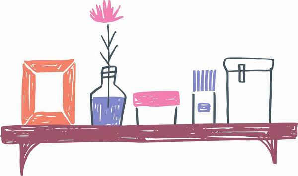

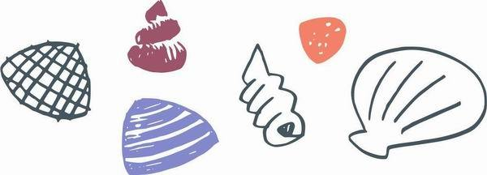

最近我一发现有趣的小玩意，就会把它装饰在客厅的玻璃茶几下面。那就是我的“装饰区”。那里放过短途旅行时捡的贝壳和珊瑚，也放过几颗在夜市小摊上买的弹珠，带我追忆童年的时光。我还放过朋友送的干花呢。时常为“装饰区”注入新鲜血液，也许就是防止装饰流于形式的小诀窍。

我们也可以在家中装饰一些能让自己“更有斗志”的东西。我有个很喜欢旅游的朋友小J，他就在墙上贴了一张硕大的世界地图。去了一个地方，就在地图上贴一张小贴纸，做个记号，顺便制定新的旅行计划。也许是因为他每天都盯着这张地图看的关系吧，这几年他游览了许多地方，地图上的标记也越来越多了。另一位朋友小M把自己的座右铭贴在了厨房的醒目位置。犹豫不决的时候，座右铭就会发挥出指路明灯的作用。D夫妇在客厅中间放了一座青铜雕像。雕像刻画的是一对相视而笑的老夫妻。D夫妇的梦想就是成为和雕像一样，每天面带微笑的老夫老妻。

“能为心灵注入正能量的东西”—只要把这样的好东西装饰起来，就会有光明的未来等待着你!我这人怕麻烦。所以我总结出来的打扫方法很简单—“觉得脏了就打扫”。不过我不是让大家一直忍着，忍到不能忍了再打扫哦!“每次用完之后”擦一擦，“发现脏东西了”就立刻打扫一下，这样才能保持“干净整洁”的状态。

## 有川式极简打扫法

“顺便打扫”，简单省心

“保持卫生，人人有责”—我们经常能在公共场所看到这样的标语。使用公共设施的人，都有责任维持设施的整洁。只要打扫的频率高过弄脏的频率，环境自然就干净了。

其实最省时省力的打扫方法，就是“在每次使用过后顺便打扫”。以厨房和浴室为例：洗碗的时候，顺便把水池和滤网洗一洗。泡完澡之后，用海绵把浴缸轻轻擦一遍，再用水冲干净。马桶虽然不需要每次使用过后都擦，但我们也可以在发现污渍时立刻清扫干净。看到架子上有灰尘，就用抹布擦掉……就这么简单。微波炉等家电也可以在使用的同时做好保洁工作，这样就不至于让脏东西越积越多了。一边做菜一边收拾操作台也是同样的道理。

别漏了!

不同房间的打扫要点!

不容易看见的地方，使用频率高、容易脏的地方要有意识地检查，否则脏东西就会越积越多。你自己不容易察觉到，但外人一眼就会发现，所以一定要用心打扫哦。

客厅

照明灯和灯罩

空调、电视、风扇等家电产品

摸脏了的门把手、橱柜把手、遥控器、电灯开关等小装饰品和家具

容易积灰的地板角落、沙发的边角等

厨房

微波炉周围、换气扇和周围的墙壁

水池的排水口

电饭煲、微波炉、电热水壶等家电产品

怕长虫的橱柜、抽屉、食品收纳盒

冰箱的抽屉、架子和表面

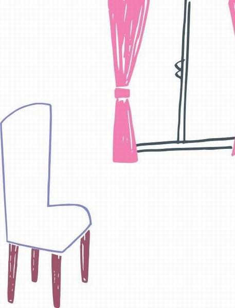

看见脏东西却不清理，不一会儿你就会把这件事抛之脑后→脏东西越来越多(拖太久就有可能变成难以清理的顽固污渍)→等到你下决心打扫的时候，就要耗费大量的时间→更加讨厌“打扫卫生”这件事……由此可见，要是不“顺便打扫”，就会有更多的麻烦事等着你。怕麻烦的人可受不了这样的折磨。

“每次用过之后都要打扫吗？”“哪儿有这么多时间啊？”起初你可能会觉得很麻烦。先别喊累，实践一下试试看嘛。“顺便打扫”一般只需要2～3分钟，有时候只要几秒钟就搞定了。

“每次用过之后、每次发现脏东西就顺手擦一擦”—只要养成了这个习惯，就算你每周只做一次大扫除，家里也能保持整洁干净的状态。

浴室

水桶、椅子等小配件

容易发霉的墙壁和瓷砖

浴缸侧面

地板的角落

洗脸台的收纳架、镜子

书房

书架、书桌的角落

电脑与配件的下面

杂物较多的抽屉

容易积灰的地毯

海报和画框的表面

卧室

床的下面、柜子下面等死角

梳妆台的镜子、抽屉

照明灯和灯罩

衣橱里面、表面

厕所

马桶边缘的里侧，

马桶和地板的接缝

垃圾桶、马桶刷等小配件

水箱周围

地板的角落

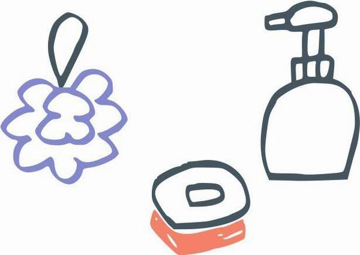

每周一次大扫除，不放过任何一个角落

即便我们能做到“每次用过之后顺便打扫”，还是会有很多照顾不到的地方。橱柜顶上、窗框、地板、装饰区……这些地方平时都不会用到，自然就不容易看到那里的脏东西了。而且“顺便打扫”的时候肯定也会有疏漏。所以我会选择工作告一段落的时候、假日前夜或假日的上午来个“大扫除”，频率大概是每周一次。

大扫除要怎么做呢？很简单，从房间的这一头打扫到那一头就行，不放过任何一个角落。如此一来，就不容易有疏漏了，打扫完之后也能收获强烈的成就感。打扫橱柜，也要遵循“不放过任何一个角落”的原则，不光要打扫看得到的地方，还要打扫看不到的地方。如果架子上有东西，那就先把东西归到一边，打扫完空出来的地方之后，再把东西推过去，打扫另一边。

“不放过任何一个角落”听上去很费事，但我们也是可以偷懒的—平时经常打扫的地方就可以省略。

不过在面对容易忽视的小角落的时候，我们必须用鸡蛋里挑骨头的精神去检查。“空调也得打扫一下吧？”“电视机画面上好像有一层灰”用客观的态度看待整个房间，就更容易发现问题了。

保持房间的整洁，其实就是“把脏东西变少”。正因为如此，我们才要以平时的“顺便打扫”为主。“不放过任何一个角落”的大扫除只是“辅助手段”，专门用来对付“平时清洁不到的地方”。

清洁剂与清洁工具要精简

为了让“打扫”这件事变得更轻松，我会有意识地精简家里的清洁剂与清洁工具。

“厕所”“浴室”“微波炉”……如果需要给不同的地方配备不同的清洁剂，还要准备相应的清洁工具，那岂不是很麻烦吗？有些清洁剂还需要你擦两次，那多费事啊……

怎么办呢？别担心!我要向大家隆重推荐一种万能工具—密胺海绵。这种海绵是用密胺树脂做成的，气泡细密，能贴合脏东西的表面，跟橡皮一样把污垢带走。水池表面的水垢、炉灶的油渍、浴缸、镜子、瓷砖……大多数的污垢都能用密胺海绵解决。它虽然不能把污垢“洗”掉，却能把污垢“磨”掉(但是最好不要用它擦拭表面容易留下划痕的东西)。密胺海绵要怎么用呢？稍微吸点水，轻轻擦拭就行了。我们可以把大块的海绵切成小块，放在经常使用的地方(但也不要让它太显眼)，要用的时候顺手一拿就成。

除了这种海绵，我家的清洁工具就只有扫帚、抹布和拖把(把抹布或湿巾夹在拖把头上的类型)了。除了马桶刷，其他工具都是全家通用的。我只用吸尘器处理小角落或自己够不到的地方，1个月用1～2次就差不多了。

我平时也很少用清洁剂。而且我不会按“使用地点”区分清洁剂的品种，而是按“污垢的种类”(固体污垢、酸性污垢、碱性污垢和特殊污垢)分别准备。

不同类型的污垢，有不同的处理方法!

碰到顽固的污垢，可以先倒一些清洁剂上去，等污垢“浮”出来了再擦。

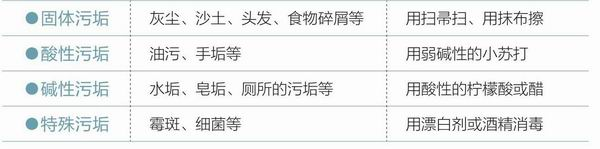

【更多付费资源免费分享微信：boksharer ；如号满，可电邮
booksharers@163.com 】

# 第4章 职业女性的简约时尚

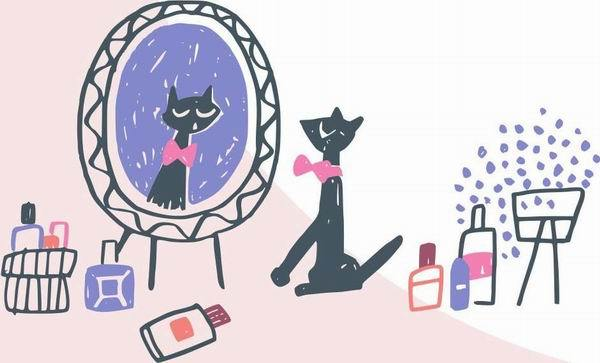

“过极简生活，就没法把自己打扮得漂漂亮亮了啊!”

别担心，正因为生活变得“简单”了，

你的审美才会有质的飞跃。

有许许多多衣服，在身上挂满小饰品，

并不能让你成为真正的“时尚达人”。

选择最适合自己的衣服，搭出品位，搭出风采……

这才是“时尚”的真正意义。

我们的目标是—简单却时尚!

## 衣服不在于“量多”，而在于“用途多”

我衣橱里的衣服比二、三十多岁那会儿少多了。

买衣服的时候，我会精挑细选。比如，当我想买一件“黑色外套”时，我会仔仔细细地逛商店，直到找到最理想的那一件为止。当我找到真正中意的外套时，心中的感慨真是一言难表：“我寻寻觅觅这么久，就是为了找到你啊!”

二十几岁的时候，我在一家休闲服装店当过店长，经常买特别便宜的衣服。当时，我的衣橱里不光有休闲服装，还有很“女人”的衣服和很“硬派”的衣服。为了搭配那些衣服，我还买了很多内搭、鞋子、包包和饰品……

“买衣服”是一种很容易“上瘾”的行为。拥有的衣服越多，就越是容易产生更多的欲望—“我下次还要买个这样的东西!”更何况，年轻是个宝。年轻的时候，无论你穿什么风格的衣服，都还挺像那么回事的。因为一时心血来潮买回家的衣服数不胜数，都够我自己开一场时装秀了。那个年龄段的年轻人也的确很喜欢穿着新衣服上街吧。

然而，人一过三十，“风格”这个东西就会逐渐固定下来。这个年龄段的人已经过了“穿什么都好看”的年纪。适合自己的颜色、剪裁、感觉……一用排除法，就知道自己适合什么风格了。

经验告诉我，便宜没好货。随随便便买的衣服，肯定穿不了太久。

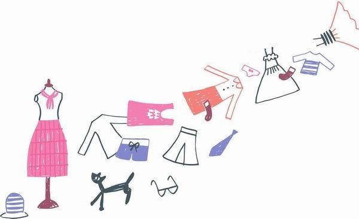

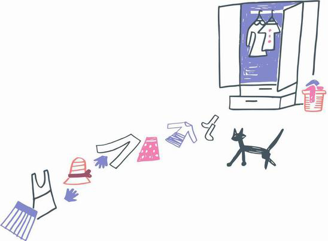

现在，我已经四十多岁了。从某种角度看，我变得更“任性”了。挑选衣服的时候，我会看得更加仔细。“我不是很喜欢这种纤维的质感”“要是裙角再短2cm就好了”觉得不合适，我就不会掏钱(笑)。正因为如此，我才能有底气地说，虽然我衣橱里的衣服并不多，但每一件都是百搭的多面手。

买衣服的三大原则

买衣服的时候，我会遵循下列三大原则。

● 适合自己，自己也喜欢(颜色、款式、感觉)

● 能搭配其他单品

● 质量好，易打理

我们不需要去“迎合衣服”，而是要选择“自己穿着舒服的衣服”。选择衣服的时候，我们完全可以“以自己为中心”，只要这身衣服符合TPO(时间、地点与场合)就行。自己穿着都不开心，谈何“时尚”？

“时尚达人”都很有“个性”。无论她们是五十多岁、六十多岁还是七十多岁，她们都会积极选择自己真正喜欢的衣服，享受时尚穿搭所带来的乐趣。正因为如此，她们的审美水平才能不断提高。

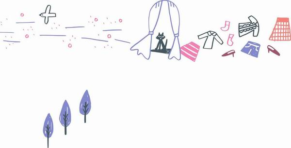

我有位八十多岁的忘年交朋友。她就是“简单却时髦”的代言人。她特别会巧用颜色，把自己的一头短发染成了明亮的茶色，搭配南美风格的斗篷真是美极了。参加酒会的时候，她穿了一身雪白的连衣裙，下身是黑色的打底裤，又搭配了一些醒目的饰品。她不会打扮得“花枝招展”，但也不会让自己沦落成“土老帽”。这也许是因为她会做加法和减法，找到两个极端中间的平衡点，时刻保持优雅。

在我看来，笑容与优雅的体态才是最棒的时尚品。人只要有了足够的魅力，还怕“时尚”不起来吗？

## STEP1 如何塑造自己的风格

A. 挂衣服也有诀窍

B. 需要买的衣服一定要先试穿

C. 关键在于舒心的雀跃感

每次坐飞机，我都会睁大眼睛观察空乘和地勤的穿搭。

每一位工作人员都穿着同样的制服，但丝巾的系法千变万化，每个人都有不同的风格。有人像牛仔一样，把结打在胸口；有人会把结打成花朵的模样；有人会在衣领外面打个蝴蝶结；有人会把丝巾撑开，好似印度人的头巾……大家的长相也各有特色。有的留着波波头，五官棱角分明。有的长了一张娃娃脸，显得特别温柔。当然，有些工作人员身材微胖，有些脖子比较短，但她们也会充分发挥出自己的个性，研究出最适合自己的丝巾系法，让我很是佩服。

要展现出自己的个性，关键在于“了解自己”。时尚达人，都是特别了解自己的人。她们熟悉自己的脸型、体型和气场，会扬长避短，这本就是一种“自我包装”的能力。

我们也应该向时尚达人看齐。既不要盲目攀比，也不要毫无目的地追逐时尚。充分发挥出自己的特色，才能成为众人眼中的时尚丽人。

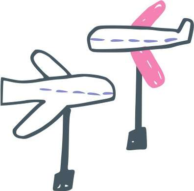

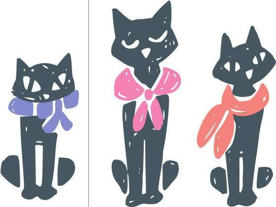

### A.挂衣服也有诀窍

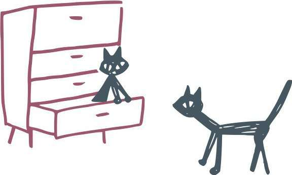

“又买了件差不多的衣服……”“我有这样的衣服吗？”“衣橱里明明这么满，却找不到一件能穿的……”大家是不是也有过类似的经历呢？

曾几何时，我也是这样。我拥有的衣服很多，却没有充分利用起来，只能塞在衣橱里积灰。

“虽然我不是很喜欢这件，可一直不穿也不是回事儿啊……”穿着不太喜欢的衣服出门，连心情都会变得阴沉。要是有人在这样的日子约你吃饭，或是在路上碰到了老熟人，那你后悔都来不及。

“只穿真正喜欢的衣服!”—下定决心之后，我做的第一件事就是“整理衣橱”。

我把所有衣服分成了大衣、短外套、连衣裙、裤子等类型，分别放好，再按照“颜色由深到浅”的顺序将它们排列整齐。

无论你是用衣架把衣服挂起来，还是把衣服装进衣橱的抽屉，关键都在于“提前定好排列规则”。

如果衣服是叠好了再放进抽屉，那就可以按颜色排列。先放黑色的，然后是深蓝色、蓝色、橙色、黄色……由深到浅，最后放白色。如果要用衣架，也可以按颜色排列，深色挂右边，浅色挂左边。

只要把衣服排列整齐，自己有什么衣服就“一目了然”了，看一遍就能记住。“今天穿那件衣服吧!咦，我把它放哪儿了……”—把衣橱整理好，就不会出现这种情况了。

把手头的衣服整理成“数据库”，记在脑子里，买东西的时候就不容易出错了。有了数据库，分分钟就能定好购物计划，不至于漫无目的地在店里瞎逛。而且看一看衣橱里的衣服，你就知道自己适合什么样的风格，有怎样的个性和喜好了。

在我看来，“整理衣橱”带来的最大的好处就是“显著提升了搭配的便捷度”。

这条包臀裙和那件花边上衣很搭。配粗一点的黑色或白色腰带，戴一条长长的珍珠项链……有了一目了然的衣橱，我就能在脑海中自由搭配手头的单品了。而且，这个过程充满了乐趣。

“衣服多”和“好搭配”并不能画上等号。只有“把衣服管理好”，才能迅速搭配出一套合适的装扮来。

有什么衣服一目了然

衣橱的整理方法

大衣、短外套、连衣裙、上衣、裤子……

分门别类，同一种类型的单品按颜色排列，“从深到浅”。

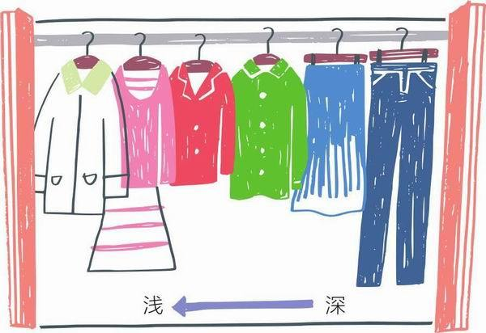

能想象出各种搭配

衣橱抽屉的整理方法

放在抽屉里的单品也要按颜色排列整齐。

实在要叠放，就每一件稍微错开一些。如此一来，就能一眼看清抽屉里到底有什么了。

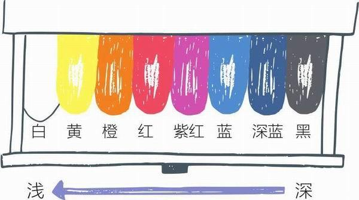

### B.需要买的衣服一定要先试穿

把自己手头的衣服管理好，就能搞清“我现在需要什么”了。当我发现黑色的高领针织衫、米色的裤子、白色的T恤衫等基础单品变旧了，我就会去买一件新的回来，取而代之。“基本款”都是最经典的单品，不会说变就变。

在采购这类基础单品时，我会尤其注意“颜色”“款式”和“质感”。比如白T恤，我绝不会买圆领的，而是认准深U领和方领。至于质感，我会选择有一定弹性和厚度的布料。多年的经验告诉我，我最适合这种款式的T恤衫，而且它最百搭。

为了买到最适合自己的单品，我们一定要花时间仔细挑选。“试穿”这个步骤万万不能省。

买衣服不能光“看”，实际穿一下才能知道真正的上身效果。挂在衣架上的衣服是一个平面，只有穿上之后才有立体感。不穿，你就看不出衣服的轮廓。想要用衣服打造出窈窕的曲线，就得先了解什么样的“轮廓”最适合自己的体型和气场。“颜色”和“质感”也不例外。

在试衣间试穿的时候，我们不仅要看正面，还要仔细检查侧面和背后。

试穿时还可以举举手，蹲下来，踏踏步，看看这件衣服到底合不合身。再漂亮的衣服，要是尺寸不对，就只能挥泪告别了。请注意，“合身”的意思并不是“裹得紧”。稍微有点空隙，才能把身体的曲线彰显得更好看。总之，我们在选购衣服的时候不能光看“衣服本身好不好”，而是应该关注“这件衣服对我有多少贡献度”。

我们自己才是生活的主角。是我们去选衣服，而不是衣服选我们。所以我们不应该担心“我能把这件衣服穿好吗”，而是应该思考“这件衣服是否能把我衬托得更美”。

“选必要的衣服。绝不妥协，仔细挑选。选择能将自己衬托得更美的衣服”……只要认真挑选，你的“审美”就一定会有长进。

对了，买衣服时还有一个注意事项。那就是“把自己打扮得漂漂亮亮地去选”。选购衣服时的装扮，会直接影响你的判断力。看到你把自己打扮得这么漂亮，店员也会觉得你是个“懂得享受时尚的人”，自然会用对待“行家”的态度接待你。

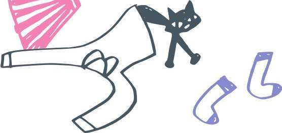

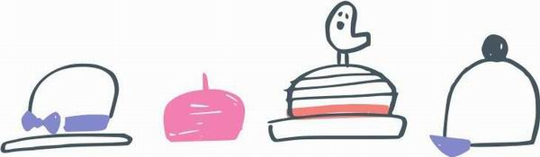

### C.关键在于舒心的雀跃感

在挑选西装、长裤、大衣等基础单品时，我会选择款式简单又耐用的买回家。这是因为基础单品的使用频率很高，在各个场合都能穿，价钱稍微贵一点也很值(当然，再贵也在我的可承受范围内)。

不过与此同时，我也很喜欢有个新、比较罕见的单品。虽然我这人不太追逐流行，但也会在日常生活中搭配一些“我很喜欢”，又能“让我雀跃”的单品，享受它们带给我的快乐。

帽子，就是能让我“雀跃”的单品之一。贝雷帽、针织帽、鸭舌帽、巴拿马帽……我有很多不同种类的帽子。买第一顶帽子的时候，我也是抱着“冒险”的心态去的。可久而久之，帽子就渐渐融入了我的生活。印花很有个性的T恤衫、让人过目不忘的连衣裙、色泽鲜艳的披肩……这样的单品也能打动我的心。

在选购这类单品的时候，我们没有必要给自己刹车。要是给自己加了五花八门的限制，你选出来的衣服就永远都是最保险的那几种了。

但我不会在这类单品上花太多钱，毕竟它们的性价比不算很高。我常会在大甩卖或旧货店选购这类单品。正因为我不会在这些东西上花太多钱，我才能鼓起勇气“冒险”，尝试新的流行。见一个爱一个当然是不行的，但要是你看到了自己喜欢的、也适合自己的，不妨买回家试一试。如此一来，你的搭配选项也能多出不少呢。

我的朋友小C经常穿“视觉冲击”很强的衣服，而且那些衣服套在她身上真的很合适。我特别佩服她，也很好奇她到底是在哪儿买的这些衣服。我一问才知道，衣服基本上都是在大甩卖的时候买的，要么就是去奥特莱斯买的。为什么她能把这种衣服穿出味道来呢？因为她很清楚自己“喜欢”什么，有明确的风格，也会巧妙地搭配一些小东西，提升整体的造型感。

“精挑细选”+“享受穿衣时的喜悦”，两者合一，才能打造出真正的时尚达人。

美丽的衣裳，本就应该为我们注入能量。即便是心情郁闷的清晨，只要穿上适合自己的衣服出门，人就会自然而然地抬头挺胸。换上美美的礼服出席酒会，心情自然明亮。

衣服，是用来给自己加油鼓劲的。我们的“心”，才是“时尚穿搭”的主角。

## 有川真由美的衣橱

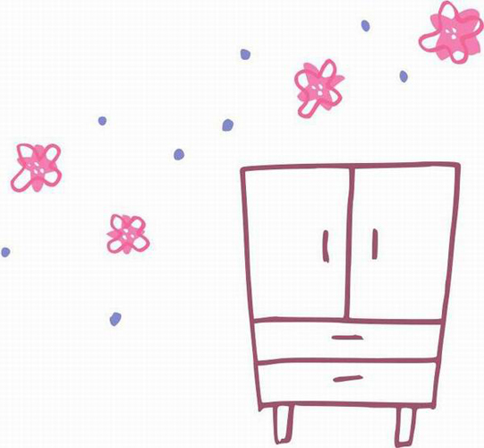

我的衣服分为两种：一种是工作时穿的，另一种是私下穿的。两类衣服泾渭分明，一眼就能分出来。

以前这两种衣服是可以混在一起的，可是近几年常有人请我做演讲，或是来找我洽谈事务。为了应付这些场合，我采购了一些正装和连衣裙。没有工作的时候，我穿的都是很休闲的衣服。

不同的人有不同的生活风格。不过我个人觉得，与其绞尽脑汁去找“工作场合和私人场合都能穿的衣服”，不如把“正式场合穿的好衣服”和“私人场合穿的休闲服”彻底分开。如此一来，购物时就不用太伤脑筋了，管理起来也方便，搭配装扮所带来的乐趣也能翻倍啦。

能穿三季的风衣

看到美国老电影里的女演员穿这样的风衣，我就去　买了一件，穿了好几年了，还是很喜欢。它适合所有场合，和所有风格的衣服都很搭，用途广泛，我已经离不开它啦!

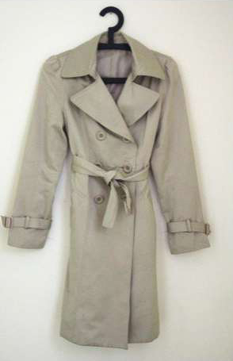

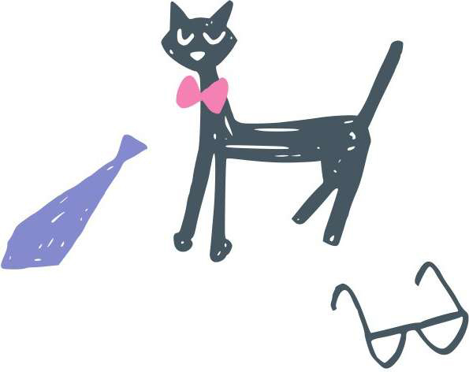

可分可合的套装

这套黑色套装，板型非常好，颜色也很简洁，搭配什么单品都不奇怪，用途非常广泛。

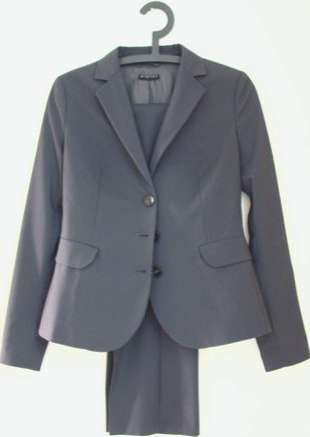

“正式”感十足的米色外套

就算里面穿的是T恤衫，下半身穿的是牛仔裤，只要披上这件外套，就不会显得太休闲了。白天可以随便穿，晚上有应酬的时候，我就会带上这件衣服。有时我甚至会用它搭配连衣裙，直接穿着去演讲会。

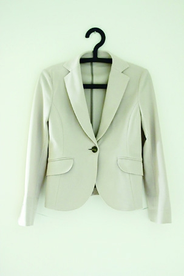

无领衬衫

为什么非要是“无领”的呢？因为我穿“有领”的不好看(笑)。我不会买纯棉的，而是选择稍微有点化纤的。这种料子的垂坠感更好，打理起来也容易。

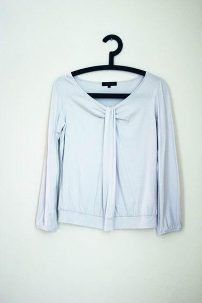

单穿也很好看的连衣裙

最近我衣橱里的连衣裙越来越多了。穿连衣裙就不需要在搭配上费太多心思了，省时省力。我选择连衣裙的标准很随意，有些连衣裙可以搭裤子，有些图案或颜色很有个性。

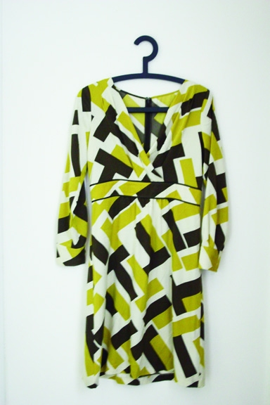

舒适的T恤衫

平时穿也行，穿西装的时候用它打底也没问题。太宽松会显得人很邋遢，太贴身又会暴露曲线……就算是T恤衫，也要先试穿再买哦。

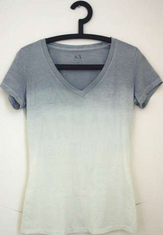

能盖住臀部的长开衫

我经常需要出门，又能防寒又能遮阳的开衫最实用了。穿裤子的时候配上长开衫，人就会显得成熟稳重。搭配腰带和围巾也不错。

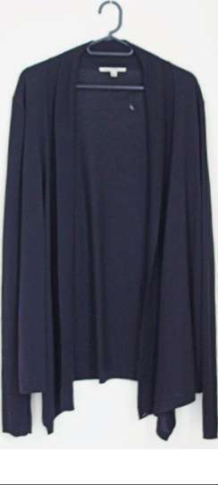

白色、黑色和米色的长裤

凑齐这3种颜色，就不存在“不好搭”的情况了。我平时只穿长裤，但有时候会把裤脚稍微折一下，让整体搭配显得更平衡。

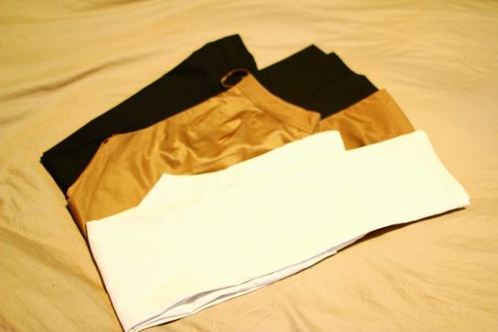

帽子、围巾、墨镜等小配饰

我之前介绍的基础单品基本上都是纯色的，所以要加入帽子、围巾、墨镜之类的小东西调节一下。脸部周围的小配饰能起到让表情更明快的效果。

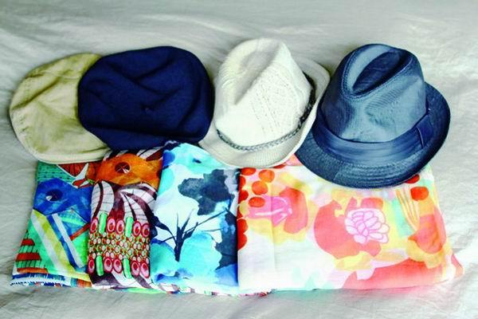

纯色长裙

我很喜欢会随着步伐摇曳起来的花边裙。它能挡住双脚，穿着真的很舒服。下身穿这种有膨胀感的裙子时，上半身要稍稍收紧，这样会显得更平衡。

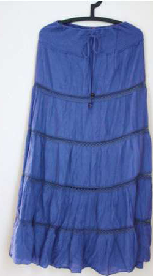

## STEP2 百试不爽的装扮诀窍

A. 锁定若干“御用品牌”

B. 找几个值得信赖的参谋

“买是买了，可没多久就不穿了”“没穿几次就走样了”“没有合适的衣服搭配新买的衣服”“周围的人都说新衣服‘不适合我’”……这些“弯路”，也是每个人的必经之路。

审美也好，品位也好，都不是一蹴而就的东西。我们必须从无数次失败中汲取经验，多看、多接触、多买真正的好商品，征求高手的意见，对着镜子反复研究……有了实际经验，审美才会有长进。失败，也许就是我们支付的“学费”。

话虽如此，谁都不想付“高昂的学费”，也不想白白花钱买没用的东西回来。那该怎么办呢？不妨锁定若干个“御用品牌”，找几个值得信赖的“参谋”吧。与其一个人发愁，不如参考一下高手的意见，这样才更有把握嘛。

等你慢慢培养出了自信，能自己挑选了，你就会更喜欢自己，也能更享受“时尚”了。

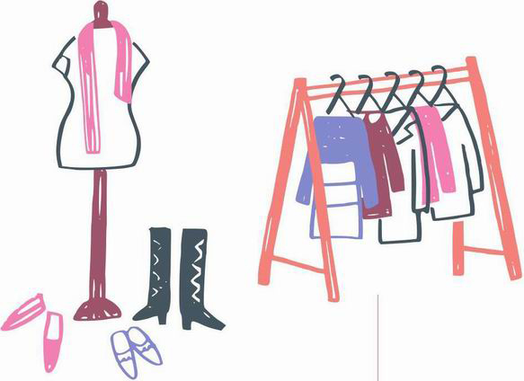

### A.锁定若干“御用品牌”

我不是那种买东西只认牌子的人，不过我买东西的地方翻来覆去就那么几个。

即便是第一次去的购物中心或百货商店，我也不会一家一家铺子逛过去。因为我一看店里的气氛，就知道“这里有没有我想要的东西”了。

不对，我只能说“这家店里可能有我想要的东西”，但我能很肯定某家店里“一定没有我想要的东西”。

店门口的假人，店里的布置摆设和海报上的模特，都能体现出“这家店的目标客户是哪个年龄段的哪一种人”。店员的穿搭也是很有用的判断标准。

就算你在“好像不太对”的店里发现了“好像挺合算”的商品，乐观地认为“我穿它也许还凑合？”，不久之后你就会发现，那不过是错觉而已。

在“不太对”的店里卖的衣服，不可能同时满足“颜色”“款式”和“材质”这三个要素。一开始，你只是觉得“这件衣服有那么一点不合适”，但久而久之，你就会越来越纠结这个“不合适”的地方，穿它的次数也会自然而然地减少(当然，偶尔也会出现“越穿越有感觉”的情况)。用这样的衣服搭配其他单品，你也能一眼看出“就它的风格和别的不一样”。

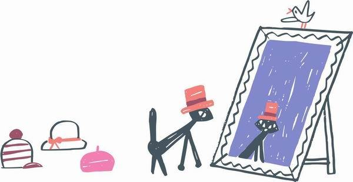

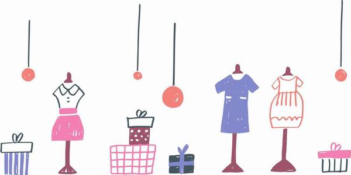

如果你还不到25岁，那么多逛逛不同类型的店铺也无伤大雅。可是人一旦过了25岁，风格就基本固定下来了。到了这个年纪还要为了“该选什么”“该去哪里挑选”烦恼，那简直是又费时又费力。长此以往，你就会失去判断力，“不知道最适合自己的是什么”，动不动就在买东西的时候栽跟头。

购物时，我们不光要看“感觉”和“目标客户群体”，“质量”和“价格区间”也很重要。在手头比较宽裕的时候尝试一下更好的品牌，追求更高的质量也是个好主意。

不过我不是很喜欢那种“一眼就能看出是名牌货”的东西。买“好牌子”的目的，只是为了提升整体搭配的质量而已。

在选择“商品”之前，我们要选好值得信赖的“品牌”。因为在那些品牌的店里，你更容易邂逅值得购买的好东西。买了之后，也不容易后悔。

只逛有你信赖品牌的店有什么好处呢？因为你熟悉这家店，所以你能大致预测出店里有些什么东西，搭配起来更方便。购物中心搞活动的时候，最好也只逛平时经常逛的商店，这样能有效防止自己乱花钱。

这年头啊，品牌就跟天上的星星一样多。我们一定要擦亮眼睛，认准最适合自己的“御用品牌”。

### B.找几个值得信赖的参谋

有个外国女性朋友跟我说过这样一段话：“为什么你老是穿黑色的衣服啊？穿鲜艳点嘛，鲜艳的衣服能把脸色衬托得更亮哦!”在那之前，我一直以为自己最适合黑色。可是她跟我一起逛街的时候，为我选了一件亮粉色的毛衣。

我心里有些打鼓：“这衣服是不是太鲜艳了啊……”但我穿上这件衣服之后，常有人夸我说：“这件毛衣好漂亮呀!很适合你呢!”我还会用不同的饰品和小配件来搭配它，享受穿搭的乐趣。一件粉色的毛衣，竟让我发现了全新的自己。

好的“参谋”能从客观角度为你提供精准的意见，打破僵硬的思维定势。无论你对自己的品位有没有信心，“引进自己所没有的视角”都是一个提升穿搭水平的有效手段。

服装店的店员是穿搭专家，能做出精准的判断。品位不错的朋友和家人，也能为我们提供有益的建议。不过每个人都有自己的喜好，在征求他人意见的时候，请务必把这一点也考虑进去。

最好的方法莫过于“结交一个能相互提建议的朋友”。“你有一双美腿，穿短裙应该也OK”“你的面相很温柔，工作时穿的衣服要选更干练的颜色”……有了这样一位朋友，你就能通过“包装别人”提升自己的品位了。与此同时，你也能借助朋友的双眼，从客观的角度看待自己。

参谋的作用，不仅仅是帮我们选衣服。我们也能从参谋身上学到新的点子和各种经验知识。

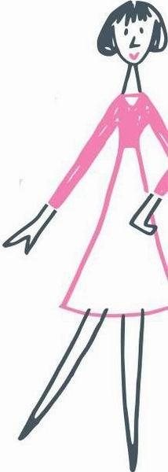

朋友小A

知道你有什么衣服和配件，能给你提供搭配方面的建议，并告诉你什么场合该怎么穿。

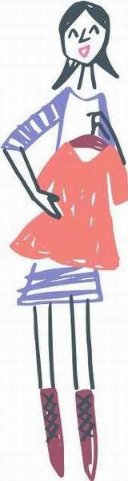

店员A小姐

从新鲜的角度，选择适合你的产品，为你带来新的发现。

也可以向她讨教衣服的保养方法，还有关于商品的各种知识哦。

## STEP3 穿搭进阶教程

A. 大胆玩撞色

B. 定制内衣

C. 用旧衣服搭出新意

D. 甜美与犀利的混搭

真正的“时尚达人”绝不会轻易妥协。“和周围的人差不多就行了。”“我的底子就这样，再打扮也好不到哪儿去。”“年纪一大把了，还打扮什么啊。”真正的时尚达人绝不会这样放松自己。他们会根据自己的审美观，朝着“更高级的时尚”迈进。

时尚和自己的想象力有非常密切的联系。要是你觉得“我就这点本事”，那你就不可能有所超越。

“我一定能变得更棒!”“我一定能找到一种最适合自己的穿搭风格!”只要摆正心态，你就一定能发现更美好的自己。而“穿衣打扮”，不过是让你更加接近“理想状态”的物理方法之一。

只要换上更接近“理想状态”的服装，你就会变得神采飞扬，敞开心扉和别人打交道也不是什么难事。衣着打扮，有时也能反过来改变我们的内心，不是吗？

我们可以慢慢建立自信。只要找准了“自己的风格”，你就能按自己的标准享受时尚，而不介意他人的眼光了。千万别放弃!谁都有可能找到最棒的自己!

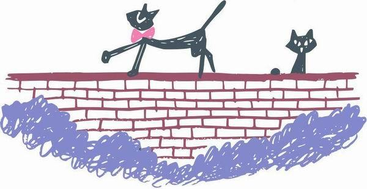

### A.大胆玩撞色

在环游世界时，意大利人的品位给我留下了深刻的印象。

橱窗里的模特和路人的衣着打扮都很有个性，尤其是颜色的搭配!灰色西装配粉色系的印花围巾，牛仔裤配粉红色的高跟鞋……意大利人身上，一定会有一抹亮色。他们酷爱表现自我，绝不安于普通。

在日本有胆量“玩撞色”的人，也能给人留下“这人审美很独特”的印象。上了年纪之后，张弛有度的配色能将脸色衬托得更亮。反之，要是你一直穿米色、灰色之类的中间色，就会显得脸上暗淡无光。黑、白、红、紫、橙……把这类鲜明的颜色配置在脸的附近，表情就会显得分外生动。

不过“撞色”特别讲究一个“度”。一旦过了分寸，就会显得很“土”。在搭配时，我们要考虑清楚是某种颜色“融入整体”，还是将它“用作点缀”，如此一来，才能把颜色搭配得更好。

我们也可以使用对比色和不同的色调，享受配色所带来的乐趣。

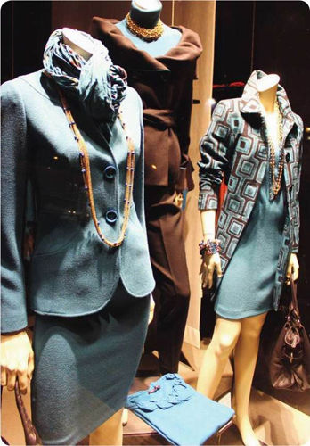

意大利罗马的橱窗展示。基础色与点缀色对比鲜明，显得特别时髦。

### B.定制内衣

我有一位五十多岁的朋友，穿紧身连衣裙特别好看。“你的身材可真好!”—听到我的夸奖，她笑嘻嘻地告诉我：“嘿嘿，这多亏了我的内衣!”她给我推荐了某个牌子的半定制胸衣+塑身裤。定制内衣果然贴身舒适，一旦穿上就再也不舍得脱下了!

好的内衣能起到挺胸收腹的效果，让身体的曲线变得更动人。虽然定制的内衣稍微有些贵，但它们能让你把针织衫、T恤衫和铅笔裤穿得更好看呀。这么一想，定制内衣的性价比还是很高的。

我们应该“让内衣来迎合我们”，而不是“我们去迎合内衣”。虽然内衣不会被外人看到，但它功效显著，能在我们的时尚生活中发挥出重要作用。

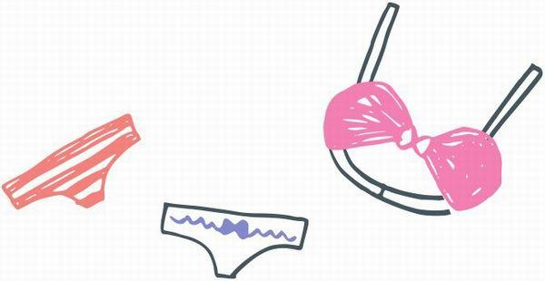

### C.用旧衣服搭出新意

“这是我妈妈当年穿过的连衣裙!”“这是一件很有年头的大衣，我特别喜欢它的印花。”

有些人钟爱复古的衣服。他们有着独特的品位。在他们眼中，好东西永远都是好东西。这些复古的衣服在我们现代人看来反而很新鲜。不过复古爱好者们不会直接把旧衣服套在身上，他们会搭配合适的腰带、帽子和饰品，或是把旧衣服上的扣子换掉，让它们焕发出新的生机。

可是旧衣服毕竟是旧衣服，要是搭配不当，就会给人留下“设计过时老土”的印象。所以要把这类衣服穿出味道来，离不开高水平的品位与搭配能力。关键在于让旧衣服穿越时代，在现代绽放出新的光辉。要是能把旧衣服利用起来，就能节省不少开支了。正所谓“物以稀为贵”，大家不妨鼓起勇气，把旧衣服用在自己的穿搭上吧。

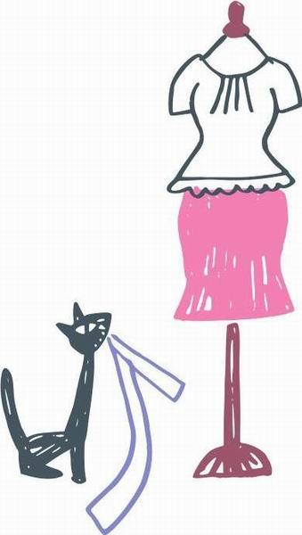

### D.甜美与犀利的混搭

我在搭配衣服和饰品的时候，常会把“甜美”和“犀利”这两种感觉混合起来，让两者保持绝妙的平衡。

比如，如果我上半身穿的是轮廓硬朗的夹克，那我就会配一个大号的银色饰品，下半身穿一条略有些休闲感的不对称长裙。如果身上穿的是女人味十足的蕾丝连衣裙，那就配一条显眼的硬皮带，或是穿一双皮靴平衡一下。

时尚品位越高的人，就越会混搭“甜美”与“犀利”。

在“英气逼人”中透出一丝“柔美”，在“甜美可人”中融入一丝“犀利”……巧妙利用这样的“对比”，你的穿搭就会显得更有深度。

全身上下都是同一种风格当然也没问题，但只要在某个部分来一点“小变化”，两种风格就能互相衬托了。“甜美”与“犀利”的平衡，同样适用于面部的妆容、体型和发型上。

要玩好“甜美”与“犀利”，关键在于把握好其中的“度”。只要找到最适合自己的“平衡点”，那就万无一失啦!

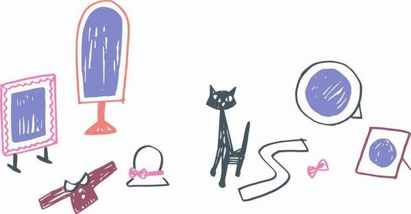

# 第5章 每天都能用到的极简美容保健法

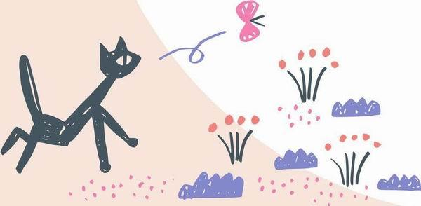

爱惜自己，

是过上舒心生活的基础。

如果每天都疲惫不堪，心情烦躁，

那就不可能有闲情享受生活，也不会有意识地为他人考虑。

“算了，就这样吧”，这样的心态，会让你随波逐流，失去自我……

本章介绍的美容保健法都非常简单，

概括起来就是“不费事，不费力，不花钱”。

把愉悦身心的好习惯融入到我们的日常生活中吧!

## 职业女性更要悉心呵护身心

现代人为了适应复杂多变的社会环境，常会在不知不觉中“勉强自己”。回过神来才发现，身心早已分离。疲劳与睡眠不足，让我们的皮肤失去光泽。压力则让我们心情烦躁。还有不少职业女性患上了妇科疾病，成天闷闷不乐，陷入了“半抑郁”状态。

美容、保健的方法多种多样。吃营养品和保健品、去美容院、做按摩、上健身房、请疗养师治疗……但保持身心健康的基本点，不外乎以下3个：

● 均衡的“饮食”

● 充足的“睡眠”

● 适度的“运动”

“你不说我也知道啊，可我就是做不到啊……”，肯定有很多读者在心里嘀咕呢。别想得太复杂，总有些可以在日常生活中实践的简单方法嘛。

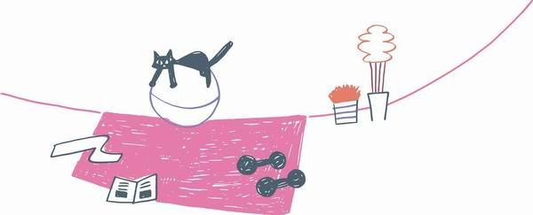

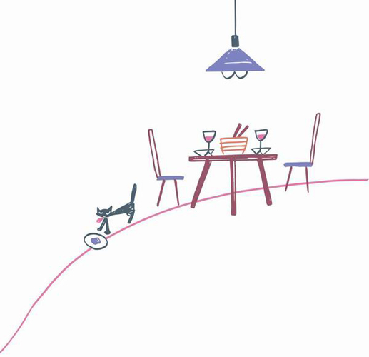

其实，日本人的传统生活习惯就满足了这3个基本点。日本人吃的虽然是粗茶淡饭，但餐桌上有水产品、根菜、海藻和大豆，品种十分丰富。而且日本人自古以来就有“早睡早起”的好习惯。如今，日本仍是举世闻名的长寿国家。保持着传统生活习惯的老人们，都有着无限的活力。

冲绳是出了名的“长寿县”。当地的老奶奶们特别精神，真叫人眼前一亮。她们会敞开肚子吃自己喜欢的东西，用最自然的食材。不开心的事情统统抛到九霄云外去，放声大笑，尽情跳舞。即便是独居老人，也能按自己的步调过日子，时不时和街坊邻居打个交道。正因为冲绳有着这样的生活环境，老人们才能安享晚年吧。

在日常生活中下一点点功夫就行

我们的身体，其实不需要过多的娇惯。

过多的娇惯，反而会影响身体发挥出它固有的能力。要让身心保持健康，其实不用做什么特殊的事，只要在日常生活中下一点点小功夫就行。

皮肤特别好的人、身体特别健康的人都会异口同声地说：“我没怎么保养啊。”事实就是如此。他们没有做多余的事，只是采用了能让身体自然而然变得更健康的生活方式罢了。

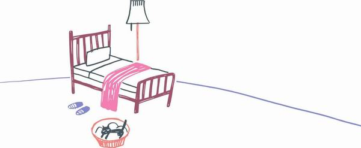

要是我们总是娇惯自己的身心，人就会变得越来越脆弱。话虽如此，要是太过勉强自己，身体也会垮的……不能对自己太好，也不能对自己太严苛。我们要竖起耳朵，倾听身心的呼声，养成对自己“刚刚好”的生活习惯。

自己的身体，当然要自己来呵护。这是最基本的道理。

左右身心健康的另一大因素，就是“心态”。

“我会不会生病啊？”—你越是这么担心，就越是容易得病；“我会不会发胖啊？”—想着想着，你就真的胖了……这种事绝非个案。“我现在这么忙，不可能过上健康的生活。”“我都一把年纪了，身体有问题也是没办法的事。”—成天给自己这样的心理暗示，就很容易弄假成真。

千万不要成天担心自己生病或发胖。“只要平时注意一点就不会有问题的”—抱着这样的心态生活，身体就不容易出问题。就算生病了，我们也可以暗示自己：“肯定能很快好起来的。”心态好了，身体恢复起来也就快了。

心态和想象力，能为我们的身心添砖加瓦。

有了“开朗的心态”，我们才有资本实现各种各样的梦想。“开朗的心态”，才是舒心生活的根基。

我们要调整好自己的心态，让阳光普照心田。如此一来，我们才不容易被乱七八糟的事情迷住双眼。

## STEP1 不花冤枉钱，也能拥有健康的身体

A. 晨间保健

B. 日间保健

C. 夜间保健

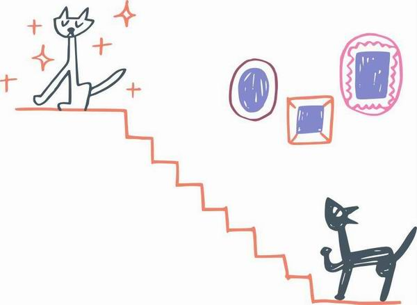

拥有“健康美”的人，无论年龄大小，都有着挺拔的体态和光泽四溢的肌肤!要成为这样的“美人”，就要养成一有空就做运动的习惯，好好呵护自己的身体。

衰老，从你放弃的那一刻开始。成天偷懒，身体和面容就会迅速老去。

大家都知道“每天坚持保健”的重要性，可是特意挤时间实在是麻烦，也很难坚持下来。如何养成保健的习惯呢？做到下面两点就行：

①把“保健”和日常生活中的行为结合起来

②用“保健”的小动作调节心情

早上刚起床的时候，白天坐办公室的时候，晚上睡觉之前……只要在日常生活中下一点点“小功夫”，不用特意去健身房、美容院或按摩店，也能收获明显的效果。

不过我们也不需要每天逼自己去完成这些小动作，否则会产生很大的心理负担。实在不想做，休息一天也无妨。“既然开始了，那就坚持下去吧。”—保持轻松的心态最重要。

坚持一段时间之后，你就能感觉出效果了。“做了这个小动作，就觉得整个人神清气爽!”“身体好像变得更柔软了!”

功夫不负有心人。只要“每天”坚持，就一定能收获成果。

### A.晨间保健

充足的睡眠，会为我们的身心注入新鲜的能量

刚起床时稍稍运动一下，或是做些“积极向上”的事，人就会神清气爽，工作时也会更加专注。

“睡了一晚还是累”“起床的时候整个人都不舒服”—如果你属于这种情况，也可以在起床后运动一下，把神经放松下来，让身体变得更柔软。

养成起床后做运动的好习惯，为每天的生活开一个好头吧!“我有一个每天早上坚持的习惯”—这样一份自信，也能为你提供巨大的动力。

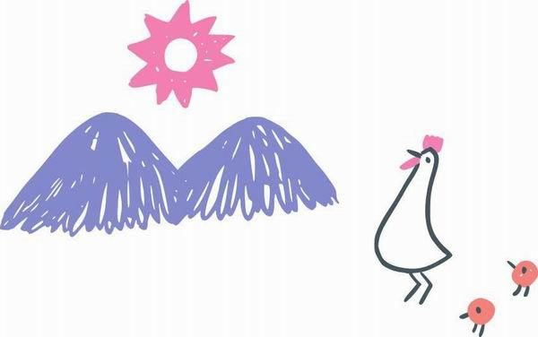

起床后先伸个懒腰

每天起床之后，我做的第一件事就是走去阳台，伸个大大的懒腰。一沐浴阳光，浑身上下的细胞都会运转起来。

在朝阳的刺激之下，大脑会分泌出一种叫“血清素”的物质。据说它能提升干劲，十分有益于心理健康。长期生活不规律，成天对着电脑，不做运动，血清素的分泌量就会下降。久而久之，人会变得暴躁易怒，甚至出现抑郁的症状。由此可见，血清素是一种非常重要的物质。

每天用自己的五感去感知外面的世界，你就能敏感地察觉到季节的变化。“空气里有春天的味道!”“天亮的时间变早了!”……深吸一口新鲜空气，让新鲜的血液在全身循环起来。“今天也会是美好的一天!”积极的自我暗示，能让你全情投入到一整天的工作与学习中去。

早晨，是充满大自然正能量的宝贵时光。

边做家务边深蹲

“一边煮咖啡，一边做深蹲”—这个习惯，我已经坚持了好几年了。呆呆站着等水煮开实在是没劲。怎么办呢？不如做些小运动吧!

双手抱头，双脚分开，与肩同宽。下蹲时，不要蹲到底，把膝盖弯成90度刚刚好。一边下蹲，一边呼气，反复做100次即可。一组动作正好需要两分钟，水烧开了，深蹲也做完了。

有时候，我还会在深蹲时顺便弯弯腰，做个体前屈什么的，或是加入简单的拉伸动作。如果一口气做100个有难度，那就从30个做起，然后加到50个。千万不要勉强自己哦!

深蹲有收腰挺胸的作用。每天坚持，你还能迅速察觉到身体状态的细微变化呢。“今天的状态好像不错!”“肩膀好像有点酸啊……”

我们可以把深蹲和日常生活中的动作结合起来，比如一边刷牙一边深蹲，一边烤面包片一边深蹲……如此一来，就不容易忘记了，也更容易坚持。

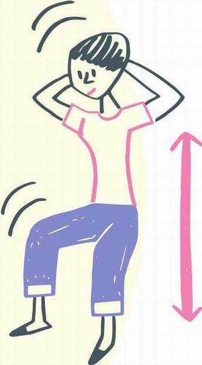

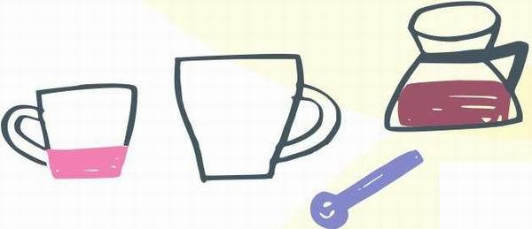

唱歌+深呼吸

唱歌，能让自己的声音通过脑干传遍全身，让整个人都精神起来。我经常在开车和往返车站的路上哼个小曲。童谣、老歌、动漫金曲……哼什么都行。忘了几段旋律也没关系。随便哼两句喜欢的歌曲，就能起到提升干劲的效果。在工作前哼一下，能更快地进入状态。一边听CD一边哼也是个好主意。音乐，能让我们的心情变得更晴朗。

我们还可以把自己的梦想或今天的目标大声喊出来(比如“我一定要把XX资格证考出来!”)，或是朗诵喜欢的诗歌与文章。这样能起到自我暗示的效果，让心情放松下来。顺便做个深呼吸吧!学会腹式呼吸，用腹部的力量发声。这么发出来的声音会更有中气，更能打动人心。缓缓深呼吸，也能促进血液循环，调整植物神经的平衡。

### B.日间保健

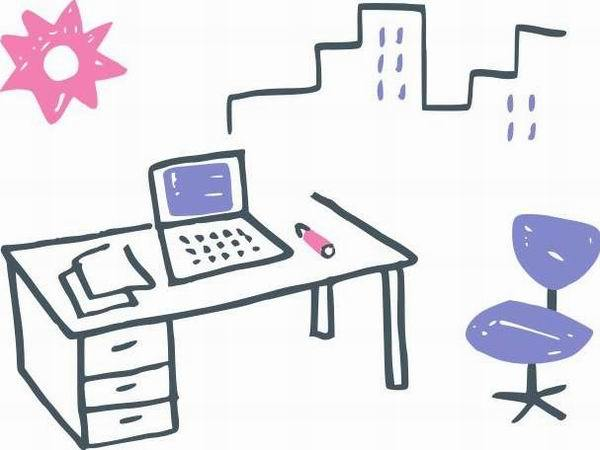

职业女性的白天总是分外忙碌，几乎没有时间去呵护自己。

尤其是坐办公室的白领，一天到晚对着电脑。回过神来才发现，自己已腰酸背痛，头晕眼花……下班回家的时候，整个人都憔悴了—有这种烦恼的人，一定不在少数。

长时间保持同一个姿势，会给身体造成巨大的负担。我们要有意识地在工作时间里穿插一些休息时间，稍微活动活动。

休息过后，再全身心地投入工作，效率也会提高不少呢!

尽量多走路

我很难挤出时间去健身房或运动类的兴趣班，所以我会尽量多走路。走路能促进大脑分泌出血清素，调节人的心理状态。在工作的前后走上20分钟，边走边想象自己“身轻如燕”，一团乱麻似的思路也会变得清晰起来。

往返于超市和车站的时候，我们可以有意识地选择不同的路线。这样兴许会有新的发现，过一把“冒险瘾”。如果你住在5层以下的低楼层，那就别坐电梯了，直接走楼梯吧。

走路的时候一定要抬头挺胸，步伐要有节奏，要把走路当成一种运动去做。不过在人流比较密集的地方走路时，我们不得不花很多的精力去避开其他行人，这就会让“走路”的效果大打折扣。

一旦养成“多走路”的习惯，你就会发现：稍微走一会儿，你就能去到很远的地方。“下次去那里看看好了!”—久而久之，走路就会变成一桩趣事。

利用休息时间做简单的体操

休息时间做的体操要符合“短小精悍”和“效果显著”这两个要求。尤其需要拉伸的是脖子、肩膀和后背。我要向大家隆重推荐三种极简体操，坐在椅子上也能做哦!

第一种：单手抓着椅面的侧面，另一只手按住另一侧的耳朵上面，稍稍用力，拉伸颈部(重复若干次)，然后换一个方向即可。做这个动作的时候，后背一定要挺直。

第二种：双手在背后握住，用力往后伸，挺起胸膛(重复若干次)。长时间使用电脑的人很容易驼背，所以活动胸肌，多做做扩胸运动是很重要的。

第三种：坐在椅子上，把鞋子脱掉，把腿举起来，上下摆动(30次左右)。这个动作能促进下肢的血液循环，还有瘦腰的效果哦。

周围有人的时候，动作可以稍微小一点。就算只选其中一种体操做，效果也是看得见的!

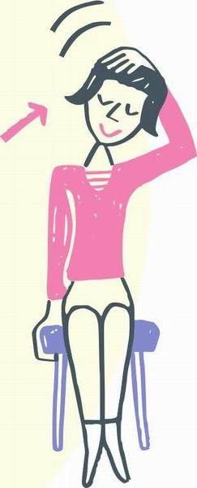

在工作和家务之余按压穴位

定居中国台湾后，我切身体会到了按压穴位的功效。

在东方的医学体系中，“血”“水”和“气”都会在我们体内循环。循环顺畅了，人就会健康。“血”指的是血液，“水”指的是淋巴液、汗水等体液，“气”则是维持生命所需的能量。“气”的循环通道叫“经络”，而经络通过的地点就是“穴位”。经络不通，身体就会出现各种疼痛与不适。刺激穴位，是疏通经络的有效方法。

觉得哪儿不舒服了，就在工作和家务之余按1分钟的穴位吧。如此一来，整个人都会轻松许多。

信则灵。按穴位的时候，一定要相信“按了就会好”。要是怀疑按压穴位的效果，气的循环就会受到影响。心态真的会影响到身体的状态。无论是按压穴位，还是使用其他保健方法，都一定要自我暗示“我的身体在变好”哦(按压穴位的具体方法详见P116～118)。

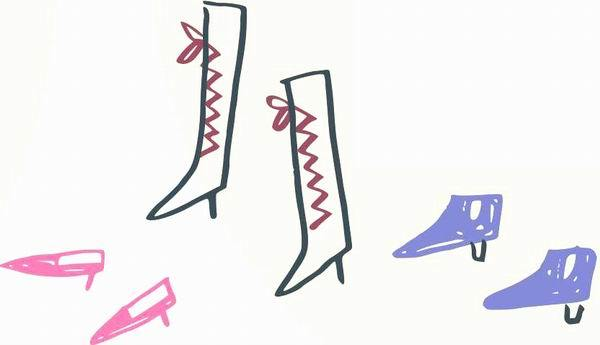

### C.夜间保健

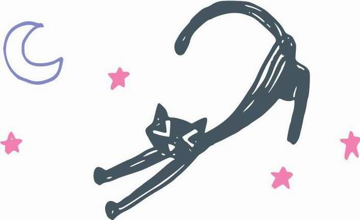

女人一定要挤出时间来呵护自己，做好保养工作。

晚上泡个澡，认真护肤，就能起到放松身心的作用。只要你有恒心，效果不会比美容院和按摩店差多少。放一曲舒心的音乐，点一支熏香蜡烛，夜晚的“保健时间”就会充满乐趣。

就算白天遇到了许多不顺心的事，也能在睡前让自己好好放松一下，把烦恼清空，痛痛快快地进入梦乡。

只要养成每天保养身心的好习惯，几年过后，你就能把那些不懂得呵护自己的人甩在身后了。

泡个半身浴，让全身暖和起来

所谓“半身浴”，就是只把下半身泡在热水里。因为脚尖附近分布着许多毛细血管，很多器官集中在腰部，所以腰部以下暖起来了，血液循环就会变好，全身都会跟着暖起来。在睡前1小时泡20～30分钟就行，水温控制在38～39℃，不要太烫。半身浴能有效缓解疲劳，对便秘、四肢冰凉和皮肤干燥也有一定的效果。我们可以尽情享受泡澡的时光—坐在浴缸里看看书，听听音乐，或是干脆把灯关掉发发呆也不错。要是觉得冷，上半身多盖一条毛巾就行。

我一般会在洗澡水里放两大勺可食用的小苏打，因为养肤的温泉水也含有同样的成分。小苏打会渗透到肌肤深处，让肌肤变得更水润。再加几滴薰衣草精油，舒缓效果就更强了。

泡个10分钟，人就会开始出汗，毛孔也会打开。20分钟后，大量的汗水就会带着体内的废物一起排出体外，让你神清气爽。每周泡1～2次就有效果，大家一定要试一试哦!

\*部分浴缸不能使用入浴剂，泡澡前请仔细阅读说明书。

保湿能手—婴儿油

女人的皮肤最怕干燥。干燥会加快肌肤老化，使皮肤更容易出问题。

婴儿油在我每晚的保湿环节中发挥出了重要作用。一瓶三用，实惠又有效，头发和全身都能照顾到。具体的使用方法如下：

●锁住秀发的水分

用过洗发水和护发素之后，打半盆热水，加入2～3滴婴儿油，把头发放到脸盆里浸一下即可。不必再用清水冲洗。有了婴儿油的保护，头发就会更有光泽。

●身体磨砂

将细盐粒与婴儿油以2：1的比例搅拌均匀，做成身体磨砂。这款磨砂特别适合脚跟、膝盖等角质层比较厚的部位，磨过之后皮肤就会变得滑滑的!加大盐的用量，再加入1个鸡蛋的蛋白(充分打发，能拉出坚挺的小角)和半个柠檬的汁水，就能用在脸上啦。

●全身按摩

刚洗完澡的时候，可以用婴儿油按摩全身，锁住全身的水分。脖子、手掌、脚趾……每一个部位都要抹到，顺便按摩一下，促进血液循环。

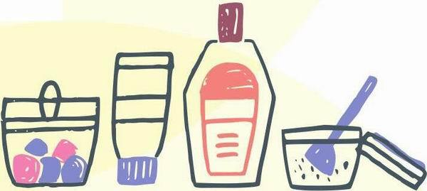

安眠拉伸运动

睡前在床上做一下伸展运动，能让身体放松下来，改善睡眠质量。要是在身心都很紧张的状态下就寝，就很难睡着，就算睡着了，睡眠也会很浅。

我用得最多的就是瑜伽的“猫式”。四肢撑地，一边呼气，一边像猫一样把双臂和后背伸直，保持数秒。然后再把双手垂直撑起来，下腹部贴地，背往后仰。反复多次即可。这个动作能充分伸展背部，让人神清气爽。你一定会有新鲜的血液在全身循环的感觉。

“躺着倒立”也是个很有效的动作。上半身躺在地上，头、肩膀和手肘撑地，双手扶着腰部，双腿朝天，靠在墙上。下巴要贴紧胸口。保持20秒～1分钟后，再缓缓放下双腿，重复数次即可。据说这个动作能让新鲜的血液流向上半身，有抗衰老的功效。它对下半身水肿和便秘也有一定的效果。

耳垂后侧凹下去的地方有一个能改善睡眠的穴位。用双手慢慢揉捏，就能一觉睡到大天亮了。

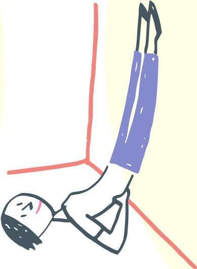

## 中国按摩师亲传 超简单的穴位按摩法

在中国的台湾地区，满大街都是按摩店。因为按摩能有效缓解疲劳，振作精神。

按摩师教了我几招，我平时也会实践一下。只要稍稍刺激一下穴位，就能感到自己的血液循环变好了，酸痛也不翼而飞了。

多呵护自己的身体，用按压穴位的方法促进“气”的循环，就能缓解疲劳，放松身心。

·按下去的时候觉得“酸酸的”“很舒服”“很有效”的地方，就是“穴位”。按压的力度不能太重，也不能太轻，次数也要拿捏准。“虽然有点疼，但还挺舒服的。”—这样刚刚好。请大家一边缓缓呼气，一边按压。

眼部疲劳

一直对着电脑工作，眼睛就会疲劳。

为了让眼睛的“气”顺畅循环，我们可以刺激一下眼周的穴位。

眼睛的疲劳会引起头痛，时间久了，肩膀也会跟着疼，心情也会变得烦躁。

眼睛的状态会对身体的其他部位和心情产生影响，所以保养一定要趁早!

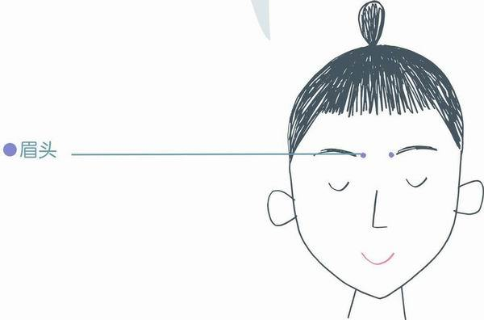

眉头顶端有一个骨头稍稍下陷的地方。用双手的大拇指、食指或中指(用着顺手的手指就行)轻轻把下陷处的内侧往上推。闭上眼睛，按3秒后松开，重复10次左右。这个动作能促进眼周的血液循环，起到舒缓双眼疲劳的效果。

肩膀酸疼

在办公桌前坐久了，最先出问题的一定是肩膀。紧张过后、提过重物之后，肩膀也会又酸又疼。

严重的肩膀酸痛甚至会引起头痛、恶心、胸口疼等症状。

除了伸懒腰、转动脖子和肩膀之外，经常按压穴位也能起到放松肩部肌肉的作用。

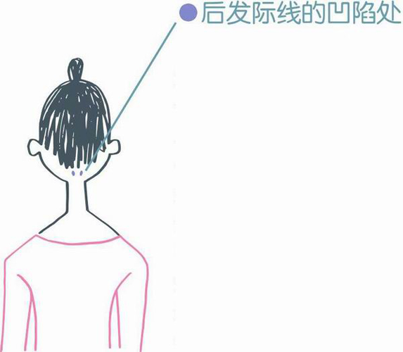

头盖骨和脖子的分界线附近有一处稍稍下凹的地方。用食指和中指垂直用力按几下，后脑勺就会微微发热。这个穴位地处颈部与头部之间，能有效缓解肩膀酸痛，同时促进头部的血液循环，对缓解头痛与眼部的疲劳也有一定的效果。据说这个穴位还能促进大脑的运转，在需要集中注意力的时候按几下也不错哦。

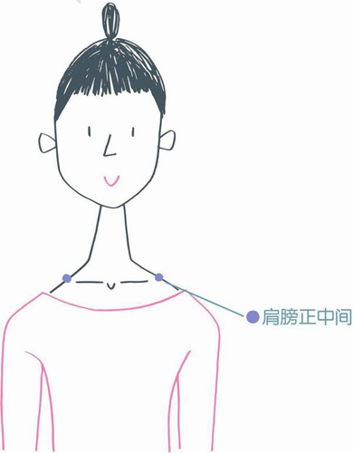

这个穴位在肩膀最高的部分和肩膀顶端的正中间。用2～3根手指(以食指和中指为主)轻轻按按看吧。穴位不在皮肤表面，而是在我们的体内，所以按压的时候一定要慢慢刺激到深层。每次按3秒，重复10次左右，血液循环就会有显著的改善。

全身疲劳

“总觉得浑身没劲”“最近工作太辛苦了”……有两个穴位很适合这种情况!

不光能促进血液循环，加快新陈代谢，还有调节肠胃的效果。

经常按压，全身的循环会有显著的改善。想睡个好觉的时候，也可以刺激这两个穴位哦。

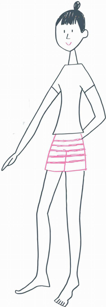

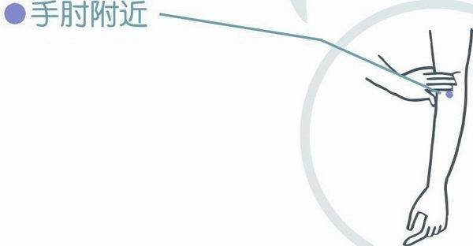

弯曲手肘的时候，手臂上会出现一条褶皱。将3根手指并排放在褶皱旁边(靠近手掌的一侧)，找到一个肌肉稍稍隆起，按下去有点疼的地方。这就是我们要按的穴位了。用大拇指的指腹用力按压或揉捏双臂的这个穴位，能缓解颈部与肩膀的酸疼和手臂的疲劳，以及低血压引起的全身无力，促进上半身的血液循环。据说它对缓解空腹时的“烧心感”也有一定的效果。

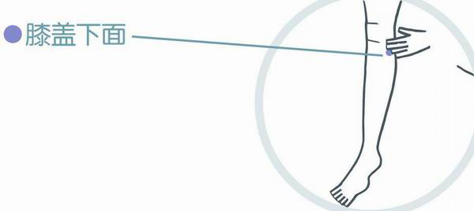

将4根手指并排放在膝盖外侧的凹陷处(靠近脚底的一侧)，无名指附近就是需要按压的穴位。可以用大拇指的指腹用力按压，也可以用拳头轻轻敲打。这个穴位能加快新陈代谢，改善下肢水肿。暴饮暴食过后，也能用这个穴位促进消化，恢复食欲。

## STEP2 用美食调整身心状态

A.不勉强，把握基本

B.用心享受美食

民以食为天。吃，既是生存的基本，也是人生的乐趣之一。

中国台湾也是一片以“美食”著称的水土。当地人甚至用“吃饭了没？”来打招呼。之所以形成这个习惯，是因为当年人们的生活很穷苦，问候对方有没有吃饭，也是表达关心的一种方式。

自不用说，日本也有享誉世界的饮食文化。

正月的年菜、七草粥、女儿节的什锦寿司、端午节的柏饼和粽子、盂兰盆节的素斋、盛夏的鳗鱼、中秋的芋头和栗子……日本人会在不同的季节享用各种不同的食材，会用漂亮的餐具盛放菜肴，摆盘也精美至极。

然而，不管是日本，还是中国，已然进入了食物过度饱和的时代。我们一年四季都能买到相同的食材，还有各类餐馆、熟食、进口食品与冷冻食品任君挑选。虽然生活变得方便，也富足了，可我们的身心真的因此愉悦了吗？还真不好说……

我们绝不能被过度消费的风潮所左右。仔细斟酌自己的身心究竟需要什么，只吃必要的东西，才是最健康的活法。也许此时此刻，恰是我们重归“饮食文化”原点的时候。

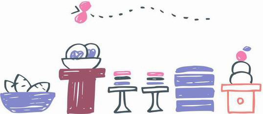

### A.不勉强，把握基本

现如今，“食品安全”成了全社会关注的热点话题。可大家也不需要逼自己变成只吃有机蔬菜的素食者，也不用成天盯着食品的配料表，生怕把食品添加剂吃进肚子里。太过神经质也不好。

“吃”，有两个基本要点：吃能愉悦身心的东西；享受“吃”这件事。

下面就是执行这两个基本点的4个诀窍。

①“两菜一汤”为基本

“两菜一汤”，自古以来就是简单饮食的代名词。

“两菜”，就是“主菜+配菜”。鱼、肉为主菜，蔬菜、豆类等为配菜。两者相结合，营养才会均衡。

“一汤”，顾名思义就是汤水。汤不仅能增加食欲，还能润喉，让饭菜更好下咽。

再加上米饭等主食，就是一顿基础餐食了。

每天保证“两菜一汤”，就能均衡摄入人体所需要的各类营养，让身体更健康，将身体状态调整得更好，进而孕育出无限的能量。

人最容易缺的就是维生素和矿物质。而大豆、羊栖菜、小鱼干、芝麻、海藻、海带等日本菜最常用的食材就是补充这两种物质的捷径。西方营养学认为，人每天应该吃30种食材。但是日本人自古以来使用的食材具有丰富的营养，不用吃那么多种，也能均衡摄入足够的营养成分。

总结一下就是，“吃什么”比“吃多少”更重要。

如果一日三餐都吃“两菜一汤”有些困难，那就在午餐中加一份沙拉，或是每天晚上保证“两菜一汤”吧。用最适合自己的方法实践就行，不用太勉强。

“这是为了什么而吃的？”—让我们先从“对食物感兴趣”做起吧!

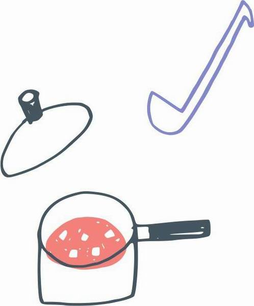

主菜

以鱼、肉、鸡蛋、大豆为主的蛋白质(身体的主要成分)和脂类(可转化为能量)

主食

以米饭、面包、面条为主的碳水化合物(可转化为能量)

配菜

以蔬菜、海藻类为主的维生素、矿物质与膳食纤维(调节身体状态)

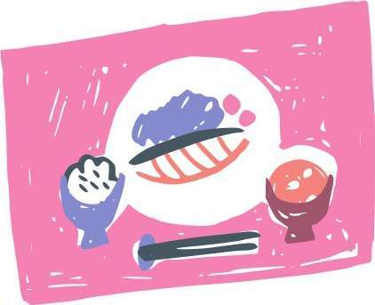

有川家的一日菜谱

这天我一直在家伏案工作。早餐与午餐比较简单，晚餐也是半小时就搞定，营养也很均衡。我每周基本有4～5天都是这么吃，午餐与晚餐有时候会出去吃。

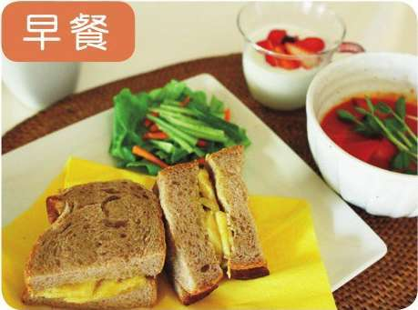

■ 香蕉三明治

■ 番茄杂烩汤

■ 水果酸奶

汤的做法很简单，把前一天剩下的洋葱、灯笼椒、芹菜等蔬菜加上番茄糊一起煮就行。酸奶里的水果能起到调整身体状态的作用。

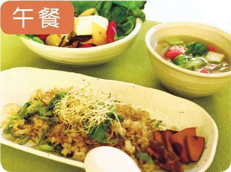

■ 爽口小鱼干炒饭

■ 菌菇温泉蛋沙拉

■ 什锦鲜汤

提前煮好晾干的菌菇用热水过一遍，加上温泉蛋，就是一盘沙拉了。中午要吃点能提供能量的东西。

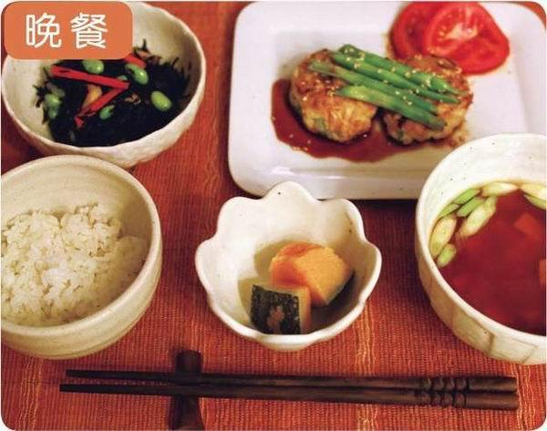

■ 鸡肉豆腐饼

■ 羊栖菜煮青豆

■ 煮南瓜

■ 大葱豆腐味噌汤

将鸡肉切碎，加入绢豆腐，搅拌均匀后做成肉饼，最后用葱点缀一下，就成了主菜。羊栖菜煮青豆里还加了胡萝卜和香菇，色泽鲜艳。前一天剩下的南瓜当配菜。晚上少吃点米饭比较好，用来合成细胞与荷尔蒙的蛋白质可以多吃一些。

② 吃“应季的”和“本地的”

在中国台湾，去医院看感冒的时候，医生一定会告诉你：“不要吃水果。”

一般人都会认为，水果富含维生素，能让病人康复得更快。可是菠萝、芒果、木瓜等热带水果会给身体降温，所以感冒的时候还是不吃为好。

应季食材和本地食材各有各的功效。春天的蔬菜富有生命力，能帮助人体排出废物，生成新的细胞。夏天的蔬菜水果富含水分，能降低体温，调节身体状态。秋天的水果特别甜，而且这个季节的鱼会储备很多养分准备过冬，所以秋天的鱼肉也很不错。冬天的根菜(如白萝卜、牛蒡和莲藕)能暖胃。

我们的身体会随着四季的循环提高免疫力、补充能量、调节激素水平。

伟大的自然孕育出的应季食材和本地食材拥有强大的生命力和极高的营养价值，而且还经济实惠。“现在哪些食材最好吃？”—只要将视线转到自己身边，就一定能注意到平常忽视掉的优良食材。咨询一下蔬果店的工作人员，就知道食材的产地和最合适的料理方法了。

③细嚼慢咽

小时候，长辈总是教育我们：“吃饭要细嚼慢咽。”可是现代人的生活节奏越来越快，再加上市面上有很多不用怎么嚼就能咽下肚的菜肴，所以我们使用下颚的频率是越来越低了。

细嚼慢咽到底好在哪儿呢？因为这样能促进消化吸收，让肠道吸收更多的能量。如果把消化吸收的工作全部推给胃，胃就会不堪重负。

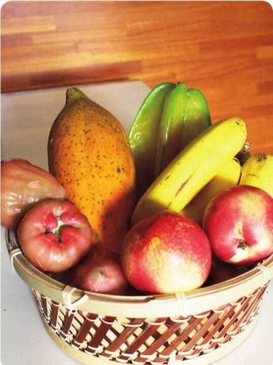

木瓜、阳桃、香蕉、莲雾等中国台湾地区的水果。它们大多有补充水分、降低体温、促进消化、调节肠胃的作用。木瓜还能美肤呢!

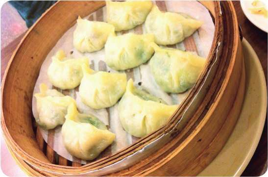

蒸饺可以和促进消化的生姜一起吃。饺子皮是碳水化合物，所以中国人不会同时吃饺子和米饭。

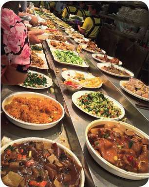

中国台湾地区的熟食店。自己不开火，也要保证均衡的营养。

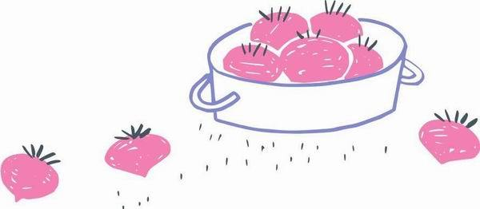

多多活动下颚，还能稳定情绪，促进大脑的运转。嚼得多，吃饭的速度自然就会慢下来。而且咀嚼能刺激饱腹中枢，不用吃太多，人也会觉得饱，能有效防止暴饮暴食。

“饭要八分饱”—这也是古人的智慧。种番茄的时候，农民要给植株尽可能少的肥料和水，只有这样才能培育出最鲜美的果实。我们人体的细胞，其实也有无穷的求生欲。要是一直处于酒足饭饱的状态，我们的身体反而会变得疲劳，状态也会不断走下坡路。摄入过度，才是万病之源。

对人来说，“吃东西”本该是无上的喜悦。我们应该怀着感激，细细品味每一餐，但也别把自己撑坏啦。

④“想吃的东西”，就是身体需要的东西

“我今天就是想好好吃点肉!”“我特别想吃点蔬菜，配酸酸的酱汁!”—大家常会产生这样的“冲动”。

这种冲动，其实来源于身体发出的信号—“我需要能量!”“我需要丰富的营养!”当人体严重缺乏某种营养素的时候，我们就会觉得浑身无力、容易疲劳、皮肤状态变差、掉头发……这些都是我们的身体发出的求救信号。

要是错过了求救信号，问题可就严重了。

所以我们千万不要把自己的饮食结构框死，而是要根据身体的状态，选择自己“想吃的东西”。因为“想吃的东西”，往往就是“身体需要的东西”。

当然，要是我们能在身体发出信号之前调整好膳食的平衡，根据自己的生活方式，选择最合适的饮食，那就再好不过了。

如果你做的是体力工作，那就多多补充蛋白质。如果你是脑力工作者，那就多摄入糖分。压力大的时候，要补充维生素和钙之类的矿物质。明明有很远大的工作目标，也铆足了劲去努力，却因为疏忽了饮食，搞得自己身心俱疲，岂不是得不偿失吗？只有“善待自己”的态度，才会孕育出对“吃”这件事的关注。

### B.用心享受美食

和家人、朋友一起吃饭的时候，可以边吃边聊。一个人吃饭的话，也可以把所有饭菜整整齐齐地盛放在一个大盘子里。只要稍微下点小功夫，就能让餐桌变得更精彩。我们要做有抱负的“吃货”，一样是吃，就要吃得开心，吃得爽快!如此一来，我们才能有动力在餐桌上动脑筋。

自带水壶，喝自己喜欢的饮料

我在中国台湾养成了一个习惯，那就是“随身携带水壶”。这其实是“情势所迫”，因为当地几乎没有自动售货机，自来水也不能直接饮用。不过习惯了之后，我就觉得自带水壶也挺好的。我会往水壶里灌些美味的中国茶、香草茶或咖啡什么的，随时随地都能喝。

而且“自带水壶”不会产生垃圾，经济又环保。大家不妨也给自己买一个心仪的水壶，走到哪里带到哪里吧。

自己动手做便当，健康又实惠

朋友教了我一个做便当的好方法，只需3分钟。可以在休息天一次性做许多小菜，比如煮羊栖菜、炸肉饼什么的，也可以直接利用前一天晚上的剩菜。关键在于，把小菜装进小容器放入冰箱冷冻。当天早上和米饭一起装进便当盒就行了。到了中午，小菜就能自然解冻恢复到室温。有健康美味的便当相伴，午休时间也会变得舒心许多呢!

轻断食

我每月都会来个一、两次“轻断食”。这年头，难免会摄入过多的营养。如果你觉得自己浑身无力，容易水肿，皮肤状态也不好，那就得找个机会把身体“重启”一下了。轻断食的方法很简单，把一天中的一餐或两餐替换成热茶，前后两顿换成容易消化的东西，饭量减半即可。轻断食之后，你定会觉得身轻如燕，头脑异常清晰。

晒干的蔬菜更美味

许多蔬菜晒干之后会变得更有营养，味道也会更加鲜美，而且能存放很久。萝卜干和香菇干就是最好的例子。“干货”的做法非常简单：如果是白菜这样的叶菜，就把叶子一片片摘下来，挂在衣架上。菌类和萝卜这样的根菜可以切成小块，摊在笸箩里。干货可以炒，可以煮，还可以拿来做沙拉，用途广泛，特别方便。

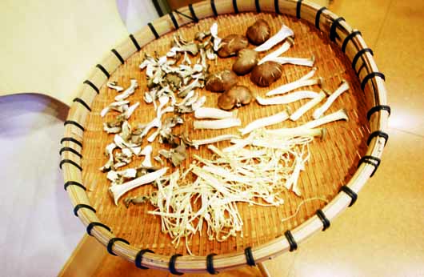

天晴的时候拿出来晾一晾，傍晚收进屋子里。夏天的话，1～3天就搞定了！

## STEP3 保持年轻灵活的心态

A.多与人面对面交谈

B.与身边的大自然亲密接触

C.找到自己的“能量点”

D.对祖先心怀感激

E.每天抬头看看天

孩子会直白地表达出自己的感情。碰到感兴趣的东西，就会一头栽进去，乐在其中。开心的时候哈哈大笑，难过的时候哇哇大哭，哭过就忘……

可是长大之后，我们就会压制这些感情了。我们会审时度势，做出违心的选择，或是为了和周围人搞好关系，忽视自己的感受。要是不把心头的烦躁和郁闷发泄出来，我们总有一天会撑不住的。

成年人尤其需要留出“养护心灵”的时间。只有这样，我们才能接受真正的自己，积极看待世事。

理想状态下的“心”，应该是“柔软”的，而不是“坚强”的。

我们需要时不时给自己的心做个舒展运动。跳出目前所处的状态，让心自由地舒展翅膀，找到推动自己前进的正能量，把负能量统统赶跑……

每一个人都想让自己的人生充满光亮、心动与喜悦，容不得外人说三道四……这一点，倒不会随着年龄的增长而改变。

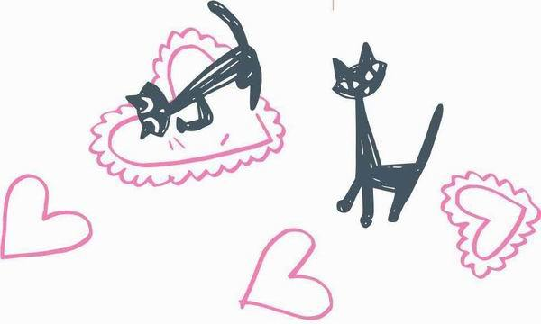

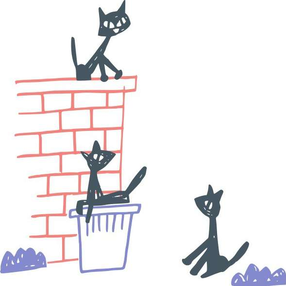

### A.多与人面对面交谈

要扫清压在心头的负能量，关键在于“释放感情”这四个字。

和知心朋友见一面，推心置腹地聊一聊，心情就会舒畅许多。听朋友发发牢骚，鼓励对方，指出对方的不足之处，也能起到给自己加油鼓劲的效果。

我不光有年龄相仿的朋友，还有不少忘年交和外国朋友。和他们相处的时候，我会觉得特别的“舒心”。时不时地和他们见上一面，聊上一聊，就会有新的发现，得到新的刺激。我不会去评判他们的所作所为“是好是坏”，而是会开动脑筋想一想“他为什么会这么想、这么做”，这也是一种心灵的舒展运动。没有比“人”更有趣，更能给心灵注入营养的东西了!

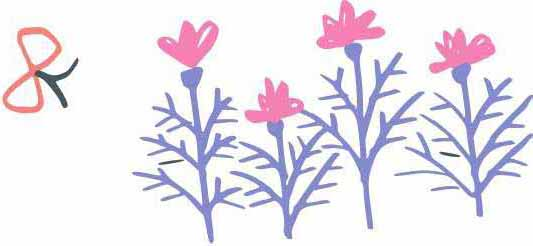

### B.与身边的大自然亲密接触

利用假日去吹吹海风，爬爬高山，在大自然中放松身心，真是乐事一桩。即便是在大城市中，“自然”也是随处可见的。

我们可以切身感受到四季的变迁。用手指轻抚渐渐变色的树叶，闻一闻空气中的清香，倾听风儿的歌声……用五官去感受自然的变幻，心境也会渐渐平静下来。

为什么亲密接触自然是一件这么舒心的事情呢？或许是因为我们也是大自然的一部分吧。大自然是最诚实的，也是最残酷的，更是最温柔、最宽容的。大自然的每一个变化，都有明确的理由……

在大自然中思考，也许更容易接近事物的本质。

### C.找到自己的“能量点”

无论我住在哪里，去哪里旅行，我都一定会造访当地的书店和图书馆。为什么呢？因为这两个地方，能赋予我更多、更强大的能量。

每一本书，都凝结了作者或编者想要“传递”给读者的能量。与此同时，书也反映出了读者的“求知欲”。

在书店翻看各种不同领域的书，我们就能深刻体会到：“世界上还有许许多多我所不知道的事情呢。”未知的世界，未知的事物，未知的想法……书，能让我们产生无穷的好奇心，巴不得立刻冲出去冒险一番。

图书馆里沉睡着许多书店所没有的宝贵信息。我们还能在图书馆和不同时代的作家亲密对话。

书店与图书馆都汇聚了人们的思想，充满了闪闪发光的信息。在我看来，这两个地方就跟“宝箱”一样，到处都是宝。

除此之外，我偶尔也会去小时候常去的公园看一看，或是去当年下过决心的地方追忆往昔。

这些能让我们回归原点的地方，就是宝贵的“能量点”。我衷心希望大家也能找到属于自己的能量点，为自己加油充电。

### D.对祖先心怀感激

完成一项工作的时候，遇到好事的时候，交好运的时候……我都会在心中对祖先双手合十道：“多谢大家的默默支持。”

我的生命可以追溯到我的父母、祖父母和更久远的万千祖先。我能感觉到，他们都在背后默默地支持着我，给我力量。

交好运的时候，我们千万不能洋洋得意，误以为那都是自己的功劳。大家不妨细细想一想：少了任何一位祖先，就不会有今天的我们。这是多么伟大的奇迹啊!“‘活着’就是占了大便宜。难得来人世间走一遭，我一定会好好享受的!”—我们要对祖先心怀感激，并将“感激”转化为努力的原动力。

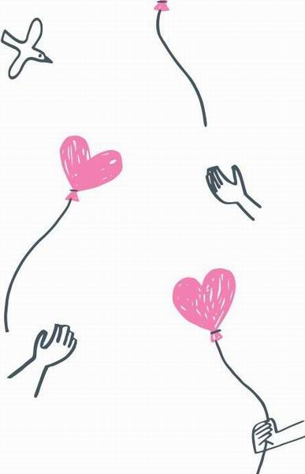

### E.每天抬头看看天

我从小就喜欢“仰望天空”，这也许是受到了我父亲的影响。

“快看，血红的夕阳多壮观啊!天空就是大自然的画布，能免费欣赏到这么高水平的艺术作品真是太棒了，我们真是太幸福了……”我的父亲是个能从身边的风景中品味出“感动”的人。一望无尽的蓝天，奇形怪状的鳞云，雨后的彩虹……

我之所以喜欢天空，也是因为天空虽然近在眼前，却总是能给我带来新鲜的感动。

而且天空有一种伟大的“包容力”，是我的心灵港湾。时刻变化的天色，若隐若现的云朵……只要置身于大自然中，天大的事都能放得下来，崭新的世界也会呈现在你面前。

仰望天空的时候，我们会下意识地审视自己的内心，产生这样的念头：“事情在朝好的方向发展，只要继续往前走就行了!”

每每抬头望天，天空都会向我们传授宝贵的人生哲理。

2月21日，下午。镰仓海边的天空，清澈而湛蓝。置身于大自然中，思路就会特别活跃!

4月17日，傍晚。

在大楼的15层看到的天空。云朵好似仙女的羽衣，充满动感，直教人看出了神。

4月13日，中午。

去学校的路上，透过车窗看到了积雨云。夏天就快到了。嗯？今天不会下雨吧？!

\

【更多得到系列图书、订阅专栏、喜马拉雅付费资源分享微信：boksharer，本书仅供学习，请勿他用】

# 第6章 享受平和的日常生活—极简人际交往法

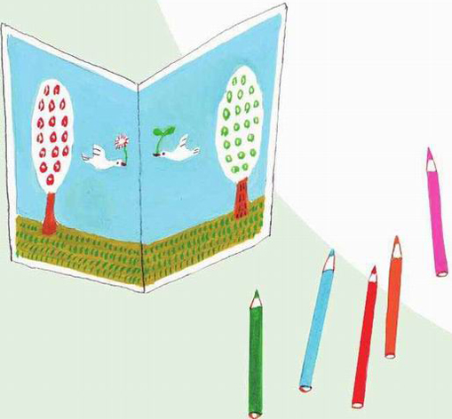

复杂的人际关系，

常会带来种种烦恼，扰乱我们的心思。

不过有时候，答案其实很简单。

只是我们想得太复杂了而已。

我们要先善待自己，然后再善待周围的人。

自己过得很痛苦，

又怎会有闲心善待他人呢？

这个先后顺序很重要，千万不能搞错哦。

## 善待自己，也善待他人

我们周围常有很多说话没轻没重的人。他们会为了发泄自己心中的郁闷而伤害他人。越是坦诚老实、心地善良，你就越容易为他们的言行而烦恼，进而失去自信，被他们牵着鼻子走。你会在心里不停地琢磨：“我到底是哪里做得不对啊？”“为什么我总是这么没用呢？”……

“为什么他要做这种事，说这种话呀!”—反之，对方的言行举止也会让你非常焦躁，你会下意识地去纠正对方，结果最后搞得自己身心俱疲。

下面我将向大家介绍构筑幸福人际关系的3个小秘诀。这些秘诀可以总结成一句话：“我也ok，你也ok”。

破罐子破摔，“我就这样也挺好的”

如果错在我们自己，那还是老老实实说一句“对不起”吧。

可在某些情况下，错并不在我们身上。矛盾有时会来源于对方的嫉妒，有的时候则是对方没事找事。这种时候，我们千万不要被对方牵着鼻子走。那不是我们的问题，而是对方的问题。所以我们大可不必把这些小事放在心上，破罐子破摔就好了—“有什么关系嘛，我就这样也挺好的。”

就算我们对自己不是很有自信也没有关系。反正每个人都有缺点，每个人都不是全知全能的。只要做好自己就可以了嘛。

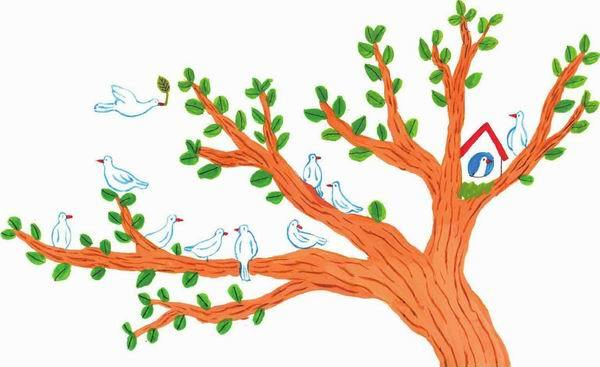

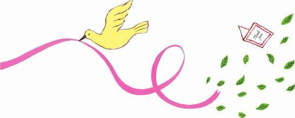

还有两点很重要。一是“不要攀比”；二是“不要硬逼着自己去迎合他人”。

当然，在某些工作场合，迎合公司的方针和周围的同事也是工作的一部分。但你要是什么事都以周围的人为标准，久而久之，你就会失去自我，再也不能做“自己”了。这可有莫大的风险啊。

想做的事情，想吃的东西，想穿的衣服，想去的地方，想和他打交道的人……能够给心灵带来正能量的东西，就是你的“指路明灯”。就算和别人有一点点不一样，只要按自己的步调，走自己的路，生活就会从容而舒心了。

不过有一点请大家一定要注意，自己做的决定，要自己负起责任来，千万不能给别人添麻烦。只要做好了这一点，其他的就不用担心了。就算有人指指点点说三道四也没关系，反正他们没法为你的幸福负责。

自己的幸福，只有自己才能做主。我们不能成天担心“别人会怎么想”，而是要多多思考“我觉得怎么样”。只要贯彻好这一方针，也许你就能轻轻松松找到自己的幸福了。

江山易改，本性难移

“天哪，这人怎么这样啊!”—碰到这种人，你也许会产生这样的想法：“我一定要好好改造他!”“只要好好跟他讲道理，他一定能明白的!”
有些人还会本着这样的信念批评对方，说破了嘴皮子。可是我要告诉大家，以后再也不要铆着劲去改变他人了。这样的尝试，不过是徒劳而已。

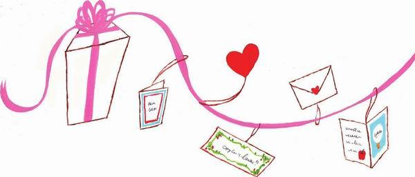

正所谓“江山易改，本性难移”。有时候啊，你说得越多，对方就越是会产生逆反心理，态度反而会变得强硬。除非对方主动想要改变，否则是绝对变不了的。

与其想方设法改变对方，苦口婆心地劝说，不如干脆告诉自己，“世上就是有这样的人”，坦诚接受他的存在。

暴躁易怒的人，成天自吹自擂、说别人坏话的人，总是把责任推卸给别人的人，表里不一的人……他们之所以会变成这样，肯定有一定的原因，这也是他们需要自己去学习的课题。

你唯一能够改变的，就是自己的心态和行为。当你改变了自己，改变了和对方打交道的方式之后，对方的言行举止也一定会发生改变—人际交往，就是如此不可思议。

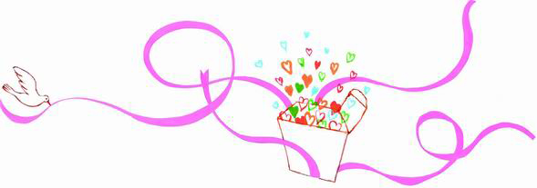

关注对方的“优点”而非“缺点”

如果你身边有一个不太配合的人，那你千万不要去责备他说，“你就不能多帮帮我吗？!”
我们可以换一种说法：“有你帮忙的时候，我就轻松多了。”

听到这句话，对方的态度也许就会发生变化了：“那就再帮你一把吧!”再糟糕的人，只要你仔细寻找，总能发现一些优点。所以我们就应该关注这些优点，当着他的面表扬他。

人有报恩的本能。受到了信赖，就会想方设法去回馈对方。只要我们先表现出敬意，对方一定也会对我们更好。毕竟对于一个人来说，没有比“得到周围人的认可”更令人高兴的了。

再说了，与其盯着人家的缺点看，还不如多看优点。如此一来，我们自己也会过得更幸福，不是吗？

这个道理也适用于我们自己—我们也应该多看自己的优点而不是缺点，充分认可自己。

### 恰到好处的距离感

有缘人定会相逢

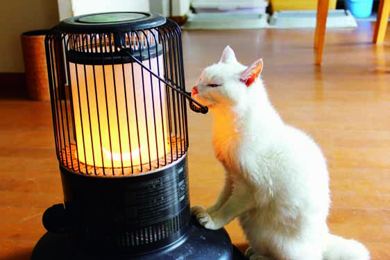

搞不好人际关系的一大原因，其实在于没有保持好距离感。

人与人之间的关系并不是越近越好。恰到好处的距离感也是因人而异。比如，如果你和某个同事在一起的时候，心里总是非常烦躁，那么你就可以少和他一起吃饭，这样对你们两个人都有好处。

“我不知道男朋友/老公在想什么……”
遇到这种情况，千万不能去逼对方，而是应该敞开心扉，和对方促膝长谈。要是过度干涉，反而会把人家吓跑哦。

总而言之，我们偶尔需要和对方拉开距离，免得讨厌对方；有时候要和对方走得更近一些，以便更加喜欢上对方。找到一个“恰到好处”的距离，是最关键的。也许你后退几步就会发现，原来这个人也是有优点的嘛!有的时候鼓起勇气前进几步，就可以加深对对方的理解了。

请大家牢记，我们千万不要把人际关系往自己的理想上靠，而是应该在尊重对方的基础上，随机应变，根据当时的情况，凭感觉把握好“恰到好处的距离”。不要把事情想得太复杂，我们的直觉往往会更可靠。

只要把握好“恰到好处的距离感”，
你就会发现，不知不觉中，你和对方走得更近了，还构筑起了信赖关系。不要勉强自己，一切顺其自然，有缘人自会相逢、相知。

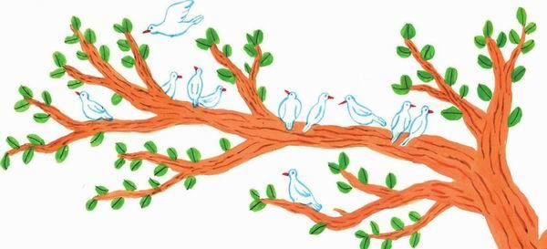

### 珍惜眼前人

种瓜得瓜，种豆得豆

人际关系在很大程度上左右了一个人能否过上幸福快乐的生活。每天的心情，也是由和你打交道最多的人，以及你和他们的关系所决定的。

如果你想过上幸福的生活，那你就先要善待家人、朋友、同事、客户这样的“眼前人”。在我们的日常生活中，这一点也许才最为重要。

我有个朋友，在家人面临巨大危机的时候，毅然前往遥远的外国从事志愿者活动。我还认识一位公司的老板，他对自己手下的员工很不好，却整天忙着在外面构建人脉。这两个人到最后都没有好结果，因为他们失去了眼前人的信赖，在阴沟里翻了船。

连眼前人都不能好好珍惜，那又怎么可能善待远方的人呢？就算你想为了满足自己的虚荣心，为了一些蝇头小利拼命构筑人际关系，你也无法得偿所愿。因为在这种状态下构筑起来的人际关系，会在双方的目的达成之后迅速瓦解。

总之，我们首先应该善待眼前的人，应该全心全意做好我们眼前的事。然后再抬起头来，遥望远方……

只要夯实了我们脚下的土地，前进的道路就会自然而然地呈现在我们面前。

种瓜得瓜，种豆得豆，可谓人生的真谛。能够回馈我们最多的人，一定是眼前人。对我们每一个人而言，与我们最有缘分的人，也就是这些眼前人了。

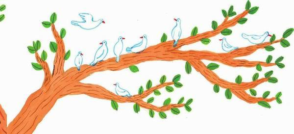

### 多打电话

人与人之间的沟通，基本上是打电话比发短信好，直接见面比打电话好……反正是和数码产品的关系越远越好。面对面坐下来，听听对方的声音，看看对方的表情，聊聊近况，你就更能够体会对方的心情，两人之间的距离也会拉得更近。

可有些人没有办法经常见面怎么办呢？很简单，多给他打电话吧!

给很久不见的朋友打个电话，问问：“你最近过得怎么样？”打电话的最佳时机，就是你想起这个人的时候。说不定对方会在电话里告诉你，“哎呀，真是太巧了!我正想联系你呢!”

尤其是照顾过你的人，或是你想要和他一直保持联系的人，那就一定要经常问候了。每通电话不用聊很久，有几分钟就可以了。人海茫茫，相逢一场不容易，宝贵的缘分，一定要细心呵护。

### 回信要短小精悍

对方想看的是你的反应

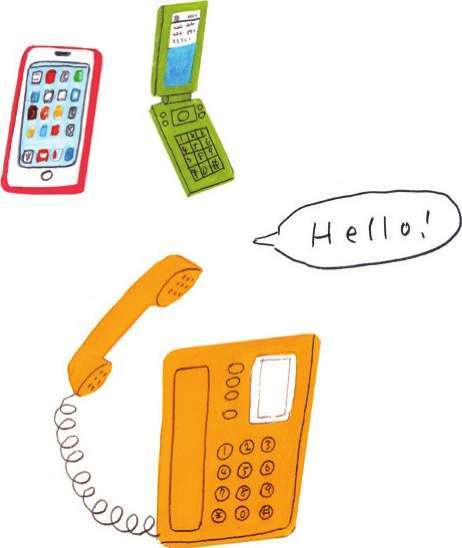

不知道大家有没有遇到过这种情况：收到邮件之后，你想好好写个回复。想来想去，就拖了很久才发回去……

其实对方想要的并不是长篇大论的回复，只要你用一句话给他一点反应就可以了。你写得太长，反而会给对方压力—“哎哟，他给我写了这么多，我是不是应该多写一点啊？”
如果是很熟悉的朋友，那你开头结尾的客套话都可以省略。用短短的几行字把要点说清楚，对方回信的时候也会更轻松些。

那什么时候回邮件最好呢？这其实没有正确答案，按自己的步调来就行。当然如果是急事的话，那肯定是立刻回复比较好。一切顺其自然，不要勉强自己，也不要勉强对方，这才是让人际关系细水长流的诀窍。

### 婉转地拒绝

没必要当万人迷

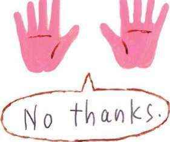

善良的人总是不想让大家失望，所以他们会下意识地接下很多分外的工作。可是这样会让他们面临巨大的压力和负担，导致他们无法“善待自己”。

“我不想做!”—如果你很抵触一件事，那还是干脆拒绝掉吧。

不过，“拒绝”这件事很讲究方法。

首先，你必须给出一个能够让对方接受的理由(善意的谎言也行!)。

然后，你还要表现出对对方的关心。比如，如果有人把自己的工作推给你，你可以这么说：“不好意思啊，今天我家里要来客人，没有办法加班，真是对不起啊!”

如果你把话说到这个份上了，对方还是不高兴，那就和他保持距离吧，惹不起还躲不起吗？反正我们也没有必要当万人迷，不是吗？

### 不说多余的话

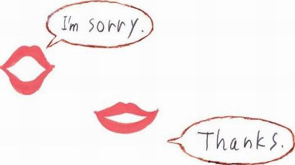

越是激动的时候，说话就越是要慎重

有些人觉得，想说什么就说什么，这才是为人之道。可是在有些情况下，有一说一、有二说二并不是最好的选择。

关键在于“对方能不能接受”，而不是“你想不想说”。如果你想说的东西会引起对方的反感，那你说了反而会弄巧成拙。心里烦躁的时候，我们也不能拿别人撒气，因为这个时候说出来的话，不会带来任何好结果。

越是激动的时候，说话就越是要慎重。一句多余的话，一个多余的字，都会造成难以挽回的后果。

如果你实在想要发表自己的意见，那就先听听对方想说什么吧。等对方说完之后，他就能静下心来听你说了。

### “谢谢”要说出口

不说出来，对方就不会懂

曾有一位年轻的女性读者给我发过这样一段话：

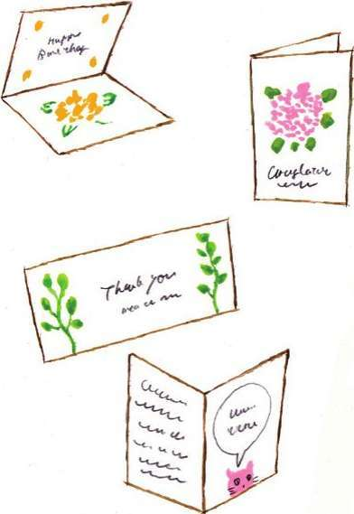

“今天我的上司说我工作时笨手笨脚的，搞得我心情很郁闷。但是我没有找借口，而是跟他说了一句谢谢。因为他帮我找出了我自己没有发现的缺点。从今往后，我也会努力提高我的工作能力的。”

这样的人一定能够得到上司的喜爱，也一定能够在工作中不断进步。因为她用一句“谢谢”接受了自己的处境，将负能量变成了正能量。

“谢谢!”—简简单单两个字，却是莫大的认可，没有人不爱听。只要学会道谢，对方就会在不知不觉中成为你的强大后盾。

不过，谢意一定要表达清楚。光是在心里默默感谢，对方肯定感受不到。只有说出口，或是写出来，才能让对方高兴起来。你送给对方的正能量，也会反过来作用在你自己身上。

感谢，不光能在人际关系出问题，或者是和对方产生矛盾的时候发挥作用，我们还能用感谢构筑起信赖关系。因为感谢会让你觉得自己受到了信赖，心中自然会产生无穷的干劲。

“谢谢”二字能够让你不花一分钱，不出一分力，就把人际关系搞好。这么神奇的工具，岂有不用之理？

这种时候也要表示一下

写给妈妈

谢谢您的生日蛋糕。虽然我已经过了让爸妈庆祝生日的年纪，但是能吃到您的蛋糕，我还是无比开心。下次就让我来为您庆祝吧!

写给同事

加班辛苦了。你的笑容总能给我们带来正能量。多谢你当我们办公室的小太阳!

写给借书给你的朋友

我实践了一下这本书第56页的技巧，工作效率高了很多!谢谢你借了一本这么棒的书给我!

### 感谢之辞不嫌多

值得感谢的事实在太多了

一句简单的“谢谢”，不仅能让听者开心，还能为道谢的人注入巨大的正能量。

道谢之后，你能更切身体会到对方的可贵，心态也会变得更加积极向上，整个人都沉浸在幸福之中。感谢之辞不嫌多!一有机会就说一句“谢谢”，幸福的时光还会少吗？

理所当然的小事，更值得我们去感谢。不知不觉中习以为常的小帮助，工作上的关照，杰出的个性……只要仔细观察周围的人，就一定能发现许许多多值得感谢的事。

学会观察之后，你就会渐渐意识到生活中的“理所当然”是多么“难能可贵”—我们的日常生活，其实就建立在他人带来的恩惠之上。

如果你能发现每一个人的“可贵之处”，那你就一定能在他们心目中占据特殊的一席之地—因为发现他们闪光点的人，就是你啊!

一张小小的感谢卡，一条言简意赅的短信，都能达到感谢的目的。当场感谢他人的帮助固然好，但我们也可以在事情有了结果之后再回报，比如事后的一句“多亏了您的帮助，才能有这么好的结果”会更有说服力。听者也会产生“我没白帮这个忙”的成就感。

点点滴滴的“感谢”，定会让我们的生活充满爱意与精彩!

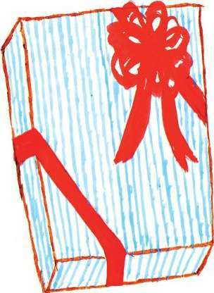

写给上司

感谢您在开会时的提点!下次我一定会做好更充分的准备，不让您担心!

写给朋友

谢谢你昨天听我发牢骚!多亏了你，我现在精神多了，也有了新的斗志!

### 如何表达感谢

表达感谢的目的是“让对方开心”

表达感谢的方法何其多。人际交往的形式多种多样，礼物的价格也是五花八门。其实这些都不重要，只要充分表达出自己的感谢之情，让对方开心，就算是大功告成了。

就算你不能百分百地回馈帮助过你的人，只要有这份“感激的心”，就能维系住你们之间的缘分。

大家不妨也来开动脑筋，用独具个性的方法来表达自己的谢意吧!

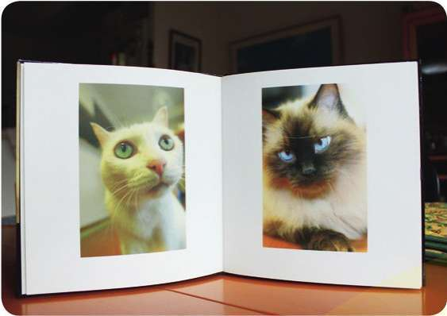

为朋友家的猫咪拍的写真集。搭配照片的过程也充满了乐趣!

花了“小心思”的礼物最令人印象深刻

我最常送的礼物就是“自制写真集”—给养猫的朋友做一本“猫咪写真集”，抓拍宠物的可爱瞬间；如果是有孩子的朋友，那就不时去做客，记录下孩子的成长脚印……外人拍的照片好像特别有新鲜感，收到写真集的朋友们纷纷表示：“我还是第一次看到他露出这样的表情!”“我一定会永久珍藏的!”现在有很多网上打印店，只要把照片传上去，就能很快收到成品，一两百块钱就能搞定了。

花心思的“礼物”也不一定是“实物”。如果你的朋友不擅长整理房间，那你就可以上门收拾收拾。如果你的朋友是“吃货”，那就做一桌好菜给人家尝尝吧。如果你的朋友喜欢DIY饰品，那就选一个适合她的手工材料包好啦。这些方法，都能表达出你心中的感谢。

用自己喜欢做、擅长做的事来表达“感谢”，还能乐在其中，这可真是一举两得的大好事呀!

在生日送上祝福

亲朋好友过生日的时候，我一般会选择用他当天就能收到的卡片或短信送上祝福。毕竟大家都很忙，生日当天不一定能见到。

生日是非常特别的日子，每年只有一天。比起生日过后才收到的礼物，生日当天的一句“生日快乐!谢谢你对我的关照!”反而更有效，因为这样的祝福能让对方明显感觉到：“某某还记得我的生日呢!”

我们可以提前把亲朋好友的生日写进日程本，再买一些漂亮的贺卡屯着。如果你选择发短信，那最好是生日当天的早上发。祝福也是很讲究“时机”的哦!

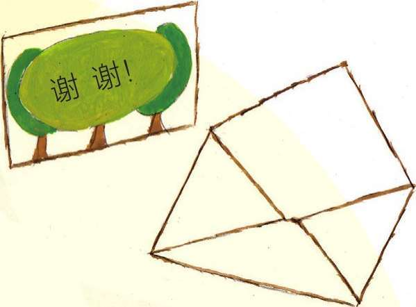

“消耗品”是万能的!

“消耗品”是一种万能的礼品。当手信、见面礼、贺礼、生日礼物都很合适。最具代表性的消耗品有美味的食品，还有香喷喷的肥皂或入浴剂。如果你送的消耗品是“自己很难买到的”，或是“自己舍不得买的高级货”，那它的附加价值就更高了。

送“非消耗品”会有什么问题呢？就算你挑选的时候再谨慎，每个人的品位和喜好终究还是不一样的，况且摆件之类的东西还得找地方放呀。如果你的朋友对生活很讲究，家里不喜欢放太多东西，那还是送消耗品比较保险，否则难免好心办坏事。

美味佳肴带来的感动瞬间，也能带来毫无负担的喜悦感。“真好吃!”“太棒了!”—若能与朋友共享这份感动，欣喜自然能加倍。

用来送人的消耗品最好是你自己吃过的、用过的、想要推荐给别人的“好东西”。送对礼物，更能得到他人的信赖哦!

旅游时寄张明信片

旅行的时候，我们能更客观地看待自己，深刻体会到周围人对我们的支持。明信片不仅能将景点的氛围传递给对方，还能激发我们写出和平时“不太一样”的话来。收信人看到了也会分外感动：“他在旅行的时候也惦记着我呢!”

我们不用在明信片上长篇大论，用短短数行抒发平日里的感激，还有景色带给你的感动，就能给对方留下深刻的印象。就算你没有出国，没有离家很久，也可以在一日游期间抽出几分钟时间写一张明信片寄出去。甚至可以在出差的时候在酒店客房的卡片上写两行字，让前台的工作人员帮忙寄一下。尤其是很久没有联系的朋友，或是很想问候一下的朋友，就更应该利用好这样的机会了。

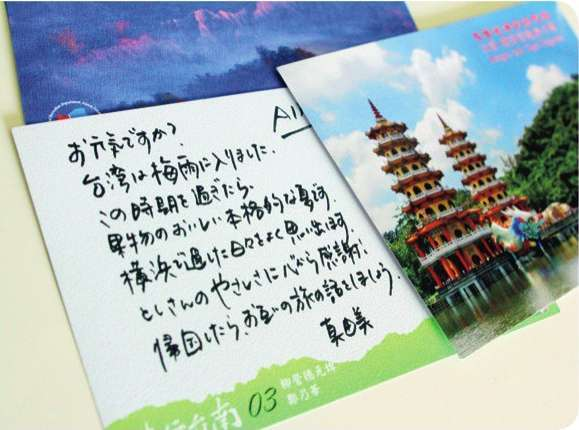

在小店发现了漂亮的明信片，就第一时间寄给你第一个想到的人。语气不用特别正式，用口语就好了。

### 感谢家人

尽可能当面表达心中的感谢

中国人非常重视自己的亲朋好友，这一点让我特别感动。

我曾听说过这样一个故事：有个在中国台湾工作的日本人，因为工作太忙，没有时间陪伴来旅游的父母。于是他就说，“不好意思，我实在没时间，你们自己玩吧。”谁知他的中国同事们听说这件事后个个义愤填膺：“工作哪有爹妈重要!真没想到你是这种人!”

中国人从不会忘记父母的养育之恩，非常孝敬父母，过年的时候还会给老人发红包呢。他们平时也很关心父母，周末一有时间就会和父母一起吃个饭。

孝敬父母本来也是日本的传统美德，但是在忙碌的生活中，很多人都忽视了这一点。

如果帮助你的是外人，你还会想方设法去报答对方。可帮助你的是家人，你就会觉得“不用把感谢说出口，他们也会懂的”，“不用多花心思，反正他们也不会介意的”。夫妻之间，亲子之间，兄弟姐妹之间，都有可能出现这种情况。

在我看来，我们应该把家人当成一个独立的“个体”来打交道。从某种程度看，这种态度才是真正的“精神独立”。

跟家人说“谢谢”的确有点难为情，但是请大家尽量当面把这句话说出口来。如果你和家人住得比较远，也可以通过电话、贺卡或短信的形式来表达谢意。感谢的形式可以多种多样，只要有这份“心”就行了。

只有懂得感谢家人、重视家人，你的生活才会平安喜乐。这是为人之本，万万不可忘记。

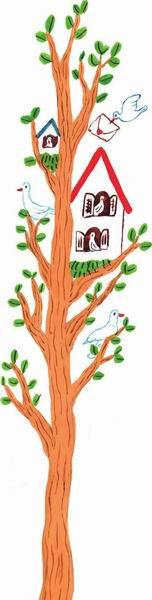

# 第7章 制定最适合自己的极简财务计划

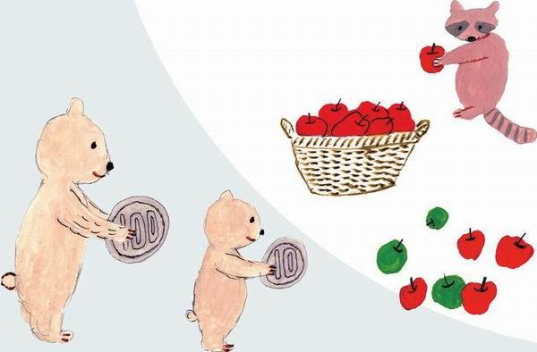

思考“金钱”，就是思考“人生”。

我要过怎样的生活？我要实现怎样的目标？……

这些问题都和“金钱”有关。

不过金钱并不是“最终目的”，

而是过上幸福生活的“手段”之一。

虽然现在世界经济不太景气，但我们也不能被金钱束手束脚呀。

本章将向大家介绍几个“让金钱最大限度为我们所用”的小诀窍!

## 花在刀口，花得开心

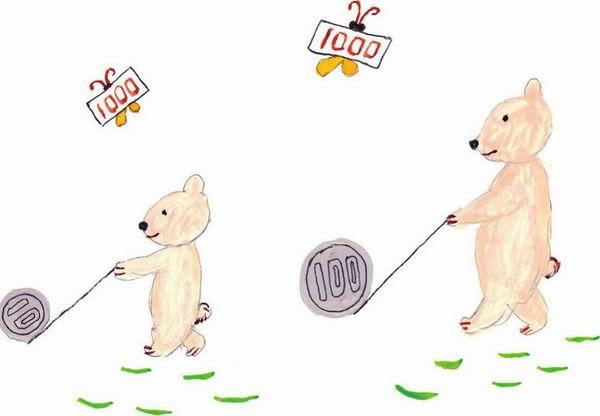

我花钱的时候有个原则：钱要花在刀口，花得开心。

只要坚定不移地贯彻这个原则，不用动太多脑筋，也不至于成天为钱发愁了。

在环游世界的游轮上，我结识了年过八旬的T婆婆。她就是一个这么花钱的人……

认识她之后，我就离开老家，来到了东京。在工作步入正轨之前的3年时间里，我一直寄住在T婆婆的独栋房子里。她对我特别慷慨，还说：“我是自愿帮你的忙，不用你交房租!”

T婆婆的日常生活非常朴素，家具基本上都是用了五十多年的老古董。她平时吃得简单又健康，从不暴饮暴食，餐桌上基本都是蔬菜。她极少购物，给我用的家具也是从别处捡来的。

但T婆婆在该花钱的地方绝不抠门。一产生“我想出门走走”的念头，她就会花上几个星期去旅行，每年要出去好几次呢。

她会去马达加斯加、格陵兰、巴西这般遥远的密境，也会坐豪华邮轮去地中海或北欧。她几乎走遍了全世界，真纳闷她的钱到底是从哪儿来的……

“您的旅游资金是从哪儿来的呀？”

有一次，我终于忍不住抛出了心中的疑问。我听说她原本是在公立高中当老师的，二十多年前就退休了，而且她一直都没结婚。光靠养老金，怎么可能隔三岔五出国旅游呢？莫非她买了什么特别赚钱的理财产品？谁知，T婆婆笑着回答道：

“哎呀，你别想那么复杂。钱这个东西啊，就跟自来水一样。只要平时把水龙头拧紧，就不会有太多的‘水’流出去了，蓄水池里的水自然就会越积越多。想用水的时候，再把水龙头拧开就行啦。正所谓‘开源节流’嘛!”

原来如此!还真是挺简单的。总结一下就是：根据收入花钱，杜绝浪费→不知不觉中，钱就攒下来了→用钱买真正想要的东西……“花在刀口，花得开心”，说的不就是这回事吗？要做到这一点，关键在于充分了解“自己真正需要的是什么”。我们要有自己的价值标准，搞清“怎么花钱最能让我开心”，而不是用别人的标准来衡量自己，这才是“花在刀口，花得开心”的第一步。

其实我的判断标准特别主观，说白了就是“花钱的时候高不高兴”。

“金钱是帮助我们过上幸福生活的好拍档”—怀着积极向上的心态去和金钱打交道，就能和金钱“和谐共处”。反之，如果你成天为钱忧心忡忡，一花钱就后悔，或是对金钱恨之入骨，你就会和“财运”渐行渐远，陷入资金周转不良的局面……钱，就是如此。

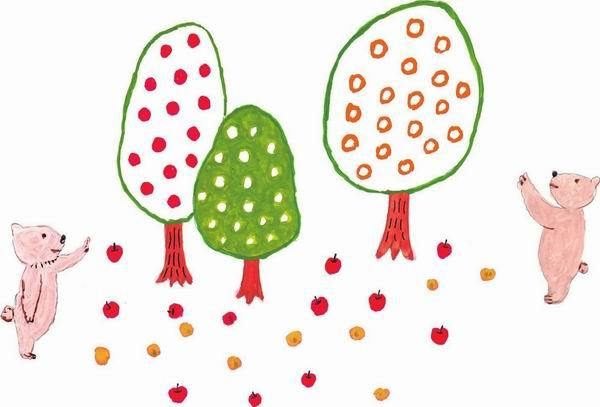

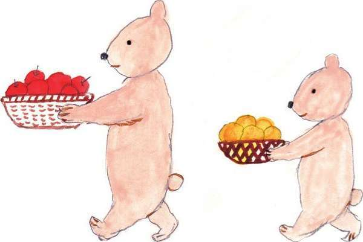

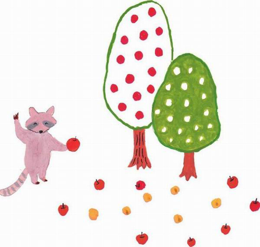

“这个东西很好用，而且也很耐用，买得好值哦!”—如果你买完东西之后能有这种感觉，那就说明你把这笔钱花在了刀口上，而且你花钱的时候也很开心。“唉，最近囊中羞涩，还在这种东西上浪费钱，到了月底又要勒紧裤腰带了……”—如果你买完东西之后很郁闷，那就是得不偿失。

最近全世界的经济局势都不太好，成天为钱操心的人不在少数。不过，只要我们不铺张浪费，根据自己的收入巧妙地花钱、存钱，就不至于寝食难安了。

我没打算一到60岁就彻底退休，如果有工作机会，我还是会接受的，所以我觉得自己不需要太多的存款。就算老得干不动了，日子也不会过不下去。

担忧与焦虑，其实是负能量催生出的想象。既然要想象，那就想象一下金钱帮我们实现各种目标的情景吧。设想一下要如何实现梦想也不错。在想象的世界中积极乐观一点，人就会更加快乐。其实，现实本没有许多人“想象”中的那般艰难。

## STEP1 以“适合自己的生活”为基础

A.大致把握月收支与周收支

B.管理“可控”的钱和“不可控”的钱

C.整理钱包，牢记钱包里装了什么

D.巧用信用卡和贷款

E.留出风险预算，以防万一

就算囊中羞涩，我也能把日子过得有声有色。在这方面，我还是颇有自信的，因为我曾经有过一段手头很不宽裕的时光，但我没有成天郁郁寡欢，而是想方设法去享受生活。

所以无论我的收入是高是低，我的生活都很朴素，日常开销和生活水平也不会有太大的起伏。

其实我在二十多岁的时候也在“钱”上栽过大跟头。收入多少，我就花多少。炒股赚来的十几万也在一眨眼的工夫花光了……

突然有一天，我发现自己手里没钱了。那个时候，我才意识到自己干了一件天大的蠢事。没有理财能力的人手里要是有了钱，就会被钱耍得团团转。

能到我手里的钱，也算是和我有缘了。我想把它们用在有价值的地方，同时也想让自己的心境更“简单”些，所以我才会在生活中贯彻“朴素”二字。

老子云，“知足者富。”知足的人，才是真正的“富翁”。只要满足于现在的生活，怀着谦虚的态度度过每一天，我们的心就能平静下来，而我们的注意力也会自然而然地转向真正想要实现的目标与真正想做的事上。

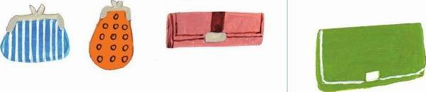

### A.大致把握月收支与周收支

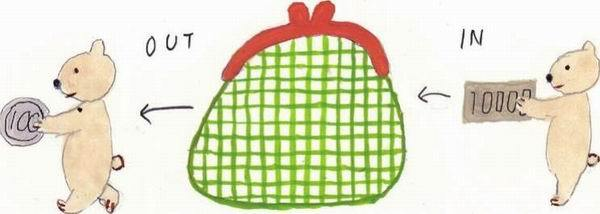

我没有记账的习惯，但我大致知道上个月用了多少钱，上周又在哪儿花了钱。

因为用“在银行提取的现金”减去“钱包里剩下的钱”，得出的数字就是“花掉的现金”。至于刷了多少卡，看账单就一目了然了。要是觉得“花得有点多”，那“这周就少花点”，稍稍调整一下。

为什么不记账呢？因为我觉得每天跟数字大眼瞪小眼真的很麻烦。“现金差了53块，怎么回事啊？”“交际费的预算是不是多留一点比较好啊？”……成天琢磨这些实在太累人了。而且就算没有账本，我也能把钱管得井井有条。

不过，这种方法并不适合所有人。“怎么一到月底就缺钱呢？”“怎么都攒不下钱来。”……如果你属于这种情况，那还是老老实实搞个账本，把支出按类别分好，分析一下自己的支出倾向，明确找到问题所在吧。

其实和金钱有关的所有烦恼，都能用“制定预算”来解决。

我们一定要搞清“自己正常过一个月需要多少生活费预算”，并根据自己的收入，定下“每月的存钱额度”。

定好“月度预算”之后，除一下就能计算出“周预算”了。在这个范围内生活，自然不容易出问题。

包括奖金在内的年收入不会有太大的变化，大家肯定都心里有数。碰到结婚生子、搬家、跳槽这样的重要活动，我们也能早做计划，有的放矢。

总而言之，理财的关键在于搞清钱从哪儿来，又到了哪儿去。

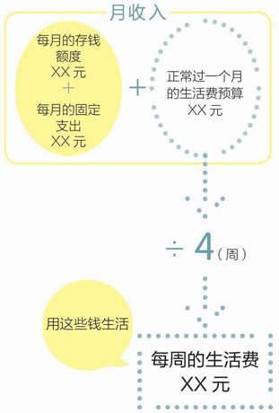

### B.管理“可控”的钱和“不可控”的钱

在制定月预算和周预算的时候，有一点需要大家格外留心。

那就是我们要把预算分成两类加以管理：一类是“无论如何都会花出去的钱(固定预算)”；另一类则是“可以控制的钱(流动预算)”。

有些固定预算是可以“砍”的，比如私家车，就不是每个人都需要。不常去的健身房的年费也没必要一直交下去。水电煤和通信费也可以通过调整套餐的方式省下钱来。

流动预算就比较难搞了，因为它可大可小。不过只要肯下功夫，也能削减不少呢。

如果你经常和朋友下馆子，在这方面花了很多钱，那就把聚会场地改成自己家，每个人带点菜来，开个小派对好了。把昂贵的实体生日礼物换成不花钱的创意礼物也是个好办法哦。

我们大可不必一味地强调“必须如何如何节约”，思考一下“有没有更便宜的方法”，其实是一件很有趣的事情。正所谓条条大路通罗马嘛!

固定预算

房租、房贷、物业费、车贷、保险费、养老金、税费、水电煤、通信费、交通费、教育费、学习班的费用、健身房的会费，等等

不可控的钱

但是有些项目可以“砍”(如不必要的贷款)，水电煤也可以节约。

流动预算

餐费、服装费、美容费、交际费、娱乐费、杂费、医药费、储备资金，等等

可控的钱

觉得这个月手头有点紧，就开动脑筋，换一个不花钱也能带来乐趣的方法吧。

### C.整理钱包，牢记钱包里装了什么

出于对金钱的敬意，我总会把钱包整理得干干净净，用起来神清气爽。

我根据多年的经验总结出了一条规律：如果钱包里塞满了小票和纸钞，插满了各种各样的卡片，乱七八糟的，不仅不美观，更不利于使用者掌握钱包的内容，花钱的时候自然就会比较随意。

想要和钱和谐共处，就得为钱准备好一个“舒适”的环境。那我们应该怎样整理钱包呢？

首先，钱要按面值分类放好。然后要经常整理钱包里的东西，最好是一回家就把小票单据之类的东西拿出来。最重要的是，花钱的时候要心怀感激。“唉，钱又没了……”每次掏钱都这么嘀咕可不行哦，要在心里默默说一声“谢谢”。

● 钱包

选自己喜欢的款式，细心呵护，就能用很久(选择质量好的、比较耐用的产品)。

● 纸币

统一朝向，按面值整理。小票放进其他隔层，不和纸币放一起。

● 卡

尽可能少。不把不需要的小东西塞进钱包。

● 放多少钱

提前定好大致的金额。

● 放哪里

放在包的哪个位置？在家的时候放在哪里？提前给钱包找个“家”。

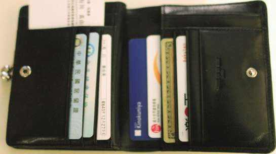

信用卡就两张。商店的积分卡尽可能少带，哪天需要用了再装进去。

### D.巧用信用卡和贷款

“刷卡没有‘花钱’的感觉，特别容易浪费钱。”—常有人抒发这样的感慨。其实，只要管理好支出，信用卡还是利大于弊的!

我只有两张信用卡，每个月的手机费、水电煤都用信用卡支付。

信用卡不仅能用来买“大件”，就连书籍、化妆品这样的小东西，我也会刷信用卡。攒出来的积分统统换成航空公司的里程。再加上坐飞机时攒的里程，说不定能换出一张去海外的往返机票呢!

百货店、专卖店、便利店都有和银行合作发行的联名信用卡，不同的信用卡有不同的优惠政策。我们可以根据自己的生活方式，选择最合适的信用卡，为生活增添几分乐趣。比如，要是你经常坐飞机，那就办一张航空公司的联名信用卡。如果你经常去某家商店买东西，那就办那家店的联名信用卡。

再说说贷款吧。每个人对贷款都有不同的看法。我不想给自己太多的束缚，所以就没有办贷款。但是对某些人来说，车与房就是让生活变得更精彩的工具。

不过，贷款并不适合每一个人。“我通过贷款买到了这么棒的东西，以后可要加倍努力工作啊!”—如果你的心态比较积极，那贷款就非常适合你了。房贷的还款期比较长，利率也比较高。条件允许的话，可以视情况改成利率较低的套餐，也可以提前把贷款还清。

这年头世事难料，收入骤减导致家庭破产的情况比比皆是。我们必须充分考虑到这些风险，办理长期贷款时一定要慎重行事。

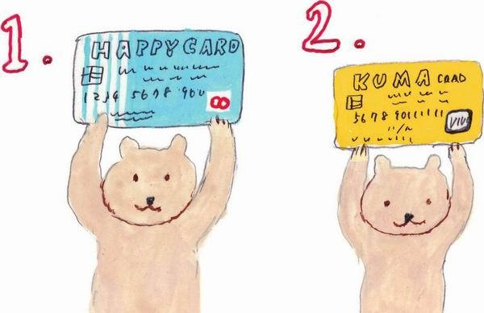

### E.留出风险预算，以防万一

所谓“风险预算”，就是月预算之外的“储备资金”，专门用来应付各种突发情况。要是没有提前留出风险预算，真出事的时候就会手忙脚乱……

红白喜事、探望病人自不用说，“车突然出故障了”“家电坏了”“家人生病了”……这些突如其来的问题都要用钱来解决。

提前留出风险预算，就能做到有备无患，万无一失了。

喝喜酒、探病的时候，心里还在念叨“这个月手头已经很紧了……”，那该有多凄凉啊。花钱的时候，就该痛痛快快的嘛!

为了不受金钱摆布，风险预算必不可少。

我刚来东京工作的时候，父母的年纪已经相当大了。所以我的手头再紧，也会在银行账户里留出购买往返机票的钱。如此一来，就算父母出了什么事，也能立刻赶回老家。

虽然大家都不愿意想那些不吉利的事情，但是人生不可能一帆风顺，总是会伴随着风险。过度焦虑固然不好，可是冷静分析风险，做好充分的准备，也是对人生负责任的一种表现。

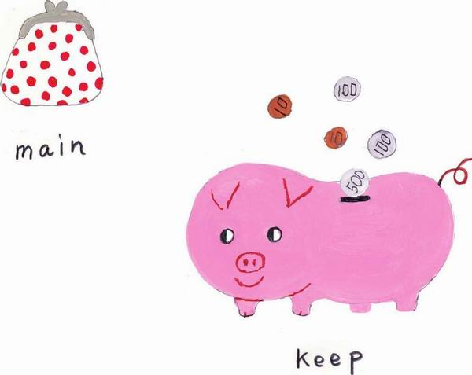

## STEP2 不花无谓的钱

A.记住家里有什么，尽量少囤货

B.需要的时候再买

C.买东西前先搜集信息，货比三家

越是铆足了劲要存钱的人，就越是不容易把钱攒下来。这真是莫大的讽刺……攒不下钱的人没有善待他们“得到的钱”，花钱的方法自然不对头。同理，不费吹灰之力得到的钱，最容易胡乱花掉，或是浪费在赌桌上。

年轻人领到第一笔工资时，心情总是万分激动。他们会给父母买礼物，把心心念念想了好久的东西买回家，或是把钱存起来。总而言之，那时他们对待钱的态度还是很“认真”的。然而，当人们习惯每月账户里多出一笔钱之后，就没有闲心去庆祝了，反而还会嫌公司给得太少，长吁短叹……

用辛勤工作换来的收入最可贵。当你因为种种原因没法工作的时候，你就能深刻感受到工资的宝贵之处了。我们可以计算出自己的时薪，充分了解工资的价值。在工作的时候，可以扪心自问：“我干的活真的值这个价吗？”花钱的时候也可以仔细斟酌一番：“这个东西真的值得我用X小时的工资去换吗？”

防止浪费的最佳方法，就是对收入心怀感激。只要心中还有那一份感谢，花钱的时候就不会太随意了。

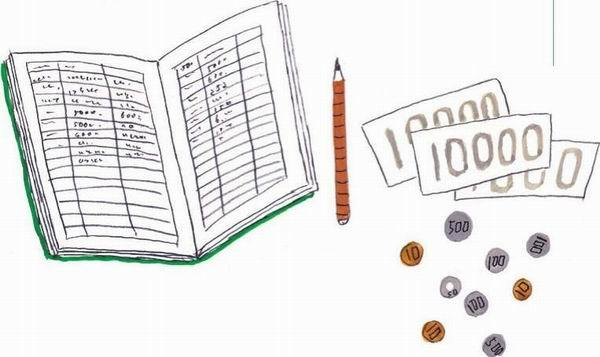

### A.记住家里有什么，尽量少囤货

“不知道家里有什么”—这种心理状态，会催生出大量的浪费。

如果你在不知道家里有多少食品、衣服或消耗品的状态下购物，就无法将家里已经有的东西充分利用起来，最后还得把没有用完的东西处理掉。

把买回家的东西白白浪费，就等于把钱丢进了水里。

要用多少就买多少—这才是最不容易浪费钱，也最经济实惠的方法。

只要在日常生活中摸索出一套衣食住行的基本流程，那购物就会变得非常简单。因为在日常生活中需要采购、补充的东西，其实并没有那么多。

“翻来覆去都是那几样多没意思啊!我也想吃新的产品，想用新的东西啊!”—有的人特别喜欢尝鲜。然而，尝鲜的结果就是橱柜里堆满了快要过期的调味料，抽屉里摆满了没有用过的指甲油和化妆品……

“随便乱买”和“有好奇心”是两码事。如果你被流行和五花八门的信息牵着鼻子走，不停地买新的东西，你的心境就没有办法“简单”下来，生活也会越过越复杂。

珍惜手头的物品，节约食物不浪费，这本是一种传统美德。我们就应该用这样的态度来对待每一件东西。

珍惜物品不光能起到省钱的效果。这种精神也能够让我们的心境更简单，过上舒心平静的生活。

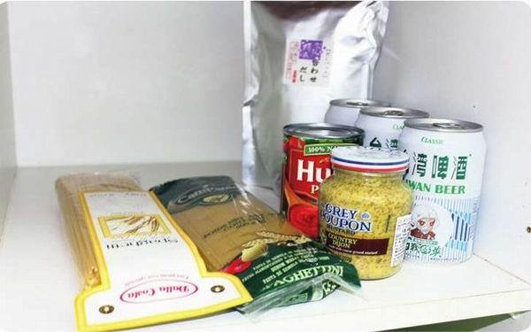

我的储物空间比较有限，里面只有即开即用的意大利面，还有用来招待客人的啤酒。家里有什么东西我心里都一清二楚。

### B.需要的时候再买

无论是食品、衣服、还是生活用品，我都秉承着“需要的时候才买”这一原则。

有时候我们会心血来潮，把逛街时碰巧发现的小东西买回家。买的时候，我们觉得“我以后可能会用它”“它以后说不定能派上用场”。问题是，这样买回来的东西往往都不会发挥出作用，只是在家里占地方而已。就算你有一天想起了它，想用用看，你也有可能发现，它的效果和你想象中的不太一样……

什么东西都讲究一个新鲜度，讲究一个时机。

我会根据自己以往的行为规律，推测出“哪些东西我一定会用”，只买这些必需品，而且家里的囤货也是尽可能得少。当我想向生活中注入“新鲜血液”时，我会提前想好“我要把这个东西放在哪里”，以及“我会如何使用它”。要是想象不出来，我就不会去买它。

我对化妆品采取的也是同样的态度，缺了什么就补什么，所以我不太会冲动购物。要是同类化妆品有好几种的话，那每一种的使用频率都会变低，而且贸然尝试新产品很有可能“踩雷”。实在需要开发新大陆的时候，我会先试用下小样，谨慎行事。

买饰品的时候，我也会先在脑子里想象一番：“要是有一款这样的项链，我就能搭配这件衣服了，和那件衣服放在一起也很搭，挺方便的……”

当然，我有的时候也会对某样东西一见钟情，立刻把它买回家。只要你能充分管理好自己手头有的东西，就能够轻轻松松地想象出“我要如何使用这个新玩意”了。

要搞清“自己究竟需要什么”，就必须先把手头的东西整理得井井有条，理清自己的思路。

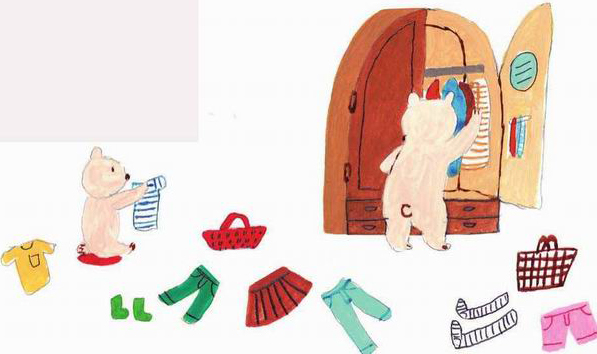

### C.买东西前先搜集信息，货比三家

不可否认，我们生活在一个商品和信息过剩的时代。但我们应该拥有主人翁意识，巧妙地去利用这些信息，而不是被它们耍得团团转。信息能成为我们的好帮手，帮我们用更实惠的价格买到心仪的物品。关键在于，我们要根据自己的“目的”，积极搜集信息，主动思考“什么东西最好？”以及“都有哪些手段买到它们？”。

假设你出于某种目的，想要看某一本书。但是看书的方法不仅限于“从书店购买”。如果我需要查阅比较昂贵的学术类书籍，那我就会在网上买旧书，或者是看电子书。

再以“打电话”为例。和客户商量事情、采访、联系亲朋好友(有时是国内电话，有时需要打国际长途)……这些情况都需要我们打电话。这种时候我会选择免费的网络电话服务(比如Skype，微信等)。网络电话软件还可以发送文件，边通话边录音，特别方便。

“网络”已经成了搜集信息的主要方法，但是“第一手信息”依然宝贵。有时候，我们可以找熟悉某个领域的人了解情况，也可以找实际使用过某种产品的人问问他们的心得。想要防止自己被纷繁复杂的信息牵着鼻子走，就要细细斟酌“哪条信息值得信赖”，谨慎分析信息的来源。而且我们还要牢记：兼听则明，偏信则暗。

想买东西的时候，我们还可以上比价网站，比较每个商家的价格和服务，或是在网上搜集新产品和促销信息，选择最合适的购买时机。不厌其烦地搜集信息，选取最合适的方法。如此一来，你就能在节省开支的同时享受生活了。

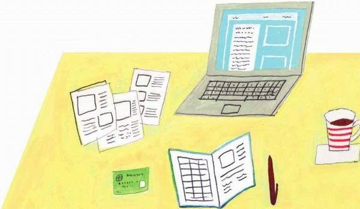

## STEP3 把钱花在精彩的事物与时间上

A.把钱花在“喜欢的东西”和“想做的事情”上

B.为自身成长花钱

C.长假，让生活更精彩

D.用金钱为他人带去喜悦

E.争做存钱达人

F.巧用保险

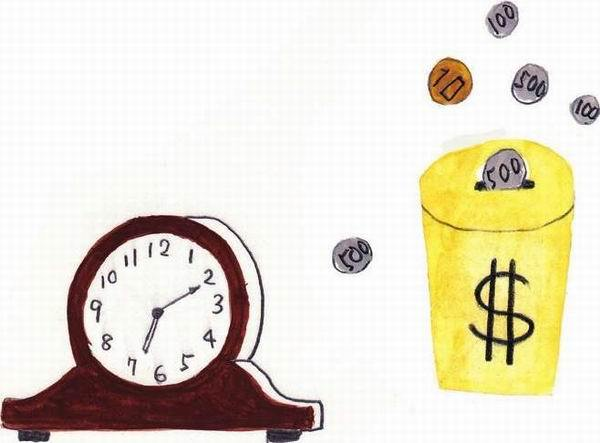

据说经济不景气久了，人们的消费欲望会在某一个时间点突然上升。那是因为长时间的节约会让人身心俱疲，久而久之，大家就撑不住了。于是人们便纷纷掏出钱包，用一些小奢侈来慰藉自己。在大甩卖的时候一时冲动买了名牌的衣服，用口碑特别好的高级精华液代替便宜的护肤品……有这种经历的人想必不在少数。

长时间逼自己节约，的确不是什么好事。

在此，尤其不提倡在餐费上做大幅度的削减。对人类而言，享用美食有着无上的喜悦。一日三餐，也是能让人品味到小幸福的好机会。要是因为过度削减餐费，搞得整个人非常郁闷，那节约还有什么意义呢？当压力越积越大，你就难免会下馆子打打牙祭，说不定还会把钱浪费在其他的地方呢!

理财，讲究一个“恰到好处”，更讲究“张弛有度”。

如果你觉得一个东西“不是很必要”，或者“没有多大的价值”，
那就不用在它上面花钱。可是，对那些能够让我们高兴的事，能够让生活变得更精彩的东西，我们就应该果断掏出钱包来。

如何分配有限的金钱？—在回答这个问题时做出的选择，就是构筑起适合自己的生活方式的基石。

### A.把钱花在“喜欢的东西”和“想做的事情”上

金钱的意义，在于它可以转换成其他的价值。如果你是为了一个明确的目的去攒钱、去节约，那当然无可厚非。可是在浑浑噩噩的状态下节约忍耐，那就很不可取了。如果你有非常喜欢的东西，或是非常想做的事，那就不要再拖了，尽快实现自己的愿望吧!在不远的未来，一定会有新的“喜欢的东西”和“想做的事情”在等待着你。

把钱花在“喜欢的东西”和“想做的事情”上，本就是一件非常让人高兴的事。不仅如此，这么花钱也是享受未来的一种“投资”。

比如，购买美味的食材就是一种投资。因为好食材能够让身体变得更健康，提高工作质量，进而让你过上幸福的生活。购买真正喜欢的衣服也能够让自己高兴起来，更能让周围的人喜欢上你，所以这也是一种投资。和亲朋好友见面，看一场电影，读一本好书，能让你的内心世界变得更丰富，让你的未来变得更光明。

要把钱花在刀口上，就得选择投资效果比较大的事物，换言之，就是能带来巨大的喜悦和幸福的事物。不过除此之外，我们也能在日常生活中用金钱换取一些小幸福。积少成多，幸福感也能有显著的提升。

而且，此刻的幸福能够孕育出未来新的幸福，形成良性循环，让你更上一层楼，创造出新的价值。

如果你有“喜欢的东西”和“想做的事情”，那就不要再默默等待了，果断花钱吧!只要将现在的状态调整到最好，未来就一定会以最佳的状态出现在你面前。

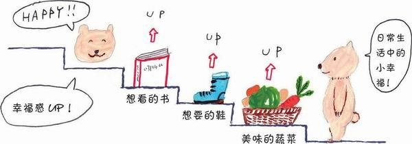

### B.为自身成长花钱

我是那种很少在生活上花钱的人，但是我在“学习”方面绝不吝啬。

我的摄影技术虽是自学成才的，可是为了向活跃在第一线的职业摄影师学习，我千里迢迢来到东京，还花大价钱买了许多好的摄影器材。最终，我成了独立的自由摄影师，后来还在报社找了一份工作呢。

我还专门学习过穿和服的技巧(和服层数较多，很难穿，在很多情况下需要专业人士帮助)，获得了专业的资格证书。囊中羞涩的时候，我会去婚礼会场帮宾客穿和服，还会开办穿衣讲座，赚了不少零花钱。我现在还在中国“台湾大学”开了一门和服课。

摄影也好，证书也好，我投资的钱都在一两年之内收了回来，而且我还收获了受用一生的“吃饭本事”。真庆幸自己学了这两项本领……

除了提升职业技能，考取各种各样的资格证，日常生活中还有很多学习的机会。和朋友聚餐喝酒，学习沟通交流的本领；看一本好书；和想见的人碰面；体验高质量的东西……这样的学习也许不会直接和收入挂钩，但是它们可以转化为工作的动力、品位和智慧。

有很多人在为未来拼命存钱，可是现在故步自封未免为时尚早!为了“创造出更好的工作成果”，为了“成为一个更杰出的人”，我们完全可以花更多的钱，这样才不容易被金钱控制住，形成良性循环，生活也会变得更快乐哦!

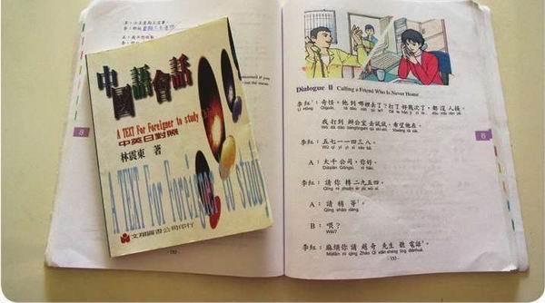

担心自己不会中文会影响日常会话，就学起了中文……以自学为主，偶尔请老师指点一下。

### C.长假，让生活更精彩

有很多人觉得：“工作这么忙，哪有时间休长假啊!”

我在公司上班的时候也是这么想的，毕竟大家工作都很忙，也没有休长假的先例。可是有一次，我实在想去南法看一看世界摄影展……

于是我就怀着忐忑的心情，找同事们做了一下思想工作：“你们就让我休两个星期的假好不好？然后我们就开始轮休嘛!”谁知道大家都一口答应，还讨论出了一套分摊工作的方案，搞了一套轮休制度。

在之后的几个星期里，我心中充满了期待，无时无刻不是面带微笑。我总不能带着工作去休假吧，所以我拼了命地要把手里的工作做完。一想到即将来临的假期，我就兴奋得不得了，走路的时候都是欢欣雀跃的呢。

不久后我就独自踏上了旅程。这是我第一次一个人出国，而这次旅行也大大改变了我的人生轨迹。我在摄影展上邂逅了活跃在世界舞台的杰出摄影师们，那段经历我将永远铭记于心。无数令人印象深刻的作品，让我不禁张开了想象的翅膀：“虽然我现在功夫还不到家，但我总有一天要追上他们!”

后来，我又独自旅行了很多次。环游世界的时候，我在欧洲旅行了很久，还在东南亚做过志愿者。每次旅行归来，我都会觉得自己对周围的人更好了，工作欲望也更强了，甚至变得更有品位了。

暂时离开自己身处的世界，跳进一个全新的世界走一走、看一看，就能收获无穷无尽的感动与想象。

大家不妨也花些钱出去走走，说不定能够改变自己的人生哦!

在希腊的圣托里尼岛，任思绪驰骋于公元前……这里的夕阳真是太美了!

肯尼亚的大草原，让我对动物的生态和大自然的环境产生了兴趣。肯尼亚人单纯的思维方式也对我产生了巨大的影响。

## 享受定制生活

“会选择定制产品的人，都是最任性的人，也是最爱自己的人。”帮我定制皮包的和田明子女士如是说。

任性—这么说的确没错。我本来就很喜欢皮革产品，因为它们越用越温暖，越用越有味道。我给和田女士提的要求非常复杂：“我要一个大号的皮包，要装得下A4的文件、照相机和电脑，还有在外面过夜要用的东西。颜色要自然一点的，可以搭配休闲服和工作服。”谁知成品大大超出了我的期待。在使用的过程中，我又向她提了一个要求，希望她帮我多钉一个扣子，她也欣然同意了。

我之所以选择定制，不仅是因为我想要最适合自己的东西，更因为我相中了某位手艺人的品位和技术，特别希望他来为我制作产品。

定制作品融合了自己的任性和制作者的技巧，是名副其实的“宝物”。拥有它，就能够带来无限的喜悦。而且定制品用着顺手，用途广泛，能带来极大的满足感。要在非定制品中找到一款这么合心意的，简直比登天还难。

大家不妨也“任性”一把吧!不过有一点请大家务必注意，那就是在定制产品时，你必须把自己的要求表达得非常明确。可以找一些和你的要求相近的杂志照片或样品拿给制作者，边看边解释，这样就万无一失了。

如此一来，你定能与称心如意的定制品相逢!

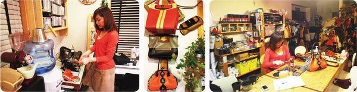

和田女士非常擅长组合不同的颜色和材料。许多人为她的品位如痴如醉，还报名参加了她开办的学习班，要排好几个月的队才能听上一节课呢!

(协助采访：leather studio feel so good)

### D.用金钱为他人带去喜悦

年轻的时候，我们都喜欢让别人在自己身上花钱。我们会怀着感激的心情，去体会金钱所带来的乐趣。

然而人生过半之后，我们就不想只当索取的一方了。我们也想为他人做些什么，用金钱为他人带去喜悦。

孝顺父母，向朋友赠送礼物，请晚辈或年纪比自己小的朋友吃饭……看到对方露出欣喜的表情，我们心里也是美滋滋的。

为他人带去喜悦的金钱，一定会以某种形式加倍回到你手中。这种形式不一定直接，但你一定能感觉到。反之，如果你没有为别人花过钱，那你就得不到他人的回馈。为别人花钱就是这么一件不可思议的事情。

中国人特别喜欢为别人花钱，是他们教会了我，关怀他人，能让钱循环起来，以恩生恩。

特别是当别人处于困境时，我们就更不能看着不管了。发生灾难之时，我们总能看到来自世界各地的人，都会伸出援助之手。不管是金钱方面的救助，还是人道关怀。对一个人来说，“能帮助他人”是无上的荣誉，也是一种莫大的幸福。

其实，“以恩生恩”是一种传统美德。与其闷声攒钱，不如花些心思构筑起牢固的人际关系。如此一来，关键时刻就会有人向你伸出援手了。

### E.争做存钱达人

许多存不下钱的人都有一个共同的问题：他们都是先花钱，然后把剩下的钱存起来。

其实我们应该在每个月工资进账之后，立刻把要存的钱从活期转到定期，然后再用剩下的钱过日子。在能维持正常生活的情况下，不知不觉中把钱攒起来—这种状态才是最理想的。

而且要存钱，就离不开一个明确的目的。如果你存钱是出于“说不清的焦虑”，那你无论存了多少钱，都无法放下心来，深陷焦虑的泥沼，难以自拔。所以我们要充分发挥想象力，勾勒出理想的生活状态，并明确“要过上这样的生活需要多少钱”。有了“旅行”“搬家”这种明确的目的，存钱就会变成一桩乐事。

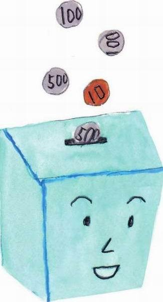

“存钱好辛苦啊”“存钱好难啊”……如果你抱着这种负面的心态去存钱，那就永远都攒不下钱。

“存钱是让我们过得更幸福的方法”—我们要怀着这种积极向上的心态去存钱!

### F.巧用保险

保险，能够在我们生病、出意外和老后起到“兜底”的作用。“遇到这种情况，有个XX元就放心了”—买保险时，我们一定要明确目的。问题是有很多人并不了解自己购买的保险。

保险合同上的字特别小，密密麻麻的内容一大堆，看起来特别麻烦，但是我们至少应该对“赔付条件”和“赔付金额”做到心中有数。

以医疗保险为例，有的保险会限制疾病的种类，有的保险则规定只有住院时才能领到保险金，定期去医院看病的人是拿不到的。能拿到手的住院保险也有可能不够用。如果是死亡赔款较高的保险，平时需要支付的保险费也会比较贵，有些人并不一定需要买这样的保险。

长期支付保险费也是一笔不小的负担。出于人情面子随便买的保险一定要认真研究，视情况加以调整。我们也可以在跳槽或结婚的时候，找金融专家咨询一下，或是多找几家保险公司领取报价单。货比三家，小心谨慎，总归是没错的。

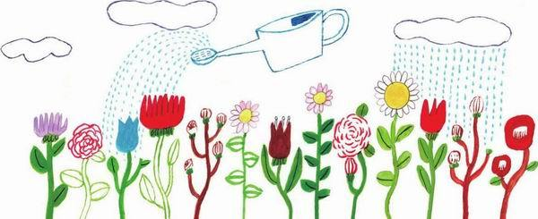

## Column ② 不过分依赖“方便”日法跨国夫妻的极简生活

8年前，我的大学学姐海江田里美和一个跑来鹿儿岛旅游的法国人结婚了。这条爆炸性新闻让周围的人大吃一惊……

里美学姐是一位非常时髦的高中老师，更是我们这些学妹心目中的偶像。她曾去她最爱的城市巴黎留学，每年都要出国旅游几次。她在海边买了一套公寓，养了两只猫，过着优雅愉快的单身生活，简直羡煞旁人啊。

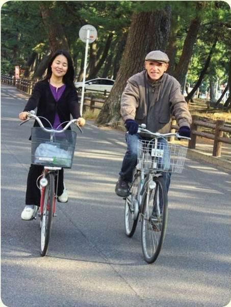

奥利佛和里美很享受骑自行车的新生活。

她的物质生活非常富足，已经到了别无所求的地步。她常说，“就算不结婚，人生也能很快乐!”谁知她在结婚之后就由奢入俭了。而她也变得更温柔，更有活力了。

她的丈夫名叫奥利佛，非常喜欢旅游。他们认识的时候，奥利佛就是一个来日本旅游的背包客。

奥利佛出生于非洲，他通过经营养蜂场赚了些钱，然后用这些钱买了股票，用股票收益买了一艘小游艇，绕着非洲玩了一圈，还去过南极大陆，把全世界都走遍了。在这样的生活中，他掌握了高超的生存技巧。他会在游艇靠港时采购一大批食材，再把自己钓的鱼装进真空袋里。如此一来，在下一次靠岸之前，他就能用这些食材做出许许多多的美味了。他的游艇上没有乱七八糟的东西，也没有电子产品。他就是一个切身实践极简生活的人。

“一开始我真是吓了一跳呢。这年头，大家的生活都很富足，何必做到这个地步呢……”起初，里美学姐也有些不知所措。

在结婚之前，里美学姐买的都是质量最好的食材，价格稍微贵一点她也无所谓。可是奥利佛喜欢便宜实惠的食材，专找最应季的东西。他会在商店的传单上做记号，去便宜的地方采购，还会故意买所谓的“次品”……

“我之前从来没买过次品，其实只要把次品做成菜，就看不出问题在哪儿了，味道也没有什么差别。”里美学姐如是说。她之所以能渐渐习惯奥利佛的生活方式，也是因为这么过日子很“舒服”吧!

时刻感谢伴侣，表达心中的爱意

与家人和睦相处，才是摒弃浪费的最佳途径。

即便是老夫老妻，也要把“谢谢”挂在嘴边，多多表扬对方。

怀着爱意和对方打交道，对方就会用同样的态度对待你。

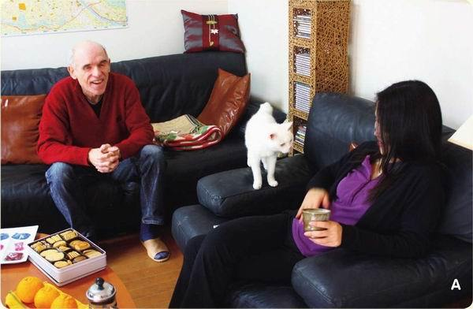

A　聊聊天，享受餐后的悠闲时光

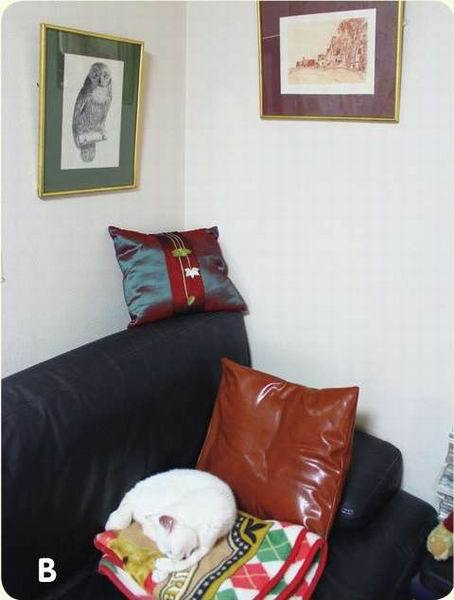

B　墙上点缀着奥利佛上高中时画的画

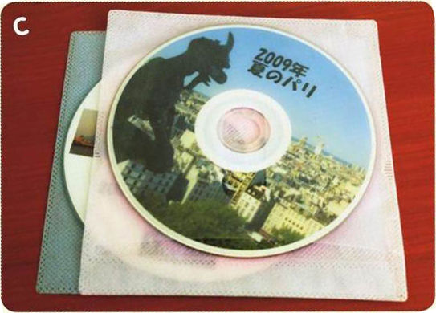

C　里美学姐为学生们制作的旅行DVD

用最简约的方法款待客人

不给客人太大的负担，也不让自己累着，这种形式才是最好的。

反过来说，这种单纯的人际关系，才更需要我们细心呵护。

菜肴简单，心意在。

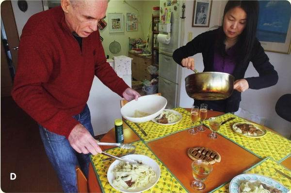

D　两人搭档，配合默契，一眨眼的工夫就把饭菜准备好了

E　亲手制作的意大利面和炖牛肉，充分发挥出食材原本的风味

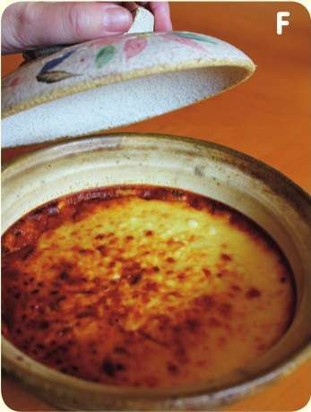

F　用奥利佛珍藏的菜谱制作的砂锅布丁

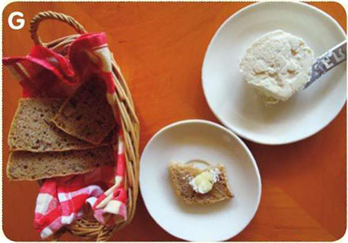

G　用自己做的奶酪和面包为聚餐画上完美的句号

奥利佛是一个痛恨浪费的人，只要是自己能做的事，他都会亲自上阵。

他有许多珍藏了几十年的菜谱，面包、意面、披萨、可丽饼、蛋糕……这些东西他都是从面团做起。有时候，他甚至会自己做奶酪呢。

奥利佛在家里工作，所以工作日是他做菜，双休日则是里美学姐操刀。学姐是家庭科的老师，她的厨艺也能和专家媲美，她的日本料理基本功相当扎实。

他们是一对吃货夫妻，却很少下馆子，除非那家店能提供他们做不了的东西。天妇罗特别美味的荞麦面馆、白鱼盖饭特别好吃的定食店……他们只会光临这样的餐馆。人气很旺的法式餐馆和意式餐馆，在正宗法国人奥利佛眼里反倒有些“不太对头”。

这对夫妻不仅对美食颇有研究，对日常生活的方方面面都很有“讲究”。比如打扫卫生的时候，他们会用抹布和小苏打擦地板。即便是寒冬腊月，他们也不会用热水做菜或是洗盘子。家里虽然有空调，但是他们很少用。如果是夏天，就把窗户打开加强通风。冬天的话，只要有一个石油暖炉，整个房间都会很暖和……他们对生活细节就是如此考究。

“我在拼命节约!”“好麻烦啊……”在我看来，他们应该没有这样的意识。他们只是把时间与金钱花在真正有价值的东西上而已。

他们没有随随便便依赖方便的工具。因为他们觉得，自己费时费心做的东西更称心，而且能带来现成品所没有的成就感。

热爱旅行，是他们俩的共同点。所以他们常会一起出门，有时就在附近走走，有时则会干脆出国。

“在这方面我们也磨合了很久呢……”里美学姐笑着告诉我。她喜欢提前做好行程，订好所有的酒店，然后安安心心地逛景点。而奥利佛从来不订计划，连酒店都是到了再找。至于当天的安排，则是想到什么做什么，一切看心情……他认为，“要是把日程安排得太紧，忙得晕头转向，那休假就起不到放松身心的效果了!”

他们第一次一起出远门，就是去南法旅行。在这趟旅程中，他们虽然吵了好几架，但渐渐地，他们就摸索出了一个折中的旅行方式。如今，一起出游已经成为他们人生中最大的乐趣。

这对夫妻的感情是一年比一年好，但即便如此，他们还是会有属于自己的时间。里美学姐每天早上5点起床，享受两个小时的独处时间之后再去上班。而奥利佛要很晚才起床。“我会利用早上的时间仔仔细细地翻阅报纸，和全世界的朋友发邮件。我几乎不看电视，最多就是一边干活一边听广播。反正啊，我就喜欢优哉游哉地享受早上的时光。只有先放松，才能够拿出干劲去面对工作嘛。”

里美学姐热衷于教育事业，也深受学生喜爱。甚至有毕业生请她去参加婚礼，来找她谈心的学生也是络绎不绝。

带毕业班的时候，她会把同学们的校园生活拍成短片，剪辑一下，刻成DVD。学生们自不用说，连家长都非常喜欢，这更加深了大家对她的信赖。

“就算不是很擅长，只要努力一下，还是能够做出来的。我本以为剪片子什么的会很麻烦，实际动手之后才发现，这个过程还挺有意思的。”

奥利佛来日本之后就迷上了摄影。他会不时去摄影展参观，还会和网上认识的当地人一起出门拍摄自然风光，摄影技术也是突飞猛进。8年前刚来日本的时候，他还几乎不会说日语呢，可是他在短短两三年时间里就把日语学会了。他的这一份专注，也迷倒了许多人呢。

他总是在不断地挑战自我。在他的字典中，没有“不可能”这个词。

不过，要是遇到不想做的事，或者不是很乐意做的事，他就会明确拒绝。清晰的表态，也许也是贯彻极简生活的诀窍之一吧。

回鹿儿岛老家的时候，我见到了阔别一年的学姐和奥利佛。

他们常对朋友们说：“你们如果要来做客，只要提前一天联系就可以了，我们会准备好饭菜等着的!”不给客人太大的负担，也是他们的一贯原则。他们不会做一桌特别丰盛的饭菜，而是用他们平时自己吃的东西来款待客人。菜式虽然简单，但心意一点儿都不少。

其实我在没出国之前，曾经在他们出门旅游时帮忙照顾过他们家的猫，所以我在他们家住过好几次。走进家门的那一刻，我甚至有一种“啊!到家了!”的感觉。

还有一阵子，我模仿了他们做菜和打扫卫生的方法。正因为那些方法很简单，我才能有兴致去享受生活。久而久之，我就明显感觉到自己的心态变得更轻松了。

扯远啦。那天的主菜是从前一天开始准备的手工意大利面，还有用暖炉炖的啤酒牛肉(据说啤酒能让牛肉变得更软)。配上他们亲手制作的面包和奶酪!甜点则是用小砂锅做的布丁。吃完饭之后，在客厅喝点茶，聊上一聊，也是他们的固定节目。

“最近有什么新鲜事吗？”听到我这么问，里美学姐回答道：“我开始骑自行车上班了，下雨天还会穿着分体雨衣和学生比速度呢(笑)!骑车上班，就能发现开车时看不到的弄堂小店，还能敏感地察觉到季节的变化呢!放假的时候，我们也会一起骑车出门。只要是方圆10公里之内的地方，骑车都能到得了。”

只要肯花心思，肯下功夫，我的生活应该也能更上一层楼……我在学姐家充了不少电，怀着期许踏上了归途。

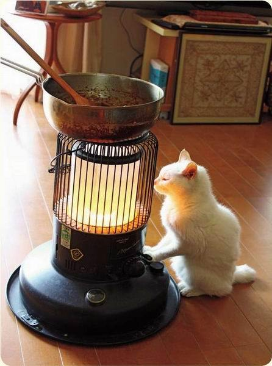

能用来做菜的石油暖炉，也成了猫咪最爱的地方。

# 第8章 巧妙利用时间，打造现在的幸福与美好的未来

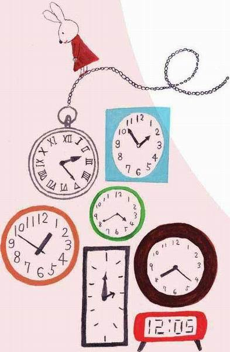

整理手头的物品，整理我们的生活，整理金钱与人际关系……

一切的一切，都是为了把有限的人生时间用在刀口上。

“时间”，对每个人都是平等的。

大家都说，“时间就是金钱。”

可是在我看来，时间就是生命，时间就是人生。

我们甚至可以说，时间是上天给我们的厚礼。

至于能用这份厚礼孕育出什么，就看各位的本事了。

只要巧妙利用时间，让每天的生活变得更有价值，

你的人生也一定会加倍精彩。

## 时间是上天给我们的厚礼

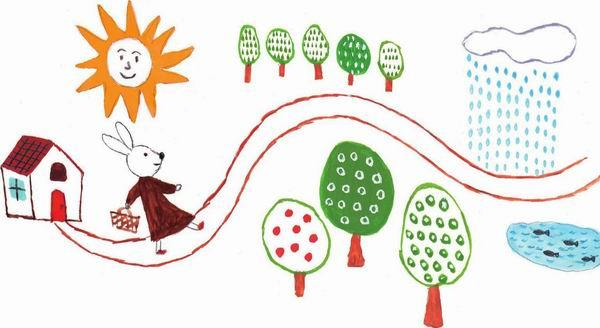

我问过我的中国学生们：“你们休息天都干什么呀？”许多人都给了我三个字，打游戏。要么就是上网、看电视、看漫画……

而中国台湾的老年人都非常有教养，让我大开眼界。上小学之后，他们就会开始学习诗歌，还练过书法，字都写得很漂亮。

当然，我并不是想借这个机会数落现在的年轻人。毕竟上大学的时候，我也是一个一点干劲都没有的差生。我成天忙着打工，参加社团活动。如果我是活在现代的年轻人，肯定也和他们一样，整天整夜打游戏，窝在家里不出门。

据说人只会做有“快感”的事情。生活在不同年代的人，对快感的定义也会有所不同。我觉得打工的时候最有快感。而我的学生们则喜欢打游戏、上网。他们受到了信息浪潮的冲击，“眼看着就要考试了，可是考试前一天还忙着打游戏”，出现这种情况的学生不在少数。

日语系有个小K，他原本也是个不务正业的学生，成天泡在社交网络上。可是突然有一天，他开始疯狂地学习……

“我决定考国际警察了!我的目标是当一个好警察!”

他要参加的考试非常难，合格率只有百分之十几。考试科目不光有日语、英语、国际法和刑法，还有体能测试。为此，他每天都要跑5公里锻炼身体。他一天比一天有干劲，显得特别可靠……

在我看来，小K的可贵之处在于，他明知道这项考试的合格率只有12.5%，但还是坚信：“只要我拼命努力，就有可能拿下!”这种毫无根据的自信有着巨大的力量。无论是谁，只要能通过想象为自己带来希望，并坚信自己有可能实现这个目标，就能拿出无穷的干劲了。

有些人明明有想做的事，最后却没有成功。与其说他们是“没有干劲”，不如说他们是“在心底里放弃了”。所以他们才会泡在网上，或是把时间浪费在原来没打算看的电视节目上。越是消磨时间，他们心里就越是难受……

而那些能够接二连三实现目标的人呢？他们能够明确描绘出自己的目标，而且他们坚信，只要我努力去做，就一定能成功。

当然，世界上也存在无欲无求的价值观。有些老人就喜欢坐在海边，整天发呆。刻苦修行的高僧也总能让人们动容。但是在这些人的内心深处，也一定沉睡着一份无声的“希望”。

毕竟，人是一种没有希望就活不下去的生物。

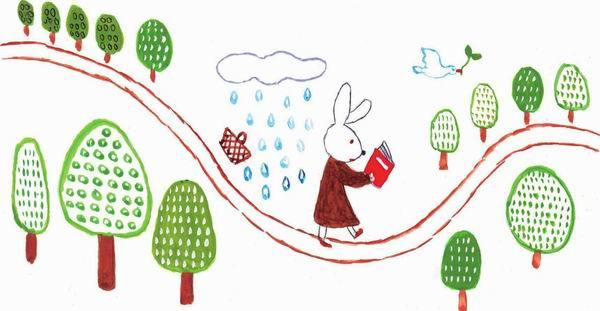

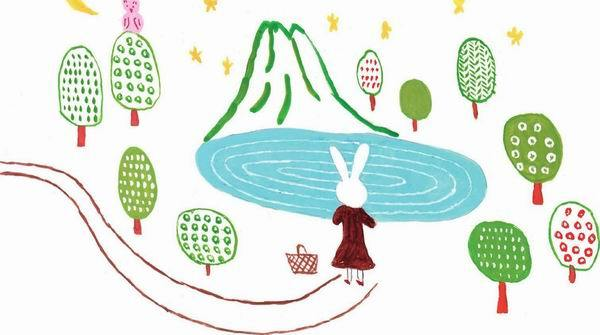

我有位朋友，原本过的是公司到家两点一线的生活。她是个很知足的人，常对我说：“能太太平平过日子我就心满意足了。”可是突然有一天，她找到了自己的目标：“我开始学草裙舞了!有朝一日，我一定要去夏威夷跳一跳!”打那天起，她便脱胎换骨，浑身上下都充满能量，连表情都显得特别有光彩。朝着目标奋力奔跑的时候，才是一个人最美丽的时候吧。

品味幸福，热衷于兴趣爱好，挑战全新的事物……连这些事都要忍，那人生还有什么意思呢？!

当然，人生不如意事十之八九，但是在这个前提下一点一点实现自己的目标，不也是一件非常伟大的事情吗？为了实现这些目标过一辈子，不也很好吗？要收获满满的幸福，关键就在于做自己真正想做的事(只有这样，你才能自然而然地释放出无穷的能量)，并坚信“我能行”。然后再将为实现目标服务的“行动”纳入你的时间表中。

不要再随波逐流了，不要再浑浑噩噩度日了，让我们重新拾起生命的活力吧!让我们把宝贵的时间用在自己和周围的人身上吧!

手握时间主导权的人不是别人，而是我们自己。

## 管理时间的三要诀帮你挤出时间来!

异常忙碌的女性朋友们常会抱怨：“唉，根本没有属于自己的时间……”

可是仔细一想，我们的工作与生活中其实有很多效率低下的行为，就是这些行为，让我们手忙脚乱……

只要牢记下面介绍的3个方法，就有可能挤出时间了。

“等我哪天有时间了，就做我想做的事吧!”

—如果你还在说这种话，那么这一天就永远都不会到来。

STEP1　杜绝浪费

成天抱怨“我好忙”“我没时间”的人，是不是浪费了很多时间，所以就没有时间去做真正重要的事情了？慢吞吞做了很多让人后悔的事，把简单的问题复杂化……这些行为都会浪费时间。所以，我们首先要重新审视自己的目的，将“不需要”的环节统统砍掉。

STEP2　调整流程

把“不需要”的环节砍掉之后，下一步就是排出优先顺序，提高效率。只要用对了方法，你的注意力和工作效率就会显著提高，工作速度也能提升不少呢。可你要是养成了拖沓的坏习惯，实现目标的可能性就会越来越低。所以我们要提前跟自己约法三章，并且将这些规则套用在自己的行动上，只有这样才能一鼓作气，乘势而为。STEP3　认真做好每一件事

决定好现在要做哪件事情之后，剩下的就是“集中注意力把这些事做好”。如果你心里同时有很多件事，这个也想搞，那个也想做，到头来恐怕哪一件事情都做不好。而且，要挑战远大的目标，坚持不懈的精神也必不可少。正所谓“欲速则不达”，仔细做好眼前的每一件事，才是实现目标的真正捷径。

## STEP1 杜绝浪费

为了充分利用有限的时间

A. 摒除不必要的信息

B. 调整时间的用法

C. 把不会做的事交给专家或比你擅长的人

D. 要不要开拓新天地，得挑战之后再决定

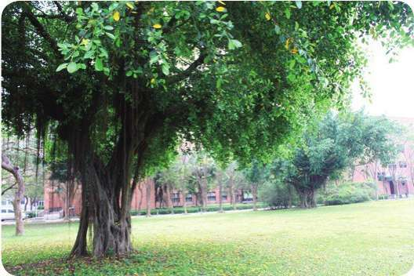

常有人说，“人生也许需要走走弯路。”但这仅限于“结果不尽如人意，但经验能派上用场”的情况。没有人会上赶着去做一件明摆着是浪费时间的事情。人生的时间是有限的。可能的话，还是少浪费点时间为妙。

那么，“浪费时间”的定义是什么呢？请大家扪心自问，你的日常生活中有没有下面3种情况。

① 花时间做没有太大意义的事

玩电脑，玩手机，陪同事吃一顿漫长的午餐，毫无目的地在百货店里瞎逛……“我到底在干什么呀!”如果你在日常生活中常有这种感觉，那就要多留个心眼了。当然，磨磨蹭蹭的时光也不是全无意义，但我们必须在心里做出明确的判断：“我真的想这么度过这段时间吗？”“好的磨蹭”能让你放松下来，“坏的磨蹭”却是违心的，只能加深你心中的郁闷。

② 花时间做“跑题”的事

别人托你做一件事，你却误会了他的目的，结果只能从头来过；大家明明没有那么高的要求，你却费尽心思做到了极致；迷失了前进的目标，朝着错误的方向越走越远……要是我们疏忽了确认和准备工作，就会把很多时间浪费在跑题的事情上。

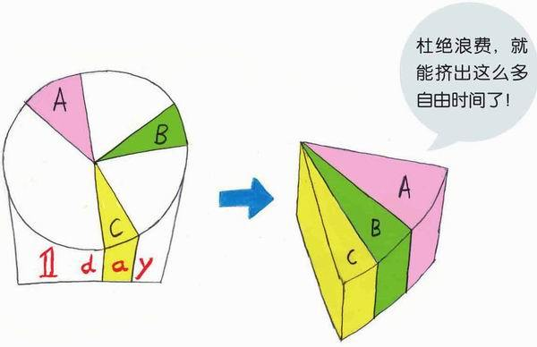

杜绝浪费，就能挤出这么多自由时间了!

无论做什么事情，都要先确认好三点：“为了什么而做？(目的)”“要做成什么样？(完成形态)”“应该用什么方法去做？(手段)”。

③ 花时间解决充满负能量的问题

这种情况最要不得!

因为我们只是在想办法让生活回到正轨而已，没有让这段时间发挥出任何积极的作用。

好比“找东西”，就是不折不扣的浪费时间。如果这件东西能立刻找到，那当然是皆大欢喜，可是在我们翻箱倒柜的时候，时间一眨眼就过去了。因为人际关系的种种不顺大发牢骚，愁眉不展，也是在浪费时间。为这种无谓的事积攒压力，不光会浪费时间，久而久之还会浪费金钱。生活没有节制，不注意保养自己的身体，也是同样的道理。因为住院，或者一次一次去医院看病都要花时间，而且有些病不是一两天就能好得了的。更何况，生病还会极大地减弱你前进的动力。

要杜绝时间上的浪费，我们就必须先调整好自己的身体状态、人际关系和财务状况。正因为如此，我们才需要把日常生活整理得简简单单、干干净净。

### A.摒除不必要的信息

在我看来，现代人会浪费时间的首要原因，就是“对滔滔江水般的信息照单全收”。

以邮件为例。其实我们没有必要一天查好几次邮件，有些邮件也不需要立刻回复。为了回邮件中断工作，实在是得不偿失。一边跟人说话一边查邮件发短信，也会显得你这个人很没有教养。在和人交谈的时候，我们应该把所有的注意力放在眼前的这个人身上。

这年头，有很多人动不动就泡在网上，随意浏览些无关紧要的信息。在社交网络上和平时没有交集的人聊些无关痛痒的话，也是浪费时间。“明明有别的事要做，可就是忍不住想上网……”看来，网络的确有让人上瘾的危险性。

面对海量的信息，我们应该跟自己约法三章。在大多数情况下，邮件完全可以每天只查阅2～3次。查阅的时间也要提前定好，不到点就不看。就算隔一天才回信，也不会有人生气吧。如果你需要上网看新闻，那也可以选定若干个网站，每天看1～2次就够了。

八卦、坏话这种口耳相传的信息，也需要我们主动去过滤。因为这类负面信息不仅会浪费时间，还会浪费你的精力。当身边的人开始讨论这类话题的时候，你可以不动声色地换一个话题，尽量不参与进去。

不看、不说、不听—我们必须用这样的态度，严肃对待没有意义的信息。

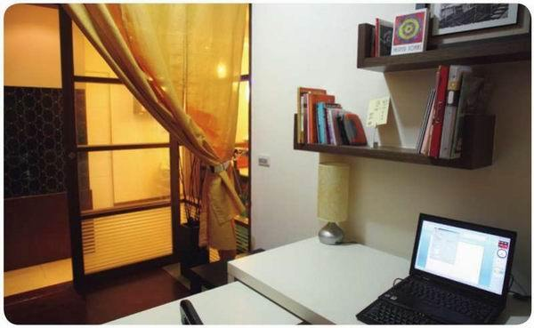

工作时绝对不上网，定时查阅网络新闻和邮件。

### B.调整时间的用法

“我明明是有时间的，可为什么老也做不完呢!”“有些人很快就能做完，难道是我特别笨吗？”……如果你有这种情况，那我建议你调整一下“每日时间”的使用方法。

怎么调整呢？方法很简单：列一张“待办事项清单(TO DO
LIST)”，用可以规划时间的日程本来管理自己的时间。只要这样，就能发现你把时间浪费在哪里，又有哪些坏习惯了。

特别忙的时候，我也会在日程本上列出一长串待办事项，给每一件事分配相应的时间。

如果你更重视完成的“质量”，而不是花了多少时间，那进度就有可能落后。不过即便如此，我们也能通过待办事项清单来缩短早晨进入状态之前“垃圾时间”，或是借休息之名行偷懒之实的无谓时间。

用日程本管理的目的并不是“按部就班地完成每一项计划”，而是“明确现在应该做什么”。

要是没有提前制订计划，做什么事都难免拖沓。有了待办事项清单，你就知道“现在该做什么”了，办事的时候也会更有紧张感。

有些事情看似必要，其实完全可以“砍掉”，或是不用花太多的心思。这类事项也能通过制定待办清单整理出来。

“这件事真的有必要做吗？”“就没有其他方法了吗？”—调整时间的用法，才能提升时间的密度。

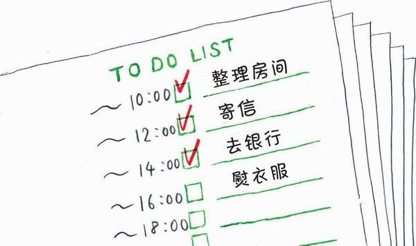

### C.把不会做的事交给专家或比你擅长的人

搞清“自己能做的事”固然重要，但更重要的是搞清“自己不会做的事”。来中国台湾之后，我做的第一件事就是学中文。毕竟我以后要在这里生活，不学点中文肯定不行。而且我也觉得，会一点中文的话，采访时多少会方便一些。

可是有一天，我认识了当地一位很厉害的高档外国轿车销售员。他对我说的一番话，让我倍感意外。

“你没有必要把中文学得那么好啊!我不会说日语，也不会说德语，更不会说英语，可是我也去日本和德国谈过生意。你不应该把自己的能量耗费在‘学中文’这件事情上，世上应该还有很多事是非你不可的。”他说得的确有道理，要理解话语中的细节，还是请专业的翻译帮忙比较靠谱。只要把用在学中文上的精力省出来，我就能集中精力做真正需要做的事了。

大家是不是也跟我一样，在日常生活中花了很多时间，做自己不擅长或者是做不了的事，反而疏忽了自己真正擅长又想做的事？

是费时费力自己动手，还是花钱请专家帮忙？—在生活中我们经常需要在两者之间做出选择。不过，碰到自己搞不定的事情，请专家帮忙才是明智之举。

我们完全可以大胆果断地把时间花在自己擅长的领域上，不断提升自己的技术水平。与辛辛苦苦克服弱项相比，发挥强项当然会轻松许多。

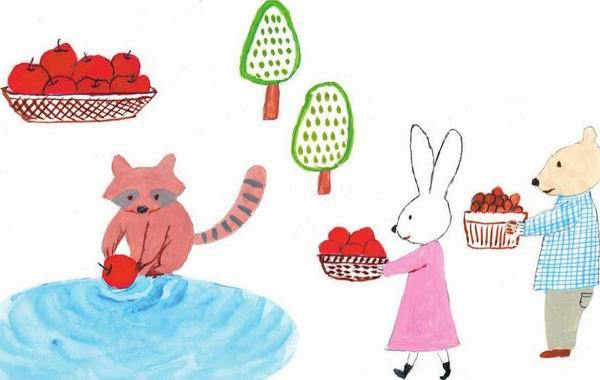

### D.要不要开拓新天地，得挑战之后再决定

“挑战新事物”看似费时费力，但我觉得没有做过的事情，还是都尝试一下比较好。

自己明显做不到的事，或是一点都不想做的事，则要另当别论。但是不属于这两种情况的事，完全可以先尝试一下，不要认定“我肯定不行”。说不定你会在挑战的过程中发现，这件事还挺有趣的，兴许还能开发出自己全新的一面呢。

我认识一位八十多岁的作家，他特别喜欢挑战新鲜事物。智能手机、平板电脑这种新玩意儿一上市，他就会立刻买回家。社交网站他也会一一尝试。去卡拉OK的时候，他会尽情欢唱二十多岁的年轻人喜欢唱的曲子。口碑好的饭馆，还有人气爆棚的甜点，他也会立马去尝鲜。拜这种积极向上的心态所赐，他看上去只有六十多岁，而且才思泉涌，总能为我带来许多新发现。

看来，“好奇心”这个东西能孕育出无数鲜活的能量。

而且你做的每一件事，都能够丰富你的信息库，帮助你准确做出下一次判断。久而久之，有些事情你不用亲自动手做，也能凭直觉做出正确的判断。挑战新事物，乍看之下是对时间和精力的浪费，但是从长远角度看，这样的经历能在我们今后的人生中发挥巨大的作用，防止我们做出错误的选择，在无谓的事情上浪费时间。

虽然我不是什么新鲜事物都喜欢挑战，但我在这方面的态度还是很积极的。我想去没去过的地方走一走，也想亲眼看看没见过的东西。

我之所以想把生活变得更简单，也是为了给新鲜事物腾地方呀。

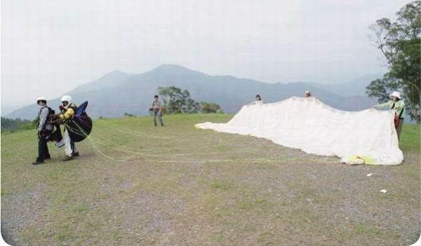

几年前，我挑战了跳伞。下次有机会，我还想试一下滑翔翼和蹦极!

## STEP2 调整流程

“时间的穷鬼”和“时间的富翁”

A. 能在5分钟内解决的事情，就立刻动手做

B. 每天都要做的事要养成习惯

C. 巧妙利用碎片时间

D. 提前想好下一步要做什么

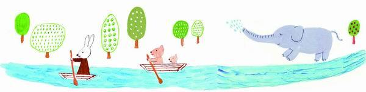

不知道为什么，社会上总有两类人：一类人成天手忙脚乱，连喘息的时间都没有。另一类人虽然也很忙，但他们会把该做的事解决干净，还能在工作之余享受生活的乐趣呢。

时间对每个人都是平等的，那为什么会有“时间的穷鬼”和“时间的富翁”之分呢？在我看来，问题就出在对待时间的“态度”上。

“时间的穷鬼”的确有很多事要做，但这些事大多来源于周围的信息，所以他们永远处于被时间追着跑的状态。为了把纷繁复杂的事情都处理好，他们的生活就跟一团乱麻似的。

那“时间的富翁”是怎么做的呢？他们知道“自己想做什么”，把生活整理得很简单，与时间和谐共处。而且他们会想方设法提升时间的质量和效率。换言之，他们把时间变成了自己的好帮手。

其实，这个道理也适用于在之前的章节中介绍过的整理房间、穿衣打扮和人际关系等方面。过得精彩的人，都很清楚“我应该以什么为重”。而且他们还会绞尽脑汁，制定规则，进一步提升这些事物的价值。

规则不用太复杂。有些人发起狠来，会以分钟为单位安排日程，可这种方法难度太高，很难坚持下来。

我就不会往日程里安排太多事，而是以“做得开心”为重。比如，“把需要做的事尽早办完”是我的一贯宗旨，这是因为拖得越久，就越觉得麻烦，真到了非做不可的时候，也很难拿出干劲来。而且要是到最后时间不够用了，我心里也会特别烦躁，这种状态下的心理负担就会更大。而我之所以会提前安排好工作、家务和旅行的方方面面，也是因为走一步看一步很容易浪费时间，万一有个疏漏，心情自然就郁闷了。难得出去旅游一次，当然要保持好心情啦!

不过，日程安排得再好，终究是纸上谈兵。关键还是“执行”。“就是没干劲”“真不想动啊”……人要是处于这种消极的状态，就绝对高兴不起来，也拿不出前进的动力。让自己拿出干劲，才是重中之重。

怀着愉快的心情开始一天的工作，集中注意力，逐一攻破待办事项清单上的项目……就算进度有些落后，也要坦然接受。小小的不愉快，千万不要放在心上，过去的事情就让它过去吧!—也许这才是巧用时间的诀窍。

“花时间”跟“花钱”其实是一回事。我们不仅要为了“眼前的幸福”花时间，更要为“未来”果断投资。每个人都希望自己的生活平安喜乐，但短暂的辛苦与悲伤，有时候也是必不可少的。

越是艰难痛苦的经历，就越能让我们学习到更多的经验知识，更上一层楼。难得遇上学习的机会，却没有牢牢把握住，只知道原地踏步，那就不是在“投资”时间，而是在“浪费”时间了。“我不想吃亏啊!”—要是抱着这种心态左躲右闪，你就不可能真的迈过眼前的“坎儿”，只是把栽跟头的时间往后拖了一些罢了。

“我现在做的事对我有着怎样的意义？”拥有明确的目标意识，也许就是成为“时间的富翁”的必备条件。

### A.能在5分钟内解决的事情，就立刻动手做

我见过的“时间的富翁”都有一个共同点，那就是“立刻动手，绝不拖拉”。

比如，在聊天时碰到了不懂的问题，这类人就会立刻说：“对了，XX可能会知道，我这就问问他!”话音刚落，他们就拨通了电话。一确定聚餐的时间，他们就会立刻把餐厅订好。书桌和厨房有地方弄脏了，就立刻擦干净……总而言之，他们的反应速度非常快。

那“时间的穷鬼”呢？“嗨，不着急，过一阵再说吧!”“回头再做就是了……”他们就好像被锁链拴住了一样，动作特别迟钝。拖着拖着，他们就把这些事给忘了。等到秋后算账的时候，他们自然会付出代价。

所以，能在5分钟内解决的事，我就会立刻动手去做。

“想起了一个人，就立刻和他联系(打电话、发短信、寄贺卡都可以)”“碰到不懂的单词就立刻查字典”“把乱糟糟的地方立刻整理好”……想起某件事的时候，一定是你最有干劲的时候。

要是一味拖拉，干劲就会逐渐降温。有效利用喷涌而出的能量，也是防止浪费时间的技巧之一。

不过，如果你在集中注意力做某件事的时候想起了另一件事，那就在即时贴上记一下，贴在自己一定会看到的地方。把手头事情做完之后，就立刻付诸实践。要是一件事情还没做完，就忙着去做另一件事，然后在做另一件事的时候又想起了第三件事……到最后，就很有可能一件事情都没做好。

“想到后立刻实践”—只要不断重复这个过程，你就会惊讶地发现，自己在不知不觉中实现了一个巨大的目标。

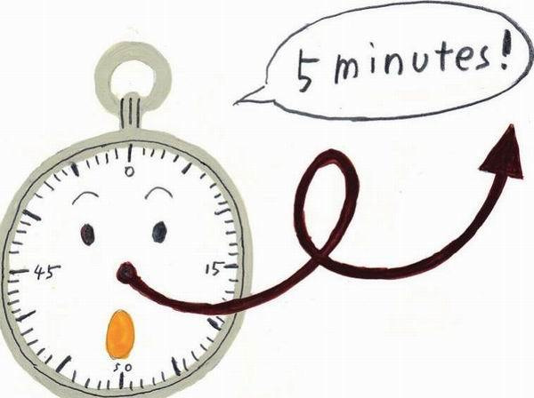

### B.每天都要做的事要养成习惯

在我们的生活与工作中，有很多每天都要做的事。我建议大家可以把一连串的行为变成一种习惯。

比如，早上起床之后到出门之前的这段时间要做些什么？吃完午饭之后，要怎么检查邮件确认日程？我们可以提前决定好些动作的顺序，以及每个步骤需要的时间。如此一来，不用多动脑筋，一系列动作也能如行云流水般，大致需要的时间也能做到心中有数。

要是每天都用不同的流程办事，进度就可能落后，万一有疏漏，那就更费时间了。

我们可以把一天的时间分成早晨、上午、下午、回家后、睡前这几个部分，提前制定好每一个部分的流程。这样不仅能提高效率，保证按部就班执行好每一个环节，也能让我们内心更有活力。

在安排流程的时候，我们还要考虑到身体状态在一天中的变化，只有这样才能提高生活与工作的效率。比如，我们要把需要集中注意力的工作放在上午，因为人的思路在上午最清晰。人一到下午就容易犯困，所以这个时候要做一些能让身体动起来的事情，或是和别人聊一聊，提高工作效率。

那些有学习习惯或运动习惯的人，肯定会在每天的安排中留出相应的时间，比如“每天早上6～7点学习/锻炼”。口口声声说“我有时间就会做”的人，永远都无法拿出实际行动来。

养成习惯之后，时间的密度就会大幅提高。那么问题就来了：我们应该用挤出来的时间做什么呢？要是用这些时间来做没有技术含量的工作，或是把时间白白浪费掉，那真是暴殄天物啊!

所以我们必须提前确认好，我要为了什么目的挤出时间。

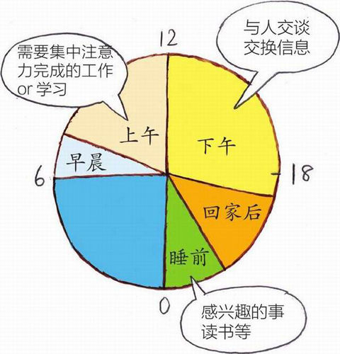

### C.巧妙利用碎片时间

在第5章提到过，我之所以会养成做深蹲的习惯，是因为我每天都要喝咖啡。

“傻乎乎地等着电水壶把水烧开多没意思啊!就不能利用这段时间做点什么吗？”—于是我就冒出了做深蹲的点子。现在，深蹲已经成了我每天早上的必修课，不做个深蹲，我就浑身不舒服。

除此之外，我还会在泡澡的时候看看书，做个面膜；在去学校的路上或散步的时候听听音乐，放松放松；利用课间午休或其他休息时间，构思新的工作项目……只要利用好碎片时间，也能做出一番成绩呢。

正因为碎片时间很“碎”，我们才更容易集中注意力，也更容易产生灵感。为了记录从天而降的创意，我会随身携带一本小笔记本。

碎片时间很适合用来做一些不太需要动脑子，可以凭直觉完成的动作。我们可以把下意识的动作和有意识的动作结合起来。要是能养成习惯，那就再好不过了。

我的朋友中，也有不少利用碎片时间的高手。有人在厕所的墙上贴了一张能代表他的梦想的照片，每天都看两眼。最后，他的美梦成真了。还有人利用上班路上的时间刻苦学习，考下了好几个资格证。千万不要小看碎片时间哦!正所谓积少成多，坚持就是力量。

在我看来，大多数不懂得利用碎片时间的人，都不知道自己该干什么。他们也知道时间宝贵，可真的突然空下来了，他们又不知道该做什么好了。而时间就在他们犯晕的时候无情地溜走……

为了防止这种情况，我们可以提前准备好若干个“待办事项”，比如，有10分钟的空当就发个邮件、检查下日程、做个按摩或者收拾收拾房间……

其实有很多人能在工作和通勤过程中挤出碎片时间，可他们什么都不想干，只会发呆。他们不是太累了，就是忘记了时间的宝贵。

当然，我们没有必要把每一分钟都填满，但是开动脑筋思考下，“我该利用这些宝贵的时间做些什么呢？”，兴许能为收效显著的时间投资打下坚实的基础哦。

### D.提前想好下一步要做什么

如果你第二天要出门工作，或是办私事，你会什么时候做准备工作呢？当天一大早？临出门的时候？还是前一天晚上呢？

我深知自己是个丢三落四的人，所以我会选择在前一天晚上准备妥当。提前把工作要用的东西准备好，把要带出门的东西都装进包里，把要穿的衣服熨好，把要穿的鞋子擦亮……有的时候，我以为自己已经做好了万全的准备，可是临睡前，我又会想起：“明天我会见到小A，还是把那个东西也带上吧……”要是当天早上才准备，我肯定会忘东西，准备工作的质量自然高不了。

我一向觉得，“反正早晚都要做，那还不如赶紧做掉，心里还痛快点呢。”

所以，就算不是眼前立刻要做的事，我也会提前安排好，尽早采取行动。比如，针对“周末要在家里开派对”这样的“中期计划”，我会提前明确它的目的和理想形态，列出一份待办事项清单，再一一执行—就是这么简单。

只要将目光放得更长远些，我们就能自然而然地知道“自己到底需要什么”了。于是，我们就能有计划地打扫卫生，一次性把所有需要的东西都买回家，还能有闲情逸致构思一下菜肴的摆盘……做什么事都会变得更有效率。要是不提前安排好，就会耗费更多的时间与精力，办事的质量也会大打折扣。

幸运只会降临在有准备的人身上。“先把自己能做的都做好”—这种认真踏实的态度，比天赋异禀更可贵。

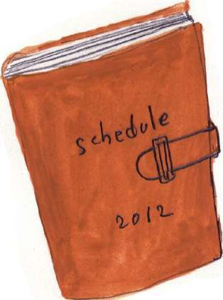

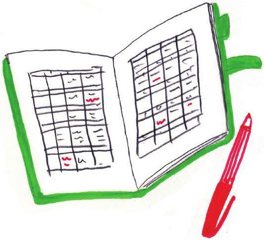

## STEP3 认真做好每一件事

“质”比“量”更重要

A. 打造能让你集中注意力的环境

B. 把大目标分成若干个小目标，循序渐进

25岁过后，我的生活异常繁忙，每天光是忙工作都累得筋疲力尽。大半夜才能回到家，随便吃点东西填饱肚子，迅速洗个澡了事。好容易有个休息天，稍微休息一下，扫个地，洗个衣服，处理一点杂务，太阳就落山了……当时，我总觉得心里空荡荡的。

那是因为我忙着应付一个又一个任务，没有用心去做每一件事。不知不觉中，时间无情地流逝……有时候，我甚至会扪心自问：“我这么拼命到底是为了什么啊？”“我努力了这些年，到底做成了什么？”

年轻的时候，“什么都不想，闷头努力”的时期也有一定的意义。然而，要是这种状态一直持续下去的话，那就是在糟蹋时间。

年过三十之后，我改变了自己的工作方法和生活方式，开始认真做好眼前的每一件事。尤其是在工作上，我更重视质量，而不是数量。全心全意，把每一份工作做到最好。在生活方面，我会不时做一些美味佳肴，犒劳自己；出门散散步，亲密接触大自然；和志趣相投的朋友聚聚；学自己感兴趣的东西……总而言之，我学会了用心享受当下的生活。找回正常的生活节奏之后，我深刻地感觉到：“这才叫‘活着’呀!”

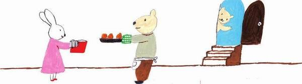

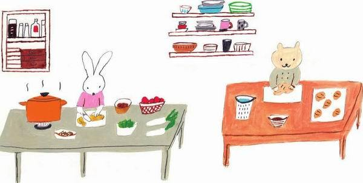

在之前的章节中，我向大家介绍了杜绝浪费、调整流程的各种方法，其实这些小心思，都是为了认认真真过好生活中的每一分每一秒。把日程安排得满满当当，带着急躁与焦虑去做事，绝不会让你的生活变得更精彩。

使用时间的时候，我们应该聚焦于质量和感受，而非速度和数量。否则，我们就永远都是时间的奴隶。而且我们会对眼前的任务敷衍了事，交不出一份令人满意的答卷，甚至半途而废。

没有长时间的积淀，就难以到达真正的高峰。从长远角度看，“欲速则不达”，认真做好每一件事，兴许才是实现目标的捷径。

要利用好有效的时间，提升时间的密度，关键在于摆正心态，告诉自己：“机会难得，既然做了就要做好。”而且我们绝不能忘记，时间是有限的。

如果你只有几个月可活，那你一定会吃最美味的佳肴，去真正想去的地方，见真正想见的人，不是吗？

“不就是做事吗，什么时候都能做啊!”—如果你抱着这样的心态，那就不会对日常生活太上心，做什么事都马马虎虎。我们不用赶着投胎，但也得充分考虑到自己的年龄。“难得上天给了我这些时间，那就用这些时间，让自己过得更幸福吧!”只要这么想，时间的价值就会有巨大的升华。

不过，真的做到事事周到，事事认真，其实也很累人。所以我们要做到“有收有放，张弛有度”，要明确“重点在哪里”，以及“哪里是我的能量源”。

### A.打造能让你集中注意力的环境

要认真做好每一件事，就需要集中注意力，不能把精力浪费在乱七八糟的事情上。

为此，我们必须先打造出一个能让自己集中注意力的环境。

我想集中精力做一件事的时候，我先把手机、电脑和电视都关掉，在小书房里“闭关”。书桌上不放任何东西，只贴一张写着“集中精力干到X点!”的便签。

这虽然是个土办法，但它的确能把涣散的意识拉回来。要是在平时生活起居的地方工作，我就会看到各种各样的东西，想起一堆要做的事情来。为了防止这种情况，我会尽可能少走动。

如果我要思考问题，我就会带着笔记本去咖啡厅或图书馆。就算周围有噪音，那也是跟我没有关系的噪音。在这样的环境下，我的思路会更清晰，也更容易集中注意力。

除了环境，我们还可以在心态上下功夫。其实集中注意力的结果一般只有两种情况，要么就是陷入僵局，要么就是越战越勇。如果你给自己定了个规矩，“每工作25分钟就一定要休息5分钟”，那就有可能打断自己的思路。遇到困难了，就花5分钟时间收拾一下房间吧。要是状态还不错，那就一鼓作气干到底。从这个角度看，我们的日程安排也需要一定的灵活度。

那么，集中注意力时使用的能量是从哪里来的呢？其实，能量就来源于“成果的理想状态”。我们不能光看时间，觉得“我都努力了两个小时了，也差不多了吧”，而是应该以成果论英雄。只有明确目标，才能让时间真正成为我们的好帮手。

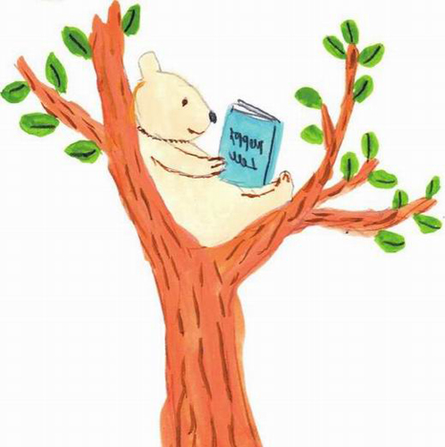

### B.把大目标分成若干个小目标，循序渐进

想必大家都有过这样的经验：制定了一个远大的目标，也有切实可靠的计划，可是在不知不觉中，你就发现计划没办法执行下去了，或是目标总也实现不了……

我也不例外。毕竟，人都只有三分钟热度。

情绪高涨的时候，我们干劲十足，暗暗起誓要做出一番大事业。问题是，情绪不可能永远保持在这么高的水平上。一旦遇到困难，再多的干劲都会土崩瓦解。

这是人之常情，大大方方承认就好了。当然，有时候问题是出在计划性和执行力上，但最关键的问题，终究还是心态。那我们应该如何保持百折不挠的心态呢？

首先，也是最基本的一点：我们必须牢记目标，时刻提醒自己“我为什么要做这件事”。我们不仅要想象“我想变成什么样”，还要有一定的危机感，分析一下“我坚决不想变成什么样”，给自己找一个反面教材。

好比那些对现状不满意的人，心里一定会有这样一个念头：“我不想在10年后继续过这样的日子!”这个强烈的念头，就能转化为改变自己的能量。

然后，我们要把大目标分成若干个小目标，循序渐进，逐个击破。让一个登山初学者去爬珠穆朗玛峰，他能不打退堂鼓吗？先爬个1/10就行了。如此一来，我们不仅能收获成功的喜悦，更能培养出自信—“哎哟，只要我肯努力，还是有可能成功的嘛!”成功克服困难的经历，能带来巨大的成就感。爬到半山腰的时候，我们也可以回顾之前取得的成绩，鼓励自己：“我已经爬到这么高的地方了呀!真不容易啊!”远大的目标固然重要，脚下的小目标也同样值得我们去完成。一个是宏观视角，一个则是微观视角。总而言之，我们要给自己设定一些今时今日就能完成的小目标。

在努力的过程中，设定一些能产生快感的小目标，才能让我们更加享受努力的过程，也更容易坚持到底。为此，我们必须搞清自己什么时候最有“快感”。是掌握一项新技巧的时候呢，还是为他人提供帮助的时候？说不定是能向他人炫耀的时候呢。

只要调整好心态，漫漫长路也会充满乐趣。

## 幸福的时间，才是重中之重

我有一位肯尼亚少数民族的朋友。他告诉我说，他们这个民族人才辈出。有很多人靠着全世界好心人的援助上了大学，成了商界精英。但是他们在回乡探亲的时候，一定会把手机、电脑、皮鞋之类的东西留在城里，光着脚回家。为什么呢？因为他们觉得，要守住村子的和平与幸福，就不应该把新社会的价值观带回去。

我曾采访过许多生活在世界各地的少数民族。我也曾亲眼看到，有些村落因为引进了全球化带来的经济价值观和教育方式，生活环境变得分外复杂，思路也越来越混乱。在悠久的历史中提炼出的生活方式、切中要害的价值观、充满微笑的家庭关系、和族人的交流与沟通……一切的一切，都变味了。

现代社会充满了各种各样的东西和信息，没有人能够逃避。我们每一个人，都时刻处于毫无防备的状态之下。虽然我们现在可以自由选择自己的活法，但我们也必须靠自己的双手，摸索出最适合自己的生活方式，找到属于自己的幸福。

我之所以在这本书中反复强调，生活是越简单越好，时间一定要珍惜。其实这一切的根本目的，都是为了留出时间来细细品味幸福。虽然“活法”这个东西没有正确答案，但我们活着的最终目的，都是为了追求幸福。无论你生活在哪一个时代，属于哪一个民族，这一点都不会改变。

为了让我们的生活充满幸福，我们首先应该明确自己对幸福的定义，并以此为标准上下求索。不要去模仿别人，也不要随便套用世人的价值观。

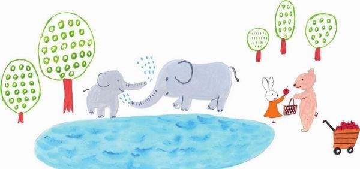

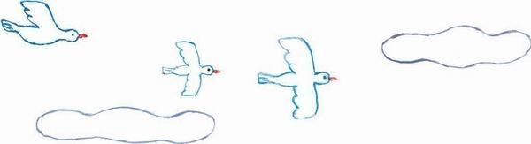

同样的景色，同样的事情，会在不同人的心中产生截然不同的感受。有些人会觉得分外幸福，有些人却一点感觉都没有。以“吃饭”为例吧。有人从不把吃饭当回事，可有些人每吃一口都要细细品味，还要大发感慨：“今天的番茄真是太棒了，现在一定是番茄最好吃的季节!”对这两类人而言，花在“吃饭”这件事上的时间有着迥异的价值。每个人每天可以支配的时间都是24个小时，但是我们感知幸福的方法，可以让一天变得很长，也可以上一天变得很短。

幸福与否，看的并不是“你处于怎样的状态”，而是“你有怎样的感受”。

还有一点，请大家务必牢记：看似痛苦与悲伤的经历，也是通往幸福的垫脚石。有低谷才能有高潮，不经历风雨，怎能见彩虹？克服困难时品尝到的成就感，跨过悲伤与寂寞而实现的成长，都有着不可替代的意义。

然而，你要是不能用积极的心态去看待这些，就会变成一个彻头彻尾的倒霉蛋。无论身处怎样的境遇，都要坚持追求幸福。这样的精神不仅是我们的心灵支柱，更是我们骄傲的资本。

我们不应该让自己去迎合周围的环境，也不应该把自己硬塞到世人所谓的“幸福”的条条框框里。我们应该以自己的幸福为重，主动去选择适合自己的活法和环境。

怀着孩童般的好奇心，积极享受人生吧!为别人带去喜悦，丰富自己的精神世界吧!摸清自己的兴奋点，尽情感受幸福吧!

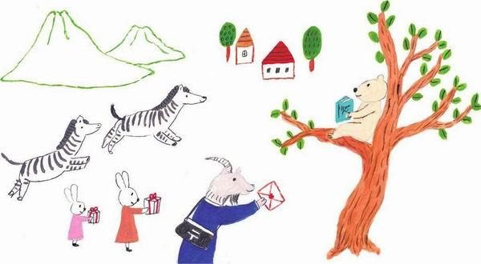

能做自己喜欢做的事，是莫大的幸福。

广交朋友，朝着目标大步迈进，

为实现梦想而欣喜，感受自己的成长，

感恩，尽兴，享受乐趣……

其实，我们身边沉睡着许许多多幸福时间的种子。

“幸福时间”小贴士

放松心情

在工作与人际交往中，我们的身心难免会处于紧张的状态。但我们应该在日常生活中尽量留出能让心灵自由舒展的时间。吃饭、睡觉、散步、泡澡、哈哈大笑、感受四季……不用做什么特别的事情，学会把握生活中的小瞬间就够了。小小的幸福，也能让我们的生活更精彩、更丰富，让我们带着更充沛的活力步入明天。

人绝不会在放松的时候产生负面情绪。朝着目标大跨步迈进时自不用说，遭遇坎坷的时候，我们也能通过“放松”来为自己补充能量。

沉浸在喜欢的事情里

如果一个人能找到一件他特别喜欢做的事，为之废寝忘食，那我们就可以说，他是一个“幸福”的人。工作、学习、兴趣爱好、喜欢的人……只要能有一件事让自己沉迷其中，人就会意气风发，充满活力，过得特别充实。有资本“沉迷”的人，在谁的眼中都会充满魅力。他们拥有无穷的能量，再繁杂的事都能应付自如。

我们不用逼自己去找“喜欢做的事情”，只需要怀着轻松的心情，尝试一下感兴趣的新事物，或是在过往的经历中找找线索……不知不觉中，你也许就会沉浸其中了哦。

与重要的人共度

与亲朋好友共度的时光，能为我们带来无可替代的精彩。一个人也能感受到幸福，但要是身边能有人和你一起庆祝，喜悦自然会翻倍。“重要的人”，不仅限于和你有血缘关系的人。心灵相通，拥有共同的目标，能相互鼓励的人，对我们也有极为重要的意义。

没有一个人能独自活下去。我们都需要他人的支持。爱、感谢、宽恕……这些幸福，只有在与他人的互动中才能感受得到。对我们而言，这些小幸福也必不可少。

为他人带去喜悦

自己的努力为他人带去了喜悦—这能为我们带来难以言喻的充实感。毕竟，“得到他人的认可”是一种莫大的喜悦，更能为我们注入巨大的动力。即便你起初是在“为别人做”，但是看到他人开心的模样，你自己也会高兴起来。如此一来，你就更容易把好事坚持下去了。

为他人带去喜悦，能让我们深刻感受到自己在社会中承担了一定的职责，也能加固人与人之间的感情纽带。“我也能帮上别人的忙!”能这么想，不就是最大的幸福吗？

# 后记

光从形式看的话，所谓的“日常生活”，就是用吃饭、睡觉、工作、人际交往等活动填满每一天的时间。但我们也可以在普通的日常生活中感受小小的喜悦，追求小小的讲究，品味小小的成就感。如此一来，生活就会大放异彩了。

司空见惯的风景，也是无时无刻不在变化。即便是每天都在做的事，也是一天一个样。

人生，是一个不断积淀，不断变化的过程……只要这么一想，你就会觉得生活中的每一件事都有它的意义，而你也会更加期待人生的成熟。

我们生活在一个未来叵测、矛盾重重的时代。今时今日，我们所需要的不仅仅是遥远的希望，还有在理所当然的日常生活和自己身上发现价值的技巧。不依附于他人，不随波逐流，用自己的力量，为自己谋幸福，坚定不移地走好自己的路。

为了追寻最适合我的“简而美的生活”，我一边摸索，一边调整自己的日常生活。多亏了大家的鼎力相助，我才能把自己的想法归纳成这本书。对我而言，这可是意料之外的喜悦。虽然写书还挺难为情的，但这个过程也充满了乐趣，因为我对自己有了全新的发现与认识。我深刻地感觉到，所谓生活，就是“认识自己”的过程，也是“创造自己”的必经之路。

衷心希望本书的每一位读者都能过上快乐舒心的极简生活，都能尽情享受精彩纷呈的人生，朝着自己的人生目标迈进!

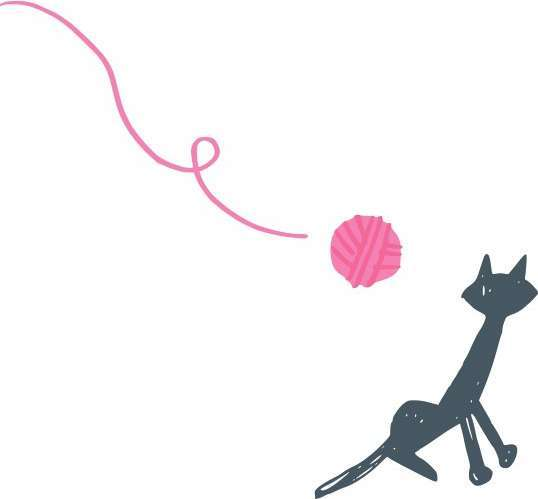

\

【更多得到系列图书、订阅专栏、喜马拉雅付费资源分享微信：boksharer，本书仅供学习，请勿他用】

