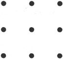
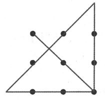
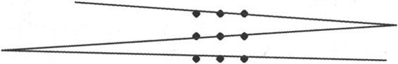

<svg xmlns="http://www.w3.org/2000/svg" xmlns:xlink="http://www.w3.org/1999/xlink" version="1.1" width="100%" height="100%" viewbox="0 0 529 751" preserveaspectratio="none">

<image width="529" height="751" xlink:href="cover.jpeg"></image>
</svg>

目　录　CONTENTS

<a href="#part0005.html" class="calibre1">第一章　改变暗示就能成功</a>

<a href="#part0005.html_mllj1"
class="calibre1">重点在于把自己想成胜利者</a>

<a href="#part0005.html_mllj2" class="calibre1">你可以成为更好的自己</a>

<a href="#part0005.html_mllj3" class="calibre1">拒绝消极意识的植入</a>

<a href="#part0005.html_mllj4" class="calibre1">小心“标签效应”</a>

<a href="#part0005.html_mllj5" class="calibre1">让自己“被”亿万富翁</a>

<a href="#part0005.html_mllj6" class="calibre1">性格是暗示叠加的结果</a>

<a href="#part0005.html_mllj7" class="calibre1">恐怖的黑色暗示</a>

<a href="#part0005.html_mllj8"
class="calibre1">掌握一些实用的心理暗示术</a>

<a href="#part0006.html"
class="calibre1">第二章　话不在多，全凭怎么说</a>

<a href="#part0006.html_mllj1" class="calibre1">负面的话要正面说</a>

<a href="#part0006.html_mllj2" class="calibre1">“想要”不如“一定要”</a>

<a href="#part0006.html_mllj3" class="calibre1">自信力最能成就人</a>

<a href="#part0006.html_mllj4" class="calibre1">剔除“不可能”</a>

<a href="#part0006.html_mllj5" class="calibre1">避免消极字眼</a>

<a href="#part0006.html_mllj6"
class="calibre1">错不在你时坚决不说“对不起”</a>

<a href="#part0006.html_mllj7"
class="calibre1">肯定的语气能让事实完全改观</a>

<a href="#part0006.html_mllj8" class="calibre1">急事更要慢说</a>

<a href="#part0007.html"
class="calibre1">第三章　改变环境胜过强求自己</a>

<a href="#part0007.html_mllj1"
class="calibre1">如果可以，真的不要“宅”了</a>

<a href="#part0007.html_mllj2"
class="calibre1">音乐会消除你的消极情绪</a>

<a href="#part0007.html_mllj3" class="calibre1">活着就要懂得挥霍时间</a>

<a href="#part0007.html_mllj4" class="calibre1">别做乱“室”佳人</a>

<a href="#part0007.html_mllj5" class="calibre1">多看笑话就会笑</a>

<a href="#part0007.html_mllj6"
class="calibre1">别做“懒羊羊”，要当读书郎</a>

<a href="#part0008.html" class="calibre1">第四章　让行动实现心动</a>

<a href="#part0008.html_mllj1" class="calibre1">要坐就坐第一排</a>

<a href="#part0008.html_mllj2" class="calibre1">忙起来就不烦了</a>

<a href="#part0008.html_mllj3" class="calibre1">必须有勇气正视别人</a>

<a href="#part0008.html_mllj4" class="calibre1">“暴”走使人精神愉快</a>

<a href="#part0008.html_mllj5" class="calibre1">想专注就记笔记</a>

<a href="#part0008.html_mllj6" class="calibre1">抖动身体能抖擞精神</a>

<a href="#part0008.html_mllj7" class="calibre1">Take
care，别让小动作出卖你</a>

<a href="#part0008.html_mllj8"
class="calibre1">神奇的小物件令你临场不怯场</a>

<a href="#part0009.html" class="calibre1">第五章　给自己注入快乐基因</a>

<a href="#part0009.html_mllj1"
class="calibre1">你怎么装，心情就怎么改变</a>

<a href="#part0009.html_mllj2" class="calibre1">懂得原谅才是真爱</a>

<a href="#part0009.html_mllj3"
class="calibre1">爱生气只能证明自己愚蠢</a>

<a href="#part0009.html_mllj4"
class="calibre1">面对失败，更得风度翩翩</a>

<a href="#part0009.html_mllj5"
class="calibre1">失去的当做礼物，眼前的才叫幸福</a>

<a href="#part0009.html_mllj6"
class="calibre1">腾不出时间来休息，迟早会腾出时间来生病</a>

<a href="#part0009.html_mllj7"
class="calibre1">凡事往好处想就会看到希望</a>

<a href="#part0009.html_mllj8" class="calibre1">什么事让你最不安</a>

<a href="#part0009.html_mllj9" class="calibre1">我们都是成功者</a>

<a href="#part0009.html_mllj10" class="calibre1">靠明天活着</a>

<a href="#part0010.html"
class="calibre1">第六章　平息别人的气场，秀出最好的自己</a>

<a href="#part0010.html_mllj1" class="calibre1">这样做别人才重视你</a>

<a href="#part0010.html_mllj2"
class="calibre1">你不是人民币，无法让每个人都喜欢</a>

<a href="#part0010.html_mllj3" class="calibre1">别在意别人的负面评价</a>

<a href="#part0010.html_mllj4" class="calibre1">指责别人前先反省自己</a>

<a href="#part0010.html_mllj5" class="calibre1">每个人都值得学习</a>

<a href="#part0010.html_mllj6"
class="calibre1">无能与无所不能的距离只有0.001毫米</a>

<a href="#part0010.html_mllj7" class="calibre1">主动融入别人的圈子</a>

<a href="#part0010.html_mllj8" class="calibre1">气场一定要足</a>

<a href="#part0010.html_mllj9" class="calibre1">找个优秀的冤家去PK</a>

<a href="#part0011.html"
class="calibre1">第七章　眼界决定高度，行动成就深度</a>

<a href="#part0011.html_mllj1"
class="calibre1">心动就要行动，想到立马做到</a>

<a href="#part0011.html_mllj2"
class="calibre1">计划不是万能的，没有计划是万万不能的</a>

<a href="#part0011.html_mllj3"
class="calibre1">别安于现状，何况现状并不理想</a>

<a href="#part0011.html_mllj4"
class="calibre1">你可以不伟大，但不可以没有责任心</a>

<a href="#part0011.html_mllj5" class="calibre1">越困难越要有激情</a>

<a href="#part0011.html_mllj6" class="calibre1">有一种失败叫穷忙</a>

<a href="#part0011.html_mllj7" class="calibre1">信赖别人，依赖自己</a>

<a href="#part0011.html_mllj8"
class="calibre1">把所有时间变成“优质时间”</a>

<a href="#part0011.html_mllj9"
class="calibre1">有为才能有位，有位更要有为</a>

<a href="#part0011.html_mllj10" class="calibre1">有魄力放弃眼前利益</a>

<a href="#part0012.html" class="calibre1">第八章　缩短心距，扩大交际</a>

<a href="#part0012.html_mllj1" class="calibre1">努力喜欢每个人</a>

<a href="#part0012.html_mllj2" class="calibre1">积极地肯定别人</a>

<a href="#part0012.html_mllj3" class="calibre1">让人感到自己的重要</a>

<a href="#part0012.html_mllj4" class="calibre1">“长”见面不如“常”见面</a>

<a href="#part0012.html_mllj5" class="calibre1">对人不能“好”过度</a>

<a href="#part0012.html_mllj6" class="calibre1">让权威人物帮你说话</a>

<a href="#part0012.html_mllj7"
class="calibre1">人前人后都说他人的好话</a>

<a href="#part0012.html_mllj8" class="calibre1">站在他人的立场</a>

<a href="#part0012.html_mllj9"
class="calibre1">不断制造“自己人”的感觉</a>

<a href="#part0013.html" class="calibre1">第九章　用暗示掌控别人</a>

<a href="#part0013.html_mllj1"
class="calibre1">发张“好人牌”，暗示其应做好事</a>

<a href="#part0013.html_mllj2"
class="calibre1">成事之前借“神”力为自己造势</a>

<a href="#part0013.html_mllj3" class="calibre1">靠名人成名</a>

<a href="#part0013.html_mllj4" class="calibre1">提醒对方欠自己人情</a>

<a href="#part0013.html_mllj5"
class="calibre1">贩卖希望，暗示此事值得做</a>

<a href="#part0013.html_mllj6"
class="calibre1">迫使他当众承诺，接受监督</a>

<a href="#part0013.html_mllj7"
class="calibre1">玩玩“帽子戏法”，暗示人主动辞职</a>

<a href="#part0013.html_mllj8" class="calibre1">给他一个好头衔</a>

<a href="#part0014.html" class="calibre1">后记</a>

作者简介

宋可力　心理学、成功学研究者，尤其深入研究自我暗示、自我催眠等心理学分支，深信改变自我暗示就能改变人的命运。曾出版《20几岁懂点心理学》《心理揣摩术：最实用的人际关系谋略》《人际交往中的心理策略》等作品。

\

\

\

一分钟改变自己

三分钟操纵他人

\

\

\

气场心理学

\

\

**宋可力◎著**

\

\

自我暗示的力量

\

\

\

\

\

**版权专有　侵权必究**

------------------------------------------------------------------------

**图书在版编目（CIP）数据**

气场心理学：自我暗示的力量／宋可力著．

北京：北京理工大学出版社，2011.7（2011.11重印）

\

Ⅰ．①气…　Ⅱ．①宋…　Ⅲ．①自我暗示-通俗读物　Ⅳ．①B842.6-49

\

中国版本图书馆CIP数据核字（2011）第092620号

------------------------------------------------------------------------

\

\

------------------------------------------------------------------------

出版发行／北京理工大学出版社

社　　址／北京市海淀区中关村南大街5号

邮　　编／100081

电　　话／（010）68914775（办公室）68944990（批销中心）68911084（读者服务部）

网　　址／http://www.bitpress.com.cn

经　　销／全国各地新华书店

印　　刷／三河市金元印装有限公司

开　　本／700毫米×1000毫米1/16

印　　张／18

字　　数／220千字

版　　次／2011年7月第1版　2011年11月第2次印刷

责任校对／陈玉梅

责任印制／边心超

------------------------------------------------------------------------

图书出现印装质量问题，本社负责调换

序　言

**我知道你是怎样被暗示的**

\

\

\

现在，停下你手头的工作，放下你正在喝的咖啡、奶茶、果蔬汁，关掉你在听的音乐。坐下来，放松，放松，再放松，做几下深呼吸，慢慢感受周围的安静。然后，全神贯注地往下看！

我们先来做几个有趣的小游戏，别走神，注意，请专心地去思考我说的题目。这是我见过的最诡异的心理暗示测验了，几乎无人能逃过。请认真地、快速地用心做这个测验，看清要求，说出第一时间脑海中闪现出的那个答案，这样才更显出这些题的神奇！

请快速回答：

2＋2＝？

4＋4＝？

8＋8＝？

16＋16＝？

请随便在12到5的中间挑一个数字！

……

你挑的数字是“7”，对吧？

别琢磨这个答案了，现在继续：

1＋5＝？

2＋4＝？

3＋3＝？

4＋2＝？

5＋1＝？

在心中反复默念“6”这个数字持续15秒，快！想一个蔬菜的名字！

……

你的答案是大白菜，对吧？据说，98％的人会想到大白菜。如果不是，那么你属于那2％里的人。

继续做下列算术题吧：

15＋6＝？

3＋56＝？

89＋2＝？

12＋53＝？

75＋26＝？

25＋52＝？

63＋32＝？

123＋5＝？

还是默念“6”这个数字持续15秒，快！说出一种水果的名字，说出一个面部器官，说出一种家禽的名字。

快！快！

……

哈哈，是苹果、鼻子、鸡，对不对？

\

我猜中了几个？当看到答案和你的很多都吻合时，你会不会惊讶好久，觉得简直像遇见了鬼？你可能认为这些东西是编出来的，或是进行了大量的调查，最终统计而来的结果。

你错了。

想想看，人的内心是最琢磨不透的。我们刚做的这些题只是很少的一部分，现在各大网站、杂志都有很多类似的心理测试，难道每一个都有人进行了大量的统计工作？显然这是不现实的。那么，又该如何解释呢？

还是让我来揭开谜底吧！这可归结为心理暗示的作用。它是人或环境以非常自然的方式向个体发出信息，个体无意中接受了这种信息，从而作出相应反应的一种心理现象。生活中，我们每时每刻都在接受各种暗示，并受到一定影响，尽管你可能没有意识到这一点。有时即使是很坚强、很有主见的人，在特定环境和事物中也可能会被“暗示”所左右。小品《卖拐》形象地道破了“心理暗示”对人的影响：范伟腿脚正常，却在赵本山的暗示下，真的相信自己腿瘸。这说明暗示不是“神马浮云”，而是能真真切切发生在我们身上的一种现象或反应。

你可能也有过这样的经历：本来你做了一个发型，感觉很好，可周围的人却都说不好看，慢慢地，你也觉得这个发型真的不好了。再如，追求成功时，你会设想达到目标时异常美好，这个愿景就对你构成了一种暗示，为你提供源源不断的动力，提高你的挫折耐受能力。这些都是心理暗示在起作用。

再看一道FBI招工测试题：

有个人住在10楼，每天他会乘电梯下到大堂，然后离开。晚上，他会乘电梯上楼，如果有人在电梯里或者那天下雨，他会直接坐到他的那层。否则，他会坐到第7层，然后再走3层到他的公寓。你能解释这是为什么吗？

看到这里，是不是立刻怀疑这个人是心理变态，喜欢跟踪别人。随即你会否定这点，因为题目没有指出此人有何行动结果。那么，他是不是为了锻炼身体才坐到第7层，然后再走3层到他的公寓？可是，为什么下雨天和有人的时候，他不再锻炼了呢？

显然，这绝非破案题。那么，我们不妨充分发挥想象力，暗示那个人就在跟前。他住10楼，能顺利地从电梯到大堂，上去的时候，如果是自己，他只能做到7层，为什么不直接按到10层呢？

如果身旁有人，他也能坐到10层。会不会是身边人能帮助他呢？既然他需要帮助，说明他身材矮小，够不着10层的电梯按钮。电梯里的电钮都是按照从低到高的顺序排列的，10层的按钮必定高于7层的按钮，他只能按到7层的按钮。这就解释了为什么他独自一人时，必须从7层走到10层。能走就说明他的腿脚没毛病，只是他不是一般的矮。不是一般的矮？对，他是侏儒。同理，下雨天有雨伞的帮助，他也可以直接按到10层的按钮。

你想到了吗？其实题目中的任何一个词都为你布置了一个场景，你需要不断地暗示自己以找出更多的信息来。暗示有引导的作用，但有时也会误导你。

现在，我们回到开始的那些测验，看看你是如何受到暗示的。测试开始，是一连串的简单加法，它们并无太多含义，只为给你的第一直觉加速，它起到的作用是一种极浅层次的催眠，而我们的自我意识在不断计算数字的过程中慢慢被打散，全神贯注于测试本身，于是思维被测试题的编写者所蒙蔽。

“随便在12到5的中间挑一个数字！”表面上编者在说“随便”挑，但是我们的眼睛看到了“中间”这个词，按理说位于12和5正中间的数字应该是8或9，奇怪的是，大多数人第一反应是什么？居然是7！你是不是也这样呢？和答案一样后，我们不禁开始感叹这套测试的神奇，更加为编者的思维所左右。大白菜是人们日常生活中最普遍的蔬菜，所以98％的人最先想到的就是大白菜！其余的几个，苹果、鼻子、鸡也都是人习惯性想到的。当你被测试答案震惊时，你可能会张大嘴巴说：“怎么这样神奇？与我所想的完全一样！”这也是一种心理暗示，你也会跟周围的人说这个测试的诡异。如果你的答案不是这些，别忘了它还有一个应付不准确的退路哦，就是那2％的人。

其实跟魔术一样，点破了也没什么奇怪的，这个测试利用的是心理暗示，让你在无意识的情况下，按照习惯作答。我们就是这样中招的。

看到这里，你可能恍然大悟，原来这本书旨在揭穿心理暗示的障眼法。对不起，亲爱的读者，你又错了！

我是想和你谈谈“心”。我们的生活境遇都差不多，既不是一无所有，一切糟糕；也非什么都好，事事如意。但是，为什么有人成功，有人失败，有人欢喜，有人愁呢？我发现，一个人习惯于在心理上进行怎样的自我暗示，与他的贫与富、成与败之间有密不可分的关系。心理暗示是个心魔，它能让我们的世界成为一座天堂，也会让它成为一座地狱。积极的暗示能激发潜能，消极的暗示会阻碍人正常能力的发挥，甚至影响到生命的质量。可以说，我们一切的成就，一切的财富、快乐，都始于一个意念。

看到这里，你可能会甩出一些词，诚如小题大做、危言耸听，以表示自己的不屑和不敢苟同。

这次，你又错了。

诚然，暗示的力量不可小窥，我若说它有起死回生的作用，便是夸大了它的威力。神奇的，其实是我们自己，有怎样的暗示，就决定你有怎样的力量。希望你的每一时日，都能藉由正确的、积极的暗示方式，过得越来越好。

\

宋可力

2011年4月于北京

第一章　改变暗示就能成功

人与人之间本来只有很小的差异，但这很小的差异却往往造成巨大的不同！

在这句话里，巨大的不同就是一个人的人生是成功、幸福，还是平庸、不幸，而原本很小的差异就是凡事所采取的心理暗示的不同。

人最大的力量不是来自于生理和身体，而是源于心理暗示。你给自己怎样的暗示，就能收获怎样的人生。

重点在于把自己想成胜利者

人最大的力量不是来自于生理和身体，而是源于心理暗示。这种力量是最强大、最神秘的，且潜力无限。因此，你要敢于探索它。有时只需一句话，就可影响一个人的感受，改变人一生的走向。你若不信，我们就来见识一下。

你知道美国纽约州历史上第一位黑人州长是谁吗？他叫罗杰·罗尔斯。他出生在声名狼藉的大沙头贫民窟。那里肮脏龌龊，充斥着暴力，在那儿长大的孩子多不学无术，整天游手好闲、打架斗殴，甚至吸毒。但罗尔斯是个例外——他不仅考上了大学，还成为了州长。

有记者曾问他成功的原因，罗尔斯没有提及自己的心酸奋斗史，而是说了一个非常陌生的名字——皮尔·保罗。

后来人们才了解其中的秘密。原来，保罗是罗尔斯的小学校长。保罗发现这所学校的孩子不好好学习，便尝试着用很多方法引导他们，可收效甚微。一个偶然的机会，他听说这个地方的人比较迷信，于是他在上课的时候就多加了一项内容——给孩子们看手相。

一天，淘气的罗尔斯从窗台上跳下来，伸出小手走向讲台，保罗对他说：“我看你修长的小拇指就知道，将来你肯定是纽约州的州长。”这句话很雷人，但罗尔斯却从那天起，将这句话默默地铭记在心，他时时把自己当做“纽约州长”，按照一个州长的标准严格要求自己、完善自己。51岁时，他终于如愿以偿了。

有位名人说过：“生动地把自己想象成失败者会使人不能取胜，生动地把自己想象成胜利者将带来无限的成功，伟大的人生始于你想象中的图画——你决定要成为什么样的人，或是被他人暗示成什么样的人，意志或者说动机的驱动力就会使你做那样的事情，成为那样的人。”罗尔斯本是块朽木，但保罗的暗示让他发生了神奇的变化，竟然让他从平民到州长，演绎了草根传奇。

这说明，暗示是成功不可或缺的引子。这不是一个悬念，也并非迷信，而是另类科学。是的，科学家的实验也证明了这一点：

科学家进行了一项实验。他们把水平相当的篮球运动员分成3个小组，告诉第一个小组的队员停止练习，自由投篮1个月；第二个小组的队员在1个月中，每天下午在体育馆练习1小时；第三个小组的队员在一个月中每天在自己的想象中练习1小时投篮。1个月后，三组队员进行了投篮考试，结果：第一组投篮水平下降2％，第二组投篮水平上升2％，第三组投篮水平上升4％。

这是怎么回事？为何想象中的练习比真正的练习的命中率还高呢？你一定很费解，其实，原因很简单，因为在想象中，所投的每一个球都是中的！这就是积极暗示心理的奇妙之处。

有句话在无数的励志书中出现，这句话就是：“人与人之间本来只有很小的差异，但这很小的差异却往往造成巨大的不同！”在这句话里，巨大的不同就是一个人的人生是成功、幸福，还是平庸、不幸，而原本很小的差异就是凡事所采取的心理暗示的不同。

不要轻易否定自己，多给自己一些积极的暗示，大脑就会活络起来，会产生连自己也意想不到的力量。所以说，要改变自己，先从心理暗示下手。

第二次世界大战时，前苏联一位天才的演员N·H·毕甫佐夫，有口吃的缺陷，但奇怪的是，只要一站在台上，他就会口若悬河。这是怎么回事呢？原来，他用了积极的自我暗示，每次上台，他都反复告诉自己，在舞台上的不是他，是某某（剧中人物），而这个人说话并不结巴。经过不断的自我暗示，他终于成功了。

李嘉诚在谈及自己的成功时说，他最开始的想法是：“我一定要出人头地。”他明白没有人可以帮助自己，自己必须赤手空拳闯出一条路来。就是凭着相信自己、鼓励自己，他创造了自己的事业大厦。

美国知名的篮球教练伍登，曾在12年内赢得了10次全国总冠军，被人们誉为美国有史以来最伟大的篮球教练之一。他的成功哲学是：不断对自己进行正面的、积极的自我暗示。每晚睡觉前，伍登一定会告诉自己：“我今天的表现棒极了，明天还要努力，表现得比今天更好。”

连大发明家爱迪生也深信暗示的力量，他曾在工作日志上写道：“我相信自己会成功的，我知道自己一定行，我会发明电灯的！”在坚持了上万次的实验之后，他终于成功研制出了世界上第一盏电灯！

看了这么多，你会发现上述成功人士都有一个共同点，就是没有成功之前就暗示自己已经成功了，或相信自己一定能够成功。环顾周围，那些平庸的大多数人却只是希望自己有一天也会成功。这是两种完全不同的暗示，自然会产生完全不同的结果。

如果你觉得自己不是成功人士，那么，请回答下面几个问题：

成功者是能力比你强、学历比你高，还是家庭背景比你好？

为什么同样的经历、相仿的年龄，业绩相差那么大？

为什么同样的公司背景、同样的企业文化、同样的激励制度，而业绩却不同？

除了机遇、能力等因素外，你是不是经常自甘堕落，自甘失败，自甘平庸，而很少给自己注入积极的心理暗示？

我们常说：“种豆得豆，种瓜得瓜。”同样，在思维里种下怎样的暗示种子，你就会处于一种怎样的状态。积极的心理暗示能把不自信变成自信，把自信变成自信满满，而消极的心理暗示则会让你失败。如果你将“放弃”“不可能”“办不到”“没法子”“有问题”“行不通”“没希望”等当做口头禅，就是给自己定了型，就是认了命，不顺的事情自然而然就产生了。

时刻用积极的暗示鼓励自己，像李嘉诚、伍登、爱迪生那样常对自己说：“我是最好的”“我是最棒的”“我一定能”，这种暗示会产生强大的原动力，进而产生一种非成功不罢休的执著。

没有人知道未来会如何，但面对困难，可以输给对手，也可以输给环境，但决不可以输掉信念，输给自己！心理暗示可能值不了多少钱，但只要你坚持下去，它就会迅速升值。

延伸阅读

相信你一定常听到这样的对话：“我不能喝茶，它会让我晚上失眠”“我不能吃韭菜，它会让我拉肚子的”“我不能坐飞机，会吐”。事实上，这些并非身体的真实反应，而是你输入潜意识的程序。一旦你置身于这些环境，你的身体会立刻随潜意识启动这些程序，接下来，自然出现“你所预料的”反应。相信或不信，要或不要，都由你决定，一旦你的大脑接受了指定暗示，那么它就将结果演给你看。

互动游戏

你会积极地暗示吗？我们来做个小测验吧：

在一间房子里，你会在墙上挂什么？

A．挂画

B．挂照片

C．挂年历月历

D．挂钟

解析：

A．你是个讲究生活情调的人，非常重视人际感情，尤其是亲情和爱情。你想过一种有品位的生活，你最大的自信，就是能妥善地安排好自己的工作和生活。

B．你看重尊严、着装、家庭背景、学历，期望通过这些能得到他人的肯定，获得更多的自信和满足。

C．你的自信来自于自己的能力和表现。

D．你对自己在规划做事和提高行事方法上很满意，是个很好的策略性人物，尤其对重要事件，从来都不会马虎。

你可以成为更好的自己

每天，闹钟6:20准时响，你起床、刷牙、洗脸，出门。你挤上了满罐似的公共汽车，或是在站台上焦急地等车，算计今天会不会迟到，犹豫着要不要打车。到公司后，一看还算准时，你长长地舒口气，之后又算计着还有几个小时能下班回家。你觉得工作是个很“杯具”的词，你很失望，很反感，同时，你还不得不这样过下去。

——难道你就这样过一生？未来的几十年，麻麻木木，浑浑噩噩？

太多的人觉得自己很失败，恨自己没用，感觉浮躁、焦虑、索然和忙乱，感到困顿、无望甚至是毁灭，但这绝对不是他想要的生活。尽管他们的思想也会随着种种“现实的无奈”发生转移和变化，但若没人逼迫他们，他们就会安于现状。虽然他们也曾吵着要辞职，却一直拖拖拉拉。他们不想改变，却又对现实充满绝望。他们做梦都想过上富足的生活，也会买几本励志书看，也会照着书中所写的那样采取行动，但仅仅三五天之后便又跟从前一样了。

他们整天幻想着自己能过另外一种生活，盼望着哪天中了彩票，或是有某个重要的家伙能提携他们，视他们为左膀右臂，将他们提拔为公司的CEO。这并非没有可能，我们说不上什么时候会遇到贵人，但这种被动的等待可能会耗尽一个人一生的光阴。

也有一部分人，明明得到了自己想要的，过着连好哥们儿都眼红的好日子，却仍然感觉不安和空虚。

“我到底是谁”“需要什么”“追求什么”，对于这三个问题，那些陷于困顿生活的人多会思索良久后发出一声叹息。

如果你也是“他们”中的一分子，希望你能静下心来，花点时间思考和梳理，不要让内在的“小我”搅乱未知的潜意识。人生的征程，最糟糕的境遇往往不是贫困，不是厄运，而是精神和心境处于一种无知无觉的疲惫状态。看到这里，也许你在心里说：“我又能怎么样呢？怎么改变也还是老样子！再说，我做出努力之后，到底能改变多少？情况又会好到哪去呢？还不是一个难题克服掉了，更多的难题相继而来？”

不要继续发牢骚了，也别幻想贵人的相助了，那些都不现实。你若真的希望有所改变，先从改变暗示开始。每个人的心中都潜藏着另一面，可能与现在的你有着很大的不同。有很多人一辈子都没有遇见另一个自己，而另外一些人正是经由不断地发现和反省，唤醒了沉睡的潜意识，实现了人生的大不同。

你是不是也对现在的自己不满意？

也许现在的你是人见人不爱，你想要的那个你则是人见人爱。

也许现在的你备感生活乏味，你想要的那个你则是逍遥自在，远离办公室生活，可花一年或足够长的时间周游世界，行游天下。

也许现在的你身未老，心先衰，你想要的那个你则是永远青春四射，活力无限。

好吧，既然你想改变，那还等什么？只要你掌握暗示及自我暗示的规律就可以建立自己的信念，你完全可以看到更美丽的风景，过更不一样的生活，经历更神秘的未知世界，邂逅另一个自己。

这样的例子不胜枚举。玫琳，原来不好打扮，说话做事大大咧咧，俨然一个男孩子。毕业两年后的一次同学聚会上，她的出现让同学们大吃一惊，昔日的“俗女”美似天仙，言行举止也温文尔雅，一点儿也看不到过去的样子了。私下里同学们问她何以出落成现在这样的，她说：“原来我的行事风格像个假小子，后来，我也发觉自己在生活上对自己不够精心。于是开始研究护肤品、化妆品，了解每一季的服装流行趋势，顺其自然地对品牌了如指掌。慢慢地，自己女性化的特质越来越丰富，这让我每天都很开心。”接着，她又说：“我并没有否定以前的自己，只是发掘了隐藏在内心深处的自己的另一个侧面。”

玫琳在觉察到自己的言行不妥之后，想要换一个形象出现在众人面前，经过细心地钻研，她终于做到了。你呢？你的烦恼可能不是穿衣打扮、培养气质，但只要有坚定的信念，只要稍作改变，你的人生就会大不相同！我们再来看看张宇樵的经历吧。

他是一家公司的CEO。他小时候身体羸弱，因此常对自己没有信心，怕上体育课，不敢接受好友一起打篮球的邀请。直到有一天，他遇到了一位好老师。老师对他说：“我发现你经常给自己一个错误的暗示。可是孩子，你不知道，你认为自己很软弱，那么你就会变得越来越软弱。其实，你是一个非常强壮的孩子。”听到这里，他用充满疑惑的目光看着老师说：“老师，我怎么会是强壮的孩子呢？”老师让他立正站好，要他在脑海中想象自己很强壮，相信自己任何事都能做到，接着做收腹、挺胸的动作，然后暗示自己开始执行。当他按照老师的话做完一次后，忽然全身充满了力量。如今，他依然活力十足，身体也比同龄人健壮。

人生无法臆测，也难以捉摸，无论身处力争上游的快跑阶段，或逢人生变故减速慢行的彷徨时刻，或是看尽千山万水、绚丽归于平淡的踌躇关头，你都要利用自我暗示的力量，相信命运掌握在自己手中，就像上述两例中的主人公一样。如此，你就会唤起内在的勇气与活力，感觉到身上的一股潜在能量正隐隐发威，这种暗示在潜移默化中影响着你的精神面貌，激发着你的潜能，让你能够真正地超越自己，提早看到那个理想中的自己。

延伸阅读

心理学家弗洛伊德把人的心理分为本我、自我和超我3个层次。

本我即原我，是指原始的自己，它包含着人最基本的需要，这种需求的欲望往往与社会道德冲突。

自我指“自己”，是自己可意识到的执行思考、感觉、判断或记忆的部分，它遵循的是“现实原则”，为本我服务。

超我是人格中的良知部分。它的特点是追求完美，大部分也是无意识的，它要求自我按社会可接受的方式来满足本我，它所遵循的是“道德原则”。

它们各自代表了人格的某一方面，本我是生物本能我，自我是心理社会我，超我是道德理想我。当三者处于协调状态时，人格表现出一种健康状况；当三者互不相让，关系敌对时，就会产生心理疾病。

互动游戏

这道心理测试题能让你了解自己——用你的潜意识告诉自己最在乎什么，最想得到什么。现在，我问你，假如你被超强的龙卷风卷了一天一夜之后，你认为自己会被甩到什么地方？

A．被挂在大树上

B．破损的住宅区

C．无人的沙滩上

D．公园的草地上

解析：

A．你很好玩，感到自己还是孩子般的心态，工作、爱情均无法稳定下来。

B．你事业心太强，想出类拔萃，做个职场的“杜拉拉”。

C．你很多情，在你眼里，每个异性都有优点，你常周旋在多个恋人之间。

D．你是个顾家的人，在你看来，找个自己所爱的人，好好地过日子，哪怕再苦，只要能齐心合力去打拼也是一种幸福。

拒绝消极意识的植入

你有没有过这样的情况：在梦中的时候，会很清晰地知道自己是在做梦，只是还没醒过来？梦到最美好的事时突然醒来，心里有说不出的懊悔？在现实生活中，有时不经意的一瞬间，你会觉得似曾相识？

不知你是否看过科幻大片《盗梦空间》，这个影片讲述的是一个名叫柯布的“盗梦师”，他能趁人进入深睡眠、心智最脆弱的状态下，入侵其潜意识，获取其内心的隐秘。他先和助手阿瑟、纳什进入日本商人齐藤的梦境中，企图盗取他脑中的商业计划，不料被齐藤识破了。但齐藤没有惩罚他们，而是要求柯布等人在梦境中把一个观念植入到竞争对手菲舍的潜意识中，使他的公司解散。他许诺柯布，一旦成功，就可撤销对他的控诉。柯布无奈，答应了齐藤的要求。他和盗梦团队为了给菲舍植入一个简单的意识，穿越了4层梦境。从“普通梦境”到“进阶梦境”，再到“深层梦境”，最后走到了“迷失域”。在经历重重险阻后，他们终于完成了这项任务。

看完这个电影后，你可能不寒而栗，不断问自己：这种意识的植入在现实中存在吗？如果存在的话，我的潜意识有没有被盗梦师柯布那样的陌生人侵入过？我的想法有没有被人篡改过？我的思维还是由我自己主导吗？

你不敢继续往下想，越往下想，你越感到一切是那么不真实，无论是过去、现在，还是未来。这就好像柯布给菲舍植入想法的同时，该片导演诺兰也给我们植入了一个小小的怀疑。

实际上，在现实生活中，意识植入不仅存在，而且无处不在，它丝毫没有你想象中的那么玄妙，只是更加隐秘罢了。我们一块儿回想一下：你小的时候，父母是不是经常跟你说：“好好学习才有出息，才能找到一份好工作，一辈子不用受苦受累”？这句话没什么不好的，可怜天下父母心，哪个父母不希望自己的孩子少些操劳呢？可问题不在这里，问题是这句话给你植入一个什么样的意识！

你想到了吗？

如果从小到大父母经常给你灌输这种理念，你就在不知不觉中被植入一个“你天生就是为别人打工的”这样的意识。

很多意识就是这样潜移默化地植入到我们的思想中的。比如，“别随便相信男人，男人要是靠得住，猪都会爬树！”“现在打着灯笼，也难找到好人！”“你跟同事千万别走得太近了！”这些话，估计各位也听到不少吧。如果诸如此类的潜意识（或称之为暗示）被你吸收了，那么，可想而知，你对爱人、同事以及周围的人是什么态度。

潜意识也并非都是消极的，还有积极的。比如，我们常说潮汕人和温州人有头脑，会做生意。很多潮汕人和温州人不管学历和出身如何，他们就是想做老板，并借此把握住机会获得了成功。

植入某种意识在实际生活中也是有迹可循的，我们经常在谍战片中，看到给某个人催眠或灌入一种药，对方便陷入睡眠状态。此时，有人对他提出问题，他的潜意识就会去追溯当时的情景，并说出答案。

OK，说了这么多，我是想说，每个人都可能在有意或无意中被植入潜意识，可能你现在还在大脑中搜索自己之前被别人植入了哪些暗示。先抛开这些问题，我们还是谈谈意识与梦里谁是谁的“盗梦空间”吧！

心理学家认为，潜意识是梦的灵魂，而梦又是潜意识活跃的媒介。也许潜意识会以“白天的遗留物”的身份进入睡眠中，具有“继发性”。西格尔说：“梦境为我们的潜意识拍了一张X光片，能够展示我们的内心情感和正面临的难题，尤其是当我们处在人生的困难阶段或重要转折期。”现实所表露的，有可能只是自己迫不得已的行为；梦里所呈现的，有可能只是自己一厢情愿的想法。

也有一种梦非常神奇，令人产生灵感。例如，化学家库凯里一直在绞尽脑汁要破解苯的分子结构。一天，他在炉边打盹，梦见一条蛇咬住自己的尾巴，而且得意洋洋地在他面前猛烈旋转。库凯里被惊醒了，此刻一个从未有过的想法出现在他的脑际：苯的分子结构可能是前人未曾想过的封闭环状。后来的研究也证明了他的这一推测是正确的。

梦给各种潜意识一个大展拳脚、不计后果的平等的舞台，也通过某种隐喻的情景启发你现实生活里需要面对的问题。不信你就试试看，当你遇到难题时，把所有的困惑在入睡前写下，你就有可能在梦中找到答案。这种方法实质上是启动了大脑中的分区功能，在睡眠中这些分区仍然在不停地工作，在梦中对问题逐个击破，最后替你找到答案。

如果你想了解自己的梦，不妨在每次睡觉之前，在枕边放一个本子和笔，一旦醒来，就把刚做过的梦详细地记录下来。提醒你一点，在醒来之前先别急着睁开眼睛，可以让自己把梦再仔细地回忆一下。一开始的时候，你只是觉得有趣，相信过不了多久，你会猛然领悟到某个梦给你的暗示。随着记录的不断增加，这样的启示和顿悟也会越来越多，它们会帮助你在日常生活中更好地处理各种关系或者某些特殊事件。

不管梦与潜意识是何种关系，它都能帮助人们去处理和解决内心的矛盾冲突。如果你能绕过意识层面，重新给自己“造梦”，成为自己的“造梦师”，即可开发自己的潜能，或者得到人际关系、处理问题的指导，由此对自己有更深刻的认识，对未来看得更清晰明了。

延伸阅读

心理学家西格蒙德·弗洛伊德在其《精神分析学》理论中首先提出“潜意识”这个概念。在上文中，我们对此有一些解读，在这里再详细地阐释一下。潜意识有6个特征：能量巨大无比；最喜欢带感情色彩的信息；不识真假，直来直去，不打折扣的执行者；比较容易受图像方面的刺激；我们不能觉察到，但只有通过催眠才能开发它。最后一点是，放松时，最容易进入潜意识。

互动游戏

梦到底有何含义，它能给你带来哪些启示呢？那就回忆一下吧。

A．空屋

B．雨

C．画

D．烟筒

E．跳舞

解析：

A．暗示你缺乏爱情。

B．骤雨或大雨，暗示你无法控制自己的情感，有可能陷入狂乱的状态；而适度的雨，暗示你能适度地表达情感。

C．色彩不清的画，暗示你正处于混沌状态；而那些没有色彩的画，则表示你迫于压力，必须强烈地抑制自己的真实感受。

D．若是烟筒冒烟，表明你情感爆发；若只是烟筒，则暗示你没有宣泄的出口。

E．暗示你想摆脱羁绊，对自由充满了向往。

小心“标签效应”

一个棒球手到监狱做演讲，他讲述了自己的成长故事：小时候他第一次玩棒球，一不小心把父亲的牙打流血了，没想到，父亲却夸赞他说：“孩子，你日后肯定能成为一个优秀的棒球手。”第二次玩棒球，他把家里的玻璃打碎了，父亲还是没有责怪他，而是对他说：“打得好，孩子，你将来没准是世界冠军呢！”犯人们听到这个故事窃窃私语，一个犯人站起来说：“我小时的经历与你的一样，只不过我的父亲没有夸奖我，而是气愤地说：‘你一天到晚给我惹事，将来肯定是个小混混！’”

一个人被别人下某种结论，就像商品被贴上了标签，会作出印象管理，按照标签所标定的去塑造自己，使行为与所贴的标签内容相一致。这种现象是由于贴上标签后引起的，故称“标签效应”。同样是打棒球，被给贴上“棒球手”的标签，与“小混混”的标签，会导致不同的心理暗示。

下面例子中小A的故事也发人深省：

小A很爱画画，但有一天老师说他画得不好，没有画画的天赋，于是他便对自己没有了信心，放弃了画画。别人问他为什么，他说：“我画得不好。”后来，再有人问他，他就不耐烦地说：“我向来就画不好。”

类似这样的话我们也听过很多，例如：“这个小孩唱歌不行”“他不会做饭”“他总是胆小”“他跟他父亲一样不喜欢说话”“她总是那样脾气不好”，等等。

你是否也有过这样的经历？小时候，被父母、亲戚、老师贴上标签；长大后，被同事、好友、客户、陌生人贴上标签。在别人给你设定角色的一瞬间，你会不会也投入进去？比如，当你被贴上太多负面的标签时，你的思想、态度很可能也会变得消极。

更令人遗憾的是，我们中的好多人还给自己贴标签，比如说，“我觉得我性格内向”。这种对自我进行描述的词句无所谓对错，甚至可以通过反思使人更好地了解自己。然而，如果使用不当，就可能不利于个人的发展。就像刚才的句子，若是给自己贴上这样的标签，就会不自觉地与人减少交流，进而越来越不善言辞了。

人生实际上就是个不断提高的过程，给自己贴了标签，只会限制自己的发展。对于别人给自己贴上的标签，你要做的就是让自己走出因标签而形成的陷阱，敢于坚持自我。我是谁？我真正喜欢的是什么？我想做什么？我想做“谁”？这就是最简单的“道”。

再说了，即使你接受了别人给你的诸多形容词，你仍是你自己，仍有着自己的悲伤、孤独与喜悦，在这些真实的悲伤、孤独与喜悦到来时，那些从别人手中借用的标签显得多么的荒唐！

怎么做呢？非常简单，运用积极的暗示肯定自己，鼓励自己加以改变。比如，你说自己很一般。那么世界上与你一样的人满街都是，既然这样，你有什么好自卑的？你虽平凡，也至少有一种他人不可及的优势，比如你踏实，不惹事。

你学会了吗？你一定不要用贬义的自我描述，而要用鼓励性话语。如此一来，你就会发现自己没有那么差，你的自卑都是因被贴上这些消极标签造成的。

盲目为自己、他人贴上标签，会让人对事物的态度产生偏差，不要忘了，有的偏差是很严重的，甚至是很致命的。我们必须超越那种贴标签的心理暗示，再不能不加分析地给自己和他人“盖章”了。如果你爱给别人贴负面标签，说明你没事闲得慌；如果你不加过滤地接受他人给你的消极标签，那么你很有可能会被标签“效应”一把。

延伸阅读

你喜欢被贴标签吗？自然，要是正面的，如“漂亮”“帅”“聪明”等褒义词，你会欣然接受，如果是像“暴躁”“小气”等贬义词，你定然不想承认。你是不是经常问周围的人：你觉得我这个人怎么样？对方也许会说，你善良、大方、善解人意等。这时，你十有八九会纠正道：“其实也不全是这样，有时候我……”

怎么样？被人贴标签不太爽吧。因为这个标签简化了你，只表明了你的某个特性，或是误解了你。你觉得现实中的自己还要丰富得多。被贴标签后，对方可能不再仔细观察你了，他已处理完来自于你的信息，对你不再感兴趣了。他不想把时间花在研究你上面，不准备读懂你，这说明了什么？表明你对他无关紧要，甚至可有可无了。看到这里，你以后还会给别人贴标签吗？

互动游戏

来，邀请你的好友或同事一起做游戏吧。这个游戏名叫“猜猜我是谁”。现在，从你们中选出一个人，暂且称其为甲。其余的人写出10条“我是一个……的人”。（要求写出自己的独特之处、优点或缺点，不记名）写完之后，请甲将他们的纸条收上来，投入一个空纸盒中。让甲从中抽取一张，念出纸条的内容，然后让其他人来猜一猜写纸条的人是谁。

比如，这个人写道：歌唱得好听；爱哭；倔强；爱交友；个高……

你猜到他是谁了吗？你给自己贴得最牢的标签是什么？别人怎么看呢？有没有人对此有看法？让他说出来。

通过这个游戏，你发现了什么？你需要从哪些方面完善自己呢？将感受写（说）出来，这将对你大有裨益。

让自己“被”亿万富翁

谁都想成为富翁，然而这世上80％的财富却攥在20％的人手中。为什么？那20％的人到底比其他人多知道些什么？他们更聪明吗？受更高的教育吗？工作更努力吗？还是他们只是更幸运，被命运之神所特别眷顾？

经常有人抱怨道：“工作这么辛苦，才赚那么点钱！”可你问他：“你为什么不要求加薪呢？”他却反问你：“你以为老板会给我加薪吗？”

如果你不要求的话，加薪的希望就更渺茫了。这与争取财富是一个道理，如果你认为自己是一个穷人，不去主动争取，那你永远也不可能成为富翁。拥有对财富的炽烈渴望，是累积财富独一无二的内在力量。命运这东西欺软怕硬，同社会一样世俗。只要你积聚强烈的意识力量，那么它就会弱化命运。

10多年前，大伟似乎很难踏上财富之路，他是一名辍学的高中生，在一家干洗店工作，月薪仅够贴补家用。现在，他是一个投资顾问，也是一名千万富翁。大伟脱胎换骨的一个重要原因是他相信自己一定能成为有钱人。他说：“通向财富之路最大的障碍是害怕。人们害怕考虑大事，但是，如果你光考虑小事，你就只能做小事。”他的转折点来自一次和客户的谈话。那天，有个衣着体面的中年人来到他们店，他俩聊了一会儿。没想到这番谈话却改变了大伟的一生。从那以后，他在干洗店里闲下来的时候就读一些投资的书，并开始每个月投入三四百元买基金。多年后，他终于赚得盆满钵满。

这让我们想起连锁店大王约翰·瓦那梅克的故事。当他还是费城一家零售店的店员时，他就暗示自己，有朝一日要自己开店。他把这个想法跟老板说了，老板嘲笑他道：“你没跟我开玩笑吧！你的钱还不够买一套西装哪！”“没错，”瓦那梅克说，“可我还是要开一家和你一样，甚至更大的店。我一定会做到！”在瓦那梅克事业最巅峰时，他拥有全国最大的零售网。

人对财富的欲望是无止境的，越是有钱的人越是渴望拥有更多的财富和更高的地位。当一个人有一万元的时候，总想着哪天有十万，当一个人有十万的时候，会憋着劲儿地想有百万；当一个人有百万的时候，会渴望着拥有千万。

值得注意的是，这种对财富的渴望不是贪得无厌，不是贪大求全，而是一种生活目标、人生理想，更是一种积极的心理暗示。自然，这种暗示必须超出现实，打破现在的立足点和眼前的樊笼，并伴随着坚决的行动力，而绝不是在红嘴白牙地说空话。

美国伯利恒钢铁公司的建立者齐瓦勃出身穷苦，只受过很短的学校教育，但他却雄心勃勃，无时无刻不在寻找发展的机遇。他坚信自己一定能成就大事。起初，他在钢铁大王卡内基所属的一个建筑工地打工，他暗示自己，一定要成为同事中最优秀的人。一天夜里，工友们都在闲聊，只有齐瓦勃在一个角落里看书。这一幕恰巧被到工地检查工作的公司经理看到了，他问道：“你为什么学那些东西？”齐瓦勃说：“我认为咱们公司并不缺工人，缺的是有专业知识的技术人员或管理者，不是吗？”有工友嘲笑他，他不以为然地说：“我不是在为某个人打工，也不仅仅为了这点微薄的薪水打工，我是在为我自己的前途打工。”在这种暗示下，他从总工程师、总经理，一直做到钢铁公司的董事长。

你发现了没有？千万富翁从不为自己找借口，从来不说这样的话：“我太年轻了！”“我太老了！”“我没有能力！”“我没有资本！”“我没赶上好时候！”点背不能怨社会，命苦不能怨政府。我们要像富翁一样暗示自己，像富翁一样立刻行动起来！你要想到，有大笔的财富在你前面等着你。如此一来，潜意识自然会附上具体而实际的计划，供你去获得属于自己的财富。

鼓励自己也是个不错的暗示方法。每天早晨醒来后，你要大声对自己说，“我要成为有钱人，我要成功”之类的话，将这些话一次又一次地输入你的大脑中，以形成强烈的鞭策力量。

可有些人说：“我试了几个月也没赚到钱。”问题在哪里呢？一方面你说：“我一定能赚到钱，一定会很富有。”可你心里又在怀疑：这是不可能的。你自己都在怀疑，暗示自然没有效果。

你暗示的东西，一定要全身心地相信，一定要认为这就是真的，你一定能做到。心理暗示是人体的“控制箱”，指挥你的行为和思路。

或许你的目标没有那么高。不管怎么样，你不妨试一试。

现在，站在命运的分水岭上，你是想向贫走，还是向富走？

还不赶快行动起来！

延伸阅读

金钱对任何人来说都是不可或缺的，我们靠它养家糊口、安身立命，做许多有意义的事。但是，我们大多数人认为自己生活在一个“薪水复薪水”的无限循环中，每天无奈无聊地度日。如果你想成为富翁，一定要暗示自己，决不以温饱为己足，一定要让生活多彩多姿，天天充满赚钱的动力。具备了这个要件，再冷、再热的天气，再苦、再累的工作，你都会心甘情愿地去做。

积极的心理暗示就是迈向成功的动力，是最主要的激励因素。有了成为大富翁的暗示，即便是本钱小，只要经营得当，也会有理想的收获；如果没有这种暗示，守座金山又如何？只能慢慢地坐吃山空。你应该有一个财富梦，支撑着你去不断地赚钱。赚钱的欲念越大，行动越有力，实现财富梦想的概率就越大。有什么样的暗示，就决定你有什么样的力量；有赚钱的欲念，舞台随处可见！

互动游戏

你的致富欲望有多大呢？下面来做个测试吧！

一个白发苍苍的老人站在高楼的阳台上往外看，你猜他正在看什么？

A．街上过往的行人

B．川流不息的车辆

C．花草树木

D．蓝天白云

解析：

A．想当富翁的欲望并不强烈，只是偶尔幻想一下。

B．渴望开宝马、住别墅，财富是你一生最大的追求。

C．很现实，会有条不紊地实现自己的财富目标。

D．胆小懦弱，做事谨慎，不会想到靠赌博或者买彩票等一夜暴富。你想发大财很难，但是你可以做一些财会工作，在这方面，你的才能和特长就能发挥出来。

性格是暗示叠加的结果

人常说：“江山易改，本性难移。”好像性格是与生俱来的，无法更改，果真如此吗？科学家反复研究表明，人的性格主要和遗传、环境有关，其中又以后天的因素为主。这说明，你的一切品行、性格，气质、禀赋，多是熏习而成，在性格形成的过程中，暗示占了不小的分量。

从你呱呱坠地开始，亲人就开始不断地暗示你了。如果你的母亲是外向而热情的，她会不停地引逗你，努力让你作出积极的反应；如果你的母亲是内向而含蓄的，她会凝视你，较少跟你说话。毋庸置疑，这两类母亲带出来的孩子，一定会带有她们的性格、行为方式和待人处世风格上的痕迹。

“暗示”可分积极的和消极的两类。积极的暗示，如母亲用果断、坚定、不容置疑的声音说出她的观点，你一般情况下会听，且会逐渐学会坚定和自信地表达。消极的暗示是你心灵的腐蚀剂，让你自私、情绪低落，产生自卑和自弃心理。比如，总给你必须让你优先的暗示，说“再不吃我给别的小朋友了”，这样的暗示形成了你以自我为中心的想法和性格。

除了母亲外，任何人、环境、事情都给你各种暗示，对你的性格有着重要的影响。我们常说：“近朱者赤，近墨者黑。”一个人长期生活在怎样的环境里，最后就变成怎样的性格，成为怎样的人。19世纪，心理学家曾对被野兽抚养长大的狼孩进行研究，其结果表明，狼孩有人类的血型和大脑，但养育教育他的“父母”是野兽，他形成的后天性格就是兽性的。

人的性格往往是不知不觉、潜移默化、日积月累形成的。比如，一个易怒的人，不是先天就容易或喜欢生气，而是从小就与一个爱生气、爱发脾气的亲人在一起生活，天天生活在生气的环境里，天长日久，慢慢地，他也就模仿或学会了生气易怒的习惯。

性格并非一成不变的，你可以通过自我暗示重新塑造它。记得我念高中时不善言辞，朋友很少，不过我慢慢地还是发生了很大的变化。首先，我不要求自己和所有人都成为朋友，而是选择与那些谈得来的人进行交往。其次，我尽量清除自己的心理障碍，原来我开口之前总担心自己说错话，结果说话时很紧张，后来我暗示自己别理会这个问题，心想：“要笑就让他们笑吧！”结果却很好。

如果你性格内向，不妨从打招呼开始，见面点点头，问个好，日久天长人们也会觉得你变了。受到鼓励以后，也会增强你人际交往的信心和能力。你还可以运用想象力，想象自己性格开朗、阳光，别人很喜欢我，我特别自信。按照这种方式去做，就可改变性格的弱点。

心若改变，你的态度也会跟着改变；态度改变，你的习惯也会跟着改变；习惯改变，你的性格也会跟着改变；性格改变，你的人生也会跟着改变。长此以往，你就会发现你会有巨大的变化，生活也变得更加光明！

延伸阅读

关于人的性格，心理学界已经达成共识，就是人的性格从出生的时候开始，至5岁左右基本完成。它是在遗传的基础上，在童年期由生存的人际环境塑造出来的。确切地说，到了5岁左右，人格的塑造已经基本上完成了80％，其余部分要在以后的生活经历中进一步补充和塑造。也许，你现在才意识到，早在童年，你的性格就大致确定了。

互动游戏

我踢你一脚，你有什么反应？

A．不还脚，很冷静地问我为什么踢你。

B．不吭一声，拍拍土就走。

C．连土都不拍还向我道歉。

D．冲上来也踢我一脚。

E．冲上来胖揍我一顿。

F．赞我踢得好，并央求我再多踢你几脚。

G．不吱声，过后说我坏话，背地里给我下绊。

解析：

A．说明你是理智型的。

B．说明你是老实型的。

C．说明你是窝囊型的。

D．说明你是普通型的。

E．说明你是暴力型的。

F．说明你是受虐型的。

G．说明你是小人型的。

恐怖的黑色暗示

70多年前，匈牙利有个自学成才的作曲家，遭遇了失恋的打击，悲痛欲绝，谱写了一手钢琴曲，名叫《黑色的星期天》。让人称奇的是，这简直就是一首杀伤力极强的魔曲，在这首曲子存在的13年里，数百人听过它后莫名自杀。一时间，神秘的恐怖气氛笼罩着欧美。关于《黑色的星期天》导致听者死亡的各种传闻，因年代久远，已难以考证真假。不过，故事依然耸人听闻：

在柏林，一位售货员在誊抄《黑色的星期天》的歌谱后自缢；

在罗马，一位行人听到街边的乞丐在哼唱《黑色的星期天》的调子，居然立刻停下来，将身上所有的钱都给了乞丐，然后投河自尽；

在比利时，一名匈牙利人在酒吧里听乐队演奏这首《黑色的星期天》的管弦乐后，竟掏出手枪将自己的脑袋打开了花；

纽约一名性格开朗的打字员，听说《黑色的星期天》使人伤感，便借了这首乐曲的唱片回家听，次日也死在家中；

在意大利米兰，一位音乐家不相信此曲具有如此的魔力，便试着在自家客厅里用钢琴弹奏了一遍，也死在钢琴旁，他留下了这样的遗言：“这首乐曲的旋律太残酷了，这不是人类所能忍受的曲子，毁掉它吧，不然会有更多的人因受刺激而丧命。”

由于自杀的人越来越多，最后匈牙利政府宣布禁止这首曲子的发行，英国BBC电台也禁播它，随后美国、法国和西班牙等国的电台也纷纷效仿BBC。这首乐曲被冠以“匈牙利自杀歌”的称号，人们称之为“魔鬼的情书”，因而被查禁。

音乐真的有那么大的杀伤力吗？或许音乐本身并没有这种能力，只是它让人产生了消极甚至绝望的心理暗示，就如同“四面楚歌”一样，都是利用了人们微妙的心理。一方面，《黑色的星期天》确实流露出那种摄人心魂的绝望情绪，加之关乎此曲的传闻报道，从而形成了一种不良暗示，为此曲增加了一个意外的“杀伤力”。一方面，当时正处于“第二次世界大战”时期，经济大萧条，人们听到悲观音乐后难免产生共鸣，并因此自寻短见。有些人的心理暗示性非常高，极易被刺激。在听到《黑色的星期天》后悲情难解，一时想不开而选择自杀。再说，听过这首曲子的人多得是，大部分人都没有出现异常，也不是每个人听后都自杀的。可见，《黑色的星期天》不能杀人，我们不应把它妖魔化。

我们经常会被暗示影响。哪怕你是个有主见的人，如果有人跟你说坐飞机容易晕机，没准在飞机起飞后，想起他的话你就开始紧张，头也晕乎乎的，最后真的吐了呢！我的一个朋友说，她原来的同事整天愁眉苦脸的，她本来性格开朗，可后来也变得抑郁起来了。这都是心理暗示惹的祸。不良的心理暗示害人不浅，能让没病的变成有病，病轻的人变得病重，聪明的人变得愚笨。在某些极端的情况下，不良的心理暗示甚至能置人于死地，除了《黑色的星期天》外，下例中的电工也是死在消极暗示的手里。

一个电工总担心自己会触电。一天，他不小心碰到了一根电线，立刻倒地而死，并出现了触电致死者的所有症状：身体皱缩起来，皮肤变成了紫红色与紫蓝色。但让人匪夷所思的是，验尸时却没有发现电流从他体内通过——他是被自己害怕触电的自我暗示杀死的。

科学研究表明，当一个人缺少安全感，过度关注个人安全或担心自己铸成大错时，就容易产生行为失控的冲动心理。实际上，这是一种不良的心理暗示，它会让人把注意力集中到担心与恐惧的地方。在上例中，是触电这种意念对电工的身心产生了影响，让他的机体产生了与之对应的症状。

大凡看过《越狱》的人都不会忘记剧中那个叫D.B.库帕的男人。你可知道，在美国历史上，确实有D.B.库帕这个人，而且他还是位不简单的“英雄”。FBI寻找了他整整36年，却一点儿线索都没有。很多人将D.B.库帕当做偶像，钦佩他总能漂亮地逃脱。

D.B.库帕是个抢劫犯。我们周围的抢劫犯无非是劫钱、劫色、劫人，D.B.库帕劫的是什么呢？是一架客机。怎么样，雷到你了吧！不过，这种事也不罕见，在国外经常发生。罕见的是，D.B.库帕拿到劫来的20万美元纵身跳出飞机，从此消失了。

唯一一个见过D.B.库帕的人就是空姐佛罗伦斯·斯查弗尼，但是，此案之后，她一想起这件事就神情紧张，双手不停地颤抖，害怕D.B.库帕找到并铲除她这个证人。弗罗伦斯经常神经质地检查车下是否藏有炸弹。

先别笑话佛罗伦斯·斯查弗尼过于紧张。在经历过危险之后，人们常留下心理阴影。虽然明知道自己安全了，因为心有余悸，还有诸多的担忧，慢慢地就会变得疑神疑鬼，害怕曾经的恐怖场景再次发生在自己身上，所以就会跟佛罗伦斯·斯查弗尼一样。这也是一种消极的暗示。

消极暗示就像人生的地雷，一旦踩到，后果将不堪设想。你必须树立正确的人生观、世界观，主动进行自我调整，并经常反思一下，哪些消极的东西需要从大脑中清除掉，如果不及时掐灭它，你将会受到何种影响。当你看清这些暗示的本质之后，你自然就变成了不良心理暗示的绝缘体。

最好的办法就是多做积极的心理暗示。无论在什么情况下，都要从好的方面对事情进行解释，变消极结果为积极结果，变抱怨为努力。

切记，你的潜意识不会识别“开玩笑”，它会把什么都当成是真的来接受。

延伸阅读

人们对《黑色的星期天》（Gloomy
Sunday）的原版有很大的争议，有人说真正的原版是长达50分钟的钢琴曲，有人说原版是弦乐曲，有人说原版在美国俄亥俄州的一所音乐大学的保险柜里锁着，有人说原版已经销毁了。众说纷纭，莫衷一是，反正能听到的都不是原版，人声版的就更不用说了。现在我们能听到的《黑色的星期天》虽然依然很伤感，但是曲子已经被改动过很多了。即便如此，它仍旧堪称魔曲，只要有它在的地方，死亡的气息就始终笼罩在周围，脆弱、胆怯的人甚至闻名丧胆、惶惶不可终日。有人分析过此曲，据说此曲的音阶超越了人的承受限度（不和谐音阶），所以那么多人受不了（其实主要是在精神上产生了共鸣），越听越忧伤，以致最后绝望地了断此生。

互动游戏

有4个场景，你喜欢哪一个？

A．你和好友的合影

B．草原上奔驰的骏马

C．漂亮的别墅

D．一尊如来佛像

解析：

A．疲于应对各种关系，你厌恶虚伪，却只能继续伪装自己。

B．工作压力很大，力不从心。你想早点儿从繁忙中解脱出来，旅游、唱歌，或是睡个懒觉。

C．需要一个属于自己的房子，并经常为此苦恼。

D．相信善有善报，对各种灵异之事非常感兴趣。

掌握一些实用的心理暗示术

《安娜·卡列尼娜》是列夫·托尔斯泰的代表作品，里面有句名言：幸福的家庭都是相似的，不幸的家庭各有各的不幸。同理，成功的人都是相似的，失败的人各有各的原因。不论成败，除了做事方法、环境因素之外，最主要的就是心理暗示了。心理暗示，最终决定了人生的高度。有怎样的心理暗示，就有怎样的思维和行为，就创造怎样的环境和世界，就开拓怎样的未来和人生。世上没有不可能的事，只有不可能的人。一个人，若是连心态都不能调整，又如何处理比心态更复杂的事情呢？

唐骏说：“我的成功可以复制。”成功既然可以复制，积极的心理暗示亦可copy。把心理暗示和情绪结合，它们必将成为你人生最给力的部分。这些暗示如下：

（1）这个世界，不管怎么变、怎么残酷或者精彩，我只能去适应、去习惯。

（2）日出东海落西山，愁也一天，喜也一天；遇事不钻牛角尖，人也舒坦，心也舒坦。

（3）问题的解决不是从遗忘开始，而是从平静的记忆开始。

（4）凡事都应主动，被动不会有任何收获。

（5）没有人愿意跟一个整天都提不起精神的人打交道，没有哪一个领导愿意去提拔一个毫无热情的下属。因此，做任何事都要充满激情。

（6）每天说或做一些使他人感到舒服的话或事，可以利用电话、明信片，或一些简单的善意动作达到此目的。

（7）把我一生当中所发生的所有事件，都看作是为激励我上进而发生的事件。

（8）把我的全部思想用来做我想要做的事，而不要留半点思维空间给那些胡思乱想的念头。

（9）增加自己的耐性，并以开阔的心胸包容所有的事物。

（10）相信无穷智慧的存在，它会使我产生为掌握思想和导引思想而奋斗所需要的所有力量。

（11）没有失败，只有暂时停止成功。

（12）要让事情改变，先改变我自己；要让事情变好，要先让自己变得更好。

（13）不管当下的情况是如何的糟糕，我都只能设想“成功”。

（14）“不可能”这三个字对我不具有任何意义，每件事对我来说都是可能的，而我也将成功地实现它们。

（15）我永远是最棒的！

（16）天生我材必有用！世界之大，肯定有我的位置。

（17）挫败是人生必修的学分，除了勇敢面对它、接受它、处理它，没有第二条路。

（18）人生有输有赢，得势顺境时，千万不要得意忘形，放纵自己；失势逆境时，千万不可消极颓废，放弃自己。

（19）做真实的自己，不要取悦别人或试图成为某个人。

（20）要建立优质的人脉关系，跟成功人取经，自己就会变成成功的人！

（21）所谓奇迹，就是坚定的信念产生的结果。

（22）我人才，你天才，不就比我多个二？

（23）真正的才华如火焰般难以掩藏，总会燎原！

（24）我值得拥有！

（25）上帝是公平的，因为他对每个人都不公平！

（26）机会就在一瞬间，抓住了就是机会，抓不住就是浮云！

（27）穿别人的鞋，走自己的路，让别人找去吧！

（28）花一秒钟的时间改变，可以把自卑的影子赶走，可以使柔弱的小猫咪变成强壮的狮子王！是的，只要我们愿意去改变，我们的人生就即将改变！

以上都是一些积极的心理暗示。如果你用这样正面的、肯定的、自信的语言反复暗示自己，那么，这些东西就会在你的潜意识中根深蒂固，会改变你的心态，塑造你的行为，让你积极排除万难。要知道，是心理暗示而不是环境在决定你的命运。只要有好的心态，就不怕没有成功。

只要你相信自己是谁，你就是谁！

延伸阅读

人——特别是被称为“芸芸众生”的普通人，到底该如何把握自己的一生？我相信你也为自己购买了不少成功学书籍，希望别人的成功模式能成为自己的指引，让你有方向可循。但是，看了这些书，你成功了吗？相信很多人每天还是忙忙碌碌，那么努力、那么辛苦，一切似乎都难以改变。

这世上有太多让人叹息的事情。我希望每一位叹息过的人在看完这本书以后，从此不再叹息，有种豁然开朗的感觉，能冷静思考，从一点一滴开始改变自己。

互动游戏

你和爱人一起到某景区度假，你们提前预定好一个房间。当你走进房间，打开窗户，你希望看到什么？

A．看见旅馆的游泳池和人群。

B．看见海边，还可以看见在那里玩耍的人群。

C．看见远方有一座岛。

D．看见窗外是宽大的阳台，上面种着五颜六色的花草。

解析：

A．消极型。你做事一遇到困难就怨天尤人，不过不久之后又给自己鼓劲，暗示自己一切都会好起来的。

B．积极型。性格外向，不认输，喜欢挑战自己。

C．超积极型。目光长远，做事有毅力，屡败屡战，越挫越勇。

D．超消极型。你时而踌躇满志，时而心灰意冷，对未来不确定，唯恐失败后被人嘲笑。

第二章　话不在多，全凭怎么说

在大多数情况下，打动人心的终归也只是“一句话”，改变命运也只需“一句话”，很多人都是因为相信了生命中最关键的“一句话”才改变了自己的行为。

所以要常鼓励自己，肯定自己，承认自己，赞美自己。如果别人不把掌声给你，你就自己给自己鼓掌吧！

负面的话要正面说

在大多数情况下，打动人心的终归也只是“一句话”，改变命运也只需“一句话”，很多人都是因为相信了生命中最关键的“一句话”才改变了自己的行为。因一句话而改变自己一生的人不胜枚举。

第二次世界大战时期，有个人在野战医院做义工，协助医生救治伤员。他每天都能看到那些伤员在死亡线上挣扎，或饱受伤痛的折磨。为了给大家鼓劲，他把一句话写在墙上——“没有人会死在这里”。大家看后都没说什么，但天长日久，伤员和医护人员，甚至院长，都渐渐地记住了这句话。一句话，让伤员顽强地活下来，让医护人员更加敬业。

一次车祸导致日本钢琴家馆野泉右手残废，而这只右手，对于一个钢琴家来说是何等重要？！馆野泉精神萎靡，失望到了极点，生不如死。一天，妻子对馆野泉轻轻地说了一句话：“上帝都有备份。”馆野泉听后如醍醐灌顶，决心用左手弹奏钢琴，最终获得了成功。一句话，让他燃起了希望，成就了辉煌的事业。

有个小女孩每次体育课跑步总是被别人落在最后，她特别沮丧。妈妈对她说：“没关系的，你年龄最小，可以跑在最后。不过，孩子，你记住，下一次你的目标就是：只追前一名。”她记住了这句话，再跑步时只盯住前面一个同学，结果从倒数第一名，到倒数第四名……一个学期还没结束，她的跑步成绩已到中游水平。接下来，她把这句话用到别的科目中。2001年，她从北京大学毕业，并被哈佛大学以全额奖学金录取，成为当年哈佛教育学院录取的唯一一位中国应届本科毕业生。她就是朱成。一句话鼓励她从新的角度认识自己，并从此改变了自己的一生。

生活路上多磨难，人生漫漫多坎坷。如果你会害怕、沮丧，想为自己鼓劲，不妨总结出一言半句。别认为它微不足道，在一些时候，就是那么短短的一句话，让你心生感动与力量，多少能给你些有用的启示、警示，甚至会改变你的人生轨迹。

类似的精辟语言只需稍加留意，便可轻松获得。以下是我收集到的一些很有意义的话：

随时随地学习，无处不在加油。

把身边的每一件事做好，上帝还会对我微笑的。

人总是比自己想象中的要坚强。

最低谷是好事，说明以后不会比这再低了。

这一秒不失望，下一秒就有希望。

思无邪，心无累，不为境困。

马云说：“今天很残酷，明天更残酷，后天会很精彩，但大部分的人都死在了明天晚上！”

人不是为失败而生的，一个人可以被毁灭，但不能被打败。

……

但愿这诸多的“一句话”能给你带来启迪，铸就你不屈不挠的信念，鞭策着你在人生道路上不断前行，不断向成功迈进！

延伸阅读

一句话可以是正面的，也可以是反面的。很多时候那些看似嘲笑、斥责的话，一样可被看做“一句鼓励”。比方说，有个老师对学生说：“你一辈子都不会有出息。”倔强的学生带着痛恨的心情发奋读书，终于功成名就。正是这些正面或者反向的鼓励，激励着我们永不停息地走在人生路途中。所以，尽量鼓励自己，哪怕是用一些反话。

互动游戏

如果有机会参与法庭戏的演出，你想扮演什么角色？

A．律师

B．检察官

C．被告

D．证人

解析：

A．遇事冷静，会自我鼓励。

B．思维清晰，遇事镇定自若。只是对他人较为冷淡。

C．有解不开的心结，无法释怀。遭遇麻烦时，不会调节情绪。

D．朋友多，好打抱不平，性格直率。碰到棘手的问题，一旦自己解决不了，就会自暴自弃。

“想要”不如“一定要”

你有没有见过一个整天“想要”成为企业家的人却不是企业家？有没有见过某个人一见面就大谈自己想要炒股、炒楼、炒金，可他却从未炒过这些？多年来，我经过与这些人交谈，得出了一个结论：“想要”只是他们的一个想法，只是一个梦想，可以随便说，说完后很少真正落实到实施的层面。尽管有时候想了也去尝试实施，但一点儿困难就吓得他们打起了退堂鼓，结果常常不了了之。

要成功，不是软弱无力的我“想要”，而是坚定的我“一定要”。“想要”与“一定要”在字面上差别很小，结果却相距十万八千里。“想要”是一种愿望，“一定要”是一种信念；“想要”就是最好能有，没有的话也无所谓，“一定要”才会检讨自己，改变自己，创造条件，采取所有可能的手段持续不断地努力。所以说，“想要”不一定得到，“一定要”则必能成功。

回想一下，当年你高考时，你是“想要”上大学，还是“一定要”上大学？你的工作如果没有底薪，全靠奖金，你是“想要”完成业绩，还是“一定要”完成业绩？是不是唯有当你破釜沉舟地说出“一定要”的时候，奇迹才可能发生？

你身边也会有很多朋友说一大堆我“想要”，想要花不尽的金钱，想要健康的身体，想要一份待遇高的好工作，想要戒烟……各位读者，再看看你自己有多少“想要”的东西，有多少“一定要”的东西？你们想要的那些得到或实现的又有几个呢？我们有太多的我“想要”，唯独缺少我“一定要”。有些人即便是说了“一定要”后，也很少会立刻列出自己的行动计划，并不懈地去追求，严格地去执行。

你可能会说：“我太老了，眼界不行了，做这行早落伍了”“我一个人怎么干得起来”“我没有闲钱”“这事需要太多投入”“市场经济难以预测”，讲了一大堆借口，这对你到底有没有帮助？事实上是没有。

但我相信，只要你“一定要”，你就一定能找到100％的方法，一定会采取100％的行动。如果你没有开始行动，归根到底只能证明一点：你只是对“想要”的有兴趣而已，而不是“一定要”。

事情往往就是这样，当你“想”成功的时候，还不足以调动你内在的力量，你的“想要”是“想”，就像幻想一样，围绕你的则是惰性。而当你“一定要”的时候，你所有的精力就会专注于如何为这个目标创造条件，整合资源，你就会排除各种困难和阻碍，一步一步地向目标前进，不达目的不罢休。

陈安之先生是著名华人潜能培训大师，他当年只是美国街头的一个小贩，挨家挨户敲门，推销菜刀。一天，他在报纸上看到，世界著名潜能培训大师安东尼·罗宾正在招聘课程推销员，他就去应聘。现场应聘的有600人，招聘者只问他们一个问题：“你愿意成功吗？”结果有599个人都回答：“我愿意成功。”唯独陈安之斩钉截铁地说：“我不是愿意，我是一定要成功！”结果他被聘用了，成为了安东尼·罗宾的弟子。后来他问安东尼·罗宾公司的业务总经理：“你为什么录取我呢？”对方告诉他：“因为只有你一个人看起来很想要成功，而且只有你一个人决定你一定要成功，其他的人都只是有兴趣要成功而已。”

陈安之说过一句很经典的话：“要成功先发疯，头脑简单往前冲！”这个世界需要更多的思考者、行动者、冒险者、激情者。要成功，要出位，要与众不同，就一定要有强烈的欲望。如果你“一定要”得到什么，并甘愿为之昼夜奋斗，百折不挠，就不会退而求其次。如果这欲望令你发疯，让其他事物在你眼中黯然失色，那么你一定能得到它。

现在，你是“想要”，还是“一定要”呢？

延伸阅读

看完这篇文章，你会有个疑惑，你见过有人必胜的信念越强烈，结果却越糟糕。比如，运动员暗示自己“一定要”夺得奥运会金牌，却发挥失常。就拿世界著名的走钢索人卡尔·华伦达来说吧。1978年，他在波多黎各表演，在赛前他就不断地说：“我一定不能失败，我一定要成功。”然而就在他“一定要成功”的念叨中，他从75英尺高的钢索上掉下来摔死了。是什么原因阻碍了他“一定要成功”呢？一个优秀的技师要将能力全部发挥出来，除了“一定要”的决心，还要达到“无他”“忘我”的境界。“一定要成功”对于尚在技艺磨炼中的徒工来说是不可或缺的。只有坚定信念，才能走向成功。而对技艺很精的人来说，就非常有害了。有了这种心理，他们的心理就会游离于技艺的发挥与成功的追求两者之间，会因为不专一而失败。

互动游戏

那天，你答应给同事买个水瓶，但在第二天上班的时候，你才突然想起自己忘了这件事。如果同事问你要，你会怎么回答他呢？

A．抱歉啊，我忘了，明天一定帮你买来。

B．我这脑子真是不好使啊，竟把这事儿忘得一干二净！

C．这两天我都忙，没时间帮你买了，你要是不着急，再等几天吧！要不，你自己去买？

解析：

A．对于许下的承诺，你会全力以赴去办。

B．你通常顺口答应他人的要求，但做事没有决心，不是因困难而未达成，就是将别人的事情抛到脑后。所以，你还是别轻易许诺吧！

C．你对自己的事很尽责，但对他人的事往往不愿承担。

自信力最能成就人

我们可以没钱，可以没事业，但不能没信心。鲁迅曾提出过这样一个问题：“中国人失掉自信力了吗？”答案是：“说中国人失掉了自信力，用以指一部分人则可，倘若加于全体，那简直是诬蔑。”鲁迅认为具有自信力的中国人才是“筋骨和脊梁”，可见自信力之重要。

这让我想起了古龙的一部小说：两个武林高手决定进行一场生死较量，其中一个人自觉武功稍差些，偷偷从好友处借来“镇帮之宝”。这是一种暗器，装在盒子里，只需打开盒子，对方就会人头落地、血溅五步。决斗那天，二人实力相当，打了很久难分上下。最终，那个拥有绝世暗器的人赢了，但他并没有启用暗器。事实上，他一想到最后可用暗器置对方于死地，全身就有使不完的劲儿，越战越勇，令对方节节败退——他凭着自己真正的武功战胜了对手。

故事到这里并没有结束，当他把这件暗器还给朋友，并告诉他自己没有使用时，朋友的话让他很震惊。朋友说，这件暗器早已不灵了，他们帮中的“镇帮之宝”根本不是什么绝世暗器，而是“信心”。

上述的这个人不相信自己能打败强敌，并不是因为他功力差，而是因为缺少必胜的信心。我由此联想到，人生之路不也是如此吗？海明威说过一句话：“人可以被打败，但不可以被打倒。”可是，现实生活中的很多人不仅很容易被打倒，甚至会不战自败、不打自倒。

看看你的周围，很多都是才华横溢的穷人，他们很想有所建树，干出一鸣惊人的成绩，之所以没有成功，往往不是能力不够、资金匮乏、条件不成熟，关键在于对自己没有信心。他们说：“我的能力不行，我的学历不够”“我没有很好的社会关系”“我没有很好的机会”“我总是那么倒霉”“我没有时间”，甚至是“我没有好的背景”“我没有一个好爸爸”。他们感到生活痛苦、前途迷茫、一切都暗淡无光。他们说得沉甸甸的，在我看来，一切都是托词。在这个拼的时代，无可置疑，拼爹的，你站在好爹的肩上，自然会跳得更高；拼钱拼关系的，找个铁饭碗也是小菜一碟。但你若是草根、蚁族呢？难道你就认命了？还是别做愤青，不要说起社会不公来就捶胸顿足了吧，积极去生活，拼着过日子才是正道。

要拼就不能丧失信心。人生际遇，信心为首。自信不是相信自己强，而是相信自己会变强。相信自己是第一步，接下来做任何事都会充满力量。美国社会学家戴尔·卡耐基认为：信心和勇气能够产生激昂奋发的情绪，会使整个人像是突然被“充电”一样，立即着手解决困难，并要求自己把事情处理得更加完美。我敢说，自信有多大，潜力就能发挥到多远。在这个自信可以当饭吃的年代，你真的无法拒绝自信的魅力。

知道了这点后，从今天开始去发掘自己的长处，去激发你的潜能。如果你每天都充满信心，就可以发挥你的长处，清除掉你内心的焦虑与不安。你不只是期待奇迹，更应去创造奇迹。

有句话说得好：“心有多大，舞台就有多大。”我们可以消极地面对一切打击，也可以拼尽全力去争取。生命的深度和宽度，全看我们如何选择。牛顿读书时，老师认为他笨，让他退学，但他对自己非常有信心，下定决心要比别人做得更好。拿破仑要翻越阿尔卑斯山时，英国人和奥地利人都嘲笑他是疯子，但拿破仑做到了，因为他相信自己。投资大王巴菲特有两条最基本的原则：一是不许失败，二是记住第一条。他用“不许失败”来暗示自己，把自己逼到“必须成功”的“绝路”上。

如果你感觉这些走进史册的大人物离自己很远的话，我再说一个身边的例子。你应该知道李宇春吧，在她快速蹿红时，不知道有多少人骂她，否定她的实力，人家照样唱自己的歌，让别人说去吧！她的自信与人气带来了歌碟销量第一的成绩，最终走向全球华语歌曲排行榜的领奖台。所以千万不可长别人的志气，灭自己的威风。目标定多远，我们就能走多远！

只要有自信，每个人都有在生活中取得成功的能力。有了自信，你的心中才能升腾起无尽的希望，潜藏在你意识中的精力、智慧和勇气才会被调动起来，你的心里才会开出霸王花，财富、成功将不再是梦想。即使你不能和那些名人站在一起，即使不能进入福布斯排行榜，即使不能拥有百万千万，即使不能……这些都不重要，重要的是你可以成为平凡人中的佼佼者，成为公司提拔晋升的首选，成为同龄人中的榜样，这就是成功。

你需要信心吗？

这个，是必须的。

延伸阅读

人的潜力到底有多大呢？这个真不好说，真的是人有多大胆地有多大产；只有想不到，没有做不到。显然，说到潜力就得谈大脑。据科学研究，即便是成功人士，也只利用了其大脑潜力的5％，最失败的人则用了其大脑潜力的2％。可想而知潜力有多大！人脑的最大容量经检测和验证可以放得下英国皇家图书馆现在馆藏的所有图书，这个数大概是5亿册。5亿册书是多少？可能20节火车厢也装不下呢。俄国学者做过一个形象的比喻：一个正常人如果发挥了自身潜藏能力的一半，那么他将掌握40多门外语，学完几十门大学的课程，可以将叠起来几米高的世界百科全书背得滚瓜烂熟。总之，潜力人人有之，只是许多人没有意识，或没有机会发掘它罢了。如此看来，我们身上大量的能力岂不是白白地浪费掉了，丝毫得不到利用和发挥吗？这实在是太可惜了！因此，最好不要给自己设定什么限制，不要用这样的话调侃自己了：“其实我挺能干的，只有两样东西不会，这也不会，那也不会！”只要相信自己，那么你什么都会！

互动游戏

有天，朋友为你画了一幅肖像画，想象一下，你最在意画像中的哪个部分？

A．眼睛　　B．眉毛　　C．嘴巴　　D．鼻子

解析：

A．自信指数80分。你感情细腻，做事有信心，有时甚至会演变成自负。你喜欢别人的赞美，当然，这是人之常情，没有人不喜欢得到别人的夸奖，只是，你怕别人看出你的自满来，所以总是警告自己，行事要低调，低调，再低调。

B．自信指数60分。你遇事冷静，知道如何处理坏情绪，尽管不善言辞，却往往一鸣惊人，令人刮目相看。但很少有人知道，你并不自信，尤其对于自己的相貌。

C．自信指数50分。看上去你好交朋友，实际上，知心的却没有几个。你经常感到落寞，对前途没有信心，得过且过，有时你又将自己打扮得很幸福很成功，唯恐他人知晓你狼狈的现状而取笑你。

D．自信指数95分。你很有主见，有毅力达成所设定的目标。你敢于主动推销自己，展示自己的优势，你认为这同样是种魅力。在别人眼里，你很强势，似乎永远没有被击垮的那一天。

剔除“不可能”

如果有人让你在10秒内拍50下手，你的第一反应是：

A．有可能

B．有些怀疑

C．根本不可能

据说，有1％的人认为可能，这部分人相当自信，有20％的人认为有可能，但有些迟疑，剩下的人认为这简直就是痴人说梦、天方夜谭。你认为可以做到吗？现在我们一起尝试一下。你是不是发现这也是有可能的？

像这样看似不可能，后被证明可能的事不胜枚举：

沙漠里能够养鱼吗？不可能。但以色列人却能在沙漠里养鱼，并发展成令人称羡的沙漠养殖业。

一元钱能买张上海飞往北京的机票吗？不可能。但春秋航空公司曾为此被罚款，一元机票并不是玩笑话。

两美元能买一栋别墅吗？不可能。但一个傻子相信了，去买了，也真的花了两美元买到了一栋别墅。因为那栋别墅的房主临终留下遗言，要将这个别墅卖掉的钱送给情人，结果这个别墅被他的老婆低价转让，来成全遗言！

如果你认为我这样说很单调，毫无趣味性，那么咱们详细地讲讲这些在“不可能”上发生的可能吧。

人能在4分钟内跑完一英里（1英里＝1.6093公里）吗？不可能。但英国选手罗杰·班尼斯特却于1954年打破了这个观念。他是如何打破“不可能”的魔咒的呢？在此之前，他不止一次地在头脑中幻想自己打破这个纪录，久而久之形成了极为强烈的信念，最终他完成了这个“不可能”。

奇怪的是，在随后的一年里，居然有37人打破纪录。第二年，在4分钟内跑完一英里的更是高达300人。

一个6岁的孩子能解决非洲成千上万的儿童没水喝的问题吗？不可能。但加拿大有一个叫瑞恩·希里杰克的小男孩却做到了。他听说捐助70美元就能帮助非洲人打一口井。他就依靠做家务，想攒够70美元，捐献给非洲人民。周围的人知道了瑞恩的梦想后，被其深深感动了，纷纷加入到“为非洲孩子挖一口水井”的活动中。5年之后，有成千上万的人参与进来，在缺水最严重的非洲乌干达地区，有56％的人能够喝上纯净的井水了。而这个普通的男孩儿也被媒体称为“加拿大的灵魂”。

一个19岁的学生，连上学都得靠贷款，在不偷不抢、不违法乱纪的前提下，他能凭着智慧在一年内赚到100万美元吗？不可能。但有个人却做到了。他邀几个教授一起研制“多国语言翻译机”。没有研究经费怎么办？他许诺给这些帮助自己搞研制的教授们，一旦这项技术销售出去，他立刻支付他们高额报酬。产品研发出来后，他到日本推销。夏普公司购买了这项专利，并委托他再开发具有法语、西班牙语等7种语言翻译功能的翻译机。这笔生意一共让他赚了整整100万美元。这个人就是孙正义，日本“软银集团”的创始者，一个被誉为“互联网投资皇帝”的人。

一个苹果能卖到一百万吗？不可能。如果我们这样想呢？

给它加一个漂亮的包装，再印上金猪贺岁，要把它卖到5元钱，应该可以吧？

要卖到10到30元钱，我们可以把它拿到一家高档的大酒店，榨成苹果汁。

要卖到100元钱，可以在大饭店里把它做成水果沙拉或者拼盘。

要卖到1000元钱，可以找明星在苹果上签名。

要卖到10000元，可以将其放到“神七”上带到太空，再带回来。恐怕这个时候，10000元还是底价呢！

这样看来，一个苹果能不能卖到100万呢？能！不仅能，而且还有可能卖到一千万甚至更多。看来，这并不是一件很难的事。这需要策划。

阿基米德说过：“给我一个支点，我能撬起整个地球。”假如真的存在这样一个支点，并有足够长的杠杆的话，运用众所周知的杠杆原理，那么这样一个看似夸张的设想，是不是能成为现实呢？

如果你总是说这不可能，那不可能，似乎任何的努力都不起作用。想创业，被别人的“不可能”吓退；想升职，被心中的“不可能”吓退。没有人一生下来就是总统，没有人一生下来就是富翁，只要努力奋斗，一切皆有可能。但是，如果你常常对自己说：“我不可能成为总统”“我不可能成为富翁”，或是永远用陈小春的一句歌词来为此生哀叹：“我没那种命啊！”那我只能非常遗憾地告诉你：“恭喜你，答对了！”

也许你会说：“既然什么都有可能，请你让太阳从西边出来吧，如果太阳能从西边出来，我就相信你的话！”“没什么是不可能吗？去造个永动机来给我看看！”我认为，也许在别的星球上，太阳永远从西边出来呢！随着科技的发展，或许真的有一天可以制造出永动机。古人还坚信大地是平的呢！如果当时有人跳出来说大地是个圆球，一定会被人当做疯子。大地是个球？那么球另一边的人岂不是要掉下去了吗？事实证明，那些疯子其实是天才。

“李宁”的广告词说得好：“一切皆有可能。”“不可能”只是别人的观点，是挑战，绝非永远。我们在做任何事情的时候，一定要先撇开“不可能”思想的桎梏。先去想我们自己是否真的想尽了一切办法、穷尽了一切可能。成功大道往往就隐藏在“不可能”的后面，你要做的，就是把“不可能”当做一个可能让你出类拔萃、出人头地的机会，而不是路障。即使我们真的碰到了“不可能”，我们也应该这样想：不是不可能，只是暂时还没有找到解决问题的方法。好了，请马上删除你头脑中“不可能”的想法，从今天开始做个善于制造意外的人，创新、挑战，做出“没有人办得到”的事业，一次次把“不可能”的神谕掼倒在地，摔得粉碎！

这样也许有点疯狂，但这样的疯狂最好所有人都有点儿，不是吗？

延伸阅读

不知你是否听说过“意焦”这个词，它是心理学上的一个术语。所谓“意焦”即指注意的焦点。如果意焦集中在“不可能”上，在全力以赴去尝试之前，我们预先给自己设了一个“不可能”的门槛，在这样的状态下去尝试，又怎么可能有好的结果呢？相反，如果我们的意焦集中在“可能”上，接下来我们必定是在穷尽一切可能“找方法”，而不会是“找借口”。

互动游戏

9个点分布在三行，每行3个点，排成一个正方形，你能用4段直线一笔将这9个点连起来吗？

所有人第一次看到这9个点，都会在心里给它设定了一个田字形的边界，然后在这个边界里面试图去连接。这样是不可能完成的。其实，我只要提醒你，直线完全可以超越9个点组成的边界，那么你很快就可以画出答案了。答案是这个样子的，见下图：

现在，我们一起继续挑战：你能用3段直线将同样这9个点一笔连起来吗？你试了几下后会说这不可能！真的不可能吗？在你的头脑中，是不是被初中时所学的“两条平行线只能平行，不能有交集”的概念给唬住了呢！看答案吧：

继续思考：同样是9个点，你能用一根线将这9个点全部连接起来吗？

问题的难度并没有升级，如果你继续发挥想象力，相信你可以轻易找到答案，因为只要再次突破“线没有粗细”的框框，用一条很粗的线将9个点全部包含其中即可。

通过这个游戏，可见自我暗示对人创造力的提升有多大了吧！

避免消极字眼

我们普遍对自己缺乏信心，认为别人比自己强，看到别人取得了成功，自己只有在一旁叹气的分儿，或自我安慰道：“反正我没人家聪明”“反正我没他那么命好”“反正我做什么都不行”“反正我是完成不了的”。不断地告诉自己要放弃和停止思考与努力，原谅自己的缺点，只能使自己被局限在“无能为力”的现状中。

还有人将“毕竟”当做口头禅，它与“反正”有异曲同工之效。提到“毕竟”这个词，我想起了“青山遮不住，毕竟东流去”这句古诗。毕竟是“究竟”“终归”之意，强调了该发生的事你怎么阻挡也无济于事。在现实生活中，很多人喜欢用“毕竟……”为自己开脱。例如，“毕竟人家长得漂亮”“毕竟他比我强”“毕竟我们不是一个档次的人”“毕竟他有关系”，说这些话的时候，他们充满了无奈，仿佛看透了人生。

“毕竟”“反正”二词总饱含了无限的悲怆，表示你已认命了，承认自己不如人，并将失败归结到时运等方面去。

够了！为什么你总长他人志气，灭自己威风？为什么不多肯定自己，用积极的话鼓励自己呢？

现实生活中，本就有数不清的无奈。有的人天生丽质，有的人却先天残疾；有的人生在富裕人家，有的人却家贫如洗；有的人学习能力强、记忆力好，有的人任凭怎么努力也不开窍；有的人性格开朗、活泼外向、讨人喜欢，有的人死板拘谨，让人避之唯恐不及。

张九龄在《咏橘诗》（《感遇》十二首之七）中云：“运命惟所遇，循环不可寻。”意即个人命运的好坏是由于遭遇的不同所致。“运命惟所遇”，是说自己没有主动权，只能认命了。但他又说“循环不可寻”，终究还是不甘心。是的，我们无奈，但我们不能认命。真正的命运是掌握在自己手中的。有个网友的个性签名是这样的：“我命由我不由天，天要灭我我灭天。”此话虽然托大，但其志可嘉。

也许你的性格不适合做一名学者或企业家，但你也许能成为一名优秀的家庭主妇，这也是值得骄傲的。最怕的是还没有尝试，就说“反正我不能”，那么，你只好一辈子蜷缩在角落里，眼睁睁地看着别人成功，自己却一事无成。

从现在起，就要提醒自己，让“反正”“毕竟”这类的沮丧话见鬼去吧！应用能使你振奋、进取和乐观的字眼，因为我们口中的话会不断地主宰我们的意念系统，操控我们的行为。如果你暗示自己：“我能行”“我一定会成功”，就可以使自卑感、挫折感锐减。或者可以把“反正我很笨”“毕竟我很笨”说成是“反正我们很笨”“毕竟我们很笨”，这样易于克服失败后的孤独感。使用怎样的字眼与自己对话会决定你有怎样的生活。如果你做到痛苦少提，措辞积极，那么你就可能增强信心，凡事做得和别人一样好！

延伸阅读

“毕竟”“反正”这两个词造出的句子并非一定消极，如你可以换成“毕竟我们都是一样的人，他能做成我为什么不能？”“毕竟我也是个大学生啊，这点难题难不倒我！”“反正失败了也无所谓，只要我竭尽全力就行！”“反正我是一定要成功的，不管过程有多困难！”你体会一下，如此一来，语意是不是变积极了呢？如果你一时丢不掉“反正”“毕竟”这两个口头禅，不妨这样去说。只要你暗示自己要改变说消极话的习惯，你就会慢慢变得积极乐观了。

互动游戏

过生日时你邀请好友来吃饭，可他们都没送你礼物，你会怎么想？

A．真不够意思，太不重视我了。

B．或许他们忘了呢。

C．他们不送我，以后我也可以不送他们嘛。

解析：

A．有些自卑，常担心自己的长相、穿着、智商等没他人的好。

B．积极乐观，懂得如何安慰自己。

C．斤斤计较，在人际往来中，注重他人对自己的态度。一旦对方有意或无意地忽视了你，伤害了你，你心里会很难受，继而开始疏远对方。

错不在你时坚决不说“对不起”

《流星花园》里，道明寺酷酷地说：“如果道歉有用的话，还要警察干吗？”这句话曾经让我这样的“70后”大跌眼镜，因为从小到大，老师和家长都教育我们做错了事要学会说“对不起”。有一天，看到两则故事，深受启发，方明白“对不起”也不能轻易说出口。

河北的一家医院收治了一名患儿，主治大夫为患儿做了全面检查，并将病情详细记录下来。住院的第三天，患儿病情大为好转，家长提出要带孩子回家过周岁生日。按照当地的习俗，孩子一岁生日需要邀请亲友红红火火地大办一次。医生无法阻拦，又见孩子已无大碍，就答应家长可以离开医院几天。

三天后，家长来医院办出院手续，那位医生询问患儿的情况，不料，家长伤心地说：本想给孩子庆祝三天，不知是受惊吓还是累的，孩子突然就没了，去医院也未能抢救过来。医生听后也很伤心，她流着泪对家长说：“对不起，我没有能治好你的孩子。”

连她自己也没想到，就是这么一句话，却给她惹来了大麻烦。家长回家就琢磨：不对吧，医生为什么说“对不起”，是不是她误诊了孩子？家长越来越怀疑，就召集众亲友将医院围得水泄不通，强烈要求主治医生给个说法。

后来，经过多方鉴定，证明该医院和医生没有过错。有关部门也出面做工作，事态才逐渐平息，那孩子的家长也收回了无理要求。

在这个事件中，那位医生一句用错地方、用错对象的“对不起”，给自己和医院造成了极大的麻烦。可见，现在的“对不起”可不是随便说的。因为你说了“对不起”，就暗示别人你做错了事，你在向其道歉。

另一个事例是我在《世界报》上看到的。

有个人正驾驶车辆，在一个拐弯处发现有辆别克车正在加速超车，他赶紧急刹车。结果头重重地撞到了挡风玻璃上。他呆坐了两分钟后，发现那辆别克车已撞到了路中间的护栏上，车主满脸是血。他赶紧向车主道歉，并拨打了急救电话。几分钟后，救护车来了，给那个车主做了全面检查，发现他没多大事。此时，警车也来了。勘察完现场后，却将他带到警察局去。临走时，他还不忘对别克车司机说声“对不起”。

在警察局，警察又问了一遍事情的经过，让他意外的是，警察竟让他赔偿别克车司机的医药费。他质问原因，对方说，因为没有第三者在场，真相难以查出来。但是，根据别克车司机的口供和我们亲耳听到的，你在第一时间承认了自己的错误，所以主要责任在你。他觉得警察蛮不讲理，一声礼节性的“对不起”怎么成了定罪的证据？经过半个多月诉讼、取证、申辩，最后，法院给了他一个公正的评判。

“对不起”这三个字是我们经常挂在嘴边的，出于礼貌、出于懊悔、出于种种原因，我们都会说上句“对不起”。但是，看过上文之后，请以后谨慎使用这三个字。道歉一定要在自己有错的时候，如果责任并不在你，你却说了“对不起”，就意味着你承认自己有责任，这同时也给了自己不良的心理暗示。

延伸阅读

有些事不是一句“对不起”就能解决的，说声“对不起”，是对自己失误的追悔，还是对他人伤害的无奈？是对自己的宽容，还是对他人的抚慰？说声“对不起”，是对责任的逃避和放弃，还是为自己再次放纵找个冠冕堂皇的理由？

少说“对不起”不是固执己见、态度傲慢，轻易地道歉还显得你不太有责任感。想必你也有所察觉，轻易道歉的人大多是不可靠、不能托付重任的人。虽然坦率的个性可取，但如果表现得太过分，就一定会被认为是个胆小鬼的！切记，随便道歉只会自贬身价。

此外，如果你跟好友随便说“对不起”，会造成一种生疏的感觉。朋友之间，不要因为一点儿小事就道歉。随便说“对不起”和随便说分手一样，都是对感情没有帮助的。

说了这些你还会常说“对不起”吗？

互动游戏

你会道歉在心口难开吗？看看这道题：一天，突然下起倾盆大雨，家中的伞竟然都是坏的，你只能无奈地选一把。你会选哪个呢？

A．有一个大洞的伞。

B．有一个小洞的伞。

C．伞柄不弯曲但是很短的伞。

解析：

A．能坦率地承认自己的错误，以避免发生纷争。

B．发生矛盾时，你不会立刻说“对不起”，你需要让自己冷静一段时间。

C．性格倔强，不轻易承认错误。

肯定的语气能让事实完全改观

有个孩子患有多动症。他的母亲到学校参加家长会，班主任向她抱怨道：“这个孩子连一分钟都坐不住。”回到家中，母亲对孩子说：“老师今天夸你了，说你以前只能坐半分钟，现在却可以坐一分钟了！”孩子听后欣喜若狂，以后不断地要求自己少动，最终改掉了多动的毛病。

这个故事说明，同样的事件，只要常用肯定的语气，则可以让事实完全改观，也能让人消除自卑感，变得乐观、开朗。稍稍留意一下，你就会发现，擅长交往且能获得成功的人，往往多用肯定的话，少用否定的话。

比如，顾客问：这种杯子有蓝色的吗？售货员实话实说：“没有。”用否定的形式回答问题后，可以想见，顾客紧接着会说：“哦，那就不买了。”然后转身离开。

如果这个售货员说：“蓝色的还没到货，不过这种杯子还有红色的，也卖得不错。”这种肯定的回答很有可能创造销售业绩，因为这给了顾客另一个选择。

使用肯定式的表达法来增加自信心最有功效，只要运用“一定”“绝对不”等肯定式的语气，就是获取成功的第一步。因为成功是从肯定自己开始的。能够肯定自己的人，就不是弱者，肯定会获得大家的承认和尊敬。

说话多用肯定的方式，就意味着少说“不”字，尤其是谈到自己时，即便我们想表现得低调、谦虚一些，最好也不要使用“不”字。“不行，我哪有那本事啊！”“我干什么都不行，一切荣誉与我无关！”像这种自我贬低的话随处可见。对方第一次听到这样的话，可能会认为你是自谦，若是次数多了，没准真的认为你是个没用的人，从而会轻视你。你自己也会失去做事的热情，长期下去，就会抑制你能力的正常发挥。

人活着不容易，不要跟别人过不去，更别跟自己过不去。台湾作家刘墉在散文集《肯定自己》一书的扉页上写道：“每个人应当从小就看重自己，在别人肯定你之前，你先得肯定自己。”每个人都有坚强的一面，但也有软弱的一面。当软弱把坚强压倒，你做什么事都会感到力不从心，或者感到自己样样不如别人。只有肯定自己，才能相信自己，才可以让别人承认自己，才能体现自己的价值。

说到这里，我想起自己亲身经历过的一件事：

一次，我忍不住夸赞邻居心灵手巧，能用一把剪刀剪出各种动物来。谁知，她却淡淡地说：“噢！那没什么啦！”我一时不知如何回答，一方面她拒绝了我的赞美，另一方面为她不能肯定自己而感到可惜。

这种人并不罕见。有时，我们非但不能肯定自己，还拒绝接受别人对自己的赞美。如“这不算什么！”“哪里啊，他比我做得好多了！”我们对自己的缺点比对自己的优点敏锐且介意。人都各有所长，你也不要太抹杀自己的优点了，这样会削减你的自信和意志的。

相信自己也就是肯定自己，悦纳自我，形成对自我的积极认识。每一个人都需要从不断的自我肯定中获取前进所必不可少的原动力，以至能够在情绪上达到更自主、成熟的阶段。当工作和学业遇到麻烦时，不要说“我就是不行”“我就是不如人”“真是没办法”等负面语言。当你遇到困难时，要平静地对自己说：“困难确实存在，可是没有我做不到的事情。”有时候，做该做的事，并且把它做好，这本身就是成功，也是对自己最好的肯定。

或许刚开始，你会有点儿不习惯，但是，只要确认“肯定自己”并非自大，也不是自欺，那么，随时给自己一点儿掌声、一些正面的鼓舞又有什么不好呢？

延伸阅读

积极地肯定自己能够改善情绪，让你充满激情，但它应该建立在一个真实而全面认识自我的基础上。肯定自己不是一味地迁就自己，也不是无原则地宽恕自己。你可以暂时漏掉负面信息，但也要不断地反思自己，对问题和缺点应该有个清醒的认识。这样，你在做事时才能最大程度地根据自身特点选择最优的解决方案，而不会犯夜郎自大的错误。

互动游戏

我发现，经常抱怨自己会加重焦虑和社交恐惧感，从而影响自己的生活，反之亦然。通常我们对自己的否定是无意识的，以下测试可以帮你评估自己的肯定系数。用“是”或“否”来回答下列问题：

1．和陌生人在一起你经常很紧张？

2．乐意做个宅男（宅女），不愿出去与人打交道？

3．羡慕别人的聪明才智？

4．认为自己是个悲观的人？

5．常幻想自己突然有一天能变得更好看？

6．感到自己不如别人？

7．害怕和他人的关系太近？

8．经常莫名担心？

9．隐瞒自己的真实感情？

10．对别人如何看待自己很好奇？

11．不想改变自己？

12．主张凡事低调一些？

13．自认为是个不张扬的老实人？

14．认为他人的赞扬都是客套话？

15．不相信自己有很多优点？

解析：

肯定的回答在1～5个之间，说明你不太肯定自己，但这种程度是可以接受的。

肯定的回答在6～10个之间，说明你的不安全感已到达了中等程度，你时常感到焦虑，对自己没有清醒的认识。

肯定的回答在11～15个之间，说明你是个消极的人，你的发展因不良的心理暗示而受到严重影响。

急事更要慢说

同事小王最大的缺点就是遇到大事、急事、烦事总是干着急，说话像放鞭炮似的噼里啪啦，结果把事情办得一塌糊涂。我常劝他，事急之时，贵在冷静。要重视，切不可乱了分寸。若一味地为了处理事情而着急，口不择言，往往会做出不妥当的事情来，所以要“慢”。这里的慢，不是指行动迟缓，而是指要谋定而行、不急躁。

对《三国演义》比较了解的朋友都不会忘记“青梅煮酒论英雄”这一幕。这一段通过刘备、曹操的对话充分表现了二人的心理活动。

曹操始终对刘备存有戒心，唯恐他有朝一日替代自己，因此想方设法除掉他。但他也不太确定刘备是否真的能威胁到自己的地位。思来想去，他决定试探一下。

一日，他邀请刘备喝酒。当时阴云密布，雷声阵阵。曹操借此大谈龙的品行，又把龙比作当世英雄。他对刘备说：“你说当今谁是英雄？”刘备列举了几个人。曹操都摇头否决说：“当今天下英雄，只有你和我两个！”刘备大惊，拿在手中的筷子一下子掉到了地上。恰在此时，空中一声巨雷。刘备连忙解释说：“雷声把我吓了一大跳，弄得筷子都没能拿住。实在让我害怕呀！”

曹操一看刘备如此胆小怕事，就有些看不起他，认为他不算豪杰，于是打消了除掉他的想法。

这其实是场心理博弈，刘备心怀大志，但怕被曹操视为劲敌，遭到他的谋害。当曹操说刘备也是英雄时，刘备心中一惊，才没拿住筷子。值得赞叹的是，刘备说话的声音和神情没有露出任何异常，否则也会被曹操怀疑。

心理学家研究发现，如果对某人心怀不满，或者持有敌意态度的时候，许多人的说话速度会变得很迟缓。相反，如果有愧于心，或者有意要撒谎，说话速度自然会变快起来，这是人之常情。在上例中，如果刘备立刻反驳道：“您说错了，我根本算不上英雄！”或是得意一笑，然后自夸一番。情急（得意）之下，没准会失态、失言，让曹操看出异样来。幸好，机智的刘备巧妙地以怕雷为借口将其掩饰过去了。

有句话说得好：“遇事要冷静，紧要关头只有冷静救得了你。”任何时候，你都要沉着，而不应感情用事。平时多练习和注意自己的语速，到关键时刻就不会因一时的躁动伤到自己或他人。人常说：“静而后能安，安而后能虑，虑而后能得。”只要你能冷静地去应对，就不至于说错话。

说话速度太快，还会使对方收不到信息，听不懂意思，认同不了观点，忽略掉你强调的重点。新闻播音员赵忠祥那与众不同的说话方式为好几代人所熟知，他曾说过：“你讲的越快，人们能听懂的就越少，说话慢的人知识渊博程度比说话快的人要高38％，记住这一点。”

《吕氏春秋》云：“故闻其声而知其风，察其风而知其志，观其志而知其德。”意思是说：听一个人说话的声音就能知道这个人的风度，观察这个人的风度就可知他的志向，知道他的志向，就会知道他的德行。如果你说话像打机关枪，就要暗示自己放慢语速，这样可以方便别人聆听你说的话，你也能把你真正要说的话表达给他们。同时，也能体现出你是个有修养的人。人与人相处就像一种条件反射，如果你心急火燎，对方就剑拔弩张；如果你轻声细语，对方才心平气和。

最后，我希望你将鲍威尔的这句话记在心里：

“急事慢慢说，大事想清楚再说，小事幽默地说，没把握的事小心地说，做不到的事不乱说，伤害人的事坚决不说，没有发生的事不要胡说，别人的事谨慎地说，自己的事怎么想就怎么说，现在的事做了再说。”

延伸阅读

人每分钟能说多少字呢？恰当的说话速度大约是每分钟120～160个字，即便是这样的语速，他们中间的停顿时间大约占40％～50％。演讲语速可达每分钟240字左右，新闻播音员的平均语速是每分钟300字左右，相声表演、体育解说的最高语速可达360字左右。辩论时的语速一般是每分钟450～520字。而掌握中文速录技术的速录员在保证正确率的情况下，输入速度最高可达每分钟521字，已远远超过人们日常说话的正常语速。

互动游戏

打车时，你通常会坐在哪个位子？

A．司机旁边

B．后排右边

C．后排左边

解析：

A．理智型的人，遇事不慌张，说话之前会三思，不易伤害别人。

B．心细，对突发事件常有所准备。

C．自以为是、固执，与人发生矛盾时常吵得不可开交。

第三章　改变环境胜过强求自己

很多时候，我们不能一味强迫自己去适应环境，尤其是在压力巨大的今天。

如果你觉得心情糟糕，不如换个环境，给自己找点儿乐子。整理居室、听听音乐、读读书，都会让我们从纷繁复杂的环境中抽身出来，享受一个宁静的下午。

有时，改变环境就能改变心情。

如果可以，真的不要“宅”了

《天堂电影院》中说：“如果你不出去走走，你就会以为这就是世界。”“宅”很时尚，很惬意，它是一种生活态度和方式。对“宅一族”来说，“外面的世界很精彩”这句话早已过时了，他们可以坐在家里知道天下事，利用网络购得各类商品，亦能不出门就可炒股、做买卖，或是接受教育、做某类工作。有些人蜗居在家里，睡睡懒觉，翻翻小说，电视看到满天星，上网上到手抽筋。世情俗事皆已远，偷得浮生天天闲。

宅还是不宅，这不是一个问题。

问题是，别让自己宅太久。宅太久了，慢慢地，肩膀也有点儿麻了，腰杆也没以前好了，身体完全处于亚健康状态；宅太久了，感到生活无趣，原有的爱好也消失了；宅太久了，社会是多变的，你不出去了解它，随时可能被淘汰；宅太久了，语言表达能力就会退化，你会越来越自闭，越来越怕见人，出门也要等天黑再去，你会与社会脱节；宅太久了，与他人的感情就会淡了，好友会一个个地疏远你；宅太久了，你会变得更安静，更愿意宅在家；宅太久了，你的脾气会变得暴躁了，看谁都不顺眼，想啥都心烦，慢慢地就会令自己变得颓废与消极，人生再也难见精彩的一面了。

看来，“家里蹲”真是害人不浅啊！因此，要宅度，也要现实度，千万不能一宅到底！

有句话说得好：“在家里看到的永远是家，走出去看到的才是世界！”每个人看到的世界都是不一样的，要自己走出去经历！如果可以，就不要宅了。不要躲在家里通过屏幕和镜头看世界，要有坚定地让自己出去走走的行为和想法，不管什么原因，都要出去走走。一开始你肯定会觉得很难为情，甚至感到别人老用异样的眼光看你，但是你必须自己去面对别人，否则时间越长，你和别人的差距就越明显。

出去走走，沉淀的心情便不会发霉，思维就会飞扬起来。出去走走，别让自己憋出病来，吼上三两句嗓子，叫上一阵子苦衷，别把自己搞得神经兮兮的。

读万卷书，不如行万里路，行万里路，不如阅人无数。出去走走，看看真实的世界里，人的挣扎、奋斗、执著与希望。通过这些见闻，你不但能丰富自己的心灵，同时也积累了知识。

出去走走，或许你还会记得自己的理想，会想着去实现。

出去走走，你会被很多事情所感动，你会遇到形形色色的人，你会忘记很多烦恼，忘记迷惘，忘记失恋，忘记找工作。只有忘记所有的忧愁，心情感受到的才是阳光。

出去走走是忙里偷闲，找点生活的新奇感觉。不为游山玩水，只是想找一个清幽之地散散心，过一段远离尘嚣的日子。看看花儿肆无忌惮地争艳，享受一下清新的空气，品尝阳光洒下的味道，放纵一下自己，放松一下心情，所有的烦闷会荡然无存，心灵可以在浮躁过后沉静下来，感到这边风景独好，相信花花世界也有别样的滋味。

时间不够，不能远行？你可以去楼下、商场，哪怕是你去过无数遍的门前公园，哪怕是看看周围的人群，买点东西，感觉都会好很多。出去走走，并不在于去了多少名胜，看了多少古迹，而在于从大自然、从社会中学些东西。当然，如果心情很好，也可以去周边的地方游山玩水一番。

相信我说的话吧，多走走对自己没害处。转变自己看事物的心态，会让自己更开朗。现实很无奈，不妨自己给自己一种阳光的力量。路走得多了，也就走得顺了！

请珍惜生活吧，因为我们都是上帝最可爱的孩子。

延伸阅读

看似口语化的“出去走走”却道出了一种随意、轻松、自由、走出小天地，融入大自然的积极的人生态度。大部分人的一生是在同一个地方度过的，很多人都会以为每个村口都会有棵大榕树，人们吃的东西基本相同，无非是大米或者馒头。而当你出去走走，会发现这个世界远不止如此。一个人出去走走，可以有许多不同的方式。可以星期六一个人开车到郊外兜风几小时，或是去钓鱼、外出探险几天，等等。不过，我有一个小小的提醒：太过刺激的旅程——赌博、派对之类的活动——虽然很好玩，却不是我所提倡的方式，这类的出走伤害性太大了。

互动游戏

你喜欢一个人窝在家里吗？来，测试一下你的宅度是多少吧！

1．早上起来第一件事不是上厕所、刷牙、吃早点，而是打开电脑或电视？

2．你跟好友联系时用QQ或MSN？

3．打开邮箱看邮件？

4．喜欢网络购物，并热衷秒杀活动？

5．盼着QQ升级，惦记开心网上该收的果菜？

6．出差两天都要带笔记本，不是因为公务，而是觉得自己离不开它？

7．对网络红人相当了解，却说不上来春秋五霸是哪几个人？

解析：

每道题答“经常如此”得4分，“偶尔如此”得3分，“从未如此”得1分，“不记得了”得2分。

总分在16以下：恭喜你，你的人生丰富多彩，你不喜欢宅在家里，会经常出门透透气。

总分在17～21之间：大多数时候，你的电脑是用来工作的，而不是娱乐。你认为整天泡在网上聊天、打游戏是极其无聊的事。

总分在22以上：电脑、电视对你而言比恋人还吸引你，你凡事喜欢用Google或百度查询，认为生活和工作不能没有电脑。

音乐会消除你的消极情绪

不知你是否像我一样，对喜爱的音乐百听不厌。无论是拨动了心灵的琴弦，还是疯狂的摇滚，抑或淌着温柔的忧伤让我发出一声叹息的歌曲，不管身处什么状态——急躁、烦闷、难过，都会让我抛开生活的烦琐，感情的羁绊，逐渐平静下来。音乐的魔力真的非常大，虽然它不能让我吃饱穿暖，不是生活中的柴、米、油、盐、酱、醋、茶，不能解决调薪和升职，但是有的音乐让我打开心结，有的让我泪流满面，有的把我渲染得快乐无比，有的抚平我的忧伤，有的陶冶我的情操、净化我的灵魂。

或许你认为音乐是无用的东西，听歌是毫无意义的不务正业。其实，音乐会让人觉得人生很美好，也会让人重拾信心，能面对并妥善处理生活中出现的挑战，即便你被认为是没有音乐细胞的人，只要靠感觉感知就够了，听到优美的旋律，品味着忧伤的歌词，总会不自觉地被其所影响。

我们都知道四面楚歌的故事。顶羽之气与势是众所承认的，他力拔山河、破釜沉舟、大破章邯、九战全胜，成就了西楚霸王的霸业，却因韩胜花钱雇几个无业游民于顶羽军队四周不时唱唱楚歌，令顶羽及其士兵军心大乱。士兵们纷纷趁夜色逃亡，十万大军逃得只剩下几百人。项羽英雄末路，带了仅剩的兵卒至乌江，最终自刎于江边。可以说，是四面楚歌打败了顶羽，是音乐的力量打败了顶羽。

贝多芬说：“谁能了解我的音乐，便能超越常人无以摆脱的苦难。”他还说：“音乐是人生的甘露。”瓦格纳也指出：“音乐所表现的东西是永恒的、无限的和理想的；它表现的不是某一个人在某种状态下的激情、爱欲、郁闷，而是激情本身、爱欲本身和郁闷本身。”人生可以没有很多东西，却唯独不能缺少音乐。刀耕火种的远古，先民们吟唱着至今不灭的《诗经》；烽火连天的古战场上，也有人们吟唱不完的乐府古辞。古人作《乐记》，被后世人奉为乐经。《乐记》为汉武帝时刘德所作。刘德修学好古，主张兴修雅乐以助化，也就是用雅乐教育民众。

既然古今中外的人都认为音乐的力量大，你也不能忽视它，因为爱音乐，会使你拥有更丰富的人生。任何人都可以在音乐中找到自己的心灵家园，人生会因为音乐的存在而有滋有味，在音乐的熏陶下，人会逐渐变得沉静、温和、从容、豁达。我提倡每天都要听那些激励人心、积极的歌曲。这些歌曲让人更加热爱生活，心情也会更好，给人注入无穷的活力。不要聆听或吟唱那些伤感的歌曲，那会使人越听越想念或者仇恨，使人的心情一团糟。只听积极正面的音乐，你才会充满信心和希望。

记得《黄河大合唱》吗？它把中华民族不堪外辱、誓死抗日的英雄气概和民族精神淋漓尽致地表现了出来。还有《义勇军进行曲》，气势磅礴，威风凛凛，曾激励过无数英雄先烈抛头颅、洒热血，为了新中国的光辉前程而奋勇抗争。

看看下述这些歌词能不能让你立刻兴奋起来？

汪峰的《飞得更高》：我要飞得更高，飞得更高，翅膀卷起风暴，心生呼啸，飞得更高。

张韶涵的《隐形的翅膀》：隐形的翅膀让梦恒久比天长，留一个愿望让自己想象。

范玮琪的《最初的梦想》：最初的梦想紧握在手上，最想要去的地方，怎么能在半路就返航。

信乐团的《海阔天空》：海阔天空在勇敢以后，要拿执著将命运的锁打破。

五月天的《倔强》：我和我最后的倔强握紧双手绝对不放，下一站是不是天堂，就算失望不能绝望。

任贤齐的《永不退缩》：就算我现在已经什么都没有，擦掉了眼泪还是抬头要挺胸。

刘欢的《从头再来》：心若在梦就在，天地之间还有真爱，看成败人生豪迈，只不过是从头再来……

这些歌曲都直指人心，催人奋进，给人一种可以穿透时空的积极力量，让人变得坚强。有很多的曲调像是在唱自己，很真实。你要用积极音乐来武装自己的思想，这样生活会更加快乐，会充满阳光。有时候我们需要这样的音乐帮我们走出低谷。我们难以祈求生活的完美，但却可以在音乐里找到温暖，得到力量。

延伸阅读

音乐为何会给人带来快乐呢？科学家发现，音乐与我们的身体会发生奇妙的反应。医学研究表明，合适的音乐能使人体分泌出一种被称之为“脑啡肽”的物质。在极度的压力或者不平常的心理状态下，“脑啡肽”会在人身体内产生自然的麻醉效果，使人内心平静，焦虑、疼痛感大大减轻。加拿大麦吉尔大学的科学家研究发现，不管你听什么乐曲或歌曲，只要你喜欢，音乐就会使你大脑释放更多的能让人产生愉悦感的多巴胺。

好的音乐还可以让人身体放轻松，避免因神经紧张失调而产生慢性疾病。有的专家指出，轻音乐可以舒缓神经，有催眠的疗效。

也有人认为，音乐之所以能让人愉悦，是因为它与人体细胞本身的节奏有密切的关系。当人体细胞的震动与外部节奏协调时，人就有舒畅的感觉。

互动游戏

你能用一首歌的名字来回答这些问题吗？

1．你多久洗一次澡？？

2．六·一节快乐吗？

3．你每天几点钟起床？

4．今天天气怎么样？

5．你是谁？

6．你帅吗？

7．喜欢上一个绝对没可能的人怎么办？

8．你想当男人还是女人？

解析：

注意，以下只是参考答案，并非唯一，实际上，每道题都有无数的答案，就看你能不能想到了。

1．《十年》（陈奕迅）。

2．《你快乐所以我快乐》（王菲）。

3．《凌晨三点半》（张智成）。

4．《雨一直下》（张宇）或《今天天气好晴朗》（还珠格格）。

5．《就是我》（林俊杰）。

6．《我很丑可是我很温柔》（赵传）。

7．《放开你的心》（王力宏）或是《想念你》（庾澄庆）、《整夜难眠》（周治平）、《不如离去》（江淑娜）、《我会好好的》（王心凌）、《等待》（张清芳）、《迎接孤独》（蓝心湄）、《心碎》（张洪量）、《再燃一根烟》（吴大卫）、《把情感收藏起来，单身逃亡》（郑智化）、《泪满成河》（于台烟）、《沉默为你祝福》（黄丹萍）、《乘风乘月乘忧去》（孟庭苇）、《再想你一回》（殷正洋）。

8．《无所谓》（杨坤）。

活着就要懂得挥霍时间

我们常说，时间是生命、是效率、是金钱，浪费时间是可耻的。那么，时间究竟是什么？是秒针的滴滴答答，还是你的一呼一吸？都不是吧。古人云，吾生也有涯。席幕容也说过：“在时间的长河里，我们每个人都只是匆匆的过客。”我们的生命都是短暂的，一般不超过百年。即便你再抓紧时间，也无法延长它，你唯一能做的，就是在有限的生命里做更多有意义的事。做有意义的事并非只有工作，只有成功，因为我们不是为了工作而工作，更不要让工作支配了我们的生活。既然眼睛一睁一闭一天就过去了，眼睛再一睁一闭一辈子就过去了，何必那么着急赶路呢！人生有时就像电脑，说死机就死机，没得商量。人生之路上，你是随处都能找到幸福的享受族，还是背着大山满处跑的劳碌命呢？不管你属于哪一类，我都希望你学会不紧不慢地享受生活！

是的，放慢生活的脚步是让你做人不做神。因为太快的脚步很容易让你感到疲累，甚至感觉不到生活的美好。而“慢”则代表着平静、本能、耐心细致。所以，我建议你拿掉戴着的手表、挂在墙上的时钟、摆在桌上的闹钟，让自己在某段时间里无视时间，说白了，就是没有时间观念，不把时间太当回事，尽情地挥霍时间吧！

人因发明了钟而有了更明确的时间概念，但却忘记了自己体内的生理时钟，反倒被机械的时间束缚得太紧。虽然加强了能效意识，但却很容易产生焦灼心理。在我看来，活着，工作着，之所以很累，就是因为时间的限制，时间就是压力的罪魁祸首。你给自己规定，或是领导交代你，必须在某日某时之前完成一项工作或N项工作时，你必须一天当两天地追着时间跑，你的神经紧绷，身心俱疲。正是时间，确切地说，是时限这个东西，让你行色匆匆，让你无法停下脚步。如果忽略钟的存在，按照自己的感觉过日子，生活会变成什么样？一定很美！

自然，我所提倡的没有时间观念，是在对他人、对公司和社会不会构成太大影响这一前提下。你不能无故旷工、迟到，也不要做事毫无规划，更不能不尊重他人的时间。如果这样，你就很难有闲情逸致去享受生活，只会徒增烦恼，留给他人不好的印象，而且还会一事无成。要想恣意地活着，就一定要离得开钟表，用一个周末，一个下午，或者只是一个小时都行，让自己无所事事一下。

再回到刚才的话题。每天工作16个小时，坚持几十年，你愿意吗，你做得到吗？你想要的只是钱而已，而不是人生。漫漫人生路，本应充满平和与踏实。追求没有时间观念的生活也是一种生活的超越。不要只记得赶路，错过了路边的风景。

我忽然想到一首歌：小小的一片云呀，慢慢地走过来，请你歇歇脚呀，暂时停下来。山上的山花儿开呀，我才到山上来……

当放慢了生活的脚步时，去尝试另一种与平时大不相同却也十分充实的生活方式，你会发现自己对生活有了新的认识和感悟。休息一下，做事慢点，甚至敢于什么也不做。

只要活着，有的是机会，有的是时间。

延伸阅读

你知道2月19日是什么日子吗？它是“国际慢调生活日（SLOWDAY）”。这是意大利一个慢调生活组织提议设立的。这个组织呼吁人们扔掉闹钟和手表，找回那些被工作挤占掉的业余时间，寻求一种悠闲的生活方式，不做时间和技术的奴隶。

很多人分秒必争，规划未来，给自己设定做事的期限，以为如此人生才有意义。结果越忙越停不下来，甚至到了节假日时都不知如何安排空暇时间。我劝你还是歇口气体验一下慢调生活吧，把快节奏生活的狼狈和脆弱看个一清二楚。你可以郊游，也可以躺在床上睡大觉，一觉醒来，管他天亮了还是天黑了！在享受这种全新的生活方式时，能使你的心灵得到放松，也能更好地反思自己走过的路。

互动游戏

你花不少银子买了一套高级音响，你打算把它放在哪儿呢？

A．卧室

B．客厅

C．餐厅

D．浴室

解析：

A．不喜欢私人空间被打扰，爱独自享受快乐。

B．交友广泛，人缘颇好，你懂得如何安排工作和生活。业余时间，你常和朋友聚在一起。

C．在你心中，家庭始终是第一位的，任何快乐你都要在第一时间与家人分享。

D．在你看来，只要活着就要好好享受，毕竟人生短暂，何必自己为难自己！

别做乱“室”佳人

在世界足坛火了十几年的“万人迷”贝克汉姆是很多人的偶像，或许你也是其中的一位。你知道吗？小贝有个习惯鲜为人知，就是每当心情不好时，他都会搬动家具，将房间重新布置一番。我们身边也有很多人，心情不好了，就会整理房间。

改变环境最容易改变心情。把有用的东西整整齐齐地摆放好，把要更换的东西放在储物柜里，把暂时没用但又舍不得扔掉的东西码在屋子的小角落里。

在整理房间的过程中，你会发现很多早已被遗忘的有趣的东西。比如很久以前收到的礼物、好朋友的照片、K歌获得的金话筒证书，等等，每一件都带有令人愉快的记忆。

你还可以改变墙、家具的颜色。给墙、家具进行合理的色彩搭配，这样也有助于调节人的情绪。设想一下，一间淡绿色的浴室会不会让你全身心地放松呢？一间柠檬黄的餐厅会不会让你食欲猛增呢？一间蓝色的书房会不会让你看书时集中精力呢？成功的色彩搭配可以让人感到舒适安全，而不恰当的搭配则可能给人带来不和谐甚至是压抑感。

别忘了为自己的家增添一抹绿色，带进大自然的气息。无论是简约的一居室或气派的别墅，一株适宜的绿植往往最能营造出不同季节的空间情趣，会提高整个房间的“精气神”，带给你“绿色心情”。

当整理完这一切，你的身体虽然很疲惫，但是，看着焕然一新的屋子，感觉房间的气场确实不同了，心情自然会爽朗许多，也没那么烦躁了。

整理房间与打理心情的关系，在心理学上也不难找到解释。当你感到烦恼、觉得不堪重压，或是百无聊赖时，就容易紧张、焦躁和不快，进而造成内心的无序。当内心的无序投射到外部环境中，你就会对自己所处的世界感到不满，甚至看什么都觉得是乱七八糟的。此刻，你需要为无法自行排解的情绪找个宣泄的出口。尽管你对有些事情无能为力，但你却可以尝试着改变自己居住的外部环境，如移动一下家具，借助外部环境的有序来刺激内心，给心理带来愉悦感。如果你将心思放在做家务上，就会将那些棘手的问题暂时放到一边，这不仅利于情绪的改善、问题的解决，还对你的健康大有益处。

此外，看着整个家都焕然一新，同时意识到这一切都是自己的功劳，心中就会自然而然地产生新鲜感和成就感，从而使自信心倍增，并使紧张的心情得到放松。

古人云：“一屋不扫，何以扫天下？”不管你有没有扫天下的野心，不管你的东西是多么乱中有序，一个宽敞整洁的屋子都可以让人心情更加平和。因此，要是心累了，觉得自己颓废了，那就打扫打扫屋子，打扫打扫心情吧，把房间里所有的东西都好好整理一遍，把凌乱的心情“挂”起来！然后，看着整齐的房间，微笑着告诉自己：有些事没什么大不了。

延伸阅读

房间脏了可以打扫，东西乱了可以收拾，而心情呢？心情也容易积淀，随着时间变迁，你的心里也会一点点地藏匿很多东西，它们可能让你的心境越来越乱，乱得找不到自己。屋子需要打扫，心理垃圾也需要不断地摒弃。

其实，在收拾房间的同时，不正是在收拾自己的心情吗？烦恼止于冷静理性的智者，要学会收藏和取舍，舍弃一些东西，便会得到更多。

互动游戏

你爱整理房间吗？这会从你为别人准备的礼物上看出来。送礼时，你认为在包装上哪一元素最重要？

A．缎带花

B．精美礼盒

C．卡片

D．包装绳与包装纸

解析：

A．你喜欢在大面上做得好，不注重细节，只要屋子不杂乱就可以了。

B．你随便乱放杂物，以为这样才有家的感觉，不想将家弄得跟宾馆一样。

C．你做事仔细，工作和生活都很用心，但常因工作繁忙，没时间收拾房间。

D．你爱干净，家里稍微乱一点儿，你就会立刻去整理。你是个注重生活品位的人。

多看笑话就会笑

幽默是人际关系的润滑剂，它能释放不良情绪。弗洛伊德曾言：“笑话给予我们快感，是通过把一个充满能量和紧张度的有意识过程转化为一个轻松的无意识过程。”幽默可以帮助你减轻人生的各种压力，消除工作上带来的紧张和焦虑，帮助你战胜烦恼，振奋精神。如果不懂得用幽默调节自己，默默承受痛苦，又给自己消极暗示，只会让你“雪上加霜”，更加烦躁，甚至难以解脱。其实，一死了之不如一笑了之。如果你心情超级不好，或是感到麻木、无趣，不如听听笑话、相声，看看幽默小说，或看一部喜剧电影、幽默节目。

一天，诗人海涅正在家里写作，仆人告诉他，有人送来一个邮包。寄件人是海涅的朋友梅厄。海涅正沉浸在创作中，因突然被打乱了思路而有些不高兴。他阴沉着脸打开邮包，撕了一层又一层，最终拿出一个小纸条。上面只寥寥数字：“亲爱的海涅，我健康而又快活！衷心地致以问候。你的梅厄。”海涅看后笑了，不快和疲倦感即刻消失。他决定跟梅厄也开个玩笑。几天后，梅厄也收到了海涅的一个邮包。那邮包异常沉重，他打开后，居然看到里面包着一块大石头。石头上有一张便条，上面写着：“亲爱的梅厄！看了你的信，知道你又健康又快活，我心上的这块石头落了地。我把它寄给你，以永远纪念我对你的爱。”

看完这个故事，我不得不佩服海涅的幽默风格。在现实生活中，我们越活越老，也越活越严肃，而幽默是我们在改善自己情绪和面对生活困境时产生的一种需要，是自我心态的松弛器，是我们精神生活的阳光。或许在自己的生活方式里添加一种幽默，会使烦恼化为欢畅，能够让痛苦变为愉快，使生命重新变得趣味盎然，使生活变得轻松一些。毕竟生活中有着太多的无奈、酸楚、虚假、痛苦，但这些又是我们必须面对的，既然我们无法远离生存的残酷与无奈，不如用幽默包容人生的枯涸与颓废。

说了这么多，我还是给你讲几个笑话，让你轻松地笑笑吧。

（1）有一次我去买羊肉串，伸出4个手指对老板说：“来3根羊肉串。”老板愣了：“几根？”我又伸出3个手指说：“4根！”……

（2）大学军训，连长带着口音喊口令——“向左钻！”“向右钻！”

（3）大学时候，听见一个女生点菜：“师傅，炒一盘酸辣土豆丝，不要放土豆！”

（4）电脑算命：你将会一直穷困下去，一直到四十岁。然后呢？然后你就习惯了。

（5）不吃饱哪有力气减肥？

（6）你以为我会眼睁睁地看着你去送死吗？我会闭上眼睛的！

（7）和领导等众人喝酒，本想说：“让我们一饮而尽吧！”当时脑子太热了，我举起酒杯大声道：“让我们同归于尽吧！”

你笑了吗？你的心情好点儿了吗？

如果你没笑，说明这些笑话有点冷，你还是自己从图书、电影、小品中发掘吧。试试看，总有一个笑话能让你嘴角上扬！

延伸阅读

幽默不可或缺，它让人于清醒中存一份虚幻、于幻灭中闪一道希望、于冷峻中露一丝微笑、于酸楚中会心一笑。它不仅是精神的消毒剂，还能淡化人际矛盾，以最敏捷的方式沟通感情，融洽气氛，以轻松的形式化解矛盾和尴尬。幽默就像是一块磁铁，可以拉近人与人之间的距离，可以博得他人的好感，可以引起别人对你的注意，可以让你周围的人牢牢地记住你。

但若把自己的幽默建立在他人的痛苦之上，带有攻击、讽刺、伤害或责备的意味，也许同样能使人发笑，但是对事情不但不会有所帮助，还会激化矛盾，让你显得庸俗与刻薄。

互动游戏

平时你是个古板严肃的人，还是个幽默诙谐的人呢？做完下面的测试你就知道答案了，每个题中你只需回答“是的”“不知道”或“不是”。测试开始：

1．你喜欢看幽默书吗？

2．你非常喜欢搞笑影视作品吗？

3．遇到苦难时，你会嘲笑自己，认为那是上帝跟你开的一个玩笑？

4．你喜欢跟别人搞恶作剧吗？

5．你曾尝试将自己的脸化得很滑稽吗？

6．别人嘲笑你时，你会冷静地给予回击吗？

7．如果你被雨淋了，你是否会笑？

8．你是个很有幽默感的人吗？

9．你对事情一般都持乐观态度吗？

10．竞选班长时，你获胜了，你会向对手致意吗？

解析：

每回答一个“是”得2分，每回答一个“不知道”得1分，每回答一个“不是”得0分。统计总分。

低于6分：你是一个非常严肃的人，对事物有趣的一面显得很漠然。

7～13分：生活中让你发笑的事情很多。如果你被人嘲笑了，你会机智地用双关语等针锋相对，让对方立刻无地自容。

14～20分：你非常热切地追求趣味感，这表明在很大程度上，你的生活处于良好状态。

别做“懒羊羊”，要当读书郎

你有多久没有停下匆匆的步履，安静地在图书馆里消磨整个下午的时间了？

你有多久不曾静下心来，好好研读一本书了？

回想一下，最近的一次读书是因为什么？是因为写论文，还是由于公司的培训，或是工作的需要？

你是不是越来越感到空虚、寂寞、郁闷？在茫然中你是否成了匆匆的行者，生活失去诗意与激情，变得心浮气躁？

你有太多的理由不读书：要谈恋爱，要忙着工作，要做家务，要休息，要参加各种活动……哪怕是写论文，很多人去“百度”一下，就能在网上找到各种相关资料。

什么最能打开你的心窗，赐予你精神力量？如果说，情感空虚就去购物，那么，当心灵空虚时就去读书吧！

培根曾说过：“读书给人以乐趣，给人以光彩，给人以才干。”书中自有黄金屋，书中自有颜如玉。书籍是人类进步的阶梯，是打开智慧大门的钥匙。读书使人知理，知理使人豁达，豁达使人恬淡，恬淡使人明智，明智方知取舍，知取舍方能懂得生活。

阅读增加了你的知识。古往今来，有多少生活经验、历史事件、著名人物或者更深奥的天文地理等被我们的祖先记载在书里，所以，读书是获得知识的重要途径之一。只有读书，才能使你的学识更加渊博。

读书不仅仅是在增加一个人的知识，还使人视野开阔，心胸宽广。著名哲学家伯特兰·罗素说过：“阅读将使我们与伟大的人物为伍，生活于对崇高思想的渴望中，在每一次困惑中都会被高贵和真理的火光所照亮！”读书可以让我们和这些伟人走得更近些，照亮我们的愚钝和疑惑。在读书的日子里，心灵因滋养而充实快乐，灵魂因洗涤而纯净淡然。

多读些励志书，借鉴别人成功的经验，特别是在你遇到困难或挫折的时候，可以鞭策你迎难而上，还可使你提升自我，跳出自身所处的桎梏，认识到自己的生存价值和社会责任。

美国总统林肯就是一例。他出生在最荒凉的小木屋里，因家贫只接受了很短暂的学校教育。他自己说：“我一生中进学校的时间，加在一起总共不到一年。”但林肯通过自学阅读了大量的书籍，这些书给了他希望、力量和智慧。经过不屈的奋斗，他终于成为一位伟大的总统。

雨果说：“书籍是改造灵魂的工具。人类所需要的，是富有启发性的养料。而阅读，则正是这种养料。”书能给你巨大的力量与勇气，让你微笑着面对挫折。古今中外，有过多少激励读书的名句，每一句都在催人奋进。二十世纪二三十年代，美国遭遇了经济大萧条。在这次长达10年的经济危机中，很多人从阅读中寻求历史的借鉴，找到了解决当前问题的思路，开拓了光明的未来之路。

温家宝总理说：“书籍本身不可能改变世界，但是读书可以改变人生，人可以改变世界。”你可能在单位里坐了N年的冷板凳，你想上位，除了要搞好人际关系外，就要靠读书提高自己的才干，为卓越的人生打好基础。书读多了，认识提高了，实践也就有了方向，有了信心，有了力量，就能使自己闪耀着睿智的光彩。

列宁说：“书籍是巨大的力量。”普希金说：“人的影响短暂而微弱，书的影响则广泛而深远。”一个人不想读书，别人就无法将知识植入他的脑中；一个人自己不想成才，别人将无法让他提高能力，增长才干；一个人自己不想站起来做人，即使别人把他扶起来，也走不了太远的路；一个人自己不想自强，别人将无法让他强大。

如果我说了这么多，你一想到书还皱眉头，不妨读读下面这些话。

（1）现在睡觉的话会做梦，而现在学习的话会让梦想实现。

（2）学习的痛苦是一时的，而没有学习的痛苦是一辈子的。

（3）学习不是人生的全部，但连学习都征服不了的话，你还能做什么？

（4）不学习不是因为缺少时间，而是因为缺少努力。

（5）所有人的成功都不是偶然的。

从现在开始，找一个理由爱上读书吧！如果书籍不能成为你的朋友，至少它也应该是你的熟人；如果书籍无法走进你的生活圈，起码你也应该向它们点头致意。我很欣赏汪洙写的一阙诗句——“万般皆下品，唯有读书高。”赶快读书吧，从中汲取智慧和力量！

延伸阅读

一滴墨水可以引发千万人思考，一本好书可以改变无数人的命运。虽说读书不是我们生活中唯一的快乐，但却可以说，读书可以改变我们的生活，创造我们生命的喜悦！书是高明良师，它能点亮我们人生的前进之路。以好书为友，学会在阅读中经营生活，就能少一点儿平庸的困扰，多添一分人生的精彩。当我们在人生的旅途中感到迷失时，不妨静品经典，感悟前人的生命智慧，它会给我们以力量，成为我们生命的航标。

互动游戏

1．参加一个重要会议，你通常会在前一天就准备好要穿的衣服吗？

是→4　否→2

2．你在乎房间和办公桌杂乱无章吗？

是→5　否→3

3．你认为自己能同时和两个人谈恋爱吗？

是→7　否→8

4．你换发型前，会先搜集一下明星们的发型是什么样的吗？

是→6　否→7

5．你羡慕公务员吗？

是→8　否→9

6．你喜欢购物吗？

是→B型　否→A型

7．你常跟朋友交换书和CD吗？

是→D型　否→B型

8．你习惯与周围的人拥有一样的东西吗？

是→A型　否→C型

9．你每个月至少读一本书吗？

是→C型　否→D型

解析：

A．在学习上，有了对手，你就有前进的动力。一旦失去了对手，你很快会懈怠下来。

B．虽然你总是在心里一遍又一遍地告诫自己要集中注意力去学习或工作，但过不了半个小时，你就会给自己找休息的理由。你做事情很难善始善终。

C．你做事勤奋，在学习上也能持之以恒。

D．在选择书籍时，你常受周围人的影响。有人说学英语有用，你可能跟着去学英语；有人说这本小说好，你会立刻去买一本来读。

第四章　让行动实现心动

在人生的旅途上，能够最终领略美妙风景的，必然是那些强烈渴望登顶，并为之不懈跋涉的追求者。所以，把“坐在前排”当做一个规则试试看，争坐第一排，充分展示自己，是鱼就应跃龙门，是鹰就当击长空，是千里马就应展示出来！如果你做到了，那么你的人生就是另一番景象了。

当然，坐在前面会比较显眼，但要记住，有关成功的一切都是显眼的。

要坐就坐第一排

回想一下，上大学的时候，每次上课，是不是坐在前几排的人寥寥无几，后面的座位却抢先被坐满了？参加工作后，你也会看到这种现象：公司开会时靠近主席台前几排的位置常空出一片，极少有人坐，因为那里离领导太近了。

其实，坐前排好处多多：首先听得清楚，好像老师（领导）专门在给前排的几个人讲；其次看得清楚，黑板上的一切，包括老师（领导）的神情都能尽收眼底；第三，坐在前排不会被其他人干扰，还能和老师（领导）有一定的眼神交流。

既然坐在前排有如此多的益处，为何你偏偏相中了后排，或是靠墙的角落呢？你是不是担心处在前排那样瞩目的位子，一旦被老师（领导）拎起来回答问题会很尴尬？因此，你选择后面的位子，这样，被领导提问的可能性就小一些，而且身后的眼睛少一点，你也会感觉轻松和安全一些。

这个问题先放在一边。我问你，你知道世界第一高峰是哪座山峰吗？如此小儿科的问题你肯定会随口答来：珠穆朗玛峰。那么，世界第二高峰呢？这下答不上来了吧！可见有时屈居第二与默默无闻毫无区别。

我再问你几个问题：如果是演讲会，演讲者发名片的话，谁最有可能得到？一定是坐在前排的人。如果是场面试会，谁能首先获得面试的机会？同样是坐在前排的人。要是人多的话，你认为面试者有可能面试到坐在最后一排的人吗？现实生活中，每次开会或者参加庆典的时候，那些领导或者社会名流都坐在前排，并且在自己的桌上亮出自己的名字，事实上，我们真正能记得的，也就是那些坐在前排勇于亮出自己的人。在这个人才辈出的社会里，坐第一排才能亮出你自己，才能更引人注目，才有机会被人赏识，才有可能出人头地！

英国有个叫玛格丽特的小姑娘，从小父亲就教导她：不管做任何事情，都要争一流，别落在他人的后面。就算是坐公共汽车，也要坐在前排。玛格丽特的学校经常邀请名人演讲，每当这时，玛丽特就坐在前排，她还大胆地向演讲者提出各种问题。回家后，她跟父亲说起这些事，父亲总是鼓励她：“孩子，你有这样的信心，我真为你感到骄傲，你一定会成为一个出色的辩论家！”

在父亲“永远都要坐在前排”的教育下，玛格丽特事事敢为人先。上大学时，入学考试科目中要求学五年的拉丁文课程，她凭着顽强的毅力和拼搏精神，硬是在一个学期内全部学完了。令人难以置信的是，她的考试成绩竟然名列前茅。不仅如此，她在体育、唱歌、演讲及学校的其他活动方面都是佼佼者。40年后，她成为了英国的第一位女首相，并成为英国保守党领袖，雄踞政坛达11年之久，在相当长的一段时间里，她影响了整个英国乃至欧洲，她就是赫赫有名的撒切尔夫人。

在这个大千世界上，想坐在前排的人并不少，而真正能够坐在前排的人却总是不多。许多人之所以不能坐在前排，是因为他们没有坐在前排的勇气。坐在前排，你的每一个细微的行动都受人瞩目。也许你会有些不自在，但正因如此，你才能“被迫”做出好的表现。

有个教授曾要求他的学生毫无顺序地进入一个宽敞的大礼堂并找个座位坐下。反复几次后，教授发现有的学生总爱坐前排，有的学生则盲目随意，还有一些学生始终坐在后排。教授分别记下了他们的名字。10年后，再对这些学生进行调查，结果发现，爱坐在前排的学生中，成功的比例高出其他学生很多。

在人生的旅途上，能够最终领略美妙风景的，必然是那些强烈渴望登顶，并为之不懈跋涉的追求者。所以，把“坐在前排”当做一个规则试试看，争坐第一排，充分展示自己，是鱼就应跃龙门，是鹰就当击长空，是千里马就应展示出来！如果你做到了，那么你的人生就是另一番景象了。

当然，坐在前面会比较显眼，但要记住，有关成功的一切都是显眼的。

延伸阅读

第一永远只有一个，争坐前排并不是一定要做到第一，而是要有这种意识。“永远坐在前排”就是一种竞争意识，它可以激励你为实现自己的人生目标而不懈努力，激发你一往无前的勇气和争创一流的精神。不难想象，有这种勇于“坐在前排”心态的人，即使坐在后排也能学得快、学得精，成绩也会比别人好。

互动游戏

座位的选择通常与安全感、自信有着密切的关系。假如单位开会，你喜欢坐在哪个位置上？

A．角落里或后排的位置

B．中央或上级对面的位置

C．前排

D．主位两旁的位置

解析：

A．你习惯把自己看做一个“旁观者”，或是对会议的内容不感兴趣，或是没有经过充分的准备，不想与领导互动。在领导看来，你这种行为颇有“不捧场”或“不合作”之嫌疑。

B．你有充分的自信和准备，希望在会上有发言的机会。

C．坐在第一排的人通常会感到一种潜在的威胁，只有自信心或安全感很强，或者有主导者意识、挑战型行事风格的人才能“敢为人先”，敢于对抗这样的不安。

D．这是一个“影响者”的位置，坐在这个座位上，你的职位尤其重要，要能经受得起上级及全体员工相当大的质疑与挑战。

忙起来就不烦了

萧伯纳有句话说得很好：“让人愁眉苦脸的秘诀就是，有充分空闲去想他自己的伤心往事。”许多人之所以整天郁郁寡欢，是因为有太多的闲暇时间去衡量自己是否幸福，咀嚼那些伤心的过往，或是为某件事而担忧。如果你留心观察那些在实验室从事研究工作的人，会发现他们很少因焦虑、恐惧而精神崩溃，因为他们忙得根本没有时间去“享受”这些。

詹姆斯·莫塞尔说：“忙而忘忧，忧虑最容易伤害无所事事的人。”如果你感到烦恼，最好的办法就是让自己忙碌起来，它是治疗忧虑、不安或是恐惧的最佳良药。

欧阳任远是我的好友。一年前，他被相恋多年的女友抛弃了，他非常难过。想起和女友的甜蜜往事，整个人便陷在痛苦中无法自拔。又想到女友和另外一个男的卿卿我我，他就受不了，恨不得将那个人撕个粉碎。每天，他都睡不着，吃不下，无法休息或放松，精神受到致命的打击，信心丧失殆尽，吃安眠药和旅行都没有用。后来，他听从了我的建议，试着让自己保持忙碌。他先拿出一个广告的设计方案，思索着如何布局才更吸引人，这需要保持高度的专注力才能完成。他发现，整个上午，他的心思都被工作占满了，他第一次超过三个小时没想起失恋这件事。后来，他靠忙碌摆脱了痛苦，逐渐从失恋的阴影中走了出来。

你可能会说，“我的烦恼无法解决”，或者“我的难题根本解决不了”。但是，忙碌会让你慢慢学会忘却。

张大婶的女儿出国了，她整天担心孩子在异国他乡过得不好，怕她会遭遇意外。每天她都不停地想，越想越烦。想打个电话，又怕打扰孩子。她的朋友和她说，你给自己找些事做，那些担忧可能就自行消失了。起初，她确实让自己忙起来了，她不厌其烦地做家务，可是收效甚微。她在擦桌子、洗衣服时，心里还是惦记着女儿。后来朋友将她介绍到一个百货公司做销售员。这样的忙碌果然达到了镇定精神的作用。在那里，不时有顾客向她询问商品价格、颜色等，她没有时间去想工作以外的事情。晚上下班后，她只想躺在床上休息，根本没有精力再去忧虑了。

没有时间忧虑，这正是丘吉尔在战事紧张到每天要工作18个小时时说的话。当别人问他肩负如此沉重的责任会不会忧虑时，他说：“我太忙了，根本没有时间忧虑。”我们不是经常听说“无事生非”这句话吗？如果整天都有忙不完的正事，你还会“生非”吗？你一定会说，哪里还有多余的时间去思考这些无聊的东西呢？

亨利·朗费罗被誉为美国最伟大的诗人之一。他在英格兰的声誉与丁尼生并驾齐驱。人们将他的半身像安放在威斯敏斯特教堂的“诗人角”，在美国作家中他是第一个获此殊荣的人。这位诗人也经历了人生的诸多灾难，1861年妻子不幸离世，他几乎发疯。为摆脱痛苦，他翻译了但丁的《神曲》，忙碌使他重新得到了思想的平静。

即使没有遇到烦恼和不幸，如果整天无事可做，人也会觉得异常苦闷。你看那些退休后无所事事、没有地方可去的人，“老”得就特别快。退休前，他们的身体都相当硬朗，退休后，他们的烦恼就多了，身体也不像原先那般健康了，慢慢地，他们可能就会和药瓶子“相依为命”了。还有一些人更可怜，原本健康的人退休后，仅仅三五年的时间就撒手人寰了。

忙一点儿对老年人来说是可行的。孔子老年时，曾用“发愤忘食，乐以忘忧，不知老之将至”来形容自己的现状。忙不但可以让老年人忘忧，还能令人快乐起来，精神焕发，潇洒自信，思维活跃。美国有一位叫雷莉丝的儿科医生，她在91岁高龄时开了一家诊所，每天忙碌着，经她治愈的儿童不计其数。更让人惊奇的是，如今她已经100多岁了，仍然在她的岗位上忙着。她说：“只要有工作，我就感到其乐无穷。”

其实，无论你的年龄多大，如果你失恋、失业、伤心、孤寂、无聊，那么就去找点事情来做吧！因为忙碌是一种幸福，让你没时间体会痛苦；奔波是一种快乐，让你真实地感受生活；疲惫是一种享受，让你无暇空虚。当你达到了岁岁忙碌不觉辛的意境时，你的烦恼很快会被冲淡，转移，由抑郁进入动作思考，从动作思考进入新的心境。忙碌之后，也许你会品尝到成功的硕果，抑或徒劳一场空，不管结果如何，你大可一笑了之，因为你在忙碌中感到了工作和生活的意义，这才是人生最大的财富。

延伸阅读

一心多用是人类的梦想，其实一心是不可以多用的，当你同时在做两件事情时就会出现注意力不集中的问题，可能两件事情都做不好。当你专心做一件事时头脑才有充分的空间去思考问题。因此，当你忙于某件事时，你的大脑里就容不下那些忧虑和烦恼了。即使有时出现不快，也会被对工作的思考和忙碌所代替，一闪即逝。不信吗？那么请你闭上双眼，试着同时去想：你的初恋和你明天早上准备做的事情。怎么样？你的注意力是不是无法同时停留在这两件事上？

互动游戏

你一不小心没拿住玻璃茶杯，它“嘭”的一声落在地上，你觉得它会变成什么样呢？

A．中间裂了一道缝

B．裂成一片“蜘蛛网”

C．全碎了

D．完好如初

解析：

A．你心里有块伤疤始终未能痊愈，你会将伤痛化为报复而非抱负。

B．喜欢怀旧，尤其是空虚无聊时。不过你恢复得也挺快，一旦有新奇的事情吸引你，你会很快忘掉烦恼。

C．纵然有些事让你伤心难过，但你也能放得开。可能在大哭一场后又能积极地面对生活了。

D．你不容易走出心理阴影，放不开过去。奉劝你要拿出勇气来摆脱它，因为人生还有很多美丽的风景。

必须有勇气正视别人

单位里新来了个大学生，文笔优美，工作能力强，长得也很帅气，唯一的不足就是他不敢正视别人。与人交谈的时候，他好像做了错事，神情慌张，眼睛同样“不安分”，视线四处飘移：看对方一眼就慌忙低下头，或是环顾周围，以至于让我们感到跟他在一起一点儿也不轻松。

我相信你也遇到过这样的人。你跟他们交往时有什么感受呢？你会不会想，他在隐藏什么呢？是害怕还是害羞？还是做了什么对不起人的事？你是不是也会对他没多少好感？一个人的眼神确实能透露出许多信息，就拿不敢正视他人来说吧，实际上，这种行为通常意味着此人感到自卑，能力不如对方，对他人存在畏惧、内疚、罪恶感，做了或想到一些不希望他人知道的事。

众所周知，与人交谈时注视人的眼睛是一种基本的礼貌。它暗示了此人是坦诚的，对他人是郑重、尊重和信任的。很多人因为不敢正视他人，不能充分表达自己的内心世界，过多地约束自己的言行举止，以致在人际交往中举步维艰，最终只能蜷缩在一个人的世界中。

所以，不敢正视别人，不但得不到他人的喜爱，还容易让人误解，如果你也有这个毛病，那就快快改掉吧！

首先要根除内心的自卑。不敢正视别人，暗示你也不敢正视自己，说明你缺乏自信。这种情况的产生可能是家庭背景所致：从小性格受到压抑或者是父母没有教会你社交的技能，或经常改变生活环境；或者是心理上的原因所致：自尊心太强，害怕被别人拒绝；或者是对自己的外貌没有信心等。因为存在诸多心理隐疾，你可能“看不起”自己，认为自己“不够好”，同时也觉得别人也这样看你。你需要暗示自己自信、放松，不断地告诫自己“我是最好的”“天生我材必有用”。每天，你可以在洗脸的时候看着镜中自己的眼睛，这样鼓励自己两三分钟。或是在自卑来袭的时候，悄然在心中为自己加油。

毕淑敏在《看着别人的眼睛》一文中说：“为了我们能够勇敢地注视别人的眼睛并不怕被别人所注视，让我们做一个襟怀坦荡、心灵像水晶般透明的人。”你在看别人时要专注，同时在心里默念：“我心里坦坦荡荡，没有鬼，我不怕别人看。”当你跟对方说“对不起”的时候，必须直视他的眼睛，由此传达由衷的歉意；当你下决心要完成某个任务时，注视对方的眼睛能令你增加自信和胆魄。

你可以小处做起，先由短暂的目光接触开始，从最谈得来的好朋友开始，从观察他的眼睛开始，从中发现有没有热情，有没有诚意，有没有智慧，有没有欣喜等，这样就能逐步克服不敢正视别人的心理障碍。

其实还有一种更简单的方法是：先不要试着正视别人的眼睛，以对方的眼睛为界限，盯住对方的额头或者鼻子，或双眼与嘴部之间的区域。这样不但对方可以感觉到你真诚，你也不必盯住对方的眼睛看，双方都很轻松。

需要注意的是，在与人交谈时，你的目光停留在对方脸上的时间最好占全部谈话时间的30％～60％，不能死死盯住对方，也不能上下打量，以免对方反感。

再者，每次与对方说话的时候，你还要暗示自己注重事情本身，不要过多地考虑谈话过程中自己的表现，也不必过度在乎对方是否关注自己。你要认识到，别人对你的评价是暂时的、偶然的。你不是世界的核心，别人没有时间和精力去关注你的缺点。你可以对自己说：“谁也不会专门盯住我，注意我一个人的。”从而摆脱那种过多考虑别人的思维方式。

其实，偶尔口吃、偶尔脸红是很正常的，接受它们，别把它们当回事，顺其自然，不要刻意要求自己就可以了。关键是要找到自己的优势，相信自己才有的力量。学会欣赏自己，自我鼓劲，通过自己的调整、努力，把与人交谈、接触变成一件快乐的事。

不要紧张了，深呼吸，让自己放松下来！

延伸阅读

在商务谈判、上级与下级谈话等场合，注视他人应以对方两眼为底线，前额上部为顶点，连接成一个三角形。因为注视这个区域会给人一种严肃认真的感觉。在一般社交场合，要注视对方的双眼和嘴之间的部位，这样会营造一种亲切的气氛。

眼神也是一种语言，要分清场合使用。

互动游戏

你在思考时，眼珠会转向哪里？

A．向右上方转

B．向右下方转

C．向左上方转

D．向左下方转

解析：

A．你喜欢幻想，爱做白日梦。

B．你心思缜密，推理能力强。遗憾的是，这类人疑心较重，极为敏感。

C．你很健谈，身边吃喝玩乐的朋友很多，但知心的却没几个。

D．你富有想象力，适合做编辑、作家、编剧等工作。喜欢音乐，向往逍遥自在的日子。表面看来，你似乎有些好吃懒做，其实很会安排自己的生活。

“暴”走使人精神愉快

运动制造快乐已成老生常谈。但你如果有过因运动而出汗的畅快体验，就知道科学并没有骗人。一项运动习惯与忧郁情绪调查显示，心情不好的人，如果去运动，80％的人运动后，忧郁情绪得到了有效的改善。

运动有多种方式，打球、游泳、爬山，我还要透露给你一个小秘密——快步行走。你可能对之不以为然。其实快步行走好处多多，它能防治疾病。被誉为“快走之父”的健身专家斯塔曼博士在其所著的《宁要“快走”不要“慢跑”》一书中指出：“每天快走30分钟以上，糖尿病、心脏病、骨质疏松症以及乳腺癌发病率均大幅下降。”快步行走不只是对健康有帮助，也是很好的情绪管理训练，它可怡情悦性，使消沉的情绪一扫而光。科学家发现，每天快步行走半小时，能使人迅速振奋精神。他们对44名年龄在18～55岁的抑郁症患者进行测试，让他们每天都快步行走半小时，并规定他们不能服用任何药物。一段时间后，这些被测试者在接受问卷测试时都表示“心情很好，觉得浑身充满活力”。

美国著名医学博士弗勒先生也发现每天10分钟快步行走的益处，他说：“很多人都怀疑这个方法，我有个朋友在心情欠佳时随意快步走十分钟后，他跟我说，自己的疲倦顿消，身心畅快无比。这种美妙的感受，能够维持至少两小时之久。”美国威斯康辛大学教授说：“走路对于许多消沉者似乎是合理的药方。”那么，为什么快步行走有这个功能呢？

这是因为运动使人产生脑啡肽。脑啡肽是人体内的吗啡，如果你状况正常，它会让人产生满足和愉悦感，如果你心情很糟，它会让你好一些。此外，快步行走能加强心搏，促进血液循环及消化系统的新陈代谢，使大脑得到充分的氧气和营养物质，能使大脑皮层兴奋，从而达到改善不佳心情的目的。

人在健走时比较注意身体的感受和变化，周围的环境也会引起人的关注，这个时候，原本让人心情不好的事情就会逐渐淡化，转移，或减轻原来精神上的压力和郁闷情绪。这也是健走能够走出好心情的一个重要原因。

那么，何谓快，何谓慢呢？按照速度，时速在3公里以内称散步，时速在3.6公里叫慢行，时速在4.5公里则为快步行走。据此，快步行走10分钟应该是走1公里左右路程。我建议你每周至少行走两次，每次至少20分钟，并不断增加行走步率。对于一般人来说，也可以采取由慢到快的方法。快步行走需掌握以下要领。

（1）行走时要抬头挺胸，身体笔直，手臂尽量摆大，步伐也要大，速度要快，保持呼吸均匀。

（2）注意给自己积极的心理暗示，在健走过程中调整生理与心理。这样，烦恼一定会全部走掉，好心情随之而来。

（3）健走的时候保持微笑，调整呼吸，有利于心态的迅速改善。

（4）选择风景优美的路线健走。人的心情也会受到外界环境的影响，在太过于压抑和萧条的场地健走非但心情不会变好，还可能越来越糟。

古人说得好：“流水不腐，户枢不蠹。”每个人都会因运动而振作起来，请相信这一点。当你感到情绪低落，做什么事情都提不起劲之际，或身心紧张时，或在生活、工作中遇到了挫折、受了委屈又苦于无法解决时，或是有了没来由的恐慌时，不妨快走上十几分钟，使心理恢复平衡。或许你在心情不好时懒得动，可是，一旦做完后，快乐感会迅速提升，你的心情就会好一千倍。

别再坐在那里了，从明天起，做一个健康的人，每天疾行半小时，它不仅实用、低碳、环保，还能走出快乐新生活！

延伸阅读

一个人不在沉默中宣泄，就会在沉默中变态，尤其是在压力越来越大的今天，倘若不懂得一点儿心理宣泄法，那么，人生真的会进入“非常态”。但是，选择适合自己的宣泄运动也是一门学问。

压力大时，你最好选择一些能集中注意力的运动，以使自己暂时摆脱焦虑。此时，跳舞和跆拳道是个不错的选择。因为在跳舞和打跆拳时，你必须想着下个动作是什么，不然会跟不上节拍的。

愤怒时，划船、游泳、骑脚踏车、散步等运动能让你迅速平复情绪，逐渐安静下来。

如果你觉得与朋友之间的感情越来越淡了，不妨一起远足。大家一块儿运动的时候更容易表达各种情绪，倾吐内心的不快，彼此更容易敞开心扉。

足球运动能使人们找到归属感，集中注意力。在运动中得到的鼓励，能使你重建自信，作出决断。同时，锻炼出来的强健体魄也能让你的精神坚强起来。

类似的运动方式不胜枚举。这些运动与你的生活息息相关，你无须重新学习，便可轻易地释放情绪，找回快乐。

互动游戏

有个美女在一家商店门口徘徊，一位男子在不远处观察她好久，想象一下，这个男子会是什么样子？

A．身体健壮的酷男

B．文质彬彬的帅哥

C．相貌一般的智慧男

D．长相丑陋的男子

解析：

A．心情不好时，你会拿出辛苦积攒的钱，一次花个够。

B．情绪不佳时，你会找人聊天，或是做一些事情来转移注意力，重建自信心。

C．有什么烦心事，你要么闷在心里，让旁人捉摸不透；要么利用开车、饮酒等方式发飙。你喜欢借着这些不合常理的举动吓到一些人，并由此宣泄愤怒。

D．你没有安全感，很自卑，怕自己独自面对困难。郁闷来袭时，你喜欢在聊八卦中转移焦虑的心情。若是一时没找到倾诉的对象，你也会用猛吃猛喝的方式来安抚自己的情绪。

想专注就记笔记

上学时，你肯定也有听不进课的时候，眼睛虽然在“看”书，可是大脑却在想着别的事，“开小差儿”了，特别是长时间地看书更容易发生此事。怎么办呢？记笔记会有很大的帮助。18世纪著名作家塞维尔·约翰逊称记笔记为“必要的痛苦”。记笔记确实很麻烦很“痛苦”，但又很有必要。古人强调：“读书有三到，谓心到、眼到、口到。”记笔记是眼、脑、手并用的过程，要想在听课的同时记好笔记，必须要跟上老师的讲解思路，老师导向哪里，讲解到哪里，你就应该想到哪里，听到哪里，记到哪里。此时，你能保持注意力集中、持久，从而加强对知识的接受与理解力，思想不易“走神”。

你也许会认为，书本上什么都有，上课只要听讲就行了，没必要记课堂笔记。其实这种观点是大错特错的。研究资料表明，对于同一时段的学习材料，做笔记的学生比不做笔记的学生成绩高两倍！

美国心理学家巴纳特做了一个实验。他将被试者分为三组，让第一组边听边记下要点，让第二组的人看到已列好的要点，但自己不动手写，让最后一组既不动手，也看不到相关要点，只是单纯地听。结果表明，第一组的成绩最好，最后一组的成绩最差。

记笔记好处很多，不仅能让你集中注意力，还有助于你对学习内容的理解，加强思维的逻辑性和条理性，提高分析问题、解决问题的能力，使思维更加活跃。

徐特立先生说：“不动笔墨不读书。”如果你实在对某一科目不“感冒”，不妨记笔记，刚开始的时候，也许你有些力不从心，但过一两个星期以后，你会发现，杂念会明显减少，注意力会得到更好地集中。

叶圣陶指出：“凡好的态度和好的方法，都要使它化为习惯，只要熟练得成了习惯，好的态度才能随时随地表现，好的方法才能随时随地应用，一辈子受用不尽。”做笔记是学习中的一个好的习惯，更是一种行之有效的方法，练好了这个基本功，不仅能使你消除杂念，也会让你的复习更省力气！我们知道，习惯的养成在于多次的重复。教育家魏书生说过，“同样的事重复72次就可形成定式”。既然这样，那么，就让我们拿出笔来重复再重复，形成定式，养成习惯吧！

延伸阅读

如果说学习是记忆的前提，理解是记忆的基础，使用是记忆的手段，那笔记则是记忆的延伸、补充和储备。记笔记的方法因人而异，最主要的就是记住树干，然后再补充树枝、树叶。一旦感到有值得记下来的内容，就快速记下来。其最根本目的是将来有一天可以“检索”到已经记录的信息作为参照。关于记笔记，具体来说有3个要点：一是书上有的不记，这有利于全神贯注地投入到听课中去；一看就懂的不记，记笔记要发挥最佳作用，注重归纳性、整理性的知识；三是次要的知识不记。做笔记还有一大功能——“唤醒记忆”。书写就像钩子一样，可以帮你把记忆拉扯出来。

互动游戏

下面的一组数据是杂乱的，你能在多长时间内从中找出15个连续的数字来吗？例如，从10～24或是30～44。

10 89 45 13 37 15 60 18 67 41 47 22 55 24 25 57 59

42 43 44 12 46 39 48 49 50 52 32 65 23 56 26 58 66

31 53 37 34 35 83 14 29 36 40 20 54 16 17 51 77 88

70 33 11 98 69 91 21 84 78 90 59 19 64 99 86 38 30

解析：

这个测试是考察你集中注意力时的记忆程度。如果你在30～40秒内就能找到15个连续的数字，说明你的记忆力非常好；如果你用了41～90秒才找到，说明你的记忆力属于中等；如果你用了两三分钟还没找到，我只能遗憾地告诉你，你是个注意力不集中的人，希望你能有意识地加强这方面的锻炼。

抖动身体能抖擞精神

在现实生活中，谁都有郁闷的时候。人人都会郁闷，而且会反复地郁闷。据调查，一个人的一生有三分之一的时间是在睡眠中度过的，剩下的时间中有三分之一是在郁闷中度过的。看来，郁闷复郁闷，郁闷何其多。

“郁闷”并非不可救药的，“头疼”也不是永无止境的。如何消除郁闷呢？我们知道，情绪会促使人作出不同的表情动作。例如，欢乐时手舞足蹈，狂喜时捧腹大笑，悔恨时顿足捶胸，恐惊时手足无措。牛顿说，力的作用是相互的。所以我们不难得出一个结论，就是你可以通过控制自己的肢体动作反作用于你的情绪，进而改变郁闷的心情！进一步说，在某种情况下，要想有愉快的情绪，先要有愉快的动作。要有愉快的动作，先要有强烈的、夸张的表情。一个人到了迪斯科舞厅，跳了20多分钟，会很兴奋，这时你如果问他，为什么这么高兴呢？他会说，跳舞当然高兴了。也就是说，没有发生任何特别的事情，人也可以很高兴，只要他作出高兴的动作。

身体四肢的运用往往会决定你对各种事物的不同感受，即使是你脸部极小的表情变化，或一个不为人察觉的小动作，都会影响到你的感受。在此你不妨做个小练习，看看行动到底对你的感受会有多大影响：假如你低头垂肩，无精打采，即使你没有遭遇不快之事，你的情绪也会很差。如果你尝试着抖擞精神，挺胸抬头，情绪就可能振奋起来。你甚至还可以试着蹦蹦跳跳地走路，这对改变你的情绪会有更好的效果。

你还可以哼哼歌。唱歌是改善心情最简单的方法。因为唱歌可调整呼吸，使整个身体都随着节奏运动。不管是自己哼唱或是与朋友同唱，哪怕只是静静地倾听，都有助于身心的放松。

如果你不太喜欢唱歌，那么用手指弹桌这个动作你肯定会吧？将双眼轻轻微闭，想着某段诗歌、快书或是歌曲，用你的手指有节奏地敲打着桌面就能缓解负面情绪。我们知道，十个手指的指肚都是穴位，叫十宣，最能开窍醒神，一直被历代名医当做高热昏厥时急救的要穴。十个手指的指甲旁各有井穴，刺激井穴最能调节情志，帮人重新找回“心力”。在余怒未消时，你还可以用看电影、听音乐、下棋、散步等有意义的轻松活动使紧张情绪松弛下来。或者找一面镜子，对着镜子里的自己笑，持续几分钟之后，你的心情就会变得好起来。有些特定的动作也能起到这种作用，比如给自己鼓掌并大声喊自己的名字，拉拉自己的耳朵，等等。身体是心灵的钥匙，找回身体的感觉，才能解开郁闷的枷锁。这些方法的奇妙之处就是它可以立刻改变你的状态，让你全身充满能量！

激励大师安东尼·罗宾斯说：“成功的秘诀就在于懂得怎样控制痛苦与快乐这股力量，而不为这股力量所反制。如果你能做到这一点，就能掌握住自己的人生，反之，你的人生就无法掌握。”你要习惯用肢体动作来表达你的情绪，来让你的情绪亢奋起来，让你的郁闷在不觉间悄悄溜走。只要你能主控自己的情绪，你就能够主控自己的行为；只要你能主控自己的情绪和行为，你就能主控自己的人生。借着感受的调整，你可在任何时刻都振奋起来。

是该郁闷够了的时候了，让自己更轻松一些吧！

延伸阅读

要想不被郁闷缠身，阻止郁闷的蔓延，就要恰当地转移注意力。如果总将注意力放在令人不愉快的事情上，就会让自己变得如发脾气的骡子一般固执。我们知道，人的注意力是有限的。当注意力充分集中于某一事物时，你就会忽略该事物以外的一切。从这点来说，从郁闷中摆脱出来并不是太难的事。也许把注意力由A转移到B并不是最高明的手段，毕竟你所郁闷的事情还是没有解决，但至少你的心情会好许多。说不定，能让你处世更加淡定呢！自然，你不一定需要指定B作为转移点。你只要将注意力转移出A就OK了！

互动游戏

你乘着热气球在环游世界，因为超重，你不得不丢掉一件东西。你会抛下以下哪个呢？

A．照相机

B．闹钟

C．行李箱

D．手电筒

解析：

A．你时常为工作烦忧，担心职位突然有一天被他人取代，或是担心自己挣钱太少。

B．你总担心自己身体有问题，一不舒服，你就怀疑得了某某癌，或是患上了不治之症。

C．你为钱不多而烦恼，经常对低收入不满，常常忧心债务问题。

D．你有爱情烦恼，常“衣带渐宽终不悔，为伊消得人憔悴”，失恋让你的世界一下子黑了下来。你不容易走出情感的沼泽地，无法排解内心的忧伤，甚至会为一段不可能的情缘而坚持独身。

Take care，别让小动作出卖你

在详细谈这篇文章的主题之前，我先给你讲个故事：

有个间谍被FBI逮捕入狱后，几经审问，他就是不说自己的同伙是谁。聪明的FBI探员向他展示了十几张照片，这些都是与他一起共过事的人。经过调查，探员认为这些人中很可能有他的同伙。探员要求他在看每张照片时都必须讲一下所知道的这个人的情况。其实，探员对他所说的内容毫无兴趣，他们料定他不会说实话，他们所关注的，是他在看到照片那一瞬间以及在叙述过程中的一些表情。探员注意到，他在看到两张照片时，眼睛突然睁大，然后瞳孔迅速收缩，并轻轻地眯了一下眼睛。显然，潜意识中，他是不希望看到这两个人的。由此探员断定，这两个人肯定是他的同伙。最终，探员逮捕了这两个人，经过审问，二人承认了自己也是间谍。

你感到奇怪吗？如果你懂得相关的心理暗示知识，肯定不会对这个故事表示惊讶的。瞳孔是一种非常敏感的指示计，可用来测定人们对某一情况如何作出反应。一般说，瞳孔放大传达正面信息，缩小则传达负面信息。例如，表示爱、喜欢或兴奋，瞳孔就会放大。很多人在看到新生儿时眼睛会睁得大大的，这表示他们非常喜欢小宝贝。表示消极、戒备与愤怒时，瞳孔就会缩小。回想一下，当你面对某个推销员，你眯起眼睛，是不是表示对他们的产品存在质疑，或是权衡着是否购买呢？

类似的肢体语言还有很多，都能传递出一些心理信息，如人在不安时会头歪向一边，用手托住头，或是按住脸颊、头、头发，或是用指尖拨弄嘴唇、咬指甲等。同样，当你感到有压力时，也会轻按一下颈部、摸一摸脸或玩弄一下头发。这些动作完全是自发的，但我们的大脑发出了信息：“现在请安慰我一下吧。”于是你的手就会立即采取行动，帮你放松。有时，你也会摸一下自己的脸颊或用舌头舔一下嘴唇，或是深吸一口气，这些小动作都在表达缓解情绪的渴望。

下面言归正传。当你不安时也会有很多的肢体语言，但这不是本文的重点。我要告诉你的是如何赶走不安。有一个动作可以让你逐渐平静下来，那就是抱着胳膊。抱着胳膊，实际上是一种防御性的姿势，说明你感到很不自在，希望能够保护自己。从心理学上来说，当某人感到不安全的时候，他往往会占据较少的肢体空间。当我们遇到挫折而身边没人时，通常会有这个动作。

抱着胳膊虽会平复你的情绪，但它也会对自身造成伤害。心理学家做过一个实验，他们将被试者分为两组，要求第一组在听讲座时保持双腿和双臂的自然状态，不能将双臂环抱于胸前。课程结束后，他们记下了每个被试者对讲座内容的掌握程度，以及他本人对此次讲座的想法和观点。之后，又让第二组去听同样的讲座。不同的是，让他们必须将双臂交叉紧紧抱于胸前。实验结果显示，与第一组人相比，第二组人所掌握的讲座内容要少38％。与此同时，他们对于演讲者及其演讲内容的观点也更加苛刻、挑剔。

这说明，抱着胳膊这一姿态带有对其他事物的排斥感。在一些如自助餐厅、电梯等公共场所，以及众人排队等候的过程中，我们常常会看到彼此陌生的人们在感到不确定或不安全的时候摆出这样的姿势。不要说别人，你想想，在与陌生人交流中，你是不是也经常抱着胳膊，而与好友在一起时则没有这个动作？

请记住，所有的肢体语言所传递的信息，无论是对接收者而言，还是对发送者而言，都是一样的。抱着胳膊这个姿势可能让你消除紧张，但对方有什么感觉？他会觉得你有一种优越感，或是认为你对他是排斥的。因此，希望你在利用这个肢体动作缓解内心的不安之后，还是将双臂自然地垂下来。除非你刻意地想告知对方，你并不同意他的观点，或者说你不想参与其中。

延伸阅读

在与人交谈中，你若发现对方有抱着胳膊的动作，即便他不住地点头，表示同意你的看法，但其心里极有可能是反对的。如果对方抱着胳膊，同时紧握拳头，还面红耳赤，说明他对你不仅有防备心理，还有很强的敌意。如果你想消除他的疑虑，不妨递给他一本书、一支烟，或是某个物品，迫使他放下防御性姿势。或是靠近一些，摊开双手，以示自己的态度是诚恳的，然后自己再后退一点，以表示该他说话了。而你在与之说话时，尽量把双手放在身体两侧，以免作出双臂交叉的姿势。

互动游戏

你去异地游玩，半路上突然想起忘记带一件东西，它会是什么？

A．美味零食

B．牙刷和牙膏

C．伞

D．擦脸油

解析：

A．会享受生活，你感到不安的时候很少，短时间内那些消极情绪就会自行消失。

B．具有敏锐的观察力，非常了解周遭正在发生的事情，但你不会轻易说出来。即便你惶恐不安，也会装作若无其事，你的城府很深。

C．看上去你很勇敢，其实是为了掩饰内心的虚弱和惶惑。

D．你很注重自我形象，有很强的不安感，担心被人轻视。

神奇的小物件令你临场不怯场

你有过怯场的经历吗？紧张时你会有哪些动作？比如，用手转笔，摘掉眼镜或去推眼镜框，不时地整理自己的衣服或头发，在不知不觉的情况下跷起二郎腿。

在人的一生中，谁都有怯场的时候，比如升学考试，参加工作时的面试、相亲、在公共场合讲话，或是第一次登台表演、第一次与恋人约会，等等。有的人甚至在上课时只要一听到老师说“请同学回答问题”就紧张，生怕老师喊到自己的名字，更害怕到讲台前去讲话。毋庸置疑，每个人都希望自己在任何场合都能够思维敏捷，发挥出自己应有的水平。事实却常事与愿违，我们的心理却很不给面子，它紧张得要命，以至于让我们面红耳赤、满头大汗，甚至垂头跺脚、手发抖、脚发麻、大脑一片空白。

其实，怯场不只你有，好多名人也有怯场的经历。丘吉尔当年在演讲台上脸色发白、四肢颤抖，直到被轰下台去；林肯在最初走上演讲台时恐惧得甚至连一句话都说不出来；美国的雄辩家查理斯初次登台时两个膝盖抖得不停地相碰；印度圣雄甘地首次演讲不敢看听众……看到了吧，不少名人曾经怯过场，与你不相上下。

你一定知道著名散文家沈从文吧。据说，他第一次走上讲台时，慕名来听课的人很多，他竟紧张得不知说什么了。很久之后，他才慢慢平静下来，开始讲课。然而原本要讲授一个课时的内容，被他三下五除二地10分钟就说完了。可是，离下课时间还早呢！他再次陷入窘境，后来他急中生智，转身在黑板上写了一句话：“今天是我第一次上课，人很多，我害怕了。”全场爆发出一阵善意的笑声。后来沈从文找到了失败的症结，终于能挥洒自如地讲课了。

美国总统罗斯福说：“每一个新手常常都有一种心慌病。”事实上，当怯场现象发生时，只要有所准备，掌握必要的技巧，你也可以顺利度过这一危机期。

除了“延伸阅读”中讲述的几个小方法外，你还可以随身带个自己熟悉的、常用的小玩意，像旅行剪刀、钢笔、纽扣、打火机、钥匙串、小型计算器等，以备必要时玩玩，调节紧张情绪。我发现，怯懦或紧张时摆弄摆弄自己熟悉的东西，可以起到一定的缓解作用。因为你对这个东西极为熟悉，看到它会油然产生一种亲切感和可靠感，无形中会给你一种胆量，还可以分散你过于紧张的情绪，帮助你活跃思维，打开思路。不过，凡事皆有度，玩弄小玩意也要注意分寸。不然，别人会以为你对他的话题不重视，或是对他本人不够尊重。

《现代汉语词典》对紧张的解释是：“精神处于高度准备状态，兴奋不安。”看来紧张也不完全是坏事，至少说明你还能兴奋，对事对人还会认真。如果你能这样想，或许心里会平衡一些。

社会学家卡耐基曾说过：“一个人事业的成功85％取决于心理素质，15％取决于智力水平。”你要学会转移自己的情绪，力微不示弱，临场不怯场，万不可事情还未开始，就被自己打败了！

如果经常告诉自己：“我叫不紧张！”那么你遇事就有定力了。

延伸阅读

怯场并不可怕，只要有信心，并经过锻炼，情况一定会朝好的方面发展。除了把玩熟悉的物件外，你还可以通过以下方式给自己壮壮胆。

记住，怯场纯属正常现象。

要给自己积极的暗示。消极的暗示如：“我一说话就紧张”“没有人关心我说什么”。积极的暗示是：“谁都会紧张，如果别人能应付自如，那我也能”“能不能拿第一无所谓，只要尽力就行，讲了我要讲的，展示了我要展示的就OK了”。抛下一切思想包袱，轻装上阵，你的怯场心理也就会烟消云散了。

在等待上场的时候，静静地拉紧、放松你的手或腿部肌肉。这会帮你释放多余的肾上腺素，减缓紧张感。

休息片刻或者活动一下四肢、头部，来调节中枢神经系统，从而使抑制状态得到缓解。

如果你不想让人看出你的紧张，可以选择另外一种排解紧张的方式。例如，你可以动一动鞋里的脚趾，反正没有人看得到。

互动游戏

认真阅读下列每个问题，如实回答，“很符合”计3分，“较符合”计2分，“较不符合”计1分，“很不符合”计0分。

1．每逢重大事情前，你都会坐立不安。

2．临到考试时，你会频繁地上厕所。

3．一想到那些重要的场面，你会紧张得两腿发抖。

4．你常为某事紧张得彻夜难眠。

5．一旦被要事缠身，你就莫名烦恼。

6．考试或面试之前，你会反复问自己：“如果失败了怎么办？”

7．经常在脑海中预演那些重要事情，并且发现自己注意力难以集中到其他的事情上去。

8．只要心里有事，哪怕是看电视、睡觉，你都会觉得无聊至极。

9．做某件事前，常感到情况越来越糟。

10．经常梦见自己参加考试。

11．一想到那些不得不去的场合，你恨不得自己马上昏过去。

12．认为自己经不住大场合的考验。

13．害怕失败，担心他人因此看不起你。

14．羡慕那些做事八面玲珑的人。

15．喜欢夸大一件事情的负面影响。

16．经常没理由地慌乱和烦恼。

解析：

总分在0～6，说明你做事淡定，遇事不慌乱，心态很好。

总分在7～11，说明你很镇定，能以较放松的态度来面对各种事情。

总分在12～24，说明你遇事会有一些紧张。

总分在25～37，说明你过度紧张了，若不采取措施，你就会因怯场而失去很多机遇。

总分在37分以上，说明你经常焦虑、紧张，怯场是你不得不面对的窘态，你必须扭转这种局面。

第五章　给自己注入快乐基因

林肯说过：“大部分人只要下定决心都能很快乐。”境由心生，快乐来自内心，而不是来自于外在。要寻找快乐，只需专心去思考快乐这件事。有了快乐的情绪，你就能感到快乐。

假想快乐是一种生活态度，是一种应对生活的能力，是一种有益的心理暗示。懂得了控制情绪的方法，你就站在了快乐的一方。尽管不如意占了生活的大多数，但只要你决心做个快乐的人，让自己开心起来并不难。

你怎么装，心情就怎么改变

人生在世，谁都想过得开心一点，但是生活中总有那么多的困难、无奈、不如意，怎么可能开心起来呢？或许只有得道高僧能够活得逍遥自在吧。

不可否认，我们的生活不可能一帆风顺，在面对困难、挫折的时候，烦恼和抱怨也无济于事，还不如让自己开心一点，或许还能获得转机。可是要怎么才能时刻保持快乐的心境呢？很简单——“假想快乐”。

林肯说过：“大部分人只要下定决心都能很快乐。”境由心生，快乐来自内心，而不是来自于外在。要寻找快乐，只需专心去思考快乐这件事。有了快乐的情绪，你就能感到快乐。这看起来或许有点儿自欺欺人，但也有一定的科学性。

对此，一位心理医生解释说：“假想快乐能迅速调节心情，使人摆脱不良情绪的干扰。从医学角度来说，人在伤心时，新陈代谢会减缓，导致精力衰退、兴趣全无。如果想象自己是开心的，并辅之以愉悦的肢体语言，就能带动人的情绪。哪怕是强迫自己微笑，你会发现内心开始涌动欢喜，所以假装快乐，你就会真的快乐起来，这就是身心互动原理。”

世上有很多人都是靠类似的假想快乐过活的。我曾在报纸上看到过这样一个故事：

一个养路工在五年中经历了几件事：儿子高考名落孙山，妻子患病住院半年，家中被贼洗劫一空，自己在马路上工作时被汽车撞断胳膊。这些倒霉事让谁遇到，谁都会愁眉不展，怨天尤人。可他却依然很快乐，每天都带着微笑。周围的人都夸他心态好，他说：“你们都不知道，我的高兴是装出来的。家里出过这么多事，我也很难过，但难过能解决问题吗？所以，我要假装快乐，当妻子看到我的笑脸后，她就不会担心了，会对治愈疾病更有信心。至于其他的事儿，更没什么大不了的，孩子没考上大学，还可以再考。家中财物被盗，我们还可以再买。但我不能垮掉，我只能假装快乐。后来我发现，假装快乐也可以让我真的快乐起来。笑是免费的，快乐不用花一分钱，但它们却能伴随我渡过许多难关。日子怎样都是过，我为什么不快乐着过呢？”

细想，这个养路工所言也确实在理，人活着，须有一颗快乐的心。人生短暂如白驹过隙，既然来到这个世界上，烦恼也是一天，快乐也是一天，我们何不让自己快乐着过日子呢？

假想快乐是一种生活态度，是一种应对生活的能力，是一种有益的心理暗示。懂得了控制情绪的方法，你就站在了快乐的一方。尽管不如意占了生活的大多数，但只要你决心要做个快乐的人，让自己开心起来并不难。

天会长蓝，鸟会长啼，花会长开，经常假想自己快乐，笑容就会常在，心花就会常开，幸福就会永驻。一切就这么简单。

延伸阅读

假想的方式很多，你可以给自己列一份快乐清单：

1．在不安定的日子里，经常往好的方面看事情。

2．认为朋友相聚是非常开心的一件事。

3．认为维持忙碌是很重要的，起码它能充实你的生活。

4．相信即便是在逆境中也会有希望。

5．想象你的将来，至少在情绪上对未来的事做好准备。如果你把这一窍门用到明确的目标上，就会立刻找到快乐的感觉。

6．种植一颗感恩的心，对朋友、陌生人经常说“谢谢”，会帮助你认识到自己的快乐而更加快乐。

7．数数你的幸运事。每周记下5件幸运事要比每周记3件更让人快乐。

8．你要常对自己说：“我很快乐”。时间久了这些话就会进入你的潜意识中。

9．列出7件你爱做的事，你感觉喜悦的事，而这些事是你在过去几个月里没做过的。可以是任何一件事：晒太阳、旅行、达到一个目标、运动、看书、睡到自然醒、买到合身的衣服……

10．在你的名单中找两三件最令你喜悦的事，想出你可以做的下一步，将它们带进你的生活中。

你必须让自己快乐起来，因为快乐是最好的免疫力。

你今天快乐吗？如果没有，赶快建立你的快乐清单吧！

互动游戏

快乐是精神上的愉悦、心灵上的满足，它是抽象的，也是具体的。你的脸上是不是总有笑容？这个笑容是发自内心的吗？不妨先做个快乐指数测试，看看你是否真的快乐。

小红帽在去外婆家的路上，遇到了圣诞老人，老人有4件礼物，让小红帽随便挑一件。如果你是小红帽，你会选择什么？

A．巧克力

B．金币

C．八音盒

D．洋娃娃

解析：

A．你的快乐多是受环境的影响，比如这月完成了业绩，拿了不少奖金。这说明你太累了，你需要学会快乐地生活和工作。

B．你有很强的虚荣心，正因如此，很多快乐才与你擦肩而过。

C．你是真正快乐的人，遇事常抱乐观积极的心态。

D．你不够快乐，你总是需要别人的呵护。一旦发觉他人对你不够关心，你的情绪就会很低落。

懂得原谅才是真爱

古文里有一段很有名的对话。寒山子问拾得：“世间有人谤我、欺我、辱我、笑我、轻我、贱我，如何处之乎？”拾得笑曰：“只要忍他、让他、避他、由他、耐他、敬他、不要理他，再过几年，你且看他。”这句禅语中包含了人生的许多哲学，而宽容则是至关重要的一个。

孔子的弟子子贡曾问孔子：“老师，有没有一个字，可以作为终身奉行的原则呢？”孔子说：“那大概就是‘恕’吧。”所谓“恕”，也是宽容。人生在世，谁都会有过一些不愉快的经历，人和人之间的冷漠隔阂也就因此点点滴滴在心头郁结成冰。

我的一个朋友，一直抱怨他的同事甲撬走了他的订单。那天，本来是他先和客户谈好的，只等第二天签合同了。回到员工宿舍后，为了庆祝自己这次签单，他和同事甲出去喝酒，结果他喝得酩酊大醉。次日醒来，他发现甲早已上班去了。等到了公司他才知道，原来甲竟趁他烂醉如泥的时候，提前签了那单生意。自然，所有功劳都成了甲的了。

他找甲理论，甲百般辩解。他自然不信，可又有什么用呢？因为那单生意，甲升任为部门主管，而他还是一个小业务员。此后，他和甲彻底绝交了，逢人就说甲的不是。可他发现，同事们对他说的话有些质疑。渐渐地，他觉得同事被甲收买了，世间没有说理的地方了，一气之下，他辞职离开了。

我很理解他的心情，毕竟人是自私的，因为自己的疏忽大意而让他人占了便宜，这样的事搁在谁的身上，谁都不会乐意的。但是，如果他能选择宽容，也许这件事的结果会好上许多。他完全可以吃一堑长一智，吸取教训，用事实再次证明自己的实力。既然你有取得那份订单的能力，何愁签不到更多的订单呢？

卡耐基说：“让我们永远不要去试图报复我们的仇人，那样做的话，我们会深深地伤害了自己。”文学大师维克多·雨果也说过：“最高贵的复仇是宽容。”但我的这个朋友没有意识到这一点，而是认为给别人宽容，就是对自己残忍，就是对自己不公。

我记得小时候自己常会有这样的举动，别人踩了你的脚，无论是有意还是无意，你都要踩他一脚还回来。那时候我们都还小，可能就在打闹嬉笑后不了了之，然而当我们长大了，却可能上升成一来一往的报复，永无止境。不宽容实际上是一种不明智的行为，如果斤斤计较，我们会处处烦恼。它让我们浪费太多的时间和精力，在让别人伤痕累累的同时，我们自己也会遍体鳞伤。想想看，不管别人有意或无意地伤害了你，他的内心定会感到不安和内疚，而你的宽容就能感化对方，使之意识到自己的错误。而你们也会“不打不相识”，说不定会借此机会成了莫逆之交。如果你执著于报复对方，只会让矛盾升级，让事态扩大。不肯为别人让一步路，这样的人也会无路可走。既然退一步海阔天空，又何苦对眼前的鸡毛蒜皮斤斤计较？难道你没发现，有些人的厄运是因为他对别人一时的狭隘和刻薄造成的？

宽容别人就等于饶恕自己，莎士比亚名剧《威尼斯商人》里有句台词说得好：“宽容就像天上的细雨滋润着大地。它赐福于宽容的人，也赐福于被宽容的人。”如果你能这样想，心情也容易得到平静。别人批评了你，想想自己的过失；同事误解了你，想想别人的难处；朋友出卖了你，想想自己终于又看清了一个人的为人。要知道，天下没有渡不了的河，没有过不去的山，也没有解不开的结。

当你对某个人充满不满、仇恨、厌恶的时候，静下心来，在心中默默地说：“我已完全地、真诚地原谅了他，我宽容了所发生的一切事情。这种感觉真好。”以后不管什么时候，只要心中想起某人曾伤害过你，就为他祝福，对他说：“祝你平安！”常常这样做你会发现，几天以后，你会越来越容易忘记对方对自己的伤害，最后甚至想不起来了。如果提到某人的好消息，你心中仍然发“酸”，这就说明你没有真正原谅他。

人生就是那么几十年，有什么事值得非要耿耿于怀，搞得自己不开心呢？放开你的心胸，和和气气地做个大方的人吧，让心与心相容，让情与情相通，你的人生将会更加快乐，你将会拥有更多的友谊，收获很多意想不到的好结果，你的路也将越走越宽。因为，宽容失去的是过去，而仇恨失去的则是整个将来，孰重孰轻，我相信每个有头脑、有思想的人都能快速地说出答案。

延伸阅读

对比下面这几条，看看你是否存在不良的心理暗示，自己跟自己过不去。

1．很多人总是故意跟我找碴儿。

2．每次碰到他，为什么都是我先打招呼？下次我也对他视而不见好了。

3．我的搭档简直就是个闷葫芦，跟他共事真倒霉。

4．有的人哗众取宠，说些浅薄无聊的笑话，居然能博得很多人的喝彩！

5．他真俗气，一点儿品位都没有。

6．这个客户笨头笨脑的。

7．有很多人自己不怎么样却总喜欢嘲讽他人。

8．我不能理解为什么自以为是的人总能得到领导的重用。

9．看他那清高的样子，装什么啊！

10．我不喜欢独断专行的领导。

11．有不少人明明方法不对，还非要别人按着他的意见行事。

12．有不少人总喜欢对别人的工作百般挑剔，而不顾及别人的情绪。

13．当我辛辛苦苦地做完一件工作却得不到别人的认可和赞赏时，我会大发雷霆。

14．有些蛮横无理的人常常事事畅通无阻，这真令我看不惯。

如果有6条以下符合你，说明外界的纷繁复杂很难左右你平和的心态。7条以上，则表明你应该在生活中加强自己的灵活性，暗示自己对人对己对事都要宽容一点了。

互动游戏

在火车站的售票窗口，一位来自农村的老大爷拿出一堆5角、1元的票子来买车票，他数了又数。你排在他身后，想象一下，接下来会发生什么事？

A．售票员板着脸，让老大爷先把零钱换成整钱。你觉得这个售票员势利眼，且不懂得体谅和尊重老人。

B.售票员耐心地数着，5分钟过去了，人群中有人发出咒骂声，你也开始抱怨起来。

C.售票员让老大爷去换整钱。老大爷生气地说：“零钱也是钱，为什么不能花？”此时，你赞同老大爷的不卑不亢。

解析：

我们分析一下上述事件，首先，售票员不应鄙视零钱。再者，若是那个售票员为了数钱而使工作效率减慢，对其他人也不公平。重点不在于后来究竟会出现哪种情景，而是如果我们都能够互相理解、那么更多的人也就相应地得到了方便。看到这里，你可能希望我公布答案，对不起，亲爱的读者，我刚说的就是答案。看不明白，别着急，让你的思想再飞一会儿。

爱生气只能证明自己愚蠢

人非圣贤，谁能不生气？有些人有些事真的让人无法克制自己的怒火，换成谁都有可能一“气”方休！可是，动不动就发火会有什么后果？

你生气时，身体内的细胞不知道要死掉多少，这样就很容易引起精神上的不稳定，并导致身体上的疾病。例如，可引起胃溃疡、头痛、心肌缺氧、甲亢、免疫系统损伤等。

当你愤怒地说“气死我了”“我快被气炸了”“气疯了”时，你到底是气谁？怒气会让人愚蠢，闲气会让人失神，怨气会让人灰心，坏脾气会害死人。还是不要诅咒自己吧！你在这边气，人家在那边还不是逍遥自在？好吧，就算你真的对着人家发脾气，把该骂的都骂了，到头来自己也不见得快乐，干吗呢？

人在气头上还会引发不必要的争端。一对情侣在湖边纳凉，有个看起来神经不太正常的男人竟冲那个人的女友傻笑。小伙子一下子被激怒了，他上前跟对方厮打起来，一不小心，将那个男的推到湖里去了。倒霉的是，这个男子不会游泳，竟被淹死了。

这个悲剧完全可以避免。如果小伙子不生气，选择离开那个地方，或者不和对方动手，就不会有后来的事了。可见，生气是事故之源，冷静是平安之本。

发怒还会激化矛盾，破坏人际关系，断送大好前程。我们都觉得，说出一些绝情的、难听的话会让自己好受点。但是当我们说出那些伤人的话以后，对方会找到更无情的话来回报。你们都不知道该怎么停下来，结果只会僵化关系，把自己的路堵死。

路易斯·弗里是FBI的前局长，他的任期仅次于胡佛。在他的自传体回忆录《我的FBI生涯》中，讲述了一段他与克林顿交恶的故事。

克林顿在老家的白水开发公司拥有50％的产权，这家公司同一家储贷担保公司往来密切。后来，储贷担保公司破产了，大量储户蒙受了巨大的损失。联邦调查局调查此案时发现，克林顿的夫人希拉里曾拿过储贷担保公司的一大笔非法红利，奇怪的是，这笔钱原先在白水公司克林顿的名下，之后竟莫名地消失了。

在弗里等人调查时，克林顿夫妇不配合他们的工作，以至于他们未能取得足够的证据。后来，有几个人被起诉定罪，但克林顿夫妇却没被牵扯进去。

此事让弗里和克林顿心存芥蒂，为拉近距离，克林顿主动向弗里示好，给了他一张不用签名就能进入白宫的通行证。但弗里不买账，将通行证退了回去。克林顿要请他吃饭，也被他拒绝了。弗里的行为让克林顿很没面子，他当着众人的面说弗里是混蛋。弗里听闻此事后并没有勃然大怒，而是很淡定地说：“我一点儿都不介意他怎么称呼我。我们关系恶化的主要因素，就是他曾是我调查的目标。这也是我俩的不幸。”

弗里表现出来的是什么？是素质。

不敢生气的是懦夫，不去生气的才是智者。你是否能像弗里一样遇事不生气呢？想想看，如果是你的不对，那应该生气的是别人而不是你；如果你是对的，你更不应该生气，否则，你是在拿别人的错误来惩罚自己。没有人会记得你，更没有人因为你的勃然大怒而记住你。再者，没有一件事是因为生气、发脾气而得到解决的——非但如此，生气反而会使问题变得更糟糕。

这些道理似乎大家都懂，可是，火气当头，该怎么给自己“放气”呢？

愤怒是我们的一部分，我们不应该在生气时假装不生气。我们需要学习的是如何控制我们的愤怒。如果你感到自己的怒火要发作时，需要先对自己喊：“STOP！”再配合一些自我暗示，心里默念“别发怒”“别生气”“冷静”“不要做冲动的牺牲品”“人人都有根据自己的选择来行事的权利”等。坚持一分钟，想办法让自己冷静下来。

人的情绪往往只需要几秒钟、几分钟就可以平息下来。这一分钟的暂停就会制止一场争斗，挽回一场灾难，有时候还可以抢救一条生命。如果不良情绪不能及时转移，它就会变得更加强烈。

使你生气的事，一般都是触动了你的尊严或切身利益，光对自己喊停很难一下子冷静下来，我这里还有几招：

一是躲避，离开激怒的场所或者是对方。如果是火气上来了，那么这个时候一个眼神、一句话都可能会成为导火线。所以，说服自己离开，过段时间再说。

二是深呼吸。当我们生气的时候，呼吸会变得急促，这时，可以让自己深呼吸，吸气4～5秒钟，然后呼气6～7秒钟。这样反复做下去，会帮助你增加血液中的氧气，并排出多余的二氧化碳，使你能更清醒地思考当前的问题。

三是转移。在遇到倒霉事情的时候，你会越想越气愤，那个时候不如把事情丢开，去下棋、钓鱼，给头脑换个思路。

四是释放。生气时一般人都不免会将自己的情绪爆发出来。发作没有关系，但发作的方式很重要。人家骂你，你再去骂别人不叫释放。我所说的释放，是让你找知心朋友谈谈，将心中的不满都说出来，要不然搁在心里要得病的；或者把所有的气愤、难过、郁闷通通写出来，直到心里所有的垃圾都清除干净了，再把写满你的不快的纸揉一揉丢得远远的。

当然，如果你有别的放松法，也可以拿来运用。

最后，我给你讲个故事吧。

古时候，有个人一生气就绕着自己的房子和土地跑三圈，边跑边想：自己的房子这么小，土地这么少，哪有时间和精力去跟别人生气呢？一想到这里，他的气就消了，也就有了更多的时间和精力工作和学习了。成了富人后，他生气时还绕着自己的房子和土地跑，边跑边想：我房子这么大，土地这么多，又何必和别人计较呢？想到这里，他的气又消了。

我记得有首《不气歌》是这样写的：“人生就像一场戏，因为有缘才相聚。为了小事发脾气，回头想想又何必。别人生气我不气，气出病来无人替。我若气死谁如意，况且伤神又费力。”开心是自己给的，不开心也是自己给的。你可以成为自己愤怒情绪的受害者，你也可以在生气时问问自己这么做是否值得，是否有必要让大家都不好受，提醒自己生活中还有很多有意义的事情需要做。

延伸阅读

抑制、暗示、转移自己的怒火并不能真正地解决问题，在冷静下来后，你还要做如下工作：

1．用几秒钟的时间想清楚到底发生了什么事，努力使自己只考虑事情本身，而不要去想对方过去做过些什么或者他的行为将对你产生何种影响。

2．要弄清楚冲突的主要原因是什么。

3．审视一下整个事件中对你有帮助的部分。例如，别人的批评指正（纵然不客气），或许让你更懂得不同价值观的人是怎么想的。

4．思考有没有更好的解决方法，并采取行动，逐渐积累经验。

5．当你不生气时，同那些经常受你气的人谈谈心，互相指出容易让彼此动怒的言行。

6．写“动怒日记”，记下时间、地点、事件，并持之以恒以达到自我控制。

7．请你信赖的人帮助你，让他们看见你动怒时提醒你。

很多事情是危机也是转机，只要你能控制一时的情绪，以理性的态度去处理，就能在一次又一次的摩擦冲突中成长！

互动游戏

以下几种风景，你喜欢哪个？

A．惊涛骇浪

B．瀑布

C．一望无际的大海

D．涓涓细流

解析：

A．你说话直截了当，容易被激怒，常无法克制自己。但你的脾气来得快去得也快。

B．你不轻易发火，但脾气上来时会闹得天翻地覆，让人感觉莫名其妙。

C．你遇事喜欢平和地解决，不怎么会发脾气。

D．你很容易因为一件小事就伤心难过，甚至会在心中积聚许久，无法释怀。偏偏你发脾气时，又往往挑些不相干的小事来责难、怪罪对方。所以，周围的人多认为你小心眼。

面对失败，更得风度翩翩

1914年12月，67岁的托马斯·爱迪生苦心经营的实验室毁于一场火灾，损失超过300万美元，而他的保险金额只有40万美元。更糟糕的是，他的学术论文集、所有的图样和笔记也在大火中付之一炬。让人猜不到的是，火势正旺的时候，爱迪生正在不远的地方望着熊熊燃烧的烈火。他异常冷静，微笑地看着火焰一点点地蔓延。他对儿子说：“你母亲去哪儿了？去，快去把她找来，她这辈子恐怕再也见不着这样的场面了。”第二天早上，爱迪生看着一片废墟说道：“正好，大火烧去了所有的错误。感谢上帝，我们又可以重新开始了。”三个星期后，他又开始研制留声机了。

如果我们也遇到上述的挫折，是否也能表现得如此坦然？恐怕你我都受不了刺激，不说跳楼，至少也会唉声叹气，搞得家无宁日，要一两个月才能完完全全地恢复过来！

拥有亿万资产的泰国商人施利华，在1997年时曾遭遇了破产，当时，他也和爱迪生一样，说了一句话：“好哇！又可以从头再来了！”他从容地加入街头小贩的行列，卖起三明治来。一年后，他东山再起。

输得起与赢得精彩同样重要。没有人保证人生时时都会赢，马有失蹄、人有失常。如果你把它当做心中的顽石，让自己无法呼吸，你就可能不经风雨，再也没有搏击的勇气了。既然人生无法摆脱失败的遭遇，我们就要微笑着面对失败，做到临危不惧，坦然一笑，拿出输得起的气概。一个人即使失败，也要风度翩翩，这样的人一生都不会低沉消极，永远能保持乐观的姿态。

麦凯恩与奥巴马同时竞选美国总统，结果麦凯恩以名落告终。奥巴马宣誓就任之后，麦凯恩面对众多的支持者，真诚地宣称：“他（奥巴马）是美利坚合众国的总统，我的总统。每一个美国公民都应该支持他。”

仅此一句，广场掌声雷动，全世界也为之叹服。成败荣辱不全在于胜负，输一样可以轰轰烈烈，一样可以赢得他人乃至对手的尊重。

美国南北战争中南方军惨败，一向骄傲的南方兵不甘失败，他们强烈要求司令李将军上山打游击，誓死不向北方佬投降。李将军却对大家说：“打输了就是打输了，我们必须承认。更重要的是我们要输得有风度。”北方军的统帅为李将军的风度深深折服，他特地赠送李将军自己最心爱的雪茄。这足可见李将军“输”的风采。

失败时总能保持最佳风度并不容易做到，这种心理暗示是在长时间的磨砺中形成的，需要平日的积累。尤其在比赛中，当竞争落下帷幕的时候，谁输谁赢已不再重要。赢得真实，输得坦荡，这才是真正的君子风度。

在2018年世界杯申办失败后，英格兰申办代表团成员纷纷表达了自己的失望和愤怒，贝克汉姆则展示了英国男人固有的绅士风度，他说：“我们很失望，但我们真诚地祝福俄罗斯，我确信他们能让国际足联骄傲。”2008年奥运会上，在女子摔跤72公斤级比赛中，日本“摔跤女皇”浜口京子不敌中国新秀王娇，最后屈居第三。在领奖台和发布会上，浜口京子均以最美的笑颜相对，并对后辈王娇赞赏有加。

奥运会女子体操冠军科马内奇，在遭受失败和挫折时，教练对她说：“要学会输得有风度。”我希望你也能记住这句话。输了就气急败坏，或是唱衰对手，无端地散布风言风语去贬低对手，这样既伤了别人情感，又失了自家风度。如果拒绝承认失败，只会让别人瞧不起，因为你不但技不如人，连风度也很差。不要输了比赛也输了人格。旧时演武场上，赢者抱拳，口称“礼让”，输家拱手，言及“领教”，有风度地退场。这种君子之争的风范与场面或许能多少给看客留一点喝彩的机会。

你想要成功？很简单。只要你能暗示自己潇洒地面对失败，并对自己说：“OK，我承认失败了，这没什么大不了！我能在失败中站起来！”承认现实之后再大步往前走，终会成功的。

延伸阅读

每个人都遭遇过失败，因此我们没必要为失败而纠结，感到巨大的压力。如果我们能潇洒地接受失败，就可以把挫折感与压力降到最低。勇敢地面对现实，不要羞于承认自己的能力有限，在某些的确不能办到的事务中，坦然地承认自己输了比硬撑着要轻松得多。记住哲学家威廉·詹姆斯说的一句话：“当你乐于承认既成的事实，并且乐于接受已经发生的事情，你就有了克服随之而来的任何不幸的勇气。”

互动游戏

在工作和日常生活中，你应当培养自己承受挫折的能力，相信任何挫折都将成为你以后生活道路上无形的财富。现在，通过下面的测试看看你遇到挫折后是什么反应。

你在一个小公园里漫步，但总觉得这个公园里缺少了什么。你认为会是以下哪一种呢？

A．秋千

B．跷跷板

C．可以溜冰的空地

D．带狗散步的人

E．喷水池

解析：

A．你怕家人担心，遇到挫折后你常不告诉家人，默默努力，靠自己的力量站起来。

B．你善于自省，失败时希望从他人那里得到意见，之后重新开始。

C．你永不服输，只想做到最好，所以会在最短的时间里站起来。

D．你遇到困难需要亲友的鼓励才有勇气站起来。

E．遇挫后，你或是因对他人的不信任，或是担心被嘲笑，会主动疏远他人，让自己先流浪一段时间再说。

失去的当做礼物，眼前的才叫幸福

有个士兵在一次战役中受了伤，他在手术台上醒来时，听到医生安慰他说：“你再睡一会儿就好了，唯一不好的是你的一只脚不见了。”士兵听后说：“这只脚是我自己不要的。”

面对“失去的”，我们不妨也学学故事中的士兵，将其看做是自己“不要的”。这样可以让自己改变想法，跳出绝望的深渊。

比如一位千万富翁，很可能因为失去了两百万元而郁郁寡欢，他可以当那些钱本来就不属于自己，是自己不想要的。又如，一个男孩被女友甩了，他这样想：“幸亏我没娶她，如果她成了我的妻子再骗我和我的家人，那该是多么可怕的事情啊！”这样思考可以帮人脱离苦海，让负面情绪有个更为合理的解释和宣泄渠道。同时，将“失去的”当做“不要的”，有“自己抛弃的”意识在里面，是按自己的意思处理掉，使你对它不再眷恋、不再感到惋惜。这样，你也不至于无所适从了。

遗憾的是，我们大多把“失去的”看做是不应该的、不正常的，为之心绪缠绵、长吁短叹，甚至难以自拔。人们总爱说：“我要是在五年前买房就好了！”“我本来想留在大城市工作的，那份工作也不赖，却因为家庭原因回城，如今想来真是我人生中最大的错误！”或说：“我前女友（男友）温柔体贴，可是我当初却没有好好珍惜，现在真是后悔莫及！”可是，既然已经失去了，无法挽回了，何不变换立场，改变自己的感受呢？

一个老人在高速行驶的火车上，不小心把刚买的一只皮手套掉到了窗外，周围的人倍感惋惜，不料老人立即把剩下的那只也从窗口扔了下去。旁边的人都很奇怪，老人解释说：“这副手套无论多昂贵，我也不可能为了一只手套而下火车去拾，所以这一只对我而言也没有用了。而拾到掉到车外的那只手套的人，也只有一只手套，对他来说也没有用。现在我将这一只手套也扔下车，那个人就能拾到一副手套，这比我抱守残缺不是要好得多吗？”

这则故事让我想起《孔子家语》里记载的一件事：一天，楚王出游，遗失了他的弓，手下人刚要去找，楚王说：“不用了，我丢的弓，反正是楚国人捡到，又何必去找呢？”“人遗弓，人得之”应该是对得失最豁达的看法了。既然我不能得到，不妨将“失去的”视为“不要的”，去成全别人！

其实，人的一生就是一个不断得而复失的过程，“得到的”不一定始终是你的，“失去的”也并非就代表着结束，也许是在你能力之外的。一时得不到，也不能说明你一世得不到。上帝对所有人都是公平的，给你一件东西的同时，就会拿走另一件。我们总看到他拿走的，而看不到他给我们的。实际上，我们都曾失去过本该属于我们的自以为很重要的东西，金钱、职位、青春等。没有人始终拥有它们，有得到的那天就有失去之时。因此，失去并不可怕，得到也没有什么可喜；有望得到的要努力，无望得到的不介意；拥有的都是侥幸，失去的也无须大惊小怪或耿耿于怀。

有人总以为自己什么都可以得到：得财富，得佳偶。试问，七十二行，你能择几行？天下美景，能览几处？美好东西实在太多，但人的生命是有限的，谁都不可能拥有全部。什么都想得到是奢望，什么都怕失去是虚妄，想什么都得到的人往往最终会什么也得不到。很多的事情是无法抗拒的，如果此时你用“失去的就是不要的”安慰自己，就会发现那是另一种意义上的获得。

延伸阅读

“失去的”不一定是人生中最好的，却是最令你难忘的，也是最值得珍藏与回忆的。钱锺书老先生在《围城》中有句名言：我们对采摘不到的葡萄，不但想象它酸，也很可能想象它是分外的甜。越是得不到的东西，我们越是对之充满了好奇和向往。可是，得到后又怎样呢？我发现很多人弃之如旧履。这是人常犯的错误之一——伸长脖子望着远处，叨念着那些无可企及的“没有”，当历尽千辛万苦追求到了却又没有了快乐的感觉，就像假牙吃肉，别人看着香，自己觉得没味道。

其实，世间最珍贵的不是“得不到”和“已失去”，而是能把握现在的幸福。停下你的脚步，留心身边的一草一木，珍惜每个人，说不定，庭院里的那棵树也是你的幸福之源，你现在的爱人是你前生几百次的回眸换来的。记得泰戈尔曾说过：“如果你在失去太阳时流了眼泪，那么你又将要错过群星了。”不要为所失去的而悲伤，因为也许你手中的那个才是“最好的”！

互动游戏

一天，你正准备拿出放在家中抽屉里的1000元钱购物，却发现钱不见了，此时，你会怎么做呢？

A．绞尽脑汁地思考谁动了这个抽屉，并立刻质问他，力争弄个水落石出。

B．认为钱被小偷偷了，责怪自己没有锁抽屉，或是没有早点去购物。

C．认为是家人动了这笔钱，或者自己记错放钱的地方了。

D．向朋友抱怨这件事，并寻求协助。

解析：

A．你遇事冷静，即便如此，有时也会错怪他人。

B．你很自卑，认为别人都比你强。凡事都不责怪别人，也没有勇气弄明白，反而一味地埋怨自己。

C．不管遇到什么困难，你都会坚持自己的立场，只是有时太固执，不喜欢听取他人的意见，因而容易将事情搞砸。

D．遭到打击时，你觉得恍若世界末日一般无望，时过境迁后，你又会很快将其忘得一干二净，照样快乐过活。

腾不出时间来休息，迟早会腾出时间来生病

人生只有一次，活着是一件非常美好的事。但这却是被很多人忽视的常识。有的人为了事业不顾一切地拼命干，八小时之外都上满了弦，没有一刻轻松的时候。虽然工作的意义重大，努力工作除了可带来名声之外，还可带来财富、权力及擢升。但腾不出时间来休息的人，迟早会腾出时间来生病的。

这样的事在现代生活中有很多：2009年的一天，一个叫田金勇的人在穿越十字路口时突然身子前倾，扑倒在地。医护人员赶到现场展开抢救，仍未挽回他的生命。田金勇才32岁，在一家IT公司上班，他身后留下一对才一岁零两个月的双胞胎女儿。他的父亲说，儿子走的头一天，忙到凌晨1点才上床睡觉。

2006年5月28日晚，年仅25岁的胡新宇因工作任务紧迫持续加班近1个月，导致过度劳累，全身多个器官衰竭，随着心跳的停止，永远告别了人间。

以上这两个是真实的故事，就是要劝告你无论何时、何地、何事都应该把自己的健康放在第一位，名利地位都是第二位的，没有健康的话其他的都是零。也许你的身边也曾有类似的案例发生，某位朋友、同事、领导，十足的工作狂，突然有一天发病身亡，让你倍觉痛惜。别总以为自己没问题，总以为身体能扛住，等到你真正发现问题时就晚了。年老时我们需要花费很大代价换回的东西，很可能就是我们年轻时不经意间失去的东西。仔细想一下，你的钱袋鼓起来了，身体却吃不消了，生存的本钱没有了，你又如何去打拼呢？生命中最宝贵的其实就是健康，为了多挣一些钱而损害健康太不值了。即使有上万个理由让你为了完成任务而不顾一切，也无法改变“有多少生命可以重来”的答案。在这个世界上有许多人在没有走完他应走的人生旅程之前，就长眠于地下了，就因为他们终年忙于他们的事业及工作，忽略了适当的休息，这是多么值得令人深思及遗憾的呀！

你听说过刘禄泰这个人吗？如果你对FBI很感兴趣的话，对他一定不会陌生。刘禄泰是个华裔特工，他是新加坡人，会说一口流利的普通话和广东话。就是这个人，曾是联邦调查局和中情局发展的华裔双料间谍。他还曾窃取过我国大量的经济与科技机密。因为能力突出，刘禄泰一度成为FBI的英雄人物。谁也想不到的是，这个英雄却因盗窃罪被FBI开除了。看到这里，你一定会问，他偷了什么重要文件呢？让人惊掉下巴的是，他只是偷了一家超市价值仅为15美元的物品——一支牙刷、一小瓶咖啡和一本小的笔记本。可是，他这样做是为什么呢？总不至于是缺钱花，也不至于为了占那么点小便宜吧？对于这个问题，我查阅了大量资料，结果是刘禄泰因心理压力过大导致精神有问题。据他自己说，1990年，他实在承受不住间谍行动的巨大压力，请求上司让他退下来，但未得到应允。那时，为了发泄不满，他偷了超市的东西。接着他又被派去执行特殊任务。之后，又被派往他不愿意去的萨克拉门托。在那里，他因偷过东西被同事看不起，领导还让他干些复印文件类的杂活。1997年，刘禄泰再次被指控从超市里偷东西。2000年2月，他被FBI当成垃圾扫地出门。刘禄泰被家人带到医院诊断，结果表明，他由于长期的职业压力而产生了精神混乱。

人常说：“人无压力轻飘飘，井无压力不出油。”有压力是好事，若是压力过大，换成谁都会不堪重负的。不是身体出了问题，就是像刘禄泰似的精神发生故障。所以，我劝你，不管工作有多忙，压力有多大，都要多爱惜自己。

你也许记得从小到大，老师都会教导我们要爱父母、爱师长、爱兄弟姐妹，是不是很少告诉我们要爱自己？爱自己，绝不是自私自利，而是强调要学会真的爱自己，关心自己，体贴自己，不让自己太累。如果人连自己都不爱，又如何去爱别人？又怎能孝敬父母、抚养孩子呢？

你我皆俗人，不是铁打的，在一番辛勤工作之后难免积“累”，于是就有了休息之必要。此时，你可以让自己处于“闲置”状态。古人云：“一张一弛，文武之道。”有人曾问丘吉尔身体健康、精力充沛的秘诀，他说：“我的秘诀是：当我卸下制服时，也就把责任一起卸下了。在家里，我就像一只破袜子那样放松。”陶行知说：“适当的休息是健身的主要秘诀之一，万不可忽略。忽略健康的人，就等于在与自己的生命开玩笑。”阿根廷人就很会休息。一些做苦工的秘鲁人或玻利维亚人，在粉刷完一面墙壁或者安装了一个管道后，就会扔下手中的工作相约去喝杯咖啡。

休息的时间不一定要睡觉，有时在办公室里散一会儿步，伸伸懒腰，到洗手间转一圈，或是喝点水，洗个脸，都可以令精神得到放松，使工作的效率大增。有时只要休息三五分钟就有很大作用。

成功永无终结。虽说工作大多身不由己，但是，我希望你感觉到累的时候，能让自己歇一歇。不要让工作成为身体的负担，成为心理的压力，成为生活的痛苦。哲人说，这个时代，人们最大的不道德就是对自己不够好，以健康为代价的财富积累则成为社会最大的不道德。在“健康红灯”面前，你应该停下匆匆忙忙的脚步，或许快乐地工作与诗意地生活就是你快意人生之追求所在。

延伸阅读

你可能时常发出活得太累的感慨，如果这样的话，以下几个小方法或许能改变你的生活状况。

1．在休息时间里，你不必知道准确的时间，可以把时间概念看得模糊一些。

2．在吃饭时间不忙工作，不看报。

3．合理安排休息时间，因为人的大脑和身体不是机器，它也需要休息。

4．在单位午休时，千万不能在脑中盘算：这个月的任务完成了多少，到了月底能不能达标，这些劳动最终能换来多少奖金……如果心里总在做这样的“加法”，即使休息的时间再长，哪怕是退休，你也难以获得良好的休息。思维的休息，才是心灵的大放松。

5．做自己喜欢的事，给自己放个假。

6．关注健康状况，定期体检，及时看医生，防患于未然。

互动游戏

下面这个测试可以看出你的工作压力有多大。

星期四这天，你刚进单位，一个同事递给你一封信。你一看，原来是公司内部发来的，但信封上没有署名是哪个部门，只标注了内详的字样，你会认为：

A．今天不是我的生日，会不会公司又要举办什么活动？赶快打开看看！

B．感觉怪怪的，有什么事不能通过邮件、电话、面谈或是同事的口头传达呢？先拆开看看再说吧。

C．太反常了，心里一点儿谱都没有。你没有打开信，而是找到要好的同事，想从他那里打听一下再拆。

D．心里忐忑不安：这多半是封劝退书，我怎么办呢？就这样“被失业”了？你大脑中始终盘旋着这个念头，直到拆开信读到真正的内容。

解析：

A．你在公司混得不错，你对自己的能力和地位相当有自信。平时几乎没有任何工作压力。

B．你的工作压力不大，但信心不足，如果你能从事自己擅长的方面，或是发现工作的乐趣，从而激发潜能，或许你能表现得更出色。

C．你已经在承受一定程度的压力了，有时还会很紧张，担心工作做不到位，唯恐受到同事的嘲笑和领导的批评。

D．可能是能力不行，或是从事的工作非自己擅长的，你经常出错，因此你有很大的精神负担。你需要详细地厘清自己的工作程序，并利用业余时间，在相关专业方面给自己镀镀金了。

凡事往好处想就会看到希望

人活在世上总会遇到这样那样的事情，或喜或忧，或乐或悲，这是正常的事。台湾作家林清玄说：“我们生命里面不如意的事占了绝大部分，因此，活着本身是痛苦的。但扣除八九成的不如意，至少还有一两成是如意的、快乐的、欣慰的事情，我们如果要过快乐人生，就要往好处想，常想那一两成好事，这样就会感到庆幸、懂得珍惜，不致被八九成的不如意打倒。”凡事从好的一面去解读，听起来好像是安慰人的客套话，细究起来，其中却有一定的心理学道理。遇事与其往坏处想，让自己着急、生气、上火，心最终被忧虑侵蚀，而又于事无补，还不如看开些，多往好处想，如此，眼前就会出现“柳暗花明又一村”的景象，烦恼就会望风而逃。

有这样的一则寓言：

两个水桶一同被吊在井口上，水桶甲对水桶乙说：“你整天闷闷不乐的，有什么心事吗？”

水桶乙说：“我觉得咱们的工作真是徒劳，无聊至极。总是这样，刚刚重新装满水，随即又空了下来。”

“啊，原来是这样。”水桶甲说，“我不这样认为。你想啊，咱们空空的来，装得满满的回去，多充实啊！”

同样是装进水再把水倒出去，往好处想，心情就变得不一样了。就算是安慰自己吧，反正事已至此，后悔和哀怨又有何用？把发生的事都当做正确的、难以逃避的，然后勇敢地接受它吧！俄国大文学家契诃夫在《生活是美好的——对企图自杀者进一言》中说：

\

如果火柴在你的衣袋里燃起来了，那你应当高兴，而且感谢上苍：多亏你的衣袋不是火药库。

如果有穷亲戚上门求你帮助，不要板着脸，要欣慰地说：“幸亏来的不是警察！”

如果你有一颗牙疼起来，就该庆幸：幸亏不是满口的牙都痛起来。

如果你被送进警察局，也要乐得跳起来，幸亏他们没把你送到地狱的烧炉里。

如果你挨一顿棍棒打，就该蹦蹦跳跳叫道：“我多走运，幸亏他们没有拿带刺的棒子打我。”

如果妻子变了心，你要乐观地认为，多亏她背叛的是你，而不是国家。

\

往好处想就是相信任何事情的发生必有其目的，并且有助于我，它会让你至少有两种收获：一是拥有比旁人更好的心情，更稳定的情绪；二是拥有比旁人更多的盼望，从而就能产生更大的努力动机。

凡事从好的一面去解读，我们就能像贝多芬那样骄傲地大喊：“生活这样美好，活它一千辈子吧！”

延伸阅读

吉米有本漫画叫《一个女孩跳楼后看到的》。讲述的是一个漂亮的女孩，认为自己很不幸，决定跳楼。当她的身体慢慢往下坠时，你猜她看到了什么？

她看到了10F以恩爱著称的夫妇正在互殴；

看到了9F平时坚强的Peter正在偷偷地哭泣；

看到8F的阿妹发现未婚夫跟最好的朋友在床上；

看到7F的佳佳在吃抗忧郁症药；

看到6F失业的阿喜买了7份报纸在看招工信息；

看到5F受人尊敬的王老师正在偷穿老婆的内衣；

看到4F的Rose又和男友闹分手；

看到3F的阿伯每天盼望有人拜访他；

看到2F的莉莉还在看她那结婚半年就失踪的老公的照片。

在她跳下之前，她以为自己是世上最倒霉的人，看完他们之后，她觉得自己其实过得还不错……可是已经晚了。

互动游戏

我们也可效仿《生活是美好的——对企图自杀者进一言》中的方法，遇事往好处想，比如：

1．你发现口袋里的10元钱不见了了，请往好处想。

2．今天又下雪了，请往好处想。

3．胃疼，吃不下多少东西，请往好处想。

4．晚上加班，请往好处想。

5．不得不从被窝里爬起来上班，请往好处想。

6．有时听别人的话很刺耳，请往好处想。

7．很想休息但没被领导批准，请往好处想。

8．在球场打球时摔伤胳膊，请往好处想。

解析：

答案各种各样，在此每道题仅举一个来说明。

1．还好，不见的不是100元。

2．下班后可以和爱人一起散步回家，一路上都是雪景，好美丽好浪漫啊！

3．这真是减肥的大好时机！

4．准点下班也不见得早到家，用路上堵车的时间加班还有钱赚，真好！

5．说明没有失业。

6．说明这个家伙还关注我。

7．说明公司还需要我。

8．还好没伤到脚，还可以继续打。

最后，看了这段文字还能发出会心的微笑，说明你是快乐的。

什么事让你最不安

57岁的何琳一想到即将退休就愁肠百结，烦躁不安。

26岁的梅梅一乘坐电梯就有恐惧感。

18岁的阿强一想到过几个月要参加高考了，就双腿直发颤，肠胃不适。

几乎所有年龄阶段的人都有不安的心理，不安是最常见的心理障碍。比如，在考试和面试时我们会感到不安，有时还毫无理由地感到不安。大部分的不安感不会维持太久，也不会像预期的那样有大事发生。所以千万不要害怕不安，其实不安的根源始终都在我们的心里。探索不安是驱散不安的第一步。

你们都知道杯弓蛇影的故事吧！

乐广邀请一位好友到家中喝酒。二人边喝边聊，都很高兴。突然，好友放下酒杯，脸上显出惶恐不安之色，一会儿便起身告辞。几天后，乐广听说好友病了，便登门看望，并询问病因。好友支支吾吾地说：“那天在你家喝酒的时候，我仿佛看见酒杯里有条小蛇在游动，心中就很不自在。我喝了那酒，回来后总觉得肚子里有一条小蛇。就这样，我就病倒了。”

回家后乐广就去上次喝酒的地方查看，忽然发现墙上有一个弯弯曲曲的弓，他这才明白朋友说的那条小蛇原来是墙上的弓在酒杯里的倒影。他又请朋友来喝酒，让好友坐在上次那个地方。好友一低头，又看到杯子里有条小蛇在游动，吓得脸色苍白。乐广指着墙上挂着的弓，说：“你看，杯中的蛇是这张弓的影子！”随后，乐广把墙上的弓取下来，杯中的小蛇果然没有了。朋友了解到真相后，疑惧尽消，病也就完全好了。

乐广的好友被假象所迷惑，陷在不安中，差点儿送了命。乐广喜欢追根问底，终于揭开了“杯弓蛇影”这个谜。这告诉我们，当我们不安时，也要问一个为什么，通过调查研究去努力弄清事实的真相，如此，不安自会消失。

不安在精神分析学上大都是指“预期不安”，即不知什么时候会发生可怕的事情，是在无意识中油然而生的一种担心。如果你仔细琢磨自己的不安，就会发现它们只不过是一个个“假设”。许多人都会产生一些无法实现的设想，而这些设想往往是不祥的。例如，假如我失业了，房子断供了，银行继续加息了；假如我患上癌症；假如爱人背叛了我；假如孩子被他人拐走；假如我将一直孤独、负债……人们很容易把一件简单的事情想复杂，并由此推断更加糟糕的后果。但事情通常都不是你想的这么糟，有时你会愚蠢地吓到自己。

有些不安是外在的。比如，同事指责你：“你总把账目弄糟！”好友无意中说：“你的丈夫看起来很花心，你可得小心为妙啊！”

无论不安来自哪里，你都要意识到它是一种自然现象，过分计较不安只能使你的心情变得更糟更恐慌。要搞定事情，先搞定心情。你可以先评估目前的不安对你生活的影响，然后面对它、接触它、了解它。真正令你不安的可能是你觉得自己没有能力去应对某些失去。此时，不妨问问自己：“最坏的情况是什么？”然后，接受事情最坏的结果，准备和它抗争到底。

总之，你要了解不安的发生原因，并截断它的恶性循环。当你认清并理智地掌握了不安的各个方面后，就不再把它视为某种莫名的能在不知不觉间攫住你的自然力了。

延伸阅读

让自己面对“不安的真相”是成为勇者的开始。如果一味地想避开恐惧，不安会像疯狗一样对你穷追不舍的。来，现在我就教你如何主动出击，把不安的想法扫走。

1．要想在大脑中剔除掉诸多让你不安的想法，就必须给自己树立希望。

2．把你的恐惧想法记下来，然后分析，并在每条上附上一些积极的话语。当你为不安所折磨时，可以随时看到这些积极的思想。

3．把你的不安讲给他人听，那样就会减少自己的压力。也许你还会惊奇地发现，他们有着同你一样感觉，并会认为你的不安是个大众现象呢！

4．多次尝试接触不安，你实践得越多，就会越熟悉你遇到的情形，你也会越来越自然，越来越自信。因为你经历过，知道那是怎么回事，也能预料到将会发生什么。

5．如果是生活琐事，不妨请教父母或长辈；如果是工作问题，你可以去求教上级或同事。

6．想想自己是否真的没有做好。如果都做得不错，那就要告诫自己：我已经尽力了，借以宽慰自己不安的情绪。

最后，提醒你一点：心不安，要确定是情绪的原因还是心脏的病变。如果是不良情绪引起的心不安，应该是有事情没处理好或根本不知道如何处理。如果是心跳过速导致的心慌，就需要找医生去解决了。

互动游戏

下面有几个假设情景，哪一个让你感到最不安？

A．火灾

B．任何一种污染（水或陆地的）

C．单独住在无人的村庄

D．和一个陌生人一块儿被困在电梯里

解析：

A．你有点儿神经质，情绪常不稳定，对于周遭微小的变化也能察觉出来。

B．你适合做公务员，因为分辨对错是你的专长，并且你是个善于作出抉择的人。

C．你是个感情丰富且很恋旧的人，此外你也容易受他人影响。

D．你常担心自己无法单独面对某个领导，或是无法单独圆满完成一项重要工作。

我们都是成功者

如果我问你：你认为自己成功吗？你算得上成功者吗？你可能感到茫然和疑惑，继而彻底否认道：“我算什么成功者啊，你都看到了，目前混得一事无成……”然后就是没完没了、无休无止地发牢骚。

你仔细想想，从小到大，纵然你也许有很多的遗憾和无奈，也曾数次被残酷的现实碰得头破血流，但你真的没有一件事做成功吗？

当然是不可能的。在你看来，也许成功就等于成名，至少也得有车、有房、有钱、有地位。但是，这些永远没有止境，你有钱，还有人比你更有钱；你有奔驰，还有人有保时捷；你有200平方米的大房子，还有人有1000平方米的别墅；你是局长，还有厅长、部长。如果你注重追求物质和功名，就会让自己痛苦不堪。那么，成功到底是什么？？

为证明成功，我们付出的太多。可是，实际上成功是无需旁人认可的，更不需别人来裁判。在生活中，不要把成功的刻度画得太高，也不要把成功看得过于神圣。否则，我们就会失去一份应有的信心，面对困难时，就会望而却步。

其实，我们努力地追求成功，往往不是为了获得多少个人财富，也不是为了开怎样豪华的跑车和住如何宽敞的别墅。成功并不是非得成名，它是一种结果，更是一个过程，一个不断挑战自我、战胜自我的过程。哪怕是一件在他人看来微不足道的小事，对于你来说也算是天大的成就。比如，你在某方面的设计获得了领导们的一致好评，这也算成功；你拿到了部门里最高的奖金，这也算成功；你终于鼓足勇气敢在大会上发言了，并轻松地和同事们商讨工作，这也算成功；或许，不太懂电脑的你，自己安装了一个杀毒软件，这也算成功。

如果你能意识到我们每个人都是成功者，并把自己的每一次进步，哪怕只是很小的一点进步，都看做是人生中的一次成功，并认真地去品味一番，那么幸福和快乐就会常伴在你的身边。如果你总认为自己没有成功，距成功是那么遥远，那么，诸多烦恼、忧愁就会缠绕在你的左右。

一个人并非时时刻刻都处于成功的辉煌中，即使处于人生的黯淡时期，你也要用心去感受、去努力。谁的人生没有坎坎坷坷，谁又能不遇到几次挫折呢？如果你能百折不挠地走过黑暗和羁绊，失败不忘过去的成功，成功了不忘还有将来，成功就会在下一刻再次上演。

在这里，我想跟你说的是，成功也是成功之母，放大你成功的感受，你就可以用成功激励出更多的成功来。看到这里，你一定会诧异不已。我给你讲个故事吧！

你一定听说过大仲马吧，他是法国著名作家。但你知道吗？这位文学巨人年轻的时候只是一个流浪汉。他流浪到巴黎，期望父亲的朋友能帮他找份差事。对方问他有何长处，他摇了摇头。就在大仲马惭愧地写下自己的地址转身要离开时，对方说的一句话却让他信心百倍。他说：“你的字写得很漂亮，这就是你的优点啊！”哦，我能把名字写得叫人称赞，那我就能把字写漂亮；能把字写漂亮，我就能把文章写得好看！受到鼓励的大仲马，放大自己的成功感受，并以此为起点，笔耕不辍，最终成为世界闻名的大作家。

不要说“这算什么成功”之类的话，放大你的成功感受，你就能像大仲马一样从一个普通的成功中获得取之不尽用之不竭的动力。那个小小的成功，也许让人不屑一顾，但却能带给你欣慰，鼓舞你乐观、向前、努力。

值得一提的是，虽然由于禀赋、性格、成长环境、发展机遇等的差异，许多人终其一生也不可能成为比尔·盖茨，但只要踏踏实实走好生活的每一步，到老时没有什么值得自己后悔的事，就已经算成功了。

那么，现在请你闭上双眼，像放电影似的回忆一下在自己身上已发生的故事，从中挑选一些精彩的写出来吧！

这样的成功，你有吗？多吗？

延伸阅读

成功本是人们孜孜以求的目标，是可喜可贺的好事。可是，如果你被它冲昏了头脑，自鸣得意，并以此美化、神化自己，迷醉于自己的能力与权力中，那么，成功便成为一种新的精神鸦片，为你空虚盲目的人生涂抹一点虚假的意义。你应该端正态度，谨记：过去的成绩并不是你取之不尽的资本，也不是你一生的辉煌，它只能作为你一次阶段性的胜利！你不仅要能承受住挫折的打击，还要承受住辉煌中的打击。你可以放大成功的感受让自己快乐，激励自己，但不要沉湎于其中。

互动游戏

假如你是一只猫，一天，你来到了海边，你会对下列哪个动物最感兴趣？

A．带刺的海胆

B．星状的海星

C．弯弯曲曲的章鱼

解析：

A．失败对你来说是家常便饭，你常给他人带来麻烦。

B．你是某个行业中的精英人物，几乎不会出错。

C．你的失败率为60％。稍微大意，你都有可能出错。

靠明天活着

生活，生活，生容易，活容易，生活却不容易。对势单力薄的普通老百姓来说更是如此。没有权贵富豪的家族背景，没有非凡的天赋，遇到伯乐的好事一直没有落到自己身上，抽中百万巨奖也只是永远的美梦，经常操心的是工作、房子、老板、业绩、薪酬、奖金，还有接连不断的麻烦事、伤心事，怎么办？此时，希望你学会忍受煎熬。你可能会说，我讨厌煎熬。有时候我也讨厌煎熬，因为我没有耐心，也没有时间。但凡事只要耐心坚持，结果可能会是另一番样子。

且听我来转述一则故事：

一位女作家应邀访美，在纽约街头看到一个衣着破旧的老太太正在卖花，让她费解的是，这位老太太脸上满是喜悦之色。女作家挑了一束花说：“你看起来挺高兴哦。”“为什么不呢？一切都这么美好。”“你的心态真好！”女作家说。老太太笑着说：“耶稣在星期五被钉在十字架上的时候，那是全世界最糟糕的一天，可三天后就是复活节，所以每当我遇到不幸时，就会等待三天，一切都会恢复正常。”女作家若有所思，原来三天之后就是一个美好的明天，怪不得老太太总是那么高兴呢。

你可能会发现，不管活在昨天还是今天，一切都不是那么如意，即便这般光景，你也要暗示自己——度过昨天，就熬得过今天！过了今天，明天还远吗？也许转机就出现在三天后呢。

好友得了急性阑尾炎动了手术，我去探望她。她看起来气色非常好，脸上没有一丝不快，我忍不住问她：“你看起来很高兴？”她微微一笑，说：“为什么不呢？只要熬过几天，我就又可以去逛街，去上班了！”

在苦难与病痛面前，乐观的朋友选择了“熬得过”的心态，这何尝不是一种人生的哲理。冯梦龙《喻世明言》上记载，宋朝有个叫蒙正的宰相，小时候被父亲遗弃，受尽人间贫寒冷眼，曾与母亲一起住在寒窑里，以乞讨为生。一天，他饿得头晕眼花，只好向人赊了一个瓜。他迫不及待地把瓜拿到桥栏边，想把瓜磕开，好赶紧填饱肚子。不料，他一失手，瓜掉在了桥下。就这样，他一口都没吃到，瓜就被水冲走了。满心凄苦的他捶胸顿足，击栏长叹一声：“苦啊！”那一刻，他的绝望到了顶点，甚至想从桥上跳下去。但他还是挺了下来。后来，他发奋读书，最终官至极品。

人生总会有磨难，总会有“山穷”“柳暗”的时候，你可以叹几口气，可以用这段时间审视自己的不足，也可以稍作歇息，却不能怨天尤人，躺下去就不起来了。有些事情并非你想象的那样难过、那样让人无法忍受，什么事情都会过去的。只要你将眼光放得稍远一些，相信自己熬过了昨天，就可以过得了今天，明天，再等待三天，三月，三年，或许彼岸就是柳暗花明。即便不能完全实现所愿，也不至于垂头丧气、无精打采地耗过昨天和今天啊。既然这样，何熬而不为呢？

看看下面这些我们耳熟能详的事情，他们之所以取得了如此大的成就，不也是经过了漫长的煎熬吗？我国古代大医药学家李时珍写《本草纲目》花费了27年；进化论创始人达尔文写《物种起源》用了15年；天文学家哥白尼写《天体运行论》用了30年；大文豪歌德写《浮士德》用了60年，而郭沫若翻译《浮士德》用了30年；马克思写《资本论》用了40年。这些中外巨人的伟大成果无一不是理想、智慧与毅力的结晶。在成功的道路上，你没有耐心去等待成功的到来，那么，你只好用一生的耐心去面对失败。

明天很美好，你能熬过今天吗？

延伸阅读

没有承受过煎熬的人以后肯定会遇到煎熬，因为老天爷不会偏爱任何一个人，你碰不到事业的煎熬，也会碰到感情的煎熬，要不就是身体的煎熬，总之不受煎熬的人在生活中少之又少。人生之路，就是那样苦。如果你觉得目前的生活适合你，就换种暗示让自己更开心一点儿！如果不是你想的那样，你就为了梦想而奋斗，继续煎熬下去吧！熬到滴水成珠，熬到豁然开朗。若你能透过那些困苦，体会到真正的生活，不仅不焦虑，反而能自我解嘲，那么世界上再也没有任何不幸可以伤害你了。

互动游戏

当你急急忙忙走到电梯门口的时候，发现电梯刚上去。在等电梯的这段时间里，你通常会做什么呢？

A．反复按电梯按钮，性情急躁

B．不停地走来走去

C．朝上看，或是看周围的广告牌

D．向下看

E．盯着显示层数的灯

解析：

A．你敢想敢做，不计后果。即便这样，你的人缘还是很好，朋友也很多。

B．你是个敏感的人，常凭直觉判断事情。

C．你学识渊博，行为优雅。看起来遇事冷静，但如果遇到烦心事，你的脾气也是很暴躁的。

D．你很消极，不敢表露自己的观点，遇事也喜欢埋在心里。值得注意的是，因为你忠厚老实，很容易上当受骗。

E．你言行谨慎，不会冒险做事，较为理性，因此深受他人的信赖。

第六章　平息别人的气场，秀出最好的自己

你可以不淡定，可以不优秀，可以不成熟，也可以退缩。但你要善良，要勇敢，更要真实。做你最原始的自己，比做任何人的复制品都来得好。你是个什么样子，就让它保持那样儿。正因为每一片叶子都有它独特的地方，这世界才会如此精彩。

这样做别人才重视你

有个大男孩说：“为什么我总不能得到别人的重视？同事们聊天的时候，我常被晾在一边。虽然我知道他们不是故意的，但我仍然很受伤，觉得自己是一条没有人踩的死狗。有的时候，我鼓起勇气主动和他们搭讪，在他们发表意见时，装作和别人一样感兴趣，并且随大多数人一样赞同或者否定，但我仍然是个‘可有可无’的人，最容易被人遗忘。没有人关注我，我说的话也没有人认真听。我来的时候没有人有反应，我走的时候也没有人在意。我感觉自己被世界抛弃了。即使自己再怎么努力地记住他们的长相、名字，可到头来还是发现自己在别人眼中却是个连名字都叫不上来的陌生人。我也恨自己不争气，感觉自己在被别人牵着鼻子走，变成了没有个性的人。但我要是有了个性了，那会不会真的变成孤家寡人了？”

他的想法在很大程度上代表着一部分人的心声，这些心声是非常真实的。心理学家说：“人类本质中最深化的驱策力就是希望具有重要性。”事实上，我们每个人都希望自己在别人眼中非同凡响，获得真正意义上的“认可”。这样，或许能让我们觉得自己在这个世界上是有期待、有地位的，自己也会好受一些。那种被忽视、被遗忘，甚至是被抛弃的感觉，谁都讨厌。

但现在我告诉你们：“受人重视不是最重要的。”记得有位哲人说过：“每个人爱自己都超过爱其他人，但他重视别人对自己的意见，更甚于重视自己对自己的意见。”一个把别人的眼光当成衡量自己的标准的人，他的神经永远紧绷着，随时随地地准备替换自己。他的一切都被约束着，这么累的活，何必呢？

成功是一种自我感觉，不是做给他人看的。我无论在什么时候，几乎都坚定地认为自己是成功的，至少到现在一直是这样。

你也要把时间留给自己，做自己喜欢的事情，为自己而活。我们有时会忍不住将自己与别人进行比较，认为他人运气好，过得幸福快乐，于是自己愈加不快。可别人真的快乐吗？其实不见得。生活并不是表面上看起来的那样。“子非鱼，焉知鱼之乐”与“子非鱼，焉知鱼之不乐”说的是同一回事。同样，并不是别人说我们怎样，我们就怎样，成功的感觉操纵在自己的手里，别人不可能把思想硬灌输给我们。正如雪莱说过的：“走自己的路，让别人去说吧！”有些东西是虚的，我们就算努力去抓，也只能扑一场空；而有些东西是实的，我们只要慢慢地去调整，别人就会用实际行动为我们喝彩！

“要受重视”是要自己努力争取的。你的品格要端正，能力要突出，心态要好。每个人都有闪光点。哈佛大学教授哈恩曼说：“即使你再羸弱，再贫穷，再普通，你仍然拥有别人羡慕的优势。要想得到他人的重视，就要有拿得出手的本事。”

有个年轻人自以为才华横溢，无人能敌。参加工作后，他发现领导不器重自己，同事也不认可自己，绝望之下，他来到了海边想结束自己的生命。恰好一个老人经过，将他救起。老人问他为何轻生，他说出了原因。老人从沙滩上捡起一粒沙子，让年轻人看了看，然后扔在不远处。他对年轻人说：“去，把我刚才扔的那粒沙子捡回来！”“这怎么可能？”年轻人说。老人又从兜里拿出一粒珍珠，像刚才那样随便扔到沙滩上。他又对年轻人说：“你能不能把这颗珍珠捡回来呢？”“这个好办！”年轻人刚要迈步，老人意味深长地说：“现在你是不是明白了，你目前还不是一颗珍珠，所以你不能苛求他人重视你。如果要别人认可你，那你就要想办法使自己成为一颗珍珠才行。”年轻人蹙眉低首，一时无语。

有的时候，你必须知道自己是一粒普通的沙粒，而不是价值连城的珍珠。你要想得到他人的重视，自己先要有鹤立鸡群的资本。

如果不幸的是你什么都没有，也不必放弃受重视的权利。没有别人的重视，一定要自己重视自己。这个社会里只有地位的高低没有人格的卑贱，我们每个人都有尊严，不要因为他人的脸色而自卑，更不要看不起自己。你要记住，永远都不能卑躬屈膝、低三下四。无论我们走到哪里，都不要有被他人奴役的性格，即便处在社会的底层、人生的谷底，也要看得起自己。如此，你才能得到他人的礼遇和敬重。

说到底，如果你不重视自己，别人就不会重视你，你把自己当牛，别人就不会把你当人。

明白了这些，放下了包袱，你也就挣脱了自我的束缚。

明白了这些，你可能也释然了，但之后就要去改变。改变不可以去选择时间，要从现在开始。

是应该采取行动的时候了。

延伸阅读

我们生活在集体社会里，无法忽略人际关系给我们带来的影响。如何才能得到他人的重视呢？以下是一些方法。

1．注重包装自己，穿着有品位，谈吐有涵养。

2．主动跟别人打招呼，主动关心别人。你怎样对别人，他们就会怎样对你。如果你渴望别人付出，自己要先付出才行。

3．关注别人感兴趣的事，或是引以为豪的事。

4．善于制造感动和惊喜。

5．让别人发光发热，而不是一味地鼓吹自己有多了不起！

此外，也不要忘了这些话：

1．太在乎别人了往往会失去自己，或是伤害自己。

2．对自己好的人会随着时间的流逝越来越少。

3．别人重视你，并不是一定关心你，所以你要照顾好自己。

4．真心对一个人好不一定有回报，而你忽略的人往往有可能是最重视你的。

互动游戏

今天你太走运了，居然在路边捡到了一个钱包，里面有整整一千元。正巧，你想要给自己添置一套新衣服，可是这些钱不够；买一双不急着穿的皮鞋吧，还会剩下几百元。你最终会怎么做呢？

A．自己添些钱买衣服

B．买鞋子以及其他的小东西

C．什么都不买先存起来

解析：

A．你好面子，在意自己在他人心目中的形象和位置。正因如此，有时候，你错了也不肯承认。

B．你凡事喜欢征求他人的意见，很少自己做决断。你性格上还有些自卑，不能肯定自己，即使得到他人的夸奖，你也会对此表示怀疑。

C．你做事有点儿莽撞，不计后果。

你不是人民币，无法让每个人都喜欢

这个世界很精彩，这个世界很无奈，人活着常是一种“表现主义”，比如，有时候我们总是惧怕别人的眼光，总是担心别人会不喜欢自己，于是被动地迎合别人、依附别人，从而放弃自己的思考、自己的权利，甚至放弃自己的追求，结果只能获得平庸的生活和卑微的尊严！

你也许会反驳：“取悦别人能让对方开心，难道这不是件好事吗？”“为了人与人之间不那么冷漠，为了社会上多一点儿热情，在某些时候我们取悦他人又何妨呢？”自然，为了博得父母、亲友、同事的开心，我们可以委屈自己，取悦他们，但人在任何时候都不要迷失自己。

此外，我想取悦一词应该是有目的性的吧，其中必然掺杂着各种利益关系。我们取悦客户是为了拿下订单，取悦恋人是为了能与之喜结连理。这本无可厚非，但若将取悦搭上功利的目的，就多少让人鄙视了。戴高帽和灌迷汤在一定程度上确实有效，但一味滥用，非但不能博得别人的好感，还会让人心生厌恶，或者以为你另有所图而加倍小心。

还有一种取悦不包含利益关系，却也经常发生。比如，你正忙着自己的事，同学给你打电话邀你去跳舞。碍于情面你答应了，可你并不开心，你还惦记手头上未了结的要事。邻居打麻将三缺一，让你去，你明知要熬通宵，还是在麻将桌前坐下，怕把邻里关系搞僵。

上述的这几种取悦现象在我们身边并不罕见。多数时候，取悦他人并不能愉悦自己，反而让我们感到痛苦、无奈、厌烦。我们之所以咬牙坚持下去，只因觉得取悦别人比取悦自己重要。我们唯恐因自己的拒绝或表现不佳惹怒他人，埋下人际关系的地雷。而且，我们发现，取悦他人能拥有更多的朋友，也让别人更加认同自己，使自己在群体中有一席之地。

事实上，你无法取悦每一个人，无法让所有人都满意。当你试图取悦每一个人时，到最后你却无法使任何人感到高兴，还可能给自己带来麻烦。你会发现，为了讨好这个人，你得罪了那个人。等你想要补偿那个人的时候，又会惹恼其他的人。而且，你越想讨好别人，就越会使你的敌人增加。

再说，无论你做得多好，很多人依旧不喜欢你，贬低、轻视或忽略你。即使你没有招惹任何人，仍然会有人看不惯你，仍然会有很多不利于你的传言。对某些嫉妒心强的人来说，你不需要特意去招惹他，你在某方面比他优秀，这就已经招惹他了。

取悦别人还会让我们疲惫不堪，让我们一直被不安所笼罩，让我们对自己非常不肯定，需要别人的赞许来维护我们的安全感。如果我们活着是为了别人，那么这一生有什么快乐可言？看看你周围，有多少人一辈子都在扮演“别人希望的角色”，无法过自己想过的人生？我认为，与其辛苦地取悦别人，倒不如取悦自己。作家吴淡如说：“每个人心中都有一首歌，即便没有掌声，我们也能歌唱，也能取悦自己。”我们应不在意别人的指点，不听别人的议论，行天下事，取悦自己。为自己活着，才会有很多快乐伴随着，才会活出你自己。这并不是自私，而是人生的真谛。

有个诗人写了很多作品却无人欣赏。他向禅师讲述自己的烦恼。禅师指着一株茂盛的植物说：“你知道那是什么花吗？”诗人看了一眼植物说：“夜来香。”禅师说：“夜来香只在夜晚开放，所以大家才叫它夜来香。你知道它为什么白天不开花，而只在晚上绽放吗？”诗人摇摇头。禅师说：“它开花只是为了取悦自己！”

诗人吃了一惊：“取悦自己？”

禅师笑着说：“白天开花是为了博得人的赞赏，而夜晚开花是为了让自己快乐。一个人，难道还不如一株植物吗？”

我们活着不是为了讨得某个人的欢心，而是让自己快乐，做个有意义的真实的自己。照他人的模式生活，牺牲真正的自我，是普天下最愚蠢的事。最后为你的人生“付账”的只能是你自己。做真实的自己，不要为了取悦别人或试图成为某个人而活着。你应该对自己说：“如果你讨厌我，我一点儿也不介意，我活着不是为了取悦你。”一个人有一个人的天性，一个人有一个人的活法。这个世界上独一无二的你，需要按照自己的态度去生活。

你可以不淡定，可以不优秀，可以不成熟，也可以退缩。但你要善良，要勇敢，更要真实。做最原始的自己，比做任何人的复制品都来得好。你是个什么样子，就让它保持那样儿。正因为每一片叶子都有它独特的地方，这世界才会如此精彩。

延伸阅读

取悦别人总是靠不住的。因此不要有“投机”心理，有时间讨好别人，不如踏踏实实做事。就像刘心武说的那样：“与其讨好别人，不如武装自己；与其逃避现实，不如笑对人生；与其听风听雨，不如昂首出击！”只要你用知识、能力来武装自己，你就有了一种锋利，一种光芒。他人就会尊重你、喜欢你、提拔你。无论什么时候，发展自己都是硬道理。

互动游戏

人人都讨厌“取悦”别人，但是人人都忍不住“取悦”别人。因为内心那渴望别人赞同的欲望是如此的强烈。你会取悦他人吗？做下面的测验看看吧。

在老人面前有个年轻人，手里拿着一个篮子，你认为篮子里装的是什么呢？

A．蔬菜

B．米饭和菜

C．一束花

D．水果

解析：

A．你不太会取悦他人，有时即使违心迎合别人，也能让人看出来。

B．老实厚道的你不善于拒绝别人，哪怕强己所难，也先照顾别人。

C．你善于笼络人心，投其所好。

D．你喜欢奉承他人，你学识渊博，做事缜密，个性开朗且幽默，颇有人缘。

别在意别人的负面评价

在日常工作和生活中，不管我们做得多好，都会有人批评，更何况有时我们做得确实不好。古人云：“益则收，害则弃。”对于正确的批评，我们应该接受，哪怕言辞激烈或只有百分之一的正确；哪怕对我们出言不逊，只要他的动机纯正，我们都应该欢迎。但对于纯属恶意的人身攻击，诽谤、诋毁、中伤，我们大可一笑置之。

美国前总统克林顿在白宫的一次谈话中说：“如果要我读一遍针对我的指责，更不用说逐一作出相应的辩解，那我还不如辞职呢！我只要做好自己该做的事，如果结果证明我是对的，那么无论人家怎么说我错都是无关紧要的；如果结果证明我是错的，那么即使花十倍的力气来说我是对的也毫无用处，还可能招致更多的指责。”

有人批判爱因斯坦的相对论，扬言说有100人一起论证相对论的谬误。爱因斯坦淡淡一笑，说：“何必劳烦那么多人，只要真的能指出我的错误，一人足矣！”

现实生活中，只要你有所建树，光彩照人，就难免碰到无端的指责、处心积虑的攻击或蓄谋已久的凌辱。从这一角度看，当你遭到诋毁时，反倒应该觉得庆幸，这通常意味着你已经获得成功，并且为他人所注意。正因你极具重要性，别人才会去议论、去关注、去污蔑你。此时，如果你针锋相对，有可能会陷入别人设计的圈套中，你会因难以自拔而耽误你应该做的正事、要事。事实胜于雄辩，真正有效、有意义的辩解是运用持续的行动，假以时日去证明自己当时的正确，对自己进行辩解，显然浪费时间。

有位咨询专家在做一次大型的演讲时，一名听众抓住一个枝节问题向其发难，说了很多侮辱性的话，企图诱使演讲者卷入一场毫无意义的口舌之争。但演讲者听到一大堆羞辱自己的话之后，只说了声“OK”，便接着演讲。结果，这名听众自讨没趣，此事也就不了了之了。

既然他人所批评的根本就不存在，无聊至极，也就无须去理会，更不必放在心上。如果你跟他们理论一番，岂不与他们一样无聊？不仅如此，还会让那些诋毁你的人高兴，而你却要因此受到伤害。美国总统林肯说：“只要我不对任何诬陷、诽谤做出反应，这件事就只能到此为止。由于我正是这么做的，所以到最后一切责难都毫无意义。”巴金先生说：“我唯一的态度，就是不理！”任何时候，只要你相信自己是对的，甭管他人怎么说，发出多么难听的批评，你只要做好你自己就可以了。

有个小和尚向禅师诉苦：“东街的大伯称我为大师；西巷的大婶骂我秃驴；张家的大哥赞我清心寡欲，四大皆空；李家的小姐指责我色胆包天，凡心未了。我究竟算什么呢？”禅师指了指身边的一块石头，又拿起一盆花，小和尚恍然大悟。

你明白了吗？禅师的意思是说，石头就是石头，花就是花，自己就是自己，根本不必因为别人的说三道四而烦恼，一味纠缠于是非只能使自己身心疲惫，方寸尽失，是得不偿失的。在这一方面，唐代的狄仁杰可谓深得其旨。

狄仁杰是唐朝宰相。一天，武则天问狄仁杰：“听说你在豫州的时候，名声不错，政绩突出，但也有人揭你的短，你想知道他是谁吗？”狄仁杰立刻回答道：“人家说我的不好，如果确实是我的过错，我当恭听改正，如果陛下已经弄清楚了不是我的过错，这是我的幸运。至于到底是谁在诽谤、诬陷我，如何诬陷，我都不想知道。这样大家可以相处得更好些。”

很多人容易被他人无聊的批评搅乱心智，甚至反唇相讥；有的人面红耳赤，忐忑不安；有的人暴跳如雷，恼羞成怒；有的人咬牙切齿，仇恨满胸；有的人虚心接受，就是不改；有的人表面接受，心里怨恨，寻衅回击。我们何不像狄仁杰那样，不理会这些无聊的人，显出自己的度量来。

最后，我问你一个问题：当一个人送东西给你，你不接受，那么，这个东西属于谁呢？——你可能不假思索地回答：“当然属于送东西的人。”这就对了！如果你不接受他人的无聊批评，那么那些批评又属于谁呢？

不回骂并不代表道理不在自己这边，何况就算回应亦可以有理、有利、有节，如果你认为自己真的没有必要接受批评，可以表示出遗憾的态度。但这和认错不一样，因为这只是一种礼貌，能显示出你的修养和体谅别人的风度，同时也让对方意识到自己的话一文不值。

你不能堵上别人的嘴巴，不能拴住他们的舌头，但你却可以决定不让自己受不公正批评的干扰。或许你可以如鲁迅所说的那样：“最高的轻蔑，是连眼珠子都不转过去。”

延伸阅读

几乎每个人都懂得批评的价值，但接受批评要多难就有多难。你不妨给自己定一条铁律：在遇到批评的时候，至少三天之内不去解释。在这段时间里，你反求诸己，看看自己究竟哪里做得不对。大多时候，人们只是拒绝思考这个问题，觉得自己根本就没有错，是他人存心跟自己过不去。如果你能花点儿时间去研究，就会发现，自己也有诸多不当之处。如果你确实被误解了，也不要急着找人家澄清。你先要搞明白，自己究竟哪里出现疏漏，以至于被人家这样误解。只有这样才能有效地找到自己在表达方式、行为模式之中易被曲解之处，继而才可以自我纠正，以便下一次不被误解。

互动游戏

有人劈头盖脸地给了你一顿指责或攻击，你会：

A．一下子懵了，过后才去想当时该如何进行反击。

B．头脑清醒，冷静而适度地予以回击。

C．当场还了几句，但不中要害。

解析：

A．你不善言辞，与人发生矛盾时常急得说不出话来。你的心理适应能力还需要加强。

B．你比较适应这个纷繁的社会，处理事情游刃有余。

C．你需要注意一下处世之道，不要太莽撞，也许你的无心之言，会成为下一次矛盾的导火索。

指责别人前先反省自己

对我们这些吃五谷杂粮的人来讲，谁都会有这样或那样的缺点。当你对别人的缺点说三道四，这个人怎么样，那个人又怎么样时，其实你自己身上的毛病也不少。

某部队在阅兵列队时，一个很严厉的长官径直走到一个士兵面前命令他：“把上衣口袋的扣子扣上！”士兵很紧张地问：“是现在吗？”长官说：“是的。”于是士兵小心翼翼地把长官的上衣口袋的扣子扣上了。

这虽是个笑话，却折射出一个道理：正人先正己。我们看待他人时，最容易看到的却是他人的缺点，对自己的缺点熟视无睹。对某些人来说，评判别人比吃家常便饭容易，反省自己却比登天还难。

爱因斯坦的父亲曾给他讲了这样一个故事：

“昨天我和杰克大叔一起打扫南边的一个大烟囱，那烟囱只有踩着里面的钢筋踏梯才能上去。杰克大叔在前面，我在后面。我们爬上去清扫完后，又按照这个次序下来。当我俩从烟囱里出来后，我发现杰克的后背、脸上全都被厂房里的灰蹭黑了，我想自己一定也很脏，便到附近的河里仔细地洗了一下。可是杰克大叔呢？他看我很干净，以为自己与我一样，只草草洗了洗手。结果，他走到街上遭到了路人的耻笑，人家还以为他神经不正常呢！”

其实，人就是这样，我们常不自觉地将目光盯在他人的缺点上，拿着放大镜到处放大别人的缺点，却往往疏于检查自己的缺失。据说，普罗米修斯创造了人，又在每人的脖子上挂了两只口袋，一只装别人的缺点，另一只装自己的。他把那只装别人缺点的口袋挂在胸前，另一只则挂在背后。因此人总能看到别人的短处而忽略自己的短处。

每个人都有缺点，有缺点没什么可怕的，可怕的是认识不到自身的缺点。更可怕的是，他们非但如此，还会极力贬低别人，嘲笑别人的缺点。如果你喜欢挖掘别人的缺点，想方设法去抓别人的小辫子，别人也可能像你一样揪着你的缺点不放，那你就会处处树敌，最终背上尖酸刻薄的骂名不说，还会陷入孤立无援的境地。

《弟子规》中有云：“见人恶，即内省，有则改，无加警。”这句话的意思是：看到别人的缺点或不良的行为，要反躬自省，检讨自己是否也有这些缺点，如果自己确实有这些缺点就要改正，没有这些缺点就警惕自己不要犯同样的错误。子曰：“见贤思齐焉，见不贤而内自省也。”也是同样的道理。这些都告诫我们，他人的缺点对自己也有“教益”作用。我们应该反省自己，随时修正自己的行为。

我知道，你也有自尊心，也担心自己有缺点，并且相信你若是发现自己存在不足一定会改正过来，而不希望被别人指出来，更不乐意把自己的缺点和错误让别人张扬出去，而破坏别人对自己的印象。如果这样，我希望你也不要过于关注他人的缺点，而是把改正缺点、错误的重点转移到自己的身上来。当你厌恶别人的某个缺点时，你是否也想到自己身上也有同样的缺点呢？当你要求别人改正缺点时，你是不是也要求过自己呢？

比方说，某天你走夜路回家，不小心踩到一个香蕉皮滑倒，于是你大骂道：“哪个天杀的，乱扔东西！”其实，你忘了你也经常随地扔空饮料瓶、瓜子皮。

在公交车上，你旁边的人大声打电话，你心里说：“多没素质，这是公共场所，怎么一点都不注意对他人的影响呢！”其实，你忘了，你也经常在公交车、餐厅里旁若无人地给好友打电话，而且你说话的分贝也不小。

自然，指责别人无妨，但在指责前，请先照照镜子，因为，你的身上可能也会有这些缺点。即便没有同样的不足，人无完人，你在其他方面也会存在缺陷，难道不是吗？

苏格拉底说，一个没有检视的生命是不值得活的，人只有透过自我内省才能拥有美德与道德。试着“看到别人的缺点，反省自己的行为”，这不仅是一种美德，也应成为一种习惯。

延伸阅读

一位老师在一张白纸上点了个黑点，他问同学们看到了什么。同学们异口同声地说：“看到了一个黑点。”老师说：“难道你们都没看到这张白纸吗？如果你们总盯着黑点，这个黑点就会越来越大。”

同样的道理，你总将目光聚焦到他人的缺点上，那么你就会觉得人心险恶、社会阴暗，你也逐渐变得孤僻，难以与人和谐相处，并由此会失去很多。如果你老盯着好友的缺点，你将会失去友情；如果你老盯着爱人的缺点，你将会得不到幸福……把目光从黑点上移开，你会看到善良、友爱、热情、关心，你会感觉到生活的美好，你会变得热情大方，自然，你将左右逢源、朋友众多。

互动游戏

当你听到有人说你的缺点时，你会怎么办，会有何反应呢？

A．以牙还牙。你气得要命，认为对方当众拆你的台也好，背后使阴谋耍诡计也罢，反正没安好心。于是，你也使出撒手锏，在人前人后添油加醋、捕风捉影地说他的缺点，极力诋毁他。

B．自卑难受。你深感活着不易，处处有人指责你。此时，你恨不得找个地缝钻进去。

C．延时报复。表面上，你笑呵呵地承认自己有缺点，表示日后一定改正，心底里却盘算着何时能狠狠地报复一下，让他知道你也不是好惹的。

D．以德报怨。你觉得这没什么，你又不是圣贤，哪能没个不足之处？你宽容地对待他人的指责，可能过两天，你就把这件不快忘得一干二净了。

解析：

我当然希望你选的是D。如果不是的话，我希望你明白三点：一是听到他人说你某个缺点时不要急躁，每个人都需要随时完善自我，你也不例外。二是缺点是需要改正的，但有些缺点只是在某个时候针对某项工作来说的，对别人来说是缺点，对你自己却是一种尚未派上正当用途的优点，你要像善待优点一样善待自己的缺点。三是感谢指责你的人，不管他的用意何在。矛盾是发展的动力，别人说你的缺点，实际上是帮助你发现矛盾，促使你完善自我。

每个人都值得学习

十个手指头伸出来还有长短，人不可能都是优点，全是长处。我们应该善于认同别人之长，找到差距，用人之长补己之短。可悲的是，很多人自以为什么都行，这种“自我感觉良好”会害死人！

还记得你和同事、朋友最热衷的事情是什么吗？是不是喜欢谈论别人的缺点？如果某个人跟你说，哪个牌子的东西好用时，你是不是习惯性地先想到它的缺点？当别人谈论某人不好时，你是不是也极力地在脑海中搜索他还有什么不好之处？仔细想想这样的思维让自己得到了什么？开心？没有。知识？也没有。提高？更没有了。那你为什么要这样做？

问题不在于别人，而在于我们给自己怎样的暗示。我们的心理好像形成了一种定式——发现缺点、再发现缺点，因此看不惯别人。这是因为我们只看到别人的一个方面，而且是存在缺点的方面，却没有看到别人其他的长处。我们要养成一个良好的心理暗示——主动发现别人的优点。

孔子曰：“三人行，必有我师焉！择其善者而从之，择不善者而改之。”每个人都有自己的长处和短处，仔细地去寻找，即便在那些有着明显缺点的人身上，也会找到值得赞赏的优点。换而言之，无论一个人多优秀，他也不可能在各方面都擅长。关键是你想要得到什么。如果你想要在人和事身上寻找缺点和错误，你会极其容易地找到许多。喜欢挑剔的人，即使在天堂里也能随时找到毛病。这样，就算给你再好的老师，你也无法学到任何东西，而学不到东西就只有退步的份了。相反，看别人的优点比看别人的缺点能让你得到更多。

不要崇拜偶像，每一个人都是学习的对象。《论语》中有云：“夫子焉不学，而亦何常师之有？”随时随地向一切人学习，谁都可以是你的老师。不知你发现没有，所有的成功人士几乎都有一个共同的特点，那就是善于学习和借鉴别人的优点和长处。在历史中，这样的事例不胜枚举：

林肯是美国人心目中最有威望的总统之一。林肯成功的秘诀是：每个人都可能做自己的老师。他年轻的时候，经常和农夫、商人、律师商讨国家大事、世界之事，从他们身上学习到许多的知识和道理。

诸葛亮神机妙算、足智多谋，即便如此，他也曾向刘备学习战略战术。他欣赏刘备善抓战机、干练果断的优点，并且用刘备的长处来弥补自己的不足。

文学家欧阳修年轻时与两个写作不错的年轻人比赛，最后，大家一致认为，写得最慢的那个人的文章最好。欧阳修并没有嫉妒他，而是天天向那个人请教。

钟隐年轻时已是个很有名气的画家了，在当时的社会里，他的身份、地位算是比较高的。可是，他为了学习郭乾晖的一技之长，不惜隐姓埋名、屈身为奴。

……

或许你认为跟着别人学是抬高了别人贬低了自己，这是大错特错的。学习别人的智慧不是一种示弱的表现，而是更有智慧的表现。只要你树立“活到老、学到老”的观念，放下“架子”，丢掉“面子”，虚心地向他人请教。见先进就学，见好经验就学，只有这样你才能不断地进步，你才能站在巨人的肩膀上，看得更高，走得更远。

延伸阅读

你总说：“这个人很棒，我们都很喜欢他。”那么你喜欢他的什么呢？我想，应该是他身上的某一优点或几样优点吧！要想成为“那样的人”，你也要向他学习才行。因此，当你看到他的好，就暗示自己，这是上天赐给你的一次学习机会，一次向“好”靠近的机会。他的好等于为你指引了一条通往“好”的道路。他能做到的，你也能行，他能收获美好的人生，你也一定能。

你想让别人欣赏你的优点吗？那就去学习别人身上的优点吧！

互动游戏

同事甲能力突出，跟他比较，你觉得自己能力不行，此时，你会：

A．加倍努力。

B．信心大失，对工作失去了兴趣。

C．不相信甲的能力。

D．偷偷地观察甲的工作方法，力争超过他。

解析：

A．你潜意识里认为能力决定一个人的人际关系和前途，一旦意识到自己被比下去了，你会加倍努力的。

B．你做事易受他人的影响。若遇到困难，没人鼓励，恐怕你十有八九会放弃。

C．你对自己的能力很有信心，即使你业绩不是那么突出，你也不会心慌，更不会因为他人超过了你而改变自己的工作方式。

D．你是一个很会内省的人，一旦发现别人哪方面做得比你好，你会主动地向他学习。

无能与无所不能的距离只有0.001毫米

你周围肯定有事业成功的人，他们可能是你的高中同学，也可能是多年前你的一个同事。面对他人的成功，你是失望了还是绝望了？你会不会觉得自己非常无能？每个人对别人的成功或多或少都有一点儿“酸葡萄心理”，要说一点儿没有那是假的。问题在于你怎么对待别人的成功。虽然你的处境很尴尬——你经常被打倒，甚至有时根本不知道是什么阻挡了自己，是人？是物？还是你自己？每一次自己都被嶙峋的现实给弄得浑身是伤；你越挣扎，情况就变得越糟。但是，无能并非是你真实的现状，也不是最后的结果。承认自己的无能才是最大的无能。上天是公平的，它为每个人提供了生存和挑战的舞台，但却不会让人简简单单地成功。你不要让别人的成功打倒自己，要给自己积极的暗示。如果你不断奋斗，成功还会远吗？

还记得那首《不要认为自己没有用》的歌吗？

\

很多时候我们都不知道，

自己的价值是多少，

我们应该做什么，

这一生才不会浪费掉。

我们到底重不重要，

我们是不是很渺小，

深藏心中的那一套，

人家会不会觉得可笑。

不要认为自己没有用，

不要老是坐在那边看天空，

如果你自己都不愿意动，

还有谁可以帮助你成功？

不要认为自己没有用，

不要让自卑左右你向前冲，

每个人的贡献都不同，

也许你就是最好的那种。

……

\

如果每天都抱怨自己无能，是不是生活会越来越黑暗？说自己无能只是为了逃避生活的挑战。现在，你要的是改变自己。改变有多难？改变起来就知道了！到今天为止，你拥有的想法和你选择的心态，造就了现在的你；当你开始改变后，你拥有的想法和选择的心态将造就一个未来的你。以下是你需要注意的几点。

（1）你要知道：你在这里被击败了，可能是走错了路线，你还可以从别处爬起来；你做不好业务，可能擅长文案；你看到数字就头大，兴许口才不错，适合做营销。

有个男孩参加了三次高考，但都名落孙山。他的母亲很伤心，认为他是个不长进的孩子，什么都学不会。男孩跟母亲要了一些路费，要出去开创自己的事业。多年后，他回来了，成了一位非常有名的厨师，他做出的每一道菜都是色香味俱佳，深得人们的喜爱。他对母亲说：“我之所以那么努力，是为了证明我并不是无能，而是大学里没有我的位置，但在生活中总会有一个位置是属于我的，而且是成功的位置。”听到这里，母亲激动得流下热泪。

许多人都在生活中苦苦寻觅着自己的位置，遇到打击和失败都是正常的，但条条大路通罗马，只要你努力进取，总有一条路属于你！

（2）最重要的事情不是“打败别人”，而是“成为最好的自己”。美国作家威廉·福克纳说过：“不要竭尽全力去和你的同僚竞争。你应该在乎的是，你要比现在的你强。”有人看到周围强手如林，心里就莫名其妙地开始恐惧，简直到了输不起的程度。他们可能错误地理解了“最好”的含义——战胜别人。他们没有想到，真正的最好是“成为最好的自己”。认识到自己的激情所在，不要压抑它，把它开发出来，你可以看到，你的价值就在这里。

需要注意的是，如果你总为自己设定“最好的”目标，就会发现，做到“最好”太难了，山外有山，人外有人，“最”是个动态的趋势，你超过了那个，又被别人超过了。这样一来，成为“最好的”不是一个目标，而是一个拿来折磨自己的重担了。那么，我问你，“最好的”是凡尔纳，是姚明，是韩寒，还是别人？每个人都有自己的特质，每个人都有自己的优势和劣势，干吗非要成为“最好的别人”？

（3）成功不是将来才有的，而是从决定去做的那一刻起，持续累积而成的。你不要只看到别人成功的结果，而不去看别人成功的过程。在任何一个领域里，不努力去行动的人，就不会获得成功。就连凶猛的老虎要想捕捉一只弱小的兔子，也必须全力以赴地去行动，不行动、不努力，就捕捉不到兔子。要想成功，你就要比别人多努力一点。

（4）要学会借鉴他人的成功模式。人们常常沉溺于自我摸索，不屑于观察和模仿别人，这样容易失去借鉴的机会，最后吃亏的还是自己。我们应深入思考别人取得这些成就的原因，思考别人的哪些经验可以为我所用，然后再运用到自己的实践中去！

（5）你要比别人飞得快，甚至敢在前头，必须有一些属于自己的东西，或者有新的发现。否则，你永远只能跟在别人的后面。

关于最后这两点，我在后文会有详细的讲述。

从无能到有能，从有能到多能，从多能到无所不能，有一段坎坷的路要走。总之，你怎样导演你的人生，你的人生就会呈现出怎样的景象。与其羡慕别人的成功，不如自导自演一个多姿多彩的自己。

延伸阅读

树立自信需要把握自己的长处。现在，列出你性格中的积极方面，以更好地了解自己。

1．每天列举自己一条优点，不论是哪方面，在生活和工作的过程中，时时想想这些优点，这叫做“自信的蔓延效应”。这一效应对提升自信效果很好。

2．请亲友评价自己，既让他们指出你的缺点，更要听人家讲你的优点。

3．同周围的人比较，你会发现好多人还不如你呢！

互动游戏

假如有个时光机，能带你进入各个时空，甚至连书中虚拟的情景都可随意穿梭，那么你最想去哪个时空，跟随哪个崇拜已久的大人物呢？

A．与福尔摩斯一同在雾都伦敦办案

B．追随堂吉诃德出征

C．和哈利·波特同乘“光轮2000”参加球赛

D．见证摩西将红海开出一条路

解析：

A．你做事踏实细心，有着极为清醒的头脑。而且，你对事有好奇心，能发现他人不易觉察的问题。所以，在单位里，你总能处理棘手的难题，因此你的老板很器重你。

B．你对市场以及客户都很了解，能成功将产品推销出去。

C．你适合做创意工作，不适合搞行政。你不喜欢重复烦琐的事，常另辟蹊径，用最简单的方式解决问题。

D．你想要轰轰烈烈地干一番大事。只要努力，你认为自己同样可以取得卓越的成绩。

主动融入别人的圈子

你想结识更多的人吗？他们可能是明星、社会精英，或是你的最高领导，或是某个陌生人。如果你想把事业做大，想扩展人脉，得到更多的商机，或者想给他人一个好印象，毫无疑问，你需要被大家认识以及认可。有的人一看到这里，不免有点心惊胆寒——见到那些大人物或是陌生人，我恨不得找个地缝钻进去，哪还敢主动搭讪啊？我相信你说的是实情，其实不止你这样，很多人都有这种畏惧心理，比如麦琪和Mary。

麦琪在广告公司做销售，按说她这个职业应该没有社交恐惧症，可是她却说：“我害怕和大人物打交道，别说大人物了，就是与比自己强的人聊天，我都心虚得很。这可怎么办呢？”媒体从业人员Mary也是这样，她也说：“与单位里的领导沟通时，我总是不自信，见到名人就犯怵。结果工作了好几年，朋友圈还是那么大，偶尔结识大人物，也不懂得如何与之深交。”

他们的困惑很典型，或许在你身上也有。当你遇到陌生人或是重要人物，也常不知如何开口，你拼命想给人好印象，却紧张得结结巴巴。这些不但让你的能力受到质疑，还为你的升迁设置了障碍。

要想摆脱这种窘状并非没有办法，最有效的方法就是对自己进行积极的“心理暗示”。比如，在与他人交往时若感到恐慌，不妨想一想：不管做什么事，开始时都不见得能做好，多做几次就会好了，其实大家都是这样的，有啥可怕的！要是畏畏缩缩，即使我能力再突出，也得不到赏识，谁会看好一个连话都不敢说的人呢！

反复暗示自己之后，你还要切实行动起来。不要被动地等对方来理你，而应该主动迎上前，比如，对方在玩，你可以欣赏；对方聊天，你可以倾听，然后找机会加入。

在我看来，最明智的方法就是观察自己与对方的共同兴趣。如果你抓住了对方的兴趣点，你不会感到无话可说，对方也乐意说，如此一来，你们就能达到一种“共鸣”。你们会越谈越投机，越谈越默契。即使有些紧张，但你毕竟跨出了第一步，有了第一步才会有后面的无数步。

美国总统西奥多·罗斯福就是一个交际高手。参加竞选前，在一个宴会上，罗斯福看到席间有很多陌生人，于是找了个熟悉情况的记者，从他那里要来了这些陌生人的名字、爱好、专长等信息，然后叫出他们的名字，谈论他们感兴趣的话题。此举让罗斯福赢得了不少人的喜爱，前一分钟还互不相识，转眼间就成了很好的朋友，这些人最终成为罗斯福竞选总统的有力支持者。

“先了解对方”“谈对方感兴趣的事”是罗斯福成为交际高手的最大秘诀。每当有人来访的前一天晚上，他都会翻读这位客人特别感兴趣的话题的资料。因此，无论是一名牛仔或骑兵、纽约政客或外交官，罗斯福都知道该对他说什么话。

去哪里找共同话题呢？生活在同一时代，同一国土，只要善于寻找，何愁没有共同语言？只要你留意，就不难发现彼此对某一问题有着相同的观点，在某一方面有着共同的爱好和兴趣，有某一类大家都关心的事情。当你侦测到谈话对象的言语兴奋点时，只要表现出你对那个话题也深感兴趣就可以了，这就暗示对方——你和他有着相同的喜好，接下来，你们的谈话就不会触礁，也为你们以后的深交打下基础。

切记，把你谈话时间的99.9％都用在询问对方的事情上，千万不要谈你自己的事情。因为通常人们都喜欢谈论自己，让自己成为别人关注的焦点。

找到共同话题或对方感兴趣的话题后，你只需把要讲的内容清清楚楚地表达出来就OK。这样，恐惧的心理就会被转移。久而久之，你就消除了不良心理，成为交际高手，你的朋友也会越聚越多，你的人缘也将越来越好，你的人生也会变得更精彩。

延伸阅读

这是一个圈子时代，我们经常会听到“我们这个圈子的人”“大家都是一个圈子的”，真是“物以类聚，人以圈分”。圈子也各式各样，有地产圈、广告圈、业务圈、出版圈等。圈外的人想进去，圈内的人却不想出来。有道是“多一个朋友多一条出路”。没有一个好的朋友圈，终将一事无成。如果你走不出与他人交往的第一步，到头来会发现社交圈子越来越窄。要加入一个新的圈子，就必须找出你与他人的共同话题。看看社会上那些“文友”“书友”“歌友”等，都是因为一个共同的爱好而结合在一起的。因此，你要学会观察大家的共同话题和兴趣，以便更快地融入某个圈子中。只要是同一个圈子中的人，凡事就好商量了。

互动游戏

和陌生人同乘一部电梯时，你会：

A．双手抱胸，头朝下看着地板

B．表情冷漠

C．面带微笑，希望对方主动搭讪

D．主动和对方打招呼

解析：

A．在公共场合，你常回避跟陌生人的接触，因为你对自己没有信心。你甚至有自我封闭的倾向。

B．你对他人有很强的防卫心理，不喜欢与陌生人随便聊天。如果有人离你太近了，你就会失去安全感，或是感到不舒服。

C．你很少会主动与人搭讪，但若有人先跟你说话，你也不反感。

D．你为人随和，对人的恐惧较小。到哪里都像在自己的领地一样，充满安全感。

气场一定要足

“气场”是一个比气质更上一层的字眼。何谓气场？你可能听周围的人经常说：“事没谈妥，气场不足！”这不是玩笑话，你、我、他，每个人都有自己的气场。气场这东西说起来很玄妙，美国心灵励志大师皮克·菲尔则专门写了《气场》一书来阐述此道：“（气场）这个词总是让人困惑。正如他们在生活中遇到的许多麻烦一样，很难找到根本的解释。气场是吸引力，使得人们的目光总是被你吸引，不论你是好人还是坏人，都受人关注……每个人都有一种独特的气场，无论它给你带来的是好运，还是让你讨厌的坏运气。”在我看来，气场就是由一个人的性格、言行举止而形成的个人魅力，带有很强的个性化因素，可以说是一种气质，是一种感觉，也可以说就是一种习惯性的印象。文字可以掩盖人的内心，言辞可以掩饰人的情绪，但气场不会。有的人凶神恶煞，处处压着别人，只会让人感到讨厌；而有的人不动声色，却不怒自威，大义凛然。这就是气场的不同。若是气场相投，人们就会相互吸引，和谐相处，反之亦然。

有人会说，气场这东西只有明星、富人、俊男美女才有。此言差矣！气场的强大是内心的强大，有先天的成分，但是也需要后天的培养。有气场的人不是卸妆后就柔弱了，没钱没势后说话就底气不足了，他们的霸气是融入到骨子里的。

秦人陈胜年轻时给人耕田种地，长年累月像牛马一样受苦受罪，觉得很窝囊。有一次，耕作中他忽然停下手来，走到田垄上，握拳作势，抑郁愤恨了许久，仰天长叹：“帝王将相，宁有种乎？”他还对伙伴们说：“要是谁将来富贵了，彼此都不要忘掉。”伙伴们嘲笑他：“你是被雇佣来耕田的，哪里来的富贵呢？”陈胜叹息道：“唉，燕雀安知鸿鹄之志哉！”这个就是强人的气场，一听陈胜这话就知道，此人不简单，能成大事。

塑造“气场”不是用钱就能解决的，即便你穿上希拉里那招牌式的亮蓝色套装，如果没有气质，一切也都是徒劳。不注重内在，人的气场也是残缺不全的。你可能有过这样的经历：第一次和某人见面，觉得对方容貌出众、衣着光鲜，但只要他一开口或是一迈腿，此人内在的浅薄就显露了出来，我们就会对其失望。因此，你也要注重内在素养的修炼。

在电视剧《三国演义》中，诸葛亮运筹帷幄之间，决胜千里之外的那份谋略，羽扇纶巾，谈笑间杀敌于无形的那份从容都让观众崇拜不已。等到刘备托孤时，诸葛亮失去了年轻时那种神采飘逸了，可他所散发的气场不仅没有比年轻的时候弱，反倒是越来越强了，这就是老练、遇事沉稳的气质营造的气场。这种气场所带来的已经不单是美了，而是十足的震撼。

火车不是推的，泰山不是堆的，牛皮不是吹的，气场也不是靠摆造型、端架子做出来的。只有在心态上进行调整，在细节上作出改变，你的气场才会慢慢凝聚。

（1）自信。一个自信的人举手投足之间那种迷人的气质就足以击溃他人的心。气场并非是政要和明星们所独有的，平常人也能通过后天培养出自己的气场，也可以一样“那么自信，那么有能力，简直无所不能”，只要你相信凡事“有我就有戏”。

（2）眼光要有神。双眼如果没有神采，黑眼圈难以掩饰，气场一定会直线减弱。让你的双眼顾盼有神，是让气场变强的主要一步。

（3）男人要有风度，女人要有独立的人格。

（4）要成熟但不要沧桑。

（5）富有能力。气场强的人是因为你感觉他是有能力的，气场弱的人是因为你认为他的能力并不及你。你可以认真地了解自己的优势和不足，相信自己的能力，从容面对自己的不足并不断充实自己。

（6）不要对什么都抱无所谓的态度。一个对自己的人生漫无目的的人，是不会有强大的气场的。人总得追求点儿什么才不枉来人世这一遭。至于你追求什么，就请问一问你的心。有的人追求事业的成功，有的人追求财富的积累，有的人追求人生的逍遥——追求不同，气场也会不同。追求成功的人的气场霸道，追求逍遥的人的气场宁静。但不管是霸道还是宁静，都会影响周围的人，都会让周围的人不自觉地迎合这强大的气场。所以，给自己一个追求的目标，并不懈努力，你才会有气场。

（7）要有高素质，姿态从容。不是只有富人才有气场。一个穷人，只要着装整洁，态度不卑不亢，行为举止有君子之风，他就拥有迷人的气场。而一个暴发户，是令人反感的。

（8）低调并不等于没有气场。低调也能散发出个人魅力。那些气场强大的人，无一例外都很低调。只有没有气场却还想硬装的人，才处处高调，让人讨厌。

强大的气场不是一朝一夕就可得来，它需要长久的修炼和岁月的累积。也正是这个原因，年轻人很少能有强大的气场。也正因为如此，年轻人更应该在工作和生活中注意气场的修炼。这样随着时间的积累，你的气场就会越来越强大，等到事业处于关键时期时，才能用气场影响别人，提升自己的人气和魅力，帮助自己获得事业和人生的成功。

延伸阅读

如何与气场强大的人相处？

在一个气场强大的人面前，你可能会感到不自信，会对自己吹毛求疵，以这种心态与人相处或工作、生活，无疑会犯很多不该犯的错误。那么怎么才能弱化对方气场给自己的压力，轻松面对呢？

这里告诉你几个好方法。

首先，暗示自己对方也没啥了不起，也是从一穷二白干起的，以此先让自己放松下来。

其次，从对方身上找缺点。气场强大的人也会有一些瑕疵或者缺点，比如其貌不扬。用自己的优点与对方的缺点对比，你会发现自己也有强于对方的方面。这种精神胜利法，可以让你快速找回自信。

最后，学习对方的优点。如果你将自己的精力全部放在找出对方的优点，并想办法学习时，你就没有时间自怨自艾了。而且，不断地学习会使你与对方的差距越来越近，学习不但提升了你的个人魅力，还使你真正获得了自信心。

如果你的工作和生活中出现了一个气场强大的人，那么恭喜你，这对你来说是个非常好的学习机会。而且，更关键的是，这些精英往往会对你的生活和工作起到重大的推进作用，这些人很可能就是你的贵人，可以帮助你快速推进事业。所以，一定要把握好这个机会！

互动游戏

下面这些题，每道答“是”得1分，看看你拥有哪类气场？

1．你说话时总喜欢打手势？

2．不管发生任何事，你都提醒自己要冷静？

3．朋友向你借钱，你不问缘由就给他了？

4．你知道自己需要什么，也清楚如何去得到？

5．你认为虚荣不是坏事，适度的虚荣可催人上进？

6．你有着让他人一见倾心的外在吸引力？

7．你希望自己在看人看事时更有深度一些？

8．你注重穿着？

9．做事之前，你会三思而后行？

10．看到对方心情不好，也惹得你“气不顺”？

解析：

总分1～4分。一旦打定主意，你就会不管不顾，甚至还会猛钻牛角尖，不撞南墙不回头。

总分5～7分。倾向于“思维型”的你显然比同龄人更加成熟、稳重，你擅长思考。理智是你为人处世的首要原则。

总分8分以上。你气质迷人，能力突出，在重要场合中，常成为主导。

找个优秀的冤家去PK

一提到“对手”，你可能立刻产生敌意和戒备。因为你认为对手是可恨的，他是你前进中的绊脚石，他的出现预示着你将地位不保，你恨不得马上“掐死”他。但是反过来想一想，有一个对手绝非坏事，有了竞争的对象，你才有干劲儿，有目标，有动力。有一首小诗是这样评价赛场上的对手的：

\

你是我的对手，

但你不是我的敌人。

你的努力，

使我奋起，

你的决心，

坚定了我的信念。

超越的欲望与被超越的恐惧，

使我加快了步伐。

你的失败，

并不带给你屈辱，

只带来我对你的尊敬。

因为你，

我才有成功。

\

确实如此，一个强劲的竞争对手会让你克服惰性，自省身上的不足，并时刻感觉危机四伏，逼迫你努力地投入到“斗争”中去，并想办法成为胜利者。

1988年，美国陆军最优秀的坦克防护装甲专家乔治·巴顿中校接受了研制M1A2型防护装甲的任务。为了研发世界上最坚固的防甲，他邀请自己的“天敌”——舒马茨一起来攻克这个难题。舒马茨是著名的破坏力专家。在研制的过程中，舒马茨要不遗余力地把巴顿研制的坦克装甲炸个稀巴烂，巴顿则不断地提高装甲的防御力。在这样不断的“破坏”和“反破坏”中，巴顿一次又一次地更换材料、修改设计方案，最终他研制出了舒马茨使尽浑身解数也未能破坏的装甲。这种名为M1A2型的坦克防护甲是当时世界上最坚固的，它可以抵抗时速超过4500公里、单位破坏力超过13500公斤的打击力量。巴顿与舒马茨这两个技术上的“冤家”同时荣获了紫心勋章。

在解释为什么请舒马茨来做搭档时，巴顿说：“因为他最强大。以强者为对手，是让自己成功的捷径，如果成功有捷径的话。”

巴顿利用对手来提高自己，可见对手是我们最好的鞭策，它能给我们最大的向上的动力。“对手，实现梦想的另一只手。”人的一生是一场追逐，在你追我赶中，总有一个叫对手的人，从开始陪你走到最后。有对手这个参照物，你会不断地激励自己，吸取他人的优点，强壮自己，磨炼自己。换个角度讲，真正促使你成功并让你坚持到底的，未必是顺境，而往往是你的“对手”。对手越强大，你成长的空间就越大。一旦失去对手，你可能就会逐渐放松对自己的要求，不再继续努力，最后沦为平庸的大多数。

一位动物学家在观察生活于非洲奥兰治河两岸的动物时，注意到河东岸和河西岸的羚羊大不一样，前者繁殖能力比后者更强，而且奔跑的速度每分钟要比后者快13米。同一种羚羊怎么会出现如此大的差距呢？他感到十分奇怪，观察一段时间后，他终于揭开了谜底。原来河东岸的羚羊之所以身体强壮，只因为它们附近居住着一个狼群，这使羚羊天天处在一种“竞争环境”中。为了生存下去，它们变得越来越有“战斗力”。而河西岸的羚羊没有天敌，它们每天优哉游哉，逐渐丧失了生存的能力。

仔细想想，我们又何尝不是如此呢？一个人若没有对手就会变得骄傲自满、自高自大，就意识不到自己与他人的差距，体会不到竞争的激烈。如果你也在人生之路上迷茫，不知成功的路标何在，那么先给自己找个PK的对手吧！

给自己找一个对手，并不是盲目地寻找“对手”，也不是寻找“敌手”。我们不能逞一时之强，逞一时之能和逞一时之勇，而到处树敌和招惹事端。你要抱着友好的态度去和他竞争，最好能主动接近他，与之成为朋友。这样，你才更易于发掘他身上的优点。

物色到合适的“对手”后，你要拿他好好地和自己比较一番。看看人家的长处是什么，做事是否有捷径，你应该从哪方面开始实施“赶超”计划。只要你落实到行动上，相信你不久就能和他并驾齐驱，然后超越他！等超越现在的“对手”后，你可以再跟住另一个“对手”，并且再超越。这样不断地进步，何愁不能成功呢？

马云说：“对手死了，你一定活不好，一定需要有一个对手。”王力宏有一首歌唱道：“碰上对手，才会着迷。你不要转身离去。”不管你是干大事业也好，做小买卖也罢，找个优秀的“冤家”去PK，哪怕偷偷地摩拳擦掌，在暗地里向对方“宣战”，也一定会取得意想不到的成绩——哪怕是卖牛肉面，你也能成为最棒的“牛肉面大王”！

延伸阅读

如果你已经非常优秀了，不妨给自己树立一个“假想敌”，以免“拔剑四顾心茫然”。假想敌虽存之无形，却也是我们奋斗路上一个不可或缺的心理对手。它如同策马之鞭，令你神经兴奋，细胞活跃，你会有被人撵着向前跑的感觉。假想敌并不是真正的敌人、仇人，他可以是你由衷欣赏和佩服的人，或是你想要达到或赶超的目标。这个人必须比你厉害，比你出色。他可以是你身边的人，也可以是电视剧中、小说中或是社会上某个精英。你们不一定认识，但他却是你赶超的参照物。当你在心中树立了强大的假想敌后，这个人会时时在你脑海中闪现，始终伴随着你，提醒你要努力，否则就会落后。于是，不知不觉中，你也在不断地进步、不断地突破、不断地从一个成功走向另一个成功。

互动游戏

假设有一幅画摆在你面前，画中的一对情侣正走在前往深山的小路中，突然有一个障碍物挡住了他们。你认为这个障碍物会是什么呢？

A．植物和矿物

B．某一动物

C．人工做成的物体

D．某个人

E．UFO、食人魔、鬼魂

F．其他一些东西

解析：

A．个性内向、文静的人常是你的竞争对手。

B．你和你的对手都属于行动派，你们的竞争都是“正大光明”的，不会暗中设套。

C．头脑机灵的人是你的竞争对手。与之对决，你需要冷静思考，不要太莽撞，否则会败得很惨的。

D．朋友、同事、客户都可能成为你的竞争对手。你对他人之事不感兴趣，只关注自己。有时候，你会给自己制造一个“假想敌”。其实，很多人并非有意和你竞争，你不妨放下这种“不是鱼死就是网破”的架势，考虑一下能否与对方合作，这样或许能事半功倍。

E．你的竞争对手活泼开朗。你可能没有对方突出，但不要灰心，鼓起勇气来，要相信自己！

F．你是一个很容易给自己树立竞争对手的人，因为你天生好胜心强。如果没有竞争对手，就会觉得“不带劲”。但这容易使你的人际关系很紧张。如果你想给自己施加压力的话，不妨偷偷地和对方竞争，但别那么“明目张胆”。

第七章　眼界决定高度，行动成就深度

《士兵突击》中的团长说得好：“想要和得到中间还有两个字，那就是做到。你只有做到，才能得到！”

人生的意义不在于你所得到的，而在于你所付出的。我们的一生，不是因为偶然而变得重要，不是因为环境而变得重要，而是我们自己的行动，行动让我们的生命有意义。

心动就要行动，想到立马做到

电影《让子弹飞》里有句经典台词：“世界上本没有路，有了腿便有了路。”其实，只要肯迈出你的步伐，你就会走出自己的路。遗憾的是，很多人甘愿在原地做美梦。想想看，从小到大，你有多少个梦想和计划都挂在墙上？在描绘它们之时你慷慨激昂，仿佛已经在享受成功的喜悦了，可是，之后呢？你的生活还是老样子，学业、事业毫无起色。行动为何没有跟在想法的后面？是什么裹住了你的双腿，让“总有一天”成了口头禅？你的理由或许多如牛毛，但关键的一点是，你缺少霹雳般的行动力。还是我高中物理老师说得对：听的时候感动，想的时候激动，做的时候没动。正因如此，这世上很多人带着梦想活了一辈子，最后把梦想带进了坟墓。

我的好友薇薇长得清纯漂亮，歌也唱得很好，她一直梦想着能成为电视节目的主持人。她不止一次说过：“只要有人给我一次上电视的机会，我就能表现出众，让人刮目相看的。”可是，她为实现这个梦想做了哪些努力呢？她什么都没做。她一直期盼奇迹的出现。

有个中年人也是这样。他每天都到教堂祈祷：“上帝啊，请念在我多年来敬畏您的分上，让我中一次彩券吧！阿门。”年复一年，日复一日，终于有一天，他的信心彻底崩溃了。他跪在教堂门口说：“我的上帝啊，你为什么不帮帮我，让我中一次彩票呢？我是如此的虔诚……”此时，圣坛上空传来一个宏伟庄严的声音：“我一直聆听着你的祷告。可是，最起码，你也该先去买一张彩券吧！”

心中空有N个理想，倒不如一个行动。你不开始行动，就到不了任何地方，即使有腿也走不出自己的路来。美国作家奥格·曼狄诺在他的《我现在就付诸行动》一文中写道：“我的幻想毫无价值，我的计划渺如尘埃，我的目标不可能达到。一切的一切毫无意义——除非我们付诸行动。”只想不做的人会产生思想的垃圾，唯有不停地为将来铺路的人才可能真正实现他的梦想。

行动，才会出现结果，行动是“梦想成为事实”唯一的手段和保证。文学大师林语堂说：“梦想无论怎样模糊，总潜伏在我们心底，使我们的心境永远得不到宁静，直到这些梦想成为事实为止。”成大事者每天都是靠行动来落实人生规划的。文学家可能始于每天记一篇日记，体育明星可能始于儿时每天的晨练，设计师也可能始于缝制一条裙子，而富商也许第一次仅仅赚到一元钱。想法决定所需，行动决定所得。不付诸行动，再美好的梦想与目标，再完美的计划和方案，终究会是镜花水月一场空的妄想。

成功不能靠等待，也不会等到“有朝一日”再去做。如果你想等条件都成熟了才开始行动，那你很可能永远都不会开始。将来的机会并不比现在多，既然如此，为什么不现在就出发呢？

安东尼·吉娜曾是美国纽约百老汇中最年轻的演员。在大学的一个演讲比赛中，她向人们展示了自己的梦想——到纽约百老汇中当一个优秀的主角。当天下午，她的老师找到她，问道：“你今天去百老汇跟毕业后去有多大区别？”吉娜想想后，摇摇头，表示一年后去百老汇闯荡。

老师又问她：“你现在去跟一年以后去有多大区别？”吉娜又决定下学期就出发。老师紧追不舍地问：“你下学期去跟现在去，有什么不一样？”吉娜又打算下个月就去。老师乘胜追击地问：“一个月以后去，跟今天去有什么不同？”

吉娜一想到就要去实现梦想了，激动地说：“好，我下礼拜就去！”老师步步紧逼，问道：“你一个星期以后去和今天去有多大区别？”

第二天，吉娜怀揣着梦想去了梦寐已久的地方，在那里，她通过激烈的角逐胜出，顺利地进入了百老汇。

梦想永远都不会自动变成现实，唯一的途径就是实践，就是立即去行动、去干，且不能有任何的犹豫和拖延！你可能也一样，把“某一天要实现……”当做人生的目标。我问你，某一天是哪天？是明天，还是明年？我劝你还是不要寄希望于“某一天”或“总有一天”，更不要把希望寄托在将来，希望就在今天。如果你有很多好计划还没有实现，你就应该说“我现在就去做，马上开始”，而不是去说“我总有一天会去把它完成的”。

行动虽不易，但当我们推动自己做了一些事，看到了一点进步，那种喜悦和满足就会成为我们继续坚持下去的动力。

《士兵突击》中的团长说得好：“想要和得到中间还有两个字，那就是做到。你只有做到，才能得到！”我认为，人生的意义不在于你所得到的，而在于你所付出的。我们的一生不是因为偶然而变得重要，不是因为环境而变得重要，而是我们自己的行动，行动让我们的生命有意义。

是时候该醒悟了。现在就是合适的时间，只要一个开始，你就能朝着那条路快速奔跑，甚至摘取华丽桂冠。此时，环境就会改变，转机就会出现。

你还在等什么呢？

延伸阅读

很多人可能会说：我怎么还没有动力去实现梦想啊？你这些暗示对我来说根本不管用！是啊，你想得多了，若不去做，就很容易迷失。现在，你需要用最简单的暗示激励自己——每天早上起床，对着镜子对自己说：“我的目标是……今天我必须立即行动！”连说5遍，这个暗示就可能发挥作用了。清晨醒来时你要重复这句话，当遇到困难想要放弃时你也要重复这句话，然后行动起来。有了这句话，你的梦想和计划就不会一直挂在墙上，也并非远在天边，而是清清楚楚地输入到你的大脑中了。

互动游戏

这几天你正忙着减肥，经过面包店时，好吃甜食的你还是忍不住进去了。但你强迫自己只挑一款甜品，你会选哪个呢？

A．栗子蛋糕

B．粉红色士多啤梨蛋糕狗

C．水果派

D．朱古力甜品

解析：

A．你是个相当理性的人，定下目标后，就会立刻执行。

B．你渴望浪漫、逍遥的日子，虽然常为自己定下目标，但你懒得去行动。在你看来，何必让自己那么累呢？享受生活才是最重要的。

C．性格内向的你只求工作安稳就行了。你的梦想多停留在“想”的阶段。

D．你是个游走于梦想和现实的人，易受情绪的影响而改变计划。

计划不是万能的，没有计划是万万不能的

当你想做一件事却无法专心时，是否经历过这样的思想斗争：“这件事我一定要做了，真的要做了。也许可以再等一会儿。先休息一下，看会儿电视，上会儿网，聊会天儿……反正今天没心情做，不如明天再做吧！”事实上，我们的很多梦想就是这样被搁浅的。其实，没有不劳而获的人生，我们要想实现夙愿，改变现状，就要切实地行动起来。那么应该如何做呢？我将其分为如下几步。

步骤一：要找到你的人生梦想。你要问问自己，你的梦想是什么？这么多年下来它改变了吗？它在你心里的位置动摇了吗？它现在依旧是非实现不可的吗？如此一来，也许你很快就可以知道自己的梦想是什么了。如果你仍不能确定，就需要经常问自己这些问题。起初你可能认为它们毫无意义，但多次的自问终会让你茅塞顿开的。

这个问题决不能含糊，思路越清楚，你走的弯路就会越少，否则你会开无数个头，但是就是不能善始善终。我发现，没有清晰而坚定的梦想是人们对未来感到迷惘的首要原因。人不怕20岁时迷惘，就怕到了30岁甚至40岁时还迷惘，那多半是二三十岁时没想清楚的缘故。所以，你还是现在多问自己几个“为什么”，明确自己的人生梦想吧。这样，将来你就会少叹息几个“为什么不”。

另外，还要提醒你，梦想必须是具体的、可衡量的、可实现的、基于现实的，这一步是前提。一个不可实现的梦想是没有意义的。

步骤二：列下实现梦想的理由。你总得找个理由说服自己，以利于更有效地督促自己积极行动。一个人确定梦想时，最重要的除了“如何”实现这个梦想外，还要知道“为何”要设定它。“为何”与“如何”同样重要。

步骤三：依梦想的“难度”设定优先顺序。谁都不可能只有一个梦想，但我们无法同时实现它们。这就需要你给自己的梦想排序，将最重要的放在前面。

步骤四：分解你的梦想。你需要有一个详细的发展计划。这个计划可以是一个五年的计划，也可以是一个十年、二十年的计划。比如，你想五年后做到经理人的位置，不妨写一个五年计划，设定到30岁（假设五年后你30岁）时自己要达成的目标。围绕着这个大目标，逐步分解每一年要达到的高度，写明29岁时要实现什么，28、27、26岁时又要实现什\>么。而26岁的计划，你要详细地制定大到某月，小到某日某时的具体目标，限定何时达到何种标准。没有时间限制的目标，即使量化得再好，也可能会让实现之日变得遥遥无期。

步骤五：运用潜意识的力量，将目标具体化。比方说你想买汽车，把汽车照片贴在眼睛经常看到的地方，每天早晚利用五六分钟，想象你已拥有了这部车，并获得拥有该车的所有好处。你还可以将自己对梦想的憧憬写出来，每天把这份声明大声地读两遍，一遍在晚上入睡前读，一遍在早晨起床后读。在你读这份声明时，你要想象到、感觉到自己已经实现了梦想。这都会加速你实现梦想。

步骤六：思考一下实现梦想需要哪些条件，你该从哪方面开始努力，并把这些记在纸上。例如，你的目标是三年内当经理，接下来便把当经理的条件和能力列出来，这些问题是：

1．你需要哪些特别的训练才能使自己有做经理的资格？

2．你该增加哪些专业知识？

3．在工作上，你如何表现才能得到领导的赏识、同事的认同？

4．在这家公司，你最终成为经理的可能性有多大？若是希望渺茫，你又该如何做？

5．这个职位上的人一般都有哪些特点，你身上都具备吗？

6．目前你最大的阻力是什么，如何解决？

步骤七：从现在开始，马上行动起来。很多梦想，如果你真有心去实现就不必等。按照计划，一步一步地走下去，不折腾，不动摇，不懈怠！

步骤八：衡量每天的进度，适时修改发展目标。目标的确定往往基于特定的社会环境和条件。随着环境和条件的变化，也应该对目标作出相应的修改和更新。

步骤九：找一个已达成你理想境界的人士作为榜样，请教他的经验，或是让他给你建议。

步骤十：不断对自己提出更高的要求。你的要求越高，你的眼界就越宽阔，你的世界就越大，你的思想也就越积极。

虽然我说了这么多，每一步的要求也讲述得较为详细，但这还远不是一个完整的步骤，有些东西还需要你根据实际情况去完善。许多人都不难做到“胸怀大志”，却不易做到“脚踏实地”。这就是为什么有些人把理想当做是个笑话或者童话，而有些人却会坚持到最后的原因。你若想成就一番大事业，就必须及时行动，并且做事要有条理。记住，大胆梦想，长远考虑，每天设定一个目标，并采取小步骤进行。这是获得成功的关键。

延伸阅读

如果你制订了一套实施方案却屡受挫折，那可能是因为你的计划不够完善。这时，你需要重新制订计划并向着目标继续前进。你若努力了一两年还是毫无成果，梦想缥缈如天上的云彩，任你再踮起脚尖也无法与它相握，这就说明，这个梦想可能不适合你，你需要让梦想拐个弯。请记住，梦想一定要合理化，不可好高鹜远，更不能异想天开，要踮踮脚尖就能抓到才行。

互动游戏

这个月你又不能完成工作任务，你感到憋闷、沮丧，你会选择以下哪种方式发泄？

A．疯狂地打游戏

B．找好友诉苦

C．抽烟

D．睡觉

解析：

A．你玩心太重，对工作不太负责。你也想出人头地，可一想到要吃苦受累，你就会裹足不前，并找理由为自己开脱。

B．你做事尽职尽责，希望经由自己的努力获得更高的职位。

C．在生活、工作的双重重压下，你渐渐学会了独自承受，不想让周围的人看笑话。你随时注意观察身边是否有商机，决定适时出手，以改变目前窘迫的现状。

D．你是个长不大的孩子，不懂得规划人生。

别安于现状，何况现状并不理想

《塔木德》一书中说，当机会来临时，不敢冒险的人永远都将是平庸之辈。确实，不敢去冒险的人，什么事都不去做，就什么也得不到。

你寒窗苦读，毕业后从事一份平庸的工作，用到你很少的一部分知识，领到的薪水月月光。这就是你受十几年教育的回报？

你可能说：“我现在的生活很好，领导对我不坏，生活总有保障，没必要再出去闯荡，冒那个风险。”

别安于现状了，何况现状并不理想。

说句实在话，如果不改变，你照样可以生存，但这样的话，你只能是千千万万平庸人物中的一个。安全第一不能让我们致富，要想获得高报酬，总是要经受必要的风险。正所谓：富贵险中求。

洛克菲勒在给儿子约翰的信中说：“没有维持现状这回事，不进则退，事情就是这么简单。而有些时候，靠冒险获胜的机会要比谨慎大得多。”

毫无风险的事情人人都会做，人人都想去分一杯羹，也就很难赚到大钱。海尔总裁张瑞敏先生说：“如果有50％的把握就上马，有暴利可图；如果有80％的把握才上马，最多只有平均利润；如果有100％的把握才上马，一上马就亏损。”试想，改革开放之初，当人们毅然投身商海成为个体户时，他们舍弃的是一份稳定的工作；当人们炒股赚钱时，他们也害怕失去毕生的积蓄。但是因为他们冒了险，所以，早早下海的人赚得盆满钵满，炒股的人也有了一份令人惊喜的理财收入。不要等到万事俱备了再去做，处处谨小慎微，就会不敢行动，从而错失良机。

著名的哲学家萨特也说：“是懦夫使自己变成懦夫，是英雄把自己变成英雄。”你知道自己并不是什么伟人、强人，又有谁在成功以前就知道自己是伟人、强人呢？冒险是使你杰出的DNA，观察一下当今企业的领袖人物，他们不仅有着高智商、高情商，还有高胆商。回头看看你的那些同窗们，你会发现，往往成绩最好的，步入社会后混得很差；成绩差但胆大的，却过得风生水起。

生命本身就是一场华丽的冒险，剽悍的人生不需要解释。微软的总裁比尔·盖茨曾说过：“如果一生只求平稳，从不放开自己去追，去追逐更高的目标，从不展翅高飞，那么人生便没有一点儿意义可言了。”就像稳妥之船从未能从岸边走远一样，不去冒险，你的人生将没有太大的改变。而且，要不了多久你就会丧失竞争力，更谈不上成功了。

冒险就是最大的保险，而保守才是最大的冒险！戴尔·卡耐基说：“这世上没有从未负债累累的富人，却到处是没有赔过一块钱的穷人。”

勇于冒险就要做好足够的思想准备，在行动之前，你要设想好各种“善后”的事情。世上十拿九稳的事少之又少，冒险会让你富可敌国，也会令你一败涂地，沦为穷光蛋。你要接受这一事实，不要在输光了所有筹码以后哀声痛哭，抱怨自己“不做该多好”。如果这样，你还不如乖乖地过着你稳妥的小日子呢！

人生舞台的大幕随时都可能拉开，关键是你愿意表演，还是选择躲避。如果这一眼看得到头的人生并非你想要的，那么你就要有异想天开的梦想再加上大胆做事的勇气，否则你的诸多感慨也不过是死水微澜而已。

看了此文，我不指望你能立马辞职开始创业、投资，只想给你平庸的人生敲一记警钟。你只要作出了一个决定，一个愿意去实践理想的决定，相信我，你的人生会因为这个决定而改观。

延伸阅读

冒险很重要，智慧更不可或缺。单靠冒险得来的成功不会长久，机会要求你赌一把时就赌一把，但不要让自己的头脑发热得像个赌徒。冒险不是走投无路、铤而走险，也不是赌博，也要寻求人生最佳“打”法。冒险是为了让你生活得更好而不是更糟。你不管去做什么，都要评估风险，准备好替代性方案，每一步都要谨慎，将风险减到最低程度。一旦出现险情，你在推动进展的时候就要加倍努力和小心了，这样的冒险才能避免危险结果的产生。

互动游戏

你敢冒险吗？可以做一下自我测验。每个问题答“是”得5分，答“倾向于是”得4分，答“不知可否”得3分，答“倾向于否”得2分，答“否”得1分。

下面我们开始吧：

1．你敢从疾驰的火车上往下跳吗？

2．寒冷的冬日，你敢去湖边游泳吗？

3．在动物园里，如果饲养员向你保证安全，你敢和他一起走进关着狮子的铁笼吗？

4．你敢跳伞吗？

5．你敢站在摩天大楼的顶层吗？

6．你敢抓住狂奔时惊马的绳索吗？

7．你敢摸响尾蛇吗？

解析：

假如你的答案累计分数在25分以上，那么，你就是一个敢于冒风险的人；假如你的累计分数在10分以下，你就是一个小心谨慎、不宜独立创业的人。

你可以不伟大，但不可以没有责任心

“美国的孔子”“美国文明之父”爱默生曾说过：“责任具有至高无上的价值，它是一种伟大的品格，在所有价值中处于最高的位置。”

在社会中，我们每个人都扮演着不同的角色，农民有“种好田、多打粮”的责任，员工有“讲技术、创效率”的责任，医生有救死扶伤的责任，教师有教书育人的责任。除了对社会、工作的责任，我们还要有对自己、对家庭、对他人的责任。

总之，只要是应尽的义务，或者是符合道德良心的事，我们都应该尽自己的所能去尽一份责任。责任是最基本的职业精神，是做事的基本准则，是人生的使命。

责任不是个轻松的字眼，它不仅有岩石般的冷峻，还是我们每个人肩膀上一副看不见的重担。只有认清自己的责任，才知道该如何承担自己的责任。

李离是春秋时期晋国的掌管刑罚的最高长官。一次，因为偏听了下属的意见，李离错杀了人犯。按理说，也就是一个过失的责任，可是李离却对此认真起来，不仅把自己投入监狱，而且给自己判了死刑。晋文侯知道李离是个好官，想保护他。想不到，李离高呼：“臣不能以虚自妄。”竟当场拔剑自刎。晋文公来不及阻拦，好长时间都欷歔不已。

李离敢于对冤死的人承担责任，并用自己的生命给“责任”二字作了最好的诠释。一个缺乏责任感的人，或者一个不负责任的人，会失去自己的信誉和尊严，失去别人对自己的信任与尊重，甚至失去社会对自己的认可。李嘉诚“万变社会，不变承诺”的社会责任，成就了他辉煌的事业。三鹿集团社会责任的缺失，使一个经过半个多世纪创业的国内500强企业，倾于瞬间。同样，责任也决定着我们人生事业的成败。

美国总统里根11岁时踢足球不小心将邻居家的玻璃打碎了，邻居向他索赔13美元。这在当时是笔不小的数目。父亲替他交了罚款，但却要他归还。为了还父亲的债，里根只能边刻苦读书，边抽空辛勤打工挣钱。经过半年的努力，他终于挣足了欠父亲的钱。里根后来回忆这段往事时，深有感触地说：“通过自己的劳动来承担过失，让我懂得了什么叫责任。”幼时培养出来的责任感影响和伴随里根终生，他在担任总统期间，为复苏美国经济、改革税收法典、降低通货膨胀尽责尽力。在美国民意调查测验中，他被选为“最好的美国总统之一”。

比尔·盖茨曾说：“人可以不伟大，但不可以没有责任心。”这句话很简单，也很实在。责任不是别人给你强加的负担，而是你敢于挑战自己的积极选择。起码它能让你具有最佳的精神状态，精力旺盛地投入工作，让你能够做到不因事大而难为，不因事小而不为，不因事多而忘为，不因事杂而错为。

我常听人说：“咱们都是打工者，何必那么较劲儿呢？”“因为领导没说清楚，我才出这样的错的！”“凡事别做得那么完美，差不多就行了！”“领导不在单位，认真工作给谁看呢？”这样的人都是不负责任的。因为没有责任感，他们感到工作对自己是束缚、是压力，工作也只有劳碌辛苦，没有任何趣味可言，他们抱着得过且过的心理去应付工作和老板。这样的人，谁敢委以重任呢？假如在每一次工作降临到他们头上的时候，他们都以高度的责任感去把它做到极致，那他们又有什么理由不成功呢？命苦不能怨政府，点背不能怨社会。缺乏责任意识，才是个人最大的悲剧。

梁启超先生说：“人生须知负责任的苦处，才能知道尽责任的乐趣。”要知道，你把时间花在什么地方，你就会在哪里看到成绩。只要你勇于负责，肯在细节上下工夫，你的业绩就会被大家看在眼里，你的行为就会受到上司的赞赏和鼓励，从而赢得尊严和高职位。

《蜘蛛侠》中有一句话，“能力多大，责任有多大”。而我要说，“责任多大，能力有多大”。任何时候，你都不要吝啬说句：“这是我该负的责任！”且应进一步把这句话作为一种对待事情的习惯用语，无论对家人、对工作、对社会都应如此。因为责任，你将更加成熟。在别人眼里，“负责”将会成为你的一个特征词，成为你“个人魅力”里的一个重要部分。当你拥有了更多的“职责”，并且很好地完成了它时，你就奠定了不断登攀的台阶；当你拥有了“负责”的砥砺，得到了负更多责任的能力与别人的认可和尊重时，你将可能成为承担更大责任的人。

延伸阅读

生命从来就不仅仅是一种存在，而是一种永不终止的责任。责任感强的人往往在事业上有所建树，家庭比较温馨，人气比较旺盛，生活也较幸福。他们即使没有取得傲人的成就，也是一个生活中真正的强者，一个真正的男子汉，真正的赢家。反之亦然。有一首诗写道：“有的人活着，但他已经死了；有的人死了，但他还活着。”我们可以这样理解，一个没有责任感的、对自己都不负责的人，即使活着也是行尸走肉；一个有责任感，对自己、对社会、对历史都作出贡献的人，即使死了，他也会永远活在人们的心中。

互动游戏

周六了，你和好友到公园散步，你通常会选择坐在哪里呢？

A．能看到人来人往的小径旁的座椅上

B．柳树垂杨的湖畔边

C．可以遮阳的凉亭内

D．枝叶繁茂的大树下

解析：

A．你经常会把很多事揽过来，即使它们不在你的责任范围内。虽然你不乐意去做，但你也不好意思拒绝他人。

B．只要是自己闯的祸，你都积极想办法去处理。但对他人的事你不想插手，除非对方给你一些好处。

C．当发生了你无力处理的事情时，你先会向他人求救。这自然是一种解决方法，但总让人觉得你在推卸责任。建议你先自己想办法解决，然后再寻求帮助。

D．凡是答应别人的事，你都会负责到底；自己做不到的事，你也会委婉地拒绝。

越困难越要有激情

有一种情绪状态叫激情。美国成功学大师卡耐基称之为“内心的神”，它能催人奋进，让人有对目标专注、永无休止的追求，有迎难而上、勇往直前的意志力，即使初出茅庐，它也能让你产生“初生牛犊不怕虎”的豪气。缺少了它，人就变得懒懒散散，像一块未经撞击的燧石，只有潜在和可能的能量。有研究分析称，人在有激情的时候，做事效率与没有激情时是完全不同的，有激情的人在工作、解决问题时，能把100％的能量发挥到120％。

比尔·盖茨在刚开始创业时，整天用电脑编写那些无休无止的程序，为此他常一连几天不休息。他说：“每天早晨醒来，一想到所从事的工作和所开发的技术将会给人类生活带来的巨大影响和变化，我就会无比兴奋和激动。如果不是我对这份事业有如此的激情，我绝对坚持不了。”

有了激情，任何人都不可小觑。我见过一些并不是很有天赋的人，他们精神抖擞，靠着炉火般旺盛的激情取得了巨大的成功，也看到更多的人由于缺少激情而一事无成。我建议你，无论做任何事情，都应加入“激情”，如果你能像比尔·盖茨那样，对自己的工作充满激情，你也会志在必得。

美国著名作家爱默生说：“有史以来，没有任何一项伟大的事业不是因为激情而成功的。”在这个世界上，参与竞争、获得成功，都必须有100％的激情。拿破仑发动一场战役只需要两周的准备时间，换成别人则需要一年，之所以会有这么大的差别，正是因为他对在战场取胜拥有无与伦比的激情。

那么，激情何来？如何成为一个激情者呢？

首先，选你所爱。如果你热爱自己所做的事情，你大概也会最多只睡三四个小时。当你为自己热爱的事情醒来的时候，实在很难再睡下去。其次，爱你所选。一旦接受了某项工作，你就要热爱它。如果你将工作视为自己所爱，那么，每一项工作都包含着许多个人成长的机会。即使是一时不大感兴趣的工作，你也要努力把自己的情绪调动起来，带着一种激情，一种责任感，一种使命感，全力以赴地去做。再次，忠于兴趣——一旦培养了自己的兴趣，就一定要珍惜并全力以赴，不要因有人说某一目标不能实现而放弃，不要因某件事情难以办到而失去自信。最后，还要将自己做的事情想象得很了不起，以激发内心的自豪感。

在你眼里，激情可能是股不受限制、自然发生的力量，似乎不可能跟着计划走。为了让它越燃越旺，你需要扩大它的影响力。比如，你在阅读本书的时候，正忙着减肥，而且你希望把减肥的兴趣转移到其他生活领域，如学车，这时又该怎么做呢？你不可以辞掉工作，全身心地去减肥和学车，这个激进的做法并不能保证你成功。

我认为你还应该从暗示入手，先改变自己的心态，把你用在减肥上的激情投入到学车中。可能在实施的过程中，你会感到无趣，但只要你按我在前面所说的去做，将愿景描绘出来，并经常憧憬，你就会热血沸腾，分秒必争地去面对新的挑战。

短暂的激情是不值钱的，激情退却之后剩下的叫做坚持，它使成功成为了可能。这或许是激情计划中最难的一部分，当你面临这些困境时，就用各种方式激励自己，相信它会提供给你实现目标所需的精力。

总之，美好的生活需要有追求来支撑，真正的人生需要有激情来做伴。从现在开始，拿出100％的激情来做事情吧，借助激情，提高的不仅仅是你的工作质量，还有你的人生的境界，以及你做人的价值，这是一切成功的根本。

延伸阅读

凡事过犹不及，激情也是一样，贵在不多不少，恰到好处。你不但要拥有无与伦比的激情，同时也应该警惕激情的负面效应。激情过度就是狂热了，而狂热又会让人不能理智地思考，迷信自己无所不能，使人思想过于偏执，不能理智地处理事情，为后来的挫折埋下伏笔。你必须把握好激情的度，冷静地用头脑评估机会，不盲目决策，不好高鹜远，更不随心所欲、目中无人、为所欲为，而应从客观实际出发，理性地把激情融入到自己的生活中，积极乐观地面对现实，锐意进取，开拓创新。如果你有了激情，再加上你的聪明才智，几乎就所向无敌了。

互动游戏

近段时间，你对工作毫无兴趣，你想怎么解决现在面临的问题呢？

A．既然不感兴趣了，不妨换一个自己感兴趣的工作。

B．休息一段时间，或许能改变工作态度。

C．请求领导安排自己感兴趣的事做。

解析：

A．多数人很少对工作保持永久的激情，厌倦工作是每个人都曾有过的状态。你若因为失去激情而另谋工作，一旦适应了新环境后，你早晚还要面临同样的问题。难道那个时候，你的选择还是跳槽吗？

B．这种做法是对的，只是希望你在放松的时间里，好好想想自己的发展方向，以及目前有哪些需要改善的地方。

C．毋庸置疑，做自己感兴趣的事能激发你的热情，但你不能凭自己的喜好来挑工作，你必须运用暗示，使自己对任何事情都充满激情。

有一种失败叫穷忙

你忙吗？

你可能说，能不忙吗？你有太多的责任要去承担，有太多的压力要去承受，每天都在忙忙碌碌地生活，过得十分辛苦。不仅你忙，现代人都很忙，忙着工作，忙着炒股，忙着网上购物，忙着交友恋爱，忙着结婚生子。你去大街上，经常见到人们行色匆匆，大家都在赶时间，都没有闲暇，忙已是生活的常态。这样的生活看起来很充实，可是静下来想想，你到底在忙什么？哪些是你必须做的事，哪些事应该提高效率呢？忙得是否有意义？忙，是否值得？有些人看上去很忙碌，但通常和无所事事一样地低效率。有些人忙得连上厕所的时间都没有了，可他越忙越觉得没意思。

有一种坚持叫无奈，有一种忙碌叫空虚，有一种失败叫穷忙。

你总是长期埋首于那些杂七杂八的琐碎小事，要么疲于应酬各种各样的杂事，常常是“两眼一睁，忙到熄灯”，忙着忙着就奔三、奔四了；忙着忙着钱就统治了你、事就主宰了你；忙着忙着你就迷茫了，不知做什么有意义了，想不通人生的价值何在。可到头来，时间、精力耗费不少，成果却没取得多少，事情还是那么多，但你却处理不动了，你也老了。

穷忙不仅令你无法摆脱贫穷，陷入越忙越穷、越穷越忙的窘境，还会使你身心疲劳，更会慢慢摧毁你的健康。据科学统计，有76％的城市白领处于亚健康状态，在这些人中接近60％处于过劳状态；75％的人自认为是“穷忙族”。当你以为“穷忙”的自己已经颓废时，也许你早就报废了。那就真的像一首打油诗说的那样了：“起得比鸡早，睡得比狗晚，挣得比民工还少，死得比谁都早！”

年轻人需要更多的努力和脚踏实地，这一点毫无疑问。可是，披星戴月的忙碌，有没有得到自我满足先不说，荷包总不见鼓起，这样的忙有何意义？如果只顾低头拉车，没有抬头看路，你越奋力前进，在错误的道路上却越走越远，陷入“穷忙”的怪圈不能自拔，从而一生“碌碌”而“无为”。在两千多年前，庄子就说过：“终身役役而不见其成功，茶然疲役而不知其所归，可不哀邪！”暂时的穷，可以接受，忙也能够让人理解，但是绝对不可以“穷忙”。

你是不是应该让自己从繁杂的琐事中抽出身来，思考并修正人生的方向？你思故你在，是时候改变这一切了！

也许你并不是因为“穷”所以“忙”的，你需要用思考来让你变得更理性，只有勤于思考，才能让今后的忙碌更具成效。你要考虑的不仅是工作能否给你带来令人满意的经济收益，也要思考一下你的职业定位、思维习惯、处理问题的方式是否正确。疏于思考你就会错失看见新事物的机会，丧失发现机会的能力，所做的事情也只是简单的复制，如同复印机一样。

从20世纪80年代起，微软总裁比尔·盖茨每个月都有几天的时间“闭关”，他把自己关在太平洋西北岸的一处临水别墅中，切断所有联系，拒绝和任何人见面，使自己完全脱离日常事务的烦扰，专心思考公司的发展战略。

每天给自己一段时间思考，让思考引领成长，在不断反省和总结中前进。或许你会发现新的盲点，会从“穷忙”到“富忙”，忙出不一样的成效和精彩。

延伸阅读

越穷越忙，会让你陷入一种失控的生活状态。在古希腊神话中，有一个关于西齐弗的故事。西齐弗因为触犯天条，被降到人间受苦。每天，他必须费九牛二虎之力将一块巨石推到山顶，当他快要成功的时候，神就会让巨石滚落下去，他不得不再次重新往上推。就这样周而复始，永无休止。谁也不知道，什么时候他才能得到解脱。放在今天的情境中，身为“穷忙族”的你就是典型的西齐弗。不要觉得自己年轻，辛苦地加班是必须的，关键是高效，而不是忙碌。

互动游戏

或许你根本不穷，也不知道自己为何每天那么忙，但如果以下问题你有一半都答“是”的话，那么你已经是一个“穷忙族”了。

1．你每天按时起床吗？

2．在你的待做事项中有很多需要完成的事？

3．你每天的日程排得满满的？

4．在工作上很多人离不开你，即使你休假，也有很多工作上的来电？

5．你经常想为自己充电，却总没有时间？

6．你经常加班？

7．如果朋友聚会和客户应酬在时间上撞在一起，你会推掉前者？

8．你认为年轻就是资本，所以应抓紧时间多赚钱？

9．你对工作早就厌烦了，但你得先找到下一份工作才能辞职？

10．你时常觉得前途渺茫？

11．你经常来不及吃早餐？

12．你收入不低，但内心没有安全感？

13．你很忙，很少休假？

14．你积蓄少，无力置产？

15．你觉得睡觉是人生最幸福的事？

16．你想去健身、旅游，却总没时间？

17．你经常需要用咖啡、浓茶或其他饮料提神？

18．你在一年里最多拜访朋友三次，平时都是电话或QQ联系？

19．你缺乏运动？

20．如果朋友约你吃饭，即使是明后天，你也不确定有没有空？

信赖别人，依赖自己

“信赖”和“依赖”一字之差，却迥然有别。何谓信赖？又何谓依赖呢？信赖是指对某个人的信任，而依赖则是对某个人的依靠。我们可以信赖别人，却不可过于依赖对方。不容置疑，每个人都在或多或少地依靠着一定的人、事、物而生存，包括感情在内，如果依靠久了就成了习惯，就成了难以戒掉的依赖了，而过于依赖就是一种惰性。每次都信赖别人，慢慢地就会将希望寄托在他人的帮助上，人便会失去独立思考和行动的能力。

我们单位的文员小刘离职后，包括我在内的不少人都遇到了这样的麻烦：打印文件，不会给打印机换纸；使用局域网的过程中连接不上其他同事的电脑，无法传送文件；打印机卡纸没有人知道该怎么抽出纸张……此时，我们才发现，以前自己太依赖别人了。这些问题原来也不是没遇到过，那时喊一下小刘，自己泡一杯茶的工夫问题就解决了。而我们从来没有想到自己动手，或者多问一个“为什么”。

这件事让我领悟到，越依赖别人，越会退化自己。谁会不如自己会，谁有不如自己有。每个人都该干好自己该干的事，该自己干的事别推给别人，不要以“我不会”为借口，谁在一开始的时候也不是什么都会的，都是逐步学习而成长起来的。

在工作上是这样，在生活中亦是如此。人的一生，无论如何，应当记得，不要太过于依赖别人。因为人生变数太多。凡事自己不尝试着去解决，老指望和奢求他人相助，这不是上策，最后吃亏的还是自己。

美国石油大亨洛克菲勒曾这样教育孩子：一天，他把孩子抱到桌子上，鼓励孩子跳下来。孩子踌躇再三，以为爸爸一定会保护他，就放心地往下跳。当孩子跳的一瞬间，洛克菲勒却走开了。孩子摔得很重，趴在地上哇哇大哭起来。这时，洛克菲勒语重心长地说：“孩子，不要哭了，以后要记住，一切都要靠自己，不要指望别人，有时连爸爸也是靠不住的！从现在开始去学会自立吧。”

真实的人生充满了风风雨雨，只有靠自己去体会，去感受，任何人都不能为你永远的提供庇护。别人帮得了你今天，也帮不了你明天！靠别人是一时的，靠自己才是永远的。人生的路要靠自己来走。陶行知先生曾说：“靠天靠地不算是好汉，自己的事自己干。”《国际歌》唱道：“从来就没有什么救世主，也没有神仙皇帝，一切都靠我们自己。”这个世界上，能够成功的人往往是特立独行的，他们完全凭借自己，因为真正绝处逢生的契机要靠自己去创造。

很多人挖空心思地希望借助“捷径”来实现个人目标，达到事半功倍的效果，这类人被称为“傍傍族”。他们结婚傍大款，理财傍巴菲特，办事傍有权人……虽说靠着大树好乘凉，君不闻“树倒猢狲散”吗？如果你老想依赖别人，那你永远会有隐忧，没有安全感。靠山山倒，靠人人倒，“靠山”终究是靠不住的，当那所谓的“靠山”倒了，受苦的只能是你自己。

因此，在求人的时候先问问自己，这件事或这个问题真的有必要去求他人吗？是不是真的没有别人的帮助，自己就无法做到？别让依赖成为习惯，别在这种习惯中丧失原本的自我，别忘记使用自己的双手和大脑。

无论是成功，是快乐，还是幸福，都需要自己去争取，只有自己才是最好的依靠。不寄希望于他人，你就不会因为失去对他人的依赖而感到痛苦，因为你知道你所依靠的那个人永远都不会背叛你，不会离开你，那个人就是你自己。天底下，只有自己不会让自己失望。

延伸阅读

凡事依赖自己，不是让你忽略团队意识。“人”字本身是由一撇一捺组成，是需要相互支撑的结构。自立决不是拒绝帮助，依靠也不是依赖。一个人能力再强，本事再大，在某个时期或阶段，精神上也免不了会有所依靠和依托。至少，你的生活圈中，有很多事情都需要依赖你的朋友或者你的亲人。尤其是我们的长辈和那些成功人士，他们的知识、经验较多，生活阅历也比较丰富，看问题会更全面一些。在重大问题上多征求与听取他们的意见，是有好处的。在遇到困难的时候适当寻求援助也是必要的，只是不要把重心全放在自己之外。

互动游戏

花店里有一朵花很漂亮，它散发出迷人的香味，你认为是哪种花的味道呢？

A．柚子花

B．桃花

C．橙花

解析：

A．就算是一件可以独立完成的小事，你也想麻烦一下别人。

B．遇到困难你不轻易开口求人，除非是迫不得已。

C．工作中的你很怕承担太多的责任，尤其是需要独当一面的时候，你会十分紧张。

把所有时间变成“优质时间”

两千年前，孔老夫子曾在浩浩荡荡的江河之上慨叹：“逝者如斯夫。”是啊，时间如流水，有去没有回。这是不争的事实，是每个人必须面对的残酷现实！正因如此，希望你能给自己算一笔时间账，自己在某方面花费了多少时间，（将）获得了什么收益，这种收益可以是成就、金钱、名誉，甚或快乐等。

我见过太多的二十几岁的年轻人荒废青春，虚度年华，他们以享乐为目的，眼睁睁地看着自己被啤酒、KTV、游戏、小说、肥皂剧等占据了生活的大部分时间，不仅不觉得可惜，还认为“很舒服”“很刺激”“很洒脱”。我不否认，人应该有小资的心态，但是，不应把玩乐放在首位。毕竟，你我都不可能永远年轻，青春时刻都在流逝。

如果你每天看电视花费160分钟，一年在看电视这件事上就花了1000小时！而一生呢？若以75岁的寿命为计，从5岁开始看电视，一生在看电视这件事上你消耗的时间长达8年时间！试想，你能在这8年里实现多少梦想？

所以，我劝你永远站在“现在”这个时间点上，关注时间的效能，如此，你的生活和工作状况才能实现大幅改善。

下面这些方法值得你借鉴：

（1）把时间倒着数。倒数时间，才能让你感到它的不可逆性，因此你就会暗示自己“日子过一天少一天”，必须提高做事的效率。

（2）多数人工作吃力的真正原因并不是工作太多，而是因为没有计划。没有计划，你就避免不了被琐事缠得焦头烂额。如果你做事有计划，有条不紊，那么在每分钟之内，你都知道自己要做什么。

（3）往大脑里输入“准时”这个概念，凡事不拖延，你就能从每一分钟里得到乐趣。

（4）不把时间浪费在对失败的懊悔和气馁上。

（5）事情有轻重缓急，但你在做事的时候不要因为是小事而漫不经心，应该一视同仁。这是很重要的一点，也是很多人容易误入歧途的地方。

（6）重视零碎时间。每天都有很多的零碎时间被我们浪费了，我们未能有效地运用这些时间去完成任何事——我们也没有把这些时间用来休息。比如等待某人的电话，等候公共汽车和地铁……为什么我们不能将这些时间好好地利用起来呢？有太多时候我们仅仅是抖抖腿就把这些时间浪费了。华罗庚说：“时间是由分秒积成的，善于利用零星时间的人，才会做出更大的成绩来。”朗费罗每天利用等待咖啡煮熟的10分钟的时间翻译完了文学巨著《地狱》；比彻在每天等待开饭的短暂时间里读完了历史学家弗劳德长达12卷的《英国史》。看来，即使只有五六分钟，如果充分利用起来，也完全可以成就一番大事业。

（7）给每件事情定一个完成时间。你发现了吗？我们做同样的事，所耗费的时间差别可能很大。例如，你可以用3天写一篇论文，也可以用一个月。人的心理很微妙，一旦知道时间很充足，注意力就会下降，效率也会跟着降低；一旦知道必须在什么时间里完成某事，就会自觉努力，使得效率大大提高。知道了这个道理，你刻意地把完成工作的截止期限设定得比实际期限提早几天，这有利于你提高绩效。缺乏计划的努力常常只是做虚功而已，用尽全力挥棒却落空。

（8）计算时间的单位不要用小时，而要用分钟。越小越有助于督促自己珍惜时间，抓紧时间，充分利用时间。台湾作家刘墉每次参加活动，都会制订出详细的时间表，具体到几点几分从酒店门口出发；从一个城市到另一个城市有几趟航班，哪一趟航班最节省时间，怎么衔接；某个活动几点几分开始，几点几分到达休息室，从休息室到达会场需要几分钟，等等。他把每一分钟的时间都要用到了刀刃上。我们要学习他，把时间管理到分钟。

（9）利用最佳状态去办最难和最重要的工作。人的智力、体力和情感都显现出一种周期性的变化，也就是人体内“生物钟”的作用。你应该找出自己在一天中，什么时间工作效率最高，要充分利用自己效率最佳的工作时间来处理最重要和最难办的工作。

瞧，我们有这么多方法可以腾出更多时间来，只要有站在“现在”这个时间点上的意识，并掌握了正确的方法，就可以把所有的时间变成“优质时间”。这样随机养成的习惯，能让我们在未来的岁月里，具备有效利用时间的能力。

现在，你知道该怎么做了吗？

延伸阅读

庄子曰：“人生天地之间，若白驹之过隙，忽然而已。”烟花易冷，年华易老，只有轮回继续转，日升月沉草木枯荣。弹指岁月间，谁苍老了谁？是谁说过：时间仍在，是我们在飞逝？死亡不是失去生命，而是走出了时间。梁实秋在《时间即生命》中写道：“没有人不爱惜他的生命，但很少人珍视他的时间。如果想在有生之年做一点什么事，学一点什么学问，充实自己，帮助别人，使生命有意义，不虚此生，那么就不可浪费光阴。”假设你能活70岁的话，算来也不过两万多天。人生如此短暂，我们应该用有限的时间活出无限的价值，力求把所有的时间用来做最有益的事情。

互动游戏

周一上班，领导让你写一份重要的年度计划，3天后给他。你会：

A．先放着，认为不着急。

B．利用休息的时间在脑子里酝酿，周三一大早匆忙凑出。

C．下班后去图书馆，查阅相关资料。

D．不再接听电话，关上办公室的门，马上开始撰写计划。

解析：

A．你不善于分配时间，不到万不得已，不会抓紧时间做事，哪怕这件事很重要。

B．你是个凡事追求完美的人，正因如此，你做事谨小慎微。遗憾的是，即便你如此努力，有些事还是未能圆满完成。目前你迫切需要解决的问题是，如何把精力放在最有价值的地方。

C．相信天道酬勤的你，会利用业余的时间充实自己，或是主动加班。你常计划好时间，将生活安排得满满的，甚至不舍得休息。

D．做事雷厉风行是你的风格，你遇事决不拖延，想到就立刻去做。这种方式看似很好，却容易避重就轻。

有为才能有位，有位更要有为

关于“有为才有位”还是“有位才有为”这个问题已经争论了很多年了，如同争论到底是先有鸡还是先有蛋一样。有位无为的太多了，有为而无位的例子也不少。想想那些科学家、文学家有多少是职位很高的？那些官二代又有几个政绩卓著？李鸿章曾有句名言，“世上最容易干的事情是做官。”一度成为人们对贪官、不作为官员的讽刺。

对于一个有真才实能的人而言，没有恰当的位置，犹如演员没有舞台，战士上不了战场，即使有才，也毫无施展的机会，只能望“位”兴叹了。我们都知道萧何月下追韩信的故事。韩信转投刘邦后，哪知刘邦根本没把他当回事。韩信心灰意冷，决意逃汉营而去。丞相萧何认为韩信是个人才，得知此事后策马疾追，倾情演绎了一出“月下追韩信”的千古佳话，将其劝回。后在萧何的推荐下，韩信被拜为大将。此后，他屡立奇勋，战功赫赫，为刘邦平定天下立下了汗马功劳。

由此可见，“为”是自己能控制的，我们可以通过不懈努力做到；而“位”是自己不能控制的，是受自然或社会所控制的，尤其是在工作中，往往是被主要领导或者领导集体所操纵的。在上例中，如果萧何不善识才，那么，韩信能既有“为”又有“位”吗？恐怕也是空有才学不得志罢了！在现今这“跑官要官”“买官卖官”、靠背景、靠关系的时代里，有为不一定有位，有位也不一定有为。

在这里，希望你不要对社会抱有消极的看法，尽管有些人使用投机取巧之法，或是依靠“金刚”般强大的老子而平步青云，但他们只是得到了“位”，至于“为”，则要看他们的个人能力了。无为位不立，有位不为位难立。如果他们在其位不能认真履行其义务，无所事事、碌碌无为，那么，所谓的“位”也恐怕很快就不保了。

地位固然不等于作为，但我依然相信，作为一定能造就地位。你应该靠“有为”去求得“有位”。古人云：“成于谋，功于行。”当你在某个岗位上做到了非你不可的地步时，当你做的超过了别人而且很突出时，当你实实在在地做出了成绩时，你就能确立威信、地位，从而因为“有为”而“有位”。注意，此处的“位”不一定指的是“职位”，也包括“地位”。比如，放弃美国优越的物质生活，毅然回到国内的钱学森带领国内科研人员攻关尖端科学，成就了伟大的事业，被誉为中国的“三弹一星之父”；鲁迅先生针砭时弊，笔耕不辍，获得了“中国文化革命的主将”的殊荣。

既然这样，你何必纠结呢？

如果你已经有位了，希望你把不断提高自己的能力作为第一要务。人的权力一大，直接监督他的人就少了，奉承他、为他抬轿子的人就多了。如果你不警惕，就很容易出问题。希望你时刻保持清醒的头脑，抵御一切金钱、美色的诱惑，做到“权大不忘责任重，位高不移公仆心”。此外，你应不负重托，努力创造一流业绩，把每一份工作都干得出色，不但要“成事”，更要“成效”。

“有为”的目的不是追求高官厚禄，而是要通过“位”争取到更多的用武之地。只是，不要对“有位”寄予太多奢望，只要努力工作，做到“有为”就可以了，做到“世事我曾抗争，成败不必在我”就可以了。因为如果“有为”就想谋求“有位”，万一没有呢？不会因此而抓狂吗？

俗话说：“功到自然成。”对于“有为”“有位”的问题，亦是如此。

延伸阅读

有句话很粗俗，也有一定的道理——“人生就像拉屎，有时候你已经很努力了，但结果却是个屁。”你也想有为、有位，可苦苦求之不得，你也会发出这种人生就是某种气体的慨叹了。其实，事情的发展总是有其内在的规律性，非人为能够完全操控的，就像我们无法保证“有为”就一定“有位”一样，但我们可以催促自己不在其“位”也能有所作为。关键是我们怎样理性去面对“有位”，没有“位”是一种必然，有“位”也是一种必然。“有为”是“有位”的必要前提。

不管人生如什么，你永远不知道它会在何时何地发生什么，不是吗？所以，身在其“位”谋其“为”，身有其“为”谋其“位”。要知道，不努力，结果兴许连屁都不是。

互动游戏

有个天使出现在你面前，她能让你具备一种超能力，你希望这种超能力是：

A．飞翔能力

B．意念控制力

C．预知能力

D．隐形能力

解析：

A．才华横溢的你想尽快大展宏图，并相信自己一定能达到目标。

B．你对人际交往毫无信心，为此，你常将自己的精力放在绘画、写作、设计等方面。不可否认，你很有才。但你若不提高与人交往的技巧，恐怕只能“有为”，而难“有位”了。

C．你有获得权力和金钱的倾向，要爬上任何高位，对你来说都非常容易。

D．也许你根本就没有想到去争取高位，至少目前如此。

有魄力放弃眼前利益

2009年，美国联邦调查局遇到了一件奇怪的事。数个州的州长连续收到不明身份的人免费寄来的手提电脑。刚开始，有的官员认为是寄错了，将它退回发件公司。没过几天，又有同样的事情发生了。

说到这里，我想问一下，换做你，接下来你会怎么做呢？

有的人可能会说，还是打110吧，闹不好是诈骗；有的人可能说，没准谁想行贿呢，还是当做天降的馅饼笑纳吧，反正自己不用掏一分钱。再说了，那个求你办事的人早晚会露面的。

州长们是如何处理这件事的呢？他们立刻与司法部联系。为什么呢？因为他们担心寄送者旨在侵入政府网络系统。虽然后来美国联邦调查局经过调查，知道这些电脑并没有携带病毒，但这个可疑物还是需要提防的。

面对主动送上门的手提电脑，为什么有人会笑纳，有人会拒绝呢？其中原因复杂，但毫无疑问的是，有人只看重眼前利益，有人则考虑得更远、更全面。那些只顾既得利益的人，往往会被心怀叵测的人玩得团团转。如果是做生意，他们也常会因贪小便宜而吃大亏。

我曾看过这样一个故事：

有个年轻人向一个富翁请教成功之道。富翁热情地接待了他。寒暄几句之后，富翁拿起3块大小不等的西瓜，问年轻人：“假若这3块瓜代表一定程度的利益，你会选择哪个呢？”

“这还用问，当然是最大的那块西瓜了！”年轻人毫不犹豫地说。

富翁说：“好吧，请吃吧！”

年轻人拿起了最大的那块西瓜，富翁拿起了最小的那块，两个人吃了起来。很快，富翁就吃完了，然后拿起剩下的那一块西瓜得意地在青年面前晃了晃，大口吃了起来。

年轻人立刻明白了富翁的意思，富翁吃的西瓜虽然不如自己吃的西瓜大，却比自己吃得多。如果每块西瓜代表一定的利益，那么富翁获得的利益自然比自己的多。

我们常犯一个错误——以为眼前的利益才是最大的、最好的，等将其做完后，才明白它同样耗掉我们诸多的精力。假若将这段时间和精力花在其他事情上，说不定能获得更大的利益。

眼前的利益终是有限和短暂的。圣人孔子曾说过：“做事不要图快，不要只见眼前的小利，如果只图快，反而达不到目的；只图小利，就办不成大事，成不了大气候。”朱熹在《论语集注》中说：“见小者之为利，则所就者小，而所失者大矣。”清朝的陈澹然说：“自古不谋万世者，不足谋以一时；不谋全局者，不足谋以一域；不谋天下者，不足谋以一国。”我们应将眼光放长远，不要被眼前的“蝇头小利”圈住。

前苏联作家法捷耶夫，虽然在29岁就登上前苏联文坛，并凭借《青年近卫军》一书而当上了前苏联作家协会主席。但是，自此以后，因为他忙着出访、开会、作报告，就再也没有写出一篇小说。

我由此想到世间诸事，很多时候，我们不能审时度势，只贪图个人的眼前利益，就会错过许多。《易经》中有一句话叫“动辄得咎”，就是说只要你选择做事情，就会有得失。人生最大的困惑是割舍，对于一介凡人，锦衣玉食、高官厚禄，谁会拒绝这样的诱惑？如果不将眼光放长远一点，就容易被这些东西蒙住眼睛，迷失自我。凡成大事者宜高瞻远瞩，不可为一时之利而失一世之途。

再有，天上没馅饼，地下有陷阱，当心一“利”障目！有个蚊子事件让我很受启发，写出来与大家分享一下。

两只饥肠辘辘的蚊子在人群中觅食，突然发现一人躺在树下纳凉，此人光着上身。见此情景，两只蚊子馋得得直流口水，急忙找下口的地方。第一只蚊子见此人肚皮又嫩又薄，虽然危险，却能用最快的时间享受美味，于是它一个俯冲叮在了胖子的肚皮上。第二只蚊子也知道人的肚皮是个宝地，无奈太危险，它最终决定叮此人的后背。那里的皮的确很厚，它叮了三口才叮上去。

当第一只蚊子正在美滋滋地吸吮时，此人已察觉到肚皮有些痒，低头一看，原来是只蚊子。他扬手一拍，蚊子当场丧命。

灭掉了这只蚊子后，此人觉得后背也有点儿痒，他想坐起来看个究竟。正在此时，第二只蚊子已饱餐完毕，优哉游哉地飞走了。它已打定主意，下次还从人的背后下口。

第一只蚊子因贪图一时之利而丧命，第二只蚊子却舍弃了轻松，选择了难以下口的地方，却保住了小命。这个故事告诉我们，一味地贪图眼前小利，回避困难，必然导致失败。

不论什么时候，一切急功近利的思想与行为都是一种短视，都是非常有害的。人无远虑，必有近忧；人无远见，安身不牢。只能看到浅处，不能看到深处；只能看到前面，不能看到后面；只能看到近处，不能看到远处；只抓住眼前的蝇头小利，不懂得“适可而弃”，这些行为都会让你失去长远的利益。

你能看多远，你便能走多远。远见不是成功者和名人的专利，它不分职业、性别、身份和年龄，无论什么人，只要肯于学习、钻研，都可以成为一个有远见的人。有远见者得天下，有远见者才能笑到最后，有远见者才会赢。

延伸阅读

人们常说，目光要长远，目光放长远了你会看到什么？此文旨在提醒你，为了追求长远利益，可以不计一城一池的得失，可以抛却当下的短期效益。但是，我还要告诉你一点，重视眼前利益不是说长远利益不重要，长远利益是方向，是目标，而不是借口。如果眼前的利益与长远利益并不矛盾，你就统统都抓住。因为长远的东西具有不确定性，万事万物随时都在变化，你的眼光也难免有局限性。如果你放弃了诸多眼前的利益，一旦奋斗数年后，长远的东西依旧飘忽不定。与其这般，不如在不违背原则的基础上抓好现有的眼前的利益。眼前利益积少成多，或许会产生意想不到的效果。

互动游戏

某天你流落到一个没有人烟的荒岛上，你翻遍了全身，只有以下几种食物可以充饥，你会先吃什么？

A．奶糖　　　　　　　　B．蛋糕

C．罐头午餐肉　　　　　D．干脆面

解析：

A．有远见。你做事之前会权衡一番，并适时舍弃那些蝇头小利。

B．自以为很有远见，其实不然。你常为一时之利所迷惑，事后悔恨莫及。

C．无远见。你做事畏畏缩缩，只求一辈子安稳舒适。

D．无远见。你从小被溺爱，不懂得如何绝境求生，更不会规划未来。事实上，你也从不考虑自己的未来，你相信家人已替你安排好了一切，你只需按照他们说的去做即可。

第八章　缩短心距，扩大交际

苏轼曾与他的和尚朋友对禅：苏轼说，我看你像一坨屎；而和尚说，我看你像一尊佛。苏轼以为自己占了便宜，回家便将此事告诉苏小妹。小妹听后大笑说：“你的境界太低，以佛家的观点，你眼中看到什么，你心中的便是什么，你看他是屎，说明你心中是屎，而他看你是佛，说明他的心是佛啊！”

《蒙牛内幕》中有句话说：“看别人不顺眼是自己的修养不够。”每当你看别人不顺眼时，也许并非别人做错了什么，而是你自己没有足够的修养，没有足够的肚量所致。

努力喜欢每个人

你不是人民币，做不到让所有人都喜欢，同样，你也不会喜欢所有的人。有的人我们只看一眼就知道自己是否喜欢他，有的凭经验，有的凭直觉，有的是在交往的过程中慢慢地让你看不惯的，你觉得这种人一出现，连气压都变低！俗语说：“萝卜白菜，各有所爱。”有爱就有不爱，有喜好就有厌恶，这很正常。但是，因为不喜欢某人的行为举止、容貌声音，或与他曾经发生过不愉快，你就给他贴上“讨厌”的标签，这种暗示就像一堵墙，阻挡我们进一步认识对方，从而错失很多交友、合作的机会。

力的作用是相互的，喜欢也是相互的。在一般情况下，喜欢我们的人，我们才会喜欢他们；愿意接近我们的人，我们才愿意去接近他们。而对于疏远我们、厌恶我们的人，我们的反应也是相应的，对他们也会疏远和厌恶。古人云：“敬人者，人恒敬之；爱人者，人恒爱之。”这是一条对等律。你不妨回想一下，当你发现某人对自己的评价比较高时，就会不由自主地觉得这个人也挺不错的。有一个很老套的故事，相信你在很多书里都看到过：

有个人路过一个加油站，向那里的工作人员打探这个镇子的人怎样，加油站职员问他：“你原来住的镇子的人如何？”他说：“糟透了！”职员于是说：“这个镇子的人也一样。”随后，另一个人来到加油站，问了同样的问题，职员也同样问他原来住的地方的人怎样。当这个人回答说他们原来镇子的人很友好时，职员说：“这个镇子的人完全一样。”

人是三分理智，七分感情的动物。就像电影《游龙戏凤》中诠释的理念：只要你对别人好，别人就会对你好。美国著名学者威尔·罗杰斯曾说过一句很有名的话：“我从没遇到一个我不喜欢的人。”这句话或许有一点儿夸张，但我相信，能有这种心理的人人缘一定超好。一个与人为善的人也许会流一些血，但胜利最终会属于他的。

要想得到别人的喜欢，首先你要去真诚地喜欢别人。遇到不顺眼的人，不妨也给他一个微笑；平日里最不待见的人，做了值得称颂的事，不妨也给他点儿掌声。如果你实在是不喜欢这个人，不妨去寻找他的优点。如果你能静下心来多多想想他的好处，你终会发现，即便他特讨厌，但也有可爱的一面，再卑微也有值得你尊敬的地方。如果你一点也找不出他的优点、他的好，那你要感激上帝，是上帝刻意安排他来磨炼你。

万一人家还是那么冷漠怎么办？我还用热脸贴他的冷屁股吗？你也许会问。不喜欢你，你就慢慢让对方了解你、喜欢你。有学者发现一个很诡异的现象：渐进培养起来的好感总是比突然产生的友谊更加稳固牢靠。那些开始不喜欢你的人，一旦后来喜欢上你，会比那些一开始就喜欢你的人更喜欢你。只要你能根据“爱产生爱，喜欢产生喜欢”的规律，不断地使用适当的方式（阿谀奉承、两面三刀等手段除外），让对方知道你很喜欢他就足够了。

你可能有个疑问，就是你在运用这个暗示把自己的心灵变得强大了，可以从容周旋于复杂的人际中了，但你觉得此时真正说出自己的感受却变成了奢侈，你认为自己活得有些虚伪了。你怀疑自己究竟是得到的多，还是失去的多。其实，喜欢身边的每个人对你有益无害。相信任何人都是善良的，哪怕是你的敌人，这会让他们跟你一同进步，一起发挥良善的本性。难道不是吗？别人喜欢你，你的心情就会很好，阻力就会很小，多个朋友多条路，人生之路也会更宽。

看完这篇文章，我想你对那些自己厌恶、轻视的人的态度可能会发生180度的改变。现在，我问你3个问题，你的这种态度到底是：喜欢？喜欢？还是喜欢？

延伸阅读

《蒙牛内幕》中有句话说：“看别人不顺眼是自己的修养不够。”每当你看别人不顺眼时，也许并非别人做错了什么，而是你自己没有足够的修养，没有足够的肚量所致。苏轼曾与他的和尚朋友对禅：苏轼说，我看你像一坨屎；而和尚说，我看你像一尊佛。苏轼以为自己占了便宜，回家便将此事告诉苏小妹。小妹听后大笑说：“你的境界太低，以佛家的观点，你眼中看到什么，你心中的便是什么，你看他是屎，说明你心中是屎，而他看你是佛，说明他的心是佛啊！”这就是修为的最好解说，也是“看别人不顺眼，是你的修养不够”的最好佐证。

互动游戏

你发迹了，投入200万建了一艘庞大的轮船，轮船上得挂一面旗子。如果这些你可以自己定夺的话，你准备用哪种颜色的旗杆呢？

A．橘色

B．黄色

C．紫色

D．淡蓝色

解析：

A．在他人眼里，你是个容易知足的人。其实，你有一点自卑心理，你甚至都不知道自己的快乐源于什么。对于他人，你尽量微笑面对，即便你心里十二分地讨厌他。

B．你总是将自己最好的一面示人，对谁都友好。你的缺点是做事没主见，喜欢顺应他人的需要办事。不过基本上大家还是很喜欢你的。

C．别人刚和你交往时可能认为你较为愚笨，接触多了，会发现你其实很聪明，也很好相处。

D．你出色的才能令人嫉妒得发狂，所以身边总有人看你不顺眼。

积极地肯定别人

美国心理学家詹姆斯说：“人最本质的需要是渴望被肯定。”看到这儿，你或许会说：“我才不稀罕被他人肯定呢！”你不需要被肯定，或许因为你本来就在高处，你懂得反省，你已经成为人上人，听到了过多的赞美之词；或许因为你还未发现它能给你带来愉悦感、成就感、满足感等。人人都需要被肯定，小而言之肯定你的言行、相貌，大而言之肯定你的思想。自信的人需要这种肯定，自卑的人更是需要。自信的人听到别人对他的肯定，等于为自己的自信找到了强有力的证据；自卑的人被肯定的多了，会信心满满，也会信心爆棚。可以说，人对肯定的需求，绝不亚于对食物和睡眠的需求。

你需要被肯定，别人也一样。智者善于利用这点，先肯定别人，以利于让对方接受自己。比如，我在日常生活中经常听到这样的话：“你的字写得真好看，能教教我吗？”“你真了不起，要是我早就放弃了！”“你咋这么聪明呢！”“你说得太有道理了，我真服了你了！”毫无疑问，这些话让人听起来舒服，也会消除别人的心理防线。如果我们否定对方，提出一些相左的意见，或是指责对方的不妥、不好之处，只会激起对方的逆反情绪，令其奋起捍卫自己的立场，而无其他任何好处。对于有些人，不怕你不肯定他，就怕你在还不了解他或还不了解真相之前就否定了他，你会因此误会他、冤枉他、错过他。

肯定对方，至少不会给人强词夺理的感觉，会让对方觉得自己被尊敬、被重视，这样一来，即使你们的矛盾已达到白热化，他最初的不满、不安、戒心、反感也会骤然减少，从而慢慢接纳你，能平心静气地听你说话了。或许，到最后他还会舍弃自己的主张，被你所“同化”。

举例来说，假设有个女士跟你说：“就算世上只有你一个男人，我也不会让你请我喝一杯酒。”你会怎么回答呢？你可以这样说：“我知道你在想什么，许多人也都有同样的感受，可我发现……”到了这个时候，你通常就会想出该说些什么了。类似的话还有这些：

（1）你说得很有道理，地球人都喜欢听这句话。这是聆听，沟通的开始。

（2）我非常理解你现在的心情。理解别人也是最大的认同，是站在对方的立场考虑问题，别人又怎样会拒你于千里之外呢？

（3）我了解你的意思（感受）。

（4）谢谢你给我这些建议。

（5）我同意你的看法。

（6）你这个问题问得很（非常）好。

（7）我知道你这样做都是为我好。

除了语言暗示外，有时一个微笑、一个点头的动作也能表示出肯定的意思。让对方服你，要让他先服你的人品，后服你的理论。

当然，这些暗示应该出于本心，不能骗人，不然毫无意义。过分的肯定则是虚伪；肯定不值得肯定的人等于变相诽谤。此外，肯定要像醉人的芳香，浓淡适中，清雅宜人；肯定又像黄金钻石，只有稀少，才有价值。

富兰克林有句名言：“良好的态度对于事业与社会的关系，正如机油对机器一样重要。”懂得适度地肯定别人，让别人感受到你对其是关心的、尊重的，才会营造出团结的局面，也才能让你们彼此的人生与众不同，使你们的关系和生活发生巨大变化。

不要想等你当了大官，干了大事业后才开始奉行这条法则，随时随地运用它吧！这种真诚的肯定带来的力量是无穷的，甚至会产生让你意想不到的效果。

延伸阅读

经常有些人通过批评别人而衬托自己，这大可不必。否定别人并不一定能肯定自己，换句话说，别人错了不一定就是你对。如果你是真理的代表，那么在肯定自己的同时，已经无声地否定了对方。其实，肯定别人，就是肯定自己，就是对自我的提升，就是有信心的表现。在别人的优点中，肯定了自己的眼光；在别人的特色中，肯定了自己的气度；在别人的表现中，肯定了自己的观察。友善的关系便在一言一语中逐渐建立、积累。

互动游戏

当别人夸你会搭配衣服时，你会有什么反应？

A．“一般吧，我也是随意搭配的！”你很谦虚地说。

B．“真有眼光，我这是……”你指着衣服或帽子等开始炫耀起来。

C．“是吗？谢谢哦！”你显出高兴的样子。

D．“嘿嘿，你也挺会搭配的嘛！”你也趁机赞美别人一下。

解析：

A．你内敛而不张扬，颇有王者之风！

B．性格外向的你说话办事都很豪爽，你对一个人有好感，哪怕是第一次见面，也会直接说出来。

C．你很单纯，听到一句赞美的话可能会高兴一个星期，哪怕明知道对方说的可能不是真的。

D．你颇有人缘，懂得如何拉近人与人之间的距离。

让人感到自己的重要

写下这个题目的时候，自然地就想起了赵简子。

赵简子是赵国的创立者赵襄子的父亲，也是《中山狼》中那个救东郭先生于狼口之下的智勇双全之士。赵简子养了两只名贵的白骡。一天，任广门长官的胥渠派人深夜来访，告诉赵简子说：“您的臣子胥渠患有重病，唯有白骡的肝才能医治，否则必死无疑。所以斗胆前来求药。”

赵简子的一个贴身侍从大怒道：“胥渠吃了豹子胆了，竟然要我君王珍爱的白骡来治病！真是痴心妄想！”赵简子制止了这个侍从，他平静地说：“杀人以活畜，这是不仁义的行为；杀畜以活人，这才是仁义的行为。”于是命令厨师杀了白骡，取下肝来送给了胥渠。

这件事过去没有多久，赵简子发兵攻打狄人。胥渠为了报答赵简子杀骡治病之恩，率领部属奋勇攻城杀敌，最先登上城头，并拿下了敌将的首级。

为了给手下治病，赵简子忍痛割爱，这让胥渠拥有了自重感，激励他报效君王。这阐释了一个很普通的道理：让别人知道自己重要，他们就会重要。我们每个人都渴望自己能成为一个重要的人物，没有人愿意自己被人认为是可有可无的，没有人愿意被别人忽视或否定。如果你能时时让别人感到他很重要，他们就会对自己，也对你抱积极的态度，对你的回报也就越多。

全世界知名的玫琳凯化妆品公司创办人玫琳凯女士说过一件她亲身经历的事：

多年前，她到福特汽车的展示中心去，想买一部黑白相间的新轿车。业务员看她的样子不像有钱人，就没把她当回事。当时正好是中午，那个业务员就去吃饭了。玫琳凯女士急于买车，她想见业务经理，但经理也不在。她只好到另外一家汽车展示中心去了。在那里，她相中了一款轿车，无奈价格太贵。业务员热情地向其介绍了该车的优越性，当得知玫琳凯买车是因为当天是她的生日，她想把车当生日礼物送给自己时，业务员礼貌地说自己有点儿事，请求离开一会儿。很快，业务员回来了，他手里拿着一束玫瑰，恭敬地送给玫琳凯女士，祝贺她“生日快乐”！玫琳凯惊喜不已。结果可想而知，她买下了那辆车，即使价格超出了自己的预算。

第二个业务员哪里打动了玫琳凯呢？他让玫琳凯感到自己很重要、很受礼遇。

我相信你也有这样的体会，去某家店购物时，店员态度特别好，虽然没有明显恭维你的意思，却让你感受到了特别的重视。你对这家店铺产生了好感，打定主意，下次有需要的时候还会光临这里。这就是“自重”感在起作用。

如果一个人能做到把你“看在眼里、放在心里”，就算这个状态，只维持一顿饭的时间，也能让你觉得“被重视”，让你如沐春风。我们必须注意到别人心中“想要”的东西，也要看到对方最“在意”的东西，那就是——自我尊严感——“重视他，让他觉得自己很重要”。这是一个交往策略，也是一种心理暗示。我们遇到的每个人，都认为他在某些方面比你优秀，而你要做的，就是以不着痕迹的方法让他明白，他在你的小天地里是个重要人物。

提醒别人他对你很重要，这点并不难。你自己必须先以诚恳的态度来表示，使对方真心感受到你的诚意。你在与他人谈话时，将注意力集中在他的身上，直视对方的眼睛，并保持微笑，尽量使对方感觉到你很专心。

光耍嘴皮子不行，你还要有行动。如果你是部门领导，要多听听员工的意见，让他们知道你尊重他们的想法。你还可授权给他们，并明确地告诉他们，你的工作离不开他们。人们之所以会追随你，是因为你能使他们感到自己的重要，而不是使他们感到你很重要。假如你是一个丈夫，你要经常告诉你的妻子，她对你是多么重要；如果你是一个家长，也要经常告诉孩子，你有多么在乎他……就算是不经常联系的朋友，你也要适时发个短信、邮件给他，只言片语，看上去决不是虚情假意，而是分量很重的“看重”和“记得”。人都怕被遗忘，你经常联系他，他就会很感动。

总之，你要把每个人都当做人物看待，并告诉对方，他在你心中还是重量级的。毕竟我们都希望“被重视”，而不喜欢被当成“空气”。请记住，这一特性的有效运用是成功的人际关系的基石之一。

延伸阅读

如果你还不是一个“人物”，而又想成为一个“人物”，那么你需要做的就是不要太把自己当人，不要太把别人不当人。如果太把自己当回事了，就容易看不起他人，处处想支配他人。“不要太把别人不当人”就是说，你可以轻视一条狗，但不要轻视任何人，不论他是高手还是普通人。所有的人都会在轻视他人时变得很迟钝，被他人轻视时变得很敏感。人与人之间的误解就是这样产生的。在轻视的氛围中，每个人都变成了孤岛。殊不知在什么时候，那个曾被你藐视的他或她都会成为你生命中的贵人！因此，只要你用一种恭敬的心态去善待任何人，那么你在危险时刻才会“得道多助”。

互动游戏

如果你的朋友不小心弄坏了你心爱的宝贝，你会：

A．要对方照价赔偿。

B．认为他是无意的，选择原谅他，并不记在心上。

C．自认倒霉，生闷气。

D．大发雷霆，大骂对方。

解析：

A．你做事有些不近人情，在你眼里，你不欠别人的，别人也绝不能欠你的。因此，你常得罪他人。

B．心胸豁达的你有时明知道自己吃亏了，也会找个理由宽慰自己。

C．你不想吃亏，又怕因为一件东西与人发生矛盾很丢面子，因此只好委屈自己了。这样做虽维护了彼此的关系，却使你自己深受伤害，进而疏远他人，甚至将自己封闭起来。

D．在你眼里，朋友就是一座桥，一个拐杖。表面上你和他们打得火热，一旦涉及利益问题，你会毫不客气地与之争夺。你即便有过知己，知己也会因为不能得到你的重视和尊重而离开你。你若是不改变这种观念的话，将会树敌无数。

“长”见面不如“常”见面

人多有个误区，就是认为见面时间长，能尽快与对方熟悉起来，随着话题的深入、了解的增加，没准还能成为相见恨晚的朋友。无可置疑，“一见如故”“一见倾心”的事情时有发生。对大多数人来说，与其想方设法与陌生人拉长谈话的时间，不如增加你们见面的频率。这就是本文所要讲的“长”见面不如“常”见面。

为什么这么说呢？

一是了解越多，你暴露的缺点也就越多。很多时候，对方起初对你的印象挺好，后来发现很多不满意的地方。一旦此次“长见面”之后鲜有联系，那么，下次是否还有机会见面就是未知了。

二来见面次数少，哪怕时间长，也难以消除因间隔的时间太长而产生的生疏感。

三是一些人只顾表现，对别人是否接受不作考虑。若是对方很忙，你抓住了这次见面的机会不放，滔滔不绝地说话，结果，虽然是长谈了，却惹人生厌。不如常见面，每次迅速离去，对方还会对你心存感激，产生好感。或许他人对你的印象不深，随着见面次数的增加，原先的不协调感就会逐渐消失，取而代之的是正面的印象。

常见面的好处显而易见，不管是谁，先得混个脸儿熟。有句台词说，“甭管演技怎么样，先混个脸熟”。确实，初来乍到，混个脸熟，让人家对你有个印象，下次人家再看到你就会说：“这个人不是上次……”“这个人不是那个谁谁吗？”这样，人家就认识你了，开始关注你了。即便是不痛不痒的小角色，也能为你博到出镜率。说不准哪天被大导演瞅见了，一夜间你会“飞上枝头变凤凰”呢！

可不要小瞧这点，“常”混个脸熟大有益处。熟悉的事物总能使人产生安全感，办事也有许多方便。新到一个地区、一个单位里，你经常露面，下次再见到你，你往人家面前一站，人家就会说：“我记得你，上次你来过我们这儿……”哪怕到杂货铺里去买把扫帚，买瓶酱油，仅仅只是因为熟悉，售货员都可能热情一些。

同样，这原理可以适用于任何方面，如果想要博得异性的好感，或是获取上司、同事的信赖，不妨频繁地与对方接触、打招呼、搭讪。想想看，是不是经常与人聊天、拉拉家常、送点小礼物的同事，人缘要好许多？经常在领导身边出现的人，是不是较容易讨领导欢心？见面次数多了，感情自然会升温。

我的一个大学同学，其貌不扬，成绩一般，可她却成了学生会主席。她的秘诀就是多和他人接触，系里几乎每个人都和她谈过心，逛过街。学校举行什么活动，她都积极参加。不管参加什么选举，她的票总是遥遥领先。用当时的话讲，就是群众基础极好。

“常见面”用心理学上的“多看效应”解释再好不过了。这一效应是说某一外在刺激，呈现的次数越频繁（使个体能够接触到该刺激的机会越多），个体对该刺激将越喜欢。20世纪60年代，心理学家查荣茨就类似的现象做过一个实验：他拿一些陌生人的照片给被试者看，有的照片让被试者看10次，有的20次。结果，被试者看到某张照片的次数越多，就越喜欢这张照片上的人。就像我刚才说的那名同学，她经常以品尝饮料为理由，在这些寝室间互相走动，让别人“多看到”自己，从而让人对其产生好感。

看来，“常”见面还是很有必要的。所以，尽量多地寻找机会、制造机会对别人微笑、主动打招呼、喊出他的名字，这些都将实实在在地助你建立良好的人际关系。

“常见面”并非万能钥匙。它发挥作用的前提条件是，首因效应要好，要给人好的第一印象。若是第一印象就很差，那么该原理无效。

延伸阅读

增加见面的次数和频率，缩短见面的时间，也是得用心的，否则，“多看”反而让人“多厌”。

1．尽量参加所有活动，尤其是重要活动。在活动中，你应积极发言，抓住机会表现自己的才能。

2．利用手机和网络时常联系对方。

3．调整自己的上下班时间与对方一致，争取在路上碰面。

4．做好充足的准备，让每一次见面都发挥作用、都能增进彼此的感情，增加互动的契机。

5．礼貌地与他人寒暄，比如，吃饭时的礼貌招呼，电梯里的寒暄问候，会议上的相视一笑。

熟不是一天两天的事，熟不是一次两次的事。人与人之间的关系会随着见面次数的增加而加深，不管怎样，不要再低头匆匆而过，有心让别人“多看几眼”，就是一个良好的开端！

互动游戏

有个陌生人突然对你很好，你会：

A．不拒绝，但防人之心不可无。

B．像对待朋友一样与之交往。

C．很兴奋，认为自己人缘好。

D．对他很冷淡，刻意与他拉开距离。

解析：

A．性格沉稳，即便知道对方有目的也不会拆穿他。

B．如果对方不主动向你示好，出于情面，即使你觉得与对方投缘，也不会增加见面机会，以求让他人了解自己。而且你性格执拗，认准的事不管他人如何劝说也不改变初衷。

C．你自我感觉良好，却容易被他人蒙蔽。如果稍微对你好些，你就会打开心窗。

D．你相信世上没有无缘无故的爱，对于他人的好意常不领情，尤其是突如其来的好意。你认为那是个陷阱而不是馅饼。因此，那些千方百计想从你这里拿到信息或是好处的人常败兴而归。

对人不能“好”过度

刚参加工作的时候，有一个资历很深的前辈跟我说：记住，不能对人“好”过度，不然你会遭雷劈的！我感觉真是个冷笑话，但是还是感谢他。经历了那么多是是非非，想起前辈的话，才领悟到那句话原来是经过无数“先烈”亲身实践得出来的真理。是啊，对人好是可贵的，是任何时候都必须坚持的，但是“好”也要有度，无度的“好”只会害了自己。王尔德说：“我们总是以傲然真诚的姿态匆匆汇入这危机四伏的社会，不够真诚是危险的，太真诚则绝对是致命的。”看到这里你先别寒心，让我细细地给你分析。

对人“好”过度，你就是个绝世滥好人，你的优点是你很好，你的缺点是好得不明显！你跟谁都好，可谁都跟你刻意保持距离，认为你不是他们那边的。

你对人“好”过度，你以别人为先，牺牲自己，像个不食人间烟火的圣人一般。没准人家以为你的“好”就是一种懦弱，一种妥协，一种没有自尊的退让，是无能的表现。

你对所有人“好”过度，好人当过头了也会增加成本，谁有个大事小情，你都是二话不说，倾力而为。凡事都是好好好，行行行，哪怕自己受苦、受累、受伤，也不对别人说“不”，如此一来，你的私人时间会被占用，到头来耽误了自己的要事。若超出了自己的能力范围，你还要去挑那千斤的担子，不累死你才怪呢。闹不好，人家还不领情，硬说是你坏了他的好事。

对人“好”过度，你会汲汲一生追求别人心目中的“好”字，却忽略了真正的自己。

对人“好”过度，你时时牵挂他，事事为他着想，投入得太彻底，受伤的是你自己！

对人“好”过度，对方会慢慢习惯你对他的好，而忘了你们的感情也需要呵护和珍惜，即使你消失一段时间，他也不会意识到。

对人“好”过度，他会怀疑你有所企图，会亵读你的善意。他会认为你依赖他，求着他，甚至你的生命中非他不可。

对人“好”过度，你会发现，你对他那么真诚，但换来的并不是同样的真心及回应。你把人家当知己好友，人家却没把你当回事，甚至无视、轻视你。而那些对你充满敌意的人，依旧会拒你于千里之外。有时人心之间隔的不是肚皮，而是绵延千里的千仞之山。

对人“好”过度，好到你没有是非观念的时候，善良就变成了纵容犯罪的愚蠢。你永远想象不出坏人有多坏，坏人永远想象（相信）不出你这个好人有多好。你会被蒙蔽、被利用，甚至成为帮凶。正如鲁迅所言：一味善良是姑息罪恶无穷无尽的根源。

对人“好”过度，哪天他不对你好，你会伤心的；哪天你不想对他太好了，他也会伤心的。

对人“好”过度，好事一次做尽，你以为这会使你们的关系更融洽和密切，却没想到当对方感到无法回报或没有机会回报时，他会选择疏远你。

人不能太好，在这个无奈的世界上，善良不能当饭吃，虽然有颗善良心的你会过得比较开心。我这样说不是要你泯灭掉人性的善良，只是希望你能经常暗示自己一点：“好”是有原则的，让他人在歌颂你这“好人”的好时带着几分尊敬甚至“畏惧”，而不是藐视。换言之，对人过度好只能在家里做，在待人处世中，过度的好一文钱也不值！适者生存，而不是好者生存；识时务者为俊杰，而不是好者为俊杰。因此，我劝你要学会拒绝，要懂得守住核心利益，要坚守自己做人做事的底线。这样才能他好、你好、大家都好！

延伸阅读

有句话说得好：“你对人好，人未必会感恩；对你好的人，始终会对你好。”人这辈子最不能干的事情就是对错误的人好，请记住，永远别对这些人好：

1．有事的时候找你，没事儿时把你晾一边。

2．你给他点好处他就献殷勤，不久之后又对你冷淡如初。

3．泛泛之交。跟此类人相处没必要掏心挖肺，你得先擦亮眼睛看看他是否值得交往。

4．希望你牺牲个人利益，满足他私欲的人。

5．你把他当朋友，他把你当空气的人。

6．自以为是的人。他以自我为中心，你的位置在哪里？

说这么多，只是希望你对自己好一点儿。因为不是每个人都值得你对他好；不是每个人都会想到一报还一报，不是每个人都以善意的眼光看你的好。

互动游戏

你如何评价自己？我相信很多人都会用到这些词，“善良”“温柔”“体贴”“大方”“值得交往”“仗义”“认真”，等等。总之，在你眼里，你是个好人，吃苦在先，享福在后，只可人辜负你，你绝对不辜负人。而且，在发生争执时，错误永远是别人的，理由都是你的。事实果真如此吗？

我给你讲个故事吧：

甲素来多行善事，中年得了一子，他给孩子起个乳名叫“小米”。3个月后，邻居乙家也喜得一子，给孩子起名叫“小奇”。甲知道后觉得“小奇”这名字与“小鸡”音近，对自己的孩子不利。此后，小米总是生病。甲终于忍不住了，破口大骂，说乙存心与自己过不去，非让人家改名字。

你怎么看这个故事呢？不妨把这个故事讲给你周围的人，看看他们是什么反应。尝试着让其中两个人当故事中的甲和乙，请他们说出自己的真实感受。最后，假设一下你是甲或乙，你该如何处理此事呢？

这个故事说明了一个道理，就是不管是谁，千万别信口开河地讲自己是个好人。至于你是不是真的好人，不是靠自己说出来的。此外，为人处世要多体谅一下别人，不要光考虑自己。

让权威人物帮你说话

世界上365行，行行出状元，实际上行行也有权威。顾名思义，权威代表着权力和威信，是指在某个范围内最有威望和地位的人和事物。至于权威人物，大的被敬为学界泰斗，人人高山仰止；稍逊色些的，如有技术、有特长的人，在职业范围内同样受到尊敬。

权威人物金口一开，有耶稣般的权柄，上帝般的神威。上帝说，要有光，于是有了光。同样，权威人士说一幅画好看，它就值钱；李嘉诚说他要抛股票了，你跟着抛就可以了——权威在他的专业领域一定比你聪明。

权威的话，即使是错误的也有人喝彩；普通人的话，即使是真理也会被人嗤之以鼻。正因如此，很多人只要一闻到权威的气息，便会立即放弃自己的主张或信念，转而去迎合权威的说法。

心理学家做了这样一个实验：他向一些大学生说自己聘请到举世闻名的化学家来讲课。接着，这位化学家拿出一个装有蒸馏水的瓶子，说这是他新发现的化学物质，具有强烈的气味，但对人体无害。他让学生们闻了一下，要求那些闻到气味的学生举手。结果多数学生都举起了手。

对于本来没有气味的蒸馏水，为什么多数学生都认为它有气味而举手呢？这是因为学生对化学家的权威崇拜起了作用。这说明，在权威面前，人们往往很容易屈从“权威”而放弃对事物真相的思考和认识。

我再给你举一个例子。

1951年，世界上还没有造出核潜艇，大多美国人认为这是不可能的事。霍夫兰和沃尔特·魏斯做了一项实验，他们将实验者分为两组，跟第一组人说，闻名全美国的原子能专家奥本海默说此事并非不能实现；对第二组人说，苏联《真理报》提出这件事在一定程度上是有可能实现的。测试的结果是，第一组中的大多数人立刻放弃了原来认为的不可能建造出核潜艇的观点，而第二组却很少有人改变原先的看法。（当时《真理报》在美国的声誉极差，甚至可以说是声名狼藉）

上述两例都说明，权威人物说的话比那些无名之辈说的更能改变人们的态度。人们之所以相信权威，是因为服从他们会使自己有安全感，增加不会出错的“保险系数”。即便错了，也是和权威站在了一起，不至于太丢面子。

在人际交往中，我们也可以适当运用权威的力量，比如想引导或者改变对方的态度，可以把权威人物的言论或论断搬出来，不但会让人感到信服，而且也具有威慑力。

你知道麦哲伦吗？他是举世闻名的航海家。当年，他通过自己的努力得到了西班牙国王的资助，完成了环绕地球一周的壮举，从而证明了地球是圆的，改变了世人天圆地方的观念。实际上，当时有很多人打着航海的幌子想从国王那里捞一笔经费，国王原本不想赞助任何人。可是，麦哲伦是如何说服他的呢？原来，他邀请了著名的地理学家路易·帕雷伊洛一起去劝说国王。帕雷伊洛是当时公认的地理学界的权威，国王对他非常尊重和信任。帕雷伊洛列举了麦哲伦环球航海的必要性与诸多益处，国王正是因为权威暗示效应——认为专家的观点不会错——从而成就了麦哲伦环绕地球航行的伟大成功。

权威一出场，结局变了样。当你懂得了权威的暗示力量后，你就多了一些操纵他人的砝码。如果你无法说服某个人，不妨让权威人物帮你说话，不仅可以少费些周折，还会收到事半功倍的效果。正如和尚或牧师在劝告世人时，往往不说“我的意思是”，而说“释迦牟尼认为”或“耶稣认为”，他们也是借助释迦或耶稣的权威来加强说服力。

你可以这样说：“我们总经理的意思……”“医学专家某某说过……”“据某某专家证实……”这就暗示对方，不光你这样想，人家专家早就论证过了；或是这不仅是我的意思，也是我们老总的意思。如此一来，对方就会好好琢磨一下了，没准当场就会表态：“噢，可能是我错了！”“原来是这样的哦！”

如果你就是权威人物，在说服对方时，可以保留适当的骄傲感，但不要“以权制人”，这样的权威就是伪权威、真权霸。顾准先生说：“权威必须得到尊重，但是权威主义必须打倒。”任何时候，“理性”的权威才最具暗示力量，也最令人信服，而获取信任比获取权威更有价值。

延伸阅读

权威不是神马，虽然权威人物的话很给力。或许你早就发觉了，这年月忽悠很流行，只是形式不同而已。最有效的忽悠是冒充权威的忽悠，比如风靡一时的神医张悟本。可见，权威并不等于100％的正确，也并不总是真理的化身，被权威否认的未必就不是事实。你可以尊敬，可以看重，可以借用，但必须要保持自己独立的观察和思考，多一分清醒，多一分警戒。太过迷信权威人物，你就可能沦为权威下的白痴了，就会在“权威暗示”下彻底丧失自我，失去自主，这样的话，你是自欺，也是在拿权威唬人。

对了，忘了告诉你，上文有个故事并非完全结束：麦哲伦环球航海结束后，人们发现，那时帕雷伊洛对世界地理的某些认识是片面的，甚至是错的，所得出的一些计算结果也和实际有偏差。瞧，很多时候，权威也是靠不住的。

互动游戏

你的说服能力如何？想知道吗？请做下面的测试吧。

1．在说服他人时，你是否惯用“您”“您的”“你们”，而避免使用“我”“我的”“我们”？

2．你的开场白是否精心设计？

3．你是否避免使用“简直无法相信”“这是一定的”“你应该”“你必须”等短句？

4．当你发现对方有明显的错误时，不会立刻打断他，而是先思考用哪种说服方式更容易被对方所接受？

5．说服他人时，你经常引经据典？

解析：

每个问题答“从来不”得0分，答“偶尔”得1分，答“经常”得2分，答“总是”得3分。

如果你的分数在12～15分，毫无疑问，你是个非常具有说服力的人；

如果你的分数在9～11分，那么，你做得不错；

分数在5～8分，你要注意使用更有力的暗示说服对方；

分数在5分以下，你要彻底改变交流方式了。

对于你得分最低的问题，你可以抄下来贴在桌子上，每天看一看，这有利于你提高自己——你将意识到自己哪些方面需要改进。

人前人后都说他人的好话

有许多人都有背后议论别人是非的习惯，其中大多的“是非”是说别人的坏话。

有人认为，上下数千年，纵横几万里，古今中外，芸芸众生，“哪个人前不说人，哪个背后无人说”？人生就是常常被别人笑，偶尔笑笑别人。

也还有人认为，当面说人会使人难堪，使人对自己产生敌意；背后说人则相对有安全感。“嚼舌根”还能让我们有机会分享第三者的秘密，为平淡的生活多添点“猛料”。

不管你议论别人的理由是什么，背后论人绝对是一种“杀人不见血”的行为，而且这种攻击还是非常“小人”的行径。一旦你说的坏话传到对方耳中，即便你的话没有很强的攻击目的，也会给人很大的打击。对方很生气，后果很严重。轻则与你绝交，老死不相往来，重则找你当面对质，大打出手，闹得难堪。更关键的是，周围的人知道你有此“嗜好”，也会对你指指点点，拒绝和你交往，以免又成为你的谈资。结果，论人是非的你，倒是先惹了一身是非。

你要引以为戒，背后少说别人的闲话。如果管不住自己的嘴，非要找些谈资的话，那么你还是多在背后说别人的好话吧。背后说人好话，别人没有听见也没有关系，听你说话的人会敬重你；而被你赞美的人一旦知道你在背后说他的好话，自然更加喜欢你，更加珍惜你。如此，你的人缘就会更好，人脉就会更牢。

在《红楼梦》中有这样一段描写：

史湘云和薛宝钗都劝宝玉去做官，宝玉跟她们说：“林姑娘就从没有说过这样的混账话！要是她也说了这些混账话，我早就和她生分了。”此时黛玉恰好走到窗前，听到这番对自己的赞美惊喜万分，从此认宝玉为知己。

背后夸奖别人更能显出自己的真心实意。如果宝玉当着黛玉的面说这样的好话，没准会被黛玉认为宝玉是在讨好自己或是打趣自己，反而弄巧成拙。

人皆爱听好话，包括我自己，好话听起来浑身上下乃至每个毛孔都很舒服。如果听到有人背后说我的好话，我也会感动于对方的真心，从而对其好感大增。想想看，如果有人告诉你，某某在背后夸你聪明、能干，你是不是很惊喜？如果这些赞美之词是对方当着你的面说的，你可能一笑了之，权当是人际交往中的客套话。

在台湾作家刘墉的《把话说到心窝里》中有这么一段故事：

老王是工人代表，他们厂的工人经常加班，但年终奖却少得可怜，为此老王决定找总经理理论一番。他来到经理办公室，秘书说经理不在，让老王稍等片刻。然后，秘书客客气气地把老王请到客厅，问道：“您是喝咖啡，还是喝茶？”老王摆摆手表示啥都不喝。秘书又说：“经理特别交代，如果您喝茶，一定要泡上好的冻顶。”“那就茶吧！”老王说。过了一会儿，秘书端上茶来，还送上一碟点心，让老王慢用。老王很是疑惑，再次强调自己的身份：“我是老王，工友老王。”没想到秘书说：“我知道，您是公司元老，老同事了。经理常说你们最辛苦了，一般人加班到9点，你们得忙到10点，心里实在过意不去。”正说着，经理回来了，看到老王后，他热情地与之握手，并问他有什么事。不知为何，老王原来憋在肚子里的怨气早就消失了，他支支吾吾地说：“几位工友叫我来看你。”直到临走他也没有提奖金的事。

为什么老王的态度变化得这么快呢？很简单，经理在背后夸老王等人的话，让老王喜出望外。他又看到秘书对自己如此客气，想到经理对工人们原来是体谅的，使老王的虚荣心一下子得到了满足，心中的不满自然不见踪影了。

“在背后说别人的好话”是会做人的一个关键所在。人前说好话不难，难的是人后说好话。一般来说，背地里能不说坏话就不错了，谁还指望会有好话呢？因而在背后赞扬别人，能极大地表现出说话者的“胸怀”和“诚实”，有事半功倍之效。

塞万提斯说过：“在背后称赞我们的人就是我们的良友。”人们更容易认为当面说的好话里有很大水分，背后说的好话才是真正的好话，也会更加欣赏和珍惜那些在背后说自己好话的人。如果对一个被人误解的人，你能站在公平公正的角度，在另外一种场合，背地里说他几句好话，即能收到令人难以置信的好效果。

因此当你对某人心存感激、当你由衷地敬佩某人、当你希望给某人留下良好的印象、当你期望与某人建立友好关系时，不妨在背后多说说他的好话。你若能坚持在背后说人好话，就会看别人的短处越来越少，看别人的长处越来越多，你的人际关系也就会越来越好。

延伸阅读

说话可是大学问，所谓情商高，多半也体现在说话的水平上。一句话叫人笑，一句话叫人跳。会说话者吃肉，不会说话者喝粥；会说话的受益匪浅，不会说话的做不成好人，可能还做不成大事。韦小宝凭着三寸不烂之舌，遇佛捧佛，遇鬼捧鬼，征服了世界。

给别人戴高帽子并非都能发挥神效，那些品位低俗、令人生厌的伪劣“马屁”随处都是；但背后赞美传到被赞美者的耳朵里，他一定是美滋滋的，还排除了拍马屁的嫌疑。背后赞美你的敌人，敌人也会变成你的好朋友；背后赞美你的好友，好友就变成你的兄弟、姐妹；背后赞美你的家人，家中会有和谐氛围。

如此，你就能成为一个见人人爱、见花花开的人。

互动游戏

半夜醒来，你有些饿了，家里又没有吃的，你去便利店去买食物。你会选择以下哪种？

A．面包条

B．火腿肠

C．辣味的海带丝

D．泡面

解析：

A．心胸开阔，不计得失。你不欺负别人，遇到不公或是听人说你的坏话时，你常左耳进右耳出，不放在心上。

B．交友广泛，有难事朋友多会出手援助，你不是个招惹是非的人。

C．喜欢背后嚼舌根，并好打不平，因此你极易给自己惹上麻烦。

D．不善言辞，更不愿卷入他人的是非中。除非与己有关，你一般不会在背后对人说三道四。

站在他人的立场

生在人世，总要食烟火，所以总免不了被“冒犯”、被“误解”。这时怎么办呢？

美国一位著名的心理学家说：人与人之间面红耳赤的争吵，完全是可以避免的，其万能的法宝就是学会换位思考，经常站在对方的角度想想。

何谓换位思考？通俗地讲，就是“要是我会怎么样。”它的实质就是在既定发生的事件上，把自己当成是别人，想象自己因为什么心理产生这种行为，从而重新看待这个事件。即想人所想，理解至上。

人的劣根性在于永远只想到自己，因此社会总是充满着矛盾与不和谐。如果“人”“我”互换互想，将自己置身于对方的位置，向自己问一句：“假若我是他或者处在他的位置上，我会不会和他做的相同或相似呢？”就算是自己的看法与人不同，也不能判定对方的做法一定是错的——或许他还有不为人知的苦衷。认真从对方的角度去看，针对事而不是针对人，便会有所醒悟，很多一触即发的矛盾就可避免。

在心理学上，有一个概念叫“同理心”，它的实质就是我们经常说的换位思考。“同理心”最早由人本主义大师卡尔·罗杰斯提出，旨在提倡遇事尽可能衡量人（事）的影响，力求接受（谅解）他人的处世方式、作风和行动，并以此调节自我的反应。

以下所列为拥有同理心的方法。

（1）试着从他人的角度倾听并了解他（她）的遭遇，努力用他们的眼睛看世界。

（2）了解对方的信息，听明白对方在说什么。

（3）理解对方话语或行为中隐含的成分，真正听懂对方的“意思”。

（4）尽量无条件地接纳这个人——不加判断和批评——认同他是有价值且独特的个体。

（5）让对方知道你理解——透过全神贯注地聆听、身体语言和你的话语。

在生活中，时时处处需要这种同理心。夫妻之间常换位思考，才会相互包容与欣赏；同事之间相互换位思考，工作才能协调一致；商家与顾客换位思考，才会制订出更好的服务措施……

富有同理心，可以更了解对方想要表达的内容，深入理解对方的感受和想法，才能架起自己与他人之间顺畅沟通的心理桥梁。但这并不意味着不分好坏地完全认同他人，而是多站在他人的角度看问题，多换位思考。如果你自我意识非常强烈，处处先以“我是对的”出发，出了问题马上想从对方身上找原因，而不是你自己，那么你根本不会考虑别人的感受。如此一来，就会变成永远你讲你的我讲我的，冲突永远不能解决。

试着拥有一颗同理心吧，一旦具备了它，你就更容易获得他人的信任，而所有人际关系都是建立在信任的基础之上的。

我承认，如果人人都懂得换位思考，那这个社会未免也太理想太和谐了；但同时我也认识到，懂得换位思考的人，他们的世界色彩缤纷，他们的人生将永无遗憾。

延伸阅读

两个小和尚争执不下，甲去找师父评理。师父耐心听完后说：“你是对的。”过几天，乙就此事也去让师父主持公道，师父说：“你是对的。”此时，和尚丙忍不住问道：“师父，您平素教育弟子要诚实，如今我发现您对两位师弟都说对，可他们中定有一人错了。请问师父，您这样做是否在做违心之论呢？”

面对质疑，师父淡淡地说：“你是对的。”和尚丙听罢此言，立刻醒悟。

你悟到了吗？

遇到事情，我们每个人都认为“我是对的”，所以才会固执己见，毫不相让。实际上，人的立场不同，对事物的看法亦不同。有句话说得相当精辟：“一千个读者眼中有一千个哈姆雷特。”有的人认为哈姆雷特是个只热衷于胡思乱想而怯于实践的懦夫，而有的人却认为他那句“活着，还是死去，这是一个问题”深刻至极。多从他人的立场思考，矛盾自消。

互动游戏

壁虎是你最害怕的动物，一天，你躺在床上，突然发现墙上趴着一只壁虎，你怎么办？

A．惊叫一声

B．拿东西打死它

C．把头埋到被子里

D．将它轰走

解析：

A．你心地善良，遇事常从对方的角度考虑。

B．你做事宁可做错，也不愿自己受到伤害。与人发生矛盾时，你常要求对方设身处地地为你想，却很少为对方着想。而且一旦纷争出现，你定会与对方势不两立、水火不容。即便是你的亲人，你也需要很长时间才能原谅他们。

C．你平常对于别人的请求一般都会心软。

D．你心肠比较硬，同情心也没多少。

不断制造“自己人”的感觉

在不少影视剧中，我们经常看到这样的镜头：

在一个伸手不见五指的黑夜，有个人正策马疾驰，突然，前面出现一排人拿着枪对准了他。对方问道：“什么人？举起手来！”“别开枪，自己人。”这人急忙说。

与人交往中，我们也常有“自己人”这种说法，比如“都是自己人，有什么话就直说吧”“都不是外人，还客气啥”，等等。我们都明白，大多数“自己人”与你并没有血缘关系、亲戚关系，有些甚至是只打过一两次照面的“熟悉的陌生人”。“自己人”其实不过是一种交际手段，“自己人”都是自己搞出来的。有的“自己人”是不分你我，有福同享、有难同当的好伙伴；有的则是有类似的经历、相同的志向、共同的利益的人；有的则是性格相似的同类人；有的是共处一个部门的同事，等等。“自己人”效应几乎适用于各个阶层、各种场合、各种群体。

别轻视“自己人”这几个字，一旦对方把你当做自己人，就比较容易接受你的意见或建议，并且对你产生一定的信赖。如果与他们不是同类人，他们就可能本能地对你加以抵制。在社交场合，“自己人”更是利益的共同体。有道是：“是自己人，什么都好说；不是自己人，一切按规矩来。”我们不是常说那句话吗，“是自己人，凡事就好商量了！”

你如果想要让身边的同事、朋友把你当成“自己人”，就要懂得与他人的相处之道，主动让别人对你产生好感，认同并喜欢你。林肯就深谙此理，他竞选总统时，利用这种“自己人”效应，瞬间缩短了与选民之间的心理距离，从而赢得了不少选票。

1860年，解放黑奴运动的领导者林肯准备参加总统竞选，他的对手是大富翁道格拉斯。道格拉斯租用了一辆豪华的竞选列车，车后安放了一尊大炮，每到一站，就鸣炮30响，加上乐队奏乐，声势之大，史无前例。道格拉斯得意洋洋地说：“我要让林肯这个乡巴佬闻闻我的贵族气味。”林肯面对此情此景，一点儿也不惧怕。他没有专车，每到一站，朋友们就为他准备好一辆耕地用的马车，他便站在车上进行竞选演说：“有人写信问我有多少财产，我告诉大家，我有一位妻子和一个儿子，都是无价之宝。此外，还租有一个办公室，室内有桌子1张、椅子3把，墙角还有大书柜一个，架子上的书值得每人一读。我本人既穷又瘦，脸很长，不会发福。我实在没有什么可依靠的，唯一能依靠的就是你们。”

林肯没有显赫的家世，也决不会去攀附各种各样的关系网络。茫茫政坛，他“唯一可依靠的”就是美国民众了。这段朴实真挚的表白，让选民体验到林肯热爱选民的深厚感情，从而对林肯有了“自己人”的感觉，从而投上支持的一票。

在人际交往中，要把自己变成他人的自己人，也要掌握一些技巧，比如强调双方一致的地方，兴趣、爱好、社会背景、社会地位、信念、价值观以及人格特征等相似的地方，还要努力使你们的地位平等，给人以“可信度”等。

我还是举一个关于林肯的例子吧。我们知道林肯是反对奴隶制的，1858年，林肯在伊利诺伊州南部参加竞选国会议员的演说，那些蓄养黑奴的恶霸们对他充满了敌对情绪。林肯对此心知肚明。他在演说中是这样说的：

“南伊利诺伊州的同乡们，肯特基的同乡们，听说在场的人群中有些人想为难我，我真是不明白他们为何要这样做。和你们一样，我也是一个爽直的平民。既然这样，我为什么不能和你们一样有权利发表自己的意见呢？亲爱的朋友们，我来到这里并不是要干涉你们，因为我也是你们中的一分子。

“我生于肯特基州，长于伊利诺伊州，正和你们一样是从艰苦的环境中挣扎出来的，我认识南伊利诺伊州的人和肯特基州的人，也想认识密苏里的人，因为我是他们中的一个……”

林肯根据听众的情况，简明扼要地把自己与听众相关的情况、经历加以介绍，暗示了自己也是他们中的一员，与他们有着共同观点、共同感情，这些都极大地缓和了紧张的气氛。他的话竟把敌对怒视变为大声喝彩，据说还有一些原本打算与他作对的听众也成了他的好朋友。

如果你也想做个左右逢源的交际高手，就要发挥“自己人效应”。只要你在交往过程中积极创造条件，努力打造双方的共同点，从而使双方都处于“自己人”的情境中，你很快会被对方接受，“就变成了你中有我，我中有你，你一定要替我着想，我也要替你着想，有难同当，有福同享，你就被划到我的边界里边”。这样，双方的心理距离就会拉近，对方也不会感到某种心理压力的存在，也无须存有戒心。在这种环境下，你才会放开手脚把事干好。

延伸阅读

关于什么是自己人，网络上有“一起渡过江，一起扛过枪，一起同过床，一起嫖过娼”之说。即便如此，“自己人”也靠不住。有人说过，看完《色戒》，知道女人靠不住；看完《投名状》，知道兄弟也靠不住；看完《集结号》，才知道组织更靠不住。这话听起来很好笑，但仔细一想，“自己人”会随着利益的消逝而迅速失去。如有共同兴趣时，这种“自己人”也会随着兴趣的转移而马上离去；如有共同任务时，这种“自己人”会随着任务的完成而不再存在，等等。因此，当那些“自己人”对你敬而远之的时候，没准是因为你们的“共同体”已消失，而不是你自身出了问题。你应该警戒自己，即便对方已把你当做自己人了，说话做事也不能太随便，要老练一些、成熟一点，随时挖掘出与他人相似的地方，不断地制造“自己人”的感觉，这样的“自己人”才能永久。

互动游戏

你最近一次交友是因为什么？

A．他们喜欢你

B．工作需要

C．你觉得与他们在一起很高兴

解析：

A．你很会制造“自己人”效应，“与人为善、平易近人”是周围人对你的评价。

B．用通俗的话说，你不会来事，不知如何与他人套近乎。

C．你是个交际高手，善于与他人打成一片。

第九章　用暗示掌控别人

《我的青春谁做主》中高齐说过一句话：“好人都是被架上去的，一旦架上去就下不来了，所以就只能一直当好人。”

真是这样的，好人是被人架上去的。你说对方是好人，即便他自己不想做好事，但已经被你冠上好人的名头，碍于面子，也下不了架子，只能好事做到底了。你的这句暗示，就给他定了角色，相信他多少会给一点儿面子的。

发张“好人牌”，暗示其应做好事

从小到大，如果你安分守己，而且乐于助人，相信你会不止一次听别人这样夸奖你：“你是个好人！”有句话说得精妙，“好人越夸越好，坏人越夸越糟”。听到夸奖后，即使嘴上不说什么，你心里也一定美滋滋的，下次别人有难事你还乐于伸出援助之手。同样，你也可以这样夸别人，不一定非得等对方做了好事你才这样说。“你是好人”也具有引导他人向善的作用。

人常说，好孩子是夸出来的。其实，大人也一样，也需要经常得到别人的鼓励和表扬。好女人、好男人、好老婆、好老公，不也都是夸出来的？甚至可以说：好人是被夸出来的，和谐是人为地创造出来的。

一个女孩对男孩说：“你是一个好人……”我承认，男孩都不愿听这句话，因为一旦有了这句话为开头，基本不用听下半句，就可以扼腕——完了，下半句多是“我们不适合”“我希望你找个更爱你的人”，等等。这意味着你在对方的心目中正式退出了恋人的角色，女孩这是委婉地告诉你，你走你的，她走她的。你气绝、沮丧，但不会用言语来伤害对方，更不会做出大打出手等恶行来。为什么？还不是那句“你是一个好人”嘛！你是一个好人，所以，凡事要多为对方着想，好聚好散。恋人不成，情意还在。如此一来，你会咬着牙接受既定的事实，选择妥协，放爱一条生路。

恋爱中用这个暗示能友好分手，在其他事情方面，也可用这一招以取得谅解。此时，说“你是好人”，也有“我希望你是好人”的意思。

夜黑风高，一个女孩独自行走。借着微光，她发现身后有一个男子鬼鬼祟祟地跟随着她。女孩先是一愣，接着可怜兮兮地说：“大哥哥，一看你就是个好人，刚才有个坏人追我，哎哟，吓死我了，如果你没有其他事情的话，护送我一段好吗？”男子一怔，因为他的目的是劫钱劫色，一听女孩如此信任自己，不禁深受感动。他长这么大，从未有人说他是好人。他偷偷地把刀藏了起来，护送女孩回到家中。

其实，女孩当时就看出男子不怀好意，但她用“你是一个好人”让男子打消了罪恶的念头。“你是一个好人”只有六个字，但这六个朴素的字却胜过千言万语的说教。

如果你做了对不起他人的事，在请求对方原谅时，也可以用上这句，让对方放你一马。同样，在说服他人时，这句话也能起到立竿见影之功效。

魏征，大家再熟悉不过了，那是名臣中的名臣。这哥们儿忒牛，别的大臣都不敢直言犯上，他却当着满朝文武的面儿揭唐太宗的短，而且一点儿都不委婉。一次，他在朝上与唐太宗争得面红耳赤，让唐太宗很伤自尊，想发作，又怕在群臣面前丢了自己纳谏的好名声，只好勉强忍住。退朝以后，他憋了一肚子的火，对皇后说：“是可忍，孰不可忍。这次我非杀了魏征不可！”皇后忙问缘由。太宗如实说。皇后倒地磕头：“恭喜皇上，贺喜皇上！”太宗被搞得云里雾里，皇后接着说：“君明臣直，魏征之所以那样直率，是因为陛下之明啊。”

气头之上，硬碰硬地为魏征求情显然毫无用处。皇后使用了“你是个好人”的心理暗示。不过，将“好人”替换成了“明君”。结果太宗听后转怒为喜，从此对魏征更加敬重了。魏征死后（寿终正寝），唐太宗伤心不已，声称自己少了一面镜子。

看到这里，你可能会问了：“为什么这句话有那么大的煽动性？”说对方“好”，就是给其贴上一个正面的标签（我在本书第一章讲过标签效应），他就会进行自我印象管理，向好的一面发展，力争与你所期望的相差无几。

不过，这年头，当你夸某个是个好人、像他这样的好人可不多时，你会发现，对方可能非但不高兴，还觉得别扭，顿时流下“瀑布汗”。这又是怎么回事呢？因为很多人都觉得现在说一个人好，不是说那人真的好，而是讽刺他没本事，没能力。现在，“好人”这个字眼和笨蛋、懦弱、无能、老好人、傻实在、缺心眼的意思差不多。

为什么“你是一个好人”慢慢变成了一句讽刺？不止你不明白，我也难以理解，只怪这个世界变化得太快。如果对方确实是个好人，又有这种心理障碍，你不妨多夸对方心善、爱为他人着想等。还可以借用第三者的口吻夸对方的好，比如，“我听某某说，你可做过不少好事呢”或“你可帮助过不少跟我一样的人呢”！接下来，你再顺理成章地提出自己的请求。

鲁迅先生说过：“道德这事，必须普遍，人人应做，人人能行，又于自他两利，才有存在的价值。”在暗示对方是个好人时，最好再给其一些“实惠”。这绝不是庸俗的等价交换，而是生存法则制约下的奉献，略表一下你的诚意。

《我的青春谁做主》中高齐说过一句话：“好人都是被架上去的，一旦架上去就下不来了，所以就只能一直当好人。”真是这样的，好人是被人架上去的。你说对方是好人，即便他自己不想做好事，但已经被你冠上好人的名头，碍于面子，也下不了架子，只能好事做到底了。你的这句暗示，就给他定了角色，相信他多少会给一点儿面子的。

延伸阅读

俗话说：好人难做。时下，不仅是好人难做，实事求是地讲，好人越来越少。如今，对于谁是好人，谁是坏人，恐怕一时难以定论，别人也不需要你贴这个标签。坏人敢在ATM机旁劫持你，骗子敢公开出书或是在电视上摇唇鼓舌。反观好人呢，大多战战兢兢。为什么呢？因为人“贱”被人欺，好人无好报的例子实在是见怪不怪了。见老人倒地不敢扶，担心遇上“碰瓷”的；见天桥上要饭的叫花子不敢给钱，怕遇上全职乞讨；见人打架不敢劝，怕劝人不成反而误了卿卿性命；见朋友斗气不敢说，怕惹火烧身。也许此时，你给对方一个“你是好人”的暗示，对方受宠若惊，为你赴汤蹈火也不是不可能。

互动游戏

你能读懂别人的多少暗示呢？下面做个小测验吧！

你去拜访客户，对方热情地接待了你，还向你介绍了公司另外的3个主干。对方是这样介绍的：秦璐、Kate和Mary是同一所大学的学生，她们中有两位非常聪慧，有两位非常有气质，有两位文笔好，有两位口才好。每个人至多只有3个令人瞩目的特点：

对于秦璐来说，如果她非常聪慧，那么她口才也好。

对于Kate和Mary来说，如果她们非常有气质，那么她们文笔也好。

对于秦璐和Mary来说，如果她们口才好，那么她们文笔也好。

最后，这个介绍人问你：“现在你们知道她们3人中谁的口才不好了吗？”

解析：

你猜到了吗？告诉你答案吧，是Mary口才不好。

成事之前借“神”力为自己造势

秦朝末年，出现了两位在历史上影响深远的草根英雄。这年，朝廷征调数百名贫苦百姓去渔阳筑城守边。这个队伍中有两个小头目——陈胜、吴广。当他们行至大泽乡一代时，为大雨所阻，不能如期到达目的地，根据秦朝法律，过期要砍头的。这可如何是好？陈胜、吴广二人一拍即合，去是死不去也是死，反正都是一死，不如反了，还能死得轰轰烈烈！光他们有这个念头还不行，还要劝说其他人一起造反。怎么做呢？他们总不可能直接对众人说：“我想造反！”过于唐突会适得其反，别到最后壮志未酬，先把自己的命革掉了。

这时，陈胜说：“我听人说，扶苏排行比当今皇上二世在前，本来应该是扶苏继承王位，却被二世以不正当的手段夺得，所以很多人同情扶苏。还有，项燕是我们楚国的大将军，战功卓著，楚国人都很怀念他，如今他生死未卜。要是咱们借着扶苏和项燕的名义，号召天下，天下的人一定会来响应的。”

吴广举双手赞成。接下来，他们开始做宣传工作了。时人多迷信鬼神，他们就在一条白绸上用朱砂写下“陈胜王”三个字，把它塞到鱼肚子里，然后交给了市场上卖鱼的商贩。接下来，他们派人去买鱼，买鱼的人也是他们事先安排好的，结果买回来的那条鱼被厨师剖开，写着字的丝帛就出现了，大家十分惊讶。

到了半夜，吴广又偷偷地跑到营房附近的一座破庙里，点起篝火，先装作狐狸叫，接着喊道：“大楚兴，陈胜王。”全营的兵士听了，更是又惊又怕。在他们眼里，陈胜已经不再是原来的屯长，而是具有神异色彩、能誓死跟随、舍命相辅的新君。

陈胜见时机成熟，宰了反对的带兵头目，又把人们召集起来开始发表“革命宣言”。他先分析了利害关系，提出了“伐无道，诛暴秦”这样得人心的口号，又发出了“王侯将相，宁有种乎”的呐喊，令众人血脉贲张。再加上吴广在一边煸风点火，众人就这样被忽悠着造反了。

纵观历史，此类事件屡屡发生，例如，刘邦斩白蛇起义，自称为赤帝之子等。他们造反前先用卑鄙的手段制造假象，如挖到石碑啊、天有异象啊、哪里有龙气之类的，暗示人们他们的造反行动是上天的指示。这种借助鬼神之力发动群众起义的做法，虽为骗术，却也是聪明有效的办法，我们再来看看下面这段史料。

元朝末年，天灾人祸，民不聊生，韩山童、刘福通利用元朝强征农民15万人重开黄河故道的时机，决定发动武装起义。他们暗地里凿了一个独眼石人，在其背上镌刻“莫道石人一只眼，此物一出天下反”14个字，预先埋在黄陵岗附近的黄河故道上。同时到处散布童谣说：“石人一只眼，挑动黄河天下反”。等到治河民工挖出这个独眼石人后，人们惊诧不已，以为预言真的应验了。

历史上，靠造反起家的人多在一开始就用心理暗示为自己造足了势头。在外人看来，他们是顺应天意，替天行道，现在看来却是装神弄鬼，糊弄人的俗套。不过，你还别小看这个暗示，就是它能让你成为群众眼里的“天老爷”，给对方和你无尽的信心和力量。

你也许会说：“现在都什么年代了，人们早就不迷信了，你还整这一套出来忽悠人！”现代人也要学会用暗示为自己造势。孙子日：“故善战者，求之于势”。要让人在短时间内接受你，就要通过某些暗示，给他人极大的刺激。比如，让大家认为你是潜力股，入局就会有前途、有好处，或者跟你干是唯一的出路。

“势”在人为，“势”关成败，善于借助暗示造势，抓住趋势，而不是坐等趋势，你才能集众人之力为己所用。若是等所有的条件都成熟的时候再动手，恐怕留给你的已是别人吃下的残羹冷炙了。

延伸阅读

古人云，欲成大事，谋势为先。要成就一番大业，光靠一人之力根本不行，要善于借助众人之势。有些事不能明说，在捅破这层窗户纸之前得引导他人和你想得一致。这时，你可人为创造时势，凸显形像，增进优势。做到“势”为我所用，离不开对他人的暗示。只要善于暗示，精于盘算，没有条件，自己也能创造出条件。

互动游戏

你做了一个奇怪的梦，在一片大草原上，有个东西让你瞠目结舌。现在发挥你的想象力，你认为它是下列哪个呢？

A．庞大的蚂蚁

B．恐龙

C．半兽神

D．吃人的植物

解析：

A．你外表勇猛，做事鲁莽，容易被他人煽动，铸成大错。让人匪夷所思的是，你认为自己吃了亏，对方也感到被你愚弄了。而且，你不善识人，所以，在与人的交往中，要多留个心眼，切忌人云亦云。

B．你心地单纯，考虑事情比较简单，与别人能在很短的时间内成为朋友。如果被朋友欺骗了，你会在咒骂几句之后，继续干别的事，而不会被负面情绪困扰。

C．你很迷信，易被他人蛊惑，并相信心诚则灵。

D．你做事爱以自我为中心，认为别人的暗示居心叵测，不宜理会。你只关注你所要得到的。

靠名人成名

春节晚会的小品里，黑土对白云说的话给大家留下了深刻的印象：“你哪是什么名人呀，不过就是个人名。”

在现实生活中，“名人效应”大有用处。我们经常看到作家在图书城与读者见面，对所著书籍进行签名留念，还有明星们为某品牌做广告，这都是利用名人效应吸引住顾客，为商品疏通销路。

再如，在美国，布娃娃一般每个售价20美元，而设计者亲手签名的“椰莱娃娃”的每个售价高达300美元，还一度供不应求。

不仅生意人会借助名人造势，媒体也靠名人提高收视率。就拿凤凰卫视来说吧，他们在制造明星的同时，也借助各界名人来打造自己的知名度。他们邀请杨澜、余秋雨等名人主持节目。还播出名人专访或是专家学者的讲座，收视率居高不下。

实际上，做人做事也离不开名人效应。假如你和名人发生了联系，你也会渐渐变得有名，也会成为名人。即使不出名，有了和名人这层关系，也仿佛给自己罩了一个“光环”，走到哪里人们都会对你高看一眼。比如，你随意称呼大人物的名字，越是随便，就越能给人以“自己与大人物亲密无间”的印象，极易使人产生你来历不凡的错觉。你也可借用那些对方害怕或者尊敬的人来给自己打分或者造势。这一招数古人屡试不爽。

例如，汉朝末年天下纷乱，群雄并起，汉献帝流落安邑。曹操出于“奉主上以从民望，秉至公以服雄杰”的战略思考，将汉献帝接到自己的根据地。依靠皇帝这个名人，曹操身价倍增，征调军队、号令诸侯，都师出有“名”。

此外，还有一个大家都很熟悉的故事。

西汉时期，刘邦宠信戚夫人，掉算废掉太子刘盈改立戚夫人之子。刘盈之母吕后向谋臣张良讨要计策。张良提议让“商山四皓”来辅佐太子。“商山四晧”即东园公、绮里季、夏黄公、角里先生。他们都是刘邦敬仰已久却从未请到的隐士。吕后派人拿着太子言词恭敬的书信，带着重礼去请他们，竟然把他们都请来了。一次宫廷宴会上，吕后让刘盈带着“商山四皓”去给刘邦问安。刘邦一见他们大吃一惊，忙问道：“以前我屡次派人邀请诸位，诸位却躲起来，如今为何又与我的儿子在一起了？”他们回答说：“陛下一贯瞧不起读书人，又好谩骂大臣，我们害怕受侮辱，所以才躲藏起来。现在听说太子特别仁慈忠厚，礼贤下士，天下的人都愿意为太子效劳，所以我们几个也赶来了。”“商山四皓”走后，刘邦召来戚夫人，对她说：“我本来打算废立太子，但是有这四人辅佐太子，太子的羽翼已成，恐怕不能撼动他的地位。”

吕后利用“商山四皓”的名人效应，树立太子刘盈的声誉，让刘邦打消了废太子的念头。如果你想尽快提升知名度，也可借助名人为自己“评功摆好”，往自己脸上贴金。

毋庸置疑，你不可借别人的名气来满足自己的虚荣心，给他人名声造成不良影响，更不能去骗、去诈，而应在法律规定的范围内整合资源。

你可能会说，你以为谁都有那么好的运气认识名人？他们很难交往的，即使我想与之结识，他们怎能看得上我呢？其实，越是社会名人，为人越和善。即使你不是他们圈子里的人，只要你能从他们关心的事情、感兴趣的地方、熟悉的事物入手，就能与之建立良好的沟通。你还可以通过名人身边人的介绍，把鲜花送给他们，哪怕他们只是一个小小的秘书、一位家庭主妇，甚至是小孩子。说不定，这些“小角色”会在某个关键时刻操纵着你的前程和命运。

一言以蔽之，名人效应是一种难得的财富和资本，我们应加以引导和良好地利用，因为名人毕竟不多。当你结识了某位名人后，一定要把握住他，想尽一些办法得到他的支持。俗话说：“靠山吃山，靠水吃水”，你也可以“靠谁吃谁”“靠名人吃名人”。既然有如此优势，白白浪费掉岂不可惜？

《荀子·劝学篇》写道：“君子性非异也，善假于物也。”你可以借名人之气，扬自己之名。

一个借字，可能天地辽阔，沧海桑田，换了人间。

延伸阅读

你可以借助名人来提高自己的身价，但不要总拿名人说事。不要以为你拿个人名出来，大家都会把你炒开花。如果你处处炫耀自己是某某泰斗的得意门生，或跟某某人合作过，是朋友，只会让人反感，认为这些不过是拉着虎皮作大旗的噱头罢了。纵然有些人极力讨好你，多半也是想利用你。

因此，这个暗示有风险，运用需谨慎。在你说自己认识某某人时，最好不要有炫耀的意思，出名的人是他，而不是你，你们只不过是相识，既然如此，show给谁看？还是谦虚、低调点为好。实实在在地活好自己，比什么都强。

互动游戏

有人出得大场面，有人却害怕与人打交道，究竟是什么原因呢？那么你是否能大方勇敢地与人交往呢？

如果让你选一个画框，你会选什么？

A．木制画框

B．洛克风格的画框

C．陶瓷画框

D．古董画框

解析：

A．你不喜欢炫耀自己，即便你有想法也不好意思直接跟他人说，当然，要好的朋友除外。

B．你热情大方，善于表现。你是个善于用“名人”为自己开路的人，你的人气会越聚越大。需要注意的是，你应该再花一些时间给自己充电，如此更易给人好感。

C．平时你不爱出风头，只在重要场合表现自己。因此，你给人的印象是有能力却很谦虚，这使得他们对你更加尊敬。

D．你不会自夸，但力求在着装、才能等方面展现最好的自己。

提醒对方欠自己人情

《诗经》中曾说：“投我以桃，报之以李。”我们也经常听人说：“滴水之恩，当涌泉相报。”在适当的时候，为别人雪中送炭或锦上添花，或是举手之劳，或放人一马，这种善举绝不会“肉包子打狗有去无回”，总有一天你能得到回报。而且，你对别人的帮助越大，得到的回报也越多。

为什么呢？因为当你向对方施以友善的行为后，能加重对方内心的亏欠感。俗话说，债好还，人情难还，欠什么也别欠人情。凡是用钱能还清的事都不是大事。欠人家债你可以慢慢还，可欠人情是永远也还不清的。欠人家人情债越多，心里越不安稳。如果你欠别人的人情却无法偿还，这份情挂在心上，会让你吃不下睡不着，久而久之，会成为心理负担的。你总是希望能有那么一天，对方可以要求自己做点什么，或者你可以为对方做点什么，这样，心里就踏实了，就不会觉得亏欠别人了。纵然你已觉得自己将脸皮练到了城墙的厚度，却依然摆脱不掉愧疚的扼制。

其实，要学会让人欠你人情。只有这样，人跟人之间才会有更多的互动，今天你欠我，明天我欠你，这样才会一直交往下去。如果你想有效地影响他人，让人心甘情愿地维护你、帮助你，就要多为他人做一点力所能及的事情，让对方产生负疚、满足，以至于产生要回馈、弥补的心理感受。对方自觉有欠于你，你遇到什么事时，他也一定会竭力为你效力的。

说起楚庄王，大凡熟悉或者喜欢历史的人一定不会陌生，他的故事（如《葬马》《绝缨》《一鸣惊人》《中原问鼎》等）几乎人人皆知。我这里要说的是楚庄王绝缨事件。一次，楚庄王宴请群臣，大家开怀畅饮，一直喝到天黑。楚王命人点上蜡烛，还特别叫最宠爱的两位美人许姬和麦姬轮流向文臣武将们敬酒。忽然，一阵大风把蜡烛全部吹灭。有人在黑暗中拉住许姬的手摸了一把，许姬立即把那人帽子上的缨穗拽掉，然后快步走到楚庄王面前说明情况，要庄王快命人点蜡，看看是哪个色胆包天的家伙调戏她。谁知，庄王听后居然吩咐左右先不要点蜡，然后命令众人解开缨带，摘下帽子。等所有人都取下冠缨后才点灯。在烛光之中，只见群臣绝缨饮酒，越轨者已难以分辨了。

几年之后，楚国与晋国爆发战争，庄王身处险境。有位军官英勇杀敌，舍命救出庄王。这位将军名叫唐狡。庄王要厚赏他，他不好意思地说：“我怎么敢讨赏呢！那次‘绝缨会’上牵美人手的罪犯就是我。蒙大王不杀之恩，今日才舍命相报。”

在上例中，楚庄王平时并没有特殊对待唐狡，但因为在调戏妃子事件中庄王表现出的宽宏大量，让唐狡自觉亏欠庄王一个大大的人情，因此每次打仗他都要一马当先，奋勇杀敌，还救了庄王一命。

人情就是财富。有求于人是被动的，可如果别人欠了你的人情，求别人办事就容易多了，有时甚至不用自己开口。如果有些事对方一时不敢答应，你还可暗示他曾欠你人情。即使对方不喜欢你提出的要求，但起码不会成为你办事的绊脚石，甚至会对你网开一面。这便是操作人情账户的全部精义所在。

不过，人情不是买卖。利用人情作暗示时要把握好分寸。切不可像做生意一样赤裸裸地，一口一个“你帮了我的忙，下次我一定帮你”，忽视了感情的交流，会让人兴味索然。暗示对方对你有所亏欠时，不要说得太直露，挑得太明，以免令对方感到丢了面子，脸上无光。最好在事后或不经意中让对方知道你为他做的事。若在事前提及，那就一定要有百分之百的把握。另外，还要注意不能贪图现时回报，尤其是一比一的对等回报。

不要因为对方欠你人情，你就事事占上风，这样无疑是迫使对方一次性偿还给你，然后与你恩断义绝。要是对方与他人说起这件事，恐怕还有损你的名誉。下次谁还敢求你办事？所以，凡事适可而止。只有在迫不得已时，才可拿人情当拐杖。

延伸阅读

中国是一个人情社会，“情分”到了，没有办不了的事，很多人相信这是一条很重要、很实惠的真理。如果没有回报，或者你的暗示未见效，你也不要骂对方狼心狗肺。你可以先分析一下目前你们的关系，再想想当初为其做事是需要他有朝一日补偿你吗？把答案写下来。如果问题依旧未能解决，那么你接着想：为什么他没有给你补偿？是他忘了吗？还是他原本就是个不看重人情的人？或者，他目前没有这个能力？最后再问自己，希望他如何补偿自己？这种补偿对自己的重要程度如何？

最后，还要提醒你一次，人情好用，但别轻易用。总是把他人欠你人情挂在嘴上的话，你的人情就不值钱了。

互动游戏

你和朋友大吵一架，没想到第二天，他居然给你快递一个盒子，凭直觉，你认为里面装的是什么？

A．精美的礼物

B．过去的礼物

C．空箱子

解析：

A．你容易从好的一面去想人，即使与朋友吵架了，如果对方给你打

个电话、发条短信，你就会冰释前嫌。当朋友有求于你时，你会痛快答应下来。可是，一旦你有求于人，就会羞于启齿了。

B．你很善良，但不容易忘掉仇恨。你奉行的原则是，我不欠人，人不欠我，如此大家都心安。

C．你猜忌心很重，不爱帮助别人，遇事想得太多。在求人帮助时，除非没有更好的办法，否则你不会轻易暗示对方曾亏欠于你。

贩卖希望，暗示此事值得做

还记得《东方红》那首歌吗？“东方红，太阳升，中国出了个毛泽东，他为人民谋幸福，他是人民的大救星……”我们之所以把毛泽东当成红太阳，因为“他为人民谋幸福”，他救黎民于水火中。在列强践踏我国土，残杀我百姓时，他给当时中国所有贫苦老百姓一个希望。那就是跟着共产党走，才能脱贫，才能不受列强欺辱，才能过上好日子。

鲁迅曾经说过：“希望是附之于存在的，有存在，便有希望，有希望，便是光明。”有了希望，人就有使不完的劲，活着就更有意义。如果你有一个团队，你给他们什么，才会让他们追随你呢？希望！你点燃对方的希望，对方才会支持你，才会跟着你干。

你知道美国史上第一位黑人总统奥巴马靠什么赢得了选民吗？是希望。我发现，他在演讲中反复提到这个词——Change（变化，变革）。当时正值金融危机，百姓渴望有一番大变革，从窘境中走出来。而年富力强、外貌俊朗的奥巴马一再强调这个词，让人满怀期待。“我们是未来之希望。”奥巴马如是说道，“我们能重造一个理想的世界。相信我，我不仅能拯救你一个人，而且能拯救整个国家。不仅如此，我们还能联合起来唱出一支圣歌，它将治愈美国的一切创伤，修复这个世界，并把这个时代变得前所未有的美好。”所以，最后大家选择了奥巴马，因为他能带给人希望。

贩卖希望倒也并非什么新鲜事。电影《投名状》里，为什么土匪们愿意跟着李连杰扮演的庞青云去打仗？因为他们没吃没喝没老婆，而庞青云许诺他们：“进舒城，抢地盘，抢女人！”看到了希望，兄弟们就甘愿用青春赌明天、用胸口堵枪眼。

在影视作品、小说中，甚至在现实生活中，我们经常听到有人这样说：“这件事要是办好了，你就能升官发财，就有享不尽的荣华富贵”，或是“事成之后，你可扬名立万了，到时你想要什么都有”。人们往往会这样，还没开始行动，就先描绘出美好蓝图。你可别小看它，这个描绘出来的前景能让你充满希望，认为此事值得做，并产生强烈的实现它的意念。

在这方面，最典型的故事就是“望梅止渴”。三国时期，曹操带兵打仗，将士们又渴又累，可周围一点儿水都没有。曹操担心贻误战机，为了激励士气，他就对士兵们说：“这条路我走过，前面不远处有很大的一片梅林，梅子特别多，又甜又酸，到时我们吃个痛快。”其实根本没这档子事，可士兵们听了，仿佛已经吃到梅子，精神大振，步伐不由得加快了许多。最后大伙终于走出了这片大荒原，赶到了目的地。

曹操能在大军绝水源、士卒渴难忍的危急情况下，提及前面就有甘酸的梅子，是为了给士兵一个希望，暗示他们越快到达那里，便越早吃上梅子。士兵受到这个暗示，不仅引起条件反射、暂解干渴之苦，而且个个争先恐后地赶路。

你可能不止一次地感觉到了，很多领导善于用梅林来比喻你的硬性目标，通过不断的描述达到绩效后的奖励，来激发你的干劲。有的领导还会这样对你说：“好好干，只要你努力工作，公司一定不会亏待你的，用不了两年，保证你工资翻倍。”一个希望就会令你每天只有上班时间，没有下班的点儿。

也许你在求职中也碰到过这类事情。面试中老板跟你说：“我们公司在市场中有很大的知名度，跟几大公司都有很好的合作，今年我们打算占领市场80％的份额。我刚看了你的简历，你管理经验丰富，希望我们同心同德为实现公司的愿景目标，发挥才干。”老板把企业的宏伟蓝图都展现出来了，他暗示了什么呢？他暗示他的公司很有前景，他能给你提供足够广阔的舞台，能让你发挥最大价值。这个暗示是不是让你为之振奋呢？这就是利用希望暗示产生的效应。于是乎，共同的愿景不知不觉在你心中产生，你自然不会计较个人眼前利益的多寡而放弃这个良机了。

总之，告诉对方：“现在是我们付诸行动的最佳时刻，过不了多久，我们就能收获累累硕果”。如此暗示他人，就能赋予行动最大的意义，让人充满热情，而你也可增加凝聚力和向心力。

最后，套用《士兵突击》中的一句名言来结束本文：“信念这玩意不是说出来的，是做出来的。”希望亦然。

延伸阅读

能否实现是一回事，能否真正唤起大家奋斗的希望和激情却是另外一回事。一旦你将伟大的愿景栩栩如生地展现在人们面前，告诉大家“胜利就在不远处”，可以使人处在希望之中，不断向前追求、向上攀登。大家就会舍弃琐碎的事，愿意为之而努力、鞠躬尽瘁。只有这样，才能坚定对方与你同甘共苦的决心，不管再苦再难也认定此事值得坚持下去。

互动游戏

如果你是一个小精灵，最喜欢在什么地方休息呢？

A．云彩

B．草原

C．家

解析：

A．你常异想天开，容易被他人的言语煽动。

B．你很大气，当别人跟你描述做某事能得到什么时，你会立刻提高警惕，谨慎思考该不该做。

C．你很保守，不愿意跟别人一起冒险。尤其是别人劝你买股票、做生意时，你相信钱还是存在银行里最保险。

迫使他当众承诺，接受监督

刘备临终时对诸葛亮说：“你的才能是曹丕的十倍，必定能够安顿国家，终可成就大事。如果嗣子（刘禅）可以辅助，便辅助他；如果他没有才干，你可以自行取度。”诸葛亮是何等精明之人，他听出了此话的严重性，于是痛哭流涕，跪倒在地说：“臣敢竭尽全力，效仿忠君的气节，以死相随！”这就是千古流传的白帝托孤的故事。

刘备的这番话在历史上争议很大，困惑了中国两千年。有人说刘备是个伪君子，有人说刘备大气和仁义。刘备真实的想法我们已经不可能知道了。但是，在我看来，这应是一种迫诸葛亮当众许诺的暗示。为什么这么说呢？

刘备说这番话之前刚下达了托孤诏书，既然刘备刚颁布了“红头文件”，又说“你可以自行取度”，那么后来说的这句话空口无凭，难道不是戏言吗？刘备提到了曹丕，说诸葛亮的才华是曹的十倍，“必定能够安顿国家”，难道刘备是教唆诸葛亮学习曹丕吗？当时曹丕早已把汉献帝赶下了台，自己做了皇帝。那么，刘备是何用意呢？他这是在向诸葛亮施压。并且，压力不断加大——刘备竟然说了“如其不才，君可自取”这句话。诸葛亮自然诚惶诚恐，立下誓言——“臣敢竭尽全力，效仿忠君的气节，以死相随！”

刘备等的就是这句话！你诸葛亮可是红嘴白牙当众说的呀！就这样，刘备将了诸葛亮一军，让他死心塌地辅佐刘禅，不敢造次。否则，你诸葛亮就成了自食其言的奸臣、小人。

你应该明白了，刘备这是赶鸭子上架，逼着诸葛亮辅佐刘禅，这话看似真诚，其实是一种威胁，是一种对他人的不信任。就像我们不相信某人，逼迫其当众许诺一样，是在给他施加压力——有那么多人作证，你怎么好意思食言呢？

我记得世界著名拳王、重量级冠军默罕莫德·阿里，每次比赛前都说：“我用三个回合就能把对方击败！”结果他总能实现诺言。从心理暗示术的角度来分析，他的成功恐怕在一定程度上要归功于他在众人面前的宣誓。正因为他向成千上万的观众作出了保证，使得他必胜的信心更足了。

联系我们自身，小的时候，当我们考试成绩不理想时，父母是不是也让我们作过这类的保证：“我这学期一定要进入前10名”“下次我的语文要提高20分”……工作后，我们的领导是不是也“逼迫”我们立下军令状，这个月要完成多少销量，要赶在什么时间圆满地完成任务？

“君子一言，驷马难追。”我们一旦当众表了态，就会尽量使自己的言行与承诺保持一致。因为每个人都有自尊，当我们在公众场合大声许诺后，已无路可逃，只好尽力兑现诺言了。而且见证的人越多，这个承诺带来的压力就越大，实现的可能性也会越大。

我们不妨也尝试着用这个暗示方法，对那些不遵守规则和诺言的人，设法使其当众许诺。我不是教你诈，我们生活在一个蔑视诺言的时代，很多人惯于逢场作戏，总开空头支票，办不到的事情也随便答应，能办到的事答应后却不尽心尽力。看看身边那些江湖骗子、老板或者专家、政治家，诺言经常成为他们愚弄人的一种手段。为了防止这种人不信守承诺，说空话和空文，你就要暗示他当众发誓。如果他不兑现承诺，他的形象就会大跌，别人也不会再信任他，更不愿与之打交道了。若他恪守并兑现承诺，那么守诺便是他人品的“标签”。

延伸阅读

你听说过“承诺一致原理”吗？它是指人们进行了承诺，就选择了某种立场，在接下来的行动中就有保持一致的压力，因为没有人愿意成为言行不一的人。这条原理的最关键的地方就在于给人施加压力，迫使其履行诺言。当你引导一个人当众宣誓的时候，就暗示他要么坚决不许诺，许诺就一定要遵守，哪怕最后会带来一些损失。

那么，这个暗示术对我们有什么作用呢？就拿我来说吧，我以前制订了晨跑计划，总是不了了之。为什么呢？因为没人知道，没人监督与关注。现在好了，我将这个计划写在了公司会议室的小黑板上，在一定程度上就是对周围所有人作出了承诺。虽然这个承诺没有多少价值，也可能无人过问，但它却强烈地暗示我——必须要按照计划去锻炼，不要再让此事成为笑柄了。结果，我真的坚持下来了。这次我能够顺利实现锻炼目标并一直在坚持，应该说得益于这个“承诺一致”原理。

互动游戏

你结婚时，有个好友给你一个1000元的红包，当他结婚时，你会包多少钱的红包呢？

A．1600以上

B．1200至1500之间

C．1200

D．同样1000元

解析：

A．你经常说谎，而且爱说大谎。

B．你不愿意说谎，但说谎时表情自然，一般人根本看不出来。

C．出于情面，你常撒谎，可笑的是，用不了多久，你自己就忘掉了，而且还有可能自己把谎言给拆穿了。

D．你喜欢实话实说，要是说谎、刻意欺骗或隐瞒别人，你会寝食难安的。

玩玩“帽子戏法”，暗示人主动辞职

你一定不会忘记岳飞的故事吧？南宋皇帝赵构听信谗言，怀疑岳家军有谋反的意图，等政权初步稳定下来后，他要做的不是乘胜北伐，而是对内收回岳飞的兵权。不过赵构做得比较温柔。一开始，他对岳飞明升暗降，提拔其为中央枢密使，加太子少保。这个地位足够荣耀，但只有岳飞心里清楚：皇帝对自己起疑心了，恐怕日后性命难保。

纵观历史，明升暗降的“帽子戏法”数不胜数。《史记·吕太后本纪》记载：吕后执政时，为了强化自己的统治，想封吕氏家族的人为王，她跟右丞相王陵谈及此事，王陵立刻表示反对，他说：“高帝（指刘邦）曾与群臣定有盟约：‘不是姓刘的人而封王，全国人都要声讨他’，如今封吕姓人为王，违背了高帝的盟约。”吕后听后脸色阴沉，转而询问左丞相陈平、太尉周勃二人有何看法，二人随声附和道：“高祖皇帝当年平定天下，封刘家子弟为王，现在太后代行皇帝的事，君令都出自太后，因此封太后的兄弟，也没什么不可以！”吕后听后方露出笑容。

散朝之后，王陵责备二人道：“当年与高祖杀马盟誓时，你们不也在吗？现在高祖驾崩，太后当政了，你们倒会奉承、顺着她来，你们有什么脸去见九泉之下的高祖皇帝！”

二人回答说：“现在在朝堂上同太后争论，我们不如您，但以后保全刘家的天下和后代，您可能就不如我们了。”

不久，吕后想废掉碍手碍脚的右丞相王陵，于是升王陵为小皇帝的太傅。这个职务看上去很荣耀，其实就是指点皇帝读书，一点儿实权也没有。吕后就这样巧妙地夺了王陵的相权。王陵明白吕后对自己是明升暗降，不让他掌握实权，于是告病假回家休息了。

明升暗降，就是给对方温柔一刀，把其调到不重要的岗位，或调到外埠去。看似官职大了，实际权威却小了。在现代职场中，这种明升暗降的事更成为一门艺术。如果刚硬地通知下属“你被解雇了”，对方会有什么反应？你总得给其一个理由吧？闹不好，下属没成功辞退，还把你告到劳动仲裁。如果对其明升暗降，给他一个闲职，他也会参透其中的玄机。假使他想混日子，尽管混，反正他是拿自己的青春赌黯淡的职业生涯，他若是想成就一番大事，就会开始另谋出路，等到他主动提出辞职，你表示遗憾之后欢天喜地地送他出门，岂不更好？

说到这个问题，我不禁想起FBI局长胡佛来。在他担任联邦调查局局长的48年时间中，美国换了8位总统、16位总检察官，但他却始终是FBI的局长。历任美国总统都想暗中将他从调查局局长的宝座上请下来，但无一个人敢这样做，更不可能对其使用我上面所说的“明升暗降”的招数。这是为何呢？除了FBI中所有特工都只听命于胡佛之外，胡佛手里还握有一个“秘密档案库”。没有一位总统敢解雇胡佛，因为没有一位总统知道胡佛究竟知道些什么。这对总统来说是最大的恐吓。连尼克松都说：“胡佛早就应该辞职了。假如他辞职，应是自愿的。否则，他会在那个座位上待到100岁。”正因为胡佛手里有他人不能见光的把柄，连总统都惧他三分，其他人更甭说了！

可见，“明升暗降”这个暗示术并不是一个良策。对于那些手握大权，又不肯对你俯首称臣的人来说，倘若你拿出这个招数，对方也会使用撒手锏，置你于死地。

延伸阅读

常在职场、官场漂，哪能不挨刀？你有挨刀之时，也有给别人温柔一刀之际。在用“明升暗降”的暗示时，不要表示出幸灾乐祸、轻蔑等神情，要真诚地祝贺对方，暗示他“受到重用”。自然，对方也会懂的，他们的“升级”或“平调”，在一定程度上，也折射出官场的“潜规则”。值得一提的是，有时你确实给对方升了职，但可能没随之给对方调薪，或是他不能理解新的工作的价值所在，误以为自己被“明升暗降”了，此时，你就要与之好好谈谈，指出并没有剥夺其权力的“含金量”。

互动游戏

公司刚招进一个小姑娘，没多久，你发现她能力不行，还经常偷懒，不听从安排。思虑再三，你决定炒她的鱿鱼。那么你会怎么做呢？

A．叫助手告诉她已被解雇。

B．叫她进房，然后直接把她辞退。

C．以温和的语气和外交辞令向她解释，她实在不适合在本公司工作。

D．把她解雇，然后让其他员工安心工作。

解析：

A．你怕为这种小事耽误了自己的工作，但这会令员工很不快，除非你的秘书能说会道，能委婉地将缘由解释清楚。

B．你有点儿独裁。你不能容忍员工工作不认真尽责。虽然这种解聘员工的方法很常见，但你却不太受员工的爱戴。

C．你很民主，希望凡事都能友善解决。虽然你的部门业绩不见得在公司排第一，但不可否认，你们的人气较好，工作时的心情都不错。

D．你以人为本，懂得如何提高员工士气，即便像开除下属这种事也能做得仁至义尽。

给他一个好头衔

西汉时期，韩信攻下齐地，给刘邦写了一封信，要求立自己为齐王。偏偏在这种敏感时候，韩信向刘邦开价，要求自立为“假齐王”，刘邦当着使者的面破口大骂道：“我时刻盼他赶紧发兵救援，他不但不来，反而想自立为王，真是岂有此理！”张良、陈平连忙暗踩汉王的脚，凑到他耳边低声说：“如今形势对我们不利，你怎么能阻止韩信擅自称王啊！倒不如就趁势立他为王，善待他，让他自行镇守齐国。不然的话，恐怕会发生兵变。”

经他俩一点拨，刘邦惊得一身冷汗，幸好他是“老油条”，立刻醒悟过来，但自己怒骂韩信的话已被使者听去，无法再改口了，于是便顺着刚才的口吻，继续骂道：“大丈夫取功名于天下，显威望于诸侯，要做就做真王，哪需要做一个假王啊！真是没出息！”话锋一转，刘邦发火看上去竟然是因为韩信太小家子气，要的筹码太低了。

刘邦又考虑到，前面的话韩信的使者肯定听到了，如何知道韩信有没有生疑呢？于是他派张良亲自带着印信去封韩信为齐王，并征调他的部队去攻打楚军。韩信接到齐王印信后喜出望外，随即率兵攻打楚国，协助刘邦脱困。

纵观楚汉相争的历史大战，韩信是个好同志，他叱咤风云、纵横捭阖。他是个军事天才，但在政治斗争上几乎等同于白痴。自请封王等于是与虎谋皮，犯了君臣大忌。你韩信要想另立为王，喊出一声“帝王将相，宁有种乎”之类的豪言，最终究竟谁能当上皇帝，还真难说。可气的是，他纵有封侯之愿，却压根没有帝王之志。结果被刘邦“玩”死了。

韩信要求封王，无非是想得到个“头衔”而已。韩信的这种心理很多人都有。你身边可能也有这种在自己名片上加印各种头衔的人。现在“头衔”已泛滥成灾了。你拿到他人的名片一看，N多个市场经理、运营总监。有些公司一共5个人，大老板是总裁，二老板是总监，手下的3个人都是经理。这种事不罕见吧？

这个头衔是否货真价值不重要，重要的是头衔所产生的暗示效果。毕竟社会环境就是这样，中国人向来重视身份政治，而头衔是身份、职位、能力的象征，头衔越大，说明你的地位越高，能力越强。说到底，涨头衔是虚荣心和官本位思想在作怪。你给人一个头衔，无疑暗示他工作的重要性，他在与人打交道时底气也足了。“项目经理”的头衔比“业务员”听起来更专业，更有发言权，也能带给员工更多的资历证明，并能满足员工自身受尊重的需要。

老师给那些淘气的孩子一些头衔，如班长、体育委员、学习委员等，他们就会发生明显的变化。一般来说，一个班里只有一个班长、体育委员等，能得到这个头衔是何等的自豪！这些孩子在潜意识里也会严格要求自己，否则就是失职、失信、失誉。

美国某工厂有个门卫，对工作颇有倦意。后来，工厂里来了位新经理，此后这个门卫就突然变得勤快起来。实际上，新经理没花一文钱作奖励，仅仅是把这位门卫的职称改成了“防卫工程师”而已。

拿破仑曾说：“人类要靠虚荣和美名来点缀。”当年拿破仑大加奖赏他的部下时，把18个将军升为“法国元帅”。拿破仑这个“赋予名号头衔”的暗示方式增加了人们的使命感和自重感，从而激发出强大的动力，最终实现头衔所赋予的角色要求。

另外，头衔大了好办事，方便拉业务。如果他拜访客户，对方一看他是销售经理，认为公司对他们很重视，派出“高层领导”前来洽谈，谈起业务来必然顺利很多。

再说，如果你把负责开关电灯的称为“照明管制专员”，保证他一定不会忘记开关电灯；把打字员称为“秘书”；把办公室的勤杂人员称为“助理总务员”；把焊接工称为“焊接技师”；把清洁工称为“环保工作者”……这些称呼岂不更好听、更体面？

而且，给那些混迹职场江湖好多年的老员工一些头衔，能让他们在“80后”“90后”的同事中间更有面子。你能觉得这样做虚伪，但这也是职场人道主义。年纪一大把还没有头衔的人，常被看成没有能力。从这一点说，也别怪很多人是官迷。

老总看透了，员工看穿了，所谓“业务经理”“业务主管”就是小兵，这糊弄不了谁。给对方涨工资，可能会增加固定成本，但涨头衔最多只要多花10元钱印一盒名片就行了。因此，员工的头衔都在名片的方寸天地上水涨船高，速度不比物价涨得慢。

你看吧，存在即合理，头衔满天飞并没有影响市容环卫，我们就让它们尽情地飞吧！有实权的位子很少，但是响亮的头衔却可以用之不尽，头衔也害不着谁。

延伸阅读

在这个“头衔通胀”的时代，到处是经理总监，有点儿小名气就成“某某家”，连跑业务的都被称为老师，就算是在地铁口卖艺的，说不定也是“CEO”。我知道，此类唬人却不值钱的头衔让很多人相当无奈——升职不加薪，头衔就是浮云，更何况有头衔没实权呢？小私企所谓的经理、主管，抵不上大国企的一个普通员工。就算你把他当做一种安慰式包装也好，视为激励的小伎俩也罢，你都不可否认，这些头衔听起来确实很有分量。而且，给自己戴上一个“光鲜”的头衔，总比“光秃秃”什么都没有要好吧。不过，顺便提醒你一下，谁都想名利双收，当“利”暂时无法满足时，给个“名”也许能让人脸上有光，但绝大部分的员工，尤其是中小企业员工都希望有正常的晋升通道。所以，在利用了这个心理暗示的同时，你最好多给对方一些实惠的东西。

互动游戏

每个人都希望自己能不断地升职加薪，你是不是也很想知道，自己在公司里还有多大的升值空间呢？下面我们来做个游戏吧。

你去江南古镇旅游，好不容易拖着疲惫的身体来到一条街道，两边都是住户，唯有一两家是客栈。往远处看去，也只有三四家。此时，你会作出怎样的选择？

A．选择离你最近的一家，不过条件一般。

B．去远处的那家看看，因为店面口摆着一个招牌菜的广告牌，挺吸引人。

C．到再远一些的店面看看，老板娘在门口正热情地揽客呢。

D．到附近几家门口看看，选择人最多的那个店。

解析：

A．你做事易受外界影响，经常抱怨现在的工作不好，却没有勇气为自己争取升职加薪的机会。

B．你有职业理想，并为此列出详尽的规划。在面对升职加薪的机会时，会权衡利弊，因此能抓住良机。只是你有些小家子气，过于计较个人的利弊得失，升职空间有限。

C．你喜欢热闹，爱与地位比你高一级的人打交道，更想融入其中。一旦有升职加薪的机会，你是决不放过的。

D．你工作踏实，是个不折不扣的好员工，可惜，你缺乏沟通和组织能力。所以，加薪是必然的，而升职就困难了。

后　记

**奇迹随时发生，你准备好了吗？**

\

\

我之所以写这本书，是因为我有一种强烈的愿望，想要与更多的人分享心理暗示带给我的内在能量。我希望你仔细研究一下这本书，同时不妨把其中的技巧运用到日常生活中去。我向来不认为读某一本书就可解决一切现实问题，但我相信它确实能给人带来些许改变。

本书是一个行路指南，当你在人生的道路上，彷徨于十字路口时，通过此书能认识你自己，让你更好地从“心”选择。存在的问题依旧存在，只是你已不像原来那般彷徨若失，能更客观、更理智、更懂得自持。

心理暗示会决定你的人生。你有什么样的暗示，就决定你有什么样的导向。你出生在哪里，你的条件是什么，这不重要，重要的是你的内心有没有强大的暗示，支持你走你的人生之路。这些暗示有自我暗示、环境的暗示、他人的暗示，等等。暗示具有不可抗拒和不可思议的巨大力量，通过它你会发现生命中隐藏的潜能，你会掌握未来，并由此收获精彩的人生。

没有哪个人真的能一步登天，不是说你看过此书后自我暗示了一阵子，就会产生立竿见影的效果。在改变自己的道路上，打击是不可避免的，只要你相信奇迹。

很多人都否认奇迹的存在，但我却对此坚信不疑。奇迹随时随地都在发生，可能就在你读这篇文章的时候，奇迹就在某个角落萌发了。奇迹，寻可得，坐可失，想要得到它，就必须强化积极暗示，弱化消极暗示，并为之付出足够多的努力。

其实我在写这篇后记的时候，我自己脸上是带着笑意的，这些话也是告诉我自己的。我其实已经给了我正面的暗示了，不知你发现你被暗示了没有呢？是被暗示了，接受了，还是骂我几句算了呢？

为什么不相信有奇迹呢？相信奇迹，因为我就是奇迹，你也是。

暗示决定出路，自控改变命运！看过去选择失败，看未来人生豪迈，看现在从头再来！

奇迹没有终点，随时都在发生，你准备好了吗？

我知道你是怎样被暗示的，不信就来做个心理测试。

请快速回答：

2＋2＝？

4＋4＝？

8＋8＝？

16＋16＝？

请随便在12到5的中间挑一个数字！

你挑的数字是“7”，对吧？

现在继续：

1＋5＝？

2＋4＝？

3＋3＝？

4＋2＝？

5＋1＝？

在心中反复默念“6”，快！想一个蔬菜的名字！

你的答案是大白菜，对吧？

我都猜对了吗？你可能会觉得惊奇，但这就是心理暗示的神奇之处。

积极暗示能激发潜能，塑造强大的气场，甚至能影响你生命的质量。我们一切的成就，一切的财富、快乐，都始于一个暗示，始于意念。

\

《气场》没有说完的秘密

\

\

\

　　　　

　　　　策　　划：王成国　时敬国

　　　　责任编辑：袁　媛　张慧峰

　　　　特约编辑：朱晓杰

　　　　封面设计：尚书堂

你可能知道我暗示，但却不一定会运用

自我暗示的三大金律

第一金律：重复

经常重复一种思想会产生信念，进而变得坚信不移，而这正是气场产生的基础

第二金律：内模拟

当一个人的内心在想什么时，他的表情就会模拟什么，这就是内模拟。

如果你总在内心模拟积极正面的事情，你就会获得神奇的气场！

第三金律：替换定律

我们的潜意识只能在同一时间主导一种感觉，新的思想会覆盖旧的思想和感觉。

所以，时刻让积极正面的思想占上风，你就会变成一个气场强大的人！

\

\

《气场》告诉我们高端人物成功的秘密：气场！\
本书告诉我们普通人获得气场的秘密：自我暗示！
