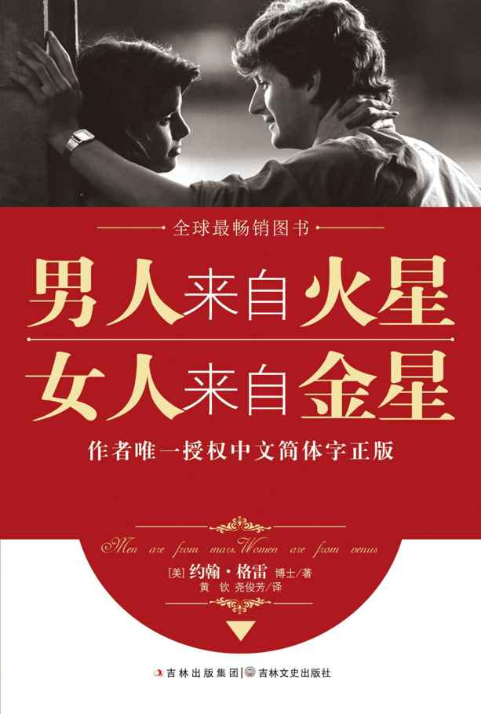
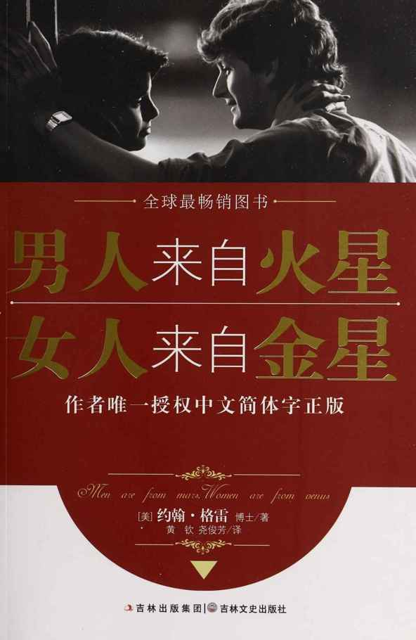
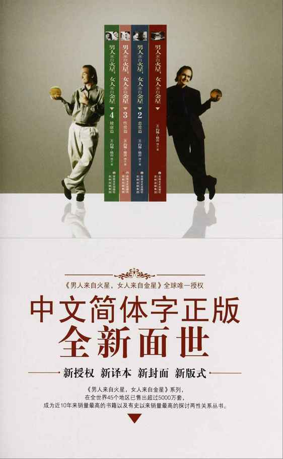
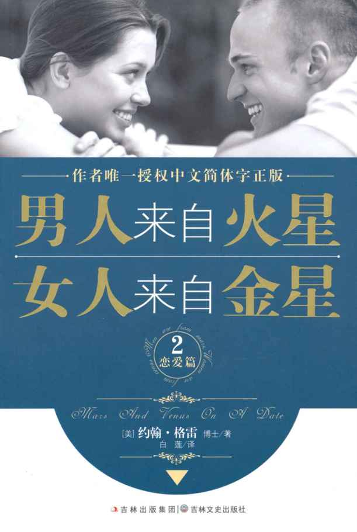
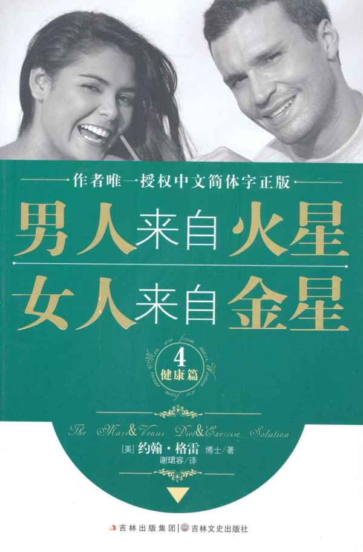

<svg xmlns="http://www.w3.org/2000/svg" xmlns:xlink="http://www.w3.org/1999/xlink" version="1.1" width="100%" height="100%" viewbox="0 0 613 910" preserveaspectratio="none">

<image width="613" height="910" xlink:href="cover.jpeg"></image>
</svg>

# 目录

<a href="#part0001.html"
class="calibre1">男人来自火星，女人来自金星1（唯一授权）</a>

<a href="#part0022.html"
class="calibre1">男人来自火星，女人来自金星2（恋爱篇）</a>

<a href="#part0051.html"
class="calibre1">男人来自火星，女人来自金星3（性爱篇）</a>

<a href="#part0067.html"
class="calibre1">男人来自火星，女人来自金星4（健康篇）</a>

# 

约翰•格雷(JOHN
GRAY)

全球著名婚恋情感专家、超级演讲家、心理学博士、畅销书作家，其著作《男人来自火星，女人来自金星》自问世以来，销量已经超过3000万册，被翻译成40多种语言。此后，他又陆续出版了《男人来自火星，女人来自金星2》《男人来自火星，女人来自金星3》《男人来自火星，女人来自金星4》等系列作品。该系列在全世界已销售5000多万册，成为近10年来全球最畅销的图书！

《男人来自火星，女人来自金星》系列在世界各个年龄阶层的男男女女中产生了很大的影响，被公认为走向和谐恋爱关系、保持美满婚姻关系的唯一“圣经”，近年来，哈佛大学已经将约翰•格雷的“火星&金星理论体系”纳入了课程体系。

# 

约翰•格雷（中）首次中国之行，与《男人来自火星，女人来自金星》正文版权代理方大苹果公司陈历莉（左）、吕光东（右）在一起

作者唯一授权中文简体字正版

男人来自火星\
女人来自金星\
Men are from mars, Woman are from venus

［美］约翰•格雷　博士／著\
黄　钦　尧俊芳／译

图书在版编目（CIP)数据

男人来自火星　女人来自金星/（美）格雷（Gray， J.）著；黄钦，尧俊芳译.
——长春：吉林文史出版社，2010.9

ISBN 978-7-5472-0346-0

Ⅰ.①男…　Ⅱ①格…②黄…③尧…　Ⅲ.①婚姻-通俗读物②恋爱-通俗读物　Ⅳ.①C913.1-49

中国版本图书馆CIP数据核字（2010）第186043号

Men Are From Mars，Women Are From Venus: A Pratical Guide for Improving

Communication and Getting What You Want in Your Relationships by John
Gray, Ph.d. Copyright© 1992 by JOHN GRAY

This edition arranged with Linda Michaels Ltd. (International Literary
Agents) through Big Apple Tuttle-Mori Agency, Labuan, Malaysia.

Simplified Chinese Edition Copyright© 2010 Beijing Zhengqing Culture &
Art Co. Ltd All rights reserved.

吉林省版权局著作权登记

图字：07-2010-2626

男人来自火星，女人来自金星

作　　者　约翰•格雷

译　　者　黄钦　尧俊芳

出 版 人　徐　潜

责任编辑　姜越　袁一鸣

责任校对　姜越　袁一鸣

封面设计　回归线视觉传达

开　　本　640mm×960mm 1/16

字　　数　300千字

印　　张　19

版　　次　2010年11月第1版

印　　次　2014年3月第8次印刷

出　　版　吉林出版集团　吉林文史出版社

发　　行　吉林文史出版社

地　　址　长春市人民大街4646号

邮编：130021

电　　话　总编办：0431-86037598

发行科：0431-86037528

网　　址　www.jlws.com.cn

印　　刷　北京画中画印刷有限公司

ISBN　　978-7-5472-0346-0

定　　价　29.80元

------------------------------------------------------------------------

版权所有　侵权必究　举报电话：0431-86037598

# 最新版序言

本书自问世以来，全球销量已达几千万册，它让千百万人走出了情感的困境，包括我本人在内，它也定当为你带来福音！

有人说过，在男人和女人之间，存在一场永恒的对话——男人不可能100%地了解女人，女人也不可能100%地了解男人，这是永恒的真理！

男女双方感情如何，不取决于对方是否完美，即使他们各自有很多缺点，仍然可以和睦相处、一生幸福，这也是永恒的真理！

如今，人人工作压力大。谁不渴望轻松和释放？谁不希望下班回家，享受伴侣带来的温馨和浪漫？工作越是辛苦，愿望就越是强烈。然而，两性之间，永远存在这样或那样的差异，永远存在这样或那样的误解。对此，没有必要回避，只应勇敢面对。只有这样，情感的纽带才会牢不可破。要接受伴侣和你的一切差异，不必瞠目结舌，也不要咬牙切齿，更不可横加干涉和破坏，甚至以武力施压。多一些宽容，多一些理解，这是你的责任。这并不意味着你非得哭丧着脸，承受一场危机四伏的感情。你也用不着硬着头皮，默默忍受缺乏激情的婚姻。你要做的，就是从消极走向积极，从挑剔走向包容，从误解走向理解。有了这样的调整和转变，你的感情世界，就会大为不同——你将升至人生快乐的巅峰！

怎样实现这一切？这主要取决于你对伴侣的认识。你对他（她）认识有多深，你们的爱情就有多深。

对两性的差异了解得越多，就越有助于减少交往中的矛盾，消除不必要的误会，避免强人所难的举动。将这本书放在你的枕边，它会成为你最有力的帮手，给你强有力的支持。

正如评论家所说，《男人来自火星，女人来自金星》是最好的爱情和婚姻指南。它深刻地揭示出，男人和女人在各方面存在着不同：他们的沟通方式不同；他们的想法和感觉不同；他们的认知和反应不同；他们对爱情的需求不同。他们看待同一问题，也常常“公说公理，婆说婆理”。大体说来，男人和女人来自不同的星球，说不同的语言，需要不同的养分。

对伴侣的态度和反应缺乏了解，爱情就会“栽跟头”。即便是鸡毛蒜皮的小事，也会成为你们情感的“绊脚石”，让你和伴侣摔得鼻青脸肿！你误以为一切都是对方的责任，却对自己的缺点、错误一无所知。你也可能“诱使”伴侶放弃自我，凡事从你的角度出发，即你是怎么想的，对方就该怎么想；你是怎么做的，对方就该怎么做！殊不知，你的荒谬和固执，随时会将爱情推向令人沮丧的境地！如果你不认真地研究你的伴侣，了解他或她的需求，就不要指望你们的爱情会蓬勃向上，如此，你们的爱情路将荆棘遍布。

我已经说过，即便最亲近的异性，对你也可能是个谜。因此你要自己去寻找答案！你要尽可能地接近事实，获悉真相，而不是一鱗半爪，支离破碎。作为回报，伴侣展示给你的，必将是最美好、最可爱的一面。他（她）会给你更多的爱：爱的絮语，使你的耳边清音袅袅；爱的奇迹，使你的眼前灵光闪耀。

……

不要试图改变对方；不要越俎代庖，想当然地替对方“着想”，因为这样会弄巧成拙。在沟通和交流上多下功夫，这才是你应尽的职责。想想看，你在伴侣面前的反应，能否让他（她）不胜欣慰，满心欢喜？你能否让对方永远感激，经常动情？你能否让爱的旗帜高高飘扬？能否视伴侣为心中的“唯一”？

做到这些，并非天方夜谭，遥不可及。这也是本书要奉献给你的要旨所在。它能带给你顿悟，赋予你智慧，让驾驭情感之舟的你充满力量！多花点心思，多做些努力，不断改进你和伴侣相处的方法，对方会从你那里，得到理想中的支持和帮助。这样一来，你完全可以从容、得体地改变自己的方法和态度，而不是试图改变你的伴侣。

本书是你的良师益友，它以大篇幅的金玉良言和真知灼见，告诉你如何成为对方理想的伴侣。它能使夫妻间的感情更加深厚；它能从悬崖边上，把感情濒于“破产”的人拉回。就算目前你和伴侣的感情尚且稳定，也不可等闲视之，而应随时为情感之舟增添动力。本书不仅帮助你积极行动，扭转不利的情感关系，还会为你的感情增添更多的“柔情蜜意”。炽热的爱火，将释放出无穷的能量，让情感之舟劈波斩浪，勇往直前，为你们的人生带来更大的希望。

为了帮助你更好地理解男女之间的差异，书中列举了大量实例。它们均来自真实的生活。阅读中，你会在字里行间，发现你本人清晰的“身影”。作为忠诚的向导，本书会牵着你的手，一步一步走出情感的误区。它告诉你，你可以保持本来面目，原样不改地面对你的伴侣——既不改变对方，也不委屈自己。

假如你在爱情的路上，遭遇荆棘，磕磕绊绊。别紧张，也别害怕，很少有人能一帆风顺，畅通无阻。只要善于经营，婚姻就不会变成“爱情的坟墓”；只要策略得当，方法对路，就会极大地改善沟通与交流。

本书的理论经过无数次检验，其正确性、有效性无可挑剔。在多达25000份个人调查问卷中，90%以上的调查结论，都忠实地体现在书中。所以，我相信在阅读中，你会不停地微笑着点头，说：“是的，你提到的这个人，其实就是我！”

我说过，男人和女人讲不同的语言。读完本书，渴望在几天内完全掌握异性的语言，这是不现实的。不要指望迅速了解彼此的差异，要循序渐进，不要急于求成。最好经常阅读它，每一次阅读，都会给你带来轻松和愉悦。每一次阅读，都可以点燃你和伴侣之间爱的火焰。每一次阅读，都可以使你明白：爱是理解、给予和宽容。本书的宗旨之一，是让你的心灵更加开放，使你再一次张开双臂，迎接爱神的到来！

约翰•格雷

# 原版序言

小女儿劳伦出生一周后，我和妻子邦妮累得要命，因为一到晚上，劳伦就会多次把我们从睡梦中弄醒。还有更糟的——邦妮分娩时产道破裂，连走路都成问题，必须天天吃止痛药，我只好留在家里照顾她。5天后，她的身体才略有好转，我又重返工作岗位。

那天，邦妮的止痛药恰好吃完了，她没有往我的办公室打电话。但我的弟弟前来探望，邦妮就请他帮忙买药。但粗心的弟弟出门以后，很快就忘了邦妮的嘱托。在疼痛中，邦妮忍受了一天的煎熬。她还要照顾刚刚降生的婴儿呢。这是多么糟糕，多么不幸！

我却一无所知。刚刚下班回家，我就发现她情绪不对劲儿。她铁青着脸，对我左一声抱怨，右一句不满——我成了她的“出气筒”。我不明白：早晨还好好的，转眼间竟成了“怨妇”！她的表情真是吓人，每一句话都咄咄逼人！这使我胸口处的火气渐渐蹿升。

她说：“我疼了整整一天！一片止痛药也找不到！我下不了床，从早到晚地躺在这里，谁也不关心我！”

我不以为然：“你怎么不给我打电话？这能怪谁呢？”

“我怕影响你的工作。而且，你弟弟不是刚好来了吗？我让他出去买药，可他忘得一干二净！我白等了一天！我根本不能下床走路，我还能怎样呢？你们谁都不管我了！”

我的心情本来就不好。白天工作压力大，下班后还得接着找气受，这让我无法忍受。况且，她又没打电话，我当然不知道情况。尤其让我恼火的是，她把责任全都推到我身上。这不公平！为什么这样指责一个无辜的人？岂有此理！

一怒之下，我愤然走向门口——是的，我要逃避！我多么疲惫，多么恼火！我听够了她的滔天怨言，急于夺门而出！

就在这时，情况突然有了变化。随后的情形，其意义之大，说它影响了我的一生，似乎也不为过——

妻子说：“你不要走！你不能离开我！约翰，现在我最需要你！我很不好受，你知道吗？几天来，疼痛让我很少合眼。还有，你听我说——”

我乖乖地驻足倾听。

“约翰，你不该让我失望！我们不是说好了，要同甘共苦吗？你的态度多让我伤心！任何时候，只有我柔顺、乖巧、可爱了，你才会陪着我。我要是心情不好，说话带刺，你就从家里逃出去，快得像受惊的兔子，这多叫人寒心啊！”

她沉默片刻，泪水涌出了眼眶。她的语气缓和了下来：“亲爱的！你知道吗？我正在吃苦受罪呢！我不能帮你做什么，相反，我比任何时候都需要你……到我这里来，好吗？抱着我，什么也别说！用你的胳膊紧紧地抱住我！亲爱的，千万不要走开！”

我走过去紧紧地抱住她，一声不吭。

妻子躺在我的怀里，轻轻地啜泣。

就这样过了几分钟。她的脸上流露出无限的感激。她感谢我，说在她最困难的时刻，我没有离她而去。她还深情地对我说，这个时候，她什么都不需要，只想让我抱着她，她要感受到我的爱。

就在那一刻，我第一次领悟到：什么是爱？爱的真谛是什么？我不由想到，真正的爱，意味着为对方着想，意味着不管出现什么情况，两个人都要相濡以沫。我一直自诩是个合格的丈夫，对妻子充满爱意，然而就像她说的，我并没有陪她共渡难关。她因痛苦或失望而抱怨时，我只是想到逃避。实际上，我应当留下来，与她“同舟共济”。还有，我喜欢她的快乐、可爱，却不愿面对她痛苦或发怒的样子。我会觉得很失败，误以为是我的错，才使她不快乐，只要有了这样的感觉，我就自惭形秽，直至心生愤慨。我不想成为她发泄怨恨的靶子，所以，当两个人出现矛盾时，我要么针锋相对，要么索性一走了之！

那天，我破天荒地没有离开她。我留在了家里，美妙的感觉难以言喻！在妻子真正需要我的时候，我满足了她的心愿。我也由此体验到，真正的爱，是包容和信任，是体贴和照顾，是不计代价地付出，是在伴侣的情绪陷入低谷时，尽可能地陪伴左右，给他（她）足够的力量和支持。而且，你在付出爱的同时，也将得到爱的回报——这是多么简单的道理呀！

我不知道，过去何以粗枝大叶，一再失去给予爱和得到爱的机会。过去，我只要走到妻子跟前，抱着她就可以了，不用多做别的什么，而我却没有做到！换作是女人，仅凭直觉和本能，也能知道邦妮的需要。然而，作为男人，我完全忽略了触摸、拥抱和倾听，忽略了它们对女人的意义和价值。在某种意义上，我在情感艺术上是个无知者。

正是从那一天起，我开始重新思考与伴侣的相处之道。为了使妻子不再受到伤害，我不断地钻研爱的技巧。有了它们，就可以解决各种情感冲突。有了它们，只需付出小小的代价，就可以赢得丰厚的奖赏。天底下，还有比这更划算的事情吗？

多年以前，我有过一次失败的婚姻。我记得，每次与前妻吵架，我的态度都是冷冰冰的。妻子从我的身上，感觉不到一丁点儿的爱意。当时，我真是愚蠢，以为面对情感冲突时只有两条路可走：要么和对方一直吵下去，要么躲得无影无踪。除了这些，我想不出还能做什么。这使得我的第一次婚姻，同悲伤、痛苦和不幸紧紧缠绕。然而，和邦妮发生的这件事，终于使我开了窍。

我足足用了七年时间，对改善两性关系的技巧进行验证和实践。我认真研究了男女之间的区别。我欣喜地发现，只要善于经营，婚姻就不会变成“爱情的坟墓”；只要策略得当，方法对路，就会大大地改善沟通与交流。我和邦妮就是如此。我们找到了改善关系的捷径，彼此更加欣赏和喜爱。

苏珊和吉姆结婚九年了。就像大多数夫妻那样，一开始，他们互敬互爱，感激上天恩赐。慢慢地，他们产生了口角，开始彼此抱怨和不满。一种前所未有的失望之情，不断蚕食着他们的激情，他们的婚姻到了名存实亡的地步。既然爱情走到了尽头，与其貌合神离地生活在一起，还不如马上离婚——他们有了这样的决定。

不过，就在预备离婚前，他们参加了我主持的“两性关系周末研讨会”。苏珊难过地说：“我们渴望维系亲密的关系，重新找回过去的爱情……可是，一点儿办法也没有！我们的差异太大了！”

但我的回答却让他们惊讶！我告诉他们：“你们是不同性别的人，差异的存在不仅正常，而且合情合理。更何况，别的夫妻也和你们一样，有着类似的差异，也因为无法接受差异，一再地产生摩擦。”听了我的话，苏珊和吉姆有了新的感悟。按照我的指点，两天后，他们开始重新处理彼此的关系。

就这样，他们再度陷入热恋中，奇迹发生了！他们都因对方的存在而喜悦，因对方的相伴而激情澎湃。他们决心一生相守，永不分开。先前打算离婚的念头，早被抛到了九霄云外！

吉姆说：“我的妻子又‘回来’了！这是因为我们认识到，对方与自己是不同的……这是我收到的最好的礼物。”

很多人都承认，男女之间的确存在明显的差异，却很少有人说得清楚：差异究竟体现在哪些方面？

在多次举行的两性关系研讨会上，我对二万五千多名参加者进行问卷调查。调查的结果，让我更加客观而确切地看到：男人究竟是怎么回事，女人又是怎么样的。

请记住这一事实：你的伴侣和你不同——对方来自另一星球，不可将本星球的规定、要求强加于人。你应该对彼此的差异产生敬畏，而不是想起来就心怀不满或怨恨，否则你会大吃苦头。

假如你是男人，读了书中的见解和主张，就很可能这样说：“你说的那个家伙，其实就是我本人。你似乎一直在跟踪我，把我的情况和特点摸得一清二楚……当然，我的心里很踏实，不再像过去那样，老觉得自己这也不行，那也不是。我终于知道感情的症结了！”

假如你是女人，就有可能这样说：“有了你的这本书，我的丈夫就像换了一个人。他终于能够耐心地听我说话。我不再像过去那样，为得到他的爱和理解，不得不硬着头皮，先和他争吵一通……你解释我们的差异时，我的丈夫非常专注。他理解了事情的真相，谢谢你！”

“男人是谁？”“女人又是谁？”“二者有什么不同？”在本书中，我做了大量的归纳和总结。你可能发现，有些言论和观点极符合你的特征。它们似乎比别的叙述更真实，更与你心意相通。这不奇怪，人人都有其独特的经验和体会。你在书中可以找到自己，也可以找到别人，可以找到男人，也可以找到女人。

在我举办的无数次研讨会上，参加者有已婚者，也有独身者。其中有些人似乎属于“性别错位”。举例来说，我描述女人的基本特征，某个男人可能站起来，说：“我才是这个样子！”有时候，一个女人也会郑重地声明，说她和男人的基本特征一致。我将此称为“性别的角色转化”。这种“角色转化”在人群中司空见惯。这是个体独特性、家庭、社会等因素的影响所致。

我相信，人人都可因本书而获益。从我的研讨会参加者那里，从来信的读者当中，我听到的唯一的“消极反应”的——不知你能否想象得出来——那就是：“为什么在过去，从来没有人对我说过这些呢？”我可以听到他们隐隐的抱怨之情。

行动起来吧！为你的人生赋予更多的爱，一切还不算晚！你要学的，只是新的方法，新的技巧。你即将告别灰色的世界，迎接的是五彩斑斓的人生。不管你的情感问题有多少，不管你是否正在四面楚歌声中挣扎，也甭管是否“病入膏盲”，正在接受某种形式的心理治疗，我要说的是，如果你想拥有更加完美的爱情和婚姻，本书就一定是你的最佳指南！

约翰•格雷

# 目录

<a href="#part0006.html" class="calibre1">最新版序言</a>

<a href="#part0007.html" class="calibre1">原版序言</a>

<a href="#part0009_split_000.html"
class="calibre1">第1章　男人来自火星，女人来自金星</a>

<a href="#part0009_split_001.html_sec001"
class="calibre1">男女生而不同</a>

<a href="#part0009_split_002.html_sec002"
class="calibre1">美好的愿望远远不够</a>

<a href="#part0010_split_000.html"
class="calibre1">第2章　“修理先生”和“家庭改造委员会”</a>

<a href="#part0010_split_001.html_sec001"
class="calibre1">火星人的世界</a>

<a href="#part0010_split_002.html_sec002"
class="calibre1">金星人的世界</a>

<a href="#part0010_split_003.html_sec003"
class="calibre1">女人，别再给他出主意了</a>

<a href="#part0010_split_004.html_sec004"
class="calibre1">男人，要善于聆听</a>

<a href="#part0010_split_005.html_sec005"
class="calibre1">“修理先生”与“家庭改造委员会”的纠结</a>

<a href="#part0010_split_006.html_sec006"
class="calibre1">当女人抗拒男人的建议时</a>

<a href="#part0010_split_007.html_sec007" class="calibre1">当男人抵制
“家庭改造委员会”时</a>

<a href="#part0011_split_000.html"
class="calibre1">第3章　男人躲进“洞穴”，女人滔滔不绝</a>

<a href="#part0011_split_001.html_sec001"
class="calibre1">应对压力，各有奇招</a>

<a href="#part0011_split_002.html_sec002"
class="calibre1">“洞穴”里的减压</a>

<a href="#part0011_split_003.html_sec003"
class="calibre1">她通过倾诉来减压</a>

<a href="#part0011_split_004.html_sec004"
class="calibre1">火星人与金星人如何和谐相处</a>

<a href="#part0012_split_000.html"
class="calibre1">第4章　激励你的异性公民</a>

<a href="#part0012_split_001.html_sec001"
class="calibre1">当男人爱上女人</a>

<a href="#part0012_split_002.html_sec002"
class="calibre1">当女人爱上男人</a>

<a href="#part0012_split_004.html_sec004"
class="calibre1">划出界线，尊重对方</a>

<a href="#part0012_split_005.html_sec005"
class="calibre1">第二步：承担起责任</a>

<a href="#part0012_split_006.html_sec006"
class="calibre1">接受他的付出</a>

<a href="#part0012_split_007.html_sec007"
class="calibre1">男人，要学会给予</a>

<a href="#part0013_split_000.html"
class="calibre1">第5章　不同的星球，不同的语言</a>

<a href="#part0013_split_001.html_sec001"
class="calibre1">表达情感VS传递信息</a>

<a href="#part0013_split_002.html_sec002"
class="calibre1">当金星人开始说话</a>

<a href="#part0013_split_003.html_sec003"
class="calibre1">当火星人沉默不语时</a>

<a href="#part0013_split_004.html_sec004"
class="calibre1">火星人终于开口了</a>

<a href="#part0013_split_005.html_sec005"
class="calibre1">男人躲进洞里，女人怎么办？</a>

<a href="#part0013_split_006.html_sec006"
class="calibre1">如何有效地帮助火星人</a>

<a href="#part0013_split_007.html_sec007"
class="calibre1">做出小小的改变</a>

<a href="#part0013_split_008.html_sec008"
class="calibre1">如何支持金星人</a>

<a href="#part0013_split_009.html_sec009"
class="calibre1">避免责备，有效沟通</a>

<a href="#part0014_split_000.html"
class="calibre1">第6章　男人就像橡皮筋</a>

<a href="#part0014_split_001.html_sec001"
class="calibre1">每个女人都应该知道的秘密</a>

<a href="#part0014_split_002.html_sec002"
class="calibre1">为何女人会误解男人</a>

<a href="#part0014_split_003.html_sec003"
class="calibre1">与男人谈话的时机</a>

<a href="#part0014_split_004.html_sec004"
class="calibre1">怎样让男人开口</a>

<a href="#part0014_split_005.html_sec005"
class="calibre1">当男人不愿意说话时</a>

<a href="#part0014_split_006.html_sec006"
class="calibre1">如果男人从不逃离</a>

<a href="#part0014_split_007.html_sec007"
class="calibre1">阻碍“亲密周期”的行为</a>

<a href="#part0014_split_008.html_sec008"
class="calibre1">男人的过去如何影响“亲密周期”</a>

<a href="#part0014_split_009.html_sec009"
class="calibre1">明智的男人和机灵的女人</a>

<a href="#part0015_split_000.html"
class="calibre1">第7章　女人就像波浪线</a>

<a href="#part0015_split_001.html_sec001"
class="calibre1">男人对于“波浪”的反应</a>

<a href="#part0015_split_002.html_sec002"
class="calibre1">循环出现的争吵</a>

<a href="#part0015_split_003.html_sec003"
class="calibre1">理解女人的需要</a>

<a href="#part0015_split_004.html_sec004"
class="calibre1">当“深井”中的女人缺乏安全感时</a>

<a href="#part0015_split_005.html_sec005"
class="calibre1">当她身陷“深井”，而他藏身“洞穴”</a>

<a href="#part0015_split_006.html_sec006"
class="calibre1">理解能够消弭冲突</a>

<a href="#part0015_split_007.html_sec007"
class="calibre1">男人不想倾听时应该怎么办</a>

<a href="#part0015_split_008.html_sec008"
class="calibre1">金钱带来的困扰</a>

<a href="#part0015_split_009.html_sec009"
class="calibre1">感觉，才是最重要的</a>

<a href="#part0016_split_000.html"
class="calibre1">第8章　探寻我们不同的情感需求</a>

<a href="#part0016_split_001.html_sec001"
class="calibre1">十二种爱的需求</a>

<a href="#part0016_split_002.html_sec002"
class="calibre1">穿着闪亮铠甲的骑士</a>

<a href="#part0016_split_003.html_sec003"
class="calibre1">你无形中赶走了你的伴侣</a>

<a href="#part0016_split_004.html_sec004"
class="calibre1">当爱情冷却时</a>

<a href="#part0016_split_005.html_sec005"
class="calibre1">学会心平气和地倾听</a>

<a href="#part0016_split_006.html_sec006"
class="calibre1">给予男人力量的艺术</a>

<a href="#part0017_split_000.html"
class="calibre1">第9章　如何避免争吵</a>

<a href="#part0017_split_001.html_sec001"
class="calibre1">我们争吵时会发生什么事</a>

<a href="#part0017_split_002.html_sec002"
class="calibre1">为何争吵会带来伤害</a>

<a href="#part0017_split_003.html_sec003"
class="calibre1">四种避免争吵伤害的方法</a>

<a href="#part0017_split_004.html_sec004"
class="calibre1">我们为何争吵？</a>

<a href="#part0017_split_005.html_sec005"
class="calibre1">解剖你们的争吵</a>

<a href="#part0017_split_006.html_sec006"
class="calibre1">如何既表达不同意见而又避免争吵</a>

<a href="#part0017_split_007.html_sec007"
class="calibre1">深入解剖争吵的本质</a>

<a href="#part0017_split_008.html_sec008"
class="calibre1">艰难时刻，更要支持对方</a>

<a href="#part0017_split_009.html_sec009"
class="calibre1">以爱沟通，避免争吵</a>

<a href="#part0018_split_000.html"
class="calibre1">第10章　亮出你的打分</a>

<a href="#part0018_split_001.html_sec001"
class="calibre1">小事情带来的奇迹</a>

<a href="#part0018_split_002.html_sec002"
class="calibre1">男人赢得高分的101种方法</a>

<a href="#part0018_split_003.html_sec003"
class="calibre1">小事情的魔力</a>

<a href="#part0018_split_004.html_sec004"
class="calibre1">调整精力与注意力</a>

<a href="#part0018_split_005.html_sec005"
class="calibre1">女人的打分</a>

<a href="#part0018_split_006.html_sec006"
class="calibre1">治疗怨恨的“流感”</a>

<a href="#part0018_split_007.html_sec007"
class="calibre1">为何男人给得更少</a>

<a href="#part0018_split_008.html_sec008"
class="calibre1">男人如何打分</a>

<a href="#part0018_split_009.html_sec009"
class="calibre1">男人为何会自我防卫</a>

<a href="#part0019_split_000.html"
class="calibre1">第11章　如何沟通负面情绪</a>

<a href="#part0019_split_001.html_sec001"
class="calibre1">如何训练“情书技巧”</a>

<a href="#part0019_split_002.html_sec002"
class="calibre1">第一步：写一封情书</a>

<a href="#part0019_split_003.html_sec003"
class="calibre1">第二步：写一封回信</a>

<a href="#part0019_split_004.html_sec004"
class="calibre1">第三步：与伴侣分享情书和回信</a>

<a href="#part0019_split_005.html_sec005"
class="calibre1">让情书变得安全可靠</a>

<a href="#part0019_split_006.html_sec006"
class="calibre1">迷你型情书</a>

<a href="#part0019_split_007.html_sec007"
class="calibre1">何时写情书</a>

<a href="#part0019_split_008.html_sec008"
class="calibre1">为何我们需要写情书</a>

<a href="#part0019_split_009.html_sec009"
class="calibre1">说出事实的真相</a>

<a href="#part0019_split_010.html_sec010"
class="calibre1">我们如何掩藏真实的情感</a>

<a href="#part0019_split_011.html_sec011"
class="calibre1">治疗负面情绪带来的创伤</a>

<a href="#part0019_split_012.html_sec012"
class="calibre1">自助的奥秘</a>

<a href="#part0020_split_000.html"
class="calibre1">第12章　怎样请求支持，才能如愿以偿</a>

<a href="#part0020_split_001.html_sec001"
class="calibre1">女人的爱，就是决不主动请求</a>

<a href="#part0020_split_002.html_sec002"
class="calibre1">第一步：恰当地请求经常得到的支持</a>

<a href="#part0020_split_003.html_sec003"
class="calibre1">第二步：练习请求对方给予更多</a>

<a href="#part0020_split_004.html_sec004"
class="calibre1">第三步：练习“强制性请求”</a>

<a href="#part0020_split_005.html_sec005"
class="calibre1">男人为何如此敏感</a>

<a href="#part0021_split_000.html"
class="calibre1">第13章　让爱的魔力永存</a>

<a href="#part0021_split_001.html_sec001" class="calibre1">90/10原则</a>

<a href="#part0021_split_002.html_sec002"
class="calibre1">痛苦感受的幕后真相</a>

<a href="#part0021_split_003.html_sec003"
class="calibre1">“情感反应迟缓”现象</a>

<a href="#part0021_split_004.html_sec004"
class="calibre1">健康者为何需要治疗</a>

<a href="#part0021_split_005.html_sec005"
class="calibre1">爱的季节性</a>

<a href="#part0021_split_006.html_sec006"
class="calibre1">完美的情感</a>

<a href="#part0000.html" class="calibre1">返回总目录</a>

# 第1章　男人来自火星，女人来自金星

请设想一下男人来自火星，女人来自金星吧。有一天，火星人从望远镜里发现了金星人。仅仅惊鸿一瞥，却让他一见钟情，地转天旋。金星人唤起了他从来没有过的爱！他很快坠入爱河，于是，火星人立刻发明了宇宙飞船，动身去了金星！

金星人张开双臂，热情地欢迎来自另一个星球的精灵。这是第一次约会，他们本能地意识到，神奇的一刻到来了！他们敞开心扉，深深相爱！

火星人和金星人的爱情真是妙不可言！他们水乳交融，耳鬓厮磨，难分彼此。他们来自不同的星球，自然有着许多不同之处，可这又有什么不好的呢？彼此的差异，使他们新奇，让他们狂喜。他们花了好长时间来发掘和欣赏对方迥然相异的需求、癖好和行为举止。很长一段时间里，他们心心相印，形影不离，沐浴在爱情的光辉中，幸福而又快乐。

后来，他们突发奇想，决定飞往地球定居。起初，一切仍然那么和谐美好。但是，地球特殊的气体发挥了作用，慢慢地改变了他们。一天清晨，他们醒来时不约而同地患上了一种特殊的病症——选择性失忆症！

一夜之间，火星人和金星人全然忘了他们来自不同的星球，忘记了要包容彼此的差异。从此，火星人与金星人就永远生活在剑拔弩张的矛盾中了。

## 男女生而不同

多么不幸啊！由于忘记了生来有别，火星人和金星人之间矛盾渐生。他们时常牢骚满腹，埋怨连连，这一切都是因为对方和自己不一样。他们的行为方式、思维套路都各不相同，但是，他们都期望对方和自己一样地思考，一样地行动。他们甚至错误地以为，如果伴侣爱他们，就得努力改变自己，和他们处处合拍。这样的假定，使无数的爱侣一次次地陷入被动。

------------------------------------------------------------------------

他们甚至错误地以为，如果伴侣爱他们，就得努力改变自己，和他们处处合拍。这样的假定，使无数的爱侣一次次地陷入被动。

------------------------------------------------------------------------

男人误以为女人就该像他们一样思考、沟通和反应；女人则期望男人与她们一样充满感性色彩，以直觉行事。我们都忽略了男人与女人的差异。因此，在许多感情关系中，充满了不必要的龃龉和矛盾。

很明显，一旦你意识到男女有别，学会尊重彼此的差异，接纳对方的缺点与不完美，在处理异性关系问题时，就会少了许多困惑。明白了“男人来自火星，女人来自金星”这一事实，两性关系中的种种问题就会迎刃而解了。

## 美好的愿望远远不够

爱情是多么神奇，多么美妙！相爱的人们总是天真地以为自己不会重蹈父辈们的覆辙，永远不会陷入爱情失败的怪圈。他们的爱情，不会褪色；他们的承诺，不会被打破。他们将幸福地生活在一起，直到永远。

但事与愿违，随着时光的流逝，爱情的魔力开始消退，“柴米油盐”的琐事悄悄占据了生活的主旋律，爱情永恒的悲剧，似乎又要拉开帷幕了。男人奢望女人和他们一样思考和反应问题；女人则以自己的模式来要求和改造男人。他们把差异抛到了脑后，懒得花时间去了解对方，尊重对方。接下来，他们不再相爱，互相指责。他们满腹怨气，缺乏耐心。

不知不觉中，他们的爱情列车，不可阻挡地冲出轨道。这一切让他们目瞪口呆：憎恨取代了爱情，隔阂取代了沟通，怀疑取代了信赖，逃离取代了亲近。最后，爱情似乎失去了光芒万丈的魔力。

我们不禁扪心自问：

为什么会发生这一切？

为什么相爱的人会走到这一步？

人类是多么聪慧啊！为回答这些问题，随时都可搬出体系复杂、光芒四射的哲学观点、心理学理论，似乎这样就能让爱重生，拯救我们走到边缘的感情。可是，这一切又有多少意义呢？旧有的惯性力量仍然主宰着我们。我们不得不承认，真爱易逝，似乎人人如此。

每时每刻，许多孑然一身的孤男寡女在寻找着生命中的真爱；每时每刻，许多原来相爱的情侣却劳燕分飞、天各一方。在那些相爱的情侣中，仅有一半最后能够结为夫妻；而在缔结了婚姻的夫妇里，也仅有一半能白头偕老。在没有离婚的夫妇里，有一半仅仅是勉强维持婚姻的，他们或者对伴侣不忠，或者因为对开展新生活感到恐惧，而没有结束婚姻。

世上只有极少数人能将爱情演绎得淋漓尽至，将生命与伴侣结合在一起，至死不渝。他们的独特之处在于懂得尊重和包容彼此的差异，唯有如此，爱情女神才会永远地眷顾他们。

------------------------------------------------------------------------

只有尊重和包容彼此之间的差异，爱情女神才会翩翩而至，并永远地眷顾他们。

------------------------------------------------------------------------

男人和女人唯有尊重彼此的不同，接纳对方的一切，创造性地解决问题，以谅解的态度去为对方着想，才能在每一个季节里，都享受爱情的枝繁叶茂。

任何时候，我们都要提醒自己：男人来自火星，女人来自金星。只有尊重彼此的不同，我们的爱才能充满魔力，地久天长！

# 第2章　“修理先生”和“家庭改造委员会”

女人对男人最大的抱怨，莫过于男人从不懂得倾听。听到女人唠叨诉苦，他们要么心不在焉，充耳不闻；要么骄傲地戴上“修理先生”的帽子，帮她们出谋划策。男人以为，他们这种爱的表现可使女人心花怒放，但遗憾的是，女人却从不买账。于是，男人困惑不解：他好言好语，她却愁眉不展，这究竟是为什么呢？要知道，女人更需要感同身受的理解，更渴望一双聆听的耳朵，可男人却总误认为她需要帮助。

对于女人，男人最大的不满就是女人老想着改造他们。一旦女人爱上男人，就觉得有必要帮助男人成长和成熟，让男人变得更加完美。她们成立了“家庭改造委员会”，男人就是她们改造的首要目标。不管他有多抗拒和反感这种做法，她都不依不饶，一逮住机会就试图帮助他，告诉男人怎样立身处世，怎样待人接物，怎样功成名就！她自以为是在关爱他，照料他，可男人却感觉被女人控制得牢牢的，没有喘息的空间。女人不懂得，男人需要的是她的认可和接纳。

你瞧，男女在相处时，各有各的问题。我们得弄明白为什么男人喜欢解决问题，而女人喜欢改造男人。让我们回过头去，看看火星人和金星人原先都是怎么生活的，在他们抵达地球以前，他们的本性究竟如何。这有助于我们更深入地认识男人，了解女人。

## 火星人的世界

一般说来，火星人崇尚力量、能力、效率和成就。他们不惜代价地积蓄力量，培养技能，修炼十八般武艺，目的就是证明他们自己。相比起女人，男人更习惯于以成败论英雄。他们雄心勃勃，富于进取精神，渴望建功立业。

------------------------------------------------------------------------

事业有如男人的生命，只有在事业上取得成绩，他们才感觉自己实现了自我价值。

------------------------------------------------------------------------

火星上的一切都反映了这种价值观，甚至穿衣戴帽的方式都体现着他们的能力。无论是警察、士兵、商人、科学家、出租车司机、技术员或者厨师，无不穿着身份鲜明的制服，或者至少戴上帽子来表明他们的职业和能力。火星人不喜欢读像《今日心理》《自我》《人物》这样比较感性的杂志，他们更关注户外活动，比方说打猎、钓鱼或者赛车。他们也很少阅读爱情小说或者励志类书籍，而是更爱看新闻、天气预报和体育节目。总之，他们对
“实体”和“物体”的关注，远胜于关注人们虚无缥缈的感情，因为，只有这些事物才能帮助他们展现力量，达到目标。

对火星人来说，事业有如他们的生命。他们认为自我价值的实现取决于事业上的成就，只有在事业上大展身手，他们才会志得意满，火星人以独立为傲，因为在火星人的观念里，独当一面是能力的象征，独立自主与效率、力量和能力是同等重要的。

因此，他们很抗拒女人的干涉，更反感女人帮他们拿主意。在男人看来，不请自来的援手，就是瞧不起他，认为他软弱无能没法独立完成任务。男人对这个特别在意，因为这是他们能力的体现。

------------------------------------------------------------------------

在男人看来，要是他们不开口，别人却不请自来，主动伸出援手，这就等于瞧不起他们，认为他们束手无策，软弱无能，或者没法独立完成任务。

------------------------------------------------------------------------

男人喜欢单打独斗，自力更生。遇到问题时，他们习惯自己一个人扛。除非到了迫不得已的地步，他们才会开口求助。要是自个儿完成的事，却请人代劳，在他们看来是窝囊废的行为。

但是，一旦他真的需要帮助时，他就会表现独特智慧和艺术。一般来说，他会请教那些他非常敬仰和信服的能人贤士，把自己的困难和盘托出。在火星上，向别人谈论自己的困难，不是为了情绪的发泄，而是请人赐教的信号。火星人遇到别人向自己请教时，会视为无上的荣光。不知不觉地，他就戴上那顶“修理先生”的帽子，好好地听一会儿，然后给出自己的建议。

因此，男人一听到女人在谈论自己的不如意时，他就会自发地帮她出主意。其实，女人只是想抒发一下内心的郁闷，或者排解一下不满，可男人却误读为女人需要帮助。在男人看来，帮女人出谋划策，是男人爱意的表示。他不忍心看她坐困愁城，愁眉苦脸，他以为只要能帮她解决问题，她就会心情舒畅起来。

让男人费解的是，尽管他们绞尽脑汁想取悦女人，女人却丝毫不领情。她们还是深陷于沮丧悲观的情绪里，怨天怨地。男人搞不懂哪个环节出了问题——女人似乎拒绝接受他的好意，他什么忙也帮不上，简直像个没用的傻瓜，这让男人充满了挫折感和失败感。

男人没有弄明白，金星人谈论问题，并不是让你过来帮忙的信号。其实，只要坐下来好好听听女人在说什么，在适当的时候表现一下自己的感同身受，这就是对她们最大的支持了。

## 金星人的世界

金星上是另一个天地。金星人特别看重爱、沟通和人际关系，她们把时间都消耗在支持他人、帮助他人上面。她们天生就喜欢照顾别人，她们认为，只有能帮到别人，自己的存在才算有了价值；只有把人际关系处理得特别完美，自己才算得上成功的人。与火星人相反，她们通过与他人分享和联系来汲取经验，学习成长。

------------------------------------------------------------------------

金星人认为，只有能帮到别人，自己的存在才算有了价值；要是能把人际关系处理得特别完美，自己才算得上成功的人。

------------------------------------------------------------------------

金星上的一切都反映了这种价值观。金星人不太热衷于修建高速公路或摩天大楼，她们更注重人与人之间是否能和谐相处，相互友爱。在金星人看来，人际关系比事业啊高科技啊这些事情重要多了。

金星人可不像火星人一样穿着制服来显示自己的身份和能力，她们喜欢打扮得与众不同，而且，随时根据自己的心情而更换着装。有个性的外表，对她们格外重要。要是她们的情绪在一天之内阴晴不定、高低起伏，她们会不厌其烦地换好几次衣服。

金星人特别推崇襟怀坦白的沟通、不分彼此的分享。她们通过交谈来建立关系和巩固关系。她们喜欢“掏心窝子”，与人敞开心扉，毫无隐瞒地交流情感，这会带给她们莫大的满足感。

金星人都学习心理学，而且至少取得一个心理咨询方面的硕士学位。她们对个人成长、精神灵修等方面颇有心得，对照料、治疗和培植各种生命抱有热忱。在金星上，随处可见生机勃勃的森林公园、有机花园以及热闹喧哗的购物场所。

火星人简直无法理解金星人这种价值观。这么说吧，要是他们能体验到在汽车拉力赛中取胜，或者完成一项艰巨的任务时的狂喜，那么他们就能理解金星人从沟通与交流中所获得的满足与快感。金星人从不吝于表达自己的善意、爱心和体贴。两个火星人聚在一块吃午餐，一般目的性都很强，他们要在一起“谈个事儿”，或者是要合作项目，或者要一起做生意，或者要一同解决什么问题。可金星人看来，在一起聚餐是感情交流的时刻，不管你是打算帮助别人，还是接受别人的帮助，在一起吃个午饭，是建立和培养某种关系的好契机。她们在餐桌上谈论的话题既坦诚无私，又亲密无间，有点类似于心理咨询师与病人之间的交谈。

金星人是直觉的动物。这桩本事是漫长的岁月里一点点培养起来的。她们对自己的直觉格外骄傲。她们喜欢助人为乐，在金星人的观念里，无须他人开口即伸出援手，这才是最无私的爱，最伟大的爱。

金星人不太执著于证明自己的能力，不像火星人那样把他人的帮助当做是冒犯，更不认为接受帮助就是软弱无能。

金星人对火星人的自尊心也毫无概念，她们巴不得有人帮她们呢！如果她爱的男人乐意帮助她，就能让她感受到他深深的爱意与关怀，让她有被呵护和珍视之感。

在金星上，人人以帮助别人为乐。金星人的天性就是要雪中送炭，锦上添花。如果她们在乎一个人，她们就会直言不讳地指出他有什么地方需要改进，应当怎么做事。金星人的观念是：帮人出主意或提出有建设性的批评，是爱的行为。

火星人则完全不同，他们是解决问题型的。只有某个环节出了纰漏，他们才会想到去动一动它。既然一切正常，又何必多此一举去管它？！

如此一来，当女人企图改造男人时，他读到的潜台词就是肯定是他哪儿出错了，她要上来修理他。

## 女人，别再给他出主意了

要是洞悉了男人的天性，女人就会避免不知不觉中伤害和冒犯到他。女人应该懂得适时缄默，充分地信任男人。聪明的女人是不会对男人指手画脚，乱出主意的。

我们来看这样一个故事：

有一次，汤姆和玛丽去参加一个聚会，汤姆负责开车。他在一个街口兜兜转转了将近二十分钟，玛丽知道他准是迷路了。玛丽提议他打电话求援，汤姆却一言不发，继续努力寻找正确的方向。最后，他们到达了目的地。玛丽没想到，汤姆非常不开心，整个晚上，他都板着脸和她冷战。她想不明白，汤姆为什么闹别扭。

从她的立场出发，她认为自己很有道理：“我很爱汤姆，也很关心他。他有什么困难，我当然要责无旁贷地帮助他。”可是，在汤姆那边，玛丽的做法却被误解了：“你既然爱我，就得充分信任我。你的做法等于是对我无声的谴责：‘我根本不相信你能把车开到那儿，你可真没用！’”

玛丽不了解火星人的特质，当然就不会理解为什么汤姆这么抗拒她的好意。我们都知道，火星人除非迫不得已，是绝对不会开口求人的。汤姆是一个自尊心很强的男人，玛丽的指手画脚等于在侮辱他的男性尊严。汤姆在路上晕头转向地兜圈子时，玛丽理所当然地以为她应该表现出她的关爱之情。其实，在那一刻，汤姆的情绪正处于脆弱敏感的关头，他需要的是另一种关怀。在男人遇到困难时，女人充满信任地等待和守望，其实就等于给他加油打气。

当玛丽了解了这一点以后，她就改变了策略。下次汤姆再迷路时，她不再指指点点，而是深吸一口气，用鼓励的目光看着他，对他做的每一次努力都抱以欣赏和感恩。同样地，汤姆也非常感激她的关怀和信任。他们更加相爱了。

通常说来，当女人主动请缨去帮助一个男人时，经常弄巧成拙。她的出发点是爱与关切，但她不知道自己的做法在男人看来是颐指气使，超出底线！男人的反应很大，甚至暴跳如雷，他认为自己像个小孩一样被女人管教批评，或者就像以前自己的爸爸总是被妈妈唠叨个没完。

------------------------------------------------------------------------

通常说来，当女人主动请缨去帮助一个男人时，她不知道自己的做法在男人看来却是挑剔烦人，一点儿也不爱他！

------------------------------------------------------------------------

男人的好胜心强，乐意表现自己。上至天文地理国家大事，下至开车吃饭或参加聚会之类的芝麻小事，男人都喜欢逞强。具有讽刺意味的是，男人在某些小事上往往过度敏感，他常这么想：“要是连开车去参加聚会这种小事你都不相信我，怎么指望你在别的大事上还信任我呢？”男人的火星人血统让他们特别喜欢扮演某一方面的专家，要说到修理什么机器啊、开个车上哪儿去啊这种事，正是男人要大显身手的时候。女人不能剥夺男人这种快感，在这个当口，满怀爱意的接纳和信任比自以为是地出点子，要明智多了。

## 男人，要善于聆听

反过来说，男人也搞不清楚为何他经常帮倒忙。他一心想取悦女人，但得到的却是女人的反感和不满。男人得明白，女人的牢骚抱怨，不是要请求你们的援手，而仅仅是为了与你更加亲密贴近。很多时候，女人只是想和你聊聊天，分享一下自己的心情，可你却以为她是要你做点儿什么，于是打断她的话头，自顾自帮她解决问题去了。因此，女人总会感到很懊恼！

------------------------------------------------------------------------

很多时候，女人只是想和你聊聊天，分享一下自己的心情，可你却以为她是要你做点儿什么，于是打断她的话头，自顾自帮她解决问题去了。

------------------------------------------------------------------------

比方说，一天晚上，玛丽筋疲力尽地回到家中，她特别想找人说说自己今天遇到的麻烦。

她说：“今天可把我累坏了，我要干好多事，连休息的时间都没有。”

汤姆却说：“我看你还是辞职算了。你没必要这么卖命啊，找点你喜欢干的事吧。”

玛丽说：“我挺喜欢我的工作的。大家对我的期望值很高，希望我马上能做出成绩！”

汤姆说：“别听他们的，你自己想怎么着就怎么着。”

玛丽说：“哎呀！今天我居然忘了给我阿姨打电话了！”

汤姆说：“别担心啦，她不会在意的。”

玛丽说：“你可不知道她最近遇到什么事了，她真的很需要我！”

汤姆说：“你未免操太多的心啦，所以老是这么不高兴。”

玛丽生气地嚷了起来：“谁说我老是不高兴？你能不能让我把话说完啊！”

汤姆分辩说：“我这不是在听吗？”

玛丽说：“我简直给你烦死了！”

可想而知，玛丽本来想回家后能得到汤姆的温存体贴，可汤姆却只是火上浇油，这让她更加恼火。汤姆也是一肚子委屈，他好心好意要让妻子快活起来，可是他这个就事论事、解决问题的策略却没有奏效。

汤姆对金星人一点儿也不理解。他不知道她们更需要的是安静地倾听，感同身受地回应。他试着帮玛丽拿主意，可玛丽的本意却只是想通过发牢骚来出出气。他根本不用做太多，只需报以宽慰和理解，就会让玛丽心情渐渐平复，用不着多此一举地给她想办法。

汤姆明白金星人的特点以后，这一场争吵就完全可能避免了：

玛丽结束了劳累的一天，回到家里，她发着牢骚说：“今天我手头的事多得处理不完，时间根本不够用！快把我折腾坏了！”

汤姆说道：“嗯，我看今天你是不太好受啊，亲爱的。”

玛丽说：“他们都希望我越快越好，根本不管我是不是有精力做完！”

汤姆停下来，说道：“哦，是吗？”

玛丽说：“哎呀！今天我居然忘了给我阿姨打电话了！”

汤姆微微皱了一下眉头，说：“不会吧，你怎么给忘了呢？”

玛丽说：“她真的很需要我的。唉，我居然把这事忘了，太不应该了！”

汤姆说：“亲爱的，你真是个热心肠，特别会替别人着想！我一直很欣赏你这一点。快过来，让我抱一抱！”

汤姆给玛丽一个深深的拥抱，在他的臂弯里，玛丽又宽慰又安心，她呼出一口气，心中的烦躁霎时间全不见了！玛丽感激地说：“亲爱的，你的安慰让我感觉好过多了，谢谢你听我说这些不愉快的事。”

你看，不管是玛丽还是汤姆，都心满意足。玛丽得到了理解和尊重，汤姆也觉得自己帮到了玛丽，他为此满心欢喜。汤姆一旦明白了火星人与金星人的差异以后，他就不会再去乱帮忙了。玛丽情绪低落，忍不住要对他倾诉时，他学会仔细聆听，报以同情，不再自以为是地发表意见了。他的温柔体贴，让玛丽格外的欣喜，他们的爱情升温了。

爱是一门艺术。我们来看看，在这门艺术的修习过程中，相爱的人们最容易犯下的两种错误：

1．男人一听到女人诉苦抱怨，就忙不迭地要扮演“修理先生”的角色，四处救火。女人却认定了男人没有在倾听，不但毫不领情，还可能大发脾气。

2．女人一逮到男人犯错，就要以“家庭改造委员会”的身份，让男人认真反省，彻底改正。不待男人开口，她就自作主张，大扫男人的面子，让他下不了台。

## “修理先生”与“家庭改造委员会”的纠结

男人与女人容易犯下的两种错误，虽然会造成许多不快，但并不意味着“修理先生”与“家庭改造委员会”就一无是处。其实，这是火星人与金星人特有的可贵品质，如果在恰当的时机发挥出来，用得恰如其分，非但不会适得其反、弄巧成拙，反而会为你们的感情加分。

女人正在坏情绪的当口，男人可不要自作聪明地上前帮忙。当女人心烦意乱，只想滔滔不绝地诉说心中的积郁时，你大可袖手旁观。知情识趣的男人，此时只需要给女人提供他的耳朵便够了。要知道，女人可没觉得自己哪里出了毛病，需要男人捋起袖子“修理”一番。

男人欣赏女人的善解人意和宽容。如果他体察到爱人的包容和谅解，在真的需要帮助与支持时，他会格外感谢“家庭改造委员会”的雪中送炭。哪怕男人真的做错了什么，他也不喜欢女人大肆批评，絮絮叨叨。男人最讨厌受到控制和改造，处处被人牵制和管教。睿智的女人不会表现得强势压人。要是男人感到这个女人没有塑造和控制他的企图，在他有需要时，他会主动向你求援的。

------------------------------------------------------------------------

当我们的伴侣拒绝我们的好意时，多半就是我们挑的时机或表达的方式不对。

------------------------------------------------------------------------

火星人与金星人是完全不同类型的两种人。因此，当伴侣拒绝自己的好意时，要想一想，是不是没有掌握好时机，或做法欠妥，因此没有得到相应的回应。下面，我们再细细道来。

## 当女人抗拒男人的建议时

如果女人总是抗拒男人的帮助，让男人时时碰壁，男人免不了会怀疑自己的能力和本事，进而，他会灰心泄气，最后干脆置之不理，不再对女人付出爱心。相应地，他也不再愿意听女人的诉说。

男人要时时刻刻谨记在心：女人来自金星。当你要上前帮助女人，却遭到她的拒绝或推托时，你不必懊悔丧气。请静下心来反省一下，是不是自己只顾帮她解决问题，却忽略了她的真正需求。女人需要男人的倾听、理解、包容和共鸣。

下面，我们试着列举一下男人最可能说错的话。看看你说了这些话以后，她是不是表现得特别反感？

1．“你根本没必要这么担心。”

2．“我可没这么说过。”

3．“这有什么大不了的呢？”

4．“好吧，是我错了，咱们别再提那件事了，行了吧？”

5．“你干吗不那样做呢？”

6．“我们不是在说话吗？”

7．“你不必觉得委屈，我根本没有伤害你的意思！”

8．“你到底想说什么啊？”

9．“可你根本不必有那种感受啊！”

10．“你怎么能那么说呢？上周我可是整整陪了你一天！我们不是过得挺愉快吗？”

11．“好吧，把这事彻底忘了吧！”

12．“好好好，我去把后院给清扫干净。这下你是不是高兴点了？”

13．“总算让你明白了，本来你就该听我的！”

14．“瞧瞧，我们还能怎么办吧？”

15．“你老是抱怨不休，唠叨个没完，干脆别做那件事不就行了吗？”

16．“你怎么老是让别人这么欺负你啊？别再提了！”

17．“如果你老这么不开心，我们不如离婚算了！”

18．“好吧，你现在就开始做吧。”

19．“打今天起，这事归我管了。”

20．“我当然特别在意你啊，你问得太荒谬可笑了吧！”

21．“你能不能直截了当点啊，我搞不懂你想说什么。”

22．“你先把别的事放一放，眼下我们要做的是……”

23．“事情哪会像你想的那么简单！”

可以想见，当女人听到这些话时，是何等的气恼和委屈！事与愿违，男人自以为是的举动，非但没让女人的情绪转好，反而更加激怒她们，让她们烦躁不安。男人要想不得罪女人，首先就得避免说这些蠢话（在第5章我们会更详细地谈到这个问题）。不过，更重要的还在于男人得花点心思，聆听女人的弦外之音，真正理解她们的所思所想。

一旦男人领悟到他犯的错在于没挑好时机，而不是他出的主意有问题时，他就知道什么才是四两拨千斤的高明之举了。他不会把女人一时的抗拒往心里去，不会怀有任何负面的情绪。在学会倾听以后，他会慢慢体验到伴侣的感激与依恋。

## 当男人抵制 “家庭改造委员会”时

男人不听取女人的建议时，女人就会认为：“他根本不在乎我。既然他不知好歹，把我的话当耳边风，那么我对他也无关紧要。”渐渐地，女人就会对男人丧失信心，最后干脆任其自生自灭。

女人要提醒自己，男人身上流着火星人的血液。千万不要以爱的名义去改造男人，这会让你大失所望的。这是为什么呢？男人没有开口，你就贸然行事，这对男人来说就是一种侮辱。他们认为，你的所作所为伤害了他们男性的尊严，质疑了他们的能力。要知道，男人很讨厌被人控制的感觉，他当然会拒绝你的干涉。

仔细读读下面的清单，它讲述的是女人对男人可能犯下的一些错误。女人出于好意的帮忙，或者无伤大雅的批评，却招致男人的负面情绪，让男人烦恼不已。天长日久，这些小小的不快便会积少成多，最后成为一堵隔绝你们感情的厚重城墙。下面这些例子里，有些还包含着隐隐的批评，这更犯了男人的大忌。

1．“你怎么会想到再买一个的？你不是早就有一个了吗？”

2．“瞧瞧那些湿乎乎的碟子！你洗完了没擦干，它自然干了以后，上面会有水渍的。”

3．“你的头发太长了，需要修一修！”

4．“那儿不是有停车位吗？快开过去吧！”

5．“你想和你的狐朋狗友待在一起找乐子，那我怎么办？”

6．“你不用工作得那么卖命了。偶尔休息一天吧！”

7．“别把东西放在那里，会弄丢的。”

8．“何必自己在那儿瞎忙乎啊，叫个管道工过来不就行了，他知道怎么弄的。”

9．“要是你早点儿预约订座，我们还需要在这里等空位吗？”

10．“你应该多抽点时间陪陪孩子。他们很想你，可总也见不着你！”

11．“你的办公室乱糟糟的，看着就让人厌烦。你在里面怎么能办公啊？你打算什么时候清理一下？”

12．“你又忘了把它带回家。你应该事先把它放在一个特别的地方提醒你，省得你到时又忘了。”

13．“你开得太快了。减慢车速吧，不然会吃罚单的。”

14．“这片子可真烂！下次买票前应该先看看影评，这样就不会花冤枉钱了！”

15．“我怎么会知道你在哪儿呀！你该先给我打个电话！”

16．“你酒量太差，喝点果汁都会醉的，就不要再逞能了！”

17．“别拿手抓东西吃！你这是在给孩子做个坏榜样！他们都会跟你有样学样！”

18．“那些薯片太油腻了，对你的心脏一点儿也不好！别吃了！”

19．“你总是没事先预留足够的时间，所以老出状况！”

20．“你早该先和我打声招呼。我不可能临时把别的事推掉，和你一起出去吃午餐。”

21．“你的衬衫和裤子配得可真难看。”

22．“比尔打来三次电话了。你什么时候才给他回电话？”

23．“你的工具箱太乱了，我什么都找不到。你该好好清理一下了！”

当一个女人不知道如何请求男人帮助，或者合理地处理与男人的意见分歧时，她就会自作主张地建议和不假思索地批评。可是，女人却懊恼地发现，她根本就是在费力不讨好。男人更欣赏女人的接纳与包容，而不是自作主张的建议和批评。女人要是做到这一点，就等于进了一大步。

很多时候，男人并不是拒绝你的帮助，而是反感你帮助他的方式。他讨厌女人的颐指气使，指手画脚。女人如果知道这一点，就不会斤斤计较他的抗拒感。她会用心去探求他到底需要什么，应该怎么去帮他，让男人感受到你的宽容、善意和无条件的接纳，他又怎么会对你温暖的手拒之千里呢？男人一旦感觉到他才是问题的最终解决者，而不是女人眼中亟待解决的问题，他才会放手让你进入其中，心甘情愿地为你做出改变。

------------------------------------------------------------------------

男人一旦感觉到，他才是问题的最终解决者，而不是女人眼中亟待解决的问题，他才会放手让你进入其中，心甘情愿地为你做出改变。

------------------------------------------------------------------------

如果你是女人，我建议你从此刻开始，放弃任何未经请求的帮助和挑剔尖刻的批评。接纳他，尊重他，你心爱的男人会对你感激不尽，慢慢地，他会对你投桃报李，体贴你！关心你！

如果你是男人，从现在开始，多听听女人在说什么吧！要是你总是忍不住要为她指点迷津，不妨咬紧牙关，三缄其口。你的温存和耐心，会让女人更加依恋你、信赖你，愿意与你分享一切。你会惊奇地发现，在她的心目中，你的身影越来越成熟、高大！

# 第3章　男人躲进“洞穴”，女人滔滔不绝

男女对待压力的方式也大有不同。遇到难题时，男人希望能够排除一切干扰，整个身心都放在如何想出解决的方法上。只有问题解决了以后，男人才会松一口气。女人面临困境时却变得格外情绪化，她的心情起伏不定，喜欢大谈特谈面临的困境，滔滔不绝地抒发感想。这本无所谓对错好坏，只是缓解压力的方式不同而已。然而，忽略了这种差异，难免会在生活中造成不必要的纷争和困扰。比方说下面的故事：

汤姆结束了一天的工作，身心俱疲地回到家里。他陷进沙发里，只想静静地看一会儿报纸，静静地待一会儿，把麻烦事暂时都抛在脑后。

与此同时，玛丽也回到家了。她今天也不好受，工作压力非常大，忙得连喝水的时间都没有。她也想在家里好好放松一下，特别想找个人倾诉倾诉。可见，两人不同的需求，处理不好的话，就会使家里的气氛紧张起来，一场争吵在所难免！

汤姆认为玛丽废话太多，不体恤他承受着沉重的压力；玛丽觉得汤姆忽视自己，冷漠无情。如果不尽快扭转这种心态，两人的感情就有可能出现无法弥补的裂痕。

这种在两性关系中司空见惯的情景，也许你也很熟悉吧。这件事有可能发生在任何一对夫妻或情侣身上，汤姆和玛丽不过是其中的缩影而已。解决问题的关键，不仅取决于汤姆和玛丽有多相爱，还要看他们如何智慧地处理彼此的差异。要是汤姆不了解女人喜欢用倾诉来释放压力，他就会越来越厌烦玛丽的喋喋不休，最后干脆不再理会玛丽，让她一个人自说自话。要是玛丽不知道汤姆读报纸并不是故意要冷落她，而是为了放松身心，借此从繁重的工作中抽身片刻，她就会认为汤姆没心没肺，冷漠无情，不懂得爱护关心她。

这样说也许还不足以让你全面了解男女千差万别的奥秘。那么，让我们把目光再投向火星和金星，看看生活在那里的人们是怎样缓解压力、迎接挑战的。

## 应对压力，各有奇招

火星人心情不好时，便守口如瓶，把事情都藏在心里。除非到了必须求助于人的地步，否则他从来不会麻烦他人，给别人造成负担。他钻进他最私密的“洞穴”里，苦思冥想，努力寻求对策。“洞穴”是每个火星人特有的个人天地，是他们最舒适的避难所，在那儿，万事万物都与他无关，他可以自由自在地休憩或躲避。要是他找出了解决办法，他就会自动从洞里出来，心情舒畅，精神焕发。

当他束手无策时，他就会在“洞穴”里找点事情做做，尽快把烦恼悉数忘掉。看看报纸，玩玩游戏，都是解压的好办法。他的大脑不再牵挂着那些烦心事儿，心情也渐渐放松下来。要是压力特别大，问题特别严峻，他会特意做一些有难度有挑战性的事，比方说高速飙车，参加球赛，或者户外爬山。在这些剧烈的运动中，他尽情地挥洒着汗水，压力也随之释放，他像重新充满电一样，精神焕发、斗志昂扬。

------------------------------------------------------------------------

火星人心情不好时，他守口如瓶，缄默不语，钻进他最私密的“洞穴”里，静静思量，努力想出对策。

------------------------------------------------------------------------

金星人情绪低落或者压力过大时，她更倾向于找个知己好友，将满腹心事尽情吐露。她将各种忧虑不快向自己信任的人娓娓道来，心里就会好过得多。这是金星人与生俱来的行为方式。

------------------------------------------------------------------------

金星人情绪低落或者压力过大时，她更倾向于找个知己好友，将满腹心事尽情吐露。

------------------------------------------------------------------------

金星人选择你做诉说的对象，证明她对你青睐有加，这是满怀爱意的信任，而不是有意要增加你的负担。金星人不认为遇到麻烦是见不得人的事，她们的尊严建立在感情关系之上，并非表现在能力强、独立自主上。

金星人很看重友情，要是有个能分享心情的闺蜜，她们会非常快乐。与之相反，火星人在他的“洞穴”里自得其乐，他很享受这份与世隔绝的清净。到了地球以后，他们特有的癖好仍然延续了下来。

## “洞穴”里的减压

男人遭受压力时，他会躲到远离尘嚣的“洞穴”里，凝神思考自己面临的难题。他会优先考虑最棘手的问题，反复推敲到底哪个环节出了问题。他聚精会神，以至于忘却了外界的一切。在那个时候，他仿佛拒人千里之外，心不在焉，反应迟钝，对自己的爱人也是冰冷如铁。比方说，在家里他说话的时候只有5%的注意力集中在对话内容上，95%的精神还停留在他的工作、他的问题上面。因此他魂不守舍，甚至答非所问。他遭受的压力越大，这种表现就越明显。他无法像平时一样对爱人面面俱到，关爱有加。一旦他找到解决问题的方法以后，他马上就会回过神来，钻出他的“洞穴”，精神焕发，突然间，他又变回原来的模样，恢复了原有的体贴和温柔。

如果他没办法找出解决方案的话，他就会继续待在“洞穴”里修身养性。他可能会找一些小事来转移注意力，比方说读读报纸，看看电视，开车出去兜风，做健身，看场体育比赛，打打垒球……那些激烈的运动尤其适于放松脑筋，只要把5%的精神放在上面，就足以使他完全得到休息和放松了。翌日，他就会不再纠缠于原先的困扰，转而去解决别的问题。

让我们看看这几位男士是怎么为自己减压的吧！

看报纸是吉姆最大的嗜好。回到家里，他拿着报纸阅读新闻，就能把眼前的烦心事搁置起来。他对最近发生的国家大事、世界新闻指点江山，那些一直困扰他的烦恼就能抛诸脑后。他把注意力转移到与己无关的新闻上面，那绷得过紧的神经就松弛下来了。这是一种非常有效的方法，而且，也能帮助他把关注的焦点稍微转移到家庭和自己的太太上面。

汤姆热衷于观看体育比赛，他是某支球队的忠实拥趸。观看比赛时，他能够从繁重的工作中暂时抽身出来，不再操心那些解决不完的问题。要是自己拥护的球队得分或者胜利，他欢呼雀跃，沉浸在胜利的欢乐里。如果球队输了，他也同样情绪委蘼低落，好像是自己输掉了比赛。不管是哪一种情形，他都可以缓解压力，获得解脱。

许多男人和汤姆一样，喜欢收看体育比赛，关注社会新闻，或者欣赏电影，以此释放掉自己身上承受的压力。这是他们得以忘却烦恼、振奋精神的高招。

### 女人如何看待“洞穴”里的他

当男人待在“洞穴”里离群索居、闭关修炼时，他无暇再如平常一样对你温柔呵护、细心周到，他似乎对你视而不见、心不在焉。女人难以忍受男人冷漠疏离的态度，因为她不知道男人正在承受何种压力。如果男人回家能对女人敞开心扉，矛盾或许也不会产生。可是，男人在遇到问题时习惯守口如瓶，这让女人实在摸不着头脑。蒙在鼓里的女人觉得自己受到冷落，孤立无援，甚至怀疑男人不再爱她了。

一般而言，女人对“洞穴”里的男人一无所知。她们不会站在男人的角度，替他们设身处地考虑一下。她们总是期望男人和自己一样，遇到问题时会畅所欲言，让别人分担自己的烦恼焦虑。男人藏身于自己的小天地里，对外界不闻不问。要是男人把注意力放在别的事情上，以期调剂心情，比方说读读报纸或外出打球之类，她就会耿耿于怀，格外受伤，认为自己被排斥在男人的生活之外。

希冀一个躲在“洞穴”里闭关的男人坦率公开、一如既往地温柔缠绵，这就好比奢望一个愤怒不安的女人在一秒钟内冷静下来，恢复理智。男人无法时刻保持温柔体贴的状态，就像女人无法时时理性，逻辑清晰。女人不能过高地要求男人。

火星人钻进“洞穴”以后，他们常常忘了洞外的朋友和家人也许同样面临着问题和困扰。他们认定：要是想照顾好别人，就得先把自己分内的事做好，不给别人添麻烦。可是，当女人看到男人这种拒人于千里的态度，她会怨恨连连，恼怒异常。甚至会厉声质问他，或提醒男人要关注她，在意她的感受。如果女人记住男人来自火星这一事实，她就会对“洞穴”里的男人的种种行为不再大惊小怪。她明白这是男人特有的减压机制，并不是存心要排斥和忽视她。她会想出一些巧妙的招术，有技巧地提醒男人关注她的需求，而不再是一怒之下，和男人对抗到底。

另一方面，男人钻进了隐秘封闭的“洞穴”之后，他们没有意识到自己已经与外界脱离。要是男人能领悟到他们的冷漠态度会影响到女人的情绪，进而破坏他们的关系，男人多少会收敛一些的。金星人脆弱的情绪承受不了他们漠不关心的态度。男人不能领悟这一点，所以他们时常为自己辩解开脱，他们的话在女人耳朵里不啻为强词夺理。下面是五种我们最常听见的对白：

1．她说：“你根本没在听我说话！”他应道：“你在胡说什么呀！我完全能把你刚才说过的话再复述一遍！”

其实，哪怕男人待在“洞穴”里，他留在外面的5%精神也能精准地记录他听到的话，甚至，他还能原封不动地把女人刚才所说的话重复一遍。男人坚持说，虽然他只用了5%的注意力，但他也是在倾听。可女人要求的是男人全部的关注。

2．她说：“我根本感觉不到你的存在！”他回道：“你说我不存在？我这不是在你眼前吗？这不是我的身体吗？”

他以为，只要他在女人眼前，就算是在陪伴着她。其实，女人的潜台词是，男人身在此处，心在彼方，因此女人感受不到他的存在。

3．她抱怨道：“唉！你根本不在乎我！”他却摸不着头脑，疑惑地说：“我当然在乎你了！你没看到我正在想问题吗？”

男人认为，他正在绞尽脑汁地帮女人解决问题，这是关心她的另一种方式，她应该体会他的爱意才是。然而女人更渴望他直接的关爱。

4．她说：“我觉得，对你来说，我根本就无足挂齿！”他说：“胡说八道！你在我心目中是最重要的！”

男人非常委屈，因为他认为自己辛苦地做一切，长远来说是让女人受益，让她更幸福开心。男人只执著于解决自己的问题，却对女人面临的困扰视而不见，女人自然而然地以为在他心中，她根本就无关紧要。

5．她气愤地说：“你是个没有感情的冷血动物！你整天只想着自己！”他却辩解说：“我到底哪儿不合你的心意？你不希望我赶快想出办法吗？”

男人厌烦女人的吹毛求疵、纠缠不休。解决问题是他的头等大事，可是女人却表现得无理取闹，他感到自己没有得到真正的理解。男人甚至误以为女人并不爱他。在女人看来，男人根本没有考虑到她的存在，他只顾沉浸在自己的世界里，她的需要，他看不到，也不在乎。男人多么奇怪啊——他们很容易从一个极端走到另一个极端，昨天还是甜言蜜语、含情脉脉，今天却变得若即若离，好像根本没爱过你。待在“洞穴”里的男人对外界的事物反应非常迟钝，他们没有看到这对女人造成何等伤害。

要想相处得愉快融洽，男人与女人都得明白一个事实：当男人好像对你视若无睹时，他绝非存心要忽略、冷落你，他正在以特定的方式处理某项难题，女人无须胡思乱想，大惊小怪。另一方面，男人也要尽量留意女人的情绪，安抚她，减轻她的忧虑。

如果女人不得已开口痛陈心中的压抑，这正是男人要重视女人感受的时刻。男人要明白，女人有权利表达不满，正如他同样有权利钻进“洞穴”里把自己隐藏起来。

## 她通过倾诉来减压

逢遇纷至沓来的压力时，情感脆弱的女人本能地要找个人倾诉。她期盼能够把心中的喜怒哀乐都倾诉出来，得到别人的同情和共鸣。女人一打开话匣子就停不下来，她不会特意安排先后次序，孰重孰轻。她习惯把所有问题，无论大小，都搅到一起加以考虑。她并不看重马上找出解决问题的策略，而是想到哪儿就说到哪儿，只求一吐为快。而且，在向他人陈述的过程中，她自己也在把问题细细咀嚼和推敲着，到底问题的症结何在？突然间，她如醍醐灌顶，把心中的烦扰悉数放下，变得轻松起来。

------------------------------------------------------------------------

女人并不看重马上找出解决问题的策略，而更在乎是否说出心中真实的感受，引起他人的理解与同情。

------------------------------------------------------------------------

男人一般把注意力都集中在一个核心问题上，其他细枝末节都暂时搁置起来，不予考虑。女人关心的范围却相当广，她的烦恼牵丝攀藤，漫无边际。

无论是过去的问题，还是现在的问题，无论是潜在的问题，还是根本解决不了的问题，全都囊括在内。说得越多，她就越舒坦。这是女人处理压力的特有方式——要知道，女人不这样做，她就算不上一个真正的女人了。

不如意时发几句牢骚，是一种非常有效的宣泄情绪的方式。要是她感觉到被人理解，她就会快活起来。她说话时也许前后颠倒，不合逻辑，漫无目的，但这都无关紧要，最要紧的是：有没有人在听她说话！要是她感觉到男人根本没在倾听，她就火冒三丈。

男人躲进“洞穴”，是为了屏除所有干扰，女人说个没完，则是为了获得满足和快慰。她一开闸就是滔滔洪水，只顾沉湎于自己的情绪中，却忽略了他人可能会烦得只想把耳朵堵上。女人的倾诉，是心灵的呵护，精神的关爱，是健康的使者，是不可或缺的“减压阀”。

### 女人开口时，男人应怎么做

遗憾的是，女人一开口，男人经常忙不迭地想捂上耳朵，拔腿便跑。女人抱怨得越多，男人就越会感觉自己在遭受女人的指摘和抨击。他不知道她仅仅是想宣泄一下而已，没别的意思，只要他付出耐心，洗耳恭听，女人自会心满意足，感激不尽。

火星人倘若谈及自己的困难，多半有两种情况：他们想责怪某个人，或是想寻求建议。男人看到女人紧锁愁眉，唉声叹气，会猜想是不是自己惹得女人不快。要是女人看起来好过了一些，他就一相情愿地推断她要找自己出谋划策。于是乎，他又戴上那顶“修理先生”的帽子，忙前忙后，要帮女人想各种点子。要是他假设女人是在责备自己，他会立刻武装起来，准备和女人唇枪舌剑一番。无论是哪种情况，他都无法静下心来听听她到底在讲什么。他总是不明就里地打断她，让她无法说个痛快！

男人给女人出了一个主意，她根本不予置评，马上又转向另一个问题。男人挖空心思又想了三两招，可女人似乎毫不领情，还是怨天怨地。为什么会这样呢？这是因为，火星人特别看重找寻答案。他以为，只要问题有了解决方案，对方就能心情好转起来。要是她的反应还是很消极，那就证明他的办法是无效的。火星人会进而怀疑自己的本事，沮丧万分，徒增烦恼。

男人感觉到女人指桑骂槐地批评自己时，会马上披上盔甲，准备舌战一场。他以为，只要他和女人解释清楚，女人就能停止抱怨。可是，不管男人怎么辩解，女人的话头还是没法打住。女人的终极目标并不是要男人帮她拿主意，不是为了征询“救助方案”，她只需要男人以信任的姿态用心聆听，她需要男人让她无拘无束地说下去。要是男人聪明地停止和女人顶嘴争驳，女人在唠叨完以后，很快就会转到另外一个话题。

女人在谈论那些男人束手无策、无从解决的问题时，男人垂头丧气，简直不知如何是好。比方说，女人抱怨以下的事情时，男人就处理不了：

1．“在工作上，我的付出与所得的报酬根本不成正比！”

2．“唉，路易斯阿姨病得越来越重了，身体一天不如一天。”

3．“我们住的房子太小了！”

4．“这本来应该是个干燥的季节，可为什么老是下雨呢？”

5．“我们的银行账户怎么总是透支呢？”

这些都是生活中让女人失望、焦虑和担忧的事情。其实女人也找不到有效的解决方法，她只是想说出来，心里好过一些。要是听者有所共鸣，她就感觉到自己有了依靠。可是女人的这种做法常常把男人搞得筋疲力尽，不堪重负。他要花点心思才能理解女人的真实需要——她仅仅是想诉诉苦而已！

男人还特别反感女人把问题的细枝末节唠叨个没完。男人误以为，女人提到那些细节，是在让他赶紧想办法搞定。男人无法理清那些千头万绪的细节，变得更不耐烦。其实，女人只是沉醉于倾诉的过程中，她巨细靡遗地把所有问题都咀嚼一番，以释放压力。男人无法理解女人这个习惯。

令男人颇为头痛的，还有女人缺乏逻辑性的陈述。她时常将问题颠三倒四一股脑地倒出，让人抓不住重点。女人常常一下子扔出三四个问题，男人努力想从女人的一堆废话里理出头绪，可往往是徒劳无功，最后干脆放弃了事。

男人还常常试图在女人冗长的陈述中，寻找出问题的核心。男人较为强调逻辑思维，如果找不到问题的核心，了解可能产生的后果，他们就没有办法得出解决方案。要是男人能体会到女人只是要获得倾诉的快感，而不是解决问题的方法，他就会轻松得多。男人从寻求答案中得到乐趣与成就感；女人却在宣泄问题的细枝末节中感到满足。

------------------------------------------------------------------------

男人从寻求答案中得到乐趣与成就感,女人却在宣泄问题的细枝末节中感到满足。

------------------------------------------------------------------------

女人在说话时，特别喜欢迂回曲折地兜圈子、埋包袱，她们从中得到许多乐趣。可这让男人如坠云里雾中，搞不清她的真实意思。他们更习惯直接简明的表述方式。或许，女人在谈论自己问题的时候，应该先抓住重点，再发散开来叙述细节，以便男人容易听懂一些。

男人越听不懂女人在讲什么，他就越会对女人的滔滔不绝避之唯恐不及。要是男人知道如何才能取悦女人，让她们得到满足，给她们强有力的感情支撑，他就会发现，倾听并不是一件难事。女人要重视和男人的沟通，让他们知道你只是想倾吐烦恼，并不是真的要求助于他们，这样，男人才能放松下来，好好与你促膝长谈一番。

## 火星人与金星人如何和谐相处

火星人与金星人相处的首要秘诀，就是要尊重对方的差异。火星人要记住，女人以倾诉来消除烦恼，得到满足。男人在一旁关切地聆听，就是对女人最大的支持。金星人也无须为男人的冷落疏远而懊恼着急。也许这时候，正是他承受压力、急欲躲避起来的当口。他藏身的“洞穴”，不是什么见不得人的神秘之处。女人不必拉响“警报器”，逼迫他从洞里出来。

### 火星人要明白的道理

火星人要明白，女人对你们大发牢骚，不是专门要指责你们的缺点，追究你们的责任，和你们算账。也许，这一刻金星人正在火头上，难免挑剔一些，说几句不中听的话，可是，她们的坏情绪很快就会过去。用不了一会儿，她们又会雨过天晴，笑逐颜开了。她们又变成原先那个温柔体贴的可人儿。男人只要用倾听这个灵丹妙药，就足以使女人恢复生机，精神奕奕。

火星人了解女人意欲倾诉的爱好之后，就会获得心灵的平静，不会再去猜测是否自己开罪了女人，不会百般揣测，惴惴不安。要是女人感到有人倾听自己传达的讯息，她自然就会变得更积极乐观。男人只需好好地倾听，无须时时充当女人的“谋士”。

许多男人，甚至一部分女人，对倾诉烦恼这件事怀有偏见。因为他们从未体验过向人一吐肺腑的快乐，尽情发泄是一种良好的心理治疗方式。喜欢倾诉的女人可以从中获得积极愉快的态度。如果女人找不到真正的听众，会更加沉溺于糟糕的情绪中，使事情变得更坏。在那些缺乏爱情滋润、找不到心灵知己的女人身上，这种情形尤为多见。真正的症结在于，她感到没有人爱她，真正地关心她。

火星人学会倾听以后，他会惊喜地发现，在倾听过程中，他们也能从自己的“洞穴”里钻出来，精神也会放松下来。这种减压的效果，几乎等同于他埋首于报纸或者电视中，寻求调剂放松一样。

相应地，男人学会倾听以后，他会轻松愉快很多。倾听有助于他忘却一天的烦恼。尤其是当他遭受压力，想躲进“洞穴”里时，他会感觉倾听别人的心声会有效地分散他的注意力，减轻他的焦虑情绪。倾听既有助于女人，也能帮到男人。

### 金星人要明白的道理

金星人看到伴侣钻进“洞穴”，不要惊惶失措，无理取闹，急着要把他拉出来。要知道，此刻他正在承受某种你不知晓的压力，他沉默不语，郁郁寡欢，并不代表不爱你。此时的你要格外照顾和体贴他的情绪。

火星人要是没有集中精神听你讲话，请别因此而生气，应该礼貌地停下来，等到他重新集中注意力，然后再说下去。不能一味地把男人当成自己情绪的“垃圾桶”。你要明白，想得到男人每时每刻百分之百的关注，这相当不现实。如果你想提醒男人把目光投向自己，就用一种轻快、温和的方式来提醒他。男人特别容易接受这种方式。

男人如果待在洞里，根本不想与外界接触时，你需要自己调整状态，不小题大做，自寻烦恼。要知道，此时不是要和男人亲密无间地交流的时刻，你要自己找点别的事，去购物或者找别的朋友聊聊天都是不错的选择。火星人感受到你充满爱意的接纳和体恤，就会钻出“洞穴”，紧紧地与你相拥。

# 第4章　激励你的异性公民

在火星人与金星人相遇以前的漫长岁月里，他们在各自的星球上过着自由自在、无拘无束的生活。突然有一天，一切都变了模样。他们发现，自己生活在一个如此压抑、局促的天地里。正是这种感觉，促使他们寻找真爱，寻找自己灵魂的伴侣。最终，他们相遇、相知、相爱。

今天，深入地了解他们由“分”而“聚”的过程，我们便能洞悉爱情的奥秘和魔力。在爱人需要你的一臂之力时，你与他/她携手同行；遇到困难、遭受压力之时，你能够让他/她和你站在一起，共渡难关。这是爱带给我们的巨大力量。这一切是怎么发生的呢？男人与女人是怎样开始相爱的呢？让时光倒流，我们去看看在那两个星球上，发生了什么事！

有一天，火星人陷入了颓废抑郁的情绪中。所有的男人都离开城市，钻进他们得以蔽身的“洞穴”里。他们拿出以前对付烦恼的老办法，离群索居，苦苦思考，却没有成效。阴霾依旧笼罩着他们，无法摆脱。突然有一天，一个火星人从望远镜里发现了一个美丽的生物——那就是金星人！他将自己的这一发现与众火星人一起分享，金星人那曼妙美丽的身姿，让全体火星人神魂颠倒、心醉神迷。他们压抑的心情顿时一扫而空！于是，所有的火星人都从洞里蜂拥而出，忙碌于发明“宇宙飞船”，马上向金星进发！

------------------------------------------------------------------------

男人感到被人需要和依赖时，他们就会变得强大无比，力量无穷；女人感到自己受到珍视和呵护时，她们就会格外自信乐观，生机勃勃。

------------------------------------------------------------------------

与此同时，金星人也集体沉浸在一种悲伤忧郁中。她们像往常一样，聚在一起抱怨不休。可是，这似乎于事无补。她们的不快情绪持续了很久很久，直到有一天，直觉告诉她们：有一件大事情要发生了！拯救她们的勇士即将从天而降！他们孔武有力，热情直率！突然间，金星人感觉到了一种从未体验过的珍爱与关怀。她们的悲伤也烟消云散，立即开始着手准备，欢迎火星人的到来！

到了今天，这种神奇的激励仍然在两性关系中发挥效用。男人感到被人需要和依赖时，他们就会变得强大无比。要是男人在一段关系中，感受不到对方需要自己、信赖自己，他逐渐就会变得消极颓丧，懒得再经营这段感情。要是他感到自己具备使对方幸福的能力，他做的事情让爱人愉悦开心，他就会积聚更多的力量，来回报女人的爱。

如果女人感受到了珍视和呵护，就会格外自信乐观，生机勃勃。要是感受不到男人的爱意与重视，她就会采取敷衍的态度来对待伴侣，甚至想结束这段关系。女人感觉到了尊重与珍视，才能满心欢喜，心甘情愿地为对方付出更多。

## 当男人爱上女人

男人坠入爱河的过程，就像火星人发现了金星人的情形。百无聊赖之际，火星人拿出望远镜观察茫茫夜空。忽然间，他如遭雷击，他生命中最震撼最奇妙的时刻来临了！镜片里出现了一个如此优雅美丽的形象，令他全身战栗，不能自已。

仅仅一瞥，他的生命有了意义，他的存在有了价值。一瞬间，他的抑郁不快，他的孤独落寞，全都不见踪影了。

火星人有一套有关“输赢”的哲学——胜者为王，赢者通吃，绝不同情弱者！在火星人的世界里，这一套“输赢”理论很是行得通。

今天，在对抗性的体育竞赛中，仍旧展现着火星人的斗争哲学。比如，在网球比赛中，双方拼得你死我活。不仅要自己得分，大获全胜，还要让对手输得一败涂地，无法翻身——“我的快乐建立在别人失意的基础上。别人输得越多，越是沮丧，我就越满足，越开心”。

但是现在，改弦更张的时候到了！而且，一切都是因为爱情！爱情，意味着无私的分享，全身心的奉献，如果处处只为自己盘算，不愿意吃一点亏，伴侣就会伤心难过，两人会产生无穷的纷争。只是难以相信，爱情具有如此强大的魔力，让热恋中的火星人，愿意为爱人奉献自己的一切。

### 魅力源自差别

第一个火星人产生了强烈的爱情以后，他慷慨地把自己的发现告诉了所有的火星弟兄。所有的火星人全都不再抑郁忧闷，他们感觉心中涌动着对金星人的爱。他们开始关心金星人，甚至胜于自己。

金星人的独特之处，有难以言喻的魔力。一般说来，火星人阳刚强壮，金星人柔弱纤细；火星人棱角分明，金星人圆润柔美；火星人冷峻，金星人温暖；他们千差万别，看似互不相容，实际上却是一种奇妙完美的互补。

金星人向火星人低声细语，那声音用心才能听得见：“来吧！我需要你。你的力量可以保护我，满足我，滋润我干涸的心田，填补我内心的空虚。我们将会幸福地生活在一起，直至永远。”金星人的盛情邀请，极大地激励了火星人。他产生出无穷的力量，决心克服重重困难，与她终生厮守。

许多女人天生就具有吸引异性的本领，她们知道如何鼓励男人走近自己，爱上自己。初次邂逅时，她频送秋波，让男人心旌摇曳，无法把持。她的眼波流转，柔媚万分，好像一个无声的邀约，化解了男人心中的忐忑不安，慢慢向她靠近。不幸的是，等到他们真的相爱以后，女人就不再使用她这桩本事，忽略了向男人发送这种温柔的暗号。她不知道这一招对男人依然有效，男人甘愿为此肝脑涂地，在所不辞。

火星人急欲在金星上展示他特立独行的一面，以获取佳人的芳心。这时候，火星人的竞争进入了另一个层面。他们不再汲汲于证明自己，而是乐于用自己的技能帮助他人，特别是为自己心仪的金星人效劳。他们的处世哲学发生了改变——那就是“双赢”原则。他们想让世界充满爱，人与人之间相亲相爱，和谐相处。

### 爱情，激励了火星人

火星人爱上金星人以后，着手建造了许多飞船。他们准备穿越浩瀚太空，抵达遥远的金星，与他们的爱人生活在一起。他们从未感觉自己这么富有活力，生机勃勃。对金星人一见钟情，改变了火星人的价值观，扭转了他们以自我为中心的观念，甘愿为他人奉献。

恋爱中的男人，不也是这样吗？当一个男人爱上女人时，他也会竭尽自己所有，为她奉献，取悦她，让她欢笑。如今，他心胸宽广，自信十足。为了让女人相信他有巨大的潜力，他时常在她面前表现最完美的自己，最强大的自己。他要不遗余力地证明自己是个值得女人托付终生的人。即使屡屡碰壁，他也决不轻言放弃。唯有他意识到自己失败，女人拒绝他的爱时，他才有可能故态复萌，退缩到以前那个自私自利的硬壳里。

陷入爱情的男人，学会了关心别人。他从帮助别人中找到了无穷乐趣，摆脱了长久以来为满足自己私利的束缚。在爱情里，“给予”与“接受”具有同等的价值。爱人的需要就是他的需要，为了让她快乐，他粉身碎骨，在所不惜，因为唯有爱人幸福，他才得到真正的欢乐！他与她融为一体，难分彼此。他有了如此远大的目标和理想，一切艰难险阻都不在话下，他会努力去克服，去承受！

------------------------------------------------------------------------

为了让女人相信他有巨大的潜力，他常常在她面前表现最完美的自己，最强大的自己。唯有他意识到自己失败，女人拒绝他的爱时，他才有可能故态复萌，退缩到以前那个自私自利的硬壳里。

------------------------------------------------------------------------

火星人还是个毛头小伙子时，只知道满足自己的欲望，获取快感。当他心智渐渐成熟以后，他发现自私自利并不能带来真正的愉悦。在爱的驱使下，他的所作所为才有了崇高的意义，真正的欢乐才能降临到他身上。在爱情中无私地奉献自己，真挚地付出爱，这比只考虑自己的利益要伟大得多。虽然男人也需要被爱，但他最大的快乐，还是在主动地给予爱。

男人在付出爱的同时，也渴望着被爱。可是，他们不太懂得如何才能处理好这两件事。在他们成长的过程中，他们看到自己的父亲对母亲缺乏理解和体贴，母亲总是在不断地付出，却没有得到相应的回报。男人们延续了这种错误的相处模式。感情破裂时，他们只会钻进“洞穴”里，变得冷漠疏远。可是，他们不明白他们的抑郁从何而来，问题出在哪里？他们不懂得，男人的满足感来自于付出。

------------------------------------------------------------------------

对于男人来说，女人如果不需要他的爱，那就意味着“慢性死亡”。

------------------------------------------------------------------------

要是一个男人感觉到自己的存在对爱人而言无足轻重，他就会灰心丧气，不愿再经营这段感情。如果没有人需要他的爱情，他就会缺乏去做一切事情的动力。如果他感到女人欣赏他、需要他、信任他、仰仗他，他就会力量无穷，信心百倍。对于男人来说，女人如果不需要他的爱，那就意味着“慢性死亡”。

## 当女人爱上男人

女人爱上男人的过程，就像当初金星人坚信火星人会带着爱降临到她的身旁一样。她幻想着，有一天一大群宇宙飞船络绎不绝地飞来，骁勇强壮又温柔多情的火星人从天而降，改变了她的生活。这种神奇的生物不需要金星人的细心照料，相反的，他们会以强壮的身躯保护她们，努力使她们幸福快乐。女人们翘首盼望着这一天的到来。

金星人用美丽优雅和善解人意牢牢地抓住了火星人的心。火星人发现，要是失去金星人，他们的一身本事将无用武之地。他们殷勤诚恳、满腔热忱地为金星人奉献一切，决心带给她们幸福与欢乐，最大限度地满足她们的需求。这是多么伟大的奇迹！

金星人都怀着相同的梦想，终有一天，她们会迎来真爱。过去，金星人一直与孤独与寂寞为伴。为了驱散心中的乌云，她们必须拥有坚定的信念。她们笃信，火星人会带给她们毫无保留的爱。

大多数男人并没有意识到，从他们那儿得到强有力的支持，这对女人有着何等重要的意义。女人的需求得到满足，她才能拥有幸福感。要是一个女人处在烦恼、困惑、失意、疲倦的心境中，她更需要有人陪伴她，聆听她的心声。她需要知道自己并不是孤立无援，她需要男人的呵护和珍爱，这样，她的生活才会圆满。

男人感同身受的理解共鸣，能给女人强大的支撑，她们也会报以同样的温柔与爱情。遗憾的是，男人却没有这方面的认知。因为男人更习惯于自己独立解决一切。他们想当然地以为，女人更愿意独立面对困难。他担心自己与她待在一起，反而会打扰她，把事情弄得更糟。他们不知道女人真正需要的是亲密无间的陪伴，不分彼此的分享。而且，最需要的是他们的倾听，这会让女人舒心放松。

沐浴在火星人的爱情里，她感觉到自己也值得被爱，自己的需要有人去照顾和满足，自己在别人心中有着无与伦比的价值。她的怀疑与不信任全都失踪了。这一切多么美好！她不必费心讨好，不必永远付出，这爱来得如此简单轻松。她只需心安理得地去享受，就可以了！

------------------------------------------------------------------------

女人变得自信快活——自己值得被爱，在别人心中有着无与伦比的价值。她不必费心讨好，不必永远付出，这爱来得如此简单轻松。她只需心安理得地去享受，就可以了！

------------------------------------------------------------------------

### 女人厌倦了总是付出

在愁云密布的时刻，所有金星人都聚集在一起，相互倾吐肺腑。她们最后发现，问题的根源在于她们永无止境地付出，却没有得到相应的回报。她们开始厌倦了自己身上的责任，这让她们疲累不堪。她们渴望自己能靠在一个强壮的肩膀上，稍事休息。而且，她们厌烦与别人分享一切。她们想拥有自己的东西，想为自己活着，想成为独立的个体。她们不愿意总是牺牲自己，为他人鞠躬尽瘁。

在金星上，人们信奉“输赢”原则。与火星人的人生信条相反，金星人认为“我失去了，你才会得到”。在这一信条的指引下，金星人总是为他人做出牺牲，委曲求全，不计回报地付出一切。终于有一天，金星人发现自己不愿意再继续了。她们厌倦了总是为他人做出牺牲，于是，她们也在寻求一种“双赢”的全新模式，来改变旧有的观念。

她们渴望改变，发展自己的潜力，提升自己的生活品质。她们希望能把自己放在首位。她们渴望有人给予她们情感上的支持，且无须她们回报。火星人就是她们心目中最完美的人选。

在这一点上，火星人与金星人是天造一对，地设一双——一个正在学会给予和付出，另一个正在学会接受和容纳。他们经历了漫长的岁月，终于走到一起，走到了命运的重大转折点！金星人幻想着获得，而火星人急欲付出！

在男人与女人的成长过程中，他们经历着同样的心路历程。女人还年少无知时，她富于牺牲精神，甘愿被塑造成为他人付出的热心善良的角色。男人还是个青涩少年时，他信奉个人主义，只考虑自己，从不替别人着想。女人变得成熟世故以后，她发现，为了取悦伴侣，她付出的太多，牺牲太大，她不愿意再这样下去了，她开始学会怎样正确地给予，她为自己设定了底线，不再一味地付出，在适当的时候，也应该接受。随着岁月的流逝，男人意识到，他有责任和义务照顾心爱的女人。他要尊重和关照他人，才能实现自我价值。

## 女人，请不要抱怨了！

如果在一段感情关系里，女人总是要不断地付出和给予，她难免会满腹怨气，抱怨不休。她心想：“总是我无休止地给予，男人只会享受我的付出，这太不公平了！我也受够了！”

她一直努力付出，男人却没有给予同样的爱和关怀。问题出在哪儿？此时，女人应该反省一下，自己是不是同样有责任。因为自己付出太多，就去责怪伴侣，这会有效果吗？事实上，这抱怨与责怪不但于事无补，反而激化矛盾。同样的，男人也不能埋怨女人的态度消极，缺乏宽容。抱怨和指责，会渐渐破坏两人的感情。

唯有理解、信任、同情、接纳和支持，才能让我们走出男女关系的层层迷雾。女人得不到男人的关心而大发雷霆时，男人要反躬自省，试着以同情理解的心态，站在她的立场，替她想一想。她的怒气从何而来？她怎么会这样想？男人用心寻求答案，才会对女人有更深层的了解。所以，在女人开口求助前，就主动伸出手；在女人发牢骚时，不会和她顶嘴争辩，而是静静地倾听；让她不再设防，和自己分享心灵的秘密；在非常细小的事情上对女人呵护备至。如果男人都能做到这些，女人又怎么会有受伤的感觉呢？

女人不应该当一个完美主义者，她要学会接受伴侣的缺陷，而不是一味地责怪他。要坚信他正在努力达到她的要求，他所有的一切，是为了使她幸福。女人恰到好处的鼓励，是爱情的助燃剂，让男人不计一切为你付出！

## 划出界线，尊重对方

聪明的女人，会掌握一个限度。她为自己设定一条界线，在这条界线内，她无怨无悔地付出，哪怕对方没有回报，她也不会有怨言。她不寄望由伴侣来平衡关系，她自己把握好尺度，不会让自己的付出超出负荷能力。

我们不妨来听听吉姆和苏珊的故事。一天，39岁的吉姆和他43岁的妻子苏珊，来到我这里进行情感咨询。苏珊打算离婚，但吉姆坚决不同意。苏珊抱怨说，她已经整整付出了12年光阴，得到的却少得可怜。她严厉地责备吉姆懒散自私，控制欲强，没有责任感，而且缺乏浪漫情调。她再也无法忍受下去了，决定结束婚姻关系，重新开始另一种生活。

在吉姆的苦苦劝说下，两人来到我这里进行心理治疗。尽管苏珊疑虑重重，她还是同意接受六个月的治疗过程。他们采取了三个步骤来挽救这段濒临破裂的婚姻关系。事实证明，这卓有成效。今天，他们仍然幸福地生活在一起，并且有了三个可爱的女儿。

这三个治疗步骤是——

### 第一步：有效地激励

我向吉姆深入分析了苏珊的心理状态。在过去的12年里，苏珊为吉姆付出了太多，但吉姆却没有任何回馈，只会坐享其成。目前，她积怨已深，想一时就解开心结，并不是件易事。他如果想让苏珊回心转意，重新接纳他，让他们的婚姻继续下去，首先，他要做的便是倾听。在六节心理辅导课程里，我鼓励苏珊勇敢地打开心门，畅所欲言，表达自己内心真实的情感。而且，我也帮助吉姆仔细体会苏珊消极负面的情绪，让他了解妻子的怨气从何而来，他有什么缺点需要改进。在整个治疗过程中，这是至为艰难的一关，两人都经受了严峻的考验。当吉姆听到妻子的真实感受，了解到她从未满足的需要时，他滋生出无穷的力量，信心百倍地做出承诺，不计一切代价来挽救他们的感情。

苏珊开诚布公地将所有积郁尽情释放出来，这使她如释重负，格外畅快。她也体验和见证到了吉姆对她的真情，心里涌出了一阵爱的暖流！之后，她愉快地和吉姆进行下一个步骤。

## 第二步：承担起责任

这一步，我要他们各自承担起责任。吉姆以前所犯的错误是，一味地索取享受而不知回报和给予。苏珊呢，只是一味承受，没有底线地付出。她没有设定一条界线来保护自己。在伴侣越界时，她没有和他及时沟通，结果到了最后，事情到了不可收拾的地步。吉姆为他过去的所作所为而道歉，对苏珊受到的伤害感到深切的内疚。回顾过往，吉姆有许多做得过火的地方，比如大声吼叫，大发雷霆，故意和她作对，漠视她的感受，等等，深深地伤害了苏珊。而苏珊只会死忍，任由对方予取予求，却没有表达自己的不满。因此，两人关系僵化她也有责任。

苏珊慢慢认识到了，过去她的放任导致了吉姆的肆无忌惮，不知进退。她做事毫无底线，对吉姆唯命是从，对方就忽略了她的感受，不会替她着想。是她的放任自流，培养了吉姆的惰性和对她的忽视。我让他们分清责任，她过往的怨恨和怒气得以释放了。不过，要解决过去的问题，她必须学会谅解和宽容。正视过去，是为了汲取经验。她不再把所有问题都归咎于吉姆。他们开始学习相互扶持的方法，尊重彼此的底线。

### 第三步：实地操练

吉姆要学会不再越界，触犯到苏珊的底线。苏珊呢，不能再像以前那样不讲原则地付出，任由丈夫摆布。她应该划好一条明晰的界线，她要让吉姆知道，什么行为是她不可容忍、无法原谅的。两人都要尊重对方，真实及时地表达自己的情绪。他们要学会如何设限，如何遵守。而且，他们还必须清楚人无完人，不必过分地求全责备，在对方犯错的时候，给予机会改正。这个允许犯错误的原则，有如构筑了一副让人安心的“安全网”，在实践过程中，就不必如履薄冰，战战兢兢。他们在我的指导下，进行了以下的实践：

吉姆故态复萌，对苏珊大声咆哮。苏珊冷静地说：“我不喜欢你现在说话的方式。请不要再大吼大叫，否则我就离开房间。”说完以后，她态度坚决地出去了。她这样做了几次以后，吉姆知道了她的厉害，不敢再冒犯她了。

吉姆让苏珊做她非常厌憎的事时，她学会说“不”字。她坚定地说：“不，我现在想轻松一下。”或者“不行，我今天太忙了。”吉姆反而开始留意她的态度，他开始理解有时候妻子是多么繁忙，多么疲倦。

苏珊告诉吉姆，她想出去度假。吉姆说他抽不开身来，苏珊便决定自己一个人出门。后来，吉姆改变了他的日程安排，陪她一块去。

苏珊正在说话，吉姆不耐烦地打断她。苏珊学会了表达她的不满：“我还没有说完呢，请你不要打断我！”渐渐地，吉姆开始聚精会神地倾听，很少再打断她。

苏珊总是难以启齿，向吉姆提出某项要求。她对我说：“我什么都替他着想，任劳任怨。对于我的需求和愿望，他为什么总是置之不理呢？为什么非得我开口，他才去做呢？为什么他不能主动地帮我做点儿什么？”我鼓励她放下包袱，我向她解释说，让吉姆洞悉她的心事，这是不现实的，这也是过去他们的婚姻出现问题的原因。她有权利让吉姆满足她的需求，但是，她必须开口表达，让吉姆不必费解地猜测她的心思。

吉姆要面临的考验是，心悦诚服地接受苏珊如今的变化。要知道，她不再是以前那个唯唯诺诺的妻子了。他意识到，让苏珊划定界线，这并非易事，这就如同他要调整心态，适应妻子的变化一样。他必须尊重苏珊所划定的底线，不能做出违背她意愿的行为。他需要不断地实践和摸索，积极地面对转变，才能延续他们的婚姻，拯救两人的感情。

如今，苏珊体会到了设定底线的诸多好处。男人意识到你有自己的主见和底线，反而对你刮目相看，不敢轻易地忽视你的感受。而且，这也促使他更加关怀你，在意你。为了不逾越底线，他会在实际行动中做出调整和改变，以适应女人的变化。女人一旦认识到，设定底线是为了更好地接受男人的关爱，在男人犯错时，她会宽容和原谅，而且，她也不断地探索如何才能更适当地得到男人的帮助与支持。学会设定界线的女人，能够游刃有余地处理与伴侣的关系，活得更加轻松自如、洒脱快乐。

## 接受他的付出

许多女性认为，设定底线和接受男人的付出，不是一件容易的事。她担心如果对男人要求过多，男人就会厌烦、误解和抛弃她。她时刻怀有这样的恐惧心理，因为，她潜意识里认为自己不值得男人付出，她低估和贬损自身价值，认为自己没有资格要求太多。从童年起，她便形成了这种观念，而且随着年龄的增长，这一观念逐渐根深蒂固，她在不知不觉中压抑自己的真实情感、需求和愿望，以博得他人的欢心。

女人这种错误和消极的观念，使得她们的内心脆弱不堪。倘若她在童年时亲眼目睹了虐待行为，或者曾被人虐待，她就越感到自己不配拥有爱，这种想法极大地伤害了她的自尊，使她不能正确评估自己。这隐藏在潜意识里的自卑感作祟，就会导致女人非常害怕接受他人的付出。她甚至会想象出这样一幕：一旦她向男人提出要求，男人就会无情地抛弃她，扬长而去。

她害怕接受别人的付出，从不敢开口表达自己的需求，甚至下意识地拒绝男人的帮助。男人在屡屡遭到她的拒绝以后，会怀疑她根本不信任自己，渐渐也就退避三舍，真的离她而去了。她的无助和不自信，扭曲了她的真实意愿，传达给男人错误的信息，让男人误以为他不值得信任。这是多么可悲！讽刺的是，男人只有感觉到他被人需要时，才会备受鼓舞，激发出无限的动力，去满足女人的需求和愿望。一旦他认为自己可有可无，无关紧要，他也就真的退却了。

女人抱有一种错误的观念，以为开口要求男人帮助，会遭到男人的拒绝和厌弃，会把他吓跑了。其实，她隐藏在内心深处的自卑、悲观、绝望和猜疑，使得她走了不少弯路。她不知道如何激励和推动男人，也不懂得辨别何为正当的需要。她生怕得罪了心爱的男人，所以她宁可放低身段，用卑微讨好的方式来维系感情。

女人以坦率真挚的态度要求男人的关爱，男人会以此为荣幸，乐意为她效劳。不被人需要的感觉，无形中就把男人拒之于千里之外，使他感到沮丧和不快，为了避免这种不快，他宁可离女人远远的。

女人对如何接受男人的付出感到困惑不安，更害怕遭到拒绝。哪怕在最细小的事情上，亦是如此。她很难对一个人投入真心，她生怕遭到对方的忽视、遗忘和拒绝。她在心里筑起了一道高高的城墙，把男人隔绝在外面。她的这种做法貌似为了自我保护，实则把她推向一个非常不利的位置，更强化和加深了她的自卑感。

### 金星人，你值得拥有

过去，金星人认为自己没有资格接受别人的付出。她只会以殷勤和讨好的态度来迎合他人的需要。尽管她任劳任怨，含辛茹苦，但付出与所得远远不成正比。在无数次碰壁后，她终于明白了一个道理，她有权利得到男人的爱，要求男人给予关心和爱护。她具有无与伦比的价值，她是独一无二的个体。

这付出的过程中，她们认识到了自身的价值。在为别人做奉献时，她发现每个人都有接受爱的权利，都值得被人爱。她终于把目光投回到自己身上，原来，我也值得别人去爱！

在地球上，如果一个小女孩生长在温暖幸福的家庭，看到自己的母亲沐浴在爱与尊重里，她就会潜移默化地受到良性的影响。等她长大以后，她会充满自信地认为自己有资格享受爱的温暖，她很容易就克服掉金星人一味付出的旧习。就不会再对接受抱有恐惧感。如果她的母亲能够有意识地与孩子分享她的经验，孩子长大以后将受益无穷。倘若一位母亲能够坦然地接受幸福，她的孩子也会学到这种人生智慧。

然而，许多女人却不能摆脱旧有的角色桎梏，她们花上好多年才慢慢摆脱金星人原来的消极心态。当她能愉悦坦然地接受他人的给予后，她才能找到真正的快乐与幸福。与此同时，另一桩美妙的奇迹也在发生。火星人经历了彻底转变之后，正在热火朝天地打造宇宙飞船，准备向金星进发。

### 金星人“预备”，火星人“就位”

女人一旦意识到自身价值，她就会走出封闭已久的世界，张开双臂迎接爱人的到来。可是，在现实生活中，我们常常看到这样的故事：女人在漫长的婚姻生活里，耗费了许多年的时间才正视自己的需求。她委屈而愤怒地冲着男人嚷道：“我把一切都给了你，可你一点儿也不在乎我。我给了你太多的机会。我值得拥有比你好得多的伴侣。我厌倦了和你生活在一起。我不再信任你了，我太累了！现在，我不再想付出什么。我要离开你了，不会再让你伤害我！”

------------------------------------------------------------------------

有一天，女人突然醒来，正视自己的需求，此时，男人也如梦初醒，想要付出更多，满足女人的需要。

------------------------------------------------------------------------

对于这样的女性朋友，我反复告诫：你要摆正自己的位置，没有必要为男人付出一切，你应该理直气壮地要求男人全心全意地对待你。女人与其过多地给予，倒不如适当的有所保留。假若女人忽视了自己的价值与需求，男人同样也会忽略她的价值与需求，这就好比两人同时睡着了一样，男人看不到女人在渴望他的付出，无法感受到伴侣的真实需要！

有一天，女人突然醒来，正视自己的需求，此时，男人也如梦初醒，想要付出更多，满足女人的需要。女人不再想一味地付出而不问收获，她认为自己值得拥有别人的关爱，此时，男人也做好了准备，他要摆脱过去的消极与倦怠，从与世隔绝的“洞穴”里走出来。火星人一起建造宇宙飞船，准备向金星进发。他们要为心爱的女人奉献一切！当然，火星人还得花好长时间才能学会如何付出，如何照顾心爱的女人，可这毕竟迈出了第一步。他有了付出的意识，他发现自己忽视了女人的需求，他要改变这一切！

通常，当男人积极地去改变时，他的妻子会轻易地察觉到丈夫发生了可喜的变化。她热情万丈地欢迎他，给予他同样的爱。原来的怨偶开始重新相爱，冷漠与隔阂逐渐冰释，爱又回到了他们中间。当然，如果男人长久以来一直忽视他的妻子，想要化解以前的积怨需要相当长的时间，但是，这毕竟有了一个良好的开端。在第11章里，我将会详尽地探讨如何化解积怨与不快，重新开始一段感情。

在许多感情关系里，只要一方打算做出积极的改变，另一方也会跟着转变。在生活中，这种情形也是随处可见的。当学生想学习时，老师就会自动出现了；当问题提出来时，答案就自动出来了；当我们做好接纳的准备时，我们的爱人就会摆出给予的姿态；当金星人“预备”接受爱情时，火星人便出现了！

## 男人，要学会给予

男人最恐惧的事情便是他不够优秀，能力不济，不能给予女人最大的幸福。为了弥补心中的恐慌，他竭尽全力去提升自己，进行各项修炼，他要让女人感到他配得上她！男人生命中最重要的东西是事业、成就与效率。在发现金星人之前，火星人的全副身心都在事业上面，无暇顾及其他东西。

------------------------------------------------------------------------

男人最恐惧的事情便是他不够优秀，能力不济，不能给予女人最大的幸福。

------------------------------------------------------------------------

正如女人害怕接纳一样，男人也对给予充满了恐惧。男人牺牲掉自我去为他人付出，是有一定风险的，甚至有遭受失败的可能。男人总担心自己不够优秀，不够出色。这种心态从童年时期就开始形成了。假若遭遇了人生的挫折，取得的成就不值一提，甚至被人藐视时，这种观念更被深化，使男人产生强烈的自卑感。

------------------------------------------------------------------------

正如女人害怕接纳一样，男人也对给予充满了恐惧。

------------------------------------------------------------------------

和女人一样，男人也有脆弱的时刻，也会妄自菲薄，下意识地贬低自己。因此，男人们心底害怕失败。一方面他很渴望为他人付出，给予他人更多的爱，但另一方面，他又畏首畏尾，生怕会碰壁和失败。于是，他索性不再冒任何风险，独善其身算了。

矛盾的是，男人越是害怕失败，越是不敢给予。为了避免失败，他把那些需要他付出爱心的人拒之门外。

当男人缺乏安全感，内心充满了自卑时，他就会把注意力都投向自己，不再关心他人的感受。为了自卫，为了补偿他内心的不安全感，他随时都会下意识地吐出这样的话：“这不关我的事，我根本不在乎！”如此一来，火星人更不愿意对他人付出关心。随着时间的流逝，火星人取得了一定的社会地位，在事业上做出一番成就，他开始认为自己有能力给予他人关爱了。此时，他们发现了金星人。

火星人其实一直都很优秀，他们积聚力量证明自己的过程，也是建立自尊与自信的过程。他们在前进的道路上跌跌撞撞，每次失败都是为下一次的成功做铺垫和准备。失败乃成功之母，他们在失败中汲取经验和教训，最后达到目标。男人在向成功迈进的过程中，他清楚地意识到，他一点也不比别人差。他有能力为女人付出，让她幸福。他有能力成为最好的给予者。

### 犯错误并不可怕

男人在学会给予的过程中，他首先要清楚：犯错误并不可怕。他不必面面俱到，十全十美。他在慢慢摸索中学会如何关心他人，如何让对方欣然接受他的付出。

我清楚地记得这样一件事。有位女士对我抱怨她的男朋友，她说：“他好像并不重视我们的关系，他不打算和我结婚，我一直盼望他能开口求婚，可每次我都失望！”在她看来，男人好像根本没有认真地看待他们的关系，也不看重她的感受。有一天，她偶然对男友说，有了他的陪伴，她的生活增添了无穷的乐趣，虽然他们身无长物，境况不佳，可她还是愿意和他生活在一起。结果，翌日男人便开口向她求婚了。原来，男人一直期盼着女人的接纳和认可，他渴望女人能说出激励他的话语，为他打气加油。唯有如此，他才有足够的信心带给对方幸福。因此，女人永远不要打击男人，贬低他的能力，挫伤他的自信心，不要让男人觉得自己一无是处，能力低下。

### 火星人同样需要爱

女人受人冷落时，内心会产生强烈的挫败感，男人也是如此。假如女人的失败总是溢于言表，她抱怨不休，怨天尤人，男人也会质疑自己的能力，自以为是个失败者。这也是男人不愿意听女人说话的症结所在。男人希望能成为女人生命中顶天立地的英雄。女人感到失意和沮丧，男人也会同样品尝到失败的滋味，他以为，女人的不幸都是由他引起的，他内心的恐惧感被激发出来，他生怕自己不够优秀，不够出众。许多女人不明白男人强悍的外表下有着脆弱的心，他们也同样渴望着爱。只有爱，能给男人带来力量，使他产生自信，满足他人的愿望。

童年对人的一生影响是巨大的。假若男人有幸生活在一个幸福的家庭里，他亲眼目睹了父母和谐相处，他的父亲成功地满足了他母亲的愿望和需求，这对他来说是一个非常好的榜样。长大以后，他就会成为一个自信的男子汉。在与女人沟通和交往的过程中，他显得从容不迫，勇于承担责任。他拥有强大的内心，从不恐惧承诺，因为他有能力去兑现。他对自己有正确的评价，假如由于种种原因，他不能兑现诺言，他依然有自信，坚信自己是一名合格的伴侣，值得别人去爱。

------------------------------------------------------------------------

假如女人的失败总是溢于言表，她抱怨不休，怨天尤人，男人也会质疑自己的能力，自以为是个失败者。

------------------------------------------------------------------------

他知道“人非圣贤，孰能无过”的道理，他看到自己引以为荣的父亲也犯过错，但是，父亲却没有因此而妄自菲薄，垂头丧气。父亲有时也会令母亲失望，但母亲始终以宽容的胸怀去原谅他。与此同时，孩子也能感受到妈妈的信任和激励。

许多男人的成长经历中，缺乏一个正面引导的“角色榜样”。他们看不到情感关系中的成功范例，自然也就没有模仿和学习的对象。他们在恋爱、结婚的过程中，遇到的种种困难，不亚于没有经过专业训练就去开一架喷气式飞机。也许他能侥幸让飞机起飞，但终究逃脱不了坠毁的命运。一旦连续有过几次失败的经历，他就再也没有勇气飞起来了。如果你的父亲在感情生活中是一名失败者，那么他对你的负面影响真是难以估量。

爱同样需要学习。处于感情生活中的男女，需要一本“训练手册”或者“操作指南”。没有正确的理论指导，成功的希望就会变得渺茫。

# 第5章　不同的星球，不同的语言

很多年前，火星人与金星人首次相遇，就遇上了许多非常棘手的问题，你看，火星人与金星人使用同样的词语，但是，他们用着不一样的陈述方式，这使得字面上同样的词语，由于语气和措辞，真实含义有着南辕北辙的差别。

那时候，他们心意相通，毫无隔阂。一旦有了龃龉和误解，他们不是大打出手，争吵不休，而是拿出火星人与金星人的互译词典，在上面查阅对方使用的词汇，这样他们能读懂各自的真实意思，最后，他们的矛盾和分歧就被顺利化解了。他们都明白，彼此之间存在着千差万别。平等坦诚地沟通，正是他们成功地跨越鸿沟、走出重重误会、愉快地生活在一起的秘诀。

------------------------------------------------------------------------

火星人与金星人使用同样的词语，但是，各自的陈述方式却使得这些词语包含着不同的意思。

------------------------------------------------------------------------

可惜的是，到了地球以后，男女之间却缺乏这样的谅解。一句无心的话语，男女之间就可能误会丛生，进而影响到他们的亲密关系。

## 表达情感VS传递信息

直到现在，男人和女人仍然需要一个高明的翻译，帮他们化解分歧和误会。比方说，女人满腹委屈地抱怨男人说：“我觉得你从不听我说话！”要是男人把“从不”这个词当真，他就会气恼女人歪曲事实。因此，我们不能只从字面上解读女人的话语。要知道，女人喜欢使用极端和情绪化的语气，来表达出内心的沮丧和焦虑，发泄对男人的怒气。男人决不能死抠字眼，认真地追究其事实到底如何。

比起男人，女人天生就是修辞家，她使用的语言既生动又形象。她特别擅长使用各种夸张、隐喻和归纳，抒发心中的所思所感。男人相对就直白多了，他很容易仅从字面上理解女人的话，这样一来，他们就会曲解女人真实的意思。

------------------------------------------------------------------------

比起男人，女人天生就是修辞家，她使用的语言既生动又形象。她特别擅长使用各种夸张、隐喻和归纳，抒发心中的所思所感。

------------------------------------------------------------------------

下面，我们列举一些男人常易误解的女人所说的话，我们读读女人的弦外之音，再看看男人把它曲解成什么意思。

### 十种最容易被男人曲解的抱怨

|                                    |                                        |
|------------------------------------|----------------------------------------|
| 女人的抱怨                         | 男人的反应                             |
| 我们从来没有出过门！               | 谁说的？我们上周不是刚出去过吗？       |
| 每个人都对我视而不见！             | 不可能，我肯定有人注意到你了！         |
| 我真是疲惫极了！我什么都不想做了。 | 这太荒唐了！我不是一直在帮着你吗？     |
| 我真想把一切都抛开，不用再操心了！ | 我早就建议你干脆辞职算了！             |
| 屋子总是乱糟糟的！                 | 谁说的？有时候我们不是也收拾过吗？     |
| 从来没有人好好听我说话！           | 现在我不是在听吗？                     |
| 没有一件顺心的事！                 | 你这是在责怪我喽？这又不是我的错！     |
| 你不再爱我了！                     | 如果我不爱你，怎么还会在这儿陪你呢？   |
| 我们总是匆匆忙忙的！               | 谁说的？上周我们的时间不是挺宽裕的吗？ |
| 我渴望更多的浪漫！                 | 你这是在说我不够浪漫喽？               |

我们要明白这个事实，男人开口，多半是为了传达信息，表述事实。他们听到女人的话，只会从字面上去照本宣科地解读。女人最容易发的一句牢骚是：“你根本没在听我说话！”可是，就这么一句小小的抱怨，到了男人那里，也被曲解成了别的意思。显而易见，男人的反应势必引发一场大伤感情的唇枪舌剑。

------------------------------------------------------------------------

女人最容易发的一句牢骚是：“你根本没在听我说话！”可是，就这么一句小小的抱怨，到了男人那里，也被曲解成了别的意思。

------------------------------------------------------------------------

他以为，他能把女人刚才说的话一字不漏地重复一遍，怎么能说他没在倾听呢？其实，当女人在说
“你根本没在听我说话”时，我们得这样分析她的弦外之音：“在我看来，你根本没有理解我的真正意思，而且也没有关心我的感受。你能不能对我说的话表现出兴趣呢？”

要是男人真的读懂了女人的心声，他就不会和女人生气斗嘴了，相反，他会做出真正能取悦女人的举动来，以无微不至的关心来表达自己的爱意，安抚女人烦躁的情绪。男人与女人争吵的原因，多半是他们误解了对方的意思。在那一刻，深入反思和静静聆听，就可以避免一场毫无意义的争吵。

我们回过头去，看看火星人是如何处理这个问题的。很久以前，火星人养成了一个习惯，只要遇到他听不懂的金星语时，他就掏出随身携带的《金星人火星人互译辞典》，在上面查阅一番，很快就明白过来了。火星人这种做法消弭了许多隔阂和纷争，如果地球上的男人能够效仿他们的祖先，男女之间的相处就会变得亲密融洽！

## 当金星人开始说话

我们从《金星人火星人互译辞典》中，摘出女人经常挂在嘴边的十种抱怨，男人可能在日常生活中听过无数遍。在这里，我们替男人分析一下，女人的真正意图和感受是什么，女人在暗示什么。

你可以看到，金星人情绪低落沮丧时，喜欢用比较笼统概括的话语来表达情感，要求男人给予格外的关爱和安慰。在金星上，她们就习惯使用戏剧化的语言，来暗示自己的特殊要求，其他金星人都明白这些话的真正含义，这是她们最日常的行为模式。

女人喜欢含蓄的表达方式，让男人费劲地猜测她们的心思，如果男人做出她们所期望的反应，她们就会格外的欣喜。她心里认为，原来我心爱的男人和我是“心有灵犀一点通”的，我根本无须强调，他就能了解我的需求！

因此，男人得理解女人的思维方式，才不至于误读她话语里的真实意思。

我们看看《金星人火星人互译辞典》是如何解释女人的十种抱怨：

1．“我们从来没有出过门！”

女人的真实意思是：“我特别希望能和你出去转一转，找些有趣的消遣。我们在一起总是特别开心，我很喜欢和你相依相伴。你是怎么想的呢？我们出去吃顿饭怎么样？我们有些日子没在外面吃饭了。”

男人误读为：你做得一点儿也不好，简直让我失望极了。和你生活在一起，简直像一场噩梦！你是个缺乏浪漫、没有情调、枯燥乏味的男人。我根本不愿意和你继续下去了！

2．“每个人都对我视而不见！”

女人的真实意思是：“今天，我受到了别人的忽略和冷落。他们根本不在乎我。我好像一个透明人一样。最要命的是，最近你忙得团团转，没有工夫关心我。我非常感激你为了我而努力工作，可是，有时候我觉得自己在你心目中无足轻重。我真害怕在你心中，事业比我更为重要。亲爱的，你能不能拥抱我一下，告诉我，我是独一无二、无与伦比的，任何东西也无法取代我的位置？”

男人误读为：“我一点儿也不开心。没有人注意到我的存在。事事都不顺心如意。我一直以为，你是最爱我的人，可连你都对我视若无睹，可见你以前的表现都是假的！你难道不羞愧吗？我就从来没有这样对待过你，没有冷落过你！”

3．“我真是疲惫极了！我什么都不想做了。”

女人的真实意思是：“我今天干了太多的事了！我得喘口气，休息一下。我真庆幸你在身边支持我。能不能过来拥抱我一下，称赞我今天的工作，让我好好地休息一下？”

男人误读为：“什么都由我一个人来干，你却在一旁袖手旁观。你应该多帮我分担一些责任，不能什么事情都指望着我。我觉得生活毫无希望。我想另外找一个理想的伴侣，当初我怎么会瞎了眼选择了你呢？”

4．“我真想把一切都抛开，不用再操心了！”

女人的真实意思是：“我要让你知道，其实我很热爱我的工作和生活。可是，今天我太累了，有点承受不住了。我需要好好地休息一下，这样我才能恢复元气，承担更大的责任。你应该过来问问我到底发生了什么，静静地听我倾吐一下心中的烦闷，不要擅自打断我的话，让我说个痛快。你能倾听我的感受，我就会放松下来。明天我就会振作起来，承担更大的责任！”

男人误读为：“我做了太多我压根儿就不喜欢的事情。和你在一起，我心情非常糟糕，没有一刻是舒心的！我想和真正的男子汉生活在一起！你根本没有能力让我幸福！”

5．“屋子总是乱糟糟的！”

女人的真实意思是：“今天我想好好放松一下，可这屋子实在乱得让人心烦。我情绪很低落，很想好好休息片刻。我希望你能帮我先把它清理一下。”

男人误读为：“都是你把屋子搞得凌乱不堪，简直连站的地方都没有了！从来都是我一个人在收拾，我前脚收拾完，你后脚又弄脏了。你真是个懒家伙，要是你不改变自己，我就不愿意和你生活在一起了！要么你就把屋子打扫干净，要么你就自己收拾铺盖卷离开这个家，自己选一样吧！”

6．“从来没有人好好听我说话！”

女人的真实意思是：“亲爱的，我是不是越来越无趣，让你觉得乏味枯燥呢？我真担心你厌烦我、对我失去兴趣了。今天，我似乎有点敏感，有点心神不定，我需要你的特别关照。你能不能抽点儿空留意我呢？我特别沮丧，似乎没有人关心我，没有人在听我说话！在我心情不好的时候，我盼望你能过来拥抱我，嘘寒问暖一番，比如，‘今天你怎么啦？发生什么事啦？现在感觉怎么样？还有没有不对劲的地方？’我渴望你能以同情、理解和认可的口气来宽慰我，比方说：‘告诉我更多的情况吧！我来替你分担。’‘你说得一点儿也没错！’‘我明白你的意思。’‘亲爱的，我理解你的感受！’或者，在我倾吐心声时，你不必多言，只需时时会意地共鸣，我就能心满意足了。在我偶尔停顿时，你能够发出一些安慰性的声音，比如：‘哦’，‘唔’，‘嗯’，‘啊’，等等（注意：在火星人来到金星以前，他们从来没有听过这类声音）。”

男人误读为：“我整颗心都放在你身上，你却对我不闻不问！一副对我爱理不理的样子！过去，你热情洋溢，活力四射，可现在，你变成了一个索然无味的人！我心目中的爱侣，应该是充满激情、风趣幽默的男人。可以说，你没有一个地方能达到我的要求！最让我生气的是，你又自私又冷淡，从来都不关心你的妻子！”

7．“没有一件顺心的事！”

女人的真实意思是：“今天我很劳累，简直快累垮了。你愿意倾听我的感受吗？如果你能这样做，我会分外感激你的温柔体贴！我的心情也会好多了。今天我似乎事事都不顺心。工作上的压力真的让我喘不过气来。我渴望你能拥我入怀，夸赞我的表现，不时安慰我。我喜欢依偎在你怀里的感觉，那简直太美妙了！”

男人误读为：“你老是把事情给搞砸了。我已经不再信任你。要不是你乱出主意，事情也不至于变得一团糟。换了另外一个人，事情就会顺利得多，我怎么就那么倒霉，遇上你这么个窝囊废！”

8．“你不再爱我了！”

女人的真实意思是：“不知道为什么，今天我感觉不到你的爱意，你似乎对我没有感情了。我多么害怕你会离开我！我其实明白你对我的真情，你为我付出了许多。可是，今天我有点儿缺乏安全感，我时时恐惧会失去你的爱。你能不能向我充分地展现你的爱，告诉我你非常的爱我？”

男人误读为：“我在你身上耗费了最好的青春年华，可你却什么也没有给我！你一直在利用我，欺骗我！我怎么会和你这样又自私又冷漠的人生活在一起呢？我犯了个大错！你事事以自我为中心，永远只为你自己考虑，从来没有关心过我！事到如今，我一无所有，我真是天底下最笨的人！”

9．“我们总是匆匆忙忙的！”

女人的真实意思是：“今天我们真是太匆忙了。我不太喜欢这种紧迫的感觉。我希望生活能安排得有条理一些，能够从容一些。我没有责怪你的意思，这不是任何人的过错。我知道你也在努力，我很感激你的关心。我只是希望，你能理解我的感受。我希望你和我有着同样的感觉，告诉我‘我们总是过于匆忙了，这可不太好，我也不喜欢这样！’”

男人误读为：“你真是太没有责任感了！办事拖拖拉拉，非要到最后一刻才着手准备。和你在一起，我从来没有一天能够省心。为了赶时间不迟到，我们总是慌里慌张，匆匆忙忙。每次你都差点把事情给搞砸了！我真不想和你过了，这样我会开心得多!”

10．“我渴望更多的浪漫。”

女人的真实意思是：“亲爱的，最近你加班得太晚了。能不能留点时间给我们俩呢？没有繁忙的家务，没有孩子缠身，没有工作压力，让我们好好地享受二人世界。你过去是很浪漫很有情调的。能不能给我买束花，或者和我出去约会呢？我想和你一起度过浪漫的一夜！”

男人误读为：“我已经对你厌烦透顶。你的浪漫技巧太老土落伍了，根本就满足不了我的需要！我希望你能够知情识趣，善解风情，就像我遇到的另一些男士一样！”

如果能够持续使用这本互译辞典，自然会熟能生巧。一旦男人感觉到自己被女人指责抨击，他对其中的词义已经了然在胸，也就无须再查阅辞典了。他开始了解女人的思考方式，体味到女人话里话外的真实含义。他会慢慢适应女人夸张的表达方式，戏剧性的语气。他明白，这不过是女人特有的一种情感方式，决不能信以为真，仅从字面上理解她的话语。

## 当火星人沉默不语时

男人对女人的喋喋不休总是困惑不解，他面临的最大挑战之一，便是要弄清女人的真实意图，及时地提供援助与安慰。女人也不理解男人为何时常沉默不语，不知道如何应对男人的沉默，如何支持他、理解他，这是她面临的最大挑战。

------------------------------------------------------------------------

女人不知道如何应对男人的沉默，如何支持他、理解他，这是她面临的最大挑战。

------------------------------------------------------------------------

在交谈时，女人会发现，男人经常会突然停住话头，陷入一阵令人难堪的沉默里。在金星上，从来没有发生过类似的事情。刚开始，女人还在琢磨着，他是不是突然失聪了呢？为何刚才还谈兴方浓，此刻却反应迟钝，茫然不语，对自己的声音充耳不闻？

你得明白，男人与女人思考和处理外界信息的方式是截然不同的。女人习惯大声地陈述自己的思路，在感兴趣的听众面前，把所思所想尽数吐露出来。到了今天，许多女人仍然有一边说话一边思考的习惯，她在谈论问题的过程中，也在思考着解决问题的方法。在交谈中，她的思绪随着话语像流水一样汩汩而出，这是女人特有的、有效的思考方式。

但是男人则截然相反，他们在开口或行动以前，更倾向于安静地苦思冥想一番，或者事先仔细酝酿下一步的行动，估量可能发生的后果。男人习惯在心里暗暗掂量，三思而行。这个处理过程长则几小时，短则几分钟。让女人最难以理解的是，男人如果没有得到足够的信息和资料，他干脆就会放弃行动。

女人要了解这样一个事实，男人突如其来的沉默，其实是在思考问题，他真实的意思是：“我不知道下面应该怎么说，先让我考虑一下。”女人如果把自己的行为模式套用在男人身上，就很容易误解为：“我对你视而不见，不再关心，这是因为我已经不爱你了。你说的东西我丝毫不感兴趣，我根本不想答理你。”

### 她如何应对他的沉默

女人错误地阐释了男人的缄默。女人敏感脆弱的天性容易让她走火入魔，她在心里反复琢磨着：“他是不是很讨厌我？他一定是不再爱我了，想从我身边逃开。要不，他怎么对我如此冷漠？”这样一来，她内心深处的恐惧就被激发了。

男人沉默不语时，女人最容易往坏处想。女人只有在两种情况下才会闭口不言：一是她说的话有可能伤害到别人；二是她根本不信任对方，不想和他发生任何瓜葛。所以，也难怪女人会如此惧怕男人突如其来的沉默，这会带给她极度的不安全感！

------------------------------------------------------------------------

男人沉默不语时，女人最容易往坏处想。

------------------------------------------------------------------------

女人在听同性说话时，她会不断地宽慰说话的人，表示出她正在倾听，要是说话的人停顿下来，她会不时发出“哦？哼嗯？唔？啊？啊哈”等声音，鼓励对方继续说下去。

男人在倾听别人说话时，很少有诸如此类的动作，他的缄默让女人尤为恐慌。要是女人明白男人特有的“洞穴”避险机制，她就不会对他的沉默抱有如此负面的想法了。

在建立起亲密关系以前，女人最好能明白,男人具有许多与她迥然不同的特性。男人在遇到压力或者抑郁寡欢时，他会一言不发，钻到他的“洞穴”里苦思冥想，最后找出解决方案。女人得知道，在那一刻，男人希望一人独处，哪怕是他的好友和爱人，也不能去打扰他。在火星上，男人都按这样的行为方式生活。女人毋须庸人自扰地过多担忧。当男人闭关修炼时，女人大可泰然自若地等待，最后，他自然就会从洞里钻出来，雨过天晴了。

对于女人来说，能够参悟这个道理还是有点难度的。在金星上，有一条黄金法则：当朋友处于困境时，不能离弃她。女人觉得，男人心情不好时，自己却置身事外，这就等于抛弃他，冷落他。为了表示她在乎他，关爱他，所以，在他钻进洞里时，她也想陪伴左右，随时给予援助。

更糟的是，女人以为，她不断地向他提问，询问他的感受，男人就会好过得多。恰恰相反，女人的喋喋不休使得男人更加烦躁不安。女人只是下意识地以自己认为恰当的方式去帮助男人，她的出发点是善意的，可结果却非常糟糕，起了反作用，好心办了坏事。

男人与女人都得停止那种自以为是的做法，不要再把自己的想法强加于对方头上。他们要开始学习对方与自己到底有何不同，对方是如何思考、感受和反应的。

### 当男人钻进“洞穴”里

男人钻进“洞穴”，或是缄口不言，多半是出于以下原因：

1．他需要集中精力好好思考，试图解决问题。

2．
他现在还没找出问题的解决方法。男人从来不会说：“哎呀，我现在还想不出办法来，请容我钻进‘洞穴’里好好想想吧。”要知道，别的男人都默许他的做法，不会大惊小怪。

3．
他情绪消沉，或者正在承受压力。在那样的时刻，他特别希望能够一个人独处，不受打扰，让自己清醒冷静下来，重新恢复控制能力。他不想做或者说任何他以后或许会后悔的事情。

4．
他需要找回自我。这种情况经常在男人陷入狂热的爱情时发生。他们一度会迷失自己，一心只挂念着心爱的女人。可是，男人也会感到被感情束缚得透不过气来，变得软弱无力。在那一刻，他想重新为他们的感情定位，看看彼此之间应保持什么样的距离。要是他们贴得太近，那无形的警报器就会发出警报，提示他钻进“洞穴”。等他再度重返人间时，又会变得容光焕发，神采飞扬，重新对女人充满柔情蜜意。

### 为什么女人要滔滔不绝

女人一生说话的时间是男人的几倍。女人对着丈夫滔滔不绝，无所不谈，恨不得一刻不停。女人开口说话，有着许多不同的理由。有趣的是，女人开口的原因，与男人保持沉默的原因如出一辙。在面对同样的情况时，女人滔滔不绝，男人却只字不谈。下面，我们归纳了几种女人渴望开口交流的原因：

1． 传递或者收集讯息（这往往是男人说话的唯一理由）。

2．
探寻她想表达的真正内容（男人在这个时候，反而会沉默不语。女人则习惯边说话边思考）。

3．
让自己感觉好受一些，或者成为别人注意的中心（男人在这种情景下，会钻进洞里，一个人冷静下来）。

4．
建立亲密感。与他人分享内心的情感，是她发现自我的一个途径（与女人相反，男人以保持沉默来发现自我，他害怕没有距离的亲密，他认为这样会失去自我）。

男人与女人真是太不一样了！如果对彼此的差异一无所知，火星人与金星人就会陷入无休止的猜疑和争吵之中。

### “洞穴”里的“火龙”

女人对男人的怪癖总是困惑不安，但不管怎么样，女人要记住这个原则，在男人还没有准备好之前，不要企图强迫他开口。有一次，在我的研讨班上，我们讨论这个话题时，一个印第安裔的听众讲述了一个故事。她的妈妈曾经告诫过她，在结婚以后，要了解男人有一个习惯——他在抑郁寡欢或者遭受压力时，喜欢钻进“洞穴”里休养生息。她只需在原地耐心等候，最后男人肯定会从洞里出来的。母亲还警告她，女人千万不要尾随男人进入“洞穴”里，否则“洞穴”里的守护神——一头凶猛的火龙就会喷出万丈火焰，把她烧焦！

------------------------------------------------------------------------

女人千万不要尾随男人进入“洞穴”里，否则“洞穴”里的守护神火龙会喷出火焰，把她烧焦！

------------------------------------------------------------------------

女人跟着男人进入他的“洞穴”里，干涉他的私人天地，愤怒之火就开始弥漫于两人之间。女人不知道，男人这时最需要的便是独处的空间，他不愿意开口谈论内心的感受。女人对男人的行为困惑不解，坐立不安。自然而然，她就想追问男人到底出了什么事，想把他从洞里拉出来，嘘寒问暖一番，帮他解决难题。

于是乎，我们经常可以看到这样的情景：

女人问道：“你怎么啦？为什么这么不开心？”

男人却闪烁其词地说：“没有啊，不用担心。”

可是，她却依然感到他的焦虑。她不懂为什么他要隐藏自己的情绪。女人不能容忍男人自己一个人躲在洞里自行其是，她要把他拉回现实世界。

她不依不饶地继续发问：“到底发生了什么事啊？我感觉你很不对劲儿！”

男人不耐烦地说：“没什么啊！”

她继续问下去：“怎么可能没什么！肯定你遇到什么麻烦了！你现在在想什么呢？”

男人坚持说：“我这不是好好的吗？别理我了，让我一个人待一会儿吧！”

女人委屈地嚷道：“你怎么能这样对待我？你有事情总是不和我沟通。我根本不知道你的真实感受是什么。你肯定不爱我了，我感觉你根本不信任我，把我拒之千里！”

突然间，男人忍无可忍，爆发起来。他咆哮如雷地吼出一些以后会后悔不已的激烈言辞。他内心的火龙喷出长长的烈焰，把女人瞬间给烧焦了。

## 火星人终于开口了

女人不经允许便去干涉男人的内心世界，或者错误地解读了他的心事时，男人内心的那条火龙就会喷出烈焰，瞬间把她灼伤。其实，在那个时候，男人也许正在“洞穴”里闭关，或者在去往“洞穴”的路上，根本不想理会任何人。如果你多余地去追问他的理由，他准会斩钉截铁地回答：“没事儿！”或者“我这不是好好的吗？！”

男人这种简洁的回答，是对女人发出的警告信号：我需要单独待一会儿，请暂时远离我！男人不太可能直截了当地对女人说：“我现在很不开心，想自己一个人独处一段时间。”而是沉默不语。

下面我们列举了六种情况，这些都是男人发出的简明扼要的警告信号。女人要学会识别男人发出的信号。

### 男人常见的六种警告信号

当女人询问男人“到底发生了什么事？”时：

|  |  |
|----|----|
| 男人的说法 | 女人的说法 |
| “我没事！”“一切都正常！” | 我知道哪儿不对劲了。你能告诉我吗？ |
| “我很好！”“事情很顺利！” | 可你看起来很不开心。说说看，哪儿出问题了？ |
| “没事啊！” | 我知道你遇到麻烦了，我很想帮你。能不能告诉我呢？ |
| “一切都很好！”“我很正常！” | 你能肯定吗？我是真心想帮你解决问题的。 |
| “没什么大不了的事！” | 我知道你遇上棘手的事情了。我们一起讨论一下吧！ |
| “没问题！” | 你一定有问题！不要瞒着我，我真的很想帮你！ |

如果一个男人说出上述言简意赅的话语，这多半表示他需要独处的空间，他不希望女人去打扰他。从前，善解人意的金星人为了避免误读火星人的语言，引发不必要的争吵，她会悄悄掏出《金星人火星人互译辞典》，查阅一番，做出判断。可想而知，如果没有这本工具书的帮助，金星人得犯多少错啊！

男人在说“我很好”的时候，女人得明白，这是一种暗号，表示：“我能自己把事情处理干净。我不需要别人帮我的忙。拜托千万不要试图帮我出主意。相信我，我自己能搞得定！”

女人要是对男人的真实心声一无所知，在听到情绪消极的男人说“我很好”时，她的感受便是他不愿意说实话，他在伪装他的感情，否认他的问题。女人试着刨根问底，找出问题的症结所在。

下面，我们再列举一些生活中非常常见的例子，用《金星人火星人互译辞典》来剖析一下这些话语背后的真正含义：

1．“我很好！”

男人的真实意思是：“我真的很好，我能解决我的烦恼。我不需要你帮忙，不过，还是要谢谢你的关心！”

女人误读为：“我根本不在乎你，我没什么不开心的。”或者“我不愿意告诉你我遇到的麻烦，说真的，我不相信你会站在我身边帮助我！”

2．“事情很顺利！”

男人的真实意思是：“我有能力解决我的烦恼和问题。你根本没必要干涉我的事情。除非我开口请求你，否则请不要多此一举地帮我！”

女人误读为：“我根本不关心到底发生了什么，这些问题对我根本无关紧要。如果你为此烦恼不安，这也不关我的事！”

3．“没什么事！”

男人的真实意思是：“没什么是我自己一个人解决不了的！不要请问我了，我自己能处理好的。”

女人误读为：“我也不知道到底哪里出了问题。我需要你帮我找出是哪个环节出了岔子。”于是，她开始连珠炮似的发问，直至最后男人怒不可遏，大发雷霆。

4．“一切都很好！”

男人的真实意思是：“我是碰到麻烦了，不过错不在你，你没有任何责任。请不要为我担心，不要再问我发生了什么事，也不用给我出主意。你就当什么也没发生过就行了。”

女人误读为：“事情不是好好的吗？”或者“这次总算没有惹出大麻烦来，不过你要记住，这都是你的错！这次就算了，下次不要再犯错了！”

5．“没什么大不了的事！”

男人的真实意思是：“我有能力控制事情的局面，根本不会失控的。你不必为此忧心忡忡，整天谈论它。这会让我更加心烦意乱。我会解决问题的！”

女人误读为：“你老是这么小题大做，真让我受够了！不要再这样一惊一乍，反应过度了。”

6．“没问题！”

男人的真实意思是：“我很高兴能帮你解决这个问题！能为你效劳，是我最开心的事！”

女人误读为：“这根本没什么大不了的。你怎么会认为这是个问题，还跑过来向我求助？”接下来，女人就会絮絮叨叨地向男人询问问题出在哪里。

有了这本《金星人火星人互译辞典》，当男人吐出那些简短的词句时，女人就能解读出他们的真实心声。有时候，男人的真实意思和女人的想法是正好相反的。

## 男人躲进洞里，女人怎么办？

我在研讨会上提到“洞穴”和火龙的故事时，女性听众都急不可耐地想知道怎么样才能缩短男人待在洞里的时间。我没有马上回答这个问题，转向男性听众征询他们的意见。令人意外的是，他们都说，女人越是想让他们赶紧从洞里出来，他们在洞里闭关的时间就越长。

男人还时常抱怨道：“要是我感觉到我的伴侣很不喜欢我待在洞里时，我就更不想离开“洞穴”。”而女人却想让男人知道，待在“洞穴”里不顾伴侣感受如何，是非常错误的，可女人的这种做法反而会把男人推进“洞穴”，不愿意离开。

下面，我会告诉女性读者们，在男人躲进洞里时，有六种方法可以帮助他。要是你使用了这六种方法，没准就会大大缩短他待在洞里的时间：

### 如何帮助“洞穴”里的男人

1．不要否认或拒绝他想独处的需求。

2．不要轻易给他出主意，放手让他自己解决问题。

3．不要过多地询问他的感受，反复追问他的想法。

4．不要坐在洞口守着他，等着他从洞里出来。

5．不要为他担心忧虑，或者对他怀有歉意。

6．找一些有趣的消遣让自己的心情好转起来，转移注意力。

你实在憋不住了，想和男人倾诉，不妨等他出门时，拿出信纸给他写封信。如果你想寻求精神安慰，可以约上你的好友说说心事。

男人特别渴望能在自己的爱人面前做一个顶天立地的男子汉，他希望爱人能够信任他，相信他能解决所有难题。男人从女人的信任中得到属于自己的荣誉、骄傲和自尊。他要女人知道，他能搞定一切，不必为他操心！

可是，让女人别为自己的伴侣担忧焦虑，那真是太难了。与自己的爱人休戚与共，这是女人的天性，她为爱人牵肠挂肚，是她表达爱与关怀的方式。女人认为，当爱人陷于困境，忧愁烦恼时，自己却兴高采烈，毫不介怀，这样的做法太不妥当了。男人的想法与女人恰好相反，他不想让女人陷入自己的烦恼中。男人以为，女人如果能够笑颜常开，他需要担心的事情就会少一些。心爱的女人快乐幸福，男人才能感受到她的爱。男人不希望自己的爱人总是愁眉苦脸。女人的喜悦甚至能让男人尽快走出阴霾，重见阳光。

男人表达爱的方式，是让对方不必操心。于是，他经常会对女人说：“要是你爱我，并且尊重我的话，还有什么必要为我忧心忡忡呢？”男人也喜欢这样宽慰别人：“别担心，你会处理好这些事情的”，“这与你无关，全是他们的责任，你无须为此担忧”或者“事情会好起来的，不用太放在心上！”男人劝解他人不必忧愁烦恼，或者减轻他们的忧虑，这是他们展示爱心的特有方式。

我花了好多年时间才明白这个道理。以前，我妻子不高兴时，她希望我感同身受，和她一起操心和忧虑。当时我并不知道男人与女人的区别，所以，我对她所担忧的事情轻描淡写，认为这是小题大做，根本不值得过分关注。我的好意劝解却常惹得她更加生气。我没有意识到，在妻子的眼里，这样做等于漠视她的感受。

男人躲进“洞穴”的终极目的是为了解决一桩难题。他的伴侣如果泰然自若，不以为忤的话，他需要操心的事情就少了许多，也就是说，他能更快地从“洞穴”里全身而返。男人知道自己的爱人幸福快乐，他就会平添无限力量，征服一切困难！

在男人闭关修炼的时候，女人完全可以找些消遣来打发时间，同时也可以减轻男人的负担。我推荐女人做以下的事：

1．读一本书。

2．听听音乐。

3．从事园艺活动。

4．健身锻炼。

5．做做按摩。

6．参加一些心灵修炼课程。

7．好好享受美食。

8．与闺蜜聊天。

9．写写日记。

10．外出购物。

11．祈祷或冥想。

12．散散步。

13．在浴缸里洗一个泡泡浴。

14．去看心理医生。

15．看看电视或录像带。

火星人特别希望金星人能够自寻开心，自得其乐。在金星人看来，在伴侣烦恼之际，自己还能维持快乐的心境，殊非易事，但她还是努力去做到了。每次火星人钻进“洞穴”里隐居起来时，金星人都会重振精神，找点事情打发时间，她要么去购物，要么结伴远足。我妻子邦妮一不开心就会去购物。她一看到我躲进“洞穴”里，也会采取这一方式来排解压力。看到她能这样，我心里的压力也减轻了不少，感觉好过多了。我无须为自己火星人的特性心怀内疚。我们始终尊重对方的差异，邦妮坚信，我一定会从洞里再度出来，对她的感情会更深厚。

我待在洞里的那段时间里，邦妮很知趣，她明白那不是谈话的好时机。等我的注意力再次回到她身上时，她立刻明白我从“洞穴”里重返人间了，这时候，我们可以恢复以前的谈话了。有时，她会轻松地告诉我：“要是你想和我说话，就直接告诉我！我很乐意听到你的想法和感受。”她以这种随意而没有压力的方法来试探我的态度，让我很容易接受。

## 如何有效地帮助火星人

男人不喜欢女人不请自来的援助，或者多此一举的同情，这让男人感到自己是个无能的弱者。男人渴望能证明自己。脱离他人的干涉而独立解决问题，男人视之为无上的荣光，带给他极大的自豪感（与之相反，女人希望自己能得到他人的帮助，她视之为一种荣幸，倘若有人在背后关心她，支持她，她会格外的感激和骄傲）。因此，男人喜欢听到女人这样说：“我相信你能解决掉这些棘手的问题，如果你需要我，请开口向我求援，我将会不遗余力地帮助你！”

女人刚开始学习如何支持男人时，确实会遇到不少困难。有些女人误以为，她们必须在男人犯错时，直言不讳地说出来，或者随时向男人提供各种建议，唯有这样做，才能维持一段完美的感情关系。女人们不知道怎样才能鼓励男人主动开口向自己求助，怎么才能做到既不吹毛求疵，也不过分干涉，使男人愿意接受她的好意。如果女人认为男人举止不雅，或行为不当，径直说出她的观感，无须做出对和错的判断，这样，男人会容易接受得多。

### 如何向男人提出批评性的建议

女人向男人指指点点，指手画脚，可男人却非常反感和排斥，进而对女人退避三舍。女人的好心好意却换来男人的回避和冷淡。这到底是怎么回事呢？女人们应该如何向男人进言呢？南希对这个问题曾经非常迷茫，她说：“我真不知道如何才能给男人提出合理化的建议。要是我看到他吃相难看，举止粗鲁，或者穿着非常不得体，我难道不应该提点一下他吗？他本来是一个非常优秀的男人，可在某些场合他的行为不成体统，像个傻帽儿，让人厌烦，这甚至破坏了他的人际关系，我该怎样告诫他不应这样做呢？可每次我满怀善意地向他提出来时，他却非常生气，甚至和我顶嘴，或者干脆不予理睬！这时候，我倒好像是个不知好歹的傻瓜了！”

其实，除非男人向你征询意见，否则你最好还是噤口不言，少批评和挑剔他为妙。相反，女人不能仅仅考虑自己的想法，用自己的心态去衡量男人，她应该学会用爱来接纳他的一切，无论是优点还是缺点，这都是男人身上特有的一面。男人渴望女人的接纳与包容，而非她居高临下地教导和训斥。只有男人感受到女人的接纳时，他才会真正地思考和倾听女人到底想要什么。男人一旦发现女人企图改造他，他马上会逃之夭夭，根本不会向她征求建议和意见。在一段恋爱关系中，男人拥有了独立自主的安全感后，才会敞开心扉，和女人坦诚相对。

女人应该耐心地等待男人改变和成长，相信男人能够做得更好。倘若她感到男人有不尽如人意的地方，她应该直接把自己的真实感想告诉他，但是，切忌批评和斥责男人。女人需要懂得提意见的技巧。

下面，我们列出四种女人向男人提出建议的方式，以供女性读者参考：

1．你可能不喜欢男人的穿着打扮，但你不能直接命令男人应该穿什么衣服。你可以把自己的看法告诉男人：“我不太喜欢你那件衬衫，今天晚上你能不能再换一件？”男人如果愿意接受你的意见，那是再好不过了。要是男人听了以后，面露愠色，恼羞成怒，你就得尊重男人敏感的自尊心。你最好向他道歉：“对不起，我不是想教你怎么穿衣服，我知道，你有自己的审美观。”

2．如果他是那种特别敏感的男人（有不少男人是这样的），你就更需要小心翼翼地处理好了。找一个更合适的场合和时间告诉他，要委婉地说：“你用蓝衬衫来搭配绿裤子，我觉得那样穿不太好看呢，下次你可以试试用蓝衬衫配灰裤子，这会悦目得多。”

3．直截了当地对他说：“今天能不能和我一起逛街？我想帮你挑点衣服，添置些行头！”如果男人不愿意去，你也不必烦恼，要知道，这可能是男人不喜欢你扮演一个什么都管的母亲的角色，你最好还是打消改造他的念头。如果男人乐意和你采购，你可以趁这个机会为男人挑选真正适合他的衣服，但是，千万不要画蛇添足地说教。对于那些敏感的男人，女人要谨记这一点。

4．女人可以事先做一番铺垫。对男人说：“有件事我不知道应不应该告诉你。”停顿一下再接着说：“我很怕这会冒犯你，不过，我觉得还是应该说实话。你试着站在我的立场上，看看怎么说才能让你更容易接受呢？”女人这体贴善意的话语会让男人心里温暖极了，他做好心理准备接受女人接下来的“打击”，最后，他宽慰地发现，这并没有什么大不了的，在她的眼里，他依旧是一个值得去爱的好男人。

我们再看一个例子。倘若女人不喜欢男人在饭桌上粗鲁的动作，她应该找一个合适的场合，婉转地劝告他：“为什么你不使用那套漂亮的银餐具呢？”或者“为什么不用你的杯子喝水呢？”在人多的场合，哪怕再看不惯男人的举止，最好什么也不要说，忍耐下来，装作看不见。改天，找个机会再慢慢和男人讲道理：“在孩子面前吃东西，应该做个好榜样，为什么不用你那套银餐具吃饭呢？”或者“我特别不喜欢别人用手抓着吃东西。下次和我一起吃饭时，能不能用你的银餐具吃呢？”

如果你心爱的男人在公共场合举止失仪，让你十分尴尬，下不了台，你也得找个无人的场合再和他交流。不要居高临下地喝令他“应该怎么做”，而是用一种满怀爱意的方式来帮助他改进自己。你可以委婉地告诉他：“那次聚会时，我不太喜欢你在那里大着嗓门说个没完。亲爱的，答应我，下次能不能稍微低调点呢？”如果男人听到你的批评，面露不悦，你应该向他道歉，尊重他的个人感受。

在后面的章节里，我们会更进一步地探讨批评的艺术。对于女人来说，这是一项必须要掌握的学问。在下一节，我们还将告诉你，什么时候才是向男人提意见的好时机。

### 当男人不需要你的帮助

女人发现男人做得不对或者陷于困境，她马上热心地过来指手画脚，出谋划策。可惜事与愿违，男人很不喜欢这种做法。他以为，女人不信任他有解决问题的能力。他感到自己似乎窒息了。他不喜欢被女人控制，他觉得女人这样做，有如一个严厉的母亲管教不听话的孩子，而且，女人还试图塑造他，指挥和控制他，这感受太糟了。

但这并不意味着男人不需要爱和安慰。女人要明白这个事实，要是她们能够放弃未经同意便给男人出主意的做法，男人会心怀感激，并会更加爱她。男人需要的爱与关怀，与女人所理解的完全不同。男人强烈的自尊心使得他们很反感女人的越界行为，他们讨厌被女人管教。只有男人直接开口向女人求援时，她才应该帮助他。假若女人真的忍不住要帮助男人改正身上的缺点，也得采取迂回委婉的做法，在不伤害男人自尊心的前提下，与男人交流，让他了解你良好的出发点，乐意接受你的建议。

男人只有在确信自己能独立处理问题时，他才会开口求助。女人如果总是越俎代庖地替他做一切事情，男人反而变得没有安全感，散漫懒惰，什么都提不起劲来。所以，男人也从来不主动去帮助别人，除非别人开口请求他。

男人遇上困难时，他习惯自己一个人处理问题，在男人看来，这关系着他的能力、自信与尊严。只有这样做，他才称得上是一个顶天立地的男子汉。要是女人未经同意，在不恰当的场合和时间，径自上前指挥和帮助男人，他就会感到自己被女人冒犯和羞辱。

我们可以举个例子。男人正在拿着刀切一只复活节火鸡，这时，女人站在一边指手画脚地出点子，指挥他应该怎么切，拿什么工具更加顺手等等。女人的絮絮叨叨把男人惹恼了，他很讨厌女人连这样的小事都不信任他，于是，他更加固执己见，执意要按自己的方法来做，把女人的话当成耳旁风。这事要是换成女人，结果就大不相同了。女人在切火鸡时，要是男人在一旁教她怎么才能更容易切开，她准保觉得自己正被男人呵护和爱护，她心里暖洋洋地，沉浸在爱的喜悦里。

有的女人喜欢建议丈夫去咨询专家，她以为这样可以让男人少走些弯路。女人是出于好意，可是男人却觉得这严重冒犯了他的男性尊严。我记得有一次有个女人向我求教，为何她丈夫会对她怒不可遏，大发雷霆。原来，有一天晚上在他们做爱之前，她问丈夫是不是温习了我教给他们的关于如何提高性生活质量的方法。可想而知，这位敏感的丈夫多么生气啊！他觉得妻子在藐视他的能力，这是对他最严重的侮辱。尽管他认为那些方法很有用，但女人也不必时时提点他应该做什么，更不能强迫他必须按照我的建议去做。他要女人明白，他知道怎么做，他能掌控事情的进展。

男人渴望被人信任，而女人渴望被人关爱和珍视。比方说，男人关心地向女人嘘寒问暖：“你怎么了，亲爱的？要不要我帮忙？”他的声音里带着温柔的关切之情，这令女人无比欣慰和满足，让她有了被爱的感觉。但是，如果女人以同样的体贴与关怀去问候男人：“亲爱的，发生了什么事？”没准男人会觉得自己被冒犯和轻视，心里产生严重的抵触情绪。男人以为，女人对他不放心，质疑他的办事能力，甚至认为他是个“窝囊废”。

男人很难区别“体谅”和“同情”究竟有何不同，他们不喜欢充当弱者的角色，憎恨别人同情和怜悯自己。假若女人向男人道歉：“对不起，我伤害了你。”男人会大度地说：“没关系，这没什么大不了的！”然后，他谢绝了女人的支援，自己独立承担一切。与此相反，女人却很愿意得到男人的帮助，从中女人感觉到男人是真的在乎她，看重她。我们可以总结这一点：男人必须学会关心女人，女人必须学会信任男人。

------------------------------------------------------------------------

男人很难区别“体谅”和“同情”究竟有何不同，他们不喜欢当弱者的角色，憎恨别人同情和怜悯自己。

------------------------------------------------------------------------

### 让人窒息的关怀

我和邦妮结婚不久时，发生了这样一件事。每次我要出门到外地授课时，邦妮都会细心地查问我的行程，询问我几点钟起床，飞机几点钟起飞。然后，她在脑海里盘算一番，告诉我预留的时间不够，肯定赶不上飞机。每次她这样子做都搞得我恼火万分。她以为这是在帮我，可我觉得她在多管闲事！我没有感受到她的关心，倒是认为自己受到了冒犯！要知道，在与她结婚前，我在世界各地奔波授课，整整十四年里，从来没有误过一次飞机！

然后，有一天清晨，我准备出门时，她又像往常一样事无巨细地盘问我：“机票带好了吗？钱包带上了没？钱带够了没？袜子都装在箱子里了吧？你打算住哪个旅馆？”我知道她是在关心我，但是，她的关心却让我喘不过气来，我感到她不信任我。

我和邦妮交流了我的想法。我告诉她，她这样婆婆妈妈地管教我，事无巨细地耳提面命，让我非常不舒服，我很讨厌她像一个严厉的母亲那样说教和管束，我需要的是她无条件的爱与信任。我说：“如果我真的误了飞机，我肯定会吸取教训，下次会调整时间，安排好行程。要是我忘了拿牙刷和刮胡刀，我也会处理这些琐事的。我打电话给你时，不必啰啰唆唆地向我汇报我忘了拿什么东西。”我让邦妮知道，尊重我的真正需求，而不是从她的主观意识出发，把她喜欢的方式强加于我，这样才能真正地帮助我，支持我，我才能感受到她的爱。

没有人喜欢被唠叨。没有人觉得唠叨是爱，男人更是如此。因此，切忌用唠叨和抱怨把他紧紧束缚起来，否则将会扼杀你的爱情和婚姻。

### 一个成功的小故事

有一次，我要去瑞典讲授关于男女情感关系的课程。到了纽约我才发现忘了带护照。我打电话回加州，告诉邦妮我把护照忘在家里了。她的反应令我非常安慰，她的表现充满了爱意与关怀。她没有指责我丢三落四，不负责任，而是以开玩笑的口吻说：“天哪，不会吧，约翰，你真是太冒险了。现在该怎么办呢？你还能去瑞典吗？”

我让她把护照传真到瑞典大使馆，这问题就解决了。她配合得很好，事情处理得很麻利。她再也没有像以前一样给我上课，教训我应该提前做准备。她甚至为我能如此完美地解决问题而感到骄傲。

## 做出小小的改变

有一天，我注意到了一件小事。我发现，当我的孩子们向我请求帮助时，我总是不假思索地脱口而出：“没问题！”这是我习惯的表达方式。我的继女朱丽很奇怪地问我：“爸爸，您为什么老是说‘没问题’呢？”我以前真的没有深入考虑过这个问题，可是，这次我猛然发现了自己身上根深蒂固的火星人习性。警醒到这一点以后，孩子们再开口求助时，我换了种说法：“我很乐意做这件事！”这既能表达出我的真实想法，而且，也能让我的金星人女儿感到我真的很爱她们，愿意为她们做任何事！

这个例子体现了处理情感关系时一个非常重要的秘诀。小小的改变并不需要我们做出巨大的牺牲，但它却像润滑剂一样，使我们的感情生活更加美好。这是火星人与金星人和谐相处的奥秘。他们并不希望牺牲自己真实的性格，掩藏自己的本来面目去迁就和讨好对方，但是，他们却非常乐意做一些小改变，改善与对方相处和互动的方式。只要一句温暖的话语，改变一下说话的方式，就足以使感情增温，让两个人的心贴得更近！

只要愿意为对方做一些细微的改变，就能让两人的感情更加深厚，这是多么奇妙的事啊！要彻头彻尾地改造自己来适应对方，这就必须压抑自己的天性，背离真实的自我，日久天长，你会觉得这样做非常累。所以这么做并非上策。对于男人来说，在钻进“洞穴”之前，安慰女人说自己很快就会回到她身边，这并不需要男人违背天性，但却改变了女人的心情，让她有了安全感，在男人隐居于“洞穴”的时候，她会安心自在得多。男人需要明白女人需要男人的承诺，虽然有时并不见得有效。男人如果对男女之间的差别一无所知，那么他也就根本不会知道自己突然的沉默会引起女人莫大的恐慌。只要向女人做出保证，就能让女人安心很多。

如果男人根本不知道男女之间有如此巨大的差别，那么，在他进入“洞穴”以前，看到女人为此而郁闷伤心，他索性离开“洞穴”，陪伴她，讨她的欢心。这样做好吗？当然不好！这种委曲求全的做法违逆了火星人的本性，他会变得焦躁不安，过度敏感，暴躁易怒，脆弱不堪，怨气连连，或者态度消极。久而久之，他发现自己非常不开心，更不利于他们的感情生活。

男人在进入“洞穴”以前，看到女人郁闷不乐的样子，他可以抚慰她，轻轻地告诉她很快他就会恢复原样，他不必放弃计划，只需做出小小的改变，就能让事情缓和。他根本无须违背自己的天性，抗拒自己的本能。

## 如何支持金星人

上面我们已经讨论过，男人在钻进“洞穴”以前，最好能安慰女人说：“我需要一些时间来思考问题。请不要和我交谈。等我处理完了，就会回来陪你！”他可能没有意识到，女人会把他的话理解为：“我再也不爱你了！我根本不想听你在说些什么！我现在就要离开你，永远也不回来了！”为了打消女人的疑虑，让女人踏实安心，他必须给出强有力的正面信息，其实，这非常简单，男人只需向女人保证：“我会回来的！”女人便会感到非常宽慰，她不会有被抛弃的感受——这恰恰是女人最害怕的事情。

简单的一句承诺“我会回来的！”事情就会变得简单得多。女人很容易缺乏安全感，有了这一承诺，她定然感谢不尽！

简单一句“我会回来的！”有着积极的意义，它带来了令人瞩目的奇迹。要是男人意识到女人如此看重它，他一定会不吝于表达，大声地对女人说出这句美妙的话语！

一个女人如果在幼年时失去了父爱，或者母亲被父亲抛弃，那么，活在童年阴影中的她，往往很难解开心中的结。她的内心深处充满了不安全感，时时刻刻恐惧自己被抛弃。因此，她对男人突如其来的逃离或沉默更是敏感在意。我们不应该责怪她需要男人做出承诺，就如同不能责怪男人有着想躲进“洞穴”的本能一样。

------------------------------------------------------------------------

我们不应该责怪女人需要男人做出“我会回来的”的承诺，就如同不能责怪男人有着想躲进“洞穴”的本能一样。

------------------------------------------------------------------------

假如女人从来没有被男人抛弃的经历，假如女人懂得男人躲藏在“洞穴”里只是一种本能需要，那么，她的烦恼就会少了许多。相应地，她需要男人做出的保证也会少很多。

在一次研讨会中，我特别向听众们提到这一点。这时，有个女性听众站起来说：“我非常害怕我丈夫的沉默。我对此非常敏感。可是我从来没有过被抛弃和被排斥的经历。我的母亲也没有被我父亲抛弃。即便他们最后离了婚，在分手时也是心平气和的，这难道不是一段非常理想的感情关系吗？”

她微笑地讲述了这一切，可是，她很快意识到自己被欺骗了。她猛然醒悟，自己一直在逃避真相，哄骗自己。她和母亲都被父亲抛弃了，父母和平地分了手，不代表母亲没有受到伤害！她像母亲一样，竭力隐藏自己的感情，不敢直面现实。

在这个离婚已经司空见惯的时代里，男人更要对女人做出庄严的承诺。要及时地给予伴侣安慰和保证，男人就得做出小小的改变，女人同样也要这样做。

## 避免责备，有效沟通

女人在谈论自己的悲伤与不快时，男人时常为之困扰。他错误地理解了女人的做法，以为女人正在指责他，正在批评他做得不够到位。男人同样不知道男女之间的差别，他不理解女人喜欢谈论自己的感受和想法。这并不代表他有什么地方得罪了女人。

他误以为，女人向他倾诉自己的感情，这是因为他使得女人不开心，他做错了某事。女人抑郁不快，向他说出自己的忧虑，这只是一种情感的发泄，帮助她卸下心头的重担，让她的心情变好。可是男人以为，女人开口的目的只是为了批评他。她的抱怨在他的耳朵里变成了指责和批评。

女人如果明白男女的不同，她就会学着如何向男人表达情感，又不至于让他产生误会。她会选择恰当的时机，用更得体的措辞和语气来和男人沟通。女人明确地让男人知道，她没有怨恨或责备他的意思。在她准备向男人一吐为快之前，最好稍微想一下她要讲些什么，不要只图发泄情绪而忽略了男人的感受。

女人可以按下面的方式表达：

“能和你说说心里话，我真的很高兴！这让我好过多了！”

“把这件事告诉你，我感觉舒服多了！”

“这件事一直憋在我心里，现在和你谈了以后，我轻松多了！”

“我很高兴能说出心里的郁闷，这让我有如释重负的感觉！”

“我感觉好过多了，亲爱的，谢谢你！”

女人做出这一点小小的改变，事情就会变得完全不同了！

女人不必隐藏自己的真实情绪，她依旧可以向男人倾诉心怀，但在倾诉过程中，她告诉男人，他的支持和帮助让她好过多了，她非常感激他为她做出的一切！这化解了男人心头的阴影，让男人心生自豪，感到无比的振奋！比方说，女人向男人诉苦，痛陈工作中不快的遭遇，但她话锋一转，适时地表扬男人能够按时回家，替她排忧解难；女人抱怨屋子乱糟糟的，让人不舒服，但她插了一句谢谢男人及时修好了栅栏；女人诉苦说家里的经济状况不佳，收入太少，开销太大，但她却不忘了赞扬男人工作努力；女人在感叹为人父母的艰辛，却不时感谢男人勇于承担责任……可想而知，这些话比单纯的诉苦和抱怨要悦耳得多，这会减少许多摩擦，让两人的感情更加深厚！

### 分清责任

良好顺畅的沟通需要两个人一起努力。男人要谨记这一点，女人的倾诉只是一种情绪的宣泄，她把不满说出来，心情就会舒畅愉快起来。女人的倾诉并不代表指责和批评，男人不必对号入座，自寻烦恼；女人在一吐为快的同时，不要忘了表达对男人的感激和爱意，尽管女人有时牢骚满腹，但她依然深爱着这个男人。

比方说，在写这一章时，我妻子进来询问我的写作进度。我说：“我快要完成这一章了。你今天过得怎么样？”

邦妮唉声叹气地说：“别提了，今天我很不顺心。你也是那么忙，都没有时间理我！我们很久没有两个人单独相处了！”要是换了以前，我肯定会跳起来，忙不迭地为自己辩护，声明我们经常在一起；或者我会告诉她，截稿日期快要到了，我时间很紧，任务很重，请她不要再给我添乱！试想一下，这会造成什么后果！我们俩之间很可能会爆发一场争吵。

如今，我明白我们之间的差别，我理解邦妮别无他意，只是要倾诉一下心里的不快，她需要我的支持和理解，而不是辩解和反驳。我温柔地说道：“亲爱的，我们确实是太忙了。快过来，坐在我腿上，让我抱一抱你。”

我们紧紧相拥，邦妮快活地说：“亲爱的，你让我感觉舒服多了！”我给了她渴望的安慰和理解，她继续倒着苦水，抱怨她今天有多忙，整个人快累垮了！过了好一阵子她才打住话头。我接着说：“等会儿我把保姆送回去，这样你在做晚饭以前能好好休息一会儿。亲爱的，别太累着自己！”

“你帮我把保姆送回去，”她感激地说，“你真是太好了！谢谢你！”她再次表达了对我的感激，我心里也非常得意，感觉自己在她眼里是一个可靠的伴侣。尽管邦妮依然身心俱疲，但她却得到了精神慰藉，心满意足。

女人很少表露感激之情，她们以为即使不开口表达，男人也应该心知肚明。其实，男人并不知道这一点。如果她开口只是抱怨和发泄，男人会误以为自己真的做错了什么，因此，女人要善于表达对男人的信任，适时提示她对男人的感激和爱，这样，男人在倾听过程中，才不会产生厌烦的想法。

男人与女人不同，他们只有在解决问题后，才不会沮丧消极。他们不喜欢大肆谈论自己遇到的麻烦。女人要让他知道，只要静静倾听，就是对她的最大的帮助。

女人完全不必抛弃自我，没有必要违背自己的本性，压抑自己的感情去取悦和讨好男人。但是，女人应该以一种更加婉转的方式去表达感情，她可以使用说话的技巧，不要让男人觉得受到人身攻击。只要做一点小小的改变，事情就会大不一样！

### 一句神奇的话

“这不是你的错！”只要当着男人的面，说出这句神奇的话，就能让他避免受伤。不要小瞧了这一句话，它威力无比。在女人滔滔不绝地倾述郁闷不快时，可以适当停顿下来，对男人说上几句这样的话：“我很感谢你能在一旁听我诉说，如果你觉得我有指责你的意思，那并不是我的本意。这根本不是你的错！”

女人在倾诉的过程中，一定要留意听者的反应，因为“说者无心，听者有意”，她的话在别人的耳中，可能有着另外一番意味，会被误解为是指责和批评呢。

有一天，我的姐姐打电话给我，说到了她最近正在处理的一件麻烦事。我一边在听她诉苦，一边提醒自己没有必要为她出谋划策，她只是在发泄而已。此时，她需要的是我充满理解的共鸣和耐心的倾听。我听了十分钟，不时发出“嗯”、“唔”或者“真的吗？”“是吗？”之类的声音，表示我正在聆听。最后，我姐姐如释重负地说：“约翰，谢谢你听我说这个，现在我真的好过多了！”

女人在发牢骚时，只是为了宣泄。搞清楚这一点以后，我要做的事就容易多了。我知道她并不是在指责我，她责怪的对象另有其人。但是，轮到我妻子在抱怨，事情就没这么简单了，我很容易以为她是在数落我、指责我。所幸的是，我的妻子总是鼓励我，告诉我只需聆听就是对她的关心和支持。她的激励和夸奖使我乐于竖起耳朵，当一名理想的倾听者！

### 别让男人误会你

女人倾诉的时候，必须让男人确信：“这不是你的错！”得让他知道，她并不是在挑剔和刁难他。若是女人真的想批评男人，必须等到自己心平气和，对男人充满爱意和关怀时，再和男人说话。我们不是说女人不可以发泄对男人的怨气，她完全可以找知心好友发牢骚，和她们直抒胸臆。如果对方不是她抱怨的对象，他们就有可能保持客观和冷静的态度，真正能够支持和帮助她。这样，她才能从怨恨的泥沼中爬出来，恢复愉快的心情，变得更加宽容。在第11章里，我们将谈谈金星人应该怎么和伴侣交谈，如何正确地发牢骚。

### 怎样不带怨恨地倾听

女人在心情不好时，只顾着自己发牢骚，这时，势必会伤害到男人。男人觉得她满腹怨气，似乎一切问题都由他而起，这样的误会妨碍了他们的沟通，不利于两人感情的发展。

试想一下，当女人抱怨道：“我们每天总是工作、工作、工作！没有一点儿消遣和娱乐的时间！你这个人太没意思了，老是这么严肃古板！”女人这一番话，肯定会让男人如芒刺在背，以为女人正在责备他。

这时，我建议男人别急于反唇相讥，和女人进行一番辩驳。

相反，我建议男人这样说：“听到你这样说我，我真是很难过。你的意思是不是这都是我的错呢？我是不是真的太古板了，不懂得生活？我们是不是应该出去放松一下，散散心？”

或者：“听到你说我严肃古板，我们的生活单调无聊，我心里还真是挺不好受的。你是不是以为这都是我的过错呢？”

甚至，他还可以给女人一个台阶下，替她打圆场：“亲爱的，你是不是说我工作得太忙，忽略了你？这是不是都要怪罪于我呢？”

或者说：“亲爱的，你认为我们在一起根本没有快乐，这都是我的错，是不是这个意思呢？”

这样的话语不至于太刺耳太伤人，同时也体现了对女人的尊重，让女人反省一下，收回那些听起来很像责备的抱怨。她很快就会说：“哦，不，我不是这个意思，我并没有在责怪你啊！”这样一来，情况很快就缓和下来了。

此外，我还建议男人要铭记一点：女人有权利在情绪不好时唠叨抱怨；要知道，一旦她从消极情绪里恢复过来，她就会重新抖擞精神，拨云见日。女人不习惯压抑情绪。我一直牢记这一点，这样，在遇到我妻子心情不佳时，我只需听她发泄，根本用不着帮她出主意。我发现，妻子发牢骚时，如果我很配合，她就会心存感激。哪怕她真的是有责怪我的意思，她也很快能停下来，不再对我大放厥词。

### 倾听的艺术

男人只要学会聆听女人的心声，理解女人的感受和需求，两人就能很容易达到心灵的契合。与其他艺术一样，“倾听”这项技艺同样需要反复练习与实践。每天回到家中，我都会特意找邦妮聊一会儿，听她谈谈今天做了些什么，心情如何，这等于在训练我自己倾听的技巧。

有时，邦妮的情绪相当糟糕，这很可能是工作压力大，事情很不顺心所致。起初，我以为她在责怪我，忍不住要反驳她。可以说，我遇到的最大挑战，就是要努力分辨邦妮话里的真实含义，不再从字面上理解邦妮的怨言。为了避免误解她，我时刻提醒自己，她是金星人，她说的语言与我完全不同！我不断地询问妻子：到底发生了什么事？为何情绪消沉，闷闷不乐？结果我发现，她生气的对象另有其人，我不是她烦恼的根源。坚持倾听了一段时间以后，邦妮开始感激我的体贴。即使有时是我惹得她郁闷不快，她的态度也改进不少，她不再对我吹毛求疵，而是变得更宽容了。

虽然倾听是一门需要多次训练的艺术，但许多男人过于敏感脆弱，在需要他们用心剖析女人的真实心声时，他们表现得战战兢兢，畏首畏尾。有时他干脆拒绝倾听，他礼貌地搪塞女人：“我们迟些时间再谈好吗？我觉得现在不是谈话的好时机。”

时间久了以后，男人发现除非他们想开口说话，否则他根本听不下去女人在说些什么。当想听听女人到底在说些什么时，却发现自己完全听不懂了。他越来越沮丧，这严重的挫折感让他更加退缩，更惧怕倾听。恶性循环下去，对男人和女人都没好处。此时，他应该得体地向女人解释：“我确实想听你把话说完，不过，现在我恐怕无法做到这一点。我需要一点儿时间，好好想一想，考虑一下你刚才提到的事。”

可以说，尊重彼此的差异，理解对方的需要，正是我和邦妮维系幸福婚姻的秘诀，我们的婚姻越来越巩固，原因在于我们俩都一起努力，从未放弃过交流。多年以来，我亲眼目睹了许多对亲密爱人坚持这一信条，尊重男女不同的事实，实现了顺畅的沟通，获得了甜蜜的爱情，美满的婚姻。

假如你和伴侣产生误解，发生冲突，请反复告诫自己：我们说着不同的语言！请务必花上一些时间，好好倾听你的伴侣到底想些什么，站在对方的立场去理解他（她）。倾听这门艺术，需要你花上大量时间练习不辍，才能得心应手地破译对方的语言和心声。但是，这真的值得你这样去做，你将收获良多！

# 第6章　男人就像橡皮筋

男人就像橡皮筋。在弹性范围内，把它拉得越长，它弹回来也就越快。用橡皮筋来比喻男人的“亲密周期”，是再恰当不过了。一根橡皮筋，猛然用力把它拉长，很快它又会自动反弹回来。男人亦是如此，起初他对女人情意绵绵，蜜里调油，忽然间他就烦躁不安，若即若离，甚至不愿和女人说话。过了一段时间，他就自动恢复原样，变回原来那个温柔的情郎。

女人如果远离一个男人，多半是因为她不爱他，不想与他发生任何瓜葛。男人若是做了什么对不起女人的事，伤害了她，女人也会躲得远远的，不愿接近他。

虽然男人也会因为以上原因离开女人，但是，就算女人没有做错事，有时男人还是想逃离。这并不由他的主观意识决定，也不是谁的过错，这是一种与生俱来的男性本能，是火星人根深蒂固的本性。

男人离开女人，是因为他们需要有独立的空间，他们不喜欢受到约束，被女人限制。偶尔的逃离，会使他怀念原先的亲密与缠绵，强烈地渴望女人的爱。他不由自主地返回女人那里，男人回来以后，他当做什么事也没有发生过，对女人的感情和他离开时一样，并没有疏远生分，也不需要重新培养感情。

------------------------------------------------------------------------

即使男人深爱着女人，他也有着对她疏远冷淡的时候。

------------------------------------------------------------------------

## 每个女人都应该知道的秘密

如果女人能够体察到男人有着这样一个“亲密周期”，许多问题就会迎刃而解，两人的感情也会更深厚，更巩固。要是对此一无所知，女人难免会对男人心生怨恨，产生不必要的困扰。我们看看玛姬的故事吧——

这些天，玛姬心烦意乱，情绪低落。她和男友杰夫已经约会六个月了。似乎一切都很美好。可是，玛姬发现，杰夫经常会莫名其妙就疏远她。她告诉我：“这一刻他还热情高涨，爱意绵綿，可下一分钟他就变了另一个人似的，根本不想答理我。我试了很多办法让他回心转意，可好像都不见效。我真不明白我到底做错了什么。我是不是缺乏魅力，吸引不住他呢？”

杰夫疏远玛姬的时候，她太在意了，当然，这是很正常的反应，换了第二个女人，她也会疑窦丛生。玛姬以为是自己犯了什么错。她努力使事情好转起来，可是，她越靠近杰夫，杰夫离她就越远。

参加了我的课程以后，玛姬感到豁然开朗，她停止了自责，不再庸人自扰。她明白，杰夫离开她根本不是她的过错。几个月后，在另一堂课里，杰夫面谢了我，他感谢玛姬从我那里学到的经验。他告诉我他们打算结婚了。

玛姬醒悟了一个道理：杰夫就像橡皮筋一样，需要拉长一定距离，才有反弹回来的力量。只有经过从疏远到亲密的过程，杰夫才会产生足够的爱的能量。相反，如果如影随形和步步紧逼反而让杰夫感受不到自由，厌烦不已。

### 男人突然“变身”

男人有逃离的自由，才会有足够的动力去靠近女人。与此相反，女人却要求与男人形影不离，如胶似漆。结果在女人的高压之下，男人反而感觉不到他对女人强烈的爱情，以及与女人相守的欲望。这使得男人更急于逃离。

在研讨会上，我拿出一根橡皮筋做了示范。我用两手拉着一根橡皮筋，尽量把它拉长。这根特制的橡皮筋最多能拉长12英寸。这时，我突然松开左手，橡皮筋集聚了相当大的力量，“嘣”的一声弹了回来！

同样的道理，男人达到了离开的极限，就开始“变身”了。他独处了很长时间，就开始渴望爱情，留恋女人的温柔和亲密。他的脑海里都是昔日两人相处时的美好时光，他的态度在一瞬间就发生了剧变，如今，他全身都是力量，他对女人重燃爱火，原始的冲动又回来了！

这事搁到女人身上就没那么容易了。女人对男人的180度转变摸不着头脑。不管怎么说，她需要有一个和男人重新熟悉的过程。如果女人不晓得男女之间竟有如此天壤之别，她很可能就会把男人一把推开，根本不愿再理会他。如果女人洞悉了男人的“亲密周期”，她就会以宽容的态度来接纳他，欢迎他再度归来。她真的把男人拒之门外，男人就索性再也不回来了。

男人要体会女人的感受。在男人“弹回来”以后，女人得花点时间再次适应男人，她需要时间和男人交谈，才能再度敞开心怀。如果男人能够理解女人需要这种适应期，事情就会顺畅得多。不然的话，他就会变得不耐烦，甚至愤愤不平，再次产生逃避的冲动。

### 男人为何逃离

坠入爱河的男人，在享受两人世界的同时，也会时常回想起独处的自由和美好。可是，等到男人满足了自由和独立的需求以后，他转身又怀念起往昔的亲密和甜蜜来，男人就是在“亲密”与“独处”之间来回转换，这是男人的本性所致。

------------------------------------------------------------------------

男人就是在“亲密”与“独处”之间来回转换，这是男人的本性所致。

------------------------------------------------------------------------

我们再来看看杰夫和玛姬的情况。杰夫深深地爱上了玛姬，他就像一根被拉到最长的橡皮筋，怀着强烈而冲动的力量。他竭尽全力去赢得玛姬的爱，努力给她留下好印象，让她欢笑。杰夫的行为也得到了玛姬的反馈，她同样爱上了杰夫，两人的心紧紧地靠在一起，这时，杰夫对亲密的需求完全得到满足了。

设想一下，这根橡皮筋发生了什么变化？它变得软塌塌的，缺乏弹性和力度。它的伸缩性能已经荡然无存。男人陷入了爱情之中，得到了亲密的满足以后，就类似这根松弛下来的橡皮筋。

在暂时满足了亲密的需求以后，他现在转而渴望独立与自由。他责怪自己没有了自我，只沉湎于两人的小天地。说实话，男人也说不清楚他的周期性变化缘何而来，他为什么突然有了逃离的欲望。

### 为什么女人会抓狂

杰夫不做任何解释，便离开了玛姬，享受一个人的自由自在天地。玛姬对此又担忧又恐惧。她能做的事就是采取“盯人”战术，她紧逼着杰夫，不让他躲开。她把这一切都归罪于自己，以为自己做错了什么，杰夫才会疏远她。她担心杰夫从此一去不复返。

让事情更糟的是，她产生了一种无力感。她认为自己没有能力再把杰夫拉回来，因为她根本不知道自己哪里得罪了杰夫。玛姬不明白，这是男人的“亲密周期”在作祟。她追问杰夫原因，可杰夫却含糊其辞，什么也不肯说。而且，他还特别反感玛姬提到这件事。他躲得更远了。玛姬自然以为杰夫不再爱她了。

### 他们为何怀疑爱情

如果对“亲密周期”一无所知，男人和女人都会怀疑起彼此的爱情。玛姬不知道她妨碍了杰夫寻找自我，她下意识地断定杰夫不在乎自己，甚至他可能已经见异思迁，不爱她了。杰夫呢，在两人的关系中他失去了暂时逃离的自由，他就也没有了再度靠近和亲密的欲望。于是他很容易就认定自己对玛姬失去了激情，不再爱她了。

后来，玛姬学会改变了。她放手让杰夫保持一定距离，保留“个人空间”，这时，她惊喜地发现杰夫居然自己回来找她了！她学着在杰夫逃离的时候，不再追逐，步步紧逼着他。她相信杰夫对她的情意始终未变，一切都很正常。这样，每次杰夫都会自动返回。

玛姬原来的恐慌完全消失了，被积聚的信任所取代。随着她的不断实践，她有了更多的心得。在杰夫逃离的时候，她不再像以前那样亦步亦趋，如影随形，她充满自信，相信杰夫会回到她身边。两人的关系进入了一个良性循环，她越是信任杰夫，杰夫便越渴望与她亲近。杰夫也发生了巨大的变化，他不再对自己的逃避怀有负罪感，他意识到，这是男人正常的心理反应，是正常的情感变化。如今，他对两人的关系充满了信心和憧憬，他越来越信守承诺，最后，他愿意与玛姬结婚，与她白头偕老。他们的爱情，最后结出了丰盛的果实。玛姬与杰夫成功的秘密，在于他们洞悉了一个道理：男人的感情就像一根橡皮筋。

## 为何女人会误解男人

许多女人不知道男人的感情就像一根橡皮筋，所以，她们误解了男人的反应。女人时常困惑地对男人说：“让我们好好谈谈吧！”可是，男人厌烦地背过身去，根本不予理会。正当她想敞开心扉、靠得更近时，男人却拔腿飞奔，离她而去。我最常听到的抱怨便是：“每次我想和他好好谈一下，他总是躲开我。我感觉他似乎对我没有一丝感情，不在乎我的感受！”女人错误地得出了这个结论：男人根本不想和她说话。

“橡皮筋原理”圆满地解释了为何男人一方面对女人怀有深厚的感情，另一方面却莫名其妙地离女人而去。男人疏远女人时，他并不想交谈。这会儿，他需要的是独立自由的感觉，他不需要照顾任何人的感受，也不必承担任何责任。这是完全属于他自己的时刻。等他从自己的小天地返回时，他自然就会想说话，想交流。

为了维系与女人的感情，他需要感受到女人的情绪变化，体谅她的情感波动，替她解决问题，满足她的需要，因此，男人势必要牺牲掉一部分自我。因此，他的周期性逃离能够让他重建自我，找回自由的感觉。

------------------------------------------------------------------------

为了维系与女人的感情，男人或多或少都要牺牲一部分自我。

------------------------------------------------------------------------

对男人而言，逃离意味着“我需要一点个人空间”，或者“我需要一点自己的时间”。不管他们怎么描述，男人在逃避的那一刻，他满足了自我的需求。

男人要逃避女人，并非有意的，而是一种受本能驱动的行为。男人要是靠得太近，他就开始失去自我。到了一定的临界点以后，他开始感受到对独立自主的渴望，于是，他便不顾一切地逃开了。而且，女人过分的控制欲使男人走得更远。女人了解这一过程之后，她便懂得如何看待男人突如其来的冷淡和逃避了。女人恋爱时要让自己有一定的心理弹性，既能享受爱情的亲密，又能接受爱人的疏离。

### 女人靠得越近，男人躲得越远

许多女人发现，当她想和男人说话，或者想和他更加亲密无间时，男人马上就会躲得远远的。这到底是为什么呢？原因通常有两个：

1．女人选择了错误的时间。每次她想和男人亲近，提出“让我们好好谈一谈”的要求时，正好是男人意欲逃离的时刻。如此一来，她就会得出这样的结论：“他根本不想和我说话！”或者“他根本不在乎我，他的心里没有我！”

2．女人敞开心扉，把最隐私的感情与男人共享，渴望和他融为一体时，却引发了男人逃离的欲望。男人与女人卿卿我我之时，他体内的警钟就会大声作响，提醒他保持自我的平衡，男人会不由自主地撤出来，飞速地离开女人。哪怕在两人最亲密缠绵的时候，男人的热情也会突然降到零度，因为此时，他感到自己需要保持自我，需要有独立自主的控制能力。

在男人离开女人的时候，女人陷入了迷茫恐惧之中，不知所措。她的每一句话，每一个动作，似乎都能诱发他加速逃离。在了解了“橡皮筋原理”以后，一切都很好解释了。男人对女人的爱促使他想接近女人，与她亲密无间，可如果靠得太近了，男人又转而追求自由自在，独立自主。

男人并不是有意要伤害女人，忽视女人的感受。男人的情感变化依循着“亲密周期”而变。他在两个极端之间来回摇摆着。在他需要亲近时，他也会随时产生逃离的念头。

## 与男人谈话的时机

在男人逃离的时候，不要试图与他交谈，追着他逼迫他开口。在他只想独处的时候，并不是说话的好时机，那样只会让他厌烦不堪，让他一个人待着好了。过一段时间，他就会自动回来的。到时候，他满怀着强烈的爱意回到你身边，事事以你为先，似乎什么也没有发生过。这时候，你就可以和男人深入地互诉衷肠了。

在“黄金时刻”来临的时候，男人有一肚子的话要向女人倾吐，可女人却未必想和他互动了。这到底是为什么呢？我以为，主要是由于以下原因：

1．最后一次女人想和男人说话时，男人却逃之夭夭，因此，女人开始恐惧和男人交谈。她误以为男人根本不在乎，不想听她讲话。

2．女人生怕惹恼了男人。因此，她等着男人先开口，给她一个台阶下。在女人看来，如果她突然离开男人，在两人重新会面时，她肯定会对自己的不辞而别作一番解释。女人以为男人也应当这样做。女人需要一个“过渡期”，她在等待着男人倾吐自己的烦恼。可是，此刻男人却根本没有任何烦恼，他早把自己之前的逃离忘到了九霄云外。

3．女人有太多的话想问男人，可是，她却竭力隐藏自己的恼怒，表现得不那么突兀。为了礼貌起见，她不想谈及自己，只好追问男人此刻的感受与想法，可是，这样做却是极为错误的。男人根本没有什么可以交代的，于是乎，女人得出了一个错误的结论：男人关上了那扇沟通之门，他不想和我说话！

可想而知，女人对男人的种种误解，将带给她无数的懊恼和沮丧！

## 怎样让男人开口

女人渴望倾诉和亲近时，她不能指望男人首先开口。女人应该把主动权掌握在手里，由她开始交流，而不是消极被动地等待男人先打开话匣子，这样可以避免陷入尴尬的境地。女人应该勇于分享自己的感受，男人才会跟上她的步伐，积极地响应她。

相对于女人而言，男人比较慢热。女人可以顺畅地表达感情，男人却经常有爱说不出。刚和女人认识时，他往往表现得比较木讷，惜字如金，随着两人逐渐相互了解，男人才慢慢和女人敞开心扉，倾心交谈。男人有需要时才会开口，女人对此缺乏了解。女人喜欢把自己的感受和心情与人分享，要是有了愿意聆听的听众，她更是滔滔不绝，可男人却很少这样做。但这并不意味着男人拒绝和女人交流。我们常见到，当女人把自己的各种心绪向男人和盘托出时，男人会渐渐受到感染，乐意将自己的所思所感和女人交流。

比方说，女人在谈话中，抱怨今天在工作上遇到的诸多麻烦，这时，男人也会加入其中，倾诉在职场中遭遇的困惑。这样一来，两人感觉彼此间的距离拉得更近了，有了更深的共鸣。同样地，女人谈论孩子的时候，男人自然而然也会把自己的想法和女人沟通，在交谈过程中，两人变得更亲近。倘若女人自始至终既没有责备和抱怨，也没有施加任何精神压力，男人当然会卸下包袱，和她说出心里话。

### 不要制造压迫感

毋庸置疑，女人向男人倾吐感受时，男人自然会应和对答。可是，男人却特别害怕女人制造压迫感，女人咄咄逼人地强迫男人开口，男人的脑袋顿时一片空白，他张口结舌，实在不知道应该向女人交代些什么。就算有话要说，他也起了逆反心理，很抗拒和女人交谈。

男人很反感女人强迫他说话，可是，女人却时常不知不觉地制造了紧张的气氛，让男人戒备万分。有的时候，男人只想保持沉默，思考一会儿，可这时女人却以为男人有了心事，她不断地要求男人“交代问题”，她的语气中带着强烈的质问和审讯的意味，可她自己却没有察觉。男人在高压之下不胜其烦，产生了抗拒心理，他干脆噤口不语了。女人忘记了男人来自火星，火星上的人类在有需要时才会发言，他们反感别人没完没了地强迫他们开口。

女人以为：他要是不肯和我说话，那准是不爱我了！要知道，女人要是讨厌起谁来，她自然而然不想和这个人说话。她据此认为，男人对她失去了感情，所以才咬紧牙关，不想交流。男人的沉默更加激起她的怒火，女人越想越委屈，不由自主地把怨恨和不满都写在脸上，这样一来，男人更加抗拒交流，两人之间矛盾丛生，影响了感情。殊不知，男人需要女人的接纳与包容，假若他体会到了女人的善意与理解，他就会毫无保留地尽吐胸臆。要是他感受到的是女人的高压和抱怨，他索性采取逃避的态度，把女人拒之门外。

在男人学会交流以前，他必须首先掌握倾听的技巧。倘若女人对男人的倾听报以感激，他就会受到莫大的鼓励，不知不觉中，他就由倾听者转化成了倾诉者，推心置腹地与她倾心交谈。

### 如何开始和男人交谈

我们在上面说过，女人越是想撬开男人的嘴，男人就越是反感和抗拒。大多数的男人在女人强迫他说话时，就会不假思索地想要逃离。因此，直接强迫他说话并不是一种明智的做法。特别是在男人处于“逃离期”时，他只想一个人独享安静的空间，你的喋喋不休只会为他平添烦恼，让他避之不及。女人必须得放弃紧追在男人屁股后面强迫他说话的做法，她不妨反躬自问：“我怎么样才能与我的伴侣亲密无间，情投意合，毫无隔阂地交流呢？”

在一段感情关系中，女人应该扮演主动交流的角色。渐渐地，她的心态便会成熟多了，她会坦然地接受男人，在男人想和她沟通时，她欣然加入其中，与他畅诉衷肠；当男人急欲逃离时，她不会大惊小怪，自寻烦恼。

男人在你身边寻求爱和亲密时，聪明的女人不会冲动地向他连珠炮似的问上一千个问题，更不会硬是要他马上开口交谈，相反，她自己主动向男人分享各种感受，她鼓励男人多多倾听，宽慰他：“如果你想和我说话，我当然求之不得；如果你不想说，只要倾听，我也会心存感激！”女人感恩的态度对男人是一种莫大的激励。

比方说，玛姬想和杰夫谈心，她说：“杰夫，你能不能听我说一会儿话？我今天过得非常不顺心，很想找个人倾诉一下。这样我心里会好过得多。”玛姬在长篇大论地抒发不满时，突然停顿下来，满怀感激地说：“我真的特别感谢你能听我诉诉苦，你是一个出色的听众。你的倾听，对我真是太珍贵了！现在，我感觉好过多了！”

男人渴望女人的欣赏与鼓励，失去这些，他也就没有了维系感情的力量，他以为倾听不过是鸡毛蒜皮的小事，不足挂齿。他意识不到，倾听对女人来说比黄金还要宝贵。女人天生就知道倾听的意义是何等的重要，可是，她却指望一个从来没有经受过训练的男人懂得这个道理，这就好比希冀男人成为女人一样荒唐。受过情感指导与培训的男人，掌握了倾听的诀窍，他的聆听得到女人的夸奖与赞赏，最终，他也能成为一个非常成功的倾诉者，迫不及待地想与爱人分享一切。

## 当男人不愿意说话时

桑德拉和拉里已经结婚二十多年了，可是，最近他们的婚姻却濒临破碎。桑德拉动了离婚的念头，但拉里仍想把婚姻维系下去。

桑德拉满怀怨愤地控诉拉里：“我怎么会和这样一个男人生活了二十年？他口口声声说还想和我生活下去，这简直是太荒唐了！他从来没有珍惜过我，我想和他说话，他却转身就走。他一直像一块冰一样冷酷无情，他只关心自己，从来没有在乎过我。我根本没打算原谅他，我不想再继续婚姻了。我厌烦了必须得围绕着他转的日子，我受够了！”

其实，两个人的婚姻出现了问题，桑德拉也有责任。她把一切都归罪于丈夫，是相当不公平的，她看不到自己也有做得不够的地方。她竭尽全力去维护两人的亲密关系，去沟通和对话，可是，拉里却避之唯恐不及，对她的努力视若无睹。

她参加了我的研讨会，在课上，听到了我讲述的“橡皮筋”理论后，她流下了激动的泪水，原谅了她的丈夫。她开始醒悟到这不光是“他”一个人的错，这是“他们”共同犯下的错。她开始反省自己是如何把丈夫一点点推开的。

正如桑德拉所言：“我还记得，在我们结婚的第一年里，我曾经想和他深入交流，我似乎要把多年积压于心的想法和感受都倒出来，可是，拉里总是走开，不理睬我。我沮丧无比，以为他不爱我了。这样的情形发生过几次以后，我放弃了沟通的努力。我不想再受到伤害，我从来没有想过，也许换个时机他会非常愿意听我倾诉。要是我能选择恰当的时机，他就不至于逃避，而是耐心地听我说话。我没给过他机会，我们的感情日渐淡薄，两人形同陌路。那时候，我就是想不通，为何男人从来不主动开口，非得我去逼着他呢？”

### “独角戏”式的单向对话

在和桑德拉长谈几次以后，我发现，原来过去桑德拉和丈夫之间的谈话是典型的“独角戏”式对话。在开始交谈时，她不是只谈自己的心情，而是甩出一系列问题让拉里回答，拉里言简意赅的回答让她十分恼火。当她真的谈到自己的时候，拉里还是爱理不理、不置可否的样子。桑德拉认为，拉里是个极端不合格的伴侣，他既缺乏爱心，又封闭自己，根本不在乎自己的伴侣。

我们看一看，以前桑德拉与丈夫之间典型的“独角戏”式的单向对话：

桑德拉：你今天过得怎么样？

拉里：还凑合吧。

桑德拉：发生了什么事情吗？

拉里：和平常差不多。

桑德拉：这个周末你打算做什么？

拉里：我也不知道，你呢？

桑德拉：我想邀请些朋友来家里一块吃饭，你看好吗？

拉里：我不晓得。对了，你知道电视节目单搁哪儿了吗？

桑德拉变得不耐烦起来：你怎么从来不好好听我讲话？

拉里语塞了，开始沉默寡言。

桑德拉：你还爱我吗？

拉里：当然啦，否则我怎么会和你结婚呢？

桑德拉：你这个人真是不可理喻！你就是这样来爱我的？我们从来没有好好地谈一次话。你瞪着眼睛干坐在那儿，却一个字也不肯多说！你到底有没有在乎过我的感受呢？

每当这时，拉里就会站起身来走开，把桑德拉一个人留在那儿。等他回来时，他却表现得若无其事，好像什么事也没有发生过一样。桑德拉也会掩饰自己，尽量淡化不愉快的回忆。可是，她心中的温暖与爱情却渐渐地熄灭了。表面上她假装自己还爱着拉里，但是，在内心深处，她的怨愤与委屈却与日俱增。到某个临界点，她的情绪就会爆发一次，她又开始唱起了“独角戏”，用激烈的措辞和语气责备着拉里。如此周而复始地循环了二十年以后，桑德拉非常疲倦，她认为拉里根本不爱她，于是决定结束婚姻，不再和拉里生活下去。

### 彼此支持，不必强行改变

在研讨会上，桑德拉说：“在过去的二十年里，我想尽各种招数想让拉里开口交谈。我多么希望他能够敞开心扉，毫无保留地把各种感受向我尽情倾吐！我盼望着他能展示自己脆弱而真实的一面。我并不知道，这样做会令我渐渐失去他。上个周末，我和丈夫深入而亲密地交流了一次，在以前的二十年中，我们从来没有这样做过。那一天，我们心心相印，毫无隔阂。我感觉他依然深爱着我，关心着我。这是我多年的夙愿。我觉得他已经变了个样。过去我们都有做得不对的地方，我们欠缺的，就是彼此支持，相互鼓励。”

以前，桑德拉老是没完没了地抱怨拉里的沉默不语。她以为，正是拉里的沉默让他们的关系日益僵化，严重影响了两人的亲密关系。通过参加我的研讨会，她开始学会单纯地分享，她不再强求拉里必须做出反馈。她认识到，沉默也是一种回应。她理解了火星人特殊的“亲密周期”，在拉里进入“逃离期”时，她允许丈夫保持沉默。而且，她学会欣赏拉里的安静无言。得到了妻子的理解，拉里很快转变成一个忠诚、热心的倾听者。

拉里也在练习倾听的技巧，他逐渐明白了倾听便是最好的支持，他不再急着给桑德拉提出解决问题的方法。事实上，对于女人而言，男人的倾听比开口说话意义更重大。而且，让男人学会倾听，比让他开口倾诉容易得多。男人一旦发现他所爱的人欣赏和感激他的倾听，他就会受到感染。如果他感觉不到压力，他就会迅速敞开心扉，展示真实的自我。女人不用强迫他说话，男人自然而然就会开口畅谈。当然，女人要无条件地接纳男人。女人要记住，男人是来自火星的生物，决不能在他身上寻找金星人的影子！

## 如果男人从不逃离

丽莎和吉姆结婚两年多了。两人感情深笃，形影不离。可是，最近吉姆却越来越烦躁不安，态度消极，他时常向丽莎大发脾气，让丽莎很是不解。

一次心理咨询时，丽莎困惑地对我说：“吉姆现在越来越乏味无趣了。我用尽各种办法想取悦他，让他开心起来，可是，我的好心全泡了汤！我约他去餐馆吃饭、逛商场、外出旅游、参加晚会或者看看话剧什么的，他却懒洋洋地提不起劲。我们老是窝在家里看电视，吃东西，睡觉和工作，哪儿也不去！我试图压抑自己的情绪，继续去爱他，但心里还是非常不痛快。过去，吉姆是一个多么迷人的男人，充满了浪漫情调。可惜时过境迁，如今我感觉自己在跟一根木头生活！我真不知道如何是好。”

在了解了男人的“亲密周期”以及“橡皮筋”理论以后，丽莎和吉姆都明白了症结所在。他们离得太近了，整天黏在一块，根本没有自己的私密空间。他们应该适当地分开一会儿，让彼此保持新鲜感。

要是一个男人从来不离开女人，整天相依相伴，他就会变得焦躁不安，消极沮丧，而且，还动不动就大发脾气。吉姆从来没有想过要离开丽莎，让他自己一个人待着，他就会有负罪感，觉得这样做很对不起丽莎。他以为，因为他爱丽莎，所以他必须时刻和丽莎待在一起，分享一切。

丽莎也和吉姆有着同样的想法。在咨询过程中，我问丽莎，为什么她非得整天陪着吉姆。丽莎说：“要是我自己一个人去寻开心找乐子的话，我怕吉姆会生气。有一次我自己一个人去逛街购物，把他一个人留在家里，他对我很是不满。”

这时，吉姆插话了：“你搞错了。那天我根本没有对你生气，我不高兴的原因是在一笔业务里我损失了一些钱。我清楚地记得那一天，我突然发现家里只有我一个人，我觉得非常自在惬意！唉，我不敢告诉你这个，因为我怕这会伤害到你的感情。”丽莎说：“我当时还以为，我扔下你一个人出去，你会心烦意乱呢！我看到你那么冷淡，还以为自己犯了大错！”

### 学会独立

认识到问题的症结所在以后，丽莎转变了态度。她驱散了以往的消极想法，不再担心吉姆。吉姆的偶尔离开，不仅让他心情舒畅了许多，还让丽莎学会了独立与坚强。彼此贴得太紧密，就会想要分离。彼此保持相对自由的空间，对感情关系更为有益。丽莎开始学会更细心地照顾自己，疼爱自己。而且，她结交了许多知心好友，与她们一起发掘出许多生活的乐趣，从而成功地转移了情绪。

她不再把全部的注意力都放在吉姆身上，自然，以往的怨气与委屈也就烟消云散了。她认识到，过去她对吉姆的期望值太高了。她剥夺了吉姆逃离的自由，造成了许多问题。她明白吉姆有时也想要一点自由，需要有独处的空间，这并不代表她失去了爱情。过度的贴近挤走了爱情中仅存的空气，于是，爱情也就窒息了。她为爱情做了太多的牺牲，可惜事与愿违，她的爱让吉姆感到窒息，她的过度依赖更是让吉姆十分压抑。

丽莎开始自己找些消遣，不再整天都要求吉姆陪着她。她独立处理了许多事，有时她会和她的闺中蜜友们一道吃晚饭打保龄球。或者自己一个人去参加派对。她开始懂得经营自己，安排自己的时间。

### 如此简单的奇迹

在丽莎学会独立以后，她惊喜地发现，他们的关系有了改善。吉姆的注意力又重新回到了她身上。吉姆发现丽莎比以前更有趣，更有活力。吉姆又变回以前那个英俊迷人的绅士形象，他开始主动与丽莎约会，和她一起共度良宵，做各种快乐的事。吉姆又重新获得了爱的激情与动力！

在咨询中，他坦陈：“在丽莎开始独立之后，我感到前所未有的轻松。我觉得我又爱上了她。在她离开时，我对她牵挂不已。能重新恢复过去的感觉，我感到非常幸运！我都快忘了我们刚刚认识的时候是什么感觉了！我似乎永远达不到丽莎的要求，她总是指挥我干这个干那个，而且还问我一连串的问题，让我非常烦恼！”

丽莎说：“我意识到过去我一直在有意无意地责备和挑剔吉姆。我指责他是我所有烦恼与不快的根源。可现在，我明白了一个道理，我的幸福掌握在自己手中，我要对自己负责，不能依靠他人来寻找快乐。如今，我看到吉姆又重新充满活力和激情，回到过去生气勃勃的状态，这真是个奇迹！只要我自己做一点小小的改变，就能实现这个奇迹！”

## 阻碍“亲密周期”的行为

女人无意中会做出两种破坏“亲密周期”的行为。它们是：一、在男人逃开时，紧紧地尾随其后；二、因为男人的逃离而惩罚他。

下面的清单，列举出女人在男人逃离以后，不断地追踪男人，防止他再次逃开的常见情形：

### 追逐行为

1．身体方面

男人从女人身边逃开后，她在后面穷追不舍，跟在男人屁股后头形影不离，男人去哪儿她就跟到哪儿。吉姆和丽莎就是这种情况，为了看好吉姆，丽莎从来不去做自己真正想做的事，这样她就能整天和吉姆待在一起。

2．情感方面

男人逃离时，女人的全部精神都跟随着他。她为男人牵肠挂肚，忐忑不安。她很想让男人感受到自己的幸福与关爱。她以为是自己造成了男人的逃离，她对此心怀歉意。其实，女人处心积虑的关注，会让男人有窒息之感。

另一种阻止男人逃离的行为，是彻底否定他想独处的自由。她认为，男人不能抛下她一个人过，她通过感情的操控努力地把男人拽回身边。

甚至，她还会上演“苦情戏”来阻止男人离去。在男人离开时，女人表现出一副可怜兮兮的样子，以勾起男人的同情心和负罪感，这样一来，男人可能会于心不忍，不再离开她。女人希望能用这种方法来绑住男人，可是，这种“苦肉计”却让男人感到自己被女人牢牢控制住了，无法动弹。

3．精神方面

女人试图用质问的方式来引起男人的负罪感，她向男人抛出一连串尖锐的问题：“你怎么能这样对待我？”“你到底是怎么回事？”或者“你难道不知道，你离开我对我是多大的伤害吗？”等等。

为了把男人拉回身边，女人甚至不惜放下身段，千方百计地讨好男人。她以为，只要自己做到无懈可击，男人就没有理由离开她了。女人牺牲掉自我，只为了换取男人留在她身边。

她在男人面前表现得战战兢兢，如履薄冰。她生怕自己得罪了男人，他就一去不复返了。因此，她压抑了自己的真实感受和需求，一味地迎合男人，取悦男人。

一种在不知不觉中破坏男人的“亲密周期”的行为便是惩罚他。这是女人对付男人的常见手段。下面，我们列举了几种非常典型的惩罚行为：

### 惩罚行为

1．身体方面

在男人渴望回到女人身边，再次得到她的爱时，女人将他拒之门外，甚至还拒绝男人的性要求。她不允许男人对她有任何身体接触，或者靠得太近。她还有可能会对男人大打出手，或者摔打东西，借此发泄男人的离去给她带来的愤怒和失落。

如果男人因为逃离而受到处罚，他会惊恐不已，在未来的日子里，这种潜在的恐惧会阻止他再动离开女人的念头。于是，他与生俱来的“亲密周期”就被打破了。结果，男人内心暗暗滋生着怒火，丧失了与女人更加亲密的冲动。而且，一旦他再度离开，他也许就不会再返回了。

2．情感方面

男人回到女人身边以后，发现她愁眉苦脸，抑郁寡欢。她不肯原谅他的冷落和忽视。他试着做一些事情去哄她开心，可一点儿也不奏效，男人碰了一鼻子灰。于是，男人感觉他不能满足女人的需求，他索性放弃了。

男人回来以后，女人尖刻的言语，刺耳的声调，受伤的表情，这一切都让男人心生畏惧。既然不能满足女人的需求，达成她的愿望，他干脆就拒绝亲近，放弃爱情。

3．精神方面

男人满怀着爱意回到女人身边，迎接他的却是她的冷漠。女人板着一张面孔，冷若冰霜，拒绝和男人说话。男人之前的离去让她愤怒不已，因此，她要用“冷战”来惩罚男人，不给他亲近的机会，拒绝他的关心和帮助。

她不再相信男人的心仍然在她身上，她不再对男人诉说她的感受。她认为男人不“乖”，就得像犯了错的狗一样要关禁闭！

可是，女人的行为却起了反作用。要是男人害怕受到惩罚，害怕失去女人的爱，他宁可违逆自己的本性，留在女人身旁。可是，他会开始质疑这段感情的价值，他认为这份沉甸甸的爱是种负担。他在潜意识里认为女人终将会放弃这段感情。

## 男人的过去如何影响“亲密周期”

男人的成长过程中不乏“亲密周期”被阻碍和破坏的记忆。他亲眼目睹了自己的母亲是何等憎恨父亲的冷落和忽视，因此，他会对逃离心生畏惧。这种类型的男人，甚至不知道他需要偶尔逃离。他很可能还会不知不觉地找各种借口，否定男人拥有离开的权利和自由。

这样的男人，时常显得有些女性化，他悄悄压制了男性的本能反应。他生性敏感，总是竭力去讨好别人，因此显得格外善解人意，招人喜欢。可是，他少了点儿男人的阳刚之气。他对逃离的行为有着不必要的负罪感。他从来都不知道自己的恐惧感从何而来，他丧失了欲望、力量和热情，开始变得消极倦怠，过度依赖。他害怕一个人独处，也不敢进入“洞穴”。他以为自己不喜欢孤独冷清，其实，究其根底，这是他害怕失去爱的表现。幼年时，他看到过母亲是怎样拒绝和排斥父亲，母亲甚至还拒绝他。这景象深深刻在他脑海里，无法忘怀。

正如有些男人不知道如何离开，另一些男人则不清楚如何返回，如何再度靠近女人。这种类型的男人大多有“大男子主义”倾向。他不明白应该如何重新点燃爱火，给予女人爱与关怀。在内心深处，他判定自己是一个不值得他人去爱的糟糕男人。他害怕靠近和关心别人，用一副无所谓的样子来掩饰自己。他不敢想象如果自己付出真心的话，别人会不会接受他的诚意。无论是敏感柔弱类型的男人，还是“大男子主义”类型的男人，都缺乏积极的态度，对于“亲密周期”，他们从未有过美好的经验。

男人和女人都应该正视“亲密周期”，了解它的奥秘。有些男人对自己躲进“洞穴”的行为心怀内疚，对自己不由自主的反弹行为也非常困惑，他不明白为何此刻他只想加速逃离，可下一刻他又渴望尽快回到女人身边。他们误以为，肯定是自己哪里出了差错，某个地方不对劲了。要是男人和女人都洞悉了“亲密周期”的奥秘，他们就会对以前的种种矛盾与不快感到释然了。

## 明智的男人和机灵的女人

男人一旦了解了女人是如何制约和影响“亲密周期”以后，他就会格外地重视聆听。他发现，只要能够尊重和倾听女人，就能为女人注入一剂“强心剂”，加强她对爱情的信心。女人不再疑神疑鬼，怀疑他会变心，或者对她失去兴趣。在他不需要独处的时候，聪明的男人能够不失时机地对女人嘘寒问暖，倾听她的感受和想法。

男人逐渐学会把握自己的亲密周期，在他要离开时，他向女人做出承诺：“亲爱的，现在我需要独处一段时间，等我把事情处理完了，我们再好好待在一起，没有什么能打扰我们。”或者在女人说话时，他如果想回避，他会这样表达：“我需要一些时间再好好考虑一下，亲爱的，让我静静地想一想，我们稍后再讨论这件事，好吗？”

------------------------------------------------------------------------

他开始能够把握自己的亲密周期，在他要离开时，他向女人做出承诺。

------------------------------------------------------------------------

当男人回来后想继续刚才的话题，女人却开始试探他刚才到底发生了什么。这种情况会时常发生，要是男人拿不定主意，他可以这样回答：“我也不能肯定地回答你，亲爱的。我只是想一个人待一会儿罢了，没什么大不了的。现在我们开始谈谈那个问题吧。”

他非常清楚女人渴望他能当一名忠实的听众，在他不需要逃离的时候，他要花更多的时间去聆听女人。更为重要的是，他知道，倾听会帮助他明白自己的真实需求。

在谈话的过程中，一个机灵的女人不会强迫男人开口说话，压迫他把心中的想法和盘托出。她可以询问男人有没有在听她说话。她关注的重点转移以后，男人的压力就得以释放了。她学会对男人坦诚相待，以她的温柔和宽容接纳男人，避免颐指气使地压制男人。

她相信，如果她能包容和接纳男人的一切，男人就会变得更有自信。她从来不会追踪或惩罚男人。她知道，有时她的柔情蜜意反而会让男人有逃离的念头，但不久，男人就会自动回到她身边，积极地响应她的爱情。睿智的女人从不轻言放弃。她会聪明地给爱情多一点儿新鲜空气，最终，她的守望和宽容会赢得男人最忠实最热烈的爱情。

# 第7章　女人就像波浪线

女人坠入爱河以后，她的情感就像一根波浪线，上下起伏，不断波动。

女人的情感波浪线处于上升阶段时，一切都是那么美妙，她满怀爱意，温柔体贴，希望能够带给别人幸福；可一旦波浪线开始下滑，她顿时感到心灵空虚，人生苍白，急欲寻求更多的爱来填充心灵的空洞。这是女人最渴望爱的时分，也是她重新梳理爱情的时刻。

情感波浪线上升之时，女人为了爱而做出一定程度的牺牲，她压制自己的负面情绪，忽略自己的真实需求，以讨对方的欢心。可是，当情感波浪线下降时，她开始体会到之前竭力隐藏的不快与郁闷，以及不被满足的需求所带来的心灵痛楚。一旦什么事情有违心意，她马上就变得消极沮丧，无法自拔。在那个阴云密布的阶段里，她渴望别人能耐心地倾听她的诉说，并报以理解与同情。

我妻子邦妮向我描述过波浪线下降时的情形，她说：“这就有如正在进入一口暗无天日、深不可测的黑井一般。”女人进入情感的“深井”时，她整个人都沉湎于以前没有意识到的自我世界，被各种黑暗和散乱的情绪淹没了。她以为自己从此就是孤零零的一个人，失去他人的关爱。可是，在她到达了波浪线的谷底，似乎就要崩溃的当口，倘若她得到了伴侣的爱情和支持，她的情绪又开始反弹，从波谷开始向波峰攀升，她又回复到那个乐观积极的形象，眨眼间，她的心情彻底康复，给予男人更多爱作为回报。

------------------------------------------------------------------------

女人坠入爱河以后，她的自尊有如一根波浪状线，不断地上下起伏。情感的波浪线开始下滑时，也恰好是女人重新梳理爱情的时刻。

------------------------------------------------------------------------

在一段感情关系中，女人若是自我感觉良好，全身散射着热情，她也就乐于给予他人更多的爱，同时，也收获别人回报的感情。感觉糟糕的女人，不可能对男人柔情蜜意。她变得非常情绪化，暴躁易怒，与此同时，她渴望着更多的爱，更多的关怀。聪明的男人不应忽视女人的需求，假若他粗枝大叶，置之不理，女人心中积压的怨气就可能爆发，最后一发不可收拾。

## 男人对于“波浪”的反应

当女人得到爱情的滋润时，她整个人就像一个发光体，晶莹透亮，散发着满足的愉悦与幸福。许多男人天真地期望那光芒会永久地持续下去。可是，生活本身就充满了不同的韵律和节奏，日夜交替，冷热转换，四季变迁，世间没有恒常不变的事物。男人与女人的情感关系也有其自身的韵律与循环。男人就像一根橡皮筋，弹开后又会回来；女人就像一根波浪线，接受爱与给予爱的能力，也会起起落落，变化无常。

男人常常误认为，女人阴晴不定的情绪，是由他的行为所造成的。当她快乐愉悦时，他归功于己，因此扬扬得意；要是她悲伤沮丧，男人认为这是他的责任。男人发现他无力扭转局势时，就会感到非常受挫。

------------------------------------------------------------------------

男人就像一根橡皮筋，弹开后又会回来；女人就像一根波浪线，接受爱与给予爱的能力，也会起起落落，变化无常。

------------------------------------------------------------------------

### 不要试图修理女人

比尔和玛丽结婚六年多了。他发现妻子的心情会周期性地忽冷忽热，时悲时喜。比尔不清楚为何会这样，他试着把妻子从坏情绪中拯救出来，结果却使得事情更糟糕了。比尔误以为，妻子的心情起伏，肯定是他做错了什么事。他徒劳地劝慰她不必如此沮丧悲观，可玛丽觉得丈夫根本不理解自己，因而更加心烦意乱。

比尔诉苦道：“我真不理解我的妻子是怎么回事。以前她慷慨地对我付出爱，还不求回报地关心他人。可是，突然之间她就变得斤斤计较，认为自己付出得太多了，而且，她开始对我十分反感。我思前想后，觉得这不是我的过错呀！我反复向她解释，可我们却大吵一场，最后闹得很僵。”

比尔和大多数男人一样犯了个错误，他阻止了妻子“下沉”或“触底”。他企图把妻子从坏情绪中拯救出来，把她拉上“深井”。他不知道妻子在下降的阶段需要尽快触底，只有这样她才能很快就好转过来。她根本不需要男人多此一举地把她拉上来。

玛丽在心情沮丧的阶段，首先表现出来的便是心烦意乱，焦灼不安。比尔没有耐心地倾听她诉说，在她身边默默支持她，而是做出火上浇油的举动，他试着向玛丽解释：“事情没你想的那么糟，你根本不必如此苦恼！”

女人最难以接受的，便是在波浪线处于向下阶段时，有人告诉她不应该“下降”。哪怕一个男人根本不知道女人为何烦恼，他也应该慷慨地给予女人爱情，细心地呵护和支持她。

### 男人为何困惑

比尔清楚了女人的情感就像一根波浪线以后，他依然感到困惑不解。下一次，他妻子似乎又要陷入“深井”时，他压抑住想“拯救”她的冲动，不再去打扰她，而是在一旁静静地聆听，向玛丽展示他的关怀与理解。可是，他耐着性子听了二十分钟后，发现妻子仍旧沉浸在悲伤沮丧的情绪里无法自拔，比尔不禁恼火起来。

失望至极的比尔对我说：“起初，我认真地倾听她发牢骚，抱怨不休。玛丽也愿意向我推心置腹，说出心中的真实感受。然而，她的情绪却越来越糟。似乎我越是听她说话，她的情绪就越是低落。我劝她不必自寻烦恼，根本没什么大不了的，她却冲我叫嚷起来，结果，我们吵了一架！”

我们看到，比尔虽然也在倾听玛丽说话，可他还是改不了要“拯救”和“矫正”她的老习惯。他很希望玛丽尽快好起来，可他不知道，女人在进入“深井”以后，即便有了男人的安慰与支持，她也不可能马上摆脱掉忧愁和烦恼，恢复往日的欢颜。但是，女人对他的表现却并非无动于衷，她很感激男人的倾听，他所做的一点一滴，她都看在眼里。他的帮助和关爱能让玛丽尽快“触底”，然后她的波浪线开始回升，她的心情也会逐渐好转。

比尔很困惑茫然，他的倾听似乎并未给女人带来宽慰。在他眼里，她好像仍然沉湎于坏情绪中，越陷越深。要澄清这种误会，男人就得建立起一个观念：有时候他的支持与关怀并不会让女人立刻雨过天晴，反而会让她更加焦灼和烦恼。如果男人明白，在波浪线回升以前，它必须首先“触底”，他就会恍然大悟为何他的努力没有任何效果。他只需心平气和地等待女人再度好转，就这么简单。

------------------------------------------------------------------------

有时候他的支持与关怀并不会让女人立刻雨过天晴，她反而会更加焦灼和烦恼。

------------------------------------------------------------------------

比尔对女人有了全新的认识，他变得更加善解人意，更富于耐心。他充分意识到，女人的坏情绪完全没有规律，根本无法预测她什么时候又会进入“深井”。而且，每次的情况还不一样，这次她可能陷得比上次更深一些。

## 循环出现的争吵

女人从“深井”中重返人间，她恢复了平日那开朗快乐的模样，全身洋溢着爱意。男人依然误解了这种积极的转变。男人通常以为女人笑容重现，就证明她之前的烦恼和困扰都解决掉了，一切都烟消云散。其实事情没有这么简单。男人看到的只是女人的表相。女人情绪的好转并不意味着她解决了困难。

没过多久，女人又故态复萌。她的曲线又开始往下走，同样的问题又重新浮出水面。男人愈加变得不耐烦了，他以为女人已经处理好之前的烦恼了，怎么又陷进去了？他不知道，女人的情绪就像一根上下起伏的波浪线。男人很厌烦女人的变化无常，认为女人很难伺候，他懒得再去关心对方，聆听她的感受。

### 女人故态复萌时，男人不恰当的反应有：

“我们还得为这件事烦恼多少次啊？”

“我早就听你唠叨过这件事了！”

“我们不是早就把问题解决掉了吗？”

“过去的就让它过去了，你纠缠不休又有什么意义？！”

“我不想再管这件事了！”

“我快让你给逼疯了，你还真没完没了了！我们为这事吵了多少回了！”

“你怎么会有这么多问题啊！真烦人！”

女人到达“深井”以后，原先掩藏起来的问题又会重新冒出来。这些问题也许和他们的感情有关联，也可能是她过往的感情经历，或者童年时期的记忆。不可避免地，她又一次面对过去没有处理好的感情问题。下面是一些女人在“深井”里可能会产生的情绪，以及她所说的话。

### 女人进入“深井”时或者需要男人的爱时的信号

|            |                                        |
|------------|----------------------------------------|
| 她的感受   | 她会这样说                             |
| 手足无措   | “我要做的事情太多了！”                 |
| 缺乏安全感 | “我想要更多的东西！”                   |
| 心怀怨恨   | “一切都是我在做，你从来都是袖手旁观！” |
| 焦虑担忧   | “可是，该怎么办才好呢？”               |
| 困惑迷茫   | “我真不明白，怎么会这样……”             |
| 筋疲力尽   | “我太累了，什么也做不了。”             |
| 绝望无助   | “我不知道该做些什么！”                 |
| 态度消极   | “我才不管呢，你看着办吧。”             |
| 发号施令   | “你必须得……”                           |
| 有意逃避   | “我可不想……”                           |
| 缺乏信任   | “你这话到底是什么意思？”               |
| 控制欲强   | “听我说，你能不能……”                   |
| 强烈反对   | “你怎么能忘记？”                       |

在那些艰难时刻，女人如能获得及时有力的支持，她就能满怀自信地应对困扰。向一个困在“深井”中的女人伸出援手，这是送给她的最好的礼物，女人会因此而欢欣鼓舞。渐渐地，她就能忘掉过往的不幸和积郁。虽然她的情绪仍然会有高低起伏，但是，她不会再走极端，而是变得平和轻松得多，彻底摆脱掉过去的阴影。

## 理解女人的需要

在一次研讨会上，汤姆向我抱怨他的伴侣：“我们刚刚认识的时候，苏珊看起来是那么坚强独立。可是，随着我们关系的发展，她的本来面目就暴露出来了。她突然之间变得非常脆弱，时时要依赖我，要我承诺永远爱她。我反复强调我对她的爱，她在我心目中的地位无与伦比。我们不停地交谈，终于解决掉了她心中的不安。可是，过了一个月，她好像又旧病重犯了。她又开始疑神疑鬼，缺乏安全感。她似乎把我之前的山盟海誓忘得一干二净。我又气恼又困惑，最后，我们大吵了一场。”

汤姆惊奇地看到，许多处在感情关系中的男人都有类似的经历。要是明白了“波浪线理论”，这个问题就非常容易解释了。汤姆最初遇到苏珊时，她正处在波浪线上升的阶段，因此，她表现得乐观开朗，善解人意，讨人喜欢。随着感情的进展，苏珊对汤姆的爱与日俱增。她的情感波浪线达到顶点以后，突然开始下降，这时，她非常害怕失去汤姆的爱。她变得惴惴不安，缺乏安全感。于是，她要求汤姆对她全心全意，坚定不移。

这是她心情变坏、进入“深井”的阶段。汤姆不明白她身上发生了什么变化，在深入坦诚地交流以后，汤姆向她展示了自己的爱与坚持，苏珊感觉好过多了。汤姆的话驱散了她心头的阴霾，她如释重负，心情开始好起来。

经过深入地交谈，汤姆以为他已经解决掉了他们之间的问题。可才过了一个月，苏珊又开始心情变糟，以前的坏情绪又回来了。这次，汤姆变得非常不耐烦了。他理解不了苏珊，而且也没法接受她这个样子。他以为，一个月前他对苏珊做出了爱的承诺，已经足以让她安心，可苏珊似乎根本不信任他的承诺。汤姆气恼不已，他拒绝再去关心苏珊，态度也变得消极而恶劣。最后，他们陷入了无休止的争吵中。

### 如何安慰女人

参加了我们的研讨会以后，汤姆意识到苏珊的情绪波动并不是无病呻吟、无理取闹。他理解了苏珊的心情为何如此变幻莫测，她的脆弱与不安是自然而然、不可避免的结果，不过，这种状态并不会永远持续下去。只要处理得当，她沮丧低落的情绪就会迅速消退。在苏珊心烦意乱的时候，对她做出爱的回应，固然能够对她有所帮助，但这不可能一劳永逸地解决问题。汤姆的想法过于天真，所以导致了许多误会。

如今，汤姆开始学会正确地支持处于困境中的苏珊，这不仅能让她尽快走出“深井”，驱散忧郁，治愈心中的伤痕，而且还能避免无谓的争吵。我们建议汤姆可以采取以下的措施：

1．男人对女人的爱不足以一次性解决掉所有的问题，但是，却能让正在进入“深井”的女人得到安慰，让她有了坚实可靠的安全感。还有，期望女人永远保持情意绵绵的状态，这种想法天真而不切实际。女人时好时坏的状态会不断地出现，每次他都应该义无反顾地支持她。

2．女人进入“深井”，不见得是因为男人做错了事。男人要想真正地帮助到女人，他就不能阻止女人进入“深井”。不过，他可以在这些艰难的时刻及时向女人伸出援手。

3．女人的“波浪”在“触底”以后，必然会再次反弹，这是由女人的天性所决定的。男人没有必要去“拯救”她。她盼望的是男人的爱、耐心与理解。

## 当“深井”中的女人缺乏安全感时

在一段恋爱关系中，两人越是亲密无间，情意深笃，女人就越有可能发生情绪波动，在这一期间，她需要得到男人的承诺和支持，她想要安全感。否则，她就会竭力掩饰自己，假装什么事情都没有发生，压抑和深藏她所有的负面情绪。

女人进入“深井”后缺乏安全感，她唯一的选择就是躲避。她躲避男人的亲密举动，让他吃闭门羹，甚至拒绝与男人有肌肤之亲。为了压抑心中的不快，让感情麻木起来，她甚至还会酗酒、暴饮暴食、超负荷工作，或者对男人过分地关心。但是，在采取这些极端的宣泄方式时，她仍然会出现周期性的情绪变化，她的心情极度恶劣，甚至可能达到崩溃的程度。

我们听过许多类似的故事，一对原本从不争吵、相敬如宾的夫妇，突然之间离婚了，令所有人都跌破了眼镜。这种局面的出现，往往是女人过分压抑自己的结果。在许多个案里，女人为了避免争吵，忍气吞声，极力压抑自己的真实感受。结果，她开始变得麻木不仁，消极倦怠，最后失去了爱的能力。

压制消极情绪所伴随的结果是，积极向上的情绪也一并熄灭了，爱情因此而枯萎。避免无谓的争吵和打斗，当然是一种健康的态度，但不能通过压抑真实感受的方式去实现。在第9章中，我们将探讨如何避免争吵，同时又不必压抑自身的消极情绪。

------------------------------------------------------------------------

压制消极情绪所伴随的结果是，积极向上的情绪也一并熄灭了，爱情因此而枯萎。

------------------------------------------------------------------------

### 女人的情感清理

女人的情感波浪线开始下降，这意味着她需要梳理情绪，清理情感空间。如果缺乏这一步骤，女人就会逐渐失去爱的能力，在爱情里，她停止生长，得不到提升。一味地压抑和控制情感，只会扼杀她的天性，阻碍她的波浪线顺利运作。日久天长，她的感情会被抽空，变得冰冷无情，麻木不仁。

有些女人患有“月经期综合征”，这是由生理原因导致的情感问题。她们从来不正视自己的负面情绪，拼命压抑自己的真实感受，否认自己的消极想法。科学研究证明，“月经期综合征”与女性的消极情绪有必然的联系。当然，也有少数女人能够成功地应付自己的心理问题，她们的“月经期综合征”不会造成严重的影响。在第11章里，我们会继续讨论消除消极情绪的种种技巧。

即使是一个咄咄逼人、自信成功的强势女人，也有可能经历周期性的情绪变化，她们同样会经常下沉到“深井”里。男人有一个错误的观念，认为倘若他的伴侣是一个职场女强人，在工作上卓越出色，她就不太可能情绪化，不会有心情波动，也不需要清理情感。我们必须指出，这种看法是极为错误的。

职场中的女性要承受更大的压力，受到外界的各种干扰和情绪“污染”。因此，她更需要彻底地进行情感清理和净化。这就好比男人在工作压力增大时，他渴望能独处思考，缓解压力。

一项研究表明，女人情感变化的周期大约是21～35天。没有人研究过男人的“亲密周期”大概是多长时间，他多久就需要逃避一次，但是，据我自己的经验，男人的情绪一样存在着周期性变化。女人的情感变化周期并不一定与她的月经期一致，但总体说来，她的“情感波浪线”大约28天就会循环一次。

女人穿上职业套装以后，她就必须控制住自己的情绪化倾向，在工作中保持淡定。但是，当回到家中，她渴望伴侣能够给自己爱和支持，女人感激能够给她无限关爱的男人。

我们还必须有一个清醒的认识，女人进入“深井”时，并不一定妨碍她的工作。许多职场中的女强人，同样有着周期性的情绪变化。但是，在私人场合里，她却未必能成功地控制住消极情绪。女人的负面情绪往往影响到她最亲近的人，阻碍他们的交流，进而妨碍他们的关系。

### 男人怎样支持“深井”中的女人

一个明智的男人，他善于消除成见，摆脱既定观念，学会有效地帮助情绪低落的女人。结果，他收获的是和谐默契的感情和长久稳定的关系。理解和倾听能使他巧妙地绕过婚姻的暗礁，抵达幸福的彼岸。

当然，他也会遭遇女人情感的“暴风骤雨”，或者爱情的“干涸期”，但是，在他的努力和守望中，他会赢得更多的感情回报。一个缺乏经验的感情“新手”同样会经历女人情绪波动的洗礼，但是他不知道爱和支持的艺术，不清楚如何帮助身陷困境的女人，最后，他们的感情慢慢消退，两人之间出现了一道鸿沟。

## 当她身陷“深井”，而他藏身“洞穴”

哈里斯埋怨道：“我参加了研讨会以后，将我学到的经验在家里实践了。刚开始很有效，我们的关系有了改善，两人变得融洽又默契，我觉得自己仿佛到了天堂。可是，突然之间，我妻子凯茜就变了一个人。她没完没了地抱怨我老是在看电视，那模样好像在管教一个不听话的小孩！结果，我们大吵一场，闹得不可开交。我真不明白怎么会这样。刚开始时我们可是很顺利的呀！”

这是一个男人在“洞穴”中藏身，而同时女人在“深井”中下沉的典型案例，是“橡皮筋”理论和“波浪线”理论同一时间作用于男人与女人身上的结果。哈里斯参加了我的研讨会以后，对凯茜和家人投入了更多的关心，凯茜对他的改变难以置信，她惊喜异常，非常感动。两人从来没有如此亲密过，这美好的状态持续了好几个星期。此时，凯茜的波浪线也到达了顶点。然后，有一天晚上，哈里斯非常渴望一个人安静地待一会儿，好好看看电视，这时，凯茜大发雷霆了。

原来，在他想暂时逃离的时候，凯茜大为受伤。她的情感波浪线急剧下降，她以为，哈里斯又故态复萌，那几个星期是她梦寐以求的时光，她与哈里斯是那么和谐融洽，现在她感到一切都结束了，之前的美妙时光不过是一场短暂的美梦。她仿佛回到了童年，变成一个脆弱无助的孩子，别人把糖塞在她手里，一会儿又把糖取走了。哈里斯的逃离给她的打击太大了，她不由得怨愤气恼，和哈里斯吵了起来。

### 火星人与金星人的不同逻辑

哈里斯很难理解凯茜的患得患失，他搞不懂为何凯茜会有被遗弃的感觉。火星人的逻辑是：“过去的几星期里我的表现，值得嘉奖！难道我就不能有一点私人时间干点儿什么吗？为什么一直得迁就你的心情呢？为什么我必须把所有时间都留给你呢？你应该对我有信心，我给你的爱和支持从来都没少过呀！”

而女人的想法正好相反。金星人的逻辑是：“过去的几个星期里我们确实过得非常愉快！我对你更加坦诚相待，我们之间从来没有这么亲密过！现在我更感觉到，失去你的爱，是多么令人恐惧的事情！我刚开始打算对你付出更多，你却拔腿跑开了！你之前是不是在捉弄我呢？这是不是一场黄粱美梦呢？”

### 为何过去的感觉又回来了

凯茜以前从来没有充分信任过哈里斯，为了避免受到伤害，她隐忍了许多年，把自己的真实感受闷在心里，从来不表露出来。在哈里斯开始改变的两周里，她又惊又喜，沉浸在爱的喜悦中，她从来没有如此美好的体验。她开始对哈里斯敞开心扉，毫无保留地奉献自己的爱。渐渐地，旧日的伤口开始愈合，阴影慢慢消散。

可惜好景不长，哈里斯很快又要离开她，这唤起了她昔日痛苦的记忆。那时候，她父亲整天忙于工作，根本抽不出时间陪伴女儿。她看到哈里斯在电视机前一动不动时，她突然感到历史又在重演，过往没有发泄和释放的愤怒郁闷顿时占据了她的大脑。倘若她童年从没有过如此灰暗的记忆，也许她还能心平气和地接受哈里斯对她的冷落，而此时，凯茜过往的情感经历又一次浮现，她敏感而脆弱的情绪一瞬间就崩溃了。

如果凯茜能够正视曾经受到的伤害，治愈心中隐藏的伤痕，她就能安然度过波浪线下降的日子。在她的情绪“触底”后，她就能快乐起来。接下来，她又一次对爱情充满憧憬与信任。就算哈里斯再次暂时离开她，她也不会过于计较。

### 女人受伤之时

但是，哈里斯对凯茜的真实情况一无所知。他不理解为何凯茜有受伤之感。他告诉凯茜不应该自怜自艾，他说：“凯茜，你怎么会这么情绪化呢？我对你始终如一，你却从来都不信任我！和你待在一起，简直累死了！”男人最不应该做的事，就是指责女人不应该觉得受到了伤害。或者是努力去说服她不必有受伤之感，女人听了这样的话，更加委屈，这好像在伤口上又戳了更深的一刀，加深她的痛苦！

女人感到自己受到伤害，她说的话也许听起来就像在责怪男人。不过，如果男人不仅不去计较，反而给予理解与同情的话，女人的懊恼、难过和怨恨就会一点点消失，她会感激男人的包容。

有时候，女人的理智也会告诉她，她的烦恼不过是小题大做，她并没有真正受到伤害。可是，情绪化的金星人还是一味地沉浸在哀怨与沮丧中难以自拔。她很反感男人老是劝她不必自寻烦恼，死钻牛角尖。记住：女人需要的是男人的理解，只要男人能体会到她的心情，她就会尽快平复伤痛，笑逐颜开。

### 男女之间为何战火连绵

当初，哈里斯完全误解了凯茜的过激反应。他以为，凯茜在“管制”他，要禁止他永远不许再看电视。他觉得凯茜的做法太过分了！其实，凯茜并没有这个意思。她过火的言辞只是为了表达心中的怒火。她要让哈里斯明白，她的心里有多痛苦多难过！

通常女人感觉到有人聆听自己的心声，她就有了安全感，也就能容忍伴侣做出一些改变。凯茜大发雷霆，是因为她担心哈里斯又会回到过去的老样子，整天坐在电视机前，对她不理不睬。如果哈里斯能给她承诺和支持，凯茜对哈里斯的偶尔逃离也就不会如此吹毛求疵了。

哈里斯当然拥有看电视的权利，不过，凯茜也有感到难过沮丧的权利。她更有权利要求伴侣倾听、理解和支持她。哈里斯想看电视，这没有错；凯茜突然心情沮丧，这同样无可厚非。

------------------------------------------------------------------------

男人要求拥有暂时离开的权利，女人也同样有宣泄情绪的权利。男人期盼有独立的空间，女人需要他人的理解。

------------------------------------------------------------------------

哈里斯根本不了解凯茜的“波浪线”周期，因此，他对凯茜的反应妄下断语，认为她太苛刻、要求太多。他以为，他已经向凯茜做出了爱的承诺，他就有权利偶尔享受自由，看一会儿电视。妻子的反应，让他气愤难当，他心想：“我不可能二十四小时待命，随时伺候你！我也不可能从早到晚都殷勤周到，温情脉脉！我也需要独立空间，释放压力！”

哈里斯以为，他之前的弥补之举反而让凯茜得寸进尺，他愤愤不平地想：“她现在居然要剥夺我看电视的权利！我只需要一点点个人空间，你却连这一点小小的自由都不允许我拥有！”于是，他和妻子大吵一场，力图捍卫自己看电视的权利。

## 理解能够消弭冲突

在过去的二十多年里，哈里斯的冷落与忽视使得凯茜的积怨与无助慢慢累积，与日俱增，指望这种消极情绪在短短两周内就烟消云散，无疑是天真幼稚的想法。

同样的，凯茜要求哈里斯把所有的注意力都集中到她身上，全副精力都摆在家庭里，不得有任何懈怠与逃避之举，这也未免不切实际。

哈里斯偶尔的逃离，触发了凯茜的情感波浪线急速下降。我们看到，她过往未处理妥善的情感问题再次出现了。她并不是单纯地对哈里斯看电视的行为有着过激反应，这是陈年旧疾的集中爆发，她被哈里斯冷落忽视了这么多年，心里早就充满了委屈和怨愤。他们的关系迅速白热化，两人争吵了两个小时，非常失态，之后，彼此都不愿意和对方再说一句话。

要是他们能够全面地考虑问题，深入地思索他们的关系，就可以避免发生这些冲突与误会了。哈里斯的逃离正好激发了凯茜的情感清理程序。她需要大声宣泄她的所思所感，尽情倾诉心中的怨恨与委屈，她不必为此承担任何指责。哈里斯应该体会到，她争吵的目的是为了表达自己的心声，为了争取他的聆听。他知道他应该满足凯茜的需求，这样，凯茜也会相应地给予他偶尔抽身逃离的自由。

------------------------------------------------------------------------

男人满足了女人渴望别人倾听的需求以后，女人也相应地给予他偶尔抽身逃离的自由。

------------------------------------------------------------------------

凯茜也理解了哈里斯的本意，他不是有意要伤害她，破坏她的信心。而且，她还明白了男人的“橡皮筋”现象，他暂时逃离以后，又会回到她身边，他们会变得更亲密无间。她清楚了在感情关系中，如果两个人靠得太近，男人就会有逃离的欲望，他需要保持个人的空间，女人必须理解男人这个需求。女人要体会到她的受伤情绪会让男人有被控制和操纵的感觉，男人不喜欢女人居高临下地对他发号施令，指挥他应该怎么做。

## 男人不想倾听时应该怎么办

哈里斯向我诉苦道：“其实，我也很想努力去听凯茜说话。可是，有时她一开口我就想钻进‘洞穴’里闭门不出，遇到这种情况应该怎么办呢？要知道，我一听到凯茜唠叨，我就心烦意乱，焦躁不安！”

我反复向他解释，这种反应非常正常。女人的波浪线下降之时，正是她的倾诉欲最旺盛的阶段，她急着把自己的负面情绪全部发泄，于是，这难免会激发男人的“橡皮筋”向外延伸，他忍受不了，他一心只想躲起来！此时，他没有办法满足女人的需求，只能令她更加失望。听到这里，哈里斯深有同感，他点头说道：“正是这样！每次我想自己一个人待一会儿时，正是她话最多的时候！”

当男人急着想逃离，而女人渴望能倾诉的时候，男人硬逼着自己去听女人说话，只能使事情更加恶化。在那么短的时间内，男人要么就是误解了女人的话，越听火气越大；要么就是疲惫不堪，不时走神。然后，女人看到男人心不在焉的模样，心里就更来气了。如果男人实在无法全神贯注地倾听，对女人报以理解、共鸣与尊重，他可以采取以下三个步骤。

### 男人需要逃避时，可以采取三个步骤支持女人

1．接受你的极限

首先，男人要认识到自己的接受能力有一定的局限，不可能任何时候都全心全意去倾听对方。而且，男人有权利暂时逃离，要满足自己独处的需求，在这期间，你可以停止付出。不管你有多爱你的伴侣，你也不可能强迫自己随时聆听她的话。因此，在你实在无能为力时，不必强行要求自己。

2．理解她的痛苦

你必须知道，现在她需要的关怀与爱，远比你能够提供的要多得多。她的痛苦是那么强烈，她强烈地渴求你的爱，她的心变得脆弱敏感，非常容易产生被遗弃和冷落的感觉。你要求更多的个人空间，这没有错；她要求彼此之间靠得更近，这也无可厚非。你也许会担心她从此不会再原谅你，信任你，但只要你能做到切实地理解她的痛苦，对她的悲伤沮丧的心情表现出感同身受的同情，女人就会更加信赖你，爱慕你。

3．避免争吵，做出承诺

一旦你能体会到女人的痛苦与煎熬，你就不会对女人横加指责。虽然你不一定能够满足她的需求与愿望，但是，你能够做到避免争吵。你要向她庄严地承诺，你一定会重返她的身边，那时，你会全力以赴，给予她更多的爱与支持。

### 他应该如何避免纷争

我们在上面已经说过，哈里斯拥有看电视的权利，他有独处的自由，这是合情合理的要求；不过，凯茜也有情绪低落沮丧的权利，她完全没有做错任何事情。因此，哈里斯不必为捍卫自己看电视的权利而与凯茜展开唇枪舌剑的争吵，他可以换一种比较温和的表达方式：“亲爱的，我知道你现在情绪很不好，可是，我也很想放松一下，看会儿电视。等我感觉好一些了，我们再好好谈谈，好吗？”这样一来，他既可以继续看电视，同时，也能够冷静下来，集聚精神，做好倾听的准备，从而有效地避免对她的伤害。

也许，凯茜会不太高兴，但是她会尊重哈里斯的做法。她期望哈里斯仍然是那个爱意绵绵的好丈夫，可是，如果哈里斯有了想逃离的念头，这就是他的真实需求，她必须予以尊重。哈里斯不能给予凯茜他根本没有的东西，他只能先做到避免争吵，不让事情恶化。真正的解决之道在于凯茜要尊重哈里斯的真实需求，让他有独处的自由时间，到了一定时候，他就会回到凯茜身边，投桃报李地回馈以更多的爱与关怀。

### 她应该如何避免纷争

听了我们的建议以后，凯茜反驳道：“如果任由他钻进“洞穴”里不出来，那我一个人在外面怎么办？我给了他个人空间，他撇下我不管，那我又怎么办？这是不是有点儿不公平呢？”

事情并非如凯茜想的这么糟糕。只需过一段时间，哈里斯就能给予凯茜想要的东西，满足她的需求。在凯茜的倾诉欲特别强的时候，假若她能克制自己，不给哈里斯施加压力，强迫他倾听，她就能有效地避免事情往坏的方向发展，从而化解了一场无谓的争吵。此外，等到哈里斯享受够了自由，开始回归亲密的状态时，他就有能力给予凯茜爱与支持，以足够的耐心和热情去倾听她的感受。

女人必须谨记，如果男人急欲像一根橡皮筋一样延伸离去，那就由他去，不要阻拦他，或是硬把他拉回身边。等他回来时，他将拥有更多爱的动力。那时候，他会非常耐心地倾听你的心事，这也是展开谈话的良好时机。

接受男人会躲进“洞穴”的事实，并不意味着要放弃自己倾诉的权利。女人只要别时刻都强迫男人必须听自己说话，要分清场合与时机，仔细辨别情况就可以了。凯茜开始明白，有时男人既不想说也不想听，但有时他也会乐意和女人进行沟通。选择适当的时机非常重要，因为这决定着你们谈话的质量和效果。我们建议凯茜在男人不想交谈时不要强迫他，另外选择一个适当的时机。

------------------------------------------------------------------------

女人把男人当成唯一的感情资源，男人就要承受过多的压力，最后不堪重负。

------------------------------------------------------------------------

凯茜有一肚子话要倾诉，可哈里斯却不想听，她完全可以找几个闺蜜或知己来分享心情。女人把男人当成唯一的感情资源，万事都要依仗男人，他就要承受过多的压力，最后不堪重负。在女人的波浪线开始下降，而男人躲进洞里时，女人尤其需要拓宽她获取支援的渠道，不能事事依赖男人。

## 金钱带来的困扰

克里斯说：“我完全弄不懂我妻子在想些什么！过去，我们一穷二白，身无长物，必须努力工作才能挣够养家糊口的钱，有时我们甚至连房租都付不起。那时，我的妻子潘恩经常对我长吁短叹，抱怨生活的艰辛。说实话，我非常理解她的心情。可如今，我们俩都有了成功的事业，变得富有了。她怎么还是不满意，时时抱怨和诉苦呢？别的女人处在她的位置，早就心满意足了。财富的增加并没有带来幸福，我们老是吵架。可过去我们还是穷光蛋的时候，我们的感情却很好。而现在，我们打算离婚算了！”

其实，克里斯不明白女人就像一根“波浪线”。他刚和潘恩结婚时，她的情绪就有着时起时落、忽好忽坏的变化。在那个时候，克里斯耐心去聆听妻子的诉苦，对她的苦闷和烦恼感同身受。他们的经济状况不好，克里斯以为，妻子的心情并非无病呻吟，是完全真实可靠的，因为他也有着同样的感受。可如今他们已经富裕起来了，感情却发生了质的变化。他们的感情越来越疏远，婚姻也即将结束。

### 金钱并不能满足感情需求

火星人很容易把金钱当做解决所有问题的不二法宝。在克里斯与潘恩贫困潦倒，努力谋生时，克里斯非常容易理解妻子的烦恼，他认为贫穷是一切烦恼和不幸的根源。如果他们能够挣到更多的金钱，妻子所有的烦恼就都能够化解掉，她就能快乐起来。那时，潘恩也认为克里斯体贴周到，理解自己。

后来，他们的财务状况大大改善了，不再捉襟见肘，然而潘恩仍然充满烦恼与怨怼。这时，克里斯非常困惑。他认为，现在潘恩没有理由再对生活不满，她应该知足才是。可在潘恩眼里，丈夫不再关心她的感受，变得不在乎她了。

克里斯并不清楚，金钱不是万能的，不可能完全消除潘恩的沮丧情绪。潘恩的波浪线下降时，克里斯却认为潘恩的烦恼不过是庸人自扰，无病呻吟。这时，他们开始陷入争吵中。

他们一文不名时，潘恩烦恼的主要原因是金钱。等到他们不需要再为金钱而忧虑时，潘恩的注意力开始转移到别的事情上面，这些问题她以前从来没有机会关注过，这是再自然不过的事情。

### 富裕的女人同样需要理解

我记得在一篇文章里读过这样一段话：“只有一个阔绰的心理医生，才能理解和同情富有的女人。”通常人们认为，如果女人拥有了金钱，她就再也没有任何忧虑与不快。她所有的负面情绪只不过是矫揉造作的无病呻吟。她不应该再有情绪的波动。她没有权利在别的领域提出更多的要求。我们经常看到，女人拥有了金钱，她的丈夫就变得自以为是，认为她不应该再有任何不满，因为她不必再为物质匮乏而忧虑。因此，在富裕的家庭里，男女情感问题一点儿也不比贫穷的家庭少。

人们总是对富有的妇人抱有一种成见，认为她们不应该再愁眉苦脸。我们必须指出，这种想法是不切实际，而且缺乏同情与理解的。不管女人拥有何种社会地位、特权和财富，她都有权利忧愁、烦恼、沮丧，她的情感波浪线都会起伏波动。没有什么可以阻止她们的周期性情感变化。

过去，克里斯一直努力带给妻子幸福快乐。他们过着清贫的生活时，他能够耐心地倾听妻子的感受。如今生活富裕了，他应当继续关心妻子，设身处地地为妻子考虑，不能仅用金钱来解决感情上的问题。金钱并不是让妻子快乐的唯一条件。只有给予妻子理解与关爱，才能为她带来真正的幸福与满足，从容地踏上一条通往幸福彼岸的捷径。

## 感觉，才是最重要的

在女人处于困境时，给予她支持和理解，就能驱散乌云，让她笑容重现。心情沮丧时，她需要在“深井”中释放积怨，净化情感。这种做法健康自然，无可厚非。

在生活中，我们能够体验到爱、幸福、信任和感恩，同样地，我们也必须周期性地经历愤怒、哀愁、恐惧和悲伤。女人的情感波浪线开始下降，她需要进入“深井”，她的负面情绪就得以排解和发泄，她的心理隐疾就能够得到治疗。

男人也是一样，他们体验到消极情绪时，会进入“洞穴”“闭关”，他在“洞穴”里能够静静地思考，处理好沮丧低落的心情，从而集聚起更多的能量，重新迎接各方面的挑战。在第11章里，我们还会深入地讨论释放消极情绪的种种技巧，这些技巧对于男人与女人起着同样的作用。

女人的“波浪线”向上升时，她会心满意足，情绪高涨，她就能体验到更多的快乐，发掘生活中的美好事物。“波浪线”下降时，她变得患得患失，斤斤计较。她的感情世界阴云密布，她丧失了活力。

一个盛着半杯水的杯子，我们既可以认为它装满了一半，也可以认为它空了一半，这取决于看问题的视角。女人的情绪亦是如此。在她的“波浪线”向上抬升时，她会觉得自己拥有了一切，因此她幸福而满足；相反，在波浪线下降时，一切都不同了，她觉得人生空虚无聊，心情落寞。在波浪线上升时，她忽略了可能存在的空虚感；在波浪线下降时，这种空虚感就可能成了她注意力集中的焦点。

男人如果不知道女人的情感就像“波浪线”，他们就不可能正确地理解和支持妻子。在物质条件越来越好的同时，两人的感情却越来越糟糕，这让许多男人百思不得其解。了解男女之间的差异，男人就掌握了一把“金钥匙”，它能打开女人重重深锁的心门，让两人结合得更加紧密和牢固！

# 第8章　探寻我们不同的情感需求

无论男人还是女人，都会有这样的感觉：自己不断地付出再付出，却得不到对方的回报。他们觉得自己的爱从来没有被对方承认和感激。其实，事情的真相在于他们采取了错误的方式去付出，结果，对方毫不领情。

在一段感情关系里，男人总是把自己想要的东西送给女人，女人也是如此，以自己的需求来满足对方。他们都以为对方的情感需求与自己的一样。因此，各种矛盾也就在所难免了。

比方说，女人以为如果爱一个人，就得以全副身心去关注他，事无巨细地关心对方，以此表达自己的爱。男人不喜欢被女人控制和操纵的感觉，他需要个人空间，女人觉得男人根本忽视了她的爱与付出，心里又委屈又怨恨。

男人也从自己的角度出发，在女人陷入困境时，男人倾向于把她的问题尽量淡化，他轻描淡写地劝慰她：“没什么大不了的，你根本不值得为此伤心苦恼！”男人这种大事化小的态度却让女人非常郁闷。她认为男人从来没有体会过她的痛苦。或者他干脆不去打扰女人，他误以为女人需要独处的机会，安静地思考一下自己的问题，就像他自己一样。我们不得不遗憾地说，男人自以为是的支持和关怀，在女人眼里却是藐视、冷落和不在乎。她因而伤心失望，气愤难平。

我们已经讨论过了，女人心情沮丧时，需要别人的倾听和理解。如果男人对于女人的情感需求一无所知，他就很容易陷入误区，搞不明白为何自己的努力总是徒劳。

## 十二种爱的需求

我们复杂多样的情感需求，大致可以归类为十二种不同的爱的需求。男人与女人各自有着六种最基本的情感需求，它们的重要性都不相伯仲。通常来说，男人最需要的是信任、接纳、欣赏、崇拜、认可和鼓励，而女人最渴望的是关爱、理解、尊重、忠诚、体贴和安慰。如果能够洞悉这十二种爱的需求，就能够彻底了解伴侣的心理，真正满足他/她的需求。

仔细阅读这份清单，你就能明白为何你的伴侣总是对你的表现不满。更为重要的是，在你不知道如何与异性交往、相处时，这份清单可以为你指点迷津，改善你们的情感关系。

### 男人与女人基本的情感需求

|      |      |
|------|------|
| 女人 | 男人 |
| 关爱 | 信任 |
| 理解 | 接纳 |
| 尊重 | 欣赏 |
| 忠诚 | 崇拜 |
| 体贴 | 认可 |
| 安慰 | 鼓励 |

### 明白你的基本需求

每一个男人和女人，都需要了解以上十二种基本的情感需求。但是，我们还必须有这样一个认识，承认女人有这六种基本的情感需求，并不意味着男人与这六种需求无缘。男人同样需要关爱、理解、尊重、忠诚、体贴和安慰。我们在这里说的是“基本需求”，意思就是说男人和女人这六种不同的基本需求是占据他们各自心理首位的，要先满足了它们，才能再去满足其他需求，接受和欣赏其他的情感方式。

------------------------------------------------------------------------

要先满足了基本类型的情感需求，才能再去满足其他需求，接受和欣赏其他的情感方式。

------------------------------------------------------------------------

世间的各种情感关系里，都普遍存在着沟通问题。如果你能明白爱的几种基本需求以后，就能掌握一把可以解决感情的疑难杂症的“万能钥匙”了。

我们必须看到，所有的情感需求都是互相转化、相辅相成的。比方说，火星人向金星人展示了他的关爱与理解，金星人势必会回馈给他信任与接纳，这正是火星人梦寐以求的东西。同样地，金星人对火星人采取了信任的态度，火星人在感激的同时，会回报给她温柔和体贴。

1．女人需要关爱，男人需要信任

男人对女人展现了爱慕之心，他的行为处处透露出对女人的关心呵护，女人的基本需求就得到了满足。她感到自己被珍爱和照顾，她觉得，在男人心目中，她的地位独一无二，无与伦比。自然而然，她内心滋生出的爱会让她更加信任男人，乐于接受。

女人对男人全然接纳，而非试图改造，男人才会感觉到女人的爱。女人展现出对男人的信心，会极大的激励男人，释放出他的潜能，此时，男人的第一种情感需求便得到满足了。男人于是更加关心和爱护女人，竭尽所能地带给她更多的欢乐。

2．女人需要理解，男人需要接纳

倘若男人能够倾听女人的心声，不要妄下判断，对女人的心情感同身受，给予理解与同情，女人的第二种情感需求便实现了。男人越是理解女人被倾听和理解的愿望，他从女人身上得到的接纳就越多。

如果一个女人从来不试图改造伴侣，而是全盘接受他的本来面目，男人便能感受到她的爱。男人体会到，即便他有缺点，女人依然能包容他和接受他。男人感到被爱，就更乐意满足女人的需求，聆听女人的心声。

3．女人需要尊重，男人需要认可

男人如果能保证事事以女人为先，把她的权利、愿望和需求放在首位，女人就能感到男人的尊重，格外感激男人的体贴。比方说，女人都喜欢男人的礼物。礼物无论大小，在她眼里都珍贵无比。礼物能传递出男人忠贞不渝的爱，满足她的第三种爱情需求——男人的尊重。

女人从男人那里感受到了存在的价值，她便会对男人充满感激和重视，她对男人的努力给予了认可和欣赏，于是男人的第三种情感需求同时得到满足。

4．女人需要忠诚，男人需要崇拜

男人优先考虑女人的需求，竭尽所能为女人带来幸福和快乐，这就意味着，她的第四种情感需求得到满足了。在爱的雨露滋润下，女人生机勃勃，容光焕发。她就会回报给男人更多的爱。

正如女人希望得到男人的忠诚，男人渴望女人的赞美和崇拜。他希望自己在女人心目中的形象高大威猛，富于男子气概。男人若是感到他为女人带来了幸福，他就会感到骄傲和自豪。男人的优点，包括幽默、强壮、坚持、正直、诚实、浪漫、和善、温柔、体贴等都值得女人赞美。女人的崇拜是男人的助推剂，他会竭尽全力为女人带来更大的回报。

5．女人需要体贴，男人需要认可

男人从来不怀疑或横加指责女人的真实情感，相反，他理解和接受女人的各种想法和情绪，女人就能体会到男人的爱，于是，她的第五种基本情感需求就满足了。男人必须尊重女人，要记住，女人和你的想法不一样，不能强迫她接受你的观点。男人要让女人感受到自己无条件的支持，女人便能沐浴在爱的幸福里，最终，她也能回报给男人认可与赞同。

在内心深处，每个男人都渴望成为女人生命中的英雄，他披着闪亮的铠甲，为女人披荆斩棘，满足她的愿望，给她带来幸福。男人能得到女人的认可，意味着男人身上存在着优点和品质，他值得女人去爱。男人获得了女人的认可，他就会平添无穷的力量，为女人奉献更多。女人还得记住，对男人的认可并不代表对他唯唯诺诺，亦步亦趋。

6．女人需要安慰，男人需要鼓励

男人不断地向女人展现他的关爱、理解、支持和安慰，以行动来表达对女人的深情，女人获得安慰的需求就得到了满足。只要女人能得到持久不断的爱，她就能体会到男人对她的安慰。

男人常常有这样一个错误观念，他误以为只要一次性地满足女人所有的情感需求，她便心满意足，明白她会一直拥有男人的爱，从此别无他求了。事实并非如此。男人要记住，如果想满足女人的第六种情感需求，他就必须保证不断地支持和安慰女人。

------------------------------------------------------------------------

男人常常有这样一个错误观念，他误以为只要一次性地满足女人所有的情感需求，她便心满意足，明白她会一直拥有男人的爱，从此别无他求了。

------------------------------------------------------------------------

相应地，男人需要的是女人的鼓励。女人的鼓励能促使男人充分展示他的能力和优秀品质。倘若女人的态度里包含着信任、接纳、欣赏、崇拜和认可，男人就会受到极大的鼓舞与激励，他将回报给女人更多的爱、信任和理解。

男人得到了第六种情感需求——女人的鼓励时，他就会展示出最美好的一面。若是女人对伴侣的情感需求一无所知，只从自己的角度出发，给予男人过多的关心而非充分的信任，就会挫伤男人的尊严，最终损害两人的感情。下面，我们将讲述一个故事，也许你从中能悟出某个道理。

## 穿着闪亮铠甲的骑士

每个男人在内心深处都有一个幻想，他变成一位顶天立地的英雄或骑士，穿着闪亮耀眼的铠甲，为自己心爱的女人，赴汤蹈火，奉献出一切。假如他得到女人的信任与崇拜，他就感到自己的存在有了价值。于是，他变得更加温柔体贴。假如他感受不到女人的信任和接纳，他就会垂头丧气，情绪消极。他生命中似乎失去了光彩和力量，一段时间内，他不会再接近女人，为她付出真心。

试着想象这样一幅景象吧：一名穿着闪亮铠甲的骑士，正策马驰骋在原野里。突然，他听到公主凄厉的求救声。他快马加鞭，朝公主飞奔而去，很快就抵达了公主的城堡下。此时，一条凶猛的火龙盘旋而上，正准备攻击女人。这名骁勇强壮的骑士拔出了佩剑，把火龙斩成了两截，公主得救了！于是，他也俘获了公主的芳心。

这时，城门打开了。安然无恙的公主和城堡里的人都涌出来热烈地欢迎骑士。人们纷纷颂扬他见义勇为的行为，称赞他是一名英雄。骑士与公主也倾心相爱了。

一个月以后，骑士暂别了公主，继续远游。在返回的途中，他听到心爱的公主又在呼救。原来，另一条火龙又在袭击城堡。骑士再一次拔出利剑，准备把火龙斩杀。

公主突然在城堡里叫了起来：“请不要用剑！要用绳套！要听我的！绳套比你的剑更管用！”

她扔下一根绳套，比画着动作，向骑士示范应该怎么使用。骑士虽然不太情愿，但还是听了公主的话。他把绳套朝火龙的颈部抛去，牢牢地套住，然后用力一扯，火龙便一命呜呼了。城堡中的人们欢呼雀跃！

在庆功宴会上，骑士却闷闷不乐，他感到这次自己没有成功感。究其缘由，这次他用的是公主的绳套而不是自己的宝剑，因此，他认为自己没资格得到城堡里的人给予的信任和赞美。最后，骑士的心情变得灰暗沮丧，他甚至忘了把自己的铠甲擦亮。

又过了一个月，骑士再度出门远游。公主看到他只拿了宝剑，便提醒他一定要带上自己为他准备的绳套。当他回到城堡时，他看到又有一条火龙正威胁着城堡和公主的安全。他奋勇上前击杀毒龙，可是，他突然犹豫起来：“我是该用宝剑呢，还是用绳套？哪一种方法更有效更快捷呢？”在他犹疑不决的当口，火龙突然喷出一道火焰，把他的右臂给灼伤了。他惊惶失措地抬起头来看公主，公主正挥舞着双臂对他大叫：

“要用毒药！”她叫道，“这次绳套不管用了！”

她扔给骑士一瓶毒药，他把毒药倒进火龙的口中，火龙便给毒死了。人们尽情欢呼起来，可骑士却羞愧万分。

一个月以后，骑士决定再次出门远游。公主看到他只拿了宝剑，又嘱咐他一定要带上绳套和毒药。这次，骑士感到有点厌烦了，但他什么也没说，默默地把绳套和毒药都收在了箱子里。

在游历途中，他听到了另一个女人的呼救声。他沮丧的情绪突然消失了，浑身都是自信与活力，急着去解救她。但是，当他拔出宝剑往火龙刺过去时，他突然又犹豫不决了。他心想：“我是该用我的剑还是用绳套？或者毒药更好？公主是怎么说的？”

他开始头昏脑涨，不知所措。不过，电光石火间，他很快记得，在他遇到公主以前，他身上只携带了一把剑而已。他第一次杀死火龙时，用的便是自己的宝剑，于是，他胸中涌出了万丈勇气，他扔掉了绳套和毒药，把手中的剑刺进了火龙身体。火龙被杀死了，整个村庄都欢呼起来。

穿着闪亮铠甲的骑士再也不会回到公主身边了。他留在村子里，快乐地生活下去。后来，他甚至还结了婚，因为他能够确定他的伴侣不会硬塞给他绳套或毒药。

记住这个故事吧！每个男人都有可能是这个穿着闪亮铠甲的骑士。女人从这个故事里，可以获知男人真正需要的是什么。虽然男人有时也会渴望关爱与帮助，但是，过多的干涉和指导反而会扼杀他的自信，最后，他还可能永远离开你。

## 你无形中赶走了你的伴侣

女人若是对异性的真实需求一无所知，无意中她就会伤害到自己的伴侣，这种伤害日积月累，很有可能会让他离你而去。我们知道，无论是男人还是女人，都要清楚对方真正的需求。遗憾的是，在这个世界上，许多男人和女人都相当自以为是，他们以错误的方式与对方沟通交流，这非但没有改善彼此间的情感关系，还会使两个人越来越疏远。

女人不知道应该保护男人的自尊，理解他的情感，常常无意中让男人受到伤害。女人一定要记住，男人的基本情感需求与女人的完全不一样。

女人了解了男人的基本情感需求以后，她就会明白男人的不满从何而来。下面的清单，列举了一些女人经常犯下的错误，女人的无心之举，造成了对男人的伤害，以至于男人感受不到她的爱。

|  |  |
|----|----|
| 女人最常犯的错误 | 为何男人感受不到女人的爱 |
| 她总是试图改善他的行为举止，而且不请自来地指点他。 | 他得不到女人的信任，因此他感觉不到自己被女人所爱。 |
| 她试着通过表达自己的消极情绪，进而改变或控制他（女人对男人坦诚以待，这无可厚非，但不能藉此来操纵或惩罚他）。 | 他认为女人并不接受他的本来面目，因此感受不到女人的爱。 |
| 她从来不承认男人对她有所付出，总在抱怨男人什么都没做过。 | 如果女人认为男人的付出是理所当然的，安之若素，男人就会以为女人并不认可他的努力。 |
| 她不厌其烦地反复纠正男人的行为，像管教小孩一样教导男人应该怎么做。 | 他感到自己得不到女人的尊敬与崇拜。 |
| 她从来不直截了当地表达自己的情绪，而是问一些拐弯抹角的问题，例如：“你怎么能这样做呢？” | 女人从来不赞同他，认可他。他认为自己一无是处，不值得女人去爱。 |
| 当他做决定或准备着手做某件事时，她开始挑剔和批评他。 | 她从不鼓励他，总是在质疑他的能力，因此男人认为女人并不爱他。 |

女人不知道男人的真实需求，男人同样对女人的情感需求知之甚少，因此，造成了许多误会。男人没有意识到，在与女人沟通交流中，他们缺乏对她的尊重和支持。男人也许能体察到女人对他们的不满，但却不明白原因何在。

|  |  |
|----|----|
| 男人最常犯的错误 | 为何女人感受不到男人的爱 |
| 他从来不倾听她的心声。她说话时，他不时走神，从来不询问女人的感受。 | 男人对她视若无睹，态度冷淡。在她说话时，从来不集中精神，对她毫不在乎。 |
| 不管女人说什么，他仅从字面上解读女人的意思，而且试图纠正女人。他认为女人是来向他讨教解决问题的方法。 | 他根本不理解她，对她一无所知。 |
| 他听女人讲话时，面有愠色。 | 他从来不尊重她的感情。 |
| 他认为女人的烦恼都只是小题大做，无病呻吟。他觉得孩子或工作更重要。 | 在女人看来，她在男人心目中的地位微乎其微，不值一提。这让她伤心和失望。 |
| 她情绪低落时，他却在百般辩解，振振有词，而且他还反复劝说女人不必沮丧。 | 男人不重视她的感觉。相反，男人认为女人在无理取闹，因此，不给她支持与安慰。 |
| 听完女人的话以后，他却不置可否，转身离去。 | 她严重缺乏安全感，从来没有得到自己渴求的安慰与扶持。 |

## 当爱情冷却时

假若男人和女人只给予对方自己所需要的东西，爱情便会渐渐冷却。比方说，女人最基本的情感需求是关怀和理解，她往往可能将自己最渴求的关怀与理解给予男人。对于男人来说，这也许等同于无端干涉他的自由，怀疑他的能力。男人以为女人根本不信任他。要知道，男人最需要的是女人的信任，而不是关怀。

于是，男人对女人的无动于衷，又让女人满腹委屈，她认为男人根本不感激她的苦心，自己的努力都付诸东流。男人当然是爱女人的，但是，他给予女人的却不是她真正想要的东西。他们都陷入了一个怪圈——他们辛苦了半天，却彼此都满足不了对方的要求，这不能不让人惋惜和遗憾。

碧丝抱怨道：“我总是在付出又付出，却没有得到任何回报！亚瑟根本不感激我的努力。我是这么爱他，他却从来没有在乎过我，爱过我！”

亚瑟也在诉苦：“她从来没有对我满意过！我做的事情她都视而不见！我真不知道怎么办才好。我想尽一切办法讨她的欢心，她却从来没爱过我。我是很爱她，可这根本没有用！”

碧丝与亚瑟已经结婚八年了。他们的婚姻生活并不愉快，两人都身心俱疲，决定放弃这段婚姻。令人不解的是，两人都声称自己为对方做得太多，而对方毫不领情，从不感激。碧丝认为自己付出了太多，而亚瑟却以为自己才是最辛苦最卖力的一个。事实上，他们都在努力经营这段婚姻，只不过他们使用的方式不对，因此，两人感受不到对方的支持与爱。

他们彼此相爱，但却不了解对方真实的情感需求。碧丝想当然地把自己的需求强加于亚瑟，亚瑟也从自己的角度出发，他给予碧丝的，只是他自己需要的感情。结果，两人筋疲力尽，却一无所获。

在感情关系恶化以后，许多人选择了结束婚姻。事实上，理解并满足伴侣的真实需求，感情是可以持久而深厚地维持下去的。换句话说，重要的是给予的正确方式，而不是给予的量，这样我们的感情才能渐入佳境，最终白头偕老。了解男女的十二种基本的情感需求以后，你就能明白为何你的伴侣不认可你的付出，你应该怎样才能正确地满足对方的需求。

## 学会心平气和地倾听

男人满足女人情感需求的首要法则，就是进行有效的沟通。我们在上面讨论过，在金星上，人们把沟通和交流奉为至宝。男人耐心地聆听伴侣的心声，就能向女人展示对她的关爱、理解、尊重、忠诚、体贴和安慰，满足女人最基本的情感需求。

在生活中，我们时常看到这样的情景。许多男人在倾听女人的过程中，心情变得越来越沮丧烦乱，他们都忘记了女人来自金星，她们有着与火星人截然不同的沟通方式，抱怨和诉苦是金星人特有的解压渠道。下面的表格，列举了男人和女人在沟通和交流上的差异，并提供了相应的建议：

### 怎么学会心平气和地倾听

在倾听女人的过程中，如果你能始终保持平和的态度，没有因此沮丧生气，就等于送给了女人一份美妙绝伦的礼物。于是，女人会尽情地倾吐心扉，不必顾忌你的感受而掩饰自己。她越是勇于表达自己，她就越能收获到更多的理解和支持，进而，她就越有可能给予男人所需要的信任、接纳、欣赏、崇拜、认可和鼓励。这是一种良性的感情循环。

|  |  |
|----|----|
| 应该谨记的原则 | 应该做些什么，不应该做些什么 |
| 你产生愤怒是因为你不理解她的观点，这并不是她的错。不能以男人的思维方式去替女人考虑问题。 | 扮演好"倾听者"的角色，不要责怪女人的抱怨搞坏了你的心情。要尽量理解和体谅她的负面情绪。 |
| 有时候，她的感情和想法并不一定正确，但是，仍然需要你去体会和产生共鸣。 | 深呼吸一次，什么也不要做。尽量放松情绪，要控制住干涉她的沖动。试着以她的角度来考虑问题，以她的眼睛看待世界。 |
| 男人在听女人说话时会生气，也有可能是因为他不知道怎么解决问题，让局面好转。不过，即使她不能马上由阴转晴，回嗔作喜，你的聆听也能使她的心情好很多。 | 假若她对你提供的解决方案不予好评，千万不要责备她。她根本不需要你帮她出主意，她的心情不会因此而好转，。要尽量避免给她出谋划策，她最渴求的是你的倾听和理解。 |
| 你不必为了当一名好听众，一味地赞同她的观点。你可以保留自己的意见，用温和的方式向她传达。 | 如果你实在想表达自己的观点，也得先让她把话说完，不要轻易打断她的话。而且，你最好再复述一遍她刚才说过的话，让她确信你倾听了她的心声。不要抬高声调，语调尽量保持温和平静。 |
| 你不必完全理解她的真实意思。你有可能对她的某些意思困惑不解，但这并不妨碍你去聆听女人。 | 你可以告诉她你并不完全理解她，但你会尽力去做。你不必完全听懂女人的意思，不要对女人妄下判断，或者责备她的话不知所云，难以理解。 |
| 她沮丧难过的心情不一定是你的责任。即使有时她的话里似乎透着责备你的意思，但她只是想让你理解她而已。 | 在她感受到你的理解和体贴以前，不要急着为自己辩解。以适当的方式和温和的措辞来表达歉意。 |
| 如果女人真的想激怒你，多半是因为她对你失去了信任。其实，在内心深处，她是一个脆弱敏感的小女孩，生怕受到别人的伤害。她渴望着你的善意和理解。 | 不要和她唇枪舌剑地争辩谁对谁错，非要争个是非曲直。另外找个时机，等到两人情绪平静稳定以后再作讨论。试着给她写封信来表达自己的想法。我们在第11章将详细讲述写信的技巧。 |

给予男人所需要的信任、接纳、欣赏、崇拜、认可和鼓励。这是一种良性的感情循环。

## 给予男人力量的艺术

男人掌握倾听女人的艺术，可以极大地改善感情关系，满足女人最基本的情感需求。同样地，女人也必须掌握给予男人力量的艺术。女人学会激励男人，成为他的力量源泉，男人就有可能发挥其最大的能力，倾其所有，为女人付出。男人从女人身上获得了他所需要的信任、接纳、欣赏、崇拜、认可和鼓励时，他全身就充满力量。

前面我们讲述过穿着闪亮铠甲的骑士的故事。从这个故事里，女人能够汲取宝贵的经验。许多女人好心好意地帮助男人改进缺点，却在不知不觉中削弱了男人的力量，伤害了男人的自尊。任何企图改造男人的行为，都会夺走他渴求的信任、接纳、欣赏、崇拜、认可和鼓励。男人最基本的情感需求得不到满足，他就会失去对女人的爱慕与眷恋。

女人以爱的名义改造对方，长此下去，只能让男人逃离。给予男人力量的秘诀在于不试着去改变他或提升他。当然，你希望他能变得更优秀的想法无可厚非，不过，你不能过于急功近利，用强迫的方式去改造他。只有他自动自发地向你请教时，你才能给予意见和建议。

------------------------------------------------------------------------

给予男人力量的秘诀在于不试着去改变他或提升他。

------------------------------------------------------------------------

### 充分信任，不提建议

在金星上，人们以为提供建议是充满爱心的行为。可是，火星人却持有截然相反的看法。女人必须铭记，除非男人开口要求，不要擅自为他出谋划策。要让火星人感受到你的爱意，就必须充分信任他，让他独立解决问题。

我们在这里并不是要求女人必须压抑情感，只是任何改造男人的行为，都会弄巧成拙，而且，还起着反作用。

女人若是爱上了一个男人，她就会处心积虑地去改善他们的感情关系，她的首要目标便是要改进男人。很多时候，女人会有这样的心理：我改造他，是给他压力，给他动力。她开始漫长的改造工程，企图一点点改变男人的习惯。但是，不根据实际情况，一味地制造压力，只能适得其反。

### 为什么男人抗拒改变

女人爱上男人以后，经常费尽心思地按照心中理想男人的形象来打造男人。她以为，她的出发点是好的，她正是基于爱才要改造男人。她想让男人变得更优秀更出众。可是，女人的改造在男人眼里却是费力不讨好。男人从中体验到的是怀疑和拒绝。他感到女人要控制和操纵他。他以为自己不够完美，因此女人才会在他身上动刀。他根本体会不到女人的爱。他最基本的情感需求得不到满足，因此，他也丧失了在爱情中成长和提升的机会。

有一次，我在研讨会上询问在场的几百名男士，他们是怎么看待女人企图改造男人这个问题的。我得到的答案是：女人越想改造男人，男人就越是抗拒。

我们还经常遇到这样的情况，女人经常误解了男人的抗拒行为。女人以为，男人不够爱她，所以才拒绝改变。可事实却是：男人以为女人不够爱他，所以才去改造他！男人若是得到了女人的信任、接纳和欣赏，他就满足了基本的情感需求，最终，他会心甘情愿地为女人改变，在爱情里成长与提升。

### 男人两种不同的行为模式

世上有两种男人。一种男人坚决抵制和抗拒女人的改造，他态度强硬，针锋相对，女人休想让他改变一星半点。另一种则是在表面上依允了女人的意见，同意进行改变。在女人的耳提面命中他能够维持一段时间，但不久以后他又会回复原状了。男人要么主动、坚决地反抗，要么被动、消极地反抗，两者必居其一。

男人若是感受不到自己所需要的爱，他就会自觉或不自觉地重复那些不被女人赞同和允许的行为。在他的内心深处有一种无法遏制的冲动，女人越是挖空心思要改造他，他就越是岿然不动，或是和女人唱反调，除非他能体会到女人无条件的接纳和爱。

女人要想让男人改变，首先就得给予他信任与接纳。否则，男人就会以自卫的态度和你对抗到底。他需要女人接受他的本来面目——“无论你是什么样子，我都爱你不变”。唯有如此，男人才会心甘情愿地主动寻求改变。

### 男人拒绝改造

正如男人总是要劝导女人不必悲伤沮丧，女人也从来不放弃改造男人的企图。正如男人总是错误地想“拯救”女人，女人也总是错误地想“改造”男人。男人特别反感女人指手画脚，教导他应该怎么做。

男人用火星人的视角看待世界，他们的座右铭是：“除非这件东西有了破损，否则不用去修理它。”女人若是按照自己的方式去改造男人，他接到的讯息是：“你身上全是毛病，所以我得好好修理你！”可想而知，男人受到了严重的伤害，由此产生了戒心与敌意。从女人那里他根本感受不到爱与接纳，他当然要抗拒女人的改造。

男人需要女人全盘接受他的一切，不论是优点还是缺点。当然，我们得承认，接受男人的不完美，这殊非易事，特别是我们知道他还有改进的潜质，还能做得更好。女人要懂得，帮助男人成长的最好方法，便是不去干涉他，不去对他实施改造。

|  |  |
|----|----|
| 女人应该谨记的原则 | 应该做些什么 |
| 记住，在男人情绪欠佳时不要喋喋不休地追问，否则他会感觉到你想改造他。 | 除非他乐意交谈，你才能与他沟通自己的想法。你可以稍微透露出交流的欲望，但不能过于强烈。 |
| 不要以任何方式改造男人，他需要的是你的爱，而不是你的拒绝，这样他才能获得进步。 | 充分信任他，他可以按照自己的方式成长和进步。诚恳地表达自己的感受，但不要强迫他做出改变。 |
| 你擅自做主，给他出谋划策时，他会感到你不信任他，试图控制和操纵他。 | 试着耐心地等待，你要相信，他可以凭借努力，学会自己做出改变。除非他开口要求，否则你绝不轻易为他提出建议。 |
| 男人变得强硬固执，坚决抵抗你的改造，这是因为他很害怕承认自己的缺点，以为自己浑身都是毛病，配不上你的爱，因此，他宁可采取回避的态度。 | 告诉他，他无须变得完美无瑕，你会无条件地爱他。学会原谅他，豁达地接受他的一切（参见第11章）。 |
| 如果你做出某些牺牲来促使他改变，他会感到莫大的压力，且很可能恼羞成怒，拒绝改造。 | 试着自己一个人做些事情，不要以他为中心。切忌总是把快乐建立在他的身上。 |
| 你可以表达出自己的愤怒或沮丧，但不要强迫他因此而改变。你越是接受男人，他越是愿意倾听你的心声。 | 在表达负面情绪时，要让他知道，你不是要求他改变，而是希望他能体会到你的心情。 |
| 你指手画脚地给他出主意，会弄巧成拙，使他产生被控制和被操纵的感觉。 | 尽量放松，不必太过紧张。学会接受他的不完美，承认他的缺点与不足。尊重他的想法，不要时时把自己的观点强加给他。 |

------------------------------------------------------------------------

女人要懂得，帮助男人成长的最好方法，便是不去干涉他，不去对他实施改造。

------------------------------------------------------------------------

男人与女人学会相互扶助，给予对方真正需要的爱，这样，他们才能在爱情里逐渐成长，共同进步。女人只有不再挑剔男人，不再对男人吹毛求疵，接受他的一切，她才能体会和欣赏到爱情的和谐与温暖，并得到内心的宽慰和平静。唯有真正了解了伴侣的六种基本的情感需求，你才能有的放矢，成功地给予对方爱与帮助，你们的感情才会保持融洽和亲密。

# 第9章　如何避免争吵

在一段感情关系里，男人与女人面临的最大挑战便是如何解决争端，消除分歧。

在感情关系中，沟通是最重要的一环，它的地位无与伦比，不容忽视；争吵却是最具破坏性的因素，因为我们越是爱某个人，靠近某个人，我们就愈是可能动辄得咎，伤痕累累。

------------------------------------------------------------------------

在感情关系中，沟通是最重要的一环，它的地位无与伦比，不容忽视；争吵却是最具破坏性的因素。

------------------------------------------------------------------------

一对没有肉体关系的男女，在争吵时，更容易客观冷静。可是，那些有肌肤之亲的男女，却特别容易伤害对方，因为他们太看重和在乎对方，很容易就把问题扩大化。

记住这一个最基本的法则：尽量避免争吵。你们可以商量和讨论，把自己的观点以温和的方式表达出来，但千万不要激烈地争辩。在争论时，感情很容易失控，使用的言辞也很少经过深思熟虑，双方有可能口不择言地攻击对方。

有些夫妇总是在大吵大闹，渐渐地，他们不再相爱了。可是，有些夫妇是另一个极端，他们为了回避争吵，息事宁人，宁可压抑自己的真实感受，掩饰自己的想法。结果，他们原本积极的情感被掩藏，他们的爱也被阻隔住了。第一种夫妇展开的是常规性的战争，而第二种夫妇则进行“冷战”。这两种情况都不可取。

其实，避免争吵并不难，只要你以坦诚、包容的态度去与对方交流，即使你表达的是自己的负面情绪，也不容易引起口角纷争。我们应该时刻铭记：男女来自不同的星球，有着不同的思维方式和情感模式。如果能够重视有效的沟通，就可以做到避免争吵，同时又不压抑消极情绪，隐藏和掩盖各自冲突的观点。

## 我们争吵时会发生什么事

不恰当的沟通方式，要比单纯的意见不合和观点分歧更具有伤害性。争论本身应该不会造成任何伤害，相反，它只是反映了我们不同的意见和观点。任何夫妇都不可能避免意见分歧。如果争论方式有误，就很容易演变为无休止地争吵。因此，我们可以看到，许多伴侣为某个问题争吵不休，五分钟后，他们争论的焦点发生转移，开始指责对方说话的方式太过恶劣，结果，没完没了地打嘴仗。

我们越是深爱一个人，与他有着亲密的关系，就越是不能体谅他的消极情绪，客观地接受对方的观点。有时，我们在内心里已经暗暗同意对方的观点了，但是，我们还是会拼命为自己找理由，继续嘴硬地和他争论到底。

我们不知不觉中伤害了对方。本来只是些鸡毛蒜皮的琐碎问题，如果接受彼此的差异，理解对方，就很容易顺利解决。可我们却把问题扩大化，最后，小小的口角上升至一场两败俱伤的“恶战”。

化解争吵的解决之道，在于能够拓宽自己的视角，尊重不同的意见。不过，要做到这一点，首先还需要相互接纳和认可。恶劣的态度，尖刻的言辞，不屑的表情，都有可能伤害到对方的自尊心，使局面恶化。争吵，慢慢杀死了原来繁盛茂密的爱情。

------------------------------------------------------------------------

许多伴侣为某个问题争吵不休，五分钟后，他们争论的焦点发生转移，开始指责对方说话的方式太过恶劣，结果，没完没了地打嘴仗。

------------------------------------------------------------------------

## 为何争吵会带来伤害

其实，争吵的方式比争吵的内容，更伤人。尤其是男人感到自己的尊严被挑战，他马上会集中全副精神，警戒地捍卫自己的立场，以至于忘记要以爱的姿态与对方交流。

男人冷淡无情、漠不关心的态度，无意间严重地伤害了伴侣。可是，男人还经常茫然不觉，他一味地劝导女人不必伤心烦恼，这让女人更加恼火。他误以为女人反对的是他的观点，其实，他缺乏爱意的表达方式才是惹恼女人的真正原因。男人读不透女人的心，他一而再，再而三地解释，却忘了试着改变态度、变更语调，把话说得更好听一些。

男人假若不能安抚女人受伤的情绪，女人的痛楚就会更深。男人对这些细节并不敏感，于是，他并不知道女人如此委屈哀怨的原因是什么，更不知道何时开罪了女人。

女人也不知道自己是如何伤害了男人。女人一旦感受不到男人的爱与关怀，她的语调便不由自主地变得尖酸，充满了怀疑和排斥。要知道，男人最难以承受被自己心爱的女人排斥。

通常来说，女人对男人的行为举止挑剔个没完，大放厥词，这是引发争吵的最主要原因；其次，女人不请自来地给男人出主意，也会导致无谓的口角。倘若女人在传递对男人的负面看法时，没有同时展现信任与接纳的态度，男人的反感情绪就开始产生了。女人根本不明白她的不信任态度深深地伤到了男人。

为了避免争吵，我们必须明白一个事实，我们表达的方式比表达的内容更有可能伤害到对方。吵架需要两个人，但停止争吵只需其中的一方做出努力。避免争吵最好的措施便是把争吵扼杀在萌芽状态。在意见不合，有可能转化为争吵时，一定要铭记尽量缓和语气，理解对方的立场。此时，可以停下谈话，采取“冷处理”的措施。可以反思一下自己刚才的态度，试着站在对方的角度思考一下，真正地体会对方到底是怎么想的，再以尊重、信任的态度重新开始讨论。“冷处理”的措施能够让彼此冷静下来，重新回到问题的核心，不再计较对方的表达方式。

## 四种避免争吵伤害的方法

为了避免争吵带来的伤害，人们经常采取四种方法来捍卫自己，它们分别是：吵架、逃避、掩饰以及忍耐。但是，这四种方法往往只有短期效应，长此以往，反而会带来不利的后果，使感情出现裂痕。下面，让我们详尽地分析一下这四种方法：

### 1． 吵架

吵架来源于火星。当一场原本正常的讨论变得失去理智、爱意与关怀时，火星人就开始唇枪舌剑地吵起来了。他们马上摆出一副随时准备攻击的姿态。火星人信奉“最好的防御就是攻击”，他们不停地指责、批评，往对方头上扣帽子，竭力证明对方是错误的。在争吵过程中，火星人还提高嗓门，大声吼叫着宣泄不满的情绪。男人真实的动机，不外乎迫使女人爱他、支持他，而不是为难他，与他作对。如果女人做出让步，他们就以为自己占了上风。实际上，他们才是情感关系里的失败者。

------------------------------------------------------------------------

威胁和压迫的方式只会削弱和损害一段感情关系。

------------------------------------------------------------------------

威胁和压迫的方式只会削弱和损害一段感情关系。以强有力的手腕去压制对方，迫使她接受你的观点，只会让你的伴侣心生怨恨，最终对你的感情也会越来越淡薄。我们可以看到，经常争吵的怨偶逐渐丧失了坦诚相待的机会。女人出于畏惧而闭口不言，她不愿再对男人开诚布公；而男人在发泄完怒火以后，不会再像以前一样对女人关怀备至。不久，他们原先的亲密无间也就荡然无存了。

### 2．逃避

逃避也源自于火星。为了避免发生冲突，火星人一遇到剑拔弩张的场合，就躲进“洞穴”里不肯出来，这种情形与“冷战”比较相像。火星人既不说话，也不解决问题，这种消极的态度不能与我们上面谈到的“冷处理”相提并论，“冷处理”措施指的是两人暂时停止讨论，等心平气和以后，再以爱和理解的态度重新商讨问题。逃避则是躲开以后拒绝再度交流，两者有本质的不同。

这一类火星人很害怕面对争端，因此，他们宁可放低姿态，避免再谈到任何可能引发争论的话题。他们处理感情问题时总是显得战战兢兢，如履薄冰。有些女人总是抱怨自己在感情关系里小心翼翼，生怕得罪对方。其实，有些男人也会发生同样的情况，他们根本没有意识到自己会这样。

为了避免吵架，有些夫妇竭力掩饰分歧，不去讨论可能存在争端的问题。但是这种方式带来的负面作用是，把真实的爱与关怀也葬送掉了。尽管他们不会大吵大闹，直接伤害对方，但是，他们的爱也会在虚伪的掩饰里慢慢死亡，这不亚于一种间接的伤害。

这种逃避赢得了暂时性的平静与安宁。不过，由于某些问题未被讨论，某些感情未被倾听，女人的怨恨与委屈也在暗中滋生着。长此以往，爱的激情逐渐冷却，爱的感觉慢慢淡去。要知道，激情与爱，正是两人走到一起的根本原因。女人为了减轻心灵的痛楚，采取诸如拼命加班、暴饮暴食或者其他方式来麻木自己的感情。

### 3．掩饰

这种方法源自金星。金星人为了息事宁人，假装什么事也没有发生。她彬彬有礼地微笑着，态度友善亲切，好像对一切都想得开，她过得非常幸福，非常惬意，生活没有什么不如意。可是在暗地里，这类女人却是满腹怨恨，无法释怀。毕竟，她为伴侣付出太多，得到的却又太少。这种怨恨与委屈的状态阻碍了爱情的自然流露。即使她爱着对方，她也不愿去表达。

男人和女人都常把“一切都很好！很顺利！”这样的话挂在嘴边。不过，含义完全不同。男人这样说，真实的意思是：“我自己能完成这件事，请不要插手！”或者“我知道怎么做，不会有什么问题”，或者是“我自己一个人就能解决问题，不需要你来帮忙！”而女人这样说，只是为了避免发生冲突与争吵。

为了尽量不吵架，女人还自欺欺人地相信什么也没有发生，一切无恙，可事实是问题越发变得严重。她牺牲自我，否定自己真实的需求、情感和愿望，只是为了避免和男人发生争执。

### 4．忍耐

这种方法同样源自于金星。为了避免争执，女人忍气吞声，做出让步，她们默默地忍受男人的刁难指责。在短时间内，这种做法貌似充满爱心与包容，两个人关系默契而和谐，但是，女人在长久的忍耐中丢失了自我，心中的怨气会逐渐积累。

有一个男人向我抱怨他的妻子：“我非常爱我的妻子。她给予了我需要的一切，满足我所有的愿望。可是，我唯一不满的是，她从来没有真正地快乐过，整天愁眉苦脸的。我实在不理解她为何会这样。”在过去的二十年里，他的妻子一直在婚姻生活里压抑着自己，以博得他的欢心。他们从来不吵架，假如你问他的妻子他们的关系如何，她会笑容满面地回答：“我们的感情非常好，我丈夫很爱我。我们唯一的问题只在于我自己。我总是郁郁寡欢，真不知道是为什么。”我们深入观察以后就会发现，她为了取悦男人而长期压制自己的感情，隐瞒自己的真实感受，因此，她感受不到真正的幸福和快乐。

这一类型的人为了取悦伴侣，总是从伴侣的角度出发，反复揣测他们的心意，并按对方的意愿来塑造自己，扭曲自己。他们不惜一切代价，对伴侣百依百顺，放弃自己的本来面目，去避免发生任何争执。在长久的忍辱负重的过程中，他们逐渐丧失了自我，因此变得极端的不快乐。任何形式的自我封闭和过度隐忍，都会造成心灵的创伤。

在上述四种方法中，你或许已经使用了一种或多种。人们总是不断地变换使用这几种方法，最终目的是保护自己免受伤害。不幸的是，暂时被掩盖的问题迟早都会爆发，最终两败俱伤。试着以宽容与尊重的态度去理解伴侣，你才会慢慢发现避免争吵的有效策略，让潜在的争端消弭于无形，做到“防患于未然”。

## 我们为何争吵？

男人与女人争吵的话题多种多样，涉及金钱、性爱、决策、时间安排、价值观、育儿和家务等等。如果不能保持冷静平和的心态，正常的讨论随时有可能转化为激烈的争吵，在大吵大闹时，我们急于口不择言地争个高低长短，谁也感受不到对方的爱。要知道，情感上的痛苦源于没有感受到爱，而且，一个精神痛苦的人很难再去为别人付出爱。

女人并非来自火星，她们不知道男人处理分歧与争端的习惯。男人并不擅长处理各种冲突，他愈是接近一个女人，就越是不会正确处理两人的分歧。如果女人不喜欢他为她所做的事，他就很容易往心里去，把问题看得很严重，甚至误以为女人对他没有感情。

如果女人能够满足男人的情感需求，男人就能在爱情里获得自信，最终能够成功地处理分歧与争端。反之，被剥夺了爱的男人，会变得态度恶劣，脾气暴躁，他锋芒毕露，咄咄逼人，性格上的弱点全都暴露出来了。

表面上，他争论的是某些两人不能达成一致的问题，但究其根底，他如此富于攻击性，是因为没有感受到女人的爱。如果一个男人为了金钱、时间安排、照顾孩子或其他问题和女人争论不休，我们最好能够细细审视其深层原因是什么。以下的清单，列举了男人与女人争吵的真正动机，以及避免吵架的解决方案——

### 男人争吵的秘密

|  |  |
|----|----|
| 他争吵的潜在原因 | 避免争吵的方法 |
| 我不喜欢她对我做的事挑三拣四，无论是大事或小事，她都批评个没完。我感到自己动辄得咎，不被接纳！ | 他需要女人接受他的本来面目。可是，他总是感觉到女人妄图教育他、改造他。 |
| 她喋喋不休地指挥我应该怎么做，这种感觉相当郁闷。我感觉不到她的认可。相反，我认为她像管教小孩一样教训我。 | 他需要得到女人的认可，放手让他自己做事。但他经常感受到的却是女人的藐视，不在乎他的付出。 |
| 她把不幸的根源归咎于我，这让我非常生气。我感受不到她的鼓励，从来没有感觉到自己能够成为她生命中的骑士。 | 他渴望女人的激励，这会让他充满动力，浑身是劲儿。 |
| 她老是怨天尤人，抱怨自己做得太多，抱怨生活不如意。总让我觉得自己没有能力给她带来幸福！ | 他渴望得到女人的欣赏和赞扬。可事实上，他得到的却是女人的责备、否定和拒绝。 |
| 她老是提心吊胆，担心会出什么岔子。我感受不到她的信任！ | 女人需要男人给她带来足够的安全感，男人也渴望为此得到积极的肯定。女人的重视与感激，会让他欢欣鼓舞，信心倍增。 |
| 她总期望我能按她的意愿说话行事。我感到自己不被认可和尊重！ | 他需要女人不去干涉他，认可他的本来面目。否则，他会感到女人试图控制他，强迫他说话。这让他倍感压力，有几乎窒息之感。而且，他感觉自己永远无法满足女人的要求。 |
| 我说的话似乎总能伤害到她！我失去了她的信任和理解，被她拒之门外。 | 男人期盼能得到女人的信任与接纳。他认为女人缺乏宽容与理解，感到自己经常被女人排斥与拒绝。 |
| 她总强迫我猜测她的心思，读懂她在想些什么，这真是太累了！让我感到无能而沮丧！ | 男人期望能获得赞美与认可，可女人常让他觉得自己一无是处，充满自卑！ |

女人如果能够体悟到男人真实的情感需求，尽量满足他，男人就会更好地处理各种冲突，避免与女人发生争吵。自然而然地，他能够耐心地倾听女人的心声，并且以尊重的口吻进行讨论。这样，原先存在的意见分歧和消极情绪，都可以慢慢地消除，不必升级为剧烈火暴的争吵。

对于某些伤害性的争吵，女人同样也负有责任。不过，女人有着与男人不同的动机与理由。表面上，她可能争论的是家庭财政、责任感等问题，但实际上，男人应该知道，以下原因才是她的真实动机：

### 女人争吵的秘密

|  |  |
|----|----|
| 她争吵的潜在原因 | 避免争吵的方法 |
| 我不喜欢他总是把我的感受和要求轻描淡写，认为这些都不值一提。我感到自己在他心中没有地位，不值得他关注！ | 女人非常需要男人的珍视与爱惜。若是男人对她视若无睹，不予重视，她整个人就会沉浸在失望与痛苦中，难以解脱。 |
| 我交代他要做某件事情，他经常忘得一干二净。他似乎从来不把我放在心上。我好像在卑微地乞求他帮我做事一样！ | 女人希望男人能重视她，可是，她经常感到，她在男人心目中的地位微乎其微，无足轻重。在他的事务日程表上，她似乎排到了最后一位。 |
| 他老是责备我愁眉苦脸，郁闷不乐！似乎我必须完美无瑕他才会爱我！可我根本不是个完美的人。 | 她期盼着男人能够理解她的苦闷，并做出爱的承诺——“哪怕你并不完美，我依旧爱你不变！”在内心深处，她有着深深的自卑感和不安全感。 |
| 我特别讨厌他抬高嗓门，大声列举他为什么是正确的理由。这让我感觉自己一无是处，他根本不尊重我！ | 她需要男人的理解与尊重。可实际上，她经受到男人的冷落、欺压和排斥。 |
| 当我问他我们应该如何做决定时，他老是摆出一副高高在上，傲慢自大的姿态。我似乎在浪费他的时间，是个没用的废物！ | 女人渴望得到男人的安慰和承诺，希望男人能够在意她的感受，体贴她的心情。可是，她感受到的，却是他的忽视与批评。 |
| 对于我的问题与看法，他从来都没有反应，不予置评。我感到自己好像根本不存在似的！ | 她渴望男人能够倾听她，在乎她的感受。可是，她经常受到男人的冷落或责备，这让她沮丧又孤独。 |
| 我不喜欢男人告诉我不必难过，他还说我不该生气，不该自寻烦恼。我认为，他从来不尊重我的感受，也不支持我的想法。 | 女人希望男人能够理解她的心情，对她的烦恼与痛苦感同身受。可是，男人却从来不体谅她的感受。 |
| 我不喜欢他老是让我要保持冷静客观。这让我感到自己没有感情，像一个木头人一样！ | 她需要男人的尊重与珍爱，尤其是在她与男人分享内心的感受时，男人应该充分地表现出关爱与理解。可是，她却常遭到男人的冷落，这使得她严重缺乏安全感，似乎没有人来保护她。 |

这些痛苦的感受与体会都是真实存在的，让女人受到了严重的伤害。可是，他们却未能通过有效的交流消除存在的问题。相反，等到她心中的怨气累积到一定程度，一场恶吵势必会爆发出来，最终，他们的心中筑起了一道高墙，妨碍了两人的感情。有时，这些不满与怨恨会通过语言直接表达给对方，但更多的时候，却是由脸部表情、说话声调以及肢体动作等传递出来的。

男人与女人都需要深入了解彼此，清楚对方的“软肋”在何处，不要一味抱着怨恨和反感的态度。只要你试着用一种体贴对方感受的方式去进行沟通，这些问题就会得到圆满的解决，潜在的争吵也会被化解。男女之间能够以真诚的态度交流，而不是无意义地发泄，就能够避免一切伤害性的争吵。

## 解剖你们的争吵

对于男女之间的争吵，很有必要像外科医生一样进行一次解剖，检视病因，找出症结所在。

有一次，我与妻子邦妮外出野餐。在美美地享受了一顿美食之后，我心情舒畅，不禁和她谈起了最近的投资计划。当我谈到准备把我们的积蓄投入一项相当有风险的股票投资时，邦妮感到惴惴不安，变得非常不高兴。可是，我只是打算考虑一下这项投资，没有真的要把钱投进去。但邦妮不了解我的真正想法，她以为我根本没有考虑过她的意见，只是一意孤行地去冒险。于是，我们开始吵起架来。

我以为她不同意我的投资选择，于是我据理力争，要让她相信我的判断。我们两个人的怒火也愈来愈盛。邦妮表面上辩解的理由是，我选择的股票风险很大，实际上，她之所以发火，是因为我在考虑投资计划时，没有事先征询她的意见。而且，我没有尊重她“生气”的权利，她更加不能接受。我暴跳如雷，大吼大叫，情绪非常激动，这时，邦妮首先冷静下来，向我道歉。她说她没有理解我，信任我，是她的不对。我也同样平静下来了，这才发现自己刚才的失态。

后来，等我们都回复常态以后，两个人开始反思这件事。邦妮提出了一个问题：“每次我们吵架时，起因都是我为了某件事而生气。接着，你又为我的生气而恼怒，最后，肯定是我先向你道歉。有时我真的希望你能向我让步，向我说声对不起！”

突然之间我明白了我们常争吵不休的真正理由。我总是期望邦妮先道歉是有点儿不公平，尤其是在我首先激怒她以后。这个崭新的视角改变了我们之间的关系，减少了我们之间的摩擦。后来，我在研讨会上和听众分享了我的体会，我发现，有许多女性与邦妮有着同样的想法和感受，这肯定是一个非常普遍的现象。下面，让我们来分析一段典型的争吵的来龙去脉：

1．女人为了某件事非常恼火，大发脾气。

2．男人忙不迭地解释，提醒她不该生气或发火。

3．她感到男人否定她的感受，不认同她有生气的权利，于是更加恼怒（此时，让她更生气的是男人的态度，而不是原先导致她发火的原因）。

4．男人觉得女人听不进他的话，于是，火气又升级了。他责怪女人不该生气。在两人停止口角以前，他期望女人能主动先对他道歉。

5．女人主动表示歉意，心里却在疑虑着刚才的争吵。另一种情况是，女人更加火冒三丈，小小的口角最终升级为大吵大闹。

在深入“解剖”了一场争吵以后，我学会了如何更加公平冷静地处理两人之间的矛盾冲突。我意识到女人来自金星，于是，我不再责怪邦妮发脾气，而且努力去理解为何我惹恼了她，给予她关心与体贴。哪怕有时她误解了我的意思，我也会尽量地安抚她心中的伤痕，向她表达我的歉意。

在邦妮开始生气时，我学会了倾听她的心声，试着理解她烦恼的真正原因是什么。我温柔地向她道歉，这样做的效果非常明显，我们吵架的次数减少了许多。

我必须承认，有的时候向邦妮道歉不是一件容易的事情。有很多次，我深呼吸了一下，就是说不出来，我闭上眼睛，试图去感受邦妮的想法和她生气的真正动机。于是，道歉就容易多了：“亲爱的，都是我不好，让你这么不高兴，我真的很抱歉！”这么一句简单的话，抚慰了女人的心，她感到了男人的理解与关怀，一场争吵也就消失得无影无踪了。

------------------------------------------------------------------------

男人很少道歉，很少向女人说“对不起”。这是因为，在火星上，道歉就意味着你做错了事情，必须承担责任，弥补过错。

------------------------------------------------------------------------

男人很少道歉，很少向女人说“对不起”。这是因为，在火星上，道歉就意味着你做错了事情，必须承担责任，弥补过错。可是，女人说对不起，并不是因为她真的认为自己做错了什么，而是想表达一种关切之情，她的真实意思是：“我真的很抱歉让你情绪不好，我能够体谅此刻你的苦恼！”对于很少道歉的男人来说，女人运用道歉来表达关怀的做法让他们感到惊讶。其实，只要说一声“对不起”，就能立竿见影地平息两人之间的矛盾，化解一场潜在的争吵。

大多数口角升级为激烈的争吵，多半是由于男人不认可女人的感受，于是，女人变得反应激烈，大发脾气。领悟到这一点以后，我渐渐不再坚持从男人的立场出发，试着多方面体会妻子的想法与情绪，而我妻子则在练习直截了当地表达自己的感受，不再处处与我作对。结果，我们之间的冲突消除了，取而代之的是爱与信任。信任与理解，使我们心意相通，情投意合。如果没有做出这些改变，我们很有可能仍然深陷在无休止的争吵与误会中，最终损害我们的婚姻。

------------------------------------------------------------------------

大多数口角升级为激烈的争吵，多半是由于男人不认可女人的感受，于是，女人变得反应激烈，大发脾气。

------------------------------------------------------------------------

要想化解伤害性的争吵，男人应该学会不再质疑和否认女人的消极情绪，要承认女人有生气的权利；而女人应该避免把自己的失望与沮丧传递给男人。

### 男人如何引发争吵

在多数情况下，男人引发争吵，是因为他们不认同女人的感受与想法。男人没有考虑过真正的原因是什么。他们这样做，完全是出于下意识的本能。

比方说，男人很想扭转女人的消极情绪，让她的心情好起来。他会说：“哎呀，你根本不必担心这件事情嘛。”要是他对另一个男人说着同样的话，对方会感受到他的友善与关怀。问题是，在女人看来，这是男人对她的事情缺乏敏感度，毫不在意的表现，于是，女人感到被伤害了。

我们再举个例子。男人试图化解女人的忧愁烦恼，他这样劝慰她：“这根本没什么大不了的，你何必要自寻烦恼呢？”然后，他替女人出谋划策，试着提供问题的解决方案，他期望以此减轻女人心灵的负担，让她心情愉快起来。可是，女人感受到的是，男人根本不理解和认可她的感受，也没有给予她应有的支持。

我们时常可以看到这样的情形。男人的某些行为惹恼了女人，他的本能反应便是去劝解女人，他使出所有的力气，要让女人明白她完全不应该为此生气。他告诉女人，她情绪低落，根本就是在庸人自扰。他振振有词地解释他的行为是如何的伟大、光荣、正确，根本不容质疑与否认，他极力证明女人的难过与不满没有依据。男人没有意识到自己的行为是在女人的伤口上又撒了一把盐。他的辩解让女人感到自己没有权利生气，没有资格拥有任何消极的情绪。女人认为男人千方百计地为自己开脱，根本不关心她的感受，只想逃避责任。

对于男人这些冠冕堂皇的理由，女人非常反感和厌恶。她首先需要男人去倾听，切实理解她为何会烦恼，认可她的感受。他不必极力辨解，为自己找一堆的理由，他只需要以理解的态度去聆听女人就可以了。男人只需关心和在意女人的感受，女人便得到了男人的支持。

要发生这种转变并不容易，不过，只要你肯多花时间练习和实践，就一定能够成功。通常来说，女人表达出沮丧、受挫和失望的情绪时，男人身体上的每一个细胞都会不由自主地找出一大堆理由来解释，他要证明自己没有做错什么事，无须承担责任，女人的烦恼与他毫无干系。男人并不是有意要让女人不爽，这是他与生俱来的火星人本能决定的。

男人要认识到，他身上的这种不由自主的反应伤害了女人，进而也妨碍了两人之间的感情。

### 女人如何引发争吵

有时候，女人同样成为引发争吵的“导火线”。女人很少明明白白地道出心中的感受。当她对男人感到不满时，她不是直截了当地将心中的失望直接向男人倾吐，相反，她拐弯抹角，使用各种含蓄隐讳的话语来“敲边鼓”。女人喜欢用诘问的语气来表达不满，其中有意无意地含有强烈不赞同的意味。哪怕有时她的真实意思并不是要责备男人，但她的语气让男人听了以后火冒三丈。在男人听来，女人在阴阳怪气地指责他。由此导致的结果，便是两人不断地争吵。

我们举一个例子。男人在约会中迟到了，女人非常不快，她的内心感受是：“我真不喜欢等你的感觉，你能不能早点儿到呢？”或者：“这么久都没来，我真担心你出了什么事。”等男人来了以后，她不是直接把自己的感受告诉男人，却抛出一连串火药味很浓的问题来质问男人：“你怎么能这么晚才到呢？”或者:“你来得这么晚，我有多担心你，你知道吗？”又或者:“你为什么不打电话给我？”

当然，男人迟到时，女人询问他：“为什么不打电话给我？”以获得一个充分的解释，这种做法倒也无可厚非。可是，女人在等待了男人一段时间以后，她的心情变得非常糟糕，她的神情和语气也不由得带着怒气和烦躁，这揭示了一个事实：她并非要求男人提供迟到的真正理由，而是要男人知道，无论如何，迟到是她无法容忍的行为。

------------------------------------------------------------------------

女人很少明明白白地道出心中的感受。当她对男人感到不满时，她不是直截了当地将心中的失望直接向男人倾吐，相反，她拐弯抹角，使用各种含蓄隐讳的话语来“敲边鼓”。

------------------------------------------------------------------------

男人听到女人那些难以招架的问题，比如“你怎么能迟到呢？”或“为什么连电话也不打给我？”他感受到的并不是女人失望的情绪，而是女人对他的怨恨和否定。男人认定了女人在抨击和拒绝他，他就会本能地抗拒。他不由得摆出一副急于自卫的架势，和女人吵起来了。

女人往往没有意识到，她的否定与拒绝会带给男人多大的伤害。男人渴望得到女人的理解与信任。尤其是他深爱这个女人时，他更希望自己能被她充分地接纳。可惜，这种理想的状况只出现在两人初相识的时候。那时，女人处处表现出对男人的鼓励与认可，男人充满了自信，他雄心勃勃，要倾其所有给女人带来幸福。

即便女人曾经被其他男人甚至她的父亲伤害过，在两人的恋情开始时，她也会把自己的赞许与欣赏传达给男人。哪怕男人并不完美，她也会这样想：“他真是与众不同，和我以前认识的男人完全不一样！”

可惜的是，当情感关系变得更为亲密时，女人却不能维持以前的状态。她开始处处挑剔起男人的行为举止，觉得男人浑身都是毛病，需要加以修正和改造。当女人把之前给予男人的认可与欣赏收回来时，男人的痛苦也就可想而知了。通常来说，女人根本没有意识到自己为何要这样做。相反，她感到自己理直气壮，有充分的理由不再赞同和认可男人。我以为，女人之所以对这件事毫无意识，是因为她们认识不到这样一个事实：鼓励与欣赏对男人来说，比黄金还要宝贵，男人是多么需要她的爱与认同。

女人应该学会单纯地批评男人的行为举止，而不是去否定他的人格与品质。无论男人做错了什么，她依然要让男人相信她的爱与信任。女人可以就事论事地表达负面感受，但绝不可轻易否定男人，男人才能感受到她的爱意与信任，她的批评性的话语也会容易接受得多。可是，在大多数情况下，女人对男人的行为不以为然，认为需要加以修正与改造，于是，她的话语里也传递出了不予认可的意味。这打击了男人的自尊心，伤害了他的感情。

许多男人都羞于承认，他们非常渴望得到女人的认可。如果女人对男人嗤之以鼻，不予认可，他就会用假装不在乎她的看法来自卫。他摆出一副漠不关心、抽身远离的姿态，因为他丧失了女人的信任，情感需求得不到满足，他急于要弥补内心的伤痕。

我们可以看到，任何一段感情关系伊始时都非常甜蜜。那时，女人对男人怀着美好的憧憬，她以为，他是她生命中穿着铠甲的骑士。女人的认可与赞美让男人志得意满，自信从容。可惜好景不长，男人完美的一面不可能永久维持，女人很快就品尝到了失望的滋味。男人在女人心目的形象不再高大完美，他开始失去了女人的认同。突然间，他被女人贬低得一无是处，毫无价值。

女人的拒绝与否定让男人如芒刺在背，坐立不安。女人在批评和抨击男人的行为举止时，总是使用一种高高在上的训斥口吻，她们以为这能让男人学会接受教训。可惜事与愿违，这样做，只会使男人更加恐惧和怨恨。慢慢地，他们失去了爱的动力，不愿意再努力为对方付出。

认同与赞许男人，就是要在他的行为背后挖掘出善良美好的动机。甚至在男人表现得不尽如人意，缺乏责任感或者懒散消极时，女人依然对他满怀爱意，仍旧能在他身上寻找出优点。

女人应该记住，轻易地否定男人，会彻底地打击他的自信心。其实，女人应该懂得，就算你不同意男人的意见，你仍然可以表达出对他的认可。

### 男人何时最需要认同

男人和女人争吵的真正原因，并不是因为争论的焦点本身，而是男人感到女人不认可自己，对他缺乏信任与理解，又或者是女人不喜欢男人说话的语气和方式，心中压抑着愤怒与委屈。一般来说，女人不认同男人，是因为他忽视她的感受，说话的方式不温柔体贴，毫无爱意。倘若男人与女人都学会尊重对方，心平气和地进行沟通，求同存异地讨论问题，就能够避免争吵。

男人犯下了某个过错，或者忘记做某件事情，或者没有努力承担起某项责任时，其实心中也充满了内疚与恐惧，生怕女人因此而责怪、抨击他。此时，正是他最需要女人的爱与包容的时刻。他渴望得到女人的谅解与同情。如果女人不再认同与赞许他，他会陷入痛苦之中。可是，女人却不能体会男人的心情，女人根本意识不到自己在做什么。她只是要表达她的失望，可男人感受到的，却是女人不认同的态度。

女人不认同的态度经常溢于言表，她的眼神和语调都是那么刺人。虽然她的话语依然不乏爱意，但是，她的表情与语气却能够真切地伤害到男人。于是，他本能地采取自卫的态度，要让女人感到她是错的。他不顾女人的感受，和她争吵起来，以保护自己不受伤害。

------------------------------------------------------------------------

男人犯错或者得罪了他心爱的女人时，他倾向于和女人大吵一场，以保护自己不受伤害。

------------------------------------------------------------------------

男人犯错或者得罪了他心爱的女人时，他倾向于和女人大吵一场，以保护自己不受伤害。如果他让她失望了，他就竭力解释，希望她的情绪不必如此消极与低落，不必为此烦恼忧伤。他以为这样会让女人的感觉变好。可是，他不知道，如果女人沉浸在烦恼与悲伤中，她更需要的是男人感同身受的理解与共鸣，而不是质疑她的情绪与感受。

## 如何既表达不同意见而又避免争吵

无论是男人或女人，在表达异议、处理分歧与矛盾时，有着理想的“角色模式”作为参照物，那么，进展就会顺利得多。大多数的父母，要么是从来不吵架，要么就是动不动就拌嘴争论，永无宁日。在我们的记忆中，从来没有一个理想的可以模仿学习的情感对象。以下的列表，显示了男人与女人如何有意无意地引发争吵，以及针对性的解决方案。

在每一种争吵中，我都列举出女人质问男人的问题，并显示出男人如何解读女人的心声。然后，我会再举出男人如何进行反驳，以及女人的真正想法。通过详细的剖析，我们就能看出争吵的本质，从而能够做到表达不同意见的同时，又能成功避免争吵。

## 深入解剖争吵的本质

### 1． 当男人晚归时

|  |  |
|----|----|
| 女人的质问 | 男人的感受 |
| 男人晚归时，女人连珠炮似的发问："你怎么能这么晚才回家呢？”或者“你回来得这么晚，我有多担心你，你知道吗？”又或者“你为什么连个电话也不给我打呢？” | 男人听到的潜台词是：“你根本没有任何理由晚回家！你可真是个不负责任的家伙！相比之下，我比你强得多，我就从来不晚回家！” |
| 男人的辩解 | 女人的感受 |
| 男人看到女人为此生气，开始为自己找理由辩解：“路上一直堵车，我回不来！”或者是：“生活哪能总是像你期望的那样！偶尔晚归一两次不成问题吧！”或者是：“你总不能让我每次都按时，这根本办不到！” | 女人这样解读男人的辩解：“你何必这么大动干戈地吵闹呢？我晚归的理由既充分又合理。再说了，我的工作比你重要得多！你这个人要求太多了！” |
| 给女人的忠告 | 给男人的忠告 |
| 为了减少误会，避免争吵，女人应该这样表达情绪：“我真的不喜欢你这么晚回家。这让我又担心又难过。下次如果再出现同样的情况，能不能先打个电话给我？” | 男人要对女人的情绪表示出认同。他应该这样说：“我回来晚了，真是对不起，让你为我担心。”为了消除女人的火气，他应该多倾听女人说话，少插嘴争辩。试着理解女人的感受，以爱与关怀化解她的忧虑。 |

### 2．当男人忘记做某件事时

|  |  |
|----|----|
| 女人的质问 | 男人的感受 |
| 女人会大动肝火地质问他：“你的记性怎么这么差？要我提醒你多少次你才记得啊？”或者是：“你什么时候才能记住我说的话啊？”或者是：“我交代你的事你每次都忘得一干二净，你让我怎么相信你呢？” | 男人听到的潜台词是：“你根本没有任何理由忘记我说的话！你这个人愚不可及，根本不能信任！我总是付出得太多，却什么也没得到！” |
| 男人的辩解 | 女人的感受 |
| 男人看到女人为此生气，开始为自己找理由辩解：“我手头的工作太多，所以就给忘了呗！有那么多事情要同时处理，一时忘记某件事很正常啊！”或者是：“这本来就没什么大不了的事情，忘记了也不意味着我不在意这件事！” | 女人这样解读男人的辩解：“你真不该为这些芝麻绿豆大的小事情动怒。你的要求太多太严格，所以你的反应才这么过度。能不能学着现实一些啊，你又不是活在幻想的世界里头！” |
| 给女人的忠告 | 给男人的忠告 |
| 为了减少误会，避免争吵，女人应该这样表达情绪：“我真的不喜欢你又忘了做我交代的事情。”或者，她还可以采取其他积极的措施，对男人的失误只字不提，她可以婉转地提醒男人：“要是你能够做某件事，我会特别感激你的！”（男人听到以后，就会意识到自己的疏忽。） | 男人应该直截了当地承认错误：“我忘了做某件事情了，很抱歉让你不高兴了。”然后，他应该倾听女人说出心中的感受，不应该阻止女人为此生气。女人能够痛痛快快地发泄一通，她马上就会感觉舒服多了，同时，她也能体会到男人的支持与关爱。 |

### 3．当男人从“洞穴”中返回时

|  |  |
|----|----|
| 女人的质问 | 男人的感受 |
| 男人从“洞穴”回到女人身边时，女人委屈万分地质问他：“你怎么能这么冷漠无情，对我不理不睬？”或者是：“你能体会到我的心情吗？”或者是：“我真想知道你内心深处到底是怎么想的！” | 男人听到的潜台词是：“你怎么能够抛下我自己逍遥快活去呢？你这个人真是冷酷无情！选择了你真是个大错！我是伤害过你，但你做得更过分！” |
| 男人的辩解 | 女人的感受 |
| 男人看到女人为此生气，开始为自己找理由辩解：“我很想自己独处一段时间，我只不过离开两天而已，这有什么大不了的呢？”或者是：“我不可能整天都围着你转，我就不能有一点自己的时间吗？” | 女人这样解读男人的辩解：“你根本不必有被抛弃或者被伤害的感觉，这不是自寻烦恼吗？要是你这么想，我是一点也不会同情你的！我爱怎么做就怎么做，你根本没有权利干涉我！” |
| 给女人的忠告 | 给男人的忠告 |
| 为了减少误会，避免争吵，女人应该这样表达情绪：“我知道有时候，你想自己独处一会儿，这个要求并不过分。你离开我时，我真的很难过。我只是想让你知道我的感受，这对我太重要了！” | 男人应该温柔体贴地安慰女人：“我知道，我离开你时，你非常难过。让我们好好谈谈，你可以痛痛快快地说个够！”（女人若是感受到男人的倾听与在意，她就更容易接受男人的离开。） |

### 4．当男人让女人感到失望时

|  |  |
|----|----|
| 女人的质问 | 男人的感受 |
| 女人非常伤心地质问他：“你怎么能这样做呢？”或者是：“为什么你总不能遵守你的承诺？为什么总是说话不算数？”或者是：“你不是早说过你会办到的吗？”或者是：“你什么时候才能吸取教训，不再犯类似的错误呢？” | 男人听到的潜台词是：“你真不应该老是让人失望！你真是白痴！从来没办成过一件事！如果你永远是现在这副样子，我怎么可能高兴得起来！” |
| 男人的辩解 | 女人的感受 |
| 男人看到女人为此生气，开始为自己找理由辩解：“哎呀，下次我就会做好了！”或者是：“这有什么大不了的呢，值得你这么生气！”或者是：“我真弄不清楚你到底想干什么！” | 女人这样解读男人的辩解：“你的烦恼与悲伤都是自找的，全是你一个人的过错。你要是还这么钻牛角尖，我可是一点儿也不会同情你的！” |
| 给女人的忠告 | 给男人的忠告 |
| 为了减少误会，避免争吵，女人应该这样表达情绪：“我真不想让自己失望。你该事先打个电话给我的。那样的话，我会感觉好些。当你不能办到某件事时，我感到非常难过，我希望你能理解我的心情。” | 男人应该这样说：“我让你失望了，真抱歉。现在让我们好好谈一谈。你感觉好些了吗？”接下来，男人要让女人能够畅所欲言地抒发心中的感受。女人若是看到男人在倾听，她就会舒服得多。在此之后，男人可以以实际行为安慰女人：“我现在应该做点什么事才能让你好过些呢？”或者是：“我现在怎么才能支持你呢？” |

### 5．当男人不尊重女人的感受，因而伤害到她时

|  |  |
|----|----|
| 女人的质问 | 男人的感受 |
| 女人质问他：“你怎么能这么说话呢？”或者是“你怎么能够这样对待我？”或者是：“为什么你总不肯听我说话？”或者是：“你什么时候真正关心过我的感受？” | 男人听到的潜台词是：“你真是个心肠恶毒的虐待狂！我这么爱你，我永远也不会原谅你这么做！你会遭到惩罚，我要把你赶家门！这都是你的错，你罪责难逃！” |
| 男人的辩解 | 女人的感受 |
| 男人看到女人为此生气，开始为自己找理由辩解：“你看，我根本不是那个意思！”或者是：“我当然一直在听你说话，现在我不是做得挺好的吗？”或者是：“我从来没有冷落过你！”或者是：“我根本没有嘲笑你，肯定你是误会了！” | 女人这样解读男人的辩解：“你根本没有权利生气。你这样想没有任何意义。你总是这么小心眼，这么脆弱敏感。你肯定是哪儿出了差错。有些事情，完全是你自己的责任。你真是个负担，和你在一起太累了！” |
| 给女人的忠告 | 给男人的忠告 |
| 为了减少误会，避免争吵，女人应该这样表达情绪：“我不喜欢你那样说话的方式，请你不要再这样了。”或者是：“你做得太过分了，叫我如何接受呢？我想一个人呆一会儿。”或者是：“我不喜欢这样的交谈方式，我们能不能换种方式说话？”或者是：“我不该受到这样的待遇！我想休息一下。”或者是：“你不要打断我，可以吗？”或者是：“能不能让我把话说完呢？” | 男人应该对女人表示歉意：“我真的很抱歉，我不该这样对待你。”接下来，他可以深呼吸一下，好好地听女人表达情绪。或许女人依然余怒未消，她可能会说一些“你从来不倾听我”的怨言，但是，在她停顿时，你可以说：“你说得对，有时我是没有好好听你说话。我不该这样对待你。过去的事情就让它过去吧，以后我们一定会处理得更好！”道歉是避免口角升级、缓和紧张气氛的好方法。要记住，容许女人拥有生气或懊恼的权利，会让她对男人产生更多的认同与接纳。 |

### 6．当男人仓促匆忙时，女人非常不高兴

|  |  |
|----|----|
| 女人的质问 | 男人的感受 |
| 女人会抱怨道：“为什么我们永远都是这么匆匆忙忙的？”“你为什么总是要到最后一刻才肯动弹？” | 男人听到的潜台词是：“你才根本不应该把自己弄得这么仓促！提前做准备不好吗？你从来没让我开心过！我看什么也改变不了你，你这个人没救了！你既无能又冷漠，从来没在乎过我！” |
| 男人的辩解 | 女人的感受 |
| 男人看到女人为此生气，开始为自己找理由辩解：“这有什么大不了的，值得你对我发火？”或是：“我们根本改变不了局面啊！”或是：“何必这么提心吊胆的呢？一切都会好起来的！” | 女人这样解读男人的辩解：“你有什么资格抱怨呢？你应该对你拥有的一切抱有感恩的态度，你该知足了！你有什么理由抱怨呢？你把别人的情绪都弄得很糟糕！你真是晦气！” |
| 给女人的忠告 | 给男人的忠告 |
| 为了减少误会，避免争吵，女人应该这样表达情绪：“我真的很不喜欢总是这么急急忙忙的，这让我很烦躁！”或者是：“如果不那么仓促，我们会轻松惬意得多。下次你能不能提前安排旅行呢？我们原本不必手忙脚乱的。” | 男人应该表示同感：“亲爱的，我也同样不喜欢这样，下次我们应该提前准备，让时间充裕一些。”这样一来，男人就能表现出对女人感同身受的同情。在女人心情沮丧时，男人应该给予女人足够的支持与理解，此时，女人也能体会到男人的体谅。 |

### 7．在谈话过程中，女人感觉不到男人的支持与认可

|  |  |
|----|----|
| 女人的质问 | 男人的感受 |
| 女人会沮丧地质问男人：“你为什么要这么说呢？”或者是：“你为什么要用这种方式和我说话呢？”或者是：“你到底有没有在乎过我说的话？”或者是：“你怎么能那样说呢？” | 男人听到的潜台词是：“你根本没有任何理由这样对待我。我想，你肯定是不爱我了！你总是摆出一副事不关己、毫不在乎的态度。我付出了那么多，可从你身上却什么也得不到！” |
| 男人的辩解 | 女人的感受 |
| 男人看到女人为此生气，开始为自己找理由辩解：“你说的话根本没有意义。”或者是：“我根本没有那个意思，你误解了我的话。”或者是：“我早就听你说过这话了！” | 女人这样解读男人的辩解：“你没有权利为此烦恼，你这个人，既蛮不讲理又头脑混乱。我知道怎么做才正确。我比你强多了。是你先和我争吵的，我没有任何责任！” |
| 给女人的忠告 | 给男人的忠告 |
| 女人可以这样说：“我不喜欢你这样说话，我感觉你似乎在批评我！我没有理由接受批评，请你体谅我的心情。”或者是：“我今天非常不顺心。我知道这不是你的过错。我需要你理解我的感受，可以吗？”她还可以忽略掉男人的话，直接向男人提出请求：“我今天情绪很不好。你能不能听我说一会儿话？这能让我好受得多。”（男人需要女人的鼓励，这样他才有动力去倾听女人的心声。） | 男人可以向女人道歉：“让你感觉不舒服，我真的很抱歉！你是怎么理解我的话的？”让女人有机会好好回顾一下刚才你们的谈话。接下来，你还可以说：“真对不起，我现在理解你为何不喜欢我那样说话了。”然后只需要停下来听女人说话即可。这是倾听的时刻。要压制住沖动，不要去和女人争辩她误解了你的意思。女人只要能得到倾听，她心灵的伤痕自然就会痊愈。只有以关心、理解和同情的态度去倾听，你的辩解才可能有效。 |

## 艰难时刻，更要支持对方

任何一段感情关系都必定会经历一些艰难的时刻。人生要面临许多波折和考验，其中包括失业、亡故、疾病等，甚至长期劳累、缺乏休息也会导致种种问题。在那些艰难的时刻，最重要的是满怀爱意地去支持对方，与对方沟通，使其尽快走出阴暗，重见阳光。此外，我们还必须认识到一点，我们的伴侣和我们一样，都不是完美无缺的人，身上难免有着这样那样的缺点。哪怕在极其细微的地方，也要以信任与理解的态度去进行沟通，那么，在面临重大挑战时，两人就能携手共渡难关。

上面我举的例子，都是男人在某些方面让女人失望，女人因此而懊恼、沮丧的情形。当然，女人也同样会惹恼男人，使他伤心和难过。我上面给出的建议，适用于所有人。你可以把我列出的建议告诉你的伴侣，征求对方的意见，请教对方：对于以上的建议，他（她）有何想法和感受？会做出什么样的反应？你们不妨深入坦诚地进行交流，加以实践，一定会受益匪浅。

当情绪平静下来时，你可以花一些时间和伴侣进行讨论，努力探求出言行举止背后的深层意义，寻找出彼此最能接受的表达方式，注意你的措辞和语气。记住，你们可以事先预备好一些表达方式，一旦发生冲突，这可以帮助你们缓解紧张气氛，避免伤害性的争吵。

不过，无论你如何改进你的表达与措辞，最重要的还是要心存善意与爱。我们必须认识到，措辞背后隐藏的情感比表面的话语更有力量。即使你使用了合适的表达方法，如果对方没有感受到你的爱、关怀与认同，你们的关系也会愈发紧张。正如我上面提到的，有时候，避免冲突的最好策略，就是适当地做出让步。在争吵即将爆发的当口，停下来冷静思考一下，有助于清醒头脑，重新以理解、信任、宽容和认可的姿态，再度进行交流。

一开始，让你在表达方式和行为习惯上做出改变，你会显得笨拙而不自然，甚至还有点做作的味道。许多人都持有一个错误的观念：“爱就是想怎么做就怎么做。爱就是随心所欲，为所欲为。”这种观念只以自我为中心，毫不考虑伴侣的感受。其实，在坦诚地表达出心中的感受时，只要能选择正确的方式，就可以同时顾及伴侣，不至于冒犯和伤害到对方。如果你愿意按照我们上面的建议练习，你会掌握如何用爱与理解进行沟通，这对改善你们的感情关系将大有裨益。

若是你发现你的伴侣正在采纳我们的建议，这就意味着他（她）想改善你们的关系。起初，他（她）的表情可能显得不自然，而且也不像是发自内心的真诚。要知道，在短短几周内就想彻底改变以前的行为习惯，这是不可能办到的事。因此，你更加应该给予他（她）鼓励，欣赏他（她）为你所做出的努力，这样，对方才不会轻易就放弃。久而久之，他（她）的技巧运用会愈发熟练，渐入佳境。

## 以爱沟通，避免争吵

如果我们能够认识到伴侣的真正需求，并努力去满足他，就可以成功地化解那些伤害性的口角与争吵。下面，我要分享一个我自己的故事，在这个故事里，我的妻子直接倾诉了自己的内心感受，而我理解了她的情绪，满足了她的情感需要，最终我们避免了一场争吵。

我记得，有一回我和邦妮开车出去度假。我们开车到了很远的地方，度过了非常轻松愉快的一个星期。此时，我特别期望邦妮能高兴起来，对我们的假期说上几句赞美的话。可是，她却重重地叹了一口气，说道：“我感觉，我的生活就像一场漫长而永无止境的磨难！”

我停了下来，深深地吸了一口气，然后再回答她：“我明白你的意思。我有时也觉得自己累得好像只剩下一口气，劳累的工作把我都快给‘拧干’了！”我边说边比画着，好像正在拧一块湿抹布。

邦妮深有同感地点了点头。让我惊喜的是，她脸上马上绽开了笑容，转移了话题。她开始谈论这次度假中令人愉快的点点滴滴。如果倒退六年时间，这和谐的一幕绝对不会发生。依照我当时的脾气，我肯定会对邦妮横加指责。听到她说自己的生活就像一场漫长而永无止境的磨难，我免不了会泄气，会有不悦的感觉。我肯定会在字面上理解她的意思，我感到她在责备和埋怨我，是我给她带来了痛苦。于是，我马上摆出一副要干上一仗的样子，竭力解释我们过得非常幸福，生活中没有什么值得抱怨的。我们的假期过得如此愉快，她应该心怀感激，而不是悲观失望，怨天尤人。然后，我们开始争个没完，结果，整个假期真的变成了“一场漫长而永无止境的磨难”。

如今，我理解了邦妮只是要表达一种消极的情绪，这和我没有任何关系。于是，我不再非要和她争个青红皂白。而且，我还运用了一个比喻，她感到我学会了认同她的感受，她得到了她所需要的爱。我们不再吵架了。

# 第10章　亮出你的打分

有些男人以为，只要他为女人做几件重大的贡献，送上几份贵重的礼物，比方说给她买一辆新款汽车，或者带她去度假，女人便会在她的心目中，会为男人打一个高分。男人还误认为，如果只是在细枝末节上努力，比方说为她拉开车门，送给她一束鲜花，或是给她一个深深的拥抱，在“情感记分榜”上根本得不了高分。因此，他花尽心思，把所有的时间、精力都集中在一些重大的事情上面。但是，这往往收效甚微。为何会出现这种情况呢？这是因为，女人有着与男人完全不同的计分标准。

在女人看来，礼物无论大小，无论贵重，其意义与价值都是一样的，在她的“情感计分榜”上，都只能计上1分。可是，男人却以为，小礼物计上1分，而昂贵的大件礼物却能计上30分。因此，他忽略了在细枝末节上呵护女人，却挖空心思地只想送给女人一两份大礼，心里还沾沾自喜，自以为能够彻底捕获女人的芳心。

------------------------------------------------------------------------

在女人看来，礼物无论大小，无论贵重，其意义与价值都是一样的，在她的“情感计分榜”上，都只能计上1分。

------------------------------------------------------------------------

要是不明白男女计分的差异，彼此就很容易产生误会，感到沮丧和失望。

我们可以来看看下面这个故事——

在一次心理咨询中，潘恩抱怨道：“我为我的丈夫查克做了许多事。但他却从来不关心我，总是冷落和忽略我。他心中只装着他的工作，根本没有我的位置！”

查克辩解道：“但是，我只有去努力工作，我们才能住得起豪华漂亮的大房子，才能去旅游胜地度假！我们有这么好的物质条件，你应该感到幸福和满足才是！”

潘恩说：“我根本不在乎是不是能住进豪华的房子或者外出度假。我需要你实实在在地给予我关心，为我付出多一些，可是你却办不到！”

查克反驳道：“你的意思是说，你付出得比我更多喽？”

潘恩理直气壮地说：“那当然！我为你做的事情数都数不清！我操持了所有的家务，洗衣做饭，打扫清洁，照顾孩子，整天忙不完！而你呢，只做了一件事——工作和付清账单。其他的一切都是我完成的！”

查克是一个事业相当成功的医生，像许多专业人士一样，工作需要他投入大量的时间与精力。他赚了很多钱。可是，金钱却没有让他的妻子潘恩获得幸福与快乐。查克看到妻子总是烦恼忧愁，心里着实困惑不解。

他以为，他每个月付清了所有的账单，就能让他在情感计分榜上至少应该得到30分。在他开设了自己的诊所以后，他赚的钱比以前多了一倍，那么，现在他的得分应该升至60分。他从来没有想过，在妻子眼里，他每个月只做了一项贡献，那就是付清账单，不管面额多少，只能得到1分而已。

查克以为，他们的得分是相等的，他对他们的感情非常满意，唯一遗憾的是妻子并不快乐。他责怪妻子要求太多，太过挑剔。结果，查克的态度让潘恩更加大动肝火。

他们听了我的情感关系课程以后，两人都发觉了自身的盲点，他们决定不再责怪对方，以爱和理解来解决问题。我们欣喜地看到，一桩原本可能破裂的婚姻得以挽救了。

查克开始明白，即使为妻子做一些小事，也能产生奇迹。他开始给妻子和家庭留出一部分时间，做一些让她高兴的小事情，于是，他发现他们的关系很快就改善了。原来，改变如此简单！只需在细节上动动脑筋，就可以让妻子笑逐颜开。

事实上，潘恩的怨气与苦恼是可以理解的。在内心深处，比起富裕的生活，她更加渴望得到丈夫的爱与关心。查克发觉，少挣点钱，把一部分精力投入在家庭中，妻子就会更加快乐。他知道妻子的计分标准以后，回到家中，他学会了如何当一名合格的丈夫，为心爱的女人带来幸福与快乐。

## 小事情带来的奇迹

男人可以做许多小事让女人开心，无须大费周章，女人便会在情感计分榜上为他计下分数。然而，有不少男人却质疑这些琐碎小事的意义，他们殚精竭虑地只想为女人做一些大事。

有些男人在刚开始恋爱时，也会注意到做一些小事让女人开心喜悦，可是，做了一两次以后他们就半途而废，不再坚持了。他们挖空心思要为她做出惊天动地的大事，送上一份价值不菲的大礼，却遗忘了在小事情上体贴女人，满足女人的情感需求。男人必须了解，女人时刻需要感受到男人的爱与支持。他必须把小事情和大事情同等相待，不可厚此薄彼。

女人在感情关系中，需要男人持续地做出示爱的动作，她才能感受到男人的爱意。仅仅一两次爱的表示，是无法满足女人的。男人总是希望一劳永逸地解决问题，一次性地让她感受到足够的爱与关怀，这是根本不可能的事。

男人很难理解女人的心思。对此我们可以做一个形象的比喻：女人对爱的需求，就好比汽车上的油箱，必须持续不断地往里加油，汽车才能正常运行。为女人做一些小事，就能得上好几分，往女人“爱的油箱”里加上好多油。油箱加满时，女人才能感受到爱。相应地，女人才能回馈给男人更多的爱情、信任、接纳、认可、赞美和鼓励。要让女人保持“油满”的状态，男人就必须不断地做小事来满足她。

以下我们将介绍101种为女人“爱的油箱”加油的办法。它们简单易行，却能给你们的爱情带来奇迹。持之以恒地遵照实行，就可使女人“爱的油箱”里装满燃料，产生强大的动力。

## 男人赢得高分的101种方法

1．到家后先不忙干别的事，先给她一个深深的拥抱。

2．询问她今天都干了什么，特别关注她原先计划做的事情。（比方说：“你今天去看医生了吗？情况怎么样？”）

3．学会倾听与提问。

4．学会克制自己不去给她解决问题，只需给予同情和理解即可。

5．主动抽出二十分钟时间去关注她。不要同时读报纸或做其他可能分心的事情。

6．给她送上一束鲜花。

7．提前几天计划好约会内容。不要等到星期五下午才问她想干什么。

8．如果总是她在做饭，偶尔你可以主动承担下做饭的任务。

9．赞美她的外貌，留意她的穿着打扮，不失时机地给予好评。

10．在她心情不佳时，认同她的感受。

11．当她感到疲惫时，主动去帮助她。

12．在旅行时预备出充裕的时间，这样她不必匆匆忙忙的。

13．如果你要晚归，给她打电话告诉她。

14．当她开口求助时，不管你同意与否，都不要让她有负罪感。不要让她觉得自己犯了错。

15．她感到自己受到伤害时，对她表示出感同身受的理解与同情，可以这样说：“看到你受伤，我真的非常难过。”接下来，保持沉默，让她感受到你的体谅与包容。不要为她出主意，或者解释自己没有过错。

16．在你想逃离时，告诉她你只是需要一段独处的时间，你肯定会返回她的身边。

17．在你冷静下来，回到她身边以后，向她描述你遭遇到的困难，这样她不会胡思乱想，把事情想象得很糟糕。

18．冬天时替她生起火来，让她感受到你的暖意。

19．在她对你说话时，把报纸搁下，或者关上电视机，全神贯注地倾听。

20．如果一直是她在洗碗，那么，在她疲累时，偶尔你也去帮忙洗碗。

21．看到她情绪低落或者倦怠时，你应该不失时机地嘘寒问暖，询问她是否需要帮助。然后，帮助她完成任务。

22．出门时问一问她需要你捎带些什么，把它们记下来，到商店购买。

23．你打算出门或小睡片刻时，最好告诉她一声。

24．每天至少要拥抱她四次。

25．上班时间抽空给她打个电话，问问她在干些什么，或者和她分享一些令人兴奋的趣事，或者只是说一句“我爱你”。

26．每天对她说几句“我爱你”。

27．主动整理床铺，打扫卧室。

28．如果她帮你洗袜子，主动把袜子翻一个面，这样她就能省掉这道工序。

29．注意垃圾桶几时装满，主动把它倒掉。

30．出门在外时，要留一个能找到你的电话。在你安全抵达目的地时，要通知她一声。

31．帮她洗车。

32．和她约会时，把自己打扮整齐。

33．在做爱之前洗一个澡，如果她喜欢的话，可以洒点古龙水。

34．她生某个人气时，站在她那一边支持她。

35．帮她做一次背部、颈部或足部按摩（你也可以三样都做）。

36．营造温馨浪漫的氛围。

37．她在和你分享心情时，要保持耐心，不要频频看表。

38．她和你一起看电视时，不要把遥控器按来按去，不停地换台。

39．在公众场合表现出亲热的态度。

40．握着她的手时，不要显得软弱无力。

41．了解她喜欢的饮品，这样你就可以随时给她送上一杯美味。

42．外出用餐时多提供几家可供选择的餐馆，不要总是让她来决定上哪儿吃饭。

43．给她订一套她喜欢的戏剧、交响乐、歌剧、芭蕾舞或者其他文艺演出的月票。

44．主动制造某些你们都能盛装打扮的时机。

45．假若她迟到了或者突然改变了穿着的方式，请充分谅解她。

46．在公众场合中，要将注意力集中在她身上。

47．让她感觉到在你心目中，她的地位是最重要的。

48．给她买点儿小礼物，比方说一盒巧克力或者一瓶香水。

49．给她买一套漂亮的衣服（你可以向店员描述她的外貌和尺码，让他们帮你挑一套合适的衣服）。

50．在某些特别的时刻，帮她拍照留念。

51．和她外出度过一个愉快的周末。

52．让她看到在你的钱包里装着她的照片，并不时更换最新的照片。

53．你们一起住酒店时，可以让服务人员事先帮你们准备些特别的惊喜，比方说一瓶香槟酒，一杯亮晶晶的苹果汁或者一束鲜花。

54．在某些特别的日子，比如生日或者结婚纪念日时，给她送张卡片，写上几句祝福的话。

55．长途旅行时主动驾车。

56．在驾车时，如果她坐在相对危险的前座，你应该减缓速度，尽量安全行车。

57．留意她的感觉，并不时发表评论：“你今天看起来心情不错”，或者“你看起来很累”，并及时询问她：“你今天过得怎么样？”

58．开车出门时，事先弄清方向和路线，不要让她承担起指路的责任。

59．和她一起跳舞，或者两人同时参加一个舞蹈班。

60．给她写一首情诗，或写封情书，让她喜出望外。

61．温柔地对待她，仿如回到了你们最初相恋的时光。

62．主动询问家里有什么需要你修理的东西。可以问她：“有没有什么东西坏了，需要我来修理？现在我正好有空闲时间。”当然，不要做超出你能力限度的事。

63．帮她磨快厨房的菜刀。

64．买一些强力胶，把破损的东西粘好。

65．灯泡坏掉时及时更换。

66．协助清理和分类垃圾。

67．大声读出或帮她剪下报纸上她感兴趣的新闻。

68．工整地记下你替她做的电话留言。

69．保持浴室地板清洁，在洗完澡后，把地板拖干。

70．主动替她开门。

71．外出购物时主动提东西。

72．替她扛重的箱子。

73．旅行时负责照管行李，并把行李放进车里。

74．轮到她洗碗时，帮她擦干净污点，或者处理一些棘手的小问题。

75．在厨房钉一张“修理单”，让她做记录，以便你有空时进行修理。不要拖太长时间。

76．她为你做晚餐时，赞赏她的厨艺。

77．与她说话时，要保持眼神交流。

78．在你对她说话时，触摸她的手。

79．对她白天做的事、阅读的书或者接触的人表示出关注与兴趣。

80．在听她说话时，不时发出一些表示正在倾听的语助词，例如：“哦”，“唔”，“啊”，等等。

81．询问她的心情与感受。

82．假如她生病了，要及时问候她的病情，询问她：“你现在感觉怎么样？”

83．她疲惫时，及时递上一杯茶。

84．一起做好睡觉前的准备，一起上床就寝。

85．离开时与她吻别。

86．她在说笑话时，发出笑声，欣赏她的幽默。

87．她为你做事时，要在口头上表示感谢。

88．她剪新发型时，要及时留意并表示出赞赏。

89．时常享受二人世界。

90．在你们俩亲热的时刻，或者她与你分享心情时，不要贸然地去接听电话。

91．一起骑自行车，哪怕只是一段短短的路程。

92．准备一次野餐（记得要携带野餐垫布）。

93．在她清洗衣物时，把脏衣服放进洗衣机里，帮助她完成一些清洁工作。

94．把孩子留在家里，和她一起散步。

95．与她一起商讨问题，告诉她你尊重她的想法，也需要她尊重你的想法。不要永远牺牲自己做“圣人”。

96．你出门时，告诉她你很想念她。

97．回家时给她捎点她喜欢的甜点。

98．如果平时一直是她采购食物，偶尔你要主动帮她采购。

99．在某些重要的特殊时刻，不要吃得太撑，否则你很快就会昏昏欲睡。

100．询问她这个清单里还有哪些可以补充的事项。

101．用完洗手间时，不要忘记把马桶圈放下来。

## 小事情的魔力

男人为心爱的女人做一些小事，在点点滴滴的细节上满足她，让她欢欣愉悦，这足以产生巨大的魔力。女人爱的“油箱”就能时刻保持“油满”的状态。男人与女人的分数相等或接近，女人便会沐浴在爱里，充满了幸福，相应地，她也会回报给男人信任与接纳，为他奉献更多。

女人为男人做一些小事，同样可以撼动他的心，使他充分地感受到女人的爱意。点滴的关怀与体贴，能抚平他心灵的伤害，化解积累已久的怨气。男女双方在小事情上满足彼此的情感需求，女人就能感受到男人的爱，并回报给男人更多的爱，男人的体内就如同注入了无穷的力量，使他产生更多的激情。这是一个良性的循环，两个人都得到了满足与欣慰！

### 男人需要女人的鼓励

正如女人需要男人持续不断地为她做一些小事情，女人也需要男人对她每一点小小的付出表示出感激与赞许。女人的一个微笑，一声道谢，就意味着她在“情感计分榜”上为男人打下了1分。唯有得到了女人的感激与鼓励，男人方才有动力继续为女人奉献。他渴望与众不同的感觉，相信自己能创造奇迹。如果女人不知感恩，把男人的付出看成是理所当然的事，男人慢慢也就不再付出了。

不过，感恩并不需要夸大其词。比方说，在男人为女人倒了一次垃圾时，她不需要感恩戴德，只需一声轻轻的“谢谢你”，就能让男人心里感到一阵暖意，他会更愿意为你做一切事情。

### 必须接受男人的天性

男人一直苦心孤诣地要做一件大事情、送一份大礼来取悦女人，却忽视了在细微之处呵护与体贴女人。对于男人这个特点，女人如果能理解和包容，在男人无暇顾及太多的时候，她就不至于有受伤的感觉。她不再对男人怀有敌意与怨恨，相反，她积极地做出一些努力来推动男人改变。她会不断地告诉男人，她非常感激男人为她做的点滴小事，男人看到女人心胸如此宽阔，他会乐意为女人付出更多。

女人要清楚，男人关注大事而忽略小事，并不意味着他不爱她。不要和男人大吵大闹，或者惩罚他，而是主动开口寻求他的帮助，以便男人更加了解她的需求，更能投其所好地为她付出。给予男人足够的认同与理解，他就逐渐学会像重视大事一样关注小事。他会自动自发地在女人与家庭中投入更多的精力，努力创造幸福美满的生活。

## 调整精力与注意力

我清楚地记得，自己是如何把一部分精力与注意力转移到妻子身上的。邦妮和我刚刚结婚时，我是个彻头彻尾的工作狂。除了写书与开办研讨班以外，我每周还要进行50个小时的心理咨询。在我们结婚的头一年，邦妮就颇有怨言，她经常抱怨我把太多的精力都耗费在工作上面，冷落和忽略了她。

有时候，她会给我写上一封信，表达她的沮丧与悲伤。我们称这种信为“情书”。这是一封饱含着爱的信，其中也表达了各种各样的情绪，比如愤怒、悲伤、恐惧和哀愁。在第11章里，我还会深入地介绍“情书”的重要性，以及写情书的各种技巧。邦妮在信中，表达了对我的不满：

亲爱的约翰：

我写这封信，是为了与你分享我内心的一些真实感受。我并不是强求你应该如何行事。我只是想告诉你，我感觉如何，我的心情是什么样的。

你整天只关心工作，这让我非常生气。每天你回到家中，已经疲累不堪，一言不发，没有任何精力关注我了。我特别渴望你能抽点时间留给我，留给这个家。

我感觉，你似乎更在意你的客户。在你心目中，我的地位微乎其微，我伤心极了。我非常担心自己成为你生活中的负累，我更担心我成为你心目中最无关紧要的一员。所以我整天抱怨不休，让你心烦意乱。

如果这封信让你感到难过，我真诚地向你表示歉意。我知道你一直在努力让我幸福。为了这个家，你付出了太多。看到你工作如此努力，我心里充满了感激。

邦妮的信对我有如当头棒喝，顿时让我恍然大悟。的确，长久以来，我冷落了妻子的感受。我关注我的客户远胜于关注自己的妻子，每天晚上回到家中，我已经累得连话都不想说，根本谈不上关心她，这就难怪邦妮的内心会滋生出委屈和怨气了。

### 当男人超负荷工作时

当然，我漠视和忽略了妻子，并非出于我的本意。我并不是不爱她或者不在乎她，我的工作很忙，耗尽了我所有的精力，让我根本无暇再顾及她。我天真地以为，只要我卖命地工作，赚到更多的钱，在物质上创造出更好的条件，妻子就会感激我、爱我。可是，她的信却让我猛醒过来，意识到自己犯了多大的错误。于是，我开始计划要改变这种状况。

首先，我减少了会见客户的数量，原来一天我要见8名客户，现在我缩减为7名。我把邦妮当成我的第8名客户，而且是我最重要的大客户，需要我最高度的关注与照护。每天晚上我提前一小时回家。回到家中，我帮助邦妮做许多零零碎碎的小事情。这样做果然收到了立竿见影的效果。我让妻子更加幸福快乐，而我自己也得到了同样的回报。

我在家庭中投入更多以后，逐渐地感受到妻子给予我的感激与爱。我不再把事业成功当成我的终极目标，家人的幸福与快乐在我的心中占据了更大的分量。我学会了放慢节奏，不再急匆匆地生活。让我惊喜万分的是，在我与妻子的感情愈加深笃的同时，我的事业也得到了巨大的提升，尽管我不再像以前那样拼命地工作。

我发现，此时我的工作与感情得到了双赢。能够把这两件事同时处理好，给我带来巨大的愉悦与幸福。我深切地体悟到，事业的成功不仅需要个人的努力，同时也有赖于家人的支持与理解。我从家人那里获取了更多的爱，这让我信心百倍，充满力量，因此别人更加信任我的能力。

### 女人如何给予帮助

这一切的改变，与邦妮的贡献密不可分。她坦诚无私地向我分享她真实的感受，自信地要求我给予她更多的支持，在我为她付出时，她及时报以感激与欣赏。我慢慢感受到了为爱人付出时的快乐。我不再矻矻以求地追逐功成名就，这让我轻松自如了许多。我学会停下脚步，慢慢地欣赏风景。其实，幸福就是如此简单。

## 女人的打分

女人拥有一项超人的本事，在生活中，她能在细微的小事中挖掘出与重要大事同样的快乐。这对于男人来说，是一种福音。许多男人都挖空心思、竭尽所能地想做一番惊天伟业，他们以为，唯有如此方能赢得女人的爱。在内心深处，他们希望得到他人的认同与赞赏。他们不明白，即使他只是一个无名小卒，只要能在小事情上给予女人爱与关怀，女人一样会为他们计下高分。

------------------------------------------------------------------------

许多男人都挖空心思、竭尽所能地想做一番惊天伟业，他们以为，唯有如此方能赢得女人的爱。

------------------------------------------------------------------------

男人对成功的过度迷恋与追求，有时变成了一种病态。但是女人有办法治疗。女人只需开出简单的药方：对男人为她所做的事情，无论大小，都报以感激与欣赏。女人如果不理解这对男人具有重要意义，她就会保持沉默，任由怨恨与不满在内心悄悄滋生。

## 治疗怨恨的“流感”

女人特别在意细节小事，可是，矛盾的是，她们却又经常忘记对男人做的小事表示赞赏和感谢。若是她感到两人的得分并不平衡，或者是她根本没意识到男人非常在乎她的感激与欣赏，她就会三缄其口，仿佛男人做的小事根本不值一提。她认为自己付出的比男人多，因此，满心郁闷，患上了“怨恨流感症”，她不再去关注男人的付出，对男人所做的一切都视而不见。

怨恨的情绪，与感冒发烧一样，都是不健康的。患上“怨恨流感症”的女人，就算男人为她做得再多，她都视若无睹，无动于衷。而且，依她的计分标准，她付出得比男人更多，她才是一直得高分的人。

假如情感计分榜上的男女比分是10:40，女人的得分远超过男人时，她心中开始积累委屈和怨气。女人以为，自己的付出比收获多得多，她的心理失去了平衡。女人在付出过多时，心有不甘。不知不觉中，她把男人原来的10分一笔勾销，比分成了0:
40。

女人把男人的分数削减成零分，这对男人是非常不公平的。无论如何，男人还是付出了一些努力，他的得分应该是10分。可是，沉浸在怨恨和不满中的女人根本看不到男人的付出。男人回家时，她冷若冰霜，仿佛在谴责他的零分。

女人把男人的分数一笔勾销，是由于她感受不到男人的爱。他们的分数悬殊，这让女人感到她根本无足轻重。

女人的怨恨，造成的恶果是男人同样不再感受到她的激励与欣赏。他同样患上了“怨恨流感症”，失去了激情与动力。他再也不肯为女人做什么，他以为，自己付出再多也不会得到女人的认可。他们都陷入了恶性循环，男人的变化让女人更加绝望，更加怨恨，他们的感情进一步恶化。

### 女人应该怎么做

治疗“怨恨流感症”的药方，在于男人和女人都必须为对方着想，从对方的立场考虑问题，以理解的心态打开心中的死结。女人要对男人的付出表示感激与认可，男人要对女人及时给予支持与安慰。否则，他们的感情痼疾就会病入膏肓，再也无法挽救。

女人必须承担起一定的责任，作一番自我检讨。由于她付出得太多，使得情感计分榜上的比分出现了悬殊的状况。她不能只是坐着等男人来帮助她。她有责任把自己的需求告诉男人。而且，她要好好休息一番，不再过多地为男人操劳了。女人要谨记，不要强迫自己无休止地付出，有时候也要让男人上场，给他一展身手的机会。

有时候，满心怨恨的女人戴上了一副有色眼镜。她不给伴侣照顾自己的机会，只顾独善其身。男人想试着为她做点儿什么，她厌弃地一把推开男人，无论男人表现如何，她只会给男人计上零分。女人要明白自己犯了付出过多的错误，正确的方法是她不再对男人满腹怨言，指责不休，而是把“情感计分榜”清零，重新开始计分。让男人弥补自己的过错，不再计较过去的问题。这样，方能清除感情中的阻碍，彻底地治愈“怨恨流感症”。

### 男人应该怎么做

男人感受不到女人的认同与激励，他就懒得再去付出。要避免感染上“怨恨流感症”，男人必须认清一个事实：对于心存怨怼的女人，无论你做什么，她也不会为你计分的，也就谈不上怀有感激与认同的态度。

男人应该勇于承担起责任。既然过去是他有所亏欠，他就应该弥补女人更多的爱与支持。女人愿意再付出之前，她必须从男人那里得到更多，才能弥补她心灵的空缺。

## 为何男人给得更少

男人以在感情关系中表现得自私自利而臭名昭著。女人们一致断定男人只想获取而不想付出。或许，你有着同样的感情经历。女人总是抱怨伴侣在最初相识时满怀热情，温存体贴，可是，随着时间的推移，男人逐渐本相毕露，变得懒散消极。男人同样感到了女人的不公平对待。他们以为，刚开始时，女人是那样的善解人意，宽宏大量，可是，她们逐渐变成了一个满腹怨恨、苛刻挑剔的怨妇，让男人无法忍受！要是我们明白男女之间存在的差异，就很容易解答这个问题了。

下面，我们列举五种男人停止付出的原因。

### 1．火星人看重公平

如果男人把全部精力放在工作上，处心积虑地为家庭创造更好的物质条件，他便感到自己已经是一名成功人士，他会以为自己理应
在“情感计分榜”上得高分。于是，等他回到家中，往沙发上一坐，一动不动等着女人来“伺候”他。他以为，女人唯有这样做，才能赢得与他相等的分数。他根本不清楚，在女人的标准里，他只挣下了1分而已。男人以为，自己在工作上投入了那么多，不需要回到家中仍然保持着忙碌的状态，因此，他停止了付出。

男人有着一套自以为很公平的计分标准。他认为，“男主外，女主内”，女人应该全力以赴，承揽下家中所有的家务，才能挣出与他持平的分数。他显然忽略了一个事实，不论他的工作成就有多辉煌，在女人的计分牌上只能计下1分。我首先要给男人与女人以下的忠告：

给男人的建议：要记住，对于女人来说，大事情与小事情的重要性等量齐观。所有爱的礼物，无论大小，在她的心中都具有同样的价值。为了避免制造怨恨，男人需要随时随地为女人做一些小事情。即使是小小的付出，也会有不菲的回报。

给女人的建议：记住男人来自火星的事实，他们不会自动自发地做一些微小的事情。相较之下，他付出得少了一些，这不是他存心要伤害你，也不代表不爱你，只是因为他错误地认为自己已经给了足够的份额。女人千万别往心里去，不要和男人锱铢必计地核算谁付出得更多。她必须不断地鼓励男人，并给予支持，而不是心怀绝望地坐待男人的帮助，更不要等到两人分数悬殊时才开口要求男人付出。不要用强迫性的口吻命令他，要相信，男人非常爱你，他乐意为你做一切的事情，他只是需要你的认可和鼓励。

### 2．女人崇尚不计条件的爱

在爱情中，女人总是无私地奉献出自己的全部。只有当她感到自己付出太多，精疲力竭时，她才会猛然醒悟过来。

我们都知道，事实不是这样的。男人也会慷慨地为女人付出，但是，当他看到他的分数远远超过女人时，他就会停下来不再给予。男人倾向于一次性付出很多很多，然后坐等女人的回报。

女人深爱着一个男人时，她心甘情愿地为他付出，在奉献的过程中，她春风满面，态度和善。男人本能地以为，此时自己的得分远超过女人，女人这样做，正是为了赢取她的分数。男人永远从自己的角度出发，如果两人分数出现悬殊的局面，他的得分远胜过女人时，他就止步不前了。他很少像女人那样，会勉强自己不计回报地奉献一切。

如果他感到自己付出太多回报太少时，男人就会不再为女人鞍前马后地效劳了。笑容从他的脸上消失了，他似乎极不情愿看到自己的得分远超过女人，他认为自己无须给予更多。男人这个观念也使得他误判了女人。假如女人慷慨地为他付出一切，笑容可掬，毫无怨言，他就理所当然地以为他的得分极高。他不清楚女人拥有一项特殊的本领，哪怕她与男人的比分是30:0，她仍然能够继续为男人付出。

给男人的建议：要记住，女人面带笑容地给予与付出，并不意味着两人的分数持平。男人必须学会检视自己的得分，理解女人的感受。

给女人的建议：如果你在为男人付出时，感到自己付出太多，得到太少的话，那就果断地停下来，不要再为他任劳任怨地奉献了。放手让男人承担责任，让他为你做一些小事情。鼓励他在细小的事情上帮助你，并且要大方地表达出你的感激与欣喜。

### 3．向火星人求助时，他才会给予

火星人以自立自强为傲。除非真的需要别人帮忙，否则他决不会轻易开口。在火星上，未经许可就上前帮忙，被视为是一种鲁莽无礼的行为。

在金星上就完全不同了。金星人常常急不可待，没等别人开口她就主动提供援助。要是她深爱着一个男人，她更是不计回报地要奉献出一切。她爱得越深，付出得就越多。

男人如果没有主动地帮助女人，女人常以为他不再爱她了。她甚至噤口不言，消极被动地等待男人来帮助她，以此来考验男人的爱有多深。若是男人无动于衷，她就满腹怨言恼怒不已，无法释怀。其实，男人一直在等她开口求助！

我们可以看到，男人一直致力于保持两人分数平衡。假若男人感到自己付出太多，他就本能地停止付出，理直气壮地要求更多的支持。他觉得，现在轮到女人为他服务了。男人如果觉得自己付出得少，他就会相应地减少对伴侣的要求。不过，他不会直接开口说，而是本能地寻找其他的途径。

如果女人没有开口要求男人付出，他就会认为现在两人的分数持平，他应该得到更多才是。女人一直在等他主动支持她，可男人却完全蒙在鼓里。

给男人的建议：女人即使有需要，她也会被动地等待男人去帮助她，而不会主动开口求助。她期望你能主动而积极地支持她。你应该学会在各种小事上照顾她的感受，及时送上一份温暖。

给女人的建议：你要给男人提示，让他知道你需要支持与帮助。他一直在等你求助。如果你根本不开口要求他关心和呵护你，他会把大部分精力都投入到事业等比较重要的大事上面。因为，在他的观念里，挣到更多的金钱，就是对家庭的贡献。

### 4．哪怕分数不平衡，女人仍然会说“是”

哪怕女人的分数远高于男人，但在男人开口要求她给予更多时，她依然会同意男人的请求。许多男人没有意识到这个事实。只要女人有能力，她肯定鼎力相助，毫不吝惜。她从来不会刻意要保持两人得分平衡。因此，男人应该适可而止，不能需索无度，以至于忽略了她的感受。一旦女人感到付出多于回报，在一段时间以后，她内心的怨恨与不满便会越积越多。

男人误以为，只要女人对他的要求表示首肯，这就表示他们的分数相等，谁也不欠谁的。我记得有这么一件事。我和邦妮结婚的头两年里，我们每周会去看一场电影。终于有一天，她大动肝火地冲我嚷道：“你这个人总是只为自己考虑，只想着满足自己的需求。我们从来没做过我真正想做的事！”

我完全愣住了。我提出看电影时，邦妮从未有异议，我还以为她像我一样，很喜欢去看电影。

有时候，她会暗示我城里正在上演新的话剧，或者提及她很想去听一场交响乐。有一次，我们开车经过一家戏院时，她脸上出现了艳羡的表情：“我觉得，这次表演应该很有意思！”

一周后，我完全忘记了这一码事。我仍然像往常一样对她说：“我们去看场电影吧，听说有一部新的大片非常不错。”她还是愉快地答应了我。

于是，我收到了一个错误的讯息，邦妮和我一样喜欢看电影。当然，她很喜欢和我待在一起，看电影也不是不可接受，但是，她更希望能去看看话剧或者听音乐会，这才是她的真实意愿。这就是为什么她不断地向我暗示的缘故。可是，每次我提出要看电影时，她却仍然回答“是”，这让我误解了她的意思，我不知道她牺牲掉自己的需求来满足我。

给男人的建议：哪怕女人对你言听计从，百依百顺，这也不等于你们的分数相等。她的分数很有可能高出你许多，但她依然为你付出，为你服务。对你的各种要求，她有求必应。

给女人的建议：对于男人的要求，不要过快的回答“是”，否则他会产生错觉，以为自己付出了太多，或者你们的分数是相等的。如果你感到自己的付出远远超过了得到的回报，你就应该断然拒绝男人。而且，你还应该用适当的方式要求他为你付出。

### 5．男人实行“扣分原则”

女人很少知道，男人如果感受不到她的爱与支持时，就会实行“扣分原则”，对她进行惩罚。如果女人表现出对男人的不信任，不理解和缺乏爱意，他就会削减她的分数，甚至给出负分。

比方说，如果女人对男人的付出安之若素，认为这是理所当然，没有表示出感激与认同，他就有了严重受伤的感觉。男人心有不甘，索性取消了女人应得的分数。如果她原本应该得10分，心存怨恨的男人就会把10分全给扣光；如果他受到的伤害非常深，他甚至还会打出负20分。最后，女人还倒欠了他10分。

女人对此非常困惑不解。她好不容易才得到与男人持平的30分，可是，在男人发怒的短短瞬间，他居然就把她应得的分数悉数扣光了。男人以为他有充足的理由这样做，他认为女人欠了他。在他的观念里，这样做是公平的。从数学原则上说，这是没错，但这种做法在情感关系中，却是相当不明智的。

“扣分”严重破坏了两人的感情。这不仅让女人感受不到男人的认同，而且还让男人变得吝于付出，漠不关心。如果女人只是偶尔表现出一些让男人不满的行为，男人就对此大动干戈，非要扣光女人的分数，那么，他就会把女人其他的付出全部抹杀。男人丧失了爱的动力，变得消极麻木，心中的爱枯萎了。

给男人的建议：我们建议男人要放弃“扣分原则”，因为，这对女人相当不公平，而且也严重损害了你们的关系。即使你觉得自己没有得到爱，受到了女人的冒犯与伤害时，最好能宽容地谅解她。多多想想女人的好处，而不是一下子把她的分数全都扣光。你不应该惩罚她，而是应该诚恳直接地告诉她你的感受。让她知道你受到了伤害，心里很难过。让她有道歉的机会，能弥补她的过错。惩罚是最无济于事的行为。给她更多的机会，让她满足你的需求，你也会好过得多。要记住，女人来自金星，她常常不知道，她无意间就伤害了你。她也很少真正明白你的需求。

给女人的建议：女人要明白男人有实行“扣分原则”的倾向，你可以采取两项措施来保护自己。

（1）你要明白，把你的分数一笔勾销，这是男人的错。要以尊重的态度告诉男人，你心里非常难过，你并不喜欢他这样做。下一章中，我将教你一些将心中的消极与负面的感受告知对方的技巧。

（2）男人感觉不到女人的爱，他就会把她的分数扣掉，可是，一旦女人给予他爱与理解，很快他又把原来的分数填补回去了。他为女人做的点点滴滴，得到了女人的欣赏与认可，他就受到了莫大的鼓舞，他擅自扣掉女人分数的坏习惯也会逐渐改掉。女人要不失时机地表达你的爱意与感激，这样，男人才不会有受伤的感觉。为了做到真正地理解男人，女人不妨从火星人的立场感受一下他的真实需求。

倘若你有意无意地伤害了他，要及时向他表示歉意。最重要的是，要让他感受到你的心意。假如他遭到过你的拒绝，他就会怀疑你想控制他，改造他。要给予他足够的信任与理解，让他充满自信。要接纳与认可他的本来面目，满足他的情感需求。如果他不够自信，给予他赞美。你要让男人感到，在你心目中，他是一名真正的英雄。正确地表达出你的爱，就能使他尽早放弃“扣分原则”。

女人很难搞清楚男人受伤的真正原因。其实，连男人自己也未必明白。他躲进“洞穴”里，不发一言。事后，他也不愿意谈论自己为何受到了伤害。作为女人，你应该如何了解真相呢？仔细地研读本书，体会男人不同的爱的方式，就是一个良好的开端，只要在感情生活中加以揣摩与演练，就能提高感情质量，改善感情关系。

女人还有一招可以运用——顺畅的沟通，也能够使你切实地理解男人。我上面已经提过，女人愈是敞开心扉，将自己的想法与感受坦诚地告诉男人，男人越是能够对她毫无隐瞒，把他的烦恼忧愁和盘托出。

## 男人如何打分

男人的计分原则与女人完全不同。倘若女人对他的付出表现出感激与认可，他就会深受鼓舞，相应地，他会为女人计下1分。为了保持分数平衡，男人在女人身上只想获取爱。女人不懂得这个道理。她经常不计一切地为男人付出，甚至超出了自己所能承受的范围，以博得男人的好感，可是，这样做的后果，反而是打破了平衡的局面，滋生出不少问题。

------------------------------------------------------------------------

男人在分担家务时，也需要女人的热情参与。如果没有了女人的感激与赞美，男人就会感到他的付出毫无意义，不值一提。男人渴望得到女人的激励。

------------------------------------------------------------------------

男人更需要的是女人的感激与认同，这样他才能感受到爱。男人在分担家务时，也需要女人的热情参与。如果没有了女人的感激与赞美，男人就会感到他的付出毫无意义，不值一提。男人渴望得到女人的激励。

假若男人在细节小事上从来不关怀与照顾女人，那么，他就不要指望女人对他所做的大事有何感激之情。女人在细枝末节上感受到了男人的呵护、理解与尊敬，她的基本情感需求就得到了满足。

男人力量的源泉来自于女人的认同与激励。与女人一样，男人同样也有爱的“油箱”。不过，女人不需要做出太多才能把“油箱”填满，只要对男人报以感激与鼓励，他的“油箱”就会自动装满燃料。

女人为男人精心地准备一顿美餐，男人既可能打1分，也可能打10分，这取决于女人以怎样的心来对待他。如果女人心里对男人充满了怨恨与不满，那么，男人就会认为她做的这顿饭简直味如嚼蜡，他甚至会给出负分。让男人满足的秘密，在于让他切实感受到你的爱意，而不是一味地操劳。

坠入爱河的女人，一举一动无不体现出浓浓的爱意。男人亦是如此。男人在行为上表现出对女人的爱，逐渐地，他的心灵也会充盈着爱情。即使他有时感觉自己不爱这个女人，但是，他仍然可以做出一些爱的举动。如果女人对他的付出表现出感激与赞赏，男人发现，自己原来对女人怀有的爱又逐渐回来了。

女人得不到男人的呵护、理解与尊重时，她就失去了爱的感觉。只是单纯地为男人奉献，并不能让她感受到对方的爱。一直付出而没有获得，只会增添她的怨气和委屈。因此，她需要平衡自己的付出，不让自己比男人奉献得太多。

我们建议男人，应该主动地为女人付出爱的行动，因为这能满足伴侣的情感需求。男人感到他有能力使女人欢笑，他便会敞开心灵，释放出更多的热情。

而女人，要把表达爱的感受放在首位，这样才能满足男人的感情需求。女人把爱意与感激传递给男人，男人也同样受到鼓舞，他会获得更多的动力为女人奉献。此时，两人心意相通，没有隔阂，沉浸在爱的欢乐里。

有时候，女人并不知道男人何时需要她的爱。在男人需要爱的时刻，女人能以正确的方式给予与付出，她的分数就会比平时高得多，甚至会一次得20～30分。

### 女人怎样从男人那里赢取高分

|  |  |
|----|----|
| 行为 | 分数 |
| 男人犯了错误时，女人不会埋怨地说：“我不是早就告诉你了吗？”或者擅自给男人出主意。 | 10~20分 |
| 男人让女人感到失望，可女人却宽容大度地原谅了他，没有因此惩罚他。 | 10~20分 |
| 男人开车时迷了路，女人没有在一旁抱怨不休，不断地责怪他。 | 10~20分 |
| 两人外出时，男人驾车迷失了方向。女人能够从他的过失中挖掘出美好的一面，她说：“如果我们一下子走对了路，不就错过了这么美丽的落日了吗？” | 20~30分 |
| 男人忘记替女人买某样东西，女人说：“没关系！下次你出去时再帮我买回来就行！” | 10~20分 |
| 男人下一次还是忘记替女人买某样东西，女人依旧保持着信任与耐心，她宽容地说：“没关系，下一次不要再忘了就可以。” | 20~30分 |
| 女人无意中伤害了男人，她心中怀着愧疚之情，向男人表示了深深的歉意，并用爱与支持补偿他。 | 10~40分 |
| 女人向男人开口求助，男人却一口回绝。她并不会因此生气。她相信男人如果有能力，就一定会帮助她。她不会拒绝和排斥男人。 | 10~20分 |
| 下一次，她开口求助时，仍然遭到男人的拒绝。她不会让男人产生负罪感，她接受了男人的能力极限。 | 20-30分 |
| 她向男人求助时，不会采取咄咄逼人的态度，让男人产生压力。此时，男人会认为他们的得分持平。 | 1~5分 |
| 在她情绪低落沮丧时，或者他知道她付出更多时，她向男人开口求助，不强求或者颐指气使地下命令。 | 10~30分 |
| 男人躲进“洞穴”中，她不会让男人产生负疚，而是给予他一定的自由。 | 10~20分 |
| 男人走出“洞穴”，她张开双臂热情地欢迎男人归来，不会惩罚和排斥男人。 | 10~20分 |
| 男人向她承认错误，请求原谅时，她宽容大度地给予了谅解。这时，男人的错误越大，他给予的分数就越高。 | 10~50分 |
| 他向她求助时，她却无力帮助男人。不过，她没有找借口，编造出一大堆理由来搪塞男人。 | 1~10分 |
| 他向她提出请求时，她爽快地答应下来，并且兴高采烈地完成男人的请求。 | 1~10分 |
| 两人吵架后，男人为了弥补过错，做一些小事情来让女人高兴起来。女人不会继续发脾气，而是不计前嫌，表达对他的感激与爱意。 | 10~30分 |
| 男人回到家中，女人笑脸相迎。 | 10~20分 |
| 她不赞同男人的观点和行为，可是，她却没有形诸于色。她进入另一个房间，让情绪冷静下来，然后重返男人身边，对他依旧怀有爱意。 | 10~20分 |
| 在某些特殊的时候，男人犯下了平时会惹怒她的错误，她却采取了忽略不计较的态度。 | 20~40分 |
| 她很享受与男人的性爱。 | 10~40分 |
| 他忘了钥匙放在哪里了，女人没有死死地盯着他，用眼神无声地责备他丟三落四，缺乏责任感。 | 10~20分 |
| 在约会时，女人不喜欢他选择的餐馆或者电影。她相当委婉地表达了自己的意见，给男人留面子，注意不要伤害到男人。 | 10~20分 |
| 他驾车或停车时，她没有指手画脚地指挥男人，而是感激男人把她送到了目的地。 | 10~20分 |
| 她不计较男人的错误，而是继续向男人寻求支持。 | 10~20分 |
| 她心平气和地表达自己的消极感受，没有表露出对他的谴责、埋怨之意。 | 10~40分 |

### 女人如何得到高分

以上这些例子，展示了男人与女人完全不同的计分标准。当然，女人没有必要完全做到以上列出的每一条。这个表格，揭示了男人何时最为脆弱的秘密。在男人需要女人的包容与理解时，女人能响应他的要求，男人自然不会吝惜给女人打上高分。

我在第7章已经讨论过，女人付出爱的能力就像一根波浪线一样上下起伏。当她的情感波浪线上升之时，她给予爱的能力也就大为提升，这时，她就能得到比平时更多的分数。女人不用强求自己任何时候都保持一流的状态，这很难办到，所以，女人不必追求完美。

女人付出爱的能力存在着波动，同样的，男人对爱的需求也有着上下起伏。我们上面提到的例子中，我们可以看到男人给的分数不尽相同。这只是一个大概的分数值，在男人特别需要女人的爱与理解时，女人能满足其需求，他就容易给女人打高分。

比方说，男人犯了错误，他感到羞愧难当，无地自容，此时，他最最需要女人的爱与宽容。倘若女人能表现出通情达理的态度，男人打下的分数就特别的高。他犯的错误越严重，他给的分数就可能越高。倘若在他犯下了非常严重的错误时，遭到了女人的拒绝与批评，他一气之下，可能还会给女人打出负分。

------------------------------------------------------------------------

比方说，男人犯了错误，他感到羞愧难当，无地自容，此时，他最最需要女人的爱与宽容。倘若女人能表现出通情达理的态度，男人打下的分数就特别的高。他犯的错误越严重，他给的分数就可能越高。

------------------------------------------------------------------------

## 男人为何会自我防卫

男人犯错时女人不依不饶，纠缠不休，此时，男人就会变得怒不可遏。通常来说，他生气的程度取决于他犯的错误大小。若是小错的话，他不至于大发雷霆；如果是大错，那他就有可能暴跳如雷了。犯了错的男人急于捍卫自己，于是，摆出一副高度戒备的状态，似乎要和女人激烈地论战一番。女人有时很奇怪为何男人死不认错。原因其实很简单，他害怕得不到女人的原谅。承认自己犯了错，让女人失望不满，这让男人很是痛苦。于是，他非但不道歉，反倒对女人的责怪产生抵触与反感，狠狠地扣掉了她的分数。

------------------------------------------------------------------------

男人处在消极情绪中时，他烦恼郁闷，暴躁易怒。女人最好能像躲避龙卷风一样暂时避其锋芒。

------------------------------------------------------------------------

男人处在消极情绪中时，他烦恼郁闷，暴躁易怒。女人最好能像躲避龙卷风一样暂时避其锋芒，不作正面对抗。要知道，男人的脾气来得快去得也快。等雨过天晴、阳光重现之时，男人自会给女人打上高分，因为她既没有大肆刁难他，也没有试图改造他、修理他。如果女人胆敢与龙卷风对抗，这只会造成更大的破坏。她的妨碍与干涉，只能让男人产生怨怼与愤恨。

在金星上，情感的“龙卷风”根本不存在。如果一个金星人有了烦恼，其他金星人必定会上前嘘寒问暖，热心地提出一大堆建议，要帮她找出症结所在，她们争先恐后地伸出援手，毫不掩饰自己的关切之情。袖手旁观的做法在金星上是闻所未闻的。可是，在火星上，当“龙卷风”过境时，却是一片肃杀之气，人们纷纷寻找可供藏身的掩体，等待风平浪静。

### 男人何时实行“扣分原则”

女人了解了男人的计分原则以后，就能够对症下药。男人的“扣分原则”让女人惶恐不安，她内心缺乏安全感，不敢将自己的想法与感受向男人和盘托出。当然，倘若男人意识到“扣分原则”的不公平及不合理，或许矛盾会少很多！但是，指望男人能够在一朝一夕间发生改变，这不太可能。不过，令女人安慰的是，男人一旦感受到女人的爱与支持时，他又会迅速把扣掉的分补偿给女人了。

女人付出太多，获取太少时，也会把男人的分数扣成零分。假若男人明白女人患上了“怨恨流感症”，及时地给予她爱与关怀，女人很快就能走出负面情绪。

与此相同，女人若是看到男人扣掉她的分数，她应该明白此时他也患上了某种坏情绪的流感症。他需要女人的格外关照，才能彻底痊愈。女人的爱使他感到鼓舞，信心百倍。他感激地给她更多的“附加分”，很快，两人的分数得到了平衡。

当男人态度冷漠疏远，或者感觉受伤时，女人能够给予他爱和支持，就会为自己赢得高分。男人也可以为女人做一些小事情（类似我们前文提过的“男人赢得高分的101种方法”）而从女人那里得到高分，女人也可以按照我们上面的建议，做一些小事情来满足男人的需求，最终，他会给自己心爱的女人打下高分。

### 记住你们的差异

男人与女人时刻记住彼此的差异，就能化解许多矛盾与冲突。维系一段美好的感情，用心学习与揣摩本书提供的各种理论与技巧，不断地在现实生活中实践和演练，最终，你将大获其益。

# 第11章　如何沟通负面情绪

我们沉湎于负面情绪时，在短时间内，原来的信任、爱护、理解、接纳、认可和尊重全都无影无踪了。在那一刻，哪怕是良好的动机也会恶化为一场战争。在气氛紧张的时候，我们都忘记了应该用正确的方式与对方进行交流。

女人总是不自觉地责怪和埋怨男人，让他们感到自己犯了错。她忘了男人已经尽力而为了。她只想着最糟糕的结局，然后大肆抨击，发泄怨气。一旦女人被坏情绪所左右，她就很难用充满信任、认可与欣赏的方式和男人说话。她根本不明白，她恶劣的态度对伴侣具有多大的杀伤力。

男人处于负面情绪中时，也比女人好不了多少。他总是指责女人的想法和感受。他忽视了女人既脆弱又敏感的特性，他的言辞既犀利又刻薄。男人在生气时头脑不清醒，很难以尊重、体贴的态度与女人交谈。他同样没有意识到，他会给女人带来多大的伤害。

此时，单用言语来表达心声已经失效了。幸运的是，我们还有一种更好的方式。你可以给你的伴侣写一封信，用文字来传递你的想法和感受。

学会用书信来表达你的消极情绪，会让你清楚地认识到自己的处理方式有何不妥。在反省中，你学会修正和调整自己的态度。书信还可以宣泄掉你的负面情绪，不必一味地压抑自己，给积极情绪留出空间。你不会再纠结于怨恨与烦恼中，不断地指责、抨击和抱怨对方，从而更容易得到对方的理解、认同和接受。

------------------------------------------------------------------------

不管你是要与伴侣分享感受，还是只为了自我发泄一通，写信都不失为一种重要的沟通手段。

------------------------------------------------------------------------

写完信后，你会发现心中的怨恨都烟消云散，原来的爱与理解又回来了。不管你是要与伴侣分享感受，还是只为了自我发泄一通，写信都不失为一种重要的沟通手段。

当然，你不见得把感受写在纸上，也可以在脑海中进行想象。你抑制住说话的冲动，在脑海里思考一下刚才发生的事，在内心深处与自己对话，完全地表达个人的所思所想，你就能挣脱怨恨的束缚，让心灵自由而快乐。不管你是用笔来说，或是在脑海中进行想象，把那些负面情绪处理解决掉，你就能放下心灵的包袱，重新轻装上阵。同时，你的情绪也会变得积极而乐观。我把这种方式称为“情书技巧”。

## 如何训练“情书技巧”

“情书技巧”是释放负面情绪、以爱与理解进行沟通的最好方法之一。通过某种特定方式来抒发心中的感受，就能让原来消极的情绪转变得积极乐观。通常来说，“情书技巧”有三个步骤：

1．在你的情书中，向伴侣传递你的愤怒、悲伤、恐惧、遗憾和爱。

2．为你的情书写一封回信，表达你希望从伴侣那里获取的东西。

3．把你的情书和回信与伴侣分享，询问对方的感受与想法。

“情书技巧”需要你灵活机动地运用。你可以完成三个步骤，也可以只执行其中的一两个步骤。比方说，通过前两个步骤，你就可以调整重心，摆脱掉怨怼与愤恨，与伴侣毫无阻碍地交流。有些时候，你可以执行完三个步骤，把你的情书与回信与伴侣探讨一番，寻求处理感情的恰当方式。

这三个步骤，是治疗感情痼疾的灵丹妙药。下面，我们举例来详细说明，应该如何运用“情书技巧”。

## 第一步：写一封情书

首先，找一个安静的场所，平静心绪，写一封信给你的伴侣。在信中，向伴侣充分地传递你的愤怒、悲伤、恐惧、遗憾和爱。这种方式，能让你完全展现和理解自己的想法，因此，你能正确地面对问题，以爱与理解的态度与对方交流。

每个人都有消极沮丧的时刻，一时间各种感情袭上心头，让人不知所措。比方说，你对她的缺乏理解感到愤怒；他只顾工作不关心家庭，你可能感到难过；她对你缺乏信任，这让你愤愤不平，心情郁闷；你担忧对方永远不会原谅你；有时，你对自己失去了过去的激情而心怀内疚，但在内心深处，他（她）依然是你最爱的人，你渴求着得到他（她）的柔情与关怀。

为了获得爱与激情，我们有必要让消极情绪有一个发泄的渠道。“情书技巧”能有效地减轻消极情绪，给积极情绪让出空间。下面，我们就来介绍一下如何写一封最基本的“情书”。

1．给他（她）写一封信。设想你的伴侣正坐在你对面，以满怀着爱与理解的态度来聆听你的心声。

2．在信中，依次表达出以下几种情绪：首先表现出你的愤怒，然后是你的悲伤，再然后是恐惧，接下来是懊悔。最后以爱来结束这封信。每一封信都要有这五部分内容。

3．每一种情感都用一些简洁的句子来概述。每一部分的长度大致相同，尽量简明扼要，一目了然。

4．写下每一种情感后，稍作停顿，等待下一种感觉涌上心头。

5．在“爱的感觉”最后出现之时，不要轻易地结束这封信。要耐心地等待，直到爱的感觉围绕着你。

6．在结尾署上你的名字。花几分钟考虑一下你的需求与愿望，把它们记在附注里。

我们推荐你参考以下几封典型的“情书”范例。在五个部分中，有一些固定的引导性句式帮助你充分地表述你的情感。你可以酌情选择和使用。一般来说，释放情感的表述方式有：“我很生气”，“我很难过”，“我好害怕”，“我很抱歉”，“我需要”和“我爱”，等等。你不必非要按照我们推荐的句式来写作，完全可以根据你的想法，找出更能传递心声的句子。通常来说，写这样一封情书，需要花费二十分钟时间。

### 一封情书

亲爱的：

我写这封信，是想与你分享我的心情。

1．表达愤怒\_\_\_\_\_\_\_\_\_\_\_\_\_\_\_

我不喜欢\_\_\_\_\_\_\_\_\_\_\_\_\_\_\_

我觉得灰心丧气\_\_\_\_\_\_\_\_\_\_\_\_\_\_\_

我很生气\_\_\_\_\_\_\_\_\_\_\_\_\_\_\_

让我非常恼火的是\_\_\_\_\_\_\_\_\_\_\_\_\_\_\_

我希望\_\_\_\_\_\_\_\_\_\_\_\_\_\_\_

2．表达悲伤\_\_\_\_\_\_\_\_\_\_\_\_\_\_\_

我感到很失望\_\_\_\_\_\_\_\_\_\_\_\_\_\_\_

我很难过\_\_\_\_\_\_\_\_\_\_\_\_\_\_\_

我感到很受伤\_\_\_\_\_\_\_\_\_\_\_\_\_\_\_

我本以为\_\_\_\_\_\_\_\_\_\_\_\_\_\_\_

我希望\_\_\_\_\_\_\_\_\_\_\_\_\_\_\_

3．表达恐惧\_\_\_\_\_\_\_\_\_\_\_\_\_\_\_

我很担心\_\_\_\_\_\_\_\_\_\_\_\_\_\_\_

我好害怕\_\_\_\_\_\_\_\_\_\_\_\_\_\_\_

我很恐惧\_\_\_\_\_\_\_\_\_\_\_\_\_\_\_

我不希望\_\_\_\_\_\_\_\_\_\_\_\_\_\_\_

我需要\_\_\_\_\_\_\_\_\_\_\_\_\_\_\_

我希望\_\_\_\_\_\_\_\_\_\_\_\_\_\_\_

4．表达懊悔\_\_\_\_\_\_\_\_\_\_\_\_\_\_\_

让我尴尬的是\_\_\_\_\_\_\_\_\_\_\_\_\_\_\_

我很抱歉\_\_\_\_\_\_\_\_\_\_\_\_\_\_\_

我感到羞愧，因为\_\_\_\_\_\_\_\_\_\_\_\_\_\_\_

我原本无意\_\_\_\_\_\_\_\_\_\_\_\_\_\_\_

我不希望\_\_\_\_\_\_\_\_\_\_\_\_\_\_\_

我期望\_\_\_\_\_\_\_\_\_\_\_\_\_\_\_

5．表达爱\_\_\_\_\_\_\_\_\_\_\_\_\_\_\_

我爱\_\_\_\_\_\_\_\_\_\_\_\_\_\_\_

我想\_\_\_\_\_\_\_\_\_\_\_\_\_\_\_

我理解\_\_\_\_\_\_\_\_\_\_\_\_\_\_\_

我能谅解\_\_\_\_\_\_\_\_\_\_\_\_\_\_\_

我很感激\_\_\_\_\_\_\_\_\_\_\_\_\_\_\_

我感谢你为我\_\_\_\_\_\_\_\_\_\_\_\_\_\_\_

我知道\_\_\_\_\_\_\_\_\_\_\_\_\_\_\_

附注：我很希望能从你那儿听到这样的回应

下面，我们提供几封典型的情书范例，帮助你更好地掌握“情书技巧”。

### 情书一：消除健忘与疏忽

汤姆午睡过了头，忘了带女儿哈丽去看牙医。他的妻子萨曼莎很是生气。她没有和丈夫大吵大闹，发泄她的恼怒和失望，而是走进了房间，调整和梳理情绪，写了一封“情书”。于是，她找到了一种更易于接受的、充满爱与包容的方式，与丈夫进行沟通。

由于她用书信来表达心声，这就避免了拒绝与斥责丈夫的冲动。于是，他们过了非常温馨甜蜜的一个夜晚。下一星期，汤姆再也没有忘记带女儿去看牙医了。

下面就是萨曼莎的“情书”：

亲爱的汤姆：

1．生气

你忘了带哈丽去看牙医，我真是生气极了。我很讨厌你一睡午觉，就把所有事都忘得一干二净。我必须要承担起家里的大小事务，这让我很疲倦。你总是期望我能把一切都办妥，这让我疲惫不堪！

2.悲伤

哈丽错过了预约，没有看上牙医，我非常的难过。你怎么能把这么重要的事给忘了呢？这让我以后如何再信赖你呢？我知道，你工作很辛苦，每天回到家中，你能留给我的时间已经不多了，这让我伤心极了。你看到我时，眼睛里已经没有了爱意，我感到很受伤。你总是忘记我嘱咐的事情，我感觉你已经不在乎我了！

3．恐惧

我真害怕自己得做所有的事情。我真担心自己从此不能再信任你了。你似乎已经不在乎这个家庭。我害怕从此以后，我必须面面俱到地负责一切。其实，我很希望你能帮我分担一些事情。我需要你的帮助。可是，我却无法充分地信任你。我真担心你只关心工作，而忽略了我和这个家。我更担心劳累的工作会损害你的身体健康。

4．懊悔

你忘记了牙医的预约，这真叫人尴尬！每次你迟到时，我都替你感到难为情。很对不起，我让你有了压迫感。我不再像以前那样宽容大度，满怀爱意了，我自己也感到很羞愧。我不想排斥你，拒绝你。

5．爱

我爱你。我理解你只是因为工作太过劳累，一时忘记了我让你做的事。我知道你一直在全力以赴。我能够谅解你的健忘。谢谢你再次和牙医预约了。你愿意带哈丽去看牙医，我真的很感谢你。我知道，你非常关心这个家庭。我一直感受到你的爱。生活中有你相伴，这真是幸运。我想和你度过一个温馨的夜晚。

爱你的　萨曼莎

附注：我希望你告诉我，下周你会带哈丽去看牙医。

### 情书二：消除“冷落”

吉姆翌日清晨便要去出差了。前一天晚上，他的妻子弗吉妮娅想与他温存一番。她拿了一个芒果走进卧室里，准备给吉姆吃。此时，吉姆正聚精会神地阅读着一本书，他简单地回应了一句：“谢谢，我不饿。”弗吉妮娅感到了他的拒绝与冷淡，她很不高兴。她没有揪着吉姆唠唠叨叨，对他的冷漠和迟钝抱怨一番，而是走进另一间房，拿出笔来，写了一封“情书”。

写完信以后，弗吉妮娅感到心里的怨气和怒火已经排解出来了。她回到卧室里，对丈夫说：“亲爱的，这是你离开之前我们在一起的最后一个晚上。我们好好共度良宵吧！”吉姆放下了书本，他们度过了美好的一夜。“情书技巧”让弗吉妮娅充满了力量与勇气，让她自信地获取伴侣的关注。她甚至不必再与吉姆分享她的“情书”了。

亲爱的吉姆：

1．生气

在你离开的最后一个晚上，你却把注意力都放在阅读上，这让我非常生气。你好像对我视若无睹，毫不在意，似乎根本不想与我共度时光。你工作非常繁忙，我们很少有时间能在一起。在你的心目中，其他事情好像比我重要多了。我希望感受到你的爱！

2．悲伤

我很伤心，你不想和我在一起。你工作非常忙，回到家中，很少留意我在哪儿，在做些什么。你每天都那么忙，无暇顾及我的感受。你甚至不想和我交谈。你那毫不在乎的态度，让我深深受伤。我感到自己在你心中，根本算不了什么！

3．恐惧

我很害怕，你根本不知道我为何情绪沮丧低落。你对我冷冰冰的，让我不敢与你分享心中的感受，害怕你会拒绝我。我们的心距离越来越远，你是否对我感到厌倦了呢？你是不是已经不爱我了呢？这一切都让我忧心忡忡！

4．懊悔

我想与你度过一个美好的夜晚，可你却毫无反应，这叫我很尴尬。我对你要求过多，我感到非常抱歉。我不再像从前那么善解人意，温柔包容了，很对不起！你拒绝我时，我对你摆脸色，态度冷漠无情，我心里非常内疚。我应该多给你几次机会。我很后悔对你失去了信任。

5．爱

我一直很爱你，我很希望能做一些事让你快乐喜悦，我想与你共度良宵，做一些特别的事情。我谅解你那一刻的冷淡与疏远，我觉得这并不是你的本意。你当时正在阅读，不想被我骤然打断。就让我们过一个美好的夜晚吧！

爱你的　弗吉妮娅

附注：我想听到你这样回答我：“我爱你，弗吉妮娅。我也很想与你共度良宵。我离开时，会非常想念你的。”

### 情书三：化解争吵与分歧

迈可尔与凡妮莎对一项家庭财政支出发生了争执。在短短几分钟内，他们就爆发了激烈的争吵。迈可尔大声咆哮着，情绪非常激动。后来，他竭力控制住自己，深呼吸了几次，对妻子说：“我需要一些时间好好考虑一下，稍后我们再商量怎么办，好吗？”于是，他进入了另一间房，提笔写了一封“情书”。

亲爱的凡妮莎：

1．生气

看到你如此感情用事，让我很是恼火。你总是不能真正理解我的用意，我真是伤心。我们说话时，你态度冲动，无法冷静。而且，你的性格脆弱又敏感，容易受伤，这让我不知所措。你对我缺乏信任，总是抱持怀疑的态度，我非常生气。

2．悲伤

我们居然会争吵起来，我感到非常难过。你不信任我，怀疑我，这让我很受伤。我害怕会失去你的爱。我们不该争吵。两人观点不同，这很正常，我为何不能控制自己的情绪呢？

3．恐惧

我害怕我犯了一个错误。我做什么都动辄得咎，这让我进退两难。我不敢对你说出内心的真实感受。在你心目中，我也许是一个无能的窝囊废，这让我很恐惧。我害怕你不重视我。在我们都不清醒的时候，不应该再做无谓的争论。我生怕自己管不住嘴巴，说出一些伤害你的话。

4．懊悔

我很抱歉伤害了你。我不能赞同你的意见，请原谅我冷淡的态度。我很抗拒你的观点，很对不起。我太过心急，迫切地想让你接受我的观点。我想证明你是错误的，这是我不好。我不应该那样对待你，更不应该对你横加指责。

5．爱

我爱你，很想与你一起解决问题。我现在能够冷静下来，倾听你的意见了。我要帮助你，我理解之前对你的伤害。我漠视你的感受，这真的太自私了。我非常的爱你，渴望能成为你生命中的英雄，但是，我并不希望对你唯命是从，百依百顺。我想有自己的见解，希望能到你的尊重。我需要保持自己的本来面目，希望你也如此。我再和你讨论问题时，一定要保持克制冲动，多一些耐心。

爱你的　迈可尔

附注：我希望从你那儿得到这样的回应：“我爱你，迈可尔。你是一个温柔体贴、善解人意的男人。我相信我们一定会达成一致，解决问题。”

### 情书四：消除“失望”与“沮丧”

让娜给丈夫比尔留了一张纸条，让他把一些重要的信件带回家。可是，由于某种原因，比尔并没有看到纸条。他下班回家时没有把信件带回来，让娜非常失望，她的情绪变得低落沮丧。

虽然这并不是比尔的过错，但让娜沉浸在失落和沮丧中，她不由自主地埋怨比尔没有把信带回家，没完没了地强调着这些信有多重要，最后，比尔被她搞得不胜其烦.他感到让娜把矛头对准了自己，怒气冲冲地和她吵了起来。让娜并不知道比尔会如此在意她的抱怨和失望。这么一件小事，引发了严重的冲突。

幸好比尔及时冷静下来，他不想整晚都和让娜为了这么一件小事争吵不休。他决定独处十分钟，给让娜写一封“情书”。写完信以后，比尔重新恢复了原来的温柔体贴。他诚恳地对妻子说：“亲爱的，没帮你把信带回来，是我不好。我真希望我看到了那张纸条。你是否还像从前一样爱我呢？”比尔安抚了让娜的沮丧与不安。她回报给比尔的，是感激与爱。最后，他们度过了一个温馨甜蜜的夜晚，没有再发生争执。

下面便是比尔的“情书”：

亲爱的让娜：

1．生气

看到你为了一件小事情大动肝火，我实在是怒不可遏。你似乎在责备我，怪罪我没有把信带回来。你一脸怒火，似乎责任全在于我。这让我难过极了。我感觉，无论我做什么，都不能使你称心如意。说真的，我希望你见到我会觉得快乐，对我的付出表示感激。

2．悲伤

你是那样的失望和沮丧，我非常难过。我没有让你幸福，而这原本是我的梦想。我们俩的工作都太繁忙，忽略了彼此的需求。你总是挑剔苛求，似乎什么都满足不了你。

3．恐惧

我不能带给你欢笑，这让我十分担忧。我害怕看到你整晚为之苦恼不已。我不敢和你袒露心扉，也不敢和你过度亲近。失去你的爱，会让我恐惧万分。我生怕自己做得不好，你把我拒之门外。

4．懊悔

没有帮你把信件带回来，我感到万分抱歉。这都是我的过错。我没有给你打个电话，询问你的要求，我真的很后悔。我不想让你伤心难过。我希望你看到我时感到快乐。我们过几天会去度假，我期待能与你一起愉快地度过美好时光。

5．爱

我爱你。我想让你幸福快乐。我理解你的心情。我知道，有时候你也会有消极的情绪。我知道你并没有让我不快的意图。你需要的，是我的拥抱与体贴。可是，我却不能体会你的心意，非要和你争个高低，让你有受挫之感。你是我的妻子，我非常爱你！你没有必要时刻保持完美，也无须时时对我笑脸相迎。我知道，你的烦恼都是因为我没有把你需要的信件带回来。

爱你的　比尔

附注：我希望从你那儿听到这样的回应：“我爱你，比尔。我感激你为我做的一切！你作为我的丈夫，我感到无比骄傲。”

## 第二步：写一封回信

“情书技巧”的第二步，便是写一封回信。在释放了你的喜怒哀乐以后，花上三五分钟，以伴侣的口吻写一封回信，这封信具有一定的心理治疗作用。在信中，你可以自由地表达出你渴望从伴侣那里得到的回应。

设想你的伴侣正在满怀爱意地阅读着你之前写的情书，安抚你受伤的情绪。你以伴侣的身份给自己回一封信，信中包含所有你期望从他（她）那儿得到的反馈。你可以用下面这些引导性的句子来作开头：

谢谢你\_\_\_\_\_\_\_\_\_\_\_\_\_\_\_

我理解\_\_\_\_\_\_\_\_\_\_\_\_\_\_\_

我很抱歉\_\_\_\_\_\_\_\_\_\_\_\_\_\_\_

你值得\_\_\_\_\_\_\_\_\_\_\_\_\_\_\_

我希望\_\_\_\_\_\_\_\_\_\_\_\_\_\_\_

我爱\_\_\_\_\_\_\_\_\_\_\_\_\_\_\_

有时候，写回信比情书本身效果更显著。在信中无拘无束地表达出自己真实的需求与愿望，会让我们更加开诚布公，我们会更加乐于接受别人的支持与帮助。此外，如果我们能够想象到我们期望伴侣做些什么，他们就更容易达成我们的愿望，梦想会变为现实。

有些人很擅长表达消极情绪，他们在诉苦时经常口若悬河，滔滔不绝。可是，他们却怯于表露出爱，不知道如何传递积极情绪。对于这类人来说，写一封回信就是最佳的解决方案，这能让他们挖掘出自己的真正需求。在写回信时，他（她）能感受到自己内心对伴侣的抗拒，能更加领悟到，伴侣给予自己的关怀与支持，是多么的不易！

### 我们怎样知道伴侣的需求

许多女人很抗拒写回信。她们认为男人应该知道她们的愿望。她说：“我才不想开口告诉他我到底想要些什么。如果他爱我，他就会与我心心相印，自然会明白我的心思！”可惜的是，男人来自火星，他们对女人的真实需求所知甚少，他们需要女人来指点迷津。

男人的行动通常反应的是火星人的特性，如果男人是个金星人，自然知道该怎么做，可惜他身上流的是火星人的血液。男人不知道女人在想些什么，而我们的文化中，也从来不传授给男人这样的技巧。

倘若男人在孩提时代，亲眼目睹自己的父亲是如何回应母亲的消极情绪，那么，他就有了一个可以借鉴的榜样，他会以此来指导和规范自己的行为。遗憾的是，父亲从来没有教过他。从这个角度来说，写一封回信，是明白女人真实需求的有效手段。慢慢地加以实践，男人就能得心应手，对女人的需求了如指掌了。

------------------------------------------------------------------------

写一封回信，是明白女人真实需求的有效手段。

------------------------------------------------------------------------

有时候，有些女人告诉我：“如果我告诉他，我希望听到他怎么说，他就会照我的想法去说。那么，我怎么知道他是不是真心这么说的呢？或者纯粹只是花言巧语，哄我开心而已呢？他心中到底是怎么想的呢？”

这个问题相当重要。其实，如果男人不爱一个女人，他才懒得去理会她有什么需要，他不会委屈自己去依顺女人。如果他遵照女人的意思，做出女人期望的反应，那么，多半是他本身就愿意这样做。

要是他的话听起来言不由衷，矫揉造作，那是因为他才开始学习一项新的技能，难免会显得笨拙。在这个紧要关头，他战战兢兢，唯恐出什么差错。女人的认可与鼓励会让他信心倍增。他渴望得到女人的肯定，确认他做得很好，没有犯错。

如果他给女人的帮助显得不够自然，似乎不是发自内心，这是因为他担心自己力有不逮，不能获得预期的效果。倘若女人表现出欣赏与感激，那么，下一次男人就会更加有把握，他就会越来越得心应手，游刃有余。男人不是傻瓜。他感受到女人的接纳与认可，自然就会千方百计地讨她的欢心，做出各种让她快乐的事情。但这需要一定的时间。

女人可以从男人写的“回信”里，获知男人的想法，了解他们到底需要什么。女人对男人的做法总是感到很费解。她不明白，她热情地帮助男人时，为何男人总是不领情。她误解了男人的需求。有时候，她又很抗拒和反感男人，她认为男人强迫她放弃真实的自我。无论如何，男人需要的是女人的信任、感激与认可。

为了获得伴侣的支持，我们不但要告诉对方自己想要的是什么，而且，还要表现出很乐于接受帮助的态度。写回信就是一个很好的展现机会，这意味着我们很愿意与伴侣进行沟通，而不是封闭自己，裹足不前。在发泄消极情绪时，切勿说出“不管你说什么，都不可能让我开心起来！”诸如此类的话，这不仅会起到反作用，而且，还会严重伤害到对方。

下面，我们来看一封“情书”，以及针对它的回信。请注意，回信附在附注的后面。你可以看到回信的大致格式和产生的作用。

### 情书：消除“拒绝”

特蕾莎向她的丈夫保罗请求帮助，却遭到了拒绝，保罗似乎表现出极不乐意的样子，他感到这是个负担。于是，特雷莎给他写了一封“情书”。

亲爱的保罗：

1．生气

你没有给予我援助，我非常生气。你从来都不愿意帮助我。每次都是我开口求你。我为你做了许多，我需要你的帮助！

2．悲伤

你把我拒之门外，这让我难过极了。我感到自己孤立无援，没有人关心我！我想与你一起解决问题。我需要你的参与。

3．恐惧

我真害怕遭到你的拒绝，这使得我不敢再开口求你。你似乎对我的请求非常恼火。当你对我说“不”时，我受到了伤害。

4．懊悔

我心里充满了对你的怨恨与不满，我非常抱歉。请原谅我的挑剔与苛求。我不认可你的做法，我认为我已经付出了很多，你需要给我回应。我非常希望得到你的谅解。

5．爱

我爱你。我理解你已经尽力了。我知道你仍然关心着我。我应该变得更体贴，换一种更温和的语气与你说话。你是孩子们的好父亲，我非常的感激！

爱你的　特蕾莎

附注：我希望从你那儿得到这样的回信：

亲爱的特蕾莎：

谢谢你对我的爱。你坦诚地对我吐露心声，让我理解了你的心情。你向我求助时，我表现出不耐烦的样子，似乎你要求太多，我的拒绝让你很受伤，我能够体会你的感受。我不能经常帮助你，这是我的不对。我应该多多支持你、爱护你。我爱你，有你成为我的终身伴侣，我感到非常幸福！

爱你的　保罗

## 第三步：与伴侣分享情书和回信

和伴侣分享你的情书，这非常重要，原因如下：

这会给予伴侣一个机会，让他支持你。

你会更加了解自己的真实需求。

你的伴侣会以更加关爱、更加尊重的态度来做出回应。

这会给你们的感情关系带来重大转机。

你们之间会更加亲密无间，充满激情。

你的伴侣会更加明白你看重的是什么，怎样才能真正地帮助你。

在沟通不畅时，会让你们重新开始对话。

它使你学会如何更安全有效地表达和释放消极的感受。

下面，我们列出五种分享情书的方法。我们假定是女人写了情书，不过，这对于男人也同样适用。

1．男人大声朗读女人的情书与回信。他握住她的手，对她做出回应。此时，男人体会到了女人的需求。

2．女人把情书与回信读给男人听。在倾听的过程中，男人握住她的手，表示对她的爱意与关注。

3．男人先把女人以他的口吻所写的回信朗读出来，然后再读情书。如果男人知道如何回应，他就很容易接受女人的消极情绪，在听到女人的抱怨和诉苦时，他就不至于气愤恼怒。最后，男人握住女人的手，表露出了理解与爱。

4．女人先把回信读给男人听，然后再读情书。在倾听的过程中，男人紧握住女人的手，传递爱的信息。

5．女人把情书与回信都交给男人，男人在二十四小时内读完这些信。然后，他握住女人的手，表示出他对女人的爱。

### 伴侣没有做出爱的回应，应如何处理

有些人很难摆脱过去的阴影，他们无法理解和接受情书中的讯息。如果碰到这种情况，不要急于把你的情书与对方分享。因为他们即使阅读了你的情书，也不会做出爱的回应，你的心血将付诸东流。现在，让我们再来看看保罗与特蕾莎的例子。

读完妻子的情书，保罗不会马上采取行动，表达对妻子的爱与支持，这是因为还没有到恰当的时机。一旦时机成熟，保罗可能就会积极地做出回应了。

在读到情书时，他首先感受到的是妻子的批评与指责，他可能会愤怒与怨恨，产生抵触情绪，甚至想进行反击。这时，他需要一段时间来回味这封信，仔细思量妻子要传达的是什么。

有时候，有些人在阅读情书时，首先读到的是信中的愤怒，他们要经过一段时间，经历一定的心理适应期，才能真正理解情书的弦外之音，体会到其中蕴含的爱。倘若他能反复地咀嚼其中“懊悔”与“爱”的部分，就很容易消除抵触与敌意情绪，不再先入为主地反感情书中的负面批评。每次我在读妻子的情书时，总是先找到最后“爱”的部分读完，然后才开始从头阅读。

假如男人读完情书后，陷入了沮丧与烦闷中，那么，他不妨亲自写一封回信，来释放他的怨气与不满。拿我自己来说，有时我心烦意乱，连自己都不明为何。在读完妻子的情书后，我突然恍然大悟，感觉心中有无数的话要倾诉。我干脆自己提起笔来回信。这样做的好处是，我找回了爱的感受，体会到了妻子受伤的心情，以及她的爱与包容。

男人在读完信以后没有立即做出爱的回应，女人要包容这一点，切忌心怀芥蒂，借机惩罚和攻击男人。男人需要花一段时间来消化情书。为了让爱侣宽心，男人最好这样说：“谢谢你写这封信给我。我现在需要一段时间好好地想一想，稍后我们再作讨论，好吗？”男人不能流露出责备的意思，即使心里不太高兴，也最好冷静下来。要让情书成为一种安全的表达方式。

以上的建议也同样适用于女人。我一直建议要大声朗读情书。这样做的效果会非常好，这会让对方获得被倾听的欣慰与满足。你可以仔细揣摩，多加试验，找出最适合你的方法。

## 让情书变得安全可靠

分享情书是一件需要勇气的事情，这很不容易办到。要表达出自己的消极情绪，可能会使你惴惴不安，生怕遭到对方的嘲笑与冷遇。要知道，写情书的目的是化解隔阂，促进沟通，拉近两人心的距离。接受情书的人，要尊重写情书的人，体谅对方的感受。如果他不能做到这一点，就无权阅读伴侣的心灵告白。

### 书写与分享情书应遵循的原则

我写这封情书，是为了找回爱的感觉，让自己的心情好起来，对你更加关爱体贴。在这一过程中，我袒露我的消极情绪，这是必不可少的环节。

你的理解与尊重，会让我无所顾忌地敞开心扉，和你说出真正的想法。这能让我振作起来，不再沮丧低落。我知道，你始终都在关心我。你会用恰当的方式，帮助我走出阴影。你的倾听，让我感激不尽。

此外，我希望这封信能让你更了解我的需求与愿望。

### 倾听与阅读情书应遵守的原则

我保证，我一定会用心体会你的感受，认可你的情感。我知道，我们之间有不少差异，我必须接纳你的不同之处。我很感激你能对我毫无隐瞒地表达情感！

我会耐心地聆听你的心声，绝不试图纠正和否定你的情感。我会接受你的本来面目，决不擅自改造你。

在刚开始运用情书技巧时，谨记这两条原则，大声地朗读出来，会让沟通更加顺利。促使你时时留意与尊重伴侣的情感，以爱来回应他（她）。

## 迷你型情书

有时候，你心情低落沮丧，却没有工夫花上二十分钟写一篇情书。我建议你可以写这种迷你型的情书。这种情书三五分钟内就能一挥而就，而且也具有一定的效果。我们可以看看以下这些范例：

亲爱的马克斯：

1．你迟到了，我非常生气！

2．你似乎总是忘记我的存在，这让我难过极了。

3．我害怕你再也不在乎我了。

4．很抱歉，我对你不够体谅。

5．我爱你，我能够谅解你的迟到。我知道你也很爱我。谢谢你的努力。

爱你的　桑迪

亲爱的亨利：

1．你回到家中，一副疲累不堪的样子，只顾着看电视，这让我非常不快。

2．你根本不想和我说话 ，我难过极了。

3．我真担心我们之间有了隔阂，不再亲密无间。我害怕自己又惹你生气。

4．很抱歉，在吃晚饭时，我对你使脸色，拒绝你。为了这么一件小事，我就大动肝火，请原谅我！

5．我需要你的爱。在吃完晚饭后，能不能抽一些时间我们聊一聊？我非常期待能和你说说心里话！

爱你的　莱斯丽

附注：我希望从你那儿得到这样的回信：

亲爱的莱斯丽：

谢谢你写信给我，分享了你的内心世界。我理解你需要我的爱与关怀。今天晚上八点至九点之间，我们可以畅谈一番，不会有任何事情打扰我们。

爱你的　亨利

## 何时写情书

只要你感到心情积郁不快，或者想让自己感觉好一些，你就可以提起笔来写一封情书。情书不仅限于写给情人或配偶，你可以扩大范围，淋漓尽致地发挥它的效用：

1．写给你的亲密伴侣。

2．写给你的朋友、孩子或其他家庭成员。

3．写给你的同事或客户。当然，结尾中的“我爱你”可以用“我感激”或“我尊重”来代替。这类情书不必呈给收信人看。如果用其他交流方式也能达到目的的话，我不主张使用这种方法。

4．写给你自己。

5．写给上帝或其他神明。你可以把内心的感受向上帝倾诉，祈求他的护佑。

6．角色转换式的情书。倘若你不愿意原谅某一个人，内心充满了对他的仇视与敌意，不妨用他的口吻写一封情书，在信中，他坦承了自己的过错，祈求你的谅解。过了几分钟，你会发现自己变得宽宏大量，不再斤斤计较。

7．“魔鬼情书”。如果你内心有不少阴暗的念头，心情很糟糕，如果直接向伴侣倾诉的话，或许会引发猜忌与争吵，那么，写一封“魔鬼情书”吧。在信中，尽情地倾吐你的愤怒和不满，然后付之一炬。我要提醒你的是，最好谨慎一些，这种情书不要轻易地与你的伴侣分享，除非对方真的有足够的胸怀来接受你的肆意发泄。

8．“移位情书”。如果童年时的阴影一直困扰着你，影响到你如今的生活，可以设想时间倒流，你回到了过去，拿起笔来给你的父母写一封信，坦诚地吐露心声，请求他们的支持。

## 为何我们需要写情书

人与人之间需要沟通才能解决问题。爱人之间的沟通，更是维系家庭与婚姻的生命线。我们在上面已经反复强调过，女人需要与他人分享情感，渴望得到关爱与体贴；而男人需要女人的认可、感激、信任与接纳。情感关系中存在的最大问题是，女人在倾诉消极情绪时，得罪和冒犯了男人，结果，他感受不到女人的爱。

在男人看来，女人的倾诉似乎是对他的控诉、指责和批评，态度又是那么咄咄逼人，怨气冲天。他以为，女人把自己的不如意都归咎于他，打算清算他的过错。于是，男人拒绝了女人的情感，女人感受不到他的爱。成功的感情关系需要男人以爱与尊重的态度聆听女人的感受，以及女人以爱与尊重的态度分享自己的消极情绪，两个环节缺一不可。

要保持一段深厚而持久的感情关系，伴侣之间应该不断交流，随时分享感觉与需求。男人与女人可以没有任何的阻隔与障碍地顺畅交流，这未免是一种奢望。不过，在现实与理想之间，有很大的提升空间，你可以不断地努力，让你们的交流渐趋完美。

### 现实的期待

期望沟通变得易如反掌，这是非常不切实际的幻想。在分享某些消极情绪时，难免会给听者带来某种程度的伤害。哪怕是原本感情如胶似漆、非常恩爱的夫妻，在交流消极情绪时，也可能会产生摩擦与矛盾，引发争吵。真正地从对方的角度出发，理解对方的感受，这不是一件容易的事情，特别是他（她）的话不是你爱听的，句句刺耳时，你就会对这种分享有了负面看法。而且，当你感到自己受到伤害时，就很难再克制自己，尊重对方。

有些夫妻把沟通不畅的原因归结为彼此之间不够相爱，他们误以为，一定是因为感情不够深厚，才会对对方这么挑剔与苛求。不容否认，爱情当然是决定因素之一，但是，有时候缺乏沟通技巧也会造成严重的后果。幸运的是，我们可以通过学习与实践来掌握沟通技巧，领悟交流的真谛。

### 怎样学会沟通

如果我们有幸生活在一个温暖开明的家庭中，父母感情深笃，并且一直鼓励家庭成员进行开诚布公的沟通和交流，那么，我们很容易掌握沟通的技巧。等到我们长大以后，在处理感情关系时，会顺利得多。可是，我们的父辈，处理消极情绪的唯一方法便是回避与隐藏，他们羞于谈论真实的感受，甚至忍辱负重，委曲求全。消极情绪在某种程度上是见不得人的病态。

在一些不那么文明和民主的家庭里，情感交流采取的是更为极端的方式。父母用恶劣的言辞责骂、侮辱孩子人格与自尊心，甚至用鞭子、棍子来体罚孩子。这一切都在让孩子学好、让孩子变乖的名义下实行的暴力行为。结果，这给我们的心灵留下了不可磨灭的伤痕，影响了我们成年以后的处事方式。

父母如果能够以身作则，以爱与理解进行沟通，不轻易地压抑消极情绪，孩子在耳濡目染之下，也会掌握交流的艺术。有了这样理想的角色榜样，处理起情感关系中的顽疾，就会得心应手。在孩子成人前，通过无数次跌跌撞撞的试验，从中汲取教训，他们就能成为处理感情关系的高手，逐渐学会以爱与尊重进行沟通。如果我们有幸这样成长，甚至不需要前面我教授的“情书技巧”，也能成功地处理与伴侣的关系。

### 如果我们有着不同的过去

如果我们的父母非常恩爱，父亲能做到耐心地聆听母亲倾诉她的失意与沮丧，我们时时感受到，父亲始终如一地给予母亲她所期望的关心与理解，那么，这对我们具有很大的教化作用。

在我们的记忆里，母亲一直信任和认可丈夫，她以正确的方式来表达自己的负面情绪，开诚布公地把失望和不满表达出来。她从来不会挑剔与责备父亲，哪怕父亲做得不够完美，她仍能以谅解与包容的心态去处理矛盾。那么，我们就学到了：一个人即使心情不佳，沉浸在沮丧与懊恼中，也能够做到不肆意伤害别人，不会采用恶劣的手段对待别人，比如放弃信任、控制他人、回避现实、吹毛求疵、忍气吞声或者不予理睬等等。

随着我们年龄的增长，我们逐渐掌握感情交流的技巧，学会妥当地处理情感问题。要知道，这是一项需要练习与实践的技能，就像走路、跳跃、唱歌、阅读或者赚钱养家一样。

遗憾的是，我们大多数人都没有这么幸运。我们没有这样的成长背景，也没有好的模仿对象，我们学习和掌握到的是不正确不中用的感情技巧。没有人教我们如何表达感情，沉浸在负面情绪中时，我们不知道怎样以爱与理解去沟通，这损害了我们与伴侣之间的感情，给两人都带来了伤害。

为了深入理解这一点，你不妨问自己以下一些问题：

1．小时候，你父母是不是要么就争吵不休，要么为了避免争吵而回避矛盾？在你感到生气和怨恨时，你如何来表达自己的感受？

2．小时候，当你不听话时，父母是不是大吼大叫或者惩罚你？如今你会用同样的方式去对待你的孩子吗？

3．你年幼时父母总是对你的需求忽略不理，你是不是感到满心失望与沮丧？现在你会勇于要求别人的帮助吗？

4．如果在成长过程中，你一直遭受着拒绝与冷落，那么，你还会开诚布公地与别人分享心中的感受吗？

5．面对伴侣时，你真实的内心感受是：“我恨你！”这时候，你还会对他（她）说话吗？

6．小时候，你一犯错就会遭到严厉惩罚，长大以后，你如何表达歉意呢？

7．如果害怕遭到处罚和拒绝，你会不会否认自己的错误？

8．在幼年时，当你哭闹时，父母或是置之不理，或者责备辱骂，那么，现在你如何表达自己的感情呢？

9．在幼年时，你要求过多时，父母就会拒绝和排斥你，那么，你如何开口要求别人的帮助与支持呢？

10．小时候，父母工作繁忙，没有时间关心你的感受，询问你遭到的挫折与困难，那么，你如何释放你的压力呢？

11．如果小时候你必须事事完美才能得到父母的欢心，那么，现在你的伴侣存在缺陷、不够完美时，你会接纳他（她）吗？

12．假如从来没有人愿意聆听你的感受，你的伴侣倾诉时你会倾听吗？

13．在你犯错时，从未得到过原谅与宽恕，那么，你会原谅你的伴侣吗？

14．小时候，你不断地被大人告诫：“不许哭！”或是“你什么时候才会长大啊？”或是“只有不懂事的小婴儿才会哭泣！”那么，长大后你会用哭泣来发泄和治疗心理伤痕吗？

15．小时候，你的母亲总是告诉你，你是她痛苦的根源，直到你长大了，你才知道根本不是这么回事。那么，你能够聆听你伴侣的失望与不满吗？

16．小时候，你的父母总是对你大吼大叫，严厉管教，在你身上发泄他们的失意与不满，那么，你能够容忍你的伴侣发脾气吗？

17．你第一次对某个人产生了信任，可是，他却利用你的单纯并背叛了你，以后你还敢毫无保留地信赖你的伴侣吗？

18．在你的成长过程中，从来没有遭到拒绝与抛弃，或者说，从来没有过失败的感情经历，那么，你会用尊敬与关爱的方式，表达自己的情感吗？

其实，以上18个问题的答案都是类似的，你需要补上这一课，学会有效的沟通技巧，以爱与理解来解决感情上的问题。在成长的过程中，我们遭遇到了不同程度的冷落与忽视。不过，不管父母有何欠缺之处，我们的问题不能全然归咎于他们，因为没有人是完美无瑕的。倘若你感情沟通有问题，那不是命中注定，更不能只怪罪到你父母头上。你只是缺乏系统的训练与正确的实践而已。

在阅读上面的问题时，也许有种感觉浮现在你心头，模模糊糊地形成了某种观念。那么，不要再浪费机会，赶紧抓紧时间来治疗你自己。现在，请你马上坐下来，花20分钟给你的父母写一封信。只需要一支笔和几张纸，你就可以淋漓尽致地倾诉过往的痛苦与怨恨，不过，别忘了使用上面我们传授的情书格式，你会得到意想不到的效果。

## 说出事实的真相

“情书技巧”之所以有效，是因为它鼓励你说出事实的全部真相。半遮半掩地表达情感，只展示部分的感受，并不能真正地解决问题。例如：

1．发泄你的怒气，并不能让你好过起来。你会气上加气，越发沉浸在愤怒中，遭受着折磨。

2．长时间的哭泣只会掏空你的情感，根本无法化解你的悲伤。你的心灵沉湎于悲伤中，却一无所获。

3．表达你的恐惧，只会让你更加恐惧。

4．倘若你总是满怀歉意，你就会时时充满负罪感。你羞愧难当，无地自容，在不知不觉中，这损害了你的自尊。

5．如果刻意地保持爱的面目，就会迫使你掩藏和隐瞒你的负面情绪，长此以往，你会变得缺乏感情，麻木不仁。

“情书技巧”最大的好处就在于它引导你毫无保留地倾诉出内心的感受。只有真实地触及情感的四个层面：“生气”、“悲伤”、“恐惧”和“懊悔”，我们才能进行畅通的交流，治疗内心的伤痕。

### 为何“情书技巧”会有效果

通过表达情感的四个层面，我们内心的消极情绪就得以释放出来。只是写出一两种负面情绪，并不能取得理想的疗效。有时候，我们消极的情感反应，并不能反映出我们真实的感受。这可能是一种自卫机制，你使用这种消极反应，来回避某些真实情感。比方说：

1．有些人总是暴躁易怒，其实，这是为了掩藏内心的伤痕，回避悲伤、恐惧和懊悔。要是他能感受到其实自己脆弱不堪，容易受伤，不知不觉中怒气就会无影无踪，他会变得充满爱与关怀。

2．有些人动不动就流眼泪，其实，这是因为他们很难对别人生气。如果他学会了表达愤怒，他很就容易找回爱的感觉。

3．那些很容易害怕的人，是因为他们不敢表达愤怒。要是他们能够发泄中内心的怒火，恐惧也会消失了。

4．经常感到歉意或内疚的人，学会感觉和表达悲伤与气愤以后，才能感受到爱的存在。

5．有些人时常觉得自己充满了爱，但同时又感觉到压抑与沮丧，情感麻木，他不妨反躬自问：“如果我对某件事很是气愤，情绪低落，那会怎么样呢？”他可以把答案记下来。这样，他就可以捕捉到隐藏在压抑与麻木背后的真实情感。在这种情况下，“情书技巧”是再好不过的工具了。

### 为何我们会掩藏真实的情感

以下，我们可以看到一些例子，其中，男人和女人以消极情绪来掩盖心灵的痛苦。你要了解，这几乎是一种条件反射式的情感机制，连我们自己都不能觉察到它的存在。

你可以问自己以下几个问题：

1．你感到气愤或怨恨时，是不是仍然强颜欢笑？

2．你有没有试过强迫自己保持平静镇定，但内心非常愤怒？

3．你感到悲伤，受到伤害时，是不是仍然勉强自己保持笑容，说一些笑话？

4．当你感到内疚和害怕时，是不是下意识地马上把过错推给别人？

以下的列表，我们可以看到男人与女人如何虚饰和掩藏真实的感觉与情绪。当然，并不是所有的男人和女人都会表现得如列表中的情况一样。这个列表的真实作用在于，让我们理解自己真实的内心世界。

## 我们如何掩藏真实的情感

<table class="table-body">
<colgroup>
<col style="width: 50%" />
<col style="width: 50%" />
</colgroup>
<tbody>
<tr class="calibre11">
<td class="table-th">男人如何掩藏真实的情感 
（这个过程通常是无意识的）</td>
<td class="table-th">女人如何掩藏真实的情感 
（这个过程通常是无意识的）</td>
</tr>
<tr class="calibre11">
<td
class="table-dg">男人用生气来掩藏诸如悲伤、歉意、内疚、恐惧、懊悔等消极情感。</td>
<td
class="table-dg">女人以焦虑和担忧来回避内心的生气、内疚、恐惧以及失望。</td>
</tr>
<tr class="calibre11">
<td
class="table-dg">男人表现得漠不关心或者退却不前，以此来掩盖内心的愤怒。</td>
<td
class="table-dg">女人情绪激动，思维混乱，以此来回避生气、愤怒和沮丧。</td>
</tr>
<tr class="calibre11">
<td
class="table-dg">男人表现出受到了冒犯而火冒三丈，以此来避免受到伤害。</td>
<td
class="table-dg">女人表现出暴躁的脾气，以此来隐藏尴尬、生气、悲伤和懊悔。</td>
</tr>
<tr class="calibre11">
<td class="table-dg">男人以愤怒和武断的态度，来逃避担忧与没有把握。</td>
<td
class="table-dg">女人表现出毫无把握、恐惧不安，以此来隐藏愤怒、受伤和悲伤。</td>
</tr>
<tr class="calibre11">
<td class="table-dg">男人感到羞愧难当，自惭形秽，以掩盖愤怒与悲伤。</td>
<td class="table-dg">女人让自己难过万分，以此来逃避生气和害怕。</td>
</tr>
<tr class="calibre11">
<td
class="table-dg">男人故作冷静镇定，以逃避生气、恐惧、失望、退却和羞愧。</td>
<td
class="table-dg">女人充满希望和憧憬，其实内心却是极度的愤怒、悲伤和难过。</td>
</tr>
<tr class="calibre11">
<td class="table-dg">男人用自信来掩饰内心的空虚与胆怯。</td>
<td
class="table-dg">女人表现出幸福而感恩的模样，以此来回避悲伤与失望。</td>
</tr>
<tr class="calibre11">
<td
class="table-dg">男人的外表咄咄逼人，其实他只是虚张声势，以此来掩盖胆怯和恐惧。</td>
<td class="table-dg">女人用爱与宽恕来掩藏愤怒与失望。</td>
</tr>
</tbody>
</table>

## 治疗负面情绪带来的创伤

如果你没有妥善处理好自己的消极情绪，你就很难倾听和理解伴侣的悲伤、失望与沮丧等情感。治愈孩提时代的心理创伤以后，我们就很容易开诚布公地向伴侣倾诉自己的负面情感。在倾听伴侣的消极情绪时，能够保持冷静，以爱与理解的态度去支持对方。你不会感到自己受到伤害冒犯，也不会表现出不耐烦和沮丧。

你愈是抗拒和逃避内心的真实情绪，你就愈不愿意聆听伴侣的心声。当伴侣表现出某些孩子气、不成熟的情绪时，你会非常不耐烦，甚至不屑一顾，你并不知道，其实你自己也深受其苦，你同样对自我情绪缺乏尊重与理解。

要治愈内心的创伤，我们必须学会照顾自己的情绪，接受必要的“情感教育”。我们必须承认，在我们已经理智成熟的思维模式后面，还潜藏着另一个没有长大的“感性自我”，它时时呈现出脆弱与悲伤的状态。我建议，你应该细心呵护和照料这个“感性自我”，满足它的需要，不要压抑它的愿望，让它能呈现最真实的面貌。你要不时地问自己：“这究竟是怎么回事？你的感觉怎么样？你受到什么伤害了？你为什么如此愤怒？你为何终日愁眉苦脸？”

我们以悲悯与包容的态度来倾听自己的内心，旧日的情感创伤就得到了治疗，于是，在情感关系中，我们就很容易以爱与尊重的方式来对待伴侣。我们理解和接受自己某些天真幼稚的情感特征，爱就能穿透我们的心灵，化解情感关系中的阴霾。

倘若从幼年起，我们的消极情绪便能得到满怀爱意的理解和倾听，那么，成人以后，我们就不容易沉湎于悲观与失望中。大多数人没有这么幸运。他们在成长历程中累积了许多不愉快的情感经验，影响了他们成年以后的生活，损害了他们爱的能力。因此，我们必须进行自我治疗，彻底摆脱过去的不幸与遗憾。

### 过去如何影响今天

毋庸置疑，你肯定曾经遭受过消极情绪的打击与折磨。下面我列举出一些童年时期的情感阴影如何影响我们的实例。你可以比较一番，看看自己有哪些症状：

1．有些事情让你感到沮丧与烦恼，在内心深处，你的真实感觉是生气和愤怒，可是，你的成人思维模式却告诉你，应该保持冷静、平和和克制，脸上仍然要保持笑容。

2．有些事情令你深深失望，你真实的情感反应是受伤与悲哀，可是，你的成人思维模式却让你表现出乐观、幸福和充满希望。

3．有些事情让你感到非常棘手，你的真实感觉是担忧与恐惧，可是，你的成人思维模式却告诉你，应该自信从容，心平气和，满怀感激。

4．有些事情让你尴尬万分，后悔不已，可是，你的成人思维模式却提醒你，要表现出镇定自若，满不在乎。

### 麻醉自己，躲避情感

在成年以后，我们对待消极情绪的方式，通常是避之唯恐不及，不敢轻易地触碰它。你成了某种“瘾君子”，迷恋于各种令人上瘾的事物，用以抚慰受伤的心灵。喝上一杯，痛苦暂时离开了你，你似乎忘却了所有的不幸，可是，没过多久，它又重现了，紧紧地缠绕着你。

具有讽刺意味的是，我们籍以躲避痛苦的种种瘾症，却具有控制我们生活的超强能力。我们沉湎其中，难以挣脱。它一方面暂时让我们忘却了情感的创伤与痛苦，一方面却脱开缰绳，再也不受我们的约束。

------------------------------------------------------------------------

具有讽刺意味的是，我们借以躲避痛苦的种种瘾症，却具有控制我们生活的超强能力。

------------------------------------------------------------------------

在你处于消极情绪时，不太可能如你所愿，有效地处理情感问题。许多时候，过去没有解决的情感“顽疾”又会卷土重来。这就好比一个小孩子，从来没有机会表达自己的真正感受与情绪，有一天，他爆发了，像一匹脱了缰的野马一样无法管束，这时候，他的父母只好把他抓起来，锁在壁橱里关“禁闭”。

我们在孩提时代没有解决的情感“顽疾”，能够突破我们成年后的思维模式的约束，阻碍我们进行爱的交流。昔日不理性、不成熟的情感时常兴风作浪，让我们丧失理智，破坏我们与伴侣之间的亲密。只有我们以爱的态度去倾听它，进行一番自我治疗，才能平复往昔的创伤，使自己不再受到困扰。

更好地发泄消极情绪，就必须拥有交流的智慧，懂得使用“情书技巧”，用它来传达我们的悲伤与失意。伴侣越是感受到你浓浓的爱意，他（她）就越容易理解和包容你的负面感受。你分享消极情绪时，采用的是爱的方式，你的伴侣会更容易接受和支持你。

## 自助的奥秘

“情书技巧”是非常有效的自助工具。不过，如果没有形成习惯，你很容易就会忘记使用它。我建议，在一个星期以内，一旦你遇到了任何烦恼忧愁，都可以坐下来，构思一封“情书”。

你对伴侣有了不满的感受，或者只是情绪不佳，“情书技巧”都会让你获益良多。当你感到怨恨、忧郁、焦虑、悲伤、苦恼、疲倦、郁闷时，“情书技巧”会产生某种心灵治疗作用，安抚和舒缓你的不安。你想让自己感觉好起来，你就可以写一封“情书”。它也许不能完全释放你的不快，改善你的心情，不过，它会使你少走弯路，直奔目的地。它让你迅速摆脱旧日的阴影，驱散内心的焦虑。

在我的第一本书《感觉：治疗你的心病》中，充分地探讨了种种情绪对人的影响，以及书写情书的重要性。在我的光盘系列《心灵的治疗》中，我以情书技巧为基础，教授了各种实际应用的方法，以便克服焦虑、化解怨恨、学会宽容，治疗往日的心灵创伤。

此外，市面上还有许多关于“情书技巧”的书籍可资参考。阅读和练习书中提供的技巧，可以让你探索内心的真实情感，及时进行心理治疗。不过，必须记住，唯有大声说出你的消极情绪，并且得到他人的倾听与理解，你才能治愈创伤。这些心理书籍只能让你更爱护自己，但是，聆听、倾诉和用书信表达情感，才能有实际的效果。

------------------------------------------------------------------------

关于“情书技巧”的心理书籍只能让你更爱护你自己，但是，聆听、倾诉和用书信表达情感，才能有实际的效果。

------------------------------------------------------------------------

在开始使用“情书技巧”时，你会知道自己身上哪一个部分最需要得到细心的照料与呵护。仔细聆听心灵的声音，探索你未被挖掘的内心世界，给予爱的滋润，那部分脆弱、受伤的自我就能够成长，发展成熟。

得到了爱的滋养与关怀，你就能提高沟通技巧。在面对感情的考验时，你会变得从容不迫，善解人意。哪怕我们长期以来形成了习惯，不由自主地要隐藏和矫饰自己的真实感受，或者表现得戒备自卫，咄咄逼人，我们也很容易克服掉这样的坏习惯，对感情的未来怀有无比的憧憬与希望。

在你心灵的角落里，有些积累已久的情感，从来没有得到治疗和照顾。现在，不要有任何拖延，调动起全部力量，来倾听、感觉和理解你未被留意的感性自我。

“情书技巧”能让你安全地表达昔日的心灵创伤和消极负面的情绪，你勇于开口要求，不用担心遭到拒绝和责备。我们好像变成了躺在母亲怀里哭泣的婴儿，随意地倾泻感受，表达需求。用温情和关爱来对待我们灵魂中那个“哭泣的婴儿”，让旧日的伤口早日愈合，就能让阳光遍洒，笑容重现。

许多人在情感上非常早熟，因为他们拒绝倾听和理解真正的感性自我，而采取压制和逃避的方法。早熟的人一直背着情感的包袱，虽然他们一直在努力回避这些情感隐患，但那些未被治愈的情感旧伤，一直折磨着他们。他们不应该讳疾忌医，要早日治疗这些旧疾。

科学研究表明，许多情感上的痛苦会造成身体的疾病。一味地压制情感，会造成身体上的不适，严重影响健康。有时候甚至会导致某些可能猝死的疾病。如果我们为了麻醉自己而沉湎于各种不健康的生活方式，反而会损害我们的健康，加深我们的伤痕。

如果我们的情感饱受压抑，我们就容易变得冲动、挑剔和苛刻。男人对成功的过度迷恋，其实正是因为他渴望得到别人的承认，希望通过获取女人的爱，来缓解心中的情感“风暴”。而女人则力求完美，甚至变得极端功利化，想以此来赢得异性的爱慕，证明自己值得被爱，从而减轻心中的痛楚。这一切的努力与挣扎，都是为了麻木过去未经治疗的情感问题。

我们的社会也为人们提供了各种逃避情感的场所，你可以通过各种声色享受来麻醉自己的感官。不过，“情书”才是帮助你治疗心理创伤的真正法宝。每写一封“情书”，都是对受伤的自我情感的关照与爱护。最有效的治疗方法，是给予自我情感更多的关心、理解与爱。爱能滋润你的心田，能平复你旧日的伤痕。

### 独处的力量

有时候，找一个安静的角落，构思一封“情书”，你会深入、全面地感受自我，为心灵带来安全感。哪怕你已经拥有了异性伴侣，有了愿意聆听你的对象，我也建议你独自一人时在纸上写下你的真情实感，这是弥足珍贵的经验。

我建议你把你的情书按日期整理，并归档存放。参照前面我们介绍的情书范例，可以让你的写作过程简便而顺畅。这个现成的格式会让你时刻铭记“情书”的各个环节，在你文思枯竭时，它会激发你的灵感，你可以在里面寻找一些引导性的话语和更合适的措辞。

如果你有一台电脑，用电脑来写作和管理情书，是最简捷不过的事情。你可以随时调出来使用。当你想写情书，直接把相关的文档打开即可。当你写作完毕，按日期把它保存起来。如果你想和别人分享情书，打印出来就可以了。

此外，我还提议你自己存一份私密的情书档案。在心情愉快的时候，重新仔细地阅读你的情书，因为在那个时候，你更为客观，更为理智。这将有助于你以更适合的方式表达自己的消极情绪。在写完情书以后，如果你的心情还没有好转，再读一读过往的情书，你会得到巨大的精神安慰。

我出版了一张光碟，名叫《私密档案》，解答各种写作“情书”中的疑问，帮助人们传达心中的真情实感。在光碟里，我使用图片、表格、问题和各种情书格式，让你深入地触摸自己的内心世界，更快地掌握情书技巧。里面列出了许多引导性语言，让你在写情书时可以借鉴。

用你的电脑来写作情书，会让你对情书创作产生莫大的兴趣。一般来说，男人对情书写作怀有抵触心理，但是，坐在电脑前，写出自己的心声，就会变得更加轻松愉快。

### 亲密的力量

独自完成情书，具有非常好的心理治疗效果。不过，它不能取代渴望被倾听和理解的需求。写情书时，你会更加自尊自爱，但是，有人倾听你的心声时，你会感受到浓浓的爱意与关怀。自尊自爱，有利于情感的健康生长，而分享心声，能打开一扇门，让爱如春风化雨般滋润你的心灵。

------------------------------------------------------------------------

自尊自爱，有利于情感的健康生长，而分享心声，能打开一扇门，让爱如春风化雨一样滋润你的心灵。

------------------------------------------------------------------------

我们都渴望拥有能够聆听和理解我们的生命伴侣，在他（她）面前，我们无须矫饰和隐藏自己，他（她）能包容我们的缺点，安抚我们脆弱的灵魂。你可以完全地信赖他（她），一起分享种种感受。对于你的困境与难题，他（她）从来不会加以批评、责备和嘲笑。这对你的情感生活有着极大的好处。

在你无拘无束地倾诉心声时，你也会收到他人给予的绵绵爱意，此时，你很容易释放出诸如怨恨、愤怒、恐惧等消极情绪，摆脱坏情绪带来的负面影响。当然，这不是说，你必须把所有隐秘的想法都和盘托出。不过，如果你怯于表达某些真实感受时，你要分析其深层原因，不要让它妨碍你。

心理医生和亲密好友，都是心理治疗的上佳选择。如果你能毫无保留地把心中的感受向心理医生说出来，你会从中汲取到爱的力量，治愈你的心理疾病。如果你没有心理医生，那么，一位时常阅读你的情书的好友，同样能使你走出情感的阴影。

独自写作“情书”，会让你更加自尊自爱，安抚你焦灼的情绪，给予你坚定的信心；但是，偶尔与关心、在乎你的人分享“情书”，得到对方的理解与共鸣，这同样是必不可少的环节。

### 群体的力量

群体的支持具有巨大的力量，我们用语言根本无法描述出来，只有亲身体验才能感受到它的威力。一个富于爱心、能够相互支持的群体，会为你的情感世界带来奇迹，引领你触及内心深处的自我情感。与群体的成员毫无保留地分享你的情感，畅所欲言地进行讨论，你就会感受到更多的爱。“众人拾柴火焰高”，你身后的群体越大，给予你的帮助相应地就越多，这将会极大地拓展你的情感生长空间。即使你在群体中没有发言，只是倾听他人倾诉，进行“情感告白”，你也会得到某种启示，你的洞察能力也会大大增强。

我在全国各地举办研讨会，常常能体验到我自己的情感世界中，存在某些亟需倾听和理解的空白地带。每当有人站起来谈论其感受时，我经常会突然想起自己也曾有过类似的体验，与对方产生强烈的共鸣。我对自己和他人都有了全新的认识。在每次研讨会结束以后，我都会感到浑身轻松，满怀爱意。

哪怕是规模很小的群体，只要按时举行活动，进行有效的情感交流，参与者都会得到意想不到的收获。假如你在自己家里或者外人面前从来不敢自如地表现自己，群体的力量会给予你无穷的信心，尽情地表达心声。这些群体的活动激励人心，而倾诉与聆听，会使每个成员的情感问题，都得到不同程度的治疗。

我自己经常参加一个小型的由男性组成的群体活动。我妻子邦妮也有规律地与她的女性伙伴举办一些小型的聚会。这些活动使我们的关系得到了加强，更为重要的是，我们不再把对方看做是唯一的情感支持来源，不会产生过度的依赖心理。而且，在倾听别人的苦恼与烦忧时，我发现自己面临的困境与难题突然变得微不足道，比起别人来，容易解决多了。

### 倾听的奇迹

不管你是独自把心中的感受诉诸纸笔，还是使用电脑来传情达意；不管你是通过心理医生的治疗来缓解压力，还是在群体中大胆地分享情感，你都是在为自己做一件非常有意义的事。不断地聆听自己的心声，探求内心隐秘的世界，这意味着你在呵护自己，走向成熟。你会感到自己体内有一颗“微型灵魂”在对你说：“你是一个独一无二的存在。我关心你的感受，无论何时，我都是你最好的听众。”

------------------------------------------------------------------------

不断地聆听自己的心声，探求内心隐秘的世界，这意味着你在呵护自己，走向成熟。你会感到自己体内有一颗“微型灵魂”在对你说：“你是一个独一无二的存在。我关心你的感受，无论何时，我都是你最好的听众。”

------------------------------------------------------------------------

多年来，我见证了成千上万人的生活因“情书技巧”而发生了巨大的改变，包括我自己在内。我希望你经常使用“情书技巧”。你在这方面下的工夫越多，你的技巧就越灵活娴熟。你需要花时间去实践和演练，它给你带来巨大的回报。

# 第12章　怎样请求支持，才能如愿以偿

如果你没有从伴侣那里得到理想的支持，原因很可能就是请求得还不够，或者你的请求方式不合理。要得到爱和支持，你必须主动请求，否则你将一无所获。

在请求方面，男人和女人都各有困难，女人尤其难于开口求助，因此她们格外失望和沮丧。而本章的主题和宗旨，就是帮助她们学习向男人请求支持。当然，阅读了本章内容，男人对女人也会有更多的了解。

## 女人的爱，就是决不主动请求

女人常常误以为，她们没必要主动向伴侣请求。作为女人，她们本能地知道别人的需要，并且不假思索地伸出援手。在金星上，任何人无须请求，就可以得到他人的支持。人们适应了这一切，甚至可以说，金星人表达爱的方式之一，就是不做请求，主动支持别人。在情感关系中，她们总是怀着喜悦、激动的心情，采取各种方式，为男人提供力所能及的支持。

这是女人的信念和原则。女人还相应地做出结论：“假如男人爱我，他就会主动支持，我不必开口请求。”有时候，她甚至有意不做请求，以此考验男人的爱。在女人的眼里，出色且成熟的男人，必能一眼看到她的需要，而且不计报酬、马不停蹄地为她效劳。

------------------------------------------------------------------------

金星人表达爱的方式之一，就是不做请求，主动支持别人。

------------------------------------------------------------------------

女人显然打错了算盘，她的座右铭对男人不适用。男人来自火星。在火星上，男人从不主动支持，除非对方开口。这让女人难以理解。更让她难以接受的是，即便她主动请求，也可能因为方式不当而遭到冷遇。

一开始，女人并没有灰心，依然慷慨大方地为男人付出着。她渴望终有一天，男人会跟上自己的步伐。女人的举动却让男人产生错觉，认为自己尽到了责任，女人的需求得到了满足。

终于有一天，女人忍无可忍了，不得不开口请求。这时候，她已经怨气丛生，她的口气，听上去像在下达命令。即使对方“奉命”行事，女人仍旧不满，她觉得自己太过被动，大有委曲求全、低三下四的意味。于是，她不免怨恨地控诉：“非要等我开口，他才有所反应，太叫人泄气，也太不值当了！”

对于女人的怨气，男人却莫名其妙。他要么不以为然，要么大呼委屈，要么索性放弃给予。换言之，一旦将“请求”变成“命令”，男人就不愿为对方付出。女人得到男人支持的几率，就会大幅度下降。

解决之道其实并不难。女人应该记住：男人来自火星。明白了这一点，女人就可以做出适当改变，让男人满足自己的需要。我在本章推荐的各种方法，经过实践检验，是非常有效的。

在本章里，我想阐述三个关键步骤：1.练习请求经常得到的支持；2.练习请求对方给予更多。即使遭到拒绝，仍能坦然面对；3.练习“强制性请求”。

## 第一步：恰当地请求经常得到的支持

首先要练习你经常得到的支持。想一下，一直以来，伴侣为你做过哪些事情（尤其是在小事情方面），比如，提箱子、修理物品、打扫房间以及其他简单的日常杂务。

然后，请求男人行动起来，为你完成他经常做过的小事。当然，男人为你付出时，你不要摆出心安理得或若无其事的姿态，要适时地表达感激，要给以更多的爱作为回报。

你不要奢求他主动给予支持，也不要对他提出过高要求。让他像过去那样，继续为你做各种小事。不要命令他，而是以诚恳的口吻请求。不过，你要有足够的心理准备，因为一开始，他未必马上听你的话。

坚持向男人请求经常得到的支持还有另一个原因：你请求的态度和措辞，他早已习以为常。他认可你恰当的请求方式，就乐于积极回应。

### 让男人产生动力

你要尽可能以恰当、得体的方式，请求男人的支持。这对你十分重要。下面，我要告诉你请求支持的5个秘诀——把握时机，不下命令，简单明了，直截了当，措辞准确。

1．把握时机

男人正打算为你做事时，你就不必提出请求，多此一举会把好事变成坏事。比如，男人正要倒垃圾，你就不必对他说：“你可不可以把垃圾倒掉？”男人会产生逆反心理，觉得你是在指挥他。还有，假如他注意力集中在某件事上，你就不要指望他对你的请求立刻回应。

2．不下命令

请求是请求，命令是命令，不可混为一谈。假如请求成为“命令”，不管你的措辞如何谨慎，男人都会觉得受到操纵，他势必拒绝你的请求。

3．简单明了

不要以大量理由提醒男人他为何应当主动向你提供帮助。你要铭记：男人不需要说教。你越是据理力争，他就越有可能拒绝。你的大道理只会使男人感觉到你对他缺乏信任。

我已说过，女人心情不好时，不希望男人有板有眼地为她出谋划策，或提醒她不该小题大做，杞人忧天。同样，男人也不愿听女人以铺天盖地的理由，告诉他为什么应该提供帮助。

------------------------------------------------------------------------

你要铭记：男人不需要说教。你越是据理力争，他就越有可能拒绝。你的大道理只会使男人感觉到你对他缺乏信任。

------------------------------------------------------------------------

不过，假如男人问起缘由的话，你就可以把道理讲出来。但是，我还要强调一遍：言语要简洁，不要啰哩啰唆。你的目的就是让他知道，提供帮助是他的责任。

4．直截了当

女人经常只是提出问题，却没有直接请求。她暗示某件事务需要完成，她以为对方理解她的意图，就没有直接了当地请求。间接的、暗示性的请求，固然也是一种请求，却起不到应有的作用。间接请求，不会使男人产生任何动力。男人甚至觉得，这是女人表达怨恨的方式。男人可能连自己也不知道，反抗心理从何而来。在下面的例子中，我将女人常见的“直接请求”与“间接请求”进行比较，以及针对“间接请求”时，男人听到的“弦外之音”！

### 当她不够直接时，他可能听成什么

<table class="table-body">
<colgroup>
<col style="width: 33%" />
<col style="width: 33%" />
<col style="width: 33%" />
</colgroup>
<tbody>
<tr class="calibre11">
<td class="table-th">她应该说什么 
（简单而直接）</td>
<td class="table-th">她不应说什么 
（不够直接）</td>
<td class="table-th">他会听成什么 
（当她不够直接时）</td>
</tr>
<tr class="calibre11">
<td class="table-dg">去接孩子，好吗？</td>
<td class="table-dg">该去接孩子了，可我没法去。</td>
<td
class="table-dg">要是你能去接孩子，你就该动身了！你要是不去，我会觉得你不体谅我，我会非常怨恨你！（命令）</td>
</tr>
<tr class="calibre11">
<td class="table-dg">你把杂货拿进来，好吗？</td>
<td class="table-dg">杂货还在汽车里呢！</td>
<td
class="table-dg">把杂货拿进来是你的事。别忘了，是我把它们买回来的！（期待）</td>
</tr>
<tr class="calibre11">
<td class="table-dg">你把垃圾倒掉，好吗？</td>
<td class="table-dg">垃圾桶塞满了，放不下别的东西。</td>
<td class="table-dg">你还不把垃圾倒掉吗？想等到什么时候？！（批评）</td>
</tr>
<tr class="calibre11">
<td class="table-dg">你把后院打扫一下，好吗？</td>
<td class="table-dg">后院乱成什么样子了？！</td>
<td
class="table-dg">你还是没有打扫后院。你该更多地负起责任，我没必要总是提醒你！（排斥）</td>
</tr>
<tr class="calibre11">
<td class="table-dg">你把后院打扫一下，好吗？</td>
<td class="table-dg">后院乱成什么样子了？！</td>
<td
class="table-dg">你还是没有打扫后院。你该更多地负起责任，我没必要总是提醒你！（排斥）</td>
</tr>
<tr class="calibre11">
<td class="table-dg">你把信拿进来，好吗？</td>
<td class="table-dg">信还没拿进来呢？！</td>
<td
class="table-dg">你忘了把信拿进来！这还用得着我提醒吗？你应该记得的。（不赞同）</td>
</tr>
<tr class="calibre11">
<td class="table-dg">今晚，你带我们出去吃饭，好吗？</td>
<td class="table-dg">我今晚没时间做饭。</td>
<td
class="table-dg">我做了这么多事，你至少可以带我们出去吃饭吧？！（不满）</td>
</tr>
<tr class="calibre11">
<td class="table-dg">这个星期，你带我出去玩，好吗？</td>
<td class="table-dg">我们好几个星期都没出去玩了。</td>
<td
class="table-dg">你一直在忽视我。你没有满足过我的需要。你应当经常带我出去玩。（怨恨）</td>
</tr>
<tr class="calibre11">
<td class="table-dg">你安排好时间，和我谈一谈，好吗？</td>
<td class="table-dg">我们需要交流，</td>
<td
class="table-dg">我们的交流很不够，这都是你的错。你应该多和我谈话！（责怪）</td>
</tr>
</tbody>
</table>

5．措辞准确

在请求支持的过程中，女人最常见的错误之一，就是以“能”、“能不能”这样的措辞，来代替“可以”、“可不可以”。比如，“你能把垃圾倒掉吗？”这是一种错误的间接请求，它更像是在调查、收集信息。“你可以把垃圾倒掉吗？”就是一个恰当的直接请求。

有时候，女人惊慌而懊恼地抱怨说，她按照我的建议，向男人提出请求，结果男人却说：

“别对我唠叨好不好！”

“别老让我做这做那的！”

“不要告诉我该做什么！”

“我知道该怎么做！”

“你没必要告诉我这个！”

实际上，女人没有意识到，男人这些反应是想告诉女人：“我不喜欢你请求的方式。”如果她不了解某些言辞、某些字眼会使他产生怎样的感受，她就很可能陷于被动。她可能害怕直接请求，对他说：“你能……吗？”这样的请求在金星上也许奏效，却不适用于火星人。

在火星上，她对男人说：“你能把垃圾倒掉吗？”火星人就会认为她是在冒犯他。在他看来，他当然能把垃圾倒掉——他有这样的能力。问题的关键不在于他是否有能力倒掉垃圾，而在于他是否愿意。所以，他会果断地回答：“不，我不能。”

### 男人想听到什么

在研讨会上，我将“（能不）能”与“（可不）可以”加以比较。有的人怀疑：这是否有些小题大做，因为二者似乎没有多大差别。其实不然。后者听上去，比前者更得体，更显得有礼貌。男人更愿意接受后者。参加我的研讨会的男人们对此深有感触，我将他们的结论归纳起来，一共有如下17种：

1．当被问起“你能打扫后院吗？”时，我不禁竖起耳朵！我的回答是：“我能。没什么问题。”要是对方问我：“你可以把后院打扫一下吗？”我立刻会说“可以”，并且付诸行动。

2．假如她说：“我需要帮助。你能不能帮我？”这话听上去，更像是在责怪我，有抱怨和不满的味道。她似乎对我感到失望，因为我辜负了她的愿望，所以她才出言不逊。我情不自禁地觉得，在她的心目中，我恐怕不是个好男人，没给她必要的支持。如果她问我：“我需要你的帮助。你可以帮我搬一下这个书架吗？”这才是令人舒适的请求。这给了我一个表现的机会，我自会欣然答应：“可以。”

3．妻子对我说：“你能给克里斯多夫换尿布吗？”我有能力这样做，给孩子换尿布，其实是件简单的事。不过，如果我不想动手，一定会编造各种借口逃避责任。如果她问我：“你可以给克里斯多夫换尿布吗？”我会毫不犹豫地回答：“当然可以。”我会马上行动。我从心眼里愿意做这件事，愿意和妻子一起，抚养、照顾我们爱情的结晶。不管有多忙，我都会挺身而出！

4．要是她对我说：“你可以帮我一下吗？”我听了一定很高兴。她给了我表现的机会，我怎么会拒绝呢？相反，要是她说“你能不能帮我”，我就会很别扭，似乎没有选择。即便我没有拒绝，也是心不甘情不愿。我只是不想让她失望而勉强为之。但是，她的请求，让我觉得不受感激，也不被重视。

5．我讨厌对方对我说“你能不能……”，这让我觉得很被动，只能硬着头皮去做。我要是拒绝，她就会对我生气。这不是请求，而是命令。

6．我让自己忙于其他事，或者至少装出忙碌的样子。这样，她就不会对我说“你能不能……”。她更有可能问我“你可不可以……”，这样的请求，才使我感觉舒适，让我愿意帮她的忙。

7．就在上一周，妻子问我：“你今天能把花种上吗？”我毫不迟疑地回答：“能，当然能。”她下班回来，问起种花的事，我耸耸肩，两手一摊：“我没种！”她说：“你明天能做这件事吗？”我照旧回答“我能”。类似的对话一再重复，但我却始终没有把花种上。假如妻子问我：“你明天可以把花种上吗？”我一定认真对待这件事。我回答出“可以”、“行”、“当然”之类的字眼，就意味着我做了承诺，我会尽力实现承诺。

8．如果我说的是“我能”，就不代表承诺。我只是强调自己有能力做某件事，但没答应真的去做。我没有采取行动，就算她因此而不满或发火，我也不在乎，因为在我看来，她没有权利对我生气。可是，假如我说的是“可以”，却没有付诸行动，我一定感到惭愧。

9．假如妻子问我：“你能把垃圾倒掉吗？”我根本不予理睬。妻子不知道我为什么拒绝她的请求？事实上，她的请求给我造成了压力，让我感到被人控制。我会本能地抗拒。我更想听到“你可以……吗”。

10．我听到“你能不能……”，就会立刻回答“我能”。至少过了10分钟，我才可能想起：我并没有按她的请求去做，原因是我没有把她的请求放在心上。反过来说，妻子问我：“你可不可以……”我就会听到灵魂深处的某种渴望。它使我毫不犹豫地回答：“可以，我很愿意帮你的忙。”即便不情愿，我也会坚持去做，因为我已答应了她的请求。

11．对于“你能不能……”，我的回答一定是“我能”。不过，在内心深处，我会感到不满。我觉得，要是我不帮她做事，她就会生气。我觉得她是在控制我。如果她问：“你可不可以……”不管我同意还是不同意，都会感到轻松而自在，我可以心无芥蒂地做出选择。实际上，我通常都会回答“我可以”、“我愿意”。

12．假如妻子问我：“你可以……吗？”在我的内心深处，我由衷地乐于效劳，因为我觉得她重视我，也感激我的付出。

13．如果她说“你可不可以……”，我会觉得她信任我，我会心甘情愿地给她支持。但是，假如我听到的是“你应该”、“你能不能”，在她的话语背后，我觉得她在问我：“你是否有能力把垃圾倒掉呢？”我显然有这个能力，还用得着怀疑吗？我却感觉很不舒服，我觉得她并不真正信任我，所以才没有直接向我请求。

14．如果妻子问“你可以……”、“你可不可以……”，会使我感受到她的无助，她的脆弱，于是我倍增怜爱之情。我会对她格外关心，我根本不忍心拒绝她的要求。相反，她说的是“你能不能……”、“你能……”，我更有可能回答“不，我不能”。我不认为这是对她的拒绝。我只是冷淡地推脱而已。妻子说“你可不可以……”，而我的回答若是“不可以”，在我看来，这意味着是对她的挑衅，或者故意为难她。

15．我觉得，“你可以……”、“你可不可以……”这样的说法，更有人情味。所以，我更有可能鼎力相助。假如她说“你能……”、“你能不能……”，那么，除非我当时无事可做，闲得发慌，才可能答应她的请求。

16．女人说：“你能不能帮我？”我会感受到她的怨恨之情，更有可能表示拒绝。假如她说的是：“你可以帮我吗？”我就感受不到埋怨。即使她对我真有不满，我也不会在意，照旧会帮助她。

17．女人对我说：“你能为我做这件事吗？”我会诚恳地回答：“我很不情愿。”这意味着懒惰的一面占据了上风，我根本不愿顾及她的感受。反过来说，如果听到的是“你可以……吗”，我就会很高兴，跃跃欲试。

对于女人而言，要检验“（能不）能”与“（可不）可以”之间的差别，不妨想象这样的经典而浪漫的景象：一个男人正在向一个女人求婚。男人的心情很激动，就像皓月当空。男人跪在女人跟前，握住女人的手。他凝视着女人的眼睛，温柔而深情地说：“你能不能嫁给我？”

突然之间，浪漫的氛围消失了。男人使用了“能不能”，显得他的底气不足，心灵似乎被不安全感所占据。女人会感到男人缺乏足够的自信。相反，如果男人说：“你可以嫁给我吗？”那么，他的渴望、他的力量、他的期待，乃至他的无助同时并存，而这正是最佳的求婚效果。

同样的道理，男人也需要女人以类似方式请求支持。他希望女人使用“可以”、“可不可以”这样的字眼，而“能”或者“能不能”，却显得缺乏信任、不够直接、死板生硬，具有控制性。

记得在一次研讨会上，一位女士解释了相关术语在金星上的差别：“一开始，我没有察觉到，这两种请求方式有何不同。后来，我才逐渐地摸出了门道。这就好比对于我的请求，他回答说‘我不想做’和‘我做不到’，两句话的含义完全不同。‘我不想做’，意味着他是在表示拒绝，即不愿意帮助我。假如他说的是‘我做不到’，不是对我表示不满，而是他的能力有限，所以真的‘做不到’。”

### 请求支持的常见错误

不要忘记，请求男人的支持，就要：

1．直截了当。

2．简单明了。

3．多使用“可以”、“可不可以”。

最好不要拐弯抹角，不要过于啰唆；尽量少用“能”、“能不能”这样的表达。我们不妨来看下面的例子：

### 该说什么，不该说什么

|  |  |
|----|----|
| 该说什么 | 不该说什么 |
| 你可以把垃圾倒掉吗？ | 厨房脏兮兮的，早就有酸臭的味道了。垃圾桶里再也塞不下别的东西，该把垃圾倒掉了。你能做这件事吗？（表达过于啰唆，并且使用了“能”） |
| 你可以帮我搬一下这张桌子吗？ | 我搬不动这张桌子。我们今晚要招待客人，我得把桌子换个地方。你能不能帮我的忙？（过于啰唆，并且使用了“能不能”） |
| 你可以替我把它放到别处吗？ | 我没法把它拿走。（不够直接） |
| 你可以把车里的东西拿进来吗？ | 4个杂货袋还留在车里。我得用袋里的食物准备晚餐。你能把它们拿进来吗？（过于啰唆，不够直接，并且使用了“能”） |
| 你在下班的路上，可以顺便买一瓶牛奶吗？ | 你下班回来，正好经过一家商店。劳伦想喝牛奶，我不想再出去了，我今天真的很累！今天实在是糟透了！你能把牛奶买回来吗？（过于啰唆，不够直接，并且使用了“能”） |
| 你可不可以把朱莉从学校接回来？ | 朱莉得坐你的车回来了。我今天不能去接她。你要是有空，能不能把她接回来？（过于啰唆，不够直接，并且使用了“能不能”） |
| 你今天可以带（猫）咪咪去看兽医吗？ | 该给咪咪打针了，你能不能带它去看兽医？（不够直接，并且使用了“能不能”） |
| 今晚你可以带我们出去吃饭吗？ | 我太累了，一点儿也不想做饭。好久没有出去了，你想到外面去吗？（过于啰唆，不够直接） |
| 你可以帮我把拉链拉上吗？ | 我需要帮忙。你能不能帮我把拉链拉上？（不够直接） |
| 今晚你可以把壁炉点上吗？ | 今天太冷了！您打算把壁炉点上吗？（不够直接） |
| 这个星期，你可以带我去看电影吗？ | 这个星期，你想去看电影吗？（不够直接） |
| 你可不可以帮劳伦把鞋穿上？ | 我们就快迟到了！我现在很忙，没空儿帮劳伦。你能不能帮她把鞋穿上？（过于啰唆，不够直接，并且使用了“能不能”） |
| 今晚你可以坐下来，同我谈一谈吗？ | 真不知怎么搞的，我们很久没好好谈谈了。我需要知道，你最近到底在忙些什么？（过于啰唆，不够直接） |

以不恰当的方式请求支持，虽然只是个很不起眼的细节，却可能带来完全不同的结果。你没有顾及火星人的感受，对方就很容易对你不满或误解你。一旦你意识到这一点，就得马上加以调整。表面上看来，你不过是在更换一个词语，这似乎微不足道的改变却可能使你创造奇迹。我建议你在进行下一个步骤前，最好花上起码三周的时间，对不恰当的请求方式做出改变。除了“你可以”、“你可不可以”以外，你也不妨以这样表达：“你想……吗”，“你愿意……吗”。

在你练习第一个步骤期间，可以回顾一下：有多少次，你尽管需要支持，却没有提出请求，而在提出请求时，你采取的又是怎样的方式？在此之后，你就可以有足够的心理准备，恰当对男人提出请求。记住，你的请求要直截了当，要适时地表示重视，给予感激。

### 关于请求支持的常见问题

在进行第一个步骤时，女人或许面临一些常见问题，它们可以反映出，她为什么厌烦或拒绝请求男人的帮助。

问题1：女人认为：“既然我不需要他主动提出请求，我又何必主动请求他的支持呢？”

答案：记住，男人来自火星，他和你是不一样的。你应当接受你们之间的差异，并且满足他的需求。只有这样，你才能得到需要的一切。如果你试图改变他，他就会顽强地反抗。主动请求支持不符合金星人的天性，不过，你不该就此放弃。你可以做出小小的调整。一旦男人感受到你的爱和感激，即使你没有请求，他也愿意主动帮助你。在下一个步骤里，我将阐述这一点。

问题2：女人说：“我为他付出了那么多，他为我做事也是应该的，我又何必表示感激呢？”

答案：男人没有感受到重视和感激，就会情不自禁地减少给予。你想让他为你做事，就不要忘记，他需要你的重视和感激。满足了他的要求，你才能得到更多回报。你的感激是男人的动力。如果你不停地为他付出，却很少得到回报，自然难以对他心存感激。正因如此，你要适当地减少给予。只有这样，你才可能因对方的付出而表示感激。

问题3：女人认为:“我向他请求支持，他就可能觉得，他帮助就是在给我恩惠。”

答案：男人认为，“爱”的礼物之一，其实就是一种恩惠。当男人觉得，他是在给你恩惠时，他的给予就会发自内心。男人是火星人，有不同于女人的爱的“计分法则”。如果男人觉得，你是提醒他有义务支持你，他就会关闭起心灵，下意识地减少给予。

问题4：女人觉得：“要是他爱我，就该主动提供支持，我又何必开口请求呢？”

答案：记住，男人来自火星，他和女人不同，他始终在等待你的请求。千万不要以为，如果男人爱你，就会主动支持你。男人不是金星人，而是火星人！不会自动地为你付出，你只有充分接受彼此的差异，他才更乐意为你付出，即使你没有请求，他也尽可能为你着想。

问题5：女人说：“我不得不请求他的支持，他就可能以为，他给予我的比我给予他的要多。所以他没必要再为我多做什么了。想到这种可能性，我不禁感到害怕。”

答案：如果男人觉得，他没有必要多做什么，反而可能更加慷慨付出。而且，当他听到你以尊敬的方式主动开口请求时，他就会感受到你的信任。你仿佛是在郑重宣布：“他是我的男人。只有他有资格给我支持！”另外，男人更可能觉得，实际上，你付出的比他多，至少与他持平，所以你才会心安理得，大方地请求他的支持。

问题6：女人说：“请求男人的支持时，我总是想对他解释，我为什么需要他的帮助。我不希望他觉得，我的请求是过分的。”

答案：尽管你有足够的理由请求，但无须一一列举，如果你送上一大堆理由，他就会觉得，他根本没有拒绝的理由。这让他感觉极不舒服，觉得受到了控制。还是让他把“支持”这件礼物送给你吧，别把他的支持视为理所当然。

而且，对于你提出请求的理由，假如男人想了解得更多，他自然会询问原因，到时候你再解释不迟。即便到那时，也要避免言语过于啰唆。给他一条理由就可以了。如果需要更多的解释，他必然会让你知道。

## 第二步：练习请求对方给予更多

要让男人给你更多的支持，你就要让他有被重视的感觉。你应该经常让他在他的能力和愿望的许可范围之内为你付出。这样的话，他就会感受到你的认可、重视和感激。

如果你没有对他提出过分要求，他就会感受到你的爱。如果他无须努力改变自己，就可得到你的信任和感激，如此一来，他更乐意为你做出必要的改变。此时，你可以冒险继续请求。不过无论如何，你都不能传递这样的信息：他还不够好，不符合你的期待。

其次，你要让男人意识到，他即使说“不”，也能得到你的爱。记住，你给他说“不”的权利，他就更可能说“是”。

女人既要学会请求支持，也要坦然面对拒绝。有时候，在开口请求之前，女人就会本能地感觉到，男人可能做出怎样的反应。假如她预感男人的反应是拒绝，她就不会自讨麻烦地请求支持。这就形成了一种有趣的现象——女人尚未开口，就预感到可能会遭到拒绝，男人却蒙在鼓里，不知道发生了什么。因此，“请求”与“拒绝”的整个过程，完全是在女人的脑海中进行的。

------------------------------------------------------------------------

你给他说“不”的权利，他就更可能说“是”。

------------------------------------------------------------------------

在第二个步骤里，你要练习在特殊情境下，如何寻求支持。一直以来，你始终没有开口请求支持，因为你预感到对方定会反对或拒绝。如今，我要告诉你的是，即便如此，你也要果断请求，宁可吃“闭门羹”，也不要自动放弃。

例如，妻子对沉迷于电视的丈夫说：“你去杂货店买几条鲑鱼回来，我用它们准备晚餐，可以吗？”与此同时，她已有心理准备，静候男人的拒绝。丈夫可能感到惊奇，因为在此之前，他在看电视新闻时，妻子决不会拿这种事打扰他。所以，他可能立刻回绝：“我现在正看新闻呢！你难道不能自己去买吗？”

这时，作为女人，你一定很想说：“我可以去自己去买。可你不要忘记，在这个家里，我总是忙里忙外，凡事都得我来操心。我不想做你的保姆。我只需要你帮这么一点儿忙，难道你都不能答应吗？”——这些话只能想想，但绝不能对他说！尽管遭到拒绝，你还是早有准备，马上给出既定的回答，比如：“好吧！”或“没问题”。此时，火星人会觉得你是个爽快大方的人，倍感温暖。你要记住：一个简单的“好吧”或“没问题”，就足够了！

首先主动开口请求，接下来，遭拒的你以“好吧”来回答，这样的表现美妙绝伦。你的目的，就是让对方明白，他可以拒绝你的要求，而不见得非答应不可，你会给予他体谅和理解。当然，在他的拒绝对你并无大碍的情况下，才可以使用这种方法。进一步说，假如他破天荒地支持你，你自会感激不尽，而实际上，你并不不是必需要得到他的支持。你要确保他说“不”时，你不会怒火中烧，或者郁闷不乐。

看看下面的范例，你就会更清楚我的意思了。

### 恰当回应男人的拒绝

你要做好心理准备，等待丈夫说“不”。你要多加练习，让自己尽可能理解丈夫，信任他的爱，也接受他的拒绝。你要坚信，他有能力帮助你，就一定会答应你的请求。任何时候，你请求他支持，他不因拒绝你而羞愧，你也不因被拒绝而不满，那么，他就会给你打出5～10分。下一次，对于你的要求，他必定更加富有责任心。如果你能以爱的方式请求支持，他更有可能为你付出，而且付出得更多。

多年以前，从一位女职员那里，我深深体会到了这一点。当时，我们有一个非营利项目，需要一些志愿者参与。她想打电话给我们的朋友汤姆。我劝阻她说：“别费力气啦！我敢保证，他这个时候不会帮忙的！”而女职员告诉我，不管怎样，她都要打这个电话。她说：“打电话给汤姆，就是要请求他的支持。如果他拒绝，我也能够体谅和理解。不过下一次，我们为别的项目打电话给他，他更有可能答应帮忙。原因很简单，我这次的请求，会给他留下良好的印象的！”结果，这位女职员是对的，事实证明了一切。

男人拒绝你的请求，而你没有生气，他就会铭记于心。下一次，他更乐意帮助你。反过来说，你不声不响，牺牲你的需要，不做任何请求，男人就永远不知道，你是否需要他的支持。

你心平气和地请求他给你更多时，在个人情感上，他就会立刻产生给予或付出的冲动，愿意满足你的要求。此时此刻，你要求他为你做得更多，是完全可行的。这正是完善情感关系的重要途径之一。

### 健康的情感

任何时候，彼此都有权利请求对方提供支持，满足自己的需求，另外，也完全有权利说“不”，这样的情感关系，就是健康而成熟的。

比如，有一天，一位朋友来家中做客。小女儿劳伦想让我把她举起来，她想在半空中做几个花样。我当时拒绝了：“我今天没什么力气，我真的很累。”

不过，女儿坚持她的请求，还顽皮地对我说：“拜托啦，爹地，拜托啦，举一下就行！”

朋友说：“劳伦，你的爹地很累，他今天工作很辛苦。你不该提出这种要求。”

劳伦立刻回答：“我只是请求他答应嘛！”

“可你知道，你的爹地那样爱你，”我的朋友说，“你这样坚持，他怎么可能拒绝呢？”

（实际上，如果孩子的父亲不能表示拒绝，这就是他本人而非孩子的问题了。）

我的妻子邦妮和3个女儿马上说：“他当然可以拒绝！”

我真为我们家人而骄傲。能做到这一点，的确不容易。但是，我们还是逐渐地学会了请求支持，也能够接受对方的拒绝。

## 第三步：练习“强制性请求”

现在，你已经完成了请求的第二个步骤，知道怎样恰当地说“不”。你可以准备练习第三个步骤了。它将教给你如何想方设法让对方满足你的需要。你请求他的支持，他却找借口拒绝你。这一次，你不要像前面那样，简洁而大度地说“好吧”。你要保持心平气和，你还要坚持等待，等待他答应支持你为止。这就是“强制性请求”。

比如，男人正要上床就寝，你对他说：“你可以去商店一趟，把我买瓶牛奶回来吗？”他回答：“上帝，饶了我吧，我真的累了！我想上床休息了！”

这时，你不要说“好吧”，让他轻易“得逞”，相反，你什么也不必说。你只要站在原地不说话，接受他拒绝你的事实，同时等待他回心转意。你的心里，不能有任何不满和怨气，只有这样，才会给你带来转机，因为接下来，他极可能开口说：“好吧，我去买牛奶。”

强制性请求的艺术，就是在开口之后保持沉默。你要有足够的心理准备，因为对方可能千方百计地搪塞或逃避。他的滑稽而可怜的“表演”，一定让你大跌眼镜：哼哼唧唧地推脱，嘟嘟囔囔地抱怨，支支吾吾地拖延，嘀嘀咕咕地抗争。他也可能火冒三丈，甚至咆哮着拒绝：“不！”男人对女人的请求，经常出现类似的反应，说明他不情愿改变状态。他越是把注意力集中到某件事上，就越有可能因为被你打扰而不满。不过，这不意味着他真的不想帮助你，他只是浑身心沉浸在个人状态中，进行激烈的思想斗争。

------------------------------------------------------------------------

既然他开始抱怨，就是一个好兆头。事实上，在你的要求和他的愿望之间，他正在苦苦地寻求平衡。

------------------------------------------------------------------------

女人常常误解男人类似的反应，以为他不想支持自己，其实不然。男人的抱怨是一种信号，预示他正在考虑你的请求。反过来说，假如他无视你的请求，就会当机立断，一口回绝。既然他开始抱怨，就是一个好兆头。事实上，在你的要求和他的愿望之间，他正在苦苦地寻求平衡。他的心情非常矛盾，因为他的确需要“改弦更张”，从当前状态转移到你的请求之上。

为完成这一转变，他的内心要经历一场搏斗。这就如同解开门上生锈的铁链，它可能发出“咯吱咯吱”的声音——这如同男人不情愿的心理在作怪。如果你忽略它，忽略男人的抱怨，它不久就会消失。

男人抱怨通常说明他正预备答应你，如果不明白这一点，你极有可能误解他，要么决不主动请求，要么在遭到拒绝后，悻悻而不满地走开。你认为男人完全不爱自己，因此，你也不愿给男人更多的爱。这将为不幸的情感关系埋下伏笔。

在上面的例子中，男人正要上床休息，而你请求他到商店去买牛奶，他当然可能抱怨了。

“我很累，”他的表情看上去颇为懊恼，“我要睡觉了。”

你将此视为彻头彻尾的拒绝，就可能愤然反驳说：“我为你做饭，帮你洗衣服，哄孩子睡觉，你又做了什么？你只想着早点儿休息！我要求得并不多，你现在总该帮我一次吧？你为什么不体谅我的辛苦？为什么所有的事都是我一个人在做？”

如此一来，拌嘴或吵架，在所难免的了。从另一方面说，如果你能意识到，男人发发牢骚，意味着即将履行你的请求，你就会做出截然不同的反应。你会保持沉默，耐心等待。你的沉默是一种信任。你相信他正在斟酌，并将答应你的要求。

你要给他必要的时间，让他进行“自我抗争”。男人不情愿，有他自己的难处。你向他提出请求时，他可能停顿片刻。假如他当时不在状态，不愿按你的请求改变计划，就很可能发出抱怨。你要等待他摆脱内心的抗拒。你要求得越多，他需要做出的改变就越大，他也很可能无力给你支持。

另外，上午，你让男人打破常规地做出改变，按你的请求行事，通常不大容易。而在下午或者接近傍晚时，他更容易支持你。这与男人的精神状态有关。现在，他正嘟嘟囔囔地抱怨，你就要想象一下，他正全神贯注地做他自己的事。一旦从痴迷状态走出，他就更愿意为你付出。

### “迫使”男人接受请求

在这方面，我有深刻的体会。有一次，妻子让我到商店买牛奶，而我正想上床睡觉。当时，我嗓门高亢地开始抱怨。但是妻子并没有同我争吵，而是不动声色地站在那里，接受了我的不满。她相信，我最终定会屈服下来。结果，最后我跺着脚走到门外，进入汽车，关上车门，悻悻地驶向商店。在此过程中，我不厌其烦地制造了几次噪音，宣泄我的不满。

我怒气冲冲地来到商店里，不料，意外的结果很快就出现了——我的心情变好了！我想，很多男人都有同感，而女人很少知道这一点——我越是接近崭新的目标——牛奶，心里的怨气，就越是离我远去。我开始感受到对妻子的爱。我真切地发觉，在内心深处，我愿意尽可能地为她付出。我不由得想象自己是个“好男人”，我喜欢这种感觉。

走进商店时，我的手伸向牛奶瓶的一刹那，仿佛胜利在望！成就感永远给男人美妙的享受。我将奶瓶抓在手中，一脸豪迈地转过身，表情似乎是在告诉世人：“瞧，我为妻子买到了牛奶！作为男人，我多么体贴，多么慷慨！这是个多么出色的男人！”

当我带着战利品返回家中，妻子满面春风，欢迎我的归来。她不由分说，给了我一个深情的拥抱。她感激地说：“亲爱的，谢谢你，我真的很高兴。有了你的帮忙，我就不必换衣服去买牛奶了！”

假如她对我的努力视而不见，或视为理所当然，我一定非常郁闷。下一次，她再提出同样的请求，我就会格外厌烦。好在她没有忽略我的付出，而是给了我极大的鼓励和赞奖。

在此期间，我观察自己的反应，倾听心灵的声音。我由衷地意识到：我有一个多么好的妻子！即便我抱怨，我抗拒，她也不会多说什么，因为她始终重视我，感激我。

正因为如此，她以后再次让我买牛奶时，我的抱怨就越来越少。每次带着牛奶回家，她都会向我表达内心的感激。

一周后我就发觉，她减少了让我跑腿的次数。有一次，我忍不住暗示她。她告诉我，她已经去过商店了。这时候，我不禁感到有几分失落——她剥夺了我买牛奶的机会！其实，正是妻子的爱，让我发生了改变。我乐于为她做各种事情。时至今日，只要她吩咐我到商店买牛奶，我都会欣然而往。

我深深地体验到，我的内心，经历了巨大的变化。妻子接受我的抱怨，对我完成任务后的感激，极大地制约了我的反抗心。正是从那时起，无论任何时候，她直截了当地提出请求，我都会做出积极的反应。

### 意味深长的停顿

女人要记住：提出请求之后，要适当地保持停顿，容许伴侣同其反抗心理做一番较量。你要注意：不要误解和否定他的抱怨。只有这样，你才有机会得到支持。如果打破沉默，你就会失去机会，失去你的力量。

倘若你做出类似下面的反应，会让你前功尽弃，让沉默的意义转眼间荡然无存！

“行了，就当我没说过好了！”

“真想不到，你居然会拒绝我！我为你做了这么多！”

“我对你的要求并不过分！”

“你花上一刻钟时间就能将此事做完。”

“你太让我失望了！你让我受到了伤害。”

“你的意思是不打算帮我了，对不对？”

“你为什么不能做这件事？”

男人对你的请求表示抱怨，你就会本能地捍卫你的立场。你打破了男人的犹豫和踌躇；你忍不住与对方争执，试图说服对方，心甘情愿地为你付出。不管男人最终是否接受，下一次，你再次请求对方的支持，男人的反抗心理必然更强烈。

让男人支持你，就要主动开口请求。接着，不动声色地等待。索性让他抱怨几句，嘟囔几声，你不要做任何辩解和反驳。他十有八九会答应你的要求。你不要误以为，男人的抱怨，是缺乏爱的表示，或者故意与你为难。

只要你态度平和，不做申辩，他就不会故意“耍性子”和你过不去。即使他不满地走开，也只是因为他对你的请求毫无兴趣，或正忙于其他事务。

不过，有时候，他不会马上答应你。他会提出某些疑问，以便让自己逃避差事。你要留神这一点。当你缄默不语时，他或许会提出下面的问题：

“你自己为什么不能做？”

“我真的没时间。你来做这件事好吗？”

“我现在很忙，没空帮你。现在你在干什么呢？”

男人这样发问，只是想寻找脱身之机。你尽可能别说什么，除非他确实是在寻求答案，才可以给他一个理由。记住，你的解释要简洁明了，接下来就再次提出请求。这意味着你充分信任对方，相信若有可能，他就一定会帮助你。

在下面的例子中，你可以看到，男人使用怎样的“脱身术”，以便对抗或逃避女人的请求。对此，女人又该如何施展“强制性请求”，以便争取到他的支持？

|  |  |
|----|----|
| 男人如何反抗女人的请求 | 女人如何用“强制性请求”回应 |
| “我没有时间。你为什么不能去做呢？” | “我的时间也很紧张。你来做这件事好吗？”接着，再次保持沉默。 |
| “不，我不想做这件事。” | “你可以帮我吗？我真的很感激你！”接着，再次保持沉默。 |
| “我现在很忙。你在干什么呢？” | “我也很忙。你来帮我做这件事，好吗？”接着，再次保持沉默。 |
| “不，我不想做这件事。” | “我也不喜欢。你可以帮我去做吗？”接着，再次保持沉默。 |

注意，在这里，女人并不是试图说服男人，而是对其拒绝做出回应。男人说他很累，女人不能说她更累，所以他应当给她支持。同样，男人说自己很忙，她不要说她更忙。不要给出任何理由，证明男人理应为她付出。她只是提出请求，而不是发号施令。

倘若男人仍未答应她的请求，可以采取第二个步骤，即得体地接受他的拒绝。这时候，不要表现出多么失望的样子。要记住，此时你“放他一马”，他会深深地感受到，你是多么爱他！下一次，他更有可能支持你，而不是拒绝你。

不折不扣地执行上面的步骤，在请求男人的支持时，女人会取得相当理想的效果。

在第三个步骤中，适当地停顿，可以使局面产生转机。它是请求男人给予支持的关键一步。不过，女人仍要坚持练习前两个步骤。有一条原则永远是重要的：请求男人做各种琐细小事，同时要学会得体地接受拒绝。

## 男人为何如此敏感

或许你会奇怪：为什么对女人请求的方式，男人如此关注，如此敏感？这是因为男人渴望被女人接受。任何过分或过量的请求，都会使他产生错觉，怀疑女人心怀怨恨和不满，不接受他。

如同女人倾吐感受时，极其在意是否被倾听、被理解一样，男人也非常在乎女人是否接受当前的他。要是女人试图改造他，他就会觉得，他远不符合她的理想和要求，所以她才打算对他“动刀子”。

火星人的座右铭是：除非出现破损，否则就不要修理。男人觉得，女人要求得更多，而且试图改变他，意味着他已经出现了“破损”。这样一来，他会沮丧地认为，他不可能得到她的爱，因为她不接受他当前的面貌。

掌握恰当请求的技巧，两个人的感情才会变得持久而深厚。你得到了更多的爱，更大的支持，对你的伴侣而言，也是莫大的幸福和安慰。男人渴望成为女人心目中的骑士，所以，他最大的幸福之一，就是成功地满足女人的需求和愿望。女人恰当地请求支持，可使男人产生强烈的感觉：他是她所爱的人。他也必以同等的爱为她付出，而这正是女人渴望的结果。

在下一章里，我们将要探讨的是：如何让爱的魔力永存？

# 第13章　让爱的魔力永存

爱情的悖论之一，就是当你觉得进展顺利时遭遇大风大浪。不知不觉间，你们变得疏远起来，彼此减少了爱的付出。比如：

1．你自信充满爱意、富有爱心、善于接受，到了第二天，你就一反常态，变得挑剔起来。无论伴侣怎样做，都很难赢得你的欢心。

2．你无法想象某一天会不爱你的伴侣，可到了第二天，你就和对方争吵起来，甚至想到了离婚。

3．伴侣为你所做的某件事，饱含着极大的爱和体贴，可是，昔日的阴影突然浮现，当时，他（她）一度忽略了你的需要。

4．你被伴侣的魅力深深吸引，但没过多长时间，他（她）的存在就让你感觉麻木。

5．你和伴侣幸福、和睦地相处，可不久后，你就对你们的感情缺乏安全感，或者你觉得自我需要未被满足。

6．你充满自信，觉得伴侣非常爱你，但你很快就感到绝望和无助。

7．在你的眼里，你的伴侣光彩照人，你觉得一生一世都无法与之分开。你也深怕失去对方的爱。可是，当伴侣向你做出承诺和保证时，你却突然感觉到，他（她）似乎失去了吸引力。

8．有许多个夜晚，你强烈地渴望与伴侣享受床笫之欢。有一天，对方表达了同样的愿望，你却不想与之“燕好”了。

不仅你本人如此，若是留心观察，你会注意到你的伴侣同样会出现上述情况。

类似的情形司空见惯，情感的变化如此迅速而激烈，的确让人费解。如果始终无法搞清真相，你甚至会绝望地怀疑，一定是你们的神经有问题。你会轻而易举地得出结论，认为爱情已不复存在。不过，你用不着过分担心。在情感上产生这些问题，没什么大不了，其中的蹊跷，或许三言两语就可以说清楚。

爱情给你带来的，或许是一种“悬而未决”的感受。今天，你的心里充满了爱，次日，你正要信任和接受伴侣的爱，昔日痛苦的记忆，可能会不期而至。

在很长一段时间里，你深深地为伴侣所爱，但被压抑的情感却穷追不舍。它像一把枷锁，锁住了你的心灵，使你无法尽情释放自己的爱。你的消极情感之所以出现，只是为了得到治疗和宣泄。你会突然间喜欢挑剔，产生怨恨，不知满足，感情麻木，无理取闹……

其实，每个人都有一系列“悬而未决”的情感。它们来自于你过去受到的伤害。它们潜伏在你体内的“冰山”里，直到你感受到伴侣的爱，它们才会破冰而出。这时候，你渴望表达自己，也会体验到受伤的感觉。

如能成功地处理它们。爱情就会释放出更大的能量。相反，彼此指责或者争吵，而不是治疗过去压抑的情感，只能体验到懊恼和沮丧。你不得不将受伤的感情再次压抑。

### 消极情感，“悬而未决”

显而易见，受伤的感觉不会自动跳出来，大声说：“嗨！我是你当年遭受伤害的情感。我还没有得到治疗呢，快帮帮我吧！”过去被拒绝、被抛弃的感觉一浮现，你就会觉得自己正被伴侣抛弃和拒绝。过去的阴影将会投射到今天的感觉上。在生活当中，即使是微不足道的小事，也会造成极大的伤害。

许多年以来，你一直都在压抑着自己的情感。有一天，你陷入爱情之中。

爱情，以它强大的力量，使得你敞开心扉，使你感受到最隐秘的伤痛。爱情，使你的心灵慢慢苏醒，你开始感受到封存多年的痛苦的感觉。

### 正值“晴空万里”，缘何“雷声大作”

昔日的感觉不只出现在恋爱时，也可能出现在其他时刻，比如你享受伴侣的爱意之时。在这原本快乐的时刻，两个人却会突然吵架。

伴侣间随时会争吵，比如，你们装修新居时，你们参加子女毕业典礼、生日宴会或别人的婚礼时，你们外出度假、驾车旅行时，你们完成一项任务、庆祝圣诞节或感恩节、决定改变某种不良习惯时……

在类似的情形下，伴侣一方或者双方都可能情绪低落。消极感受可能随时出现。针对上面列举的情形，你可以反思一下：你的父母当年是如何对待情感危机的？你和伴侣之间的冲突又是如何解决的？思考这样的问题，对你大有好处。

## 90/10原则

了解昔日受伤的情感何以突然出现，你就会意识到：你为什么经常因为伴侣的态度而受到伤害？当你产生懊恼或者难过之情时，其中的90%以上，都和过去的经历有关，而当前让你心情不好的原因，可能只占10%——换句话说，后者只是表面现象，充其量只是“导火索”而已。这就是“90/10原则”。

不妨看这样的例子：如果伴侣开始对你吹毛求疵，你的情感或多或少都会受到伤害。不过，你很容易想到，对方并非有意与你过不去。你会看到，你的伴侣当时情绪很糟糕，而原因不在你。所以，你心里很清楚，对方的指责或抱怨本不该对你造成多大伤害。

可是，如果伴侣懊丧的情绪、恶劣的态度，对你造成了意想不到的伤害。其原因在于，在那一刻，从前所有受伤的感觉，都会一股脑地出现。你的心灵感受到巨大的痛苦。在童年和少年时代，你曾经遭受过过于严厉的批评，当时的伤害始终没有消除，而伴侣的批评，使得所有受伤的感觉，再次清晰地进入你的意识。这种伤害可能在短时间内难以平复，仿佛即将愈合的伤口再次撕裂。

在不谙世事的年代，你是天真而无辜的，父母的消极情感，与你没有任何关系，那只是他们自身的问题。可当时的你，却不由自主地自惭形秽，受到父母的批评和责骂时，将原因完全归结到自己身上，认为一切都是你的错，内心充满自卑、恼恨和愧悔。

时隔多年，当时的感觉依然清晰。于是，你很容易把伴侣的反应，视为对你的批评、责骂，乃至彻头彻尾的拒绝。此时此刻，你很难平心静气地与对方交流。你很容易产生错觉或者误解。你将伴侣的反应看得非常严重，即使是微不足道的请求，也会让你觉得过于挑剔或不近情理。实际上，造成这种情形，90%以上的原因，只是与你昔日的经历有关。

设想一下，你的胳膊，不小心被什么碰了一下，这肯定不会带来多大的伤害。不过，假如你身上有个尚未愈合的伤口或伤疤，它被什么东西所碰撞时，可能使你疼痛难忍。同样，当积压多年、“悬而未决”的感觉出现时，伴侣任何轻微的冒犯，都会让你变得极其敏感。

你对伴侣的反应就会截然不同。在大多数遭遇挫折的情感关系中，90%以上都是因为昨日的情感。换句话说，如果痛苦的记忆没有出现，你就不会对伴侣不满。

### 我们怎样彼此支持

对男人而言，昔日的感觉一经出现，他就会急不可待地进入“洞穴”。他此时相当敏感，他最需要的就是女人的认可和接受。对女人而言，当昔日里的情感出现时，情感的波浪就会迅速下降，沉到“深井”中。此时，她最需要的就是男人的体贴和关心。

有了以上的认识，当昔日的消极感受出现时，你就可以更好地把握自己。比如，如果伴侣对你不满或者生气，你不会急于与之较量。你会想到把感觉写到一张纸上。是的，通过写情书，消极感受自然就会释放。这样一来，对于伴侣的反应，你就不会大惊小怪，因为你理解、信任、接受、宽容对方。

理解90/10原则，可以为你带来福音。理解和支持的态度，会使伴侣尽快恢复平静。如果你想到，对方的坏情绪完全是受伤的记忆所致，你会更富理解心和同情心，也能够相应地支持对方。当伴侣“旧伤”复发的时候，永远不要说他（她）反应过激。这只会对伴侣造成更大的伤害。

既然知道了真相，你就不难理解，伴侣为何会出现让你惊奇的、情绪激动的反应。其实，这是自我治疗过程的一部分。给伴侣一点儿时间，让他（她）慢慢冷静下来，再次调整好状态。如果你想了解伴侣情绪糟糕的原因，却难以心平气和地听他（她）倾诉，就鼓励伴侣为你写一封情书。

### 情书是一剂良药

你应当知道，过去受伤的情感经历，会时不时地在今天出现。因此，你要体谅伴侣的反应，包括你自己。我的意思是说，如果伴侣的反应让你懊恼或难过，你也可以给对方写一封情书。在此过程中，要深入地反思：你当前的感受与昔日的经历之间，是否有着某种关联？实际上，在你写情书的过程中，久远的记忆，可能一幕幕地出现。你会慢慢地察觉，让你不满或生气的对象，其实不是你的伴侣，而是你的母亲或者父亲——你不要中断回忆，继续写下去！不过此时，你写信的对象，可以换成你的父亲或者母亲，在此之后，写一封充满爱意的回信，将信件与你的伴侣一道分享。

伴侣可能喜欢看到你的信。这样一来，他（她）就可以了解到，你情感上的伤害90%以上都与昔日的经历有关。接下来，你就会从伴侣那里得到更多的安慰。假如你从未想过昨日经历造成的伤害，就很可能迁怒对方，使之蒙受不白之冤。

你希望伴侣更加关心你的感受，就要让他（她）体会你过去的痛苦。这样，伴侣就会理解：在某些情况下，你为何那样敏感，容易冲动。写情书的过程，正是实现这一目的的手段。

## 痛苦感受的幕后真相

在写情书时，你渐渐会发觉，让你心情不好的原因其实另有源头。它的数量之多，出乎你的意料。你了解到更多的原因，消极情感就会渐渐消失。请看下面的例子：

1．一天早晨，吉姆醒来后觉得妻子一身毛病，不管妻子做什么，都让他心烦。于是，他给妻子写了情书。他发现，让他气恼的对象其实是他的母亲。当年，母亲对他的管教很严格。于是，他马上给母亲写了一封简短的情书。写完情书之后，对于妻子，他突然不再感到厌烦，而是充满了爱意。

2．恋爱几个月后，莉莎突然对伴侣挑剔起来。在写情书的过程中，她发现自己其实是害怕自己还不够完美，害怕对方不再对自己有兴趣。她发觉了情绪不佳的原因后，心中的爱便被激发了。

3．在共度浪漫夜晚后，比尔和珍就陷入激烈的争吵。事情的起因是，比尔忘记了做某件事。这次争吵让比尔想到了离婚。这种念头让他吃惊不已，于是，他写了一封情书。他发现，其实他是害怕妻子离开自己，害怕被妻子抛弃。他不由得回忆起，小时候父母吵架时自己的感受。他给父母写了一封信。随即，他再次对妻子充满爱的感觉。

4．苏珊的丈夫汤姆工作很忙。尽管苏珊能够理解丈夫承受的压力，但仍满腹怨言。在给丈夫写完一封信后，她发现，让她感到不满的对象其实是她的父亲。当年，父亲把她独自留在家中，她不得不和有虐待倾向的母亲相处。于是，她给父亲写了一封情书。此后，她对汤姆的怨气也消失了。

5．雷切尔非常迷恋菲尔。后来，菲尔向她示爱，并当场求婚。可是第二天，雷切尔的情绪就发生了变化。她对爱情产生了怀疑，激情也似乎消失了。她给菲尔写了情书。她发现，实际上，她一直对父亲心怀怨气。父亲曾经深深地伤害过她的母亲。她给父亲写了信，释放了消极感受之后，对菲尔再次充满了爱。

刚刚开始写情书时，你未必能找到昔日的情感。不过，你不用着急，可以慢慢地打开心扉，一点一点地尝试，试着碰触潜藏的感受。你慢慢会发觉，让你难过或者懊恼的原因，正是来自多年前的经历和感受。

## “情感反应迟缓”现象

美好的爱情，会诱发多年前“悬而未决”的情感。当你的要求没有被满足，由此充满渴望的时候，也会出现类似的情形。几年前的一天，我想和妻子亲热，她却没有那个心思。当时，我理智地接受了这个事实。第二天，我使尽了深身解数，做出各种暗示，可是一点儿用也没有，她丝毫不感兴趣。

我尽己所能地做各种事情，以讨她欢心，让她感到快乐。但我内心深处的怨恨一直在积聚。半个月后的一天晚上，我给她买回一件漂亮的睡衣。她打开盒子，既惊奇又高兴。我让她试一试，她却说没有心情。

我是彻底泄气了！我开始埋头工作，放弃了对于性爱的渴望。我当时以为，压抑心中的怨恨是完全正确的做法。不过，两周后我下班回家时，她给我准备了丰盛的晚餐，还穿上了那件睡衣。灯光暧昧，角落里响起柔和的音乐。

你或许想象得到我当时的心情。我内心的怨恨似乎提醒我：“到今天为止，你整整忍受了4个星期！”我压抑了4个星期的怨恨，在瞬间爆发开来。接下来，当我尽情抒发内心的感受时，我才发现，她仍旧爱我，乐于给予我所需要的。

### 当你突然感到怨恨时

在为客户做情感咨询的过程中，我也注意到类似的现象：伴侣的一方，最终出现了积极的变化，另一方却态度冷漠，没有任何感激之情。

有对伴侣结婚20多年，我在给他们做咨询时发现，他们的子女长大成人后，妻子突然想到了离婚。男人这时才如梦初醒。他意识到，他应该做出改变，并得到妻子的配合。他开始采取务实的行动，给予对方等待了20多年的爱。然而，妻子的反应却是冷漠和怨恨。

至少，在她的潜意识里，她要让丈夫尝尝苦头，体会她20年来经受的情感折磨。当然，只要处理得当，不会出现不可收场的局面。夫妻双方应深入交流，作为男人，要专注地倾听女人的感受，了解她积压已久的痛苦。这会使她心情慢慢好转。男人的改变，最终会得到女人的认可和接受。同样的情形也发生在男人身上，男人的反应也可能非常激烈。

### “涨进式期望危机”

这种“情感反应迟缓”的例子，在社会层面也常见到。在社会学领域，这被称为“涨进式期望危机”。它曾发生在约翰逊总统执政的20世纪60年代。当时，美国国内的少数民族，第一次得到了比以往更多的权利。最终，他们积压已久的愤怒爆发开来，暴动和暴力接连不断。被压抑的民族情绪瞬间释放。

## 健康者为何需要治疗

在你和伴侣的情感关系中，也会出现这样的情况。两个人的关系越是亲密，爱情越是深厚，也越容易导致一种结果——唤醒尘封多年的痛苦记忆。这些痛苦记忆需要得到彻底的治疗，但羞耻和恐惧的感觉可能会占据上风，这使你困惑和踌躇，不知究竟怎样做，才能让消极情感得到释放。

你固然需要敞开心扉，将情感与伴侣分享。可是，由于羞耻和恐惧，你难以展示真实的感受。这样一来，你可能会变得沮丧、焦虑、厌倦、怨恨。你也会经常无缘无故地感到疲惫，这正是一直被压抑的消极情感渴望释放的症状。

------------------------------------------------------------------------

这是一个悖论，因为通常说来，和伴侣在一起，你才会感觉到安全。最深处的恐惧感，才有可能浮现。而当它们真正出现时，你却感到羞耻和恐惧，以至于难以与伴侣分享你的感受。

------------------------------------------------------------------------

你不堪碰壁，下意识地想逃离爱情，或沉溺于其他事物之中。其实，此时此刻，你要对受伤的情感对症下药，绝不可以“临阵脱逃”，放弃治疗。明智的做法，就是寻求心理医生的帮助，或采取其他有效的方法。

当受伤的情感记忆出现时，你会把它们投射到伴侣身上。若无法放下包袱，把真实的情感“表达”给我们的父母，或者“告知”过去的伴侣，那么，起码在短时间内，你就不可能知道，如何向你的伴侣诉说感觉，传递心声。

这是一个悖论，因为通常说来，和伴侣在一起，你才会感觉到安全。最深处的恐惧感，才有可能浮现。而当它们真正出现时，你却感到羞耻和恐惧，以至于难以与伴侣分享你的感受。恐惧甚至让你感到麻木不仁，如此一来，压抑已久的情感自然难以释放。

一位咨询师或者心理医生，可能为你提供很大的帮助。这就是说如果有一个人陪伴着你，而你不会将恐惧投射到对方身上，你就可以向对方倾诉压抑已久的感受。相反，如果对方是你的伴侣，你反而可能感觉木然。

这就是为什么不少人有亲密的爱情，却仍不可避免地需要治疗师的帮助。当然，就像前面提到的，你也可以参加提供情感支持的群体，这对你同样大有裨益。同那些与你非亲非故，却可以给你提供支持的人们交流，就可以为受伤的情感找到发泄的途径。

你将昔日的伤痛发泄到伴侣身上，对方不仅无力为你提供支持，而且你不佳的心绪还可能伤害对方。你的伴侣所能做的，就是鼓励你寻求必要的支持。昔日的情感，总是深刻地影响着当前的感觉。知道了这一点，你的感觉就会好起来。接下来，你要接受爱的潮起潮落。接受伴侣的爱，接受爱的治疗性作用。要想使爱的魔力永存，你必须机动灵活，适应不断变化的爱情。

## 爱的季节性

情感就像一座花园，想让花园里枝繁叶茂，必须及时浇灌，给予精心的照料。同时，你需要考虑到不同的季节，以及无法预料的天气，做到未雨绸缪。进一步说，让爱的魔力永存，你就必须懂得爱的不同季节，满足爱的特殊需要。

### 爱的春天

恋爱，就像是春天。这是充满魔力的季节，一切都那样完美无缺，你们充分享受着生命的恩赐、爱情的美好。这时的你无法想象，有一天你会不爱对方。

### 爱的夏天

在爱的夏天，你开始意识到，你的伴侣并不如想象中完美。你的伴侣来自另一个星球，总会犯这样或那样的错误。在某些方面，还有着明显的不足和弱点。

沮丧和失望随之而来。你发觉，幸福的感觉并非时刻存在，你也并不总是爱着对方。你甚至觉得，这不是你期待的爱。

这时候，许多人会对伴侣产生怨气，对自己感到失望，甚至想到了放弃。他们没有意识到，爱不是一劳永逸的。有时候，它更是烈日下的辛苦劳作换来的。

### 爱的秋天

这是个黄金的季节，它意味着收获，你对情感花园精心照顾，你的付出有了回报。你的爱情更加成熟。你能够理解，也能接受爱不完美的一面，如同你可以接受不完美的自己一样。这也是一个感恩和分享的季节。在夏天里，你辛苦地工作，现在，你可以放松一回，享受爱的果实。

### 爱的冬天

在寒冷而贫瘠的冬日里，一切都自然地恢复了原有的状态。这是休息、反省和更新的季节。在这个季节里，在和伴侣的交往中，你经历了悬而未决的痛苦和压抑。在这个季节里，情感容器的“盖子”已被打开，痛苦的感觉开始涌出。这是你独自反思的季节。你务必更多地关注自己（而非伴侣）的感受，只有这样，才能得到更多的爱和满足感。这是一个治疗的季节。在这个季节里，男人在他的“洞穴”里冬眠，而女人进入她的“深井”。你和伴侣的爱，都经历了自我治疗的过程。

度过了黑暗的冬天，春天再次归来。你再一次拥有了希望。爱拥有了无数的可能性。你的内心得以治疗，你的灵魂走过了严冬，所以，你的心胸更加开放，对爱的春天充满着美好的憧憬。

## 完美的情感

阅读完本书，你可以知道一个巨大的秘密：男人来自火星，女人来自金星。在感情上，和一切成功者一样，你也可以“送旧迎新”，否极泰来。

不过，我要提醒你：要使情感关系走向圆满，你就必须理解爱情存在不同的季节。有时候，爱的来临自然而然，顺理成章。而在有些时刻，你却需要付出相当多的努力。有时候，你的心灵无比丰盈。有时候，它却处于干涸的状态。千万不要以为，伴侣将永远充满爱意，每时每刻、一丝一毫也不会改变。不要以为伴侣永远会以最恰当的方式爱你。你要理解自己，也要懂得对方。你也不要指望你能记住自己学到的、关于爱的每一条信息。

学习的过程，需要的不只是倾听和实践，也包括遗忘和回忆。在本书中，你所学的一切，是伴侣无法教给你的。你要将学到的东西付诸于实践，要允许自己犯错误。而你学到的某些新的观点，在一段时间内，也可能逃离你的记忆。

要想掌握某个知识，甚至需要倾听上百次。所以，别指望你和伴侣的记忆力超人，能牢记本书所有新颖的观点。你要有足够的耐心，要重视本书讲述的每一个环节、步骤。要想把它们恰当地应用到实践中，你就需要花上足够的时间。

你不仅要把它们复习上百次，你也要抛弃过去学到的东西。你要学习的，只是如何拥有成功的情感关系。尽管你的父母，你成长的环境，你所在国家的文化，你昔日的痛苦经历，一直会影响你，但你不必永远被牵着鼻子走。须知对于拥有新型的情感关系，你已经掌握了最新的观点。你要将它们内化于你的生命。这是一项崭新的挑战！你是一个拓荒者，你走在一块新土地上。有时候，你一定会迷失方向，你的伴侣也是如此。你应当有足够的心理准备。你不妨将本书当做地图，引领自己反复尝试，去多次穿越未予标注的领域。

下一次，当你因伴侣而沮丧和难过时，你要记住：男人来自火星，女人来自金星。男人和女人，原本就是不同的类型。这可以使你更富有爱意。如果你将自己的不满和怨恨恰当地释放，正确地请求渴望的一切，你的情感关系，就一定不会让人失望。这样的结果，正是你的渴望，你的需要，也是你的权利。

总之，你的情感生活会拥有无限美好的未来。谢谢你的支持，为了你的完美人生，我愿意助你一臂之力。

# 

约翰•格雷(JOHN
GRAY)

全球著名婚恋情感专家、超级演讲家、心理学博士、畅销书作家，其著作《男人来自火星，女人来自金星》自问世以来，销量已经超过3000万册，被翻译成40多种语言。此后，他又陆续出版了《男人来自火星，女人来自金星2》《男人来自火星，女人来自金星3》《男人来自火星，女人来自金星4》等系列作品。该系列在全世界已销售5000多万册，成为近10年来全球最畅销的图书！

《男人来自火星，女人来自金星》系列在世界各个年龄阶层的男男女女中产生了很大的影响，被公认为走向和谐恋爱关系、保持美满婚姻关系的唯一“圣经”，近年来，哈佛大学已经将约翰•格雷的“火星&金星理论体系”纳入了课程体系。

约翰•格雷（中）首次中国之行，与《男人来自火星，女人来自金星》正文版权代理方大苹果公司陈历莉（左）、吕光东（右）在一起

作者唯一授权中文简体字正版

男人来自火星\
女人来自金星\
Mars and Venus on a Date\
2 恋爱篇

［美］约翰•格雷　博士／著\
白　莲／译

# 

图书在版编目（CIP)数据

男人来自火星　女人来自金星．2/（美）格雷（Gray， J.）著；白莲译.
——长春：吉林文史出版社，2010.9

ISBN 978-7-5472-0347-7

Ⅰ.①男…　Ⅱ①格…②白…③尧…　Ⅲ.①婚姻-通俗读物②恋爱-通俗读物　Ⅳ.①C913.1-49

中国版本图书馆CIP数据核字（2010）第186043号

Mars and Venus on a Date: A guide for navigating the 5 Stages of Dating
to Create a Loving and Lasting Relstionship by JOHN GRAY

Copyright© 1997 by MARS PRODUCTIONS, INC.

This edition arranged with Linda Michaels Ltd. (International Literary
Agents) through Big Apple Tuttle-Mori Agency, Labuan, Malaysia.

Simplified Chinese Edition Copyright© 2010 by Jilin Literature & History
Publishing House All rights reserved.

中文简体字版权专有权属吉林文史出版社所有

吉林省版权局著作权登记

图字：07-2010-2650

男人来自火星，女人来自金星2

作　　者　约翰•格雷

译　　者　白　莲

出 版 人　徐　潜

责任编辑　姜越　袁一鸣

责任校对　牛瑞华　李悠

封面设计　回归线视觉传达

开　　本　640mm×960mm 1/16

字　　数　320千字

印　　张　20

版　　次　2010年11月第1版

印　　次　2010年11月第1次印刷

出　　版　吉林出版集团　吉林文史出版社

发　　行　吉林文史出版社

地　　址　长春市人民大街4646号

邮编：130021

电　　话　总编办：0431-86037598

发行科：0431-86037528

网　　址　www.jlws.com.cn

印　　刷　北京画中画印刷有限公司

ISBN　　978-7-5472-0346-0

定　　价　29.80元

------------------------------------------------------------------------

版权所有　侵权必究　举报电话：0431-86037598

# 最新版序言

毋庸置疑，现代人在恋爱中面临的挑战，是以往任何一代人都无法想象的。过去，人们的婚姻并不以恋爱为基础，因为对于他们来说，婚姻仅仅意味着找个搭伙过日子的人。女人需要一个孔武有力，有经济能力，能够养家糊口的男人。男人则想找个能洗衣做饭，孕育后代的女人。但是，社会发展到了今天，这个延续了几千年的择偶标准发生了颠覆性的转变。

现代人不再把婚姻看成是生存的需要，结婚也不再是恋爱的唯一理由与目的。现代人期待这样一种两性关系——恋人之间必须要满足彼此的生理和生存需要，满足彼此对安全稳定的渴望，而且还要志同道合、两情相悦、灵犀相通。人们不再满足于短暂的快乐，而是希望拥有永恒的幸福。为了这个美好的愿望，为了在茫茫人海之中发现我们的另一半，为了确定我们的恋人正是我们的真爱，为了拥有非凡的爱情，我们迫切地需要一本正确的书来作为我们的恋爱指导！

18年前，承蒙幸运之神的眷顾，我遇到了邦妮。遗憾的是，那时我情窦初开，根本不懂如何约会、恋爱。结果我没把握住机会，在我们交往了一年半之后，痛苦地选择了分手。尽管直到分手之时，我们仍然深爱着对方，却无缘步入婚姻的殿堂。

我曾经以为，我和邦妮今后将会是两条平行线，再也不会有交集。然而，命中注定的真爱是无法遏止的。四年之后，机缘巧合，我们再度重逢了。经过了岁月的洗练，我们都成熟了许多。随着时间的流逝，我们之间的爱和眷恋也愈发浓厚。我们学会了真正的恋爱，领悟到了爱情的真谛，最终毫不犹豫地结合在了一起。婚后，我和邦妮如童话中描述的那样，“从此过上了幸福美满的生活”。

我的亲身经历让我明白，恋爱的技巧十分重要。我和邦妮初次相遇就萌生了爱意。但我们仅仅是相互爱慕，这种浅薄的感情并不足以建立婚姻。我们当时并不明白恋爱的技巧，时间一长，各种矛盾便激化出来，以至于我们都误认为彼此不合适，无缘牵手同行。后来我才明白，在爱河里畅游，是需要技巧和锻炼的，永远不要轻言放弃。

作为两性情感关系顾问，在我的咨询事务和讲座中，我与所有人分享我的经验和感悟。结果令我吃惊，一些看似平常的道理竟然对人们原有的思想观念有如此震撼的冲击，对感情的改善如此直接而有效！许多人得到了我的帮助，深藏心中的爱得以激活，重新燃起了希望。恋人们逐渐开诚布公地交谈，打开心结，擦去留在对方心中的污点，释放积压许久的不满。他们的爱情才又如初恋般那样，再次盈满了热烈的激情与温馨的浪漫。

我的第一本书——《男人来自火星，女人来自金星》出版后引起了巨大的反响，热销程度远远超乎我的想象。目前，它已经被译成40多种语言，发行了几千万册，遍及了世界的每个角落，且高居畅销书的榜首。时至今日，我仍然会收到许多来自世界各地的信件，热情的人们纷纷表示他们从我的书中获益匪浅。

在这期间，也不断有单身的男女向我提出各种问题，在为他们解答的过程中，我清楚地知道，对于两性关系如何和谐美满地发展，许多人仍然一无所知。最近十几年里，我一直努力寻找切实有效的方法，来帮助那些在感情道路上艰难前进的人们。因此，我出版了这本《男人来自火星，女人来自金星2》，这是为单身者或恋爱中的情侣量身定做的，如果你们正在苦苦寻觅属于自己的另一半，那么我坚信，本书中所有的理论与恋爱技巧绝对能对你们有所帮助。

当然，已婚的人士，同样可以从本书中找到答案——因为情感是相通的。无论夫妻现在多么甜蜜幸福，你们之间还是有进一步发展的空间的。如果关系已经剑拔弩张的夫妻，更应该读读这本书，或许你们能从中发现婚姻中的问题。当岁月将当初的激情消磨殆尽之时，挽救婚姻，可以和爱人重回过去，重新来过，再次体验恋爱的感觉。事实上，有许多夫妻已经这样做了，他们中有很多人都重新坠入爱河。

当然，此书不可能是万能的，在你的爱情遇到问题的时候，本书也许能为你提供解决的方案，但是它不能预测你的爱情将会发生什么，无法肯定你和爱人之间的结局一定是美满的。而我能肯定的是，如果你将书中的原理与规则运用到实际中，你就为爱情铺平了道路，你的爱情就有了成功的可能。

在此，我有必要声明：个体的差异是永远存在的，本书中的建议也不可能适用于每一个人。它只能提供信息与参考，以便人们正确地评估，正确地决断。要知道，本书的价值中心，就是它不偏不倚地反映了两性的心声。如果你因为对方的言行困惑，本书将为你提供一个透视对方的魔镜。阅读本书的时候，你有可能灵光一闪，原本的模糊变得清晰。这种转变有助于你从过去走出来，自如地创造梦寐以求的爱情。

最后，我很高兴能与大家共同分享《男人来自火星，女人来自金星2》。接下来，我将为你们全面展示恋爱的五个阶段，并对每一阶段中的困难与挑战加以分析、研究。只要你翻开本书，就会有所领悟，真爱原来就在你身边！

# 目录

<a href="#part0006.html" class="calibre1">最新版序言</a>

<a href="#part0029_split_000.html"
class="calibre1">第1章　火星人和金星人在恋爱</a>

<a href="#part0029_split_001.html_sec001"
class="calibre1">女人的困惑</a>

<a href="#part0029_split_002.html_sec002"
class="calibre1">男人的困惑</a>

<a href="#part0029_split_003.html_sec003"
class="calibre1">别在不知不觉中，破坏彼此的感情</a>

<a href="#part0029_split_004.html_sec004"
class="calibre1">恋爱五步曲</a>

<a href="#part0029_split_006.html_sec006"
class="calibre1">约会可以变得很简单</a>

<a href="#part0029_split_007.html_sec007"
class="calibre1">为寻找真爱做好准备</a>

<a href="#part0030_split_000.html"
class="calibre1">第2章　寻找属于你的另一半</a>

<a href="#part0030_split_001.html_sec001"
class="calibre1">好的结束意味着好的开始</a>

<a href="#part0030_split_002.html_sec002"
class="calibre1">不要重蹈覆辙</a>

<a href="#part0030_split_003.html_sec003"
class="calibre1">不要试图去强行改变</a>

<a href="#part0030_split_004.html_sec004"
class="calibre1">如何知道谁是你的意中人</a>

<a href="#part0030_split_005.html_sec005"
class="calibre1">寻找灵魂的伴侣</a>

<a href="#part0030_split_006.html_sec006"
class="calibre1">仅有身体上的吸引是不够的</a>

<a href="#part0030_split_007.html_sec007"
class="calibre1">触及灵魂的永恒爱情</a>

<a href="#part0030_split_008.html_sec008"
class="calibre1">对你的另一半敞开心扉</a>

<a href="#part0030_split_009.html_sec009"
class="calibre1">比尔和苏珊的故事</a>

<a href="#part0030_split_010.html_sec010"
class="calibre1">恋爱，你准备好了吗？</a>

<a href="#part0030_split_011.html_sec011"
class="calibre1">灵魂的伴侣并不完美</a>

<a href="#part0030_split_012.html_sec012"
class="calibre1">别犹豫不决</a>

<a href="#part0030_split_013.html_sec013"
class="calibre1">不专一的男人</a>

<a href="#part0030_split_014.html_sec014"
class="calibre1">每一次恋爱都是一次机会</a>

<a href="#part0030_split_015.html_sec015"
class="calibre1">总恋爱不结婚</a>

<a href="#part0030_split_016.html_sec016"
class="calibre1">慢一点，再慢一点</a>

<a href="#part0031_split_000.html"
class="calibre1">第3章　恋爱第一阶段：吸引</a>

<a href="#part0031_split_001.html_sec001"
class="calibre1">如何表现最积极的自我</a>

<a href="#part0031_split_002.html_sec002"
class="calibre1">向她要电话号码</a>

<a href="#part0031_split_003.html_sec003"
class="calibre1">女人对男人的误解</a>

<a href="#part0031_split_004.html_sec004"
class="calibre1">恋爱中的女人不断付出时</a>

<a href="#part0031_split_005.html_sec005"
class="calibre1">开车门的心理学</a>

<a href="#part0031_split_006.html_sec006"
class="calibre1">女人无需总是一味地付出</a>

<a href="#part0031_split_007.html_sec007"
class="calibre1">容易坠入情网的女人</a>

<a href="#part0032_split_000.html"
class="calibre1">第4章　恋爱第二阶段：不确定</a>

<a href="#part0032_split_001.html_sec001"
class="calibre1">篱笆外面的草看起来更青翠</a>

<a href="#part0032_split_002.html_sec002"
class="calibre1">为什么男人开始犹豫不决</a>

<a href="#part0032_split_003.html_sec003"
class="calibre1">当女人不确定时</a>

<a href="#part0032_split_004.html_sec004"
class="calibre1">女人的问题</a>

<a href="#part0032_split_005.html_sec005"
class="calibre1">如何避免过分追求</a>

<a href="#part0032_split_006.html_sec006"
class="calibre1">当他不与你联络时，你该怎么做</a>

<a href="#part0032_split_007.html_sec007"
class="calibre1">回报的压力</a>

<a href="#part0032_split_008.html_sec008"
class="calibre1">莎龙的例子</a>

<a href="#part0032_split_009.html_sec009"
class="calibre1">需要与义务</a>

<a href="#part0032_split_010.html_sec010"
class="calibre1">渴望是无罪的</a>

<a href="#part0032_split_011.html_sec011"
class="calibre1">身体亲密接触的四种程度</a>

<a href="#part0032_split_012.html_sec012"
class="calibre1">如何说“不”</a>

<a href="#part0032_split_013.html_sec013"
class="calibre1">等待投入的想法不可取</a>

<a href="#part0033_split_000.html"
class="calibre1">第5章　恋爱第三阶段：排他性</a>

<a href="#part0033_split_001.html_sec001"
class="calibre1">当男人的追求成为过去式</a>

<a href="#part0033_split_002.html_sec002"
class="calibre1">感情如同投资</a>

<a href="#part0033_split_003.html_sec003"
class="calibre1">男人是如何转变的</a>

<a href="#part0033_split_004.html_sec004"
class="calibre1">女人最大的挑战</a>

<a href="#part0033_split_005.html_sec005"
class="calibre1">坦诚地向男人寻求帮助</a>

<a href="#part0033_split_006.html_sec006"
class="calibre1">为什么男人会拒绝女人的要求</a>

<a href="#part0033_split_007.html_sec007"
class="calibre1">发现女人的优势</a>

<a href="#part0033_split_008.html_sec008"
class="calibre1">女人的转变</a>

<a href="#part0033_split_009.html_sec009"
class="calibre1">成功的秘诀</a>

<a href="#part0033_split_010.html_sec010"
class="calibre1">不要把你们的约会想当然化</a>

<a href="#part0033_split_011.html_sec011"
class="calibre1">认识到恋爱第三阶段的目的</a>

<a href="#part0034_split_000.html"
class="calibre1">第6章　恋爱第四阶段：亲密性</a>

<a href="#part0034_split_001.html_sec001"
class="calibre1">反应无法假装出来</a>

<a href="#part0034_split_002.html_sec002" class="calibre1">爱的力量</a>

<a href="#part0034_split_003.html_sec003"
class="calibre1">第四阶段的策略</a>

<a href="#part0034_split_004.html_sec004"
class="calibre1">女人如同波浪</a>

<a href="#part0034_split_005.html_sec005"
class="calibre1">当情绪跌到谷底之时</a>

<a href="#part0034_split_006.html_sec006"
class="calibre1">女人所面临的最大挑战</a>

<a href="#part0034_split_007.html_sec007"
class="calibre1">在爱情中自由出入的强烈欲望</a>

<a href="#part0034_split_008.html_sec008"
class="calibre1">男人如同橡皮筋</a>

<a href="#part0034_split_009.html_sec009"
class="calibre1">亲密接触的四道门</a>

<a href="#part0034_split_010.html_sec010"
class="calibre1">为什么等待如此重要</a>

<a href="#part0034_split_011.html_sec011" class="calibre1">转换角色</a>

<a href="#part0034_split_012.html_sec012"
class="calibre1">当男人变得感性时</a>

<a href="#part0034_split_013.html_sec013"
class="calibre1">寻找平衡点</a>

<a href="#part0034_split_014.html_sec014"
class="calibre1">步入恋爱的第五阶段</a>

<a href="#part0035_split_000.html"
class="calibre1">第7章　恋爱第五阶段：订婚</a>

<a href="#part0035_split_001.html_sec001"
class="calibre1">求婚的重要性</a>

<a href="#part0035_split_002.html_sec002"
class="calibre1">第五阶段的挑战</a>

<a href="#part0035_split_003.html_sec003"
class="calibre1">订婚的礼物</a>

<a href="#part0035_split_004.html_sec004"
class="calibre1">两种最为重要的技巧</a>

<a href="#part0035_split_005.html_sec005"
class="calibre1">练习的最佳时期</a>

<a href="#part0035_split_006.html_sec006"
class="calibre1">婚姻是面放大镜</a>

<a href="#part0035_split_007.html_sec007"
class="calibre1">为什么男人不肯道歉</a>

<a href="#part0035_split_008.html_sec008"
class="calibre1">在金星上，解释全无作用</a>

<a href="#part0035_split_009.html_sec009"
class="calibre1">向女人道歉的艺术</a>

<a href="#part0035_split_010.html_sec010"
class="calibre1">如何原谅男人</a>

<a href="#part0035_split_011.html_sec011"
class="calibre1">技巧让你们不离不弃</a>

<a href="#part0035_split_012.html_sec012"
class="calibre1">为什么要结婚</a>

<a href="#part0035_split_013.html_sec013"
class="calibre1">真实而持久的爱</a>

<a href="#part0035_split_014.html_sec014"
class="calibre1">灵魂最真切的表达</a>

<a href="#part0035_split_015.html_sec015"
class="calibre1">爱情的种子</a>

<a href="#part0036_split_000.html"
class="calibre1">第8章　顺利通过恋爱的五个阶段</a>

<a href="#part0036_split_001.html_sec001"
class="calibre1">为何女人总是过快地陷入情网</a>

<a href="#part0036_split_002.html_sec002"
class="calibre1">当男人投入得过快时</a>

<a href="#part0036_split_003.html_sec003"
class="calibre1">真的是“男人不坏，女人不爱”吗？</a>

<a href="#part0036_split_004.html_sec004"
class="calibre1">生活于期待之中</a>

<a href="#part0037_split_000.html"
class="calibre1">第9章　当男人止步不前</a>

<a href="#part0037_split_001.html_sec001"
class="calibre1">适当控制爱情的速度</a>

<a href="#part0037_split_002.html_sec002"
class="calibre1">何时必须坚持原路返回</a>

<a href="#part0037_split_003.html_sec003"
class="calibre1">当女人拒绝男人的求婚时</a>

<a href="#part0037_split_004.html_sec004"
class="calibre1">理智地返回到前一阶段</a>

<a href="#part0037_split_005.html_sec005"
class="calibre1">为什么男人的感情转变了</a>

<a href="#part0038_split_000.html"
class="calibre1">第10章　欲望男人，热情女人</a>

<a href="#part0038_split_001.html_sec001"
class="calibre1">男人的欲望</a>

<a href="#part0038_split_002.html_sec002"
class="calibre1">女人的热情</a>

<a href="#part0038_split_003.html_sec003"
class="calibre1">为什么最迷人的女人就最烦恼</a>

<a href="#part0038_split_004.html_sec004"
class="calibre1">使女人变得特别</a>

<a href="#part0038_split_005.html_sec005"
class="calibre1">使男人变得特别</a>

<a href="#part0038_split_006.html_sec006"
class="calibre1">当女人情窦大开时</a>

<a href="#part0038_split_007.html_sec007"
class="calibre1">当女人打开心门时</a>

<a href="#part0038_split_008.html_sec008"
class="calibre1">男人的第一个层面：身体的吸引</a>

<a href="#part0038_split_009.html_sec009"
class="calibre1">男人的第二个层面：情感的吸引</a>

<a href="#part0038_split_010.html_sec010"
class="calibre1">男人的第三个层面：精神的吸引</a>

<a href="#part0038_split_011.html_sec011"
class="calibre1">男人的第四个层面：灵魂的吸引</a>

<a href="#part0038_split_012.html_sec012"
class="calibre1">女人的第一个层面：精神的吸引</a>

<a href="#part0038_split_013.html_sec013"
class="calibre1">女人的第二个层面：情感的吸引</a>

<a href="#part0038_split_014.html_sec014"
class="calibre1">女人的第三个层面：身体的吸引</a>

<a href="#part0038_split_015.html_sec015"
class="calibre1">女人的第四个层面：灵魂的吸引</a>

<a href="#part0038_split_016.html_sec016"
class="calibre1">确立择偶标准的益处</a>

<a href="#part0038_split_017.html_sec017"
class="calibre1">成功的故事</a>

<a href="#part0038_split_018.html_sec018"
class="calibre1">每一段感情都是上天的恩赐</a>

<a href="#part0038_split_019.html_sec019"
class="calibre1">意识到潜在的感情</a>

<a href="#part0039_split_000.html"
class="calibre1">第11章　男人和女人的欲望之源</a>

<a href="#part0039_split_001.html_sec001"
class="calibre1">积极的兴趣和接受的兴趣</a>

<a href="#part0039_split_002.html_sec002"
class="calibre1">点燃浪漫之火</a>

<a href="#part0039_split_003.html_sec003"
class="calibre1">一次按摩中的给予与接受</a>

<a href="#part0039_split_004.html_sec004"
class="calibre1">女人接受兴趣的价值</a>

<a href="#part0039_split_005.html_sec005"
class="calibre1">欲望与动力的张力</a>

<a href="#part0039_split_006.html_sec006"
class="calibre1">态度的力量</a>

<a href="#part0039_split_007.html_sec007"
class="calibre1">女人把自己想要的东西给了男人</a>

<a href="#part0040_split_000.html"
class="calibre1">第12章　男人追求，女人引诱</a>

<a href="#part0040_split_001.html_sec001"
class="calibre1">女人引诱的12种方式</a>

<a href="#part0040_split_002.html_sec002"
class="calibre1">男人展开攻势</a>

<a href="#part0040_split_003.html_sec003"
class="calibre1">最简单的，就是最有效的</a>

<a href="#part0040_split_004.html_sec004"
class="calibre1">为什么男人变得结结巴巴</a>

<a href="#part0041_split_000.html"
class="calibre1">第13章　感谢男人，崇拜女人</a>

<a href="#part0041_split_001.html_sec001"
class="calibre1">赞美的方式</a>

<a href="#part0041_split_002.html_sec002"
class="calibre1">女人最爱直接的赞美</a>

<a href="#part0041_split_003.html_sec003"
class="calibre1">俘获女人芳心的赞美</a>

<a href="#part0041_split_004.html_sec004"
class="calibre1">令男人雀跃不已的赞美</a>

<a href="#part0041_split_005.html_sec005"
class="calibre1">令女人心花怒放的赞美</a>

<a href="#part0041_split_006.html_sec006"
class="calibre1">顺带提一个小问题</a>

<a href="#part0042_split_000.html"
class="calibre1">第14章　男人展示，女人欣赏</a>

<a href="#part0042_split_001.html_sec001"
class="calibre1">火星上的生活</a>

<a href="#part0042_split_002.html_sec002"
class="calibre1">约会就像面试</a>

<a href="#part0042_split_003.html_sec003"
class="calibre1">金星上的生活</a>

<a href="#part0042_split_004.html_sec004"
class="calibre1">女人能做什么</a>

<a href="#part0042_split_005.html_sec005"
class="calibre1">打断的技巧的第一步</a>

<a href="#part0042_split_006.html_sec006"
class="calibre1">优雅打断的技巧</a>

<a href="#part0042_split_007.html_sec007"
class="calibre1">男人不喜欢女人不断提问</a>

<a href="#part0043_split_000.html"
class="calibre1">第15章　为什么他不回电话</a>

<a href="#part0043_split_001.html_sec001"
class="calibre1">为什么女人期盼电话</a>

<a href="#part0043_split_002.html_sec002"
class="calibre1">男人打电话的时机</a>

<a href="#part0043_split_003.html_sec003"
class="calibre1">当男人不打电话时</a>

<a href="#part0043_split_004.html_sec004"
class="calibre1">当男人太迫切时</a>

<a href="#part0043_split_005.html_sec005"
class="calibre1">男人打电话的三个万能理由</a>

<a href="#part0043_split_006.html_sec006"
class="calibre1">几种礼貌的回电方法</a>

<a href="#part0043_split_007.html_sec007"
class="calibre1">快刀斩乱麻的好处</a>

<a href="#part0044_split_000.html"
class="calibre1">第16章　主动给他打电话？</a>

<a href="#part0044_split_001.html_sec001"
class="calibre1">女人的选择</a>

<a href="#part0044_split_002.html_sec002"
class="calibre1">初次约会后给男人打电话的七个原则</a>

<a href="#part0044_split_003.html_sec003"
class="calibre1">如何邀请男人出去</a>

<a href="#part0045_split_000.html"
class="calibre1">第17章　微笑的女人最有魅力</a>

<a href="#part0045_split_001.html_sec001"
class="calibre1">当女人来自火星时</a>

<a href="#part0045_split_002.html_sec002"
class="calibre1">坚强而果敢的女人</a>

<a href="#part0045_split_003.html_sec003"
class="calibre1">第一种特质：自信</a>

<a href="#part0045_split_004.html_sec004"
class="calibre1">第二种特质：善于接纳</a>

<a href="#part0045_split_005.html_sec005"
class="calibre1">第三种特质：积极响应</a>

<a href="#part0045_split_006.html_sec006"
class="calibre1">有选择地做出响应</a>

<a href="#part0046_split_000.html"
class="calibre1">第18章　女人爱胸有成竹的男人</a>

<a href="#part0046_split_001.html_sec001"
class="calibre1">第一种特质：自信</a>

<a href="#part0046_split_002.html_sec002"
class="calibre1">第二种特质：目标明确</a>

<a href="#part0046_split_003.html_sec003"
class="calibre1">第三种特质：责任感</a>

<a href="#part0046_split_004.html_sec004"
class="calibre1">约会可以其乐无穷</a>

<a href="#part0047_split_000.html"
class="calibre1">第19章　为什么你还单身？</a>

<a href="#part0047_split_001.html_sec001"
class="calibre1">你需要一个男人吗？</a>

<a href="#part0047_split_002.html_sec002"
class="calibre1">为什么女人需要男人</a>

<a href="#part0047_split_003.html_sec003"
class="calibre1">女人需要什么</a>

<a href="#part0047_split_004.html_sec004"
class="calibre1">恋爱的模式</a>

<a href="#part0047_split_005.html_sec005"
class="calibre1">为什么男人要给予</a>

<a href="#part0047_split_006.html_sec006"
class="calibre1">男人需要什么</a>

<a href="#part0047_split_007.html_sec007"
class="calibre1">乐于付出的女人</a>

<a href="#part0047_split_008.html_sec008"
class="calibre1">太有责任感的女人</a>

<a href="#part0047_split_009.html_sec009"
class="calibre1">做到需要但不过分渴求</a>

<a href="#part0047_split_010.html_sec010"
class="calibre1">给男人传递正确的信息</a>

<a href="#part0048_split_000.html"
class="calibre1">第20章　到哪儿去发现你的灵魂之侣</a>

<a href="#part0048_split_001.html_sec001"
class="calibre1">天助自助者</a>

<a href="#part0048_split_002.html_sec002"
class="calibre1">情感反应的首要因素：不同的兴趣爱好</a>

<a href="#part0048_split_003.html_sec003"
class="calibre1">触电的感觉</a>

<a href="#part0048_split_004.html_sec004"
class="calibre1">尝试新的事情</a>

<a href="#part0048_split_005.html_sec005"
class="calibre1">情感反应的第二要素：互补的需求</a>

<a href="#part0048_split_006.html_sec006"
class="calibre1">情感反应的第三要素：成熟</a>

<a href="#part0048_split_007.html_sec007"
class="calibre1">情感反应的第四要素：共鸣</a>

<a href="#part0048_split_008.html_sec008"
class="calibre1">一起寻找快乐</a>

<a href="#part0049.html"
class="calibre1">第21章　101个遇到灵魂伴侣的方法</a>

<a href="#part0050_split_000.html"
class="calibre1">第22章　幸福终点站</a>

<a href="#part0050_split_001.html_sec001"
class="calibre1">寻找真爱的三种人</a>

<a href="#part0050_split_002.html_sec002"
class="calibre1">差异并非障碍</a>

<a href="#part0050_split_003.html_sec003"
class="calibre1">愤怒产生极端化</a>

<a href="#part0050_split_004.html_sec004"
class="calibre1">调和差异性</a>

<a href="#part0050_split_005.html_sec005"
class="calibre1">到了正确的地方，却爱错了人</a>

<a href="#part0050_split_006.html_sec006"
class="calibre1">不健康的情感反应</a>

<a href="#part0050_split_007.html_sec007"
class="calibre1">犯错误是常有的事</a>

<a href="#part0000.html" class="calibre1">返回总目录</a>

# 第1章　火星人和金星人在恋爱

在我举办的两性情感关系研讨班上，经常有单身女性向我倾诉心声。她们总是绘声绘色地向我描绘想象中完美的恋爱，但理想与现实的差距总是很大，这些追求浪漫爱情的女人们在现实的恋爱中，却常常不如意。原本对爱情抱着美好憧憬的女人向我提出的问题惊人地相似，她们经常会问：“我不明白为什么事情最终总是变得面目全非？我的恋爱为什么总是与想象的大相径庭呢？”“我们约会的时候，每件事都很好，每个环节都完美无缺，为什么他却不想继续和我交往呢？”从这些疑问中，我们可以看出：大多数女性眼里，男人永远是一个百思不得其解的谜。她们提出的问题充分证明了她们对男人的误解，所以，她们必然不会理解男人的举动。

## 女人的困惑

“我怎样才能吸引到那些适合我的小伙子？”

“为什么男人总喜欢滔滔不绝地谈论自己？”

“为什么我喜欢的男人不给我打电话？”

“为什么我们相处了那么久，他却不向我求婚？”

“如何让一个男人敞开心扉？”

“为什么在我的恋爱里，我总是很努力才能保持和他关系的融洽？”

“每件事都很美好，但我的恋人就是不想与我结婚，糟糕的是，我却很想结婚，很想与他建立一个稳定的家庭，出了这种情况，我该怎么办？”

“为什么我每次都与同一类型的男人坠入爱河？”

多年来，通过对两性情感关系的调查与研究，我发现，女人的种种疑问其实都围绕着同一个核心问题，那就是：如何才能得到一段相亲相爱的、历久弥新的爱情？女人总希望拥有一段近乎完美的恋爱，这种感情将同时满足她们身体上、精神上的全部需求。而男人对爱情的看法却与女人截然不同，当然，男人也会有疑问，但他们的问题却与女人的有着天壤之别。男人的疑问主要源于这样一种倾向：他们总希望在恋爱关系中获得主动权，并以此证明他们很成功。你瞧，男人的虚荣心就是这么强。“看，两个人的感情怎么发展全看我啦！”男人希望拥有这种感觉。这种倾向同样源于男人对于女人的误解，当然，他们同样不理解女人的行为。

## 男人的困惑

“我哪儿知道她在想什么！”

“为什么女人总是那么做作，就不能坦诚地说出她的看法？”

“为什么我们现在总为一点芝麻绿豆大的小事争吵不休呢？”

“为什么她就不能直接把意思说出来，非得让我猜呢？”

“我怎么能确定她就是我的真爱呢？”

“为什么她总谈论我们之间的关系？”

“现在，我们相处得如此美妙，为什么她偏要破坏情调，吵着要结婚呢？”

“为什么女人总会有那么多问题呢？”

我们可以看出，无论男人还是女人，对恋爱都充满困惑。他们提出的林林总总的问题反映出两个事实：其一，人们都想让自己的情感生活充满柔情蜜意；其二，男女之间存在着一道鸿沟，他们不断相互猜测却无法真正了解对方。他们倾尽全力想要得到那种梦寐以求的恋爱，却时常会感到束手无策。

人们只有认识了男女对待恋爱的方式存在差异后，才能明白一切疑问与猜测都是正常现象，没什么大不了的。基于这种认识，他们将拨开混乱嘈杂的迷雾，看到真实有效的信息，从而找到解决种种问题的答案。相反，如果不了解两性间的差异，那么误会在所难免，纠纷仍将继续。

## 别在不知不觉中，破坏彼此的感情

通常男人和女人误解不断，不知不觉之中，两人辛辛苦苦建立起来的感情被消磨殆尽，最终很可能毁于一旦。女人可能会误会她的男友，认为他“是一个不能给我承诺的男人”，从而放弃这段恋情。男人或许认为他的女友“是一个用各种各样的需求纠缠他，让他失去自由的女人”。

在恋爱中，无论你多么真诚，多么想让对方了解你，但有时不经意间流露出的动作，足以破坏你们之间刚刚建立起来的感情。这绝不是危言耸听，一旦这样的事发生，即使你再努力弥补，也无济于事。要想在恋爱中获得收获，你必须让你的意中人理解与领会你的意图。所以，有些时候，你不能随心所欲，畅所欲言。相反，你必须控制自己的想法，不要轻易地做出反应，仔细权衡你的反应能否表达你的初衷。你必须了解异性，唯有如此，你才能与之从容相处并做出选择；也唯有如此，你才能品尝到爱情的滋味。要想了解异性，就要树立这么一种基本的观念：男女来自于不同的世界，出现分歧是正常现象。

如果你对单身男女的心理有更为深刻的了解，你就能在恋爱的五个不同阶段中游刃有余。恋爱的五个阶段是：吸引、不确定、排他性、亲密和订婚。读了本书，你将对恋爱有一个全面的了解与认识，你将更容易理解对方的行为，从而也就能触及她（他）的心灵。

## 恋爱五步曲

### 第一步：吸引

在恋爱的第一个阶段，男女双方初次交往。这时候，维系两人的是各自最初的吸引力，也就是外表、谈吐等外在的因素。这一阶段的挑战是：确信你有机会展示你的吸引力，并随着交往的加深逐渐了解你的“准恋人”。如果你清楚地认识到男人与女人的恋爱方法是多么不同，你就能够充分展示自己的长处，给对方留下一个好印象。

## 第二步：不确定

在恋爱的第二个阶段，你的情感又发生了转变，从开始的相互吸引转变为对感情不能确定。你不能确定眼前这个恋爱对象就是与你共度一生的那个人。此阶段所面临的挑战是：你必须承认这种不确定是一种正常的现象，你不能被这种感觉所左右。在这一阶段，两人之间的感情变得扑朔迷离，令人难以捉摸。当你犹豫不决，迟迟不能确定是否继续交往时，并不是因为这个人不适合你，而是你有强烈的不确定感。事实上，这种情况经常会出现。如果不了解恋爱到了一定阶段就会出现不确定感，那么男人就很容易放弃，不断地更换恋爱对象；天生缺乏安全感的女人则害怕这种不确定性，为了让男人不再犹豫不决，她就在恋爱中表现得过分热情，结果却适得其反，只能使男人逃得更快。其实，她一味讨好的这个男人也未必能带给她幸福。

### 第三步：排他性

在第三阶段，随着你逐渐明确自己的感情，较之前两阶段，你会更加喜欢你的恋爱对象，于是就会产生一种肯定：我觉得就是他（她）了。你想与之建立更亲密的关系，你渴望为之付出感情，也期盼收获爱情，在你们的世界里，你不允许有第三个人存在。你不再关注其他异性，此时的你只想与他（她）在一起，共度好时光。在你心里，其实已经认定他（她）就是你想要的那个人了。于是，原本用于寻觅的精力，现在全都用在与恋人创造浪漫的爱情上了。此阶段面临的危险就是：相对稳定的感情可能让你过于放松，甚至有些粗心大意。你可能不再像以前那样对恋人体贴又周到，你也可能不再为伴侣做一些琐碎的小事，而这些细节，恰恰就是当初让他（她）备感温馨之处。

### 第四步：亲密性

进入第四阶段，你开始品味真正的亲密接触。你们彼此间已经建立起足够的信任，也因此放松警惕，不再像以前那样害怕与情敌竞争而紧绷着弦。随着了解更加深入，你们已经介入了彼此的生活。这一阶段，你们在一起分享各自的生活，彼此都把自己生活中最好的一面展现出来，你们已经进入热恋期。但是，挑战依然存在：随着交往的深入，各自的缺点也日渐暴露出来，这些不尽如人意的地方也许成为你热恋中的乌云。如果你不了解男人和女人对亲密性的理解有多么不同，那么就很容易得出这样的结论：“噢，我们的差距太大了，还是分手吧。”

### 第五步：订婚

经过亲密无间的第四阶段，了解到彼此的真面目，这时，如果你仍然想和这个人结婚，那么就先订婚吧。到了这个阶段，你们真的可以稍微松一口气了。为你们的爱情举杯庆祝吧！此时此刻，你们两人品尝着爱情的滋味，品味其间的酸甜苦辣，品味那种只属于你们两个人的喜悦、幸福、安定与忠贞。这是恋人之间欣喜相拥的时刻，这是爱人之间相互承诺的时刻。遗憾的是，许多夫妇并没有经过这个阶段，就匆忙地步入婚姻。他们不知道，订婚也是非常必要的，相对结婚这个重大的考验而言，订婚可以给你们提供一个缓冲的时间，利用这段时间，你们可以放慢脚步，彼此分享，消除分歧，避免婚后可能出现的失望。订婚，对于你们下一步建立家庭、在一起共同生活极有好处。订婚阶段可以为你们的感情打一个良好的基础，经历了这个阶段，拥有一生一世的爱情与浪漫就不再是遥不可及了。

本书详尽地探讨与分析恋爱的五个阶段，并且力图解决每一个阶段所遇到的问题。本书的每一个章节都会告诉你，男人和女人对待恋爱有什么不同的看法，这些基本观点可以帮助你解析恋爱对象的行为，并指导你做出积极地回应，还能帮助你准确地表达自己的意图。它将使你在恋爱中如鱼得水，把握住每一次机会。有了它，你梦寐以求的那种和谐美好的感情已经近在咫尺了！

## 约会可以变得很简单

想要开始一份新的恋爱，最初准备阶段，就是约会。与陌生人约会很尴尬，这种无可名状的窘迫感真让人难受呀！要知道，有些人仓促做出结婚的决定，就是为了避免不断与陌生人约会。但是，你知道吗，约会也可以不再只是有一搭无一搭的聊天，沟通也可以不再困难重重，当然，约会也不会总让你看不到希望——似乎无休止地约会却碰不到可心的人。事实上，如果你还在茫茫人海中寻找你的恋人，最便捷的方式就是创造积极的约会经历。如果你明白了约会中的每个阶段男人和女人都在想些什么，就会发现约会一下子不可思议地简单起来。比如，在吸引阶段，陌生男女初次见面，彼此印象不错。可是第二天，女人却没有接到男人的电话。这大大地出乎她的意料。于是，她开始怀疑，“是不是我没有魅力？”“是不是他不喜欢我？”而事实上，即使他已经为你深深地吸引，也可能不会急于打电话。明白了这一点，就可以使女人避免产生不必要的担心。其实，女人大可以主动出击，与其坐在电话旁傻傻地等，不如找个巧妙的理由给他打过去。这么做并不会影响你的尊严，相反，却能使你更好地享受约会的过程。

同样，理解了两性间的差别，也可以使男人的约会旅程变得轻松。例如，一个男人要是知道女人最需要什么，怎么做才能捉住她的芳心，那么他就能轻易地俘获意中人，这无疑会使他信心倍增。通过了解男女之间的差异，男人就知道在约会的每个阶段，自己应该做些什么，而不再像以前那样束手无策。

## 为寻找真爱做好准备

一旦你对约会了如指掌，你的信心也大大增强；一旦你对恋爱的感觉收放自如，你就不再频繁出错。了解男人和女人的差异，你就会从错误中成长，从错误中学习能使你少犯相同的错误。当然，即使你知道了男人来自火星，女人来自金星，两者之间有巨大的差异，你也不可能将任何一次原本无意的约会都发展成为永恒持久的恋情。但你却可以使约会之旅变得轻松自在、妙趣横生、裨益良多。有时候，这种全新的视角，让你比以往更早发现这个人并不适合你。清楚自己想要什么人，会让你更容易做出判断，从而向真爱靠近。道理如此浅显：你越早离开不适合你的人，你就越早向真爱迈近了一步。

对恋爱的五个阶段有了充分的了解，恋爱就变得清晰明确，你将收放自如，举重若轻。陷入僵局时，你立刻就会意识到症结所在并快速挣脱，自如前行。无疑，只要你为迎接心灵交契的伴侣的到来做好了准备，那么你将惊喜地发现，与你灵犀相通的那个人原来并不遥远。你将带着寻找真爱的美好意愿，倾听内心的声音，让它指引着你，经历一次心灵的探险，去发现你的真爱。临行之前，请大声对自己说：“我已经为找寻永恒的真爱做好了准备！”

# 第2章　寻找属于你的另一半

找到适合自己的另一半的过程，就好比射击运动员在射击场上向靶心瞄准一样。要想瞄准并一箭射中，运动员要经过长时间的训练。当然，其中不乏有些幸运儿未经训练就能一箭穿心的。但是，大多数人不会有这样好的运气。同样的道理，大多数人在未找到另一半之前，会与许多人约会。还有一些人，在寻觅灵魂伴侣的旅途中踯躅徘徊、费尽周折。是上帝对他们不公吗？不是的，关键的原因在于，这些人的恋爱方法与方式存在缺陷。

要想搞清楚到底缺什么，那就让我们的目光回到射击场上吧。你屏息静气，聚精会神，瞄准靶心，然后手松箭出，“嗖”地一声，箭并未射中靶心而是掉在了地上。你射得太偏左了。下一次，你拿起箭的时候，自然会调整一下，会往右移一点。几经调试，不断地自我矫正，不断地向靶心瞄准，终于，你击中了靶心。

在两性情感关系中同样如此。每次，你调整心情，穿戴整齐，前去赴约，却发现对方并不是你理想中的人。不可避免地，你会感觉有点扫兴，但是没关系，就当增加一次情感经历，丰富你的约会经验吧。此后，你相应地做一些自我调整。你在下次约会遇到的人，也许就更接近你理想的情人。以后，一次次的约会，使得你不断地调整，不久，你就发现自己经常为哪一类型的人所吸引。经过不断地调整，最终，你就能够一击中，射中靶心。

## 好的结束意味着好的开始

找到意中人，你必须拥有向靶心校准的能力。当一段恋曲划上休止符时，如何评价这段感情，是衡量你是否具有校准力的重要标准。许多分手的男女过分沉溺于恋爱失败的阴影中，却不知，如何结束这段恋情对你们下段恋情的质量有着至关重要的影响。从这个意义上讲，好的结束就意味着好的开始！

如果你带着怨恨或愧疚结束这段感情，那么你寻找真爱的路程就变得更为漫长而遥远。许多人都不懂这个道理，女性很难接受男人向她提出分手的现实。她们会认为自己全心全意地投入，倾尽全力地付出，却落得这么一个下场。于是，她们愤恨、不满、委屈。尽管是男人先提出分手，但是他并没有感到如释重负，轻松自在。其实，他的感受一点也不会比女人好。分手时，女人愤怒的倾诉、委屈的泪水，使男人的内心充满负罪感。如此看来，一段恋情告终时，男人和女人的心情都会很糟糕。

面对分手，谁都不可能好受。一般说来，被拒绝或被抛弃的那个人会感到愤怒；而提出分手的人则会觉得内疚。在某些情况下，有人可能还会有受辱之感：“这样的人都敢跟我提出分手？”这么想的大有人在。一段感情结束了，我们的心也随之冷却了。于是，当你再次遇到什么人，你就会有所保留，不肯轻意地为对方打开心门。

不能敞开心扉，就意味着你很难找到与自己情投意合的人。因为你在恋爱过程中畏首畏尾，不肯释放真正的自我，你的个人魅力无法表现出来，也就无法与意中人坠入爱河。所以，具备积极的态度，以宽容之心来对待分手，可以使你在感情的道路上有所进展，重新开始新的恋爱，发现理想的意中人；唯有心门敞开，你才能了解自己真实的想法，你才能确定自己是否正在向目标靠近。相反，如果你心门紧闭，那么下次的恋情说不定就会重蹈覆辙。

## 不要重蹈覆辙

如果你怀着愤怒或者愧疚的情绪分手了，那么下次再恋爱，你可能会喜欢上与旧情人相似的人。这是因为在你的潜意识中，想通过这次恋爱解决上段感情所遗留下来的问题。你总在为上次的分手后悔，幻想着回到过去，重新来过。一旦你为一段无果的恋情而空余遗憾时，你本能地会喜欢上与旧情人相似的人。这个人既然与旧情人有着许多相似之处，结果同样也可能会像他（她）一样，让你为之后悔不迭。在以后的交往过程中，你极有可能重复上次的交往方式，其实，这么做可就大错特错了。你必须从上次恋爱的经历中吸取教训，同时，你必须学会不断地自我调试，直到你们的交往和谐浪漫为止。其实，当你以一种积极的心态去看待那些不愉快的约会经历或者已结束的恋曲时，你就能从中汲取力量，获得校准的能力。这些能助你再次扬起爱情的风帆，勇往直前。下次恋爱，你就不会再重蹈覆辙，你所喜欢的人也必将更接近真爱。

## 不要试图去强行改变

促使情侣分手的一个重要原因就是两个人在一起的时间太长，感情日渐变淡，最后无果而终。两个人都没意识到对方并非合适的人选，却一直勉强维持。他们试图改造对方，强求不得，只好改变自己。谁知，越是想搞好关系，情况就变得越糟。其实他们不明白，这个人虽然接近意中人，但他（她）还不是自己的真爱，试图强行把他（她）改造成真爱是不现实的。失望之余，也必然会增添他们的挫败感。尽管他们的初衷是使彼此的关系得以改善、升华，结果却适得其反，他们把自己最糟糕的一面呈现给了对方。

这就是为什么许多情侣分手后，反而能成为好朋友的原因。他们在一起的时候，为了达到结婚的目的，两个人都试图改变自己的本性以迎合对方，这种压抑本性的做法必然导致两人产生更深的误解与矛盾，于是终日争吵不断、剑拔弩张。而分手之后，两人终于放弃了以前拼命维系的那段原本不适合的恋情，顿感轻松许多，他们得以从容相处，反而对彼此更友善、更宽容了。

比尔和苏珊已经交往三年了。在最初的两年里，比尔不能确定自己是不是真的想跟苏珊在一起，但是苏珊却很坚定，她不停地付出，想让比尔相信他们两个可以有美好的婚姻。时间一长，两个人都倦怠了，糟糕的事情发生了。苏珊总疑神疑鬼，终日担心比尔会移情别恋，爱上其他的女人。尽管比尔很忠诚，可苏珊却总是不放心，老是缠着他。上班时给他打电话，问他：“你正在做什么？”下班后问他：“你要去哪里？”有时不断地追问：“你到底觉得我怎么样？”此时的苏珊已经变得相当急躁、相当不自信了。比尔终于忍无可忍了，他感到自己似乎被这个女人绊住了手脚。于是，他动不动就发脾气，对苏珊也越来越冷淡。他们终日激烈地争吵，甚至只为一点鸡毛蒜皮的小事也能吵得不可开交。这种情况一而再、再而三地发生，终于，他们都身心俱疲，认为对方辜负了自己的一片真心。于是，两人痛苦地分手了。

回顾两人的交往历程，在恋爱的前三个阶段，一切进展顺利，步入第四阶段后，情况却急转直下。随着比尔对苏珊的逐渐了解，他开始认为自己并不符合苏珊的要求，而苏珊也并不是他的理想情人。他虽然爱她，却并不想与她结婚生子，厮守一生。

这种感觉让比尔很迷茫，也同样让苏珊不解。苏珊当然能感觉到比尔的迟疑，于是她惊惶失措，害怕失去这段爱。为了抓住比尔的心，她不断地追问比尔：“如果你爱我，为什么不愿意跟我在一起？”“我们之间的感情怎么能说完就完呢？”“这太不公平了！我本以为你是爱我的，现在你却要弃我而去。你怎么能口口声声地说着爱我，还拼命地想要离开我呢？”“我们之间发生过一些特别美好的事情。你现在只是害怕与我太过亲密而已。你必须给我机会，我一定会证明给你看……”

然而，面对苏珊一连串的质问，比尔的回答却总是那么淡淡地一句：“我爱你，但是我觉得你并不是我想要的那个人。”苏珊根本听不进去这些话。于是争执在所难免，并且愈演愈烈，最终演变成两个人只要见面就会吵架。他们的关系已经恶化到这一步，就连决定晚上去哪儿吃饭都得争吵半天，最后，也只得以分手告终。

比尔和苏珊都不知道，分手其实也是一件好事。遇到某个人，与之相知相恋、了解至深之后，却发现这个人并不是自己心目中的真爱。他们没有积极地看待分手。相反，由于分手前发生了那么多争执，两人的爱也在喋喋不休的争吵之中消磨殆尽。分手的时候，爱意荡然无存，唯有怨气长留心中。许多人都会犯与比尔、苏珊相同的错误。当一段感情结束时，他们总是把目光集中在负面，总是想着坏的一面，却并不懂得，与不适合的人分手也是一件好事。唯有如此，你才有机会遇到对的人，找到一生的幸福。

## 如何知道谁是你的意中人

说到这里，肯定会有许多单身者问我：“当你遇到某个人，怎么就知道他（她）是合适还是不合适呢？”如果你问那些已经找到另一半的人这个问题，他们通常会这样回答：“唔，我也不知道该怎么对你解释这件事，但是，当真爱出现时，你就会知道的。”

当心灵相契的人们坠入爱河之时，很奇妙，这种感觉如此清晰而明确，就好像你会知道今天的阳光很好一样。当你遇到合适的人，那么你就会知道。你接受他，认可他，并不是因为他家境显赫，聪明勤奋，也不是因为他身后有一长串的理由和资格。灵魂之爱是无条件的。当真爱出现在你面前，你“就会知道”，然后你们就会用一生的时间去探索、发现为什么他（她）就是你的另一半。

当然，这样回答似乎显得太过神秘，也会产生一些误导。它可能暗示如果你对某人没有这种“就知道”的感觉，那么这个人就不适合你。然而，事实并非如此。对于这个问题，最准确的回答是在前提上加入一系列的“如果”：如果你在交往的时候创造了合适的条件，如果你们的心灵是相通的，如果你真的遇到了意中人，那么，你“就会知道”；如果你敞开心扉，却并没遇到真爱，那么你“就会知道”你们不合适。

要想知道自己将与谁共度此生，你必须先聆听自己的心声。如果不这样做，那么即使你与适合的人终日相对，也不可能“就会知道”。在恋爱时，首先打开自己的心门，创造适当的条件，是多么重要的一件事啊！通过经历恋爱的五个阶段，不断地营造合适的时机，能够帮助你培养这种“就会知道”的能力。同样，当你与并不适合的人在一起时，你也“就会知道”。一旦拥有了这种能力，你就很容易发现真爱或被真爱发现。你所做出的每件事、每个决定，都将引导你越来越接近目标，最终与真爱相遇。

## 寻找灵魂的伴侣

多数情况下，你要花许多时间和精力完整地体验恋爱的五个阶段，最后才能找到真爱挚侣，与之共度一生。许多人没有经历恋爱的五个阶段就草率结婚，这也是造成今天离婚率居高不下的原因之一。还有许多夫妇仅仅是为了结婚而结婚，他们不是每个阶段浅尝辄止，就是跳过一两个阶段。

你也许要反对：“我爷爷奶奶的婚姻就是包办的呀，他们没认识几天就结婚了，这一辈子过得也很幸福呀！”亲爱的，你忘了，我们所处的时代发生了巨大的变化。那个年代，人们结婚就是出于稳定的需要。我们的祖辈，无非就是想找一个伴侣一起谋生度日，生儿育女。到了父辈，夫妻间已经学会了相亲相爱，但是，仅仅有爱并不代表他们的婚姻是浪漫而美满的。

多数情况下，对我们的祖辈而言，婚姻恰恰是爱情的坟墓，从未有永恒的浪漫与婚姻相联系。如果我们想要寻找一个爱意与日俱增，任岁月流逝也激情不减的伴侣，那么他（她）必须是非常特别的——精心挑选并为我们的灵魂承认的。他（她）是我们心灵的约定，有时候，我们会感到能与他（她）相伴一生是上帝的安排。

与你灵犀相通的人才会具有独特的魔力，才能激发你展示出最迷人的风采。灵魂伴侣并非十全十美，但对你而言，却是完美的。他可以为你弹奏生命中最华美的乐章，但若缺乏良好的沟通技巧，他也可能把你的生活带入梦魇。当然你们不能仅仅停留于身体上的吸引，还要产生灵魂上的契合、心灵上的共鸣。

恋爱使人产生四种反应：身体反应、情感反应、心理反应和精神反应。身体反应引起欲望；情感反应产生爱慕；心理反应引发兴趣；精神反应创造爱情。与你情趣相投的伴侣必须能引发这四种反应。

## 仅有身体上的吸引是不够的

恋爱如果仅靠身体上的吸引来维持是无法长久的。性感、迷人的女人对男人极具杀伤力。一旦这个诱人的女子答应与他共度良宵，男人很难抗拒这种美色的诱惑。许多年轻男子更是如此，仅仅是性接触就能引起他本能的身体反应。然而，几次云雨之后，这种激情会消失殆尽。

作为两性情感关系顾问，我惊异地发现这么一个现象：在我的顾客中，有相当一部分女性是非常有吸引力的。她们有着模特般高挑的身材，电影明星般迷人的脸孔，没想到她们居然也有着同样的抱怨：“我丈夫对我很冷淡，我们很久没有性爱了。”我惊呆了，简直令人难以置信。在我看来，任何正常的男人都不可能抗拒这样的尤物！然而，这的确是事实。我思考再三，终于明白了原因何在。

刚开始交往时，男人首先被漂亮女人靓丽的外表、性感的身材迷住了，尽管他对她一无所知，但被本能冲昏了头脑，他毫不犹豫地开始疯狂地追求她。一旦男人感觉到性冲动，基本都会认为自己对这个女人了如指掌。他对她充满了兴趣，愿意在她身边，甚至还会认为自己已经不可救药地爱上了她。其实，真正的考验在于：男人渐渐真正了解她之后，是否还依然爱她？尽管一时的激情看似情意绵绵，但这并非真爱，也难以持久。唯有历久弥坚的感情，才是真正的爱情。

如果男女双方一开始就把注意力过多地集中在肉体上，而不重视创造了解彼此的机会，爱之不深、思之不切，也就很难发现对方是否与自己性情相投、心心相印。当身体上的反应得不到情感上、心理上以及精神上的支撑时，感情就不能及时地增进，激情也就难以久长。一旦肉体上的快感与新鲜逐渐褪去时，吸引即会烟消云散。肉体吸引唯有源于思想共鸣、心心相印、灵犀相通时，才能维系一生。

## 触及灵魂的永恒爱情

唯有精神持久不变。一旦你的灵魂为某个人所吸引，那就是你的真爱。那么你与他就会产生精神的交契与共鸣，唯有如此，身体、情感以及心理上的回应才能得以维系。长久的肉体吸引必须发现其灵魂深处的源泉。

在精神层面，你自始至终未曾改变。孩提时期的你仍然是现在的你。你无法成为别人，精神就是你生命中不可改变的那一部分。当然，随着年龄的增长，你的身材与容貌都发生了很大的变化。但在情感层面上，变化就相对少得多。举一个例子：几乎所有的成年人都会有这样的感觉，童年时的某些强烈的感情，比如愤怒，至今回想起来都耿耿于怀。这说明在思想层面，我们的改变很少。我们可能倾尽一生痴迷于某些东西和某件事情。当然，其间还是会有少许变化的，但肯定不会像身体上的改变那么大。而在心灵深处，我们从小到大，始终如一。

人的本质，就是抛开外貌长相、思想知识以及其他一些后天附加的东西之后，追问自己“你到底是谁”。传说中，这种本质都是成双成对的，你的精神也有一个潜藏的伴侣，它需要你用一生的时间去找寻找、去体会。一旦一对情侣是触及灵魂的伴侣，一旦他们的精神彼此相爱了，他们就会为彼此的身体和情感深深吸引，这种爱不但能够持久，而且还可以随着时间的打磨，不断增长、丰富、充盈。当然这并不是说，一旦你们是这样的伴侣，就无需再努力，每件事情都会顺其自然，水到渠成。精神相融的伴侣仅仅意味着你们幸福的可能性非常大。

## 对你的另一半敞开心扉

恋爱初期，你们的心灵并未完全向对方敞开，你们依靠是否相互吸引、是否彼此感兴趣这个标准寻找爱人。相互吸引、彼此感兴趣也只能引导你们步入感情的大门，满足简单的需求。一旦在这段感情中，你们的需求相互碰撞、产生爱的火花，那时，心灵就开始向彼此敞开，你们体味着前所未有的浓情蜜意和亲密无间，带着真挚的爱渐渐走进对方的生活。然而，进一步了解对方后，你却发现，竟然越来越不能确定他（她）是否就是那个上帝精心安排的心心相印的伴侣。

尽管此时此刻，你感受到了源自心灵的深挚的爱，但是，这个人仍有可能不是你的唯一。即使你们的爱已经日渐深厚了，也并不意味着这个人就是与你完全匹配的另一半。有些人认为自己爱上了某人，就一定要与之结婚，一旦有了这种误解那他们就永远不可能体会珍藏在心中的爱意，因为在结婚之前，他并没确定此人就是可以共度一生的人。

这是两性关系中的“第二十二条军规”<a href="#part0030_split_008.html_ch1"
id="part0030_split_008.html_ch1-back">(1)</a>。它总是困扰着男人们，使他们因此而陷入进退两难的尴尬境地。此时此刻，他们能明显地感受到女人总想搞清楚他们是否真心爱她。然而，男人却并不这样想。他们担心的是，一旦女人明白了他们的爱恋，就会期盼求婚的那一天，如果不这么做，将会深深伤害她。在浪漫的电影中，爱某个人就意味着娶她。然而，在现实生活中，并非如此。

许多人误以为唯有结婚才是爱的表示，其实不然。真爱是你们的心门向彼此敞开。唯有你们的心中盈满爱意，才能真正了解对方。也唯有心灵敞开，你才能找自己的真爱，才能确切地知道某人并不适合你。

明白了这些，你才能自如地结束一段感情而没有负罪感或愤怒感，你才不会因为拒绝而感到背叛。相反，将代之以正确的意识，可以真正地去寻找真爱。这么说也许有点空泛，让我们来看前一节中提到的比尔与苏姗例子。

<a href="#part0030_split_008.html_ch1-back"
id="part0030_split_008.html_ch1">(1)</a> 这个词来自美国作家Joseph
Heller的黑色幽默小说《第二十二条军规》，意指“叫人左右为难的规定或情况”。

## 比尔和苏珊的故事

比尔终于向苏珊提出分手，苏珊的反应很强烈：“只要你给我一个承诺，只要你稍稍付出一点，而不是仅靠我一个人苦苦维持，幸福就触手可及；只要你对我哪怕多一点点关心，多一点点珍惜，我们就不会变成现在这样子；只要你不只关心工作而无视我的存在，那么我们现在就可能已经结婚了，而且我们会从此过上幸福美满的生活！但是，你没有，你什么都没有做！你毁掉了我们的感情，你轻易地就放弃了我们这么多年的爱情！我的生活全毁了！你毁掉了我的一生！”

苏珊不断地来我的工作室咨询她的个人情感，她日渐消瘦，憔悴不已，一种怨恨情结始终纠缠着她，让她久久无法释怀。痛苦是如此的清晰，她无法逃避：“不可能的，我付出全部身心去爱的人，怎么可能不是我的真爱呢？为什么我们三年的感情就这么毁于一旦了呢？”我的回答是：“你肯定会找到更好的人。”她凄凉地摇摇头，表示一点儿也不相信。

任何人被拒绝的时候，都可能产生苏珊这样的想法。怨愤是非常正常的情绪反应，但是，这种情绪必须通过正常渠道得以宣泄，并且代之以积极的情绪。

三个月后，苏珊再度坠入爱河。她深深地爱上了杰克。在他们相识相恋的一年中，事事顺利，样样称心。但是，一年后，苏珊意识到一个残酷的现实：杰克并不适合她。她的确爱杰克，但随着对他的了解加深，她意识到尽管杰克很好，但却并不适合她。

苏珊决定和杰克分手。听到这个消息，杰克惊呆了，他的反应与当初的苏珊一样。一看到杰克为感情而受到的折磨与伤害，苏珊就觉得自己有不可推卸的责任，于是，两人又勉强在一起相处了几个月。结果，苏珊发现情况变得更加糟糕了。两人的分歧与争执也越来越多，苏珊再也无法忍受了，她感到杰克现在的所做所言，跟一年前比尔与她分手时的情况如出一辙。

直到那时，苏珊才开始相信了：“你可能会爱上什么人，却不想与他结婚。”苏珊终于原谅了比尔，她现在明白了当初他为什么选择离开。

苏珊痛定思痛，下定决心，没有愧疚地与杰克分手了。在她心中，已经知道杰克并不适合她。现在，她重新扬起爱的风帆，继续寻找真爱，她将义无反顾地向她生命中的男人奔去。她说：“我非常感激杰克，我们在一起共同度过了一段美好的时光，但是，现在我们必须结束这段感情。”

三个多月后，苏珊遇到了汤姆。他们一见钟情。此后，他们完整地经历了恋爱的五个阶段。经过九个月的相处，他们结婚了。现在，他们在一起生活了十二年，感情历久弥坚，日渐醇厚。

如今，婚姻幸福的苏珊越发感激比尔当年的放弃。“比尔那时真是勇敢，他遵从心灵的声音，坚决地提出分手，现在想来，真是太感谢他了，要不然，我就不可能遇到汤姆了。”比尔最终也同样找到了他的意中人，过着幸福的生活。

苏珊的故事说明一个道理：以积极乐观的态度结束一段感情是多么重要！最终，苏珊和比尔都从怨恨情结与负罪感中解脱出来，获得了真正的爱情。

## 恋爱，你准备好了吗？

恋爱面临的首要挑战，是心里不要老想着寻找你的另一半，而必须集中精力为爱热身，以便当他（她）出现时，你立刻就能发现他（她）。

一旦你自己准备好了，真爱就会出现。许多人寻找真爱或被真爱找到，恰恰是在他们并没专注于找寻的时候。事实就是：一旦你自己准备好了，真爱就会出现。在我们还年轻的时候，与异性的约会青涩而好奇，约会的目的并不是寻找共度一生的伴侣，而是要通过约会了解异性，了解自己，以此探寻两性之间彼此吸引的情感。

吸引力常常脆弱得不堪一击。你或许认为自己深深地爱上了某人，但事实却并非如此。你只是一时为爱冲昏了头脑。开始的时候，你期待着与意中人长相厮守，为了这样的强烈愿望激动着、兴奋着。然而，一旦你真正了解他（她）后，你的热情就会渐趋冷却。毫无疑问，这样的感情尚未成熟，还远远不是真正的灵魂之爱。可是，体验这个过程恰恰是找寻终身伴侣必不可少的重要环节。

------------------------------------------------------------------------

许多人寻找真爱或被真爱找到，恰恰是在他们并没专注于找寻的时候。

------------------------------------------------------------------------

有时候，一段恋情以失败告终后，即使那时你已青春不再，你仍然需要花很长一段时间调整自己，让自己再度恢复自信。一旦你确信自己对异性相当有吸引力，那么你就能够超越恋爱的第一阶段，慎重、严肃地进入下一阶段。

## 灵魂的伴侣并不完美

灵魂伴侣其实并不是完美无缺的。他们并不具备你所罗列的完美情人清单上的所有优秀品质，他们也是缺点与优点并存的。但是当你认识了他（她），充分地了解他（她）之后，对你来说，他（她）就是完美的了。

如果他对你来说是完美的，你可以包容他的一切优缺点，你对他的这种爱正是灵魂之爱。这种爱使你逐渐学会了与在许多方面都与你截然不同的他分享生活；正是对灵魂之侣的爱，使你学会与之合作，尊重对方，理解并欣赏、珍惜并崇拜他。在这个并非总是一帆风顺的磨合过程中，你变成了一个更加宽容、更加完美的人，你的心灵也因此得以成长。

一只丑陋的毛毛虫羽化成美丽的蝴蝶，绝非易事。它为此付出了艰辛的努力。这只小小的蝴蝶奋力挣扎以便摆脱厚茧的束缚。在这个破茧而出的过程之中，蝴蝶锻炼了自己的翅膀肌肉并且逐渐获得了飞翔所必需的力量。如果你同情它，为了不让它费力气而用剪刀剪开虫茧，蝴蝶就会永远失去了飞翔的能力。等待它的，唯有默默死去。

如果你的人生伴侣在某些方面不能给你带来挑战的话，你生命中最美好的一面就不会被激发出来。灵魂的伴侣能唤醒你生命中最好的那个部分。在婚姻中，你必须学会克服种种负面倾向——挑剔、自私、抱怨、要求越来越多、饥渴、死板、殷勤、想当然、怀疑、不耐烦等等。与灵魂的伴侣在一起，就使你有可能超越上述倾向，提升自我品味。当你性格中的阴暗面浮现之时，你可以通过深藏于心中的爱使自己变得更加坚强，从而顺利化解恋爱旅途中出现的种种问题。在披荆斩棘、找寻真爱的漫漫征程中，你的灵魂，就如蝴蝶一般，得以破蛹成蝶，自由飞翔！

## 别犹豫不决

如果你是那种事事期待完美，小心谨慎，总不愿主动出击的人，那么你就可能永远不会对任何人感到满意。当你面对某人犹豫不决时，成功的秘诀是：你必须给彼此的感情一个发展的机会，敞开心扉，真心相处，直到你清楚地“就会知道”他（她）是否合适为止。这时，如果你发现这个人正是适合的人选，那么恭喜你，你找到了你的灵魂伴侣！如果不是，那么你要坚决而果断地提出分手，分手后切记不要总停留在回忆之中，不要回顾你们过去的感情历程。现在让我们看一个真实的例子。

理查德四十七岁，尚未娶妻。他见过的女子不计其数，本人也是颇具魅力的成功人士，仪表堂堂，而且最重要的一点是，他想结婚。在他的众多恋曲中，也遇到过一些给他留下了难以磨灭回忆的女人，可是他却迟迟不能安定下来，总觉得还缺少点什么。以下是他如何形容这些特别的女人的：

莎拉真是妙极了。她活泼开朗、魅力四射。我多么喜欢与她在一起的那种美妙感觉呀！甚至有段时间我们都产生了结婚的念头，想要白头到老，可是不知道什么原因，我们两个都感到厌倦，不想再继续下去了。于是，这段感情也就不了了之了。

卡罗死心塌地地爱着我。无论我怎么做，她都一直深爱着我。我们也一起度过了许多美好时光。她的确很优秀，并且为我付出了很多，我真的不能再向她苛求什么了。当然，她不如莎拉那么活泼而有魅力。

玛丽是我所见过的最美丽的女人。她冰雪聪颖，事业有成。我携她一起出席公众场合，她总能吸引众人的目光，让我感到极有面子。我曾考虑过娶她，但是与玛丽在一起时，我觉得我不得不事事迁就她，事事按她的意思去做。我喜欢为她服务、为她付出的这种感觉，但是我觉得要是让我一生都笼罩在这种感觉之下，我绝对不会快乐的。

……

理查德还可以继续说上几个钟头，对他所遇到的女人评头论足，细加比较。简言之，他期望有一个完美女神出现，集所有女人的优点于一身。他交往的女人越多，他就越期待着灵魂伴侣要拥有更为优秀的品质。因为追求完美，所以理查德总是处于不断地比较之中。他总想着尽可能地得到一切。

理查德的头脑中一直萦绕着一个想法，那就是永远不能仅仅与一个女人约会。他永远不能进入固定地只与一个女人见面的“排他阶段”。他没有给自己只向一个女人敞开心扉的机会。当他为一个女人着迷时，不会像其他情侣那样共同进入“不确定阶段”。当然，他也感到了不确定性，他的做法是开始四处约会其他女人进行比较，以便择优选择。在感情上，他总给自己留一条后路，如果这个不成，那么还会有别的女人陪在他身边。

他无法承受炽热表白后却惨遭拒绝的风险。在与这个女人交往时，总有另一个女人作为备选。结果理查德永远都没机会与一个女人单独相处半年以上。在他所有的艳遇之中，他总是盲目地跳过“排他性阶段”，迅速步入第四阶段（亲密性阶段），然后又回到第二阶段（不确定阶段）。

一旦他感觉到不确定了，他就开始四处张望，又为别的女人所吸引，疯狂地追求她们。他总是在数位女人间周旋，他永远不可能知道到底哪个女人适合他，哪个女人不适合他。

理查德择偶一再失败，最根本的原因在于，他不能承认恋爱前四个阶段的失败。从未有人告诉他，单独与某人约会是找到合适伴侣的必要准备，这一阶段至关重要。

理查德固执地认为恋爱的顺序应该是这样的：首先认识某人，然后与其建立亲密关系，确定她是他的唯一之后，才能进入“排他阶段”。而事实却是，先进入“排他阶段”（第三阶段），然后自然而然地步入“亲密阶段”（第四阶段）。

理查德回顾了与许多女人的交往过程后，感觉到很多次婚姻都与他擦肩而过。只要他能做一点微小的改变，那么第四、五阶段就会变得异常完美。直到现在他还在苦思冥想，也对某个交往过的女人无法释怀：也许她是最适合我的，也许她是我能追求到的最优秀的女人。

理查德回忆自己过去的恋情时，并不会感到愤恨或愧疚，而是总感觉不完美、不满足。他根本弄不明白到底哪个女人适合他，哪个女人不适合他。除非他最终给自己一个机会，与其中的一个单独交往，他才能找到真正的答案，否则，他将倾其一生而终无所获。

理查德一次又一次地为自己的恋曲画上了句号。他没有意识到，正是频繁地更换约会对象破坏了他寻找灵魂伴侣的能力。在他约会的众多备选女性中，可能有人已经是他的灵魂伴侣了，然而他早已错过，却仍浑然不觉。

他找到真爱的唯一希望就是，停止不停地比较和追求完美。如果发现一个让自己深深迷恋的女人，就应该专心追求她，依次体验恋爱的前四个阶段。通过这个旅程，他就能最终获得那种“就会知道”的能力。即使他努力付出的结果只是“就会知道”这个女人并不适合他，那么他也是收获颇丰的——至少他弄明白了一段感情。在这段感情结束后，不会像他以前的众多插曲那样，毫无所获，他将拥有一些情感体验，补充自己的恋爱能力，确保他的下一段恋情更加接近目标。

## 不专一的男人

杰森，一个32岁的英俊小伙儿，正在同时与六个女人谈恋爱。尽管他频频约见美女，却仍然拿不定主意，犹豫不决。他总是想：“有这么多漂亮女人，我怎么能轻易做出选择呢？”对他来说，从众多美女中选择一个，确实是很难以取舍的，因为一旦当他与某人进入第二阶段（不确定阶段），他就会迫不及待地提前跨入第四个阶段（亲密性阶段）。

他可能会花数周或数月的时间与一个女人恋爱。一旦他们开始真正了解彼此，并且有了一些实质性的亲密接触，他的怀疑就出现了：“我是真的爱她吗？她是我的唯一吗？”由于无法面对这种不确定性，他很快就重新寻觅别的女人，开始新的恋曲。因此，他从未承诺过与任何女人进入排他性阶段。他在恋爱的前两个阶段之间不断徘徊往复，他不能够下决心安定下来，认真且专一地对待一段感情。

诚然，杰森同时与众多的女人谈恋爱的做法不可取，但是，那些女人也同样犯了原则性的错误。她们竟然在尚未确定杰森是否只与自己谈恋爱的时候，就与他发生性关系。过早地发生亲密关系，女人的魅力就大大地降低了，她无法正确地找到自己的意中人。

杰森与一个女人进入亲密阶段时，他会与她详尽地探讨自己生活中出现的问题，甚至包括他与其他女人交往时的种种疑问和困惑。这种看似亲密无间的私话，实际上却极不适合与现任女友交谈。当男人和眼前的女人喋喋不休地探讨他与其他女人的问题时，女人就应该警惕了，你必须清楚地认识到：“这个男人有可能并不钟情于你。”此时此刻，女人就不应该在这个男人面前表现出一副对他死心塌地的样子，更不能与他过分亲昵。女人啊，切莫以为这时只要适时地同情、耐心地倾听他的回忆，他就会把你视为红颜知己，与你共度一生。

女人千万不要犯糊涂，在还不了解对方的时候，就一头扎进他的怀抱，毫无保留地爱着他，心甘情愿地满足他的所有要求。要当心，在他与你情意绵绵的同时，他还会对别的女人甜言蜜语，约会不断。这样的男人，是很难愿意塌下心来与你共度一生的。

## 每一次恋爱都是一次机会

每一个正在寻求真爱的人都应该建立这样的观念：将每次恋爱当做一次机会，去体会恋爱不同阶段的感觉，丰富我们的情感经历，提高我们辨别并找到正确人选的能力。即使你曾经将错误的人误认为是自己的真爱，并最终为他（她）黯然神伤，这段失败的情感经历也有助于你日后进行自我校准。当你在寻找真爱的旅途上继续前行时，你可以借鉴以前的恋爱经历，仔细地加以分析对比，彻底弄清楚自己现在正处于恋爱的哪个阶段。于是，你发现合适人选的机会就增加了许多，你又向自己的真爱靠近了一步。

如果你已经充分了解恋爱五个阶段的含义，那么你就做好了准备。你将拥有爱的辨别能力，你将在恋爱旅程中判断，何时永恒持久的爱情在你与何人之间产生。你耗费在任何一段感情中的时间都不是浪费。如果你能以一种积极的方式充盈完善自己，那么这些付出都将是值得的！

## 总恋爱不结婚

据婚姻现状调研所最新的统计数字表明：准夫妻的婚前等待时间延长了。对此现象，某些人忧心忡忡，认为“这又是一个新的社会问题”。然而，年轻的情侣们做出这样的选择实在是明智之举。当两人相爱至深，已经到了谈婚论嫁之际，他们却并不急于结婚，而是选择等待。你也许会问：“他们在等什么呢？”其实，之所以等待，是想在步入婚姻殿堂之前彻底弄清楚，“我们是谁？”“我们能做什么？”“我们现在想做什么？”“在决定厮守一生的约定之前，我们应该何去何从？”在即将到来的婚姻生活前，首先搞清楚自己的真实想法，是极其明智的。

热恋中的情侣们如果没学会保持各自的独立性，就会被炽热的爱情冲昏了头脑，盲目地闯入婚姻。由此带来的风险就是，他们过分依赖对方的爱，一旦爱情由热烈转为平淡，他们的婚姻也必将经受考验。在他们结婚前，没有给彼此机会锻炼独立性，这使他们没有足够的空间，以致在没有爱人可依靠时，不知道自己还能做些什么。让我们做一个比较，每一个人都用了几十年时间才真正长大成人，可以独立生存，不再事事依赖父母。然而，爱情到来了，许多年轻人便把对父母的依赖转移到爱人身上。一旦情侣们急于进入一种亲密无间的关系，他们就失去了寻找内心的自信、拥有必要的独立的机会，而这些都是维系美满婚姻的必要因素。

------------------------------------------------------------------------

在即将到来的婚姻生活前，首先搞清楚自己的真实想法，是极其明智的。

------------------------------------------------------------------------

如同脱离父母的羽翼独立生活是让我们成长的重要环节一样，离开异性爱侣的温存同样很重要。在准备结婚前，你不妨自己单独居住一段时间或与同性朋友生活一些日子，这两种方式都能够让你的内心得到充实，帮助你获得精神独立，从而为你打一个坚实的基础，使你最终能够与爱人平等地共享人生。

------------------------------------------------------------------------

如同脱离父母的羽翼独立生活是让我们成长的重要环节一样，离开异性爱侣的温存同样很重要。

------------------------------------------------------------------------

当工作与友谊不能让你充实、满足的时候，如果有人能够填补你生活中的空白，你就会为之吸引。这时，你找到的只是一个能帮你度过空虚的人，而不是能与你共享彼此生活乐趣的人。你们在一起并不是充实彼此的人生，而是填补彼此的空白。明白了这一点，你就会认识到，一个充实而又快乐的单身者，是找到合适人选并获得美满婚姻的基石。

## 慢一点，再慢一点

当然，我并不是说如果一对夫妇早早结婚，他们的婚姻就一定不幸福。我只是说如果你们仓促成婚，你们的婚姻可能面临更多的挑战。如果一对情侣在步入婚姻的时候感到有些疑惑——特别是男女双方都只有二十几岁的时候，那么，我给你们的建议是，最好放慢脚步，不要急于用结婚来消除彼此的疑虑。在现实生活中我们不难发现，许多已婚夫妻朝夕相对，却常常怨声载道，彼此都心存不满。这是因为他们有意无意地省略了恋爱与准备结婚的过程，这使得他们从未发现彼此的心心相印、灵犀相通。当然，我并不是说，一旦结了婚，夫妻就不可能发现对方与自己的契合之处，我只是说，如果你们在婚前充分体验了恋爱的五个阶段，将更容易印证真心的存在。

最后，我提醒诸位：花时间真正地了解某个人，是促使你获得恋爱成功的秘诀。俗话说：“爱他就要了解他。”这句话当然也适用于每对心心相印的情侣。你们通过经历恋爱的这五个阶段，就能够确保有机会充分了解一个人，并且能够帮助你在婚前体验此人性格中最美好的一面。

当然，你也可能受幸运之神的眷顾，与你的真爱一见钟情，炽热相恋，闪电结婚。这样，你们可能不曾经历恋爱的全部五个阶段也能得到幸福。但就大多数人而言，要想知道自己是否选对了人，是否在婚后也能让爱情之火熊熊燃烧，那么，婚前仔细体味恋爱的每个阶段是极其有效的！

即使你已经熟练地掌握了本书所有恋爱技巧，也并不意味着你能够在任何一段感情中所向披靡，更不意味着只要经过恋爱的五个阶段，就能使爱情开花结果，与心爱的人缔结连理。任何爱情建议都不可能是万能药，再好的恋爱技巧也会有失灵的时候！但是，读完本书，你一定会获益良多。本书将助你在寻找真爱的旅途中，畅意直行！你将发现你已经具备了于茫茫人海之中找到他（她）的能力！愿天下有情人终成眷属！愿你早日找到自己的另一半！

# 第3章　恋爱第一阶段：吸引

男女初次见面，相互吸引，自然会产生想要再次约见对方的感觉。千万别以为，有了相互吸引就已经成功了一半。要维系彼此的吸引力，可绝非易事，为此，你必须掌握一些技巧。唯有如此，你才能够在适当的时候以适当的方式展现自己的魅力。要知道，仅仅对异性产生吸引是不够的，你还应该从他（她）那里得到爱的回应。在恋爱的第一阶段，你要是仅仅表现出“嘿！我在这儿！我就是这样一个人”是不够的。要想将一段普普通通的相遇演化成刻骨铭心的爱情，这其间，需要两个人共同经营，彼此妥协、让步，双方必须倾心付出，同样，双方也都需要得到回报。而且，你们彼此的付出与回报还要保持相对的平衡。只有一方不断付出的爱情是绝对无法天长地久的。噢，这是极其微妙的平衡。在恋爱的每个阶段，男人和女人都必须充分融合、互动，才能使两人的感情持续升温。

在恋爱的第一阶段，人们大多会产生这样的期待：真希望能从这段感情中得到我所需要的，真希望这个女孩（男孩）就是我梦寐以求的意中人！由于恋爱中的双方都存在着这种期待，维持相互的吸引力就变得至关重要了。假如在交往过程中，两人都不能从对方那里得到满足，那么恋爱伊始由于新鲜感所积累起来的吸引力就会渐渐消逝。一旦双方的吸引不再，误会与分歧的产生就在所难免，有时甚至一个不经意的举动或随意的闲谈都可能使一段原本应该很美妙的恋情无疾而终。为什么这样呢？这全是因为男女的思维方式与感受是如此的不同，以至于两人在彼此不甚了解的时候，就因一点点的不和而将对方轻易地全盘否定掉。由此可见，恋爱初始期最大的挑战就是，保持相互间的吸引力，并随着了解的加深，不断增加彼此的吸引力。

## 如何表现最积极的自我

要想在恋爱的第一阶段展现你的吸引力，你必须在最初几次的约会中表现出一个健康、向上、积极、自信的自我。亲爱的，即使你已经明白了这一点，但是在异性面前表现出来，也不是一件容易的事情！由于不懂得金星人的思维方式与生存方式，男人很可能拼命地展示自己的长处，却在不知不觉中弄巧成拙，把一段好端端的恋情搞砸了。这是由于大多数男人并不了解女人的感受方式，更不知道她们想要些什么。当某男遇到某女，并对她产生兴趣的时候，相当自然地，他就会以己度人，想当然地用自己喜欢的方式去讨好人家。尽管他原意是想方设法给她留下深刻印象，事实上却在无意中失去了她的芳心。许多男人擅长做这做那，但当他们面对女人时，却都或多或少地有些手足无措，一筹莫展。

------------------------------------------------------------------------

由于不懂得金星人的思维方式与生存方式，男人很可能拼命地展示自己的长处，却在不知不觉中弄巧成拙，把一段好端端的恋爱搞砸了。

------------------------------------------------------------------------

举个例子吧。比如男女初次见面，男人对女人很有好感，那么他的表现如何呢？他并没有花时间仔细聆听女人的喃喃细语，也没有逐渐了解对方，他打断了女人的诉说，鸿篇大论地谈起了自己的理想和对生活的见解。他认为这些是他挖空心思、博览群书才记下来的高深言论，一定会引起她的注意，甚至得到她的崇拜。如果这时，女人礼貌性地问他一些问题，就愈发使他觉得夸夸其谈正是她想要的。当她给他机会说话的时候，他误以为她迫不及待地想要听到他的见解或建议。于是，他开始滔滔不绝，不停地回答她的问题。一次约会下来，男人还意犹未尽，谈兴正浓，女人却早已厌烦失望，下决心再也不见此人。不知不觉中，男人让女人失去了兴趣。

莱瑞带菲比去餐厅吃饭，这是他们初次正式约会。我碰巧在他们隔壁的餐桌，这使我得以把他们约会的全过程看个清清楚楚。我发现自始至终，莱瑞都在高谈阔论。那神情就好比大学教授在讲台上热情洋溢地给学生演讲一样。而菲比呢？她很淑女地坐在对面，一双妙目凝视着莱瑞，仿佛在专心致志地听他演讲，一丝优雅的笑容始终挂在嘴边，还在他讲到要害处时频频点头、表示赞同。这是多么糟糕的场面呀！

每当菲比偶尔插嘴说点什么的时候，莱瑞并没有趁机把她的话题引入，而是很快又开始夸夸其谈。很容易看出，莱瑞对自己所谈的内容真的很感兴趣，同时也不难发现，菲比彬彬有礼的背后，是难掩的忍耐与厌倦，她所想的一定是尽快结束这次无聊的约会。

原本该愉快浪漫的一次烛光晚餐，现在却让男女双方都感到失望透顶！他们打这之后，再不曾联系过。

假如莱瑞了解金星人，他就不会这么做了。他会问菲比更多的问题，不断地启发她、引导她，引起她谈话的兴趣。同理，假如菲比了解火星人，她就不会只是彬彬有礼地倾听或者只是偶尔问，她会适时地打断莱瑞的演讲，发表自己的见解。

男人不可能本能地知道金星人的思维习惯与生活方式。在某种意义上，面对女人，他就如同一个时常闯祸的孩子，笨手笨脚，左冲右撞，根本不知道他的所作所为会带来怎样的后果。他没有意识到，一味地自说自话远没有认真倾听更能让女人感觉到温暖与体贴，同时也会给女人留下更为深刻的印象。你瞧，对女人多一些了解就能使情况大不相同。

## 向她要电话号码

你的初次约会之所以困难重重，是因为你对异性知之甚少。男人面对初次见面的女人总是会犹豫不决，拿不准是否应该向女人要电话号码。尽管他其实很想得到它，也想知道女人是否对他感兴趣。

然而，男人却没有意识到自己完全有能力吸引她、征服她、得到她。他也没有意识到怎么做才会使自己对她更具吸引力。以下是增添男性魅力的小技巧：

\*先开始眼神交流

\*只关注她一个人

\*当她走神时，礼貌地、有意无意地向她所张望的地方看去

\*表现出自己对她极有兴趣，并想进一步了解她

\*喜欢她

\*表现出自己受到她的吸引

\*冒着可能遭到拒绝的危险对她作自我介绍

\*问一些友好的问题

\*当她说话时，看着她的眼睛

\*对她全神贯注

\*适时地赞美她

\*在约会快要结束时，让她知道你会给她打电话（在分手时说一句“我会给你打电话的”是非常简单的事）

无论何时，只要男人能让女人感到：“噢，他能为我做这么多，他是多么与众不同呀！”那么，在这个女人的眼中，男人就会散发着无穷的魅力。在我的研讨班中，常有女人这么说：“即使这个男人相貌平平，谈吐一般，我第一眼看到他时，没有任何感觉，但如果他对我感兴趣，并且时刻在意我的感受，久而久之，我也会觉得他渐渐变得令人着迷了。”其实，只要男人甘冒可能遭到拒绝的危险，主动向她索要电话号码或邀请她出去玩，她通常都会很愿意说出“好”这个字的。其中的缘由皆因他的主动开口示爱，他的举动令她感到特别，她觉得他是在讨好她，这让她颇为开心。

当一个男人按照上面我说的去做时，只要他是出于一片真诚，想要认识她、了解她，而不是别有企图，那么，他立刻就会变得魅力无穷。

当然，女人在初次约会的时候也不能静等着男人追求与付出，女人也需要警惕。女人应该能够感觉得到，男人的自信心与能力多半取决于女人对他不断示爱的回应。面对如意郎君，如果你过分关心他的感受、过分在意他的需求，唯恐一不小心伤及他的感情，那么他对你的热情就会减退。唯有你自如地表达自己的感受，而不总是担心他的感觉如何时；唯有你摒弃那些一定要天长地久的复杂想法，单纯地享受他对你的一片挚诚时，你才能对他更具吸引力，他才能更为你着迷！

大多数男人并没有意识到，正是平时在两人相处中，你为她所做的点滴小事，才能俘获她的芳心。这种看似琐碎的举动具有令人不可思议的神奇魔力！你瞧，懂得男女之间的差异，了解女人的心思，就能赋予男人无穷的力量！

## 女人对男人的误解

如同男人不理解女人一样，女人同样也不理解男人。女人常常有一厢情愿的念头：只要这个男人喜欢我，那他就应该想我所想，就应该考虑到我的需求，做我喜欢的事，这样才能说明他对我一片真心。你瞧，这当然是不现实的幻想喽！一旦男人并没有按照她的心意去做，她就会变得异常沮丧，失望愤恨。

例如，女人想让男人知道自己喜好什么，通常不会直接说出来，她会采取暗示的方法。她会问男人很多有关的问题，以提示他“注意哟，我很喜欢这个”！其实，这么做大错特错。男人才不会注意到这些，一旦你向他提问，他的全部精力都会放在回答问题上。结果就是，你不断地暗示，他滔滔不绝地回答，你只好不断地压抑自己心中的怒火，尽量保持心平气和，耐心地倾听。你心里想：“只要我感兴趣地听他谈话，他就会更加喜欢我。”在金星上，的确如此，但在火星上却完全行不通。男人讲得越多，他就越对自己所谈论的话题感兴趣。于是女人就很无奈。其实，要想让男人对你更感兴趣，你需要以一种更为积极的态度参与他的讨论，并且从与他的交谈中获得真正的乐趣。

你瞧，女人多讲讲话能使情况有多么大的转机呀！在金星上，两个朋友凑在一起，她们通常会热衷于共同分享彼此的痛苦、挫折、失望，甚至积攒了一周的抱怨。她们在一起嘁嘁喳喳地说个不停，但她们真的很快乐！这是因为有人愿意倾听她们的心声、分享她们内心的感受。有人愿意“分享”她的一切——包括泪水与欢笑，是她通过行动在表达：我愿意与你同甘苦，共欢笑！如果她不喜欢某人，她就不会向他吐露自己的心声。倾诉，是信任、示好以及友谊的表示。

倾诉，这种行为在金星上或许代表“尽可能地展示自己的长处”，但在火星上却恰恰相反。如果你不停地向男人倾诉，他就很容易对此产生误解。当女人喋喋不休地向男人细数她一周以来的不快或者生活中出现的麻烦时，她的意思是在向心爱的男人敞开心扉，分享自己的内心世界。可是男人却并不领情，会误认为：“噢，这个女人怎么对生活有这么多的抱怨。她可真难伺候呀！”正如女人会为有兴趣了解她的男人所吸引一样，男人也同样会为那些总是充满如花笑靥的女人着迷。一旦女人摆出一副很难取悦的姿态，男人可能很快就会放弃对她的追求。

------------------------------------------------------------------------

一旦女人摆出一副很难取悦的姿态，男人可能很快就会放弃对她的追求。

------------------------------------------------------------------------

女人在恋爱中也要掌握技巧。很多女人都想知道男人到底对她有多好，同时，也很想在意中人面前表现出最温柔体贴的一面。要想体验琴瑟和谐的感觉，要想感受恋爱旅程的甜蜜，那么女人就应该尽力创造适合的机会，女人需要时刻注意与他分享生活中最为灵动的、快乐的一面，尽量避免触及那些不愉快的经历。在一起谈论的话题必须是轻松愉快的、丝毫不会与沉重抑郁产生关联的领域。当然，也可以探讨当前世界的局势和国家大事，但是切记，在谈论这些大是大非时，态度一定要积极、乐观。

你也许会反驳说：“哟，这不是很虚伪吗？生活本来就不美好，我为什么要对他说假话呢？”我可没想让你们虚情假意、掩盖本性去刻意美化各自的生活。是的，真心相对可以使任何人都极具魅力。不过，我们每个人都有积极的一面和消极的一面；每个人都有快乐的时候，也有心情不好的时候；每个人都有需要人陪的时候，也有独自品味孤独的时刻。对女人来说，“尽可能地展示你的长处”就是要与他分享你人性中最美好、最积极的一面，你的快意之事，你的独立与自强。随着你们交往的深入，再逐渐与他分享你生活中的其他部分。

想要给对方留下深刻印象，想要最快地了解对方，最重要的一点就是让对方了解我们阳光的一面。在恋爱初期的三个阶段里——吸引、不确定性以及排他性——最重要的就是集中精力努力展现最好的自我。随着你们充分接触到对方的优点与长处，体验到恋爱前三个阶段的乐趣后，当你们步入恋爱的第四个阶段——亲密性阶段时，你们才会乐于讨论生活中真实的自我，稍稍地触及少许消极的方面。到那时，即使你们面临再大的困难或挑战——这是任何感情中都免不了会出现的——你们都将能够坦然面对，相互理解与彼此支持。要知道，感情若是来得快，必定也会去得急。如果你们刚认识不久，就整天如胶似漆地黏在一起，那么女人很容易产生依赖感，在其心中，眼前这个男人就是她的全部。而男人呢，面对女人的纠缠则通常会选择转身离去。恋爱中，男人倾向于迅速与女人建立肉体关系，女人则倾向于盲目而又迅速地投入全部感情。

## 恋爱中的女人不断付出时

女人一旦爱上某人，她常常会天真地认为：“我把我最想要的、最喜欢的都给他，那么，他一定会更加爱我了！”于是，为了尽可能地展示她最好的一面，女人苦思冥想，费劲周折，“噢，我多么希望有人能爱护我、关心我、体贴我呀，要是有人这样待我，我该多么幸福呀！”“嗯，他一定也希望有人这么对他，那么既然我爱他，从今天开始，我就要这样待他，让他感到自己是世界上最幸福的人。”面对意中人，女人通常都会心甘情愿地付出。于是，一旦他对她稍稍注意，她就兴奋异常，表现得过分热情；一旦他对她稍稍关心，她就以更为体贴的方式服侍他；一旦他帮助了她，她立刻就想回报他的好意。然而，她忘记了，女人面对男人的殷勤，根本无需做什么，只需报以迷人的微笑并优雅地说一声“谢谢”就足够了。

女人必须懂得这样一个事实：当你接受男人的示爱时，你只需对他表示感谢就可以了。他为你所做的一切，都是应该的，你并不亏欠他什么。要知道，你的微笑与你的感谢，就是对他最好的回报。拥有这些，男人就已经心满意足了。你已经给他机会，让他去了解你、取悦你、联系你，与你结识，同你交往。女人必须记住：你就是与众不同，你就是超凡脱俗。如果你拿不出这种姿态，那么很难有男人会为你吸引，为你痴狂。

------------------------------------------------------------------------

女人完全可以大方地接受男人的示爱，得体地感谢男人的付出，女人的微笑与感谢，就是对男人最好的回报。拥有这些，男人就已经心满意足了。

------------------------------------------------------------------------

一旦男人为某个女人着迷，他就会变得兴奋异常、辗转难眠。因为他期待着自己有朝一日可以抱得美人归。能够让美人开心一笑，他的感觉就棒极了！女人的笑靥就是对他最好的回报。唯有当他满怀期待时，他才会对你更感兴趣，更加疯狂地追求你。

面对他的强烈追求，面对他的倾心付出，你心动不已，觉得自己似乎亏欠了他什么，于是，你投桃报李，一味地感谢，满足之情溢于言表，你的举动无异于告诉他：“亲爱的，你表现得真好，我已经完全被你征服了。”这时，他反而会觉得：“嗯，我好像已经得到她的青睐，她也不过如此，没必要再费力地追求她了。”距离不仅会使男人心中的爱意增长，同样也可以给男人创造追求女人的机会，让他们能够尽情地体会追求过程中的乐趣。假如他根本不再付出，或因女人过于主动而没有什么机会付出了，那么男人就很容易失去追逐的兴趣，而这恰恰是恋爱过程中所必需的。此时的男人，根本没心思，也不会浪费时间和精力，与你走过恋爱的全部五个阶段。

然而，当女人深深地爱上一个男人，为他所倾倒，为他所着迷时，她的感觉则是完全不同的。她同样也会兴奋，但她兴奋是因为期待这个男人能够带给她相伴一生的幸福。当意中人对她关心备至之时，她的幸福感就会油然而生。男人的温存体贴激发她更深地投入，她就会萌生这样的愿望：“他是多么迷人。在他面前，我一定要展现出最好、最美、最温柔的自己。我要让他感觉到我是世界上最完美的女人。”为了表达她的爱，她就会迫切地想要为心爱的人做点什么。

------------------------------------------------------------------------

距离不仅会使男人心中的爱意增长，同样也可以给男人创造追求女人的机会，让他们能够尽情地体会追求过程中的乐趣。

------------------------------------------------------------------------

女人兴奋，是因为她期待着得到她日思夜想的浪漫长久的爱情，并且能够随心所欲地付出自己的爱；男人兴奋，则是由于他觉得自己能够成功地征服她，赢得她的芳心。看到她无比幸福的样子，他就更加坚信这一点。恋爱中，她的满足、她的快乐足以让他随之动容。在男人看来，自己追求的成功与否，完全取决于他们在一起时女人的开心程度。

## 开车门的心理学

在恋爱中，女人很容易犯这样的错误：相处伊始，就一下子倾情投入，在交往的过程中，她们全然不顾自己的感受，也不花时间提高自己、增加自身的魅力。相反，女人开始密切地关注对方的感受，不停地给予、不断地付出。却不知，随着交往的日渐深入，这样做的结果往往造成她对男人的吸引力迅速下降，男人很快就失去了兴趣。

这种情况在男人郑重其事地带女人参加约会的时候，彰显得最为突出。一番精心修饰后的男人把车开到了女人家门口，微笑地看着她优雅得体地走来。她看起来青春靓丽、美丽迷人。他注视着她，当她走到跟前时，对她说：“你今天真迷人！”听到赞美，她显然很高兴，也微笑着对他说：“谢谢你的夸奖。”他绕到客座旁，殷勤地为她打开车门，在她低头坐进去时，他还体贴地用手为她挡着头，以免碰到她高挽的发髻。看着她舒服地坐到车里后，他又细心地替她关上车门。她微笑着对他表示感谢。接着，他走回车的另一侧，准备上车。这时候，她该怎么做？她需不需要俯身过去为他打开车门？亦或是坐着不动，让他自己开门？

假如女人不懂得两性间吸引力产生的源泉，不懂得必须与男人保持必要的距离，不懂得必须让男人主动追求她，那么她就可能俯过身去为他打开车门——即使这么做看起来很不优雅，姿态也很别扭。但是，这么做看似很公平，瞧，你为我开车门，我也为你开车门，似乎也很能表达你对他的关心与体贴。但是，亲爱的，你这么做是不对的。错误的原因就是你做过了头。你这个举动大大破坏了你在他心目中的美好形象。一旦你这么做了，你就完全抹杀了男人对你有所期待的兴奋，使得他酝酿的满腔浪漫与温情消失殆尽。当女人过于热情的时候，男人就会感到没有必要为了追求她付出这么多了。

有些独立而又自强的女人也许会这样争辩：“不替他开门，太自私了，你只需俯一下身就可以了嘛，这只不过是举手之劳，为什么不能做呢？”很有意思的是，我发现持这种论调的人，大多为单身女子。已婚女人则不会这么想。现在让我们来具体分析一下。假如说，只是按动一个按钮那么简单，那么当然没有问题。但是你想呀，你需要扭动你的身体，伸长到另一边，特别是这时候你已经打扮妥当啦，你衣着得体、妆容适宜，一切都很好。可偏偏却做了这么一个动作，这看起来既不优雅，也不美观，你的好意，真是很难让他领情。一般而言，男女恋爱的全部要义在于：对男人来说，需要从一点一滴的小事做起，显示他对女人的兴趣与关心；而对女人来说，则需要大方地接受他的示爱、他的付出，并且从这些过程中发现自己是不是真心喜欢他。

要是早知道你会俯身过去为他打开车门，那么他刚才为什么又要费力地走到你的车门旁，殷勤地讨好你呢？他这么做，无非是想在你面前表现出绅士风度，让他的形象在你的心目中更完美一些。你只要愉快地接受他的好意与殷勤，就成全了他的成功与风度。

但是，假如你偏偏就这么做了——你为他打开车门，那可就破坏了这次甜蜜约会的整体气氛，你混淆了男女双方本应扮演的角色，那可真是大煞风景！其实，你只需要愉快地等着他，感谢他对你的细心与好意就行了。这可是增添你吸引力的绝好机会！

要是自始至终，你总对男人体贴周到、关怀备至，为他做很多事，总是想他所想，事事都给他安排得舒舒服服的，那么，一旦有一次你没有想到或没有做到，男人就很容易察觉出来。他不会感谢一直以来你为他的倾心付出，相反，他却只会埋怨你这次怎么没做好。他可能会这么想：“啊，我已经为她关上车门了，她怎么不帮我开车门啦？”由于带着这种情绪，他可能还会对你产生不满，于是，他会疏远你，不愿意接近你。随后，他便会意识到：“噢，原来她并不情愿俯过身来替我开车门，这么做一定很令她尴尬，那姿势的确也并不舒服。”当然，更为重要的是，当他再回过头来看你的时候，他所见到是一个优雅的、快乐的、对约会满怀期待的女人。于是，他更加确定了，你果然不喜欢给他开车门。现在，他开始感觉有一点点骄傲啦。是的，我为她打开了车门，我接她去约会，她很高兴呀！于是，他的心情又好起来了。他先前的抱怨早就无影无踪了，他又开始为你痴迷了，你又重新赢得了尊重。

## 女人无需总是一味地付出

面对中意的男人，女人总喜欢在恋爱时一味地付出，她们这么做，是因为她们根本不了解男人的想法和感受。男人充满渴求是因为他有机会去讨好心爱的女人。看着女人高兴，他就会感到自己的满足与成功。这时候，她的幸福就是他的幸福。然而，女人追求男人则完全不同。女人不会像男人那样，看到自己所爱的男人幸福，自己也就满足了，她们对感情有着更多的期望与渴盼。女人很注重感情生活，她必须能够从这段感情中得到自己想要的那种温情与浪漫，拥有了这段感情，也就拥有了全部。唯有如此，她才能真正感到幸福与快乐，她才能放心大胆、挥洒自如地付出全部的爱。唯有女人的情感需求得到了满足时，他的幸福才真正是她的幸福。

当女人的事业、生活都不尽如人意的时候，她会更加依赖感情生活。而男人则正好相反。当男人对自己目前的生存状态比较满意的时候，他们才乐意去讨女人的欢心。一个男人的生活越是井井有条，就越渴求有一个女人与他分享这份快乐。无论男人再怎么自信坚强、成熟独立、事业有成、生活如意，只要缺少一样——佳人相伴，就会使他感到空虚寂寞，使他的生活缺少许多乐趣。于是，他到处寻觅，终有一日，发现意中人。真正的求爱才拉开了序幕。通过追求一个女人，通过带给她快乐，他的生活似乎也更加充实，更加完满了。所以，在此，我要告诫所有的女人，必须记住一点：不要煞费苦心地讨男人的欢心。其实，你只需做出允许追求的姿态，给他追求的机会，答应赴他的约会，就已经给了他莫大的恩赐，使得他充满成就感。

------------------------------------------------------------------------

告诫所有的女人，必须记住一点：不要煞费苦心地讨男人的欢心。

------------------------------------------------------------------------

女人无需取悦男人，这种观点对女人来说很难接受。这是由于男人和女人的感觉差异所致。当一个女人感觉到坚强独立、自给自足时，她不会像成熟的男人那样，有一种关心他人、呵护他人的情感需要。相反，她觉得：“嗯，这么多年来，事事都要我自己来打理，身边竟没一个心疼我的人。我也需要被关怀、被呵护呀！”当一个人闲来无事时，空虚就如暗夜幽灵般不期而至，此时的女人，卸下白天工作时坚强自信的面具，露出的是一副空虚而又寂寞的面容，在她的内心里，极度渴望着能够有一段稳定而又美满的感情，一个坚强而有力的臂膀，为此，她甚至会抛弃现有的一切。忽然有一天，遇到心爱的男人，她自然会倾情付出。在这段感情上，花费再多的时间与心思，她也心甘情愿；为了所爱的人，就算倾其所有，她也在所不惜。所以说，女人都是天生爱浪漫的人啊。浪漫对于女人而言，就是能够依偎在爱人的怀抱里，放松疲惫的身心，听凭他掌握她的所有需求。

空虚的女人急于付出，也急于得到回报。空虚的女人更是需要有人来爱，有人来疼的。男人请务必记住这一点：女人不会白白地付出，她的付出都是需要得到回报的。尤其是当女人空虚寂寞的时候，她会不停地给予、不断地付出，如果迟迟得不到你的回应，那么她无疑会极度失望，进而产生愤恨和不悦。你想仅仅用一个敷衍的微笑或一句“谢谢你”来打发她，是根本不可能的。在这一点上，女人又与男人有着本质的区别。当男人感觉到空虚时，他会真心实意为心爱的女人付出，作为回报，他仅仅需要微笑，或道声“谢谢”就足够了。

## 容易坠入情网的女人

相处伊始，女人就立刻坠入情网，她之所以这样犯傻，除了不了解男人外，还有其他的原因，那就是女人的天性使然。女人习惯付出，尤其是当女人看到自己的意中人的时候，她会立刻把全部心思都放在他的身上。女人成天想着与心仪的男人约会时的情景，有些片断经过她的想象和再加工之后，完全被美化了。男人不经意地一句问候、一个体贴的举动都会触发她强烈的信心，使她愈发坚定自己的信念：“嗯，他就是我梦寐以求的男人！他就是我的唯一！他就是我的全部！他那么完美，我们真是再般配不过的一对啦！”此时的她，已经完全被盲目的爱情冲昏了头脑，自己仿佛已经无关紧要了。受这种情绪的支配，她会热情地回应男人所做的一切，仿佛她已经得到了自己想要的，已经很满意了。她情意绵绵地回应着他，无论他做什么，她照单全收。这种爱情的狂热肯定会让她把自己最好的一面展示出来，诚然，这时的她肯定是非常迷人的。但是，她的过分热情会让男人觉得没有继续付出的必要，她也不再有强烈的吸引力了。

当女人坠入爱河时，她就会表现得心满意足，如同她已经得到了自己梦寐以求的爱情。她的过分热情会让男人觉得没有继续付出的必要，她也不再有强烈的吸引力了。

------------------------------------------------------------------------

当女人坠入爱河时，她就会表现得心满意足，如同她已经得到了自己梦寐以求的爱情。她的过分热情会让男人觉得没有继续付出的必要，她也不再有强烈的吸引力了。

------------------------------------------------------------------------

女人恋爱了，她对眼前的这个男人是如此的满意，她的全部身心都放在了他的身上，于是，她会被一系列的问题纠缠着：“噢，他是这么好！他是这么完美！我该做些什么才能配得上他呢？现在的我值得他爱吗？我要怎么做才能赢得他的爱？我一定得为他做点什么。可是，我到底该怎么做呢？我怎么才能确定他也同样爱我呢？我怎么才能更有魅力呢？”思考必然会导致行动！她开始追求他了，然而，男人似乎却变得越来越对她不感兴趣了。

聪明的女人从不这么做。即使她真的恋爱了，她爱这个男人，她也会始终记得这些：即使他很理想，即使我现在已经感觉到有了他就不再需要其他异性了，但我们现在的感情还没有发展到那一步；即使他有可能成为我最终的归宿，但他现在还不是。她会不断地提醒自己：我们还处在恋爱的第一阶段。他现在甚至还有可能与别的女人恋爱呢！我们还没进入“排他阶段”（第三阶段）。我也并不真正了解他呀！尽管现在的感觉非常美妙，我们也不可能立刻订婚或结婚！对女人来说，牢牢地记住眼前这段感情正处在哪个阶段是至关重要的。你必须审时度势，做出适当的回应。能够在恋爱中时刻保持清醒的头脑，知道恋情正处于哪个阶段，对约会中的情侣们是极有帮助的。

# 第4章　恋爱第二阶段：不确定

假如某个人对你非同寻常，你对他（她）也格外关注，那么很自然地，你一定还想与他（她）进一步交往，你们就会进入恋爱的第二阶段——不确定阶段。当你开始感觉到你真的很想了解某人，想与之建立排他的关系，那么，你就会对彼此间的感情转移很敏感，一时间觉得无从把握，不知道两个人会不会有将来。

如果你幸运的话，你现在恋爱的对象可能就是你的灵魂之侣，但是限于交往短暂，在恋爱的第二阶段，你根本不可能知道眼前的这个人是否适合自己。在第二阶段，你的感觉恰恰就是不能确定。遗憾的是，许多单身者并不明白经历不确定性是恋爱的一个必要阶段，他们往往在此阶段就过早地误下结论：“嗯，我们都不能确定，那他一定不是那个最适合我的人。要真是他，我们应该一见钟情，携手进入第三阶段——排他性阶段的时机就已经成熟了。早就认定了彼此呀。”你瞧，他们以为一旦碰到了那个魂牵梦萦的人，天堂之门就会打开，钟声自然会奏响，从那一刻起，他们不用经历什么就会过上幸福美满的生活呢！你可能正与灵魂之侣陷入爱河，但是在恋爱的第二阶段，你并不可能知道这一点。男人进入第二阶段，他很可能产生这样的想法：“唔，如果我不能确定她就是我想要的那个女人，那么我可以再与其他女人交往，多比较、多体验。”然而，他并没意识到这种倾向的危害：频繁地约见新人，可能使他永远都不能确定自己的理想伴侣是什么样。

到处寻觅，同时约会许多女人，这种情况如果出现在第一阶段的话，还是可以理解的。但是进入第二阶段，这种倾向必然会产生副作用。这一阶段本来应该是男人挥剑斩情丝，暂时停止与其他女人的恋爱，仅仅和某一个女人接触的时候。比较而言，第一阶段，男人多结识、多了解各种不同类型的女人；第二阶段，则要集中精力了解那个特别的她，还要下定决心给你们感情一个升温的机会。

## 篱笆外面的草看起来更青翠

在不确定阶段，篱笆外的草可能看起来更青翠、更诱人。对男人而言，此时此刻，自己内心是困惑的、不确定的，可能除了她之外，其他的女人开始变得更有吸引力。男人喜欢做白日梦。在他的心中，有一个理想伴侣的图像，当然，这个图像通常是不现实的，纯粹是幻想的梦中情人。男人唯有与一个女人灵魂相依、不可分离，才能体会到真正的爱情、真正的情场得意。也唯有此时，梦中情人的影像才逐渐弱化，为现实生活中那个真实的她所替代。

如果男人在现实生活中尚未体验使心爱的女人幸福的感觉，那么他就会不断地把她与梦中情人进行比较。他开始对自己的感情提出质疑：“不错，我是喜欢她。但是她可并不完美，我的意中人似乎不应该这样。”男人继续了解那个女人，他逐渐感觉到一种交织着渴望、爱慕与兴趣的心灵契合，这种感觉剪不断、理还乱，让他觉得用一生的时间也无法看透。直到这时，他以前拼命寻找的梦中情人才消失得无影无踪了。当他的心灵敞开，感受到与对方特别的联系时，这种幻象就打破了。即使他目前正在与最适合自己的另一半谈恋爱，男人认识到这一点也需要时间。

进入第二阶段，即使篱笆外面的草看起来越来越绿，男人也要收回自己的注意力，建立新的目标：停止漫无目的地走马观花，只在自己的篱笆里挖掘金子。你或许会找到真爱，或许会一无所获。但是，要是你不主动挖掘，就永远都找不到那块只属于自己的真金。

为了挖得更深，你需要问自己如下问题：

我是最适合她的那个男人吗？

我具备使她幸福的能力吗？

我关心她吗？

我想让她幸福吗？

看到她开心的样子，我也开心吗？

一旦我离她而去，我会想念她吗？

经过一段时间的交往，男人对上述每个问题都有确定的答案后，那么，他就会与她进入第三阶段——排他阶段。

## 为什么男人开始犹豫不决

要是男人不理解金星人，那么他可能就会误认为他不能使女人幸福。其实，在现实生活中，他或许具备这个能力，但是由于他不懂金星人的所思所想，于是他得出了错误的结论。

比方说，他们驱车经过一幢豪华的别墅，女人可能会发出这样的感叹：“噢，看那栋漂亮的房子。我敢打赌他们家里一定有个大大的游泳池。啊，我真喜欢游泳，要是家里也有个游泳池就好啦！”

其实，她这么说无非是看到良辰美景的自我陶醉。但是，说者无心，听者有意，男人的反应却有可能是这样：“啊，这个女人要求可够高的呀！带游泳池的别墅！天知道我到底供不供得起她，看来我能力有限，难以给她幸福呀！”其实，完全是他多想了。他以为拥有别墅和游泳池才能让她幸福，以为唯有实现她所有的愿望，她才满足。于是，他开始产生这样的想法：这个女人太难养了，她不适合我，算了，我还是改弦易辙吧。

到了第二阶段，对男人来说，稍微为女人少做一点事，就会让他反复思量与验证这种想法——他是否拥有带给她快乐与幸福的能力。男人唯有成功地为女人提供快乐、舒适与满足，才能真正与女人相契合。唯有他确定：我可以给她幸福，他的疑虑才能烟消云散。其实，男人之所以犹豫不决并不是等女人为他做些什么，而是在看他的付出让女人有什么反应。

------------------------------------------------------------------------

男人唯有成功地为女人提供快乐、舒适与满足，才能真正与女人相契合。唯有他确定：我可以给她幸福，他的疑虑才能烟消云散。

------------------------------------------------------------------------

这就是为什么男人会成为约会安排者的原因。你瞧，男人得到女人的电话号码，男人与女人联络，男人主动邀请女人，男人为女人提供约会方案，男人开车接女人，男人为女人打开车门又替她关上，男人开车并提供导游，男人买票，男人把女人引领到她的位子上，男人负责让女人开心、让女人高兴，男人付账。整个约会过程，男人一直在给予，女人只需优雅地接受。

通过这些点滴小事，男人给自己一个测试水深水浅的机会，由此他可以判断自己到底能让这个女人得到多少快乐。同时，女人也品尝到被男人呵护的滋味。通过约会这种方式，他与她联系在一起，捆到了一起。到下一阶段——排他性阶段，她开始与他分担交往的费用，渐渐地为他做一点小事情，但是，一次浪漫的约会，男人还应该是主要的组织者。

------------------------------------------------------------------------

一旦男人将精力集中于自己的所得，他肯定会与最般配的女人失之交臂。

------------------------------------------------------------------------

不了解恋爱的这些阶段，男人很可能在不确定性阶段就止步不前了。他不去检验是否能使这个女人快乐，是否有征服她的可能，就开始怀疑：“她到底能不能给我想要的东西呢？我能从这场恋爱中得到什么呢？”一旦产生这样的想法，男人就会将精力集中于自己的所得之上，那么他肯定会与最般配的女人失之交臂。当他注意到这个问题：“我是最适合她的那个人吗？”那么，他立刻就会清楚地发现并迅速决定，是进入排他阶段还是结束这段感情，另觅他人呢？

## 当女人不确定时

女人进入第二阶段，她的反应与男人是完全不同的。男人对这份感情犹豫不定，通常会不知道自己是否应该更进一步，女人则倾向于问自己：“这段感情到底进展到哪一步了？”她会感到这个男人正在与她渐行渐远。为了证实这一点，她往往会犯两个常识性的错误——或者开始喋喋不休地追问男人：“我们的感情怎么样了？你现在到底还想不想跟我继续交往？”或者试图征服他。这两种方法均不可取，女人越这么做，就越容易把男人推走或让他觉得“我不是最适合她的那个人”。男人对这份感情犹豫不定，通常会不知道自己是否应该更进一步，女人则倾向于拷问自己：“这段感情到底进展到哪一步了？”进入到彼此不确定的阶段，一旦女人不了解男人，那么她很容易就会陷入根本不必要的恐慌之中。她心里肯定会这么想，在吸引阶段，他攻势汹汹，那么热烈地追求我，那情形至今仍历历在目，难以忘怀，可是时隔几天，他就变了一副模样。于是，一系列坏情绪都可能产生。其实大可不必惊慌，这些都是恋爱过程中很正常的反应。

## 女人的问题

我哪里做得不好吗？

他又爱上别人了吗？

他还关心我吗？

他会再给我打电话吗？

我现在这么做对吗？

是我做得不够吗？

我怎么做才能再次引起他的关注？怎么才能让他对我充满爱意与渴望呢？

尽管产生这些想法很正常，但是不幸的是，所有这些问题却使得她误入歧途，她抛弃女性的羞怯，开始倒追他。其实，如果男人停止追求，女人所要做的就是不要惊慌，按兵不动，耐心等待。女人必须要抵制内心不断涌上探究原因的强烈念头，没必要一定搞清楚到底发生了什么事，并为此做出相应的行动。

对女人而言，不确定阶段两个人的交往减少，其实恰恰给她提供了一个静下心来思考的时间。此时，她应该反思：经过这一段时间的交往，我从这个男人身上得到了什么？是情感寄托？还是物质支持？这正是女人清楚地意识到她将来可能得到什么的好时候。但是更为重要的是，这一阶段，是女人呼朋引伴，用友谊填充生命中短暂空白的时刻；这一阶段，是考验男人是否真正适合自己的时刻，唯有经过此阶段的考验，你才能与他进入第三阶段——排他阶段。

------------------------------------------------------------------------

如果男人停止追求，女人所要做的就是不要惊慌，按兵不动，耐心等待。女人必须要抵制内心不断涌上探究原因的强烈念头，没必要一定搞清楚到底发生了什么事，并采取相应的行动。

------------------------------------------------------------------------

此阶段，用“小别情更浓”形容最恰当不过。如果他选择离开，那你应该大方地允许他走自己的路，并为他送上真挚的祝福。男人就像橡皮筋，当他们走远时，切莫追赶，他们会自己再弹回来的。经过几次来回反复，他就能确定是否和你建立永恒持久的感情。

大方地留给男人暂时躲避的空间，反而会引发他对你更加浓厚的兴趣。与此同时，女人也可以了解这个男人是否能与她步入下一阶段。如果在这段日子里，你用友谊与亲情将自己的空白充满之后，你仍然会不时地思念他，那么这可是个好兆头。

## 如何避免过分追求

在不确定阶段，男人和女人都必须小心谨慎，面对恋爱伴侣的迟疑与犹豫，不要期望通过拼命追求来获得疑问的答案。要允许对方犹豫，要留给对方思考的空间。在这段时间里，男人不要认为通过自己坚持不懈的追求，对女人山盟海誓就能以强大的攻势征服她，赢得她的芳心。当女人对你的示爱说“不”时，你必须注意你的言行，采取温和而又尊重的方式。坚持不懈、持之以恒是好的，但是必须以一种非强迫的方式去做。如果你一味地追求、一味地强求，想以自己的拼命付出，换取她的歉疚，期待她以身相许。事实上却事与愿违，你的所作所为会使她竖起一面抵制的墙，防备你、抵触你，这使得她不会产生与你建立排他的、稳定关系的愿望，最终她将彻底地离你而去。

假如女人面对男人的犹豫不决，采取了倒追的方式。这实际上阻止男人通过他的不确定期去发现他真实的感情。这就是为什么妈妈常说的“身为女人，不应当主动给男人打电话”的原因。然而，一味地被动等待是愚蠢的。聪明的女人能够主动创造机会让男人追求她。

## 当他不与你联络时，你该怎么做

在不确定阶段，如果男人有一段时间没与你联系了，女人主动给他打一个电话也是不错的主意。但是，你不要表现出想他的意思，也不要告诉他，这段时间没有接到他的电话，你感到失落。相反，你应该有意无意地让他知道你现在过得很好。你可以打电话给他，只是说声“hello”，道一声问候。或者，你可以对他以前为你做的某件事表示感谢，再或者，你可以就一些他擅长的问题向他求教。要知道，仅仅是一个短暂的、友好的探测电话，透露给他的信息却很明确：你过得很好，并没有因为他迟迟不与你联络而心存不满，也没有一丁点儿的不高兴或怨言。最糟糕的事情，莫过于你打电话给他，喋喋不休地追问：“你为什么不给我打电话呀？”“你对我到底感觉如何呀？”“我们的感情还要不要继续呀？”

------------------------------------------------------------------------

女人最糟糕的事情莫过于频繁地给男人打电话，质问他对他们之间的感情作何感想。

------------------------------------------------------------------------

有时候，当男人进入恋爱的第二阶段，由于工作繁忙或其他的事情，可能会暂时忘记与女人联系。两天过去了，两个星期过去了，甚至两个月的时间也不知不觉地飞逝而去。然后，突然有一天，他想起了女人，而且清晰地感觉到自己多么喜欢她。给她打电话的念头萦绕在他心头。但是，这么多天来一直没与她联系，忽然打电话过去，可能会遭到她的冷嘲热讽，还有可能被她拒绝。因此，他犹豫了，迟迟没有给她打电话。如果恰在这时，他接到了来自女人的友好电话，他立刻就得到一个清晰的信息：“我可以与她联络啦！她并没有生我的气！”这使他感到无比轻松，开始考虑如何追求她了。

不确定阶段，时间对女人来说似乎拉长了，但对男人来说，却飞逝如电。要是女人不理解男人，她就很容易得出这样的结论：“噢，这个男人真是反复无常、性情古怪。他要么是个花花公子，要么就是无情无义。追求我的时候那么多情、热烈。可现在，时隔几天，他就对我不理不睬，连电话也不打一个！”

其实，这根本不是事实。男人不打电话，原因是多方面的。随着对男人的思考方式与感受方式有着更加透彻的了解，女人就能够客观公平地评价一个男人的本能行为，而不再想当然地带着个人情绪对他进行评说了。

## 回报的压力

如果说，男人在第一阶段感情炽热、攻势猛烈，那么进入第二阶段，他可能要求回报。此时，女人有时会感到来自男人的性的压力。她会这样想：“我已经得到了这么多，他对我又这么温存体贴，我是不是应该回报他的好意呢？”看到男人对她的痴迷，看到男人眼中喷薄欲出的欲火，她天真地希望，通过她的肉体来回报他的热忱。女人认为，满足他的性欲，就能重新引发他的兴趣。最终，她却发现，她所付出的远远超出自己的意愿。尽管她违背自己的心意，倾心地付出，实际上，她却于不知不觉中破坏了彼此的关系。在两性情感关系中，更多的付出并不意味着更好的回报。

如果女人坦然接受来自男人的追求与示爱，她就能顺利通过不确定阶段；如果女人不习惯被人追求，如果男人为她精心营造的浪漫氛围让她感到受宠若惊，那么她的压力就会很大。人挨饿的时候，都会这样想：“为了得到食物，我可以为你做任何事。”同样的道理，女人感受到男人的爱意与崇拜时，也可能会这么想：“我也得为他做点什么，好让他继续爱我。”这种思想其实是非常有害的。

身为女人必须知道，对男人的浪漫，给予热情而友善的回应，就已经足够了，你已经把他最想要的东西给了他。这个基本的理解是至关重要的，而今天的女人却恰恰认识不到这一点。相当多的女人会认为自己给的不够，还有必要付出更多。

女人本来应该因男人对自己极度渴望而满足于自身的魅力，可是，一旦她感觉到眼前的男人索取更多，她就只能感受到回报的义务与压力，她无形之中破坏了恋爱的潜在规则。于是，她无视目前二者所处的感情阶段，与他进行了更多的肉体亲密接触。一旦她这么做了，就会发现，付出是个无底洞，她的付出并没有让他对自己的爱意加深。相反，他不再继续取悦她，形势发生了根本性的变化，她转而开始讨他的欢心了。不可避免地，她的形象一落千丈，他也开始对她失去了兴趣。

## 莎龙的例子

莎龙这样描述她的处境：“一开始，凯文是那么完美、殷勤。无论我跟他说什么，他都耐心倾听。他可真是个绅士呀！谈吐幽默、风度翩翩，他说的每一句话都那么动听。我们在一起共度了一些好时光。然而，后来，一夜激情过后，事情就面目全非了。”

对此，莎龙困窘无比。她本来深信他们两个是灵魂之侣，注定要结合在一起的。但是实际上，凯文对她的感情尚处于恋爱的第一阶段，即吸引阶段。而且在与她约会的同时，他还与别的女人交往着。莎龙说：“这件事对我打击太大了！它伤透了我的心，我再也不想涉及感情了！我再也不需要男人了！”

面对伤心的莎龙，我邀请她参加我的研讨班。经过一段时间的培训，她对男人有了一些认识与了解。这时，她才意识到是自己误解了凯文的暗示。她一厢情愿地将他的强烈追求与深深关注理解成：“他对我一见钟情！我也喜欢他！他就是我的灵魂伴侣啦！”然而，事实却是，他们才刚刚认识几天，彼此尚不了解呢！尽管她这边已经进入了排他性阶段，不再跟别的男人约会了，但是，事实上，他们甚至还没有经历过第二阶段——不确定阶段呢！

自从参加了“火星与金星”研讨班后，莎龙坦承她的过错，她说：“我当时真的好傻呀！的确，他说过他爱我，只是爱得不够，不足以维持下去。现在，我觉得让我受伤害的真正原因，是在我们发生性关系之后，他抛弃了我。要是没有那一晚，或者我们仅仅是亲吻、抚摸，那么，他的拒绝就不会伤我这么深了。”“要是我们仅仅交往了几个星期，他就适可而止，放弃追求，那就好了。”

莎龙当时觉得凯文是那么完美、那么称心，于是，她开始感觉有必要随他所欲，满足他的一切要求。毕竟，他已经为她付出了很多，给了她所需要的情感。她自认为，要做出一些回报，这才公平，也不能让男人一味地付出呀！但是，莎龙当时却没有静下心来仔细地思考：“他真的已经满足了我的要求吗？他真的尽善尽美吗？我与他交往，最终是想步入婚姻的殿堂。而他呢？他真的能给我婚姻的承诺吗？”

------------------------------------------------------------------------

亲密的肉体关系并不代表一切，有时候，性爱可能仅仅是一时激情的结果，什么也代表不了，感情必须经历时间的考验才能与日俱增。

------------------------------------------------------------------------

莎龙现在已经意识到了，她不能因为一次深受感情的伤害就不再与其他男人恋爱。在与男人的恋爱中，她时刻谨记与这个男人发生性关系还为时尚早。莎龙终于明白了，亲密的肉体关系并不代表一切，有时候，性爱可能仅仅是一时激情的结果，什么也代表不了。感情必须经历时间的考验才能与日俱增。

得出了这个结论，莎龙终于给自己和凯文这段短暂的恋情画上了句号。她不再终日以泪洗面，时刻折磨自己了，相反，她为自己能够曾经拥有这段感情并从中解脱出来而心存感激。诚然，目前莎龙需要有人疼、有人爱，但是她不再以肉体为代价换取恋情了。以前，她曾经产生过不再与男人恋爱的念头，现在，她才不会这样做呢。她放弃了女人有义务回报的想法。这时，她才真正地体会到恋爱的乐趣。她与男人们调情、约会，直到有一天，生命中注定的男人出现。以后，他们如期地步入排他阶段，她始终保持冷静，一直未曾与他共度良宵。最终，他们结为夫妇。直到那时，他们才冲破了她一直坚守的最后防线，体会到了真正的灵与肉的结合。

## 需要与义务

莎龙的感情经历形象地阐明了极其重要的一点，一旦女人清楚地意识到自己并没有回报男人的义务，那么她就能与男人自如地交往，充分享受男人的殷勤与接受的乐趣。她感觉到自己的需求，却没有义务付出，她会变得越来越乐于接受，同时也懂得适时地给予，她对男人的吸引力也与日俱增。

一旦女人认为自己有义务报答一个男人的好意，那么，她的感觉就会影响到她继续接受这个男人的付出。特别是对年轻女人来说，当男人在约会中付账时，她会有与他分摊账目的想法，因为她不想因此而对他有所亏欠，否则她就会觉得似乎有义务满足他对性的需求。一旦出现了女人与男人争相买单的情况，男人就要意识到，这是女人在告诫你“不要有太多欲望”的方式。

这表明，她已经感觉到你对发生肉体关系的强烈渴望，她想打消你的这种错误念头。问题在于，男人并不了解女人此举的意图。当她与自己争着买单时，男人可能误认为：“看来我的努力都白费了。她根本不领情嘛，还要与我AA制，跟我算得这么清楚。算了，我还是别费力气了。”此时的男人，可能会放弃追求。年轻女人往往在否认自己需要男人爱慕的同时，也弱化了自己感受吸引和吸引别人的能力。

女人唯有在心安理得的时候，才乐意安享男人的馈赠，她不愿意承担除一个甜美的微笑或一声“谢谢你”之外更多的义务。女人常常会为男人的期待而困惑不已，男人总是怀着侥幸心理，期待着能与她共度良辰。

------------------------------------------------------------------------

女人唯有在心安理得的时候，才乐意安享男人的馈赠，她不愿意承担除一个甜美的微笑或一声“谢谢你”之外更多的义务。

------------------------------------------------------------------------

其实，大多数男人并非那么热切地期盼着与女人枕席相偎，他们仅仅是希望有点儿运气而已。他们绝对不会有这种想法：“瞧，我为烛光晚餐付了账单，她就应该与我做爱。”现在，仍然有一些女人坚持拒绝让男人买单，总是要分担账目，她们之所以这么做，无非是想告诉男人，不要产生什么非分之想。其实，这样做不仅仅是对男人的侮辱，也是对女人自己的侮辱。难道她将自己当作商品让男人花钱买一夜情吗？

## 渴望是无罪的

男人想与你亲密接触、对你的肉体充满渴望，这种想法并没有什么错。这就好比女人想得到男人的强烈追求和关心一样。当然，大多数男人即使怀有非分之想，也仅仅是想想而已，幸运的话，能得到一夜欢情固然最好，不行也无所谓。但也有一些男人对此满怀期待，他们与女人交往，唯一的目的就在于此。这是因为他们从那些不求天长地久、只求一朝拥有的女人那里很轻易地得到了性爱，所以他们对正在与自己交往的女人充满了同样的期待。

充分了解、慢慢进入和完全体验恋爱的五个阶段，男人和女人都将更加享受恋爱的美妙过程，并最终找到真爱。当一个习惯于速食爱情的男人遇到慢热的女人时，他一定会有点抱怨，这很正常的。然而，要是他们之间不仅仅是身体上的吸引，那么他就会尊重她的意愿，慢慢地步入爱情。

不要全盘拒绝男人的示爱，如果面对男人的性需求，你还没做好准备，那么你只需礼貌而坚定地对他说“不”。如果他尊重你的意愿，他就值得你去爱。如果他不能接受，并为此恼怒不已，那就证明他根本不想与你严肃认真地交往，只是浅尝辄止、玩玩而已。

面对性的请求，坚持说“不”，并不代表着一对恋人应该清心寡欲、绝对不能有任何性接触。男人产生身体亲密接触的冲动，其目的是要打开女人的心门，充分感受两人间的爱意和对彼此的渴望，确认自己的感情已经得到了她的认可与回应。

## 身体亲密接触的四种程度

女人可以答应男人不同程度的性要求，而不必进行性爱的全过程。控制的程度是极其重要的。出于避免性爱行为的目的，许多女人都拒绝男人爱抚和性接触的要求。女人需要自己心里有谱儿，清楚地知道自己想做什么，而且，她必须从男人那里得到确切的信息：“他会尊重我的意愿。”

对女人来说，当她的身心被唤醒，沉浸在男人的爱抚中时，她很难主动退出来，对男人说“不”的。有时，她也不愿意说“不”。为了与男人谈论性更加容易些，我们可以用棒球作例子：

### 进入第一垒

性交或身体接触大致分为四种程度。如同在棒球运动中，每一种程度都与进入下一垒息息相关。进入第一垒与接吻和充满柔情的爱意密切相关。一开始，约会情侣会有一些随意的或无意的接触。他们可能在共进晚餐的时候，偶然寻一个契机，相互间深深地凝视，他们忘记了时间的存在，一言不发，久久不愿打破此时的寂静。然后，他握住她的手，把她拉进自己怀中，低头吻她。渐渐地，他们的亲吻就会变得炽热而长久。

随着彼此更加熟悉，他很自然地就会用胳膊搂住她，无论在私人空间还是公共场合，始终牵着她的手。当然，在没人瞧见的时候，他们可能长时间地紧紧拥抱在一起，或者激情地热吻，恨不能两个人变成一个人。此时两人如胶似漆，总愿意黏在一块儿。尽管他们已经情意绵绵、激情无限，但还是有意识地想要更多的亲吻、拥抱、抚摸、依偎、缠绵。

### 进入第二垒

第二垒是更为亲密的爱抚。在这一阶段，情侣们开始刺激能唤起情欲的敏感地带。人的身体有三个敏感的区域。第一个区域是肩部以上，包括头和手。第二个区域是腰部以上，第三个区域是腰部以下。第二垒主要探索第一、二两个区域。逐渐地，他们将开始探索对方的未知领域并彼此触摸。一开始是隔着衣服的，然后，所穿衣服渐少，最后，不穿衣服进行。

### 进入第三垒

第三垒是对生殖器官的抚摸，但不进行性爱。这包括触摸、抚弄和相互刺激彼此的全部敏感区域。尽管男人并没进入女人的身体，但是两人都从相互刺激中得到了快乐。最终，他们都享受到了两颗心合二为一的巨大快感。

女人常常错误地匆忙进入第三垒，以满足男人的欲望，因为她能够感觉得到男人长久以来对她的渴望与期盼。可这就大错特错了。理想的状态应该是这样的。在她带给他兴奋的高潮之前，需要首先开放并迎接自己高潮的到来。确立了这样一个原则，女人就不会付出太多，给予太急了。在这种感觉支配下，听从自身的意愿，女人就能知道自己到底想走多远。

### 渐入本垒

第四垒或本垒是性爱。女人唯有对进入第四垒有着清晰的理解和准备，她才能知道自己在做什么。女人走多远，应该总是由她自己说了算。做出这个决定，她必须确定全部出于自己的意愿而并非义务或对男人的同情。她需要听从自己的心声，当她准备好后，再从容地决定。对恋爱五个阶段的清楚把握，将帮助她认识为什么等待是如此重要。

## 如何说“不”

蕾切尔面对欲火中烧的情郎，能够毫不犹豫地说“不”。尽管如今很多女孩都非常开放，但是她仍然洁身自好、守身如玉，她决心唯有新婚之夜，才把自己毫无保留地奉献给新郎。她结婚那天，已经年满28岁了。在婚前恋爱时，她就逐渐感受到男友日渐亲密，越发炽热的爱抚，然而，对于此，她仅仅说：“我喜欢我们相互亲吻、相互爱抚的感觉，但是，仅限于此。”就这样，设立身体上的防线，蕾切尔与男友都不越雷池半步，两人的情感交流与精神交流也更多了。

如何拒绝，安德烈另有妙招，在与男友交往了一段时间后，两人的感情迅速升温，亲吻、拥抱成了家常便饭，但是她并没有意乱情迷，她清楚而又坚决地说：“亲爱的，我不想进行得太深，我还没有准备好，我需要更多的时间。”后来，两人交往时日增多，她才让男友知道，她已经做好准备，可以进行得更深入一点。

佳雪以温柔的语调快速地告诉男友：“不，我不想做，我还没有准备好。”

要说“不”，最好的方法就是直截了当地告诉他。含糊其辞、模棱两可的说法是无济于事的。如果女人说：“我不知道，或许我们还应该再等等。”这种话在许多男人听来，却是一个鼓励他继续深入的信号，这时候，他才不会停下来呢。唯有当他听到了一声清晰的“不”字，他才会罢手。正如男人尊重女人的意愿、严守她所设立的防线一样，女人也需要注意她给男人传递信息的方法和怎样才能准确地表达她的意图与想法。

男人的手在女人身上游移、抚摸时，女人移开他的手，大声喊“停”，通常会被误认为：“现在还不行，等会！”如果你想对他说：“今夜不行。”那么，你需要费更多的口舌。如果从一开始，他就根本不听你“不”的请求，那么你所要做的就是立即离开。你可以彬彬有礼，但同时也要泾渭分明。你甚至可以直接对他说：“我真的很喜欢你，但是我还没准备好。”随后，你就此告辞回家，或者至少睡到另一间屋子里。

## 等待投入的想法不可取

面对情人越来越亲密的接触，女人要是不懂得如何说“不”，不知道如何设一道防守的底线，那么，她就会因频频遭受身体的纠缠而对男女的交往厌烦。她将产生不想再与陌生男人约会的念头，只想等着一个特殊的男人，懂得她的心思，无需她死命地拒绝肌肤相亲，对她体贴备至。然而，她苦苦等待的却是并不存在的“完美先生”。她决心推掉所有的约会，从此独守空闺，直至她一眼就能看出某个男人适合她。

玛丽对此观点深表赞同：“对我而言，分手最为尴尬的就是，这无异于再次宣布我又将开始恋爱，还将在另一个男人面前宽衣解带、赤身裸体。”

诚然，玛丽只是自我解嘲，跟大家开个玩笑，但是，她确实因此放弃了意中人，并不再继续恋爱了。对待男人的要求，玛丽无论拒绝还是默许，都感到无所适从。所以她下决心对自己说：“我干脆静观其变，听天由命好了。我不会再轻易地对谁付出感情，我就这么静静地等着我的那个他出现好了。”在内心中，她是这么想的：“我时运不济，如意郎君迟迟不出现。那么从现在开始，我就不再与任何男人恋爱了，除非我能够认定他就是我的唯一。”

这种期待原本也无可厚非，但是因噎废食却未免可笑。这是多么不切实际的想法呀！要是抱着这种态度，玛丽终生可能都难遇知音。要想确切知晓此人是否终生良伴，那就必须与他约会、恋爱，交往直至第四阶段——亲密性阶段，才有可能获得答案。想要在初次见面之时，就预知他是否合适，完全是不现实的。实际上，到了第二阶段，你们两人都还搞不清楚彼此是否适合，这是极其正常的现象。

在不确定阶段，如果恋爱中的男女都不再与其他异性交往了，那么你们两人就已经为进入下一阶段——排他性阶段做好了准备。此时，也许还有人不能确定他的感觉——即便如此，如果对方想继续交往，而他则想要再接触接触以便确定自己的情感，那么，他们携手进入第三阶段——排他性阶段的时机就已经成熟了。

# 第5章　恋爱第三阶段：排他性

经过一段时间的接触与交往，就能够感觉到，对方可能会成为你的终生伴侣。那么，你们已经进入第三阶段——排他阶段。在这一阶段，你们已经达成了默契，暂时只将注意力集中在对方身上，尽力避免节外生枝，尽量避免与其他人任何浪漫的邂逅。

到了第三阶段，你们之间已经具备一定的感情基础，这使你们很容易就敞开心扉，真正地爱上对方。在此之前，你们的交往无非是一些你来我往的回应，以期得到互相需要的信息；你们不断地试探彼此，以期了解自己能否真正地爱上对方。实际上，你们已经有机会尽情地付出自己的感情，充分地体验对方给予你回报与感应的乐趣，这种情感交流，恰恰是你现在最需要的。在此阶段，许多恋爱中的情侣都在不知不觉之中，放弃了体验对方最好的一面和展示自己最好的一面的机会。他们往往是一进入排他性阶段，就放松了警惕，不再把自己人性中最美好的一面展现出来，不再掩饰，言谈举止中暴露出许多缺点。但是，要知道，现在这么做还为时尚早啊！在这一阶段，你仍然需要格外小心，多多努力，不辞劳苦地为对方做一些看似琐碎，实则浪漫温馨的小事。细节决定成败，这些看似无关痛痒的举动，曾使你顺利地通过第一阶段和第二阶段，同样也关系着你在此阶段的成败。

一对情侣进入排他阶段后，他们往往对彼此的感情掉以轻心，太过稳定的感情使他们舒适安逸，开始想当然地要求对方如何如何。具体而言，男人觉得已经把女人追求到手了，就不再继续创造浪漫；而女人则对这个男人产生更多的期许，要求他懂她的心思。这是因为她觉得“他明明已经对我表白，他只爱我一个人，所以，他当然要关心我、体贴我”。你瞧，两个人的想法大相径庭，问题的产生也就在所难免啦！

## 当男人的追求成为过去式

在男人还没确定女人的感情倾向时，他会想方设法、挖空心思地为女人做这做那，此时，他的目的只有一个——吸引她。这时的男人就如同开足马力的汽车，急速向女人驶去，一旦他认为到达了终点，他就会熄灭引擎，停下车来，举杯庆祝自己的胜利。进入恋爱的第三阶段——排他阶段，男人错误地认为，追求已经到终点了：“我已经做了我应该做的一切，噢，我已经把她彻底征服了。”现在，他认为可以停下来休息了，由于采取松懈的态度，他逐渐丧失了最初的动力，在两人的交往过程中，也常常忘记展示他的魅力。在两性情感关系中，他再也不像以前那么积极主动了，并且逐渐失去锋芒。

许多男人认为，一旦女人表示接受了你，那么就可以不必像以前那样费尽心机了，一些增添情调的浪漫小插曲，就变得可有可无了。“交往了这么久，彼此都很熟悉了，何必再做那些小事、拘那些俗礼，反倒显得生疏了。”男人并没有意识到，正是他先前那些浪漫的举动点燃了女人的热情，使女人注意他、对他着迷。如果男人在此阶段过于放松，那么女人就不能维持足够的燃料，难以继续对男人热情。

这时候，需要有人告诉他，路还长着呢。他只是转入了第三档而已，还远远没有达到自己的极限速度。他还需要挂第四档、第五档。要想超越第三档，他必须打起精神，重整旗鼓，尽可能地做到最好，成为最佳情人，继续在两人的交往中占据主动，使两人的爱意继续升温，交往的乐趣与日俱增。只有这样，两人的感情才能渐入佳境。

男人切记，进入排他阶段后，你对她的追求不能停止。要知道前面的旅途中还有更为艰辛、更加复杂的两个阶段，你必须清醒地意识到自己的目标，重新聚集能量、集中注意力，倾尽全力做到最好！只有这样，你才能将自己最好的一面展示给自己的恋人。而她那温暖的爱恋、友好的回应也必将成为你在爱情的道路上继续前行的动力。

## 感情如同投资

男人很自然地将感情视作投资，他为此倾尽全力并希望从中获得相应的收益。这就是为什么男人在决定追求某个女人时会犹豫不决，因为他要花时间反复衡量，挑选最适合自己的那个女人。所以一旦男人从众多备选中选择了一个女人，与她单独相处，进入排他阶段，他就会误以为现在是他应该得到投资收益的时候了。

实际上，男人需要锻炼一种更为现实的眼光。在第三阶段，他必须明白仍然处于投资阶段。而且到了第四阶段、第五阶段，他的投资仍将继续。唯有当他顺利地通过恋爱的全部五个阶段后，他的投资才会大获全胜。那么，也许有人会问：“恋爱自始至终，我们一直都在投资，收益到底在哪呢？”道理其实很简单，你们结合后，你的余生都将从你成功的婚姻与情感生活中获益，你在恋爱的五个阶段中刻意地努力、拼命地付出终将成就你今后幸福的婚姻生活，并从中获得丰厚的回报。

在第三阶段，男人必须意识到，革命尚未成功，仍需加倍努力。当然，我说的是尽可能地付出。即使是为了爱情，也不必倾尽所有，做力所不及的事情，你只需尽可能地做得完美些就足够了。随着你逐渐成熟，一次比一次做得更好，付出得越来越多，你的伴侣也会感受到这一点，并以健康友好的方式积极地做出回应。随着你们渐渐做好心理准备，以更好的方式共同体验彼此的亲密无间，那么你们就能够进入下一阶段了。此时，男人对感情的定位就有机会改变。

## 男人是如何转变的

现在让我们通过几个真实的例子，来看看第三阶段的男人是如何转变的。

### 1．强尼和他的计划

在两人刚刚开始谈恋爱的时候，强尼习惯事先筹划好约会，然后再去征求他的女朋友——凡妮莎的意见。而她对于他的提议总是举双手赞成，两人共度了许多美好的时光，约会在他们看来是多么愉快的一件事呀！

然而，这种情况在他们进入排他性阶段时，发生了变化。一切都变得不同了。强尼不再提前筹划了。他总是拖到星期五才会问凡妮莎：“周末想怎么过？”由于两人都疏于准备，他们开始随意地度周末，比如上街看电影或自制爆米花。当然，这么做也无可厚非。毕竟，不可能每次约会都精心安排、匠心独运。如此过了一段时间后，强尼和凡妮莎觉得在家过周末似乎也不错。

然而，好景不长，随着时间的推移，他们逐渐对彼此失去了兴趣，对周末的约会也不再有新鲜感了。后来，两人参加了“火星与金星”研讨班，强尼才真正意识到症结所在。在研讨中，他懂得了女人喜欢男人安排约会，喜欢胸有成竹的男人，而他忽略了女人的想法，忽视了事先筹划约会制造浪漫的重要性。

两人恋爱之初，强尼事事会以凡妮莎喜欢的方式提前做好计划，这是为了确保他们的约会能够顺利进行，以便他再次邀约，两人的关系进展顺利。后来，两人感情升温，发展到了排他阶段，凡妮莎会自然而然地与男友强尼共度周末。这时，强尼就没有动机提前计划了。

通过参加研讨班，强尼又为提前安排约会找到了新的理由。一旦他事先计划好周末去哪，凡妮莎不仅体会到他的细心体贴，还会用一周的时间去期待这次约会。许多男人并没意识到，提前告知对女人有多么重要。女人喜欢在赴重要约会前有时间去准备、去布置，喜欢有充足的时间与闺中密友谈论这次约会。了解女人的这些小心思，强尼立刻又有了提前安排约会的动力。他告诉我，就是这小小的改变为他与凡妮莎的感情注入了新的活力，两人现在又甜蜜如初了。

### 2．为什么鲍勃不再说话了

在刚开始的几次约会中，鲍勃无疑是个健谈的小伙子，他给沙拉留下了深刻的印象。他的谈话内容无所不容，他与她讲起他的职业、理想与奋斗目标，还提到了他的父母、兄弟姐妹、他的过去、他的宗教信仰、他所擅长的运动项目，还有他日常生活中的点点滴滴，更有他对时下热点问题的看法与见解。在沙拉看来，他可真是个理想的伴侣呀！女人总是喜欢男人与自己分享他们的所思所想、所感所悟。这么一来，鲍勃愿意说，沙拉乐意听，那时候，他们两人的交谈常常是妙语如珠、笑声不断。从这样的场景来看，两个人简直是珠联璧合！

于是，两人很自然地经过第二阶段，进入第三阶段。沙拉期待着与鲍勃有更多的交流，有更为深入有趣的交谈。然而情况恰恰相反，沙拉的期盼落空了。鲍勃不像以前那么滔滔不绝了。起初，沙拉以为是工作让他分心了。但是过了一段时间，他仍然是少言寡语。沙拉百思不得其解，最后只能断定：“他一定是对我不感兴趣了。”

为了改善他们的恋情，沙拉建议鲍勃与她一起参加“火星与金星”研讨班。鲍勃一开始并不情愿，但在沙拉的劝说下还是报名参加了。参加了研讨班后，两人的情况大为改观。在研讨班，沙拉得知鲍勃现在变得不爱讲话其实是一种正常的现象，这完全与她以及他们的感情无关。明白了这些，沙拉才真正松了一口气。

男人可能在开始的几次约会中说很多，这是因为他们把约会当作了参加工作面试。当然，这个面试的主考官是坐在对面的约会伴侣，要得到的工作是胜任她的男朋友。他滔滔不绝，向她投递一份语言表达能力的简历，通过与她分享他的所思所感、价值观与人生观，他告诉她：“我是谁。”一旦男人得到了这份工作，顺利地成为她的男朋友，转变就会发生。他不会再不停地说话吸引她的注意力了，因为没有理由继续展示口才了嘛！

其实，交谈有多种意义，不仅仅限于口才展示。男人之所以在第三次约会时说话最多，是因为这次约会后，他就要决定是否进入排他阶段。如同打棒球一样，通常在第三击之后，才会决定是继续攻垒，还是淘汰出局。现在，通过学习，沙拉和鲍勃对彼此都有了更为深刻的了解，他们能够共同将感情经营下去。

在火星上，谈话本身毫无意义。男人才不会没事彼此联络：“喂，你最近好吗？咱们一起共进午餐怎么样？其实也没什么特别的事情，我只是想跟你聊聊天。”如果他们打电话邀约一起吃饭，一定是有什么特别的事，迫在眉睫，不得不说。受到邀请的男士赶赴相约地点，一见到朋友，第一句话就会说：“出了什么事？”或者“你找我来想跟我说些什么？”

相反，女人却不这样。她们经常彼此煲电话粥，只是因为无聊或其他的原因就相约聊天。她们聊天的内容也没有特别的话题，更不会有什么格外要紧的事商量。她们彼此都心知肚明，就算是相约共进午餐，也只是想天马行空地神聊。

鲍勃，就像大多数男人一样，因为感觉没必要而停止了对沙拉神聊。他认为他已经向沙拉充分地介绍了自己，而且已经得到了他想要的“工作”——沙拉的专职男友。参加了我的研讨班后，他终于意识到尽管两人进入了恋爱的第三阶段，他仍需继续付出、继续用心才能最终把她征服、俘获她的芳心。

### 3．为什么杰瑞不再倾听了

进入恋爱第三阶段，有些男人以为大功告成，就不再像以前那样注意倾听女友的诉说，或者不再那么重视与女友的约会了。斯蒂芬妮就有这样的抱怨：“我们俩刚刚确定关系，杰瑞就不再听我说话了。”

杰瑞，也在第三阶段犯了过于放松的错误。他根本没意识到，他现在的所作所为正在一点一点地把斯蒂芬妮推到一边。后果当然很严重，斯蒂芬妮感到备受冷落，于是她提出分手。在“火星与金星”研讨班中，斯蒂芬妮才知道自己对杰瑞的误会有多深。

当面临商场谈判时，男人总是将全部精力都集中在谈判对手身上，但是，在私下里，比如朋友聚会这种轻松的场合中，男人就不会这样了。男人和朋友闲聊的时候，状态很放松，他才不会在乎朋友是否集中注意力听呢，即使朋友在听他说话时，时刻盯着电视看球赛，他也毫不在意。

斯蒂芬妮知道杰瑞的这种行为只是男人的习性后，她的态度不再那么生硬了。她懂得了杰瑞之所以不再像以前那样，事无巨细地都替她安排好，正是因为他想与她继续交往、建立真正的感情。

在恋爱的最初阶段，他总是凝神定气地盯着她，是因为那时的他仍然处于“谈判、做生意”的状态。他用心地倾听她的每一句话，努力地了解她，那是因为他正在搜集信息以便做出正确的判断。他全神贯注，将所有的注意力都倾注在她的身上，那是他在揣测怎样与她进一步交往。一旦他认定，就是她了，那么问题似乎就解决了。现在，她与他交谈的时候，他可以放松身心，四处张望了。由于不知道女人最欣赏男人哪一点，杰瑞破坏了两人之间的感情，由于对火星人习性的不了解，斯蒂芬妮误会了杰瑞。

### 4．为什么罗斯不再赞美了

娜奥米抱怨说：“刚认识之初，罗斯经常赞美我，但是在我们约会几次后，他就不再赞美我了。他变得可真够快呀！我本来以为我们俩正在向彼此靠近，谁知他会这样。我真搞不懂这是为什么，如果他真是如他所说，越来越爱我的话，他就不会停止赞美我。相处了一段时间，我真是受够了，他的爱飘忽不定，让人琢磨不透。我再也不会跟他约会了。”

许多男人在第三阶段会不自觉地停止赞美对方。男人误认为，既然两人已经进入排他阶段了，他就不用老是甜言蜜语的了，她也不必再听到赞美之词了。他认为自己已经用行动证明了这个事实——只想与她在一起，她与其他的女人不同，她对他而言，有着特殊的意义。

从男人的角度看，赞美女人是传递信息的一种方式。赞美她，就意味着对她说：“我深受你的吸引，我真为你着迷。”他用由衷地赞美告诉她：“我发现了你的美丽。”一旦他清楚地得知，她已经收到了这个信息，那么，他就不再那么迫切地赞美她了。从他的角度看，赞美已经没什么意义，而且没什么必要了。由于罗斯一而再、再而三地犯简单的错误，使得两人的关系止步于此，无缘进入下一阶段。

### 5．汤姆和他的安全地带

路易斯曾经问我：“为什么我和汤姆现在总是不停地重复同样的事情？一开始，我们的约会是多么的有趣与特别，令我回味无穷。可是现在，汤姆却总是带我一次又一次地做重复的事情。”

路易斯产生这种困扰，是因为她不知道火星人就是这种习惯成自然的习性。当他们发现一种模式起作用时，就会反复地一直这么做下去。他们想：“已经有了一个保准不会出差错的成功模式，为什么还要冒险试图改变呢？”

男人到了恋爱的第三阶段，会找到自己的安全地带。这样，他就喜欢反复做同样的事情，而不愿意再尝试新的事物。如果有一天，他带她去了一个别致的餐馆，她非常喜欢那里，他们过得很愉快，那么下次，他还会带她去那儿。他并没意识到，她喜欢那个餐馆的一个最主要的原因，就是他们以前从未去过那儿，而且它与以前他们到过的餐馆完全不同。女人喜欢各式各样的变化，喜欢丰富多彩、变幻莫测的生活。她们喜欢尝试新鲜事物，经历不同的体验。男人唯有继续带她探险和不断尝试新事物，才能够确保成功地走过恋爱的第三阶段。

### 6．罗杰不再（主动）提供帮助了

玛丽娅这样抱怨道：“我们刚进入排他阶段，罗杰就再也不主动帮助我做事情了。他空闲的时候，就会来我的公寓，然后跟大爷似的坐在沙发上看电视，而我则忙忙碌碌地为他准备晚餐。一开始，他还主动帮我做这做那的，可是过了一段时间，他就什么忙也不帮，只是静等着我为他准备好一切。天哪，我简直不敢相信，他把我当成佣人了。”

在他们还没进入排他阶段之前，罗杰为了使玛丽娅明确地知道他的心意，经常主动帮她做事，为她洗车、倒垃圾、搬东西、送她上班、为她做精美的晚餐、帮她修理公寓里损坏的东西。然而，到了第三阶段，他却停了下来。

玛丽娅误以为现在他就想要回报了，回报他曾经给予她的帮助。开始的时候，玛利娅乐于回报。但是，一段时间过后，她就变得愤愤不平了。她产生这样的想法：“哼，我整天为他做这做那，可他却没为我做什么事情。他现在变了，再也不会主动帮我的忙了。”

玛丽娅不明白罗杰停止提供帮助的真正原因。实际上，罗杰认为，至今为止，他还是很愿意帮助她的。但是，现在他俩走得更近了，所以他误以为：“我们的关系已经这么稳定了，要是她需要我的帮助，她会直接告诉我的。”然而，女人的天性让她没有主动向他寻求帮助，所以他只会认为：“看来，我的努力已经够多了，她不再需要我的帮助了。”

进入恋爱的第三阶段，男人应该记得，唯有他主动提供帮助时，女人才会深刻地察觉到她被他深爱着、支持着。当一个男人预料到她需要什么，并且主动提供帮助时，对一个女人来说，才是最为浪漫的时刻。即使此时此刻，她并不需要帮助，而他主动提供的帮助，使她拥有了被呵护着、被关爱着的美好感觉。

聪明的男人总是无偿地为女人提供帮助，智慧的女人总是会抓机会寻求她要的支持。但是要知道，无论一个男人有多么完美，多么了解女人的心思，他仍然是来自于火星的。因此，即使他深爱着一个女人，他仍然不可能本能地知道一个女人真正需要什么。他虽然愿意全心全意地为她付出，真心实意地为她做事，却常常不知道自己应该在什么时候做些什么才能使她感到快乐和满足。

## 女人最大的挑战

进入恋爱的第三阶段，女人面临的最大挑战就是实践寻求帮助的艺术。女人常被教导说，要懂得迎合男人的心思，要讨男人的喜欢，而不要渴望得到什么。所以当她们有所需要时，她们很难开口讲出来。其实，进入第三阶段，女人可能犯的最大错误就是，认为恋人之间应该心有灵犀，无需多言，男人就能知道她需要什么。

实际上，女人必须打破这个限制，不再一味地保持矜持，勇于大胆地表达自己的渴望。只有这样，你才会发现真实的自己更为迷人。让男人清楚地知道你想要什么，你在他的眼里才会变得更有魅力。通过满足你的要求，男人也能够得到自信。如果你只是静静地等待着、期待着男人来猜测你的心思，那么后果不堪设想。

## 坦诚地向男人寻求帮助

向一个男人寻求支持或帮助的最佳时机，就是在男人不再主动的时候。这个再简单不过的事实，却困扰了许许多多的女人。男人不再主动时，女人就会误认为：“唉，现在是最不应该开口的时候。”就像玛丽娅一样，女人并不会这样想：“男人其实是非常愿意提供帮助的，只是他们正在等着你开口要求呢。”很多时候，心有所求的女人非但不会主动要求，相反，她会不动声色地自己承担或者打消她的需要。尽管做出必要的牺牲是恋情发展的一部分，但是女人常常为此付出得太多。

男人没有做他们该做的事，那是由于他们不知道该做些什么，或者不知道某件事对金星人多么重要。这与他们对女人关心与否毫无关系。第三阶段是两人进行沟通与交流的最佳时期，女人完全可以不必像前两个阶段那样委婉间接，她完全可以开诚布公地说出自己的想法，寻求他的支持与帮助。女人的要求就是给男人的最好礼物。正如男人点滴的浪漫就能使女人备感幸福一样，女人的一点点要求也能鼓励男人给予她所需要的一切。

有时，女人甚至心甘情愿地为爱作出牺牲，不惜一切。在金星上，她这么做无疑就是一个爱的信号，同时也是她寻求回报的方式之一。当一个女人付出很多，作出很大的牺牲时，她也在明显地暗示，她并没有得到她应该拥有的。比方说，如果一个女人正在费力地搬一个大箱子，她这个举动本身就说明她需要帮助。

男人并不总是清楚这一点。在恋爱的第一阶段和第二阶段，他会主动提供帮助，使她确信他是乐意帮她的。可是到了第三阶段，他就会这么想：“假如她需要我的帮助，她会直接告诉我的。”

当一个女人想要帮助，却不愿直说，而是付出更多时，她就传递给男人一个错误信息。他会认为：“也许她不再需要我的帮助了。”或者:“我为她付出的已经足够了。”不理解男人与女人的想法是多么不同，女人就会不停地付出，直到她感觉到不公平。她日益觉得自己有权利得到更多。最后，她忍无可忍，终于提出更多的要求时，由于心存愤怒，她说话的语调满含责备与抱怨，这必然令男人难以接受。

## 为什么男人会拒绝女人的要求

男人拒绝女人的要求，这并不意味着他拒绝给予帮助，真正的原因是他不能接受她愤恨的态度。她愤愤不平的抱怨刺痛了他。尽管女人认为正在与他分享自己的感受，而男人却认为她在抱怨：“这么待我太不公平了。”

在男人看来，这无疑说他付出得不够，埋怨他不提供帮助。他认为这么说有失公允，他一直是乐于帮助她的，所以他拒绝接受批评。

女人如果知道第三阶段是寻找支持的最佳时机，所有的这些可预见的混乱和冲突就都能迎刃而解。这个阶段，她最具调和性，男人实际上也最乐意接受她的请求。

------------------------------------------------------------------------

在恋爱的第三阶段，女人最具调和性，男人实际上也最乐意接受她的请求。

------------------------------------------------------------------------

如果女人太过矜持，等待很久之后，直到忍无可忍时，才开口提出要求，男人可能会产生这样的抵触情绪：“噢，看来她还是很不满足呢。她一定认为我做得不够。”对男人来说，这很难接受。男人常常陶醉于这样的憧憬之中：他是女人眼中最完美的情人。为此，他非常乐意为她多走一些弯路，多付出一些努力。事实也是如此。当女人温声细语，充满期盼和感激地向他寻求支持时，男人就会备感动力、满心欢喜地对女人的请求说“YES”！

当男人真正把一个女人放在心上时，如果他知道做某件事会让女人高兴，即使这件事让他很为难，那么他也会心甘情愿地为她去做的。反之，如果他得到了女人抱怨或愤怒的信息，仿佛在说：“你本来就应该做这件事！”那么，他就会产生抵触情绪，可能拒绝再为她做任何事情。

## 发现女人的优势

进入恋爱的第四阶段（亲密性阶段）之前，女人与男友分享她的坏心情也是可以的。然而，她必须略施小计，巧妙地运用她的优势：不带丝毫抱怨地向男人提出请求，就比较容易让男人接受。

许多女人都犯过这样的错误，在作出请求之前，不能控制自己的坏情绪。女人带着抱怨的请求，无疑会使男人拂袖而去。在金星上，在寻求解决方案之前，她们通常会直言不讳地讨论彼此对某个问题的看法。然而，这种方法在女朋友间或许适用，对男人则完全不起作用。下面是几个例子：

不要说：

“我们从来没有出去过。”

“我们从没做过什么有意思的事情。”

“总是在市里转来转去，真是烦透了！”

一定要说：

“下周末，你能带我出去听场音乐会吗？”

“让我们这周末做些有趣的事情吧！我们到山上野餐如何？”

“也许这个周末我们可以去海滩，你认为如何？”

学会以积极的方式提出心中所想，培养一种表达的技巧，这是女人成功地维系一段感情所必须掌握的。

## 女人的转变

女人常常极其敏锐地意识到男人在感情中的微小改变，然而她们却无法知道自己也发生了转变。如果两人处于排他阶段了，女人会认为男朋友应该主动地为她做更多的事。于是女人的期待值增加了。她认为两人的感情更加稳固，她更加爱他，她觉得要为他做得更多。这看似温柔体贴，实则极不可取。

当女人觉得自己付出太多时，便开始认为男友为她所做的一切都是理所当然；她开始觉得他的帮助也不过与她的付出平分秋色，不会为此感激和兴奋了。

要是男人一直为她做这做那，女人就会觉得自己也该回报。于是，她开始热衷于为他做一些小事：她为他制订行程计划，为他预订酒店房间，为他担心焦虑，为他苦苦等候，她努力讨他的欢心，如此种种。女人逐渐开始做得更多——尽管他可能喜欢她这么做，但是她却于不知不觉中带走了他的自信。

## 成功的秘诀

为男人付出并没有错，但更好的方法是善于接受。对女人而言，在恋爱的第三阶段，成功的秘诀就是继续接受他的示爱。通过接受男人的示爱与做出积极的回应，女人实则为彼此的感情提供了一个迅速升温的好机会。

要想被男人所接受，女人需要知道如何去信任他，而不是一味地给他提建议；她需要接受他本来的样子，而不是试图改变他；她需要感激他所付出的一切，而不是让目光被其他的东西吸引。

这时，她就给他提供了不断获得成功的机会。在恋爱的第三阶段，对女人来说，塑造一个乐于接受的态度，可能与男人本来想自动地放松，却必须要继续付出一样，都是巨大的挑战。正如男人喜欢想当然地就这么认为：“噢，她已经得到她想要的一切了，我不是已经不见别的女人，与她进入排他阶段了嘛。”女人也会想当然地认为：“他已经是我的男朋友了，他应该为我付出更多，也理应更加支持我。”

## 不要把你们的约会想当然化

男女双方第一次约会，通常两个人都会调动情绪，积极响应。在约会数次之后，假如男人频频犯同样的错误，那么女人就很容易变得挑剔苛责。此时的女人，不应该把注意力放在挑剔男人上，而是需要保持一个乐于接受的态度。

女人经常忘记做出回应。回应是一种本能的自动反应，但女人必须有积极的意识。当回应变成了女人很自然的一种习惯时，她就为进入亲密性阶段做好了准备。下面是几对约会情侣的例子，他们都参加了“火星与金星”研讨班。

### 1．当艾尔迟到时

初次约会，艾尔就迟到了。道恩想：“嗯，第一次来我家，他不认识路，看来，他得慢慢熟悉来我家的路。”两个人交往了几个月之后，艾尔还是旧习不改，照样迟到，道恩为此烦恼不已，黯然神伤。她忽视了这个事实：毕竟艾尔来找她了，而且很高兴见到她。而一见到道恩难过的样子，本来兴致极佳的艾尔也就提不起精神了，他开始抱怨道恩对他太苛刻了。

好在道恩及时发现了自己的错误。下一次，当他又姗姗来迟，她并没有像以往那样，待之以责备的目光或喋喋不休的抱怨。这个夜晚，两个人度过了一个从未有过的完美约会。在摇曳的烛光下，他情不自禁地吻了她，当她抬起头来时，一丝歉意涌上心头，他深情地对她说：“对不起，我总是迟到，谢谢你的宽容与谅解。”从此，艾尔再未迟到过。

这下，道恩明白了积极回应一个男人的努力是多么重要，她的改变挽救了几乎陷入僵局的恋情。往往就是这些看似微不足道的小误会，使一对情侣劳燕分飞，各奔东西，无法共同走过恋爱的全部五个阶段。

### 2．当乔尔倒垃圾时

起初，乔尔经常会帮维诺尼卡倒垃圾，而她也总是很乐意接受他的帮助，并且对此报以开心的笑容。维诺尼卡偶尔也会到乔尔家去，给他打扫一下走廊。日子长了之后，他再帮她倒垃圾时，她就习以为常没什么反应了，而乔尔立即察觉到这一点。有一天，他终于忍不住问她：“知道吗？我每次到你家，都帮你倒垃圾的。”维诺尼卡也不甘示弱，据理力争道：“那么我为你打扫走廊的时候，你又向我道谢没有？当然，我并没期待什么谢意，那么，你帮我倒垃圾，也别指望我特别感激你。”

结果，维诺尼卡口头上虽然占了上风，但乔尔却再也不为她倒垃圾了。维诺尼卡就是不明白这一点：当男人的努力总无法得到女人的响应时，这个女人对他的吸引力就没那么强烈了，他也就不愿意再为她做什么了。直到参加了我的研讨班，维诺尼卡才终于明白过来，当她积极地回应乔尔，并且感谢他的努力付出时，乔尔非常高兴，并且更有兴趣为她做事了。他的关爱使她备感幸福，她就越应该做出积极的回应。

### 3．当麦克不打电话时

恋爱之初，麦克就不会定期地给泰瑞萨打电话。那时，泰瑞萨很理解他，知道那是因为他们还处在恋爱的第一阶段，而且麦克的工作时间表也总安排得满满的。两人初期交往还算顺利。但是，大约十次约会之后，问题出现了，她开始觉得：“嗯，我们似乎已经开始真正地交往了，作为男朋友，他不能再像以前那样了，应该经常给我打电话才对呀。”于是，等他的电话，便成了她的一块心病。每当好不容易接到他的一个电话时，她都会很高兴，可是，一旦他不怎么给她打电话时，她就会闷闷不乐，有时甚至会对他产生莫名的怨恨。就这样过了一段时间，麦克又对她说：“我不想老给你电话。”所以，泰瑞萨就更不敢要求他多打电话了，她担心过多的要求会让他转身离开。

后来，麦克渐渐了解了泰瑞萨的心思，于是，他对她说：“好吧，你要是想与我聊天，随时可以给我打电话。”一时间，泰瑞萨高兴极了，经常给他打电话，可是兴冲冲地拨通了他的电话后，结果却令她极其失望。电话那头的声音听起来既冷淡又心不在焉，很显然，他根本没兴趣与她聊天。这个沟通的细节让这对刚刚相处的情侣着实烦恼，于是，两个人就报名参加了“火星与金星”研讨班。麦克终于意识到只要抽空打一个电话，也许仅仅要说声：“嗨，今天过得怎么样。”或者是给她寄去一张小小的卡片，都能令她惊喜不已。

麦克时刻将她放在心里，泰瑞萨也学会了表示感谢，而且积极回应他的每一个电话。两人的感情得到了更进一步的发展。

### 4．当达瑞尔打开车门时

起初，达瑞尔带琳达出去约会的时候，总是殷勤地为她打开车门，她则嫣然一笑，显得极为高兴。大概六次约会之后，她就静等着达瑞尔走下车来替她开车门了，而且在他服务之后，琳达也不再报以笑容。此时她的表情仿佛在说：“嗯，这就是你的工作。你是男人，你理应替我开车门。”过了一段时间，达瑞尔就不再愿意为她开车门了。

尽管男人通过做一些小事——比如为女人打开车门，表示对女人的关心，是极为重要的，然而，女人注意到男人所做的点点滴滴也同样很重要。面对男人的努力，女人应该有回应，让男人知道女人很领情，他才能很快乐。

他们参加了“火星与金星”研讨班后，都改变了彼此的态度。琳达说：“我以前从来都不明白为什么每当他为我做事，总要我向他表示感谢，当时我觉得他真是太挑剔了。现在，我懂明白了，感谢是表达我对他的爱意的最佳方式。一个小小的改变，立刻使我们的关系变得既轻松又惬意了。”

### 5．当盖瑞带丽萨出去吃晚餐时

相识伊始，盖瑞带丽萨去了一个环境幽雅的餐馆，丽萨显得特别高兴。她大赞这里的环境，而且连声道谢。在那儿，她真是特别开心，接连品尝了许多美味佳肴。盖瑞对当时丽萨的反应印象深刻。所以，一连几次约会，他都带她去那儿用餐。这下，她的反应渐渐冷淡多了。兴奋与惊喜也全都烟消云散了，她甚至根本不愿意在那儿用餐。盖瑞再也看不到她以前那种欣喜异常的表情，往日的欢笑都不存在了。

相处了一段时间后，盖瑞就不愿意再为丽萨挑选餐馆了。每次他都事先淡淡地问一句：“我们今晚去哪儿吃饭？”他心里想：“既然你对去哪儿吃饭这么挑剔，那么我干脆让你自己选择餐馆算了。”又过了一段时间，两个人都对约会失去了兴趣，最初的吸引力已经消失殆尽，为了挽救这段恋情，他们报名参加了研讨班。

现在，盖瑞和丽萨同去用餐，盖瑞会先建议一个地方，而丽萨也总以一种积极的方式做出回应，表现出她最快乐的情绪。也许有人会说，这不是强颜欢笑吗？其实不然，她并没有故意掩饰。她一直有能力调动她最积极的情绪，只不过恋情火热之后，她就开始懈怠了。她只关注消极的一面，将自己生活中负面的情绪流露出来了。

恋爱旅途中，不单只有鲜花与欢笑，同样也有荆棘与忧愁。共同分担痛苦与沮丧当然也是恋人交往的重要部分。但是，你们最好到了恋爱的第四阶段，再去经历风雨。在恋爱的第三阶段，双方都要养成表达自己性格中最积极一面的习惯。当这些成为彼此最自然、最习以为常的事情时，你们就已经调整好感情的天平，就能够共同分忧解愁，能够消解彼此的负面情绪。

### 6．当爱德付账单时

刚开始恋爱时，爱德请伊莲娜看电影，她总是非常感动，并且经常道谢。当他们交往了几个月之后，她开始习惯由他买单了，她不会再为此说“谢谢”，就好像他应该这么做一样。

当伊莲娜意识到这么做不对时，她对爱德的反应立刻就有所改善了。她不但会微笑着向他道谢，还时刻注意做出积极的回应。当他为一次约会费尽心思、精心安排时，她一定会对他说：“亲爱的，我太高兴了，谢谢你花心思准备这次约会。”

即使有时候爱德的主意并不尽如人意，伊莲娜也会感谢他所付出的努力，她会告诉他：“我可真开心呀！”她开始了真正的转变。自从伊莲娜做出积极回应之后，爱德也改变了许多，他时刻都想着两人将在一起做些什么。他不再像以前那样，总担心事情做不好。相反，他知道无论他做什么，都会得到她的支持。现在，快乐与欢笑又重新回到了他们的约会中。

### 7．当瑞克赞美考琳时

刚开始相处的时候，瑞克经常会赞美考琳。对瑞克的赞美，考琳则会报以甜甜的微笑。随着两人交往日深，他再赞美她时，她就不再有什么反应了。有时候，瑞克说：“亲爱的，你的头发可真美。”考琳说：“噢，其实我真的不喜欢我头发的样子。”或者说：“真难以置信，我竟然穿着这么一身衣服就出来了。”又或者说：“我真的没时间准备，匆匆忙忙地没怎么打扮就出门了，真是有失体统。”再或者说：“你千万别这么夸我，我现在看起来一定糟糕透了。”如此一段时间后，瑞克就不再赞美她了，甚至连瑞克自己都不知道这种转变是什么时候发生的。

在“火星与金星”研讨班，瑞克懂得了赞美女人的重要性，所以他又开始了甜言蜜语。他还告诉考琳不必过分谦虚，接受他的赞美后，只要说声“谢谢”就足够了。考琳也能够坦然面对两人的差异，愿意积极地回应。数月之后，考琳高兴地对我说：“现在，我真喜欢听他在我耳边称赞我美丽。天啊，多甜蜜。我开始相信他说的都是发自肺腑的了，简直一刻也离不开他的赞美了。”

## 认识到恋爱第三阶段的目的

要是不懂得恋爱第三阶段存在的目的，那么一对情侣就很容易忽略第三阶段，直接进入亲密无间的第四阶段。其实，恰恰就是第三阶段的相处，决定他们的感情是否开花结果。每对情侣都必须体验到对方所能给予的最美好的感情，同样，恋爱中的两个人，也都需要成功地展现自己。

在恋爱的第三阶段，他们需要建立这样一种关系，他要有成就感，而她则要得到支持。当一方不能像以前那样给予或接受时，他们也能坚信，这仅仅是暂时的现象，一时的低潮，他们有能力重获积极的感情。

第三阶段绝对不是评估你的伴侣好坏的时候。相反，第三阶段是考虑你应该怎么做、你做些什么、怎么展现最佳的自我和带动对方表现得更好的时候。在本章接近尾声的时候，我要重申一点，男人一定要做出浪漫的表示，而女人则必须注意善于接受和做出积极回应。如果经历了这一阶段，你们能够得到这样的成果：你们彼此激发了对方最好的一面，你们已经为体验真正而持久的爱情做好了准备，这种爱是唯有进入恋爱的第四阶段——亲密性阶段，才得以产生的。

# 第6章　恋爱第四阶段：亲密性

你们经历了前几个阶段，展示出自己最佳的一面，并体会到伴侣最体贴、最温馨的关怀后，那么，你们就已经做好了准备，进入恋爱第四阶段。在此阶段，你们将全方位地了解彼此，既看到对方的优点，也不回避对方的缺点。同时，你将向伴侣展现一个现实生活中完全真实的自我，而非以前稍加粉饰或美化的自我。

一旦你从对方身上感受到了所有四个层面的反应——身体上的、情感上的、心理上的和精神上的，那么，进入亲密性阶段正是时机。

如此多的反应也许搞得你头昏脑涨，无法辨别清楚，其实，区分起来非常简单：

\*身体上的反应创造欲望和觉醒；

\*情感上的反应创造爱意、关心和信任；

\*心理上的反应创造兴趣和接受能力；

\*精神上的反应开启我们的心扉，产生爱情，使我们相互理解、欣赏彼此、尊重对方。

只有在上述所有四个层面都与对方相契合的时候，才能顺利进入第四阶段。

## 反应无法假装出来

任何层面的反应都是无法假装出来的，正如你无法让任何人都迷恋你的身体一样。你所能做的，就是在两人交往过程中寻求适宜的土壤，创造合适的条件，试试你们两人之间可能产生什么样的反应。要是你倾尽全力也无法与他（她）产生感情的话，你也不必灰心丧气，要知道，这就如同你不能在任何地方打口井就出水一样。

举个例子吧。旅馆中，有一个美丽的女人悠闲地走到休息室，路上看见她的男人们，有些人会怦然心动，有些人对她毫无感觉。不同的男人看到同一个女人，产生的感受可能大相径庭。同一个女人可能唤起他们不同程度的爱慕与兴趣。

同样，即使我们的技巧如何丰富，也不能制造感情的、心理的或精神的反应。感情就是如此，来不得半点强求。我们所能做的就是创造适当的条件，让自己能够发现他（她）到底有多爱你，或者他（她）是否能带给你幸福。

通过在恋爱的前几阶段设定适宜的条件，我们给彼此的感情一个机会，使我们能够感知到自己的爱。你已经反复地领略了此人最好的一面，同时也刻意地展现了自己最好的一面，那么，现在你可以稍稍松一口气了，这一阶段是你放飞心灵的时候。唯有当你心中盈满爱意之时，你才能做好充分的心理准备，体验曾经的完美爱人最糟糕的一面。面对他（她）的缺点，你仍然张开双臂，报之以爱，继续与其交往。

## 爱的力量

一旦你的心门向爱侣敞开，你就会爱他、敬他、欣赏他，你就能在他最困难的时候，不离不弃，默默地支持他，即使现在的他并不那么完美。

这种精神上的反应能够赋予你们无穷无尽的力量，克服恋爱征程中遇到的重重阻隔，比如猜疑、苛求和指责。即使你们暂时关系紧张，你们也能很轻易地找到回去的路。前几个阶段的交往，使你们拥有深深的爱意和美好的经历，这些都为爱情打下了坚实的基础。

彼此反复地找寻，你将最终获得自信与自我确定。它将帮助你在第四阶段挑选到能够与你相伴一生的、最为特别的伴侣。当你们结婚后，遇到争执时，切记不要针锋相对，互不相让，你要静思冥想，唤起精神层面的反应。唯有如此，你才能心甘情愿地做出适当的妥协与退让。在必要的时候，你还要勇于道歉，你的爱人不是那么完美的时候，你要学会原谅。

## 第四阶段的策略

进入第四阶段，你们要记住的要点是——慢慢地变得更加亲密，逐渐地向对方展示越来越真实的自我。此时此刻，是该让你们放松一下的时候了，你们不必顾忌太多，只需注意了解彼此、倾听彼此的心声就可以了。到了这个时候，没必要再像以前那样，时刻保持警惕，总注意隐藏自己的缺点了。

女人可以不再总是以淑女的姿态面对情郎。当你感觉不好或不在状态的时候，大可不必遮遮掩掩，完全可以直接对他说，与他沟通，向他展现一个真实的自我。你直言不讳地说出你的不满，说出你的真实感受，这对增进你们的感情大有裨益。有些时候，当你情绪不佳时，向爱侣发发牢骚，倾诉一下，他安慰安慰你，彼此相互影响，可能会使情况好起来。两个人在一起的时候，并不需要强颜欢笑。

对事事追求完美、时时在乎形象的女人而言，这一阶段真可谓是解脱。现在，女人终于可以依赖爱侣，让他看到你柔弱的一面了。你可以放松身心，让他了解你性格中的另一面。你更多地展现自己，让他知晓你的感受、你的想法，而他仍然能继续爱你，对你兴趣不减，那时，就表明你已经为即将到来的亲密接触做好了准备。你逐渐地撤销心灵的防线，终将有机会释放如波涛般汹涌的感情，体味两人日益美妙的爱情和欢愉。

同样，在恋爱的第四阶段，男人也会感到轻松许多。自从与这个女人交往之后，他无时无刻不在渴望与她肌肤相亲。这一阶段，女人渐渐地不再回避他的渴求，把自己的全部呈现给他——心理上的和情感上的，两人变得更为贴心了。这使他有机会体验渴望已久的亲密接触，两人共享男欢女爱的乐趣。而男人，则在经历与女友日渐增多的身体爱抚之后，才会有机会释放深埋在心底的爱，将一个真实、完整的灵魂赤裸裸地展现在女友面前。

## 女人如同波浪

进入这一阶段，挑战之一就是，男人必须明白女人往往在兴致高昂的时候，也可能突然变得兴味索然。恋爱中的女人会变得更加脆弱，她的情绪就像波浪一样，自然而然地有起有落。可能连续几个星期，她都觉得爱意充盈、幸福无比。这时，她在“波峰”，情绪快乐到了极点，也很可能，情绪突然跌到谷底，脾气瞬间变坏。

一旦女人的情绪坏到极致，她就会暂时将自己封闭起来，对爱人少有回报。此时，男人就需要运用前三阶段的技巧，不失时机地、虔诚地把最温柔的体贴献给心爱的女人。这时，男人千万不要期待立刻从她那里得到相应的回报。他必须提醒自己有能力使她幸福。当男人错误地认为他不能令这个女人快乐时，他就会变得异常沮丧。

------------------------------------------------------------------------

日渐亲密令女人变得更为脆弱，结果，她的情绪会像波浪一样起起落落。

------------------------------------------------------------------------

男人也许会对女人的波浪情绪无从把握，不知如何是好，第三阶段所积累的种种经验此时就派上了用场。到时，男人就不会感到无能为力了。他会清楚地知道该做什么，并对自己付出的结果有着比较切合实际的预期。

一旦女人的情绪坏到极致，她就会暂时封闭自己，少有回报。此时，男人就需要运用前三阶段的技巧，不失时机地、虔诚地把最温柔的体贴献给心爱的女人。

当女人的情绪上升，达到高峰时，她就乐于付出，甘于奉献，情意绵绵，无比温柔；当她的情绪低落时，无论她身边的爱侣多么完美、多么优秀，她都会暂时失去爱他的能力（当然，只是不同程度地失去）。

面对女人的波浪情绪，男人常犯的错误是试图改变她。他给她讲道理，让她摆脱这种负面情绪。其实，男人不明白现在唯一能做的，就是多花时间关心她、体谅她、支持她。不要急于向她提供解决方案，只要拿出更多的理解与同情，他就能获得最大的成果。当女人的情绪陷入低谷之时，她迫切需要感受到自己并没有被爱人抛弃。

------------------------------------------------------------------------

当女人的情绪陷入谷底时候，最需要男人的爱。

------------------------------------------------------------------------

当女人感到自己很脆弱，需要得到支持时，她不可能一得到男人的温情与体贴，立刻就从谷底走出来。她需要经过一段“过渡期”。当然，男人的支持与理解将会缩短“过渡期”。她感受到他沉默而有力的支持，她的情绪就会逐渐好转起来。

## 当情绪跌到谷底之时

下面就是一些女人情绪低潮来临的实例：

### 1．她感到颇有压力

她可能会无缘无故地抱怨生活不公平。此时，男人需要耐心地倾听，真诚地理解。在她向你啰啰嗦嗦地倒完苦水之后，你必须极力克制想要给她提供解决方案的念头，代之要给予她同情和支持。

要是她抱怨：“工作太多，我都没有时间出去散心。总是有这样或那样的事情要做。唉，我怎么可能把它们都处理好呢？”

此时，你千万不要说：

“亲爱的，你根本不必身兼数职，你应该放松一下，享受生活。”

“忘了那些烦人的工作，跟我一起出去玩吧，我们肯定会度过一个愉快的周末的。”

“你太多虑了，问题总会解决的。让我们一起出去，玩个痛快吧！”

此时，你一定要这么说：

“宝贝儿，为了这些人，你付出了那么多，让我抱抱你吧！”

“你要做的事情真是太多了。”

当她列举事情清单时，极富同情地仔细倾听。

你仔细听过她的倾诉后，也要提供一些必要的帮助或主动询问：“亲爱的，我能帮你做些什么吗？”

一旦她需要向人倾诉痛苦，你就需要大方地、尽其所能地提供支持。不要期待你的帮助立刻就能使她摆脱沮丧的情绪，她不会马上就说：“噢，太感谢你了，现在，我感觉好多了。”只有当她的情绪逐渐上升，心中洋溢着爱意之时，她才会这么说。

男人必须知道，女人的情绪陷入低潮时，不具备感激的能力。唯有她的情绪上升时，她才重新具有给予爱与接受爱的能力，才能对你的帮助感激无比。当女人陷入低谷时，你们的爱情所面临的真正考验就是，在她最渴望关爱的时候，你是否能够忠实地守候在她身边，用你的真诚与爱意陪伴她渡过难关。要是你这么做了，那么，她从“深井”中出来后，她就会记起你的好，并终生为此而感激你。你们共渡难关的时刻，就是女人一生中最值得珍藏的时刻，就是女人培养信任和爱的时刻。

### 2．她变得没有安全感

女人可能突然变得多疑起来，她有时会冷不丁地冒出一句：“你到底爱不爱我？”或者“你觉得我如何？”男人听到这类问题，千万不可掉以轻心，这就是报警器，提醒你她的情绪有所跌宕。这时的她忽然对自己失去了信心，产生了不安全感。男人切不可自作聪明，试图通过合情合理的解释打消她的疑虑。她之所以问东问西，并不是想要得到正确答案，而是想从你那里寻找安全感。

如果她问：“你觉得我看起来胖吗？”

千万不要这么说：

“你的确没有模特般高挑的身材，但是，她们并非自然美，那些女人都是刻意减肥的。”

“你没必要减肥，我不在乎这些。”

“要是你真的想减肥，那么你应该找业内人士，好好地咨询一下。”

“要是你跟我一块儿工作，用不了多久，你就会对自己的身材非常满意了。”

你可以这样说：

“我认为你是最美丽的，我就喜欢你现在的这个样子。”然后，给她一个深深的拥抱。

“你看起来好极了，宝贝儿，你就应该是这个样子。”别忘了给她一个拥抱。

“我认为你太迷人啦，简直都要把我电晕啦。”随后，深深地抱住她，给她热烈的吻。

“你让我那么着迷，我爱你的每一寸肌肤。”拥抱，深吻。

如果她问：“你觉得我们彼此合适吗？你依然爱我吗？”

不要这么回答：

“噢，我觉得我们仍然处于磨合期，还有一些问题需要解决。”

“噢，时间将决定一切。这就是为什么我们继续约会的原因。”

“要是不爱你，我为什么与你交往了一年多？”

“这些话你问了我多少遍？我认为我们之间已经有无数次类似的谈话了。”

你可以这么回答：

“是的，我疯狂地爱着你。你是我生命中最特别的女人。”

“是的，你是我所见过的，最令我着迷的女人。”

“是的，我每天都爱你多一点。”

“是的，我越了解你，我就越爱你。”

要是她这么问：“你到底爱我哪一点呢？我的生活一团糟，我现在都快崩溃了。”

你不要这么回答：

“是的，有时候和你交往的确很累。我真的希望你不要老是小题大做，没事找事。”

“在我看来，你的生活并没那么糟呀！你呀，就是不要太情绪化了。”

“你太悲观了。要是你能想开些，情况也许并不像你说的那么惨。”

“你不总是感时伤怀的话，我爱你就会容易得多，我们相处也会简单得多。”

“要是你能够按事情的轻重缓急合理安排你的时间的话，你的生活就不会那么乱糟糟的了。要是你……”

你应该这么说：

“噢，我爱你，我就在你身边与你患难与共。你做了那么多事，可真不容易。宝贝儿，让我抱抱你，我当然爱你。”

“要是你累了、倦了，我的怀抱永远是你温暖的港湾。我爱你，无论什么时候，只要你需要我的帮助，我都会随叫随到。”

“我爱你是因为你那么的慷慨。你把全部感情都倾注到我的身上。除了帮助你、爱你，我还能做些什么呢？”

“我爱你，因为对我而言，你是那么特别。我才不在乎你是不是真的一团糟呢。宝贝儿，我永远都会在你身边。”

“我喜欢你需要我的那种感觉。我乐意陪伴在你身边。我有时间，让我为你做些什么吧。”

### 3．她感觉到愤怒

当女人情绪高涨的时候，她会心甘情愿地付出，并不曾意识到她也期待着回报。那时，她毫不吝惜自己的情感，并不在意你是否回应她的好意。当然，要是她的付出远远地超出她的回报，那么当她情绪跌至谷底时，她就会对此愤恨不已。这就是令男人们都头疼的“找后账”。她会把许多陈芝麻烂谷子的事情翻出来。她可能对现实生活中的每件事情都感到愤愤不平，看什么都觉得不顺眼，同事、生活、工作、父母的唠叨乃至你的职业、糟糕的天气、餐厅的服务态度、路上塞车等等，统统令她感到不快。在这些时候，男人一定要注意，不要轻易地下判断或者责备她太消极、老是毫无道理地发脾气，也不要试图通过讲大道理让她摆脱这种不佳的情绪。

要是她抱怨：“我恨我的老板。他简直不可理喻，他让我做那么多事情，今天临走还不忘甩给我一本会议记录，边往外走边说……”

你不要说：

“我并不认为他这么做是故意找你的麻烦。从你对他的描述来看，我认为他其实挺喜欢你的，也待你不薄，你不要这么说他。”

“他可能不清楚你手头还有别的事情。他也是情有可原的，他只是希望你能尽最大的努力帮他做事而已。”

“你的事情已经多得不能再多了，其实你只要明确地告诉他一声就行了。”

“你应该直接对他说你现在有多忙。这样，他就不会派给你那么多活了。”

你应该这么说：

“这可真不公平。他怎么能这么说呢？”

附和她表示愤怒：“他不知道你已经做了多少事吗？你承担了那么大的责任，做了那么多工作，亲爱的，看把你累的，他还想怎样呢？”随后耐心倾听，让她大倒苦水。

“太糟糕了。难道他没看到你做了多少事吗？”随后倾听，任她诉苦。

“嗯，他让你做那么多事。宝贝儿，那你什么时候才能休息呢？”倾听，任其诉苦。

要是她抱怨说：“这个服务生可真是个废物。我们在这儿等着他结账已经整整十五分钟了，他还没过来。”

你不要说：

“他们今天的确很忙呀，我想他已经尽力了。”

“这并不是他的错。你瞧，客人这么多，他们人手不够，怎么忙得过来呀？”

“不用担心，我们又不急着走。电影要再过一会儿才开始呢，我们完全能赶上。”

你应该说：

“简直难以置信！坐在我们后边那张桌子的客人都已经结账了。现在他们都走了，我得找服务生问问，看他怎么说。”

“是的，真烦人！我不相信这么大的餐馆，就这么几个服务员。”

“要是他再不快点结账，我们就来不及看电影了。我看我得大声点，把他叫过来。”

女人愤怒时，她最不愿意听到男友对她所不满的问题大而化小，把她的烦心事当作小事一桩，认为不值一提。此时，她最需要向男友畅吐心中淤积的郁闷、发泄不满，男人必须让她感觉到，你是站在她那一边的，与她是同一个战壕的。

男人必须学会应付女人如波浪般起伏不定的情绪波动，这就是在恋爱的第四阶段男人所面临的巨大挑战之一。

## 女人所面临的最大挑战

正如两人关系日渐亲密后，女人的情绪会像波浪般起落一样，男人也会变得反复无常，情绪时好时坏。一旦男人认为与女人的关系已经亲密无间之后，他就会产生两个截然相悖的念头——走得更近或想要离开，并在两者之间来回摇摆、游走不定。

既想走入女人的生活，又不想失去自我、失去单身时的独立与自由，这是男人在此阶段的普遍想法。于是，男人就开始在两个极端之间游走徘徊，既有与她亲近的强烈欲望，又有离开她、做回自己的企图。女人要记住，男人与女人越亲密，有些时候，他就愈发强烈地产生逃避的念头。

当然，这种冲动因人而异，各不相同。但是无论哪种情况，男人都必须放弃部分自我，才能与恋人靠得更近一些。随着两人距离的空间越来越少，他也越来越彰显独立的需求。无论他的女友多么完美，随着他们渐渐走得更近，男人都会产生周期性逃避的想法。

------------------------------------------------------------------------

随着两人的距离越来越小，男人也越来越彰显独立的需求。无论他的女友多么完美，随着他们渐渐走得更近，男人都会产生周期性逃避的想法。

------------------------------------------------------------------------

经历了一段时间的冷静与独处之后，他又会回到女友身边，此时的他，爱意更浓。所谓距离产生美，每次走开之后，想念使他对她的爱绵延增长，他再次回来的时候，他将变得更加缠绵。

## 在爱情中自由出入的强烈欲望

所有的男人都或多或少地都有在爱情中自由出入的愿望。因此，对女人而言，在恋爱中要懂得收放自如。当男人走开时，至关重要的一点是，你不能去追他或者试图把他拽回来。当他重新回到你身边时，你必须注意自己的态度，不要把他离开时所积蓄的不满流露出来。男人最想知道，女友对他随时离开的倾向并不介意，而且乐于接受。

女人总是错误地以为与他越亲密无间、越形影不离就越好。在这个前提之下，男人离开的时候，她就会感到惶恐不安，以为两人的关系出现了问题。他越想逃避，她就越想抓住他，把他留在自己身边。聪明的女人绝不会这样做。她懂得要给男人留点空间，她相信，不久，他就会自动回来。她甚至会大方地鼓励男友走出去，多花些时间与好哥们儿聚聚。把他放开，给他距离，使他再次如初识般，产生追求她的渴望，一次又一次，他又开始追求她，想要把她征服。

## 男人如同橡皮筋

一旦女人接受男人某些时候需要逃避的欲望，她就能够创造适宜的条件，让他也发现她内心深处渴望靠近的想法。这一点正像前面我们讨论的第二阶段那样——男人如同橡皮筋。当他选择逃避时，开始拉长，如同橡皮筋，拉到一定长度，就会猛然反弹回来。所以，女人应该支持和理解他内心找回自我的渴望，她也应该坚信，这只是男人正常的“亲密周期”，不久，他就会恢复常态，带着更强烈的激情和冲动，自动回到她的身边。

每次他回来的时候，都会给予她更多的爱。随着时间的推移和两人相处的日渐深入，他想要逃避的愿望将渐渐减少。逃避次数会越来越少，时间会越来越短。要是男人尚没做好准备，就与女友过分亲昵，终日厮守，那么他逃避的需要也更急迫、更强烈。这种情况下，他更想找回原来的自己。要是男人与女友亲密接触前，尚未体验到全部四个层面的反应——身体上、情感上、心理上和精神上，那么没有足够的爱情拉力，当他走开之后，橡皮筋不断拉长，也许就会突然崩断，男人一去不回。下面，我试举一例，与大家共同探讨。

### 1．一见钟情

32岁的德里克第一次看见30岁的罗切丽，就深深地爱上了她。罗切丽对德里克也颇为满意。几次约会后，两人就确立了恋爱关系，深信对方就是自己的灵魂之侣。每天，德里克都会给罗切丽打好多次问候电话。他们每周都共度周末，德里克从未感觉到自己像现在这样，充满柔情蜜意同时又热情似火，似乎觉得再怎么亲密、再怎么接近都不够。

然而，三个星期后，情况突变。德里克不再打电话了。罗切丽不明白为什么会这样，她担心他出了什么事。于是，她给他打电话，得到的答案却是，他好好的，什么事也没发生。他对她的态度依然是友好的，但无疑较之以前稍显冷淡，而且他也没有再次邀她一起出去。罗切丽有些愤怒，感觉似乎受到了冒犯。她不能接受他的态度转变如此之快，就像对她已经没有感觉一样。她表面上装得很好，但内心却深受伤害。

罗切丽又忍了两天，德里克还是没给她打一个电话。她又气又恨，发誓永远也不想再见到他了。但是她心有不甘，还是德里克打了个电话，并且在电话中告诉他自己这段时间的感受。结果可想而知，在经历了一段极其不愉快的电话交谈后，他们不欢而散。

其实，德里克并不想欺骗罗切丽的感情。他原本也以为她就是陪伴终身的那个女人。但是，某天早晨，他醒过来，看着熟睡在一旁的她，他突然有一种感觉，她并不是他的唯一。他产生了一种不可抑制的想要离开的冲动。随后，他们共进午餐，他开始将她与理想中的女人相比较。得出的结论是，罗切丽并不是他想要的。如同他突然就与她坠入爱河一样，他也突然间就不再爱她了。

他拿不定主意该做什么，该如何解释，因此，他就决定什么也不做。当她打来电话的时候，他听到了自己伤她有多深，他下定决心结束这段感情。他感觉很抱歉，但是分手是他唯一能做的事。他无法控制自己的感情，因此他决定不再继续伤害她了。

### 2．先热后冷

分手六个月后，德里克参加了“火星与金星”研讨班，他才明白，男人如同橡皮筋。他明白了为什么自己对罗切丽的感觉忽冷忽热。那时，他正体验两人的亲密无间，随后，正当他意图逃避的时候，罗切丽打电话给他。因为他自己正处于矛盾之中，根本没心思换位思考，体会她的感受。于是，他做出判断，罗切丽对他并不合适。现在回想起两人的交往，他真的想知道，假如他们当初再花一些时间了解彼此，而不是匆忙地进入第四阶段，情况将会怎样？他现在像以前一样，十分想念她。于是，他决定给她打电话，向她解释清楚一切。罗切丽接受了他的邀请，两人共进晚餐，共同讨论他在研讨班学到的新知。

这一见面就一发不可收拾，他们又重新开始恋爱了。这一次，尽管很难避免有性的接触，但是他们尽力克制自己的欲望，放慢了进展的速度。他们决定给彼此的感情一个机会，花必不可少的时间去经历恋爱的不同阶段。

当他们好不容易到达第四阶段的时候，德里克再次产生了逃避的想法。但这次与上次完全不同。就像橡皮筋一样，他弹了回来。因为他们花了很多时间培养彼此的感情，德里克逃避的欲望并不如先前那么强烈。在他离开后，不出几天，他就会开始想念她。终于，他们再也不用担心橡皮筋会抻断了。一年之后，两人结婚了，直到今天，他们都非常幸福。

## 亲密接触的四道门

要想与对方体验真正的亲密关系，必须经过四道门。如前所述，这四道门分别是身体上的、情感上的、心理上的和精神上的，直到你们两人都做好充分的准备，充分地了解对方为止，你们才能进入下一步，两人关系变得更加亲密，同时更为深入地走入对方的生活。

恋爱的前三个阶段，实际上都是在为体验亲密关系打基础、做准备。你们共同度过了一段好时光，在那段时间里，你们不断体验、发现、培养感情，彼此在身体上、情感上、心理上和精神上都有所交流，这使得你们能够走得更近。如果在前三个阶段，你们只是痴迷于身体上的需求和情感上的依恋，忽视心理上的碰撞和精神上的契合，那么，到了第四阶段，你们的爱情必定留有缺憾。

一旦情侣间关系过于密切，感情进展过快，那么男人通常会倾向于结束这段恋情，想要逃走。而女人则对情郎更加依赖，不肯就此放手，不断纠缠，结果适得其反。要是你们没有在全部的四个层面上都做好准备，就过早地进入恋爱的第四阶段，那么这两种反应就会愈发强烈，结果也就可想而知了。为了避免这种情况的发生，必须首先敲开全部四扇门，男人和女人才能开始进入真正的亲密性阶段。

## 为什么等待如此重要

通过前三个阶段的充分接触与了解，恋爱中的男女得以顺利开启通往亲密阶段的四扇门。对许多男人而言，想让他们抱着极大的兴趣与耐心，探究女友的所思所想，关心她的情感需求，就像重视肉体的接触一样，那可真是一个奇迹。一旦男人领略到身体接触的乐趣后，女人再想试图让他关注她的思想感受，再想让他关心她的情绪波动，寻求两人的精神契合，绝对是徒劳无功的。事已至此，如果强求，那么他一定会认为女人啰嗦，急于摆脱，借故离去，而且一去不复返。

过分地纵容他，他想要做爱的时候就满足他，就如同本来可以享受感恩节盛宴，却不得不吃垃圾食品。如果按步骤去做，你们可能要花费更多的时间和精力，但结果却能真实有效且更为长久。花费时间共同走过恋爱的全部五个阶段，就能够确保在女人把自己毫无保留地奉献出去之后，将会得到他最大限度的回报。

## 转换角色

男人设身处地为女人着想，女人就会有安全感。她会展现出女性特有的柔弱来赢得他加倍的怜爱。男人如果能偶尔转换一下角色，体会一下女人的想法，不仅对女人极有帮助，还有助于男人释放自己的感情。通过学会理解，进而读懂、尊重她的感受，男人在与女友心灵走得更近的同时，也开始关注自己的内心感受。自然而然地，他就会想要与她更多地分享。唯有女人不再心存顾虑，她才会毫无保留、放心大胆地敞开心扉，忘我地与男人共享美好时光。

进入第四阶段，偶尔换一下角色，换一个思考方式，对增进彼此的感情是非常有益的。比方说，如果平时总是男人策划约会，那么现在，女人不妨也试试。在交谈中，他总是扮演倾听者的角色，现在，她不妨少谈自己，多听听男人的心声。如果平日里，总是由他制造一些浪漫温馨的小插曲，那么现在，由她来营造一点浪漫也未尝不可。角色转换是极为重要的一步。但是切记，此举必须审慎为之，要适可而止。如果女人太主动，男人就很容易回到原位，静等着女人伺候他，完全由女人来安排一切。所以，一旦两人的角色发生置换，你们必须清醒地意识到这么做只是暂时的。

## 当男人变得感性时

某些男人过分关注自己的感受，他们对女友就会无所顾忌、直言不讳。在两人交往的过程中，他每时每刻都在向她表达他真实的感受。然而，这样的男人也许并不知道，过多地诉说可能在不知不觉中，破坏了两人建立起来的感情。女人毕竟不同于男人，她需要先感受到男人的关怀，才能设身处地，为男人着想。如果男人需要女人的慰藉胜过女人对男人的依恋，你们的关系可能就危在旦夕了。因为，作为男人，在恋爱的第四阶段，即使面对最亲密的女友，也不能总向她倾倒苦水。唯有如此，男女在交往之中，才能保持应有的平衡。

有时，女人感到男友需要她的支持与安慰，实际上，这影响了她对自己内心需求的感知。这就是男人和女人的不同。当男人呵护女友的时候，能使他更加了解自己的真实感受和需要。然而，女人则刚好相反，当女人关心男友时，她无法感知自己的情感与需求。

## 寻找平衡点

要是一对情侣频繁地转换角色，男人就有可能像女人一样，变得情绪波动很大。女人则可能总想逃避，像橡皮筋一样。问题是，由于男女的性别差异，当女人成为橡皮筋时，她或许就不会像男人一样自动地弹回来。而当男人情绪跌至谷底时，女人则可能会过分照顾他的需求，甚至忽略了自我。为了避免这种情况出现，情侣们需要找到角色置换的最佳的平衡点，否则就有可能扼杀浪漫的爱情。

------------------------------------------------------------------------

男人应该注意，永远不要比女人说得更多。

------------------------------------------------------------------------

诚然，在两人相处的过程中，男人可以坦然地与伴侣交流，分享他最为私密而又最具个性的想法和内心的感受交流他的需要、理想与追求，但是，男人切记，唯有在女人得到充分满足的前提下，才能这么做。男人必须时刻注意，即使自己在很多方面都不如意，情绪已经坏到了极致，也不能在她面前表现得过于感性、过于敏感。一旦面对某些事，你比她还要难过，女人同情弱者的天性就会促使她安慰你，而这么做必然会妨碍她与内心真实的情感取得联系，使你们无法体会真正的亲密关系，因为这种关系唯有当女人完全放松、男人在她真实的内心世界里支持她、慰藉她的时候，才能感受得到。

进入恋爱的亲密阶段，男人一定要注意不要过分依赖女友，过多向她寻求精神慰藉。女性的母性本能使她容易溺爱你、宠爱你，久而久之，她就会厌恶这种关系。这时，她也许会产生逃避的想法，一旦她离你而去，就不会轻易回头了。即使她勉为其难地回来了，也是出于义务，而非心甘情愿。情侣的关系如果止步于此，那么就无缘共同进入恋爱的第五阶段——订婚阶段。

## 步入恋爱的第五阶段

通过第四阶段更为密切地接触，你们彼此之间有了更深入的了解。只要交往时间适宜，经过恋爱的前四个阶段，你们很容易判断出对方是否就是你的灵魂之侣。在我举办的研讨班中，许许多多的人都不断地问我同样的问题：“怎么才能知道对方就是你想要的那个人呢？”而我对此的一贯回答就是：“经过前四个阶段的接触，你就会知道他（她）到底适不适合你。”当你们的交往到了一定程度，你就能知道此人是否适合你。要是你们共同走过了恋爱的四个阶段，你仍然爱他（她），那么恭喜你，你们即将迈入恋爱的第五个阶段。

# 第7章　恋爱第五阶段：订婚

通过恋爱前四个阶段的准备，你们获得了确知真爱的能力，真切地知道恋爱对象是否可以与你步入婚姻的殿堂。

尽管你们已经确定恋爱伴侣就是最适合自己的那个人，然而，随着时间的推移，这种承认可能会遭到质疑。因此，趁热打铁是非常重要的，否则，你们的感情变得平淡之际，就错失了良机。

结婚的承诺，将你们自然而然地套在同一个圈里。对方正是你的灵魂之侣。你们按照自己的心愿行动，订婚就势在必行。订婚使这种原本很微妙、看似脆弱的承诺变得坚固、真实而牢靠。你们的感情成果就如同春天刚刚破土而出的小苗一样，在两人的精心培育，细心呵护下，得以健康成长。

## 求婚的重要性

大多数男人并没意识到求婚对女人多么重要。在金星上，仅次于婚礼的要事，就是求婚。求婚是一个女人一生中最值得珍藏的记忆之一。有些男人对求婚不以为然，认为这不过是个虚礼，没什么意义。这样的想法大错特错的。求婚不但是男人给予爱人的最重要的礼物之一，而且还为两人建立美满婚姻铺平了道路。

------------------------------------------------------------------------

在金星上，仅次于婚礼的要事，就是求婚。求婚是一个女人一生中最值得珍藏的记忆之一。

------------------------------------------------------------------------

创造一个值得回味与珍藏的瞬间，是男人给女人的最美妙的礼物。这种瞬间只能出现一次，即求婚。因此，在求婚过程中加入一点特别的、新鲜的创意，的确是绝好的主意。如果你这么做了，你的爱人在她后半生都会幸福无比。为了让求婚更合乎她的心意，男人大可以私下里向已婚好友咨询一下。

## 第五阶段的挑战

亲爱的朋友，千万不要以为只要进入恋爱的第五阶段就可以高枕无忧了，挑战依然存在。第五阶段最大的挑战就是，不要急于承担起婚姻的责任。许多婚姻失败了，原因并非是他们选错了人，而是他们没有做好准备。两人步入婚姻，不可避免地会遇到压力和问题，这时候，他们就开始怀疑：“既然我们的生活不和谐，那么我们真的适合在一起吗？”此时的他们，已经远离恋爱第五阶段应该感受到的特别的爱，也淡忘了他们当初许下的诺言。

------------------------------------------------------------------------

订婚就如同人们在较为剧烈的运动之前，都要有一个热身期一样。

------------------------------------------------------------------------

订婚阶段，给热恋中的情侣们提供了一个机会，为彼此留下与众不同、永恒持久、仅属两个人的甜美回忆。从这个意义上说，订婚就好比运动员的热身运动，能让你蓄势待发，为你们成功地步入婚姻做好了准备。

------------------------------------------------------------------------

订婚为两人共同迎接未来生活的挑战和分担生活的艰难与复杂，打下了坚实而必要的基础。

------------------------------------------------------------------------

情侣们用五到八个月的时间，感受爱情的炽热与快乐，那样就为随之而来的巨大考验做好了准备。你们已经共同拥有了许多纯洁的爱的体验，订婚为两人共同迎接未来生活的挑战和分担生活的艰难与复杂，打下了坚实而必要的基础。

## 订婚的礼物

订婚对男女双方同样重要，但又因性别差异而有所不同。女人时常回味订婚时的那种清晰而又充满爱意的感觉，丈夫订婚时对她作出的郑重的承诺，帮助她创造了那个美好的回忆。在后来的婚姻生活中，随着两人的生活变得越来越现实、越来越平淡，女人将不时地回味过去，找回当初那个善于调节气氛、营造温馨浪漫、为给予爱和接受爱而启发鼓舞的自我。

------------------------------------------------------------------------

经过订婚阶段，男人也积攒了一些经历与回忆，足以扶持他度过今后的婚姻生活。在订婚期间，不曾有婚姻的压力，却能感受婚姻的实质，同时，知道他将尽毕生的时间与她分享他的生命。

------------------------------------------------------------------------

经过订婚阶段，男人也积攒了一些经历与回忆。在订婚期间，没有婚姻的压力，却能感受婚姻的实质，男人将最大限度地感觉到自信、目标明确和勇于承担责任的自我。

订婚赋予男人日后经营婚姻的能力，在时间的压力下，他回顾起当初灵魂交契时对她许下的诺言，这使他能够重新与那个曾经时刻关心她、格外尊重她、珍惜爱怜她的自我相联系。

## 两种最为重要的技巧

订婚是一对情侣庆祝他们的爱情，并为步入婚姻做好准备的阶段。在这段时间里，你们将学会并实践两种使婚姻幸福美满的技巧，即：道歉的能力和原谅的能力。打个比方，这两种技巧就如同鸟的两个翅膀。没有了双翼，爱情和睦之鸟就无法展翅飞翔。

道歉和原谅是相辅相成、相互关联的。夫妻双方，只要有一方勇于道歉，那么另一方就很容易原谅；要是有一方首先原谅了对方，那么另一方就可能主动承担责任，勇于道歉。

### 1．当男人道歉时

为了更有效地培养这两种技巧，男人首先应该勇于为自己所犯的错误承担责任，勇于道歉；而女人则应该学会原谅男人，接受道歉。相比较而言，男人道歉的机会较多，而女人最关键的是掌握原谅的艺术。运用这种技巧，两人的婚姻必将美满而幸福。

如果男人期待妻子的爱和接纳，他将勇于承认自己的错误，希望得到妻子的宽容与理解，并且从错误中汲取经验和教训，以便下次不再犯同样的错误。如果他根本不考虑是否会失去她的爱，那么，在未来的婚姻中，他就会肆意而为，无所顾忌，根本无需考虑后果如何、自己必须怎么做。

男人只有在一种情况下才有足够的勇气向女人道歉，那就是男人向她道歉后，他为错误负责的态度，让女人开心快乐。与此同时，男人也得到自己最为需要的——她的信任、接受和感激。只有男人关心自己将如何被爱人接受的时候，才有那种体贴他人的自我校正能力。当男人觉得受到了伴侣的惩罚时，他就很难体贴周到地顾及她的需要了。

### 2．当女人原谅时

女人原谅男人的错误，积极回应男人的歉意，她就获得乐于接受和付出信任的能力。如果男人总是回避自己的错误，女人应该一再提起，直至他承认错误，向你道歉为止。女人必须承担起感化他、督促他的责任，而绝非深深地自责，一味地纵容。

------------------------------------------------------------------------

要是男人做错事，却不愿意承认错误，这时，女人就可以经常提起，直至他承认错误，向你道歉为止。

------------------------------------------------------------------------

相处过程中，男人必须时刻注意改正自己不妥的行为，以便更加体贴周到地爱女人；女人必须注意不断调整、纠正对男人的态度，只有这样，两人的感情才能得以升华。

## 练习的最佳时期

订婚阶段是练习勇于承担错误和学会原谅的最佳时期。当然，交往已久，彼此相知相爱，而且婚期将至，女人不再斤斤计较，代之以宽容和理解；而此时的男人总是对未婚妻睁一只眼闭一只眼，不那么追究她的细枝末节。然而，他们这就算为即将到来的婚姻准备好了吗？不是的。我听到过太多已婚女人抱怨：“我丈夫从来不向我道歉。”男人却辩解说：“我妻子总是抓住我的一点儿小错不放，十年前的陈芝麻烂谷子，她都记得很清楚。太可怕了，她总是不肯原谅我，稍有差错，她就会惩罚我。”

为了避免婚后产生这样的抱怨，我们要尽早校正这种错误。在第五阶段，男人可能会说：“道歉哪儿有那么困难呀？不就是说句对不起吗？”其实，道歉不是那么简单的。他还不曾尝过婚姻的苦头，不曾体验过数年乃至数十年的指责。在恋爱第五阶段，他仍然期待着能够得到她的谅解，这就是为什么此时是男人练习道歉的最佳时期的原因。当男人更注意自己所犯的错误，而不是只盯着女人的错误不放时，他就会发现让她开心的神奇力量。在第五阶段，女人仍然期待着男人能够继续照顾到她的需求。因此，女人要不厌其烦地在两人的相处过程中练习原谅。

女人首先要打消发脾气的念头，营造出理解与包容的宽松氛围，然后对他的道歉采取接受的态度，只有这样，你才会发现男人是多么想取悦你、多么想做你坚强的后盾！你开始相信他确实已经倾尽全力了，这种信任使男人为你提供越来越多的支持与帮助。在练习道歉与原谅的过程中，女人体验到了源自内心的真挚的爱，而绝无惩罚之意。女人懂得了如何去爱，用爱将男人征服，用爱将他性格中最美好的部分引发出来。

## 婚姻是面放大镜

婚姻如同一面放大镜。在这面镜子中，所有事情都无一例外地被放大了。在今后的婚姻生活中，你们两人将爱得更深更醇，但与此同时，你们之间存在的问题和压力也将扩大。通过婚前的磨合与练习，两人能够及时发现、及时解决将来可能会出现的问题，两人都将变得更宽容、更善解人意。

从女人面含娇羞地答应嫁给男人的那一刻起，男人会觉得他已经得到了女人完全的接受与认可。正是这个时候，他最为自信、最具责任感，因而也更乐意为他所犯的错误道歉。在这一阶段，男人越是勇于道歉，就越能被女人原谅。在以后的婚姻生活中，也就越能坦然地承认错误，听从建议，努力改正某些行为。

------------------------------------------------------------------------

婚姻如同一面放大镜。在这面镜子中，所有事情都无一例外地被放大了。

------------------------------------------------------------------------

女人也要表现出同样的宽容与大度，随时接受男人的歉意。当他心怀愧疚、小心谨慎地等待女人的判决时，女人最好的方式是大方地接受他的道歉，这同时也就向他传递了这样一个信息：“你需要做得更好。”学会原谅是准备结婚的女人必需的一项技能。有了这种技能，你就能释放现实生活中渐渐积聚的不满与愤恨。同理，道歉的能力也是男人最重要的一种力量。

## 为什么男人不肯道歉

许多男人不愿意向女人道歉，原因很多，其中最重要的一个就是，道歉对女人并不起作用——至少男人是这么认为的。在火星上，一旦男人说“对不起”，那就意味着他承认自己犯了错，而对方就会很高兴地接受他的歉意，有人主动示错，通常意味着争执结束。

在金星上，情况却恰恰相反。男人向女人说“对不起”三个字的时候，却意味着争执刚刚开始。当来自火星的男人对来自金星的女人说“抱歉”时，她可不会就此罢休，她将继续喋喋不休地向他详加表明，为什么他应该道歉。

一声“对不起”，换回了她长篇大论的不满和牢骚，这可真让男人沮丧呀！他本来还期望主动承认错误能够结束争执呢！但她却打开了话匣子。“看来，我的道歉不起作用呀，她还是唠叨个不停。”男人觉得道歉失灵了，于是，他就开始琢磨其他的办法。他开始搜肠刮肚，为自己所犯的错误找恰当的理由。他试图向她说明，他是有多种原因、不经意间才犯下这么个小错儿的，她根本无需为此气愤。他认为这么做能让她好受得多。因为在他的星球上，要是理由充分，解释合理，对方立刻就会释然。

------------------------------------------------------------------------

当来自火星的男人对来自金星的女人说“抱歉”时，她可不会就此罢休，她将继续喋喋不休地向他详加表明，为什么他应该道歉。

------------------------------------------------------------------------

比方说吧，我要参加火星的一个会议，结果我迟到了。我解释：“在我开车来的路上，碰到一场交通事故，在那儿耽搁了45分钟，所以我来晚了。”其他火星人听到我的解释，立即释然了。在火星上，解释得越充分，听者的感觉就越好，也就越容易得到原谅。

## 在金星上，解释全无作用

在金星上，情况截然相反。在金星人眼中，解释如同狡辩，解释得越多，情况就越糟。当男人给女人一个合理的解释时，结果却适得其反。她一听到解释，却想：“噢，他解释了半天，无非是想说：‘这不过是小事一桩，你根本用不着那么生气。’”在金星上，火星人的招数完全行不通。

仅仅向女人解释原因，并不能让她好受一点儿。女人必须先向男人说出她的不满，并且得到男人的理解，然后，她才有情绪原谅他。其实，男人的解释合不合理，甚至是否解释原因都无关紧要，重要的是，女人要让男人明白她难过的原因。

以下是一些典型的火星人解释错误的话，而金星人却偏偏不这么认为：

他说：“真对不起，我来晚了。过桥的时候，发生了交通事故。塞车很严重。那地方又是交通要道，车越堵越多，我在桥上堵了好久，知道吗，我就堵在了肇事卡车的后面……”

她却听成：“我虽然来晚了，但我理由充分呀，所以你没必要气成这样儿。毕竟，我费尽千辛万苦还是赶过来了，你应该高兴才对。”

他说：“真抱歉我惹你生气了，可是你也未免太苛刻了。”

她却听成：“一直以来，你总这么任性，我老得哄着你，你太难伺候啦！明明是你的错嘛！你应该向我道歉才对！”

他说：“很抱歉没有给你回电话。当时我正在单位，手头的活儿特别多、特别忙。你简直都不能想象，这个项目完工的最后期限马上就要到了，我必须在两天之内把它弄完。所以，我当时没接你的电话，过后太忙，忘了给你回……”

她却听成：“你根本不应该对我发脾气。相反，你应该向我道歉才是。我工作的压力有多大呀！”

他说：“对不起，我忘了买交响乐的票了。亲爱的，别生气了，天气这么好，我觉得我们应该去玩滑板。现在可是一年中玩滑板的最佳时间。”

她却听成：“你不该对我发脾气。我的主意更妙，去玩滑板不是比听交响乐更好吗？你听到我的好点子应该高兴才对！”

他说：“真不好意思，晚会上让你一个人呆了那么久。我当时碰见几个多年不见的好友，太高兴了，所以才忘了找你……”

她却听成：“你不该这么敏感。如果你正常的话，就不会感觉到受伤害。我又没做错什么，只不过是与几个好友聊天而已，况且那么多年没见了。”

他说：“刚才我所说的事，真的抱歉。我当时只是被你的态度气糊涂了。当时你说……”

她却听成：“你这么对我说话简直没道理嘛！我的确说得过分了些，但是，你说得比我更糟糕。是你先挑事的……”

道歉也是一门艺术。让道歉被女人接受，男人必须记住——解释毫无用处。下面我介绍一种方法，它具有一种魔力，让男人的道歉事半功倍。

## 向女人道歉的艺术

向女人道歉，必须遵循以下三个步骤：

### 1．说“对不起”

女人生气的时候，她最想听的三个字就是“对不起”。你要注意，只需简单地说“对不起”，而无需做任何解释。最少的字眼反而能产生最好的效果。你说过之后，就意味着你必须准备好，倾听她的感受了。

### 2．听听她的反应

男人要知道，你向她说“对不起”，就是给她开口的机会，说出自己的感受。当她滔滔不绝地发泄心中的不满时，你不要做任何解释或与她争论。你应该耐心地把她的牢骚听完。要是她不再说什么了，那么你才可以进入第三步。

当然，听一个情绪不佳的女人发脾气，肯定不是件令人愉快的事情。尽管她的口气很不中听，但作为男人，你也只好忍了。相信我，这么做绝对是值得的，与其忍受她连续数周阴晴不定的态度，倒不如在这几分钟里垂头丧气忍受她的训斥更划算。这就是女人特有的心态了，当女人感觉到情绪不佳、想要发火的时候，某种程度上，她需要让你也体会到她的不快。

### 3．以具有否定性的形容词回答她

继第一步、第二步耐心地倾听她发泄完不满之后，你应该立刻使用否定性形容词的语句描述你当时所犯的错误，进而否定你自己，以此向她表明，你是真心实意地向她道歉。这一绝招胜过你搜肠刮肚地寻找理由向她解释。下面的例子，让我们看清楚这个绝招的威力。

你说：“真对不起，我来晚了……我可真够粗心的呀！”

她感觉：“你说对了，你就是太粗心，老是照顾不到人家的感受。你已经迟到过好几次了。其实，我也并不强求你非得特别完美才行，我只需要你时常也能想到我。好吧，我原谅你，偶尔迟到一次也不是什么大不了的事儿。”

你说：“真抱歉昨天我惹你生气了，后来我想了又想，觉得你是对的，我的确是反应过度了……”

她感觉：“嗯，看来他还是挺有责任感的呢！我真的有点感动了。其实，我当时的态度也不好，可能是我们两个都反应过度了吧。但是他先承认了。他可真贴心呀，知道我是怎么想的……好吧，他也不是我想象的那么糟糕嘛！我原谅他啦！”

你说：“很抱歉没有尽快回你的电话。你说得对，我是有点反应迟钝。”

她感觉：“嗯，他最终还是感觉到了。看来，他还不像我认为的那么迟钝嘛！或许，他是真的在乎我呢。其实，我也不是那么霸道，我也不需要他老是给我打电话嘛！”

你说：“对不起，我忘了取交响乐的票了。耽误你欣赏最喜欢的乐曲了，我可真自私呀！”

她感觉：“可不是嘛，我一个月来，我一直盼着这场演出呢。他根本没有考虑到我，他只是想着他自己……唔，可能他也不像我认为的那么自私。两个人的交往是有来有往、平等自愿的，也不能只让一方一味地付出。我想我已经原谅他了。”

你说：“真不好意思，晚会上冷落了你。我考虑得太不周全，对你太不体贴了。”

她感觉：“就是嘛，他的确不够体贴，他的确没有照顾到我的感受……但是，他意识到了这一点。我原谅他了。我想他的本意也不是故意想要把我一个人丢下。”

你说：“对于刚才你所说的事情，我真的抱歉。我真该死，我当时的确是有抵触情绪。”

她感觉：“他就是很抵触我嘛！我觉得我当时说的话，他一句也没听进去。不过，他其实一直试图听懂我所说的话。我可以原谅他了。至少，他对我很关心，他想要理解我。”

在上述六个例子中，每一次的男人道歉，都使用了下面六个否定性形容词中的一个或多个：考虑不周、反应迟钝、自私自利、吝啬、抵触、反应过度。当然，你可以用其他的词语代替它们，但我们的调查研究表明，这几个词却是最管用的。

女人愿意听到这些，这一点，男人也许无法理解。但是它们就如同女人说“谢谢你”、“好主意”、“有道理”或者“你可真有耐心呀”，这些话对男人具有不可思议的魔力一样，女人对这种话也是百听不厌的。

## 如何原谅男人

如同男人找到合适的词语向金星人道歉一样，对女人来说，如何以一种对火星人最起作用的方式表达原谅，也同样是相当重要的。仅仅是简单地一句“我原谅你”，可能会被认为是奚落、敷衍。唯有女人表现出一种乐于接受的态度，让男人觉得即使自己犯了明显的错误，也无关紧要。以下是带有几个关键词语的句子，当女人说出这些话时，男人会幸福得如同上了天堂：

他说：“真对不起，我来晚了……我可真够粗心的呀！”

你说：“没关系的。下次一定要记得给我打电话哟，好不好？”

他说：“真抱歉昨天我惹你生气了，后来我想了又想，觉得你是对的，我的确是反应过度了……”

你说：“昨天的情形还不算太糟糕。只是当时我们两个都有点生气了。你今天还能顾及到我的感受，我还真得感谢你呢！”

他说：“很抱歉没有尽快回你的电话。你说得对，我是有点反应迟钝。”

你说：“噢，没关系，我只是因为一直没接到你的电话，还以为你出了什么事呢。”

他说：“对不起，我忘了取交响乐的票了。耽误你欣赏最喜欢的乐曲了，我可真自私呀！”

你说：“没关系。你可是欠了我一个人情呢。下次再有交响乐演出，你一定得带我去看！”

他说：“真不好意思，晚会上冷落了你。我考虑得太不周全，对你太不体贴了。”

你说：“这原也没有什么大不了的，但是知道了你本意并不是想冷落我，确实让我挺开心的。我想你一定会弥补我的。”（这句话记得要笑着说。）

他说：“对于刚才我所说的事情，我真的抱歉。我真该死，当时，我的确是有抵触情绪。”

你说：“谢谢啦，你跟我真的不必说这些。你一直在努力地理解我，我真的很感激。”

当女人运用上述词语表达她的谅解时，这些知心话儿会攻破他的防线，激励他变得更有责任感，也对你更加温柔体贴。通过下面的例子，我们来看看男人对女人恰到好处的原谅作何反应：

她说：“没关系的。下次一定要记得给我打电话哟，好不好？”

他会这么想的：“噢，她可真是宽容大度呀。好的，下次我一定记得给她打电话。”

她说：“昨天的情形还不算太糟糕。只是当时我们两个都有点生气了。你今天还能顾及到我的感受，我还真得感谢你呢！”

他会这么想：“哎呀，她真可爱。我真不应该抵触她。下次我一定要仔细听她说的话，抓住她讲话的要点。”

她说：“噢，没关系，我只是因为一直没接到你的电话，还以为你出了什么事呢。”

他会这么想：“她可真是善解人意呀！真的很感激她对我的关心。我一定要多给她打电话。”

她说：“没关系。你可是欠了我一个人情呢。下次再有交响乐演出，你一定得带我去看。”

他会这么想：“唔。我真是自私。下次我一定要做件她特别喜欢的事情，让她高兴高兴。”

她说：“这没有什么大不了的，但是知道了你本意并不是想冷落我，确实让我挺开心的。我想你一定会弥补我的。”（这句话记得要笑着说）

他会这么想：“好的，其实事情比我想得严重，在那么大的晚会上，我让她一个人形单影只的。我做得不够好，以后我一定要加倍体贴她。”

她说：“谢谢啦，你跟我真的不必说这些。你一直在努力地理解我，我真的很感激。”

他会这么想：“她是这么让人疼。这么懂我的心思。我真爱她！”

在每个例子中，女人的包容和原谅，都会成为男人强大的动力，使两人今后的相处更加和谐。女人通过温言软语软化男人，使他注意自己的行为，减少犯错误的次数，男人也变得愈发能照顾到女人的多愁善感。

## 技巧让你们不离不弃

其实，在恋爱五个阶段的全过程中，你们都可以运用道歉和原谅的技巧。但是，毫无疑问，在婚前准备这一阶段，你们必须要不断实践，尽量掌握道歉和原谅的艺术。随着越来越多的问题暴露出来，两人间的冲突也必将增多，这时候，最为重要的一点就是懂得如何找到解决的办法，各让一步，达成共识。一旦你们养成了为小事道歉的习惯，那么当面对更艰巨的困难、更复杂的情况时，你们处理起来就会容易得多。

## 为什么要结婚

婚姻是一种认可，它表明你们彼此都认定对方就是那个他（她），他（她）将在你今后的生活中扮演举足轻重的角色。婚姻是一种承诺，一个约定，它表明你和伴侣都相信世界上没有任何人比他（她）更重要，你们将携手共同走过一生。

身为女人，能够给心爱的男人最真挚的爱，理解他、欣赏他、包容他、信任他，那么，你就能获得这样的自信：“他一定能照顾我的感受，满足我的要求。”你会终生都感受到爱人的关心、理解、尊重，当遇到困难、需要依靠的时候，永远都能感受到他就在你身边。要是你们都吝啬、犹豫，迟迟不愿意给出承诺，那么你们的爱意只能深藏于自己的心中，没有机会得到全面发展，也就难以表达出来。

## 真实而持久的爱

恋爱的五个阶段如同焙烤蛋糕。我们做蛋糕，要先把所有的材料混合在一起，这就如同情侣共同经历的前四个阶段。进入第五阶段，就如同把混合好的材料推进烤箱。要想使烤出来的蛋糕味道更加可口、香甜酥软，我们需要时刻守在烤箱旁，多花一些时间焙烤。所以，在第五阶段多花一些时间与心思，不仅能使我们的爱升温，而且能让爱更牢靠。

找到真正永恒持久的爱，并不意味着我们自始至终都能感受彼此的爱。世界上的万事万物都是循环往复的。黑夜继之白天，潮退而后潮涨，热情高涨终将退却。同样，当心灵向彼此敞开后，也必将暂时关闭。婚姻的契约有助于我们一次又一次地向对方敞开心扉。

## 灵魂最真切的表达

与某人共度一生的渴望，恰恰就是灵魂最真切的表达。唯有敞开的心灵所做出的决定，才能创造更美好的生活。当我们敞开心灵时，生活中点点滴滴的爱意开始汇聚起来。我们通过爱我们的伴侣，时刻遵守着我们的诺言。当我们生活在爱中时，我们就建立起了人间天堂。

## 爱情的种子

我们播下爱情的种子，并精心培育这颗种子，给它充分的生活空间，一点一点地护育它长大。最后，我们在恋爱的第五阶段，终于可以举杯相庆，庆祝我们的爱情终成正果了。

播撒美满的种子使我们有能力坚守爱的诺言，真实地面对自己。我们在现实生活中坚守承诺；在情感上支持我们最关心、最重视的人；支持我们认为是正确的、公正的选择；做到这些，我们就能打开心扉，然后行动、感知、思考。一旦我们的心门打开，我们就拥有了爱。

当我们履行自己的诺言时，通常就能够找到展现梦想的力量，我们会按照灵魂所想的那样，去行动、感知和思考，我们将在平平淡淡的日常生活中展现美满。

坚守灵魂的诺言，我们将自己的生活与意义、伟大、有目标紧紧相连。婚姻就是勇于承担诺言，就是履行灵魂最高层面的诉求。婚姻的契约，让我们激发自己内心深处的力量，使爱地久天长！

# 第8章　顺利通过恋爱的五个阶段

有许多情侣试图跳过恋爱初期的某个阶段，这种没有耐心的举动将使他们婚姻的旅途更加崎岖坎坷。要想顺利地通过恋爱的全部五个阶段，最重要的一点就是要尊重全过程。每个阶段都能制造某种机会，也要面临不同的挑战。在前一阶段情侣双方都经受了考验，赢得了积极的体验，这些经验都将为下一阶段的成功打下坚实的基础。在学校里，要是你没学会多项式就参加了高等数学的课程，你肯定会沮丧失望，因为你根本听不懂老师的讲解。同样的道理，在恋爱的过程中，步入每个阶段前都应该做好充分的准备，这才是情侣相处的智慧。

有些情侣在某一个阶段遇到挑战时，不愿正视挑战，急于规避风险，就有可能立刻跳到下一阶段，预先尝到下阶段的甜头，透支爱情。可别高兴得太早，要知道在爱情的道路上，没有捷径可言。当下一阶段的挑战出现时，加上以前残留的问题，让人们要么失去爱的兴趣，要么无奈地退回到上一阶段。

比如说，在恋爱的第一阶段，因为两人都不想遭到拒绝或者失败，于是，你们匆匆步入恋爱的第二阶段——不确定性阶段。结果事与愿违，这使你们在恋爱的初始阶段，尚未经过追求与相互理解，就开始对伴侣吹毛求疵、百般挑剔。由于尚不能确定对方是否就是自己的另一半，你们过早地开始考验对方。

最糟糕的是，你们在彼此尚未确定，但又不愿失去对方的情况下，直接步入更高的阶段——排他性阶段。你们的感情尚未经过时间的考验，就迫不及待地变得如胶似漆。尽管你们终日形影不离，但你们的心里却并不踏实，总是感受到莫名的压力。如果你们之间的感情经受了考验，进展稳定，彼此确定后，水到渠成地进入亲密阶段，情形就完全不同了。

女人经常无视自己真实的感受，不去确定这个男人是否适合自己，只是觉得这个男人好，就盲目地认定他就是自己的终生伴侣，接着武断地提前步入下一阶段。她不断试图证明她就是他唯一的爱人。但是，男人此时却仍处于不确定性阶段，女人过分的热情给他带来了强大的压力，他感到她似乎正在强迫自己承认她是他的女朋友，而事实上，他还没有为此做好准备呢。随着他们频繁地见面，情况变得越来越糟糕，他们都越来越想要退回到不确定性阶段，但表现大不相同。男人可能会变得冷淡，女人则倾向于过分地纠缠，以此来获得肯定。

女人对于仍处于第一阶段（吸引）的男人，表现得过分热情，如同他们已经步入了第五阶段（订婚），可就太不合适了。这就如同向初次约会的男人询问他想邀请多少人参加婚礼，或者结婚后他想要几个孩子一样，无礼而唐突，莫名其妙。在大多数情况下，当女人表现出她处于更高的阶段之时，男人就会觉得很难与之交往下去。

------------------------------------------------------------------------

如果你们迅速产生爱情，切记要慢慢来，让你们的感情经受时间的考验。

------------------------------------------------------------------------

恰当的做法是，当你们处于恋爱的第一阶段的时候，即使你极其钟情于他（她），也要努力控制自己的感情。然后，经过几次约会，彼此有所了解之后，步入第二阶段（不确定性）。即使此时，女人已经芳心大动，快乐无比，而男人则想要立刻与她蒂结连理，你们也应该放慢速度，耐心相处，让你们之间的感情经受时间的考验。

女人必须记住这句话：你是珍贵的钻石，唯有在真正爱你的男人的滋润与呵护之下，你才能熠熠生辉，光彩照人。因此，不要一味地取悦他、满足他，不要为他而改变你的生活、放弃你的乐趣，相反，你需要保持神秘感，让他千方百计地取悦你、讨好你，你要让他展现他对你的兴趣，让他为你而改变。

------------------------------------------------------------------------

女人是钻石，唯有在真正爱她的男人的滋润与呵护之下，女人才能熠熠生辉，光彩照人。

------------------------------------------------------------------------

如果男人已经对你感兴趣了，你就无需刻意再去做什么事情以吸引他的注意。你越是大方地接受他的付出，他就越对你感兴趣。不明白这个道理的女人，就会急着取悦男人，热情过度，一味容忍，就会于不知不觉中，打消了男人想要征服她的念头。男人只对征服和奋斗感兴趣，如果男人在占有女人的征途中需要不断奋斗，女人的吸引力才会与日俱增，男人才获得必要的动力与女人进入下一阶段。

## 为何女人总是过快地陷入情网

女人面对中意的情郎，一头扎入他的怀抱，无法自拔，似乎完全被他征服，此时，她似乎已经步入了恋爱的第五阶段。在这场爱情的追逐中，女人已经一厢情愿地跑到了终点，而男人却停留在他觉得最为合适、最为舒服的那个阶段，原因很简单：他已经完全没有向前走的动力了。一旦女人快速地通过恋爱的全部阶段，那么男人就倾向于刹车或转向。

下面，让我们共同探讨几种男女双方状态不同步的情况：

1．如果他在第四阶段（亲密性），而她则提前步入第五阶段（订婚），那么他或许认为：“现在的生活多好呀！我们根本没有必要做任何改变。”在这种情况下，女人处于更高的阶段，她淡化了他灵魂深处对她迫切的索求，这使他无法下决心与她分享自己的全部生活。后果就是：他可能无法产生向她求婚的念头，更谈不上结婚了。

2．如果他仍在第三阶段（排他性），而她却已经在第四阶段（亲密性）或第五阶段（订婚），那么他将会做出如下反应：“我们之间的感情不过如此了。”尽管此时，他仍然认可她是他名正言顺的女友，也只与她交往着，但是她对他已经没有什么吸引力了。之所以会继续交往，完全是惯性使然。对女人的付出，他照单全收，还认为是理所应当的。更可怕的是，男人精神上产生了懈怠，他再也不会像前几个阶段那样，愿意为女人做一些浪漫小事，关注她最细微的情绪波动。被动消极的状态使他注意力分散，时不时地会将自己的目光转移到其他女人身上，这种精神上的出轨，思想上的心不在焉，使女人愈发觉得他渐变陌生，仿佛离自己越来越远，最终再也无法感受到对他的爱了。一旦情况发展至此，两人的关系也只能是戛然而止，最终分道扬镳。

3．如果他处于第二阶段（不确定性），而她处于第三、第四或第五阶段，那么他的反应将会是：“她对我的期待那么高，好像她认准我了，一定要以身相许、白头偕老似的，可是我还不能肯定我爱她呀。为了不伤害她的感情，我还是最好别再给她打电话了吧。我不能给她希望，让她对我心怀期待。”他也许还会这么想：“她想要得太多了，我还没准备好呢。”与她继续交往，就如同给自己带上了枷锁，只能进不能退。这种担心给他造成一种无形的心理压力，所以他通常会趁交往尚浅之际，及时退出。最糟糕的事实就是，他越喜欢她，就越有可能选择及时撤出。

------------------------------------------------------------------------

最糟糕的事实就是，男人越喜欢这个女人，他的顾虑就越多。为了避免最终可能带给她的伤害，他可能会在感情尚处于萌芽时，就提前撤出。

------------------------------------------------------------------------

如果女人不能与男人同步，而是提前进入了下一个阶段，她可能很容易委曲求全，一味地讨好他、迎合他。设想一下，你有购房的打算，遍寻各地，找到了一处自己颇为中意的房子，正欲询价，而推销商却迎上前来，做如此推销：“你喜欢它吗？那么它就是你的了。你随便出个价钱就能把它买走。”这种热情过火的促销，立刻打消了你想要买下它的念头。这种情形与格鲁求·马克思那句格言一样：“我不想成为一个希望我当会员的俱乐部的成员。”不管你对我的观点作何感想，事实就是如此，当女人把自己贱卖的时候，她就变得毫无吸引力了。

更有甚者，一旦女人处于第四或第五阶段，她那种一厢情愿的姿态可能立刻就使男人转身便逃。诚然，女人对男人表示亲昵，示意他可以肆意地与她肌肤相亲，固然会使女人变得极富诱惑力，但是过多过早的亲密接触，很容易让女人没有了神秘感，男人也会逐渐对她失去兴趣。这就好比肚子很饱的时候，再可口的甜点也吃不下一样。在两人交往过程中，女人必须迎接挑战，要分阶段逐步地释放自己，而绝非一次爱个够。

## 当男人投入得过快时

若是男人摆出一副已经征服了女人的姿态，那么这对情侣就很容易迅速经过恋爱的全部五个阶段。男人自以为大功告成，可以高枕无忧了，殊不知失去她的危险依然存在。

男人要是太执著，那么他郑重的承诺容易使女人窒息。尽管他不断地试图讨好她、取悦她，女人却不能相信他。因为她知道他还未曾真正地了解她，他还不曾见到自己头发乱蓬蓬，生活一团糟的样子。

女人需要确切地感知自己能从这段情感中得到什么，她不会轻易地被男人强烈的攻势所打动。女人与生俱来的不安全感，使她必须从男人那里得到确信：随着他们逐渐真正地了解彼此，男人会越来越爱她。从此以后，无论出现何种状况，他感情都不会有所改变。因此，男人要懂得花时间、费心思，在感情发展的每个阶段，做出相应的反应，男人的细心与尊重，必将逐渐赢得女人的信任，使她得以安心地步入下一阶段。

1．假如她正处于第四阶段（亲密性），而他已经进入第五阶段（订婚），那么她或许会被他的举动吓坏，立即离他而去。她可能想：“他的所作所为，就好像我们已经是老夫老妻了，可是他还没向我求婚呢。即使他现在就求婚，我还不能马上答应呢。因为我不能确定他永远都会爱我，在我需要他的时候，他永远都能站在我这边。”在这种情况下，如果他的行为俨然是未婚夫的样子，必将令她无所适从，唯有离去。男人的自以为是，让女人对这段恋情感到厌倦。

2．假如她在第三阶段（排他性），而他已经进入第四阶段（亲密性）或第五阶段（订婚），她的反应可能是这样的：“他想要的太多了，我还没有准备好呢。我觉得有压力，他简直就是在强迫我，唉，我是不是必须满足他的所有要求呢？可是我发现自己并不真正地了解他，我想我还真的没准备好呢。”

尽管女人乐于享受男友无时无刻的关注，乐于接受他总想与她在一起的渴望，但是若他的愿望过于强烈，女人则可能迫切地想要逃避，格外期待着寻求自己的空间。

男人不断地求爱，愈发使女人感到自己还未准备好，她继续与之交往的希望就变得愈发微弱。

3．假如她仍在第二阶段（不确定性），而他已经在第三阶段或第四阶段，那么，她就会这么想：“他怎么可能这么爱我呢？他甚至还不了解我呢？他无非是为我的外貌所倾倒，要是他真正开始了解我，他就会离我而去。他认为我完美无缺，而事实并非如此，我的毛病可多着呢。爱我，仅仅是他本能的反应，我不能相信他。”尽管在不确定阶段，女人对男人产生怀疑也是正常现象，但是如果男人的感情来势汹汹，男人的追求攻势猛烈，女人就不会信任他，两人也就无缘进入下一阶段了。

事实一再表明：男人越迫切地追求女人，女人就会愈不信任男人，他对她强烈的爱，只能使她逃得更快。原因就在于，他并未意识到尊重对方意愿的重要性。坚守并尊重两个人所处的每个阶段是极其必要的。当女人感到“这个尊重我意愿的男人就是最适合我的人选”，这种感觉能够帮助她找到她所需要的认同感，以便共同进入恋爱的下一阶段。

许多男人都向我抱怨：“女人好像并不喜欢好小伙子。相反，她们似乎总是为并不怎么在乎她们的家伙而神魂颠倒。”这种现象可真是令人费解，女人似乎不喜欢和规矩的小伙子谈情说爱。有多少女人私下里对自己的闺中密友窃窃私语道：“我真的好兴奋……他真是个混蛋。”这可真应了那句老话：男人不坏，女人不爱。

## 真的是“男人不坏，女人不爱”吗？

男人觉得女人不喜欢好男孩的原因之一是当女人拒绝男人的时候，她们几乎总是这样开头：“你很好，可是我们还是做普通朋友吧。”从中，很容易得出这样的结论，女人拒绝了好男人。

每一个好男人遭到无情的拒绝时，他就会错误地认为，正是因为他太好了，太规矩了，他才会失去她。其实不然。男女之间的感情是非常复杂的。中规中矩的男人总是琢磨不透女人的心思，花花公子则善于此道。女人对好男人的不理解产生了不满的情绪，自然就会倾向于注意那些花花公子了。但好男人却百思不得其解：“为什么她会放弃对她一片痴情的我，去选择那个混蛋呢？”其实答案很简单，女人只是说，当她第一次遇见他的时候，她认为他很好，但是，这并不代表她会一直认为他完美无缺。

女人当然喜欢好男人，但是什么都要适度。当这个好男人似乎太投入了，他们之间的恋情也就无法持久了。当女人尚处于第一阶段或第二阶段时，男人过分投入，提前进入了下一阶段，那么，女人的兴趣很容易就消失殆尽。她认为他要得太多，期待得太多，也付出得太多了，这使她良心上过意不去，仿佛自己欠他一笔感情账，必须要偿还一样。而实际上，她现在并不想付出什么，因为她还没有真正爱上他。当然，还有另外一种可能，那就是他的确太完美了——知书达理、温文尔雅，她害怕随着两人交往的日渐深入，她可能会伤害到他的感情。

女人似乎更垂青那些“似乎并不怎么在乎她”的男人，这是因为这些男人的态度很清楚地表明他正处于恋爱哪一阶段，这种进退自如的状态使他能在恋爱中如鱼得水。

------------------------------------------------------------------------

如果男人太优秀，女人会更担心：“一旦他发现了我不像他那般完美，他就会抛弃我。”

------------------------------------------------------------------------

尚处朦胧阶段的爱情总是最为诱人。如果相处伊始，男人就全身心地投入，来势汹汹，女人不禁会产生这样的想法：“他还真是真心实意地待我，现在看来似乎我已经别无选择了，可我依然不能确定自己到底爱不爱他，是不是我太薄情寡义了呢？”不给心爱的人留出必要的空间，不允许她犹豫、不让她选择，这么做只能适得其反，她永远没有机会确定她是否已经准备好与他进入排他性阶段。

当女人仍在第一阶段，而男人步入下一阶段时，女人就很难相信他。因为女人尚未进入恋爱状态，两人也尚未明确恋爱关系，她却已经感到他的渴望是如此强烈、需求是如此之多，以致她无法承受。几次约会下来，女人就逃之夭夭了；亦或是女人觉得男人欲望过盛、渴求太多，似乎自己要是不满足他的要求，就会深深地伤害到他的感情。这样便容易激起女人的母性，产生了想要保护他的欲望，如同女人要保护孩子那样，他们之间的吸引力也就不复存在了。这时，女人只想与男人做普通朋友。

从本章列举的所有例子中可以看出，一旦其中的一方急于求成，那么这对情侣通过恋爱五个阶段的能力就会受到限制。要是双方都操之过急，他们就会一起跳过一个、甚至几个阶段。当然，这并不意味着他们就不能通过恋爱的全过程，到达婚姻的彼岸，但这种做法不能忽视的弊端就是，他们将不会获得必要的理解与能力，为彼此感情的不断发展打一个牢固的基础。他们仍然有可能结婚，但却由于没有做好充分的准备，一旦当婚姻中出现不可避免的问题与挑战，他们就更难渡过难关。

一般而言，当女人付出的过多，表现得过于积极时，男人则倾向于变得消极被动；当男人付出的过多，渴望过强时，女人则倾向于不信任他。当然，我在本章提及了许多操之过急的反例，并不是让男人和女人都做保守的卫道士，压抑克制自己心中的爱，吝啬做出回应，我只是告诫恋爱中的情侣，你们的状态必须与所处恋爱的某个阶段相适应。

这个时代是日新月异的时代，人们也倾向于在恋爱这件事情上采取速食主义。然而，爱情是需要经过时间考验的。恋爱中的情侣们必须注意：你的付出不要超过对方的给予。

## 生活于期待之中

一般，女人总是错误地以为，如果她一直爱他，那么男人就会以同样的爱回报她。在某种意义上，她生活于爱的期待之中。女人乐于提前投入，提前给予。付出的越多，她的内心就越快乐。因为她坚信她的真心付出都将得到回报。可是，事与愿违，她提前的付出并没有换回他同样的爱，却产生意想不到的后果——他对她的爱减少了。

这实际上是女人情感认识上的一个误区。女人总是认为自己越依赖他，满足他的每一个要求，为他的梦想而兴奋，把他的快乐当成自己的快乐，他就会投桃报李，爱她如同爱自己。其实，爱情如同跷跷板，女人投入的感情越多，女人的那边重了，男人的那边就会变轻。有些女人从小就被灌输了这样的思想：女人要想使男人爱上她，就必须取悦他，讨他的欢心，为他做任何事情，为他说的任何一个笑话而笑——即使并不可笑。如果角色转换一下，当男人这么去讨好女人的时候，他的求爱可能奏效，女人喜欢这种方法。但是如果女人这样讨好男人，那么她就会于不知不觉中减少了吸引力。

男人也有可能生活在爱的期望之中。男人碰到自己心仪的女人，陷入情网，可能会一厢情愿地认定自己就是最适合她的那个人，相信正是自己掌握着开启她终生幸福之门的钥匙。因为在他的心中，期盼着她能够每天都开心。他爱慕的表情就如同她是个完美的仙子，他的行为举止就如同唯有他才能带给她幸福。正如我们前面所讨论的，当男人的爱意表现过于强烈，男人的承诺过于轻率，男人的付出过于频繁之时，也会事与愿违，让他们的爱情之火熄灭，把女人吓得逃之夭夭。

花时间走过恋爱的五个阶段，男人和女人都能从炽热的爱情之火中抽身出来，理智地思考两人的关系，适当地减少两人在生活中的期望。克服每个阶段的挑战，我们终能学会让爱滋生、发展。

# 第9章　当男人止步不前

当男人停留在恋爱的第四阶段，惬意无比，不肯继续向前时，相当多的女人都会感到结婚的压力迫在眉睫。看着身边的女友一个个结婚生子，她怎能不心急如焚呢。她也是女人，也想披上婚纱，建立自己的家庭。她也想经历怀孕、生产——女人一生中最为重要的蜕变，然后成为母亲。而现在，她却感到婚姻无期，本来应该子女绕膝的悠然时光，却在爱情马拉松中大段地耗费过去了。从情感上而言，女人开始有些疲惫、懈怠了。要是两个人相爱，却迟迟不结婚的话，似乎感情中某些重要的东西正在逐渐消逝，她时常会产生怀疑：我们仍然相爱吗？

正如前面我们讨论的那样，许多男人并未意识到这一点。结婚，是与心爱的人走完情感之路的关键环节。有些男人关心的只是彼此的生理需求，充分体验云雨交欢的乐趣，只要一直与她在一起享受人生的乐趣，就足够了。毕竟，他已经从这段感情中得到了他想要的一切，那么，还有什么必要结婚呢？再说，围城内的男人似乎活得很辛苦，干吗要冒险去尝试呢？他并不知道，婚姻是男人向女人表示忠爱一生的承诺，婚姻不仅能让他在情感层面上得到更多的体验与感受，也让女人得到她一直期待的幸福归宿。

婚姻对女人而言，如同性对男人一样很重要。如果女人告诉男人：“听好了，我只想与你进入第二垒。”那也就是说她只想与他拥抱、接吻，但仅限于此，不能再深入了。那么，他肯定不会满足，他想要的是与她全方位的性接触。同样的道理，只要女人爱这个男人，必将也会想着与他白头偕老，共同走完情感之路。结婚对她来说，就等于向世人宣布了她恋爱的成功，表明她的感情最终有了归宿。这么看来，男人和女人的想法真是有着天壤之别，这无疑是一个悲剧——女人一门心思想要结婚，而男人却迟迟不肯迈出这至关重要的一步。

------------------------------------------------------------------------

婚姻对女人而言，如同性对男人一样重要。

------------------------------------------------------------------------

女人满怀欣喜地进入第五阶段，眼巴巴地期盼着婚期的到来，而男人却舒舒服服地在第四阶段，迟迟不肯向前迈进一步。女人通常对这种状态极为不满，她可能采取如下方式：因他总不肯给她婚姻的承诺，就对于他的需求敷衍了事，或者是变成结婚狂，每天催着他与她结婚。这两种方法其实都没什么用处，因为这个最后通牒，男人通常都不会做出回应。再说，即使你软硬兼施，施压奏效，他迫于压力，同意娶你，可强求来的婚姻，还是毫无意义、味同嚼蜡。婚姻是情侣发自内心的、自由而快乐的情感表达，而绝非一项必须履行的义务，更不能是一笔必须偿还的感情债。

------------------------------------------------------------------------

婚姻是情侣发自内心的、自由而快乐的情感表达，而绝非一项必须履行的义务，更不能是一笔必须偿还的感情债。

------------------------------------------------------------------------

除了生硬地拒绝之外，女人其实还可以采取其他方式给出最后通牒或拒绝他的要求，那就是返回上一阶段。你大可不必坚持留在第五阶段，要求你的伴侣与你保持同步，你完全可以退回到第四阶段——亲密性阶段。这样，你又可以再次享受情侣间亲密接触的乐趣，不会对他的止步不前大加责备。

当男人不惧怕结婚，而把它当解决办法时，你就能得到他更积极的回应。

让我们看一个生活中的例子：

玛格丽特，三十四岁，三年来，她一直与史蒂芬恋爱。玛格丽特觉得，她现在对史蒂芬的态度，就如同他们已经幸福地结婚了一般，但事实上，他甚至从未向她求过婚。她也因此困惑、迷茫。但她很快就能调整好自己的心态，坦然地面对史蒂芬不肯求婚的现实，她开始认真思考，并选择一个安静的时间，坐下来平心静气地与史蒂芬交流她的感受：

“史蒂芬，近来，我越来越有不好的感觉。以前我一直梦想着有一天，我们能够手拉手地步入教堂，在神父的指引下，完成我们的终身大事。可是，我现在开始觉得好像我们永远不会有那么一天了。自从认识你后，我就认定你是我的唯一，但是现在，我开始怀疑了。亲爱的，我绝没有强迫你的意思，我不想让你委屈自己做你不愿意做的事。我只是想让你知道，有些时候，我真的感觉到我们之间的距离似乎越来越远了。我很爱你，但是我有时觉得我们的爱情有些无望。”

类似这样的交谈在他们之间进行了几次，终于，在一个浪漫的场合，史蒂芬向玛格丽特求婚了，这可真让玛格丽特惊喜万分呀！如果当初，玛格丽特给他下最后通牒，或者以不结婚就分手相威胁，他可能永远都不会求婚了。通过舒缓自己的迫切要求，与他进行交流与沟通，清清楚楚地告诉他真实的感受，玛格丽特给史蒂芬营造了自由而宽松的氛围，史蒂芬终于积极地想办法解决了当前的情感问题。

## 适当控制爱情的速度

要是你们如同干柴烈火，感情进展迅速，没用多少时间就走完了恋爱的几个阶段，那么，最好的办法就是返回到最适合你们的阶段。说起来容易，做起来难。当你们的感情迅猛发展时，你感觉到爱情来势汹汹，担心无法长久，于是，你想返回上一阶段，但你的伴侣却不会这么想，他（她）会觉得你正在试图收回自己的感情。这时，又会引发新的问题。

你想呀，本来一个男人一门心思都放在这个女人身上，忽然间，他收回了自己的情感，退回到第一阶段或第二阶段，作为女友的她，先是会疑惑，随后就会难过；同样，当一个女人已经全身心地投入到恋情之中，并以身相许，第二天，她就变得冷漠疏远，摆出一副并不熟识，不可亲近的姿态，作为男友的他，也会不知所措，搞不清楚自己到底做错了什么，要受到这样的惩罚。在上述两种情况中，如果情侣双方都相互理解，懂得尊重恋爱所在阶段的大智大慧，那样他们就很容易接受这种必须经历的转变。当然，你们最好一开始交往就慎重地有意放慢速度，不要进展得过快。

清醒地认识到恋爱的每个阶段，有助于增长我们的勇气，使我们在爱情之路上遇到难题时，能够理智地退回到前一阶段，选择与我们交往程度相适应的情感表达方式。当然，回到过去比前进更为困难。如果情侣们从一开始就在恋爱的每一个阶段多花点时间，下足功夫，那么你们就能打下牢固的感情基础，减少在爱情之路上遇到各种问题，从而减少可能退回到过去的风险，更能在未来的婚姻中避免发生离婚的悲剧。

## 何时必须坚持原路返回

当女人想要结婚，而男人却犹犹豫豫时，那么就退回到第三阶段。如果仍然不起作用，那么你可以退回到第二阶段、甚至是第一阶段。通过逐层返回，你和他都能够体验到恋爱早期阶段彼此爱意的增长。

用这种方法，男人能够鼓起勇气，摆脱一直以来的惯性，明确地做出决定，要不就以积极的方式结束这段感情，要不就向她求婚。同样，女人也会获得直面这段感情的勇气，要是他仍然不求婚，那么就直接跟他说分手，或是他真的求婚了，就大声跟他说“YES”。

## 当女人拒绝男人的求婚时

有时候，当女人退回到第三阶段，变得对他有些疏远时，他忽然发现他有多么爱她，多么想娶她为妻。他向她表达这迟来的爱，忽然之间，她觉得一种恨意涌上心头：“为什么他用了这么长时间才向我求婚？”于是，被愤怒冲昏了头脑的她，毫不犹豫地拒绝了他。这时，她已经忘了自己退回到第三阶段的目的就是让他向她求婚。一直以来，他的犹豫不决让她愤怒无比，这下子，全都爆发了；亦或者，她忽然拿不准主意，尽管一直期待着他的求婚，当这一刻真的到来的时候，却又觉得并不能确定他就是可以依附终生的那个人，于是，她拒绝了求婚。

在火星上，早说晚说，都无所谓；而在金星上，差别却非常之大。有时候，女人过于关注是否能得到男人的爱，以至于她并没意识到自己为此付出了多少代价，受多少气，遭到多少次拒绝。她会自动地压抑心中的不满，淡化所受的伤害。但是，伤害毕竟还是存在心底，并不断累积，当他向她提出求婚时，她一直以来压抑着的愤恨与不满便排山倒海般涌了出来。

女人必须有意地控制这种情绪。明白了恋爱的五个阶段，你就能超越自我，控制可能出现的潜意识反应，真正认识到，拒绝他只是一时逞口舌之快，绝非内心的真实想法。即使你暂时不想接受他的求婚，你也可以说：“我需要时间考虑，一个月后再答复你。”通过时间的检验，你得以探寻内心深处最真实的想法，你能够释放一时的不快，唤醒隐匿于灵魂的爱。

------------------------------------------------------------------------

在火星上，早说晚说，都无所谓；而在金星上，差别却非常之大。

------------------------------------------------------------------------

罗杰一遇到蒂娜，就立刻爱上了她。随后的日子里，两个人都迸发出爱的火花，进而熊熊燃烧起来。几个星期后，他们就走入了第四阶段。罗杰兴奋无比，他从未感觉像现在这样，心中溢满了深切的爱意。但是，两个人的进展还是太快太急了，不久，罗杰发现自己并不确定是否那么爱蒂娜了，他似乎又回到第二阶段。他开始对两人的感情产生怀疑。然而，已经被炽热的爱火完全俘虏的蒂娜，却感到深受伤害。她不停地给罗杰打电话。一开始罗杰还会回电话，但后来，他都懒得接她的电话了。

这样过了几个月，罗杰意识到，他犯了个错误。他又开始想念蒂娜了，他想让蒂娜回到他身边。于是，他开始试着给她打电话，情况戏剧性的相反，现在轮到蒂娜不接电话了。其实，蒂娜的心中也很痛苦。最初，罗杰打来电话，她听到罗杰传递的和好的信息，却再次感受到以前所受的伤害。所幸，他们都做了相关的心理咨询。蒂娜开始明白她之所以这样，是因为在内心深处，她仍然爱着罗杰。她不断地抵制再次投入，是因为她不再相信他的爱。其实，罗杰之所以收回感情，是因为他心门关闭太快，而并非因为他不爱她了。明白了彼此真正情感，两人终于又回到了当初热恋的阶段。罗杰和蒂娜很幸运，他们能够再次走到一起。然而，许许多多红尘中的男女，并不懂得爱情的不二法门，于是，他们在反反复复的寻觅与追求之中，错过了彼此。

## 理智地返回到前一阶段

当女人返回到第三阶段，而她的伴侣却仍然没有求婚，那么，几个月后，她开始产生怀疑：“他到底适不适合我呢？”这表明，她已经退回到了第二阶段——不确定性。

她感受这种转变时，一定要向他传达这样的信息：“很抱歉，我现在不像从前那样爱你了。你总是不肯给我承诺，不愿意与我结婚，我的心越来越冷。我不再觉得你就是我的唯一了。我需要慢慢地从这段感情中抽身出来。”要是她做出这种转变，花时间进入第二阶段，一两天之内，她就能体会到好处。

理智地返回第二阶段最大的好处就是使女人想到这个事实：“他或许并不适合我。”这种念头如当头一棒，使女人清醒过来，有勇气、有力量痛下决心，以一种积极的方式结束一段感情，与他分手。

最好的分手方式莫过于带着感激的态度分手。你应该感谢他没有盲目做出娶你的决定，否则你就是执迷不悟，不肯接受他并不是你的唯一这个事实。这种不敢面对现实的消极态度，有可能妨碍你最终找到最适合你的人。

允许自己感觉到不确定、怀疑他，你将最终理解为什么他犹豫着不肯结婚。心怀宽容和理解，你将更容易分辨清楚谁是最适合你的那个人。

回到第二阶段的第二个好处是给对方留出考虑的空间，让他去思考、决定是否适合做你的丈夫。你与他保持距离，就等于给他机会，使他去感受他到底有多爱你。当男人快要失去一个女人时，他才能感受到自己到底有多爱她。

一直以来，由于女人的要求太过强烈，男人常常无法感受到自己想与她长相厮守的渴望。如果女人总是一味地投入、执迷于结婚，这种执著会打消他的渴望，让他失去了结婚的兴趣。

------------------------------------------------------------------------

当男人快要失去一个女人时，他才能感受到自己到底有多爱她。

------------------------------------------------------------------------

随着她开始变得飘忽不定，似有离开之意，他也得以调整，借此机会，他会考虑两人的感情。不久，他终于能够界定这段剪不断、理还乱的感情了。无论结果如何，都将给两人一个交代。

## 为什么男人的感情转变了

通常，被女友拒绝后，男人才会意识到这个女人对他多么重要。因为他需要距离和空间才能够感受到自己内心的渴望和需求。如果他们总形影不离、亲密无间，他就没机会去了解自己内心的感受。

情侣们匆匆步入亲密性阶段，男人就不能体验到接近她的愿望有多么强烈。在某些情况下，当她退回到初期阶段，与他保持距离时，他才知道她多么特别。于是，原本总是急于逃离的男人再次带着强烈的渴望与深切的爱弹回来——在女人不强求他的情况下。

男人变化无常，令女人难以捉摸。当他明白自己的感情，再回到女人身边的时候，受过伤的女人很难再相信他的爱是真心的。她认为如果她再次接受他的爱，他很有可能故态复萌，再一次伤她的心。由于不知道怎么做才能有助于问题的解决，她不再相信他的爱会持久。

理解了恋爱的五个阶段，她就拥有了必要的知识，克服对再次接受他、与他亲密相处的恐惧，可以再次打开心锁，相信他的爱。一旦她清楚地知道怎样解决问题，她就能够确信今后的恋情中，不会再发生这种情况。在他忽冷忽热的情绪变化中，她不会再觉得自己像个受害者，相反，她将感到自信，充分相信自己有能力得到想要的爱情。

当然，不只女人总想结婚，男人也有急于结婚的时候。女人迟迟未准备好的情况也比比皆是。遇到这样的情况，男人也应该返回到第四阶段，让她体会你的感受，但不要过于强求她。如果这么做仍不起作用，那么你应该继续退回到恋爱的前几个阶段，同时也要注意不伤害对方的感情。男人要时刻谨记，此时的情况极其微妙，应该反复衡量、周到细致地处理。

# 第10章　欲望男人，热情女人

火星人和金星人在一起，却不知道他们来自于不同星球。女人认为要让男人对她的身体产生依恋，他才会追求她、与她建立恋爱关系。她混淆了男人的关注、兴趣、吸引与爱情之间的差异。这种“爱”瞬间即逝，他将很快对她失去兴趣，女人失望沮丧，难以接受这个事实，随后心灰意冷，不再相信任何男人。伤心的女人可能因一次恋爱失败，就从此对所有男人都紧闭心门。这种做法无异于因噎废食，使她没机会找到适合自己的男人。

------------------------------------------------------------------------

伤心的女人可能因一次恋爱失败，就从此对所有男人都紧闭心门。这种做法无异于因噎废食，使她没机会找到适合自己的男人。

------------------------------------------------------------------------

当男人关注一个女人的时候，他也可能产生与她保持关系的念头，但是男人却经常搞不清楚男女之间的思想上的差异。从某种程度而言，男人仅仅喜欢他目之所及、心中所想的女人，于是他想要触摸她，与她有身体上的亲密接触。男人这样的行为经常被大多数女人误认为是一种示爱信号，以为他对她很感兴趣，想与她建立恋爱关系。

## 男人的欲望

有时候，男人是很感性的。甚至对女人不甚了解的时候，就可能感受到一种强烈的渴望，想要与她在一起。然后，随着对她的逐渐了解，他可能发现自己其实并不喜欢她。然而，尽管无爱，他还是会感觉到身体上强烈的冲动，为了求得片刻的欢愉，他会不惜一切代价与她在一起。但是，男人的这种兴趣和热情可能会很快就会消退。

众所周知，“事后”综合征普遍存在。前一天，她还是漂亮美丽的女人，浑身上下都散发着迷人的光彩，第二天早晨醒来，凑近了一看，才发现她的脚太大了，并不是特别迷人。随着对女人有更多的了解，男人的热情也许就会消失。他会发现，她似乎也不是那么完美，他会意识到她不再是他的唯一。

## 女人的热情

男人对女人的身体产生强烈的热情、兴趣和关注，很容易让女人产生误解，因为女人对待感情的方式与男人全然不同。女人首先受到男人的个人魅力的吸引，而并不仅仅受到他的外形吸引。女人先感觉到有兴趣去了解一个男人，继而，她才会爱，再后来她才会感觉到强烈的身体吸引。由于她的个人体验是这样的，于是以己度人，认为当男人迷恋于她的身体时，他一定同时也在情感层面受到她的吸引。

女人很难理解男人是多么不同，但事实确是如此。在火星上，男人首先感受到的是生理上的冲动。男人对女人的生理冲动愈强烈，本能地，他就会拜倒在她的石榴裙下，仿佛她是世界上最为特别的女人。其实，他并没有欺骗或说谎，他确实感受到了这种来自异性的强烈吸引。不理解男女之间的差异，女人就会认为男人是骗子，要么就是肤浅。

## 为什么最迷人的女人就最烦恼

说来真是奇怪，越性感迷人的女人，就越为男人烦恼不已。那些原本对她们并不感兴趣的男人，常常受其外貌与身体的诱惑，便不假思索地追求她们。以下是一些这样的女人的抱怨：

吉尔抱怨：“我简直不能再相信我遇到的男人了。一开始，他们那么为我着迷，不久以后，他们就逃之夭夭、不知所踪了，我从此再也没有他们的消息。”

简爱说：“我不相信男人。他们是那么自私。当他们得到了他们想要的，就会全然不顾你的感受，一走了之。”

凯瑞对此也颇有同感：“太受伤害了，我现在甚至都不想再谈恋爱了。当男人对我太好，为我付出很多时，我就感觉到似乎有义务满足他的所有需求，但当他心满意足之后，我却什么都没有得到。所以我宁可孤身一人，也不愿意倾尽所有，投入全部身心地去爱一个男人，最后却一无所获。”

卡罗琳也常常说：“我都不知道到底应该如何与男人相处了。一旦一个男人逐渐了解我，他就不会再喜欢我了。我已经不期待再有什么人来爱我了。”

南希也有同样的疑问：“为什么我遇到的男人都是混蛋？一开始，他们像胶水一样粘着我，然而一夜欢情之后，第二天清晨醒来，就会感觉得到——他们急于逃开。有一次，我给一个家伙打电话，他竟然问我为什么要一大早就给他打电话？天哪，我简直不想跟人提起这件事！”

伊维特也问我：“为什么我所吸引的男人，都一心只想跟我做那事？一开始，他们对我总是体贴备至，然后，得到了他们想要的欢情后，他们甚至连个电话都懒得打。”

这些女人都有理由难过。她们回应男人的示爱，但不久后，她们就会感到失望或背叛。其实，她们并未意识到自己的行为同样也是引发问题的一个根源。

为了纠正这个问题，女人需要理解怎么做才能使她别具魅力，成为他眼中最特殊的女人。

## 使女人变得特别

每个女人都是特别的，但是，某个女人对某个男人更为特别，那是因为他能从她那里感受到特殊的反应。这种反应是不能刻意制造的。一粒苹果种子就是苹果种子，它只能长出苹果，长不出其他的东西。我们所能做的唯一事情就是确定知道它需要哪些营养，给它机会，让它生根发芽。浇太多水可能会毁掉根，然而要是水太少，又可能使它枯萎。我们处理感情的方式，既有可能抑制爱，也有可能促进爱。

------------------------------------------------------------------------

我们处理感情的方式，既有可能抑制爱，也有可能促进爱。

------------------------------------------------------------------------

如果男人被你迷人身体深深迷恋，你或许会觉得你对他是特别的。但是，身为女人，你必须牢记一点：彼此感觉到吸引，是一个好的开始，但是除此之外，别无深义。唯有男人确定不仅仅爱你的身体，同时也爱你这个人，他的精神层面，也深深地眷恋着你，那么，你对他来说才非比寻常。

如果男人承认他的女人并非完人，但仍然爱她，即使在两人感情陷入困境的时候，男人也仍然能够看到女人最好的一面，感觉到自己对她深深的爱恋。那么，这个女人对他而言，就是最特别的女人。

## 使男人变得特别

男人以一种截然相反的方式使自己在女人心目中变得特别。女人首先要精神上受到男人的吸引。女人看中男人个性中的某些方面，了解他对待生活的看法，知道他平时都在做些什么，才会产生情感反应。

然而，可能有许多人与她志同道合，产生思想上的共鸣，但是只有少数人能够引发她的情感冲动。女人也会感觉到身体上的吸引，但这种吸引可能发生得极其缓慢，也有可能突如其来，猝不及防。通常，当他吻她时，她会突然产生这种感觉。这一看似小小的、不经意的、爱的举动使得她突然间理清了头绪，清醒地意识到，眼前的这个男人对她更为重要、更为特别。要是一个生性羞涩的男人迟迟不敢吻她，就有可能延迟、甚至阻止女人感觉到对他身体的冲动。有时候，正是男人的一个吻，触发了女人的全部激情，产生身体上的吸引。男女间的许多恋爱惯例真正地为女人提供了机会，以便让女人能够正确评估她对某个男人的感情。当这个男人为她打开车门、赞美她、邀请她出去、安排一次约会，甚至是晚上把她送回家后的吻别，都会让女人逐渐地体会到不同层面的反应。

## 当女人情窦大开时

有时候会出现这种情况，当你遇到一个男人，突然感觉到全部四个层面的反应。尤其是，你会感觉到对他有着一种迫切的身体激情。如果你感觉到身体上的强烈吸引，请注意，别立刻认定这个男人就是最适合你的，要知道，你并没有完全了解他。

如果你曾经有过情窦大开的经历，那么当你再次走进一间有三十个男人的房间，其中的一个男人如同喷灯一般开启了你情感的闸门，这时你应该做的，便是冷静下来，转身离开。

一些单身女人常常抱怨：“无论何时，只要我投入真感情，一门心思地爱上一个男人，结果必然是，他仍然是错误的人选。为什么我总是一再遇到那些并不适合我的男人呢？”

这些女人真应该好好检讨一下自己的恋爱方式，不要总是一见钟情、倾情投入，应该选择那种有内涵的男人进行交往。一开始，他可能并不会立刻点燃你的激情，但是你可以随着时间的流逝，慢慢验证两人的感情是否增长。

凯瑟琳，一个46岁的单身女商人，听到上述言论后，非常惊讶，她总是在不断地拒绝那些不能立刻与她碰撞出爱情火花的男人。许多男人曾经试图接近她，但若是她不能立即感觉到身体上的吸引，她就不会对他感兴趣。我在本章中的观点，能够帮助她意识到，为什么时至今日，她仍然无法找到自己的灵魂伴侣。

## 当女人打开心门时

女人开始感觉到全部三个层面的反应之后——思想上的、情感上的和身体上的反应，她的心灵才开始向男人敞开。他们通过恋爱的第四阶段，变得亲密无间后，他在她的心中就变得更为特别。在全部四个层面的反应共同作用之下，女人才能意识到他就是她的唯一。

假如女人并没有立刻被男人的外貌所吸引，男人也大可不必泄气。请记住，女人如同火炉一样，她们是慢慢地温暖起来的。如果一开始，她只想和你做普通朋友，那也并不意味着你就没有机会。在我的研讨班上，那些找到灵魂伴侣的女人经常这么说：“一开始我们只是朋友，随着交往的加深，才逐渐产生了浪漫的爱情。”她们的丈夫也指出，从他们的角度而言，外形上潜在的吸引是永远存在的。

## 男人的第一个层面：身体的吸引

在第一个层面，对男人来说，许多女人都可能让他感觉到身体上的吸引，这是再正常不过的现象了。男人尤其关注女人身体的这些方面：她走路的姿态、体型、头发、笑容、眼睛、腿、臀部、胸部，然后是她的整个体态。

这种身体上的吸引是第一层面的，也是最低层次的鉴别力。通常，年轻男子都会由这个层面开始，甚至有些更为成熟的男人，当他从一段感情中弹回之际，也有可能退回到这个层面。

时下，各种媒体到处充斥着某种特定体型的女人的影像，她们总是搔首弄姿，妖娆性感。男人们如同受了催眠，只关注一种类型的女人——S形。这种体型的女人最能够吸引男人的眼球。但是，仅仅是吸引，并不代表这个女人就是你的灵魂伴侣。

随着男人逐渐成熟，经历了恋爱的前三个阶段，他自然会变得更具鉴别力。这时，他就会发现另外一些女人同样也在吸引着他，尽管她们看起来并不像电视、电影、报纸或杂志上的那些模特那么性感、诱人。当男人找到自己的灵魂伴侣之时，那个她却极少是在他尚不具备鉴别力时最迷恋的类型。

然而，身体吸引也并非毫无意义，它是男人建立鉴别力的基础，当然，它是极端不成熟的。女人必须牢记这一点，即使他除了你的外貌、长相之外，对你一无所知，他也有可能突然感觉到身体的吸引。此刻，吸引他的不在于你是谁，也不代表他有想要进一步了解你的欲望或愿望，更谈不上与你建立恋爱关系。他想要的就是与你身体进行全方位的亲密接触。

## 男人的第二个层面：情感的吸引

在第一层面——身体吸引层面上，认为自己喜欢一个女人，事实上，他喜欢的只是她的身体带给他的感觉。但是到了第二层面——情感吸引层面，当他感觉到对某个女人的情感割舍不下时，他就会不由自主地对她言辞友善、心存爱慕。此时的男人，不仅仅是身体上迷恋着她，同时，也在情感上喜欢着她、眷恋着她，想要接近她。

经过对两性关系多年的研究，我发现一个很有意思的现象，通常，具有相反性格的人反而会相互吸引。虽然和我们性格相似的人可能会吸引我们，但是通常那些与我们性格不同的人吸引力更强。

举个例子吧，一个个性沉稳，甚至有些墨守成规的人容易会被一个活泼好动、事事追求变化的人所吸引；一个大胆的、性格外露、说话直接的人可能会被一个胆小害羞、性格内向、凡事隐忍的人吸引；一个爱开玩笑的人可能会喜欢上一个相对严肃的人。当然，性格并没有孰优孰劣之分，性格也无所谓哪种更吸引人。但是随着我们变得更有鉴别力，就会发现本能地受到某些人的吸引，喜欢他们，并且愿意与他们交朋友。

## 男人的第三个层面：精神的吸引

一个女人激起男人的兴致，不仅仅需要她的身体吸引，还要取决于她到底是什么样的人。他不想只与她做朋友，还要与她进一步交往。到了第三层面，她的性格同样吸引着他。他为她的思考方式着迷，为她的感觉所兴奋，被她的生活方式所影响。

在第三层面，她性格中最闪光、最吸引他的方面，可能是她性格中的任何一点：友善、力量、能力或者智慧、慷慨，还有可能是诚实、开放与正直，又或者是耐心、勇气与坚持，以及自立、优雅、热情、爱心和灵性。不过，绝对没有一种或者几种特别的品质结合起来，就能够所向披靡，使一个女人迷倒所有的男人。

有些男人喜欢散发着成熟魅力的女人，然而有些男人却会迷恋那些精灵古怪的少女。女人性格的不同，并不影响她对男人的吸引力。所以说，当女人只做她自己的时候，她就是最具魅力的女人，这就是来自于精神层面的吸引。

在第三层面，男人一开始也会感觉到许多女人都让他着迷，仅有的一小部分女人具有他最欣赏的个性。逐渐了解并且与这几个女人交往，他能够成功有效地提高自己的鉴别力，明显地感觉到身体吸引不再是首要的需求。

## 男人的第四个层面：灵魂的吸引

男人只选择那些在以上全部三个层面都吸引他的女人进行交往，渐渐地，当他到达第四层面时，感觉到彼此灵魂的吸引，他的心灵也就为她敞开了。正如在第一个层面，他发现有许多女人都很吸引他一样，在第四个层面，他同样发现有许多女人值得他去爱。

他可能会不同程度地爱上这些女人中的任何一个，但是，唯有一个女人最吸引他。尽管她并不完美，却无疑是与他最般配、最适合的。做出这样的决定并非基于一长串的个人条件。仅凭理智的思考，是无法得出结论的，唯有灵魂的本质才真正知晓。

灵魂的吸引并非建立在她的一系列与众不同的品质上。相反，灵魂的吸引是一种认可，你拥有她所渴求的，而她则有你所需要的。有句诗说得好：“我不知道到底为什么，我只知道我们应该在一起。在我最为清醒、最充满爱意的时刻，这就是我唯一的真谛！”

感觉到与某人的灵魂契合，心灵就必须张开。与某人谈恋爱是一种迹象，它表明我们感觉到某人有可能成为我们的唯一。基于这一认识，完全遵从我们的心灵，一起走过恋爱的五个阶段，直到我们清楚地知道，这个人合适与否。

## 女人的第一个层面：精神的吸引

女人同样会经历这四个层面，但是，其顺序是不同的。女人首先会受到男人思想的吸引。有可能是最平常不过的一句“对不起”，不经意的一个微笑，或者是他腼腆地邀她出去，他温柔地对她哼唱的一首歌、写的一封信、彼此交流思想的谈话，还有可能是他提出的问题，他获得成功的方式等等。正是男人偶尔的性格流露唤醒了女人的自我意识，使她清楚地知道了“她是谁”。

对女人来说，鉴别力最低的层面，正是男人的精神吸引着她。她会发现，有许多有意思的男人。但是，她迫切需要提高她的辨别力，她需要只与那些最感兴趣的男人约会。正如鉴别力低的男人想要与杂志上的性感美人约会一样，处于这个层面的女人也只想与浪漫小说中的男子约会。

## 女人的第二个层面：情感的吸引

女人有了一些与男人约会的经验后，开始发现她喜欢某些人胜过其他人。有了这种感受，她对男人的鉴别力就提高了。在第一个层面，她与男人约会，只是因为她搞不清楚是否喜欢这种类型的男人，或者因为他对她感兴趣，而她也并不反感。现在，她有了更高的标准。当她感觉并不怎么喜欢一个男人的时候，她就会拒绝他的约会。最终，随着她鉴别力的增长，她就自然地会被那些她所喜欢的男人吸引。有时，她甚至在尚不了解某些男人的情况下，就能够提前预知他并非自己喜欢的类型。

到了这个层面的女人，通常会敞开心扉，去面对类型不同、性格迥异的男人。通过不断尝试，犯错误，她最终发现什么样的男人与她最为匹配。

俗话说：“萝卜白菜各有所爱。”有些女人深深地迷恋那些羞涩的男人，有的女人则可能喜欢英武的男人，有的喜欢相对安静的男人，有的则欣赏交友广泛或者风趣幽默的男人，有的爱胸有成竹、处乱不惊的男人，有的则喜欢毫不造作的男人。绝不会有一种固定的程式，能令一个男人魅力无限，征服所有的女人。女人自己的恋爱经历，能够最终辨别出她到底想要哪种类型的男人，从而避免过多地与那些并不怎么感兴趣的男人纠缠。

## 女人的第三个层面：身体的吸引

只选择与那些在精神上和情感上都吸引她的男人在一起，女人开始感觉到伴侣对她身体上的吸引力。现在的她，不仅想要他的思想与心灵，而且还需要他的爱抚与触摸。到了这个层面，男人拉着她的手，用强有力的双臂把她拥入怀中，或者低下头吻她，都能引起她强烈的身体冲动。如同处于第一层面的男人极其渴望性欲一样，处于这个层面的女人也渴求与他的亲密接触。

在第三层面，女人不仅能感觉到精神上和情感上的吸引，还开始感觉到身体上的吸引力。在这一阶段，只有少数几个男人能够引起她产生以上所有三个层面的反应。在她的感情生活中，坚持这个标准，女人使自己的鉴别力继续增长。

## 女人的第四个层面：灵魂的吸引

当女人到达第四个层面——灵魂吸引层面，她的心门完全打开了。这时，她开始看到许多男人都是值得爱的，却不一定是她的唯一。她可能不同程度地爱这些男人，但是她会认出这些男人中的哪一个与她的灵魂最为契合。

女人能够辨别出某个男人是否适合她，在她的内心里，总能感觉到一种无条件的爱。她在心中默念：“这就是我找寻已久的，想要与他长相厮守的那个人。”这种意识，绝非经过她的反复比较、仔细衡量才得出的理性结论，而是灵魂本质的选择，当感情发展到一定程度，她就会知道。

然而，这对情侣依然要面对正常的挑战。这些挑战是任何一对情侣都要经历的心路历程，那是一种深切的内在关联，能够帮助他们克服伴随恋爱而来的、不可避免的冲突、挫折与失望。

## 确立择偶标准的益处

提高我们的择偶标准，我们就能树立一种正确的择偶观念：绝对不能委屈自己，绝对不能只为尽快地结婚而随便找一个人。出于某种原因而和那些不适合自己的人恋爱，将会破坏我们通过恋爱五个阶段的能力。

与那些已经确知不适合我们的人恋爱，就好比对着靶子，故意射偏一样。这么做不但妨碍我们击中靶心，而且还容易迷惑我们的本性。唯有方向调正确了，我们才能不被错误类型的人所吸引。只因孤单寂寞，就降低择偶标准的话，我们就不会吸引到最适合自己的人。

你追求某个明显不适合自己的人，你就失去了前进的动力。这就好比把你毕生的积蓄都孤注一掷，却对是否赢利茫然无知一样。你绝对不可能这么想：“唔，这肯定不是最好的投资方式，但是我还是会把全部的资金都投入进去的。”明知不好，却还是要这么做，不是太愚蠢了吗？这么做还不如让你的钱继续留在银行里。

同样的道理，有些人并不符合你的择偶标准，你对他们也并不满意，那么你最好不要与他们约会。

## 成功的故事

参加我的研讨班，罗格懂得了这个道理，他开始经历人生中第一次重大转变。以前，他曾为图一时之快，不断与性感女郎约会。他清楚地知道这些女人根本不可能成为那个他日夜寻觅的她，但是他的滥交仍在继续。后来，上完我的课，带着对真正爱情的全新理解，他不再饥不择食，坚决地与那些女人断绝了往来，提高了自己的择偶标准。数月之后，他发现了一个特别的女人，他觉得这个女人有可能成为他未来的妻子，于是，他们开始恋爱。六个月之后，他求婚了。现在，罗格和他的妻子已经结婚数载，有了两个活泼可爱的孩子，他们的婚后生活美满极了。

肯特也有类似的经历。他的转变更为强烈，可谓是“震荡性的”。在许多次咨询课之后，他终于明白了，仅仅为了性去追求女人，等于浪费他的时间和生命。就在他痛下决心不再随意调情与追求女人之后，他就遇到了自己梦寐以求的女子，并双双坠入爱河。他们现在已经准备结婚了。

在参加了我为单身者开设的研讨班后，艾丽克丝决定不再与那些仅仅出于身体吸引的男人交往了。之前，如果她对一个男人感兴趣，就闪电般地与他进入亲密性阶段。现在，她终于认识到以前她的交友方式太过肤浅、轻率了。她不再这么随便，而是开始变得“挑剔”了。

艾丽克丝转变观念一个月后，遇到了盖斯，他后来成了她的丈夫。尽管她立刻坠入情网，但是她还是理智地刹住了感情的闸，放慢速度与盖斯交往。她注意走过恋爱的每一个阶段。她非常感谢我使她懂得了爱情的真谛，如今，她已经成为“火星与金星”研讨班的一名工作人员，与寻找真爱的男男女女们，分享爱情的经验和爱情路上的酸甜苦辣。

## 每一段感情都是上天的恩赐

每一段感情都是一笔财富。它给我们提供了机会，让我们找寻和认出灵魂伴侣。每一次，你选择一个人与你约会，你辨认的能力就又进了一步。当一段感情结束时，你最好花些时间反思。当你感觉到对某些事情心存感激之时，就表明你已经准备好了，你将在寻找真爱的旅途中继续前行。

即使是离婚也不全是坏事，离婚也可以是一笔财富，使我们提高识别能力。我们原谅曾经带给我们伤害的伴侣，同时也原谅了自己，我们的下一段感情就能让我们离靶心靠得更近。发现每段感情中的财富或益处，我们最终将让梦想变为现实！

辛希娅经历了四次失败的婚姻才找到她的灵魂伴侣。她渴望找到灵魂伴侣的愿望是如此的强烈，以至于她每次恋爱，都认定他就是那个人。终于，她懂得了，在尚未确定这个男人就是灵魂伴侣前，她应该用更多的时间了解他。现在，她终于与自己的灵魂伴侣结合了，并且过得非常幸福。

每一次，你选择一个人与你经过恋爱的几个阶段，你都能有效地校准自己吸引最适合人选的能力。即使感情破裂，也不要心怀愤恨或愧疚，这样，你就为美满的婚姻铺平了道路。每一次这样的选择都将增加你的辨别力。

## 意识到潜在的感情

正确地理解男人和女人的思考与感受方式是多么不同，并不能保证任何一段感情都能够通过恋爱的全部五个阶段。但是这种理解的确能让我们正确地评价一段感情。有多少次，我们拒绝了彼此，不是因为我们发现这个人不适合我们，而是我们认为对方做错了事。以宽容的心态和客观公允的态度结束一段感情，我们将继续前进，吸引到更为理想的人。有了这种理解，我们将发现，我们变得更加宽容了，我们已经为迎接下一段感情打开了心门！

即使对男女之间的差异有了更为深刻的理解，由于角色转换，我们也会不知不觉中破坏了爱情的吸引力。在一段感情中，男人保持追求者的角色，而女人继续扮演被追求者的角色，是至关重要的。当男人成功地把女人追到手，女人将男人视作她的唯一时，那么这两个人潜在的热情和吸引力，就有机会得以自然而然地释放出来。在接下来的章节中，我们将更为全面而详细地探讨男女在恋爱中扮演的角色。

# 第11章　男人和女人的欲望之源

常常有人传递一个错误的经验：“要想赢得男人的心，让他对你感兴趣，你应该时刻注意他、关心他。”这种建议只适用于渴望女人关心的男人，对大多数男人并不起作用。如果女人总想方设法取悦男人，满足男人的每个需求，男人就会告诉女人：“你还可以为我付出更多。”男人的欲望是无止境的。

然而，男人也并非无可救药。男人来自于火星。男人的想法并非多么奇特，只是与女人的看法不同而已。其实，两种思维方式并无优劣之分。当女人的需要得到满足时，她的人生价值就实现了。而男人的价值却是通过女人的满足实现的。理解男女之间这一根本性的差异，在恋爱时，男人和女人的种种困惑和问题就全都迎刃而解了。

男人就如同一个具有魔法的精灵。他偷偷地从瓶子里钻出来，抓住每一个机会实现女人的愿望。然而，一旦他得到这样的信息——他并不能带给她幸福，那么他就会缩回到瓶子里。这就是男人的本性，他最为重视的永远是成功。对女人，无论怎么做，只要能让她开心，他就会感到快乐。如果他察觉到，女人试图去取悦他，他会很乐意退回原地，消极而又被动地接受女人为他付出的一切。

------------------------------------------------------------------------

男人就如同一个具有魔法的精灵。他偷偷地从瓶子里钻出来，抓住每一个机会实现女人的愿望。然而，一旦他得到这样的信息——他并不能带给她幸福，那么他就会缩回到瓶子里。

------------------------------------------------------------------------

出现这种现象，女人肯定不可能高兴。其实女人完全可以对恋爱的方式和方法进行一些小小的调整，从而改变这种状况。女人也许会说：“要是我必须刻意地做出调整，才能与他交往，那么他一定不会是我的真爱。”其实不然，即使他就是你的唯一，若是没有合适的机会彰显你的风采，那么他也会对你渐渐失去兴致。

## 积极的兴趣和接受的兴趣

兴趣大体上分两种：积极的和接受的。积极的兴趣，就是当我们心中有一个目标时，它促使我们付诸行动实现这个目标。我们会因为获得成绩而兴奋不已。接受的兴趣就是我们坦然地衡量别人为我们所做事情的价值，我们从中感受到了什么。接受的兴趣来自于我们心灵深处的喜好和价值观。

这两种兴趣相互作用、相互影响。当男人非常积极地对女人表示兴趣时，他的积极的兴趣常常引起女人产生接受的兴趣。如果女人乐于接受男人的兴趣，那么，通常又会引发男人对女人产生积极的兴趣。

------------------------------------------------------------------------

女人对男人的接受的兴趣，引发男人对她产生积极的兴趣。

------------------------------------------------------------------------

道理似乎有些抽象，下面让我们来看一个最基本的例子：

一个男人向一个女人要电话号码，当然是有所企图的，我们可以说他“产生了积极的兴趣”。那么，这个女人将会考虑到他的请求。此时，她的兴趣是接受的。她心中并没有什么其他的想法，决定自己是否要告诉他电话号码，反映出她是否愿意与此人进行更多的交流。

正是男人甘冒可能遭致拒绝的危险向她要电话号码，使女人产生安心的感觉——我是让人爱慕的！她经过一番考虑，把她的电话号码告诉了他，男人的自信心就会大增。正如男人积极的兴趣使女人感到她非同一般一样，女人接受的兴趣同样使男人的自信与日俱增。

事实上，某些女人之所以会对一个男人产生兴趣，就是因为他向她要电话号码。一次又一次，他积极的兴趣引发了她对他接受的兴趣。尽管很多女人都不愿意轻易把自己的电话号码告诉男人，但是如果他一而再、再而三地询问，她们就会很感动。这些女人们都说：“当一个男人积极地想要了解我时，我就会很兴奋。”

同理，当女人对男人产生接受的兴趣时，男人也会兴奋异常。女人对男人的示爱做出回应，男人就会感觉到与她更为紧密地联系在一起。这时，他就会自动地对她更感兴趣，这种联系促使他去了解她、关心她。女人接受的兴趣是肥沃的土地，使男人兴趣的种子得以成长。

------------------------------------------------------------------------

当男人愿意冒着遭受拒绝的危险，试图了解女人时，这种举动让女人感到自己是特别的。

------------------------------------------------------------------------

这里，我所指出的有关两种兴趣的理解是最为基本的观点。它说明怎样促使女人对男人产生更大的兴趣，同时，它也揭示男人赢得女人芳心的最基本的法则。

## 点燃浪漫之火

女人接受的兴趣，犹如火种，它是浪漫之火燃烧的源泉。男人积极的兴趣如同木柴，它需要被女人点燃。女人必须提供火种，才能点燃木柴。

如果女人不提供接受的兴趣，那么浪漫之火就没有机会燃烧。这就意味着，当女人过于关注给予而不是接受时，那么男人就不会对女人产生太多兴趣。

------------------------------------------------------------------------

女人接受的兴趣，犹如火种，男人积极的兴趣如同木柴，女人必须提供火种，才能点燃木柴。

------------------------------------------------------------------------

这种至关重要的认识与许多女人的爱情常识恰恰相反。女人常常误认为，如果她渴望取悦他，他就会高兴，并对她更感兴趣。然而，事实却是，男人的确被取悦了，但是他却对她提不起兴致。

当女人正在积极地追求男人时，男人的虚荣心得到了最大限度的满足，她的取悦可能会引发他产生某种接受的兴趣，但是，这并非全部。只要他感觉好，他很有可能会随波逐流，顺应女人的意思，但是，他不可能再去追求她。

------------------------------------------------------------------------

女人要想让男人感觉好，就必须给他提供机会，让他成功地满足她的需要。

------------------------------------------------------------------------

引发男人对女人产生兴趣的要诀是，只要她一出现，他就感觉到快乐。记住：男人是来自于火星的，他们喜欢有成就感。男人感到积极的兴趣，将引发他展现出自己最好的一面。

男人积极地致力于实现一个目标时，他的自我感觉就是最好的。所以，女人要想让男人感觉好，就必须给他提供机会，让他成功地满足她的需要。只要他积极、主动地追求了，并且最终成功了，那么他的自豪感就油然而生。男人的自我感觉越好，他就越有动力与别人分享他的快乐。所以，能够带给他这种感觉的女人，对他就更有吸引力。

## 一次按摩中的给予与接受

分析一次按摩中的给予与接受，很清楚地说明了积极的兴趣与接受的兴趣之间的差异。菲利浦给女友玛丽娅做颈部按摩，他真心实意地想带给她一次极其享受的按摩。下面是他产生积极的兴趣时的一些想法与感受：

“我想知道她最喜欢什么？”

“我应该采取什么方法才能让她感觉得最舒适、最惬意？”(我想我应该更轻柔一点。)

“我敢打赌，她肯定会喜欢这种长时间的轻柔的抚摸。”

“现在，我将缓缓地把我的手移到她的背部。”

“这么做会让她很放松。”

“噢，她这里很紧张。”

上述的每一个想法都是菲利浦积极的兴趣的表达。如果他得到的回应同样成功，那么他肯定会有成就感，并让他更爱她。

菲利浦想取悦玛丽娅的积极的兴趣，玛丽娅很自然地报之以接受的兴趣。下面是玛丽娅的一些想法与感受：

“嗯，这么做感觉真好。”

“噢，我喜欢他那样轻柔地抚摸我。”

“哇，这种感觉真妙。”

“噢，别停下来，感觉真是好极了。”

“这真是太好了，我现在能够放松了。”

玛丽娅的上述想法和感觉全都表明了其接受的兴趣。女人接受的兴趣是她给男人的最佳礼物。这正如男人的积极的兴趣是他给女人的最佳礼物一样。

## 女人接受兴趣的价值

由于不了解男人，许多女人都认为她们似乎必须“做些什么”才能赢得男人的爱慕与关注。这些女人并不明白，仅仅是对男人为她做的一切表现出兴致，并大方地接受，这种举动本身就极有价值，就是对他们的回报。

一个男人为她付出，女人就会兴奋不已。一个男人对她极感兴趣，她也就会对他极其关注。这就是女人的想法，所以她常常误认为男人也会这么想，然而，事实并非如此。

许多女人并未意识到她们接受兴趣的价值。当女人向男人敞开心扉，接受他的示爱时，男人会兴奋不已。于是，在这个鼓励下，他极力试图引起她的注意、让她加深印象、感动她，并且想要满足她，最终征服她。女人的接受，就是女人给予男人的最有价值的礼物。男人感激你给他机会接近你、了解你，与你联络，在你的光彩之下备感温暖与舒适。男人需要得到机会，需要赢得心爱女人的芳心，从而在感情之路上获得成功。爱情上的成功将成为前进的极大动力，使男人成就一生的幸福。

## 欲望与动力的张力

在一段感情中，欲望、兴趣和热情均来自于动力。当男人给予、女人接受时，这种动力才得以创造、觉醒。当男人对女人献殷勤并成功地取悦了她时，那么他也期待着得到女人的些许回报。这种期待重新引起了他的兴奋、兴趣和热情。很自然地，他觉得又有了新的挑战，他就更加投入这段感情了。

许多女人迅速地回报男人，她们于不经意间就使这种动力消散于无形了。面对男人为她所做的一切，她不接受来自男人的馈赠，不让他尽情享受成功的乐趣，相反，她可能改弦易辙——从乐于接受迅速地转变为积极给予。她计划着自己该回赠他什么样的礼物，这种转变最终抵消了男人的热情。

要是一个女人并不清楚自己的价值及重要性，那么她就很难单纯地接受男人的积极的兴趣，她觉得自己必须立刻回馈。她并没有意识到接受本身就是一种回馈。

女人回赠的倾向是与生俱来的，她自己都不会意识到她正在不知不觉地这么做。毕竟，在她的星球上，有来有往才是朋友间相处之道。让我们继续以上一节中的按摩为例，来探讨女人不接受时可能产生的一些想法和感觉。我们将会看到，一开始女人乐于接受，但是，很快地，她的态度就转变了，她在想着如何去表达积极的兴趣。下面是玛丽娅的一些想法和感受：

“我好喜欢按摩呀，真舒服，可是，他是否也期待着我为他这么做呢？我想知道他想让我做什么。”

“噢，这种感觉真好。我应该给他按摩一下。我应该用些什么样的方法让他也好好舒服舒服呢？”

“哇，感觉真妙呀！但是我没有为他做任何事情。我应该为他做些什么呢？”

“噢，不要停下来，这种感觉好极了。但是，等一等，我不应该这么自私。我应该做些什么才能让他也放松一下呢？他整天都忙忙碌碌，不得片刻松懈，他是那种时刻都得紧绷着弦的人。”

在每个例子中，起初，她都是能够接受的，但是后来，她头脑中就充斥着如何取悦他的想法，不断地思考他可能会想要些什么，或者衡量她自己值不值得他这么用心地付出。她没有放松下来，全身心地接受按摩，享受他所营造的氛围，相反，她却从完全接受迅速转到了积极给予。尽管她这么想、这么做似乎都是出于爱，但这实际上阻止了男人产生足够的兴趣去全方位地了解一个女人。她的做法抵消了他对她产生更多渴望的动力。

## 态度的力量

唯有当男人感觉到积极的兴趣时，他对女人的兴致才可能增长。相反，如果他只感觉到接受的兴趣，那么他对她的兴致就有可能慢慢地减退。

同样，当男人对女人产生积极的兴趣时，女人就拥有了探寻自己内心深处真实想法的机会，看看面对男人的追求，她是否真正地喜欢他。这种真实性使女人更能吸引到适合的男人。然而，要是女人带着积极的兴趣追求男人，男人也会产生接受的兴趣。他乐于接受她的关心、热情与爱慕，但是这些都无法增加他对她的兴致。仅仅被动地接受，无法激发男人最好的一面。

当男人对女人产生积极的兴趣时，他不停地思索，应该做些什么才能给她留下深刻的印象呢？女人接受他的示爱，就给了男人自信，使他甘冒更大的风险去感动她。男人为了达到自己最终的目标——征服她，所冒的风险越多，就会对她越感兴趣。这么看来，女人接受的兴趣实则赋予男人努力追求的动力。

面对男人的付出，女人或许怀疑：“他对我是不是真的感兴趣？”然后，为了加深印象，为了感动他，女人开始倒追男人。女人的这种做法极有可能破坏了男人原本对她的好印象，他不会对她更感兴趣，相反，他的兴趣减退了。女人对男人的追求与预期效果恰恰相反。如果女人仍然执迷不悟，一再地犯错误，不断地尝试感动男人，那么男人就会自然而然地放松，让女人去冒险。

当然，男人喜欢女人的主动追求。但是，过于主动的女人并不能引起他继续爱她的兴致。男人的兴趣是追求心爱的人，俘获她的芳心。男人必须不断揣度该做些什么，该给予些什么，才能得到她的芳心，得到他梦寐以求的爱慕，这样，他们的感情才会一步一步地变得更加深厚。

为了让大家对男人积极的兴趣和接受的兴趣有一个直观的感觉，让我们共同研究下面的例子。

首先，我们将探讨几个例子，它们是关于男人对女人产生积极的兴趣或者只有接受的兴趣时，常常会产生的想法和感觉。然后，我们再来探讨女人可能产生的一些念头和感觉。

男人积极的兴趣：

“真不知道她会不会对我感兴趣。我认为她真是有趣极了。”

“我真想搞清楚她是不是喜欢我。我真的好喜欢她。让我想想，我该怎么接近她呢？”

“我得想想要为她做些什么。我觉得我可以让她感受到真正的幸福。”

“不知道我是不是适合她。好吧，试一下又有什么关系呢。我打赌我可以让她感受到真正的幸福。我现在就行动。”

“我想知道怎样才能很自然地与她不期而遇。我应该何时行动？见了她我该说些什么呢？好吧，我干脆简单地做一下自我介绍，表现出我的友好。”

“我想知道她会不会接受我的邀请。好吧，她是个好女孩，为她做什么都值得。我问问她是不是能够把电话号码告诉我。我可不想连试都不试一下，就让她走出我的生活。”

“我真想知道怎么才能得到她的欢心。我要邀请她到我最喜欢的那家饭馆。真希望她也能喜欢。”

“真想知道她平时喜欢做什么。我应该关注一下报纸，看看下周可能发生什么大事。”

“我想知道她对我感觉如何？希望能给她留下一个好印象。让我想想，我还能为她做些什么事呢？”

“我想知道怎么做才能给她留下深刻印象。让我做个计划。首先我们应该共进晚餐，然后有充足的时间去看晚上八点的电影。我们肯定会度过一个美好的周末的。”

“我想知道什么时候才能吻她呢？我不想让她觉得我很心急。记住，要慢慢来，她好像也喜欢我。好吧，不着急，这是迟早的事。”

男人接受的兴趣：

“我倒是可以考虑一下是否要花些时间与她在一起，她似乎对我挺感兴趣。”

“我是不是要继续了解她呢？嗯，搞不懂，但是她似乎喜欢我，要不我们试试看。”

“我得看看她能给我什么。她还真挺漂亮的，我当然不会拒绝她的邀请喽。”

“不知道她能不能满足我。她确实挺依赖我的，我打赌她倒是能让我真的很舒服呢。不试怎么知道？”

“不知道我是不是该让她更容易地见到我。毫无疑问，她正在和我调情。好吧，仅仅表示出友好总不会有什么坏处吧。”

“我真不知道是不是想和她一起出去。她对我那么有兴趣。我应该要她的电话号码，偶尔也给她打个电话。”

“我打赌她能让我开心。我当然不可能拒绝这样的邀请啦。”

“现在连我自己都搞不清楚喜欢做什么了。唉，每天都是这样，我都不关心是否放假了。我不如等等，再问问她有些什么好玩的事情。”

“我现在还不知道自己对她是什么感觉，也不知道要不要给她打电话。不如再等等，看看再过几天我对她感觉如何。”

“我想知道今晚她的表现如何，上周末她看起来挺迷人的。让我想想，这次我喜欢做些什么？我会度过一个美好的夜晚的。”

“我想知道她是不是想要吻我，我当然希望她能这么做。我敢打赌她的吻一定很妙。”

回顾上面的例子，我们可以看到，当男人产生积极的兴趣时，他倾向于付诸行动，更具男子气概，而且表达更为直接。这种品质使他极具男人魅力，也对女人更具吸引力。然而，面对女人的大胆追求，男人变得被动接受也没什么错，但这仅仅证明男人不抵制女人的诱惑，不表示他对她的兴趣和爱意增加了。正如我们将要在下面看到的——乐于接受的兴致使女人更具魅力。

女人积极的兴趣：

“我想知道他是否会对我感兴趣。我应该做些什么呢？与他在一起的时候，我应该怎么表现呢？”

“真想知道他会不会吻我。我该怎么去接近他呢？我打赌我的魅力肯定能诱惑他。”

“我想知道我能为他做些什么。我敢肯定我真的想帮他。他需要我。”

“真想知道我对他是不是已经足够好了。我肯定能讨他的欢心，或者再过些时候，他就会需要我的。”

“我想知道怎么才能见到他。我该如何引起他的注意呢？我该怎么开口呢？好吧，我将赞美他，然后向他讨教一个问题。”

“我想知道他是否会邀请我出去。好吧，他已经是我的囊中之物了，我是不会放他走的。我要继续努力，要他的电话号码，然后给他打电话。我们将是最般配的一对。”

“我想知道怎样才能讨他的欢心。我想知道如何才能引起他的注意。”

“我想知道他喜欢做什么。我要翻翻报纸看看哪些内容他可能会感兴趣。”

“我想知道他对我感觉如何？我希望自始至终我都表现得很好。不知道在谈话时，我有没有说错了话？”

“我想知道怎样才能给他加深印象。让我想想，我该穿些什么？不知道要是他……我该做何反应才好呢？”

“我想知道什么时候我才能吻他。我敢肯定当我给他送上香吻时候，他一定很兴奋。”

女人接受的兴趣：

“我还不知道自己是不是中意他呢。他似乎挺有意思。我想我还是愿意逐渐了解他的。”

“我想知道自己是否愿意接近他。他还真的挺有趣的，我可以花些时间与他在一起。”

“真想知道他会为我做些什么。他很可爱。我真想去探究一下。”

“真想知道他是不是对我已经很好了。我确实喜欢他。他也真心实意地想要与我在一起。或许他就是我正在寻觅的人。”

“我是不是应该让他更容易找到我呢？我喜欢他。以后在交往中，我也会偶尔地看看他，以便他能与我眼神交汇。”

“我正在考虑要不要赴他的约会。我认为他真有趣。或许我应该告诉他电话号码。他可真迷人呀！即使他不问，我也会告诉他，万一他想要打电话给我呢？”

“我想知道他会不会让我幸福。他或许就是我的唯一，这可真让人激动呀！”

“他建议我的那些事情是不是有他说的那么好？不过听起来可真有趣。太令人兴奋了。”

“我得扪心自问是不是真的喜欢他。他可是真有趣呢，我倒是真的想去了解了解他。”

“我想知道他今晚会做些什么。我希望我们度过一个美好的夜晚。让我想想，我该穿什么？穿这个能让我看上去更漂亮吗？”

“我想知道他会不会想吻我？我倒是真希望他能这么做呢。不知道那感觉如何？”

通过对比——女人积极的兴趣与接受的兴趣，我们可以很明显地看出，当一个女人正在打开心扉，接受男人的关怀与示爱时，女人由内而外都焕发着迷人的光彩，她个性中最温柔、最具女人味儿的一面闪现出来。其实，女人对男人感兴趣并没什么错，只是女人必须记住，从长远看，你要自始至终对他保持吸引力，培养自己接受的兴趣。

## 女人把自己想要的东西给了男人

男人不断地从女人处获取，促使他心安理得地接受更多。但是，女人从男人处得到，会促使她想要还给男人更多。不了解男女的不同反应，女人自然而然地会把自己想要的东西给喜欢的男人，并且天真地以为这样会让男人对她更加感兴趣。

男人耐心聆听她的倾诉，她肯定会对他更感兴趣。男人注意她的每个要求和愿望，并且乐意实现她的愿望，她就会为他所征服。由于这是她自己的体验与感受，她就误认为她为男人做这些事时，他就也会同样对她心仪。然而，结果却恰恰相反，她无法从他那里得到想要的回应。

------------------------------------------------------------------------

女人把自己想要的东西悉数给了心爱的男人，还认为这么做会引发男人对自己积极的兴趣，其实，她得到的结果与预期的恰恰相反。

------------------------------------------------------------------------

唯有女人引发男人展现自己最好的一面时，男人才会真正地享受此刻的感觉，有动力更深入地了解她，对她产生积极的兴趣。

女人将注意力放在接受男人的示爱上，她就拥有了使两人的感情开花结果的钥匙。这么做不仅给男人提供了感受她的真实感情的机会，而且有助于男人做得更好；同样，男人对女人产生积极的兴趣，不仅使女人发现自己对他的感情如何，也引发女人展示她最好的一面，让女人魅力倍增、光芒四射！

# 第12章　男人追求，女人引诱

为了创造必要的吸引力，使一对恋爱中的情侣富有激情，顺利地走过全部五个阶段，男人和女人都必须维持互补的角色。使自己最具魅力，男人需要满怀自信、态度明确，并且乐于为女人做点滴的小事。女人呢，则需要以一种善于接纳的态度对他做的一切事情积极响应。女人需要掌握适度，既对他敞开心扉，乐于接受，又不要过于渴求。不要让男人感觉到你正在追求他。但是你必须用心灵去感受、去探求——是否真的喜欢他。

------------------------------------------------------------------------

女人需要掌握适度，既对他敞开心扉，乐于接受，又不要过于渴求。不要让男人感觉到你正在追求他。但是你必须用心灵去感受、去探求——是否真的喜欢他。

------------------------------------------------------------------------

女人必须注意一点，即使你特别喜欢他，也千万不要倒追，套牢他的秘诀是：你要善于对他的追求做出积极的响应。女人的接纳，都是通过引诱表现出来的。女人引诱男人，仅仅是饶有兴味地通过女性特有的方式表达这样的感觉：“没准儿你就是那个可以带给我幸福快乐的男人哟！”“或许你就是我的意中人，我苦苦寻觅的那个人！”“也许你能够满足我的需要。”当然，面对女人的引诱，男人也不要昏了头，以为她有意于你，因为女人的引诱也可能只是在说：“你可真有趣。”

引诱就如同购物。女人逛商场时，她意兴盎然、乐此不疲地挑来选去，哪些是她喜欢的，哪些是她不喜欢的，都得经过一番精挑细选之后才能心中有数。她不会像男人那样直接向售货员咨询：“你这儿上了什么新货，有什么好东西吗？”她喜欢任意地试穿或试用，甚至有时她试了很多东西后，却一件不买，神态自若地转身离去。她觉得她还要到其他店看看，高兴的话，也许会返回来再逛逛刚才的店。这就是引诱的最佳方式。引诱在说：“我正在四处寻找，并且真心喜欢我所看到的一切，说不定你就是能带给我快乐的那个人呢！”

追求则好比参加工作面试。你要给主考官留下好的印象，以便这个公司录用你。男人追求女人时，男人出于本能，向女人展现他最美好的、最具魅力的一面。他好像说：“我就是那个能带给你幸福的人哟！你完全可以考验考验我嘛！看看我为你所做的一切，看看我多有本事，能做这么多事情。”女人只需以接纳、快乐的方式积极回应他的追求，如此一来，男人追求、女人引诱，男女之间的吸引力就得以建立。

女人以引诱响应男人的追求，是非常令人兴奋的。因为男人总在不断地寻找机会证明他能给女人幸福。同时，男人的追求也让女人感觉到，有人正在努力地讨她的欢心。这不仅使女人快乐无比，也让男人体会到追求成功的乐趣。女人以引诱响应男人的追求，是非常令人兴奋的。男人总在不断地寻找机会证明他能给女人幸福。其实，女人只要接受男人所做的任何事情，都表明她正在引诱男人。有些举动是明确的引诱信号。得到如下12种明确的引诱信号，男人就可以兴奋起来了，因为眼前这个女人正在接受你的示爱与追求。

## 女人引诱的12种方式

1．她可能只是微微一笑，用眼神与男人交流，她的目光在男人脸上至少停留三至五秒，用这种方式，她在传达这样的信息：“我可能对你感兴趣哟。”然后，她会装作不经意地将目光转向它处。

2．她可能眨动她的眼睛，以这种方式，她似乎在说：“喂，我可能正在等待像你这样的人哟。”

3．她可能歪着脑袋，似乎在说：“我想知道你是不是那个最适合我的男孩儿呢？”

4．她可能装作不经意地起身，走过男人身边，如同在说：“如果刚才你没注意到我，那么现在我给你个机会。”

5．她可能凝视着男人，捕捉他的一举一动，三至五秒钟后，转向它处，似乎在邀请他往这边看。然后，大约过了十秒钟后，她会回视他，并给他一个甜甜的微笑，似乎在说：“如果你对我感兴趣，那就做个自我介绍吧，我并不介意。”

6．她可能突然转身撞到他身上，然后极小的声地喃喃道：“噢！”这就是在说：“噢，不好意思撞到你了，我不是故意的，但是我喜欢这种感觉。”

7．当男人与她交谈时，她可能会在不经意间碰到他的手，那神情似乎是她在对他的理解与倾听表示感谢。这时，她可能只是嫣然一笑，那是她在说：“我喜欢与你在一起的感觉，与你接触感觉真好。”或者她只是抬抬眉毛仿佛在说：“哇，那感觉真的好极了。”

8．她可能在不经意间碰到男人的大腿或者肩膀，这就如同她承认此刻靠在他身上是安全的、熟悉的，并且感觉很舒服。

9．在一场讨论中，她可能斗志高昂甚至向他的某些观点发起挑战，其实，她是在以这种方式告诉他：“我们不必总是观点一致，无论如何，我都喜欢你。我欣赏你的某些观点，并且因你而受到了极大的启发。”

10．她可能会请他带什么东西或者帮助她做一些事。当男人帮助她时，她可能会深吸一口气，然后再放松地呼出去，如同在说：“与你在一起，我感觉身心放松了许多，能有你照顾真是太好了。你在我身边的这种感觉真好。”

11．她可能会问他某事，得到答复后，以半开玩笑的方式揭露他的洋洋自得，如同在说：“我喜欢你思考问题的方式，我认为你的分析真的对我很有帮助。”

12．在约会后，即将回家时，她可能会看着他的眼睛，微微地歪一下头，对他甜甜地微笑，然后轻轻地扬起下巴，仿佛在说：“今天晚上我真开心，如果现在你想要吻我，我是很乐意接受的。”

所有上述微妙的举动都为男人提供了极好的机会。其实，女人表达爱意的这种委婉的态度，正是女人最吸引男人之处。男人需要得到明确的信息，他必须知道如果追求她，就有可能获得成功；相反，假如一个男人没有得到明确的信息，由于感觉成功无望，他就会忍痛割爱，放弃对她的追求。

## 男人展开攻势

当男人向女人展开攻势时，他绝不会安于唱独角戏，他会采取互动的方式，大胆地向女人说：“我现在想要追求你。我对你很感兴趣。我想知道我是不是那个最适合你的人。”此时此刻，他的眼神、声音、兴趣以及他的触摸全都在明确地向她传达：“我想与你交往，我就是那个能给你幸福的人，是那个你一直苦苦等候的人，我能够满足你的需要，我能为你做许多事情，绝对让你体会到什么是真正的幸福，我真的是与众不同的。”这种引诱能够让女人极其兴奋。女人一直在找寻一个偶然的机缘、一个不期的邂逅，遇到心仪的男人，发生一段美好的恋情，使她能够躲在爱情的避风港里，享受男人的关心和体贴，还有一生的幸福。

------------------------------------------------------------------------

女人一直在找寻一个偶然的机缘、一个不期的邂逅，遇到心仪的男人，发生一段恋情，使她能够躲在爱情的避风港里，享受男人的关心和体贴，还有一生的幸福。

------------------------------------------------------------------------

男女交往伊始，彼此都不甚了解，要搞清楚女人的想法，男人真得费一番心思。我们先从获得佳人的电话号码谈起吧。在得到她的电话号码之前，你必须用心观察，注意她的表情与举动。可以先表现出对她的兴趣，然后看看她的反应如何，从而得到明确的信息。如果你语不惊人、貌不压众，在一群人中不能脱颖而出，引起她的注意，那么可以采取迂回的方式。比如可以让侍者带给她一个礼物或者递给她一张便条。然后，背转身去，等她读完之后，再转过身来。如果发现她露出邀请的微笑，那么你就可以走上前去与她搭讪了。

通过她的朋友与她结识也是不错的办法。你可以先找到她的一个朋友，简单介绍自己并向其询问一些关于她的问题。向她的朋友介绍自己，做起来要相对容易得多。她的朋友在充分了解你之后，自然就会跟她谈起你。随后，就可以走到她面前，直截了当地做自我介绍了。

## 最简单的，就是最有效的

当场示爱，真情告白，这些都是影视中经常出现的场景。但是在现实生活中，相信许多男士都不会有这样的勇气。其实，最简单的方法就是最有效的方法。虽然你没勇气当着众人的面大声对她说出你的爱，但是你完全可以大大方方地走到她面前，神态自若地做一番自我介绍。简单的自我介绍后，你可以轻松地问她一些问题，或者对你们周围正在发生的事情做点评论，如果实在没有话题你还可以和她聊聊天气。其实，重要的并不在于你说些什么，而是在于你是否采取行动。可能面对意中人，你非常紧张，你的语言既不流畅也不连贯，甚至可能有些不着边际，但是，因为你有追求她的勇气，你就会给她留下深刻的印象。

要想让一个金星人开口说话，最好的问题莫过于：“你从哪儿来？”而向火星人提问的最佳问题则是：“你是做什么的？”男人喜欢谈论他们的工作，而女人则格外喜欢谈论计划、感情以及她们当前的处境。

如果你不擅长小范围地交谈或聊天，你仍然有机会获得成功。你只需一直在场，静静地看着她，不时地向她提出一些问题。你的意中人通常会抓住你们谈话的空当，畅所欲言。

## 为什么男人变得结结巴巴

当男人遇到心仪的女人时，平时风趣幽默、妙语如珠的他可能会突然变得结结巴巴、语无伦次，这是很正常的现象。这就是男人和女人又一个不同之处。男人的思维方式是集中全副精力于一件事情上，而女人则能左右脑共同使用，数管齐下，可以同时处理许多事情。女人产生强烈感情，她仍然能比较容易控制自己的情绪，尽量保持神态自若，与朋友们谈天说地，丝毫不透露她的心事；但是对男人而言，他的感情越强烈，他越喜欢眼前这个女子，他就越可能脑中一片空白，想不出要说些什么。这就是为什么男人真正面对他日思夜想的女人时，可能会霎时间手足无措，不知如何与她搭讪，更有甚者，甚至会变得异常紧张，他手心出汗、呼吸急速。

其实几乎所有的男人走近心爱的女人时都有失常态，没有了往日的风采。明白了这一点，很多男人都会松一口气。女人其实很了解男人的失态意味着什么，因此她们并不会挑剔男人笨拙的反应。相反，此时的男人看来更加可爱，更加迷人。当你忐忑不安地走到她面前，结结巴巴地与她打招呼，没话找话地与她攀谈时，她表面上显得若无其事，心里其实早就乐开了花。你愿意克服自己的紧张神经去取悦她，她特别高兴也极其感动。此时，你越是紧张得口齿不清、毫无逻辑，她就越会觉得她在你心中的地位很高，一想到这些，她就仿佛受到了赞美一般，非常开心。你的拙劣表现反而成了对她最大的赞美。

尤其是当你试着去迎合她的时候，即使你的赞美可能不得要领，你的话语也不那么动听，女人也有可能为你所感动。要是面对她清澈的双眸，你实在想不出该说些什么，那么，你完全可以什么话都不说，你可以原地不动，头轻轻地低下来，斜靠在一边冲她微笑，此时无声胜有声，千言万语尽在不言中。说不定她立刻就会爱上你的。她心里也许想：“他可真迷人呀。他不像那些花心的男人那么贫嘴滑舌，事实上却什么都不会为女人做。而他呢，虽然不说什么，我却能从他的眼神中看得出来他喜欢我、关心我。要不就试着与他交往一下好了。”

追求和引诱的另一个重要技巧就是：掌握赞美异性的艺术。在接下来的章节中，我们将详细地探讨如何表达我们心中的爱意，对他（她）的关注，同时表现出我们自身的吸引力。

# 第13章　感谢男人，崇拜女人

相互赞美是恋人增进吸引、萌生爱意的最好途径。如果一个男人对一个女人心动不已，他完全可以通过赞美，向她表明心迹，博得美人的欢心。然而，赞美女人是一种艺术，得体适宜的赞美使女人如饮甘霖，令其陶醉；拙劣不当的赞美，则如当头棒吓，令女人恨意顿生。初衷如此美好，为什么说出的话却不动听呢？这全是因为男人偶尔也会犯这样的错误——以己度人。他自己喜欢听到什么样的赞美，就想当然地以为女人也喜欢，于是尽管他搜肠刮肚，绞尽脑汁，却常常使美人恼怒异常，拂袖而去。同理，许多女人平日里伶牙俐齿，到了真的让她发挥特长，赞美男友的时候，她却也不得要领，常令男人哭笑不得。其实，无论是夸奖男人，还是赞美女人，只要记住一个基本规则就可以了，那就是，男人想要听到女人的感谢，而女人则想要受到男人的崇拜。

------------------------------------------------------------------------

男人想要听到女人的感谢，而女人则想要受到男人的崇拜。

------------------------------------------------------------------------

在火星上，男人的决定和行动得到别人的认可和感谢时，这些认可和感谢就是最动听、最高层次的赞美，让他颇感自豪。约会中的男人尤其喜欢听到女人说这样的话：“噢，我度过了一个多么美妙的夜晚呀！”或者“你选择的餐厅可太棒了，这里的晚餐好吃极啦！”亦或是“这场电影简直太过瘾了，音效妙极了，真想再看一遍！”每当听到这种赞美，他就志得意满，觉得自己没有白费心思，精心准备的这一切都是值得的，约会成功对他来说，就是最大的回报。

## 赞美的方式

在金星上，对个人的直接赞美，是最为有效、最容易令她们感动的。女人天性喜欢听到赞美，她们对赞美极端挑剔，而最讨女人欢心的赞美方式就是直接赞美她本人。很少有男人知道这些，因此，他们常常错失良机，本来能使两人的关系更进一步，却由于他采取了过于婉转的方式，使感情止步不前。

所以，在这里，我提醒所有的男士，千万不要只关注这个女人为你做了些什么，或者她带给你的感觉如何，把感激当作赞美。其实，最理想的方式就是，你完全可以直接赞美她。你要留意找到最美好、最肯定的词语去形容她。谈论她所做的事情固然很好，但是你不能仅仅就事论事，你要由事及人，你们的谈话应该围绕着她来进行。这才是表达你对她的爱慕的最佳方式。

得到男人的赞美，女人才能真正放下心来。女人可能会害羞地低下头，但此时的她却最为充分地感受到，眼前这个男人已经拜倒在她的石榴裙下了。同时，如果女人就事论事地赞美男人，对他所做的事情、他的想法与做出的决定或提供的浪漫表示认可与感谢，他就会感觉到自己已经深深地吸引了她。简单说，男人喜欢听到间接赞美，女人则乐于听到直接赞美。

下面，让我们一起来看看间接赞美和直接赞美的差别。

间接的赞美——

女人说：

“今天我玩儿得很高兴。”

“我觉得好快乐呀。”

“这个电影太感人了。”

“这个餐厅棒极了，做出来的东西真好吃。”

“乐队好极了。”

“真是个美妙的夜晚呀。”

“我真的喜欢跟你聊天。”

“我好喜欢与你在一起。”

“谢谢你让我度过了这么快乐的一个夜晚。”

“我都记不起来以前什么时候有过像今天这样高兴了。”

“这可太有意义了。”

“简直不可思议——你只花了二十分钟就做完了。”

“我怎么从来没想过这么做。”

直接的赞美——

男人说：

“你真是太棒了。”

“欣赏电影，你可真有品味呀。”

“你的厨艺真棒。”

“你舞跳得真好。”

“你的笑容太迷人了。”

“你真有趣。”

“你真随和，我愿意与你在一起。”

“你真能逗人开心。”

“你可真聪明。”

“简直令人不可思议——你效率太高了。”

“哇，你可真让人佩服。”

当女人以如上所示的间接方式赞美一个男人时，她的赞美将鼓励他继续追求她，她的赞美使他感到自己更加有把握、有能力将她征服，她的赞美增强他的成功感，因而也使他对她更加感兴趣。如果女人不能恰如其分地表达她的赞美，那么她与他就无法靠近，两人仍然会保持距离，这种距离使他感觉如同碰壁，便不愿再继续追求她了。

当男人以直接方式赞美一个女人时，女人便能更加确信自己是被他珍爱着的、尊重着的。他的赞美直接沁入她的心田，使他与她的内心紧紧相连，让她充分感觉到自己对这个男人的感情。他的赞美还将直接打动她的心，使她的内心充满柔情蜜意，让她能向他敞开心扉，更加善于接纳他，并对他的付出做出更加积极的响应。

## 女人最爱直接的赞美

如果一个女人对男人说：“我真喜欢你的车。”那么这个男人会认为这也是对他的一种赞美。无论赞美他的立体声音响，还是他最钟爱的球队，都能让男人开心不已。女人则不然，她们唯有自己得到了关注、被人崇拜，才会感觉到赞美。

------------------------------------------------------------------------

一次交谈中，他有三次以上对她进行赞美，那么这是一个明显的信号，表明他正在向她表达关注，并且在追求她。

------------------------------------------------------------------------

男人的赞美必须针对“人”，而且一定要直接。当一次交谈中，他有三次以上对她进行赞美，那么这是一个明显的信号，表明他正在向她表达关注，并且在追求她。

女人通常会感激所有发自肺腑的、诚挚由衷的赞美。但是如果男人肯在表达赞美时花些心思，那么他说出来的话就更能讨女人的欢心。经过深思孰虑后的赞美，必将更加动听。

下面我们来看一些简单的赞美与经过深思孰虑的赞美相对比的例子：

简单的赞美：

“这幅画可真好。”

“你今晚看起来漂亮极了。”

“你唱得可真好听。”

“你有一副好嗓子。”

“你长得可真漂亮。”

“你的气色真好。”

“你看起来气色很好。”

“你真聪明。”

“你有一双漂亮的大眼睛。”

“你长得很好。”

“这条裙子不错。”

经过深思熟虑的赞美：

“你是个了不起的艺术家。”

“你今晚似乎散发着迷人的魔力。”

“你是个极有天赋的歌唱家。”

“你的声音宛如天籁。”

“你的笑容简直太迷人了。”

“你浑身上下散发着耀眼的光芒。”

“你的眼睛亮晶晶的，闪现着迷人的光芒。”

“穿上这条裙子，你是这么高雅迷人。”

无疑，有时候用简单朴实的话表达对女人的赞美也是非常有效的，但是经过深思熟虑的赞美，女人更爱听，更乐于接受。

## 俘获女人芳心的赞美

即使一句平淡无奇的赞美，只要搭配上一两个强调的词汇，就能够点石成金、化腐朽为神奇，轻易俘获女人的芳心。具体来说，仅需记住五个词汇就可以了，它们分别是：如此、真的、非常、总是、这么。男人只要使用它们，就能轻而易举地把任何一句简单的赞美转化为带有炽热感情的赞美，恰如其分地表达吸引、兴趣、热情、熟悉和自豪。让我们一起来看看简单的词汇是如何将一句平凡的赞美点石成金的吧！

1．你看上去是如此漂亮。（吸引）

2．你看起来真的很漂亮。（兴趣）

3．你看起来非常漂亮。（热情）

4．你总是那么漂亮。（熟悉）

5．你长得这么漂亮。（自豪）

为了在赞美中融入更为炽热的感情，你可以重复任何上述词汇或者将其任意组合，比如：

1．你是如此、如此地漂亮。

2．你真的非常好看。

3．你看上去非常非常漂亮。

4．你总是显得这么漂亮。

5．你真的拥有一张这么漂亮的面孔。

## 令男人雀跃不已的赞美

女人同样可以将上述五个词汇用在对男人的赞美中，以表达更为强烈的感情。任何一个男人都乐于听到的、最基本的一句赞美是：“很高兴我们做了这个。”让我们来应用一下：

1．我是这么高兴我们做了这个。

2．我真的为我们做了这个而感到高兴。

3．我们一起做过这个我非常高兴。

4．我总是乐意做这个。

5．我是这么高兴，我度过了这么美好的一段时光。

6．我是如此的高兴，我们做了这个。

7．我真的为我们曾经做过这个而高兴。

8．我真的非常、非常高兴我们做过这个。

9．当我们一起做这个时，我总是觉得这么高兴。

女人间接赞美男人的另一种方法是感谢他所提供的东西。比如感谢他带你看的电影、欣赏的话剧、听到的音乐、一起吃的食物、为你买的装饰品、共同享受的服务、甚至天气等等。你赞美这些，就等于夸奖了他。如果他为你送去鲜花，那么你只需赞上一句：“天，多美的花儿呀！”就能够让他飞到天上去。

如果情侣还没有心灵相通，做不到只需一个眼神、一句问候就能一切尽在不言中，那么让男人感受你的接受力与响应力最简单的方式就是，承认他所提供的一切让你快乐，同时记得感谢他的付出。这种方式会使他产生强烈的渴求，他会不可抑制地想要接近你。

女人感谢男人送来的鲜花，如果你快乐地对他说：“我爱这些花。”他不仅仅收到你的赞美，更重要的是他能感觉到他被你爱着、崇拜着。正是你的赞美，使他拥有了爱你的自由，他可以与你走得更近。

让我们来看看，聪明的女人是如何用经过深思熟虑的语句表达这句“我爱这些花”的。

1．这些花可真漂亮，我喜欢它们。

2．这些花真是漂亮，我爱它们。

3．这些花妙极了，我爱它们。

4．花儿总是那么漂亮，我爱它们。

5．它们是如此漂亮，我爱它们。

6．这些花非常漂亮，我爱它们。

7．这些花真的这么漂亮，我爱它们。

8．花是这么漂亮，我真的爱它们。

9．这些花是多么可爱的礼物呀，我爱死它们了。

10．这些花真的很漂亮。

## 令女人心花怒放的赞美

女人特别喜欢听到这样的赞美——集中在她花费许多精力与物力而为之不懈努力的事情上。以太阳镜为例，女人会花很多精力与时间，挑选一款最适合自己的太阳镜。如果男人注意到她的太阳镜，认为她的眼光独到，那么他对太阳镜恰当地赞美时，就已经骤然提高了他在女人心目中的地位。

男人要学会赞美女人，懂得赞美女人，唯有赞美她的与众不同之处，才能让她心花怒放，充分显示她格外出众、极具女性魅力。然而，你的赞美必须恰如其分，不能华而不实，才能起到最佳效果。听到这样的赞美，女人就会由衷地感激你对她的真心。

个性化的赞美在金星上颇受欢迎。但是，你必须注意一点，当你赞美女人的时候，语气必须既友好亲切又不失温和随意，切莫使她产生沉重压抑之感，更不要让她感到你是有所企图的。在你的赞美背后，不要隐藏着附加条件或其他目的，比如你要得到回报，要她与你亲热等等。因此，你的赞美最好以一种轻松的口吻，以不经意的方式流露出来。

下面是几个赞美金星人的实例：

1．赞美她所独有的东西：“我真喜欢看到你的笑容、你的脸庞、你那蓝色的眼睛（或者其他的什么颜色）、你说话的语调、你头发的颜色、你浓密的秀发、你闪亮的秀发、你细滑的双手、你的微笑、你亮白的牙齿、你柔软的皮肤。”

2．赞美她花时间精心去做的事情：“我真高兴你加入了这个团队。我认为由你来承担这个项目真是再合适不过了。你真是太慷慨了，花费自己这么多私人时间去做这件事情。”

3．赞美她费了许多心思精心筹划的事情：“我真喜欢你这次做的发型；我喜欢你公寓的风格；你的颜色感可真好。”

4．赞美她投入了很多精力买回来的东西：“你戴那顶帽子漂亮极了。”“你真是个乒乓球高手。”“你身材这么好。”“你的肤色看起来真健康。”“你穿那件夹克看上去真漂亮。”

5．赞美她动了许多脑筋，投入创造力去做的事情：“你简直是个伟大的舞蹈家。”“你的节奏感可真强。”“你的字写得可真漂亮。”“你穿衣服的风格既鲜明又独特。”

6．赞美她引以为豪或颇为自信的事情：“你真是个天才的设计师。”“你是个绝佳的组织者。”“你对工作真可谓是恪尽职守呀。”“从你对孩子的态度来看，你是一位多么有责任感而又富有爱心的母亲呀。”“你把周围的事情都处理得这么好。”

## 顺带提一个小问题

一番赞美过后，适宜地提一个小问题，会为你赢得额外的加分！千万不要小看这个小小的问题，你提问，她作答，这一问一答，正是你了解她的大好机会。你们的交流与分享越多、越充分，对彼此的吸引力就会更深刻。这个附带的小问题还能帮助女人开始接受并享受这些赞美，通过回答你的问题与你分享她的快乐。下面是一些例子：

“我真喜欢你的红发。一定有许多人夸你的头发漂亮吧？”

“这条项链真漂亮。你戴了很长时间吗？”或者“你从哪儿买到它的？”

“我真喜欢听你说话的声音。你在哪儿长大的？”或者“你住在这儿多长时间了？”

“你今晚看上去棒极了。你以前来过这儿吗？”

“你的眼睛真好看。你像你爸爸多些还是像你妈妈多些呢？”

“我注意到你是从那边的房间走出来的，能遇到你真高兴。你是从哪儿来的呢？”

“你可真聪明。你怎么知道的呢？”或者“你是从哪个学校毕业的呢？”

“我太喜欢你的太阳镜了。你买它花了多少钱呢？”

“你的耳钉可真漂亮。你从哪儿把它们淘到的？”

“我真喜欢你穿这双鞋，它与你的腰带配合得天衣无缝。穿上去一定也很舒服吧？”

“你看上去可真健康。你在哪儿锻炼？”

上述每句赞美，男人都会附带一个问题，通过这个问题向她传递信息：他会继续关注她。而她的回答，会很自然地对他的赞美做出回应，必将为他提供追求她的动力。赞美与提问相结合，女人就能得到她所必需的确认，知道眼前这个男人是可以信任的。她也会收起女人特有的防人之心，在你的面前大胆地流露其真性情，从而使你信心倍增，大胆地追求她。

我们掌握了如何恰当地表达对异性的赞美，就能够毫无阻隔地交流与沟通，在交往过程中，也能够不断激发他（她）表现出人性中最美好的一面，得到最为热烈积极的回应。掌握了良好的赞美艺术，无疑使我们的恋爱旅程变得更加愉快、更加享受。也能使我们减少恋爱中的挫折、失望、焦虑与窘迫，从而更加准确客观地体验与评价这段感情。

# 第14章　男人展示，女人欣赏

在最初几次时，约会中女人经常抱怨：“他对自己的事情总是津津乐道。”男人可能会在自己喜欢的话题上喋喋不休。女人稍稍抓住机会，刚刚插嘴说了两句之后，他迅速评论：“我认为你应该(或不应该)如何如何……”他深信自己拥有专业技能和能力，完全能够解决她所面临的问题，从而给她留下深刻的印象。事实上，女人恰恰是因为忍受不了男人滔滔不绝的独角戏，才转身离去的。女人可能从这样的状况中得到错误的结论：“这又是一个只顾自己的男人。”随着我们详细地探讨男人的心理，我们就知道这个结论未免有些偏颇，女人其实完全可以创造双方互动的交谈。

在我的研讨班上，我把女人的这些抱怨告诉男人，他们通常会非常惊讶。他们说：“要是她不愿意听我谈论自己，为什么她会提那么多问题呢？其实我觉得根本没必要一直聊个不停。但是有时候女人总是这么抱怨：‘男人老是不爱说话，他们根本不想与我们交流。’所以她不停的提问题，我以为她想让我说话。”

男人和女人各执一词，如同我们将要继续一起探讨的许多问题一样，其实最终都是可以得到解决的——只要我们理解男人和女人的不同。为了更好地了解彼此，让我们再加深一下印象吧：“男人来自火星，而女人来自金星。”让我们共同观察一下，在没有到达地球之前，火星人和金星人各自的生活吧！

## 火星上的生活

火星人都是工作狂，他们认为自己的成功基于三件事情：他的个人能力，别人的认可程度以及他帮助别人的能力。

为适者生存的竞争法则，男人变得更为优秀，个人能力不断提高。希望别人知道他是多么能干，多么乐于帮助他人。

在火星人的庆功宴上，一个军事家会穿着整齐的军装戴上所有的荣誉勋章，让其他人知道他已经取得多么辉煌的成就。

一个商人同样如此。在某些特殊的场合，驾驶性能极佳、价格昂贵的跑车以及穿名牌西装、闪亮的大头皮鞋来向人表明他的经济实力以及个人能力。火星上，从事各行各业的男人们都想方设法地展示他们的专长、宣传自己。

不同的男人采取不同的方式展现他们的特长、价值与成功，但是，归根结底，不论他穿着黑色的晚礼服，还是一身牛仔服，在某种程度上，他都是在推销自己：“瞧，我是个能干的男人。”

------------------------------------------------------------------------

男人将沟通作为媒介宣传他的能力。

------------------------------------------------------------------------

一旦男人感觉到他能够提供点什么，那么他就会利用各种机会大力宣传自己的能力。这种倾向在他恋爱的时候，体现得淋漓尽致。他的主要目的就是想让她知道，他就是那个能够带给她幸福的男人。他滔滔不绝地诉说，只是想让她知道这一切。他把沟通作为媒介宣传他的能力。

其实，男人并不知道，在约会中一味地谈论自己，在女人看来，这么做表明男人只关心自己。女人其实想让男人向她提问，并且通过耐心倾听去逐渐了解她。

------------------------------------------------------------------------

女人并不想让男人滔滔不绝地谈自己的事情，她想让男人向她提问题，有兴趣逐渐了解她。

------------------------------------------------------------------------

在金星上，男人能做的、最贴心的事情就是让女人谈她自己，她的感受、她的喜好以及她的生活。

## 约会就像面试

对男人来说，在约会中提许多问题，就如同参加一个工作面试，如果他不停地反客为主，询问主考官公司未来的发展规划，或者公司是如何起步的。那么，主考官会认为他太过无礼，一般不会录用。

在头几次约会中，男人不断地向女人提供他的简历：“我在这儿工作。这就是我已经做的和正在从事的工作。你可以问我任何问题。”这就是火星人敞开心扉、分享自己的方式。然而，对女人而言，男人不停地谈论自己，就仿佛他对她并不感兴趣，不想了解她。从男人的角度来看，则刚好相反。他不停地介绍自己的原因就是想要进一步了解对方。男女之间的差异可真大呀！

头几次约会中，男人就仿佛在提供他的简历：“我在这儿工作。这就是我已经做的和正在从事的工作。你可以问我任何问题。”

------------------------------------------------------------------------

头几次约会中，男人就仿佛在提供他的简历：“我在这儿工作。这就是我已经做的和正在从事的工作。你可以问我任何问题。”

------------------------------------------------------------------------

男人并不会随意就向任何公司投简历。冒着可能遭到拒绝或可能失败的风险去证明自己，这种经历并不有趣。只有他想要得到这份工作时，才会努力去争取它。男人邀请女人出去，并不断地谈论自己，这是源于他内心深处对她的关心和在意，他才会努力打动她，甚至甘冒可能遭到拒绝的尴尬。理解男人的这种心理，女人就可以从不必要的心烦意乱之中解脱出来，正确地解释男人表面上以自我为中心的现象。

男人通常不会意识到，在他的星球上战功卓著的事情，对女人可能产生截然相反的理解。他并不知道金星人的生活方式是多么不同！

## 金星上的生活

如果火星人是工作狂，那么金星人就是感情狂。她们的满足感来源于三件事情：给予爱的能力、展示她拥有爱的能力和获得爱的机会。女人生命中的每个决定都是遵循给予爱与接受爱的指引。对金星人来说，展示她被爱的能力远比宣传自己的工作能力更为重要。

一个自信的、有能力的男人是非常吸引女人的，但令女人更感兴趣的是，男人有能力付出爱和接受爱。女人与男人交谈，她的目的就是分享。男人如果善于提问，乐于聆听，那么他对女人将极具吸引力。分享女人的思想、关心女人的感受就是赢得女人芳心的不二法门。

------------------------------------------------------------------------

分享女人的思想、关心女人的感受就是赢得女人芳心的不二法门。

------------------------------------------------------------------------

在金星上，显示体谅与关心的方法就是问许多问题，并且在交谈中不要占据主导权。两个人谈话，一个以提问开始，并且饶有兴致地听另一个说。一段时间后，自动交换角色。这是金星上普遍通行的，根本无需言传的规则。

如果谈话的一方换成火星人，那么这种规则自然就不起作用了。结果变成，女人提问，男人不断回答，角色没有机会互换。男人没有意识到，在适当的时候应该停下来，问女人一些问题，给她说话的机会，表示对她的关心。

女人出于礼貌而认真倾听，男人却常自我感觉良好，觉得自己的话题引起的她的兴趣，于是继续喋喋不休显示他的口才，而此时的女人，觉得自己受到了冷落，早已经不耐烦，恨不得立刻转身离开。她想要的不是他一个人的高谈阔论，而是两个人的相互交流，在交流中相互了解。也许某些男人会说：“哪有这么多规矩，简直是庸人自扰嘛！”实则不然，因为倾听也是赢得女人芳心的一种有效手段。其实，任何一个男人只需做出一些小小的战略调整，就可以让整个世界变得多姿多彩，快乐无比！

## 女人能做什么

经常有女人问我：“当一个男人只谈他自己时，我们该做些什么？”其实答案很简单，那就是，像火星人那样行事，想说话的时候就直接打断他。

女人要想阻止男人不断地讲话，只需停止提问，加入交谈就可以了。女人不应该一味地等待男人邀请你说话。相反，女人应该倾听几分钟，然后直奔主题，加入谈话。

------------------------------------------------------------------------

当一个男人说的过多时，女人完全可以像火星人那样，直接打断他。

------------------------------------------------------------------------

然而，说说容易，做起难。对于某些矜持的女人来说，这种做法极为困难。女人之所以选择不停地提问，而非直接加入谈话，有四个基本原因：她认为这么做是礼貌的；她相信这么做会让他对她更感兴趣；他主动提问，感觉就更好了；她试图打断，却不起作用。下面，让我们一起来逐一探讨这四种原因：

### 1．倾听是一种礼貌

在金星上，打断别人的讲话是粗鲁的。在火星上则全然不同。火星人期待并且想让你加入、参与到他的谈话中来。他们并不介意有人以友好的方式打断他的谈话。如果你善于打断、善于参与，这实际让整个交谈过程变得更加轻松与融洽。

### 2．他将变得对你更有兴趣

如果一个女人礼貌地倾听并且适时地提出问题，认为这样做男人将会变得对她更感兴趣。然而大多数女人没有意识到，如果她们继续提问题，只会令男人做一件事情，那就是不停地说话。女人听得越认真，男人就越关注自己。他甚至完全不会感到你备受冷落与忽视。

要想让他对你的兴趣持久，他需要有机会了解你。对男人来说，想让他对你并非仅仅是最初的身体吸引，女人需要分享自己。

### 3．他主动询问，感觉就好多了

若是男人不断地向女人提问，迫切地想要了解她，女人就会觉得自己分外与众不同。如果女人不得不拼命地打断男人的谈话，才能发表意见，她就会觉得在他心里自己根本不重要。女人有种根深蒂固的想法：“如果他真的对我感兴趣，那么他就会问我问题。”如果男人不主动提问，女人会觉得与这个男人的交流很困难，无法进行心灵的沟通。

很少有男人能时刻谨记在交谈中适当地向女人提问题的。是的，现实是有些糟糕甚至残酷。因此，女人的问题还是要靠女人自己的力量来解决。最明智的方法是，女人掌握礼貌地打断男人谈话的艺术，只有这样，女人才会在与男人的交谈中享受到沟通的乐趣。要做到这一点，女人记住如下的几条，将会颇有帮助：

并非他不关心你，才不向你提问题；他之所以热衷于一个人唱独角戏，是因为他并不知道通过提问题显示对你的关心有多么重要。他认为，他回答你的问题就是正在向你显示他有多么关心你。

### 4．打断他的谈话似乎不起什么作用

另一个让女人不愿打断男人谈话的原因，就是当她们打断他的时候，他变得很生气。有时候，两人在谈话，男人主导着话题。时间一分一秒地过去，女人迟迟等不到开口说话的机会。这时，她虽然在倾听，实则心理上已经开始愤愤不平了：“哼，这个自大的男人，不停地自说自话。我根本插不上嘴嘛。他竟然这么无视我的存在，好没面子！”这时候，她打断了他的谈话，她的语调和声音都清楚地对男人表明生气的信号。

但是男人并不明白女人突然生气的原因，认为她完全是无理取闹：“简直是莫名其妙，她干什么生那么大气呀？她有什么可怨我的呀，我根本什么都没做嘛！”结果，男人也变得具有攻击性了，无论女人将要说些什么，他都抱着一种抵制的心态。这种情形在交往中发生，女人有可能在接下来的交谈中不断受挫。因此，理解男人的不同，女人最终就能把握时机，掌握打断的技巧。

## 打断的技巧的第一步

打断的技巧，第一步就是，记住男人和女人的想法截然不同。男人显示其兴趣的方法就是高谈阔论。他似乎只关心他自己的谈论的话题，但是他仍然十分乐于接受你加入到谈话中来。

如果女人知道如何正确运用打断的信号，就能在两人约会的过程中轻松自如地畅所欲言。通常，女人的积极参与和互动，转移了男人的绝大部分压力，使他放松下来，逐渐地聆听女人所说的内容，开始了解她。

一旦我们开始了解彼此，我们就是真正般配的一对儿。男人乐于聆听，女人喜欢诉说。然而，要是不懂打断的艺术，女人就会在该说话的时候迫不得已地倾听，而男人则在该停下来的时候依然滔滔不绝。恋人的约会根本无需是一场孰优孰劣的战斗，也不必剑拔弩张，约会完全可以既轻松又有趣。成败与否，全在于我们是否拥有谈话的技巧。

## 优雅打断的技巧

即便有了这样的理解，女人尝试打断男人谈话的时候也仍然会尴尬。在金星上，静静地聆听，然后优雅而从容地等着别人提问，这是多么惬意呀！主动打断男人的谈话，让女人觉得极不自在，因为对她们来说，打断太不自然了。但是，经过了一些练习之后，这些原本不自然的举动也能变得自然而优雅。如果得到了正确的指导，这个过程可以变得更加容易。下面是一些优雅打断的技巧。

1．不要说：“我能插句话吗？”

这么说让你显得格格不入，根本没有领会他说了半天的意思，以这种方式打断他正在说的话题，使谈话变得不再流畅了。

打断的秘诀就是直接说出那些你认为他最想听到的、必须要说的话。即使他对你所说的不感兴趣，也能给他显示兴趣的机会。

女人无需小心翼翼地征求男人的同意才说话，最理想的方式就是，你直接以这样的短语开头：“这倒提醒我了，有一次当我……”或者简单地说：“我认为……”“我喜欢……”然后你就夺到发言权了。这种极其简单的句子倒是颇为管用的。原则就是，只要加入就好。

2．不要说：“你难道就不能停下来喘口气吗？”

这是一个信息，暗示他正在做错事。这句话可真是伤人呀，你千万不要这么说，相反，你可以言不由衷一下：“这可太有趣了，我想……”

男人听到这句话会觉得快乐无比，真正地放松下来，继续聆听女人的心声。女人优雅适时地打断，给男人留足了颜面。

3．不要说：“你关心过我是怎么想的吗？”

这使女人显得对他过分依赖，而且还无缘无故地发脾气，完全不必要。再说，这句话也并未传达你深藏于心中的爱意与女性特有的柔情。如果你觉得自己的想法受到了排斥，那么大可不必委屈地隐忍，完全可以愉快地自述。你可以这样开头：“哇，打住，我认为……”

当你以一种友好而又快乐的语调——而不是一种误会或者伤害的口吻打断他时，男人会非常欣赏你的。

4．不要说：“你无法理解……我觉得……”

当女人做出这样的评价是，最让男人恼怒不已。听了这句话，他可能会产生抵触情绪。如果你认为他不能理解你的意思，那么对他来说就意味着他很无能。在这方面，火星人就像个孩子，好胜心很强，他骄傲地确信自己在所有方面都无所不能。所以此言一出，他自然会变得情绪不佳。这时，他根本不会听你说什么，而是一门心思想要跟你辩解。于是，他又有了新的话题，那就是向你解释他确实已经理解了。结果，他再次开始滔滔不绝，而你只好再一次被迫无奈地倾听。

你不要说“你不了解”，而要说“让我们聊些别的吧”，这看似小小的转变真的可以改变一切。现在，他会更加认真地听你说了。尽管他仍然清楚地得到这种信息：“我的谈话让她提不起兴趣。”但是，他绝不会对你接下来要说的话产生抵触情绪。

我建议女人立刻就练习大声地说出这两句话。虽然两句话传达的信息是一样的，然而效果却有着天壤之别。第一句话一出口，立刻就会感觉到攻击性，第二句话就委婉且让人舒服得多，它似乎仅仅是一个请求，就好像在说：“能帮我把黄油拿过来吗？”

5．不要说：“对不起，我能说点什么吗？”

这种说话方式会让女人显得软弱无力。这句话同样可以解释为否定与指责。就好像你正在暗示他：“你根本不让我说话，在你面前，我一点发言权都没有！”

这种表述显露出你刚才一直是个局外人，一直在偷听这次谈话，而现在你想要加入进来。所以，你最好不要这么说。你完全可以优雅从容地自我陈述：“这很好，我认为……”或者“我从来不会这么想，我认为……”

6．不要说：“我想什么你知道吗？”

此话听起来极像一句批评，你可能会惹恼他。记住，只要他一直在跟你说话，就证明他对你的确有兴趣，并且他一直在等着你随时打断他。

你可以说：“那可太有趣了，我想……”然后尽情地表达你的观点。女人总是错误地认为：“如果我饶有兴致地问他很多问题，那么他总会停下来，想知道我的想法。”

出乎意料，男人并没有向她提问，女人就会误认为男人并不喜欢她，根本不想了解她的想法。然而事实却是，只要他一直在对你说话，那就是一个信号，表明他对你感兴趣。

7．不要说：“现在，让我们说说……”

这固然是转换话题的方式，但却并非是让他停下来听你说话的最佳方法。他的反应通常是：“好吧。”然后，他会继续谈论这个新的话题。

如果你想转换话题，需要花一点时间去认可男人的话是有价值的，或者感谢他一下。你可以说：“哦，我以前从未考虑到这一点。”然后再不露痕迹地转换话题。

8．不要说：“但是，我不同意你的观点，我认为……”

有时候，女人唯一可能让男人停下来倾听的方式，就是生硬地表示不同意。但是用这种打断的方式表达你的不赞同是非常不明智的。你可以说：“关于这个，我还有一个看法……”或者“对待这个问题，我还有另外一种方法……”

这样的陈述是大方得体的，这使男人不仅仅注意你将要说什么，而且还激发他产生兴趣。他不会产生抵触情绪，不必捍卫他的观点，相反，他现在热切地期盼听到其他的观点。

男人总是被那些能够大方地表达自己观点的女人所吸引。要是女人总是做应声虫，被动地聆听，一味地附和，绝对是扼杀吸引力的最有效的方法。

9．不要说：“你喜欢听我说的话吗？”

这种表述让女人显得缺乏自信心。在火星上，这些话会令你显得缺少安全感而且略显卑微。自己都瞧不起自己的女人，很难得到男人的尊重。

其实，你只需简简单单地说：“我认为……”或者“我觉得……”打断最好的技巧总是最直接也是最简单的，那就是直接步入正题，就如同已经轮到你说一样。

10．不要说：“我可以问你一个问题吗？”

你根本无需等着男人的许可才表达自己的观点。这么做不仅使你被置于软弱无力的地位，同时也让他很难听进去接下来你要说些什么。

你不妨直接打断他：“有道理。我记得我曾经有过一次这样的经历……”这是一个更为优雅的请求，让他听起来容易接受得多。记住，无论何时，只要你问男人问题，他就会进入到说话的思维方式中去，并且努力地要帮你解决问题，给你一个你根本不指望他作答的答案。

实际上，打断他，不仅给你说话的机会，同时也给了他与你交流的机会。这是一种信号，表明你感觉非常自信，你相信他愿意倾听，你认可他说话的风格。

我建议女人不妨重温一下上述内容，以便让你摆脱封闭、抵触、怨恨、苛刻、极度不安、低微、不值得、无反应和不信任。当你不能肯定你要说的话是否能准确地表达自己真正的意思时，请花几分钟反复衡量一下——此言一出，对火星人会产生什么样的影响。

## 男人不喜欢女人不断提问

男人不喜欢被提问，许多女人听到这话，都感到非常吃惊。适当地提些问题当然很好，但是男人更喜欢由女人引导话题。

提问题对女人而言，是展示女性魅力，博得男人好感的最佳方式。这同样是女人考验男人经营感情能力的一种手段。然而，如果男人不懂得女人的行为方式，不明白问题背后的真正用意，只会不断地回答，希望能讨得她的欢心，却不曾想过女人会因他的自说自话而直接把他否定掉。

正如男人可能会不知不觉地把女人惹恼一样，女人也可能会在不经意间，由于提太多问题而使男人愤然离去。许多男人跟我抱怨：“她简直太烦人了，总是提这样或那样的问题。”即使男人真的喜欢这个女人，若她总是喋喋不休地提问，也可能最终让他弃她而去。

向男人提问不仅令他心烦，而且还会产生其他的问题。当一个女人逐渐向男人敞开心扉时，自然地，她开始分享自己日常生活中发生的点点滴滴，谈及生活中出现的问题，不明白其中缘由的男人误以为她正在向他求救。于是，英雄主义在他心中升腾：“我一定要帮助她解决这个难题！”所以，即使此刻女人只想倾诉，无意征求他的意见，男人也可能努力地给她提供建议。

女人必须明白，不断的提问可能使他离你而去，你对他好心给予的建议和帮助的反应也决定了他是否会继续留在你身边。如果男人得到的信息是，他给你提供了解决方案，你带着感谢地接受，那么你对他的吸引力就会更大。但是如果他绞尽脑汁提出的建议，你却并不领情，那么他终将会愤怒地走开。

不理解男女之间的差异，这些点滴的不满最终将会逐渐升级，演化成巨大的分歧，恋人或者夫妻间争吵不断，最终导致了无可挽回的悲伤结局。

情侣们如果掌握了基本的交流与沟通技巧，就能从恋爱中体验到成功、亲密接触和情感需求的满足，这不仅将鼓励你们走完恋爱的五个阶段，而且确保你们能够忠爱一生，让彼此的爱意与日俱增。

# 第15章　为什么他不回电话

男人经常向女人要了电话号码或者带她出去约会之后，就销声匿迹、杳无音信了。女人望穿秋水，却迟迟等不到他的电话。于是她开始困惑，不明白到底是怎么回事。“出了什么事？”“是我说错了什么，还是我做错了什么吗？”“他是不是又喜欢上别人啦？”“我还能再接到他的电话吗？”“我是不是应该接受别人约会的邀请呀？”“唉，我不会是错过他的电话了吧，是不是我正在洗澡的时候，他打过呀？”男人不回电话，令女人芳心大乱。其实，大多数男人并不知道，对女人来说，接到那个电话有多么重要。

即使初次约会给双方都留下了美好的回忆，男人也可能不回电话。这看似奇怪，却是个事实，但是男人不打电话并不意味着他不关心、不喜欢，这通常是男性的本能始然。明白其中的道理，许多女人就能长长地松一口气了。

## 为什么女人期盼电话

女人本能地期待着男人的电话，因为在金星上，对她关心的方式就是直接说出来，让她知道。你不需要刻意做什么，只需一个电话，就能让她知道你的追求；只需一句问候，就能传递你的友好与热情。这些看似毫无意义的小伎俩事实上非常奏效。

------------------------------------------------------------------------

你其实不需要刻意做什么，只需一个电话，就能让她知道你的追求；只需一句问候，就能传递你的友好与热情。

------------------------------------------------------------------------

对女人来说，保持联系是表达关心的一种方法。要是两个女人连续数月不联络，再次相遇，她们做的第一件事就是为没有联系而互相致歉，然后，她们需要重新熟悉一下，才能感觉到两颗心真正地靠近。然而，两个小伙子在一起则不会这么做。他们偶然相遇，只会感到很高兴，绝不会因为一直疏于联络而相互道歉。他们会像老朋友一样一块儿聊天喝酒，就如同昨晚刚刚分手，今日再度重逢。

男人并不能理解金星人的思维方式。在许多情形下，他对揣测女人的心思无能为力。他仅仅是遵循与生俱来的自然本能去做。实际上，男人想着的是，唯有刻意地不打电话，他才能稳操胜券，确保成功。他的本能使他静候一段时间，那是为了避免对女人过于渴求。男人认为，如果他显得过于兴奋，就有可能跌了身价。

## 男人打电话的时机

正如我们前面所探讨过的，初次约会对火星人而言，就如同参加一次工作面试。参加过应聘的人都知道，面试以后，最糟糕的事情就是立刻给公司打电话询问是否被录取了。如果过于迫切地想知道结果，那么就会使用人单位感觉到你不够沉稳，从而减少了你竞争的砝码，使个人形象大打折扣，不利于最终应聘成功。相反，你不如耐心地等待着公司的人告诉你答案。

火星人引以为傲的就是他们的自信、独立与坚强。这些品质在商场上战无不胜，但是在情场上却屡战屡败。一次约会后，男人迟迟不打电话，而女人则一直在电话旁等候着，心里七上八下，时间一长，对他的不满和恨意便油然而生。终有一日，接到了他姗姗来迟的电话，女人的不快与抱怨终于爆发了。男人本来满怀希望地拨通电话，却没有得到想象中的美满结局，她的回答令他恼怒不已，说话的语调明显地表现出她对他并没有意思。从此两人的关系急转直下，终于分道扬镳。

## 当男人不打电话时

下面是女人司空见惯的牢骚：

“我给他打电话，简直不能相信，他居然一点儿歉意也没有。”

“难以置信，他最终给我打来电话，居然连‘对不起’都没说。”

“他所说的话就仿佛根本没过去两周，好像我们昨天刚初次约会一样。”

“他反应太迟钝了。他的表现就如同什么事都没发生一样。”

“真没想到他只是约我出去听布鲁斯音乐，自打初次见面后，都整整一个月了，他还以为什么事儿都挺好呢。”

“初次约会后的第二天早晨，我打电话给他，他竟然问我为什么要打电话。太可气了，从此我就再没与他联系过。”

“过了一周后，才接到他的电话，我感觉真是受到了伤害。我把我的感受一股脑儿地告诉他，但是他似乎根本听不明白。”

“他倒是说了‘很抱歉一直没打电话’，但是他并没有真正领会我的意思。当时，我的语气很冷淡，可是他甚至没问问我的感觉如何。”

“我不能相信他根本没给我打电话。无奈，我只好打电话告诉他，他应该逐渐了解我。”

男人最终打来电话，女人不是厉声厉色地指责，就是间接地拒绝。他的那个光芒四射的天使，不再是温暖、自信并且积极响应的人了。现在的她显得不信任而且颇有抵触情绪。她所表现出来所有的特性，足以使绝大多数的男人唯恐避之不及。

初次约会之后再度联络，本应是一次美好而温馨的交谈，然而，他们却发现彼此的吸引力都消失了。女人心怀怨恨，男人则满腹委屈。男人觉得莫名其妙地受到了女人的质询，这对他太不公平；而女人则觉得自己备受冷落，他对她太不关心了。

不理解女人的心理，男人依旧不及时打电话，他在不知不觉中破坏两人的感情，而女人也将在男人打来电话时流露出她的不满，这种态度也将破坏两人的感情。

## 当男人太迫切时

初次约会后，一旦男人显得很迫切、很饥渴，女人就会离他而去。如果你们两个人都感觉到初次约会非常愉快，你第二天就应该给她打电话告诉她。但是如果你很迫切地表达对她的强烈感情，还想从她那得到某种确信，那么大多数女人都会躲得远远的。因此你在第二天打电话时，应该恰当地告诉她你的感觉，感谢她昨天带给了你一个开心的夜晚，并表示对她的爱慕，希望能继续交往下去。

如果你有这种自信而优雅的态度，不仅让你的魅力倍增，还能让女人如同吃了定心丸，使她从焦虑不安中解脱出来，得以尽情地享受恋爱的快乐，她一定会非常感激你的体贴。

## 男人打电话的三个万能理由

1．即使你真的无话可说，也可以打电话过去，跟她聊聊上次约会的情形

许多男人在初次约会之后，都觉得没什么可说的，所以他们就不会主动地打电话。不过，即使你真的无话可说，也要给她打电话。哪怕只是聊几句，或者你可以问她一些问题。

你必须让她有机会跟你聊聊上次约会的情形。她的回忆与感触，就会提醒你上次发生了些什么，真正的感觉如何。这时，你就会发现似乎找到话题了。通过倾听她对上次约会的感受，你将赢得更高的加分。

你可以在她的留言机上留言，让她知道你那天也很愉快，然后你再打电话告诉她：“你可以随时给我打电话，咱们就可以一起出去玩。”

2．打电话可以探测一下彼此的吸引力有多少

如果你对她的印象很好，打算再次邀请她，那么初次约会后至少要及时给她打一个电话，看看她感受如何。有时候，她对你电话的反应或许会鼓励你，重新点燃你可能早已忘却的美好感觉。当然，当你拿不准到底是否与她继续交往时，打电话也是一个好办法，通过交谈能够加深了解，确定彼此的吸引力有多少。

初次见面后，彼此的吸引力仍在，那么你就不妨主动追求她。当你不能确定眼前这个人是否就是你想要的那个人时，最重要的就是继续与之保持关系，继续交往下去，直至双方的吸引力消失或增长。你有始有终地维持一段感情，那么将来你辨别和吸引到真爱的能力就会增加。

3．打电话礼貌而有教养

即使你不能确定她是否合适，给她打个电话仍然是很重要的。她会为此感激你的。

经常出现这种情况，初次约会后，男人发现她不是自己心仪的对象，他无意与她开展一段恋情，之后，他就不会再给她打电话。他认为给女人打电话拒绝她可能会被解释为冒昧无理，这种拒绝可能会是对女人的一种侮辱。

还有些男人对初次见面的女人颇有好感，但是与她约会了几次后，却发现彼此并不合适，但是，他们不知道如何才能有风度地结束一段感情，所以试图就此不了了之甚至连打电话向女方解释的想法都没有。

男人可能想：“直接给她打电话表示拒绝，一定会给她带来伤害，所以我还是别打电话了，让她慢慢地忘记我好了。”我的一个朋友就有着这样的经历。有一次，他告诉我：“几年之后，我偶然碰到曾经约会了几次的女人，她仍然对我怀有怨恨，她仍然埋怨我没有直接表示我不想再继续交往的想法。我简直太惊讶了，这么多年过去了，这点事情她竟然还记得！”

------------------------------------------------------------------------

有些男人不知道如何才能有风度地结束一段感情，所以他们试图就此不了了之。

------------------------------------------------------------------------

男人也会以已度人，他不愿意接受的，也不想让女人接受。因为如果几次约会后，女人不想继续与男人交往，男人通常不愿女人打电话直接拒绝他。他认为这样做会伤了他男人的自尊心。然而女人与男人不同，她需要接到分手电话，听到他清晰地表明要结束这段感情。否则，她们就会觉得自己受到了伤害，得不到应有的尊重。

男人常常不愿意打电话的另一个原因就是，他还想给自己留条后路。他天真地认为：“我虽然不再联系她，可是我也没有直接拒绝她，如果将来，我想改变主意再追求她，那么她就会接受我的邀请。”所以当一个男人犹豫不决时，他的方式可能就是不做任何事，也不说什么有可能给他带来不利影响的话。男人的经验是，女人记得每一件事情。然而，男人并不曾意识到，他没有回电话这件事，女人也清清楚楚地记在心里。

------------------------------------------------------------------------

某些男人对拒绝电话一推再推，那是因为他们尚不能确定自己的感情，他们想给自己留条后路。

------------------------------------------------------------------------

有时候，男人清楚地知道他不想再与这个女人交往了，但是男人却不想生硬地拒绝她，不想给她带来任何伤害。对大多数男人来说，打电话拒绝一个女人似乎真的很难启齿。其实，拒绝没有你们想象中这么困难，你可以真诚地说：“愿你一切顺利。”或者“我想我们不太合适。”这样简单的方式不但可以让女人了解你的想法，也能让她知道感情已经结束了，应该去追求另外一份属于自己的幸福。

有些男人会说：“我一想到分手时她会问‘为什么你不想了解我呢？’我就会很难受。不知道如何回答此类的问题。”其实，最简单有效的办法就是实话实说，你可以礼貌地对她说：“我认为我并不适合你。”这样简单就可以了，不要列出一大堆理由去说明为什么不喜欢她，这是最愚蠢也是最伤人的做法。

在第一阶段（吸引阶段），你对初次见面的女人不感兴趣，无意追求她，最简单而又最好的办法，直接打电话让她知道你不愿意与她交往。如果你实在脸皮薄，那就在她工作的时候，往她家里打电话，给她留言，告诉她你的决定。这是一个极好的分手方法，许多女人也喜欢这样，不用被男人听到自己难过的声音，还得到了明确答复。这样，她们就不会感到受冷落、被忽视了，更不会心存希望等待他的来电。

在第二阶段（不确定阶段），如果你对是否继续与她交往犹豫不决，最好也要告诉她，你需要时间来整理自己的感情，一段时间之后等你想清楚了，再与她联络。

在第三阶段，如果你们已经进入了排他性的关系，打电话说分手这种简单的分手方式她是绝对不可能接受的。这时，你必须当断则断，面对面与她交流，明确而直接地告诉她你的想法。无论这样做是多么痛苦或者多么困难，你都必须给她机会，让她对此做出反应，让她的情绪得到宣泄。这是她应得的权利，你倾听她的心声，她终将会感激你的。

## 几种礼貌的回电方法

即使男人有意回电话，大多数也可能不知道该怎么说。接下来，我介绍几种不失礼貌地说出真相、积极分手的方法。

### 1．时间会说明一切

“很高兴有机会认识你。在晚会上，我们共度了美好的夜晚。希望有机会再见面。”

这就让她明白，这次你无意追求她，但是同时也给你留了条后路，万一以后你可能与她擦出火花来呢，所以你们还是普通朋友，就以朋友分别时常用的那句“再见”结束吧。

### 2．祝好运

“非常感谢你答应我的邀请，有幸结识你，很高兴。我度过了一段美好的时光。祝你好运，我希望你能够学有所成（或者你的项目能够顺利进行，诸如此类的祝福）。”

这是极有风度而又体贴周到的一种表达方式，能够让她知道你不想追求她，更无意与她确立恋爱关系。这种方式既能委婉地表达出你的意图，又不妨碍以后约她出去，再与她联系。

你最好在祝福中加入一点个性化的语言，祝愿她正在从事的某项工作顺利，例如她计划中的旅行，她的家庭境况，或者她工作中面临的挑战等等。下面是一些例子：

“祝好运，我希望你的新事业蒸蒸日上！”

“祝好运，我希望你能够拥有一个平安之旅，顺利到达你弟弟家。”

“祝好运，我希望你能够成功地解决与房东的纠纷。”

“祝好运，感冒期间，要记得多喝水。”

“祝好运，愿你假期玩得开心！”

“祝好运，我希望幸运之神能帮助你找到车库的钥匙。”

### 3．拖延

“昨天我度过了一个美妙的夜晚。现在我手头有许多工作要处理，所以倍感压力，我需要集中精力工作。我可能近几个星期都不会给你打电话了。我期待着能有机会再见到你。”

当你正忙于工作，抽不出时间或精力约会的时候，给她友好地打个电话，告诉她你目前的情形，必将得到她的理解与感激。

### 4．爱上别人

“能够认识你，我真的很高兴。我遇到了可心的女子，我想我是爱上她了，所以我不会再给你打电话了。谢谢你曾经给我带来这么多快乐，我们在一起的时候真的很开心。”

这种方法只有在你真的另有所爱后才能使用。如果你在你们约会后的第二天就用这个借口来摆脱她。只会使她愤怒，她会想：“天哪，他昨天刚刚跟我见面了，今天就告诉我爱上了别的女人。”这似乎来得太快了，她不会轻易相信，认为你用谎言来敷衍她。

即使在约会之后，你决定放弃这段感情，另觅他人，你仍然应该在约会后给她打电话，告知你过得很开心。然后，几天或一周之后，你应该再打电话联系她，让她知道你决定与其他的女人交往了。

你决定与其他女人交往，永远不要说出为什么。要知道，描述为什么另一个人比她更合你的心意，这绝对是一种伤害。你只要说出你的决定就足够了。如果她一定想知道为什么，你只需简单地告诉她：“没有什么特别的原因，只是我心里的一种感觉，我觉得我并不适合你。”

不要用下面的语句形容另外的女人是多么好：“噢，她是那么美丽。”或者“她棒极了。”而且也不要不礼貌地与她做比较：“她会花更多的时间陪我。”或者“她不会像你那样总是情感波动。”这种坦率的大实话是极其伤人的，而且带给人的伤害是很难磨灭的。

### 5．没准备好

“谢谢你，与你约会真的很愉快。我感觉我仍然没能从上段感情中走出来，我还没准备好开始新的恋情。我希望你不介意我几个月后再给你打电话。现在真的不是我谈情说爱的时机。”这种方式尤其适用于思量是否与某人进入排他性阶段。

### 6．没有空

“我与你度过了真正美好的时光。但是我需要花些时间处理一下自己的事情。所以这一段时间我不会打电话给你了。”

意识到你没有进入恋爱的状态并没什么不妥。如果发生了这种情况，一定要让她知道。

### 7．准备继续找寻

“我真的喜欢与你共度的时光，但是我还是打算继续找寻。我之所以这么做并不是你不优秀。我只是意识到我需要一种改变。谢谢你，希望你能够找到适合你的人。”

有时候，我们并没有准备好进入排他性的阶段，不确定对方就是最适合自己的人，那么我们都需要继续找寻。如果情况果真如此，那么让她知道则是极其重要的。

### 8．错误的时机

“我真的很乐意与你在一起。但是，你现在刚刚结束一段感情，你的情绪会有很大的波动，这将不利于我们之间开始新的恋情。我给你时间让你平复感情的创伤，几个月后，我会再给你打电话的。希望那时候，你已经从失恋的阴影中走出来了。”

或者说：“谢谢你陪我度过了一段美好的时光。我意识到我仍然处在告别上段感情的过程中，我心里还有一些阴影，这对你是不公平的。也许几个月后，我整理好自己的感情，我会再给你打电话。”

### 9．不确定

“虽然前一天我们见面，我感觉很快乐。但是我想让你知道我现在不能确定是否立刻与你建立恋爱关系。所以我可能会有一段时间不给你打电话了。”

当你进入恋爱的第二阶段，你还不能够确定你对她的感情，这将是体贴的表达方式，只是让她知道发生了什么事情。由于处于不确定性阶段，出现这种感觉是很正常的。但是如果你不联系她，有意忽视她，就如同她根本不存在一样，那可就不太好啦！

在你说出你的想法之后，如果她开始问你一连串的问题，诸如：“你觉得我怎么样？”“你又遇到其他人了吗？”“我什么事做错了吗？”“出什么问题了吗？”这时，你需要耐心倾听她的感受，简单而如实地回答她的问题，无需解释太多。

### 10．彼此不合适

“我想说，很显然，我们俩并不合适，但是，我还是想对你说声谢谢，谢谢你带给我的快乐，并且祝你幸福！”

恋爱的最初，男人和女人都必须感觉轻松自在，可以任意选择。但是，如果你们进入排他性的阶段，仍然彼此有所保留，还时不时地介入另外一段感情，那么就太不合适了。无论男人还是女人，试图脚踩两只船，期待拥有两个情人，那么这种不忠实的态度将是导致恋情失败的主要原因。

恋爱的第一阶段和第二阶段是试验阶段，彼此间没有任何义务与承诺。如果没有遇到合适的人，继续找寻是没有错的。有时候，男人完全可以简单地说一句：“我认为我们并不适合。”然后，干净利落地结束一段感情，继续寻找属于自己的爱情。

这种方法也适用于恋爱的第三阶段，如果两人通过了解与沟通，发现彼此并不合适，难以继续，那么就用这种方法来解脱，也是很有效的。

上述十种方法能够使你从容地摆脱一段感情，直到你发现最特别、最适合的那个人。这些方法同样适合于女人，可以让女人不失礼貌地拒绝一个男人。其实，女人只需送上一句：“我无意与你恋爱。我觉得我们还是做普通朋友吧。”对男人来说，这种解释已经足够。

------------------------------------------------------------------------

从一段感情中抽身，女人只需说一句：“我无意与你恋爱，让我们还是做普通朋友吧。”

------------------------------------------------------------------------

这种方法对女人来说大可放心使用，因为在大多数情况下，她（不同于大多数男人）确实想与他做普通朋友。退一步说，即使她不想再与他交往了，连普通朋友都不想做，她也深知，只要此话一出，他就不会再打电话了。

## 快刀斩乱麻的好处

打个电话告诉他（她），不仅仅出于礼貌，而且还会带来许多意想不到的好处。我们结束一段感情的方式，决定了下次将会吸引什么样的人。

在结束一段感情时，如果我们变得冷漠无情，或者感觉自己心有愧疚，那么我们就有可能重复上次的交往方式。唯有当我们怀着友好、积极的态度结束时，我们才能朝着梦寐以求的、心灵相契的感情又走近了一步。

如果你觉得在恋爱的第一阶段或第二阶段，开口结束一段感情很不容易，那么你们步入下一阶段后，再想分手将更为困难。如果你勇于对某人说“不”，承认他（她）并非你所爱。那么，你就强化了找到真爱的决心。

拒绝同样可以帮助你进行调整，使你能更为准确地吸引到合适的伴侣，并增强与之长期相处的能力。“及时拒绝，继续找寻”这一原则对男人和女人同样适用。

# 第16章　主动给他打电话？

现代女性正在追求一种新型的情感关系，她们想拥有亲密无间的沟通和持久永恒的浪漫。但是要达到这个目标，并不是一件容易的事。

现在许多成功的女人非常果敢、自信，她们对待工作的执著与认真，有时候令男人都自叹弗如。然而在情感方面，她们却无法获得像工作上一样的成功，许多人依然形单影只。这是因为大多数女性还没有掌握坚定自信与温柔娇媚之间的尺度，不知道如何在恋爱中收放自如。我们以女人是否会主动给男人打电话为例，就能发现其中的问题。

我们的上一辈，女人给男人主动打电话是一个禁忌。这会让人觉得你不够稳重、不够矜持，似乎显得过于心急。女人从少女时代起，就会听到妈妈这样的叮咛：“不要显得太容易、似乎唾手可得，不要总是纵容他，否则他就会把你看轻了。”的确，妈妈的话是对的。这是事实，而且当中的许多道理直到今天仍然适用。

然而今天的女性和过去完全不一样了，她们有思想，有主见，认为如果遇到真爱就应该主动追求，就算给男人主动打电话也不是什么大不了的事。甚至有的女性不惜倒追男人，希望用自己的热情感动他。但是，她们没有意识到，如果女人对男人的温度与热情远远超过男人追求女人的程度，自然而然地，在两个人的感情天平上，男人就会变得不上心，被动接受。那么，他就不会再去追求她了。男人的天性如此，他需要通过去努力追求，才能发现他们是否真的在乎一个女人。当然，我并不是说倒追男人的女人，不会获得真爱，但是大多数情况下，最后的结果总是令女人伤心失望。

------------------------------------------------------------------------

不要显得太容易、似乎唾手可得，不要总是纵容他，否则他就会把你看轻了。

------------------------------------------------------------------------

作为一个女人，请记住一点，就算你非常喜欢一个男人，也不要表现得过于急切，如果你过于咄咄逼人，男人对你的兴趣就无法增长。特别在恋爱的初期阶段，男人对女人的兴趣就如燃烧的蜡烛，如果你对他跟得太紧，追求得太疯狂，那么你的热情就很容易吹灭他刚刚燃起的火苗。

说了这么多，接下来，我有一些方法要介绍给女人们，这些方法将使你们在给男人打电话时，既能明确地表达自己的意图，又不会破坏一段潜在的恋情。

打电话这看似微不足道的小事，足以决定一段感情的成败。成功地运用一些电话技巧，能给女人提供许多新的选择，使女人变得既坚定果敢又似水柔情，成为男人梦寐以求的可心人儿。

## 女人的选择

初次见面后，如果你对这个男人的印象颇佳，但若是他迟迟不打电话，而你又不了解他不打电话的原因，那么通常你会觉得很难过，心里急切地想给他打电话问清楚他的想法，可刚走到电话旁，你自然而然地就犹豫了。

这时，每个人都告诉你：“亲爱的，这时候，你绝对不能打电话。”出于本能，你心底也有一个声音告诉自己：“你是女人，千万不要先打电话。”但是另一个自我却迫切地想要联系那个男人。

但是，即使男人没打电话，也绝非毫无希望。你有两种选择，耐心等待或者主动出击，每一种都是极好的建议。

### 选择之一：填满你的时间

第一个选择就是，用各种各样的活动充实你的生活，使你不只是傻傻地守在电话旁。为了一个男人而让自己的生活停滞不前，是极其错误的。

一旦你发现自己正在焦虑不安地等待着一个男人的电话，这就表明，你需要将注意力集中于其他的感情上。这时，你应该把浪漫的爱情想象为一道特殊的甜点，将其他的感情作为主菜，尽量把你的生活变得充实起来，让看似凝固的等待时间飞逝而过，你会发现，自己的心情不再焦虑，

### 选择之二：不妨给他打一个电话

如果你实在无法度过漫长而不安的等待，那干脆直接给他打一个电话问清楚。许多女人都说这种方法根本不起作用，打了电话他依然没有明确表态，一些女人只能失望地放弃：“我打电话了，但看来没什么用呀，算啦，我们各走各的路吧，看来我还要继续寻找我的真爱才行呀！”其实，女人可以通过电话沟通，支持即将展开的恋情。只要你遵循如下准则，那么在初次约会后给男人打个电话，将对你极有帮助。

## 初次约会后给男人打电话的七个原则

### 1．如果你为他而难过、憔悴，那么一定不要打电话

如果你为他迟迟不联系而难过不已，而你还想主动给他打电话，那可就大错特错了。许多女人最后都忍不住，放弃了女性特有的矜持，主动打去了电话，并且告诉他：“你知道吗，一直接不到你的电话，令我多么难过。我觉得……”要是男人面对你的哭诉完全没有什么反应，那么这次电话通常就意味着你们的关系到此为止。正是你的这个电话阻止了你们之间自然地展开恋情，培养感情。

------------------------------------------------------------------------

如果你为男人迟迟不打电话而难过不已，那么你千万不要主动给他打电话。

------------------------------------------------------------------------

如果你需要有人知道你的难过，那么你尽可以跟你的闺中密友说说心里话。情感宣泄之后，你的情绪可能就好多了。

### 2．不要提问题

接不到男人的电话，女人常常会抱怨。男人也经常牢骚满腹地说：“女人总是不停地与你讨论感情。”男人通常不喜欢讨论感情或者明确关系。男人只是想与你先交往一下，看看彼此感觉如何，再决定何去何从。这就好比播种一粒种子，如果你每天都挖开它看看发芽没有，那么反而会让它死去。

------------------------------------------------------------------------

爱情就好比播种一粒种子，如果你每天都挖开它看看发芽没有，那么反而会让它死去。

------------------------------------------------------------------------

有一种方法能够使女人获得她迫切想要得到的确认。你根本无需问他感觉如何，你完全可以试着打电话告诉他最想知道的。如果一个男人在约会后给女人打来电话，告诉女人：“我对你很感兴趣，跟你约会感觉真好。”就会让女人一颗悬着的心放下来，女人会非常感谢他的这个电话。男人也是如此。如果你打电话传递给他这样的信息，那么他也会极其感激并且深受鼓舞。

不要打电话逼问他、质疑他。相反，你要打电话给他，让他分享你的美好感受。如果他没有感受到爱的压力，不必须还给你肯定的承诺，那么他自然就会感激你传递给他的快乐，下面是一些你尽量不要去问的例子。

初次约会后，五个不要问男人的问题：

“自从我们见面后，你又去见其他人了吗？”

这是在暗示他不应该再见别的人。在恋爱的第一阶段，你们尚处于相互吸引期，见其他的人也是很正常的。你们不是真正热恋的情侣，如果就让他备感压力，似乎只能见你一个人，这是不合适也是不正确的。

“你想要与我继续交往吗？”

这么问未免操之过急了。会让他感觉到你似乎很急迫，很渴望与他交往。他还没有为此做好必要的准备，你的热情会让他感觉受困于感情的束缚之中，反而急切地想逃开。在第一阶段，任何一厢情愿的打算与之共谋未来的暗示，都是不成熟的，都有可能把他吓跑。稍安勿躁，等他准备好了，他会让你知道的。

“你玩得开心吗？你喜欢我吗？”（两个问题都在暗示：“你想和我再见面吗？”）

这么问会无形中降低女人的地位。这就暗示了对你们的感情，你有强烈的不安感，你希望取悦他。这样问无形中还会强加给他责任感，而男人需要很清楚地感觉到他不被强迫，才能放心大胆地追求。

“你打算用多少时间交朋友？”（“这周你忙吗？”“下周末你打算做什么？”）

你期待他怎样回答呢？“是的，我有充足的时间，因为我的生活很空虚，我没有一个朋友。”或者是“我没多少时间，我很忙。”这种种回答，都可能使他显得很惹人讨厌，而你问他这种问题，实际上也显得你非常不成熟。

“什么时候我们再见面呢？”

这种方法也未免太过性急了。如果一定要与他见面，你还不如问问他的日程安排，然后计划一次约会，直接邀请他出去！

### 3．做出积极的评价

打电话时，不要提问，只需要对他做出积极的评价即可。让他知道你的感觉如何，而不要问他的感觉怎样，尽力避免提问题令他心生厌烦。

男人乐意听到的：

“我真喜欢这部电影，简直棒极了！那场景……”

“前天晚上，与你共进晚餐，那段时光真美好，我都没意识到三个小时那么快就过去了。格林斯饭馆的食物真是太好了……”

“那场演出真是好极了。剧目的情节多么有戏剧性呀！我现在又在反复听那张CD。我最喜欢的那首歌……”

“那个游乐场简直是乐趣无穷。我真不敢相信那儿竟然那么好玩儿。我以前从来没有去过那里。那天回来后，我告诉我妹妹那个巨大的摩天轮……”

“我们吃过的那道汤真是鲜美无比。我苦思冥想都猜不出来他们到底在里面放了些什么。我认为应该是焙烤过的茄子和大蒜……”

“我喜欢中国菜。好高兴你选择了珍妮·劳斯餐厅。我感觉好极了……”

“谢谢你在我的汽车间里打了这些小格子，它们可真有用。现在我把我的相册拿出来放在那……”

“我真高兴你当时决定停下来，我们吃点甜点。它们可真是美味……”

“今天，我想起你昨晚说的话，才觉得有道理。我认为我要……”

直抵男人内心的方式，就是赞美和感激他为你提供的一切。男人得到积极的回应，他就愈发感受到强烈的吸引。正是这种吸引，使男人对女人的爱意日渐增长。

### 4．聊聊发生了什么，而不要一味地谈他

“我真的喜欢我们看的这场电影。真是棒极了……”（接着谈谈你喜欢这场电影的哪些情节。）这时，他会想：“她喜欢这场电影。她做事情和思考事情的方式也充满了乐趣。我喜欢她。”你瞧，与他聊聊发生了什么，就直接迎合了他的内心。

不要说：“我真的喜欢花时间与你在一起。”这个话题背后的暗示信息就是：“你喜欢花时间与我在一起吗？”如果你这样直接地告诉他你的感觉，那么他唯一能够做出的反应就是傲慢自大，男人的那种盲目的自信陡然倍增，他可能会频频赞同，然后回答你：“许多女人都喜欢我。”也可能顺着你的意思说：“我也喜欢你。”你们的关系刚刚起步，这时就随意地把“喜欢”说出口，似乎太早太急，也太不可靠。

### 5．让他知道你做出的积极回应，忽略消极方面

两人交往的第一阶段，你必须只让他看到你个性中最积极、最向上、最光彩的一面。你们一起讨论约会的时候，首先要让他得到你的积极响应，要尽量忽略消极的一面。否则，男人可能从一开始就误解你，他会想：“看上去似乎很难讨她的欢心。”而最能让男人日渐被你吸引的事，就是让他觉得他能够成功地带给你幸福。

------------------------------------------------------------------------

最能让男人日渐被你吸引的事，就是让他觉得他能够成功地带给你幸福。

------------------------------------------------------------------------

女人常常认为男人是粗心的，其实不然，火星人其实也很敏感。如果约会时看的电影你并不喜欢，那么你可能会想：“噢，尽管片子乏善可陈，但也并非无话可说，至少我们可以聊聊这片子拍得有多糟糕。”不管电影是好是坏，女人都期待着能够把它作为谈资。在经历了一次令人生厌的约会之后，女人实际上更期待对细枝末节详加细谈。但是，这种谈话会让男人有何感想？

### 6．不要对任何事情提出建议，相反，你要征求他的意见

即使在某件特别的事情上，女人有十足的把握认为男人将从你的建议中受益良多，你也必须慎重，切不可自作聪明，主动提供建议。即使他主动征求你的意见，你仍然要格外留心。当一个女人显得无所不能时，就会使男人敬而远之。

男人同样不喜欢听到女人援引别人的意见，用他人或者专家的观点支持你自己的观点，这种做法会立刻将他惹恼。如果他根本没有问你，而你却引经据典，对他说某某专家早就这么说过，如何如何，那么，你的这种做法比直接给他提建议还令他难以接受。

男人在如果在一个女人面前越自信、越有能力，这个女人就越能吸引他，让他着迷。为了增加男人感受自己魅力的机会，如果男人的建议有某方面的合理性，那么你一定要表现出乐于接受的样子，只要男人认为他对女人有所帮助，他就会颇感自豪，同时也加倍迷恋她。

你向他征求建议时，你的反应非常重要。如果你不赞成或不喜欢他的建议，你必须注意，一定要给他留足面子。男人至少要得到这样的信息：你对他的努力帮助心存感激。

你可以用下面的几句评论给他留足面子：

“这是个好主意。我从未想到要这么做。谢谢你，你的建议非常有帮助。”

“这个主意听起来很有趣。谢谢你。它让我想到接下来该怎么做了。”

“噢，我以前从没这样看待过这件事情。你对我真的很有帮助，谢谢你。”

“这是极其重要的一点，对我真的很有帮助，我最终一定能想出该怎么做。”

“你的建议确实很有道理，我把困难告诉你真是太明智了。听听不同的观点肯定有助于认清问题。谢谢你。”

### 7．不要试图给男人提供帮助，你要擅长向他求助

男人越是成功地帮助了女人，他就越能感受到她的吸引，同时，女人也会对男人深深地依恋。然而，有些女人却以为如果自己能够帮助他，他一定也会更加喜欢她。遗憾的是，事实并非如此。

当然，如果男人向你寻求帮助，你应该积极地帮助他。但是，你要知道，如果女人主动地提供帮助，男人很容易误认为自己很无能，这无疑是对他的一种莫大侮辱。

在火星上，男人们彼此都不会主动提供帮助。要是有人看到一个男人费劲地搬箱子，想要过去帮他，那就暗示：“你没有力气自己搬走。”如果有人主动帮助男人解决问题，那就暗示：“你没能力自己处理这件棘手的事情。”男人对别人的帮助通常是极其挑剔的，因为他们特别喜欢证明自己能够独当一面，只要有可能，他们就会独自解决问题。如果某些事他们实在无能为力，那么他们才会主动去寻求帮助。女人要切记，如果男人没向你提出请求，就不要主动去帮助他解决他面临的困难。男人并不是傻子，他知道自己是否能自己解决问题，什么时候需要听从别人的意见寻求别人帮助。

我记得曾经有一次，我汗流浃背地修理家中的马桶，我的妻子看到我那么辛苦，就走过来，想要帮助我。但是她却插不上手，过了一会儿，她对我说：“我觉得如果你叫管道工人来，他肯定知道该怎么做。”她的本意只是想让我知道不必亲自修理它。但我听来这话却无疑是一种侮辱。我当然知道可以打电话叫管道工人来，这根本不需要她提醒我！其实，当时她所能做的最好的事情，就是无视我的灰心丧气，继续做她的事情，让我一个人努力。

当女人给男人回电话时，必须非常清楚这一点，如果你打电话是为他提供帮助，那么你必定会失去他；如果你打电话是想要得到他的帮助，那么他就会认为这是对他的赞美，你们的感情很可能更进一步。

## 如何邀请男人出去

下面我介绍几种女人邀请男人的方法，这些方法会使你显得礼貌而优雅。

不要直接邀请他出去与你约会。你完全可以采取更委婉的方式，向他寻求帮助，让他帮你做些什么或者让他陪你去什么地方。但是，你的请求切不可过于不切实际，一定要贴近实际生活，显得真实自然。下面是一些例子：

“这个周末，你愿意帮我挑选一个烧烤架子吗？”

“你愿意帮我把几个箱子搬到我的车库里吗？”

“你愿意帮我换一下后院的灯吗？”

“你愿意陪我一起去买辆车吗？”

“你有兴趣读读我写的这篇文章，然后告诉我有何感想吗？”

“我的车已经开到修理厂维修去了，你能开车过来接我吗？”

“你能帮我修一下阁楼上的灯光装置吗？”

“你愿意陪我一起去取一个航空包裹吗？”

“你能陪我带我的小狗一起去兽医站吗？它生病了，而且好像病得很厉害。我真不知该怎么办好了。我现在的状态肯定不能一个人带它去。”

“我想请你陪我一起买一台电脑，你有空吗？”

在上述每个例子中，男人都有机会成为女人的朋友，而且更为重要的是，女人能够创造一个适宜的机会让男人品尝到帮助她的滋味，从而使女人的吸引力倍增。

# 第17章　微笑的女人最有魅力

一个女人的魅力释放出来，可以让男人觉得自己具有男子汉气概，会为她着迷；男人含情脉脉的注视，让女人觉得自己更有女人味儿，会更倾心于他。

换句话说，当女人令男人更男性化时，她就会牢牢吸引住这个男人。同样，当男人令女人更女性化时，他也会牢牢吸引住这个女人。男人或女人散发强烈吸引力的秘诀就在于，拥有唤醒对方更本性化、更本真的一面的能力。

正是这种情感使男女之间的恋爱得以顺利进行。如果我们懂得如何激发男人和女人彼此吸引的动力，恋爱的成功率也就自然升高了。

女人的武器就是她的女性魅力——自信、乐于接受和积极响应。正是这三种品质，使男人为女人着迷。男人的武器就是他的男性特征——自信、目标和责任感。正是这三种品质，使女人心甘情愿投入他的怀抱。

认识到这些，我们就能理解为什么有些恋爱结局很美好，而有些恋爱结局却糟糕透顶。

## 当女人来自火星时

看到这个标题，你也许会非常奇怪，女人不是来自金星吗？是的，大多数的女人都是来自金星。但是依然有一部分的女人，她们身上还有金星人本身的特征，但是她们的思想和行为方式却常常模仿火星人。她们身上的女性特质已不足以代表她的个性了，这就是我为什么说她们来自火星而且吸引不到合适男人的原因。

这种角色错位是非常普遍的现象，特别是事业有成的女人。她们在事业上的强悍态度和顽强精神与男人一样，并因此取得了事业上的成功。作为女人，这些女强人也是非常向往婚姻的，但是她们却不断地陷入与男人的感情纠葛之中。颇具讽刺意味的是，这些女人在感情上可不像在事业上一样顺利。

因为她们过于强硬，过于自信，她总是忽略女人应有的温柔特质，她永远都不能激发男人表现出自己人性最美好的一面。因此，她们只要稍稍注意不断地唤醒自己身上女性的情感与特征，女性的本能就会复苏。她们自然而然地就会变得更具吸引力，从而找到最适合她的男人。

## 坚强而果敢的女人

坚强、独立、果敢、成功的女人经常难以找到适合的男人，并且在感情进展中颇有困难，这些事业上使她们成功的个性，却令她们在情感上寸步难行。事业中，她可以积极地追求一个目标，但是，感情上，当她积极主动地追求一个男人时，某些女性的特质就被掩盖住了。这些特质恰恰就是驱使男人爱女人的动力。

这样的女强人很难像普通女人一样约会，恋爱，找到自己的爱情。但是，幸运的是，所有事业上成功的女人大多都具有过人的自我校正能力，只要她们清醒地意识并且正视这个问题，她们就能立刻着手攻破它。一个坚强而又果敢的女人也有着自己独特的魅力，但是她必须学会以女性特有的方式表现出她的魅力。

在我的课堂上，有些女强人听到我讲的恋爱方法，会觉得似乎以前的每件事情都做错了。其实，大可不必将注意力集中在已经过去的错误上，只要抓住现有的机会，改变可能已经反复经历过的恋爱方式，就能够拥有浪漫的爱情。尽管接下来我要说的一些思想观念，对你平时的男人观是一个颠覆性的挑战，但是你必须给自己一个机会，体验女性特质的作用。

## 第一种特质：自信

女人更有吸引力的首要特质就是自信。有些女人只需勾勾手指头，男人们就蜂拥而至。她们如何能发出这么大的魅力呢？

仔细观察我们便能发现，这种类型的女人总是不经意间就能流露出一种优雅而自信的神态。一个自信的女人相信其他人会关心她，而且愿意帮助她。她能感受到来自朋友、家庭乃至男人的支持，她不会感觉到孤独。

她们尊重自己，而且相信其他人也会尊重她们。当她得不到尊重时，她并不会把它看得那么严重，她会轻松地笑笑，然后迅速地转向，到其他地方去寻求她的目标。她并不期望每段恋情都能完美，她总能从失败中吸取教训，并乐于探索新的方法寻找真爱。

------------------------------------------------------------------------

自信是一种生活态度，它确保你总能实现你的目标。

------------------------------------------------------------------------

她们自信是与生俱来的，这就如同某些歌星天生就有一副好嗓子一样。然而对于大多数女人而言，这种特质是需要培养的。

自信是一种生活态度，它确保你总能实现你的目标；自信认为其他人是值得信赖的，他们愿意给你提供帮助，你不必事必躬亲。一个自信的女人，会吸引男人如期而至。她的行为举止会影响到男人，能够激发一个男人展现其最好的一面。

### 1．为什么男人依然兴致不减

当一个男人对一个女人产生积极的兴趣的时候，他会努力去追求她，使她开心快乐，在这个过程中他也能感受到幸福。因此，要使男人对一段感情始终兴致盎然，就必须传递给他信息：他有可能给这个可爱的女人带来幸福与快乐。所以，一个自信的女人，无疑对男人是一种极好的激励。

女人自信的态度使她更具吸引力，使男人不断地增加对她的兴趣。一个自信的女人能够点燃男人的爱情火焰，并且让他踌躇满志。有些女人常常错误地认为，她必须赢得男人的爱。在这种观念的支配下，她对自己值得拥有他所给予的一切没有自信。自信的女人永远不会怀疑自己的魅力，她坚信自己值得拥有男人的爱，并理直气壮地接受男人的给予。正是在这种过程中，她的自信引诱他需要付出更多努力才能获得她的爱，于是这段爱情才得以持续。

### 2．别逼男人转身离开

分手后，女人经常抱怨自己的感情被男人欺骗了。其实，造成分手的结果女人也负有部分责任。如果一个女人毫无保留的给予远远超出男人付出的时，标志着她的自信渐渐消失，变得卑微，小心翼翼试图满足男人的需要，希望能得到他的继续关注。结果事与愿违，男人的热情绝对大不如前，变得对她越来越不感兴趣。

------------------------------------------------------------------------

当一个女人从感觉到自信地接受转移到试图去满足男人的需要，男人或许会继续关注她，但是热情绝对大不如前。男人会变得对女人越来越不感兴趣。

------------------------------------------------------------------------

当然，女人不能表现得过于主动，并不表示在情感中女人应该吝惜付出，只考虑自己的感受，全然不顾男人的需求。其实，女人只要明确，她处于情感关系的核心地位。如果她正在得到她想要的爱，那么她完全可以根据两人的感情，做出相应的付出。如果男人想要得到更多，女人就需谨记，不要立刻倾尽所有地付出，要尊重自己的意愿。唯有首先尊重自己的意愿，才能使男人尊重你。当女人自信的时候，她是很容易做出正确选择的。

### 3．是什么使得男人能够耐心倾听

女人的态度拥有神奇的魔力，它既可以使一个男人斗志昂扬，也可以使他转身离去。自信的态度就是女人让男人静心倾听的灵验法则。

------------------------------------------------------------------------

自信的态度就是女人让男人静心倾听的灵验法则。

------------------------------------------------------------------------

身为女人，必须记得，你就是珠宝，而男人则为你提供适宜的环境让你熠熠生辉。正是因为你的高贵和自信使你散发出耀眼的光芒，他从你的光芒中得到满足，他就会乐于成为两人感情做出更多的付出。

### 4．别把男人当成珠宝

一旦女人将男人视为珠宝，那么她的地位就会急剧下降。自然而然，浪漫和吸引就随之减弱。比起被动接受女人的爱情，男人更喜欢体验征服女人的乐趣。

女人渴望取悦男人很明显是一种爱的表示，但是如果女人不得不因此而改变自己、克制自己、无法表现真实的自我，最终将使男人感受不到你的吸引力。

### 5．男人的喜好

男人喜欢看到女人自由地做她自己。从他的角度来看，这样的女人她魅力四射。

如果女人觉得“我有这么多缺点，我一定要克制自己，我要努力改变成可爱的样子，绝对不要在他面前流露出真实的自我”，整天带着假面具来对待别人，不能自由地绽放女人的光芒，她的吸引力自然消失。男人甚至会想：“她总是对自己不满意，总是克制流露真性情，难道为了迎合她，我也要逼自己改变吗？”总是这么带着面具来相处，日子一长，两人自然觉得疲惫不堪，又何来爱情可言。

## 第二种特质：善于接纳

使女人极具魅力的第二种特质就是善于接纳。善于接纳的女人能够顺应恋爱过程中出现的新情况，随机应变，而不知道如何接纳的女人则总是显得过于强硬，难以沟通。

一个善于接纳他人的女人，能够坦然地接受她所得到的，并且永远不会满腔怨恨。如果女人期待更多，一旦期待落空，那么她的不满与怨恨必然增多，她就不能再为男人所接受。

女人善于接纳他人，是一种谋求情感利益最大化并能在任何环境中都能够发现美好事物的能力。即使事情不如她所愿，她仍然认为有好转的可能。

善于接纳意味着女人能够同时说“yes and
no”，意味着女人能够敞开心扉，快乐地接受她想要的、喜欢的或者欣赏的，但是与此同时，她也能够坚决地拒绝接受不想要的。

------------------------------------------------------------------------

一个善于接纳他人的女人，能够坦然地接受她所得到的，并且永远不会满腔怨恨。如果女人期待更多，一旦期待落空，那么她的不满与怨恨必然增多，她就不能再为男人所接受。

------------------------------------------------------------------------

### 1．勇敢说出“不”

有些女人在恋爱中过早退出，是因为她们感受到了对方强烈地渴求性爱，而自己却尚未准备好，于是，只好以分手告终。其实，女人完全有理由说“不”来拒绝男人提出的要求。让我们来看一个例子——

戴维深深地为苏珊娜着迷。在戴维的热烈追求下，两个人恋爱了。几个月后，他们进入了第三阶段——排他性阶段。戴维已经三十五岁了，以前有过婚史。苏珊娜三十二岁，以前也结过婚。

苏珊娜看上去那么特别，一下子就吸引了戴维的注意。他在她耳边倾诉衷肠，告诉她，自己是多么爱她，多么想与她结合。而苏姗娜非常清楚地告诉他，正是因为希望两人能继续交往下去，她不想过早发生性关系。

戴维尊重了苏珊娜的想法，不再勉强她。接下来的交往中，尽管没有身体上的亲密接触，两人依然非常快乐，一起度过了许多美妙的时光，他们深深地爱上了彼此。

三个月过去了，戴维向苏珊娜求婚了。不久，两个人就结婚了。直到新婚的那一晚，他们才真正结合。戴维说：“这个过程可真难熬呀，但是这么做确实使我更加尊重苏珊娜了。”他们的新婚之夜是非常特别的，是一个值得记住的美妙夜晚。现在他们已经结婚多年，他们之间的爱意仍然绵长浓厚。

苏珊娜在对戴维说“不，我还没有准备好”的同时，仍然继续接受戴维的示爱。优雅地坚持自己认为正确的事情，她保持了对他最大的吸引力。

### 2．不要倾其所有地付出

在两性情感关系中，女人付出得太多，她就不再满足于仅仅接受男人所提供的。她开始期待得到更多回报。过多的期待和要求使她的吸引力巨减。让我们来看下一个例子——

迪亚娜与卡尔罗斯开始交往时，他们都还年轻。几次甜蜜的约会后，卡尔罗斯提出了进一步亲密接触的建议，迪亚娜问他：“如果我答应你的要求，那么是不是就意味着你只爱我一个人呢？”在对肉体的渴望与激情炽烤之下，卡尔罗斯未经思索就点头答应了。

一夜欢情过后，迪亚娜产生了一连串的期待。

她期待他每天都打电话给她。

她期待他的心中只有她一人，而再无其他人。

她期待他只与她一个人约会。

她期待着他花更多时间与她在一起。

她期待着他对她所说的一切事情都特别感兴趣。

她期待他为她做许多浪漫的事情。

她期待他不要总与朋友在一起，而要多花些时间陪她。

而卡尔罗斯在那一夜之后也发生了改变。他开始怀疑自己是不是真的要投入到这段感情当中去。他觉得自己还很年轻，还没有准备安定下来。

在两人的交往中，他们迅速地驶入了第四阶段（亲密性），同时略过了第二和第三阶段（不确定性和排他性阶段）。一夜恩爱后，卡尔罗斯立刻返回到了不确定阶段，并且决定不再继续下去。这是再正常不过的反应了。

卡尔罗斯和迪亚娜原本还有机会发展，但是因为他们在没有准备好的情况下，迅速升温，使卡尔罗斯猝不及防，迅速从这段感情中撤了出来，而迪亚娜则深深地受到了伤害。一旦她的付出远远超出她得到的时候，顺利通过恋爱的五个阶段的机会就荡然无存了。

### 3．爱情不是因为亏欠而做的补偿

男人喜欢从给予中得到满足感，他对一个女人付出是因为他关心她、爱慕她，而不是因为亏欠而做出的补偿。

但是当男人觉得女人给予自己的太多了，自己不得不被强迫付出以回报她的感情，这样的恋爱方式，就丝毫没有乐趣了。

### 4．包容彼此的差异

当一个女人接纳一个男人时，并不意味着她必须赞同他的观点。

男人通常乐于接受女人在对待某些问题上的观点与他存在差异。唯有觉得受到了不公平的攻击或者指责时，他才会拒绝接受女人的不同看法。

------------------------------------------------------------------------

唯有男人不必时刻注意与女人保持一致，才能在与她的交往过程中，感到身心自由、轻松愉快。

------------------------------------------------------------------------

事实上，女人以开玩笑的方式否定男人的观点，他简直就爱死你了。如果他时常谈论共和党，而她则是民主党，她对他的高谈阔论完全不赞同，后果怎样，完全取决于女人怎样表达不同的意见。如果她说：“我相信你能够接受我与你有不同的观点，我也接受你的思考方式。你不必跟我完全一样，但是我仍然爱你。我很感激与你进行了这场讨论，听听不同的观点对我很有帮助。”这些话对他来说，如闻仙乐。

如果女人善于接纳不同意见，有自己的思想，她会变得更有吸引力，男人会对她更感兴趣，并且给她应有的尊重，承认她是独一无二、与众不同的。对两人之间的差异采取一种积极而又开放的态度，就能够使恋爱中的男人和女人更具吸引力。

## 第三种特质：积极响应

使女人最具吸引力的第三种特质就是积极响应。男人在追求女人的过程中，如果女人能积极地对他的追求做出相应，让他知道自己对她能有所影响，能使她快乐，那么他追求的热情就会增加，似乎被赋予能量，使他坚信自己将获得成功。

女人发自内心的积极响应，让她最具吸引力。这种积极响应的秘诀在于真诚。如果男人并没有使她真正快乐起来或者受到感动，那么她对此的回应就会是不自然的、做作的，她可能会故作崇拜或者装出一副心满意足的样子。但是男人并不因此感动，而是认为受到了欺骗，自尊心受到了伤害，他会认为：“她在伪装，我受到了愚弄。她假装高兴只是为了讨我欢心。”

在交往过程中，女人必须时刻谨记，男人是通过他所得到的积极响应来判断他的恋爱成功与否的。但是，女人的积极响应应该是发自内心的、真诚的，刻意的讨好和伪装的快乐永远换不回真正的爱情。

------------------------------------------------------------------------

在交往过程中，女人必须时刻谨记，男人是通过他所得到的积极响应来判断他的恋爱成功与否的。

------------------------------------------------------------------------

女人要学会在交往中使用响应的技巧，比如说一种不带丝毫肯定的回应，能给男人一个清晰的信号，表明男人并没成功。举个例子，他带你去看很乏味的电影，你根本无需说出自己并不喜欢这场电影，事后你只需并不热衷讨论这场电影，而是另外找一个积极有趣的话题就可以了。男人其实很敏感，如果你不留痕迹地这么做，他立刻就能明白你的想法。

### 1．给男人留足面子

我曾经遇到一对年轻的情侣，聊天中，我问起他们在希腊米克若斯岛上的旅程。那个女孩开始滔滔不绝地向我讲述他们在那趟旅程的经历。

她说：“我男朋友比尔，认为我们应该租机动脚踏两用车，结果一出城，我的车就坏掉了。我们耽搁了大半天。当时，他真是难过极了，简直都快失去信心了。最终我们还是返回去，余下的时光都是在海滩度过的。”

我注意到，在她讲述这个故事的时候，她的男朋友比尔非常窘迫，缩到了一边。女孩没有注意到比尔困窘万分、如坐针毡。不一会儿，更多的人走过来，而她则继续讲着同样的故事。我发现，比尔很快离开了。我想，比尔这时一定觉得很没面子，对女友的做法心存不满。

其实，她根本无意伤害他，只不过她不了解火星人是多么敏感。如果那个女孩的叙述方式稍微做些改动，或许比尔就不会感到这么尴尬。

其实，女孩完全可以换个说法来讲述那个故事，她可以这么说：“我们的冒险经历简直让人难以置信！比尔决定租用机动脚踏两用车，我觉得这是个好主意。我们全部的出行事宜都由他全权负责。不幸的是，当我们到达郊区时，我的车坏掉了。我当时可真着急，不知道该怎么办。比尔简直太棒了，他一边安慰我，一边不停地向过往的每辆车挥手。最终，他拦下了一辆车，我们终于平安地回来了。我们在海滨度过了美好的一天。”

同样是真实而准确地表达事情的经过，所不同的是，注意力集中放在哪里，积极还是消极，所产生的效果也是截然不同的。让我们再看看，女人是怎样不知不觉地把男人拒之门外的。

### 2．积极的态度与消极的态度

有一次，我在电影院与女朋友约会。无意中，我听到一对六十多岁的老年夫妻谈话。很显然，他们正在谈论他们早年的一次约会。尽管我只是听到了他们只言片语的交谈，但我还是明白他们曾经发生了什么。

那时候，这对夫妻还是恋爱中的情侣，他们一起出来看电影。他觉得这部电影她一定会喜欢，但出乎意料，她竟然非常讨厌它。即使到了现在，提到这部电影时，她依然表现出非常厌恶的样子。

我从他们身边经过，我听到他说：“嗯，当时你想做什么呢？”“我想要站在这里，大声地告诉每个经过的人，那是一部多么糟糕的电影。简直不敢相信有人会拍这样一部电影。真是太可怕了，人们都不应该看它。”

现在，他仍然觉得带她看电影，一定会重温当时的沮丧。

许多女人还没意识到，在恋爱过程中，男人如果做了任何事情让女人开心，他就如同赢得了赞赏。女人的快乐能够点亮男人的生命，同样，男人细致入微地满足女人的需要与感受，也能够使女人的生命豁然开朗。

不幸的是，女人的态度却常常强烈地挫伤男人的追求动力。女人抱怨餐馆的服务多么差时，他或许会觉得她正在埋怨他。在毫无知觉的情况下，女人就使男人原本浪漫的心情荡然无存。在恋爱中，通过注意分享积极的情感，女人就能够保证两人的感情自然地发展，展现彼此的吸引力。

如果女人说：“在不久前的一个晚上，我玩得开心极了。那帮家伙棒极了……”其实，她可能有意地忽略了如下事实：那天晚上，她不得不等上三十分钟才能使用卫生间，或者她厌恶那些家伙朝她脸上吐烟圈。只谈好玩的事，避开消极的一面，她的谈话可能会相应地简短一些，但是他对她的讲述却饶有兴味。然后，她可以将不开心的事与闺中密友诉说，得到她们的理解与同情，这些不愉快的事情便很快烟消云散了。

## 有选择地做出响应

男人觉得自己被需要、被感激时，他就会因此被鼓舞。如果女人能够对他所做出的哪怕是一点点努力而积极响应，那么他的爱、他的吸引力、他的兴趣就有机会增长。

女人学会上述三种女性特质（自信、善于接纳、积极响应），她在男友的眼中，就是那个最迷人、最有魅力的女人。并且，如果她有意识地选择以这样的方式表达自己，那么她也同样会变得更加幸福。

# 第18章　女人爱胸成竹的男人

只有极少数男人懂得在女性面前充分展示他的男性魅力，大多数的男人却对此常常感到手足无措。假如，男人都清楚了解在女人眼中的什么样的男人最有魅力，那么，他必将对男性魅力的内涵有全新的认识。在追求女人的过程中，他将清楚地看到男性特质是如何一点一点地推开女人的心门，让她毫无保留地爱上他，心甘情愿地为她付出。这样的男人，便是任何女人都无法抗拒的情场王子。但是，男人毕竟是男人，要清楚了解女人的所思所想并不是件容易的事情。因此，对男性魅力的研究就极有必要了。

我长期对两性情感关系的研究表明，有这样特质的男人对女人最具吸引力——随和的个性、英俊的相貌、温和友善、风趣幽默、机智灵活、肌肉发达、擅长各种娱乐活动、富有多金、功成名就、睿智沉稳或极有情趣。除此之外，最为重要的一点就是，他与女人在一起时，能让一个女人更有女人味。

女人觉得：“在这个男人面前，我就是一个小女人，可以撒娇耍赖、可以柔情似水。”她身上的女性特质被他唤醒了，男人成功地开启了她女性情感的闸门。此时的女人最有女人味儿，也最具吸引力。

男人必须在女人面前展现出男子汉气概，这种男子汉气概包括充满自信、目标明确和有强烈的责任感，正是这三种男性特质，吸引着女人，使女人自信、善于接纳他并且对他做出积极的响应。

男人应该努力培养这三种特质，在恋爱中有意识地实践男人的魅力。他就能用他的力量征服女人，将最终赢得她的芳心，与她顺利地走完恋爱的五个阶段。

## 第一种特质：自信

男人魅力无穷的第一种特质就是自信。男人信心百倍时，身边的女人立刻就能感受到。她会自然地开始放松身心，并且确信：“这么自信的男人一定能够满足我的需求，做我坚强的后盾。”当男人缺乏自信时，女人只能焦急担心，付出更多的感情来关心他和保护他。但是，长此以往，男人找不到爱情的动力，女人陷入了无尽付出却得不到回报的泥沼，这样的爱情往往不能长久。正是男人的自信，使依偎在他怀中的女人可以深深地呼吸，放松下来，让爱情的阳光照进她的心田，开始惬意地接受他所提供的支持与帮助，享受爱情的甜蜜与温馨。

当然，自信不意味着男人完美无缺，也并不代表他能够所向披靡。自信是在困难面前的一种“我能做”的姿态。自信的男人知道，不管发生什么事，总是有办法解决的。即使现在他暂时无能为力，他也相信自己能够并且最终将会找到答案。

------------------------------------------------------------------------

自信是在困难面前的一种“我能做”的姿态。自信的男人知道，不管发生什么事，总是有办法解决的。即使现在他暂时无能为力，他也相信自己能够并且最终将会找到答案。

------------------------------------------------------------------------

男人拥有自信，就会变得积极而主动，直面困难，不会退缩。无论忧伤受挫之时，还是春风得意之际，他总能保持冷静、清醒与镇定。如果一个男人总乱发脾气，言语卑鄙下流，那么他的内心一定是极度缺乏自信的。

内心充满自信的男人是深藏不露的，他从不轻易泄露他的感情，唯有他很有把握的时候，他才会表现出来。他坚信，无论发生了什么事，他总能找到解决的办法，使情况得以改善。无论事情变得多么糟糕，他也能经过不懈地努力，最终找到解决办法。自信的男人清楚了解自己的力量，在力量不足时，他们不会单枪匹马一味蛮干，而是从行家那里寻求帮助，然后再着手解决问题。正是自信的态度，使女人得到安慰，她会踏实许多，她会知道：“有他在，一切都会好的。”

### 1．男人有计划

自信的男人能为女人提供计划安排，女人爱有计划的男人，而不喜欢依赖她、事事都需她指点的男人。尽管女人有时会给男人提供许多建议，但在潜意识里，她们却希望男人自己自信的解决问题。

以一次约会为例，如果男人事先把约会的计划安排妥当，女人就能够充分享受约会的乐趣。他知道什么时间做什么，要到哪儿去，要花多长时间，更重要的是，他钱包里有充足的现金，足够应付两人约会的所有开销。如果遇到突发事件，约会进展并不尽如人意，没关系，他还有备用计划。自信的男人将变化纳入计划中，他将适时地判断目前的情况，然后进行合理安排，这样自信、做事有计划的男人，将永远受到女人的爱慕。

### 2．当男人失去自信时

自信是男人与生俱来的，但是当某些突发事件降临到他们头上，使他们猝不及防时，他们也很容易失去自信。我们再以一次约会为例，如果一个男人不了解女人的心思，安排了一次失败的约会，他很有可能会自此失去自信，没勇气再见任何女人，不知道吸取失败的教训去安排下一次约会。

其实，恋爱永远不可能是一帆风顺的，男人不用太过于介意失败，更不能轻言放弃，失去自信的态度。如果在恋爱中你能稍费心思，你就能胸有成竹地解决遇到的各种问题。

### 3．运用火星人与金星人约会的技巧

当女人对男人感到失望时，或者有什么意想不到的因素使他的计划失败时，他很容易变得非常敏感，防御之心大增。如果他精心安排的约会她不喜欢，他就会觉得：“她一定不喜欢我。”但是，如果他是个自信的男人，就不会以为一点挫折而退缩，即使她对他的安排并不领情或者很失望，他也不会心存不满，垂头丧气。相反，他会运用他的“火星人与金星人的约会技巧”，适时地改变他的计划。

如果对女人有所理解，他就知道有时候耐心地倾听她的建议，比一味地试图解决问题更有效。当女人不满、难过、失望时，大多数男人会试图去劝说她、安慰她，其实，这么做却总是适得其反，无法解决为题。倒不如什么也不做，耐心的倾听更为有效。倾听的时候，他不会随意插嘴，也不会试着引导她以不同的眼光看待问题，这样，她就有机会感觉到：“他关心我的感受，正在努力了解我的想法。”男人真心实意地关心她、理解她，无论现实多么让人失望沮丧，她都会觉得好受多了。有些男人总以为要做出什么呼风唤雨的大事才能够感动女人，其实不然，如果你能注重生活中点点滴滴的小事，找到适当的方法为你的爱人去解决问题，女人会因此而感动不已，你的吸引力也会倍增。

## 第二种特质：目标明确

男人有计划、心怀梦想、有明确的方向、开拓的视野和广泛的爱好，他就会极具吸引力。其实，他的魅力并不在于他的计划多么伟大，而在于他有热情实现他的目标。其热情越高，就越发迷人。

在恋爱中，如果男人的计划是关注心爱女人的幸福，一心想让她开心，她就会为他所迷倒，为他所俘虏。但是，爱情并不应该是男人全部的目标，如果男人为了爱情放弃了事业或者使事业停滞不前，不一定能将女人感动，相反，可能会给她的感情施加很大的压力。因此，感情生活之外，男人需要有别的目标。他需要明确生活的方向，有一定的事业基础，才能为恋爱和结婚做好充分的准备。当他实现了奋斗目标、当他的辛勤获得了丰厚的回报时，与最心爱的女人分享成功的喜悦，能够使他的生活变得意义非凡。

只要男人有目标、有理想，并且不放弃，那么他就有前途、有未来。这样的男人才值得女人放心去爱。男人对他的工作、他的爱好、他的奋斗目标和他的未来极有热情，他就极具魅力，女人也会觉得与他在一起非常放松而惬意。

在男女交往中，男人也应该有明确的目标。为了追求到心爱的女人，就应该对她不懈地付出真心，提供支持与帮助。只要在交往中保持“有目标”的态度，两人的感情就有机会增长。有些男人对工作的热忱远远胜过了对感情的关注，这时候，男人必须稍微停下脚步，有意识地多花些时间与心思放在感情上。男人需要有成功的事业，也需要有一段稳定而美满的感情，两者是男人幸福生活的全部支撑，缺一不可。

## 第三种特质：责任感

男人兑现他的诺言时，他就会自然而然地流露出责任感，同时还表现出自信。这样的男人常常能使受到女人的欣赏和爱慕。

这就是为什么成功男士总能吸引到女人爱慕目光的原因。其实，真正吸引女人的是他成功的责任感。长期严于律己，辛勤工作，使他获得了成功，所以，他由内而外散发着一种责任感。也许他无暇顾及日常生活中的琐事，没办法将方方面面都照顾全，但是，对那些非常重要的事情，他会极富热情，倾尽全力，勇于承担责任，他的这种能力在对目标坚持不懈的追求中得以彰显。

有责任感的男人，在感情上能够关心女人，而这正是女人最最渴求的。女人与一个男人恋爱，如果她感觉到：“他想要寻觅一份有意义的感情。”他越关心她，她就越肯定这份感觉。在恋爱中，男人能够表达关心的一种方法，就是多考虑到一些小事，特别是细节。每次他这么做，就会使她放下心来：“噢，跟他在一起，我根本不用时刻绷紧弦，我完全可以放松身心，享受这美好的时光。”他的责任感允许她得以轻松。

### 1．为什么男人需要绷紧弦

当然，男人也不必每时每刻都神经紧张。但是，如果两人处于恋爱的前三个阶段时，他确实需要时刻绷紧，片刻也不能放松。此时对男人来说，爱情就如同他的事业，容不得半点疏忽。所谓职业男人，就是不论他喜不喜欢一份工作，他都可以去做；不论他的情绪好坏，都不能影响工作。这样，他才是值得信赖的、负责任的。在恋爱中也是同样道理，无论男人感觉如何，他都要站在女人的那边。

没有责任感的男人，会将自己面临的所有问题向女人诉说，企图让她分担，这样很糟糕。当然，进入恋爱的第四阶段（亲密性）后，男人就可以暂时放下他的责任感，与她分享他更为脆弱的一面，但是，前提必须是两人已经交往了很久，并且很清楚地知道他可以承担生活的责任。在认识男人脆弱的一面前，男人应该清楚地表明，他能够对她和两人以后的生活负责。乍一听起来，似乎不太公平。就好像男人理应顶天立地，负起所有的责任，而女人却心安理得享受生活。然而，事实就是，当女人放松身心、任他去承担责任的时候，男人心底的责任感和男子气概被激发出来，他才会更爱这个女人。唯有此时，女人乐于接受、积极响应的最具女性特质的一面才得以唤醒。

### 2．约翰逊的拒绝

起初，约翰逊拒绝接受这种观点。他说：“等一下，我喜欢女人也承担责任。我不想每件事情都亲历亲为。”后来得知，约翰逊从未在恋爱中体验成功的快感。他家里姐妹很多，但却没有父亲和兄弟。在他的生活中，从小就被许多女人呵护着、照料着。可以说，他从没品尝过一个男人成功地为自己负责所获得的那种满足与快乐。同样，他也从没拥有过“我能成功地给一个女人带来幸福”的这种自信。特殊的家庭环境，塑造了约翰逊特殊的性格。

他的母亲和姐妹们从来不会接受他的建议与计划。她们总是指导他、改变他，甚至对他横加指责，严厉批评。在内心深处，他只是个小男孩，他的心灵没有机会长大成熟。在家里，不允许他产生自我意识、体会男人的义务与责任。结果就是，在他长大成人后，他企图不冒任何风险追求女人，只是找那些喜欢他的、母性感强的女人，她们愿意承担责任。让女人负责任，躲在女人的避风港里，让他觉得既舒服又安全。当然，我必须插一句，约翰逊是个能玩爱闹、活泼风趣、擅长娱乐的男子，但是他在47岁的时候，仍然找不到合适的女子一起步入婚姻的殿堂。

参加了我的研讨班后，约翰逊发现了症结所在，他有意识地承担责任，在平时的交往中不断培养他的责任感，最终他学会了负责任地去爱，拥有了令女人幸福快乐的能力。六个月后，他终于找到了意中人，不久，与之喜结良缘。

### 3．偶尔交换角色

在恋爱的第四阶段，热恋中的情侣交往日渐亲密，有时候，男人可以稍微放松一下，得到片刻的喘息，女人偶尔也从男人手中接过指挥棒，有创意地做些计划，承担部分责任，这种暂时的角色转换能增加彼此的新鲜感。但是这只能是暂时的改变，切不可成为规矩。当女人觉得累了，想要休息的时候，男人要立刻打起精神，开足马力，守护在她的身边。即使此时你不在状态，也不能让她继续承担责任。当务之急是，尽快调整过来，返回到恋爱的工作状态中去，作她的坚强后盾。

### 4．当男人负责任时

男人勇于承担责任，就是女人爱他的原因。现代女性有独立的思想和生活方式，已经习惯了为自己负责，于是在两性交往中，也常常热衷承担相应的责任。但是，这并不意味着男人可以放松下来，相反，此时男人的责任感却愈发变得重要了。男人负责任，使女人从原来紧张忙碌、错综复杂的工作和生活中得到暂时解脱，在情感领域获得身心的自由与解放。

------------------------------------------------------------------------

女人就是这样，除非她能够把自己心中郁积的烦闷告诉他人，否则她会觉得到处都充满了隐患与问题，事事都得她亲自去解决。

------------------------------------------------------------------------

女人缓解压力、求得放松的特有方式，便是与爱人分担生活和工作的压力。她信任一个男人，让他分担她的苦痛，此时，男人的幸福感和满足感便会油然而生，两人的感情才能与日俱增。

女人就是这样，除非她能够把自己心中郁积的烦闷告诉他人，否则她会觉得到处都充满了隐患与问题，事事都得她亲自去解决。如果你是她最爱的人，并且能静静地聆听她的心声，不打断她，不试图给她提供解决方案或者嘲笑她的小小不快根本不值一提，她就能迅速消化掉这些负面的情绪，不再为此烦恼不已，心情也会豁然开朗。但是，你也绝对不能作壁上观，你必须做出姿态，让她知道如果她需要，你随时可以帮助她，替她承担责任。这无疑会产生更佳的效果。她会觉得心情舒畅、爱意盈盈。

其实，此时，重要的不在于你为她做了些什么，重要的在于——她向你倾诉、和你讨论。对她来说，这就是男人所能提供的最最重要的支持。

## 约会可以其乐无穷

男人满怀关心、理解和尊重的态度，为女人做一些小事，你在女人眼中的位置就会得到提高。如果你能将书中的约会技巧运用到实际当中去，你的约会质量将大为改观。即便是现在你仍然在茫茫人海中寻觅，尚未遇到意中人，但是拥有了这些技巧与理解，寻觅灵魂伴侣的旅途就会变得更加轻松愉快、乐趣无穷、激情无限。

# 第19章　为什么你还单身？

现在，许多女人仍然单身，她们也想结婚，但是环顾四周，情景却颇为凄凉，人影憧憧，竟无中意之人。她们心中感慨很多：“为什么时至今日，我仍是形影相吊？为什么举目四望，竟没一个男人能够让我托付终身？”女人情场失意，与长相无关，甚至与性格、事业或者周围可选择的男人数量也无关，而绝对与她们处理感情的方式有极大的关系。

这些女人在与男人的交往过程中，总是自以为是，用她们的方式，与男人交往。她们自强自立，非常小心地控制自己的感情，对于爱情，甚至有些不屑一顾。当她们被问及：“你需要男人吗？”她们非常自豪地回答：“我不需要，我完全能够自食其力，没有男人的日子，我也照样过得有滋有味。”然而，果真如此吗？事实上，有谁不希望有一段美好恋情，与心爱的人共度一生呢。这些心高气傲的“女强人”们只是羞于说出“需要”这句话。下面是一些“女强人”们的回答。

## 你需要一个男人吗？

“不，其实我根本不需要男人。当然，我也愿意有一个男人走进我的生活。”

“不，我不需要男人。但是想想要是有个男人走进我的生活也不错。”

“不，我无需男人。我完全可以自己照顾自己。我与一个男人在一起，只是因为我选择了他，而绝非我需要他。”

“不，我的生活里根本不需要男人，我可不想再有一个父亲来管我。”

“不，我还没有绝望。我对爱情仍然充满了憧憬，我想拥有一段美好的爱情。”

“不，我曾经有过美好的爱情，有过完美的情人。所以我已经不再期待拥有爱情了。我现在只是想找个人与我做伴儿，分享我的甘苦。”

“不，我要一个男人做什么呢？我完全能够自己养活自己。瞧，我现在不是过得挺舒服吗？要是有个人能陪陪我就更好了。”

“不，我不需要男人。我只是想寻找浪漫和亲密的交往、恋爱插曲、偶然的邂逅。”

“不，我现在很快乐。我只想找个人陪我一同参加朋友的婚礼、出席晚会、一起看电影。”

“不需要，真的不需要。不过也不能总是一个人过日子。”

从上述回答中我们不难看出有些自我安慰的味道，这些“女强人”时常为她们自力更生的态度而骄傲，但那却并不能增添她们的吸引力。她们也像普通女人一样期待爱情的来临，只是期待常常落空。

多年来，她们经历了人生的风风雨雨，才在这个男性占主导地位的世界谋得了一席之地，能够自给自足。她们一直相信，不懈努力能够为自己平添魅力，有着充足收入的女人，对男人必然更具吸引力。然而，突然有人告诉她们，女人不能老是那么精明强干，女人又要回归依附男人的状态，才能得到男人的青睐，她们变得困惑了。

身为女人，需要搞清楚为什么自己也会需要一个男人，才能解释明白这些困惑，才能学会如何以一种健康的方式表达女性特有的柔弱。

## 为什么女人需要男人

现代女性，面临前所未有的、来自社会、工作、生活方方面面的压力，她们自强自立，能够自己承担一切，所以，她们不再有明显的理由需要男人的帮助了。而在过去，女人必须依靠男人才得以生存。她们需要得到男人的保护，需要有一个坚强的臂膀可以依偎。女人向她自己、她的朋友，乃至全世界大声宣布“我需要一个男人”时，她会觉得非常舒服、非常坦然。而今天，女人仍然说她需要一个男人照顾时，会感到很尴尬。

在婚姻的道路上，女人必须首先明确自己需要男人做什么。一个女人越自立，她就会越渴求从男人那里得到浪漫的爱情、坚贞的友谊和相依相伴的永恒。现代女性更为深切地渴望彼此亲密无间的感情，而这些唯有通过两性间良好的沟通与浪漫的交往才能得到。

------------------------------------------------------------------------

一个女人越自立，她就会越渴求从男人那里得到浪漫的爱情、坚贞的友谊和相依相伴的永恒。

------------------------------------------------------------------------

女人表面上越不屑于男人的帮助，内心就越期待男人浪漫的温存与关爱。即使是女人已经成为人母，她还是要依靠男人体力上的支持，帮助她照看幼小的孩子，她仍然需要这个男人的浪漫体贴与关爱。女人的思考方式在近三十年内发生了翻天覆地的变化，但是唯有浪漫历久弥新，在哪个年代都极其重要。

## 女人需要什么

当一个男人极有绅士风度地躬身为女人打开车门时，并不是因为女人不能自己打开车门才这么做的，而是为了表示他对女人的关心。他在告诉她：“我懂得你为我付出了多少感情，那么今晚，就让我为你效劳吧。”“你是最特别的。让我告诉你，在我心中，你的地位有多么重要吧！”

在恋爱中，女人一次又一次感受到这种信息，她就变得更为放松，并且逐渐被男人的爱意灼热。一种前所未有的幸福感油然而生，她非常满足而惬意，那是因为一种深切的渴望和需求融合在一起。这就是爱，这正是女人所需要的，而且这也同样是男人乐意给予的。

无论在工作中还是在家里，女人的经历都是漫长的，她们照顾了别人的需要，可是自己的呢？女人同样也有许多需要。下面我列出部分现代女性的“需要清单”。

### 一个女人的需要

她需要有人真正关心她、在意她。

她需要有人愿意照顾她的需求。

当她不去考虑其他人想要什么的时候，她需要有人顾及她的想法和愿望。

她需要有人懂得她喜欢什么，当她考虑不周时给她建议。

她需要有人猜想她的所需、所想、所愿，无需她开口就主动为她提供帮助。

她需要有人关注她、爱慕她、崇拜她。

她需要有人想念她、渴求她。

她需要自由自在地谈恋爱，并且相信她的爱终将有回报。

她需要有人关心她的身心健康，并且能够准确地体会她的感情。

她需要有个知心人，对他袒露心扉、倾诉衷肠，而他则绝对值得信赖，根本无需担心他打击她的自信，使她失了颜面。

她需要有人把她当成手心里的宝。

在生活中，她需要有人帮助她，唯有如此，她才不会事事亲历亲为。

她需要与某人相亲相爱，感受激情与亲密。

女人，不仅仅需要这些，她还需要某人指引她实现她的梦想。这个特别的人要能够自然而然地就令她产生全部的反应——身体的、情感的、思想的和精神的。当然，这些需要并不能满足她的生存需求，它们只是能帮助她感受到一种更高层次的情感满足。

一旦低层次的生存需要得到满足后，那么高层次的、对爱情与亲密关系的需求就变得更为重要了。

恋爱的五个阶段正是使女人的需要逐渐满足的过程。为了让自己得到真正的满足，在与异性交往的过程中，女人只需要抱着这样的希望：“有一天，我会得到满足的。”同理，男人也不要总是想着满足他的性欲望，他必须这样希望：“我们的交往正在朝着那个方向努力。”

当一个男人走入一个女人的世界，主动对她表白：“我喜欢你，愿意帮助你。”女人就会非常感激他的好意与爱慕。在情感层面，女人就会突然感觉到她在这世上不再是孤单一人了。

## 恋爱的模式

在男人和女人的恋爱中，男人扮演着给予者的角色，而女人扮演的则是接受者的角色。他们之间交往越深，越强化了这一重要的模式——男人满足女人的需要，而女人则大方地接受。其结果就是，男人变得更加自信、果断和有责任感，而女人则变得更为自信、乐于接受和做出积极回应。这个道理帮助我们在恋爱中激发对方最美好的一面，而这必将使我们也展现出自己最好的一面。

对于这种恋爱的模式，有些人并不认同。他们认为这么做无疑是降低了女性的地位，意味着如今的女人仍然处于软弱无助的状态。他们担心要是不断鼓励这种约会的观念，就会形成一种不正确的概念，即：女人是无用的。然而，这绝非事实。

## 为什么男人要给予

当男人礼貌地为女人打开车门时，这个举动意味着对他来说她是特别的，他愿意为她做点点滴滴的事，让她过得尽可能地舒适与温馨。

用餐完毕，男人潇洒地为女人买单，意味着请她用餐是他莫大的荣幸。白天一整天地辛苦劳累，所以他想给她一个美好的夜晚，让她能够放松身心，调整心情。

要理解男人不断给予的动力，首先要理解男人和女人得到情感满足的方式是不同的。男人通过付出来得到满足感，而女人则是通过接受来获得幸福感与满足感。

## 男人需要什么

令女人感到沮丧的最主要原因就是孤独。女人最不幸的时候，就是她们自己承担所有的事，身边没有支持、相伴的人。

男人则恰恰相反。男人如果能自己承担责任，他的心里便会感到自豪。如果他能为其他人提供帮助，别人越需要他，他的自我感觉就越好。

------------------------------------------------------------------------

令女人感到沮丧的最主要原因就是孤独。

------------------------------------------------------------------------

男人愿意觉得自己精明强干。男人喜欢“被人使唤”。只要他觉得付出得到了相应的回报，那么在他帮助他人的同时，一种巨大的满足感就油然而生。当一个男人有责任感、肯付出、为人称道、也得到了相应的回报时，他就是最幸福的男人。相反，当女人觉得被人呼来喝去，“使唤”太多时，她们就会变得极其沮丧。

引起男人沮丧的最主要的原因就是他感到自己毫无用处，没人需要。这就是为什么失业中的男人或无事可做的男人脾气不好的原因。如果男人付出了很多，却得知他根本派不上用场，别人并不需要他，这时，他就如同当头挨了一闷棍，沮丧不已，再也无法振作起来。男人感觉被需要、被渴求时，他的自信心空前强大，生活似乎也更有意义了。自然而然，责任感充满胸怀。

被别人需要将激发男人的本性，向对方展示自己最好的一面。在恋爱中，女人向男人表达她的渴求让男人很有成就感，对男人付出表示感谢将是激励他继续付出的动力，但是许多女人并不知道这些对一个男人来说是多么重要，常常忽略了。当一再付出没有得到积极的响应，没有感谢时，男人就不会再自觉地为女人做事。

下面，我们将深入探讨男人沮丧的根源，这将帮助我们理解为什么男人需要感激。下面是一个男人的“需要清单”。

### 一个男人的需要

他需要有人注意到他的努力，并且对他表示感谢。

他需要成功时有人分享。

他需要女人给他机会，让他满足她的需要。

他需要有人接受他本来的样子。

他需要有人激发他展示最好的自我。

他需要有人信任他，依靠他。

他需要有人鼓励他、激发他做到最好。

他需要有人特别喜欢他、爱他。

他需要积极地回应。

他需要有人接受他的安排和建议。

他需要有人崇拜他。

他需要有人原谅他的错误。

他需要有人欣赏和认可他最优秀的品质，比如说有耐心、有力量、慷慨大方、温和友善、勇于奉献、忠实、自信、富有同情心、有勇气、智慧、风趣幽默和能玩爱闹。

男人和女人有着不同的需要，但是却是彼此互补的，这就是完美。

## 乐于付出的女人

当一个女人完完全全地付出了自己，即使她也得到了相应的回报和感谢，但是这些仍然不是她最需要的东西。这世上，有许许多多成功的女人有着鲜为人知的一面，她们正在背着别人偷偷地服用药品或者向心理医生咨询——治疗抑郁沮丧。她们沮丧的根源是她们倾心付出，却无法得到完美。

付出很多、乐于牺牲的女人并没有什么错。付出是一种充满爱意的表达，终归是件好事。但是，当女人得不到她们所需要的支持时，问题就出现了。女人的付出越大于她的回报，就越发无法满足。

## 太有责任感的女人

女人的责任感太强，就会对男人缺乏吸引力。过去，女人基本上无法自给自足，她依靠男人来生存。女人的这种无助感实际上对男人非常具有吸引力，给男人自信，使他感到生活有了目标，自己有责任要养活她、支持她。

但是，如今时代变了，女人不能再像以往那样软弱无力了。现代的女人与男人一样接受高等教育，与男人一样工作，女人有能力养活自己、对自己负责了。这无疑是一件好事，代表了社会的进步、时代的发展。但是，这种变化也引发了新的问题。有时候，女人越成功、越有责任感，她就越可能变得不能吸引男人的注意，因为太过于强势的女人总会让男人望而生畏，不敢靠近。

------------------------------------------------------------------------

有时候，女人越成功、越有责任感，她就越可能变得不能吸引男人的注意。

------------------------------------------------------------------------

当然，事情也并也不全是如此糟糕。如果那些事业上成功的女人注意调整好自己的心态，认识到自己的生活中无法缺少男人，适当地显示出自己的女性魅力，她就能成功地吸引最适合她的那个人。

## 做到需要但不过分渴求

冰雪聪颖的女人早就意识到过于渴求和依赖男人，最终肯定会失去他。但是，如果不分青红皂白地全盘否定女人对男人的需要，这就有些矫枉过正了，最终的结局一样不会圆满。现代许多女性自尊心非常强，有些人完全否定或者极其理智地控制对男人的需要，不在人前流露出这种需要。在她们的思想观念里，她们可以想念一个男人，她们可以保持一段感情，她们能够与一个男人生活在一起，但是承认她需要一个男人则是万万不可以的，似乎承认了这种需要就侮辱了她们自立自尊的形象。

但是，如果不要过于钻牛角尖，而换位思考，以男人的眼光来审视女人，她们就会明白，其实还有两全其美的选择。女人完全可以既表现出对男人的需要，又不必显得过分渴求。

如果一个女人变得充满渴求，她就会觉得她需要的远比这个男人提供的多。她开始为他难过，为他掉泪，暗自感叹他不懂她的心思。这种情绪积累到一定程度，就会爆发出来。男人也因此被激怒，并不是她过多的需要惹恼了他，而是她吝啬表示感激，使她显得有些贪得无厌、不可理喻。

因此，为了避免这种矛盾的发生，女人只要将注意力集中到感激男人已经为你付出的一切上，就能够避免显得过分渴求。逐渐培养自信、接受和积极回应的态度，你自然就会得到的更多。

即使不需要，女人也完全可以大方地接受男人的给予。男人的付出得到接受时，就是对他的一种极大的逢迎。

女人清楚地意识到自己的需要，并且相信能得到满足时，她是最具吸引力的。这就如同男人自信的时候最有魅力一样。这种自信的态度，让女人根本无需刻意否认她需要男人，女人完全可以承认，至今单身只是因为最适合自己的那个他还未出现。女人的自信使她确定，尽量展现最美好、最积极的一面，增添自己的吸引力。当一个女人逐渐培养这三种女性特质——自信、善于接受、积极响应，那么她就拥有了这样的能力，可以尽情地表达她对男人的需要，却又不会让别人感到她过度渴求。

## 给男人传递正确的信息

要想获得自信但并不过分渴求男人，女人应该给男人传递正确的信息，即：她相信她最终能够使自己的需求得到满足。这种开放性使男人对她充满兴趣。当女人高兴地接受男人所提供的帮助，那么男人就得到这样的信息：“如果我追求她，我的示爱可能会被接受，不会遭到拒绝。”回应他试图取悦你的行动，男人就会想：“如果我进一步追求她，可能会比现在更为成功。”三种女性特质确保了女人不会给男人传递错误的需求信息。

与此同时，她也能引发男人尽情地展现男性特质。男人越多地感受到他应该呵护眼前的女人，尽可能地为她提供些什么。自然而然，他就会更为自信、更有目标和责任感。

男人的自信，源自女人的信息：“这份工作向你敞开了大门。”男人的目标，也是因为女人接受的笑容，他能够得到“使她开心”的工作。你瞧，女人积极的响应鼓励男人产生这样的想法：“看来，我一定能够成功地满足她的各种需要。”这种鼓励使男人有一种使命感，并为此继续付出努力。

其实，需要一个男人就如需要健康一样，是人生必不可少的一部分，并不是一件耻辱的事情。当女人刻意否定她需要男人的感情时，她就无意中破坏了恋爱的进程。女人是真心想要寻找一份永恒持久而又充满爱意的感情，却又每每以伤心失望告终。所以，这些女人必须进行自我调整。通过适当的转变，以一种健康的方式承认自己对男人的需要，女人就能够打开尘封已久的心，让最适合自己的那个男人走进来。

# 第20章　到哪儿去发现你的灵魂之侣

婚姻幸福的人经常说：“我遇到另一半总在我根本无意找寻的时候。”两人的路径突然交叉，好像纯属偶然。他们“碰巧”在一个晚会、一次旅途、一次散步、一次教堂唱诗班、一次集会或者工作中相遇。他们认为是机会和命运使自己成功地找到合适的伴侣。

这样的人很幸运，因为他们根本没有刻意去寻找，他们根本没期望什么但是最终却意外地找到了合适的伴侣；他们的相遇纯属偶然，他们得到命运的眷顾。

但是，世间一切事情都有其缘由，人们发现他们的另一半绝对是另有原因的，尽管他们不曾意识到这些原因，从而简单地将其归结为命运、运气或者机缘巧合。但是，仔细研究，我们就会发现，在他们遇到并且认出最适合自己的伴侣之前，有一些特定的条件已经成熟了。接下来，我们通过分析、了解这些特定的条件，并且有意识地去创造条件，找到加速发现合意伴侣的方法。

## 天助自助者

人们经常把找到灵魂伴侣完全归功于机遇和命运，那是因为他们并不曾意识到究竟是什么在起作用。诚然，万事万物都因造物主的馈赠而圆满，但是人必须先自助而后天助。如果你每天都浑浑噩噩，根本不知道自己在做些什么，忽然有一天，你就碰巧做了正确的事找到了意中人，这几率无异于天上掉馅饼。因此，在正确的时间，把自己置身于正确的地点，奇迹才有可能会发生。

------------------------------------------------------------------------

即使爱情之果已经成熟，我们仍然需要去找寻它，并且采摘它。同样，要发现你的灵魂之侣，你需要事先做好准备，需要置身于正确的地点。

------------------------------------------------------------------------

即使爱情之果已经成熟，我们仍然需要去找寻它并且采摘它。同样，要发现你的灵魂之侣，你需要事先做好准备，需要置身于正确的地点。

通过前面的研究，我们已经理解了产生爱情有哪些不同的因素，由此，我们就能够发现遇到灵魂伴侣的最佳地点。在这些特定的环境和场所中，肯定会遇到一些吸引你或者被你吸引的人，让你产生健康的情感反应。但是，现在许多人并不知道到底如何促使健康的情感反应产生。

## 情感反应的首要因素：不同的兴趣爱好

我在多年的研究中逐渐发现，两性间产生健康的相互吸引，一定是无意中符合了某种可以预测的条件。其中，至关重要的一个条件就是，两个人有着不同的兴趣爱好。

幸福的已婚夫妻总有不同的兴趣爱好。但是一般而言，必须在两个人共同生活了若干年后，才能惊异地发现，他们竟然有着很多不同的兴趣爱好。然而在交往刚开始的时候，他们注意的往往只是两人之间的共同兴趣。

------------------------------------------------------------------------

两性间产生健康的相互吸引，一定是无意中符合了某种可以预测的条件。其中，至关重要的一个条件就是，两个人有着不同的兴趣爱好。

------------------------------------------------------------------------

一对恋人坠入情网，他们并不会到处宣扬：“我遇到了最不可思议的人。她与我是那么不同。”相反，他们会说：“噢，我遇到一个不可思议的人，我们有着许许多多的共同爱好，有着许多共同的话题。”他们之所这么说，是因为他们尚未发现两个人的兴趣其实有很多不同。如果不理解这一点，那么单身人士可能会轻易地坐失良机，与灵魂伴侣失之交臂。

“兴趣和爱好不同的人们会产生感情”，这个理论能够解释为什么有时候我们想要找到合意的伴侣是多么困难。我们的伴侣与我们有着截然不同的兴趣爱好，他们也许在我们很少光顾的地方，遇到与我们兴趣爱好不同的人的唯一途径就是偶然邂逅。所以，我们必须清醒地意识到这个事实，积极主动地到那些我们不常去的地方去寻找，那么，体验到触电的感觉、遇到意中人的机会就会增加许多。下面，让我们一起来看几个生活中的实例。

### 1．吉米的偶遇

吉米是个单身母亲，她在一家餐馆工作。她曾对我讲述她的恋爱经历：“为了参加一个健美班，我不得不重新调整我每周的日常安排。一次在健身中心，我在休息室里等候老师上课，我遇到了我现在的丈夫——彼特。我能够遇到他纯属偶然。彼特是一个合同工，他来这儿是想找一份工作。说起来真是不可思议，后来我们竟然会爱得那么深。我们是如此不同。他喜欢不断地寻求改变，而我则喜欢收集古董，喜欢安稳的生活。他是个共和党，而我是民主党。晚上他喜欢在家里，而我则喜欢出去吃饭……”

你瞧，他们的兴趣爱好是如此不同，如果不是他们在休息室的偶遇，吉米永远不可能找到彼特。

### 2．在朋友的帮助下找到伴侣

马克是一名警察。他说：“我遇到我的妻子薇基，是通过我的朋友察克。”起初，察克和薇基在一恋爱了三年之久，察克总向马克谈起她。后来，察克与薇基因为性格不合分手了，马克给她打了一个电话，于是他们开始约会。现在，马克与薇基已经结婚了，他非常感谢察克介绍他们认识，而且他们和察克至今仍然是很好的朋友。

“如果她以前不是察克的女朋友，我想我们根本不可能认识。我热爱运动，而她对运动不感兴趣。我遇到她的唯一机会，就是察克邀请我参加他的生日晚会。那晚，我和薇基一起打牌。”

“其实从那时起，我和薇基之间就擦出了一点爱情的火花。但是当时她还是察克的女朋友，所以我们没有继续交往。我现在仍然记得我当时的感受，我觉得察克真是个幸运的家伙。现在，我觉得我就是那个幸运儿。薇基和我的婚姻很幸福，我们现在已经有了几个孩子。而察克也与其他的女人结婚了。”

从这个例子可以看出，如果有一个男人也像马克那样，不喜欢参加聚会，那么他偶尔参加晚会、舞会或婚礼的时候，遇到意中人的机会就会增加。同样，一个女人也像薇基那样，不喜欢体育运动，如果她参加运动会、出席各种庆典和庆祝活动，那么她找到灵魂伴侣的机会也会增加。

### 3．达芬的幸运计划

我们来看看达芬的经历。达芬，一名室内设计师，她告诉我：“我遇到我的丈夫卡尔，是很偶然的。有一次，我的客户要换一个浴缸，而我不知该到哪里去买。于是，有人就给我他的电话号码，让我找他问问。然后，我打电话给他。噢，天哪，卡尔那儿的东西正是我迫切需要的。他为我提供商品的同时，我也发现他就是那个我可以托付终生的男人，是那个最适合我的人。我们立刻爱上了对方。真是命运的眷顾使我俩相遇，我以前从没为自己购买过浴缸，他总在我生活之外的地方。”

如果不是她的客户想要一个浴缸，达芬就永远也不可能找到她的丈夫。因为她自己对浴缸一点也不感兴趣。卡尔则是真正的户外运动者，是那种不修边幅的粗犷男子。他平时极少去购物，当然也不会咨询室内设计师。他们的路径永远也不可能交叉。

如果没有达芬的幸运项目，那么卡尔唯一能够找到达芬的途径，就是花更多的时间逛购物中心。花少许时间去室内设计店逛逛。而达芬呢，只能通过走出让她舒适的小圈子，才有可能遇到卡尔。去宿营，加入自然俱乐部或者参加漂流探险队。只有如此，她才可能如愿以偿。

## 触电的感觉

单身的人总是错误地认为，心灵相通的伴侣应该有共同的兴趣爱好。结果，他们努力找志趣相同的人做情人。他们大多都在最常去的地方找到兴趣相同的伴侣，但是，他们却从未想过，在那些与自己兴趣全然不同的人聚集的地方，找到灵魂伴侣的可能性会更大，正是因为不同才产生吸引，相互取长补短，才能成为完美的恋人。

------------------------------------------------------------------------

当然，我们也有可能在最常去的地方找到我们的伴侣，但是，在那些与我们兴趣全然不同的人聚集的地方，这种可能性会更大。

------------------------------------------------------------------------

如果你在常去的地方没有找到意中人，那么不妨试着到你不常去的地方看看。即使你不会立即找到你的另一半，至少也会开始体验更多的感觉。你会变得更加令人欣赏，你自身魅力的增加，吸引力也会随之增长。

## 尝试新的事情

如果我们有机会拓展自己的新领域，我们会被那些与我们兴趣截然不同的人深深吸引。我们会因他们的出现而兴奋，这将使我们涌现从没有过的感觉。而与你类似的人在一起，你可能会对她（他）产生好感，但是却很少会产生这样的触电感觉。尝试新的事物实际上赋予我们更多的能量，使我们看上去更具吸引力。

你要尝试一些新鲜的活动。如果你不喜欢跳舞，那么就尝试去上舞蹈课，或者去舞厅。如果你不喜欢出去吃饭，那么从现在开始多出去吃饭吧！如果你不爱运动，那么从现在起，就开始去当地的运动场馆，参加体育活动吧！如果你不喜欢学校，那么就参加一些晚间补习班。如果你经常开车出去，那么就尽可能地选择步行。如果我们只想与自己相处，我们就根本不需要找一个伴儿。所以，你必须要尝试一些新鲜的事情，这样，你就会遇到更多的人。他们中也许有一个，就是你的灵魂伴侣。放下你对爱情的固有看法，不是总想找和你一模一样的人，这样的生活并没有你想象中有意思。

如果你用上述方式拓展自己涉及的领域，那么你遇到灵魂伴侣的机会就会大大地上升。有了这种全新的理解，找到一个与你情投意合的情人就变得易如反掌。

## 情感反应的第二要素：互补的需求

产生情感反应的第二个因素就是互补的需求。恋人基本上都会具有对方所需要的特质。当一个男人具有一个女人所需要的特质时，那么她遇到他，就会有所感觉。对男人来说，也是如此。一个女人的需要，正好是一个男人所能提供的时，他同样也会有感觉。正是这种两个人的相互依赖，使健康的情感反应得以产生。

情感反应使我们在意中人面前自如地展现自我，而非时刻受限于迎合伴侣的意图。两人在坦诚相待中找到爱情。

### 1．女人在什么地方能找到合适的伴侣

聪明的女人永远能够知道在什么地方能够有机会寻找到自己的伴侣，在那儿，她有可能最善于接受并且积极回应男人的付出。举个例子来说，如果你的电脑坏了，你对电脑一窍不通，需要得到业内人士的帮助，你可以到电脑市场转转，在那里很容易找到精通电脑的男人可以给你提供专业的帮助，说不定，你还有可能遇到最适合你的人。

你可以报名学习某些课程，为自己创造让别人帮助你的机会。或者参加一些你知之甚少的体育活动，让你更加乐于接受懂行的人所提供的建议。在这些过程中，你很有可能就能与某人擦出爱的火花。请记住，男人爱当专家，他希望能给女人提供帮助，解决问题，被女人需要，增加了他的满足感。

### 2．男人请出现在被需要的地方

当女人提出需要帮助时，聪明的男人就能抓住机会，吸引住女人的目光，把握梦寐以求的女人。如果现实需要出现一个领导者、组织者，男人就应该挺身而出，抓住这个吸引女人目光的好机会。即使你帮助的对象不是你灵魂的伴侣，在帮助的过程中也可能会有人关注你，将你介绍到另外一些人身边。

------------------------------------------------------------------------

无论何时，只要情势所迫，需要出现一个领导者、组织者，男人就应该挺身而出，抓住这个吸引女人目光的好机会。

------------------------------------------------------------------------

我举个例子来说明这一点，比如说你帮助照顾朋友的孩子，带着孩子在公园里玩，这个过程中，很有可能会有女人被你吸引。女人会想：“这个照顾孩子的男人可真温柔体贴呀。他多有责任心呀。”她很有可能走过来，与你聊聊孩子或者别的话题，你瞧，这不就是一段美好恋情的开始吗？

在那些女人会依赖和寻求某种帮助的地方，能够最有效率地找到合适的伴侣。出现紧急情况，比如发生火灾、洪水、地震、风暴、台风或者飓风，都是你挺身而出的最佳时机，你的英勇行为使有助于你找到一个中意的爱人。

我一再强调，男人展现他的自信、目标以及责任感时，女人就很容易会对他产生感觉。她确信：“我能够从他那里得到关心与体贴、理解与尊重，与他交往，我的情感需求能够得到满足。”下面，让我们举一个例子，看看情感反应是如何被激发的。

哈瑞，一个演技教师，曾对我说：“我初次见到我的妻子，朱迪，是在我的一堂教学课上，那时，她是一个好学生。我对她可是一见钟情，可是我只能在授课时见到她，这短短的相见无法抵制我对她的思念。于是，我开始考虑邀请她单独出去。天哪，一想到这个念头，我简直就无法呼吸，心怦怦地跳个不停，我都不知道该怎么向她开口。最终，我鼓起所有的勇气，课后走到她面前，告诉她我想帮助她读剧本。这可真是个值得纪念的时刻。立刻，我们之间就擦出了爱情的火花。”

“接下来的一周，我给全班同学布置了一个浪漫的剧本，要求他们排演。课后，她羞答答地问我是否再次帮她读剧本。我当然说可以。我们在一起，要是让我与朱迪谈情说爱，我可真是个张口结舌的白痴，一句动听的话也说不出来，但是我是个教师，我可以读剧本。尽管这个剧本出自他人之手，但当我用心读它的时候，朱迪就完全被我征服了。直到今天，我仍然非常感谢莎士比亚。我还记得那天，我们彼此微笑着，从那时起直到今天，我们就一直微笑着面对生活。时至今日，我仍然帮助她创作她的剧本。我真庆幸自己拥有这个为她所深深欣赏的技能。”

## 情感反应的第三要素：成熟

产生情感反应的第三个因素是成熟。灵魂伴侣的成熟程度是相同的。随着岁月的磨砺，我们不断长大，对生活的理解渐渐加深。当我们遇到某个能够反映出我们的成熟深度的人，就会自然而然地感觉到情感的反应。当然，一个人的成熟并不一定随着年龄的增长而增加，但年龄无疑是一个重要的因素。

因此，在挑选伴侣的时候尽量挑选与你年龄相仿的人。如果你想要体验与异性产生感觉的方法之一，就是光顾一些与你年龄相仿的人常去的地方。比如说学校的校友会就是这样一个好地方。即使你不会在那里立刻遇到意中人，通过与以前的同学、校友取得联系，你也许会从他们那里得到帮助，从而找到中意的人选。

必须明确一点，只有我们做好充分的准备后，才能认出灵魂伴侣。在找到中意的人选前，我们需要首先了解自己。每一次恋爱，我们都能获得更高层次的经验，让我们的成熟度与辨别力增加。

一段长期的感情结束后，或者一段婚姻失败后，找到灵魂伴侣最好的方法就是重新拜访以前令我们痴迷不已的人。许多人都是在感情挫折中逐渐成熟起来的，因此，他们在感情的道路上继续前行时，就会发现以前可能难以为继的感情，现在又可以重新开始。让我们一起来看下面的例子。

### 1．重新熟识

翠贝卡是一个图书管理员，她对我说：“我终于结束了一段持续了两年之久的恋情，于是，我开始希望接下来的一周，能够安安静静地度过，把自己独处的时间都用在祈祷、冥想、集中精力读书。我觉得一直以来，我拥有的男人已经够多了，我对自己说：‘这一周，是我与上帝谈恋爱的一周。’”

就在这时，意想不到的事突然发生。汤米，翠贝卡昔日的男友，给她打来电话。要知道，他们已经有四年没联络了。当时，他们的恋情持续了一年，但最终还是各走各的路。翠贝卡曾经深深地爱汤米，得知他另觅新欢后曾伤心欲绝。

汤米把这些年的经历在电话里向翠贝卡倾诉。原来，汤米离开翠贝卡不久后，就结婚了。他的婚姻只维持了两年，现在他又是个单身汉了。他这次打电话别无他意，只是想与翠贝卡打个招呼。在他们电话聊天的过程中，汤米意识到当初离开她是多么大的一个错误。他告诉她：“经过了这么多年，能够再次与你谈谈心，感觉真是太好了。”

仅仅是一次电话，就为汤米与翠贝卡再次交往做好了准备。他已经决定与她进入恋爱的第三阶段，他已经成熟了，他知道自己想要什么，而且感觉到自己对她产生的全方位的情感反应：身体上、情感上、思想上和精神上。他真心地想给两人的感情一个发展的机会。他从过去的感情经历中成熟起来，他立刻就知道她是最适合自己的那个人。

尽管翠贝卡很感动，但她还是对他说：“我这个周末要在教堂度过，我要把这个时间留给上帝。”汤米并没有像毛头小伙子那样，马上提出相反的意见，他兴奋地说：“这就对了。这就是为什么我必须给你打电话的原因。我就是你祈祷的答案。”听到这句话，两个人都开心地笑了。汤米爱翠贝卡的意图如此坚决，翠贝卡最终答应了他的请求。

六个月后，两个相爱的人终成眷属。汤米和翠贝卡过去曾经相爱，但是那时，不是他们爱情开花结果的最佳时机。他们经过岁月打磨后，才拥有成熟的经验，才意识到他们是灵魂相契的伴侣。

### 2．成熟意味着更具智慧

随着年龄的增长，我们变得更为成熟，拥有了更多的智慧和自我控制能力。如果我们以前有不良的习惯，比如酗酒，最终会因为爱的动力，鼓起勇气，改掉恶习。我们开始向那些把生活安排得井井有条的人学习。

### 3．使你的生活恢复正常

贾斯汀在研讨课上听到了我上面讲的这番话，立刻意识到应该再次下决心戒烟了。以前，他曾无数次戒烟，却总是以失败告终。他常常想：“我戒得了一时，戒不了一世，反正总是失败，该抽就抽吧。”可是，现在他终于明白，成熟能够使改变的力量增加，于是他决定再次戒烟。那时，贾斯汀已经38岁了，他坚信他能够做到。

在一次晚会上，他把自己戒烟的消息告诉了几个朋友，他们都为他感到非常自豪。也就在那个晚上，克里斯蒂娜，贾斯汀的前女友，又重新走到他面前。她为他的改变深深感动了。回想起他们以前的交往，正是因为他烟瘾太大，妨碍了她对他的爱。后来证明，贾斯汀和克里斯蒂娜是心灵相通的伴侣，但是那时他们并不知道，直到贾斯汀终于成熟起来的时候。

其实，并非长期吸烟使贾斯汀丧失吸引力，真正的原因是他缺少戒烟那种坚定的自信。改掉抽烟这个不良习惯，将他的意志锻炼得足够坚强，而他的心志也更加成熟，曾经令他魅力尽失的因素消失了。

### 4．增加新的知识

我们懂得越多，却发现我们未知的东西也越多。我们拥有更加成熟的智慧，也就自然地想要探求我们所钟爱的主题之外的信息。所以，另一种找到与你成熟程度相当的伴侣的途径，就是报名参加一个课程班，研究与你身心健康和切身利益息息相关的话题。

卡罗尔，一个保险推销员，曾经对我讲述她的情感历程：“我是在你的‘火星与金星’研讨班遇到我丈夫的。当时，我被他有兴趣了解女人和两性情感关系所感动。心里暗自想，如果我一定要嫁给什么人的话，那么这个人一定要懂得这些关于男人和女人的理论，或者至少有兴趣了解它们。我认为这样的人能给我承诺。”

“所以，看到他在课上认真听讲，并且不时提问的样子，我立刻就知道我能够信任他。我觉得是命运的安排使我们两个人走到了一起。然而，我需要克服一些困难。在我遇到他之前，我只上了七次课。困难就在我这边，我所遇到的这个男人，对拥有高质量的两性情感关系有着强烈的渴望。”

### 5．从过去中走出来

有时候，随着我们年纪越来越大，我们就会认为事情总是千篇一律，平淡无奇。男人和女人对爱情感到厌倦，他们不愿意再次卷入感情的漩涡，他们认为每段感情都是千篇一律的。其实不然。这样的偏见是因为我们重复地走原来的老路。如果我们花时间从过去的错误中汲取教训，我们就有理由相信，未来的感情会更好。

波莉娜是一家电话公司的职业经理人。她说：“我遇到我的丈夫，卡瑞哥，是在一次晚宴上，我的一个朋友介绍我们认识的。但是，当时我已经厌倦了爱情，一点也提不起兴趣再次谈恋爱。在这之前，我离过两次婚。但是，我却发现卡瑞哥的身上有着与众不同之处。其实，他的外形一点儿也不吸引我，可他却是我曾经见过的最有意思的人。”

“卡瑞哥比我大七岁，恰恰是我们之间年龄的差距让我魅力十足。他对事情总是采取一种深思熟虑而又体贴周到的处理方式，真是让我大开眼界，相见恨晚。他对世界的见解如此深刻独到，使我不禁崇拜起他来。”

“我意识到，我就是需要一个比我更加成熟的人激励我。在我以前的恋情中，我总是以吸引为指引，但是这次，尽管我们之间一开始并没产生冲动，我却认为他极有意思。我们的感情是时间培养起来的，时至今日，多少年已经过去了，我们的爱情之火仍然燃烧着。”

## 情感反应的第四要素：共鸣

产生情感反应的第四个因素是共鸣。灵魂伴侣有共同的价值观，这使他们极易产生共鸣。正是这种因素鼓励他们尽可能做到最好。

你伴侣的价值观是与上帝、家庭、工作、娱乐、政治、金钱、性格与婚姻密切联系的，是与你产生共鸣的，也是深深鼓励着你的。你能够看到你的灵魂伴侣人性中美好的一面，尊重并且崇拜他（她）的价值观。我所说的你们两个应该具有相同的价值观，并不意味着关于一个话题你们的想法与感觉完全一致。而是说，你们应该能够尊重对方的观点与看法。

比如说夫妻二人，一个是民主党，而另一个是共和党，尽管他们的党派不同，但他们都重视拥有一个真正公平公正的政府，他们就是能够产生共鸣的。但如果一个人拥护专政独裁，而另一个拥护民主共和，那么他们之间肯定不能有彼此心灵交契的共鸣。

罗伯特之所以对露西娅情有独钟，就是因为他们的价值观能够产生共鸣。罗伯特说道：“我是在教堂里遇到我的妻子露西娅的。我对她一见钟情，想要进一步认识她、了解她。拥有共同的信仰使我们俩更容易彼此接受和彼此信任。我们之间的差异其实很多，但是我们对生活和家庭却有着共同的信念。我尊重她的价值观，我想让她成为我孩子的母亲。我觉得这一生能够遇到她真是太幸运了。这就是爱情的真谛。”

拥有共同的价值观使我们能够与某人达成一致。这将帮助我们克服恋爱中不可避免的各种挑战。当我们的感情经历起起伏伏时，我们总是能回想起，在我们灵魂深处与对方有深刻的共鸣。这种相互融合使我们在不放弃自我的前提下，做出适当的妥协与让步。因此，在那些与我们的价值观相近的人聚集的地方，肯定能够遇到我们的灵魂伴侣。

## 一起寻找快乐

另一个找到灵魂伴侣的方法就是去度假。如果你热衷于跳舞，频繁出现于各个晚会之中，能玩爱闹，那么去那些热闹的地方度假，是遇到理想伴侣的最佳方法。

克里斯托尔，一个教员，对此深有同感：“我就是在地中海俱乐部度假村遇到我的丈夫查理的。我们都是玩乐的行家。我们都热爱水上运动，享受娱乐带来的乐趣。查理的舞跳得棒极了，我对他一见钟情。我认为这真是命运引领我们来到这个特别的地方。”

“查理现在从事出版工作。我们仍然喜欢一起去度假，而且我们现在就住在水边。当我们因为一些事发生争执时，我们就花些时间走出去，跳跳舞或者到海上旅行，然后，我们之间的小小不和就很轻易地化解了。”

# 第21章　101种遇到灵魂伴侣的方法

将这四种因素的组合——拥有不同的兴趣、互补的需求、成熟的爱情观以及共同的价值观，我们就有可能拥有持久而富于激情的爱情。为了找到我们的终生伴侣，为了与他（她）建立恋爱关系，我们需要经常到正确的地方去看看。我们不能一味地等待机会自己降临。我们完全可以主动出击，从现在就开始寻找我们的灵魂伴侣。下面就让我们一起来总结一下，可以找到灵魂伴侣的不同的方法与地点，并且尽可能地探索出新的建议。在阅读下面这个清单时，看看你是否能够认出，在哪里肯定会产生情感反应。

1．参加朋友的聚会，或自己举办聚会，与朋友们一起跳舞。通过朋友引荐结识新的朋友是最好的办法。

2．朋友失恋后，给他打电话，向他发出邀请。

3．联络已经丧偶或者离异的朋友。即使过去你们没能擦出火花，现在却可能萌生爱意。

4．参加“收养单身”计划。请求一对已婚夫妇收留你三个月，并把你介绍给他们的朋友。在此期间，你可以让他们讲讲恋爱成功的经验。多花些时间与那些生活很幸福的已婚夫妇在一起，他们能够感染你，能在你的头脑中树立积极健康的情侣形象，他们相亲相爱的情形，会告诉你什么是和谐的两性情感关系。这些都有助于你选择到最适合你的那个人。如果你本来就拒绝异性，不愿与之接触，那么你根本不可能找到与你真心相爱的人，你将无法得到成功的恋情。

5．参加一个社区活动或者爱心志愿者活动，比如“关爱贫困人口”或者救助孤儿。在这个过程中，你不仅自己会感觉到幸福与快乐，并且你也有机会遇到欣赏你的人。

6．去那些你可以遇到许多专家的地方，让他们给你提供一些适合的建议。对别人提供给你的爱情帮助或支援，千万不要迟疑，快快接受它。

7．参加一个口碑极好、颇受欢迎的课程，讲授课程的教授或老师一定要风趣幽默、循循善诱。在课堂里，轻松的环境会使你幽默感倍增。你还可以邀请有可能成为情人的同学帮助你共同完成作业，或者一起做一个课题。

8．参加校友聚会可能会给你带来惊喜。许多人相隔数年之后，再度重逢，很有可能就会坠入爱河。

9．去一个你从没去过的地方，很自如、很放松地和别人打声招呼，这样做不是为了找恋人，而是为了锻炼与人结识的能力。

10．总有一些人是你真心想要遇见的。在交往中，通过谈论你们两人都熟悉的话题，使你们的关系更进一步。

11．去那些你占有绝对性别优势的地方。女人应该去男人频繁出现的地方，而男人应该到女人常去的地方。

12．去参加城市集会。在那里，你会遇到很多人，并且与他们交流彼此的观点。倾听和支持某个人的信仰，并且当那个人受到挑战或质疑时，坚决地拥护他（她），就可能使他（她）成为你终生的益友。

13．去那些你平时并不常去的地方。那里的人们都热衷于做一些你并不感兴趣的事情。比方说，如果你平常不愿意去美术馆，那么你就找个合适的时间去吧，有什么不懂的，你可以尽情地向艺术爱好者们咨询。

14．在餐厅里用餐，女人应该多走动几次，到休息室里，以便男人有机会看到你，并对你产生兴趣；而男人面对自己有意了解的女性，应该更大胆一点，可以径直走上前去与她打招呼。如果你生性羞涩，可以递给她一张你的名片。

15．与你感兴趣的人进行目光的交流。女人完全可以左顾右盼、环顾四周，看似在与朋友聊天，实则借聊天之时，寻找机会。看到中意的男人，你大可以回过头去，对他微笑。这就等于给男人发出一个清楚的信号，你对他感兴趣。

16．去一个能够展现你靓丽风采的地方。如果你喜欢穿泳衣，那么就去海滩。如果你不喜欢，也没关系。你可以去让你觉得自己最美丽的地方。

17．即使在休息时，也不妨偶尔穿一下制服。这使你看起来更容易为他人所接受。别人能够以某种方式问你问题或者寻求帮助。

18．在集体中，努力制造独行的机会。让一个男人接近在一起的一群女人中的一个，那将是非常令人害怕的事情。如果他的邀请遭到了她的拒绝，他就会知道，在他转身离去时，这些女人肯定要在背后七嘴八舌地议论他。

19．在一次晚会上，一个女人不停地走来走去，男人是很容易接近她的。所以，男人千万不要总死死地坐在沙发里，主动出击，相当必要。

20．人们在厨房里聊天总是最舒服的，所以要多和朋友去食物丰美的地方玩。

21．多参加教堂或学校的募捐、集会、重大事件的庆祝活动。

22．如果你能够操持教堂、学校和社区的活动，那就更好了。

23．参加教堂的援助小组。处于为他人服务的状态下，也是最容易为人所接近、了解的。他们能够提供帮助，他们同时也在寻求帮助。

24．做那些你并不特别擅长，需要得到他人帮助的事。

25．如果你是一个“单身家长”，你可以去结识你孩子玩伴的父母。通过分享育儿经验，与他们成为朋友。与他们缔结深厚的友谊，将有助于你遇到中意之人。

26．在学校、教堂或者社区的庆祝会上，自愿摆座位或者码放挂名牌。这种方法可以让你与参加该会的每一个单身人士取得联系。

27．在“火星与金星”研讨班中帮忙或者参加学习，当然，你也可以参加任何其他针对单身人士举行的活动，这样你可以遇到那些与你有着共同想法与价值的人。

28．如果你是一个民主党，你可以去共和党的集会。让他们试着说服你认同他们的观点。这无疑将颇费口舌，但却使你们充分交谈，密切彼此的联系。

29．如果你平时对园艺不感兴趣，那么你可以尝试参加一个园艺辅导班，去一个公共的花园，或者从那些喜爱园艺的人们聚集的花卉市场上买一些花草回来。

30．如果你不了解本地历史，那么你可以到镇上进行一次徒步旅游。你可以向你所在社区的人咨询各种问题。

31．如果你不会操作计算机，那么你就可以多花些时间逛逛计算机商店，向店员求教。或者去每年的计算机展销会，在那里会展示最新的、设计精巧的计算机。

32．如果你对理疗不感兴趣，并且从没体验过，你可以参加一个个人能力拓展工作室，在那里，你会遇到许多热爱理疗并从中受益的人们。

33．如果你平时不爱看星期一傍晚的橄榄球赛，那么请你开始关注当地所有的体育赛事，少儿足球、棒球、篮球、橄榄球以及职业体育赛事。你可以问别人任何有关于此类运动的问题，了解比赛的规则，知道球场上踢中卫的那个运动员叫什么名字。

34．带着食物参加社区的活动。

35．如果你没有宗教信仰，那么请开始访问当地的教堂或者犹太人会堂，或者到一些其他的地方朝拜。你可以向那些参加这些宗教活动的朋友咨询。

36．如果你总喜欢把书买回家看，那么你可以试着在图书馆里逗留一下，在那里，人们只读书却从不买下它。

37．如果你平时不读书，那么你可以到书店逛逛，也可以问问周围的人，了解他们最喜欢读的书。你可以开始与某些人交谈，问许多有关书的问题，然后逐渐了解他。

38．你钟爱的作者举办签名售书活动时，一定要参加。

39．如果你经常在家吃饭，那么试着多去餐馆吃几次。

40．如果你经常光顾一家餐馆，那么偶尔试试别家的口味如何。

41．如果你不习惯早起，那么不妨破例几次，你可以在清晨的空气中，散散步或者慢跑一下，你将会发现另一片天空。

42．如果你经常开车上班，很少走路，试着用一周的时间、在固定的钟点在你家附近散散步，然后下周再换一个时间散步。不断更换时间，最终你将会遇到更多的人。反复见面能够让你们逐渐熟悉，有可能产生情感反应。

43．如果你总去看电影，那么你不妨到音像店逛逛。如果在那里发现了让你有些感觉的人，你就可以与他（她）聊聊电影。

44．如果你平时很少去剧院，你可以试着去一下那些为戏剧而开设的酒吧和餐厅。

45．如果你爱看戏剧，却很少看电影，那么去看一场刚刚开始放映的新片，买票的人肯定很多，你将在排队中，认识陌生人。

46．如果你从不参加开幕式或者大型的活动，那么你的灵魂伴侣就有可能找不到你。

47．如果你喜欢歌剧却不喜欢流行歌曲，也从没参加过歌星演唱会，那么你可以试着与朋友们一起参加一次这样的音乐会。你可能会在那里发现你的灵魂伴侣。

48．如果你不喜欢跳舞，那么你绝对有必要强迫自己出去跳舞。你可以参加舞蹈课，并且报名参加业余舞蹈比赛。

49．如果你喜欢精美的菜肴，你可以参加烹饪班，学习厨艺。

50．如果热爱厨艺，会做许多拿手菜，一定不要错过任何可以在朋友们面前大显身手的机会。让所有人都知道你的厨艺有多么棒！

51．如果你喜欢喝酒，经常光顾同一个酒吧，那么试着去一家咖啡馆，在那里没有酒精可以提供。你的灵魂伴侣可能正坐在那里，悠闲地喝咖啡呢！

52．如果你不喜欢听闹哄哄的音乐，那么你可以约几个朋友一起出去，到那些音乐声很大很吵的地方，大跳特跳一番。如果你遇到了某个让你怦然心动的人，那么一定要让他（她）知道，你想要与他（她）约会。

53．如果你对水上运动不感兴趣，那么你可以选择一个水上运动基地，度一次假。

54．如果你从没进行过海上旅游，不妨试试，《泰坦尼克号》里的恋情就是这么发生的。

55．如果你只是不能忍受排队漫长的等候，那么至少要站在队列外来回转转，装作你正在寻找什么人一样。

56．如果你经常自带午餐，那么也要试着偶尔在外面吃一顿。

57．你可以暂时放下手中的工作，喝一杯茶或者咖啡。就这一杯茶的功夫，你就有可能遇到某个新朋友。

58．你可以多花一些时间逛逛市场。没准儿你的灵魂伴侣恰恰是擅长厨艺的美食家呢！

59．如果你更喜欢健康食品及营养配餐，没准儿你的灵魂伴侣却不懂这些，正等着你去点拨他（她）呢。所以，你也可以偶尔光顾一下快餐店，吃些快餐食品。

60．如果你的品味高雅，经济宽裕，喜欢一些颇费脑筋的娱乐项目和昂贵的食品，那么你可以试着约朋友们一同出去，做一些既简单又能放松身心的娱乐项目。

61．如果你总是浓妆艳抹，或者把自己打扮的珠光宝气，那么你应该试着化化淡妆，有时候甚至完全可以不化妆出去。你的灵魂伴侣没准儿就喜欢你本来的面目，要想让他接受你化妆后的容颜，可能要花些时间。

62．如果你总是着装性感、暴露，每每赢得极高的回头率和男人贪婪的目光，那么你应该试着穿正规一点的服装，吸引那些更有辨别力的男人，他们除了对你的外表感兴趣外，还想进一步了解你的内心。

63．你可以参加一些正式的晚宴。在那里，每个人看起来都神采奕奕、精神抖擞。西装革履的男人和打扮得体的女人总是会有许多的机会相互沟通。

64．当你度假时，喜欢坐在海边，却从不泡游泳池，那么试着改变一下。坐在游泳池旁，同样也可以让你结识许多朋友。

65．如果你不喜欢沙滩，更愿意坐在泳池旁，那么试着到海边漫步，你的灵魂伴侣可能喜欢沙滩呢。

66．如果你不喜欢日光浴，那么你可以到日光浴旅游胜地。你的灵魂伴侣可能特别钟爱日光浴。

67．如果你不喜欢宿营，那么你现在就可以开始新的探险啦！你可以先到户外用品商店逛逛，问些有关野外活动的问题。结识一些朋友，一起到某个地方宿营，在那儿，你可能会遇到其他的野营者和徒步旅行者。

68．如果你不喜欢骑车，那么你可以参加一个喜欢骑车探险的团体。即使他们当中没有一个是你想要的那个人，通过他们，也有可能找到你的灵魂伴侣。

69．如果你不喜欢滑雪，那么你可以到滑雪爱好者俱乐部去，和他们一起吃饭、喝酒或者消磨时光。

70．男人参加健美操班，可以遇到许多女人；女人到健身房，也可以遇到很多男人。

71．参加探险旅程，你会认识许多新朋友。

72．如果你喜欢室内锻炼或室内运动，那么试着到户外走走，参加一些户外体育项目。通常来说，喜欢室内运动和经常户外运动的人最容易擦出火花。

73．如果你是个早起的百灵鸟，你可以晚些起床，迟些出门。最适合你的那个人没准儿是个擅长熬夜的猫头鹰。

74．对学校举办的活动，如节目演出、庆祝活动、募捐筹集和体育活动等，你要格外留心，经常参加。在这些活动中，你有机会因为同一个理由——爱孩子，而找到共鸣。

75．女人特别愿意被那些照顾孩子或宠物的男人吸引。当一个男人正在牵着狗散步时，女人愿意与他攀谈，聊聊宠物。

76．如果你经常穿着得体，那么不妨偶尔也穿一些休闲的便装。

77．如果你的生活总是秩序井然，连你的业余时间都安排满满的，那么你可以试着随意过一个轻松的周末。有时候，我们为自己的头脑所左右，没有机会听从心灵的召唤，去找我们的灵魂伴侣。

78．如果你习惯与朋友结伴而行，那么你可以试着自己一个人出去。一个人通常会更容易感受渴望得到支持的需要，同时也乐意认识陌生人。并且，只有你一个人的时候，其他人也更愿意给你提供帮助、为你服务。

79．如果你从没骑过马，或者你压根儿就不喜欢骑马，那么是该享受风驰电掣的感觉啦！

80．如果你不喜欢开快车，你可以到业余赛车场玩一天。经常是没准儿，你的灵魂伴侣就喜欢追风逐电。

81．试着到野外进行一次徒步旅行，也许会在那里遇到你的灵魂伴侣。当然，出于安全考虑，也无需非得只身体验，有许多团体可以支持你。甚至，你还可以去野营设备专卖店，那里的店员就能给你需要的帮助。

82．如果你从没去过旧货市场，那么是你大买特买的时候了，你的完美情人可能正等在那儿。

83．如果你经常沿着固定的路线上下班，那么试着改变一下，创造新的机会。

84．如果你总把车停在单位的车库里，试着偶尔将它停在路边或者稍远一些的地方。步行不仅可以锻炼你的身体，还能让你结识新的朋友。

85．报名参加一个团，进行一次漂流探险。当你不知道有什么人与你一同探险的时候，一个崭新的自我就被唤醒了。

86．如果你喜欢摇滚音乐，那么你要试着听一听交响乐或者歌剧。幕间休息时，你可能会发现你的灵魂伴侣正在食物和饮料的柜台前呢。

87．与人约会，不必非要等到周末。周一至周五，人们很少有安排，因此，这些晚上也许更方便。

88．许多情侣有不同的温度喜好。如果你喜欢温暖的地方，试着去体验一下更为寒冷的天气，可以去滑雪。如果你喜欢寒冷，那么就试着去热带的阳光海岸度假。

89．如果你对高科技产品一无所知，那么就去出售那些产品的市场走走，多问一些问题。自然会有喜欢高科技产品的人过来帮助你。因为男人在女人面前特别喜欢成为某一方面的专家。

90．如果你对欣赏美景提不起兴致，那么去一个久负盛名的地方吧，那里景色壮观或风光秀美，看看你是否能找到你的爱。

91．浏览你所在的城市。你假装成从外地来旅游的游客，你就会有很多机会认识许多好心人，带你参观这个城市，与你分享旅游的乐趣。有时候，你还会听到一些你居住这么久以来，从未听到的轶闻趣事，或许在交流的过程中，你就会遇到最适合你的那个人。你还可以参加旅游团队，一起游览城市中所有的景点，没准，你的灵魂伴侣可能就是游客中的一员。

92．如果你因为自己迟迟不能结婚，而讨厌参加别人的婚礼，那么你该开始改变习惯了。婚礼上的人最富于灵感、最乐于交谈，每个人都深为婚礼的喜庆气氛所感染着。在这样的气氛中，最容易认识并发现适合你的人。

93．与朋友一起去喜剧俱乐部。你开怀大笑，心情愉快时，就是最迷人、最美丽的你。有时候，当你自我感觉最好的时候，就会吸引最适合你的那个人。

94．当你心情不好的时候，可以做一些平常最不喜欢做的事，这并不会让你感觉更坏。我们情绪不佳时，更能深切地体会到内心深处被人爱和爱别人的渴望。正是这种暂时的脆弱，能够吸引到最适合你的那个人。正是当我们穷困潦倒、最落魄的时候，才真正最需要帮助，最需要爱，这时，可爱的天使就会赐予我们奇迹。

95．有时候，也可以通过征婚广告找到合适的伴侣。你要注意，写征婚广告，要准确、清晰地表达出最自信、最积极的自我。女人不要写一些句子去迎合男人，而应该着重写自己想要一个什么样的男人，自己最喜欢什么。男人的征婚广告就需要站在应聘者的立场。他需要以吸引眼球的词语描述自己，并且展示他能提供什么，同时将来还会有什么可能。简单说，男人必须说明他能够给予什么，而女人则需要表明她喜欢接受什么。

96．婚介所也是遇到可心人的好地方。在那里，你将在尚未与某人见面之前，就对他（她）有一个大致的了解。如果你从没考虑过婚介服务，而又为孑然一身而深感苦恼，那么不妨试试婚介所，没准儿你的灵魂伴侣就在那里等着你呢。

97．如果你已从学校毕业多年，那么试着继续接受教育。你可以报一个班，学习以前从没接触过的东西，这样的学习班最好要涉及实验、课题和讨论。

98．加入一个合唱团，练习合唱。唱歌能使你疲惫的身心得到放松，并且带给你快乐。

99．去那些会员制度假酒店，在那里你只需一次付费，就可以享用一切。

100．你自己开的杂货铺是认识人的极好地方，你可以通过切磋烹饪、询求建议等等方式认识许多人。在店里，要经常练习向别人询问或者给购物者提供帮助。

101．飞机上也是邂逅佳人的好地方。你可以在休息室附近走一走，当你在那儿排队等候的时候，不妨与周围的人寒暄几句。在这里，极容易与陌生人沟通。一定要记得在走廊里来回走走，如果你的灵魂伴侣恰好在那儿，这么做可以让他（她）发现你，或者让你发现他（她）。

在本章里，我一而再、再而三地提及上述方法，是希望你们能从中受到启发、获得动力继续找寻自己的灵魂伴侣。通过光顾那些最有可能产生激情、发现爱情的地方，你就会唤醒自己内心深处的情感，产生前所未有的共鸣，体会心动不已的感觉。更重要的是，你将成为更为完满的人，你将拥有找寻如意伴侣的能力，你将尽情享受恋爱的乐趣！

# 第22章　幸福终点站

有些人从相知相恋到步入婚姻，过程十分美好，婚后他们也一直过着幸福美满的生活，生儿育女，其乐融融。他们从没研究过恋爱的五个阶段，就顺利地走到了一起，他们也从没研究过如何选择正确的人，就很自然地找到了真爱。在不知不觉中，他们从容而优雅地携手走过了恋爱的五个阶段。

然而，对我们大多数人来说，并不会那么幸运。为了找到自己的真爱，为了能够经营美满的婚姻，我们必需学习、培养、练习、实践这些重要的技巧。在我们寻找真爱的旅途中，艰辛与波折很容易让我们沮丧消沉，但是殊途同归，我们虽然不会像某些幸运儿那样一下子射中靶心，找到真爱，但最终我们也都会找到属于自己的那个人。

## 寻找真爱的三种人

找到合适的人生伴侣就如同其他生活技巧一样，需要天赋、教育和实践。你拥有的信息、教育和经验越多，你就做得越好。通过积累，你掌握技巧的机会逐渐增加。大文豪莎士比亚曾经这样暗示三种人：“有些人是生而伟大，有些人则是经过后天的努力而伟大，还有一些人则是突然灵犀所至，从而伟大的。”在本文中，我借用莎翁的意象，换一种描述方式来形容寻找真爱的三种人：他们是奔跑者、步行者和跳跃者。

### 第一种：奔跑者

某些人绝对有着非同常人的天赋。这些天才就是奔跑者。他们很快发现捷径，并且在某个领域获得巨大的成功。在两性情感关系中，奔跑者就是少数的那几个幸运儿，他们对某人一见钟情，坠入爱河，结婚生子，自此过上了幸福美满的生活。他们只是极少数的，而我们中的大多数人都不能成为奔跑者。

### 第二种：步行者

大多数人都是步行者。他们学习知识，并在自身的实践中不断运用这些知识。他们不断尝试，不断犯错，从错误中汲取教训，继续前行。这些人生来并不伟大。但是，通过自己后天的努力而赢得了胜利。他们需要付出一些心血与汗水，才能使奇迹发生。这类人通过教育和经验发现自己的天赋和擅长的领域。

在两性情感关系中，步行者们从每一段情感经历中学习，逐渐懂得如何正确地理解和“读懂”异性。他们稳步地向前走，每段情感经历都能帮助他们在找寻真爱的路上前进一步。他们花时间经历恋爱的不同阶段，并且以积极的方式结束不合适的恋曲，他们一次次地做出调整，最终找到他们的灵魂伴侣。

### 第三种：跳跃者

跳跃者是大器晚成的人，伟大好像突然撞到他们身上。某些人注定要伟大，却从没意识到它。许多年来，他们似乎一筹莫展，没有丝毫进步。他们可能不断地实践，表面上看来却总是没有任何结果。其实，他们已经有了很大的改变，只是这种改变是潜移默化的，外人很难看出来。

爱因斯坦就是这么一个跳跃者。爱因斯坦小时候，不会说一句话，只是不断地听别人说话。他观察他们的口形、声音，然后记在心里。突然，在他五岁的那年，他开始直接说整句的话。他从一言不发，到一下子整句说话，跳过了其间咿呀学语的许多阶段。

在两性情感关系中，也会有类似爱因斯坦这样的跳跃者。跳跃者在他们周围的朋友结婚好多年后，才找到最适合自己的那个人，恋爱，结婚，生子，自此过上了幸福美满的生活。有许多人甚至到了四五十岁都不曾结婚，但随着年龄的增长，阅历的丰富，他们逐渐成熟，到了某一个阶段，他们对爱的天赋和智慧突然间涌现出来，于是他们自然而然地就与自己的灵魂伴侣相遇了。即使你就是这样一个跳跃者，你找到真爱的时间尚未到来，若你懂得恋爱五个阶段的智慧，也将帮助你拥有更加完满的情感关系。

理解了这三种不同的类型，我们就能更容易把握恋爱五个阶段的重要性。如果我们对彼此的差异缺乏理解，那么我们继续接近真爱时，就很容易匆匆而过，迷失方向。

## 差异并非障碍

即使已经感受到了对某人深深的眷恋，我们也很容易因彼此的差异太大，而很轻易地否定掉这段感情。情侣们经常错误地认为，他们之间有着太多不同，不能进行良好的沟通，也难以满足彼此的需要。

但是，有趣的是，当他们理解彼此间的差异后，就能够开始相互满足，得到所需要的了。他们将发现这种差异性，恰恰是实现完满和得到支持的源泉，而绝非障碍。因此，当你遇到一个与你有着不同兴趣爱好的人时，并不意味着你与他（她）的交往毫无希望。重要的是，你们必须培养沟通的技巧。

有了良好的沟通技巧，不同的兴趣爱好根本不会成为冲突之源。当一个女人抱怨“我的丈夫一天到晚老是打高尔夫球”或者“我丈夫一有空就投入到各种运动之中”时，问题就出现了。其实，他热衷于运动并不是问题，真正的问题是他们夫妻两人不能够培养感情，满足各自的需求。

## 愤怒产生极端化

要是男人和女人相互误解，没有进行良好的沟通与交流，他们就不能成功地培养感情，满足彼此的需要。最终的结果就是产生愤怒，相互指责。

愤怒一旦产生，两人不同的兴趣爱好就演化得更为矛盾。分歧开始两极化。下面是一些愤怒和极端化如何影响一段感情的例子。

她特别想出去逛逛；他却疲惫不堪。

他想去看场电影；她却一直想去听音乐会。

她今天晚上想吃中国菜；他却特别想吃意大利比萨。

他想做爱；她却提不起兴致。

吃完晚饭，她想出去走走；他却想在家里看直播球赛。

他加班回来，就想睡觉；她却极想聊聊天、说说知心话。

上述每个例子中，他们的兴趣与渴望都被极端化了。一个人想往左走，另一个却偏向右行。一旦愤怒产生，两个人的矛盾激化，你们之间的不同兴趣就变得更为极端。这个矛盾，唯有通过良好的沟通才能得以化解，如果情侣间能够彼此理解、彼此原谅，那么两人之间的差异就不会再是障碍重重了。

我们经常被那些兴趣不同、爱好迥异的人吸引，是因为从某种角度来说，他们使我们感觉到了生命的完整，使我们的生活得到平衡。他们不同的兴趣爱好表达出其内心的某些方面，而这些方面正是我们自己尚未完善的。日久经年的相处，彼此的爱使两人结合在一起，开始共同拥有与分享越来越多的爱好。正是伴侣的存在激励我们得以完善，使我们对生活中的所有不同都更感兴趣。

## 调和差异性

两人相处至关重要的一点就是，不要期望我们的伴侣总是响应我们的价值，赞同我们的观点，也不要总觉得他们应该以我们的方式去思考，以我们的感觉去感受。我们必须注意不要轻易做出判断，和谐的价值并不意味着两个人拥有共同的兴趣爱好，甚至同样的需求。

正如前面我们已经探讨的那样，灵魂伴侣有着不同的兴趣和爱好，但是两人的价值观和谐一致则是感情的基础，我们能从彼此的差异中找到公正和妥协。和谐一致有助于我们调和彼此的差异。

价值观和谐一致则是感情的基础，我们能从彼此的差异中找到公正和妥协。和谐一致有助于我们调和彼此的差异。

即使我们的观点不尽相同，和谐一致仍然能帮助我们理解和支持伴侣的观点或者需要。尽管有时候，要找到双赢的解决方案是极其困难的，但是如果有了良好的沟通与交流，有了浓浓的爱意，有了共同的价值，那么这一切都有可能实现。

当我们的兴趣截然不同时，差异使两个人都得到延展，我们将变得更为完整、更有爱心和更体谅对方。我们之所以会受到与自己不同的人吸引，是为了满足灵魂深处的强烈渴求——我们的灵魂想要扩展、包容、超越自我。从这个意义上说，一段成熟而稳定的感情能够成就我们所能做到的一切。

让我们研究几个例子，看看怎样才能既保持各自的兴趣爱好，又拥有相同的价值观。

------------------------------------------------------------------------

我们之所以会受到与自己不同的人吸引，是为了满足灵魂深处的强烈渴求——我们的灵魂想要扩展、包容、超越自我。

------------------------------------------------------------------------

文森特和安琪拉在选举时，投票倾向极不相同，然而他们的价值观却是一致的，他们都非常关心并且明确支持提高社会福利。

科勒曼买东西全凭一时冲动，总是不假思索就一股脑儿买下来。罗宾则要花许多时间反复比较后，才会谨慎地购买。但是他们都喜欢买一些品质良好的生活用品。他们一起购物时，科勒曼会放慢速度，花比他自己购物更长的时间。还有些时候，当他们一起为科勒曼买东西时，他们只需要一点时间就能立刻搞定。

杰瑞有问题总喜欢闷在心里，不愿意说出来，芭芭拉则截然相反，心里憋不住事儿，总是一吐为快。他们处理各自问题的方式完全不同，但是他们之间却形成了极好的互补。他喜欢看新闻，而她则特别愿意把知道的新闻都讲出来。当她说话时，他就懂得要做一个好的倾听者。

露西是个遇事极其敏感的人，罗杰则全然不同。当计划有所变动的时候，她就会变得很沮丧，而他呢，则能够顺着她的意思与情绪安慰她。他们都把两人的爱情看得比两人的差异更为重要。当他花时间聆听她诉说烦心事儿时，尽管他并没有感觉到事情像她形容的那么严重，可是他仍然尊敬她。即使他根本不赞成她的观点，他仍然坚定地支持她。

克劳迪娅一门心思都放在教育孩子上面，而克劳伦斯则不是这样。克劳伦斯工作非常努力，他总是想给自己的家庭提供最好的条件。他们都意识到他们正在共同经营这个家庭，也共同拥有最美好的心愿——尽其所能地为他们的儿女提供最好的条件。只不过，他们表现这种心愿的方式各不相同而已。

鲍勃喜欢高科技产品，对日新月异的数码产品情有独钟，而爱娃则喜欢一些式样简单，甚至有些过时的东西。他们都关心把自己的居室装扮得更美。购物对他们来说是极具挑战的一项工作，但是他们最终都能找到更为有趣的物品。

戴维喜欢不断地更换新车，而德拉斯则比较念旧，总是一件东西使了很长时间，也舍不得扔掉。他们的共性就是，都重视充分利用物品。他想充分利用刚开发的最新款跑车，而她则想利用她手头现有的东西，所以他得到新车，她则保留自己的旧物。

保罗喜欢把大部分时间都用于参加政党活动和集会上，安娜则喜欢与至爱的几个朋友在一起。在政党集会中，保罗神采奕奕，表现得最好，朋友之间亲密地小聚则会给安娜带来最好的心情。他们各自做出了选择，也都得到了他们需要的东西。经过一段时间，她也开始对政党有些感兴趣，而他则变得喜欢安静一些的聚会活动。

杰克逊喜欢到处旅行，而玛莎则一有时间就扎进她的花园里。她希望他对她的花园感兴趣，而他则希望她能够享受旅行的乐趣。最重要的事情就是，他们彼此深爱着对方。多年以后，杰克逊已经变得极其享受侍弄花草的乐趣了，而玛莎则更加享受旅行的快乐。通过尊重彼此的差异性，双方都做出了一些牺牲，两个人最终走得更近了。当初让他们心烦不已的差异，现在已经成为更加美满的源泉了。

有了这种理解，我们就能将我们之间的不同兴趣，当作一种激励和成长的源泉，而绝非障碍。因为彼此存在差异，我们才有共同发展的空间。我们感觉产生了变化，那就是彼此的感情将要增长的信号。

## 到了正确的地方，却爱错了人

到了正确的地方，你最终发现正确的人，但是有时候你可能在正确的地方，误打误撞到错误的伴侣。你对他（她）产生了强烈的眷恋，但是这个人却并不是你的真爱。这段错误的恋情同样是学习爱的过程中的一部分。从错误中学习，我们将获得区分健康和不健康的情感反应能力。

学会认出不健康的情感反应，不受其误导，你就能增加自己辨别情感的能力。亲爱的，为了以后的生活，为了寻找你灵魂相依的那个真爱，学会辨别健康和不健康的情感反应是非常重要的。

## 不健康的情感反应

当一个男人感觉到被需要，那么他的情感反应则是健康的。如果男人首先被自己的需要和满足所驱动，那么他的情感反应就不健康了。

情感反应不健康的时候，并不意味着你们根本不适合。问题解决后，你们两人或许会产生默契相通的健康的情感，但也许根本无法擦出爱情的火花。

若是你们仔细遵循恋爱的五个阶段，那么这种不健康的情感反应就会消失。下面是一些在男人身上产生的警示信号。

### 来自男人的警示信号

\*他总是对财大气粗的富婆感兴趣，因为他需要钱来享受却不想工作，希望不劳而获。

\*他需要身边有一位极其迷人的女友，才能向其他人证明他的成功。

\*他觉得自己性爱的欲望能从一个性感尤物那里得到极大的满足，但除此之外，他很清楚自己并不想与她谈恋爱、谈感情。

\*他之所以与某个女人谈恋爱，是因为和她共同分担房屋的租金。

\*一段感情结束后，他备感空虚寂寞，于是就想随便找一个女人，以填补目前的感情空白。此时的他就如同一个饥饿的人，急需爱情和友谊充饥。他的辨别力极为低下。当他重新明白感情后，他就变得极其挑剔，从而对眼前的女人失去兴趣。

\*他觉得一个女人是如此爱他，以至于他无法开口拒绝，他总是在想：“谁会拒绝送上来的好事呢？”但是，他很清楚地知道自己并无意娶她为妻。

\*他为一个女人神魂颠倒，只是因为她说：“你是我唯一真正喜欢的男人。你与其他的男人都不一样。”这句话或许听起来像是赞美，实则是一个信号，表明她与男人的交往仍存在着很大的问题。当她发现他与其他的男人一样时，将会对他极为失望。

\*他与一个女人谈情说爱，却对另外一个女人产生依恋之情。他以后会时常有精神出轨的现象，不断地为其他的女人心动不已。而他与女友的感情，却没有机会继续发展。

\*他爱上了一个不能与他结婚的女人。

\*他与她谈恋爱，是因为她总给他施加压力，可能他一点也没有感觉到来自她的吸引。她可能会安慰他：“随着交往时间的增加，我们之间的感情发展到一定程度，你就会对我有兴趣了。”然而，要知道，女人可能会日久生情，而男人则往往是从一开始交往就感觉到强烈的吸引，或者自始至终都对她没有任何感觉，除了这两种情况，几乎不会有第三种情况出现。

\*一个女人对他说：“我爱你。”但是，他倾尽全力也无法满足她的需要。于是，他对她产生一种爱恨交加的感情。当然，每个女人都想得到更多，但是此时的他却已经得到了一个清楚的信息，那就是他已经尽力了，但仍然无法接近成功。

### 来自女人的警示信号

当一个女人感觉到自己得到的远远不够，还需要更多，那么她就会产生不健康的情感反应，以下是一些例子：

\*她深为一个男人而难过，她为他担心不已，深恐他离开她，没有他的爱，她简直不知该怎么活下去。

\*她只是感到自己对他的爱，她根本不在乎是否能够从他那里得到回报。尽管这个理由听起来很高尚，但这实际上弱化了他对她的感情，最终她会感觉到愤怒。

\*一个男人对她说：“我迫切需要你、极度渴求你。”于是她就飘飘然了，一头扎进他的怀抱之中。

\*一个男人除她之外，还在见别的女人。但是当他与她在一起的时候，他对她说：“你是最特别的女人。”这么一来，即使她对他的作为有所耳闻，她也会自欺欺人地安慰自己：“他只爱我一个，别的女人只不过是过眼云烟。”但是，如果他与两个女人同时交往，那么“他最特别的女人”就根本不存在。

\*她看出来一个男人追求她的潜在意图，并且感觉到如果他能够得到自己的帮助，他就能够获得成功。当一个女人能够为一个男人的成功提供砝码或是其成功与否的关键时，那么，一定要加倍小心，如果你跟他继续交往，那么很有可能，将来有一天，他会因为另一个女人而舍你而去，因为他能给这个女人带来幸福。

\*一个有着无可救药恶习的男人，却让她心动不已。她觉得自己能够帮助他。这种情况之所以会发生，是因为这个女人极其自卑，唯有当她感觉到其实问题并非由于自己的错误造成的时候，她的自我感觉才会好一些，她经常会掩盖事实，即她对自己的生活负有不可推卸的责任。

\*她一见到他就立刻感觉到强烈的性吸引。这是一个信号，表明她现在尚处于爱情的幻想中，她在自己的想象中美化了这个男人，她所爱的其实是一个幻象，而绝非眼前这个男人。所以，切不可一味地跟着感觉走。

\*她感觉到自己内心中强烈的渴望，想去包容他、取悦他。这是一个很明显的信号，表明她觉得眼前这个男人能够给予她所需要的一切，可是现在她还没有从他那里得到。

\*她感觉到自己对他强烈的渴望，但是她又清楚地知道，在她能够得到她所需要的一切之前，这个男人必须得做出相应的改变，她希望自己的爱能够改变他。现在她完全地付出自己，期待将来从他那里收回更多。这种想法只会让两个人的爱情窒息。

\*她从一个男人那里得不到应有的尊重，但是她知道为什么他总是这样。因为她有着不美好的过去，所以他总是抓住她的小辫子不放，他认为再怎么折磨她都是理所当然的。

\*她感受到了性吸引，但是她并不能清楚地知道自己其他方面的需求也能够得到满足。

不理解这些不健康情绪的信号，我们就很容易犯错误，不断爱上那些很显然不适合我们的人。

## 犯错误是常有的事

在找到最适合你的那个人之前，犯错误是常有的事。成功与失败的差别就在于能否从错误中汲取教训。如果你一门心思想要打出一支全垒打，那么你极有可能“三振出局”。贝贝·鲁思，一位保持着全世界最多全垒打的职业棒球大王，也同样有着最多的出局记录。

要想你的情感生活更为丰富，那么你必须学习新的技巧。如果你们的感情进展得过快，那么失败的机会也将成倍地增加。成功的秘诀在于学会放弃，而后继续前行。一旦恋爱失败，你要懂得放下一段错误的感情，并且意识到这是最好的选择。

为了找到一个心灵相契的知心伴侣，而不仅仅是要找一个老实可靠的人度过一生，你们需要更新见解，接受恋爱教育和进行反复实践。在这种支持下，你们就能拓展能力，自如地度过恋爱的五个阶段，体会到真正而永恒的爱情。

无疑，你们将会经历爱情的狂风暴雨的吹打，或者饱尝寂寞的苦涩，两个人由陌生到相识再到相知，一次又一次的克服恋爱各个阶段的挑战，你们将做出相应的让步，调和彼此的差异，求同存异，不断唤醒心灵的默契，共同经营高品质的情感生活。你们最终将找到各自的真爱，从此过上幸福美满的生活！

约翰•格雷(JOHN
GRAY)

全球著名婚恋情感专家、超级演讲家、心理学博士、畅销书作家，其著作《男人来自火星，女人来自金星》自问世以来，销量已经超过3000万册，被翻译成40多种语言。此后，他又陆续出版了《男人来自火星，女人来自金星2》《男人来自火星，女人来自金星3》《男人来自火星，女人来自金星4》等系列作品。该系列在全世界已销售5000多万册，成为近10年来全球最畅销的图书！

《男人来自火星，女人来自金星》系列在世界各个年龄阶层的男男女女中产生了很大的影响，被公认为走向和谐恋爱关系、保持美满婚姻关系的唯一“圣经”，近年来，哈佛大学已经将约翰•格雷的“火星&金星理论体系”纳入了课程体系。

约翰•格雷（中）首次中国之行，与《男人来自火星，女人来自金星》正文版权代理方大苹果公司陈历莉（左）、吕光东（右）在一起

作者唯一授权中文简体字正版

男人来自火星\
女人来自金星\
Mars and Venus in the Bedroom\
3 性爱篇

［美］约翰•格雷　博士／著\
刘增莉／译

# 

图书在版编目（CIP)数据

男人来自火星　女人来自金星．3/（美）格雷（Gray， J.）著；刘增莉译.
——长春：吉林文史出版社，2010.9

ISBN 978-7-5472-0348-4

Ⅰ.①男…　Ⅱ①格…②刘…③尧…　Ⅲ.①婚姻-通俗读物②恋爱-通俗读物　Ⅳ.①C913.1-49

中国版本图书馆CIP数据核字（2010）第186035号

Mars and Venus in the Bedroom: A Guide to Lasting Romance and Passion by
JOHN GRAY

Copyright© 1995 by J.G. PRODUCTIONS, INC.

This edition arranged with Linda Michaels Ltd. (International Literary
Agents) through Big Apple Tuttle-Mori Agency, Labuan, Malaysia.

Simplified Chinese Edition Copyright© 2010 by Jilin Literature & History
Publishing House All rights reserved.

中文简体字版权专有权属吉林文史出版社所有

吉林省版权局著作权登记

图字：07-2010-2651

男人来自火星，女人来自金星3

作　　者　约翰•格雷

译　　者　刘增莉

出 版 人　徐　潜

责任编辑　姜越　袁一鸣

责任校对　牛瑞华　李悠

封面设计　回归线视觉传达

开　　本　640mm×960mm 1/16

字　　数　240千字

印　　张　13

版　　次　2010年11月第1版

印　　次　2010年11月第1次印刷

出　　版　吉林出版集团　吉林文史出版社

发　　行　吉林文史出版社

地　　址　长春市人民大街4646号

邮编：130021

电　　话　总编办：0431-86037598

发行科：0431-86037528

网　　址　www.jlws.com.cn

印　　刷　北京画中画印刷有限公司

ISBN　　978-7-5472-0348-4

定　　价　25.00元

------------------------------------------------------------------------

版权所有　侵权必究　举报电话：0431-86037598

# 最新版序言

男人为性而爱，女人为爱而性。

很多时候，我们的伴侣似乎来自于不同的星球，他就像来自于火星，她就像来自于金星。

火星人是蓝色的，喜欢冷静和沉默；金星人是粉色的，喜欢表达和倾诉。

火星人重视力量、效率、成就；金星人重视沟通和交流，喜欢分享和共鸣。

火星人注重性爱的快乐，金星人注重爱情的浪漫。

火星人好比喷灯，激情和兴趣来势凶猛，去势匆匆；金星人则如火炉，看似温吞之水，却会愈演愈烈。

火星人就像橡皮筋，即使深爱对方，也会周期性地逃避，疏远之后是更加的亲近；金星人则像波浪，诸事顺遂，很快就会到达“波峰”；倘若遇挫，她会迅速降至“波谷”。

……

火星人和金星人的不同源自基因的差异。从基因角度看，火星男人和金星女人的基因差异水平达到了1%左右。可别小瞧了这1%，人类同大猩猩的基因差异仅仅是1.5%。

火星人和金星人的大脑差异同样非常大。火星人的大脑需要多巴胺，一种能够带来能力和动力的化学物质；金星人的大脑需要血清素，它可以放松人们的心情。这就解释了火星男人对体育运动、动作电影和危险活动的偏好，而金星女人则喜欢静静±也待在那儿，抒发抑郁的情感。

火星人和金星人体内的激素也大不相同。男性荷尔蒙产生后，会迅速到达高潮并挥发出来；而对于女性来说，释放的过程要慢一些，高潮之后保留的时间要长久一些！

……

以上差异决定了火星人和金星人各个方面都格格不入，恋爱、婚姻、生活、性爱等。可惜，人们似乎还没意识到男女之间的差别会如此之大，尤其是性爱方面。

## 男人需要性，女人需要爱

我们知道：男人注重性，女人看重爱。但是很少有人知道其中的缘由。如果不深入了解男女之间的根本差异，女人常常会低估性对男人的重要意义，并由此断定男人是如此肤浅，只想要性。男人则会忽视女人的感受，无法满足女人对爱的渴求。

如果女人有了更深入的理解，她就会懂得为什么对大多数男人来说，性是帮助他们唤醒爱情的关键。男人一整天都会集中精力从事工作，工作的繁忙和事业的压力可能让他忽略了爱情的滋味。这时候，性的强烈刺激可以帮助他找回感觉。通过性爱，男人打开了心扉；通过性爱，男人有机会最大地给予和接受爱情。

男人接纳女人的爱情之前，需要性的刺激——包括女人的美貌、身材和性感。正如女人先要爱，然后才做爱一样，男人先要性的刺激，然后才有爱的冲动。女人可以通过其他的方式去爱一个男人，但若想真正触及男人的灵魂，让男人义无反顾，最有力的方法就是完美的性爱。

女人为爱而性。在性爱之前，女人首先需要精神的满足，需要同她的性伴侣交流爱情。男人经常会误解女人对浪漫爱情的真正需求，认为女人在遏制自己的性欲。男人想要性爱的时候，女人总是没在情绪上准备好。这样，男人就会错误地认为自己遭到了拒绝。他不能本能地意识到，一个女人在性爱的冲动到来之前，首先需要的是爱情的感觉和浪漫的味道。

女人像男人一样喜欢性爱，有时甚至比男人还要强烈。但是，对于女人来说，爱是性的基础，爱是性的“入场券”，只有当女人的情感需求得到满足后，她对性爱的需求才会更强烈。

## 性爱让男人更男人，女人更女人

夫妻间难免会出现一些问题，完美的性爱无异于一剂良药，可以增加夫妻情感的免疫力，进而解决这些问题。如何才能让性爱完美呢？首先是两个人的互相爱慕、交流与沟通。当交流与沟通奏效后，你就能对本书中的所有性爱技巧运用自如了，性爱的质量也会越来越高。

完美的性爱是打开男人心扉的法宝，是帮助男人感受爱情的法宝，也是男人向女人表达爱意的法宝。完美的性爱融化了女人的心，帮助她彻底放松下来，心安理得地接受男人对她的支持。不知不觉中，女人感觉上的这种柔和帮助她提高了交流的技巧，使她的伴侣可以静心聆听，而不必警惕万分。这种女流技巧的提高自然而然成为保持性爱激情的基础。

通过完美的性爱，男人开始感觉到更多爱情的滋润。而女人呢，也因此重新找到了失去的爱情。尝到了这样的甜头，两个人的交流就会自然而然地多起来，也会更加亲密无间。

为了最有效地解决两性关系的问题，使两人的亲密关系更加持久，我建议你看一下我其他的书籍：《男人来自火星，女人来自金星》、《男人来自火星，女人来自金星2》和《男人来自火星，女人来自金星4》。然而，有时候调整一段关系最有效的方法，首先是学会和谐性爱的卧室技巧。一言以蔽之，完美的性爱可以让男人更男人，女人更女人。

## 女人先放松，男人后放松

如今，女人对性爱的期望值越来越高。对我们母亲那一辈的人来说，性爱仅仅是女人满足丈夫的一种责任，而不是为自己所做的事。现在，我们有了更有效、更可靠的办法来控制生育，社会也更容易接受女人对性爱的需求与渴望。女人终于可以尽享鱼水之欢了。

虽然男人和女人都需要性爱，但大多数情况下，来自火星的男人与来自金星的女人在性爱上却存在较大的差异。性爱之时，女人喜欢先温存一番，然后慢慢进入狂野的状态。这是女人享受性爱的方式。对于这一点，男人一般很难理解。男人只有达到性高潮后，才会放松下来。而大多数女人在尽享性爱之前，需要先放松下来。

女人在性爱中就像月亮一样，阴晴圆缺不停地变化。有时候，尽管自己的爱人发挥得非常棒，女人还是无法达到高潮。不仅如此，有时女人甚至不愿意达到高潮。男人无法从本能上理解女人的这一点，因为男人不像月亮，而像太阳。每天早晨，太阳都会微笑着升起。当一个男人充满欲望时，他想要性高潮，并且有能力满足自己的欲望，而女人可能喜欢性爱的亲密，却不想要高潮。当她不感兴趣或者没有高潮的时候，男人会误以为自己做错了什么。

不管怎么样，如果一个男人想要给他的伴侣带来她所需要的和谐性爱，一定需要高级的卧室技巧。几个世纪以来，男人和女人所使用的传统卧室技巧已经过时了。对男人来说，只用自己的方法对待女人是远远不够的，女人想得到更多，女人还想要性高潮。为此，男人必须学会女人喜欢的方法。

十分常见的一种情况是，结婚几年后，夫妻中的一方不再需要性爱。虽然他（她）觉得对方只是失去了对性爱的兴趣，但是，真正的原因在于他（她）在某种情况下不能满足伴侣的性爱需求。通过本书，我们将从细节上讨论这些不同的需求。

很多时候，男人和女人并没清楚地意识到他们的需求是什么以及怎样满足这些需求。男人感觉他在性爱中越来越被动，而女人再也感受不到浪漫和温情。女人并不认为没有积极的性生活会给男人带来消极的影响。同样，男人也不认为女人要依靠浪漫和交流来打开心扉，调动自己的性爱情绪。问题随之产生，男人的主动示爱多次受拒后就会变主动为被动，性欲会逐渐减弱，直至消失。

令人惊奇的是，在我研讨会的休息时间，几乎都是女人在向我请教，告诉我她的丈夫已经失去了对性爱的兴趣。当然了，男人对性爱的需求比他的伴侣强烈应该是很正常的事情。不管男女中的哪一方失去了“性”趣，都可以通过高级卧室技巧重新燃起两个人的激情之火。

有一个最简单、却最有效的方法，让夫妻重温初恋般的激情：从家里逃出来吧，带着伴侣，到酒店度过一个浪漫的夜晚。新的环境越浪漫，就越能重燃两个人的激情。

浪漫把女人置于特殊的、被呵护的女性角色中。创造浪漫的爱情让男人学会了理解和尊重女人。浪漫的行为让女人变得更加美丽，让男人变得更加男人。

## 如何阅读本书

现在，很多书都在描述性爱的技巧，而本书讲述的是保证你能付诸实践的性爱技巧。新的沟通与交流，让你学会怎样在保证你和你的伴侣都满意的前提下开始性爱。此外，我们还对男人和女人心理方面的差异展开研究，让你明白为什么本书最适合你的伴侣。

大多数书都侧重于男人和女人的生理需求，而很少深入到人的内心世界和心理需求中。本书从身体和精神两方面探讨性生活如何达到完美与和谐。男人会因为女人的理解而心存感激，女人自己也会在卧室内外变得更加快乐。我收到过很多夫妻在听过我的研讨会后写来的信，说他们现在又找回了曾经有过的和谐性爱。他们之中有些人仅仅结婚几年，而有些已经结婚三十几年了。

这本书没有太多的技术，还算比较有趣。我个人倾向于把本书中的很多章节写的简短一些，这样你可以随时把书放到一边，尽享这些新的卧室技巧所带来的快乐。

如果一个女人建议男人读这本书的话，很重要的一点就是不要直接告诉男人他需要这本书，或者她想要改善他们之间的性生活。对男人来说，这样可能太过严肃，并隐含了这样的信息：他还不够好或者他需要提高。这样，男人很容易有被侮辱的感觉。

相反，女人应当说：“我们一起来看看这本关于性爱的书吧。它真的很有趣。”或者说：“这真的是一本很性感的书，我们轮流看看吧。”如果男人看到女人想要跟自己一起尝试新鲜事物，他会给予更积极的响应。

当一个男人想要女人读这本书时，他也应该使用同样的方法，并且不要坚持。如果女人拒绝的活，男人可以自己看这本书，并尝试这些新的技巧。男人成功地运用这些技巧后，女人将更愿意看这本书。

不管在哪种情况下，如果你的伴侣拒绝，那么，很优雅地说一声“好的”，然后自己看。最后，男人看到女人正在为两人的和谐性爱努力的话，男人也会对本书产生兴趣。同样，男人开始将这些新的技巧运用到性生活中，女人也会想要跟男人一起分享这本书。

如果你的伴侣看上去对本书似乎不感兴趣，你可以把书放在卧室，或者放在浴室中。好奇心将驱使他（她）翻阅这本书，而不需要你做什么。

和你的伴侣一起大声地读，会帮助你以一种简单的方式表达对性爱的感觉。当读到某段文章时，一声简单热情的召唤，或者喜悦之声，都会给你的伴侣传达一种重要的信息。以这种积极的方式，你可以和伴侣分享一些观点，而不用担心它们可能很刺耳，给人一种强迫的感觉。我们往往更容易接受印刷出来的道理。

另一种方法就是单独看这本书，然后开始使用书中的方法。事实上，如果双方能一起大声读这本书，或者至少读他们喜欢的部分的话，将更好地改善他们之间的交流和沟通。

## 情绪是这样造就的

一个女人曾经多次吞吞吐吐地向我描述了她在性爱中喜欢的东西，她不希望伴侣只是机械地听从她的指令。学习各种各样的性爱技巧肯定能给男人和女人带来更多全新的体验。这种新奇感使夫妇得以重新体会激情的味道。本书的目的不仅在于教育，还要激发人们的热情和灵感。

很多男人告诉我，他们早就知道我所谈的性爱。那么，以这样一种积极的方式不断回顾它，难道不是很棒的一件事情吗？

我建议，在尝试了这些新的方法之后，夫妻间要继续彼此偏爱的谈话。有些技巧和方法可能很吸引你，但不见得会对你的伴侣奏效。很多情况中，随着时间的推移，你的伴侣可能会有所改变，开始喜欢某种东西，对其他的东西毫无兴趣。

重要的一点是，永远不要做让你的伴侣感到不舒服的事，也不要做他（她）不想要的事。性爱是男女双方深爱彼此时给予对方的最珍贵的礼物。

最好的方式就是理解这些信息，然后就像在自助餐上挑选食物一样，喜欢什么，就用什么。羊羹虽美，众口难调。如果你的伴侣不喜欢马铃薯的活，就永远不要劝说他（她）相信马铃薯有多好吃。同样，如果你不喜欢马铃薯，但他（她）喜欢的话，也不要就此妄下结论。

性爱和激情随着时间的流逝而不断增长，重要的是，我们感觉到不会因为自己的愿望而受到批评。我们应该以一种非审判的心态，寻求完美的性爱。

你们可能天生就了解这本书中的很多内容，那么就把这本书当作一个备忘录吧。我个人已经从这本书中获益匪浅了。成千上万接受我忠告的人，或者参加我研讨会的人也从中汲取了不少养分。我希望你们能喜欢这本书，并在休息时间尽情享受它所带来的快乐。

完美的性爱是上帝赐予忠于爱情的人们的礼物。完美的性爱就是对你的奖励，你值得拥有。

约翰•格雷

# 目录

<a href="#part0006.html" class="calibre1">最新版序言</a>

<a href="#part0056_split_001.html_sec001"
class="calibre1">男人需要性，女人需要爱</a>

<a href="#part0056_split_002.html_sec002"
class="calibre1">性爱让男人更男人，女人更女人</a>

<a href="#part0056_split_003.html_sec003"
class="calibre1">女人先放松，男人后放松</a>

<a href="#part0056_split_004.html_sec004"
class="calibre1">如何阅读本书</a>

<a href="#part0056_split_005.html_sec005"
class="calibre1">情绪是这样造就的</a>

<a href="#part0058_split_000.html"
class="calibre1">第1章　男人为性而爱，女人为爱而性</a>

<a href="#part0058_split_001.html_sec001"
class="calibre1">女人喜欢的，男人往往不能理解</a>

<a href="#part0058_split_002.html_sec002"
class="calibre1">火星人的性与金星人的爱</a>

<a href="#part0058_split_003.html_sec003"
class="calibre1">女人为爱而性</a>

<a href="#part0058_split_004.html_sec004"
class="calibre1">男人为性而爱</a>

<a href="#part0058_split_005.html_sec005"
class="calibre1">为什么女人无法理解</a>

<a href="#part0058_split_006.html_sec006"
class="calibre1">男人需要什么</a>

<a href="#part0058_split_007.html_sec007"
class="calibre1">和谐性爱的秘密</a>

<a href="#part0059_split_000.html"
class="calibre1">第2章　男人如喷灯，女人如火炉</a>

<a href="#part0059_split_001.html_sec001"
class="calibre1">初次性爱的失败</a>

<a href="#part0059_split_002.html_sec002"
class="calibre1">男人渴望释放</a>

<a href="#part0059_split_003.html_sec003"
class="calibre1">女人喜欢挑逗</a>

<a href="#part0059_split_004.html_sec004"
class="calibre1">喷灯和火炉其实早已存在</a>

<a href="#part0059_split_005.html_sec005"
class="calibre1">男人并不是天生的性爱专家</a>

<a href="#part0059_split_006.html_sec006"
class="calibre1">女人需要放松</a>

<a href="#part0059_split_007.html_sec007"
class="calibre1">男人需要放慢</a>

<a href="#part0059_split_008.html_sec008"
class="calibre1">激情让爱升华</a>

<a href="#part0059_split_009.html_sec009"
class="calibre1">和谐性爱有益于身体健康</a>

<a href="#part0059_split_010.html_sec010"
class="calibre1">有技巧的女人和男人</a>

<a href="#part0060_split_000.html"
class="calibre1">第3章　高级卧室技巧</a>

<a href="#part0060_split_001.html_sec001"
class="calibre1">男人渴望成为女人的英雄</a>

<a href="#part0060_split_002.html_sec002"
class="calibre1">和性爱交个朋友</a>

<a href="#part0060_split_003.html_sec003"
class="calibre1">交谈的障碍</a>

<a href="#part0060_split_004.html_sec004"
class="calibre1">谈性论爱的技巧</a>

<a href="#part0060_split_005.html_sec005"
class="calibre1">每个女人都是不一样的</a>

<a href="#part0060_split_006.html_sec006"
class="calibre1">有交流的性爱</a>

<a href="#part0060_split_007.html_sec007"
class="calibre1">什么时候谈论性爱</a>

<a href="#part0060_split_008.html_sec008"
class="calibre1">冰与火的情欲</a>

<a href="#part0060_split_009.html_sec009"
class="calibre1">积极的引导</a>

<a href="#part0060_split_010.html_sec010"
class="calibre1">让男人失去性欲的十句话</a>

<a href="#part0060_split_011.html_sec011"
class="calibre1">男人为何瞬间失去性欲</a>

<a href="#part0060_split_012.html_sec012"
class="calibre1">要声音，不要句子</a>

<a href="#part0060_split_013.html_sec013"
class="calibre1">赞美的艺术</a>

<a href="#part0060_split_014.html_sec014"
class="calibre1">当男人欣赏别的女人时</a>

<a href="#part0060_split_015.html_sec015"
class="calibre1">男人好色，女人怎么办</a>

<a href="#part0060_split_016.html_sec016"
class="calibre1">时间是男女性爱最大的差异</a>

<a href="#part0060_split_017.html_sec017"
class="calibre1">爱抚的技巧</a>

<a href="#part0060_split_018.html_sec018"
class="calibre1">男人也需要爱抚</a>

<a href="#part0061_split_000.html"
class="calibre1">第4章　女人是月亮，男人是太阳</a>

<a href="#part0061_split_001.html_sec001"
class="calibre1">女人的阴晴圆缺</a>

<a href="#part0061_split_002.html_sec002" class="calibre1">性爱周期</a>

<a href="#part0061_split_003.html_sec003"
class="calibre1">伪装的性高潮</a>

<a href="#part0061_split_004.html_sec004"
class="calibre1">为什么男人容易忘记</a>

<a href="#part0061_split_005.html_sec005"
class="calibre1">解决男人健忘的办法</a>

<a href="#part0061_split_006.html_sec006"
class="calibre1">女人快乐，男人满足</a>

<a href="#part0061_split_007.html_sec007"
class="calibre1">男人和女人是可以相互兼容的</a>

<a href="#part0062_split_000.html" class="calibre1">第5章　性爱快餐</a>

<a href="#part0062_split_001.html_sec001" class="calibre1">快速性爱</a>

<a href="#part0062_split_002.html_sec002"
class="calibre1">速战速决的暗示</a>

<a href="#part0062_split_003.html_sec003"
class="calibre1">激情不再的日子</a>

<a href="#part0062_split_004.html_sec004"
class="calibre1">为什么男人会有被拒绝的感觉</a>

<a href="#part0062_split_005.html_sec005"
class="calibre1">女人也喜欢性爱</a>

<a href="#part0062_split_006.html_sec006"
class="calibre1">当女人说“不确定”</a>

<a href="#part0062_split_007.html_sec007"
class="calibre1">男人喜欢性交，女人喜欢做爱</a>

<a href="#part0062_split_008.html_sec008"
class="calibre1">媒体的误导</a>

<a href="#part0062_split_009.html_sec009"
class="calibre1">男女双方的要求是一致的</a>

<a href="#part0063_split_000.html"
class="calibre1">第6章　火星人追求男欢，金星人追求女爱</a>

<a href="#part0063_split_001.html_sec001"
class="calibre1">其实，男人比女人更脆弱</a>

<a href="#part0063_split_002.html_sec002"
class="calibre1">面对疲软的男人</a>

<a href="#part0063_split_003.html_sec003"
class="calibre1">重拾男人的“性”趣</a>

<a href="#part0063_split_004.html_sec004"
class="calibre1">挑逗男人的打扮</a>

<a href="#part0063_split_005.html_sec005"
class="calibre1">美妙的性爱信号</a>

<a href="#part0063_split_006.html_sec006"
class="calibre1">小心“带刺的玫瑰”</a>

<a href="#part0063_split_007.html_sec007"
class="calibre1">夺回“发球权”</a>

<a href="#part0063_split_008.html_sec008"
class="calibre1">当女人不感兴趣时</a>

<a href="#part0064_split_000.html"
class="calibre1">第7章　点燃她的火，点燃他的火</a>

<a href="#part0064_split_001.html_sec001"
class="calibre1">换个地方，感觉大不一样</a>

<a href="#part0064_split_002.html_sec002"
class="calibre1">用文字点燃欲望</a>

<a href="#part0064_split_003.html_sec003"
class="calibre1">一边给予，一边享受</a>

<a href="#part0064_split_004.html_sec004"
class="calibre1">性爱时也应女士优先</a>

<a href="#part0064_split_005.html_sec005"
class="calibre1">男人掌控，女人放松</a>

<a href="#part0064_split_006.html_sec006"
class="calibre1">让女人狂野的最好办法</a>

<a href="#part0064_split_007.html_sec007"
class="calibre1">发掘快乐潜能</a>

<a href="#part0064_split_008.html_sec008" class="calibre1">性爱菜单</a>

<a href="#part0065_split_000.html"
class="calibre1">第8章　男人惯性，女人随性</a>

<a href="#part0065_split_001.html_sec001"
class="calibre1">性爱也要有季节</a>

<a href="#part0065_split_002.html_sec002" class="calibre1">做足前戏</a>

<a href="#part0065_split_003.html_sec003"
class="calibre1">多种模式，也可以随心所欲</a>

<a href="#part0065_split_004.html_sec004"
class="calibre1">自然的性爱，自然的交流</a>

<a href="#part0065_split_005.html_sec005"
class="calibre1">忠诚不是激情的天敌</a>

<a href="#part0065_split_006.html_sec006"
class="calibre1">欲望的潮起潮落</a>

<a href="#part0065_split_007.html_sec007"
class="calibre1">不要纵容你的性欲和幻想</a>

<a href="#part0065_split_008.html_sec008"
class="calibre1">控制让男人更自如</a>

<a href="#part0065_split_009.html_sec009"
class="calibre1">女人，不要试图控制男人</a>

<a href="#part0065_split_010.html_sec010"
class="calibre1">选择慢下来</a>

<a href="#part0065_split_011.html_sec011"
class="calibre1">突然“停电”的男人</a>

<a href="#part0066_split_000.html"
class="calibre1">第9章　浪漫一生，幸福一生</a>

<a href="#part0066_split_001.html_sec001"
class="calibre1">女人的浪漫需求</a>

<a href="#part0066_split_002.html_sec002"
class="calibre1">别让花儿谢了</a>

<a href="#part0066_split_003.html_sec003"
class="calibre1">浪漫的拥抱</a>

<a href="#part0066_split_004.html_sec004"
class="calibre1">我觉得有点孤独</a>

<a href="#part0066_split_005.html_sec005" class="calibre1">晚　餐</a>

<a href="#part0066_split_006.html_sec006"
class="calibre1">女人的称赞是男人最大的浪漫</a>

<a href="#part0066_split_007.html_sec007"
class="calibre1">要浪漫，还是要诚实？</a>

<a href="#part0066_split_008.html_sec008"
class="calibre1">什么时候实话实说</a>

<a href="#part0066_split_009.html_sec009"
class="calibre1">点燃浪漫的篝火</a>

<a href="#part0066_split_010.html_sec010"
class="calibre1">男人也需要一点引火柴</a>

<a href="#part0066_split_011.html_sec011"
class="calibre1">浪漫其实很简单</a>

<a href="#part0000.html" class="calibre1">返回总目录</a>

# 第1章　男人为性而爱，女人为爱而性

男人来自火星，女人来自金星。来自火星的男人重视力量、能力和效率，他们目标明确；来自金星的女人喜欢沟通和交流，她们重视自己的感受，天生就具有浪慢的情怀。男人和女人在许多方面都存在着差异，他们应该彼此尊重对方的差异，男人不要以男人的眼光去理解女人，女人也不要以女人的眼光去看待男人。记住，男人和女人是不一样的。

## 女人喜欢的，男人往往不能理解

男女之间要和谐相处，最重要的一点就是要记住彼此的不同：男人是男人，女人是女人。女人喜欢的，男人往往不能理解；相反，男人喜欢的，女人也不能理解。

一个星期天的下午，我陪妻子邦妮去看《廊桥遗梦》。电影院座无虚席，密密麻麻坐满了女人，除了我以外，另外还有两个男人。电影开场才几分钟，就听见一片窸窸窣窣的声音，这是女人们打开手提袋在找纸巾。对电影院里的女人们来说，这部电影俨然就是一场爱的盛宴。

我本来也是兴致盎然。伊斯特伍德一贯以硬汉形象著称，是火星人中的佼佼者，他怎么也不会让我们这些火星兄弟失望吧。可是，电影一开始就让我疲惫，没有打斗场面，只有没完没了的对话。我的眼皮变得越来越沉重。

我环顾四周，发现所有的女人都全神贯注，正襟危坐。对这些女人来说，精彩场面正层出不穷。她们正在揣测他会说些什么？她又会怎么回答？她会怎么想？他又会怎么想？她的丈夫会怎么想？她对她的丈夫有什么感觉？她会离开自己的丈夫吗？伊斯特伍德会为她留下吗？他会最终安定下来吗？她怕的是什么？他又怕的是什么？她能医治他受伤的心灵吗？她之前的生活是什么样的？他离开后她的生活又会是什么样？如果他们接吻对她的婚姻会有什么影响？他想不想吻她？他是否会采取主动，还是她会采取主动？这些悬念令金星人十分兴奋……我看了看另外两个男人，他们也睡着了。

对女人来说电影无比精彩，对男人来说却索然无味。后来，我努力挣扎着想保持清醒，突然间我恢复了精神。就好像是刚吃了一个冰激凌，或是喝了一杯浓咖啡，我的精神又全部回来了。发生了什么事？荧屏上终于出现了一点什么，伊斯特伍德驾驶着他的卡车，驶上了廊桥。但是接下来什么也没有发生，于是疲惫感又再度袭来。

一次讨论会上，在我讲完这个故事之后，一个男人走了上来。他告诉我，他也有同样的经历，不过还有一点，“在我看到伊斯特伍德钻进卡车的时候，我也马上振作起来。但是等他到了廊桥的时候，居然没有把它给炸了。”

所有的人哄堂大笑，我完全理解他的说法。因为火星男人喜欢的是力量、速度和成就。《廊桥遗梦》提供的却是情感的沟通和交流，而这些都是金星女人所热衷的。

最能体现男人与女人差异的莫过于逛商场的体验。男人在购物时会非常有目的性。如果要买短裤，他们就会在最短的时间内拿了短裤就走人。如果他们的目标是短裤，他们就不会想到去搭配衬衫和鞋子。女人逛商场的时候却不一样，她们本来是要买一种东西，但是却会同时买上各种各样的其他东西。她们不仅会为自己搜寻和发现更多的东西，而且还会为其他人也买上一大堆。她们更多的是享受购物的过程，而不是购物的目的。一言蔽之，女人不以目标和结果为终极，她更关心情感交流的过程，她愿意以此来展示自己的爱。而男人则往往带有强烈的动机和明确的目的。他们喜欢将时间和精力节省下来，直奔他的主题。

每时每刻，都有千百万人在寻找生命的“另一半”，品味爱情中妙不可言的感觉。同样，每时每刻，许许多多曾经相爱的人，他们却在悲伤和痛苦中劳燕分飞——他们不再相爱，貌合神离地生活在一起，带给他们的只有烦恼和伤悲。在恋爱的人群中，能够将爱情进行到底者，其实并不多见。据粗略统计，只有50%的人能最终白头偕老。而在这50%的人中，至少有一半以上的人，对伴侣缺乏忠诚，也无所谓爱。世上只有极少数人将爱情演绎得淋漓尽致，将生命与伴侣牢牢地结合在一起，直至走完生命的旅程。他们与众不同的地方，就是尊重彼此的差异，接纳对方的一切品质。正因如此，爱情女神才翩翩而至，并永远地眷顾他们。

所以，唯有尊重男人和女人的不同，才能了解对方内心的渴望，才能享受爱情的枝繁叶茂，开花结果。一言以蔽之，你应当知道：怎样赢得爱？怎样让爱人因你而快乐和幸福？你要永远铭记：男人来自火星，女人来自金星。

## 火星人的性与金星人的爱

男人和女人是不同的，他们的情感需求不同，他们看问题的角度不同，他们表达自己的方式不同……在这许许多多的不同中，最大的不同就是对待性爱的不同。

虽然男人和女人都需要性爱，但他们各自又存在着许多差异。我们只有了解了这些差异，才能弄懂对方的需求和喜好，也才能真正地满足对方，享受完美和谐的性爱。倘若忽视了彼此的差异，男人一味按照男人的方式行事，女人一味按照女人的方式行事，那么，性爱就会失去它应有的魅力。长期下去，婚姻就将陷入僵局。

和谐的性爱美妙无比，那种感觉就像在繁重的工作之后体会一次惬意的旅行；就像在明媚的春天漫步于小树林；就像攀登到山顶之后难以言表的愉悦。不过，和谐性爱给我们的远不止这些，它还可以使我们的身体和精神都焕然一新。它以一种最原始的方式照亮了我们的爱情，加强了男女之间的关系。

和谐性爱不仅是两个人关系融洽的标志，它还能使我们的内心充满爱意，足以满足我们所有的精神需求。钟情的性爱、热情的性爱、肉欲的性爱、长期的性爱、短期的性爱、快速的性爱、精致的性爱、嬉戏的性爱、温柔的性爱、粗鲁的性爱、柔和的性爱、机械的性爱、浪漫的性爱、有目的的性爱、情色的性爱、新奇的性爱、冷酷的性爱和疯狂的性爱等等，正是它们在保持着爱情之火生生不息。性爱是否完美，绝对是两个人能否长期生活在一起的关键，切切不要幻想保持一种有爱无性的生活，无论男人还是女人在对性的需要这一点上，都是完全一致的。

完美的性爱可以彻底融化一个女人，让她从灵魂深处敞开心扉，感受爱情，并铭记于心。男人灵巧和会意的爱抚，可以让女人爱情的活力通过触摸的感觉不断升腾。女人会毫不犹豫地相信：她对他来说是最重要的。男人的热情和投入能满足女人内心对爱的渴望。即使两个人刚刚发生过争吵，紧张的气氛笼罩了整个家庭，只要通过完美的性爱，一切不和谐的乌云都会烟消云散，女人会再一次被她自身的归属感所征服。完美的性爱，让女人在爱与被爱的热情中得到最大限度的要求和满足。

完美的性爱可以将男人潜藏的成就感引爆，也可以将男人从挫败感中解放出来，让他对任何事都充满激情和信心，包括重新构筑两人的关系。男人以和谐性爱这种最原始、最直接的方式，品尝自己努力的成果。女人肉体的满足就是男人精神的胜利。女人的激情和喘息，激活了男人征服和占有的神经。天堂之门打开，男人肆意地飞翔。通过女人的满足，男人能够感觉到她是那么感激自己的印记和爱情。男人有时会像鸵鸟一样，将自己藏起来，但当他回到自己的世界后，会发现曾经表现出来的那种对爱情的渴望仍然深深地埋在女人心中。

完美的性爱可以剪辑生活中温情的片断，让男人和女人在一生中随时回忆。这种回忆能够促使人的大脑和身体分泌一种化学物质，使他和她最大限度地取悦对方、满足对方、爱恋对方。同时，和谐性爱还能加深彼此的吸引力，激发爱的能量，甚至能够改善我们的健康状况。它不仅能迸发出活力的火花，还带给我们美感、归属感以及对彼此和整个世界的欣赏与感激。

完美的性爱是上帝赐给那些努力经营爱情的人们的特别礼物。

爱情比友谊丰富的重要原因就是性爱。完美的性爱可以抚慰一个女人，使她尽展自己成熟的风韵，它也可以让一个男人更有男子汉气概。性爱潜藏着巨大的力量，可以使我们亲密无间，也可以无情地把我们分开。

想达到性爱的完美，仅仅依靠本能和习惯是远远不够的。随着时间的推移，人们性爱的质量问题变得越来越突出。麻烦的是，这种感觉的变化细微得让人无从察觉，性爱仿佛因为习惯而逐渐变成了习惯。就像例行公事一样索然无味。为了在床上照顾好我们的伴侣，就迫切需要一些新的技巧。

男人和女人对性爱的要求是不同的，如果没有完全明白其中的差别，早晚有一天，性爱就会变得像洗脸刷牙一般——需要却索然无味。相信我，只要你愿意了解和掌握完美的性爱，并为此做一些小小的改变，这种局面就会彻底改观。

------------------------------------------------------------------------

男人和女人对性爱的要求是不同的，如果没有完全明白其中的差别，早晚有一天，性爱就会变得像洗脸刷牙一般——需要却索然无味。

------------------------------------------------------------------------

## 女人为爱而性

性爱的完美首先是态度的完美，他和她都要对性爱充满积极态度。如果男人感觉伴侣同自己一样喜欢性爱，就会非常迷恋她。很多时候，男人沉浸在性幻想里，而不愿和自己的伴侣有性行为，因为他错误地认为自己的伴侣对性并不感兴趣。如果不能理解男女对性爱的不同感受，这种情况很容易发生。

女人像男人一样喜欢性爱。有所不同的是，女人只有在爱情的前提下，才能感觉到对性的强烈渴望。所以，女人要首先感觉到男人对她的爱，感觉到男人疼爱自己的与众不同的方式，然后她的性爱之门才会相继打开。女人同男人一样渴望性，这种感觉有时甚至比男人还要强烈。但是，对于女人来说，爱是性的基础，只有在爱情的需要得到满足后，性的重要性才会显现出来。

------------------------------------------------------------------------

对于女人来说，爱是性的基础，只有在爱情的需要得到满足后，性的重要性才会显现出来。

------------------------------------------------------------------------

女人同男人一样喜欢性。但是，女人需要先感觉到爱，然后才能有性的冲动和狂热。即使女人心里仅仅有一点儿可能被爱的感觉，她内心对性的渴望也会蠢蠢欲动。一般来说，男人唤醒性的欲望只是需要机会和地点。恋爱开始后，男人的性欲觉醒得比女人更自动，也更迅速。

男女之间的这种差异在生理上是有所反映的。男性荷尔蒙产生后，就会迅速在高潮后释放出来。而对女人来说，释放的过程要慢一些，并且在高潮后保留的时间也更长久。

女人需要一个相对缓慢的过程来唤醒性冲动。当她感觉到温暖、情色和吸引力之后，才渴望得到性刺激。她迷恋上一个男人后，可能要花上几天的时间，才开始希望性爱。女人需要一个相对缓慢的过程来唤醒性冲动。男人很难理解女人的这种需求，他们甚至可以将性行为和吸一支烟同等对待。男人有了性的欲望后，需要马上付诸行动。等上几天就会大大抑制男人的欲望。女人却不是这个样子的，她们在性爱前需要更多的温存。

当妻子出差回家后，丈夫想要马上做爱，而妻子则希望两个人先聊聊天，缓缓勾起自己对性的冲动。如果不能理解男女之间的这种差异，男人很容易感到无端被抛弃了，而女人则会有被利用的感觉。

通常在男女刚认识的时候，男人明白女人需要时间培养性爱的感觉。但是，当他们发生了性关系之后，男人往往会停止对情感的滋润。但事实上，女人在性爱之前仍然需要情感的慰藉。我们可以作一个很恰当的比喻：对女人而言，爱是性的“入场券”。因为男人对情感的需求相对较少，所以丈夫很难理解妻子的情感需求。

## 男人为性而爱

通常，女人认为男人只想要那事——做爱。事实上，男人的目的却是爱情。和女人一样，他们对爱情充满了期盼。然而，在男人接纳女人的爱情之前，他需要性的刺激——包括女人的美貌、身材和性感。正如女人先要爱，然后才做爱一样，男人先要性的刺激，然后才有爱的冲动。

------------------------------------------------------------------------

正如女人先要爱，然后才做爱一样，男人先要性的刺激，然后才有爱的冲动。

------------------------------------------------------------------------

女人在渴望性爱之前，首先需要精神的满足；而男人则恰恰相反，他们在享受性爱的过程中，逐渐满足情感的需要。

女人在这一点上不懂男人。为什么要急着做爱呢？其中的一个原因，就是他能通过性找到爱的感觉。男人一整天都会集中精力从事工作，工作的繁忙和事业的压力可能让他忽略了爱情的滋味。这时候，性的强烈刺激可以帮助他找回感觉。通过性爱，男人打开他的心；通过性爱，男人有机会最大地给予和接受爱情。

男人为性而爱，女人为爱而性。

一个女人开始理解这种差异的时候，她对性爱的看法就会发生变化。这意味着她开始尝试理解，不再觉得男人对性爱的渴望是粗鲁的，与爱毫不相关。这样，她对男人以性为先导的感觉可能将产生戏剧性的变化。

男人需要通过性来感觉爱。几千年来，不断进化的结果，男人学会了抑制自己的感受和情绪，以适应他们保护者和提供者的天职。大多数男人认为，完成工作比花时间解释感觉更为重要，更多的感觉和感情只会阻碍他们达成目的的意志。男人的天职和本性决定了他需要通过性来感觉爱。

在茹毛饮血的时代，男人投入到野蛮的战斗中，必须把他们的感受放到一边。为了养活他的族人，保护他的族人，男人不得不随时接受死亡的挑战，也要常常忍受酷暑和严寒的折磨。在适应生存要求的过程中，男人渐渐变得麻木。事实上，这种差别戏剧性的表现在皮肤的敏感性上，女人的皮肤比男人的皮肤要敏感十倍。

为了抵抗疼痛，大自然让男人学会了关闭自己的感觉。然而，男人不再感到疼痛的同时，也失去了对幸福与爱情的敏感。对多数男人来说，用锤子敲手指或者看一场足球比赛根本无法让他们重新敏感起来，性爱却能，并且性爱绝对能使男人获得最敏感的体会。性爱让男人重新学会感觉。当男人的感觉被唤醒后，他再度发现了隐藏在内心深处的爱情。通过性爱，男人重新获得感觉；通过感觉，男人再次回到灵魂深处。

## 为什么女人无法理解

男人来自火星，女人来自金星，火星男人与金星女人对性爱的感觉是完全不同的，但遗憾的是男人和女人似乎很难意识到这一点，他们按照各自的感觉来认识对方。女人首先需要安全感。如果女人觉得在恋爱中有被呵护的感觉，她会感觉很幸福，并且也会激发她内心的爱。当女人的情感需求以这样的方式得到满足后，她对性爱的需求才开始变得更加强烈。

如果情侣之间没有交流，或者，男人已经冷淡她好几天了，这时候男人想要性爱，女人就会感到很迷惑。女人会觉得男人似乎不在意他们之间的情感沟通。女人不知道，男人开始渴望性爱是因为他想要重温爱情和分享爱情。正如沟通和交流对女人很重要一样，性爱对男人也很重要。

女人对性爱的回应，可以让男人衡量出自己被爱的程度。女人要知道，性爱是引导男人爱你的最有力的武器。

妈妈早先告诫我们，“拴住男人的心，先拴住他的胃”，现在，这样的经验早已与时代脱节了。性爱是直抵男人内心的快速通道。

## 男人需要什么

当男人察觉到自己被女人接受、信任和欣赏的时候，他是最有男子汉气概的。女人的情绪调动起来之后，就会最大限度的满足男人的需要。

当女人期望同男人发生关系时，她是最开放、最值得信赖的。女人的这种期望，让男人有完全被接受的感觉，接着，男人会产生感激之情。这种最真切的体验，让男人感受到了自己正在经历的变化。

如果妻子懂得享受性爱，即使丈夫觉得这一天很累，性爱也能让他很快放松下来。表面上看来，是性爱使男人精神十足，但实际上是性爱使男人重新学会了感觉，重新体会到女人的爱情。爱的温润又回来了，而且成为男人身体的一部分。正如一个口渴的人在沙漠徘徊一样，性爱让男人在自己感觉的绿洲中找到了水源。如果妻子懂得享受性爱，即使丈夫觉得这一天很累，性爱也能让他很快放松下来。性爱可以让男人保持强壮，还可以培养自己温柔的性情。男人有技巧地保持性爱的激情，既能体会性爱的快感，又能加深自己和伴侣的相互爱恋。

## 和谐性爱的秘密

和邦妮结婚五年后，我才明白和谐性爱的秘密。

一次鱼水之欢后，我说：“哇，简直是太棒了！我喜欢它，我喜欢每一个微妙的时刻，就跟我们新婚一样……”

我以为她会点头附和，说些“是啊，太棒了”之类的话。然而，邦妮什么也没有说，看上去有点困惑。

我问她：“你难道不觉得感觉很好吗？”

邦妮很认真地回答道：“比原来好多了。”

我心里突然有种说不出来的滋味。“什么叫好多了？难道原来你一直在隐瞒吗？怎么能说现在好多了呢？难道以前并不美好吗？”

邦妮接着说：“我们新婚的时候非常棒，但是，当时我们还没有完全了解对方。现在就不同了，你认识一个纯粹的邦妮，你知道我的优点，也知道我的缺点。而你还是喜欢和我在一起，还是喜欢和我做爱。现在我们的性爱，不完全建立在激情的基础上，还有理智的因素，所以说，现在的性爱对我来说更完美了。”

从那时候开始，我意识到她的话的真正含义。和谐性爱的秘密不正是爱情吗？你了解伴侣越多，关系越亲密，你们之间的性爱就会越来越完美。

多年以来，我的性爱经验也在发生变化。但是，直到和邦妮的那次谈话之后，我才开始意识到这一点，也知道我该朝哪个方向努力了。在下一章中，我们将一起探讨怎样不断改善性爱。

# 第2章　男人如喷灯，女人如火炉

男人来自火星，女人来自金星，火星人和金星人永远存在着这样或那样的差异。在性爱的节奏方面，男人如同喷灯，激情和兴趣来势汹汹，去势匆匆；女人的激情好比火炉，星星之火，却有燎原之势。这与男女两性的荷尔蒙水平有关。男性荷尔蒙产生后，会迅速到达高潮并挥发出来；而女性荷尔蒙释放的过程要慢一些，高潮之后保留的时间要长久一些！

## 初次性爱的失败

我现在还记得自己第一次性爱失败的情形。我和伴侣谈到了性爱，并感觉到了对方跟自己的步调完全一致。我当时非常兴奋，开始本能地忙活起来，就像尽快打好垒球得分那样激动。第一垒，我亲吻了她；第二垒，我感觉到她兴奋起来；第三垒，我进入了她的身体；接着，我来了个“本垒打”，自己达到了高潮。

------------------------------------------------------------------------

男人像一盏喷灯，性爱对他来说就是一种喷发，一种释放；女人如火炉，她的欲望需要点燃，需要男人的挑逗。

------------------------------------------------------------------------

达到了自己的终点之后，我发现我们两个人的步调根本不一致，我的伴侣正以另一种方式进行着性爱。她并没有真正进入我的性感地带，只是假装达到了高潮。

这次失败的经历让我认识到，男人和女人不仅在情感生活中存在巨大的差异，性爱生活的节奏和方式也是完全不同的。男人像一盏喷灯，性爱对他来说就是一种喷发，一种释放；女人如火炉，她的欲望需要点燃，需要男人的挑逗。

## 男人渴望释放

对男人来说，性爱本质上是一种释放睾丸激素的过程。男人有了性冲动之后，自然而然就想要释放这种冲动。男人渴望自己的敏感部位得到爱抚。他所需要的是帮助自己释放性欲。换句话说，男人寻求释放自己的兴奋。

好色是男人的天性。男人喜欢抚摸女人的身体，喜欢女人身体愉悦的反应。我同妻子进行了多次完美的性爱后，我感觉我已经忘记了邻居家的树有多美了。我走出屋子，大口地呼吸着新鲜的空气，犹如重生。

事实上，工作给了我太大的压力，我几乎无暇去感受，而通过和妻子的和谐性爱，我再次唤醒了那些由于追逐目标而被尘封的感觉。从某种意义上说，完美的性爱帮助我停了下来欣赏路边的花朵。

一个男人的日常生活离自己的感觉越远，他就越发渴望性爱的刺激和高潮。对他来说，性爱不仅是为了体验性的快感，同时也为了体验爱情的愉悦。

虽然他可能并没有意识到这一点，然而其持久的性渴望，正是他灵魂寻求自身完整的体现。他脑中贫瘠的土地渴望同内心世界一样丰富多彩、美丽富饶。男人爱抚和被爱抚的性需求得到满足之后，感觉的能力也会随之增强。这是因为他自身的感觉苏醒了，大量的欲望得以释放出来。男人可以再度体验快乐、爱情与平静的感觉。

男人达到自己的目标后，才会细心觉察女人愉悦的一面，才开始感觉到自己内心深处对爱情的渴望。如果男人在满足自己欲望的同时，也能满足伴侣的欲望，他会因此而放松下来，享受平静、爱情与欢乐的感觉。

从某种意义上说，男人如果让他的伴侣达到高潮，就觉得自己成功地完成了一项任务，而伴侣的感激和爱恋就是对自己最好的报答。

先让女人达到高潮，男人就可以更好地控制性爱的节奏。女人高潮时，就能最大限度地展示自己的依恋和性感。男人高潮时，则能完全融入女人的情感之中，和她的爱共振共鸣。女人高潮时，就能最大限度地展示自己的依恋和性感。尤其是当男人知道女人得到满足，并且因此心存感激时，男人会彻底发挥自己旺盛的精力。他将品味她的爱情，并巩固对伴侣的忠诚。当男人的心扉在兴奋的高潮中敞开时，他可以感觉到自己刻骨铭心的爱情，他将品味她的爱情，并巩固对伴侣的忠诚。

## 女人喜欢挑逗

女人越是热衷于单纯地满足男人的欲望，就越不会关心自己的欲望。她可能会感受到别人的感觉，却忘记了自己的感觉。

------------------------------------------------------------------------

女人越是热衷于单纯地满足男人的欲望，就越不会关心自己的欲望。

------------------------------------------------------------------------

就像男人淡化了感觉一样，女人也会淡化自己的欲望和期待。日复一日，为生计操劳代替了女人对性爱的渴望。女人承受的压力越大，就越难放松下来，也就越难体会性爱简单的快乐。就像男人淡化爱的感觉一样，女人也会淡化自己的欲望和期待。如果男人很细心地照顾女人，就会把女人解放出来，让她重新燃起欲望的火焰。当女人从伺候男人的压力中解放出来时，也会开始感觉到自己对性的期盼。男人在床上无微不至的关爱，是取悦女人最好的法宝。

一旦女人受到爱的滋润，就会开始有意识地发掘自己的性爱欲望。女人只有得到了这种性爱的满足感之后，才会知道这就是她所需要的。男人有技巧地满足女人的欲望，可以帮助她发现自己的需求，来自女人的渴望也会随之增多。

在和谐性爱的过程中，女人的欲望逐渐增长。起初，她可能只感觉到微弱的性欲，经过男人巧妙的刺激，女人紧张的压力得到释放，随之而来的，就是更强烈的欲望。随着刺激不断地深入，新一轮的欲望爆发出来。通过这种方式，女人可以最强烈地感受到自己渴望释放，这种感觉将成为达到高潮必要的铺垫。

## 喷灯和火炉其实早已存在

喷灯和火炉的情况并不是性爱中的特有现象，其实早在男人和女人约会的过程中，我们就会发现喷灯和火炉现象的踪影。

男人遇到他的灵魂伴侣，几乎总是立刻就会碰撞出火花，从一开始就深受女人外形的吸引。男人尤其关注女人身体的这些方面：她走路的姿态、她的体型、她的头发、她的笑容、她的眼睛、她的身高、她的腿、她的臀部、她的胸部，然后是她的整个体态。男人会迅速地对女人的身体痴狂，也会很快失去兴致。前一天，她还是漂亮美丽的女人，浑身上下都散发着迷人的光彩，第二天早晨醒来，凑近了一看，才发现她的脚太大了。对女人有更多的了解，男人的热情也许就会消失。他会发现，她似乎也不是那么完美，好像也有哪儿看着不太对劲儿。

说来真是奇怪，体态越性感迷人的女人，就越为男人而烦恼不已。正是由于她们太过性感，使得那些原本对她们并不感兴趣的男人，也会受其外貌与身体的诱惑，常常不假思索地追求她们。尽管被男人关注通常让女人很开心，使她的虚荣得以满足，但拥有太多男人的追求却也成为女人愤恨的源泉。

吉尔抱怨说：“我简直不能再相信我遇到的男人了。一开始，他们都是那么迷人，那么为你着迷，不久以后，他们就逃之夭夭、不知所踪了，你从此再也不会得到他们的消息。”

南希也有同样的疑问：“为什么我遇到的男人都是混蛋？一开始，他们像胶水一样粘着我，然而一夜欢情之后，第二天清晨醒来，就会感觉到——他们急于逃开。有一次，我给一个家伙打电话，他竟然问我为什么要一大早就给他打电话？天哪，我简直不想跟人提起这件事！”

男人与女人交往，首先感觉到的便是身体上的吸引，然后才是情感、精神的吸引，而女人首先感到的却是精神的吸引，然后是情感的吸引，第三个层面才是身体上的吸引。通过不断地练习鉴别力，女人选择了那些在精神上与情感上都吸引她的男人约会，这时她才开始感觉到伴侣对她身体上的吸引力。现在的她，不仅想要他的思想与心灵，而且，她还需要他的爱抚与触摸。到了这个层面，男人拉着她的手，用强有力的双臂把她拥入怀中，或者低下头吻她，就能引起她强烈的身体冲动。如同处于第一层面的男人极其渴望性欲一样，处于这个层面的女人渴求与他的亲密接触。

------------------------------------------------------------------------

男人与女人交往，首先感觉到的便是身体上的吸引，然后才是情感、精神的吸引，而女人首先感到的却是精神的吸引，然后是情感的吸引，第三个层面才是身体上的吸引。

------------------------------------------------------------------------

## 男人并不是天生的性爱专家

大多数男人从来都不需要人来教他们怎样做爱，他们是天生的性爱专家，不需要太多的帮助就能兴奋起来。然而，他们只是自身的性爱专家，他们能够以极快的速度调动自己的身体，却不知道如何让女人达到性高潮。这是因为女人对性爱的感觉与男人截然不同。子非鱼也，安知鱼之乐乎？男人不是女人，又怎能知道如何让女人狂野呢？

男人一般很难让女人在床上狂野起来。大多数情况下，男人还以为自己的表演很到位。男人错误地认为能令自己兴奋的动作，必然也能让女人满意。如果女人有所遗憾，男人就会想当然地认为是女人的问题，而没有意识到是自己的技巧不足。男人很难理解男女之间对床笫之欢的需求竟是如此不同。

本能上，男人并不知道女人想要什么。即使男人对此有所耳闻，往往也会很快忘掉。关于性爱的每一首歌和每一本日记都在讲述着同样的情节。女人喜欢在性爱中动作温柔的男人。然而，一旦男人兴奋起来，便不由自主地加快了节奏。男人因为自己渴望加速而想当然地认为女人也渴望加速。男人没有意识到，如果自己适当地缓慢温柔，稍微控制一下自己的话，会给女人带来更大的快感。男人兴奋时的那种刺激只是男人想要的，而非女人所想。

为了营造完美的性爱，男人必须意识到男女之间对性爱需求的差异，而女人则需要帮助男人完全地了解自己对性爱的需求。

其实，男人对女人自以为是的了解又何止是在性爱中。在男女情感需求中，男人和女人有不同的情感需求，但男人却常常无视这一事实，所以不清楚，怎样恰当地给予对方爱。换言之，男人给予女人的爱，只是男人所需要的。男人错误地以为，对方的需求和渴望，与自己完全一致，由此导致的结果，就是双方皆无满足感，彼此心生怨恨。

有时候，男人自以为不乏爱意和温情，可他表达爱的方式却让伴侣难以接受。譬如，倾听过女人的抱怨，男人不失时机地做出判断，给予点评。他想要让对方明白，问题没她想象得严重。男人认为，这是对女人最好的支持。面对女人的忧愁，男人轻描淡写，认为她小题大做，却根本不了解女人的感受。他想当然地以为，应当给伴侣独处的机会，就像他自己那样，有时需要逃避。这样，女人就会自行摆脱烦恼。遗憾的是，男人打错了算盘。他的想法和做法没给伴侣带来丝毫安慰。女人认为丈夫轻视、忽略和冷落自己，她伤心而失望，气愤难平。

## 女人需要放松

女人在大多数情况下,喜欢先温存一番，然后再慢慢进入狂野的状态。这是女人享受性爱的方式。如果男人愿意在这上面花点心思，并且开始注重前戏，女人就会迷恋上性爱。

除非在性欲非常强烈的情况下，否则女人更喜欢男人以调情的方式抚摸。女人不喜欢自己的敏感部位得到直接的刺激，这一点与男人有所不同。她们希望男人逐渐被感觉引导到自己渴望被抚摸的部位。

女人需要先放松下来，然后才能慢慢进入性爱的角色。对于这一点，男人一般很难理解。这是因为在这方面的感觉上，女人和男人大相径庭。有时男人只有在达到性高潮后，才会放松下来。而大多数女人在尽情享受性爱之前，需要先放松下来。

在关于性爱的书中，通常会找到这样一条建议：女人在性爱之前可以先调暗灯光，进行一个长时间的、温暖的泡泡浴。在我意识到男女之间的差异前，几乎无法理解这一点。如果我洗了一个长时间的、温暖的澡，可能就会睡着了。但是现在，我明白女人是在通过这种方式来放松自己。

## 男人需要放慢

当我同女人探讨她们最想从男人那里得到什么的时候，她们不止一次地告诉我，希望自己的爱人可以放慢手的速度。缓慢的爱抚可以增加女人性的快乐。

男人则不同。直接抚摸会带给他巨大的快感。很多女人并没有意识到这一点，而男人也因为等待了很长时间，却没有得到刺激而变得沮丧。

男人需要练习减缓节奏。当男人学会有意识地给女人带来美妙的刺激时，习惯将演化为一种本能。男人需要记住，想增加女人的快感，就需要推迟直接的刺激。这将花费更长的时间，有时即使花了很长时间似乎也没有任何进展，但最终的效果是女人的快感会更加强烈。

男人怎样才能在性爱中给女人更长时间的温存呢？一个非常有效的做法就是计时。这听上去一点也不浪漫，但是它却非常有效。我建议男人在床头放一块表。这样他在性爱中可以不时地抬头瞥一眼时间。

有一个有趣的现象，男人的性欲激起时，他们对时间判断的误差极大，仿佛与女人处在不同的时区。男人感觉上似乎已经持续爱抚了十到十五分钟，实际上仅仅过了一两分钟而已。

如果真正爱抚了十到十五分钟，男人就可以开始给女人真正需要的刺激了。那时候女人已经被充分调动起来，也就更容易完全接受男人。

## 激情让爱升华

如果没有激情，性爱就会像做家务一样索然无味。一旦有了激情，丈夫看到并抚摸自己妻子身体的时候，不再因为太熟悉而例行公事。他会变得兴奋起来，性欲也会在体内爆发。与此同时，他也会加深自己对妻子的爱怜，唤醒藏在心中的、对妻子着迷的感觉。这种意识将两个人的性爱激情与快感升华到了一个更高的层面。

女人感受到男人的热情和渴望的同时，也感受到男人希望给自己带来快乐的意愿，她会变得欣喜若狂。同时，女人还意识到性爱是滋润男人、享受爱情的最佳方式。性爱成为女人表达爱情最美妙的方法，也成为女人的一个机会——从性爱的灵魂中接纳男人的爱情。

亲身体会高级卧室技巧之后，男人将更加明白他不仅是在付出爱情，同时也得到了爱情。男人对女人充满兴趣，不只是为了性爱，更多的是因为他爱她，想更加亲近她。如果女人不为之兴奋，男人就会失去爱的动力。

当爱情出现并持续升温时，性爱是妙不可言的。对一个女人来说，要想满足性爱的需求，必须首先得到情感的支持。因此，男人理解女人这种不同的性爱需求就变得至关重要。

## 和谐性爱有益于身体健康

当男人享受和谐性爱的时候，任何积怨都很容易一扫而光。对男人来说，和谐性爱比任何一种保健方法都更有效。若想真正体验和谐性爱的话，有时可能需要治疗或者咨询专业人员。但是，一旦他们学会了怎样去体验性爱的完美，并且知道如何保持这种美妙之后，身临其境的男人就找到了继续前进的动力，同时，他鲜活的爱情魔力也得以保存下来。

如果性生活激情不够，男人就很容易忘记如何去爱自己的伴侣。他可能会在欲望中彬彬有礼，从而逐渐失去对爱的冲动，无法重温两个人最初的那种深切联系。

没有完美的性爱，女人的缺点将会在男人的眼中被无限放大。男人不像女人那样，需要交流才能感受切实的爱情，他必须通过完美的性爱来体验。

在两性关系中，良好的沟通是至关重要的，它能引导男人和女人走向性爱的完美。但是，如果一个女人长期无法体验性爱的高潮，她很容易在各种责任的重压下变得冷淡。她觉得不仅要对自己负责，还要对男人负责。她忘记了女性最原始的欲望。如果爱人在性爱上缺乏浪漫情调，她就会觉得自己没必要花时间去考虑这些事情。

## 有技巧的女人和男人

有技巧的女人总是直接刺激男人最敏感、最能唤起性欲的部位；有技巧的男人则首先刺激女人最不敏感、最不能唤起情欲的部位。

掌握了挑起女人性欲的艺术，男人对激发伴侣的兴奋与快乐就会充满信心。而这种信心本身就足以让女人兴奋。在下一章中，我们将探讨如何增加性信心。

# 第3章　高级卧室技巧

无论男人还是女人，性信心都是性爱的基本刺激因素。女人会因为男人的信心而兴奋，并且对男人多了几分信任，即使有什么不对劲儿的地方，他也可以灵活处理。男人也会为女人的信心而兴奋，只不过表现不同而已。当男人感觉到女人对自己有信心时，更容易变得兴奋。如果女人的眼睛传递出这样的信息——我相信可以和你共度美好的时光，性爱时男人就不会手忙脚乱。

------------------------------------------------------------------------

无论男人还是女人，性信心都是性爱的基本刺激因素。

------------------------------------------------------------------------

无论男人还是女人，性信心都是性爱的基本刺激因素。

但是，如果女人看上去太过自信，仿佛性爱尽在掌握，那么，就可能带有蔑视男人的味道了。男人会怀疑自己能否满足她的要求，会怀疑自己能否持续她的高潮频仍。当然，女人对自己有信心是件好事，但是，在性爱中，女人满足男人的能力是通过帮助男人成功地满足自己来体现的。

## 男人渴望成为女人的英雄

男人都渴望成为女人的英雄，身披铠甲的武士。男人认为，只要女人认可他，就意味着通过了“考试”。女人的认同，意味着她承认男人的品质，不折不扣地表达她的爱。当然，女人未必事事同意男人的观点，却能理解他的想法、言语、举动、感受的合理性，仅此而已。得到认同，男人便如释重负，也更易认同女人的感受。

男人要尊重女人，体贴女人，当女人对男人的努力表示感谢时，男人就会受到鼓舞，就会更愿意为女人效劳。但是，很多时候，女人的过于殷勤和关心，男人就会感到自尊心受挫，就会有离开这个女人的冲动。

请想象这样的情景：有一位武士，身披金光闪闪的铠甲，穿行于某个乡间。他忽然听见，一个女人发出绝望的呼叫！他整个的神经绷紧了，浑身充满了力量。他拍打胯下的马，奋力疾驰，奔向喊声传来的方向。原来，前面有一座城堡，一位公主正被一条恶龙所困。勇敢的武士拔出宝剑，一下子结果了恶龙的性命。公主感激武士的搭救，爱上了这个勇敢的男人。

城堡的大门打开了，武士受到公主全家人的欢迎。城堡中的人们热烈庆祝，载歌载舞。武士被人们视为真正的英雄。很快，他与公主陷入了热恋中。

一个月后，武士外出旅行，归途中，他远远听见公主高喊救命。原来，又有一条恶龙攻击城堡。武士及时赶到，他迅速拔出宝剑，要把这条恶龙杀掉。

就在这关键时刻，公主从城堡里探出脑袋，高声喊道：“不要使用宝剑！还是用这条绳子吧，我希望你听我的话。绳子比宝剑的威力大！”

公主把绳子抛给武士。她还比划着动作，告诉武士怎样使用。武士不大情愿，但还是听从了公主的指示。他把绳子套在恶龙的脖子上，用力一拉，恶龙一命呜呼。城堡中的人们欢欣鼓舞！

在欢庆宴会上，武士却闷闷不乐，他觉得受之有愧。他使用的是公主的绳子，而不是他的宝剑，所以不值得如此高规格的赞美和称颂。他心情沮丧，甚至懒得像以往那样，精心地擦亮他的铠甲和宝剑。

又过了一个月，武士再次外出旅行。他携带宝剑离开前，公主千叮咛万嘱咐，提醒他注意安全，还安排他旅途上的所有事项。她还特地让武士带上绳子。在武士返回的路上，一条恶龙再次攻击城堡。只见武士大吼一声，拔出宝剑，冲向敌人。不过，就在接近恶龙的一刹那，他突然迟疑起来。他情不自禁地想到，他或许应该使用绳子，而不是宝剑。正在犹豫的时候，恶龙的口中喷出火焰，烧伤了他的右臂。他强忍疼痛，茫然地抬起头。他看到，公主正从城堡内伸出一只手。

她高声喊道：“使用这包毒药，别再用绳子！还是用毒药毒死它吧！”

公主把毒药扔给武士。武士迅速把毒药掷进恶龙口中，它马上就断了气。人们再一次欢呼雀跃，锣鼓齐鸣，庆祝胜利。可是，武士的心中充满了羞辱感。

一个月后，武士又外出旅行。他和公主告别之际，公主反复叮嘱他务必小心，还要求他带上绳子和毒药。武士不胜其烦，不过，他还是接受了公主的要求。

有一天，他经过一个小镇时，听见一个女人惊恐的喊叫。他循着喊声冲过去，原来又是恶龙在作怪，要吃掉那个手无寸铁的女人。武士义愤填膺，充满了勇气和力量。他相信可以像过去那样，用手中的宝剑将恶龙斩为两段！

不过，当他拔出宝剑，准备与恶龙较量时，不禁踌躇起来：究竟该用宝剑、绳子，还是毒药呢？武士有些不知所措。“如果公主在场，她就会告诉我怎样做！”武士心想。不过，他只是犹豫了片刻。接着，他的脑海里，浮现出在认识公主之前，他依仗宝剑、行走天涯的快感。于是，他终于找回丢失已久的自信。他扔掉了绳子，丢开了毒药，带着钟爱和信任的宝剑，奋勇地冲向恶龙，一下子杀死了它！

全镇的人们欢喜若狂！身披铠甲的武士，再也没有回到公主身边。他居住在小镇里，从此过着自在而幸福的生活。在那里，他还与一位美丽的少女结成伉俪。需要交代一点：在结婚之前，他确信妻子不会吩咐他拿起绳子，或命令他使用毒药。

在每一个男人的心中，都有一个武士，他披着一身光亮的铠甲——这是一个恰如其分的比喻，它反映了男人基本的爱情需求。尽管有时候，男人感激女人的关心和帮助，可女人过于殷勤，他就会吃不消。这会削弱他的自信，使他急于逃避。

感情中如此，性爱中同样如此。

## 和性爱交个朋友

我曾经做了九年的禁欲僧人。作为一名僧人，我负责教授学生精神哲学和沉思冥想。到了二十七岁的时候，我的生活发生了实质性的变化。我不再当和尚了。我还俗到红尘世界中。

刚开始我的性知识非常贫乏，因为我曾经是个和尚。我看了很多两性关系的书籍，尽可能多地学点东西。最后，我成了性和心理方面的博士，还和我的伴侣创立了一个工作室，教授性和精神方面的知识。我们一起讨论男人和女人共同追求的完美性爱。在讨论会上，很多人都开放地谈论了如何使性爱变得更美妙。

每个人都在讨论的过程中受益匪浅。虽然我是组织者，但也同样是一名学生。我做了笔记，并在实践中和我的伴侣一起尝试。

## 交谈的障碍

在性这个话题上，男女之间往往很少交流，即使有，也是障碍重重。这是因为男人来自火星，女人来自金星，他们有不同的思维和行动方式。

大多数男人没当过和尚，因此，他们不太愿意询问伴侣在性爱中喜欢什么。男人总认为自己应该是一个性爱专家，女人也期望男人拿出专家的表现来。就这样，男人因为自满或者自欺而不愿意尝试改善。女人通常也不会主动告诉男人自己想要什么，因为她不希望性爱一成不变，她希望两个人一起发掘性爱的真谛。

女人常常误以为她没必要主动向伴侣请求，如果一个男人真正爱她，他就应该知道怎么做。在金星上，人人都主动给予支持。任何人无须请求，就可得到他人的支持。人人适应了这一切，甚至可以说，金星人表达爱的方式之一，就是不做请求，给别人主动支持的机会。所以，女人的座右铭就是：“爱，就是决不主动请求。”

这是女人的信念和原则。有时候，她甚至有意不做请求，以此考验男人的爱。在女人的眼里，出色而成熟的男人，必能一眼看到她的需要，而且不等她开口，他就会二话不说，不计报酬、马不停蹄地为她效劳。

显然，女人打错了算盘，她的座右铭对男人不适用。男人来自火星。在火星上，想要得到支持，直接开口就是了。在主动支持方面，男人缺乏天然动力。只有对方开口，他才鼎力相助，这让女人难以理解。更让她难以接受的是，即便她主动请求，也可能因为方式不当，照样遭到冷遇。换句话说，对于她的请求，男人可能不理不睬。但是，如果不予请求，女人得到支持的几率，就更是微乎其微。

此外，女人通常害怕男人知道自己的性需求，她担心男人会轻视她，或者不愿按照她的需求去做。假使女人不得不告诉男人该做什么的时候，也只是挑拣一些与性爱无关的浪漫话题。

女人可能认为如果一个男人真正爱她，他就应该知道怎么做。这种感觉是浪漫的心灵幻想出来的，根本无法营造完美的性爱。

虽然现在大多数关于性爱的书籍都在讨论交流的重要，很多夫妻却不能有效地沟通，他们一般很少谈论性。他们只是在性爱出现问题的时候才粗略地讨论一下。对性爱不满意的一方开始埋怨，而对方却一点儿也听不进去。在这样的情况下，交流根本不是一种有趣的经历，反而更像是批评或者责怪。事实上，从某种程序上来说它就是这样。

男人对性能力的评价尤为敏感。女人告诉他自己喜欢或者不喜欢什么时，男人听到的却是：“你根本就不够好，别的男人知道怎么做，你怎么就不知道呢？”

具有讽刺意味的是，传统观念都认为男人理应知道性爱，所以，男人就会不好意思询问女人喜欢什么样的性爱感觉，也不情愿花费时间了解女人。正如女人有时会假装性高潮以取悦男人一样，男人也不得不假装非常自信来取悦女人。很多男人想了解更多，却不得不在谈论的过程中掩饰自己对性爱的无知。

正如女人有时会假装性高潮以取悦男人一样，男人也不得不假装非常自信来取悦女人。

------------------------------------------------------------------------

正如女人有时会假装性高潮以取悦男人一样，男人也不得不假装非常自信来取悦女人。

------------------------------------------------------------------------

## 谈性论爱的技巧

克服交流困难的办法就是两个人一起看关于性爱的书，然后再讨论。当你的伴侣不怕因为自己做错而受到责备时，你们的交流将更加顺畅。听到称赞的话，你可以“嗯”一声表示附和，这样就暗示你已经知道他（她）所需要的了。

不管我们对性爱了解多少，理解男女之间的需求差异都对我们有益无害。只有我们理解了这些不同后，才能知道他或她所需要的，这样我们才会更加带劲。

当我讲性时，我会要求听众在听到他们认为精彩的内容时鼓掌，也要求他们向自己的伴侣强调我所讲的内容都是精髓。男人往往对女人鼓掌最热烈的地方不屑一顾，反之亦然。当妻子们鼓掌的时候，丈夫们不用认为是针对自己所说的。因为有时几乎所有的女人都在鼓掌，她们是在为自己的心声鼓掌。妻子不用再告诉丈夫她需要什么了，通过妻子掌声的热烈与否，丈夫完全能够体会得到。

通过这种平静的、巧妙的经验交流，很多甚至已经停止了性生活的夫妇重新开始享受完美的性爱。用这样的方法来学习男女之间的不同，人们的印象会更为深刻。因此，他们也更愿意尝试可以满足对方的完美性爱。

## 每个女人都是不一样的

不仅男女之间存在差异，女人和女人之间也存在差异。对男人来说，要真正掌握女人性爱的需求，一场简单的讨论是远远不够的。说得更复杂一些，不仅女人和女人之间是不同的，同一个女人在不同的时期差别也会很大。尽管我们可以在教科书或者研讨会上研究一些普遍的技巧和方法，但却无法研究你伴侣的独特喜好。

山姆和艾伦是夫妻，但是性生活并不美满。我建议山姆同艾伦谈谈，让艾伦用几分钟的时间给他讲讲她的身体。我建议他们只是随便聊聊，不要对此有任何的反感。

艾伦用一种科学的口吻简要解释了她最需要什么。起初她对此还有些害羞，但是山姆向她保证这种方法绝对有用。几年后，山姆仍然记得艾伦说的每一句话。

真正明白了女人最需要什么之后，男人就可以松一口气了。虽然不必每次做爱的时候都严格恪守伴侣的建议，但掌握伴侣的喜好确实能使男人信心大增，每次都可以体会全新的性爱。当有些技巧不那么灵验的时候，男人可以回到女人喜欢的方式上来。这样的信心帮助男人在性爱中放松下来，变得更有创造性和自发性。

## 有交流的性爱

艾伦向山姆展示自己。艾伦并不是要自己兴奋，她只是向山姆示意她最喜欢的爱抚方式。通过这种实践性的性爱交流，山姆和艾伦的性生活质量不断提高。这时，我建议山姆，在出现很棒的性爱感觉时，问问艾伦最喜欢什么。同时，我跟艾伦说，要小心强调自己的喜好，避免听上去像是在批评山姆。

我告诉艾伦，如果山姆问到了你不喜欢的问题，那么就不要谈论细节，停顿一小会儿，仿佛在考虑怎样告诉他不喜欢一样。这样，山姆就会更容易接受建议。

有时，艾伦可能会说“太好了”或者“没问题”，却不是充满热情地说。那么，山姆就会明白，所谓的“太好了”其实并不是很受欢迎。如果有些事情使艾伦不悦，她可能会用“我对此不是很感兴趣”这样的表达方式，温柔的批评使山姆避免尴尬，以后还可以询问艾伦的感受。

通过交流，艾伦也愿意同山姆分享自己在性爱中的新发现，或者告知自己的爱好有了什么变化。同样，山姆也更愿意让艾伦知道他喜欢什么。

## 什么时候谈论性爱

当你们做爱的时候，你却问她想要什么，这并不是一件浪漫的事。最好在性爱之后或者你不打算做爱的其他时间再来谈论。在性爱的过程中，女人不愿意坦白自己的需求。她只希望通过感觉让所有的快感慢慢浮出水面。

男人要想知道女人在床上喜欢什么，就应该仔细聆听女人在性爱过程中的回应。男人听到女人用语言或者呻吟来表达她的愉悦时，男人就知道是什么使女人感到满足。女人在抒发了自己的感觉后，就会更加享受性爱的过程。

还有一种方法是男人直接询问女人。但是，这最好在你们有过完美性爱之后。询问的另一个好时机就是你正在评论看过的一本书、电影或讲座。

这种对话需要随意展开，不能太直接。例如，男人不应该一边记笔记，一边说：“好的，首先你希望这个，然后你希望那个，在那之后我应该做那个。”

这种方法对女人来说太机械了。女人希望男人跟自己做爱时，凭的是真实的感觉，而非依据一个公式。

## 冰与火的情欲

男人对性爱的评价尤为敏感。当男人听到女人的建议或者要求时，有时候可能会觉得女人在纠正自己或者批评自己。很多男人都难以接受这一点。如果你能给出“冷”、“热”两种信息，将对你的伴侣非常有帮助。生活中的你，有时可能会玩捉迷藏的游戏，让人找出藏着的好东西。性爱也是同样的道理，不是用直接说出来的办法，而是给出“冷”和“热”两种截然不同的信息。

找东西的人离你太近时，你要说“太热”；离你太远时，你要说“太冷”。同样的道理，女人可以在性爱中对伴侣说“你有点热了”或者“你有点冷了”之类的话。

这些回应是非常必要的。男人就好像被蒙上了眼睛，需要女人回应的引导来找到快慰的路。男人想知道自己的每一次抚摸是“热的”还是“冷的”。反馈对于正在熟悉女人身体的男人来说尤其重要。

有时候，女人可能会喜欢性爱的放松阶段。默默无声是女人表达自己平静和放松的最自然的方式。这样的回应容易让人摸不着头脑。因为有时候一句话不说也可能意味着男人并没有激起她的欲望。对女人来说，解决这种感觉混淆的方法就是，告诉男人自己正在安静地享受性爱的放松。

她可以说：“感觉太妙了，我只想要你抱着我。”或者说：“我就想放松一下，享受你的抚摸。”还有就是简单地说：“嗯，我喜欢这样。”这会使男人耐下心来，继续激发女人的热情。

## 积极的引导

当男人的笨拙正在逐渐降低女人的热情时，女人最好的技巧就是引导他向通往愉快的方向运动。正如其他高级卧室技巧一样，这个方法的得意之处，不在于关注男人的错误，而在于帮助男人成功。

性爱中，女人有必要引导男人向自己喜欢的部位运动，并且作出愉快的呻吟。例如，女人可以婉转地说“我喜欢这个”，而不是说“我不喜欢那个”。

## 让男人失去性欲的十句话

不管男人还是女人，都要知道对方真正的需要。否则，他们永远不清楚，不恰当的言行，可能给伴侣带来多么大的伤害！遗憾的是，在这个世界上，相当多的男人和女人，都以错误的方式沟通和交流。所以，这无助于两性关系的改善，反而会使两个人更加疏远。

愿望和需求无法满足，一个人就很容易受到伤害。譬如，女人没有意识到，由于她和男人交流方式的不当，无法提供有效而及时的支持，就会伤害男人的自尊。她固然关心男人的感受，可是男人和她的需求不同，就很难为男人带来满足感。

如果女人直刺男人心理上的敏感地带，她可能会无意中让男人失去欲望并逐渐对她失去兴趣。这样的话有：

1．“你做得不对。”

2．“我不喜欢那样。”

3．“噢，你伤着我了。”

4．“不要那样摸我。”

5．“这真痒痒。”

6．“不要那样。”

7．“还没有。”

8．“不是那儿。”

9．“我还没有准备好。”

10．“你在做什么？”

这样的评价很容易使男人立即失去性欲，并且逐渐对你的感觉“阳痿”。

## 男人为何瞬间失去性欲

很多时候，男人性爱的目的只有一个，那就是要满足自己的伴侣。因此，对于那些冰冷的评价也就格外敏感。如果男人认为自己遭到了嘲笑，那么，女人唯一能做的事情就是接受男人感情被重创的事实。这种情况下，男人绝对需要时间才能重振雄风。

在同杰克做爱的过程中，安妮一直不停地说这样的话：“不要那样”，“我不喜欢那样”或者“你做得不对”。三个回合之后，杰克泄气了。他突然停下来，在一瞬间失去了所有的感觉，也失去了对安妮的兴趣。他很快就“短路”了。

安妮问：“你怎么了？”

杰克没有回答。

过了一会儿，安妮说：“我们刚才是在做爱吗？”

“是的。”杰克答道。

“那么，”安妮继续问，“我们还要继续吗？”

“不了。”

其实，安妮并不知道，信任，是她送给杰克最好的礼物。对于杰克而言，信任的感觉如此重要，如此美好。杰克对于信任的渴望，就如同安妮渴望从他那里得到芬芳的玫瑰或热烈的情书一样！

对女人来说，给予男人不请自来的建议，或擅自充当男人的援兵，结果常常是弄巧成拙。在男人眼里，这是在对他进行抱怨和批评。这让男人心灰意冷，斗志全无！当然，出于爱、出于温情，女人才会那样做，可她的建议和主张，像一把刀子，扎在男人的自尊之上，让他无限痛楚。他的反应可能非常激烈，他觉得她把他当成了孩子！而且，在他的脑海里，或许浮现出多年以前，他的母亲对父亲严厉指责的情形！历史惊人地相似，往事浮上心头，让他痛楚难当。

但凡有骨气和抱负的男人，大多有着强烈的自尊。他想在心爱的女人面前证明：他可以不靠别人，“单骑闯关”，哪怕要闯的“关”微不足道。

这就是火星人的心态，这就是男人的心态。和他的祖先一样，火星人想贴上“专家”的标签，因为这会带给他骄傲的感觉。即使他难以成为“大师级”人物，也渴望成为某一领域的行家里手。他渴望独立地解决问题，达到目标。从女人那里，他最需要的是爱，是认可，是接纳。女人的告诫和批评，不仅让男人沮丧和懊恼，甚至火冒三丈！

在咨询过程中，我建议杰克和安妮好好谈谈。杰克告诉安妮：“做爱的时候，男人对某些评语是很敏感的。我宁愿你引导我的手到你想要的地方，而不是直白地告诉我你不喜欢那样。如果我把你弄痒的话，我宁愿你把我的手拿开，但却不要笑出声来，尤其是当我很投入地做爱的时候。如果我弄痒了你，你也可以压我的手指头，给我一个信息，让我多用点力气来抚摸你。”

出乎杰克预料的是，安妮愿意接受他的看法。杰克为此非常高兴。之后，当安妮偶尔说出使杰克“短路”的话时，杰克也会尽量宽慰。

如果男人在做爱的时候突然“短路”，他也要尽量假装什么事都没发生，这样，激情很快就会重新回来。马上停下来展开讨论，对男人“短路”的恢复毫无帮助。

## 要声音，不要句子

在性爱的过程中，女人最好发出点声音来，但不要说任何一句完整的话。如果女人总是说话，那么很可能造成男人的“短路”。总是说句式完整的话相当于在暗示男人，她的头脑还很清醒，还没有完全陶醉在性爱中。

有时，女人可能会说出她在浪漫小说中看到的句子。尽管女人说出的话语极其暧昧，男人听上去可能会觉得无比虚伪。女人若想有效地传递给男人那样的信息，她可以陶醉地呻吟或者大声叫出来。女人对男人动作的反应就是最好的信息反馈，其效果远远胜于语言。

在性爱过程中，如果女人总是说话，是不是也意味着她希望男人同她一样说话呢？试想一下，男人在性欲勃勃的时候还在滔滔不绝地谈话，这个印象恐怕会十分深刻吧！

男人在酝酿性欲的过程中往往保持沉默。男人不喜欢女人在性爱中说话，尤其是说句式完整的话，因此，男人没有意识到也许有些女人却喜欢这么做。

对有些女人来说，性爱中的谈话不仅可以增加她的激情，还能增强她的自信心，并且帮助她爱护自己的身体。

## 赞美的艺术

在金星上，对个人的直接赞美，是最为有效、最容易令她们感动的。赞美女人是一种艺术，得体适宜的赞美使女人如饮甘霖，令其陶醉。而最讨女人欢心的赞美方式就是，直接赞美她本人。他的赞美使她能够放下心来，更加确信自己是被他珍爱着的、尊重着的。他的赞美直接沁入她的心田，使他与她的内心紧紧相连，让她充分感觉到自己对这个男人的感情。他的赞美还将直接打动她的心，使她的内心充满柔情蜜意，让她能向他敞开心扉，更加善于接纳他，并对他的付出做出更加积极的响应。听到他的赞美，她当然很高兴，回应也是积极肯定、快乐愉悦的，这使男人也因她的快乐而快乐，因她的幸福而幸福。

女人通常会感激所有发自肺腑的、诚挚由衷的赞美。但是如果男人肯在表达赞美时花些心思、动点脑筋，那么他说出来的话就更能讨女人的欢心。经过深思熟虑后的赞美，必将更加动听。如果他的赞美之辞传达出来的信息，远远超过了他本来要表达的意思，必将使她得到最大的满足，激发她内心的欢愉与喜悦，从而表现出最佳的状态。

男人可以利用下面的话激发女人的情绪。当然，前提条件是这些话必须能够表达男人的真实感受。他不该仅仅为了女人的性欲而利用它们。也许男人现在还没有意识到它们的重要性，因此也就很少说。

1．“你太漂亮了。”

2．“你就是我的理想爱人。”

3．“我太爱你了。”

4．“我喜欢跟你一起分享。”

5．“你太能挑起我的欲望了。”

6．“你让我欲火难忍。”

7．“我喜欢抚摸你柔软的肌肤。”

8．“我喜欢抱着你。”

9．“你的脸真美。”

10．“你的腿真美。”

11．“你的身体太完美了。”

12．“你的嘴唇真性感。”

13．“感觉真好。”

14．“你让我冲动。”

15．“你让我失去控制。”

16．“多美啊。”

17．“我是你的。”

18．“我所有的爱都是为了你。”

19．“我喜欢你。”

20．“我渴望得到你。”

在她耳边轻轻说出这些话，可以帮助她深刻地体会到自己是被爱着的。这样做，女人会表现出更加迫切的性欲。虽然现在媒体和杂志都在宣扬女人的性感身材，但是女人却很难相信她的伴侣真正崇拜自己的身体。

当我列出这些句子的时候，我经常听到女人们热烈的鼓掌声。关于胸部的评论更是得到了最热烈的欢迎。男人并没有意识到女人喜欢并且需要不停地听到这样的称赞。在性爱的过程中，男人可能会为自己伴侣的乳房而着迷，但是却没有意识到女人需要他的赞美。

一位女性内衣店的老板给我讲了个故事。几个六十多岁的老太太一起逛内衣店，其中一位试穿了一件非常性感的内衣。其他的女人都在摇头，认为她不适合穿这件内衣。这位老太太非常自信地回答：“当你是房间里唯一的裸体女人时，对他来说，你就值一百万。”这个故事说明，大多数女人并不了解男人。当男人爱你的时候，他的性欲越高，你的身体对他来说就越完美。性爱中，男人脑子里最后一件事情才是你的大腿有多么丰腴。

## 当男人欣赏别的女人时

当男人的目光被有着魔鬼身材的女人吸引过去的时候，其他女人就会想：自己并不那样性感。性感是上帝的恩赐，并不是所有女人都有这样的好运气。女人在男人的怀里裸露自己的时候，男人表达对她的迷恋可以让女人觉得自己是优秀的，并对这个深爱自己的男人心存感激。

在对气质和外貌的看法上，男女之间存在着很大的差异。男人看到一个漂亮女人，本能地希望可以占有她的身体。女人看到一个帅气的男人时，可能只想认识他，而认识他的理由，也并不是完全因为他长得帅。看到一个帅气的男人，女人不会马上产生和他上床的想法。

女人通常都会错误地认为，男人被女人的外表所吸引是很肤浅的。但是，女人没有意识到，男人只有通过外表的吸引才能进入他的内心。

如果男人对女人表现出极大兴趣时，男人首先会从视觉上兴奋起来。随着两人关系的不断发展，男人才会对女人的内在气质越来越感兴趣，而不管她的身材在媒体排行榜上排第几。女人正好相反，当女人逐渐爱上男人的内在气质时，才会对男人的身体表现出越来越多的渴望。

------------------------------------------------------------------------

男人看到一个漂亮女人，本能地希望可以占有她的身体。女人看到一个帅气的男人时，可能只想认识他，而认识他的理由，也并不是完全因为他长得帅。

------------------------------------------------------------------------

在恋爱之初，男人并不确定是否满意伴侣的身材。随着时间的推移，当他越来越了解自己的伴侣并越来越爱她时，他才会慢慢体验她的身材。单身的男人很容易沉迷于那些美女如云的电视节目。他会拿身边的女人同电视或者杂志上看到的女人进行比较。幸运的是，当他逐渐爱上一个女人的时候，这种比较就会消失，他可以完全欣赏自己伴侣的美丽。

如果在这期间做爱，男人应该告诉自己的伴侣，她的身体令他着迷。这样，不仅可以把男人从不合时宜的比较中解放出来，也同样可以把女人解放出来。

## 男人好色，女人怎么办

如果不知道视觉吸引其实只是表面吸引的话，当伴侣看其他女人的时候，女人可能会觉得自己没有吸引力，并因此开始报复男人。这个问题其实很好解决。

女人需要接受男人爱看美女的天性。男人也要恰如其分地把握看的尺度。一次，邦妮和我，以及另外一对比较年长的夫妇，还有一个穿着比基尼的十九岁女孩一起乘电梯。这种情况下，男人们是很难不去看美女的。当我们走出电梯的时候，女人对自己的丈夫说：“乔治，看是没有问题的，但不要流口水！”

女人需要接受男人爱看美女的天性。男人也要恰如其分地把握看的尺度。

当我注意到一个美女并想多看几眼的时候，我往往会把话题引到自己妻子的身上来，我会和我的妻子说：“看吧，真是个美女。哦，我多喜欢美女啊。我太幸运了，可以娶到你这样的美女。你就是我想要共度一生的人。”

------------------------------------------------------------------------

女人需要接受男人爱看美女的天性。男人也要恰如其分地把握看的尺度。

------------------------------------------------------------------------

把对别人的欣赏引到她的身上并表现出对她的爱恋，由此让她确信，她就是我这辈子的真爱。这样的话，她就不会生气，还会对我更好。

## 时间是男女性爱最大的差异

在性爱中，如果希望保持自信和激情，就需要花费更多的时间。男人可能只要几分钟就能达到高潮，但女人通常需要更长的时间。知道这一点后，男人要对自己充满信心，即使要用很长的时间才能让自己的伴侣兴奋起来并达到高潮。

时间是男女性爱之间最大的差异。男人就像汽油，沾火就着，而女人则需要逐渐释放自己的欲望。如果用一个比喻来形容，我们可以说男人就好比是喷灯，能够迅速地变热，而后又瞬间熄灭。女人则像火炉，需要逐渐加热，慢慢冷却。

女人需要先放松下来，然后才能慢慢进入性爱的角色。女人喜欢男人慢慢勾起自己的欲望，首先刺激自己最不敏感、最不能唤起欲望的部位，而男人则渴望自己的最敏感、最能唤起欲望的部位得到直接刺激。因为对于男人来说，性爱本质上是一种释放睾丸急速的过程。

------------------------------------------------------------------------

男人就像汽油，沾火就着，而女人则需要逐渐释放自己的欲望。

------------------------------------------------------------------------

一般来说，男人只需两三分钟的刺激就能达到高潮。那是一个非常简单的过程，就像一听啤酒，“砰”的一声被打开一样。

女人达到高潮，大概需要十分钟的时间。此前，她还需要二三十分钟的前戏。给女人高潮，就必须记住这一点：将男人两三分钟的快感延长到二三十分钟。

很多时候，男人往往在几分钟之后就达到高潮了，并且还以为伴侣跟自己一样达到了高潮，得到了满足。

男人问：“你满足了吗？”

女人似乎更愿意回答：“我甚至还没开始呢。”

男人非常喜欢性交的感觉，也认为自己的伴侣同样喜欢。当女人告诉男人自己还没有兴奋起来的时候，男人便非常失落，挫败感油然而生。他不了解他的伴侣需要十倍的时间才能兴奋起来，因此他感觉自己很无能，没办法满足她。

在性爱过程中，女人可能会发出愉快的呻吟，但这并不等于她得到了需要的刺激。很多时候，女人的呻吟是对男人兴奋情绪的一种回应。感觉自己和男人在情绪上融为一体，并且能给他带来快乐，对女人来说是一件值得在性爱中呻吟的事，它会增强女人的欲望。但是，情绪的满足并不等同于性的满足，她需要抚摸和时间才能达到高潮。

房地产业有一句经典的话，可以让我们知道增加财富的重要手段：“位置，位置，位置。”在性爱中，这句话变成了：“时间，时间，时间。”女人得到了她所需要的时间，她就会相信自己可以得到性高潮。男人知道了其实并不需要做很多，只需花费更长的时间之后，他的信心也会增长。

如果伴侣达到高潮，男人就会本能地感到自信。如果每次她都不能达到高潮，男人便开始担心。下面介绍一些爱抚的技巧，这将有助于性爱高潮。

## 爱抚的技巧

最后，我想花一点时间谈论一下男人和女人的性结构，这也是性生活和谐的必备知识。先来看一下女性的外生殖器官，也就是人们常说的“阴户”，它包括大阴唇、小阴唇、阴蒂以及阴道的入口。

------------------------------------------------------------------------

男人须记住这一点：先向北抚摸，再向南抚摸。

------------------------------------------------------------------------

大阴唇位于小阴唇的外面，紧紧包裹着小阴唇。这两组阴唇包含着数以千计的精密神经纤维，当受到抚摸的时候，会输出刺激、快乐和满足的信号。阴道在阴唇的南边，是精子进入子宫的渠道，也是男人进入女人身体的渠道。在阴唇北端是阴蒂，因为阴蒂非常小，所以经常被男人忽视。要想给予女人很好的爱抚，男人须记住这一点：先向北抚摸，再向南抚摸。

当女人被激起的时候，阴蒂会变得坚硬或者充血。就像男人的阴茎一样，阴蒂越是坚硬，就越希望得到抚摸。

男人应该学会温柔，要像手捏羽毛那样轻轻的抚摸那里。当女人想要男人更用力一些的时候，她可以抬高自己，或者把手放在男人手上。这样男人就能很清楚地知道女人想要什么了。

要尽力跟随着女人的呼吸一起运动。当女人变得更加兴奋的时候，加快节奏，然后再慢下来。

你可以作出千变万化的动作来。即使是一种占上风的动作，过多使用的话也会让人觉得乏味。然而一旦女人兴奋起来，保持一种稳定、持续的运动可以帮助她登上快感的更高境界。

## 男人也需要爱抚

阴茎是男人最为敏感的部位，适当的爱抚可以增加男人的快感，让快乐在全身扩散开来。

男人的阴茎一旦得到刺激，身体的其他部位也被激活。女人可以全面出击，这会让男人疯狂起来。

男人阴茎顶端的边缘也是一个特殊的刺激区域。女人可以用希望对方的方式抚摸，轻轻地、快速刺激这个区域。她也可以改变并加大力度。

正如男人需要反馈一样，女人也一样需要。当女人正在做男人非常喜欢的事情时，男人可以这样说：“我真的很喜欢这个。”各种各样快感的声音也能让女人知道男人最喜欢什么。

男人还有一个比较敏感的地方，那就是会阴。会阴位于阴茎底部和肛门的中间。这个地方是全身神经末梢的一个点。如果被轻轻地舔舐、抚摸或者用力压的话，可以让男人体会一种全新水平的快感。

当男人非常兴奋的时候，女人可以加剧他的这种快感，并通过用手掌用力按压会阴，给男人带来更多的控制。在男人就要达到高潮的时候这样做会给男人带来极大的满足。

通过使用不同的力度，改变运动的缓急，女人可以激起男人的能量，然后再让它们平静下来。每次女人重新激起男人的能量，男人的快感都会增加。

# 第4章　女人是月亮，男人是太阳

在性爱问题上，男女之间不仅存在节奏的差异，还存在周期上的差异。女人的性爱周期像月亮，阴晴圆缺不停地变化。有时候，尽管自己的爱人发挥得非常棒，她还是无法达到高潮。不仅如此，有时女人甚至不愿意达到高潮。

其实，如果我们对于女人有足够的了解，就不会对这种现象大吃一惊乃至迷惑不解了。因为女人在感情方面同样如同月亮，有圆有缺，有阴有晴。我们可以以波浪作为比喻，形象地描述女人的这种“月亮”体质。

## 女人的阴晴圆缺

女人就像波浪。确切地说，她的情感犹如波浪。对于恋爱中的女人来说，她的激情，她的梦想，她的渴望，像波浪一样或升或降，此起彼伏（可以简称为“女人的波浪”）。如果诸事顺遂，她会很快到达“波峰”；倘若遭遇挫折，她会迅速降至“波谷”。当然，这种由高而低的过程，不会持续过久。总体说来，她的波浪降至波谷时，情绪即刻发生逆转。她的心情豁然开朗，峰回路转，柳暗花明，此时，她的波浪开始由底部向高处升起。

在波浪上升过程中，她的心中洋溢着爱。她对男人有着无限的柔情。由波峰降至波谷，她的情绪和感觉，就是另外一番景象——她彷徨而忧郁，内心极度空虚，渴望有男人的爱来填充。到达波浪的谷底时，她的情感才趋于平稳——这是情感梳理的最佳时间。

如果在波浪上升阶段，缺少爱的滋润，女人就会压抑消极感受，隐藏真实的情绪。由此带来的，就是在波浪下降时，她要经受悲哀和沮丧，以及未被满足的需要而带来心灵的痛楚。在这不幸的阶段，她尤其需要谈论问题，得到倾听和理解。

比尔和玛丽结婚六年了，比尔领教过玛丽的“波浪模式”。起初他对此一无所知，所以横加阻拦，结果弄巧成拙。比尔不明白，玛丽为什么忽冷忽热，时悲时喜？他觉得，玛丽不是庸人自扰，就是小题大做。他好言劝说妻子：“你还是放宽心，问题没你说得那样严重！你这是杞人忧天，危言耸听。你的沮丧和不满，实在没道理可言，经不起推敲！”如此一来，他等于捅了“马蜂窝”，玛丽更加难过，乃至痛心疾首。她觉得，丈夫根本不了解自己，她的苦恼和悲伤无处倾诉！

比尔固然好心好意，认为自己正在“修理”，却适得其反地“帮倒忙”。正所谓，男人有他的“洞穴”，女人也有情感的“深井”。她进入“深井”时，不恰当地劝解和宽慰，只会使她徒增烦恼。她需要男人的爱，渴望关心和支持。不过，她对他的爱的方式，此时却格外挑剔。他应当小心翼翼，决不可贸然行事。

比尔抱怨说：“我真是无法理解她。几个星期以来，她的情绪一直很好。她的爱就像雨露，滋润着我和她周围的人。但几乎是眨眼之间，她的爱，她的付出，就让她心态失衡，仿佛我做了什么错事似的。她对我横竖挑剔，让我感到气愤。她一下子变了模样，难道这是我的错吗？我试图做出解释，她更加恼怒起来，我们的争吵迅速升级。”

实际生活中不乏类似的情形。女人的波浪下降，男人就会像“绊脚石”、“拦路虎”，试图阻止女人，让她“迷途知返”，为她指明方向。男人不知道，女人的波浪下降时，只有到达波谷，才能再次回升。

## 性爱周期

在性爱方面，女人的一个性周期一般是二十八天左右。在某个时期，女人非常渴望达到性高潮，这时候她的身体是成熟的，并且对性爱做好了准备。但有时候，女人想要的只是一个拥抱而已。如果在这个时候进行性爱，也许她会被激活起来，但是她的身体根本不会在乎有没有性高潮。

有时候女人处于周期中满月的阶段，有时是半圆，还有时候是新月。每个阶段以及阶段之间，女人的性欲是不同的。我们没办法断定女人正在哪个阶段，因为每个周期的长度并不固定。

就像很多男人无法理解女人的波浪一样，男人无法从本能上理解女人的这一点，因为男人不像月亮，而像太阳。每天早晨，太阳都会微笑着升起。

当一个男人充满欲望时，他的身体自然想要放松一下。他想要性高潮，并且也有能力满足自己的欲望。如果男人已经欲火焚身，但却没有得到恰当的释放，那么，他不仅在情绪上会有所不满，身体也会像得了“淋病”一样有所不适。所以，男人很难想象他的伴侣会不想要或者不需要释放性欲。女人可能喜欢性爱的亲密，但却不想要得到高潮。当她不感兴趣或者没有高潮的时候，男人还误以为自己做错了什么呢。

## 伪装的性高潮

男人一般会通过女人是否有性高潮来判定性爱的质量。如果女人没有性高潮，他可能会沮丧几个小时。所以女人常常会在性爱中被迫假装高潮来取悦男人。
其实，几个世纪以来，金星人一直怀有这样的恐惧。她担心自己的存在，没有多少价值。为此，她不断地做出“补偿”。她采取的方式，就是更多地考虑对方的需要，宁可让自己任劳任怨，含辛茹苦；她一再地付出，不停地给予。遗憾的是，她从未体验到对方的回报。她咬紧牙关，一再忍耐，继续付出。

假装高潮的压力使女人无法完全享受性的快乐。如果她每次都不得不假装和男人同步达到高潮，那么她肯定无法放松自己，也无法体验性爱真正的滋味。

一旦女人开始了第一次假装高潮的行为，那么，她以后将很难获得真正的性高潮。据说，很多媒体吹捧的“性感女神”在她们的私生活中，实际上都是无法进入情欲高潮的。最常见的是，妓女往往会假装兴奋来取悦客人，其实，她们已经很难有性高潮了。

如果女人有因高潮而造成的性爱压力，那么，即使她的身体已经达到真正的性高潮，获得的快感也会因压力的存在而降低。完美性爱的要求之一，就是女人不应该感到有任何来自性爱的压力。女人应该明白，她其实值得男人的珍爱，有资格获得对方的支持，她的存在，有着不可替代的巨大价值。人人都有爱的权利，人人都值得被爱。在爱的给予与接受之间，起码应当大致平衡。考虑到自己的付出，对于男人的爱和付出，她受之无愧！男女之间若能互相理解，这将很容易做到。

完美性爱有时会美妙得令人终生难忘，有时也会平淡如水。但是，男女双方都得到了自己想要的。男人达到了高潮，而女人呢，无论有没有高潮，也都享受到了自己盼望的精神满足。

## 为什么男人容易忘记

一次，上床睡觉前，我看到妻子开始脱衣服。我突然想到，晚上会不会做爱呢？

我问：“今天早上我们做爱了吗？”

妻子微笑着告诉我：“有啊，而且还很令人难忘呢，不是吗？”

我笑了。

这些对话，很好地描述了正常性爱和难忘的性爱之间的差别。完美的性生活应该由这两部分组成。

很多人都知道性爱的技巧，但却很难将这些技巧应用到实践中。尤其是男人，最容易马虎草率。这并不是因为男人不在乎，而是他们容易忘记。

男人很容易忘记女人在性爱中需要什么。在男人和女人的性爱磨合期中，男人有可能会稳住步伐，他还不确定她喜欢什么，也不确定她是否在他的抚摸下感到快乐。一旦他们度过了这个磨合期，男人就会忘记，正是自己的缓慢和试探性的运动，才更好地激起了女人的热情。即便男人意识到了男女之间的某些差异，但由于本能，他也很容易在热情之火中把对方的感受忘得一干二净。

巧合的是，男女恋爱时期也会出现类似的现象。

在男人还没确定女人的感情倾向时，他会想方设法、挖空心思地为女人做这做那，此时，他的目的只有一个——吸引她。这时的男人就如同开足马力的汽车，急速向女人驶去，一旦他认为到达了终点，他就会熄灭引擎，停下车来，举杯庆祝自己的胜利。进入约会的第三阶段——排他阶段，男人错误地认为，追求已经到终点了，就可以不必像以前那样费尽心机了。

刚刚结识之时，强尼习惯事先筹划好约会，然后再去征求他的女朋友——凡妮莎的意见。对于他的提议她总是举双手赞成，两人共度了许多美好的时光，约会在他们看来是多么愉快的一件事呀！

进入排他性阶段后，一切都变得不同了。强尼不再提前筹划了，总是拖到星期五才会问凡妮莎：“周末想怎么过？”他们开始随意地度周末，比如上街看电影或自制爆米花，有时甚至待在家里什么都不做。

随着时间的推移，他们逐渐对彼此失去了兴趣，对周末的约会也不再有新鲜感了。他们两个也非常苦恼。后来，两人参加了”火星与金星”研讨班，强尼才真正意识到症结所在。他几乎没有注意到自己的转变，之所以停止计划，是因为筹划约会的动机已经不存在了。

## 解决男人健忘的办法

当男人忘记女人需要什么时，一般来说，女人会认为这是男人不在乎自己了。事实上，即使一个男人非常在乎你，他也仍然会忘记，甚至根本不会意识到自己已经忘记了。

我记得我们刚结婚第一年，发生了一件令人难忘的事。有一次，我做完了关于性爱的讲座后，驱车回家，路上，我问邦妮喜不喜欢我的演讲。

她说：“我喜欢听你讲性爱，你讲得太对了。”

接着，我非常骄傲且自信地问：“你认为我做到了我讲的完美性爱了吗？”那个时候，我非常希望邦妮很快作出肯定的回答。

然而，邦妮却犹豫地回答道：“嗯……这个……你过去做的比较多。”

“那你的意思是，我现在反而不如以前了？”

“好吧，说实话，你最近总是匆忙了事。”

“那么，今晚我一定会用很多很多的时间。”

“噢，听上去真是不错。”

邦妮并不是批评我，我也不会感到有压力。那天晚上，我们度过了相当美好的时光。我把这个故事拿出来和大家分享，是想告诉大家，即便是我这样讲授性爱的老师，也可能会不由自主地忘记给伴侣更多的时间。

如果男人没有给予女人充足的时间，那么，女人可以用一些简单的、容易让人接受的话让男人慢下来。

比如说：

“噢，这感觉太美了，让我多感受一会吧。”

“我们有很多时间的。”

“今晚我想要更长的时间。”

这样的话都是信息性的，不带有校正或者控制的意思。

## 女人快乐，男人满足

在早期的研讨会上，我十分注意聆听男人和女人分享自己难忘的性爱故事。在这个过程中，我找到了一个普遍的规律。男人一般会讲女人怎样回应自己的故事，男人对自己怎样使女人狂热，或者怎样让女人更加投入而感到骄傲。而女人呢？她们讲述更多的是自己的感觉，以及男人是怎样激发她们的。

对男人来说，使性爱难以忘怀的底线是女人性欲的满足。当男人成功地满足了女人性欲的时候，他也就得到了最大限度的满足。

对女人来说，男人性欲的满足并不是让自己快乐的首要因素。女人很少说这样的话：“性爱真的太棒了，它带给我那么多的狂热。”当男人成功地让女人攀上快感巅峰的时候，性爱对女人来说就是完美的了。

对女人来说，性爱的过程比结果更为重要。有时候，女人不需要达到高潮也能感到满足。

------------------------------------------------------------------------

对女人来说，性爱的过程比结果更为重要。有时候，女人不需要达到高潮也能感到满足。

------------------------------------------------------------------------

当男女双方都理解了这一点时，他们各自都会松一口气。男人不再用女人的高潮来衡量自己的成功，女人也不再有假装高潮的压力了。更理想的境界是，男人可以用女人的满足来判定自己的表现，而女人则可以放松下来，毫无压力地享受性爱。男人需要记住，女人就像月亮一样，有时候即使没有那么圆也会很漂亮。

找我咨询的女人经常以不同的方式讲述同样一个事实：

“我不需要每次都有高潮，即使没有，我也很快乐，这并不意味着什么地方出了差错。”

“有时候我只需要拥抱就能满足。我很高兴他‘性’致勃勃地达到高潮，但我真的不想要。因为我不在状态。在我充满欲望的时候，才希望有性高潮。”

“我喜欢有时候达到性高潮，但也有时候，我想要的仅仅是抚摸和拥抱。”

“有时，高潮成了性爱的一种负担。我努力想要性高潮的时候，所有的兴致反而消失得无影无踪。如果我没有性高潮，我希望他不要在乎，我也不在乎。”

## 男人和女人是可以相互兼容的

当我们小组讨论男人多么希望满足女人的时候，大多数女人都对这个结论非常惊讶：“如果他那么在乎我的话，那么为什么他总是匆匆忙忙地结束激情呢?”理解男女之间的感觉差异后，这个问题就不难回答了。

男人总是错误地以为，能让自己高兴的做法也能让女人快乐。正如男人因为女人的快乐而满足一样，女人也应该因为男人的快乐而满足。还是那句话，男人并没有意识到女人需要更多的性爱时间，也没有意识到女人对完美性爱的其他要求。

从男人的角度来说，女人需要的时间太多了；从女人的角度来说，男人给予的时间太短了。这个问题其实很容易解决，只要男人知道怎样通过爱抚延长性体验的时间，从而满足女人的基本需要就行了。爱抚女人到位的话，即便有时候男人射精很快，女人也能表现出支持的态度。

男人和女人实际上是互相兼容的。当女人像满月的时候，急需要性高潮，男人可以让女人享受更高水平的快乐与满足。当女人像半月或者弦月的时候，男人可以不加遏制地享受性爱，只要能满足女人爱抚的要求就行了。在这时候，男人可以很快射精，表现出更多的生物本能反应。

一旦男女双方都了解和适应了女人的月亮周期，一系列问题就能迎刃而解了。随着两个人性信心的增长，性爱之液也更加流畅。不断有女人告诉我，仅仅是听到了关于她们像月亮的说法，就已经感到很放松、很豁然了。在性爱中闭塞的女人，如果不再有假装高潮的压力，将更容易放开自己。女人不用非得对男人的性行为产生回应。今天女人不假装达到高潮，明天她就可能真正享受高潮。

在性爱的过程中，如果女人意识到自己不会达到高潮，那么，就不要勉强了。她可以说：“我们快点吧。”这么简单的一句话会改变整个性爱世界。男人可以毫不费力地从试图满足女人变成满足自己。

当女人说“我们快些的时候”，男人不要自己抛锚了。这仅仅是因为女人处于不合适的周期。男人可以拥抱和爱抚女人，成功地满足女人和自己。

男人有时候也希望女人的性爱效率更高。在下一章中，我们将一起探讨如何快速满足女人的乐趣。

# 第5章　性爱快餐

现在很多书都在讨论男人应该花更长的时间来和女人调情，但几乎没有人谈到怎样处理性爱效率与时间的问题。

虽然，大多数男人很乐意取悦自己的伴侣，但是有时也会明显感觉到自己想跳过前戏，就像口号里喊的那样——速战速决。男人的潜意识里，希望自己不要去刻意计较前戏的时间，不要去担心时间的长短对伴侣的影响。其实，这并不是他不照顾伴侣的性情绪，而是他不想压抑自己。

如果想培养男人在性爱过程中耐心的习惯，并且给予女人所需要的前戏时间，那么，男人需要享受偶尔的高效率性爱。如果男人偶尔可以完全按照自己的意愿来做，不必考虑时间和前戏，想怎么做就怎么做，那么，在别的情况下，男人就可以更加尽心尽力地服侍女人，在她身上花费足够的时间。正如汽车偶尔需要高速奔驰一下来清理汽化器一样，男人也需要不加遏制的性刺激和性高潮。

尽管男人内心有快速性爱的需要，实际上做起来却忌讳很多。举个例子来说，在快速性爱的过程中，詹姆士感到很内疚，很明显，露丝并没有得到她所需要的快乐。

詹姆士觉得对露丝来说，没有前戏就进行性爱是很自私的，他不是一个合格的丈夫。但是，为了解决生理上的享受，他有时等到上班快要迟到的时候，才要求跟露丝做爱。

他会说：“亲爱的，我只有几分钟的时间了，我马上就要迟到了，让我们抓紧时间来一次吧。”露丝非常合作，詹姆士也体验到了释放的快感，只有这时候，他才没有负罪感。

但是，詹姆士不想每次都找借口来享受快速性爱的乐趣。为了更加有效地解决这个问题，我建议詹姆士和露丝好好谈谈。

## 快速性爱

詹姆士告诉露丝：“有时候，我真的想要没有前戏的性爱。我知道这样对你不公平，但是我确定自己感觉非常好。”我问露丝：“你会心甘情愿地满足他这种快速的性爱吗？”

露丝回答说：“我不知道。我想我有很多顾虑。如果他习惯了快速性爱的模式，以后就很难进行正常的性爱了。”

詹姆士说：“这么说你就是多虑了。我保证，还会让你享受有着充足的调情时间、并且激情四射的性爱。”

她答道：“那就什么问题都没有了，如果我们每月至少有一晚真正特别的性爱的话。”

作为快速性爱，或者叫“快餐式性爱”的回报，他们一周会有一两次比较休闲的时间，享受“健康的家庭烹饪式性爱”。每月至少安排一次不受任何人打扰的“精美大餐式的性爱”。我问露丝：“在快速的性爱模式中，你需要詹姆士怎样配合才会更舒服些呢？”

“感觉已经不错了，但我对快速性爱还是不适应。”露丝转向詹姆士，“快速性爱有时候只是三四分钟的事情，所以你满足的时候，我才刚刚开始。我觉得你可能希望我也会很兴奋地配合你，但在那么短的时间内，我做不到。”

詹姆士答道：“没问题的，它就像你给我的礼物，只要你可以接受偶尔的快速性爱的话，你并不需要时时勉强自己，像一块木头一样躺在那里就可以了。”

露丝笑了，“好吧，但是还有一点，”她意识到她握有很大的谈判权，她已经拥有月亮了，现在，她开始索取星星了，“如果你想要快速性爱，我也想要拥抱。我希望你拥抱我几分钟，仅仅给我温暖的怀抱，没有性爱的念头。”

我认为这是一桩恐怖的交易，詹姆士和露丝也有同感。为了确保他们之间的快速性爱不会有负罪感，我建议他们总结一下他们的交易。

詹姆士对露丝说：“现在有四种性爱套餐供我们选择——有规律的健康家庭烹饪式性爱，每月一次的精美大餐式性爱，仅供我满足的快餐式性爱，还有让你依恋的、没有性爱的拥抱。”

露丝说：“听上去还不错，但是如果我太累了，或者因为生理周期以及别的什么原因，我不一定能满足你的快餐式性爱。”

詹姆士很高兴地答应了。

后来，詹姆士告诉我，当他们品尝性爱快餐的时候，露丝真的就像一块木头那样一动不动，但他一点儿都不介意。

套餐式的性爱模式彻底改善了詹姆士和露丝之间的性生活。詹姆士对露丝的性吸引力前所未有地增加了。

詹姆士是这样向我描绘的：“在我的性爱史上，第一次感到完全没有压力。我突然不再受前戏的束缚，直接就可以追求我的性高潮。我第一次不用在意我的表现、不用努力适应她的节奏。我也不再会因为没有满足她的需要而深感不安。我们两个都感觉很放松，她也知道，有时她可以得到自己所需要的快乐。”

对詹姆士和大多数男人来说，没有歉疚感的快速性爱就好像你可以随便进入商店，买走你喜欢的任意商品一样。这种感觉就像重新回到了青春期，同时也给夫妻生活带来了新的生命力。

男人一旦拥有快速性爱的自由，而他的伴侣也愿意将这种自由给他的时候，他将不再因为被拒绝而尴尬。这对保持男人的热情是至关重要的，因为男人会因为不加遏制的随心所欲激动不已。

## 速战速决的暗示

没有歉疚感的快速性爱，让女人在感情上自动支持了男人。当他在前戏上花费了很多时间，但她确实没有性爱的情绪时，或者他抚摸了她，但她意识到自己并不想有兴奋的高潮时，她可以给他一些暗示，让他进行快速的性爱。

1．他说：“我已经按捺不住了，我们做爱吧。”

她说：“我没有做爱的情绪，但我们可以进行快速的性爱。”

2．他说：“我很想你，我们找个时间做爱吧。"

她说：“嗯，听上去是个好主意。我现在没有很多的时间，但我们可以进行快速的性爱。”

3．他说：“我现在有时间，你想要做爱吗？”

她说：“我们现在可以进行快速的性爱，然后明天，也许我们可以安排更多的时间来做爱。”

4．他说：“你想上楼来跟我共度美好时光吗？”

她说：“我们可以进行快速的性爱。也许那样会帮助我放松一下的，然后我们就说说话。”

5．他说：“今天我们安排一个时间做爱吧。”

她说：“嗯，今天我没有情绪进行很多的前戏，但是快速的性爱会很不错。有时候我只想感觉你在我身体里运动而不想达到高潮。”

6．他说：“我现在性致勃勃。我想要做爱。”

她说：“我现在也想。但我们的时间不多，为什么不进行快速的性爱呢？”

7． 他说：“我们今晚做爱吧。”

她说：”我真的很头痛，也许明天我们可以做爱。现在我可以帮你打飞机。”

8．他什么都没说，只是温柔地把她抱到床上开始运动。

她呢喃：“噢， 感觉太好了。今晚不用担心我，做吧。”

9． 他们正在做爱，他抚摸到了她，但是她意识到自己并不想有性高潮。

她把他的手拿开，说：“进来吧，我想要感觉你在我身体里。我喜欢感觉你的快乐。”这相当于说：“你不用非得取悦于我。今晚上快速的性爱就可以，因为我没有达到高潮的情绪。”

10．
他在前戏上花费了很多的时间，但她确实没有性爱的情绪，只想要在他开始的时候靠近他。

她说：“我们今晚进行快速的性爱吧。”

## 激情不再的日子

在恋爱开始的时候，情侣们总是抓住一切机会来做爱。随着工作、收入和家庭逐渐成为生活的重心，性爱的频率就自然而然地减少了。有了孩子之后，他们不得不安排时间或者寻找时机来做爱。

当一个男人试图用“我们做爱吧”这样的话发出性爱请求的时候，女人有时会遗憾地用下面的话拒绝：

“我现在不能。我需要吃晚饭。”

“我现在不能。我得回个电话。”

“不。我得去买东西。”

“我没有时间。”

“不。我还有很多事情要做。”

“我现在没心情。”

“现在不是时候。”

“我头疼。”

“我现在身体不舒服。”

如果男人在性生活中总是遭到拒绝，他就会受到伤害，他的性信心就会降低。长此以往，男人发起性爱请求的时候就会犹豫不决，他就会逐渐丧失对性爱的欲望。更为严重的是，他可能开始对不拒绝自己的其他女人有想法，或者对任何女人都没有兴趣。

------------------------------------------------------------------------

如果男人在性生活中总是遭到拒绝，他就会受到伤害，他的性信心就会降低。

------------------------------------------------------------------------

## 为什么男人会有被拒绝的感觉

杰克和安妮结婚七年了，在第四年的时候，他们的婚姻也面临激情慢慢褪去的问题。咨询的时候，安妮对杰克说：“我想念那些有很多性爱的日子，那是我们曾经在一起度过的，对吗？你现在是不是对我很失望啊？”

杰克看上去很吃惊：“可是我一直想要性爱啊。很多次我想要你的时候，你总是情绪不高。”

安妮问：“你都不问问我，怎么就知道我没有那个情绪呢？”

杰克说：“我可以判断的。我被拒绝的次数够多了。”

……

讨论的时候，安妮并没有意识到杰克会因为她没有情绪而产生被拒绝的感觉。安妮一直认为，她喜欢和杰克做爱，杰克不应该有那种感觉。

从理智上讲，杰克同意安妮的说法。在情绪上却完全不同。对一个男人来说，性爱遭到拒绝是最敏感、也是最伤感情的事。

从生理的角度解释，男人比女人更容易被性欲控制情绪。男人的头脑中总有性欲是很自然的。也正是因为男人对性爱的渴望，所以，不能如愿的时候便会觉得很受打击。

正如我们前面讨论的那样，只有在男人的性欲激发起来之后，才能真正学会感觉。同样，男人“性”致勃勃的时候，也是男人最脆弱的时候。也就是这时候，他才可以深切地感到被拒绝的痛苦。如果他感到被自己伴侣的拒绝所伤害的话，性欲的激起只能加深这种伤害，之后可能会勃然大怒，连他自己都不知道是为什么。

------------------------------------------------------------------------

男人“性”致勃勃的时候，也是男人最脆弱的时候。也就是这时候，他才可以深切地感到被拒绝的痛苦。

------------------------------------------------------------------------

如果男人不知道怎样避免这种不愉快的情况，就会进一步加深他的挫败感和痛苦。结果，他便对自己的伴侣失去了“性”趣。

生活中有很多这样的例子。男人的性取向给了不会拒绝他的其他女人，或者转到他从来没有关心过的女人身上。如果男人不在乎某个女人的话，即使被拒绝，也不会有那种复杂的感觉了。这就解释了为什么男人会和一个陌生的女人上床，却对自己深爱着的女人失去“性”趣。

男人为什么会有被拒的感觉？那是因为在他的心目中，有一个错误的假定：对方爱你，就要和你处处“合拍”。这时候的男人忘记或者忽略了一个重要的真相：男人来自火星，女人来自金星。因此，他注定要受到惩罚。今天失望，明天沮丧，情感关系一波三折，皆因这个错误的假定！

## 女人也喜欢性爱

女人喜欢性爱，但撩拨起她们的性欲，需要更多的条件。男人不了解，因为在他的信息库中，听说过太多关于女人不喜欢性爱的信息了。为了让热情和吸引不在岁月里消沉，男人必须明确地知道，女人喜欢跟他做爱。

我们都知道，男人在十七八岁的时候，性欲是最强烈的。而女人到三十六到三十八岁的时候，才是性欲最强烈的时期。女人的性欲旺盛期比男人迟缓，这与男女在性爱中的体验是很相似的。男人几乎不需要前戏就能有性高潮，而女人则必须经过全方位的挑逗才行。自然而然，男人就认为女人不像自己那样喜欢性爱了。

男人的母亲对性爱的态度也会影响他们。如果男人在十几岁的时候，母亲就禁止他了解和接触性爱，他可能就会认为性爱是不对的。在他以后的生活中，如果遇到一位心仪的女人，这些潜意识就会跳出来左右他的意志，犹如一个声音告诉自己：“我不能给她发出性爱的信号，这是不对的。”

这些潜意识虽然不会直接导致一个男人失去“性”趣，但肯定会使男人对性需求被拒绝变得更加敏感。当女人没有情绪的时候，男人的潜意识就会感觉：“我早就知道这样了，她根本就不想要性爱。”

解决这个问题的办法只有一个，那就是女人不停地给男人这样的信号：“我很喜欢性爱。”女人接受偶尔的快速性爱是给男人最有力的支持。另一个支持信息就是，不管男人什么时候想要做爱，都表现出非常支持的态度。

## 当女人说“不确定”

有时，男人这样问女人：“你想要做爱吗？”如果女人的回答是“我不确定”或者“我不知道”，男人就会误解，并且错误地认为自己被拒绝了。他认为女人说“不知道”实际上就是礼貌地说“不”。

男人不明白这里的奥妙，因为男人是太阳而不是月亮。如果问男人他要不要做爱，会得到一个绝对的结果。太阳要么升起，要么落下。他将马上确定自己是不是开始行动。

当女人不能确定是否性爱的时候，就意味着她需要一点时间、注意力和交谈来确定自己到底要不要。男人明白这一点后，就不会轻易产生被拒绝的感觉，也就不会随便放弃要求了。

如果女人对是否性爱犹豫不决，男人不要立即放弃。相反，他应该问：“跟我做爱能成为你生命中的一部分吗？”

女人一般都会有肯定的回答。男人有时会对女人这么快就回答自己的问题惊讶不已，女人说：“当然了，我经常想跟你做爱。”这对男人来说，是绝妙的音乐。

接下来，女人就会谈到现在不想性爱的种种原因了。她会说：“我不知道时间够不够用，我还得洗衣服呢。”或者说：“我不确定自己的想法，现在我脑子里的事情太多了。我觉得做爱要全身心地投入，而我现在不能。”

男人会发现，女人并没有拒绝自己的要求，她只是需要交谈，然后慢慢点燃她的欲望。很多时候，女人说了一大堆不愿意做爱的理由之后，性欲渐起，最终说：“我们做爱吧。”

如果女人真的“不确定”，拒绝的时候也要采取一定的技巧。她也可以使用这样的办法，让男人探索她的最终决定。举个例子来说吧——

他说：“你想要性爱吗？”

她说：“我也许想要，但我不是很确定。我还得买菜，做家务，我还没做……”

先让男人知道自己“也许”想要性爱，这样会让男人继续耐心地听自己说下去，也会理解不在状态的原因。

## 男人喜欢性交，女人喜欢做爱

男人判断女人是否喜欢性爱的另一个方法是，看女人对“性交”这个字眼的敏感度。埃里克说：“我记得我曾经的恋人拒绝说‘性交’这个词，她宁可说‘做爱’。如果我用‘性交’发起请求的话，她就会拒绝我，甚至像审判一样。我可以理解她偏好‘做爱’这个词，但我不理解‘性交’有什么不好。我的心灵要爱，但是我的身体却更想要性。一段时间之后，我失去了和她做爱的兴趣。最后，我们分手了。”词语的微妙，最终导致了大问题。

埃里克后来同丹捷尔交往的时候，丹捷尔也是用“做爱”这个词，而不是“性交”。埃里克对此已经有了一定的经验，他决定要说明白一些事情。

他告诉丹捷尔，他真的很喜欢管它叫“性交”，但是他也能接受“做爱”这个词。后来两个人达成了默契，他们的性交就是做爱，丹捷尔也同意埃里克用“性交”，因为他们的性生活总是充满了爱。

埃里克说：“如果我不得不说‘做爱’，而不是‘性交’的话，我会觉得自己在欺骗她，或者说我不得不掩饰自己对性的渴望。”讨论解决了大问题，改善了两个人的性关系。

很多夫妻认为，“性交”这个词有点不雅，那么就创造一些暗语吧。暧昧的暗语会让生活更有趣一些。

一对夫妻跟我说了他们的暗语。对他们来说，“航海”就是指做爱。如果丈夫想要进行性爱的话，他就会说：“今天真是阳光明媚啊，你愿意去航海吗？”

妻子有时候也会说：“今天天气真不错，也许我们可以……”丈夫马上接着说：“航海！”他们都笑了，一起准备度过一段美好的时光。

假设“航海”是你的暗语，对于时间较长的精致性爱，你可以说：“我们去远洋，好吗？”

假设丈夫想要性爱，妻子却没有情绪的话，她会这样建议进行快速的性爱：“我们使用快艇吧。”瞧！这多有创意啊。你也找一些可以和伴侣增加情趣的暗语吧。

## 媒体的误导

现在，媒体的广告千篇一律，身段妖娆的性感女郎，被成批复制到杂志上，为各种产品提供所谓的“形象代言”。这些“代言”们搔首弄姿，似乎正在对男人说：“来吧，我想要你。我已经为你准备好了。我渴望得到你，我是你的。我想要更多的性爱。来吧，得到我吧。”

无疑，男人喜欢看性感的女人。当男人脑子里充满性幻想时，即使身处现实世界，他也会觉得天下就他没有充满激情的性爱。如果她的伴侣没有性爱情绪的话，他就会认为有什么地方不对劲儿了。

现代社会的讽刺之处在于，性充斥着媒体的每一个角落，但是越来越多的女人却在抱怨自己的丈夫失去了性的本能。男人在性幻想里沉浸得越深，回家之后就越容易产生被拒绝的感觉，也就越容易失去对伴侣的“性”趣。这并不是抱怨自己的伴侣没有电视或杂志上那些女郎的完美身材，而是因为男人的兴奋在性爱中受到了阻碍。

------------------------------------------------------------------------

女人要想男人一直对自己着迷，根本不用费尽心机同电视里的女郎比较，也不用减肥缩食、塑造自己完美的身材，事实上，她仅仅需要在性爱中加入更加积极的交流，以及学会不拒绝性爱。

------------------------------------------------------------------------

女人必须知道这一点：不是女人的魔鬼身段吸引了男人，而是她们看上去对性爱很开放吸引了男人。女人要想男人一直对自己着迷，根本不用费尽心机同电视里的女郎比较，也不用减肥缩食、塑造自己完美的身材，事实上，她仅仅需要在性爱中加入更加积极的交流，以及学会不拒绝性爱。

## 男女双方的要求是一致的

男人有时会觉得自己在性爱中处于被动。他想要性爱，前提却是女人也想要。女人也同样认为自己处于被动。女人渴望亲昵的行为或者甜蜜的沟通，男人却对此毫无兴趣。

其实，男女双方的要求是一致的。女人可以通过比较自己和男人对感觉、交流和亲密的敏感程度，理解男人对性爱的敏感。同理，在理解女人的时候，男人也需要换位思考。

如果女人想要交流却不断地遭受拒绝，绝对是一种痛苦的经历。如果不能理解男女之间的差异，不能利用高级技巧建立两人之间的交流平台，那么男人情绪上龟缩的举动可能会狠狠地伤害女人。过一段时间之后，女人甚至感觉不到自己对他的爱，也很难对他放开自己了。

女人可以利用技巧把男人从龟壳里拖出来，男人也可以利用技巧让女人放开对性爱的态度。读完了我的这本书后，你将意识到，你并不是在努力说服你的伴侣爱你，而是应该用这些高级技巧支持他（她）。成功地爱他（她），她（他）就能成功地爱你。

如果没有这些技巧，三四年后，夫妻间就慢慢失去了最初的热情和吸引。在下一章中，我们将一起探讨为什么夫妻之间的性爱变得越来越少。

# 第6章　火星人追求男欢，金星人追求女爱

男人和女人有着不同的情感和性爱需求，人们却常常无视这一事实，所以不清楚，怎样恰当地给予对方爱。换言之，男人给予女人的爱，只是男人所需要的。而女人给予男人的爱，则是女人所需要的。他们错误地以为，对方的需求和渴望，与自己完全一致，由此导致的结果就是，双方皆无满足感，彼此心生怨恨。

男人和女人都感到，他们一再地给予，却从未得到回报。爱总是“付诸东流”，既不被重视，也不被接受，让他们难以忍受。事实上，他们的错误在于彼此付出的爱并不是对方渴望的形式。

现代社会，夫妻之间的性生活比媒体上建议的要少得多。是的，很多对性爱充满期盼的男女结婚之后，就会发现其他一些事情在短短几年时间内迅速上升到了主要地位，性生活也因此被忽略了。

造成这种情况的首要原因是：男人感觉他在性爱中越来越被动，而女人再也感受不到浪漫和温情。女人并不认为没有积极的性生活会给男人带来消极的影响。同样，男人也不认为女人要依靠浪漫和交流来打开心扉，调动自己在性爱中的情绪。

一言蔽之，女人不明白火星人追求的是男欢，是性交的欢乐，男人在性交中体会到的是释放的愉快，是自信心的恢复，是能力的体现。而男人也不明白金星人追求的是女爱，在做爱中，女人要感受到爱的交流。如果缺少了爱意，性交往往会让女人很难接受。这就是为什么男人喜欢说“性交”，女人喜欢说“做爱”的原因。“性交”这个字反映的是男人目的性，它赤裸裸地揭示了事情的本质，但在女人看来，它太僵硬，缺少温情和浪漫。“做爱”反映的是女人的追求，它充满了爱意，让事情蒙上了温情和浪漫的面纱。但在男人看来，它太晦涩又难懂，甚至容易产生歧义，目的性不明确。因此，我们只有了解了男人和女人的不同，才能在此基础上建立起彼此都满意的性生活。

想要避免男人被动的感觉，夫妻间应该建立一种自由、积极和宽松的性爱交流环境，让性爱随心所欲。当男人不断得到这样的信息，并且坚信他的伴侣很愿意跟他做爱的时候，他的性欲就能保持健康、旺盛。

男人的性技巧对女人来说无疑是一针兴奋剂。此外，男人情感的投入也可以激活女人的性欲。在健康的夫妻关系中，顺畅的交流和爱情的温慰对女人是最重要的，对男人来说，除了爱情之外，满足伴侣的性欲也很重要。

如果女人喜欢性爱的感觉，男人就会信心十足。这时候，他会不断发起性爱攻势。如果男人不得不费一番口舌才能跟伴侣做爱，他的主动性就会严重受挫。最终，他变得郁郁寡欢，缺少“性”趣。

男人要保持激情和活力，就必须感受性爱的主动和自由。这就和女人需要男人聆听自己的倾诉是一个道理。

这是因为，男人最大的恐惧之一，就是自己还不够好，或者是能力不济，不能满足女人的需要。在男人的潜意识里，有着一种错误的观念：他还不够好，他远远谈不上出色。这种感觉往往形成于孩童时期。人生道路上的种种挫折，使得他的观念不断强化。男人的表现得到肯定，自然会欢欣鼓舞，若是他的女人不在乎他，他就可能自轻自贱，斗志全无。

男人要是实在不想和女人谈话，也必须非常委婉地拒绝。他可以说：“我希望可以理解你的感受，但首先我需要一点时间单独待一会儿，然后我们再来谈。”如果男人理解伴侣的感受并且开始主动搭话，女人则更能体会到爱情的存在。

同样，女人没有做爱的情绪时，也必须很小心地告诉男人她很喜欢和他在一起，这时，男人在被爱着的感觉下，自尊心才不会受到伤害。男人需要学会倾听，也许女人的情绪过一会儿就好转起来，也就可以接受男人的性爱要求了。只有倾听女人的感受，男人才能证明他的关心，他的理解，他的尊重；展现他的忠诚，他的体贴，他的安慰。

有了这种意识之后，女人就更容易适应男人的敏感，也更愿积极地寻找让男人感到性爱自由的方法。

## 其实，男人比女人更脆弱

正常的情况是，男人比女人的性欲强，并且愿意坚持不懈地主动性爱，女人早晚会被他的欲望所俘虏，也越来越喜欢性爱。

但性爱是一种微妙的平衡，有时候男人比女人更脆弱，更容易失去平衡。男人主动示爱多次受拒后，会变主动为被动。如果男人觉得自己每次都不得不等待女人主动，那么他的性欲会逐渐变弱，就连他自己都不知道这是为什么。生理的天平倾斜后，男人对性爱的要求比女人还少。

一旦女人的性欲比男人强，总对他的性能力不满时，他的性欲就会开始彻底丧失。男人认为自己被迫与女人发生性关系，不得不为女人而假装性欲高涨。

女人假装高潮的压力必然扼杀她们真正自发的性欲。对男人来说，压力的危害是女人的十倍。

------------------------------------------------------------------------

女人假装高潮的压力必然扼杀她们真正自发的性欲。对男人来说，压力的危害是女人的十倍。

------------------------------------------------------------------------

男人是不能像女人那样假装性高潮的。女人可以轻易地掩饰自己，假装一切都是那么美好。男人绝对不能。

性欲减淡让男人压力增加，压力增加又让男人性欲减淡，这样不停地循环下去，结果越来越糟糕。一旦男人不得不假装性欲旺盛，那么，什么事情都有可能发生。性欲减淡让男人压力增加，压力增加又让男人性欲减淡，这样不停地循环下去，结果越来越糟糕。

## 面对疲软的男人

很多夫妻面对这样的问题，不得不放弃性爱。女人能感觉到男人的尴尬，于是就主动抑制自己的性欲。女人不知道该做什么。如果她研究这个问题，男人会感到羞耻；如果她尝试继续性爱的话，男人又会觉得很累，或者根本就没有情绪。

幸运的是，我们还是有办法来解决这个问题。正像男人可以在女人没有情绪的时候和她进行快速性爱一样，女人也可以在男人没有情绪的时候运用一些相关的技巧。正像男人可以在女人没有情绪的时候和她进行快速性爱一样，女人也可以在男人没有情绪的时候运用一些相关的技巧。

大卫发现自己的妻子变成了一个“欲女”，比自己更渴望性爱。苏经常是情绪满满，大卫也是其乐融融。一切都很完美，他们一周做爱几次，有时甚至一天两次。终于，大卫有点支撑不住了。

起初，他不知道怎么拒绝。即便自己不在状态也只能配合。很快，他便开始感到假装的压力了。性爱对他来说不再是一种放松和快乐，反而成了一种责任或者义务。这种感觉相当不好。为了避免自己再有那样的感觉，大卫觉得自己应该说“不”了。他还是不知道该怎么做才能既拒绝苏，又不伤害苏的感情。

有一天晚上下班回家，他坐在床上看新闻，苏过来抱住了他，开始轻轻亲吻他的大腿。

大卫阻止了她，说道：“我今晚太累了。我真的需要看会儿新闻。”然后，为了不让自己拒人于千里之外，他不假思索的补充了一句：“你为什么不先上楼准备一下呢，我一会就来。”

大卫接着看电视，逐渐忘了自己的许诺。他很累，开始有些昏昏欲睡了。就在这时，他听到从楼上传来很小的声音：“大卫，我准备好了。”

不知道为什么，大卫的身体突然觉醒了。他说：“我马上就上来。”

因为有一定时间的准备，苏很快就进入了高潮。几秒钟后，大卫也兴奋异常。苏很高兴得到了自己想要的性爱，而这对大卫来说也是很宝贵的经验。大卫无意中使用了一种技巧——延缓，并从中受益，他再也不用应付了。

## 重拾男人的“性”趣

两性关系的理想状态是，不管发生什么，我们都不应该把自己的不愉快归咎于对方，尤其是在性方面。在两性关系中，常常会出现这样的情况：

------------------------------------------------------------------------

女人抱怨说：“我们为什么老是这么仓促？”或者：“你为什么总是急三火四，像赶场似的？”

------------------------------------------------------------------------

其实，这只是女人在顷诉自己的感受，但大多数时候，男人会听成：“你不该把自己弄得这么仓促！你从来没有让我满意过！真不明白，你怎么还是老样子？你这个人太差劲了。你似乎并不爱我！”显然，男人将女人的感受误读为一种责备。于是争吵便会产生。

在相当多的情况下，争吵的内容并不重要。值得注意的是表达情感的方式和手段。常见的情形是：一旦男人感受到来自女人的压力，他会想方设法“制服”对方，以证明他的立场的正确性，从而忽略表达内心的爱意，不再以关心、安慰、尊重的方式，与伴侣进行沟通。男人甚至没有意识到，在伴侣的眼里，他的态度何等冷酷而无情，由此给伴侣带来很大的心理伤害。此时，即便是不起眼的争论，对女人也不啻是“当头一棒”。于是，她奋起反抗，一次无关紧要的谈话，很快就变成一场大是大非的对抗。作为女人，她会极力抗拒丈夫缺少爱意的姿态。

在两性关系中，如果男人缺乏关心和体贴，无视伴侣的感受，女人就会心酸、恼火、愤怒。她会情不自禁地做出结论：男人是故意与她为难，带给她难堪的感觉。男人错误地以为，对方抗拒的是他的想法，殊不知他缺乏爱意的表达，才是导致妻子伤心和愤怒的原因。男人不了解女人的感觉和想法，所以一再强调自己的正确性。他从未考虑过他谈话的方式是否恰当，是否能为女人所接受。

男人没有意识到，不恰当的交流方式，才使得争吵越发激烈。他甚至错误地以为，伴侣是故意与他作对。所以，他极力捍卫自己的立场。女人同样针锋相对，不想丈夫给她造成伤害。

但是，男人很少顾及到伴侣的感觉，就不可避免地让她受到不同程度的伤害。男人却自认为其表达方式恰如其分，可圈可点。在男人眼里，某些表达方式“温文尔雅”，不具有任何伤害性，女人却难以承受。因此，男人常常不知道，他给伴侣造成多么大的伤害，他甚至始终不明白，女人为什么极力反抗？

女人也会犯下类似错误。在情感的“鏖战”中，男人的心已在流血，女人却一无所知。就像男人一样，女人感受到威胁和“挑衅”，也会不留情面，显得“恩断意绝”——她的话语缺少信任，字里行间尽是不屑和拒绝，这对男人无疑是“重磅炸弹”！尤其在恋爱之初，男人格外看重女人的态度。即使微不足道的指责和批评，也会大大地挫伤自尊，让他心灰意冷，垂头丧气。

女人应以恰当的方式释放消极感受，应当给男人更多的信任和接受。不然，男人就会做出不利于她的反应。譬如，他会“将错就错”，更加固执己见，令他的女人不明就里。女人常常没有意识到，不信任的态度，会给男人带来多大的冲击和影响！总而言之，要避免无谓的争吵。

例如，在男人很累、没有性爱情绪的时候，女人可以假装什么事都没发生，男人将会很感激女人的大度。否则，男人可能要承受假装性欲的压力。

有时候，一旦夫妻间停止了性爱，就很难再重新开始了。这种中断可能会酿成疾病、引起争吵或者造成关系紧张。夫妻间失去了有规律的性生活之后，会有一段时间，一切事物看上去都很不正常。长时间中断性爱后，再重新开始是很难的。如果你使用一些高级的卧室技巧，就不难重新回到正常的轨道上来。

吉姆失业几个月了，情绪非常消极。朱丽叶，陪伴他十三年的妻子，知道吉姆需要空间，尽力让自己具有耐心。但是，她还是由于很久没有性爱而变得沮丧。后来，吉姆找到了一份新工作，感觉好多了。所有的事情都好了起来——除了性爱。

我教他们一个重启性爱的办法。我建议朱丽叶想要性爱的时候，这样和吉姆说：“我今天的情绪真的很高，但我也知道你很累了。如果你要加入，我会感觉很好。”

第二天，朱丽叶给我打电话，留下了一条非常令人高兴的留言。她说，这样的方法太神奇了，吉姆也很感激。有时候，仅仅是一种好的经验，男人就可以重新骑马奔驰。性爱越容易，你得到的也就越多。

## 挑逗男人的打扮

帮男人找回“性”趣的另一个绝招是：信暗号。女人可以学习用一种间接的方法挑起男人的性欲，让男人有时间克服不想性爱的情绪，直到最后的“性”致勃勃。

这些信息极具个性化，因人而异，我仅仅列出一些普遍的信号以供参考，这些信号主要是通过女人在床上的打扮来传递信息。我给出的这些适用于绝大多数女人。当然，每个女人都很特别。

黑色蕾丝或者吊带袜

黑色的蕾丝或者吊带袜是很明显的性爱信号。暗示性的黑色绸缎睡衣表明了她的态度，她想要火热、精力充沛、激烈的性爱。这不是单纯地想要性爱，而是十分渴望性爱。

白色丝绸

女人穿着白绸缎的睡衣，说明她想要敏感、温柔、充满爱意的性爱。这时候，女人好似处女一般，希望他可以慢慢地进行，温柔地爱护。

粉色丝绸或者蕾丝

女人穿粉色的丝绸或者蕾丝，说明她已经准备向狂野的性爱投降了。她想要感觉男人的力量，臣服于男人的狂野。她已经欲火难耐了，男人的热情、渴望和着迷就是最好的回应。

迷人的香水和异国情调

女人身体散发出香水的味道，男人会产生一种美妙的陶醉，男人将尽情享受她身上的香气。对多数男人来说，女人身上迷人的香水味或者异国情调的服饰，将使两个人的性爱富有激情。男人必须小心地控制自己的情绪，慢慢地享受性爱，陶醉在每一个阶段。

黑色胸罩和黑色内裤

女人穿着黑色的胸罩和黑色的内裤，说明她想要比平常更激动、更有进攻性的性爱。女人的内心深处，想和男人一起跳舞，在最后的高潮中结束，她要以自己的速度控制他的热情，投降于男人的爱情。

宽松的睡衣，不穿内裤

如果她穿一件女式短T恤，配一条短裤；或者穿一件宽松的短睡衣，而不穿内裤，说明今晚她不需要很多的前戏，或者她不确定自己能否有性高潮。也许，她只想通过男人进入她的身体来感觉爱情，或者通过男人在她身体里的高潮而心满意足。

裸体上床

如果她是裸体上床的，在享受男人的调情后，她会很快发现自己处于哪种性爱情绪之中。也许，女人就是简单地准备接受任何形式的性爱。

耳坠或首饰

女人戴着耳坠或其他首饰上床，她会觉得自己很美，希望男人能献上很多吻。这可能意味着她想要非常放松的性爱。男人最好的调情方式是不停地赞扬她有多美。

旧棉法兰绒

如果女人穿着旧的棉质法兰绒，那么很明显，她没有做爱的情绪！不过，这是拥抱的绝好时机。男人可以简单地靠近她，抱住她，爱护她。

性爱的服饰

用服饰表达女人的性爱感觉和情绪，男人可以解读自己在性爱中的位置，感觉是否被需要，是否受欢迎。我上面所列出的信息，当然不是对每个女人都适用的，但它们确实给男人提供了一个标准，以此来解读女人的性信号。这些例子也许会帮助女人意识到服饰在性爱中的重要性，让女人知道还能以这样的方式暗示男人。

一次偶然的机会，我才开始注意到，我的妻子正在通过服饰向我传递性爱信息。在床上亲热了一会儿之后，我的妻子坐起身来，说她想要换一下衣服。我说：“为什么在意穿什么呢？我马上就得把它们脱下来。”她走向衣橱，微笑着回答说：“是的，但是我想让你脱下特意选择的衣服，这会真正代表我今天的心情。”从那时起，我开始留心她的穿着，以及服饰表达了她怎样的性爱心情。

## 美妙的性爱信号

其实，女人不用直接告诉男人她的性爱心情，她可以通过一些巧妙的方式让男人知道。我们来看一些简单的例子，看女人怎样通过间接信息将她的性爱情绪暗示给丈夫。

下面列出的一些信息，有的对你有用，有的对你没用。就像选衣服一样，你要挑出自己需要的，最好是能激发你的灵感，创造出属于你们自己的性爱信号。

洗澡

玛丽总是通过洗一个长时间的澡，来向她的丈夫表示她的状态不错。在洗澡的时候，她听一些适合自己情绪的音乐。温柔舒缓的音乐代表温柔舒缓的性爱，摇滚乐则代表她需要激烈的性爱，爵士乐意味着性爱的过程将持续较长的一段时间。

蜡烛

苏珊有性爱的情绪时，会在床头点一枝蜡烛或熏香。瑞秋有情绪时会享受烛光晚餐。

巧克力

如果沙丽让汤姆给她买一块巧克力，汤姆就会知道今晚会有激情的性爱。他的妻子总在身体需要性高潮的时候对巧克力有一种特别的欲望。

点火

卡洛尔有时会在卧室的壁炉里生火，或者让她的丈夫帮她点上。然后，她坐在床边，看着她的丈夫，让他知道，她多么爱他。

等候

平时，格朗特出差回家，特里莎早就上床睡觉了。但有时候，她会一直等着他。他回家的时候，她还在床上看书。如果格朗特刚走进卧室，特里莎就把书收起来，他就知道她需要性爱了。

晚餐

克伦想要性爱的时候，会给丈夫做他最喜欢吃的土豆泥大马哈鱼。

果实

汤姆曾经告诉杰希，一些果子对他来说就像壮阳剂一样。如果杰希想要性爱，就会买回一些特殊的果子。有时，她一早儿就把它们摆到桌子上。这样汤姆会有足够的时间来调动情绪，憧憬他们晚上将要进行的美好性爱。

特别的酒

玛格里特想要和自己的丈夫做爱时，就会买一瓶特别的酒。有时候，她也会让她的丈夫在下班回家后捎回来。

偎依

如果切里尔在散步的时候偎依到他怀里的话，他就知道她想要性爱了。

三个吻

玛吉有时在见面吻之后，再亲自己的丈夫两下。这三个吻接踵而来，她的丈夫就知道此中的含意了。

按摩

艾维丽想要性爱的时候，会让她的丈夫为她按摩脚。莱斯里则会为她的丈夫做按摩。

竖起旗子

我最喜欢的性爱信号出自于一部描写蒙古家庭的电影。如果妻子想要性爱的话，就会竖起一面旗子。丈夫一回家就会看到旗子，就会理解她的暗语。然后，妻子骑马跑开，丈夫则带上绳索追赶，将她从马背上套下来，同她摔跤，最后，他们开始做爱。这场小小的竞赛，绝对激起了两个人性爱的欲望。得到妻子间接但却明显的允许之后，他追赶她，抓住她。虽然一切都是由妻子安排好的，但她仍然沉醉于狂热地追逐中，直到最后融化在丈夫的怀抱里。

## 小心“带刺的玫瑰”

在回应性信号时，男女双方都要小心“带刺的玫瑰”。当女人在男人面前脱衣服，向男人表达她的性爱情绪时，即使男人很累了，也不要愚蠢地说：“我不想。”男人可以巧妙地把头转向枕头，轻声叹息道：“啊哈，终于可以睡觉了，真是累死我了。”这已经很明显地拒绝了伴侣的性爱请求。这样做避免了直接拒绝给女人造成伤害，也避免了男人不得不说他不能做爱。

面对男人的无动于衷，女人千万不要话中带刺，一味地追问。这种追问不仅能彻底打消男人的积极性，也可能阻碍男人以后的性情绪。记住，千万不要问这样的问题：

“怎么了？”

“难道你再也不想跟我做爱了吗？”

“你过去很愿意做爱的。”

“你是不是觉得我胖了？”

“你觉得我还有吸引力吗？”

“难道你对我没兴趣吗？”

“你还爱我吗？”

“也许我们应该就此谈一下。”

“也许我们应该寻求帮助了。”

“过会儿，我们要做爱吗？”

“今天晚上你一直在看别的女人。你是不是不想跟我在一起了？”

“你是不是想跟别人在一起啊？”

“我做了什么让你没有性欲？”

“你为什么不想要呢？”

“有什么不对劲儿的吗？”

当然，女人可以找合适的机会再问这些问题。但是，绝对不要这个时候问。相反，在这个敏感的瞬间，女人应该表现出一切顺利、没有问题的样子。

通过一些中立的、间接的方法，女人要传递这样的信息：如果你有了情绪，我随时欢迎。互相理解有很大的魔力。男人知道自己掌握了加入或者退出的选择权后，通常会选择加入。这种方法很有效，男人不会有压力感。

## 夺回“发球权”

夫妻停止性爱的主要原因之一，就是男人丧失了性爱的主动权，或者女人太过频繁地主动示爱。每次都要女人掌握“发球权”，久而久之，不仅女人会感到很失败，男人也会逐渐失去跟她做爱的兴趣。

通常，女人不知道，如果她们追求男人超过了男人追求她们，男人将变得很被动。一种原始的能量让男人知道他追女人才是天经地义的，如果女人承包了所有的工作，男人就会失去“性”趣，甚至不知道是什么原因。

所以，女人掌握了“发球权”，男人就不知道自己的位置在哪里。当女人表现出男性化的一面时，男人则向女性化的那一面进了一步。这种不平衡会慢慢腐蚀婚姻中的激情。

大多数情况下，男人不知道为什么丧失了对伴侣的“性”趣，甚至可能误以为他已经不迷恋她了。正如我前面指出的那样，女人应该用一种间接的方式挑起性爱，帮她的伴侣塑造男性化的一面，引导他对她产生欲望和追求。

绝大多数男人都不知道，性信心和欲望很强的女人最终会让男人疲软。有些男人起初很喜欢这样的女人，但不久也会突然失去对这个女人的兴趣，自己也不知道为什么。道理很简单，刚开始的时候，性欲旺盛的女人确实令男人痴迷，因为他觉得自己解放了，不用再冒着被拒绝的危险主动发起性爱请求了。时间久了，他的热情也会逐渐消失。

同样，女人也常常抱怨她不希望主动挑起性爱。为此，我建议女人可以将注意力集中到给男人传递性信息上，这样的暗示让男人可以很放心地夺回性爱“发球权”。

女人偶尔主动是没问题的。它之所以成为一个问题，是因为主动的次数太多了。慢慢地，男人越来越被动，“性趣”就越来越黯淡。

## 当女人不感兴趣时

男人往往会因为妻子不热衷于性爱而失落。这时候，女人必须明确地传递信息给男人，让他知道女人也很喜欢性爱，否则，男人可能会失去对女人的耐心。突然间，一个他从来不认识的女人，也是从来没有拒绝过他的女人，将在男人眼里更具吸引力。

现代社会中，男人婚外越轨的行为比女人多得多。没有良好的交流和浪漫的技巧，夫妻会逐渐丧失对彼此的吸引。女人可以在自己的想象中满足自己，而男人则要通过一些风流韵事来发泄自己的郁闷和幻想。

过去，女人被迫放弃自己对性爱的要求，以便适应建立一个家庭的常规伦理。对女人来说，家庭的存亡比性爱的满足更为重要。女人甚至将完美的性爱当成是一种无法承担的奢望。而男人对付女人性欲减少的办法，就是直接从别的地方找寻性爱。

不幸的是，一旦男人移情别恋，女人就更难对丈夫有性欲和热情了。结果，家庭保住了，爱情和浪漫却消失了。

男人背叛爱情、制造风流韵事的主要原因是他不知道如何激活伴侣的性欲热情，不知道我现在讲的高级卧室技巧。随着这些技巧的应用，我们现在可以在火焰熄灭之后使它重新燃烧。在下一章中，我们将探讨怎样重燃激情之火。

# 第7章　点燃她的火，点燃他的火

白天分开的时间，恋人们可能会对彼此的欲望非常强烈。但是当他们回到家后，却莫名其妙地失去了这种感觉。比如说，丈夫在工作中有时会很想念妻子，可是他回家后，却没有欲望了。女人更是会随时幻想更多的浪漫，然而，一旦到家后，这种感觉就消失了。

这种现象可能是由不同的原因引起的。最简单的就是家庭事务的繁杂琐碎冲淡了浪漫的感觉。是的，太多的日常事务绝对会减少两个人的热情。

还有一种原因，就是两个人在不愉快的对话甚至争吵之后，还残留了一些坏情绪。说得宽泛一些，问题可能已经解决了，但不是以理想的方式解决的。两个人保留的不同意见一离开家庭的环境，就可以很快忘掉，但一回到家中，冷战的状态又会立刻恢复，伴侣的吸引力也就突然消失了。相信我，运用高级卧室技巧，重新燃起夫妻的激情之火，完美性爱过后的彩虹会将所有不愉快一扫而空。

虽然大多数情况是先产生爱意，然后才享受性爱，但是，有时候享受充满爱意的性爱反过来却可以增强恋人间的感情，增进他们的亲密感。有时即使女人表面很冷漠，只要她在激情的性爱中接纳了男人的爱意后，也会爆发出火一般的热情。男人也是如此，完美的性爱让男人终身难忘。也许伴侣们太习惯定期进行性爱了。出了家门，他们可以自由地感觉性欲，但在家中，不得不让老套占据了上风。长此下去，夫妻间的性欲剧减，很难再恢复到原来的状态。我们必须掌握一些高级的卧室技巧，这样，即使热情消失，我们也有办法让它重新燃烧。

------------------------------------------------------------------------

虽然大多数情况是先产生爱意，然后才享受性爱，但是，有时候享受充满爱意的性爱反过来却可以增强恋人间的感情，增进他们的亲密感。

------------------------------------------------------------------------

## 换个地方，感觉大不一样

有一个最简单，却最有效的方法，让夫妻重温初恋般的激情：从家里逃出来吧，带着伴侣，到酒店度过一个浪漫的夜晚。

每月至少要在外面过一次夜。如果你不能去一些旅游区或者附近的小镇，那么就到当地的酒店吧。有时候，仅仅是换一张床睡觉，也将让你们焕然一新。

女人长时间深陷繁重的家务中，不能自由地感觉浪漫，她将渐渐丧失情绪。激情的火种总是在她感觉自己像年轻的少女时，才能燃烧起来。她需要从日常的、枯燥的家庭责任中逃跑，从公式化、单调的生活中逃跑，暂时把所有的家庭责任抛在脑后。仅仅是计划一次逃离，可能就会让她激动不已、幻想不停。

男人必须懂得，女人激情释放的征兆，是喋喋不休地说话。在旅途中，她可能会一路说个不停。女人尤其需要倾诉来缓解自己的压力，以便轻松地抛开家庭的责任。

经过放松的旅程，女人到达目的地或酒店时，情绪已经相当好了。突然，一种在家里从来没体验过的新鲜感占据了她的心灵。她可能想要出去散散步，吃点东西。一旦女人感觉被呵护和照顾，她就会主动奉献出母性的温柔。这样，她内心深处的激情就被唤醒了。

另一个让女人放松的方法是购物——如果她喜欢的话。尽管购物对男人来说可能很麻烦，但男人需要学会品味妻子试衣服时的幸福。仅仅是发现一家商店，里面有她喜欢和想要的东西，就能帮助她暂时将注意力转到自己身上。即使最终也没买她喜欢的商品，她也是非常高兴的。

女人直接从发现的过程中获益。发现可以帮助女人意识到她喜欢什么，想要什么。

如果女人喜欢新的环境，男人就会感到自豪，因为他为女人带来了快乐，这种成功的感觉唤醒了男人的性欲。用这样的方式，他们将把所有的问题抛到脑后，完全彻底地享受彼此。

## 用文字点燃欲望

请尝试给伴侣写一封性爱的信，它将帮你发现点燃激情的秘密。如果你一离开自己伴侣就会想念，但到家后却失去了感觉，那么，就在你想念的时候写下自己的感觉吧。就像我提到的那样，虽然家庭的琐碎事务很容易窒息激情浪漫的火焰，但我们身体内有性爱的需要，只要稍微撩拨一下，就能让它重新旺盛。

情欲沸腾的时候，想象和你的伴侣一起尝试性爱的场景吧。在信中，写写你想要做什么，然后描述一下你的感觉，就像它真的发生了一样。

亲爱的×××：

我真的非常想念你。我感觉有一种冲动，我等不及想要看到你，抚摸你……

好想拥你入怀，感觉你那柔美的身体，呼吸你甜美的味道，亲吻你甜美的双唇……我整个人、整颗心为之麻醉了。慢慢的，我们的吻会更加猛烈，你也张开了你的嘴唇，你的湿润膨胀了我的欲望，让我更加想要得到你。

我用手托住你的头，抚摸你美丽的头发，探索你的曼妙的身体。我也能感觉到你的手指，在我的身体上四处游走。

我知道，你在等待着我，就像我在等待着你一样。我将用自己的爱回报你。你就是我想要的全部。我耗尽了所有的热情，就想要跟你在一起，靠近你，进入你温暖而潮湿的身体。

你简直就是上帝给我的最大恩赐。爱情充满了我的心灵，我激情如火。我开始慢慢向深处运动。

时间好像停止了……每一次动作都给我一种灵魂的冲击，安慰了我灵魂中脆弱的神经。我感觉自己好像要爆炸了。

我们一起体验了爱情、快乐和着迷的感觉。闪电般的高潮在我们的身体内爆炸。

暴风雨过后，我们紧紧黏住对方，身与心合二为一。感谢上帝将你这么珍贵的礼物赐给我，感谢上帝让我们彼此相爱。

一直爱你的×××

当然了，不是每个人都是作家，细致地表达出想象的场景可能会有点困难。但这并不代表这些感觉不存在，只能说明你没有文学天赋。女人特别喜欢听到甜言蜜语，这也是她们花钱买浪漫小说的原因。

如果很难用文字表达自己的热情，我建议男人买一张问候卡，有诗意地传递自己的爱恋。无法确切地表达爱是很正常的事，专业的作家也一样。挑选适当的卡片来表达你的心意，和自己写作有异曲同工之妙。

这样的方法也同样适用于写性爱的信。从浪漫小说中，摘抄能表达你感觉的段落，将他们写出来，送给你的伴侣。记住，捕捉自己的感觉并把他们表达出来是非常重要的。

写好信后，要和你的伴侣一起分享这封特殊的信。安排一个特别的时间——至少要四十五分钟不受外界打扰——这样你就可以读这封信，或者让你的伴侣来读也行。你们共同阅读的时候，那些激情的欲望就又回来了，接下来，好好享受完美的性爱吧。

这个小手段已经帮助我和我的妻子多次了，我们就是用这样的办法重新点燃了彼此的渴望之火。我原来并不知道这些信对邦妮有多重要，直到有一天，邦妮告诉我她把它们收藏在一个很特别的地方，什么时候她感觉不到我的爱了，就会拿出这些信来看看。

性爱信不仅有利于改善夫妻的性爱关系，还能永久地记录双方在性爱过程中的感受。如果没有这些信的话，邦妮永远也不会知道，在性爱中我对她的激情有多么炽热。

如果一对情侣身处两地，比如说一方出差去了，或者两个人很长时间不能见面，他们可能就会处于性饥渴的状态。有时候，身处一间空荡的房间，感觉非常孤独，性欲不可节制地泛滥。那么，为什么不试着给伴侣打个电话呢？

这和写信的效果是一样的。

首先告诉你的伴侣你现在有多么想她（他），多么希望她（他）能在你身边。让你的伴侣闭上眼睛，想象以往你们亲密接触的情形。然后轮流讲话，对彼此的想入非非作出回应，间或描述一下你的感觉，描述一下你想象对方正在为你做什么，或者你在为对方做什么。如果双方都被调动起来了，就可以进入主题了。

虽然这跟现实的亲热和性爱不完全一样，但是已经很接近了。记住一点，这是你们的私人空间，不需要跟别人共同分享。

男人可以自由地选择性爱开始的时间，是一种令人难以置信的释放体验。这种自由是很美好的，但也必须满足一定的条件。那就是夫妻之间必须有良好的爱情交流。

男人一定要在其他时间问清楚，女人是否愿意被随时叫醒。除非妻子在放假，或者休息很充分了，否则她可能不愿意睡着了还被丈夫叫醒。

即使得到了她的同意，男人叫醒自己伴侣的时候，也必须轻手轻脚。如果男人在半夜叫醒妻子，而她并不反对，那是最好的情况，即使她说“不是今晚”也很正常。

------------------------------------------------------------------------

无论什么时候，女人说“不”觉得顾虑很大，那么她可能会失去说“是”的能力。

------------------------------------------------------------------------

男人听到“不是今晚”这样的话，没有脸红，也没有被拒绝的感觉，这就说明夫妻间的基础很好。无论什么时候，女人说“不”觉得顾虑很大，那么她可能会失去说“是”的能力。没有什么比在不想性爱的时候做爱更糟糕的了。没有什么比在不想性爱的时候做爱更糟糕的了。尊重彼此的性爱需要，夫妻才能长久地保持性爱的火焰。

## 一边给予，一边享受

性爱是分两极的，这是完美性爱的另一个秘密。就像磁铁有S极和N一样，性爱也有两个极——给予快乐和接受快乐，只有两极相互吸引，欲望和快乐才能到达巅峰，性爱才会完美。

在两极性爱中，先由一方给予，另一方接受。然后，他们再转换角色，给予者停止给予，转为心安理得地接受。通过这样的方法，两个人最终都能得到自己想要的。

两极性爱的灵感，源于我发现男女之间的热身时间明显不对等。这给夫妻性爱带了很大的问题。

如果男人缩短前戏时间，直接进入主题，会让女人产生怨恨。但是等待女人兴奋的过程，又让自己沮丧。很可能性急的男人已经达到高潮了，女人还没有真正开始。长此以往，男人会逐渐丧失性爱的兴趣。男人工作一天下来，已经很累了，一想到还要做那么长时间的前戏，性爱的欲望就自动熄灭了。

同样，女人要想迷恋性爱，就需要培养一种放松的心情，不必担心自己是否可以马上进入状态。女人并不知道男人挑逗自己的性欲需要多长时间，也许，有时这个时间会很短。很多时候，女人不喜欢性爱是因为她不想让男人沮丧。

------------------------------------------------------------------------

如果男人缩短前戏时间，直接进入主题，会让女人产生怨恨。但是等待女人兴奋的过程，又让自己沮丧。

------------------------------------------------------------------------

两极性爱可以为夫妻性爱提供缓冲，解决热身时间不对等的问题。男人不会因为需要花费大量的时间来照顾女人的情绪而沮丧，他可以做任何喜欢做的事，然后给女人必要的挑逗。女人有了性高潮之后，男人也将很快得到满足。

两极性爱开展的前提一般是男人欲望强烈，迫切需要释放自己的性压力，而女人只是要简单地来享受男人的狂野情绪。女人可能只是躺在那里，享受着男人对自己的痴迷，或者，她可以爱抚男人，让他情绪更加激动。很明显，男人正在接受快乐，而女人正在给予快乐。

大约十五分钟之后，男人示意女人停止对他的刺激。这时候，男人开始换极，他可以简单地把女人的手放在肩膀上来暗示。此外，他还需要轻轻地换到床的另一边去。

女人清楚每一个信号的含义，知道男人已经准备给女人带来快乐了。她放松下来，随着男人的运动，体会自己的身体和快乐。男人需要记住，虽然他只需要两三分钟的刺激就足够了，女人却需要二十到三十分钟的时间。

刚开始实践两极性爱的时候，男人换极进入第二阶段可能很难，因为那时他已经兴奋得忘乎所以了。

从生理学的角度来看，男人和女人性高潮之后会有不同的表现。高潮过后，女性的快乐荷尔蒙保持在一个非常高的水平，她可以慢慢地回味。男人结束了就是结束了，身体很快会平静下来，快乐荷尔蒙也消失殆尽。

------------------------------------------------------------------------

高潮过后，女性的快乐荷尔蒙保持在一个非常高的水平，她可以慢慢地回味。男人结束了就是结束了，身体很快会平静下来，快乐荷尔蒙也消失殆尽。

------------------------------------------------------------------------

如果男人先射精，他就不会再有耐心为女人的高潮服务了。如果女人先有高潮，她不仅可以延续高潮状态，还可以更好地享受男人的高潮。

所以，在两极性爱中，也讲究换极的技巧，那就是女士优先。

## 性爱时也应女士优先

在很多人的心目中，情侣双方一起达到高潮才是完美的性爱。实际上，这并没有完全满足性爱的需求。男人和女人同时达到高潮，两人肯定都会只顾享受自己的高潮快乐，必然将伴侣的感受放到一边。这样一来，亲昵的情感也许会突然无影无踪。一分钟前，女人还沉湎在被男人关注的幸福中，一分钟后，这种幸福突然间停了下来，类似的感觉也出现在男人的意识里。女人逐步累积的快乐，是男人新奇的体验。那时候男人绝对分不出精力来体验这种新奇，这是生理所致。

如果男人关注女人达到高潮的时间，女人会格外兴奋，她就可以随心所欲，不必非得调整、控制自己，这真是再好不过了。所以，理想的状态是，女人达到高潮后，男人再得到满足。

男人可以控制自己，他可以让女人先有高潮。等到女人高潮过后，女人也可以同男人自由地分享快感。这就相当于两次完全不同的高潮，而不是一次单一的快乐。双方一起陶醉在女人的收缩里，也一起狂放于男人的爆发中。

要是男人体验自私的快乐，那么，女人的注意力将从点滴的累积过程中分散出来。即便女人达到了高潮，男人也无法体验她的性爱乐趣了。因为男人一旦释放，负责性快乐的荷尔蒙将在瞬间杳无踪迹。

两极性爱至少保证女人可以每次都得到性高潮。有时，女人可能发现自己根本不想要高潮，但是由于男人已经十分尽力了，又没给她任何必须有高潮的压力，女人也会因此而非常满足。

两极性爱的最大好处就在于，男人在第一阶段得到了想要的快乐后，女人会自然而然地认为该轮到自己接受快乐了。如果没有这种理直气壮的感觉，有些女人很难有一次高潮。

很多时候，女人只是一味地给予，很难心安理得地接受。在性爱中，她可能一直想着男人的需要，以至于没有时间考虑自己的感受和需要。这种现象完全是潜意识的。

一次，我在研讨会上谈到这一点时，一个女人突然变得非常激动，大声惊呼：“天哪，我真不敢相信……就是这样的！”我停下来，问她有什么想法，她给我讲了这样的故事：

我刚刚意识到为什么我只享受过一次性高潮。

我今年四十二岁了，这么多年来我只有过一次。我一直不明白，但是现在我知道了。大概六年前，我的伴侣想要跟我做爱，但是，我却非常怨恨他，因为我在我们的性生活中付出的太多了。后来，在他一再坚持下，我决定只接受和享受被抚摸的乐趣。他为我做了所有的事情，我却什么也没为他做，这是我生命中的第一次。我告诉自己，这是我应该得到的。后来，我真正享受到了性爱的乐趣。

现在，我知道为什么我只有过一次高潮了——我太在意给予他快乐了，我应该关心一下自己。即使我没做什么取悦他的事，他也会非常高兴。

其实，几个世纪以来，金星人一直怀有这样的恐惧，她担心自己的存在没有多少价值，她自怨自艾，觉得不值得被人所爱。这种消极心理，极易使女人受到彻头彻尾的伤害。

强烈的自卑主宰着金星人的心灵。她不敢主动提出请求，让对方带给自己满足。为此，她不断地付出，不断地给予，她总是将伴侣的需要置于自己的需要之上，而宁可自己含辛茹苦。如果女人始终摆脱不了这样的心态，如果女人不将自己从无休止的“牺牲”中解放出来，不幸的结局就永远不会结束。

正如研讨会上那位女士讲的那样，只有女人理直气壮地接受时，她才真正可以享受性爱。两极性爱帮助女人大胆地接受，因为她在给予男人快乐之后，就该享受快乐了。在两极性爱模式中，女人更加放松，性高潮也会接踵而至。

## 男人掌控，女人放松

男人学会控制自己，女人就可以自由地享受性爱。女人越是知道男人控制着全局，就越能放松身心，尽情享乐。这是两极性爱的另一个优点。

在两极性爱的第一阶段，男人得到了自己的快乐，但还不彻底，还留有余味。第二阶段，女人知道剩下的时间都是自己的了。她可以放松下来，享受男人倾其所有的给予。有时，在第一阶段，男人需要停止刺激，平静下来。这时，男人必须及时。他可以加强对女人的刺激，把女人的快乐上升到同他一样的水平。

实际上，女人达到高潮后，她就可以最大限度地享受男人。对女人来说，这是一种完全不同的感受。高潮之前，她集中精力体验攀登巅峰的快乐；高潮之后，她在性欲之巅与自己的伴侣一起跳舞。

不仅女人放松，男人也不再担心自己的表现。他可以在一分钟后，也可以在十分钟后，达到高潮。对女人来说，如果自己先满足了，就不会在乎男人到底能坚持多长时间。

两极性爱让双方都赢得了时间，获得了满足。

## 让女人狂野的最好办法

男人具有很强的目的性和功利性。男人希望通过最有效的方式，给女人最大的快乐。所以，女人将要达到高潮时，几乎所有的男人都会选择继续刺激她，帮助她越过界限，登上巅峰。然而，这种效果往往并不理想。

其实，给女人更多快乐的秘密就是：带她接近高潮，然后慢下来，减少刺激，再卷土重来。这是让女人狂野最好的办法。

每次女人越来越接近高潮的时候，她的欲望也越来越高。她的身体也会为即将到来的高潮做好准备。男人不断地让女人准备着，却不让她爆发，这好比是一种特殊的酝酿和前戏，女人可以体验更疯狂的高潮。满足了女人以后，男人的性快感也会因为等待而强烈。

女人可以通过这样一些暗号：“我要……”，向男人暗示她正徘徊在高潮的边缘。这个词有两重含义：“我要高潮”或者“我要更多的快乐”。男人收到这个信号后，可以选择继续，让女人达到性高潮；或者减缓对她的性刺激，三十秒或者几分钟之后，重新开始，给女人更多的快感。

男人暂停的时候，并不意味停止性爱了。他可以用充满性欲的方式继续抚摸女人的身体。这种缓冲可以帮助女人积蓄快感的能量，让最后的爆发像海啸一样猛烈。

## 发掘快乐潜能

我们在高潮边缘徘徊得越久，得到的快感也就越强烈。对此，我经历过类似的体验。

我的一个朋友开了一家治疗疼痛的诊所。为了缓解慢性疼痛，医生会先在病人身体的某个部位施针。然后，一股电流将通过那根针进入病人的身体。一个小时之后，电流加大。虽然，我没有慢性病痛，我还是想亲自试验一下。

医生在我的胳膊上扎了一根针，然后慢慢加大电流，直到我感到灼痛。我示意医生电流太大了，让他们适当减小电流，直至保持在一个非常舒服的状态。

十分钟后，护士过来，扭了一个旋钮，电流突然增加了一倍。我马上感觉出有所不同，却没有什么灼痛感。

电流在我能容忍的范围之内，保持了十分钟。这让我的身体有时间适应和调整，准备接受更大的电流。仅仅十分钟之后，我就可以接受两倍的电流了。我感到非常吃惊。

十分钟后，那个护士又回来了，再次增大了电流。二十分钟之后，我已经可以轻松地接受三倍的电流了。

以后每过十分钟，电流就增加一次。一个小时之后，我可以毫无疼痛地接受六倍的电流了。通过慢慢地适应，我的身体可以承受这么大的电流，的确是一个令人惊喜的结果。

第二天，我又到那家诊所，以昨天最初的电流继续实验。然后，我决定不等十分钟，马上加大电流量，结果，我被电着了，烧伤了自己。

类似的实验也可以应用到性爱中。如果我们有时间积蓄快乐的能量，然后适应，然后再积蓄，那么，体验快乐的能力就会惊人地增强。这样停停走走，我们增强了自己接受快乐的能力，因此可以品尝到更多的快乐，达到更强烈、更满足的高潮。

有时间的话，不停地积蓄并适应快乐吧，那样你将享受全身心的高潮。如果你只是为了性欲而性交，那么，也许性高潮仅仅属于你的生殖器，而不属于你这个人。

## 性爱菜单

在两极性爱中，有多种性爱模式可以选择，就像一张样样俱全的菜单，你既可以点快餐，也可以选择家常小炒或精美大餐。

男人给女人高潮前，至少应该让她冲锋到高潮的边缘两到三次。这是完美性爱的开胃餐，大约花费三十分钟的时间。健康的家常式性爱也要三十分钟。前五分钟给男人，接下来的二十分钟给女人，最后五分钟，两个人躺在一起，享受爱情的甜蜜。

我们知道，性爱可以在相当短的时间内，让双方都能得到满足。用几个小时的时间性爱，任何人的激情都会熄灭。在我们忙碌的生活和工作中，很难找到那么多时间。不过，即使再忙，一周安排出一次或两次半个小时的时间是绰绰有余的。

除了家常式性爱之外，享受至少两个小时以上的性爱（精美大餐式）也是很重要的。在精美大餐式性爱中，两个人可以轮流刺激对方，把对方带到高潮。在此过程中，夫妻可以延长前戏的时间，直到女人再也忍受不住为止。

对男人来说，精美大餐式性爱不仅很棒，还可以训练他控制自己的性能量。这种训练可以给他带来更多的乐趣。

几次冲锋之后，高潮的迫切性减少了，你将尽情地享受每个时刻，每种味道，每次呼吸和每个微弱的声音。此外，你还将更深入地体会夫妻间的爱情力量。

在精美大餐式性爱的过程中，情侣将在第一阶段花费更多的时间。男人可以几次达到高潮的边缘。在随后的第二阶段，女人开始一次又一次地接近高潮。之后，两个人可能又回到第一阶段。最后，他们的身体逐渐放开，承受更多的性爱电流，同时他们还可以享受接受和给予的快乐。

除了家常小炒和精美大餐外，三到五分钟的性爱快餐也是必要的。快餐式性爱看上去只对男人有好处，只是为了男人的快乐，实际上，对女人也有一些特别的益处。女人不能接受长时间的刺激，所以，快餐式性爱在情感上，弥补了女人心灵深处的某些空隙。如果女人清楚地知道她将经历有规律的家常式性爱和偶尔的精美大餐式性爱，那么，她也会愿意偶尔体验一下快餐式性爱。

在我教授怎样进行快速性爱，以及为什么需要快速性爱时，不仅是男人，女人也对我表示感谢。下面是一些女士对我说过的话：

“现在，我们做爱的时候，即便我没有情绪，也不用假装。我可以暗示他‘我们进行快速性爱吧’。他不会为此沮丧，我也不用解释什么。”

“它真是太棒了，有时我只想接近高潮或被他拥抱，但同时我也希望可以满足他。体验快速性爱，我也体验了游离于高潮边缘的快感，这是以前从来没有过的。”

“他终于明白，有时我只想要性爱，而不在乎性爱是否建立在性高潮的基础上。”

“快速性爱太棒了。我再也不必担心自己的状态了。有时候，我们打算快速性爱，我却被挑逗了起来。我想让他抚摸我，他也会非常高兴地转变性爱方式，给我带来高潮。没有快速性爱，我就永远也不知道自己的性欲是很健康的。”

“过去我常常告诉他，我不用非得有高潮，但我确实喜欢在他性欲旺盛的时候和他做爱。原来他会很沮丧，似乎每次都在勉强我一样。后来，他听了你关于快速性爱的讲座后，所有的一切都变了。别人告诉他，他才能真正懂得。现在，我再也不用每次都假装了，我开始享受性爱的乐趣。我觉得自己现在比原来更容易达到性高潮了。”

“有时候我不想进行冗长的性爱，想越过几个阶段，现在我不用再假装高潮了，我可以直接告诉他‘我们进行快速性爱吧’，几分钟后，我们就可以结束了。”

“即使我没有性爱的情绪，我也很喜欢挑逗他的性欲。我往往主动发起性爱，我还会告诉他不用照顾我。感觉他对我的那种渴望和欲望是非常棒的。”

现在，很多书都在研究高潮的次数。虽然这些书也帮助了一些夫妻，但是也加大了女人假装高潮的压力。其实，在我们忙碌的日常安排中，一次高潮就足够了。

很多女人对只有一次高潮表示非常满意，有时候，多不一定就好。如果女人仅要求一次高潮，那么男人也会更加自信，因为男人感觉“我做到了，我完全满足她了”。

一些女人的高潮一个接一个。男人最开始的时候觉得这样很过瘾，但过一段时间之后，他就会发现，自己不得不不停地给予她高潮，好像永远也满足不了她。慢慢地，性爱对双方都变成了消磨时间的拉锯战，失去了原始的魅力。

有时候一些女人会在我的研讨会上问我，她们需要多次高潮才能满足。十次或者更多的高潮之后，她们还是想要，男人却不行了。

如果女人是多次高潮类型的，那么我建议她可以来一次猛烈的高潮。她可以在高潮来临之前给伴侣一个暗号，让男人减少对她的刺激，积蓄她的能量。这样反复多次，女人最终冲上巅峰的时候，一定非常兴奋，发现一次高潮就足够了，而不会渴望更多。

现在，我讲授完美性爱，但同时也冒着这样的风险：男人似乎听到一个方法就认为它是最好的方法。这是一种非常男性化的观点。男人喜欢找到一个公式，然后千篇一律地按照这个公式来做。虽然持续使用一种模式对男人来说没什么大不了的，但对女人来说，效果就大打折扣了。

# 第8章　男人惯性，女人随性

完美性爱的另一个秘密就是多样化。女人希望每次性爱都有所不同，男人却试图寻找一种模式，一旦奏效，他会一直遵照着走下去。这就是男人和女人的差别：女人随性，男人惯性。

男人的方针是：“如果东西没有坏，就没必要修理它。”很多男人认为冒险尝试新情况会有很大的压力。男人希望找到一个一成不变的模式，好让自己在性爱中放松下来。

女人恰恰相反，女人只有在不知道男人下一步要做什么的时候，才是最兴奋的。男人爱抚女人的时候，除非女人正处在高潮的激荡之中，否则，以同样的手法不停地摸来摸去，也许女人会认为男人在为她催眠。

对男人来说，是否改变节奏和运动轨迹并不重要，对女人来说，却存在着天壤之别。充满变化的性爱会让女人的大脑停止运转，全身被美妙的感觉填满。女人被男人引导着探索快乐时，绝对不会质问男人为什么把她挪来挪去，她全身心被性感和好奇所驱使，“接下来我们会做什么呢？”这样的期盼让女人非常兴奋。

## 性爱也要有季节

就像四季更替一样，性爱也要有所变化，这样才能确保趣味性。若想要这种变化自然地发生，女人必须醉心于男人对她的爱，她需要知道，男人喜欢她用不同的方式表达对性爱的感觉。

对女人来说，性行为是先发现、然后感觉良好的过程。她不想双方的性爱严格地遵照一个可以预知的计划进行。她喜欢每次性爱都是自然而然的，喜欢性爱吻合两个人的感觉。

男人则不同，他们本能上更倾向于已经尝试和验证过的模式，这样他确信可以满足伴侣的需求。女人也想让男人知道该做什么，却期盼男人的应该成为女人的偶然。

女人想让男人知道，她每次的情绪都可能不同；

女人想让男人知道，怎样和她一起探索她的需要；

女人想让男人知道，敏感可以帮助男人带她进入更高的性爱满足和快乐状态。

要达到这些，男人必须掌握完美性爱的基础，并愿意尝试不同的方法和技巧。男人需要非常熟悉性爱的基础颜色，然后再开始尝试将它们融合成一件艺术品。男人像音乐家一样，必须先熟悉音符和节拍，才能组合出美妙的音乐。

## 做足前戏

性爱就像垒球比赛。一场垒球比赛，有时候结果并不重要，过程中的期待才会让人激动不已。谁会攻垒？球会被接住吗？谁将击球？谁将得分？谁会胜利？

性爱中的前戏就像垒球比赛中精彩的过程，也会让女人对性爱和高潮充满激动，从而变得兴奋不已。这样，不仅可以让女人满意，还可以使性爱深入人心。

前戏就是一种全新的体验。上帝赐予女人温润的身体，男人直奔主题是很粗鲁的。男人在前戏上下足功夫，女人的快感就会成倍的增加。不要忘了，女人需要的前戏时间是男人的十倍。

随着年龄的增长，男人可能比年轻时需要更长的时间才能激起自己的性欲。女人则不同，有时候年龄大了需要的前戏时间反而会减少。

男人必须记住：女人的满足，不取决于男人做了什么，而来源于他做了多久。如果男人已经进行了三十分钟的前戏，女人仍然无法进入状态，不要放弃，再坚持一会儿的话，女人肯定会更好的。为了帮助男人知道他该怎么做，女人可以给男人一些明确的反馈。她就可以这样和男人说：

“我真的非常喜欢这样。”

“我知道已经很长时间了，但这感觉真好。”

“我还不想让你放弃，我喜欢这样。”

还有，当女人把自己融入到男人的抚摸之中，默默地享受这种快乐时，男人可能会因为毫无战果而焦躁不安。这时候，女人可以用这样的话帮助男人平静下来：

“我知道我很安静，但是我真的很喜欢这样。”

“我真的非常喜欢你现在做的。它可以帮我放松下来，真正放开自己。”

“噢，这正是我想要的。”

听到类似于这样的确认信息，男人可以毫不犹豫地继续了。男人需要女人积极的反馈。

## 多种模式，也可以随心所欲

正如我们前面讨论过的那样，有些男人如果不依赖一种模式的话，很难真正在性爱中随心所欲。其实，男人可以找到很多种模式，然后变换着使用，这样就能解决这个问题了。男人完全可以这次使用这种模式，下次再换成自己喜欢的另一种模式。

这样既满足了男人强烈的目的性，也满足了女人的猎奇心理。男人在各种各样的方式和技巧中切换时，女人还会因为不熟悉而好奇，男人则因为清楚地知道下一个步骤而信心倍增。实践几次之后，男人就会自然而然发明出更多的技巧和方法来。这样，机械性爱就越来越有自发性和创建性了。

男人习惯了在性爱中不再那么机械，行为不再是可以预料的时候，女人就有机会探索和表达自己当天独特的性爱情绪。她的性爱就会完美地转化成自然性爱，并自然地对男人的动作做出反应。如果女人每次都可以自由地变化，时间一长，就像天气一样，她的性爱表达也会因时而异。如果性爱是为了保持兴奋的感觉，那么女人的自然改变就具有重要的意义。

## 自然的性爱，自然的交流

男人引导着性爱方向时，女人就可以做得少一些，享受多一些。但是，这并不意味着她只是被动地躺在那里。放松下来，憧憬着甜蜜的爱，女人自然就会随波逐流，跟着自己的感觉走，享受性爱的真谛。就像跟着特别的音乐跳舞一样，她可以随着自己当天情绪的节奏和男人一起舞动。

有时，女人像蛇一样，盘绕在男人身边，缠住男人的身体，并引诱男人；

有时，女人回到了纯洁的处女时代，颤抖着体验男人的抚摸；

有时，女人开始的时候很冷酷、很保守，但渐渐地，她被男人的炽热激情所融化，自信起来，引导男人的抚摸，为男人做好准备，让他疯狂起来；

有时，女人平静地抱住男人，在男人温柔的抚摸下，陶醉于放松的空间中。

……

这些都是女人性爱的不同表达，没有经过计划或者仔细考虑，是随时的，随机的，自然的。女人自由地舒展性爱，这些不同的表达方式将自然而然地涌现。这样的性爱表达可以带女人体验全新的高潮。

自然的性爱，需要自然的交流，这是保持完美性爱的秘密之一。男人和女人都需要对方的明确反馈，了解怎样才能最大限度地满足对方。我建议夫妻抽出半个小时的时间，讨论一下你们的性经验，尤其是一方对性爱变得被动的时候。事实上，夫妻间几年进行一次这样的对话是一个很好的主意。

这里有一些问题可以引发你们的讨论。

“你跟我做爱喜欢什么？”

“我那样做的时候你感觉怎么样？”

“你喜欢一周有几次性生活？”

“你喜欢前戏的时间更长一些吗？”

“你喜欢前戏的时间更短一些吗？”

“下次我们做爱的时候，你想要我为你做些什么特别的事吗？”

“有没有你另外喜欢的抚摸方式呢？能让我感觉一下吗？”

“你想让我尝试一些新的技巧吗？”

“你愿意尝试一些从未用过的方法吗？”

“我过去做的哪些行为你很喜欢？想要我多做一些吗？”

除了正在做爱的时候，其他时间你们可以自然地谈一下。但是，要非常小心，不要把消极的感觉、抱怨和批评掺和进来。

有时，男人的需要可能让女人很失望，反之亦然，我们很难在床上讨论这些问题。与此同时，我们也不希望性爱变得越来越不舒服、不自然。面对这些问题的时候，非常重要的一点是：让对方知道你并不想强迫对方答应什么。

你不能将就不对劲儿的感觉，你的伴侣也同样如此。你的喜好不被伴侣所接纳，是很正常的情况。此时，毫无偏见地听听对方的感觉，是非常重要的事。与此相反，你的伴侣提出的一些意见，乍一听让你很不高兴，或者对你来说并不重要，这时候你要拿出宽广的胸襟来，完全可以这样说：“关于这一点，对我来说似乎是一个太大的改进，但我绝对会考虑的。”

完美性爱的秘密之一，就是主动地进行交流和沟通，不要怕遇到什么问题，也不要在意将失去什么。很多人都和我说，听了我的性爱讲座后，他们可以很自然地扔掉对性爱“过分规矩”的想法，开始真正享受和爱人做爱的感觉。

## 忠诚不是激情的天敌

对很多人来说，一辈子只和一个人发生性关系似乎有些乏味，他们想要寻求更多的性爱乐趣。当你们掌握了自然性爱，不再机械地循规蹈矩时，夫妻间的性爱就不一定无聊了。随着时间的推移，性爱的感觉也不停地变化，激情也会持续增长。

我的婚姻成功的秘诀，无疑是我们彼此的忠诚。很多男人都不理解为什么一夫一妻制非常重要。其实，一夫一妻制可以让女人终生觉得很特别，觉得自己一直被丈夫深爱着。如果女人不再有被爱的感觉，她对男人的那扇窗户也就关闭了。信任是女人保持性爱兴趣的法宝。

男人可以很轻易地对有魅力的女人产生性爱的情绪。因此女人终身保持对男人的吸引十分费力。好在仅仅靠性是吸引不住男人的，男人还需要感觉到女人对自己完全开放，需要感觉到他让女人幸福的成就感。

## 欲望的潮起潮落

最初，从女人看男人的眼神里，男人可以清楚地知道，自己就是可以给她带来幸福的人。眼神给了男人莫大的勇气，甘愿冒着被拒绝的尴尬，开始追求这个女人。

后来，男人在性爱中几次让女人失望，女人就不再那样注视男人了，男人也不再认为自己可以给她幸福了。突然或逐渐地，两个人之间的吸引力消失了。男人可能还爱她，但对她已经没有“性趣”了。

男人开始幻想和别的女人做爱，或者压抑自己的性爱。男人仍然处在家庭的框架中，可是激情却荡然无存了。

感觉不到伴侣的性爱吸引力，就好比阴天没有艳阳高照一样。但是，阴天并不代表太阳不存在，太阳只是被暂时遮住了而已。阴天的时候，就是诱惑叩响我们大门的时候。夫妻关系中暂时没有了吸引，往往就会被别处的“风景”所迷住。

------------------------------------------------------------------------

男人开始幻想和别的女人做爱，或者压抑自己的性爱。男人仍然处在家庭的框架中，可是激情却荡然无存了。

------------------------------------------------------------------------

如果你理解了火星人和金星人的天然差异，就不会对男人兴趣的变化大惊小怪了。男人就像橡皮筋。将橡皮筋延长，只要没超过弹性限度，一松手，立刻就会反弹回来——对于理解男人的“亲密周期”，这是个完美的比喻。男人“亲密周期”的过程是：亲密—疏远—亲密。

女人常常惊奇地发觉，即便男人深爱她，也会周期性地“逃避”。之后，他对女人更为亲近。这是男人的本能使然。他不时产生逃避的冲动，不是一种决定，不是蓄谋已久的抉择，只是偶然的“外遇事件”。男人的逃避，不是他的错，也不是女人的错！它从属于一种天然的循环或周期。

男人的疏远和逃避，经常让女人产生误解。对于女人而言，有了逃避之念，通常缘于下列情形：她不信任男人，觉得男人不了解她的感受；她受到男人的伤害，害怕再次受伤；男人做了错事，她极度失望。

毋庸置疑，男人也可能由于同样的原因疏远女人，但问题在于：即使女人表现正常，无懈可击，他也可能企图逃避。典型而常见的情形是：起初他对她爱意绵绵，对她信任有加。忽然间，男人显得烦躁不安，六神无主。他开始疏远她——橡皮筋正在拉长！他不愿与她聊天，甚至对她不理不睬。一段时间以后，他又恢复常态，再次对她亲热起来——橡皮筋自动反弹回来了！

## 不要纵容你的性欲和幻想

保持夫妻间激情的最好办法就是，不要纵容你的性欲和幻想。

有时，我也会对别的女人感兴趣。这并不代表我不爱我的妻子，只意味着我的注意力没有完全锁定在妻子身上。只有经过几年的磨砺，男人的激情才会只留给伴侣。

对别的女人产生兴趣的时候，我会看看自己的下身，想：“我很高兴它还很正常。”然后，指向一个相反的方向说：“回家，约翰。”

这就是“我的原则”。

我从来不认为对别的女人感兴趣是一件多么可耻的事情，但是，我会把冲动保留下来，全部带回家，给我的妻子。如果回家之后冲动已经消失，我就知道应该使用高级卧室技巧了，要让妻子觉得很幸福、很特别。慢慢地，对妻子的迷恋就会重新回到我的身体。

这样的方法将我对别人的性欲引向妻子，我对她越发着迷了。还有，当我离开她的时候控制性欲，我就能更好地控制自己。

如果一个男人既可以感觉到激情，又能控制性欲，那么，女人就可以放开自己，抛却禁锢，尽情地让男人来满足她。男人学会了控制性欲后，不仅让自己的伴侣得到更多的满足，还能使自己体验更多的性爱快感。

男人控制性欲的时候，就意味着他急需释放，甚至可以很快达到高潮。实际上他忍住了，这就意味着他有能力最大限度地满足伴侣的激情。

## 控制让男人更自如

这样的控制不仅限于床上，还要延伸到生活的每个角落。男人收敛来自外界的诱惑，理性地把性欲转向他的伴侣，女人就会有一种特别的安全感。

当男人抵制其他女人的性爱诱惑，自觉地保持对妻子的忠贞时，他实际上正在为他的伴侣营造一个安全的心理和性爱环境。他学会了控制自己的能量，没有沉迷于别的女人，因此，他可以延缓释放的过程，保持对自己伴侣的渴望与激情。当然了，想象可能会充斥他的脑海，但只要一看到自己的伴侣，他的激情和控制将会继续增长。

有些男人可以很轻松地控制自己，但激情可能会减少很多；而有些男人则会异常兴奋，激情四溢，却不能有效地控制。一旦他们开始做爱，很快就会结束，但这种高潮不是整个身体的高潮。使用两极性爱的技巧可以帮助男人持续的时间更长久。常年充满激情的一夫一妻制生活，让男人学会控制自如。

正如男人可以影响女人释放自己一样，女人也愿意接受男人的抚摸和信任来帮助男人控制自己。

当女人臣服于一个男人，并完全接受这个男人的时候，男人就可以很容易地控制自己渐长的激情。女人放松下来，享受男人的抚摸，可以让男人持续更长的时间。只要女人完全接受，他就可以一直给予。

## 女人，不要试图控制男人

如果女人试图控制局面并挑逗男人，实际上她已经无意中使男人失去了控制，熄灭了热情。男人一心一意地给予女人，女人却试图给予，而不是接受，这实际上就阻止了男人的能量，迫使男人能量回流，使他还没有做好准备就达到了高潮。

------------------------------------------------------------------------

如果女人试图控制局面并挑逗男人，实际上她已经无意中使男人失去了控制，熄灭了热情。

------------------------------------------------------------------------

女人回应男人的动作，不对男人进行挑逗，男人控制的激情就会增长。但是，如果女人对男人有技巧的抚摸做出虚假的反应，男人就感觉不到激情的增长，还可能突然失控。要么太过激动而射精，要么太过消极而失去兴趣。不管怎么样，男人都不知道发生了什么，女人也不知道。女人对男人的抚摸表现得过分兴奋，事实上只会让男人失去兴趣。

一天下午，多纳德和科妮进行了非常完美、记忆深刻的性爱。事后，多纳德表达了自己的喜悦之情。他尤其喜欢科妮主动时的样子。他感觉自己已经让科妮疯狂起来，自己只需要躺在那里，让科妮自由的表达她的激情。

两天之后，他们再次做爱，科妮马上开始像上次一样。多纳德却丧失了兴趣，不管科妮如何努力，都不能使他重新振奋起来。

多纳德无法理解到底什么地方不对劲儿。接着，他意识到上次自己非常受用的那种方式，是科妮被他挑逗后自发的运动。而这一次，科妮只是机械地照搬上次的模式，就有些挑逗和控制的意味了。科妮充满激情的运动和感觉，不是对多纳德的一种自然反应，而是对他的刻意取悦。

其实科妮很无辜。她只是做了多纳德原来喜欢的事情。讨论过后，科妮知道，最能激起多纳德欲望的是她真实、自然的表达，尤其是在多纳德试图取悦她的时候。认识到这一点之后，科妮更加相信自己自然的性爱反应了。

## 选择慢下来

一般认为，真正的男人应该勇往直前，不断深入女人的身体内部。事实上，情况恰恰相反。女人很高兴让男人失去控制，这对她也是一种刺激。当男人需要暂停，女人会觉得自己成功地让男人兴奋起来了，觉得男人很会考虑她的感受。

------------------------------------------------------------------------

女人很高兴让男人失去控制，这对她也是一种刺激。

------------------------------------------------------------------------

男人放慢脚步，使自己的能量和快感与女人保持同一节奏，是完美技巧和控制的一种表现，同时也可以增加女人的快感。在性爱的过程中，有时男人不用刺激女人，
也能恢复这种控制。男人可以让女人主动一些，让女人运动自如。当女人沉迷于自己感觉的时候，男人放松了下来，控制权也就重新回来了。

很明显，女人是跟不上男人的步伐的。有时候女人似乎是跟上了，她会集聚自己的激情，希望可以取悦于他。这个时候，男人往往会失去控制。这种事情发生的时候，双方都不会很高兴的。

错误不可避免，我们也不能期望每次性爱都完美无瑕。如果男人偶尔在女人高潮来临之前射了精，他也不必感到难过，相反，他可以提醒自己，下一次要注意了。

他可以戏谑地说：

“我欠你一次，宝贝。”

“今天晚上我实在是难以抵抗你，下次我保证你会有高潮。”

“我爱你，下次我全给你。”

这样，最好就不要再讨论了，就像一切正常。如果男人很失望或者闹情绪，女人最好假装一切都很好，让他一个人待一会儿。如果女人够聪明的话，她就应该知道，这样才是处理这种尴尬情景的最好方式。男人基本的爱情需求之一，是女人的鼓励。女人应该信任男人，言语之间不可流露出任何不屑之态，尤其是在性爱这种敏感的事情上，否则极有可能让男人丧失性信心。女人积极的态度，可使男人获得动力，成为真正的自我。男人得到女人的鼓励后，他会回报给伴侣更多的爱、理解和安慰。

## 突然“停电”的男人

男人很容易失控，也不会马上勃起。单凭经验来说，这时他应该更加侧重挑逗女人的快感。随着女人快感的增加，逐渐失去控制，男人也就重新控制了局面。夫妻通常会把这个问题集中在男人身上，认为这是他的问题。女人越是试图让男人勃起，男人就越难勃起。

有时候，找顾问会有一定的帮助，但是，一旦发生这种事情，最好先忽略男人的失控，多关注一些男人帮助女人体验爱情的方法。然后，他们再次做爱的时候，双方就会更加关注女人的满足，而不是仅仅依赖于男人的勃起。

其实，男人不必勃起也能分享性爱的快乐。最好的解决办法就是，先侧重男人用什么技巧挑逗女人，自然而然，男人也就重新勃起了。

虽然在性爱中摒弃机械很重要，但是，确切地理解性爱的基本机械步骤也是必要的。下一章中，我们将探讨保持浪漫的不同行为。

# 第9章　浪漫一生，幸福一生

还是那句话：男人来自火星，女人来自金星，你们是不一样的。

男人渴求完美性爱，女人期盼浪漫爱情。

浪漫对全世界的女人都有一种魔力。没有浪漫，就没有女人。大多数时间，女人也在工作，并且为家庭和事业操心，这让她更男性化。所以，她在潜意识里需要她的伴侣帮她找回女性的那一面。浪漫把女人置于特殊的、被呵护的女性角色中，这就让女人表现出温柔乖巧的本性，找回女性化的一面。

浪漫不仅让女人更柔美，也让男人更阳刚。因为在浪漫中，男人承担起了呵护的责任，哪怕是一张小小的卡片也具有极大的浪漫价值。因为这种行为本身就是男性特征的体现。按照金星人的评分标准，一张小小的卡片和一辆汽车一样，都代表关心和呵护，都是男人特征的体现。

## 女人的浪漫需求

要满足一个女人的浪漫需要，首先需要理解什么是浪漫。收到卡片、鲜花或者小礼物；月光下的夜晚；同时做出的决定……对女人来说，都是浪漫。

通过这些浪漫的举动，女人明白了自己在男人心目中的位置和重要性，就会感受到爱和力量。男人满足了女人的爱情需求，她对他也越发信任，开诚布公，直抒胸臆。结果是皆大欢喜。

------------------------------------------------------------------------

通过这些浪漫的举动，女人明白了自己在男人心目中的位置和重要性，就会感受到爱和力量。

------------------------------------------------------------------------

男人刚认识女人的时候，可能会浪漫一些，向女人证明她是多么特别。后来，他会慢慢忽略这些小小的浪漫。男人不认为这些取巧的花招能够对女人有什么实质性的益处，而更愿意用一些男人认为比较实在的行动来表达自己的爱。可见，并不是男人不想浪漫，只是不知道浪漫如此重要。

有一次，我让妻子去花店买一些花回来，我知道她喜欢花。但是过了很久，她也没回来。我突然想到，她可能在逛街，然后顺道把花捎回来。

后来我才知道，以这样的方式送花给她，绝对谈不上什么浪漫。女人自己给自己买花是不会觉得浪漫的，她想让爱人给她买，甚至不想主动要求。如果女人主动提出要花的话，也就变成不浪漫的事了。

男人主动给女人买花，表明他在乎她，知道她的要求，这是浪漫的重要组成部分。女人不想要盆栽的长期养着的花，而是要五天后就会凋谢的花。为什么呢？因为五天之后，男人会再次出去买花，以此来证明对女人的爱情。

买盆栽的花可不是那么浪漫的，这只会让女人又多了一件必须照料的东西。

有时，我忘了买花，邦妮会提醒我。她不会自己给自己买，也不会直接问我要，而是把空的花瓶摆出来。这样，我就会注意到少了什么，并会因买花回家而受到表扬。

不仅我觉得很浪漫，她也会更多地体会到我对她的关心。如果她摆出了空花瓶，而我仍没想起来，那么邦妮就会问我要了，但她还是不会自己买花回家的。

虽然她要花就不那么浪漫了，但她还是很感激我带花回家。我也能深切体会到自己在她内心变得更重要了。我知道鲜花让她非常高兴后，我记住了买花。

## 别让花儿谢了

男人计划约会、订票、开车以及注意这些小细节的时候就是一种浪漫。男人担负起照料的细节，女人就能放松下来，尽情享受被爱护的滋味。就像一次小小的旅程，能帮助女人重新找回女性的温柔一样。一次浪漫的约会，不用男人刻意提醒有多么美好，女人就能感受到男人的欣赏、崇拜、理解和支持。

浪漫让她不用交谈就尝到甜蜜的滋味。而要让浪漫鲜活起来，最终则要靠良好的交流。

保持浪漫，女人必须每天都沉浸在男人的聆听和理解之中。在恋爱开始的时候，女人不了解男人，她却总在幻想以后美好的日子。积极的想象成为浪漫和激情的沃土。经历了几次失望后，她的幻想就渐渐破灭了。

------------------------------------------------------------------------

如果男人失去仔细聆听和理解女人的耐心，而女人又不愿同男人分享她内心的感觉，最终，女人会认为没人保护她，从而丧失了激情。

------------------------------------------------------------------------

如果男人失去仔细聆听和理解女人的耐心，而女人又不愿同男人分享她内心的感觉，最终，女人会认为没人保护她，从而丧失了激情。通常，女人自己都不知道这是为什么。男人的浪漫是绞尽脑汁搜刮出来的，她绝对无法拥有被呵护的感觉。如果女人觉得男人没有时刻关注自己，那么，花也失去了它的力量。

交谈是女性的一种特殊需求。我在另外几本书中对此做了详细的解释。建立一些浪漫的行为，表达出“我爱你，我在乎你”，对爱情的交流来说，比任何语言都要持久。在浪漫的支撑下，交流会变得更加容易。

## 浪漫的拥抱

我和邦妮之间有一些行为，不仅可以滋养她女性柔美的一面，也能够突出我男性阳刚的一面。

每天邦妮回家的时候，我会马上放下手头的工作，站起身来，迎向邦妮并给她一个拥抱。正如送花这样的小动作可以表达我关心她、宠爱她一样，邦妮总是为这样的迎接方式感动，而我也感受到了爱和感激之情。

如果我忘了跟她打招呼，她会找到我，但不一定立即来找我，让我给她一个拥抱。

对多数女人来说，非得要一个拥抱的做法好像有点荒谬。不过，一个拥抱确实可以让女人感受到来自男人的爱。当然，男人主动拥抱女人，就浪漫多了。但是，如果男人忘记的话，那么女人最好主动要求拥抱，而不是遗漏过去。

我还记得邦妮第一次让我拥抱她的情景。拥抱是我们爱情的转折点，从此我们的关系更上一层楼。以后，即使我忘了拥抱她，她也会主动找我，而不是一个人生闷气。

拥抱对我来说也是非常珍贵的爱情礼物。邦妮知道，爱我的最好方式就是帮我成功地爱她。这是一种非常重要的高级卧室技巧。

一天，我站在橱柜前，她的声音听上去有些歇斯底里：“噢，这是怎样的一天啊！”

然后，她深呼吸了一下，长叹一声。她正在暗示一个拥抱，而我听到的则是一个疲惫的女人，错误地以为她可能想安静地待一会儿。

对我的无动于衷，邦妮并没有抱怨，相反，她迈出了关键的一步，说出了她自己想要的。她说：“约翰，你能抱我一下吗？”

我的反应非常迅速：“当然了！”我径直走向她，把她紧紧抱在怀里。

邦妮在我的臂弯下又长叹一声，感谢我给她的拥抱。

“怎么了？”我问。

“你知道要求一个拥抱有多难吗？”

“真的吗？如果你想要，我随时愿意给你一个拥抱。”

“我知道，但自己主动要求你抱我总觉得有些不好意思，好像在乞求爱情一样。我想要你渴望抱我，就像我渴望让你抱一样。我能想象这样的浪漫画面，你注意到我需要一个拥抱，然后主动过来抱住了我。”

“一切从现在开始。我真的很感激你的主动要求。如果将来有一天我忘了的话，希望你还可以主动向我提出要求。”

## 我觉得有点孤独

就在今天早上，我注意到邦妮对我似乎有点冷淡，可是我并没有做什么让她反感的事。

我问：“你没事吧？”

邦妮说：“我觉得有一点孤单，真像作家的妻子。”

听到这话之后，我没有把它当作一场争吵的导火索，争论我花在写作上的时间和花在她身上的时间哪个多。相反，我认为我听到了实话，她真的感觉有一些孤独。我想，除了想得到一个拥抱外，她没有别的意思。因此，我没有为自己辩护，而是对她说：“噢，亲爱的，到这里来……让我抱抱你吧。”

很明显，我的选择和做法是明智的。我并没有同妻子争论，因为我明白，男人和女人来自不同的星球，他们的语言也不相同。哪怕是同一个词，在火星人和金星人那里所表达出来的意思往往相差十万八千里。

------------------------------------------------------------------------

“谁都不关心我！”这句话所表达的真实意思是：“亲爱的，抱抱我，好不好？你能不能告诉我，在你的心里，我真是不可替代的吗？”

------------------------------------------------------------------------

例如，女人经常说：“谁都不关心我！”这样一句话，男人听到耳朵里就变成了：“我很不快乐！我渴望关心，却事与愿违。我的失望和沮丧，你是无法体会的！你何曾关心过我，考虑过我的感受？你是我的男人，爱我，是你的权利，也是你的义务！你应该觉得羞耻，因为你对我的爱越来越少！人生真是不公平，我对你激情如火，你对我却冷冷冰冰。我多么在乎你，你却对我视而不见！”

其实，女人使用“从不”之类的词汇，只是表达不满的方式，决不能视为一种事实。“谁都不关心我！”这句话所表达的真实意思是：“我今天好像被你忽略了，你眼里根本没我这个人。谁注意到我的存在了呢？当然，我知道你们都看见我了，可谁也不来关心我，你知道我有多失望吗？你最近很忙，工作辛苦，我很感激你。可是有时候，对于你来说，我似乎无关紧要。你的心里只有工作，很少想到我的感受。亲爱的，抱抱我，好不好？你能不能告诉我，在你的心里，我真是不可替代的吗？”这与男人的误解相差何其之大。

因此，当邦妮对我说觉得有一点孤单，像作家的妻子时，我知道，女人的话里话外，不乏夸张的语气，戏剧化的色彩，倘若单纯从字面上理解，就很容易造成歧义。于是我没有像其他男人那样立刻火冒三丈，我听出了她话中的含义，明白她只是感觉有一些孤独，于是我用一个简单而饱含深情的拥抱来解决了这件事情。

## 晚　餐

主动提出你想要的，也是一种浪漫的行为。

每个周末，辛迪的丈夫鲍伯总要带辛迪出去吃饭。鲍勃偶尔忘记的话，辛迪会说：“鲍伯，今晚你愿意跟我出去共进晚餐吗？”或者说：“鲍伯，你愿意出去买点东西回来，咱们晚上吃吗？”

他们在外面吃完饭，辛迪总是会感谢鲍伯给她带来的美味晚餐。即使不是丈夫一人掏钱，辛迪也会感谢鲍伯。如果鲍伯将食物买回家或者下厨做饭的话，辛迪同样会感谢他。

还有一个小小的礼节。一起出去吃饭，男人应该先问女人想吃什么，服务生过来的时候，先给女人叫她喜欢的食物。当男人这样做的时候，这顿晚餐就会变得非常特别。

男人为女人点餐，并不是说女人自己不能点。这是一种浪漫的行为，女人会知道男人在乎她，记得她喜欢吃什么。

在餐馆中制造浪漫氛围的另一个方法是男人建议女人吃一道菜，他知道这道菜是她爱吃的。这样可以让女人感受到关注和理解。相反的情况就很糟糕，如果女人建议男人吃什么的话，男人可能会觉得女人像自己的妈妈，这就不那么浪漫了。所以，对女人浪漫的事情未必适合于男人。

## 女人的称赞是男人最大的浪漫

两个人出去吃饭，女人创造浪漫的一个办法就是尽情地享受晚餐，然后对食物或者餐馆大加称赞。

晚餐也是女人让男人觉得他自己很特别的黄金时机。男人邀请女人进餐，从感情上说，是男人想讨好女人。如果女人喜欢这顿晚餐的话，男人就会很高兴。如果女人感谢男人精美的安排时，男人也会觉得和女人的关系更亲密了。

------------------------------------------------------------------------

记住，男人只有在他给女人带来幸福的情况下，才会感觉浪漫。

------------------------------------------------------------------------

两个人一起去看电影，而电影又是女人所喜欢的，那么男人再次讨好成功。他会想：“是的，我写了这部电影，我导演了它，我就是男主角。”当然，理智上男人知道自己和这部电影毫无关系，但在浪漫的情绪上，男人会想象这一切都是他做的。

如果女人不喜欢这部电影的话，一定要考虑一下男人的感受，不要去破坏男人制造的浪漫。因为，相互赞美是恋人增进吸引、萌生爱意的最好途径。无论是夸奖男人，还是赞美女人，只要记住一个基本规则就可以了，那就是，男人想要听到女人的感谢，而女人则想要受到男人的崇拜。得体适宜的赞美使女人如饮甘霖，令其陶醉。而及时的认可和感谢就是最动听、最高层次的赞美，让男人颇感自豪。约会中的男人尤其喜欢听到女人说这样的话：“噢，我度过了一个多么美妙的夜晚呀！”或者“你选择的餐厅可太棒了，这里的晚餐好吃极啦！”亦或是“这场电影简直太过瘾了，音乐效果妙极了，真想再看一遍！”每当听到这种赞美，他就志得意满，觉得自己没有白费心思，精心准备的这一切都是值得的，约会成功对他来说，就是最大的回报。

记住，男人只有在他给女人带来幸福的情况下，才会感觉浪漫。

有时候，男人可能会察觉出女人不喜欢这部电影，他问女人：“你喜欢这部电影吗？”其实，男人这时并不想得到一个确切的答案，只是想听到一些赞美的话，让他觉得自己并没有浪费这个夜晚。

女人要在这个脆弱、尴尬的时候安慰男人，她需要在电影中寻找一些她喜欢的细节加以赞扬。她可以停顿一下，让男人感觉自己正在准备品评。女人停顿的时间越长，男人就越清楚其实女人并不喜欢这部电影，也就越感激女人没有抱怨。过了一会儿，女人找到自己喜欢的判断后，她仍然可以很诚实地说：“我真的喜欢落日的那一幕，非常美丽。”

即使实在找不出什么可以称赞的镜头，女人也可以说：“我觉得从来没有看过这样的电影。”男人听到后就会心领神会，马上改变话题。

女人这样说的效果更好：“我只是喜欢和你在一起。”男人绝对会感激女人的。

女人要是理解男人问的意图，就很容易说些赞美的评论，给男人留面子。

就像小礼物和关爱可以让女人产生浪漫的感觉一样，女人感激男人的所作所为时，男人浪漫的感觉也会更加强烈。

注意这些小事情可以建立持久的浪漫。若认为这是对方应该做的，浪漫感就会消失。

## 要浪漫，还是要诚实？

在一次讨论会上，我谈到看电影的场景，一位女士说：“我觉得那样不诚实，为什么不直接告诉他呢？”

我说：“我可以理解你的感受。为了让你更好地理解我说的情况，我问你一个问题。”

她微笑着点了点头。

我问：“妻子正在镜子前面试衣服，她问丈夫‘我是不是胖了？’，丈夫应该怎么回答？”她马上大笑起来，连声说她已经知道怎么回事了。

谈到浪漫的时候，有些事情，最好还是不要说，尤其是在一些敏感的时刻。夫妻感觉越来越迟钝的原因，就是他们没有从根本上理解彼此不同的感觉。男人可能会想：“我为什么非要一直给她送花呢？”而女人则这样想：“我为什么非要感谢他的晚餐和电影呢？”随着夫妻彼此了解的深入，这些小礼仪会变得更具浪漫性，它们是钟情、和善、考虑周到的表示。谈到浪漫的时候，有些事情，最好还是不要说，尤其是在一些敏感的时刻。夫妻感觉越来越迟钝的原因，就是他们没有从根本上理解彼此不同的感觉。

女人若不事先弄明白这些复杂的情况，她可能会毫无意识地在约会中让男人沮丧不已。

有一次，邦妮和我去看一场非常棒的电影。我们都很喜欢这部电影。给我留下深刻印象的不是电影，而是回家途中一对男女的谈话。

男人问女人是否喜欢那部电影，女人说不喜欢。男人的情绪马上低落下来，然后问：“那你现在想做什么？”

女人说：“我想站在电影院外面，告诉每个人，这样的电影有多糟糕。”我现在还记得那个可怜的家伙眼中失败的眼神。

女人根本没意识到她毁掉了本该出现的浪漫机会，这个男人以后绝对不会再带她去看电影了。

## 什么时候实话实说

说实话是亲密和浪漫的基本要素，但说实话的时机也很重要。持久的浪漫要求在合适的时间用合适的方法谈话，不能攻击或者伤害到你的伴侣。

------------------------------------------------------------------------

所以，当女人需要感情上的慰藉时很少找男人谈，而是去找其他的女人。直到现在，女人还是不太情愿和男人讨论她们的感受。

------------------------------------------------------------------------

成功的浪漫行为，从情感上要求夫妻彼此间的诚实，尤其谈论一些重要的事情。男人感激女人的时候，更容易倾听她的感受和需要，并做出充满爱意的回应。如果男人没有这种感动，那么，他听到女人谈论问题的时候，会觉得她正在指责自己。

对男人来说，倾听女人的感觉是一种新的技巧。传统上，女人一般不会指望男人倾听她的感受。女人伤心的时候，男人会“做些什么”而不是“说些什么”让女人感觉好些。所以，当女人需要感情上的慰藉时很少找男人谈，而是去找其他的女人。直到现在，女人还是不太情愿和男人讨论她们的感受。

## 点燃浪漫的篝火

现在，女人没时间向伴侣倾诉衷肠了，她觉得被很多事压得喘不过气来。同性间的交流也在日益减少，在工作中，女人不得不以一种目的性极强的方式说话，很多女人非常渴望找人分享自己的感受。这种新的困境实际上以一种神奇的方式成为制造浪漫的机会。

正如我们前面所讨论的，男人觉得自己被需要和被感激是他们情绪的主要动力。当女人可以保护自己，不依赖外界的时候，一个大问题就出现了。非常现实地说，男人们失业了，他们做了几千年的工作就这样没了。

尽管女人不再仰仗男人，也不再将男人当作提供者和保护者，但她们却突然出现了一种新的需求：需要一个可以交谈的男人，一个真正懂得倾听的伴侣。

我们应该时刻记住的是，男人来自火星，女人来自另一个星球——金星，因此他们处理问题的方式也是截然不同。当压力到来时，火星人会把想法憋在心里，很少向人倾诉，这时他的精神和意志高度集中，变得沉默寡言。形象一点来说，火星人遇到压力时，就会迅速进入自己的“洞穴”。金星人面对压力，一时间不知所措，她心情紧张，容易情绪化。为了轻松和解脱，她会和她信任的人待在一起，将苦恼娓娓道来，以摆脱消极情感的控制。她喜欢将感受和盘托出，与人分享，这使她感觉良好。这是金星人特有的宣泄方式。

营造浪漫就像点燃篝火，需要从细微处经营。你不能一上来就烧大木头。你必须要有一点纸片，然后加引火柴，最后才是大块的木头。要让婚姻关系保持激情，我们需要每天都从纸片和引火柴开始。

下面我讲的是一些浪漫的润滑剂，也就是能引发性爱之火的纸片和火柴。

### 交　流

有时，倾听和交流成了女人感受浪漫的前戏。如同性爱将男人和他的感觉系在一起一样，交流则将女人和她对浪漫的渴望与感激连接起来。在过去的二十年中，夫妻间缺少交流成为女人抱怨的根源。原因很简单：过度操劳的女人需要更多地谈论她们的感受，以此来应对巨大的压力。夫妻间缺少交流成为女人抱怨的根源。通过学习与伴侣谈话，男人可以以一种全新的、但却重要的方式慰劳女人。当然，学会倾听也很重要，假如男人不想让她陷入困窘之境，而想让她释放压力，就要耐心地倾听，真诚地交流。他的倾听和交流，能使其心灵更加开放，让她的压力逐渐减轻，直至彻底消失。如果他尽可能耐心地、长时间地倾听，她定会对他感激不尽。男人帮助女人从压力中释放出来，女人便有充分的理由感激他、爱他。

### 打开车门

浪漫的行为习惯可以让你表达内心深处最真切的情感。主动为女人开车门就是一种浪漫的行为。对男人来说，做这样的事情是表现爱情的一种方式。女人会感谢男人的努力，男人也可以借此有效地拉近和女人的距离。浪漫的行为习惯可以让你表达内心深处最真切的情感。情侣们出去约会的时候，男人应该先帮女士打开车门，然后再自己上车。女人想要提醒男人做这件事情的话，可以在下次一起朝车走去的时候挽住男人，那么男人就自然而然地护送她到车的那一边，并为她打开车门。

------------------------------------------------------------------------

制造浪漫的最好办法就是“马上行动”，所以，无论什么时候，在几分钟内立即满足女人的要求，这种感觉对女人来说真是太棒了

------------------------------------------------------------------------

女人挽住男人的这种非常女性化的举动——对两个人来说，都非常受用。

### 互　动

女人经常向男人提出某些要求，有时，男人一时无法肯定地答应女人，那么，趁着这个时机制造浪漫吧！将女人的要求记录下来，并且要当着女人的面把它记下来。不这样做，女人就不得不记住这些要求，并时不时提醒男人。男人够浪漫的话，即使不能立即满足女人，至少可以记下它，这么做，女人就会觉得很浪漫。这种行为让女人觉得男人的心在她这里。正如男人喜欢女人在性爱中有所配合一样，女人也喜欢男人对这些小要求积极配合。制造浪漫的最好办法就是“马上行动”，所以，无论什么时候，在几分钟内立即满足女人的要求，这种感觉对女人来说真是太棒了。举个例子，当女人说“楼上的灯泡坏了”时，男人制造浪漫的契机来了，他应该立即告诉女人：“我现在就去换。”这些小事对女人来说意义重大。在我不知道这点的时候，我会把换灯泡放在“要做事情”清单的最下面，因为其他的灯还亮着。直到不能再拖延了，我才会去换下那个坏灯泡。

其实，男人只需要两分钟就能换好一个新灯泡。女人有类似于这样的小要求，其实是在给男人机会，聪明的男人会马上行动。女人就喜欢男人这样做。

我并不是说男人要站在女人旁边，随时等候女人的召唤。当然了，男人可能会很忙，或者很累，他们也需要为自己做一些事。如果女人说院子里很乱，男人不必马上跳起来开始整理，这种类型的要求要用几个小时来实现。那么，它就可以写在浪漫清单上。

女人创造浪漫的方式，就是不要以为男人为她做的每一件事情都是天经地义的。当然，有时女人会忘了表达谢意，就如同男人有时对女人的要求没有立即付诸行动一样。但是，能主动意识到这些基本的浪漫行为，就是在朝正确的方向走去。

夫妻间不断地练习保持浪漫的活力，创造浪漫也就变得越来越容易。当男人因做对了某些事而受到女人的感激时，他就会有更多的激情继续做事。同样，男人聆听女人的谈话并做出回应，女人也会对男人的努力倍加感激。这样，即使男人有时候犯错或者偷懒，女人也更容易谅解男人。

女人的鼓励让男人知道他做的这些小事很重要，因此也会更加尽心去做。失去了女人的鼓励，男人可能无意识地又开始只注意那些大事情了，比如说挣钱啊，事业啊什么的。男人为女人做一些小事的时候，女人可以趁此机会不停地品味男人的爱意。即使男人深爱着女人，但是生活中如果没有这些细节，女人也很难感受来自男人的浪漫。

浪漫的行为需要时间慢慢探索，当男人养成了浪漫的习惯，并且得到女人慷慨的感激时，男人就会自动做更多的事情了。

### 散　步

男女之间，有着不同的“记分法则”。

男人通常以为，他为女人做一件大事，比如买一辆新款汽车，或者带她去度假什么的，女人就会兴高采烈，为他打出很高的分数。假如做的是琐细小事，比如替伴侣开车门，为她买一束花，给她一次拥抱，他的得分就会很低。

而在女人心目中，所有的礼物都是等价值的，与样式无关，与体积无关，与色彩无关。每件礼物，不论体积大小，只能赢得一分。女人最需要的，不是价值连城的大礼物，而是处处的体贴和关怀。

最初，罗伯特是个工作狂，谢尔问他愿不愿意散步，他总是说不，因为他要工作。

一天，罗伯特意识到散步只需要十五分钟的时间，既然谢尔喜欢，那么两个人一起散步，可能会让他们更甜蜜。他还记得谢尔难过的时候，说过这样的话：“我们太忙了，都没有时间留给对方了。”

罗伯特尝试着开始陪谢尔一起散步。刚开始，他还没有什么感觉，但是现在他越来越喜欢散步了。他可以从繁重的工作压力中暂时解放出来。谢尔本来应该抱怨罗伯特一直想着工作，但她没有这样，她并没期望罗伯特勉强地给她更多，而是明智地尽情享受和他在一起的时间。谢尔会满足于谈论路边的树木有多美丽。

很明显，罗伯特每天陪着她散步与罗伯特辛苦工作所能带给家庭的收入，在谢尔心中的价值是等同的，分数也是相同的，罗伯特十五分钟散步的功效可能要超过他十五天的工作带给谢尔的效果。

因为散步可以让谢尔高兴，罗伯特也慢慢地越来越喜欢散步了。现在，即使谢尔不在身边，罗伯特也会一个人出去散步，这是他很好的休息机会。他回家的时候，会变得更加轻松，头脑清醒，并且工作效率也大大提高了。

了解到女人的“记分法则”，对男人来说不啻于福音。轻轻巧巧几件小事就可以收获女人的感激和依恋，埋头于“大事”终日辛苦的男人们何乐而不为呢！

### 电影夜

菲利普和劳瑞保证每周至少有一个晚上，抛开家庭和工作的压力，一起出去，尽情享受。当然，有时他们也会出去几次，一般都在周二晚上。

周二晚上是他们的电影之夜。两个人都喜欢看电影。每隔一周，他们还做一些更有文化气息的事情，比如一起看戏剧或者听音乐会。

这些浪漫的行为对于女人尤为重要，女人会因此产生一种安全感，感觉到来自情感上的特殊支持，使她们足以应对工作中的种种压力。

### 和朋友出去玩

克雷格每周都要和他的朋友一起看一场“男人”的电影。而克雷格的妻子塞拉是不喜欢这种电影的。

虽然看上去这种行为对两个人的感情培养似乎毫无作用，但它确实从侧面收到一定的功效。距离产生美，离开塞拉的时间让克雷格觉得他是完全自由的。结果呢，他更想念塞拉，更想和她在一起。

塞拉对此完全理解，她也经常和她的朋友一起出去。克雷格承认让塞拉从她的朋友那里寻求自由是非常重要的，这样的话，她就不会太依赖克雷格，也不会觉得空虚。

塞拉也接受克雷格和他的朋友一起出去玩，这让克雷格感觉到了她的信任。过去，克雷格单独出去活动，塞拉会觉得伤害了自己。现在，如果克雷格忘了和朋友的约会，塞拉还会提醒他。

### 小木屋

设想一下，你们去森林里过一个浪漫假期。你和爱侣坐在小木屋里，太阳已经下山，木屋外漆黑一片，阒无人声。木屋内壁火熊熊，你们都期待着一个浪漫的夜晚。这时，你们听到了一个声音。这声音听上去有点恐怖，因为天色已晚，你们又独自在森林之中。这可能是一头逡巡的大黑熊，也可能是不请自来的盗贼。突然又响了一声，不过这次的声音比上次还大。你们都意识到，总得有人要出去看看是怎么回事。

设想一下，如果他这么说：“亲爱的，我很害怕。你可不可以出去看看是什么在响？我就坐在电话机旁，如果你大声呼叫或是很久不回来了，我就打电话求救。”

她走出去查看是什么在响。结果发现是只小浣熊掉进了垃圾桶。等她回到木屋，告诉他没什么问题的时候，他说：“外面这么黑，你还敢出去，你真是太好了。我还是有点害怕，你可不可以抱我一会儿？”

当她抱着他的时候，她心中是一种什么样的感受呢？在面临危险的时候，女人发现自己没有人可依靠。她还会觉得这是个浪漫的夜晚吗？

让我们把例子颠过来看看。外面漆黑一片，突然出现了一个声音，她说：“亲爱的，我很害怕。你可不可以出去看看是什么在响？我就坐在电话机旁，如果你大声呼叫或是很久不回来了，我就打电话求救。”他走出去查看是什么在响。结果发现是只小浣熊掉进了垃圾桶。如果他足够明智，就会再待一会儿，确认自己的推测正确。等他回到木屋，告诉她没什么问题的时候，她说：“外面这么黑，你还敢出去，你真是太好了。我还是有点害怕，你可不可以抱我一会儿？”

现在，他抱着她。你认为今天晚上接下来会发生什么呢？他们肯定会度过一个最浪漫的夜晚。

为什么呢？因为这个时候产生了浪漫荷尔蒙。通过走出木屋去保护她和为她效劳，他的睾丸素和多巴胺直线上升。通过为她冒生命危险，他体验到了多巴胺的升高（能量、力量和愉悦）。通过信任和依赖他，她的血清素开始上升。这种信任和安慰的增加使得她肯定会慷慨地为他付出。于是她的催产素也会升高，她的心扉将进一步敞开。

### 生　火

查理和卡洛尔的一个浪漫行为是生火。过去，冬天的时候，查理冷了只会打开加热器。现在，他会先找到他的妻子，问她冷不冷。这样的关爱让女人觉得自己很幸福。

查理想要浪漫一些，就会提议生火。男人为女人生火的时候，会产生一些非常特别的情感。某种原始的感觉也会苏醒。这也是很多豪宅的卧室里都会有壁炉的原因。

他们搬进森林小屋时，卡洛尔就建议要做一些改变。查理认为她的提议好极了，同时，他也在想自己想要什么。

他想要一个可以烧天然气的自动壁炉。打开开关，壁炉自动就会点着。但是，卡洛尔对这种高科技不感兴趣。

卡洛尔说：“听上去是个不错的主意。我知道你为什么想要这样的壁炉。”

------------------------------------------------------------------------

浪漫就是要让女人不孤独，让她感觉有人在等着她。男人直接为女人做的任何事，都将清晰地告诉女人他在乎她，他在创造浪漫。

------------------------------------------------------------------------

查理认为卡洛尔已经同意他的想法了，很高兴。可是，卡洛尔接着说：“你知道吗？你为我生火的感觉，非常特别。那是一种内心深处的原始的感觉。”查理清楚这些浪漫行为的力量，因此，他放弃了安装高科技壁炉的决定。现在，他很庆幸自己当初所做的决定。

查理在家中创造浪漫气息的方法就是生火。等到卡洛尔回家后，他搬来一些木头，然后，坐下来开始生火。

卡洛尔对查理的关爱感激不已，这种感觉对卡洛尔十分必要并且非常特别。有时候卡洛尔也会自己生火，但是，这样做却无法自动点燃他们浪漫的火焰。

### 搬木柴

如今，女人不再那么强烈地需要男人的照顾了。当然，男人仍然要为女人而努力工作，但女人也同样在努力工作。浪漫就是要让女人不孤独，让她感觉有人在等着她。男人直接为女人做的任何事，都将清晰地告诉女人他在乎她，他在创造浪漫。

有一段时间，查理让杰弗每月来一次，帮他整理后院，把用来生火的木柴摆到屋子里。有时候，他也让杰弗代他生火。查理注意到，谁来生火对妻子的情绪影响很不一样。

查理自我解嘲地说：“我是付给杰弗工资的。”但卡洛尔并不在乎付钱的问题，从创造浪漫的效果看，女人就是想要体会她的伴侣为她而劳作的感觉。

这是浪漫行为非常重要的一个方面。女人喜欢看到她的男人为她劳作、牺牲。如果丈夫搬进沉重的木柴，并且花费时间为她生火的话，她就觉得丈夫正在尽心尽力地照顾她，这是被爱的滋味。

这与男人为别人工作，挣钱回家有很大的区别。男人努力地挣钱，把自己的能量和精力都放在工作上，而不是女人身上。要想浪漫的话，他需要将能量和精力直接花在女人身上。

### 倒垃圾

男人心甘情愿地做一些实际上并不想做的事，女人就会非常感动，比如说倒垃圾。莱瑞过去从来不倒垃圾，后来，罗丝为此向莱瑞发火，他才勉强去倒垃圾。没想到，他的行动让罗丝十分感动。后来，莱瑞倒垃圾也就特别有劲并且自觉了。

现在，罗丝一旦有点冷淡或者情绪低落，莱瑞就四处寻找有没有需要倒掉的垃圾。从被迫到主动，是罗丝感激之情激励的效果。

这意味着莱瑞从大男子主义的台阶上走下来，开始为美好的生活而努力了。男人不是凌驾于家务劳动之上的。罗丝不是孤独的，莱瑞愿意帮助她减轻家务负担，这证明他在乎她。现在，莱瑞很乐意成为妻子的“维修工人”。

### 洗　碗

我和邦妮刚结婚的时候，我承诺愿意抚养孩子并做一些家务，但是我不喜欢洗碗。

我说：“我不喜欢洗碗，并不是我不尽心，我也不想这样。如果你也不喜欢洗碗，我们可以雇个人来做。”

邦妮说没问题的，她很愿意洗碗。她怀着我们的女儿劳伦时，每天晚上都会因为洗碗而筋疲力尽。我对她说，为了保证她的孕期休息，我愿意洗碗，但是以后，还要由她来洗。

每天晚上我洗碗的时候，邦妮都会感激万分。她的态度，让我感觉好像因为我洗碗而非常伟大一样。几个月之后，劳伦出生了，我很高兴地把工作又交还给了邦妮。她再一次感谢我帮她洗了几个月的碗，并且不介意重新由她来做。

几周之后，我开始怀念邦妮感激我洗碗时的那种美妙感觉。于是，邦妮疲劳的时候，我就会到厨房帮她。每次她都很高兴，同时又可以放松一下。

现在，很多年过去了，我也经常洗碗。洗碗是我立刻能感受到邦妮爱情的一种途径。她从来不认为我洗碗是理所当然的事，总对我感激有加。

有一天，有人问我的孩子，谁在家里洗碗多。他们异口同声地回答：“爸爸。”邦妮争辩是她洗的多，孩子们就争论了起来。我跟孩子们解释说事实上是邦妮洗的多。

我用一种顽皮的口气说：“只有当人看着我的时候，我才洗碗。”就像所有的浪漫行为一样，洗碗是我帮助她、她感激我的一种方式，何乐而不为呢？

### 洗碗的妙用

有时候，我的妻子真的很累，没有整理厨房就上床睡觉了，我就会到厨房把碗洗了。这只需花二三十分钟的时间。第二天早上起床，看到干净的厨房，她会有一种难以言表的快乐和放松。她对我的爱恋马上就会涌现出来。

她会上楼用令人愉快的方式叫醒我。她温柔地抚摸我的大腿，在我耳边轻语：“昨天是你打扫的厨房吗？”然后，她会微笑着为我提供一个最快乐的早上。

这并不是说每次我洗碗，她都会跟我做爱。那样就成做买卖了，就不浪漫了。

洗碗之所以转变为性爱，是因为女人尝到了被爱的滋味。自然地激发了性欲。我品尝她对我的感激，洗碗也成了满足我自己的一种行为。

### 文化活动

葛朗和塞罗莎把参加文化活动作为一种浪漫的行为。他们两个都喜欢看电影、戏剧表演或者听音乐会。葛朗用了几年的时间，才明白除了看电影之外，其他的文化活动对塞罗莎也很重要。以前，他一直认为他钟情看电影，塞罗莎也一定是这样的。现在，他们的浪漫行动由塞罗莎提议，葛朗负责安排时间和买票。

塞罗莎说，镇上要有一场表演。葛朗马上就能领会她的意思。他可能会说：“嗯，一个不错的主意。我们下周四晚上去吧。”他这样的安排，总是能让塞罗莎不由自主地回味着葛朗的爱，感觉很浪漫。

葛朗还记得他第一次用文化活动创造浪漫的经历，那时，他还没意识到这样做的重要性。塞罗莎暗示葛朗，她想听交响乐，葛朗就去买了两张音乐会的门票。

那是一场非常精彩的音乐会。结束后，他们开车回家，塞罗莎让葛朗大吃一惊。他知道塞罗莎很喜欢这场音乐会，但却不知道她到底喜欢到什么程度。

塞罗莎说：“非常感谢你，它真是太精彩了。”停顿了一小会儿，她接着说：“我想要。”

葛朗说：“想要？”

塞罗莎点点头：“是的。”

葛朗非常兴奋。车一开到家里的车库，他们就迫不及待地脱掉衣服，在车上做爱了。

第二天早上，葛朗就打电话订购了交响乐的季票。

### 赞　美

另一个浪漫的行为就是在女人打扮好之后赞美她。男人不注意女人的装扮，女人会变得非常沮丧。

卢西亚出门前，总要花很长时间打扮自己，她的丈夫史蒂夫就在楼下等着。卢西亚打扮好后，不慌不忙地走出来，站在楼梯中间，让史蒂夫看看她。

------------------------------------------------------------------------

另一个浪漫的行为就是在女人打扮好之后赞美她。男人不注意女人的装扮，女人会变得非常沮丧。

------------------------------------------------------------------------

史蒂夫最初不明白赞美这种浪漫的行为。他说：“下来吧，我们迟到了。”这不是理想的答案。

卢西亚决定要帮助史蒂夫。下一次，卢西亚站在楼梯上的时候，她说：“我看上去怎么样？”

史蒂夫还没有明白，他说：“不错，快下来吧，我们迟到了。”

这一次仍然没有预期的答案。后来，史蒂夫终于知道了男人和女人之间的不同，他意识到了自己的错误。

现在，卢西亚展示自己的时候，史蒂夫会好好地欣赏她的美丽。有一些话，男人用它们来赞美女人最有效了。

“你看上去很美。”

“你今晚真漂亮。”

“我喜欢你穿这条裙子。”

“你看去上很迷人。”

“太惊人了，太惊人了。”

“你看上去很棒。”

“我喜欢你今晚的样子。”

“你看上去真的很好。”

“你的耳环真漂亮。”

“我喜欢你的颜色。”

“你真让人着迷。”

“你太美了。”

“你太好了。”

“你太性感了。”

“你今晚看上去真的很性感。”

“我喜欢你的腿。”

“你容光焕发啊。”

“你今晚非常可爱。”

“你光彩照人。”

“你看上去太高雅了。”

用这些赞美的句子时，不要吝啬添加一些形容词，比如“真的很漂亮”，“非常漂亮”，或者“如此漂亮”，等等。

### 牵　手

女人喜欢男人牵着她的手。男人在献殷勤的阶段，总是找机会牵女人的手，慢慢地，他不再去牵女人的手，这种浪漫也就消失了，这是一个很大的损失。女人喜欢以牵手的方式跟男人联系在一起。男人如果只在性爱的时候才抚摸女人，那样，女人就不会有爱的感觉。让女人对性爱保持积极的态度，男人就需要在没有性欲的时候，用充满爱意的方式抚摸女人。他可以握住女人的手，抱住女人，抚摸她的肩膀和胳膊，这样做并不暗示他想要性爱。如果男人只在性爱的时候才抚摸女人的话，女人就会有被利用的感觉，想当然地认为男人抚摸她是有目的的。男人握住女人的手时，应该专心一些。有时，男人不知不觉中忘记了他正拉着女人的手，而女人这时候感觉就像牵着一只没有生命的手一样。男人转移注意力的时候，应该放开女人的手。女人不想男人一边拉着她的手，一边东张西望。

------------------------------------------------------------------------

如果男人只在性爱的时候才抚摸女人的话，女人就会有被利用的感觉，想当然地认为男人抚摸她是有目的的。

------------------------------------------------------------------------

我常常充满感情地、频繁地抚摸邦妮，这使她也发生了很大的变化，我甚至无法相信这个简单的行为能有如此大的影响。我曾听说过，女人每天需要被毫无性欲色彩地抚摸二十次，以培养她的自尊心。我想我应该实践一下。开始的时候，我每天抚摸邦妮十次，果然非常奏效，她变得光彩照人了。现在，我会用更加充满爱意的方式抚摸她。

刚开始我抚摸邦妮，是因为她喜欢这样。不过每次我都能看到她陶醉于此。我想：“多伟大的发现啊。”随着时间的推移，我真正喜欢上用这样的方式抚摸邦妮了。

抚摸让我们彼此更近，有时它还能缓解矛盾，让我们重新感觉彼此的爱情。

## 男人也需要一点引火柴

让浪漫永存，让激情之火熊熊燃烧，这是男人的责任。有的时候，男人也需要一点引火柴，需要女人的请求。

如果他忘记了承担这个工作，女人就不应该等待。她应该像在工作中一样，主动承担责任。不过这个时候，她所负的责任是把责任分配给他。也就是说，她需要向他提出要求，让他坚持下去，完成自己的任务。

------------------------------------------------------------------------

男人在献殷勤的阶段，总是找机会牵女人的手，慢慢地，他不再去牵女人的手，这种浪漫也就消失了，这是一个很大的损失。

------------------------------------------------------------------------

在提出类似要求的时候，她一定要明确。抱怨自己不快乐或是他不够浪漫只会无济于事。她不能说：“拿点浪漫的东西让我惊喜吧。”相反，她应该以最简洁的语言明确地提出自己的要求。

譬如，她可以说：“让我们下个周末一起出去玩玩。我刚好有时间，我在你的日历上发现你也正好没什么安排。我想去纳帕山谷的阳光客栈，我喜欢他们的餐厅。我们可以在那里吃饭，第二天可以去镇上吃。你想不想订个房间？”

有了对女性的浪漫需要这一洞见，男人就能意识到他有力量给予她自己无法独立获得的东西。她对他的需要远远超乎他的想象。她面临着一个大问题，而他就是解决之道。她需要他。

## 浪漫其实很简单

所有这些浪漫行为都很简单，却有巨大的力量。它们让我们重新找到特殊的感觉和激情，这些只有在感情相连时才能找到。这些行为使男人更自信，确信他随时可以做一些事情来赢得伴侣的爱。同时，也让女人自信起来，男人满足了她的虚荣心和被爱护的要求，她就可以保持她的热情和吸引力。实践高级的卧室技巧，你将继续享受完美的性爱。

祝你们的爱情日新月异，祝你们享受上帝的礼物。你值得拥有。

约翰•格雷(JOHN
GRAY)

全球著名婚恋情感专家、超级演讲家、心理学博士、畅销书作家，其著作《男人来自火星，女人来自金星》自问世以来，销量已经超过3000万册，被翻译成40多种语言。此后，他又陆续出版了《男人来自火星，女人来自金星2》《男人来自火星，女人来自金星3》《男人来自火星，女人来自金星4》等系列作品。该系列在全世界已销售5000多万册，成为近10年来全球最畅销的图书！

《男人来自火星，女人来自金星》系列在世界各个年龄阶层的男男女女中产生了很大的影响，被公认为走向和谐恋爱关系、保持美满婚姻关系的唯一“圣经”，近年来，哈佛大学已经将约翰•格雷的“火星&金星理论体系”纳入了课程体系。

约翰•格雷（中）首次中国之行，与《男人来自火星，女人来自金星》正文版权代理方大苹果公司陈历莉（左）、吕光东（右）在一起

作者唯一授权中文简体字正版

男人来自火星\
女人来自金星\
4 健康篇\
The Mars & Venus Diel & Exercise Solution

［美］约翰•格雷　博士／著\
谢珺容／译

图书在版编目（CIP)数据

男人来自火星　女人来自金星．4/（美）格雷（Gray， J.）著；谢珺容译.
——长春：吉林文史出版社，2010.9

ISBN 978-7-5472-0349-1

Ⅰ.①男…　Ⅱ①格…②谢…　Ⅲ.①婚姻-通俗读物②恋爱-通俗读物　Ⅳ.①C913.1-49

中国版本图书馆CIP数据核字（2010）第186033号

The Mars and Venus Diet Exercise Solution: Create the Brain Chemistry of
Health, Happiness and Lasting Romance by JOHN GRAY

Copyright© 2003 by JOHN GRAY, PH.D.

This edition arranged with Linda Michaels Ltd. (International Literary
Agents) through Big Apple Tuttle-Mori Agency, Labuan, Malaysia.

Simplified Chinese Edition Copyright© 2010 Beijing Zhengqing Culture &
Art Co. Ltd All rights reserved.

吉林省版权局著作权登记

图字：07-2010-2652

男人来自火星，女人来自金星4

作　　者　约翰•格雷

译　　者　谢珺容

出 版 人　徐　潜

责任编辑　姜越　袁一鸣

责任校对　姜越　袁一鸣

封面设计　回归线视觉传达

开　　本　640mm×960mm 1/16

字　　数　240千字

印　　张　17

版　　次　2010年11月第1版

印　　次　2010年12月第3次印刷

出　　版　吉林出版集团　吉林文史出版社

发　　行　吉林文史出版社

地　　址　长春市人民大街4646号

邮编：130021

电　　话　总编办：0431-86037598

发行科：0431-86037528

网　　址　www.jlws.com.cn

印　　刷　北京画中画印刷有限公司

ISBN　　978-7-5472-0349-1

定　　价　28.00元

------------------------------------------------------------------------

版权所有　侵权必究　举报电话：0431-86037598

# 题记

从来没有一本书像这本一样，在饮食和健康问题上考虑了男女之间的差异；

也从来没有一本书像这本一样，告诉人们节食不靠毅力，靠的是大脑化学物质的平衡；

更从来没有一本书像这本一样，提供的方法如此简单：达到大脑化学物质的平衡，你要做的仅仅是调制一份神奇的早餐。

一份神奇的早餐、一套简单的体操，不需要毅力，你就可以9天减掉9磅。

……

这就是《男人来自火星，女人来自金星4》。

这就是约翰•格雷博士继《男人来自火星，女人来自金星》之后，向人们奉献的又一杰作。

# 最新版序言

美国正陷入一场心理、情感和身体的健康危机之中，负面新闻与日俱增，俯拾皆是，各种可怕的消息向我们轮番轰来：每五个男孩中就有一个被诊断为多动症（ADHD）;青少年自杀、暴力和吸毒愈演愈烈；每两桩婚姻中就有一桩以离婚收场；每两名50岁以上的男性中就有一人患有前列腺疾病；每三名妇女中就有一人罹患癌症；65%的人超重；数以百万计的妇女被临床诊断为患有抑郁症，早晨必须要依赖精神活性药物才能起床；还有数以百万计的男性则必须要依赖处方药才能在床上一展雄姿。够了！类似的事实还可以一直不停地罗列下去，并不需要这本书来提醒你这一切的存在。

《男人来自火星，女人来自金星4》这本书为所有这些问题提供了简单实用的答案。本书探讨的是男人和女人各自的独特需要。令人惊讶的是，在数以百计的饮食健身类书籍、自助书籍和心理手册中，没有一本指出了男人和女人对饮食和健身的反应有何不同。人们接受的建议基本上都是整齐划一、男女通用的，压根儿没有考虑到两性差别的存在。

饮食和健身对男性和女性的影响有何不同呢？

让我们来看看本书即将探讨的部分鲜为人知或其他书籍鲜少论及的论题：

\*你是否知道，同一份饮食计划会让男人体重减轻，却让女人体重增加？

\*你是否知道，令男人感到疲惫的主要原因是他的饮食结构，而不是工作量的大小？

\*你是否知道，女人的饮食比伴侣的行为更能让其产生成就感？

\*你是否知道，女人需要更多的爱抚和温情，而男人则需要更多的性来产生健康的大脑化学物质？

\*你是否知道，为什么男人比女人更容易对有害物质、工作或运动上瘾？

\*你是否知道，男人更容易出现低多巴胺症状，而女人则更容易出现低血清素症状？

\*你是否知道，监狱里90%的犯人都是男性，而且大多数犯人都有低多巴胺症状？

\*你是否知道，女人比男人更容易患忧郁症？

\*你是否知道，帮助男人减重的锻炼计划不但不能让女人体重减轻，反而会让她们对食物产生强烈的渴望？

\*你是否知道，某些食物搭配会让男人昏昏欲睡，却让女人兴致勃勃，又有些食物则会相反？

\*你是否知道，采纳新的饮食计划（即使计划本身并没有什么优点）会让男人暂时瘦下来，却不会对女人产生同样的效果？

\*你是否知道，不吃早餐会让女性情绪低落，体重增加，却会让男人的多巴胺增加，使得他们工作一天后筋疲力尽，暴饮暴食？

\*你是否知道，男人的忧郁和女人的忧郁无论在症状还是解决办法上都截然不同？

\*你是否知道，锻炼一般不会让肥胖的女人体重减轻，但对于肥胖的男性来说却绝对必要？

通过《男人来自火星，女人来自金星4》这本书，你可以对以上罗列出来的两性差异作深入的体察，了解到别处所了解不到的前沿研究成果。你还会对自己的健康、幸福和爱情有清醒的理解，不会被各种书籍、媒体和权威机构中无数自相矛盾的观点弄得不知所措。

这本书的目的是向你介绍有关营养、锻炼、大脑化学、性别荷尔蒙和压力管理这五大健康领域的基本信息。一旦这些拼图的碎片全部摆在了你的面前，它们就会严密地结合在一起，你也就会知道我们之前关于饮食、锻炼和情感关系的观点为什么是错误的，以及为什么这些新的观点才是正确的。尽管你过去曾有过遗憾和失败，这一次你一定会受到激励，通过创造能制造健康、幸福和持续爱情的神经化学物质，重新尝试并取得成功。

约翰•格雷

# 目录

<a href="#part0072.html" class="calibre1">题记</a>

<a href="#part0073.html" class="calibre1">最新版序言</a>

<a href="#part0075_split_000.html"
class="calibre1">第1章　火星人的秘密食谱，金星人的健康法则</a>

<a href="#part0075_split_001.html_sec001"
class="calibre1">这个计划对90％的人有效！</a>

<a href="#part0075_split_002.html_sec002"
class="calibre1">为什么会这么容易？</a>

<a href="#part0075_split_003.html_sec003"
class="calibre1">秘密在这里</a>

<a href="#part0076_split_000.html"
class="calibre1">第2章　秘密食谱的发现之旅</a>

<a href="#part0076_split_001.html_sec001"
class="calibre1">我的墨西哥之行</a>

<a href="#part0076_split_002.html_sec002"
class="calibre1">选择性记忆</a>

<a href="#part0076_split_003.html_sec003"
class="calibre1">洞察和精力</a>

<a href="#part0076_split_004.html_sec004"
class="calibre1">神奇的大脑化学物质</a>

<a href="#part0076_split_005.html_sec005"
class="calibre1">减轻体重还是丰富情感？</a>

<a href="#part0076_split_006.html_sec006"
class="calibre1">垃圾食品和上瘾</a>

<a href="#part0076_split_007.html_sec007" class="calibre1">反向工程</a>

<a href="#part0076_split_008.html_sec008"
class="calibre1">活在区域之中</a>

<a href="#part0076_split_009.html_sec009"
class="calibre1">浪漫爱情和大脑化学</a>

<a href="#part0076_split_010.html_sec010"
class="calibre1">我们到哪里去吃饭？</a>

<a href="#part0076_split_011.html_sec011"
class="calibre1">知识、饮食和锻炼</a>

<a href="#part0077_split_000.html"
class="calibre1">第3章　火星人需要多巴胺</a>

<a href="#part0077_split_001.html_sec001"
class="calibre1">神经递质和大脑损伤</a>

<a href="#part0077_split_002.html_sec002"
class="calibre1">低多巴胺综合征</a>

<a href="#part0077_split_003.html_sec003"
class="calibre1">什么能刺激多巴胺的分泌？</a>

<a href="#part0077_split_004.html_sec004"
class="calibre1">低多巴胺综合征的常见症状</a>

<a href="#part0077_split_005.html_sec005"
class="calibre1">对他人的需要反应迟钝</a>

<a href="#part0078_split_000.html"
class="calibre1">第4章　金星人需要血清素</a>

<a href="#part0078_split_001.html_sec001"
class="calibre1">暂时性健忘</a>

<a href="#part0078_split_002.html_sec002" class="calibre1">情绪突变</a>

<a href="#part0078_split_003.html_sec003" class="calibre1">需求增加</a>

<a href="#part0078_split_004.html_sec004"
class="calibre1">在错误的地方寻找爱</a>

<a href="#part0078_split_005.html_sec005" class="calibre1">怨气流感</a>

<a href="#part0078_split_006.html_sec006"
class="calibre1">不切实际的期望</a>

<a href="#part0078_split_007.html_sec007"
class="calibre1">觉得心力交瘁</a>

<a href="#part0078_split_008.html_sec008" class="calibre1">抑郁症</a>

<a href="#part0078_split_009.html_sec009"
class="calibre1">过度肥胖和情绪化进食</a>

<a href="#part0079_split_000.html"
class="calibre1">第5章　内啡肽来自天堂</a>

<a href="#part0079_split_001.html_sec001"
class="calibre1">锻炼、内啡肽和长寿秘诀</a>

<a href="#part0079_split_002.html_sec002"
class="calibre1">内啡肽、压力、食物和锻炼</a>

<a href="#part0079_split_003.html_sec003"
class="calibre1">内啡肽和激励</a>

<a href="#part0079_split_004.html_sec004"
class="calibre1">内啡肽和压力</a>

<a href="#part0079_split_005.html_sec005"
class="calibre1">内啡肽和上瘾</a>

<a href="#part0079_split_006.html_sec006"
class="calibre1">内啡肽、百忧解和皮质醇</a>

<a href="#part0080_split_000.html"
class="calibre1">第6章　欲望的荷尔蒙，爱的荷尔蒙</a>

<a href="#part0080_split_001.html_sec001"
class="calibre1">火星人抑郁的六个阶段</a>

<a href="#part0080_split_002.html_sec002"
class="calibre1">金星人抑郁的六个阶段</a>

<a href="#part0080_split_003.html_sec003"
class="calibre1">《廊桥遗梦》</a>

<a href="#part0080_split_004.html_sec004"
class="calibre1">购物中心的凳子</a>

<a href="#part0080_split_005.html_sec005"
class="calibre1">催产素和持久的浪漫爱情</a>

<a href="#part0080_split_006.html_sec006"
class="calibre1">点燃浪漫的篝火</a>

<a href="#part0080_split_007.html_sec007" class="calibre1">林中木屋</a>

<a href="#part0080_split_008.html_sec008"
class="calibre1">让激情之火熊熊燃烧</a>

<a href="#part0081_split_000.html"
class="calibre1">第7章　千万别节食</a>

<a href="#part0081_split_001.html_sec001"
class="calibre1">三大指导方针</a>

<a href="#part0081_split_002.html_sec002"
class="calibre1">从饮食中找到均衡</a>

<a href="#part0081_split_003.html_sec003"
class="calibre1">女人和巧克力</a>

<a href="#part0081_split_004.html_sec004"
class="calibre1">识别和治疗食物过敏</a>

<a href="#part0081_split_005.html_sec005"
class="calibre1">快乐的心中只有快乐的事</a>

<a href="#part0081_split_006.html_sec006"
class="calibre1">找到你的北极星</a>

<a href="#part0081_split_007.html_sec007"
class="calibre1">摄取健康食品的动力</a>

<a href="#part0081_split_008.html_sec008"
class="calibre1">人们为什么总是不吃早餐？</a>

<a href="#part0081_split_009.html_sec009"
class="calibre1">酶的重要性</a>

<a href="#part0081_split_010.html_sec010"
class="calibre1">血清素效应</a>

<a href="#part0081_split_011.html_sec011"
class="calibre1">脱水和细胞饥饿</a>

<a href="#part0081_split_012.html_sec012"
class="calibre1">矿物质缺乏</a>

<a href="#part0082_split_000.html"
class="calibre1">第8章　健康就这么简单</a>

<a href="#part0082_split_001.html_sec001"
class="calibre1">第一步：全新的一天，从补水开始</a>

<a href="#part0082_split_002.html_sec002"
class="calibre1">制作你自己的早间排毒饮品</a>

<a href="#part0082_split_003.html_sec003"
class="calibre1">第二步：蹦跳、甩手、吐纳、伸展锻炼法</a>

<a href="#part0082_split_004.html_sec004"
class="calibre1">蹦跳和甩手锻炼法</a>

<a href="#part0082_split_005.html_sec005"
class="calibre1">吐纳和伸曲脊背</a>

<a href="#part0082_split_006.html_sec006"
class="calibre1">以蹦跳和甩手结束</a>

<a href="#part0082_split_007.html_sec007"
class="calibre1">第三步：喝下你的早餐鸡尾酒</a>

<a href="#part0082_split_008.html_sec008" class="calibre1">吃多少？</a>

<a href="#part0082_split_009.html_sec009"
class="calibre1">火星人和金星人鸡尾酒的原料</a>

<a href="#part0082_split_010.html_sec010" class="calibre1">低热量</a>

<a href="#part0082_split_011.html_sec011"
class="calibre1">体重可以快速控制</a>

<a href="#part0082_split_012.html_sec012" class="calibre1">9天减9磅</a>

<a href="#part0082_split_013.html_sec013"
class="calibre1">当心，快速减肥的危险</a>

<a href="#part0083_split_000.html"
class="calibre1">第9章　如何才能深深地爱上健康食品</a>

<a href="#part0083_split_001.html_sec001"
class="calibre1">聆听你的身体</a>

<a href="#part0083_split_002.html_sec002"
class="calibre1">关于健康身体的引导式冥想</a>

<a href="#part0083_split_003.html_sec003"
class="calibre1">熟能生巧、尽善尽美</a>

<a href="#part0083_split_004.html_sec004"
class="calibre1">解决之道：动力</a>

<a href="#part0083_split_005.html_sec005" class="calibre1">保持动力</a>

<a href="#part0083_split_006.html_sec006"
class="calibre1">我们为什么会失去动力</a>

<a href="#part0083_split_007.html_sec007"
class="calibre1">身体净化的原则</a>

<a href="#part0083_split_008.html_sec008"
class="calibre1">戒除坏习惯会令人生病</a>

<a href="#part0083_split_009.html_sec009"
class="calibre1">排毒的食补</a>

<a href="#part0084_split_000.html"
class="calibre1">第10章　女人吃什么最好？男人吃什么最好？</a>

<a href="#part0084_split_001.html_sec001"
class="calibre1">营养物质的数量</a>

<a href="#part0084_split_002.html_sec002"
class="calibre1">营养物质的质量</a>

<a href="#part0084_split_003.html_sec003"
class="calibre1">好脂肪Vs坏脂肪</a>

<a href="#part0084_split_004.html_sec004"
class="calibre1">简单碳水化合物与复杂碳水化合物</a>

<a href="#part0084_split_005.html_sec005" class="calibre1">膳食均衡</a>

<a href="#part0084_split_006.html_sec006"
class="calibre1">保持血糖平衡的饮食</a>

<a href="#part0084_split_007.html_sec007"
class="calibre1">能增加女性血清素的饮食</a>

<a href="#part0084_split_008.html_sec008"
class="calibre1">能增加男性多巴胺的饮食</a>

<a href="#part0084_split_009.html_sec009"
class="calibre1">摄入更多的必需脂肪酸Ω-3</a>

<a href="#part0084_split_010.html_sec010"
class="calibre1">要尽量少吃或不吃的氢化脂肪</a>

<a href="#part0084_split_011.html_sec011"
class="calibre1">高饱和脂肪食品</a>

<a href="#part0084_split_012.html_sec012"
class="calibre1">挑选烹饪用油</a>

<a href="#part0085_split_000.html"
class="calibre1">第11章　体型决定吃什么</a>

<a href="#part0085_split_001.html_sec001"
class="calibre1">为什么我们会吃错东西</a>

<a href="#part0085_split_002.html_sec002"
class="calibre1">胰岛素和低血糖</a>

<a href="#part0085_split_003.html_sec003"
class="calibre1">人有三种体型</a>

<a href="#part0085_split_004.html_sec004" class="calibre1">铬缺乏</a>

<a href="#part0085_split_005.html_sec005"
class="calibre1">阿特金斯博士的饮食革命</a>

<a href="#part0085_split_006.html_sec006"
class="calibre1">低碳水化合物的神话</a>

<a href="#part0085_split_007.html_sec007"
class="calibre1">吃得越多，减得越快</a>

<a href="#part0085_split_008.html_sec008"
class="calibre1">糖的危害性</a>

<a href="#part0086_split_000.html"
class="calibre1">第12章　身心健康的秘密：自我治愈</a>

<a href="#part0086_split_001.html_sec001"
class="calibre1">改变不健康的习惯</a>

<a href="#part0086_split_002.html_sec002"
class="calibre1">戒除不良习惯时会发生什么</a>

<a href="#part0086_split_003.html_sec003"
class="calibre1">治病要治本</a>

<a href="#part0086_split_004.html_sec004"
class="calibre1">你的医生知道什么？</a>

<a href="#part0086_split_005.html_sec005"
class="calibre1">膳食会影响健康吗？</a>

<a href="#part0086_split_006.html_sec006"
class="calibre1">营造一个拥有健康、快乐和持久爱情的世界</a>

<a href="#part0086_split_007.html_sec007" class="calibre1">后　记</a>

<a href="#part0000.html" class="calibre1">返回总目录</a>

# 第1章　火星人的秘密食谱，金星人的健康法则

自从我开始写作《男人来自火星，女人来自金星》这本书以来，十年之间，我一直在问这个问题：“饮食和健身对男人和女人的影响有什么不同？”大多数时候，我所访问的专家都没有现成的答案。我进一步提出了更多的问题，咨询了更多的专家，考察了数以千计的研究论文，并从事了多年的亲身实验，各种各样的因素终于开始慢慢聚合在一起。

这个新的研究项目是建立在现代医疗研究成果和古代知识的有机结合基础之上的。在某种程度上，对于这个问题你比大部分研究者都知道得更多。专家只研究一个专门的领域，他们有自己特定的研究项目并只专注于完成这个项目。他们只聚焦于自己特定的领域，通常完全不了解其他领域所发生的事。本书所包含的革命性信息正是我在三十多年间分别从五个不同领域的专家那里点点滴滴收集起来的，这五个领域分别是：大脑化学、饮食、锻炼、情感关系和压力管理。

很多临床医师、咨询师和指导师都是日常压力管理方面的专家，但是他们却不是瘦身、健康或饮食方面的专家。他们没有意识到营养会影响到我们的精神健康，精神健康又会反过来影响到体重的变化。很多指导师和指导计划都只是在教人们放松的技巧和冥想的方法，对于锻炼和饮食如何影响到我们的心理状态以及怎样处理压力却不甚了了。

------------------------------------------------------------------------

太多时候，人们成功地放弃一种上瘾行为，但却以另一种上瘾行为取而代之。

------------------------------------------------------------------------

很多时候，人们去参加一个名为“十二步骤”的计划，并成功地放弃酒瘾、毒瘾或关系瘾（relationship
addiction），代之以咖啡瘾、烟瘾或糖瘾。尽管放弃原来的嗜好是迈出了积极的一步，但只要还有任何上瘾行为，他们仍会继续承受压力和忧虑的折磨，直到他们能获得均衡的大脑化学物质为止。如果我们不能通过适当的运动和均衡的饮食使得大脑化学物质保持均衡，情感治疗和康复过程就永远不会结束。任何上瘾行为都是大脑化学物质缺乏均衡的表现。

在很多相互矛盾的饮食类畅销书中，关于饮食的流行研究得到了最好的体现。尽管很多饮食专家可以实施有效的瘦身计划，但他们通常并不能将这些计划和大脑化学物质、沟通技巧以及两性情感对我们饮食习惯的影响联系起来。因此，他们的建议很多都只能起到临时性的作用。然而，如果人们的饮食计划不能创造均衡的大脑化学物质，或者沟通方式不能激发某些荷尔蒙，那么，保持健康的饮食结构就几乎是不可能的。

尽管健身专家作出了很大的贡献，但他们中的很多人还是没有意识到不同类型的运动对大脑化学物质产生的不同影响。有些私人教练就给客户施加了太大的压力，最后逼得客户中途退出，放弃锻炼，并最终失去了这些客户。

------------------------------------------------------------------------

当前流行的饮食计划很少论及如何激发正确的大脑化学物质，以达到最适宜的健康和体重管理。

------------------------------------------------------------------------

我这里要告诉你的是一整套非常简易的知识和观点，不但容易理解，而且对于任何生活方式的人来说，适应起来都不费吹灰之力。通过我们的计划，你将会受益于以下方面的最新研究成果：

1．饮食、营养和体重控制。

2．进行基本体育锻炼，刺激淋巴系统、内分泌系统、脑脊液和大脑系统。

3．保障精神健康和幸福的大脑化学物质。

4．影响荷尔蒙平衡和大脑化学物质平衡的沟通和恋爱问题。

5．为更长寿、健康、幸福的人生而进行的压力和情绪控制。

在过去三十年里，我一直在从事以上领域的研究，最近十年的重点则是在健康和营养领域，正是这些研究让我写出了《男人来自火星，女人来自金星4》这本书。其间，我花了三十年的时间，与数以千计的客户一道，对大量的观点和方法进行了测试和发展，直到2002年，我对建立正确的大脑平衡所需补充的活性氨基酸有了一定的了解，整个图景才开始变得清晰起来。有了这一块最新发现的拼图碎片，所有其他得到公认的治疗技术的效果便开始以几何数级爆发出来。

数以百万计的人因我的书、磁带和讲座而受益。有了均衡的大脑化学物质，这些惠益还会得到增强，并且更容易持久。

## 这个计划对90％的人有效！

过去的情形通常是，你全身心投入一个漫长而又艰难的饮食锻炼计划，却在几个月或几年之后发现自己不仅更加抑郁，而且还疾病缠身。这本书不会让你这样。本书的观点运用起来既容易，见效又快，大多数时候都能起到立竿见影的作用。

几天之内，你就可以知道这个计划对你是否有效。如果在几个星期之内还不见成效，这就说明你的情况并不单纯是由营养缺乏引起的。如果你得了脑震荡、遭遇了车祸、发生了肝中毒或正在服用大量药物，那么你可能会需要更长的时间才能完全享受到这个计划的所有好处。在以上情况下，你还需要其他支持疗法。这一点我们将在后面论及。

根据我的教学经验，这个计划对90％的人都能马上生效。我知道这听起来好像不是真的，我也知道有人或许会认为事情不可能这么简单。但事实就是如此。每一天我都在亲眼目睹，亲耳所闻它的发生。在大多数人每天都被媒体的消极信息和数据轮番轰炸的时候，我却能收到上百个病人迅速积极转变和痊愈的信息。这就是我为什么会如此乐观的原因。

这个计划运用起来极其简单，几乎每个人一经尝试就会马上受益。已经有数十万人在开始使用这个新计划，并享受到了更多的健康、更大的幸福和更持久的爱情。很多人（在医生的监护下）已经逐渐放弃了类似百忧解（Prozac）这样的精神活性药物。数以万计体重超标的人在短短数周之内就瘦身成功。在多年共同生活中失去了最初激情的爱侣们现在又体验到了持久爱情之光的复苏。每一天我都会听到健康状况转好、生命活力增加、体重控制成功和睡眠质量提高的故事。

在一周之内，你就可以见到戏剧性的变化。每一天我都会惊讶于这些简单的变化竟会创造如此积极的裨益。我知道，你们肯定在想：“为什么会这么容易？”

## 为什么会这么容易？

答案很简单。有史以来，我们从来没有拥有过如此多的知识和信息，也从来没有如此混沌和困惑过。我们生活在一个矛盾的时代。每一年都会出版上千本书籍和研究报告，里面充斥着号称会让我们生活得更好的最新信息。我们的生活因这些信息而变得更好或更糟。这本即将改变你人生的书提供的答案正是建立在这些戏剧性变化的基石之上。尽管过去三十年所发生的变化并不仅仅只是一个基石，而是整幢建筑。你需要的每一件东西都可以在这栋建筑中找到。唯一的问题是，我们没有能打开大门的钥匙。

在这本书中，你将会找到进入这座建筑的钥匙。房子已经建造起来，基石也已搭建完成，一切的研究都已完成，你可以获得所有的专业知识和支持。但是，如果没有正确运用这些支持的钥匙，这一切的价值就微乎其微。

诚然，经常咨询医生和从事锻炼会让你更加健康，但是，如果没有本书所提供的信息，人们还是会随着年龄的增长变得越来越体弱多病。

诚然，打一份好工和挣一笔大钱会让你感到快乐，但是，如果没有本书所提供的信息，工作机会只会让大多数人感到疲惫焦虑、压力重重、不知所措。

诚然，找到此生的至爱，通过参加培训班或阅读书籍提高沟通能力会帮助你建立持久的情感关系，但是，对大多数人来说，如果没有本书所提供的信息，爱情最终还是会慢慢消失。

想要获得戏剧性的结果并不难，因为已经有大量的支持。只不过它们都没有被充分利用而已。每一周都有新的医药发明和上市；每一年都有数千本新的自助手册出版；每一个社区都有健身房和瑜伽馆；公众对各种宗教机构的参与也正在复苏。那么，利用所有这些潜能的魔力钥匙到底是什么呢？

## 秘密在这里

这把魔力钥匙就在你身边的健康食品商店、营养中心和杂货店里面等着你。是的，这把魔力钥匙就是你吃的东西，它们决定了你的健康、快乐和爱情生活。当你把所有的拼图碎片放在一起后，就会发现人人都只缺少了其中的一块。这一块就是营养和锻炼。

一旦发现了营养缺乏这一症状，我开始意识到我所遇见过的、咨询过的或读到过的每一个人都符合这一症状的描述。在我的职业生涯中，我曾经遇见过、咨询过或在会议上与之交谈过的人超过一百万。我说每个人都能从这一信息中获益，确确实实是指每一个人，并不是在夸海口。我不能说每个人都会获得同样的好处，因为每个人的反应都不一样。

------------------------------------------------------------------------

开启健康、快乐和爱情的魔力钥匙就在你身边的健康食品店和杂货店等着你。

------------------------------------------------------------------------

除了营养缺乏之外，有些人还遭遇了脑外伤、先天性缺陷或现代药物的副作用……这些情况可能会限制他们从该计划中获得即时的裨益。

即使是对于10％不能马上获益的人而言，如果他们能坚持执行本书中的基本原则，并伴以其他形式的治疗，还是可能获得不同程度的好处。根据每个人的喜好和个人状况，有很多种有效的治疗模式——传统中医、静脉臭氧疗法（在德国合法，但还没有在美国取得合法权）、静脉补充氨基酸、增生疗法、维生素补充剂、针灸、中草药、香熏疗法、能量疗法、精神疗法、气功、太极、瑜伽、冥想、正面观想和日记疗法，等等。

有了火星人和金星人疗法，那些不能马上见效的重症患者看到了新的希望。如果病人能在以上所提及的每一种治疗手法之外再补充上火星人和金星人的健康法则，那么以上这些治疗手法将得到极大的丰富。

你可以看出，我非常乐意与你分享这一信息，因为我知道你也会通过各种方式从中受益。对我来说，探索这五大各不相同的专业领域是一个激动人心的旅程，对你来说也必将同样如此。

# 第2章　秘密食谱的发现之旅

十年前我一跨入四十岁，我就开始意识到，健康不再是一件理所当然的事。在这之前，健康和体重控制并不是我最关心的问题，但我把自己照顾得也还算不错。然而，在一次小小的滑雪事故之后，我发现，一到四十岁，身体就不会像从前那样自动反弹回原状。一切努力都不见成效，一直要到半年以后，我才能完完全全轻松悠闲地交叉起双腿。

------------------------------------------------------------------------

年届不惑以后，健康不再是一件自然而然的事。

------------------------------------------------------------------------

这是一记响亮的警钟：如果不积极地加以改善，我的身体状况就会一直这样走下坡路。这一点与我所洞察到的恋爱和情感关系的真谛类似。在两人关系的最初三年，可以自然而然地产生恋爱荷尔蒙。在这之后，如果你不善于沟通，不花时间去制造浪漫，激情就会开始消退。不要寄希望于浪漫会像刚开始那样自然产生。你可以主动创造浪漫，而浪漫不会主动来找你。

我们的健康、生命力和适应性也一样。在生命的前四十年，健康基本上是天赐的。但是，在这之后，如果不积极地改善健康，你的生命力就会减退，衰老进程就会开始启动。

我听取了这一警钟。在这十年间，我探索了各种各样的自我护理形式。我重新捡起了瑜伽和冥想。在二十来岁的时候，我曾经努力练习和教授过这两种健身技巧。当时的目的是为了开发精神和思想潜能，现在则是为了保持身体结实和健康。

------------------------------------------------------------------------

在生命的前四十年，健康基本上是天赐的。但是，在这之后，如果不积极地改善健康，你的生命力就会减退，衰老进程就会开始启动。

------------------------------------------------------------------------

和很多同龄人一样，我开始阅读和学习所有饮食、健康和锻炼类的畅销书。我尝试了很多方法，它们都有一定的作用，至少在短期内是这样。即使具备了越来越多的专业知识，我还是会在严格控制饮食好几个月之后，以摇摆到另一个极端宣告失败。我会减掉一点体重，然后又很快反弹回来。总是感觉有什么地方不太对劲儿。

我也通过各种各样的方式寻找答案，可就是不能持之以恒。我会有规律地锻炼一段时间，感觉很不错，然后就停了下来；我会在和人谈话的时候活力四射，回到家却筋疲力尽；我会突发浪漫情怀，第二天却心不在焉。

------------------------------------------------------------------------

数以百万计的人错误地把承受未老先衰看做理所当然的事情。

------------------------------------------------------------------------

更糟糕的是，我认为这种忽上忽下、忽左忽右完全是一种正常状态，并没有意识到这里面有问题。由于这些状况很普遍，而我的生活基本上还算快乐、健康和成功，于是我压根儿就没有认识到——我的生活原来还可以过得更轻松。体重轻微增加、肌肉略有紧张、精力稍显不济、关节少许疼痛、记忆偶尔失灵——这些都是衰老的一部分。而我却把这些征兆看得理所当然，因为我不知道我失去了什么！

这种糊涂和被动在我们的社会中比比皆是。数以百万计的人把未老先衰和长期用药看做了日常生活的一部分。药物应该是应急所需，而不是生活方式。这是个可以得到解决的问题，但首先你必须要意识到这是个问题。

## 我的墨西哥之行

三十多年以来，我一直在练习和教授瑜伽、冥想、心理学、健康饮食以及其他心理和生理自助方法。即便如此，我仍然没有找到持久健康、幸福和爱情之路。当然，我在这些领域做得还是相当成功，但是，这些成功与我现在所体验到的成功根本无法相提并论。

通过对创造健康大脑化学物质的力量的了解，我发现了火星人和金星人的健康法则。我知道有关大脑化学的知识可以用于治疗精神疾病，但是压根儿没有意识到均衡的大脑化学可以影响到所有人的生活。这一重要的发现之旅开始于墨西哥的提哇纳，我曾在那里的一家医疗诊所进行过为期一周的治疗。

一位好朋友向我推荐了威廉·希特医生（Dr. William
Hitt），他时年七十六岁，是一位了不起的美国医学博士和研究员，曾获得过诺贝尔奖。希特医生在治疗过敏和哮喘方面拥有出色的才华，他只需要一个星期的时间就能让病人的症状消失，数星期之后就可以完全根治！这对我非常有吸引力。一直以来，我都受到花粉热的困扰，并且对猫、粉尘和霉菌过敏。通过“完美的饮食控制”和自我治疗练习，我已经学会了治疗这些过敏症的方法，并可以基本杜绝过敏症状的出现。为了防止过敏，我不得不一直坚持完美的饮食计划：坚决杜绝奶制品、糖、面包、加工食品和氢化脂肪。这个饮食计划严格到了极致。

完全根治过敏和享用各种美味对我太有吸引力了，于是我抱着试一试的态度去了墨西哥。

------------------------------------------------------------------------

绝对无奶、无糖、无面包、无加工食品、无氢化脂肪的完美饮食计划了无生趣，对健康也毫无裨益。

------------------------------------------------------------------------

避免过敏症的折磨是促使我执行这个完美饮食计划的最主要动力。这样做还有一个好处，就是总是可以保持体重。但是随着过敏季节一过，我就会松懈下来，把完美的饮食计划抛在了九霄云外。

很多人都是这样。某些不健康的状况促使他们采取健康的饮食计划，而一旦他们觉得好一点或减掉了多余的体重，他们又会放松警惕，重新享用更加美味但却不太健康的饮食。

在拜访这个诊所的五天时间里，我接受了抗过敏治疗，并取得了惊人的效果。在这里，我还研究了希特医生正在研究的其他新式治疗方法。受益于他长达半个世纪的研究，我了解到了使用臭氧疗法清除病毒和用静脉补充氨基酸平衡大脑化学物质的方法。

------------------------------------------------------------------------

生平第一次，这些染上毒瘾的病人，他们的大脑开始分泌出健康的化学物质。

------------------------------------------------------------------------

在希特医生诊所的每一天，我到处都可以看到通过静脉补充氨基酸消除上瘾症状的患者，他们都没有出现戒瘾反应。患者来的时候可能还沉迷于海洛因或可卡因，九天以后，他们就可以完全戒掉毒瘾，轻松离开。

我在接受过敏治疗期间，就遇到了好几个这样的病人。很多人有生以来第一次体验到正常人的幸福。在他们与人分享自己的幸福感受时，会忍不住热泪盈眶。有生以来第一次，这些病人的大脑开始分泌出健康的化学物质。所有不健康的欲望似乎都烟消云散了。我不知道是不是所有的病人最后都能远离毒品，但至少在短期之内，治疗显然是成功的。

我所看到的这一切都太神奇了。虽然我没有任何上瘾病症，但是我仍忍不住想知道，这种疗法能为我做些什么？

希特医生向我解释了臭氧疗法和静脉补充氨基酸的基本理念。尽管我的身体很健康，但是与年轻时候相比，我的病毒负荷量仍然高出许多。我们每个人体内都有病毒，但是免疫系统保护了我们不受病毒的侵害。随着年龄的增长，病毒会越来越强大，免疫系统则越来越虚弱。臭氧疗法可以为血管提供更多的氧气，这些额外的臭氧可以杀死数以百万计的有害病毒，增强免疫系统，延缓衰老进程。过去，很多电影明星会到墨西哥或德国去接受这种昂贵的治疗，以留住他们年轻的容颜和生命的活力。现在，随着技术的进步，这一治疗方法不再像以前那么昂贵了。

希特先生还指出，尽管大多数人都没有抑郁或上瘾这样极端严重的精神疾病，但他们同样忍受着一定程度的折磨。通过静脉补充氨基酸，他们可以让自己的大脑增加分泌健康的化学物质，并开始迅速从中获益。

我决定两种治疗方法都试一试。我事先并不知道这两种疗法会对我产生多大的影响。经过毒素排除后的几天低潮期，我的感觉开始变得非常好。

回家以后，我觉得非常愉悦。我的过敏症状完全消失，感觉棒极了。任务完成了。尽管我自己觉得精力充沛，感觉良好，但是并没有觉得自己和以前有多大的不一样。我还是我。我之所以要这么说，是因为我妻子对于所发生的一切完全难以置信，她说我就像完全变了一个人似的……变得和她二十三年前所爱的那个人一模一样。

我并没有刻意去做什么，就变成了一个更优秀更体贴的丈夫。这一变化如此自然而然，我自己压根儿就没有注意到。在我自己看来，在我的婚姻中，我已经做了所有该做的事。我爱我的妻子，我们的关系非常融洽。由于我的工作与情感关系有关，所以我知道两个人的关系中需要什么，而且在大部分时候，我都做得非常成功。

在回家后几个星期，妻子指出了我的变化。她发现，大多数时候我都更加温柔，对她也更体贴。电视看得少了，而且还会主动打扫卫生，每天都帮她洗碗。我会整理自己的衣橱，洗自己的车，还经常会主动为她提供帮助。我更有耐心，不会轻易感到沮丧，而且似乎对她的话打心眼里感兴趣。经她这么一说，我也意识到了这些变化。

------------------------------------------------------------------------

我并没有刻意尝试，就自然而然地变成了一个更加优秀、更加体贴的丈夫。

------------------------------------------------------------------------

真了不起！我压根儿就没有刻意去做这一切。我甚至没有意识到我在做这些事情。在我自己看来，我一直都在做这些积极的事情，最大的不同是频率。现在我是不停地做。

## 选择性记忆

男人总是选择性记忆。我们记得自己做过的所有好事，但是对自己忘记或拒绝做的事情却一概不记得了。至少我本人绝对是这样。我觉得自己是一直都在做这些事情。当然，我有些时候会做，尤其是在我妻子要求的时候。但是现在，自从我从诊所回来后，大多数时候我都是主动在做这些，根本不用妻子命令或提醒。

我注意到的是，自从回来以后，我妻子开心了很多。但我并没有意识到自己比以前做得多得多。这究竟是怎么回事？

这是因为我的大脑开始分泌了健康的化学物质。通过给我的大脑供给氨基酸，我就能自动地去做过去需要毅力才会去做的事情。

完全是纯属巧合，我窥见了一个大秘密，它不仅会让我愉快，而且还会激励我更多地给予和接受爱。

## 洞察和精力

一直以来我都清楚地知道，在两性的情感关系中我应该做些什么，但是现在，我拥有了丰富的精力，可以将这些洞察付诸实践。当你的精力水平低下的时候，即使你有正确的洞察，要将其学以致用也并不是件轻而易举的事。由于精力不济，你总是会时不时停下来歇一口气。有了对火星人、金星人关系真谛的洞察，再用永不懈怠的活力将这一洞察转化成行动，生活就会彻底焕然一新。

------------------------------------------------------------------------

在精力不济的时候，维持浪漫的情感关系只会让人力不从心。

------------------------------------------------------------------------

很多事情开始进入我的视线，很多新的答案涌进我的脑海。女人总是在问：为什么男人在最初阶段会兴致盎然，激情四射，但是后来激情却一点点退去。尽管很多答案听上去都不无道理，但是最后的结果都指向了大脑化学物质。

要让激情持久，关系就要不断成长和变化。一首歌总是第一次听的时候更令人兴奋。一旦反反复复听过若干遍以后，这首歌也就没有多大意思了。即使你衷心热爱一部电影，看上五遍以后也难免会厌倦。这当然也可以用来解释为什么激情会消退。然而，真的是这样吗？

事实上人并不是唱片或电影。人一直都在变化和成长。对大部分人来说，随着时间推移而产生的常规变化并不足以激发和永葆激情。家居生活的一成不变导致了情感关系的单调乏味和无精打采。而我的发现则是：只要大脑的化学物质被激发出来，单调感也就随之而去，最初所体会到的活力或激情也会再度迸发。最初那种自发的激情又会回到我们身上，这并不是因为我们的伴侣另有其人或焕然一新，而是因为我们自己的脑部化学物质有所不同。

## 神奇的大脑化学物质

大约一个月以后，治疗的效果开始减退，我又开始打起盹来。我的妻子也注意到：臭氧疗法和静脉补充氨基酸疗法的效果正在消退。她建议我们看一看时间表，再安排一次到墨西哥的旅行。与此同时，我开始着手研究如何通过食补来刺激大脑化学物质的分泌。

我开始研究各种各样能产生基本氨基酸的保健产品。我还试图寻找能净化身体和血液的简单方法。我可不想每隔几个月就上医院去接受一次治疗。

经过研究，专门用于帮助注意力缺陷或多动症儿童的产品浮出了水面。这确实是在情理之中，因为大量的研究显示，各种各样的氨基酸补充疗法可用于帮助注意力缺陷或多动症儿童。无论是儿童还是成年人，只要使用了这些疗法，以上症状都会逐渐消失。这种产品可以用于替代利他林等处方药。

------------------------------------------------------------------------

补充氨基酸可以让儿童和成人不必服用治疗注意力缺乏和多动症的利他林等处方药。

------------------------------------------------------------------------

在研究中，我发现了一种自然的方法，可以不必接受一个星期的静脉氨基酸注射和臭氧疗法就可以为我的大脑增加氨基酸，净化我的身体。我发现了一种营养产品，对我具有类似的疗效。这是一种具有超强营养的替代早餐粉，可以用来冲水喝。每天只要喝上一口，我就感觉到大脑开始苏醒过来。

这个富含氨基酸的替代早餐粉能让我产生和拜访希特医生相同的效果。问题比较严重或需要长期用药的人可能会需要医疗协助，但是这样的早餐对我来说已经足以满足我的需要了。

当我把这份早餐与病人和朋友分享时，对他们也都产生了不同程度的好处。

有人可能需要更长的时间才能感觉到这份早餐的效果。毕竟，我曾经在墨西哥接受过治疗。即使是那次治疗也花了好几天的时间。希特医生的治疗方法和我的早餐之间的区别就在于传输系统。当我们饮用氨基酸的时候，是先在胃里消化，然后才经过肝脏的过滤。如果消化能力不强或肝脏毒性较重的话，氨基酸就不会全部转化成为大脑化学物质。静脉补充氨基酸则可以回避胃部或肝脏虚弱的问题。

如果一个人不能完全享受到口服氨基酸补充剂的好处，一般来说都是因为氨基酸没有到达大脑。这就是为什么我会有另一个目标：找到净化身体和肝脏的有效方法。并不是每个人都可以通过去墨西哥接受臭氧疗法来清理身上的毒素。我所使用的方法还包括一种清理肝脏的有效方法，可以让肝脏更加有效地处理氨基酸，将其转化为所需要的神经递质。

------------------------------------------------------------------------

如果你通过补充酶来强化消化功能，饮用矿泉水和芦荟来清理肝脏，那么你的身体就能更有效地消化蛋白质和脂肪，这样你的肝脏就可以把氨基酸转化为健康的大脑化学物质。

------------------------------------------------------------------------

消化不良或肝脏毒素阻止了大脑化学物质的产生。希特医生的静脉注射疗法之所以效果如此神奇，就是因为它不依赖胃来消化蛋白质，也不用肝脏去处理氨基酸。通过静脉注射疗法，氨基酸可以不必经过胃和肝脏，直接到达大脑，产生神经递质。如果你通过补充酶来强化消化功能，饮用矿泉水和芦荟来清理肝脏，那么你的身体就能更有效地消化蛋白质和脂肪，这样你的肝脏就可以把氨基酸转化为健康的大脑化学物质。

## 减轻体重还是丰富情感？

我曾经尝试过一种名叫爱身健丽（Isagenix）的氨基酸鸡尾酒净化计划。这套计划被当作一种快速见效的体重控制方法而大力宣传和推广（参见www.roadtohealth.
Isagenix.com，或拨打客服电话1－877－877－8111）。尽管我想找的是一种自然的方法，用食补创造健康的大脑化学物质，而不是减轻体重，我还是尝试了这种产品。让我欣慰的是，这种产品很有效。几天以后，补充氨基酸的好处又回来了，作为一种额外效果，我的体重也有所减轻。

------------------------------------------------------------------------

和氨基酸疗法可以消除瘾君子对毒品的渴望一样，大脑化学物质也可以消除饥饿的人对不健康饮食的渴望。

------------------------------------------------------------------------

我尝试了他们的快速瘦身计划，九天之内就减了9磅。几个星期以后，我又减了6磅，恢复到了我的理想体重。尽管瘦身并不是我开始尝试这套计划的目的，但这个额外效果的确不错。现在，我在夫妻关系中显得更有活力，而且我看上去棒极了。

在这里，想要瘦身非常容易，因为氨基酸补充法消除了对多余食物的所有渴望。正确的大脑化学物质给了我们闲适的心情和无尽的活力。有了大脑的这一支持，我们就不会暴饮暴食去寻求更多的精力或安慰。和氨基酸疗法可以消除瘾君子对毒品的渴望一样，大脑化学物质也可以消除饥饿的人对不健康饮食的渴望。不再渴求暴饮暴食，也不再渴求垃圾食品，这种感觉真是让人身心轻快。

## 垃圾食品和上瘾

狂热钟爱垃圾食品是另一种形式的上瘾。垃圾食品能迅速给予我们精力和安慰，但是其效果只是暂时性的，大脑化学物质的分泌很快减慢，然后我们又会感觉饥饿，希望摄入更多的垃圾食品。正餐营养不足，大脑荷尔蒙分泌就会很快下降，我们就会想要吃更多的垃圾食品。在我们的大脑化学物质减少的时候，手头的甜饼永远也不会嫌多。

------------------------------------------------------------------------

在我们的大脑化学物质减少的时候，手头的甜饼永远也不会嫌多。

------------------------------------------------------------------------

除了快速瘦身之外，数千名尝试过爱身健丽的人都表示他们不再渴望暴饮暴食，同时情绪更稳定，精力更充沛，睡眠也更好。这些都是大脑化学物质均衡的体现。至此，我决定停止测试其他产品，专注于发掘是什么能让这一产品有如此好的效果。

## 反向工程

在这个充满发明和创新的世界，成功的秘诀就是从事反向工程。找到一款效果不错的产品，把它一一分解，找出让其产生效果的原因，然后再看看你能否对其加以改进。通过对所有成分进行考察，我意识到只要有了正确的洞察，任何人都可以到附近的保健品店收集到他需要的食品配料。此外，我觉得如果能将这一产品整合到一个能满足男人和女人独特需求的计划之中，将会产生更大的效果。

在第8章，我将会提供一份补充食品的清单，这些食品在大多数的保健食品店或营养中心都有出售。只要把这些成分整合到你每天的早餐中，你就可以得到立竿见影的效果。在看这本书的过程中，任何时候你打算开始这一计划，我建议你直接翻到第8章，马上开始尝试。你随时可以回来，重新阅读第2~7章。

为了找出这一产品为何如此有效，我决定直奔源头。我飞到凤凰城，拜会了研制出爱身健丽的约翰·安德森。在过去23年间，他一共研制了250多个品牌、价值十亿美元以上的保健产品。由于不满很多保健产品的低劣质量，已经退休的他又重出江湖，决定生产出质量最好的保健产品。他将不同品牌中产生奇效的各种保健元素组合在一起，研制出了爱身健丽这个产品。

------------------------------------------------------------------------

最优秀的教练都知道，营养补充对运动员的高峰表现至关重要。

------------------------------------------------------------------------

约翰·安德森不仅为数以百计的公开品牌生产保健产品，同时也为很多著名田径运动员、拳击选手和很多大橄榄球队研制保健品。最优秀的教练都知道，营养补充对运动员的高峰表现至关重要。

他将不同成功计划中的成分集合在一起，研制出了爱身健丽加速瘦身计划。

约翰·安德森坦诚地与我分享了他的秘密。他向我展示了所有不同的配料成分。他解释说，他曾经为各种各样的生产线制造过产品，这些产品总是对某些人而不是所有人有效。任何计划，只要能满足你的特定需要，效果就会有所增加。如果我缺乏某些维生素而你不缺乏，那么补充这些维生素的计划对我就更有效。同理，不同的计划可能会对某些人起作用，对另外的有不同需要的人则不太起作用。每一个计划都有自己的重点，以下是对安德森计划的一个简单总结：

1．增加能量、稳定情绪、改善精神状态的氨基酸补充法。

2．帮助净化身体和自我修复的全套维他命补充法和（或）草药疗法。

3．补充酶和微量元素，强化消化功能，增加生命活力。

4．鸡尾酒替代早餐，特别均衡搭配的蛋白质、脂肪、糖酶，提供健康的体重控制和高峰表现。

尽管约翰·安德森的主攻重点是提供健康的体重控制之道，他还是研制了一套增进健康的综合计划，包括如何促进健康大脑化学物质的产生。

要创造能带来健康、快乐和持久爱情的大脑化学物质，我本人所采用的并且也强烈推荐的方法是将爱身健丽的产品作为火星人和金星人健康法则一部分。然而，你也可以到附近的保健品店去，选择不同的配料，自己将它们组合在一起，同样也可以获得类似的效果。即使你选择使用爱身健丽的产品作为营养品，你还是需要到保健品店走一趟，购买一些额外的配料。

## 活在区域之中

一旦开始阅读本书，你的大脑就会开始产生一种令你感觉良好的化学物质。完成这一转变之后，你就会有能力正确地感受你的身体。要想知道什么食品会让你的大脑失去均衡，你首先需要体会均衡是一种什么样的感受。一旦了解到这一点，你就会知道是什么样的食物导致你失衡。

------------------------------------------------------------------------

当你的大脑化学物质处于均衡状态时，你就会进入充盈着持续活力和安宁的区域。

------------------------------------------------------------------------

在阅读本书的时候，你将会体验到一种充盈着持续活力和安宁的身心状态。这种状态就是巴里·西斯在《区域饮食》（Enter
the
Zone）一书中所描绘的一种广为人知的状态。他把这种区域称为一种令你感觉事事遂心的高峰状态，在这种状态中“你的身体和心灵以绝对的完美彼此合作无间。”只要在早餐中摄入正确的营养，你就可以很快地开始活在这一区域之中。

在二十多岁的时候，我可以通过练习瑜伽和冥想进入这一区域。但是一旦用过餐，这种感觉就很快消失。我并没有意识到正是饮食让我脱离了这一区域。我只是以为需要做更多的冥想练习，以保持这种积极的状态。我花了很多年的时间完善这一状态，以让其能持之以恒。在当时我完全不知道只要在我的饮食里面增加一点氨基酸和其他营养物质，我就可以保持这种状态。当然，我所做的瑜伽练习有着其他的好处，但它原本还可以更加轻松，也更加有趣。

在三十多岁的时候，我致力于学习在婚姻中创造爱和持久的浪漫感情。当浪漫荷尔蒙被激发起来的时候，我就身处这一区域之中，但是一旦沟通出现问题，我就再度从这一区域滑出。当时我还是不知道是我的饮食让我无法保持浪漫情怀和恋爱感受。

在四十多岁的时候，我会通过工作进入这一状态。我所需要做的就是在电视或广播上或站在一群观众面前演讲，然后就会到达高峰状态。在这一时期，我写了12本书。每次只要坐下来写一本书，我就会进入这一区域，并进入高速写作状态。当然，发展出一本书的观点需要很多年的时间，但是只要这些观点到了位，实际的写作就只需要几个月时间而已。当时我正好处在创造力的巅峰时期。

然而，在一场令人极度兴奋的讲座、媒体见面会或一天的写作之后，我的精力和情绪总会短暂地陷入低潮。和所有多巴胺水平降低的男人一样，在面临工作挑战的时候，我会高速运转，精力迅速上升。由于我的饮食中并没有均衡和强化的基本营养物质，我总是身心交瘁，精疲力竭。

现在，我五十多岁了，随时都保持着均衡的大脑化学物质，效果真是与众不同。有了均衡的饮食，我再也不会在激情四溢的工作告一段落后或与妻子的温存时光结束后感到身心俱疲。从祷告、冥想和锻炼中获得的良好情绪也可以稳定持续。当然，我还是坚持定期练习，以保证头脑、身体和心灵都处于最佳状态，但是如果没有均衡的饮食和锻炼计划，我还是会失去这种高度激情。

------------------------------------------------------------------------

良好的饮食和锻炼可以让好情绪持久稳定。

------------------------------------------------------------------------

我总是处于高峰状态——直到我跌下高峰为止。偶尔我也会吃错食物或忘记吃饭，于是就失去了高峰状态。幸运的是，只要我调整了饮食平衡，三个小时以后，我就会很容易地恢复到高峰状态，拥有充沛的精力投入在工作、妻子、孩子和生活上面。

压力过大和睡眠不足同样也会打破这一状态。我常常会精力过盛，很容易就忘了睡觉，但是最终却总会付出沉重的代价。早睡早起非常重要，尤其是在执行这一计划的初期。

研究显示，在日出后两个小时大脑能产生最多的血清素。这对于女性尤其重要，因为女性的血清素水平总是很低。对男性而言，早点上床睡觉也至关重要。午夜前两个小时正是大脑制造大量多巴胺以满足次日所需的时候。

大脑一直都在生产这些物质，但是以上两个时段是最重要的，在任何时候都需要遵守。当然我不会把自己限定得这么死，但这是我的理想时间表。只要在你的睡眠银行里有充足的多巴胺作为后盾，你就可以偶尔晚睡那么一两回。

我们珍视的大多数习惯都是建立在有限的脑部能量基础上。一旦你的大脑化学物质达到了平衡，你就可以去尝试一些新的时间表和新的饮食习惯。如果你以前所采用的计划对你没有效果，就说明这种计划不能平衡你的大脑化学物质。这并不代表你的意志力薄弱，而是计划本身并不适用于你。

幸运的是，在生活中学习运用新东西和好东西永远也不会太晚。我们天生就应该生活在区域之中。有了健康的身体作为坚实的基础，我们就可以轻松地维持人们终其一生都在追求的理想心理和情感状态。

在任何年龄段，只要能够每天早上坚持摄入正确均衡的营养，你就可以保证这一整天的效果都会稳定持久。激励我们的是精神，指引我们的是头脑，回应我们的是心灵，但是支撑我们的却是身体。身体是基石，它为我们提供了坚实的基础，只有在这个基础上，我们才能作出我们所希望的头脑、心灵和精神上的积极改变。

一旦你开始在任何时候都觉得生气勃勃、精力充沛，那么最适合你的食物、数量和组合也就显而易见了。你将不必依赖书本和节食计划，而是依赖你自己的大脑和身体。你是怎么知道的呢？凭感觉就知道了！

一旦一顿饭让你的身体处于平衡，你的精力就会变得很充沛，直到下一顿饭为止。这种均衡状态最典型的就是：无尽的精力、无条件的快乐和无限的爱。一旦你生活在这样的状态下，不但挑选食物会变得容易许多，就连你的情感关系也会更加得心应手。

无尽的精力意味着任何时间都能有充沛的精力，不会中途打盹，任何时候都能受到激励。早晨起床变得很容易，而且你也会想要锻炼身体。对男人而言，妻子让你去倒垃圾或起身帮个忙不再成为问题。当她唠唠叨叨，让你不爱听的时候，你不会反感，而是想：“我可以做。”

有了无尽的精力，你就能够倾听。倾听时表现出的是耐心和兴趣。当一个男人精力下降的时候，他就会对女人直奔主题，只求草草了事。专注于结果会让男人产生精力。如果男人精力充沛的话，他就不会如此匆忙完事或只求结果不问过程。

无条件的快乐意味着你会不为任何原因而微笑，或仅仅因为活着而微笑。当然，人生总是会有起起落落，但是总体上来说你是快乐的。这种快乐不是抽象的概念，而是可以感知的情感。这种情感在你生活中充盈着热情、兴奋、欢乐和愉悦。简单地说就是：即使是琐细小事也会让你快乐，纵然是重大难题也不会将你击倒。在面临困难和挑战的时候，在你心烦意乱的时候，你能够迅速恢复，回到感恩的温暖情怀之中。在生活中所有美好事物这个更大的背景之下，你将不再为消极的情绪所主宰。

无条件的快乐并不意味着你的快乐不仰赖于任何环境。无论环境是好是坏，你都会有观照全局的能力。你不会陷入沮丧消沉的情绪，只看到生活中的消极点，忘掉所有的积极点。不管什么时候，只要一个人觉得不快乐或沮丧，那就意味着他暂时忘却了自己周围的闪光之点。

所有不平衡的心理状态——担心、憎恨、焦虑、消沉——都是由于只看到生活的消极面，没有看到生活的积极面引起的。这些不均衡状态现在都可以通过大脑单光子断层扫描（SPECT）影像测量出来，这种影像可以让我们看到大脑不均衡活动的图景，可以看出大脑的不同部分变得过分或不够活跃。有了均衡的大脑化学物质，你就可以看到整个画卷，而不会只看到负面的因素。

体验无条件的快乐就像是躺在温暖的浴缸里，享受温水在四周荡漾的愉悦。总会有事情让你的喜悦忽起忽落，但是你依然可以保持最基本的特质——这就是你的快乐。在浴缸里的水静止不动的时候，你可能会忘记它是温暖的，但是一旦水开始拂动，你又会再次感受到它的温度。同样，你也可能会忘记自己的快乐，但是一旦你开始做愉快的事，就会再次感受到快乐的浪潮夹裹着感恩充盈心中。

一旦开始拥有无限的爱，你就会发现，即使人与人之间出现分歧、紧张和冲突，你仍然能看到耐心、友善和理解，以此消除误会，与你所选择的人保持爱的联系。你能够看到好的一面，能够保持积极的态度，敞开心扉，分享你的思想。

即使是在商业环境，这一点也同样重要。我做我爱做的事，即使其他人并不总是能够欣赏我，但是我能够回来，再次分享我的看法，做我所喜欢做的事。

压抑自己的爱，最难受的是你自己。归根结底，我们生活中最大的痛苦都和压抑我们心中与生俱来的爱有关。通过学习平衡大脑化学物质，学习生活在无尽的爱这一区域，你不仅可以享受到健康和幸福，还可以享受到长达一生的爱。

## 浪漫爱情和大脑化学

无论任何时候，一旦开始浪漫的亲密接触，大多数男人都可以体会到均衡大脑化学物质的滋味。对男人而言，浪漫情绪能促进大脑化学物质的均衡。但是，如果他的饮食和健身计划不能支持这一状态，他就会从高峰跌落，在需要得到满足之后沉沉睡去。这并不是他的错，也不代表他不在乎她，只是因为他的饮食支撑不起持久的激情和活力。

当女人处于幸福的浪漫爱情之中时，她也能体验到均衡的大脑化学物质。这正是为什么女性杂志会如此关注制造浪漫情调的原因，或者更重要的是，如何在外表、谈吐和穿着上激发和挑逗男性对她产生浪漫情绪。男人的浪漫渴望让她愉悦，可以给予她无尽的幸福感，至少在两人的关系之初是这样。当他失去状态，她也会同样如此。这种依赖性对于两性关系来说并不健康。

有了均衡的饮食和健身计划，女人就能保持高峰体验，也就不会对伴侣的情绪这么敏感。她既可以在他表示出浪漫感情的时候报以欣赏和享受，又不会在他封闭自己的时候要求太多或感到不愉快。她可以有其他很多活动，足以激发自己的正面情绪，并不只是需要通过他才能拥有良好的感觉和爱意。原本要靠他才能得到成就感的依赖性也消失了，潜在的紧张得到缓解，沟通变得容易了许多。

对火星人和金星人来说，有了能帮助你保持高度活力的健康计划，你的情感关系就不再是只是例行功课。

## 我们到哪里去吃饭？

说到食物这个话题，让我们来看一个简单的例子，看看火星人和金星人是如何互相误解的。在这个场景中，他下班回家，她则更直接，对他说：“今天晚上我们出去吃饭吧。”

他回答说：“好啊，你想去哪儿？”

她用一种很愉快的口吻说：“嗯……，我不知道。”

他很乐意做决定，于是说：“好的，那我们就去笛安吉罗吃意大利菜。”

她想了想，然后说：“我不想去那里，我不太想吃意大利菜，我们昨天才吃了通心粉。”

他说：“好吧，那我们去金利楼吃中餐。我们一直喜欢去那儿的。”

她很高兴和他讨论餐馆和饮食，于是愉快地说：“不，今天晚上我想吃点不一样的。”

他开始有点不耐烦：“那我们就去卢森达吃墨西哥饼。”

她毫无察觉，继续发表意见：“不，我们星期一才吃过墨西哥菜。”

这一次他有点恼火了：“好了，我无所谓，你决定吧，快点出发吧！”

接下来的整个晚上，他们的关系都很紧张。她觉得他不关心自己，他却觉得无论自己做什么都不能讨她的欢心。他觉得自己不受重视，于是压制了自己的热情和友善情绪。她则觉得他太没有耐心，粗暴、不懂得关心人。其结果就是，她躲到一边，变得冷冷淡淡，若即若离。两个人都封闭了自己的心扉。

随着这种局面持续数月，乃至数年，最后他们可能会对陌生人敞开心胸，但却彼此封闭。他们可能还是彼此相爱，但是却再也找不到爱的感觉。相反，他们开始把对方看得理所当然，相互的距离也越来越远。有的夫妻可能会随遇而安，他们学会了降低期望值，以此相互接纳，而激情和浪漫却不复存在。

有了火星人和金星人的洞察力，男人就可以意识到，对女人来说，谈论到哪儿吃饭本身就是件很愉快很惬意的事。现在我意识到，我的妻子和女儿之所以要在做决定前仔细讨论各种细节，完全出于一种让自己放松和愉悦的金星人的小习惯而已。用科学的术语来说，在她们彼此分享、共同探讨、然后协力找出解决办法的过程中，她们会产生让自己感到愉悦的荷尔蒙和大脑化学物质。通过帮助自己所爱的女人有效地解决问题和成功地提供支持，男人也可以体验到自己体内和脑部的这种愉悦荷尔蒙。

在上面的例子中，一个明智的、深得火星人和金星人三昧的男人应该表现出耐心和智慧，参与到谈话的过程中去。以下这个例子讲的就是如何参与谈话，激发她脑部和体内的正面荷尔蒙：

她说：“我们去哪儿吃饭？”

他建议去意大利餐馆。她回答说：“我不知道，我不太想吃意大利菜，我们昨天才吃了通心粉。”

他回答说：“就是，我确实喜欢他们的天使细面，但是每天都吃就不好了。那我们就去金利楼吃中国菜，我一直喜欢去那儿吃饭。”

她很乐意和他谈论餐馆，于是说：“今天我想吃点不一样的东西，我不想吃豆腐，我想吃别的菜，你说吃什么好呢？”

他发现谈话令她很愉快，于是很和气地说：“我们不一定非吃中国菜不可。下星期三和布朗夫妇出去的时候我们可能又要吃中国菜，要不我们从卢卡斯叫个外卖？”

丈夫这么合作，又这么肯支持她，这让她心中充满温馨和感激：“今天晚上我不想吃油炸玉米饼，再说了，我不想洗碗，宁愿出去吃。我不想叫外卖。”

他耐心地等到了最后决定的时刻，他观察了一下她的情绪，决定自己做主挑选一家餐馆。于是他说：“我有个好主意。我们去另一家墨西哥餐馆吃，你可以点你最喜欢吃的鱼卷。”

这个时候，她已经被他的热情和体谅所融化。她觉得他非常支持她，于是她也乐意支持他。他不仅付出了时间，而且还做到了能刺激女性达到大脑化学平衡的三件事：沟通、配合、协作。于是她回答说：“太好了，我们出发吧！”

他也感觉棒极了。通过自己的洞察力，他有效地运用了沟通技巧，由此产生出男性理想的大脑化学物质。男人要感到自己有所成就才会感觉良好。行动、完成和成就同样让他也充满了浪漫的激情。等到回家的时候，对他的激情暗示，她的回答也是一样的：“太好了，我们出发吧！”

## 知识、饮食和锻炼

我在火星人和金星人系列丛书中探讨过的这些误会总是不断在男人和女人之间上演。这些都是小事，但是抵抗和怨恨情绪可能会随着时间的推移而日益升级。即使有好的饮食和锻炼计划，这些误会也会降低两性关系中的爱和激情。重要的是我们不仅要有能让内心的爱长久的饮食计划，而且还要具备让两性关系良性互动的知识。

我不想给人留下这样一个印象，认为控制饮食就能让两性关系高枕无忧。知识才是最重要的。如果不能对男女之间的不同有所了解，并具备一定的沟通技巧，原本很容易解决的小问题最终会变成我们无法解决的大问题，比如：

“我对你没有感情了。”

“我对你没有欲望了。”

“我一直在付出又付出，现在已经没有什么可付出的了。”

“不管我做什么，你总是嫌不够！我放弃了。”

即使像这样的大问题，也往往能通过火星人和金星人关系教导法或咨询法以及良好的饮食和锻炼计划得到解决。我做了三十多年的咨询顾问，不断地帮助一些夫妻和个人解决重大的关系问题。有了这些火星人和金星人技巧，数以百计的导师和咨询顾问每天都可以帮助成千上万的人解决类似的问题。

随着时间的推移，有些问题还会再次出现。部分反弹并不是由于缺乏认识，而是由于内心缺乏爱、活力和幸福而引起的。一般来说，反弹更多地与饮食和锻炼有关，而不是和缺乏认识有关。如果你意志消沉，即使你还爱着你的另一半，你也不可能意识到这种爱，更别说受到它的激励。

你可能会发现，如果没有正确的认识和健康的饮食锻炼习惯，也就难以创造持久的爱、激情和浪漫。我了解这一点，因为在我与妻子的关系中，偶尔也需要动用非常强大的意志力才能克服挑战。我付出了很大的努力才能让自己的婚姻畅行无阻，而这些努力都是值得的。

在两性关系建议中有一句老生常谈：“浪漫之花，开在辛勤耕耘的土地上。”这句话在我看来完全正确。我对那些愿意辛勤耕耘的人充满敬意。如果像我这样一个情感专家都需要付出辛苦努力才能创造持久的浪漫，可想而知，这对于其他职业和专业领域的人来说会有多么艰难。

回头再想一想，如果这些年我的饮食和健身习惯能为我提供更多支持的话，我也会感到轻松许多。如果你的饮食和健身计划能为你提供积极的态度和充沛的精力，建立和保持情感关系也就会容易得多。

如果你有无限的爱，你就会更容易为自己的错误道歉，也更容易原谅伴侣的错误。即使在你的伴侣对你的付出减少的时候，你也能拥有充足的精力为他（她）付出更多。在你感到快乐的时候，你就能够把误会和龃龉抛诸脑后，而不是紧盯着不放。有了无尽的精力、无条件的快乐和无限的爱，你就可以轻松地把你所学到的情感秘笈付诸实践。

把火星人和金星人的健康法则与最新的健康计划和创新整合在一起，你就可以找到长寿和快乐的秘诀。学会掌握改善大脑化学平衡的简单步骤，你就可以激发潜能，把梦想变为现实。

# 第3章　火星人需要多巴胺

多巴胺是一种大脑化学物质，能带来能量和动力。血清素则是另一种大脑化学物质，能帮助我们放松心情，认识到生活中的积极一面。这些重要的大脑化学物质产生于某些特定的氨基酸，而这些氨基酸则存在于我们所摄入的蛋白质中。通过火星人和金星人的健康法则，男人和女人都可以直接改善他们的大脑化学状态，更加惬意地享受自己的情感关系。

通过增加女性的血清素分泌和男性的多巴胺分泌，我们能更好地运用学习到的所有沟通技巧，为我们最爱的人提供支持。对于包含在我们所摄入的蛋白质中的氨基酸，男性和女性的处理方法迥然不同。男人的饮食结构中如果缺乏营养，就会导致缺少多巴胺，而女性则会缺少血清素。多巴胺来自火星——大多数男性都缺乏多巴胺。一旦缺乏多巴胺，你就会不由自主地去寻求能刺激多巴胺分泌的行为。比如，男人总是会受到体育运动、动作电影和危险活动的吸引，因为这些活动能刺激多巴胺的分泌。男人的多巴胺水平越低，他就会越发依赖这些能让自己充满活力的行为。愉快和安全的情感关系则能够刺激血清素的分泌。由于男性的血清素含量通常都比较高，所以他们对情感关系也不像女性那样在意。

研究显示，男性大脑合成血清素的速度比女性高52％，贮存量则是女性的两倍。通过实行能制造更多多巴胺的饮食计划，男性可以拥有更大的能量和活力。

------------------------------------------------------------------------

男性大脑合成血清素的速度比女性高52％，存储量则是女性的两倍。

------------------------------------------------------------------------

血清素来自金星——大多数女性都缺乏血清素。多巴胺太低会给男性带来健康危机，血清素太低则会给女性带来健康危机。低血清素总是与过度奉献、暴饮暴食和意志消沉联系在一起。血清素主要在早晨分泌。只要有健康的晨练和早餐习惯，女性就能每天制造出大量的血清素。

然而，不管是对男性还是女性，健康的饮食和锻炼计划本身都并不足以创造能带来健康、幸福和持久爱情的大脑化学平衡。全面的营养和健身计划只能提供创造健康大脑化学物质的潜能。要在两性关系中激发这一潜能，我们还需要更好地沟通。两者相互依赖，缺一不可。

## 神经递质和大脑损伤

神经递质是大脑细胞沟通所需的荷尔蒙。和汽车一样，为了行使所设计的功能，大脑也需要汽油和水。如果不能分泌出丰富的神经递质，大脑的某些部位就会过度活跃，其他部位则可能刚好相反。如果没有汽油（多巴胺），它就会能量不足。如果没有散热器中的水（血清素），它又会过热或过度活跃。

长期以来，大脑研究专家都知道精神疾病是由脑部失衡造成的。这一个观点得到了现代科技的直接印证。大脑的运动可以被拍摄下来，或是进行实时观察。抑郁、焦虑、愤怒、上瘾和无助等情绪都与大脑不同部位的活动不均衡有直接的联系。医学博士丹尼尔·阿门（Daniel
G.
Amen）在《改变你的大脑，改变你的人生》（Change
your Brian, Change your Life）一书中对这一现象进行了精彩的论述。

有的时候，由意外事故、创伤压力或基因缺陷带来的实质性脑部损伤也会造成类似的失衡。在这类情况下，通过使用精神活性药物刺激脑部血清素和多巴胺的分泌，有时也可以起到恢复大脑平衡的作用。通过制造缺失的神经递质，大脑就可恢复平衡，疾病症状也可随之消失。大脑中有很多重要的神经递质，但在本书中，我们只关注其中最重要的两种：多巴胺和血清素。有的大脑研究专家甚至相信，这两种重要的大脑化学物质对所有其他神经递质的活动都能起到调节作用。医学博士罗纳德·努登（Ronald
A. Ruden）在他的《饥渴的大脑》（Craving
Brain）一书中对这些神经递质功能进行了详尽的论述。

让我们先来看看多巴胺不足的例子。多动症或注意力缺陷症的常见症状都与脑部的前额叶皮质不活跃及多巴胺不足有关。前额叶皮质位于前额下方，占据了三分之一的大脑，能为我们提供制定目标和计划并对其加以执行的能力。多巴胺不足和前额叶皮质不活跃的儿童容易感到厌倦，喜欢从各种能带来即时响应的新的感观或体验中寻求刺激。他们的注意力很不集中，容易受到其他事情的吸引。

当儿童的多巴胺水平低下时，他们的母亲和老师就会经常抱怨这些儿童不爱听讲，自行其是，不考虑他人的需要。一旦要求他们专注于重要的或概括性的事情时，他们的大脑就会关闭。他们总是寻求短暂的满足、额外的刺激，而且很容易失去兴趣。由于不断需要集中注意力，这些儿童的脑部多巴胺资源被消耗殆尽，表现出厌倦、疲惫、亢奋、冲动和破坏性等症状。

------------------------------------------------------------------------

随着多巴胺的增加，患者开始体验到不同程度的清醒、愉悦、活力和激励。

------------------------------------------------------------------------

儿童和成人都可以通过服用利他林等刺激多巴胺分泌的药物，让上述症状得到极大缓解。有了更多的多巴胺，大脑就能开始正常运行，前额叶皮质也变得更加活跃，即使是对脑损伤也同样有效。随着多巴胺的增加，患者开始体验到不同程度的清醒、愉悦、活力和激励。脑部的混沌开始消失，有的时候，患者甚至会忘记那种难以言喻的单调乏味感，突然变得能够回应他人的需要。有了多巴胺的帮助，患者可以突然恢复生活的意义和目标。

第二个例子则和血清素不足有关。抑郁症的常见症状大部分都与血清素水平太低和脑边缘系统过分活跃有关。脑边缘系统位于大脑的中央。这一部分决定着我们的情感基调。当这一部分变得过分活跃，就会产生抑郁和消极情绪。

增加血清素可以有助于舒缓过度活跃的大脑。通过服用百忧解等刺激血清素分泌的药物，抑郁症患者的症状可以得到极大缓解。抑郁症常见的症状是喜怒无常，总是感到无望、无助、无价值、悲观、内疚，或是对过去念念不忘，无法完全投入现实。

抑郁症发生在小女孩身上时，常常会被忽视。因为如果抑郁程度比较轻的话，这些症状就可能会被看做是善于配合或行为“乖巧”。血清素缺乏通常会导致对他人的需要过分响应。这些女孩对别人的需要非常在意，很难主动争取自己想要的东西。我们经常看到，除了成年女性之外，她们的女儿也总是容易六神无主，觉得有很多事情要做，而自己的时间和精力却总是不足。由于每个儿童的性格各不相同，症状也各有差别。

------------------------------------------------------------------------

随着血清素的增加，患者开始体验到平静、舒适和满足的感觉。

------------------------------------------------------------------------

增加血清素可以松弛脑边缘系统，缓解抑郁症状。随着血清素的增加，患者可以体验到平静、舒适和满足的感觉。机械的消极思虑开始消失，有的时候，患者甚至会忘记那种难以言喻的被遗弃感；她不再紧抓着过去的伤痛不放。有了血清素的帮助，患者可以走出过去，投入现实，对未来抱着健康的乐观态度。

没有正确的饮食和锻炼计划，健康的大脑就不能合成足够的神经递质，而且还会出现受损迹象。

现在，数以百万计的儿童都被诊断出患有注意力缺陷和多动症，问题的根源并不是明显的脑损伤或基因缺陷。这些儿童面临着与大多数成人类似的问题：多巴胺和血清素缺乏。这种大脑化学失衡主要是由营养不良引起的。只要能对饮食和锻炼计划加以调整，再辅以生活方式的改变，通过更好的沟通激发多巴胺和血清素的分泌，成千上万的儿童都能够恢复正常的大脑功能。

## 低多巴胺综合征

随着我们对低多巴胺综合征的探索逐步深入，我们可以越来越清醒地意识到多巴胺缺乏确实是来自火星。女性也可能会遭遇到某些低多巴胺症状，但是这种现象并不普遍，也不太严重。当女性确实表现出了低多巴胺症状时，本书所提供的应对女性低血清素症状的解决之道也会同样适用她们。问题的根源在于营养不足。因此解决之道并不在于她具体缺的是什么。我们的火星人和金星人的解决之道为她的身体提供燃料和支持，帮助它进行修复和自愈，以制造正确的化学均衡，但是并没有必要具体区分究竟是哪一种类型的失衡。

低多巴胺综合征来自火星。患有注意力缺陷和多动症的儿童都有多巴胺水平低下的症状，而在这数百万的注意力缺陷和多动症患儿中，90％都是男孩！大多数罪犯都表现出极端的低多巴胺综合征症状，而监狱内的罪犯90％都是男性。

------------------------------------------------------------------------

90％的注意力缺陷和多动症患儿都是男孩！

------------------------------------------------------------------------

每五个男孩中就有一个患有多动症。再进一步想想，每诊断出一个多动症男孩，就可能还有两个男孩处于多动症边缘。另外的两名则可能表现出了同样的症状，只不过并不持续发作而已。多动症几乎可以说是一个全国性的流行病。

对成年男性而言同样如此。作为一名情感关系咨询专家，我得以有机会把在男童身上常见的这些症状与我所遇到和咨询过的几乎所有男性的障碍症联系在一起。让我们找出任何一个男人常常激怒女人的行为，将其放大，你就可以得到一系列的低多巴胺综合征的症状。在多巴胺水平较低的时候，这些症状就会被放大。

------------------------------------------------------------------------

找出任何一个男人常常激怒女人的行为，将其放大，就可以得到一系列的低多巴胺综合征的症状。

------------------------------------------------------------------------

综合征是指与某一种特定状况相关的一系列症状。遭遇低多巴胺综合征的人并不一定会出现所有的症状。由于人的性格多种多样，所以低多巴胺综合征在不同的人身上也会有不同的表现形式。

这意味着即使你可能并没有表现出所有的症状，但是你的多巴胺水平依然不足。打个比方：如果你背负着沉重的债务，你的反应极有可能和其他人不一样。有的人可能会向人求助，另外有的人则可能晚上要吃安眠药才能睡觉，还有的人可能会换工作，另外一些人则可能会找人借钱，还有的人则可能会发愤读书、努力加班、变卖财产、削减开支、寻求咨询、参加讲座、阅读自助书籍或是外出云游，以重新评估自己的人生。这些反应都是由同一种状况——负债，或者说“高度债务综合征”引起的各种不同症状。有的人可能有很多种症状，有的人则可能只有几种。

------------------------------------------------------------------------

由于人的性格多种多样，所以低多巴胺综合征在不同的人身上也会有不同的表现形式。

------------------------------------------------------------------------

此外，由于多巴胺缺乏的程度和饮食及锻炼习惯的不同，你的症状的持续状况或强烈程度也或多或少会有所不同。这并不是一个非此即彼的现象。如果你今天吃得好明天吃得不好，那么你的症状也会断断续续，时强时弱。

## 什么能刺激多巴胺的分泌？

一般说来，任何时候，只要一个男人能有机会提供保护、帮助或影响，就会刺激他的大脑分泌多巴胺。如果他出现低多巴胺综合征，就意味这些提供保护、帮助或影响的普通机会不足以激发健康的多巴胺分泌，以及与此相关的活力和快感。要获得足够的活力和快感，他还需要更多的或额外的刺激。

------------------------------------------------------------------------

从根本上来说，男人需要一定程度的冒险、挑战和竞争，以刺激多巴胺的分泌。

------------------------------------------------------------------------

当男性的大脑不能分泌足够的多巴胺时，他就必须提高活动的级别。他不只是要开车兜风，而是要狂飙一把；他不只是要紧闭家门，保护家人，而是要买上一把长枪，定期练习瞄准射击；他不只是每天骑上一两个小时的自行车，而是三四个小时；他看电视的时候不只是要看自己喜欢的球队，而是每一支球队；他不响应妻子的柔情蜜意，而是花上好几个小时在网络上浏览色情图片；他不满足于小康生活，而是不停地想要挣更多更多的钱。

从根本上来说，男人需要一定程度的冒险、挑战和竞争，以刺激多巴胺的分泌。如果他的大脑能维持健康的多巴胺水平，提供保护、帮助或影响的日常机会就足以赋予他能量和快感。当他的多巴胺水平较低时，倒垃圾桶不会起任何作用，但是挣大钱就可以。有了这点了解，女人就可以理解为什么男人会记得打一个商务电话，但就是会忘记倒垃圾桶了。

## 低多巴胺综合征的常见症状

与多巴胺分泌正常时相比，低多巴胺综合征有以下十二种常见症状：

### 1．在家没精打采

多巴胺水平较低的时候，男人会在工作时充满活力和激情，但是一回到家就疲惫不堪，没精打采。只要有工作电话来，他又会突然生龙活虎，精神十足。工作中的各种新挑战激发了他的多巴胺，而安逸的家庭生活则不能。

有了正常的多巴胺分泌，男人就不需要通过各种新挑战的刺激来找到活力。当他回到家的时候，他会很容易受到养育家庭和参与家务的挑战。

------------------------------------------------------------------------

工作可以轻松地刺激多巴胺的分泌，而婚姻则不能。

------------------------------------------------------------------------

要激发丈夫的多巴胺分泌，妻子可以对他的行动、工作和成就作出响应，无论这些行动、工作和成就有多么微不足道。她充满信任的评论和饱含欣赏的响应，以及她对他本人的认同，都能最有效地刺激他的多巴胺分泌。

如果他的多巴胺水平很低，就不会只满足于她的欣赏、认同或信任。妻子或爱侣能够刺激他脑部的多巴胺分泌，但是他需要自己负起责任，让自己更多地接受她的支持。健康的饮食和健身计划能增加他制造多巴胺的潜能，为甜蜜、幸福和浪漫的情感关系奠定基础。

### 2．兴趣和激情减退

关系之初，男人充满了活力、兴趣和激情，但是这一切都会慢慢减退。在餐馆里，你可以一眼就看出哪个男人是第一次约会——他全神贯注于对面的女人，不停地保持眼神交流。你也可以轻松地看出谁是老夫老妻——他通常没有任何眼神交流，思想很容易开小差，谈吐也不那么生动。

眼神交流是多巴胺水平的一个表征。如果多巴胺水平正常，男人就能够毫不费力地保持眼神交流。多巴胺可以提升兴趣和专注度。眼神游离是多巴胺不足的直接表征。当男人在交往的最初阶段，新鲜感会刺激他已经衰退的多巴胺水平。如果他没有正常的多巴胺水平，一旦两性关系的新鲜感开始消失，那他就需要更多的刺激才能保持专注度。

多巴胺是脑部的兴趣荷尔蒙。当一个男人的多巴胺水平较低，而两个人的关系又失去了新奇感，他就会很容易对伴侣说的话失去兴趣。他会觉得自己以前听过这些话，他还知道她接下来要说什么。因此，他也就很难专注地集中精神去听她究竟在说些什么。

------------------------------------------------------------------------

多巴胺是脑部的兴趣荷尔蒙。

------------------------------------------------------------------------

在多巴胺分泌正常的情况下，男人可以很容易受到刺激，而不需要开始新的约会。他会自动地对妻子的话保持更浓厚的兴趣，就像两个人刚开始交往时那样。只要拥有大量的多巴胺，你就不会如此依赖各种新的体验。

在关系之初，男人充满了兴趣、活力和热情，因为这段关系是新鲜的。数月或是数年之后，他的兴趣就开始减退。这并不是说他的多巴胺在慢慢变得不足，而是他从一开始就缺乏多巴胺。当多巴胺水平较低的时候，你需要新感情的刺激来提升多巴胺水平，以创造活力和吸引力。

在多巴胺水平不足的时候，男人会在感情开始初期非常热烈，然后兴趣迅速消失。他的活力不能持久。然而，如果多巴胺水平正常，男人就能很轻松地体验到持续不断的兴趣和吸引力，并在此基础上作出重要的感情承诺。

### 3．不专注和不耐烦

当男人听妻子絮叨一天的琐事时，精力会很快下降。只要她说上两三分钟的话，他就会像一个泄气的皮球一样，失去聚精会神的能力。他变得容易开小差，或是很不耐烦地让她直切正题。这种变化事实上可以在他的脑部被测量出来。他的前额叶皮质在一分钟以前还非常活跃，一分钟以后就开始失去活力。这种变化就是由多巴胺降低引起的。

------------------------------------------------------------------------

在倾听妻子絮叨一天琐事的时候，男人会很快失去专注的能力。

------------------------------------------------------------------------

有了正常的多巴胺水平，男人就可以在倾听伴侣谈话时保持兴趣和活力。他并不需要在紧急情况下才充满活力和动力，照顾妻子和家人的责任感就足以让他保持充沛精力。

### 4．冲动

冲动也是低多巴胺症状之一。多巴胺水平低的时候，男人很难在面临冲突时稍事休整，以便对问题详加考虑。他要么会不顾首尾陷入恶战，要么就转身走开，完全忘记自己究竟为什么而生气。

------------------------------------------------------------------------

在面临冲突时，多巴胺低的男人很难做到稍事休整，以便对问题详加考虑。

------------------------------------------------------------------------

不能清晰地表达或理清内心的感情是前额叶皮质不活跃的症状之一。这也与多巴胺水平较低有关。男人经常觉得事情不顺心，但是又不确切地知道究竟是什么，也无法与人交流。在这种情况下，他不但不会去探索自己的内心，找出让自己不愉快的所在，并使其得以解决，反而会改变话题，做一些自己感兴趣的其他事，以图忘记不愉快，恢复良好感觉。

这种逃避或回避的技巧可以帮助他应对压力，但并没有真正解决问题，这些冲突的思想和感受还会回来，越聚越多。

很多男人通常更宁愿选择逃避，尤其是在情感关系之中，因为他们不想与自己所爱的人开战。如果男人没有机会改变话题或腾出时间，他就可能会采取更有侵略性的行动，陷入直接的冲突。这两种方法都不能解决问题，最终会让他觉得不胜其烦，再也不像以前那样关心自己的伴侣。

------------------------------------------------------------------------

当女人开始抱怨的时候，男人通常会拉出一个更长的清单。

------------------------------------------------------------------------

在伴侣开始向自己抱怨之前，男人通常会觉得自己的感情一切安好。然后，他会突然之间想起自己心里的一笔小账，并开始感到烦躁。他会这么想：“我本来还觉得一切正常，现在你说我，我还想说你呢。我对你的意见多极了，所以你不要逼我。”这个逻辑对他来说很正常，但是对她则不然。其结果就是：她会感到更不舒服。

如果男人的多巴胺水平正常，在他感觉不愉快的时候，就会腾出时间，对自己的思想和感情进行反思。当冲突发生时，他不会去反唇相讥，而是具备内在的控制能力，反思问题出在哪里，然后分析自己目前应该采取什么行动，使问题得到解决。多巴胺能够激发男人寻找解决方案，而不是琐碎地罗列问题。

### 5．健忘

在浪漫缠绵之后，男人会许诺打电话，而最后却并没有做到。他会忘记自己原本打算做的事，因为在亲密的缠绵之后，多巴胺水平会暂时降低。他的活力也会消退，于是忘了自己说过的话。女人不理解这一点，经常会觉得受了伤害。因为亲密的缠绵之后，她需要进一步的联系，而且记忆力也会增强。当他的活力再次升起的时候，他就会记起一切来，但这时候打电话往往又太迟了。

当多巴胺水平正常时，男人会更容易记得自己的感情事务。如果他作出了承诺，他会很轻松地记得去完成，而且会更有动力采取后续行动。当多巴胺水平降低时，他还是会记得一些事，一些能刺激他的多巴胺分泌的事，比如非常重要的商务电话，足球比赛，或解决工作压力的方法等等。

### 6．以解决方案为中心

男人听女人倾诉遇到的问题时，总是想帮她马上找到解决方案。他变得没有耐心，一上来就提出解决方案。即使他读过我的书，知道女人通常只是寻求理解，而不是解决方法，他还是会失去耐心，忘记她真正需要的是什么。于是，他会一再打断她的话，提出解决问题的方法。多巴胺不足的时候，他会忘记倾听，会抑止不住而打断她的话，直接抛出解决方法。

### 7．感情淡漠

在多巴胺水平降低的时候，男人会在工作完一天后疲惫不堪地躲进自己的“洞穴”，不愿意再出来。他一回到家就会累得散了架，完全没有应付家人的精力。他需要时间独处，不愿去承受为他人服务的压力。洞穴时间完全属于他自己。

在读过《男人来自火星，女人来自金星》一书之后，很多女性都学会了不要把男人的洞穴时间放在心上。男人退缩回自己的洞穴并不意味着他不再关心她。相反，这只表示他需要独处一段时间，想要拥有“自己的空间”。认识到这一点之后，女人们又会问：他需要在洞穴里待多久呢？

这个问题并没有固定答案。他会在洞穴里想待多久就待多久。这就好像是问：女人需要使多长时间的小性子呢？或女人唠叨琐事需要多长时间呢？答案是：她想多久就多久。很多男人都没有足够的多巴胺支持他走出洞穴，这才是现代人在情感关系中的最大问题。很多女人则是没有足够的血清素让自己感到被倾听或有依靠。

------------------------------------------------------------------------

男人退缩回自己的洞穴并不意味着他不再关心她。

------------------------------------------------------------------------

所幸的是，多巴胺水平正常的男人需要的洞穴时间更短，他可以很轻松地选择独处时间。有了足够的多巴胺，大多数时候他都可以在回家后先投入一点特别的时间给妻子和孩子，稍后才进入到他的洞穴时间。

当女性的血清素水平正常时，她们讨论日常事务的需求就会急剧下降。她可以在很短的时间内得到所需的支持，激发健康的大脑化学物质和荷尔蒙分泌。她也不会有事事都要与他分享的冲动。她可以很轻松地从其他女性朋友那里找到排解苦恼的方法，只和他分享温馨和友善的感情。

------------------------------------------------------------------------

回家后投入二十分钟的时间给你的妻子，她会对此非常感激。

------------------------------------------------------------------------

我建议，男人至少每个星期有四天时间要在妻子身上好好投入二十分钟的时间，以激发她们健康的大脑化学物质和快乐荷尔蒙。也就是说，他需要在躲进自己的洞穴之前，花一点时间关注她，询问她这一天的情况，倾听和询问更多的问题，分享一点自己这一天的活动，说一些好听的话，给她一个拥抱，对她温柔体贴，不管她在做什么，主动提出帮忙。这些行为将刺激女人分泌健康的金星人荷尔蒙，反过来也可以刺激男人的多巴胺分泌。

即使有足够的多巴胺，男人仍然需要洞穴时间，但是，这并不会让他在很长时间内都感情淡漠或没精打采；即使有足够的血清素，女人仍然需要用交谈来感受与伴侣的联系，差别是时间并不会太长，而且她也会对结果更加满意。谈论一天所发生的事能让金星人感到更加愉快。如果做不到这一点，那就要么是因为他没有倾听，要么是因为她的血清素水平太低。通常情况下是两者兼而有之。

### 8．眼界狭隘

多巴胺水平低下时，男人会只专注大问题，忽视小问题。由于眼界狭隘，他只能将注意力放在重大事件上，对于小问题则要么视而不见，要么轻视鄙夷。即使你向他指出了这些小问题，他也不会投入精力或注意力去加以解决。面对压力，男人的多巴胺水平又比较低，这时他会在同一时间只考虑一件事。试图打断或要求他改变注意力只会马上导致沮丧、愤怒和恼火的情绪。

即使多巴胺水平正常，男人也仍然只倾向于在同一时间只关注一件事情，但是他会更有弹性。他可以轻松地将注意力从大问题转移到小问题上面。当需要改变计划或有人要求他们做计划外的事情时，他不会任性暴躁。男人总是会怀疑某项行动是否重要得足以引起他的注意，但有了正常的多巴胺水平，他在作出选择时会更加富有同情心，也更加友善。

### 9．厌倦和上瘾

在多巴胺水平较低时，男人会对大多数正常的生活体验感到厌倦。为了逃避这种厌倦，他会产生上瘾的倾向。几乎所有的上瘾行为都与极端的低多巴胺综合征有关，并且也会表现出低多巴胺综合征的症状。接触不到烟、酒、毒品的小男孩则可能会对运动和电脑游戏上瘾。

在婚姻生活中，如果爱情变得极端富有安全感或是太过例行公事，男人就会把伴侣的爱和支持看做是理所当然，失去激情。为了感受兴奋和热情，他需要从令人上瘾的物质或行为中获得过度或极端的刺激。

------------------------------------------------------------------------

当多巴胺水平低下时，男人会对大多数正常的生活体验感到厌倦。

------------------------------------------------------------------------

除毒品外，常见的上瘾物质有精制糖、酒精、香烟和咖啡。常见的上瘾行为有过度工作、过度睡眠、过度运动、过度房事、看太多电视、对色情图片过分感兴趣等等。有些时候，这个人并没有意识到自己厌倦，因为他只是依赖上瘾行为在刺激着自己的兴趣、精力和快感。

当健康的多巴胺水平与正常的血清素水平保持均衡时，所有的上瘾渴望都会一一消失。当一个男人的大脑达到均衡，日常生活挑战的正常刺激就足以让他保持兴趣和活力。他不再需要过度的刺激才能体验到快乐和愉悦。

### 10．需要空间和距离

性事之后，他会马上堕入梦乡或是突然需要更大的空间或保持更远的距离。这并非意味着他对她的感情有所变化。这只是说明他需要暂时离开，重新找回生命的活力和愉悦。重新独处可以刺激多巴胺的上升，并赋予他更大的活力。

------------------------------------------------------------------------

自主刺激多巴胺的分泌。

------------------------------------------------------------------------

有了健康的大脑化学平衡，男人就不会在亲热缠绵之后马上想要离开。在他感到恢复独立和距离之前，他还能够享受片刻的亲近感受。

男人总是会有在亲密接触后转身离开的冲动。脑部的多巴胺水平与体内的睾丸酮分泌有关。当睾丸酮的水平升高，男人对亲密接触的渴望就会上升。睾丸酮刺激着男人亲密-离开的冲动，而男人的睾丸酮水平比女人要高出许多。当多巴胺水平较高时，睾丸酮的水平就会保持稳定，这种亲密接触后转身离开的冲动就会更加缓和，不至于太过强烈。当他拥有正常的多巴胺和睾丸酮水平时，他不会迅速达到高潮，也不会在高潮之后迅速撤离。

### 11．反复无常

当男人的多巴胺水平低下时，他会在一开始表现得兴致盎然、浪漫体贴，随后却又迅速撤离。每次亲密之后，他都会重新退缩。他的金星人伴侣会觉得很难诠释他的感情，因为他们总是如此反复无常。今天他可能会想要与她长相厮守，明天他却想要结束关系。不了解这一倾向，女人就会很容易觉得自己被他弄得忽左忽右、晕头转向。

------------------------------------------------------------------------

离了她不能活，离了她才能活——这些都是典型的低多巴胺症状。

------------------------------------------------------------------------

这种现象容易被误解为害怕亲密。一般来说，如果女人表现出这种类型的反复无常，则可能是害怕亲密的表征，而且一般是由于过去的未了之事引起的。如果男人表现出这种倾向，通过增加他的多巴胺水平就能让问题得到解决。

当男人撤离时，大部分都是由于一种想要独处的生物性的荷尔蒙冲动引起的。在多巴胺水平下降时，这种冲动会被夸大。他会很容易在情感关系中感到窒息，必须选择离开。如果女人有太强的控制欲或母性，即使有着正常多巴胺水平的男人也会感到窒息，想要逃开。大多数男人都抗拒被控制。但是，低多巴胺会让男人对于控制更加敏感。

### 12．失去吸引力

一个男人可能很爱他的妻子，但经过几年的婚姻生活，他对她再也没有了刚开始的激情。他爱她，但是化学反应却开始减少，乃至几乎消失殆尽。激情并没有随着爱的增长而增长，相反，他的性欲反而在减退。一旦他遇到一个新的不一样的女人，他可能又会再次变得“性趣盎然”。

------------------------------------------------------------------------

婚姻中化学吸引力的消失并不代表着男人不再爱他的妻子。

------------------------------------------------------------------------

除非男人能学习控制自己的冲动，否则他会很容易发生婚外情。突然在另一个女人面前表现得生龙活虎确实非常有诱惑力，而当他在家的时候，却完全找不到这种感觉。这种愉悦的浪潮就类似于斋戒数日后突然开始进食，其效果可能非常夸张和激烈。具有讽刺意味的是，这种愉悦与爱无关，他仍然爱自己的妻子，但是却会对一个陌生人产生性欲。

如果男人能从他的伴侣身上得到性的满足，就能够很轻松地控制这种强大的冲动。在恋爱关系中，多巴胺的分泌是保持激情和持久浪漫的基础。如果一个人缺乏健康的多巴胺水平，即使是找到了自己的另一半，一旦开始按部就班的生活，激情还是会逐渐消失殆尽。

------------------------------------------------------------------------

如果一个人缺乏健康的多巴胺水平，即便是找到了自己的另一半，一旦开始按部就班的生活，激情还是会消失殆尽。

------------------------------------------------------------------------

有了健康的多巴胺水平，男人仍然会受到其他女人的吸引，由于他同时也能受到妻子的吸引，所以他不会由于受到诱惑而出轨。男人能受到其他女人的吸引是件好事，这可以让他保持年轻和活力。男人天生应该受到女人的吸引。通过运用良好的沟通技巧，男人就可以长久保持自己的伴侣最初的吸引力。

------------------------------------------------------------------------

“你可以看女人，但是不要流口水。”

------------------------------------------------------------------------

即便如此，如果男人紧盯着另一个女人不放，还是意味着他对自己的伴侣粗鲁无理和麻木迟钝。我的妻子这么对我说：“约翰，你可以看，但是不要流口水。”如果有时我看得时间太长，她就会开玩笑地推推我，我则会装出一副大梦初醒的样子。然后我会马上转向她，表现出更多的关注和体贴。

总的来说，女人很难本能地理解这一点。对女人来说，性吸引力并不是自动发生的，她只会对自己有兴趣建立情感关系的异性产生性欲。在产生性冲动之前，她需要更多地感受到感情上的联系。

## 对他人的需要反应迟钝

从以上的每一个例子，你都可以看到注意力缺陷和多动症的影子，只不过是发生在成年男人及其情感关系的模式上而已。从咨询师的角度来看，一个母亲对自己患有注意力缺陷和多动症的儿子的抱怨与女人对成年男性的抱怨极其类似。两者都出现了与失去动力、活力和耐心相关的不专注、过分活跃和情绪冲动等现象。

------------------------------------------------------------------------

在多巴胺水平低下时，男人会更急于去取悦女人，但这只会发生在关系刚开始的时候。

------------------------------------------------------------------------

这种状况在情感关系中的体现可以用一句话来概括：对他人的需要反应迟钝。在关系之初，即使是多巴胺水平不高，男人也会急于去取悦女人，因为赢取芳心的挑战刺激了他的多巴胺水平。挑战消失之后，多巴胺水平也就随之下降。即使他非常爱她，每日的例行公事和家居生活还是会让他的多巴胺水平进一步下滑。

当这个男人回到家中，他会以为自己只不过是工作太辛苦而已。事实却是，他正在经历低多巴胺综合征。他在工作中精力十足，是因为工作中有足够的风险、挑战和竞争，能刺激他的多巴胺分泌，但在家里却安逸、和谐、按部就班。他开始放松，因为他缺乏多巴胺，如果没有刺激，他就会无精打采。

让他疲惫的并不是工作，而是低多巴胺。如果他再次单身，开始一段新感情，他就会在下班后突然精力充沛。由于积极地寻找爱，他会突然变得神采奕奕、动力十足；由于他受到了挑战，所以他会专注地对新伴侣的各种需求报以积极的回应。

一旦他满足了她的需求，关系变得安全，他的多巴胺水平就会下降，他对她的需求的反应也会开始变得迟钝。也就是说，他仍然很关心她，只不过他不再有精力去回应她的需求而已。他不自觉地把精力分配给了最重要的事情，因而拒绝去做小事情。

让女人感到浪漫和依靠的恰恰就是小事。男人对小事的关注能激发女人制造出健康、幸福和持久爱情的化学物质。在下一章，我们将探讨血清素在女性大脑的重要性，以及数百万女性共有的许多低血清素综合征的症状。

# 第4章　金星人需要血清素

在西方，女性血清素缺乏已成了一种流行病。数百万女性都需要用百忧解等精神活性药物来刺激血清素的正常分泌。另外还有数百万女性同样受到了低血清素的困扰，只是症状不那么严重而已。低血清素的很多症状都极为常见，以至于在过去三十年竟一直被视为女性的正常表征。各种程度的经前综合征、心力交瘁、体重超标、对婚姻不满、阵发性抑郁、性冷淡、潮热……这些都被看作是身为女人的正常反应。这些表现确实非常普遍，但并不是健康的体现。

在大多数情况下，造成以上症状的都是女性的饮食和锻炼习惯。激发血清素分泌的食物摄入不足和营养缺乏导致了女性的这些不良症状。最近的研究表明，男性合成血清素的速度比女性快，而且贮存量也更大。大部分血清素都是在早晨分泌的，如果早上不能分泌足够的血清素，女性就很容易情绪低落。和男人承受着低多巴胺症状一样，女性也受到了低血清素症状的困扰。血清素问题确确实实可以说是金星人的问题。

低血清素同样也会严重影响到两性之间的浪漫关系。事实上，低血清素会使两性差别进一步扩大。血清素分泌正常则可以让男性爱慕的女性特质得到强化。当女人的血清素分泌正常时，她不仅对异性更有吸引力，而且也更能获得持久的健康和快乐。

------------------------------------------------------------------------

松果体可以将多余的血清素转化为降黑素，以保证晚上能睡上一个好觉。

------------------------------------------------------------------------

大多数女性都并不需要药物，相反，她们需要的只是更有营养的早餐，让她们可以在早晨制造适量的血清素。早晨制造的血清素可以维持一整天。当太阳落山的时候，松果体可以将剩余的血清素转换成为降黑素，以保证整晚的睡眠。松果体位于脑部中央，直接决定着白天的血清素分泌和夜间的降黑素分泌。没有降黑素，很难保证一整晚的好睡眠。

如果没有均衡的营养（尤其是早餐），女性会一整天乃至一整晚都为低血清素症状所困扰。当症状极为严重时，她们会忍不住寻求药物的帮助。对大多数女性来说，这种状况都可以通过特别设计的饮食和锻炼计划得到改善，因为这些饮食和锻炼计划能促进血清素的分泌。

------------------------------------------------------------------------

血清素可以让我们拥有舒适、幸福、惬意和乐观的情绪。

------------------------------------------------------------------------

血清素是脑部的一种神经递质，可引发舒适、满足、幸福、惬意以及乐观等情绪。如果女性大脑内的血清素不足，无论她的实际生活环境如何，她都会感到茫然失措、担心焦虑、遗憾痛苦，以至哀伤、怨恨或冷酷等一系列负面情绪。当然，男性也可能会遇到血清素水平下降的情况，但其情形和女性完全不一样。当男性的多巴胺水平下降时，他的温柔、理解和尊重就会随之急遽下滑。而当女性的血清素水平下降时，她就会变得更加不善于信任、接纳和欣赏他人。

------------------------------------------------------------------------

在血清素水平较低时，女性更倾向于依赖其情感关系来找到快乐。

------------------------------------------------------------------------

情感关系的质量对血清素的分泌起着主要的刺激作用。沟通、配合和协作能极大地促进女性血清素的分泌。当血清素水平较低时，女性更倾向于依赖情感关系来刺激体内的快乐荷尔蒙。当血清素水平正常健康时，她可能仍然会依赖于高质量的情感关系来激发幸福和乐观的情绪，但她不会过度依赖、苛求或挑剔。如果她的血清素分泌较少，无论她的另一半怎样支持她，她都永远不会满足。

这正是女性寻求情感咨询最常见的原因。她们觉得从伴侣那里得到的支持不足。尽管她们的怨言在某种程度上可能是真的，但是，她们的结论和情感反应却因血清素分泌不足而变得更加错综复杂。在大多数情况下，这些低血清素症状都可能是由营养缺乏造成的。

------------------------------------------------------------------------

对某些女性而言，脑部血清素减少就意味着谈话的需求增加。

------------------------------------------------------------------------

血清素水平较低的女性之所以要寻求情感咨询，是因为与亲切友善的人谈话可以刺激她脑部的血清素分泌。只要她的血清素水平偏低，她谈话的需求就会很强烈。对某些女性来说，脑部血清素减少就意味着谈话的需求增加。而对另一些女性来说，低血清素引起的悲观情绪有时会让她们不愿意讲话，因为她们觉得没有人能够理解她，或是觉得谈话对自己毫无裨益。

------------------------------------------------------------------------

没有了制造血清素的生理燃料，再多谈话或浪漫都不能让女人满足。

------------------------------------------------------------------------

即使一个女人在生活中有很多沟通、配合和协作的机会，一旦她的血清素水平降低，即便她的丈夫非常爱她，并努力倾听她的需要，也无济于事。没有了制造血清素的生理燃料，再多谈话或浪漫都不能让女人满足。她总是会觉得若有所失。她的感觉是正确的——因为她的大脑没有制造出足够的血清素。

------------------------------------------------------------------------

和关心自己的人谈话可以刺激血清素的分泌。

------------------------------------------------------------------------

每天都有数百万的女性去见咨询师，倾听她们单边谈话50分钟，以制造足够的血清素，让自己感觉良好。尽管这么做非常见效，但这并不能解决她们的实际问题。她还需要给她的身体提供必需的营养，以制造更多的血清素，作为这种疗法的补充。

我们需要理解为什么女性会如此依赖心理咨询。除非咨询的主要目的是为了教育，或为了解决过去的创伤和目前的具体事务，否则和咨询医师谈话只不过相当于吃了一顿健康的早餐而已，而且还更加昂贵。

------------------------------------------------------------------------

和咨询医师谈话只不过相当于吃了一顿健康的早餐而已，而且还更加昂贵。

------------------------------------------------------------------------

在某些情况下，咨询还可能会让某些女性的问题进一步恶化。与咨询师交谈，对方认可她所说的每一件事，这可以刺激她的血清素分泌，并使得她从中得到安慰。而当她的丈夫不这么做的时候，她会变得更加不宽容。她会期望丈夫像医生那样只听她一个人说。她没有意识到自己也必须要听他说。当他需要被倾听的时候，或是他们的意见不一致的时候，她就会错误地认为自己不能得到所需要的东西。

即使是治疗有效，其效果也通常并不持久，因为她的日常饮食没有提供制造足够血清素所需的原材料。如果每天通过晨练和早餐刺激血清素分泌，那么女性寻求医师的次数就会减少，获得持久裨益的可能性也会随之增加。让我们来看一看血清素缺乏综合征的一些症状。

## 暂时性健忘

男人需要了解妻子最重要的一件事就是：在旅行途中，一定要保障规律的饮食以维持血糖和制造血清素。当血糖降低的时候，血清素的分泌也会随之减少。当女人感到饥饿的时候，通常就代表着她的血糖已经降低。如果她说：“让我们找个馆子。”男人就应该正确地理解这句话。这句话的意思并不是：“让我们悠闲地花上二三十分钟找点吃的。”而是：“我马上就要吃。”

------------------------------------------------------------------------

当自己的妻子或女儿需要吃东西的时候，男人需要马上给她们弄点吃的。

------------------------------------------------------------------------

女性更依赖规律性的进食来保持血糖水平，维持血清素的分泌。如果一天开始时，女性没有分泌出足够的血清素，就更是如此。

如果她提出需要食物，那么他就需要像对待蓝色紧急警报一样对待这一指示。在医院，当一个人突发心脏病，他就需要紧急抢救才能生存。这种对紧急抢救和最高关注就是“蓝色紧急警报”。当自己的妻子或女儿需要吃东西的时候，男人需要听取这一蓝色紧急警报，马上给她们弄点吃的。

如果女人在饥饿时不马上吃点东西，她的血糖和血清素水平就会在几分钟之内下降。而一旦她的血糖和血清素水平降低，她就再也不是男人当年所娶的小娇妻了。在这段短短的时间之内，她会经历暂时性的健忘，完全忘却男人以前的所有好处。

------------------------------------------------------------------------

当血糖水平降低的时候，女人会经历短暂性的健忘，完全忘却男人以前的所有好处。

------------------------------------------------------------------------

任何时候，只要血糖一降低，就会发生这种暂时性健忘。这个时候可不宜和她争执或提醒她为什么你是个了不起的男人。

如果她说你总是迟到，不要提醒她什么时候你确实很准时。

如果她说什么事情都是她在做，不要告诉她你也做了很多。

如果她说你不像以前那么浪漫或像以前那么爱她，不要告诉她上一次你们还柔情蜜意。

如果她瞪着你，就好像你是个彻头彻尾的废物，不要往心里去——她爱怎么说就怎么说。你要坚信，乌云很快会过去，太阳还会再次升起。

------------------------------------------------------------------------

当女人的血糖下降时，你要坚信，乌云总是会过去，太阳还会再次升起。

------------------------------------------------------------------------

你要记住，当女人的血糖水平降低时，她会用诗人的创意来表达感情。不要把她说的话放在心上，更不要与其争执。不管她说什么，你只需要听着，然后马上去拿吃的。

要真正地解决问题，你需要做的就是——找吃的，并且尽量什么也别说。通过倾听，你可以帮助她刺激血清素的分泌，直到你拿来食物为止。有了恰当的燃料，她会迅速回复成你所爱的女人，并且想起你是个多么了不起的男人。

## 情绪突变

男人还必须记住血糖、血清素和突然情绪波动之间的关系。糖是大脑的养分。当血糖水平降低的时候，大脑就会停止制造血清素，女人的情绪也会随之下落。了解这一点之后，男人就需要支持女人，倾听她、为她准备食物，不要把她所说的话、所发泄的情感和所表现出来的态度放在心上。如果男人不能理解女人情绪突变的原因，男人常常就会觉得自己受到了伤害，并会奋起为自己辩护。据专家的估计，大约有75％的女性每天都会出现低血糖症状。在第10章，我们将更加详尽地探讨为什么女性会遭遇低血糖，以及她们应该如何避免出现这一失衡现象。

女人的情绪可以说是瞬息万变。这一分钟她会非常欣赏和爱慕一个男人，下一分钟她又会打心眼里讨厌他、质疑他、并责问他很多问题。男人会觉得她在贬斥他，就好像他不爱、不关心、不支持她一样。这一分钟，你是个了不起的男人；到了下一分钟，她看你的眼神就好像你什么也不是！

------------------------------------------------------------------------

这一分钟，你是个了不起的男人；到了下一分钟，她看你的眼神就好像你什么也不是。

------------------------------------------------------------------------

适度的情绪波动是正常的。这种波动很自然，就像天气变化一样。有时温暖，有时寒冷，有时阳光普照，有时阴云密布，有时风雨大作。这些变化让生活更加有趣和丰富多彩。当血清素水平降低时，这些自然的情绪变化就会变得更加突兀、更加强烈。这时候就不再是细雨霏霏，而是飓风来临了。

即使血清素水平正常，女人的情绪也可能是说变就变。她的情绪就像海浪一样时起时落，时而乐观，时而悲观。女人本能地理解这一点，男人则不能，他们的身体每个月不会经历可能创造出新生命的剧烈荷尔蒙变化。

------------------------------------------------------------------------

当血清素水平降低时，自然的情绪变化就会变得更加突兀、更加强烈。

------------------------------------------------------------------------

女性荷尔蒙的定期变化导致了女性月经周期的产生，同时也引起女性情绪的倏忽万变。有的时候，她会情绪高涨，眼中的每件事都带着玫瑰色的光辉，她会觉得生活丰富多彩。在海浪到达顶峰以后，剩下的运动方向就只有一个——下落。这个时候，女人就会更在意自己所得到的支持，如果她生活中的支持确实有所不足，她就会真切地感受到这一点。而一旦她的大脑内缺乏足够的血清素，她的情绪就会陡然跌至谷底。

在女人情绪低落时，男人就会错误地以为自己需要纠正或帮助她解决问题。结果他可能会认为无论自己做什么，都不能让她开心。他以为除非能解决她的所有问题，否则她永远也不会高兴起来。于是，他会感到挫败，多巴胺水平也会随之降低，他会突然没有任何精力或兴趣去关心她所说的任何话。

只要谨记自己能起到什么样的协助作用，他就可以维持多巴胺水平，继续对她保持关注和支持。一旦她的情绪浪潮开始触底反弹，她的心情也会自动地恢复到积极乐观的一面。有了均衡的饮食和健身计划帮助女人调节不断变化的荷尔蒙水平，她的情绪浪潮就会平缓如绵延的山峦，而不是像锯齿状的陡峭峰顶或笔直波谷。

## 需求增加

从进化论的观点来看，女性瞬息万变的情感需要是有道理的。在血清素水平较高时，女人对情感关系的需要就低，也更独立自主。在排卵期雌性激素降低时，她的血清素水平也随之降低，她对情感关系的需求也会增加。她也会更强烈地渴望与伴侣进行沟通、配合和协作。

在血清素水平降低时，她的身体正在为受孕做准备，她对情感关系的需求也就增加。当她处于排卵期时，她满脑子想的都是寻找爱和支持。从进化论的角度来看，这种对爱和支持的渴望增加了她的受孕机会。她会突然更加欣赏潜在的浪漫伴侣。

------------------------------------------------------------------------

当女性处于排卵期时，她对情感关系的需求会增加。

------------------------------------------------------------------------

这种模式非常有效，除非这个女人的血清素水平本身已经很低。这种情况下，她所体验到的就不只是血清素的轻微降低所激发的需求略有增加，而是不断地需求。由于荷尔蒙的突然改变，她会自暴自弃，觉得毫无希望，于是会以烦恼、愤怒以及冷淡等感情来作为防御。这些症候通常会被视为经前综合征。当她的浪潮触底的时候，宣泄感情可以让她的血清素水平升高，从而让她感觉良好。

------------------------------------------------------------------------

由于荷尔蒙的突然改变，女人会自暴自弃，觉得毫无希望。

------------------------------------------------------------------------

了解了这一点，男人就可以很轻松地做到不试图去帮助她解决问题，也不会去教育她或向她解释为什么她不应该对某件事情感到不安。相反，他可以很明智地聆听、提问，让她的情绪优雅地波动，不久她就会容光焕发。

在这些时候，男人可以通过聆听、关注和充当她的友人来帮助她的大脑分泌血清素。血清素的增加将使得她更快地到达底线，然后心情愉快地恢复身心。只要男人能够理解真实的情况，他就能更有耐心，因为他知道，在天气转晴之前必然会雷雨大作。

如果女人遭遇低血清素综合征的原因是饮食结构缺乏营养，那么无论男人给予多少爱和支持她都不会满足。一个聪明的女人应该意识到，饮食、锻炼和生活方式的选择和她从情感关系中得到的爱与支持同等重要。

------------------------------------------------------------------------

一个聪明的男人深知，在天气转晴之前必然会有雷雨大作。

------------------------------------------------------------------------

除非女人能意识到饮食和锻炼的重要性，否则她总是会认为伴侣在自己失望或不悦的时候没有能力给自己提供足够的支持。她不能欣赏和享受男人所给予她的一切，而是紧盯着自己所没有得到的不放。当她的大脑化学处于健康状态时，她的需求就会突然减少。

## 在错误的地方寻找爱

在感情关系中，付出是一种最能激发血清素分泌的行为。当血清素处于健康水平时，女性会有强烈的冲动，她要为可能回报自己或已经为自己提供了支持的人付出。这是一种基于互惠原则的健康的付出反应，这种付出和接受的平衡创造了情感关系中的满足感。

如果一名女性在生活中已经接受了许多支持，她的满足感就会上升到一个更高的层次。她会向不能回报的人付出。这种无条件的给予有点像慈善布施。这是一种自由的给予，无需接受任何回报。

慈善布施能提供最高的满足感，这是一种不求回报的付出。从生物化学的层次来看，这种无条件的给予能快速催生脑垂体的催产素，并激发更多的血清素（催产素是一种非常好的金星人荷尔蒙，我们将在第6章对其详加阐述）。通过不求回报的付出，你总是能迅速补充血清素。

为了体验血清素增加所带来的欣慰之感，女性可能会不求回报地付出。

------------------------------------------------------------------------

不求回报的付出能制造最大量的血清素。

------------------------------------------------------------------------

她不去向能回报她的人付出，而是会为那些不能报答她的事件、环境和人付出。为了获得即时的血清素安慰，她会在所有没有爱的地方寻找爱。

不断的付出再付出之后，某一天早上，她一觉醒来，会觉得自己付出太多，心中一片空虚。慈善布施可以让你感觉良好，但如果因此负债累累就不好了。另一方面，只有你的需要得到了满足，你才能支撑得起向不能回报你的人施与的奢侈。

如果没有足够的血清素，有的女性就会不断地付出，直到她们无法回头，并且拒绝从能给予她们帮助的人那里接受任何帮助。即使有人愿意向她们付出，这些女性也无法敞开心扉接纳他人的付出。她们营营役役于错误的地方寻找爱，以至于难以让自己放开心胸，接受他人的帮助。幸运的是，这种局面并非完全不能改变。

通过建立健康的血清素水平，女性就会被更多支持她的人和事所吸引。当她不必依赖无需回报的付出就能感觉良好时，她会放松身心，接纳更多。当这一切发生时，她就能拓展思维，认识到生活中已经获得的巨大支持。

## 怨气流感

在付出太多之后，紧跟着的就是牢骚满腹。当一个女人付出太多，就会忍不住期望、需要或要求更多回报。当她因为付出而得不到回报时，她就会变得怨气十足。这种怨气可能会变成一种慢性病，尤其是当她的大脑不能产生足够的血清素时。

------------------------------------------------------------------------

女人天生更脆弱、更敏感。

------------------------------------------------------------------------

通过现代科技可以在脑部清晰地观察到伤害和怨恨，因为这时脑边缘系统的活动会增加。当男人想起自己被伤害时，血液会涌向主宰情感的脑边缘系统；当女人想起自己被伤害时，涌向脑边缘系统的血液则是男性的8倍。女性身上这种由血液增加所显示出来的情感敏感度很正常，也很健康。

在健康的大脑内，一旦脑边缘系统过分活跃，就会产生更多血清素，流向脑边缘系统，使其放松下来。女人可能很容易受到伤害，她也能很轻松地宽恕、接纳、理解和信任。当她不能制造足够的血清素时，脑边缘系统就会一直过分活跃、不能放松。她受伤的感情就会变成一种长期现象，最终演变成为怨恨、疑惑和不信任。

脑边缘系统就像是一面滤镜，用来阐释自己一整天的活动。脑边缘系统决定了你是把杯子看做是满满一半还是空了一半。对经前综合征妇女的脑部研究显示，在月经来临前几天，深层边缘系统就会变得发炎红肿或过度活跃。

脑边缘系统过度活跃的症状有：

\* 喜怒无常、易怒、抑郁。

\* 容易悲观。

\* 对事情消极。

\* 不愿付出。

\* 情感非常消极。

\* 暴饮暴食。

\* 失眠。

\* 性欲增加或减少。

当女人的血清素不足时，脑边缘系统就会过度活跃。怨气不仅会长期留存，而且还会与时俱增。这种长期郁积的怨气是一种病，就好像流感一样。当你得了流感，你几乎什么也做不了，只能尽量远离病源，摄入大量的水和矿物质，然后卧床休息。在情感关系中也是一样，当女人感染上了付出太多的怨气流感，她就需要停止向他人付出，开始为自己付出。如果她的血清素水平很低，就很难完成这种健康转移。

治疗慢性怨气的方法就是停止没有回报的付出，自由表达你的所有期望。只在你能得到回报的地方付出。首先为你自己付出，然后为能够也必然会回报你的朋友付出。

当你感染上了怨气流感以后，就不要再继续慷慨施与。施与会让人感觉良好，但是当你回到自己的情感关系之中时，你会更加的怨气十足。尽管你热爱奉献，这个时候还是要为你自己付出一点。

这种改变并不是要你拒绝付出爱。你到巴哈马或夏威夷度假并不代表你会排斥自己的家。你只是稍事休整，给自己充电，以便容光焕发地回家，对自己所生活的地方更加爱惜。这只是让你为自己的个人需要服务而已。

在情感关系中，女性通常会为了满足个人需求而内疚。她们认为要满足自己的需要，就一定要为他人付出。当她们不能得到自己所需要的东西时，她们最不可能主动去做的事就是停止付出。她们不但不为自己付出，反而会继续为他人奉献，但同时又抱怨自己没有得到回报。这就好像自己选择取消假期，待在家里，却一直不停地抱怨不能出去度假一样！

在两性关系中，对自己和伴侣而言，女人所做的最糟糕的事就是——只在行动上付出，而不是发自内心。行动能促进血清素的分泌，但如果不是充满爱意、发自内心地奉献，反而会阻止血清素的分泌，而她的怨气也只会越升越高。

具有讽刺意味的是，当男人感到怨气十足或内心冷酷时，他所能做的最好的事就是为他人服务。即使他内心并没有善意，也并不真正喜欢做这些事，但是只要能为他人服务，他的睾丸素水平就会增加，并进而提升他的多巴胺水平。当他的火星人荷尔蒙开始增加，他就会觉得更有动力去表达爱、协助和同情。这时候他就不仅只是在做该做的事，而是会真正感到自己喜欢做。

------------------------------------------------------------------------

嫁给一个不能满足自己情感需求的人通常是构成女性低血清素的原因之一。

------------------------------------------------------------------------

对男人而言，“做该做的事”不要管自己的内心感受，就可以促进多巴胺的分泌，他会开始体验到更多的愉悦、能量和动力。自然而然地，他就会更多地付出爱和支持。他不需要血清素来激发爱的感觉。相反，他需要的是更多的多巴胺，让自己想起心中的爱，并让这些爱自然流露出来。

做该做的事同样会提升女性的多巴胺水平，但并不会使得她的血清素随之增加。女性普遍有大量的多巴胺，而且总是有动力去做该做的事情。这就是为什么女性总是会为他人，而不是为自己服务。当她觉得心有怨言时，她首先需要的是让自己感觉良好，然后做正确的事和为他人服务。

嫁给一个不能满足自己情感需求的人通常是构成女性低血清素的原因之一。经年累月不能从婚姻关系中得到自己所需要的东西，这会让一个女人心生怨言，完全忘却当初相爱的理由。这种时候，她就会对自己的伴侣充满怀疑，并最终认定他并不爱自己，有些时候这或许是真的，但大多数时候都并非如此。

------------------------------------------------------------------------

任何人在牙疼的时候都不可能和善友爱。

------------------------------------------------------------------------

和牙疼一样，当女人患上怨气流感时，她会很难再有爱的念头或是和善的态度。尽管她可能还爱着自己的伴侣，并继续为他做充满爱意的事，但是她再也不会发自内心地欣赏他。她不会为他所做的事感到欣喜，而是执迷于斤斤计较：自己做的太多，而他又做得太少。

当女人患上怨气流感时，她不能感受到爱。她可以做充满爱意的事，但是她的心扉并没有打开。由于她紧闭心扉，所以她会斤斤计较，而他的得分则总是很低。如果她给自己打了60分，给他打了20分，那么她就会用60减去20，得到一个新的比分——40
∶ 0。这种时候，她实际上会觉得他什么也没做，这就是怨气流感的症状。

多年以后，怨气流感就会最终变成怨气肺炎。这个时候，她就会错误地认为自己嫁了一个错误的男人，于是会想到离婚。很显然，她没有从婚姻中得到自己需要的东西，但是这并不意味着她不能得到。嫁给一个正确的人并不能保证你就能得到自己需要的东西。你从婚姻关系中能得到什么，以及得到多少，与你的伴侣关系甚微，而更多地与你对待和回应他的方式有关。

------------------------------------------------------------------------

做咨询的时候，我总是会反复听到女人们在说：“我不断地付出再付出，却得不到自己想要的任何东西。”

------------------------------------------------------------------------

当女人想要离婚的时候，我最常听见的一句话就是：“我不断地付出再付出，却得不到自己想要的任何东西。”有了对怨气流感的理解就可以着手解决这个问题。女人不能让自己的伴侣重复过往的模式，就要学会另一种形式的给予。她们不能把自己的所有时间和希望都寄托在伴侣的回报上，而是要学会自己给予自己。

有了这种全新的认识，女人们就应该停止为伴侣继续牺牲，学会做自己想做的事。她们不再等待伴侣来让自己快乐，不再觉得有义务满足他的所有需要，而是开始为自己奉献。

把一切都奉献给自己的伴侣，然后期望他满足你的所有需要，这种想法是不正确的。解决之道就是做你需要做的事，获取你所需要的情感支持，然后你才能真正不求回报地为自己的伴侣和子女付出。这样的关系才是更完满的。

## 不切实际的期望

女人想当然地认为，由于男人对世界知之甚多，因此他们也应该了解女人的思考和感受方式。这种期望是不切实际的。一个男人爱女人并不意味着他爱的方式也会和女人爱男人一样。男人真的很想让女人幸福，只不过他们并不知道女人最需要的是什么。

事实是，大多数男人对此一点概念都没有。即使他们开始有所察觉，也仍然要过很多年才能真正理解一个女人的独特需求是什么。由于没有理解男人和女人有多么的不同，女人会不明原委地责怪自己的伴侣。她会以为他其实知道得更多。于是她就会因为他对她不够在意，没有为她做对她而言非常重要的事情，而感到受伤害。这种指责的态度不仅会让男人避而远之，而且还会进一步增强她的错误认识，以为他确实不爱她。

血清素水平正常能使大脑更加放松。低血清素与大脑扣带回的过度活跃相关，扣带回位于大脑中部深处，从前脑一直环绕到后脑。这一部分与安全感有关，能赋予我们适应变化的能力。科学家所说的认知不变性就是扣带回过度活跃的症状之一。简单地说，这意味着人不能适时作出调整，改变预期。

------------------------------------------------------------------------

低血清素会导致认知不变性，也就是缺乏适时调整，改变预期的能力。

------------------------------------------------------------------------

如果有人令我们失望，脑部的扣带回就会让我们调适到新的状况，并尽量看到其中最好的一面。认知不变性会阻止一个人随和地接受生活所赋予的一切，而且还会让我们急于求成。

这种倾向会在女性的情感关系中被进一步放大。她对亲近的人付出越多，在不能达到预期愿望的时候就会越发没有回转余地。

如果一个陌生人迟到，她会非常得体地表示原谅和理解，如果迟到的是她为其付出很多的人，她就不会这么有弹性了。她的理由就是：“我为你做了这么多，你也应该为我做到这一点。”

在关系之初，即使是血清素水平很低，女性也能够原谅伴侣的过失和不完美。在刚开始的时候，她不会对他有任何期望。随着她为他做的事情越来越多，她对回报的期望也开始上升。由于认知不变性，她会很难放弃自己的期望，也很难为自己的所得感到快乐。

随着关系的深入，她不但不会接纳她的伴侣，反而会执著于期望未达成的痛苦，对他的过失会越来越失望，也越来越不能原谅。多年的婚姻和经年累月的认知不变性使得女人习惯性地认为自己永远得不到自己想要的任何东西。当她的血清素水平上升以后，过度活跃的扣带回也会放松，她又可以恢复健康的乐观情绪。她不再执著于过去，而是变得更加乐观豁达。她开始欣赏自己所能得到的，而不是自己所不能得到的。

脑部的扣带回可以让我们随着环境的改变而改变。当扣带回功能紊乱时，我们就会念念不忘对生活的期望，并因此抗拒变化。这种症状有很多种表现方式，比如，对计划在最后一分钟改变耿耿于怀，总是要求环境整洁有序，等等。当然，这些表现有的很正常，主要取决于我们个人的脾气秉性。但是一旦这种表现到了过分的程度，就说明它与扣带回的过度活跃以及低血清素水平有关。

与扣带回过度活跃相关的其他症状有：

\* 杞人忧天（她总是为全家人担惊受怕！）。

\* 念念不忘过去受过的伤害（她只记得他的过失）。

\* 沉迷于消极思虑。

\* 一旦想要什么东西，就会马上或以极端的方式得到。

\* 不自觉地抗拒变化。

\* 不能轻易原谅或忘却。

扣带回过度活跃会让我们对期望或计划念念不忘。女性在血清素水平较低时就会表现出这些倾向。

女性如果对伴侣付出太多，回报期望太大，就会很容易破坏彼此的感情关系。考虑到男性低多巴胺和女性低血清素状况的普遍性，只有50％的婚姻以离婚而告终简直算得上是奇迹。由于对男人期望过多，女人不自觉地为自己树立起了接受支持的屏障。

如果自己的付出能得到欣赏，男人就会付出更多。如果女人的回应是他付出的还不够多，他就会不自觉地开始更少付出。当女人患上怨气流感时，她就无法欣赏他所作出的改善努力。于是他就会不可避免地越来越少于付出，直至最终放弃。

回报男人，就要对他的努力表示欣赏。当男人知道自己会得到回报时，他的多巴胺水平就会上升，他也就会有更大的动力去付出。当男人知道自己能改变局面时，就会特别的兴奋和鼓舞。当女人患上怨气流感时，他也通常会停止付出，因为他觉得自己什么也不能改变，说什么或做什么都不能让她开心。

## 觉得心力交瘁

付出太多会让女性出现低血清素综合征最常见的症状：心力交瘁。作为从业三十多年的咨询顾问，我目睹着心力交瘁一词慢慢地成为了生活中的一个常用词。今天的女性不再说：“我不快乐或我不满意。”而是会说：“我觉得自己不堪重负，心力交瘁。”

心力交瘁是一种更积极的说法，也更加准确。如果你只是不快乐，就很容易让人以为你心中不再有爱，也不珍惜你所拥有的。而心力交瘁则意味着你内心的爱非常丰富，乃至你想要付出自己的所有。女人并不会说：“要做的事情太多了，所以我无法事事在意。”用生物化学的语言来说，如果一个女人的血清素很低，而她又想要表达自己的爱的话，她就会怀疑自己能不能做得到。她会觉得自己得不到必要的支持，无法完成自己所想要完成的事。

------------------------------------------------------------------------

心力交瘁一词准确地描绘了血清素水平低的人日常的心理体验。

------------------------------------------------------------------------

要做的事情太多，做事情的时间又太少——这已经成为了数百万妇女的每日话题。这些女人错误地把自己的情感状态归咎于充满压力的生活。人并不会缺乏时间，一直以来每天都是24小时，将来也必然如此。压力本身并不一定会让人心力交瘁，但如果你血清素水平太低，则可能如此。

低血清素会让你对他人的想法过分关注。这个时候，你就会冲动地去承担所有的事情。当你过分强调他人的想法时，你就不会去花时间发现你自己的内心，以及你自己的需要。放缓节奏，为你自己去做事，去发现和享受你自己的所爱、所想和所需，你就能逐步摆脱心中的执迷。

------------------------------------------------------------------------

低血清素会让你对他人的想法过分关注。

------------------------------------------------------------------------

感到心力交瘁是一种轻微的强迫症，是由缺乏血清素而导致的脑部过度活跃。在一天结束的时候，有的女性会心潮起伏，整晚整晚地忧虑自己该做些什么，还没有做什么，做不到什么，需要完成什么，如果完不成又会发生什么……等等等等。如果女性的饮食能维持其血清素的分泌，她们的大脑就更容易放松，浸淫其生活的过度思虑现象也会随之消失。在大脑舒缓的时候，女性会更容易放弃完美主义的倾向和取悦他人的冲动。她会在给予他人和给予自己之间找到生活的平衡点。

血清素水平正常时，女性就可以更加从容，更好地把握轻重缓急。心力交瘁的症状之一就是总觉得有太多的现实问题和潜在问题，以至茫然失措，不知从何入手。

人在血清素水平较低时会很难作出决定，脑海中充斥着太多对他人的责任和承诺。在血清素水平正常时，大脑就能够从容地洞悉出什么是最重要的，而不必出于对他人的责任而备感压力。

## 抑郁症

低血清素综合征广受关注的一个症状就是临床抑郁症。目前有数千万女性被诊断出患有抑郁症，并正在接受百忧解和左洛复（Zoloft）等精神活性药物的治疗。从统计数据来看，女性患临床抑郁症的人数是男性的两到三倍，患季节性情感障碍症的人数是男性的四倍。除此之外，还有数百万女性的抑郁症尚未得到治疗和诊断。

在全美国每年3万宗的自杀案件中，有70％都要归结于未诊断抑郁症。还有更多的妇女曾试图轻生。在每一例自杀案背后，都有数百个人曾严肃地考虑过采取自杀行动。每年都有50％以上的美国人因为某种形式的抑郁或焦虑而感到疲惫不堪。据估计，每年与抑郁症相关的医疗护理成本、工时损失和生命损失就有400亿美元之多。最近的研究还显示出，长寿与回避抑郁的能力有直接的联系。

血清素是最有名的可消除抑郁的神经递质。适量的血清素能带来情感上的稳定、愉快、安全、放松、宁静、平静和自信。低血清素则会带来很多抑郁症状，其中包括：

\* 长期忧虑，绝望。

\* 强烈的内疚感和后悔感。

\* 感到孤立、被遗弃和无助。

\* 对生活和情感关系有一种整体的冷淡和厌倦感。

\* 失去性欲。

\* 感情麻木或平淡。

\* 失眠。

\* 缺乏激情或兴趣。

\* 抗拒寻找乐趣。

\* 不愿尝试改善关系。

\* 长期疲劳。

\* 很少饥饿或过度饥饿。

抑郁症的大多数症状都与大脑边缘系统的过度活跃直接相关。只要有足够的血清素分泌，产生缓释效果，就能消除抑郁症状。我曾欣慰地看到，成千上万的人在享用过火星人和金星人健康法则之后，无需任何药物，抑郁症状就迅速消失了。

除了男性多巴胺缺乏之外，导致很多爱情和婚姻失败的另一个主要原因就是，女性不能在情感关系中维持希望和幸福感。快速回顾一下以上的抑郁症症状就可以发现，为什么男人对女人不满意时总会发出这样一句报怨：“不管我做什么，总是不能让她高兴。”如果不能对他在情感关系中的成就有所反馈，男人就会很难保持足够的多巴胺水平，让自己充满动力，不断尝试。

只要能找到一种自然的方法，让自己每天都制造出足够的血清素，女人就可以创造出带来健康、快乐和持久爱情的大脑化学均衡。有了这一支持，她就能轻松地向他传递欣赏、认同和信任的正面讯息，激发他的多巴胺分泌，这样男人就能继续为他们的情感关系奉献出自己最好的一面。

## 过度肥胖和情绪化进食

很多女性会通过情绪化进食来回避或减少忧郁。她们通过暴饮暴食来抚慰因缺乏血清素而过度活跃的大脑。如果她们能有幸天生拥有更多的脂肪细胞，在不健康的饮食导致血糖时升时降时，她们就会承受体重飙升之苦。这应该说是一件好事，因为过度肥胖的女人至少还可以知道自己最终会为嘴伤身。

体重正常或略有超重的女性同样也会因为不健康的饮食而伤身，但她们并不会出现任何身体表征，知道最后疾病缠身的时候已经太晚了。癌症、心脏病、骨质疏松都不是一夜之间产生的。在症状显现之前，这些病可能就已经存在了二十多年。对身材苗条或体重略有超标的女性而言，这些疾病的早期预警就是焦虑、执迷以及低血清素的各种其他心理表现。

------------------------------------------------------------------------

研究显示，所有的肥胖妇女都缺乏血清素。

------------------------------------------------------------------------

大多数体重并不超标的女性也会暴饮暴食。低血清素的一个症状就是情绪化进食。情绪化进食是为了感到安慰、放松和乐观。研究显示，所有的肥胖妇女都缺乏血清素。

当你拥有健康的血清素水平时，你就不会通过吃东西来让自己愉快。你已经感觉很愉快了，你只会因为饥饿而吃东西。当你感到饥饿的时候，食物会非常美味，即使像沙拉和蔬菜等健康食品也会让你觉得非常美味。

为了制造血清素，有些女性会过度付出，还有一些会过度思虑（沉迷于事物的消极面），还有一些则是过度饮食，还有一些女性则会做上述所有的事情。事实上，大多数女性都会在情绪低落时从垃圾食品里寻求安慰。她们用不健康的食品来医治自己的情感伤痛。

使用食品来作为药物并没有错，问题是不健康的妇女总是会选择错误的食品。在大脑失衡时，你总是会渴望不健康的食品。如果你不快乐，你就会渴望吃一些能给你带来瞬间快乐的东西，吃过之后却又会备感空虚，更加的不快乐。

当你的大脑化学开始达到平衡，你就会自然地食用能维持血清素分泌的食物。只要你拥有了如何促进血清素分泌的知识，你就能够逐步消除低血清素综合征的所有12种症状。

健康的早餐能让你的大脑保持平衡，并且让你只摄入健康适量的食物。如果你不吃早餐，或一整天都营养失衡，你就会失去大脑平衡，这个时候就只能运用意志力才能保持健康的饮食结构了。

有了我们的火星人和金星人健康法则，你就不需要动用意志力。如果你的早餐能喂饱你的大脑，你就可以发现大脑会为你做剩下的一切：它会毫不费力地引导你的身体去摄取健康的食品。你所需要做的就只是享受这些食物而已。

# 第5章　内啡肽来自天堂

公众对内啡肽的普遍认识是从20世纪80年代早期才开始的。那个时候，越来越多的人开始发现，每天慢跑能让自己心情愉快、体重下降、身体健康。这一跑步风潮的最大好处就是让我们认识到，体育锻炼能极大地提高我们的愉悦程度和幸福感受。慢跑能促进内啡肽在大脑的分泌，让我们的忧虑得到迅速缓解。

内啡肽能让人感到幸福和快乐。大脑内涌起的内啡肽能让我们感到从头到脚都生机勃勃、强劲有力、活力四射。不幸的是，很多慢跑者都付出了代价，这就是在中年以后出现的膝伤、关节炎、关节痛和早衰。幸运的是，除了慢跑，还有其他方法也可以促进内啡肽的分泌。

如果你体质不错，而且你的身体结构也适合，那么慢跑或任何剧烈运动都可能会对你的身体有好处。然而，有关专家指出，只有10％的慢跑者的身体结构能够适合长达数英里的连续奔跑。

你怎么才能知道自己的身体是否适合跑步呢？我很想告诉你，如果你喜欢跑，那你就适合跑。但事实并非如此。最基本的经验就是，如果你第二天觉得腰酸腿疼，那就说明你跑得太多了。

喜剧演员杰里·宋飞（Jerry
Seinfeld）为此表演过一段滑稽小品，刻画出私人教练是如何教你通过让自己精疲力竭来感觉幸福的。在你精疲力竭之后，你会觉得全身酸痛。当你抱怨说不但没有感觉更好，反而更糟的时候，他们就会告诉你，你需要增加运动。然后等到你状态好转的时候，你就再也不会感到肌肉酸痛了。杰里的回答指出了锻炼过度的滑稽和徒劳。他说：“如果我必须要增加锻炼才能不浑身酸痛，那为什么不干脆就不锻炼，这样从头到尾压根儿都不会疼了呢？”

很显然，杰里并没有运动上瘾，而很多人则有。有些时候我们最喜欢的事对我们未必有益。我们可能会很喜欢跑步，因为跑步可以制造内啡肽。但是如果我们跑得太多，以至于第二天腰酸腿痛，那就是跑步上瘾了。因为跑步所产生的内啡肽消除了我们自我感知酸痛的能力。在从事跑步或任何剧烈运动的时候，你把自己伤害得越厉害，你就会感受到越多的愉悦、能量、活力和兴奋。

眼下有很多年轻人则更过分，他们在自己的身体上打孔，或在肩头上穿上铁钩，然后用起重机把自己吊起来，悬挂在四、五米高的空中。你可能认为他们会感到难以忍受的疼痛，其实他们极度兴奋。因为大脑分泌出了很多的内啡肽，痛苦很快就消失了。内啡肽是一种天然的镇痛剂。

大多数美国人都会为这些年轻人的极端行为所震惊。而居住在中国、印度和南美洲山区的那些能轻松活上一百岁的当地人对美国人的看法也同样如此。他们认为我们热衷于跑步和进健身房也是一种执迷于伤害自己的行为。在他们看来，我们是在不必要地缩短生命。

内啡肽有点令人迷惑。它会在我们做有益的事情时产生，也会在我们受到伤害时产生。当一个人中弹之后，据说压根儿不会疼。当身体受到严重伤害以后，大脑就会分泌出内啡肽，消除痛感。人们只会在中弹后的第二天感到疼痛。即使中弹能促使内啡肽分泌，也不会有人为了感觉良好而去一次一次有意饮弹！同理，运动过度对身体的伤害有多么严重，已经到了大脑会分泌出内啡肽来产生麻醉快感的地步。

内啡肽来自天堂，和天使、父母、老师一样，它会对我们的良好行为给予奖赏，也会在我们自我伤害时予以抚慰。内啡肽可能会有误导性，它与胜利、成功、欢笑、性、爱、快乐、热情和兴奋相关。它是激发我们保持动力的“胡萝卜”，让我们力求向善，努力做得更好。

## 锻炼、内啡肽和长寿秘诀

我们锻炼身体时，就会产生内啡肽。内啡肽是大脑所产生的一种神经递质，能帮助你减少痛苦，创造幸福、活力和舒适的感觉。当大脑开始分泌内啡肽时，我们会感觉精神振奋、活力十足、激情四溢。我们对生活充满热情，我们会感到人生更有目的，我们会感到与所有的人事都和谐一体，世界刹那间变得更有吸引力。所以说，内啡肽来自天堂。

我们很容易锻炼过度，因为大脑会分泌出额外的内啡肽，减少由肌肉紧张引起的疼痛。额外分泌出来的内啡肽会令你非常兴奋，问题是我们必须要伤害自己才能体验到这种狂喜。我们不但会在第二天感到浑身酸痛，还会让身体承受不必要的磨损。这些都会缩短我们的生命，增加年老后患病的几率。

关于磨损，汽车引擎就是一个很好的例子。一般来说，汽车引擎会有限定的里程数，也就是生命期。你可以买一辆已经出厂15年，但行程只有1万英里的老车，这就相当于买了一辆新车。或者你也可以买一辆相对新一点，但行程超过10万英里，引擎过度损耗的出租用车。二手出租车可能外表看上去挺新的，但它的引擎却磨损得快得多。

过度锻炼会让你显得像一辆新车，但却在你的引擎上计入了更长的行程。你可以用其他更好的方法保持年轻、活力和健康。人的机体本来的设计是可以有120年的寿命，世界上有好几个这样的社区，那里的居民一般都可以超过百岁，而且也很少生病。其中最著名的就是居住在巴基斯坦山区的罕萨人（Hunza），他们的生活并不舒适，也并非全无压力，每一天他们都要面临极限气候条件下的生存压力，同时也没有任何现代设施的协助。他们过着长寿健康的生活，而他们并没有用跑步来锻炼身体。他们的长寿缘于健康的富含矿物质的饮食、辛勤的劳作、规律的休息和长时间的散步。

## 内啡肽、压力、食物和锻炼

内啡肽是身体对抗肉体、精神和情感压力的第一道防线。当你面临压力，而你的大脑又营养充足的时候，你的大脑就会迅速分泌出额外的内啡肽，增加你的舒适感。任何层次的压力——无论是身体上、精神上还是情感上的压力——都会刺激内啡肽的分泌。来自外部世界的压力本身并不是问题，我们的大脑对压力的反应方式才是问题的所在。有了健康的大脑化学构成，压力反而会刺激我们的愉悦感受。

锻炼的时候，我们有意压迫肌肉，系统性地让自己受伤，以刺激脑部的内啡肽分泌。这正是为什么锻炼会让我们如此愉快的原因。在适度的情况下，这种压力是有益的。不断有研究显示，定期锻炼能减少由血清素不足引起的抑郁和焦虑症状，还能减少由多巴胺不足引起的多动症或注意力缺陷症。

------------------------------------------------------------------------

定期锻炼能减少由血清素不足引起的抑郁和焦虑症状。

------------------------------------------------------------------------

有研究显示，在治疗抑郁症时，每天三次、每次半小时的锻炼比处方药的效果要好上七倍。另外也有研究表明，每天三十分钟的有氧锻炼再辅以维生素补充，可以消除儿童多动症及注意力缺陷症。对个别人而言，处方药可能还是很有必要，但对数以百万计并不真正需要这些药物的人而言，常规锻炼和营养补充就足够了。

脑部高浓度的内啡肽可以制造异常愉悦的感觉，压制情感或肉体上的伤痛。在内啡肽水平较低时，人就会感到焦虑，对痛苦也更敏感，他们会嗜糖如命，通过增加血清素来提供安慰，或者会偏爱油脂食品，以制造内啡肽。有些人在缺乏内啡肽的时候就会非常想吃油腻的食品，其中最常见的就是炸薯条、奶酪、奶昔、人造奶油、黄油、炸鸡、薯片和巧克力等。在吃过高脂肪食品之后，人的情绪就会发生改变，感到更加愉快。

------------------------------------------------------------------------

在治疗抑郁症时，每天三次、每次半小时的锻炼比处方药的效果要好上七倍。

------------------------------------------------------------------------

适当的体力锻炼可以燃烧体内贮存的脂肪，提升内啡肽，产生类似的情绪改变。通过制造内啡肽，锻炼也可以控制我们对不健康的高脂肪食品的胃口。通过学会摄取大量的健康脂肪，你就可以刺激内啡肽的分泌，燃烧脂肪，减轻体重，感到身心愉快（我们将在第10章对饮食中的健康脂肪进一步论述）。

情感锻炼同样也可以制造内啡肽。数以百万计的妇女每天都在医生的协助和指导下探索自己的情绪和感情。当你回顾自己的感情，审视过去的痛苦时，就会产生内啡肽，过去的问题也就随之迎刃而解。在我的所有书中都有各种各样的刺激内啡肽分泌的情感锻炼。

### 心扉的信

我最喜欢使用的一个方法就是心扉的信。这个锻炼方法说到底非常简单：当你感到不愉快，想要调整心情时，你可以试着把心中的感受写出来。

摊开纸笔，给那个令你不愉快的人写一封信。只需要十到二十分钟的时间，你就会开始分泌内啡肽。不必矫饰，用笔墨宣泄出你心中的四种消极情感：愤怒、伤心、害怕、遗憾。至少花两到三分钟表达愤怒，然后再表达伤心，接下来是害怕，再然后是遗憾。由于你花了好几分钟锻炼自己的感受能力，并发泄了这些自然的有疗伤作用的情感，你的情绪就会马上缓和下来。最后，你还可以锻炼自己表达正面情绪的能力，写出你所思、所爱、所期望、所欣赏、所理解和所信任的任何事。你可以把信存起来，也可以扔掉，但是不要交给那个令你难受的人。让事情就此了结，双方重归于好。

通过医师的治疗或你自己的记录，你可以回忆和感受过去的痛苦，刺激内啡肽的产生，并再度恢复正常。

------------------------------------------------------------------------

花上二十分钟，把你的情感在纸面上宣泄出来，几乎可以让每个人都会感觉更好。

------------------------------------------------------------------------

和有些人锻炼上瘾一样，另一些人也会对情感锻炼（或是对与医师或朋友分享痛苦）上瘾。在适度的情况下，身体和情感锻炼都是有益的。但是，任何事情，一旦做得太多就不好了。当你能够找到一种更加健康的方式提升内啡肽水平时，这些上瘾倾向也就会随之消失。

## 内啡肽和激励

内啡肽是大脑对你运用身体、情感和心理的奖励。如果你向自己提出挑战，直面生活的压力，你就会得到大脑的奖赏。如果你不能继续成长，你的大脑就不会奖励你，也就不会制造出内啡肽。随着年岁的增长，大多数人心理、情感和身体上的痛苦都会增加。但是，如果你能过着健康的生活，并在漫长的一生中坚持全面发展和运用你的众多天赋，你的大脑就会持续不断地奖励给你内啡肽，为你制造愉悦感受。

西方社会的大多数人都受到了足够的激励，促使他们去做有益的事和自己想做的事。但是，他们还是遭遇了各种各样的上瘾症状。真正的问题并不是缺乏激励，而是缺乏营养。如果没有健康的饮食和锻炼计划，你发挥全面潜能、追求卓越的努力就会因上瘾、极度功利和感情贫乏等原因而受阻。西方人所受的教育让他们知道什么是可能的，但是他们没有足够的营养支持自己去将其变成现实，也无法让他们的生活和大脑维持均衡。

让梦想变成现实的动力刺激了内啡肽的分泌，我们会暂时性兴奋。我们会受到良师益友、模范人物、书籍、电视、电影的激励，但是效果并不会长久。我们品尝了内啡肽增加的天赐琼浆，但是，如果我们不能从食物中得到足够的营养，内啡肽的供应就会消耗殆尽，高潮之后，我们将跌入深谷。

在西方，我们站得更高，也跌得更深。甫一出生，我们就被灌输了男女生而平等的健康理念。我们都认同，人人都有大量未开发的潜能，也拥有同等的成功和快乐机会。我们相信，我们与生俱来就拥有生命、自由和追求快乐的基本权利。

这些信息在我们心中鸣响了真理的号角，激发我们去完成自己在这个世界的使命。在西方社会，我们成长于这样一种理想之下，它让我们相信，只要激发爱和善，就可以改造世界，将我们带到真理、公义、诚信的顶峰。

我们既拥有了这种创造人间天堂的潜能和动力，也具备了生活在人间炼狱的更大可能。我已经说过，因为我们站得更高，所以也更有可能跌得更深。由于飞得太高，我们耗尽了自己的内啡肽，然后应声而落。我们努力想要飞向太阳，却不小心烤坏了翅膀，从空中跌落。要维持高水平的内啡肽，我们必须要拥有足够的原材料。没有营养丰富的饮食，我们就没有了燃料，不能制造出更多的内啡肽。

当我们的内啡肽供应降低，我们就需要接受更多的刺激，以制造内啡肽。励志书籍或模范人物并不足以做到这一点。爱和改变世界的意愿不足以把我们从床上拉起来，或是帮助我们宽恕和忘却。由于我们的饮食没有提供足够的原材料，作为制造更多内啡肽的燃料，很多人都生活在饮食所致的炼狱之中。

------------------------------------------------------------------------

很多人都生活在饮食所致的炼狱之中。

------------------------------------------------------------------------

由于缺乏内啡肽，我们生活在一个缺乏时间、精力、愉悦和爱的世界。自然分泌的内啡肽能恢复生命中的充实感。内啡肽的实际化学组成有点类似于鸦片和吗啡等物质，正如人会对这些物质上瘾一样，我们也会对刺激内啡肽分泌的行为上瘾。

当我们缺乏内啡肽时，任何能激发内啡肽的行为都可能导致上瘾。任何极端行为都会刺激内啡肽的产生，我们也会因此而对那种行为上瘾。越是缺少内啡肽，我们就越容易对极端行为上瘾。

由于我们的食物没有能提供身体所需的营养，我们就会寻求更多的食物。我们可能会努力工作，但是如果还是不能制造足够的内啡肽，我们就会过度工作。我们可能会去锻炼，但是如果锻炼不能产生足够的内啡肽，我们就会过度锻炼。为了弥补我们的内啡肽不足，我们会过度从事正常的健康行为。

## 内啡肽和压力

当我们的大脑不能制造足够的内啡肽时，生活中的正常压力就会变得越来越难以忍受。我们不但不能应对压力，增加愉悦、信心和热情，反而会感到不同程度的身体疼痛、精神消沉或感情绝望。有了内啡肽，压力就是我们的朋友。但是由于缺乏营养饮食和常规锻炼，压力就会成为排名第一的公敌。

正因如此，内啡肽才会促使我们去过度从事正常的健康行为。让我们看看以下的例子：

\*
通过对我们的肌肉增加物理压力（运动），刺激内啡肽的分泌，消除疼痛，并暂时性地恢复身心愉悦。

\*
通过从事太多的工作（总是面临最后期限，以及长时间作业）进一步增加精神压力（尤其是男性），刺激内啡肽的分泌，暂时性地缓解精神上的压力和焦虑。

\*
女性通过在婚姻关系中过度付出，刺激内啡肽的分泌，暂时性地消除感情绝望和抑郁。

\*
通过摄取超过身体所需的食物（尤其是女性），刺激内啡肽的分泌，暂时性地体验一天中少有的平和时光，激发舒适、满足和乐观的情绪。由血清素分泌引起的诸如“我再吃一块饼干就不吃了”或“我明天就开始节食”的乐观情绪会促使她们一吃再吃。

内啡肽缺乏会导致我们过度锻炼、过度工作、过度付出、过度饮食。越是缺乏内啡肽，我们就越是需要让自己心情愉悦的刺激。如果我们严重缺乏内啡肽，就可能会伤害自己，以刺激具有镇痛作用的内啡肽的分泌。

------------------------------------------------------------------------

在内啡肽水平较低时，生活中的正常压力就会变得越来越难以忍受。

------------------------------------------------------------------------

当过度锻炼让我们从日常生活的压力中体验到安慰时，停止锻炼就会变得很困难。我们的行为越是过度，就越能刺激内啡肽的产生，一直要到第二天，我们才能意识到自己已经受到了损伤。

有了更加均衡的饮食，我们就不会如此依赖伤害性的极限行为。相反，只需要适度的锻炼、工作、付出，饮食就足以产生天堂般的内啡肽。

## 内啡肽和上瘾

有些人会锻炼上瘾。这听上去似乎没有什么坏处。但事实上过度运动也可能会和酗酒、过劳和暴食一样，成为摧毁我们生活、健康和婚姻关系的严重上瘾病症。为了保持健美而从事常规锻炼，为了放松而适当小酌，为了生存而努力工作，为了维持体力而摄取食物，这些都是有益的事，无可厚非。而一旦我们做得太多，它们就会成为问题。

------------------------------------------------------------------------

上瘾倾向是内啡肽缺乏的表现。

------------------------------------------------------------------------

火星人的过劳和酗酒、金星人的过度付出和暴饮暴食都是低内啡肽的典型症状。上瘾症状有很多，但是在这里我们将着重探讨这四种症状，以了解男性和女性的上瘾症状有何不同。

当男人的多巴胺水平较低时，长时间的挑战性工作就能够刺激多巴胺升高，带来能量、愉悦和清醒。这能够刺激睾丸素的产生，并继而引发内啡肽的分泌。随着睾丸素的升高，大脑就会回报以更多的内啡肽，增加男性的愉悦感受。谁能够抗拒愉悦呢？尤其是当你还能同时享受到多巴胺升高所带来的无尽能量时？内啡肽升高就是这样导致了工作上瘾。

同样的情形也发生在某些饮酒的男性身上。由于独特的基因构成，他们的身体能将酒精转化成为多巴胺。在这种情况下，如果他缺乏多巴胺，即使只是小饮一杯也会令多巴胺升高，让他感到精力十足。

随着多巴胺的上升，睾丸素水平也会随之上升，大脑就回报他更多的内啡肽。他会突然感到前所未有的生机，他必须要再来上一杯。遗憾的是，酒精过量会损害肝脏、过度刺激大脑，导致诸多不受欢迎的副作用。

当女性的血清素水平太低时，为他人付出会刺激血清素升高，带来舒适、满足和乐观的感受。这种付出会刺激催产素的分泌，并继而引发内啡肽的分泌。

在金星上，大脑会随着催产素的增加回报以更多的内啡肽。这些内啡肽能提升女性的愉悦感。谁能够抗拒愉悦呢？尤其是当你还能同时享受到血清素升高所带来的无尽的爱时。内啡肽升高就是这样导致了奉献上瘾。

当女人的血清素水平较低时，摄取超出身体所需的食物就能提升血清素水平。有了更强的宁静、满足和乐观感觉，女性就更能细心呵护自己。女性会通过情绪化进食来抚慰和营养自己，这种方法能提升催产素水平，大脑也会对此报以更多的内啡肽。这种感觉好到令人欲罢不能，导致她对内啡肽以及食物开始上瘾。

无论你的大脑是出于回报你的良好目的，还是为了保护你、让你免受过度锻炼的伤害，只要你的内啡肽水平原本比较低，这种突然的内啡肽增加就会导致上瘾。无论是什么，只要它能刺激你的内啡肽上瘾，就会成为你的新毒品。

## 内啡肽、百忧解和皮质醇

数百万美国人在无法承受低内啡肽引起的压力时，没有采取上瘾行为或服用非法药品，而是请医生为自己出具处方，服用合法的药物。使用处方药和嗑食街头毒品只不过是五十步和一百步之差而已。LSD、PCP及其他致幻类毒品都能刺激血清素分泌。在PCP被政府禁止之前，曾经被当作合法处方药长达七年之久。现在则被美国食品药品监督管理局（FDA）视为最危险的街头毒品之一。

研究显示，百忧解及类似促进血清素分泌的精神活性药物实际上会抑制松果体维持自然健康的血清素水平。因此，除了一系列令人不舒服的副作用之外，处方药其实还会破坏你的大脑功能。

除酒精和违禁药品之外，处方药也会损伤肝脏。肝脏是人体最大的也是最重要的器官，肝脏的健康运作对于将氨基酸转化成为健康的大脑化学物质至关重要。

如果这些还不足以引起警惕，以下还有更多的证据。皮质醇是肾上腺在应对压力时分泌出来的一种荷尔蒙，又称压力荷尔蒙。当我们面临重大压力的时候，皮质醇会自动升高。高水平的皮质醇会在紧急时刻给予我们额外的精力和专注度。

项目延误、上班迟到、交通堵塞、家庭纠纷、财政忧虑或体力工作等等都会引起皮质醇的过度释放。而皮质醇的过度释放则会加速肌肉组织的损伤，产生其他遍及全身的副作用。

内啡肽的分泌不仅能让我们感到放松、快乐、愉悦，还可以快速降低压力水平。这种压力水平的降低可以通过皮质醇水平的降低测量出来。没有内啡肽来降低皮质醇，我们的身体就会生活在恒久的炼狱之中。

人在服用刺激血清素分泌的处方药之后，皮质醇水平就会升高。他们可能会自我感觉还不错，但是他们的身体却长期处于高度紧张的状态之中。这大概就是这些药物会产生某些副作用的原因。

皮质醇升高会引起血压升高、体重增加、无法重建肌肉、肥胖、糖尿病、疲劳、抑郁、情绪反复以及性欲减退等状况。

过去十年，肥胖已经成为了美国的头号杀手。体重增加也是过去五年糖尿病患者史无前例增多的基本原因。这些疾病都与皮质醇的升高有关。

任何人在考虑使用长期疗法治疗抑郁症或采取服用精神活性药物的极端手段之前，都应该先雇请一名私人教练，帮助自己以恰当的方式进行锻炼。有规律的锻炼能激发内啡肽，大大降低皮质醇的分泌，远远胜过可能会对你的大脑和机体带来损伤的处方药。

如果你正在服用药物，那就要特别小心。有很多其他的自然方法能帮助你的机体自我修复服用药物所造成的伤害性影响。但是，停止使用处方药比继续使用会产生更多的副作用，你需要在医师的监督之下停止用药，他会告诉你可能出现的副作用，并随时监督你的症状变化。我将在第12章具体探讨放弃用药的过程。

无论你的症状是严重到了必须依赖合法或非法药物，还是只是依赖上瘾性行为，你都可以从根源着手解决问题。不要只治标，还要治本。你的大脑已经建立起了一套设计完美的通过制造内啡肽减压的荷尔蒙工厂，只需对自己的饮食和健身计划作出小小的但却是极为重要的改变，你就可以每天都制造出来自天堂的内啡肽了。

# 第6章　欲望的荷尔蒙，爱的荷尔蒙

多巴胺赋予我们清醒、能量和动力；血清素赋予我们抚慰、满足和乐观；内啡肽能增加我们的愉悦感受，帮助我们有效应对压力。

人体内的荷尔蒙上升到健康水平时，大脑就会回报给你内啡肽。对火星人而言，这种荷尔蒙就是睾丸素；对金星人则是催产素。一旦对这种独特的生物化学差异有了细致的了解，我们就能理解为什么男女之间在行为和反应方式上有如此大的不同。

当男性被保护和服务他人的欲望激励时，睾丸素就会升高。保护和服务的欲望是存在于每个男性DNA中的动力因素，正是它在刺激着睾丸素的分泌。

睾丸素是欲望的荷尔蒙，催产素则是爱的荷尔蒙。即使当一个男人心中并没有爱，只要他还有保护和服务他人的欲望，他的睾丸素就会增加，多巴胺水平也会上升。

男性相互竞争、击败对手、胜者为王的时候，多巴胺和睾丸素的升高会激发他的愉悦感。竞争常见于运动场上，同时也主宰着办公室的规则。女性置身其中，她就不会像男性那样产生出相同的荷尔蒙，她的血清素和催产素水平会下降，幸福感也会随之下降。

无论男人还是男孩，只要睾丸素水平上升，大脑就会回报更多的内啡肽，压力也会随之下降。很多男人在身处如火如荼的战斗中反而会感到更加放松、更加精力充沛，原因就在于此。

男性感到自己在保护或服务他人时，他们体内的快乐荷尔蒙睾丸素就会上升。即使他们事实上是在犯罪甚至杀人，只要他们自认为是在为世界铲除危险，他们的睾丸素就会上升，并伴以自豪和快乐的感觉。

睾丸素和多巴胺相互作用，睾丸素升高能刺激多巴胺分泌，多巴胺的升高又反过来可以刺激睾丸素的分泌。

男人多巴胺太低，大脑常常会处于一种混沌状态。多巴胺水平升高可以带来清晰的思路和专注的行为，同时也可以平衡他总是过高的血清素水平。

多巴胺会集中注意力，血清素则会分散注意力，让人吸收和记忆更多的信息。多巴胺能刺激和控制整个大脑的前额叶皮质。有了正常的多巴胺水平，男人就有了活力。

女人血清素较低时，她的注意力就会过度分散，这时她需要吸收很多的信息来刺激血清素的分泌。太过细心会让她的大脑负荷太高，无能力认清现状或作出决策。具有讽刺意味的是，信息越多，她的犹疑感反而会越高。通过更能刺激催产素的行为，分泌更多的血清素，她可以更加放松。这时她才能暂时地避免大脑过多地摄入信息。

当男人多巴胺较低时，就会只专注于一件事，以此刺激多巴胺的分泌。

一个男孩如果缺乏多巴胺，就可能会在听老师讲课时大梦周公，打电子游戏时却生龙活虎。这是因为他的行动得到了反馈。这种能刺激睾丸素的活动能激发更多的多巴胺，因此会让他突然之间活力四射、全神贯注。

一个女孩如果缺乏血清素，就会总是想要取悦他人，对每个人的想法都过分在意，但是如果有人能以非常体贴的方式关心她，她就会发生转变，变得更加从容放松。拥有一个好朋友对女孩子非常重要。分享秘密是一种非常亲近的行为，能刺激催产素的分泌，进而产生大量的血清素。

女人的快乐感与其催产素水平直接相关。当女人和儿童打交道时，你会看见她的脸瞬间就明亮起来。她脸上的光彩来自催产素的升高。在她吃巧克力、得到赞美或是得到拥抱和按摩的时候，脸上也会有同样的光彩。这些活动有什么共同之处呢？它们都能刺激她体内的催产素升高。巧克力能刺激她的血清素，只要血清素升高，她的催产素也会随着升高。拥抱和按摩则能刺激到女性的皮肤和皮肤表层下的脂肪，从而直接刺激催产素的分泌。这种刺激源自于按摩或是充满感情但却与性无关的抚触。女人每天需要好几次这样的抚触。

得到赞美能增加女人的血清素，并进而提升她的催产素。当一个人以爱护或友善的态度对待女人时，她就会受到鼓励，并报之以同样的爱护。只要女人能收到一点点感情的讯号，她就会感到安全，愿意回报以关心和分享。催产素的升高释放出女人脑部的快乐荷尔蒙内啡肽，帮助她将压力的影响减到最小。

------------------------------------------------------------------------

拥抱和按摩能直接刺激催产素的分泌。

------------------------------------------------------------------------

在荷尔蒙均衡这一点上，男性和女性最大的不同就是：低睾丸素是男性压力的主要来源，低催产素则是女性压力的主要来源。这种差别使得男性更多地以工作为中心，而女性则更加以情感为中心。

当代研究者尚未对这一差别加以研究，但是，一旦你了解了不同荷尔蒙和神经递质所引起的精神和情感症状，一切就都显而易见了。

## 火星人抑郁的六个阶段

从统计数据来看，女性患抑郁症的几率是男性的三倍，患季节性抑郁症的几率则是男性的四倍。寻求咨询的人90％都是女性。这些数据显得好像女性更容易抑郁，而事实却是，男性和女性一样，容易患上抑郁症，只不过男性的表现方式不同而已。

当男人回到家，家里面没有风险、危机、争斗、竞争和挑战的密集刺激，男人的精力就会在几分钟之内下降，感到非常疲惫。这种精力不济其实就是男人意志消沉的第一阶段。这种情况和多动症或注意力缺陷的儿童类似，如他们在听讲的时候无法保持专注，他们一到教室就变得疲惫、厌倦、动个不停。男人在工作完一天被迫听妻子说话的时候也会发生这样的变化。

让我们来看看与男性精神抑郁相关的六种主要情绪变化及其生物化学诱因。要记住，这些变化可以通过饮食和锻炼计划加以纠正。我们只是泛泛而论，这些变化不可能对所有男人和男孩都一样。这六大阶段分别是：

1．多巴胺水平下降。

筋疲力尽、无动于衷阶段。他感到疲惫，无精打采。

2．多巴胺水平较低，血清素水平升高。

心不在焉阶段。他努力想做一个合格的爱侣，但是却难以集中注意力。他会健忘或迷惑，但他总体感到乐观和满意。

3．血清素水平上升，睾丸素水平下降。

厌倦阶段。失去专注或兴趣，变得很容易厌倦，总是坐立不安。

4．脑部分泌出一种会溶解内啡肽的酶。

抵抗阶段。他感到恼火、急躁，乃至最终开始发怒。

5．多巴胺水平仍然很低，血清素水平下降，睾丸素水平增加。

反叛阶段。他开始我行我素，惘顾权威，拒绝合作，很少在乎自己的行为会对其他人产生什么影响。

6．多巴胺水平升高，血清素水平偏低，睾丸素水平升高，分泌出内啡肽。

劣迹阶段。他明显地我行我素，想干什么就干什么，尤其是破坏性的事情。通过干这些事，他的快乐感增加，卑劣、残酷和犯罪性的行为在他的头脑中都会被视为正当的。

大部分男人回家以后都处于前两个阶段。在第一个阶段，由于一天的辛劳，他们甚至都不知道自己抑郁。他们只会认为这种精力不足的状态很正常，全然不知这其实与他们白天的工作毫无关系，反倒与他们的饮食和锻炼大有关系。这种精力不足是由多巴胺不足引起的。

在第二阶段，一想到回家后可爱的家庭、深情的伴侣、喜欢的电视节目乃至可爱的小狗，男人的血清素水平就会上升。他也因此而体验到一种真正的满足、惬意和舒适的感觉。在这个阶段，他仍然抑郁，但自己仍不知道。他认为工作一天后觉得没有精神很正常，而且他打心眼里对自己和妻子都很满意。尽管他精力消退，但他并不会去寻求帮助，因为他对生活总体来说是满意的。对他而言压根儿没有任何问题。有人把这种状态称为拒绝面对现实，其他人则称其为无知的喜悦。

他一回到家，就会心不在焉、无所事事。没有了工作的刺激，他完全不知如何自处。如果是已婚，他会忘记做平常该做的事；如果是单身，他就会认为自己生活中并不需要更多的爱，并接受现状。

在抑郁的第三个阶段，他会变得厌倦和坐立不安。这同样也不会被视为抑郁，因为有一个简单的方法可以缓释这一症状。他可以通过看电视、读报纸或沉迷于一些无意识的行为，来让自己轻松平静下来。他还可能会喝上一瓶啤酒。

------------------------------------------------------------------------

理解男人在家时的低多巴胺和高血清素典型症状，我们就会对“无知者无忧”这句古话有全新的理解。

------------------------------------------------------------------------

上瘾行为就是在这一阶段开始形成的。通过让自己保持过度刺激，他可以避免厌倦和坐立不安的情形出现。健康的上瘾，比如个人爱好，甚至可以帮助他避免向抑郁的第四个阶段发展，但这并不是最好的方法。

在低多巴胺、高血清素和低睾丸素的情况下，男人不但不会有参与家庭事务的动力，反而会因为太过满足、宽慰和乐观而成为一个热衷电视的沙发土豆。他在漫长而辛苦的一天结束后悠闲地坐在电视机前，因为他的血清素水平还很正常，他会感到非常放松和享受，但却失去了享受活跃的家庭生活的愉悦。

在他的妻子要求他提供帮助时，他会觉得不甚其烦，甚至有些抗拒。没有足够的多巴胺，他就不会有精力作出自己想作出的回应。他当然想帮忙，但却没有精力。女人通常并不能理解这一点。这是因为女人只有在忧郁到了极点，觉得很不快乐、怨气十足或是漠不关心时才会出现低多巴胺症状。

在女人忧郁的时候，她们的症状和男人的早期症状恰恰相反。和男人难以从沙发上站起来一样，女人很难坐下来，让自己缓一口气。他不能理解为什么她会觉得这么心烦意乱，不堪重负。她之所以烦，是因为他看起来是这么的漠不关心、悠然自得、爱动不动。他的反应是放松，不要着急，高兴一点；她的反应则是风风火火，马上解决所有问题。他对家务琐事的态度是“我们可以明天再做”；她的态度则是马上就做，否则永远也做不了。

------------------------------------------------------------------------

和男人很难从沙发上站起来一样，忧郁的女人很难坐下来，让自己缓一口气。

------------------------------------------------------------------------

由于多巴胺太低，男人觉得自己的精力总是有限，因此，在他看来，除非万不得已，他不会做任何事，这不仅会让他的妻子大为光火，也让他自己感觉越来越糟。在第三阶段，他会觉得心生厌倦，坐立不安，必须要做点什么来刺激睾丸素的分泌，否则他就会滑入第四阶段——脾气暴躁，容易发怒。

男人可以打开电视，看一场足球比赛。研究显示，坐下来看场足球比赛、任何对抗性运动或动作电影都可以提高男人的睾丸素水平，让他平静下来，将他带回第二个阶段——没精打采，但快乐充实。

如果他不能从第三阶段回到第二阶段，他就会难以避免地滑入第四阶段。这个时候，夫妻或伴侣就会开始争执、对抗，慢慢失去爱、友善和柔情的感受。如果夫妻双方都没有认识到冷静片刻的重要性，事情就会愈演愈烈。他会进入第五阶段，开始用一种冷漠无情的方式进行争执。而如果这也不奏效（除非他们能停止交谈，而他则冷静片刻，让自己的大脑化学物质恢复平衡），那他就会最终进入到第六阶段，变得劣迹斑斑。这也是发生家庭暴力的阶段。

## 金星人抑郁的六个阶段

女性在荷尔蒙发生改变时也会经历几个不同的抑郁阶段。让我们来看看与女性精神抑郁相关的六种主要情绪变化及其生物化学诱因。要记住，每个女人都不一样，这些只是一个大概模式而已。令人欣慰的是，无论女性的大脑发生什么样的化学变化，都可以通过均衡的饮食和锻炼得以解决。

1．血清素水平下降。

焦虑阶段。她感到焦虑，总是觉得时间、食物或得到的支持不足。

2．血清素水平较低，多巴胺水平升高。

不堪重负阶段。她越来越多地感受到包揽一切的责任，觉得压力重重，不堪重负。

3．多巴胺水平上升，催产素水平下降。

负疚和责任阶段。她为自己不愿意付出更多感到内疚，她会惘顾自己的需要，出于责任感而付出更多。

4．脑部分泌出一种酶，溶解内啡肽。

怨气流感阶段。由于她觉得自己全包全揽，没有人帮助自己，她变得吹毛求疵、颐指气使、怨气十足。她觉得没有人感激自己，于是开始减少付出。

5．血清素水平仍然很低，多巴胺水平下降，催产素水平增加。

筋疲力尽阶段。现在，她不再觉得有责任表现良好和继续付出，开始迅速跌入一种筋疲力尽和无动于衷的状态。

6．血清素水平升高，多巴胺水平偏低，催产素水平升高，分泌出内啡肽。

丧失自尊阶段。这会导致失去控制、暴饮暴食、自我虐待或甘于被虐待。

大多数女性都处于前两个阶段。在第一阶段，女性对自己和他人都过分焦虑。她过分关注其他人的看法，总是感到不满足或是焦虑。她可能已经习惯于这种状态，以至于压根不知道放松身心、毫不焦虑是怎么一回事。她错误地以为，自己无法放松是因为有太多的事情要操心。她把自己的焦虑归咎于压力，而没有意识到，即使是麻烦缠身，每个人也都具备放松身心的内在潜力。问题是无法回避的，但焦虑可以。

在第二阶段，她会觉得有太多的事情要做，但是却没有足够的时间或能力，因此会觉得不堪重负。她会因为多巴胺升高而感觉到紧迫和动力，但是却缺乏血清素带来的乐观、满足和宽慰。这是女性最常见的状态。在这种状态下，女性能敏锐地察觉出生活中的问题，也能够积极地加以改善。这正是为什么寻求心理咨询的女性比男性多的原因。

------------------------------------------------------------------------

几乎所有没有使用药物的女性都会觉得不堪重负，总是有太多的事要做，但是却没有足够的时间。

------------------------------------------------------------------------

进入第二阶段后，最终会导致进入第三阶段。随着多巴胺水平的升高，她的催产素水平开始下降。这时，她不再愿意自动付出，而是开始牺牲自己，以一种尽义务的方式或者是期待自己能得到回报的方式付出。这种模式容易发生在老夫老妻的婚姻关系中。她付出，再付出，直到进入第四阶段，她开始感染上怨气流感。

当女人注意到自己出于义务在付出或是她开始斤斤计较时，就敲响了怨气流感的警钟。如果你一直要在有附加条件下才付出，那么你就会越来越充满怨气。这时候，你应该稍事休整，只为自己付出。除非你自己回头，否则你就会一路下滑，堕入怨气冲天、疲惫不堪，直至失去自尊的境地。

依据营养缺乏的程度不同，在不同阶段之间转换的鲜明性也会或多或少有所不同，有的人会很快从一个阶段跳跃到另一个阶段，有的人则是缓慢演变。了解这一点能有助于你理解自己的情绪，通过为自己提供所需的支持来控制自己的情绪。

有了对火星人和金星人的全新洞察，就可以避免后几个阶段的出现。通过运用火星人和金星人的健康法则，男人和女人都能够从更加积极的角度理解自己的情感关系，避免出现后几个阶段的抑郁症状。

有了这一认识，变幻的情绪也会和自然界的天气一样，更加具备可预测性和理解性。你会更有动力对自己的饮食和锻炼习惯作出调整。在细雨霏霏或大雨滂沱的时候，你才会意识到并不是伴侣的错。

你不但不会觉得无力改变，反而会意识到，改变的力量就把握在你手中。在积极的裨益来临时，你可以认识到它们，并理解其发生的缘由。这一点反馈对于你每天早上坚持火星人和金星人计划非常重要。

## 《廊桥遗梦》

我最喜欢用一个例子来说明睾丸素降低会造成男性内啡肽减少，却对女性没有影响，这个例子来自我一次看电影的经历。

一个星期天的下午，我带妻子邦妮去看《廊桥遗梦》，这是一部言情片。作为性别差异研究专家，我认为既然数百万女人都读过这本书，那么我也至少应该看看这部电影，而且我也知道这会让我的妻子非常高兴。电影院座无虚席，密密麻麻坐满了女人，除我以外，另外还有两个男人。电影开场才几分钟，就听见一片悉悉嗦嗦的声音，这是女人们打开手提袋在找纸巾。有些人由于预料到自己后面会哭，所以已经开始哭了起来。对电影院里的女人们来说，这部电影俨然就是一场爱的盛筵。

我本来也是兴致盎然。伊斯特伍德毕竟也算是火星人中的佼佼者，而且一贯以硬汉形象著称。他怎么也不会让我们这些火星兄弟失望吧。电影开始才五分钟，我就开始感到疲惫，而我在进场的时候还神采奕奕。这部电影没有打斗场面，一直不停地说话，看着看着我就筋疲力尽了，眼皮变得越来越沉重。我觉得有点不可思议。我环顾四周，发现所有的女人都全神贯注，正襟危坐。脸上的表情和男人看动作电影的时候一模一样。

对这些女人来说，精彩场面正层出不穷。她们正在揣测他会说些什么？她又会怎么回答？她会怎么想？他又会怎么想？她的丈夫会怎么想？她对她的丈夫有什么感觉？她会离开自己的丈夫吗？伊斯特伍德会为她留下吗？他会最终安定下来吗？她怕的是什么？他是否惧怕紧密？她能医治他受伤的心灵吗？她之前的生活是什么样的？他离开后她的生活又会是什么样？如果他们接吻对她的婚姻会有什么影响？他想不想吻她？他是否会采取主动，还是她会采取主动？这些悬念、兴奋、一切的一切……我看了看另外两个男人，他们也睡着了。

------------------------------------------------------------------------

看一部没有打斗场景，一直不停地说话的电影会让一个男人筋疲力尽。

------------------------------------------------------------------------

对女人来说这部电影无比精彩，对男人来说却索然无味。后来，我努力挣扎着想保持清醒，突然间我恢复了精神。就好像是刚吃了一个冰淇淋或是喝了一杯浓咖啡，我的精神又全部回来了。发生了什么事？荧屏上终于出现了一点什么，伊斯特伍德驾驶着他的卡车，驶上了廊桥。但是接下来什么也没有发生，于是疲惫感又再度袭来。

一次讨论会上，在我讲完这个故事之后，一个男人走了上来。他告诉我，他也有同样的经历，不过还有一点，“在我看到伊斯特伍德钻进卡车的时候，我也马上振作起来。但是等他到了廊桥的时候，居然没有把它给炸了。”

所有的人哄堂大笑，我完全理解他的说法。

在影片结尾，伊斯特伍德钻进卡车，驶向夕阳，这时我的瞌睡马上就没有了。环顾四周，我看见女人们还在抽纸巾，我的妻子脸上焕发出催产素的光辉。一得到机会离开电影院，坐上我的汽车，我的睾丸素水平就恢复了。有了我妻子脸上焕发的催产素光辉，加上我体内升起的睾丸素，那天我们度过了一个非常愉快的夜晚。

看《廊桥遗梦》睡大觉就是一个很好的例子，证明在催产素、血清素升高和睾丸素水平降低的时候，男人如何会失去活力，而女人却不会。动作电影能刺激男人的多巴胺和睾丸素，而充满对话、关心和分享的电影则会刺激女人的血清素和催产素。当电影同时具备这两种元素时，男人和女人就都会受到吸引。

如果一个男人的睾丸素水平再高一点，他就不会在看《廊桥遗梦》时呼呼大睡。多年以后，在我的多巴胺和睾丸素水平恢复正常之后，我就能很容易地欣赏这种电影，享受整个过程的每一分钟了。

## 购物中心的凳子

催产素升高和睾丸素相对较低让女人活力十足，对男人却恰恰相反。另一个例子来自我逛商场的体验。男人在购物时会非常有目的性。如果要买短裤，他们就会在最短的时间内拿了短裤就走人。如果他们的目标是找短裤，他们就不会想到去搭配衬衫和鞋子。这种专注力能极大地刺激睾丸素分泌。女人逛商场的时候却不一样，她们本来是要买一种东西，但是却会同时买上各种各样的其他东西。她们不仅会为自己搜寻和发现更多的东西，而且还会为其他人也买上一大堆。

在日常生活中，如果我的妻子不太忙，她就会像逛商场一样悠闲放松。用一种关心和分享的态度思考能产生健康的催产素，增加悠闲程度。如果我跟她一起去购物，只需要二十分钟，我就会受不了，她精神奕奕，我却筋疲力尽。只要在她试衣服的时候，店里能有一个凳子给我坐，我就会异常欣喜。

这里有个很大的差别。女装店设有给丈夫坐的椅子，而男装店却没有给女人坐的椅子。这是因为，在丈夫试衣服的时候，女人根本不需要坐。一想到他穿了一件新衣服，她就会特别兴奋，提升了她的能量和快乐程度。

------------------------------------------------------------------------

男人在和女人逛上二十分钟商场后就会筋疲力尽，而女人却容光焕发。

------------------------------------------------------------------------

买东西，尤其是帮别人买东西，能刺激女性催产素的分泌。当男人和妻子一起购物以及为妻子买东西时，他会感到非常疲惫，因为他的睾丸素降低，导致了多巴胺降低。当女人和丈夫一起购物以及为丈夫买东西时，她就不会感到累。她的催产素会升高，大脑回馈她以内啡肽，而由于她的睾丸素水平很低，所以不会抵消这种快乐。

## 催产素和持久的浪漫爱情

营造浪漫是平衡荷尔蒙最有力的手段之一；催产素是产生持久浪漫的关键因素。女人如果有压力，就不会有浪漫的心情。男人和女人的一个很大差别是：男人可以把身体的亲密接触当作减压的一种方式；而女人则只有在压力缓解后才会有亲密接触的心情。要让男人感到吸引和欲望，不一定非得先有爱。爱可以增强亲密的体验，但并不是必需的。对女性而言，必须要有爱的荷尔蒙——催产素，才能建筑起浪漫的小屋。

要让爱情茁壮成长，女人必须要感到自己很特殊。仅仅知道危急关头男人会为她付出生命是不够的。每一天的日常生活琐事中，她都需要接收到自己很特殊的信息。我总结出了一套解决方案，以帮助男人集中注意力，满足女人的这些重要需求，在《男人来自火星，女人来自金星》一书中，我对此进行了更加全面的解释。即使你之前读过这本书，现在也可以再读一次。在你吸收了本书中的最新见解之后，《男人来自火星，女人来自金星》这本书中的每句话又会呈现出全新的意义。以下是《男人来自火星，女人来自金星》中关于爱情的一个概要总结：

女人需要确信自己对于男人而言仍然是特别的。在关系之初，男人会狂热地让她知道她很特别。一旦这一信息成功地传递给了她之后，他就会错误地认为自己不需要再向她作出类似表示了。事实远非如此。

随着她的年龄增长，在经历过难以避免的感情起落之后，她更加需要确信，经过这么些年，她的伴侣仍然还爱着她。

男人则认为，既然没有必要每天都告诉她自己姓甚名谁，因此，为什么女人就不能记住他爱她呢？

知道他姓甚名谁和确信他爱她根本就是两回事。这就像想象和她做爱与实际做爱是两回事一样。同样，要真正开口说“我爱你”才能激发她的催产素反应。这样的反应每天都应该有很多次。

在她的面前，运用你的头脑和身体，向她展示这三种爱：

1．关心。

2．理解。

3．尊重。

这是三把具有魔力的钥匙。第四把魔力钥匙就是：做很多琐碎的小事，而不是每个星期或每个月才大肆表现一回。要创造持久的浪漫爱情，你一定要从细微处表现出你对她的关心、理解和尊重。从小处着眼，而不是总盯着大事。

在女人的小算盘里，每一个爱的举动都是等值的。如果你送给她一打玫瑰，你会得1分；如果你只送给她一朵玫瑰，你同样也会得1分。不要一次送一打玫瑰，而是每次送一朵，一共送十二次。然后你再算算。对了——你会得到12分。而你其实只花费了得1分的成本。

这个例子刻画出了浪漫爱情的所有秘密——持之以恒地从小事做起。如果不用她提醒你就知道倒垃圾，那你还能得到额外的奖励。

## 点燃浪漫的篝火

从细微处营造浪漫就像点篝火，你不能一上来就烧大木头，你必须要有一点纸片，然后加引火柴，最后才是大块的木头。在两人的关系刚开始的时候，我们会很自然地从纸片和引火柴开始。在放进大块木柴之后，我们就停下来了。这些大木柴就是承诺、忠实和婚姻。

要让婚姻关系保持激情，我们需要每天都从纸片和引火柴开始。以下是如何维持女性催产素水平的例子：

\*
早上起床时，给她一个问候拥抱；离开家上班时，给她一个告别拥抱；回到家时，第一件事就是叫她，给她一个拥抱；上床睡觉之前，永远要记得给她一个拥抱。尽管拥抱对男人来说只不过是引火柴而已，但它们却和大木料一样重要。

主动拥抱对方也是一种能提升催产素的方法。如果他不记得拥抱她，那她也可以主动去拥抱他。

\*
用一种关心和感兴趣的方式询问她一天的情况。即使你对所有的细节并不太感兴趣（没有男人会感兴趣），但是你的专注让她知道，你在乎她，关心她快乐与否。记住，她诉苦的时候，只需要聆听，她并没有叫你帮她解决问题。

如果她的伴侣没有主动询问她，聪明的女人就应该主动开始谈话。不要去问他问题，直接告诉他自己这一天的情况。

\*
任何时候，只要有可能，主动提出帮忙。当男人能真正地在女人面前运用自己的肌肉、时间和精力来保护她或满足她的需要时，他就能极大地刺激她的血清素和催产素。

\*
下班回家以后，每个星期至少要拿出三次的时间，每次二十分钟，和她共度一段高质量的时光。

尽量告诉她一些你这一天所发生的事，让她觉得自己被容纳进了你的生活。女人想要男人对她自己一天的活动感兴趣，但同时也想要感觉自己被容纳进了他的生活。

在他回家以后，她与他进行的第一轮信息交换最好要积极正面。如果她想抱怨什么，最好等稍晚一点再说。第一印象会给他留下最深的印象。

\*
每天至少要夸奖她一次。能多夸奖几次更好。如果她剪了个新发型，一定要表扬。如果她穿了件新衣服或是换了一种搭配方法，一定要注意到，并肯定她看起来很棒。

\*
任何时候，只要有机会，都要充满感情而不是性含意地抚触她。这会让她分泌出大量的催产素。

她并不一定非要等待他的爱抚，她也可以主动地充满感情地爱抚他，他会非常喜欢，并对她投桃报李。

在女人没有受到足够的血清素刺激时，她就会因为没有得到回报而觉得自己付出太多、不公平。当她觉得没有动力去付出，而不是抱怨或提出更多要求时，尽量用她的语言来说话。只要你向她付出，她就肯定会回报你。随着她的血清素升高，她就会快乐起来，再次为你付出更多。

## 林中木屋

女人想到回家后，有一个男人能帮助她卸下一整天的压力，心中就会充满感激。她白天从事了太多催生睾丸素的活动，催产素已下降到了最低点，充满爱意的情感支持能增加她的血清素和催产素，为她平添助力。对女人来说，最有益的减压活动就是浪漫的情事。浪漫的情事并不是指“让我们上床去”。在女人看来，男人在饭后帮忙洗碗就是一件很浪漫的事。你关心她的任何细微小事都是点燃浪漫篝火的引火柴。

尽管细微之处的支持是点燃浪漫篝火的引火柴，要让篝火继续熊熊燃烧下去，你还是需要大块的木柴，大块木柴是指浪漫的约会和度假，它们对于浪漫爱情的滋长非常重要。

在浪漫约会或度假的时候，男人会为女人提供保护和服务，女人会从中感到她很特别，这更刺激了她的血清素升高，让她倍感满足和宽慰。这样一来她就更乐意付出自己，推动催产素的升高，不知不觉，她的激情也就会被慢慢点燃。

在这种特殊时刻，男人应该承担更多的多巴胺和睾丸素活动，而女人则应承担血清素和催产素活动。下面这个例子就是用来说明这一点的。

设想一下，你们去森林里过一个浪漫假期。你和爱侣坐在小木屋里，夕阳西下，木屋外漆黑一片，阒无人声。木屋内壁火熊熊，你们都期待着一个浪漫的夜晚。这时，你们听到了一个声音。这声音听上去有点恐怖，天色已晚，你们独自在森林之中。这可能是一头逡巡的大黑熊，也可能是不请自来的盗贼。突然又响了一声，不过这次的声音比上次还大。你们都意识到，总得有人要出去看看是怎么回事。

设想一下，如果男人这么说：“亲爱的，我很害怕。你可不可以出去看看是什么在响？我就坐在电话机旁，如果你大声呼叫或是很久不回来，我就打电话求救。”

女人走出去查看是什么在响。结果发现是只小浣熊掉进了垃圾桶。等她回到木屋，告诉他没什么问题的时候，他说：“外面这么黑，你还敢出去，你真是太好了。我还是有点害怕，你可不可以抱我一会儿？”

当她抱着他的时候，她心中是一种什么样的感觉呢？她会突然对他产生保护之心（火星人）和母性（金星人）。她会分泌出大量的睾丸素和催产素，但是她的血清素会很低，因为在面临危险的时候，她发现自己没有人可依靠。独自冒险出去提升了她的多巴胺，但却降低了她的血清素。她还会觉得这是个浪漫的夜晚吗？恐怕不会。她当然会感觉到爱，但这并不是浪漫。

让我们把例子颠倒过来看看。外面漆黑一片，突然听到了一个声音，她说：“亲爱的，我很害怕。你可不可以出去看看是什么在响？我就坐在电话机旁，如果你大声呼叫或是很久不回来了，我就打电话求救。”

他走出去查看是什么在响。结果发现是只小浣熊掉进了垃圾桶。如果他足够明智，就会再待一会儿，确认自己的推测正确。等他回到木屋，告诉她没什么问题的时候，她说：“外面这么黑，你还敢出去，你真是太好了。我还是有点害怕，你可不可以抱我一会儿？”

现在，他抱着她。你认为今天晚上接下来会发生什么呢？他们肯定会度过一个最浪漫的夜晚。

为什么呢？因为这个时候产生了浪漫荷尔蒙。通过走出木屋去保护她和为她效劳，他的睾丸素和多巴胺直线上升。通过为她冒生命危险，他体验到了多巴胺的升高（能量、力量和愉悦）。通过信任和依赖他，她的血清素开始上升。这种信任和安慰的增加使得她肯定会慷慨地为他付出。于是她的催产素也会升高，她的心扉将进一步敞开。

现在，让我们再增加一个因素。假设他的脚扭了，不能出去。只要他没有要求她抱他一会儿，他能出去就一定会出去这个事实也能刺激他的睾丸素和她的血清素。在她回到小木屋以后，如果她还在发抖，而他能够聆听她并抱着她，也能够激发出正确的荷尔蒙。这个时候，她觉得他在尽一切所能帮助她。只要男人不是过分依赖，女性的血清素和催产素就可以增加。

## 让激情之火熊熊燃烧

要让激情之火在伴侣的体内熊熊燃烧，男人需要负起责任，确保伴侣能得到自己所需要的支持。如果男人忘记了承担这个工作，女人就不应该等待。她应该像在工作中一样，主动承担责任，不过这个时候，她所负的责任是把责任分配给他。也就是说，她需要向他提出要求，让他坚持下去，完成自己的任务。

在提出类似要求的时候，她一定要明确：抱怨自己不快乐或是他不够浪漫只会无济于事。她不能说：“拿点浪漫的东西让我惊喜吧。”相反，她应该以最简洁的语言明确地提出自己的要求。

比如，她可以说：“让我们下个周末一起出去玩玩。我刚好有时间，我在你的日历上发现你也正好没什么安排。我想去纳帕山谷的阳光客栈，我喜欢那里的餐厅。我们可以在那里吃饭，第二天可以去镇上吃。你想不想订个房间？”

女人越明确就越能激励男人。

当今时代的女人都急切地渴望浪漫，因为在以睾丸素为中心的环境中工作，降低了她们的金星人荷尔蒙。浪漫爱情能增加血清素和催产素，进而增加她们的内啡肽。为了应对工作和生活中的压力，女人普遍会转向言情小说、励志书籍、时装杂志、八卦杂志、电视节目和令人安慰的食物，如油炸食品、甜点和巧克力等。任何事情，只要和浪漫爱情、婚姻关系、为人父母、儿童、家庭、婚礼、节食、饮食、餐馆、菜谱、园艺、交流、购物、化妆和时装等有关，都有助于激发血清素和催产素。

在这一切之上的，就是浪漫爱情。男人总是说，一旦女人能自己养活自己，就再也不需要男人了。有了对女性浪漫的这一洞见，男人就知道他有力量给予女人无法独立获得的东西。她对他的需要远远超乎他的想象。她面临着一个大问题，而他就是解决之道。她需要他。

男人通常都不浪漫，他们压根儿不知道浪漫为何物。浪漫对男人并不太重要，他们可能会抱怨做爱的次数不够，很少会认为浪漫不够。浪漫能极大地激发血清素和催产素，男人并不会主动去寻求这两种荷尔蒙。性则是另外一回事。男人满脑袋想的就是性，因为性能产生睾丸素、多巴胺和大量的内啡肽。

花一点时间，了解彼此的不同情感需要，正确地哺养和锻炼我们的身体，男人和女人就都能够梦想成真。如果我们继续生活在无知之中，生活就不会有任何变化。即使我们花了一定的时间研究和教育自己，我们还是需要一个能持之以恒的饮食和锻炼计划，把我们所学习到的东西付诸行动，然后变化就会随之而来。有了这些通过改善情感关系来缓解压力的灼见，我们现在就可以专注于给身体和大脑提供原材料，以创造正确的荷尔蒙和神经递质。有了火星人和金星人的健康法则，你现在就可以开始创造能带来健康、快乐和持久爱情的大脑化学物质。

# 第7章　千万别节食

要学会通过摄取食物来制造健康的大脑化学物质，首先你需要知道，为什么节食无济于事?只有告别节食，你才能建立起制造大脑化学物质平衡的基石，才能改善情感关系，提升健康和快乐。如果你本身有点超重，那么你还会额外享受到体重很快减轻的快乐。

最常见的饮食控制方法就是减少食量，这么做一般都不会成功。因为生活中的每件事都应该是均衡的，一件事一旦上升到一定程度就肯定会往下跌。少吃最终会导致多吃，道理就是这么简单。对有些人来说，吃得太多不仅会造成体重增加，更重要的是，还会妨碍大脑分泌出必要的化学物质。

简单地说，作为一项意志力对抗活动，你可以剥夺自己想要的食物，但是不用多久，钟摆就会偏向相反的方向，让你忍不住暴饮暴食。即使你出于健康原因具有非常强的动力，相信你还是会一心渴望吃不应该吃的食物，并由此陷入激烈的心理斗争。我们的人生不应该是这样的。研究显示，几乎所有女性每天都要与自己进行抗争，压抑自己对不健康食品的渴望。

除非某种严重的健康状况给了我们很强的动力，否则这种需要强大得意志力才能执行的节食计划就很难坚持下去。一个长期的饮食计划必须要执行起来很轻松，而且还要够美味才行。

有了火星人和金星人的健康法则，你就能告别剥夺性的节食和意志力。只要坚持这个计划一小段时间，你就能想吃什么就吃什么、想吃多少就吃多少，通过饮食制造健康的大脑化学物质。

------------------------------------------------------------------------

动用意志力来节食就好比随时在肩头上压着一块大石头。

------------------------------------------------------------------------

诀窍在哪里呢？

诀窍就是：人的愿望总是会不断改变。一旦你的饮食激发了均衡的大脑化学物质，健康的食物就会吃起来更加美味；一旦体内的细胞得到了正确的滋养，你就不会有暴饮暴食的渴求。在你的细胞不饥饿，你的身体每天都能创造健康的大脑化学物质均衡的时候，你想吃什么和想吃多少每九天就会发生一次变化。

------------------------------------------------------------------------

在你的大脑达到化学物质均衡和细胞不饥饿的时候，你想吃什么每九天就会发生一次变化。

------------------------------------------------------------------------

## 三大指导方针

火星人和金星人健康法则之所以有效，因为它的三大基本指导方针很容易实施。任何人都可以持之以恒地坚持。只要你试上了两个星期，就永远不想放弃。要让这一计划见效，我会给你一些建议和指示，但是，首先让我们来看看这三大指导方针是什么：

1．至少每日三餐。由于女性更容易遇到低血糖问题，所以需要每日三餐，再加至少两次零食。在我们的饮食计划中，少吃并不好，多吃才好，尤其是要多吃你最喜欢的健康食品。每一顿饭，你都需要从三种营养物质中摄取等比例的卡路里：蛋白质、碳水化合物、膳食脂肪。具体的比例则依据每个人的体型、体重、锻炼程度、精神状态以及最重要的性别而定。你将在第8章、9章和10章对此有更多了解。

2．早上一醒来就进行10～30分钟的火星人和金星人吐纳、跳跃和锻炼活动。

3．用低热量、高营养早餐鸡尾酒代替你的早餐。你身边的健康食品商店就能找到所有必需的原材料。一旦你恢复了理想体重，你就可以在早餐鸡尾酒之外添加自己喜欢的普通早餐。

就这么多。在接下来的几章，我们将详细探讨需要怎么做，以及为什么这么做会有效。理解了以上每个步骤的重要性，你就会更有动力坚持我们的计划。在理解了计划的原理之后，你就会想要去尝试它，因为它合情合理，而且你也会认为它是个很好的想法。

## 从饮食中找到均衡

生命和饮食中的每一件事都与均衡有关。如果你减少卡路里摄入，吃得比身体需要的还少，那你就会最终摇摆到另一个极端，渴望吃得比身体需要的还多。这种模式通常被人们称为“溜溜球减肥法”。一会儿吃得少得可怜，一会儿又暴饮暴食。每次一节食，你就会失去均衡，这个溜溜球周期就会重复一次。这个周期每重复一次，不管是男人还是女人，体重就会多增加一点。没有火星人和金星人的健康法则，你会发现自己越来越难以恢复和保持理想体重。

即使只让自己吃健康食品也没有用，因为不健康的人不想吃健康饮食。在你不健康的时候，健康食品会显得很不好吃；垃圾食品则无比美味。所谓垃圾食品，是指任何经过深加工缺乏营养的食品。在第10章我们将列举出这些垃圾食品。

------------------------------------------------------------------------

克扣饮食最终总是导致吃得太多。

------------------------------------------------------------------------

当你的大脑化学不均衡时，你的整个身心都会渴求低营养的食品。一旦你吃上了垃圾食品，你就会想要更多。反之，如果你得到了身体和大脑所需的营养，口味也会发生改变。你会开始享受健康食品的味道。

------------------------------------------------------------------------

在你不健康的时候，就会渴求垃圾食品。

------------------------------------------------------------------------

你的大脑决定了你的喜好。如果一种食物能为缺乏多巴胺的男性制造多巴胺，他就会在9天之内都特别钟爱这种食物；如果一种食物能为缺乏血清素的女性制造血清素，她也会在9天之内都特别渴望这种食物。

## 女人和巧克力

巧克力就是一个很好的例子。在女人的月经初期，她的血清素会降低，情绪也会相应发生变化。她会渴望吃巧克力。巧克力是一种神奇的食品，它能带来瞬间但短暂的血清素升高。女人对巧克力的渴望也因此被夸大了数倍。

大多数品牌的巧克力都充满了化学添加剂和令人上瘾的物质，并且缺乏营养。但是，价格更贵、质量更好的品牌则是由纯净和健康的成分组成。我和我们家的金星女人们最喜欢的一个巧克力品牌是Tamera
Truffles（参见www.e3livealgae.com/chocolate/
）。他们的巧克力含有100％的有机成分，包含比利时有机黑巧克力、新鲜有机奶油、有机香草和榨甘蔗汁；里面还添加了抗氧化剂、叶绿素及其他健康成分；每颗巧克力中还含有500毫克的蓝绿藻，提供额外的蛋白质。

巧克力棒是让你的孩子补充健康维生素的最简单的方法之一，它们是很好的零食，还可以达到蛋白质、脂肪和碳水化合物之间的合理平衡，对妇女和小女孩尤其有益。

这就是为什么送女人巧克力总是很浪漫的原因。经证明，适量的巧克力能激发大脑均衡，提升血清素和催产素，极大地缓解压力。每一个女人都需要常备一点健康而有营养的巧克力，帮助她度过艰难时光。巧克力充满了健康的特质。巧克力本身不是问题——太多的精制糖才是问题。适可而止是最关键的。

## 识别和治疗食物过敏

一般情况下，一种食物如果吃得太多，超出了所需要的量，你的身体就会抗拒这些食物，你就会对这些食物过敏。最常见的过敏食物是奶制品、糖、大豆、鸡蛋和面包。食物过敏的症状有鼻窦、鼻腔、咽喉黏稠、血糖过高、疲惫、头晕、头疼、感冒、身体不适、便秘和胀气。食物过敏让人容易患上花粉热和哮喘，或是对霉菌和灰尘过敏。

食物过敏的一个最大问题就是，我们偏偏会非常想吃让我们过敏的东西。我们会一不小心就吃得太多，使得过敏症状变本加厉。火星人和金星人健康计划可以通过平衡大脑化学、直接滋养身体细胞，从而减轻你对食物的渴望。当我们能给身体细胞提供营养，停止暴饮暴食后，食物过敏的很多症状就会消失。

要找出什么食物让你过敏，最简单的方法是：观察什么是你吃得最多的。如果你非常喜欢小甜饼，那么就是小甜饼里面的什么东西让你过敏；也有可能你对小甜饼里面的所有东西都过敏：精制糖、面粉、黄油、牛奶都有可能。

------------------------------------------------------------------------

如果你对小甜饼过敏，那么在你饥饿的时候，你心里想的就全是小甜饼！

------------------------------------------------------------------------

有了健康的大脑化学物质，你对食物的渴望就会降低，你就可以每天都轻松地吃各种各样的食物。只要你能有营养丰富的早餐和均衡的食谱，食物过敏的症状就会减轻。

有些时候，只要你的碳水化合物、蛋白质和脂肪均衡，食物过敏症状也会消失。比如，有些人可能对奶酪过敏，但在奶酪之外再搭配一个全麦面包和一颗西红柿，过敏症状就会暂时消失。用健康的方式搭配食物可以让它们对你的身体更有吸引力。在8章、9章和10章，我们将探讨在每一餐中蛋白质、脂肪和碳水化合物均衡搭配的重要性。

如果你结了婚，你还可能会因为彼此在一起时间太长，没有适当的独处，或没有朋友交往而对自己的伴侣过敏。不和其他朋友交往或很少一个人独处的伴侣会变得厌倦、烦躁、易怒。当一对伴侣能进入另一种社交环境，或是得到自己所需的情感滋养，这种烦躁就会很容易消失。

## 快乐的心中只有快乐的事

你是否注意到，在你情绪好的时候，你会想到快乐的事；而当你情绪不好的时候，你就只会想到不好的事。你的身体也一样。当你的身体营养充足时，它就只会需要健康的食物；而当它不健康或营养不足时，就会非常渴望不健康的食物。

另一个甄别食物对身体不好的方法就是，看一看在你心情不愉快的时候，你想吃什么。情绪烦乱的人总是非常想吃对自己不好的东西。快乐、健康、满意的人则更喜欢更加健康的食品，至少，他们会对吃什么更有控制。

------------------------------------------------------------------------

快乐的心会自动去想快乐的事，健康的身体也会自动地想吃健康的食品。

------------------------------------------------------------------------

我知道有些人非常信奉斯巴达主义，他们认为吃饭是为了活着，活着绝不是为了吃饭。我则认为应该是这两者的结合。我吃饭是为了活着，我活着也应该享受吃饭。我非常期待美食，大量的美食，要获得这一平衡，我需要在每天一起床就运用足够的毅力，锻炼30分钟，并且吃一顿健康均衡的早餐。很快你就会发现，你所需要做的也就这么多而已。

## 找到你的北极星

如果你要到达一个目的地，你就需要一个参照点，以便知道自己是否行进在正确的道路上。如果你要完成一个目标，你就需要得到反馈，以便知道什么有效什么无效。如果你驾驶着飞机或轮船，你就需要一个罗盘，告诉你是否方位正确，并在必要的时候帮助你重新调整方位。

------------------------------------------------------------------------

你的身体会给你发出最完美的反馈，告诉你应该吃什么，吃多少。

------------------------------------------------------------------------

远古时代，人们还没有发明罗盘的时候，航海者就会使用北极星作为必要的参照点。通过参照北极星找出自己的位置，你就可以决定该向哪个方向进发。在寻找最佳饮食方案的时候，你也有自己的北极星——你的身体。它会给你最好的反馈，告诉你应该吃什么，吃多少。但是，你一定要仔细地倾听它发出来的信号。

你的身体可能在说一件事，但你却听成了另一件事。以下的例子展示的就是你如何误解了身体所传递给你的信息：

\* 你的身体说：“给我一点水。”你却拿了一瓶软饮料。

\*
你的身体说：“我不想睡觉，给我一点刺激练习，让我可以醒过来。”你却听成了“我想睡觉”，于是你又继续睡下去。

\*
你的身体说：“这个加了精制糖的小甜饼没有营养。”你却听成了“一个小甜饼还不够，再吃一点”。

\*
你的身体说：“这顿饭的矿物质和酶不够，给我补充点儿矿物质和酶。”你却听成了“这顿饭不够，再多吃点儿”。

一旦你在膳食中补充了创造健康大脑化学物质所必需的均衡营养，你就能生活在理想的状态之中，拥有无尽的能量、无条件的快乐和无限的爱。将这种正常状态作为你的参照点，你就能正确地诠释身体的信息，知道什么是对你的身体和头脑有效的，什么是无效的。

## 摄取健康食品的动力

一旦你知道了均衡状态的感受，你就能知道某种食物是否会导致你跌出区域。就我本人来说，促使我摄取健康食品的动力有两个：第一，我的口味发生了改变，大多数时候，我都觉得健康食品吃起来更香；第二，我从我的身体得到了反馈。如果我吃得不正确，我就会马上走出这一区域。

如果你把手指放到火上去烤，你的身体会迅速地学会下次不要这么做。同样地，当你的饮食突然使你精力衰退，而不是精神焕发，你就会知道，你应该摄取正确分量的正确食物。倾听你的身体，你就再也不会在不同的专家建议之间左右为难了。

------------------------------------------------------------------------

倾听你的身体，你就再也不会在不同的专家建议之间左右为难了。

------------------------------------------------------------------------

一旦我吃了垃圾食品，我就会在吃完饭以后再补充一些矿物质、维生素和酶。这可以最大限度地减少垃圾食品的负面影响。第二天，我还会再做一套火星人和金星人的排毒练习。垃圾食品不仅会让你的身体失去平衡，而且还会让你的身体产生更多有待清理的毒素。

如果你摄取了正确的营养，你的身体就会像一台润滑的发动机。如果有人在你的汽车润滑油里面放入一把土，你就会把油倒掉，然后再添加新油。垃圾食品就如同润滑油里的一把土。有了我们的计划，你的每一天都会从刺激新陈代谢、清除身体毒素的身体锻炼开始。

每个人都独一无二，有着各异其趣的口味和偏好，因此，并没有一个对人人都适用的完美食谱。只有你自己才能最终决定自己的正确食品。在你能够从身体收到即时反馈后，就能够很容易地找出最好的指导方针，并严格地遵循。

我们的计划将会帮助你得到高峰体验，并尽量延长这一体验，你可以从中判断出什么是有效的，什么是无效的。早上起来，先做一套10～30分钟的特别早操，然后准确地遵循我们的指导方针，吃一顿正确的早餐，你就能达到大脑的均衡，清清爽爽地开始新的一天。只有这样，你才有了恰当的准备，可以决定什么食物对自己最好。

## 人们为什么总是不吃早餐？

很多人都不吃早餐，这会降低新陈代谢，导致稍后的暴饮暴食。如果不吃早餐，你可能会暂时得到大量的能量，但是等到你终于开始进食的时候，你就会对错误的食物充满渴望。吃一顿均衡的早餐，你就会拥有活跃的新陈代谢，有效地燃烧脂肪，锻炼瘦肉组织，最重要的是，让你的大脑化学物质保持均衡。

人们不吃早餐的最常见原因是太忙。我们有时间给身边的其他人，却没有时间滋养我们自己。在忙碌的人生中，要做的事情太多了。

很多人不吃早餐是因为不吃早餐感觉很好。如果他们吃了早餐，精力反而会下降。他们会只喝咖啡或茶，或是只吃一个馅饼。我一生中绝大多数时间都没有吃早餐，早餐会让我失去能量和活力，变得迷迷瞪瞪的。这是因为我吃了错误的、营养不足的早餐。

------------------------------------------------------------------------

不吃早餐会降低新陈代谢，导致稍后的暴饮暴食。

------------------------------------------------------------------------

有些人不吃早餐是因为他们认为这样可以控制体重。随着我们步入中年，腰间开始堆积赘肉，很多人就认为，少吃一顿饭或许会有所帮助。这样或许能帮助他们减肥，或至少让体重不再继续增加。事实远不是这样，这么做只会产生相反的效果。

如果不吃早餐，你的身体就会以为能量不足，于是就会减缓新陈代谢。这样你不但会精力降低，而且还很难燃烧身体多余的脂肪。如果你的身体以为食物不足，就会守住已有的能量不放。

------------------------------------------------------------------------

当你的身体以为食物不足时，就会守住已有的能量不放。

------------------------------------------------------------------------

假设你的身体是一架老式的蒸气发动机。要推动发动机，你需要往火里添加煤炭，而如果没有了煤炭，司炉工人就会放慢速度，以保证现有的煤炭不会很快被消耗掉。同样，如果你不吃早餐，你的新陈代谢也会在接下来的一整天都放慢速度。

记得有一次，我驱车行驶在从圣克鲁兹到三藩市的1号高速公路上，当时沿着海岸线有一段偏僻而黑暗的路，大约有30英里左右。在这段路上大概走了10英里的时候，我发现我的油箱几乎快空了。为了省油，让汽车能走完这段路，一路上我只能慢慢地挪动。最后我终于到达了加油站，但是却花了很长时间。同样，如果你的身体好几个小时不吃东西，它就会以为没有足够的燃料，新陈代谢就会放慢速度，以避免耗尽燃料。

如果你吃了早餐，身体就会收到一个清晰的信号，知道自己能得到足够的能量，于是把这一整天的新陈代谢速度确定下来。只要在早上摄入了适量的早餐，你就能刺激新陈代谢系统燃烧你所摄入的热量，制造出所需要的化学物质。你需要燃烧掉摄入的所有卡路里，这样你的身体就不会把多余的卡路里贮存为脂肪，也就不会把没有消化的食物在体内积聚成为毒素。

## 酶的重要性

人们不吃早餐还有一个理由：我们的早餐缺乏矿物质和酶。任何时候，只要你使用烹饪的方法或是把食品加热，都会杀死所有的酶。酶能够激活身体的消化和吸收进程。如果食物里面没有酶，胰腺就会分泌出必需的酶来消化食物，从而停止制造大脑化学物质所需的代谢酶。也就是说，为了消化食物，你的身体就会停止制造健康的化学物质。每个人都知道我们需要酶来消化，但是我们还需要数千种其他的酶来调节除消化之外的其他新陈代谢进程。

一旦我们吃了缺乏酶的早餐，就会阻碍身体制造代谢酶，于是就不会分泌出足够的大脑化学物质，如多巴胺和血清素。如果吃了没有营养的早餐，直接的后果就是不消一刻就会觉得疲惫不已，反应迟钝。

新陈代谢低的人一般很少不吃早餐，因为他们早上起来马上就需要吃东西。他们一起床，第一件事就是吃！如果在早上吃了加工过或是烹饪过的食品，就会阻止胰腺分泌出能制造大脑化学物质的代谢酶。对这些人来说，最好能先做上30分钟的运动，提高代谢水平，然后再吃东西。如果他们体重超标，那就最好能用我们的鸡尾酒代替早餐，直到体重恢复正常为止。一旦达到正常体重，他们就可以恢复吃早餐，不过还是应该在喝完我们的鸡尾酒之后。在第10章，我将会提供一个详细的清单，列出能创造大脑化学均衡的各种食物原料。

------------------------------------------------------------------------

营养不足的早餐会让人疲惫不已，反应迟钝。

------------------------------------------------------------------------

新陈代谢高的人不喜欢吃早餐，因为他们能够很容易就消耗掉贮存在肝脏的能量，体验到代谢酶所制造的多巴胺和血清素带来的好处。

为了避免早上感到筋疲力尽，新陈代谢高的人就会不吃早餐。他们最终会失去能量，需要进食。不吃早餐（或是出于同样的原因不吃任何一顿饭）是造成我们渴望不健康食品、一餐饭吃得太多的最主要原因。这餐饭不吃，下一餐就会因为饥饿而暴饮暴食。

## 血清素效应

不吃早餐对女性的危害比男性大，这是因为早上是制造血清素的最重要的时间，我们的眼睛在早上对光线最敏感。早晨的阳光能刺激松果体分泌血清素。然而，要制造血清素，还需要有氨基酸为身体提供所需要的营养。

------------------------------------------------------------------------

早上的时候我们能分泌出最多的血清素。

------------------------------------------------------------------------

氨基酸存在于我们所吃的蛋白质中。早晨摄入的蛋白质对制造血清素非常重要，但是太多的蛋白质反而会阻止女性的血清素分泌。蛋白质的增加能为男性制造多巴胺。正是这一差异直接导致了男性的肌肉脂肪比高于女性。了解大脑化学物质如何受蛋白质和锻炼的影响是平衡大脑化学的最重要因素。让我们来看一看它们之间的关系。

------------------------------------------------------------------------

大脑化学物质直接受到肌肉脂肪比的影响。

------------------------------------------------------------------------

氨基酸来自于我们所摄取的蛋白质。大脑会将色氨酸转化为血清素，将苯丙氨酸和酪氨酸转化为多巴胺。男性和女性都需要血清素和多巴胺，以创造均衡的大脑化学。从我们目前已经建立起来的均衡来看，男性容易缺乏多巴胺，女性则容易缺乏血清素。

要制造大脑化学物质，首先必须通过脑血屏障（brain－blood
barrier）传输氨基酸。脑血屏障能够保障大脑不受从胃部进入血液的有毒物质和其他有害物质的影响。因此，氨基酸进入大脑的通道是有限的。色氨酸必须要与所有其他试图通过脑血屏障的氨基酸竞争。作为体积最小的色氨酸总是最后才能通过脑血屏障。如果氨基酸总数非常高，大脑所吸收到的可制造血清素的色氨酸就偏少。这就是血清素效应。

不仅大脑会用到氨基酸，肌肉也会。当我们运动肌肉的时候，除色氨酸之外的所有氨基酸都会被导向肌肉。肌肉不需要色氨酸。当肌肉被锻炼时，就会吸收大多数的氨基酸，消除色氨酸进入脑血屏障的竞争。锻炼把竞争的氨基酸都导向了肌肉，于是色氨酸就能够轻松地被大脑所吸收。

------------------------------------------------------------------------

运动可以将竞争的氨基酸导向肌肉，于是色氨酸就能够轻松地被大脑所吸收。

------------------------------------------------------------------------

这解释了为什么男人的血清素水平会比较高。他们的肌肉脂肪比天生就比较高。当男人摄入蛋白质的时候，肌肉会吸收更多的氨基酸，可以将更多的色氨酸转化成血清素。如果一个女人不锻炼，摄入蛋白质就会造成她的多巴胺升高，血清素下降，使她的肌肉更少，脂肪更多。

男人如果不能摄取足够的蛋白质就会缺乏多巴胺。女人如果摄入了太多的蛋白质，会导致竞争的氨基酸增多，她的色氨酸就不能转化为血清素。即使是摄入了足量的蛋白质，男人也很容易缺乏多巴胺，因为男人的肌肉数量更多，会将苯丙氨酸和酪氨酸导向肌肉，而不是大脑。

无论是男人还是女人，只要他们能摄取均衡的营养，就会制造出适量的多巴胺和血清素。女人要尤其小心，不要在早上吃太多的蛋白质，而且要在早餐前从事大量的运动。运动过后，肌肉需要恢复所有的氨基酸，从而释放大量的色氨酸进入大脑。

对女性而言，早晨是制造血清素最重要的时间。如果不吃早餐，她确实可以享受到代谢酶带来的好处，但是由于她没有摄入任何蛋白质、脂肪或碳水化合物，所以这种好处也是有限的。最好的方法就是喝一杯均衡的早餐鸡尾酒，帮助她尽量多分泌血清素。过度节食和不吃早餐是一个女人最不应该做的事。

除了蛋白质所提供的氨基酸外，女性还需要摄入足够的脂肪来制造血清素。高蛋白的膳食对女性没有利，低脂肪的膳食也同样如此。大脑化学物质是由前列腺素调节的，前列腺素则是由膳食脂肪中的必需脂肪酸制造出来的。必需脂肪酸是膳食脂肪和油的基本组成部分，为制造大脑化学物质所必需。两种最重要的必需脂肪酸是Ω-3和Ω-6。我们的日常膳食中一般是Ω-6太多，Ω-3不足。Ω-3脂肪酸对制造血清素非常重要。脂肪和蛋白质的均衡对男性和女性的大脑化学都非常重要。

高碳水化合物的早餐能刺激血清素的分泌，但是如果碳水化合物太多又会让血糖不稳定。血糖不稳定会最终阻止血清素的分泌。当过量的糖进入血管后，就会释放出胰岛素，将所有除L－色氨酸之外的氨基酸都导向肌肉。L－色氨酸随后会被大脑轻松吸收并转化为血清素。吃精制糖会让女性享受到血清素升高带来的好处，但是她的血糖也会迅速降低，血清素的分泌也同样如此。

------------------------------------------------------------------------

吃油炸甜饼或其他高糖早餐会导致血糖的暂时迅速升高。

------------------------------------------------------------------------

很多血清素膳食计划都建议在早上吃更多的碳水化合物，只要不释放出大量的胰岛素导致血糖不稳定，这种方法还是会非常有效。通过脂肪、蛋白质和碳水化合物的均衡，女性可以得到最完美的配方，制造最大量的血清素。

类似的配方对男性也同样有效。只不过男性需要更多的蛋白质，女性需要更多的富含Ω-3的膳食脂肪。他们都需要足够的碳水化合物，给大脑补充正常运行所需的足够糖分。火星人和金星人的鸡尾酒解决方案就照顾到了两性之间的这一差异。

## 脱水和细胞饥饿

有些人对我们用鸡尾酒代替早餐表示不安。提倡不吃早餐听起来有点惊世骇俗，不太健康。在早上喝上一杯火星人和金星人鸡尾酒并不代表不吃早餐。这份鸡尾酒包含了早餐所必需的所有营养，你只不过是用它来代替了一份缺乏营养的正常早餐而已。它在感观上虽不如鸡蛋、熏肉或蓝莓薄饼，但却比它们更有营养。

造成早餐吃得过多或不规律有两个原因：第一个是脱水，第二个是缺乏矿物质。身体需要水来将营养输送给细胞。当我们的身体脱水，水分不足的时候，我们的细胞就会饥饿。这时，你可能会摄入大量的营养物质，但是这些营养却不能进入细胞。除了需要水来运输营养之外，身体还需要水来清除毒素。身体里面如果没有充足的水分来清除过量的毒素，细胞就会中毒。没有水，人体细胞就不能排出新陈代谢所产生的废料。

------------------------------------------------------------------------

人体除了需要水来输送营养外，还需要水来清除毒素。

------------------------------------------------------------------------

水是大自然神奇的清洁剂，是淋巴系统净化身体必不可少的元素。如果不饮用足够的水，身体的淋巴系统就不能排除人体内的所有毒素，以及健康的新陈代谢所产生的正常毒素。很多书都专门谈到了水对健康的许多好处。其中我最喜欢的一本是费内多·巴特曼（Fereydoor
Batmanghelidj）医生所著的《水是最好的药》（Your
Body's Many Cries for
Water）一书。几乎所有疾病和很多令人困扰的衰老症状都与长期脱水有直接关系。儿童身体的70％都是水，平均70岁的老年人的身体则只有30％是水。

大多数50岁以上的人都脱水。这是因为他们没有饮用足量的水。人缺乏水，只需要一两个星期就会死去。水之所以重要，不仅因为它能起到清洁作用，而且还因为它担负着向人体细胞输送营养的重任。其实大多数人都死于口渴，只是他们不自知而已。

------------------------------------------------------------------------

水担负着清洁身体和为人体细胞输送营养的重要责任。

------------------------------------------------------------------------

水潴留也是脱水的症状之一。人体之所以一直需要水，就是因为细胞没有吸收到足够的水分。膳食中优质脂肪不足，也会阻碍身体细胞吸收水分的能力。

很多人之所以喝水不足，是因为他们需要不停地上厕所。尿频是脱水的另一个征兆。这意味着水只是从你的身体里走了一遭，并没有被细胞和组织所吸收。你可以把人的身体想象为一个海绵，干海绵并不能吸收水分，只有被水浸透后，你再把水挤出来，它才能迅速地吸入更多的水。

------------------------------------------------------------------------

尿频是脱水的另一个征兆。

------------------------------------------------------------------------

人需要好几个月才能完全补足身体所需要的水分，脱水并不是靠在一天之内喝够足量的水就能解决。脱水是因为体内长期缺水造成的，体内要重新恢复充足的水分则需要好几个月的时间。通过在水中添加微量元素，恢复水分的速度可以更快一点。在第8章，我们将探讨一种能够快速补充身体水分的早餐饮品。

仅仅只是喝水并不一定能够增加水分。在水中所添加的东西决定了身体处理水的方式。如果你喝的水中含有咖啡因，那么这样的水就不能满足你的日常所需。咖啡、茶、软饮料中的咖啡因有利尿的作用，会阻止你的身体吸收水分。水喝进去马上就会被排出来。饮用大量的刺激饮料表面上是摄入了大量的水，但结果却会造成脱水。

酒精饮料同样也利尿。宿酒未消带给人的痛苦并不是来自酒精，而是醉酒引起的脱水。喝刺激饮料或酒时多喝一点水，就不容易造成脱水了。

------------------------------------------------------------------------

如果你饮用的水中含有咖啡因，那么这样的水就无法满足你的日常所需。

------------------------------------------------------------------------

没有足够的水，淋巴系统就不能运行，这时肝脏就不得不采取紧急措施。这样肝脏必须停止处理能制造多巴胺和血清素的氨基酸。淋巴系统不活跃会阻止大脑分泌健康的化学物质。

肝中毒同样也会导致甲状腺失衡。甲状腺控制着人体脂肪的燃烧和贮存。保持肝脏处理氨基酸的正常功能对于保证甲状腺的正常运行和体重控制都非常重要。很多人之所以很难减轻体重，就是由甲状腺功能失调引起的。通过补充大量的水，使淋巴系统处于活跃状态，甲状腺才能正常运转。

肝脏处理多余毒素的另一个方法就是增加身体的脂肪，将这些毒素封存在脂肪中，使机体免受其害。这个过程就是导致通常所说的啤酒肚的原因。为了保护身体免受毒素的危害，肝脏激发内脏器官分泌出更多脂肪，以贮存毒素。随着年龄的增长，毒素越积越多，腰上也就形成越来越多的赘肉。

事实上，任何体育锻炼都不能消除啤酒肚。这是淋巴系统的工作。一旦你在早晨摄入了充足的氧气和水分，并进行了足够的运动，就能激发淋巴系统，你的肝脏就会着手消除啤酒肚。

早晨是肝脏清洁的最重要时刻。有着五千年悠久历史的中医理论对此有广泛的论述。根据中医理论，人的机体在夜间会分别专注不同的器官。在黎明前两个小时，机体会有更多的能量给肝脏。这是进行淋巴刺激锻炼的最佳时间。刺激淋巴系统能减轻肝脏的负荷，这样肝脏就能进行其他的工作，制造神经递质。现代研究证实，日出前后这段时间对于刺激血清素的分泌有着非常重要的作用。

------------------------------------------------------------------------

一旦你在早晨摄入了充足的氧气和水分，并进行了足够的运动，就能激发淋巴系统，你的肝脏就会消除啤酒肚。

------------------------------------------------------------------------

大多数营养学家一致认为，一个健康的人每天需要大约64盎司的水（大约等于1.8升）。这意味着需要大约8杯容量为8盎司（大约等于240毫升）的水。如果你体重超标、生病或太疲惫，需要的水还会更多。

所有的疾病都与身体的毒素堆积有关。早上起来喝一杯水，刺激淋巴系统的活动，创造出能带来健康、快乐和持久爱情的大脑化学物质，你就迈出了健康的第一步，也是最重要的一步。没有水，其他任何东西都起不了作用。

------------------------------------------------------------------------

咖啡、红茶、软饮料和酒精饮料会导致身体脱水。

------------------------------------------------------------------------

要知道自己至少需要补充多少水分，你可以把自己的体重按磅数一分为二，计算出每天所需要饮用的水量。如果你重128磅（大约等于60公斤），那么你就需要64盎司水，或者说每天8杯水。如果你重196磅，你就需要98盎司，或者说每天12杯水。果汁或汤里的水也可以满足你的身体对H2O的需要。

为了摄入足够的水，你一定要记住，咖啡、红茶、软饮料和酒精饮料会导致身体脱水。如果你一定要喝，就一定要记得，每喝完一份这类饮料，就要在你的正常饮水量之外再额外添一杯白开水。去除了咖啡因的咖啡同样有相当于普通咖啡一半的利尿效果。

如果因为锻炼或运动而出了汗，你就需要更多的水。数以百计的人都发现，在采纳了火星人和金星人的健康法则之后，他们再也不需要咖啡来提升精力，或是酒精来放松身心了。他们可能偶尔会喝一点饮料，作为社交方式或一种享受，但是再也不会对这些饮料产生依赖。

## 矿物质缺乏

我们的细胞和大脑之所以不能制造健康的大脑化学物质，是因为我们所吃的食物缺乏矿物质。不管你多么谨慎地为自己选择恰当的食物，事情总是不尽如人意，你总是会想要多吃。这是因为，你从商场里的农产品部所买到的每一件东西都缺乏微量元素。

有机食品的矿物质含量略高，但是这些矿物质的水平压根不能和50年前相提并论。今天的食品店里面出售的有机西红柿的矿物质含量比50年前的普通西红柿少了近一半。即使喝了大量的水，我们还是不能得到所需要的东西。这是因为现在的新鲜农产品缺乏矿物质，加工食品又几乎完全没有天然的矿物质。

------------------------------------------------------------------------

今天的食品店里面出售的有机西红柿的矿物质含量比50年前的普通西红柿少了近一半。

------------------------------------------------------------------------

大约在70年前，美国政府曾公布过一份报告，证实了美国农场土壤中缺乏矿物质，从而导致了所有的食品都缺乏矿物质。这一报告直接催生了保健食品行业。突然之间，人人都意识到了添加矿物质的必要性。

尽管人们还没有意识到微量元素对大脑功能的绝对重要性，但是人们都认识到了矿物质对强化骨骼和增强体质的重要性。尽管人们的认识在提高，女性患骨质疏松症的人数仍在飞速攀升。不单是我们吃的食物本身缺乏矿物质，我们所摄入的精制糖更是让我们骨骼内原本就很少的矿物质进一步流失。

------------------------------------------------------------------------

矿物质缺乏会影响到我们的身体和心理健康的各个方面。

------------------------------------------------------------------------

矿物质缺乏所产生的影响远不止于骨骼不强健或龋齿，尽管这些问题也相当严重。矿物质缺乏会影响到我们的身体和心理健康的各个方面。

我们已经知道了维生素的重要性，但是我们却忽视了一点：这就是如果没有矿物质的帮助，维生素就不能被人体所吸收。这个问题已经引起了广泛的研究。我们的所有机体组织和体液都包含着不同数量的矿物质。矿物质是骨骼、牙齿、软组织、肌肉、血液和神经细胞的构成元素。

------------------------------------------------------------------------

每一种疾患、每一种病痛都可以追溯到矿物质缺乏上去。

------------------------------------------------------------------------

矿物质对我们的整个身体和心理健康都至关重要。它们是催化剂，能引起机体内的很多生物和电学反应、肌肉反应、神经系统的讯息和能量传递，促进荷尔蒙的分泌、消化、食物营养的利用等等。

矿物质扮演着结构性和功能性的双重角色。它们是机体组织和体液的组成部分，能够与酶、荷尔蒙、维生素和运输物质共同作用。微量元素则起着合成脑部化学物质的作用。

两度诺贝尔奖得主鲍林（Linus
Pauling）曾说过：“每一种疾患、每一种病痛都可以追溯到矿物质缺乏上去。”我们今天所遭遇到的大多数问题都肇始于在矿物质匮乏的土地上栽种的粮食，以及吃这些粮食的动物。

上个世纪初，农民们发现了化肥所带来的快速成果，农作物的产量开始增加，但是土壤所吸收到的营养元素却只剩下了三种。然而，在使用这些氮化肥之前，在土地里面所能发现的矿物质和微量元素有73种之多。仅仅十年时间，土地就开始缺乏矿物质，再也不能生产出具备均衡矿物质的庄稼。

有了氮肥、钾肥和磷肥，庄稼就能暂时性地繁茂。即使不给土地补充这73种矿物质和微量元素，农民仍然能够生产庄稼，但是，这些庄稼却会缺乏矿物质。

以下几段话进一步证明了矿物质缺乏的事实和补充矿物质的重要性：

\* 1912年，诺贝尔奖得主艾利克斯·卡莱尔（Alexis
Carrel）博士预言：“土壤中的矿物质控制着植物、动物和人的新陈代谢。土壤的肥沃程度决定了所有生命的健康程度。”

\*
1936年，美国参议院颁发了第264号文件。文件中包括这样一段警告：“一个惊人的事实是，在数百万英亩的土地上再也没有足够的矿物质，而从这些土地上出产的食物（水果、蔬菜和粮食）正在让我们变得饥饿——无论我们吃多少东西都难以消除这种饥饿。今天的人们永远不可能摄取足够量的食物，为他们的身体系统提供塑造完美体格所需要的矿物质，因为他们的胃不可能装得下。”

\*
1988年，《健康和营养部长报告》得出结论说，美国每21起死亡就有15起与营养缺乏有关（几乎占到了75％）。

\*
1992年，全世界的国家领导人在《土地高峰报告》中总结说，在过去10年间，土壤的矿物质损耗在欧洲国家超过了76％，在美国则超过了80％。

\* 1994年，美国议会得出一个重要的结论：正常的营养吸收能防止慢性疾病。

没有氮肥，植物就必须依赖土壤里的健康微生物来制造氮。这些氮能帮助植物吸收土壤中的矿物质。植物必须要依赖土壤中的微生物才能生长。微生物的数量又依赖于补给土壤的富含矿物质的天然混合肥料。如果不能给土壤补给富含矿物质的有机肥料，微生物就会迅速消失。这个时候，如果你不增加有机肥料，促进微生物的生长，植物就不能产出粮食。

有了现代化肥技术，农民学会了跳过给土壤添加富含矿物质的堆肥步骤，直接往土壤里添加氮肥。这意味着，植物能够直接摄取生长所需的矿物质。这样就会最终导致农产品和土地急剧缺乏矿物质。

------------------------------------------------------------------------

增加土壤中的矿物质可以让微生物的数量每28分钟就翻一番。

------------------------------------------------------------------------

要解决这个问题，就需要给土地补充矿物质，并采取有机耕种手法。尽管现在已经能够从食品店里买到有机农产品，但是要获取所有的矿物质还需要几十年的时间。这个问题总有一天能够得到解决，但并非朝夕之间的事。在这之前，你还必须在你所吃的食物中添加矿物质才行。

过去五年，我所居住的加州马林县遭遇到了一次悲剧性的损失，数千棵橡树相继死于一种被称为“橡树瘁死病”的奇怪病症。我们家也有三英亩的橡树面临死亡，我的妻子邦妮一直努力想要挽救它们。经过五年的试验和很多热心的环保人士的协助，邦妮找到了治疗的方法。

你可能想都想不到——她的方法竟然是补充矿物质。在橡树四周的土地上添加矿物灰可以帮助橡树对抗这一灾难。增加土壤中的矿物质可以让微生物的数量每28分钟就翻一番。数周之内就产生了几十亿个新微生物，它们日夜忙碌，为这些树制造吸收新矿物质所必需的硝酸盐。

------------------------------------------------------------------------

你不仅不能往身体里喂石头，更不能妄想石头能被吸收。

------------------------------------------------------------------------

我妻子把这个方法告诉了加利福尼亚州政府的代表，但是得到的反应却令人始料未及。州政府拨出了3千万美元对这个新问题进行了研究。也许撒矿物灰这个经济实惠的办法看上去实在太简单了。

20世纪30年代，人们对矿物质缺乏的认识开始增加，保健食品行业也风行一时。政府也宣称每个人都需要营养添加剂。公众可以买到各种各样的矿物质添加剂和药片。这一潮流很快就失去了魅力，因为矿物质添加剂根本不管用。你不仅不能往身体里喂石头，更不能妄想石头能被吸收。

即使是植物也不能直接吸收矿物质。它们需要由微生物制造出来的硝酸盐刺激，才能吸收土壤里的矿物质。药片并不能解决问题。由于矿物质补充并没有效果，所以人们对它们的热情也很快消退。

今天，有很多人体可以吸收的天然的植物性矿物质。最好的矿物质添加剂都应该标注有“植物性矿物质”、“植物性矿物离子”或“植物性矿物胶原”等字样。离子或胶原的意思是说矿物质细腻到了人体细胞都能吸收的程度。就我个人的经验而言，植物性矿物离子的效果最好。有了这些添加剂，你就能帮助自己和你的孩子了。

------------------------------------------------------------------------

只需要三天，原本不能做家庭作业的多动症儿童，突然之间就开始做家庭作业了。

------------------------------------------------------------------------

只需要三天，原本不能做家庭作业的多动症儿童，突然之间就开始做家庭作业了。仅仅是添加矿物质就能带来这种戏剧性的改变。如果再加上“火星人和金星人的健康法则”，服用矿物质就会更加有效。如果不能成功地添加矿物质，这个强大合剂中的所有其他成分就不能发挥出理想的效果。

有时候，人们会写信告诉我，这个计划对他们的效果不如对别人好。任何项目都不可能对每个人产生同样的效果，但是只要他们能改变植物性矿物质的品牌，他们还是能享受到均衡的大脑化学物质所带来的益处。矿物质可以改变一切。

尽管人们对微量元素的认识还很新，研究者们还是每一天都在发现它们更多的重要性。比如，机体要吸收钙，就必须要有微量元素硼。我们已经知道钙的重要性，但却不知道要让钙被吸收还需要微量元素。如果你不能从膳食中获得足够的硼（因为土壤中缺乏硼），你的身体就不能吸收到食物、饮用水或补充剂中的钙。就这样，人们开始逐渐地认识到了所有73种矿物质和微量元素的重要性。

# 第8章　健康就这么简单

“金星人和火星人的健康法则”包含三个简单的步骤。只要每天坚持这三个步骤，你的身体就可以很快创造出平衡健康、快乐和持久爱情的大脑化学物质。在这一章中，我们将详细探讨整个计划的三大核心步骤。

## 第一步：全新的一天，从补水开始

每天早上起床后，先喝上180到240毫升的水。这应该是一杯活性水，里面添加了具备净化作用的营养物质。每天早上一睁开眼，从床上起来之后，什么也不要想，先给自己调一杯活性水，然后喝下去。要激活这杯水，你需要加入以下成分：

1．半个柠檬汁。

2．一茶匙蜂蜜或甜果汁。

3．一份高质量的植物性矿物离子。

4．大约30毫升芦荟汁。

接下来，让我们来看看这四种原料的重要性。

### 1．柠檬的力量

一提到柠檬，人们就会想到洁净。柠檬和水是大自然最有效的清洁剂。水和柠檬的结合是最古老的也是最常用的健康疗方。几乎所有的古代传统健康疗方中都有柠檬和水，它们被当作健康和治疗的基本元素。柠檬汁乃至柠檬香味都可以用作抗微生物、抗菌和抗病毒的消毒剂，阻止白细胞的生成，增强免疫功能。

如今，我们通常在饮用水中加入柠檬汁调味；或在餐具洗涤剂中添加柠檬汁，以利用其清洁特性。但是我们却很少利用到它的治疗功效。如果我们想要清除身体中的毒素，早上醒来空腹喝上一杯用半个柠檬汁调成的水就是一个最好的方法。

柠檬汁还具有降低高血糖的功效。任何时候，只要你在饮食中加入柠檬，都有助于维持健康的血糖水平。在膳食或甜点中加入柠檬能延缓糖分进入血液的速度，将血糖指数降低30％。

除了清洁和平衡血糖的作用外，柠檬汁还能够增加身体的碱性。大多数疾病都与细胞中太多的酸有关。在饮用水或食物中添加柠檬汁对调节身体酸碱平衡能产生重要影响。

我们所知道的另一种能增加身体碱性的产品就是苹果醋。苹果醋的风行始于上个世纪，由保健食品行业的创始人保罗·布拉格（Paul
Bragg）发起。你可以在大多数保健食品商店买到布拉格牌有机苹果醋，用它来激活你的排毒饮料。

### 2．一匙糖

用一匙糖来帮助药物下咽并不是个坏主意。糖可以让你的早餐饮品味道更好，而且也能为你的大脑提供养分。大脑的所有能量都来自于葡萄糖。只要我们一吃糖，大脑马上就能活跃起来。这就是为什么现在大多数人都对糖上瘾的原因。

糖能刺激多巴胺和血清素的分泌。这是很多人自愿选择的一种毒品。糖不像街头毒品那么有害，但也同样会令人上瘾。糖所产生的效果和酒精对酗酒者、可卡因对瘾君子的效果一样。它会激发大脑的快乐荷尔蒙。糖是制造愉悦、动力、清醒、快乐、放松的大脑化学的一种自然健康的方法。

精制糖能让人短暂地体验到健康的大脑化学平衡。但是，由于经过了精加工，所以其效果的持续时间也不长。任何碳水化合物都可以逐渐转化为糖，类似全麦和蔬菜这样的复杂碳水化合物可以为大脑持续稳定地供给葡萄糖。精制糖也能为大脑提供养分，但效果却短暂起伏。一旦身体尝到了自己所需要的东西，就会渴求更多。这将导致人更加想吃精制化合物和糖。我们将在第10章详细探讨精制糖和深加工糖的许多害处，以及具有潜在危害的代糖。

------------------------------------------------------------------------

吃精制糖必然会减少大脑的燃料。

------------------------------------------------------------------------

你可以在早餐饮品中加入一点蜂蜜、果糖或果汁，让大脑获得所需的能量。大脑需要氧气和葡萄糖才能苏醒过来。研究显示，增加糖和氧气能提升大脑的能力。从这个角度来说，我们认为古老的谚语确实包含着智慧：“苦口药还需甜心糖。”

### 3．植物性矿物离子

早上起来先喝一杯含有微量元素的水，这对于身体启动净化程序同样重要。如果不是我们现在已经特别缺乏矿物质，仅仅是柠檬汁里面的微量元素就足以激活身体的所有净化程序了。但是，现在的柠檬本身的矿物质也不足，完全无法和以前的柠檬相比。

只要在新的一天开始时，能够为自己补充所有73种自然的矿物质和微量元素，你就不仅能够得到净化身体所需的支持，还能马上开始制造大脑所需的化学物质和荷尔蒙。一旦能以这种方式开始新的一天，你就具备了成功应对生活压力的营养基础。

### 4．芦荟汁

芦荟常用于治疗皮肤晒伤。一旦用于内服，芦荟就具有清洁身体的神奇治疗功效。芦荟既能够缓解外伤，也能够安抚和治疗我们的内部机体。人体内毒素堆积会造成机体组织膨大。饮用芦荟汁可以减少内部组织膨大，强化免疫系统，对抗有害的微生物、寄生虫和病毒。

内服芦荟汁的功效已得到了证明。很多大学和研究组织都出版了大量与芦荟内服有关的报告。其研究成果可以说相当惊人。

你可以发现，在膳食中添加芦荟能维持正常健康的胃内层、支持消化功能和细胞生长，并且还能起到整体滋补的功效。出于对支持和维护整体能量水平的关注，运动员及其他需要高度活力的人士都对芦荟产生了兴趣。

------------------------------------------------------------------------

饮用芦荟汁可以减少消除组织的膨大，强化免疫系统，对抗有害的微生物、寄生虫和病毒。

------------------------------------------------------------------------

研究显示，芦荟富含天然的抗生素、收敛剂、制痛剂和能够促进受伤表皮愈合的生长激素。它的疗效早在几个世纪以前就已经为古埃及人、中国人和亚历山大大帝所认识。芦荟还能为细胞输送额外的氧气，为机体提供运行所必需的额外能量。

一株小小的植物何以能带来这么多的好处呢？没有人知道芦荟为什么能有这么多惊人的功效，最常见的推测是这种植物的胶质能刺激细胞的生长，重建机体组织。这大概可以解释为什么用芦荟来治疗烧伤或其他伤口，会很少或没有疤痕。芦荟是一种低变应原性的植物，即使大量食用，也几乎不会产生任何副作用。

芦荟汁有助于清肠毒、中和胃酸、缓解便秘和治疗胃溃疡。对于均衡血糖也有神奇的效果。糖尿病患者在饮用芦荟汁以后也会有重大改善。

芦荟汁能缓解由中毒、免疫系统紊乱（比如癌症和艾滋病）和常见的食物过敏引起的炎症。芦荟的清洁作用不仅有助于清除身体毒素，还能抑制内脏器官中假丝酵母的过度生长。

总的来说，每天早上饮用芦荟汁能增加身体能量和快乐感受。由于可以消炎，芦荟还能让淋巴系统做自己该做的清洁工作。这样肝脏也就可以从事处理氨基酸的工作，促进正常的荷尔蒙和大脑化学物质的分泌。

------------------------------------------------------------------------

芦荟还能为细胞输送额外的氧气，为机体提供运行所必需的额外能量。

------------------------------------------------------------------------

每天早晨，在你喝的水中添上30毫升的芦荟汁。要确保你所选择的品牌所进行的是冷处理，而且是由整叶榨出来的。芦荟经过热处理就会杀死所有的酶。整片芦荟叶具有更高的治疗效果。你还要确保所购买的芦荟汁没有经过稀释。有些标签上标的是纯芦荟汁，但其实商家降低了浓度，其中只有10％的芦荟，另外90％都是水。你需要的是100％的没有经过稀释的芦荟汁。

## 制作你自己的早间排毒饮品

把以上四种材料组合在一起，你就能激活早餐饮品，帮助身体有效排毒，制造必要的大脑化学物质。你可以在前一天晚上把所有的东西都混合在一起，装在瓶子里，早上一起床马上就喝上一杯。你也可以准备足够一整天饮用的量，以便于在这一整天给自己提供额外的能量。在喝之前，你最好能够将所有的混合物在摇酒器或瓶子里混合摇晃5到10次。你也可以用搅拌的方法，但摇晃更好。摇晃能激发出矿物离子的潜能。

有些保健品品牌已经提供了现成的矿物质和芦荟饮品。这种神奇的活力饮品在早上饮用效果最佳，但是也可以在白天饮用，比喝纯白水能带来更多的活力。在白天的时候，你可以每喝一杯水，就喝30毫升这种饮品。

## 第二步：蹦跳、甩手、吐纳、伸展锻炼法

火星人和金星人健康法则的第二个步骤就是蹦跳、甩手、吐纳、伸展。在锻炼的时候，总是会以蹦跳和甩手开始，再以蹦跳和甩手结束。中间则一般是做自己喜欢的运动。要创造健康的大脑化学平衡，你必须要选择容易执行的锻炼方式。“没有痛苦，就没有收获”的古老谚语并不适用于火星人和金星人法则。如果你的锻炼方式需要太多的新陈代谢活动，就会破坏大脑创造均衡大脑化学的能力。

在从事高强度锻炼的时候，大脑运行所必需的血糖水平可能会下降太多，创造大脑化学和荷尔蒙所必需的重要氨基酸就会被导向肌肉，而不是大脑和其他腺体。高强度锻炼或长时间慢跑会增加新陈代谢活动，因此需要燃烧额外的矿物质。这些矿物质经常会从骨骼中流失，导致矿物质缺乏和过早衰老，更不用说骨质疏松了。

要塑造肌肉，就必须要从事高强度的锻炼。如果锻炼适度，就会对你有好处。但是太多的锻炼反而会阻碍健康。你可能表面上很不错，但你的身体和婚姻关系却会因此受挫。如果你的主要兴趣是控制体重、强化肌肉、创造健康的大脑化学，那就没有必要从事高强度锻炼。如果你体重超标，就最好彻底避免高强度的锻炼，直到恢复正常体重为止。因为这时你才能测量出合适的运动量。

天生肌肉型体格的人更需要高强度锻炼。尽管高强度锻炼对于健康、体重和压力管理并不是很有必要，但它会成为生命中重要的乐趣。如果高强度锻炼能让人愉快，一般来说就是健康的。如果锻炼超过40分钟，就可能会加快衰老进程。

越来越多的证据都指出了过度锻炼的危害。表现能力下降通常被看做是过度训练的一个讯号，但是在这之前，可能还会有另一个讯号，这就是情绪变化。在一个从事无氧训练（如力量练习）的人身上，过度训练综合征的表现形式可能是焦虑或不安。相反，有氧锻炼所引起的过度训练综合征则可能导致抑郁。

对身材肥胖的男性而言，高强度负重锻炼非常有助于增加肌肉质量和燃烧脂肪。男人更容易通过锻炼燃烧脂肪，因为他们天生具有更高的肌肉质量。通过增强肌肉质量，身材肥胖的男性可以极大地促进新陈代谢，从而更有效地燃烧脂肪。

肥胖的女性则需要避免高强度锻炼。她们只需要适度的锻炼就够了。高强度锻炼会激发女性体内燃烧脂肪的线性体细胞燃烧碳水化合物，而不是脂肪。一边满头大汗挣扎着从事高强度锻炼，另一边却错误地阻止了自己的身体燃烧脂肪的能力。高强度锻炼对男人的好处是能激发新陈代谢，一整天都让脂肪保持燃烧，对女性则不会产生这么好的效果。研究显示，女性定期从事中等强度的锻炼比从事高强度锻炼能燃烧更多的脂肪。

------------------------------------------------------------------------

肥胖的女性应避免高强度锻炼。

------------------------------------------------------------------------

蹦跳和甩手锻炼，再加上初级瑜伽、普拉提（Pilates）、太极、气功、五禽戏或是健肌操（Callanetics）的几个简单伸展动作，就可以激发你的新陈代谢，刺激大脑化学物质。

## 蹦跳和甩手锻炼法

在喝完活性饮品之后，马上开始蹦跳和甩手锻炼法，坚持1～3分钟。如果你想燃烧脂肪以减轻体重，那就蹦跳和甩手5分钟。

这种锻炼法是最有效的脂肪燃烧法。它不仅能激活淋巴系统清理身体，还能刺激身体内能量的流动。当你蹦跳和甩手几分钟之后，停下来静静地站着，你就能感觉到能量在你的身体内激荡。

这种激荡来自你体内细胞震荡速度的加快。这种震荡能产生细胞电流，在水、氧气和矿物质充足的情况下，这种电流可以传导到全身。这种能量在中国被称为气，在印度则被称为prana。在世界上最古老的医疗传统中，大多都有某种形式的蹦跳和甩手锻炼法。

------------------------------------------------------------------------

蹦跳和甩手锻炼法能极大地提高你的新陈代谢，这样你就能在这一天之内燃烧更多的卡路里。

------------------------------------------------------------------------

尤其是在饮用过活性饮品和空腹的情况下，这个简单的运动能极大地提高你的新陈代谢，这样你就能在这一天燃烧更多的卡路里。即使你坐在电脑屏幕前或汽车驾驶盘后，高速运转的新陈代谢也会以最高效的方式持续燃烧体内所贮存的脂肪。

你不必花太长的时间，不必投入太多的精力，也不必用严酷的锻炼方法去燃烧卡路里。“火星人和金星人锻炼法则”的第二个步骤将着眼于简便易行的锻炼方法，激活新陈代谢，在接下来的一整天和一整晚都保持更高水平的脂肪燃烧。

蹦跳和甩手锻炼可以有以下四种好处：

1．增加细胞振动，燃烧脂肪，强化肌肉，增加瘦肉组织。

2．在蹦跳和甩手的时候，你还可以拉伸和弯曲你的脊背，再辅以深呼吸。有节奏地弯曲背脊能将脊液压入或吸出大脑，增加机体活力，刺激大脑化学物质的健康分泌。

3．有节奏的呼吸可增加机体的含氧量，从而刺激新陈代谢系统在整天都能更加有效地燃烧脂肪。

4．全身柔和地蹦跳和甩手可以刺激淋巴系统净化和清理全身毒素。

下面我们将把蹦跳和甩手锻炼法分成六个步骤，详加讲解。

1．直立，膝盖微曲，双脚自然分开，轻松地上下蹦跳，脚跟甚至都可以不用离开地面。

2．双臂在身体两侧自然下垂，上下蹦跳的同时甩动双手。

3．在轻柔地蹦跳和甩手的过程中，慢慢地上下点头，幅度不超过两到四英寸。

4．头往上抬时，用鼻腔吸气，轻数5秒钟，然后呼气，再轻数5秒钟，将头放下。

5．第1分钟，用鼻腔吸气和呼气。第2分钟，仍然用鼻腔吸气和呼气，但要在咽喉部发出声音。这个声音应该是空气经过你的咽喉时产生的声音，而不是声带发出的声音，听起来就像是轻微的鼾声。在接下来的1到3分钟，用鼻腔吸气，用嘴呼气。用嘴呼气时，收拢嘴唇，然后用力吹气，就好像你要吹熄距离半米的一根蜡烛。

6．停止蹦跳和甩手。采取自然站立的姿势，静静地用1分钟的时间感受一下身体内的震颤感。在你身体直立，双膝微曲，两臂自然下垂时，这种感觉会最为明显。这种震荡除了能激活淋巴系统这一重要作用之外，还能够激活你体内的数百万个细胞，让你更加健康。

在我所进行的锻炼里面，蹦跳和甩手法是最重要的一环。长期坐着工作让我的淋巴系统处于休眠状态，净化身体的重担就全部落在了肝脏头上。如果你在生活中觉得心力交瘁或不胜其累，这就是你肝脏的感受。如果淋巴系统没有有效地工作，肝脏就会过度劳累。如果肝脏中毒或过劳，就不能将消化后的蛋白质转化为神经递质。这个锻炼计划能为你提供一个基础，帮助你创造出能带来健康、快乐和爱情的大脑化学物质。任何有氧锻炼都能刺激淋巴系统，但是它们都不像蹦跳和甩手法这么简单。

------------------------------------------------------------------------

如果肝脏中毒或过劳，就不能将消化后的蛋白质转化为神经递质。

------------------------------------------------------------------------

## 吐纳和伸曲脊背

做完蹦跳和甩手锻炼后，你就可以做10～20分钟的温和锻炼。大多数低强度锻炼或伸展练习都可以起到一定的作用。你可以一边轻轻地伸展和弯曲脊椎，一边深呼吸，帮助大脑化学物质循环，使其涌入和流出大脑。要获得健康的大脑化学物质，脑脊液就需要在大脑自由地流进和流出。长期坐在椅子上或汽车内会限制脑脊液的流动。早上起来花点时间伸展和弯曲一下脊椎，就可以帮助大脑创造健康的大脑化学物质。在你伸展和弯曲脊背的时候，脑脊液就会像清澈纯净的河流一样，自由地流动，而不是混沌如一池死水。

只要辅以持续放松的吐纳运动，很多常见的伸展锻炼就足以激发健康的大脑化学物质。氧气是大脑最重要的营养。我们所呼吸的氧气有20％都是出于大脑的需要。人类的大脑重约1.5公斤，约占体重的2％，但大脑的运行却需要耗费大约20％的氧气。增加氧气供应，就能满足大脑的健康所需。

在锻炼的时候，一定要保证呼吸持续均匀，每5秒钟一次，不要上气不接下气。你可以使用以下三种呼吸方式中的任意一种：头式、胸式和腹式。

1．头式呼吸要求使用鼻子吸气和呼气，一定要让你的头部和鼻腔充满空气。每次吸气的时候，把头稍稍仰起，就好像在看天花板。呼气的时候，把头稍稍低下，就好像在看着略低于地平线的地方。这个运动的幅度非常小——大约就在5到10厘米左右。在进行温和的伸展练习时，可以使用这种头式呼吸法，每5秒钟呼吸一次。

2．胸式呼吸要求使用鼻子吸气和呼气，一定要打开两侧胸腔，让你的肺部充满空气。在进行胸式呼吸时，随着空气的进出，你需要从咽喉底部发出轻微的声音。这个声音听起来就像是轻微的鼾声。在整个胸式呼吸锻炼的过程中，保持呼吸量的平稳。在进行中等强度的锻炼时，可以使用这种胸式呼吸法，每5秒钟呼吸一次。

3．腹式呼吸适用于中高强度的锻炼。用鼻子吸气，噘起嘴唇，用力吹气，也就是用口腔呼气。很多时候，医院会使用这种更高强度的呼吸法来帮助病人吸收更多氧气到体内细胞。他们通常会教那些患有长期障碍性肺病或做轻微运动就上气不接下气的患者使用这种方法来呼吸。医院把这种方法叫做撅嘴式呼吸。

用撅嘴式呼吸法呼气的时候，会对肺部产生一点压力，促使肺泡张开，以便更好地换气。肺泡是你肺部的小气囊，里面装着你所呼吸的空气。只要经过一两分钟撅嘴式呼吸，患者的氧气饱和度就会奇迹般地升高。

这三种呼吸方法都很有效。但重要的是保持节奏均匀。要制造健康的大脑化学物质，呼吸均匀稳定才是整个锻炼计划中最重要的一部分。只要伴随了5秒钟吐纳法，以下任何一种锻炼方式都能刺激健康大脑化学物质的分泌：

\*
你可以进行任何一种简便易行的基础锻炼或伸展练习，比如瑜伽、普拉提、太极、五禽戏或健肌操。能长期坚持的练习对你来说就是最好的练习。要让你的锻炼最有效地制造大脑化学物质，你一定不能上气不接下气或事后觉得腰酸腿痛。

\*
你可以散步或做轻松的慢跑，但注意一定不能上气不接下气。随时保持5秒钟吸气、5秒钟呼气的呼吸方法。总的来说，20分钟的有氧锻炼就足够了。除非你体能非常好，超过20分钟的有氧锻炼往往太过，使你的身体疲惫，导致早衰。

\*
如果你想要锻炼肌肉，可以在20分钟的简易锻炼之后再进行。首先给你大脑一个机会，制造必需的化学物质，然后再进行30分钟左右的强度更高的负重训练。

\*
在从事高强度锻炼时，尽量保持5秒钟吐纳法，注意不要过度锻炼，导致肌肉酸痛。如果锻炼结束时或第二天你的肌肉感到酸痛，你可能确实锻炼到了肌肉，但却没有能刺激大脑化学物质的分泌。

\*
只需要很短时间的高强度锻炼，就能达到锻炼肌肉的目的，这样既不会拉伤肌肉，又不会感到酸痛。过度锻炼对于锻炼肌肉并没有必要。肌肉酸痛就说明你的大部分氨基酸都进入到了肌肉，以修复受伤的部分，这说明你的大脑并没有得到这些氨基酸，这就是为什么运动员经常会感到头脑不清醒的原因。

\*
在体育馆锻炼，只要你不锻炼过度，保持5秒钟吐纳法，你就能得到刺激健康大脑化学和健身的双重功效。

要选择最好的锻炼方式，最重要的就是选择你最享受的方式。研究显示，大多数人只能坚持定期锻炼6个月的时间，然后就会放弃。除非你非常有动力，否则你的锻炼计划就不会有多大的价值，因为你要不了多久就会放弃。

## 以蹦跳和甩手结束

经过20分钟的锻炼，再喝上180～240毫升的活性水，然后再作一次蹦跳和甩手练习。这一次可以有一点小小的变化。双手不再是轻松地前后甩动，而是把手指用力地向地面伸直（就像空手切的手势），然后双手向下剧烈地甩动。结束之后，再花一分钟时间，以非常放松的姿态静立1分钟，挺胸抬头，感受身体的震颤感。

如果你觉得很难在每天起床后花上20～30分钟的时间去锻炼，那在刚开始的时候就只用做5分钟的蹦跳和甩手练习。坚持一个星期以后，你就能醒得更早，有更多的时间可以用来锻炼。

------------------------------------------------------------------------

如果你不能坚持，任何锻炼计划都没有价值。

------------------------------------------------------------------------

只需要坚持几个星期，你就可以激活新陈代谢。你不但能得到更多的能量和更理想的体重，睡眠模式也会发生改变。当你的身体和新陈代谢正常时，早上就更容易早起，进行半个小时的锻炼。有了一整天活跃的新陈代谢和均衡的大脑化学，你就能早点入睡，而且也睡得更加香甜。

经过20～30分钟的锻炼之后，完成正常的盥洗，然后准备吃早餐。这个时候就进入到了火星人和金星人解决之道的第三个步骤了。

## 第三步：喝下你的早餐鸡尾酒

第三步就是调制并饮用一杯营养丰富的火星人和金星人早餐鸡尾酒。把所有创造健康大脑化学所必需的原材料混合在一起，你就能得到一份更加营养的早餐，以代替普通的早餐（在第10章，我们将对健康的膳食材料详加探讨）。如果你体重超标，那就每天早餐只喝这样的鸡尾酒，直到达到理想体重为止。将所有正确的元素组合在一起，你就能得到身体所需的每一件东西，并感到非常满意。这样的早餐与剥夺性的减肥食谱完全是两回事。

------------------------------------------------------------------------

有了更活跃的新陈代谢，你就能需要更少的睡眠，创造更多的时间。

------------------------------------------------------------------------

如果你体重超标，就没有必要在早餐吃得太多。低热量高营养的早餐能帮助你燃烧多余的脂肪，以获取所需的能量。你的体重超标越多，早餐所需要的热量就越少。所有多余的脂肪都会成为有待燃烧的卡路里。我们已经讨论过低热量高营养早餐如何促使你的身体燃烧多余的养分。反过来说，高热量的早餐则会让你的身体接收多余的脂肪。于是，你的新陈代谢速度就会放慢。吃一份低热量的早餐和不吃早餐完全是两码事。

不吃早餐会关闭你的新陈代谢系统，阻止脂肪的燃烧。当你不吃早餐的时候，你的身体就会把新陈代谢系统关闭，以贮存能量。身体如果没有摄取食物，就会决定把已有的燃料储存起来。

不吃早餐不一定会让你整个早上都无精打采，但它一定会让你的精力在一天内消失得更快。工作或令人兴奋的新感情不能刺激多巴胺的分泌，男人回到家以后就会筋疲力尽。同样，一天结束之后没有情感关系的滋润，或是在一整天没有与朋友轻松交流，就不能刺激女性的血清素分泌，她们也会越来越心力交瘁。

------------------------------------------------------------------------

高热量的早餐会让你的身体放慢新陈代谢的速度，保存多余的脂肪。

------------------------------------------------------------------------

火星人和金星人健康法则中最重要的一个元素就是每天早上喝一杯早餐鸡尾酒。一旦你喝上一杯低热量高营养的早餐鸡尾酒，你的身体就会沐浴在丰富的营养之中，你的新陈代谢就不会放慢脚步。你的早餐热量很低，于是你的身体就会燃烧多余的脂肪。

脂肪燃烧就好像基本的经济学道理一样。如果你没有工作，就会停止消费，紧紧守住自己的钱包。如果不吃早餐，你的新陈代谢就会慢下来，避免耗尽所有能量。反过来，如果你有一个很好的工作，定期都有资金进账，只不过目前在现金账户里的钱略微有一点少，于是你就会从储蓄账户里提取一点钱出来。只要吃了低热量高营养的早餐（拥有定期进账的好工作），你的身体就会开始燃烧贮存的脂肪，以提供额外的能量（从储蓄账户里取一点钱）。

------------------------------------------------------------------------

如果不吃早餐，一天结束的时候我们脑部的化学物质就会消耗殆尽。

------------------------------------------------------------------------

如果你体重超标，喝一杯200～300卡路里营养丰富的鸡尾酒早餐就足够了。如果分量不够，你可以暗暗下决心等一两个小时后再喝一杯或吃点美味的零食。如果你在一天开始的时候只吃了这么多，那么几个小时以后，你就可以吃点零食，然后吃一顿饱饱的午餐，下午再吃点零食，然后吃一份适量的晚餐。如果你不吃早餐，或午餐吃得不够多，到了晚上就忍不住要摄取太多的热量。低热量高营养的早餐能刺激脂肪燃烧，为细胞提供养分，这样你就不会老是想着吃吃吃了。

一旦你恢复正常体重，就可以每种原料都增加一点，让你的鸡尾酒早餐的热量超过500卡路里，或者继续保持以前的热量。如果你选择吃常规早餐，请一定要再添加至少200卡路里的营养鸡尾酒。无论你是体重不足还是体重过高，只要达到了理想体重，早餐热量就没有必要超过500卡路里。

------------------------------------------------------------------------

体重超标越多，早餐所需要的热量就越少。

------------------------------------------------------------------------

如果你想听从政府的推荐，那么你就需要在早餐摄入500卡路里，午餐500～1000卡路里，上下午再各吃一份250卡路里的零食，晚餐500卡路里。合起来就是2000～2500卡路里，我觉得这个略微有点高。要记住，随着年龄的增长，你就只是在保持体格而已。除非你正在进行体格塑造计划，否则没有必要摄入这么多卡路里。

这些数据是给那些真正想计算卡路里的人看的。火星人和金星人法则的建议是，吃一份低热量的早餐，然后在一整天都不用去考虑少摄入卡路里的事情。任何时候都要尽量吃健康的食品，除非你因为吃了垃圾食品而失去均衡，否则你的身体只会渴望正确分量的食物。

------------------------------------------------------------------------

随着年龄的增长，你就只是在保持体格而已，因此你的身体所需要的热量也就更少。

------------------------------------------------------------------------

在追求健康饮食的时候，不要变得太过苛刻，以至于有觉得自己被剥夺的感受。觉得被剥夺总是会导致稍后对食物产生不健康的渴望以及心理失衡。

一般来说，就算吃垃圾食品也比不吃好。如果你增加一点酶和矿物质胶囊，即使是垃圾食品也不会太差。由于我们现在所吃的大多数食品都缺乏营养，所以即使是健康饮食，也最好能够再补充一点酶和矿物质。如果你没有矿物质和酶补充剂，就最好在吃饭时先吃一份沙拉，并延长咀嚼时间。这样做可以刺激酶的分泌，更好地消化你所吃的东西。

不要为了减肥而少餐，也尽量不要亏待了自己的胃。只要你开始分泌大脑所需的多巴胺和血清素，你的口味就会发生改变，饮食也会变得更加健康，你会自然而然地想吃适量的健康食品。

有了我们的计划，你就会拥有很多的能量，而不再需要咖啡、甜点、软饮以及其他刺激性的食品。你的早餐鸡尾酒赋予你的能量远远超过茶或咖啡。你的压力也会得到“缓解”，再也不需要借助酒精来放松身心，让夜晚更加愉快。

这并不是说你就不能偶尔享用一点红茶、咖啡、甜点和酒精。虽然这些物质会对你的身体产生负面影响，但对你的精神和心灵却有好处。咖啡或红茶对有的人而言意味着一种情感通道，能带来与好朋友相聚的舒适和安慰。同样，喝酒也会带来友谊、娱乐和放松等情感体验。有了营养丰富的膳食和健康的大脑化学所带来的健康基础，大多数人都能承受适量的不健康食品。

------------------------------------------------------------------------

垃圾食品可能会对身体有害，但是对精神和心灵却具有情感价值。

------------------------------------------------------------------------

如果你每天都非得要吃不健康食品，这就是一种严重上瘾。火星人和金星人的健康法则可以让你远离不健康食品，这样你就不必每天都消化这些不得不消化的食物了。没有了对不健康食品的渴望，你就能更加自由地作出更加明智的选择。如果你本身就很健康，在情感上适量地沉溺于这些物质还是可以的。但如果你身体有病、体重超标或是体重不足，那就需要暂时避免摄入这些垃圾食品。如果你能制造正确的大脑化学，那么这一切就会容易得多。

没有因喝咖啡所造成的脱水，你的身体就能更加有效地吸收营养和矿物质，实现自我净化和自愈。没有因饮用酒精所带来的毒素负担，你的肝脏就能自愈。没有使用精制糖带来的骨骼矿物质流失，你的细胞和骨骼也能自愈。早晨醒来时所从事的锻炼和早餐鸡尾酒所提供给你的丰富矿物质，你就能为身体提供创造健康大脑化学所需的一切。

如果你能一早起来很好地哺养你的细胞和大脑，你的味觉就会自动地在9天之内发生改变，健康食品也会变得越来越香。刚开始的时候，为了帮助你的身体抛弃不健康的老习惯，尽量在你的身边摆满健康的食品，不要让自己看到或接近垃圾食品。

仅仅只是看一眼垃圾食品就能激发情感上的渴望，即使你的身体当时并不需要任何东西。你过去吃垃圾食品的行为一般都和大脑化学物质缺乏及情绪失衡相关，仅仅只是看见垃圾食品就会让你的身体想到过去的时光，从而产生上瘾性的饥饿感或渴望。

在没有治愈垃圾食品这个长期创伤之前，避免让自己接触到它们。这和心理治疗类似。如果有人伤害了你，要让自己忘却伤害，你就不能把他的照片挂在卧室里，让自己上床睡觉和早上醒来都能看见他。

## 吃多少？

只要你的细胞在早上得到了足够的滋养，你就会自动摄取健康的食物量，不用再斤斤计较卡路里，也不用坚持剥夺性的节食。在我们这个计划中，你需要每天至少吃三顿饭，并尽量加两次零食。身体需要多少就吃多少。开始的时候，如果你觉得自己吃得太多，可以稍加限制。很快你就不需要动用意志力，你只会想要摄取你身体所需要和能够消化的食物量。

理想的方式是，早餐和晚餐吃低热量的食物，中午吃一顿大餐。你的身体一般是在早上7点钟左右开始分泌用来消化食物的酶。7点到中午之间，酶的分泌量达到顶峰。下午2点开始下降，到晚上7点就会停止分泌。如果你在晚上7点以后吃饭，就需要增添一点植物性的消化酶。由于我们的大部分食品都经过了烹饪或处理，所以最好能在每一餐都添加一点植物性的矿物质和酶。

## 火星人和金星人鸡尾酒的原料

在这里，我将提供一份详细的清单，列出我所推荐的火星人和金星人鸡尾酒的原料以及具体的分量。你越是接近这些分量，这个计划就越是有效。由于每一个人所需的分量都各不相同，你当然也需要给自己一点自由，制作你自己的完美早餐。记住，这些原料只是健康食品，如果适量使用不会产生任何危险的副作用。但是，如果你患有糖尿病，正在注射胰岛素，那么就一定要小心监测自己的血糖水平。如果你的身体已经开始分泌健康血糖水平的胰岛素，那用注射方式提高胰岛素水平就是不健康的。

## 低热量

你可以在你的早餐鸡尾酒里面调进200～400卡路里的天然有机食品添加剂。所有的健康食品添加剂都标出了每克食品中的蛋白质、脂肪和碳水化合物的含量。只需要把脂肪含量乘以9，蛋白质含量乘以4，碳水化合物含量乘以4，就能得出脂肪、蛋白质和碳水化合物的卡路里含量。

1．碳水化合物。碳水化合物的热量应该占总热量的50％，或是25～50克（1克碳水化合物一般等于4卡路里）。如果你的锻炼计划包含了高强度的负重训练，需要的碳水化合物就会更多。增加一个香蕉就会增加100卡路里。尽量避免饮用含有精糖的包装饮料。高质量的果糖比精糖、葡萄糖、蔗糖、玉米糖浆、高果糖浆和任何含有糖精或三氯蔗糖的无糖佐料要好得多。三氯蔗糖是一种新型的化学添加剂，在很多“低碳水化合物”产品中以Splenda的名字出售。你可以添加新鲜或冰冻的水果，达到碳水化合物均衡。下表列出了部分水果及其所含的卡路里量：

|  |  |  |
|----|----|----|
| 水果 | 分量 | 卡路里 |
| 苹果汁 | 120ml | 58 |
| 胡萝卜汁 | 120ml | 50 |
| 酸果蔓汁 | 120ml | 73 |
| 葡萄汁 | 120ml | 78 |
| 橙汁 | 120ml | 55 |
| 番木瓜汁 | 120ml | 71 |
| 梨汁 | 120ml | 73 |
| 菠萝汁 | 120ml | 68 |
| 苹果 | 1个 | 81 |
| 杏子 | 3颗 | 51 |
| 香蕉 | 1个 | 100 |
| 黑莓 | 1杯 | 72 |
| 香瓜 | 1个 | 57 |
| 枣椰子 | 2个 | 44 |
| 无花果 | 1个 | 37 |
| 葡萄 | 1杯 | 58 |
| 橙子 | 1个 | 65 |
| 番木瓜 | 1个 | 58 |
| 桃子 | 1个 | 37 |
| 梨子 | 1个 | 98 |
| 菠萝 | 1杯 | 77 |
| 菠萝罐头 | 1杯 | 200 |
| 葡萄干 | 1杯 | 450 |
| 覆盆子 | 1杯 | 61 |
| 草莓 | 1杯 | 45 |
| 冰冻和糖腌后的草莓 | 1杯 | 245 |
| 西瓜 | 1杯 | 50 |

参照这个表格，你就可以很容易地决定在你的早餐鸡尾酒中需要多少碳水化合物。要想获得更多的大脑化学物质，还可以再加一点木薯粉和（或）玛珈粉。这两种进口淀粉（类似于土豆）具有特别的功效。木薯在热带国家应用很广泛，是一种最能够刺激血清素分泌的食物，对男性和女性都有好处。玛珈是来自秘鲁的另一种神奇的进口淀粉。这是一种不含咖啡因的提神食物，能提神醒脑、增强耐力、刺激多巴胺的分泌，鸡尾酒中添加这种原料，你就再也不需要咖啡了。玛珈还是一种强大的性催化剂，对男性和女性都十分有效。

2．蛋白质粉。在你的混合剂中添加一种高质量的蛋白质粉。蛋白质应该在男人的总热量中占30％，在女人的总热量中占20％。女人如果摄入太多的蛋白质会阻碍血清素的分泌。男人蛋白质摄入不足则会阻碍多巴胺的分泌。

总的来说，男人需要13～30克的蛋白质，平均23克。如果你更强壮，体重在100公斤以上，又没有超标的话，就可以摄入30克。如果你总是想打瞌睡，那就说明摄入了太多蛋白质。女性一般只需要10～20克的蛋白质。

使用蛋白质粉的好处是：你可以在控制脂肪和碳水化合物的同时，又能够得到所需的氨基酸。鸡尾酒合剂能给你提供所有的营养，但是又不会导致卡路里超标。

3．研磨并加入亚麻籽，以获取必需脂肪酸Ω-3。男人至少要添加20％的优质脂肪，女人则需要30％。有些人可能会认为这个脂肪含量有点高，但如果我们把它折算成200到400卡路里来看，30％的脂肪就不算太高了。让身体摄取优质脂肪的最好方法就是使用高速搅拌器，然后再加入几餐匙的亚麻籽油，男性只需加入一匙。亚麻籽经过研磨就会产生高质量的Ω-3必需脂肪酸。一餐匙亚麻籽是15克，含有5.7克的脂肪。

你也可以加入大麻籽。大麻籽不是毒品大麻，可以通过网上从加拿大订购。大麻籽不需要研磨。还有一个方法也比较有效，这就是加亚麻籽油。一匙亚麻籽油大约含13克脂肪，对女性来说就足够了。男性则只需要半匙多一点，大约8克脂肪。

如果你头脑不够清醒或想打瞌睡，那么你就需要多摄入一点优质脂肪。为了追求口味的变化，你还可以再吃一把胡桃，以摄取Ω-3脂肪酸。

如果你不自己研磨亚麻籽，也可以买一些亚麻籽粉。亚麻籽粉含有Ω-3，同时也能提供大量的好纤维。

4．酶。加入从保健食品商店买来的各种高质量的植物酶。确保里面含有各种类型的消化酶。

5．维生素。加入高质量的多种维生素。确保里面包括了所有B群维生素。要将氨基酸转化为神经递质多巴胺和血清素，就需要维生素B、维生素C和叶酸。要消除对精制糖的渴望，就需要每天添加150微克铬，或每顿饭添加25～50微克铬。

6．植物性矿物离子。最重要的是加入一大份植物性微量元素和钙/镁添加剂。如果你的矿物质添加剂不易溶于水，也就可能不为你的身体所溶解或消化。正如我们已经讨论过的，高质量的矿物质是这个计划中最重要的一部分。

7．水和冰。再加上5～6块冰，180～240毫升水，然后开始混合你的鸡尾酒。如果使用果汁来代替水，就要考虑到把果汁计入碳水化合物。冰可以让整个混合剂尝起来味道更好。如果你在尝试减肥，冰还有助于激活你的新陈代谢。

------------------------------------------------------------------------

在调制完混合鸡尾酒之后，再喝上一杯凉水，帮助你的身体吸收。

------------------------------------------------------------------------

印度草医学传统不提倡吃冰。这一禁忌适用于那些忙于生计、积极生活和新陈代谢系统活跃的人。况且当时的人膳食中的矿物质也极其丰富。

冰之所以对减肥有好处，是因为它能刺激身体加热。在冰进入体内以后，身体就必须要燃烧卡路里，将热量补充回去，以保持健康和持续的体温。印度天气太热，吃冰反而会造成身体过热，况且在当时也没有空调这样的奢侈品。

一个健康的人经过两个小时的锻炼之后，新陈代谢就会急剧升高，这种情况下就最好不要吃冰，因为你的身体此时不需过热。如果你由于锻炼而出现体温过高，最好不要吃冰。对于那些并没有锻炼两个或两个小时以上的人来说，冰和冰凉的提神水就很好。喜马拉雅山的山泉水就永远都是凉的，印度的瑜伽修行者就直接喝这样的水，身体却非常健旺。

这7种材料看起来似乎很麻烦，其实一旦你备齐了所有的材料，把它们混合在一起就只需要几分钟时间而已。这样你不但能在早上拥有更多的时间，也可以一整天都感到更加神清气爽。有了这个调合剂，你就可以开始享受健康、快乐和持久爱情的大脑化学所带来的所有益处。

如果白天你感到饥饿，可以吃一点小零食，或用这7种材料再调制一份鸡尾酒。要记住，每次调完，一定要在15分钟之内喝下去，你不能事先调好放进保温杯，稍后再拿出来当零食或午饭吃。一旦你将蛋白质和酶混入了水中，酶就会被激活，开始消化蛋白质。

这个消化的过程需要在胃里面进行，而不是保温杯。预先消化过的蛋白质不但味道不好，而且对身体也不会产生同样的健康效果。这就好像把食物放在外面时间太长以后，食物就会开始降解、发出恶臭、直至最后完全腐烂。

------------------------------------------------------------------------

每次调完鸡尾酒，一定要在15分钟之内喝下去。

------------------------------------------------------------------------

你不能把鸡尾酒做好了带在身边，但是你可以把原材料带上。在旅行的时候，我会把这些原料全部带上，几分钟就能弄出一杯鸡尾酒来。如果因为太忙而错过了正餐，我就会调一杯鸡尾酒，这总胜过什么都不吃。

你可以到保健食品店去购买以上7种材料，也可以找一个已经调好其中某些材料的著名品牌。我在第2章已经说过，我使用的是爱身健丽，你可以通过www.roadtohealth.Isagenix.com在线购买，也可以拨打他们的客服热线1－877－877－8111。保健食品店或国家营养中心提供的其他品牌质量通常也比较好。

## 体重可以快速控制

体重控制包括消除多余脂肪、获取更多瘦肌肉、保持理想的体重和脂肪比例。这三个目标都可以通过“火星人和金星人的健康法则”完成。如果你体重不足，你就可以通过增加肌肉质量来增加体重。如果你体重超标，你可以通过燃烧多余脂肪来减轻体重。一旦你达到了理想的体重，这个计划又可以帮助你保持理想体重，而不用剥夺自己的任何快乐。

由于很多人的体重都超标，所以我们首先把重点放在燃烧脂肪减轻体重上面，接着是保持理想体重，最后才是锻炼肌肉质量，在有必要的时候再增加体重。通过燃烧脂肪减轻体重还需要伴随以下四个重要的因素：

1．排毒。

2．激活新陈代谢。

3．低热量高营养的饮食计划。

4．激发均衡大脑化学的饮食。

火星人和金星人解决方案能够全部做到以上四点。采用这个计划，你的身体就能够比市面上最流行最有效的减肥计划都更有效更快捷地燃烧脂肪。一个星期就能减重1到1.5公斤。四个星期就能减重5公斤。两个月之内，你身上多余的10公斤赘肉就会完全消失。持之以恒地坚持这一计划，你就能轻轻松松地保持理想体重。

如果你想更快减轻体重，你就可以用一种安全有效的方式加快这一进程，而不必使用含有麻黄、麻黄素、芬芬（Fen-Phen）或咖啡因的有害减肥药。这些物质可以加快新陈代谢，但却会加重心脏负担，对健康非常不利。通过让自己的身体自动净化，你就能更快地减轻体重。

------------------------------------------------------------------------

加快新陈代谢的减肥药并不健康。

------------------------------------------------------------------------

肥胖是一种病，而你身体会按照天然的设计自动治愈这一疾病，只不过需要一点点助力而已。要激活你身体的自愈能力，燃烧脂肪，首先你必须要让肝脏暂停处理所摄入的毒素。由于多年的饮食过度，你的身体已经充满了毒素，这些毒素都被贮存在多余的脂肪里。如果你能坚持禁食固体食物两天，你的肝脏就能暂停处理新的食物，着手处理和排除身体里贮存的毒素。

一般来说，如果你不吃东西，脂肪就不会燃烧。如果你错过一餐或两餐饭，你的身体就会给你传递食物不足的讯息。新陈代谢随之下降，脂肪燃烧也完全停止。禁食固体食物和完全不吃东西是两回事。你可能少吃了几餐饭，但是仍然得到了身体所需的营养。如果你饮用大量营养丰富的活性水，再加上大量的伸展和吐纳练习，你的身体就会趁此机会清洁自己。

------------------------------------------------------------------------

禁食的时候喝大量的水，并做一些低强度锻炼能加快脂肪燃烧，排除体内的毒素。

------------------------------------------------------------------------

这个时候，你的身体燃烧脂肪就不再是为了提供能量，而是为了排除毒素。一旦你用水、柠檬、芦荟和一点果糖或蜂蜜代替正餐，就会启动这个排毒程序。有了这些替代材料，你的肝脏就会打开清理原有毒素的绿灯。禁食的时候只吃柠檬和蜂蜜是全世界最古老的疗法之一，在全世界所有医疗和宗教传统中都能见到。

禁食两天能极大地加快减肥进程。比单纯的节食要强得多，因为它不是单纯地依靠燃烧脂肪来提供能量。研究显示，低热量节食再加上大量运动一个星期只能燃烧1.5磅脂肪。而如果采取禁食的方法并成功地清理身上的毒素，就可以轻轻松松地在一天之内减掉0.5磅～1磅的体重。

男人一天可能会减掉超过1磅的脂肪，女人则可能略少。但是平均来说就是1磅左右。这比长期严酷节食和高强度锻炼要快5倍。数以千计的人都因为我们这一排毒计划而受益，下面就是其中的两个例子：

------------------------------------------------------------------------

如果用禁食代替节食，你的身体就可以一天燃烧1磅脂肪。

------------------------------------------------------------------------

吉姆在33天之内减重31磅。对吉姆来说，减肥的好处全部都体现在了腰上。30天之内，他的腰围少了整整7英寸。开始的时候他的体重有205磅，到33天以后，体重就只有174磅了。在接下来的保持计划中，他的体重继续减轻，直到最后，达到他的理想体重165磅。

吉姆67岁时，他意识到自己的体重在不断上升，身体也越来越失去控制！尽管他知道自己该采取点什么行动，但是却很难对节食产生任何兴趣。当他听说了我们的身体清理计划之后，他觉得9天时间还可以忍受。和大多数采取这一计划的人一样，他很欣喜地发现自己其实根本不必忍受！他觉得精力充沛，既不感到饿，神经也不紧张或过敏，也不会总是昏昏欲睡。事实上，他感觉棒极了——他感到头脑清醒、身手敏捷。

真正让他兴奋的是量腰围和称体重的时候——33天就减了31磅，腰围减少了7英寸！当他发现自己20年前的晚礼服又重新合身时，你可以想象他该有多么的兴奋！

我很清楚这是怎样的一种兴奋。因为我正是运用了这一计划，在18天之内减掉了15磅，突然之间，我的所有衣服又重新合身，我甚至可以穿上18年前的结婚礼服。

玛吉是一名营养咨询师，20多年来一直为客户提供营养建议。她一直在寻找新的想法和产品来帮助客户取得成功。在看到她的好朋友彼特惊人的减重效果之后，她也受到了鼓舞，决定亲自测试一下这个9天清理计划。

9天之后，她的腰围减少了2.1英寸，体重减少13.5磅！人人都注意到，随着腰围的减小，她的面部也发生了变化。接下来的30天，她一直坚持早餐只喝添加了矿物质和芦荟的低热量高营养鸡尾酒。午餐和晚餐也只吃低热量的食物，然后在上午和下午再各加一顿零食。有了早餐清洁饮料和鸡尾酒所带来的均衡大脑化学，她很容易就实现了一天只摄入1500卡的热量，同时不觉得饥饿。在30天的周期结束后，她又减掉了12.5磅，腰围再次减少了1.5英寸。在多年的节食斗争之后，再次在镜子中看到真实的自己时，她真的是无比的激动。在37天之内，她的体重一共减了26磅，腰围减了3.6英寸。

和数以千计体验过这一计划的人一样，玛吉也很快地减少了体重和腰围。在这30天的时间里，她说：“我觉得生机勃勃、精力十足。我再也不会渴望吃碳水化合物，也没有出现情绪波动。我的身体完全处于均衡的状态，睡眠时间更短，但睡得更香——而且也没有出现盗汗。我很高兴生活能如此健康，也很高兴能为我的客户提供更好的方法。我太激动了，我感觉棒极了，看上去也棒极了。”每一天，她都坚持在早上饮用排毒饮品，并且用营养丰富的鸡尾酒代替早餐。

## 9天减9磅

吉姆和玛吉是如何做到这一点的呢？他们所采取的只是一个简单的三步清理计划。

1．禁食两天。在刚开始的两天，进行清理式禁食。

2．接下来5天，低热量饮食。在接下来5天，采用低热量高营养饮食计划。在这5天内，用火星人和金星人计划中列出的所有材料调制成低热量（大约250卡）鸡尾酒代替早餐和晚餐。午餐则是常规的健康饮食，避免细麦面包、精糖和奶制品。

3．再禁食两天。在9天周期快结束的时候，再进行为期两天的清理式禁食。最后这两天是为了巩固前面7天的成果。每次你一旦觉得神清气爽，身体就会想要清理自己，以巩固这种健康状态。经过前面7天，你的感觉会变得好很多，身体也会再次开始净化。最后这两天的清理对于巩固减重成果非常有必要。很多女性虽然体重减轻较少，但腰围减少较多。男性则一般在9天之内能减重15磅左右。

以吉姆为例，他在前9天的周期内减掉了15磅。几个星期以后，他又再次进行了一次为期9天清理，减掉了16磅。在33天之内，他一共减掉了31磅。你可以只进行一个周期，也可以进行好几个，以加快减重的速度，吉姆选择进行两个。有些人则反复好几个周期，几个月之内体重一共减掉了60多磅，同时还保证了健康和活力。

已经有数千人实施了这个简单的清理计划，享受到了一天减1磅的快乐。在我举办的周末班里，我们会一开始就进行两天的禁食。两天之后，大多数男性和女性的服装都会小两个号码。

参加一个有趣的培训班会让参与者心中充满爱，而不是食物，能帮助他们排除毒素，在短短数天之内就奇迹般地治愈过度紧张、糖尿病、肥胖症、关节炎、皮肤病、失眠症、偏头痛和其他慢性疾病。每个人在禁食之后都会感觉好很多。和其他人一起禁食和锻炼可以让事情更加容易。

如果独自一人在家，禁食就会更有挑战性。在毒素被释放到血液等待排出时，你的情绪或精力水平可能会下降。你可能会觉得脾气暴躁、易怒，但是在你还没来得及察觉到的时候，两天时间就已经结束了，这个时候你又进食固体的食物，而且食品尝起来会美味得多。

------------------------------------------------------------------------

每个人在禁食之后感觉都会好很多，睡得也更加香。

------------------------------------------------------------------------

如果你在禁食的时候觉得饥饿，不要放弃，可以吃一点小零食，以保持血糖水平。最理想的零食应该是只有25卡路里左右的热量，里面包括蛋白质、脂肪和碳水化合物，其中碳水化合物可以略多一点。我最喜欢的零食是三片苹果和三颗杏仁。我还喜欢爱身健丽的巧克力或香草饼干，里面含有能维持健康血糖水平的均衡营养。每两到三个小时吃上25卡的零食，这样你就既能达到最好的禁食效果，又避免出现饥饿感。在吃完零食之后，一定要喝240毫升的水。这可以帮助你的身体吸收营养，减少饥饿感。

如果你觉得禁食有困难，或不习惯禁食的话，一定要确保让自己每两个小时吃一点零食。这可以让你的血糖水平保持均衡，将你对食物的渴望减到最低。尽量多活动，找一点娱乐，避免看到食物。

要激活和促进净化反应，一定要避免吃固体食物（除一点小零食以外），每个小时都喝240毫升的水，在里面添加一点柠檬、矿物质、蜂蜜和芦荟。在整点的时候喝一份净化鸡尾酒，然后在半小时的时候，喝一杯240毫升的白水。每次喝完鸡尾酒之后，练习两分钟的蹦跳和甩手吐纳法。除此之外，再做两次火星人和金星人的晨间锻炼，上、下午各一次。这可以帮助你的身体做自己该做的事，减轻排毒症状。

不是每个人都可以进行禁食，尤其是13岁以下的儿童更不适宜。这并不是意志力的问题，而更多的是个人喜好。如果你对一个星期只减2到3磅满意，那你就只需要坚持常规的火星人和金星人饮食锻炼计划就可以了。有些人非常喜欢吃，很难想象可以两天不吃东西。如果两天时间太长的话，你可以采用7天的修订模式。在开始和结束的时候禁食一天，而不是两天。你也可以只禁食到天黑。另一个方法就是跳过禁食，直接启动火星人和金星人计划，用鸡尾酒来代替正常晚餐。我的很多朋友和客户就是运用这种模式在一个星期之内减掉了5到6磅。

在实施这一计划时，那些有甲状腺问题或新陈代谢特别低的人可能一天只会减掉半磅。尽管不能达到一天一磅的水平，但也仍然比其他的减肥计划快了三倍多。所以如果你一天只减掉了一磅，也千万不要泄气。

## 当心，快速减肥的危险

一天减一磅比大多数专家所认为可能的速度快了5倍。难怪想要减肥的人总是容易泄气。大多数计划都只能让人在一个星期之内减1.5磅。当某些专家在听到这一惊人结果时，总是认为我们使用了某种利尿剂或刺激新陈代谢的药物，诸如麻黄或麻黄素或芬芬。这些刺激素也能产生快速减肥的效果，但他们对健康不利，而且带来的减重效果也不能持久。

三十年前一种以消化蛋白质构成的减肥项目曾经很流行。这个项目能达到快速减重的效果，但是体重主要是减在瘦体肌肉上，根本就不健康。

由医生所出具的利尿处方药可以让人在几天之内就减掉9磅。但是这样减少的几乎全都是水，体重几天之内又会很快反弹。利尿剂很不健康，因为它们会让你的身体脱水，而不是燃烧多余的脂肪。你的体重或许会减轻，但很快又会反弹。

------------------------------------------------------------------------

这个计划所带来的体重大幅下降主要来自于脂肪燃烧，而不是水分流失。

------------------------------------------------------------------------

很多流行的减重计划使用的是麻黄、麻黄素或芬芬来提高新陈代谢，燃烧脂肪，而并不在乎你吃的是什么。由于新陈代谢高于正常水平，所以你的身体能够将你吃进去的任何东西都燃烧掉。人会很快减重，而且还可以吃大量的垃圾食品。这些计划并不安全，因为他们会加重心脏的负担。有些计划已经禁止，专家也不提倡。

一些医生对实施了火星人和金星人快速减肥计划的人进行测试，发现他们的体重减轻完全来自脂肪的燃烧，并绝对安全。只有在你体重超标的情况下，体重减轻的速度才会变得很快。如果你体重不足，你就会发现同一个计划甚至会让你恢复体重。因此，“火星人和金星人的饮食健身之道”并不是一个减肥计划，而是一个加快身体复原的治疗计划。不管你的身体存在什么问题，这个计划都能够帮助它自我修复。

如果你想增加体重，这个清理计划也会同样适用。九天之后，开始正常的“火星人和金星人的饮食健身之道”，只不过要再加上一天一个小时的负重练习。有了更加健康的肝脏和更好的营养，再加上定期的负重锻炼，你就能为你的身体提供支持，恢复正常健康的体重。如果你想要维持理想体重，遵循标准的“火星人和金星人的健康法则”就可以了

# 第9章　如何才能深深地爱上健康食品

节食很难成功，因为它靠的是意志力。仅凭意志力，人可以把很重的东西举起来，但只能坚持一小会儿，然后就得放下。同样，意志力可以让我们不吃垃圾食品，但是也只能坚持一小会儿，然后就会放弃，重新开始吃精制糖、深加工食品和氢化油。意志力只能让我们坚持一小段时间。总有一天，谨守完美的饮食计划会变成一种负担。

如果你的身体相对来说还比较健康，那么你就不需要随时都坚持完美的饮食计划。你的身体可以应对这种不完美，而且还能在这个过程中变得更加强壮。和食物建立健康的关系和与生活建立健康的关系一样。生活不断发出挑战，要求我们做得更好。我们就这样在挑战中成长。如果事事轻松如意，我们就永远不会长大。如果你不向肌肉发出挑战，就不可能使它得到锻炼。到健身房去轻轻松松地举举重，然后再放下，这并不能对你的肌肉构成挑战，它们也不会变得更强壮。一旦你真的向肌肉发出了挑战，最重要的就是给它充分的时间，让它自我痊愈并成长壮大。

如果想让心灵在爱中成长，而你却一直处于人人都爱你的环境，那么你就永远也不会感受到艰难时刻爱的挑战。只有在对爱寻而不得的时候，爱的能力才有机会获得成长。

在心灵受到伤害的时候，仍然能够去爱和宽恕别人，我们就拥有了真正的爱的力量。获得爱的机会赋予了我们付出爱的能力。最理想的状态是：在孩提时代，我们得到所需要的爱，然后在将来的人生中，我们又能从爱的付出中获得最大的成就感。我们需要获得爱，但是我们最重要的需求却是付出爱。

同样，每天早上享用一顿健康的早餐，在里面调入创造大脑化学平衡所需的所有营养，这样我们就能做好充分的准备，应对生活的压力。有些压力可能是由饮食上的错误或不完善造成的。我们不能蓄意犯错，但是却可以从错误中吸取教训。如果我们的身体有病，我们自然就会有动力采取更健康的食谱。一旦你恢复到了正常的体重，身体也更加健康之后，对于吃什么就可以有更多的自由。

在情感关系中，我们不应该强求那些不爱我们的人，但是一旦发生了这样的事情，在我们遭到拒绝、误解或不为人所赏识时，我们就有机会通过宽恕、慷慨和同情对爱施以回报，也就有机会在爱和性格的发展中成长。

------------------------------------------------------------------------

在生活中，我们不能蓄意犯错，但是却可以从错误中吸取教训。

------------------------------------------------------------------------

最后，只要你爱自己，能够原谅自己的错误，你也就可以爱他人。同样，一旦你接受和原谅了他人的缺点，并能从他们身上发掘闪光之处，你就能更加地爱自己。当你要求别人十全十美时，通常也会对自己有同样的要求。

## 聆听你的身体

如果你拥有健康的体魄，你就会对健康的食品产生渴望，即使偶尔食用了垃圾食品，你的身体也能够应付，而不会造成体重增加或情绪波动。当你吃错东西之后，你的身体会告诉你。只要你学会了聆听，你就不会过度渴望这些垃圾食品。要聆听你的身体，并从经验中学习，你必须要知道自己的需要。

同样，当我们提醒自己的需要是什么的时候，我们就能够从过去的错误中吸取教训。了解从健康计划中应该得到什么，你就可以更加准确地诠释身体所发出的讯息。

花上几分钟的时间，用以下的引导式冥想设定几个健康预期。让每一个主要的观念深深地进入到你的潜意识，取代原来过时的预期。读完每一段之后，闭上眼睛，回想你所读到的东西。记住每一条的信息，尽量调动你头脑、心灵和身体的体验。一旦你开始“火星人和金星人的健康法则”，每一次锻炼之后，你的目标也就会变得更加清晰和真实。

## 关于健康身体的引导式冥想

通过以下的引导式冥想，锻炼八个层次的积极情绪、情感和态度。

1．自信与随意。想象你与食物之间有一种轻松和谐的关系，你充满信心，确信自己可以吃任何想吃的东西，因为你想吃的东西一般都对你的身体和大脑化学均衡非常有利。你的饮食计划让你很轻松，因为它总是很有效。你每一天都在变得越来越健康，越来越快乐。你的身体和大脑都从你所吃的食物中得到了所需的营养。停下来，闭上眼睛，感受这种体验。过一会儿，睁开眼睛，继续下一步体验。

2．快乐与动力。想象你每天早上起来都动力十足，可以享受30分钟的体育锻炼。锻炼如此快乐，以至于你总是想找机会再做一次。你不但不会感到酸痛或疲惫，反而马上就会觉得精力更加充沛，快乐的内啡肽涌向你的大脑。你的身体会感到极为舒坦。随着你开始平衡大脑的多巴胺和血清素，这个梦马上就会变成现实。停下来，闭上眼睛，感受这种体验。过一会儿，睁开眼睛，继续下一步体验。

3．自由与丰富。想象自己再也不会对不健康的食物产生渴求，只是单纯地吃着自己想吃的东西；你所吃的任何东西都与你心目中的有益食品和谐一致。你能够在任何时候吃任何想吃的东西。只有大脑化学失衡才会导致我们渴望不健康的食品；健康的身体只会渴望健康的食品，不健康的身体才会渴望有害的食品。感受和享受健康食品的快慰。想一想你所喜欢的一组健康食品，想象你正在吃它，享受每一口食物，然后觉得完全的满足。停下来，闭上眼睛，感受这种体验。过一会儿，睁开眼睛，继续下一步体验。

4．兴奋与热情。想象你自己正在想念健康食品，渴望一品它的滋味。体验你期待美味健康食品的兴奋之情。想想什么食物对你是有益的。体验一下享用这些食物的感觉，你不仅喜欢这些食物本身，也喜欢吃完这些食物之后的感受。停下来，闭上眼睛，感受这种体验。过一会儿，睁开眼睛，继续下一步体验。

5．满意与满足。想象你面前正摆着一大盘美味的食物，然后只吃一半你就已经感到满意和满足。尽管你的盘子里还有很多食物。给自己时间享受你的满意，告诉自己只要待会儿饿了，你还可以继续再吃。给你的身体一个机会，消化已经吃下去的东西。想象你发出“嗯，真棒”的声音，觉得满意极了。停下来，闭上眼睛，感受这种体验。过一会儿，睁开眼睛，继续下一步体验。

6．灵活与掌控。想象自己活力四射，身体健康，并且可以灵活地偶尔吃一点不健康的食品，因为这会让生活更加有趣。如果你从无尽的能量区域掉了出来，要学会原谅自己，因为你知道自己可以很快恢复平衡。如果你体重增加了几磅，你要有信心在几天之内就让自己的身体恢复理想体重。你的体重完全处于掌控之中。通过调整饮食，回到活力健康的区域，你就能燃烧所摄入的任何卡路里。停下来，闭上眼睛，感受你与食物和体重拥有新关系的这份信心和放松。过一会儿，睁开眼睛，继续下一步体验。

7．可爱与迷人。想象你正在看镜子，并喜欢镜子中的自己。如果你还能想起你在镜子中令人满意的形象，回忆一下那种感觉。如果你从来没有爱过自己的外表，想象一下如果你达到了理想的体重，并具有完美姿态的时候，是一种什么感觉。想象你看到自己站得笔直，镜子中的你具有完美的体形。想象一下热爱自己身体的感受，忽视它的不完美，欣赏它的优点。停下来，闭上眼睛，感受这种爱自己的感觉，满怀信心，知道你的伴侣或将来的伴侣会深深地被你吸引。

8．更加健康快乐。想象你每天早上可以毫不费力地起床做早操，享受制作高营养鸡尾酒早餐的轻松惬意。每一天，你的身体都在变得更加健康，你的感觉越来越好。你有更多的能量、快乐和爱。停下来，闭上眼睛，感受你与食物和体重拥有这种新关系的信心和轻松。过一会儿，睁开眼睛，做一个深呼吸。在呼气的时候，你感到平和、自信和完满。

经常练习这些引导式冥想，或是把它们录在磁带上，每天睡觉或起床之前聆听一次。通过自动调节你的预期，你就会很轻松地获得理想的饮食习惯和脑部平衡。把以上的冥想指南反复读上几次，你也能获得相同的裨益。

## 熟能生巧、尽善尽美

在传统教育里，人们总是会强调熟能生巧、尽善尽美。在生活中的某些方面，这种态度或许是正确的，但是如果放开了看，这种做法却不一定正确。很多人能够把生活的某一方面处理得尽善尽美，但在其他方面却一团乱麻。在实施这一计划的时候，不要追求完美。失去平衡是不可避免的，你所需要做的是尽量重新找回平衡。

大多数人都知道什么样的饮食习惯是好的，只是很难坚持而已。尽管很多减肥计划都能帮助你减重，但却难以保持。由于其新奇性，开始一个新计划总是能激发更多的多巴胺。

对于多巴胺偏低的男性而言，新计划本身就已经足以让他们行动起来。任何时候，男人只要开始做一件新事情，能量和动力就会上升。如果新的饮食计划不能给他支持，帮助他维持升高的多巴胺，他就会很快失去兴趣。他会对新计划很有兴致，就像面对新感情一样，但却不能保证这种兴致和感情的长久。

对女人来说，要开始和坚持一个新的饮食计划则困难重重，尤其是剥夺性的饮食计划。如果女人不断对自己想要的东西说不，就会降低她的血清素，增加多巴胺。多巴胺的增加会在计划开始时赋予她一定的能量，如果她得不到相应食品的支持，她的血清素水平就会下降，从而对食物产生强烈的渴望。男人则由于血清素水平通常较高，因此更能够承受剥夺性的减肥计划。但男人最终还是会感到自己失去了什么，并终止计划。

身体在不断地寻求平衡。如果你剥夺了自己，钟摆就会最终摆到相反的方向，你就会想要沉溺于享乐，大肆饕餮自己错过的美食。

从根本上说，如果不添加身体所需要的营养，以支持身体细胞和保持正确的大脑均衡，任何饮食计划都不能够奏效。意志力可能会帮助你坚持一个饮食计划几个月乃至几年，但是你的身体最终会不可避免地摆向另一个方向，你又会再次失去优雅风度，完全抛弃你的减肥计划。

生活中没有任何事情是十全十美的。那些总是想坚持完美饮食计划的人注定会屡战屡败，并由此心生心疾。任何想要尽善尽美的人最终都只能收获失望。这个世界上没有任何东西是完美无缺的。

天气是否永远都风和日丽？

气温是否永远都恰到好处？

是否有谁随时都心平气和？

你嘴里说出来的话是否随时都完美无疵？

是否你的所有问题都会有圆满的答案？

你在子女或伴侣面前说话做事反应是否永远都得当？

你在工作或投资中的决策是否永远都成功？

你的伴侣对你的响应又是否永远都无缺?

我希望你对以上所有问题的答案都是“否”。这个世界上没有任何一件事任何一个人是完美的。不完美才是我们的天性和事实的真相。一方面，我们最大的乐趣和成就都来自于不断尽善尽美；另一方面，期望或要求完美又是我们最大的绊脚石。

幸福婚姻的最大障碍就是期望伴侣事事完美。如果我们不要求伴侣成为自身成就感的源泉，我们的感情生活就会容易许多。要维系婚姻关系，我们要学会如何沟通我们的需要、思想和感情。但是最终的一切还是要取决于我们的态度。我们是否对自己的伴侣求全责备？我们是否能接受他们的不完美？只有具备宽恕和接纳的态度，我们才能开放和分享内心的世界。

------------------------------------------------------------------------

如果我们不对自己和他人求全责备，爱情生活就会容易许多。

------------------------------------------------------------------------

同理，如果我们不期望或要求完美，坚持健康的饮食计划也就会容易许多。要保持健康、快乐和持久的爱情，我们没有必要在任何时候都坚持完美的饮食。我们可以犯一点错误，然后又很快还原。我们可以偶尔放纵一下自己，然后再清理自己的系统，重新恢复平衡。

大多数人的错误都在于过于追求完美。当他们不能达到目标的时候，就会感到泄气，直至放弃。等到他们再次尝试的时候，同样的问题又会再次重演。“火星人和金星人的健康法则”能帮助你走出这一存在于生活所有领域的怪圈。

## 解决之道：动力

仅仅只是吃健康食品是不够的。要保持健康的饮食习惯，你需要吃能够创造持久动力的食物。给予我们动力的是我们的大脑化学。没有能量和积极的感情支持，意志力只能维持刹那的光华。一旦我们的饮食和锻炼方式能促进荷尔蒙和大脑化学物质的正确分泌，我们就会变得更有动力。一旦大脑受到了激励，健康食品就会好吃得多，我们就会想要去吃它。当健康食品能够让你更加满意的时候，你就可以毫不费力地选择它们，放弃垃圾食品。

------------------------------------------------------------------------

一旦大脑受到了激励，健康食品就会好吃得多。

------------------------------------------------------------------------

不要去改变我们所吃的东西，而是去改变我们所想吃的东西。有很多事情都可以成为动力，但是只有一件事能让动力得以维持：这就是我们自己想做的事，有了它，一切都会容易得多。用净化、补充和锻炼的方式呵护我们的身体，我们就能够刺激身体和大脑内的荷尔蒙改变我们的所想。有了正确的大脑化学，我们就能很容易受到激励，去摄取健康的有机食品。

即使具备了持久和自主的动力，偶尔不吃饭、吃得太多或享受一点垃圾食品还是可行的。“火星人和金星人的健康法则”所强调的始终都是：在你的食物中补充健康的营养，增加一点东西，而不是拿走东西。这不仅容易得多，而且健康得多。

------------------------------------------------------------------------

不要去改变我们所吃的东西，而是去改变我们所想吃的东西。

------------------------------------------------------------------------

## 保持动力

积极改变的第一步是获取动力。对大多数人来说，这并不成问题。我们可以找到很多动力源泉。关于如何改善生活方面的讯息从来没有像现在这么多。仅仅依靠专家、培训师和教练获取动力是不够的。即使有一个私人教练天天上门来激励你（当然对于很多支付得起的人来说这可以是一个很好的选择），还是不够的。你的身体、心灵和精神都会不可避免地发起反抗！

如果你把饮食和锻炼计划的重点放在制造能产生动力的大脑化学上，你就能找到缺失的环节，坚持健康的选择。当你的身体和大脑得到了自己所需的东西时，就再也不会感到自己被剥夺，也就自然不会产生反叛的需要。

有了持久的动力，做对自己而言正确和健康的事就不再是一件琐碎、费神和负累的事。需要持久努力才能维持的改变不会长久。如果改变既容易又有效，它就能，也才能维持终生。

------------------------------------------------------------------------

如果改变既容易又有效，它就能，也才能维持终生。

------------------------------------------------------------------------

动力无处不在。重要的是保持动力。拥有正确的大脑化学并不代表我们不需要正确的动力。这同样也是我们法则中很重要的一部分。读有益的书，接触那些达到了我们心中目标的人，这些对于我们保持动力都非常重要。要保持健康，我们需要与同样具有健康意识的人交往联系。

读有益的书、参加宗教聚会、参与教堂集会、看温情的电影、或聆听感情充沛的演讲都会让我们体会到激励的影响。做完这些事情之后，感觉会非常好。我们会突然拥有动力和热情，去成为我们想成为的人。这些激励活动的唯一缺点就是太昂贵了。

## 我们为什么会失去动力

任何时候，只要我们受到了他人的激励和鼓舞，我们的意识就会发生改变。我们会以一种全新的视角看待自己和生活。我们会突然感觉非常好。我们环顾四周，觉得身边充满了让自己梦想成真的机会。我们看到了自己生活更广阔的画卷。我们仍然会意识到问题，但是我们却具备了克服问题和达到目标的能力。成功总会在某一个地方以某种方式存在。我们体内的每一个细胞都能感觉到这个简单的事实：我们处于正确的时间、正确的位置、做着该做的事。一切都那么的美好！

------------------------------------------------------------------------

一旦我们的意识发生改变，身体也会随之改变。

------------------------------------------------------------------------

意识的转变带来了大脑和身体的改变。受到激励的意识塑造出受到激励的身体。我们不但会感受到鼓舞，而且身体也会更有活力。我们的身体和大脑就是这样与我们的意识状态密切相关。当我们的意识发生改变之后，我们的身体也会随之改变。

反之亦然，当我们的身体和大脑发生改变以后，我们的意识也会随之改变。这就是为什么某种食物、草药或药物能对我们的情绪、心理状况和动力产生戏剧性影响的原因。当药物改变了我们的大脑化学，我们的思想也会随之发生改变。当我们服用某种能够影响大脑和身体化学的食物或草药时，我们的意识也会发生改变。

正是出于这一原因，饮食才会对保持理想的意识状态具有如此大的威力。如果我们的饮食计划能够支持激励性的大脑化学，我们就会有动力去作出改变，我们的身体也就可以支持这一变化，这样我们的动力才能持久。

------------------------------------------------------------------------

饮食合理能让精神保持振奋。

------------------------------------------------------------------------

有了健康的饮食计划，我们就能保持动力！那么这是不是就意味着，只要我们能保持振奋的精神，用这种状态去摄取能维持健康大脑化学的恰当食物，所有问题就能迎刃而解呢？未必。如果以上观点是真理，这就意味着每个人在吃过几餐健康食品之后，就都会有动力坚持吃正确而健康的食品。听起来不错，但事实并非如此。在天平的另一端还有一个重要的砝码。

## 身体净化的原则

一旦我们的意识发生了改变，身体和大脑也就会发生相应的改变。我们的身体细胞和大脑马上就会变得更有活力。他们会纷纷开始高速运转。整个身体都会放松下来说：“好的，这个运行方式更好，我喜欢这种方式，我想就这么保持下去。”

这就是问题的所在。要保持这种更高昂或更有动力的意识状态，身体必须要能够净化自己，以保持这种更加健康和快乐的状态。要维持更加高昂或更有动力的意识状态，身体需要正确地摄取食物和营养，但是它也需要排除与不健康的运行方式相关的身体毒素。仅仅摄取能均衡大脑化学物质的食物是不够的。身体还必须要排除原有的毒素才行。让我们来深入地看一看这个净化的过程。在这个过程中包含了让改变持久的秘密。

当我们受到鼓舞的时候，我们会这么想：“我喜欢这种新的思考方式，我想抛弃旧的不适宜的思考方式。从今天开始，我要放弃所有的诸如‘我不能做这个’或‘我不能吃这个’这样的老想法和老观念。”

------------------------------------------------------------------------

当你的情绪变得高昂，身体就会开始自我清理。

------------------------------------------------------------------------

在对情势有了更多的理解之后，我们就能够抛弃消极的情绪，重新敞开心扉。我们会有这样一些想法：“我想我可以原谅那个人，对他只是不太了解而已。现在我应该放弃反叛，学会原谅，放弃过去的伤害和愤怒。”保持情绪健康的过程就是不断地向过去学习、放弃消极观念和情绪的过程。

身体也会以同样的方式对积极的变化作出回应。只不过你的身体不是去放弃消极的思想、情绪和落伍的观念，而是去清除体内所贮存的毒素和积聚的病毒。任何时候，只要你受到了鼓舞，上升到了一种高昂的意识状态，你的身体就会上升到一种很高的运行状态。要维持这种更高的意识，身体就会开始净化程序。免疫系统变得活跃，开始清除体内的病毒。数百万的有害细菌、寄生虫和病毒都开始消亡。此外，淋巴系统和肝脏也被激活，开始处理和释放积聚的毒素。

假设你赢得了彩票，突然之间会拥有足够度过余生的数百万美元财产。接下来，你出门去买了一整柜的新衣服。回家以后，你必须要做一件琐事——这就是清理你的衣柜，为你所有的新衣服腾出地方。这就是身体净化的原则。你无法避免。任何时候，只要你的情绪发生了正面的改变，你的身体就需要净化自己，以支持这一改变。

有些时候，非常乐观而有爱心的人总是会大腹便便。里面贮存的是多余的毒素，即使是拼命节食和锻炼也无法减掉这些多余的重量。这一般是因为他们成功地提升了自己的意识，但是却没有了解到帮助肝脏进行净化锻炼的重要性。他们能够保持和善与爱心，但是身体却仍然保留着所贮存的毒素。

------------------------------------------------------------------------

为了停止释放更多毒素，身体就会恢复到意识提升前的状态。

------------------------------------------------------------------------

理解了净化的原则，我们就能明确地知道清理排毒以保持高昂意识的价值。每一次在我们作出积极的心理改变之后，血液里的毒素就会释放出来。如果我们不能协助肝脏处理这些毒素，身体就会染上疾病。要保护肝脏和其他器官免于中毒，身体就会恢复到意识提升前的状态，停止净化过程。

一旦我们的身体恢复到了以前的状态，我们的意识也会发生改变。我们的情绪也随之变化，能量也跟着下降。突然之间，我们又会回到受到激励之前的状态。只不过现在我们还会因为没有坚持而深感内疚。

------------------------------------------------------------------------

当太多的毒素被释放出来时，你的身体会尽量保护你免于中毒。

------------------------------------------------------------------------

星期天我们受到了激励，到了星期一所有的动力又都消失了。有多少次我们曾暗下决心，明天要洗心革面，但事实却从未兑现？又有多少次我们动力十足，想要改善局面，做得更好、吃得更好、锻炼得更好，最后却一切照旧？要保持动力，除了摄入能满足更高的大脑功能所需的食物之外，我们还需要找到一种净化身体的有效方法。

## 戒除坏习惯会令人生病

记得有一次，我帮助一个客户戒烟。他当时65岁，已经抽了一辈子的烟。他的子女最终说服他戒烟，因为他们不想看到他死于肺癌。这是件很困难的事，但是儿女的爱给了他动力，他于是真的把烟戒了。就在开始戒烟后三个星期，他的咽喉里长出了一个肿瘤。他觉得难以置信。他刚刚戒除了一种致命的坏习惯，结果却患上了另一种致命的疾病。

他决定：与其死于喉癌，不如重新开始抽烟，快活地死去。恢复抽烟几个星期之后，咽喉部的肿瘤竟然消失了。他简直难以置信，这太没有道理了。

一旦他理解了身体净化的原则，一切就变得清楚了。戒烟使他的身体释放了太多毒素，导致他患上了疾病。他没有多喝水，也没有锻炼，以帮助身体释放多年吸烟所积聚的毒素。当他重新开始抽烟之后，他的身体就会停止释放毒素，肿瘤也就不治而愈了。

并不是每次戒除坏习惯都会让人生病，因为人们经常会用一个坏习惯代替另一个坏习惯。酗酒的人戒酒后通常会喝上另一种令人上瘾的饮品。比如，吃太多的糖、喝太多的咖啡或抽烟。如果没有有效的排毒计划，从一种有毒的习惯转到另一种毒性更低的习惯事实上比一次性完全戒除所有坏习惯要健康得多。

## 排毒的食补

我在希特博士的诊所时，总是一次又一次地震惊于静脉臭氧疗法净化血液的神奇功效。当你在血液中输入更多氧气，毒素就会下降，你的免疫系统就能极大地得到强化，身体中的病毒也会被净化。尽管这种治疗方法非常有效，但如果你每天早上能够进行10～30分钟火星人和金星人锻炼，并且在锻炼前后喝上一杯活性水，你就可以在家享受到很多类似的功效。

早上一起床，喝上一杯加了柠檬汁、矿物质、芦荟和蜂蜜的水，就可以极大地帮助你的肝脏和淋巴系统进行日常的清理工作。有了更加洁净的身体系统，你的精神意识和免疫系统就能得到所需的支持。

通过“火星人和金星人的健康法则”，你就能激活淋巴系统，一次性放弃不好的生活习惯，扫清通往健康的道路。确保你的身体每天早上都能进行一次自我净化，然后你就可以保持动力，只吃健康的食品。有了更加持久的动力，你就能让任何节食计划都发挥作用。

# 第10章　女人吃什么最好？男人吃什么最好？

健康的食谱需要同时照顾到各种营养物质的数量、质量和比例。一般的饮食计划总是倾向于强调这三种因素中的一种。火星人和金星人食谱除了涵盖以上三种因素外，还根据你的性别和身体类型提供了更多更好的食物选择。一般的饮食计划很少考虑到性别差异，也很少有人知道身体类型会如何影响到膳食需求，进而影响到大脑化学和体重控制。这一章，我们将探讨男女各自需要营养的正确数量、质量和比例。

只要你每天早上都能摄入低热量、高营养、搭配均衡的鸡尾酒早餐，你就不必一整天都忧心忡忡地恪守完美的饮食计划。有了对正确的数量、质量和营养比例的理解，接下来的一天就会越来越轻松无忧。让我们首先来看一看健康的火星人和金星人饮食的基本元素。

## 营养物质的数量

早餐摄入恰当的热量，你的身体一整天都会处在高峰状态。你不会因为吃得太多而感到负累和疲惫。由于能够更有效地消化和吸收营养物质，你就不会为了保证正确的营养量而紧张兮兮地计算卡路里。你的身体会告诉你需要吃多少。你会惊讶地发现，很多时候你甚至压根不想把盘子里的菜吃完。

如果你不想单纯依赖饥饿感来告诉你正确的食量，还有一个简单的衡量方法，这就是你的手掌大小。确保你在午餐时间摄入的蛋白质大约相当于你一只手轻松握起来的量。

一般人早餐会需要200～300卡路里的食物，如果你已经是理想体重，那就可以多吃一点。如果你超重，低热量高营养的早餐就会告诉你的身体：燃烧多余的脂肪，以获得更多的能量。如果你对此有所疑虑，可以看看健康长寿的罕萨人，他们的早餐热量极低，但他们却能健康地活上一百岁，压根不会受到西方常见疾病的困扰。

如果你的理想体重低于135磅（1磅约等于0.45公斤），那就吃200卡路里的食物。如果你的理想体重超过了200磅，那你的早餐热量也不能超过300卡。如果你的理想体重介于135～200磅之间，那就把你的理想体重乘以1.5。

比如，如果你的理想体重是150磅，那你的早餐就可以摄入225卡路里的热量（150×1.5＝225）。

这是一个好的开端。如果你想要增加或减少热量，那就去增加或减少。听从你的身体，作出正确的调节。

## 营养物质的质量

如果你在早上摄入了高质量的营养，那么你一整天所吃食物的质量就不会那么重要了。你的口味会发生改变，你会自然地为更加健康的食物所吸引。你对垃圾食品的渴望也会消失。

------------------------------------------------------------------------

自从不再放养动物以后，动物产品和鸡蛋中的脂肪也发生了改变。

------------------------------------------------------------------------

你所要做的就是，任何时候都尽量吃未加工的有机食品、新鲜的蔬菜和水果，自由放养的低脂肪瘦肉型动物产品。自从人们不再放养动物、让它们自由吃草以后，动物产品和鸡蛋中的脂肪也发生了改变。谷物喂养的动物成天都没有机会运动，所以它们缺乏必需的脂肪酸Ω-3。Ω-3对于多巴胺和血清素的分泌至关重要。

## 好脂肪Vs坏脂肪

过去五年的研究揭示：在膳食脂肪中增加Ω-3能带来许多好处，其中包括缓解妇女经前综合征及缓释男女抑郁症。服用Ω-3脂肪酸补充剂能加速体重减轻。自由放养的动物产品总是最健康的选择。尽管自由放养的动物产品价格更高，但它们确实是物有所值。你所选择的快餐就不是来自于自由放养的动物。

如果你是素食主义者，那你就要保证能够从谷物和豆类中摄入足够的完全蛋白质。一般来说，你需要吃各种各样的谷物和豆类才能获得完全蛋白质。如果每一餐饭没有完全蛋白组合，你的大脑就不能制造出足够的大脑化学物质。

不管是素食主义者还是非素食主义者，摄入丰富的健康蔬菜都很有必要。仅仅只是肉加土豆或是米饭加豆荚（一种完全蛋白组合）是不够的。增加蔬菜种类对人人都有好处。有机蔬菜和食品所含的有害化学物质会更少，也可以含有更多身体急切需要的矿物质和维生素。

精加工食品流失了矿物质、酶和维生素。无论是普通食品还是有机食品，经过烹饪之后，其中最重要的酶就会被杀死。要获得足够的酶，就要尽量多吃生食，如果仁、干果、胡萝卜、西红柿、生菜和西芹。任何时候都要尽量在食品中加入这些东西。生菜的颜色越深，所蕴含的矿物质也就越多。如果你没有摄入足够的生食或高质量的有机食品，那就要在食物中补充酶和矿物质。

------------------------------------------------------------------------

一餐开始的时候先吃一点生食，这样可以给你的身体提供足够的酶，以消化其余的食物。

------------------------------------------------------------------------

即使是只吃几种生食，也比完全不吃要好。一餐开始的时候先吃一点生食，这样可以给你的身体提供足够的酶。多咀嚼生食也能激活身体运用这些酶的能力。消化从口腔就开始了。

有很多专门讲解好脂肪和坏脂肪的书，我最喜欢也觉得最容易理解的两本分别是安·路易斯·吉托曼的《吃脂肪，减体重》（Eat
Fat, Lose
Weight）和黛安娜·席沃茨拜的《席沃茨拜原则》（The
Schwarzbein
Principle）。它们不仅打破了脂肪有害的神话，而且还言之有理地证明了某些脂肪其实对人是有好处的。深加工食品中存在大量坏脂肪，在食物标签上如果有氢化脂肪的字样，就说明是坏脂肪。在脂肪中加入氢气可以延长油的存放时间。如果油或脂肪存放起来都不会腐化，那就说明你的胃也消化不了它。这样的油不仅对身体毫无用处，而且还有毒。氢化脂肪又被称为逆态脂肪（trans
fat）。

研究显示，逆态脂肪会造成细胞功能削弱、动脉闭塞和退化病变。当你食用坏脂肪时，你的身体无法将其识别出来，也不能对其加以处理，更别说从中受益。而且，它们还会干预身体有效处理好脂肪的能力。这些逆态脂肪在现代西方饮食中非常普遍。

------------------------------------------------------------------------

油炸土豆卷和小甜圈是令人开心的食品，但要尽量少吃，因为它们会毒害身体。

------------------------------------------------------------------------

比如，所有的油炸食品和人造黄油中都含有这种有害脂肪。经过高温烹饪，油炸食品中的脂肪全部转化成了逆态脂肪。在人造黄油和起酥油中就存在这种有害的逆态脂肪酸，这可以说是所有食品中危害最大的脂肪。

以下这些食品都含有逆态脂肪酸，应该尽量少吃或不吃：瓶装沙拉酱、油炸食品、高温烹煮的高脂肪肉类（一分熟到三分熟）、氢化油、人造蛋黄酱、人造酸奶油、猪油或起酥油、非乳品咖啡伴侣、密封罐奶油以及所有使用了氢化油的加工食品和快餐。油炸土豆卷和小甜圈是令人开心的食品，但要尽量少吃，因为它们会毒害身体。如果你真的渴望吃垃圾食品，那就尽量选择稍微健康一点的垃圾食品，比如冰激凌、巧克力或一些流行的健康棒，如：能量棒（PowerBar）、区域棒（Zone
Bar）、月神棒（Luna Bar）或平衡棒（Balance Bar）。

大多数专家都承认我们缺乏Ω-3脂肪酸。很多研究都显示，一天一到两匙亚麻籽油会对健康、能量水平和情绪稳定产生极大的影响。你还可以将亚麻籽油和橄榄油混合使用，让沙拉的味道变得更好。火星人和金星人的早餐就包括了亚麻籽油或大麻籽油等富含Ω-3脂肪酸的天然膳食脂肪。

## 简单碳水化合物与复杂碳水化合物

碳水化合物又分两种基本类型：简单碳水化合物（单糖）与复杂碳水化合物（多糖）。简单碳水化合物主要是指调味糖和其他天然甜味剂、水果中的果糖以及牛奶中的乳糖等。复杂碳水化合物则常见于淀粉、谷物、豆类和蔬菜中。简单碳水化合物和复杂碳水化合物都能分解成供身体使用的葡萄糖。两者之间最大的不同就在于单糖能更快地溶入血液之中。

大脑需要从血液中不断获得糖的供应。如果血糖不足，你就会无精打采、神志不清。血糖太多同样不好，胰腺会释放出胰岛素降低血糖。吃糖太多就会导致血糖时高时低。要避免这种情绪上的大起大落，就要多吃复杂碳水化合物。他们溶入血液的时间更长，也更加健康。

能快速溶入血液的碳水化合物升糖指数也高，而那些速度慢的健康食品升糖指数也低。后文我们将分别列举出高升糖指数和低升糖指数的食物。

在选择碳水化合物时，要记住以下几点：

\*
天然果糖（水果中所含的糖分）比单糖好得多。因为天然果糖在进入血液之前必须先经过肝脏的处理，这样就比其他精制糖和天然甜味剂进入血液的时间要慢得多。而单糖则会直接进入血液，很容易引起情绪波动、过度活跃和体重增加。

\*
高升糖食物如果和蛋白质及脂肪同时食用，就可以减缓糖分的吸收，避免血糖骤然升高。

\*
能量水平与所吃的食物直接相关。高升糖食物（简单糖）能让你的能量急速升高，但也会迅速降低。升糖指数较低的食物则能够更长久地提供能量。

\*
精制碳水化合物（简单或复杂）缺乏有机食品所富含的维生素、矿物质和膳食纤维。这些精制产品还会消耗你体内所贮存的矿物质和维生素。

------------------------------------------------------------------------

食用精制或深加工的碳水化合物会加快血糖降低，导致对食物的渴望。这种渴望会造成身体失衡，使你的食量超出实际所需。有了均衡的早餐，这种冲动就会减弱。任何时候都要尽可能少吃精制食品或深加工食品，这样才能保持稳定健康的血糖水平。稳定的血糖意味着无穷的精力。如果你在下午吃完饭以后反而觉得精力下降，就是由低血糖造成的。

------------------------------------------------------------------------

营养的比例

每天早上喝下一杯均衡的早餐鸡尾酒，你就能得到身体所需的适量蛋白质、碳水化合物和膳食脂肪。要掌握正确的比例，你只需要遵循火星人和金星人的方程式，在你的早餐鸡尾酒中加入适量的特定材料就可以了。

我们已经讨论过，要获得理想的大脑化学，男人和女人都需要50％的碳水化合物。只不过男人需要30％的蛋白质和20％的脂肪，女人则需要20％的蛋白质和30％的脂肪。有了火星人和金星人的这一营养比例，你就能拥有完美的食品组合，创造健康的大脑化学。

男人的蛋白质比例更高，女人的蛋白质比例更低，这是为了保证男人能得到足够的蛋白质以制造多巴胺，女人避免因摄入过多蛋白质而阻碍血清素的分泌。膳食中的脂肪越多，就越能制造更多的催产素，这对女性尤其有利；更多的蛋白质则能够制造更多的睾丸素，对男性会很有利。当女人的食物中缺乏好脂肪时，她就会渴望吃太多的食物。当男人摄入的蛋白质不足或所摄入的蛋白质无法消化时，他们也会吃得太多。

------------------------------------------------------------------------

男人需要30％的蛋白质和20％的脂肪，女人则需要20％的蛋白质和30％的脂肪。

------------------------------------------------------------------------

更多脂肪可以帮助女性激发前列腺素的分泌，保持荷尔蒙平衡，以刺激更多血清素分泌。女性天生拥有更多的脂肪受体细胞，因为她们对荷尔蒙的要求比男性更大。脂肪太多则会让男性制造太多的血清素，导致嗜睡和精力下降。

因此，女性比男性的脂肪多，同时也意味着她们需要更多的脂肪。但是，不管是男性还是女性，都要注意把整体的脂肪摄入量维持在较低的水平。美国人确实吃了太多的脂肪，但总的来说脂肪只是一个替罪羊。早上如果不能吃一顿高质量的低热量早餐，大多数人都会摄入太多的营养，而不只是脂肪。造成心脏病、糖尿病和高血压的并不是太多的脂肪，而是所有的营养都太多了。

一项针对7个国家12000名男性所做的调查显示，希腊克利特岛上的男性比接受调查的意大利、荷兰、芬兰、南斯拉夫、日本和美国男性明显要健康许多。阿特米斯·P·西蒙波乐斯博士在《欧米茄饮食减肥法》（*The
Omega
Diet*）一书中介绍了这一神奇的克利特饮食减肥方法。这一方法已被证明对患有癌症和心脏疾病的人有极佳的疗效，同时对控制体重和缓解压力也非常有效。在克利特岛上，膳食脂肪的摄入量通常都会占到总卡路里量的40％！

在他的《进入区域》一书中，巴里·西尔斯描写了美国社会对脂肪的恐惧。他用一种清晰明了和令人信服的方式指出了保持碳水化合物、蛋白质和脂肪均衡的重要性。他推荐的碳水化合物、蛋白质和脂肪比例是40∶30∶30。很多世界级的运动员也都认识到了将脂肪摄入量增加到30％的重要性，他们的耐力也因此得到了提升。

即使吃的是好脂肪，如果每一顿饭都暴饮暴食的话，无论你将脂肪控制在何种比例都不会健康。所有美国人，不管他是体重超标、骨瘦如柴、还是完美适中，他们所摄入的热量一般都超出所需的一倍以上。他们摄入的脂肪比例或许很健康，在20％到40％之间，但是他们所食用的脂肪总量却是所需要的两倍。在这种情况下，杀死美国人的并不是脂肪比例，而是脂肪总量。

在看过各式各样的减肥计划之后，我们可以很容易地知道，20％到40％的好脂肪、富含Ω-3脂肪酸的膳食计划毫无疑问是健康的。所以，你可以放松身心，好好享受食物中更多的好脂肪。

## 膳食均衡

每天早上，像一个精确计算药物剂量的医生一样，给你的身体补充均衡的营养，就可以激活你的新陈代谢，刺激大脑化学物质的分泌，这样在这一整天的时间里，你都会自然地渴望均衡的饮食。

这一天里，你所需要做的就是确保你的每一餐能够从蛋白质、碳水化合物和膳食脂肪中获得大致相等的热量。如果你所摄入的营养物质质量还不错的话，你就可以想吃多少就吃多少。

如果你吃的是深加工的食品，那么你就可能会需要动用一点意志力了。深加工的食品缺乏营养，而且会让你比实际情况更感觉饥饿。

------------------------------------------------------------------------

深加工的食品缺乏营养，而且会让你比实际情况更感觉饥饿。

------------------------------------------------------------------------

如果你知道自己吃得太多，并且很难减少饮食量，以下是六种帮助你停止进食的策略：

1．慢慢地吃，并告诉自己，如果你能剩下一点不吃，饭后就可以吃甜点。在餐馆用餐的时候，人们总是会强迫自己把盘子里的东西吃完，以免伤害厨师的感情。告诉自己你要留点空间吃甜点。在等甜点的时候，你就会很容易停下来。在你点了甜点之后，你可以和其他人一起分享，不要觉得自己必须要把它吃完。

2．把食物放在你看不见的地方，然后起来走一圈。告诉自己，如果你回来仍然觉得饿，你就可以再吃一点。即使是只走到浴室也会有一定的效果。

3．先停止进食，喝一杯柠檬水，然后再看你是不是还想吃。

4．先停止进食，喝一杯柠檬水，然后再吃一份甜点，或告诉自己如果待会儿还觉得饿就可以吃点甜点。柠檬会帮助你保持血糖水平，这样你就不会渴望吃更多甜食了。

5．先停止进食，喝一杯柠檬水，然后再许诺如果一个小时以后你还觉得饿就可以把剩下的饭菜吃完。

6．在两餐饭之间吃一点零食或喝一杯低热量高营养鸡尾酒，确保不要错过任何一顿饭。如果你不吃午饭，就很难做到在晚餐的时候不会吃得太多。这种时候，在晚餐之前先喝一杯调制的鸡尾酒就能帮助你避免暴饮暴食。

要记住，饮食均衡并不一定要精确或完美。只是要保证食物中既要有蛋白质、碳水化合物，又要有脂肪。而且男人一般需要更多的蛋白质，女人则需要更多的膳食脂肪。即使是比例不完美也不要担心。人很容易会对膳食比例产生盲目的狂热。我们在生活中从来都不会有真正的完美，那又凭什么期望在饮食上做到这一点呢？

确保每一顿饭你都摄取到了这三种基本营养：蛋白质、碳水化合物和脂肪。下面是我最喜欢的膳食搭配，它们很好地说明了如何保持各种营养的均衡：

\*
如果你吃的是硬面包圈或烤面包，就一定要加上一点三文鱼、鸡肉或金枪鱼，以获取蛋白质；再加一点黄油或奶油干酪，以获取膳食脂肪；加一点生菜，以获取生食。记住，烹饪食品会将其中的酶全部杀死。如果你只吃烹饪过的食品，那就要在饭后补充一点酶。

\*
如果你想吃得清淡一点，就只吃两片大麻籽面包加黄油和果酱。里面含有你所需要的所有蛋白质，以及大量的Ω-3膳食脂肪。加一点黄油和果酱可以调节口味，这样你就能拥有完整的一餐。你也可以在面包上加一点意大利干酪和一片西红柿。这是一种更健康的比萨。大麻籽面包含有大量纤维，对身体很有好处，我几乎每天都会吃一点大麻籽面包当零食。

\*
如果你吃的是高碳水化合物和高血糖的烤土豆，那就加一点奶酪、黄油或酸奶油，以获取膳食脂肪；再加入一点熏肉或黄豆熏肉末，以获取蛋白质；然后再加一点绿色的小香葱来获取酶。这样，你就达到了基本营养物质的均衡。甘薯或山药加上黄油和蛋白质对女性尤其有利。在日本，女性总是用甘薯来当早餐。甘薯非常有利于在早晨制造血清素，在日语中根本就没有经前综合征或潮热这样的词。

\*
如果你午饭吃的是沙拉，一定要在里面加上大量的原生橄榄油，以获取膳食脂肪，再加上一点蛋白质，如鸡肉、三文鱼、鸡蛋或火鸡。

\*
如果你吃的是米饭、燕麦或荞麦，这些全部都是碳水化合物，最好在上面再加两个煮鸡蛋。鸡蛋的蛋白含有大量的蛋白质，蛋黄则含有身体所需的脂肪。要尽可能使用含有Ω-3的鸡蛋。

\*
如果你吃的是烤面包和果酱，而且面包并不是高蛋白的亚麻籽面包，那就加入大量的花生酱或杏仁酱，以获取蛋白质和脂肪。果仁的蛋白质和脂肪含量都很高。由于它们都是生食，所以你还能得到一些酶。

\*
零食我通常会吃几餐匙杏仁果酱、几片苹果和一点蜂蜜。把这几样东西和在一起吃棒极了！

\*
如果你要吃水果，就最好在这种健康的果糖碳水化合物基础上添上一把喜欢的坚果，以保持均衡。

\*
如果你要吃土豆和肉食，一定要在餐前先吃一点沙拉。沙拉是生食，可以为你提供足够的酶，帮助你消化烹饪过的食品。沙拉里面的健康橄榄油比动物油脂更能激活你的身体燃烧脂肪和处理氨基酸。这样，你就能为你的身体提供所需的一切，制造能带来健康和快乐的大脑化学。

\*
如果你要吃用精制糖做成的甜点，一定要保证是在饭后进行。胃里面的脂肪和蛋白质会减缓糖溶入血液的速度，从而减少发生血糖升高的机会。

\*
如果你要吃甜点，一定要确保同时保持蛋白质、脂肪和碳水化合物的均衡。比如，桃子是碳水化合物，加一点坚果以增加蛋白质，这样就会让你的甜点更加健康。如果你要吃冰激凌，加一点坚果仁可以达到更好的均衡。

\*
如果你要吃寿司，一定要在饭团之外搭配生食脂肪和蛋白质或烹饪过的鱼。再加一点海带，这样就可以得到大量的矿物质。味噌汤可以帮助你杀死生鱼片中的寄生虫。我最喜欢的是鲔鱼寿司。里面含有大量的Ω-3脂肪。吃生鱼片可以让你的身体得到所有消化所需的酶。在所有鱼中，三文鱼、鲔鱼、鲭鱼和沙丁鱼的Ω-3含量最高。

\*
如果你早餐要吃鸡蛋，那就可以做乳酪蛋卷，加上大量的蔬菜，以达到蛋白质和碳水化合物与脂肪的平衡。西葫芦、南瓜、柿子椒、蘑菇、洋葱、西红柿、芦笋和西兰花都是很好的选择。

\*
我最喜欢的一种快餐是墨西哥牛肉饼，在全麦饼或玉米饼上放上融化的意大利干酪，加上莎莎酱和几片鳄梨，再加一片火鸡肉或鸡肉以增加蛋白质。如果你时间比较充裕，还可以在上面再加一点罐头豆豉和几个煎鸡蛋。

最后还要记住，和均衡同样重要的还有每一种营养物质的数量和质量。你可能会保持了恰当的营养比例，但却摄入了太多的卡路里，这样你的大脑化学仍然会失衡，仍然会对不健康的食品产生渴望。你可能会有完美的比例和正确的热量，但是食物的质量却不太好，在营养上缺乏矿物质、维生素、好脂肪、完全蛋白质和好的碳水化合物。

## 保持血糖平衡的饮食

要增加大脑的血清素和多巴胺含量，我们需要丰富的碳水化合物。与此同时，我们又要注意保持血糖平衡。如果血糖太高，就会释放出胰岛素以降低血糖。血糖水平较低就会减少大脑化学物质的分泌。要保持血糖的均衡，就要少吃高升糖食物，多吃低升糖的复杂碳水化合物。

低升糖化合物能促进色氨酸的稳定摄入，增加血清素的活动。在保持恰当的蛋白质比例的情况下，男人则可以制造出大量的多巴胺。

高升糖食物本身并没有问题，但是应该适可而止，而且应该搭配正确的蛋白质和脂肪比例。如果你对糖更敏感，那就要保证少吃高升糖食品，多吃脂肪。

比如，小甜饼的升糖指数很高，但冰激凌的升糖指数就很低。这是因为冰激凌中的脂肪能减缓糖分进入血液的速度。如果一种食物的升糖指数很高，而你只吃了一点，就会比你吃大量低血糖的食物要好。对大多数人来说，一个小甜饼并不成问题，吃一整袋小甜饼才会让你的血糖飙升。

下面的清单按升糖指数将碳水化合物从高到低排列出来，需要谨记的是，在碳水化合物中加以恰当比例的蛋白质和脂肪，就可以降低血糖水平。

### 超高

白面包和其他精面产品

酥皮糕点、油炸圈饼和小甜面包

土豆泥或即食土豆泥

糖果棒、巧克力和小甜饼

深加工的水果糖（加糖）

白米和即食米

炸玉米片

爆米花和米饼

### 高

脆玉米片和其他深加工的谷物早餐

葡萄干及其他风干的水果

烤土豆、水煮土豆及油炸土豆卷

香蕉、芒果、杏子、菠萝、西瓜

烹饪过的胡萝卜

精面通心粉

蜂蜜

### 中等

全麦面包及其他有机粮食

糙米

不含糖的有机谷物

蒸粗麦粉

甜菜

苹果酱

柳橙汁和葡萄汁

全麦或混合面通心粉

玉米

甜薯和山药

绿豌豆

葡萄、柳橙、桃子、蓝莓

小扁豆和青豆汤

方便面和即食通心粉

奶油冻

### 低

绿叶蔬菜

酸奶（低脂，不含糖）

芸豆、黑豆和褐豆

青豆和黄豌豆

小扁豆

鹰嘴豆

苹果、梨、洋李、樱桃、葡萄

大豆

西红柿

蘑菇

花生

冰激凌（的确如此，冰激凌所含有的脂肪降低了其升糖水平）

果糖

全脂和脱脂牛奶

### 非常低

大豆

花生

## 能增加女性血清素的饮食

要制造更多的血清素，你可以将这种均衡血糖的饮食方法与选择特定的高色氨酸蛋白质结合在一起。下面所列出的是色氨酸水平相对高出苯基丙氨酸和亮氨酸的蛋白质。当色氨酸不必与更高水平的苯基丙氨酸和亮氨酸相竞争时，色氨酸的摄入就会增加，血清素水平也会升高。苯基丙氨酸主要负责制造多巴胺，而且会阻止血清素的分泌。亮氨酸则会分解色氨酸，理想的能刺激血清素分泌的食物应该具有较高的“血清素分泌因子”，也就是色氨酸相对于苯基丙氨酸和亮氨酸的比值。

|  |  |
|----|----|
| 食物 | 血清素分泌因子 |
| 1．欧芹 | 1.00 |
| 2．（食用）牛肝菌 | .98 |
| 3．海藻——海带 | .40 |
| 4．大枣 | .35 |
| 5．番木瓜 | .31 |
| 6．鸡油菌 | .29 |
| 7．丝兰 | .29 |
| 8．木薯 | .29 |
| 9．啤酒 | .25 |
| 10．洋葱 | .24 |
| 11．意大利波多贝拉野生菌 | .23 |
| 12．蘑菇 | .22 |
| 13．山核桃 | .21 |
| 14．芥菜 | .20 |
| 15．西瓜 | .20 |
| 16．芹菜 | .20 |
| 17．芥菜籽 | .20 |
| 18．芜菁甘蓝 | .19 |
| 19．螺旋藻 | .19 |
| 20．海藻——裙带菜 | .18 |
| 21．笋瓜 | .18 |
| 22．胡萝卜 | .18 |
| 23．白萝卜 | .18 |
| 24．甜菜 | .18 |
| 25．杏干 | .17 |
| 26．甜椒 | .17 |
| 27．柳橙 | .17 |
| 28．芒果 | .17 |
| 29．乳清 | .16 |
| 30．杏子、草莓、橘子 | .16 |
| 31．樱桃、凤梨、洋李 | .16 |
| 32．葡萄 | .16 |
| 33．黄油 | .16 |
| 34．红辣椒 | .16 |
| 35．甜菜根 | .16 |
| 36．葵花籽 | .16 |
| 37．辣椒 | .15 |
| 38．甘薯 | .15 |
| 39．丝瓜 | .15 |
| 40．南瓜 | .15 |
| 41．番石榴 | .14 |
| 42．巧克力 | .14 |
| 43．番茄酱 | .14 |
| 44．荞麦 | .14 |
| 45．水晶梨 | .13 |
| 46．杏仁 | .13 |
| 47．西红柿 | .13 |
| 48．南瓜籽 | .13 |
| 49．芝麻 | .13 |
| 50．土豆 | .13 |
| 51．球芽甘蓝 | .13 |
| 52．全麦面粉 | .13 |
| 53．无花果 | .12 |
| 54．香蕉、葡萄 | .11 |

## 能增加男性多巴胺的饮食

要制造更多的多巴胺，我们需要对高升糖食物多加小心。它们不仅会降低大脑化学物质的分泌，还会造成血清素的急剧升高，从而降低男性的多巴胺水平。吃高蛋白、低升糖的碳水化合物有助于保持成年男性和男童的血糖稳定，以保证他的大脑既能制造出多巴胺，又不会产生太多血清素。要保障多巴胺的分泌，就应该吃高蛋白低脂肪的食物。太多的脂肪会阻止多巴胺的分泌。

下表列出的是部分低脂肪的蛋白质。要记住，这些蛋白质对女性来说也是很好的食物。它们只是对男性特别管用而已。下表一共列出了55种最好的高蛋白、低脂肪、能刺激多巴胺分泌的食品。右边一列所列出的是这些食物的脂肪和蛋白质的比例。对男性而言，一餐饭的理想脂肪与蛋白质比为68％，女性则为150％。如果比例为100％，则意味着含有相同热量的脂肪和蛋白质。如上文所述，女性天生更多脂肪细胞，因此需要更多的膳食脂肪。

|  |  |
|----|----|
| 食物 | 脂肪与蛋白质比（％) |
| 1．蛋白 | 0（全是蛋白质，没有脂肪） |
| 2．乳清 | 0-2.5 |
| 3．赤小豆、芸豆、菜豆和绿豆 | 2-10 |
| 4．螃蟹 | 6 |
| 5．鳕鱼 | 8 |
| 6．比目鱼 | 9 |
| 7．脱脂牛奶 | 9 |
| 8．鲍鱼 | 9 |
| 9．龙虾 | 10 |
| 10．蛤蜊 | 15 |
| 11．黑豆 | 15 |
| 12．低脂干酪 | 16 |
| 13．虾 | 19 |
| 14．海鲈鱼 | 25 |
| 15．火鸡（去皮白肉） | 25 |
| 16．大比目鱼 | 25 |
| 17．螺旋藻 | 31 |
| 18．鸡肉（去皮白肉） | 33 |
| 19．咸豆沙 | 36 |
| 20．英式麦果松糕 | 37 |
| 21．旗鱼 | 44 |
| 22．英式松糕 | 45 |
| 23．牛肝和鸡肝 | 45 |
| 24．一片瘦肉火腿 | 50 |
| 25．鲫鱼 | 50 |
| 26．亚麻籽面包 | 57 |
| 27．火鸡（去皮红肉） | 57 |
| 28．金枪鱼 | 63 |
| 29．低脂酸奶 | 64 |
| 30．三文鱼 | 70 |
| 31．果冻酸奶 | 75 |
| 32．牡蛎 | 75 |
| 33．丁骨瘦牛柳 | 80 |
| 34．低脂牛奶 | 81 |
| 35．瘦羊肉 | 81 |
| 36．鸡肉（去皮红肉） | 83 |
| 37．燕麦粥 | 83 |
| 38．干贝 | 90 |
| 39．印尼豆豉 | 90 |
| 40．鸭肉（去皮） | 100 |
| 41．沙丁鱼 | 112 |
| 42．豆腐 | 112 |
| 43．小扁豆 | 112 |
| 44．水煮青大豆 | 122 |
| 45．大豆果仁 | 122 |
| 46．低脂意大利干酪 | 129 |
| 47．鸡肉（带皮红肉） | 141 |
| 48．超瘦碎牛肉 | 144 |
| 49．鲭鱼 | 150 |
| 50．火鸡香肠 | 150 |
| 51．鸡肉或火鸡肉热狗 | 160 |
| 52．鸡汤面 | 162 |
| 53．整鸡蛋 | 200 |
| 54．普通碎牛肉 | 205 |
| 55．全脂酸奶 | 209 |

所有的谷物——大麦、荞麦、玉米、粟、黑麦等的蛋白质含量都不高，脂肪含量更是极低。它们对男人和女人来说都是健康的低脂食物。在这个图谱的另一端就是应该谨慎食用的高脂肪蛋白质食物。下表所列出的就是应该谨慎食用的高蛋白高脂肪食品。

|  |  |
|----|----|
| 食物 | 脂肪与蛋白质比（％） |
| 56．瑞士奶酪（以及大多数其他奶酪） | 218 |
| 57．全脂牛奶 | 225 |
| 58．普通丁字骨牛柳 | 270 |
| 59．切达干酪 | 297 |
| 60．羊乳酪 | 330 |
| 61．熏肉 | 350 |
| 62．香肠 | 360 |
| 63．花生酱 | 401 |
| 64．肋排 | 472 |
| 65．花生 | 487 |
| 66．杏仁 | 525 |
| 67．牛肉腊肠 | 545 |
| 68．腰果（大多数坚果的脂肪含量都很高） | 675 |
| 69．山核桃 | 1866 |
| 70．澳洲坚果 | 1875 |

高脂肪蛋白本身并没有问题，只不过摄入的分量要小，而且要和一些非脂肪蛋白搭配。上文已经讨论过，脂肪本身是好的，但一餐的总卡路里量不能超过20%－40％。比如，吃几颗山核桃是可以的，但要把它们看做是在补充脂肪，而不是蛋白质。

## 摄入更多的必需脂肪酸Ω-3

摄入太多蛋白质会阻碍女性的血清素分泌，因此要保证血糖水平的均衡，女性需要依赖摄入更多的好脂肪来减缓高升糖碳水化合物的释放速度。尽管男人有大量的蛋白质来减少碳水化合物的升糖指数，男人仍然会需要这些好脂肪来制造大脑化学物质。和女人一样，男人需要的必需脂肪酸Ω-3比Ω-6要多，但总体数量则都比女性要少。以下所列出的是含必需脂肪酸Ω-3较高、Ω-6较低的一些食品。通过摄入更多的Ω-3，我们能恢复身体的正确平衡。

1．各种冷水鱼：三文鱼、鲭鱼、鳕鱼和金枪鱼

2．海洋蔬菜：海苔、羊栖菜、昆布

3．胡桃

4．南瓜籽

5．大豆

6．芸豆

7．亚麻籽和亚麻籽油

8．大麻籽和大麻籽油

9．鳕鱼肝油

## 要尽量少吃或不吃的氢化脂肪

上文已经讨论过，要避免食用逆态脂肪和氢化油，应该像对待垃圾食品一样对待它们。在大多数垃圾食品中都有它们的身影，购买这些东西时一定要花点时间检查一下标签，看看里面是不是有氢化油。质量较好的小甜饼和薯片等一般不会使用这种有害的脂肪。很多企业喜欢使用氢化油，以延长产品的存放时间。很多食品商都知道氢化油会让人更容易上瘾。以下是一些氢化脂肪含量很高的食品：

1．人造黄油

2．小甜饼

3．白面包

4．糖果

5．蛋糕

6．油炸甜圈

7．薯片

## 高饱和脂肪食品

在室温环境下仍能保持固态的脂肪就是饱和脂肪，如黄油和由植物油制的起酥油。很多研究都显示，太多的饱和脂肪会增加患心脏病和肥胖症的风险。如果我们在膳食中能加入必需的脂肪酸Ω-3和Ω-6来平衡，就可以将这种风险减到最低。通过在膳食中补充Ω-3较高的脂肪，我们就不必担心摄入的饱和脂肪太多。

吃太多高饱和脂肪食品会降低你的能量、动力和清醒程度。研究显示，高脂肪食品会导致敏捷度和注意力下降。太多的饱和脂肪还会阻碍多巴胺的分泌。要想创造健康的大脑化学，就只需吃适量的瘦肉。以下所列出的是饱和脂肪含量较高的食物：

1．牛肉

2．猪肉

3．羊肉

4．午餐肉

5．香肠

6．热狗

7．黄油

8．蛋黄酱

9．冰激凌

10．奶油干酪

11．鸡蛋黄

12．奶酪

13．全脂牛奶和奶制品

14．椰子

## 挑选烹饪用油

不幸的是，我们一般只能从烹饪油中获得大量的必需脂肪酸。大多数由坚果、种子和谷物所制成的烹饪油都含有相对较高的Ω-6，但是却没有Ω-3。植物油给人的感觉很健康，但其实则不然。其中就包括用红花、葵花籽、玉米和花生制成的油。比较好的油是用油菜籽、大豆和芝麻制成的油。它们的Ω-6含量较低，Ω-3的含量则相对更高。

------------------------------------------------------------------------

植物油给人的感觉很健康，实则不然。

------------------------------------------------------------------------

橄榄油的健康特质众所周知。希腊人的饮食中橄榄油的用量非常高，他们患心脏病的比例是全世界最低的。研究显示，每天食用橄榄油的女性患乳腺癌的几率低于25％。橄榄油的好处数不胜数。很多专家都认为，冷加工的原生橄榄油是最好的。橄榄油的Ω-3含量并不高，但是它的Ω-6的含量很低。通过减少摄入Ω-6，你就可以恢复Ω-3和Ω-6的健康均衡。由于食用了很多的肉、蛋、鱼和奶制品，我们所摄取的Ω-6已经太高了。

要制造大脑化学，最好的烹饪油就是橄榄油和芝麻油。加拿大生产的菜籽油也是很好的烹饪油，Ω-3的含量很高，Ω-6的含量则较低，但是很多人认为这种油经过了太多的加工。

------------------------------------------------------------------------

菜籽油是很好的烹饪油，Ω-3含量很高，Ω-6含量则较低。

------------------------------------------------------------------------

很多专家认为加拿大生产的菜籽油比美国生产的菜籽油更健康。菜籽油是由加拿大人发明的。加拿大所制造的菜籽油质量更高，也没有被过度加工。我个人使用和推荐大家使用的则是加利福尼亚的“光谱”牌（Spectrum）菜籽油。

由于你的食物中已经含有很多脂肪了，所以任何时候都应该尽量避免用油来烹饪食物。只要有可能，最好是用烤、烘、焙或烧烤的方式来烹饪肉和鱼，蔬菜则最好用蒸的方法。

印度人一般食用酥油。酥油相对黄油的优势是高温也不会燃烧。印度的民间传说中流传着酥油的很多治疗功效。酥油里面既没有Ω-6，也没有Ω-3，但是卡路里含量很高，所以也不能多吃。黄油其实也不错。

很多营养学家现在推荐椰子油作烹饪油或直接涂抹在面包上，以满足你对黄油和其他油的需要。由于椰子油的饱和脂肪含量很高，曾一度被认为会增加胆固醇。这些早期研究针对的是氢化椰子油，这是一种逆态脂肪，对身体有害。现在可以买得到非氢化的椰子油，这种油具备很多令人惊讶的健康特质。

无数的研究显示，椰子油富含月桂酸。月桂酸是一种可以在人类母乳中发现的化学物质，具有抗病毒、抗菌及抗其他疾病的功效，并以其有助于建设机体免疫系统的能力而著称。椰子油现在被医学界看做是一种应对免疫系统疾病的强大工具。

总之，烹饪油的选择标准如下：

### 最好

橄榄油

芝麻油

菜籽油

大豆油

椰子油

酥油和黄油

### 不太好

红花油

葵花籽油

玉米油

花生油

参阅以上这些列表，你就能更好地运用本书所给出的不同膳食建议。要记住，这个计划之所以能够成功，是因为你不必也不应该运用意志力。最重要的要素是添加矿物质、进行简单的锻炼和饮用鸡尾酒早餐。这样，你就可以按照生理欲望，想吃什么就吃什么，想吃多少就吃多少。

# 第11章　体型决定吃什么

事实上，每个美国人都吃得很多，而且很不健康，但只有65％的人体重超标。很多肥胖人士其实比那些体型更瘦或肌肉发达的人吃得少很多。只要对血糖和不同的身体类型有所了解，我们就能理解为什么有人同样在吃垃圾食品，但却没有体重超标。

------------------------------------------------------------------------

很多肥胖人士其实比那些体型更瘦或肌肉发达的人吃得少很多。

------------------------------------------------------------------------

那些体型较瘦的美国人其实也吃了太多没有营养的碳水化合物（或是脂肪和蛋白质），他们也会渴望不健康的食品。只不过当他们的血糖升高，分泌出更多的胰岛素时，他们对多出来的能量会有不同的处理方式。这些能量不会被贮存为多余的脂肪，而是为肌肉或大脑所用。他们的大脑和肌肉一样，也会燃烧卡路里。

有些人则是通过上瘾行为或是焦虑和困扰来消耗这些多余的精力，而不是增加体重。当你的大脑或肌肉受到过度刺激时，你就会燃烧更多的脂肪。对有些人来说，过度思虑会燃烧多余的血糖，另外有些人则通过过度活跃来燃烧多余的能量。你的身体类型决定了你处理高血糖的方法。以下是三种基本的身体类型。

1．圆形体型。这些人天生具有更多的脂肪细胞。脂肪细胞的数目终生都不会发生改变。体型发胖只是意味着这些脂肪细胞的体积在变大。圆形体型的男性和女性的腹部都是圆的，就像一个苹果。如果他们的饮食不够好，就会导致体重增加。在健身馆花太多时间或过度锻炼反而会阻止他们体内的脂肪燃烧。

2．三角形体型。三角体型的女性有着漏斗型的身材，三角体型的男性身材则更加结实挺拔，腰部呈倒三角形。三角体型的人天生比其他类型的人肌肉多。如果他们的膳食不够好，就会倾向于过度锻炼或对某一样东西上瘾。如果他们不锻炼，同样也会发胖。这种类型的人很容易通过增加锻炼来减肥。

3．长方形体型。这种类型的男性和女性一般都比较瘦长。如果女性体重超标，一般会是在臀部和大腿部位；男性则一般是在腹部。他们很少超重，多余的体重主要是由于毒素在体内贮存引起的。这种体型的人由于骨骼较小，所以体重也比较轻。在遇到压力的时候，他们会失去胃口；当血糖降低时，他们就会渴望吃不健康的食物，而且还会暴饮暴食。他们体型较瘦，容易出现焦虑和强迫症。他们因血糖升高而产生的多余能量一般会被大脑所用，造成大脑过度活跃。

------------------------------------------------------------------------

在遇到压力的时候，瘦人通常会暂时失去胃口，继而暴饮暴食。

------------------------------------------------------------------------

除身体类型之外，其他健康因素也会影响到体重的增加或减少。药物、器官缺失、脑震荡、基因缺陷以及某种腺体的失衡都可能造成体重增加。最常见的就是甲状腺失衡，这会导致任何身体类型的人体重上升或下降。

到目前为止，影响体重和情绪控制的最重要因素就是我们所吃的食物。饮食习惯不好会激发基因疾病或由腺系统引起的荷尔蒙失调。只要能够有正确均衡的膳食，再加上排除体内蓄积毒素的机会，人的身体就会富有令人难以置信的适应能力和能量源泉。

要记住，没有任何一个人是单一的一种身体类型。我们通常都是至少两种类型的集合体。一种类型占主导地位，另一种占次要地位。20世纪40年代，威廉·谢尔登（William
Sheldon）博士对人体类型进行了大量的研究。他的这一研究帮助我们解释了：为什么男人和女人会对膳食脂肪、蛋白质和碳水化合物的健康均衡有着各自的独特需求。

总的来说，对由不均衡的膳食引起的多余血糖，一般会有以下三种处理方式：

1．贮存多余脂肪，这是圆形人对高血糖的反应。

2．锻炼上瘾或过度活跃，这是肌肉型人对高血糖最常见的反应。

3．过度的大脑活动——比如，担心和焦虑，这是瘦型人对高血糖的反应。

没有人是纯粹的一种类型，我们每个人都是三种类型的一个独特组合，或多或少都会呈现出三种血糖失衡反应。

在详细探讨如何针对我们的特定身体类型进食之前，让我们先来看看为什么我们总是会吃错东西。

## 为什么我们会吃错东西

低血糖的人总是会吃高血糖的零食，或把精制加工的食品作为正餐，然后迅速恢复良好的感觉。因此，他们当然渴望继续吃这些能够给他们即时回报的食物。他们的身体所知道的就只是突然感到饥饿，然后突然又好了。这种效果其实是不真实的，因为一两个小时之后，他们又会迅速垮下来，再次觉得没精打采。

这并不是我们想要吃不健康食品的唯一原因，但却是一个重要原因。其他的因素还包括大脑化学物质分泌太少、缺乏矿物质和酶以及不同程度的营养不良或营养缺乏。接下来让我们一起来快速了解一下胰岛素和低血糖之间的关系。考虑到美国人每人每个月食糖量高达1磅，对这个问题我们应该不甚其烦地反复加以解释。希望这一次有人能够听得进去。

## 胰岛素和低血糖

当我们吃加工食品或精制的碳水化合物时（糖、白面包、谷物早餐、馅饼），这些食物里面的糖会让我们的身体很快精力十足。食物进入你的胃，然后糖分很快被吸收到血液，为你的肌肉和大脑提供养分。如果你在摄取这些碳水化合物的同时还摄取了足够的膳食纤维、矿物质、蛋白质和脂肪，糖分就会以更缓慢和健康的方式进入血液。它会首先进入肝脏，然后以规律节制的方式释放出来，以保持稳定的血糖水平。

在吃缺乏营养的高升糖碳水化合物零食时（比如一袋薯片或几个甜饼），由于糖分进入血液的时间太快，身体必须要从胰腺中分泌出胰岛素，才能降低血糖水平。血糖太高或太低都会对大脑的运行产生负面影响。如果你所吃的碳水化合物富含矿物质，并且有均衡的蛋白质和好脂肪，你的血糖水平就会维持均衡。

------------------------------------------------------------------------

在血糖太低时，我们就会急切地想吃缺乏营养的碳水化合物，以提升血糖，增加体能。

------------------------------------------------------------------------

释放胰岛素以降低血糖的一个大问题是加重了胰腺的负担。不消一刻，就会分泌出太多的胰岛素。这就好像打棒球，投手精力十足时，他会刚好将球投在板上，一旦他变得疲惫，就会失去准星。当胰腺开始老化，疲于紧急制造胰岛素以降低血糖时，它就会变得更不准确。在血糖升高时，它会释放出太多的胰岛素，将血糖降得太低，从而导致你的精力直线下降。即使你很快获得了一些能量，也会非常不稳定。

为了降低血糖水平，胰岛素将血压中多余的糖分转存到了肌肉和肝脏中。多余的血糖最终都会转化为脂肪。这样血糖水平又会再次下降。这个时候我们又会想要吃更多的快餐，以提升血糖水平。这时又再次需要更多的胰岛素来降低血糖水平，贮存多余的能量。经过又一轮的低能量冲击，我们又会渴望更多的低营养食品，以快速提升精力。这就是我们为什么不断地渴求不健康食品的原因。这种能量增加对饥饿的大脑很有欺骗性，但却是短暂的，我们很快又会渴望更多的食物。

现在，让我们把这一知识应用到三种人体类型中，看看不同的身体类型有什么不同的膳食需求。

## 人有三种体型

让我们仔细地探索一下不同的人体类型分别有些什么不同的膳食需求。谢尔登博士把它们分别称为圆胖型、运动型和瘦长型。

\*
圆胖型（圆形）体格的特点是脂肪比例较高，肌肉质量相对较小，骨骼较大，新陈代谢缓慢。他们不擅长田径，在想要瘦身时，很难通过体育锻炼得到效果。

\*
运动型（三角形）最大的特点是拥有大量的肌肉，脂肪比例较低，骨骼中等偏大，新陈代谢较高。运动型的人适合从事需要力量和瞬间爆发的运动。他们必须注意不要上瘾，即使是对健康的行为（如工作或运动等）上瘾，也会让他们失去大脑能量，昏昏欲睡。太多的锻炼还会加速老化。

\*
瘦长型（长方形）容易成为耐力十足的田径运动员。他们身体轻盈，面貌年轻，脂肪比例低，骨骼偏小，肌肉少，新陈代谢高。不过他们一般都很少有兴趣从事体育运动，因为他们太忙于自己的思考和梦想了。他们一般不会超重，但是由于毒素积聚，随着年龄的增长他们的腰上可能会长上赘肉。

### 1．圆形体型

圆形体型的人需要从好的膳食脂肪中获得更多脂肪酸。不过我们所推荐的这一脂肪水平仍然要比美国人所认为的低脂膳食要低得多。和其他两种体型的人相比，圆形人需要的脂肪略多，但是和美国人每天100到200克的国家平均水平相比，圆形人需要的脂肪就更少。根据美国的膳食指导标准，我们一天只需要70到80克的脂肪。

------------------------------------------------------------------------

食用优质脂肪能帮助体内的脂肪燃烧。

------------------------------------------------------------------------

女性如果能在低脂早餐之外再补充一满匙新鲜的亚麻籽油（13克脂肪），将会受益匪浅。如果是2匙鲜榨亚麻籽油（11.4克脂肪）则更好。男人则可以服用1匙鲜榨亚麻籽油（5.7克脂肪）。如果你体重超标，就尤其需要更多的好脂肪，以便开始燃烧贮存的脂肪。好脂肪对于燃烧身体脂肪，维护组织健康，以及规范荷尔蒙的分泌和平衡都非常重要。

据专家所言，任何人一餐所能使用的好脂肪最多为15到25克。很多身体肥胖的妇女一顿饭所吃的脂肪超过了75克，但她们的身体却仍然缺乏好脂肪。圆形体型的人一定要每日三餐，并至少吃两顿均衡的零食。均衡的零食意味着有少许的蛋白质、碳水化合物和脂肪。比如说，几颗坚果，外加一点葡萄干就是很好的零食。坚果有均衡的蛋白质和脂肪，葡萄干则可以提供碳水化合物。

肥胖的妇女之所以体重超标太多，其中一个原因就是因为她们吃了太多的坏脂肪，好脂肪则摄入不足。她们的细胞事实上需要更多的好脂肪，以便燃烧多余的脂肪。她们会更想吃充满了逆态脂肪或坏脂肪的所谓“低脂”食品。

Ω-3和Ω-6脂肪酸不均衡的所有女性，无论是否是圆形体型都会承受不必要的痛苦。美国人普遍极度缺乏Ω-3脂肪酸。由于缺乏Ω-3，女性普遍都会有经前综合征及严重的更年期综合征。无论是男性还是女性的很多致命性疾病，从癌症和关节炎到心脏病，都和太多的坏脂肪和缺乏好脂肪Ω-3有关。对所有体型的人来说，在早晨添加一点Ω-3都是激发健康荷尔蒙和保持均衡的一个秘诀。

------------------------------------------------------------------------

太多的胰岛素会阻碍多余的脂肪转化为能量。

------------------------------------------------------------------------

摄入太多的坏脂肪和好脂肪都会使圆形体型的人增重，但是高升糖食品才是真正的罪魁祸首。我们经常会吃很多能快速燃烧的碳水化合物（馅饼、饼干、甜点和咖啡里面的糖），一次提高血糖指数，获得大脑所需的能量。摄入食物提升血糖对圆形体型的人来说就好像是挣钱花不完。如果你的现金账户里面钱太多，你会怎么办？我猜你可能会把钱放进储蓄账户挣取利息或进行安全投资。你的身体也会这么做。当血液里的糖太多时，身体就会把糖转化为脂肪储存起来，以备不时之需。

多余的脂肪也会在那里等待你的需要。一旦身体不停地分泌出胰岛素，脂肪就会不断积聚，而不是像能源一样被燃烧。这意味着你会变得越来越胖，越来越渴望脂肪和碳水化合物。

对你的身体而言，忽高忽低的血糖就好像是动荡的股市。如果股市每天都忽高忽低，大多数投资者都只会把手中多余的钱存为安全的退休基金。同样，如果你的饮食不能支持稳定的血糖，你的身体也会把脂肪储存起来。

只要你的饮食能够有合理的脂肪酸和蛋白质，减缓血糖的释放，胰岛素水平就会保持正常，你的多余脂肪也会开始燃烧。

如果你体重过重，那就要在早上起床时吃一份低热量高营养的早餐，为你的身体提供几小时所需的能量。这样，你的身体就会马上开始燃烧多余的脂肪，你也会觉得自己似乎有着无尽的能量！

### 2．三角形体型

肌肉型的人需要从均衡的蛋白质膳食中获得更多的氨基酸。既要获得足够的蛋白质，又要同时保持健康的热量，这对于任何体型的人可能都比较困难。现在大多数肉和动物产品的蛋白质脂肪都比理想的要低。今天的养殖方式已经改变了家畜的蛋白质和脂肪比例。

现在的动物是按体重来出售的。因此，大多数农民都会尽量增加动物的体脂。他们用来让家禽和家畜增肥的东西同样也会让你增肥。我们所吃的肉不但脂肪含量太高，而且其中的好脂肪比例也发生了改变。现在肉里面的Ω-6脂肪酸不再和Ω-3旗鼓相当，而是多出了10到20倍。尽管脂肪是好脂肪，但是脂肪酸却失去了平衡。

------------------------------------------------------------------------

鱼类有着非常好的蛋白质脂肪比。

------------------------------------------------------------------------

这意味着我们所吃的鸡肉、牛肉和火鸡肉都含有太多的Ω-6好脂肪和太少的Ω-3好脂肪。要解决这一问题，就一定要购买放养的动物产品。在选择蛋白质产品时，一定要选瘦一点的肉，这样就可以避免摄入太多脂肪。鱼类则有着非常好的蛋白质脂肪比。三文鱼、鲭鱼、鳕鱼和金枪鱼的Ω-3含量都很高，而且脂肪比例也最均衡。你也可以在膳食中添加高蛋白低脂肪的食物或是蛋白质粉，以保证不会摄入太多脂肪。脂肪摄入太多会阻碍氨基酸转化为大脑化学物质。

由于肌肉发达，三角形体型的人比其他两种类型的人消耗蛋白质的速度都要快。如果蛋白质全部被消耗了，大脑就无法得到足够的蛋白质来制造多巴胺。三角形体型的人需要更高的蛋白质和脂肪比。太多的脂肪或碳水化合物会引起胰岛素反应，将所有的氨基酸都传输给了肌肉，以至于没有足够的营养来制造多巴胺。最近的研究显示出，脂肪太多和高血糖有着一定的联系。太多的脂肪会妨碍肌肉利用葡萄糖，从而导致血糖升高，并进而引发胰岛素反应。男性、三角形体型和肌肉发达型的人尤其容易出现这种反应。由于脂肪细胞更少，男性需要的脂肪也更少。对所有体型的人而言，保持适当的大脑均衡的秘诀就是：早晨起来喝一杯由矿物质和激活的蛋白质合剂，激发健康的大脑荷尔蒙。

------------------------------------------------------------------------

太多的脂肪和碳水化合物会妨碍多巴胺的分泌。

------------------------------------------------------------------------

由于肌肉更加发达，三角形体型的人和所有男性都需要更多的锻炼。这就是为什么男人减肥的速度一般会比女人快的原因。他们有更高的肌肉质量，肌肉细胞中的线粒体能更高效地燃烧脂肪。线粒体存在于细胞之中，通过打破食物的分子结构，释放出其内在的能量来燃烧卡路里。人体的大部分线粒体都位于肌肉细胞之中。要燃烧多余的体脂，就必须要运用或锻炼肌肉。要锻炼肌肉，就必须要让它们筋疲力尽，而不一定非得要拉伤。长期坐着的三角形体型的人如果不通过运用肌肉来保持正常的新陈代谢的话，多余的脂肪就会堆积起来。如果他们不锻炼，新陈代谢水平下降，他们就会开始囤积脂肪，变得越来越重。锻炼很重要，但是太多的锻炼也并不可取。

什么是锻炼太多？跑步7英里对很多人来说就是太多，即使这会让他们精神高昂得像一支飞上天的风筝。我有很多朋友才刚刚50来岁就需要做膝盖手术，就是因为跑步造成的。如果你的锻炼让你上气不接下气或事后让你感到腰酸腿痛，就说明你锻炼得太多了，这对每个人而言都是一条金科玉律。

------------------------------------------------------------------------

如果锻炼不够，新陈代谢水平下降，脂肪就会开始囤积，体重也就增加了。

------------------------------------------------------------------------

去健身房锻炼是个不错的选择，但是如果你不能享受整个过程，那就说明锻炼得太多。即使你非常享受，但是如果第二天觉得酸痛，那你就是在损伤自己的身体，同时妨碍了大脑化学物质的正常分泌。如果你有时觉得疲惫或厌倦，也说明你锻炼得太多了。

三角形体型的人容易锻炼过度，因为运动会刺激脑部分泌出内啡肽，让人精神振奋。这种好处其实是一种假象，因为过度锻炼会挥霍血液中的氨基酸，阻碍大脑持续分泌多巴胺。而多巴胺恰好与男性的精力和智力水平相关。

------------------------------------------------------------------------

过度锻炼会阻碍多巴胺的分泌。

------------------------------------------------------------------------

在进行高强度锻炼的时候，所有的氨基酸都会进入肌肉，于是大脑就没有了氨基酸来制造快乐荷尔蒙——多巴胺。此外，所有的血糖都被消耗掉了，于是大脑就无法得到所需的血糖。大脑的所有能量都来自碳水化合物。当这两者都没有了的时候，大脑也就几乎什么都没有了。

过度锻炼对学生尤其有害。学校里的运动员总是成绩不太好，并不是巧合。运动员和普通人的差别就像两性差别一样，只不过是在身体类型上有所不同而已，没有智力上的不同。但是过度锻炼会让你精力更不容易集中、学习更没有动力、对人也更不体贴。太多的锻炼会降低多巴胺水平，减少脑部前额叶皮质的活动。

我们已经讨论过，脑部前额叶皮质决定了我们的注意力、判断力、控制冲动能力、解决问题能力、批判性思考能力、感觉和表达感情的能力、沟通能力和同情心——几乎所有的高级执行功能。由于大脑不能制造出足够的多巴胺，所以五分之一的学龄男童都被诊断出患有多动症和注意力缺陷症。而且90％的犯罪分子都是男人。不只是肌肉型的人特别容易出现低多巴胺，所有的男人和男童都容易出现这一情况。男人的肌肉一般比女人多20％，包括三角形体型的女人。尽管锻炼非常重要，尤其对男人来说，但过度锻炼的危害则更大，它会引发男性的低多巴胺症状，妨碍女性的脂肪燃烧。

当女性从事高强度或中高强度的锻炼时，肌肉细胞中的线粒体就会燃烧碳水化合物，而不是脂肪。这样会阻碍女性的脂肪燃烧，她们只会暂时感觉良好，但却会导致体重增加。中等强度和低强度的锻炼对女性是最好的。

关于这个话题，我最喜欢的一本书是杰·威廉博士所著的《24小时大变样》。她在书中为女性的健康和体重管理提供了全套的抗衰老方法，并详细地讲解了高强度锻炼对女人身体的危害。

女人总是很努力地保持体重，呵护身体，但是如果没有恰当的金星人锻炼方法，这些努力就会全部等于零！在她的“大夏威夷岛”的计划中，威廉博士向数以千计的男人和女人们证明了：只需24小时，你就可以通过饮食和锻炼让你的身体、头脑和精神都彻底改头换面。

------------------------------------------------------------------------

有了正确的膳食和锻炼，你就可以在24小时之内制造出正确的大脑化学物质。

------------------------------------------------------------------------

我们曾一起主持过很多培训班。我也亲自体验到了为什么很多完全请得起私人教练的社会名流、娱乐人士和企业高管会来参加她的培训班，寻求她的专业意见。她所强调的就是，你每天的所吃所行可以决定你的所感。你昨天做了什么远远没有今天正在做什么重要。修复和成长的过程只能是一天算一天。

------------------------------------------------------------------------

除了暴饮暴食和吸烟之外，大多数的上瘾行为都是低多巴胺症状。

------------------------------------------------------------------------

男人容易出现低多巴胺现象，高强度锻炼则会使得多巴胺进一步降低。因此，肌肉型男性更容易出现上瘾症状和多动症及注意力缺陷症。除了暴饮暴食和吸烟之外，大多数的上瘾行为都是低多巴胺症状。女性出现暴饮暴食和吸烟一般是一种低血清素症状，而不是低多巴胺。我们已经在第3章探讨过，上瘾性刺激物如何帮助男性补偿大脑低多巴胺。

三角形体型的素食主义者需要注意他们的蛋白质摄入情况。要提供制造大脑化学物质需要的所有氨基酸，就必须将各种蛋白质组合起来。谷物、蔬菜、豆类、坚果和种子中都有大量的蛋白质，但是它们本身并不能构成完全蛋白。动物蛋白——鱼、畜肉、禽肉、鸡蛋和奶制品——拥有所有必需氨基酸的均衡。通过增加食物的种类，素食主义者就可以很轻松地获得所需的蛋白质。

------------------------------------------------------------------------

将氨基酸转化为多巴胺和血清素还需要维生素B12。

------------------------------------------------------------------------

印度就有很多素食主义者，他们食谱中的一个重要成分就是小扁豆和大米。这两种食物组合在一起，就可以产生完全蛋白。在墨西哥，大米和豌豆的组合为那里的人提供了所有的必需氨基酸。在亚洲，人们则广泛地食用黄豆制品。对于那些选择不吃肉的人来说，黄豆可以说是一种神奇的替代品。每天，我们都可以看到越来越多的报导讲述高质量黄豆制品的益处。大麻籽（和吸食用的大麻是两回事）油是另一种含有所有必需氨基酸的非动物蛋白。这是一种有待进一步发掘的神奇蛋白质来源。大麻籽油还有理想的Ω-3和Ω-6脂肪酸比例。

当血糖上升时，肌肉型的人会通过过度锻炼将多余的能量全部消耗掉。如果他们受了伤，无法过度锻炼，他们的肌肉就会转化为脂肪。通过过度锻炼肌肉，他们享受到了大脑内啡肽升高的愉悦，但这会以身体的不必要损耗和拉伤为代价，加速老化进程。

在经过一次大型比赛之后，很多健美人士都会因极度疲惫而呼呼大睡。之所以这样，不仅是因为他们的血糖太低，而且还因为他们的大脑缺乏多巴胺。这时他们的身体总是会需要额外的睡眠，因为肌肉重建只会在睡眠时才能进行。只要得到了充足的睡眠，他们的大脑就能够补充衰竭的多巴胺。

### 3．长方形体型

长方形体型的人需要从好碳水化合物中获取更多的糖（或葡萄糖）。每个人都需要大量的碳水化合物，无论他是什么样的身体类型。总的来说，在我们所需的卡路里中有50％都是来自好碳水化合物。碳水化合物中的糖喂养着我们的大脑和身体细胞。糖能够让我们能量充沛、机警敏捷。脂肪燃烧后也能够作为一种能量来源，但消耗了最多能量的大脑却只能从碳水化合物中获得能量。疲惫就是由于低血糖造成的。保持活力、清醒、热情——这些都来自于健康的血糖水平。

大脑其实并不在乎你吃的是哪种碳水化合物。所有的碳水化合物都会分解成为糖，而大脑所需要的就只是糖而已。没有糖我们会活不下去。氧气和水比糖更重要，但是糖是仅次于氧气和水的营养物质。在美国，没有人存在碳水化合物不足的问题，他们最普遍的问题是糖太多。

------------------------------------------------------------------------

大脑只能从碳水化合物中获取能量。

------------------------------------------------------------------------

瘦型体格的人倾向于通过过度的脑部活动将血糖升高所产生的多余能量全部用完。简单地说就是，他们的思考或感受太多。在血糖一路飙升时，他们的大脑就会着手将多余的能量全部用完。因此，长方形体型的人容易变得过分爱分析、焦虑、情绪化或患上强迫症。瘦型人的痛苦大多来自大脑失衡。他们可以多食用复杂碳水化合物，如谷物和豆类，以获得稳定的能量支持。太多的简单碳水化合物（单糖）会加重大脑失衡的症状。

------------------------------------------------------------------------

瘦型人的痛苦大多来自大脑失衡。

------------------------------------------------------------------------

从这个角度来说，那些将血糖不均衡表现为体重问题的人至少还看得出自己不健康，知道是饮食造成了他们的未老先衰。而那些整天都泡在健身馆，或一天可以跑步7英里的肌肉型和运动型的人则自以为很健康，因为他们看上去棒极了。但是，他们中的有些人会因为心脏病突发而骤然死去。跑步的人则会在50岁左右就全部得接受膝盖手术。而那些骨瘦如柴，想吃什么就吃什么，永远也不需要运动减肥的人，则忙于焦虑其他的事情，压根不知道他们的饮食也同样害了他们。他们只会认为造成所有病痛的原因都是基因问题。

长方形体型的人对糖容易敏感。他们的情绪波动很大。他们会特别想吃高升糖食品，以快速获取糖分，然后血糖又会骤然降低，精力和情绪也随之跌落。这意味着他们很容易掉进碳水化合物的陷阱。

血糖过高或过低的症状包括：易怒、消沉、疲惫、饥饿、困惑、虚弱和不安。数以百万的男性和女性都受到这些长期低血糖症状的折磨。他们可能会去心理咨询师那里寻求帮助，而事实上，他们真正缺乏的只是健康和均衡的早餐而已。火星人和金星人的健康法则要做的第一件事就是达到血糖的自然均衡。没有了对垃圾食品的渴望，你就可以为自己和孩子找到无法想象的平静和稳定，几天之内就可以发生翻天覆地的变化。

补充矿物质对于减少对糖的渴望、稳定血糖水平非常重要。缺乏铬会引起对糖和高升糖食物的过度渴望。铬分布在全世界的大多数地区，常见于土壤之中。以前，人们都是通过食用天然食物来获取这一元素，不过，时至今日，我们土地里的微量元素都已经接近衰竭了。

## 铬缺乏

过去的一个世纪，现代农业依靠的是化学添加剂，如季节性地补充氮肥、磷肥和钾肥。其结果就是，补充了这三种基本化肥的土地每年粮食都能够高产。经过很多年，包括铬在内的其他天然的重要矿物质和微量元素，就被清除出土壤，再也无法得到补充。因此，我们所食用的农产品中就会缺乏铬。由于食物中缺乏铬，我们的食糖消耗量就会持续上升。

在《赢得生机》这本杰出的著作中，盖伊·亨德里克博士指出，一百年以前，美国人大约每年只吃1磅糖。只有在特殊场合才会使用糖，而且用量也极少（大约一个星期一匙）。而现在，普通美国人每年要食用100磅以上的精制糖。几乎商店里能买得到的所有罐装、盒装和袋装食品中都有精制糖、精制脂肪或精制面粉，它们可以让我们的精神迅速振奋，但是吃完这些东西不到二十分钟，我们就会出现心里空虚。精制意味着所有的其他营养，如矿物质和脂肪，都被消除了。这种不均衡会给我们的身体带来浩劫。

------------------------------------------------------------------------

死于心脏疾病的人体内的铬含量非常低。

------------------------------------------------------------------------

食品加工则进一步将铬（以及其他对人体健康很重要的矿物质）的含量减少了90％。其结果就是普遍的营养性铬缺乏症，再加上生活方式的改变，更是进一步降低了人体内的铬含量。铬缺乏会导致焦虑、疲惫、意识模糊、视力损伤、免疫能力下降、体重增加、痤疮、低血糖症、糖尿病、胆固醇水平不健康以及动脉粥样硬化等。

几十年以前，研究者就已经发现，死于心脏疾病的人体内的铬含量非常低。最近的研究显示，患有心脏疾病的人比心血管健康的人血液中的铬含量要低40％。

铬之所以对人的健康和活力如此重要，是因为它起着调节胰岛素的辅助作用。一个人如果缺乏铬，胰岛素就不能正常运行，进而导致血糖水平出现潜在的危险。

如果我们的食物中不缺乏铬，就可以在有机谷物、糙米、花椰菜、肉制品、奶酪、奶制品、鸡蛋、蘑菇、花生和土豆中都发现膳食铬。在某些草本植物中也可以发现铬，如百里香、肉桂、香草、甘草和胡椒。所有胡椒科的植物——黑胡椒、青椒、红椒、甜椒，都富含铬。醉椒也是胡椒家族的一员，以其稳定血糖的能力而闻名，尤其是可以刺激血清素的分泌。由于我们今天的食物中没有足够的铬，所以补充铬以维持血糖水平非常重要。

------------------------------------------------------------------------

铬缺乏让人渴求引人发胖的甜食。

------------------------------------------------------------------------

补充铬可以打破吃糖太多的怪圈。吃糖会造成铬缺乏，同时还会引起胰岛素和血糖水平急剧上升。铬缺乏又会让人渴求引人发胖的甜食，如此周而复始。如果胰岛素能高效运行，血糖和脂肪酸就会正常代谢，就会产生热量（生热作用）而不是让体重增加。研究显示，减肥饮食之所以能促进体脂燃烧，就是因为添加了膳食铬。

健美运动员常年都在服用铬补充剂，因为铬在蛋白质的代谢和体脂转化为肌肉质量的过程中起着重要的作用。有些运动营养学家甚至认为，即使是不锻炼，铬也可以轻微地增加肌肉质量，这大概是由于胰岛素敏感度增加引起的。研究表明，补充铬对治疗痤疮也同样有效。每天补充一点铬可以作为火星人和金星人健康法则的有机组成部分。

## 阿特金斯博士的饮食革命

罗伯特·阿特金斯博士首次提出了后来广为流行的低碳水化合物饮食这一概念。阿特金斯博士对一度曾非常流行的普里特金低脂疗法（Pritikin
Diet）进行了完美的补充。普里特金的低脂疗法推荐的是高碳水化合物、低蛋白和低脂肪的膳食结构。而美国公众却是从一个极端走向了另一个极端。这对于很多人来说确实是迈出了重要而健康的一步。极端低脂肪饮食其实并不健康，同样，极端低碳水化合物也不健康。越来越多的专家都开始同意，均衡才是真正的解决之道。

之所以很多人觉得阿特金斯博士的低碳水化合物膳食结构不错，是因为吃更多的蛋白质和脂肪可以使得他们很容易停止食用不好的碳水化合物，如精加工的谷物和精制糖等。经过几天的高蛋白、高脂肪饮食之后，很多人就停止了对碳水化合物的不健康渴望，并走出了血糖陷阱。这对于所有身体类型的人都可以说是一个福音，对长方形体型的人尤其如此。

阿特金斯博士的这一饮食疗法遭到了很多专家的攻击，但是如果人们能够严格遵循规则，不过量食用蛋白质和脂肪的话，还是会很有效果。他还提及了一种维持饮食的方法，这就是吃很多的蔬菜，因为蔬菜是好碳水化合物。这个饮食方法的问题在于，很多人并不会去严格遵守计划，而是会吃太多的肉和脂肪，这样做同样也是不健康的。没有丰富的复杂碳水化合物，大脑就无法得到养分。大脑需要大量的碳水化合物维持其运行。由于没有足够的碳水化合物，女性就会渴望吃能够刺激血清素的食物，并很快放弃这一饮食计划。

如果你的汽车过热，就最好熄火让它冷却一下。但是这么做并不能解决问题。你必须要在散热器中加水，才能避免一发动又出现过热的现象。低碳水化合物可以降低胰岛素水平和食糖上瘾，但却会剥夺大脑所需的葡萄糖。禁食所有的碳水化合物就和对精神病患者施行脑白质切除术一样极端。这就好比由于大脑的某些部位太过于活跃，而动手将其切除。有很多方法都可以更好地放松大脑，而不是简单地切断能源供应，将其一股脑关闭。在他的新书《阿特金斯的生活》中，阿特金斯博士强调了将好碳水化合物和他的维持疗法相结合的重要性。

进一步的研究表明，长期实行高蛋白、高脂肪的膳食模式会增加患退化疾病的风险，尤其是：

1．癌症。长期摄入大量肉食，尤其是红肉，会极大地增加患直肠癌的风险。要记住，这里所说的红肉并不是自由放养的家畜肉，后者更瘦，而且含有更多的Ω-3。此外，高蛋白的膳食中的膳食纤维也特别低。膳食纤维能促进废弃物从消化道排出，改善结肠内的生物化学环境，起到防御所有疾病的作用。

2．心血管疾病。典型的高蛋白膳食中的坏脂肪尤其高。最近的一项研究显示，食用高脂肪的食物（火腿奶酪三明治、全脂牛奶和冰激凌）确实会导致心脏疾病。

3．肾结石。美国家庭医生学会指出，动物蛋白摄入量太高是造成美国和其他发达国家肾结石流行的主要原因，该学会推荐应节制蛋白质的摄入。

4．骨质疏松症。蛋白质摄入增加会促进尿钙，会增加骨折的风险。如果再限制碳水化合物的摄入，这种钙流失就会进一步扩大。

低碳水化合物确实可以起到暂时降低胰岛素的效果，但冒着以上副作用的风险实在是不值得，因为还有其他很多方法都可以保持血糖水平的均衡。

## 低碳水化合物的神话

人们对于高蛋白、高脂肪和低碳水化合物饮食的好处存在着许多误解。以下就是一些常见的神话：

1．高蛋白饮食可以让体重急剧下降。高蛋白减肥计划所能减轻的体重大约是6个月20磅。这和其他低脂或素食减肥计划的结果没有什么不同。高蛋白高脂肪减肥计划之所以这么受欢迎，就是因为多吃脂肪让放弃不好的碳水化合物变得更加容易。

2．油脂性食品并不会让人发胖。有些人错误地认为，美国人吃的是低脂膳食，但却仍然越来越胖，因此低脂食谱并没有效果。这种看法是不正确的。美国人所吃的脂肪和糖其实是越来越多。国家健康数据中心1980年～1991年的食物调查显示，在这期间美国人每天的人均脂肪摄入量并没有减少。1980年成年人平均每天的脂肪摄入量是81克，到1991年反而增加到了86克。

3．碳水化合物吃得最多的人长得最胖。这个观点是完全错误的，因为长方形体型的人吃的碳水化合物最多，而他们一般都没有体重超标的问题。对圆形体型的人而言，深加工和精制的碳水化合物才会被转化为体脂储存起来。因此，我们不能错误地认为碳水化合物丰富的食物会造成肥胖。

临床研究表明事实正好相反。在整个亚洲地区，很多人都摄取了大量的碳水化合物，如米、面和蔬菜等，但是他们普遍都比美国人的体重轻。素食主义者的膳食一般都含有丰富的复杂碳水化合物，但是他们却比非素食主义者要瘦得多。

## 吃得越多，减得越快

丁·奥尼西博士明确地指出了高蛋白膳食对人体健康的很多危害，以及少吃坏脂肪膳食的很多好处。奥尼西博士推荐了一个以植物为基础的低脂肪膳食计划。这个计划利用的是自然形态的水果、蔬菜、全谷物、豆类和大豆制品，然后再加上中等数量的蛋白和无脂肪的奶制品或大豆制品，以及少量的糖和白面。这些食物有两个好处：有害物质很少，含有数百种可抵抗心脏病及其他很多疾病的物质。有了这个膳食计划，你就可以想吃多少就吃多少，而且还可以减轻体重。他还打消了少吃可以减肥的神话。

这个膳食计划受到的最多抨击就是，其中的脂肪对普通健康人来说太低。我觉得这个计划唯一存在的一个问题是除非你动力很强，否则很难坚持得下去。很多患有心脏疾病的人都采用了奥尼西博士的计划，最后真的战胜了疾病。由于这个计划非常有效，所以在很多保险计划中都包括了这一计划，作为防治心脏病的一种方法。如果你相对比较健康，而且生活很繁忙，你可能就很难有动力遵循所有的要求了。

在奥尼西博士的计划之外，如果再加上火星人和金星人的健康法则，那就会有效得多。只要早上能坚持火星人和金星人的健康法则，创造均衡的大脑化学，就能够很容易有动力坚持奥尼西博士所建议的健康膳食计划了。

## 糖的危害性

还有一种膳食计划也能达到阿特金斯博士的低碳水化合物膳食的减肥效果，这就是广为流传的低糖瘦身法。放弃食用太多的精制糖，这恐怕是美国人所能作出的最好的膳食改进。毫无疑问，任何人只要能作出这一改进，他的体重就会减轻，感觉也会舒服很多。

与此同时，我很惊讶地发现，居然有人会推荐含有阿巴斯甜糖的保健饮料和代糖品。对于阿巴斯甜糖，人们的褒贬不一，尤其是在互联网上。有些资料认为阿巴斯甜糖无害，有些资料则认为阿巴斯甜糖会带来危险的副作用，尤其是经过加热之后。我倾向于小心为妙，建议还是不要食用阿巴斯甜糖作为糖的替代品。

------------------------------------------------------------------------

甜菊是一种比蔗糖甜五百倍的植物，研究显示，它能起到稳定血糖的作用。

------------------------------------------------------------------------

其实有一些很安全健康的替代品，只不过食品服务行业没有把它们利用起来而已。甜菊是一种比蔗糖甜五百倍的植物，研究显示，它能起到长时间稳定血糖的作用，有时甚至能逆转糖尿病带来的部分损伤。甜菊在欧洲已经使用了几个世纪，没有发现有任何不良的副作用。

要取代糖的最好方法就是彻底不吃糖。如果你要吃高糖分的甜点，最好能喝一杯富含微量元素的柠檬水。我们知道，矿物质和柠檬能降低30％的血糖。另外，饮用矿泉水还可以免除为了处理精制糖而出现矿物质从骨骼流失的情况。精制糖的另一个问题就是，它会改变身体的pH值，让身体呈现出更多的酸性。一点点柠檬可以帮助你保持健康身体的弱碱性。

# 第12章　身心健康的秘密：自我治愈

只要能给身体提供必需的支持，它就能自我痊愈。除了良好的营养和锻炼之外，还有一个方法能够让我们为身体提供一点帮助，这就是减少对咖啡、茶和酒精的依赖。

要让火星人和金星人的健康法则发挥作用，你不必马上就放弃这些刺激性的食物。最好是先练习一个星期，养成一个好的行为模式再说。如果你以前的习惯是每天早上要喝咖啡或茶才有精神，或是晚上要喝点酒才能放松的话，那就把这些习惯再保持一个星期，然后才考虑放弃对它们的依赖。只要你开始了我们的计划，就可以为最终放弃毒品、酒精和提神饮料打下基础。

一旦你在一个星期内建立了良好的行为模式，你就可以开始放弃不良习惯了。每一次在戒除不良习惯时，你的肝脏都会首先做一次大扫除，依赖性也会随之消失。在毒素清理完之后，你就再也不会染上其他的上瘾习惯了。

在你的体重恢复正常，而且也不会对任何东西上瘾之后，你还是可以偶尔喝点咖啡、茶或是酒。如果你愿意，也可以享受一点垃圾食品。我本人就是这样。我并不依赖这些东西，但是既然有时它们也能为我带来乐趣，于是我也会乐意享受一点。

为了控制体重，我首先坚持了一段时间火星人和金星人的健康食谱。几个星期之后，我减了15磅。在体重稳定之后，我就可以比较放松，偶尔也吃一点垃圾食品和小甜食，还不会有任何负面影响。永远记住，要从这个计划中获益，你并不是需要一个完美的膳食计划，或是成为一个完美的人！

如果你又重新开始对不良习惯产生依赖，你永远都有可能再次停止。这一次则会更加容易，因为你的肝脏比之前要健康得多，而且你也可以得到均衡的大脑化学的支持。一旦你开始分泌适量的多巴胺和血清素，改变不良习惯就会容易得多。

## 改变不健康的习惯

在采用了火星人和金星人的健康法则后，大多数人都自动停止了对咖啡因的渴望。戒烟要稍微困难一点。研究显示，戒烟会极大地降低血清素水平。血清素水平降低对女性的影响比对男性要大得多。酒精和咖啡上瘾则会刺激多巴胺的分泌，这就是为什么大多数男人最难以克服这两种上瘾行为。

不管是哪种情况，只要实行了几个星期的“火星人和金星人法则”，改变不健康的习惯就会容易许多。一旦你建立了轻松健康的行为模式，就会有更大的动力以健康的方式去呵护你的身体和大脑。如果在练习这个计划之后数月，你仍然会上瘾，那就不要再继续抗争，而是考虑使用静脉注射氨基酸的疗法，这或许对你来说会比较容易一点。

------------------------------------------------------------------------

在5100万美国烟民中，90％的人都承认自己想戒烟，但是却戒不掉。

------------------------------------------------------------------------

在5100万美国烟民中，90％的人都承认自己想戒烟，但是却戒不掉。这是因为，抽烟能暂时提升血清素水平，放弃抽烟则会极大地降低血清素。即使男性的血清素水平大大地超过了女性，他们也会依赖香烟来达到必需的大脑化学水平。而我们这个饮食计划能够刺激血清素的分泌，只需要几个星期，你就会发现抛弃抽烟恶习、重新呼吸新鲜空气会变得容易许多。

有了这种对大脑均衡如何改变习惯的全新认识，我们就可以对那些有上瘾行为的人施以更多的同情。数百万的人根本就对改善自己的人生无能为力。即使有精神医师的建议，即使所有的电视节目都在说“对自己说不”，很多人还是无法改变，除非他们能首先让自己的大脑化学达到均衡。

## 戒除不良习惯时会发生什么

一旦你放弃了不健康的习惯，有两件事会破坏你的努力。第一件就是大脑神经递质或快乐荷尔蒙的减少。这种失衡可能会导致你再次渴望刺激性物品。如果你已经遵循了保障大脑均衡的饮食和锻炼计划，这个反应就压根不会被感觉到，或只有很轻微的感觉。

第二件就是在戒除任何不健康的刺激行为时，比如，暴饮暴食、酗酒、嗜咖啡或嗜糖等，身体还会产生一个反应，这就是一旦你开始改变，身体就会开始排除毒素。你的肝脏会说：“太好了，既然你不再把这些毒素往我身上压，现在我要开始大扫除了。”

------------------------------------------------------------------------

在作出积极改善之后，身体会释放出毒素，使得保持改善变得更加困难。

------------------------------------------------------------------------

一旦这些毒素被释放到血液，你的情绪和精力水平都会下降，如果不能得到适当的氨基酸补充，你就会再次寻求刺激物或不良习惯，以恢复良好感觉。有了“火星人和金星人的健康法则”，你就知道如何在每天早上一睁眼就帮助你的肝脏做大扫除。没有了刺激物或毒品，你就能直接给大脑提供它所需要的养分。

一般来说，放弃一种上瘾习惯需要动用9天的意志力和补充9天的氨基酸，然后上瘾症状就会消失。如果能吃上健康的食物，大脑也大约需要9天的时间来恢复工作。即使有了正确的饮食和健身计划，如果你的肝脏已因长时间的饮酒和服药变得极为虚弱的话，那么所需要的时间还会更长。

一旦你改变了不良习惯，肝脏就会开始清除因为上瘾习惯而蓄积的毒素。在这段时间，肝脏因太忙于排毒，以至于不会有足够的机会帮助合成必要的神经递质。你可能会花上更长的时间，才能体验到其他人可以迅速体验到的神奇效果，这一切都取决于你的肝脏状况。毒品和酒精上瘾则比较复杂一点，因为它们会削弱肝脏。“火星人和金星人的健康法则”的目的就是为了让你的肝脏变得更强健，这样它就能更有效地执行自己的使命。

## 治病要治本

“火星人和金星人的健康法则”能支持你的身体做它天生该做的事情。尽管这个计划并不能治愈具体的疾病，但它能够帮助你的身体自我修复。你的身体天生是健康的。当它因为事故、中毒和压力而生病的时候，它可以自我清除毒素，自我治愈疾病。

西方医学长于治标，直到最近才开始尝试治本。越来越多的医生开始意识到人们需要的并不只是快速修复和症状缓解，整体性医疗、预防性医疗和辅助性医疗也变得越来越普及。现代医学像个自以为什么都懂的青春期少年，现在终于成熟起来，开始理解除了开具处方药、辐射身体细胞和摘除人体器官之外，治疗还意味着更多。

------------------------------------------------------------------------

现在人们要的不只是症状缓解，他们还想找到能激发身体长期改善的自然方法。

------------------------------------------------------------------------

各行各业的医生和医疗机构都在他们的治疗手段中融入了其他的医疗方法，比如脊椎指压疗法、自然疗法和营养疗法、顺势疗法、传统中医疗法、静脉臭氧疗法（在德国合法，但是在美国还尚未合法）、增生疗法、静脉注射氨基酸疗法、针灸、草药、芳香疗法、能量疗法、精神疗法、气功、太极、瑜伽、冥想、按摩、想象疗法和日记疗法等。

------------------------------------------------------------------------

饮食就好像是给油箱加油，医师治疗就好像是把汽车送去修理或作常规检查。

------------------------------------------------------------------------

每一种不同的治疗形式都能以各异其趣的方式激发人体的自我痊愈能力。“火星人和金星人的健康法则”并不能取代身体对这些治疗支持的需要。火星人和金星人计划只能够通过给予你的身体所需的燃料，起到强化这些治疗形式的作用。饮食和锻炼就好像汽车的汽油。从医生或治疗师那里获得帮助就好比把汽车送去检修。我们总是会需要这些不同疗法的协助。有了“火星人和金星人的健康法则”，这些疗法会更加有效，而你对它们的依赖也会逐步减少。

以我个人的经验而言，所有这些医疗方法都是有效的。它们都很不错，但是如果你能每天再增加一点额外的营养和锻炼，它们的效果就会更好。

## 你的医生知道什么？

如果你目前正处于医生的监护之下，在运用本书的任何法则之前，当然需要先和你的医生谈一谈。要记住，很多医生在医学院的时候只接受过几个小时的营养知识培训，而且他们通常都十分忙，并不太清楚关于饮食和营养的所有最新研究。

一方面，医生每天都要面对很多承受着痛苦的病人；另一方面，药物销售商又不断在吹捧着最新神奇药物的好处。当你所关心的人承受着痛苦，而之前所有的方法都不管用的时候，人很难对药品说不。

------------------------------------------------------------------------

很多内科医生和心理医生只接受过几个小时的营养知识培训。

------------------------------------------------------------------------

在征询医生的意见时，一定要询问一下他接受了多长时间的营养知识培训。要知道，营养学医生至少要接受四年的营养学培训。如果你觉得你的医生受训的时间不够长，那就最好再征询一下别的医生的意见。现在有越来越多的整体疗法医生和替代疗法专家，他们都接受过营养学和其他补充治疗模式方面的训练。

为了说明这个问题，让我们来看看下面两个生动的例子。

## 膳食会影响健康吗？

三年前，卡罗尔参加了我举办的一个治疗培训班，这个培训班为期三个月，是专为身患致命疾病的人开设的。这些患者所需要的东西远远超过了“火星人和金星人的健康法则”。我们一个星期聚会三次，一起练习自我痊愈技巧。卡罗尔是培训班成员之一，这个班上一共有25名患3期和4期癌症的患者。开班后几个星期，就有三个成员去世，事实上他们已经病入膏肓，根本无法在家进行任何技巧练习，甚至都不能来参加聚会。

------------------------------------------------------------------------

在3个月的时间内，有15个成员的癌症症状都完全消失。

------------------------------------------------------------------------

在参加培训班之前，大多数的成员都知道自己只剩下几个月的生命。参加这个项目的每一个人，包括那些最终亡故的人，都说他们从我所教授的自我痊愈技巧中获得了极大的情感收获和精神提升。在3个月的时间内，有15个成员的癌症症状都完全消失。这简直可以说是一个奇迹。他们的医生和家人也觉得太神奇了。

后来又有两个成员死去，但是他们的家人都特地来告诉我们，这个小组如何帮助他们深爱的人度过了那个艰难的垂危时刻。其他5个成员没有明显的起色，但是至少他们并没有像医生所预言的那样进一步恶化。

------------------------------------------------------------------------

在生病的时候，我们需要更多而不是更少的饮食指导。

------------------------------------------------------------------------

卡罗尔就是最后完全复原或者说是自发痊愈的成员之一。第一个星期，在接受了这个项目的膳食改善教导之后，她向医生征询意见，而这个医生的回答简直令人震惊。

他告诉她，她吃什么都没关系。他对此的解释是：“没有研究表明改善膳食可以帮助你治愈这种癌症。你想吃什么就吃什么吧。”

这种看法非常普遍。这样的论断除了不准确之外，还非常具有误导性和危险性。“火星人和金星人的健康法则”中最重要的一条就是：健康的身体想吃健康的食物，不健康的身体想吃不健康的食物。当你生病的时候，你需要更多而不是更少的饮食指导。如果你不健康，就不能吃自己想吃的东西，因为你所想吃的东西肯定是不健康的。只要你学会在新的一天开始时吃上一顿健康的早餐，你就不仅设定了新陈代谢的正确步调，而且还能够让自己对健康食物产生欲望，从而远离不健康的食品。

------------------------------------------------------------------------

健康的身体能够忍受少量的垃圾食品，但是患有严重疾病的人则不能。

------------------------------------------------------------------------

健康的身体能够忍受少量的垃圾食品，但是缺乏营养的癌症或其他致命疾病患者所需要的食物则应该像医生的处方药一样精确。如果你吃了太多错误的食物，身体天然的自愈能力就会大打折扣。

如果一个医生告诉我，营养对我的身体治愈癌症的能力没有影响，我就知道我应该尽快寻求其他人的意见。有了本书所提供的与食物相关的信息，并了解到食物会如何影响你的健康、快乐和爱情之后，你就会拥有一个原本已缺失的重要工具。一旦你将这一计划付诸实践，你就会知道，无论是对于身体健康还是心理健康，吃什么和吃多少都是最重要的因素。

第二个例子来自我做广播节目时经常接到的电话，以及在培训班上经常被问到的问题。人们会在电话上问：“你是说我开始这个计划就可以不用吃抗抑郁药吗？”

我的答案永远都是一样的。如果你正在用药，那一定要咨询你的医生，和他商量你可以对食谱作出什么调整，以减少并最终消除你对药物的依赖。在医生的指导下，逐步减少用药量。

人们于是就会问：“如果我按照这个法则来做，是不是就可以不再抑郁，也不用吃药了呢？”

我的反应是：在我回答你这个问题之前，让我先问你一个问题。给你开百忧解或给你的孩子开利他林的医生有没有问过你：“你早餐吃什么？”他们有没有先让你养成健康的饮食和锻炼习惯，看看这是否能减轻或消除你的抑郁症状？

每一次，答案都是：“没有，他们没有问过我早餐吃什么，也没有给我安排特别的饮食或锻炼计划。”

------------------------------------------------------------------------

开具任何处方药都可能会出现严重的后果，应该谨慎对待。

------------------------------------------------------------------------

在已经有了关于营养和抑郁的最新研究结果后，仍然在对患者的饮食缺乏基本了解的情况下就开具处方药显然是一个悲剧。如果一个人真的是受到了脑损伤，或是有严重的心理问题，那么开具精神活性药物会暂时性地起到挽救生命的神奇效果。如果问题并不紧急，就最好先了解患者的饮食和锻炼习惯。一个训练有素的专业医生应该通过建议并观察其他健康的替代方案，更准确地决定患者是否真的需要药物。

------------------------------------------------------------------------

大多数服用百忧解等精神活性药物的人并没有心理疾病，只是缺乏营养而已。

------------------------------------------------------------------------

对有些人来说，能够终生服用处方药已经是现代医学的奇迹。但是如果患者只是缺乏营养，那么服用处方药就好比是一种刑罚。而我相信大多数用药的人都是这种情况。在你的余生，你都会被迫生活在药物毒副作用的桎梏之中。

将来总有一天，当我们回顾现在对处方药的滥用时，会禁不住战栗不已，就好像我们现在回头去看一百年前的放血和脑白质切除术等医学手段一样。即使是患者真的有脑损伤，现在也有越来越多的研究机构可以支持氨基酸补充疗法和顺势疗法，帮助身体自我痊愈，以便于在某些时候不必使用药物。

如果没有全面了解“火星人和金星人的健康法则”，成人和儿童都会继续用药过量。这一疏忽确实是情有可原。自然替代疗法还没有成为主流，本书的很多观念都是以近几年才公布的最新研究结果为基础。这一研究揭示了某些氨基酸对制造正确的大脑化学的重要性。这一研究的实际运用（称为活性氨基酸补充法）甚至还不为大部分研究者所知。

自从20年前，我哥哥被诊断为患有狂躁抑郁症并开枪自杀以来，我一直在寻找这一突破。药物的副作用令他痛不欲生。在他死后，我发誓要找到一种心理疾病的自然疗法，无需用药，也无需忍受药物的各种副作用。

## 营造一个拥有健康、快乐和持久爱情的世界

当你开始关注眼前，感激现在的所有时，你也帮助世界向前迈进了一步。着眼于可以解决争端的现在，而不是我们无能为力的过去。

我们生活在一个特殊的时代。我们所拥有的潜力既可能令生活更加色彩斑斓，也可能更加愁云惨淡。而选择的权力就在我们自己的手中。

当你能够创造健康的大脑化学时，你也就有了选择权。当你忽视你的身体和大脑时，选择的权力就会从手中滑落，你会再次因为大脑的过度活跃或不够活跃而受制于细枝末节的焦虑。你还有很多潜力有待挖掘。你每朝这个目标前进一步，就不仅会惠益于自己，也会惠益于自己所爱的人。

------------------------------------------------------------------------

分享你的成功，你的成功就会更大。

------------------------------------------------------------------------

对我而言，早晨起床锻炼，再吃一顿健康的早餐就不只是为我自己，也是为我的妻子和家庭。我知道，我为我的大脑和身体每做出一件正确的事，我就给妻子和家庭提供了更多的支持和爱。现在我知道，我的心灵和身体息息相关。我还知道我对待所爱的人的方式可以帮助到你和世界上的每一个人。每一次只要我努力创造能带来健康快乐和持久爱情的大脑化学，我就是真正的有所成就。

我知道你也能有所成就。只要我们共同努力，敞开心扉，就能够实现这一成就。欢迎你与我们一起分享这个奇妙的冒险历程。请与我保持联系，把您的反馈意见告诉我：www.MarsVenus.com。我将回答您提出的问题，听取您的建议和意见。最重要的是，让我知道你的成功。这对我以及所有访问网站的其他人都是极大的激励。

如果你能写信给我们，与我们分享你运用火星人和金星人健康法则的成功经验，这个计划就会对你、对我以及所有访问网站的其他人都更加有效。一旦你开始分享这个项目，你可以肯定你不仅能够做得到，而且最重要的是，你正在做！

你可以在加州时间早9点～12点的电台节目时间给我打电话，与我分享你的成功、疑问和挑战：1－888－火星人（MarsMan）。如果你希望接受私人指导，我也可以为你提供服务，你也可以在电话上获得火星人和金星人指导项目的建议：1－888－火星金星（MarsVenus）。这些教练都接受过培训，能够帮助你理清你的感情问题，然后从我的13本火星人和金星人系列丛书中为你提供建议。

每个星期周一至周五，你都能收听到我和节目来宾一起回答有关男性、女性、婚姻关系、约会、父母之道、饮食和锻炼方面的问题。这三个小时的早间节目都会被记录下来，全天在www.MarsVenus.com重播。这样，我就能在任何时候以各种方式为你提供支持。

有了这一支持，你就再也不会孤单。我会随时待命，为你效劳。你可以得到我的支持，我也需要你的支持。共同合作，我们就能改变自己和世界。衷心希望你永远与爱共同成长，全面享受健康快乐和持久爱情的大脑化学所带来的所有益处。

# 后　记

如果男人和女人吃同样的东西，用同样的方法锻炼，就极有可能导致彼此冲突和相互失望，这就像在沟通和性事上完全不考虑男女差别一样。约翰·格雷是率先将火星人和金星人的性别差异和不同需要介绍给我们的第一人。

本书结合了五大健康领域的知识，这是一件意义非凡的事。这五个领域彼此休戚相关：大脑化学会影响到情绪、能量、关系和饮食行为；过度的压力又会影响到大脑化学、沟通技巧和注意力；情感关系则使得我们更可能出现抑郁、暴饮暴食以及其他压力问题。然而，在每一个领域，男人和女人的最佳健康状况都不一样。这就是本书的关键所在：男人和女人需要有各自独特的方法来创造大脑化学平衡。

在加州费尔菲尔德新港海滩的阿门诊所，我们亲自见证了脑部化学不正常会对生活造成什么样的负面影响，同时，我也亲眼看见了优化脑部功能又会如何极大地改善我们的生活。我们的诊所每年都会收治数以千计的患者，所处理的病症也各不相同，从夫妻之间的婚姻关系问题，到儿童的学习和行为问题、老年人的记忆问题。我们的主要工作就是平衡大脑功能，其工作原理正如本书所述，非常简单。

\*
大脑与我们所做的每件事都息息相关。我们的思考、感觉、行为、学习、工作和恋爱方式都源自于大脑每时每刻的实际运作。

\*
大脑运行正常时，我们的行为才会正常；大脑运行不正常时，我们就很难做到最好。

\*
人脑是宇宙中最复杂的器官。据估计，我们有1亿多个神经元，每个神经元又都通过数百个乃至数千个单独的链接与其他神经元相互联结。据估计，我们大脑中的链接比天上的星星还多。大脑还是身体能量的主要使用者。尽管它的体重只占身体的2％，但是大脑所消耗的热量却占了总热量的20％。

\*
大脑质地柔软，很像是软化的黄油。外面覆盖着很多皱褶的头骨。脑部轻微的受伤都可能损及大脑，甚至彻底改变一个人的生活。但是，人们却对此知之甚少。

\*
精神病医师和精神健康专家应该研究一下那些具有学习、行为或情感问题的人的大脑。研究大脑功能可以为我们提供很多重要的信息。现在有很多工具都可以用来观察大脑的运行。

\*
一般来说，大脑的特定部位服务于特定的功能。比如，前额叶皮层与注意力、预见力、判断力、冲动控制能力及决策能力有关；大脑颞叶则主管记忆、情绪稳定和脾气控制；扣带前回则负责转移注意力以及认知灵活性。任何一个区域出现问题——无论是基因问题、脑损伤、中毒（吸毒或酗酒）、还是压力——都会导致各个区域出现相应的功能问题。

\*
保护和优化大脑功能对于协助人们发挥出自己最好的水平非常重要。在美国，尽管神经科学领域已经取得了很多成就，我们似乎仍然没有理解大脑对日常生活的重大影响。我们并不尊重大脑。比如，我们让儿童用头去撞足球，滑雪的时候不戴头盔，对“轻微”的脑部伤害不以为意。

\*
有很多方法可以优化大脑功能，包括使用补品、维生素和药物；恰当的饮食和锻炼；减轻压力（压力荷尔蒙会损伤大脑功能）；以及强化婚姻关系等。

阿门诊所最独特的一点就在于使用了SPECT（单光子发射计算机断层显像仪）来协助了解具有情感、行为或学习问题的人。大脑SPECT成像是一种核医学程序，它使用了放射性同位元素来观察正在运转的大脑。SPECT很容易理解，它揭示了三件事情：运行良好的大脑区域；运行困难的大脑区域；运行不太困难的大脑区域。SPECT可以看到健康的大脑功能，也能看出由于滥用药物或大脑受伤所带来的损伤、脑部痴呆先兆、焦虑、抑郁及注意力问题。我们还能从某些直到最近仍被认为是心理问题的疾病中看出实质性的大脑问题，如焦虑或抑郁。

我们在工作中最早的一个惊人发现就是：你的治疗手法必须因人而异。不是所有患抑郁症的人都会对同一种治疗方法有反应。传统抗焦虑的补品或药物只对部分人有效，对其他人则不然。治疗方式需依据患者的性别、脾气和大脑功能的个别差异而分别设计。这正是我如此乐意为约翰·格雷的这本书写后记的一个主要原因。

和约翰·格雷在书中所推荐的一样，我们也推荐患者改变膳食。食物就是药物。所有的人本能地就知道这一点：如果你在早餐、午餐或晚餐吃了正确的东西，那你就会感觉良好。如果你吃了错误的东西，你就会觉得头昏脑胀、精神不集中、感觉混沌。想一想，如果你一早起来就吃了3个油炸圈饼，30分钟后你会有什么感觉？大多数人都会觉得疲惫不堪、昏昏欲睡。如果你吃了一顿健康的早餐呢？你的能量会高得多，头脑也清醒得多。

锻炼也会通过各种不同的机制对身体产生影响。研究表明，锻炼会促进血液涌向大脑，增加认知能力，即使是对老年人也同样有效。锻炼还可以增加大脑制造血清素的能力。血清素是脑部最主要的一种情绪神经递质，能让我们更加灵活快乐。

爱情和婚姻对大脑健康也非常重要。在对人际心理治疗的重要研究中发现，治疗的所有好处都指向了大脑。对脑部的SPECT研究显示，经过一段时间的人际心理治疗之后，负责情绪控制的大脑区域就会很快恢复正常功能。英国杜伦大学的史蒂芬·D·马丁博士说：“我们在这些数据中看到了惊人的一致性。”杜伦大学Cherry
Knowle医院的研究人员对27名患有严重抑郁症的患者进行了SPECT研究，然后随机给其中的14名患者使用了抗抑郁药，另外13名患者则进行了每周一个小时的人际心理治疗。六个星期之后，两组患者的抑郁症都有了极大的改善。治疗结束后的第二次SPECT研究显示，两组患者都有了极大改善，尤其是在脑部的情感区域，这表示患者的抑郁减轻，不再深陷于消极情绪之中。马丁博士称，我们和他人的日常互动会强化或损害大脑的工作，生活中多与人交往更能帮助大脑痊愈。爱和药物一样强大，而且也要有趣得多。

控制压力管也有助于保护大脑。最近的研究显示，压力荷尔蒙会损害大脑最主要的一个记忆中心——海马区。一个人压力越大，记忆力和脾气就会越差。学习应对并克服压力的新方法对脑部健康至关重要。

这本书对那些汲汲寻求快乐和全面生活的人大有裨益。有了这本书的帮助，你就能拥有更加健康的大脑和更加幸福的人生。

丹尼尔·G·阿门
