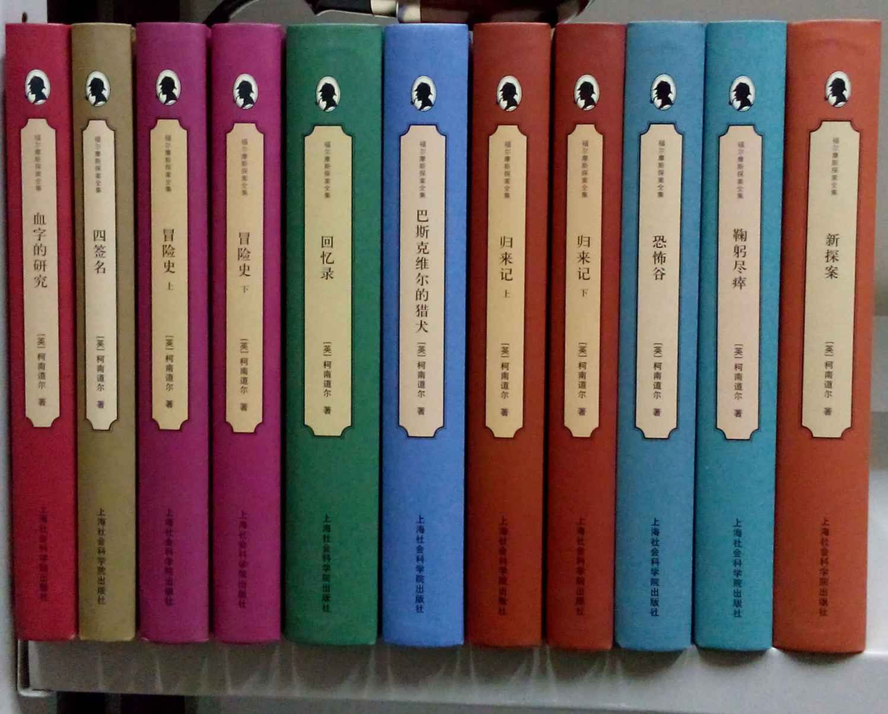

# 总目录

[福尔摩斯探案全集之一：血字的研究](part0001.xhtml)

[福尔摩斯探案全集之二：四签名](part0022.xhtml)

[福尔摩斯探案全集之三：冒险史](part0038.xhtml)

[福尔摩斯探案全集之四：回忆录](part0058.xhtml)

[福尔摩斯探案全集之五：巴斯克维尔的猎犬](part0074.xhtml)

[福尔摩斯探案全集之六：归来记](part0094.xhtml)

[福尔摩斯探案全集之七：恐怖谷](part0115.xhtml)

[福尔摩斯探案全集之八：鞠躬尽瘁](part0136.xhtml)

[福尔摩斯探案全集之九：新探案](part0148.xhtml)

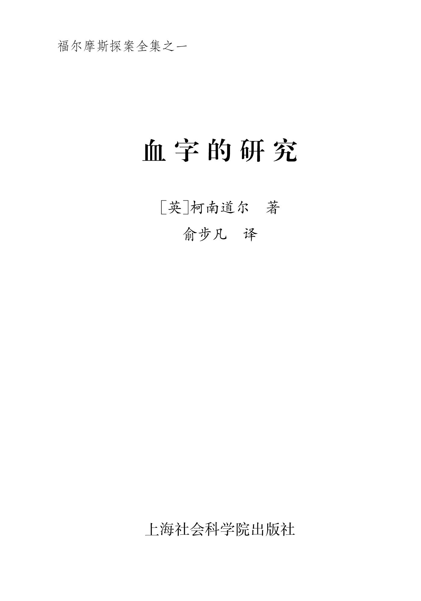

**图书在版编目（CIP）数据**

血字的研究／［英］柯南道尔（Conan
Doyle，A．）著；俞步凡译．—上海：上海社会科学院出版社，2012

（福尔摩斯探案全集；1）

ISBN 978-7-5520-0102-0

Ⅰ．①血…　Ⅱ．①柯…　②俞…　Ⅲ．①侦探小说—英国—现代　Ⅳ．①I561.45

中国版本图书馆CIP数据核字（2012）第159600号

福尔摩斯探案全集之一

**血字的研究**

------------------------------------------------------------------------

**著　　者：**［英］柯南道尔

**译　　者：**俞步凡

**责任编辑：**陈如江

**封面设计：**王小阳工作室

**出版发行：**上海社会科学院出版社

上海淮海中路622弄7号　电话63875741　邮编200020

http://www.sassp.org.cn　E-mail: sassp@sass.org.cn

**经　　销：**新华书店

**照　　排：**南京理工出版信息技术有限公司

**印　　刷：**上海中华印刷有限公司

**开　　本：**787×1092毫米　1/32开

**印　　张：**6.5

**插　　页：**2

**字　　数：**114千字

**版　　次：**2012年10月第1版　2012年10月第1次印刷

------------------------------------------------------------------------

ISBN 978-7-5520-0102-0/I·059

定价：24.00元

------------------------------------------------------------------------

**版权所有　翻印必究**

# 目录

[译序／俞步凡](#part0005.xhtml)

[第一部　前陆军军医署医学博士约翰·华生回忆录](#part0006.xhtml)

[第一章　歇洛克·福尔摩斯先生](#part0007.xhtml)

[第二章　演绎法](#part0008.xhtml)

[第三章　劳里斯顿花园街命案](#part0009.xhtml)

[第四章　兰斯警察的陈述](#part0010.xhtml)

[第五章　启事引来访客](#part0011.xhtml)

[第六章　托比亚斯·格雷格森一试身手](#part0012.xhtml)

[第七章　黑暗中的亮光](#part0013.xhtml)

[第二部　圣徒之国](#part0014.xhtml)

[第一章　大荒漠的旅行人](#part0015.xhtml)

[第二章　犹他一枝花](#part0016.xhtml)

[第三章　约翰·费里厄同先知的谈话](#part0017.xhtml)

[第四章　逃亡](#part0018.xhtml)

[第五章　复仇天使](#part0019.xhtml)

[第六章　医学博士约翰·华生回忆录补记](#part0020.xhtml)

[第七章　尾声](#part0021.xhtml)

[返回总目录](#part0000.xhtml)

# 译序

英国作家柯南道尔所推出的福尔摩斯探案小说，很快就风靡全世界，至今不衰，并已形成了一种福尔摩斯文化现象。伦敦、纽约等世界许多地方都成立有“福尔摩斯协会”，小说中虚构的伦敦贝克街221号B座也成了“福尔摩斯迷”们向往的地方，特辟为展览馆，四周成了福尔摩斯文化中心。人们崇拜福尔摩斯达到了狂热的程度，甚至以模仿福尔摩斯的衣着打扮、神态习惯为乐。福尔摩斯自从20世纪30年代随着他的探案故事进入我国以来，已是家喻户晓，成为知名度最高的外国文学人物形象。

柯南道尔，1859年生于苏格兰，1885年在爱丁堡大学获医学博士学位，1902年因为对英国的南非战争政策辩护有功而封爵。他受母亲的熏陶，从小爱讲故事，在学校里是有名的故事大王。由于受侦探小说家美国的爱伦·坡（Edgar
Allan Poe，1809—1849）、英国的科林斯（Wilkie
Collins，1824—1889）和法国的加博利约（Emile
Gaboriau，1832—1873）的影响，在开业行医的业余时间创作侦探小说。1886年，他以大学里一位具有惊人的观察和推理能力的教授为原型，塑造了一个私家侦探的形象，这侦探取名叫Sherlock
Holmes（歇洛克·福尔摩斯），并借助其副手Dr.
Watson（华生医生）讲述破案过程的结构形式，完成了第一部福尔摩斯探案小说《血字的研究》。起初投稿无人欣赏，至次年才由《比登圣诞年刊》勉强刊登发表。不过，有一家叫《利平科特》的杂志却看好他，于1890年登出了他的第二部福尔摩斯探案小说《四签名》。1891年，曾扶植过萧伯纳、克里斯蒂等多名作家的《海滨杂志》（*the
Strand
Magazine*）注意到了柯南道尔的福尔摩斯探案小说，以50英镑的优厚稿酬，发表了他的《波希米亚丑闻》（以后高至每篇100英镑）。从此柯南道尔和他笔下的福尔摩斯一起蜚声文坛。这一年，柯南道尔弃医从文，专门写福尔摩斯探案小说。1892年汇集十二个短篇的《冒险史》出版，1894年又是结集十二个故事的《回忆录》出版。由于柯南道尔另有写作计划，想终止福尔摩斯系列小说的创作，所以在《回忆录》最后一篇中让福尔摩斯与罪犯搏斗坠崖，同归于尽。不料，此结局激起读者愤怒，纷纷向《海滨杂志》投书抗议，甚至威胁、漫骂，退订杂志的读者达20万。英王爱德华二世是福尔摩斯迷，也希望读到福尔摩斯新故事，于是作者再继续写福尔摩斯，1901年创作了《巴斯克维尔的猎犬》作为福尔摩斯早期的探案故事。1903年他在《空屋伏击》的故事中让福尔摩斯重生，说是他并没有坠崖，而是战胜对手后隐姓埋名了。柯南道尔让福尔摩斯回归后，一直写到1927年才让福尔摩斯“告老退休”。柯南道尔于1930年7月7日心肌梗塞病逝。其病逝的前一年，《福尔摩斯探案全集》出版。全集出版后迅即被译成各种文字在全世界发行，而且被搬上银幕百余次，直到2012年美国好莱坞还有福尔摩斯新电影问世。

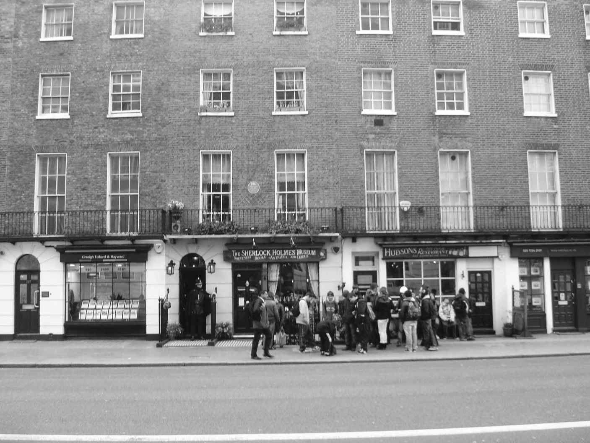

英国伦敦贝克街221号

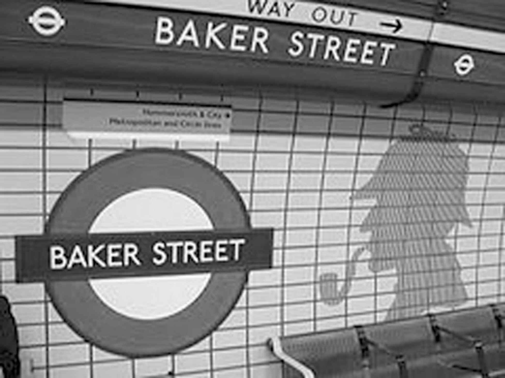

贝克街地铁站内福尔摩斯图标

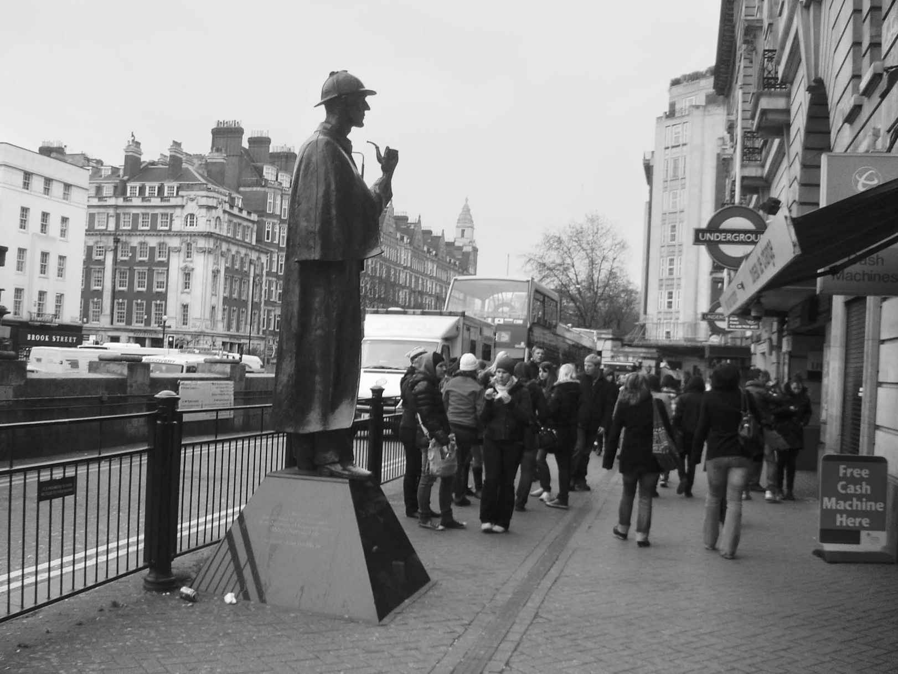

贝克街地铁站出口处福尔摩斯铜像

好奇和探究心理是人的天性。把一个案子编成错综复杂、曲折离奇、悬念迭出的故事，篇篇故事又充满着敏锐的观察力、丰富的科学知识、缜密的逻辑推理、超人的胆识与智慧，那自然会引人入胜，使人的好奇心和审美情趣得到极大的满足，这也是读者对福尔摩斯探案小说爱不释手的原因。

福尔摩斯虽然是一个虚构的人物形象，但他显然是维多利亚女王（Alexandrina
Victoria，1819—1901）时代的精神象征。首先他是一个实干而富有冒险精神的人。他工作热情、认真，不遗余力，更不顾个人的安危，他的最大快乐是通过自己的努力实现自己的目标。其次他的内心充满了平等博爱的人文情怀。他对贵族上层人物只以普通人看待，惩恶扬善，善恶分明，既疾恶如仇，又宽容为怀，许多人靠他成全，不少人受他挽救。案子结局的处理，既顾法，表现了英国近代法制的成熟、严明，更含情，充满了浓浓的人情味。第三，他崇尚科学，重知识技能，强调在观察与调查的基础上，进行分析与综合，作出假设与推论，然后再一一加以求证。借助这种实证主义的方法，他在破案过程中所向无敌。

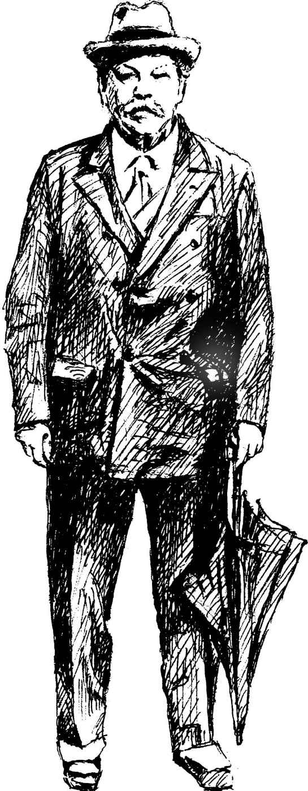

柯南道尔爵士

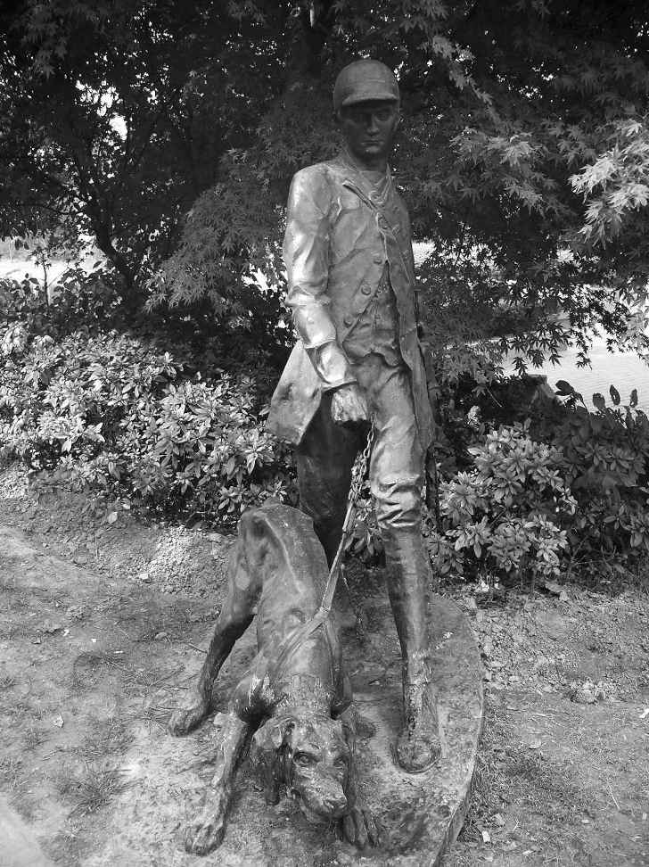

上海街区花园的福尔摩斯铜像

在作品中，作者通过不同的案情也反映了当时英国社会存在的种种问题，如巧取豪夺、通奸情杀、背信弃义、专横跋扈、贪欲逞凶、尔虞我诈，等等。与这些犯罪事实相对应的是官家警场的软弱无能，层层行政官僚机构阻碍工作效率，批个条子左等右等批不下来，让罪犯有隙可乘，几个被害人险些丧命，警官工作时时不忘邀功请赏，贪福尔摩斯之功据为己有。这些具有批判现实主义的描写，具有进步的社会意义。

一百多年来，作为侦探小说史上的一个最重要的里程碑，《福尔摩斯探案全集》已被译成57种文字，畅销全世界。英国作家毛姆曾经说：“和柯南道尔所写的《福尔摩斯探案全集》相比，没有任何侦探小说享有那么大的声誉。”我们如今推出的这个九卷本，一是以英国本（市场上通行的是美国本）为底本，完全依照当时《海滨杂志》发表时的原始状态翻译与编排；二是更追求语言的准确度和文字的美感，并增加了一些必要的注释。尽管我们作了很大的努力，但是优是劣还有待读者检验。我们衷心期望读者的批评。

俞步凡

2012年于上海

# 第一部　前陆军军医署医学博士约翰·华生回忆录

# 第一章　歇洛克·福尔摩斯先生

一八七八年我在伦敦大学获得医学博士学位，接着按规定又去奈特利专修军医课程。在那里完成学业以后，我被立即派往诺森伯兰郡第五火枪军团任助理军医。该军团那时候正派驻于印度，我还没有前往报到，第二次阿富汗战争爆发了。等我到了孟买一上岸，就听说队伍已经开拔，越过边关深入到了敌国境内。不过还有好些军官，他们的情况同我一样，也都来不及赶上部队，我就跟随着他们平安地赶到堪达哈，在那里顺利地找到了我所属的军团，立刻报到担负起我的新职务。

这次战争给许多人带来了荣誉和升迁的机会，然而在我却只是不幸和灾难，此外一无所得。我被调出原来的部队，派往伯克郡旅，随这个旅参加了迈旺德那场决死激战。在这一仗，我的肩部中了一枪滑膛枪子弹，打碎了肩胛骨，擦伤了锁骨下动脉。我真差一点要落入凶残的伊斯兰异教徒之手，全亏得我那个忠勇的勤务兵默瑞救了我，把我撂上一匹驭马，驮回英军防地，才算捡回了这条命。

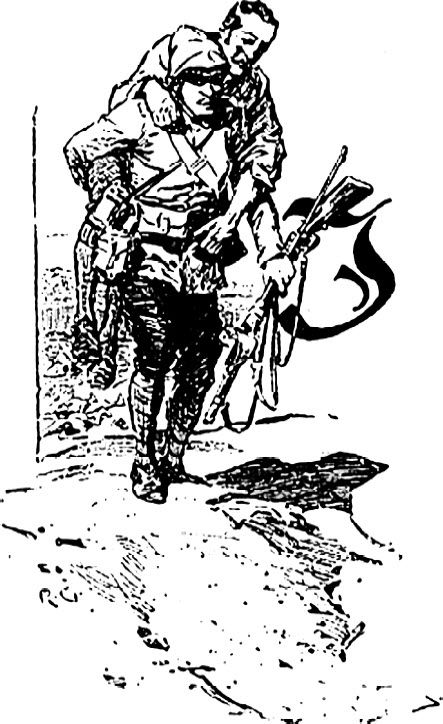

忠勇的勤务兵默瑞救了我。

伤痛折磨着我，又经长途辗转，人变得虚弱不堪，于是我被撤了下来，和大批伤员一起送到了白沙瓦后方医院。到了那里，我的身体才有好转。可是刚刚恢复到可以在病房里走动，甚至已经可以到阳台上去晒晒太阳，我又倒霉染上了印度这属地可恶的伤寒症。一连几个月，我觉得生命无望了，谁知还是活了过来，居然渐有好转，只是身体依然十分消瘦，极其虚弱。最后经院方决定，必须将我送回国内，一天也不能耽搁。于是，送我上了“奥伦梯兹”号运兵船回国，一个月以后在朴次茅斯港登岸。这时我的健康状况已到濒临崩溃的地步。还好承蒙政府眷顾，允准给我九个月的假期休养身体。

我是孤身一人，无亲无眷，回到国内因此也就可以如空气一般自由自在——或者说，一个人，靠着一天十一先令六便士的收入，随我能怎么过就怎么过。在这样的情况下，我就免不了要为伦敦所吸引。伦敦，这个大污水坑，大英帝国所有的懒汉游民都要汇聚到这里来。到了伦敦，我在河滨街找个私家旅馆落脚，住上一个时期。日子过得既不舒适，又很无聊。用钱也不看看该量入为出，手头的钱很快就所剩无几。这样下去，经济状况就吃紧了。我这才意识到，要是不想离开这座大城市，搬到乡下去住，那就得彻底改变目前的生活方式。我选择后一种改变方式的办法，决定不住旅馆了，去租一间便宜的屋子来住，减少不必要的开销，可以节省费用。

我就此打定主意，也就是这一天，我正站在克赖蒂里恩特色酒吧门前，有人拍了拍我的肩膀，我回头一看，认得的，原来是小斯坦福，以前在巴茨<a href="#part0007.xhtml_ch1"
id="part0007.xhtml_ch1-back">(1)</a>医院的时候他是我手下的敷裹手。在这茫茫人海的伦敦，我孤零零举目无亲，能忽然见到一张熟人的脸，真是幸事。斯坦福和我以前谈不上是亲密的朋友，可现在我喜出望外，忙不迭热情打招呼。而他呢，见到我也同样十分高兴。欣喜之下，我邀请他到霍尔本区共进午餐，说着就叫上一辆汉森马车<a href="#part0007.xhtml_ch2"
id="part0007.xhtml_ch2-back">(2)</a>一同前往。

“你这一阵都干什么去了，华生？”马车在熙熙攘攘的伦敦街道上辚辚穿行，斯坦福神色惊疑地问道，“看你这么面黄肌瘦的，只剩一把骨头。”

我给他大致讲了讲自己的危险经历。没等我的话讲完，车已到了目的地。

“嗨，真是倒霉！”他听了我的不幸遭遇，深表同情地说，“那你现在打算怎么办呢？”

“想找个地方住下，”我答道，“看看能不能解决住的问题，找个地方，屋子要舒适，价钱也要不贵。”

“这倒是巧了，”他一旁马上接口道，“今天你是第二个人跟我说起这个话。”

“哦，那第一个是什么人呢？”我问。

“有一个人，在一家医院实验室里工作。今天早上他在感叹可惜呢，说是好不容易才找到了称心的房子，可惜的是一个人住嫌贵了点，跟人合住吧，一时又找不到人。”

“是吗！”我叫道，“要是真的想找人合住，一起分摊房钱，我倒是愿意的，跟这个人一块儿住好了。我正嫌一个人孤单，有个伴才好呢。”

小斯坦福手举酒杯，神秘兮兮地看着我。“你还没有跟歇洛克·福尔摩斯这个人认识呢，”他说，“要讲起来，你恐怕不一定有兴趣跟他长久相处。”

“为什么，难道这个人不好？”

“哦，也不能讲这个人有什么不好。他就是脑子有点儿古怪——一些科学上的问题，他钻研起来那个劲儿真不得了。不过，人可是个正派人，说句实话。”

“是不是从事医学研究？”

“不清楚——你根本弄不懂他到底干什么。可我知道他对解剖学特别在行。还有，他是个一流的药剂师——尤其是，要知道，他并没有系统地学过医学，他研究的东西杂乱无章，野路子不少。他是个杂家，拥有稀奇古怪的知识，很丰富，让那些教授都要甘拜下风。”

“你有没有问他，他本行是干什么的？”我问。

“没有问过。他这个人，平时要他开口不容易。可是话一对了他的口味，那讲起来就滔滔不绝。”

“我倒想见见他，”我说，“我要是跟人合伙住房，静心做学问的人，我喜欢。我身体还虚着呢，吵闹、刺激都经不起。这些在阿富汗都受够了，这辈子不想再有干扰。你的这位朋友，我见个面怎么样？”

“他又准是在实验室里。”我的同伴答道，“他要么一连几个星期不去实验室，要么一去就是从早到晚泡上一整天。你要见他可以，等吃好午饭乘车一起去吧。”

“很好。”我答道，然后话题转换，谈起了别的事。

离开霍尔本区，前往医院，一路上斯坦福又向我讲述一点这位先生的详细情况，好让我同住的话有更多的了解。

“要是你发现跟他合不来，不要怪罪我呀。”他说道，“其实我对他了解也不是太多，不过在实验室遇上他几回，了解一点。你跟他租房合住，是你自己有意，以后如何，我可不负责任。”

“以后合不来，分手也不难嘛。”我回答道。“我看得出，斯坦福，”我盯住他又说道，“你这么怕担待什么，缩手缩脚定有缘故。是不是这个人脾气极坏，还是怎么的？有话别想说又不说啊。”

“其实我也不是很清楚，难以说得详细。”他笑着回答道，“福尔摩斯这个人，我看他简直是个科学迷，迷得走火入魔。我不瞎说，他会拿上点新鲜植物碱，叫个朋友用嘴来尝。要知道，这并非恶意害人，他只不过是一心想要确定这种东西有哪些效果。说真的，我相信他自己也照样会要吞的。他求知若渴，问题不搞个彻底明白，不会罢休。”

“这是很好的嘛。”

“好是好，可是他未免太过分。甚至弄到了这种地步，他在解剖室里拿根棍子往死人身体上猛抽猛打，这不是太不像话了嘛！”

“打尸体？”

“是呀，要看看人死以后会造成什么样的伤痕。我是亲眼见他这么做的。”

“你不是说，他不是学医的吗？”

“对呀，天晓得他到底在研究些什么玩意儿。瞧，咱们这就到了。他到底是个什么样的人你就自己看着吧。”说话间，我们已经拐入一条窄巷，从一扇小边门进入医院大房子的侧楼。这地方我熟悉，不用领路我们就径自上了白石台阶，顺着一条长长的走廊往前。走廊有着洁白的墙壁，两边有一扇扇深褐色的门。靠近走廊的尽头是一条低矮的拱形岔道，从这儿通向化学实验室。

实验室是一间高大宽敞的屋子，屋里有许许多多瓶子，一行行排着或是凌乱堆着，几张大矮桌随意摆放，桌上全是曲颈瓶、试管，还有小型本生灯，灯上闪着蓝色的火焰。实验室里只有一个人，正俯身在那一头的一张桌子上，聚精会神地在做着实验。听见我们的脚步声，他回过头来瞥了一眼，随即忽地直起身，高兴地叫道：“我发现了！发现了！”他边喊边拿着试管跑过来。“我成功了！这种试剂，只有碰到血红蛋白才会产生沉淀反应，别的不起作用。”瞧那神情，即使让他发现了金矿，也不会比现在更高兴。

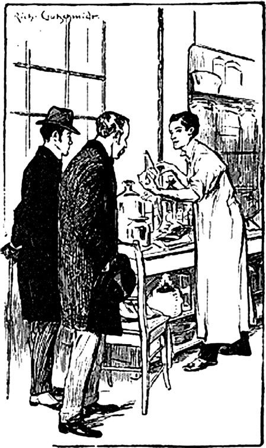

他忽地直起身，高兴地叫道：“我发现了！”

“华生医生，歇洛克·福尔摩斯先生。”斯坦福说着，给我们彼此作介绍。

“你好！”福尔摩斯热情地说，握住了我的手。他的手劲真大，我还没见过这么有手劲的人。“你去过阿富汗，我看得出来。”

“你看得出来？”我惊奇地问。

“这没什么，”他淡淡一笑说，“现在这个有关血红蛋白，才是个大问题。毫无疑问，你一定看到了，我的这项发现，意义有多么重要。”

“很有意思，毫无疑问，那是化学实验，”我答道，“但是，实际应用方面——”

“啊，我说，这可是历年来法医学的一项最大发现。从此以后，我们对血迹鉴别就有办法了，这办法万无一失，这一点你难道看不出来？好，请这边来！”他一把拉住我的袖口，急切地把我拖向他刚才做实验的那张桌子。

“我们弄点鲜血，”他说着，拿一根针在自己手指上扎一下，然后用毛细管吸了渗出的血，“现在，把这一滴鲜血放到一公升的水里。你看见了，这是混合液了，可是看上去跟清水没有两样，其中血的比例百万分之一都不到。尽管这样，我可以肯定，我们照样能得出特征明显的反应。”

他一边说，一边往试杯里放几粒白色晶体，再往杯里滴几滴透明液体，这溶液一下子就变成了暗红色，玻璃试杯的底部析出了些微棕褐色的沉淀。

“哈哈！”他拍手嚷道，那高兴的劲儿就像小孩子到手了新玩具似的，“你看怎么样？”

“这实验还真不赖，像是挺灵验。”我说。

“妙极呀妙极！旧方法，用愈疮木树脂检验，又笨又不可靠。显微镜验血球的办法也不好，血迹干掉一两个小时就验不出来。现在，不论血迹新和旧，这个办法都管用。要是这个检验方法早发明出来该有多好，数以百计的罪犯早就被绳之以法，哪里还会让他们逍遥法外。”

“那倒是。”我喃喃地说。

“侦破刑事案件往往就靠这一招。罪犯作案以后，可能要好几个月才被发现。把他们的衣服什么的拿来检验，上面要是看出有褐色斑痕，那是血迹呢、还是烂泥呢、还是铁锈呢、再或是果汁呢，到底是什么痕迹？这是个问题，让许多专家伤透脑筋。为什么？就只是因为没有可靠的检验方法。现在，我们有了歇洛克·福尔摩斯检验法，从此就不会再有困难。”

福尔摩斯这么说着，两眼炯炯有神，闪着光芒。他一手按在胸前，鞠一个躬，仿佛是在对想象中热烈鼓掌的观众致谢。

“应该向你祝贺。”我说，看他兴致勃勃的样子，令我也感到非常好奇。

“去年，法兰克福发生冯·比绍夫一案，如果当时就有这个检验法的话，他肯定上绞刑架了。此后又有布拉福德的梅森，有缪勒，臭名昭著，有蒙彼利埃的勒费弗尔，还有，新奥尔良的萨姆森。可以举上一二十件案子，这个方法都能叫他们立现原形。”

“你好像肚子里装着本犯罪案例的账本，”斯坦福大笑道，“你都可以编书了，编一本书取名叫《旧警事新闻录》。”

“那读起来一定非常有趣。”歇洛克·福尔摩斯说，一边把一小块胶布贴在针扎的手指上。“我得小心才好，”他回头笑笑，说道，“因为我经常接触有毒物品。”说着伸出手来给我看，果然一手斑驳，贴满着同样的胶布。皮肤也由于强酸侵蚀，变了颜色。

“我们来这儿，有事找你。”斯坦福说，一屁股坐在了一只三脚高凳上，又用脚把另一张凳踢给我，“这位朋友想找个地方住，你不是老说合伙租房找不到人吗，我这就给你找来了，你们俩合计着过正好。”

歇洛克·福尔摩斯听说我是有意来和他合伙租房的，显得很乐意。“我看中了贝克街上的一间套房，”他说，“我们两个人去住，正合适。我抽烟可厉害，你不在乎吧？”

“我自己就是常抽‘船’牌烟的。”我回答说。

“那就再好也没有。我经常要摆弄点化学物品什么的，有时候还要做做实验。会不会让你讨厌？”

“决不会。”

“我再想想——我还有什么地方会叫人讨厌？有时候我会变得很沉闷，一连几天都不开口说话。这种时候你千万不要以为我在生你气。你别管我就是了，我很快会好的。那么在你的一方面有些什么要关照我的？彼此的短处双方都了解，才好生活在一起。”

我看他讲了自己又问我，不由得大笑起来。“我养着一只小狗，公狗，”我说，“我很怕吵闹，因为我神经受过刺激。另外，我起床没个准时，生性就是懒。我以前身体好的时候，还有点别的坏习气，可现在主要就是这么一些了。”

“你说的吵闹声，拉小提琴算不算吵闹声？”他急迫地问。

“那要看拉得怎么样，”我回答，“拉得好的话，那可是天上仙乐——拉得糟糕的话——”

“噢，那就好了，”他高声说，开心地笑了笑，“那么，我们这就算是说定了——当然，还要看看房子你是否满意。”

“那我们什么时候去看房子？”

“明天中午，先到我这儿，我们一起去看，然后把事敲定下来。”他答道。

“好吧——那就中午。”我说，跟他握握手。

我们让他忙着做他的化学实验，告辞出来，一同走回我住的旅馆。

“倒要问问，”我忽然想起，把脚步停下，转脸对着斯坦福，“这岂不是怪事，他怎么会知道我去过阿富汗？”

同伴朝我笑笑。“他呀，就是有这么一点本事，”他说，摆出一副莫测高深的样子，“好多人都弄不明白，他怎么会有那个能耐，能料事如神。”

“哦！莫不是有什么诀窍？”我高声道，搓起了双手，“这可是够神的呀，真不简单。多亏你，让我认识这么一个人。这就叫：‘研究人类之要津在于识人。’”

“那么，想必你要研究他啰，”斯坦福跟我道别时说道，“不过，你会发现他是个难解的谜。我敢担保，结果是他知你多，你知他少。再见。”

“再见。”我回了他一声，信步走向旅馆，对新结识的这么个人满怀好奇。

————————————————————

<a href="#part0007.xhtml_ch1-back" id="part0007.xhtml_ch1">(1)</a> 巴茨（Bart's），是伦敦圣·巴多罗马医院（St．Bartholomew's
Hospital）的口头简称。圣·巴多罗马是耶稣十二门徒之一。

<a href="#part0007.xhtml_ch2-back" id="part0007.xhtml_ch2">(2)</a> 一种驾车人高居于车后的双轮双座马车，以设计者汉森（J．A．Hansom）命名。

# 第二章　演绎法

第二天我们如约见面，按照头天所讲去看了贝克街221号B座的房子。套房包括两间舒适的卧房、一间宽敞通风的客厅，家具等等一应俱全，还有两扇大窗，采光明亮。这个套房各方面我们都很中意，租金两人一分摊也就不算高了。于是当场确定成交，这房子就归我们两人租用。当天晚上我就收拾行李搬出旅馆。次日早晨，歇洛克·福尔摩斯继我之后带了几个行李箱、手提箱，也住了进来。头两天里，我们打开行囊，把东西一一陈设起来，尽量做到安置妥帖、合理、最佳，忙得不亦乐乎。一切完毕，就安顿了下来，让我们自己先熟悉熟悉新的环境。

福尔摩斯决不是一个难以相处的人。他宁静自律，生活安排得有条不紊，难得有时候夜里十点过后还不睡觉，每天早晨都是我还没起床，他已经吃过早饭出门了。有时候，他整天待在化学实验室，或者待在解剖室。偶尔也要出行稍远，往往都是跑到伦敦的最底层贫民区。只要让他工作一搭上手，他就有使不完的劲。可是也有相反的情况，有时他会一连几天躺在客厅的沙发上，从早到晚几乎一言不发，一动不动。每逢这种时候，我注意到他的眼神迷茫飘忽，我怀疑他是使用麻醉剂上了毒瘾。不过那绝对不是，我知道他的整个生活习性节制有度，讲究干净整洁。

随着几个星期过去，我对他的兴趣、对他何以为生的好奇心也日益增长。即便他的身材相貌，也让人乍一见面就会引起注意。他身高六英尺有余，因为格外瘦削，所以看来更显得高挑。目光锐利，咄咄逼人，只有在他神情恍惚、茫然若失的时候除外——这我前面已有提到。一个高高的鹰钩鼻，使他整个面容神态显得特别机警果敢；方正、突出的下巴，这是男子汉坚毅刚强的表征；手，一直是墨水迹、药物痕斑斑驳驳。然而他的一双手出奇地纤巧灵敏，我常常特意看他，观察他多么熟练地操持那些精致易碎的实验仪器。

读者或许要把我看成是个生性恶习专管闲事的人，喋喋不休自称这个人是如何地激起我的好奇心，要我来一再替他饶舌不止，而他对他自己却是讳莫如深、守口如瓶。不过，先别忙下结论，请不妨想想，我的生活是多么空虚、无所作为，实在是没有什么别的事值得我去关注。我的健康状况，除非哪天天公为我作美，否则不允许我外出多动多跑。再说我没有朋友，没有人来看我，帮我排遣掉每日的单调与寂寞。情况既是如此，我自然把这位同伴身上的谜团视若至宝，不惜花费时日非要揭秘探宝不可。

他并不是在研究医学。他在回答一个问题的时候，亲口证实了斯坦福这个说法是正确的。他也不像是在研修哪一门课程，准备拿到一个理科学位，又不像要获取认可的资格以求进入学术殿堂列有一席之地。然而他的研究，精神可嘉，热忱惊人。尤其是各类冷门知识，广博不失微末，说起来一套套头头是道，我是闻所未闻，只有惊异的份儿。显然，一个人惟有胸怀坚定不移的志向与目的，否则决不可能工作如此勤奋，达到如此高的造诣。读书学习如果漫无目标，鲜有学术精湛著称者。没有人会拿些无谓的事无端去烦劳其心智，他所以这样做，必有他的目的与缘由。

这个人有无知的一面，恰如他知识丰富的一面同样地惊人。对当代文学、哲学和政治，他几乎一窍不通。我引用托马斯·卡莱尔<a href="#part0008.xhtml_ch1"
id="part0008.xhtml_ch1-back">(1)</a>的作品，他幼稚到问我那是谁，干什么的。然而这还不算可笑，更叫我惊讶到极点的是，有一次无意间发现他对哥白尼学说和太阳系的构成居然一无所知。如今十九世纪，稍有文化的人不会不懂地球绕日运行这点知识。所以我想这真是出奇的怪事，简直匪夷所思。

“你好像大感惊讶了，是吧？”他说道，对我的惊奇报以微笑，“就算我知道，我也要尽量把它忘记。”

“把它忘记？”

“你听我说，”他解释道，“我认为，人的脑子也就等于是一间空阁楼，就是头顶上的顶楼，你把家具都往里面放的时候，得有选择。一个傻瓜，尽把没用的东西往里塞，捞到什么放什么，这么一来，对他实际有用的知识就再也放不下，给挤掉了。或者充其量，跟别的破烂乱七八糟堆在一起，结果到须要用的时候，要找哪一样就找不到。你要明白，熟练工老师傅就长心眼儿，往脑子这间阁楼里放什么很有心计。他只要干活有用的工具，别的都不要。可是工具也各种各样一大堆，所以还得放得井然有序。要是以为那间小屋的墙反正是有弹性，扩充再扩充可以没个完，那就错了。要是不知其错，硬是什么知识都往里装，总有一天会把你以前学到的有用东西都忘记。这一点很重要，至关重要，不可以让无用的东西把有用的东西给挤掉。”

“可是，太阳系知识，怎么能不要！”我申辩着。

“这到底跟我有什么相干？”他不容我分辩，打断我，“你是说我们都在绕着太阳转呀跑，要是我们都在绕着月亮跑，对我，对我的工作也不会有丝毫的影响。”

我正想问他是什么工作，可是看他的神态，问这个问题似乎不合适。于是，我把我和他短短的谈话想了一想，竭力想从中作出推论。他说他不愿掌握对他的目的无关的知识，那就是说，他所拥有的知识都是对他有用的。我在心中仔细掂量，他在我面前显露出特别精通的是什么知识，用铅笔一项项记下来看看。等我全部记完，看着单子不禁笑了。列项如下：

**歇洛克·福尔摩斯知识能力**

1．文学知识——零。

2．哲学知识——零。

3．天文知识——零。

4．政治知识——肤浅。

5．植物知识——不全面。熟知颠茄、鸦片及各种毒品，不懂园艺。

6．地质学知识——实用，有限。善于识别土质；外出回来裤脚上沾有泥迹，按色泽、浓淡即可分辨是在伦敦何处所沾。

7．化学知识——精深。

8．解剖知识——精确，但无系统。

9．要案文献知识——极丰富。对本世纪各类离奇惊险的要案大案，均了如指掌。

10．善小提琴。

11．善棒术、拳击、击剑。

12．精通英国法律司法。

这个单子记到这里，我越看越泄气，立刻扔火里烧了。“把所有这些知识本领凑合在一起，看看这位仁兄到底是做什么行业，是什么工作才用得上他这些个条件，”我自言自语着，“看不出，白忙一场，只能作罢。”

但有一点还是清楚的，就是上面提到的小提琴，他确实技巧高超。但也和其他的知识本领一样，有点旁门左道。他能拉一些乐曲，还都是相当高难度的曲子。这我知道，因为他曾经应我之邀，拉过门德尔松的《无词歌》，还有其他一些名曲。不过在他独自一人的时候，就难得听见有正经的曲调或是耳熟能详的旋律。黄昏，他靠在扶手椅中，闭起两眼，把琴往膝头一搁，有心无心随手拨弦。弦音一会儿响亮，一会儿沉郁，偶尔欢蹦乱跳。显然，这都反映着他内心的情绪。但是，到底是琴音为他的情绪推波助澜，还是只不过兴之所至，任意拨拉几下罢了，那就非我所能评判。他如此暴殄天乐，我大为反感，几乎想要抗议。幸好每逢乱弹之后，马上飨我以几曲雅音而终场，也算对我忍耐力的考验小有补偿。

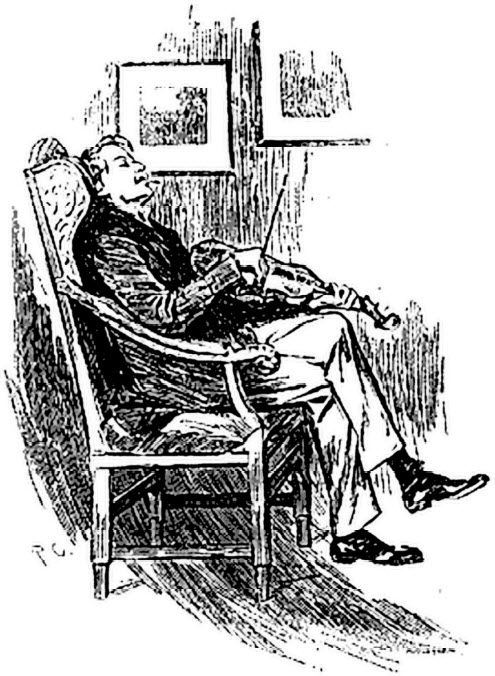

黄昏，把琴往膝上一搁。

第一个星期，无人来访。我这就想了，莫非这位同伴也与我一样，系无朋无友之辈。然而到了现在，我才知道他认识的人还真不少，结交社会各阶层五彩缤纷。其中有一个人，面呈土色、獐头鼠目、眼眸乌黑的小个子，经介绍，知道是莱斯特雷德先生。此人一星期要来上三四回。有一天早晨，一个年轻姑娘来访，穿戴入时，待了约莫一两个小时。当天下午又有人来，一个花白头发、衣衫褴褛的人，模样像是犹太小贩，看他情绪很激动，身后紧跟着来了一个邋邋遢遢的老妇人。还有一次，一个满头银发的老绅士，来和我的同伴晤谈。又有一次，是一个车站脚夫，穿一身绒布制服。每当这些不速之客到来，福尔摩斯总是请我让他使用客厅；我二话不说，退到我自己的卧房里去。他觉得是麻烦，很过意不去，每次总要道歉。“我把这一间用做办公地方，也是没有办法，”他说，“这些来客都是我的当事人。”好，这正是可以向他直截了当提问的好机会。然而，我是个很知趣的人，不肯为难别人来遂自己的心愿。此刻我在想，他不向我吐露必有他的隐衷。谁知，很快，却是他自己打消了我的顾虑，直率地毫不隐瞒地谈了他自己。

那是三月四日这一天，这日子不会忘记是有原因的。这天我起得比平时略早，看见福尔摩斯还没吃完早饭。女房东已经知道我有晚起的习惯，所以桌上没有放我的餐具，也没有给我预备好咖啡。男人容易莫名上火，我伸手就按铃，扔过话去，快给我来早餐！桌上有一本杂志，我随手捡过来翻看。饭还没有来，趁这时间看看。我的同伴自顾大嚼其烤面包，一声不吭。杂志上有一篇文章，标题给打了铅笔记号，我很自然先把这一篇看起来。

文章题目大而不得要领，叫什么《生活要略》。文章企图告诉读者，凡是善于观察的人对周围一切作细心而有系统的审视，必将获得非常丰富的知识。我初看之下，只觉得是一篇大杂烩，精辟独到与荒唐可笑兼而有之。其论证缜密严谨，但整个推论在我看来不免牵强附会、夸大其词。作者声称，他根据某人一瞬间的表情，或是肌肉一牵动、眼神一闪烁，便可洞悉其内心世界。按照他的说法，那谎言与欺骗，对于观察和分析素有锻炼的人而言，全无作用。他的结论，必将如同众多欧几里得几何公式一般颠扑不破。他的结论在不知内里的人看来，确实惊诧莫名，如果弄不明白他得出这些结论的推理过程，很可能把他奉为未卜先知的神人。

“从一滴水，”作者说道，“逻辑学家便可以推知有个大西洋或是尼亚加拉大瀑布，而本人无须亲眼看见过或亲耳听说过。所以，全部生活是一根大链条，我们只需见其一环，就可知其整体与性质。而欲达登峰造极之地，人们毕其一生的精力也未必能够如愿。研究问题，当转入事情涉及道德和心理这些最困难的问题之前，应从掌握和解决基本问题着手为好。令探讨问题者要学会遇人看一眼就能说出此人的经历，识别属于何种营生或职业。这种锻炼看来似乎幼稚，但确实能使观察力变得敏锐，而且教人从哪些方面去观察，以及应该观察哪些内容。从一个人的手指甲、衣袖、鞋子、裤子膝盖、食指拇指的茧皮以及表情、衬衫袖口——所有这些细微处都清楚表明着这个人从事何种职业。若是所有这些特征加在一起尚不能令称职的刑案调查者眼明心亮，则是不可想象的。”

“一派胡言！”我叫道，把杂志啪地往桌上一丢，“废话连篇的文章，我这辈子还是头一回见。”

“什么文章？”福尔摩斯问。

“就是这一篇，”我说，正坐下来吃早餐，用手里的汤匙指了指，“上面你做了记号的，我知道你也看过了。我不否认文章写得很漂亮，可是叫我恼火。是哪个吃饱了撑的家伙，在摇椅里胡思乱想闭门造车，炮制出这种似是而非的谬论。说的这套根本行不通。不信让他到地铁<a href="#part0008.xhtml_ch2"
id="part0008.xhtml_ch2-back">(2)</a>三等车里，叫他一个个说说乘客都是做什么职业的，我打他个赌，一千对一都行，他绝对输。”

“你非输不可，”福尔摩斯平静地说，“这篇东西嘛，本人所写。”

“你？”

“对。我在观察和推理两方面都有点兴趣。文章里所写的论证，你看来觉得荒唐，其实都是很实际而且挺管用的，我就是靠着这些论证，用它挣牛奶面包填肚子的。”

“靠这有饭吃？”我脱口问道。

“嗯，我有我自己的活路。我这活路世上只此一家，别无分号，叫作顾问侦探。这是什么意思呢？你知道，在伦敦，有的是政府的官家侦探，还有私家侦探。这些人遇事没辙的时候，就来找我，叫我帮他们理头绪找线索，他们向我提供事实证据。一般来说，我都没有问题，根据掌握的历年刑案知识，能帮他们找对路子。犯罪行为往往雷同，总有相似，只要手上掌握一千个案例，了如指掌，就不愁对付第一千零一个案子，解决不了才怪。莱斯特雷德是位知名侦探。最近他被一桩伪造文书的案子弄得伤透脑筋，没办法，就来找我了。”

“还有其他那些人呢？”

“大都是私家侦探介绍来的，都是遇事解决不了，需要指点迷津。我听他们讲出事实经过，他们听我作出分析，钱就这样到我口袋里来了。”

“那意思就是说，”我打断了他，“你可以足不出户，就把案件的问题解决，尽管案情细节都掌握在他们自己手中，可别人都是毫无办法，是不是这样？”

“一点不错，正是如此。那种事情，我都已经有了直觉。有时候来的案子很复杂，有难度，这就得亲自出马，亲眼观察，去忙活一阵了。你知道我有好多专门知识，都是解决问题的，一一用上案子就可迎刃而解。这篇文章呢，里边讲到的那些个推理法则，叫你耻笑了。不过实际工作上确实还挺管用。观察，是我的第二种本能。咱们初次见面那一回，我说你是刚从阿富汗回来的，你不是感到挺奇怪吗？”

“准是有人告诉过你。”

“根本没有，是我凭自己眼睛看出了你从阿富汗回来的。长期养成的习惯，脑子转起来飞快，一下子就得出了结论，一点没意识到还要按部就班地思考。若是按部就班地一步步说，其中是个推理过程，是这样的：‘这位先生是从事医学工作的，明显有军人风度，那就清楚了，是位军医；他是从热带地方刚回来，因为脸晒黑了，可他本身皮肤并不黑，因为他的腕关节白着呢；他经历过磨难，身体有病，这从脸上一望便知，形容枯槁；左臂有伤，使唤起来有点僵硬，不自然；那是在热带的什么地方，让一位英国的军医吃了许多苦，还伤了一只胳膊呢？这不用说，阿富汗呗。’这就是整条思路，思路之快，不到一秒钟。当时我说你是从阿富汗回来，你还大大吃了一惊呢。”

“你这么一解释，倒确实挺简单，”我说，笑了起来，“这让我想起爱伦·坡<a href="#part0008.xhtml_ch3"
id="part0008.xhtml_ch3-back">(3)</a>写的那个杜班侦探，想不到这种故事人物在现实中还真存在呢。”

福尔摩斯站起身来，点燃烟斗。“你这是有意拿我比作杜班来抬举我，”他说，“不过，依我看，杜班算不得什么角色。他那点玩意儿无非静候那么一刻钟，才忽然打断朋友的思路，点到关节上，这叫卖弄，未免肤浅。当然啦，他有点分析的才能，可决不是非凡的天才，爱伦·坡写得美就是了。”

“你看过加博里约<a href="#part0008.xhtml_ch4"
id="part0008.xhtml_ch4-back">(4)</a>的作品没有？”我问，“勒考克算得上你心目中的侦探吗？”

福尔摩斯嗤之以鼻。“勒考克，不中用的笨蛋，”他说，语带嫌恶，“这个人只有一件事还值得一提，那就是精力旺盛。这本书看得我大倒胃口，所谈问题不过是怎么样找出疑犯。换了是我，不出二十四小时，就能把他找出来，勒考克得六个月。有这个时间，恐怕可以写本刑侦教科书了，教人该怎么做，免得劳而无功。”

这两个人物是我所崇拜的，现在竟给他说得如此一文不值，我不免心中愤慨。我自顾走到窗口站定，望着外面繁忙的大街。“这位仁兄聪敏算是聪敏，”我思忖道，“可实在是太自负。”

“这么些天来，不见有案子，没有犯罪的，”他抱怨道，“做我们这一行，长这么个脑袋还有什么用呢？我清楚，靠着这么个脑袋，可以扬扬名。古往今来，还没有谁能以这样高的学识和天分，用到刑事侦破上去，迄今仅我一人而已。可是结果怎么样呢？无案可破，最多，不过几个小蟊贼犯事，动机、手段一清二楚，就连苏格兰警场<a href="#part0008.xhtml_ch5"
id="part0008.xhtml_ch5-back">(5)</a>警官也能当场一眼识破。”

他这种口气，自以为是，大言不惭，很不入耳，我心想还是换个话题吧。

“我正捉摸，那个人在找什么呢？”我这么问着，指指窗外有个体格健壮、衣着平常的人，在街对面慢慢地走，盯着门牌号一个个数过去。手中拿一只蓝色大信封，显然是要送信。

“你说的这人，该是个海军陆战队退伍中士。”福尔摩斯说。

“又是吹大牛！”我心中暗忖道，“他明知我无法证明他这么猜是对还是错。”

正这么想着，只见我们瞧着的那个人认清了我们这里门上的号头，迅速从街对面跑过来。听见了急促的敲门声，接着是楼底浑厚的嗓音、上楼梯沉重的脚步声。

“歇洛克·福尔摩斯先生有信。”来人说着，跨进房间，把信交给我的朋友。

这可正是压压他锐气的好机会。刚才他信口开河，万没想到有了眼前这一刻。

“我问一声，朋友，”我用最和蔼的语气说道，“请问您做什么工作？”

“送信的啊，先生，”他回答，粗声粗气，“制服破了，拿去补了。”

“那你以前是——？”我又问道，一边故意朝福尔摩斯瞟上一眼。

“海军陆战队军士，先生，皇家轻步兵团，先生。没有回信？好的，先生。”信差脚跟喀嚓碰拢，举手一个敬礼，转身走掉。

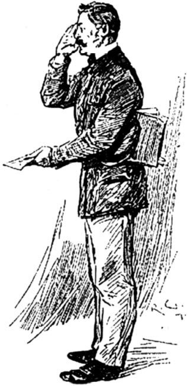

信差举手一个敬礼。

————————————————————

<a href="#part0008.xhtml_ch1-back" id="part0008.xhtml_ch1">(1)</a> 托马斯·卡莱尔（Thomas
Carlyle，1795—1881），苏格兰散文作家、历史学家，著有《法国革命》、《论英雄、英雄崇拜和英雄史绩》等。

<a href="#part0008.xhtml_ch2-back" id="part0008.xhtml_ch2">(2)</a> 1863年1月10日世界首条地铁在伦敦通车，当时以蒸汽机车牵引列车，1890年改为电气化。

<a href="#part0008.xhtml_ch3-back" id="part0008.xhtml_ch3">(3)</a> 爱伦·坡（Edgar
Allan
Poe，1809—1894），美国诗人、小说家、文艺评论家，侦探小说创始人，著有诗歌《乌鸦》、恐怖小说《莫格街的凶杀案》等。

<a href="#part0008.xhtml_ch4-back" id="part0008.xhtml_ch4">(4)</a> 加博里约（Gaboriau，Emile，1832—1873），法国侦探小说之父，著有《勒鲁日案件》、《勒考克先生》等。

<a href="#part0008.xhtml_ch5-back" id="part0008.xhtml_ch5">(5)</a> 苏格兰警场（Scotland
Yard），即伦敦警察厅（侦缉处）。

# 第三章　劳里斯顿花园街命案

我承认，这确实令我大吃一惊。我同伴那套理论的实践意义又一次得到验证，我对他的分析能力因此转而大为钦佩。但是我心中仍然暗藏疑虑，说不定这整个事情是他事先做好手脚的一出戏，存心用来捉弄我。至于这么捉弄我究竟是何目的，我自己也说不出个所以然。我看到他已经读完来信，两眼茫然若失，神情若有所思。

“你究竟是怎么推论出来的？”

“推论什么？”他愣愣地反问。

“那人，退役的海军陆战队中士。”

“这种鸡毛蒜皮，我没工夫说，”他口气冲人地回答，但随即面露笑容，“请原谅，我对你粗鲁无礼。你打断了我的思路，不过这样也好。怎么，那人是海军陆战队中士，你真的没能看出来？”

“看不出，真的。”

“这个事我给你解释得费点口舌，可是一说穿也就简单不过。就像，要你证明二加二等于四，那很困难，然而这是事实，你绝对相信，用不着证明。刚才虽然隔着一条街，我还是能看得见这个人的手背上刺有一只蓝色铁锚。这是个特征，让人想到海员。他走路姿势很有军人风度，留着络腮胡，那样子正是部队里的规矩。好了，我们就可以说他是海军陆战队了。他很有些气派，身上有股子傲气，有点惯于发号施令的味道。你该看见了，他那副昂首挥起手杖的姿态，一脸的威严，还有，中年人——这一切事实，使我相信他曾经当过中士。”

“高明！”我不禁脱口而出。

“极小的小事。”福尔摩斯说。嘴上是这么说，从他的表情流露看得出，我这么大为惊奇又大加赞扬，他还是很得意的。“我刚才说的没有犯罪，我是说早了，不对的，瞧瞧这个！”他把信差送来的信递给我。

“唷，”我眼睛在上面一扫，不由得叫起来，“太可怕了！”

“这件事非同寻常，”他平静地说。“请你给我念念怎么样？”

这就是我给他念的信——

亲爱的歇洛克·福尔摩斯先生：

昨夜布里克斯顿路附近的劳里斯顿花园区3号发生命案。有巡警执行巡逻，约凌晨两点，发现屋内有灯火。该屋一向空关无人居住，即生怀疑恐有不测。及见屋门洞开，前室空屋一间，却有卧地男尸一具。该尸衣着整齐，口袋里有名片，是“伊诺克·J．德雷伯，美国俄亥俄州克利夫兰城”等字。没有被抢劫的迹象，亦未发现任何死因证据。室内有几处血迹，但尸体无伤。我等不解此人如何能进入该屋，深觉事件疑云颇重，诚希拨冗于十二时前惠临现场。我在此恭候，接奉回示之前，这里之一切均予保护。若不能莅临，则我将前来奉告详情，期蒙指教，不胜感激之至。

您忠诚的

托比亚斯·格雷格森

“这位格雷格森，算是苏格兰警场的佼佼者，”我的朋友说，“他，还有莱斯特雷德，都是矮子里拔出来的长子。两人也称得上身手敏捷，机警干练，可惜因循守旧——糟就糟在这里。还要互相明枪暗箭，勾心斗角，像交际场上的卖笑妇你嫉我妒。所以，两个都插手这件案子的话，嘿嘿，那就有好戏看喽。”

看他还在不急不忙侃侃而谈的样子，我倒是心都悬起来了。“一分钟也耽搁不得呀，得赶快，”我叫道，“要我去给你叫马车吧？”

“我还拿不定去不去呢。我确是世上大懒虫，那是说懒劲上来的时候。不然的话，说来劲就来劲，劲头十足呢。”

“别说啦，这不是机会来了吗，你不是一直盼着吗！”

“老兄，这事跟我有什么相干呢？假定，我破了案，你瞧着吧，准是格雷格森、莱斯特雷德他们这帮人把功劳都抢去。谁叫我是非官方人士！”

“可是，是他求助于你的呀。”

“是呀。他明知我比他强，当面是承认，可是在别人面前绝对不会，割掉他舌头也不承认。话虽如此，咱还是去吧，不妨看看去。我自己做自己的，即使我一无好处，也可以笑他们一笑。走吧！”

他快速地披上大衣。他那迅捷亢奋的神态表明他已经劲头十足，压倒了无动于衷的消极和冷漠。

“你戴上帽。”他说。

“要我也去？”

“也去，你反正没事嘛。”

一转眼工夫，我们已坐上一辆双轮马车，心急火燎地向布里克斯顿路疾驰。

这是个阴霾密布的早晨，灰蒙蒙的雾霭像一片帷幔笼罩在屋顶上，同潮湿泥泞的街道恰成映照。我的同伴兴致正高，大谈其克雷莫纳<a href="#part0009.xhtml_ch1"
id="part0009.xhtml_ch1-back">(1)</a>小提琴，以及斯特拉迪瓦里小提琴和阿马蒂小提琴有什么区别。而我呢，却是一声不吭，这阴沉的天气以及将要面临的阴森可怖的任务使我闷闷不乐。

“你好像没怎么把这桩案子往心里去。”我终于开口说话，打断福尔摩斯那篇音乐宏论。

“还一无所知呢，”他回答，“如果没有取得所有的证据先盲目推理，那是绝对的错误。这样得出的结论，偏差何止千里！”

“你马上就能掌握情况，”我说，伸手指指前方，“这就是布里克斯顿路，我看就是那幢房子了，大概不会错。”

“不错。停下，车夫，停下！”其实离那房子还有一百码光景，他却坚持一定要停车，剩下这段路我们只好步行过去。劳里斯顿花园三号，阴森可怖，看上去就像是一座凶宅。那里一共有四幢房子，这是其中一幢，都离街有一段距离，两幢有人住，两幢空着。空屋朝着路的方向是三排窗，十分凄凉，窗上寂然无色，只有东一块西一条的“招租”纸，挡着灰蒙蒙的窗玻璃，犹如眼生白内障。屋前小花园，七零八落长着丛丛乱草矮树，把几幢房子同大路隔开。园中穿过一条小径，用黏土砂砾掺和铺就，微呈黄色。夜雨之后，满地湿漉漉。花园围有三英尺高的砖墙，墙上竖立木栅栏。那一边，有个身材魁梧的警察正倚墙而站。周围有几个闲人，伸长脖子使劲朝屋里望，想亲眼目睹这屋中的出事情景，但是什么也看不见。

我原以为福尔摩斯会直奔屋内，立即投入疑案调查，谁知他好像无此打算。临到现场，看他还若无其事的一般，特意要在我面前装模作样一番似的，在路边来回徜徉，莫名其妙地朝地上、朝天上、朝对面屋子、朝围墙栅栏，这么东看看西望望。如此视察一通之后，才慢悠悠踏上小径，确切地说，是踏着路边草挪步前行，两眼目光直盯住地面。他有两次停下脚步。一次我还看见他脸上微微露笑，听见他嘴里得意地啧啧有声。潮湿泥泞的地上有许多脚印，但都给警察来来去去踩过，我实在指望不了我的同伴能看出些什么名堂。不过他那敏锐的观察力，我是有过领教的，所以还是相信他会辨别我所看不出的迹象。

到了房屋门口，遇上一个面色白净、灰黄头发的高个子男人。他手里拿着记事本，赶忙迎上来紧握住我同伴的手，喜形于色。“你来了，真是太好了，”他说，“这儿一切都保持原样，没有动。”

“那儿动了！”我朋友回他说，指指小径，“已被踩得稀烂，比几头小牛走过还要糟糕。不过，格雷格森，想必你心里已经有底，才允许把路给踩掉。”

“屋里的事够我忙着呢，”这位侦探推脱着说，“我的同事莱斯特雷德先生也到了。这外边，我是叫他管着点。”

福尔摩斯向我瞥一眼，竖了竖眉毛，意有嘲讽。“已经有你和莱斯特雷德两位到场，第三者插手进来也就没啥可看的了。”他说。

格雷格森搓起双手，自鸣得意。“我看就是，该做的我们都做了，”他答道，“可是这是桩奇案，我晓得这就正好合你的胃口咯。”

“你不是坐马车来的？”福尔摩斯问他。

“没有坐马车，先生。”

“莱斯特雷德也不坐车？”

“也不坐，先生。”

“好，我们进屋里去看看。”他问了那些没头没脑的话之后，就跨步进屋。格雷格森后边跟随，一脸惊诧莫名的神色。

有一段不长的过道，铺着地板，布满灰尘，通向厨房及各个下房，过道两边各有门。一扇门明显是长期关闭不开的，另一扇是餐厅门，疑案就发生在这一间。福尔摩斯走进去，我跟在后面，临到凶杀现场，我忐忑不安。

这是一间正方形大屋，家具摆设一件也没有，看上去就显得格外宽大。墙上贴着俗艳的壁纸，已经布满斑斑点点的霉迹，好些地方都已破损，一条条一片片地掉落，露出黄黄的灰泥墙面。对门那边是一座精工雕琢的壁炉，壁炉上面是人造大理石台架。台架的一端竖着一段点剩的红蜡烛。只有一扇窗户，上面全是污迹，透进的光线迷迷蒙蒙，整间屋子阴沉黯淡，再加上处处积满灰尘，便更添灰溜阴郁的情调。

这种种细节我都是后来才注意到的。刚一进去，当场的注意力全集中在那尸体上。一具可怕的尸体僵卧地板，一对死灰无光的眼睛直视着褪色的天花板。死者约莫四十三四岁的年纪，中等身材，宽肩，黑色鬈发，拉碴的短胡子；身穿绒面呢双排扣礼服大衣、背心、浅色长裤，硬领和袖口洁白干净；身旁地板上有一顶整刷如新的礼帽；双手握拳，两臂摊开，腿却绞缩在一起，仿佛临死前有过一番痛苦的挣扎。那张僵硬的脸神态恐怖，而且，我觉得还透着仇恨，这样的面孔表情我真是从未见过。脸部扭曲，充满恶意和恐惧，又是前额低削，鼻梁短塌，突颚缩下巴，完全是猴子、猩猩的相貌，再加身体歪扭僵硬的姿势，那样子再像不过。各种各样的死人我曾见过不少，可是如眼前的这么一具，搁在直对伦敦郊区大道的一幢阴暗肮脏的屋子里，那情景尤其吓人，实在还不曾见过。

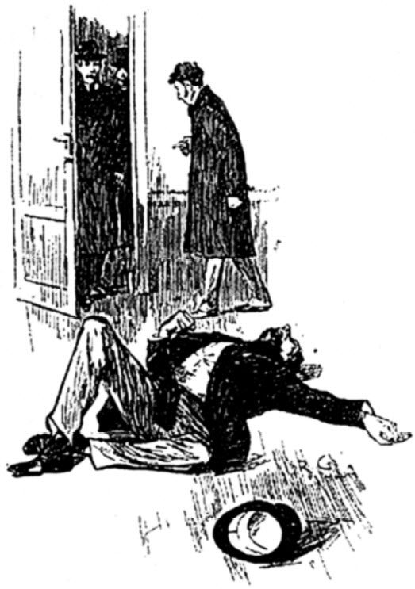

一具可怕的尸体僵卧地板。

莱斯特雷德还是老样子，精瘦干练，此时正站在门口，向我的同伴和我打招呼。

“这案子会引起轰动，先生，”他说道，“这种场面我还没有经历过；办案，我可是见过世面的人，不是初出茅庐。”

“还没有线索吗？”格雷格森问。

“一点也没有。”莱斯特雷德应声回答。

福尔摩斯走近尸体，跪下去仔细查看。“你们肯定确实没有伤？”他问道，指指周围点点滴滴溅着的血迹。

“肯定没有！”两个侦探异口同声。

“那就是说，这血迹是另外一个人的——如果真是一起凶杀案，那个人就是凶手了。这个情况，叫我想起一八三四年乌得勒支的案例，名叫范·杨森的人被谋杀，和这情形类同。你记得这个案子吗，格雷格森？”

“不记得，先生。”

“再去读一读——重温一遍，很有必要。同一太阳下，没有新鲜事，都是前人做过了的。”他一边说着，一边用十个灵巧的手指在尸体周身这里摸摸，那里揿揿，再解开纽扣，细细地看。他两眼又恍惚失神起来，如我先前说过的那样子。一会儿就做完了检查，出手之迅捷、细致，旁观者都来不及看周全。末了，他还凑到死人嘴边去闻一闻，再看了看他那双漆皮皮鞋的鞋底。

“尸体一直没有动过吧？”他问。

“做检查的时候就看了看，别的没有动。”

“送停尸间吧，”他说，“没什么好查的了。”

格雷格森备有担架，还有四个抬担架的人。他一声招呼，四人就进来把尸体放上担架抬走。当尸体搬起的时候，丁零掉下一枚戒指，滚在地板上。莱斯特雷德赶忙捡起来，傻眼盯着瞧。

“吓，有女人来过，”他叫道，“是女人的结婚戒！”

他说着，把戒指搁在手掌上伸过来。我们围着他仔细看。的确，一枚普通的金戒指，新娘戴的婚戒。

“这一来，事情可就更复杂了。”格雷格森说，“天哪，案子本来就已经够复杂了。”

“你怎么不想想，不是更简单了呢？”福尔摩斯反问道，“再看也看不出什么了，你们检查过他口袋没有？”

“检查到的东西都在这儿，”格雷格森说，手指走道楼梯口的一堆物件，“一只金表，表号97163，伦敦白劳德表店制；艾尔伯特金链，又重又粗；金戒指，刻着同济会标记；花饰金别针——狗头形，狗眼是两颗红宝石；俄罗斯名片皮夹，有名片，是‘伊诺克·J．德雷伯，克利夫兰’，同衬衣上的E．J．D．三个字母相符；没有钱夹，只有七英镑十三先令零钱；袖珍本薄伽丘《十日谈》，扉页上有签名‘约瑟夫·史坦格森’；两封信——收信人一封是E．J．德雷伯，一封是约瑟夫·史坦格森。”

“地址呢？”

“美国交易所，河滨大道——留局待取。两封信都是盖恩轮船公司发出，内容是通知轮船从利物浦启航的时间。可见这个死者打算回纽约去。”

“那个叫史坦格森的人，你有没有作过调查？”

“我马上就作了调查，先生。”格雷格森说，“我把启事发给所有的报纸，还派手下人去了美国交易所，现在人还没有回来。”

“向克利夫兰发电报了吗？”

“我们今天早晨发去了电报。”

“你们问些什么内容？”

“我们把案发情况大致讲了讲，还说如蒙提供有关材料将不胜感激。”

“你没有问任何在你看来是关键的细节吗？”

“我问了史坦格森的情况。”

“还有别的呢？这个案子还有关键问题呢？你不打算再发电报了？”

“要讲的话我都已经讲掉了嘛。”格雷格森说，口气已颇不耐烦。

福尔摩斯暗自好笑，还想再说些什么，那莱斯特雷德，我们到了走道上这么讲话的时候，他一直还在餐厅里，这时跑了过来，搓起双手，一副得意洋洋的神气劲儿。

“格雷格森先生，”他说，“让我给发现了，头等重大的发现，要不是我一丝不苟地检查墙上，就要给漏过去了。”

小个子讲着话，眼里闪闪亮，他这一下明显占了同事的上风，强自按捺着内心那个高兴劲儿。

“到这儿来。”他叫道，快步走回餐厅。由于屋里可怖的死人已经搬掉，气息清新了许多。“好，站过来！”

他在皮鞋上划亮一根火柴，举到墙上。

“瞧这儿！”他说，完全是得胜者的口吻。

我前面讲过，墙纸许多地方已经剥落，屋里那边的墙角，就有一大片撕裂下来，露出粗糙的黄墙面。就在这块裸露着的墙面上，潦草地涂写着一个血字——

Rache

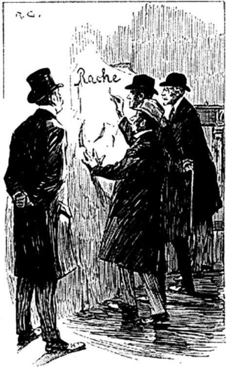

墙面上潦草地涂写着一个血字。

“你们看，怎么样？”这位侦探大声说道，那神情活像个耍把戏人在夸耀他的拿手好戏一般，“这给漏掉了。原因是，这间屋子这个角落最暗，没人想到该瞧一瞧这个地方。凶手，男的也好女的也好，是用自己的血写的。瞧这个血迹，顺着墙往下滴来着！这无论如何都可以排除了自杀的可能性。那么干吗要选在墙角来写字？我来告诉你们。瞧，壁炉架上那支蜡烛，作案的时候是点着的。那么，点着的话，这个墙面就是最亮的地方，而不是最暗的地方了。”

“是你发现这几个字母，那又怎么样呢？”格雷格森不服气，轻蔑地反问。

“怎么样？哈哈，那就是说，写字的人是要写一个女人的名字蕾切尔Rachel，可是有什么事了，所以没赶得及把最后一个字母写完。你们要记住了，是我说的，这案子水落石出那一天，保证有个女人叫蕾切尔的，跟本案有关。福尔摩斯先生，你先别笑，你聪明，你能干，可说到底，姜还是老的辣，猎狗还是老的本事大。”

“真是对不起！”我的同伴说道，他刚才一阵大笑，惹恼了这小个子侦探，“让你发现了，当然，你在我们之中拔了头筹。正如你说，充分表明昨天夜里案发时另有别人写下这个字。我还没来得及检查屋子，如蒙允许，我这就开始检查。”

他话音未落，就迅即从口袋里抽出一把卷尺、一个很大的圆形放大镜。他手拿着这两件东西，放轻脚步悄没声地在屋里来回走动，一会儿止步，一会儿跪下，有一回还整个人贴地。他全神贯注，似乎完全忘掉还有我们在场，口中一直絮絮叨叨自言自语，还忍不住一个劲地欢呼、叹息、吹口哨，甚至轻声叫唤，表示着增添了信心和希望。我一旁看着，不禁想起一头纯种的猎狐犬，训练有素，在猎物隐匿的林中前冲后突，吠声呼呼，急急地非要追到踪迹不可。他不住地审视琢磨，精确测量疑似之迹的间距；这些迹象在我是一点都看不出来的。他有时用皮尺往墙上比比量量，我也是丝毫看不出其中的所以然。这样大约持续有二十多分钟的时间，他又小心翼翼地从地板上收起一小撮浮尘，装进一只信封。最后，用放大镜察看墙上那个字，对每个字母都逐一研究，一个也不放过。完了之后，他似乎满意地舒了口气，把卷尺和放大镜放回口袋。

“俗话说，天才就是吃尽千辛万苦不回头，”他微笑着，说道，“这个说法不大做得到，可是干侦探非做到不可。”

格雷格森和莱斯特雷德两人好奇地望着这位私家同行的忙乎动作，表露的神态是全然不理解并且还十二分的瞧不起。他们显然根本不知内中奥妙，我倒是开始多少看出点门道。福尔摩斯哪怕是最细微的动作，都有他明确的目的、实在的意义。

“先生有何高见？”两人一齐问道。

“这案子要我贸然出手帮忙，岂不是夺了两位的功劳？”我的朋友说道，“你们干得这么出色，让别人来插一手岂不可惜。”他话中满含讥刺。“两位如果将调查结果随时见告，”他又转口说道，“我将乐意尽力给予关注。与此同时，对发现尸体的那位警察，我想找他谈一谈。两位能把他的姓名地址告诉我吗？”

莱斯特雷德翻开记事本。“约翰·兰斯，”他说，“他现在下班了。你找他，到肯宁顿公园门街奥德利坊46号。”

福尔摩斯把地址记下。

“好吧，医生，”福尔摩斯说，“我们走，找他去。我还得告诉你们一件事，对你们办案有帮助。”他又回头对两个侦探说道，“这是他杀无疑。凶犯是个男人，身高超过六英尺，正当壮年；按照他的身材比例，脚略偏小，穿翻皮方头靴；抽特里奇雪茄烟<a href="#part0009.xhtml_ch2"
id="part0009.xhtml_ch2-back">(2)</a>。他是同被害人一起坐马车来的，一辆四轮马车；驭车的马，三个蹄是旧掌，右前蹄是新掌。凶手，极有可能面色红润；右手指甲留得特别长。这些都是迹象推测，不过或许对你们有帮助。”

莱斯特雷德和格雷格森彼此对望一眼，满脸狐疑地笑笑。

“这人是谋杀的话，怎么个谋杀法呢？”莱斯特雷德发问。

“毒杀。”福尔摩斯简洁吐出一个词，便大步往外走。“还有一件事，莱斯特雷德，”他刚到门口，又转过身说道，“rache，是德文，意思是‘复仇’，这就不要白费时间去找蕾切尔小姐了。”

丢下这句赠言，他扬长而去，任两位邀功争宠的对手在那里目瞪口呆。

————————————————————

<a href="#part0009.xhtml_ch1-back" id="part0009.xhtml_ch1">(1)</a> 克雷莫纳（Cremona），意大利北部城市，许多著名的弦乐器制作大师，如斯特拉迪瓦里、瓜尔内里和阿马蒂都出自该城。

<a href="#part0009.xhtml_ch2-back" id="part0009.xhtml_ch2">(2)</a> 特里奇雪茄烟（Trichinopoly），一种两端开口的雪茄，以印度产地命名。

# 第四章　兰斯警察的陈述

我们离开劳里斯顿花园区3号是下午一点钟。福尔摩斯领我去了最近的电报局，发出一封长电报。然后叫马车，要车夫把我们拉到莱斯特雷德给的地址。

“第一手取证最重要，”他说，“事实上，这件案子我心里已有了底，当然，该了解的地方还是要了解清楚。”

“你把我搞糊涂了，福尔摩斯，”我说，“刚才你讲的那种种迹象推测，不过是讲讲而已，你自己也未必那样有把握吧！”

“一个地方都不会讲错，”他回答说，“就讲第一件事情，我一到了那里就观察到沿路边有两道马车车轮痕迹。要知道，昨晚之前，有一个星期没下过雨，所以，那两道车轮痕迹，压得那么深、那么清楚，必定是昨晚上才留下的。还有，那些马蹄印，有一只印迹特别清楚，比其他三只要清楚得多，这表明是新打的铁掌。既然马车是下过雨才到那里，而不是早晨什么时间——这是格雷格森告诉我讲的话——由此可见，马车在那里必定是夜间的事，也就是说，正是这辆车把那两个人拉到空房子去的。”

“这个还算简单不难理解，”我说，“那怎么知道另一个人的身高呢？”

“噢，一个人的身高，十之八九可以从他走路步子的跨度来推测。测算起来很简单，但是具体算法的数据，我不必一一跟你讲了。我在屋外泥地上量过这个人的步子跨度，在屋里灰尘上也量过。我推算出他的身高，过后又给我有了验证的机会。一般来说，人站着往墙上写字，总以自己的眼睛高度为准，而略微偏高，这是很自然的行为。好了，那墙上的字，恰恰是离地超过六英尺。事情就是这么简单吧，如同儿戏！”

“那年龄呢？”我问。

“噢，一个人跨步能有四英尺半宽，又毫不费力，当然不会是个龙钟老头儿。那是花园小径上一个水潭的宽度，很明显他一步就跨过。而漆皮皮鞋是绕水潭边走过去的，方头靴是从上面跳过去的。这里头没有一点奥妙。我只不过把部分观察、推理的方法用于日常生活，这些，我的那篇文章都有阐述。还有什么让你不明白的吗？”

“手指甲、特里奇雪茄烟？”我向他提问。

“墙上的字，是这个人用手指甲蘸上血来写的。我用放大镜看出，墙面字迹带有指甲的刮痕；指甲如果剪短的话，就不会带有这个痕迹。在地板上我取了一点散落的烟灰，灰色偏黑，呈片状，这种灰肯定是特里奇雪茄烟。我对雪茄烟有过专门的研究；其实，这个问题我发表过专论。不是吹牛，只要让我一看烟灰，就能说出是什么牌子的雪茄烟，或者纸烟。别看微不足道，就在这种地方，显出侦探的真本事真功夫。格雷格森、莱斯特雷德之流的能耐，等而下之了。”

“还有红面孔呢？”我问。

“啊，那倒是个比较大胆的推测，但是也有把握不会错。案子还只到目前这个阶段，你先别问我这个问题。”

我用手摸摸额头。“脑子乱得一团糟了，”我说，“越想越觉得神秘莫测。两个人——要说真是两个人的话——怎么一起走进一间空屋？那个拉他们来的车夫呢？一个人怎么能逼迫另一个人服毒呢？怎么会有血的？谋杀的动机是什么？并没有构成抢劫嘛。怎么又出来一只女人戒指？最最奇怪的是，为什么这第二人逃离现场前要写上个德文Rache复仇？说实话，我一点也看不出这些事实有什么关系。”

我的同伴笑起来，表示赞许。

“你把案情的难点都归纳到一起了，归纳得很扼要。”他说，“是有许多问题不清楚，不过在事实要点上我都已心里有数。至于可怜的莱斯特雷德那点发现，只是个作案障眼法，要把警方往岔道上引，让人以为是社会党和秘密社团作案。那不是德国人干的。你注意没有，字母A，尽量写得像德文印刷体。可是如今，真正的德国人都照拉丁字母的规格写印刷体，没人写老式字体了。所以我们有把握说，不是德国人，是别有用心模仿的，又做得过分，弄巧成拙。这纯粹是诡计，想把查案人引入歧途。这个案子，不想再跟你讲很多了。医生，你知道，魔术师一旦把自己的戏法说穿，就简单得没人看了。一样的，我把自己的活儿向你亮得太多，结果会让你得出个结论，福尔摩斯也不过尔尔，不值一文。”

“我怎么会这样呢！”我回答说，“你把刑案侦查提高到近乎精密科学的水平，必将为全世界所公认。”

同伴听了我说的话，说话态度又是那样的认真，他兴奋得脸都红了。我已经看出来，他只要受到别人称赞，说他本领多么高强，他就浑身热乎起来，就跟姑娘被人说漂亮一样。

“我再告诉你一件事，”他说，“漆皮皮鞋和方头皮靴都是同一辆马车上下来的。他们两个挺要好，很好，像是朋友，一起走在花园小道上——还手挽着手呢，准是这样没错。两人一进了屋，在屋子里走动——应该说，漆皮鞋站定着，是方头靴走来走去。这都是我从灰尘上琢磨出的结论；我还看出，他越走越激动，步子越跨越大。他一直说话没有停，还越来越快，没错，发了火。后来悲剧就发生了。我把到此为止自己所知道的都给你讲了，剩下的就不过是猜想、推测。我们的工作起步基础还是很好的，在这基础上容易开展起来。我们得抓紧时间，今天下午，我还要到哈勒去听诺曼·聂鲁达的音乐会。”

我们这么谈着话，马车一路跑，穿过一条又一条肮脏的大街、阴暗的小路，到了一条最脏最暗的街，车夫突然把车收住。“那里面就是奥德利坊，”他说，手指着一排灰黑砖墙中间的一个窄巷口，“我在这儿等你们。”

奥德利坊所在外观不佳。窄巷通入一个四方大院，石板的地面，周围是破旧邋遢的住家，院中一群脏兮兮的孩童。我们择路而行，穿过一行行一排排晾着的褪色内衣内裤，才找到了46号，门上有块小铜牌，上面刻着大名“兰斯”。叩门一问，才知道警察还在床上。我们被请进一间小小的前厅，等他起床。

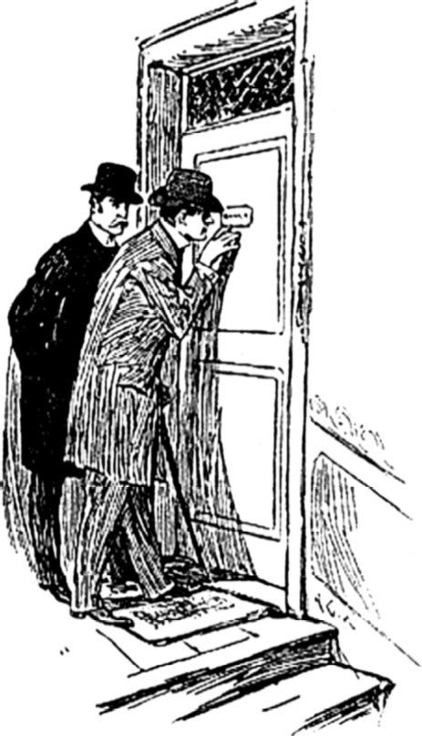

门上有块小铜牌。

警察很快走了出来，他睡眼惺忪，给搅了好梦有点不高兴。“我在局里都报告过了。”他说。

福尔摩斯从衣袋里掏出一枚半英镑金币，搁在手上掂量着把弄。“这知道。我们是要听你亲口把经过给详细讲一讲。”他说。

“我乐意奉告，我知道的都乐意奉告。”警察回答，两眼盯在了这枚小小的金币上。

“给我们把事情原原本本说一说，就成。”

兰斯往马鬃沙发上一坐，扬了扬眉，仿佛决心要一点不漏地讲个清楚。

“我这就打从头告诉您，”他说道，“我当班的时间是夜里十点到早上六点。十一点，白鹿街上有人打架，可除了这以外，一路巡逻都安静没事。一点，天开始下起雨来了，这时我遇上哈理·默切——他是负责荷兰林园那一块——我们俩在亨里埃塔街拐角闲聊上一会儿。没多久——约莫两点钟，或是稍过一点——我想该走上一圈了，看看布里克斯顿路上可是平静。这条路又是泥又冷僻，一路过来没见一个人影儿，只有马车，过那么一辆、两辆。我一边巡逻，一边寻思，我这号差使，这会儿手上该来点热杜松子酒，那才够美。正是这时间，忽地一眼瞧见，就是那间屋，窗上亮着灯光。怪呀，我晓得，劳里斯顿花园那里头两幢屋，一向空着没人住的。那房东不肯把排水沟给修修好，阴湿得很。这其中一幢，早先是有人住过，那倒大霉的房客，害伤寒死掉了。我犯疑啦，所以说，瞧那窗上有亮，心想不要有什么事喽。我这就走到了门上——”

“你停下脚步，又退回到花园门口，”我同伴打断他的话，说道，“你这是为什么？”

兰斯身子忽地一跳，大惑不解，两眼直盯住福尔摩斯脸上瞧。

“对呀，是的，没错，先生，”他说，“这个，您怎么会知道，真是天晓得啦。我到了屋门口，那儿没一点儿声响，一个人也没有，我转念一想得找个人一起才好。我倒不是怕有事，坟头这边的活人我不怕，不过，我想也许是那位得伤寒死掉的回来出现，要看看害他死的水沟。想到这，我才转身，回头到花园门外，望望默切的提灯还看得见不，可是他没影儿了，也不见有旁的人。”

“街上一个人也没有？”

“半个影儿都不见，先生，连条狗都没有。这就只好壮壮胆，转回去推开门。屋里悄没声儿，我这就往有亮的那间屋里去，壁炉台上那蜡烛，忽悠悠亮着——一支红蜡烛——借着蜡烛光，我就见——”

“行了，瞧见什么，我清楚。你在屋里兜了几圈，还在尸首旁跪下过，又走过去推推厨房的门，然后又——”

兰斯噌地跃起，一脸惊骇，眼中惶惑。“你躲在哪儿？你都看见了？”他叫道，“你怎么晓得？你应该不会晓得那么多的。”

福尔摩斯大笑，隔桌子丢过去一张名片给警察。“还望你别拿我当凶手抓了起来，”他说，“我可也是一头猎犬，决不是狼。这个嘛，格雷格森先生或是莱斯特雷德先生可以替我证明。请再继续讲吧，接下来你做了些什么？”

兰斯重新落座，疑惑的表情没有消释。“我回到外边门口，吹响警笛，默切，还有另外俩人，听见响声就立马来了现场。”

“这时候街上没人？”

“啊，可以说没人吧，即使有也不能就是嫌疑犯叫我给逮个正着啊！”

“你这话怎么讲？”

警察咧开嘴笑了。“在我当班的时间少不了遇上酒鬼，”他说，“可就从来没见有醉成那个鬼相。我出屋来，一个醉汉正好撞到门口，身子往墙栅栏上倒，扯开破嗓子唱那个科伦芭茵<a href="#part0010.xhtml_ch1"
id="part0010.xhtml_ch1-back">(1)</a>什么《新出花样》，人东倒西歪的根本站不住。”

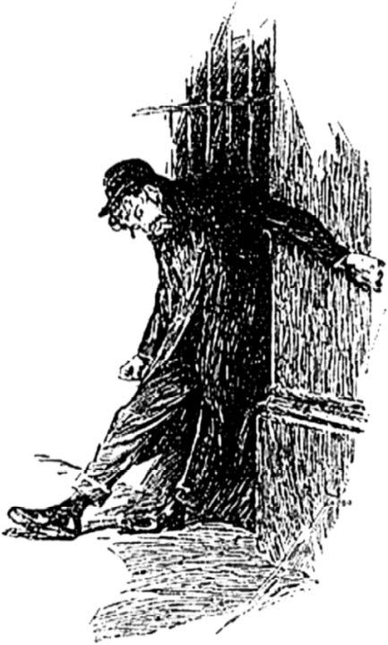

一个醉汉身子往墙栅栏上倒。

“这人什么模样？”福尔摩斯问。

兰斯嫌他打岔，有点不耐烦。“瞧他烂醉如泥的，真少见那个鬼样，”他说，“要不是我们那会儿正事忙不过来，定把他弄到局子里蹲着去。”

“他的脸——身上穿什么——你有没有注意？”福尔摩斯紧接着问。

“注意倒是注意啦，瞧他那模样，我还得把他扶着点儿——我、默切，两人给他扶了扶。这个醉鬼高个头，一张脸绯红，下巴颏儿一圈——”

“噢，正是，”福尔摩斯叫道，“那后来呢？”

“我们有我们的事要忙呢，谁还管他来着。”警察说，口气里非常讨厌，“我担保，他回家的路不会摸错。”

“穿的什么衣裳？”

“外套咖啡色。”

“手里拿马鞭没有？”

“马鞭？没有。”

“那一定是丢下了。”我的同伴低声说，“后来没看见、听见有马车经过？”

“没有。”

“这半英镑给你了，”我的同伴说，站起来，拿上帽子，“兰斯，你干警察这一行，恐怕永远也高升不上去。你的那个脑袋瓜子长着不是做摆设的，也该用用才行。昨晚上的事，你本来准能升上警长的。这件案子的嫌疑犯都送到你手上了，就是这个醉鬼，可我们现在还得去找。这会儿跟你怎么讲都白搭，我替你可惜喽。咱们走吧，医生。”

我们一起出来上马车，丢下兰斯警察半信半疑呆在那儿，但是他显然已经感觉到不是味儿了。

“这个蠢蛋！”我们乘车回住所的路上，福尔摩斯愤愤地说，“想想看，有这么个机会多不易，千载难逢。到嘴的肉，给丢掉。”

“我还是搞不懂。警察讲这个人的样子同你怀疑的人吻合，这没错。可是他离开了现场又再要回来，那是为什么？罪犯不会这么犯傻。”

“戒指，伙计，是戒指，他回来就是为的这个。要是我们没有别的办法把他抓到，不妨拿这个戒指做做诱饵。我来钓住他，医生——我押一赔双跟你下个赌，准叫他上钩。说起来还得感谢你呢。要不是你，我说不定就不会去。真的不去，可就要坐失这项研究的良机。这样的研究在我还是头一遭，把它叫作‘血字的研究’，好吧？我们何妨来点儿雅致的词汇，讲得艺术一点，这么说：这桩谋杀案，犹如在一堆混沌无色、错综复杂的生活乱麻之中，隐匿一线血丝。我们的职责，就是将其剔除，暴露于光天化日之下，以保纤尘不染。好，先吃午饭。吃好饭，去听诺曼·聂鲁达。她的弓法技巧，真是无与伦比。她奏起肖邦的曲子，该有多棒：特啦——啦——啦——哩啦——哩啦——。”

这个非官方的神探，这只厉害的猛犬，背靠着车座，却像只云雀，一路哼不停。我在默默地想：人的心智呵，善恶无所不能。

————————————————————

<a href="#part0010.xhtml_ch1-back" id="part0010.xhtml_ch1">(1)</a> 科伦芭茵（Columbine），意大利传统喜剧及哑剧中的程序化角色，多为活泼伶俐的少年女仆。

# 第五章　启事引来访客

一上午的奔波，我虚弱的身体有点支撑不住，到了中午，已是筋疲力尽。等福尔摩斯去听音乐会之后，我躺在沙发里想尽量睡上一两个钟头。可是怎么也睡不着，想到发生的事情，便激动不已。莫名其妙的想法和揣测在脑子里乱作一团。只要一合眼，就会浮现出被害男子的面容，那张扭曲的狒狒似的脸。这张脸给我的印象万分的丑恶。我甚至觉得把这么一张脸的人从世界上除掉，倒要感激除掉他的人，我此外难以再有别的感觉。如果说，相貌的丑恶就是代表人心的邪恶，那么这位克利夫兰的伊诺克·J．德雷伯肯定是个十恶不赦的孽种。因此我很赞同，正义必须得到伸张，而从法律角度看，对被害人的恶行也是绝对不可宽恕的。

我的同伴说那个人是给毒死的，这种推测我越想越觉得异乎寻常。我还记得他竟在死人嘴边嗅了嗅，那就一定是侦查出了什么情况，因此才有这个推测。再说，如果不是毒死，那么死因又是什么呢？因为死者身上并无被打的伤痕，也无扼死的勒痕。但是，从另一方面看，地板上的血滴又是谁的呢？现场全无扭打搏斗的迹象，也没有发现任何器械可供死者用来将对方击伤。只要所有这些问题得不到解决，我就难以安睡。不单是我，福尔摩斯自己也别想睡得成觉。所以他那镇定自信的态度，使我深信他胸中必定已有成熟之见，足以解释一切事实和现象，只不过是我一时未能猜测到罢了。

他回来已经很晚——太晚了，我知道音乐会是不至于开得那么晚的。他还没回来，晚餐就早已摆好了。

“音乐会太棒了，”他说着，在餐桌旁坐下来，“还记得吗，达尔文对音乐怎么个说法？他说，人类具有激发和感受音乐的能力，远远早在语言能力之前。也许这就是为什么我们对音乐总是天性至深很有灵动的缘故了。在我们心灵上，对人类孩提时代的朦胧岁月，仍有依稀的记忆。”

“这个见解过于宽泛。”我说。

“人要想了解大自然，就必须有大自然一样广阔的胸襟。”他回答说，“怎么啦？你今天看来不太好，是不是布里克斯顿路的案子把你搅得心神不宁？”

“说实话，是的。”我回答，“照理讲，我有了阿富汗那番经历之后，性格应该更加坚强才是。迈旺德那一仗，亲眼看见我的弟兄们在炮火中血肉横飞，也没把我吓掉了魂。”

“这我能理解。这个案子是一桩疑案，难以捉摸。本来就是充满疑惧，疑惧，没有疑，也就无所谓惧。今天晚报看到了吗？”

“没有。”

“这案子上了报，很好。根本没提到尸体抬起来的时候，有一枚女人结婚戒指掉在了地板上，没报道这件事，很好，就是要不提。”

“为什么？”

“看看这个启事。”他回答，“今天早晨了解了现场之后，我立即让人发送一份启事给各家报纸。”

他把报纸扔过来，我看了一眼所指部分。启事登在招领栏的首条：“今晨于布里克斯顿路之白鹿酒店、荷兰林园路段，”启事如此登载，“拾得赤金婚戒一枚，遗失者请于今晚八时至九时至贝克街221B华生医生处认领。”

“擅自具上你的大名，请勿见怪。”他说，“要是用我自己的名，这边那些个蠢蛋可能有人会识破机关，就要插手进来搅和，成事不足败事有余。”

“没关系，”我回他说，“可是假如有人来领，我没有戒指。”

“啊，没关系，你有。”他说，随手递给我一枚，“用这个就行了，差不多一模一样。”

“你看是什么人可能来领？”

“那个嘛，就是穿咖啡色衣服的人——那位穿方头靴的红面孔朋友。要是他不亲自出马，也会派个同谋来。”

“他难道想不到这有多危险？”

“绝对不会。如果我对本案的分析正确，我就有充分的理由确信肯定是这样。这个人甘冒危险也不愿意丢了这枚戒指。根据我的估计，是他弯下身子看德雷伯的尸体掉了戒指，当场并没有觉察，等到离开屋子，才发现丢失了，就赶快回头去找。可是撞上警察已来到现场了。事情坏就坏在他自己疏忽，离开现场没把蜡烛吹灭。他马上装酒疯，免得这时间来到那幢房子的门口要引起怀疑。他把事情经过前后考虑，你可以设身处地想一想，在他必然以为是离开房屋出来后，戒指掉在了路上，这本来就很可能嘛。那么他会怎么办呢？一定会急着找晚报来看，指望在报纸失物招领中看到有戒指。果然他看到了，他肯定眼睛一亮，大喜过望，怎么会害怕中圈套呢？没有理由说他能看出来。因为这其中，拾到戒指同谋杀丝毫没有联系到一块儿。他会来，一定会来的。不出一个小时，你准能见到他。”

“来了以后怎么办？”我问。

“啊，你就交给我来对付他得了。你有家伙吗？”

“有，一把部队时用的旧左轮，有些子弹。”

“把枪擦一擦，上好子弹。这是个不惜一死的人，我必须出其不意，将其制伏，事先各方面都要准备充分，做到万无一失。”

我到自己房里，按他的话作了准备。等我带着手枪回出来，这时餐桌已经收拾干净，福尔摩斯却埋头忙他自己的消遣爱好，拨弄起提琴来了。

“案情看来很复杂呢，”我过来的时候他说，“我刚刚收到美国来的回电，证明我对案子的分析还是正确的。”

“电报上是——？”我急切地问。

“这琴弦换了新的，就会更好拉。”他说，“你把枪放好在口袋里。等人来了，说话要平静，跟平常没事一样。别的全由我来就是。你可千万别动声色，以免打草惊蛇。”

“现在是八点。”我看了看表说。

“对，没几分钟就要来了。把门稍稍打开一点，就这样，好。门从里面插好钥匙，谢谢你！这儿是一本难得的古书，昨天书摊上看到买的，《论民族之法律》，拉丁文，一六四二年低地列日<a href="#part0011.xhtml_ch1"
id="part0011.xhtml_ch1-back">(1)</a>出版。这本棕色封皮的小书，当年问世之时，查理一世<a href="#part0011.xhtml_ch2"
id="part0011.xhtml_ch2-back">(2)</a>的脑袋还好端端地安在脖子上呢。”

“出版人是谁？”

“菲利普·德·克罗伊，不知是什么人。扉页上写有‘威廉·怀特藏书’，墨迹褪色了。不清楚这个怀特何许人，我猜准是十七世纪一位耿直、固执的律师。他这签字，看得出是当律师的脾气性格。我想是我们的朋友来了。”

他话音未落，一阵门铃响起。福尔摩斯缓缓站起，把椅子向门边挪一挪。我们听见女仆走向门厅，下门锁喀哒一响，门开了。

“华生医生是住这儿吗？”一个清楚但相当刺耳的声音问道。我们没能听见女仆的回答，只听见门关上，有人踏上了楼梯。上楼的脚步不稳、不重，不是很有力。我的同伴侧耳倾听，脸上掠过一丝意外惊疑的神情。脚步沿过道在慢慢走过来，房门上响起了轻轻的笃笃声。

“进来。”我喊道。

应声推门而入的，不是我们所等的凶神恶煞，却是一个满脸皱纹的老婆子。她蹒跚地走进房来，被灯光陡然一照，好像感到眼花。老婆子行过屈膝礼，站在那儿眯眼瞧着我们，颤颤巍巍地用手在衣袋里一阵摸索。我向同伴瞥了一眼，见他脸色黯然阴郁，我也只能摆出泰然自若的神态。

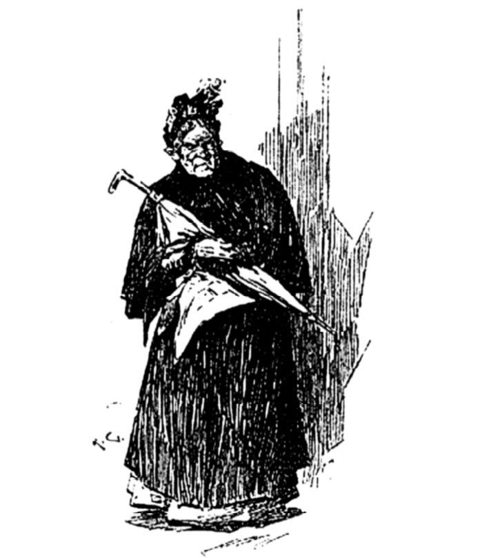

一个满脸皱纹的老婆子。

干瘪老太婆掏出一份晚报，指指我们的启事。“我特地为这事儿来的，两位先生，”她说着再施一个屈膝礼，“结婚金戒指掉在布里克斯顿路上了。婚戒是我女儿萨莉的，她还是去年这时候结的婚。她丈夫在英国船上干活，跑远洋。要是回来不见她的结婚戒，他会说些什么，我都无法想象。他是个火暴性子，脾气说来就来，一喝过酒那更厉害。对不起两位了，我女儿昨晚上是看马戏团，是跟——”

“这是你女儿的戒指吗？”我问。

“真是谢天谢地！”老太婆叫道，“萨莉今晚上可要高兴死了，就是这个。”

“您的地址是哪里？”我问她，拿起了铅笔。

“豪恩兹迪奇，邓肯街，13号。离这儿有段路呢。”

“从豪恩兹迪奇去哪个马戏团都走不到布里克斯顿路呀！”福尔摩斯冷不丁一句。

老太婆转过脸去，一对红水泡小眼嗖地盯住他。“这位先生问的是我的地址，”老太婆说，“萨莉另外租房，住在佩卡姆，梅菲尔德广场3号。”

“您贵姓——？”

“我姓索耶，女儿姓丹尼斯，嫁给汤姆·丹尼斯——汤姆在船上挺好，一个整整齐齐的帅小伙子，公司里没有比他更棒的了。可是一上岸，就不行，又是女人又是酒——”

“戒指拿好了，索耶太太，”我遵照同伴的眼色示意，打断了她的话，“戒指属于您女儿，没问题，能够物归原主，我就很高兴。”

老太婆叽叽咕咕说了一通千恩万谢的话，把戒指包好放进衣袋，然后晃晃悠悠走向楼梯。福尔摩斯等老太婆转身出屋，便立刻跳起来冲进他的房间。只几秒钟工夫，回出来时已经穿好粗呢大衣，系好围巾领带。“我盯住她，”他匆忙说，“这是个同伙，跟住她定能找到凶手。等我回来，你再睡。”来者刚走，厅门一关上，福尔摩斯已紧随下楼。我从窗口望见老太婆在街对面步履蹒跚地走去，福尔摩斯跟她保持一定距离，尾随于后。“假如他的分析推测完全正确，”我心里在想，“这下一出手他准保直探凶手的心窝。”他其实不用叫我别睡，要等他回来，因为我哪里还有心思睡觉，我坐等他的跟踪结果还来不及呢。

福尔摩斯出门的时候已快九点。我不知道他会去多久，只好枯坐，抽烟斗，又随手翻翻亨利·米尔热<a href="#part0011.xhtml_ch3"
id="part0011.xhtml_ch3-back">(3)</a>的《放纵的生活》。十点钟一过，听见女仆啪嗒啪嗒的脚步声回房睡觉。十一点，房东太太踏着更重的脚步声打我门前经过，也回屋睡觉去了。到了将近十二点，福尔摩斯才回来。我听到开门、关门的响声。他一进屋，我一看他的脸，就知道事情不成功。看他是心中既有喜悦，又有懊恼，似乎在互争高下。最后是前者占了上风，他任由自己放声大笑。

“这件事，说什么也不能叫苏格兰警场那帮人知道，”他高声说，往椅子上一坐，“我老是把他们嘲笑得够呛，这一回他们可要翻本了，不会放过我。不过也没关系，让他们笑，我照单全收，我照旧是胜券在握。”

“到底怎么回事？”我问。

“咳，倒霉、上当、出丑，跟你说说吧，无所谓。那个家伙没走多远，腿跛了起来，一瘸一拐腿疼的样子。接着就干脆停下不走了，叫住了一辆过来的四轮马车。我走近点，要听她报什么地址。实际上根本不要我这么做，她自己响起喉咙叫着，隔路对面都能听得见，‘豪恩兹迪奇，邓肯街13号。’噢，看来不假，我心想。看着她进了马车，我立刻上去，跳到车厢背后。这种跳车技能，是干侦探的基本功。就这么，马不停蹄一路跑，直达目的地。快到门口要停车了，我跳下车去，慢腾腾地走着。看见马车停了，车夫下来，打开车门一旁候着，可是乘客没下车。我走上去，车夫一个劲对着空车厢挥手，嘴里乱骂，骂的那个难听，闻所未闻。乘客早已没了踪影，车夫的车钱没处要了。上13号去问，一问，住的是个裱糊匠，叫凯瑟克，人家是规矩人，他说没听说过有谁叫什么索耶或者丹尼斯的。”

“难道说，”我惊异得大声说道，“那个跌跌撞撞的老太婆能够跳车，从快跑的马车上逃掉，车夫和你两个谁都没发现？”

“什么老太婆，见鬼去吧！”福尔摩斯厉声道，“我们自己才是老太婆，竟然上了个大当。那准是个年轻人，一副好身手。岂止是这样，他还能演戏，演技高超非凡。那个化妆，就叫你一丝破绽也看不出来。他发现自己被盯住了，就再耍一手，金蝉脱壳，肯定是的。这么看来，我们找的这个凶手，不是单独一人，决不是我所想象，而是有一帮为他甘冒风险的弟兄。好了，医生，看你那样子，已经撑不住了，快听我话，去睡吧。”

我确实早已筋疲力尽，便遵从了福尔摩斯的话，留下他一人坐在幽幽的炉火前。夜深人静，我从睡梦中醒来，听见忧郁的琴声低吟倾诉，知道他仍在深思那个疑难问题，非要攻克不可。

————————————————————

<a href="#part0011.xhtml_ch1-back" id="part0011.xhtml_ch1">(1)</a> 低地（the
Lowlands），荷兰、比利时等国的地理统称，此处指比利时；列日（Liége），比利时一省城。

<a href="#part0011.xhtml_ch2-back" id="part0011.xhtml_ch2">(2)</a> 查理一世（Charles
Ⅰ，1600—1649），英国斯图亚特王朝国王，对抗国会，压迫清教徒，引起内战，战败，被国会作为“暴君、叛徒、杀人犯和国家公敌”判死刑断头。

<a href="#part0011.xhtml_ch3-back" id="part0011.xhtml_ch3">(3)</a> 亨利·米尔热（Henri
Murger，1822—1861），法国小说家，曾是列夫·托尔斯泰的秘书，代表作有《放纵的生活》，普契尼据此改编成歌剧《波希米亚人》。

# 第六章　托比亚斯·格雷格森一试身手

第二天，各家报纸竞相刊出被称之为“布里克斯顿奇案”的消息。每家报纸都有案情的长篇报道，有的报纸还专门配发述评。报道的有些内容连我都不曾听说。我的剪贴簿里至今还保留着许多有关此案的剪报和摘录。现在扼要附于下面：

《每日电讯》报道说，犯罪史上如此离奇的凶案，迄今少见。被害人之德国名字、未获其他作案动机及恐吓留字于墙上，凡此种种都指明此凶案系政治难民及革命党人所为。社会党人在美国派别众多，死者无疑因触犯内部戒律，而被追杀到此。文章还罗列一系列案件，如秘密法庭案<a href="#part0012.xhtml_ch1"
id="part0012.xhtml_ch1-back">(1)</a>、托法娜毒药水案<a href="#part0012.xhtml_ch2"
id="part0012.xhtml_ch2-back">(2)</a>、意大利烧炭党人案、德·布兰维利耶侯爵夫人案<a href="#part0012.xhtml_ch3"
id="part0012.xhtml_ch3-back">(3)</a>、达尔文进化论案、马尔萨斯人口论案以及雷克利弗公路谋杀案，等等，最后提出主张，告诫政府当局今后对旅英外侨应严加关注，云云。

《旗帜报》评述称，此类践踏法律之暴行，多发生于自由党执政期间，究其源盖因民心浮动而威权职能削弱所致。死者系美国公民，盘桓于大伦敦数周之久，曾入住坎伯韦尔区托凯街夏庞蒂埃夫人之公寓，其赴英之旅由私人秘书约瑟夫·史坦格森先生全程陪同。两人于本月四日星期二向女房东辞行，即往尤斯顿车站，声称拟搭快车去利物浦，于车站站台确曾为人所见，但旋即无踪影。后据报载，在离尤斯顿车站数英里外之布里克斯顿路一空宅，发现德雷伯先生之尸体。其何以到达此处、因何被害等情节，至今若谜而不得解。欣闻苏格兰警场名探莱斯特雷德先生及格雷格森先生连袂侦查此案，深信不日即见分晓云云。

《每日新闻》称此案无疑是一件政治性谋杀案。因欧洲大陆各国极力推行专制政体及对自由主义极度憎恨，其结果将大批负有前科者遭驱逐而流入英国，彼等若得以宽容不加追究，原有可能仍为良善之公民。流亡群中铁定律令之严厉，一经触犯，必予处死。现在务必竭尽全力寻获秘书史坦格森，以了解死者生前生活行动诸情形。又，因死者曾寄寓伦敦之住址业已获悉，案情遂有长足之进展——该项发现，应归功于苏格兰警场格雷格森先生之行事机敏果敢。

福尔摩斯和我边吃早饭边看这些报道，这些文字令他实在要喷饭。

“坦白跟你说，不管怎么样，莱斯特雷德和格雷格森总归是赢家得分。”

“这得看结果如何。”

“哦，你还不知道，根本没有关系。凶手一旦抓到，全是由于他们两位尽职奉公；如果凶手逃掉，他们可以称之为虽然历尽艰辛但仍怎么怎么。那总是头上的风光，脚下的垫底。不管他们干得好还是孬，他们总有一帮子人捧场叫好。法国人有句俗话：‘蠢人再蠢，还会有更蠢的来捧场。’”

“这是怎么啦？”我叫道，因为正在这时，听到楼下厅里响起乱哄哄的脚步声，接着是上了楼梯，夹杂着房东太太在大声呵斥。

“那是侦缉队贝克街小分队。”我的同伴一本正经地说。他话音刚落，一群小瘪三冲进了房间。一共有六个人，他们衣衫破烂、肮脏不堪的样子，我还从来没有见过。

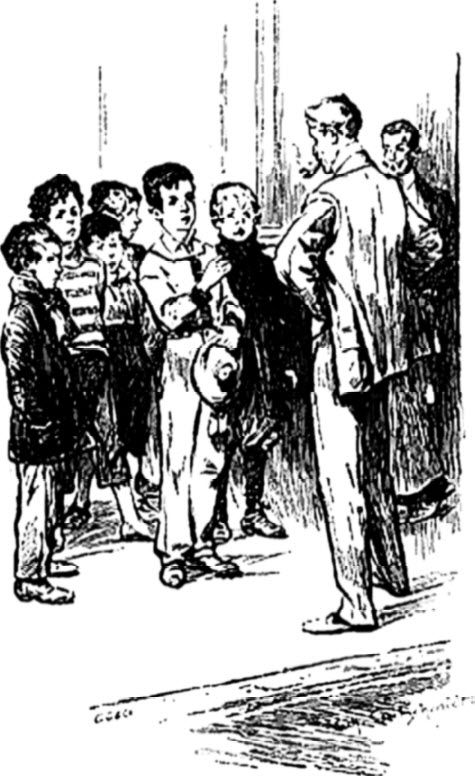

侦缉队贝克街小分队。

“立正！”福尔摩斯严厉地大喝一声，六个脏孩子刷地一排看齐，如同六尊虽不雅观但是一溜笔挺的小雕塑。“以后你们派威金斯一人前来报告，其余人都等在街上。你们找到了没有，威金斯？”

“靡有<a href="#part0012.xhtml_ch4"
id="part0012.xhtml_ch4-back">(4)</a>，先生。”有个小孩回答。

“我也估计你们没有找到，务必一定继续找下去，不找到不算完。这是你们的工钱。”他给每个孩子一先令，“现在出发，下一次来听你们报告好消息。”

他挥挥手，孩子们就蹦蹦跳跳窜下楼，像一群耗子似的，不一会儿街上便传来他们的叽叽喳喳声，好不热闹。

“别看是小瘪三，还挺管用，一个人干的事比一打警察还多。”福尔摩斯评价说，“人看见当官模样的来了，有话也不说了，都是这样。这些小鬼，他们是什么样的地方都钻得进，什么样的话都听得到，机灵如同水银泻地无孔不入；他们所缺少的，就是要组织起来。”

“这桩布里克斯顿案子，你也把他们用上了？”我问。

“是呀，有一点我希望确定一下，那不过是时间早晚的事。嗨！我说，准是有好消息来了，没错。格雷格森这会儿正在往这儿过来，瞧他那个春风满面的得意劲儿。是来这儿，准没错。是的，他站住了，到楼下了！”

果然门铃大响。过不几秒钟，这位美发侦探上了楼梯，三步并作两步，朝我们客厅直闯而入。

“亲爱的伙计，”他叫道，一把握住福尔摩斯反应冷漠的手，“向我祝贺吧，云开雾散，事情让我全搞清楚了。”

我看到同伴脸上掠过的是不无忧虑的神色。

“你是说有可靠线索了？”

“线索可靠无误！何止线索，老兄，凶手都叫我们给铐住了呢。”

“叫什么名儿？”

“阿瑟·夏庞蒂埃，皇家海军中尉。”格雷格森叫道，傲态十足，挺起了胸脯，搓起了双手。

福尔摩斯长叹一声，嘘出一口气，如释重负地微微一笑。

“请坐，请坐，自己拿雪茄烟抽。”他说，“我们正着急，想要知道你们是在怎么忙活的。来一点加水威士忌，要不要？”

“喝就喝点吧，”侦探回答，“这一两天搞得我没日没夜，甭提费的那个九牛二虎之力了，都要累垮了。我不是说身子骨，身子骨倒还可以，你明白的，是心里，心里紧张，其中苦甜酸辣你一定都有体会，歇洛克·福尔摩斯先生。因为你我，咱们可都是从事脑力工作者。”

“不敢当，您抬举我了。”福尔摩斯说，神情严肃，“请让我们听听，你是怎么样获得如此辉煌成果的。”

侦探往扶手椅子里一屁股坐下，得意洋洋，吸了几口雪茄，然后一副喜不自胜的模样，手在大腿上猛地一拍。

“好笑也真是好笑，”他亮开嗓子说道，“莱斯特雷德这个蠢货，自以为有多大能耐，可线索都会搞错，真是瞎胡闹。给他追上了那个秘书史坦格森，人家跟这案子毫不相干！这会儿准是把人家给逮起来了。”

格雷格森这么讲着，自觉得风趣至极，因而纵声大笑，直笑得打噎气塞。

“那么，你是怎么找到线索的呢？”

“唔，我来原原本本都说给你听。当然啦，华生医生，这事呢，就咱几个知道，绝对秘密。这第一桩困难，我们要对付，就是先要查一查这个美国人的来历。有人可是在等，等他们登报的启事有下落，等有关方面的人自动上门，前来送上消息。这种事，不是托比亚斯·格雷格森的办事路数。你该记得尸首身旁有一顶礼帽？”

“记得，”福尔摩斯回答，“约翰·恩德伍德父子帽店制作，坎伯韦尔路129号。”

格雷格森的脸一下子耷拉下来。

“想不到，也让你注意上了。”他说，“你去找过了？”

“没有。”

“啊哈！”格雷格森嚷道，嗓音重又活跃起来，“机不可失，绝对丢不得，别小看它多不起眼。”

“大心眼里无小事。”福尔摩斯说，好像在引用格言警句。

“对，我这就去了恩德伍德，问他是否卖过一顶那个尺寸那个式样的帽子。他翻了翻账簿，一查就查到。他给一位叫德雷伯的先生送去过，他住夏庞蒂埃寄宿公寓，在托凯街。我就这么把地址搞到手了。”

“漂亮——漂亮，没话说！”福尔摩斯沉着地称赞道。

“我马不停蹄拜访夏庞蒂埃太太，”侦探继续说道，“我见她脸色发白，满脸心事。她女儿在屋里，也在——小妞长的那个好看，没得说；可眼圈儿红着呢。我跟她说话，她嘴唇直哆嗦。这些都逃不过我的眼睛。我琢磨里头可有隐情呢。你体会那心情，福尔摩斯先生，当你事情一搭上线，摸到线索——那个浑身神经都抽动起来了。我问夏庞蒂埃太太。‘您听说没有，这儿住过的房客，克利夫兰来的伊诺克·J．德雷伯先生，非命身亡了？’

“她点点头，看上去连一句话也说不出来似的。那女儿哇的一声哭了。这下我更吃准她们一准知道这事儿的底细，没说的了。

“我又问她，‘德雷伯先生是几点离开你们家，去了车站？’

“‘八点。’她回话，嗓子都哽的，硬压住心中的激动，‘他有个秘书史坦格森先生，说是有两趟火车——九点十五分一趟，十一点一趟，他要赶头一趟！’

“‘那您是最后见到他的人了？’

“我这么一问，女人的表情变得那个可怕，脸色都灰了。停了一阵，她才吐出一个字‘是’——嗓子都哑着了，声音也不自然了。

“这么静了一会儿，那女儿说话了，嗓子又清又脆。

“‘讲假话可不好，妈，’女儿说，‘我们跟这位先生实话说了吧。我们后来又见了德雷伯先生。’

“‘愿上帝宽恕你！’夏庞蒂埃太太喊叫着，举起双手，瘫在椅子里，‘你要害了你哥呀！’

“‘阿瑟也会让我讲真话的。’姑娘态度挺坚决地呢。

“‘那就快跟我讲，怎么回事对我全讲了，’我说，‘说一半藏一半，不如不讲。再说，我们掌握在手里有多少情况，你们没数吧。’

“‘都是你惹的祸，艾丽丝！’母亲喊着，转身对我说，‘听我把事都给你讲了吧，先生。别以为我在替儿子担着心，担心现在这事多怕人，弄不好对儿子有牵连。其实我儿子跟这事一点儿关系都没有。我怕只怕，在你眼里、旁人眼里，我儿子犯着事呢。我说，没有，绝对没有。他为人正派着呢，有正当职业，他过去一直清白，不是干那种事的人。’

“‘您最好干脆，全盘托出，’我告诉她，‘放心好了，你儿子没事就不会有事，我不冤枉人。’

“‘那，艾丽丝，你别待在这儿了。’母亲这么说，女儿就退了出去。‘好，先生，’她说下去，‘我本来是不想跟你讲，都是可怜的女儿，让她给捅了出来。我也没有别的法子，只好讲了，要讲我就全都给你讲了吧，一点也不瞒你。’

“‘你这才是明理儿之举。’我说。

“‘德雷伯先生住这儿将近三个来星期，跟他的秘书史坦格森先生一直在大陆旅行，我注意到他们每只箱子上都有哥本哈根标签，那就是最后一站到的地方。史坦格森这人少言语不多话，肚里功夫好。可是他的东家，我要说句不客气的话，那个人不是个东西。腔调那个粗鲁、下流、火暴，不要脸皮。来到的头天晚上，就没命地喝酒，喝个烂醉。第二天中午过了十二点，他都还没清醒呢。对家里女佣人的态度，轻薄放肆到极点，想怎么就怎么。最不像话，对我女儿艾丽丝居然也要轻薄起来了，几次三番跟她讲那些个话，幸好，艾丽丝还小，还不懂那事，不懂那张脏嘴。后来有一回，他干脆搂住艾丽丝，把她死抱在怀里——下流胡来，连他秘书都骂他没人样。’

“‘那你怎么容忍得了他呀？’我问，‘房客不规矩，随时都可以回掉他嘛。’

“夏庞蒂埃太太给我这一问，一下问住了，脸都涨红了呢。‘是呀，要是他来的那天，当天把他回了就没事了，’她说，‘可为来为去舍不得呀。他们每人每天一英镑房钱哪——一星期就是十四英镑，再说正好在租房淡季。我是寡妇，儿子在海军，开销大，我供他不少钱，我舍不得丢了这笔收入。只得尽量忍着点。后来实在太不像话，没法再忍，硬叫他走人。就是这样，他走了。’

“‘后来呢？’

“‘看着他马车走了，我心中松了口气。也正好是我儿子假期回来，可我没告诉他内里这些个事。他脾气火暴，对妹妹又疼爱得不得了。他们一走，我把门一关，心上石头总算落了地。可谁知道，天哪，不到一个钟头，门铃响了，说是德雷伯先生又回来了。一看，他正激动着呢，不又是喝醉酒了嘛。他强闯入房里来，我和我女儿正坐着，看他没边没际说什么火车没赶上。接下来就冲着艾丽丝，当我的面，要她跟他一块儿私奔。“你长大了，”他说，“法律管不着你了。我有的是钱，花吧。别管这老婆子，现在就快跟我走。你会过得像公主一样。”可怜的艾丽丝吓得直往后缩，躲着他。可他抓住艾丽丝手腕，一个劲儿把她往门口拖。我叫起来，这时候，儿子阿瑟到房里来了。接着怎么样，我都不知道了。我听到又是咒骂，又是扭打，乱哄哄一团。我怕得头都没敢抬。等我看他们的时候，见阿瑟站在门口，大笑呢，手里拿着根木棍。“看他再敢来我们家胡闹，这流氓，”他说，“我倒要瞧瞧他能有多厉害。”这么说着，拿上帽子，追到街上去了。第二天早晨，我们听说德雷伯不明不白地死了。’

“这是夏庞蒂埃太太亲口陈述，讲得喘一阵，停一阵。好几回说话声音轻得我都快要听不见。她说的我都做了速记，没错，不会有错。”

“真够精彩，”福尔摩斯说，打了个哈欠，“后来怎么样呢？”

“夏庞蒂埃太太停了下来，”侦探继续说道，“我看得出，全部事情的关键只在于一点。我用眼盯住她；我只要这么一看女人，准就能看透到她们的心窝。我问她，她儿子回来是几点钟。

“‘我不知道。’她回说。

“‘你不知道？’

“‘不知道，他有钥匙，自己开门进的屋。’

“‘你已经睡了？’

“‘睡了。’

“‘你是几点睡的觉？’

“‘大概十一点。’

“‘这么说，你儿子出去起码有两个钟头？’

“‘是的。’

“‘这段时间他都干什么去了？’

“‘我不知道。’她回答，嘴唇都发了白。

“当然啦，都说到了这个份上，不用再说啦。我找到夏庞蒂埃中尉的下落以后，带上两名警官前去将他逮住。我手往他肩上一按，警告他乖乖地跟我走。他还嚣张得不得了，说是：‘我知道，你抓我，以为那个贼流氓德雷伯被杀，跟我有关。’我们一句话也不同他啰嗦。他这不是不打自招吗，他还能不是最大的杀人嫌疑犯！”

“非常可能。”福尔摩斯说。

“他手拿那根粗木棍，就是他娘说的，拿了去追德雷伯，是根橡树木棍，挺结实。”

“那么，你怎么看呢？”

“我吗，我的推论，他追着德雷伯，直追到布里克斯顿路。一到那儿，两人干开了，争呀吵的，德雷伯挨了一棍，一棍正打在他肚子上、心窝口，可能是，所以打死了他也没留下伤痕。那天夜里下雨地湿，四周没人，夏庞蒂埃把尸体拖进那空屋里去。至于蜡烛、血迹，还有墙上的字，还有戒指，这些全是布的迷魂阵，蒙警察入歧途。”

“讲得好！”福尔摩斯说，是鼓励的口气，“不错，格雷格森，你真是大有进展。我们将会因你而获益匪浅。”

“我自个儿是感觉这一下干得挺麻利。”侦探说道，样子十分得意，“小伙子自己招供，说是追赶了一阵德雷伯，后来看见德雷伯跳上一辆马车，把他给甩掉了。他只好转回家。半途遇上一个同船老朋友，两人一起逛了好长一段路。问到他这个老朋友住什么地方，他怎么答也不能叫人满意。我看，这整个案子天衣无缝，可以了结啦。但是一想到莱斯特雷德，就让我好笑。他一开头就走上了岔路，我怕他是没多少戏可唱喽。哦，说到他，他就到，这不是来了吗！”

果然是莱斯特雷德，我们谈话间，他上了楼，走进屋来。他平时那个架势，自以为是、神气潇洒，现在整个儿蔫了。他愁容满面，心神不定，连衣冠都不整齐。他也是有意登门来请教福尔摩斯。一见自己同僚先已在场，更显神色尴尬、局促不安。他站在屋子中央揉捏着帽子，无所措手足。“这是件最离奇的案子，”他终于开口说——“实在叫人无法理解。”

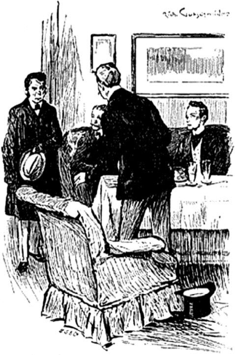

他上了楼，走进屋来。

“啊，你才醒来，莱斯特雷德先生！”格雷格森叫道，一副得胜者的姿态，“我早料到，你会有这个结论。那个秘书约瑟夫·史坦格森先生，找到了没有？”

“约瑟夫·史坦格森秘书先生，”莱斯特雷德脸色阴沉地说，“在哈利迪私家旅馆，今天早晨六点左右，被人谋杀了。”

————————————————————

<a href="#part0012.xhtml_ch1-back" id="part0012.xhtml_ch1">(1)</a> 指12至16世纪中叶在德意志威斯特伐利亚实行的秘密法庭制度。

<a href="#part0012.xhtml_ch2-back" id="part0012.xhtml_ch2">(2)</a> 托法娜是17世纪一意大利妇女，发明慢性毒药水，毒杀600多人。

<a href="#part0012.xhtml_ch3-back" id="part0012.xhtml_ch3">(3)</a> 德·布兰维利耶侯爵夫人系17世纪法国年轻美貌的毒药杀人犯，被处斩刑。

<a href="#part0012.xhtml_ch4-back" id="part0012.xhtml_ch4">(4)</a> 原文hain't，讹语，意为“没有”。

# 第七章　黑暗中的亮光

莱斯特雷德给我们带来的是个重大消息，也太出人意料，我们三人一时都惊愕不已，无言以对。格雷格森从椅子上跳起来，杯里剩下的掺水威士忌都向外泼了。我不出声，只拿眼睛朝福尔摩斯瞧。见他嘴唇紧闭，双眉紧锁。

“史坦格森也被杀！”他低声说，“案情更深更复杂了。”

“本来就够复杂，”莱斯特雷德咕哝道，拖过一把椅子，“我真是掉进了五里雾中。”

“你相、相——你真相信，这个消息可靠？”格雷格森结巴着说。

“我是从他屋里来的嘛，”莱斯特雷德说，“是我头一个发现出事的。”

“我们一直在聆听格雷格森对案子阐述高见，”福尔摩斯说，“现在来听听你的所见和所为，怎么样？”

“当然遵命，”莱斯特雷德回答道，身子坐正，“我坦白承认，我一直是这个意见，史坦格森同德雷伯的死有关系。这回案情的新发展，才让我看到自己是错了。当初我坚持自己的看法，抱定宗旨着手调查这个秘书的下落。曾经有人看见他们两个一起在尤斯顿车站，是三号晚上，大约八点半。凌晨两点，德雷伯被发现死在布里克斯顿大道。摆在我面前的问题，是要弄清楚史坦格森在八点半至案发的时间里，做了些什么，这之后，他又在做什么。我向利物浦拍了电报，发去这个人的相貌特征，叫他们务必监视开往美国的船只。我又着手调查尤斯顿附近所有的旅馆和借宿公寓。你看，我是这么想，如果德雷伯和他的同伴分手，他同伴很自然的会找个附近的地方投宿过夜，第二天早晨还会在车站附近逗留。”

“他们很可能事先约好在哪里碰头。”福尔摩斯说。

“事实证明正是这样。昨天我花了一个晚上，查来查去没有结果。今天早上，我一早就开始查，我到了哈利迪私家旅馆，在小乔治街。我上门问，有没有一位叫史坦格森的先生来投宿，他们回说有。”

“‘那您就是他等着的这位先生了。’他们说，‘他在等您，等了两天了。’

“‘他在哪里？’我问。

“‘在楼上睡觉。他吩咐我们九点钟叫醒他。’

“‘我现在就要上去找他。’我说。

“我心里盘算，这会儿我突然出现，给他个震撼，叫他惊慌失措之下不及防备，容易吐露实情。旅馆杂务工主动给我领路，是在三楼，一条小走廊通到他的房间。杂务工手指指房门，就回身要下楼。这时候，忽然间，我看见了血。虽说我已有二十年的刑事经验，可也让我恶心。那门底下，淌出一条血印，弯弯曲曲流过走道，流到边上墙脚板下积成一摊血。我不由得大叫起来。这一叫把杂务工给叫了回来。他一见这情形，差一点没晕过去。房门从里面反锁着。我们两人用肩膀撞，把门撞开。房间里窗子打开着。就在窗边上，倒着个男人尸体，穿睡衣，缩成一团。人早就断气了，死了好一会儿了，四肢僵硬，早已冰凉。我们把尸体翻过来，杂务工一眼就认出正是住这房间的人，名叫约瑟夫·史坦格森。死亡原因，是用刀深深扎进了左胸部，一定是刺穿了心脏。这个凶杀现场，又是来个奇怪花样，在死人身边墙上留着点东西，你猜是什么？”

我听得心惊肉跳，还没等福尔摩斯回答，就预感到总是什么令人恐怖的事。

“是Rache这个字，用血写的。”福尔摩斯说。

“正是这个字。”莱斯特雷德说，颤抖的声音压得低低的，我们几个人都沉默了一阵子。

这个暗中的杀手行动竟如此从容不迫，情节又是如此扑朔迷离，便使案情更是笼罩了一层神秘可怖的色彩。我的神经，从前在战场上也算得镇定并不脆弱，但是现在想想这个情景，也不由得头皮发麻心中发憷。

“凶手有人看见，”莱斯特雷德继续道，“被送奶的孩子看见。孩子经过这里到牛奶棚去，正打这条巷子走，旅馆后面这条小巷通马厩。他注意到一架梯子，平日一直横在地上，这时候给竖起来，搁到三楼的一个窗口，窗子大开着。他打那儿走过以后，又回头望望，望见有个人爬梯子下来。这个人行动稳稳当当挺大方，一点不鬼鬼祟祟，孩子以为是个木匠什么的，有旅馆的活儿在做呢，所以也就没怎么在意。不过心里是想的，这时候干活还早着点呢。孩子对这个人有印象：高高的个头，红红的脸，穿一件棕色外套。凶手杀了人，一定还在屋里待上一点时间，因为我们发现水盆里是血水，一定是他洗过了手，床单上也有几处揩刀擦刀的血迹。”

我一听凶手的样子同福尔摩斯的推断如此吻合，便用眼向他望了望，可是丝毫没见他有兴奋得意的神色。

“你有没有发现凶手在房间里留下什么线索？”他问。

“没有。史坦格森口袋里有德雷伯的钱夹。那很平常，他管钱，付账都是他的事。钱夹里有八十多英镑，没拿走。无论这案子是什么动机，决不是谋财害命。被害人口袋里没有证件或是本子什么的，只有一封电报，一个月前从克利夫兰发出的，电文是‘J．H．现在欧洲’，没有署名。”

“还有别的吗？”福尔摩斯问。

“没有什么重要的东西。有一本小说，睡觉的时候看的，扔在床上。床边椅子上有个烟斗。桌子上一杯水。窗台上一个小木盒，是药盒，有两粒药丸。”

福尔摩斯从椅子上跳了起来，高兴得大喊一声。

“最后关键，”他叫道，兴奋至极，“我的推论到此全部完成。”

两位侦探惊异莫名地望着他。

“有十二分的把握，”我的同伴信心十足地说，“乱麻一团，至此根根线头都清楚了。当然，细节还有待补充。可是这点我已经确定，就是全部关键事实，从德雷伯在车站跟史坦格森分手，到史坦格森的尸体发现这段时间，种种情节已如我亲眼所见，一清二楚。我要把推断证实给你们看。那两颗药丸你带来了吗？”

“带着呢，”莱斯特雷德说，从口袋里摸出一只白颜色小盒子，“还有钱夹，还有电报，我都带着，要交到场里安全保管。这个药丸我是顺手拿来的。老实说，这有什么重要，我是一点也看不出。”

“药丸拿来让我看看。”福尔摩斯说。“你看呢，医生，”他转身向着我，“这是普通药丸吗？”

肯定不是普通药丸，颜色呈灰白珍珠色，颗粒小而圆，对光一照几乎透明。“从分量轻和透明度来看，可以判断易溶于水。”我说。

“很准确，”福尔摩斯表示同意，“好，现在麻烦你下楼去，把那只狗，小种狗，抱上来，可怜的小东西病得很久了，房东太太昨天不是让你帮一下忙，别叫它再活受罪了吗？”

我到楼下抱了狗上来。小狗呼吸困难，眼睛呆滞，那样子是活不多久了。确实，狗鼻子都发了白，说明它早已经活过了狗的一般年龄。我在炉边地毯上加个垫子，把它放下。

“现在，我把一颗药丸一切两半，”福尔摩斯拿出一把小折刀，把药丸切开，“这半颗，放回盒里，留着以后再用，另外半颗，我把它放入酒杯，杯里盛好着一调羹水。我们的朋友，这位医生说得不错，请看，药丸已经溶解于水了。”

“也许很有趣，”莱斯特雷德说道，带着受刺伤而愤然的口气，他觉得自己在被嘲弄，“可是我看不出，这跟约瑟夫·史坦格森先生的死有何相干。”

“请别急，我的朋友，别急！待会儿你能看到跟这药丸大有关系。我这就加一点牛奶，做成可口的牛奶汁。好，盛一点给狗尝尝。我们看好了，它会吧嗒吧嗒舔个精光。”

他一边说，一边把酒杯里的牛奶汁倒进碟子，放到狗嘴边，狗很快舔干净。福尔摩斯那一本正经的样子，使我们更生好奇，也就静静等待，目不转睛地望着狗，看看究竟有什么惊人的结果。然而，什么结果也没有。那狗还是趴在垫子上，吃力地喘着气。让我们看到的，只是喝过药水牛奶的狗既没有怎么好，也没有怎么不好。

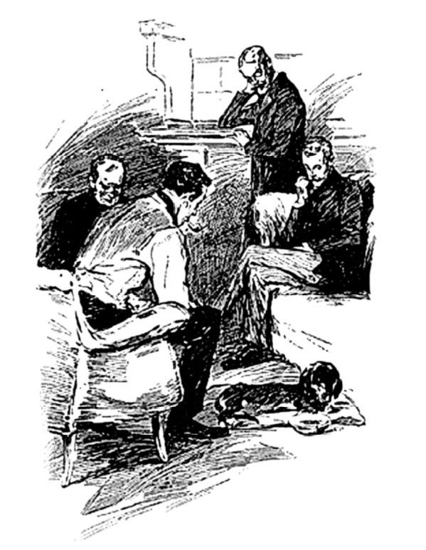

目不转睛地望着狗，看看究竟有什么惊人的结果。

福尔摩斯已经拿着表在手里，时间一分钟一分钟地过去，毫无结果，脸上显出了懊恼失望的表情。他咬咬嘴唇，手指不住地敲着桌面，表露出种种焦躁急不耐烦的样子。他情绪如此不安，我心里委实替他难过。而那两个侦探，轻蔑地微笑着，对他的尴尬场面在那儿幸灾乐祸。

“出乎预料，这不可能，”他叫道，然后从椅子上跳起来，在屋里大步走来走去，“不可能，不可能仅仅是个巧合。就是这个药丸，在德雷伯身上我就推测到了，史坦格森死的地方又果然发现。可是竟会不起作用。这是怎么回事？按说我的整个推理形成一根链条，环环相扣不脱节。不可能，决不可能！怎么搞的，连只垂死的狗都一点没事。啊，啊，有了！有了！”他发出一声兴奋的喊叫，一把抓起药盒，把另外一粒药丸也切成两半，投入水中溶化，加上牛奶，再端给狗吃。不幸的小狗，连狗舌都还没来得及再舔一下，它四条腿就痉挛抽搐，像是突然遭了雷劈一般，直挺挺死在了那里。

福尔摩斯长嘘了一口气，揩揩额上渗出的汗。“我应该信心坚定才对，”他说，“现在我应该知道，一连串的推理，出现与事实不相符合的环节，那就是该事实必定还另有缘故。药盒里的两颗药丸，一颗有毒，一颗无毒，这种可能，即使没见药盒里是两颗药丸也应该料想得到。”

他末了这个话，我初听只觉得玄虚不可捉摸，简直要怀疑他神志是否清醒。然而那狗明明是死在了跟前，他的假设已验证无误。我心头的迷雾这才渐渐消散，开始对整个案情的轮廓有了一个模糊的认识。

“这一切各位看来不免奇怪，”福尔摩斯继续道，“原因在于，案子侦查一开始，摆在面前的哪个是真正的线索至关重要，你们未能把握。我有幸把这个线索给抓住了。所以此后发生的每一件事，都有助于进一步证实我最初的假设是正确的，事实上，每一件事都是符合假设的逻辑结果。自此，你们感到困惑的事，把案子搞得一团漆黑的事，却使我心明眼亮，使我的结论更加颠扑不破。把认识不清的问题神秘化，肯定是错误的。最普通最平常的犯罪也往往最为神秘，因为没有明显的特殊的情况可供推测。本案被害人的尸体如果是被发现在路边，平常简单，没有其他任何异乎寻常、耸人听闻的迹象，那么侦破这起凶杀案就会茫无头绪，更加困难。现在有那么许多奇怪的细节，并没有使案情变得更加复杂，恰恰相反，倒是降低了案子的侦破难度。”

格雷格森先生一直耐着性子听他这番宏论，此时终于按捺不住了。“先别夸口，福尔摩斯先生，”他说，“我们大家也承认，你有些个能耐，你有你自己的高招儿。可眼下，我们是要讲真刀实枪，不是空谈理论、空洞说教的时候。要拿住人，才是过得硬真家伙。我已摆出自己经手的情况，看来我办砸了。小伙子夏庞蒂埃不大会卷在这第二件案子里。莱斯特雷德，他追踪他的目标，史坦格森，看来也砸了。你在这儿东一榔头西一棒，自己吹嘘个天花乱坠，比我们都行似的。可已经到了现在这节骨眼上，我们有权直截了当问你一句，你对本案究竟知道多少？你报出个案犯真名实姓来试试？”

“我倒是觉得格雷格森说得很对，先生，”莱斯特雷德也开了腔，“我们两人都试过了，我们两人都失败了。我来这屋里听你说也不止一次了，你要的证据你全都有啦。好吧，你不必再秘而不宣。”

“抓凶手拖延不得啦，”我说道，“否则又要给他时间、机会再次作案啦。”

我们几个这么紧逼，福尔摩斯显得仍有些犹豫不决。他又开始在屋里来回地走，低垂着头，紧锁着眉。这是他陷入沉思的习惯表现。

“决不会再作案了，”最后他说，忽然站定，面对我们，“这是不成问题的，不必多虑。你们问我是否知道凶手的姓名，当然知道。知道他的姓名和把他抓住来比，那只是小事一桩。抓住他，我看也就快了。这件事我很希望亲自安排，亲自动手。可是这件事务必要小心谨慎，因为我们要对付的这个人，极凶悍，毫不畏死。他有人相帮，我已领教过，这个帮手同他一样机敏过人。只要凶手没有觉察已授人线索，被人盯住，就有机会把他捉住。否则，只要被他略感动静，他就会改名换姓，立刻隐没在这座大都市的四百万人口之中。我绝非有意伤害各位感情，我不得不说，依我看警方不是他们的对手，这就是为什么我没有要求你们协助的原因。万一我失败，不用说，未请你们协助这一点我不能辞其咎。不过，我有把握非胜不可。至此，我可以承诺，只要我与两位联络不危及自己的全盘计划，无疑会及时奉告。”

格雷格森和莱斯特雷德似乎对他的承诺大不领情，对他言语中充满小看警方侦探的味道颇感不满。格雷格森气得满脸通红，一直红到发根；莱斯特雷德眨巴一对小圆眼，闪着又惊疑又恼怒的目光。然而，还没来得及等两人张口说话，有人打门了。门开处，一个浑身臭烘烘的小瘪三，街头流浪儿头领小威金斯驾到。

“先生，请吧，”威金斯说，摸了一下前额的头发，“马车叫到，等在楼下。”

“好样的，真棒！”福尔摩斯和颜悦色地说，“你们苏格兰警场为什么不用这种式样？”他接着说道，从抽屉里拿出了一副钢制手铐，“瞧这弹簧多灵巧，咔嚓一下就铐紧了。”

“老式的够了，一样好用，”莱斯特雷德说，“这要看，找得到找不到那个人来铐，才是最有用。”

“那好，那就好，”福尔摩斯说，微笑笑，“得麻烦马车夫帮我一下，搬一搬这只箱子。请他楼上来，威金斯。”

我顿觉诧异，看我的同伴说话怎么像是要出远门，他没跟我提起过这事嘛！房间里有一只小旅行箱，他把箱子拖出来，动手扎紧皮带。他正这么忙着，车夫进来了。

“帮我扣好这个皮带扣，车夫。”他单膝跪地，手里忙活，头也不回地说。

车夫绷着脸，老大不情愿的样子，走上来，伸出双手，去帮他。说时迟那时快，只听得金属撞击咔哒一声，福尔摩斯随即一跃而起。

“先生们，”他大声叫道，两眼发光，“让我介绍杰斐逊·霍普先生，杀死伊诺克·德雷伯、约瑟夫·史坦格森的真凶。”

整个事情只在一刹那间发生——快得我来不及想是怎么回事。那一时刻的情景，福尔摩斯胜利的表情、朗朗的声音，还有那车夫惊愕狂暴的面容，他瞪眼望着施魔术般铐住他双手的亮铮铮的手铐，我至今回想起来，还历历在目。一两秒钟之间，我们都呆若木鸡。接着，人犯一声狂吼，挣脱福尔摩斯抓住他的双手，猛地冲向窗口。窗框和玻璃被他撞断、撞碎，但没等他跳窗，格雷格森、莱斯特雷德和福尔摩斯像三条猎鹿猛犬，一起扑了上去。车夫被拽了回来，接着就是一场殊死的搏斗。这个人力大无比，凶猛异常，我们四个人一次又一次被他甩开。他好像有一股癫痫症发作的死劲。他的脸和手跳窗时给玻璃划破得厉害，鲜血直淌，但拼死抗拒的气势不减。最后亏得莱斯特雷德把手伸入他领巾，死卡他的脖子，卡得他差点透不过气，才使他意识到再挣扎也已无用。这时候我们仍不放松，赶快把他的双脚也像铐住手一样捆起来，才感到放心。完了以后，我们站起身，一个个呼哧呼哧，上气不接下气。

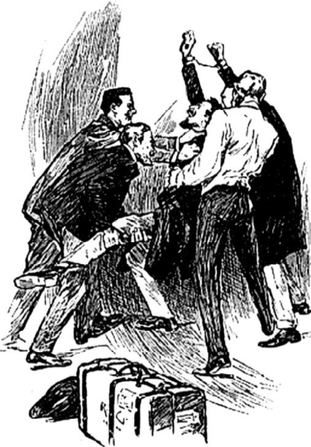

接着就是一场殊死的博斗。

“正好，我们就用他的车，”福尔摩斯说，“送苏格兰警场。好了，先生们，”他接着说，笑容满面，“一场谜案戏，总算演到头。现在，欢迎各位，随便提问，在下决不会再拒绝不答。”

# 第二部　圣徒之国

# 第一章　大荒漠的旅行人

在北美大陆的中部，有一大片干旱的荒漠，历来成为文明进步的大障碍，其范围从内华达山脉到内布拉斯加，从北边的黄石河到南边的科罗拉多，完全是赤地千里、渺无人烟的死寂荒原。不过，环境虽然严酷，大自然也并非只造就单调一色的面貌。那里既有雪冠封顶的崇山峻岭，也有阴郁昏暗的深谷；既有湍急的河流，奔腾于嵯峨险恶的大峡谷之间，也有无垠的平原，冬天积雪遍野，夏天则是灰色的盐碱地。但总而言之，这个地区的特点就是贫瘠荒凉、了无生机。

在这片无望的土地上，人烟绝迹，只有波尼人或黑足人<a href="#part0015.xhtml_ch1"
id="part0015.xhtml_ch1-back">(1)</a>这些印第安部落偶有结队而过，前往别的狩猎地。即使是他们之中最坚强最勇敢的人，也渴望赶快走出这片可怕的荒野，早日投身到大草原中去。苦吆狼<a href="#part0015.xhtml_ch2"
id="part0015.xhtml_ch2-back">(2)</a>出没在矮树丛中，鹰在空中缓缓翱翔，还有那戆态笨灰熊，在阴暗的峡谷中蹒跚走动，向着山岩寻觅食物。这片荒漠除了这些动物，便没有别的居民。天下再也没有其他地方比布兰卡山脉北麓的景象更为凄凉。放眼望去，空旷的大平原向四处伸展，尽是片片灰色的盐碱地，稀稀落落分布着一丛丛荆棘矮灌木。那边地平线的尽头，山峦起伏，山脊上盖着斑驳的白雪。这一望无际的大地上看不到生命，也没有与生命有关的迹象。铁青色的天空中无飞鸟，暗灰色的土地上无动静——一切的一切，绝对的宁静。侧耳细听，广阔的原野听不到一丝儿声音，万籁俱寂——一种令人窒息的、彻底死绝的境地。

广大的平原上毫无人类生命的痕迹，说是这么说，其实不尽然。从布兰卡山上向下望，可以看到一条小道穿越荒漠，蜿蜒曲折地延伸，消失在遥远的地方。这条小道是经过不知多少车辆的轮子，经过不知多少探险者的双脚辗滚、踩踏出来的。沿途这儿那儿凌乱地遗弃着堆堆白色的东西，在阳光下，衬着暗灰的碱地，散发出阴惨的白光。走近去仔细一看，原来都是白骨！有极粗大的，有较细小的，那是牛骨和人骨。在这长达一千五百英里的大篷车队可怕的旅途上，后人沿着前人倒毙的森森白骨一路前进。

一八四七年五月四日，一个孤单的旅行人，站在山上俯首望着凄惨萧索的景象。看他的外貌，简直像是这一境遇里的鬼怪精灵。就算是眼光厉害的人，也说不准他的年龄到底是四十岁，还是已有六十岁。他的长脸瘦削，形容枯槁，一层褐色干皮紧包着嶙峋的骨头，棕色的长须蓬发已显灰白。眼窝深眍，双眼散着呆滞的目光，形同骷髅的手拿着来复枪。他站在那里，靠着来复枪杆支撑着身体。但是他那高高的身材、宽阔的骨架，表明他原本也是个魁梧强健的人。但是现在他那消瘦的脸庞和骨瘦如柴的身子，使他看上去已衰朽不堪。这是个濒临绝境的人——即将饥渴而死。

他不顾精疲力竭，顽强地下到沟壑，又翻上这块小丘地，绝望中抱着希望，但愿能发现何处有水源。眼前，所能看到的是一片无边无际的盐碱地和远处连绵的荒山，不见有树木的踪影。没有树木，也就连一丝水气都不会有。大地如此广阔，却是一线希望也没有了。他拼命睁大眼睛，向北边，向东边，向西边急切地瞭望。然后，他明白了，漂泊的日子已到了尽头，自己就要倒毙在这光秃的山冈之上。“死在这儿，就当是二十年后死在鹅绒床上，又有什么两样？”他喃喃自语，一边去找一块大岩石阴影处坐下来。

他坐下之前，先把没了弹药的来复枪放在地上，再把斜背在右肩的一个包裹解下来。这是个用灰色披巾裹起来的很大的大包裹。看样子包裹还挺沉，他已经背不动了。解下包裹往地上放下去，因为手没力气放得重了一点儿，只听得从披巾包裹里发出呜的一声哭喊，接着钻出一张受惊的小脸蛋，眨着一对明亮棕色的大眼睛，伸出一双肉鼓鼓、有着浅窝和雀斑的小拳头。

“摔疼我啦！”孩子奶声奶气地抱怨着。

“哎哟，是吗？”这个男人很表歉意地回话，“我不是故意的。”说着就打开了灰巾包袱，抱出来一个可爱的小女孩。孩子约有五岁，穿一双精致的小鞋，一件漂亮的粉红上衣，围一块麻布围兜。这些打扮都可以看出妈妈对她的关爱是无微不至的。孩子的脸虽然也显得苍白少了点血色，但是她那胖乎乎的小腿小胳膊说明她吃的苦没有这个大朋友吃的苦多。

“现在好些了吧？”男人关切地问，看见小女孩还在按住乱蓬蓬的金色鬈发揉着后脑勺。

“吻我这儿就好了，”孩子挺认真地说，向他指指碰着的地方，“妈妈都是这样吻我的。妈妈哪儿去了？”

“妈妈走了。不久你就要见到她的。”

“走啦，真的！”小女孩说，“真奇怪，她还没跟我说再见呢。以前她去姑姑家喝茶，都要跟我说再见。可是这一回，她已经去了三天了。喔，嘴真干，干得要命。没水喝，也没东西吃吗？”

“没有，什么也没有，宝贝。只好忍着点儿，一会儿就都好了。把头靠在我身上，就这样，你会感到好一些的。嘴唇干得都裂了，说话都没力气了，可我还是把实情跟你说了好。你手里拿着什么？”

“真好看！好漂亮呀！”小女孩拿起两片亮晶晶的云母，兴冲冲地说，“等我们回家，我要给弟弟鲍勃。”

“不一会儿，你还会看见比这更漂亮的东西，”大人很有信心似地说道，“我是要跟你说——还记得吗，我们从那儿离开的一条河？”

“喔，记得。”

“是呀，本来我们算好了的，离开那条河，不久就会来到另一条河，明白吗？谁知不对劲了，罗盘、地图也不知出了什么毛病，没有看见河。带的水只剩下一点点，要留给你们孩子喝。后来——后来——”

“后来你没有水洗脸了。”小伙伴一本正经地插话说，抬起头望着他肮脏的面容。

“别说洗脸了，连喝的水也没有了。后来，本德先生第一个走了。后来是印第安人皮特。再后来是麦克格列格太太。再后来，约翰钱宁·洪兹。再后来，亲爱的，就是你妈妈了。”

“啊呀，妈妈也死了。”小女孩叫了一声，用围兜捂着脸，痛哭起来。

“是呀，一个个都走了，只剩下你我两个。后来我想，朝这儿走说不定会有水。我就把你背在肩上，走呀走呀，走到了这里。可是，事情一点儿也不妙。现在这样，活下去的希望是不大了。”

“你是说，我们会死吗？”孩子止住了哭，仰起淌满泪水的小脸问道。

“我想，差不离是这么回事。”

“你为什么不早跟我说呀？”孩子开心起来，笑着说，“刚才你吓着我了，现在好呀，只要我们也死了，就可以和妈妈在一起了。”

“对，小宝贝，一定能。”

“你也会看到妈妈的。我要告诉妈妈，你待我真好。我保证，妈妈一定会在天上打开门等着我们去，给我们一大壶水喝，好多好多荞麦饼，热乎乎的，两边儿都烤得焦黄焦黄，跟我和鲍勃一起吃过的一个样。那我们还要等多久才能死呢？”

“我也说不准——不会太久了吧。”大人一边说，一边眼睛望着北方的天边。在蓝蓝的天穹下，出现了三个小黑点。黑点在向这里迅速移动，变得越来越大。一下子就看清了，原来是三只褐色的大鸟，飞过来在两个流浪人的头顶上空盘旋，接着就落定在高处的岩石上，朝他们望着。这是三只鹰，也就是美国西部的兀鹫，它们的出现，就是死亡的先兆。

“公鸡、母鸡，”小女孩指指这三只不祥物快活地叫道，拍拍小手想叫它们飞起来，“呀，这个地方也是上帝造的吗？”

“当然也是上帝造的呀。”大伙伴说道，这一突发奇问使他也感惊讶。

“上帝造了那边的伊利诺伊，上帝造了密苏里，”小女孩还在说，“我猜，这个地方不是上帝造的，一定是别人造的。这里造得可不好。造的人把水和树都给忘了。”

“我们来做做祷告，好吗？”大人恍惚地问道。

“天还没黑呢。”女孩儿回答说。

“这没关系，又不是硬性规定只能在什么时候做祷告的。上帝不计较，你放心好了。你就祷告吧，跟我们坐在大篷车里，走过大平原，每晚上你都祷告的那样。”

“为什么你自己不祷告呀？”孩子睁着疑惑的眼睛问他。

“祈祷文我记不得了，”他答道，“到我长到有这枪一半高的时候起，就不做祷告了。不过，现在再做还不晚。你做吧，我在你旁边，你讲一句，我就跟一句。”

“你要跪着，我也跪着，”女孩说，一边把包袱布在地上铺好，“还得把手这么举着，这样你会觉得好些的。”

这是一幅奇特的景象，除了鹰以外，再也无人看到。两个流浪人，一个是天真无邪的小孩子，一个是冒险的粗鲁莽汉，并排跪在窄长的披巾上。小孩胖胖的圆脸蛋和大人那张憔悴瘦削的脸，一起仰望无云的苍天，向着同他们面对面的敬畏的神灵虔诚地祈祷，两个人的声音——一个清脆细嫩，另一个苍老沙哑——一同祈求怜悯和宽恕。祈祷完毕，两人重新坐回到大岩石的阴影之中，孩子偎依着保护人宽阔的胸膛，倒头就睡着了。他瞧着甜睡的孩子，一会儿也感觉违拗不过自然力对他的压迫——他已经整整三天三夜不曾合过眼。慢慢地眼皮耷拉下来，终于合上了困倦的双眼，脑袋垂向胸前，越垂越低，灰白的长须同小伙伴的金发缠搅在一起，两人都沉沉入睡了。

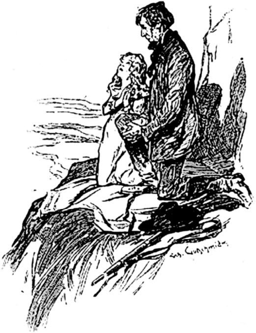

向着敬畏的神灵虔诚地祈祷。

这个流浪人如果晚睡半小时，他就能亲眼目睹一场奇观的来临。

在这盐碱荒漠辽远的边际，扬起一小片烟尘，起初很微弱，难以同远处的雾霭分别清楚，渐渐地烟尘越来越高，越来越大，后来就如同一团滚滚的浓云。这团云继续扩大，很明显，只有大群的人或动物在行进，才会掀起这么大的云尘。如果是在肥沃地区，看到的人不难断定，一定是大平原上逐草迁徙的大群野牛，正在转移过来。可是在此荒秃的不毛之地，这种情形是不可能有的。

飞扬的尘土向着冷落的峭壁滚滚而来，离两个沉睡中的落难路人越来越近。在烟尘弥漫之中，出现了大篷车的帆布顶，还有武装骑马人的身影。人车渐渐清晰，原来是一支向西行进的大篷车队。真是一支庞大的车队！在前面开路打头阵的已来到山脚下，殿后的还远在天边望不到尽头。在这无边无际的荒漠上，四轮车、双轮车、骑马的、徒步的，络绎不绝、气势浩荡地向前进发。大批的妇女负着重荷一路蹒跚而行，孩子们迈着急步跟随在车旁。一些坐在车上的孩子从白布车篷里向外探头张望。显而易见，这是不同一般的移民队伍，他们是一批流落的难民，迫于环境的压力迁徙他乡，另寻安身立命之地。在清新的空气中，车辚辚，马萧萧，人声鼎沸，大呼小叫；但是即使如此喧闹震天的声音，也没能惊醒山上那两个流落到此地的困乏已极的路人。

二十余名神情坚毅肃穆的开路先锋骑马走在行列的前头，他们身穿手工织造的深灰粗布服，肩背着来复枪。一来到山脚下，便勒马止步，聚在一起稍作议论。

“朝右方向有井，弟兄们。”一个嘴唇抿紧、胡子刮得光洁、头发灰白的人说道。

“向布兰卡山的右边走——就能到里奥·格兰德。”另一人说。

“别担心找不到水，”第三人喊道，“真神能从岩石中引水出来，神不舍弃他的选民。”

“阿门！阿门！”群体此起彼落地应声道。

他们正要重新起步，中间有个最年轻也最眼尖的小伙子向上指着砏岩峭壁高声喊叫。山顶上灰岩石的后面，有一件鲜艳夺目的红色的东西在飘动。一看见这件东西，骑手们便勒起马缰，把枪紧握在手。这时许多骑手从后面奔向前来增援前锋，只听见他们异口同声地在传喊着“有红鬼”。

“这里不会有印第安人。”一个年长的领头模样的人说道，“我们已经过了波尼红人的地界，没翻过前面的大山，不会遇到别的红人部落。”

“让我上去看看好吗，斯坦格森弟兄？”其中有一人说。

“我也去！”“还有我！”一下子十几个人争先恐后喊道。

“把马留下，我们大伙儿在此地等你们。”大兄长回答道。

几个年轻人立刻翻身下马，拴起马缰，便登上峻峭的山坡，向着激起他们好奇心的那东西走去。

他们前进的步子迅速而无声，像久经锻炼的侦察兵那样沉着、矫健、敏捷。山下的人只见他们在岩石间奔走如飞，直登山顶，一个个站在了蓝天之下。那个最先发现情况的小伙子走在前头，随后的人突然见他高举双手，似乎是大吃一惊的样子，大家拥向前去一看，眼前的情景也同样令他们惊奇异常。

在这荒丘顶上有一块平地，兀自孤立一块大岩石，岩石旁斜躺着一个大身材男人。他须发蓬乱，相貌严峻，形销骨立。只见他面容沉静，呼吸均匀，看来睡得很熟。在男人身旁睡着一个小女孩。孩子圆白的小手臂搂着大人青筋突起的黑细脖子，满头金发的小脑袋偎在大人棉绒服的胸脯上，红唇小嘴，微微张开，露着两排整齐雪白的牙齿，一脸的稚气，带着顽皮的微笑。她又白又胖的小腿，穿白色短袜，鞋子干净，鞋扣闪光发亮，这同大人干瘪枯瘦的腿形成奇异强烈的对比。在这对一老一小所在的上方一处凸岩上，停着三只虎视眈眈的鹰，它们一见另有来人，便发出一阵失望的粗哑啼叫，悻悻地飞走了。

巨鸟的啼叫惊醒了两个熟睡的人，他们睁开眼惶惑地望着周围。那男人晃晃悠悠地站了起来，朝下面一看，想不到刚才瞌睡难耐躺下的时候，还是空旷的一片，现在却已人马无数。他呆呆地望着，露出不敢相信的神色，把骨节突出如枯枝的手举到眼眉。

“这就是所谓神志不清吧，看来是的。”他自言自语道。小女孩立在他身旁，牵住他的衣角，不吱一声，只是以儿童所有的惊奇、疑惑的眼光向四周出神地望着。

前来的人们很快使两个濒临绝境者相信并非幻觉，知道自己有救了。一个人过来抱起小女孩举到肩膀上，另外两个人扶住她那个疲弱不堪的大伙伴，一同向车队走下去。

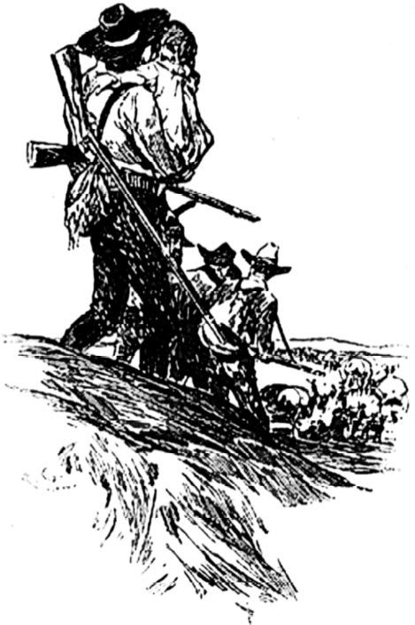

一个人过来抱起小女孩举到肩膀上。

“我名叫约翰·费里厄，”迷路人介绍自己的情况，“我们原来总共是二十一人，现在只剩下我，还有这个小家伙，其余的人，在南边，一路上没吃没喝，都死了。”

“是你的孩子吗？”有人问他。

“要说，现在该算是了，”这个人毫不讳言地说，“是我的孩子，是我救了她的命。谁也不能把她抢走。从今后，孩子就叫露茜·费里厄。请问你们是干什么的？”他继续说道，惊奇地看着这些高大健壮、晒得黝黑的救命恩人，“你们人还真不少呢。”

“将近有万把人，”一个年轻人说，“我们都是被迫害的上帝子民——都是摩罗尼天使的选民。”

“我从没听人说起这个天使嘛，”迷路人说，“他倒选了你们这么一大批好人哪。”

“神的事，不许言语不敬，”另外一个人严肃地说，“我们大家都信奉用埃及文字写在金箔上的圣典经文，由帕尔迈拉的圣徒约瑟夫·史密斯亲手秉承。我们都从瑙武城过来。我们在伊利诺伊州那边建了圣殿。我们在寻求避难地，要脱离迫害的人，远离不敬神明的人，即使让我们流落到沙漠中间，也心甘情愿。”

一说起瑙武城，约翰·费里厄并不陌生，马上想了起来。“我知道了，”他说，“你们是摩门教<a href="#part0015.xhtml_ch3"
id="part0015.xhtml_ch3-back">(3)</a>教徒。”

“我们是摩门教徒。”搀扶他的人异口同声答道。

“你们这是往哪儿去呢？”

“我们自己也不知道。上帝的手在指引我们，由我们的先知在秉承上帝的旨意。你要去见先知，先知会指示该怎么对待你。”

这时已经到了山脚下，大群教民围了上来——面目温良的妇女，嬉笑活泼的儿童，还有男人，目光恳切地要看个究竟。他们一见原来是迷路人，一个小女孩是那么幼小，一个大男人已那么疲弱困顿，便发出声声惊异的呼叫，阵阵怜悯的叹息。搀扶的人并没有停步，依旧朝前走，身后跟着一大群摩门教徒。他们排开众人一直来到一辆四轮篷车前面。这辆车特别高大而华丽，有与众不同的气派，共有六匹拉车的马，而别的车都是两匹马，最多也不过四匹马。在马夫旁边坐着一个人，年纪不到三十岁，但是看他那肥头大耳以及一副严肃的模样，便知是个头儿脑儿的人物。他正在读一册棕色封皮的书卷。等人群拥到跟前，他把书搁在一旁，仔细听取护送人的禀报。听完，视线便转向一大一小的两个落难人。

“如若要我们收容你们，”他厉言正色道，“惟有信奉我们的教义。我们不可将狼引入自家的羊群中。与其日后你们竟是霉斑，让你们朽烂了整个果子，倒还不如让你们留下干净的白骨于旷野之上。你能接受这条件跟我们走吗？”

“我愿意跟随你们走，一切条件都遵行。”费里厄说，语气之庄严郑重惹得那些刻板的大祭司都忍俊不禁。只有这位大首领依旧正襟危坐，严峻肃穆。

“带他去，斯坦格森弟兄，”首领说，“料理饮食，孩子也要照应好。你还须负责向他讲授教义经文。我们已耽搁过久。上路！前方，前方锡安山<a href="#part0015.xhtml_ch4"
id="part0015.xhtml_ch4-back">(4)</a>！”

“前方，前方锡安山！”众摩门教徒齐声呐喊，号令众口相传，犹如滚滚波浪，向着大篷车队呼唤下去，直到远远的后方，人声渐渐变得含混微弱。鞭子劈啪，车轮辘辘，大篷车队轰轰然行动起来，整个行列又曲折蜿蜒地前进了。祭司斯坦格森负责照料两个无家可归的人，把他们领到自己的车上，那里早已给他们预备好食物。

“你们就在这里歇着，”他说道，“不几日就可以消除疲劳，恢复精神。从今以后，要永远牢记，你们是摩门教的教徒。布里格姆·杨已作指示，他的言语就是约瑟夫·史密斯之音，也就是上帝之音。”

————————————————————

<a href="#part0015.xhtml_ch1-back" id="part0015.xhtml_ch1">(1)</a> 波尼人（Pawnee）、黑足人（Blackfoot），都是美国西北部的印第安部落。

<a href="#part0015.xhtml_ch2-back" id="part0015.xhtml_ch2">(2)</a> 苦吆狼（coyote），产于美国西部，夜间不住哀嗥，如凄苦吆喝，亦译丛林狼、郊狼。

<a href="#part0015.xhtml_ch3-back" id="part0015.xhtml_ch3">(3)</a> 摩门教（Mormon），美国基督教的一个教派，创立于1830年。创始人约瑟夫·史密斯（Joseph
Smith，1805—1844）自称奉天使摩罗尼亲授金箔埃及文《摩门经》，在纽约建立“耶稣基督后期圣徒教会”，设立共产公社式联合会，在伊利诺伊州建新城瑙武，盛行一夫多妻制，俨然是一个独立王国。史密斯后来以叛乱罪被捕入狱，在狱中遭蒙面人暗杀。教会经权力斗争，由布里格姆·杨（Brigham
Young，1801—1877）出任首领。杨于1846年率教民向西部迁徙，于第二年落户犹他州，始建盐湖城，任犹他州州长。1852年正式订定多妻制为该教教规。1857年与联邦军发生军事冲突期间，屠杀非摩门教居民，导致摩门教对犹他州的控制宣告结束。杨旋遭反对，另生派别“后期圣徒改组会”，多妻制于1890年宣布废止。

<a href="#part0015.xhtml_ch4-back" id="part0015.xhtml_ch4">(4)</a> 锡安山（Zion），一译“郇山”，耶路撒冷山名，古大卫王及其子孙的宫殿与神庙所在地，喻指理想之国、天国、天堂。

# 第二章　犹他一枝花

这里不打算详述摩门教众教徒在迁徙途中，如何备尝艰辛，终于来到他们的避难之所。从密西西比河畔到落基山脉的西麓，他们凭着几乎是史无前例的坚忍不拔的精神奋勇前进。一路遇到红蛮、野兽的袭击，受到饥渴、疲劳和疫疾的折磨，上苍所能降下的种种艰难险阻，都被这批盎格鲁撒克逊人以百折不挠的意志一一克服。但是，面临无穷的恐怖和长途跋涉，他们即使是最坚强的人，也曾胆战心惊，有过动摇。因此，当他们俯首看到眼前一片广阔的犹他山谷沐浴在阳光之中，并且听到领袖宣布这就是期许的乐土，这片处女地将永远属于他们时，便无不叩首膜拜，竭诚感恩。

没过多久，事实证明杨不但是一个行动有决断力的领袖，而且还是一个能力高强的行政官。地图绘出来了，图表制作好了，未来城市的面貌规划有了轮廓，城市四周的全部耕地，根据各个人的身份高低按比例加以分配。商人照旧经商，手艺人重操手艺。城中的街道、广场像变魔术般不断涌现。乡村中，筑沟浚壑，植篱划界，栽培作物，伐林垦殖，一派大生产的忙碌气象。到了第二年夏天，整个乡村麦熟金黄，丰收在望。在这个穷乡僻壤的新拓居地，一切都是欣欣向荣。尤其是，他们在城市中心建造的那座宏伟的摩门大教堂<a href="#part0016.xhtml_ch1"
id="part0016.xhtml_ch1-back">(1)</a>，日见高耸起来。每天从晨光熹微一直到暮色笼罩，教堂里传出来斧锯的铿锵叽嘎之声，不绝于耳。这座教堂，是移民们建造起来以感谢和纪念上帝引导他们渡过无数艰险，终于到达安乐的境地。

约翰·费里厄和小女孩相依为命，并且收做他的养女，两个落难人随同摩门教徒来到了他们伟大历程的终点。小露茜·费里厄收留在斯坦格森大祭司篷车上的时候，过得很愉快。车上还有大祭司的三个妻子，一个十二岁的儿子。这个男孩非常任性，又过于早熟。小女孩天性活泼开朗，很快解脱丧母的悲哀，恢复了元气，也受到三个女人的宠爱，并顺利地适应了这个帆布篷中游动之家的新生活。费里厄也解除了困顿和疲惫，身体得到恢复。他显示出是个得力的向导，机智勇敢的好猎手，所以很快获得新伙伴们的敬爱。当漂泊生涯一结束，大家一致同意他应当分得一大片肥沃的土地。除了杨本人以及四个高级祭司斯坦格森、坎博尔、约翰斯顿和德雷伯，这一待遇，是和其他移民一视同仁的。

约翰·费里厄分得土地以后，建造了一幢坚固的木屋。木屋随着以后逐年扩建，渐渐成了一座宽敞的别墅。他是个注重实际的人，也善于待人接物，又精于手艺。他的一副钢筋铁骨好身体，使他从早到晚在土地上操劳各种农活而不知疲倦。终于劳有所获，他的田庄产业十分兴旺发达。三年以后，他超过了邻居；六年成了小康之家；九年变成富户；等过了十二年，整个盐湖城地方，能够和他攀比的便不到五六户了。从内陆海的盐湖起，一直到遥远的瓦撒齐山区为止，在这个范围之内，再没有比约翰·费里厄的名声更大的人了。

他样样都好，但是有一件事，与教友的感情不相容。那就是，不管教友如何向他劝说，如何同他争论，他都不愿意按照教友们那种规矩娶妻成家。他也讲不出理由为什么坚持不娶，好像完全只是率由性格所为，固执得一点不转弯。有人指责他信教不笃不诚；另有人认为他是吝啬钱财，舍不得花费；更有人猜测他早年有过恋情，有过一个金发女郎在大西洋岸憔悴而死。不管是这样说那样说的什么原因，费里厄依然故我严守独身生活。此外的其他各方面，他恪守这个新拓居地的教义，被公认是个循规蹈矩的正派人。

露茜·费里厄在这幢木屋中长大，帮助养父照料屋里屋外大小一切事情。山区清新的空气、松林飘溢的脂香如慈母般抚育了这个小姑娘。随着岁月的增长，姑娘渐渐成人，出落得亭亭玉立，十分健美，红红的面颊愈显娇艳，行走步态轻灵如飘。多少路人每当经过费里厄家田庄的大道，只要是曾经见过这位体态柔美的少女轻盈地从麦田走过，或者遇上她骑在父亲的马上，见那典型的西部女郎的飒爽英姿，这形象即使过目再久，此时此地也一定会从心底里重新勾起，活生生浮现于眼前。当年的蓓蕾已经绽放成一朵奇葩。这些年来她的父亲变成了农民中最富裕的人，同时，她也成长为太平洋沿岸难得的一位标致、地道、纯真的美国少女。

第一个发现这女孩子已经长成的并不是她的父亲。这种事情往往很少是由做父亲的首先发觉的。真是奇异微妙的变化，是缓慢的、渐变的，不能以时日度量计数。即便是女孩子本人，也并无察觉。一直等到有一种说话声调、一种手的肌肤接触会使她心头突突乱跳，她才怀着害怕与骄傲互相交织的复杂感情，意识到一种新奇的、更强烈的自然本能在她内心深处觉醒了。世上几乎无人不能忆起自己的那一天，不会记得自己的那一点萌动，宣告了新生活的破晓。然而，不幸的露茜·费里厄，青春岁月伊始，竟红颜薄命，厄运从此降临，还殃及其他的人，生出了其他的事。

那是六月一个温暖的早晨，摩门教徒们忙碌得像蜜蜂一般，圣徒们也正是拿蜂巢形象作为他们的标识。田野里，街道上，人们劳动之勤奋，那情形就同蜜蜂嘤嘤嗡嗡的繁忙劲儿一个样。尘土飞扬的大道上，载着沉重货物的骡子一长队一长队向西行进。因为加利福尼亚爆发了淘金热，横贯大陆的通衢大道穿越伊莱克特城。还有外地大牧场赶来的羊群、牛群，也有一队队疲惫的移民，经过艰苦的长途跋涉，显得人困马乏。正当人畜车马纷至沓来之时，露茜·费里厄仗着自己骑术高超，策马穿行其间。她美丽的脸庞由于大动作而泛起红晕，她的栗色长发在肩后飘扬。她是奉父亲之命赶赴城里办事的。这次也如以往惯常那样，凭着年轻人的无畏冲劲，不顾一切地跃马前行，心里只想着自己的任务应当如何去完成。那些风尘仆仆的淘金冒险者惊愕地瞧着她，就连那些跑皮货生意的印第安人，一向算得冷漠，看见了这么一个白净漂亮的女郎，也惊讶起来，一贯呆板的面孔竟为之喜形于色。

露茜来到了城郊，发现道路被牛群堵塞，不能通行；五六个面目粗野的牧人正把大群的牛从草原往这里赶来。她心中焦急，便拣空档穿插进去，想冲过阻碍赶路。她刚刚挤入牛群，后面的牛就都拥了上来。她落入了牛阵之中，四周全是怒目圆睁、犄角尖翘的蛮牛向她围拢。她还算得是从小与牛打熟了交道，陷此重围毫不惊慌，瞅准了一有间隙就催马窜入，企图强行开路冲出牛群。可是不料有一头蠢牛不知是无意还是故意，牛角抵了马肚子一下，马痛得立即惊跳，前蹄扬起，狂怒嘶叫，颠腾得鞍上若不是个头等骑手，任何人都要摔将下来。这情况十分危急。受惊的马越是蹦跶，牛角越要抵撞。这就越发使马暴跳不已。露茜此时只能紧夹住马鞍，不能有一点点的闪失。不然，一摔下去就遭疯牛乱蹄践踏，会被踩得粉碎。遭遇这突如其来的紧急情况，她已应付不了，感到天旋地转，眼冒金星，紧拽的马缰绳，眼看就要松手；同时尘土扬起，再加上牲口簇拥，秽恶味蒸腾，令她窒息得喘不过气来。她已陷于绝望，快要支持不住了。正在这危急关头，有一个亲切镇定的声音在身边响起，使她清醒，知道有人来相助了。同时伸来一只强有力的棕色大手，一把抓住受惊吓马的嚼环，在牛群中挤出一条路，不一会儿工夫，就把她带到了牛群之外。

“你没事吧，小姐。”这个见危相救的人彬彬有礼地说道。

姑娘抬头瞧着他那张黧黑粗犷的脸，惊魂甫定而顽皮地笑着。“真把我吓坏了，”她天真地说，“想不到我家邦乔这马儿会给吓成这个样子，牛也是太多了！”

“感谢上帝，幸亏你马鞍子坐紧了。”这个人情切地说。

这是一个高高身材、满脸豪气的年轻小伙子，骑一匹红棕白花的高头大马，穿一身结实的粗布猎装，背着一支长筒猎枪。“我看你就是约翰·费里厄的千金吧，”他说，“我看着你从他家那边过来。你回家可以问问你爸，记不记得圣路易斯的杰斐逊·霍普。假如正是同一位费里厄的话，那我父亲同你父亲可是很要好的老朋友了。”

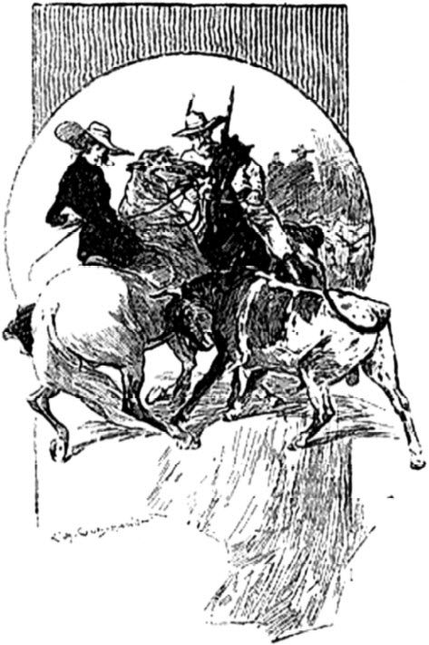

犹他一枝花。

“你自己来问问他，不是更好吗？”她有心这么说。

小伙子听到这个建议，喜出望外，一双黑眼睛闪耀着欣喜的光辉。“我会问的，”他说，“我们在山里待了两个来月，回来是该拜访些人。你父亲见了我们，一定会欢迎的。”

“他可要大大感谢你呢，我也要好好谢谢你，”她答道，“爸爸可疼我了，要是让牛把我踩死的话，那他可要伤心得受不了了。”

“我也会伤心呢。”小伙子陪着她说。

“你，啊，真不懂这和你又有什么关系！你还不算是我家的朋友呢。”

年轻的猎人听她这么说，黧黑的面孔马上消沉下来。露茜见他这样，不禁大笑。

“瞧你，我才说了这么一句，你就急成这样，”她说，“放心吧，你现在是朋友啦。你一定要来看我们呀。这会儿我得赶紧，要不然，以后爸爸就不会把事情交给我办了。再见吧！”

“再见！”他说道，举举墨西哥宽边帽，俯身吻了姑娘的纤纤细手。女郎掉转马头，挥起鞭子，催马飞驰而去，身后扬起一溜滚滚飞尘。

年轻的杰斐逊·霍普和他的伙伴们继续前进，一路上他心情抑郁，默默无言。他和大家在内华达山脉中探勘银矿，回来打算筹集足够的资金，开采发现的矿藏。他和大家正起劲地投入这桩事业，但是这次意外邂逅使他心不在焉。他已是一见钟情，美丽的姑娘如山中清风那么纯情撩人，深深地触动了他的爱慕之心，如火山要爆发一般难以扼制。他痴望着姑娘的身影直到从视线中消失，意识到自己的生命正进入一个紧要时刻，银矿也好，别的任何事情也好，都不如这个新发生的吸引他全身心的事来得重要。他心中迸发的情感，不是一个男孩一时的念头、变化无常的幻想，而是一个意志坚定、性格刚毅的男子汉所具有的那种强烈奔放的激情。他一向是要么不做事，要做必定达到目的。他心中暗暗发誓，只要是人的力量和人的恒心所能获得成功的，那么这一次他也决不会失败。

当天夜里他就拜访了约翰·费里厄，以后就经常上门，成了这一家很熟的常客。约翰深居山谷之中，全身心埋头于农田劳作，十二年来对外界很闭塞，消息不灵通，现在全靠杰斐逊·霍普告诉他外边的情况。他还常常讲得有声有色，不但使这位父亲感到闻所未闻，就连露茜也听得津津有味，妙趣横生。霍普是当年加利福尼亚的拓荒先驱，所以讲得出许多历史掌故。在狂暴的日子里，在和平的年岁中，有时候发财，有时候破财。他当过侦察兵、皮毛兽猎人、银矿探勘者、牧场工人。哪里传出有冒险的事，哪里就有杰斐逊·霍普的份儿，少不了他前去探究一番。他与费里厄家过往如此密切，很快得到这位老农的欢心，不住夸奖他有能力有出息。每逢这样的时刻，露茜总是在一旁默不作声。但是她两颊升起红晕，闪着明亮幸福的眼光，则明显不过地可以看出她的青春之心已飞驰而神往，不再是她自己的了。她老父亲淳朴厚道，竟没有看出这些征兆。但是这些当然都逃不过赢得她芳心的小伙子的眼睛，他一一看得心中明白。

夏天的一个傍晚，霍普骑马由大道上过来，到园门旁停下。露茜在屋门口，就迎着他跑上去。他把马缰绳往篱栅上一扔，踏着屋前小路大步走过来。

“我要外出一趟，露茜，”他说，把露茜两只手握在自己的手里，温情地瞧着她的脸，“现在，我不要求你跟我走，可是等我回来，你是不是准备跟我走呢？”

“你什么时候回来呢？”她笑问道，一阵脸红。

“最多两个月，亲爱的，回来就向你求婚。你我两人之间，谁也别想阻拦我们。”

“那爸爸的意思呢？”她问。

“他已经同意了，只要我们把矿办好，就没问题。这我倒是一点也不担心。”

“喔，那就好，别的没什么，只要你跟爸爸安排好，就用不着多说了。”姑娘轻轻地讲，面颊贴紧他的胸膛。

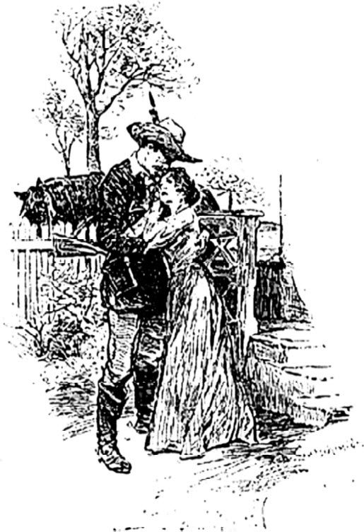

姑娘面颊紧贴他的胸膛。

“感谢上帝！”他声音粗哑着说，俯首去吻她，“那么，事情就这么说定。我待得越久，咱俩越是难舍难分。别人都在峡谷那儿等着我呢。亲爱的，再见。两个月以后你一定会见到我。”

小伙子一边说，一边把姑娘从自己怀里扶开，跃身上马，头也不回飞驰而去。好像只要他稍一回顾离别的恋人，他的心意就会动摇。姑娘站在篱门口，久久地望着他，一直到他的身影消失，才返身往屋里走，心里觉得自己是犹他州最幸福的姑娘了。

————————————————————

<a href="#part0016.xhtml_ch1-back" id="part0016.xhtml_ch1">(1)</a> 摩门教最著名的教堂，是一座有六顶尖塔的花岗岩宏伟建筑。

# 第三章　约翰·费里厄同先知的谈话

杰斐逊·霍普和他的伙伴离开盐湖城已经有三个星期了。约翰·费里厄一想到等年轻人回来，就将要失去自己领养大的孩子，不免感到痛苦。然而女儿那张明朗幸福的脸，比任何言词都更能说服他顺从这个安排。他早已在内心深处下定决心，说什么也不会答应把他的女儿嫁给摩门教徒。摩门教的婚姻根本不是婚姻，那是奇耻大辱。不管他对摩门教的教义看法如何，在这一点上他是绝不通融的。然而他对这一点只能守口如瓶，因为圣徒之地是摩门教的天下，吐露违背教义的言论是危险的事情。

的确是极其危险的事——动辄就要大祸临头，就连教会中那些德高望重的圣徒谈论对于教会的意见，都是只能窃窃私语，大气儿都不敢出一声，惟恐一句话说漏嘴，立即祸从天降，遭到无情的惩罚。以前被迫害过的人，出于报复，反过来又成了迫害者，并且是变本加厉，不择手段。即使是塞维利亚宗教裁判<a href="#part0017.xhtml_ch1"
id="part0017.xhtml_ch1-back">(1)</a>、德意志秘密刑事法庭<a href="#part0017.xhtml_ch2"
id="part0017.xhtml_ch2-back">(2)</a>，或是意大利的秘密社党所拥有的镇压机构，其所施行的恐怖行动，比之于犹他州摩门教所布下的天罗地网，真是小巫见大巫了。

这个组织既无形却又无处不在，神秘莫测的云雾，笼罩住真实的面目，使它令人倍感恐惧可怖。这个组织要知道什么，要实施什么，似乎都可以无所不知，无所不能。而它自己的所作所为，外人既看不清，又听不见。有谁敢于反对教会，谁就会突然失踪。没有人知道他的去向，也不知道他落到什么下场。他的妻子儿女在家中痴望，可是为夫为父者再也不会回来告诉他们在秘密审判者手中，他是个什么样的遭遇。谁只要说话稍有不慎，行动偶有闪失，灭顶之灾立即接踵而至。但是没人说得清凌驾于他们头上的可怕势力本质上到底是怎么一回事。因此人们到处小心翼翼，战战兢兢，即使在四周无人的旷野里，也不敢交头接耳私议对所受压迫的怀疑。

起初，还不是全面实行恐怖统治，主要针对那些不顺从者，就是曾经信奉摩门教，后来则持有异见或者放弃信仰的人。可是，很快就扩大化了。这时，妇女人数日见减少，没有足够的妇女，一夫多妻制的教义就有名无实。于是许多稀奇古怪的传闻不胫而走——传说移民在途中被谋杀，移民的帐篷也遭枪击，这都发生在根本没有印第安人的地区内。同时，摩门教高级祭司的家中却新添了不少女人——她们形容憔悴，终日以泪洗面，脸色惶恐不安。山上的夜行客也传说，在暮色晦暗中，曾眼见有蒙面武装匪帮幽灵般悄悄地几乎与他们擦肩而过。这类传闻说得有声有色，经过多番印证，终于证实确有其事，并把所作所为归结于某个人的名下。直到今天，在西部广漠的大草原上，但族帮<a href="#part0017.xhtml_ch3"
id="part0017.xhtml_ch3-back">(3)</a>即所谓“复仇天使”，仍然是罪大恶极、臭名昭著的不祥名称。

这个罪孽深重的组织，外人多是只知其一不知其二，但是越深入了解下去，就越知道其罪恶之令人发指。谁也不知道谁是这个残暴组织集团的成员。这些人在宗教幌子下进行残忍血腥的屠杀，他们的名字、身份是绝对保密的。你向朋友吐露对先知及其教团的不满与怀疑，说不定夜里就是这个朋友领人前来给你进行血与火的洗礼。因此，每个人对左邻右舍都怀有疑惧和警戒之心，真正的心里话是谁也不能说的。

一个晴朗的早晨，约翰·费里厄正准备出门去麦田，忽然听得门闩咔嗒一响，马上向窗外望，有一个矮胖、浅棕色头发的中年男子，从小径上过来。他一颗心提到了嗓子眼，来者不是别人，正是大人布里格姆·杨亲自驾到。他大惊失色——因为他明白，这种光临是凶多吉少。费里厄忙不迭跑到门口去迎接这位摩门教大首领。来者接受了他的迎候，但十分冷淡，他板着面孔进入客厅。

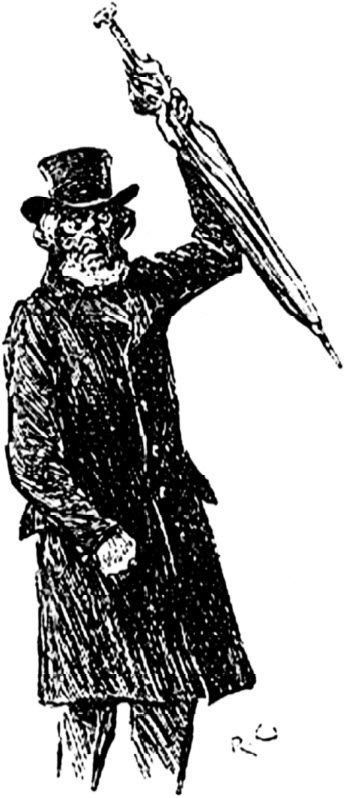

摩门教大首领。

“费里厄弟兄，”他开腔了，在椅子上坐下，淡淡的眼睫毛下的两个眼珠严峻地朝这个农民扫视，“上帝的忠诚信徒始终极为善待于你。你当年在半途上行将成为饿殍，是众弟兄营救了你。我们把饭和你分着吃，车挤着住，把你平安带来这个上帝选定的山谷，分给你大块沃土良田，在我们的保护之下，你才能发财致富，是不是这样呢？”

“是的。”约翰·费里厄回答道。

“我们所有这一切，只对你提出一个要求，那就是，你一定得信奉真教，并且要在各方面恪守教规。你答应过，答应做到。可是，你一直不遵守，听听大家的反应吧，他们可没冤枉你吧。”

“我有什么不遵守呢？”费里厄摊着双手问道，“我没有缴纳公共基金？我没有上教堂礼拜？我没有——”

“你有妻子吗？”杨问道，眼珠向周围扫了一下，“把她们都叫出来，让我见见。”

“我没结婚，是事实，”费里厄说，“可是妇女太少，好多人比我更加需要。我到底还不是孤身一人，我还有一个女儿侍候着呢。”

“正是为了你女儿，我才来找你谈话，”这个摩门教领袖说，“你女儿已经长成，人称犹他之花，这里有好多高地位的人都看中了她。”

约翰·费里厄一听这话，心都抽紧了。

“我都不愿相信，外边都在说——她和一个非摩门教的人私订终身，这一定是无聊嚼舌中伤。约瑟夫·史密斯经典第十三条如何训示的？‘摩门教每个女儿嫁与上帝之选民。如若外嫁非摩门教之人，该女即犯下弥天大罪。’经典就是如此明白告诫。那是不许可的。你既信奉神圣教义，怎么竟容忍女儿亵渎教规。”

约翰·费里厄没有答话，手不住地捏着马鞭子。

“这一点上，就考验出你是真信，还是假信。四圣会已经作出决定，姑娘很年轻，我们不会把她嫁给白发长者，也不会剥夺她的权利，不许她自主选择。我们大祭司都已有许多小母牛<a href="#part0017.xhtml_ch4"
id="part0017.xhtml_ch4-back">(4)</a>，可是我们的孩子们还不曾有。斯坦格森有一个儿子，德雷伯也有一个儿子，两位都很想把你的女儿娶进家门。他们两家，让你女儿选一家吧。两家孩子都有钱，都年轻，都是诚信的教徒。你认为怎么样？”

费里厄沉默了一会儿，双眉紧蹙。

“您给我们一点时间，”末了他说，“女儿还小——还不到结婚的年龄。”

“只能有一个月的选择时间，”杨说，从坐椅上起身，“顶多一个月，必须给我答复。”

他出了门，又回过头来，脸涨红着，眼露凶光。“你好自为之，约翰·费里厄，”他厉声喝道，“你们父女二人，胆敢违抗四圣之命，那是以卵击石，不如白骨回布兰卡山去吧！”

他手一扬，做了个威吓的手势，转过门。费里厄听着他沉重的步子踏着卵石小径啪嚓啪嚓走去。

他手肘支在膝头，一直坐在那里，考虑怎么办，究竟该如何向女儿谈这件事。这时，一只手柔软地搭在他的手上。抬头一看，女儿已经站在身边。一眼看到女儿惨白、惊吓的脸色，就明白她都听见了。

“我不是偷听的，”女儿说，看着父亲的脸色，“他嗓子那么大，整屋子都听得见。喔，爸爸，我们怎么办呀？”

“不要怕，”他回答，把女儿拉到怀里，粗大的手抚摩着女儿栗色的秀发，“我们有办法对付他。你对杰斐逊没有心冷吧？”露茜没有回答，紧握住爸爸的手，流下了眼泪。

“你没有，绝不可心冷。我可不愿意听你说已经心冷。他是个好青年。他是基督徒，就凭这一点，也比这儿的人强多了，别看他们那一套祷告、讲道什么的。明天有人去内华达，我叫他们捎信给杰斐逊，让他知道我们这儿情况不妙。我相信这个小伙子，他一定会马上往回赶，骑在电报上，抽着鞭子刷地一下到了，回来了，好快哦！”

露茜听父亲这么一形容，破涕为笑了。

“只要他一回来，就会有办法。可我是担心你，爸爸。有人说——说得真可怕，说是有人反对先知，就马上没命。”

“我们又没有反对他，”父亲安抚她说，“要是我们反对他，那要小心提防了。还有整整一个月的时间。期限一到，我们最好早已跑出犹他州了。”

“离开犹他？”

“只有这样。”

“田庄怎么办？”

“能变卖的，都变卖掉，余下只好都不要。老实说，露茜，我早就考虑要这样做。我不喜欢对任何人卑躬屈膝，像这儿的人都向先知低头哈腰，我根本就不想这样。我生来就是个自由美国人。这套玩意儿我不会耍。要不就是我太老了，学不会。他要到我这儿来耍泼放肆，他就得留点儿神，大号枪子儿会等着他，把他脑袋穿窟窿。”

“恐怕他们不会放我们走。”女儿提醒他。

“等杰斐逊回来，很快会有办法跑掉。在这种时候，你千万要挺得住。我的宝贝，别老哭鼻子，哭得眼睛肿。不然的话，看见你这模样，他一定会来找我碴儿。不用怕他的，没啥了不起，出不了事。”

约翰·费里厄对女儿说了这些安慰的话，口气坚定，显示信心十足。但是女儿那天夜里看到父亲与往日不同，非常谨慎地把门窗闩紧，把卧室墙上那支生锈的猎枪取下来，擦拭一新，装上子弹。

————————————————————

<a href="#part0017.xhtml_ch1-back" id="part0017.xhtml_ch1">(1)</a> 塞维利亚宗教裁判（Inquisition
of Seville），中世纪西班牙南部港市塞维利亚天主教审判异教徒的宗教裁判。

<a href="#part0017.xhtml_ch2-back" id="part0017.xhtml_ch2">(2)</a> 德意志秘密刑事法庭（German
Vehmgericht），中世纪在威斯特伐利亚实行的制度。

<a href="#part0017.xhtml_ch3-back" id="part0017.xhtml_ch3">(3)</a> 但族邦（Danite
Band），摩门教约于1838年建立的一秘密教派。

<a href="#part0017.xhtml_ch4-back" id="part0017.xhtml_ch4">(4)</a> 作者原注：希伯·C．肯博尔（Heber
C．Kemgball）在一次讲道中提到他有100个老婆，以“小母牛”作为爱称。

# 第四章　逃　亡

摩门教先知登门谈话后的第二天早晨，约翰·费里厄赶往盐湖城，找到了要上内华达去的朋友，托他转交一封信给杰斐逊·霍普。信中告诉年轻人，十万火急的危险情况在威胁着他们，望他收到信后速归。托付完毕，抽紧的心才似乎稍稍放下，怀着略感轻松的心情回到家里。

他刚走近田庄，就看见园子门外的两根柱子上各拴一匹马，他吃了一惊。更叫他吃惊的是，刚一进屋门，就见有两个年轻人擅自闯入客厅。一个是灰白长脸，仰身躺在摇椅里，把两条腿高高跷起在火炉上。另一个长着牛似的粗脖子，丑陋浮肿的脸，傲气凌人，站在窗口，两手插在裤袋，嘴里吹着一曲流行的赞歌。见费里厄进门，两人都点头致意，躺在摇椅上的那个先开口说话。

“也许您还不认识我们，”他说，“这位是大祭司德雷伯的公子，本人我，约瑟夫·斯坦格森，我们都是和你们一起从大荒地上过来的，是上帝张开神圣的援手，收容你们回头，进了和善的羊群。”

“主上帝终将普天下人引入来，”另一人开腔，带着鼻音，“圣网恢恢，疏而不漏。”

约翰·费里厄冷冷地弯腰行个礼。他早已猜到这两个不速之客是何许人。

“我们是奉家父之命，”斯坦格森接着说，“前来向您闺女求婚，我两人之中，您和闺女任选一个，认为哪一个好都行。我呢，还只有四个老婆，不多。这位德雷伯弟兄，有了七位。事情就是这样，明摆着，我的需要自然是比他大。”

“不对，不对，斯坦格森弟兄，”另一个气急败坏地叫道，“问题不在乎你我老婆多少，要看能否养得起。我老爸已经把他的磨坊都给了我，我更有钱了。”

“而我的前程比你远大，”另一个猴急着说，“我老父归天之后，他的硝皮工厂、皮革工厂，全归我所有。到了那个时候，我可就是你的高级祭司啰，在教会的地位也要高过你啦！”

“那当然得由姑娘自己来决定，”小德雷伯顶他说，一边照着镜子，欣赏着自己的尊容，得意地傻笑着，“一切都看姑娘决定吧。”

约翰·费里厄在门口看着两人这么你来我往尽说屁话，肺都要气炸，恨不能用手中的鞭子猛抽两小子的脊背。

“听好了，”最后他忍不住说道，大步跨到两人面前，“我女儿叫你们来，你们才可以来；她不叫你们，我不想再看见你们的脸。”

两个年轻的摩门教徒直愣愣地望着他，显得十分吃惊。在他们眼里，能这么争着向他的女儿求婚，对他的女儿连同她父亲，都是最高的抬举，无上的荣耀。

“出去有两条路，”费里厄喝道，“一个是门，一个是窗，你们愿意走哪个？”

他那棕色的脸显得非常凶猛可怕，摆出一双青筋暴起的大手要抓人扔出窗去的架势。来客见大事不妙，跳起身来，拔腿就跑。老农随后跟到门口。

“你们两个到底是哪一个，等你们吵定了通知我一声就得了。”他奚落道。

“你不要敬酒不吃吃罚酒！”斯坦格森叫道，脸气得煞白，“你竟敢冒犯先知，违抗四圣会，要叫你死到临头，后悔莫及！”

“上帝的手将重罚你，”小德雷伯叫道，“他能让你生，也能叫你死，生死都在他手里！”

“那好，就先叫你死给我看。”费里厄怒吼着，就要冲到楼上去拿枪，这时露茜抓住他胳膊制止。他还没从女儿手中挣脱，就听得响起一阵马蹄声，知道两小子已经逃走，追不上了。

“狗屁东西，浑小子！”他大声斥道，拭着额头的汗，“我的女儿，宁死也不要嫁这号狗杂种。”

“是的，我宁可死，爸爸，”她也愤愤说道，“杰斐逊就快要来了。”

“是的，该来了，不会久的。越早越好。还不知他们下一步怎么出手。”

的确，现在正是最危急的时刻，需要有人来帮助，来想想办法，给这位刚直的老农和他的养女找条出路。这个移民地区有史以来还从未有过如此公然对抗四圣权力的事。如果说，一些细小的过错都要受到严厉的惩罚，那么，干出这样大逆的事，将会是怎样的下场呢？费里厄知道，他的财富、他的地位对他将毫无帮助。在此之前，有些像他一样知名、一样有钱的人，突然消失不见，被除掉了。他们的财产全部由教会没收。

他是个勇敢的人，但是有一种莫名的恐怖像幽灵一样悬在他的头上，他防不胜防，想起来就不寒而栗。任何亮在明处的危险，他勇于正面相对，眼都不眨一眨，但是这种无法捉摸的危险，令人惶惶不可终日。不过，尽管心情如此，他还是把惊恐隐藏起来，不让女儿知道，勉强装出一副若无其事的样子。可是女儿那双聪明的眼睛，却完全看出他在提心吊胆，忐忑不安。

他预料，自己这种行为一定会招来杨的训诫或报复。果然不出所料，反应立刻显现，只是反应的方式，竟是他万万想不到的。

次日早晨一醒来，他吃惊地发现，一张小方块纸条别在被面上他胸口的部位。纸上用印刷体黑体字母歪歪扭扭地写着一串字：

限二十九天改邪归正，否则——

后面这破折号比任何恫吓都更叫人惊惧而不知所措。这个警告究竟是怎么进入房间里来的，约翰·费里厄困惑不解。仆人们都睡在外面的屋子，不在这正屋，而门窗都是上闩插销紧关着的。他把纸揉成一团扔掉，对女儿只字未提。可是这件意外事真使他心惊肉跳。那二十九天，明明是提醒他，杨指定一个月的期限已过了一天。要对付一个拥有如此神秘力量的敌手，单凭血气之勇又有什么用呢？别上纸条的那只手，完全可以用刀刺进他的心窝，而自己死于谁人之手却一点也不知道。

第二天早晨，事情更加离奇得叫人毛骨悚然了。坐下用早餐时，露茜一声惊叫，指指上面。原来天花板正中央，用烧焦的木棒清清楚楚画着数字“28”。女儿对这个是不知底细的，父亲也不向她讲破。那天夜里，他没有睡觉，拿着枪，通宵守候。他什么也没看见，什么也没听见，然而到了早晨，发现大大的数字“27”用漆涂在大门上。

就这样一天又一天，正如同黎明每天照例必定来临一样，他发现那个看不见的敌人每天在记着数字，在各个显眼处准确地写出他的一月期限还剩几天。有时候，这个催命的数字出现在墙上，有时候出现在地板上，有几次也用小卡片扎在花园门上或是栅栏上。约翰·费里厄虽然百般警惕、留心，终究未能发现这些每天都有的警告是在什么时间来做的手脚。他每次看到这些警告，就有一种几乎是迷信鬼出现的恐惧。他坐卧不宁，一天天憔悴起来了，他的两眼露着被追猎的动物那样惊骇仓惶的神色。现在他生命中的惟一希望是寄托于年轻的猎人从内华达赶快回来。

二十天变成了十五天，十五天变成了十天，远方的人还是杳无音信。限期一天一天缩短，可是一直不见猎人的踪影。每当听到大路上的马蹄声，或者车夫的吆喝声，老农就急急地跑到门外，以为是救星终于来到；但是他等到的只是最后五天变成最后四天，最后四天变成了最后三天。他失去了信心，完全放弃了逃生的念头。孤掌难鸣，移民区四周全是深山，他对山路又一点不熟悉，眼看已是山穷水尽却无能为力。通行大道早被严密封锁，拿不出四圣会的通行令休想过得去。他已无路可走，临头大祸眼看是逃不掉了。然而，老人的决心没有动摇，他宁愿拼着一死，也不会答应女儿遭受污辱。

这天晚上，他独自一人闷坐着盘算心事，左思右想总想不出什么办法可以逃脱灾祸。那天早晨屋墙上写的数字已经是“2”，明天就是一月期限的最后一天了。明天会发生什么事呢？各种各样模糊可怕的想法在他脑子里不停地翻腾。想到女儿——他死后，女儿会怎么样？难道真是逃不脱撒在周围的这道天罗地网，躲不过魔爪吗？想到自己的无能为力，他伏首在桌上老泪纵横。

是什么？寂静之中他听得有轻微的匍匐之声——很低很轻，然而夜深人静，听得真切。声音从屋门外过来。费里厄马上蹑手蹑脚走到客厅，在那里凝神屏气静听。声音停了片刻，又轻轻地响起来，似乎在伺机行事。明明听得出的确有人非常轻地往门上叩了几下。是夜半刺客上门来执行教会秘密法庭的暗杀令？还是派人来写上记号，声称最后期限已到？约翰·费里厄觉得还是即刻就死的好，总比这么提心吊胆、神经震颤着度日要痛快。他想到这里就跨步上前，去掉门闩，一下把门打开。

外面空寂宁静，夜色清朗，点点繁星在头顶闪闪烁烁。老人面前是一个庭前小花园，围有花园篱栅，栅上是外门。可是，栅门、路上都不见有人。费里厄舒了口气，再向左右两边看看，当他眼睛不经意转向脚下看时，顿时吓得魂飞魄散，只看见有一个人，伸展四肢趴在地上。

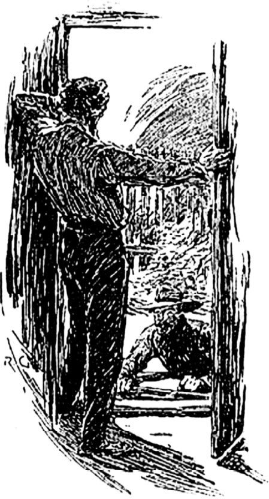

一个人伸展四肢趴在地上。

这一惊，令他不觉身子后退靠到墙上，手扼着脖颈没让叫出声来。他以为地上这个人是受了伤或是快要死去，但是定睛再一看，那人还在匍匐扭动，像巨蛇悄没声地向屋里游进来。一进屋内，这人一跃而起，反身将门关上。老农这才看清是杰斐逊·霍普神色严峻而坚毅的脸，这令他目瞪口呆。

“我的上帝！”约翰·费里厄气咻咻地说道，“可把我吓坏了！你怎么这样进来？”

“给我吃的，”杰斐逊说，嗓子都哑了，“我两天两夜没吃没喝啦。”他见桌上还放着晚餐，跑过去抓了冷肉、面包就狼吞虎咽起来。

“露茜好吗？”吃饱肚子后，他问道。

“很好，她还一点不知道情况严重。”父亲答道。

“那就好。这儿屋子全被监视了。我就只好爬着过来。那些浑蛋很机灵，可是他们要想捉住我这个从瓦休<a href="#part0018.xhtml_ch1"
id="part0018.xhtml_ch1-back">(1)</a>那边过来的猎手，那还差一大截呢。”

约翰·费里厄现在完全变成另一个人，精神立刻振奋，他终于盼到忠诚可靠且有能耐的帮手来了。他一把抓住年轻人粗大有力的手，满怀希望地紧紧握着。

“小伙子好样的，”他说，“没有别人会来冒险搭救我们！这儿的祸害，只有你能消灾。”

“别人也是没有办法，我们是一家人嘛，”年轻猎人说道，“我很敬重您，可是如果光您一个人牵涉其中，叫我把脑袋往马蜂窝撞，我也得考虑再三。现在是大难临到露茜头上，不容细思量了。我霍普不能让她伤着一根毫毛。咱惹不起，走为上计，就离开犹他州吧。”

“我们怎么走？”

“明天是最后一天，今天晚上就得行动，否则要来不及。我备好了骡子和两匹马，在鹰谷那儿。您有多少钱？”

“两千金币，五千钞票。”

“行了，我也有这么些，加上足够了。我们得翻大山，走卡森城。快去叫醒露茜。还好旁人都不睡这屋子，方便不少。”

趁费里厄去叫女儿准备上路的这时间，杰斐逊·霍普把所能找到的干粮吃食全打在包里，又拿一个粗陶罐装满了水。走这一带山路他有经验，山里没有水井，即使有也距离相隔很远。他才忙着收拾完毕，老农已领着他女儿出来，衣装就绪可以动身了。一对恋人见面互相问候，极显亲热，但只能三言两语。时间非常宝贵，得分秒必争，眼前有更紧急的事必须赶快交代。

“快走吧，得马上走！”杰斐逊·霍普说，声音很低，但口气坚定，完全是一派英雄气概，明知前有杀身之祸，也铁了心非闯不可。“前后门都有人守望，只能从侧屋的窗子翻出去，穿过庄稼地，小心点就没事。一上了路，走两英里，到鹰谷，马就备在那儿。天亮之前，要进入大山才好。”

“给人堵了怎么办？”费里厄问道。

霍普拍拍放在上衣前的左轮枪枪柄，“要是碰到人，比我们多的话，先干掉他几个。”他咬牙笑道。

屋里的灯火早已全部熄灭。费里厄从漆黑的窗口向外望，眼看着曾经属于自己的土地，现在就要永远放弃。然而他早有准备作出牺牲，为了女儿的一生名誉和幸福，倾家荡产也在所不惜。沙沙响的树林，广阔静寂的田野，看来都是那样使人感到安宁和闲适，但是叫人难以想象的却是到处都暗藏着杀机。年轻的猎人脸色苍白、紧张，表明他刚才潜行进入这幢房子的时候，对这里周围的险恶情况已经全都看在眼里，了如指掌。

费里厄提着装满金币、钞票的钱袋，杰斐逊·霍普带着不多的口粮和饮水，露茜手里是一个小包，包的都是些她的珍贵的细软物品。他们慢慢地、悄悄地推开窗子，等一片乌云遮得夜色朦胧的时候，便一个接着一个翻窗进入小花园。三人屏声静气，弯着腰，蹑手蹑脚地穿过花园，借着树篱的遮挡，紧贴着走到一个通向麦地的缺口处。他们刚刚走近这个缺口，霍普突然一把抓住父女二人，把他们拖入隐蔽处按倒。三人一声不吭地趴着，浑身都在颤抖。

这也是因为霍普在草原上久经锻炼，练就了一副如山猫般灵敏的耳朵。三人刚刚趴好，就听见离他们几步之外有一声猫头鹰的鸣叫，紧接着，不远处有另一声鸣叫作了呼应。正当此时，就在他们刚才想走的那个缺口处，出现一个人影，再发出一声同样的暗号，另有一个人便应声从暗处出来。

“明天半夜动手，”头一个人说话了，听起来是个作指示下命令的，“夜鹰儿叫三遍为号。”

“好的，”另一人回道，“要我跟德雷伯弟兄说吗？”

“告诉他，叫他再传达给别人。九还七！”

“七还五！”另一人接口道。这之后，两人便分头离去。他们最后说的两句话，显然是对口暗号。一等他们的脚步声远去不再听见，杰斐逊·霍普立即站起身来，搀住父女两人过了缺口，飞快穿过麦地。露茜体力有些不支了，霍普就半扶半拖地拽着她跑。

“快！快！”他喘着大气一遍一遍催促，“警戒线已经过了，就得快跑，快跑！”

一上了大路，他们更加速跑步。路上忽然发现有人，三人赶快藏入一片麦地，躲了过去，没让撞见。快到城外的时候，霍普折入一条通向山里的崎岖小道。面前是两座黑压压的险要山峰，隐没在夜色中。两山之间的隘路就是鹰谷，马匹就在那里等候着他们。杰斐逊·霍普识路本领高强，绝无差错，能在乱石巨砾之间觅路而进，再沿着一条干涸的水道，进入石山屏障的僻静之处，三匹牲口正乖乖地拴在那儿静候。露茜骑上骡子，老费里厄带上钱袋骑一匹马，杰斐逊·霍普骑另一匹马沿险峻的山道走在前面。

大自然有种种狂暴的脾性，对它不熟悉的人，遇上这样的山路便一定望而却步。山路一边是高耸万丈的绝壁，巉岩嵯峨，黑压压岌岌可危，一条条巍巍的山梁，就像是巨大的山石魔怪身上的根根肋骨；另一边则是碎岩乱石和巨砾纵横遍地，无路可走。夹在中间的，只有这条曲曲弯弯的小道，许多地方还狭窄得只容单人单骑通过；路面又坎坷崎岖，不长于骑马的人还难以在上面走得过去。不管有如此的艰难险阻，逃亡人的心情到此算是稍稍轻松了。虽说才不过刚刚出逃，但每前进一步，就远离了暴虐的苛政一步。

但是他们马上发现，他们仍然没有逃出摩门教控制的领域。当他们进入山路中最荒凉险要的地段，露茜突然惊叫起来，用手指指前上方。原来有一块俯临山路的岩石，背衬夜空只是黑影一座，上面孤零零站一个岗哨。他们发现他的时候，岗哨也看见了他们。于是静静的山谷中回响起军令声：“走路的是什么人？”

“去内华达的过路人。”杰斐逊·霍普答话，手伸向挂在马鞍上的来复枪。

可以看得清，岗哨是一个人，正用枪瞄准着他们。他对这个回话起了戒心。

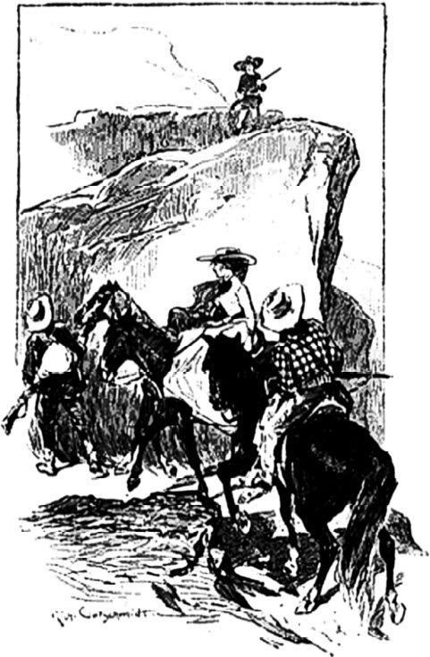

岗哨正用枪瞄准着他们。

“得到谁准许了？”岗哨又喊问。

“四圣准许的。”费里厄回道。摩门教的规矩他是内行，四圣是最高权威，抬它出来就是最高指示。

“九还七。”岗哨叫道。

“七还五。”杰斐逊接口回应道，他脑子里备着刚才在花园里听到过的口令。

“过去吧，上帝与你们同在。”上面传来了这个声音。一过这个关口，前方的道路便开阔了许多，马匹放开四条腿跑起来。回头望去，还能看见那个岗哨，倚着枪支，孤寂地站在那边。他们知道，他们已经闯过了上帝选民的边防要隘，自由，就在前面了。

————————————————————

<a href="#part0018.xhtml_ch1-back" id="part0018.xhtml_ch1">(1)</a> 瓦休（Washoe），内华达州西部塔霍湖一带的印第安部落。

# 第五章　复仇天使

一整夜，三人走过的全是错综复杂的小道和乱石累累的歧径异途。有几次迷失了方向，多亏霍普熟悉这一带山中地势环境，才能够重新摸准走上正道。拂晓时候，他们眼前是一派虽然蛮荒却是奇异无比的景象。四面全是白雪皑皑的巨大冰峰，三人正置身其间，只见山峰连着山峰，重叠绵延到那遥远的天边。山路两旁是悬崖绝壁，生长的松树好像高悬在他们的头顶，只需一阵风吹，就会被吹得向他们倾覆下来。这倒不完全是想象的恐惧、多余的担心，因为这个荒野的山谷中，纵横堆栈着无数树木乱石，都是这样从两边山上滚落到谷底的。就在他们经过的此时，一块巨石轰隆隆如雷鸣般滚下来，沉静的峡谷回声震荡，吓得疲惫的马匹都惊奔狂跑。

太阳从东方地平线冉冉升起，每座高山雪峰被阳光照亮，如节日里处处张灯结彩。渐渐地所有山头全都抹上一片霞红，直到明亮得耀人眼目。这一壮丽宏伟的奇景，看得三个落荒的逃亡人心花怒放，精神为之振奋。走到一处峡谷激流时，他们停了下来，让马饮水，他们也吃点东西，权充早餐。露茜和父亲想多休息片刻，但杰斐逊·霍普坚持必须快走。“这个时候他们准是在向我们追来，”他说，“成败全看谁跑得快了。我们到了卡森才算安全，要怎么歇息都可以，睡上它一辈子吧。”

整整一天，他们在山间小道上奔波前行，临近傍晚时，估算一下离开魔窟总有三十多英里。一入夜，他们选择一处突岩的底下安顿栖息，可以有个遮蔽，挡掉一点寒气。三个人紧紧挤在一起保持温暖，这样总算睡上了几个小时的觉。可是不等天亮，三人都醒了，起身继续赶路。他们一直不曾发现后面有人追赶的迹象。杰斐逊·霍普就开始松懈下来，以为已经逃出了虎口，那个横加迫害的罪恶组织对他们已经鞭长莫及。他竟不知道那个铁掌可以伸展到多远，更不知道这铁掌立刻就要迫近，把他们击个粉碎。

逃亡的第二天，大约中午时候，他们的一点口粮眼看就要吃完。不过，这并未引起猎人多大的不安，因为山里有的是猎物，他以往就常常靠这支来复枪得以果腹维持生命。他找了一个偏僻隐蔽的角落，拾来一些枯枝干柴，生起一堆火，让父女两人暖和一下。原来他们已经是在海拔五千英尺的高山上，空气寒冷彻骨。他把骡马拴好，叮嘱露茜几句，就把枪背上肩，出发去看看有什么可到手的飞禽走兽。他回头望望，看见老人和姑娘正围住火堆取暖，三头牲口站在后面一动不动。再走几步，岩石阻挡视线，看不见他们了。

他大约走了两英里，穿过一个峡谷又一个峡谷，仍一无所获。但是从树干上看到留下的痕迹，再根据其他种种迹象，可以断定附近有熊出没，数量还不少。这么转了两三个钟头，仍然没有结果。最后想想不会有希望了，便准备回头走。这时他眼睛向上一瞟，居然看见有东西了，乐得他心窝突突欢跳。在离他三四百英尺高的一块突岩顶上，站着一只野兽，样子有点像羊，但是长一对又长又大的角，“大犄角”——都这么叫——是加拿大盘羊。看样子那是头守卫的羊，正给一群霍普看不见的同类担任警戒。碰巧的是，它没有头朝霍普这一面站，所以没有发现他。霍普趴在一块立岩上，把枪搁好，稳稳地瞄准，扣动扳机。这头野羊突地往上一跳，在悬崖边上晃了晃，便倒下来滚落到了谷底。

这只野兽很大，一个人背不动。猎人想到，割下一块腰腿肉也就够了。他割好猎物的肉，扛上肩，赶忙沿来路往回走，因为黄昏已经来临。但是刚举步，他就意识到自己面临了困难。一路走来心太急，越过几个峡谷，走得很远，没注意牢记周围地势，现在回过去要找到原来的路竟不是件容易的事了。他眼前所在的这个山谷，沟套沟，壑绕壑，看来都差不多，简直无法分辨该往哪儿走。他沿一条山沟走上大约一英里多，来到一个山涧。他肯定来的时候没有这个山涧，才知道走错了，于是再走另一个方向，结果发现还是不对头。夜色很快笼罩下来，等他终于摸对了认识的回路，天已经全黑。这就又难保证再不会出错，还是要小心翼翼，不可以心急乱闯。月亮还没有升起，两边挡着矗立的绝壁，四周更加漆黑，伸手不见五指，脚下不知高低；身负重物，又是劳累了一天，他提着一颗紧张的心摸索着蹒跚前行。他全靠精神支撑，每挪一步，就念叨着又靠近露茜一步。他还快慰地想着，已经打到的东西，足够三人在随后的旅途上吃的了，不会饿肚子啦。

现在，他已经回到了原地，那个留着父女两人的山口子地方。尽管夜黑，他还是认得清周围壁立的山势轮廓。他离开将近有五个钟头，他们一定等得急死了，他心里想着，一时觉得高兴，便把手拢到嘴边，大声呼唤，借着峡谷的回响，让他们先听见他回来了。他停了一下，倾听回音。可是毫无动静，只有他自己的呼喊在沉寂、荒凉的岩石上来回撞击，形成轮轮回响进入自己的耳朵。他又再叫一声，比刚才的更响亮，可是，仍然不见有回答。奇怪，和父女分开的时间还不算太久嘛。他隐隐约约感到了一种莫名的恐惧，于是就急忙向前奔去，慌乱之中，把宝物似的兽肉丢掉暂也不顾。

当他转过大石，一眼便认清楚了原先生火的地方。那里仍然有一堆灰烬，亮着炭火，但是，看得出来，在他离开之后，不曾有人照料过。周围同样是一片沉寂，原有的恐惧感现在变成了真实。他赶快跑上前去，火堆旁毫无生气，骡马、老人、姑娘全都不见。这分明是在他离开以后，发生了突如其来的可怕的灾难——这灾难令他们猝不及防，无一幸免，而且不留一点痕迹。

这个意外打击，使杰斐逊·霍普丧魂失魄，目瞪口呆，只觉得一阵天旋地转，不能自持，全靠撑住了来复枪，身子才没有倒下来。但是，他毕竟是一个意志坚强的人，很快从一时的迷惘中回过了神。他从火堆里捡一根半焦的木柴重新吹旺，借着升起的火光观察这个休息地的情况，发现周围踏满马蹄印，表明是一帮骑马人追到这里，抓住了老人和露茜，蹄印的去路方向，证明是又返回到盐湖城。是否父女两人都给带走了呢？杰斐逊·霍普心想他们当然要这么做。这时，他的眼睛落到了什么东西上，不禁使他全身神经紧张。离憩息地不远，有一个红土堆，土堆不高，但肯定原先是没有的。一点不错，这是一个新堆起的土坟。年轻猎人走过去，仔细一看，上面还插着一根树枝，树枝开裂的缝里夹有一张纸，纸上有字，写得很潦草，但看得清楚：

约翰·费里厄

生前居住盐湖城

1860年8月4日殁

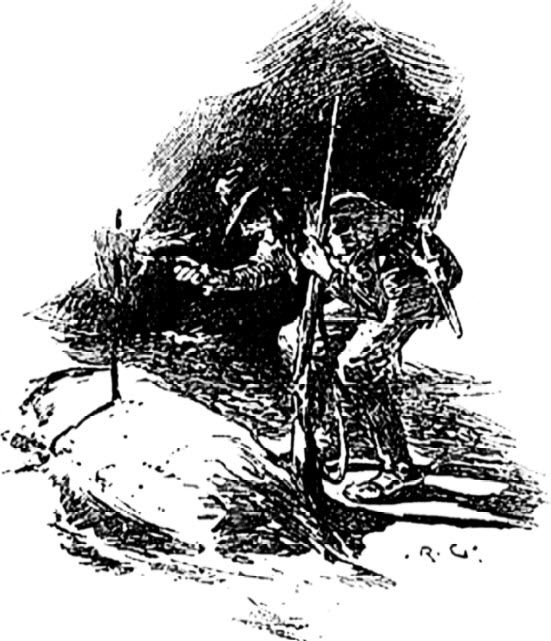

一个新堆起的土坟。

他才离开不久，这位坚强的老人就此死去了。这么几个字就成了老人的墓志铭。杰斐逊·霍普马上疯了似的寻找有没有第二座坟墓，可是怎么找都毫无痕迹。露茜被来人带走了，逃不脱她可悲的命运，注定要成为大祭司儿子的小妾。这个年轻人看到露茜的命运已成铁铸，他自己又无力挽回，真想随老农一起去算了，一同长眠在他最后安息的地方。

但是，他的积极精神重新振作，把绝望的伤感排除一边。如果实在无法可想，那么最后一步，应当是豁出这条命去报仇雪恨。杰斐逊·霍普有着勇往直前的坚韧毅力，因此他也具有百折不挠的复仇决心。这种毅力和精神，也许是他在和印第安人相处的日子里，向他们学习而得来的。他孤寂地站在余火前面，默默地想，只有进行完全彻底的报复，亲手杀死仇人，才能够平息他的悲痛。他下定决心，必须意志坚强，精力充沛，要全力以赴，不达目的，誓不罢休。他铁板着惨白的脸，走过去把失落的猎物捡回来，拨动即将熄灭的篝火，烤了足够吃几天的熟肉，打起包裹，不顾疲劳，翻越大山，踏上回程路，追踪复仇天使们的足迹。

他徒步整整五天，在原先骑马来的山路上，忍受脚痛和困倦，一步步往回走。夜里，缩在山石之间，胡乱睡上几个钟头，天不亮就爬起来赶路。这么风餐露宿，到了第六天，才进入鹰谷。他正是从这里同费里厄父女一起出逃，不幸没有逃成。他从山上望见下面圣徒们的家舍田园。他精疲力竭，人瘦得脱了形，支撑着来复枪，伸出干柴般的手臂，向着脚下这座喑哑无声的城市狠狠地挥拳。他看着看着，注意到城里几条大街上扯着旗帜，还有其他种种节日的装饰。他正在猜测其中的缘故，忽听得一阵马蹄声，扭头一看，有个人骑马向他这边过来。等来人一走近，他认出了是个摩门教徒，名叫考珀。他曾先后多次帮助过这个人，有过交情，因此等他靠近，便迎上去招呼他，目的是要打听露茜·费里厄的下落和消息。

“我是杰斐逊·霍普，”他说，“你该记得我吧。”

这个摩门教徒看着他，惊异地一愣——的确，这个衣衫褴褛、蓬头垢面的流浪汉，面如土色，狰狞可怕，两眼射出犀利的寒光，乍一看怎么也不相信就是以前那个英俊潇洒的猎人；但是定睛仔细瞧瞧，他毕竟能认得出这正是霍普，他的惊异马上转成恐惧和疑虑。

“你疯了，还跑到这里来，”他叫道，“让人看见我在和你讲话，连我的命也要保不住。你帮费里厄家逃走，四圣下令通缉你。”

“我不怕他们，也不怕他们通缉，”霍普恳切地说，“事情你一定都已经知道，考珀。我求你了，告诉我实情。我们一向是朋友，看在上帝的份上，不要拒绝我，不回答我。”

“你要问什么？”摩门教徒胆怯地说，“快讲！这些石头有耳，大树都有眼哪！”

“露茜·费里厄，她怎么样了？”

“她昨天同小德雷伯结婚了。站稳了，老兄，你要站稳呀，看你，怎么掉了魂儿似的！”

“没事，别管我，”霍普有气无力地说，他的嘴唇立刻变白，人颓然跌倒，坐在了刚才倚着的石头上，“你是说结婚了？”

“昨天结的婚，所以圣仪堂<a href="#part0019.xhtml_ch1"
id="part0019.xhtml_ch1-back">(1)</a>都挂了旗呢。小德雷伯和小斯坦格森，到底谁该娶她，两人还吵了起来。两个人是一起去追他们的，是斯坦格森开枪把露茜父亲打死，他觉得有功，姑娘该归他。他们一直争执到了四圣会。德雷伯一方势力大，占上风，先知就把姑娘许配给了德雷伯。可是谁占有她都是白搭，她是活不长了。我昨天就看出她一脸死灰，没女人样了，简直成了鬼。你要走吗？”

“嗯，我得走了。”杰斐逊·霍普说，站起身来。他的脸如同一尊大理石雕刻，表情坚毅、冷酷，双眼闪露出凶光。

“你要上哪儿去？”

“说不上来。”他答道，把枪背到肩上，大步走向峡谷，进入大山深处，猛兽出没之地。现在，什么野兽都不能比霍普更凶猛更危险了。

那个摩门教徒的预言果然丝毫不爽地得到应验，可怜的露茜，父亲遭到惨杀，自己被迫成婚，心中怀着不共戴天的仇恨，从此精神萎靡不振，了无生趣，一个月都不到她便抑郁而死。她那个酒鬼丈夫所以要强娶她，主要是看中约翰·费里厄的财产。因此，露茜的去世，他并不感到多大悲伤，倒是他的一群妻妾深表哀悼，并遵照摩门教的规矩，下葬之前，为她守灵一夜。第二天凌晨，正当她们还围坐在灵床旁的时候，屋门砰然大开，一个衣衫褴褛、面目狰狞、蓬头垢面、粗野无比的人闯了进来，吓得她们魂不附体，愣在那儿呆若木鸡。来人对缩成一团的妇女都没瞧一眼，便一言不发地径直走向静静躺着的露茜·费里厄的洁白遗体，这遗体中曾包含着她那纯净的灵魂。他俯下身，在露茜冰凉的额上深深地一吻。接着握起露茜的手，从她手指上摘下结婚戒指。“她不可以戴着这个东西下葬。”他凄厉地叫道。人们还来不及声张，他已飞身下楼倏然不知去向。这件事发生得实在稀奇，这样突如其来又瞬即消失，就连那些守灵人自己都说不清这是不是事实，更不用说旁人了。但是露茜手上的那只新娘金戒指确实不翼而飞。这确有其事，大家才不得不信。

杰斐逊·霍普在大山中蹲了几个月，过着原始野人的生活，他刻骨铭心念念不忘要报仇雪恨。从此，城里流传一种说法，说是有一个野人出没在深山峡谷，还有人看见他在城郊徘徊潜行。有一次，一颗子弹咻地穿过斯坦格森的窗户，打在离他不到一英尺的墙上。又有一次，德雷伯从一座峭壁下走过，一块大卵石忽然从上面朝他飞来，他连忙趴下，石头擦过没有击中，才算逃过一命。这两个摩门教年轻教徒，不久弄清楚了为何追杀他们的原因，于是就带领人马进山，想要活捉这个敌人，捉不住也得把他击毙，但是屡次进剿，屡次失败，以后只好加倍谨慎小心，不再单独外出，晚上更是足不出户，住宅周围，增派岗哨，严加防守。如此一段时间以后，对手不见了动静。他们就指望随着时间的转移，那人的复仇之心也会冷却下来，所以也渐渐地放松了警戒。

事情决非如此。复仇之火非但没有冷却，反而与日俱增，燃烧得更加炽烈。霍普这个猎人，其决心是坚定不移的，其意志是坚贞不屈的，他一心一意、满腔热血全为着报仇，除此已不再有别的心思和情感。但是他首先是个非常重视实际的人，不久他就认识到，即使身体如他这样铁打铜铸，也不能长期忍受这种非人生活的煎熬和精神的过度紧张。餐风宿露，日晒雨淋，有一顿没一顿，长此下去，必定会把自己拖垮，最终自取灭亡。果然到了这一天，那不正中了仇敌的下怀！他这么左思右想，最后决定还是回到内华达老矿上去，在那里可以把身体养得棒棒的，积攒足够的钱，再继续追逐目标，就再也不愁匮乏与疲劳了。

他原打算至多暂离一年就回来，但是有些情况出乎意料，使他不能如期脱身，在矿上一待就待了将近五年。然而，时间虽过了那么长，他的切肤之痛绝未消减，深仇大恨没齿难忘。就如那一夜站在约翰·费里厄坟前，往事记忆犹新，故而复仇意志弥坚。他乔装改扮，更名换姓，重又回到盐湖城。他只求人间正义能够得到伸张，自己的生命可以置之度外，但是一到了盐湖城，才获悉形势有变，情况变得比以前更加不利。几个月之前，上帝的选民们起了内讧，教会的年轻一派起来反对老祭司一派的统治，结果有一大批不满者从教会分裂出去，离开犹他州，成为摩门教异教徒。这其中就有德雷伯和斯坦格森，也没人知道这两人去了哪儿。传说是德雷伯早已把大部分财产变卖成现钱，走的时候，是个腰缠万贯的富翁，而他的伙伴斯坦格森，相比之下成了穷人。他们的下落无人知道，连一点线索都没有。

面临这种困难情况，许多人即使怀有旧怨夙仇，也难免心灰意冷而放弃报复的念头。可是杰斐逊·霍普一刻也没有动摇过，他揣着一点旅费，一个城市一个城市地在美国追寻他的仇人。没有钱的时候，就找点事做，打工糊口。如此一年一年地过去，他的黑发变成白发，仍坚持不懈地像只猎犬似的流浪寻找。他铁了心，咬定这个目标，拼死也不会放松。最终，苍天不负苦心人，总算给他有一次隔着车窗瞥见一张脸。虽只一瞥，但使他确信，追踪的目标就在这俄亥俄州的克利夫兰城。他回到破烂的寄宿地，把复仇计划考虑周到，准备就绪。但是，事情又有曲折，那天德雷伯也从窗口望见了他，认出了这个街头流浪人是谁，还从他眼中看出了复仇杀气。他急忙拖了斯坦格森去找治安法官；这时斯坦格森已成了他的私人秘书。他们向治安法官报告说，由于一个旧日情敌记恨至今，他们可能遭到杀身之祸。当天晚上，杰斐逊·霍普就被拘禁起来。他找不到保人，只好给拘押了几个星期。等他放出来再去找仇人，发现德雷伯的住处早已人去屋空。原来他和秘书两人已经脱身去了欧洲。

霍普的复仇计划这次又落空了。但是这反而使他恨上加恨，仇上添仇，他非要追杀下去不可。钱没有了，一度又得回去干活，积攒每一块钱来做盘缠。最后储备已足，生活不成问题，就动身去了欧洲，又是逐城逐市地追寻。钱花完了的时候，什么低贱的活都干，可是始终没有追上这两个亡命徒。当他追到圣彼得堡，他们已去了巴黎；等他赶到巴黎，又得悉他们刚逃往哥本哈根；他立即奔赴这个丹麦首都，却又晚了几天，他们已亡命伦敦；这一次总算给他追到了。在伦敦发生的事情，我们还是引述老猎人自己所讲经过为好，这在华生医生的日记中都有记载，我们即可有幸读到。

————————————————————

<a href="#part0019.xhtml_ch1-back" id="part0019.xhtml_ch1">(1)</a> 圣仪堂（Endowment
House），摩门教做仪式的堂屋。

# 第六章　医学博士约翰·华生回忆录补记

人犯疯狂拒捕显然并不是对于我们这些人有什么敌意。当他看到自己束手就擒，已无力反抗，便态度一转，温和而友善地笑了起来，并表示他希望刚才的挣扎没有伤着我们。“不用说，你要把我送到警察局去，”他对福尔摩斯说道，“我的车在门口。把我腿松绑，我自己走下去。我身体不轻了，不像从前，你们抬不动我的。”

格雷格森和莱斯特雷德交换了一下眼色，好像是在说这未免冒险了一点，但是福尔摩斯爽快地答应了人犯的要求，把我们绑在他脚踝上的毛巾解了下来。人犯坐起身，把两条腿舒展一下，那样子是说，我两腿又获得了自由。我记得，当时我看着他，心里在想，我还没有见过体格如此魁伟壮实的人，他那给太阳晒黑的脸，神情严肃、刚强，犹如他的体力一样令人生畏，不敢应对。

“如果警察局长的职位有空缺的话，我看你是最合适的人选，可以补缺，”他说道，眼睛注视着福尔摩斯，流露出由衷钦佩的神情，“你能把我抓到，找得可是真准。”

“你们最好同我一起去。”福尔摩斯对两位侦探说。

“我来给你们赶马车。”莱斯特雷德说。

“好！格雷格森和我一起坐车里。还有你，医生。你对这案子很有兴趣，也和我们一起去吧。”

我欣然同意，五个人一同下楼。人犯无意逃跑，从从容容地进了他自己的马车，我们跟随一同坐进去。莱斯特雷德上了驭座，扬鞭赶马，不久，就把我们拉到了目的地。我们被引入一间小屋，有一名警官把人犯姓名记下，把指控为他所杀的两个被害人姓名也记下来。这个警官白皙的脸面毫无表情，机械地履行着他的职务。“人犯将于本周内提交法庭审讯，”他说，“现在，杰斐逊·霍普先生，你还有什么话要说吗？我必须提醒你，你说的话都要做笔录，并有可能据此定罪。”

“我有许多话要说，”人犯缓缓说道，“我愿意把案子原原本本告诉诸位先生。”

“你到法庭上去说不是更好吗？”警官问道。

“我恐怕永远不会出庭了，”他回答，“请不要奇怪，我的意思不是想要自杀。你是位医生？”他一对严厉的深色眼睛转过来瞧着我，这么问道。

“是的，我是医生。”我回答。

“请用手摸我这儿。”他说，微笑着，用戴铐的手指指他胸口。

我伸手去按他的胸，马上明显感觉到胸口有异常悸动和震动，他的胸腔很像是一间破房，里面有一架强大的机器在开动似的，震得房子颤抖得厉害。在这安静的屋子里，我能听见从他胸腔内发出的杂音。

“啊，”我叫起来，“你得了主动脉血瘤！”

“他们都这么讲。”他平静地说道，“上星期我特地去看医生，医生告诉我，过不了多少天，动脉血瘤就要破裂。这个病已经有好多年了，一年比一年严重。得这个病，是我在盐湖城大山里，风吹日晒雨淋，长期过度紧张、疲劳、半饥不饱才造成的。现在我大仇已报，就不在乎什么时候离开人世了。只是还留着点事要讲讲清楚，好有个记载，不要让人在背后骂我不过是个杀人犯。”

警官和两位侦探匆忙进行商议，考虑允许他讲讲他的经历是否适当。

“据你认为，医生，他的病情有突变的危险吗？”警官问道。

“确实很危险。”我回答。

“既然如此，为了维护法律起见，我们有责任及早取得他的口供，”警官说，“先生，你有自由作你的陈述。不过，再一次提醒你，你的陈述将记录在案。”

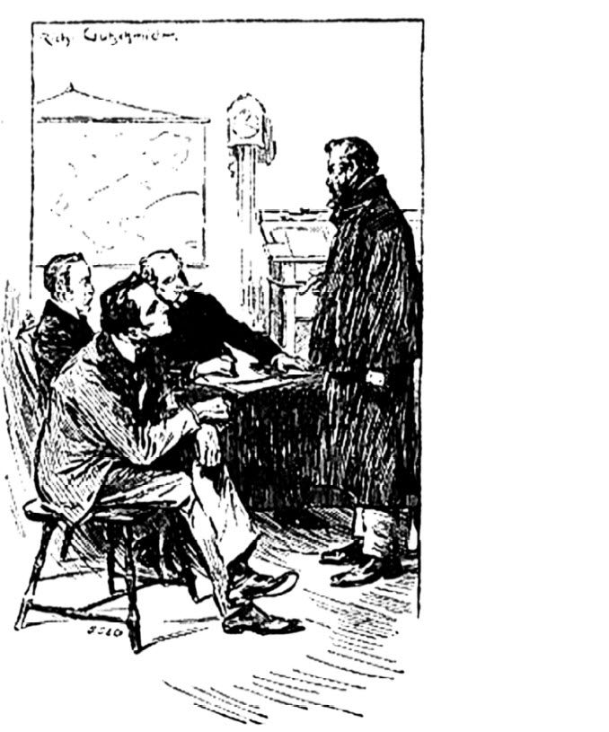

“你有自由作你的陈述。”

“请允许我坐下来讲吧。”人犯说着，自己就不客气地坐下了，“这动脉瘤让我很容易疲劳，半个钟头前，我们还折腾了一番，雪上加了霜。我是一条腿迈进了坟墓的人，人死不说假，我说的话，字字句句都是真。你们记录下来，要怎么用，我管不着了。”

杰斐逊·霍普说着话，身子往椅背上靠，开始道出以下精彩的供词。他从容不迫，娓娓道来，那神情似乎所述极为平淡无奇。我可以保证这篇补充供词完全正确无误。因为我是直接从莱斯特雷德的记录上抄下来的，莱斯特雷德把人犯的陈述一字不漏地照记在本子上。

“我为什么要恨这两个人，你们不太清楚。”他说道，“他们实在是罪有应得，他们手上有两条人命——父亲和女儿，那就应当偿还。时间已经隔了那么久，对他们的罪行，不可能向法院起诉。他们的罪行我清楚，我下了决心，法官、陪审团、行刑的刽子手，都由我自己一个人来包了。如果你们是有血气的男子汉大丈夫，如果你们处于我这么个地位，同我一样，你们也会这么干。

“我刚才说的那个女儿，二十年前她本来是要嫁给我的。结果被强抢强逼嫁了这个德雷伯，不久含恨去世。她死了以后，我从她手指上拿到了结婚戒指，我发誓要叫德雷伯眼瞧着这个戒指断气，临死前让他认识到自己的罪恶，是自食其果。我一直把戒指带在身上，追赶他，连同他的帮凶，跨越两大洲，终于追到了他们。他们想把我拖垮拖死，但是他们想错了。现在就算我明天就死——那是很可能的——也死而无憾。我在这世上的大事已告成功，而且做得很满意。他们终于毙命了，是我亲手杀死。我已经没有别的事要做，没有希望，没有要求。

“他们是有钱人，我是穷人。我千里迢迢追踪他们，吃尽千辛万苦。我追到伦敦来了，袋里几乎已没有钱。我还得先找事做，解决吃饭问题。赶车骑马的事，对我来说是如履平地。所以我就到马车场去找事做，我马上就被雇用了。每星期要给车主一定数目租金，缴了后有余下来的才归我自己。可是所剩钱虽不多，我还是要维持着做下去。最感困难的是不认识路。伦敦的街道，我看是最复杂难认的了，别的城市再复杂也比伦敦好得多。我只好带着地图赶车。后来把几家大旅馆、大车站搞熟悉，才感到生意稍微顺手一些。

“好不容易让我找到了他们两人的住地。两人住在泰晤士河对岸坎伯韦尔区。我是到处打听，结果还是让我碰巧撞上了。只要让我找上他们，我保管叫他们逃不出我的手掌心。我留了胡须，他们认不出我。我盯住他们，跟踪不放，想找机会下手。这一次我是铁了心，说什么也不让他们再逃掉。

“话是这么说，有时也差一点给溜掉。他们在伦敦走到哪儿，我就在后边跟到哪儿。有时候赶着马车跟住他们，有时候是步行。不过赶着马车是最好的办法，快慢都盯得住。这样我只有在清早，或是深夜，才能挣到钱，交给老板的钱只好拖欠一下。那个我就不管了，只管叫他两人跑不脱我的手就行。

“他们挺狡猾的，当然想得到可能会给我跟踪追上，所以两人从不单独外出，晚上也从不出门。足足两个星期，我赶着车每天盯梢，没有一次见两人分过手。德雷伯自己常常喝得醉醺醺，可是斯坦格森从不疏忽。我早晚都盯，总遇不上机会。我不灰心，不失望，心里清楚，时机快到了。我最担心的是自己的病，说不准很快就破裂，临到手的事情还是不成，那可真叫抱恨终生，死不瞑目。

“末了是一个晚上，我赶着马车在托魁街上走走停停，这街上都是住家，他们就寄宿在这里。正好我看见一辆马车来到他们屋前停在门口，屋里马上有人往外提行李，一会儿德雷伯和斯坦格森也随后跟出来，坐上车走了。我扬鞭催马一直紧跟不让走失。心里在估计，恐怕他们要改换地方。到了尤斯顿车站，他们下车。我找个小孩替我管住马车，就跟随两人进了站台。我听到他们要买利物浦的车票，车站的人说有一班车刚刚开走，几小时内不会再有班车。斯坦格森听了样子很懊丧，德雷伯可反倒高兴得很。我挤在人群里，靠得很近，他们两个说什么话我都听得清楚。德雷伯说他正好还有点事情要办，叫斯坦格森等一等，他马上就回来。斯坦格森当场阻止他，提醒他两人有约不可以分开行动。德雷伯回答说就一会儿工夫，还非得他自个儿去不可，只能他一个人去。我没听清楚斯坦格森接下来怎么说，只听见那一个就破口大骂，说别忘了你是个什么东西，不过是个用钱雇来的下人，别不知好歹支配起他来了。这么一来，这个秘书先生见自己讨了个没趣，就不敢多嘴了，只和他约好，万一他又误了最末一班车的话，就去哈利迪旅社找他。德雷伯说他十一点以前可以赶回来，这就转身走出车站。

“我长年等待、千载难逢的时机终于到了，仇人已经出不了我的手掌心。他们两人在一起，还可以相互支持，一旦分开，就远不是我的对手。不过，我还不能马上下手，勿操之过急。我早有打算，仇人死在我的手里，还要叫他死得明白，才算出了我这口怨气。我早有计划安排，要让仇人有时间清醒地认识自己欠我的血债、死仇，今天终得报应。恰巧，几天以前，有一位先生坐我车子，去布里克斯顿路查看空房，把一间房屋的钥匙掉在我车上了。这天晚上他来把钥匙拿了回去，但是我已经趁这个空档，抓住机会把钥匙照样另配了一把。这么一来，在这个大城市里，我至少有了一个地方可以放开手脚做事，没人来干扰。接下来要解决的难题是怎么样把德雷伯弄到这所房子里去。

“德雷伯一路走着，还到两家酒店喝酒。在后一家酒店待了将近半个钟头才出来，两腿打飘，一副酒鬼的样子。在我前面恰好是一辆汉森双轮小马车，他招呼上车。我随后一路紧跟，有时候靠得很近，我的马鼻子简直要碰到前面马车夫的屁股上。这么走过了滑铁卢桥，穿过几条街，有好几英里，最后，真叫人奇怪，他又重新回到原来住的地方。不知他转回去有什么目的。我跟着过去，在距离这所房子大约一百码的地方停车。他走进屋里去，他的马车就离开了。请给我一杯水，我讲得嘴都干了。”

我递给他一杯水，他一饮而尽。

“真解渴，”他说，“就这么，等了约十五分钟，可能还不止，忽然听得屋里像是打起架来，一会儿门就大开，出来两个人，一个就是德雷伯，还有一个是年轻小伙子，我以前从来没有见过。小伙子揪住德雷伯领口，拉到门外台阶上，这么把他用力一推，又是猛地一脚，德雷伯给踹到了街当中。‘狗杂种！’小伙子骂他，朝他摇晃着手中的木棍。‘调戏人家姑娘，给点教训你尝尝！’看小伙子气不打一处来，还要拿棍子揍德雷伯一顿才解恨。算这家伙腿快，快步跑到街转角，正好看见有我这辆马车，一招呼就钻进了车。‘去哈利迪旅社！’他说。

“见他自己送到我的手上来，我高兴得心窝嗵嗵跳，只怕在这节骨眼上破了瘤，搞得功败垂成。我定住心，慢慢赶车，肚里在盘算，怎么个方法来处死他最好。可以把他拉到荒郊野外，在没人去的小路上跟他清总账。我差不多就决定这么办了，想不到他会自己凑上来，让我更有主意把问题解决个完满。这酒鬼又上来酒瘾，叫我把车停在一家大酒店门外，吩咐我等着，一转身就进了店，一直待到关门时间才出来，喝得酩酊大醉。照他这模样，我一点也不难打发他。

“不要以为我只一刀结果他就算数，这样做太便宜他了！法律判决才是这样，我可不干。我早就有打算，他贪生怕死，就给他赌一赌狗命，叫他知道，罪孽深重非死不可。我在美国流浪的那段日子，干过许多营生，一度曾在约克学院当过实验室看门人、清扫工。有一天，教授讲授关于毒药问题，给学生看一种物品，他称为生物碱的一种东西，是从南美洲土人的毒箭上收集来的。这东西毒性大得很，只要一点点就能立即致命。我认住了那只盛毒药的瓶子，等人都走了以后，我拿瓶子倒了一点。我是个配药高手，懂配药技术，就把这生物碱配成可溶化的小药丸，我拿个小盒，放进一粒，再放同样的一粒，是无毒的。我想好了，到时候强迫他们两个每人拿一个小盒子，每人从小盒里取一粒药丸吞下，剩下的药丸我来吃。这样做，等于在枪口上蒙了手帕开枪，把人打死，可是响声不大。从那一天起，我一直把药丸盒子带在身边。现在正是用上它们的时候了。

“当时已过午夜，将近一点了。漆黑的深夜，风呼呼地吹，雨哗哗地下，外面景象很怕人，可是我内心里乐得真想要乘兴儿欢呼。诸位先生如果也曾经朝思暮想什么事，伸直脖子盼了二十多年，一旦伸手可以够着了，也就一定能够理解我这个时候的心情。我点上一支雪茄，噗噗地吐着烟，觉得可以让神经镇定一点，可是我的手还在发抖，太阳穴还在突突跳，实在是太激动了。这么赶着车，好像看见老约翰·费里厄跟甜蜜的露茜在黑暗中领着我，朝我微笑。我看得十分真切，就跟我现在在这儿屋里看着你们诸位一般真实。父女俩一路上在我前面走，在马的身旁，一边一个，一直到了布里克斯顿路那所房子。

“那边一个人影也没有，一点声音也听不见，只有滴滴答答的雨声。我打窗里一望，看见德雷伯缩成一团，睡成个死狗一样。我抓住他胳膊推他，‘下车啦。’我叫醒他。

“‘喔，好的。’他说。

“他当然是以为到了旅店——他说的那家旅店，因此他马上下车，一声不吭，跟我走进花园。我和他紧靠着并排走，他还有点头重脚轻，得搀着他才走得稳。到了门口，我开了门，引他走进前屋。我向诸位说真的，这一路过来，费里厄父女两个一直走在我前头引着路。

“‘黑得要命。’他说，脚乱跺着。

“‘就有亮了，’我说，划一根火柴，把随身带的一支蜡烛点亮，‘伊诺克·德雷伯，’我这就亮牌，转脸对着他，把蜡烛举向我自己的脸，‘看看我是谁？’

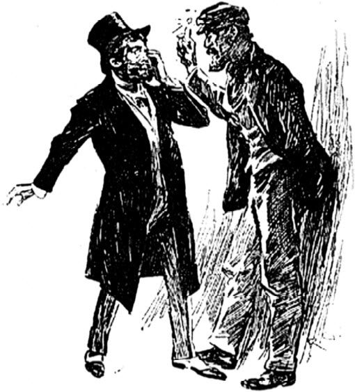

“看看我是谁？”

“他醉眼蒙，朝我这么瞧了一会儿。接着马上看到他害怕得两眼发直，一张脸在抽，肉在跳，这说明他认出我来了。他脸色死灰，人在往后退，额头的汗珠往下滚，牙齿抖得格格响。我瞧他这副熊样，背往门上一靠，哈哈大笑，笑得合不拢嘴。我早已知道，报仇是一桩大快人心事，可是从未尝到是眼下这样的滋味，真是心满意足，痛快，舒心地大大出一口恶气。

“‘你这条恶狗！’我说，‘我追你，从盐湖城追到圣彼得堡，老是给你逃掉，现在你已经逃到天涯海角了。你我两人，到底谁还能看到明天的太阳，就在今夜定分晓。’听我说这个话，他又向后退缩几步。我从他脸上看出，他在想我一定是疯了。这个时候，我确实同疯子一般，只觉得太阳穴咚咚地跳，像是有大铁锤在敲似的。我知道，还全靠一下子涌出了鼻血，血液循环松了一下，我的病才没有爆发出来。

“‘露茜·费里厄，你对她够狠毒！’我吼着，锁上了门，拿钥匙在他面前晃，‘对你的惩罚，来得太慢太晚。可天网恢恢，疏而不漏，你终究还是逃脱不了惩罚。’我对他这么说，看见他吓得上下嘴唇在哆嗦；他还想恳求饶命，当然明知道这不会有用处。

“‘你要谋杀我？’他结结巴巴说。

“‘这不叫谋杀，’我回答他，‘杀一条疯狗，能叫谋杀？你夺走我的心上人，硬把她从父亲身边拖走，杀了她父亲，逼迫她当你小老婆，卑鄙无耻，你可曾对她有过怜悯？’

“‘她父亲不是我杀的。’他叫喊说。

“‘可是她纯洁的心，是给你撕碎的。’我朝他怒吼，把药盒伸到他面前，‘让严明的主来给我们断定。拿一粒吞了。一粒吃了丧命，一粒吃了活命。你先拣一粒吃掉，剩下的一粒归我吃。让咱们瞧瞧，天底下到底还有没有正义公道；要不，人的生死祸福全得碰运气。’

“他吓坏了，大叫大嚷，求我饶命。我抽出刀，直逼他喉咙口，他才不得不试试运气拣一粒吞下。我也吞下拣剩的一粒。我们两人面对面看着，站在那里，一声不吭地等着瞧，到底谁死谁活。大约过了几分钟，他的脸上出现痛苦的表情，他知道自己吞下了毒药。他那时的一张脸，我是无论如何也忘不掉的。我看见了，哈哈大笑。把露茜的结婚戒指举到他眼前。只一眨眼工夫，那生物碱的毒性猛烈发作，痛得他的脸一阵歪扭，双手一撒，人一摇晃，发出一声惨叫，就沉沉地摔倒在地板上。我用脚把他身子踢翻过来，伸手摸摸他胸口，心脏停止跳动，死了！

“我鼻子里的血不住地淌，但我不把它当回事。一念之间，不知怎么忽然想到要在墙上留个血字。大概心里太开心，一时兴奋，要给警察耍个鬼把戏，捉弄捉弄他们。我记得在纽约有个德国人被谋杀，尸体上留下复仇Rache这个词，那次报上还登出争议，猜测是黑社会的勾当。我想这能把纽约人搞懵了一阵子，也要叫伦敦人弄个晕头转向。这么想着，我就用手指蘸点鼻血，在墙上选个地方，涂了这个字。写完，出屋回马车，一看一个人也没有，半夜里仍旧漆黑一片。车子赶了有一程路，伸手到衣袋里，一直放着露茜戒指的这个口袋，一摸，戒指没有了。这一惊，就跟雷劈的一般。这戒指，是她留下的纪念物，我没有别的，就惟独这一件。想起来了，可能我弯腰看德雷伯的时候不留心掉那儿了。我连忙赶车回去，把车停在小街上，就壮起胆子，急忙往屋里走——这戒指不能丢，这比什么都要紧，得冒险捡回来。我一到那屋子，和一个警官撞了个满怀，警官正从屋里出来。我一看糟糕，赶快装酒疯，装个醉鬼，以免引起疑心。

“伊诺克·德雷伯的结局就是这样。接下去，就要找斯坦格森，要他也遭同样的下场，替约翰·费里厄报仇雪恨，讨还血债。我知道他在哈利迪私家旅馆等着。我到旅馆，在外面等候他一整天，就是不见他出来。我想到，他贼心犯疑了，因为德雷伯一去不返，事情不妙。这个斯坦格森是个狡猾的家伙，他事事都很谨慎。不过他想只要缩着不出门，把我拒之门外，我就拿他没办法，那他可是大错特错了。我很容易找到了哪个窗户是他的房间。那天凌晨，我拿一架梯子，是放在旅馆后面巷子里的，我正好拿来用，趁天色还没亮，爬梯子进了他的房间。我把他推醒，对他讲，很久以前他杀了人，现在偿命的时刻到了。我把德雷伯已经死掉的情形告诉他听，叫他作同样的选择，拣一粒药丸吞下。他连这个给他希望的机会都不干，从床上跳起扑过来掐我的脖子。我不得不自卫，一刀捅进了他心窝。不管用的是什么方法，结果都是一样，老天决不会让他那只罪恶的手，拣起无毒的药丸。

“我没有更多的话可说了，话讲完，我也就差不多了。完了事，我继续赶着马车，再做一两天，想加把劲挣下点钱，钱一够就回美国去。那天，我在车场上，一个破衣烂衫的孩子问谁是杰斐逊·霍普车夫，贝克街221号B座的先生要他的车。我就跟着过来，没想这里头会有事。下面的情况，都知道了，就是这位兄弟给我铐上了手铐，一下子铐得真干脆，手脚那么麻利，我这辈子都还没见过。我的事，经过就是这样。先生们，你们会把我看作是个杀人凶手，可我自己认为，同诸位一样，我完全是一个正义的法官。”

他的故事讲得惊心动魄，他的态度又是那么镇定自若，听得我们坐在那儿出神，一声不吭。连这两位官方侦探，对刑侦案件阅历可算丰富，听过这个人的经历，也觉得非同寻常，因而极感兴趣。他讲完以后，我们静坐了好几分钟，默默无语，只听得莱斯特雷德的铅笔在纸上沙沙响，把速记做了收尾。

“有一个问题，我还想再有点了解，”福尔摩斯开口说话，“我登了广告以后，你有同谋来领戒指，这个同谋是什么人？”

人犯向我朋友挤挤眼，扮一个小小的鬼脸。“我自己的秘密都可以讲出来，但连累人的事我不做，决不会讲出旁人。见了启事广告，我想过可能是个圈套，也可能正是我要的那只戒指。我一个朋友自告奋勇来看看。我想，你也会承认，这事他做得很漂亮。”

“确实漂亮。”福尔摩斯表示心悦诚服。

“那么，诸位先生，”警官严肃地宣布，“法律规定必须执行，星期四人犯必须提交法庭审讯，诸位先生届时务必出庭。开庭之前，人犯由我负责拘押。”他说着就打了铃，杰斐逊·霍普由两名看守带走。我的朋友和我一同离开警察局，坐马车回到贝克街。

# 第七章　尾　声

我们事先都接到通知，在本周四出庭，但是到了星期四，已不需要我们到庭作证。最高裁判上帝受理了这个案件，杰斐逊·霍普被传唤到另一个法庭，对他进行了一次极为公正的审判。因为在他被捕的当天晚上，动脉瘤破裂，次日早晨发现已死，躺在监狱的地板上，脸露安详的笑容，似乎在他临死的时候，能回顾自己一生年华没有虚度，大仇终于得报，感到如愿以偿。

“格雷格森、莱斯特雷德知道他死了，一定会被气死，”我们第二天傍晚在闲谈这件事，福尔摩斯说道，“这样一来，他们出不了庭，再一次自我吹嘘不就泡汤了吗？”

“把凶手捉拿归案，又不是他们两个人的功劳。我没看见他们出多少力。”我回答说。

“在这个世界上，你做了些什么，这无关紧要，”我的伙伴语带苦涩地说道，“问题在于，你怎么能叫人相信都是你做的？别担心，”他停了一下，又轻松地说道，“这对我的刑侦经验不会有任何的损失。回想起来，我经过的案子，这一件还算最顺手，主要是案情够简单的。不过，教益还是很有一些。”

“够简单？”我不解地叫道。

“是呀，够简单，根本谈不上有多么复杂。”福尔摩斯望着我惊异莫名的样子，笑道，“我只不过运用几点普通的推理，没有其他方面的借助，三天之内，就把案犯手到擒来，可见这案情本身是非常简单的了。”

“这倒也是。”我说。

“我讲过，越是看来异乎寻常的事，反倒往往不是障碍。解决这一类问题，最要紧、最关键的是必须善于作逆向推理。这个方法非常有用，也非常容易，可惜人们实际上应用不多。每天的日常生活中，顺向推理法用得很普遍，比逆向推理用处要大，所以逆向推理也就容易给忽略掉。一般来讲，如果有五十个人能做综合推理的话，那么只有几个人善于做分析推理。”

“坦白讲，”我说，“对你这个话还缺乏理解。”

“我也没指望你马上就理解透彻。让我看看，我能不能讲得再清楚一些。大部分人都是这样的，你向他们罗列一系列相关事情以后，他们都会告诉你结果是什么。他们把所有这些事实统统汇集在心中，就能说出通过思考得到了什么结论。另有为数不多的人，你告诉他们一个结论，他们就能够凭着知识感悟，推理得出达到这个结论的各个步骤是什么。这是一种能力，就是我讲的逆向推理这个意思，或者叫分析推理也一样。”

“我懂了。”我说。

“现在来看这件案子，你只有结论，其他事情都要你自己去找出来。我这就尽量让你看到我作推理的各个不同步骤。从头开始。我到了那所房子，这你知道，是走着去的，我对屋子的一切毫无印象。当然是先查看路面，我已经对你解释过，我清楚看到了马车车轮印子。研究下来确知，正是这晚上在那里留下的。我还肯定这是一辆出租马车，非私人马车。因为它的轮距比较窄。伦敦一般的四轮出租马车的轮距，比私人自备四轮马车的轮距要窄。

“这是第一项获得的证据。然后我慢慢沿着花园小路走。这条路正好是一条泥路，特别容易留下脚印。对你来说，毫无疑问，看上去不过只是一条有脚印的泥路，但是在我训练过的眼睛中，表面的每一个印迹都有意义。刑侦科学里要算足迹学这一门艺术最最重要，但也最容易被忽略。还好我对足迹学一向予以高度重视，经过充分实践，重视足迹已很自然成为习惯。我看出警察的重鞋印，更看出有两个人的足迹，先经过花园小路，他们比别人在先，这一点很容易说明，因为在有的地方他们的足印被别人踏过，被后来的脚印踏掉。这样，我第二个环节形成了，就是说，夜里来人是两个。一个人身材高大（我是根据跨步距离估算出人的高度），另一个人穿着考究，根据他的皮鞋印属于很精致的鞋类这一点可以作如此判断。

“一进屋，衣服考究这一点马上得到证实，穿高档鞋的人就躺在面前，那么高个子就是谋杀凶手，如果谋杀成立的话。尸体身上没有伤痕，但是脸上留着紧张激动的表情，据此可以确定，他是死前就知道自己死到临头了。凡是突发心脏病而死的人，也包括其他自然原因的猝死，面部都不会有紧张激烈的表情。我嗅了一下死者口唇，闻到略有些酸味，我就得出结论，他是被迫服毒而死亡。再说一遍，我说他是被迫服毒，从他脸上留有又恨又怕的表情可以推断。我是用排他法达到这一结论的，因为除此没有别的假设可以解释这一现象。不要以为这是一种闻所未闻的讲法，强迫服毒，在每年的犯罪记录中时有所见，绝不是新闻。一说起强迫服毒，任何毒物学家都会联想起敖德萨的多尔斯基案件，还有蒙彼利埃的勒蒂理埃一案。

“现在来谈谈作案动机这个推论的大问题。抢劫不是本案的谋杀目的，因为没有发生抢劫，没有少了什么。那么，是政治谋杀？为了女人？这就是摆在我们面前的问题了。我的假设倾向于情杀，而非政治谋杀。政治暗杀，刺客总是匆促下手便立即逃离现场。这起谋杀恰恰相反，做得从容不迫。凶手在屋子里到处留下痕迹，种种迹象都表明，他自始至终留在现场。这就必定是出于私人冤仇，绝不是政治性目的，因此才会如此处心积虑地实行报复。墙上发现留字，我就对自己的判断更加有了把握。这个手脚，做得非常明显，是故布疑阵。等到一经发现有戒指，好，确凿无误，问题性质就可以定了。非常明显，凶手拿戒指向被害人提醒一个女人，这个女人已经不在了，或者死了。这个，我不是问过格雷格森吗？电报发到克利夫兰，调查德雷伯过去的经历，有没有特殊问题，他回答说没有发现问题，这你是记得的。

“接着我对室内作一番仔细的检查，结果使我进一步肯定我的看法，凶手是高个子。还发现了其他一些细节，印度特里其雪茄烟，凶手的长指甲。我得到的结论是，既然没有打斗的迹象，地板上的血迹就是凶手过于激动引起鼻子出血。我看出地上一路滴血正好同足迹的走向一致。一般人不会因为激动就流鼻血，只有血气特别旺盛的人才可能这样，所以我大胆作出推论，罪犯很可能是个身强体壮红面孔的人。后来的事实证明，这个判断果然不错。

“离开了屋子以后，我把格雷格森疏忽了的地方补一补。我给克利夫兰警察局长拍了份电报，专门询问伊诺克·德雷伯的婚姻状况，回电很明确。电报说，德雷伯曾经指控一个名叫杰斐逊·霍普的旧日情敌，要求取得人身安全的法律保护；这个霍普现在也在欧洲。我当时就明白，迷案头绪已经出来，已握在我的手掌之中。剩下要做的事情，捉拿凶手就是了。

“我当时胸中已有确定，同德雷伯一起走进屋里去的不是他人，正是马车夫。马路上的马车痕迹使我看出，马随便走动过，说明没人管着马。车夫不是去了屋里，又会去哪儿呢？再有，神智健全的人，决不会在第三者面前实施有蓄谋的犯罪，那不是自我暴露吗，岂不荒唐！最后还有一点，要想在伦敦城中跟踪什么人，最好的办法就是去当马车夫，除此还能有什么更好的方法？所有这些思考，引导我得出不可否定的结论，那就是，杰斐逊·霍普，只有到首都的出租马车夫中去寻找，才能找得到。

“既然他是个马车夫，那么认为他完事后就此停止赶车，这个理由不充足。恰恰相反，从他这边的观点来看，自己突然改变行动，可能要招来旁人的注意，所以他多半是仍操旧业，至少暂时不动。也没有必要去假定他用的是个化名；在异国他乡，举目无亲的地方，就是用真名实姓又有谁会知道他的来历？我这就召集小瘪三侦察队，要他们问遍伦敦每一家马车场，把我要找的人找出来。他们真出色，马到成功。这个还是眼前的事，你该记得挺清楚的。斯坦格森被杀，完全是未能预知征兆的事情，也就谈不上怎么加以防范和避免。你已经知道，我也拿到了药丸，我就推论知道本案使用过这种东西。你看，整个事件是一长条逻辑的链条，环环相扣，没有间断。”

“真是精彩！”我赞叹道，“你的功绩应当让全社会知道，让公众知道。你应该把这件案子写成报告来发表，你不写，我替你写。”

“你爱写你就写吧，医生。”他答道，“瞧这儿！”他递给我一张报纸，“看看这个！”

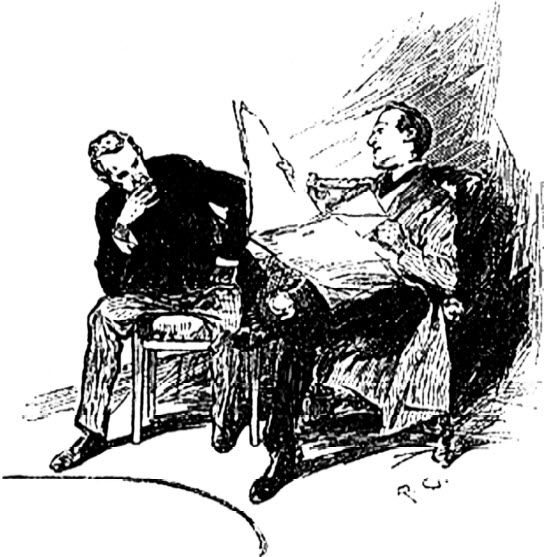

他递给我一张报纸。

这是当天的《回声报》，他指的这一篇正是报道我们这个案件的。

“谋杀伊诺克·德雷伯先生及约瑟夫·斯坦格森先生之凶手霍普突然去世，”报纸说，“公众因此丧失此件耸人听闻命案之谈话资料。从有关当局获悉，这是一件由来已久之昔年爱情夙仇奇案，事涉自由恋爱及摩门教婚姻制度问题。现此案之内幕详情恐已永远成为谜团。两被害人年轻时系摩门教徒，已故之案犯霍普亦来自盐湖城。本案若在其他方面已无影响，则至少明显彰示我刑侦警力之神威，并向一切异域入境者警示以在本国本地解决刑事案为宜；若负案潜入我英伦者，应引此为教训。本案破获之神速，全有赖于苏格兰警场知名警官莱斯特雷德及格雷格森两位先生之大力。据悉，凶犯系在一私家侦探歇洛克·福尔摩斯先生居室被当场擒获。歇洛克·福尔摩斯先生作为业余侦探，表现出非凡之刑侦才能，并承蒙以上两位导师之教益，必有望获得更卓越之成就。并悉，两位警官亦有望荣膺相当之奖赏，以表彰其功绩。”

“我不是开头就这样对你说过的吗？”福尔摩斯大笑道，“那就是我们血字研究的结果，给他们争得了奖赏！”

“没啥关系，”我回答他，“全部事实都记录在我的本子上，公众会知道真实情况。案子已侦破，你尝到了成功的喜悦，可以自我满足。姑且就像罗马守财奴所说的那样——

“由人笑骂充耳不闻，

家藏万贯怡然自乐。”

（1887年）

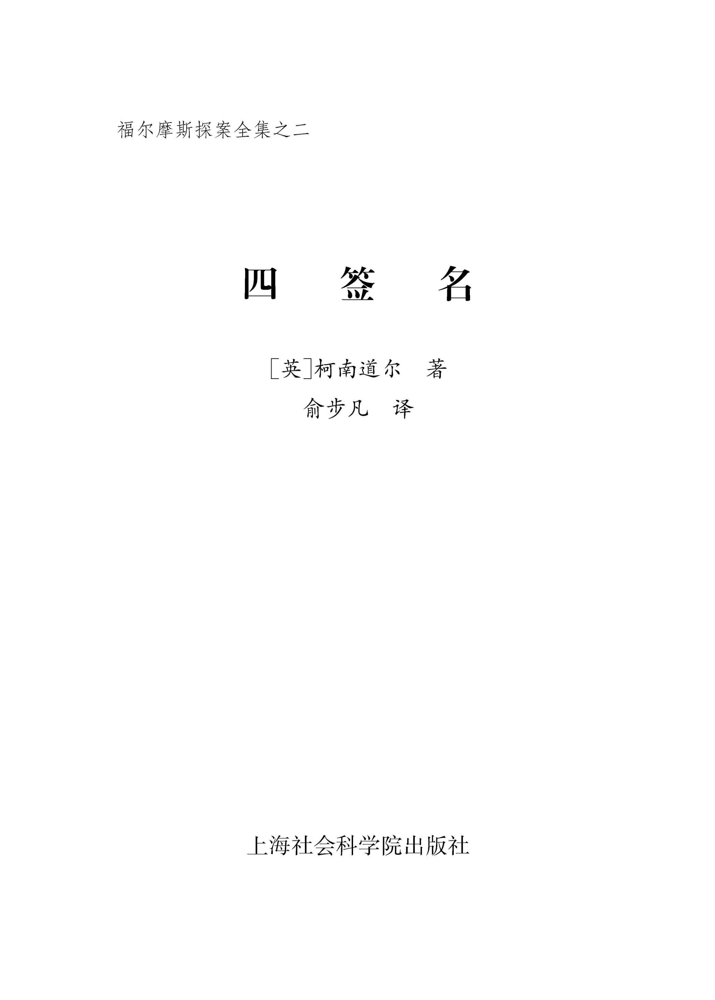

**图书在版编目（CIP）数据**

四签名／［英］柯南道尔（Conan
Doyle，A．）著；俞步凡译．—上海：上海社会科学院出版社，2012

（福尔摩斯探案全集；2）

ISBN 978-7-5520-0103-7

Ⅰ．①四…　Ⅱ．①柯…　②俞…　Ⅲ．①侦探小说—英国—现代　Ⅳ．①I561.45

中国版本图书馆CIP数据核字（2012）第159591号

福尔摩斯探案全集之二

**四签名**

------------------------------------------------------------------------

**著　　者：**［英］柯南道尔

**译　　者：**俞步凡

**责任编辑：**陈如江

**封面设计：**王小阳工作室

**出版发行：**上海社会科学院出版社

上海淮海中路622弄7号　电话63875741　邮编200020

http://www.sassp.org.cn　E-mail：sassp@sass.org.cn

**经　　销：**新华书店

**照　　排：**南京理工出版信息技术有限公司

**印　　刷：**上海中华印刷有限公司

**开　　本：**787×1092毫米　1/32开

**印　　张：**6

**插　　页：**2

**字　　数：**105千字

**版　　次：**2012年10月第1版　2012年10月第1次印刷

------------------------------------------------------------------------

ISBN 978-7-5520-0103-7/I·060

定价：24.00元

------------------------------------------------------------------------

**版权所有　翻印必究**

# 目录

[第一章　演绎法](#part0026.xhtml)

[第二章　案情陈述](#part0027.xhtml)

[第三章　寻求解答](#part0028.xhtml)

[第四章　秃头人的故事](#part0029.xhtml)

[第五章　樱池别墅的惨剧](#part0030.xhtml)

[第六章　歇洛克·福尔摩斯作出论证](#part0031.xhtml)

[第七章　木桶的插曲](#part0032.xhtml)

[第八章　贝克街的非正规军](#part0033.xhtml)

[第九章　线索中断](#part0034.xhtml)

[第十章　一生漂泊到终点](#part0035.xhtml)

[第十一章　阿格拉巨宝](#part0036.xhtml)

[第十二章　乔纳森·斯莫尔的奇异故事](#part0037.xhtml)

[返回总目录](#part0000.xhtml)

# 第一章　演绎法

福尔摩斯从壁炉台角上取下一瓶药水，再从一只整洁的摩洛哥皮匣子里取出皮下注射针筒。他那洁白、纤长、敏感有力的手指把尖细的针头装好，将左臂的衬衫袖口往上卷起。他对着已有许多针眼的胳膊打量片刻，便把针尖扎入丰满的肌肉，推动小小的针筒，然后靠在绒面安乐椅里，发出舒心满足的一声长叹。

他这样每天注射三次。我看在眼里已经好几个月，看是看惯了，心中并不以为然。非但如此，而且越看越反感。我没有勇气去阻止他，所以每当深夜想起，就感到十分内疚，良心上过不去。为此我好几次想对他说说心里话规劝他，但是我这个朋友性情孤僻冷漠，总是拒人于千里之外的那个样子，让人想跟他随便讲话都不易，要接近也无法接近。他能力过人，也刚愎自用。我体验到他身上有许多与众不同的性格特点，都使我胆怯。我不想违背他的意愿，惹他不高兴。

但是这一天下午，我也许是午饭喝了点法国博恩红葡萄酒，再加他那种嗜毒如命的神态，使我更加看不入眼，我忽然再也不能容忍下去了。

“今天，你这个，”我问他，“是吗啡，还是可卡因？”

他刚打开一本黑花体字的旧书，无力地抬起眼来。

“可卡因，”他说，“百分之七的溶液<a href="#part0026.xhtml_ch1"
id="part0026.xhtml_ch1-back">(1)</a>。你要试试吗？”

“我才不想试呢，”我没好气地冲他说，“阿富汗打一仗害得我身体到今天还没有恢复，我可不想糟蹋自己，再雪上加霜。”

他笑笑，没在意我的态度。“话是不错，华生，”他说，“我也知道对身体是有害，可我感觉有这么强烈的刺激、兴奋，能提神醒脑，有一点副作用也就随它去了。”

“可你得考虑考虑这利害关系！”我恳切地说道，“就算像你说的，你的脑子得到刺激，得到兴奋，那毕竟是残害自身的做法，会不断引起器官组织质变，最终导致功能永久衰退，实在是得不偿失。你也知道对身体有多大的不良后果，为什么还要只图一时快感，偏不顾伤害掉自己天赋的卓越才能？你该明白，我不单是以志同道合的朋友对你说，也还是作为一个医生对你这样说。我对你的健康负有责任。”

他听了我的话倒没有生气，把两手十指对齐，两肘支在椅子的扶手上，反而像是对说话饶有兴趣。

“我这个人，”他说，“好动不好静。尽管给我难题，给我工作，给我最深奥难解的密码，给我最繁重的分析工作，这样我才觉得浑身有劲，适得其所，这样才可以免得求助另外的感官刺激。我最讨厌平淡无奇的生活，我渴望精神上的兴奋。那也就是为什么我选择这个又苦又累的行业，不妨说还是我创始的这个行业，因为世界上还只有我一个人从事这种职业。”

“唯一的私家侦探？”我问，竖起了双眉。

“独家的私人顾问侦探，”他回答，“我等于是刑事侦查方面的最高上诉法院，拥有最后裁决权。格雷格森也好，莱斯特雷德也好，就连阿瑟尔尼·琼斯也好，他们遇到问题解决不了——这是常有的事，不稀奇——都要来向我求教。我以专家的资格审查材料，提出权威意见。每逢这种情况，我不和他们争功劳，我的名字报上也不披露。工作本身，在专门的领域里发挥了我专门的能力，我从中就找到了乐趣，这就是给我的最高报酬。我的工作情况，你在杰斐逊·霍普案子中，亲身经验过了。”

“是的，确实如此，”我热诚地答道，“这是我一辈子从未遇到过的事，震撼这么大。我已经把经过情形写成书，写成一本小册子，起个有趣的书名，叫《血字的研究》。”

他不以为然地摇摇头。

“我大致看了看，”他说，“说实话，我实在不敢恭维。刑事侦查必须是也应当是一门极严肃的科学，从事刑侦工作，态度要绝对冷静，掺不得半点感情成分。你给它抹上一层小说的色彩，简直是在虚构一个爱情故事。把爱情和私奔，硬夹塞到欧几里得第五命题里，格格不入。”

“可是案情确实就像小说嘛，”我反驳道，“是事实，我不能歪曲篡改。”

“有些事实可以删掉，并不是非写不可。或者，至少写起来要有轻、重、主、次之分。这个案子中唯一值得一写的，是我怎样精确运用分析推理法即演绎法，从事实的结果找出原因，从而一举破案成功。”

我对他这番话很不高兴。因为写这篇东西原指望博得他的欢心，结果反而遭到批评，真是事与愿违，吃力不讨好。他似乎要求我的小说每字每句只能描写他个人的作为，突出他个人的能力。那是一种自私心态。我和他在贝克街生活这么些年，不止一次观察到，这位同伴无论是闭口沉默还是开口说教，态度中不免流露着骄傲与自负。我不愿多说话了，只是坐着抚摩我的伤腿。我的腿以前在阿富汗给滑膛枪子弹打穿，虽然已经不碍行走，但是每逢天气有变，就会酸痛。

“最近，我的探案业务已经发展到了欧洲大陆，”福尔摩斯过了一会儿说道，把欧石南根的老烟斗装满了烟，“上星期有个叫福朗斯瓦·勒·维亚尔的人来向我求教。这个人大概你也知道，最近在法国侦探界已经崭露头角。他具有凯尔特人的敏感性、灵活性，可惜欠缺广博的学问知识，而这对进一步提高技术本领是必不可少的条件。他请教的是一件遗嘱案子，很有意思。我给他两个类似的案例作参考。一个是一八五七年里加城的案子，另一个是一八七一年圣路易城的案子。这两个案子给他指点了迷津。这里有一封信，今天早晨刚收到。他对我给他的帮助，来信表示感谢。”

说着，他就把一张皱巴巴的外国信纸丢给我。我看了看，信上充斥着许多过头的恭维话，都是些什么“伟大”、“手法高明”、“行动果断有力”等等，这种如此热烈的赞扬话，正是法国人惯于使用的语言。

“倒像是小学生在夸奖自己的老师。”我说。

“啊，我只是给他一点帮助，他是过奖了，”歇洛克·福尔摩斯轻声说，“他自己有很高的才华。一个理想的侦探，应该具备的三大条件，他具备两条。他有观察能力，有分析能力，所缺的仅仅是知识，这一点很快就能补足。他现在正在把我的几篇小文章翻译成法文。”

“你有作品？”

“噢，你不知道？”他惊奇地说，大笑着，“是啊，惭愧得很，几篇小论，都是刑侦技术性题材。这儿有一篇，举个例子，《论各种烟灰之鉴定》，文章列举一百四十种雪茄烟、纸烟、烟斗丝的烟灰，配上彩色插图，具体说明各种烟灰的区别。这是在刑事案子中经常会出现的证据，有时还是最关键最重要的线索。你回忆一下那个杰斐逊·霍普案子，你就会懂得烟灰辨别对破案侦查有多大帮助。再举个例子说，如果你能确定，在一件谋杀案中凶手吸过印度仑卡烟，那么就把你侦查的范围大大缩小了。印度特里其雪茄烟的黑色烟灰和‘鸟眼烟’的白灰是不同的，这跟白菜和马铃薯一样截然不同。”

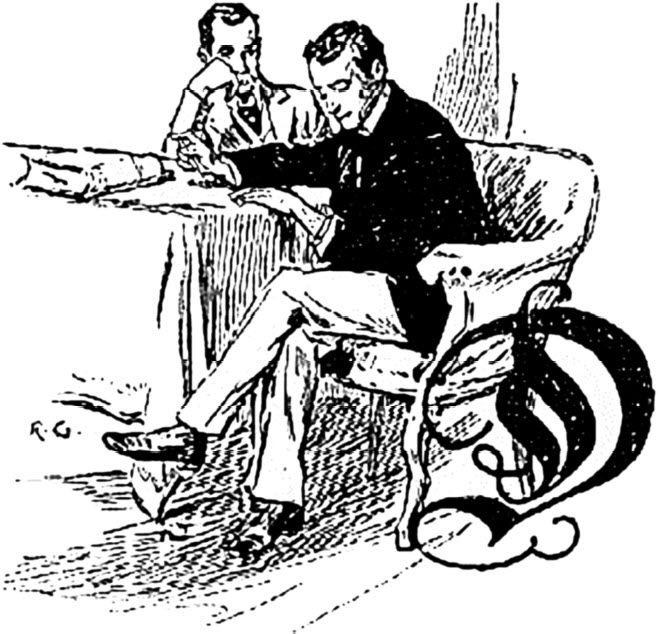

他来信表示感谢。

“你审查细枝末节确实明察秋毫。”

“我充分注意小事反映出大问题。这篇是讲跟踪脚印的论文，里面还特别介绍使用熟石膏取脚印的保存方法。这儿还有一篇新奇有趣的小文章，是讲从事不同的行业对手形的影响。有石匠、水手、木雕工、排字工、纺织工、钻石工的各种手形图。这些对于科学侦查具有很重要的实践意义——尤其是遇到判断无名尸体，或者罪犯的职业身份这类案子更加有用。可能我只顾谈自己的爱好，让你听得厌烦了吧？”

“一点也不，”我诚恳地说，“我感到很大的兴趣，而且还曾有过机会看你在实际中应用了。你所说的，是观察和分析，当然，这两者或多或少相互关联，可说是一回事。”

“哦，未必是一回事，”他答道，惬意地往椅背上一靠，吸着烟斗，吐出一圈圈浓浓的蓝烟，“比如说，我由观察知道，今天早上你去过威格莫街邮局，我再要作推理分析即演绎，才能知道你是去发电报的。”

“很对！”我说，“两件事都叫你讲对了！但是，真不明白你是怎么得出这个结论的。那是我一时忽然想起才去的行动，对谁也没说起过。”

“事情本身就十分简单，”他说，看着我奇怪的样子觉得好笑——“太简单了，我一说穿，就毫不稀奇。不过解释一下，也好作个界定，什么是观察，什么是分析。观察使我看到你鞋帮上沾有一点红泥。在威格莫街邮局前的人行道上，正在开挖，泥土翻上来堆在那里，进邮局还非得踩着这土堆不可。翻上来的泥土就是这种特有的红土，只有那里有，附近别的地方据我所知，都没有。观察到的就这么多，余下的就要靠分析了。”

“好，那么你是怎么推断出我去发电报的呢？”

“啊，我当然知道。我整整一个上午坐在你对面，没见过你写过一封信。我还看见，你的抽屉拉开着，你有一大张整版的邮票，一整扎明信片，没有动过。你去邮局，不是去发电报，还会去做什么呢？这就是排除掉所有不相干的因素，剩下的必定是真正的事实。”

“这件事确实是这样，”我想了一下，回答他说，“这个问题，正像你所讲，最简单不过了。我给你一个更复杂一点的怎么样？考考你的推理，你可别说我存心难为你。”

“绝对放心，”他回答道，“恰恰相反，正好省掉我再注射一针可卡因。有什么难题不妨尽管提来看看，我很乐意。”

“我听你讲过，人们日常使用的东西，难免会留有使用者的特征痕迹，这在训练有素的人眼里，能够识别出来。现在，我这里有一只表，最近刚刚转到我手上。有劳你给我看一看，说说原来表主人的性格、习惯怎么样？”

我把表递给了他，心里不禁暗笑。因为依我看来，这个考验是无法通过的，我是存心给他一个教训，杀杀他平日里动不动就独断专行的威风。他把表在手上掂量着，仔细看看表盘，打开表盖，留心察看里面的机芯。先是肉眼看，再用高倍放大镜看，最后把表盖盖上，还给了我，一脸沮丧相，看得我差一点要笑出来。

“几乎没有证据可寻，”他开口说，“这表最近刚刚洗过，最主要的迹象都没有了，让我看不到了。”

“你讲得对，”我应着他说，“到我手里之前洗过表。”

我这么说，心里在看我的同伴出丑。他要找寻无用的借口掩饰自己的失败，想找阶梯下台。即使表没洗过，他又何尝能看得出什么证据？

“尽管痕迹不多，不尽如人意，我的研究还不能说是全然空白。”他莫测高深地说，半闭无神的眼仰望天花板，“姑且说一说，还望不吝指正。我判断，这表原为你兄长所有，是你父亲的遗赠物。”

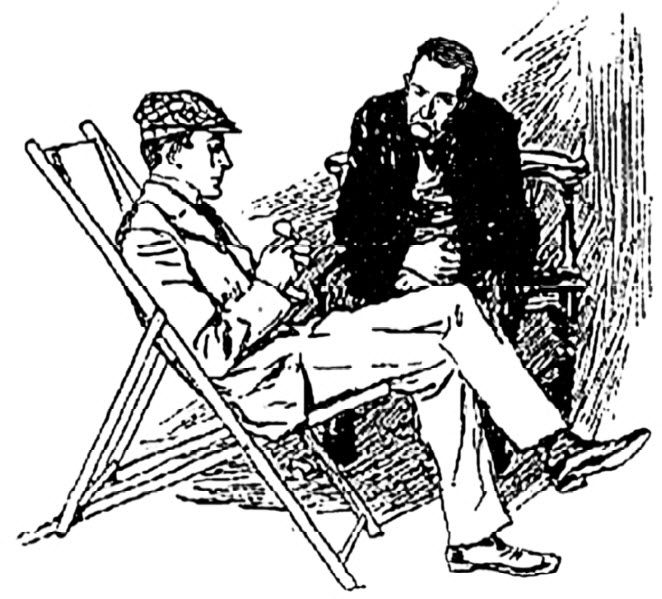

这表原为你兄长所有。

“这点算你猜到，不稀奇，表壳上有H．W．字母对不对？”

“正是如此。W是你自己的姓。这表的制造日期距今将近有五十年，这刻的字母和表是同一的年纪，所以是上一代人定制的表。习惯上珠宝类遗传给长子，长子的名字往往同父名。你的父亲，如果我记得没错，已去世多年。因此，表就传到你长兄手里。”

“到现在为止，这些都是正确的，”我说，“还有什么吗？”

“你哥哥是个行为不拘小节的人——非常邋里邋遢，不修边幅。最初他很有光明前途，可是都让他丢掉了。常常生活潦倒，偶尔也有景况很好的时候，最后嗜酒，死于酗酒。就是这些，都是我根据观察分析所得。”

我从椅子上跳了起来，在屋子里焦躁地乱步走来走去，内心里充满痛楚。

“你这就很不光明正大，福尔摩斯，”我说，“真想不到你会搞这一套。你肯定是预先早有了解，对我哥的不幸身世知道得一清二楚，现在你装模作样作什么分析推理。你想，我会相信你都能从这旧表上看出来！还多么刻薄！你不就是搞江湖骗术嘛！”

“我亲爱的博士，”他心平气和地说道，“请接受我向你道歉。我把这事当作纯粹的问题来推断，忘了具体的个人亲情，这在你是一桩痛苦的家事。不过，我向你保证，在你给我这只表之前，连你有没有哥哥我都一点也不知道。”

“那怎么可能讲得那么准确呢？你说的跟事实处处相符呀。”

“啊，那也算运气好。我说的只不过是估计，可能性，我自己也想不到那么准。”

“不是给你猜了个正着？”

“不，不，我这个人不爱猜谜，遇事光猜，不是好习惯——这会影响正常的逻辑推理能力。在你看来不可思议，是因为，你没有遵循我的思路，没有注意到往往能看出大问题的细枝末节。我们从具体说吧，我一开始就说，你哥是个粗心大意的人。看看这只表，表壳下面部分有两处凹痕，整个表面上全部是伤瘢痕迹，这是不良习惯造成的，老是把表放在有硬币、钥匙这种硬东西的衣袋里，也不专门分开一个口袋放。拿一只价值五十几尼<a href="#part0026.xhtml_ch2"
id="part0026.xhtml_ch2-back">(2)</a>的表这样漫不经心，说他邋邋遢遢不算过分吧；这也称不上是太了不得的发现。单是这只表就已经如此贵重，那么其他方面，该是殷实人家便没有问题了。”

我点头表示同意他的推理。

“英国当铺有惯例，每收进一只表，都要用针尖在表壳内里刻上当票号码。这个办法比挂一个牌子要好，免得号码牌丢失或者搞错。我用放大镜细看表壳里面，这种号码至少有四个。结论是——你的兄长常常经济拮据。再一个结论是——他有时境况又很好，否则他没有力量去赎当。最末一点，请你注意里盖有一个上弦孔，弦孔四周有无数瘢痕——这都是钥匙戳捣的。神志清醒的人插钥匙会插出这么许多伤痕吗？只有醉汉的表，你去看，没有一个不是这么瘢痕累累。夜里上弦，手抖抖的就留下这种痕迹。这有什么玄妙吗？”

“经你说破，茅塞顿开，”我回答道，“我错怪了你，请多原谅。你有如此的洞察力，我真是有眼不识泰山。想问一下，你目前有没有接手案件？”

“没有，所以只好注射可卡因。不动脑子，我就活得无聊。生活还有什么乐趣呢？站到窗前来，看这世界，有这样凄凉、惨淡、无聊的吗？看那黄雾，满街翻滚，飘过灰溜溜的房屋，还有什么比这更刻板、乏味、消沉？医生，英雄无用武之地，这英雄还有什么意思呢？犯罪照常犯罪，求生还得求生。芸芸众生如此，我空有一身绝技也于世无补。”

我正要张口回答他这番激动的言词，忽然响起急促的敲门声。我们的女房东走了进来，托着铜盘，盘里放一张名片。“一位年轻姑娘求见，先生。”她说，招呼我的同伴。

“玛丽·莫斯坦小姐，”他看看名片说，“嗯！这个名字很陌生。请小姐上来，哈德森太太。别走，医生。你要留在这儿，不要走开。”

————————————————————

<a href="#part0026.xhtml_ch1-back" id="part0026.xhtml_ch1">(1)</a> 可卡因（cocaine），古柯树叶中提取的药物，作麻醉剂。7％的溶液是比较稀的浓度，1898年英国药典规定的浓度为10％，可以随便购买。

<a href="#part0026.xhtml_ch2-back" id="part0026.xhtml_ch2">(2)</a> 几尼（guinea），英国金币，1831年停止流通，后仅指等于21先令即1．05英镑的币值单位，常用于规定费用、价格等。

# 第二章　案情陈述

莫斯坦小姐走进屋来。她步履沉着，姿态稳重，是个皮肤洁白、金发碧眼的年轻女士，娇小、轻盈、高雅，戴着手套，显得端庄，衣着得体，充分展现着风度。然而，她的衣服简朴素净，说明她不是一个生活太优裕的人。暗灰哔叽的衣服，没有花边和装饰，配着一顶同样暗色调的小檐帽，一枝白羽插在帽檐侧旁讨了几分巧。她的容貌虽不能说美丽出众，但是神情甜蜜，温柔可爱，一对蓝蓝的大眼睛富有情意和神采。就我眼中看过的女人，遍及三大洲数十国，还从来没有见过一位女子有这样娴雅的面容、灵秀的气质。当福尔摩斯拿过一把椅子请她坐下的时候，我一直在目不转睛地朝着她看。看见她的嘴唇微微动了一下，手在颤抖，她的一举一动显示出情绪紧张，内心不安。

“我来拜访您，福尔摩斯先生，”她说，“因为您曾经为我家主人塞西尔·福雷斯特夫人解决过一件家庭纠纷。她十分感谢您的帮助，钦佩您的才能，一直铭记不忘。”

“塞西尔·福雷斯特夫人，”福尔摩斯回想起来说道，“记得的，不过是对她一点小小的帮助，那桩案子很简单，是小事情。”

“她可不这样认为。不过我现在来向您求教的案子，可不能说是简单的了。我现在的处境，真想不到会变得这么复杂、离奇。”

福尔摩斯搓着双手，两眼炯炯有神。他在椅子上倾身向前，那张清秀而似鹞鹰的脸，神情极为关注。

“说一说您的案情吧。”他以极其郑重的语气说道。我感到我的在场有些不便。

“你们谈吧，请原谅，我失陪了。”我说着，从椅子上起身。出乎意料地，这位年轻女士伸出戴着手套的手阻止了我。

“您这位朋友，”她说，“最好请别走，一定会对我很有帮助的。”

我因此重新坐下。

“简短讲一讲，”她接着说道，“事情是这样。我父亲是驻印度军队的军官，我很小的时候就被送回国内。母亲早就去世，英国又没有亲戚，所以就把我送到爱丁堡一所寄宿学校读书。学校条件很好，很舒适，我在那里一直待到十七岁。一八七八年，因为我父亲已是团里资格最老的上尉，请到一年假期回国度假。他一到伦敦，就给我发电报，告诉我已平安抵达伦敦，叫我立刻前去相见，给的地址是朗厄姆旅馆。我还记得，电文写得充满父亲的慈爱。我赶到伦敦，乘马车去朗厄姆旅馆。旅馆的人告诉我是有莫斯坦上尉下榻在这里，不过头天晚上出去后就一直没有回来。我等了一天，不见父亲的消息。那天晚上，旅馆经理劝我报警，我就去警署报了案，还在第二天早上各大报纸登出寻人启事，可是一点结果都没有。这天以后，从此就没有了父亲的下落，可怜的父亲至今音讯全无。他回到国内，心中满怀父女团聚的希望，期盼能过个假期家庭生活，想不到——”

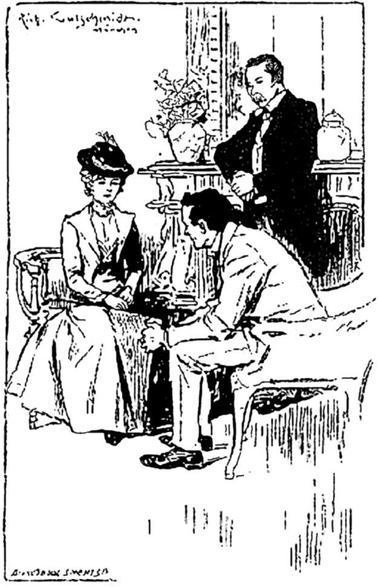

他在椅子上倾身向前。

她用手捂着嘴，话还没说完，已经泣不成声。

“是什么日期记得吗？”福尔摩斯问道，翻开记事本。

“他是一八七八年十二月三日失踪的——差不多有十年了。”

“他的行李呢？”

“留在旅馆里。行李中找不到一点线索——一些衣服，一些书，还有不少安达曼群岛的珍奇古玩。他是那儿管监狱犯人的军官。”

“在伦敦有朋友吗？”

“我们知道只有一人——肖尔托少校，和他一个团的，驻孟买陆军第三十四团。少校那时刚退休不久，住在上诺伍德。我们当然和他联系了，可是他连自己部队的同事回到英国都不知道。”

“真是怪事。”福尔摩斯说。

“我还没有跟您说最怪的事呢。大约六年前——讲确切点，日期是一八八二年五月四日——《泰晤士报》上刊登一条启事，征询玛丽·莫斯坦小姐的住址，还说是对她有好事。启事没留姓名地址。那时我刚到塞西尔·福雷斯特夫人家当管家，夫人建议我把我的地址在广告栏上登出去。见报的当天，就来了一个小纸盒，按我的地址邮寄给我。打开一看，是一颗光彩夺目的大珍珠，盒子里没留一个字。从此以后，每年的这一天，就寄来一样的盒子，里边是一样的珠子。是什么人寄的，一点情况都不知道。这些珠子经行家看过，是稀世珍宝，价值很高。您两位也可以看看，确实很好。”

她说着就打开一个盒子，我看见了六颗我生平从未见过的上品珍珠。

“您说的很有意思，”歇洛克·福尔摩斯说，“还有别的情况吗？”

“有，就在今天，所以我才上您这儿来了。今天早上我收到一封信，请看，就是这一封信。”

“谢谢。请您把信封一起给我。邮戳，伦敦，西南区。日期，九月七日。哦！一个大拇指印，角上——可能是邮差的手指。纸张很好。信封是六便士一札的，不便宜。写信人对信封、纸张很讲究。没留地址。

今晚七时请于莱西厄姆剧院左侧第三柱等候。如有疑虑，可携二友一同前来。您是备受亏待之女士，必以公道还报之。切勿报警。否则即予勾销。您未识的朋友。

啊哈，真是奇妙的事，实在让人神秘莫测！您准备怎么办呢，莫斯坦小姐？”

“我来正是要请教您呀。”

“既然这样，我们应当去，肯定得去——您，我，还有——对了，华生医生也正好算上一位。符合信上说的，两个朋友嘛。他和我一直是在一起工作的。”

“不知这位愿意去吗？”她的表情和语气都是恳求似的说。

“我十分荣幸，十分高兴，”我赶紧答话，“极愿效劳。”

“你们俩真好，”她回答说，“我一向孤独，从来没有朋友可以相托。那么，我六点钟再到这儿来，好吗？”

“可不能晚了，”福尔摩斯说，“还有一点，这信的笔迹同珠宝盒上地址的笔迹一样不一样？”

“我都带着呢。”她回答说，掏出了六张包珠宝盒的纸。

“像您这样的委托人真难得，对事情考虑得很周密，做得很对。好，让我们来看看。”他把纸展平在桌上，逐张细细端详。

“都是伪装的笔迹，只有这封信是真笔迹，”他看罢说道，“不过都是出自一个人之手，这一点没有问题。看这个怪模怪样的e总是控制不住要出格。再看这s，在末了总是要这么转一下。这就没有疑问出于同一手笔。我倒不是想要给您一点空心希望，莫斯坦小姐，这里的笔迹同您父亲的笔迹，有没有相像的地方？”

“一点也不像。”

“我想也是如此。那么，我们就在六点钟等着您了。请把这纸都留下，去之前这段时间里，我还可以研究研究。现在才三点半。好，那么回头见，噢勒瓦尔<a href="#part0027.xhtml_ch1"
id="part0027.xhtml_ch1-back">(1)</a>！”

“噢勒瓦尔。”我们的客人说，她那明媚、温柔的眼睛看看他，看看我，珠宝盒往怀里一揣，匆匆地走了。

我站在窗前，看她轻盈地在街上走去，一直看着她的灰色小檐帽和一根白羽毛在黑压压的人群之中渐渐远去，渐渐消失。“多么动人的一位姑娘！”我赞叹道，转向我的伙伴。

他再点起了烟斗，垂着眼皮，靠到椅子上。“是吗，她？”他无精打采地说，“我倒没注意。”

“你真是一部机器——自动计算器，”我大声说，“你有时候真是毫无一点人情味。”

他温和地笑着。

“至关重要第一点，”他大声说，“你作判断不要偏向于个人的品貌。一位当事人、委托人，对我只是一个单位量，问题的一个因子、因素。感情这个东西，会干扰理智，使人变得不清醒。告诉你，我平生所见的一位最美最美的绝代佳人，竟为了得到保险赔款，活活毒死三个小孩，结果被判处绞刑；我认识的一个外貌奇丑、不讨人喜欢的男子，倒是一位大慈善家，捐赠将近二十五万英镑救济伦敦的贫民。”

“但这不是同一回事——”

“不应有例外。有了破例，也就没有了定律。你研究过笔迹特征吗？对这个人的笔迹，你有何高见？”

“写得比较整齐、清楚，”我回答，“像个生意场上的人，做事不马虎，属于很有个性的人。”

福尔摩斯摇摇头。

“看看几个长字母，”他说，“出头几乎都没有高过左右的一般字母，那个d像a，l像个e。有个性的人不论字写得有多难认，字的高矮总是分明的。他的k都写得摇摆不稳；大写字母显出这个人很自负。我现在出去一下，找一找参考数据。这本书推荐你看看——一部不同凡响的作品。这是温伍德·里德的《成仁者》。一小时我就回来。”

我坐在窗边，手里捧着书，但是完全走神，无心拜读这部大作。我的心思牵挂在刚才的来客身上排解不开——她的音容笑貌，她生活中遇到的离奇的谜。她父亲失踪那年，她是十七岁，那么现在该是二十七岁——正当如醇蜜般的年华，少不更事的稚气已经蜕去，转入涉世适度的人生阶段。我这么坐着，想入非非，忽而一阵自惭袭上心头，赶忙坐到书桌前，扑到最新病理学论文中细读，藉以抑制我的妄想。我算什么？一个陆军军医，拖着一条伤腿，银行无存款，怎配有这种非分之想？她是一个单位量、一个因素——此外便什么也不是。如果我的前程注定黯淡无光，最好还是毅然直视面对人生，不要胡思乱想，不要妄想自己的命运会光辉灿烂。

————————————————————

<a href="#part0027.xhtml_ch1-back" id="part0027.xhtml_ch1">(1)</a> 噢勒瓦尔（Au
revoir），法文“再见”的意思。

# 第三章　寻求解答

福尔摩斯到五点半才回来。他满面红光，兴致勃勃，精神抖擞，在他心情几番沮丧之后，终于又见开朗。

“这件事没有太大的奥妙，”他说，端起我给他倒的一杯茶，“事实明摆着，只能作一种解释。”

“什么！你已经把问题解决了？”

“当然全部事情还有待深入了解，不能说定。我发现一个事实，能说明问题。情况就是这样，不过确实非常能说明问题，细节还有待补充齐全。我刚才去查了《泰晤士报》的旧报纸，查到了上诺伍德肖尔托的讣告，是前驻孟买陆军第三十四团的少校，于一八八二年四月二十八日去世。”

“可能是我愚钝，福尔摩斯，我看不出这讣告能说明什么问题。”

“看不出？真是奇怪。这个问题这样来看，莫斯坦上尉失踪了，在伦敦，他要去拜访的，只有肖尔托少校一个人，而肖尔托少校否认，说连他到了伦敦都一点也不知道。四年以后肖尔托死了。他死后，一个星期还不到，莫斯坦上尉的女儿就收到了贵重礼物，此后每年收到一次，到现在为止，来了一封信，称她是受了亏待的女人。她除了不知父亲生死，受了什么亏待呢？再有，为什么在肖尔托死之后马上就开始有礼物寄给她，那莫非是肖尔托的继承人知道其中的奥秘，借此来弥补点什么罪过，对不对？你有没有别的推论，来说明这些事实情况？

“弥补罪过怎么要用这种稀奇古怪的办法，做得也太过玄妙！还有更说不通的，现在才写信，为什么六年前不写？信上还说是要公正对待她，她该有什么公正呢？要说她父亲还活着，这未免过于乐观。莫斯坦小姐方面，你知道，对她没有别的不公正吧？

“有难题，确实是费解的难题，”福尔摩斯沉思着说，“今晚跑一趟可能解决问题。啊，一辆四轮马车来了，坐着莫斯坦小姐。你好了吗？该下去了，时间已经稍过了一点。”

我拿起帽子，再拿起一根最粗最重的手杖，福尔摩斯从抽屉里拿出他的手枪放进口袋。很清楚，他想到我们今晚的行动可能会碰到严重情况。

莫斯坦小姐披着黑色的斗篷，她那动人的脸庞显得很镇定，但是苍白。我们今晚前去对付的人和事，非同一般，或有不测，她如果能不感到惧怕，那就说明她不是一般女流之辈。莫斯坦小姐竟泰然自若，从容回答着福尔摩斯再次向她提出的一些问题。

“肖尔托少校是爸爸特别要好的朋友，”她说，“爸爸来信总要提到少校。他和爸爸都是安达曼群岛驻军的军官，所以他们时常在一起。哦，对了，爸爸有一张字条在房间桌子里，很奇怪，看不懂是什么意思，看不出有什么关系。我想让您看看也好，所以我就带在身边了。就是这个。”

福尔摩斯小心地把纸打开，在膝盖上摊平，拿出双层放大镜仔仔细细审视了一遍。

“这纸是印度的土纸，”他指出，“过去这纸曾经一直钉在板上。纸上的图样像是一幢大房子的建筑图，是建筑的一部分，有许多厅房、厅廊和甬道。有一个用红墨水画的十字，十字上面有模糊的铅笔字‘左侧3.37’。左角上有个怪符号，象形文字似的，是连接一起的四个十字。边上还有字，写得很粗糙，很潦草，‘四签名——乔纳森·斯莫尔，穆罕默德·辛格，阿卜杜拉·汗，多斯特·阿克巴尔’。我也看不出和本案有什么关系。不过这一定是一份很重要的文件，给小心地压在票夹里，因为两面都一样光洁平整。”

“我们是从他放的票夹里找到的。”

“嗯，小心保存好，莫斯坦小姐，说不定以后会对我们有用处。我觉得这个案子，可能比我最初想象的要深刻得多，复杂得多，我得重新考虑。”

他紧靠着车座椅背，眉头紧锁，目光呆滞，我看出他已陷入沉思。莫斯坦小姐和我轻声地说话，说到这一次去不知是什么结果。我们的同伴始终保持沉默，一直到达目的地，没说一句话。

现在是九月，傍晚七点还不到。密如细雨的浓雾笼罩着整个城市。泥湿的街道，天空压着沉沉的灰云。沿河滨道的盏盏路灯成了团团混沌光晕，微弱无力的灯光一圈圈洒在泥滑的人行道上。店铺橱窗里的炫目黄光穿过迷蒙蒸腾的雾气，射到人车熙攘的大街上。我心里在想，这络绎不绝的人群，一张张脸在道道光束中掠过，显出怪诞奇异的幽灵相——有的悲苦，有的欢乐，有的憔悴枯槁，有的丰满生辉。如同整个人类一样，从黑暗匆匆来到光明，又再从光明匆匆回向黑暗。我并非是一个易动感情、受情感摆布的人，但这么一个昏沉抑郁的夜晚，加上我们将投入这件吉凶未卜的事，我不禁精神紧张，心情沉重起来。我从莫斯坦小姐的表情中看出，她也有同我一样的感觉。只有福尔摩斯独自一人，能超然于周围的影响和干扰。他把记事本翻开在膝头，打着袖珍小烛灯，不断地往上面记些数字，写点备忘录。

莱西厄姆剧院的边门入口处，人已经拥挤不堪。双轮马车、四轮马车如流水般辚辚而至。礼服笔挺、前胸衬衫雪白的男士和披着围巾、珠光宝气的女士，一个个从车上下来。我们向约定的第三根柱子过去，还没到那儿，就有一个身材短小、面孔黧黑、车夫装束的男人上来招呼我们。

“两位都是陪同莫斯坦小姐的吗？”他问道。

“我就是莫斯坦小姐，这两位是我的朋友，”她说道。那人用一对灼灼逼人的眼睛狐疑地看着我们。

“请您原谅，小姐，”他用严厉、强硬的口气说道，“我要您给一句话作保证，这两位没一个是警察。”

“我完全可以保证。”她回答道。

那人吹了一声口哨，立刻有一个小瘪三应声而到，牵过来一辆四轮马车，把车门打开。迎候我们的那个人就跳到车夫座上，我们三人也上了车。还没等我们都坐定，车夫就挥鞭驱车，迅速驰行在雾气弥漫的街道上了。

这个情况令人生疑。我们既不知道被引往何处，也不知道去为何事。我们这么跑一趟难道完全是受人愚弄——这是不可能的，不用往这上面去想。那么应当相信不至于白跑一趟，必有重要的结果。莫斯坦小姐的神态仍旧如刚才那样沉着镇定。我给她讲我在阿富汗时候的历险故事，用意是能再给她一些鼓励与安慰。但是，说实话，我自己也在为我们的处境紧张得心神不定，为不知会有什么结果而忧心忡忡，故事也不免讲得七颠八倒。至今她还在把我讲给她听的那则生动滑稽的逸事当作笑话。我讲的是一天深夜，说什么一只滑膛枪如何进入我的帐篷，我又是如何抠响了一支双筒小老虎把枪打死。

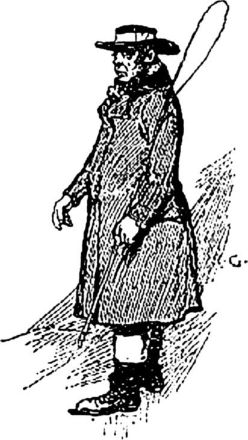

一个车夫装束的男人上来招呼我们。

这马车一路跑，起先我还能辨得清方向，可是不多久，越走越远，雾又大，对伦敦地方又不是很熟悉，我就摸不清东西南北了，只知道我们已经走了很长的一段行程，此外便一概茫然不知。歇洛克·福尔摩斯却事事错不了，车子所经之处，广场也好，进出弯弯曲曲的小街也好，都能一一述说如流。

“罗彻斯特街，”他说，“这是文森特广场，现在要走沃克斯霍尔桥路，肯定是打萨里区边上过去。是的，没错。现在上桥。你们看见河了吧。”

我们果然看见了泰晤士河。街灯照着宽阔的、静静的水面。瞥过一眼河光水色，马车很快驰向河对岸，转进迷宫般的街道。“沃滋沃思路，”我的同伴说，“修道院路。拉克莱尔巷。斯托克维尔广场。罗伯特街。冷港巷。我们去的这个方向不像是高级地段。”

我们的确来到了一个陌生可疑的郊区地方。都是一排排灰暗的砖墙房，转个弯才见几家粗俗、刺眼的酒店突然出现。随后就是一栋栋二层楼的别墅，每栋楼前都有小花园。接着又是一排排望不到头的砖墙房，都是新建的，很显眼——大城市向郊外乡村伸出的可怕触手。最后，马车停在了一式的沿街排屋的第三个屋门前。这么些房子都漆黑无光没人住，我们停车的这一栋，除了厨房的窗有一线微光，也同周围邻屋一般黑暗。可是门一敲就开了，开门的是一个印度仆人，戴黄包头，身穿肥大的白衣，缠黄腰带。在这郊区的三等普通住屋门口出现一个东方仆人，可就有点像是非普通人家。

“我家老爷恭候您，”他说。才刚说话，一间里屋就有一个尖嗓音高声向外叫出来。

“请他们到我这儿来吧，吉特穆特迦<a href="#part0028.xhtml_ch1"
id="part0028.xhtml_ch1-back">(1)</a>，”那声音喊道，“把他们直接带到我这儿来。”

————————————————————

<a href="#part0028.xhtml_ch1-back" id="part0028.xhtml_ch1">(1)</a> 吉特穆特迦（khitmutgar），印度英语“男侍”。

# 第四章　秃头人的故事

我们跟随印度人进去，经过一条不整洁的走道。灯光不亮，空空落落没有陈设。走到靠右手的一个门口，他把门推开。屋里射出黄黄的灯光照着我们，灯光中站着一个小个子尖头顶男人，光亮的秃顶，周围长一圈红毛，像是冷杉木树林中冒出的一座山头。他站在那里搓着双手，脸上有痉挛性抽搐——似笑又哭，似哭又笑，如此忙碌不见稍有停息。天生一副耷拉着的嘴巴，一口参差不齐的大黄牙暴露在外，他不时颤颤地抬起手在脸面的这下半部位遮遮掩掩。虽然已经光头秃顶，很是刺眼，不过毕竟还年轻，样子不老，实际上也就是三十挂零吧。

“为您效劳，莫斯坦小姐，”尖细的嗓子不断高声地说着，“为两位先生效劳。请进来，小小陋室，别有洞天。地方是窄了点，小姐，可都是按照我喜欢的样子布置的。可说是伦敦南郊荒凉沙漠中一块艺术绿洲。”

他在这么一间屋子里接待我们，令人惊异不止。这间屋的布置同整栋差劲的房子不相配，犹如高价的钻石镶在了黄铜上。最昂贵华丽的帷幔和挂毯装饰满墙，有些地方扣环撩起着，露出精工裱饰的绘画和东方大花瓶。琥珀色和黑色相间的地毯又厚又软，脚踩在上面很舒适，如同走在青草地上一般。横铺在地毯上的两张大虎皮，以及墙角席子上安置的一只印度大水烟壶，都更显出东方情调的显赫富贵。屋顶中央一根隐约可见的细金丝悬吊起一盏银鸽挂灯。油灯点燃而散发出的芬芳味使满屋子幽幽飘香。

“撒迪厄斯·肖尔托先生，”小个子男人说道，脸上依然显出哭笑不得的样子，“这是我的名字。您就是莫斯坦小姐吧，这两位先生——”

“这是歇洛克·福尔摩斯先生，这是华生医生。”

“是医生，啊？”他叫起来，兴奋异常。“您带着听诊器吗？我担心我的心脏瓣膜有毛病。可否麻烦一下——劳您大驾？我的大动脉还好，我的瓣膜，得听听您的宝贵意见。”

我应他要求，听了听他的心脏，没发现有什么不正常，只是确实有些心理上的紧张，因为他从头到脚都像是在筛糠似的发抖。

“心脏很正常，”我说，“不必紧张，没事。”

“请您原谅我的多虑，莫斯坦小姐，”他轻松地说道，“我老是觉得很不好受，很久以来老怀疑心脏瓣膜不好，看来我的担心是多余的，这就放心了。莫斯坦小姐，要是您的父亲能够克制点自己，别伤着心脏的话，那说不定能活到现在呢。”

我听他对这种伤人心的事说起来这么没轻重，不禁怒从心头起，恨不得给他一个耳光。莫斯坦小姐坐下了，面色立刻惨白，连嘴唇都白了。

“我心里早已明白，父亲不在世了。”她说。

“我把详细情况告诉您，”他说道，“更重要的是，我还要为您主持公道。不管我哥哥巴索洛缪会怎么说，我一定得这么做。您的两位朋友也来了，这很好。不单单是陪在边上保护您，也让我自己说的作的多个见证。我们三个人加在一起力量就大了，可以胜过我哥哥巴索洛缪。我们不要有外人——不要警察，不要官家，我们自己就可以把问题解决得很满意，不要外人来干预。把事情闹出去，那我哥哥巴索洛缪就要火冒三丈了。”

他往一只矮矮的长靠背椅上一坐，眨着一对湿漉漉的无精打采的蓝眼睛，含着探询的眼光望着我们。

“我这边，”福尔摩斯说，“您怎么做我都不会透露出去。”

我点点头也表示同意。

“那就好！那就好！”他说，“能敬您一杯意大利吉安地酒吗，莫斯坦小姐？或者匈牙利托凯的葡萄酒？别的酒我没有。我开一瓶好不好？不要？好，那么，相信诸位不反对抽烟吧，有东方烟的安息香、肉桂香味。我有点紧张，吸口水烟就好，是绝对好的镇静剂。”

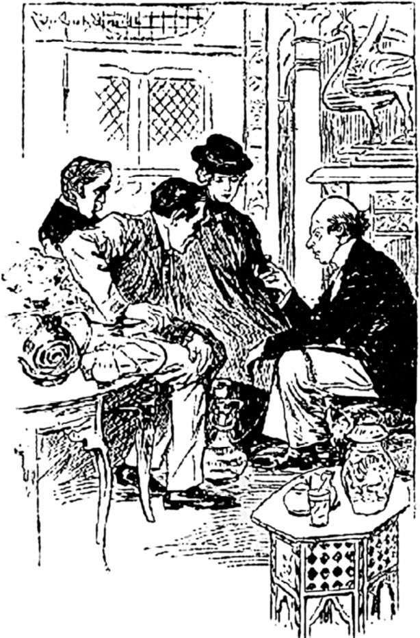

“我有点紧张，吸口水烟就好。”

他引火点上大水烟壶，烟从壶里的玫瑰香水中噗噗响着冒出来。我们三人围在他前面坐定，脑袋前伸，手支下巴颏儿，瞧着这个奇怪的小个子痉挛着，秃顶生辉，坐在我们中间赶紧噗噗地吸个起劲。

“我头一回决定同您联系，”他说道，“原想给您地址，可又怕您不相信我的话，带来些个信不过的人，所以，我就只好冒昧一下了，用这么个办法来约定，派我的人威廉斯先来迎候。他很会见机行事，我完全信得过他。我命他如若情形不对，事情就算，不接你们了。我这么小心谨慎，还望见谅。我这个人深居简出，事事要讲究，处处要挑剔，不随便同人打交道，警察这号人从不敢领教，井水河水不相干。我天生对物欲没兴趣，对物欲横流看不惯。我的生活，正如诸位所见，多少还讲究点文人雅士之气吧，白丁粗人与我鲜有来往。我堪称是艺术保护人，也算是敝人一点小癖好。这幅风景是柯罗<a href="#part0029.xhtml_ch1"
id="part0029.xhtml_ch1-back">(1)</a>的原画，这幅萨尔瓦托·罗萨<a href="#part0029.xhtml_ch2"
id="part0029.xhtml_ch2-back">(2)</a>，鉴赏家或许有疑问，那幅布格罗<a href="#part0029.xhtml_ch3"
id="part0029.xhtml_ch3-back">(3)</a>绝对没有丝毫问题。我特别倾心于法国现代画派。”

“请原谅我，肖尔托先生，”莫斯坦小姐说，“我是应您之约才来的，因为您有话见教。时间不早了，希望我们的谈话直截了当一些好。”

“恐怕得有点时间呢，”他回答道，“因为我们还得去上诺伍德，去见见家兄巴索洛缪。我们都去，还得尽量把家兄巴索洛缪说服才好。我认为合情合理的做法，他却会发火，昨晚上我和他说得都响了嗓门红了脸。你们无法想象他脾气一上来那个厉害劲儿。”

“要去上诺伍德，那现在就得走了。”我插嘴道。

他大笑起来，笑得耳根都发红。

“不行呀，”他大声说，“如果我这么突然就把你们带过去的话，还不知他会怎么说呢，不行，我还得让你们有点准备，看看我们之间该怎么互相配合一致才好。所以首先，我要向你们表明，在这整个事件中有几点我本人也还不太清楚，我只能姑且把事实向你们摆一摆。

“我父亲，你们会猜想得到，是约翰·肖尔托少校，以前在驻印度军队里服役。他十一年以前退休，回来住在上诺伍德樱池别墅<a href="#part0029.xhtml_ch4"
id="part0029.xhtml_ch4-back">(4)</a>。他在印度发了点财，带回一大笔钱，一批贵重的珍奇古玩，还有几个贴身的印度仆人。具备了这些条件，他就买了幢房子，生活过得很优裕。我和巴索洛缪是孪生兄弟，父亲就只我们两个儿子。

“我还记得很清楚，莫斯坦上尉失踪，在社会上引起轩然大波。我在报上看到详细情况，知道他是我父亲的朋友，也就当面向他问长问短，他也顺着我们一同猜测可能是怎么怎么。其实我们看出他心中藏有秘密，外间这么说那么说，不过只有他一个人真正知道阿瑟·莫斯坦到底出了什么事。

“我们也知道，父亲心头一定另有秘密，另有顾虑，甚至危险，是不能讲出来的。他很怕一个人单独出门，还雇了两个拳击手来樱池别墅看门。今晚驾车来接你们的威廉斯，就是一个拳击手，他得过英国轻量级拳击冠军。父亲从不向我们谈起自己到底怕什么，只是看到他对装木腿的人特别神经过敏。有一次，真的拿左轮枪朝一个木腿人开枪，打伤了人家。结果发现这个木腿人不过是个小贩，是在兜生意，没害人。后来我们付了好大一笔钱才了结此事。我哥哥和我也曾想，这不过是父亲脑子一时糊涂，但是此后许多事，让我们改变了看法。

“一八八二年初，父亲收到印度来的一封信，使他大惊失色。那天他在早餐桌上打开信一看，差一点要晕过去。从这天起，他就病了，一直病到去世。信上写些什么，我们一直不知道。在他拿着信的时候，我从旁边看见信很短，字迹很潦草。他患有脾脏肿大病多年，这以后病情很快恶化。到三四月底，医生通知我们已经没有希望，他就对我们作了临终嘱托。

“我们进他房间，他靠在几只高枕上面，呼吸很困难。他叫我们把门关上，到他的床两旁。他握紧我们的手，向我们讲出了一件大事。因为痛苦加激动，话断断续续，我现在尽量照他原话给你们讲一遍。

“‘我只有一件事，’他说，‘直到现在还挂在心上。我对莫斯坦遗下的孤女，很是内疚。我一生贪心不足，无法宽恕，扣住珍宝不给他女儿，其中至少有一半是她的。我自己也没有动用这些珍宝。贪心就是如此盲目和愚蠢，只要是我的，在我手里，我感到就是好，再也舍不得分给别人。你们看，金鸡纳霜药瓶的旁边那串珍珠，原是我拿出来想给她的，连这个我都舍不得出手。我的儿子，你们两个应当公平分给她阿格拉<a href="#part0029.xhtml_ch5"
id="part0029.xhtml_ch5-back">(5)</a>珍宝，不是现在给——这串珠也不要给，等我死了再给。没办法，人就是这样，不断气心还不死，断了气心才算死了。

“‘我要告诉你们，莫斯坦是怎么死的，’父亲接下去说，‘莫斯坦有心脏病，是多年老毛病，可是他一直没跟别人说，只有我一人知道。他和我在印度经过几番离奇曲折，得了一大批宝物，我带回了英国。莫斯坦回国的那天晚上，他一到伦敦就找上这儿来，要拿他自己应得的那一份。他从车站步行到这里，是我忠实的老仆人拉尔·乔达开的门，迎他进屋。拉尔·乔达，现在是死了。莫斯坦和我发生了争执，宝物分不匀，吵了起来。莫斯坦火冒万丈，从椅子上跳了起来，这时突然用手捂住胸口，脸色发青，人就仰面跌倒，头撞在装宝物的箱子角上。我赶紧弯腰去扶他，吓了我一跳，人已经死了。

“‘我坐在那里发呆了好久，不知该怎么办。我开始当然想到报警，可是再一想，意识到这样的情况下，不要搞得我有谋杀嫌疑。他是在吵架当中死的，头上还有伤口，那更是对我不利。要是再一调查一问，宝物的事也一定要抖出来，这是我最忌的，绝对要保密。他曾跟我说，没有人知道他要去哪儿。既然如此，那有什么必要让人知道呢？

“‘我还在考虑这件事，抬头正好看见仆人拉尔·乔达在门口。他悄悄进来，反手闩了门。“别怕，主人，”他说，“没人会知道是你害死他，我们把他埋掉，有谁知道？”“我没有杀他，”我说。拉尔·乔达摇摇头，笑笑。“我都听见了，主人，”他说，“我听见你们吵架，我听见你打了他。可是，我嘴紧着呢，家里人都睡着了。我们快动手搬走吧。”这样我就不得不下决心了。自己的仆人都信不过我，我还有什么能指望陪审团相信我？十二个陪审官还不都是些买卖人、蠢蛋！更别想有好结果。拉尔·乔达和我两人当夜就把尸体埋了。伦敦报纸好几天纷纷登出莫斯坦上尉失踪的疑案。我都说了，你们可以看到，我在这件事上没有责任。我的过错，只在把尸体隐瞒掉，还隐瞒了宝物，还把他莫斯坦的一份也占为己有。所以，我希望你们去还掉。你们过来，耳朵凑近我嘴边来，那珍宝，是藏在——’

“正在这时候，他脸色突变，眼睛直瞪，嘴大张，喊了起来。这声音我一辈子都忘不掉。‘赶他走！快赶他走！’我们两人回过头，朝他眼睛盯着的那个窗口望去。外面黑暗中，有一张脸朝我们看。我们看到一张脸，贴着玻璃窗，鼻子压扁发白，满面胡须，一对野兽般厉害的眼睛，一副凶恶的面相。哥哥和我立刻冲到窗口，可是那人不见了。等我们回到父亲身边，父亲已垂下脑袋，脉搏也停了。

“那夜我们搜了花园，没有发现不速之客的痕迹，只是在窗下的花坛上，有一只脚印清晰可见。要不是有这只脚印的证据，我们还会以为看见的那张野兽般凶恶的脸，只是我们的幻觉，是眼花呢。紧接着，又出现了更惊人的情况，证明有一伙人在暗中对我们进行秘密活动。下一天早晨，父亲房间的窗子给打开了，他的橱柜、箱子都给撬了，在他胸口别着一张破纸，上面写有‘四签名’，字迹很潦草。这纸上的字是什么意思，撬屋入室的又是什么人，我们不得而知。我们看来看去，父亲的财物一点也没有被偷，尽管东西都给翻了出来。我哥哥和我很自然地联想起这件事同父亲生前一直担惊受怕是有关系的，但到底是怎么回事，对我们仍然完全是个谜。”

这小个子讲到这里，停下来重新点着了水烟壶，沉思地噗噜噗噜吸了一会儿。我们静坐着，聚精会神听他讲这个难得一听的故事。莫斯坦小姐听到她父亲去世的那一段叙述，脸色变得死白，我真怕她要晕过去，赶紧从旁边桌上的威尼斯饮料瓶里倒一杯水给她喝下，她这才撑住，重新振作起来。福尔摩斯背靠在椅子里，眼皮低垂盖住闪光的两眼，一脸无动于衷地在那里沉思。我瞥了他一下，不禁令我想到这白天里他还在激烈抱怨人生枯燥无味，而现在，问题不就来了，不愁不使他殚精竭虑。撒迪厄斯·肖尔托先生对我们三人一个一个看过来，看到因他的故事产生了效果，流露出自豪与得意。接着他一边噗噜噗噜吸着奇长的烟管，一边再说下去。

“家兄和我，”他说，“诸位可想而知，为父亲所说的那笔财富，非常兴奋。我们在花园里刨呀挖呀，几星期，几个月，每个角落都找遍了，却什么也没有找到。藏宝的地方藏在了他临终时的嘴边，想起来就叫人要发疯。我们看看他拿出来的一串珍珠，颗颗珠子无疑都值大钱，家兄他舍不得脱手了。他待人也有如父亲一样的缺点。他还想到，珠子一旦出手，会引来闲话，最终是自找麻烦。还是我想出两全之策，说服他，让我先找到莫斯坦小姐地址，每隔一段时间解下一颗送去，如此，也好让她生活免受窘迫。”

“这样做真是好心，”我的同伴诚恳地说，“全靠您一片热诚善意。”

小个子歉意地摇摇手。

“我们不过是财产保管人，”他说，“这是我的看法。家兄巴索洛缪的见解全然不是这样。我们自己有的是钱，我不想再多。另外，对一位年轻女士这样做法也太卑鄙，没有人格。‘鄙俗生罪恶’，这句法国谚语说得很有道理。在这一方面，我们趣味迥然不同，最后我想我还是自立门户吧，就带上老佣人吉特穆特迦和威廉斯，离开樱池别墅。可是昨天，听说了一件非常重要的大事，发现了珍宝。我们终于把珍宝拿到了。接着我马上同莫斯坦小姐联系。下面，我们大家就要一起去上诺伍德，把我们的一份拿来。我昨晚同哥哥巴索洛缪讲明我的观点，所以，我们即使不太受欢迎，也总还是客人，他愿意接待我们。”

撒迪厄斯·肖尔托先生说完了话，坐在华丽的长靠背椅中，脸部抽搐着。我们三人沉默不语，在想着这件奇异的事所出现的新情况。福尔摩斯头一个站起来。

“您做得很对，先生，从头至尾都很对，”他说，“我们也许能做点事，向您回报，给您还在暗中的事，照亮一点点亮光。但是刚才莫斯坦小姐讲了，时间已经很晚，把正事赶紧办了吧，不要拖延。”

我们的新朋友小心盘起水烟长管，从一幅帷幔后取出一件饰有盘花纽扣的又长又宽的轻便大衣，大衣的衣领和袖口用的是俄国羔羊皮料子。他把纽扣全部扣起来，也不顾夜里还是非常的闷热，再添上一顶兔皮帽，更把帽子两侧翻下来遮住双耳。他如此盛装，裹住全身，只露出一张不断抽动的清瘦的脸，其他一处也看不见。

“我身体弱不禁风，”他领着走在过道上这么说，“自己的身子只好自己多加小心。”

马车已等在门外，这一步骤显然早有安排。车夫立即驾车疾驰。撒迪厄斯·肖尔托话语不断，嗓门高过辘辘车轮声。

“巴索洛缪人挺精灵，”他说，“你们知道是怎么给他发现宝藏的？他最后是得出了结论，宝贝在屋里。于是他把整幢房屋的体积算出来，每一处的尺寸都丈量一番，一英寸也不漏掉。此外，他还算出房屋的高度是七十四英尺，又把各个房间的高度量出来，用钻探方法算出楼板间隔的厚度，这样加起来的高度，没有超过七十英尺，这说明有四英尺之差，其中必有缘故。造成这一差额的一定是在屋顶里头。他就在顶楼房间用板条和灰泥装修的天花板上打了洞。果不出所料，就在天花板上面发现一个屋顶小阁楼，这阁楼是封掉的，根本无人知道。就在中央，两根屋顶椽子中间，放着那宝盒。他把宝盒从洞里吊下来，一看宝物全都在里头。他估算下来，这批珍宝的价值不少于五十万英镑。”

一听到这么巨大的数字，我们都面面相觑。莫斯坦小姐如果争取到她应有的份额，她就马上会从一个清贫的女管家变为全英国最富有的继承人。作为她忠诚的朋友，当然要为这个好消息感到高兴。然而，惭愧地说，我的灵魂不免是自私的，我心情沉重得有如铅锤压着。我吞吞吐吐讲了些表示祝贺的话，便灰心丧气地坐在那里默默无言。秃顶朋友在旁边喋喋不休地说的话都没能听得进去。这个人明显患有深度自疑病症，我依稀记得他好像絮絮叨叨讲了一连串的症状，举出无数的庸医秘方向我求教，询问成分和作用，有些就带在身上，放在一只皮夹子里。我相信，这天晚上我给的回答他没一个记得住。福尔摩斯现在还说他那天偶然听到我告诫他蓖麻油剂不得超过两滴，否则有很大危险。但我记得是建议他把大剂量的士的宁<a href="#part0029.xhtml_ch6"
id="part0029.xhtml_ch6-back">(6)</a>作镇静剂服用。这样说那样说都不用管它，当马车骤然停住，车夫跳下车来把车门打开时，我才算回过神，松掉一口气。

“到了，莫斯坦小姐，这就是樱池别墅。”撒迪厄斯·肖尔托说，握住她的手搀她下车。

————————————————————

<a href="#part0029.xhtml_ch1-back" id="part0029.xhtml_ch1">(1)</a> 柯罗（Corot，1796—1875），法国现实主义风景画家。

<a href="#part0029.xhtml_ch2-back" id="part0029.xhtml_ch2">(2)</a> 萨尔瓦托·罗萨（Salvator
Rosa，1615—1673），意大利浪漫主义风景画家。

<a href="#part0029.xhtml_ch3-back" id="part0029.xhtml_ch3">(3)</a> 布格罗（Bouguereau，1825—1905），法国学院派画家。

<a href="#part0029.xhtml_ch4-back" id="part0029.xhtml_ch4">(4)</a> 樱池别墅，原文为Pondicherry
Lodge。Pondicherry是印度东南部中央直辖区首府彭地治里。书中肖尔托少校借用来命名他的别墅。本译把这个词按英语词源pond（池）、cherry（樱）意译作“樱池”。

<a href="#part0029.xhtml_ch5-back" id="part0029.xhtml_ch5">(5)</a> 阿格拉：印度北方历史名城，16世纪到18世纪初曾为印度首都。

<a href="#part0029.xhtml_ch6-back" id="part0029.xhtml_ch6">(6)</a> 士的宁（strychnine），马钱子碱，中枢神经兴奋药。

# 第五章　樱池别墅的惨剧

我们进入今晚冒险的最后历程，已将近十一点钟。走出伦敦城中的湿雾，夜景宜人。从西边吹来暖风，云朵缓缓地行过天空。半月时时从云际露脸，月色下可以看得很远。撒迪厄斯·肖尔托再从车身旁拿下一盏马灯，把我们脚下的路照得更亮一点。

樱池别墅建于一片场地上，外面围有石头高墙，墙头上插满碎玻璃片。一扇窄窄的铁门是惟一的进出口。我们的领头人像是邮差上门似的，上去砰砰打门。

“谁哦？”里边一个粗嗓音问道。

“是我，麦克默多，这时候来敲门，只有我了，还会有谁？”

一阵嘟哝之后是钥匙串的响声。门沉沉地打开，一个个头矮小、胸脯厚实的人站在门口，提灯的黄光照着他向外探出的脸和两只闪烁多疑的眼睛。

“是您呀，撒迪厄斯先生？还有谁？主人没有跟我说过有人来呀，不能进。”

“不让进，麦克默多？岂有此理！我昨晚上同我哥说好的要带朋友来。”

“他今天一天没出过屋，撒迪厄斯先生，所以我没有受到吩咐。您是知道的，我只能按规矩办事，您可以进来，可是您的朋友，他们只好在外面等着。”

这可是没有想到的一着，撒迪厄斯·肖尔托朝他上下看看，倒有些尴尬。

“你太不像话啦，麦克默多！”他说，“我带来的人，你就不用管！还有一位年轻女士呢，你叫她这个时间等在大街上！”

“实在对不起您，撒迪厄斯先生，”看门人说道，仍不通融，“来人是您的朋友，可不是主人的朋友。我吃他的饭，给他管事，我做什么事当什么心。您的朋友我一个都不认识。”

“喔，你认识的，麦克默多，”福尔摩斯大声而和蔼地说道，“你总该认识我呀。你记得吧，四年以前，在爱里森拳击场，一个业余拳击手和你交手打过三个回合？”

“那不是歇洛克·福尔摩斯先生吗！”拳击手嚷道，“我的老天！我怎么会认不出来了呢？你站在那儿怎么不吭声呢？要不就跑上来给我下巴一勾拳。你出高招儿一拳，那我保证早就认出你啦。啊，你这个人有才不施展，你真是！如果你继续干下去，前途可不是一点点啦！”

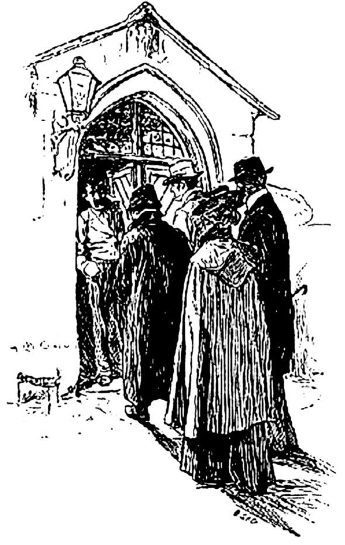

“来人是您的朋友，可不是主人的朋友。”

“你瞧，华生，就算我什么都干不成，还有一项职业技术可干呢，”福尔摩斯说着笑起来，“我看咱们的朋友一定不会叫咱们冷落在门外了。”

“都进来吧，行啦，都进来——你和你朋友，”他答道，“实在是对不起，撒迪厄斯先生，主人命令很严，一定要知道您的朋友是谁，我才敢请他们进来。”

进门就是一条石子小路，弯曲穿过空旷地，通向一幢大房子。房子方方正正，大而无奇，夜色暗影，只有月光照出一角，照着屋顶楼窗闪闪发亮。这庞然的建筑阴森死寂，看着叫人心寒。连撒迪厄斯·肖尔托也局促不安起来，提灯在他手里颤得格格做声。

“真搞不懂，”他说，“一定是忘记了，明明告诉他，说好我们要来的。他的窗上都没一点灯光，真搞不懂他是怎么回事。”

“他这里平常都这样戒备吗？”福尔摩斯问道。

“是的，他还是跟着父亲的老习惯。您知道，父亲宠爱他。所以有时候我都会想，父亲有事都告诉他，不告诉我。那个窗，月亮照着的，就是巴索洛缪的屋子，平时一直灯火很亮，可是今天一点灯光也没有，怪事。”

“一点没灯光，”福尔摩斯说，“可是，看那儿，门边那个小窗亮着灯火。”

“啊，那是女管家的房间，伯恩斯通老太太住的。问问她看。可要不好意思劳驾您稍等一下，都进去的话，她事先不知道，会怕的。嘘！听是什么？”

他提起灯来，手在抖动，一圈圈灯光也随着在我们周围不住晃悠。莫斯坦小姐抓住我的手腕，我们紧张地站在那里，心跳得扑通扑通；侧耳静听，夜深人静，从这座高大黑暗的房子里传出悲切的声音，一个惊吓的断断续续带哭腔的女人叫声。

“是伯恩斯通太太，”肖尔托说，“家里就她一个女的。在这儿等一下，我就出来。”

他赶快跑到门前，按他的老习惯老方法打门。我们看见一个高个头老妇人把他让进屋，一见了他激动得身子都发抖。

“喔，撒迪厄斯先生，是您来了，我正要找您呢！您来太巧了，撒迪厄斯先生！”这些盼人急切的话等关上了门还能听见，以后就轻下去没声音了。

带领我们的人留下了提灯，福尔摩斯正提着这盏灯细细察看房屋四周，地上到处是大堆大堆的泥土。莫斯坦小姐和我一起站着，她的手握在我的手里。爱情真是一件甜蜜、微妙、不可言传的事。我和她站在了这里，两人今天初识，以前从未谋过面，一天来也还不曾有过一句情言和爱语，可是就在此刻面临危难之时，我俩的手就会不约而同地紧握在一起。我至今想起此事，一直感到奇妙，可是在当时我会如此向着她，完全是情不自禁。她后来也一直跟我说，她当时也是自然而然地要转向我，依傍着我，才感觉是得到了慰藉和依靠。我们就这样手搀手站着，像两个天真无邪的儿童，对四周的黑暗冷寂已不在意，两颗心反而觉得怡然恬静。“真是个奇怪的地方！”她说，向四周围望望。

“就好像全英国的鼹鼠都集中放到这儿来了。我只在巴勒拉特<a href="#part0030.xhtml_ch1"
id="part0030.xhtml_ch1-back">(1)</a>附近的山边看到过，也是类似这样的景象，开矿钻探的一堆一堆土。”

“这儿也是同样的道理，”福尔摩斯说，“都是为了探宝才掘地挖洞。要知道，他们找宝挖地，挖了整整有六年啦。难怪，把一片地挖成这模样，坑坑洼洼，到处是泥土堆。”

这时候，房屋的门忽然一下子打开，撒迪厄斯奔出来，两手前伸，两眼神色惊恐。

“巴索洛缪肯定出事了！”他叫道，“我好害怕！我的神经受不了这种刺激。”

他吓得连说带哭，露在羔羊皮大领子中的惨白的脸抽搐着，两眼窥视，一副惊慌失措的孩子求助的表情。

“进屋去。”福尔摩斯当机立断说道。

“快，快去看！”撒迪厄斯·肖尔托恳求道，“我实在掉了魂没主意了。”

大家跟随他到了过道的左手边女管家的屋里。老妇人丧魂失魄似地走来走去，手足无措，但是一看见莫斯坦小姐，就好像找到了可靠的亲人。

“上帝让你有多么文静、甜蜜的脸呀！”她激动得流着泪说道，“我看见你就好受多了。哦，这一天来我真是又累又痛心！”

我们的女同伴轻轻地拍拍她瘦骨嶙峋的粗手，低声说着女人温柔的话安慰她，她那苍白的面颊才恢复了血色。

“主人把自己关在屋里，叫他叫不应，”她诉说着情况，“这一天来，我的心记挂着他，等他叫我。往常他也就是喜欢独自一人。可一个钟头之前，我心想不对头呀，就上去，打钥匙眼里望他。您得上楼，撒迪厄斯先生——您上去，自己去看看。巴索洛缪·肖尔托先生，我跟着他整整十年了，他的笑脸苦脸都见过，可从来没见他今天这么一张脸相。”

福尔摩斯提着灯走在头里。撒迪厄斯·肖尔托的牙齿打战格格响，腿瑟瑟抖，浑身瘫软，我只得用胳膊插在他腋下扶着他上楼。我们踏上楼梯，福尔摩斯有两次从衣袋里取出放大镜仔细查看脚印；这些椰棕楼梯毯子上的印记，在我看来不过是不成形的泥迹。他慢慢地一步一步走，灯拎得很低，左左右右一点都不放过。莫斯坦小姐陪着惊魂未定的老妇留在楼下。

走过三折楼梯，上到一条长廊的顶头，廊右墙是一幅巨大的印度壁毯画，左墙是一排三扇门。福尔摩斯沿走廊步步不漏地边走边看。我们紧跟着他，在走廊后边投下了长长的人影。这第三个门，正是我们要看的屋子。福尔摩斯敲敲门，里面没有回应，用力旋转门钮，推门，都没用。门从里面反锁住。提灯拎起一照，可以看见门锁的锁簧又粗又大。钥匙转过，锁孔没完全关死。福尔摩斯弯下腰凑着孔眼往里看，又倏地直起身，倒抽一口冷气。

“里头出大事了，华生，”他说道，我从来没见他有这么激动，“你看看怎么回事？”

我弯腰从锁眼里一看，吓得立刻缩了回来。月光照进屋内，一张脸，朦胧中泛着亮色，朝我直视，还像是悬着不沾边似的，因为脸以下都遮在暗影里看不出来。这张悬着的脸——和我们同伴撒迪厄斯的脸一模一样：都是尖而发亮的秃顶，都是一圈红毛发，都是毫无血色的面颊。脸面表情死板不动，露着可怕的狞笑，强作的咧嘴而笑。在寂然的月照青光下，比之扭曲的怒容、愁容更令人毛骨悚然。脸相完全同我们的小个子朋友一样，我不免回头看了看，他是不是在身边。我于是想起来，他和我们说过，他们两兄弟是一对双胞胎。

“太可怕了！”我对福尔摩斯说，“怎么办？”

“把门撞开。”他回答说，便冲着门，身子向着锁上撞。

门锁嘎吱吱响，可是没撞开。我和他一起上，这一下，砰地撞开，人也撞进巴索洛缪·肖尔托的屋里了。

这屋子搞得像间化学实验室。门对面的墙上搁着两层排列整齐的有玻璃塞的瓶子，桌上散乱地放些本生灯、试管、曲颈瓶。屋角放着许多盛酸溶液的小口大玻璃瓶，瓶子都装在柳条筐里。有一瓶好像漏了或是打碎了，淌出一长溜黑色的液体，空气中充满特别刺鼻的柏油似的气味。屋的一边，在一堆散乱的板条和泥灰中间搁着一架梯子，顶头上的天花板开了一个洞，大小可以容一个人上下出入。梯子旁边有一卷长绳，零乱地盘放在地上。

桌旁一张木头扶手椅中，坐着蜷作一团的房屋主人，脑袋歪向左肩，脸上露出可怕的惨笑。人已经僵冷，显然死去已有许多小时。我注意到，不只是他的面孔表情怪，而且四肢都向内蜷曲，这样子也是非常奇特的。他有一只手搭在桌上，手边有一件奇怪的工具——一根纹理密致的棕色木棒，头上用麻绳粗粗地捆一块石头，像是一把锤子。锤子旁边放着一张从本子上撕下来的纸，纸上有几个潦草的字。福尔摩斯看了一眼，把纸递给我。

“你看。”他朝我抬了抬眉毛说道。

在灯光下，我怕得声音都发颤，读着：“四签名。”

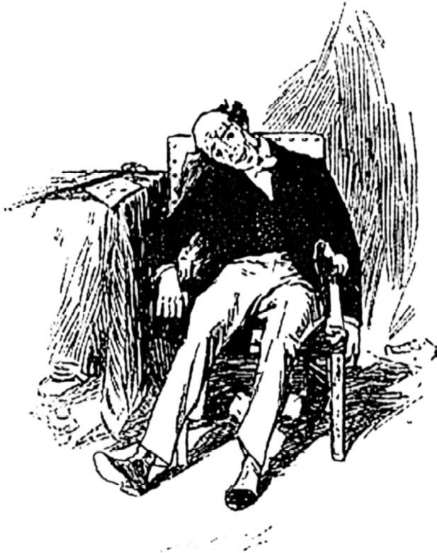

脑袋歪向左肩，脸上露出可怕的惨笑。

“天晓得，什么意思呀？”我问道。

“意思是谋杀。”他说道，弯腰去看尸体。

“啊！我说中了，看这儿！”

他指着一根黑黑长长的荆刺，正好扎在耳根上面的头皮里。

“像是刺。”我说。

“是一根刺。你把刺拔出来，要小心，有毒，是毒刺。”

我伸出拇指和食指把荆刺拔了出来。刚一拔掉，创口也几乎没有了，扎的地方只看得见留下一点点血痕。

“这又是我无法解释的谜，”我说，“事情变得更加糊涂，更加不明朗。”

“完全相反，”他解答道，“一下子就清楚啦。我只需补充几个环节，把整个案子串一串就行。”

我们撞门进屋之后，差不多把同伴给忘了。他站在门口，还是那副样子，惶恐、拧手、哭丧着脸，可是，突然发出一声哀叫。

“宝贝没有了！”他喊道，“给人抢掉宝贝了！从上面这个洞，我和他把宝盒吊下来的，我帮他一起拿的！是我最后一个离开他！昨天夜里，我走的时候，他好好儿的，我下楼在楼梯上听见他把屋门落了锁。”

“那是什么时间？”

“十点钟。现在他死了，叫警察来，我就是嫌疑犯，他们会怀疑是我干的。肯定会怀疑是我。可你们不会这样想吧，两位先生？你们绝对不相信是我吧？我干的，我还会把你们往这儿带吗？哦，天哪！我真要疯了！”

他甩胳膊，跳脚，疯了似的痉挛。

“您不用怕，不要紧张——肖尔托先生，”福尔摩斯说，轻轻拍拍他的肩膀，“听我一句话，坐车去警署报案。您应当处处配合他们才对，我们在这儿等您回来。”

这矮个子茫然地服从着，我们听见他摸黑跌跌撞撞走下楼梯。

————————————————————

<a href="#part0030.xhtml_ch1-back" id="part0030.xhtml_ch1">(1)</a> 巴勒拉特（Ballarat），澳大利亚东南部城市。

# 第六章　歇洛克·福尔摩斯作出论证

“现在，华生，”福尔摩斯说，搓着双手，“我们有半个小时的时间，要好好利用。我说过，这个案子我已经大致清楚，可是也不能过于自信，免得结果出错。现在案子看似简单，说不定其中还深藏玄机。”

“简单！”我冲他抢白说。

“当然啦，”他说，像是临床教授向学生讲解那般神气，“请你在那边屋角坐着，别让脚印把现场破坏了。现在讲一讲作案分析。首先一点，人是从哪儿进来、怎么出去的？门从昨天夜里以后没有开过。窗子怎么样呢？”他提了灯走向窗口，一边检查，一边嘴里大声咕噜着，在自言自语，不是对我说话。

“窗子是从里面锁住的。窗框坚固，好的，没有铰链。我们把窗打开。近旁没有水管。房顶很高，够不到。可是有人爬过窗台。昨天夜里下过小雨。这儿有个脚印，落在窗台上。这儿有个泥印圆圈。这儿地板上也有一个，这儿桌子边上也有一个。看这里，华生！这真是个好证据。”

我看了看好几个圆形的泥印。

“不是脚印。”我说。

“这对我们非常有价值，是一根木头柱子的印子。你看这里窗台上，黑皮鞋印，很重的鞋印，后跟有宽铁掌，旁边是木撑的印记。”

“是个装木腿的人。”

“正是这样。除了这个，还有一个人——一个帮手，本领高强。你爬墙爬得上来吗，博士？”

我探出窗外看了看，月光还照亮着屋角。我们离地面足有六十英尺，向外边墙面上看，看不见一处可以踏脚的地方，连一条砖缝都看不见。

“爬墙是没法爬上来的。”我回答说。

“没有一点借助，当然上不来，但只要有个帮手，从这里垂下一根绳子就行。我看到这屋角边有根很结实的绳子，只要一头拴牢在墙的大扣环上，如果你手脚灵便，就能拉住绳子爬上来；你是木腿什么的，也照样能上。你要走了，也是用这个方法下去，你的帮手随后把绳子收起来，脱掉钩子，关好窗，插上销子，由原先进来的途径出去。有个细节，值得注意，”他指指绳子继续说道，“这位装木腿的朋友，爬墙算得上利落，可并非是个水手出身。他的手不粗，没老茧皮，我用放大镜看出好些血迹，绳近末梢那里血迹最多。从这一点可以推断，他拉住绳下去，速度滑得太快，手上皮都蹭掉了。”

“这么讲都可以，”我说，“但事情可就更不可思议了。还有个神秘的帮手？这帮手是怎么进的屋子呢？”

“是的，有帮手！是有个作案搭档！”福尔摩斯深思着重复说道，“这个同谋的迹象很有趣，他作案颇有高招，非同一般。看样子，这个帮手要给英国开创犯罪史的新纪录——类似的作案手法在印度有过，我要是没记错，在塞内冈比亚也有过。”

“到底是怎么进来的？”我又问，“门锁着，窗子又没法从外边开，难道从烟囱里钻进来？”

“烟囱下来，壁炉炉筒太窄，人不能进，”他答道，“这个可能性我也不是没有考虑过。”

“那么，到底怎么进来？”我追问。

“你没有应用我的思想方法，”他说，摇摇头，“我跟你说过多少次，你把完全不可能的情况排除掉，剩下来的，尽管还没有确定，不就是事实情况了吗？我们断定他不是从门进来的，不是从窗、从烟囱进来的；我们也断定他不是预先躲藏在屋子里，因为这里无处藏身，那么他从哪里进入呢？”

“从屋顶的洞进来！”我叫道。

“这就对啦。他一定是从上面这个洞进来。麻烦你给我掌一掌灯，现在我们要侦查屋子的上部——就是找到藏宝的秘密地方。”

他登上梯子，一手抓住一根椽子，一腾身就上了屋顶隔层。马上向我俯身接过灯，我也跟随上去。

我们把这间阁楼一看，大约十英尺长六英尺宽。地板是在椽子上铺板条抹灰泥做成，所以跨步得小心，要踩在一根根桁条上。屋脊呈尖顶状，很明显此处就是全屋尖顶的内部。这里一件家具也没有，陈年的积灰堆起厚厚的一层。

“这儿，你看，”歇洛克·福尔摩斯说，用手抵着坡顶，“是活动天窗，可以通屋面。我把窗拉开，就是屋面了。坡顶很陡。天字第一号大盗贼就是从这儿进屋的。我们再看看，有没有别的痕迹可以看出这是什么人。”

他提灯照地板，照着照着，我又一次看见他的脸上露出惊异的表情，这是今夜的第二次。而我自己，跟随他往地板上看的时候，不禁一阵发冷，浑身起鸡皮疙瘩。地板上有深深的赤脚脚印——清晰分明而完整，可是脚的大小还不足常人的一半。

“福尔摩斯，”我轻声说，“想不到是个小孩子干的犯罪勾当。”

他很快恢复镇定。

“我也一时昏了头，”他说，“其实是很平常的事，我忘记了，原来就该料到的。这里就这样，不研究了，我们下去吧。”

“你是怎么看呢，那些脚印？”刚下到房间里，站住脚，我就问他。

“我亲爱的华生，还是你自己来分析分析吧，”他有点不耐烦地说道，“你知道我的思想方法，拿来应用，就会有所启发，等你作出结论，跟我交换比一比。”

“我怎么样也想不出个究竟来说明眼前的事情。”我答道。

“你马上就会完全明白。”他说，心中很有把握的样子，“我看这儿别的重要情况也就没有了。不过，再查一遍看看。”

他摸出放大镜和皮尺，跪下身子，在地板上忙着测量、比较、查看，细长的鼻子离地只有几英寸，晶亮深陷的眼珠犹如鹰眼。动作迅捷麻利、悄然无声和神出鬼没的样子，真像是一只训练有素的猎犬在追寻踪迹。我不由得想，如果他把精力和智慧不用于维护法律，而是去犯法的话，那将是一个多么厉害可怕的罪犯呀！他一边查看，一边在自言自语，末了突然发出一声欢呼。

“我们运气真好，”他说，“问题不大了。天字第一号算他倒霉，踩上了木馏油。你看见了吗，这儿，难闻的一摊油，边上，他的小脚掌很清楚。这个盛油的瓶子有裂缝，你看见吗，油流出来了。”

“那又怎么呢？”我问。

“那就能逮住他，绝对跑不了，”他说，“只要有条狗，就能跟踪这气味追到他，不怕他跑到天涯海角。俗话说，狗闻鲱鱼追全郡。弄条猎犬来，这么浓的味道还怕追不到？这是三分律，比例法，答案等于瓮中捉鳖，稳拿的——哦，执法的来了！”

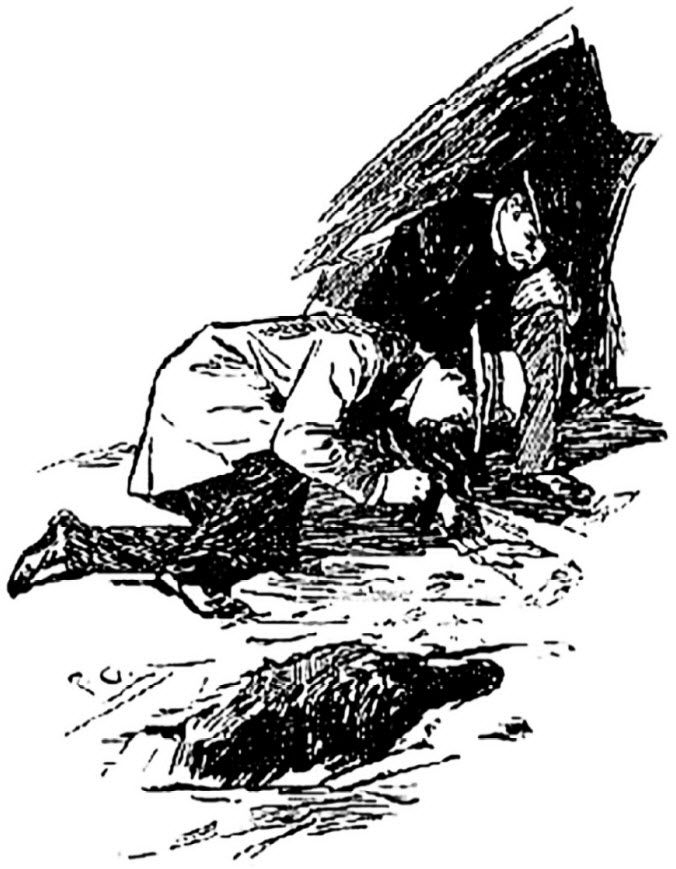

他跪下身子，在地板上查看。

楼下传来杂沓的脚步声、喧嚷声、说话声、沉重的关门声。

“他们还没来，”福尔摩斯说，“你先摸一摸这人的胳膊，摸摸他的腿，是什么感觉？”

“肌肉僵硬得像木头。”我回答。

“一点不错。肌肉强烈收缩，比平常一般的死后强直还要僵硬。加上脸的扭曲变形，这种希波克拉底<a href="#part0031.xhtml_ch1"
id="part0031.xhtml_ch1-back">(1)</a>的微笑，也叫‘痉笑’，这是这位古圣医的说法，你对此又作何解释呢？”

“中了生物碱的剧毒，”我回答说，“一种类似马钱子碱的物质，会产生破伤风杆菌。”

“我一看到他面部肌肉抽紧，就想到是中毒引起。一进这屋，我马上找毒物由什么途径进入体内。你自己看到了，我发现一根荆刺，刺进头皮，是扎的，也可能是射的，不很费力。你看见吧，刺的部位正好对着天花板上的洞，人是直坐在椅子上的。再看看这根刺。”

我拿在手里，极小心谨慎，凑到灯光下去看。一根细长的黑荆刺，尖端有一层发亮的东西，像是干了的胶质，尾端是用刀削圆的。

“这种毒刺是英国产的吗？”我问。

“不是，英国没有。”

“有了这些数据，你应当能够作出合理的结论。不过，正规军大部队已到这里，地方军该撤退了。”

正说到这儿，脚步声已近，在过道上噔噔地响。一个穿灰色套装的大块头，挺着肚子走进屋来。他脸色发红，身材魁梧，多血体质，肿眼泡露着一对小眼睛，灼灼地眨眼。身后紧跟一个穿制服的警官，撒迪厄斯·肖尔托也跟在后面，依旧在心惊胆战。

“这儿出事的吗？”来人压着嗓子从鼻孔里出声吼道，“就是这个现场吗？这都是些什么人，啊？这屋子，成养兔场了，乱哄哄干什么的！”

“想必认识我吧，阿瑟尔尼·琼斯先生。”福尔摩斯轻声细气地说。

“啊，当然，认识的啦！”他呼哧呼哧地说，“那不就是歇洛克·福尔摩斯先生吗！喜欢推理，理论家。怎么不认得！我永远忘不了，您给我们讲课，那个主教门珠宝案的起因、推论、结论。没错，您把我们引上正道。不过，您得承认，破案还不是靠的运气好嘛，不见得是靠推理对头。”

“不是好运气，是案子简单，好推理。”

“啊，得啦，得啦！用不着不好意思承认。看看这儿，都是怎么回事？太糟糕！真太糟糕！事实都明摆着——这儿不必搬弄理论，搞什么理论推理。也算碰上运气，正巧我出来，到上诺伍德处理另一个案子！来报案的时候，我正好在分署。您看这人怎么死的？”

“喔，这个案子用不着我来分析。”福尔摩斯冷冷地说。

“不需要，不需要。可是，我们不否认，有时候也会让您瞎猫撞上死老鼠。喔！门是锁好的，据我所知，价值五十万英镑的珠宝不见了。窗怎么样？”

“关得很严，但是窗台上有脚印。”

“好啦，好啦，窗紧关着，这脚印便同本案无关，这是常识。人是突然死亡的，一死财宝马上失踪。哈！我倒有个推论。有时我也常会灵感一动——警官，你到外面去，还有您，肖尔托先生，也请出去。您的朋友留下——这个您是怎么看，福尔摩斯先生？肖尔托他自己承认，昨晚同他哥哥在一块儿，哥哥突然死亡，肖尔托接着不就把宝盒拿走了？不是那样吗？”

“接着，这个死人爬起来小心翼翼把门关好，把门锁上。”

“哼！这里是说不通，让我们用常理来想想这个事。这个撒迪厄斯·肖尔托确实和他哥哥在一起，还吵了架，这个情况我们知道。哥哥死了，珠宝丢了，这个我们也知道。撒迪厄斯离开之后，没有人见过他哥哥，他的床没有睡过。撒迪厄斯内心一定非常恐慌，瞧他的脸——哼，很不正常。您看，我在向撒迪厄斯撒网，他已经难逃法网了。”

“您还没有完全掌握事实情况，”福尔摩斯说，“这根木刺，我有充分根据说是毒刺，刺在死者的头皮上，伤痕您可以看得出来。这张纸，上面写有字，在桌上捡到的。纸旁边还有一把奇怪的木棒石锤。这些您作什么样的推理呢？”

“各方面都有证实，”这个胖侦探神气十足地说，“屋子里放满印度珍奇古董，撒迪厄斯正贪心着呢。这木刺是毒刺的话，别人用来杀人，他也一样能用来谋财害命。这张纸，出个花招儿，分散我们注意力罢了——很可能是障眼法。唯一的问题就是，他怎么出去呢？啊，当然啦，顶上有个洞。”

他身子笨重，费好大的劲才爬上梯子，挤进了屋顶隔层。紧跟着我们就听到他兴奋地喊着说他找到了通屋顶的活门。

“他能发现点情况，”福尔摩斯说，耸耸肩膀，“偶尔也有道理。法国老话：‘没头脑的愚蠢人更难相处。’”

“您看！”阿瑟尔尼·琼斯说道，从梯子上爬下来，“事实胜于理论雄辩，毕竟是吧。我的看法得到了证实，有个活门通向屋顶，活门还是半开着。”

“活门是我刚才打开的。”

“喔，不错！那么您也注意这活门了？”对这一个发现，他好像有点泄气，“好吧，谁发现没关系，关键在于说明我们这位先生是打这儿跑出去的。警官！”

“有！长官。”过道上应声回答。

“请肖尔托先生进来。肖尔托先生，我有责任通知你，从现在起，可能你要说的话会对你自己不利；我以女王陛下的名义逮捕你，案由是涉嫌谋害你的兄长。”

“啊，你们看见了！我不是早就预料！”可怜的小个子叫道，伸出双手，眼睛对着我们一个一个看过来。

“不用着急，肖尔托先生，”福尔摩斯说，“我想我一定要为您洗清冤屈。”

“不要夸口许诺太多，理论家先生，不要夸口许诺太多！”侦探立即打断他的话，“想这么做，别小看有那么容易。”

“我不单要为他讨回清白，琼斯先生，我还要奉告您，昨天夜里进这间屋的是两个人，其中一人的姓名和特征，我有根据确信是乔纳森·斯莫尔。这人文化程度不高，小个头，很灵活，右腿截肢，装一根木棍，木棍头上靠里一侧已经磨掉；左脚皮鞋有一块不整齐的方形前掌，后跟是铁掌；他是中年人，皮肤晒得很黑，曾经是个囚犯。这一点小小的情况对您或许有用，再加上实物证据，有好些他手上蹭下来的手皮。那另外一个嘛——”

“对，还有另外一个？”阿瑟尔尼·琼斯用不屑的口气问道，但是内心里不得不佩服对方侦查得细致而精确。

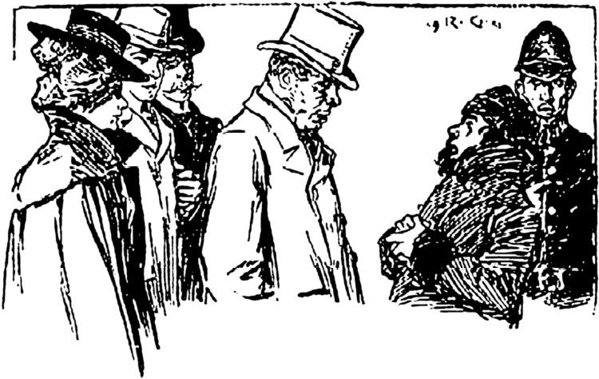

眼睛对着我们一个一个看过来。

“另一个，就不是一般的人了，”歇洛克·福尔摩斯说，转过身来，“希望不用很长时间就可以双双捉拿都交给您。跟你说句话，华生。”

他引我出去，到楼梯口。

“这个意想不到的事，”他说，“把我们到这里来的目的是为谁都搞忘了。”

“我也正是这么说呢，”我回答他，“莫斯坦小姐留在这间多事的房子里很不合适。”

“是的，你陪她回家去。她和塞西尔·福雷斯特夫人住在下坎伯韦尔，路不算远。如果你愿意再回来，我等着你。可把你累坏了吧！”

“累不坏。这件事稀奇古怪，不知道个底细我是不想休息的。我生活中经历的事不少，但是可以跟你说，今天晚上一下子碰到这么些怪事，使我神经太受震动，太兴奋。我要和你一起看到事情的究竟，反正已经到了这一步了。”

“有你在一起，对我帮助很大，”他答道，“我们做我们自己的，让琼斯这位老兄高兴怎么做就怎么做去吧，让他去异想天开。你送完莫斯坦小姐以后，请到河滨兰贝思区平钦巷三号走一趟，就是靠右手的第三栋房子，里面有一个做鸟类标本的老头儿，名叫谢尔曼，他窗上画一只黄鼠狼抓住一只小兔。你敲门把老头谢尔曼叫起来，告诉他，就说是我借他的托比用一用，你把托比带着上车一起回来。”

“我想是一只狗。”

“是的，是一只很厉害的杂种狗，嗅觉特别灵敏。我宁可要这只托比帮忙，也要比全伦敦的警察强多了。”

“我会带来的，”我说，“现在一点了，要是能换一匹马，三点钟以前我一定能回来。”

“我这里，”福尔摩斯说，“看看在伯恩斯通太太、印度仆人那里还能听到点什么情况。撒迪厄斯先生告诉我，印度仆人就睡在屋顶阁楼旁边的地方。回头再研究伟大琼斯的工作法，洗耳恭听他的挖苦吧。‘我们已见惯有人对事不了解却偏爱饶舌。’歌德的话永远是这样言简意赅。”

————————————————————

<a href="#part0031.xhtml_ch1-back" id="part0031.xhtml_ch1">(1)</a> 希波克拉底（Hippocrates，约公元前460—前377），古希腊医师，被誉为“医学之父”。

# 第七章　木桶的插曲

警察是驾马车来的，我就借用他们的车送莫斯坦小姐回家。莫斯坦小姐不失妇女的善良本性，只要有人比她更脆弱，更需要保护，她总是力持镇定，挺身在前承当危难。我见她陪在惊恐的女管家身边，神色机警而安详。可是等上了车以后，她一下子就瘫软了，接着便忍不住哽咽哭泣——这一夜的离奇惊险使她心力交瘁。她后来同我讲起，那天她是一路上在想我未免太冷漠无情。这也难怪，她当然不晓得我当时内心斗争的激烈和强自压抑着的痛苦。我对她倾注着的同情和关爱，一如在花园里的手挽手。我感到，多少年来的生活使我饱经世故，却也难以教会我体验到她在这一天异乎寻常的经历中所表现的那种温柔和勇敢兼容的天性。然而有两种想法，使我把已经到了嘴边的情爱话语又咽了回去。她正在困难之中，身心疲惫，孤苦伶仃，无依无靠，在这样的时刻冒昧出口，有点像是乘人之危吧。更显恶劣的是，看中她有钱。一旦福尔摩斯破案成功，她就是一位巨富继承人。我这么个领半薪的外科医生，趁着能和她亲近的方便机会向她求爱，能算是光明正大体面的行为吗？我会不会给她看成是个想借结婚发财的无耻之徒？我不能冒险让她心里产生这种不良的印象。这批阿格拉财宝，成了横亘在我们中间的障碍物了。

我们到达塞西尔·福雷斯特家的时候已将近两点。仆人们已入睡多时，但是福雷斯特夫人对莫斯坦小姐收到的信很感兴趣，为听消息一直等着她回来。是她自己走来开门。这是一位端庄的中年妇女，亲切地把胳膊搂着她的腰，还像慈母般温和地招呼她回来。我看在眼里，感到极大的欣慰。很明显她不只是一个用钱雇来的佣人，而是一个受尊重的朋友。经莫斯坦小姐介绍后，福雷斯特夫人热情地邀我进屋，想听我讲讲今晚的奇异遭遇。可是我只能解释说我还有重任在身，诚恳答应一定日后再来拜访，禀报案情的进展情况。正当车子回程，我转身再看一眼，见两人依然立在台阶上——两个手挽手紧挨一起的端庄瑞丽的身影。门半开着，客厅的灯光透过彩色玻璃照出来，我还看见挂着的晴雨表，光亮的楼梯扶手。我们身心陷于目前这种凶险的情境中，即使能看一眼这样宁静的英国家庭，也觉得心情舒畅而不可多得。

发生的事越想越黑暗可怕。我一边驾着马车辘辘行驶在空寂的煤气灯照明的路上，一边脑子里在回顾一幕幕接连出现的情节。那些问题，现在比最初是清楚得多了，莫斯坦上尉之死，寄来珠宝，刊登启事，一封来信——所有这些事我们已经明了，但是又把我们引向更深更暗更惨的迷境中去。印度财宝；莫斯坦行李中发现一幅内容不明的图；肖尔托少校死亡的怪状；财宝找到后随即发现人被谋杀；犯罪现场奇怪的现象，有脚印，非比寻常的凶器，留字的纸，字同莫斯坦上尉图纸上的字一样——真的又是一个错综复杂的暗谜，除非有如我同伴那样的特殊天赋奇才，平常人简直束手无策，没法找出一点线索。

平钦巷位于兰贝思下区，是一条两层楼砖房的陋巷。我敲三号门敲了很久才有人应声。最后，在百叶窗里面亮起了烛光，从楼窗上露出一张脸。

“滚开，醉鬼，”那张脸喊道，“你再嚷，我就打开狗窝，放四十三条狗来咬你。”

“只要一条狗，我是为一条狗来的。”我说。

“快滚！”那声音又叫道，“你识相一点，要是还不走，我兜里有臭抹布，扔到你头上来！”

“要一条狗。”我喊道。

“没工夫跟你废话！”谢尔曼先生叫道，“走开，我数到三就扔抹布。”

“歇洛克·福尔摩斯——”这几个字我刚一出口，似乎有不可思议的魔力，楼窗立即关上，不到一分钟，屋门就开了。谢尔曼先生是个细长个子的瘦老头，佝偻着背，脖子青筋暴露，戴一副蓝光眼镜。

“歇洛克·福尔摩斯先生的朋友永远受欢迎，”他说，“进屋里来，先生。当心有狗獾，要咬人。啊，去、去、去！想咬这位先生？”这是他在对一只黄鼠狼讲话。黄鼠狼正从笼子缝里贼头贼脑钻出红眼睛的脑袋。“那个您别怕，先生。那是一只蛇蜥蜴<a href="#part0032.xhtml_ch1"
id="part0032.xhtml_ch1-back">(1)</a>，没有毒，我是把它放在屋里随便跑让它吃掉虫子。我刚才失礼了，您不要在意呀。实在是顽皮孩子常来跟我捣乱。歇洛克·福尔摩斯要什么？”

“他要一条狗。”

“啊，知道，要托比。”

“不错，叫托比。”

“托比就在这儿，左边七号那个栏里。”

谢尔曼拿着蜡烛在前面慢慢引路，四周围都是他搜集来的珍禽异兽，这里成了动物之家。在朦胧摇曳的烛光下，隐约看到这个角落、那个旮旯都有闪烁的眼睛在向我们窥视。连我头顶高处一根根椽木上也都栖身着黑压压的鸟儿，我们的声响搅了它们的瞌睡，正懒懒地将重心由一只爪子换到另一只爪子。

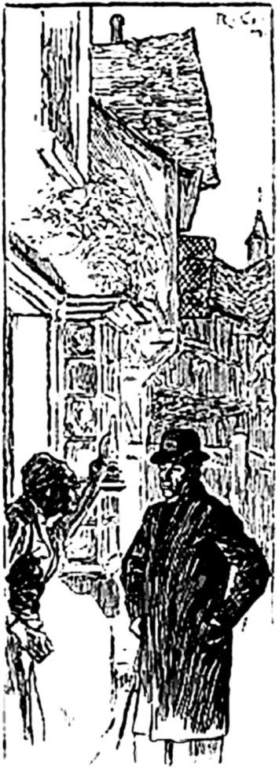

“他要一条狗。”“啊，知道，要托比。”

托比原来是一只相貌丑陋的长毛垂耳狗，是西班牙狗<a href="#part0032.xhtml_ch2"
id="part0032.xhtml_ch2-back">(2)</a>和潜猎犬<a href="#part0032.xhtml_ch3"
id="part0032.xhtml_ch3-back">(3)</a>的混合种，黄白两色的毛，走起来摇摇摆摆，步态笨拙。动物学老专家递给我一块糖，我接过来喂狗。狗犹豫了一下，把糖吃了，这才与我建立起友谊，很听话地跟随我上车。等回到樱池别墅，王宫大钟正敲过三点，我发现那个前拳击冠军麦克默多被当作同谋犯抓了起来，和肖尔托先生一起押解去了警署。两个警察把守着窄窄的大门。我报出侦探的名字以后，便被允许带狗进入。

福尔摩斯站在台阶上，衔着烟斗，两手插在口袋里。

“啊，你把狗带来了！”他说，“好狗，不错！阿瑟尔尼·琼斯走了。刚才你离开以后，我和他两个拉开架势吵了一仗。他不但把我们的朋友撒迪厄斯逮捕，还把看门人、女管家、印度佣人全都抓走。这地方就我们两个了，楼上一个警官还在。把狗留在这儿，和我到楼上去。”

我们把托比拴在客厅桌子腿上，又重新上楼。房间里和我们离开的时候一样，只是屋中间的死者身上盖了一条床单。困倦的警官斜倚在墙角里。

“你的牛眼灯借我们用一用，警官，”我的同伴说，“你帮我把这块纸板系一系，绕脖子系，衬在胸前好挂灯。谢谢你。我还得把鞋、袜脱掉，等会儿你都带了下楼去，华生。我得上去爬爬屋顶，我的手帕蘸一点木馏油，好，这就行了，现在跟我到顶上来一下。”

我们又从洞里爬上去。福尔摩斯再把灯照着积尘上的足迹看。

“请你特别注意这些脚印，”他说，“你看出有什么值得注意的吗？”

“脚印是，”我说，“一个孩子，或者个头不大的女人的。”

“不要光看大小，还有没有别的不同？”

“好像很一般的脚印，没什么特别的地方。”

“大不相同。看这里！这是右脚脚印，在灰尘上面。我来踩一个自己的脚印，在它边上，主要的不同看出来了没有？”

“你的脚趾并拢，这一个五趾都叉开着。”

“对了，正是这一点，得注意了。现在麻烦你到那个窗口，看看木框上有什么气味，我等在这儿不过去；我手上有这块手帕拿着呢，气味太浓。”

我照他的指示去做，马上闻到一股刺鼻的柏油味。

“他就是打那儿出去的，脚踩过有气味。你能辨得出来，那托比更没有困难。现在你下楼，把狗放了，再看我登高学学布朗丁<a href="#part0032.xhtml_ch4"
id="part0032.xhtml_ch4-back">(4)</a>。”

我一出房屋，到了花园里，福尔摩斯已经在屋顶上了。看见他胸前挂着灯，像只大萤火虫在屋脊慢慢地爬行，爬到烟囱后面就不见了，但很快又出现，然后翻到屋脊另一面，又看不见了。我马上绕到屋后，看见他正坐在屋檐角上。

“是你吗，华生？”他叫道。

“是我。”

“就是从这个地方下去的。下面是什么东西，黑乎乎的？”

“一只水桶。”

“有盖吗？”

“有盖。”

“见有梯子没有？”

“没有。”

“这家伙倒没给摔死！这儿是多危险的地方，可他能爬上来，我更能爬下去。这根水管还结实，我就从这儿下了。”

随着嚓嚓嚓一阵脚掌搓出的响声，只见那盏灯沿屋墙迅速而稳当地下降。他纵身一跳，人落到了木桶上，又从木桶跳到地上。

“跟踪这个人不算难，”他说，一边把袜子、皮鞋穿好，“走过的地方，瓦都踩松了。在心急慌忙之中，他掉了这个，用你们医生的话来说，这个证明了我作出的诊断没错。”

他给我看的东西是一只小口袋，一只丝草编的彩色小包，外面绕几圈俗丽的珠线，看那大小、样子，倒像是只烟盒。里面装着六枚黑色的木刺针，一头尖一头圆，就是扎在巴索洛缪·肖尔托头皮上的那种荆刺。

“这东西很厉害，”他说，“当心别扎了自己。给我捡到真太高兴了。他的毒针可能就这么几枚，全在这里。你我以后就不怕毒针扎了。我宁可挨马提尼<a href="#part0032.xhtml_ch5"
id="part0032.xhtml_ch5-back">(5)</a>枪子儿，也不愿挨这毒针。华生，再叫你跑上个六七英里，你有兴致吗？”

“兴致勃勃。”我回答。

“你的腿受得了吗？”

“行，没问题。”

“过来，宝贝狗！好托比！闻闻这个，托比，闻闻这个！”他把木馏油手帕伸向狗鼻子，托比叉开毛腿，得意洋洋地抬头翘鼻子，像是酿酒师在品佳酿一般。福尔摩斯随手就把手帕远远地扔掉，拿出一根坚实的绳索系在这混种狗的颈圈上，然后引他到木桶桶脚边。这狗立刻不住地发出夹着呼噜呼噜声的吠叫，把狗鼻子直往地上嗅，狗尾巴竖起，狗爪啪嗒啪嗒跟踪嗅迹的步子跑去，狗绳都绷紧了，逼得我们紧随后面奔跑。

东方渐渐发白，在清冷的晨曦中已经可以望见远处。方正庞大的宅屋，肃穆矗立，连它那黯然惨淡的窗户、光秃的高墙，一起都孤独冷清地留在了我们身后。我们的路线是向右穿过宅园地，在纵横交错的沟沟坎坎坑坑洼洼中奔上奔下、跨进跨出。这整片地方，到处是散乱的烂泥堆，荒草杂树丛生，凄凉不祥的景况正应合着发生的惨剧。

来到了围墙边，托比沿墙脚阴影跑，发出断续吠叫，最后停在被一棵小山毛榉挡住的墙角。那是两墙交接处，有些墙砖已经松落，缝隙处的底边已有磨损，好像是经常被当作梯阶踩踏成这个样子。福尔摩斯爬上墙，从我手里把狗接过去，翻过墙放到地上。

“墙上有木腿人的手印，”当我也翻上墙头的时候，他对我说，“你看，白灰墙上有淡淡的血印。我们还算走运，昨晚幸好没有下大雨。虽说隔了二十八小时，气味还留在路上。”

我承认，我内心曾有怀疑，这时候跑上伦敦马路，正是人潮车马络绎不绝的当口，不知托比还能不能寻到嗅迹。然而，我的顾虑是多余的，很快就放下了心。托比毫不迟疑，只管按它那个摇摇摆摆的模样循迹奔去，显然这木馏油的气味要比别的气味更加强烈。

“不要以为，”福尔摩斯说，“我光凭有个罪犯脚踩了化学品，才有望破案。我现在还掌握情况，使我有多种不同的方法追捕他们，不过眼前这个是最简便的方法，幸运之神送到我们手上的快捷方式，再好没有。如果忽视了的话，那就是我的过失。这个案子本来是很有些难度的，要费些脑力、工夫，可是现在问题变得轻而易举。如果破案的线索得来并不容易，那才是显出了真功夫。”

“是真功夫，十足的真功夫，”我说，“我绝对相信，福尔摩斯。本案你获得线索的方法，比在杰斐逊·霍普<a href="#part0032.xhtml_ch6"
id="part0032.xhtml_ch6-back">(6)</a>案子中的方法，那是不知要高明多少了。这个案子，在我看来实在是深奥费解，比如说吧，你对那个木腿人的情况怎么了解得那么有把握呢？”

“啊哈！我说老兄，事情本身就是简单得很嘛。我不想故弄玄虚，这是摆在面上的明显事实。有两个军官，负责监狱的警戒，得知一桩重大的秘密，就是有一处宝藏。宝藏地图是一个叫乔纳森·斯莫尔的英国人画的。你该记得，我们在莫斯坦上尉藏起的那张图上看到有这个名字。他自己签了名，还代他的同伙签了名——四签名，他是这么称呼的，很有戏剧性，很有趣味。靠了这张宝图，两个军官——应该是其中一个——把宝贝弄到了手，带回了英国。我们可以推测到，这个人对当初一起约定的条件，没有完全履行。那么，为什么不是这个乔纳森·斯莫尔自己去拿宝物呢？答案也很明显。可以推知，莫斯坦拿到宝图的时间，正是他去监狱工作的那个时候。乔纳森·斯莫尔不去拿宝物，因为他和他的同伙都是囚犯，行动没有自由，跑不出来。”

“可是这些都是猜测罢了。”

“不尽然，这些都是唯一能合乎实际情况的解释。我们可以看到，如此解释和后来的事实结果是吻合的。肖尔托少校回来以后过了几年安稳的日子，宝贝在他手上，很是得意。接着收到一封从印度来的信，使他惊恐万状，这是为什么？”

“信上一定是说，上当受骗的人被释放获得自由了。”

“应该是越狱逃跑出来了，这个可能性更大，因为他应该知道他们的刑期情况如何。要是释放，不至于引起他恐慌。接下去他怎么办呢？他提防着一个装木腿的人——这是一个白人，你该知道，因为他误认一个白人小贩是那个人，还开枪打了他。然而，宝图上只有一个白人的名字，其余都是印度人或者伊斯兰教徒，再没有别的白人。这样呢，我们完全有把握说，木腿人就是乔纳森·斯莫尔。你看这个推理有谬误吗？”

“没有，推理得极清楚、精确。”

“好，现在，让我们用乔纳森·斯莫尔的立场观点看问题。他到英国来怀有两个目的，他要争回自己应得的宝物，再就是向欺骗了他的那个人报仇。他找到了肖尔托的住处，还极有可能买通了他家里的什么人，作为内线。有个男仆，叫拉尔·拉奥，这个人我们没见过。伯恩斯通太太对他没有好印象，说他品性不好。斯莫尔不知道宝物藏在什么地方。因为除了少校本人和一个死了的忠实仆人以外没人知道。斯莫尔忽然获悉少校病危，他发慌了，生怕宝藏的秘密跟他一同命归黄泉，冒着遭门卫佣人殴打的危险，潜入到垂死人的窗前，一看，有他两个儿子在，就没敢进去。人终于死了，他气得发疯，这天晚上摸进房内，搜寻他的文件，企图找到有关宝藏的文字材料。最后在一张卡纸上留字，表示有不速之客登门来了。他无疑早就是准备这样做的，一旦把少校杀死，就在尸体旁留下字迹，表明这不是一件普通的谋杀案，而是执行四个合伙人的意愿，是惩戒性质的正义行为。这类做法，想象丰富，自认很有侠骨风范，在刑案史上不乏其例。当然也会留下案情线索，通常作案人的情况是容易掌握的。我说的你都清楚吗？”

“很清楚。”

“然后乔纳森·斯莫尔再怎么做呢？只能继续秘密监视。少校的儿子还在拼命找宝，就暗中等看动静。他可能离开英国，隔一段时间才回国一次。后来发现了那个阁楼，马上有人向他报告消息。我们由此确信家里有内线，这一点毫无疑问。乔纳森是木腿，单独绝对不可能爬到巴索洛缪·肖尔托高高的楼上房间里去。他一定带有一个本领不一般的同谋，这个人善于攀登，但是不巧光脚踩了木馏油；因此就来了托比，还叫你这个领半饷的退伍军官，拐着伤残的阿喀琉斯<a href="#part0032.xhtml_ch7"
id="part0032.xhtml_ch7-back">(7)</a>脚跑上好几英里的路。”

“那么说，杀人凶手是乔纳森的同谋，不是他自己。”

“是这样。把人杀死，乔纳森本人还相当恼火。根据他进了屋子以后多处有顿足的迹象，可以作出这个判断。他同巴索洛缪·肖尔托无冤无仇，至多把他捆起来，塞上嘴就可以了，他才不想把自己的头往绞索里套呢。可是没办法，他的同谋一时野性发作，用毒刺杀了人。这样，乔纳森·斯莫尔留下字条，盗了宝盒，逃走了，这就是我能够推想出来的整个案情。关于他的相貌，一定是个中年人，黑皮肤，他一直在炎热的安达曼群岛待了多年。身体高矮，不难从他跨步距离算出。还知道他脸上有须，他的多毛特征这一点，撒迪厄斯·肖尔托是有印象的，他曾经在窗上看见过他。还有别的情况，暂时就说不上来了。”

“那个同谋呢？”

“啊，是的，那个也没有多大神秘，你很快就会知道。这早晨的空气真新鲜！看那一朵云在飘，多像是红鹤的红羽毛呀。太阳已经升起在伦敦的云雾之上，阳光照着各色人等，可是我敢打赌，像你我肩负如此使命奔波的人，恐怕绝无仅有。我们的一点雄心、一点奋斗，在大自然巨大的力量面前是多么渺小呀！你对让·保罗<a href="#part0032.xhtml_ch8"
id="part0032.xhtml_ch8-back">(8)</a>很熟悉吧？”

“相当熟悉。我是通过读卡莱尔<a href="#part0032.xhtml_ch9"
id="part0032.xhtml_ch9-back">(9)</a>，才读他的作品的。”

“这就等于随小河入大湖，百川归大海。他说过一句意趣隽永的话，人能认识自身有不足与渺小，便足以证明其宏大，即所谓人贵有自知之明。善于比较和鉴别，是一种能力，足以证明其本领之高强。里希特尔的思想营养极为丰富。你没带枪，是吗？”

“我带着手杖。”

“很可能用得着家伙，要是直捣他们巢穴的话。乔纳森我就交给你了，另一个要不老实，我就毙掉他。”

他说着就摸出左轮手枪，嵌上两颗子弹，把枪放回到外衣右口袋里。

我们这时已经跟随托比跑在通往伦敦市区的大路上，两边是半乡村式的别墅，现在开始进入许多条街道。劳动者和码头工人都在开始忙碌起来，尚未梳洗的妇女们在卸门板，冲洗门前石阶。四方屋顶的酒店刚开门营业，粗壮的汉子们从店里喝过早晨酒出来，用袖子抹着胡髭。路边的狗跑上来好奇地呆望着我们匆匆赶路，可是我们这条忠心不二的托比丝毫没有走神旁骛，只顾鼻子向着地面，有时疾走叫一声，说明气味还浓着呢。

我们穿过了斯特里森街，布里克斯顿街，坎伯韦尔街，穿小街来到奥弗尔区东面的肯宁顿巷。我们追踪的那两人好像专拣弯曲的路走，也许是故意要避开耳目，以免被人注意，只要有小路可走，他们决不走大路。到肯宁顿巷尽头便转向左行，经过证券街、麦尔斯街。由麦尔斯街转入骑士街，托比停住不往前跑了，只是来回兜着走，一只耳朵竖起，一只耳朵垂下，显得没了主意，接着又摇摇摆摆打了几个圈，几次抬头向我们看看，好像是在乞求我们原谅他的尴尬。

“这狗怎么回事？”福尔摩斯着急地问，“他们又不可能坐车跑了，乘气球飞了。”

“可能是在这里停过一会儿。”我揣测着。

“哈！好了，又跑了。”我的伙伴宽心地说。

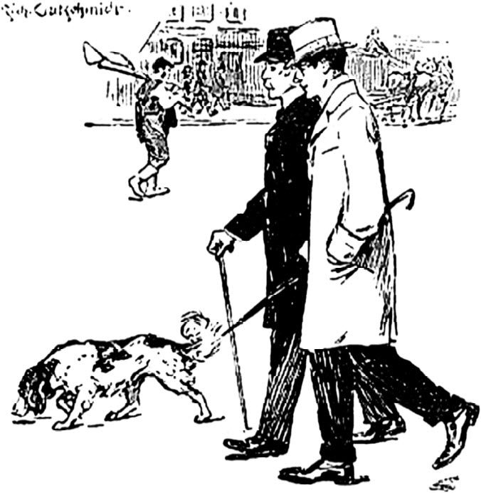

跟随托比跑在通住伦敦市区的大路上。

狗真的重又前进。在四下里闻了一遍，就突然下定了决心似的，拿出不曾有过的劲头果断地飞奔起来。气味显然比先前要浓得多，因为狗不再嗅着地面，一味使劲绷直了绳子向前狂奔。我看出福尔摩斯眼睛发亮，他一定在想已经接近我们追踪的目的地。我们的路线现在是向着九榆树跑，最后来到了白鹰酒店附近的布罗德里克和纳尔森大木场。狗到了这里，兴奋异常，从旁门窜进了锯木工人已经在上工的木场，继续穿过成堆的锯屑、刨花、碎木，在两旁堆积木材的小巷里穿行，最后跳到一只还在手推车上没卸下的木桶上，吠叫着报告胜利完成任务。托比伸着舌头，眼珠闪光，站立在木桶上头，望着我们两人，显出得意的神态。桶身和车轮上沾满着黑色的油渍，空气中弥漫着浓重的木馏油气味。

歇洛克·福尔摩斯和我面面相觑，忍不住一同哈哈大笑。

————————————————————

<a href="#part0032.xhtml_ch1-back" id="part0032.xhtml_ch1">(1)</a> 蛇蜥蜴，一种无足蜥蜴，似蛇，棕灰色，眼极小，主要产于欧洲。

<a href="#part0032.xhtml_ch2-back" id="part0032.xhtml_ch2">(2)</a> 西班牙狗，产于西班牙的獚。

<a href="#part0032.xhtml_ch3-back" id="part0032.xhtml_ch3">(3)</a> 潜猎犬，一种混种猎犬，善无声偷潜行猎。

<a href="#part0032.xhtml_ch4-back" id="part0032.xhtml_ch4">(4)</a> 布朗丁（Blondin，1824—1897），法国著名走钢丝演员。

<a href="#part0032.xhtml_ch5-back" id="part0032.xhtml_ch5">(5)</a> 马提尼，19世纪后半期英国军队使用的一种来复枪，以两个创制人Martini-Henry命名。

<a href="#part0032.xhtml_ch6-back" id="part0032.xhtml_ch6">(6)</a> 杰斐逊·霍普，系《福尔摩斯探案全集之一·血字的研究》中的人物。

<a href="#part0032.xhtml_ch7-back" id="part0032.xhtml_ch7">(7)</a> 阿喀琉斯（Achillis），希腊神，出生后被母亲握脚踵倒提在冥河水中浸过，因此除未浸到水的踵部外，浑身刀枪不入。

<a href="#part0032.xhtml_ch8-back" id="part0032.xhtml_ch8">(8)</a> 让·保罗，即里希特尔（Richter），让·保罗是他的笔名，出生于1763年，去世于1825年，德国小说家，浪漫主义和心理小说的先驱，作品在19世纪20年代广为流传。

<a href="#part0032.xhtml_ch9-back" id="part0032.xhtml_ch9">(9)</a> 卡莱尔（Carlyle，1795—1881），苏格兰散文作家和历史学家，曾撰文推崇里希特尔。

# 第八章　贝克街的非正规军

“现在怎么办？”我问道，“托比万无一失，这会儿也不管用了。”

“托比照它的感觉行动，”福尔摩斯说，把狗从桶上抱下来，牵着它走出木工场，“想想伦敦一天得运输多少木馏油，也就毫不奇怪，我们是容易摸错道路。现在木馏油用的地方很多，特别要用于木材防腐。托比也累着了，怪不得它呀。”

“退回到刚才那个地方，看看能不能重新把气味找对头，只有这样了。”

“对，就这样。好在那个地方不远。事情很清楚，狗搞胡涂的地方，骑士街转角，有两个不同的方向，我们走了岔路，应当朝另一头去追。”

这事一点困难也没有，牵了托比回到出错的原地。它转上了一大圈，就向另一个方向奔去。

“得当心了，别叫狗带到木馏油桶运出来的地方去。”我想到这一点，说道。

“我也想到的。不过你注意了吗，它跑在人行道上，运桶的车子是走在马路当中的。没错，现在的气味找对头了。”

狗跑过贝尔芒特街、王子街，向河滨方向去。到了布罗德街，它直奔水岸旁一个木建小码头。托比把我们引到河边，站住了，发出呜呜声，头朝着前方黑黑的流水。

“错过时机，我们晚了，”福尔摩斯说，“他们在这儿上了船。”

几条方头平底船和轻舟小艇泊在水上，系在码头边。我们把托比带到各条船上兜了一圈，虽然它闻得很认真，可是没有作出任何反应。

紧邻着简陋的码头边有一座小砖屋，小窗口挂着一块木牌，木牌上印着大字“莫迪凯·史密斯”，下面是“出租船，按时、按日计费”。屋门上还有一块字牌，上面写另备有汽船——防波堤上有一大堆焦炭，正是船用燃料，说明确有汽船。歇洛克·福尔摩斯默默环顾四周，一脸的懊丧。

“看来难办了，”他说，“这两个家伙挺厉害，我小看了他们，恐怕行踪已经断掉，这里原先是早有准备的。”

他正朝屋子门口过去，门开了，一个六岁模样的鬈发小男孩从屋里跑出来，身后跟着一个粗壮的红脸女人，手里拿一块大海绵。

“你不想洗啦！回来，杰克，”女人叫道，“给我回来，这小鬼！等你爹回家，看你这个样子，不揍扁了你。”

“小朋友！”福尔摩斯见这个机会立刻插上去说话，“红通通小脸蛋儿，调皮鬼！杰克，给你好东西，你想要什么？”

小孩向他愣瞧了一下。

“我要一个先令。”他说。

“比这还好不想要？”

“那就两个先令，最好啦。”小鬼机灵地想了想，答道。

“那好，给你！接住了！真是可爱的孩子，史密斯太太！”

“感谢上帝，先生。这孩子老是这样淘气，要往外跑，我管不住他，孩子他爸整天在外忙事，我拿他没办法。”

“你先生不在？”福尔摩斯用一种失望的口气说，“这么不凑巧，我是来找史密斯先生有事的。”

“他昨儿早晨就出去了，先生，说真的，真是替他担心。要是船的事，先生，找我也一样。”

“我想租他的汽船。”

“哎哟，先生不巧，汽船正好给他开走了。我也正担心着呢，知道船上煤不多，开到沃尔威奇再回来不够烧。要是他用驳船，我就不担心了。好几次，跑远程，远到格雷夫桑德，活儿多的话，还在那儿耽搁。可是这汽船没了煤怎么开？”

“河上的码头有煤卖，你先生会买的。”

“买是好买，先生，可是他从来不买。我听他说过好多回，零卖的袋装煤价钱贵得很。再说，那个装条木腿的租船人，不是好人，脸相就坏，说话外国腔，谁知他常跑这儿干什么来了？”

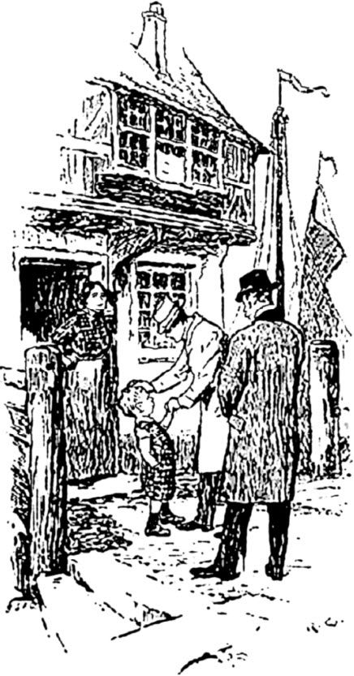

“调皮鬼，你想要什么？”

“装木腿的人？”福尔摩斯表示小小的惊讶。

“是呀，先生，黑黑的，猴腮脸，找我男人好几趟了，昨夜就是他把我男人叫醒。我男人也知道他来，在船上升好火等着他。实话告诉您，先生，我心里老是觉着不放心呢。”

“不过，亲爱的史密斯太太，”福尔摩斯说，耸了耸肩膀，“您别担心，不会有事儿。您说是木腿人夜里来过，是吗？您看见这个人了？”

“他一副破嗓子，先生，我听得出是他，说话粗声粗气，糊里糊涂。大概是三点吧，他敲着缆绳筒。‘快一点啦，伙计，’他说，‘晚了不好办啦。’我男人把我大儿子吉姆叫醒，没跟我说一句话就走了。我听到那只木腿走在石头上咯噔咯噔响。”

“就木腿一个人吗？”

“我不确定，先生，我没听见还有旁人。”

“真不巧，史密斯太太，我是要租一条汽船，听说你们这里有一艘很不错的——我想想，船名儿叫什么来着？”

“‘曙光号’，先生。”

“啊！是不是那种绿色老汽艇，船舷上有宽宽的黄线条？”

“不，不是的。那可是有模有样的船，新油漆，黑船身有两条红线。”

“谢谢！希望史密斯很快就回来。我要顺河下去，要是看见曙光号，我会告诉他您在牵挂不放心呢。您说是黑烟筒？”

“不，先生，黑颜色加白的边线。”

“啊，对的，船身是黑颜色。那就再见了，史密斯太太。这儿有只小舢板，华生，叫他把我们渡过河去。”

“向人摸底，最要紧的，”我们下到舢板上，前后坐定，福尔摩斯说道，“千万不能让对方想得到和你讲的话跟你有丝毫的关系，否则，他们的嘴马上像牡蛎一样闭紧，三缄其口。你要来点不懂、异议、逗引，像刚才那样，您想听什么都能听得到。”

“我们应当采取的步骤，现在很清楚了。”我说。

“你想怎么采取步骤呢？”

“我想雇一条游艇，往下游开，去追曙光号不就得了。”

“我的好伙计，这跟大海捞针差不多。船停靠的话，从这儿到格林威治，河两边全是码头，过桥向前，好几英里全是停泊位，看都看不过来。光靠你要一个一个去找，找上几天都恐怕白忙活一场。”

“要不，叫警察也出动。”

“不行。只有到了最后紧要关头，也许才能把阿瑟尔尼·琼斯调动过来。这个人，人还不错，我不想做得过分，影响到他的职务。我在想，既然已经侦查到了这个地步，应该靠自己来解决。”

“报上登启事怎么样？向码头老板征求消息。”

“这岂不全搞砸了！案犯不就知道我们追到他们脚后跟了吗！就会立即逃往国外。实际上他们本来就有出国打算，但是只要使他们认为还十分安全，就不会急着外逃。琼斯的行动对我们很有帮助，他对这个案子的看法，肯定天天见报，逃犯就会暗自高兴我们大家都在瞎胡闹。”

“那我们怎么办呢？”我问道，这时我们到了磨坊岸监狱前面，上了岸。

“乘这辆马车吧。回家，吃早饭，睡一个钟头觉，很可能今晚我们还得跑路呢。车夫，到邮局门前请停一停。托比要留下，也许还用得上它。”

我们在大彼得街邮局门前暂停，福尔摩斯进去发了一封电报。

“你知道发电报给谁？”他上了车，继续行路，这么问我。

“我怎么会知道！”

“还记得吧，贝克街侦探小队，我组织起来的，在杰斐逊·霍普一案中起了作用的。”

“啊哈，他们。”我说着笑了起来。

“目前这个案子，他们同样能起作用，如果他们不管用，我再使别的办法，不过先要动用这个小队。电报就是发给我那位小队长，龌龊威金斯的，这伙孩子没等我们吃好早饭就可能赶到。”

现在还只是早上八九点钟。经过整整一夜高度紧张的奔波，我现在感到极度的疲劳，人软了，脚也走不稳了，完全精疲力竭。我未能如同伴那样具备坚忍不拔的敬业精神，也不能把案子作抽象的推理分析。至于巴索洛缪·肖尔托的被害，因为大家对他平日为人没有好感，所以对凶手也就引不起强烈的愤恨。但是那财宝又是另一回事，这一整批财宝，或者一部分，理应归莫斯坦小姐所有，只要有可能将财宝找回，我赔上性命也在所不惜。诚然，一旦财宝被我找回，她也就永远离我而远去，非我所能企望的了。然而，爱情若受这样的思想情绪所左右，那这爱情也就太渺小而自私了，如果福尔摩斯果然找到凶手，我就该拿出十倍的努力去找回财宝。

在贝克街洗过澡，浑身衣服换个干净，又使我精神抖擞、容光焕发。等我下楼，早餐已经准备好，福尔摩斯正在倒咖啡。

“你看这儿，”他说，笑着指指一张翻开的报纸，“琼斯自以为是，记者舞文弄墨，一起把这个案子由着他们去吹就是了。可是你给这个案子也折腾得够累，先把火腿和鸡蛋吃了吧。”

我把报纸接过来看，标题是《上诺伍德奇案》。

［旗帜报消息］昨夜十二时左右，上诺伍德樱池别墅主人巴索洛缪·肖尔托先生在房内身亡，系为谋杀。记者获悉，肖尔托先生身上未发现暴力痕迹，但其父遗下一批印度珍宝悉数遭窃。死者及现场为歇洛克·福尔摩斯先生及华生医生首先发现，他们系由死者胞弟撒迪厄斯·肖尔托先生陪同往访。所幸彼时警署著名刑事警探阿瑟尔尼·琼斯适在上诺伍德警察分署，故接到报警仅半小时之内即赶至现场。警探训练有素，经验丰富，到场立即侦得线索，发现凶犯嫌疑。死者胞弟撒迪厄斯·肖尔托因嫌疑重大，已被逮捕，同时被捕者尚有女管家伯恩斯通太太、印度仆佣拉尔·拉奥及看门人麦克默多。调查证实凶手对于出入房屋之路径十分熟悉，由于琼斯先生技术精到，明察秋毫，已证明凶手未能从门窗进入，必定是翻越屋顶由一活动窗门潜入，此门正通死者所在之室内。以此明显之事实，即可得出结论，本案非属闯窃性质。警署方面如此及时、负责处置有效，说明在此种情形下，必须有一位老练之资深官长莅临主持一切。由此我们不禁想到，有人认为警力宜分散部署，便于一遇警情，即可就近执行任务，作出及时有效之侦破。此建议之不无道理，于本案足见一斑。

“吹个天花乱坠！”福尔摩斯说，对着咖啡杯咧着嘴笑，“你怎么看？”

“我在想，你我也险些要被指为凶手，遭到逮捕。”

“我也是这么想。如果他突然心血来潮，这会儿要向我们开刀，我可不敢保证我们自己的安全。”

正在这时，门铃声大作。我听得房东哈德森太太慌忙提起嗓子惊魂失措地应着门。

“糟了，福尔摩斯，”我说着，半抬起身子，“说来就真来，抓我们来了。”

“不，还不至于如此呢，那是非官方部队——贝克街非正规军。”

在他说话之间，楼下响起一片急骤的劈劈啪啪赤足登梯声、叽里呱啦说话声，接着便是冲进十来个衣衫褴褛、蓬头垢面的街头流浪儿小瘪三。一帮子人吵吵嚷嚷，但是一进屋就迅速站齐一排，面朝我们听候命令。其中一个稍高大一点的，站到前面来，神气十足的样子，像是队长，但是一身破衣烂衫，显得滑稽可笑。

“一接到您的命令，先生，”他说，“我马上带领弟兄们赶到，车费三先令六便士。”

“钱给你，”福尔摩斯说，掏出银币，“以后大家向你报到就可以了，威金斯，再由你向我报到。我这屋子一下涌进这么多人不行，不过今天就这样，也好，你们大家一块儿来听我作交代。我要找一条汽船，是曙光号，船老板叫莫迪凯·史密斯，船身是黑颜色，有两条红线，黑烟囱上有一条白线。船顺水往下开走了，我要你们有一个人到磨坊岸对面的莫迪凯·史密斯码头去看着，等船一到立刻来报告。别的人都分散开，到沿河两岸，一有消息立刻向我报告。都听清楚了没有？”

“报告司令，听清楚了。”威金斯说。

“报酬照以前老规矩，谁发现船，再给一几尼，今天的报酬现在先给你们。好，大家可以去了！”

他给了每人一先令，孩子们乱哄哄下楼去了。不一会，我看见他们拥向了街头。

“只要船在河上，他们就会找得到，”福尔摩斯说，从桌旁站起身，点燃烟斗，“他们可神通啦，哪儿都能去，什么都能看得见，什么话都偷听得到。晚上以前，他们能找到就好。现在这时间，我们等听消息，没事可做。不找到曙光号或者莫迪凯·史密斯先生，断了头的线索接不起来。”

“托比吃这点剩饭就行了。你睡觉吗，福尔摩斯？”

“不睡，我不困。我有个怪脾气，只要做工作，从没感觉累过，闲散无事，反而委靡不振，人要垮掉。我抽会儿烟，再把女当事人所委托的这件谜案用脑子理一理。要说事再难也有轻松时，眼前这个就称得上。木腿人，并不很多吧，还有另外一个，我看更是绝无仅有。”

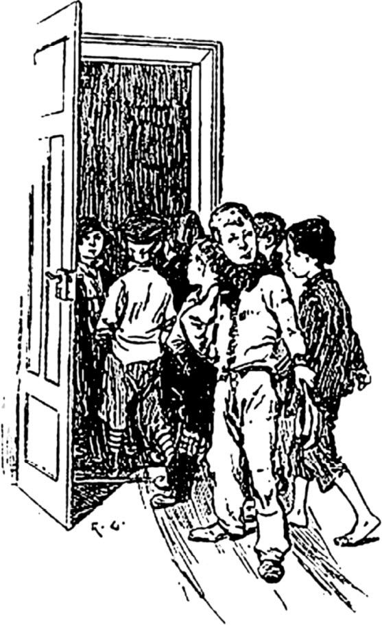

孩子们乱哄哄下楼去了。

“说说那另一个人！”

“我真的无意把他神秘化，不让你知道。可能你有自己的高见，现在把他的痕迹考虑考虑。小脚印，脚趾模样是没有穿过鞋的赤脚，打赤脚，石头木柄锤子，行动轻巧敏捷，小型毒镖。这些凑拢在一起，你能看出什么？”

“是个野人！”我喊道，“说不定就是那几个印度人里头的，乔纳森·斯莫尔的同伙。”

“恐怕不是，”他说，“我初见到怪凶器，也曾经往那里想过，但是看到脚印很特别，使我重新考虑原来的看法。印度半岛上的土著民，有的是矮小的，但是像那种脚印不会有。以印度人来说大部分都是狭长的脚型。伊斯兰教徒穿拖鞋，习惯把鞋带夹在大趾缝里，所以大趾同其他脚趾稍有分开。这种小型投镖，也只有一种方法可以投掷，就是用吹管吹射出去。好了，那么我们该上哪儿去找这个野人呢？”

“南美洲。”我胡乱猜测道。

他伸手从书架上取下一本厚厚的书。

“这是《地理词典》的第一卷，现在出版的，可称是最新的权威版本，我们的问题上面怎么说的？

安达曼群岛，位于孟加拉湾，苏门答腊以北三百四十英里。

“嗯哼！嗯哼！这儿说什么？气候潮湿，珊瑚礁，鲨鱼，布勒尔港，囚犯营，罗特兰德岛，棉白杨——啊，这儿，找到了！

安达曼群岛土著民堪称世界最小体型之人种，虽亦有人种学家指非洲布须曼人<a href="#part0033.xhtml_ch1"
id="part0033.xhtml_ch1-back">(1)</a>、美洲迪格尔印第安人<a href="#part0033.xhtml_ch2"
id="part0033.xhtml_ch2-back">(2)</a>及火地岛印第安人为最小者。土著之平均身高不足四英尺，且正常成年人而远不足此高度者亦不少见。其生性凶狠、乖僻、倔强，但一旦与之建立信任与友谊，则至死不渝。

“还有，注意了，华生，这儿，你听听这个。

该土著形态奇特，生有畸形大头，凶狠小眼，乖丑脸相，其手脚尤为细小。因生性凶狠、乖僻、倔强，英人官员虽曾竭全力以求争取，终不可得。海难船员偶遇即祸，非死于其木柄石锤之击碎脑壳，即死于其毒箭之射杀。此类屠戮，辄行人肉盛筵以终。

“多可爱的小民族，华生！这个人要是放任自流，不加约束，那就不堪设想。那样的话，乔纳森·斯莫尔也管不住，不会用他。”

“那么，给他找到这么一个同谋，倒也不容易啰？”

“嗯，这我还无从知晓。不过，既然斯莫尔是从安达曼群岛来的，这一点已经肯定属实，那带上这么一个岛民也就不是太稀罕的事。有关情况我们会很快弄明白。瞧你，华生，你疲倦极了，看你撑不住了，在沙发上躺下吧，让我来给你催眠。”

他从屋角拿起他的小提琴，我使自己浑身放松下来。他开始奏起一支低沉的催眠曲——毫无疑问，是他自己编曲，他有即兴作曲的天赋才能。我如今还依稀记得，他那细长的四肢、诚恳的面容以及弓弦一上一下的动作，我平静地漂荡在柔和音乐的海洋之中，进入了梦乡，看见玛丽·莫斯坦甜蜜的笑脸向我俯视。

————————————————————

<a href="#part0033.xhtml_ch1-back" id="part0033.xhtml_ch1">(1)</a> 布须曼人（Bushman），意为“丛林人”，生活于纳米比亚和博茨瓦纳等地，皮色棕黑，个矮。

<a href="#part0033.xhtml_ch2-back" id="part0033.xhtml_ch2">(2)</a> 迪格尔印第安人（Digger
Indians），意为“印第安掘食人”，生活于北美，掘食树根为生。

# 第九章　线索中断

等我醒来，时间已经很晚，只觉浑身又有了力量，精神焕发。福尔摩斯依然坐在那里，同我入睡前一个样，只是把小提琴放在了一旁，正在埋头看书。我身子一动，他朝我看了看，我注意到他一脸的阴暗愁容。

“你睡得可香，”他说，“我真怕刚才的说话把你吵醒。”

“我一点也没听见，”我回答，“有好消息吗？”

“很不好，没有，我心里烦躁，很失望，原来估计到这时候事情该有个眉目。威金斯回来报告过了，他说那艘汽船没有踪影。这下子真令人焦急，现在正是每一个小时都非常重要。”

“要我做些什么吗？我现在精神完全恢复了，再干上一整夜绝对没有问题。”

“不了，我们没事可做，只有等着。要是出去，万一有消息，我们不在，又要误事。你要做什么就做吧，我得等着，我来守这儿好了。”

“那，我就上坎伯韦尔跑一趟，去看塞西尔·福雷斯特夫人，昨天她叫我去的。”

“去看塞西尔·福雷斯特夫人？”福尔摩斯问道，两眼闪光，含着笑意。

“嗯，当然也看看莫斯坦小姐，她们都等着了解情况，很着急。”

“我还不想让她们知道得太多，”福尔摩斯说，“女人永不可信赖——再好也不可信。”

对如此褊狭无理的心态，我没工夫停下来辩论。

“一两个小时就回来。”我关照说。

“行！祝你好运！还有，你总要过河的，把托比带去还了吧，依我看，现在不会再用上它了。”

我遵照他的话把狗带上，到平钦巷还给老动物学家，并酬他半个沙弗林<a href="#part0034.xhtml_ch1"
id="part0034.xhtml_ch1-back">(1)</a>。到了坎伯韦尔，我看到莫斯坦小姐经过昨夜的惊险奔走仍有些疲乏，但是正急于要听消息。福雷斯特夫人也是好奇心切。我告诉她们一切经过情形，我们做过些什么事情，不过隐去了悲剧的恐怖情节不讲。如此，虽然我叙述了肖尔托先生遇害身亡，但是那种骇人听闻的惨状和凶杀的手段都没有描述。尽管只是有所删略地讲一遍，也已经使她们听得既害怕又出神。

“那简直是惊险故事！”福雷斯特夫人叫道，“一个受损害的女郎，五十万英镑的财宝，一个吃人的黑生番，还有一个装木腿的歹徒，这和老生常谈的龙呀、罪恶的伯爵呀大不相同了。”

“还有两位游侠骑士救人于危难之时。”莫斯坦小姐再添加上这一句，明亮的眼睛看着我。

“啊，玛丽，你的财宝有没有希望，要看这件事的结果了。我看你怎么并不是很兴奋，你想想看，能这么富还了得！全世界都拜倒在你的脚下了！”

一阵惊颤的欣慰掠过我的心头，因为我注意到，她对于这种前景丝毫没有得意的神色，恰恰相反，她矜持地摇摇头，表示在她眼里对这类事并无兴趣。

“撒迪厄斯·肖尔托先生，我倒是很替他担心，”她说，“其余怎么样，我不太在乎。我觉得他的心肠、行为始终是很厚道、很可敬的。我们有责任要给他洗刷掉横加的冤屈，还他应有的清白。”

我从坎伯韦尔出来已是黄昏，到家天就黑了。我的同伴不见了，只有他的烟斗和书放在椅子旁边。我四下找了找，看看有没有留下字条，但是没有。

“福尔摩斯大概出去了。”我对哈德森太太说，她正好进来放下窗帘。

“没有，他进自己屋里去了，先生，”她压低了声，耳语似的说，“怕是身体不舒服吧。”

“怎么会呢，哈德森太太？”

“哦，他是怪人，先生。你出去以后，他一个人走来走去的，走来走去，走来走去，没个停，走得我跟他一起心都不安定。过后又听他自个儿对自个儿嘀嘀咕咕，门铃一响，他就跑到楼梯口，喊着问，‘什么人，哈德森太太？’现在他把自己关在屋里，可我听见他还在走动呢，跟刚才一样走来走去。我巴望他没病才好，先生。我是多个心多句嘴，劝他吃点凉药吧，可他回头，先生，回头这么看我一眼，吓得我不知怎么出的他屋了。”

“我说您不用着急，哈德森太太，”我告诉她，“以前我也见过他这个样子。他有点心事，就会心神不安定。”

我故作轻松地对我们的好房东这么说，其实我自己也深感不安。又一个长夜，我一直听着他一阵接一阵的脚步声，体会到他面临这样无可奈何的局面，内心里是多么的焦躁。

吃早餐的时候，看他面色倦怠、消瘦，两颊有些潮红。

“你这不是在自己拖垮自己嘛，老兄，”我提醒他，“我听见你走了一夜。”

“睡不着呀，”他回答道，“事情成了死结，解不开，心急如焚。所有大困难都克服了，想不到给这么一点小障碍堵死，真叫人气不过。知道了凶手、汽船，什么都掌握了，就是得不到消息。其他方面也都行动起来，想到的办法全都用上去了。整个一条河的两岸都已经搜遍，就是没有结果，史密斯太太那边也不见她丈夫的音讯。我都想到难道他们把船给凿沉，可那也不像，没有可能，讲不大通。”

“弄不好，史密斯太太耍了我们，上她当了。”

“不会，这个可以不用担心，我都经过调查得到证实，有这艘船，她讲的不错。”

“会不会往上游去了呢？”

“我也考虑过这个可能性，派了个搜查队，他们一直追溯到里士满<a href="#part0034.xhtml_ch2"
id="part0034.xhtml_ch2-back">(2)</a>。今天再不来消息，明天我亲自出马，去找人，不再找船。不过，肯定会有消息，肯定会有。”

然而音讯全无，威金斯也好，别的方面也好，都一个字也没捎过来。各报不断登载上诺伍德惨案的报道。报纸言论一律对倒霉的撒迪厄斯·肖尔托不利，但没一篇有新的进展，除了将在第二天验尸，案情都是老调。晚上我又走到坎伯韦尔去向两位女士报告我们遭遇挫折的情况，回来一到家，依旧看见福尔摩斯一脸沮丧，闷闷不乐。他都已经不大愿意回答我的询问了，整个晚上只顾忙着做一个复杂的化学分析实验，把烧瓶加热蒸馏，结果产生的气体熏得我受不了，只好离开这屋子。直到凌晨，仍听到他的试管碰得叮当响，这就告诉我他还在埋头做他臭气熏人的实验。

黎明时分，我蓦地醒来，吃了一惊，发现他站在我的床边。他一身水手粗服打扮，着一件双排纽厚呢上装，颈上围一条红色旧围巾。

“我要到下游去，华生，”他说，“再三考虑下来，只剩亲自出去这一着了，不管如何，总得一试。”

“那就我和你一起去吧。”我说。

“不，你留下来，留下有用，就做我的代表。我本来不愿意去，威金斯昨晚很泄气，可是今天很可能会有消息来。凡是有来信、来电，都由你代拆，任何消息都按照你的判断行事。请你代劳行不行？”

“不胜荣幸。”

“你和我大概没法联络，电报收不到，我自己也说不准行踪在哪里。运气好一点，时间耽搁不长就能回来，回来总会有一些情况告诉你。”

到吃早餐的时候，没有听到他的消息。我一翻开《旗帜报》，发现登了有关本案新进展的报道。

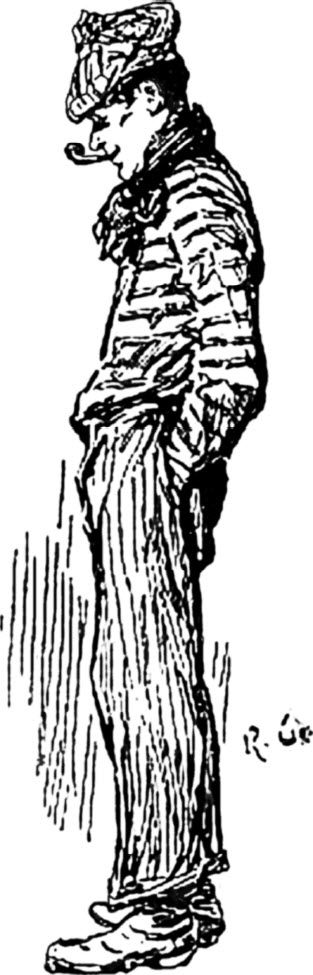

他一身水手粗服打扮。

关于上诺伍德的惨案，报道称现已确信实际案情异常复杂，并非如初始所料之简单。有新证据表明，撒迪厄斯·肖尔托先生确无嫌疑，他与女管家伯恩斯通太太两人于昨晚一同获释。据悉警方已对涉案真凶获得线索。此案现由苏格兰警场素负干练机智盛名的阿瑟尔尼·琼斯先生负责缉凶，预料不日即将破案。

“这样还算令人满意，”我在想，“朋友肖尔托终究没事了。我怀疑所谓的新线索，其实仍旧是警方文过饰非的老套头。”

我把报纸扔到桌上，可是忽然间我眼睛瞟到了启事栏内的一则私人广告。广告内容：

寻人——船主莫迪凯·史密斯携子吉姆于星期二清晨三时许驾曙光号汽船驶离史密斯码头至今未归；黑色船身，有两条红线，黑烟囱一道白线。如有知莫迪凯·史密斯及曙光号汽船下落者，请即向史密斯码头史密斯太太或贝克街221号B座报信，当酬谢金币五英镑。

这显然是福尔摩斯登的广告，这一点由贝克街的地址足资证明。我一看以后觉得这样做实在巧妙，因为让在逃的罪犯看到也会认为不过是一则妻子寻找丈夫的启事，从中看不出别的用意。

这一天过得真慢。每次听到有人敲门或是街上有沉重的脚步走过，我都以为是福尔摩斯回来了，或者是应了广告的报信人来了。我试着看书，但是思想不能集中，老是要想侦查受挫的问题，以及那两个被我们追踪的歹徒。我甚至会冒出这样的想法，会不会是我的同伴推理上犯了根本性错误？一开始的大前提就是错的，那么他丰富活跃的思绪就臆断出奇奇怪怪的推论，不也是可能的吗？虽说我至今还不曾发现他犯过错误，然而智者千虑也难免一失。我想或者可能因为他对自己的逻辑自信过分——一件极平淡普通的案子上手，偏要巧思一番作复杂离奇的解释，以致一误再误。但是回过头一想，证据都是我亲眼目睹的，他所作的推理分析，我亲耳聆听，听下来决不是无中生有、信口开河。我回想起一连串奇特的客观事实，许多情况虽属细小却都符合一个总的方向，我不能闭眼否认。就算福尔摩斯的解释不正确，但案情本身异乎寻常地令人费解却是事实。

下午三点钟，一阵门铃声大作，听得楼下有口气威严的说话声，没想到上来的不是别人，竟是阿瑟尔尼·琼斯先生。不过，和上次见面大不相同，他见了我已经不像在上诺伍德那样粗暴，那样神气活现，对案子信口雌黄的一副草头王的架势，却做出垂首低眉的表情，态度谦和之外，更有些自惭。

“您好，先生，您好，”他说道，“福尔摩斯先生出去了，这我知道。”

“出去了，我也弄不清他什么时候能回来。请您等一等，请坐，这儿有雪茄，请抽一支。”

“谢谢您了，能赏我一支。”他说，拿出一块红色扎染印花大手帕擦擦脸。

“再来一杯威士忌苏打，好吗？”

“好吧，半杯够了。今年到这个时候还这么热，还加上让我又烦又难受。上诺伍德这桩案子，我上次讲的那个您都知道了？”

“还记得您讲过一回。”

“咳，这桩案子，我现在不得不重新考虑。原先法网把肖尔托先生罩得好好儿的，不料，先生，啪的一下裂开漏洞，给他跑掉了。他拿得出不在犯罪现场的可靠证明。他离开哥哥的屋子出来以后，一直有其他人和他在一起，没有一刻离开过别人的视线以外，压根儿就不可能是他去爬屋顶钻活动门。这么一来，案子就难了，我在警署的威望也发生了动摇，我很想得到点支持和帮助。”

“我们谁都有需要人帮助的时候。”我说。

“您的朋友，福尔摩斯先生，是个了不起的人物，先生，”他响起了大嗓门，语气深显佩服之情，“他这个人，没人及得上。我很清楚，这年轻人经手的刑事案件不知有多少，可我从来没见过他有破不了的案子，一桩也没有过。他出手总是奇招，出人意料之外。虽然作出推论快了一点，别人都跟不上，不过，总的来说，我可以肯定，他是块当官的料子，再好也没有的好料。不怕人笑话，我是望尘莫及，甘拜下风。今儿早上接到他发的一封电报，才知道肖尔托这案子他有了线索。这是电报。”

他从衣袋里摸出电报，递给我，是当日在白杨镇十二点钟发出的。

接电即去贝克街，若我未回，请等候。肖尔托案犯已有踪迹，欲参与了结本案，请于今晚一起行动。

“好，有希望了。他肯定把断掉的线接上了头。”我说。

“啊，那么说，他也失手断了线，”琼斯叫道，显然借以自我安慰，“我们最棒的人有时候也出错，弄不好这又是空欢喜一场。不管它，作为我警官的责任，任何机会都不要错过。听，有人进门，大概他回来了。”

听得有沉重的脚步登上楼梯。一个人在吃力地呼噜呼噜重喘，表明这个人呼吸很困难，中间有一两次停下步缓缓气。他好不容易爬上楼，到了门口，走进屋来。一见其人，和先闻其声完全一致，一个老人，一身水手打扮，外面套一件大衣，纽扣一直扣到颈部，弯腰曲背，两条腿在打颤，气喘吁吁，很痛苦，全靠拄一根橡木粗棍身体才能站住，要两肩扛起才能喘一口大气。一条彩色围巾围到下巴颏，脸部看不大见，除了一对深色的眼睛闪烁有光，就是白眉毛白胡须。整个看上去，他像是一位年事已高、令人尊敬的航海老前辈，只是看来晚景不佳，穷困潦倒。“老人家，有什么事吗？”我问道。

他用老人惯常的那种样子，慢腾腾向四周一一打量过来。

“歇洛克·福尔摩斯先生在吗？”他问。

“不在，不过，我能代表他，您要找他说什么事，跟我讲好了。”

“我只能和他当面讲。”他说。

“我跟您说了，我是他的代表。是莫迪凯·史密斯船的事吗？”

“是呀，船在哪儿，我全都知道。还有，我知道要找的人都在哪儿；还有，财宝都在哪儿，这些事，我全都知道。”

“那就跟我说吧，我会告诉他。”

“我只跟他一个人说。”他一再重复道，完全是一个倔老头的态度。

“那您只好等他回来。”

“不行，不行。就为找个把人，把我整天都搭上，这可是不干。福尔摩斯先生既然不在，那就让福尔摩斯先生他自己去找吧。你们两个尊容，我都看不顺眼，我一个字也不会讲。”

老头儿拖着脚走向门去，但是阿瑟尔尼·琼斯跑到他前头。

“等一下，我说老先生，”他说道，“您有重要的情况报告，您不能这样就走。请您别走，不管您愿不愿意，都得等我们的朋友回来。”

老头儿想要夺门而出，阿瑟尔尼·琼斯高大的身躯往门上一靠，挡住他的去路，再犟也是不管用了。

“这样子对人，太不像话！”老头嚷嚷起来，拐棍敲着地板，“我是来这里拜访一位绅士，你们两个算老几，硬是不许我走，怎么可以对我如此无礼！”

“您别着急，”我说，“我不会让您白等。请这儿沙发上坐，不用等多久啦。坐，坐。”

他气得呼哧呼哧吹胡髭，一屁股坐下，双手撑着脸面。琼斯和我重又抽起了雪茄，自顾说话。不料，冷不丁冒出了福尔摩斯的声音。

“我说，两位也给我一支雪茄抽抽吧。”他说。

我们两个都腾地从椅子上跳起。坐在我们旁边的是福尔摩斯，一脸乐呵呵的神态。

“福尔摩斯！”我兴奋得叫起来，“是你呀！老头儿呢？”

“老头儿就在这儿哪，”他说着，手捧一团白须须，“他就在这儿——假发、胡须、眼眉，全都在这儿。嗨，这化装还真不赖，还真没想到能一点都不露馅儿。”

“哈，你这个鬼东西！”琼斯叫道，高兴非常，“你还能当演员，棒极了。你那个咳嗽，跟在穷人院里听到的一模一样，还有两条腿颤巍巍的，能值一个星期十英镑的工钱。可是我早就看出你的眼光不对劲，你也没那么容易瞒得过我们，嘿嘿。”

“我今儿个整天打扮成这个模样，”他说道，点了雪茄，“你们知道，好多犯罪歹徒慢慢儿都认识我了——尤其是这位朋友把我的事写成文字发表了出去，我只能来点儿化装才好行动。你接到我电报了？”

“接到了，所以才来了。”

“案子在你那边大有进展吧？”

“一无进展。抓起来的人只好放掉两个，另外两个也还没有充分证据。”

“那不要紧。一会儿我们用另外两个人给你换过来。可是，你老兄务必得听听我的安排啦。职务上的功劳，都归你，这个没有问题，但是一切行动要听我的，你同意吗？”

“全部同意，只要你帮我把人抓住就行。”

“好，那么第一件事，我要用一艘警察快艇——汽艇，今晚七点钟，去威斯敏斯特码头待命。”

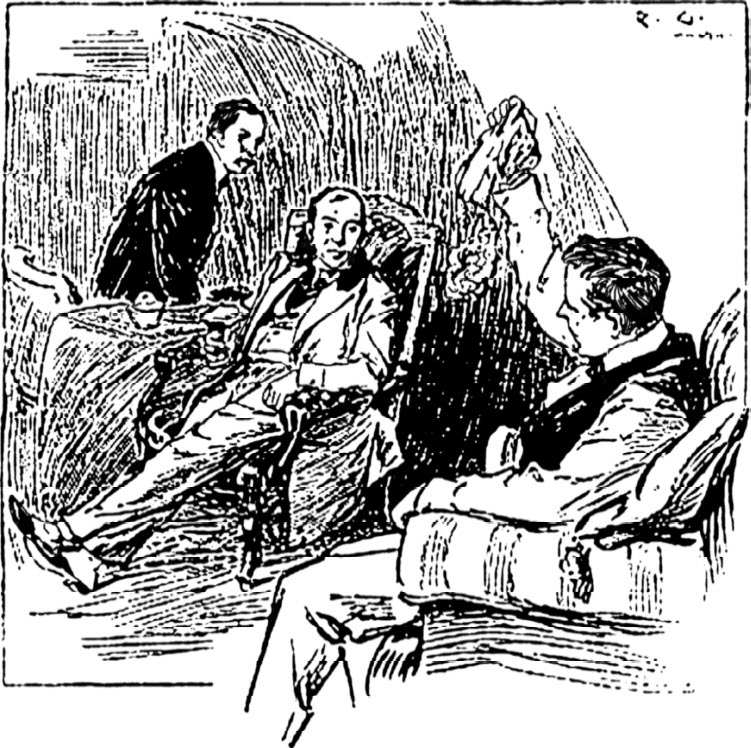

“假发、胡须、眼眉，全都在这儿。”

“这个好办，那边一直有一艘停着的，我过马路去用电话联络敲定一下就是了。”

“再要两名干练的警员，以防对方拒捕。”

“艇上本来就有两三个警察，还要什么？”

“歹徒一抓住，宝物也到了手。我在想，我这位朋友挺高兴，一定会捧了宝盒送到那位年轻女士的手里，其中一半依法是属于这位女士的。让她亲自打开宝盒，怎么样，华生？”

“那是我无上的光荣。”

“这样做法未免出格，不符合规章制度，”琼斯说，摇了摇头，“不过，这整个事情都是出了格，我这儿也就来个视而不见。这之后，宝物就得原封上交当局，等待上级调查。”

“那是当然。那么这也好办了。还有另一点，我倒很想听听乔纳森·斯莫尔亲口讲讲这件案子的始末情形。你知道，我经手的案子我喜欢把全案细节都搞清楚。我想，把他带到这个屋子来，或者别处也可以，同他进行一次非官方的面谈讯问，只要有警员在场，不会出事。这个，没有什么不可以吧？”

“啊，全都由你说了算啦。我还没有足够证据，不知到底有没有这么个叫乔纳森·斯莫尔的人。当然，只要你把他捉拿归案，你要向他当面讯问一次，还不好说吗，我不会不答应。”

“那么，都这么说定了？”

“完全同意。还有别的没有？”

“还有嘛，要你和我们一起吃晚餐，半个小时饭就好。吃牡蛎，一对松鸡，还有一点上品白酒——华生，你还不知道，在下还是个掌厨能手呢。”

————————————————————

<a href="#part0034.xhtml_ch1-back" id="part0034.xhtml_ch1">(1)</a> 沙弗林（sovereign），英国旧时的金币，一个沙弗林面值一英镑。

<a href="#part0034.xhtml_ch2-back" id="part0034.xhtml_ch2">(2)</a> 即泰晤士河里士满（Richmond
upon Thames），或译富贵镇，在伦敦远西郊，邻接泰晤士河金斯敦（Kingston
upon Thames），或译国王镇，是历史上的国王地。

# 第十章　一生漂泊到终点

我们这顿饭吃得很快活。福尔摩斯精神一好起来谈兴极浓，谈锋甚健，这一晚正是他精神状态极佳的时刻，高兴得简直不能自已。我还从来不曾见他这么兴高采烈过，他一口气滔滔不绝——从圣迹剧谈到中世纪陶器，从斯特拉迪瓦里<a href="#part0035.xhtml_ch1"
id="part0035.xhtml_ch1-back">(1)</a>小提琴谈到锡兰的佛教、未来的战争，对哪一方面他似乎都有过特别的研究。由于他这两天走投无路，情绪消沉，现在反而更显得开朗，口若悬河，妙语连珠。阿瑟尔尼·琼斯只要一脱离公务，原来也是个乐天派随和的人，面对这顿美餐，露出了饕餮本色。至于我个人，一想到任务已接近尾声，便也随福尔摩斯同乐。餐桌上，我们无人谈及把我们凑在一起的那件刑事案件。

餐毕，撤去桌布，福尔摩斯看一下表，斟满了三杯波尔图红葡萄酒。

“再干一杯，”他说，“预祝今晚成功。现在时间已到，立刻出发。你有枪吗，华生？”

“有一支左轮，是服役时候的旧枪，在抽屉里。”

“把枪带上的好，有备无患。看见马车在门口了？是我叫的，预定六点半到这里来等着。”

七点稍过，我们到达威斯敏斯特码头，看见汽船正等着我们。福尔摩斯很仔细地看了一遍。

“上面有没有警用船的标志？”

“有，船边是绿灯。”

“把灯拿掉。”

绿灯随即摘掉。我们登船，解掉缆绳，琼斯、福尔摩斯和我都坐在船尾，另有一个掌舵，一人开机器，两名强壮的巡警警官在前面。

“往哪儿开？”琼斯问。

“到伦敦塔。告诉他们把船停到雅各布森船坞对面。”

我们这船速度确实很快，飞驰向前，超过一排一排货运驳船，相比之下，这些船队慢得简直不动似的。当我们又超过一艘小汽船，把它远远甩在了后面时，福尔摩斯满意地微笑着。

“以我们这样的速度，河上的船都能超得过。”他说。

“那不见得，但是比这还要快的船确实不多。”

“我们必须要追上曙光号，那是条有名的快艇。现在我要把情况告诉你，华生，你想得到吗？那么一点小事就把我弄得晕头转向。”

“是呀。”

“苦恼不过，索性做化学实验，让心思静一静，放松一下。有一位伟大的政治家曾经说过，变换一下工作是最好的休息。这话有道理。我做溶解碳氢化合物的实验，给我做成功了，我就再回到肖尔托的问题上来，把整个案情重新考虑一遍。派出去的孩子上游下游都找遍了，毫无结果。大小码头上都不见有那艘船，船又没有回来，也不像是自己把船凿沉来灭迹。当然，假如怎么找还是找不到，这个假设也不无可能。我知道斯莫尔这个人有点小手段，可是想不到他还有这么大的本事，把手脚做得那么干净，一般没受过高一点文化教育的人，很难想得这么周密。我回头一想，他在伦敦是住过相当长一段时间的——从他对樱池别墅持续监视了很久这一点，可以得到证明，那就不大会一得手马上就走，总得要一点时间，哪怕是一天也好，把事情料理停当。这个可能性无论如何比较符合实际情况。”

“在我看来这个可能性不大，”我说，“更大的可能倒是他早就做好了远走高飞的准备工作。”

“不，我不这样看。他有这个藏身处，出事就有地方可以躲，不会轻易丢掉，除非已经没用，不再需要。还有一点必须考虑，乔纳森·斯莫尔一定想到自己的帮手相貌奇丑，再怎么样把他装扮，总会引起注意，要被人议论，说不定就给联想到上诺伍德这件案子上去。这一点，他很精明，不会想不到。他们一定是趁夜色掩护，从藏身地出动作案，总得趁着天还没大亮赶快回窝。他们上船的时间，照史密斯太太说的，已过了三点，天就要大亮了，再过一个小时左右行人就多起来，因此，我断定他们不可能跑得很远。他们出大钱封住史密斯的嘴，租下他的船做最后逃跑用，盗了宝盒匆匆回到窝里，等上一两天，利用这点时间看看报上登的消息、言论，听听有什么风声，再趁黑夜赶到格雷夫桑德，或者唐兹锚地，去上船出海。他们早有安排打算，逃往美洲或者其他殖民地。”

“那艘汽船停在哪里呢？总不见得把汽船也藏到他们窝里去吧？”

“那当然不会。我断定，汽船一定不会在远处，只是我们看不见。处在斯莫尔的地位，根据他这个人的能力，他很可能会想，如果让汽船开回去，或者停在哪个码头上，碰上警察刚好在追踪，那不是一追就给追到了？那么，他怎么样才能把船藏起来，又可以说要用时就能用呢？我设想自己处在他的境地，只有一个方法可以采用，那就是把船开进船坞去做点修理，有修没修修一下。将船像牲口似的赶进他的厩里栏里，藏得很保险。万一要用了，早几个小时通知一声，可以说用就用。”

“这倒是挺简单。”

“正因为事情本来就非常简单，才反而容易被忽略，我于是决定照这个估计采取行动，立刻换了这一身水手服，好行动方便，顺河向各个船坞去打听。问了十五个船坞全没有，问到第十六个——雅各布森船坞——让我问到了。两天前有一个装木腿的人把曙光号送进船坞，说是舵有毛病，要修一修。‘舵哪来毛病，一点没有，’船坞工头对我说，‘在那边的就是那条船，画有两条红线的。’正在这么说，过来一个人，不是别人，就是失踪的船主莫迪凯·史密斯，他酒喝得不少。我当然认不得他，是他自己喊出他自己的名字和他汽船的名字。‘今晚，八点钟，我要开船，’他说——‘整八点钟，别耽误了，有两个客人等着坐船。’很明显，给他塞足了钱，他钱多得像要溢出来，向工人们拍着他满口袋的银币叮当响。我跟踪了他一会儿，后来他进了一家麦芽酒店，我就回到船坞。正走着，碰上我一个小帮手，我就让他留在那里，盯住汽船。叫他站在河边，一见他们有动静，马上向我们挥手帕。我们等候在河上，保持一定距离，要是再不能人赃俱获，那真是怪事。”

“不管凶手是不是他们，你这计划实在周密，”琼斯说，“这事情要是搁在我手里，我就派一队警察到雅各布森船坞，他们一露脸，当场逮捕。”

“绝对不可以这样做，别小看斯莫尔，这人还真够狡猾的。他会先派人察看动静，一有可疑情况，又会缩回去，隐藏三天五天说不定。”

“可是你只要盯住莫迪凯·史密斯，这样也可以找到他们的藏身地。”我说。

“这样做，我的日子就要给耽搁掉。歹徒住什么地方，史密斯百分之百不会知道。他只要有酒喝、有钱花就行，他问别的做什么？他们叫干什么他就干什么。你那么做不行，我各方面都考虑过，现在这样才是最好的办法。”

这么说着话，我们已经穿过泰晤士河上好几座桥。船驶出市区的时候。落日的余晖把圣保罗教堂顶上的十字照得金光闪耀。还没到伦敦塔，天已是暮色。

“那就是雅各布森船坞，”福尔摩斯说，手指着萨里区岸边那林立的帆樯，“这一排排驳船正好做掩护，我们就在这儿慢慢兜着吧。”他从口袋里拿出夜光短焦望远镜，向岸上望着。“我看见了派在那儿的人，坚守着岗位，”他说道，“手帕还没见他摇起来。”

“还是往下游去一点好，赶前面去等他们。”琼斯性急地说。这时候我们都很焦躁，连警察和火夫虽然不太清楚接下去会发生什么事，也在那儿干着急。

“不要什么事都想当然，”福尔摩斯回答道，“当然不用说，十之八九他们要顺水下去，可是我们不能定死。我们在这个地方可以看见船坞的出入口，而他们那边不容易看见我们。今晚没有雾，月亮很好，我们就在这里等着吧，看那边煤气灯下面，人多拥挤。”

“都是船坞下工的工人。”

“这些人看似肮脏粗俗，但是每个人的内心里都很有点不灭的活力和生气，光看他们外表，你是想象不到的。这并不是个先验的问题，人，实在不可思议！”

“有人说，人是有灵魂的动物。”我接住话茬说道。

“温伍德·里德<a href="#part0035.xhtml_ch2"
id="part0035.xhtml_ch2-back">(2)</a>对这个问题有很好的解释，”福尔摩斯说，“他说，每个人都是个难解的谜；但是作为人类总体的一份子来看，个人就具有数学的定值。比如，你无法预言某个人要做什么，但是你能确知人群总体将做什么；人的个性各个不同，人的共通性却是永恒的。统计学家均作如是说。慢着，那是手帕在动了？没错，那里有白的东西在挥舞。”

“是的，是你安排的小孩，”我叫道，“我看得很清楚。”

“曙光号出来了，”福尔摩斯叫道，“魔鬼驶出来了，瞧它多快！全速前进，轮机长！追上那艘黄灯汽船。老天在上，我就不信，咱还会抓不住它！”

曙光号驶出船坞，被两三条小船遮住，忽然不见了。等我们再看见的时候，速度更快了，它沿河岸向下游飞驰，已是全速前进。琼斯看着它，拉长了脸只是摇头。

“真是神速，”他说，“我怕是追不上它。”

“我们无论如何要追上去！”福尔摩斯咬牙叫道，“快快加煤，火夫！全速开足！把船烧了也要追上去！”

现在我们向前急追。锅炉火势凶猛，强大的轮机在铿锵飞鸣，如一具钢铁的心脏。尖削的船首划破平静的河面，向左右两边排开滚滚的水波浪花。随着轮机的每一悸动，船就成了有生命的钢铁动物，我们跟它一起惊跳、震颤。船前一盏大灯向前射出一道长长的摇曳的黄色光，右前方的水上有一个暗影，那就是曙光号，拖在它后面翻滚的白色浪花说明它的速度有多快。我们从一艘艘驳船、汽轮、商船之间横穿侧绕飞掠过去，黑暗中有声音在向我们呼喊。曙光号依然隆隆遁逃，我们则依然紧追不舍。

“伙计们，快加煤，快加煤！”福尔摩斯向着下面机舱高声喊叫，机舱炉膛的熊熊火光映照着他那焦急的鹰鹫似的面孔，“蒸汽烧得越足越好呀！”

“好像靠近一点了。”琼斯眼盯住曙光号说。

“肯定追得上，”我说，“不用几分钟我们就赶上它。”

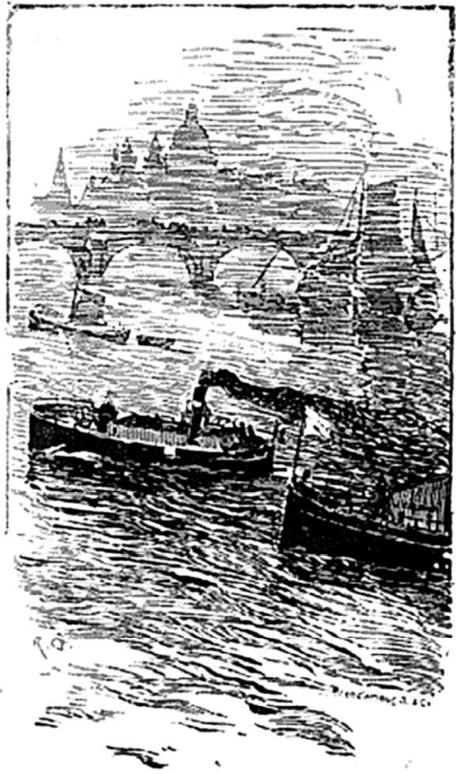

“我们无论如何要追上去。”

正在这节骨眼上，倒霉事临头，一只拖船拖了三只驳船横插到我们前面来。幸亏我们紧急转舵，才避免了一场撞船惨祸。可是等我们绕开拖驳再继续追上去，曙光号驶出去足足有两百码远，不过依然看得见船。这时，昏暗朦胧的暮色已成满天星斗的夜晚。我们的锅炉烧到了极限，驱船疾驶的动力强大异常，使船体壳板似乎变得脆弱了，在颤抖不已，叽嘎作响。我们从伦敦桥下正中央穿过，驶过西印度港区，经过了长长的戴普特福德河段，再绕过狗岛，前方那黑糊糊的船影渐渐显示出了轮廓清晰的曙光号船体。琼斯把我们的探照灯对住曙光号，照见了船面上的人影。一个人坐在船尾，他的两膝跨着一样黑黑的东西，身体俯在这东西上面，在这个人旁边蹲伏着一堆黑影子，好像是一条纽芬兰狗。一个男孩掌舵，从锅炉红红的火光中，我可以看见老史密斯，打着赤膊，在没命地掀着大铲加煤。起初对方还有点不确定我们是否在追赶他们，但是到了现在，他们绕弯，我们也跟进绕弯，他们转角，我们也紧随转角，这就毫无疑问，我们是在死追不舍。追到格林威治的时候，我们落后大约三百步距离；到了布莱克沃尔的时候，相距已不到二百五十步。我在跌打滚爬的一生中，去过许多国家，打过不少猎，追逐野兽无数，都没有像这飞驰泰晤士河疯狂追人场面惊心动魄。我们和前船正在一步步接近。在寂静的夜晚，我们可以听见前面船上哐啷哐啷、呼哧呼哧的机器哮喘声。坐在船尾的那个人依旧低头弯腰，只见他两条胳膊在忙碌着什么，一边不时地抬头看看，估算着两船相距还有多少。距离越来越近，琼斯喝令前方停船。已经相距不到四艘船的长度，两船都仍在疾速飞驶。我们已到了水面开阔、没有码头的河口段，两岸一边是巴尔金平地，一边是普拉姆斯泰德沼泽地。船尾那人听见我们喊叫，起身站在船面上，捏紧双拳朝我们挥舞，扯开破嗓子高声叫骂。他体格宽阔健壮，这么叉开两腿站在那里，我看清了他的右边大腿以下用一根木柱支着。随着他的尖叫怒骂，船板上蜷缩一团的东西蠕动着，站立起来，是一个矮小的黑人——我从来没见过身体这么矮小的黑人，长着一个形状奇特的大脑袋，一团蓬乱缠结的头发。福尔摩斯已经抽出左轮枪，我一见这个半人半兽的生番，也立即拔出了枪。他身上裹的不知是一件黑色大外套，还是一条毯子，只露出一张脸，这张脸谁见了晚上都别想睡得着觉。我也从来不曾见过有这样狰狞丑恶的兽脸，两只小眼阴光惨惨，凶焰灼灼，厚嘴唇向外翻起，露着牙齿，他向我们龇牙咧嘴，发着野兽般的狂怒，喋喋咒骂。

“只要他一抬手，就打。”福尔摩斯轻声说。

这时我们只有一船之隔了，似乎马上可以手到擒来。我看见这两人现在都站立着，白人摆开两腿，尖声叫骂，那个矮鬼黑人一脸凶神恶煞样，在我们灯光照射下，一嘴尖利的大黄牙朝着我们在咬牙切齿。

还好我们能把他们看得清楚，看到那黑鬼从披毯中倏地抽出一根像木尺般的短圆木棒举到唇边，我们立即双枪齐发，见他应声跌倒，双手高举，闷叫一声，滚下水去。刹那间，我看着他一对狠毒的眼睛消失在白花乱翻的漩涡之中。与此同时，木腿人冲向船舱，抢过舵猛地扳转过来，曙光号便朝南岸直冲过去。我们的船从他的船尾擦过，仅相隔几英尺，总算没有相撞。我们马上回头咬住他，他已经逼近岸边。河岸上是一片荒野，月亮照着空旷的沼泽地，到处是一汪汪死水，一摊摊腐败的植物。只听得沉沉的轰的一声响，汽船在泥岸上搁浅，船头翘向空中，船尾没在水里，歹徒从船上跳下去，他那木腿整个陷进了泥中。他仓惶挣扎，不能动弹，进退不得，一步也没法挪。他窝着一肚子的火，高声又叫又骂，好腿疯狂地在泥中又蹬又踩又踢，可是越挣扎，那木腿在泥中陷得越深。我们把船靠上岸，他深深地陷在那里无法自拔，我们扔一条绳子过去套住他的双肩，才总算把他拽出来，好像拖什么大鱼似地拉他上船。史密斯父子两人哭丧着脸坐在自己的船上，这时也乖乖地听从命令，走到这边船上来。曙光号拴在我们船尾拖着。一只工艺精致的印度铁盒扔在船板上，不用问，定是给肖尔托家带来厄运的那只珍珠财物宝盒。盒子挺沉，没有钥匙，我们小心翼翼地把宝盒搬到自己的船舱里，便驾船慢慢向上游回驶，并不断用探照灯朝河面四处搜索，但是再也不见那个安达曼群岛黑人的踪影，想必他已沉入泰晤士河底，尸骨终于扔在了异国他乡。

“看这儿，”福尔摩斯指着木舱门说道，“我们出手不如他快，要是再慢一点更不得了。”真是好险，就在我们刚才站立的地方背后木框上扎着一支毒镖。这小小的一枚荆刺，我们深知它的厉害。这一针大概就在我们刚要开枪的时候吹来，射空在我们两人的中间。福尔摩斯瞧着毒刺，如平常一般微微一笑，耸一耸肩。可是我，得承认，每次想起那晚上死神擦肩而过的险情，便不寒而栗。

————————————————————

<a href="#part0035.xhtml_ch1-back" id="part0035.xhtml_ch1">(1)</a> 斯特拉迪瓦里（Stradivarius，1644—1737），意大利提琴制造家。

<a href="#part0035.xhtml_ch2-back" id="part0035.xhtml_ch2">(2)</a> 温伍德·里德（Winwood
Reade，1838—1875），英国历史学家、探险家、哲学家，著有非洲史《人类殉难记》。

# 第十一章　阿格拉巨宝

落网的囚犯坐在舱内，面前放着一只铁盒，这一只他千辛万苦等了多少年月才到手的铁盒。他的皮肤被烈日晒得黝黑，两眼射出天不怕地不怕的凶光。赤褐色的脸膛布满横一道竖一道的皱纹，一看就知道是一个饱经风吹、日晒雨淋、长年做苦工的人。那多髭须的凸下巴显示出他是个性格倔强的人，认定了目标便死不回头。他年纪在五十上下，因为原是鬈曲的黑发已经多半变成灰白。他的面容，在平常时间其实不难看，只是一双浓眉加个凸下巴一发起火来，如我已经看到的，就面目可憎。他坐在那里，戴铐的双手搁在膝上，脑袋低垂胸前，一双锐利的眼睛望着那只使他铤而走险的铁箱。在我看来，他的表情于桀骜和泰然之中，更含有悲哀和愤慨。有一次，他抬头望了我一眼，眼神中颇有几分嘲讽冷笑的意味。

“啊，乔纳森·斯莫尔，”福尔摩斯说，点燃一支雪茄，“我真不愿意看到事情搞到这种地步。”

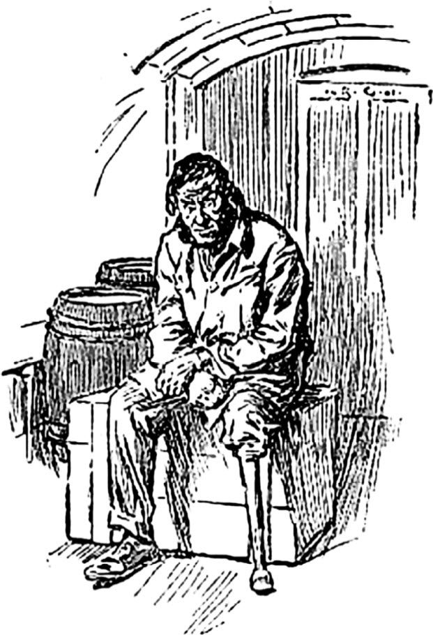

是一个饱经风吹、日晒雨淋、长年做苦工的人。

“我也是不想这样，先生，”他直率地答道，“这道坎我是跳不过去了。不过我要赌咒说句话，我没想要谋害肖尔托先生，是那个畜生汤嘎，他吹的毒针害死了他。这事我没份，先生，事后我还伤心呢，像是死了自己人似的。为这事，我还拿绳子抽了他一顿。可人已死，又回不来。”

“抽支雪茄，”福尔摩斯说，“你身上都湿了，我这酒你喝上一口，驱驱寒。那么，我问你，这么个矮小没力气的黑人，你凭什么指望他能够制服得了肖尔托先生，好让你拉绳子爬窗进屋呢？”

“听您这么说，就像您是在现场亲眼目睹了似的，先生。我本想这房里是不会有人了，他一家的生活习惯，我都摸得挺熟悉，这个时间，肖尔托先生总是下楼吃晚饭去了。这桩事情我是不想隐瞒的，要想给自己辩护，最好的辩护就是照实讲话。当然啦，那天要是老少校在那里，那我就要勒死他，眼也不眨一眨。我捏死他，还不像捏个烟头似的那么容易。可是为小肖尔托，我犯法，实在该死，划不来，我跟他又无冤无仇。”

“现在由苏格兰警场阿瑟尔尼·琼斯先生对你执行拘押。他要把你带到我那儿去，让我来问你作案的全部过程。你必须老老实实坦白招供，你能这样的话，那我还可以帮你一点忙。我考虑，我给你作证，那毒刺的毒性很快，没等你爬进屋子，人已经死掉了。”

“他是已经死掉了，先生。等我爬进窗子里去，看见他脑袋歪在肩上，咧开嘴，朝我怪笑，把我吓了一跳呢。从来都没见过这么个样子。我真的火了，先生，要不是他汤嘎跑得快，我简直要把他宰了。他就慌了，丢下那把锤子，连一袋毒镖丢掉都不知道，这是他后来告诉我的。这我敢说，给您捡到了线索。您是怎么根据这点线索就能追过来，这我可纳闷了。这事我一点都不恨您，可实在是很叫人奇怪。”他苦笑一下，又说道，“您看，我有正当权利，五十万英镑应当归我。我的前半生在安达曼修防波堤修掉，看来这后半生又要到达特穆尔高原<a href="#part0036.xhtml_ch1"
id="part0036.xhtml_ch1-back">(1)</a>去挖沟挖掉了。我从头一天碰上那个生意人阿奇米特，搞上了这阿格拉财宝，就此倒上了霉。这批财宝，谁沾上了边，谁就倒足了霉。那个阿奇米特被谋杀了；肖尔托少校，财宝让他心惊肉跳过不好安定日子，还让他犯下罪孽；我自己，逃不脱终身苦役的下场。”

这时，阿瑟尔尼·琼斯的一张大脸伸进船舱里来。

“你们倒话起了家常，”他说道，“让我喝上一口酒，福尔摩斯。要说呀，我们大家都得庆祝，可惜那一个没叫咱们给活捉。也没法，由不得你。我说，福尔摩斯，亏得您计划安排周到，把他们给追上。”

“好结果就是功德圆满嘛，”福尔摩斯说，“可真不知道曙光号能有那么快。”

“史密斯说，曙光号这条船，在泰晤士河上是数得过来的。今天只要再有一个人帮他搭一手开船，我们永远别想赶得上他。他赌咒发誓说，他压根儿就不知道上诺伍德的事。”

“他是一点不知情，”人犯叫道——“我一个字也没跟他讲。听说他这条船快，我就向他租下来。我们什么也没和他讲，只给他不少钱；还说好，把我们送到格雷夫桑德开往巴西的埃丝梅拉达船上，他可以另外再得一大笔钱。”

“嗯，他没事，我们也不会硬找他事。抓人，当然出手得快，判刑就不能讲出手快，要慎重了。”看到琼斯在拿住的囚犯面前摆出神气的架势，且不免趾高气扬起来，很是发噱，歇洛克·福尔摩斯对此脸上掠过一丝笑意。我看得出这番宏论也是明显说给他听的。

“就要到沃克斯霍尔桥了，”琼斯说，“您上岸吧，华生医生，带上宝盒。要知道，我这样做是担着责任呢，这是不合法的。不过，当然也是啦，讲话得算数，事先说好了的嘛。不过，公事公办，我得派一名警官陪您一同前往，这宝物非常贵重，不同一般。您准备乘车，对吗？”

“准备乘车。”

“可惜没钥匙，先得开列一份清单。您还得把盒子砸开来，钥匙哪里去了？问你哪！”

“在河底下。”斯莫尔不情愿地回答。

“哼！你制造这点麻烦完全多余，我们把你人赃俱获，丢掉把钥匙管个屁用！不过，医生，不用我叮嘱您了，千万小心。去警署以前，把宝盒带回到贝克街来，我们一起等您。”

在沃克斯霍尔他们送我上岸，我捧着沉重的铁盒子，由一位和善、爽快的警官陪伴，坐马车只一刻钟就到了塞西尔·福雷斯特夫人的家。女仆开门看到我这么晚来访很感惊讶，她说塞西尔·福雷斯特夫人晚上出去了，恐怕要深夜才能回来，只有莫斯坦小姐在休息室里。我于是捧了宝盒去休息室，警官留在马车上等我，对我很放心。

莫斯坦小姐坐在敞开的窗前，身穿白色半透明的衣服，颈、腰部略呈红色，在透过罩子的柔和灯光下，她倚坐在藤椅上，灯光映照着她甜美庄重的面容，把她一头鬈曲浓密的秀发晕染得金光闪闪。她洁白的胳膊和手搭在椅子边，整个的姿态和神情诉说着内心的忧郁，引起人无限的爱怜。一听见我的脚步声，她就站了起来，突然的惊奇和快乐，使她那苍白的双颊变红了。

“我听到马车到了，”她说道，“心想福雷斯特夫人回来得真早，没想到是您来了。您给我带来了什么好消息？”

“我给您带来了比好消息还好的东西。”我说，把宝盒放在桌上，一副高兴、轻松、快活的样子。其实，我是另有一番说不出的苦味在心头。“我带来给您的东西比什么好消息都要好，我给您带来了财富。”

她向铁盒看了一眼。

“就是那宝物吗？”她问道，声音很冷淡。

“是呀，里面就是阿格拉大财宝，一半属于您，一半属于撒迪厄斯·肖尔托先生。你们两人各得二十万英镑之巨。您想想，每年利息就是一万英镑。英国没有更富裕的年轻女士了吧！这不是大可庆幸的事吗？”

我的高兴表示得大概有些过分，她察觉到我的祝贺是一只不含金的金戒指，并非真诚。我见她稍稍抬了一下眼眉，不自然地望我一眼。

“要说我得到了宝物，”她说，“那是多亏您的帮助。”

“不，不，”我答道，“不是我，应该是我的朋友福尔摩斯。我即使用尽心思，也永远找不出线索，全靠他有高超的分析才能，终于破了案，最后还差一点丢了命呢。”

“请您坐下，告诉我经过情形，华生医生。”她说。

我大致讲了上次见她以后所发生的一切。福尔摩斯的侦破手段；发现了曙光号；阿瑟尔尼·琼斯也来协助；晚上出击，泰晤士河上惊险的追捕。她倾听着我的叙述，紧张得张着嘴，眼睛都不眨一眨。我讲到飞来毒镖，危险得差一点点就中镖的时候，她脸色忽然惨白，我真怕她要晕倒。

“不要紧，”她说道，我赶快倒一杯水给她喝，“没事。听到我让朋友们遭到这样的生命危险，我心里一阵子受不住了。”

“这都已经过去，”我答道，“也没事。详细情况我不讲了，叫人听了寒心，让我们谈点高兴的事吧。瞧这宝盒，还有什么比这更叫人高兴的吗？我特地征得允许带来这儿，先让您看看，想叫您放心、开心。”

“这再好也没有了，我很高兴。”她说道，但是，语气中并没有显露出真正的高兴。很明显，她觉得这宝物费了那么大的心血才拿回来，不可不这样表示一下，否则就太有悖情理。

“这盒子实在美极了！”她说着，弯腰仔细观赏，“我想是印度的产品吧？”

“是的，是贝拿勒斯<a href="#part0036.xhtml_ch2"
id="part0036.xhtml_ch2-back">(2)</a>的金工制品。”

“哟，这么重呀！”她叫道，试着把盒子抬了抬，“这盒子就很贵重呀。有钥匙吗？”

“给那个斯莫尔丢到泰晤士河里了，”我回答，“拿福雷斯特太太的拨火棒借用一下。”

铁盒正面有一个粗重的铁环，做成一尊坐佛的形象。我拿拨火棒的尖端插入，做杠杆向外撬动。铁环嘣的一声跳掉，我手指抖抖地把盒盖掀开，我们两人站在那里，都惊呆了，是只空盒！

这铁盒的每面盒板都有三分之二英寸厚，怪不得那么沉，非常结实坚固，做工极精致，是专门用来藏宝物一类的箱子。可是里面连宝物的影儿也没有，是只一无所有的空盒。

“宝物丢失了。”莫斯坦小姐平静地说。

我听到这句话，理解其含义。一个巨大的阴影终于从我心灵中瞬息烟消云散。我说不出这件阿格拉巨宝压在我心头有多么沉重，现在倒是被挪开了。虽然，这也可以说是自私、不诚、愚蠢，可是除了我们两人之间的金钱障碍已经除掉，其余的我都不予考虑，不愿顾及。

“感谢上帝！”我心底深处的话不禁脱口而出。

她看着我，立刻露出带着疑问的笑容。

“您为什么这样说呢？”她问道。

“因为，我敢向你开口了，”我说着，握住了她的手，她没有缩回。“因为，我爱你，玛丽。我一个普通的男人，可以爱上一个普通的女人了。这宝物，这财富，一直封住了我的嘴。现在好了，财富没有了，我可以告诉你，我是多么地爱你呀。所以我说：‘感谢上帝’。”

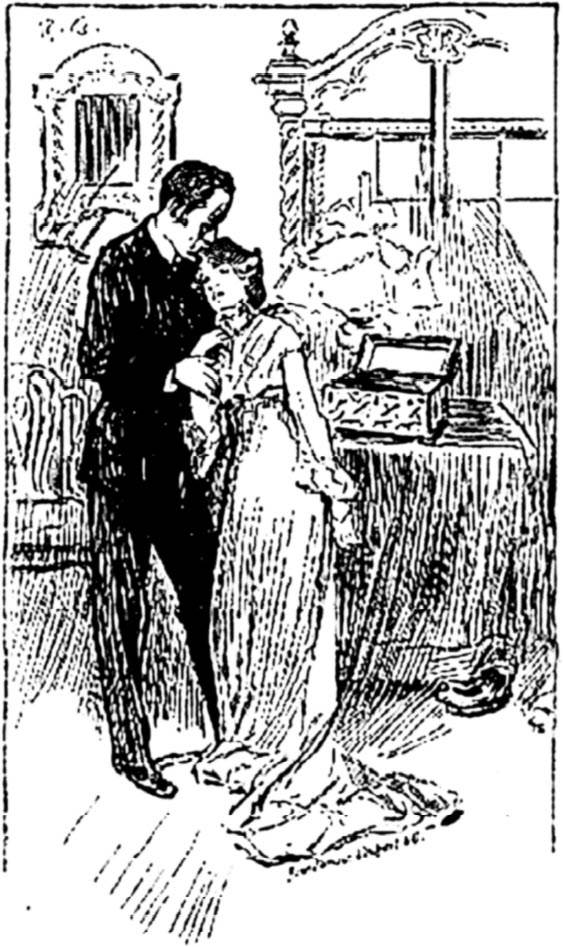

我说着，握住了她的手。

“那么，我也要说：‘感谢上帝’。”她含情脉脉地说。我把她揽到了怀里。

不管谁丢失财宝，我只知道，那天晚上我得到了我的宝贝。

————————————————————

<a href="#part0036.xhtml_ch1-back" id="part0036.xhtml_ch1">(1)</a> 达特穆尔高原（Dartmoor），地处英格兰西南部，为泥炭质沼泽地，设有达特穆尔监狱。

<a href="#part0036.xhtml_ch2-back" id="part0036.xhtml_ch2">(2)</a> 贝拿勒斯（Benares），印度东北部城市，即今瓦腊纳西，以金属细工等工艺品著称。

# 第十二章　乔纳森·斯莫尔的奇异故事

警官等在马车里，很有耐心——等着我回马车，原是件心焦的事。我把空盒给他看，他马上阴云满面。

“奖金完蛋了！”他大失所望，“钱没有了，奖金也就不给了。宝物如果不丢掉，今天晚上的差使，我和山姆·布朗两人每人可以得到十英镑奖金呢。”

“撒迪厄斯·肖尔托先生是个有钱人，”我说，“不管宝物有没有，他总会给你们酬劳的。”

然而警官沮丧地摇摇头。

“这件事很糟糕，”他一再地说，“阿瑟尔尼·琼斯先生那边难交差了。”

他的话一点没错。我一回到贝克街，给侦探看了空宝盒，他的脸刷地一下拉长了。他们也是刚刚回来。福尔摩斯、人犯和他三个人，因为半途改变了计划，去了警署先备过案。我的伙伴懒洋洋地靠在椅子上，同平常一样，无精打采。对面坐着斯莫尔，一派无所谓的样子，木腿跷起在好腿上。我给大家看着空宝盒，他身体往椅背上一靠，仰天大笑。

“是你捣鬼，斯莫尔。”阿瑟尔尼·琼斯恼怒地说。

“不错，我扔到了别的地方，你们永远别想捞得着。老实告诉你们，现在活在世上的人，除了在安达曼囚犯营的三个和我一个，这宝贝谁也没份儿。我知道现在我没份了，他们也没份了，我就给我自己处理掉，也同样替他们一块儿处理掉，我们四个人一块儿签名，好歹四个人都同心同德。嗯，我有数，他们会同意我这么做。宁可都扔进泰晤士河，也决不给肖尔托、莫斯坦的家人、朋友。我们干掉了阿奇米特，决不能结果让他们去发财，全部财宝跟钥匙，跟汤嘎一块儿走了。我看看要给你们追上了，就把宝物扔到了永远保险的地方。你们出来忙活了这一阵子，一个卢比<a href="#part0037.xhtml_ch1"
id="part0037.xhtml_ch1-back">(1)</a>也捞不到。”

“你想骗我们，斯莫尔，”阿瑟尔尼·琼斯厉声说，“你要把宝物扔进泰晤士河里，连箱子一同扔下去不就完了吗？不更省事吗？”

“我扔起来省事，让你们捞起来也省事，”他横眉冷眼答道，“你们有本事把我给追到，也有本事到河底把铁盒子打捞起来。现在都这么散抛掉，一路来少说也有五英里长，要去捞，这活儿就不好干吧？我也是横下了一条心。看你们追上来，我都急得快要发疯，再可惜也没用。我这辈子有发的时候，也有败的时候，我都没啥。打翻了牛奶，哭也没有用。”

“这个事，你知道有多严重，斯莫尔？”侦探说道，“你如果现在还能维护法律，而不是继续破坏法律，那么量刑时你会有机会从轻发落。”

“法律！”这个有前科的人犯咆哮道，“狗屁法律！这宝不是我们的是谁的？财宝不是他们挣来的，偏要我给他们，这算哪门子法律？你们瞧瞧，财宝我是怎么才到手的！整整二十年，滚在烂泥里，热病猖狂，整日围着红树干活，夜里上了镣铐，扔进囚棚，又脏又臭，任蚊子咬，发疟疾死去活来，还要活受黑炭牢头看守的洋罪，他们专拿白种人出气。我是这样好不容易才挣来阿格拉宝物。我就吞不下这口气，干吗我付出代价，全叫别人来享福？你们来跟我讲什么法律呀、公道呀！我宁可脖子给绞上二十遍，宁可叫汤嘎一针毒死，也不愿意活在监牢地狱里，眼看别人拿着我的钱住王宫，过逍遥快活日子。”

斯莫尔坚毅沉静的面容变得激动狂躁起来，说着这些话一发不可收拾。他两眼发光，手铐在挥动的双手上锒铛作响。眼见这个人如此狂暴、激烈，我这时才理解到，当初肖尔托少校闻讯这个吃了亏的囚徒要来找他算账，便吓得失魂落魄，原来是有道理的，很自然的。

“别激动，我们对这些事全不了解，”福尔摩斯静静地说道，“没听你说过这段往事，我们当然没能跟你说你本来是有理的，法律公正是在你这一边的。”

“啊，先生，您这么说还公平合理，我听得进。虽说您给我上了手铐，我得要谢谢您呢。当然，我也不怨不恨，公平交易嘛，公事公办嘛。您要是听听我的事情，我一点都用不着隐瞒，我给您讲的，上帝见证，句句实话不掺假。谢谢您，给我倒杯水放边上，我嘴讲干了能喝口水。

“我是伍斯特郡人，出生在珀肖城那边。我不瞎说，我们斯莫尔家的人住在那儿很兴旺的，您不信可以去看看。我常常想回家乡看看，可实在是我在家人面前口碑不怎么好，说不定，他们见了我会不高兴。他们都是正正经经上教堂的人，种地过日子安分守己的农民，乡邻乡亲都互相尊敬，而我总是东游西荡。后来，快到十八岁，我也不再给人惹是生非了。原因是我搞上了一个姑娘，甩不掉手，为了赶快脱身跑掉，就入了步兵第三团，这个团正好要开往印度，我开始吃皇粮军饷过日子。

“可是我又注定无法长久待在部队。才只学了正步走，学会使用火枪，就不知高低到恒河里去游泳，出了事。那天还算我运气好，连队班长约翰·霍尔德也在游泳，他可是部队里有数的水中健将。我游到河中心，给一条鳄鱼咬了，咬断了右腿，像外科医生截掉了那么干脆，只剩下大腿。大量失血，又受惊吓，昏了过去，差一点就要淹死，多亏霍尔德救了我，拖住我游到岸上。我住院养了五个月，后来绑一根木棍当腿，跷着出院。我残疾退伍，丢掉军籍，拖着条残腿，很难找工作。

“你们想想看，我该有多倒霉，成了没用的跛子，那时我还不到二十岁。可是也不曾想时来运转了，跛了条腿有跛腿的福呢。有一个人，叫阿贝尔·怀特，他到那儿来种木蓝，做靛青染料的，是个木蓝种植园主，要一名监工，监督苦力好好干活，还刚巧他是我们团长的好朋友。团长看我残废，时常照顾我。长话短说，团长竭力推荐我去干这差使。这差使主要靠骑马，我的腿就不碍事，我的大腿还在，骑马夹得住，马鞍子坐得稳。我的工作就是在庄园里转转看看，监督工人干活，谁偷懒就报告上去。报酬不低，住的地方也舒适，处处称心，也就想在木蓝园里这么干一辈子算了，很可以了。阿贝尔·怀特先生是个善心人，常常到我的小屋里和我一起抽烟聊天。白人在那边，不像在这儿自己家里不怎么样，在那儿异乡客地能碰到一起可亲热了。

“唉，我这个人真是好景不长，怎么也是不曾想，不知怎么搞的，爆发了大叛乱<a href="#part0037.xhtml_ch2"
id="part0037.xhtml_ch2-back">(2)</a>，我们都措手不及。上个月印度还好好的平安无事，一切如同在肯特郡、萨里郡自己家里一样，下个月，二十万黑鬼兵不听管束了，整个印度变成了地狱。这件事，先生你们都是知道的——肯定比我清楚得多。因为看报纸什么的，我是不在行的。我知道点什么，都是自己亲眼所见。我们种植园在一个叫穆特拉的地方，靠近西北省份的边界，就见每天晚上房子烧得满天通红，每天白天，总有三五成群的英国人，拖儿带女打我们种植园地界上过，去阿格拉避难。那边有部队驻扎，离得最近。阿贝尔·怀特先生脾气很固执，他不相信，以为事情一定是给说夸大了，一定是一闹起来就会平定的。他照样坐在凉台上喝他的威士忌苏打水，抽他的方头雪茄烟，不知周围已经火烧眉毛。当然啦，我们都守着他了，我，还有多森夫妻俩，多森是管账、管工。好了，大难临头的一天到啦。这天我去了种植园很远的地方，到黄昏才骑在马上慢慢往回走。我忽然看见在深水沟里有一大堆什么东西，赶马过去一看，吓得魂儿都没了，是多森的老婆，给剁成了肉块块堆在一起，尸体叫豺狼野狗吃了一半。路上那边不几步远，多森趴着，也死了，手里握着子弹放空掉了的左轮枪；在他的前面，倒着四个印度兵，尸体跟尸体压在一起。我勒住马缰，正没主意往哪儿走，忽然看见阿贝尔·怀特的房子冒起团团黑烟，屋顶蹿出火苗。我一想，我也救不成老板，硬要去的话，只有把自己的命也白白赔进去。我站的地方，正好看得见有几百个黑鬼，还穿着红衣<a href="#part0037.xhtml_ch3"
id="part0037.xhtml_ch3-back">(3)</a>，对着火烧的房子手舞足蹈。他们有几个人正伸手指着我，子弹马上飞过我头顶，我赶快调转马头往稻田跑。半夜到了阿格拉城里，算是保住了一条命。

“谁知阿格拉也不算绝对安全，整个印度变成一只马蜂窝了，英国人也只能待在一小块地方，凭枪炮射程可以防卫的一点点地盘。其他各地，都乱哄哄在逃命，成了丧家狗似的。这场战争打的是几百万人对几百人的仗。这件事最叫人伤心，这些跟我们打仗的印度兵，步兵、骑兵、炮兵，都是我们选拔建立的部队，是我们自己教出来、训练出来的，手里拿的都是我们的武器，吹的军号也是我们的调门。阿格拉驻扎着孟加拉国第三火枪团，其中有锡克人，两个骑兵连，一个炮兵连，另外还成立民防自卫队，都是职员、商人组织起来的。我也参加了，木腿也要，不管了。七月初，我们出城到沙根吉去迎击叛军，起初我们胜了几仗，后来弹药用完，只好退回城里来。

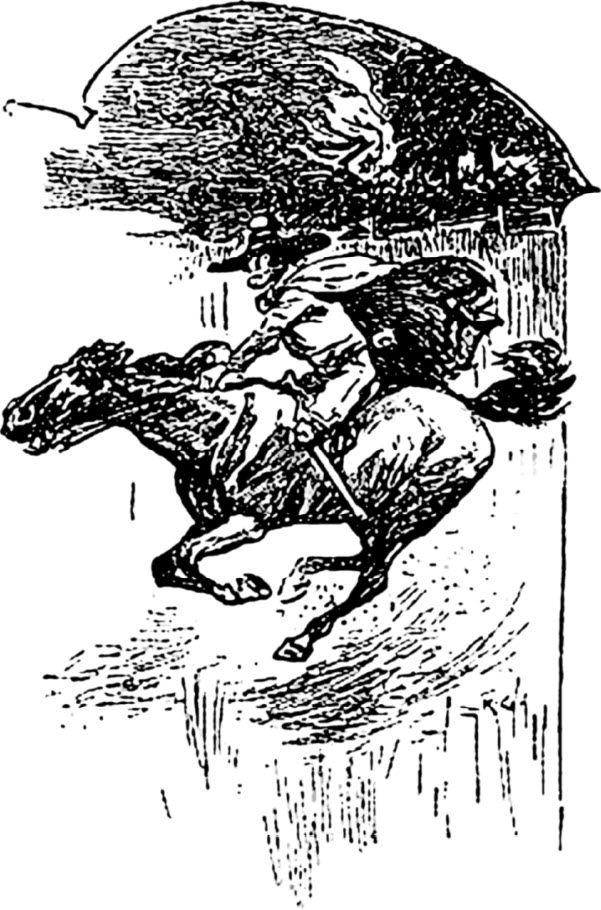

“我赶快调转马头往稻田跑。”

“四面八方传来的消息都糟糕透顶——本来也就不值得奇怪嘛，往地图上看看，就清清楚楚。我们所处的地方，正好是叛乱的中心。勒克瑙在东边，远在一百多英里以外，坎普尔在南方，也差不多远。四面八方，没一个地方不是杀人放火。

“阿格拉城是个大地方，各种各样稀奇古怪的魔鬼教派、狂热教徒都集中在那里。我们成了一小撮，缩在弯弯曲曲的窄道里，没法防卫。我们长官就过河在阿格拉古堡建立阵地。不知几位先生听说过没有，或者读到过这个古堡没有，那可是个非常奇怪的地方。我还是第一次到这么奇怪的地方，那里的一些奇奇怪怪的角落我都去了。先说那地方就是出奇地大，估量着周围加在一起有好几英亩吧。有一部分比较现代一点，我们全部驻军、妇女儿童，还有装备物品，什么东西都全部过去，地方还大大有余。新的远不及老的地方大，可是老地方没人去，那里是蝎子、蜈蚣的天下。旧堡那里有许多废弃的大厅大堂，曲折的走道，弯进弯出的走廊，进去的人要走出来还不易摸得清路。因为这么个缘故，很少有人敢去旧堡，只不过有时也有人结伙举了火把去探险。

“古堡前面的河，正好成了护城河，两边和后面有许多门。这些门，连带我们部队驻地，当然都要派人警卫。我们人手不够，不可能在古堡每个角落、每个炮位都配备有人。出入口那么多，没有办法每个口子都派上重兵把守，我们只能在古堡中央组织一个中心守卫室，让各个门口由一名白人带两三个土兵守卫。我给派去古堡西南角上一个孤零零的小门，晚上守几个钟头，两个锡克族士兵听我指挥。上面指示好的，发生情况就开枪，中心卫队马上过来支援。卫队相距有两百步远，两个地方又隔着迷宫似的巷道、走廊，我真不知道，万一发生袭击，他们能不能及时赶到，我们有救没救。

“可是，我还得意着呢。让我当了个小头目，站上岗，我到底还是个新兵呢，又是个断腿残废。同两个旁遮普土兵在一起这么守了两夜。两人都是高个头，相貌很凶，一个叫穆罕默德·辛格，一个叫阿卜杜拉·汗，都是老兵，还在齐连瓦拉同我们打仗交过手。他们英语讲得很好，可是我没能听到他们讲什么话。两个人总是喜欢站在一块儿，整夜用听不懂的锡克土话叽里咕噜讲个不停。我自己一个人站在门外，望着下面的河，宽宽的，弯弯曲曲，还望望城里灯火亮晃晃。咚咚敲鼓，当当打锣，叛兵在叫呀闹呀，都吸足了鸦片、大麻，整夜让我们提醒着，千万当心河对面的人，危险就在眼前。每隔两个钟头，值夜军官巡查全部岗哨，防止发生意外。

“站岗第三夜，又暗又湿，滴滴答答小雨不停，这么个天气，一个钟头一个钟头这么站在门口，心情很不好。我多次想同这两个锡克人攀谈，但总是插不上话。后半夜两点，巡查岗哨刚过，稍稍少掉了一点夜来的闷气，两个同伴不愿谈，也谈不拢，我就掏出烟斗，放下火枪，划火柴。忽然间，两个锡克人冲我过来，一个一把夺了我的枪，枪口指住我脑袋，另一个拿一把刀逼住我喉咙，咬着牙说敢动一动就割断我的喉咙。

“我马上想到他们两个是叛兵一伙的，叛乱开始了。这个门落入印度兵手中，整个古堡地方也就保不住，妇女儿童马上要遭殃，同坎普尔城里一样了。诸位先生恐怕在想，我要为我自己留一条活路了，可是我要告诉你们，尽管我喉咙口感觉那刀口逼着，我只是想我要张口大叫一声，哪怕是最后一声，也能向中心卫队发出警告。我正不顾一切要喊，拿刀抵住我的人好像看出我的心思，赶快在我耳朵边说：‘别叫，你放心，堡垒没有事，河这一边一个叛兵也没有。’听他口气他讲的是真话，我想从这个人的黄眼睛里看得出来，我一出声就没命。我便不出声，等着看他们要把我怎么样。

“‘听我说，先生，’两个人中更高、脸也更凶的一个，大家都叫他阿卜杜拉·汗的，这时说话了，‘你要么跟我们走，要么永远就出不了声。事情太重要了，由不得我们多磨蹭多考虑。要么你画基督十字起誓，死心塌地跟我们一起，要么你的尸体今夜扔进沟里，我们也只好跑到叛军弟兄那边去，没有中间道路。选哪个——生还是死？给你三分钟作决定，时间很紧，巡逻再来之前，要把事情决定下来。’

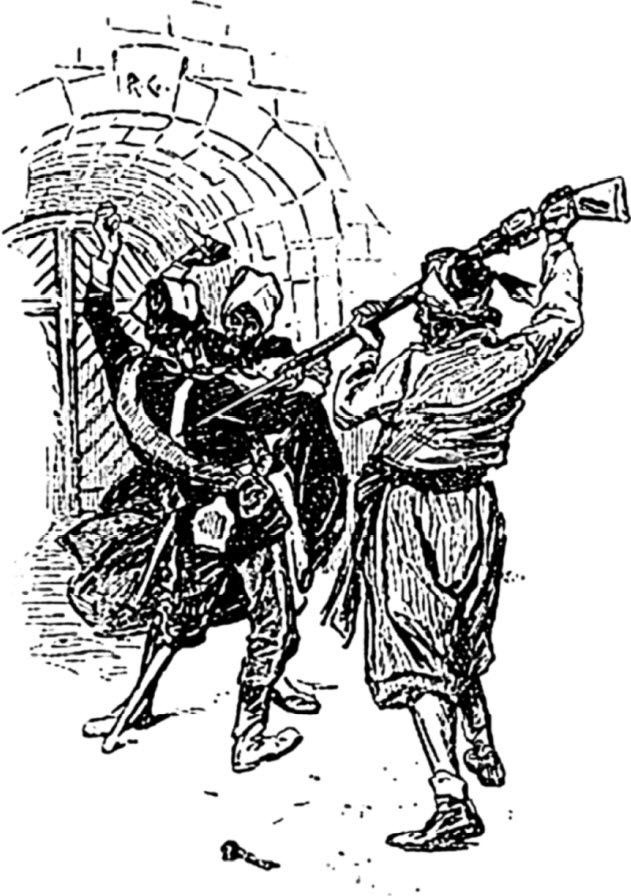

另一个拿一把刀逼住我喉咙。

“‘让我决定什么？’我说，‘你们又没说要我做什么事。不过我可以告诉你们，要是危及到这儿堡垒，甭谈，动手给我一刀，来吧！’

“‘跟这儿堡垒不相干，’他说，‘我们要你去做一件事，跟你的同胞到这块土地上来是一样的目的，我们叫你去发财。今晚你若是同我们一起干，我们就举这把刀发誓赌咒三遍，锡克人从来不违背誓言，你就会有你应该有的一份财宝，你得四分之一。这对你是最公道的了，我们决不反悔。’

“‘你们说的什么财宝？’我问他们，‘我当然想同你们一起发财，但总得告诉我怎么回事。’

“‘你要发誓，’他说，‘以你父亲的生命，你母亲的贞节，你信仰的十字架，不做不利我们的事，不讲不利我们的话，无论是现在还是今后。怎么样？’

“‘我可以发誓，’我回答说，‘只要这城堡没有危险。’

“‘那么我的伙伴和我就起誓，财宝我们四个人平分，你得四分之一财宝。’

“‘只有三个人呀。’我说。

“‘不，还有多斯特·阿克巴尔的一份。趁他们人还没到，先把怎么回事同你讲明白。你站那儿门口，穆罕默德·辛格，注意他们过来。事情是这样的，先生，我知道欧洲人发誓是认真的，所以我们相信你。你要是个专门说谎的印度人，不管你在多少神像前，在神庙里起什么誓，你的血一定染了我的刀，你的尸体已经抛到河里去了。可是我们锡克人信任英国人，英国人也信任锡克人。请听着，我讲给你听。

“‘北方邦有个罗阇<a href="#part0037.xhtml_ch4"
id="part0037.xhtml_ch4-back">(4)</a>，领土不大，财富不少。他的财产小半是父亲传给他的，大半是他自己搜刮来的。他贪财如命，又是个吝啬鬼。叛乱起来以后，他是同狮子也交朋友，同老虎也交朋友——和印度兵好，同英国公司<a href="#part0037.xhtml_ch5"
id="part0037.xhtml_ch5-back">(5)</a>方面也好。可是在他眼里，白人的日子算是到头了，他听到的是全国各处白人被杀的杀了，被赶跑的赶跑了。可是，他又是小心人，心里盘算着，不管结果怎么样，至少有一半财富能保下来。金子银子留在身边，藏在宫中的地窖里，还有贵重宝石和精选的珠宝藏在一只小铁箱里，交给一个心腹宫奴，扮作商人，带到阿格拉城堡隐藏起来，等到天下太平了再说。这样做，叛军胜利，金钱银钱能保住；英国公司镇压得胜，珍珠宝贝能够保全。他把钱财这么分开，就投向了叛军，因为他外围的叛军势力很强大。这么做，先生试想，他总得效忠于一方，他的财产总会有一方保护。

“‘这个假扮的商人化名叫阿奇米特，现在在阿格拉城里，准备私下进入城堡。他一路来有个陪同人叫多斯特·阿克巴尔，是我的奶兄弟，他知道这个秘密。多斯特·阿克巴尔答应今晚领他走城堡的边门进来，也就是选的这个门。他马上就要到这儿。我和穆罕默德·辛格等在这里接应他。这个地方冷僻，没人会知道他来。世人将不知有这个阿奇米特商人，罗阇的大笔财宝就让我们来分掉，你说好不好，先生？’

“在伍斯特郡，每个人的生命都看得很重，很神圣，可是眼前就不是了，你身子周围到处是烧杀，一片火海，血流成河，不知什么时候死就轮到自己头上。这个阿奇米特商人是死是活对我来说已没分量，连一粒灰尘都不如。说到这批财宝，倒是很打动我的心，我想到靠这钱回老家就有指望了，乡亲们看见我这个从来没干正经事的人带着满口袋的金子回来，准会瞪着眼睛看傻了。阿卜杜拉·汗看着我，以为我拿不定主意，就又紧逼着说了。

“‘想想吧，先生，’他说，‘这个人要是叫指挥官捉了去，不是吊死就是枪毙，珠宝给政府没收，叫你一个卢比也捞不到，有什么好？现在到了我们手里，把他解决掉，财宝不就是我们的吗？财宝给英国公司拿去存在他们的金库，还不如我们把它劫了。这批财宝，足够叫我们每个人大富大贵。谁也不会知道这件事，我们在这儿，同谁也不沾边，你看还有比这主意更好的吗？你得表个态，先生，你同我们一道呢，还是要让我们把你当敌人？’

“‘我死心塌地同你们一块儿干。’我说。

“‘很好，’他对我说，并且把火枪还给我，‘你瞧，我们信得过你，你讲话同我们一样，说到做到，不食言。现在我们就等我兄弟带商人过来。’

“‘你兄弟知不知道这个做法？’我问他。

“‘这主意就是他出的，都是他计划好了的。走，一起到门口，跟穆罕默德·辛格一同看看去。’

“雨下个不停，雨季正好到了，天上滚着乌黄的浓云，几十步之外啥也看不见。门前边是一条护城的深沟，有的地方水淌掉了，沟很容易过。我同两个旁遮普人站在那里一心想着等那个送死的人过来。

“忽然，我看见沟的那一边有一点点罩着的火光，一会儿亮光在围堤前不见了，一会儿又出现，慢慢地向我们这边过来。

“‘他们来了！’我叫了一声。

“‘你来问他，先生，照平常问，’阿卜杜拉轻声说，‘别吓住了他。来了交给我们带里面去，以下的事我们来做，你还是在这里守卫。灯光别遮掉了，我们要看看是不是他，别弄错人。’

“那灯光忽闪忽闪地在过来，一会儿停一会儿前进，停停走走，后来我才看清了是两个黑影到了城沟边。等他们顺斜坡下到了沟里，跨过泥水，向上走到离这儿门口一半的时候，我向他们喝问。

“‘什么人！’我压低嗓子喊。

“‘自己人。’来人回答说。我拎起提灯，向他们直照。走在前面的是个锡克人，长黑须快齐腰了，他的个头出奇地高大，除了巨人表演，我还没见过这么高大的人。另一个偏是个滚圆的矮胖子，缠个大黄包头，双手捧着样东西，用围巾包裹着。他好像害怕得在发抖，手筛糠似的发疟疾病，脑袋左右转动，一对小眼珠子朝四面忽闪眨巴，活像只出洞老鼠，探头探脑。我想到要杀这么个人，心也冷了，再回头想到财宝，我的心又铁石般硬下来，扑腾扑腾跳。他一见我是白人，嘻嘻笑着向我跑上来。

“‘请求您保护我，先生，’他喘气说，‘逃难的生意人阿奇米特请求庇护。我是从拉杰普塔纳逃出来，来此阿格拉城堡请求避难的。我给劫了、抢了、骂了、打了，为的我是东印度公司英国军队的朋友。今夜受到照应有了安全，真要托贵军的洪福——我还有一点穷家当。’

“‘这是什么东西？’我问他。

“‘一只小铁箱子，’他回答我说，‘一两件家用小东西，别人拿去不值钱，我可舍不得扔掉。请相信，我不是要饭的，我会给您酬谢，年轻的先生，您的长官也会得到酬谢，只要他给我在这儿能落个脚就行。’

“我不敢再同这个人多说话，我越是多看他这张胖脸害怕的样子，越不想这么来害死他，实在残忍，还是快点交给他们去吧。

“‘把他带总部去。’我说。两个锡克人一左一右押着他，大个子紧跟在他背后，这么拥着他走进黑黑的门道。三个人把他围死了，一定难逃活命。我提着灯留在门口。

“走廊上静得鸦雀无声，只听得他们的脚步响。忽然脚步停住，我听见有叫声，殴打声，在动手干起来了。一会儿脚步声冲我这边过来，一个人喘着大气奔过来。我慌忙把灯向长廊上一照，只见那个胖子在没命地跑，一脸是血，那个大胡子锡克人像只猛虎紧追在他后头，手里挥着一把刀。这小个子商人跑得那个快劲儿，我都从来没见过。锡克大个子追不上他。我一看要是放他过去，出了堡垒，说不定他能跑掉。我的心软了，可是一转念想到他的财宝，我马上狠狠心；他正好到我跟前，我把枪往他腿下一扫，他立刻滚倒在地上，像只中弹的兔子，还没等他爬起来，锡克人赶上去往他身上猛地戳了两刀。这个人不出一声，一动不动，跌在了地上再也起不来了。我在想，可能摔下去就已经摔断脖子，摔死了。你们看，先生，我说话算话，我把事一五一十都照讲了，不管对我是好是坏，毫不隐瞒。”

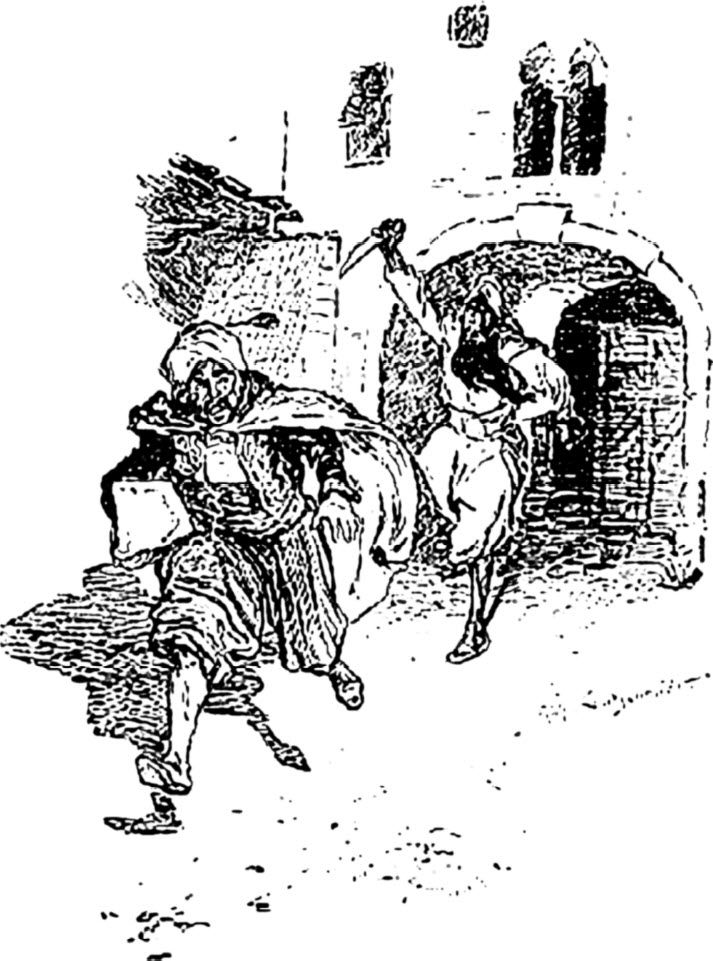

大胡子锡克人像只猛虎紧追在他后头，手里挥着一把刀。

他说到这里停下来，伸出戴着手铐的手接住福尔摩斯倒给他的一杯加水威士忌。我自己，不仅仅是从他所参与的血淋淋的罪行中，还从他对自己罪行若无其事的叙述中，可以想象这个人的极端残忍及罪恶深重。无论等待他的是何种刑罚，我相信他决不会从我这里得到丝毫的同情。福尔摩斯和琼斯坐在那里，双手放在膝上，听得很专注，但脸上都显露出厌恶的神情。他大概也看出了这一点，在他继续说下去的时候，语调和态度有一点为自己强辩。

“当然没说的，事情很恶劣，”他说，“可我倒要问问，到底有多少人处在我这样的地位，一边是刀架到脖子上，一边是钱财，宁可要死不要钱！另外再有，他一到了城堡，只有一条路了，不是我死，就是他死。让他逃了出去，整个事情就泄露了，我就得上军事法庭，立刻枪决是不用说的；大家在这种时候，都没讲善心的了。”

“接着讲你的事吧。”福尔摩斯截断他说。

“好。我们把人扛到里面，阿卜杜拉、阿克巴尔和我。这个人个子不高，分量可不轻。穆罕默德·辛格留在那儿守门。扛到了锡克人早就找好的一个地方，这地方在很深的那一头，弯弯绕绕的过道通到一座大空屋，屋的砖墙都碎了，在一个角落，地上有一个坑，正好埋尸首。我们就把商人阿奇米特扔进去，拿碎砖、土来盖上堆好，完了后再回头看那铁箱宝盒。

“宝盒还扔在那里，就是在他先挨了刀子的地方，也就是这个打开的箱子，眼前在桌上的这一只。有一把钥匙，用丝绳系在盖子的雕花把手上。我们用钥匙把盒子打开，里面的珠宝经灯光一照，都闪光铮亮。我小时候在珀肖读书时书上读到过的、想象中的，就是这个样，珠宝看得我们眼花缭乱。然后，我们将珠宝拿出来清点，列出一份单子。有着最好的光泽的钻石一百四十三颗，内中有一颗，我想就是‘大蒙兀儿’，据说是世界上第二颗大钻石。还有九十七颗上品祖母绿，一百七十颗红宝石，有些比较小。四十七块红玉，二百一十块蓝宝石，六十一块玛瑙，许多绿玉、缟玛瑙、猫眼石、绿松石，还有别的宝石，那时候我还叫不上名儿，以后才慢慢搞清楚。这些以外，还有三百来颗上等珍珠，十二颗镶在小金冠上。说到这一件有十二颗珍珠的小金冠，我要提一提，已经给人拿掉了，宝盒到我手以后，发现缺这一件。

“宝物清点好以后又都放回箱子里，拿到门外让穆罕默德·辛格也过了目，接着四人紧靠着站在一起，郑重发誓，严守秘密。我们一致同意先把宝物藏在一个安全的地方，等全国平定以后再拿出来四人平分。现在就分掉没好处，这种贵重的宝石带在身上一给人发现，就要招来怀疑，城堡里我们自己也没有隐蔽的地方可以分开藏好。我们就把宝盒拿到埋尸首的那空屋，从一堵最完整的墙上拆下几块砖头，掏成窟窿，把宝盒放进去，小心封好，做上记号。第二天我画了四张图，每人拿一张，图下面我都签上四人的姓名，作为我们赌过咒的凭证，今后一举一动都要代表四人的利益，不许独自吞没。这是我手按着心发的誓，从来不曾违背誓言。

“印度大叛乱后来怎么样，不用我在诸位先生面前多啰嗦。威尔逊占领德里，科林爵士收复勒克瑙，叛军就瓦解了。新的部队不断开到，那那·萨希布<a href="#part0037.xhtml_ch6"
id="part0037.xhtml_ch6-back">(6)</a>逃到国外，格里瑟德上校快速纵队到了阿格拉，把潘迪兵<a href="#part0037.xhtml_ch7"
id="part0037.xhtml_ch7-back">(7)</a>全部肃清。全国逐渐恢复和平，我们四个人望眼欲穿，时间到了，眼看可以平分横财，可是怎么也想不到，希望一下子泡汤，我们四个都给逮捕起来，罪名是谋杀阿奇米特。

“原来事情出了纰漏。那个土王原本是把阿奇米特当心腹的，把财宝交给他以后，想想又不放心。东方人生性多疑。土王就再派一个更加心腹的人在后面跟踪监视，当然不会让阿奇米特发觉，只是像影子一样走到哪儿跟到哪儿。那天晚上他看见阿奇米特进了门坎，就想当然是得到允准进城堡避难了。第二天他亲自要求进了城堡，可是怎么也不见阿奇米特人影，觉得事情奇怪。最后他找警卫班长报告情况，班长又向指挥官报告，马上进行全面搜查，结果发现了尸首。好，四个人正在以为平安无事的时候，一块儿给抓起来了，以谋杀罪被告上法庭——三个人是那天的门卫，第四个人是送被害人一同来的。在法庭上我们对珠宝的事一个字不提，反正那个土王已给废掉，被赶出印度，已经没人知道宝物了。谋杀罪成立，我们四个是凶犯。三个锡克人判了终身监禁，我判了死刑，后来得到减刑，和他们一样。

“怎么会想得到落得这么个下场！一方面我们四个人落了难，恐怕今生再也出不了头，另一方面我们每个人肚里都有个秘密，只要能用上宝物，我们都可以享福住王宫。一方面在里头被监牢小卒子拳打脚踢，百般折磨，天天吃粗米喝生水，真不是人过的日子，让你肺都要气炸；另一方面，惊人的财富在外头闲搁着，等着你快去捡。想想真要把我想疯。可我这个人还有点硬骨头硬脾气，能忍住，等待时机。

“最后，时机好像来了。我给调地方了，从阿格拉调往马德拉斯，从马德拉斯又调往安达曼的布莱尔岛。这个地方白种犯人很少，而我一开始又表现良好，很快就享受特殊待遇，让我在好望镇独自有一间小茅屋住下。那是个小地方，在哈里厄特山脚下，没什么人管。那地方很闷气，流行热病。我们开垦出来一小块空地，外边远处有吃人的野人部落，他们一看见你就朝你发毒箭。在那里干的活是开垦、挖沟、种山药，还有杂七杂八的零活，反正整天够你忙。不过晚上还有点自由支配的时间。有时候没事，我就学着给外科医生配药，跟着他也学得一知半解了。这时候，我无时无刻不在寻找机会逃跑。可是离开别的地方都有好几百英里，海上不是风很小，就是根本没风，要逃跑实在是件万难的事。

“外科医生索默顿，是个年轻小伙，爽快，贪玩，别的青年军官晚上经常到他屋里来打牌。我常去配药的外科手术间，就在他客厅的隔壁，中间隔墙有一扇小窗。有时候我觉得闷气，就把灯灭了，倚在窗前听他们说话，看他们玩牌。我自己本来就喜欢玩牌，在一旁看看也好过过牌瘾。牌友中有肖尔托少校、莫斯坦上尉和布朗利·布劳恩中尉，他们都是带土兵的军官，还有外科医生自己，另外两三个监狱官。监狱官是玩牌老手，赌技很精，常常几人结成一伙。

“不久我看出了名堂，开始留心起来。武官老是输，文官总是赢。当然啦，我还不能说这里头一定有什么手脚，不过情况就是这样的。监狱官来到安达曼群岛以后，除了打牌消磨日子，别的没什么事可做，这玩意儿就越玩越精。军官打牌不过是消遣，就老是输牌。这么夜夜输，军官都输穷了，越输越想翻本。肖尔托少校输得最惨，起先来现钞、金饰，很快没了，只好付期票，赌注更是越来越大。有时候也给他扳回一点，就胆子大起来，但马上手气又不好，比以前输得更惨。为了这个他整天愁眉苦脸团团转，拼命喝酒来消除烦恼。

“有天晚上他输得比哪一回都惨，我坐在自己茅屋里，看着他和莫斯坦上尉摇摇晃晃回军营去。他们两个是要好朋友，像兄弟俩形影不离。少校正在赌输了窝火骂人。

“‘完蛋了，莫斯坦，’两人走过我茅屋时，他说，‘我得打报告辞职了，没辙了。’

“‘有啥了不起，老兄！’上尉拍拍他肩膀说，‘我有过比这更糟的呢，不过是——’我只听到这些话，可是这已经够我动起脑筋了。

“两天后，肖尔托少校在海滩上散步，我抓住机会上去说话。

“‘我想请教您，少校。’我说。

“‘啊，斯莫尔，什么事？’他问我，拿下了嘴里的方头雪茄。

“‘我想请问先生，’我说，‘有隐藏的财宝应当交给什么人才合适？我知道有价值五十万英镑的财宝放在一个地方，我自己是没法用了，我想最好是不是交给有关当局，将功赎罪，可能减掉点刑期。’

“‘五十万英镑，斯莫尔？’他深深吸一口气，拿眼睛死死看着我，在掂量我是不是说正经话。

“‘是的，一点不假，先生——都是珍珠宝贝，放在那里等人去拿。就可惜财宝的主人犯法，没了公民权，不能拥有，那就看谁能先拿到手了。’

“‘上缴政府，斯莫尔，’他结结巴巴地说，‘上缴政府。’他说这话口气有吞吐，我心里明白，我已经把他套住了。

“‘那么，您看，先生，我该先向总督报告情况吧？’我轻声说。

“‘嗯，嗯，你先不忙，不急，免得事情过了要后悔。先把情况跟我说说，斯莫尔，让我听听到底是怎么一回事。’

“我把情况全部同他讲了，有的话没实说，不能让他知道宝盒藏在什么地方。听我讲完，他站在那儿呆成根木头，脑子一定在飞快地转。我看得出来，他不住地抿嘴唇，心里一定在翻江倒海、苦劲儿思索。

“‘这个事关系重大，斯莫尔，’他末了开口说话，‘你别跟旁人讲，一个字也不能讲，回头我再找你。’

“两天以后，他同他的朋友莫斯坦上尉半夜里提了灯到我小屋来。

“‘我要莫斯坦上尉也来听听你亲口讲讲这个事，斯莫尔。’他说。

“我再重新讲一遍，跟前头讲给少校听的一样。

“‘听上去不假，啊？’他说，‘值得一试？’

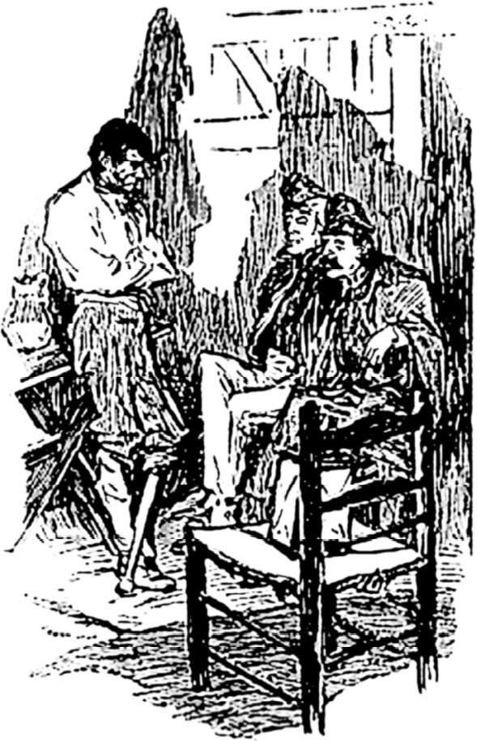

“他同他的朋友半夜里到我小屋来。”

“莫斯坦上尉点点头。

“‘这样吧，斯莫尔，’少校说，‘我的朋友和我两个商量了一下，我们的看法，这个秘密是你的私事，同政府不相干，总之，是你个人的事，自己的事。这样的话，当然啦，你有权高兴怎么处理就怎么处理。现在的问题是，你愿意出个什么价？我们倒有意思接手代劳一下，至少可以代你去查一查，就看我们怎么个谈法了。’他装着很冷静、满不在乎的样子，可是眼珠子滴溜溜转，眼睛贪馋着呢。

“‘噢，那个嘛，两位先生，’我回答他，也是假装冷静得很，可心里实在也同他一样激动得不得了，‘像我这样处境的人，也就只有一件事相求，央求两位帮我得到自由，还有我的三个同伴一同能自由，事成后，你们就是我们一起的人，分出五分之一归您两位享用。’

“‘哼！’他说，‘五分之一！那太不值了。’

“‘那可是五万英镑哪！’我说。

“‘叫我们怎么让你自由呢？你这要求是不可能的，你又不是不知道。’

“‘这个没有问题，’我回答说，‘我都想好了，难只难在弄不到一条行远路的船和足够的干粮。在加尔各答、马德拉斯，合用的小艇、双桅艇有的是，你们弄一条来，我们夜里上船，把我们送到印度沿海。只要能跑掉，我们的交易就成了。’

“‘如果只有你一个人，倒还好办。’他说。

“‘要么一起跑，要么一个也不跑，我们都发过誓的，我们四个人一条心，一起行动。’

“‘你瞧，莫斯坦，’他说，‘斯莫尔这个人还真言而有信，不把朋友扔下不管，我看能信得过他。’

“‘这可是掉脑袋的事，’莫斯坦说，‘不过，你说得对，这笔钱可解决我们大问题啦。’

“‘那么，斯莫尔，’少校说，‘我们这样，我想，试试看，尽量符合你的要求。第一步，当然是看看你说的情况有几分真。你得告诉我宝盒藏在哪里，我告个假，搭乘月头加班轮回印度一趟，核对一下真实情况。’

“‘别着急，’我说，他急得在火里，我偏冷一冷，在水里，‘我还得征求三个同伙弟兄的同意，我不说了吗，要么四个人一起动，要么一个也不动。’

“‘岂有此理！’他蹦起来，‘咱们之间谈成条件，关三个黑鬼屁事！’

“‘不管黑也好，白也好，’我说，‘我和他们有约在先，我们一定得一块儿行动。’

“这以后，又有了第二次碰头才算说成。穆罕默德·辛格、阿卜杜拉·汗和多斯特·阿克巴尔都在场，把事情重新商谈一遍，最后才决定下来。我们给两个军官阿格拉城堡那个地方的图，标出那堵墙的藏宝位置，让肖尔托少校去印度调查。他如果找到宝盒，先不能动，原地放着，得弄一条小艇，预备好足够的粮食，放到罗特兰岛让我们逃走，然后他回营销假，再由莫斯坦上尉告假去阿格拉同我们接头，末了大家平分财宝，他一起取走他和少校两人的一份。这些个条件都是讲定了的，都铁心发了誓的，反正心里想得到、嘴上说得出的，都赌天咒地发了誓。我花了一宿工夫画两张藏宝图，到天亮画好，写上四个人的名字——阿卜杜拉、阿克巴尔、穆罕默德和我自己。

“啊，诸位先生，我唠唠叨叨讲得你们都听烦了，我知道琼斯先生等得性急，把我早点关进去拘押起来，他好放心。我就尽量简短说吧。肖尔托，这个贼混蛋，去了印度，一去再也没回返。不多久，莫斯坦上尉拿一张名单给我看，是印度开往英国的邮轮旅客单，名字中就有他肖尔托。又听说是他叔叔死了，留下一笔遗产给他，他就退伍离开了部队。这小子坏到这种程度，骗了我们不算，连莫斯坦也骗了，总共骗了五个人。莫斯坦这之后马上去了阿格拉，果然不出所料，宝藏给盗走了。肖尔托这个恶棍，这个贼流氓，偷走了宝物一个人独吞，讲的条件他一条也不遵守，我们给他白坑了。从此，我只为了报仇才活着，白天想着报仇，夜里也梦着报仇。我满肚子满脑袋是仇恨，不管它什么法律——上断头台也不怕，要逃，要追肖尔托，要亲手掐死他。我啥也不顾，只有这一个念头。那个阿格拉财宝，在我心里也不在乎了，一心一意只想宰了肖尔托。

“嗯，我这一辈子，心中立下的愿望还不少，没一件不成功的。我等着机会，一直等不到，这几年过得很窝囊。我说过了，我稍稍懂得点医药知识。有一天，索默顿医生发高烧起不来。有一个安达曼小土人，被一队劳动犯在森林里捡回来。这个小土人病得只剩一口气，自己爬到没人的冷僻地方等死。知道土人毒如蛇，我还是接了这条小毒蛇下来。只两个月，我把他救了过来，他恢复了，能走路了。他挺感激我的救命之恩，不太想再回到森林里去，整日里守在我茅屋旁边。我向他学了土话，这样他对我更加敬重。

“汤嘎——他就是这个名儿——是个弄船儿好手，他自己有一条很大很宽的独木舟。我看他对我极忠心，什么事都愿意为我做，忽然想到这不就是逃跑的机会来了吗！我同他讲了这个事，叫他哪天晚上把船划到一个旧码头那儿，那边没人看守，接我上船，关照他准备好几葫芦淡水，多一点山药、椰子和红薯。

“别看这个小汤嘎，绝对能干靠得住，没人再比他更忠实了。到了那天夜里，他就把船划到那个码头下面。可是意外的，硬是会有人看守在那儿——一个坏透的帕坦人<a href="#part0037.xhtml_ch8"
id="part0037.xhtml_ch8-back">(8)</a>，这混蛋平日里一有机会就搞我弄我，我吃足了他的苦头，早就发誓要向他报仇，想不到今夜他自己送到我手上来，也算他有造化，让我趁离岛这机会还了他的债。他站在岸边，背对着我，肩上背着卡宾枪，我想捡一块石头砸开他的脑袋，可是一块也找不到。

“忽然我心头开了窍，不有了吗，伸手就是嘛。我悄悄坐下，把木腿去掉绳子解下来，猛跳三跳就到了他跟前，他卡宾枪还没来得及卸下肩，我迎面就死劲儿往他脑门上敲。你们可以看见这木棍头上有个裂口，就是那天敲的。我身体失了重心，和他一块儿摔倒在地上。我爬了起来，可他躺在那儿一动也不动了。我把船找到，上了船，一个钟头以后就远远出了海。汤嘎把凡是他用得着的东西都带上船，包括他的武器，他的神像。船上有一枝竹头长矛，几张安达曼椰子叶编的席子；我把矛和席子撑起来当帆使。我们在海上漂流了十天，听天由命。到了第十一天，遇到一艘货船，把我们给救了上去；这是条从新加坡开往吉达港的船，满载马来亚朝圣客。这些都是特别的旅客，汤嘎和我很快同大家混熟了。这些人有一点好，让你安静待着，不向你问长问短。

“啊，要是把我同小伙伴一路上惊险的事情都向你们讲，准得讲到大天亮，你们等不住，不会欢迎的。我们在世界上到处转了好些地方，总遇上事来不了伦敦。可是我一心一意记着自己的目标，决不泄气，决不放弃。晚上我梦见肖尔托，睡梦里杀了他一百次。最后，过了三四年，好不容易踏上了英国，不费多大困难，就找到了肖尔托的家。我着手打探他是把宝物变卖脱手了还是仍旧藏着。我跟一个人交上了朋友，搭上关系，他帮我忙——谁，叫什么名儿，我不讲，我决计不会把人家牵连出卖。我马上知道珍宝还在他手上，接着我想办法报仇，谁知他也挺狡猾，长年雇着两个拳击手，还有两个儿子，一个印度男用人，天天身边不离人。

“可是有一天我得到消息，他快死了。我赶快去了他的花园里，眼看没能让他死在我的手上，心里着急，想不能便宜了他。我从窗子望进去，见他躺在床上，两个儿子一边一个，正想着冲进去冒冒险，拼死也要跟他们三个干一仗，再一看，他张嘴掉了下巴，人已经去了。当天夜里，我偷偷进了他的屋子，搜了他的案柜，想找到会不会有藏宝在什么地方的记录，可是一点线索也没有，我只好走掉，心头又恨又火，真没法说。临走，我想到要留点记恨的标志，日后见到我的锡克朋友，也好有个交代，我就写了四个人的名字，跟图上的四签名那样，把纸别到他的胸口。被他坑骗、被他抓了一把的受害人，不在他身上记仇记恨，就让他这么进棺材，不太便宜他了！

“我们两人这段时间的生活，都靠汤嘎跑集市什么的，当作生番野人给人观看。他表演吃生肉，跳战舞，一天下来，总有满满一帽子的铜板。我可以继续打探樱池别墅的消息，几年中只听说他们一直在找宝物以外，没有别的情况。最后，等了这么些年，终于听说宝物给找到了。原来藏在巴索洛缪·肖尔托先生化学实验室这间房间的屋顶里头。我马上来看动静，一看，我这条腿没法上去。可是，又听说屋顶上有个暗门，还知道了肖尔托先生吃晚饭的时间。我想用上汤嘎这就容易了，我带上他一起去，把一圈长绳拴在他腰上。他攀高快得像只猫，从屋顶爬进去。可是，也像命该倒霉要报应在这个人身上，巴索洛缪·肖尔托还在屋子里，偏就不走，正好挨上。汤嘎杀了他，自以为干得挺聪明，等我抓住绳子爬进屋，看见他在房间里跨步走来晃去，像只骄傲的孔雀。我发了火，拿绳子抽他，骂他小杀人犯，他才知道做得不对头。我拿了宝盒，用绳吊下屋，自己再顺绳子滑下去。临出来，我还写一张四签名纸，搁在桌上，说明财宝到底物归了原主。汤嘎收进绳子，关好窗，从进屋的原路爬下来。

“这事，我要说的也就这些了。我听船夫说过，那条曙光号是快船，我想正好逃走用得着。我就雇用老史密斯的船，如果他能把我们安全送上海船的话，还会给他一大笔钱。他当然看得出内中有点名堂，不过他不管那闲事。讲了这么多，句句是实话。我讲给你们听，诸位先生，我不是想讨好你们——不要隐瞒，那是我最好的辩护，让天下人都知道，我这个人是怎么样遭受陷害的，是给肖尔托少校坑苦了的。说到他儿子的死，不是我的罪过。”

“讲得非常有意思，”歇洛克·福尔摩斯说道，“这件不寻常的奇案，得到了完满的结局。你所讲的一部分，除去绳子是由你自己所带，这一点我不清楚之外，其余都和我的推测相同。有一事想问问，我原以为汤嘎把毒镖全丢了，可是他在船上还向我们吹了一箭。”

“是的，他是把毒镖全丢了，吹管里还剩一枝没有用完。”

“噢，是这样，”福尔摩斯说，“我没料到这一点。”

“还有什么要问的吗？”犯人殷勤地说。

“我看没有了，谢谢你。”我的伙伴回答。

“那好，福尔摩斯，”阿瑟尔尼·琼斯说，“对您我们应当听着点儿，您不愧是刑案分析专家。可是公事公办，今天为您和您的朋友，本人已经够通融的了，现在只有把这讲故事的关进笼子，我才放心。马车等在外面，楼下还有两个警官呢。对您两位的协助，我衷心感谢。当然开庭还要请两位来作证。祝两位晚安。”

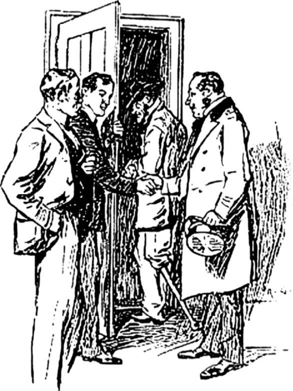

“对您两位的协助，我衷心感谢。”

“晚安，两位先生。”乔纳森·斯莫尔说。

“你头里走，斯莫尔，”出房门的时候，警惕性高的琼斯说道，“我得提防着点，别叫你的木腿砸了我，毕竟你在安达曼群岛曾经给别人那么一棒子。”

“好啦，咱们这出小戏收场啦！”我说，我们俩静静坐着抽了一会儿烟，“我担心，这恐怕是最后一次让我有机会跟你学习你的方法来研究破案。承蒙莫斯坦小姐不弃，答应我做她的未婚夫。”

福尔摩斯无可奈何地叹口气。

“我已料到，也担心着呢，”他说，“恕我不想对你恭贺。”

我有些不快。

“我选的对象，你觉得不满意吗？”我问。

“一点也不是，她是我生平所见的女士中最可爱的了，而且非常有助于你我所从事的这种工作。她在这方面是有天赋的，她父亲有那么些文档材料，她就能知道藏好这张阿格拉图，仅这一点就足以证明。可惜，爱情是感情的事，而任何感情都和实际、冷静与理智不兼容，而我珍视理智高于一切。本人永不结婚，以免影响自己的判断力。”

“这点我相信，”我大笑道，“我这次的判断能经得住任何严峻的考验。你很疲倦了。”

“是的，我早已感觉到。睡一个星期也恢复不过来。”

“真怪，”我说，“你这个人，要是换作别人，我该不客气地说是生性懒惰，可又不知怎么的，当你的热情一被激发，发挥出来的精力、能量可真不得了。”

“是的，”他说，“我本性是个游手好闲之徒，同时又是个好活动、很勤快的人。我常常想到歌德说过的话：‘上帝只赋予你一个人样，原来是金玉其外，败絮其中。’再有一点，在上诺伍德案子里，我猜测他们有内应。这个内应不是别人，正是印度仆人拉尔·拉奥。琼斯一网下去把他也打住，抓到这条鱼，总算是他一人独自的功劳。”

“功劳分摊似乎不公，”我说，“全案的操作都是你一人所为，我从中找到了一位妻子，琼斯得到了功绩，请问阁下得到什么呢？”

“我嘛，”歇洛克·福尔摩斯说，“还有瓶可卡因吧。”他伸出长长白白的手去拿瓶子。

（1890年）

————————————————————

<a href="#part0037.xhtml_ch1-back" id="part0037.xhtml_ch1">(1)</a> 卢比（rupee），印度货币单位。

<a href="#part0037.xhtml_ch2-back" id="part0037.xhtml_ch2">(2)</a> 1857年东印度公司的印度土兵因民族与宗教矛盾激化引发兵变，起事拥戴莫卧儿末代皇帝，欲推翻英国殖民统治。该事件主要蔓延于以德里为中心的北中部地区，于1859年被平息。

<a href="#part0037.xhtml_ch3-back" id="part0037.xhtml_ch3">(3)</a> 印度兵是英军训练的正规编制的土著兵，制服同英军一样上装为红色。

<a href="#part0037.xhtml_ch4-back" id="part0037.xhtml_ch4">(4)</a> 罗阇，印度酋长，土王，也作拉甲。

<a href="#part0037.xhtml_ch5-back" id="part0037.xhtml_ch5">(5)</a> 指英国东印度公司。

<a href="#part0037.xhtml_ch6-back" id="part0037.xhtml_ch6">(6)</a> 那那·萨希布（Nana
Sahib），印度王公，兵变领袖之一，失败后逃往尼泊尔。

<a href="#part0037.xhtml_ch7-back" id="part0037.xhtml_ch7">(7)</a> 潘迪兵（the
Pandies），潘迪是大兵变的首义印度土兵，在受检阅时发动起义，当场击毙英国军官三名，被捕处绞刑。后起义者以其名作为荣耀称号，广为号召。

<a href="#part0037.xhtml_ch8-back" id="part0037.xhtml_ch8">(8)</a> 帕坦人（Pathan），分布在阿富汗南部、巴基斯坦北部的民族，操印地语，原意“阿富汗人”。

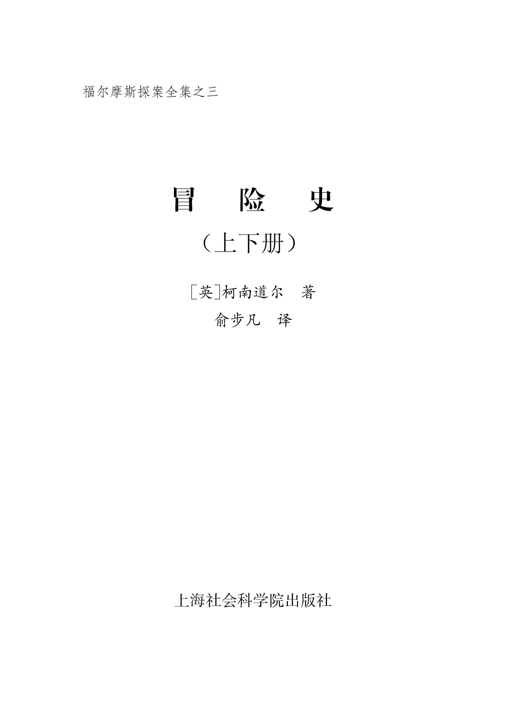

**图书在版编目（CIP）数据**

冒险史（上下册）／［英］柯南道尔（Conan
Doyle，A．）著；俞步凡译．—上海：上海社会科学院出版社，2012

（福尔摩斯探案全集；3）

ISBN 978-7-5520-0104-4

Ⅰ．①冒…　Ⅱ．①柯…　②俞…　Ⅲ．①侦探小说—小说集—英国—现代　Ⅳ．①I561.45

中国版本图书馆CIP数据核字（2012）第159598号

福尔摩斯探案全集之三

**冒险史（上下册）**

------------------------------------------------------------------------

**著　　者：**［英］柯南道尔

**译　　者：**俞步凡

**责任编辑：**陈如江

**封面设计：**王小阳工作室

**出版发行：**上海社会科学院出版社

上海淮海中路622弄7号　电话63875741　邮编200020

http://www.sassp.org.cn　E-mail：sassp＠sass.org.cn

**经　　销：**新华书店

**照　　排：**南京理工出版信息技术有限公司

**印　　刷：**上海中华印刷有限公司

**开　　本：**787×1092毫米　1/32开

**印　　张：**15.25

**插　　页：**4

**字　　数：**267千字

**版　　次：**2012年10月第1版　2012年10月第1次印刷

------------------------------------------------------------------------

ISBN 978-7-5520-0104-4/I·061

**定　　价：**43.00元（上下册）

------------------------------------------------------------------------

**版权所有　翻印必究**

# 目录

[冒险史（上册）](#part0042.xhtml)

[冒险史（下册）](#part0050.xhtml)

[返回总目录](#part0000.xhtml)

目录\
（上册）
========

[波希米亚丑闻](#part0044.xhtml)

[身份案](#part0045.xhtml)

[红发会](#part0046.xhtml)

[波斯康谷迷案](#part0047.xhtml)

[五颗橘核](#part0048.xhtml)

[歪脸男人](#part0049.xhtml)

[返回目录](#part0041.xhtml)

# 波希米亚丑闻<a href="#part0044.xhtml_ch1"
id="part0044.xhtml_ch1-back">(1)</a>

## 一

对于这女子，歇洛克·福尔摩斯一说起来始终尊称她是“女俊杰”，却很少用别的称谓。在福尔摩斯眼里，她才貌卓绝，无与伦比，是一位不同凡响的女性。那倒不是福尔摩斯对这位艾琳·阿德勒情有所钟；福尔摩斯的一切感情，特别是这一件事情上的感情，绝对为他冷峻、严谨的心态所排斥，他能如此沉稳，实在令人惊叹。他这个人，我要说是一架不折不扣的机器，是世上绝无仅有的观察研究机、推理分析器。至于谈情说爱，在他心中可惜占不到位置。他从无情爱的话语，一有谈及，不是嘲笑就是嗤之以鼻。当然，在这位观察家眼里，情爱之类也是值得称道的——因为非常有利于揭开人们行为动机的面纱。然而他自己，是一个训练有素的刑侦专家，不能让这种感情侵入而损害他已练就的极周密严谨的心理素质，否则就是掺进一种不确定因子，会把他精心推理的成果全部蒙上一层迷雾。即使精密器件中掉进了沙粒，或者他的哪一片高倍放大镜裂了缝，也都比不上在他这样的性格中产生强烈的情感冲动所起的扰乱作用。然而，确实有一位女子是例外，那就是已故的艾琳·阿德勒，只有这位女子给他留下了迷惘惆怅的回忆。

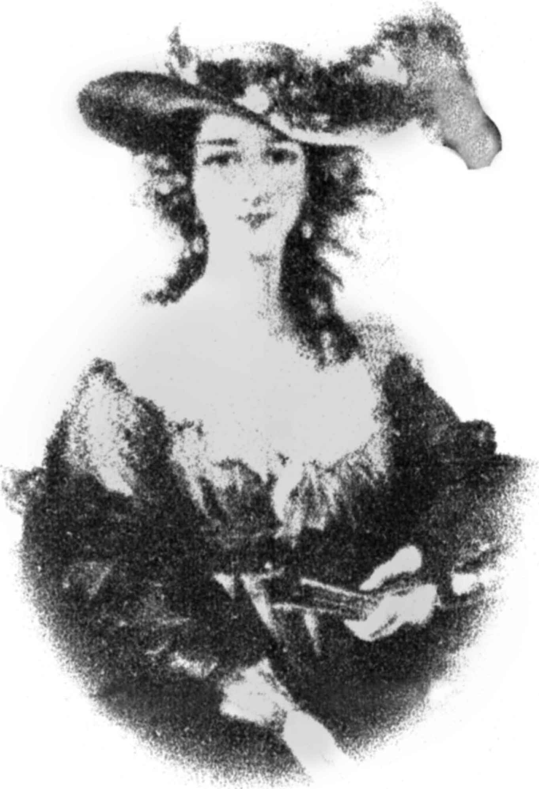

艾琳·阿德勒

近来我很少见到福尔摩斯。我一结婚，就和他分开了。自己有了家，平生第一次尝到主宰生活的甜头，使我全身心沉浸在家庭的无穷乐趣与美满幸福之中，家庭生活吸引了我的全部注意力。而福尔摩斯，他那波希米亚式的豪放性格，不为世俗社会的陈规陋习所羁，依旧住在贝克街那所旧房子里，埋头于旧书堆中。他是这个星期用了可卡因，下个星期则是干劲十足，如此交替，不是耽溺于药物麻醉昏昏沉沉，就是精力旺盛忘我地投入工作。他一如既往，仍旧醉心于刑事案件的研究，用他非凡的才能和洞察力追踪案件线索，探悉那些难解之谜，使官厅警方无力侦破而被悬起的疑案都一一得到解决。我不时有闻他的一些大致工作情况，如关于他受召去敖德萨处理特列波夫谋杀案，关于侦破亭可马利的阿特金森兄弟极为奇怪的惨案，以及最近关于他为荷兰皇室完成得天衣无缝的一桩使命，等等。他的这些行踪与活动，我和别人一样，都只是从报上看到，除此以外，我对这位老朋友和同伴的其他情况就所知不多了。

有一天晚上——一八八八年三月二十日——我出诊回家途中（此时我又重新开业行医），正好走过贝克街。一见那房子，屋门依旧，心头情感便起波澜，勾起我对昔日的回忆，更有《血字的研究》那种种悲惨的情节，于是忽然想到应该去看看福尔摩斯，再听他讲讲现在他把自己非凡的智力正倾注于什么问题。他的房间灯火通明，我抬头观望，看见他那瘦瘦高高的身子侧影在窗帘上掠过两回。他又是在屋里急急地来回走动，头低垂胸前，双手紧握在背后。我是深知他的性情和习惯的人，他的一举一动在我都能捉摸其中几分缘故。他是又在工作了。他已从药性的梦境中觉醒，又在亢奋地追寻探索什么新的问题。我拉了门铃，被迎进屋，上楼到了我曾经住过的房间。

他的态度并不热情，这倒是很出乎意外。不过看得出来，他见了我还是乐意的。他没说什么话，但目光很亲切，伸手示意请我坐。他递过雪茄匣来，又指指放在角落里的酒精瓶和气炉，然后站在壁炉前，用他那种特别的神态若有所思地看着我。

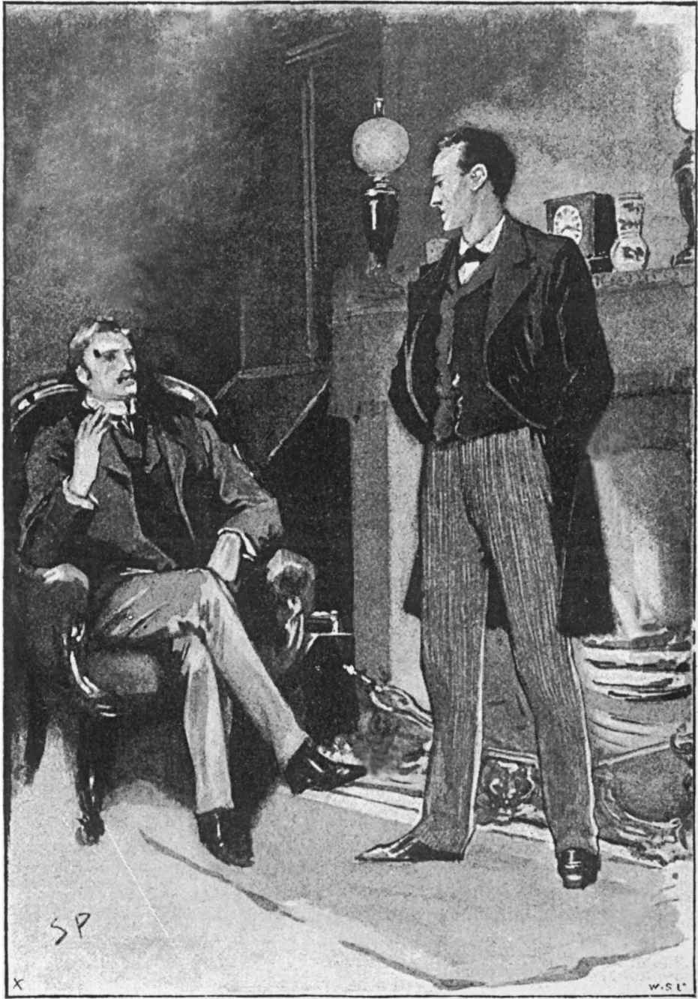

他递过雪茄匣来，然后站在壁炉前，看着我。

“你结婚是对的，”他讲话了，“我想，华生，上次和你见面以后，你现在的体重增加了七磅半。”

“七磅！”我回答说。

“没错，我说是七磅多，小事而已，想到随口说说，华生。而且，我看得出来，你又开业了吧，你没有跟我说起过你想行医呀。”

“你这是怎么知道的呢？”

“我看得出，推断得出，所以还知道你最近遭雨淋过。你有一个笨手笨脚、粗心大意的小女佣，对吗？”

“我亲爱的福尔摩斯，”我说道，“你可真是太厉害了，你要是早生几个世纪，一定要遭火刑烧死。一点没错，我星期四到乡下走了一趟，回家时一路淋雨，浑身湿透。可是我已经换掉衣服，真想象不出你怎么能推断知道呢！说到玛丽·简，她简直是无可救药，我妻子把她辞掉了。可是这件事，我也不知你从何知道！”

他在暗自好笑，搓着一双细长灵敏的手。

“这个其实简单不过，”他说，“我的眼睛告诉我你左脚鞋子的里侧，火光正照亮着看得清楚，皮革上有六道几乎是平行的划痕。很明显，这是有人十分粗心大意刮出来的，是为了刮掉鞋底边沿沾上的泥。由此可知，我得出了双重的结论。一是，你在雨天外出了；二是，这是个标志，伦敦小女佣大多是这副模样，粗手粗脚地擦鞋，刮出了裂痕。至于你开业行医，是这样的，如果一位颇有点派头的先生走进我的屋里来，身上带着碘溴味，他的右手食指上有硝酸银的黑斑点，他的大礼帽右边有鼓起的一块，表明是戴听诊器戴出来的，这就行了，我要是还不能宣告他是位开业医生，而且医务繁忙，那我不成了个笨蛋了吗！”

他解释他的推理过程原来是如此简单明了，我不禁笑出声。“我听你讲的理由，”我说，“事情总是变得那么简单，简单得可笑，我觉得，让我自己来推论也不难。虽说每逢你的推论到了接下去的一步，我却又糊涂了，非得又要你把全过程解释清楚，但我还是自信我的眼力不会比你差多少。”

“确实如此，”他回答说，点上一枝雪茄，身子往扶手椅沉沉一坐，“问题在于，你只是看，但是没有观察，这两者大有差别。比如说吧，这儿的楼梯你常看在眼里，一级一级，从门厅一级一级走到这个房间。”

“常常看在眼里呀。”

“看了多少次了？”

“那，总有好几百次吧。”

“有多少级呢？”

“多少级？这我不知道。”

“这就是嘛！你没有观察，虽说眼睛是看见的。这就是我的要点所在。告诉你，我知道，有十七级。这就是我既是看见，还观察来着。再顺便说说，既然对我那类小问题你有兴趣，还承蒙你把我微不足道的一点点经验记录了下来，这个你或许也会感兴趣。”他把一直摊开在桌上的一张粉红色厚信纸扔给了我。

“刚才一班邮差送到，”他说，“你念一念，大声点。”

信笺上没有日期，也没有签名和地址，我照着念：

“今晚七点三刻将有客造访，系紧急要事须请教阁下为荷。阁下于近期为欧洲某王室竭诚尽力之大作为，昭示无论何等事至大至难而不可言喻者，委托阁下承办则足可信赖，必迎刃而解无虞。汝之事迹广布四方，吾等亦有所闻。万望屈尊府上等候；来者若戴有面具，请勿介意是幸。”

“这倒是件很神秘的事，”我说，“你想这里边是什么意思呢？”

“我还没有根据。在没有获得根据之前就妄加推测，那是最大的错误。人们会有意无意地曲解事实来迎合理论，而不是将理论由事实来检验。但是，就凭这一张纸条本身，你能不能推理出一些什么问题来呢？”

我细心地审视笔迹和已写上字的这张纸头。

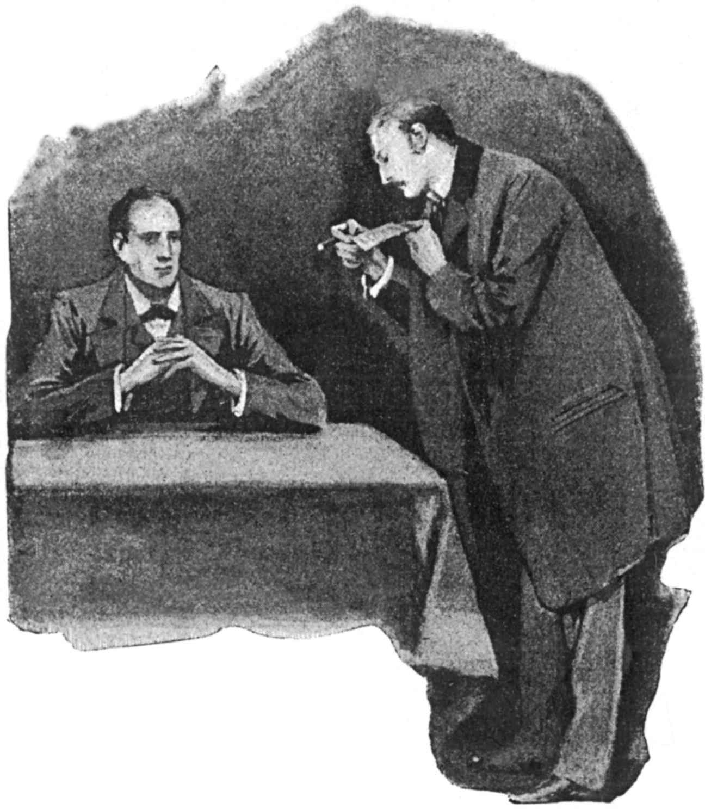

我细心地审视笔迹和已写上字的这张纸头。

“写这么张条子的，大概是个富人。”我说，竭力模仿我同伴的推理方法，“这种纸每一沓没有半个克朗<a href="#part0044.xhtml_ch2"
id="part0044.xhtml_ch2-back">(2)</a>买不到，纸质特别坚韧挺括。”

“特别——一语中的，”福尔摩斯说，“这纸，绝非英国所产。拿到亮光里照照看。”

我对光一照，从纸的纹理中发现有几个字母，一个大E，旁边一个小g，一个P，还有一个大G同一个小t。

“你看出什么名堂没有？”福尔摩斯问道。

“那是造纸商的名字，毫无疑问。或者，更准确点说就是字母花押。”

“完全不是。G加上个小t，是代表Gesellschaft，是德文的‘公司’，习惯上的缩略语，如同我们的Co.；P，很明显，就是Papier‘纸’；现在来看Eg，让我们查一下《大陆地名词典》。”他从书架上拿下一本棕色封面的大部头书，“Eglow，Eglonitz——好，有了，Egria。这个地方，是个德语国家，在波希米亚，离卡尔斯巴德<a href="#part0044.xhtml_ch3"
id="part0044.xhtml_ch3-back">(3)</a>不远。‘因华伦斯坦<a href="#part0044.xhtml_ch4"
id="part0044.xhtml_ch4-back">(4)</a>卒于该地而闻名，亦以玻璃厂及造纸厂林立而著称。’哈哈，来个正着！你看出什么意思了吗？”他两眼闪着光，吸一口雪茄，喷出大大的蓝烟圈，表示旗开得胜。

“这是波希米亚造的纸。”我说。

“完全正确。写这张纸条的人，是个德国人。你该注意这个句子结构特别——‘汝之事迹广布四方，吾等亦有所闻。’法国人、俄国人都不会是这种写法。只有德国人，他们用动词才会如此无礼。所以，现在要找找原因，这个德国人为什么要用波希米亚纸来写字条，为什么还要戴个面具，把真面目掩盖起来。呵，来了，要是我没弄错，果真是他的话，我们的疑团就要解开了。”

随着他的话，立刻传来一阵清脆的马蹄声，接着是马车轮子擦着街道镶边石的嘎嘎声，随后是急促的门铃声。福尔摩斯打了个呼哨。

“听声音是两匹马，”他说，“没错，”他到窗口瞥了一眼，接着说，“小巧精致的有篷四轮马车，两匹马也够漂亮，一匹就值一百五十基尼<a href="#part0044.xhtml_ch5"
id="part0044.xhtml_ch5-back">(5)</a>。这可是件赚钱的案子，华生，来者只要是他，就错不了。”

“我想我还是走的好，福尔摩斯。”

“别走，医生，你就待在这儿。你这位鲍斯韦尔<a href="#part0044.xhtml_ch6"
id="part0044.xhtml_ch6-back">(6)</a>，我怎么能少得了！这桩事肯定很有意思，你错过了岂不可惜！”

“可是你的委托人——”

“别管他，是我需要你帮点忙，恐怕他也需要。噢，来了。就那张椅子里坐吧，医生，好好看着点儿，多加关照。”

听得一个人沉稳的脚步声，上了楼梯，来到过道，在门外停住，接着是几下稳重的敲门声。

“进来！”福尔摩斯说。

来人进门，堂堂六英尺六的一个男子汉，虎背熊腰，魁伟有如赫拉克勒斯<a href="#part0044.xhtml_ch7"
id="part0044.xhtml_ch7-back">(7)</a>。他衣着华丽，那富丽堂皇的样子，在英国这块土地上不免已显俗气；袖子和双排纽扣上衣前襟的开衩处，镶有宽条阿斯特拉罕羔羊皮；披一件深蓝色大氅，用猩红色丝绸做衬里，一颗闪亮的蓝宝石饰针别在领口；脚穿一双高齐腿肚的靴子，靴口露着深棕色的毛皮，如此从头到脚炫耀着极尽奢华之能事的派头。一顶宽边礼帽拿在手中，戴一只黑色面具将脸的上半部遮住。这面具是刚刚戴上的，因为他进屋的时候还用手扶着。从他下半部的脸看，紧抿的厚嘴唇，长长的直下巴，像是一个性格坚毅果断而近乎迂顽固执的人。

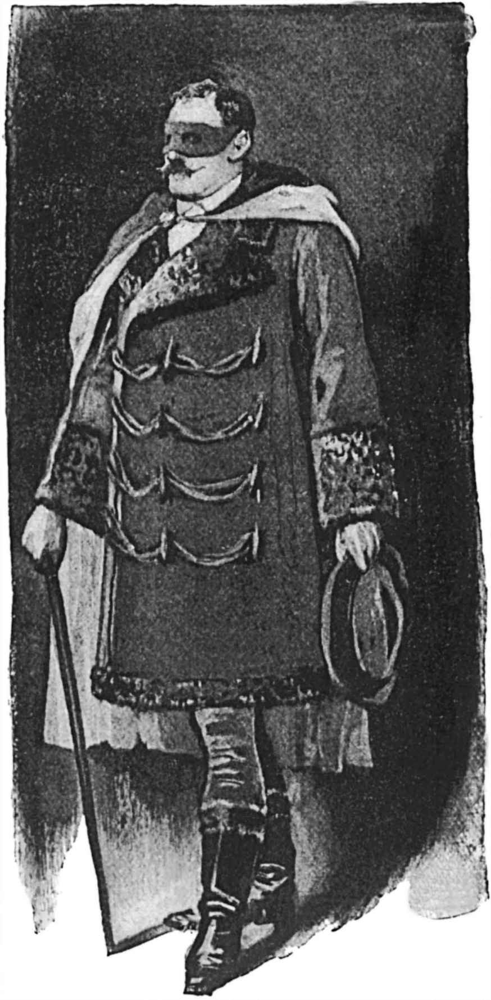

堂堂六英尺六的一个男子汉。

“你收到我的信了吗？”他问道，嗓子深沉、沙哑，带着浓重的德国口音，“我是告诉你我要来拜访。”他的眼睛在朝我们两人看来看去，好像摸不准该向哪一个先招呼。

“请坐，”福尔摩斯说道，“这位是我的朋友也是同事，华生医生。我办案子，常常少不了靠他大力帮助。请问我该怎么样称呼您？”

“你可以称呼我冯·克拉姆伯爵，我是波希米亚贵族。我想这位先生，你的朋友，是位值得尊重的十分谨慎的人。对于这桩极其重要的事我应该可以信赖他，否则还是只和你单独谈为好。”

我站起身来要走，福尔摩斯却抓住我手腕，把我按回到椅子上。“要谈跟我们两个一起谈，要么就不谈。”他说，“在这位先生面前，您和我谈什么都可以，尽管放心。”

伯爵耸了耸他那宽阔的肩膀。“那么，我先得申明，”他说，“你们两位在两年之内务必绝对保密，两年之后这桩事就无关紧要了。目前，这件事情之重大将影响到整个欧洲的历史，我这么说绝非言过其实。”

“我保证遵守。”福尔摩斯说。

“我也能保证。”

“请原谅我戴着面具，”我们这位不寻常的访客继续说道，“派我前来的贵人不希望你们知道我这个代理人是谁。所以，我这就得申明，我刚才自己介绍的并不是我真实的名字。”

“我已经感觉出来了。”福尔摩斯淡淡地说。

“情况很严重，很棘手，必须采取一切防范措施，尽力不使事态扩散酿成一件大丑闻，以免欧洲一个王族遭到严重损伤。挑明了讲，事关波希米亚世袭国王伟大的奥姆斯坦因王室。”

“我也觉察到了。”福尔摩斯轻轻说道，落座扶手椅上，闭起了双眼。

在来客的心目中，福尔摩斯无疑一直是被当作全欧洲推理能力最强、办案精力最充沛的侦探，这时对他无精打采的懒散样子感到奇怪，不禁投以疑虑的眼光。福尔摩斯慢慢地重新睁开双眼，以不耐烦的神情瞧着他那位身躯魁梧的委托人。

“陛下，您如果屈尊陈述您的案情，”福尔摩斯说道，“在下将能给您更好的效劳。”

这个人从椅子上跳了起来，激动得无以自制，在屋里走来走去。最后，他索性一把扯下面具，绝望地往地上一扔。“给你说对了，”他叫道，“我正是国王。我还装什么？何必隐瞒？”

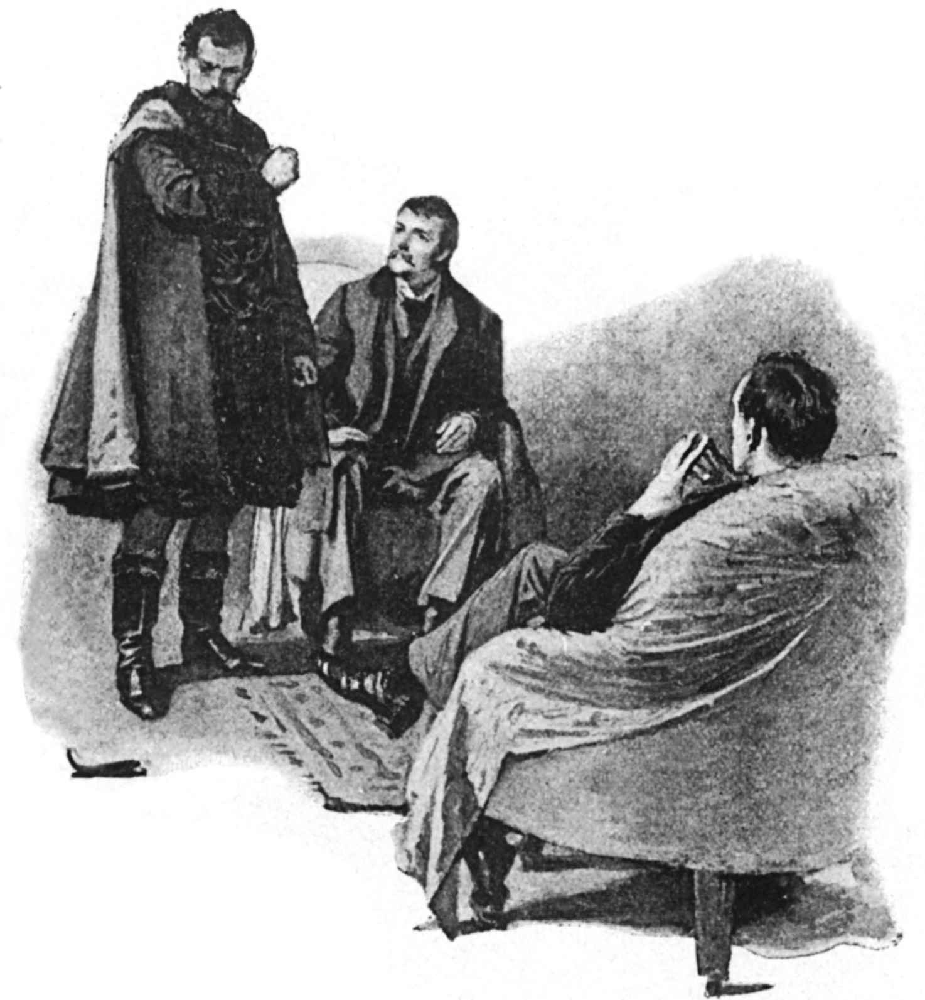

他索性一把扯下面具。

“噢，果然是？”福尔摩斯轻声说，“陛下不说，我已经有数，我所交谈的是威廉·戈特赖希·西吉斯蒙德·冯·奥姆斯坦因，就是卡斯尔费尔斯坦因大公、波希米亚的世袭国王。”

“那你就能理解了，”我们这位不寻常的访客重新坐下，伸手摸着他那又高又白的前额，说道，“你能理解，我照例不会亲自出马处理这种事，只因为事情非同小可，如果我亲自向哪个侦探和盘托出，自己就难免落入任人摆布的境地。所以我不得不从布拉格微服隐秘出行，特来向你请教。”

“那就请讲请问吧。”福尔摩斯说，重新闭起了眼睛。

“事情简单说是这样：大约五年以前，我去华沙长期出访，邂逅艾琳·阿德勒，那个鼎鼎大名的女冒险家，你不会不知道她。”

“请你查一查我那本索引里的资料，医生。”福尔摩斯轻声说，眼睛依然不睁开。多年以来，他一直注意人事资料，节录编目加以收藏，这已成为他的工作常规。因此说到什么事、什么人，他不会一无所知、无可查考，再冷僻生疏都难不倒他。对于这件事，我一下就找到该女子的经历简况，资料正夹在一个希伯来犹太教祭司和一个曾写深海鱼类专文的海军参谋之间。

“让我看看！”福尔摩斯说，“嗯哼！一八五八年生于新泽西州。女低音歌唱家——嗯哼！意大利歌剧院，嗯哼！华沙帝国歌剧院首席女歌唱家——对啦！退出歌剧舞台了——啊哈！住在伦敦——正是，没错！陛下，据此看来，您与年轻女子有染，您给她写过几封信，此种牵连于您有所不利，而现在，十分急于要把那些信弄回来。”

“确实如此。可是，怎么才能——”

“你们有秘密婚约？”

“没有。”

“没有法律文件或是证明什么的？”

“没有。”

“那我就难以理解了，陛下。要是这个年轻女子想用信件来达到敲诈或是其他目的，她怎么证明这些信是真的呢？”

“都是我亲笔。”

“没用没用！伪造的。”

“是我专用信笺。”

“偷来的。”

“我自己的印鉴。”

“仿造的。”

“我的照片。”

“买来的。”

“我们两人一起在照片里哪！”

“哦，天哪！这就糟糕了！陛下也真是太不检点了。”

“是我疯了——犯了糊涂。”

“您牵涉太深了。”

“当时我还只是个王储，还年轻。我现在也才不过三十。”

“那张照片一定得收回来。”

“我们想法试过，没有用。”

“陛下出钱吧，把它买回来。”

“她执意不肯。”

“那就去偷。”

“已经试过五次。我两次花钱雇人搜遍了她的房间。一次在她旅行的时候，调包了她的行李。还有两次对她拦路打劫。可是都一无所获。”

“连照片影儿也没看见？”

“毫无结果。”

福尔摩斯笑起来。“这个问题其实也不足挂齿。”

“对我怎么能说不重要！”国王不客气地顶他一句。

“说重要，也重要。她想拿照片干什么？”

“毁了我。”

“怎么个毁法？”

“我正要结婚呢。”

“这我也听说了。”

“和克洛蒂尔德·洛特曼·冯·萨克森－迈宁根结婚，斯堪的纳维亚国王的二公主。你可能知道，她家的家规极严。公主本人就是一个十分认真、不肯马虎的人。只要对我的行为有一丝的怀疑，这桩婚事就要告吹。”

“艾琳·阿德勒会怎么做？”

“她威胁说要把照片交给他们。她说得到做得到，这我很了解，你是不了解她。她个性极强，她有女人最美的美貌，也有男人最硬的硬心肠。只要我和另外的女人结婚，她什么都做得出来——不管什么。”

“您肯定照片她还没有交出去吗？”

“可以肯定。”

“怎么能肯定？”

“因为她说过，哪天我的婚约一公布，这一天她就把照片送出去。那就是下星期一了。”

“噢，那我们还有三天时间，”福尔摩斯说，打了个哈欠，“还好，还好，还算幸运。可现在，我这边有一两件重要事该调查。陛下，您当然要留在伦敦了，这几天？”

“对。你要找我就到兰厄姆旅馆好了，用的名字是冯·克拉姆伯爵。”

“我会传信给您，让您知道我们的进展情况。”

“这就好，我等候佳音。”

“那么，钱怎么说？”

“你说了算。”

“绝对好说？”

“我可以告诉你，为了弄回这张照片，我愿意拿出本王国的一个省来交换。”

“那么眼前的费用呢？”

国王从大氅里拿出一个沉甸甸的羚羊皮皮包，往桌上一放。

“这里是三百英镑金币，七百英镑钞票。”他说。

福尔摩斯在笔记本纸上写好一张收据交给他。

“那位小姐的住址呢？”福尔摩斯问。

“圣约翰林苑，委蛇大道<a href="#part0044.xhtml_ch8"
id="part0044.xhtml_ch8-back">(8)</a>，泻根植物苑宅第。”

福尔摩斯记了下来。“还有一个问题，”他说，“照片是六英寸的吗？”

“是的。”

“好，晚安，陛下，请放心，我们很快会给您好消息。噢，晚安，华生，”他又添上一句，这时皇家马车正在街上远去，“你如果方便，明天下午三点过来一趟，我先跟你谈谈这桩小事儿。”

## 二

三点整，我来到贝克街，谁知福尔摩斯出去还没回来。房东太太告诉我说，他早晨八点刚过就离家了。我在壁炉旁坐下，只好等他，也不知要等多久。我对他的刑案侦破已深感兴趣。虽说这起案子和以前我记录过的那两个案子相比较，情节远没有那么离奇，那么凶险，但是因为案子本身性质特殊以及当事人地位之崇高，也就自有其特色。确实，鉴于这件案子的性质如此，我的朋友已立即着手调查，除此之外，更有他对情况能了如指掌、稳操胜券以及敏锐透彻的推理功夫，也就使我能系统学习他的工作作风，跟随他掌握迅速而精细的工作方法，得以将乱麻条分缕析，终使雾团豁然开朗，这让我深感身心愉悦。他每逢出师必获全胜，在我心中已是铁定无疑，故而我的脑海里不存在他或有失败的可能。

快到四点的时候，门开了。一个醉醺醺的马车夫走进屋子来。他一脸拉碴的络腮胡子，面红耳赤，衣冠不整。我朋友的化装技术极为高明，谁也识不破他的真面目。虽说在我则是很清楚的，并不稀奇，可我还是得再三瞧上几眼，才能肯定来者并非车夫，而是他本人。他向我点头打个招呼径入卧室。不到五分钟，他便换成一套花呢正装，一如往常风度翩翩出现在我的面前。他把手插在口袋里，在壁炉前舒展开双腿，尽情地笑了一阵。

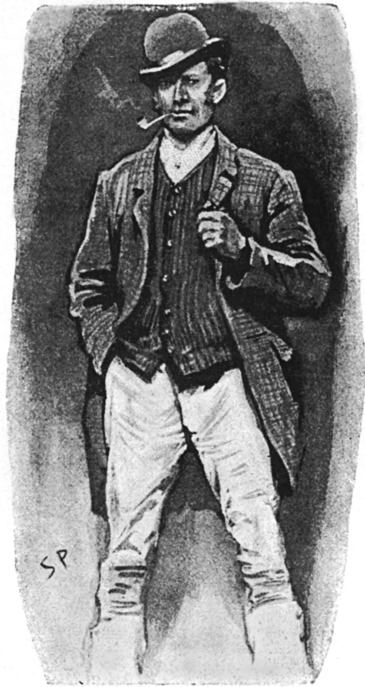

他把手插在口袋里，在壁炉前舒展开双腿。

“啊哈，还真有其事！”他叫道，接着哽了一下喉咙，然后又笑起来，直笑得全身无力，瘫坐在椅子里。

“事情怎么样了？”

“真太有趣了。我相信你是怎么也猜不到，这上午我忙什么来着，又忙出了个什么结果来。”

“我想象不出。你恐怕一直在注意观察阿德勒小姐的行动，也观察她的房子。”

“正是这样，可是结果大出意料，我这就跟你说说。我早晨八点一过就离家，扮作没活干的马车夫。你知道，马车夫帮里挺讲哥们儿义气，和他们混成一块儿，你想打听什么就能听到什么。我没费劲就找到了泻根植物苑宅第。那是一幢小巧玲珑的别墅，两层楼，屋后有花园，屋子正面朝向马路。门上是丘伯锁匠牌的保险锁。靠右侧是大客厅，摆设豪华，全部落地长窗。那些个英国式窗子搭扣，没想会是那么简单，连小孩儿都能一拨弄就打开。屋后没啥值得注意，只有马车房顶可以够得着那扇过道窗。我在屋外绕上一圈，从各个方面仔细侦察，看不出有多少感兴趣的地方。

“之后我在街上慢悠悠闲逛。果然如我所想，给我发现沿花园一面墙有条小巷，顺着巷子下去就是马房。我上去帮马夫梳马鬃，擦马身，他给了我两便士，倒给我一杯淡黑掺和啤酒，给我抽两烟斗浓烟丝。我听到许多阿德勒小姐的事，我就是要听这个，正合我意，其他邻居的碎杂子事我一概没兴趣，可你也不得不听着哟。”

“艾琳·阿德勒怎么个情况呢？”我问。

“噢，她叫周围的男人都拜倒在她的石榴裙下了。她是稀世尤物，最俏丽的佳人。委蛇大道的马厩里，人人都这么说。她过着宁静的生活，赴音乐会演唱。每天五点钟马车出去，七点钟准时回家进晚餐。除了演唱，其他时间深居简出。只有一个男人常往来，关系还相当密切。这个人黝黑肤色，英俊潇洒，一派朝气蓬勃。他天天要来，至少一次，常常是两次。他是内殿律师学院<a href="#part0044.xhtml_ch9"
id="part0044.xhtml_ch9-back">(9)</a>的戈德弗雷·诺顿先生。你瞧，如果车夫信得过你的话，可有好处啦。他们把他从委蛇大道马厩载回家去，不知有多少次了，这就对他了解得不少，从车夫他们嘴里让我全听了来。然后再围绕泻根植物苑宅第走一遭，盘算好行动计划。

“这个戈德弗雷·诺顿，很明显，是这件事中的重要角色。他是律师，这一上来就很不利。两人之间究竟是什么关系？他频繁出入是何目的？女的是男的当事人还是朋友，或是情妇？如果是前者，那么很可能照片已经转移到他手里由他保管；如果是后者，就不大可能那么做。面对这个问题，就得考虑把注意力继续放在泻根苑宅第还是转移目标，盯上男的内殿院住所。这是必须谨慎从事的关键问题，也势必要扩大我的侦查范围。我怕这种枝枝节节的事，你要觉得讨厌。可是我得让你看到我面临的困难，好让你也了解一点情况。”

“我听你说说，好好听着呢。”我回答。

“我正把这事在心里反复考虑琢磨，这时一辆双轮出租马车来到泻根植物苑宅第，车上跳下一位男士，模样极帅，很引人注目，黑黑的脸，鹰钩鼻，留八字小胡——不用说，就是马车夫告诉我的那个人了。他好像有急事，非常匆忙，大声叫车夫停车等着他。一个女佣刚上来替他开门，他就跳下车，打女佣面前擦身而过，像是当家主人，毫不拘束。

“他进屋有半个多小时。透过客厅窗户能略略望得见，他在走来走去，激动地说话，指手画脚，那个女的，看不见。随后他就出来，看样子比刚才更是急迫，一踏上马车，立即从口袋里摸出一只金表，很快看一眼。‘快，快，越快越好，’他喊着，‘先到摄政街格罗斯·汉基旅馆，再去埃奇韦尔路圣莫尼卡教堂。给你半个基尼，二十分钟要赶到！’

“车马上走了。我正在犯疑要不要跟住这辆车，忽然看见小巷子里出来一辆小巧玲珑的四轮马车，车夫的上衣还只扣了一半的扣子，领带歪向耳边，马具吊挂都还没有穿环扣带，车没好好停稳，一个女人打客厅门里冲出，急急登上了车。刹那间，我只瞥了一眼，但已经看到这个女人确是非凡的美貌，姿色至佳，足以令男人们为之倾倒。

“‘去圣莫尼卡教堂，约翰，’她大声说，‘赏你半英镑金币，二十分钟快点赶到。’

“这机会再好也没有，不可错过，华生。我正在想，先由她去呢还是爬上车背后，这时正好又有一辆出租马车打街上过来，马车夫见我这么一个破破烂烂的人想乘他车，便看了一眼又一眼，我没等他开口回绝已跳进了车。‘去圣莫尼卡教堂，’我说，‘给你半英镑金币，二十分钟要赶到。’这时候是十一点三十五分，当然再清楚不过，将会进行什么事。

“我的马车跑得飞快，以前好像都没有这样快过。可是他们的马车还是比我先到。我到的时候，那辆出租马车、那辆四轮马车已经停在门口，两匹马气喘吁吁冒着热气。我付掉车钱，赶快跑进教堂。教堂空空如也，没人，只有我追踪的那两位，再有就是白色法衣的牧师，像是在关照两人什么话。总共只有这么两个人站在圣坛之前。我在一旁走道上闲着，就好像是一般人碰巧来教堂里看看逛逛。忽然叫我大吃一惊，圣坛前的三个人，脸都转过来向着我，戈德弗雷·诺顿还一个劲朝我跑过来。

“‘感谢上帝，’他喊着，‘有你正合适，来！来！’

“‘做什么？’我问他。

“‘来吧，朋友，来，耽搁你三分钟时间，要不就不够合法了。’

“我也就顺着他半推半就来到圣坛前，人还没就位站稳，便对耳旁的絮絮叨叨喃喃应答，替人陌陌生生来作证，大力相助撮合未婚女艾琳·阿德勒、未婚男戈德弗雷·诺顿结为夫妇。整个过程只一会儿工夫就完毕，新郎在这一边，新娘在那一边，一迭声向我感谢，牧师在面前朝我微笑。真是荒唐，扮这么个角色我这辈子还不曾有过，一想起来，现在都觉得实在好笑，看来原先这婚礼是不合法的，连一个证婚人都没有，牧师拒绝主持婚礼。幸亏有我给撞上了，才免得新郎到街上去拉个男傧相来救急。新娘赏我一个沙弗林<a href="#part0044.xhtml_ch10"
id="part0044.xhtml_ch10-back">(10)</a>，我要把它拴在表链上戴着，对这次际遇留个纪念。”

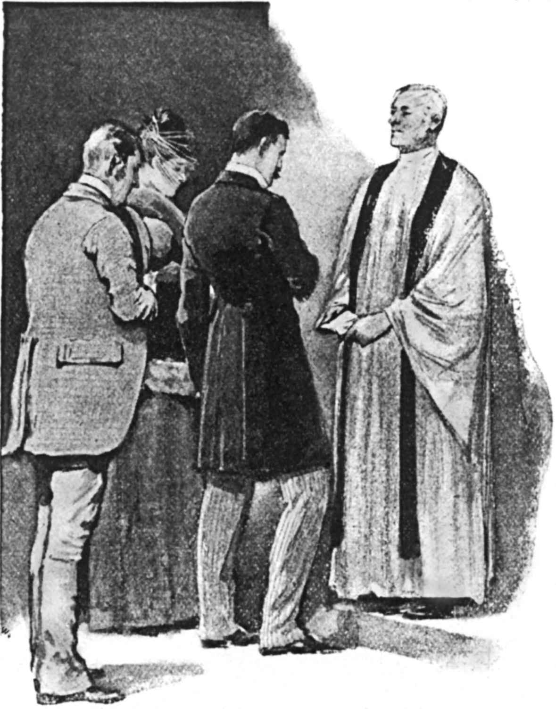

替人陌陌生生来作证。

“这事原本不成，想不到这么顺利通过，”我说，“后来呢？”

“后来，我想到自己的计划受到了严重威胁。看到两个人马上就要离开，我这边就得迅速采取有力的应对措施。可是回头到教堂门口，两人分手了。男的坐车回法学院，女的回她自己的家。‘我照老规矩，五点钟到公园去。’女的临走时对男的说，别的我没听到什么。他们各自分头上车走了，我呢，也就离开要作我自己的安排。”

“怎么安排？”

“安排冷牛排，再一杯啤酒，”他答道，按下了铃，“我都忙得顾不得吃饭。今天晚上我又得忙一阵子，医生，需要你一起来帮忙搭个手。”

“非常乐意。”

“你怕不怕犯法？”

“绝对不怕。”

“闹不好还要给抓起来呢。”

“为了做好事，抓就抓。”

“好的，大大的好事！”

“跟着你做就是了。”

“我就是知道，你是绝对信得过的。”

“你想怎么做？”

“特纳太太把吃的端上来了，我这就仔细给你讲。现在，”他就着房东太太端来的简单饭食狼吞虎咽地吃起来，“我只好一边吃一边跟你商量这个事儿。因为时间很紧了，现在，已经快到五点，还有两个小时，我们一定要赶到现场付诸行动。艾琳小姐，现在得叫她夫人才对了，该是七点钟乘车回家，我们一定要赶到泻根植物苑守着她。”

“然后怎么样？”

“让我去迎着她，以下的事一步一步我会安排定当。只有一点，我必须对你强调，你只管等着别动，不管我发生什么事，你不要出头，明白吗？”

“一点不关我事？”

“无论怎么，不关你事。会发生一点不愉快，不要搅和进来，等我一进了屋，事态就会平息。四五分钟以后，客厅的窗户就会打开，你要紧靠着打开窗的地方等候在那里。”

“好的。”

“你看好我，我一定会让你看得见我。”

“好的。”

“当我一举手——这么一举手——你就扔进来，我有东西会给你，只管扔，同时，大声叫喊着火了。我这么说你听明白了吗？”

“都明白。”

“事情不难，不复杂，”他说着，从口袋里掏出一枝雪茄形状的长卷筒，“这是水管工人检漏常用的喷烟筒，两头的这一头是个火帽，可以起火。你的任务就是用这玩意儿，直起喉咙喊着火了，就一定能惊动好些人来救火。趁这时候你跑向街尽头，我会在十分钟内过来和你会合。我说的你都清楚吧？”

“我到那儿，若无其事的样子；挨近窗口，望着你；你一出手势，我就把这东西扔进去，然后大喊着火了；然后到街转角上去等你。”

“一点不错。”

“行，放心瞧我的好了。”

“这就再好也没有。我看时间差不多了，我要演个新角色，该准备准备了。”

他一转身进了卧室，没几分钟就出来，已完全变成一个和颜悦色、纯朴可亲的非国教的英国基督教牧师。黑色大檐帽，宽松的长裤，白领结，会心的微笑，眯缝着的双眼，那副慨然慈祥的模样，只有约翰·海厄先生<a href="#part0044.xhtml_ch11"
id="part0044.xhtml_ch11-back">(11)</a>堪与相比。福尔摩斯换掉的不仅仅是服饰穿着，还有相貌表情、神情姿态，以至于灵魂都随着他所变的角色而脱胎成另外一个人。所以不妨说，他成了刑案专家，舞台上就此少了一个演技出众的表演艺术家。诚然也可以说，科技界失去了一个学理精湛的科学家。

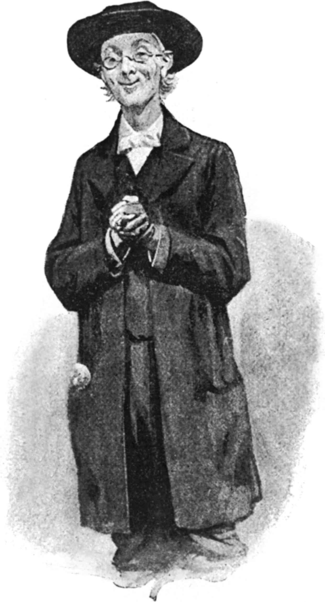

一个和颜悦色的英国基督教牧师。

我们离开贝克街是六点一刻，赶到委蛇大道还提前了十分钟。时已黄昏，家家亮起灯火。我们在泻根植物苑宅第前踱来踱去，等待屋主人的到来。这宅屋在我已有印象，正如福尔摩斯向我简单描述过的那个样子，但是屋子所处环境不如我想象中的清静。相对而言，由于邻近四周都更为安静，这条街便显得相当的活跃热闹：一群衣衫褴褛的人在街角上抽着烟，嘻嘻哈哈谈天说地；有人提着剪子磨轮，那是磨剪子匠；两个卫兵正在同谁家的小保姆调情说笑；还有几个衣着光鲜的年轻人嘴里叼着雪茄，正无事逛荡。

“你看，”我和福尔摩斯还在屋前徘徊，他说道，“这一结婚，事情倒好办了，照片变成了一把双刃剑。因为这么一来，她就不会愿意让戈德弗雷·诺顿先生看见照片，就像我们的当事人不愿意照片在公主面前露眼，是一样的道理。现在的问题是，我们怎么才能找到照片？”

“是呀，怎么找呢？”

“她不大可能把照片带在身边。一张六英寸照片，女人衣服藏不下，何况知道国王会劫她、搜她。半途拦截已经发生过两次，所以可以肯定，决不会随身携带藏在身上。”

“那么藏在哪里？”

“交给银行家或者律师保管，可以有这两种办法。但是我看她一处也不会去交。女人天性爱保密，做什么事都喜欢只有自己一个人知道。她怎么会去交给旁人呢？她只相信自己保管最牢靠，至于对一个事业人士有什么间接影响或者政治后果，她未必考虑得到。另外，还要记住，她原打算是没几天就一定要用的，所以放的地方肯定是要用起来随时就可以拿到，那就只有藏在自己家里这一种可能。”

“不过已经被撬门盗窃过两次，都没有发现。”

“哼！这号人，怎么找都白搭！”

“你能找到？”

“我根本不用找。”

“那怎么办？”

“我要她自己给我拿出来。”

“她自己怎么会肯？”

“她不肯也不行。喔，我听到马车来了，是她的车。好，现在就照我讲的去办。”

他正这么说着，马车从大路上一拐弯，车灯的光线一下子射了过来。那是一辆很漂亮的双排座马车，咕隆隆到了泻根植物苑门前。刚一停稳，街角上一个瘪三就奔过来给打开车门，希望赚到手一个铜子儿，可是另有一个瘪三忽然冲上来一肘子把他挤掉，抢他的生意，就此爆发一场激烈的争吵。那两个卫兵又来火上加油，他们帮腔先前的那个瘪三。磨剪子匠也来凑热闹，起劲地帮着后来的一个吵骂。吵着吵着就动起了拳头。女士从车上下来，给搅在面红耳赤闹得不可开交的人群之中。他们拳棒交加，像疯子一般。这时福尔摩斯冲进人群保护住女士，可是刚接近她身边，就惨叫一声倒在了地上，他已是血流满面。见此情景，两个卫兵拔腿就跑，两个瘪三朝另一方向也溜掉了。那几个衣着光鲜的闲人，对刚才这场混战旁观未曾加入，这时挤过来帮助女士，看看受伤倒地的人。艾琳·阿德勒——我还是要这么称呼她，这时已跑上台阶，站在阶台上面，背衬着门厅里的灯光，勾勒出她那婀娜娉婷的身姿，她回头望着街上。

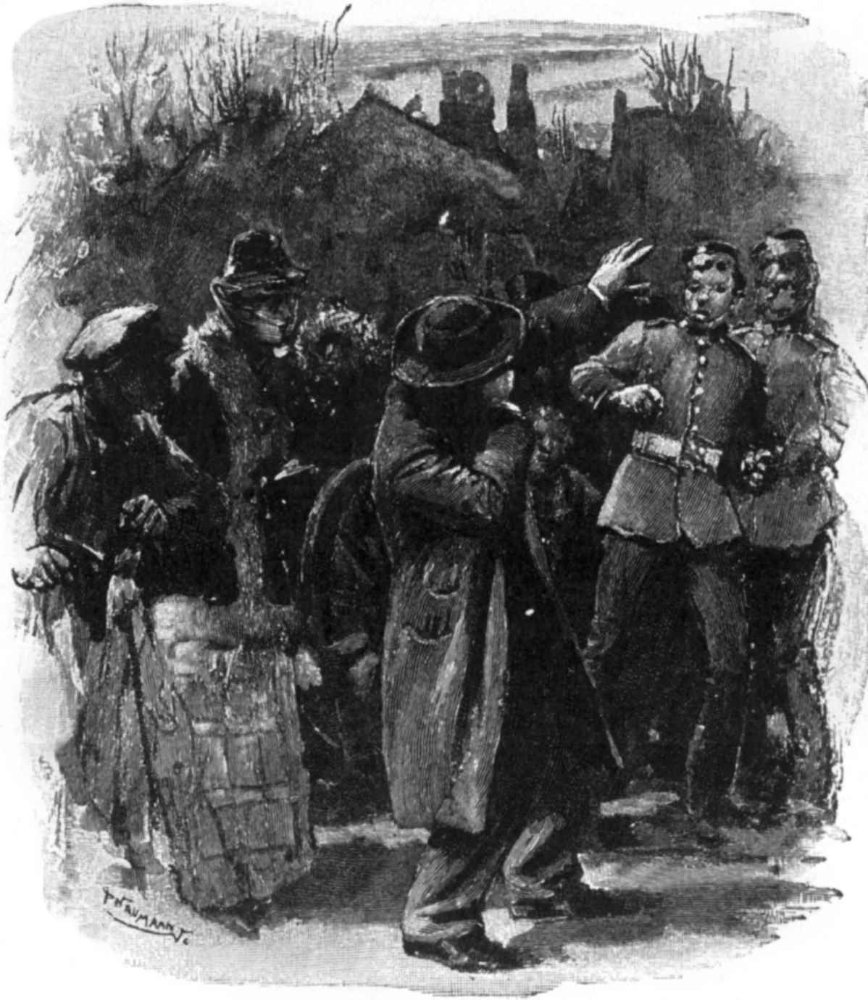

他已是血流满面。

“那位先生伤得厉害吗？”她问道。

“打死人了！”有几个人在喊。

“没死，没死，还有气！”有一个人叫道，“快送医院，不送就真要死了！”

“这人真勇敢，”一个女人说，“要不是他，夫人的表、钱包早给抢走了。他们是一帮子人，可厉害了。啊，看，他缓过气来了。”

“别让他躺街上，扶他进屋吧，太太？”

“对，快扶他客厅里来，躺沙发上，这里，快！”

大家七手八脚小心翼翼把他又抬又扶地进了泻根植物苑宅第正厅，而我，站在临窗的位置看着里边的情形。灯都点亮着，窗帘没有拉拢，我能看见福尔摩斯给安顿在长沙发上。我不知道他是否为自己此刻演着这出戏深感内疚，但是我知道，当我看到我要实施的计谋是针对如此貌美的佳丽，又看到她对待伤者那种善心温雅的仪态，我内心便感到有生以来无比的惭愧和不忍。然而，如果我现在对福尔摩斯信赖我、托付我的这一角色撒手不干，那也是最可耻的背弃。我便横下一条心，从阿尔斯特大衣<a href="#part0044.xhtml_ch12"
id="part0044.xhtml_ch12-back">(12)</a>里取出烟火筒。再说，我想，毕竟不是我们要加害于她，我们不过是阻止她伤害别人罢了。

福尔摩斯已经从长沙发上坐起来，看来像是呼吸很困难的样子。一个女仆赶快过来把窗推开。就在这一刹那，我看见他把手往上一举，这是信号。我立即将烟火筒扔进屋去，高声大喊：“着火啦！”我这一喊，立刻引来一片“着火”声，那群看热闹的人，不管衣着好的、破的——绅士、马夫、女仆——全都一齐高喊着火。屋子里已是浓烟滚滚，从开着的窗户向外直冒。我看见人影惊慌乱窜。稍顷，传出了福尔摩斯的声音，叫大家不要慌，房子没有着火。我趁人们慌乱之际溜走，直奔街的转角。只十来分钟，我不胜欣喜，我的朋友已经同我手挽着手，一起从骚乱的现场撤离。他疾步而行，数分钟不言语，一直走出静静的小街，到了埃奇韦尔路。

“你干得真漂亮，医生，”他说道，“好得没话说，绝对好。”

“你拿到照片了？”

“我知道照片放哪儿了。”

“你是怎么知道的？”

“就是我跟你说过的那样，她自己亮给我看了。”

“这话我不明白。”

“我不想故弄玄虚，”他说道，笑了起来，“事情是非常的简单。你当然看得出，街上的人个个都是我雇来参加演出今天晚上这场戏的。”

“我猜也就是这么回事。”

“好了，我手掌上事先涂有红颜料，事情一闹起来，我冲过去，跌倒，手往脸上一抹，我就被打成一脸的血了。老把戏而已。”

“这个我也看出来了。”

“接着他们把我扶进屋里，她不让也不行呀，她还能做什么？进了起居室，我最疑心的也就是这一间。估计就藏在起居室和她卧室之间的地方，我要看的正是这里。他们把我安顿在长沙发上，我装出透不过气，难受，他们赶快把窗子打开，这就让你有机可乘。”

“这么做，你又能怎么呢？”

“这很重要啦。女人都是一样，房子一着火，首先想的，是她最珍贵的对象，本能地奔过去抓住，一种冲动，绝对不可违背。这一点，我已试过多次，真是屡试不爽。那个达林顿冒名顶替的丑闻案，我用的是这一手，阿恩沃思城堡疑案也是如此。做了母亲的女人最要紧是抱孩子，未婚的女人最要紧是抓珠宝盒。现在我很清楚，我们今天的这位女士，她屋里再也没有比我们所要的东西更加贵重的了，她一定会赶紧把这样东西拿到手里。火警一起，立见功效。又是浓烟又是喊救火，即使铁石意志也不免要心乱。她果然反应，果然中计。照片藏在隔墙有拉门的壁龛里，壁龛位于门铃拉手上方。她急忙跑过去拉开小门，我用眼一瞥，看她拿住了照片。见她快要取出来的时候，我就喊不是火警，没有着火，虚惊一场，她随即又把照片重新放回，放好，朝烟火筒看了一眼，马上跑出屋去，就不见她人影了。我站起来，说个借口趁机脱身，溜出屋子。我曾迟疑了一下，想马上把照片拿到手算了，但是马车夫跑进来，他正拿眼盯住我。为安全起见，以后再说吧；因为要当心了，稍有轻率，就整个儿坏事。”

“现在怎么办？”我问。

“我们的调查，实际上已经结束，我明天就和国王一块儿去登门拜访她。你也来，要是你有兴趣的话。去了那里我们总是给安排在起居室等候女士，这就成了，很可能，等她出来见客的时候，既不见了来访的客人，也不见了照片。结局是，国王陛下亲手重获照片，如愿以偿。”

“你几点去拜访她？”

“早上八点钟。她这时候还没有起床，我们行动起来时间充裕就方便。事情一定要抓紧了，因为她一结婚，或许生活和习惯会完全改变，我得赶快给国王拍个电报，不能耽搁。”

我们已到贝克街，在门口停步，他正往口袋里掏钥匙，有人走到身旁，打招呼说：“晚安，歇洛克·福尔摩斯先生。”

这时候人行道上有几个人，道晚安的好像是一个细小个头的少年，身穿阿尔斯特大衣，说完，人已走掉。

“这口音耳熟，我好像听到过，”福尔摩斯说，瞧着路灯昏暗的街道，“就是想不起到底是什么人。”

## 三

当天晚上我就歇在贝克街。早晨正在吃烤面包，喝咖啡，波希米亚国王一下子就闯进了房间。

“你把照片拿到手了？”国王叫道，两手抓住福尔摩斯的肩膀，两眼急切地盯住他的脸。

“还没有。”

“那有没有希望？”

“我看有希望。”

“那好，快去吧，我都等不及了。”

“我们要雇辆车。”

“不用了，我的车正等着呢。”

“噢，是的，那就正好。”于是马上出门，再一次赶往泻根植物苑宅第。

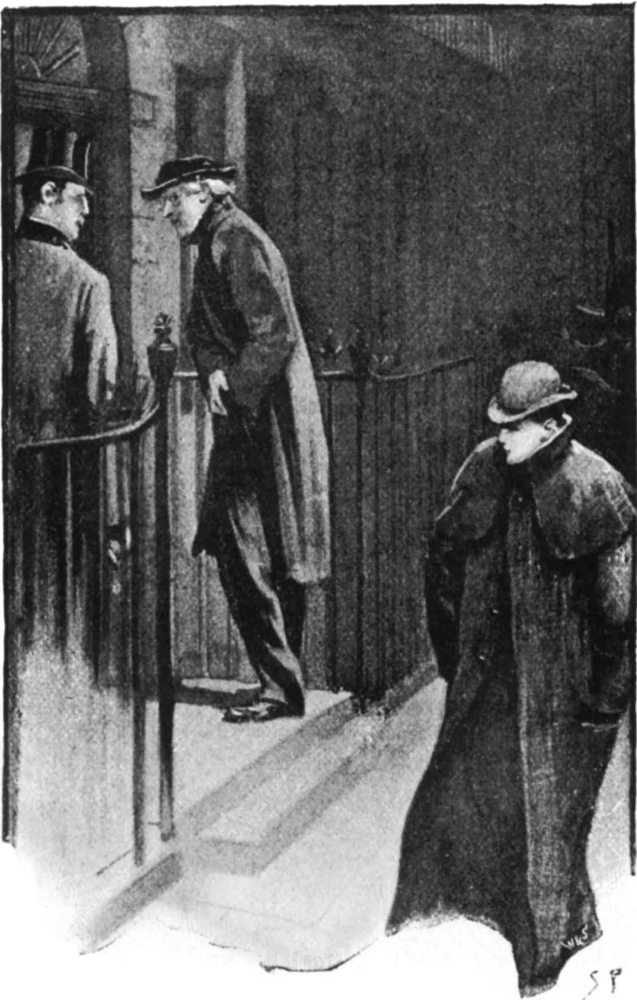

有人走到身边打招呼。

“艾琳·阿德勒已经结婚了。”福尔摩斯说。

“结婚了？什么时候？”

“昨天。”

“跟谁结婚？”

“跟一位英国律师，名叫诺顿。”

“艾琳不会爱他的。”

“我倒希望能爱他。”

“这是为什么？”

“因为这样一来，陛下也就没有后顾之忧了。只要这位女士爱自己的丈夫，她就不会再爱您陛下，也就没有理由来干扰陛下的计划了。”

“这倒也是。那么，哎呀——可惜！她要有我这样的地位那该多好！她应该是一位多么好的王后呀！”国王闷闷不乐，陷入沉思，一直到委蛇大道，一路都没再开口。

泻根植物苑宅第的门大开着，一个老妇人站在台阶上。她一脸不屑的神气，看我们从四轮马车上下来。

“敢情就是歇洛克·福尔摩斯先生啰？”老妇人说。

“我就是福尔摩斯。”我的同伴回答，十分诧异，满腹狐疑地望望她。“那好！我家女主人告诉我，你很有可能会来的。女主人同她丈夫今天早晨一起走了，在查林十字街站乘五点十五分的火车去了大陆。”

“什么？”福尔摩斯身子向后一晃，懊恼惊异，脸色惨白，“你是说她离开英国了？”

“永不回来。”

“那，那纸片儿？”国王问，喉咙都哑了，“全完蛋！”

“我们来看看。”福尔摩斯推开女仆，冲入起居室，国王和我随后跟进。看屋里满地家具，凌乱不堪，边边框框散架，只只抽屉拉出。那样子，是女士忙不迭翻箱倒柜一番，急着匆匆离去。福尔摩斯扑向挂铃处，拉开墙上小门，伸手进去，掏出一张相片、一封信。相片是艾琳·阿德勒单人照，着晚礼服，信封上写着“歇洛克·福尔摩斯先生亲启。请勿擅动，须他自取”。我的朋友把信撕开，三个人凑拢一起看信。信的日期是昨天午夜，信中这样写道：

我亲爱的歇洛克·福尔摩斯先生：

你的确做得很出色，你把我完全蒙骗住。发出火警之前，我对你一直没有怀疑，等到火警之后，我才发现上你当，暴露了秘密。我于是开始考虑问题。几个月以前我就听人警告过小心别碰上你，说是国王要雇侦探的话，无疑必定雇你。别人连你的地址都给了我。然而结果我还是自我暴露，给你看到你要知道的东西。甚至已引起疑心之时，我还觉得难以相信如此一位和蔼可亲的老牧师竟心怀鬼胎。可是，你须知，我本人是个经验丰富的演员，女扮男装是我的拿手好戏，我常常什么时候需要就什么时候使上这一手。我派马车夫约翰监视你，自己跑到楼上，换好我称之为“散步服”的衣裳，你走了以后我才下楼来。

之后，我跟踪你到你家门口，终于确定无疑，我确实已成为大名鼎鼎的歇洛克·福尔摩斯先生感兴趣的目标。而且，我还要不揣冒昧道你一声晚安，才径直赶来殿院会我丈夫。

我们两人认为，给这么一位可畏的对手盯上，只好三十六计走为上计。所以你明天光临本窝巢，必将发现业已人去楼空。至于照片事，请你的委托人一万个放心，我所爱、我被爱的一个男子，好过于他。国王尽可以想干什么就去干什么，不必顾虑他自己做了对不起人的事，受他很大伤害的人会来扯他后腿。我保留照片纯系自卫，尚须留有一手以防他或有可能将来再加害于我。我另留一张照片，听由处置。顺此向亲爱的歇洛克·福尔摩斯先生致意。

您最忠诚的

艾琳·阿德勒·诺顿

“多么了不起的女性——噢，多么了不起的一位女性！”当三人一起读着这篇华章书信，波希米亚国王不禁感叹道，“我不是告诉过你她有多机敏果敢吗？她不是完全够得上一位令人钦佩的王后吗？她和我的地位不一样，不是太可惜了吗？”

“依我所见，这位女士似乎确实与陛下的地位、水平很不相同，”福尔摩斯冷冷地说，“很遗憾，我未能给陛下的事赢得一个更为完美的结局。”

“恰恰相反，我亲爱的先生，”国王高声道，“再也没有比这更好更完美的了。我明白，她说话是算数的，照片现在已无威胁，就如同火烧掉了一样安全保险。”

“我很高兴听到陛下这么说。”

“我对你实在感激不尽，请尽管告诉我怎么报答你才好。这只戒指——”他把自己手指上的一只绿宝石蛇环戒摘下来托在手掌上。

“依我看来陛下另有价值更高之物。”福尔摩斯说。

“请尽管讲。”

“这张照片！”

国王惊异莫名地看着他。

“艾琳的照片！”他叫道，“当然可以，你若是真想要的话。”

“谢谢陛下。好了，本案已到此结束，在下谨祝早安。”他鞠一躬，立即转身，未看一眼国王向他伸出的手，在我的陪同下，一起回到他的寓所。

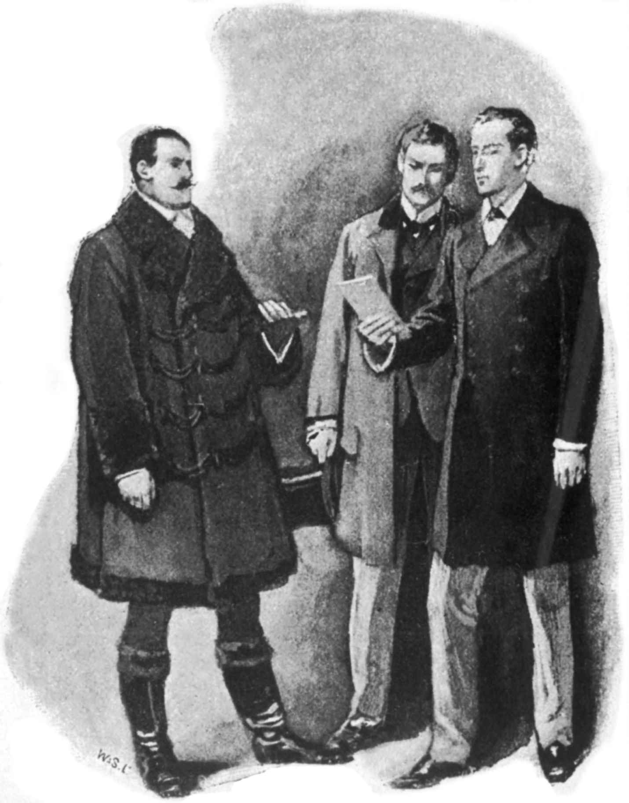

“艾琳的照片，当然可以，你若是真想要的话。”

这就是波希米亚国王如何受到一桩大丑闻的威胁，以及歇洛克·福尔摩斯先生的神机妙算如何被一位女性的聪明才智所挫败的故事。福尔摩斯过去一向嘲笑女人的智力，但是此后我再也听不到了。而且，每逢说起艾琳·阿德勒，或者提到她那张照片的时候，福尔摩斯一定很尊重地称她为“女俊杰”。

（1891年）

————————————————————

<a href="#part0044.xhtml_ch1-back" id="part0044.xhtml_ch1">(1)</a> 波希米亚（Bohemia），原为始建于9世纪的欧洲中部一王国，自1526年归属哈布斯堡王朝，于1918年瓦解。波希米亚今为地区名，指捷克西部。波希米亚人素以性格豪放不羁著称。

<a href="#part0044.xhtml_ch2-back" id="part0044.xhtml_ch2">(2)</a> 克朗（crown），英国旧制5先令硬币。

<a href="#part0044.xhtml_ch3-back" id="part0044.xhtml_ch3">(3)</a> 卡尔斯巴德（Carlsbad），即卡罗维发利（Karlovy
Vary），捷克西北部城市。

<a href="#part0044.xhtml_ch4-back" id="part0044.xhtml_ch4">(4)</a> 华伦斯坦（Wallenstein，Albrecht
Wenzel Euseblusvon，1583—1634），神圣罗马帝国统帅，军功卓著，后被刺杀。

<a href="#part0044.xhtml_ch5-back" id="part0044.xhtml_ch5">(5)</a> 几尼（guinea），英国金币，1813年停止流通，后仅指等于21先令即1.05英镑的币值单位。

<a href="#part0044.xhtml_ch6-back" id="part0044.xhtml_ch6">(6)</a> 鲍斯韦尔（Boswell，James，1740—1795），苏格兰作家，曾为辞书家、作家塞缪尔·约翰逊（Samuel
Johnson）写传记，遂被作为文学助手的代名词。

<a href="#part0044.xhtml_ch7-back" id="part0044.xhtml_ch7">(7)</a> 赫拉克勒斯（Hercules），希腊罗马神话中的大力神。

<a href="#part0044.xhtml_ch8-back" id="part0044.xhtml_ch8">(8)</a> 委蛇大道（Serpentine
Avenue），一条沿河弯曲的道路。

<a href="#part0044.xhtml_ch9-back" id="part0044.xhtml_ch9">(9)</a> 内殿律师学院（The
Inner Temple），伦敦培养律师的机构之一。

<a href="#part0044.xhtml_ch10-back" id="part0044.xhtml_ch10">(10)</a> 沙弗林（sovereign），英国旧时面值一英镑的金币。

<a href="#part0044.xhtml_ch11-back" id="part0044.xhtml_ch11">(11)</a> 约翰·海厄先生（Mr．John
Hare，1844—1921），英国著名性格演员，擅长演老人角色。

<a href="#part0044.xhtml_ch12-back" id="part0044.xhtml_ch12">(12)</a> 阿尔斯特大衣（ulster），源于爱尔兰北部阿尔斯特的一种粗呢大衣，宽而大，束腰。

# 身份案

“亲爱的伙计，”福尔摩斯说道，我和他在贝克街寓所里，面对面坐在壁炉前，“生活中新鲜事层出不穷，人怎么想也想不到底。即使是一些确实极平常普通的事，我们也不敢说能凭空想象得出来。如果我们能够飞，你和我手牵手一起飞出窗去，在这大都市上空飞翔，悄悄把房屋的屋顶都掀开，就能窥见许多平时不为人所见的事情正在进行，蹊跷事会让你一一撞见。阴谋诡计策划于密室，掩饰的矛盾在背后闹得不可开交；也有好事一大串，令人心花怒放。种种事生生不息，世代不绝，最后导致千奇百怪的结果，把一切老生常谈、一见开头就知结尾的小说，变得索然无味，没人要看。”

“我倒并不这么看，”我答道，“报上登出来的案子，一般而言，要么就事论事，单调乏味，要么添油加醋庸俗化。我所见警方的档案材料，都是事实的报告，现实到了极点。这结果，必须承认，搞得既无趣味，更无艺术。”

“要作选择和判断，才能达到实际的效果，”福尔摩斯说，“警方的报告是不能这样的。他们恐怕都是官样文章的陈腔滥调，套话为主，细节为次。可是细节对于侦查来说是整个案子的本质，实质性的所在。掌握住具体细节，就不会平淡无奇，看不出问题。”

我笑笑，摇摇头。“我很理解你有这样的想法，”我说，“当然，以你非官方的地位，作为三大洲的刑案专家和顾问，谁陷于疑难困境，谁都要来求你，你就有可能接触到各种各样稀奇古怪的事。但是这里，”——我捡起地上一张晨报——“我们马上来个实地验证。这个大标题，我随便看到，不是特意选的：‘丈夫虐待妻子’，占了半栏篇幅。我不看就知道，老生常谈事，不外乎有情妇啦，酗酒啦，打打闹闹，拳打脚踢，遍体鳞伤，小姐妹或者房东太太出来洒把同情泪。记者再怎么写，写到底，也无非就是如此这般的事。”

“正好，你这个举例不幸并不帮你忙，”福尔摩斯说，拿过报纸扫上一眼，“这是一桩邓达斯分居案。巧也是巧，我经手的，弄清楚了此案有关细节问题。丈夫是个绝对戒酒主义者，也根本没有外遇。他的被控事实，不过是有个坏习惯，习惯成自然，每顿饭用毕，就拿下假牙，向他老婆猛一扔。这个事，这种行为，你也会同意，是普通的故事，凭空怎么也想不到、编不出。来一撮鼻烟吧，医生，你承认吧，你举的这个例子，我赢你了。”

他摸出一把棕黄古金色鼻烟壶，壶盖正中嵌一颗大紫晶，很是光彩夺目，这和他的朴素作风、简单的生活很不相称，我不免多嘴了几句。

“啊，”他说道，“我差一点忘了，我有好几个星期没见你了。这是波希米亚国王送我作纪念的小小纪念品，感谢我在艾琳·阿德勒照片案给了他帮助。”

“还有戒指呢？”我问道，瞧了一眼他手指上艳光四射的钻石戒指。

“戒指是荷兰王室送给我的，我给他们効劳解决一个案子，关系太微妙，微妙得我连你都不便透露；你对我真是太够朋友了，把我一点点的小案子都要拿去写成文字。”

“现在你手上又接了什么案件？”我饶有兴趣地问道。

“有十一二件吧，不过案情都没啥趣味性。重要是重要，你知道，只是趣味性不足。真的，我常常发现不重要的案子，倒值得你费工夫侦查，要你迅速分析案由、因果关系，调查起来很有味道。重案要案反而比较简单，因为案子越大，情况越清楚，照一般规律，动机总是十分明显。这些案件中，只有马塞送来的那个案子，比较复杂难搞一点，其他几个就没多少趣味。不过，你看，不用几分钟，好事就上门，又有委托人来了，不然就是我完全估计错误。”

他从椅子上起身，站到分开着的窗帘之间，望着下面这条灰暗单调的伦敦街道。我从他肩头望下去，看见对街人行道上站着一个身材高挑的女郎，脖子上绕一条厚实的毛围巾，一顶缀饰大束卷曲红羽宽边帽，歪戴着掩住一边的耳朵，如德文郡公爵夫人卖弄风情般的姿态。如此盛装之下，她却是神情紧张，迟疑着向我们这边窗户张望，又在犹豫地来回走动，手在烦躁不安地拨弄着手套的纽扣。突然，她身子往前一冲，像游泳跳水离岸，匆匆忙忙穿过马路，紧接着我们就听到一阵急急的门铃响。

“她这是一种征象，我以前并不少见，”福尔摩斯说，把烟头往火里一丢，“踌躇逡巡于街头者，表明是陷于男女私情的一类。她想要听听别人的意见，却犹豫不决，这种事太隐秘，难于启齿。

就这一点上，我们也还可以细分。一个女人遭到男人无情抛弃，她决不摇摆犹豫，通常的征候是上门来扯门铃都快把铃绳扯断。现在碰到的这件，是恋爱案子，但是这女子还不算狂怒，只是在疑惑、犹豫、忧伤。她来了，亲自给我们解释疑团来了。”

话音刚落，已在打门。一个穿制服侍者推门禀报玛丽·萨瑟兰小姐到访，女士随后赫然出现在这小个子的黑身影后面，犹如一艘扬帆而来的大商船随领港小船进港靠岸。福尔摩斯落落大方、不失礼节地把她迎进屋，随手推上门，欠身指指椅子请她入座。他心不在焉的样子，眼只这么一瞥，就把来客全身上下打量了。这是他特有的一功。

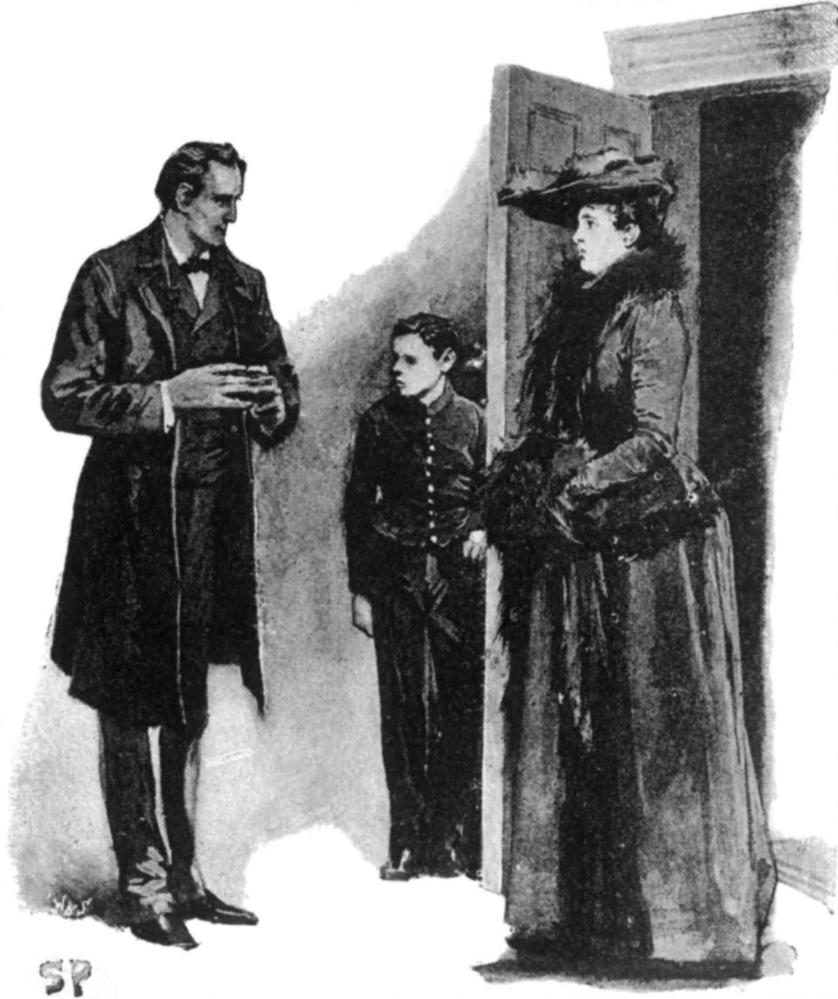

眼只那么一瞥，就把来客全身上下打量了。

“你眼睛近视，”福尔摩斯说，“你不觉打字太多有点吃力吗？”

“起先的时候觉得吃力，”女士回答说，“现在好了，不必看字就能打。”接着转瞬之间悟到这问话其中的含义，猛吃一惊，抬起了头，一张和悦的宽脸上顿时充满疑惧神色。“你听说过我，福尔摩斯先生，”她叫道，“要不然，你怎么知道我的事？”

“别介意，”福尔摩斯道，大声笑起来，“了解情况，是我的本分。人家不注意的事我得注意，吃什么饭，当什么心，工作逼的。没这点本事，怎么会有劳你来上门呢？”

“我来你这儿，先生，是听艾思理奇夫人介绍的。她的丈夫原先人家都说是死了，警察也说找不到了，可让你一找就马上找到。哦，福尔摩斯先生，我盼你也能这么帮助我呢。我不富裕，但是凭我遗产继承权每年有一百英镑的收入，此外打字机上还能打出点钱。我愿意全拿出来，只要能知道霍斯默·安吉尔先生的消息就成。”

“你为什么要这么急匆匆地离家来我这儿？”歇洛克·福尔摩斯问道，一双手指尖顶指尖，眼睛望着天花板。

玛丽·萨瑟兰小姐有些茫然若失的脸上又一阵惊疑。“是呀，我一气之下跑了出来，”她说，“实在让我生气，瞧温迪班克先生那个满不在乎的样子——就是，我的父亲——那副死样子。他不愿意去报警，也不愿意来找你。到末了，没办法，他不管，只一个劲儿说没事、没事。我都快气疯了，一怒之下，披了件外衣，就自己跑来找你。”

“你父亲，”福尔摩斯说，“那准是你的继父啦。你们的姓不一样。”

“没错，是继父。我叫他父亲，说来也真可笑，他只比我大五岁两个月。”

“你母亲还在？”

“哦，在呀，母亲好好的呢。我很不高兴，福尔摩斯先生，我父亲刚去世她就结婚，同这个比她差不多小十五岁的男人再婚。我父亲是管子工，做铅管生意的，在托坦亨法院路，身后留下一份很像样的产业，由母亲同一个工人领班哈迪先生继续经营。温迪班克先生一来，他让母亲把产业卖掉，因为他觉得自己地位高，是做酒类营销的。父亲的产业连同商业信誉一共卖了四千七百英镑，要是父亲在的话，远不止这点数。”

我本以为福尔摩斯对这种拉拉杂杂、不得要领的叙述会不耐烦，谁知，恰恰相反，他正听得格外的专注、出神。

“你自己的一点收入，”他问，“是这份产业里的吗？”

“哦，不，先生，完全不相干的。那是奥克兰我的伯父奈德遗留给我的。是新西兰股票，利率是四分五厘，股票总额两千五百英镑，不过我只能动用利息。”

“你说的我倒是极感兴趣，”福尔摩斯说，“你一年能得一百镑，这是一笔大款子，另外加上你自己挣的钱，出去旅游的话，你高兴怎么花就怎么花，都不会有问题。我看，一位单身女士，只要差不多六十英镑的收入，日子就很好过了。”

“哪怕比这个收入少得多，我也照样过得好，福尔摩斯先生。可是你要晓得，只要我生活在家里，我不希望成为他们的负担。我和他们住在一起，他们就用我的钱。当然，那不过是暂时的，温迪班克先生每一季度把我的利息提出来交给母亲。我无所谓，光靠打字收入我就过得很好了，打一张纸挣两便士，一天通常能打十五到二十张纸。”

“你的情况已经讲得很清楚了，”福尔摩斯说，“这位是我的朋友，华生医生，在他面前，你同我讲什么都行，不必拘束。现在就请你把同霍斯默·安吉尔先生的关系谈一谈吧。”

萨瑟兰小姐的脸上不禁泛起了红晕，手一个劲地捏外衣的镶边。“我头一次遇见他是在煤气工人舞会上，”她说，“父亲在世，他们总要送舞会票给他的。父亲过世后，他们还不忘记我们，把票送给母亲。温迪班克先生不让我们去跳舞，他哪儿也不让我们去，连我参加主日学校举行的活动他都不许，要发火。但这一次我下决心要去，就是要去，他有什么权利阻止我？他说父亲的朋友都会在那里，不要认识这些人，我们和他们不合适。他还说，我又没有像样的衣服穿。其实我有一件紫绒衣一直压橱柜底没取出来穿过呢。后来，他也没啥办法，又要去法国，是为公司的事，我们这边就只管去我们的舞会。我、母亲，还有哈迪先生，他以前是我家的工人领班。就是这一次，我遇上了霍斯默·安吉尔先生。”

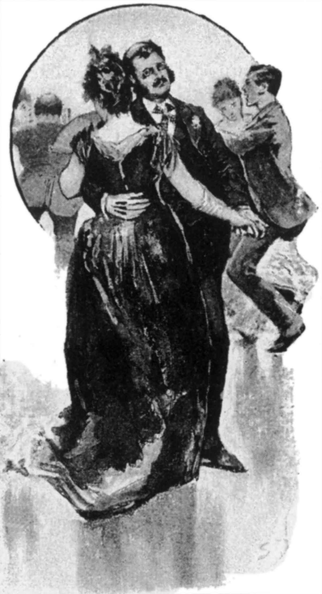

“我头一次遇见他是在舞会上。”

“我想，”福尔摩斯说，“温迪班克先生从法国一回来，你们去参加舞会的事一定让他很恼火。”

“哦，不，他一点没光火。他笑了，我记得，他耸耸肩，还说不许女人做这个那个，是没有用的，她想要做什么总会要做什么。”

“我懂了，是在煤气工人舞会上，我想，你认识了一个叫霍斯默·安吉尔的先生。”

“是的，先生，是那天晚上我认识他的。第二天他来问我们回家是否平安。那以后我们见他——我是说，福尔摩斯先生，我见过他两次，一起散过步，两次。这以后，父亲又回来，霍斯默·安吉尔先生就不能再来我家了。”

“不能来？”

“是的，你知道，父亲不喜欢我这样。他就是不喜欢有人上门来作客什么的，我们喜欢，他要阻止。过去他一直说，女人家，守在家里和家人快快乐乐就行了。可是我也一直对母亲说，女人得有自己的生活圈子也是要紧的，可我就是没有。”

“霍斯默·安吉尔先生怎么样？他没想办法来看你？”

“唔，一星期以后父亲又要到法国去。霍斯默写信给我说，父亲不离开最好别见面，免得惹麻烦，多事，不好看。这期间我们互相写信联系，他每天都给我写，我一早就去取信，可以避开父亲，不必让他知道。”

“这时候你和这位先生订婚了吗？”

“哦，是的，福尔摩斯先生。第一次散步以后，我们就订了婚。霍斯默——安吉尔先生——是莱登霍尔街一家公司的出纳，而且——”

“什么公司？”

“糟就糟在这里，福尔摩斯先生，我不知道。”

“那么，他住在哪里？”

“他就住在公司里。”

“你不知道他的地址？”

“不知道，只晓得是莱登霍尔街。”

“那怎么和他通信呢？”

“信写到莱登霍尔街邮局，留待本人领取。他说如果寄到公司里，别的同事会取笑他有女人来信。我提出我用打字机打信，他自己就是打字机打的，但是他说不好，说是见我亲笔就像见我面，一用打字机，总觉得我们之间隔着一部机器。那是表明他多么喜欢我，福尔摩斯先生，这么小的小事他都那么有心。”

“正说明问题，”福尔摩斯说，“这一直是我的信念：小事情不小，小事里头大着呢。你记得霍斯默·安吉尔先生还有什么小事情？”

“他是个腼腆的人，福尔摩斯先生。他和我散步总是在晚上，不在白天。他说他最恨招人眼目。他好静，要身份，讲教养，说起话来挺斯文，文绉绉的。他告诉我，幼年生过扁桃腺炎，颈腺肿大，以后嗓子就一直提不高，说话总是慢条斯理那个样。穿着也讲究，喜欢整洁素雅。但是眼睛跟我一样不太好，所以戴个浅色眼镜，可以遮光不刺眼。”

“那，你继父，温迪班克先生，去法国以后，情况怎么样？”

“霍斯默·安吉尔先生趁父亲没回来，上我家，提出趁这个时候同我结婚。他急得很，要我手按《圣经》发誓，不管遇到什么情况，要永远忠实于他。母亲说他要我这样起誓是对的，表明他很钟情。母亲从一开始就说他好，一直比我还喜欢他。后来谈到就这个星期结婚吧，我说要同父亲讲一讲，可是他们两个都说别管父亲，等事后告诉他一声就得了。母亲还说，这事她会和父亲讲的，交给她好了。我觉得这样不太好，福尔摩斯先生。说起来父亲只比我大几岁，我结婚去征得他同意，挺好笑，但是我不愿行为不光明正大，所以给父亲写了封信，寄波尔多，公司驻法国办事处在那里。想不到信被退回来了，就在我们举行婚礼的那天早上。”

“这么说，信没寄到？”

“是的，先生，信到之前，父亲刚动身回英国。”

“啊！也真不凑巧。那，你的婚礼是安排在星期五，在教堂举行？”

“是的，先生，静悄悄，不张扬。原本决定在皇家十字大道的圣救世主教堂举行婚礼，婚礼后到圣潘克拉饭店进早餐。霍斯默那天坐一辆双轮双座马车来接我们母女。我们是两个人，他就安排我们坐进去，自己上了另外一辆四轮马车；也是巧，街上正好有这辆马车过来。我们先到教堂，四轮马车随后也到，我们等着他下车，可是不见他出来。车夫下了座往车厢里面看，谁知车里没人了！车夫想不到会有这种事，他亲眼看着他坐进车厢的。那是上星期五，福尔摩斯先生，此后再也没有见到他人、听到他消息，就此无影无踪了。”

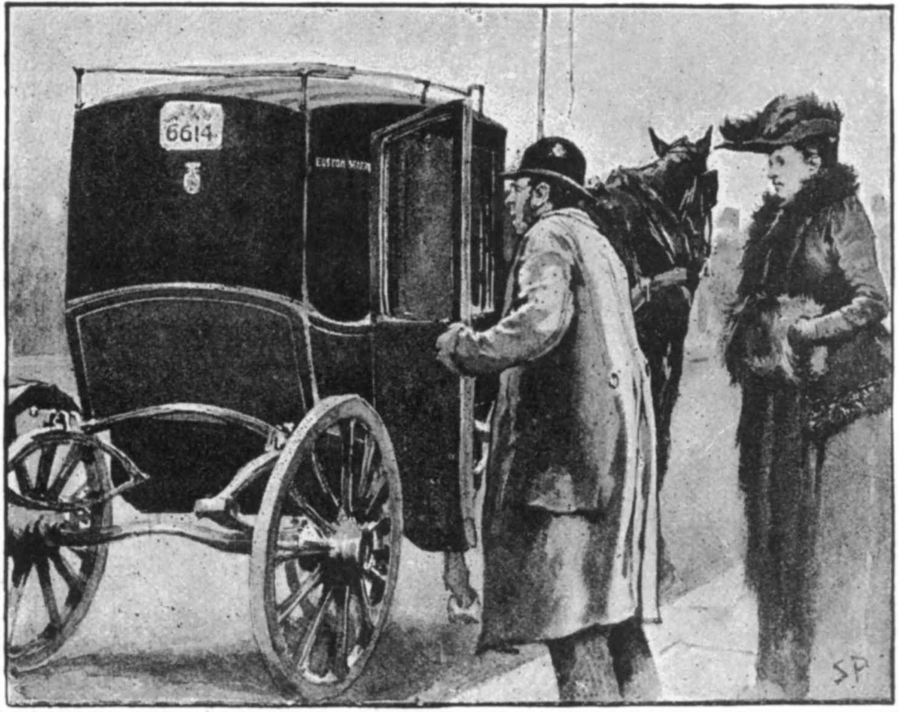

“车夫下了座往车厢里面看，谁知车里没人了！”

“我看，这么对待你，太侮辱人了。”福尔摩斯说。

“哦，不，先生！他是个好人，善心人，他不会就这么离开我的。是的，早上他都是和我讲的这个话，不管有什么事，我们都忠心不二，哪怕发生预料不到的事把我们分开，我也要永远记住我对他的誓约，他也会实践他的保证。婚礼早晨谈这些话，未免奇怪，可是事情就此来了，考验真的马上临到头上了。”

“不折不扣的考验。那么，你本人怎么看，他是否遇上了预料不到的飞来横祸？”

“是的，先生。我相信他预先感觉到了什么危险，要不然，他怎么会说那些个话。我就想了，是他预见到的什么事发生了。”

“可能发生什么事你一点没感觉？”

“没感觉。”

“再问一句，你母亲对这事是什么态度？”

“她很生气，叫我永远也别提这个事了。”

“你父亲呢？你告诉他了？”

“是的。他好像跟我想的一样，估计是出什么事了，但是相信我会得到霍斯默的消息。正像他说的，把我引到了教堂门口再把我扔掉，有什么意思呢？是呀，要是他借我钱了，或者他娶了我，财产他有了份，那还有点理由讲得通。霍斯默他根本不在乎别人有钱没钱，从不跟我谈钱的事，一个子儿都没问起过。那到底是怎么回事呢？怎么连信也不给我一封呢？哦，我想得都快疯了，晚上根本没法合眼。”她从皮袖筒里抽出一块小手帕，蒙着脸抽抽噎噎很伤心。

“你这事我管一管吧，”福尔摩斯说，站起来，“没有问题，我们肯定能有结果。我扛起了你这个包袱，让你卸掉重负，你就放宽心好了。总之一句话，劝你把霍斯默先生从你心上抹掉，他自己跑的，你就别记着他了。”

“你是说，我见不着他了？”

“恐怕是的。”

“他是怎么回事呢？”

“你把问题扔给我就行了。我需要得到对这个人形象的确切描述，还要他的信，你给我吧。”

“我上星期六在《纪事报》上登了寻人启事，”她说，“寻人启事，连带四封信，都在这里，给你吧。”

“谢谢。你的地址？”

“坎伯韦尔区，莱昂街31号。”

“安吉尔先生的地址你不曾有过，我知道。你父亲的工作地点呢？”

“在芬丘奇街，他是法国红葡萄酒大进口商韦斯特豪斯·马班克商行的营销员。”

“谢谢，情况已经谈得比较清楚了。把信件这些都留下，记住我给你的忠告，把事情一股脑儿全封死、扔掉，别叫他干扰你，搞得你日子不好过。”

“你是好心，福尔摩斯先生，可我做不到。我要忠于霍斯默，不管他哪天回来，我都等着他。”

我们的这位来客，尽管帽子有点不相宜，又是一脸的茫然不知所措，但是她的纯朴，她的痴心，她的高尚情操，令我们不由得肃然起敬。她往桌上放下一卷文件，就离开了，答应如有需要，她随叫随到。

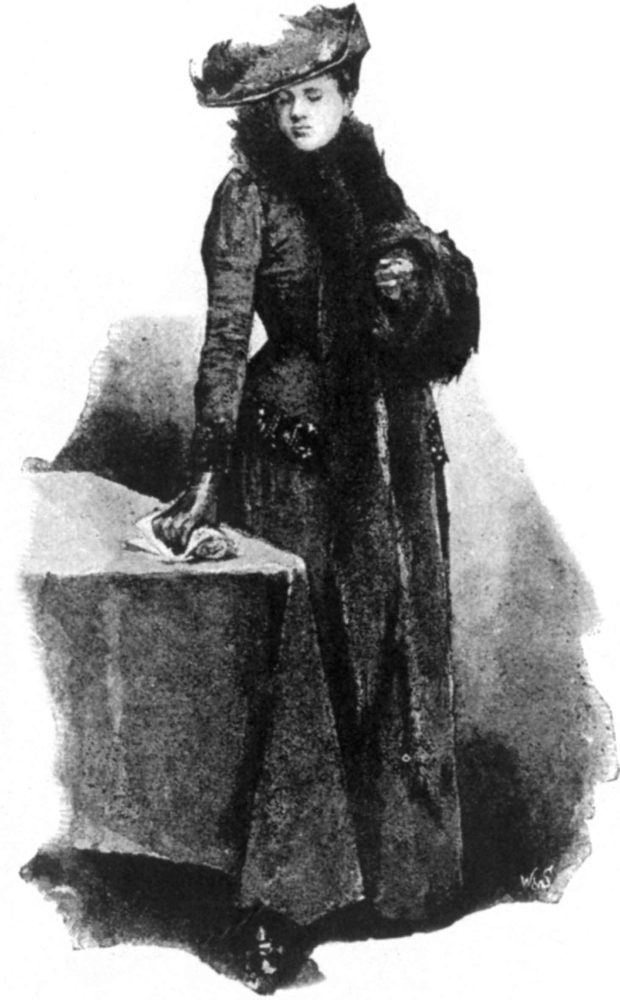

她往桌上放下一卷文件，就离开了。

福尔摩斯静静地坐了几分钟，十个指尖依旧紧紧相对，两条腿向前伸直，两眼朝上向着天花板呆望，然后，从架子上取下又旧又腻的陶质烟斗，这烟斗伴随着他犹如一位顾问。他把烟斗点上，身子往椅背一靠，喷出的浓浓蓝色烟圈袅袅上升；一脸的愁容，神思飘忽。

“相当有趣，值得研究。我说这位未婚年轻女士，”他开了口，“我看她本人比她的问题更有趣味。那点小问题，我看不过是小事一桩。你会发现同样类似的案子，我的案例索引，你不妨翻一翻。一八七七年安多弗案，去年的海牙一案，都是同类案件，老一套了。不过就有那么一两点不同处，算是新鲜。倒是这位未婚年轻女士身上，颇多启发。”

“你似乎从她身上能看出好多问题，我却总是看不到。”我说。

“不是看不到，而是没注意看，华生。你不知道该往哪儿看，重要东西你自然看不见。我也没能想到，要你注意袖子，那上面有文章；大拇指指甲，表明问题；鞋带上，也带着情况。现在问你，这女人的外表，你能看出些什么没有？描述一番看看。”

“好，她头戴一顶灰蓝色宽边草帽，插暗红色羽毛。黑上装，缀有黑珠，镶有细细的乌黑贴边流苏，套裙是深褐色的，比咖啡色还深，领子、袖口是窄条紫绒。手套浅灰色，右手食指已经磨破。鞋我没注意看。耳朵上有小小圆圆的金耳坠。总的印象是殷实人家，但比较随便，并不是太讲究，只管舒舒服服，自得其乐。”

福尔摩斯轻轻拍拍手，抿嘴笑笑。“不是我奉承你，华生，你大有长进，讲得精彩。重要关键，你虽没有点明，但方法是对了，对颜色注意辨别，眼光还是准的。不要满足于泛泛的一般印象，我说，要把注意力集中在细节上。我看女人衣着第一眼看衣袖，看男人首先注意裤膝。你看到了，这位妇女袖子上有绣绒，这点绒料就透露出有关迹象。手腕上边的双折线，是打字员手臂压桌面压的，还挺好看。常使用手摇式缝纫机的，也差不多，不过是在左手，离拇指最远一边，不是打字的这个样子横过最宽的部分。我然后看一眼她的脸，看出鼻梁两边有眼镜夹鼻痕迹，我就有了八九分把握，可以说她眼睛近视，是做打字工作的。我一说，让她吃惊不小。”

“我也感到惊奇。”

“可是，说真的，并不稀奇，真正叫我奇怪的，引起我兴趣的，是朝她的鞋这么一瞧，粗看不觉得，稍一注意，看出两只鞋不配对：一只鞋尖是花纹包头，另一只不是；一只五个扣子扣下面三个，另一只跳扣，扣的是一、三、五。哪，你看，一位年轻女士，穿得相当体面，从家里出来，鞋不配对，扣子系一半，说她来得匆忙，算不得是一个了不起的推论吧。”

“还有呢？”我问。我的朋友如此精辟的推理，常常引起我浓厚的兴趣。

“顺便提一提，我还注意到，她离家时候写过字，是在穿好衣服以后，出门之前。你看到了她右手套食指破了，但是你没有进一步看到手套、手指上都沾了紫墨水。她一定是匆匆写字，把笔沾墨水沾得太深。肯定是早上的事，如果不是，那个手指是不会留着墨水的。推论这些只不过是有趣、好玩，但也是一点基本功。好，我得回到正题上来，有劳你给我念一念寻找霍斯默·安吉尔先生的那个寻人启事，好吗？”

我拿起这一则小小的打印稿凑着亮光念：

兹有霍斯默·安吉尔先生于十四日晨失踪。此人身高五英尺七英寸，体格健壮，肤色略黄，头发乌黑，稍有秃顶，颊须和唇髭浓黑，戴浅色墨镜，讲话低声细气。失踪时身穿丝贴边黑色大礼服，黑背心，系艾伯特金表链，灰色海力斯粗花呢裤，套褐色绑腿，脚穿松紧带皮鞋。此人供职于莱登霍尔街一公司。凡提供——

“就这样，行了，”福尔摩斯说，“至于这些信件，”他扫了一眼，继续说，“都普通、一般，对安吉尔先生没有提供任何一点线索，只有一个地方算是引用上了巴尔扎克的话。不过有一点值得注意，也会叫你大为惊奇。”

“都是打字机打的。”我说。

“都是打字机打的，连署名都是打字。你看信末这字多么整整齐齐，‘霍斯默·安吉尔’。还有日期，你看。地址，除了莱登霍尔街，什么也没有，含糊不清。这个署名，有疑点，看出问题——我们可以说它起了决定性作用，事实过硬。”

“说明什么？”

“我的好伙计，这署名对本案至关重要，你看不出？”

“不敢说看出什么了，要么目的在于一旦被起诉毁弃婚约，他可以借此否认签名。”

“不，这还不是要害，我只要写两封信，可以就此解决本案。一封写给伦敦一家商行，另一封写给年轻女士的继父温迪班克先生，问他能否明晚六点来这里同我相见一面，我们不妨同男性家属打打交道。现在，医生，我们把信送走，等回音来之前无事可做，暂且把这个小小的问题束之高阁。”

我充分相信，我朋友犀利的推理、迅疾的行动，其能量之强大无人可及。所以这桩受委托予以探究的谜案如何解决，他已成算在胸，必将易如探囊取物。只有一次，据我记忆，他遭遇失败。那就是波希米亚国王的艾琳·阿德勒照片一案。但是我想起《四签名》怪如神魔，《血字的研究》案情无比复杂，他都一一破解，所以我觉得连他都无法破的案子，那肯定是解不开清不了的死案了。

我离开他的时候，他那个烟斗还在吞云吐雾。我深信不疑，等我明晚再来他这里，就能看到案情必能了如指掌，已能确认玛丽·萨瑟兰小姐那个失踪的新郎到底何许人也。

其时我自己正在关心、医治一位重病患者，第二日在病床边忙碌一整天，到下午将近六点，才告结束得以抽身。我立即跳上一辆二轮马车直奔贝克街，生怕去晚了，这桩奇案的收场戏就没我的份。还好，我看见只有福尔摩斯单独一人，蜷缩起瘦长的身子深陷在扶手椅中，处于似睡非睡的状态。一大堆瓶子、试管，那阵势，夹着辛辣刺鼻的盐酸味，告诉我他整天埋首于他所钟爱的化学实验。

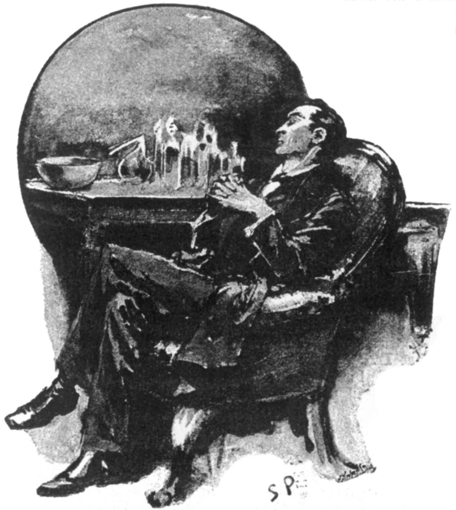

福尔摩斯单独一人，处于似睡非睡的状态。

“嗨，问题解决了吗？”我一进门就问他。

“解决了，是硫酸氢钡。”

“不，不，我说是那个谜案！”我叫道。

“哦，那个！我当是做试验的这种盐类。这件事无谜案可言，虽然，我昨天讲过有点情节还算新鲜有趣。惟一遗憾恐怕是没有适用的法律可以惩办这个恶棍。”

“那是什么人，抛弃萨瑟兰小姐是何居心？”

问题刚刚出口，福尔摩斯还不及回答，就听得走道上响起沉重的脚步声，有人嗒嗒地敲起了房门。

“姑娘的继父，詹姆斯·温迪班克先生，”福尔摩斯说，“他回信讲好六点到此。请进！”

进来的人身体结实，中等身材，三十来岁，脸修得很干净，肤色浅黄，摆出一副殷勤迎合的姿态，一对灰色眼睛却咄咄逼人。他那狐疑的眼光向我们两人一扫，把一顶光泽的圆礼帽往边柜上一放，微微弯一弯腰，侧着身坐在了就近的椅子上。

“晚安，詹姆斯·温迪班克先生，”福尔摩斯说道，“我想，这封打字信是你写的吧，应约六点钟来和我见面，对吗？”

“没错，先生，恐怕是稍来迟了一点。我也是不得已，要知道。真正对不起，小女萨瑟兰拿这种小事来麻烦你，我是不愿意把家丑外扬。她背着我来找你，这姑娘太任性、冲动，大概你也已经看出来了。什么事她要做，说做就做，控制不住。当然好在是你，我也无所谓，你跟官厅警察当局没有关系。但是家门不幸，像这样闹到外面，总是不光彩。再说，这么折腾也是枉费心机，因为，你怎么可能找到霍斯默·安吉尔这个人呢？”

“此言差矣，”福尔摩斯平静地说，“我绝对胜券在握，能找出霍斯默·安吉尔先生。”

温迪班克先生猛一怔，手套都掉在了地上。“听你这么讲，我倒很高兴。”他说道。

“事情也怪，”福尔摩斯说，“打字机打字，也同人手写一样，体现着个性。除非是新买的打字机，不会有两架打字机打出来的字是完全一样的。字键磨损度有不同，有的字键一个字母印迹浓淡还不均匀。哪，这儿，请看你自己打的这张短信笺，温迪班克先生。这个e字母总是比较糊，r字母的端点总是有缺损。如此不下十四种，都有特征，那还都不过是比较明显的罢了。”

“我们办公室里都用这架打字机打信，当然机器比较老旧了。”来客回道，一对闪亮的小眼睛朝福尔摩斯一瞪。

“现在我要告诉你的才是真正有趣的研究，温迪班克先生，”福尔摩斯继续道，“我考虑，这几天再写一篇短文，专门论述打字机以及打字机与犯罪之关系，这是我比较关心的一个课题。这儿手头上四封信，据称都是那位失踪人所写，都是打字信。每一封都绝无例外，不单单e字母全糊，而且r字母全无翘尾巴。你还可以看出，如果你愿意使用一下我的放大镜，我提到还有十四种特征，封封全都历历在目。”

温迪班克先生刷地从椅子上跳起来，抓起了帽子。“我不想浪费时间同你扯这种无稽之谈。你能抓住那个人，你抓吧，抓到了通知我一声。”

“承蒙关照，”福尔摩斯跨步过去把门锁上，“那么，容我告诉你，我已经抓住他了。”

“什么！在哪里？”温迪班克先生叫起来，吓得嘴唇都白了，眼睛向四周乱晃悠，就像一只被夹子夹住的耗子在那儿乱蹦乱跳。

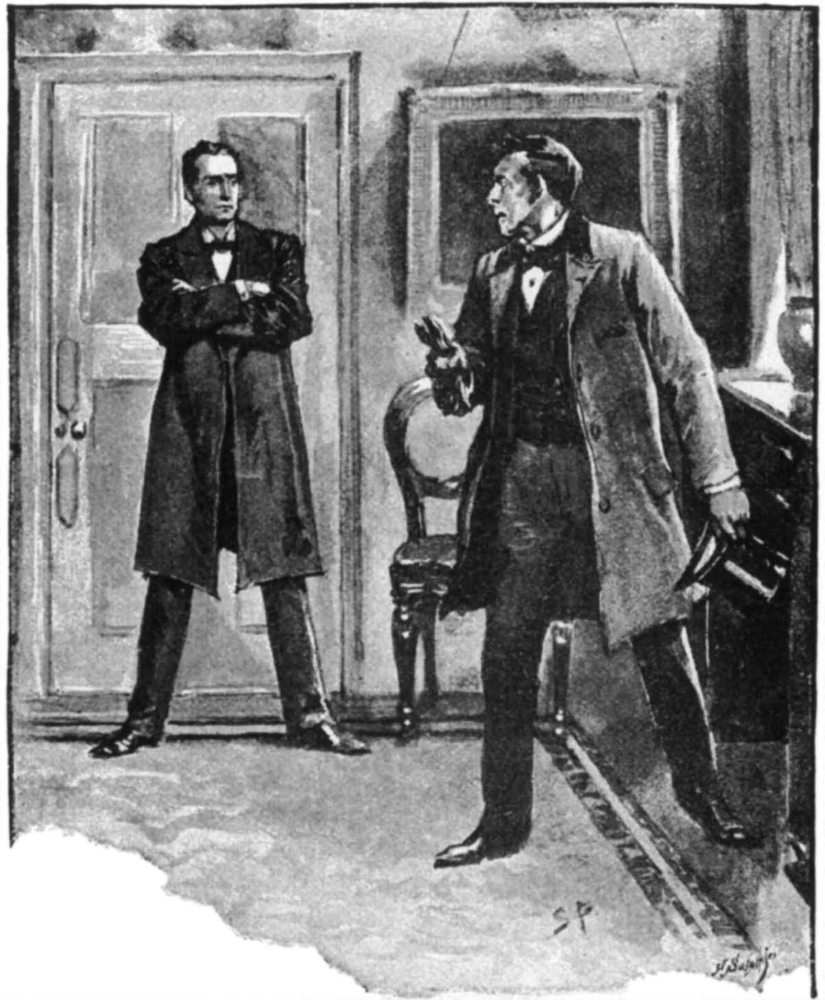

温迪班克就像一只被夹住的耗子在那儿乱蹦乱跳。

“啊，你嚷嚷有什么用——一点也没有用，”福尔摩斯稳稳当当地说，“赖是赖不掉的，温迪班克先生。事情再明显不过，这么简单的一个问题你说我是不可能解决的，你也太不客气了。那好！坐下，让我们把事儿谈一谈。”

我们的客人整个儿瘫软在椅子上，脸色死灰，额头上沁出汗珠。“那个——那个，够、够不上起诉。”他结巴着说。

“够不够得上，我当然很清楚。不过，你对我而言，温迪班克先生，还是头一个，是我头一回碰到的最自私、最贪婪、最冷酷无情的阴谋诡计。现在，让我把事情从头至尾说一遍，说得不对请你自己纠正。”

这个人瘫在了椅子上，脑袋耷拉到胸前，一副彻底斗输的败落相。福尔摩斯把腿跷起在壁炉台的台角上，身子仰起，手插口袋，眼不看人，潇洒地自言自语般叙说起来。

“这个人，同一个比自己年龄大得多的女人结婚，目的是贪图女人有钱，”他说道，“还要用女儿的钱，只要女儿在家同父母一块儿过，钱就归他用。这笔钱不小，相当可观，在他的眼里，丧失了的话，境况大不一样，所以要拼命保住，别跑掉了。女儿是个心地善良的姑娘，和蔼、温柔、多情，多情得痴情，痴情起来一厢情愿地对人好。姑娘既人品难得，手头又很有一点收入，所以不会空守闺房很久的。姑娘一嫁人，不用说，意味着家里每年损失一百英镑，所以姑娘的继父要千方百计不让她嫁出去。怎么办呢？继父无非是把女儿关在家里，不许她接触差不多年龄的人，不许有交往。没多久，发现这毕竟不是长久之计。女儿越来越不安分，要坚持自身的权利，到后来要去参加舞会了。她的继父有点小聪明，脑子不赖，良心很坏。动起了什么脑筋呢？他有个妙计，在老婆的默许下、协同下，把自己乔装打扮一番，戴个墨镜把一双狼眼遮起，往脸上贴假髭假胡子，毛茸茸遮掉半个脸，嗓子压低，说起话来低声细气，还挺斯文相呢。欺负自己女儿心地单纯、眼睛近视，他的伪装居然没给识破。他以霍斯默·安吉尔的名号出现，向自己女儿谈情说爱来求婚，目的在于阻止她爱上其他男人。”

“开始不过是闹着玩的，开个玩笑，”客人嘟嘟囔囔说，“想不到她真会那么痴心。”

“根本不是什么玩笑。姑娘给迷昏了头，一心以为继父去了法国，从来不怀疑自己陷入一场骗局。她完全陶醉于这位先生的花言巧语。母亲也在一旁敲边鼓，美誉有加，更说得姑娘心花怒放。好，安吉尔先生上门拜访，接触下来效果良好，事情就要迈开实质性的一步，这才是最要紧的。会过几次面，马上就订婚，这一步，确保了姑娘再不会同别人去谈恋爱。但是骗局无法如此永远继续，假装到法国出差也终究麻烦，所以不如干脆把事情演戏演到底，打个永久性死结，落个结局算数，让姑娘死掉心，以后万一有别的男人向她求婚，她永远不会接受。所以导演了手按《圣经》忠诚宣誓，预先做好伏笔，准备婚礼那天早上有事发生。詹姆斯·温迪班克希望萨瑟兰小姐对霍斯默·安吉尔坚贞不渝，生生死死不变心，那么无论如何，至少未来十年要使她守得住，不问津其他男人。霍斯默送姑娘到教堂门前，他自己不去，玩起了脱身老花招——四轮大马车这个门上那个门下，溜之大吉。我想，这件事串起来就是这样，温迪班克先生！”

我们的来客随着福尔摩斯的叙述，反而敛起一点余勇，从椅子上站起，苍白的脸上露出几分讥诮。

“不管是真，不管是假，福尔摩斯先生，”他说，“算你聪明过人。你应该更聪明一点，看到是你自己现在在干违法的事，而不是我。我一开始就没干犯法事，不怕受到起诉。可是你，只要你把这门锁起来，你就把自己放在被控告地位，可以起诉你‘侵犯人身自由’、‘非法拘禁’。”

“法律还够不上，就算你说对了，还够不上碰你，”福尔摩斯说，随手喀哒一下打开门锁，哗啦一下拉开门，“可得记住，你这种人不受惩罚天理不容，这位年轻姑娘要是有弟兄有朋友，你一定逃不了挨鞭子。你尝尝吧！”他说道，看见眼前这个男人在狞笑，他气愤得脸通红，“委托人对你的惩罚，不是我的责任，但是我这里可以代鸣不平。你不挨我的鞭子就不知好歹——”他转身快走两步去拿鞭子，可是没来得及取下，就听得楼梯上一阵骨碌碌连滚带爬的声音，接着楼下沉重的厅门嘭的一下。我们从窗口望见詹姆斯·温迪班克先生如丧家之犬落荒而逃。

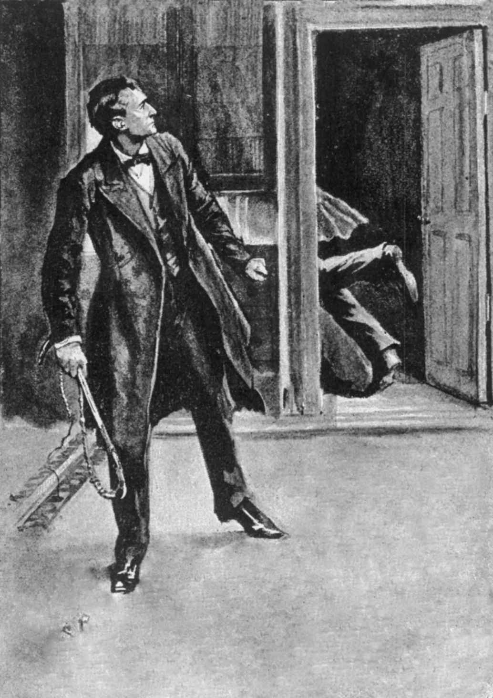

温迪班克如丧家之犬落荒而逃。

“冷血动物，恶棍！”福尔摩斯说，大笑，重新回到椅子上一坐，“这个人犯罪起家，不干坏事不能过日子。等着吧，看得到，恶贯满盈上断头台，才告收场。本案有几个方面很有点趣味，并非全然无聊。”

“我到现在还没有全部明了你的推理步骤。”我说。

“那，第一步，应该明确，霍斯默·安吉尔先生奇怪的表现必有强烈的图谋；同样应该明确的是，本案从中可以获得好处的，只有这个继父，这一点我们应该看得非常清楚。然后再看这个事实，两个人从来不在一起出现，始终是一个人不在的时候，另一个才露面，这内中就是问题。戴上副墨镜，说话拿腔拿调，这都表明是伪装，还有毛茸茸的大胡子，也是。最让我感到可疑的是写信连自己的签名都要打字，我确定他是不正常的。可见得，写字的话，姑娘是熟悉他笔迹的，再怎么装也瞒不过去。你看见了吧，这些个孤立的事件，再和其他情况一凑一串，都归结到一个方向。”

“然后怎么给予证实呢？”

“一旦锁定了目标，证实他的罪行就容易了。我认识此人工作的那家商行。我写信给商行讲，按照那张寻人启事，排除掉大胡子、眼镜、怪嗓音——当然都是伪装的部分，剩下真容，问他们像不像你们营销员中的什么人。至于早就注意到的全用打字机打，里面定有名堂。我照他的办公地址写信给他本人，请他来此一趟，果然不出所料，他的回信还是打字稿，上面明显暴露出同样的特征，细微处可是一模一样。另外的回信也来了，寄自芬丘奇街韦斯特豪斯·马班克商行，信上说所述外貌均与本行雇员詹姆斯·温迪班克相符。至此，真相即告大白！”

“那么，萨瑟兰小姐呢？”

“我去告诉她真相，她恐怕会不相信我。你记得波斯有句古谚语吗：‘打消女人心怀的痴想，险似虎爪之下夺乳虎。’哈菲兹<a href="#part0045.xhtml_ch1"
id="part0045.xhtml_ch1-back">(1)</a>的知识同贺拉斯<a href="#part0045.xhtml_ch2"
id="part0045.xhtml_ch2-back">(2)</a>一样丰富，对人情世态的认识一样深刻。”

（1891年）

————————————————————

<a href="#part0045.xhtml_ch1-back" id="part0045.xhtml_ch1">(1)</a> 哈菲兹（Hafiz，1320—1389），波斯诗人，作诗近500首，富于哲理，并具浪漫精神。

<a href="#part0045.xhtml_ch2-back" id="part0045.xhtml_ch2">(2)</a> 贺拉斯（Horace，前65—前8），古罗马诗人，诗作对西方诗歌的发展有很大影响。其政治观点倾向共和，后转向帝制，作诗颂扬罗马第一皇帝奥古斯都。

# 红发会

去年秋季，有一天我拜访我的朋友歇洛克·福尔摩斯先生，正好看见他在与人深谈。那个人身体矮胖，血色很好，是一位有点年纪的老先生，他的头发呈火红色。我为突然而至有所打扰，深表歉意之下准备退出，福尔摩斯忽地起身一把拉我进屋，随手关上房门。

“再巧没有，你来得正好，我亲爱的华生。”他热诚地说。

“你很忙，我怕打扰你们。”

“要说忙，我是忙着呢。”

“那我就在隔壁待着吧。”

“不，不要走开。威尔逊先生，这位是我的好伙伴，许多案子办案成功，多亏他的大力相助。你的案子，不用说，也一定要仰赖他的帮助喽。”

矮胖的先生从椅子上半站起来欠欠身，算是向我打了招呼，他那对厚眼皮的小眼睛掠过一丝半信半疑的目光。

“靠背椅上坐，”福尔摩斯说，沉沉地坐回他的椅子，两手十指指尖对拢，这是他进入判断、分析的一种习惯，一种情态。“我知道，亲爱的华生，我的乐趣在于新奇事，喜欢一切都是异乎寻常，不是每天老套乏味。你呢，也一样，同我一起分享喜乐。你也很有兴趣和热情，并且都一一写成文稿。恕我直言，你是把我的一点历险绘声绘色、添枝加叶夸张了。”

“你经手的案子，确实引起我极大的兴趣。”我承认说。

“你该记得，那天我说过的，就是玛丽·萨瑟兰小姐<a href="#part0046.xhtml_ch1"
id="part0046.xhtml_ch1-back">(1)</a>提的那个很简单的问题。我们着手处理之前我讲过，情况看似奇特，错综复杂，我们必须探究生活原貌，生活比之任何丰富的想象力永远要雄辩得多。”

“当时我不敢苟同你的这个说法。”

“你不同意，但是，医生，到头来你还得考虑我的说法。要不然，我也会用好几件事实来压倒你，最终你的理由将不攻自破，得承认我是对的。现在，承蒙杰伯兹·威尔逊先生今天早上来说了一桩事情，听下来倒是难得一遇。你听我讲过，最奇怪、最特别的事，往往未必是大案，而是小案。有时候也确实是哪里有疑点，那里很可能就有案情。就我所听的来看，还不敢说本案是否属刑事案，但是事情的过程，肯定是最离奇、最特别的一类，我还从来没有听到过。威尔逊先生，你最好再重新讲一讲，我提出这个要求，一则是因为我的朋友华生医生没有听到开头部分，再则，这故事很特别，各个细节我要听你再讲一遍，我要听仔细了。照通常情况，我只要一听案情，脑子里马上会联想起成百上千件案子的类似情况，但是现在这个案例，我不得不承认，确实闻所未闻，独一无二，不曾有过先例。”

矮胖的委托人挺起胸膛，颇有点骄傲的样子，从大衣内袋里掏出一张又脏又皱的报纸。趁他把报纸在膝上摊开，伸着脖子在看广告栏目的时候，我仔细观察这个人，想要学着我的同伴透过研究衣着和相貌来对他作出推断。

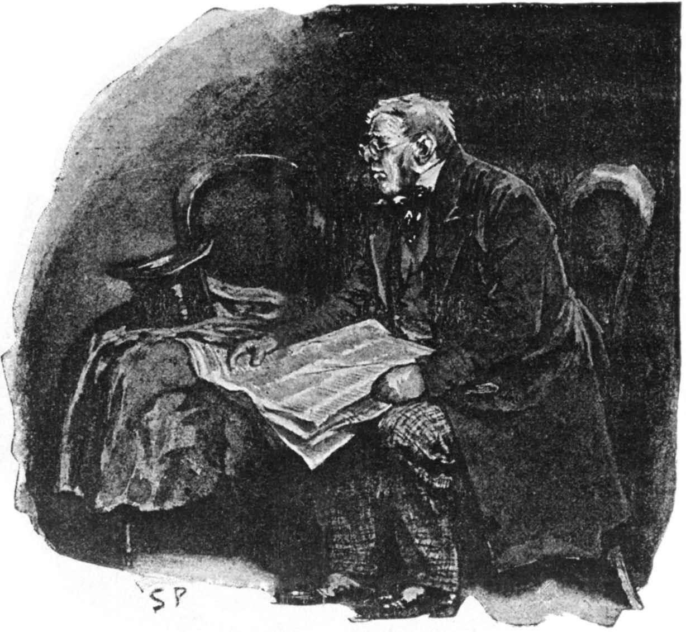

委托人从大衣内袋里掏出一张又脏又皱的报纸。

然而，研究下来，收效甚微。我们这位来客整个模样也就是一个平常、普通的英国生意人罢了：身体肥胖，神态自负，动作迟缓。他身穿一条宽大的灰色格子裤，一件不十分干净的黑色礼服短大衣，前胸未扣纽扣，里面是深褐色背心，横扣系着一条粗粗的铜表链，悬一块方孔金属圆片，在不住地晃动。他身旁的椅子上放一顶破旧的大礼帽、一件棕褐色大氅，颜色已褪，绒领子有皱褶。依我看来，这个人除了一头火红色头发、表情极其懊恼不悦之外，总体上并无特别引人注目之处。

福尔摩斯的锐眼看出了我脑子在想些什么，他注视着我疑惑的眼睛，摇摇头，笑笑说：“有些事实是明显的，他曾经做过手工活，吸鼻烟，共济会会员，去过中国，最近做过大量的书写工作。可是除此以外，我也没能作出别的推断。”

杰伯兹·威尔逊先生从椅子上跳起来，食指指着报纸，两眼盯着我的同伴。

“这个事情也真叫怪了，你怎么都晓得，福尔摩斯先生？”他问道，“你怎么连我干过手工活儿都晓得？真如福音书那么准了。没错，我开始的时候是在船上干的木匠活儿。”

“是你的手，我亲爱的先生，你的右手比左手大一圈呢。这是用右手劳动，肌肉也就更发达的缘故。”

“好，那么，鼻烟，还有，共济会呢？”

“那个就不用我告诉你怎么看出来的了，你的智力不至于低到非要我讲穿才能明白。尤其你看，你不是违反了你们严格的会规，佩戴了一枚圆弧胸章<a href="#part0046.xhtml_ch2"
id="part0046.xhtml_ch2-back">(2)</a>嘛。”

“啊，是的，我忘了。那么写字呢？”

“这个问题最明显不过了。你的右手袖口，有五英寸之长，都发亮着呢，左手肘部有一块平整的补丁，那不是因为贴在桌子上耐磨才缝上的吗？”

“好，那么去过中国呢？”

“那条刺在你右手腕上方的鱼纹，这是只有在中国才能刺成的。我对文身有过一点研究，为这个题目还撰稿写过文章。鱼鳞文成红色，又很精巧，这是中国人才有的绝技。另外，我看见你的表链上挂着一枚中国铜钱，事情也就更明显了。”

杰伯兹·威尔逊先生哈哈大笑。“好，出乎意料！”他说，“我原以为你是神机妙算，现在看不是如此，讲穿了也没啥大奥妙。”

“我这会儿才想到，华生，”福尔摩斯说，“这样摊开了讲得毫无保留，是个错误，要Omne
ignotum pro magnifico<a href="#part0046.xhtml_ch3"
id="part0046.xhtml_ch3-back">(3)</a>才对。你知道，我这点可怜的小小名声，若是这么心眼太直，不讲一点城府，一定要漏底翻船。你有没有找到那条广告，威尔逊先生？”

“有了，现在找到了。”他回答，用他又红又粗的指头指着广告栏的中间部位，“这里，事情是从这里开始的，你们自己看吧，先生。”

我从他手里接过报纸来念：

谨致红发会会员：

兹因美国宾夕法尼亚黎巴嫩已故伊齐基亚·霍普金斯之遗赠，现授权本会有一名职位空缺，系纯属闲职挂名领薪，薪给每星期四英镑。凡红发男性身心体魄健康年满二十一周岁者，皆具资格参选。有意者于星期一十一时亲至下列地点向邓肯·罗斯提出申请供选：舰队街教皇院七号红发会办公室。

“这到底是怎么回事？”我把这奇怪的广告看了一遍又一遍，不禁喊道。

福尔摩斯格格地笑得在椅子里前俯后仰。他老习惯，高兴起来就是这个样子。“真是无奇不有，这不是？”他说，“好吧，威尔逊先生，你跟我们讲讲你自己的所有情况，你家里的人，广告让你走运，结果又是怎么样。医生，你先记下这张报纸和日期。”

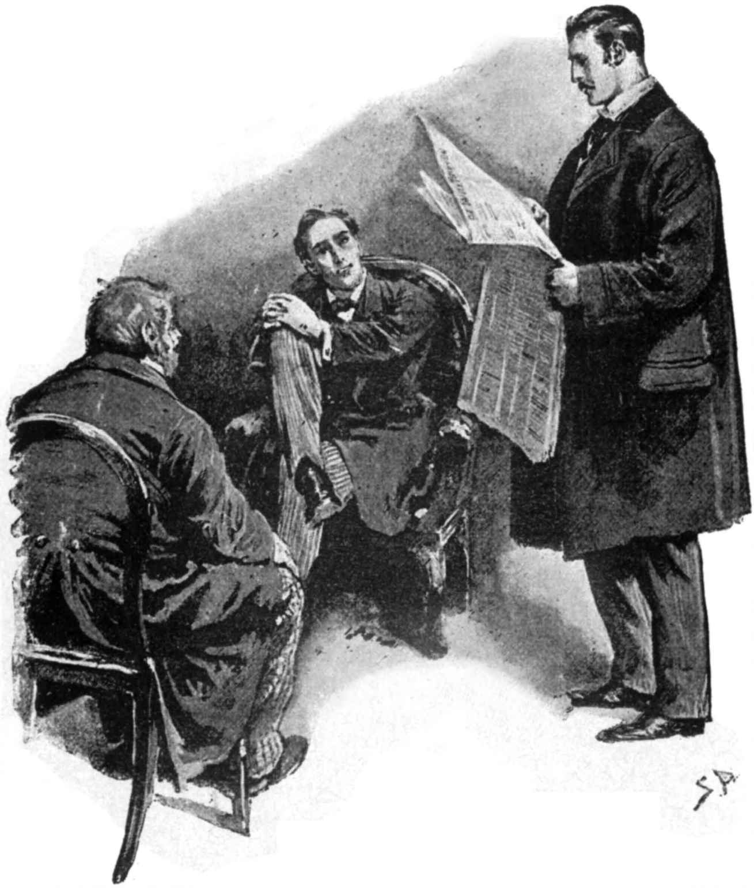

“医生，你先记下这张报纸和日期。”

“是《纪事晨报》，一八九〇年四月二十七日，到今天正好是两个月。”

“很好，现在，威尔逊先生，请讲。”

“噢，就是我刚才对你说的，歇洛克·福尔摩斯先生，”杰伯兹·威尔逊说，用手抹抹前额，“我在市区近旁的科堡广场开一家小当铺，一个小老板，小营生，近几年也就只能靠它勉强糊口。以前我雇过两个伙计，现在只能雇一个了。就是这一个我也雇不起，之所以还留着，只因为人家为了要学这个行业，自愿只拿一半工钱。”

“这位青年倒是个有心人，他叫什么名字？”福尔摩斯问他。

“他叫文森特·斯波尔丁。他其实不年轻了，到底多大年龄也说不准。这伙计精明能干，能雇着也不容易，福尔摩斯先生。我是清楚的，他本可以过得更好些，能挣上比我付给他高一倍的工资。不过，不管怎么说，人家自己满意，何必要我为他瞎操心呢？”

“哦，真有此事？看来，你用大大低于市场价格的工资雇到伙计，实在是运气。如今这年代，你们老板可不大遇得上这样的好事。我不知道你的伙计是不是也算与众不同，就像你看到那个不一般的广告似的。”

“啊，他难免有他的毛病，”威尔逊先生说，“想不到他就喜欢拍照。没人像他这么喜欢，兴致一来，拿个照相机到处拍，拍了马上跑到地下室，像兔子钻洞似的，在底下拨弄他的照片。这是他最大的毛病。不过总的来说，他是个好伙计，没有什么别的不好。”

“他还跟你在一起，想必是吧？”

“是的，先生。他，还有一个女孩子，十四岁。孩子做点简单活，做饭，打扫——屋里就这么点人。我是单身，没成过家。日子过得很平静，先生，我们一起三个人，反正都在一个屋檐下，苦乐一块儿过，没事的话，倒也算平平安安。

“可是有事了，头件事就是那个广告引起的。八个星期之前，就是今天，斯波尔丁来我办公室，手上拿的就是这张报纸，跟我说：

“‘我向上帝祝愿，威尔逊先生，我要是长红头发该有多好！’

“‘怎么啦？’我问他。

“‘瞧，’他说，‘红发会有个职位空缺呢。谁长红头发，谁就发点小财了。我晓得空缺多着呢，红发人没它多。所以托管那笔资金的理事都不知道该怎么办才好，不知钱搁那儿怎么花了。要是我的头发能变颜色就好，这个不大不小的美差，不就轮到我的头上了！’

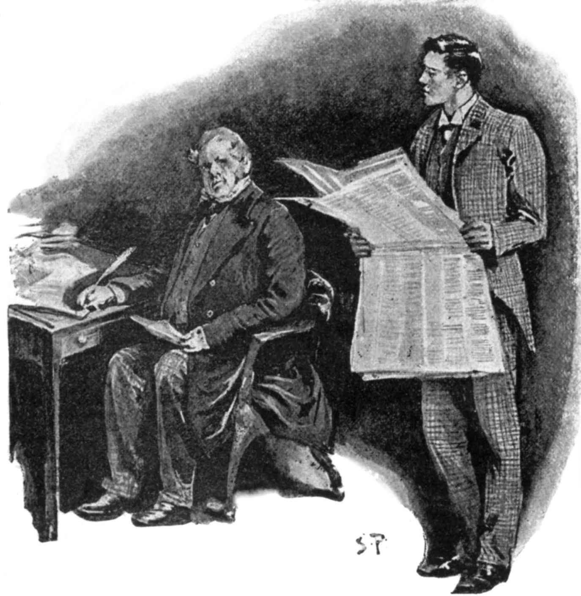

“红发会有个职位空缺呢。”

“‘啊，到底怎么回事？’我问他。你们知道，福尔摩斯先生，我是个老待在屋里不出门的人，我的生意，都是人家上门来，不用我出去奔走兜揽，常常一连几个星期足不出户。这样，外边的事我都不太知道，能听到点消息，就很高兴。

“‘你没听说过红发会？’他问我，两眼睁得大大的。

“‘没有呀。’

“‘哎呀，这都不知道！跟你说，你完全有资格去申请那个空缺。’

“‘他们给多少钱？’我问他。

“‘那个，一年也就两百镑吧，可是活儿轻松，没事，你自己的生意，还照做不误，不相干。’

“这一说，你们不难想到，听得我两耳都竖了起来。这几年自己的生意不见好，若是有个额外两百英镑收入，手头可就松活多了。

“‘那都说给我听听。’我说。

“‘好，’他讲开了，拿这广告给我看，‘你自己看看，这红发会有个职位空缺，还登有地址，让你去申请，可以了解详细情况。我先给你讲点，这红发会是美国人创建，一个百万富翁，叫伊奇基亚·霍普金斯，是个怪人，他自己就长的一头红发，也就把红头发人都当自己人。他死后的大笔财富都交给托管人，留下遗言，要拿出利息来，设些个闲差，有心叫红头发人共同享点儿福。我还听说，待遇很不坏，实际根本不用干事。’

“‘可是，’我说，‘红发人有成千上万，不是都要来申请吗？’

“‘哪有你想的那么多，’他回答说，‘你瞧，只限于伦敦人，又得是成年男人。这个美国佬年轻时候是在伦敦发的迹，他要让老土地得到回报。哪，还有，我听说，头发浅红、深红什么的都不算，不要，还非得是火光火亮火红的头发不可。这么着，要是你去申请，威尔逊先生，你不中才怪。好歹也是几百英镑呢，难道不值得你去拿！不拿可就白不拿！’

“所以，说的倒也是事实。两位先生，你们也亲眼看到了，我的头发，正是火红火红。这就很有可能了，真的可以跟人竞争，实在是良机莫失，我从没见过谁有我这样的头发。文森特·斯波尔丁对这事了解得这么清楚，所以我想让他助我一臂之力。这天，我叫他把百叶窗关了，马上陪我一起走。他也有了个休假日，挺高兴。我们关门歇业，按广告上的地址找去。

“谁知一看那景象，我是永远不想再见了，福尔摩斯先生。从四面八方拥进城的人，头发个个或多或少有点红，都来应征广告。舰队街满街上熙熙攘攘都是红发人，教皇院成了大橘子大卖场了。真想不到小小一个广告能把全国这么多人召集了来。这些人的头发颜色——有干草黄，柠檬黄，有的像红砖，像爱尔兰红棕猎狗，有紫肝色，有红土色，可就是，像斯波尔丁说的，就是没一个人是红艳艳的火红色。我一看有那么多人候着这一个机会，心里有点慌，想放弃算了，可是斯波尔丁根本不听我的。真想不到，全靠他不管三七二十一，连推带搡拖着我挤过人群，直挤上台阶，挤向办公室。楼梯上两股子人流，一股人流满怀希望向上去，一股人流被弹回来，垂头丧气往下走，我们好不容易挤到了办公室。”

“你这个事情真是有趣，”福尔摩斯说，看着他的委托人稍停片刻，猛吸了一撮鼻烟，思索了一下，“请继续往下讲，讲得非常好听呢。”

“办公室里空荡荡的，只有两把木椅子，一张松木板桌，坐着个小个子，也是个红头发，比我的头发还红。他对每一个上来应征的人总要挑出点毛病，只几句话就给打发掉。补那个空缺看来绝非易事，不是那么说成就成。谁知，轮到我们的时候，小个子对我特有好感，同对待别人大不一样。我们一进办公室，他立刻去把门关上，这样便于单独交谈，不让旁人听见。

“‘这位是杰伯兹·威尔逊先生，’我的伙计说，‘他愿意来红发会补个空缺。’

“‘他补这个职位，再合适也没有，’对方回答，‘各方面都符合要求。一眼看到这么好的红发，样样都好，我不能让你被打回票。’他后退一步，歪歪脑袋，仔细地看我的头发，我给他看得浑身不自在。他随即跨前一步，拉住我的手，向我热烈祝贺成功。

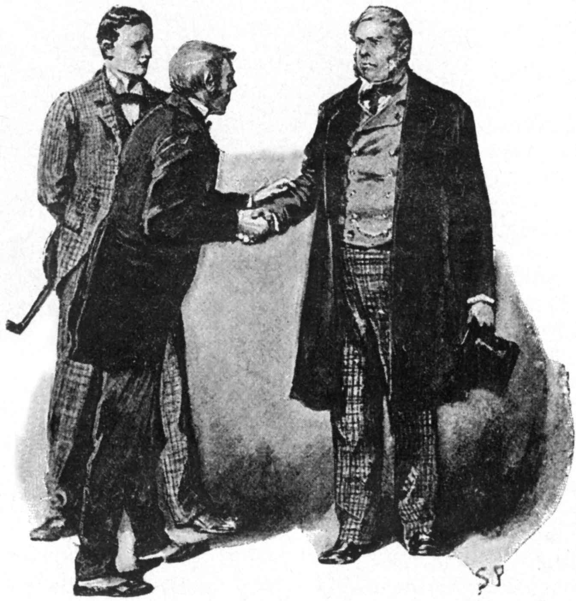

他拉住我的手，向我热烈祝贺成功。

“‘如果再犹豫不决，那就要变成侵犯你的权利了，’他说，‘不过，为慎重起见，你得原谅我不得不这样。’他忽然两手抓住我的头发就拔，疼得我叫起来，他立即松手。‘你都流眼泪了！’他放开我说，‘我看到了，没问题。我们得小心才好，我们被人骗过两次，一次是假发，一次是染发，连上鞋线的蜡都有人用。人心之坏，不可信，我们都可以拿来当故事讲给你听。’他跑到窗口去，直起嗓子向窗外喊，缺额已经有人了。下面的人群发出阵阵失望的抱怨声，然后向四面八方散去了。很快，一个红头都不见了，只剩下我一个，他经理一个。

“‘我的名字，’他告诉我，‘邓肯·罗斯，本人我，就是受我们高贵施主恩惠的人，靠他基金的年金过活。你结婚了吧，威尔逊先生？你的家人呢？’

“我说我没成家。

“他立刻把脸一沉。

“‘哎呀！’他一本正经地说，‘这可是严重问题！我很遗憾听你这么说。设立这笔基金，当然是用来繁育更多的红发人，也是为抚养后代之用，谁知你单身一人，太不幸了。’

“我脸都拉长了，福尔摩斯先生，我想这下算完了，那空缺准是没份了。谁知他想了那么几分钟，便说这也没啥关系。

“‘这事如果发生在别人身上，’他说，‘肯定通不过，给打回票没说的。可是像你这样一头好发，实属难得，我们就网开一面吧。你什么时候能够来履任你的职务？’

“‘哎呀，这个事倒还有点犯难，就为我自己还做着点营生。’我说。

“‘啊，那个没关系啦，威尔逊先生！’文森特·斯波尔丁说了，‘店里的事全交给我替你照管就是了。’

“‘时间是几个钟头？’我问。

“‘上午十点到下午两点。’

“还好，当铺生意多半是在晚上比较忙，福尔摩斯先生，特别是星期四、星期五的晚上，是发薪的前一天嘛，所以这倒也合适，上午出来挣点外快。再说，我知道伙计人不错，有什么事都靠得住。

“‘这就挺合适，’我说，‘工资怎么算？’

“‘就是四英镑一星期。’

“‘做什么工作呢？’

“‘没事，挂个名嘛。’

“‘什么叫挂名？’

“‘哦，那就是上班时间要在办公室，至少来这楼里待着，如果离开走掉，那工作也完了。这个事，遗嘱上写得可是明明白白，上班时间要是擅自行动，那就是没有尽心尽责。’

“‘也就一天四小时吧，我不离开就是了。’我说。

“‘不得找理由找借口，’邓肯·罗斯先生说，‘生病也好，营业也好，什么事也好，都不许，要么规规矩矩待着，要么丢掉饭碗。’

“‘做什么工作呢？’

“‘抄写《大不列颠百科全书》。这儿是这套书的第一卷。墨水、笔，还有吸墨水纸，都自备，我们提供这张桌子，还有椅子。明天就开始，怎么样？’

“‘行，没问题。’我回答。

“‘这就再见，杰伯兹·威尔逊先生，让我再一次祝贺你获此重要职位，你真是有幸。’他欠着身送我出屋子，我就同伙计一起回家。我觉得交上了好运，心里喜滋滋的，一时手脚都没处放了，也不知说什么好了。

“这样，我整天想着这事儿，一到晚上，我情绪又低落下来。我心里转念总觉得这个事肯定其中有花样，弄不好让我受骗上当。只是其中到底什么目的，我难以想象。按说谁也不能相信，谁会立这种遗嘱，白付这么一笔钱，什么也不做，光叫抄写《大不列颠百科全书》。文森特·斯波尔丁一个劲儿地向我祝贺、鼓劲，我睡在床上怎么想也想不通。不过，一到了早晨，我还是决定先去看看再说，所以就买了瓶一便士墨水，带着管羽毛笔、七张大裁书写纸，就离家去了教皇院。

“嗬，出乎意料，让人高兴，样样事情都很顺当。桌子已经为我擦得干干净净，邓肯·罗斯先生在那里照料，好让我马上开始工作。他叫我先从A字母抄起，交代好就走了。可是他时不时过来看看，有什么问题没有。到了下午两点钟，他跟我打招呼说可以走了。看我抄写了不少，他很赞赏，出了办公室，随手把门锁上。

“事情就这样一天一天做下去，福尔摩斯先生。到了星期六，干事进来，付我四个金沙弗林，作为我第一个星期的报酬。第二个星期，一切照常，再一个星期，还是老样子。每天上午十点钟上班，每天下午两点钟下班。渐渐的，邓肯也很少视察了，上午只来一次，再往后，干脆就不来了。我呢，当然不敢擅离职守，不敢离开办公室，哪怕一会儿时间。我说不准他什么时候就会来，再说这差使也真不赖，我感觉挺合适，不想出什么差错随便丢掉了。

“就这样，八个星期过去了，我抄写了Abbots（男修道院长），还有Archery（箭术），还有Armour（盔甲），还有Architecture（建筑学），还有Attica（希腊城邦阿提卡）。本想再努力一点，很快就能抄B字母的条目，我花了点钱买大裁书写纸，抄写好的一摞纸快把书架塞满了，可是忽然间，这差使停掉了。”

“停了？”

“是的，先生。就是今天上午，我照常十点上班，可是门关着，还上着锁，门上用图钉钉了一张小纸片，四方硬纸片，我带来了，你们看看吧。”

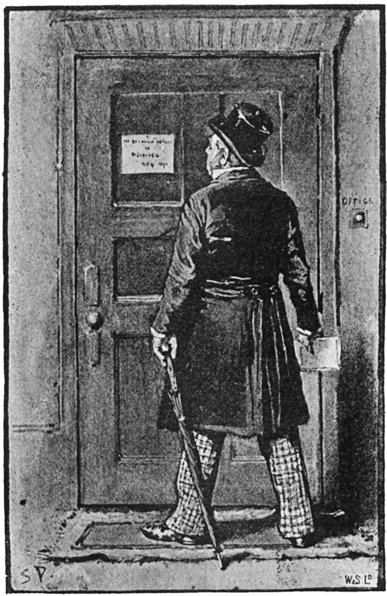

门关着，门上用图钉钉了一张小纸片。

他掏出一张白卡片纸，也就是一张便条纸般大小，上面这样写着：

红发会已予解散，谨启。

一八九〇年十月九日

福尔摩斯和我看了这张简短无礼的告示，再看看纸片对面那张沮丧的脸，想想竟有这样莫名其妙的滑稽事，确实叫人怎么也想不通。我们两人不禁爆发一阵大笑。

“我看不出这里头有什么可笑，”我们的委托人叫道，气得面红耳赤，变得红发红脸满头火红，“你们只觉得我好笑，事情没啥意思，那我就不敢打扰了。”

“不，不，”福尔摩斯叫道，威尔逊身子正站起来，马上被他按下重新坐好了，“你这个案子，我决没有一点意思小看它，不想接，这个案子十分稀罕少见。但我还是要说，请别介意，确实非常滑稽可笑。请问一下，你看到门上这张卡片，你怎么想呢？作什么反应呢？”

“我一下子呆了，先生，不知怎么办才好。过后我问问周围别的办公室，可是人家好像都不清楚是怎么回事。最后我问了房东，他是个会计，就住在底楼。我请问他红发会是怎么回事，他讲他根本就没听说有什么红发会这种团体。我又问他关于邓肯·罗斯先生，他回说连这个名儿都没听说过。

“‘那，’我说，‘是四号的一位先生。’

“‘啊，那个红头发？’

“‘对，正是他。’

“‘哎哟，’他说，‘他叫威廉·莫理斯，是个律师，暂时租用我的房子过渡一下，说等他新房子好了就搬走。他昨天搬走的。’

“‘他搬哪里去了？’

“‘噢，他的新办公地点，地址告诉我的，有的，爱德华王街十七号，靠近圣保罗教堂。’

“我就赶到那边去，福尔摩斯先生，按着地址到那里一看，是造护膝的厂子。一问，根本没有威廉·莫理斯先生，也没有邓肯·罗斯先生。”

“后来又怎么样呢？”福尔摩斯问。

“我回萨克森—科堡广场，回到家里，问问我的伙计，听他怎么说法。可是他也莫名其妙，只是说，要么等等看，说不定有什么讯息会寄过来。可我看这不是个办法，福尔摩斯先生，我不愿糊里糊涂白白丢了这个好事，所以，来见你。我听说你很有办法，也很为贫苦人说话，有求必应，我这就上你这儿来了。”

“你做得很对，”福尔摩斯说，“你这件事，绝非一般的案子，我很乐意经手办一办。从你告诉我的情况来看，我想，问题不是乍一看那么点事，可能要严重得多。”

“够严重了，”杰伯兹·威尔逊说，“不是吗，每星期损失四英镑钱啦。”

“就你个人来讲，”福尔摩斯说道，“我认为你不必对这个所谓的红发会满腹牢骚。应该说，无论怎样，你毕竟拿到了三十英镑，报酬没少你，还有呢，多少增加点知识，那几个A字母也没白抄写。这是我的理解，他们没亏欠你什么。”

“不，先生。我得要搞明白，他们是些什么人，为什么开玩笑花那个代价，他们出了三十二英镑呢！”

“我们就是要设法给你搞清这一个问题。首先，有一两个问题，威尔逊先生，你这伙计，是他首先叫你看的广告——他来你这儿有多长时间了？”

“才来了一个月。”

“是怎么来的？”

“我登广告招聘来的。”

“应聘的只有他一个人？”

“不，有十来个人。”

“为什么偏偏选上他呢？”

“因为他手巧，能干，要价又低。”

“只要人家的一半工资。”

“正是。”

“这个文森特·斯波尔丁是什么模样？”

“小个子，体格倒健壮，手脚很勤快，岁数三十出头了，可是脸上光溜溜的，前额上有一块白疤，是硫酸烧伤的疤。”

福尔摩斯兴奋得从椅子上直起了身子。“我想也差不多了，”他说，“你看到他耳朵穿耳洞了没有？”

“噢，是的，先生，他跟我说过他年轻的时候吉卜赛人给他穿了耳洞。”

“唔！”福尔摩斯身子又靠回去，沉思着，说道，“他还同你在一起？”

“哦，是的，先生，这会儿就他在店里。”

“你不在的时候，店就只好全交给他了？”

“只好这样，先生，上半天店里本来就没啥业务。”

“那就这样，威尔逊先生，这件事情，我很高兴，我很高兴给你查一查，一两天听回音吧。今天星期六，到星期一，希望我们会有个结论。”

“哦，华生，”等来客一走，福尔摩斯说，“你怎么个看法？”

“一点头绪都没有，”我坦率回答，“太神秘莫测。”

“一般讲，”福尔摩斯说，“越是稀奇古怪，结果越不神秘莫测。你记住，毫无特色的刑案才是真正难破，就像一张平平常常的脸，最难辨认。好了，这件事我得立刻动手。”

“你怎么着手呢？”

“抽烟，”他回答，“三斗烟，问题就解决了。求你别跟我说话，给我五十分钟。”他蜷起身，缩在椅子里，把尖棱棱的膝盖顶住鹰钩鼻。他坐在那里，闭起眼睛，叼着的陶瓷烟斗突出着，像是猛禽巨喙。我看他模样，心想准是睡着了，我自己也就打起瞌睡。可就在这时候，他忽地从椅子里一跃而起，一副主意已定的神气，把烟斗往壁炉架上一搁。

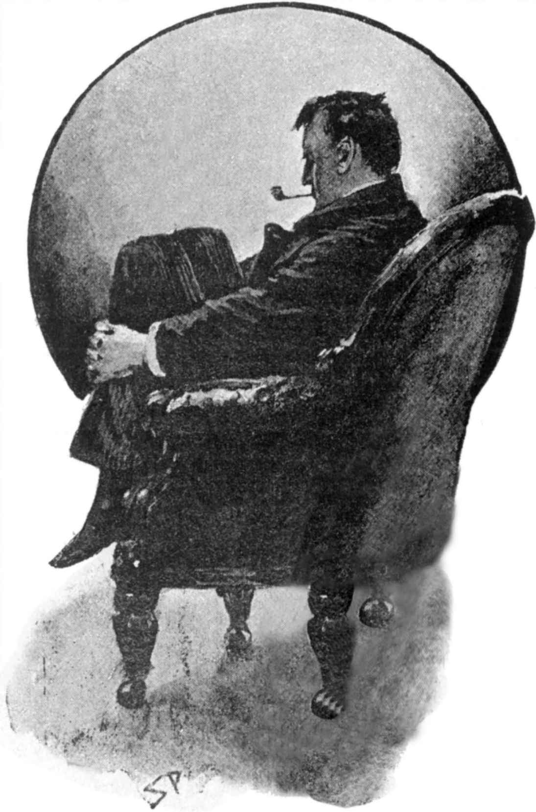

他蜷起身，缩在椅子里。

“萨拉沙特<a href="#part0046.xhtml_ch4"
id="part0046.xhtml_ch4-back">(4)</a>今天下午在圣詹姆斯音乐厅演出，”他说，“你怎么样，华生？你看病腾得出一两个小时吗？”

“今天没事。我看病，从来不会忙得脱不开身。”

“戴上帽子走吧。我先去市中心，顺路吃午饭。我注意了，节目单上主要是德国音乐，正对我的口味，比意大利、法国的要好。德国音乐深刻，我就要深刻。走吧！”

我们乘地铁，一下就到了奥尔德斯门，稍走一点路就到了萨克森—科堡广场，上午听到的那个奇异故事的现场地。这个地方房子简陋、狭窄、破旧，但强撑一点门面。四排灰溜溜的两层楼砖房前面围以矮栏杆，围栏内的草坪杂草漫生，几丛萎缩的月桂树在烟雾弥漫的污浊环境中顽强地生长。拐角一所房子的上方，装饰有三个金球当铺标志、一块咖啡色木板，木板上写着白漆字“杰伯兹·威尔逊”，告知这就是我们的红头发委托人所开的当铺。福尔摩斯在屋前驻足，歪着脑袋细细看了一番，睻缝的两眼却是炯炯有光，然后慢慢沿街走过去，没多远，又转回到拐角上，再瞧着房子仔细打量，最后转回当铺门前来，用手杖向人行道上使劲捣了两三下，就上当铺去敲门。铺门立即打开，开门的是个小伙子，一张光溜溜的脸，相貌很精明。他请福尔摩斯进屋里去。

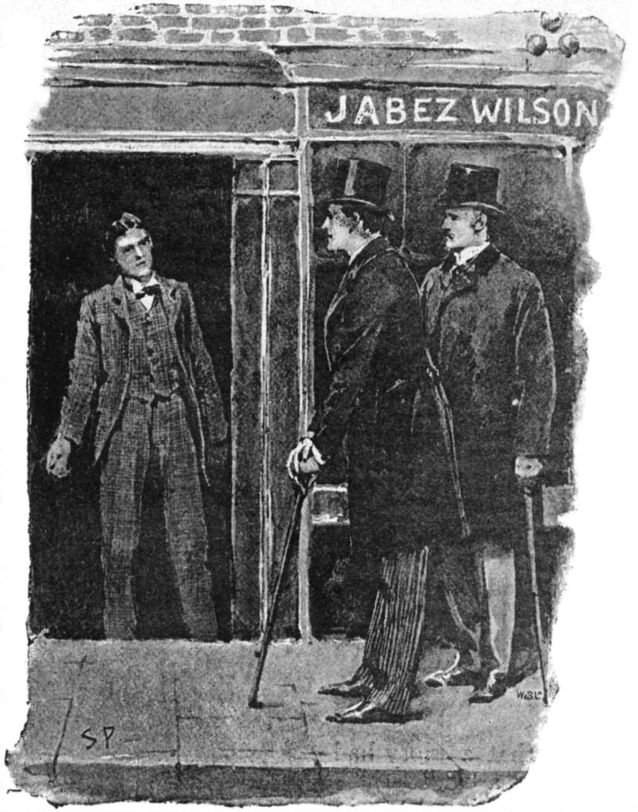

开门的是个小伙子。

“谢谢，”福尔摩斯说，“对不起，麻烦问一下路，从这儿去河滨大街怎么走法？”

“第三个街口右拐，再左拐。”伙计简洁爽快地回答，说完立即把门关上。

“很精明能干，那样子。”福尔摩斯说着，我们便离开，“依我看，他数得上是伦敦第四位精明能干的人，而胆略方面，他可以列入第三位。此人我早就略知一二。”

“很明显，”我说，“威尔逊先生的这个伙计，在红发会奇案中有着重要作用。我有数，你向他问路，借此机会看看他这个人。”

“不是看他人。”

“那看什么？”

“看他裤子膝盖。”

“膝盖又怎么了？”

“果然看到，不出所料。”

“你捣地面又是为什么？”

“我亲爱的医生，现在这时候留心观察，别说话。我们等于是在敌国，当间谍。已经知道萨克森—科堡广场有情况，还要探一探这后面是怎么个情况。”

我们从冷落的萨克森—科堡广场转过弯，就来到了一条大路上，眼前呈现的却是截然相反的景象，犹如从一帧照片的背面转到了照片的正面。这是一条通衢大道，交通极为繁忙，承载着伦敦市区通往西北方向的主要运输任务。路上充斥着巨大的商贾洪流，车水马龙，来来去去，进进出出，奔忙无止境。熙熙攘攘的人群川流不息，鞋脚把人行道都磨蹭得乌黑发亮。真叫人怎么也想不到，眼前鳞次栉比的店家商厦美轮美奂，而我们刚才转过来的贴背面广场边，却是一副灰溜溜邋遢相。

“让我看看，”福尔摩斯说，站在拐角处放眼望过去，“我要记住了，这一溜房子的顺序。了解伦敦这座城市各种情况，是本人一种嗜好。莫蒂默，是家烟行，下边是书报亭，再下去是郊区银行科堡分行，再下去是素食餐馆，再就是麦克法兰马车制造厂，一直要到下一个街区。好啦，医生，我们的任务已经完成，该消遣一下了。吃个三明治，喝杯咖啡，再去提琴王国领略音乐，优雅，悦耳，和谐，不会有红头发委托人跑来出难题打扰我们。”

我的朋友喜爱音乐，兴致极浓，他不仅能够演奏小提琴，而且还是个作曲家，出手绝对不凡。整个下午他坐在音乐厅正厅前排，沉浸在愉悦之中。随着音乐的节拍轻弹着他那细长的手指，脸上荡漾轻柔的笑容，微闭双眼，似入悠悠梦境，已完全不是原来的福尔摩斯，那个如警犬凶猛异常的福尔摩斯，那个铁面无私、足智多谋、果敢敏捷的刑案大侦探福尔摩斯，一想起他来，那是完全判若两人。他的特殊性格，交替呈现着双重性。我往常所知他严谨、精到的一面，原来还陪衬着诗情音乐儒雅的一面，有时竟还是他心思情绪之中的主宰。双重性的转变会把他从极度的消沉一下子提升起来，变得精力充沛而旺盛。我很清楚，他最叫人望而生畏的时候，是一连几日蜷缩在椅子里，闭目沉浸在构思之中，酝酿重拳如何出击。紧接着就是一追到底的冲动劲喷薄而出，智慧之光四射的推理能力即刻升华为直觉。那些不懂他个中奥妙的人，只能刮目相看，把他看成是个无所不知、无所不能的超人。我看他下午在圣詹姆斯音乐厅里陶醉的模样，心中感觉到他已经锁定了什么人，他们必已恶贯满盈，法网难逃。

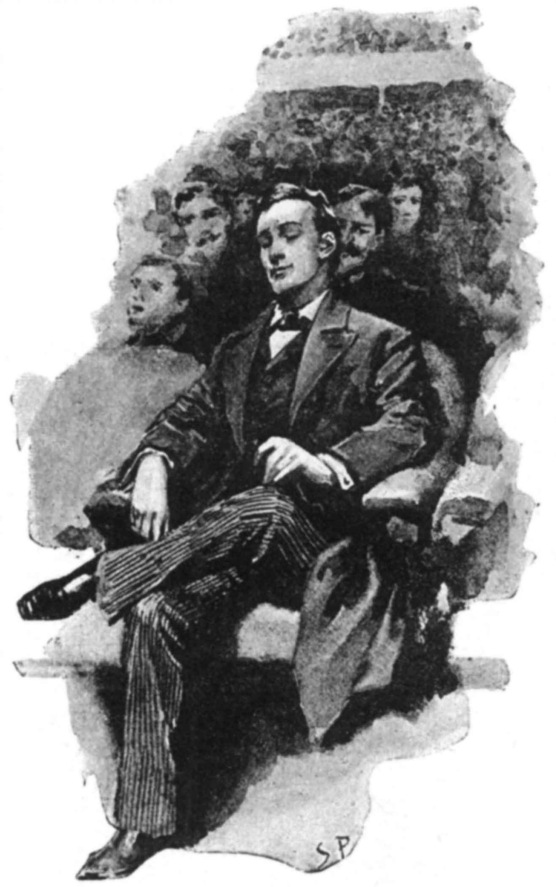

在圣詹姆斯音乐厅里陶醉的模样。

“你想要回家了吧，医生，准没错。”我们走出音乐厅的时候，他对我说。

“是呀，想要回去了。”

“我这里还有事要做，得花上几个钟头。科堡广场的案子，是件大案。”

“是大案？”

“一桩重大刑案即将发生。我有充分理由相信，我们能够及时制止。不过，今天是星期六，事情变得紧迫起来了。今天晚上想请你帮忙。”

“几点？”

“早一点的话，十点。”

“那我十点来贝克街。”

“很好。还有，我说医生，恐怕会有一点点危险，请你把部队用的枪带上。”他挥挥手，转过身，一下子就消失在人群中。

我自信，我不比三邻五舍的周围人笨，但是一和福尔摩斯相处，我总觉得矮了半截，明显感到自己的愚蠢。就拿这件事来说，我和他耳朵一样地听，眼睛一样地看，他就能说得清讲得明，不仅看到发生了的事，还能料到将要发生什么事。可是我呢，对这整个案子依然混沌一团无头绪。我乘马车回肯辛顿家里，一路上把事情整个儿思索一遍，从抄写《大不列颠百科全书》的红发人的奇特故事，到踏勘萨克森—科堡广场，以及福尔摩斯同我分手时所说的预兆颇有不祥的话，一一想过来。夜间行动，还要带枪，那是怎么回事？我们要到哪里去？去做什么？我从福尔摩斯嘴里听出，这个脸面光洁的当铺伙计是个不好对付的人——这个人绝非善类，手段厉害着呢。我想理出头绪，把谜解开，但始终做不到，无奈之下只好算了，把它搁在一边，反正到晚上就会真相大白。

九点一刻，我从家里动身。我是穿公园，走牛津街到了贝克街，看见两辆双轮双座马车停在门口。我进了门厅，就听到楼上有三个人的声音。一进了客厅，看见福尔摩斯同两个人谈得起劲。我认得是官方警探彼得·琼斯，还有一个，瘦瘦高高的个子，脸色忧郁，头戴一顶光亮的礼帽，身穿一件质地和样子都很考究的厚大衣，这个人我不认识。

“好！人都到齐了，”福尔摩斯说，把他粗呢上装的纽扣扣好，伸手从架子上取下一根粗猎鞭，“华生，我想你该认识琼斯先生，苏格兰警场的。让我给你介绍一下梅理韦瑟先生，他也是我们今晚出击行动的伙伴。”

“你瞧，医生，我们又合伙打猎了，”琼斯说，还是一副趾高气扬的姿态，“我们的这位朋友是个打猎高手，他少不了还需要一条老狗来助他一臂之力将猎物逮住。”

“但愿不要到头来什么也追不到，白忙活一场。”梅理韦瑟先生沉着脸说道。

“我说先生，你对福尔摩斯先生尽管放心，”警探傲慢地说，“他有他自己那点小聪明。那一点，恕我直言，稍有点过于理论化，过于异想天开。不过论到一个侦探条件嘛，他还是有的。说多没有，也就一两次吧，比方说肖尔托谋杀案，那个阿格拉珍宝，比比警察，也真给他是棋高了一着。”

“哦，说到这个，琼斯先生，那倒是不错，”那个陌生人颇正经地说，“不过，我得说明我损失了一场牌局，是二十七年来第一次星期六晚上没上牌局。”

“我想你会发现，”福尔摩斯说，“你今天晚上下的赌注比你以往下过的赌注要大得多，牌局场面也要叫你兴奋得多。你今晚的赌注，梅理韦瑟先生，将高达三万英镑。你呢，琼斯先生，你的赌注正是你一直要逮的那个人。”

“约翰·克莱，这个杀人犯、抢劫犯、假币犯、伪造证件犯。他是个年轻小伙，梅理韦瑟先生，可已是犯罪团伙的头儿，目前伦敦所有罪犯，我最要紧的就是要逮他。不能小看这个小混蛋约翰·克莱，他祖父是个王室公爵，他本人是伊登、牛津出身，头脑灵活，身手敏捷。我们跟他打交道，可老是近在咫尺失之交臂，给他溜掉，始终逮他不住。他今儿个在苏格兰才砸了人家婴儿床，明儿又在康沃儿什么筹建幼儿园了，这儿一榔头，那儿一棒子，拿他不准。我追捕他好些年了，至今人影都未能谋上一面。”

“我希望我能有幸今晚把他介绍给你，我已经和约翰·克莱先生有过一两次的交手。你刚才说的没错，他是犯罪团伙的头目。现在时间已经过了十点，不早了，该出发了。你两位坐头一辆车，华生和我第二辆，跟你们后面。”

福尔摩斯一路行来几乎没开口说话，背靠座椅，哼起了下午听来的曲子。马车辚辚，驶在弯来拐去路灯昏暗的街道上，似无尽头，过了好久才进入法林顿街。

“目标很近了，”我的朋友说道，“梅理韦瑟这个人，是银行董事长，他本人对这个案子非常关心。我想琼斯也有兴趣，和我们一块儿来也有好处。这个人不坏，虽说对他的本行简直是个白痴，可也有值得肯定的一面，他抓起罪犯来勇猛得像斗牛狗，顽强得像龙螯虾。到了，他们在等我们呢。”

我们一起来到上午那条热闹非凡的通衢大道。马车打发走了，在梅理韦瑟先生的带领下我们走入一条狭窄的通道。他打开铁门，进门是一级盘旋形石阶梯，下到尽头又是一扇阴森森的大铁门。梅理韦瑟先生止步，点亮一盏提灯，领我们走下一条幽暗的泥土气息很浓的通道。接着，打开第三道门，便进入了一个拱顶地下室或叫大地窖，里面堆满板条箱、大铁箱。

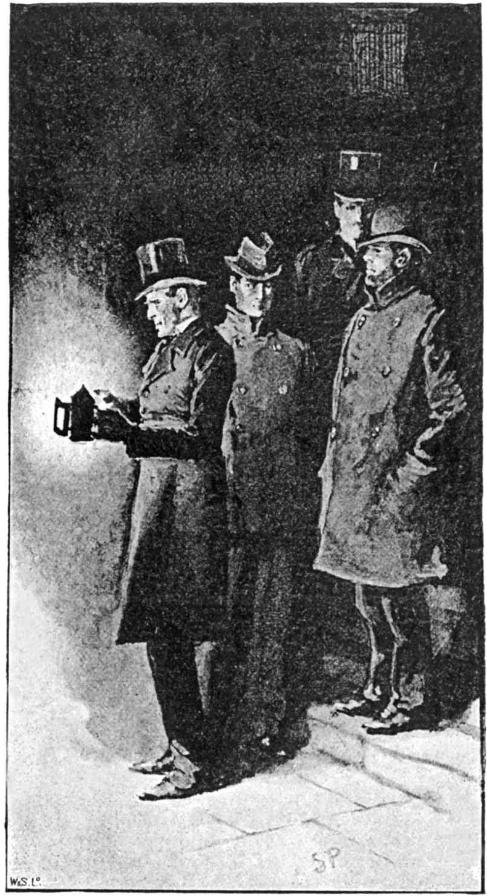

梅理韦瑟先生止步，点亮一盏提灯。

“这个地方从上面入手不那么容易。”福尔摩斯说，举灯向四周看看。

“底下动手也不容易。”梅理韦瑟先生说，用他的手杖捣了捣地下铺的地砖，“哟，不对嘛，听声音这下面是空的！”他说道，抬起了眼，十分惊恐。

“我得要求大家保持安静！”福尔摩斯严肃地说，“你已经太莽撞了，搞不好我们的行动要让你砸锅。请你在哪个箱子上坐着，别出声，别乱动，好不好？”

不失身价的梅理韦瑟先生只好拣一只板条箱坐下不动，一脸尊严受到损伤的表情。这时，福尔摩斯双膝跪在地板上，拿了提灯和放大镜，仔细观察石板的缝道。只几秒钟时间，就检查完毕，一下子站起身来，把放大镜藏入衣袋。

“我们早到了一个小时，至少再等一个小时，”他说，“要等当铺老板这个好好先生睡安稳了，他们才好动手。行动一开始，就一分钟也不许耽搁，他们活儿越抓紧干得快，逃跑的时间就越充裕。我们现在，医生——你已经猜到了——这个地下室，伦敦一家大银行的分行地下室，梅理韦瑟先生是这家银行的董事长，请他来讲一讲，为什么伦敦的要犯现在对这个地窖这么感兴趣。”

“那是因为我们的法国黄金，”董事长咬耳朵似的轻声说，“我们已得到多次警告说有人在这上面打主意。”

“你们的法国黄金？”

“是的。几个月之前，我们有机会增加了我们的储备，为此向法兰西银行借三万拿破仑<a href="#part0046.xhtml_ch5"
id="part0046.xhtml_ch5-back">(5)</a>。我们一直没有开箱起出这笔钱，这是众所周知的，所以一直储藏在地下室。我坐的这只板条箱，里面就有两千拿破仑，是用铅箔一层一层夹着包装的。我们单单一个分行的黄金储备现在就要比平时多得多，董事们对这件事一直很担心。”

“担心是完全有道理的，”福尔摩斯说，“现在时间差不多了，我们安排一下行动步骤，估计一小时以内事情就要发生啦。梅理韦瑟先生，这个提灯，待会儿得把遮光罩拉下来。”

“摸黑坐等吗？”

“恐怕只能这样。我衣袋里带着一副牌呢，我们正好四个人，本来大家可以打桥牌，可是我看对手准备得差不多就要动手，我们还亮着灯，这个险冒不得。那么，首先，我们位置得摆好了，对手是亡命之徒，虽说我们占着上风，捉他们没问题，但是不小心还是要吃他们亏，非警惕不可。我站在板条箱后面，你们都在箱子后面把身子藏好，然后，只要我把灯光一对住他们，大家就扑上去，如果他们敢动枪，华生，你先下手把他们击倒。”

我掏出左轮枪，准备好，放在木箱上，人蹲在木箱后面。福尔摩斯立刻把灯罩子拉上，我们陷于一片漆黑之中——如此的黑暗无光我以前从未经历过。只有提灯灯壳受热散发的金属味让我确信灯没有熄灭，一旦信号发出，马上就可以照亮。我静候着，神经高度紧张，忽然处于如此阴暗潮湿的地下室，身心感到一种极度的压抑。

“他们只有一条退路，”福尔摩斯悄声说，“只有回到萨克森—科堡广场的屋子去。那边，我给你说好的，安排人了吧，琼斯？”

“我安排了一个巡官、两个警官守候在前门。”

“好，洞口都给他堵死，现在只管静候佳音。”

时间过得真慢！但是事后我们大家对表一看，连等带捉整个时间也不过只有一个小时一刻钟，然而我在感觉上好像过了整整一夜，仿佛黎明应该已经来临。我手脚发僵发麻，因为我不敢动弹换位。我的神经保持极度紧张，听觉高度灵敏，不仅能听到我同伴缓缓的呼吸，还能辨别出大块头琼斯深沉的鼻息声和银行董事长轻微的叹息声。从我这个位置上望去的应该是那个目标方位。忽然，我眼前一亮，看到有亮光。

起先，只是石板上有一点点小红光，随后慢慢变长，变成一条黄色光线，再后来，没有人声没有响声，裂缝在张开，上来一只手，一只白白的女人一般的手。这只手在亮光照着的地方探探摸摸。一两分钟以后，这只手指摸摸索索的手伸出地面来，但是就如忽然伸出，又忽然缩了下去，不见了，四周又是漆黑，只留着石缝之间一点红光。

消失只是暂时的，随着一声推动的闷响，一块白石板被整个儿推开，出现一个方块形大洞穴，提灯的光线直射上来。沿着洞边探出一张光洁的孩儿般的脸，眼珠向周围骨碌碌地转。随即两只手攀住洞口两边一撑，人就腾起，露出肩部、腰部，一个膝盖抵上了洞边沿，再撑一下，人就站了上来，转身去把另一个同伙拉上洞。这个人也同他一样，轻巧灵活的小个子，一张苍白的脸，一头乱蓬蓬的红发。

“没事，”爬上来的人轻声说，“凿子、口袋呢？啊呀不好，阿尔奇，跳，快跳，我来对付！”

歇洛克·福尔摩斯冲上去一把揪住这个人的领子，还有一个赶快跳回洞里。我听到哧啦一下衣服撕裂声，原来是琼斯抓住的那人的衣摆给扯下了。灯光照着一支左轮枪管，福尔摩斯一猎鞭抽中这个人的手腕，手枪当啷掉在了石板地上。

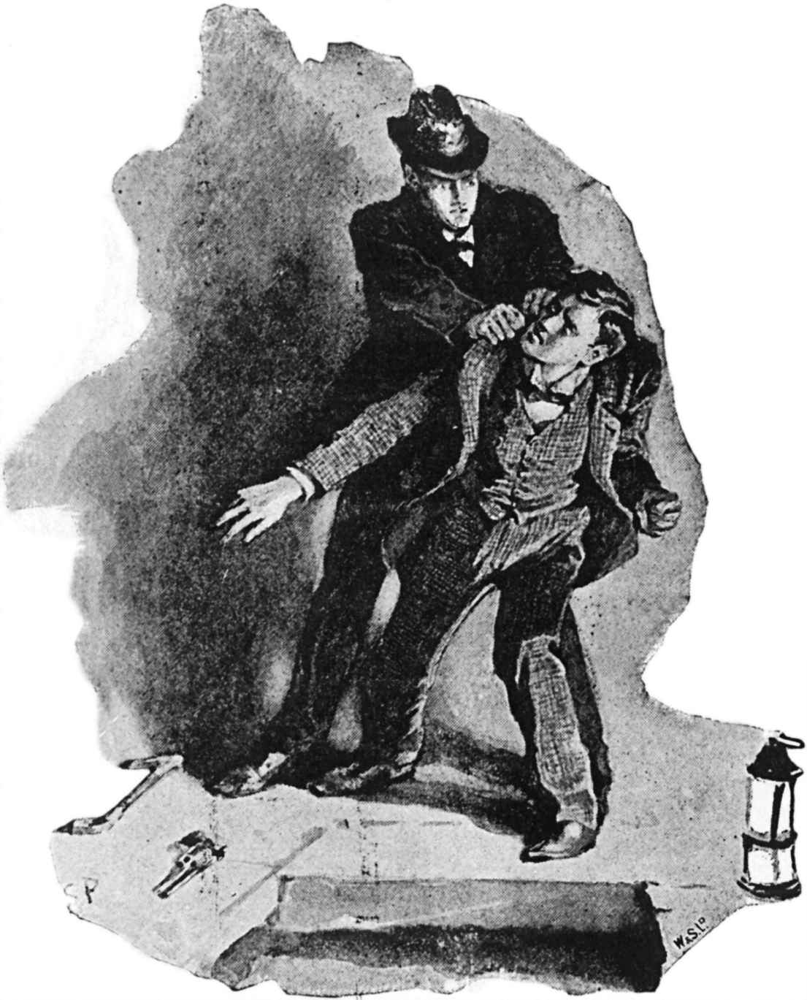

手枪当啷掉在了石板地上。

“没有用，约翰·克莱，”福尔摩斯不愠不怒地说，“这一关你过不去了。”

“就算吧，”对方冷冷地回答，“可我的朋友没事，你们只抓得住他一只衣角。”

“门口有三个人恭候着他呢。”福尔摩斯说。

“哦，想不到！你们做得滴水不漏。向你们恭喜了。”

“彼此彼此，”福尔摩斯回答说，“你那个红头发脑瓜子出的点子也很有新意很有效。”

“你马上可以会见你的朋友，”琼斯说，“算他钻洞钻得快，从我手上跑掉。把手伸出来，你赌输了。”

“我不要你们的脏手来碰我，”人犯给铐上手铐，还这么说，“你们恐怕不知道我是皇家血统，我身上是皇族血液。还请注意了，你们称呼我必须说‘先生’，说‘请’。”

“行呀，”琼斯向他瞪眼笑道，“请吧，先生，上去，叫辆马车送阁下蹲警察局，怎么样？”

“敢情好吧，”约翰·克莱神态平静地说。他向我们三个行一个鞠躬大礼，由警探押着走。

“说真的，福尔摩斯先生，”梅理韦瑟先生说，我们随后一同走出地下室，“不知银行该怎么谢你们、酬劳你们。毫无疑问，你们用最周密的方法一举侦破精心策划的银行盗窃案，如此大案我以前从未遇到过。”

“我这里还有另外一两笔账要同约翰·克莱先生算算，”福尔摩斯说，“破这个案子我是花了些钱的，希望银行方面应有补偿。不过除此以外，我获得了丰富回报的，应当说是经验，有许多方面的经验是独一无二的，还听到了关于红发会的非常有趣、难得一听的故事。”

“你看，华生，”清晨时候，我们回到了贝克街，坐着喝苏打水威士忌，福尔摩斯解释说，“事情从一开始就很明显，红发会别出心裁的广告，又是抄大百科全书，其目的，都是要支走当铺老板。老板头脑简单，中了调虎离山计，每天让出几小时。这个做法很费周折，但是，也实在没有比这更好的方法。这是个妙计，说明克莱很有计谋，脑筋动到利用同谋犯的头发颜色。一星期四英镑的诱饵，足以使当铺老板上钩。他们要弄到手成千上万英镑，花这一点算什么？两个流氓一搭一档，登出了广告，一个临时借个办公室，一个怂恿老头儿去应聘，合谋保证他一周七天天天上午都离开当铺。我开头一听说伙计愿意只拿一半工资，心里就有了底。一定要当他的伙计，就一定是别有意图。”

“那你怎么猜到他们的什么动机目的？”

“如果店里有成年妇女的话，我可能会想也就是搞点风流韵事吧。可是，完全不是那回事。这当铺，是小店生意，店里根本没有什么值得如此精心策划，值得还要花掉那么些本钱。这样看来，目标必定是屋外。那么，搞什么名堂呢？我想到这小伙计爱好摄影，玩照相出没于地窖。对了，地窖！这案子的一团乱麻，理出了这么个头绪。然后我摸了摸这个神秘莫测的伙计是什么人，原来我要对付的是伦敦有数的一个案犯，极精明，很厉害。他在地下室里必有名堂——一连几个月每天好几个小时。再要问一问，为什么？想来想去，只有挖地道，通向别的哪幢房屋建筑。

“我们去作案现场一看，我就明白了。我用手杖在人行道上捣几下，你觉得奇怪，我是确定一下地窖挖洞是向屋前还是屋后延伸，敲一敲知道不在屋前。我就再按门铃，正如所料，是伙计来开门。我们有过几番较量，但在此前一直未曾谋面。我并非专门想要见识其人，主要是他的膝盖，我想看看，你也应当注意到吧，他的裤子又旧又皱又脏。这告诉你，那些个小时他确实是在打地洞。剩下的问题，只有一个，他们为什么要挖地洞。我走走看看，一拐弯看见了那家郊区银行，同我们朋友的房屋前后毗邻。行了，问题解决了。听完音乐会，你回家，我去了苏格兰警场，还去找了银行董事长。结果怎么样，都已经看到了。”

“你怎么知道他们就是昨天晚上动手？”我问。

“噢，红发会办公室一撤，是个信号，他们不再顾忌杰伯兹·威尔逊先生在不在店里，换句话说，地道已经挖通。关键就是要赶紧动手，免得地道被发现，黄金也可能要挪地方。只有星期六，是他们最佳选择，得手以后有两天的逃跑时间。这就是充分理由，我料准他们当夜必定光临。”

“你的推理天衣无缝，”我真是佩服得五体投地，“链条是如此之长，但环环相扣，丝毫不脱节。”

“这让我摆脱空虚感，”他说道，打个哈欠，“唉，我只觉得生活空虚无聊，我的生活要作不懈的努力，不使它庸庸碌碌、虚度光阴，这些小问题正有助于我有点作为。”

“你是在为人类造福。”我说。

他耸耸肩。“哦，也许吧，毕竟，对生活内容不无小补，”他说道，“L' homme
c'est rien—l'œuvre c'est
tout！‘人是渺小的——著作就是一切’，居斯塔夫·福楼拜给乔治·桑写信如是说。”

（1891年）

————————————————————

<a href="#part0046.xhtml_ch1-back" id="part0046.xhtml_ch1">(1)</a> 本书第二篇《身份案》中的人物。

<a href="#part0046.xhtml_ch2-back" id="part0046.xhtml_ch2">(2)</a> 共济会（Freemason）是一种范围广泛的秘密互助会，1717年建立于伦敦。文中所述公开佩戴会章，系属违规。

<a href="#part0046.xhtml_ch3-back" id="part0046.xhtml_ch3">(3)</a> 拉丁文“大智若愚，高深莫测”的意思。

<a href="#part0046.xhtml_ch4-back" id="part0046.xhtml_ch4">(4)</a> 萨拉沙特（Sarasate，1844—1908），西班牙小提琴大师、作曲家。

<a href="#part0046.xhtml_ch5-back" id="part0046.xhtml_ch5">(5)</a> 拿破仑（Napoleon），拿破仑头像旧金币，币值20法郎。

# 波斯康谷迷案

一天早晨，妻子和我正坐着用早餐，女仆送来一份电报。电报是福尔摩斯打来的，内容如下：

顷悉英格兰西部波斯康谷凶案电。抽暇同往一两日？不胜欣幸。空气景致极佳。11：15于帕丁顿启程。

“你的意见呢，亲爱的？”我的妻子说，在桌对面望着我，“你想去吗？”

“不知该怎么办才好，眼下要做的事还不少。”

“噢，安斯特鲁瑟可以替你做。近来你面色苍白，我想你换换环境也好，反正你跟福尔摩斯办案子也很有兴致。”

“我拒绝也太讲不过去。自己知道每经过一个案子，从中也获益匪浅，”我答道，“可是去的话，得立刻动身，时间只有半小时了。”

我在阿富汗的军旅生涯，多少养成了行动敏捷的习惯，说走马上就能走。好在我的生活用品甚为简单，不到半小时，我已拎上行囊、马车辚辚地赶到了帕丁顿车站。福尔摩斯正在站台上走来走去，他头戴小布帽，身穿灰色旅行长外衣，原已瘦长的身躯显得更加瘦长。

“你来真是太好太好了，华生，”他说，“有个完全靠得住的人，情况就大不一样。当地的助手常常不是没有意义，就是扯你手脚。角落上两个位子你去坐好了，我来买票。”

火车包厢<a href="#part0047.xhtml_ch1"
id="part0047.xhtml_ch1-back">(1)</a>里就只我们两个人，还有就是福尔摩斯带来的一卷报纸，随便摊开占了好大一摊。他翻翻检检，边看边在本子上记下几笔，间或沉思默想一会儿。这么就过了里丁。忽然他把报纸统统卷起，一大卷往行李架上一扔。

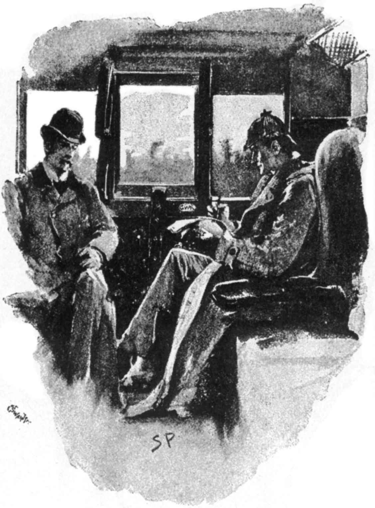

火车包厢里就只我们两个人。

“案子你听到点什么吗？”他问。

“一无所闻，我已好几天没看报。”

“伦敦报纸报道不详细。我把近期的报纸都看了个遍，想多掌握点情况，越多总是越好。依我看，这个案子属于简单的一类，可是破案极难。”

“这话听上去有点自相矛盾。”

“这可是意义深刻的实话。异象，独有的现象，几乎百分之百就是线索。一桩案子，案情越平淡无奇，就越是难破。现在这个案子，他们已经认定是弑父大案，儿子杀老子。”

“是谋杀案。”

“唔，推想是的。我可不作肯定，非得亲自调查了以后再说，就我所知的情况向你简单介绍一下。

“波斯康谷，一个乡村地区，距离罗斯不远，在赫里福德郡。那个地方一个最大的农场主人，约翰·特纳先生，他在澳大利亚发了财，几年以前返回老家。他有一个农场，哈瑟利农场，出租给查尔斯·麦卡锡先生，这也是个澳大利亚回来的人。两个人在殖民地认识，所以一同回来定居，两人想成为邻居也是很自然的事。特纳显得比较富有，麦卡锡成了他的佃户，但是看来他们还是和过去一样，仍旧保持完全平等的关系，互相常来常往。麦卡锡有一个儿子，十八岁的小伙子。特纳只有一个女儿，也是十八岁。两人的妻子都已去世，他们深居简出，同周围英格兰邻居没有什么来往。麦卡锡父子喜欢体育，邻近赛马场上常常可以看得见他们。麦卡锡有两个仆人，一个男仆，一个侍女。特纳家里人口很多，起码有六口人。这就是两家的家庭情况，我能搜集到的就这么多。现在谈谈案情。

“六月三日，就是上星期一，大约下午三点钟，麦卡锡离开哈瑟利农场的家里，走向波斯康池塘，这是一个小湖，由波斯康山谷的溪水流出汇积而成。早晨他同男佣人去了罗斯，和佣人说必须抓紧时间，因为下午三点约好另有要事。就在这个约会以后，再没见他回来，死了。

“从哈瑟利农场到波斯康池塘是四分之一英里，他走过这段距离，有两个人目睹。一个老妇人，报上没有提到她的姓名，另一个是特纳先生雇用的猎场看守，威廉·克劳德。两名证人都发誓作证看见麦卡锡先生单独一人走过。猎场看守还说，他看见麦卡锡先生走过几分钟以后，又看见他儿子詹姆斯·麦卡锡先生随后也打那里过去，臂下夹着一支枪。他记得很清楚，儿子是随后到来，完全看得见父亲在前面走。这是他亲眼目睹的，但是没在意什么，谁知到了晚上，他听说出事了。

“麦卡锡父子俩，在猎场看守人威廉·克劳德目睹走过以后，还有人也看见过。波斯康池塘周围树林茂密，池塘边上一圈全是乱草和芦苇。有个十四岁小姑娘佩兴斯·莫兰，是波斯康谷庄园看门人的女儿，正在树林里采花。她陈述她在那里的时候，看见麦卡锡先生和他的儿子，在树林外面，湖的近旁，两人好像是吵架，吵得挺厉害。她听见老麦卡锡在骂他儿子，还看见儿子举起手来，像是要打他父亲似的。她看到这激烈的场面，吓坏了，赶快跑开，回家告诉母亲，说麦卡锡父子在波斯康池塘那边吵架着呢，她只好跑开点，说那样子恐怕要打起来呢。小姑娘话音刚落，小麦卡锡跑到门房来了，说是他发现父亲死在了树林里，特地跑来向看门人求助。他很激动，没见他有枪，也没戴帽子，左手和袖子上看得见沾着鲜血。他们跟他去，发现了尸体，躺在池塘旁边草地上，脑袋砸开了花，是用粗重钝器给砸了好几下，伤口看上去就像是用他儿子的枪托敲的，那支枪扔在尸体旁几步远的乱草地里。情况既然是这样，年轻人当场遭到逮捕。星期二传讯，宣布他犯有‘蓄意谋杀’罪。星期三提交罗斯地方法院审判，罗斯地方法院已经把这个案件提交巡回审判庭去审理。这些就是案情主要事实，由验尸官和治安法庭提供。”

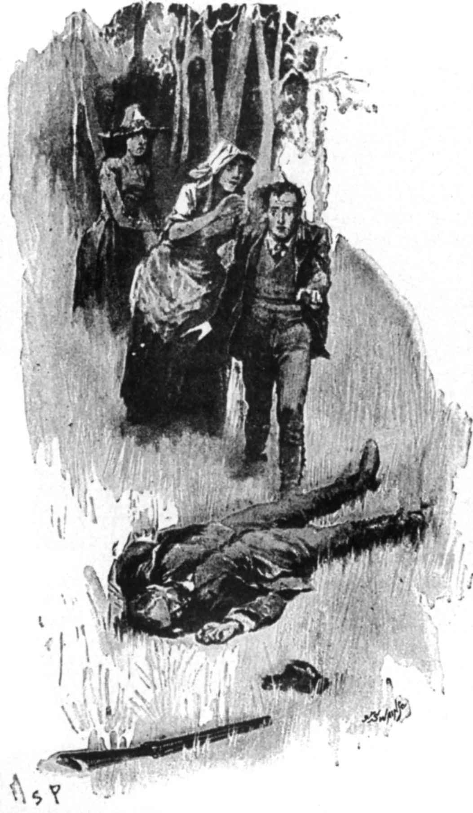

他们跟他去，发现了尸体。

“难以想象竟有这种残忍的犯罪，”我说，“如果情况属实，证据证明了犯罪，也就成立了。”

“情况证据即是间接证据，是靠不住的，”福尔摩斯若有所思地答道，“看上去有直截了当的指证作用，但是你稍稍换一个角度来观察，就会发现，这样证明是一回事，那样证明又是一回事，没一个定准。不过这桩案子，很明显对年轻人非常不利，很可能他就是个人犯。但是那边有好些人，其中包括邻居农场主人的女儿特纳小姐，他们都一致认为小麦卡锡是无辜的，还委托莱斯特雷德来承办这个案子，要为他洗清罪名。你记得《血字的研究》，就是里头那个莱斯特雷德。他感到这案子棘手，又转托给我，于是乎，就有了这儿的两条中年汉子以每小时五十英里的高速向西飞驰，连在家安安稳稳一顿早餐都吃不成。”

“我担心，”我说道，“本案事实清楚，搞到最后恐怕并没有什么难题可解。”

“明显的事实，也最容易蒙人，”他答道，大笑，“况且，我们随便一看就看在眼里的事，在莱斯特雷德先生眼里未必看进去。我这个人，你是知道的，如果我说，对于莱斯特雷德作出的案情推论，我无论是给予肯定，或者否定，我所使用的方法他莱斯特雷德不会用，甚至根本不理解。我这么说，你不至于认为我是在吹大牛。随便举个例子来说，我是一看就记住了，就是你卧室的窗在右边，可是我怀疑，莱斯特雷德先生是不是也会去留心这么一种无所谓的事。”

“这有什么——”

“亲爱的伙计，我对你很了解，知道你养成了军人整齐干净的习惯。每天早晨你刮脸，这样的季节，可以凑到窗口借阳光刮脸。但是你刮得不干净，也像我们一般左脸越往后越不太刮得干净一样，下巴一抬脸一转，这一面总是明显比较邋遢。很清楚了，原因是左面的光照少，不及右面的光照多。我不相信如你这样有良好习惯的人，如果左右两面光线一样的话，还会是如此的尊容，你自己竟也感到满意。我举这个小小的例子，来说明观察和推理的关系，我的功夫仅在于此。靠这一点，对我们眼前面临的案子，调查起来大有裨益。有那么一两点，似乎微不足道，调查、审讯都忽略了，可是其实很值得研究呢。”

“什么问题？”

“看来并没有当场逮捕他，是回到哈瑟利农场以后才逮捕的。警官通知他涉嫌拘捕，他居然说他毫不惊讶，居然承认是罪有应得。他自己这么一说，影响到验尸陪审团的判断，就拿他这个话为准，心中原有的案情疑虑就随之而去，不存在了。”

“那就是他的招供。”我脱口而出。

“不，随之而来是有人异议，声辩他是清白无辜的。”

“情节这么恶劣的案子，自己都承认了；一承认，那还不是来得正好，怎么讲也成最大嫌疑。”

“恰恰相反，”福尔摩斯说，“这才是云开日出，正好让我们见到亮光。他再幼稚，也不至于愚蠢无知到这种程度，看不到当场情况对他完全不利。要是自己遭到逮捕大感震惊，装得异常愤怒，我倒要大大怀疑，因为在当时场合，惊讶、愤怒才真正是不正常行为，那是心里有鬼的人都要采用的策略。他当场的态度是心地坦诚的表现，说明他是清白无辜的，要不就是很有自我克制能力。至于他说罪有应得，有其正常的原因，要考虑他站在父亲尸体旁边的心情。就是这一天，他忘了自己做儿子的竟对父亲无理，居然争吵，甚至于，像那个小姑娘提供的重要证据，还举手像是要打。他说的那个话，只表明出于自我谴责，内心自我愧疚。我觉得是正常心态，决不是罪犯心态。”

我摇头。“许多人被绞死，都还远没有他这点证据充分呢。”我说道。

“草菅人命，多少人屈死在绞架上。”

“小伙子自己对案情怎么陈述呢？”

“他的陈述，我看下来恐怕对站在他一边的人鼓舞不大，不过有一两处对洗清罪名尚有启示作用。这篇交代词在这儿，你自己看吧。”

他从一札当地赫里福德郡报纸中抽出一份，翻折一下，指着一大段文字，就是不幸的年轻人对事情发生的情况供述。我坐在车厢角落的位置上，仔细阅读。文章内容如下：

死者独生子詹姆斯·麦卡锡先生当时被传讯，作证如下：

“我离家三天，去了布里斯托尔，上星期一即三日上午返家。我返回时见父亲未在家中，女仆告知其与马车夫约翰·科布驱车到罗斯去了。不久就听见父亲的马车跑进院子的声响。我往窗外一看，见父亲下车快步走出院子，我不知他去向何处。我随即带上枪，朝波斯康池塘方向走去，目的是到池塘那边的养兔场去看看，半途遇见猎场看守威廉·克劳德。正如他证言所讲，但他误以为我在跟踪父亲，我根本不知父亲在前头。约距塘一百码远时，我听到叫唤‘咕咿’<a href="#part0047.xhtml_ch2"
id="part0047.xhtml_ch2-back">(2)</a>，这是我和父亲之间常用的招呼语，我于是向前奔过去，即看见父亲站于池塘边。父亲看见我，甚觉意外，厉声喝问我在那里做什么。几句隔膜话一来一去不好听，随即爆发争吵，几乎动手要打我，因我父亲是火暴性子。看这情势，脾气越发越大，不能控制了，我即告退离开，返身转回哈瑟利农场。离去不足一百五十码远时，忽然听见身后传来骇人惨叫。我闻声立即再跑回去，却发现父亲倒在地上气息奄奄，头部被击重伤。我丢下枪，用手臂将他扶起，但父亲很快气绝身亡。我在他身边跪约数分钟，便跑向特纳先生的看门人处求救，该屋距离为最近。我刚才回身来时，未见父亲周围地方有人，我不知他如何受伤。父亲与人不多交往，态度向来冷漠，令人望而生畏，但据我所知也并未招致仇敌。此事除此以外，我皆不知情。”

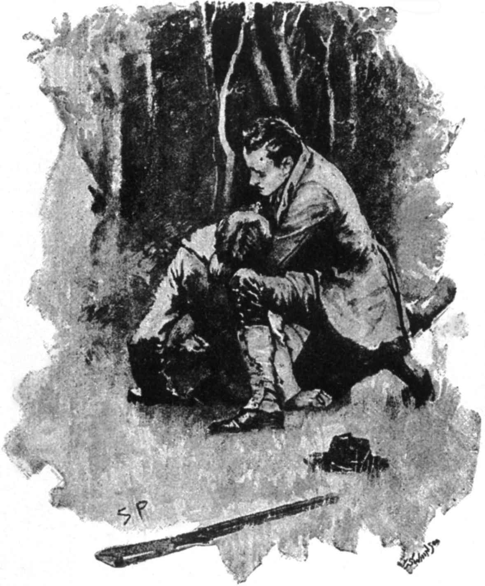

“我丢下枪，用手臂将他扶起。”

验尸官：你父亲死时有什么话交代？

证人：父亲咕哝几声，像是提到“厄拉特”，一只老鼠<a href="#part0047.xhtml_ch3"
id="part0047.xhtml_ch3-back">(3)</a>，这个话。

验尸官：你认为他是什么意思？

证人：我不懂是什么意思，我想他神志已经不清楚。

验尸官：你父亲临终前你和他吵架是为何事？

证人：这个不能回答。

验尸官：我要你必须回答。

证人：我不会告诉你的。我向你保证，这和发生惨案无一点关系。

验尸官：有关系无关系由法庭来裁决，不用我向你指出你也该知道。你拒绝回答，以后起诉过程中对你极端不利。

证人：我还是拒绝回答。

验尸官：据我了解，“咕咿”招呼语，是你们父子间常用的，是吗？

证人：是的。

验尸官：那他没看见你，怎么同你打招呼呢？这之前，他又不知道你从布里斯托尔回来。

证人（茫然不知）：不知道是怎么回事。

陪审员：你听到惨叫，回过去，看见你父亲被打成重伤，还看见别的什么没有？

证人：好像是没有什么。

验尸官：好像是，什么意思？

证人：我跑过去，空地上躺着父亲，我慌了神，激动得很，没注意别的。可是有点印象，好像是，我跑上去的时候，空地的左方像是有样什么东西，好像是灰颜色，一件衣服吧，外套、大衣什么吧。我从父亲身旁站起来的时候，向周围看看，那衣服又不见了。

“你是说你还没有离开去求救，那东西就没有了？”

“是的，不见了。”

“你没把握那到底是什么东西？”

“没把握，我只不过感觉好像是什么东西。”

“离尸体有多远？”

“十几码远。”

“离开树林子有多远？”

“也差不多这么远。”

“那么，如果这东西给人拿走，是在离你十几码远的地方，对吗？”

“是的，不过正好我是背对着。”

对证人审讯到此结束。

“我看，”我说道，对这栏报道再扫一眼，“验尸官最后几句话，对小麦卡锡是相当关键性的。验尸官很有理由，提醒证人注意供词中自相矛盾的地方。他父亲没见他人，就跟他打招呼；证人还拒绝交代自己跟父亲谈话的内容；父亲气绝前讲的莫名其妙的话。所有这些，正像验尸官提醒说的，对这个儿子非常不利。”

福尔摩斯自顾一笑，在卧垫椅上抻抻腿臂。“你和验尸官都一样苦心，”他说，“总算挑出最关键的要点，总算使得对年轻人有利。你没看见你们想要帮忙，一会儿帮过头，一会儿又拆台，都是帮倒忙？拆台，要是他编不出、讲不出吵架的起因，就得不到陪审团的同情；帮过头，他只是感觉到，却偏要迫使他胡诌死前讲厄拉特一只老鼠什么意思，不见了的衣服又是怎么一回事，这都是给他帮倒忙。不行，先生，我相信年轻人讲的都是实话，应当从这个观点切入去侦破这桩案子。我们将会看到，如此假设把我们导向何处。这里，我有彼特拉克<a href="#part0047.xhtml_ch4"
id="part0047.xhtml_ch4-back">(4)</a>诗集袖珍本，你先拿去看看。关于这个案子，我就不说了，等我们到了案发地再讲。我们去斯温登吃午饭，大概二十分钟就可以到了。”

我们经过美丽的斯特劳德溪谷，越过水面宽阔、闪闪发亮的塞文河，最后大约四点钟光景，到达秀丽的小乡镇罗斯。一个瘦个子男人，鬼头鬼脑，看模样是个探子，在站台上迎候我们。他入乡随俗，穿本地农村浅棕色风衣，套皮裹腿，但我一眼就认出他是苏格兰警场的莱斯特雷德。我们随他驱车到了赫里福德纹章旅馆，他已经为我们订好了房间。

“已经雇好一辆马车，”莱斯特雷德说，我们一起坐下喝茶，“我知道你雷厉风行，恨不得马上投入案发现场。”

“多有叨扰，实在过意不去，”福尔摩斯回答说，“其实去还是不去，全取决于晴雨表气压度数。”

莱斯特雷德一愣。“我不懂你的意思。”他说。

“水银柱是多少度？我看看，二十九度。无风，无云。我这儿有一盒烟，该抽烟了。这儿的沙发也不错，一般乡村旅馆很糟糕，这里倒是相当高级。我想，用马车这事，今晚就免了吧。”

莱斯特雷德开怀大笑。“你准是已经有了结论了，看报上看出来的。”他说，“这个案子本来也就一清二楚嘛，越深入下去，还越显得平常而简单。不过，还有，当然也不好拒绝一位女士的请求，她一个劲儿要找你，知道你大名，要征询你的意见。虽然我是一再告诉她，我都已经不想做的事，在你也是不必做了。唷，倒是来得快！她的马车到门口了。”

他话音刚落，一个美貌女郎，又是一位我有生以来所见最美貌的女子，径直走进房来。她一对紫罗兰色眼睛晶莹闪亮，双唇微开，两颊红晕升起。由于过分激动，十分情切，使得她全然顾不得姑娘家原有的娇羞与矜持。

“哦，歇洛克·福尔摩斯先生！”她叫道，目光把我们一个个扫过来，最后凭着女性的机敏与直觉，认住了我的同伴，“我是多么盼着您来呀。我是特地乘车赶过来要告诉您，我很清楚，詹姆斯不是凶手。我清楚这一点，我希望您接手工作也要了解这一点。这件事，决不能马虎草率了。我们从小一块儿长大，互相知道得很清楚。我知道他的缺点，别人没人知道。他这个人心肠最软，连一只苍蝇都不肯打。真正了解他的人，都知道这么控告他实在是荒唐不讲理。”

“我也希望我们能够还他清白，特纳小姐，”福尔摩斯说，“请相信我，我会尽力而为。”

“可是你都看过证词了，已经有定论了吧？你没看出有漏洞、有问题？你也不认为他是无辜的吗？”

“我认为很可能他是无辜的。”

“好啦！你看，”姑娘叫道，头一仰，轻蔑地看着莱斯特雷德，“你听见了，福尔摩斯先生给了我希望！”

莱斯特雷德耸耸肩。“我看我的同事下结论未免草率了一点。”他说。

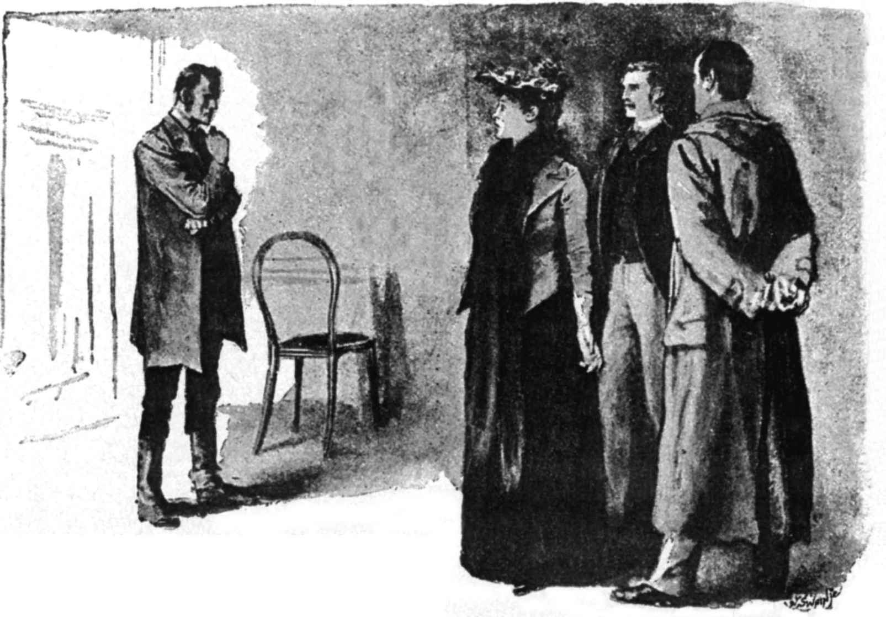

莱斯特雷德耸耸肩。

“福尔摩斯先生说得对。噢！我知道是他正确，詹姆斯永远不会干那种事。说他跟他父亲吵架，我清楚他为什么不肯和验尸官讲明，原因是牵涉到我。”

“怎么牵涉到你呢？”福尔摩斯问。

“事到如今，我也不能不讲了。詹姆斯跟他父亲在我的问题上矛盾很大，麦卡锡先生急切地要我们结婚。詹姆斯和我，我们彼此像兄妹一般相爱，不过他到底还年轻，对生活还没有看得、想得很多似的，所以——所以——唔，他自然不是很希望、很想那样做似的，所以，常常争吵了。就是这样，这原因，我肯定，这件事是吵架的一个原因。”

“那你的父亲呢？”福尔摩斯问，“他同意这门亲事吗？”

“不同意，他也是反对，赞成的只有麦卡锡先生一个人。”

福尔摩斯锐利、搜索的目光向她扫了一眼，她年轻、娇嫩的脸上刷地一下子泛红。

“谢谢你提供这个情况，”福尔摩斯说，“我想见见你父亲，明天拜访，可以吗？”

“恐怕医生不同意。”

“有病看医生了？”

“是的。先生没听说？回国以后，爸爸体弱多病已经好几年，可是这一回这件事叫他全垮了，卧床起不来了。威罗医生说，他是一条遇海难的破船，神经系统极度虚弱。麦卡锡先生在世的时候，只有他了解爸爸过去在维多利亚的历史。”

“啊！在维多利亚！很重要。”

“是的，在矿上。”

“这就对了。在金矿，据我了解，特纳先生是在那里发财致富的。”

“是的，的确这样。”

“谢谢你，特纳小姐，你是有力的证人，给了我支持，实质性的支持。”

“明天有什么消息，请告诉我。你们肯定要去监狱看詹姆斯。噢，你们去的话，福尔摩斯先生，请您替我转告他，我坚信他是清白的。”

“我一定转告，特纳小姐。”

“现在我得回家了，爸爸病得很厉害，我一走开，他就要挂念我，不放心我。再见！上帝保佑，一切顺利！”她急匆匆出门，就如刚才急匆匆进来一样，接着听到她的马车在街上驶去。

“我替你羞愧，福尔摩斯，”莱斯特雷德沉默片刻后煞有介事地说，“你肯定要让人家希望落空。我不算是个软心肠人，可我还要说你倒真能狠心耍人。”

“我自会替詹姆斯·麦卡锡刷清罪名，”福尔摩斯说，“你安排好了我们能到监狱去看他吗？”

“可以去，只允许你我两人去看。”

“那我就要重新考虑不外出的决定了。我们还有时间搭火车去赫里福德，今天晚上就能见他？”

“时间很充足。”

“这就走吧。华生，恐怕会让你感到时间不好过，不要紧，我不过去两个小时就回来了。”

我送他们走到车站以后，独自在小镇街上逛逛，再转回旅馆，躺在沙发上，拿一本黄皮廉价通俗小说翻翻看看打发时间。可是故事内容简单无聊乏味，同我们正在侦查的神秘莫测的案子相比，太平庸而微不足道。我的心思老是从小说上游移开，想到案情上去，最后干脆把书往墙边一扔，全神贯注思考这天的事。如果不幸的年轻人所讲全部属实，那么他从父亲身旁走开到听见惨叫又奔回林中空地这点时间里，怎么会发生这么玄乎、这么意外的大灾难呢？那个作案人手脚多快多厉害！其中到底怎么回事？凭我的医学的直觉能不能从伤口上看出点问题呢？我打了铃，要来郡周报。报上一字不差地登载审讯记录。法医证书写道：死者后脑第三左顶骨及枕骨左半部因钝器猛击而致破裂。我在自己头部比划这个被击部位，一比划就看出，这一击来自死者背后。这个情况对被告有利：有目击者看见他和父亲是面对面吵架。不过这理由也未必有力，因为可以说是老人转过身去了，才被击倒的。不管怎么样，这一点提请福尔摩斯注意还是有价值的。还有，临死时候说的一只老鼠厄拉特，是什么意思？也是怪事。那不会是呓语胡话，一个人遭到突然袭击致死，一般不会发呓语。不是呓语，那多数是想要说自己怎么遇害。是指什么呢？为了能使解释言之成理，我绞尽脑汁。还有一件事，小麦卡锡看见一件灰色衣服，要是没看错，那一定是凶手掉落的衣服，匆忙逃离时掉下了，也许是外套，又跑回来拿，趁小麦卡锡跪在父亲身旁，背对的刹那间，虽不过十几码距离，去取回来，也是够大胆的。这整个过程极其神秘、不可思议！对莱斯特雷德的意见我并不觉得奇怪，但我更信赖歇洛克·福尔摩斯的洞察力，只要不断有新的事实来支撑他的观点，认为小麦卡锡是无辜的，那就有希望。

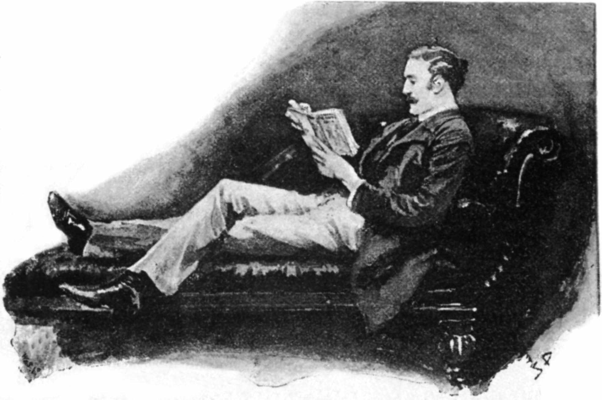

拿一本黄皮廉价通俗小说翻翻看看打发时间。

福尔摩斯回来已经很晚，只他一个人回旅馆，莱斯特雷德留住在城里。

“水银柱仍旧很高，”他说，坐下来，“这可重要，天不能下雨，我们才好去现场。另方面，做这项工作的人，要细心，精神要充沛饱满，精力要集中，我不想赶路赶得疲劳困顿再去做。哦，我见到小麦卡锡了。”

“向他了解到什么情况？”

“没有。”

“他没能提供情况？”

“一点都没有。我曾经不免想过，他知道是谁干的，就是要护着这个人，现在我才相信他并不知道，同别人一样，一无所知。这个年轻人头脑不机灵，人倒是一表人才，而且看得出来，本质好，善良，可信。”

“小伙子太没眼光，”我说，“像特纳小姐这么可爱的姑娘他都没想要，真不知他动什么脑筋。”

“啊，这里头说来也是心酸。小伙子现在是爱她的，爱得发疯似的。但是，大约两年以前，那时他还是个少年，还没有对姑娘真正心心相印，因为姑娘早去了寄宿学校，去了五年。这小子小笨蛋，在布里斯托尔被一个酒吧女侍缠住，竟会和她去婚姻登记处办了登记，糊涂不糊涂？这个事还一字不提，没人晓得。可想而知，他心里有多慌多乱。他肯定非给严厉教训不可，因为无论如何说什么也是该做的事他放着不做，明知绝对不可做的事倒是做了。他和他父亲最后的那次见面，父亲骂他，逼他向特纳小姐求婚，他恨自己干了那么件蠢事，绝望得向上天举手求告。另一方面，他没有能力养活自己，而父亲，远近闻名，是个刻薄鬼，要是知道他同酒吧女侍的真相，决不答应，会把他撵走。他最后在布里斯托尔的那三天，就是在妻子酒吧女侍那儿过的，这个他父亲并不知道。有一点要注意，很重要很关键，坏事也有峰回路转的时候。那个酒吧女侍，从报上看到小麦卡锡出大事了，弄不好要上绞架，马上把他抛弃，写信给他说，自己原是有夫之妇，丈夫就在百慕大码头工作，就这样脱离了关系。这条消息对小麦卡锡真是安慰，烦恼解脱了。”

“要是他是无辜的，那么是谁干的呢？”

“唔，是谁？我请你特别注意两点。头一点，被害人是同人约好去池塘那边，约的人绝对不会是他儿子。因为儿子外出了，不知道哪天回来。第二点是，有人听到被害人呼唤‘咕咿’！可是他还不知道儿子已经回来。这两点，是案情根本性的两点。好，现在如果你有兴趣，让我们来谈谈乔治·梅瑞狄斯<a href="#part0047.xhtml_ch5"
id="part0047.xhtml_ch5-back">(5)</a>。那些次要的问题，留待明天再说。”

正像福尔摩斯预告的那样，天无雨，破晓时晴空万里无云。到九点钟，莱斯特雷德乘马车来接，我们就出发到哈瑟利农场波斯康池塘。

“今天早晨有重大新闻，”莱斯特雷德说，“据说，庄园的特纳先生病势恶化，危在旦夕。”

“大概年纪很大了吧？”福尔摩斯说。

“大约六十吧。他身体在国外的时候就已经弄垮了，疾病缠身已经有一个时期了。出这件事对他打击很大，他是麦卡锡的老朋友。哦，还要加一句，更是他的大恩人。我听说他把哈瑟利农场无偿租给麦卡锡。”

“是嘛！有意思。”福尔摩斯说。

“是呀，没错，帮助他的地方可真不少，这儿人人都说他对麦卡锡仁至义尽。”

“一点不错。你们有没有注意到，其中有点蹊跷。这个麦卡锡，一无所有，不名一文，受到特纳如此的恩惠，还提出他儿子要娶特纳的女儿，好像理所当然似的，不想想她可是整个农场家业的女继承人呀。奇怪的是，我们知道，特纳自己居然不接受这个主意，这是他女儿亲口告诉我们的。这个情况，你们从中作何种推断？”

“我们已经作了演绎推论，”莱斯特雷德对我眨眨眼说，“可是我发现那不足以解决实际问题，福尔摩斯，不要光在理论、议论中想入非非。”

“你说得对，”福尔摩斯肃然地调侃说，“当然，你发现解决实际问题也真不易。”

“不管怎么说，我已经抓住一件事实在手，你们好像还难以相信。”莱斯特雷德激动地答道。

“那就是——”

“老麦卡锡死在小麦卡锡之手，与此相反的理论，都不过是月亮光<a href="#part0047.xhtml_ch6"
id="part0047.xhtml_ch6-back">(6)</a>，空谈。”

“噢，月光是光，比雾要亮，”福尔摩斯笑道，“如果这左边不是哈瑟利农场，那就是我弄错了。”

“是的，没有错。”

那是一座式样、布局开阔大方的建筑，两层楼，石板瓦顶，灰色的屋墙上爬满大片黄苔藓，然而窗帘垂闭，烟囱沉寂，一派萧瑟，笼罩在浓重的恐怖气氛之中。我们上前叫门，女仆领我们进屋。应福尔摩斯的要求，给我们看了主人死的时候穿的皮鞋，还有他儿子的一双鞋，不过那天穿的不是这一双。福尔摩斯选择不同的部位量了七八个鞋样尺寸，然后要求到庭院。出了庭院，我们一路跟随，沿着弯弯绕绕的小径来到波斯康池塘。

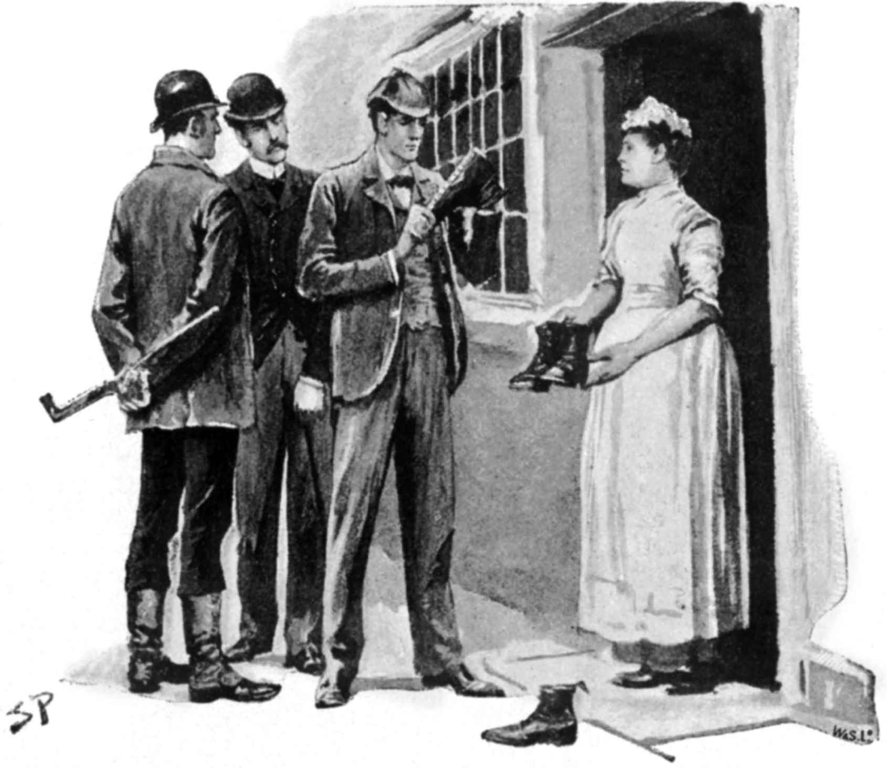

给我们看了主人死的时候穿的皮鞋。

福尔摩斯一旦热切投入这种现场勘查，便立刻变得和原先是截然不同的两个人。只知道在贝克街他那个静思者、逻辑推理家形象的人，现在恐怕认不出他了。他的脸色充血红涨，却阴郁深沉，眉毛紧锁成两道浓黑墨线，眉下一对眼睛，如剑锋寒光闪射。他俯下脸，垂下肩，鼻翼翕张，双唇抿闭，钢柱般的脖颈上青筋饱绽，如猛兽循迹追逐猎物一般。他全神贯注于眼下的侦查，谁要是此刻偶有提问或说话，他都置若罔闻，充其量不耐烦地粗暴地迸出个字算是回答。他悄无声息地迅速沿小径穿过草地，再通过树林走到波斯康池塘。这里地面潮湿，整个地区仿佛沼泽，地上留有许多脚印，印在小径上和两侧浅草地上。福尔摩斯一会儿急急向前，一会儿又站定一动不动。又一会儿，他绕个小弯走进草丛，莱斯特雷德和我跟在后面。这位官场侦探，现在且由他轻蔑、冷漠，我只顾盯着我的朋友，兴致盎然。我深信他的每一个动作都在一步步趋近破案目标。

波斯康池塘大约五十码方圆，是周围长着芦苇的一小片水域，位于哈瑟利农场和富翁特纳先生的私宅花园之间，正处于交界地。池塘对岸的树林之上，可以望见耸立的红色尖顶，那是富裕地主宅第的标志。池塘的这一边属于哈瑟利，树木十分茂密。从林地旁到水边芦苇之间，是二十来步宽的湿草地。莱斯特雷德把发现尸体的地方指给我们看，地面潮湿，我能够清晰地看到被害人倒地躺卧的痕迹。我从福尔摩斯认真的、专注的眼神中，觉察到他能够在众多脚步践踏过的草地上看出许多别人看不出的秘密。他兜了一圈，好像一只寻到嗅迹的猎犬，然后转身朝向我身旁的这一位仁兄。

“你那天下到池塘去做什么了？”他问。

“我拿草耙去打捞了一下，看看有没有什么凶器，或者别的踪迹。可是，什么——”

“啊，得啦，得啦！不听你多扯了，浪费时间！这地方踏遍了你的脚印，一只内拐的左脚，连鼹鼠都能跟住你的脚印，到芦苇边才消失。本来简简单单的事，给一群蠢水牛来这儿打滚瞎糊弄一通，假如我赶在他们前头先来，那就省事许多。这里，是看门人领来的一伙人，尸体周围六到八英尺的地方都是他们的脚印，可是，这儿，有三对脚印是另外的。”福尔摩斯掏出放大镜，垫上块防水油布，趴着看得更清楚一些。一边看一边嘴不停说话，好像是在同我们说，更像是在自言自语。“这是小麦卡锡的脚印，走过两回，有一回是快步奔跑，前掌很深，鞋跟几乎看不出。这里的确证实他的陈述不假，他看见父亲倒在地上，赶快奔过来。哪，这里是他父亲的脚印，在走来走去。啊，这是什么？噢，枪托拄的印子，儿子站着听父亲讲话。哦，这儿，啊哈！这儿我们又有什么发现啦？脚尖！脚尖！方头尖，还是，不是一般普通皮鞋！这么走过来，这么走过去，又再这么走过来——没错，回来取外套。那么，是从什么地方过来的？”他跑过来跑过去，脚印一会儿不见了，一会儿又接上。

我们终于跟踪到树林边，到一棵大山毛榉树下，是这里附近最大的一棵树。福尔摩斯继续寻踪，绕到了树后，再趴下身子，脸都快贴地了，轻轻发出一声得意的呼叫。他待在那里有一刻工夫，翻树叶扒枯枝，抓起一点泥土，装进一只信封，然后用放大镜察看地面，不仅看地，还看树干的树皮，一直往上看到他够得着的地方。苔藓地上有一块棱角石头，他也仔细检查，还把石头捡起来收好，接着他沿着一条小径穿过树林，一直上了公路，到那里，痕迹才告消失。

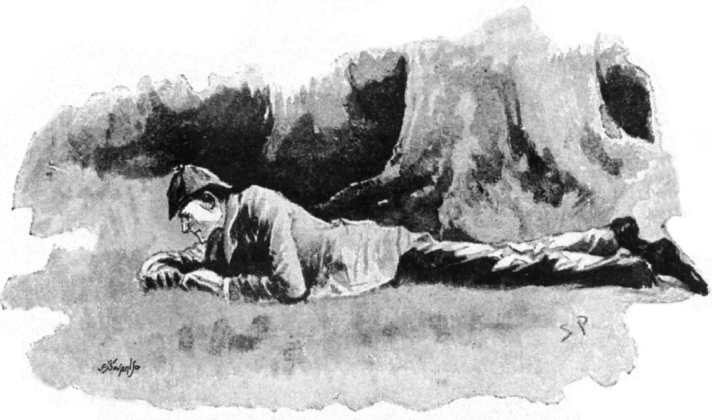

趴下身子，脸都快贴地了。

“这个案子相当有趣，”他说道，这时恢复了常态，“我看，右边那幢灰色房子就是那间门房小屋了，我想我得去一下，找看门人莫兰说句话，可能要作个笔录。完了以后，我们一块儿坐马车回去吃午饭。你们先上车，我马上就来。”

大约等了十分钟，他回来和我们一齐上马车，驶回罗斯；福尔摩斯揣着那块在树林里捡来的石头。

“这玩意儿你可能有兴趣，莱斯特雷德，”他说，取出石头，“凶手就是拿这个杀人的。”

“我看不出来。”

“是好像看不出。”

“那你凭什么说？”

“石头下面的地上长着草，说明才不多天刚扔的。那地方没见有别的石头，它的形状又跟死者的伤口相吻合。此外没有别的凶器了。”

“那凶手是谁？”

“一个高个子，左撇子，右撇腿，穿厚底猎靴，披灰色斗篷，抽印度雪茄，用雪茄烟嘴，口袋里藏一把小刀，削鹅毛管的，不锋利，还有其他种种迹象，这几点也就足以佐证破案了。”

莱斯特雷德大笑。“不想隐瞒，我还是个怀疑论者，”他说，“理论可以说得头头是道，可惜我们打交道的是不列颠陪审团，他们只重证据。”

“努维朗<a href="#part0047.xhtml_ch7"
id="part0047.xhtml_ch7-back">(7)</a>！”福尔摩斯平静地说，“你照你的方法做，我按我的路子走。今天我忙完一下午，可能就要赶晚班车回伦敦了。”

“案子你就撂下不管？”

“不，案子已经结束了。”

“不还是个谜团吗？”

“谜团解决了。”

“谁是凶手？”

“我描述的那位先生。”

“谁？究竟是谁？”

“找他出来一点不难，这个地方的人口并不多。”

莱斯特雷德耸耸肩膀。“我是个讲实际的人，”他说，“要我在这乡村里到处去寻找左撇子、右撇腿，不干。这不成笑柄，给苏格兰警场笑掉大牙！”

“好吧，”福尔摩斯平平地说，“我是已经给了你机会。你住的地方到了，再见，我走之前，会有消息给你。”

让莱斯特雷德下车进他的住所，我们赶车回我们的旅馆。一到旅馆就看见午餐已端在桌上准备好了。福尔摩斯不出声，仍在沉思，脸上有痛楚的表情，这是一个人处境困惑的表情。

“你看，华生，”桌布清掉之后他说道，“这椅子坐，让我先来给你说说，还不知该怎么办好，真的。我想听听你的意见，我点上雪茄，来说给你听听。”

“请说吧。”

“唔，这样，考虑这个案子的时候，对小麦卡锡的谈话有两点立刻引起你我的注意，虽然我俩大相径庭，我相信他，你不相信他。第一点是，据他陈述，他父亲喊‘咕咿’，并没有看见他；第二点是，遇害人临死说了一只老鼠‘厄拉特’。死者嘴里还模模糊糊说了些什么，可是他儿子说只听得出这个‘厄拉特’。我们必须抓住这两条重要的线索从这里下手。开始的前提不妨假定小伙子所述均属真实。”

“喊‘咕咿’是什么意思呢？”

“唔，很明显，不是向他儿子喊，他只知道儿子人还在布里斯托尔，小麦卡锡是碰巧听到。‘咕咿’，是在向同他约会的那个人呼喊。而‘咕咿’是澳大利亚人打招呼喊的，所以只有澳大利亚人之间才用。好，这就完全可以推定，约好麦卡锡在波斯康池塘见面的那个人，去过澳大利亚。”

“那么‘厄拉特’呢？”

福尔摩斯从口袋里掏出一张折好的纸，在桌子上展平。“这是维多利亚殖民地的地图，”他说，“我昨天夜里发电报到布里斯托尔特地要来的。”他把手指按着地图一个部分，“这个你念念看。”

“ARAT厄拉特。”我念道。

“再念念这个呢？”他把手拿掉。

“BALLARAT巴勒拉特。”

“对啦。那个人喊的正是这个词，他儿子只听清最后两个音节，就变成‘ARAT’，一只老鼠。他是要讲出凶手的名字，巴勒拉特的某某人。”

“妙极呀！”我惊叹道。

“很清楚了吧！你看，我已经把范围大大缩小。这个人还有一件灰色斗篷，是第三个要点，先相信他儿子的话是真的，便确有此物。我们就澄清了原先的模糊概念，可以确定是一个来自澳大利亚巴勒拉特、披灰色斗篷的人。”

“没问题。”

“还是一个本地区的熟人，因为到池塘一定得经过农场或者庄园，陌生人随随便便走不到这里来。”

“说得是。”

“所以我们今天探险考察到此，踏勘现场，获取案情细节。莱斯特雷德，这个低能家伙，我把罪犯是什么特征都告诉他了。”

“你都是怎么知道的呢？”

“我的方法你了解，是基于对细节的观察。”

“他的身高，我懂，可以从他的脚步跨度大致估算。还有他的靴子，从踩的印迹看得出。”

“是的，是特别的靴子。”

“撇腿呢？”

“脚印看出，右脚的痕迹总是不及左脚清晰，就是说，右脚不太着力。怎么回事？那就是瘸腿走路——是个瘸子。”

“还有，左撇子。”

“法医在审讯时候对伤情作的报告，你有很深的印象。打击来自身背后，不知情的突袭，伤在左侧。好了，不是左撇子的话，怎么会落下这个部位的伤口？父子两人讲话的时间，这个人躲在树背后，还抽烟来着，我发现雪茄烟灰。我对烟灰拥有专门知识，有根据断定是印度雪茄。我有研究，这你知道，写过点小文章，研究一百四十种不同的烟丝、雪茄和香烟烟草特点。发现烟灰以后，又在周围寻找，在苔藓中发现他扔掉的烟蒂，印度雪茄，类似鹿特丹出产的那一种。”

“雪茄烟嘴呢？”

“看出烟蒂没有叼过、衔过的痕迹，可见他用的是烟嘴。烟屁股有刀口，没用嘴咬，但是切口不整齐，我由此推断用了不快的削笔刀。”

“福尔摩斯，”我说，“你给这个人张开了天罗地网，他逃不掉；你也救了一条无辜的生命，你把套在无辜者脖子上的绞索斩断，斩得好。我看到各种痕迹归结到同一个方向，罪犯是——”

“约翰·特纳先生来访。”旅馆侍者呼喊着通报进来，打开我们起居室的门，引入一位来客。

来者身材奇大，步履沉重，一瘸一拐，双肩下垂，显得老态龙钟。一张皱纹深陷、坚毅如磐石的脸，粗壮的四肢，显示他臂力过人，体格和性格仍坚强而刚毅，非同一般常人。他鬈曲的胡须、银灰的头发、外突而下垂的双眉，这些总体的结合赋予他尊贵、威严的风度和仪表。但是他的脸色青灰，嘴唇和鼻尖略呈暗蓝色。我一看就明白，他患有慢性不治之症，已是病入膏肓。

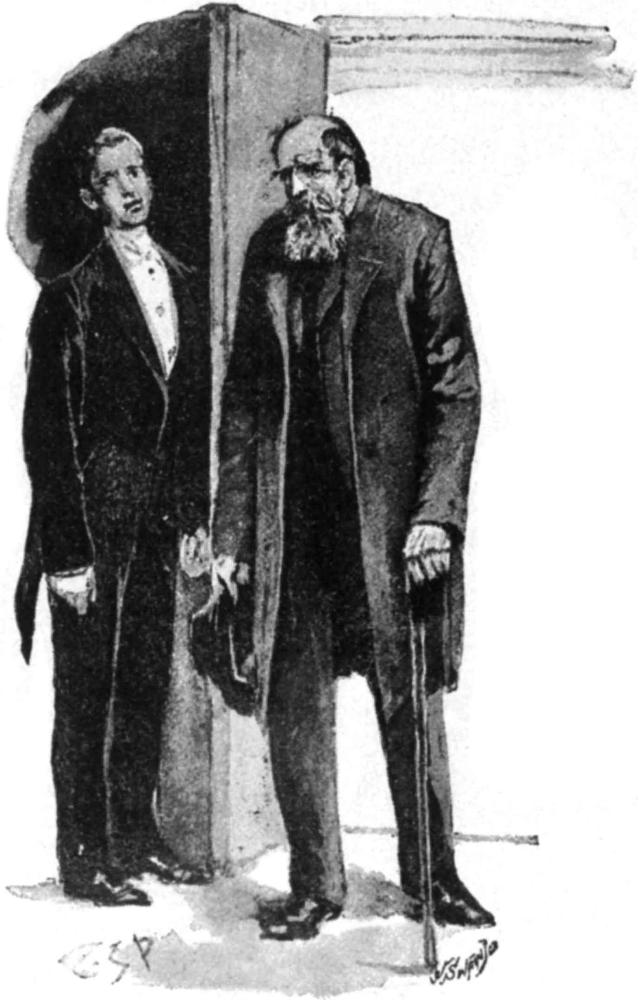

来者身材奇大，步履沉重。

“请沙发上坐，”福尔摩斯彬彬有礼地说，“谅必收到我的便条了？”

“收到了，看门人交给我的，你说希望在这里见我，以免闲言碎语引起麻烦。”

“我想假如我上贵宅府第，免不了人们议论纷纷。”

“你约我做什么呢？”他疲倦、绝望的眼睛打量着我的同伴，好像他这个问话已有解答而属多余。

“是的，”福尔摩斯说，好像是在针对他的目光，而不是针对他的问话作回答，“我已经很了解麦卡锡是怎么死的。”

老人垂首掩面。“上帝保佑！”他叫道，“我不会让这个年轻人无辜受害。我向你保证，巡回审判庭要是判他有罪，我会站出来说话。”

“听你这么讲，我很高兴。”福尔摩斯严肃地说。

“要不是因为我女儿，我早就说了。那样太伤她心——如果她听到我被逮捕，她会心碎的。”

“也许不至于那么糟。”福尔摩斯说。

“你说什么？”

“我不是官家侦探，应该讲，我是应你女儿的要求，才来到这里，所以我是在替她办事；小麦卡锡一定要无罪释放。”

“我是个快要死的人，”老特纳说道，“我患糖尿病已经多年。医生说过，我能不能再活上一个月都成问题。我当然愿意死在自己家里，不愿意死在监狱。”

福尔摩斯起身过来坐到桌子边，手里拿一支笔，面前放一摞纸。“请给我们讲讲事实真相，”他说，“我如实记录，完了你签个字，这位华生作见证。最后我可能要出示你这份自白书，来救小麦卡锡一命。我答应你，除非万不得已，我决不会动用你的自白书。”

“这就好，”老人说，“不过能不能活到巡回审判庭开庭的日子还是个问题，所以我也不在乎。我只希望别让艾丽斯伤心受不了。现在我就把事情给你说清楚，事情是很长久了，讲起来倒用不了多长时间。

“你不了解这个该死的麦卡锡，他是魔鬼的化身。我跟你讲，上帝保佑你千万不能给他这号人抓住把柄，我被他捏在手里整整二十年，把我这一生都毁了。先讲讲我是怎么落到他手里的吧。

“事情得从六十年代的金矿说起。那时我是个毛头小伙子，个性冲动，不安分，什么都想试试。我和坏人结伴，饮酒作乐，开矿权不幸没争到手，就干起了绿林，一句话，就是你们这儿称之为剪径大盗。我们一共六人，过着放荡不羁的生活，常常抢劫车站，拦截驶往矿场的马车。我的化名叫巴勒拉特黑杰克，殖民地的人至今还记得当年我们这一伙叫巴勒拉特帮。

“有一天，一个黄金运输队从巴勒拉特路过去墨尔本，我们准备埋伏袭击。运输队六个骑兵护送，我们和他们六对六，真是旗鼓相当。可是我们先发制人，第一排子弹就把四个撂下了马，我们也损失了三个小伙子，才把一车队财富抢到手。我举枪对着马车夫的脑袋，他就是这个麦卡锡。上帝作证，我当时打死了他就没事了，可我偏偏饶了他，也没注意到他那对邪恶的小眼睛死盯住我的脸，要把我每个特征都牢牢记住似的。我们把黄金拿到了手，成了大富翁，安安全全地来到英国，没人引起怀疑。从此我和我的老伙计们分道扬镳，各走各的路。我下决心从此改邪归正，过上安静正常的生活。我购买的这份产业，当时正好上市标价出售，我决心开始用我的钱行善积德，多少做点好事，弥补我大发横财的所作所为。我也结了婚，但是妻子早逝，给我留下了可爱的小艾丽斯。这个小小的婴儿好像伸出小手把我引向正道，以前的事仿佛都不曾发生过一般。一句话，我翻到了人生新的一页，悔过自新，尽自己所能来弥补过去，就此过得平平安安，想不到麦卡锡的魔爪一把抓住了我。

“那是我到城里去处理一桩投资的事，在摄政街上遇上了他。他当时身上没件好衣裳，脚上无好鞋。

“‘又见面了，杰克，’他说，一把拉住我的胳膊，‘我会对你亲如一家，我只有两个人，我和我儿子，你收留了我们父子俩吧。要是你不干——那可要受惩罚，英国是个有法律讲法治的国家，警察一叫就到。’

“好，他们就这样来了西部农村，落了户。我再也摆脱不了他们，我把最好的土地给了他，租金免收。从此我不得安宁，不得平静，往事不能忘怀。不管我走到哪儿，他那狡诈狞笑的面孔总是紧盯着我。等艾丽斯长大起来，事情就变得更糟，他看到我很害怕让艾丽斯知道我的过去，比报告警察当局还怕。他就要什么，我一定得给什么。我总是不二话，要啥给啥，土地、金钱、房子。直到最后，他提出一件事，我可怎么也不能答应，他要艾丽斯。

“他的儿子，你看到了，和我女儿都已长大成人。我是出名的老病号，身体一向不好。他就打上了主意，让他小子来接手我的产业。这个我绝对不同意，铁心不能让他可诅咒的邪恶血液乱了我家血统。我倒不是不喜欢他的小子，实在是因为他孩子身上流的是他老子的血。这是不好通融的，我坚决不答应。麦卡锡就威胁我，我告诉他尽管把最毒辣的手段使出来，我不怕。我们讲好在两家住房的中间地方，就是那个池塘边再谈一谈。

“我们都到了那里，可是我发现他在同他儿子说话。我就躲在一棵树背后，抽一支雪茄，等他一个人的时候再过去。我一听他那说话，就火上加火，气得我要喷血。他在逼他儿子同我女儿结婚，根本不管我女儿乐不乐意，把我女儿当成街上妓女似的。想想我连我的心肝宝贝都要一股脑儿赔出去，受他这么个狗东西控制，我气疯了。给他这条蛇缠死还成！不当机立断不行！我反正是个濒临死亡的人，一个绝望的人。虽说还心明眼亮，手脚还利索着呢，可是气数已尽，大限说到就到。我的往事不能给抖搂出来，我的女儿不能给糟蹋了！这两样都要保全，那就只有叫这肮脏的毒舌头永远出不了声。我是这样做了，福尔摩斯先生，叫我再这么做，我照样会再次下手。我是罪孽深重，为赎罪我已过了一辈子活受罪的日子，也是罪有应得。可我女儿是无辜的，我自己受到报应不够，还要把我女儿也连累上，这我说什么也不能认了。我把他砸翻在地，就像打死一只凶恶的野兽一样，心不慌，手不软。他一声惨叫，把他儿子引了回来，我便躲到了树林里。我急忙之中，斗篷掉落地上，不得不又再悄悄去捡回来。这就是全部事实经过，我已不瞒两位先生，和盘托出。”

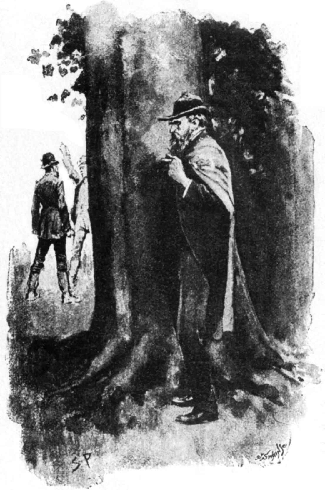

“我就躲在一棵树背后，抽一支雪茄。”

“好啦，审判你不属于我的事，”福尔摩斯说道，这时老人在他的陈述笔录上签了字，“但愿我们永远不受这样的诱惑，结果无法把握自己的一生。”

“但愿不再会有，先生。下面你打算怎么做？”

“考虑到你的健康状况，不打算做什么。你自己清楚，你的事，很快要上到比巡回法庭更高的法庭去受审。我保管好你的供词，假使麦卡锡被定罪下来，我不出示就不行。如果不定罪，那就永远不会给人看见。你的秘密，不管你是在世还是去世，在我们这里万无一失。”

“好吧，那就再见。”老人庄重地说，“在你将来临终之时，想到曾经让一个人安心去世，你也会感到更加平静。”庞大的身躯颤颤巍巍地走出了房间，他蹒跚而去。

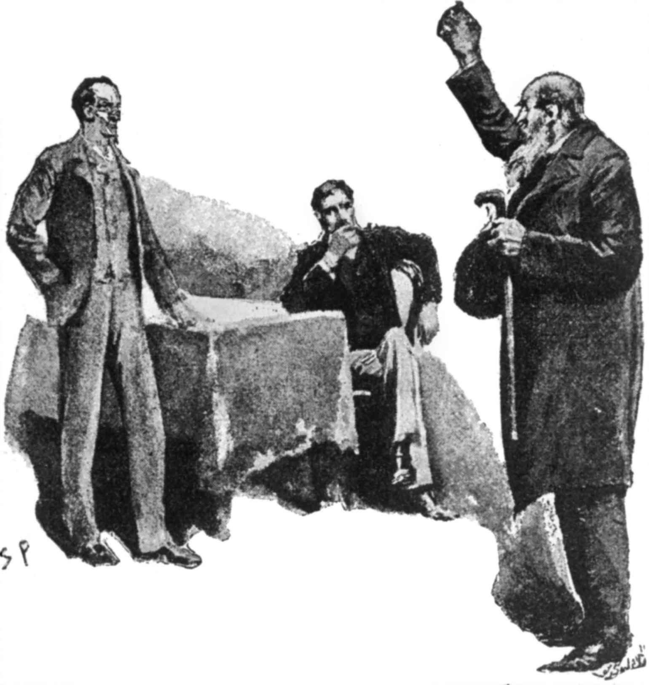

“好吧，那就再见。”老人庄重地说。

“上帝保佑我们！”福尔摩斯沉默了很久之后说。“为什么命运总是捉弄可怜无告的不幸人？我每当听到像这一类的案子，我就思考起巴克斯特<a href="#part0047.xhtml_ch8"
id="part0047.xhtml_ch8-back">(8)</a>说过的话，也就对自己说，‘歇洛克·福尔摩斯之所以能够破案，全托上帝之福。’”

詹姆斯·麦卡锡由巡回法庭宣判无罪释放，全是因为福尔摩斯提出一系列强有力的异议，并提交给律师作了有效的辩护。老特纳与我们会面后活了七个多月，现在他已经死了。那一对儿女终于结合在一起，过着幸福美满的生活，根本不会知道过去岁月曾经临到他们头上的那层乌云。

（1891年）

————————————————————

<a href="#part0047.xhtml_ch1-back" id="part0047.xhtml_ch1">(1)</a> 欧洲的客车车厢一般都隔成小间，每一隔间设六个座位。

<a href="#part0047.xhtml_ch2-back" id="part0047.xhtml_ch2">(2)</a> 咕咿（cooee），原为澳大利亚、新西兰土著的招呼语，19世纪中期起也为英人模仿借用。

<a href="#part0047.xhtml_ch3-back" id="part0047.xhtml_ch3">(3)</a> 英语“一只鼠”是a
rat，发音“厄拉特”，与后文所述一地名的发音有关。

<a href="#part0047.xhtml_ch4-back" id="part0047.xhtml_ch4">(4)</a> 彼特拉克（Petrach，1304—1374），意大利诗人、学者，欧洲人文主义运动主要代表。

<a href="#part0047.xhtml_ch5-back" id="part0047.xhtml_ch5">(5)</a> 乔治·梅瑞狄斯（George
Meredith，1828—1909），英国小说家、诗人，作品擅长人物心理刻画，其内心独白技巧为意识流先河。

<a href="#part0047.xhtml_ch6-back" id="part0047.xhtml_ch6">(6)</a> 英语“月光”（moonshine）一词也喻指空谈、空想、大话。

<a href="#part0047.xhtml_ch7-back" id="part0047.xhtml_ch7">(7)</a> 努维朗（nous
verrons），法文“等着瞧”、“拭目以待”的意思。

<a href="#part0047.xhtml_ch8-back" id="part0047.xhtml_ch8">(8)</a> 巴克斯特（Baxter，Richard，1615—1691），英国基督教清教徒牧师，王政复辟时因力促当局对脱离国教的温和派施行宽大政策而遭迫害和监禁。

# 五颗橘核

我把一八八二年至一八九〇年间为歇洛克·福尔摩斯探案所作的笔记、记录翻出来略略看了一遍，发现集中在我面前的这些材料，奇异有趣各有特色，真不知从何选择是好。不过其中有些经由报纸传播已广为人知，另有一些案子则未能为我的朋友发挥其无比高超的特殊本领提供机会，但各家报纸都要拿来作为绘声绘影宣扬的材料。也还有一些案子，所述事实有头无尾，并没有显示他的分析能力如何施展，还有其他的案例只是部分清楚，案情解释纯系出于假设与推测，而不是基于他所擅长的逻辑性可靠论证。但是，看到最后一部分中有一个案例，情节特别复杂，结局更加离奇，我有意把它作一番记述。虽然与其有关联的若干事实真相从来没有搞清，也许永远都不会全部搞清，但我还是忍不住要叙述它。

一八八七这一年，我们接手一系列案子，无论事大事小、有趣无趣，我都一一记录在案。在这一年十二个月的各个标题之下，我发现有如下数案的记载：“法国作家帕拉多尔自杀案”；“业余乞丐社团案”，这个集团在一座家具仓库的地下室里拥有奢侈豪华的俱乐部；“不列颠航船索菲·安德森号失事真相案”；“格赖斯·彼得森的乌法岛奇案”；还有“坎伯韦尔投毒案”。这最后的一个案件有记载，歇洛克·福尔摩斯给死者的表上发条，证明表在两个小时之前上紧了发条，从而证明死者是在此一时间上的床——这一推论对于澄清案情至关重要。所有这些案件，可能今后会有一天我将略述内容，但是其中没有一个比得上我现在执笔要写的这个案子来得更奇特、怪诞，所涉情节更为复杂。

那是在九月下旬的秋分时节，大风吹得格外猛烈。有一天狂风怒吼，骤雨泼窗，甚至在这万物之灵手造的大伦敦城中心，我们也不免为正常生活一下子受到威胁而烦心，因而不得不承认自然力之伟大。它犹如笼中仍未驯服的猛兽，透过文明的牢笼向人类怒吼狂叫。随着夜色降临，暴风雨更加发威肆虐，风吹入烟囱，像扫烟囱小孩一般，时而号哭时而如泣如诉。歇洛克·福尔摩斯坐在壁炉一旁，正在埋头编辑罪案记录索引。我坐在另一边，沉浸于一本克拉克·拉塞尔<a href="#part0048.xhtml_ch1"
id="part0048.xhtml_ch1-back">(1)</a>好看的海洋小说。外面狂风暴雨的呼啸像是要和小说交相呼应，混同一体：倾盆大雨不断作势，变成如海浪似的汹涌澎湃。我妻子探望她母亲去了，所以这些天来我又一次做了我这贝克街旧居的房客。

“嘿，”我说，抬头望一眼我的伙伴，“打门铃了，没错。今晚谁会来，是你的朋友？”

“除了你，我没有朋友，”他答道，“我一向不赞成作客拜访。”

“那是找委托来了？”

“是这样的话，这案子一定严重了，要不然，这么个天气不会出来的，又是这么晚的时间。不过我想多半是房东太太的好朋友。”

福尔摩斯这回没猜中，因为这时走道上响起了脚步声，又敲起了房门。他伸出长长的胳膊把向着自己的灯转向一张空椅子，好让来客方便落座。

“进来吧！”他说。

来者是个年轻人，最多二十一二岁的年龄，穿着考究，整洁利索，举止落落大方，很谦恭有礼的样子，手里提的雨伞不住滴水，身上的长雨衣闪着水光，这都说明他是不顾风吹雨打的恶劣天气而必须要来。他借着灯光向周围看看，神情焦急。我看他面色苍白，眼皮低垂，像是有沉重的心事压得他不堪承受。

“真是对不起，”他说，把一副金丝夹鼻眼镜戴上，“但愿我不至于太打扰您。外边大雨，我拖泥带水的，弄脏了您这儿干干净净的房间。”

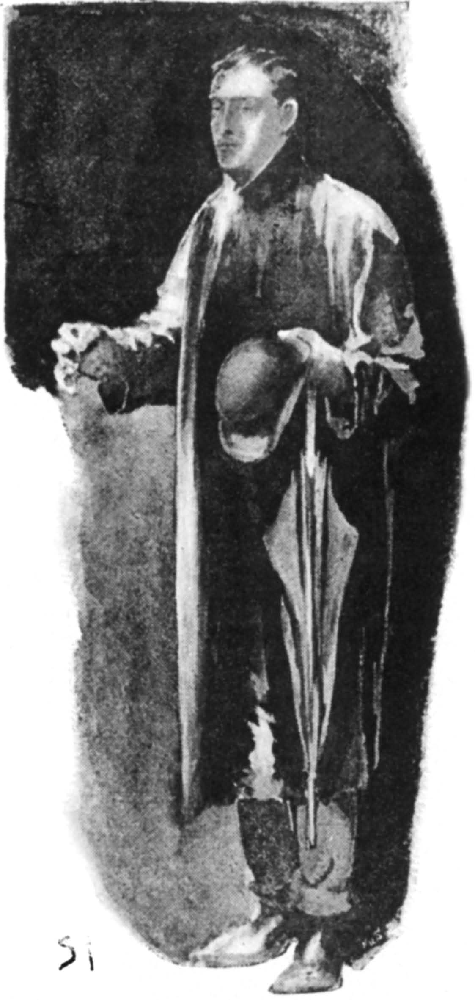

“外边大雨，我拖泥带水的。”

“雨衣、伞都给我，”福尔摩斯说，“给你这钩子上挂着，一会儿就干。我看你是从西南区过来。”

“是的，从豪舍姆来。”

“有泥，是白垩土，你鞋尖上沾着呢，看得很清楚。”

“我是专程赶来请教。”

“这不敢当。”

“还请大力帮忙。”

“那个尽力而为。”

“我早闻您大名，福尔摩斯先生。我是听普伦德加斯特少校说的，是您救了他摆脱坦克维尔俱乐部丑闻。”

“啊，不错，有人诬告他玩黑牌，搞欺诈。”

“他说您没有破不了的案。”

“他说得太过头了。”

“您是常胜将军。”

“我吃过四次败仗——三次败于男人，一次败于一位女子。”

“这些，同您的成功相比，我认为不值一提，对吗？”

“也对，大致来说我还是成功的多。”

“我这个事，您也会成功。”

“请把椅子靠炉边挪近点，把你的事慢慢讲讲。”

“我的这个事非同一般。”

“来这儿让我办的，都不是一般案子，我成了最高上诉法院了。”

“我怀疑，先生，发生在我家的这件事，凭您的经验，不知您是否听说还有更神秘更难以解释的案子。”

“这让我感兴趣了，”福尔摩斯说，“请先给我们说说主要案情，然后，我来问你细节，会拣重要的问。”

年轻人朝前挪一挪椅子，把湿脚伸向炉火边。

“我的名字，”他说道，“叫约翰·欧本肖。不过我觉得，我自身同这桩可怕的事没有多大关系，那是上代遗留下来的问题。为了让您对事情有个总的概念，我要追溯往事，从先前说起。

“先说我祖父有两个儿子——我的伯父伊莱亚斯和我父亲约瑟夫。我父亲在考文垂有一家小工厂，自行车发明以后，工厂扩大了，因为他拥有欧本肖不爆轮胎专利权，所以事业做得很成功。后来他把工厂卖掉，过着富裕享乐的退休生活。

“我伯父伊莱亚斯年轻时候移居美国，在佛罗里达办了农场，据说经营得也相当好。内战期间，他在杰克逊<a href="#part0048.xhtml_ch2"
id="part0048.xhtml_ch2-back">(2)</a>部队里，后来又在胡德<a href="#part0048.xhtml_ch3"
id="part0048.xhtml_ch3-back">(3)</a>部队，升到上校。李将军<a href="#part0048.xhtml_ch4"
id="part0048.xhtml_ch4-back">(4)</a>投降以后，伯父回到农场，待了三四年。大约一八六九年或是一八七〇年，他回欧洲，到苏塞克斯，在豪舍姆附近购买一小块地产。他在美国发了一笔大财，离开美国，原因是讨厌黑人，反对共和党的政策给予黑人公民权。伯父脾气特别暴躁，发起火来什么都骂得出口，而且性格孤僻，不喜欢与人来往。住在豪舍姆那些年，我好像没见他进过城。家里有个花园，屋周围有两三块空地，他常在那里练练身体，可经常是一连几个星期足不出户。他喜欢喝白兰地，酗酒，吸烟，是个酒鬼、烟鬼，就是不喜欢社交，不要朋友，弟兄之间都不来往。

“伯父对我还不错，他真的挺喜欢我呢。我头一回见他才不过是个十一二岁的孩子。一八七八年，他回国八九年了，他要我父亲让我和他一起过。他待我真是好，在他是很不容易的。他神志清醒的时候，常常喜欢和我玩巴加门十五子游戏、下象棋，还让我代表他对内管家作安排，也对外和生意人打交道。这样，我到了十六岁，俨然是他的小当家，所有钥匙都归我管，怎么做怎么行，都由我，只要做到不打扰他个人独自的生活和习惯就成。但有一桩事例外，很奇怪的，房屋顶楼上有一间单室，堆放杂物用。这一间长年锁着，不许任何人到里面去，我也不许进去。小孩子好奇心大，我从钥匙孔向里张望，可也就是一般储藏室那些破烂箱笼家具物品，没什么特别的东西。

“有一天——那是一八八三年三月，一封贴着外国邮票的信，放到桌上，搁在他的上校餐盘前面。居然会有信，对他来说这不是什么平常事，因为他的账单都是现钱支付，不用函件往来，更没有一个朋友会寄信给他。‘印度来的！’他拿起信来就说，‘本地治里<a href="#part0048.xhtml_ch5"
id="part0048.xhtml_ch5-back">(5)</a>的邮戳！怎么会？’他赶忙拆信，想不到忽然蹦出来五颗橘子核，滴溜溜掉在桌子上。我开始觉得好笑，谁知笑声还没出，就见他脸变了。他张嘴瞪眼，面如死灰，呆呆地瞧着在手中直颤抖的信。‘K．K．K．！’好一会儿才尖声叫起来，‘我的天，我的天！劫数难逃呀！’

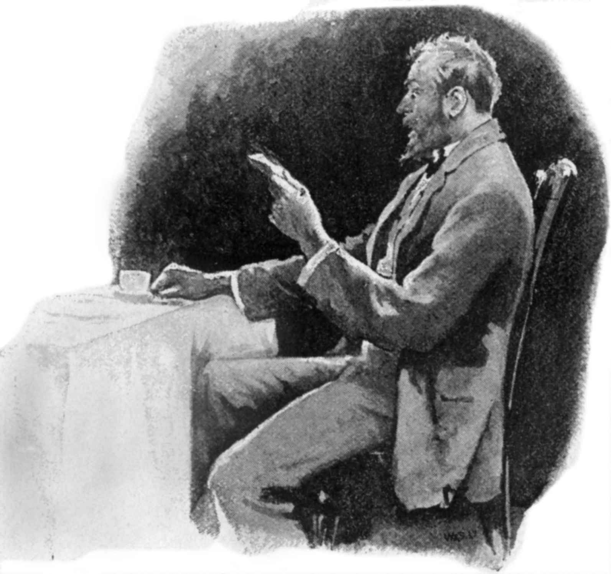

“我的天，我的天！劫数难逃呀！”

“‘怎么啦，伯伯？’我也叫起来。

“‘要人命啦！’他说，站起身，离开桌，回他房里去。我吓得心怦怦跳。我拿起信封，看到信封口盖的内里，也就是涂胶水的上端，用红墨水潦草写着一连三个K
字母，再有就是那五颗干橘核，别的什么也没有。为什么会让伯父吓得灵魂出窍似的？我离开早餐桌，正要上楼梯，碰上伯父下来了，一手捏一把老锈斑斑的钥匙，肯定是那阁楼密室的，另一手拿一只小黄铜盒，像是钱盒。

“‘他们想怎么着就怎么着好了，可还是别想赢得了我，’他咬牙切齿说，‘关照玛丽今儿我房里要生火，再派人去叫福德姆律师来，豪舍姆的那个律师。’

“我照他吩咐去办。律师来了以后，伯父叫我上楼到他房里。炉火生得又旺又亮，炉门口一堆蓬蓬的黑灰烬，那是烧过纸了；边上搁着那只黄铜盒，盖打开着，空盒一只。我看一眼，不禁吃一惊，原来盒盖上印着的也是三个K
字母，跟早晨那信封上看到的一个样。

“‘约翰，’伯父说，‘在我遗嘱上签名作证。我把我的家产，说不上它是有利无害还是无利有害，都给我兄弟，你父亲，也就是说，等于是，都留给你了。但愿你能拿到手，平平安安地享福，那就是上上大吉！万一不能，我的孩子，那就听我一句忠告，只好交出去，要命不要钱，给掉就算。说来真惭愧，伯伯我给你的是这么一份家业——双刃剑，我也说不清这剑锋这么来那么去，将来会怎么使。现在你就按福德姆律师指的地方签字吧。’

“我按律师指点签好字，律师收起遗嘱带走。这件怪事，您可想而知，印在我心里抹不掉。我把这件事思来想去，未知其中奥妙，也就想不出个所以然，无法摆脱这内中是什么隐患的恐惧感，不知今后会怎么样。但是随着日子一星期一星期地过去，提心吊胆这事倒也淡薄起来，因为什么也没有发生，每天生活照常过，一点打扰也没有。可是我看出，伯父从此心情不好，变得举止异常。他喝酒比以前更厉害，更加忌讳同外界接触，成天躲在自己房间里，把房门反锁着。有时候醉醺醺发起酒疯来，会冲出屋子去，手拿左轮枪在花园里乱闯乱跑，大声叫喊他谁也不怕，说不管是人是鬼，都甭想把他当绵羊拴起来制服他。酒醒以后，就又慌慌张张急忙奔回屋，关上门，上好锁闩紧了，恐惧得失魂落魄，好像再也硬撑不下去了。每逢这种时候，我看他的脸，即使天寒地冻，都是汗涔涔亮晶晶，像是刚从脸盆里抬起头似的。

“噢，我就讲讲事情的结果吧，福尔摩斯先生，你已经听得够耐心了。事情到了有天晚上，伯父又发起酒疯撒野向外跑，就此没再回屋来。我们出去找，找到花园角落那边，发现他趴在一个长满绿苔的水坑里，没有被施暴的迹象。水坑深浅不过两英尺，所以验尸陪审团根据他平时行为古怪——这是众所周知的情况，裁定他是‘自杀’。可是我明白他是一直畏惧死的，说他是自寻短见，我怎么也不会相信。事情过去之后，父亲接手伯父的家产，还有银行里一万四千英镑存款。”

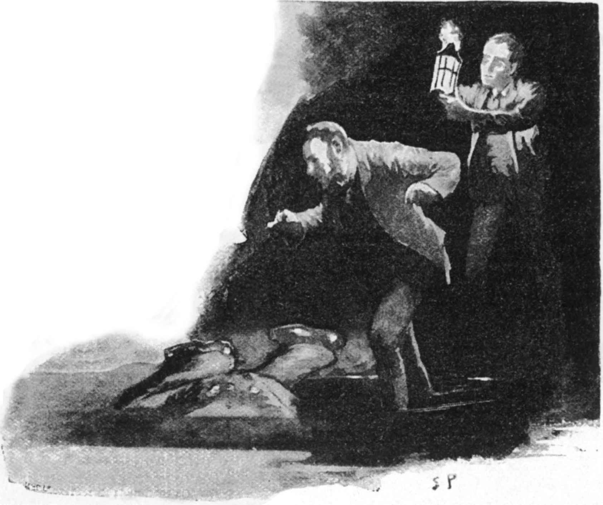

发现他趴在一个长满绿苔的水坑里。

“等一下，”福尔摩斯插话道，“正如我想的，你的陈述，是我听到过的又一桩奇案。让我把日期搞搞清楚，你伯父收到信的日期，他自杀的日期；所谓自杀是人家这么讲啰。”

“信的日期是一八八三年三月十日，死是这之后七个星期，五月二日夜里。”

“谢谢你，请继续讲下去。”

“父亲接手豪舍姆的房产时，经我要求，到阁楼上去检查看看，那里长年累月锁着门，没人进去过。我和父亲看到那只黄铜盒子还在，里面的东西是早毁了。盒盖内里反面一边有个纸标签，一连三个K．K．K．这么三个字母，下面写着字‘信件、备忘录、收据并名册一份’。我和父亲猜想，已经被欧本肖上校烧掉的东西也就是这么几样。阁楼上没有什么重要对象，只有一些散乱的纸和笔记本，记录着伯父在美国的生活情况。有些是战争时期的，他忠于职守，荣获英勇战士称号；还有是南方各州重建时期的，绝大部分是有关政治问题的记录，明显表露出对从北方南下的地毯包政客<a href="#part0048.xhtml_ch6"
id="part0048.xhtml_ch6-back">(6)</a> 持强烈不满的态度。

“哦，那是一八八四年初，父亲也住到豪舍姆来，我们过得称心如意。到了一八八五年的一月，新年的第四天，父亲和我正坐在早餐桌边，父亲忽然‘呀’一声叫，他一只手里拿着新打开的信封，另一只手摊开着，掌上是五颗干橘核。父亲这以前一直笑我，讲上校伯父那个事纯属荒唐，现在这同样的情形轮到了他自己头上，他可真傻了眼，弄糊涂了。

“‘啊，这这到底算算算什么意思，约翰？’父亲说话都口吃了。

“我的心一下子铅块似的沉重起来。‘那是K．K．K．。’我说。

“他看看信封里面。‘正是，’他叫出声，‘就正是这三个字母。哦，那上面还写什么？’

“‘将纸置于日晷。’我念道，站在父亲背后看着那封信。

“‘什么纸？什么日晷？’父亲问我。

“‘就是花园里的日晷，没有别的了。’我说，‘纸就是那些被伯父销毁的文件。’

“‘不像话！’父亲壮着胆子说，‘我们这里是文明国度，不容许这么胡作非为。什么东西！哪里来的？’

“‘敦提<a href="#part0048.xhtml_ch7"
id="part0048.xhtml_ch7-back">(7)</a>来的。’我看了一下邮戳回答说。

“‘吃饱了撑的，什么玩意儿。’父亲说，‘什么日晷，什么纸，跟我有啥相干？无聊至极，不理它！’“‘得去报警。’我说。

“‘这种事都报警，让人家笑话，犯不着。’

“‘那让我去报警就是了，好吗？’

“‘不要，不许你去，吃饱了没事找事。’

“我和他讲不清，父亲也是个固执脾气，可我心里七上八下，闹不好要大祸临头呀！

“这封信来了以后第三天，父亲离家去看一个老朋友弗理博迪少校，他现在是朴次当山一个堡垒指挥官。父亲上那儿去，离家出了门，我倒乐意，心想还是让他避开危险的好。不料我错了，他出门后第二天，接到少校拍来的电报，命我速去他那里。父亲掉进一个白垩矿的深坑，这种矿坑附近到处都是，他头骨摔碎，不省人事。我赶到的时候，父亲没有恢复过知觉，从此与世长辞了。想来肯定是黄昏前他从费厄哈姆回来，乡下地方不熟悉，矿坑又没有围栏阻挡。陪审团验尸作出裁决是‘意外致死’。我小心仔细检查死因，想到了种种其他的可能，但怎么也没能发现被谋害的事实根据，没有暴力迹象，没有脚印，没有抢劫，连路上有没有陌生人都没人看见，无人作证。不用我说您也知道，我内心远远不能平静，我可以肯定，是有人对父亲早有谋划，是蓄意谋害。

“在如此凶兆之下，我继承了遗产。您会问我为什么不把它卖掉，我要回答，因为我相信我们的遭遇肯定同伯父生前的什么事有关。所以这幢房也好，那幢房也好，危险到处存在，并非和房屋相关。

“一八八五年一月，可怜的父亲遇害，此后两年零八个月，这段期间，我在豪舍姆过得还平静，使我开始怀抱希望，灾星已经远离我家，祸害只到上一代为止，从此结束了。谁知我是存的侥幸心，乐观得太早，昨天早晨，来了当头一棒，同我父亲的预兆一模一样重演一遍。”

年轻人从背心口袋里取出一个皱巴巴的信封，走向桌边，抖落出五颗小小的干橘核。

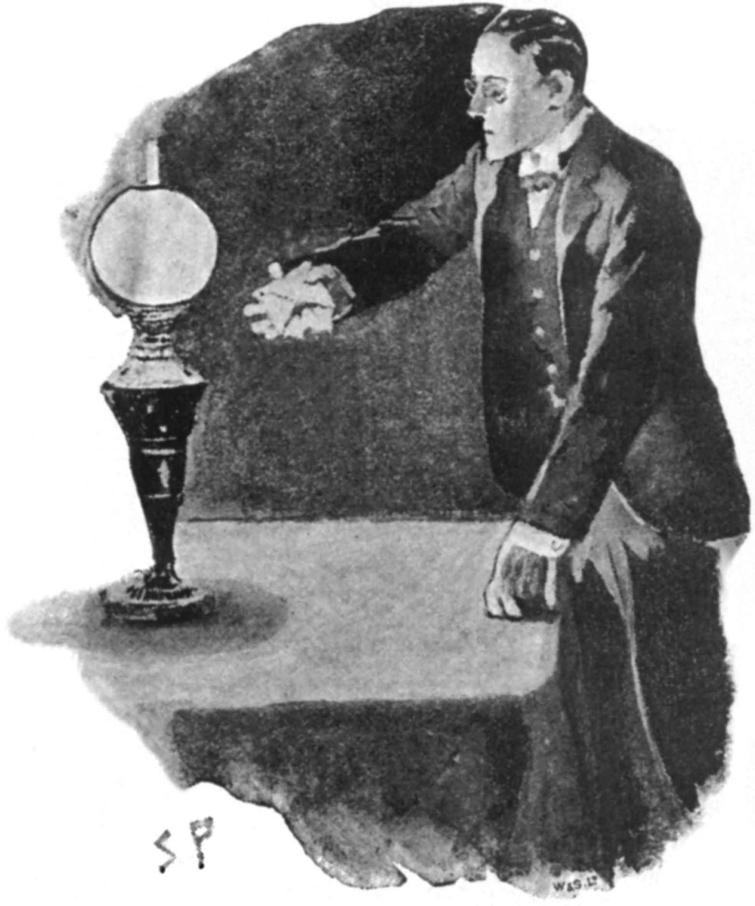

年轻人走向桌边，抖落出五颗小小的干橘核。

“就是这只信封，”他继续说道，“邮戳是伦敦东区。信封里还是那几个字母，同我父亲那封信一样：‘K．K．K．’；另外还有‘将纸置于日晷’。”

“你这么做了？”福尔摩斯问。

“没做。”

“什么事也不做？”

“说实话，”——他低下头，瘦削苍白的双手捂住脸——“我走投无路，觉得自己真像一只可怜的兔子快要被游过来的蛇缠住了。我好像陷入了不可抗拒、残酷无情的恶魔手中，这魔爪你无法预见，无法防范。”

“不行！不行！”福尔摩斯叫道，“你必须行动，小伙子，否则你就完蛋。只有振作起来斗争，才能救你自己，已经没时间让你唉声叹气了。”

“我去找过警察了。”

“啊！”

“警察听了我的报告，只是一笑。我清楚，巡官有自己的看法，写这类信无非是闹着玩，伯父、父亲也不过是意外死亡，正如验尸官所讲，同警告信无关。”

福尔摩斯挥舞着紧握的双拳。“怎么会这样愚蠢！”他嚷道。

“不过他们还是给我派了一名警员，陪我一起守在房子里。”

“今天晚上同你一起来了没有？”

“没有，他奉命只守在屋子里。”

福尔摩斯又愤愤地挥拳。

“那你怎么现在才来找我，”他叫道，“你为什么不一开始就来找我？”

“先前我不知道，还是今天才对普伦德加斯特少校谈起我的严重处境，是他叫我快来找您。”

“你收到信已过了实足两天，我们应当在此之前采取行动才好。还有没有什么其他情况，我是说，除了已经讲过的以外——有没有进一步的细节情况，对我们工作有利的？”

“有一件事，”约翰·欧本肖说道，从外衣口袋里搜搜摸摸掏出一张掉了色的蓝纸，把它摊在桌上，“我记得很清楚，那一天伯父烧纸，我看见纸灰里有一片没烧完的纸正是这种颜色，完全一样。现在这一张我是在房间地板上捡到的，我一看见马上就想到，很可能是那一摞里面掉下来的吧，那就是幸免销毁的一张了，除了提到橘核以外，看不出对我们有多大帮助。我自己在想可能是日记，当然是我伯父的手迹，可能是他的个人日记。”

福尔摩斯把灯移一移，我和他一起看这张纸。纸边破碎不齐，是从本子上撕下来的，前头写的是“一八六九年三月”，底下是一些不知所云的记载，内容如下：

四日。赫德森来。仍持同样旧政见。

七日。橘核致圣奥古斯丁的麦考利、帕拉米诺及约翰·斯温。

九日。麦考利已除。

十日。约翰·斯温已除。

十一日。访帕拉莫尔。一切顺利。

“谢谢你！”福尔摩斯说，把纸折起，交还给来客，“现在你一分钟也不能再耽搁了，甚至已经没有时间讨论你说的案情，你必须马上回家，行动起来。”

“怎么行动？”

“只要做一件事，必须马上就做。你把纸，就是给我们看的这张纸，放到黄铜盒子里，你说过的那只铜盒，还要放进一张便条，说明其余文件都给你伯父销毁了，仅剩下这一张。措词要肯定，一定要让对方确信无疑。这么做好以后，必须马上放到日晷仪上去，按他们要求的办，明白吗？”

“完全明白。”

“不要想复仇，在目前情况下，这种念头不要动。我在想，等来日运用法律手段达到目的也不迟。既然他们已经张开罗网，我们也张开我们的网。首先考虑，要解燃眉之急，危险已经威胁到你，迫在眉睫了。第二步，才是揭开谜团，惩治犯罪黑党。”

“我该感谢您，”年轻人说，站起身来穿上雨衣，“您给了我新生命新希望，我一定遵照您的嘱咐去做。”

“时间不能耽搁了，最最要紧的是时刻提防，自己千万当心。我绝不认为没有问题了，你确实面临着严重的、紧迫的危险。你怎么回去？”

“到滑铁卢乘火车。”

“现在不到九点，街上人还不少，我想路上还是安全的。记住了，多加防范不嫌过分。”

“我带着枪。”

“那就好，明天我就着手你这案子。”

“那么，我在豪舍姆等您了？”

“不必，你的事情问题在伦敦，我就在伦敦解决它。”

“那么，隔一两天再来看您，盒子、纸条有情况就向您报告。我会牢记您的嘱咐，时时处处不忘记。”他和我们握握手，就离开。外边狂风仍在吼叫，倾盆大雨仍在拍击窗户。这个奇异凶险的故事好像是紧随狂风暴雨来到我们这里——像疾风向我们吹来一片叶子——现在又被席卷而去。

福尔摩斯不出声地坐了一会儿，头低垂，睨视壁炉红红的火焰，然后点上烟斗，身子向椅背一靠，望着蓝烟一圈圈袅袅追逐着升上天花板。

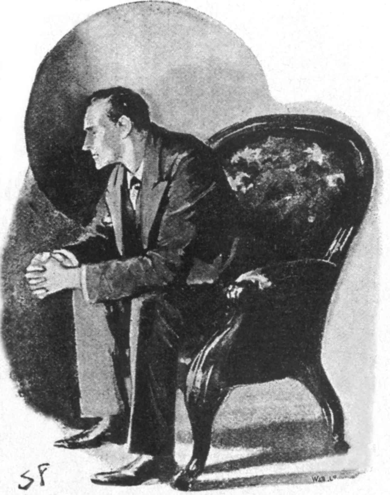

福尔摩斯睨视壁炉红红的火焰。

“我想，华生，”最后他说道，“我们经手过的案子，没有比这一件更离奇的了。”

“也许是吧，还有《四签名》。”

“噢，也许是的，除了《四签名》。可是这约翰·欧本肖，我看比肖尔托弟兄遇到的险情要大得多。”

“内中的险情，你是不是已经——，”我问道，“概念已经很明确了？”

“就其性质而言，已经不成问题。”他回答说。

“是怎么回事呢？K．K．K．是什么人，为什么追住这个不幸的家庭不放手？”

福尔摩斯闭起眼睛，两个臂肘搁在椅子扶手上，两手指尖和指尖一一对齐。“作出精确的推理，”他说道，“要在复杂情况下看到关键事实，就能推断出导致这一事实的一连串原因，不仅如此，还能推断出由此产生的各种结果。这就如同居维叶<a href="#part0048.xhtml_ch8"
id="part0048.xhtml_ch8-back">(8)</a>，他单凭一块骨头，经过研究就能把整个动物准确地描绘出来。这跟他是一样的道理。所以，观察家的本领，应当对一系列事件的某一环节作透彻的分析，据此能够准确说明前前后后的所有其他环节。现在我们单凭推理推出的结果，还没有能够达到。问题要通过研究才得以解决，这对那些只会凭直觉来解决问题的人，会有困难。这是一门艺术，要把艺术推向顶峰，推理的人必须能运用他的知识来分析事实。那么这就要，正如你也已经看到了，要拥有知识。知识，即使在有了义务教育和百科全书的今天，还是不容易有全面的掌握。不过，也并非不可能，一个人掌握自己本行的实用知识，是应当做得到的，这毫无问题。我本人，就是对此锲而不舍。我还记着呢，记得很清楚，我们相识交友之初，那一回你指出我知识的局限性，很是精准。”

“是的，”我回答他，笑起来，“列过一张表，很有意思。哲学、天文学、政治学，打了你零分；植物学，一知半解；地质学，仅就了解伦敦方圆五十英里地区的土质而言，相当深刻；化学，广泛而不正规；解剖学，不够系统；惊险文学、刑案案例，如数家珍、无与伦比；小提琴演奏家；拳击家；击剑手；律师；可卡因、吸烟，自我戕害者。这一些，也就是我分析得出的要点。”

福尔摩斯对最后一项报以咧嘴一笑。“哦，现在，”他说，“我要讲，其实以前也讲过了，人应该在他的脑子这个小小阁楼里储藏随时要用的家具，其余的都放开，放到杂物间去，也就是藏书室，用得着时去翻检就行了。今天晚上突然提到我们面前来的这一桩案子，我们就务必要动用我们的资源了。劳驾一下，《美国百科全书》的K
字母卷给我拿一拿，就在你身边的书架上。好，谢谢！现在让我们来考虑一下形势，看看从中可以作出什么样的推论。首先，作根据充分的假设，由此开始：上校欧本肖离开美国是出于某种压力的原因。人到了他这把年纪，不会完全改变生活习惯了，可他放弃气候舒适的佛罗里达，愿意到英国乡间小镇来过着寂寞冷清的生活。他在英国生活这么一味孤独属于异常，说明他心里惧怕某人或者某事。所以我们可以作这样的假设，是站得住脚的，就是因为害怕什么人什么事才迫使他要离开美国。至于他究竟怕什么，我们作推论，只能从他和他的继承人收到的怪信件来考虑。你注意过几封信的邮戳没有？”

“第一封来自本地治里，第二封来自敦提，第三封是伦敦。”

“从伦敦东区寄的。你推论出什么？”

“三个地方，都是港口，写信人是船上的。”

“好极了！这就是一条线索。毫无疑问，有可能——极其可能——写信人是某条船上的。现在我们来考虑另一点。看本地治里，从寄出威胁到实施犯罪，前后经过了七个星期，而敦提，只相隔三四天。这里边说明什么问题？”

“那时间长是旅程比较远的关系。”

“可是信件也要走长途才到。”

“那我就不懂了。”

“至少可以作一个假设，这个人，或者是一伙人，乘的这条船是一艘帆船。看情况总是在他们动身之前才把最后通牒、最后警告发走。你看，敦提的信号发出之后跟着来的行动有多快。如果他们从本地治里坐汽轮，那么应当同警告信到达的时间差不了多少，但事实上，前后相差七个星期。我考虑，这七个星期正好说明邮轮运送信件和帆船载写信人两者的时间差。”

“有可能是这样。”

“不仅可能，八成就是这样。眼前这个案情，你要看到已经极其紧迫，非常危急，所以我紧催小欧本肖千万要当心。他们下手的时间，总是在信发走以后人动身赶路，随后到达的这个时间。这一回是从伦敦来信，所以我们就刻不容缓。”

“我的老天，”我叫起来，“这么丧尽天良迫害人命什么意思？”

“就是欧本肖身上的那些个文件，对帆船上的那个人或者一伙人，至关重要。我在想，情况很明显，他们一定不止一个人，单独一个人不可能搞掉两个人而天衣无缝，居然完全骗得过验尸陪审团。那里头必定有好些人，这些人必定智勇双全，他们非要把文件弄到手不可，让谁拿着都不行。因此你看到的K．K．K．绝不是某个人的名字缩写，而是某个集团的标志。”

“什么集团呢？”

“你没有——”福尔摩斯说，身体前倾，压低嗓音——“你没有听说过三K党？”

“从来没听说。”

福尔摩斯把摊在膝头上的书翻过几页。“喏，这儿有了，”随即念道：

“克·克拉克斯·克兰<a href="#part0048.xhtml_ch9"
id="part0048.xhtml_ch9-back">(9)</a>系仿来复枪扳机之声而杜撰之词，指一秘密恐怖之社团。该社团由南部各州之前邦联军人于内战后所组建，并迅即成立各地分支而遍布全国。主要活动于田纳西、路易斯安那、卡罗来纳、佐治亚及佛罗里达诸州。其势力用于政治目的，主旨在于对黑人选民实施恐怖手段，谋杀或驱逐持反对观点之人士。其暴力行使通常辅以先导之警告，即向受敌视者寄送小截橡树枝叶或数粒瓜子或几颗橘核之类，各物纯属警告，本身并无任何象征意义。被迫害人一旦收受此物，宜立即公开宣布放弃原有之观点立场，或逃亡国外。有置若罔闻者，必将招致杀害。其手段极奇特且不及预料。该团体组织严密，采用方法极具系统性，仅列案可稽之数例，未尝见敢与抗衡而幸免于难者，且追缉施暴之案犯终不可得。美国政府及南方上层社会竭尽全力加以遏止，该团体仍蔓延滋长经年不绝。迨一八六九年三K
党运动社团突然自行解体，此后暴行仅存余波而已。”

福尔摩斯放下大百科全书，然后对我说，“你看到了吧，该社团之突然崩溃，同欧本肖突然携带文件逃离美国，发生于同一时间，这很能表明其中具有因果关系，怪不得他和他的家族始终被一些死对头跟踪不放。你可以理解，这些记录、日记牵涉到南方的一些头面人物，这些东西不能重新到手，他们就睡不好觉。”

“那么说，我们看见的那一页——”

“完全如我们所料，那上面，我还记得，‘橘核致A、B和C’——那就是社团向这些人发警告。接着下面的几条是A、B已除，或者离国，最后那个C，拜访了，我担心这C
结局最坏。好啦，我说医生，这个黑暗的地方，让我们添点光明吧。我权可放心，小欧本肖这时间一定会按照我告诉他的办法行动。今夜已无话要说，无事要做，请把小提琴递给我，让我们且把这烦人的天气连同我们同胞的更多烦恼抛诸脑后半小时吧。”

早晨，天气晴朗，太阳透过笼罩大都市的薄雾，闪耀着柔和的光芒。等我下楼，福尔摩斯已经在用早餐。

“很对不起，我不等你了，”他说，“因为我估计，为了小欧本肖这案子，今天我们得忙上一整天。”

“你采取什么步骤呢？”我问。

“那要取决于我第一步侦查的结果。豪舍姆，之后总归是要去跑一趟了。”

“你不先去那里？”

“不去，我先从伦敦入手。打铃吧，可以给你上咖啡了。”

我在等咖啡的时候，拿起放在桌边刚到的报纸打开浏览一遍。当目光停留在一个标题上，我的心猛一个冷战。

“福尔摩斯，”我叫喊，“来不及了！”

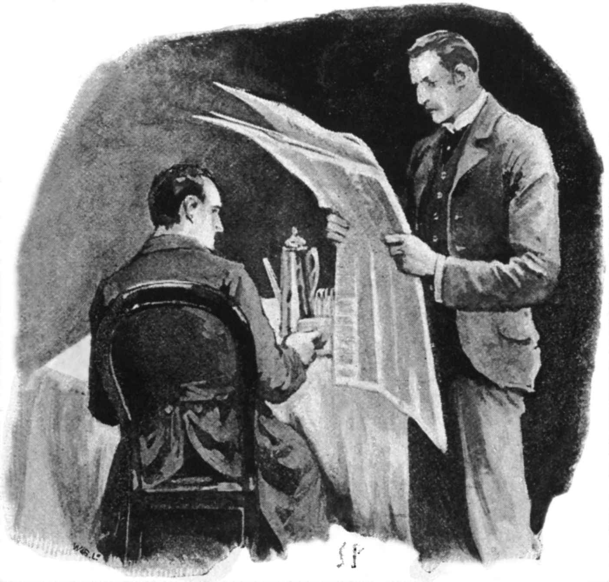

“福尔摩斯，来不及了！”

“啊！”他放下了杯子，说，“怕就怕这个。怎么回事？”他竭力平静地说，但看得出他内心激动得很。

我一眼就注意到欧本肖这个名字和‘滑铁卢桥之悲剧’的标题。报道如下：

昨夜九至十时之间，H
区警员库克值勤于滑铁卢桥附近，忽闻有人呼救及落水声。夜色浓重，风雨交加，故虽有数行人协同救援，终营救无果。然警讯当即发出，经水警协助，最后捞获尸体，据验证，系一年轻绅士，由其袋中一信得知，名为约翰·欧本肖，家住豪舍姆乡间。据推测，系急于赶往滑铁卢站搭末班夜车，漆黑之间匆忙误入歧途，至轮渡小码头边失足落水溺毙。尸体无任何暴力迹象，显系意外遇难。此不幸事件当足以唤起市政当局注意江滨码头设施之安全。

我们默默静坐几分钟。福尔摩斯如此沮丧、震惊的神态，我以前还不曾见过。

“我是傲气全无，华生，”他最后说道，“虽说我这也是小家子气，可也真是把我锐气大挫。这件事全怪我，现在由我干到底了。上帝假我以天年，我势必亲手解决这帮团伙。欧本肖他来这儿求助于我，我倒是把他送上死路！”福尔摩斯从椅子里跳起来，在屋中走来走去，激动得不可自制，气得铁青的脸颊升起了红火，两条瘦长的胳膊紧抱了又甩开，甩开了又抱紧。

“这帮魔鬼狡诈透顶，”他最后叫道，“居然把他骗得引上那儿去，能有那么大本事？这泰晤士河堤同车站方向根本不对头嘛！那桥上，就算是夜里，还是车马行人不断，他们肯定没法下手。好吧，华生，我们跟他们走着瞧，看看谁赢了最后胜利。我现在就出去！”

“去找警察？”

“不，警察我自己当了。等我把网张罗起来，他们早就逃之夭夭，来不及了。”

这一整天我都忙着自己的医务工作，暮色苍茫才回到贝克街，福尔摩斯还没有回来。一直快到十点钟的时候，才见他走进屋，面色苍白，精疲力竭，跑到食橱旁，拿一只面包撕了就往嘴里塞，咕嘟嘟喝一大杯白水，狼吞虎咽。

“你饿了。”我说。

“饿扁了。这一天都忘吃东西了，早饭后什么也没吃过。”

“一点都没吃？”

“一点没吃。哪有工夫吃！”

“进展如何？”

“不错。”

“有线索了？”

“都已入我掌心之中，小欧本肖报仇之日不会很久。这样，华生，我们来他个以其人之道还治其人之身，我都想好了。”

“你怎么做？”

他从食橱里拿出一只橘子，掰成瓣儿，挤出几颗核在桌上，捡了五颗装进一个信封，信封口盖的里侧写上“S．H．代J．O．”<a href="#part0048.xhtml_ch10"
id="part0048.xhtml_ch10-back">(10)</a>，封好信封，写上地址：“詹姆斯·卡尔霍恩船长，‘孤星号’三桅帆船，萨瓦纳，佐治亚州，美国。”

“等他一进了港，这封信正等着他呢，”福尔摩斯说道，格格地笑了，“他一看到这封信，就叫他夜不成眠。他会发现，自己的性命也快到尽头了，他面临的是同欧本肖走在他之前同样的命运。”

“这卡尔霍恩船长是什么人？”

“集团头目。还有别的人，我先干他。”

“怎么让你侦查到手的？”

他从口袋里掏出一张大纸，上面都写的是日期和名字。

“我花了一整天工夫，”他说，“我查了劳氏船舶年鉴，还有旧档案数据，追查一八八三年一、二月份进本地治里靠港的每艘船再启航的去向。那两个月里从登记上看较大吨位的船有三十六艘。其中一艘‘孤星号’立刻引起我的注意。虽然登记的是在伦敦结关再开走，可是它的船名是根据美国的一个州名取的。”

“我想是得克萨斯州<a href="#part0048.xhtml_ch11"
id="part0048.xhtml_ch11-back">(11)</a>。”

“我想也是，不过还不是最肯定，但是我知道这条船一定是美国籍的。”

“怎么知道？”

“我查了敦提港记录，看到一八八五年一月‘孤星号’三桅船进港，我就此疑虑全消，绝无问题了。接着查目前伦敦靠港船只的情况。”

“有了？”

“‘孤星号’上星期到达这里。我跑到艾伯特船坞，打听下来，才知道船已在今天早晨趁早潮顺流而下，返航去了萨瓦纳港。我发电报到格雷夫桑德市，得知船已经过了一些时候了。因为是东风，我估计船现在肯定过了古德温斯，离怀特岛不远。”

“下一步怎么办？”

“哦，去逮他。我了解到，那船上只有他和另外两个同伙是美国出生的美国人，其余都是芬兰人和德国人，还了解到三个人昨天夜里曾离船上岸，这消息都是给他们装货的码头工人提供的。等‘孤星号’到了萨瓦纳，邮轮也把信送到了，同时，海底电报已经通知了萨瓦纳警方，这三位先生是此间正在通缉的要犯，被控犯有谋杀罪。”

然而，人的千算万算总难免失算。杀害约翰·欧本肖的凶手再也收不到寄给他们的橘核，因此永远也不会知道另外有高人，高于他们的狡黠又锲而不舍的人，正在全力以赴追捕他们。这一年秋分时节狂风暴雨肆虐，持续时间又长，我们等待萨瓦纳的“孤星号”上有消息，却等了好久，音讯全无。到末了，我们获悉，在大西洋遥远的某个地方，有人看见潮汛渐退的海浪中漂着一截破碎的船尾柱，上面刻有“L．S．”<a href="#part0048.xhtml_ch12"
id="part0048.xhtml_ch12-back">(12)</a>两个字母，我们因而知道，“孤星号”是如此结局。

（1891年）

————————————————————

<a href="#part0048.xhtml_ch1-back" id="part0048.xhtml_ch1">(1)</a> 克拉克·拉塞尔（Clark
Russell，1844—1911），英国作家，以写海洋故事著称。

<a href="#part0048.xhtml_ch2-back" id="part0048.xhtml_ch2">(2)</a> 杰克逊（T．J．Jackson，1824—1863），美国南北战争时期南军将领。

<a href="#part0048.xhtml_ch3-back" id="part0048.xhtml_ch3">(3)</a> 胡德（J．B．Hood，1831—1879），美国南北战争时期南军将领，战后经商。

<a href="#part0048.xhtml_ch4-back" id="part0048.xhtml_ch4">(4)</a> 李将军（R．E，Lee，1807—1870），美国南北战争时期南军总司令，战后致力于教育。

<a href="#part0048.xhtml_ch5-back" id="part0048.xhtml_ch5">(5)</a> 本地治里（Pondicherry），印度东南部港市。

<a href="#part0048.xhtml_ch6-back" id="part0048.xhtml_ch6">(6)</a> 地毯包政客（carpet-bag
politician），指南北战争后，身无分文只拎毯制包行囊闯荡南方进行政治投机的北方佬。

<a href="#part0048.xhtml_ch7-back" id="part0048.xhtml_ch7">(7)</a> 敦提（Dundee），苏格兰东部港市。

<a href="#part0048.xhtml_ch8-back" id="part0048.xhtml_ch8">(8)</a> 居维叶（Cuvier，Baron
Georges，1769—1832），法国动物学家，创立比较解剖学和古生物学。

<a href="#part0048.xhtml_ch9-back" id="part0048.xhtml_ch9">(9)</a> 克·克拉克斯·克兰（Ku
Klux Klan），三K
党的英语全名，是个音响杜撰词，词义可能采用希腊文的kuklos，意为集团，加英语clan
的变体klan，意为宗族帮派。三K党是南北战争后不久成立于美国南部的土生白人秘密恐怖组织，党徒罩袍蒙面行动，滥施私刑，残酷迫害杀戮黑人，兼及其他少数民族，主张白人霸权。

<a href="#part0048.xhtml_ch10-back" id="part0048.xhtml_ch10">(10)</a> S．H．代J．O．，Sherlock
Holmes（歇洛克·福尔摩斯）及John Openshaw（约翰·欧本肖）的首字母缩略。

<a href="#part0048.xhtml_ch11-back" id="part0048.xhtml_ch11">(11)</a> 美国得克萨斯州又称孤星州（Lone
Star State），因为该州州旗和州徽的图案是一颗单星。

<a href="#part0048.xhtml_ch12-back" id="part0048.xhtml_ch12">(12)</a> 即“孤星号”Lone
Star的首字母。

# 歪脸男人

艾萨·惠特尼是圣乔治大学神学院已故院长伊莱亚斯·惠特尼神学博士的兄弟，他沉溺于鸦片，烟瘾很大。据我了解，他在大学的时候，由于一念之差而染上毒瘾。他读了德·昆西<a href="#part0049.xhtml_ch1"
id="part0049.xhtml_ch1-back">(1)</a>的书，写到吸鸦片怎么如痴如梦，就把香烟在鸦片酊中浸泡，意欲获得同样痴梦般的体验。这么几次一来，立刻上瘾，便欲罢不能了。他吸毒成瘾已多年，不能自拔，亲属和朋友对他是既厌恶又可怜。我现在都能想起他那副模样：一张蜡黄的脸，眼皮耷拉下来，眼睛茫然无光，身子在椅子里蜷缩一团，好端端一个贵族成了这副鬼样子，垮了，完了。

一天晚上——那是一八八九年六月——我家门铃响起，这时间正是要打起呵欠望望几点钟的时候了。我在椅子里直起身来，妻子把手里的针线活往膝头一放，脸上有点不高兴的样子。

“有病人！”她说，“你又要出去了。”

我咕哝了一声，因为我忙了一天才刚刚回家，人已困乏得打不起精神。

听见开门响，几句急急忙忙的话，接着是地毯上一阵脚步声。只见房门一下子洞开，一位女士，穿深色服，戴黑面纱，走进房来。

“真对不起，那么晚还来打扰。”她刚开口说话，便忽然控制不住自己，跑上来，伸出双臂搂着我妻脖子，伏在她肩头伤心地抽泣。“哦，我好苦！”她哭道，“帮我想想办法吧！”

“啊，”我妻子掀起她的面纱，说道，“凯特·惠特尼，是你呀，你吓我一跳，凯特！你进门来，我根本没想到是你。”

“我实在没了主意，只好直接过来找你。”这是常例，哪位女士心里犯愁，就来我妻子这里找慰藉，就像黑暗中的海鸟扑向灯塔。

“我们很高兴你来。你先喝一口水酒，坐下定定心，慢慢再跟我们说说你的事。或者，要不我让詹姆斯先去睡？”

“哦，不，不！我就是要医生指导，求他帮忙。都为艾萨，他两天没回家了，我为他提心吊胆着呢！”

这已不是头一次，她来诉说对丈夫的烦恼，向我是作为一个医生来征询，向我妻是作为一个老朋友老同学来倾诉。我们想尽一切好话来安慰她、劝导她，问她可知道丈夫上哪儿去了，我们能不能帮她去找他回来。

去找还是可能的。她知道的情况很清楚，最近一段日子，丈夫上了烟瘾就跑到老城区最东边的一家烟馆去过瘾。不过他在外放荡向来不会超过一天，每天晚上总要回家，尽管佝头缩颈、浑身上下没个人样。可是这回不对劲了，荡在外头四十八小时了，不见人影，准是躺死在那里，和港区的社会渣滓一块儿吞云吐雾，吸足了毒过足瘾劲儿睡得起不来。到那边一定能找到他，这一点她确信无疑，地址是天鹅闸北巷金酒吧。但是，叫她怎么办？她一个年轻羞怯的女人，怎么能闯到那种地方去，把胡混在一群歹人中间的丈夫拽走呢？

情况就是这样，对此也只有采取一个办法，我何不陪她去那个地方？继而又一想，何必要她也去呢？我是艾萨·惠特尼的医学顾问，凭这一层关系我就足有资格找他了，我一个人前去反而还放得开手脚好办些。我就向她允诺，只要她说的是那个地方没错，我保证两小时内一辆马车把她丈夫送回交到她手上。如此，十分钟后我已离开我的安乐椅和舒适的起居室，踏上马车直驱向东，履行一趟使命。我顿时对自己的使命颇感新奇，到底如何新奇法，等着瞧就是了。

出使异域探奇，起初未遇阻碍。天鹅闸北巷是一条污秽的小巷，缩进在伦敦桥东边河北岸一长溜高码头的背后，并不显眼。在一家廉价成衣店和杜松子酒店之间，由一截陡直的台阶往下，通向一个黑黝黝宛若洞穴的门口，这里正是我要找的那家烟馆。我叫马车等着，便沿阶梯下去，每一阶石的中央经醉汉川流不息的脚步踩踏已呈凹陷，借着门上忽隐忽现的油灯亮光，我伸手摸闩推开门，进入一间又深又矮的房间。里面鸦片黄烟弥漫，靠墙垫起一排排木卧榻，好像移民船前甲板下的水手舱。

透过昏暗的灯光，可以隐约看见许多人身子歪歪斜斜躺在木榻上，有的扛肩缩脖，有的屈膝蜷卧，有的头颅侧转，有的下颔朝天，这厢那厢不时有黯淡无光的眼睛转向新来者。魆魆黑影之中，亮起圈圈点点小红火，忽明忽暗，那是鸦片在金属烟斗锅里就着火吮吸的一闪一烁。大多数人静卧无声，也有些人喃喃自语，还有人交头接耳，闷声闷气嘀咕不停。他们说话只顾嘟噜嘟噜吐个痛快，又突然歇口，说止就止，自个嘟囔着心事的时候，对旁人说的什么都是充耳不闻。在屋子深处亮着火盆，炭火熊熊，旁边一张三脚木凳上坐一个瘦长个老头，双手握拳支着下巴颏儿，臂肘撑在膝头，两眼呆望炭火。

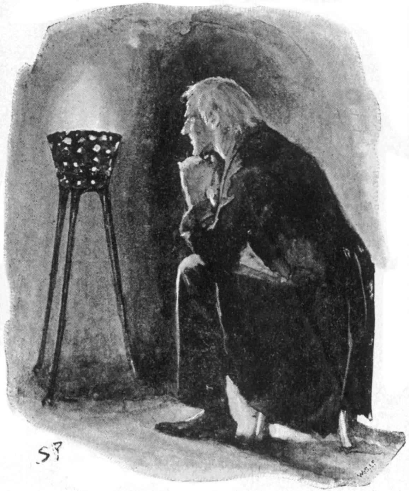

一张三脚木凳上坐一个瘦长个老头。

我往屋里走，一个面无血色的马来人赶忙迎上来，向我递烟枪、烟土，指引我到一张空榻上去。

“谢谢，我一会儿就走，”我说，“有个朋友在这儿，艾萨·惠特尼先生，我有话找他说。”

右首有人身子一动，向我招呼。暗淡的灯光下一看，正是惠特尼，脸色灰白，形容枯槁，蓬头垢面，圆睁双眼瞪着我。

“哟，是华生！”他说，瞧他一见我的反应，样子既可怜又可鄙，他的每根神经都绷紧着，“华生，几点了？”

“快十一点了。”

“是几号啦？”

“六月十九号，星期五。”

“老天爷！我还以为是星期三呢。是吗，星期三吧，你唬弄小孩子不是？”他把脸埋入双臂，发出尖声呜咽。

“我告诉你，今天是星期五，干吗骗你！你太太等你都等了两天啦，你该知羞愧吧！”

“我知，我知。不过你别搞错了，华生，我，我来这儿才不过几个钟头嘛。三锅烟，四锅烟——记不得多少锅。得，跟你回家，我不能叫凯特吓着了——可怜的小凯特。搀我一把，叫了马车吧？”

“叫了，外边等着呢。”

“那，那就走。可我得欠账了，看看我欠了多少账，华生，我一点力气也没有，自己都动不了了。”

我从两边躺满人的狭窄过道走过去，敛气屏息，不去闻那令人麻醉、令我作呕的烟气，在四处寻找掌柜。当我走过炭火旁那个瘦长个子，只觉得衣服下摆猛地给扯了一下，听见一个声音低低对我说，“走过了回头看看我。”这话清清楚楚传进我耳朵。我低头一看，分明是身旁这个老头儿说的，可是瞧瞧他跟刚才没有两样，坐那儿不动声色。他精瘦，满脸皱纹，老年佝偻，两膝中间夹一支烟枪，好像两手无力拿不住任它掉着似的。我向前走过两步，回头来朝他望，一看才大吃一惊，差一点要失声呼叫，好不容易才克制住自己。他转过背去，脸朝我，这样除了我，别人都看不见。他一下子完全变了样，脸上皱纹消失了，呆滞的两眼变得炯炯有神。这个炭火旁坐着瞧我惊愕不已、他却自顾咧嘴笑的，不是别人，竟是歇洛克·福尔摩斯。他暗暗示意叫我靠近，随即侧过脸，再半对着众人，马上又显出一副哆哆嗦嗦、嘟嘟囔囔的老烟鬼腔调。

“福尔摩斯！”我悄声说，“你怎么下烟馆了？”

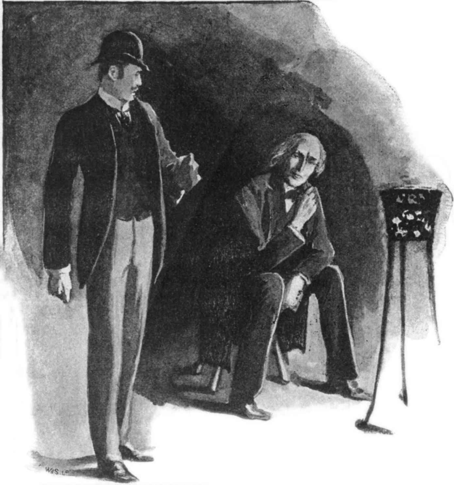

“福尔摩斯！”我悄声说，“你怎么下烟馆了？”

“低声点，”他答道，“我耳朵灵着呢，不聋。把你的烟鬼朋友支走，我这儿有话同你讲。”

“外边有马车。”

“让他上车回家就好。你放心吧，他出不了事，他已经死狗一条，半路不会再走邪门。你顺带叫马车夫捎个便条给夫人，就说你和我搭伴有点事。你先外边等一下，我五分钟就出来。”

福尔摩斯有什么要求，是难以拒绝的，因为他不管提什么要求，都是事情绝对明确，态度极端诚恳。我也觉得，只要把惠特尼一送上马车，我的使命实际上也告完成。这事完了以后，我就可以腾出手来与我的朋友一道投入再一次猎奇探险。这在他是不可或缺的生活内容，在我也是求之不得的机会。

我花一两分钟随即写好一张便条，再给惠特尼付掉烟账，就领他出屋登上马车，目送马车驶去，消失在黑暗之中。一会儿，一个老态龙钟的身影从烟馆里出来，这样，我就同福尔摩斯一起走到街上。他弯腰曲背，步履蹒跚，走过了两条街以后，眼向周围一扫，便呼地挺直了身，爆发出尽兴的笑声。

“我猜你呀，华生，”他说，“你一定在想，我注射点可卡因这类小玩意儿，从你医学角度看尚可容忍，可是这还不算，竟然又染上鸦片了。”

“发现你到这种地方，我当然吃惊不小。”

“可是，不比我发现你也到那里更感意外。”

“我是来找朋友。”

“而我是来找敌人。”

“敌人？”

“是的，一个夙敌，或者不妨说，我是他的天敌。简单讲，华生，我正在侦破一桩奇案，指望在这批烟鬼的胡言乱语中听到一点线索，这我以前也做过。我要是给烟窝里的人认出来，那顷刻之间命就不保。这烟窝我以前也利用过，自有我的打算。开这烟馆的，那个印度流氓，赌咒发誓要找我报仇算账。保罗码头那边拐角上有幢房子，房子后面是一道暗门，那里可有故事，月黑之夜，总有人从这扇门给打发掉呢。”

“什么！你不是说死人？”

“唉，正是，害人性命，华生。烟馆是杀人无数，你只要在每个倒霉鬼身上捞得一千英镑，你可就成大富翁了。沿河谋财害命的，数这个地段最猖獗。恐怕那个内维尔·圣克莱厄就是到这里进得去了出不来了。我们的圈套也就设在此地。”他伸起两根指头在牙齿间打一个呼哨——这是暗号，从远处回过来同样一声哨音，接着就听到车轮辘辘，马蹄嘚嘚。

“华生，”福尔摩斯正说话间，一辆高轩单匹马拉的双轮马车从黑暗中驶出，两边车灯射出两道淡黄灯光，“你愿意和我一起去吗？”

“就看对你是否有点帮助。”

“噢，可靠的朋友让我终身获益，为我记录事迹更属难得。我在雪松苑的屋子，有两张床。”

“雪松苑？”

“对，那是圣克莱厄先生的房子，当我在侦查案子时，就借宿在那里。”

“是在什么地方？”

“在肯特郡，靠近李镇，马车要赶七英里路。”

“我还一点都不清楚情况。”

“现在不清楚，马上就会让你清楚。上车来吧！好，就这样，约翰，没你事了，这儿给你半克朗，明天十一点左右等着我。好，我来，你松手吧，再见！”

他轻轻抽马一鞭子，马车开始向前奔驰，经过一条又一条幽暗无人的街道。尔后，路面渐渐宽阔，最后飞驰过一座两侧是栏杆的大桥，桥下黑沉沉的河水，缓缓流淌。前面望去，又见黑压压一大片房屋。黑夜宁静，只有巡警沉重而有节奏的脚步声，偶尔还有一些吃喝玩乐的夜游神在归途中哼几声歌曲、大呼小叫。

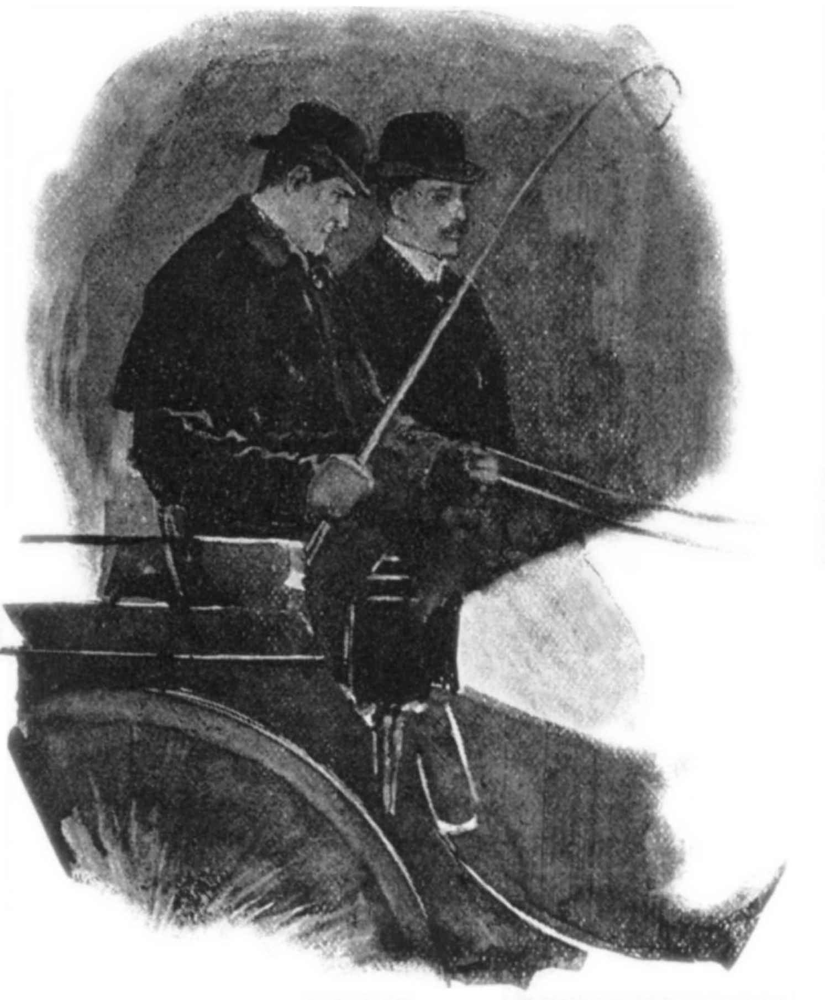

他轻轻抽马一鞭子，马车开始向前奔驰。

天上碎云浮动，云间闪烁着伶仃星光。福尔摩斯稳稳地驾车，脑袋低垂胸前，一副陷于沉思的姿态。我坐在他身边，心里纳闷这是桩什么样的奇案竟如此令他费力耗神，但又不敢贸然打断他的思绪。我们驱车走出了几英里，来到郊外的别墅区。这时他才回过神来，耸耸肩膀，点起了烟斗，那副得意的神态，说明他多么乐此不疲。

“你能保持缄默，真是了不起的品质，华生，”他说，“有这样的伙伴实在难能可贵。以我之见，能与人交谈是很重要的，因为我自己的想法未必十全十美。我在发愁，看见那位年轻可爱的小女人出门来迎接，该怎么对她讲。”

“你别忘了我还一无所知呢。”

“到李镇之前，尚有时间把本案向你介绍。事情看来简单至极，但是，说到底，怎么进行还没有头绪。线索很多，确实是，可就是理不出一个线头。现在我把案情简单扼要给你讲一讲。你，华生，说不定能让我黑暗中看见明灯。”

“既然如此，那就请讲。”

“几年以前——确切点说，一八八四年五月——有一位名叫内维尔·圣克莱厄的绅士来到李镇。此人显然钱囊丰满，他买下一幢大别墅，把庭园收拾得非常漂亮，各方面生活得很是有模有样，不久同远邻近舍都交上了朋友。一八八七年娶当地一个酿酒商的女儿为妻，婚后生下两个孩子。他没有职业，但在几家公司里有股份。他有规矩，早晨进城，每晚在坎农街乘五点十四分的车回家。圣克莱厄先生三十七岁年纪，无不良习惯，在家是个好丈夫、好爸爸，对外与人为善、与世无争。还要补充一点，目前他的全部债务，据我们查实，总共八十八镑十先令，但是在首都郡府银行有固定存款二百二十镑，所以认为他有财务问题而生是非，证据不足。

“上星期一，圣克莱厄先生去城里比平时要早，临走前说有两桩重要事情要办一办，还要给小儿子带回一盒红积木。说也真巧，也是这一天，他刚出门不久，妻子收到一封电报，电报上说有一只贵重物品小包裹——她一直在盼等这个包裹——已经到了阿伯丁航运公司营业所待领。你知道，这家公司的营业所，你如果熟悉伦敦街道，正是在弗雷斯诺街。这条街有一条岔道通向天鹅闸北巷，就是你今晚见到我的那个地方。圣克莱厄太太吃过午饭，动身进城，顺便买点东西，去了航运公司营业所，领取她的包裹，在四点三十五分走过天鹅闸北巷，往回向车站走。这个过程你听明白了？”

“很明白。”

“你记得吧，星期一这天特别热，圣克莱厄太太慢慢走，前后看看有没有马车好乘。她走这种穷街，周围那个样子叫她感到讨厌。就在她走到天鹅闸北巷这当口，突然听见一声叫唤，也好像是哭喊。她朝声音望去，一个三层楼的窗口，竟是她的丈夫，好像探头朝下望着她，还看到丈夫向她招了招手，吓得她浑身冰凉。那个窗是开着的，她丈夫的脸看得很清楚，没看错。她说他激动的样子很可怕，拚命向她挥手，但一刹那人又不见了，好像他身后有厉害的人把他往回猛摁了下去似的。还有一点很奇怪，她的眼睛很尖很灵，只一闪就看清她丈夫的衣服，是他进城穿的那件黑外套，可奇怪的是没见硬领，也没系领带。

“她心想丈夫肯定出什么事了，就顺台阶往下跑——这幢房子不是别处，正是那烟馆，今晚上你碰上我的那个地方——闯过前屋，还要上楼梯到二楼，在楼梯口，撞到那个印度人，就是我向你说起的那个印度流氓。他上前一把将她推回来，旁边还有个丹麦人，一个帮手，上来一起把她赶到街上。她又是急又是怕，都快疯了，在巷子里跑。不幸之中也真是万幸，在弗雷斯诺街头，遇上了几个巡捕，还有一个巡官，值班巡逻走过此地。巡官和两个巡捕陪着她再回来，不管烟窝老板如何阻拦，几个人上了那个房间，刚才发现圣克莱厄先生的房间。可是不见她丈夫，整个楼上没人，只有一个瘸子，又丑恶又邋遢，好像以此为家。瘸子和印度流氓一同赌咒发誓，一口咬定说这临街前屋一下午根本没旁人来过，这使得巡官无所适从，几乎怀疑起圣克莱厄太太自己眼花看错了。可是正在此刻，圣克莱厄太太突然大叫一声，扑向桌子上一个松木小盒，把盒盖打开，哗一下子倒出一堆儿童积木，这正是她丈夫答应要带回家的玩具。

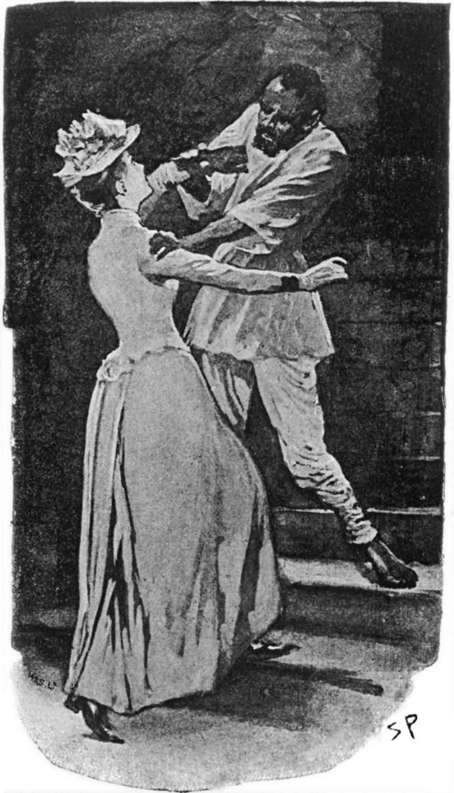

他上前一把将她推回来。

“这一发现，再看那个瘸子明显惊慌失措的样子，使巡官意识到事情严重了。所有房间都进行仔细搜查，结果表明此中确有凶险的案情。这间前房没有什么陈设，作起居室用，内侧通一间小卧室。卧室窗外正对着一段码头的背面，临窗到码头之间隔开一长条空地，退潮是干地，涨潮就淹水，水淹至少四英尺半深。卧室窗很宽，窗从下向上开启。经检查，窗台上有血迹，木地板上也看得出有几滴血。把前房一条帘子拉开，就看见都是内维尔·圣克莱厄先生的衣服，只缺他的外套。他的皮鞋、袜子、帽子，还有表也都在这儿。衣服上丝毫没有暴力的痕迹，除此以外再也没有内维尔·圣克莱厄先生的踪影。那么，一定是跳窗了，因为此外找不到别的出路。窗台上的血迹是凶兆。跳窗水路逃生几乎不可能，因为这幕悲剧发生时刻正是涨潮最高点。

“回头看看与本案直接牵连的几个歹徒，那个印度流氓是个罪恶昭彰的祖师爷。不过照圣克莱厄太太的说法，他那时正在楼梯口，相隔她发现丈夫在窗口只几秒钟时间，他充其量不过是这桩罪案的一个帮凶。印度流氓辩解说这个事情他简直完全莫名其妙，他声明自己对楼上房客休·布恩的所有情况一无所知，出现一位不知去向的先生的衣服，他根本不清楚到底是怎么回事。

“印度老板就是这点情况。现在来看瘸子，一看决非善类。他住在鸦片窝的三楼，显然是看见内维尔·圣克莱厄先生的最后一个人。他名叫休·布恩，这张丑脸，凡是常来伦敦市区的人都很熟悉。他乞讨为生，是个职业乞丐，为了逃避警察执法取缔，他装作是卖火柴小贩。在针线街下去不远，靠左后边，可能你也知道，墙根一个小角落，就是这里，是这个怪物的专有地盘。他每天在那儿盘腿一坐，几盒火柴，往膝头上一放，那副可怜相招人同情，施舍的小钱就像雨点一般，落进他身边地上那顶油腻的皮帽子。这个人我观察他多次，可是我在一旁都看呆了，没一会儿工夫，他居然大有丰厚收获。我也真想同他打打交道，摸摸他这项职业的底。他的相貌，你知道，奇丑无比，没人走过不朝他看看。一堆橘红色乱头发，一张土灰歪脸，一大块伤疤，叫人不忍看，脸一抽一扭，就把上嘴唇吊起往外翻；一对黑眼睛，盯着看人，同他的头发一比，一黑一红，真是反差强烈。这都使他在一帮普通的乞丐之中非同凡响。还有，他可机灵，过路人扔个把小钱，他都立即好话应答。这个人，现在我知道了，就住在烟馆里，还是看见那位我们要寻找的绅士的最后一个人。

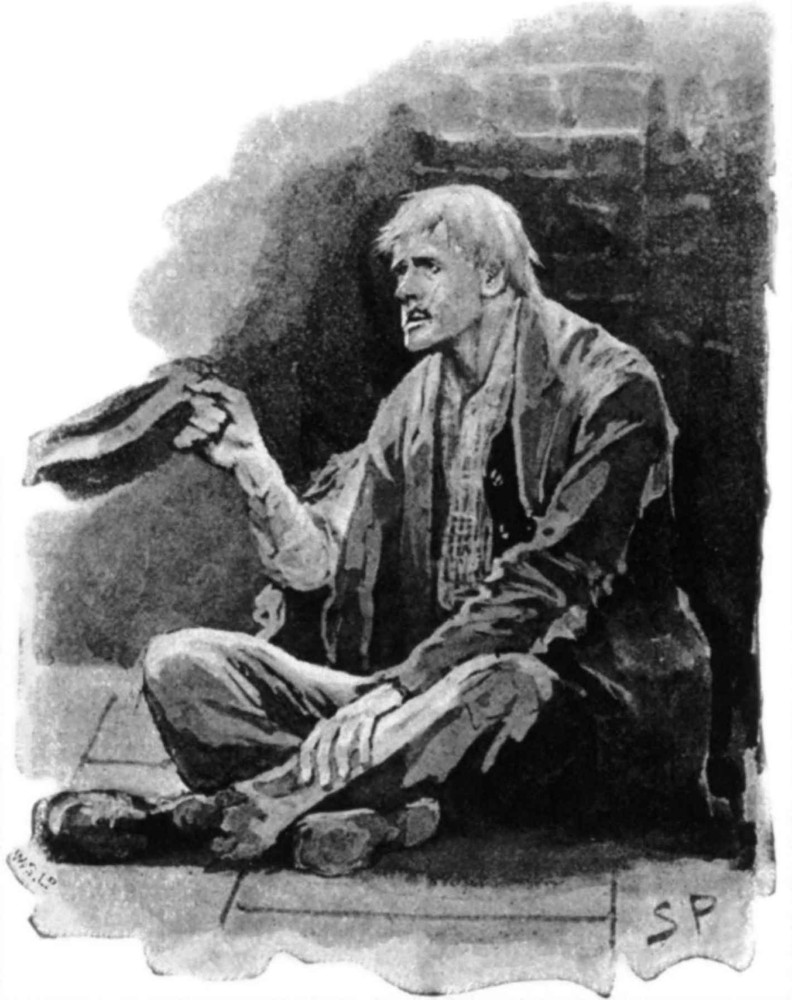

他乞讨为生，是个职业乞丐。

“可是，一个瘸子，”我说，“他单独一人能把个身强力壮的男人怎么样？”

“他走路确实一瘸一拐，不错，一个瘸子，可是在其他方面，看来也是身强力壮，不是个营养不良面黄肌瘦的干瘪乞丐。你有医学知识、医学经验，华生，应该知道，某个肢体有残缺，往往以别的肢体特别发达有力而得到补偿。”

“请继续往下讲。”

“圣克莱厄夫人一见窗台上的血就晕过去了，警察叫了马车护送她回家，她的在场对侦查没帮助了。巡官巴顿负责本案，他把房屋四周上下仔细察看一遍，但是并没发现有助破案的线索。没有将布恩当场逮捕是一个错误，使他有数分钟的时间和他的印度同伙互相串供。不过这个差错很快得到弥补，后来把他拘捕，进行搜查，但还是没有发现可以将他定罪的证据。虽然他衬衣右袖子上有血迹，这是事实，可是他指指他左手的无名指，近指甲处有割伤，辩解说就是这个血。还补充说，此前一会儿他去过窗前，那边看到的血迹，没问题，也是他手上的。他推得一干二净，压根儿没见有什么内维尔·圣克莱厄先生，还发誓说，屋里这堆衣服，他和警察一样才刚刚看见，不知是谁的。圣克莱厄太太硬说确实看见她丈夫在窗口，他说那太太不是有毛病就是做白日梦。不管他怎么大声抗议，他还是给带走，押解到警署。巡官仍旧留在现场，是想等潮水退掉，看看能否发现什么线索。

“果然，有了。原先想，那泥岸上恐怕会发现尸体，结果不是。发现的不是内维尔·圣克莱厄的人，而是内维尔·圣克莱厄的外套。潮水一退，衣服露在了那里，呵，你猜猜看，他们在衣服口袋里发现有什么？”

“我猜不出。”

“是的，我估计你是猜不出，每个口袋里都塞满了便士、半便士——四百二十一个便士，二百七十个半便士，怪不得衣服没给潮水卷走。可是人体，就不会是这样。在码头和房屋墙根之间的水流是很急的，很可能是沉甸甸的衣服沉底卷不走，那光身的人体，早随着河水漂走了。”

“可是，发现所有的衣服都在屋里，难道尸体光身子就穿一件外套？”

“不，先生，事情还是说得通的。假定这个人，布恩，把内维尔·圣克莱厄从窗口扔出去，这么做没人会看见。接下来怎么做？不用说，立刻就想到必须销毁衣服，不让暴露真情。他抓起衣服往外扔就得了，可是他转念，衣服浮水，不会沉没。他没时间了，听得圣克莱厄太太在楼下直嚷嚷要冲上来，还可能听到印度同谋向他喊街上有警察过来了。时间刻不容缓，他赶快把平时乞讨的钱，从密藏的地方拿出来，一把一把抓起硬币往衣袋里塞，装得足以让衣服沉没水底，就把衣服扔出去。扔掉一件，回头再用同样方法处理别的衣服，可是听到楼梯上脚步声上来，没时间了，只来得及把窗关上。”

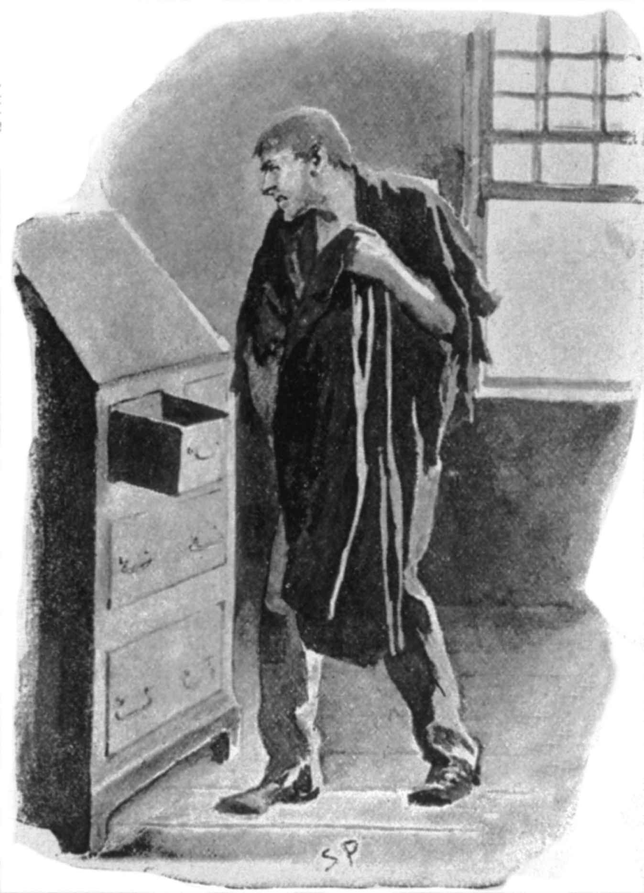

一把一把抓起硬币往衣袋里塞。

“听起来理由充分。”

“好，我们姑且把这当作尚能管用的假定，因为暂且并无更好的推论。这个布恩，我已经同你讲过，被捕押解警署，但毕竟拿不出东西来指证他以往犯有什么罪。多年来，只知他充其量是个职业乞丐，他的生活，似乎平安无事，行为无可指摘。眼前的事情，要解决的问题——内维尔·圣克莱厄来烟馆干什么，他出了什么事，现在人在哪里，他失踪同休·布恩有没有牵连——都还一无头绪。我得承认，在我经历的案子中，还找不出这样的例子，初看上去是如此简单，深入下去可是困难重重。”

福尔摩斯一五一十讲述这件奇案，我们已轻车进入郊区，把大城市连同稀落的房屋都一一抛诸后面，顺着两旁有树篱的乡间道路向前行。他正好讲完，我们也过了两个住户稀疏的村落，有几家的窗上还闪着微弱的灯光。

“这儿已进入李镇地界，”我的同伴说，“这一程短短的旅途，我们跨越了英格兰三个郡，从米德尔赛克斯郡出发，经过萨里郡的一角，最后来到肯特郡。树林里的灯光，看见吗？那就是雪松苑。灯火旁坐着一位妇女，我猜她正竖起耳朵听到了我们车子的马蹄声。”

“你为什么不在贝克街办这件案子呢？”我问。

“因为这个案子许多情况必须在这里调查。圣克莱厄太太盛情，安排两间房间给我专用。你尽管放心，她也必定竭诚欢迎我的朋友兼同事。不过，华生，要是没有她丈夫的消息，我真还不想见她。哟，到了。吁，吁！”

我们在一幢大别墅前停车，别墅外是大庭园，一个马夫跑上来牵住马首。我跟着福尔摩斯跳下车，踏上一条弯弯曲曲的砾石小车道走向屋子。我们刚到屋前，门就开了。门开处，站着一位金发娇小的女子，一身平纹薄纺浅色衣，领子、袖口镶一圈雪纺绸粉红轻纱边，背景的灯光映衬出窈窕身材。她一手扶门，一手半举，显示热切等待之状。她腰微倾，探头张望，露着急切的目光，双唇细开，意欲立刻提出询问的样子。

“哟，来啦？”她叫道，“来啦？”她接着看出我们是两个人，喊声中抱有希望，可是见我伙伴摇摇头、耸耸肩，便转而沉吟了。

“没有好消息？”

“没有。”

“有没有坏消息？”

“没有。”

“感谢上帝！快请进来吧。你们一定很累了，一整天忙到现在。”

“这是我的朋友，华生医生，好几个案子，全靠他帮助，我才能破案。这次机会也是巧，让我能把他请来一道进行调查。”

“很高兴见到你，”她说道，和我热烈握手，“如有招待不周，还望多多包涵，我们受到的打击实在太突然。”

“亲爱的夫人，”我说，“我是当兵出身，再说我生活上一向不在乎，大可不必同我讲客气，只要来这里对夫人、对我朋友能有点帮助，我就深感荣幸。”

“我说歇洛克·福尔摩斯先生，”夫人道，这时我们走进一间烛光明亮的餐室，餐桌上摆着冷盘晚餐，“我很想马上问你一两个问题，也请求你立刻给我回答。”

“当然可以，夫人。”

“不必顾虑我的情绪，我不会控制不住自己，不会歇斯底里，不会晕过去，我只希望听到你真正的看法，真正的。”

“关于哪方面？”

“你说句真心实意的话，你说内维尔还活着吗？”

福尔摩斯好像给这问题窘住了。“请照实说吧！”她重复道，站立在地毯上，两眼俯视直盯着他，福尔摩斯这时仰身坐在一把靠椅里。

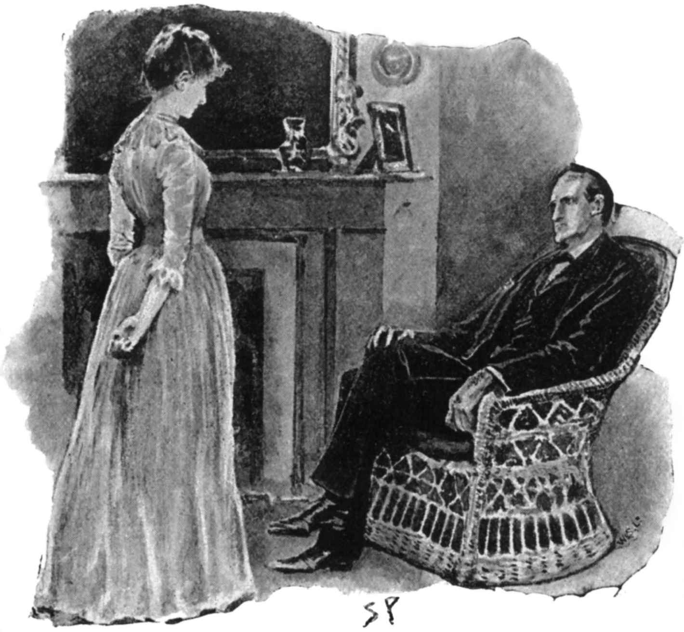

福尔摩斯这时仰身坐在一把靠椅里。

“那么，老实说，夫人，不在了。”

“你认为他已经死了？”

“是的。”

“给谋杀了？”

“还不能肯定，或许是。”

“是哪一天遇害的呢？”

“星期一。”

“那么，福尔摩斯先生，你怎么解释我今天刚收到他的来信呢？”

福尔摩斯好像触电似的从椅子上跳起来。

“什么？”他喊道。

“是的，今天，”夫人站着，略作微笑，手中高举着一片纸。

“我可以看吗？”

“当然可以。”

福尔摩斯迫不及待从她手里接过那封信，在桌上展平，挪过灯来，细细审视。我也已离座，跑到他背后看那封信。信封是粗纸，盖的是格雷夫桑德邮戳，日期是当天，或者说是前一天，因为此时已过午夜很久。

“写得很潦草，”福尔摩斯喃喃自语，“这肯定不是你丈夫的亲笔信，夫人。”

“不是，可是里边是他写的。”

“我看，写信封的人不清楚寄往哪里，是问清楚了再写的地址。”

“你怎么知道呢？”

“姓名，你看，是深黑墨水，写好以后自行干掉。其余字是灰墨色，说明用了吸墨水纸，吸干的。如果是一落手写成，再用吸墨水纸，就不会出现深黑墨水的字迹。写信封的人写好姓名，停顿了下来，过一会儿再写的地址，这个情况，只能说明他不熟悉地址。这当然不过是一点点小事，但小虽小，可没有比这更重要的了。现在让我们来看信纸，啊！信里还附有东西！”

“有，是一只戒指，图章戒。”

“你能确定是你丈夫的亲笔？”

“这是他的一种笔迹。”

“一种？”

“他匆忙写字，就是这种笔迹，和他平时正常的笔迹不一样，我完全认得出来。”

最最亲爱的，不要担心害怕，一切都会好起来的。犯下一个大错，要费点时间加以纠正。请耐心等待。

内维尔

“是用铅笔写的，纸是一本书上撕下的扉页，八开本的书，没有水纹。哦呵！今天从格雷夫桑德寄出，寄信人的大拇指很脏。哈！信封口用的是胶水。还有，我看错不了，封这封信的人，一直在嚼烟叶。这是你丈夫的亲笔，绝对没有问题，夫人对吗？”

“肯定没问题，这是内维尔的字。”

“还是今天从格雷夫桑德寄的。那好，圣克莱厄太太，我说乌云已散，尽管我还不敢太冒失，说危险已经完全过去。”

“他一定还活着，福尔摩斯先生。”

“除非伪造笔迹到了如此乱真，能把我们蒙过引上歧途。这戒指，无论怎样，说明不了问题，也可能是从他手上摘下来的嘛。”

“不会，不会，信是他亲自写的，绝对是他亲笔。”

“很好，不过也可能是星期一写的，今天才寄出。”

“这可能。”

“是这样的话，这中间还可能又发生很多事。”

“哦，你不要让我失掉信心呀，福尔摩斯先生，我知道他好端端没事。我们之间心心相印，心灵相通，他若有个三长两短，我一定有感受。就在那天，我看见他的那天，一早他在卧室里割破了手指，当时我在餐室，马上感到有事了，我就跑上楼去了。你想想，这点小事我都反应那么灵，难道对他生死大事，我倒没有反应了？”

“这我看得很多，确实知道女人的直觉印象很有价值，比男人分析推理出来的结论有价值。在这封信里，你一定有很强的感觉，可以确信你的看法没错，但是，如果你丈夫还活着，而且能够写信，他为什么要待在外面不回来呢？”

“我没法想象，想不出什么道理。”

“星期一出门的时候，没跟你说什么？”

“没有。”

“在天鹅闸北巷见到他，你大吃一惊？”

“非常吃惊。”

“窗是开着的？”

“开着。”

“那么他应该可以招呼你呀？”

“应该是的。”

“可是，我知道他没招呼，只怪叫一声。”

“是的。”

“是呼救，是不是？”

“我想是的，他挥了挥手。”

“那恐怕不过是吃惊的叫喊，看到了你出乎他意料之外，使他吃惊得擎起了双手，对吗？”

“有可能。”

“你认为他是给人拽回去的？”

“他忽然不见了。”

“他也可能是缩回去的呢，你没看见屋里还有旁人？”

“没有。就那个怪吓人的乞丐，承认自己在那里，还有个印度人，在楼梯口。”

“正是这样。你丈夫，据你亲眼见，穿的是自己那身衣裳？”

“可是没有硬领，没有领带，我看见的他是光脖子，看得清清楚楚的。”

“以前他同你讲起过天鹅闸北巷没有？”

“从来没有。”

“你注意他抽不抽鸦片？”

“从不抽鸦片。”

“谢谢你，圣克莱厄太太，这些都是重要问题，正是我希望完全弄清楚的。我们这就吃饭、休息，明天还得忙上一天。”

一间大房间，备两张床，供我们住。我很快上床躺下，一夜的奔波、紧张、忙碌，人已困极。可是福尔摩斯却是这样一个人，只要心中有问题尚未得到解决，他就会一连几天甚至整个星期不睡不休息，反复思考，再三分析，整合事实材料，从各个角度和观点加以审查，必须把事情摸透探明，或是自己确信证据还有不足，总之是个决不含糊的人。今天也是正如我所料，他准备通宵不眠。他脱下外套和背心，穿上一件宽大的蓝色睡衣，在房间里来来回回走着，又把他床上几个枕头连同沙发和椅子上的软垫统统收集起来，铺成一只东方沙发榻，盘腿坐在上面，拿一盎司烟草、一盒火柴往面前一放。幽暗的灯光下，我看见他坐在那儿，嘴里叼着那只欧石南旧烟斗，两眼茫然望向一方天花板，蓝烟盘旋飘升。他不出声，不动弹，光线照着他山鹰般的威仪面容。他坐他的，我则酣然入睡。当我“哎呀”一声一觉醒来，只见他还是这么坐着，夏日的太阳已照到室内。烟斗还咬在他嘴里，烟还在缭绕盘旋，整个房间烟气浓重弥漫，先前所见的一堆烟丝现在已荡然无存。

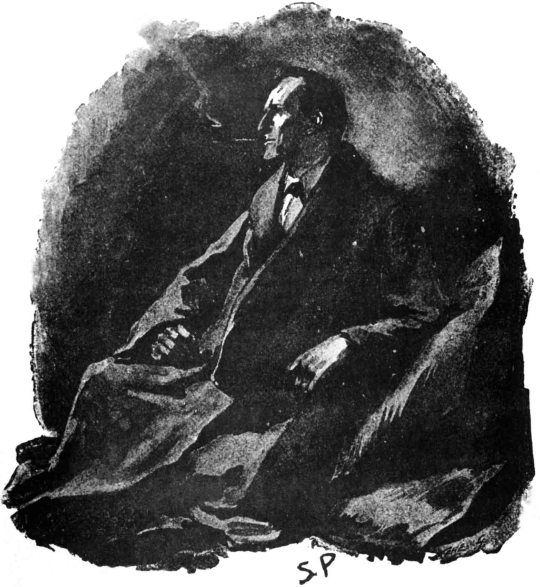

他坐在那儿，嘴里叼着烟斗。

“醒了，华生？”他问我。

“醒了。”

“趁早出猎如何？”

“行。”

“那就穿衣服。大家还没起床，我知道小马夫睡在哪儿，很快就可以套好马车。”他边说边笑得呵呵有声，两眼放光，看上去同昨夜那个冥思苦想的他已判若两人。

我穿上衣服，看了看表，怪不得大家都还没起床，这时才四点二十五分<a href="#part0049.xhtml_ch2"
id="part0049.xhtml_ch2-back">(2)</a>。我刚刚穿好衣服，福尔摩斯就回来说马夫已经在套车。

“我要验证一下我的推理。”他说着，拉上靴子，“我想，华生，站在你面前的，是全欧洲最笨的笨蛋，我活该被人从这儿一脚踹到查令十字街去！不过，现在我想我已经找到钥匙，可以开锁。”

“哪儿找到的钥匙？”我问，微笑着。

“在盥洗室里，”他答道。“噢，我在说正经的，不开玩笑，”他继续说，看着我一脸狐疑，“我刚才在盥洗室，把钥匙拿到了手，都放在我这格拉斯顿提箱<a href="#part0049.xhtml_ch3"
id="part0049.xhtml_ch3-back">(3)</a>里啦。走吧，伙计，我们就要看到，这把钥匙到底对不对锁。”

我们尽量放轻脚步走下楼梯，一出了屋，就沐浴在清朗的晨曦之中。套好的马车停靠路边，那个衣服尚未穿好的马夫等候在马首。我俩一起跳上车，顺着伦敦大道飞驰起来。几辆农村大车已启程上路，把蔬菜运进大都市去。两旁的别墅仍一片寂静，了无生气，宛如梦乡小城。

“这桩案子，有好几点不同寻常。”福尔摩斯说，轻轻一鞭催马疾驰，“我承认自己曾经好像鼹鼠瞎眼摸黑，学乖虽然稍迟了点，总比不学、不乖要好。”

马车穿过萨里沿途的街道，城里起早的人睡眼惺忪地在窗口张望。我们驶过滑铁卢桥，穿越泰晤士河，进入威灵顿大街，向右一个急转弯，就到了鲍街。福尔摩斯是警方都熟识的人，看守所门口的两个警员向他敬礼，一个警员挽住马头，另一个领我们进去。

“谁当班？”福尔摩斯问。

“布雷兹特里特警官，先生。”

“啊，布雷兹特里特，早安！”一个高大壮实的警官走下石板甬道，头戴鸭舌帽，身穿盘花纽夹克装。“我想和你先谈一谈，布雷兹特里特。”

“好的，福尔摩斯先生，请到我屋里来。”

一间小小的像办公室的屋子，桌上一大本登记簿，墙上显眼处安一架电话机。警官当桌一坐。

“愿为效劳，请说吧，福尔摩斯先生。”

“我是来调查乞丐休·布恩，此人被控和李镇的内维尔·圣克莱厄先生的失踪有关。”

“是的，他是在押候审的。”

“是的，我知道，人在这里？”

“关在单人牢房。”

“表现老实吗？”

“哦，一点也不捣乱，可是浑身脏臭得要命。”

“脏得很？”

“对。我们只好先叫他把手洗干净了。他那张脸黑得像补锅匠。嗯，等他案子一结，得按监规洗个澡。我想，你见了他，准会一样看法，需要洗个澡。”

“我得要见见他。”

“要见他？没问题。跟我来，手提箱放这儿好了。”

“不，我必须随身带着。”

“那好，请随我这边走。”他领我们走过甬道，打开一道上闩的门，再由盘旋阶梯往下，领进一条白墙廊道，两边都是牢门。

“右手第三个门，”警官说，“就这儿！”他轻轻拉开牢门上的小窗口，往里看。

“睡着呢，”他说，“你自己看吧。”

我们两个一起从小格窗口向里望，人犯正好脸朝外躺卧，睡得很沉，鼾声慢而重。他中等个头，穿着粗陋，同他的行当相配称。一件破烂外套，破洞破缝露出染色的衬衫，正像警官所讲，肮脏不堪。可是脸上污垢并未稍有掩盖他的一张丑脸，右脸一条宽鞭痕旧伤疤从眼睑到下巴，伤疤一扭动，会把上唇翻起，三颗牙齿外露，像一头狼在张嘴不停地嗥叫。一头蓬乱的红发低低压盖到前额和两眼。

“他长得也真叫绝了，是不是？”警官说。

“确实该给他洗一洗，”福尔摩斯说，“我想了个主意，来给他洗，还正好带了几样清洗工具呢。”他说着就打开格莱斯通手提箱，取出一块大大的洗澡海绵，大得让我吃惊。

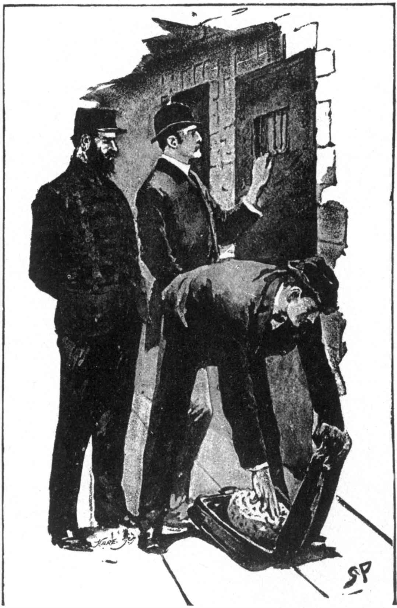

取出一块大大的洗澡海绵。

“呵！呵！你真会开玩笑。”警官格格地笑道。

“现在，麻烦你悄悄把门打开，我们立刻能还他个体面相貌。”

“行，有什么不好，”警官说，“这副尊容又不能算是鲍街看守所的荣誉，我这话是不是？”他把钥匙轻轻插入锁孔，开门，我们蹑手蹑脚走进监房。睡着的家伙翻了个半身，重又沉沉地睡去。福尔摩斯弯腰就着水罐蘸湿了海绵，忽然猛使劲往人犯脸上这么横一下竖一下，迅速擦了两下。

“让我来给你们介绍，”他高声大叫，“这位是内维尔·圣克莱厄先生，家住肯特郡李镇。”

这个精彩场面我有生以来还从未见过，这个人的一层脸皮，就像剥树皮似的给海绵撕了下来，脏兮兮的棕褐色随之消失！那纵贯半面的骇人疤痕，那作成一脸苦笑的歪唇也不见了！再一把一拎，那乱糟糟的红头发被揪掉了！看吧，坐在床上的，是一个脸色苍白、相貌沮丧、倒是容貌秀气的男人，一头黑发，皮肤光洁。他揉揉眼睛，睡眼惺忪不知所措地打量着周围，接着完全明白自己真相败露，不由得凄厉地尖叫一声，一头栽向床上把脸藏进枕头。

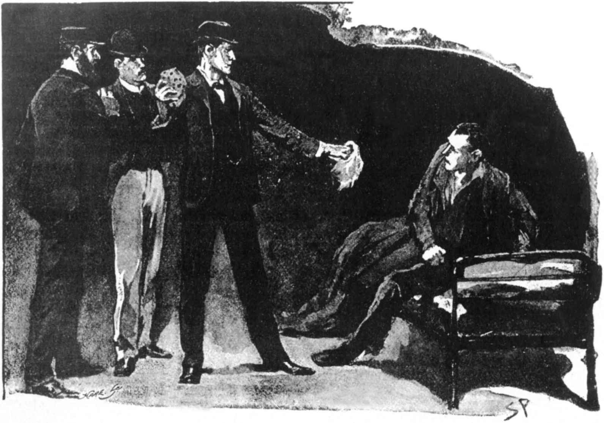

不由得凄厉地尖叫一声。

“老天哪！”警官叫道，“一点不假，正是失踪的人，我看过照片，认得出来。”

人犯翻身坐起，摆出一副横字当头无所谓的架势。“既然如此，”他说，“倒要请问，我犯什么罪了？”

“犯有杀害一位先生，叫内维尔·圣——哦，得啦，控告不了你有罪，要么，也行，就算自杀未遂案，”警官说着，咧嘴笑了，“啊哈，我警察干了二十七年，这一回算有香饽饽蛋糕吃了，捞到个奖励了吧！”

“要说我就是内维尔·圣克莱厄先生，那么毋庸置疑，我根本没有犯法，但是，我在此受到了非法拘禁！”

“不犯法，可犯的同样是罪孽，”福尔摩斯说，“你这样做，就不想想对不起你的妻子！”

“对不起妻子，还是最对不起孩子，”人犯发出了呻吟声，“上帝饶恕我，我不要他们为父亲蒙受羞耻。我的上帝！传出去要丢尽了脸面呀！我怎么办哪？”

福尔摩斯坐到他床边，和蔼地拍拍他肩。

“如果你要让法庭来受理本案，”他说道，“当然就势必要公之于众。另一方面，只要你让警察当局相信此案根本没有必要进行起诉，那么，我想，也就没有任何必要把本案详细情节登到报纸上去。布雷兹特里特警官在此，我相信，会把你同我们讲的情况一一记录在案，上报有关当局，本案也就根本不必诉诸法庭了。”

“上帝保佑！”人犯激动异常地叫道，“我宁可坐牢，甚至处决，只要不把我这件遭人耻笑的秘密，成为家丑传给后代。

“了解我这件事的人，只有你们。我父亲是切斯特菲尔德的小学校长，我在那里受过良好的教育。年轻时候我旅行过好多地方，喜欢演戏，后来在伦敦一家晚报当记者。有一天，编辑想要一组报道，反映大都市中乞丐生活情况的稿件，我自告奋勇来写这组稿件。这就是开端，干起了这个事，起初不过业余客串做做，作为行乞体验，采访点事实好写文章。我当过演员，熟悉化装技术，我的化装技巧在舞台同行中还有点名气，这时候就有了用武之地。我用油彩涂了脸，尽量画出一副可怜相，又用一小条肉色胶带贴在脸上，装成是伤疤，逼真得看不出两样，半边的嘴唇也变歪扭了。再戴上红头发，穿衣服也装成要饭样子。选个闹市口，作为固定地方，表面上卖火柴，实际上当乞丐。就只七个小时，晚上回家一看，大吃一惊，竟讨得二十六先令四便士。

“我写了报道，这事就没再想它。过了些时候，我为朋友背书担保一张票据，谁知竟招来了一张传票，要我赔偿二十五英镑。我手头哪来钱，急得走投无路。突然一想，有了。我请求债主宽限半个月，向雇主请一个时期假，化装一番到闹市口去下海行此道。七天下来，就有钱付清了这笔债。

“哦，你们想象一下，当我尝到了甜头，只要脸上抹点油彩，帽子往地上一放，坐那儿不用动，这么一天就能进账两英镑，哪还会愿意去辛辛苦苦工作，一个星期也才挣这么一点钱！要自尊心还是要钱，我思想斗争了好一阵子。最后还是钱占了上风。我抛弃了记者的工作，一天又一天地坐在我第一次选定的角落里，用我一张鬼脸赢得人们的恻隐可怜，讨得铜板塞满口袋。只有一个人知道我的秘密，就是天鹅闸北巷那土烟窝的老板，他那里一直是我的落脚点、寄宿地。每天早上一个邋遢乞丐出来，晚上回复到我的本来面目，一个衣冠楚楚浪荡公子。这个印度人，他贪我付他高房租，所以我有数，他会替我保守秘密。

“这么着，很快，我积攒的钱相当可观了。我并不是说，伦敦街上随便哪个乞丐一年都能挣七百英镑——这个数还及不上我的平均收入——我的优势，在于我有化装本事，别人没有，再就是舌巧嘴甜，千恩万谢善于应对。这套功夫越练越精，我在这城里，谁见谁可怜，是个专业角色专业户了。每天进钱如流水，便士外有时还有银元，哪天不到两英镑，那就算是倒运了。

“我越有钱，就越贪心。在乡下置了房子，后来结婚成家，没有人怀疑我没有正当职业。我的爱妻只知道我在城里做事，究竟做什么，她不过问。

“上星期一，活计结束后，在烟馆房里卸装，偶尔向窗外看了看，不料看到了我妻子，正站在街上，两眼跟我打了个照面。我一下子大惊失色，吓得叫了起来，连忙拿手臂遮住脸，缩回身找那个印度老板，只有他能知情帮忙。我关照他千万不能让任何人上来。我随后就听到楼下妻子的声音，我知道她上不了楼。我赶紧脱掉衣服，换上一身乞丐装束，涂点颜料，戴上假发，即使是老婆的眼睛也别想识得破我。突然又想到，弄不好要搜房间，这堆衣服会暴露自己，我慌忙把窗子推开。手指上的伤口，是早晨在家的卧室里就割破的，这时又碰出了血。我顾不得，抓起外套，拉过一只皮袋，里面都装的要饭要来的钱，一把一把抓起铜板往衣袋里塞，把塞得沉甸甸的外套往窗外扔，扔进泰晤士河沉入水中不见了。别的衣服也要准备这样处理掉，但是正在这时候，警察冲上楼来。几分钟后，我得承认还算幸运，果然没给认出我是内维尔·圣克莱厄先生，反而把我当作谋杀他的嫌疑犯抓走。我松了一口气。

“我想，已经没有别的什么需要我来解释。我只有把伪装一直保持，脸脏也只好让它脏，忍着点。想到妻子一定要急死了，我就摘下戒指，瞅个空当，警察不注意我的时候，托给印度人，还匆匆写张条子，告诉妻子不要担心。”

“信昨天才寄到你妻子手里。”福尔摩斯说。

“我的老天！这一星期真够她熬的！”

“警察把印度人也看住了，”布雷兹特里特警官说，“事情很清楚，这信他自己是寄不出去的，就把信又再转托给了别人，水手顾客什么的，也许那家伙忘了，好几天之后才寄出。”

“是这么回事，”福尔摩斯说，点点头表示同意，“我相信是这样。那么你行乞从来不受控告？”

“有，好多次，可是罚款对我又能怎么样？”

“好了，到此结束，”布雷兹特里特说，“要警察当局不把这事在外边传播，必须从此不再存在休·布恩。”

“我已经郑重发过誓，一定会遵守。”

“既然这样，事情就不予追究，但是你要是再犯，那就给你兜底翻。我得承认，福尔摩斯先生，这案子我们全靠你大力协助。我希望知道你是怎么得出结论的？”

“结论嘛，”福尔摩斯说道，“坐在五个枕头上，抽掉一盎司烟丝，这么就得出来了。我说，华生，我们该坐车回贝克街，赶上吃早饭吧！”

（1891年）

————————————————————

<a href="#part0049.xhtml_ch1-back" id="part0049.xhtml_ch1">(1)</a> 德·昆西（De
Quincey，Thomas，1785—1859），英国散文家、评论家，吸鸦片成瘾，著有《一个英国隐君子的自白》。

<a href="#part0049.xhtml_ch2-back" id="part0049.xhtml_ch2">(2)</a> 伦敦地处北纬51°以上，夏时日出很早。

<a href="#part0049.xhtml_ch3-back" id="part0049.xhtml_ch3">(3)</a> 格拉斯顿提箱（Gladstone
bag），一种箱脊中缝铰链开启的手提旅行箱，因英国首相格拉斯顿（William
Ewart Gladstone，1809—1898）惯用，故名。

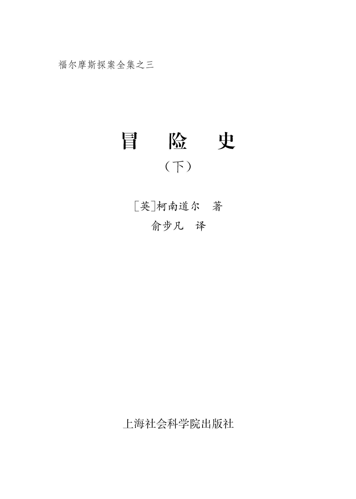

目录\
（下册）
========

[蓝宝石案](#part0052.xhtml)

[花彩绷带](#part0053.xhtml)

[工程师拇指案](#part0054.xhtml)

[单身贵族](#part0055.xhtml)

[翠玉王冠](#part0056.xhtml)

[紫叶山毛榉林迷案](#part0057.xhtml)

[返回目录](#part0041.xhtml)

# 蓝宝石案

圣诞节后的第二天早晨，我去拜访我的朋友歇洛克·福尔摩斯，向他表示节日祝贺。他穿一件紫色睡袍，懒洋洋地靠在长沙发上，右边手够得到的地方搁着一个烟斗架，近手处是一叠折皱了的晨报，显然刚才翻阅过。沙发旁有一把木椅子，椅背角上挂一顶又旧又脏的硬毡帽，好几处有了裂缝，已不能再戴了。一个放大镜，一把镊子，放在椅面上。看得出，这顶帽子这样子挂着，是为检查用的。

“你正忙着，”我说，“我恐怕打扰你了。”

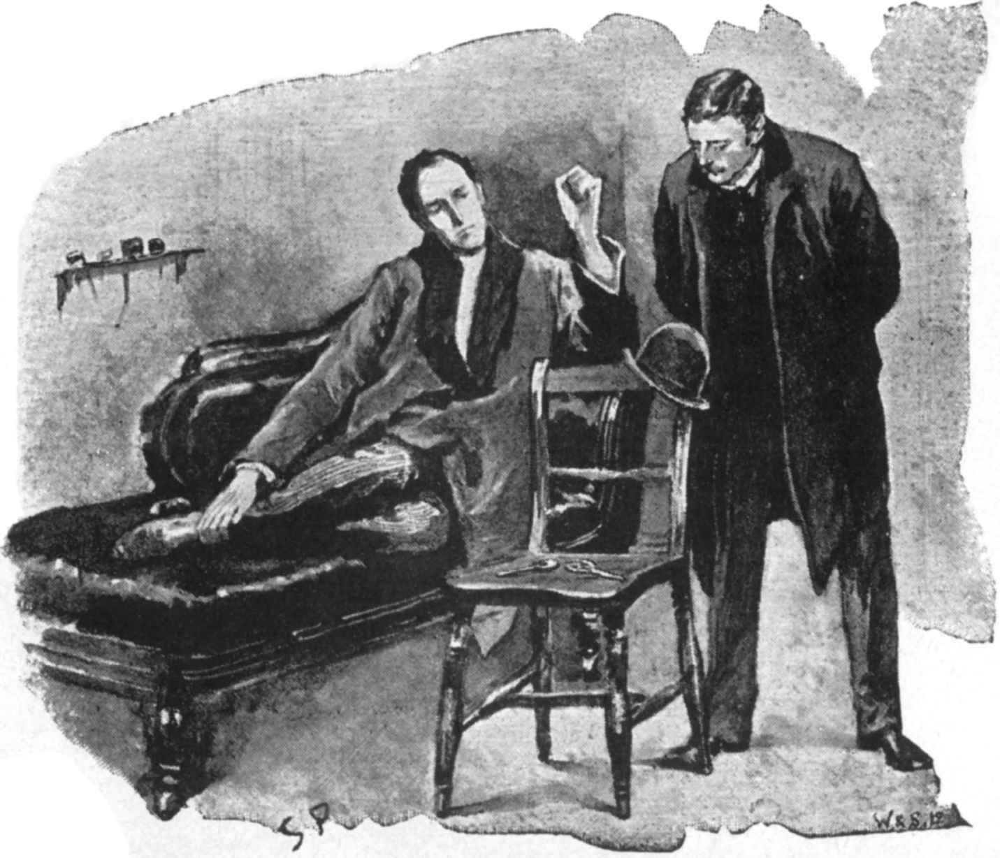

“你正忙着，我恐怕打扰你了。”

“一点也不，很高兴有朋友来，一起讨论我的推测。这东西看似一文不值，”——他跷出大拇指向破帽指指——“可是在这上面关联着一些问题，倒是并非全无乐趣，甚至不无教益。”

我在他的扶手椅上坐下，在劈啪作响的炉火前暖手。严寒已经来临，窗上结起了厚厚的冰花。“我猜，”我说道，“别看这顶帽子毫不起眼，说不定这上面有人命官司——它是线索，可以让你牵出线头，得以解开谜团，惩处罪犯。”

“不，不，不是犯罪，”福尔摩斯说着，笑起来，“小事一桩而已。我们有四百万人口挤在这区区几平方英里之中，难免你搡肘我使绊。这么拥挤不堪的人堆里，拳来脚去，可想而知什么事情都可能发生。耸人听闻有之，稀奇古怪不少，但未必全都是犯罪。我们碰到过这类事，早有经验了。”

“你这么一讲，倒也是，”我说，“最近我写的六个案子，作为辑录，有三个完全不属于司法上的犯罪刑案。”

“正是，没错。你是指，我试图取回艾琳·阿德勒的相片，还有玛丽·萨瑟兰小姐的奇案，还有丑面歪嘴行乞人的谜案。噢，眼前这件小事，毫无疑问，同样也不该归入犯罪类别。你认识彼得森吗，那个看门人？”

“认得。”

“这是属于他的战利品。”

“是他的帽子？”

“不，不，是他捡来的，帽子是谁的不知道。请你不要认为只不过是顶破帽，应该看成是一件测试智慧的试金石。首先要问这帽子的来历。帽子于圣诞节早晨到达，伴随物还有一只大肥鹅。这鹅，当然啦，这会儿正让彼得森在炉子上烤着呢。情况是这样的：圣诞早晨四点光景，彼得森，这人你也知道，非常忠厚老实，他参加过了一处小小庆祝会，回家去，走托特纳姆法院路。他前面走着一个人，借着煤气路灯灯光，看到这个人个头挺高，走路有点儿摇晃，肩上背一只白鹅。这个人走到古治街转角地方，遇上几个流氓争吵起来。一个流氓把他的帽子打落在地，他就抡起背鹅的棍子自卫。棍子举起来飞舞，不巧把身后一家商店的橱窗打碎。彼得森冲上去想帮助他免得他吃亏，可是那个人，见打破了玻璃橱窗心慌了，又看到有个穿警察制服模样的人冲他过来，竟扔下鹅，拔腿就跑，跑进托特纳姆法院路后面一条弯曲小巷不见了。几个流氓发现彼得森跑上来，也给吓跑了。这样，只能轮到他来打扫战场，这顶破帽，作为战利品归他捡得，尤其是这只圣诞鹅，呱呱叫呢。”

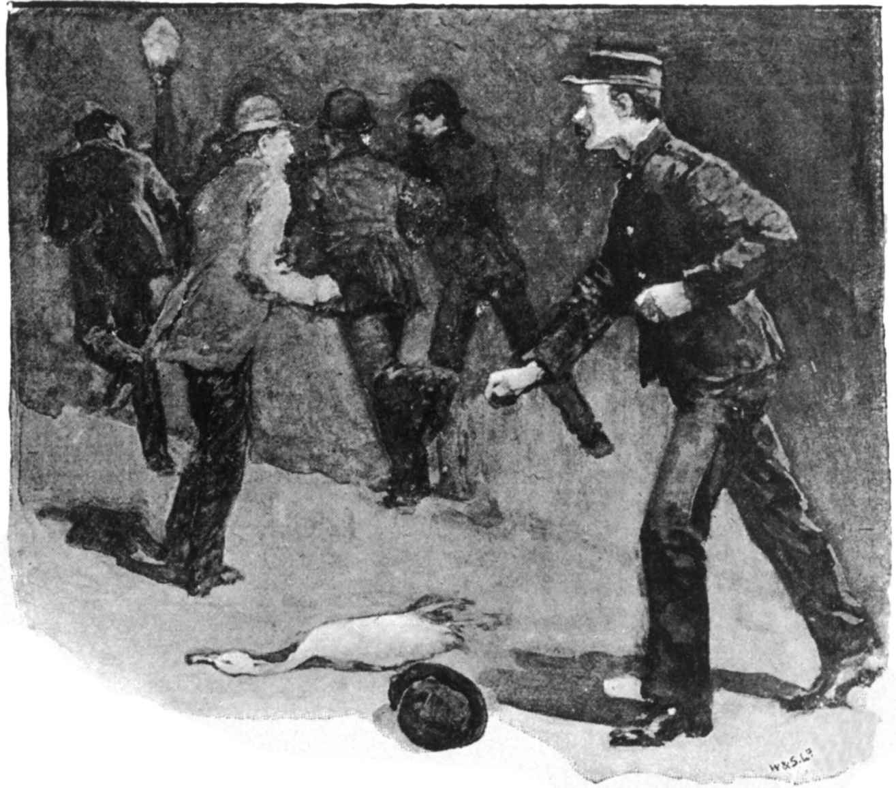

几个流氓给吓跑了。

“应该是物归原主吧？”

“我亲爱的伙计，归不了原主呀！没错，鹅的左脚上缚有小纸片，写‘送亨利·贝克夫人’，而帽子呢，衬里上也有姓名缩写‘H．B．’字样，这都没错，可是要知道，我们这个城市里姓贝克的人不知道有几千，姓名叫亨利·贝克的少说也有好几百，要讲失物归还原主，无异大海捞针，谈何容易。”

“那彼得森怎么办？”

“他把帽子和鹅在圣诞早晨都拿来给我，他知道哪怕最小的鸡毛蒜皮事我也感兴趣。鹅搁到今天早上，虽说天冷，也不宜放久，还是吃掉算了，没必要等什么了。彼得森这就拿走，去完成鹅的最终使命。这顶帽子，我继续留着。这就有了一位不曾谋面的先生，丢了帽子，也丢了圣诞美餐。”

“他有没有登寻物启事？”

“没有。”

“那么，有关这个人，你有些什么线索？”

“只能尽量作点推测。”

“从帽子上？”

“正是。”

“别开玩笑，这顶又破又旧的毡帽能推测什么？”

“给你放大镜，你懂我的方法。戴这么一顶帽子的人，情况如何，你能推测出一点什么来？”

我把这破东西拿在手里，随便翻翻看看。一顶极普通的黑色圆毡帽，都发硬了，已不能再戴。里子是红丝绸，早已掉色。没有制帽商的商标，不过正如福尔摩斯所讲，一边写有潦草的首字母“H．B．”。帽檐上穿有小孔，是便于穿橡皮带好戴稳帽子，但是已经没有了橡皮带。其他方面，有破裂，积满尘垢，多处斑斑污渍，几块褪了色的补丁，似乎是为了掩饰而用墨水涂黑，然而依旧是破帽一顶。

“我看不出什么来。”我说，把帽子交还给我的朋友。

“正好相反，华生，你能看出不少名堂，只是你没有从看到的现象中作出推论。你对自己作推论太没信心。”

“那请你说说看，你能从这顶帽子作出什么推论？”

他拿起帽子，以他特有的神情姿态凝视着、慎思着。“这帽子上能看出点名堂，当然不一定如所希望的那么多，”他说道，“有几点推论还是可以相当肯定，其他几点嘛，至少也有一定的把握。从帽子外观来看，此人脑子一定很发达。最近三年里，家境相当富裕，只是现在倒了运，经济拮据，境况凄惨。他过去很是足智多谋，现在大不如从前。随着家道中落，精神状态已趋消沉颓废，显示出沾染上不良习惯，无法自拔，很可能是酗酒。为此缘故，妻子已不再爱他。”

“我亲爱的福尔摩斯！”

“可是无论如何，他还能保持相当程度的自尊，”他继续道，并不理会我要打断他，“过的是久坐不动的生活，深居简出，全没有了运动锻炼。人已到中年，头发灰白。刚理过发没几天，头发上涂的是柠檬膏。这些都是从他帽子上推断出来的事实，比较明显。还有一点，顺便提及，可以完全肯定，他家里不装煤气。”

“你是在开玩笑了，福尔摩斯。”

“绝非笑话。我把结论都告诉你了，到了这个份上，你难道还看不出怎么个来龙去脉？”

“实不相瞒，愚笨如我，也得承认对你不敢苟同。比如说，怎么推断此人特别聪明？”

回答之前，福尔摩斯先把帽子往自己脑袋上一扣，帽子把他前额罩进，快压到鼻梁了。“这是一个体积容量问题，”他说，“一个人有如此大的脑壳，里头不见得空空如也吧！”

“那么家道中落，怎么讲？”

“这帽子有三年了。这种平檐卷边是那个年代的流行式，一顶一流质量的帽子，瞧这罗纹丝绸箍带，多高级的衬里。这个人，三年前买得起这么贵重的帽子，此后一直戴到现在，没能再换新款，那肯定是家道中落了吧。”

“好，这个够清楚了，没问题，但是很有心思又是精神颓废，怎么说呢？”

歇洛克·福尔摩斯笑了起来。“这就看出他有心思，”他说，一边手指按在穿帽带的孔眼上，“帽子有了这种孔眼决没有人要买。如果是这位顾客定做如此，那就充分说明他这个人有心眼儿，想到以后出门要防备风把帽子吹落。可是现在看到的，橡皮带没有了，也没心思重新穿上一条，足见他的心情已大不如前，不如从前用心了，说明他的意志正日益消沉。另一方面，他用墨水涂抹毡帽上的斑痕，想尽方法掩盖破落相，表明他还没有完全丧失自尊心。”

“放在你嘴里都有道理，倒是不错。”

“更进一层，已是人到中年，头发花白了。因为最近才理发，用过柠檬香膏，帽子衬里下边这地方，仔细看，就全都看得见。用放大镜，可以看到许多理发剪子剪下的细碎头发，都还黏着呢，还有着很浓的柠檬膏香味。这上面的帽灰，你看，不是灰沙，不是街上的尘土，而是屋子里的褐色毛绒灰尘，说明平常多数时间是挂在屋里不戴的。帽子里的潮湿斑点，清楚证明戴帽人很会出汗，据此判定，是个几乎没有运动锻炼的人。”

“可是他的妻子——你讲老婆不再爱他了。”

“这顶帽子，几个星期没有刷过。假如我看到你的帽子，亲爱的华生，积了几个星期的灰，我会担心，你也已经很是不幸，失去了你妻子的爱情。”

“他可能是个单身汉。”

“不会的，他把鹅带回家作为一片情意献给妻子，别忘了鹅腿上的纸片。”

“你什么都回答得头头是道，但是怎么推断他家里没接上煤气呢？”

“一滴蜡烛油，即使两滴蜡浊油，说是偶然吧，但是我看到至少是五滴。那就是说，这个人常常点蜡烛，我作如此猜想大概不大会错——夜里上楼，一手拿帽子，一手拿的蜡烛，在淌烛泪。无论如何，总不会煤气灯滴蜡烛油吧。这么讲你满意吗？”

“好，足智多谋，”我说道，笑起来，“你刚才既然说没有犯罪事实，也没有造成危害，不过是丢了一只鹅，这么分析推理也就都是白费劲。”

歇洛克·福尔摩斯正要张口作答，房门忽然推开，看门人彼得森冲了进来，一张脸惊疑地涨得通红。

“这鹅，福尔摩斯先生！这鹅，怪事！”他喘着气。

“怎么？鹅怎么啦？活过来了？打厨房窗子振翅高飞了？”福尔摩斯在沙发上扭过身子来，好把这个人激动的面孔看得更清楚。

“看这儿，先生！你瞧这是什么？我老婆翻鹅肫翻出来的。”他伸出手，一摊开手掌，只见掌心之中，一粒熠熠生辉的蓝色宝石，比蚕豆略小，晶莹剔透，宝光四射，犹如电光在他的手心里闪闪发亮。

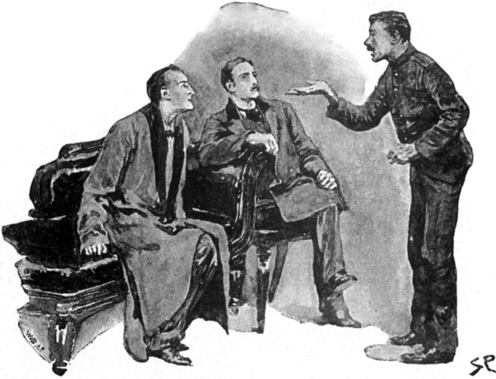

一粒蓝色宝石犹如电光在他的手心里闪闪发亮。

福尔摩斯一声呼哨，坐了起来。“哇哈，彼得森！”他说，“稀世珍宝啊！你知道你得着什么了？”

“钻石，是吗？宝石。可以割玻璃，就叫作那个削铁如泥的咯。”

“这不是一般宝石，这可就是那颗宝石了，有来历。”

“就是莫卡伯爵夫人那颗蓝宝石吧？”我脱口而出。

“正是那颗。我正好了解到大小形状，最近每天都看《泰晤士报》，有关这颗宝石的启事，所以一清二楚。那绝对是无价之宝，价值难以估计，仅仅悬赏报酬就是一千英镑，肯定还不到这颗蓝宝石市价的二十分之一。”

“一千英镑！噢，上帝呀！”看门人扑通一下跌坐在椅子上，向着我们两人目瞪口呆地看来看去。

“那不过是悬赏。据我了解，考虑到感情因素等等背景情况，实际上伯爵夫人宁愿拿出一半财产赎回这颗宝石也在所不惜。”

“我没记错的话，这颗宝石丢失在世界大旅馆。”我说。

“没错，十二月二十二日，才五天前，一名叫约翰·霍纳的水管工人，被指控窃取夫人首饰匣里这颗宝石，因为罪证确凿，案子已经提交巡回法庭。这里有案情记载，不妨看看。”福尔摩斯翻检一摞报纸，看看报头的日期，抽出一张，折一折，念了下面一段：

“世界大旅馆宝石盗窃案。约翰·霍纳，二十六岁，管子工，因于二十二日窃取莫卡伯爵夫人首饰匣中一颗贵重蓝宝石，被起诉至法庭。旅馆侍者领班詹姆斯·赖德就此案作如下证词：窃案发生当天，由他带领约翰·霍纳到莫卡伯爵夫人化妆室焊接已松动之第二根壁炉栅。他和霍纳一起逗留片刻，旋即被召走。及至重返该室时，发现霍纳已离去而梳妆台遭人撬开，一只摩洛哥皮首饰匣置于梳妆台上，已空无一物，事后方知此即伯爵夫人之首饰匣。赖德即刻报警，霍纳于当晚被捕，但搜其身及居屋皆未获已失之宝石。伯爵夫人之侍女凯瑟琳·丘萨克亦宣称作证，听见赖德惊呼发现盗窃，随即冲入化妆室，所见情形与最后目击人所述相同。B区警官布雷兹特里特依法逮捕霍纳，然彼强作抗争，严词声辩自己清白无辜。鉴于该嫌犯原有盗窃前科，地方法官拒接此案，而移交巡回法庭。霍纳受审过程中情绪异常激动，以致昏厥被带离法庭。”

“嗯，警方的审理情况就这么一些，”福尔摩斯思考着说道，把报纸一撂，“目前我们要解决的是一连串的问题，一头是宝匣被盗，托特纳姆法院路这只鹅嗉囊为另一头，这一过程中间是怎么回事。你看，华生，我们那点小小的推论，忽然变得不可小觑，而并非是无谓的空论了。这就是那颗宝石，宝石来自于鹅，鹅来自亨利·贝克先生，破帽子绅士，此人身上的一些特点，已经让你耐心听我啰嗦过。所以我们现在必须尽力找到这位绅士，看看他在这件小小奇案中扮演什么角色。这样做，首先采取最简易的方法，就是让各晚报登启事。如果这一步不成，我再采用其他办法。”

“启事怎么写？”

“那，给我一支笔，还有那张纸，那，就这样：

古治街角拾鹅一只、黑毡帽一顶，亨利·贝克先生请于今晚6：30至贝克街221号B领回原物。

就这么简单扼要行了。”

“可以。他能看到吗？”

“噢，他一定在注意各报，对一个穷人来说，这损失不算小。他是不慎打破人家的玻璃闯下祸，又看见彼得森向他走过来，他便逃走要紧，可是过后一定很心疼，怎么惊慌失措得连鹅都不要了。还有，登了他的名，更能让他看到，认识的人一看到也会告诉他。给你，彼得森，去送报纸广告部，今天晚上要见报。”

“哪家报，先生？”

“噢，《环球报》、《星报》、《铁圈球运动》、《圣詹姆斯宫报》、《新闻晚报》、《回声报》，还有别的，你能想起的，都登。”

“好的，先生。这宝石？”

“啊，对，宝石我保存着，谢谢你。还有，我说彼得森，你去买只鹅回来给我，要还给这位绅士，他的鹅给你家吃掉了。”

看门人走了以后，福尔摩斯拿起宝石对着光鉴赏。“美艳绝伦，”他说，“多么光辉灿烂。当然也是罪恶的渊薮。每颗珍贵的宝石无不如此，都是魔鬼最得意的诱饵。越大越古老的宝石，越是血腥浓重。这颗宝石发现至今尚不足二十年，发现于中国，华南厦门河岸，具有红玉的所有特性，但是它是蓝色的，而不是红宝石的红色。问世并不久，可是已有一段充满罪恶的历史，造成两起谋杀案，一起硫酸毁容案，一起自杀案，几起盗窃案。为来为去，为这颗四十格令<a href="#part0052.xhtml_ch1"
id="part0052.xhtml_ch1-back">(1)</a>重的炭结晶体。谁想得到如此一件装饰品，竟专事飨人以绞刑架和监狱呢？我现在把它锁进我的保险箱，再写一封信通知伯爵夫人，宝石在我们这里。”

“你觉得霍纳这个人是无辜的吗？”

“还不能说。”

“好，那么，你认为这另一人，亨利· 贝克和案子有牵连吧？”

“我想，亨利·贝克很可能完全清白无辜，他根本不知道自己手里的鹅要比一只实足的金鹅还值钱。当然要看启事的结果再说，我用个极简单的检验手段就能确定。”

“在这之前你还有什么要做的？”

“没有了。”

“既然这样，那我去做我的本行事情了。晚上你说的那个时间我再来，我一定要看看这复杂事件如何了结。”

“很高兴等你来。我七点吃晚饭。我知道有野味吃，山鹬水鸟。顺便提一句，鉴于目前的情况，也许我应当要求哈德森太太也得要检查一下山鹬的嗉囊了。”

有个病人耽搁了我一点时间，等我再回到贝克街，已过了六点半。我走到屋前，看见一个高个子，戴苏格兰无檐呢帽，外衣的纽扣直扣到下巴颏，站在气窗射出的半圆形亮光里。我到时，正好开门，我和这个人一同进屋，领入福尔摩斯的房间。

“亨利·贝克先生，我能认出来，”福尔摩斯说，从椅子上起身，平易和蔼地招呼访客，这是他有心准备的态度，“请坐，炉边坐，贝克先生，今天晚上很冷。我看你喜欢过夏天，不太喜欢冬天。啊，华生，你来得正是时候。这是你的帽子，贝克先生？”

“是的，先生，我的帽子，不错。”

他是个身材高大的人，肩厚，头大，一张智慧的宽脸，留一把尖尖的略呈灰白的棕色络腮胡须。鼻子、面颊发红，伸出的手微微颤抖。这些特征都符合福尔摩斯对他已作的推测。他棕黑色的礼服大衣前胸的纽扣全部扣紧，领子翻起，大衣袖子里露着瘦削的手腕，并不见有衬衫、内衣的袖口。他说话断断续续，字斟句酌小心谨慎，给人的印象是个知书达理的人，只是时运不济，处境艰难。

“这些，我们保留几天了，”福尔摩斯说，“等着希望看到你登个寻物启事给出个地址。我不明白你为什么不登报呢？”

来客无可奈何地笑笑。“不瞒你说，我是囊中羞涩，今非昔比呀，”他说道，“我是想，流氓袭击我，把帽子、鹅都抢劫走了，根本无望再回到手上之物，何必再无谓花费这冤枉钱呢。”

“有道理。不过，那鹅，不得已，我们已经吃掉了。”

“吃掉了？”来客从椅子上欠起身，很激动。

“是的，我们不吃的话，眼看要坏了，对谁都没用处。所以我也就自作主张，食橱里另备一只斤量差不多的鹅，保证新鲜，够补偿你原来的吧，如何？”

“噢，敢情好，敢情好。”贝克先生舒一口气答道。

“还有，我们留着鹅毛、鹅脚、鹅肫，是你自己的鹅，如果你想要的——”

此人自己一阵好笑。“这种东西，难道我用它来作纪念品，纪念夜路遭劫不成？”他说，“不然，我看不出此类弃之惟恐不及之disjecta
membra<a href="#part0052.xhtml_ch2"
id="part0052.xhtml_ch2-back">(2)</a>
于我何用。不，先生，我想，承蒙应允，贵食橱里的鹅，质量上好，鄙人已不胜满意。”

歇洛克·福尔摩斯朝我瞥一眼，微微耸耸肩。

“那么，这帽子请收好，还有这只鹅，”他说，“顺便问一下，麻烦能否告诉我那只鹅你是哪里买的？我对饲养家禽有点兴趣，养得那么好的鹅委实少见。”

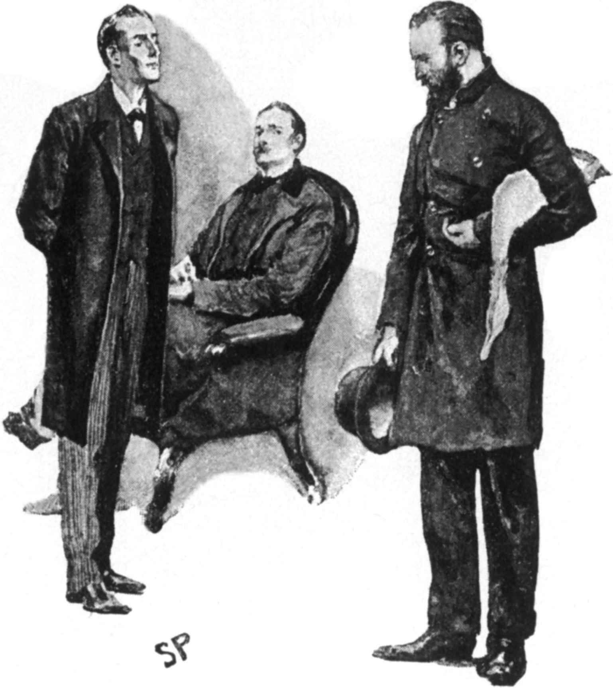

贝克站起身来，把东西夹在腋下。

“诚然，先生，”贝克说，站起身来，把东西夹在腋下，“我们有些人常去一家阿尔法酒店，靠近博物馆那边——白天，我们是常蹲在博物馆里头，你知道。今年，酒店老板温迪凯特，成立了赏鹅俱乐部。有鉴于我们每星期都要照应酒店去花上几便士酒钱，圣诞节给我们每个人一只鹅以表谢忱。我的便士就是如此花掉。我拿到鹅以后的事，你都有所了解。我对你的恩惠深表感谢，先生。你看，一顶苏格兰无边帽实在不适合我这年龄，也不配我这身份，有失体面。”他摆着一副颇要面子却又不免可笑的姿态对我们两人深深地一鞠躬，便欣然大步走出房间。

客人一走，福尔摩斯随后把门关上说：“亨利·贝克先生这一头就这样了，可以肯定，他对事情是一无所知。你饿了吧，华生？”

“还好。”

“那么我们晚餐、消夜点心一并吃，现在，赶紧抓住线索趁热打铁。”

“对，好主意。”

一个凛冽的寒夜，我们穿上厚大衣，脖子围上围巾。外面，夜空无云，星星冷光闪烁。行人呼出的雾气，犹如支支手枪射出道道白烟。我们皮鞋咔咔清脆响亮，这样大步流星走过诊所区、威姆波尔街、哈利街，然后又穿过威格摩街进入牛津街。不到一刻钟，我们就到了布卢姆斯伯里文化区，阿尔法酒店就在这里。通向霍尔伯恩区一条街的拐角上，就坐落着这家小酒店。福尔摩斯推开这私人酒店的门，向红光满面、系白围裙的老板要两杯啤酒。

“你的啤酒，要有你卖的鹅那样顶刮刮，那可就没话讲了。”福尔摩斯说。

“我卖鹅？”老板颇感惊奇。

“是呀，半小时前，我才和亨利·贝克先生说话来着，他是你赏鹅俱乐部的会员嘛。”

“啊，那个，我懂了。可是你不知道，先生，那鹅又不是我这儿的。”

“是吗！那是哪儿的？”

“噢，我从柯芬花园卖场老板进的货，有二十四只。”

“是这样。那里的人我认识，老板是谁？”

“叫布雷金里奇。”

“哦，这个人我不认识。好吧，老板，身体健康，生意兴隆，晚安！”

“现在去找布雷金里奇先生，”离开酒店，顶着寒风，把衣服扣扣紧，他继续说道，“记着，华生，别小看链条的这一头，为家常物一只鹅而已，可是牵连的那一头，有个人等着判七年劳役刑，除非我们能证明他无辜。有可能我们调查到后来罪犯就是他。不管情况如何，我们掌握着案情的线索，警方忽略了，也是有机缘碰巧偏偏落到了我们手里。也还要能够顺藤摸瓜，才能真正有结果。朝南方向，快快走！”

我们穿过霍尔伯恩区，拐入恩德尔街，再走过曲曲折折的贫民窟，来到了柯芬花园市场。大摊位中有一个挂的是布雷金里奇的牌子。摊主一张瘦削的马脸，络腮胡修剪整齐，这时正帮一个徒弟收摊打烊。

“晚上好，夜里真冷。”福尔摩斯说。摊主点点头，朝我伙伴疑惑地扫了一眼。

“鹅卖完了，看样子是。”福尔摩斯说道，指了指空溜溜的大理石柜台。

“你要，明儿早晨有五百只。”

“这不顶用。”

“那么，汽灯下那边摊位上还有几只。”

“噢，我是有人介绍来你这儿的。”

“谁？”

“阿尔法老板。”

“噢，我给他送去了二十四只。”

“真棒，好鹅。你是哪儿进的货？”

出乎我意料，这么一问，竟惹得摊主大光其火。

“啊，又是这样，先生，”他说，扬起了头，两手叉腰，“你找上门来什么意思？你直说要咱干什么，说！”

“我不是说了，想知道，你卖给阿尔法的鹅是谁批给你的。”

“那个，我不告诉你，可以吧！”

“哦，这也没啥了不起。可就不懂这么一点小事，你大动肝火，何必呢。”

“肝火！换了你，老给烦着，你不火？我付钱，他供货，银货两讫，生意就完了。可他一个劲缠人没完，非追问：‘鹅哪儿去了？’‘你把鹅卖给谁了？’‘鹅换了什么东西吧？’难道就这么几只鹅成稀世珍宝了。谁来听那个唠叨！”

“哦，我跟别人来追问是不相干的，”福尔摩斯满不在乎地说，“不过你不告诉我的话，我可就要赌输了。我还一直要坚持我的看法，饲养家禽这档子事，我下赌五英镑，我吃的那只鹅肯定是在乡下喂大的。”

“那好，你五英镑可就输定了，那只鹅就是在城里喂大的。”老板抢说道。

“城里喂不出那么好的鹅。”

“告诉你就是城里养的嘛。”

“我可不信。”

“家禽这档子事你还能有我在行？我从小就在鸡鹅摊上混大的。我告诉你，卖给阿尔法的那些，全都是城里喂养的。”

“你这个话可骗不了我，我不信。”

“你敢打赌吧，怎么样？”

“那你一定输，我知道我自有道理。跟你赌一个，一个沙弗林，教你别那么死心眼儿。”

摊主乐得脸都笑歪了。“把账簿给我拿来，比尔。”他喊道。

一个小男孩拿来一本薄薄的小账簿和一本封面沾满油污的大账簿，递上凑到了吊灯下。

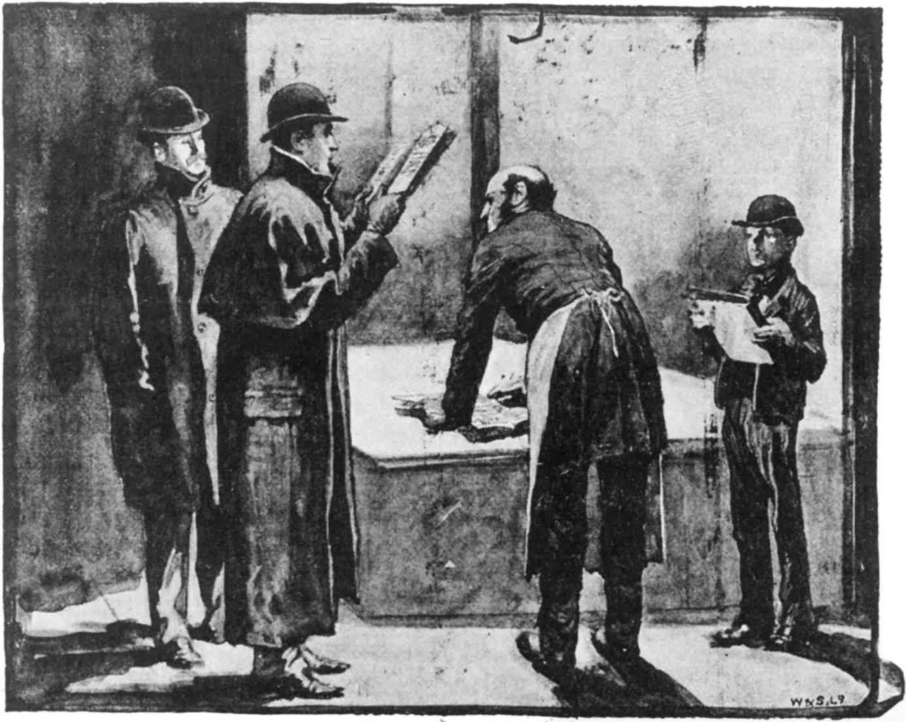

小男孩拿来一本薄薄的小账簿。

“喂，叫你声自以为是戆先生，”摊主说，“我刚才想是，我的鹅都已经卖完，我要收摊了，可倒是叫你来发现我店里还剩有一只一英镑的呢。你瞧见这小本子吗？”

“怎么样？”

“这上面都记着进货的货主儿。看见吗？这一面，都是乡下来的货，他们名下的数字，都是分类名目中记的账。哪，这儿，另一页，红笔字看见吗？全是城里供货人的名字。看第三个名字，你念给我听。”

“奥克肖特太太，布里克斯顿路117号—249。”福尔摩斯念着。

“不错吧，哪，翻翻，看分户账。”

福尔摩斯翻到给指的那一页。“就是这儿，‘奥克肖特太太，布里克斯顿路117号，禽蛋供货商。’”

“哪，再看，末一条是什么？”

“‘十二月二十二日，鹅二十四只，进价每只七先令六便士。’”

“是这样，看到了吧，那么下面这一行呢？”

“‘售与阿尔法店温迪凯特，每只十二先令。’”

“现在，你有什么话讲？”

福尔摩斯显出十分懊丧的样子，从袋里摸出一个沙弗林金币扔在柜台石板上，转开身，脸上老不情愿的样子，一句话也不想说。走出一段路之后，在路灯下站住，以他特有的畅怀却不出声的方式默默大笑。

“你面对的这种络腮胡子，都是很固执的人，但他口袋里藏着突出在外的‘红皮书’<a href="#part0052.xhtml_ch3"
id="part0052.xhtml_ch3-back">(3)</a>，只有同他打赌，才能撬开他嘴。”他说，“我敢讲，我就是放一百镑在他面前，也未见得能叫他开口，讲出这么完全的大实话。要想个主意让他跟我来打赌，他就心甘情愿吐露真情。好了，华生，我想我们已经接近调查的尾声，惟有一点留待决定的是，我们去找这位奥克肖特太太，是今天晚上好呢，还是等一等，明天去的好。已经很清楚了，这个人说到实情了，还有别的人，除我们以外，有别人也急着在忙这个事，那我应该——”

他讲话忽然被打断，我们刚离开的那个摊位方向爆出了吵闹声。回头望过去，看见一个獐头鼠目的小个子，站在吊灯底下的黄光之中，而那个老板布雷金里奇，堵在他店门前，在向这个畏畏缩缩的人恶狠狠地挥舞拳头。

“你的鹅，你，叫我烦够了，”老板咆哮着，“你碰见鬼了不是！你再要来缠个没完，废话唠叨，我就放狗咬你。你叫奥克肖特太太过来，我回她话，可这关你什么屁事？鹅我是向你进的货吗？”

“不是，可是那里头有一只是我的鹅。”小个子低声下气地哀告着。

“好吧，那你找奥克肖特太太问去。”

“是她让我来问你要。”

“啊，你去问普鲁士国王，我怎么知道，我没工夫烦你这种事，给我滚！滚！”他凶神恶煞般冲出来，询问的人拔腿逃进黑暗。

“哈！很好，省得我们自己跑布里克斯顿路了，”福尔摩斯说，“跟我来，看看这个家伙有什么名堂。”

我们从三三两两闲逛的人群中穿过去，我的同伴抢前几步追上小个子，拍拍他的肩膀。小个子回身一惊，在煤气灯光下，我见他脸色苍白，毫无血色。

“你、你什么人？要干什么？”他颤声问。

“请原谅，”福尔摩斯细声和气地说，“刚才你问老板的事儿，碰巧我也听到了，我想，我能帮上点儿忙。”

“你？你是谁？你怎么会知道我的事儿？”

“我名叫歇洛克·福尔摩斯，我干的这一行，就是专门打听别人不知道的事情。”

“可是这个事儿，你不会知道。你能知道？”

“对不起，我可是知道得一清二楚。你在拚命追查布里克斯顿路奥克肖特太太卖掉的鹅，批给名叫布雷金里奇的老板，他出售给阿尔法酒店的温迪凯特先生，温迪凯特先生给了俱乐部的一位老顾客亨利·贝克先生。”

“噢，先生，我找到现在总算碰到您，有眉目了。”小个子叫起来，举着双手，手指发抖，“简直不知该怎么跟您说，我对这事儿兴趣可足了。”

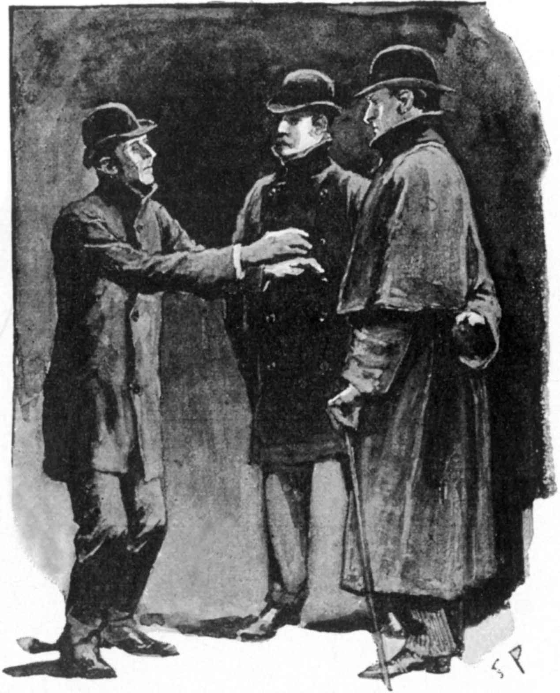

“我找到现在总算碰到您，有眉目了”。

歇洛克·福尔摩斯招呼了一辆路过的四轮马车。“这个事情，我们得在舒适的屋里讨论讨论，别站在市口当中，又吃风。”他说，“你看，都到现在了，还没请问，我乐意效劳的这位尊姓大名。”

这个人犹豫了一下。“我叫约翰·罗宾森。”他回答时眼珠转向旁边一瞟。

“不，讲真名实姓，”福尔摩斯和善地说，“办事情何必报假名，多不方便。”

这张苍白尴尬的脸顿时涨红。“哦，那，”他说，“我叫詹姆斯·赖德。”

“这就对了。世界大旅馆的领班，请上车，我很快就能详详细细告诉你想要知道的事情。”

小个子直愣愣地打量我们两人，半是疑惧，半是期盼，正是一个人处于是福是祸吉凶未卜境地的心态。但是他硬着头皮上了车。半个小时后，我们回到了贝克街的起居室。一路上没有说话，只有这位新同伴在那儿心跳气急，双手一会儿紧握、一会儿松开忙不停，显露出他神经的高度紧张。

“就这儿！”福尔摩斯欣然说道，我们鱼贯进屋，“这个天气有这只火炉再温馨不过。你冷了吧，赖德先生，请坐这把围椅，我换双拖鞋，我们就谈事儿。好了，开始吧。你是想知道那批鹅怎么样了？”

“是的，先生。”

“其实，我在想，是那只鹅。我想是你感兴趣的那只鹅——白鹅，尾梢上有一撮黑羽毛。”

赖德激动得发抖了。“哦，先生，”他叫道，“能告诉我哪儿去了吗？”

“就在这儿。”

“这儿？”

“不错。这只鹅可是了不得，你对它有那么大的兴趣，也是难怪。这只鹅死了，死掉以后还下个蛋——世上最好看最明亮的蓝颜色小蛋，我把它好好珍藏着呢。”

客人伸出右手抓住壁炉台，晃晃悠悠站起来。福尔摩斯打开他的保险柜，取出那颗蓝宝石高举在手。宝石像星星一样蓝光四射，清冷、明丽、闪亮。赖德愣站着，拉长了脸，不知是认领好，还是否认好。

“游戏到这儿结束吧，赖德，”福尔摩斯平静地说，“站稳了，小心别栽进炉火里去！扶他在椅子上坐好，华生。这样的重罪，他还没魄力敢作敢当。给他一口白兰地。行，好了，现在看上去恢复点人样了。虾米一只的东西，又矮又瘦又小，真是！”

刚才摇摇晃晃快要栽倒，一喝白兰地，给两颊带来了血色，他坐下，惊恐地望着，听受谴责。

“我对你的事了如指掌，一切需要的证据我都已到手，不必再要你来告诉我什么。只是有一点，要澄清一下，使案情有个圆满结束。你是早就知道，赖德，莫卡伯爵夫人有这颗蓝宝石？”

“那是凯瑟琳·丘萨克告诉我的。”小个子讲话，嗓子都嘶哑着。

“噢，知道了——伯爵夫人的侍女。好，以为唾手可得发笔横财，诱惑力也真是大，可是在你之前，有过好些先例，你演技远不够周密。在我看来，赖德，你这个人天生也就是个宵小之徒，无赖恶棍。你知道霍纳这个管子工人，有过手脚不干净的前科，所以嫌疑很容易落到他的头上。于是，你和同谋丘萨克在伯爵夫人房间里做手脚，搞坏点东西，再安排霍纳去检验修理。等他修好走掉，你就偷了珠宝，又去报警，让这个倒霉蛋给逮捕。你然后——”

赖德扑通跪倒在地毯上，抓住我同伴的双膝。“看在上帝的分上，饶了我吧！”他尖声哀求，“想想我老父亲！我母亲！他们要心碎了！我过去从没干过坏事，以后也不会再干了。我发誓，我可以手按《圣经》发誓。哦，别告到法庭上去呀！看在基督分上，千万不能呀！”

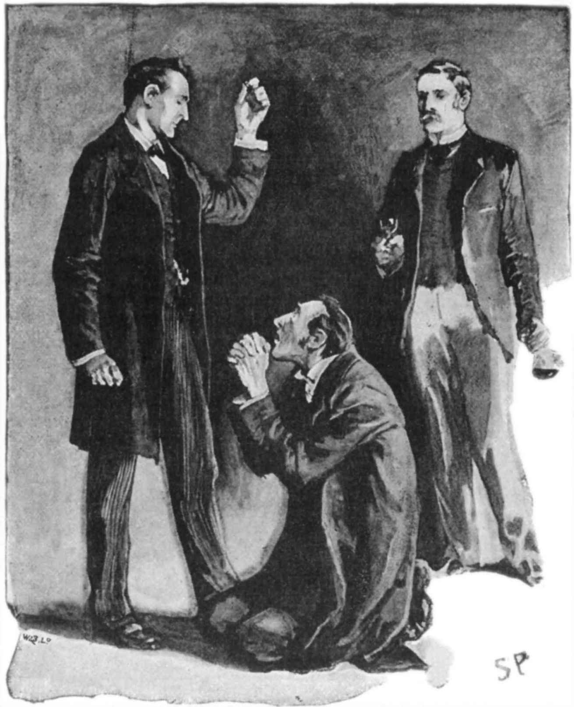

“看在上帝的分上，饶了我吧！”他尖声哀求。

“坐椅子上去！”福尔摩斯厉声道，“你现在倒是晓得磕头求饶，摆出一副可怜相，但是，可怜的霍纳，你怎么不为他想想，他在受审，说他犯罪，他自己根本莫名其妙。”

“我逃走，福尔摩斯先生。我离开这个国家，先生。这样，对他的指控也就会撤销了。”

“嗯，这个，我们要再谈的，现在我们要听听后来一幕戏是怎么演的。宝石进了鹅肚子，鹅又上了市场，是怎么回事？给我们说实话，你想没事，就看你的态度老不老实。”

赖德伸出舌头舔舔焦燥的嘴唇。“我说，我说，照实说，先生，”他讲述道，“霍纳抓走以后，我想，得立刻把宝石转移，才是万全上策，说不定哪天警察脑子忽然醒过来，要搜我，搜我屋子来了，保不准随时有可能的。旅馆里任何地方都不安全，不好放。我出了旅馆，装作有差使外出，来到姐姐家里。姐姐嫁的人姓奥克肖特，住布里克斯顿路，她养家禽供市场上卖。我路上遇人，心里就怕，都好像是警察，是侦探。虽说夜里好冷，还没到布里克斯顿路，就已经跑得汗流满面了。姐姐问我什么事，怎么脸色这么难看，我告诉她旅馆里出了宝石盗窃案，搞得上下不安宁，我心烦意乱。我来到后院，抽起烟斗，正盘算该怎么办。

“我有一个朋友，名叫莫兹利，他堕落干坏事，在彭坦维尔服刑期满，一天碰见我，谈起盗窃技巧，他们偷了东西怎么个销赃法。我知道他不会出卖我，他犯有一两件事在我手里。我就决定马上去基尔本他住的地方，把心里秘密告诉他，他会告诉我怎么样把宝石换成钱。但是一路去怎么保证安全呢？我想到从旅馆出来这一路多么提心吊胆，我随时随地都有可能给捉起来，给搜查，那宝石就藏在背心口袋里呢。这时，我人靠着墙，眼看着一群鹅在我脚跟前摇摇摆摆，忽然我计上心来，那肯定万无一失，任你本领再高强的侦探都别想查得到。

“我姐姐几星期之前对我说过，要选一只鹅送给我过圣诞节。她人好，说话一直算话，我不如现在就挑一只，把宝石塞到鹅肚子里，这样抱着鹅到基尔本去。院里有一个小棚，我把鹅赶出棚，有一只——一只好大好肥的白鹅，尾巴有条黑羽纹。我抓住了，掰开鹅嘴，拿宝石往里塞，手指伸进鹅嘴直往里面捅，鹅脖子那么一撑，宝石咽了下去。我摸着鹅脖子，摸着宝石顺了食管下去，到了鹅肫了。可是这鹅劈里啪啦扑腾，我姐姐出来看怎么回事。我正转身去和她讲话，鹅从我手里挣脱，拍打翅膀蹿回鹅群里去了。

“‘你抓那只鹅干啥，杰姆？’姐姐问。

“‘噢！’我说，‘你不是说圣诞节送我一只鹅吗？我这就挑上一只肥的呢。’

“‘啊呀，’她说，‘给你的鹅我们已经准备好了——取名杰姆，瞧，就是那一只大白鹅。我一共喂了二十六只，一只给你，一只留自己吃，这里剩下的二十四只卖市场上去。’

“‘谢谢麦琪，’我说，‘哪一只你都一样，我倒是喜欢刚才我抓到的那一只。’

“‘送给你的那只足足重出三磅呢，’她说，‘我们特意给你喂肥的。’

“‘没关系，我就要那一只了，我现在就抓了走。’我说。

“‘唉，你喜欢，就随你吧，’姐姐不大乐意，‘你要哪一只呀？’

“‘那只白的，花尾巴，就中间的那只。’

“‘噢，好吧，宰了就带走吧。’

“就这样，我照姐姐说的做了，福尔摩斯先生。我带着鹅一路跑到基尔本，我告诉伙伴我做了些什么，他这个人反正信得过，都好讲。他听了笑得喘不过气来。我们拿刀把鹅剖开，谁知鹅肫里那颗宝石，连影儿也不见，我的心一下子凉了。我马上想到一定出了错，这可不得了。我扔下鹅，赶快跑回姐姐家，直奔后院，谁知道院子里一只鹅也没有了。

“‘鹅呢，麦琪？’我叫起来。

“‘批发走了，杰姆。’

“‘批发给谁？’

“‘布雷金里奇，柯芬花园的。’

“‘还有一只花尾巴呢？’我问，‘跟送我的那只一样的？’

“‘是呀，杰姆，花尾鹅一共有两只，我有时候都分不大清。’

“啊呀，这祸闯大了。我没命地跑，去找那个叫布雷金里奇的人，谁知他已经全部卖掉。到底卖给谁，他一个字也不肯讲。他对我讲的话，你今天晚上都已经亲耳听见，就这样，他老是那副态度对付我。我姐姐想我大概发了疯，我自己想想也真要发疯。现在——现在我背上了贼名，可是我拿人格、拿命换的财富一点都到不了手。上帝可怜我吧！上帝宽恕我吧！”他抽搐着哭起来，两手蒙住了脸。

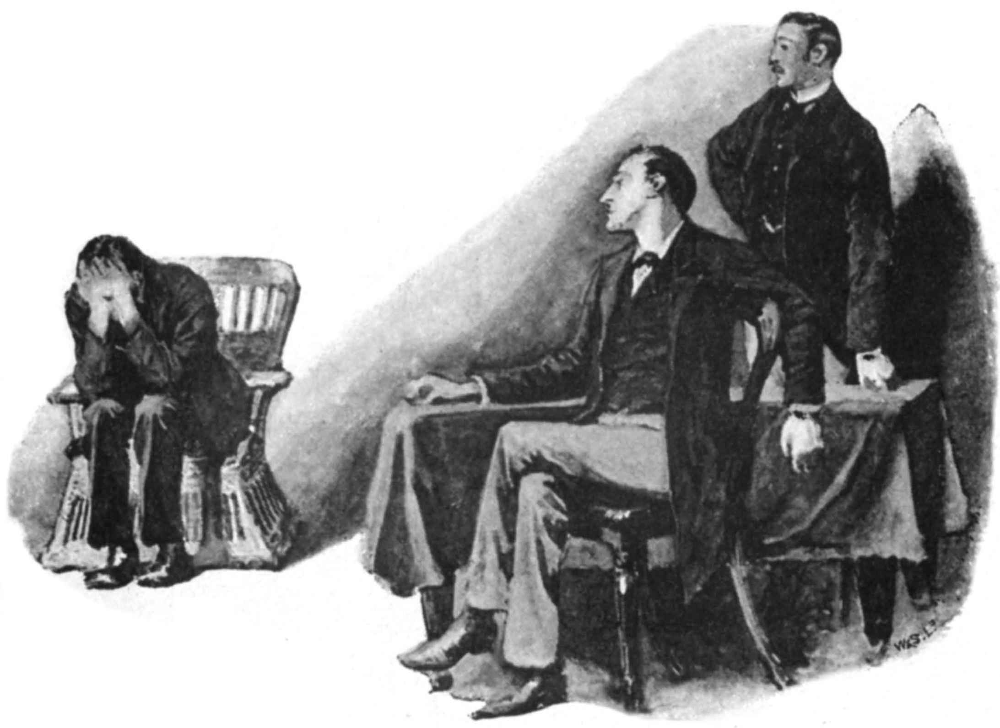

他抽搐着哭起来，两手蒙住了脸。

好长一阵子沉默无语，只听见这个人重重地抽噎，福尔摩斯手指有节奏地叩着桌子。末了，我的朋友站起来，一把拉开门。

“出去吧！”他说。

“什么，先生！噢，老天保佑您！”

“别啰嗦，走吧！”

他什么话也不说，拔腿就跑，楼梯上传来一阵脚步声，然后是关门声，后来又从街上传来一阵劈劈啪啪脚步声。

“华生，这事情，”福尔摩斯说，伸手取过他的土烟斗，“我毕竟是没有义务向警方报告案情，去弥补他们的不足。要是霍纳有危险，另当别论。现在这个人谅他不敢再露面咬霍纳，已不构成危险，案子也就不能成立。我想，我把一件重罪开释了，但有可能因此拯救了一个灵魂。这个人将不再犯罪，他已受到足够的震慑，如果现在送他进监狱，你就造成他终生是个罪犯。再说，眼下本来就是大赦之时。原本也是完全偶然的机会，让我们碰上这么一件绝无仅有、想也想不到的奇事，事情既已解决，也就算了。劳你驾打一下铃，医生，我们将开始调查另一件案子，此案也是以禽类为主要角色。”

（1892年）

————————————————————

<a href="#part0052.xhtml_ch1-back" id="part0052.xhtml_ch1">(1)</a> 格令（grain），等于64.8毫克，原为小麦谷粒的平均重量。

<a href="#part0052.xhtml_ch2-back" id="part0052.xhtml_ch2">(2)</a> 拉丁文“零料”、“杂碎”的意思。

<a href="#part0052.xhtml_ch3-back" id="part0052.xhtml_ch3">(3)</a> 红皮书（*Pink'un*），指一种赛马赌博杂志，封皮为粉红色。

# 花彩绷带

我的朋友福尔摩斯的七十余件奇案，我都作了记录，八年来我一直在研究他的破案经验。经我粗略浏览，发现许多是悲剧，也有几出是喜剧，大量属于少见的疑案，没有一例平淡无奇。这是因为他从事侦探工作并非藉此获利，而是出于对侦查技艺的爱好。所以，对那些毫无波澜的平常案子，甚至无需动脑筋运用丰富想象作深入思考的案子，他一概拒绝接办。

在所有这些稀奇古怪的案例中，我想不起有哪一个案件要比闻名遐迩的萨里郡斯托克莫兰的罗伊洛特家族那个案件更奇异、更具有特色。这件案子发生在我和福尔摩斯认识不久以后，两人都是单身，在贝克街合住一套寓所。此案我没有及早作记录，因为当时有过承诺须要保守秘密。直到上个月，我许过承诺的那位女士突然早逝，我才得以解除承诺的约束，现在也应该是将真相公之于众的时候了。因为据我所知，对格林斯比·罗伊洛特医生之死，外界谣传甚多，把事情说得比真实情况更为可怕。

那是一八八三年四月初的一天，早晨我给叫醒，发现是歇洛克·福尔摩斯，穿戴整齐，站在我的床边。他有晚起的习惯，这时我一看壁炉架上的钟，才七点一刻。我觉得奇怪，朝他眨着眼，也多少有点不乐意，因为我是很重视生活规律的人。

“很对不起，把你弄醒，华生，”他说，“今天早晨我们谁也逃不掉，哈德森太太先被敲门吵醒，接着轮到我让她给叫醒，我呢，再来把你弄醒。”

“什么事——着火啦？”

“有点事，来个委托人，一位年轻女士，样子挺着急，一定要赶快来见我，现在正等在客厅。城里的年轻女士一清早这个时候上大街，还要把人家从床上叫起来，估计必有大事，才非找上门来不可。要是事情真的很有意思，我知道你也高兴一起看看，愿意一开始就入手案子。我是想，无论如何，不能叫你错过了机会呀。”

“亲爱的老兄，这种事我怎么能错过机会！”

我最大的乐趣就是跟随福尔摩斯进行探案工作，他推论之迅速敏捷，似乎单凭直觉就能作出，我真佩服他的神机妙算，其实完全是出于他有坚实严密的逻辑基础，才得以问题一上手就迎刃而解。我迅即披上衣服，只几分钟便准备就绪，陪我朋友去了客厅。一位女士，戴着厚厚的黑面纱，背窗而坐，见我们进来，马上起身。

“早上好，小姐，”福尔摩斯愉快地说，“我的名字，歇洛克·福尔摩斯，这位是我的亲密朋友、助手，华生医生。有他一起，你要跟我讲什么都可以，不要有顾虑。哦！哈德森太太真周到，把火烧得旺旺的。请凑近炉边坐，我让人给你端热咖啡来，你冷得在哆嗦。”

“我不是冷。”女子低声说，照福尔摩斯的话换了个靠炉边的座椅。

“那是为什么？”

“是害怕，福尔摩斯先生。太吓人。”她一边说，一边撩起面纱。我们看见，她确实惊魂未定，惹人怜惜。她拉长着苍白的脸，眼神惊恐疲惫，惶惶然像是被追逐得无路可逃的小动物。看她相貌、体态，是个三十岁上下的妇女，但是头发已经早白，闪着些许银丝。她形容憔悴，精神萎靡。歇洛克·福尔摩斯拿眼对她一扫，作了估量。

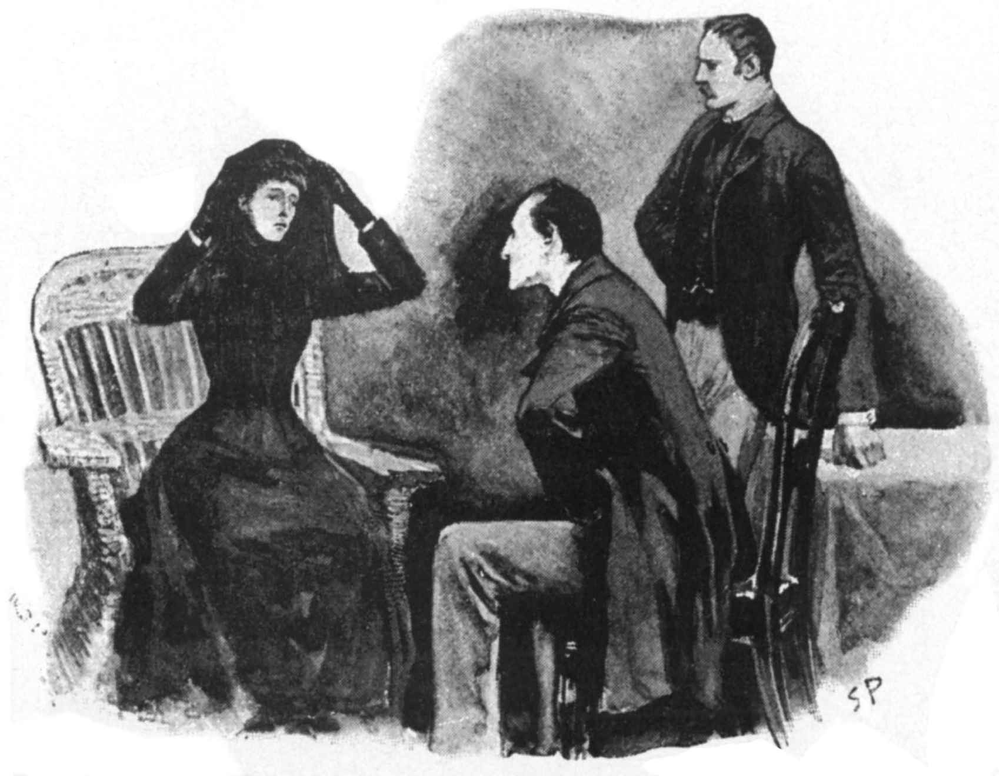

她一边说，一边撩起面纱。

“你不用害怕，”福尔摩斯安慰她说，身子向前，拍拍她的手臂，“我们很快会把事情解决好，尽管放心。你是乘早班火车来的，我看得出。”

“难道你知道我了？”

“不是，我看见你左手拿着一张回程票。你出来得很早，坐了好长一程双轮马车，过了烂泥路，才赶到车站。”

女士大吃一惊，差点要站起来，迷惑不解地凝视着我的同伴。

“不用感到稀奇，亲爱的小姐，”他微笑说，“你衣服的左袖溅着烂泥，至少有七个地方，都是新溅上去的。除了双轮单马车，坐别的马车是溅不到泥的。还有，你一定是坐在车夫的左手边，才会这样。”

“你讲的这些一点也不错，”女士说道，“我六点不到就离家，二十分钟后，到了莱瑟赫德，赶上头班车到滑铁卢车站。先生，这么紧张下去，我再也受不住了，这样下去我要疯了，一个帮忙的人也没有——没有人，只有一个，他关心我，可他也是可怜，帮不上什么忙。我常听人说起你，福尔摩斯先生。我听法林托什太太讲，你在她最困难的时候及时帮助了她，是她把你的地址告诉我。哦，先生，你不会不帮我吧？我无路可走，眼前是漆黑一团，你要拉我一把呀！目前，我无力酬谢你的救命之恩，不过一个月或者六个星期后我就要结婚，到时候我的收入就会归自己，无论如何，你会看到我对你一定不会有恩不报。”

福尔摩斯转身走向他的办公桌，打开抽屉，取出一本小小的案例记录，翻看一下。

“法林托什，”他说，“啊，对了，这案子记起来了，一件蛋白石冠冕头饰的案子。那时候你还没来，华生。我可以同你说，小姐，我会乐于尽力为你办事，我对你的朋友怎么样，对你也怎么样。报酬嘛，我的职业本身也就是报酬了。你可以随便，在你的事情上我花掉多少钱，等到你最方便的时候再付我好了。现在请你把事情给我们详细讲讲，让我们了解，有助于作出判断。”

“哎呀！”我们的来客回答道，“我的情况糟就糟在，我担心害怕的事可也糊涂，我的疑心全都是些说不上来的事，别人看来是鸡毛蒜皮枝节小事，不值得一提。甚至，连我应当可以求助、咨询的人，听了都会觉得我这个女人胡言乱语有毛病。就算对方不讲明，我也会从他的好言相劝中听出来，从他的回避眼光里看出来。不过，我听人说，福尔摩斯先生，不管人心邪恶的花样有多少，藏得有多深，都逃不过你的眼睛。你能指点我，让我跳出火坑，脱离危险。”

“我正仔细听着，你讲吧，小姐。”

“我名叫海伦·斯通纳，和继父生活在一起，他是英国最古老的撒克逊家族的后代，惟一还在世的一代，属于斯托克·莫兰的罗伊洛特这一支，在萨里郡靠西边。”

福尔摩斯点着头。“这名字我还熟悉。”他说。

“这个家族在英国曾经相当兴旺，产业地盘北边要跨越伯克郡，西边要到汉普郡境内。可是到了上个世纪，接连四代继承人生活放荡、奢侈无度。到了摄政时期<a href="#part0053.xhtml_ch1"
id="part0053.xhtml_ch1-back">(1)</a>，最后败在了一个赌棍手里，搞得倾家荡产，什么都完了，只还留下几英亩土地、一幢百年老宅。就是这幢老房子，也正一点一点抵押掉。最后一个大财主沦落了，过着没落贵族要饭一般的日子。但是他的儿子，就是我的继父，眼看家境破落，不得不自谋出路，靠一个亲戚的帮助，读书拿到了医学学位，跑到加尔各答，在那边凭他的医术，也有志气，事业做得很发达。但是家里几次遭到撬窃被盗，他大发脾气，火头上失手把个印度管家打死，差一点要被判处死刑。虽然死刑逃脱，还是判了长期徒刑，坐牢，等他回到英国，人变得脾气暴躁，意志消沉。

“罗伊洛特医生在印度的时候娶了我母亲斯通纳夫人，她是孟加拉国炮兵司令斯通纳少将的年轻遗孀。我有个姐姐朱莉娅，我们是孪生姐妹，母亲再婚那年，我们只有两岁。母亲很有钱——存款每年年利就不少于一千英镑——我们和继父一起过以后，母亲立了遗嘱，全部归罗伊洛特医生所有，附加一条，就是我们结婚后，每年要给我们一笔钱。我们回英国不久，母亲去世了——她是八年前死于克鲁那边的一次火车事故。罗伊洛特医生就不想在伦敦开业行医，带了我们回到老祖宗的家乡斯托克·莫兰。母亲留下的钱足够我们花费开销，过上幸福生活没有问题。

“想不到我们的继父这时候变了，变得可怕极了。他变得不要朋友，不同邻居来往。开始的时候，邻居看到斯托克·莫兰的罗伊洛特后代终于回到老家来了，都为我们高兴、庆贺，可是继父把自己关在屋里，很少出门，一看到人不管是谁就要吵，那个态度，就是凶神恶煞。这种近乎癫狂的坏脾气，是来自家族的遗传。我还想，他长期生活在热带地区，更加剧了他的坏脾气。接连不断的争吵，真叫我们害臊，有两次还闹上了治安法庭，才算了结，太丢人现眼。弄到后来，人人都见他讨厌，成为村里一怕，谁见了他都躲着点，避远点。他力气大，蛮劲足，发作起来，简直没人治得住他。

“上个星期，他把村里的铁匠抱起来越过桥的护栏扔进了小河里，闯下祸，由我想方设法凑足了钱来私了，才避免事情闹出去再出丑。他没一个朋友，倒是和几个吉卜赛流浪人有往来。他把祖上仅有的象征性地产，几英亩乱草荒地，给这些流浪人在那儿扎营住下，还会到他们帐篷里去，接受报答、款待，同他们外出流浪，一走就是几个星期。他特别喜爱印度动物，那是一个记者送给他的。现在养着一只猎豹，一头狒狒，就在地上随便跑来跑去，村民见了，跟见动物的主人一样，都怕。

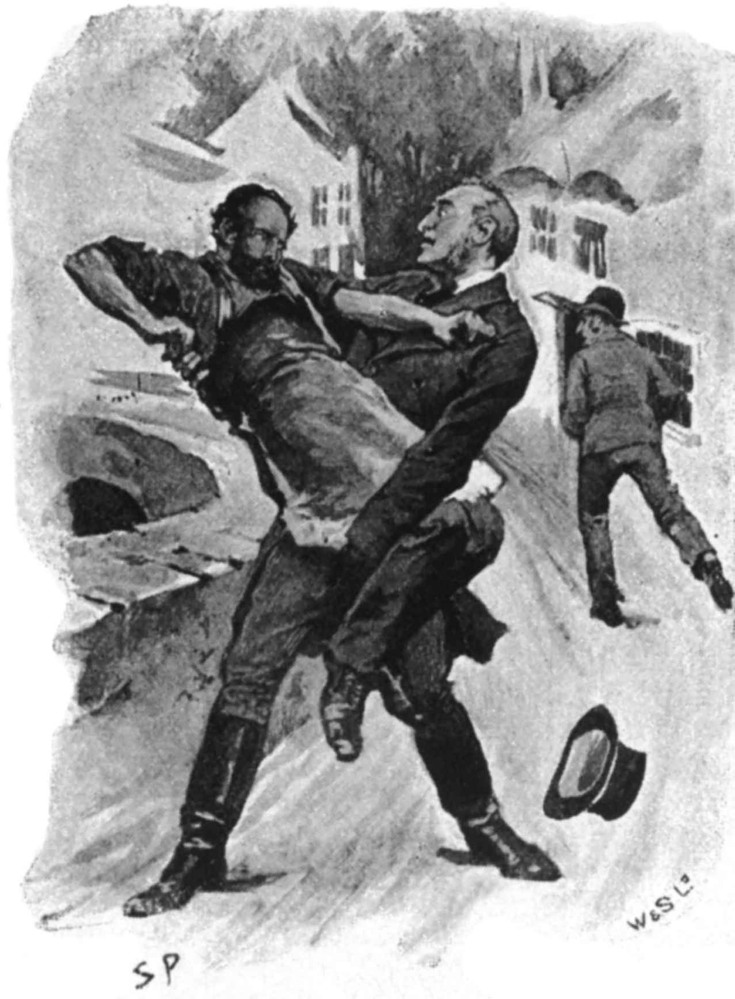

他把村里的铁匠抱起来扔进了小河里。

“我说了这些，你可以想象，我们姐妹俩的生活不会有什么乐趣。仆人都不愿意留在我家，长久以来，全部家务事都是我和朱莉娅担待着做。我姐姐才三十岁就死了，可她的头发早就开始白了，就像我现在这样白。”

“哦，你姐姐已经去世？”

“她死了刚好两年，我要向你讲的，也正是有关她死的情况。你能理解，我们过着这样一种生活，就我刚才说的，我们哪里还会有心情和人往来，连年龄差不多地位差不多的人，都一个也没有。我们有个姨妈，母亲的妹妹，一生未嫁人，霍诺丽娅·韦斯法尔小姐，住在哈罗那边。我们难得被允许去她家做客，稍住上几天。两年前朱莉娅去过圣诞节，在那儿认识一个领半薪的海军陆战队少校，和他订了婚。姐姐回来，继父得知这个婚约，并没表示反对。可是结婚日子的前两个星期，可怕的事情发生，夺去了我惟一的伴侣。”

歇洛克·福尔摩斯原来是背靠椅子，闭起了眼睛，头枕着靠垫，此时半睁开眼，看着来客。

“这个情况，请讲详细一点。”他说。

“我是要详细讲一讲，那个可怕时刻，一点一滴都深深印在我的记忆里。庄园住宅，刚才我说过，很古很老，现在只有一侧的耳房住人。耳房卧室在底楼，起居室是中厅。几间卧房，第一间是罗伊洛特医生的，第二间是姐姐，第三间是我。各间不相通，房门都向着走廊。我讲得清楚吗？”

“很清楚。”

“三间房的窗都朝着草坪开。出事那天，罗伊洛特医生很早就回房，但是我们知道他没有上床休息，因为我姐姐闻到浓浓的雪茄烟味，很讨厌；继父的习惯，喜欢印度雪茄烟。姐姐出了她的房间，到我这边来，坐了一会儿，谈些结婚日子快到的事。十一点，她起身离开，走到房门口，她停住，回头向我望望。

“‘我说海伦，’姐姐说，‘有没有听见有人吹口哨，在半夜里？’

“‘没有呀。’我说。

“‘我想不会是你吹口哨，睡觉了，不会吧？’

“‘当然不会是我，怎么啦？’

“‘这几天夜里，我老是听见，大约三点来钟，低低的，可是很清楚的口哨声。我是很惊醒的，一点点响声就要醒。说不准是在什么地方——好像是隔壁房里，也好像是草地上，所以我问问你，你听见了没有。’

“‘没有，我没听见，肯定是讨厌的吉卜赛人，那边荒地上。’

“‘就是。不过，如果声音是草地上传过来的话，奇怪，你怎么就没有听见呢？’

“‘哎哟，我不是比你睡得沉嘛。’

“‘也是。反正也不碍什么，随它去。’姐姐朝我笑笑，随手带上了门，不一会儿，听到她钥匙把房门上了锁。”

“噢，那就是，”福尔摩斯说，“你们的习惯，晚上都把房门锁上？”

“一直是这样。”

“为什么？”

“那是，我已经和你讲了，医生养着猎豹、狒狒，不把房门锁上，我们觉得不安全。”

“喔，是这样的，请继续往下讲。”

“那天夜里我睡不着了，我隐隐觉得大祸要临头。姐姐和我，跟你讲过了，是孪生姐妹，两颗心紧密相连，你知道，两心感应是很灵很微妙的。这一夜天气很坏，外边风吹得呼啦啦，大雨刷着窗户。忽然，风雨哗哗中，一声女人可怕的尖叫，听得出正是我姐姐。我从床上跳起，裹了条披肩，跑到走廊上。在我开门的时候，好像听得一声口哨，就像是姐姐说的那样，一会儿又是哐啷一声，是什么金属掉地的声响。我跑过去，姐姐房门没锁，开着，门还在缓缓地动。我看着都吓呆了，不知道从门里会冲出什么东西来。走廊上有灯光，我看见姐姐出现在门口，脸吓得刷白，伸出双手摸摸索索着求救命，身子东倒西歪，像醉汉似的。我跑上去，赶快抱住她，这时她腿站不住了，人往地上倒。她痛苦得不得了，浑身扭动，手脚抽搐。起初我想她没认出我来，我弯下身去，她突然尖叫，这叫喊我一辈子都忘不了。‘哦，天哪！海伦！是花彩绷带！花绷带，带子！’她还有话要说，举着手向医生房间那边指指，可又抽搐了一下，说不出话了。我赶忙转身跑去大声叫继父，正碰上他从房里过来，穿着睡袍。他跑到姐姐身边，姐姐已失去知觉，继父往姐姐嘴里灌白兰地，派人到村里去叫来医生。一切努力都是徒劳，她已奄奄一息，直到咽气，始终没有苏醒。我可怜的姐姐，是如此悲惨的结局。”

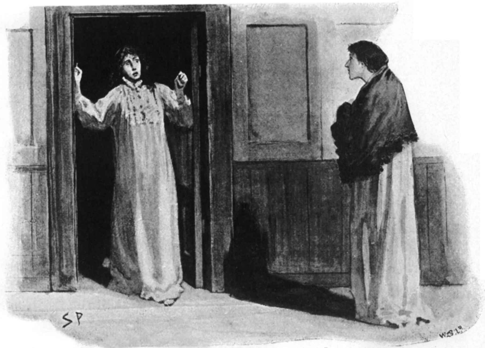

“我看见姐姐出现在门口，脸吓得刷白。”

“等一下，”福尔摩斯说，“你确实听见口哨声、金属碰撞声，没错？确定无疑吧？”

“郡里验尸官调查的时候，也是这样问我。我确实听到，印象很深刻，当然，外边风雨大，老房子又吱吱嘎嘎响，到底什么声音分不清也有可能。”

“你姐姐穿好了衣服的？”

“不是，她穿睡衣。她右手里捏一根烧剩的火柴，左手里是火柴盒。”

“这说明出事的时候她划了火柴，看了周围。这一点很重要，验尸官是什么结论？”

“验尸官调查得很仔细，因为罗伊洛特医生在郡里早已名声很坏。但是结果检查不出死亡原因，没有叫人满意的结论。我可以作证，房门从里面锁好的，窗子有老式百叶窗挡着，有宽条铁闩闩住，每天晚上关严，不会出事。墙壁都细心敲过，四面实心，坚固着呢。地板也彻底检查，同样看不出问题。烟囱是比较大，也是用四个大环钉闩上的。所以可以肯定，姐姐出事的时候，房间里只有她一个人，再说，她身上没有暴力痕迹。”

“会不会是毒药呢？”

“几个医生也一起检查过，但是查不出。”

“那么，你看姐姐遭此不幸是死于什么原因？”

“我想，是吓死的，突然惊吓致死。是什么能把她吓死，我无法想象。”

“那时候，荒地上的吉卜赛人还在？”

“在，总有人在的，多少会有人。”

“嗯，那说的绷带，你想是什么带子——花彩绷带？”

“有时候我觉得，不过是她神志不清讲的胡话，有时候又觉得绷——帮<a href="#part0053.xhtml_ch2"
id="part0053.xhtml_ch2-back">(2)</a>，可能是指一帮子歹人吧，说不定就是荒地上那帮吉卜赛人。我吃不准是不是他们扎在头上的花手帕，嘴里说着听起来有点差不多。”

福尔摩斯摇着头，表示和他的估计有很大距离。

“水深得很呢，”他说，“请继续往下讲。”

“这以后两年过去了，我的日子比以前更加孤单寂寞，到了最近，才算有了起色。一个月前，有个认识多年的好朋友，很荣幸，他向我求婚。他的名字叫阿米塔奇——珀西·阿米塔奇——是阿米塔奇先生的二儿子，住在里丁附近克兰沃特。我继父对这桩婚事没表示反对，我们就把婚期定在开春。两天前，屋子的西边耳房开始大修，我房间的墙给钻了几个洞，我只好搬到姐姐房里去住，睡在她那张丧命的床上。昨天夜里，我睁眼躺着，可想而知有多可怕。我回忆着姐姐惨死的情景。这死静死静的深夜，我突然听到轻轻的口哨声，正是姐姐的死亡预兆。我跳下床，点上灯，房间里什么也没有看到。可是我越想越怕，不能上床了，干脆穿好衣服，一等天亮就溜出来，跑到王冠旅店，就在我家对面，租一辆双轮马车，赶到莱瑟赫德，一大早再从那儿来到你这里，是专程来找你，向你求救。”

“你这样做是明智的，”福尔摩斯说，“情况是不是全部都说了？”

“是啊，全都说了。”

“罗伊洛特小姐，你并没有全盘托出，你对你的继父还有遮掩。”

“哎呀，这什么意思？”

作为回答，福尔摩斯看着来客搁在膝头的手，过去把她的黑色花边袖口稍往上拉拉，白皙的手腕上显现着五小块乌青伤痕，是四个手指和一个拇指的掐痕。

“你受到虐待。”福尔摩斯说。

小姐立刻满面绯红，重新遮好有伤痕的手腕。“他粗野，力气可大，”她说，“他使劲，都不知轻重。”

大家都沉默下来，静坐好长一会儿。福尔摩斯托着下巴，两眼凝视劈啪作响的炉火。

“一桩很深很复杂的案子，”最后他说道，“这事有千千结，在决定采取行动之前，总得了解全面的情况。不过，已经迫在眉睫。今天要是到斯托克·莫兰去走一走，检查一下房间就好，可不能让你继父知道，行不行？”

“倒真是巧，他说过的，今天要来城里，有点重要事办一办，那就是一整天不在家，你们可以放心去。家里有个管家，可已经老年懵懂，我很容易支开她，不碍事。”

“好极了。你不反对也走一趟，华生？”

“当然不。”

“那我们两人一起去，你自己还有什么事吗？”

“我难得进一趟城，也就顺便办一两件事。我赶十二点的车回去，你们来到，我肯定在家了。”

“好，你午后就等着。我这儿手头还有点事处理一下，你就在这儿用了早饭吧？”

“哦，不，我得走了。找你们一谈，心里的石头好像卸下似的，人也轻松了。我等着你们，下午再见。”她放下了厚厚的黑面纱，把脸蒙起，无声地走出房间。

“你有什么想法，华生？”福尔摩斯问道，仰身靠上椅背。

“我觉得有大阴谋，阴险毒辣。”

“要多么阴险，有多么阴险；要多么毒辣，有多么毒辣。”

“可是，倘若女士所述均属无误的话，地板无缝，墙壁完好，门窗甚至烟囱都进不来人，那就肯定，她姐姐遇难的时候，屋里没别人，只她自己一个，这就死得莫名其妙。”

“夜半口哨，怎么回事？女人临死说的话，什么意思？”

“想不通。”

“夜半口哨，又出现吉卜赛人的绷带，这些吉卜赛人同老医生关系密切，你把这两件事结合起来想想。事实上，我们有充分的理由相信，医生阻止继女出嫁，是出于利害关系。临死前提到的绷带，还有，最后，海伦·斯通纳小姐听见金属响声，这个事实，可能是闩百叶窗一根铁闩扣回原处的响声。我想，根据这些去思考，是破此谜案的线索。”

“可是，与吉卜赛人有什么关系呢？”

“难以想象。”

“我看如此推论并不能自圆其说。”

“我也是，所以，我们有必要今天去斯托克·莫兰。我要看看不能自圆其说是否真的不能，或许还是可以解释得通。嘿，干什么的！”

我的同伴突然一声猛喝，是因为房门一下被人撞开，一个彪形大汉堵在了门口。这人的装束不伦不类，既像是城里上班做事的人，又像是乡下农夫；戴一顶黑色大礼帽，穿一件礼服大衣，脚上一双绑腿罩靴，手里还挥动一根猎鞭。他身材之高，帽子齐了房门的横楣，块头之大，几乎把门堵得密不透风；一张被太阳晒得发黄的宽脸，布满皱纹，充满邪恶，朝我们两人来回地看；一对凶光毕露的陷窝暴眼，一个高、尖、无肉的鼻子，看上去活像一只老雕猛禽。“哪个是福尔摩斯？”这个不速魔怪喝问。

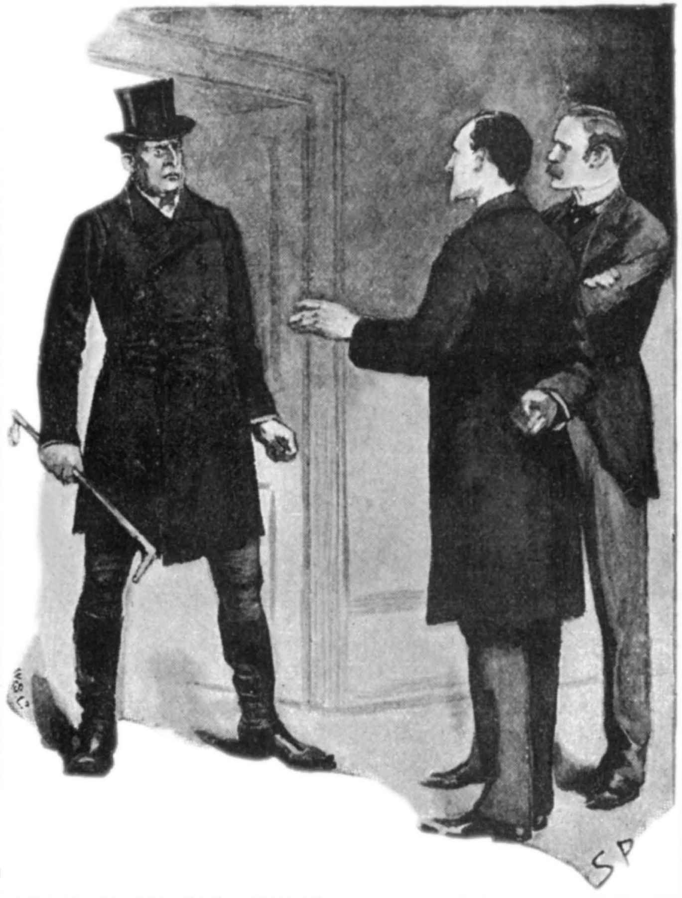

“哪个是福尔摩斯？”

“本人便是，先生。可是失敬得很，不知你是何人？”我的同伴平静地问。

“我是格林斯比·罗伊洛特医生，斯托克·莫兰的。”

“幸会，医生，”福尔摩斯平淡而知礼地说，“请坐。”

“少来这一套。我继女上你这儿来了，我要找她，她对你都说了些什么？”

“今年这时节天气还这么冷。”福尔摩斯道。

“她跟你说什么了？”老家伙暴跳如雷。

“听说番红花有望开得很好。”我的同伴若无其事。

“好！你不当我一回事，你敢？”不速之客说着，跨上一步，挥起猎鞭。“我知道你，你这个恶棍！我早就听说了，你，福尔摩斯，专管闲事！”

我的朋友自顾微笑。

“福尔摩斯，关你个屁事！”

福尔摩斯更加笑容可掬。

“福尔摩斯，你自以为是苏格兰警场，小饭桶！”

福尔摩斯格格格地笑。“你说的，真够逗人，”他说，“你出去的话，别忘把门关好，不然有一股子穿堂风。”

“我把要讲的讲完就走。你竟敢太岁头上来动土，我知道女儿斯通纳来这里，我跟踪她！碰了我你小心吃不了兜着走！给你点颜色瞧瞧。”他迅即跨前两步，抓起拨火钳，两只褐色大手一扭就扭弯。

“小心别犯在我手里。”他咆哮着，顺手把扭弯的拨火钳往壁炉一扔，大踏步迈出房间。

“这个人，也就这点脾气，”福尔摩斯打着哈哈说道，“块头我没他大，不过他要是再待一会儿，就会叫他看见，我的手劲绝对不在他之下。”说着，把弯了的拨火钳捡起来，只这么一拗，火钳立刻笔直如初。

“自以为是，荒唐可笑，把我当成是官方侦探，连这点都搞不清楚！他这么来一下也好，倒更增添了我们侦查的劲头。但愿我们的小姐朋友不要疏忽大意了，叫这头畜生跟踪上。现在，华生，我们可以上早餐了，过后我要到伦敦民事律师公会去，查点资料，对案子会有帮助。”

歇洛克·福尔摩斯查好资料回来已将近一点半，他手里拿一张蓝颜色纸，上面涂满了字迹和数字。

“我查到了他已故妻子的遗嘱，”他说，“为了准确弄明白里面的意思，我还得搞懂有关的融资行情。他妻子死的时候总收益略低于一千一百英镑，到了现在，农产品的价格下跌，已不足七百五十英镑。两个女儿一结婚，每人拿掉二百五十英镑。这就很明显，倘若两个人都结婚，他的美梦就不美了，只能拿到很可怜的一点点钱。就算两个中只有一个结婚，也让他觉得是割下他身上一大块肉。我上午的工作没有白费，因为，完全证实了他有很强烈的动机非要阻止女儿不可。好，现在，华生，情况紧急，时间有限，尤其老家伙已经晓得我们在办他的事。你准备好，马上叫马车去滑铁卢。你把左轮务必带上了，随身放袋里，以备不时之需。跟一个能把钢火钳扭弯的先生打交道，一把埃利二号手枪最有发言权。我想，带上家伙，再一把牙刷，就是我们全部的装备。”

到了滑铁卢车站，很走运，正好赶上一班火车，顺利到达莱瑟赫德。我们在车站旅店雇一辆双轮马车，在萨里的车道上轻快行驶四五英里的路。天气很好，风和日丽，碧空白云，高树和树篱刚抽出第一批绿芽，空气中弥漫着湿润的泥土清香。在我心中，充满生机与希望的春色和我们正在从事的这件邪恶凶险疑案形成不和谐的对照。我的同伴坐在马车前端，双臂交叉，礼帽前倾遮着双眼，下巴抵着前胸，沉浸在深思之中。突然，他抬起头来，拍拍我的肩膀，指指前方的草地。

“看那边！”他说。

一片树木茂盛的园地顺着缓坡伸展，在高坡形成浓浓密林。树枝桠杈中矗立着一幢古旧大宅的屋脊、灰色的尖山墙。

“斯托克·莫兰？”他问。

“是的，先生，那就是格林斯比·罗伊洛特大夫的房子。”车夫回答道。

“还在大兴土木，”福尔摩斯说，“正赶上我们要去呢。”

“那边是村子，”车夫说，指指左首远方的一片屋顶，“你们要是去那幢屋，从这树篱旁边上去，比较近一点，过树篱，顺着小道走。那不，正有位女士在过来呢。”

“我看，那就是斯通纳小姐，”福尔摩斯用手搭个眉檐望着说道，“好吧，按你说的没错。”

我们下车，付了车钱，马车掉头，向莱瑟赫德啷啷而去。

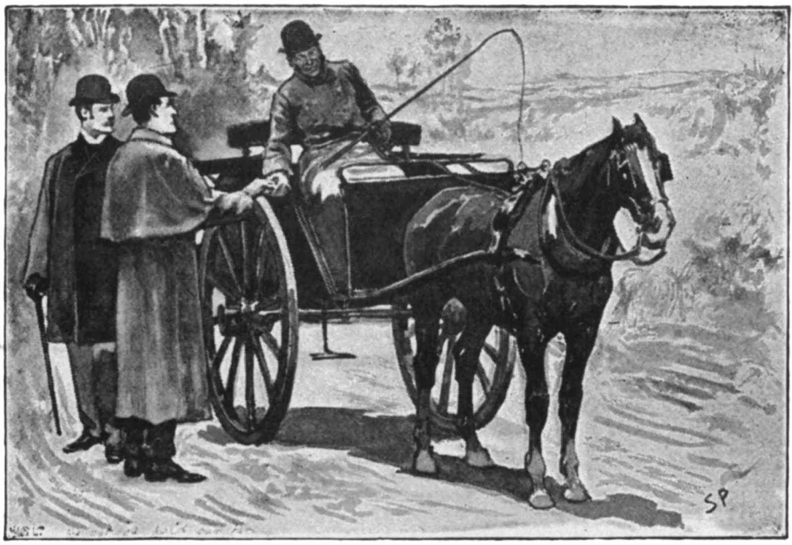

我们下车，付了车钱。

“我是想要，”福尔摩斯说，我们走上树篱路口的过道踏阶，“让这赶车的以为我们来这里是建房子的，或者谈生意，以平常事为好，省得他会多嘴多事。下午好，斯通纳小姐。你瞧，我们是说到做到。”

我们这位早晨登过门的委托人急急忙忙前来迎接，脸上流露出内心的喜悦。“我盼着你们来，心里可真急呢，”她大声说，和我们热情握手，“机会再好也没有，罗伊洛特医生上城里去，天黑以前不会回来。”

“我们已经有幸和大夫见面认识了。”福尔摩斯把发生的事大致讲了讲。斯通纳小姐一听，脸上马上变色，连嘴唇都发白了。

“呀，天哪！”她叫道，“他一直在跟踪我，那么说。”

“是这样。”

“真是恶毒，在他手里我从来没有安宁过，他回来怎么办呢？”

“他自己顾自己还来不及，他已经知道比自己更厉害的人把他盯上了。今天晚上你把房门锁死，如果他要撒野，我们送你到姨妈那儿，去哈罗。现在，快抓紧时间，麻烦你马上领我们去检查房间。”

灰色石砖的大宅，石壁布满青苔。房屋中央高耸，两边耳房像一对蟹钳呈弧形弯出。一边的耳房窗子打碎，挡着木板；部分房顶坍塌，一副破败的景象。中央主楼也是年久失修，但右首一边稍有新意，窗上挂窗帘，烟囱升蓝烟，说明是家人居住有人气的地方。脚手架搭在山墙上，墙石已有凿空，但是我们来到的此刻，没见有一个工匠。福尔摩斯在修剪不齐的草坪上缓步走来走去，然后仔细检查窗子外面。

“那，这儿是你自己的房间，这中间是你姐姐的，再隔壁，靠主楼之间，罗伊洛特大夫的卧室？”

“是的，不错，我现在睡在中间这个房间。”

“是因为整修房子，所以你搬到这间，不过，好像没有十分必要嘛，山墙没啥好修的。”

“是啊，根本不需要修。我仔细想想，不过是借口，要把我从我的房里赶出来。”

“啊！这里头有玄机呀。那么，这窄窄的耳房，另一边是走廊，三个房间都向着走廊，走廊上当然有窗啰？”

“有的，不过很小，人爬不进的。”

“你们姐妹俩晚上都锁上房门，不可能从这一边进入你们房间。现在，麻烦一下，你去房里，把百叶窗闩上，好吗？”

斯通纳小姐照吩咐的做了。福尔摩斯细细检查开启的窗，用各种方法想把百叶窗打开，但都不成功，根本没有窄缝能容一把小刀插入，把窗闩挑开。他又拿放大镜来察看铰链，坚固的铁铰链牢牢嵌在厚实的墙石里面。“嗯！”他疑惑不解地摸着下巴说，“我的推理肯定有问题了。百叶窗一下闩，就没人进得去。那么，到里面看看，有没有其他情况可以发现。”

从一扇小边门进入白墙走廊，三间卧室在这走廊上。福尔摩斯不看第三间，走过去直接到第二间，斯通纳小姐现在睡的也就是她姐姐丧命的这一间。小小卧房很朴素，低低的天花板，张开大口的壁炉，都是乡村古宅老屋的式样。一只褐色抽屉橱立在一隅，另一端是一张窄床，罩着白色床罩。窗子的左侧是梳妆台。所有这些加上两把小柳条椅，就是这个房间的全部摆设，只是正中间还铺有一块威尔顿机织绒头地毯而已。四周蛀孔斑斑的棕色栎木墙板、镶板，陈旧、褪色，年代久远了，还是房子初建时期的装饰。福尔摩斯搬一把椅子在墙角静静坐着，两眼把房间上下四周一圈又一圈看过来、看过去，每一处细部都不放过。

“那铃连通到什么地方？”末了他问道，指指一根粗绳，系在床边，绳头正好垂落枕头上。

“通管家的房里。”

“看样子，比什么别的东西都算是新一点吧？”

“是的，才装上两年吧。”

“是你姐姐的意思要装的，我猜想？”

“不是，我从来没有听她说起要用，我们要什么东西都是自己跑去拿。”

“是这样啊，那这么好一根铃绳好像没有用处吧。对不起，让我用几分钟把地板看一看。”

他趴下身，拿个放大镜在手里，匍匐着迅速移动，仔细检查地板裂缝，然后对房间里的墙板、饰板也作了同样的检查，再走到床边，对着床看了好一会儿，又顺着墙上下来回地看，最后用手握住铃绳，使劲一拉。

“怎么，只是件摆设，”他说，“不响嘛？”

“没有铃，上面根本没有连绳，这倒有趣了。你看，绳系在一个钩子上，上面是个透气小孔。”

“那是干什么！我从前从来没有注意过。”

“真是怪事！”福尔摩斯咕哝着，手拉绳索，“这房间里有一两个地方很是特别，比如，通风口朝另一个房间开，这开得有多笨！多费手脚，应该朝屋外开才是！”

“这孔也是新近的事。”女士说。

“跟系铃绳同时搞的吗？”福尔摩斯问。

“是呀，同时有几个小变动，一起做的。”

“这不是很好玩吗——不系铃的铃绳，摆设；不通风的通风口，多余。斯通纳小姐，现在让我们到最里面那间卧室去检查看看。”

格林斯比·罗伊洛特大夫的卧室比继女的要大，但陈设也一样简单。一张行军床，木头小书架堆满了书，大都是技术书，床边一把扶手椅，贴墙放了一把普通木头椅，一张圆桌，还有一只很大的铁保险柜，这是一眼望去的几样主要对象。福尔摩斯慢慢走了一圈，仔细察看每一样东西。

“里面是什么？”他问道，敲敲保险柜。

“继父业务上的文案资料。”

“哦，那么说，你见过？”

“见过一次，几年以前了，记得里面都是纸张。”

“里面不会是一只猫吧，比方说？”

“不会，哪有这种怪事！”

“嗨，看这儿可不是！”他从柜上拿起一只盛牛奶的小碟子。

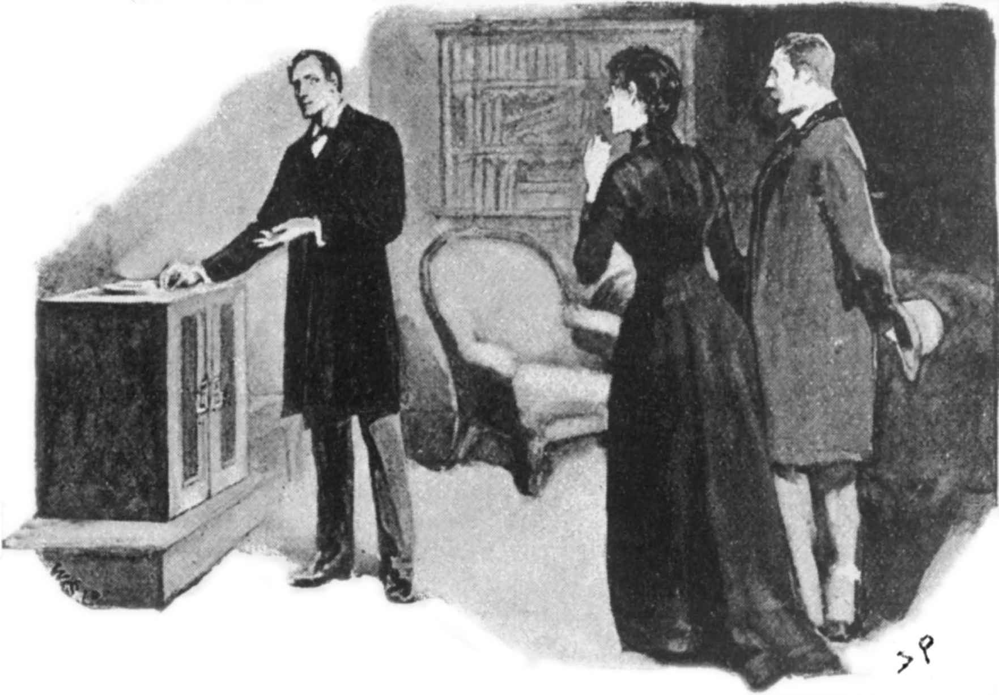

他从柜上拿起一只盛牛奶的小碟子。

“不是，我家不养猫，只养一只猎豹，一头狒狒。”

“啊，那就是了，没错！瞧，猎豹，可算是一只大猫。不过也要说，只有一碟牛奶，远远不足以喂猎豹吧。有一点，我希望确定一下。”他在木椅前蹲下，聚精会神检查椅面。

“谢谢，好了，事情差不多解决了，”他说着，站起来，把放大镜藏入口袋，“啊哈！这儿有样东西很管用！”

引起他注意的是一根小小的狗鞭子，挂在床脚边。狗鞭子卷曲有结，很便于打成套环。

“这东西你怎么看，华生？”

“寻常不过的一根鞭子，但是不懂鞭末梢打结干什么。”

“这就一点也不寻常，是不是？唉，是呀，真是个万恶的世界，聪明人把脑筋用来犯罪，那就能罪恶到极点。我想我已经看得够了，斯通纳小姐，你让我们到草坪上去走走。”

当我们离开调查现场，我发现伙伴的表情从未见过有那么严峻，或者说脸色有那么阴沉。我们在草坪上不停地走过来走过去，斯通纳小姐和我都不想说话打断他的思路，最后是他自己从沉思中回过神。

“千万千万要注意，斯通纳小姐，”他说道，“我跟你讲的话你句句要记住照办。”

“我一定照办。”

“稍有疏忽，就要出大事，你的命保不保，就看我的话你听不听。”

“我向你保证，我一定听从你的吩咐。”

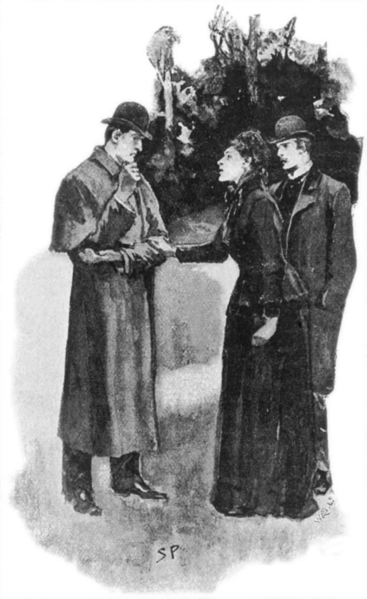

“我向你保证，我一定听从你的吩咐。”

“首先，我的朋友和我今夜都必须留在你房里。”

斯通纳小姐和我两个都看着他，惊愕不已。

“是的，非如此不可。让我来说清楚，我想，那头是村子的旅店是不是？”

“是的，那是王冠旅店。”

“好。从你窗口能望得见吧？”

“能望见。”

“等你继父回家，你一定要装头疼，把自己关在房里。晚上等到听见他上床睡了，你就打开百叶窗，再去掉窗搭扣，把灯摆在那里给我们作信号，随后带上用得着的东西，悄悄回到隔壁你自己的房间。我想，不管房子修成什么样，将就一宿该没有问题吧。”

“噢，是这样，那当然没问题。”

“剩下的事，都交给我们好了。”

“那你们打算怎么做呢？”

“我们要到你的房里去，要了解那个声音，骚扰人的声音，是从哪里来。”

“我相信，福尔摩斯先生，你已经完全有把握了。”斯通纳小姐说，手挽着我朋友的衣袖。

“可以这么说。”

“那么，你发发善心吧，告诉我，姐姐是什么原因死的？”

“我要获得确凿的证据之后再讲。”

“你至少告诉我，我的想法正确不正确，我想她是给吓死的。”

“不，我认为不是，我可以肯定有更复杂的原因。现在，斯通纳小姐，我们得走了，万一罗伊洛特大夫回来，让他撞见，我们的努力就全盘泡汤。再见，要勇敢一点，只要你照我告诉你的去做，你就放心好了，我们很快就能把威胁你的危险排除掉。”

歇洛克·福尔摩斯和我没费多大工夫就在王冠旅店订好房间，坐在了起居室。我们把房间订在楼上，从窗口望出去，林荫道口的大门，斯托克·莫兰庄园大宅住人的耳房，都一览无遗。到黄昏，看见格林斯比·罗伊洛特的马车过去。巨人的身躯，而给他赶车的小伙子又瘦又小，便更显出他的高大。仆人把沉重的铁门徐徐推开，我们听见大夫嘶哑的咆哮，看到他向仆人暴跳挥拳。马车继续行进，几分钟后，我们看见树丛间忽然透出灯光，那是大宅一间起居室点起了灯火。

“你知道，华生，”福尔摩斯说，我们一起坐在黑暗之中，“我今夜叫你同我一起，不免有顾忌，因为明摆着有危险。”

“我能多少有点帮助吧？”

“有你在场，就是莫大的帮助。”

“那我当然应该来。”

“非常感谢！”

“你讲有危险，肯定在房间里给你看出了情况，但我没能看出来。”

“不，我只认为我作出了更多一点的推理。我想我看到什么，你也都看到。”

“我看不出有什么特别的地方，只有那根打铃绳，但是用于什么目的，我承认我还是想不出来。”

“那个通气孔，你也看到了？”

“看到。但是，两个卧室之间，通个小洞，也没有什么太不正常，那个洞小得连只老鼠都钻不过去。”

“在我们没来斯托克· 莫兰之前，我就料到会发现有孔洞。”

“是吗，我的福尔摩斯！”

“噢，是的，我预料。你记得吗，斯通纳小姐说到过，她说，她姐姐闻到罗伊洛特大夫抽雪茄烟。我一听马上想到，两间房间一定有连通的地方，也不会很大，一定很小，否则验尸官调查时就要提出来。我推定是一个孔洞。”

“但是，一个孔洞又有何相干呢？”

“噢，至少时间上不谋而合吧，开了个透气孔，吊起了绳子，睡在床上的小姐就遇害，你不觉得蹊跷？”

“我还是看不出有什么关系。”

“你看到那张床不同一般吧？”

“没啥不同。”

“床脚被钳住钉死在地板上。你什么时候见过床要这样钉死的？”

“倒是没见过。”

“叫那位小姐不能把床移动，也就是给固定在与孔洞和吊缆相关的位子上——我们姑且就称它作吊缆，因为很明显，压根儿就不是什么拉铃绳。”

“福尔摩斯，”我叫道，“经你点拨，我好像有点看出来了，我们只有赶快制止阴险毒辣的罪行发生，事不宜迟。”

“够阴险，也够狠毒，医生要作恶的话，那是天字头一号罪犯。他有胆也有识。帕尔默还有普里查德，在医学犯罪这一行中他们两人算是名列前茅，但和此人相比却相形见绌。不过，我想，华生，我们就是比他棋高一着。看吧，今夜我们要经历一番恐怖搏斗，直到天明。先且安安静静抽上一斗烟，让心情放松那么几小时也好。”

\*　\*　\*

大约九点钟，树丛间透过来的光熄灭了，庄园大宅那边一片漆黑。两个小时缓慢地过去，然后，忽然，刚响过十一点，我们正前方亮起一盏灯光。

“给我们的信号，”福尔摩斯说道，一跃而起，“是中间窗子的灯光。”

我们走出旅店，向老板交代说是去约会一个朋友，时间较晚，如果太晚的话，我们可能就在那边过夜。一会儿我们已上了漆黑夜路，凛冽的寒风扑面而来，前方一道抖动的黄光召唤我们赴汤蹈火。

进入宅地没遇困难，因为园中老墙年久失修已成残壁。我们穿行树丛，到了草坪，过草坪，正要翻窗入屋，突然一处月桂树丛窜出一个状如丑陋畸形小孩的怪物，四肢一扭纵身跃上草地，只几下就蹦出草坪消失于黑暗之中。

“天哪！”我悄悄说，“你看见那个东西？”

福尔摩斯此刻也同我一样冷不防吓一跳，惊愕之下一把攥住我的手腕，紧如铁钳，接着便无声哈哈，把嘴凑在我耳朵上。

“多美的一家子，”他压住嗓子说，“就是那头狒狒。”

我已经忘了大夫有养怪兽作宠物的癖好。还有一只猎豹，说不定忽然间就趴在了我们肩上。我得说实话，当我学着福尔摩斯的样，脱鞋钻进了卧室之后，这时方才有了安全感。我的同伴悄无声息地关上百叶窗，把灯挪到桌上，眼往四周环视，室内一切都同我们白天所见一样。他蹑手蹑足靠近我，手握成圈凑到我耳朵上，再次细声说话，声音轻得刚刚够我听出意思：

“再小的出声都会坏了我们的计划。”

我点点头表示听见了。

“我们坐着不要点灯，防备他从通气孔发现亮光。”

我又点点头。

“别睡着了，一睡就没命了，枪准备好，以防万一。我坐床边，你坐椅子。”

我掏出左轮，放在桌上靠边角。

福尔摩斯带来一根细长藤鞭，随手搁在床沿。和藤鞭一起还有一盒火柴，一个蜡烛头。他马上把灯吹灭，黑暗静坐。

我怎么也忘不了那次可怕的守夜，一点声音都没有，连喘气都听不到声响。不过我知道，伙伴睁眼坐着，近在咫尺，和我一样神经高度紧张。百叶窗把可能有的一点外光都挡掉，我们在一团漆黑中坐等，外边偶尔传来夜禽的哀鸣。一次，窗前像猫似的长长一声嚎叫，告诉我们那只印度猎豹在无所管束地活动。还能听到远处教堂敲钟，每隔一刻钟就深沉地“当”一声，回响四野。一刻钟的时间，也显得多么漫长。听敲十二点，听敲一点，两点，三点，我们默坐静等，等待究竟是什么将会来临。

突然，通风孔那里有亮光忽地一闪，又立即消失，接着是一股燃油和加热金属的刺鼻味，是隔壁房里的人点起了遮光灯。我听见缓缓的响动，接着又平静下来，只有气味越来越浓。我竖起耳朵，坐等半小时，忽然又听得另有响声——什么东西轻轻徐缓而动，又像是水壶嘴的嘶嘶出汽。一听到这个声音，福尔摩斯从床边倏地站起，划火柴点亮，拿藤鞭对着拉铃绳着力抽去。

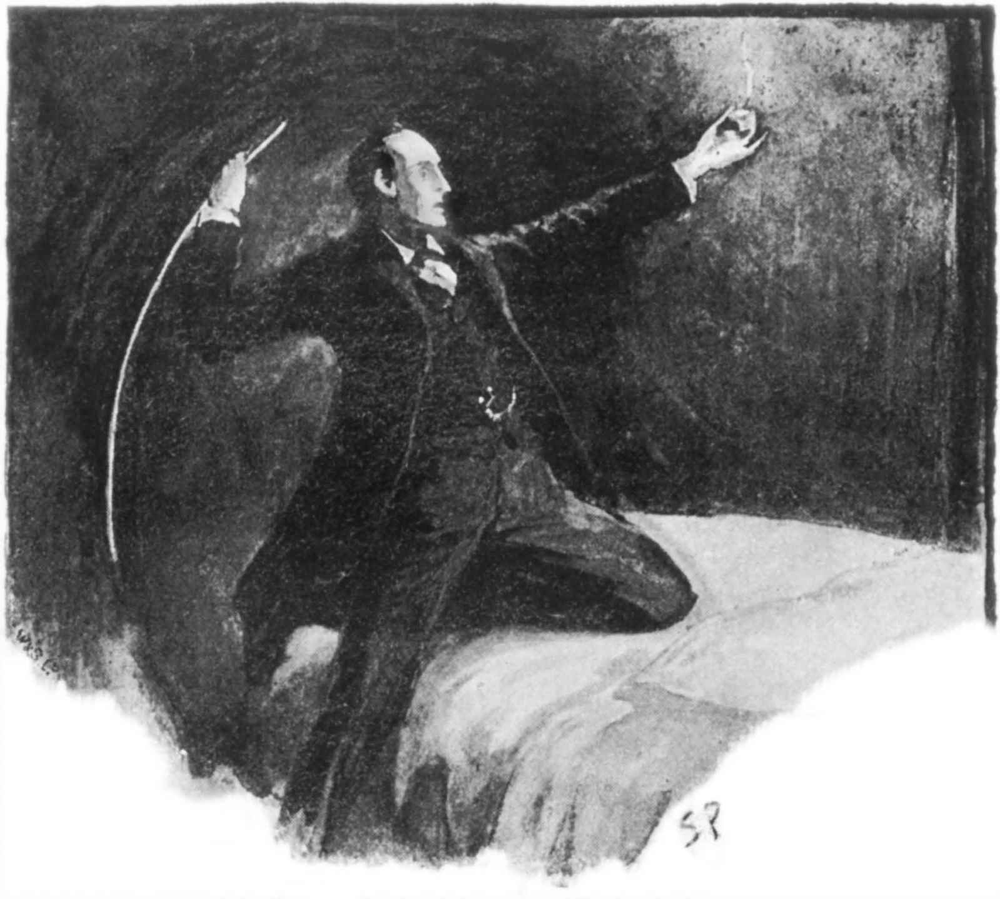

福尔摩斯拿藤鞭对着拉铃绳着力抽去。

“看到了吗，华生？”他压住嗓音嚷道，“你看见吗？”

可是我什么也没看见。福尔摩斯擦亮火柴的刹那，我只听到很低而清晰的哨声。骤起的亮光使我疲倦的两眼不能看清我的朋友用藤鞭在向什么东西猛抽。只看见他脸色死灰苍白，完全是厌恶与憎恨的表情。

他停手之后，眼盯着气孔，紧接着，黑夜的沉寂蓦地被一个人的尖叫冲破，这是我有生以来听到的最恐怖的叫喊，而且越叫越响，一种痛苦、恐惧及恶狠交织一气的绝望、嘶哑的嚎叫，叫得人毛骨悚然。日后听说，村子里甚至更远教区的人都被这叫喊声从睡梦中惊醒。这一声叫得我们寒心，我呆立着，盯住福尔摩斯，而他也盯住我，直到喊声与回响逐渐平息，一切又复归寂静。

“这是怎么回事？”我喘着气。

“这意味着一切都已结束，”福尔摩斯回答，“也许，应该说，这是最好的结局。拿上手枪，我们到罗伊洛特大夫房里去。”

他点着了灯，面色严峻，走在头里。走廊上过去，先敲了两下门，里面没有应答，便扭转把手推门进屋，我紧紧跟进，握好打开了保险的手枪。

呈现眼前的是令人奇怪的情景。桌上一盏遮光灯，遮板半合，亮光直射铁保险柜，柜门半开。桌子旁边，木椅子上，坐着格林斯比·罗伊洛特大夫，身穿灰色长睡袍，下边伸着赤裸的脚脖子，脚上套的是土耳其平跟红拖鞋，膝头搁着短柄长鞭，就是我们白天注意到的那一根。他的下巴翘起，一动不动的两眼惊惧地盯住天花板的那个角落。额上缠着一条奇特的黄色绷带，绷带上竟有红褐色的花斑，好像还是死死地箍住他的脑袋。我们进屋，他不出声，也不动。

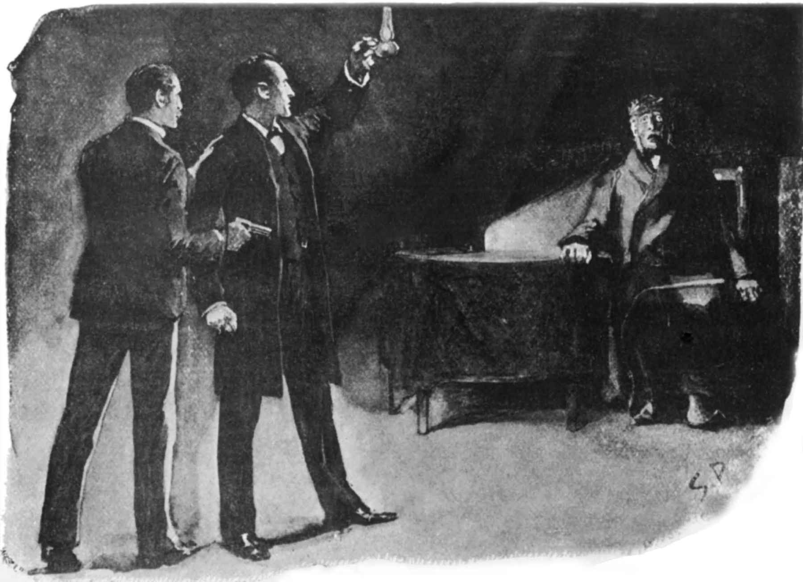

我们进屋，他不出声，也不动。

“绷带！花彩绷带！”福尔摩斯低声说。

我上前一步，忽见大夫那条奇特的头饰蠕动起来，从他的头发中间竖起一个脖颈粗胀的菱形的头，一条令人恶心的毒蛇！

“沼泽地蝰蛇<a href="#part0053.xhtml_ch3"
id="part0053.xhtml_ch3-back">(3)</a>。”福尔摩斯叫道，“印度最毒的毒蛇。他已经死了，人被咬不到十秒钟就死，这真叫恶有恶报，原是掘好害别人的陷阱，结果自己也掉进去。让我们把这东西弄回它窝里去吧，回头我们让斯通纳小姐转移到安全地方，再把这里发生的事通知郡警方。”

他说话间一抽手拿起死者膝盖上的狗鞭，将套索甩过去套住那条爬虫的脖子，把它从吓人的盘踞处拉下来，伸长胳膊提着，扔进了保险铁柜，随手将门关上。

这就是斯托克·莫兰的格林斯比·罗伊洛特医生死亡的真情实录。这件事的叙述已够啰嗦，所以，我们怎样把悲痛的消息告诉担惊受怕的小姐，怎样乘坐早班车陪送她到哈罗，托付给她善良的姨妈照顾，以及警方冗长的调查最后怎样作出结论称说是大夫不明智地玩弄自己豢养的危险宠物而死于非命，等等，就没有必要在这里一一赘述了。有关本案我不太了解的地方，歇洛克·福尔摩斯在第二天回城的路上告诉了我。

“我曾经，”他说，“得出一个完全错误的结论，亲爱的华生。证据不足就进行推论，那是很危险的。有吉卜赛人存在，加上蒙难姑娘凭火柴一闪仓皇看见‘绷带’，就说是绷带，便足以把我引入完全错误的方向。这里还是需要肯定我的审慎态度，我转变很快。当清楚地看到，威胁屋内居住人的危险不可能来自门窗，我立刻重新考虑我的立足点。我的注意重点马上转移到那个通气孔，这我已经对你说过了。还有那根拉铃绳，绳子垂到床上，我发现这根绳居然是件摆设，根本不是用作拉铃，床又钉死，固定在地板上，立刻引起我怀疑。这是一根缆绳，是让什么东西由通气孔经过这根绳引到床上来，这绳子是起的桥梁作用。这就马上想到蛇。无独有偶，我知道这位大夫养着几样印度动物，这么一联系起来，我就心里有底了，思考的路子也就对了头。坏脑筋动到采取毒杀，又要叫化学试验无法检测，这种聪明而毒辣的手段，只有受过东方医学训练的人才懂。这种蛇毒的毒性发作异常迅猛，那就极为有利，恰正符合他的意图。蛇的毒牙咬过的两个牙痕，只是小小的斑点，除非验尸官特别精明特有一功，一般根本验不到这分上。后来我又想到口哨。当然，他一定要在天亮前把蛇收回来，不能让被害人还没遇害，蛇倒先暴露了。他是把蛇训练好了的，就是用的牛奶来训练，我们看见有那一碟子牛奶，训练得吹口哨就能引回来。只要一到最佳时间，他估计好，把蛇放到孔洞口，蛇就顺着绳子往下游，游到床上。这蛇可能会咬床上的人，也可能不咬，不一定。因此很可能给姑娘侥幸逃过一星期，但迟早要被咬，她非死不可。

“我没进他房间之前，就已经得出这些结论，等检查到他的椅子，我看出他常常站在椅子上，像是习惯，当然为的要够得到那个孔洞。一见保险柜、牛奶碟、打活结的绳鞭，终于可以排除所有的疑虑。斯通纳小姐听到金属哐啷声，显然是她继父把可怕的长虫放进保险柜，匆匆碰上柜门的响声。我主意一经打定，你已知道我采取的步骤，最后一一得到验证。我听到蛇的嘶嘶声，你也一定听到，我马上划了火柴，拿鞭子抽上去。”

“结果把蛇从通气孔赶了回去。”

“更是另有结果，使蛇回过头去咬了它的主人。有几鞭给我抽中，毒蛇发起性子来，游回去，撞上谁就咬谁。我这么做，自然是对格林斯比·罗伊洛特医生之死负有间接责任，但是不能说我因此负有良心愧疚。”

（1892年）

————————————————————

<a href="#part0053.xhtml_ch1-back" id="part0053.xhtml_ch1">(1)</a> 摄政时期（the
Regency），指乔治三世因精神不正常，由其子、荒淫无度的乔治四世摄政时期（1811—1820）。

<a href="#part0053.xhtml_ch2-back" id="part0053.xhtml_ch2">(2)</a> 原文band，意为“带子”，又意“一帮”，译为“绷带”，以“绷”权与“帮”谐音。

<a href="#part0053.xhtml_ch3-back" id="part0053.xhtml_ch3">(3)</a> 沼泽地蝰蛇：一种神经性剧毒蛇，分布于印度、爪哇等地，体长可达1.5米，灰褐色，两侧有三排黑白圈红棕色斑纹。

# 工程师拇指案

我和我的朋友歇洛克·福尔摩斯密切交往期间，所有委托他要求解决的疑难案例中，只有两例是经由我的关系引荐给他的——哈瑟利先生的大拇指案，以及沃伯顿上校发疯案。两案中这后一案，如果有心计、用脑子看一看想一想，也许觉得其中更有文章，但是那前一例案子的起因就十分奇特，情节又富有戏剧性，所以更值得加以记述，尽管演绎推理法——这是我的朋友能够取得杰出成就的特殊本领——在此案中的发挥并不很多。我知道，这则故事见诸报端已不止一次，但是报上的这类文章，几乎都是只作半栏地位的笼统报道，结果根本引不起应有的注意，远不及让事实在你眼前逐一展开来得有趣，也远不及让案情之谜随着每一个新发现而得以渐渐澄清，如此步步推进直至真相大白，来得引人入胜。当时的情景给我的印象很深刻，虽然时光倏忽，已过两年，在我却是依然记忆犹新。

事情发生在一八八九年的夏天，我刚结婚不久，现在我将此事作一扼要的叙述。那时我已开业行医，搬出贝克街的租房，终于同福尔摩斯分开了。但是我还经常去看他，有时候还劝他放弃自由不羁、反世俗的波希米亚生活方式，不妨多来我家作客走走。我的业务蒸蒸日上，也正好我家住在离帕丁顿车站不远，病人中有好些是铁路职员。其中有一位，在我手里治好了久治不愈、痛苦不堪的老毛病，于是感恩戴德替我大作宣传，为我广揽病人，不遗余力，成了我的支持者、介绍人。

一天早晨，七点不到，女仆来敲门把我叫醒，说是帕丁顿来两个人在诊疗室等我。我赶紧穿衣，凭经验知道，铁路上来的病例少有不严重的，接着快快下楼。一到楼下，我的支持者、介绍人，那铁路警察，从诊疗室出来，随手把门带上。

“我领个病人来，你看吧，”他轻声说，大拇指往肩后指指，“人等着呢。”

“什么情况？”我问，看他样子，好像逮到什么珍禽异兽送进了我这诊疗室笼子里。

“一个新病人，”他轻声说，“我一看情况，决定亲自陪他来，免得他跑错路找不着，现在到了，交到你手上了。我这就得走，大夫，我要上班，跟你一样，你也得上班。”说着就走。这位真心诚意的老介绍，没容我来得及道个谢，就一溜烟走掉。

我走进诊疗室，见一位先生坐在桌旁，一身粗花呢的朴素衣着，一顶布软帽搁在我的几本书上，一只手用手帕裹住，上面沾满血迹。他年纪还轻，我看不会超过二十五岁，一张阳刚帅气的脸，可是面色惨白，给我的印象是正受着极大的痛苦和折磨，完全靠着意志力在控制自己。

“很对不起，一早就来打扰你，大夫，”他说，“我夜里出了事故，很严重。我乘火车来，今天早晨，在帕丁顿打听，哪儿能看大夫，一位好心人真热情，一直陪我过来。我有名片给你家女仆，见她放在那个桌上了。”

我取过名片一看，“伯克多·哈瑟利先生，水利机械工程师。维多利亚街十六号A（四楼）。”我的早晨访客的姓名、身份、地址就是这个。“很抱歉让你久等，”我说，椅子上坐下，“你刚刚乘了一夜的火车，我知道，这已经够单调乏味叫人难受了。”

“哦，我这一夜倒谈不上单调乏味，”他说着，大笑起来。他尽兴地笑，高声朗朗，人靠在椅子里，前仰后合。我作为医生，本能地制止不许这样笑。

“不能笑！”我大声说，“要镇静！”我拿玻璃水瓶倒了一杯水给他。

然而，没有用。他是歇斯底里大发作，是一种性格坚强的人摆脱大灾大难之后的反应。一会儿他恢复了常态，精疲力竭得面色刷白。

“我失态了，出丑了。”他气喘吁吁。

“没什么。喝这个。”我把水掺上白兰地给他，他那死灰的双颊才渐有起色。

“感觉好多了！”他说，“现在，大夫，请你帮我看看大拇指。其实，大拇指是没有了，帮我看看伤口吧。”

他解掉手帕，把手伸过来。算得上铁石心肠的我，一看也不寒而栗！伸着仅有的四个指头，大拇指处只是血肉模糊一团，整个拇指给剁掉或是轧掉，齐根没有了。

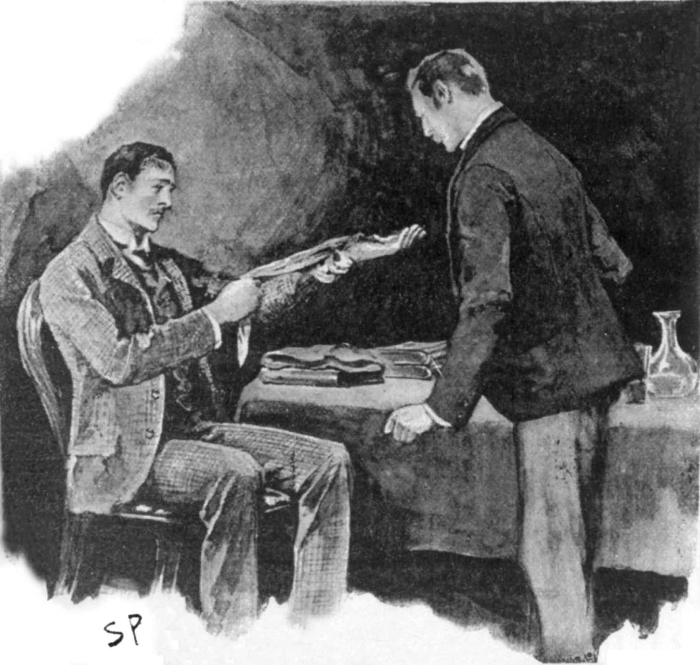

他解掉手帕，把手伸过来。

“我的天！”我叫起来，“伤得这么厉害，出血不少。”

“是的，流了好多血。刚受伤，我都晕过去了，失去知觉好长时间，我知道。醒过来还见流血，只好拿手帕扎在手腕上，用根小树枝把手帕绞紧。”

“做得很好！你当个外科医生没问题。”

“这是个流体力学问题，你知道，我的老本行，活学活用。”

“你这是，”我说，检查着伤口，“给锋利的重器砍的。”

“像切肉刀样的东西。”他说。

“意外事故，我想是。”

“完全不是。”

“什么！给人砍的？”

“作恶行凶。”

“好吓人！”

我用海绵洗伤口，清理干净，敷药裹好，最后用棉垫和消毒绷带包扎起来。他人往后靠着，始终毫不畏缩，只一个劲地咬紧牙关。

“感觉怎么样？”包扎完了以后，我问他。

“好多了！幸亏有你医生，白兰地让我有精神，扎绷带解除我的痛苦，我觉得焕然一新。我真虚弱，可是还有事要去做。”

“最好先别谈这事，免得增加精神痛苦。”

“哦，不，现在不会了。我要去报警。可是，这个事不瞒你说，要没有我这伤口为证，还很难叫警察相信我说的话是真是假。这不是普通一般事，可我又拿不出真凭实据来证明自己，就算警方相信我，我能够提供的线索也不是很具体可靠，到最后是否能为我主持正义还是个问题。”

“那，”我高声道，“如果问题确实存在，你希望得到解决，我倒是建议你报警之前，先去找找我的朋友歇洛克·
福尔摩斯。”

“噢，这个人我听说过，”我的客人说道，“他能接手我这件事，那当然就再好也没有，不过警方还是用得着的。你能帮我介绍他吗？”

“我不只介绍，我还要亲自带你去他那里。”

“那真是太感谢你了！”

“我们叫一辆马车一起去，还赶得上时间同他共进早餐，你觉得身体吃得消吗？”

“没问题。事情不吐个痛快，我才真觉得不舒服。”

“那好，佣人去雇马车，我有点事，就来。”我跑到楼上，向妻子简单交代几句，五分钟后，已进了双轮马车，与我新认识的人直奔贝克街。

歇洛克·福尔摩斯，正如我所料，穿着晨衣在起居室里踱方步，一边拿着《泰晤士报》看启事广告栏，嘴上叼着烟斗——他照例早餐前抽一斗烟。他总是把前一天抽剩的烟丝和烟末，小心烘干收集，放在壁炉架的角上，重新再用。他随便而热情地接待我们，吩咐拿来现煮的火腿片鸡蛋，一起美美地饱餐一顿。餐毕，他把新认识的朋友安顿在沙发上，给他脑后垫一个枕头，拿一杯掺水白兰地放在他手边。

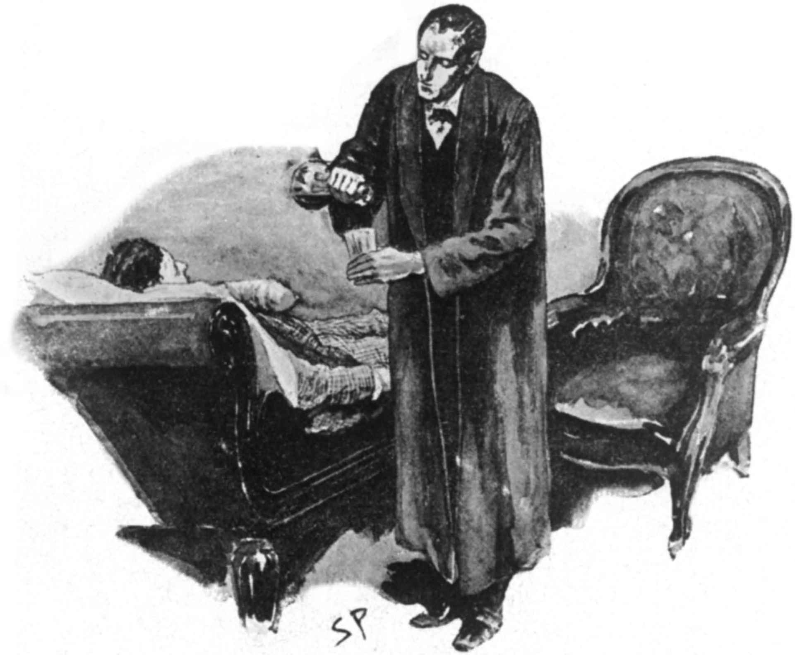

他把新认识的朋友安顿在沙发上。

“不难看出，你的遭遇不简单，哈瑟利先生，”他说，“请躺着好了，随便一点，像在自己家里一样，你能怎么谈就怎么谈，感到累了就歇着，喝口酒提提神。”

“谢谢，”我的病人说，“大夫给我上了绷带，很好，我觉得自己换了一个人了。再一饱你的早餐，我的伤好多了。你的时间宝贵，我尽量少占一点，所以马上开始谈本人的不幸遭遇。”

福尔摩斯坐在大扶手椅中，他眼皮沉重，一副困顿疲倦的样子，以此掩饰掉他敏锐的注意力和热切的心情。我坐在他对面，一起静听来客把他那离奇的故事细细道来。

“你们知道，”他说，“我是个孤儿，又是单身汉，孤身一人生活在伦敦。职业，我是个水利机械工程师，对水利行业有相当丰富的经验，在格林尼治有名的文纳和马西森公司当过七年练习生。两年前，我练习生期满。父亲不幸去世后，我继承了一笔数额不小的钱，我决定自己营业，在维多利亚大街租了几间屋子作营业所办公室。

“大概独立营业者人人都经历过创业之初的艰难，我碰到的情况尤其明显。两年之中，我接过三次咨询、一次小业务。这就是我接到的全部业务，就这么一点而已，毛收入总共二十七英镑十先令。每天上午九点直到下午四点，我守在斗室里，守到最后便心灰意冷，跟自己说再也不会有生意上门了。

“可是昨天，我正要离开办公室，伙计进来说有位先生有生意事等着要见我，还递上一张名片，印着名叫‘莱桑德·斯塔克上校’。这个上校后脚马上跟进来。一看，个头中等偏高，可是精瘦精瘦。真意想不到会有这么瘦的人，整张脸没有肉，只有鼻子、下巴，两颊的脸皮紧绷着突出的颧骨，像是天生的一副皮包骨头。不像是生病生的，因为眼睛炯炯有神，走路神气、轻快，动作利索。他衣着平常，可是整洁。年龄我估计，三十不止，约莫四十不到。

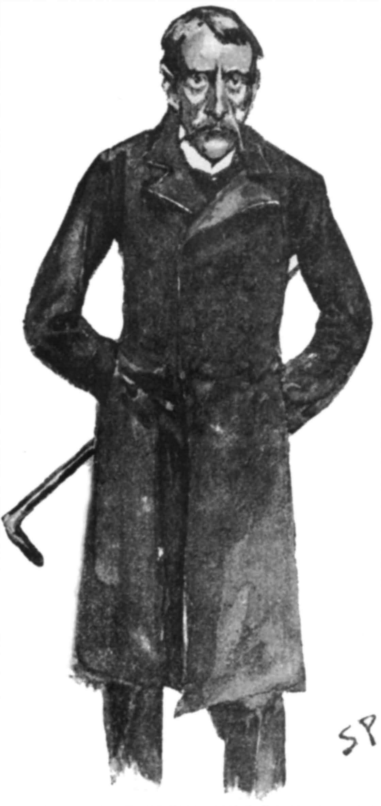

真意想不到会有这么瘦的人。

“‘哈瑟利先生？’他说，带着德国口音，‘有人把你介绍给我。哈瑟利先生，知道你不但精通业务，而且为人小心谨慎，能为客户保守秘密。’

“我点点头。年轻人都爱听恭维话，我自然也是。‘敢问一下，是谁把我说得这么好？’

“‘呵，这个嘛，眼下还是不跟你说为好。同时我还听说你是孤儿，无家无妻小，一个人住在伦敦。’

“‘一点不错，’我回答说，‘不过我冒昧说一句，我看不出这些同本人的业务能力有什么关系。据我知道，先生是来同我洽谈一件业务上的事情，是吗？’

“‘的确是的，但是你会发现，我讲的都是点子上的话，不是废话。我有一项业务想委托你来办，但是关键是必须保密——绝密，绝对机密，你要清楚，所以我当然更希望是一个人。没有家室的人，比一个有家室的人要可靠。’

“‘只要我答应你严守秘密，’我说，‘你可以绝对放心，我一定说到做到。’

“我这么说，他死死盯着我。我心想，还从来没见有这样猜忌多疑的目光。

“‘那么说，你答应了？’最后他说。

“‘是呀，答应了。’

“‘绝对，完全不泄密，事情进行之前、进行之中、完成之后，都要保密，一点不能提这个事，嘴上不说，笔下不写，做得到？’

“‘我都已经把话说定了。’

“‘很好。’他忽然跳起来，迅雷不及掩耳之势，冲过去把办公室门哗啦一下拉开，看看，外边过道上是否空无一人。

“‘这就很好，’他说，又回转身来，‘我知道职工对上司的事情不免有好奇心。现在我们可以谈了，安全没问题。’他把椅子拉过来紧挨着我，又用怀疑的眼光盯住我，打量我。

“这个瘦得骷髅似的人，行为怪僻，我心里不由得升起一阵子反感，近乎是恐惧。我虽怕失去主顾，可还是克制不住流露出了不耐烦的情绪。

“‘请教你是为的什么事，讲吧，先生，’我说，‘我的时间很宝贵。’上帝宽恕我说了后面一句话，但这话我是脱口而出的。

“‘只不过一个晚上的工作，五十几尼还可以吧？’他问我。

“‘相当不错了。’

“‘我讲是讲一晚上的工作，实际上只要一小时也就差不多了。事情很简单，你看看我的一台水力冲压机，齿轮滑牙，给说个故障的原因就成。只要讲明白，我们自己能很快修好。就这点任务，你看怎么样？’

“‘事情很轻松，报酬倒丰厚。’

“‘正是这样。我们请你今天就来，赶乘末班车。’

“‘去哪里？’

“‘去伯克郡艾福德，靠近牛津郡边界的一个小地方，相距里丁不到七英里。帕丁顿有火车通那边，十一点十五分，差不多可以到了。’

“‘好呀。’

“‘我会有马车来接你。’

“‘还要赶一程吗？’

“‘是的，我们小地方，乡下也是偏僻角落，离艾福德车站足有七英里。’

“‘那么说，午夜到不了目的地，也搭不上回来的火车，我还得在那儿过夜。’

“‘是的，我们给你安排住宿，很方便。’

“‘那可麻烦了，不能改个合适时间去吗？’

“‘我们就是要快去，再晚也要去，就是因为你有不便之处，我们才出那个价。你一个无名小卒，这笔钱向你这一行最高明的专家买个意见也足够了。不过，当然啦，你不想干这个差使的话，现在还来得及。’

“我看在五十几尼的分上，这钱对我是多么有用处。‘倒不是这个意思，’我说，‘我乐意为你效劳，只是想多了解，更详细一点，要我具体做什么工作。’

“‘是呀，我们要求你保证不泄密，这就引起你疑心。我们无意叫你做事又不让你知道做什么事。我说，这儿绝对安全，没人偷听吧？’

“‘绝对没人偷听。’

“‘那好。事情是这样，你大概很清楚漂白土是一种很有价值的矿产，在英国只有一两处地方发现有这种矿藏。’

“‘我听说是这样。’

“‘不久以前，我买了一块小地产——很小很小——相距里丁不到十英里。我真走运，发现买进的地块有一处是漂白土矿。但是勘探下来矿藏比较小，而连接的左右邻倒是大矿——可都是邻居家的土地，这些人的脑子绝对想不到底下的土地有金矿那么值钱。我当然打算趁他们还不知真情时把土地买下来，可惜我没这么一笔资金。我找了几个朋友秘密商量，他们献计，我们可以私底下悄悄把自己的小矿先开起来，借此积累资金，再来购进邻里的土地。我们这样做已经有一段时间了，为了便于开采，我们安装了一台水压机。这台机器，我已经讲过，出了问题，所以就来请你诊断机器的毛病。我们生怕泄漏机密，一旦人们知道我们小小的家中请来了水利工程师，那就马上会感到奇怪，打听究竟；事情一走漏，那什么买人家土地、什么开矿，都泡汤了，整个计划就全部完蛋了。这就是为什么我要你同意今夜去艾福德，神不知鬼不觉，一个人也别让知道。我希望我已经把一切都讲明白了，你清楚吗？’

“‘我清楚你的意思，’我说，‘还有一点不太明白，开采漂白土矿水压机有什么用？漂白土，我知道，像挖金沙一样从矿坑里往外挖就成了。’

“‘啊！’他不当一回事地说，‘我们有自己的工艺方法，是把土压成砖坯，只不过是把砖坯往外运，就能掩人耳目，谁也不会想到真正是什么东西。这可是个重要关键，反正我对你完全放心了，哈瑟利先生，你看我有多信任你。’他说着就站起了身，‘就这样，我十一点十五分在艾福德接你啦。’

“‘我一定来。’

“‘一个人也别让知道。’他最后还怀疑地盯住我瞧了好一会儿，然后伸出他阴湿的手紧紧抓住我握了一下，匆匆离开办公室。

“过后，我冷静下来把整个事情细想一遍，不由得满肚子惊疑，你们两位也会想，这个事临到我头上，怎么这么突然。一方面当然我高兴，他付酬至少高出我自己营业的开价十倍，而且，还有可能连着一起揽到其他工作。但另一方面，这个主顾那副尊容和腔调实在不敢恭维，叫我大大不舒服。而且我觉得他讲的漂白土的事，不足以解释一定要我非半夜去不可，样子猴急得一点都不通融，怕我会同别人讲这趟差事。尽管这样，我还是把这些顾虑担心一古脑儿抛掉，好好吃饱一顿晚饭，坐马车到帕丁顿，就此上路，没对任何人提及此事。

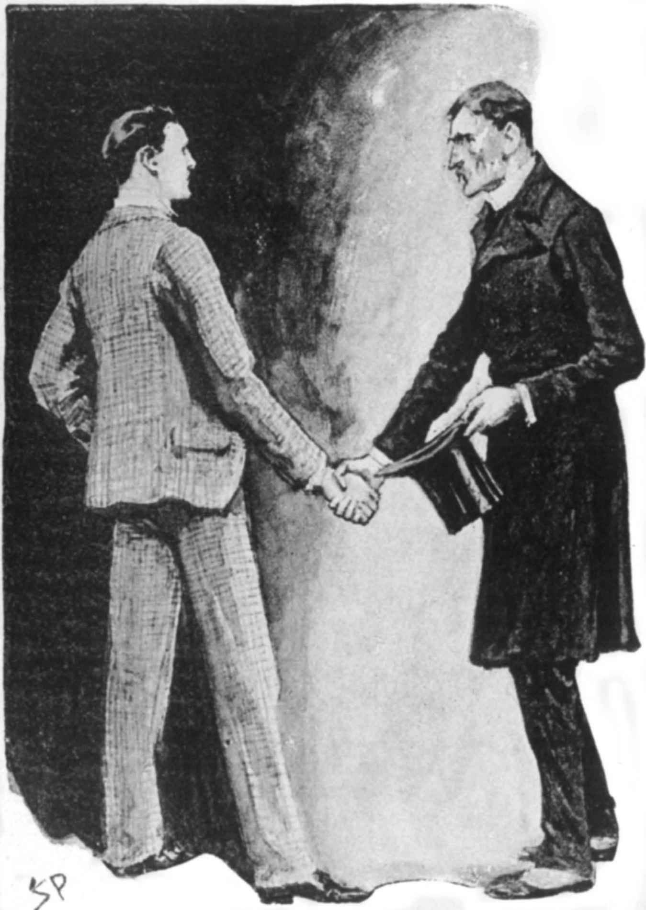

“一个人也别让知道。”

“在里丁，我得换车，又换站，可我终于及时赶上最末一班开往艾福德的火车。十一点过后，到达灯光昏暗的小车站，这个站下车的就我一个。月台上不见什么人，只有一个脚夫，提着马灯哈欠不断。走出了月台边门，我看见那个刚认识的朋友躲在背面暗影里。他一句话也不说，抓住我的胳膊拉我上马车，车门正打开等着。他把两边窗子都拉上，手敲敲车厢板，马车立即飞奔起来，能跑多快就有多快。”

“一匹马？”福尔摩斯插话问道。

“是的，一匹马。”

“注意什么颜色了吗？”

“注意了，跨上马车的时候，借着两边的车灯亮光，看见是一匹栗色马。”

“马挺疲劳呢还是挺精神？”

“哦，精神得很，浑身光亮。”

“谢谢你，打断了你一下，对不起，听得真有劲儿，请继续往下讲。”

“就这么离开车站。马车跑了至少一个小时，莱桑德·斯塔克上校原来说是只有七英里，但是我想，根据跑的速度，跑的时间，应该差不多有十二英里了。他坐在旁边，一路不说话。我几次瞥眼瞅他，发觉他一直在紧张地盯着我。乡下的路一般总是不太好，车子颠簸得挺厉害。我想望一望窗外，要看看到了什么样的地方，但是窗子都是毛玻璃，除了偶尔经过有路灯的地方，窗上一片白呼呼亮光，什么也看不见。他不开口，不管他，我不时找话跟他说上几句，打破一路来的沉闷，但是上校都最多只回上一个字，谈话也就谈不下去。最后，不断颠簸的路变得平稳了，是走上了砾石路面。马车一会儿就停下来。莱桑德·斯塔克上校跳下车，我们一跨出马车便进了就在面前的一个廊道大门，我跟在他后面，他忽然一把拉我进了大厅，我都来不及看一眼这房子的外观是怎么个模样。脚一跨入门坎，身后的门就砰一声给重重地关上，隐隐约约听得到马车轮子嘎啦嘎啦地跑远。

“屋里漆黑一团，上校摸索着找火柴，嘴里低声咕咕哝哝。过道尽头一扇门忽然打开，一道金光直向我们射来。灯光照大了，出来的是一个女人，手里一盏灯举在头顶，探着头向我们望。我发现这个女人长得挺好看的，穿的是黑色衣服，从光泽看得出那是很高级的衣料。她开口说的是外国话，听上去是在问些什么。我的同伴硬声硬气回一个字，女人反应是大吃一惊，手里的灯都差一点要掉到地上。斯塔克上校走上去，向她咬耳朵讲了几句，把她推回到出来的屋里去，便手提了灯向我走来。

“‘也许要请你在这房里稍等一下。’他说，一边推开了另一扇门。这一间屋很小，没有人，没什么摆设，屋中间是一张圆桌，桌上扔着几本德文书。斯塔克上校把灯放在门边一架风琴上。‘就只稍等一等。’他说，人消失到黑暗中了。

“我看了看桌上的书，德文我不懂，不过可以看出两本是科学论文，其他是诗集。我又走到窗口，想看看，领略一下乡村夜景，可是一扇栎木百叶窗关得严严实实，窗子给挡得死死的。这屋子静得出奇，只有过道上一口旧式的钟走得嘀嗒嘀嗒响，此外一切死寂无声。一种隐约不安的感觉渐渐向我袭来，这些德国人做什么的？住在这人生地不熟的偏僻地方做什么？这里又是什么地方呢？我只知道离开艾福德十来英里，但是连东南西北都搞不清了。可以估计，里丁，还有其他大城镇都在这范围之内，如此看来，这地方还不至于太荒僻。从这么安静来看，可以断定这是农村。我在屋里走来走去，低声哼着曲子给自己鼓气壮胆，心想毕竟有五十几尼好挣呢。

“忽然，在死一般的沉寂之中一点没有听到预先响声，我这房间的门慢慢地开了，那个女人站在门开处，身后是漆黑一团的大厅。屋里的黄灯照在她美丽而焦急的脸上，我一眼就看出，她惶恐不安。面对这情形，我自己不禁感到一阵心寒。她举起一个哆哆嗦嗦的手指，警告我不要声张，急急忙忙对我小声说着不纯熟的英语，眼睛惊慌地不住要向身后黑暗中望望。

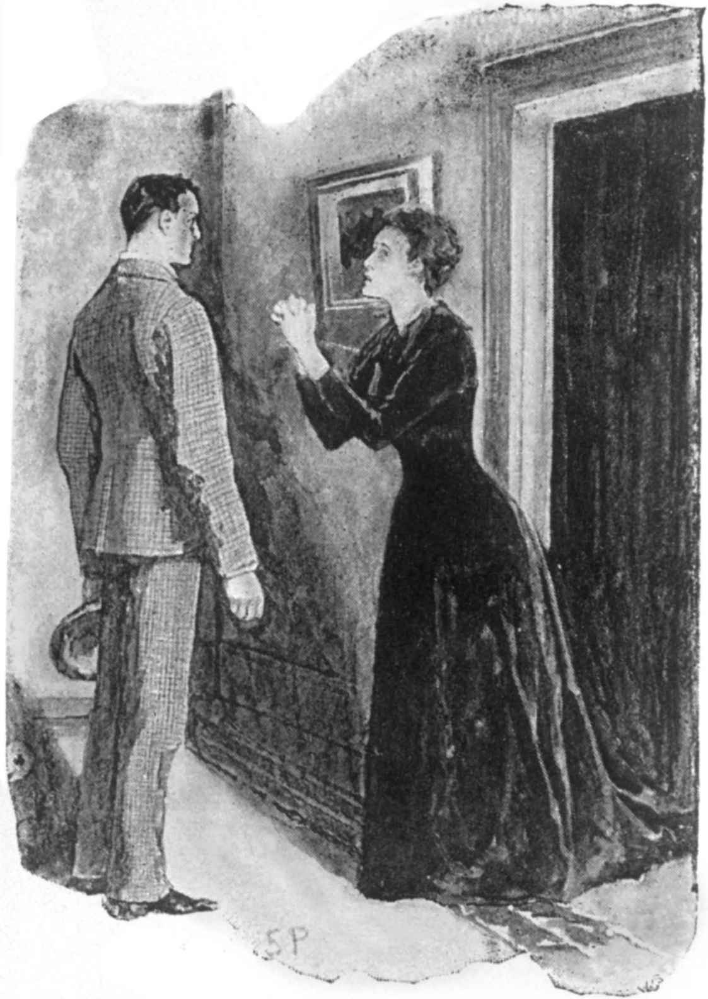

“我一眼就看出，她惶恐不安。”

“‘换是我就去了，’我看她是在竭力让自己说得平静些，‘换是我就去了。换是我绝不等在这儿，没有你的好处。’

“‘可是，夫人，’我说，‘我有事来的，还没做事呢。机器还没看，我不能走呀。’

“‘一刻也不值得你等，’她还说，‘你可以打这门走，没有人拦阻你。’可是她见我只笑笑，摇摇头，就忽然不顾一切，跨前一步，绞着两手。‘上帝拯救吧！’她压着声说，‘快跑吧，要不然就来不及了！’

“可我这个人很死心眼，事情越遇阻力越不肯罢休。我还念着我那五十几尼，念着我那疲劳困顿的旅途，心想这一夜似乎会带来很多不快，难道一无所获就算了？干吗说好的任务不完成，应得的报酬也不拿？干吗要不告而别？这个女人，我居然转念想，不是神经病吧？于是，我态度坚定，尽管她的神情叫我震动，这我得承认，但我仍旧摇摇头，表示要留下，无意离开。她正要再次强调表明意思，只听见楼上“砰”一声门关上了，接着是楼梯一阵脚步在下来。她一听到就举起了双手，做了个绝望的手势，像来的时候那样，一下子悄没声地消失了。

“来人是莱桑德·斯塔克上校，还有一个人，矮胖身材，双下巴皱缝里长着绒鼠胡须，自我介绍叫弗格森先生。

“‘这位是我的秘书兼总经理，’上校说，‘顺便问问，记得刚才我是把这门关上的，怕穿堂风吹着你。’

“‘我正要吹风，’我说，‘我自己开的门，这屋里有点儿闷。’

“他怀疑地看看我。‘那就该进行正经事了，’他说，‘弗格森先生和我带你去看机器吧。’

“‘让我把帽子戴上。’

“‘哦，不用，机器在屋里。’

“‘什么，在屋里挖漂白土？’

“‘不，不，只是压土坯在这儿。反正没关系，我们只请你检查机器，让我们知道毛病在哪里就行。’

“我们一起上楼，上校提灯走在前面，胖经理和我跟在后面。这是一幢迷宫似的老房屋，横一条过道，竖一道走廊，盘盘绕绕的窄楼梯，多少个又矮又小的门，门坎历经几代人踩踏，都凹陷下去了。楼上没铺地毯，也不见有家具摆设。墙面灰泥已经剥落，一块块绿斑污迹肮脏不堪，在湿渍渍发潮。我装作不当一回事，但心里记着那位夫人的警告，尽管我没把她的话当真。我一直注意着身边这两个人，弗格森像是个冷冰冰、无言语的人，但是他偶尔一开口就能听出，八九成是本国同胞。

“莱桑德·斯塔克上校后来在一扇矮门前停下，把门锁打开。里边是一间四方小屋，三个人一下子还进不去，弗格森留在外面，上校领我进去。

“‘就这儿，’他说，‘这里就是进了水压机房了，要是一开动的话，可不是闹着玩的啦。这小屋的顶部，就是下压活塞的底部，好几吨的力量压下来，压到这铁地板上。外面有几根平行小水柱，受力后会大大增加传导压力，这原理、方式你是熟悉的。机器开动没问题，就是运转起来有点不灵活，压力不够。请你看一看，让我们怎么样来把它修好。’

“我接过他手里的灯，仔细地检查机器。这机器确实是台大家伙，能产生强大的压力。当我走到外面，压下操纵杆，就听到嗖嗖声，马上知道机器有细微裂缝，引起一个侧活塞的水回流。经过检查发现，套在传动杆头上的橡皮垫圈老化皱缩，不能塞紧传动杆作来回运动的托座，这就是压力减小的明显原因。我向上校指出问题所在，他仔细听了我的话，又问了几个如何进行修理的具体问题。我讲明白了以后，又回到机器的主室，出于好奇心，再细心看了这台机器。这么一台压力机，一眼就看出，那个漂白土的故事纯属无稽之谈，因为这台机器设计功率如此巨大，用于如此目的实在大可不必，堪称荒唐。这儿四面是木板壁，地板由一个大铁凹槽组成。我向铁凹槽里看看，发现积满了金属屑。我弯腰下去，还用手去拾一点想看看到底是什么东西，忽然听到一声低沉的德语喊叫，同时看到上校那张死人脸向我俯视下来。

“‘你在干什么？’他问我。

“我已经心中不满，他编造故事来骗我，供他摆布。‘我在欣赏你的漂白土呢，’我说，‘我想，要是知道你这机器的真正用途，我就能提点更好的意见、建议。’

“这话一出口，我就后悔说话太鲁莽。他的脸刷一下子板住了，两只灰色眼睛闪着歹毒凶光。

“‘很好，’他说，‘让你对这机器了解个充分。’他后退一步，把小门砰一下关上，用钥匙落了门锁。我冲向门，拉把手，门关紧了，一动不动，我连踢带推，毫无用处。

“‘喂！’我大叫，‘喂！上校！放我出去！’

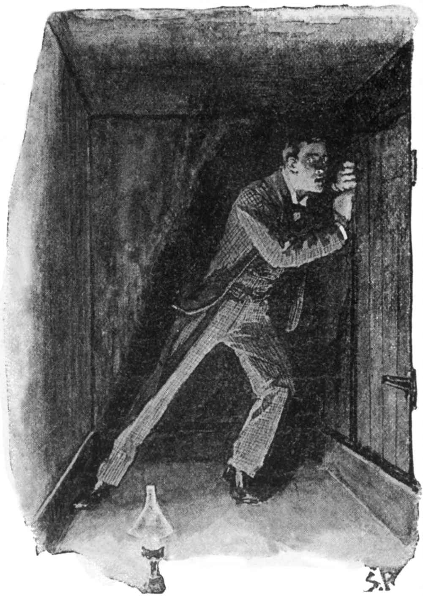

“喂！上校！放我出去！”

“马上，寂静中听到了机器声，我的心都提到嗓子眼了。杠杆吭啷吭啷响，水柱发出嗖嗖漏水声，他把机器开起来了。灯在地板上，我看铁板槽的时候放在那儿的。在灯光中，我看到黑沉沉的屋顶板正向我压下来，慢慢地、颤颤地压下来，我比谁都清楚，巨大的力量一分钟就能把我压成肉酱。我大声叫喊，拼着命身体往门上撞，用手指抠门锁。我哀求上校放我出去，但是无情杠杆的吭啷吭啷声淹没了我的叫喊声。上压板离我头顶只有一两英尺了，我举手可以摸到粗糙坚硬的铁板面，这时我心里一闪念，想到被压死的痛苦程度取决于人体的姿势，如果我取俯卧姿势，铁板就压在脊椎骨上；一想到脊椎骨被压的断裂声，我害怕得浑身发抖。另外一个姿势的死法，也许好受些，可是我有没有胆量仰卧，眼看着黑漆漆的铁板颤颤悠悠面向我压下来呢？我的身体已经不能站直了。这时候，我的眼睛忽然看到了出路，心中迸发出希望的火花。

“我说过，顶板、地板是铁的，墙壁可都是木头板。我眼睛向四周最后一扫，让我看到两枚板壁的缝道之间透进来一线黄光，于是把一枚小嵌板推推，再推推，这光钱也就越来越大。一刹那间，我简直难以相信，求生之门向我开启了。下一刹那，我用足平生之力冲出去，穿到外面人摔得半死，那嵌板还是合在那里。那盏灯压得喀啦啦碎了，顷刻之间，两枚铁板哐啷啷撞在一起，真是千钧一发，死亡夹缝里得以逃生。

“有人猛拉猛扯我的手腕，使我苏醒了过来。我发现自己躺在小廊道的石头地上，一个女人俯身在旁边，用左手拉着我，右手拿着蜡烛。原来正是这位好心朋友，怪我自己愚蠢，没有听取她的警告。

“‘快！快！’她气喘吁吁喊着说，‘他们马上就要来了。他们会发现你没有在那里，哦，不能浪费宝贵时间啦！快来！’

“这一回，不论怎么说，我再也不敢无视她的劝告，我挣扎着站起来，跟随她沿走廊跑，从一道弯梯下去。下了梯，是一条大走廊，正迈上这条走廊，我听见奔跑的脚步声，有两个人在叫喊。一个人在我们刚才过来的那一层向底下一层的另一个呼应喊话。我的向导停下脚步向周围看看，看她的样子是走投无路了，可是她马上推开一扇门，是一扇卧室的房门，月光透过窗子把卧室照得很亮。

“‘没办法，只有这样的机会，’她说，‘很高，你可以，还是能跳。’

“说话间，过道那头亮出一道光，我看见莱桑德·斯塔克上校的瘦影子在奔过来，一只手提灯，另一只手握着家伙，像是一把屠刀。我直往卧室冲进去，一下把窗推开，向外看。外面是花园，在月光下静悄悄的，散发着芳香。一看下面，高度不超过三十英尺。我从窗台上爬了出去，我正犹豫着，是要听听我的救命恩人同追赶我的恶棍会发生什么事，要是她遭遇不测，我说什么也要豁出去挺身相助。这念头在脑子里刚一闪，已见上校追到了房门口，推开她要冲过来，但她伸出两臂把上校抱住，死命往回拽。

“‘弗里茨！弗里茨！’她用英语叫着，‘别忘了，上次你许下诺言，你说再也不干了。他不会说出去的呀！哦，他不会说出去的呀！’

“‘你疯了，伊莉斯！’上校大叫，挣扎着要把她甩掉，‘我们都要给你坏事。他看见的太多了，让我过去，快！’他猛一下把她甩到一边，冲到了窗前，举起刀来朝我砍。我这时身体已经悬在窗外，他的刀下来的一瞬间，我两手还抓着窗台。我感到一阵钻心的疼，手一松，人掉到了下面园子里。

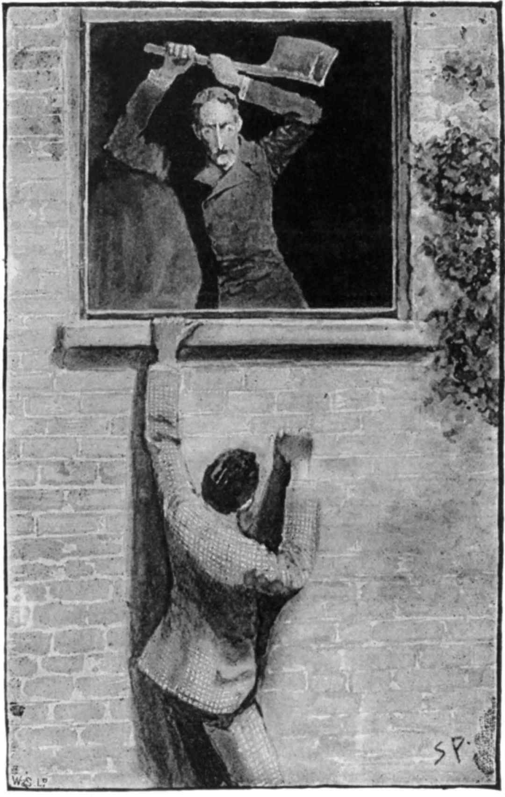

他冲到了窗前，举起刀来朝我砍。

“我一震，人没有摔伤，我爬起来，拼着命跑，奔向树丛，我脑子很清醒，知道还远远没有脱离危险。可是一下子，我跑着只觉得猛一阵头晕、恶心，低头瞅了一眼手，痛得我抽筋发抖，这才发现大拇指给砍掉了，伤口上的血喷涌而出。我用手帕尽量包扎，耳朵里只觉得嗡嗡叫，接着就昏厥了过去，倒在玫瑰树丛里。

“昏过去多长时间自己也不知道，肯定是好长一段时间。醒来的时候，见月亮已经沉下去了，天蒙蒙亮，衣服全给露水湿透，衣袖给拇指伤口的鲜血染红。忽然伤口的阵阵刺痛叫我回想起一夜来遭遇的出奇险恶，意识到我还没有摆脱被人追杀的险境，便一下子跳起来。我环顾四周，十分吃惊，觉得奇怪，居然看不到住家房屋，也不见了花园，我是躺在紧挨公路的树篱中间。向前走不多远，有一排长长的建筑，走近一看，原来就是我昨夜下车的车站。要不是手上明明留着这个伤痛，几个钟头遭遇的可怕经历，还不都像是一场噩梦。

“我头晕目眩地走进车站，问了早班火车什么时间。一小时不到一点，将有一班车到里丁。我看到，还是那个脚夫在值班，来的时候也看见是他在那儿。我向他打听，有没有听说过有个莱桑德·斯塔克上校？他说这个名字一点也不熟悉。看没看见昨夜有一辆马车在这儿等人？没有，也不知道。这儿附近有没有警察局？要走三英里远才有。

“我这么伤痛、虚弱、疲倦，这段路是太远了，我决定只有等到了城里再找警察局报告情况。回来六点刚过，先把伤口治一治，多亏这位医生好心把我带这儿来。我把事情完全托付给你了，一切照你的意见办就是了。”

我们两人听完这段异乎寻常的叙述，沉默无语坐了一会儿，然后，福尔摩斯从书架上取下一部厚厚的贴剪报的大本子。

“这里头有一条广告，你会感兴趣，”他说，“大约一年以前，报纸上都登过。听我念：

寻人，杰里迈西·海林先生，二十六岁，水利机械工程师，于本月九日夜十时离寓所，迄今未归，不明下落。身着——

什么衣服等等。哈！这说明，是上一次这位上校需要把他的机器进行一番大检修，我是这么想的。”

“哦，天哪！”我的病人叫道，“那么说，这正解释了那位年轻女子讲的话了。”

“毫无疑问，很清楚，这上校是个穷凶极恶的冷血动物，铁石心肠，挡他财路的，一律除掉，像那帮杀人不眨眼的海盗，劫到一条船，便一个活口也不留。好了，现在每一分钟都十分宝贵，如果你觉得人还受得住，我们立刻到苏格兰警场去，作为向艾福德进发的行动前奏。”

约莫三个小时以后，我们都上了火车，从里丁向伯克郡的小村挺进。我们是福尔摩斯、水利机械工程师、布雷兹特里特巡官、一个便衣侦探和我。布雷兹特里特在座位上铺开一张本郡警用地图，起劲地用圆规以艾福德为中心画着圆弧。

“正是这儿，”他说，“这一圈半径十英里，以这个村子为圆心，我们要找的地方就在这弧线上，差不多。按你说的十英里，我想也就差不多，先生。”

“马车足足跑了一个小时。”

“还有，你想是，是他们把你昏迷中一路弄回来的？”

“应该是他们，是他们这么做。我模模糊糊记得，是给他们抬了走，抬到了个什么地方。”

“这我就不懂了，”我说，“他们发现你摔昏在花园里，为什么放过你呢？是不是这个恶棍因为女人求情心软了？”

“我看不是这个原因，我这辈子还从没见过比他这张脸更冷酷无情的了。”

“噢，我们很快就能全部弄清楚，”布雷兹特里特说，“好，圆圈范围画好，现在所希望的，只要找出在线一个点，在这个点上我们能拿住那个家伙。”

“依我看，我的手指就摁这儿。”福尔摩斯静静地说。

“什么！这里？”巡官嚷嚷道，“你只是你的意见！来，现在，我们来看看谁同意你的意见。我说是在南边，那里乡下人烟稀少，更是没有人家。”

“我说是东边。”我的病人说。

“我说在西边，”便衣警探说，“那个地方有几个冷僻的小村落。”

“依我之见在北边，”我说，“因为那个地方没有山地，我们的朋友不是说了吗，他没感觉到马车上过坡道。”

“好啦，”巡官朗声笑道，“意见分歧这么大，我们尽兜圈儿定不下来。你这决定性一票投给谁？”

“你们全都错啦。”

“不可能全都错。”

“唔，全错，你们全错。你们听听我的观点。”福尔摩斯把手指指在了圆心点，“就在这里，我们能找到他们。”

“可是走十二英里路？”哈瑟利工程师出着大气儿问。

“六英里去六英里回，再简单不过。你自己说的，你上马车的时候，看见马挺精神，挺光鲜，如果已经跑过十二英里坎坷崎岖的路，能是那个样子吗？”

“确实，很可能就玩这么一个诡计，”布雷兹特里特颇有心计似的说，“当然啦。这是个什么性质的团伙，已经没有疑问。”

“没有疑问，”福尔摩斯说，“这是一个规模很大的假币制造团伙，他们用这台机器铸造合金硬币代替银币。”

“我们已获悉有段时间了，一个狡猾的团伙在活动，”巡官说，“他们一直在大量造出半克朗硬币。我们早已跟踪到了里丁，可是再也深入不下去。他们把线索全部掩盖掉，表明他们确实是老手。可现在，运气来了，有机会了，这一回他们准保难逃法网。”

但是，巡官错了。这批罪犯命定不会落入法网。我们的火车驶进艾福德车站，看见一股巨大浓烟从邻近小树丛后面滚滚升空，有如硕大无朋的鸵鸟把下面的景色遮盖。

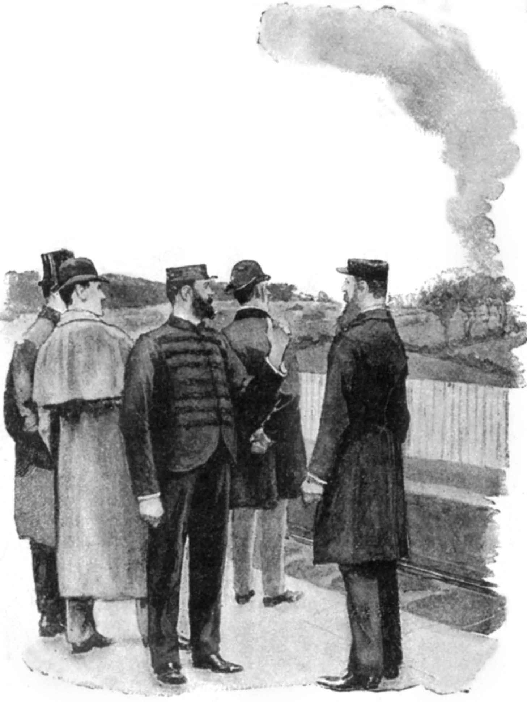

看见一股巨大浓烟滚滚升空。

“房子失火？”布雷兹特里特问。火车喷着蒸汽驶离车站。

“是的，先生。”站长说。

“什么时候失的火？”

“听说是夜里起的火，先生，火越烧越大，那个地方是一片火海了。”

“是什么房子？”

“比彻医生的房子。”

“请问，”工程师插话说，“比彻医生是德国人，很瘦，鼻子又尖又长，是吗？”

站长不禁笑起来。“不，先生，比彻医生是英国人，本教区没有人比他穿得更考究。他倒是有一位先生同他住一起，是他的病人，据我知道，是外国人，可是给他上一顿伯克郡牛排，他照吃不误。”

站长话音还没落，我们忙不迭往着火的方向跑去。路通向一座低矮的小山顶，眼前呈现一幢很大的白色建筑，每扇窗，每道缝都在向外喷着火舌。前面花园里三辆救火车在努力要把火势压下去，但效果不显著。

“就是那里！”哈瑟利叫道，情绪非常激动，“就是这条石子路，那玫瑰树丛，我躺过的地方，第二个窗口，我在那儿跳的窗。”

“那么，至少，”福尔摩斯说，“你向他们报了仇了。肯定是这样，是你的油灯，给机器砸碎，火蔓延开来引着了木墙板。他们一时只顾着拼命追你，也就没能觉察油灯着火。现在你睁大眼睛看仔细了，这一堆围观的人群中，有没有你昨天晚上的朋友，不过我很担心他们已远走高飞。”

福尔摩斯的担心果然成为事实。从那天至今，无论是那位漂亮女人、阴毒的德国人，还是那个乖僻的英国人，都杳无踪影。那天清晨，有个农民遇见一辆二轮马车，上面有几个人，还有几口笨重的箱子，朝着里丁方向飞驰而去。这批亡命之徒从此销声匿迹，即使足智多谋如福尔摩斯，也未能发现他们去向何方的丁点线索。

消防队员看到这房屋里面的结构、格局、布置很奇特，不知是什么用处。更不可思议的是，在三楼一个窗台上发现一截砍下不久的大拇指。到日落西山的时候，他们的努力终见成效，把火势压了下去。但房顶已经塌落，整个现场变成一片废墟，只剩下一些歪扭的汽缸和铁管，那台机器已毁得不见原形。这台机器让我们的新朋友不幸付出了好大的代价！在一间外屋里发现有大量镍锭和锡锭，但没有找到硬币。这个情况，正好可以解释上面提到的那些大箱子里装的是什么东西。

我们的水利工程师怎么会从花园被人抬到他醒来发现的那个地方，这是个难解的谜。还好，在现场松土上留下的足迹，告诉我们一个很简单的过程。他很明显是由两个人抬走的，一个人的脚印比较小，另一个人的脚印则异样地大。由此看来，多半是那个默默无言的英国人，比之他的同伙稍逊大胆妄为、略欠杀气腾腾，帮那位女子将此失去知觉的人转移，脱离险境。

“好了，”这位工程师在我们再坐上火车回伦敦途中，心情沮丧地说，“这对我真是一笔大业务！掉了个手指，五十几尼也没到手，我得到些什么？”

“得到了经验，”福尔摩斯说道，开口大笑，“获得了间接的价值。要知道，一旦这件事广为人知，你劫后余生，将获得美誉，你就必将办成一家杰出的公司。”

（1892年）

# 单身贵族

圣西蒙勋爵的婚事及其万想不到的结局，在这位不幸的新郎荣列的贵族社会中已不再成为助兴的谈资，别家的丑闻业已取而代之。有情有节更富刺激性的故事早把四年前这无聊嚼舌的旧剧撤下了舞台。然而，我有理由相信，全部事实真相还从未向广大公众详细披露；并且，鉴于全赖我的朋友歇洛克·福尔摩斯的大力，此事才得以真相大白，所以我觉得如果对这么一桩异乎寻常的事件不作一点记述，那么对歇洛克·福尔摩斯侦探业绩的记载必将是不够全面的。

那是我结婚前的几星期，我还与福尔摩斯一同住在贝克街。一天他午后散步回家，看见桌上有一封给他的信。我一整天待在屋子里没有出去，因为天气突然转变，下起了雨，刮起了风。秋风秋雨，引起我阿富汗战争的伤口隐隐作痛，当年的滑膛枪子弹留在身体内带了回来，也算是纪念品吧。我躺在安乐椅里，两腿搁在另一张椅子上，周围堆满报纸，饱览了一天所有的新闻，才都扔向一旁，懒洋洋地躺在那里。我望望桌上的信封，上面有很大的家族盾形纹章押花字母标饰，漫不经心地在想，不知是何方贵人同我的朋友通信。

“一封高贵大函，”他进来的时候我说，“以往你早晨收到的来信，我没记错的话，都是一个鱼贩子的信，还有一个海关缉查员的信。”

“是的，我的来信五花八门，看起来津津有味，”他回答，微笑一下，“越是底层的来信，越是趣味无穷。这封信嘛，像是那种老公函、老传令，社会应酬件，并不受欢迎，不是来缠你烦你，就是逼你去违心虚与委蛇。”

他拆信看了内容。

“噢，瞧，想不到还饶有趣味，应当这么说。”

“不是应酬公函？”

“不是，完全是业务上的。”

“是一位贵族委托人？”

“一位英国大贵族。”

“亲爱的伙计，祝贺你了。”

“跟你说，华生，一点不假，委托人的地位，对我来说仅在其次，我只对他这件案子本身感兴趣。不过，很可能对此案的调查，与其地位未必无关紧要。近来你勤奋读报，是不是？”

“只能如此，”我苦着脸说，指指角落里一大堆报纸，“没有别的事情可做。”

“真走运，也许就是要你来提供我最新消息。我除了案子新闻、寻人启事，其余一概不看。看寻人栏很有启发性。你这么关心最近的新闻事件，那一定看了圣西蒙勋爵的消息，有关他婚礼的事？”

“噢，看到了，令我深感兴趣。”

“那就正好。我手上这封信，就是圣西蒙勋爵写来的。我念给你听；作为交换，你给我把这件事的所有报道都翻出来。信上是这么写的：

我亲爱的歇洛克·福尔摩斯先生：

据巴克沃特勋爵告知，我可以绝对信赖你的判断能力和分析能力。因此我决定登门拜访，向你请教一件令我十分痛苦的事，即有关我婚礼所生的意外。苏格兰警场莱斯特雷德先生拟对此采取措施。但向我明言不反对你介入协作，甚至认为必有裨益。我将于下午四时来访，你若届时已有安排，务请另予约见，因我事关紧迫，切切。

你忠诚的

圣西蒙

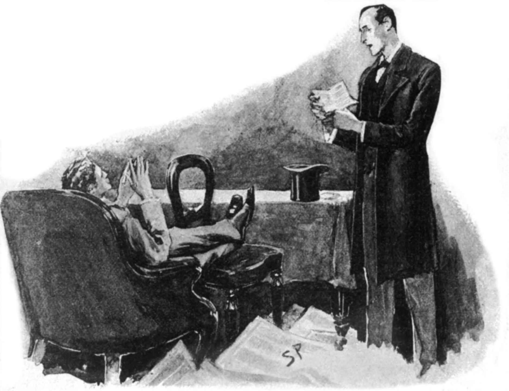

“我手上这封信，就是圣西蒙勋爵写来的。”

“信戳是发自格罗夫纳公寓楼，用鹅毛笔写，尊贵的勋爵不慎在信封外面落下右手小指的墨水污迹。”福尔摩斯说着，将大函折起收好。

“他说四点钟，现在是三点钟，一个小时后就要来了。”

“我还有时间，靠你帮忙清一清这件事的轮廓。把报纸翻翻，内容按时间排好顺序。先看看我们的委托人本人如何，什么经历。”他从壁炉架旁一排参考书中抽出一卷红封皮的书。“在这儿呢，”他说着，坐下把书摊开在膝头，“罗伯特·沃尔辛厄姆·德维尔·圣西蒙勋爵，巴尔莫拉尔公爵次子。啊！盾形纹章，天蓝色底子上黑色中带，镶三颗铁蒺藜星。生于一八四六年。那么年龄该是四十一岁，男大当婚年龄啦。曾任前政府殖民地政务次官。其父，巴尔莫拉尔公爵，一度曾任外交大臣。继承安茹王朝血统为其直系后裔。母亲血统为都铎王朝。啊，行了，这些都没啥实际意义。我想，还是看看你那里，华生，有些什么实质性内容。”

“我这里想要找的东西，没多大困难，”我说，“事情才发生不久，整个印象还深刻。怕只怕对你来说，我知道，你手上有其他案子在调查，不喜欢当中插进别的案子来干扰。”

“噢，你是指格罗夫纳广场家具搬运车，那是个小案子。现在都已经完全清楚了——其实，没啥，一开始就清楚。请你拣报上重要的先告诉我。”

“这里有一篇，找到第一条消息，登在《晨邮报》人事要闻，已经几周之前了：

巴尔莫拉尔公爵次子罗伯特·圣西蒙勋爵与美国加州旧金山之阿洛伊修斯·多兰先生独生女哈蒂·多兰小姐之婚事据称业已安排就绪，若诸事顺遂，婚礼不日即将举行。

就这些。”

“简单扼要。”福尔摩斯说，瘦长的两腿伸向火炉。

“这是同一个星期，一份社会新闻的报纸上有一段，比较详细。哪，就是这儿：

婚姻市场上将很快发出保护主义之呼声。当前自由贸易政策之推出，严重威胁我国家庭构成之现状。大不列颠贵族家庭大权旁落，各家族逐一坠入大洋彼岸美丽富有诸女姻亲之手。今又一贵人锦上添花，于上星期被列入奖项之名单，该奖项正一一被彼魅力无限之入侵者所夺魁。圣西蒙勋爵二十余年来爱神之箭从不曾中的，现在却终于明确无误宣布将与加州百万富翁之迷人爱女哈蒂·多兰小姐结婚，婚期已告临近。多兰小姐，身段优雅及美貌惊人在韦斯特伯里豪宅之节庆盛会上大受瞩目，系一独生女，据称其嫁妆所值最近大为上升而超过六位巨数，预计仍将有增长。巴尔莫拉尔公爵近年正不得不出售其藏画，此已是公开之秘密，而圣西蒙勋爵除伯奇莫小块地产外一无长物，故这位加州女继承人通过联姻使自己轻而易举以共和国女公民摇身一变而为不列颠女贵族，其并非仅为单方面之所得者也。”

“还有没有别的？”福尔摩斯问道，打着哈欠。

“噢，有，不少呢。《晨邮报》上还有一篇短讯，说婚礼将绝对从简，在汉诺威广场圣乔治大教堂举行，届时仅邀请几位至亲好友参加。婚礼后，新郎新娘及亲友返回阿洛伊修斯·多兰先生在兰开斯特门租下的寓所。两天后——那是上星期三——有一条简短启事，通告婚礼已经举行，新婚夫妇将在彼得斯菲尔德附近的巴克沃特勋爵别墅欢度蜜月。这些都是新娘失踪之前的全部报道。”

“什么之前？”福尔摩斯大惊，问道。

“这位女士不见了。”

“什么时候不见了？”

“婚礼早餐的时候。”

“是这样！那要比原来所想的有趣得多，很有戏剧性，的确。”

“是呀，颇有些异乎寻常，我很奇怪。”

“在婚礼之前失踪，常有，偶尔也有在蜜月期间失踪，我还从未听说这样的失踪法，倒是别开生面。请述以详情。”

“恐怕不行，现有材料都语焉不详，不全面。”

“也许是我们没能从中看出许多。”

“都一样不清楚。昨天晨报登出一篇还算稍有一些内容。我念给你听。题目是‘风光婚礼　突生奇变’：

罗伯特·圣西蒙勋爵之婚礼突生变故，悲情奇异，致使全家陷于惊恐万状。前日上午婚礼之举行，已如昨日报载，作启事通告。但仅至此刻对流布已广之离奇传闻方有可能予以确证。尽管亲友欲加掩饰，亦难抵挡公众对此事之巨大兴趣。既已不胫而走成为茶余饭后之谈资，故仍作无视之态实非明智之举。

婚礼于汉诺威广场圣乔治大教堂举行，仪式简单，不事铺张。参加婚礼者别无他人，仅新娘之父阿洛伊修斯·多兰先生、巴尔莫拉尔公爵夫人、巴克沃特勋爵、新郎之弟尤斯塔斯勋爵、新郎之妹克拉拉·圣西蒙小姐及艾丽西亚·惠廷顿夫人等。婚礼后，一行人即前往兰开斯特门之阿洛伊修斯·多兰先生寓所，早餐已准备就绪。此时，一陌生女子前来小生滋扰，尾随新娘及亲友试图闯入寓所，声称有权向圣西蒙勋爵提出要求。管家及男仆颇费周折才将其逐走。新娘幸而早已入屋，未受此插曲之影响。但正欲与亲友共享早餐，突感不适，便离座回房稍事休息，却去久而不见复出，颇生疑议。父亲随去察看，女仆告知新娘仅在卧室逗留片刻，穿起乌尔斯特长大衣，戴上无边软帽，急奔楼下走道而去。一男仆称，曾见恰属如此装束一女士离寓外出，但未敢相信此即为女主人，而以为女主人必与众亲友一起无疑。阿洛伊修斯·多兰先生确证女儿不见踪影，即与新郎一起同警方取得联系，从而大力展开调查，此离奇事必将很快水落石出云。然迨至昨日深夜，失踪女士依然杳无音信。谣传多有可能已遭不测。据闻警方将最初引生纠葛之女拘留，疑其出于妒忌或其他之动机，与新娘之失踪或有牵连。”

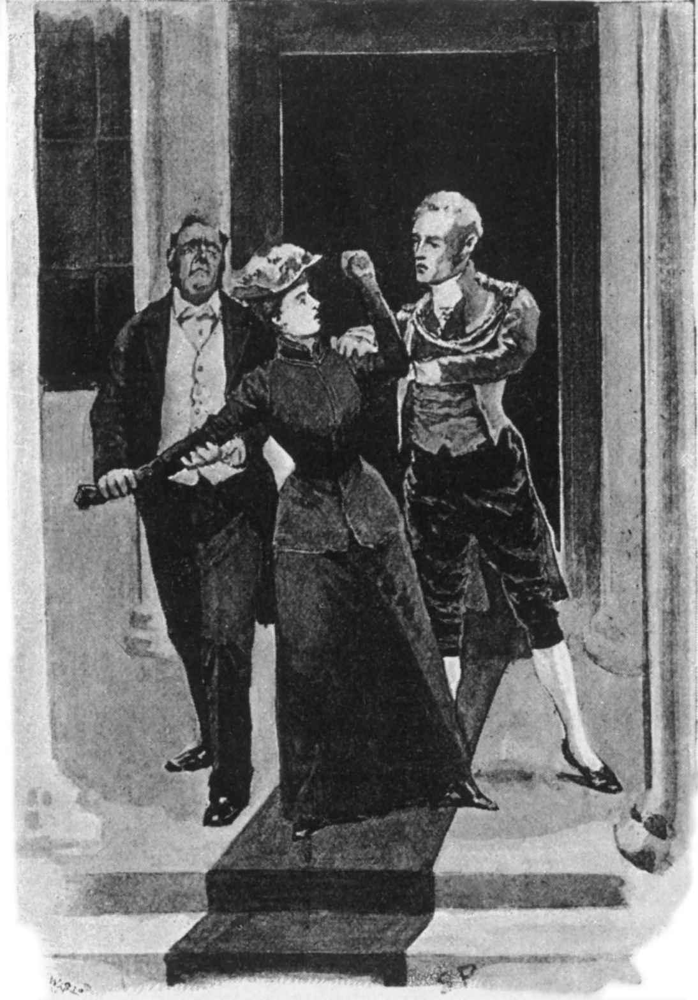

一陌生女子前来小生滋扰。

“就这些？”

“另一张晨报上，一条小消息，但是很有启示。”

“是说——”

“弗洛拉·米勒小姐，也就是那个肇事的女人，确实给抓了起来。她以前是在阿利格罗跳芭蕾舞的舞娘，同新郎认识有好多年。再进一步的情况就没有了。现在整个案情在你手上的——公之于报纸的消息，就这么多。”

“看来，这案子不同凡响，有意思得很。无论如何不能把它放过了。哦，门铃在响，华生，这钟是，四点稍过几分。没问题，一定是我们高贵的委托人。不要老想走，华生，我也非常希望有人见证，哪怕是从旁能提醒我一点事也好。”

“罗伯特·圣西蒙勋爵到，”我们的僮仆推门进来通报。一位绅士进屋，相貌文雅有教养，高直的鼻子，面色苍白，嘴角微有愠意，明睁大眼，神情若定，显示一种养尊处优的情态，乐于号令别人且必须遵从。他体态轻捷，但总的看来，给人的印象与年龄不相称。他略显弯腰曲背，迈腿跨步稍有屈膝。脱去卷边礼帽，他的头发周围一圈显出灰白，头顶已经稀疏。身上衣着，考究得近乎奢华：高衬领，黑色大礼服，白色背心，黄色手套，漆皮鞋，浅色腿罩。他缓步走进屋来，脑袋从左转到右，金丝边眼镜的链子在托着的右手上晃荡。

“你好，圣西蒙勋爵，”福尔摩斯说，起身鞠躬，“请柳条椅上坐。这位是我的朋友和同事华生医生。请向炉边靠近一点，我们来谈谈事情吧。”

“这个事对我有多么痛苦，那是可想而知的，福尔摩斯先生。真叫我痛心疾首。我知道，你处理过这类莫名其妙的案子好多起，但是我可以说，按社会等级而论，与本案相去甚远。”

“不，我对你是降格以就。”

“对不起，你说什么？”

“我上一次一个同类案子的委托人，是位国王。”

“哦，是吗！我一点也不知道，是哪位国王？”

“斯堪的那维亚的国王。”

“怎么！国王也丢失妻子？”

“你须知道，”福尔摩斯平和地说，“我对其他委托人的事要保守秘密，就像我有义务对你的事保守秘密一样。”

“那是当然！很对，很对！请务必原谅。至于我个人的案子，我愿意告诉你一切情况，以便供你作出判断。”

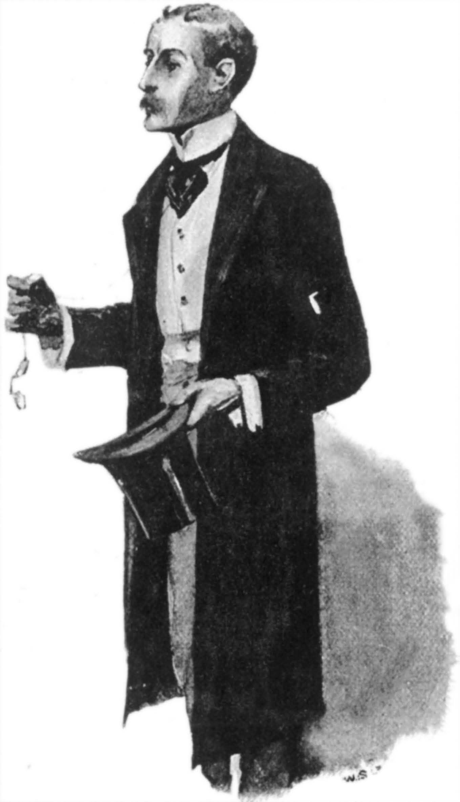

圣西蒙勋爵。

“谢谢你。报上所登，公开了的情况，我都已经知道，仅此而已，其他就不知道了。我认为，可以相信都是正确的——这篇报道，比如说，新娘失踪的报道。”

圣西蒙勋爵对报纸看了一眼。“是的，讲的没错，是如写的那个样子。”

“但是还需要大量的各种补充，才能让人作出判断。我只有直接向你询问，来掌握需要的事实情况。”

“但问无妨。”

“你第一次遇见哈蒂·多兰小姐是什么时间？”

“在旧金山，一年以前。”

“你是去美国旅行？”

“是的。”

“后来就订婚了？”

“没有。”

“但是过往甚密？”

“能和她交往我很高兴，她也看出我很高兴。”

“她父亲很有钱？”

“据说是太平洋一边的半壁首富。”

“他是怎么发的财？”

“开矿，几年以前还是一无所有。给他挖到了金矿，就大力开发，从此飞黄腾达。”

“现在谈谈，对这位年轻女士——你妻子，你对她的性格，是什么印象？”

这位贵人把他的眼镜晃得更起劲，目不转睛看着炉火。“你知道，福尔摩斯先生，”他说，“我的妻子二十岁的时候，她父亲才变成富翁。她以前一向是在矿场上自由惯了，满山遍野游呀玩呀，所以她多的是大自然的陶冶、教化，而不是学校里老师的教育。她是我们英国人称之为假小子的那种姑娘，性格刚烈，野性、自由，不受传统规矩束缚。急性子——像火山，简直可以这么说。做事果断，只要下定决心，便说做就做，从不怕这怕那。但回过来得说，如果我不认为她本质好、可贵”——他重重干咳一声——“我就不会愿意让她同享我拥有的高贵称号。我相信她勇于自我牺牲，会是个好妻子，任何不名誉的事，她都深恶痛绝。”

“有她照片吗？”

“我随身有一张。”他打开表盒盖，给我们看一帧非常漂亮的女人的面容。那不是纸照片，是象牙袖珍画像，艺术家着意刻画了她那乌亮的头发，黑眸大眼，甜蜜的嘴唇。福尔摩斯久久端详这帧肖像画。然后关上盒盖，交还给圣西蒙勋爵。

“年轻女士来到伦敦以后，你和她重叙旧好？”

“是的，是她父亲带她参加去年的伦敦岁末节庆交谊会。我和她会面多次，同她订了婚，现在和她结了婚。”

“她带来了，我听说，一份相当可观的嫁妆？”

“嫁妆还算可以，也并不算可观，我们家族一般也就是这样规格。”

“那么这一份，当然归你了，既然婚礼业已举行？”

“这个事我也不去过问。”

“没有过问也属得体。举行婚礼的上一天你见过多兰小姐没有？”

“见过。”

“她的精神、情绪都好吗？”

“再好也没有，她一直憧憬谈我们未来该怎么怎么生活。”

“是这样！很有意思。婚礼那天早晨呢？”

“她喜气洋洋，别说有多高兴了——至少，一直到婚礼完毕，都是这样。”

“这时候，你发现她有什么变化没有？”

“哦，说真的，这时候我第一次看见她的脾气真急躁。一点点小事，不值一提，与本案不可能有什么关联。”

“尽管事小，还是请讲给我们听听。”

“哦，她也真孩子气。我们走到法衣圣器储藏室的时候，她手上的花束掉了。这时候正走过前排座椅，花掉在了座椅上，她愣在那里，座位上的先生把花捡起来递给她。花掉下后并没有摔坏，本不是什么大事，可是我同她讲起，她回答生硬冲人；坐上马车，一路回家，她还为这点小事心里不快活，真是好笑。”

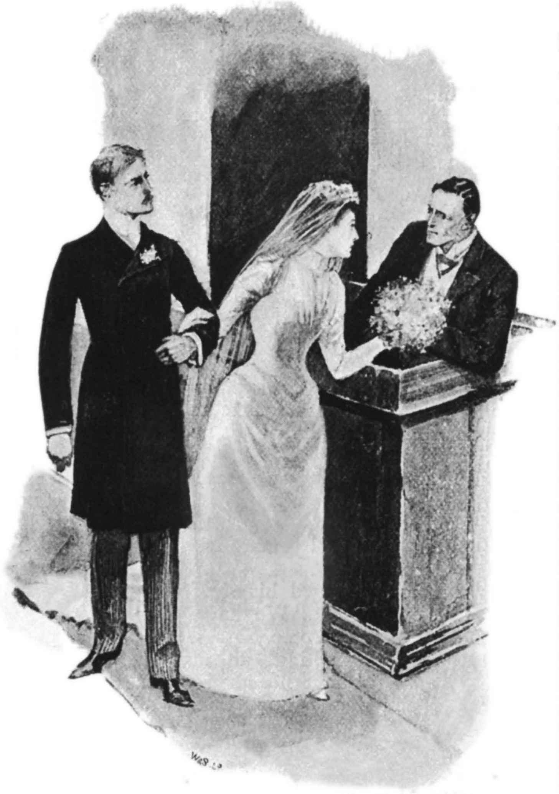

座位上的先生把花捡起来递给她。

“是这样！你是说前排有一位先生，那么在场不认识的人好多啦？”

“噢，是呀，教堂门一开，人人要来，总不能不让人家进来。”

“这位先生不是你妻子的朋友？”

“不，不是。我称他先生，还是礼貌。这个人一眼看上去就是个普通人，我根本没去注意他的相貌。这个事情，我们这么扯真是离题太远了。”

“圣西蒙女士，这么说来，婚礼后回来的心情不如去的时候愉快开朗。她回到父亲家里做了些什么？”

“我看见她在跟女佣作交代。”

“女佣是什么人？”

“名叫艾莉斯，是美国人，跟着她一起从加州来的。”

“是她的心腹吗？”

“好像还谈不上。我眼里女主人什么事都尽管由着她。当然啦，在美国，主仆之间的关系同我们这里的看法不一样。”

“她跟艾莉斯讲话有多长时间？”

“哦，几分钟吧，我正在想我自己的事。”

“你没听见她们讲些什么？”

“圣西蒙夫人讲什么‘占人窝儿’。她讲话喜欢用这类市井俚语，我听不懂她是什么意思。”

“美国俚语有时候很生动、很形象。你妻子同女佣讲完话又做什么？”

“她进了早餐室。”

“挽着你进去？”

“没有，她一个人进去。在这种小事情上，她表现得很有独立性。后来，我们坐下十分钟左右，她赶忙起身，轻轻说了声抱歉的话，离开餐室，就再也没有回来。”

“但是女佣艾莉斯，据我了解，作证说女主人走进房间，新娘礼服外面套上一件乌尔斯特长大衣，戴上无边帽，就出去了。”

“是这样，后来还有人看见她走进海德公园，由弗洛拉·米勒陪伴。这个女人现在给拘留着，也就是她那天早晨到多兰先生家来捣乱。”

“啊，是的，这位年轻女士，我想了解一点具体情况，包括你同她的关系。”

圣西蒙勋爵耸耸肩，抬抬眉。“我们朋友来往有几年——可以说，朋友关系相当密切。她过去常在阿利格罗。我待她绝对不薄，她没有什么理由可怨我的。但是你知道女人都是这样，福尔摩斯先生。弗洛拉是可爱的小东西，就是脾气特别躁，容易激动，对我痴心依恋，要跟住我。她一听到我要结婚的消息，就写信威胁我。说实话，我为什么婚礼不事张扬，理由也就是提防别在教堂里出丑。我们刚回家，弗洛拉来到多兰先生屋门前。她想要闯门进去，嘴里不干不净辱骂我妻子，甚至还威胁她。还好我早预料可能会发生这种事情，所以请了两名便衣警察在那儿，他们很快把她赶走。她看到吵闹没好处，就安静下来了。”

“这些你妻子都听见吗？”

“没有，谢天谢地，她没有听见。”

“可是后来有人看见你妻子同这个女人走在一起？”

“是的，那正是莱斯特雷德先生，苏格兰警场的，他把这事看得很严重了。据推测，是弗洛拉把我妻子诱出来，设圈套害她。”

“嗯，猜测的一种可能性。”

“你也是这么想的吗？”

“我没说一定是这样。你自己也认为这不大可能，是吗？”

“我知道，弗洛拉这个人，连一只苍蝇都伤害不了。”

“不过，忌妒，能完全改变人的心态。请谈谈对发生的事情你自己的分析。”

“哦，要说呢，我是来寻找答案，不是来提供答案。我把事都给你讲了，不过既然你问我，我也就说说。我看很可能，这件事她够兴奋激动的，原只想自己的社会地位就此能一步登天，结果，没想我给妻子精神上添了乱。”

“简单说，她是忽然精神错乱了？”

“哦，确实，我一想到她竟然抛弃——我绝不是说抛弃我，是说那么多人热切向往得到而不可得的身价地位，她都竟然抛弃——我很难用其他理由来解释。”

“啊，当然，这也是一种想象，假设，”福尔摩斯说，微笑着，“那么现在，圣西蒙勋爵，我想，需要的材料我已经掌握得差不多了。容我再问一点，你们坐的早餐桌上，能望得见窗外吗？”

“我们能望见，马路对面，海德公园。”

“就这样。那么我想，不必再让你耽搁了，以后我会同你再联系。”

“愿你走运，顺利解决本案。”我们的委托人说，站起身来。

“我已经解决了。”

“啊？你说什么？”

“我是说，我已经解决了。”

“在哪里，那么，我的妻子？”

“这个具体情况，我很快就要提供。”

圣西蒙勋爵摇摇头。“那件事，恐怕需要一个比你我更聪明的脑袋。”他说道，鞠上一躬，一个老古板的鞠躬，扬长而去。

“鄙人承蒙圣西蒙勋爵不弃，将我的脑袋和他自己的脑袋相提并论，真是不胜荣幸之至！”福尔摩斯说道，大笑，“经过这么长时间的一问一答，一答一问，现在我想来一杯苏打威士忌、一支雪茄。我们的委托人进门之前，我就已经对本案作出了结论。”

“啊，福尔摩斯，你真棒！”

“我比较了几个类似的案例，然而没有一个，像我以前所说那样，没有一个如本案这样一点就通。我了解到的全部结果都能支持我的推测，旁证有时很有说服力，就像是，牛奶拌鳟鱼，一清二楚，这儿不妨引用梭罗<a href="#part0055.xhtml_ch1"
id="part0055.xhtml_ch1-back">(1)</a>的这一句话。”

“可是，你听到的我也都听着。”

“然而你不知道有类似先例，这些先例对我很有借鉴作用。有一个同类案例，是几年以前在阿伯丁。普法战争之后的一年，慕尼黑又有一个案例，那是如出一辙，各方面非常相像，是这些案件中的一个——啊，哈罗！是莱斯特雷德！下午好，莱斯特雷德！食橱有大酒杯，盒子里有雪茄。”

这位警探粗呢水手装，系老式领带，一副水手打扮，手里提一只帆布包。简单寒暄几句，就坐下，点着递给他的雪茄。

“怎么样啊？我说，”福尔摩斯眨眼问道，“什么事不顺心？”

“我是不称心，这桩该死的圣西蒙结婚案。这个案我是无头无尾，不知从何下手。”

“是吗！真没想到会是这样！”

“谁听说过有这么复杂难搞的案子？有了线索又一下子从我指缝里溜掉，有了线索就溜掉，我是整天都给泡在里边了。”

“哦，都把你忙得浑身湿透了。”福尔摩斯说，一只手搭在他粗呢服的胳膊上。

“是呀，我把委蛇<a href="#part0055.xhtml_ch2"
id="part0055.xhtml_ch2-back">(2)</a>都捞个遍。”

“天哪，干吗呢？”

“找圣西蒙夫人的尸体。”

福尔摩斯仰身靠着椅子，捧腹大笑。

“特拉法加广场的喷水池你也捞过了？”他问。

“干吗？什么意思？”

“因为，别处都捞，这么个好地方不会不捞。”

莱斯特雷德向我同伴怒瞪一眼。“想不到都叫你摸透了。”他吼道。

“我这儿，不过是听说了事实经过，但我已是心中透亮，完全有数。”

“哦，真的？那你认为委蛇在本案中不起作用？”

“我想根本无关。”

“那我倒要请教高见，我们在那里捞到这些作何解释？”他说着就打开拎包，往地板上抖出一件波纹绸结婚礼服，一双白缎子鞋，还有新娘的花冠和面纱，都浸水湿透，还掉了色。“看见吧，”他说，又把一枚新的结婚戒指放到这堆衣物上面，“眼下这颗小小硬壳儿果，请教你来敲开啦，福尔摩斯大师！”

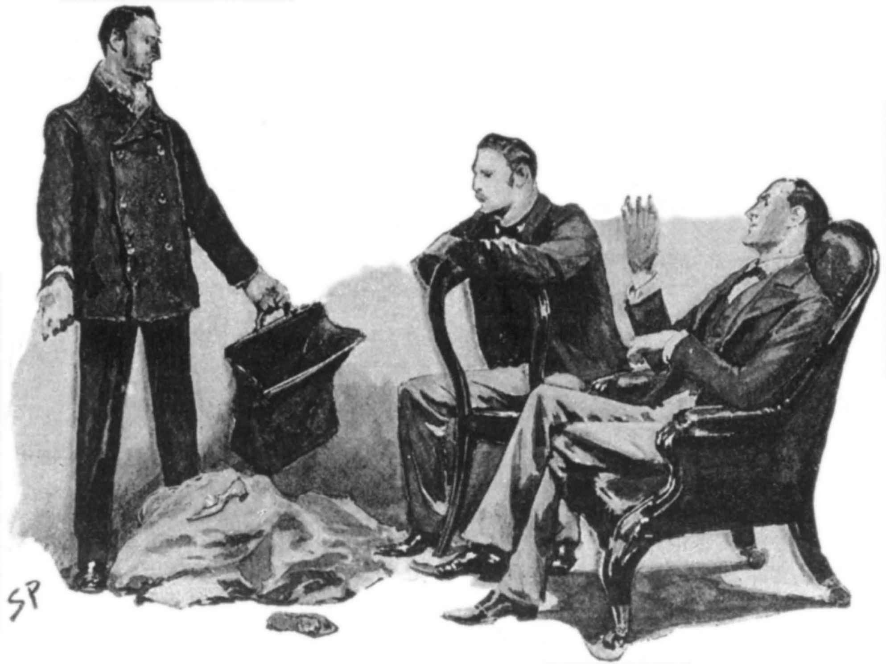

“我们在那里捞到这些作何解释？”

“哦，确实！”我的朋友说道，向空中喷着蓝烟圈，“你在委蛇捞到的？”

“不是，是园丁看到的，漂在水边。这些衣服都认证过，是她的衣服。我可以说，既然衣服在那里，尸体也不会太远。”

“根据你这一光辉灿烂的推论，同样可以说，每个人的尸体都能够在他衣橱周围找到。就此请教，通过这些东西你希望得到什么结论？”

“得到证据，证明弗洛拉·米勒与失踪案有牵连。”

“恐怕难以办得到。”

“到现在你还在说恐怕？”莱斯特雷德讥讽地吼道，“福尔摩斯，你那个演绎、推论恐怕没有实际意义，你两分钟里就犯下两个大错。这衣服就表明弗洛拉·米勒有牵连。”

“怎么肯定呢？”

“衣服上有衣袋，衣袋里有名片盒，名片盒里有字条，字条上明明写着一行字。”他把字条朝着福尔摩斯往桌子上一甩。“听听怎么写的：

一切就绪后你即可见到我，马上就来。F．H．M．

至此我的理论始终一贯，圣西蒙夫人是给弗洛拉·米勒诱拐出去的。一定是她，毫无疑问，合伙同谋，对夫人失踪负有罪责。看，这是她的缩写签名。就是这张纸条，毫无疑问，在门口私底下塞到她手里，诱骗她掉进他们的摆布。”

“很好，莱斯特雷德，”福尔摩斯说，大笑，“你真不简单。让我来看看。”他无精打采的样子拿起纸来，可是，顷刻间两眼像铆钉一样铆住，嘴里一声轻轻的欢叫。“这确实重要。”他说。

“哈！你承认它重要了？”

“极端重要，我热烈祝贺你。”

莱斯特雷德站起来，得意扬扬的一个胜利者，接着又弯下腰低头去看。“你搞什么，”他怪声叫道，“你看反掉了，不是这一面！”

“恰恰相反，这才是正面。”

“这是正面？你疯了！这张便条，用铅笔写在这一面嘛。”

“这一面看来是旅馆账单，我倒是真感兴趣。”

莱斯特雷德说：“那上面没什么，我早都看过。

10月4日，房间8先令，早餐2先令6便士，鸡尾酒1先令，午餐2先令6便士，葡萄酒8便士。

我看不出什么名堂。”

“可能看不出什么，但这才是最为重要。至于便条，也重要，或者，至少这几个缩写字母重要。所以，我再次向你祝贺。”

“我时间浪费得够了，”莱斯特雷德说，站起来，“我只相信脚踏实地干，不相信靠着个火炉坐而空论，胡编‘妙’论。再见了，福尔摩斯先生，咱走着瞧，看谁能搞它个水落石出。”他收拾起衣物，塞进包里，拎着走向门口。

“先给你一点提示，莱斯特雷德，”趁对方还没走掉，福尔摩斯拉长着调门说，“我就告诉你这案子的真正解答。圣西蒙夫人是个谜，现在没有，以前也从来就没有圣西蒙夫人。”

莱斯特雷德冷冷地看一眼我的同伴，又转身向着我，轻轻在前额拍了三下，装腔作势地摇摇头，急急忙忙走掉了。

莱斯特雷德刚把门带上，福尔摩斯就起身穿上外衣。“这位伙伴说的不无道理，外头的工作也重要。”他说，“所以我想，华生，你看会儿报纸，我离开一下。”

歇洛克·福尔摩斯离开我时五点已过。我毫不感到寂寞，因为没过一小时，来了个点心铺的师傅，送来一个大扁盒。同来的还有个小伙计，师傅由小伙计帮忙把盒子打开。我一看，大大惊讶，原来是相当考究、极为丰盛的冷晚餐，拿出来端上我们寄宿公寓寒酸的餐桌。那是两对山鹬，一只野鸡，一块肥鹅肝酱饼，好几瓶酒，都是还缠结着蛛网的陈年好酒。两位店家摆好了一桌奢华的珍肴佳酿，只说声府上所订、账已付清，别无解释，一个转身即刻消失，真像阿拉伯神话《一千零一夜》中的魔幻情景。

九点还不到，福尔摩斯步履快捷地踏进房间，面色严肃沉着，但眼神明亮，令我相信事情结果没有让他失望。

“好，晚餐已经送来摆好。”他说，搓起了双手。

“像是你有应酬，送来五份。”

“是的，我的安排，有几位客人光临舍下，”他说，“怎么搞的，圣西蒙勋爵还没来。哈！没错，我听到了，楼梯上是他的脚步声。”

的确正是下午来过的客人，脚步轻快急促地进来，眼镜链晃得比先前更起劲，尊贵的相貌神色不安。

“我交邮差的信你收到了？”福尔摩斯问。

“收到了。看了信，叫我惊异万分，万万想不到，你说的情况有根据吗？”

“有充分的根据。”

圣西蒙勋爵靠坐椅中，一只手摸摸额头。

“公爵会怎么说呢？”他喃喃自语，“家族中竟有人蒙受这般耻辱。”

“那纯粹是一场误会，我认为谈不上什么耻辱。”

“啊，你是从另一种观点来看待这种事。”

“依我看，谁也不该责备。我说，小姐也是不得不这样做，当然，行动之突然无疑令人遗憾。她没有母亲，碰上这种情急事，没人给她出主意。”

“是藐视，先生，公然藐视。”圣西蒙勋爵说，手指在桌面上敲着。

“你一定要原谅这可怜的姑娘，她处在这种地位，也是从来没有过。”

“我不原谅，我实在很生气，我被玩弄了。”

“好像门铃响，”福尔摩斯说，“是的，楼梯口脚步声。要是我说服不了你，请对这事宽大为怀，那么，圣西蒙勋爵，我这儿请来了一位支持我的人，此人也许能够胜任。”他打开房门，迎进一位女士、一位先生。“圣西蒙勋爵，”他说，“请允许我向你介绍弗朗西斯·海·穆尔顿先生和夫人。这位夫人，我相信，你是认识的。”

我们的委托人一见来人，立刻从座椅上跳起来，直立在那儿，两眼下沉，一只手插进大礼服的前襟，一副尊严大受伤害的模样。女士迅即跨前一步向他伸出了手，但是他仍然不愿意把眼抬起来。也许，只有这样才能表示他的决心，因为，女士那恳切的面容委实难以抵御。

“你生气了，罗伯特，”她说，“是的，我想你完全有理由生气。”

“请你不用来向我道歉。”圣西蒙勋爵严厉地说。

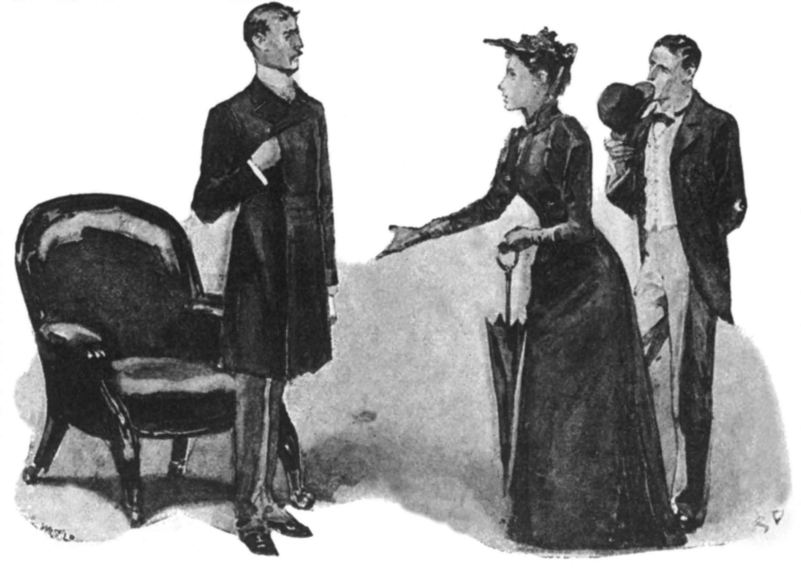

“请你不用来向我道歉。”

“噢，是的，我知道我实在对不起你，我出走之前应该对你说一声。但是，那天我也是一时慌乱，我在这儿重又见到法兰克，我简直不知道该怎么说、该怎么做，也真奇怪竟没有当场在圣坛前跌倒晕过去。”

“也许，穆尔顿夫人，你现在解释这件事情的时候，我的朋友和我还是离开这屋子吧？”

“如果我可以说点意见，”那位陌生的先生说道，“我们对这件事的保密、避人，都有点过分。就我个人而言，我倒愿意让全欧洲、全美洲的人都来听听这件事的真相。”他细高个子，瘦而结实，皮肤晒得黝黑，面部轮廓分明，举止机警灵活。

“那么，就让我把事情经过讲给你们听听吧，”夫人说道，“这位法兰克，和我是一八八四年认识的，在落基山那里的麦圭尔矿区，爸爸正在那边开一个矿。我们订婚了，法兰克和我。后来父亲有一天忽然挖到一个富矿，从此发了财。可是这位可怜的法兰克，开的矿越来越枯竭，没有收获。爸爸越来越富，法兰克越来越穷。所以到后来，爸爸不同意我们的婚约了，要废除，把我带到弗里斯科<a href="#part0055.xhtml_ch3"
id="part0055.xhtml_ch3-back">(3)</a>。可是法兰克不愿放手，他找到那里，瞒着父亲同我见面，要是让父亲知道，只会叫他生气。我们就自己商量着安排。法兰克说他也要去发一笔财，混不到像爸爸一样富，他就不回来同我结婚。我答应他要等他一辈子，发誓只要他活在人世，我绝不会嫁给别人。‘那干吗不马上就结婚呢？’他说，‘这样我对你就放心了，但在我回来之前，我不会声称是你的丈夫。’好，就这样，我们商量定了，他把一切都安排妥当，请好一位牧师，当下就举行了婚礼。之后法兰克就离开我去闯事业，我回到了父亲身边。

“后来，我听到法兰克的消息，他到了蒙大拿，接着在亚利桑那探矿，后来又听说他在新墨西哥。这以后，报上登了长篇报道，说有一个矿区遭到阿帕契印第安人攻击，法兰克的名字列在被杀者的名单中。我看到以后昏死过去，就此倒下，病了好几个月。爸爸以为我得了痨病什么的，带我找遍了弗里斯科几乎半数的医生。法兰克一年多音讯全无，这样，我不得不相信法兰克真的死了。后来圣西蒙勋爵到了弗里斯科，我们也来到了伦敦，还安排了婚事，爸爸非常高兴。可是，我一直感到我的心已经给了可怜的法兰克，这世上已经没有哪个男人能代替他。

“虽说如此，我嫁了圣西蒙勋爵的话，当然还是会尽到做妻子的责任。我们不能勉强相互之间的爱情，但还是能一起过好生活。我同他一道走向圣坛，心里抱着愿望要尽我所能做他的好妻子，可是，想想我的心情吧，事情是那么的突然。正当我走到圣坛栏杆边，我偶然一眼竟看见了法兰克，他正站在头一排座位那儿盯着我看。我一下子想，不要是他的鬼魂出现吧。再一看，是他，他站在那儿呢，两眼满含着疑问，好像在问我看见他是高兴还是遗憾。我真奇怪自己居然没倒下。我只觉得天旋地转，牧师说些什么，只像是蜜蜂在耳边嗡嗡响。我不知该怎么办才好，难道中止婚礼进行，在教堂里闹出一场好戏来吗？我再向他看看，他好像也懂我在想什么，举起手把手指贴着嘴唇，这是告诉我别出声。接着看见他在一张纸上写什么，知道是在给我写字条。我回过身出来，走过他座椅的时候，把花束掉落给他。他拾起花递给我，乘机把纸条塞到我手里。纸条上只一行字，到时他会给我信号，叫我跟他相会。我当然丝毫不会怀疑，我首先应该对他尽责任，我决定按他的意思行动。

“一回到家，我告诉了女佣，她早在加州就认识法兰克，一向是好朋友。我叫她别声张，给我拿一点东西打个包，准备好乌尔斯特大衣。我原知道应当跟圣西蒙勋爵把事讲明，可那样做，在他母亲、在好些个大人物面前，怎么开得出口！我只好决定先走人，话等以后再说。餐桌上没坐到十分钟，我从窗子望见法兰克在马路对面。他朝我打手势，然后走进了公园。我溜出来，穿戴好、拿上东西跟他走了。有个女人过来向我诉说圣西蒙勋爵这样那样的闲话——我听出来他婚前也有过点私情——但我设法把她摆脱了，赶快追上法兰克。我们一起跨上一辆马车，一直到了我们的住处，地方他已经找好，在戈登广场。我等了那么多年后，这才真的结了婚。原来法兰克是给阿帕契人关进了牢里，后来逃跑，跑到弗里斯科，打听到我以为他已经死了，而且到英国来了，他就追到了这里，好不容易在我第二次婚礼的那天早晨把我找到。”

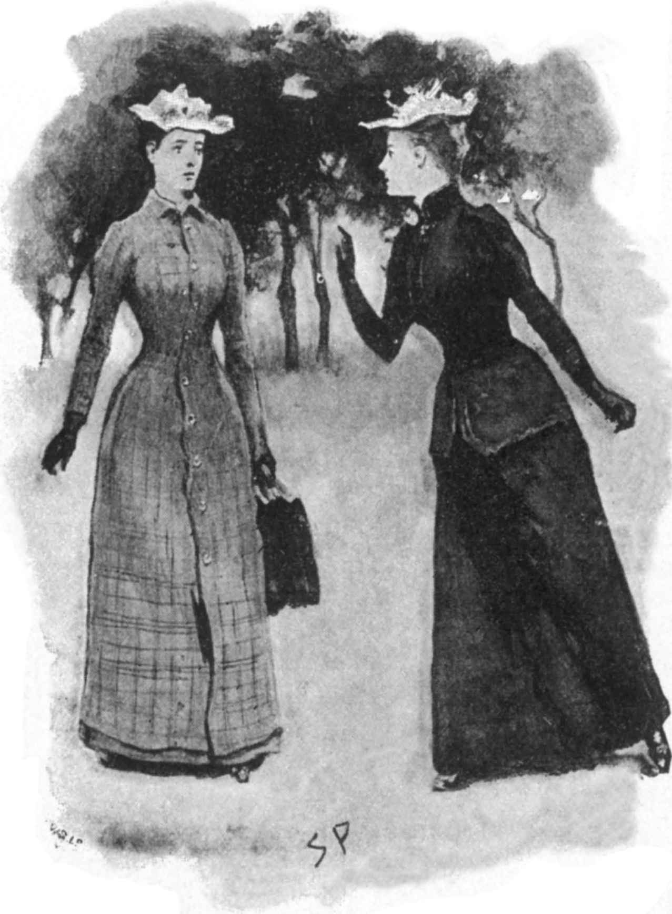

“我听出来他婚前也有过点私情。”

“我是报上看到的，”这位美国人解释说，“登了姓名和教堂，但是没有登女士住在哪里。”

“接着我们商量以后该怎么办。法兰克主张全部公开，但是我对这一切感到羞愧，还是让我无声无息消失了吧，但愿永远不再见到大家——要么，给爸爸写封信，告诉他我好好的活在人世。我一想到那些爵士老爷、爵士太太正围在餐桌旁等我回去，那个情形，心里多么不是滋味。这样，法兰克拿我的结婚礼服、其他一点东西，收拾捆好，为了不让人追踪发现，就扔掉，扔到没人发现的地方。我们已经打算明天就离开这儿去巴黎。多亏这位好心人福尔摩斯先生今天晚上来找到了我们。怎么会给他找上我们的，我也真想象不到。也全靠他好言相劝，晓以大义，说明我这做法不好，还是法兰克对。如果我们保密，就把我们自己放在了错误的地位。他还安排提供这么个机会，让我们来同圣西蒙勋爵单独谈谈。我们二话不说，马上来到这儿他的寓所。好了，罗伯特，事情你现在都明白了，如果我让你很痛苦，我也是实在没有办法，只有抱歉，希望你不要把我看成是个卑鄙的人。”

圣西蒙勋爵一直保持僵硬身姿，未见稍有松动，但还是紧皱双眉，抿着嘴唇，听完这一长篇叙述。

“很抱歉，”他说，“我不习惯这样公开讨论纯属我个人的私事。”

“你还不能原谅我吗？你不跟我握握手告别吗？”

“噢，当然，只要能让你快乐就好。”他伸出了手，冷冷地捏住她向他伸过来的手。

“我是希望，”福尔摩斯提议说，“你能和我们一起共进友谊的晚餐。”

“我想，也就不必多事了，”这位爵士老爷回复道，“事情已经到了眼前这个地步，我也不得不认了。但是，不必指望我还能有好心情一道欢庆。我想，请各位包涵，容我告退，祝各位晚安！”他向大家欠身一圈行过礼，便昂首阔步走出房间。

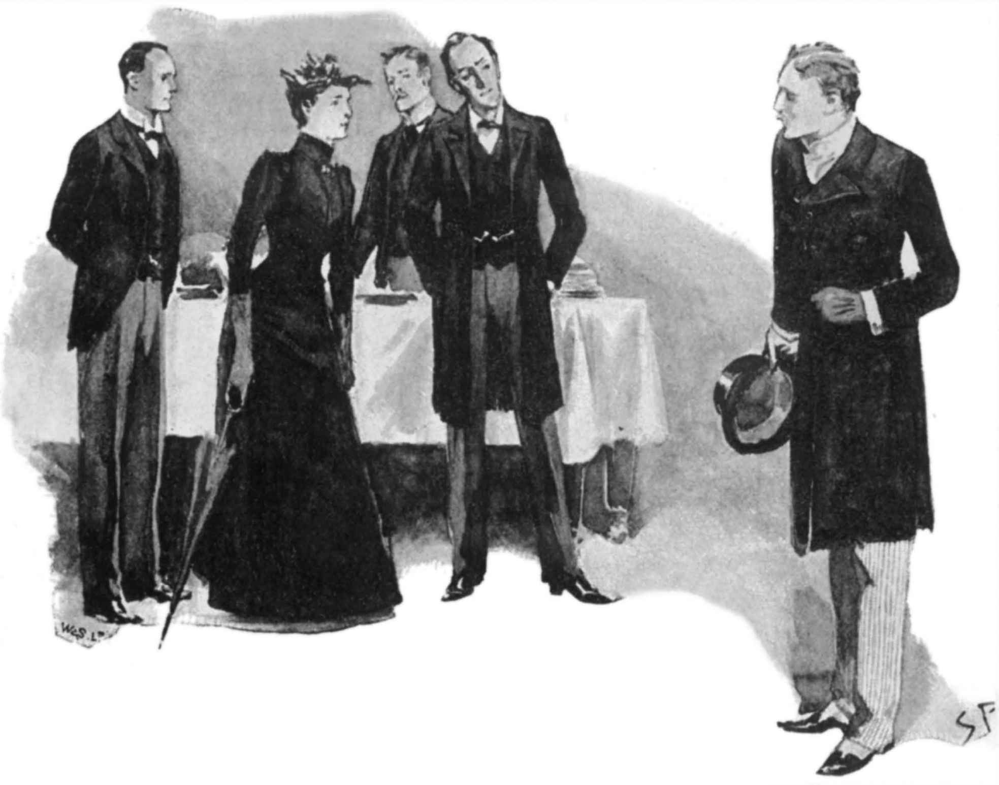

“容我告退，祝各位晚安！”

“那么，我相信，至少能蒙你们两位不弃，予以赏光吧，”福尔摩斯说，“能结交一位美国朋友，总是好事一桩，穆尔顿先生。因为，许多人，包括我在内，都相信，以往岁月一位专制君主的愚蠢和一位首相的大错，绝不会妨碍我们同宗的子孙在某一天成为同一世界大国的公民，双十字旗和星条旗合并的国旗将在他们的头顶上空飘扬。”

“本案一直饶有趣味，”客人离去后，福尔摩斯说，“因为可以用它来非常清楚地证明，起初看上去似乎无法理解的案件，结果解释起来竟是那么的简单。这位女士叙述了事实的全部过程，没有再比她更自然有力的解释。像苏格兰警场莱斯特雷德那种观察法，就会得出没有比他更糊涂的结论。”

“这件事你始终没有走过弯路？”

“从一开始，有两件事我看得非常清楚，一件是女士去举行婚礼，一直很是乐意；另一件，仅仅在回家以后几分钟突然反悔。很明显，那天早晨有事发生，使得她改变了主意。发生什么事呢？她出来一路不可能同别人讲话，因为有新郎一直陪伴在身边。那么是看到什么人？如果是的，那一定是美国来的人，因为她刚来英国不久，不可能有人与她交情那么深，只看一眼竟然使得她改变主意。你看清了吧，我们在运用排他法，去伪存真，达到这个结论：她必定是看到一个美国人。好，那么这个美国人是谁？又是为什么会对她有那么大的影响力呢？很可能是过去的情人，也可能是过去的丈夫。她的少女时代，我知道，家境不好，在艰难困苦中成长。我听圣西蒙亲口叙述案情之前，就已经了解到这么一点。当他给我们讲到一个人，坐在前排，讲到新娘的态度的变化，讲到掉花这一节，这明摆着是拿到字条的一种手法，讲到她跟心腹女仆交代，还有，讲到她说了别有所指、很有含义的暗语‘占人窝儿’——这是矿工用语，是指抢占他人的矿产或者开矿权的意思——这一路下来的情况就罗列得明明白白了。她同一个男人出走了，这个男人不是她的情人，就是她的前夫——可能性比较大的是前夫。”

“你是用什么办法把他们找到的？”

“原先是很有困难的，全靠莱斯特雷德手上有情报，他自己却看不到这情报价值有多高。姓名缩写，当然了，最重要，但是更有价值的还是知道这个人一星期内在伦敦某家最高级的旅馆结过账。”

“你怎么推断出最高级的旅馆呢？”

“最高的价格嘛。八先令一个卧铺，八便士一杯葡萄酒，这就指出是一家价格很高的旅馆。这个等级的收费价格在伦敦是不多的。在诺森伯兰大道我找到的第二家旅馆，查账目查到弗朗西斯·H．穆尔顿，一位美国客人，刚刚在前一天离开。查一查他名下的账目，正好都是我在那张复写收据上看到的一些账目，要求如有信件转至戈登广场二二六号。所以我就有目标可跑了。运气也真好，上门一找，这对爱侣都在家。我冒昧地以少长辈的身份对他们好言相劝，向他们指出，还是把他们的实际情况向外界，特别是向圣西蒙勋爵讲清楚为上策。我邀请他们来这里同勋爵相见，结果你都看到了，我也让勋爵如约来到。”

“可是结果并不很好，”我说，“他的表现肯定算不得宽宏大量。”

“啊，华生，”福尔摩斯微笑说，“你想想，好不容易求上了婚，都等到举行结婚礼了，你忽然之间发现新娘和财富都不翼而飞，轮到你头上你也不见得就有风度、雅量。我想，我们对圣西蒙勋爵还是多一点宽容为好；幸而，吉星高照，并非是我们自己也落到了这样的地步。把你的椅子向前挪一挪，请把小提琴拿给我，还需要我们去解决的问题是，如何打发这每日凄风苦雨的秋夜。”

（1892年）

————————————————————

<a href="#part0055.xhtml_ch1-back" id="part0055.xhtml_ch1">(1)</a> 梭罗（Thoreau，Henry
David，1817—1862），美国作家，超验主义代表人物，主张回归自然。所撰《论公民的不服从》一文，影响巨大。

<a href="#part0055.xhtml_ch2-back" id="part0055.xhtml_ch2">(2)</a> 委蛇（Serpentine），伦敦一处弯曲的水流地名。

<a href="#part0055.xhtml_ch3-back" id="part0055.xhtml_ch3">(3)</a> 弗里斯科（Frisco），即圣弗朗西斯科（San
Francisco）的简称，华语习惯称旧金山或三藩市。

# 翠玉王冠

“福尔摩斯，”一天早晨，我站在阳台窗前正俯瞰街上，说道，“有个疯子朝这儿跑过来，他的家人竟任他一个人在外边跑，也真是可怜。”

我的朋友懒洋洋地从椅子里站起来，两手插在睡袍口袋里，从我肩头向外望。这是二月一个明媚寒冷的早晨，昨天下的厚雪盖满地上，在冬日的太阳下银光闪烁。贝克街的路中央，来往车辆把雪辗压出一条灰褐色车道。街两旁及人行道街沿的堆雪依旧如初降一般洁白。灰色的人行道是清扫出来的，雪已铲净，但还是容易打滑，所以行人比平时稀少。一眼望去，从大都会车站那个方向一路过来，除了这位孤零零的先生之外，就再也没见人影。他走近了，那怪异的举动引起我的注意。

这个人约莫五十岁，身材高大，挺胸凸肚，粗眉大眼，相貌堂堂，是个威仪十足的人。他的穿着乍看灰不溜丢，但实际上质地华贵：一件黑色长礼服大衣，一顶有光泽的礼帽，整洁的棕色绑腿鞋罩，做工考究的珠灰色裤子。然而，他举手投足的动作与他端庄尊贵的服饰、仪表相比，却显得癫狂失态。他急急地奔走，间或一蹭一蹬，好像身体虚弱两腿不堪重负。他一边跑，一边两只胳膊痉挛似的上下乱甩，脑袋左右摇摆，脸在抽搐，面部不住地歪扭。

“这个人到底怎么回事？”我问道，“看他是在找门牌号呢。”

“他是要上这儿来。”福尔摩斯说，搓起了双手。

“到这儿来？”

“是的，肯定是找我来了，来问业内之事。他的样子，我看得出有此征象。哈！我跟你讲没错吧？”他正说着，只见这个人气急败坏地向我们屋子门上扑来，拉响了门铃，直把门铃拉得满屋子震响。

一会儿，这个人已经来到我们房间里，仍然上气不接下气，仍然挥手顿足不停，两眼定定地充满忧愁绝望的神色。见这情形，我们顿时收敛相迎的微笑，感到震惊，充满同情。他有好一会儿没能说上一个字，只摇晃着身子，手一个劲扯头发，像是在那儿六神无主。却不料他突然一蹦，猛地直把脑袋向墙上撞。我们两人赶快冲上去拦住，把他拖到房间中央。歇洛克·福尔摩斯按着他到安乐椅上坐下，自己坐在他旁边，轻轻地拍拍他的手，用柔和宽慰的语调同他聊天，这样做在他也堪称行家里手。

“你是来向我讲讲心里的事，对不对？”他说，“看你跑得急急忙忙，都累着了。别急，不忙，宽下心歇一会儿，我一定非常乐意听听你的问题，你尽管同我讲，没事，放心好了。”

来人坐了一两分钟，胸脯一起一伏，在竭力让自己的情绪稳定下来，接着拿手帕擦擦额头，紧抿住嘴，把脸转向我们。

“不用说，你们，一定把我当是疯子吧？”他说。

“我是看得出，你一定是遇上大麻烦了。”福尔摩斯回答说。

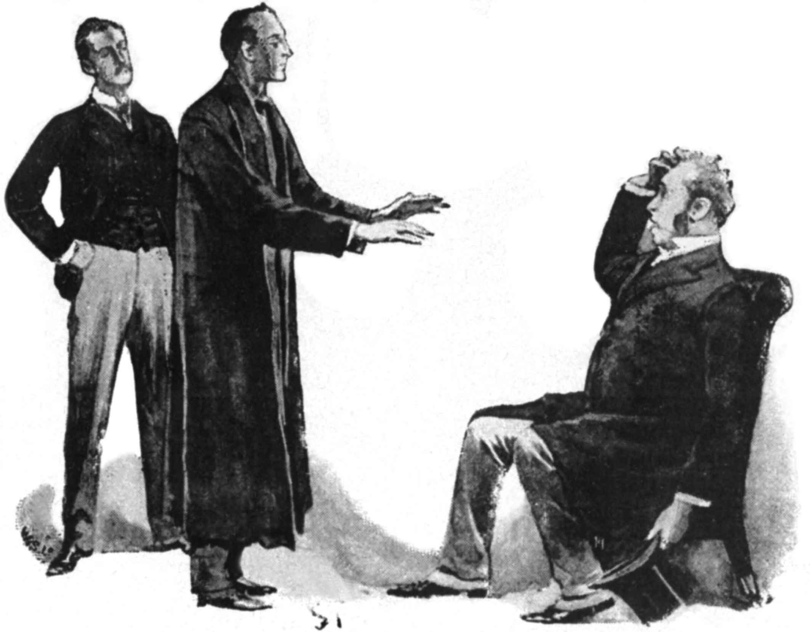

“我是看得出，你一定是遇上大麻烦了。”

“上帝知道，我遇上什么了！——遇上的事，足以叫我发疯，是那么突然，那么可怕。我要在公众面前脸面丢尽。要知道，我这个人从来品德上一无瑕疵。一生中不幸事，人人难免，可是两桩事一起轮到我头上，那来势又是那么吓人，我都丢魂落魄了。更加严重的是，此事不止关系我一个人。这件事情的可怕，要是没法解决，还要牵连到我们国家那位至尊至贵的人。”

“请安定不急，先生，”福尔摩斯说，“让我知道你是谁，你遇上了什么事。”

“我的名字，”来客回答道，“也许你们熟悉，我是针线街霍尔德及史蒂文森银行的亚历山大·霍尔德。”

这个名字如雷贯耳，那是伦敦城里第二家私营大银行的总经理。究竟是什么不幸使这位伦敦第一流公民落到了这样可怜的境地？我们怀着极大的好奇，等待他再振作起精神来陈述自己的不幸。

“我感到时间宝贵，”他说，“所以警察巡官建议我取得你的合作，我就忙不迭赶到这里来。我是坐地铁到贝克街，再急急忙忙步行过来，因为马车在雪地上跑不快，所以我刚才那个气急败坏的样子狼狈得很，因为我这个人平时很少运动。这会儿觉得好多了，我就把事情讲给你们听，尽量简短，讲清楚。

“你们当然都知道，银行的业务要得到发展，全靠能够为我们的资金找到有利的投资，同时要靠增加我们的业务联系和储户的数量。我们投放资金获利最高的方法，有一种是贷款形式，那必须有绝对可靠的担保。在过去多少年来，我们这方面的业务做得很好，不少名门望族向我们借贷大笔资金，以他们珍藏的名画、书籍或者金银餐具作为抵押品。

“昨天早上，我坐在银行办公室里，有个职员递给我一张名片。我一看那名字就吓了一大跳，因为那可不是别人——那是，也许即使对你们，我也最多只能说，那是全世界都家喻户晓的名字——英国的一位最崇高、最尊贵、最荣耀的人物。我面对这荣耀，受宠若惊；他一进来，我正想表示一下我不胜荣幸之至，他却直截了当就谈正事，脸上的神气像是要不得不赶紧完成一桩刻不容缓的任务。

“‘霍尔德先生，’他说，‘一向听说贵行贷款业务很好。’

“‘本行多亏客户担保可靠。’我回答说。

“‘我这里有紧急需要，’他说，‘马上需要五万英镑。当然，我完全可以向个人去借，借此区区小数的十倍也不在话下，但是我宁愿通过银行业务来解决，由我自己解决。在我这样的地位，想必你也理解，接受他人的恩惠是不明智的。’

“‘敢问一下，您需要贷多长时间？’我问。

“‘下星期一我就可以收回一大笔到期的款项，到时候完全可以归还你这里的借款，利息依你而论，只要你认为合理就行，我最要紧的是钱必须立刻到手。’

“‘我非常乐意只用我私人的钱来贷款，那就可以不必作进一步的洽谈，’我说，‘只是银根稍紧，还难以承担。如果是另外考虑，我以银行的名义进行这笔业务，那么为对我的合伙人尊重起见，理应公正，即便如您这样的高贵客户，也必须遵守规定，要有业务上的可靠保证。’

“‘我倒希望是这样做，’他说，随手把搁在椅子边的一只黑色摩洛哥皮制方匣子端起来，‘你一定听说过翠玉王冠吧？’

“‘这是我们帝国一件极为珍贵的国宝。’我说。

“‘一点不错。’他把匣子打开，我一看，衬托在肉色柔软天鹅绒上面的正是他所说的这件华丽珍贵的国宝。‘上面有三十九枚翠绿大宝玉，’他说，‘仅就冠面的镂金雕花，价值就相当可观了。这顶王冠最低估价也是我所要借款的两倍。我准备拿这给你作为抵押。’

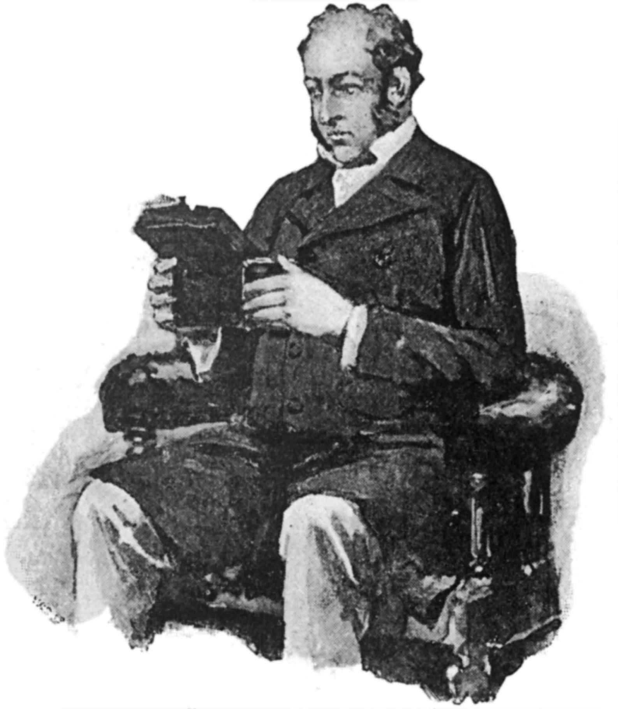

“我准备拿这给你作为抵押。”

“我把这只贵重的匣子拿在手上，有些不知所措，眼睛看看匣子，又看看这位尊贵的贷款人。

“‘你怀疑它的价值？’他问我。

“‘不，不，一点也不，我只是不放心——’

“‘不放心留在你这里是否妥当，这你尽管放心。要说四天以后我拿不回来，那是绝对不可能的，连作梦也不可能梦见这种事，实际上纯粹是个形式罢了。这件抵押够不够？’

“‘大大有余。’

“‘你知道，霍尔德先生，我给你这样一件重物作信用担保，是我对你的充分信任，基于我一直听到你是极有信誉的人。我信任你，你不仅仅要小心谨慎，防止这件事引起流言蜚语，而且最要紧是好好保管这顶王冠，不可稍有疏忽。无须我说，万一出点什么纰漏，引起公众不良舆论，那就不得了。若有一点损坏，其严重性也无异于整个丢失。这上面的每一枚翠玉都是举世无双的，全世界没有第二枚可以匹配，可以替换。我把它交给你，是给予充分的信任，星期一早上我会亲自来取回。’

“看我这位贷款人急于要走，我也不多说了，当即招来银行出纳，命他付给五十张一千英镑的钞票。办完此事，当我一个人的时候，面对桌上这只贵重的匣子，想着需要承担这样巨大的责任，心里不免忧虑害怕。毫无疑问，因为它是一件国宝，如果发生意外，接踵而来的必定是可怕的公愤。我开始后悔怎么竟然同意负责保管呢！可是现在要想改变为时已晚。我也就只好把匣子锁进我的私人保险柜里，回头继续做我的工作。

“到了晚上，我又想到把这么贵重的东西就这么放在办公室未免太不谨慎，银行保险柜以前发生过被撬窃事件，怎么能保证我的保险柜就不会被撬窃呢？万一出这种事，我的处境就不堪设想！于是我决定，就这几天工夫，我来去都把宝匣随身带着，这样就真正做到与我寸步不离。主意既定，我叫了马车，带上宝匣，回到斯特里特哈姆自己家里。我一路紧张，直到把匣子拿上楼，锁进起居室的书桌柜里，才算松了一口气。

“现在说一下我家里的情况，福尔摩斯先生，以便你对整个事情有全面的了解。我的马夫和小仆人是睡在屋外的，这两个人完全可以撇开不谈。我有三个女仆，跟随我已有多年，她们绝对可靠可信，不必有怀疑。另外还有一个，露茜·帕，是个当帮手的侍女，来我家才几个月。然而她从开始到现在，品格、表现非常好，处处使我满意。她是个很漂亮的姑娘，所以吸引不少爱慕她的人来这儿转悠。要说她有什么不足，也就这一点，但是我们相信她各方面都是个很完美的好姑娘。

“佣人方面就这些。我的家庭本身极其简单，没有几句话可讲。我丧偶是鳏夫，只有一个独生子，阿瑟。儿子使我很失望，福尔摩斯先生——很叫我伤心。怪来怪去都怪我自己不好，人家都说是我把儿子惯坏的，恐怕是这样。我的爱妻去世以后，我觉得儿子是我惟一所爱的人了，只要看他的脸稍有一点不高兴，我就不好受，我对他是百依百顺。如果早先能对他严格一点，对我们父子两人或许都有好处，但是我本意完全是为着他好。

“我自然是一心希望他能继承我的事业，可是他不成器，根本不是那块料。他放荡任性，说实在的，根本不能相信他，把大笔钱款交给他。他小小年纪就去加入贵族俱乐部，在那里锋头很健，成了一帮富家子弟的酒肉朋友，花钱如流水，挥霍无度。学会牌桌豪赌，赛马场上挥金如土，一次又一次找我，求我预支津贴，去应付赌债。他也多次想要和那帮害人的朋友断绝来往，可是每一次只要那个朋友，乔治·伯恩韦尔爵士一找他，就抵不住要被拉下水。

“确实，我怪不得儿子会同乔治·伯恩韦尔这样的人断不掉关系。儿子常常带他到家里来，我自己都感觉这个人风度确实不凡，无法不对他产生极大的好感。但这仅是表面。他比阿瑟大，已是老于世故到了家，一个人精，哪儿都去过，什么都见过，能说会道，死活黑白颠来倒去凭他一张嘴，而且长得相貌不俗，美男子一个。当我排除感情，冷静下来考虑这个人，远远抛开他那光鲜夺目的外表，细听他玩世不恭的言语谈吐，观察他看人的那眼神，我就断定这是个绝对不可信赖的人。我是这么看法，我的小玛丽也是同样看法，玛丽具有女性善于洞察一个人品性的天性。

“说到玛丽，现在就剩她一个需要讲一讲了。她是我侄女。我兄长五年前去世，丢下她孤苦伶仃在世，我把她接过来，一直把她看作是我的亲生女儿。玛丽真是我家的一颗明珠——温柔、可爱、美丽，很会做家务，持家一把手。而且，凡是女人应有的恬静文雅、温良端庄的品质她一应俱全。她是我一只得力的右胳膊，要是少了她，我真不知该怎么办。只有一桩事，她不听我的话，不称我心。我儿子两次向她求婚，孩子也的确真心实意地爱着她，可是她两次都拒不接受。我也是想，我儿子，要有谁能把他往正道上引，只有玛丽，除她没有别人。我是指望他们结婚来改变他的整个生活，可是现在，咳！不谈了——永远别指望了！

“现在，福尔摩斯先生，你对我家里的人都有了了解，下面我继续把这桩祸事说给你听。

“那天晚上吃过晚饭，我在客厅里喝咖啡，同阿瑟、玛丽讲起这桩不一般的业务，讲起这么一件稀世珍宝进入了我家门给藏着，只把贷款人的姓名隐瞒不说。侍女露茜·帕端来咖啡就离开客厅，这一点我确定无疑，不过客厅门是不是关上，无法确定。玛丽和阿瑟听了很感兴趣，都想见识一下这顶王冠，已经进了自家家门还不得一见，不免遗憾，但我想还是不动为好。

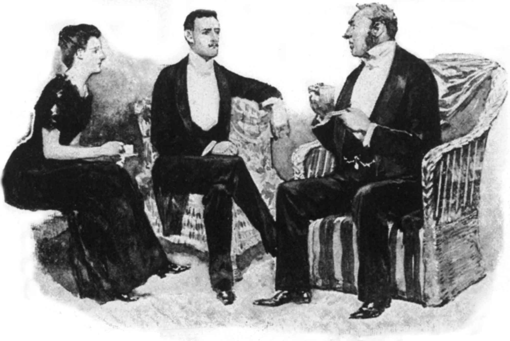

同阿瑟、玛丽讲起这桩不一般的业务。

“‘放在哪里了？’阿瑟问。

“‘在我书桌柜里。’

“‘哦，但愿夜里别给撬窃了才好。’他说。

“‘锁着呢。’我回答说。

“‘那个锁，随便一把旧钥匙都能开的，我小时候，常常拿储藏室小橱钥匙一下就把它打开。’

“他讲话没边没沿，常信口胡说，所以他这么说我没当一回事。那晚他后来跟着进我的卧室，脸色阴沉着。

“‘你瞧，爸，’他说，眼不敢抬，‘给我两百英镑好吗？’

“‘不，不行！’我斩钉截铁回答，‘你尽要钱，我一向对你太纵容。’

“‘你是向来对我挺好，’他说，‘这一回的钱，不给不行，要不我在俱乐部里没脸见人。’

“‘那倒再好也没有！’我叫嚷着说。

“‘是的，可你总不能叫我落下个坏名声溜走吧，’他说，‘叫我丢脸我受不了，我无论如何得凑齐这笔钱，你不给我，我就找别的办法去。’

“我发火了，这个月已经是第三次向我开口要钱。‘我这里你别想再要到一分钱。’他见我这么又吼又嚷，只好鞠个躬，一声不吭离开了房间。

“他一走，我打开书桌柜，看看宝物安然无恙，便再锁好。然后把屋子四周门窗、各个角落都检查一遍——平时这是玛丽的事，今天则由我亲自来检查。我下楼梯的时候，看见玛丽一个人在厅的侧窗旁。我走过去，她正把窗关好，下了插销。

“‘问你一声，爸，’她说，我看她好像有点不自然，‘是你今天晚上让露茜出去的吧？’

“‘当然没有。’

“‘她刚才从后门进来，肯定是开门出去会什么人，我想这样很不安全，要制止，不允许这样。’

“‘明天早晨你对她讲吧，或者要我来对她讲也可以。你看过各处都关好了吗？’

“‘都看过了，爸。’

“‘那好，晚安，睡吧。’我吻了她，上楼回到卧室，很快入睡。

“我尽量把一切情况都讲给你听，福尔摩斯先生，说不定跟案子都有关系。所以，如果你觉得还有不清楚的地方，尽管提出来问我。”

“没有不清楚的地方，你讲得每个地方都清楚。”

“现在要讲到关键部分了，希望能讲得特别清楚。我这个人睡觉睡不沉，这桩心事又那么重，肯定比平时更加容易惊醒。到凌晨两点光景，屋子里有响动，我就马上惊醒，等我完全清醒，响声又没有了。印象中好像是哪扇窗给轻轻关上。我躺在床上竖起耳朵听着，忽然，隔壁房里有很清晰的脚步声，轻轻地走，我不由得心抽紧了。我立刻翻身下床，害怕得心突突地跳，向外朝起居室门那边一望。

“‘阿瑟！’我惊叫起来，‘小畜生！你做贼呀！王冠都敢碰了呀？’

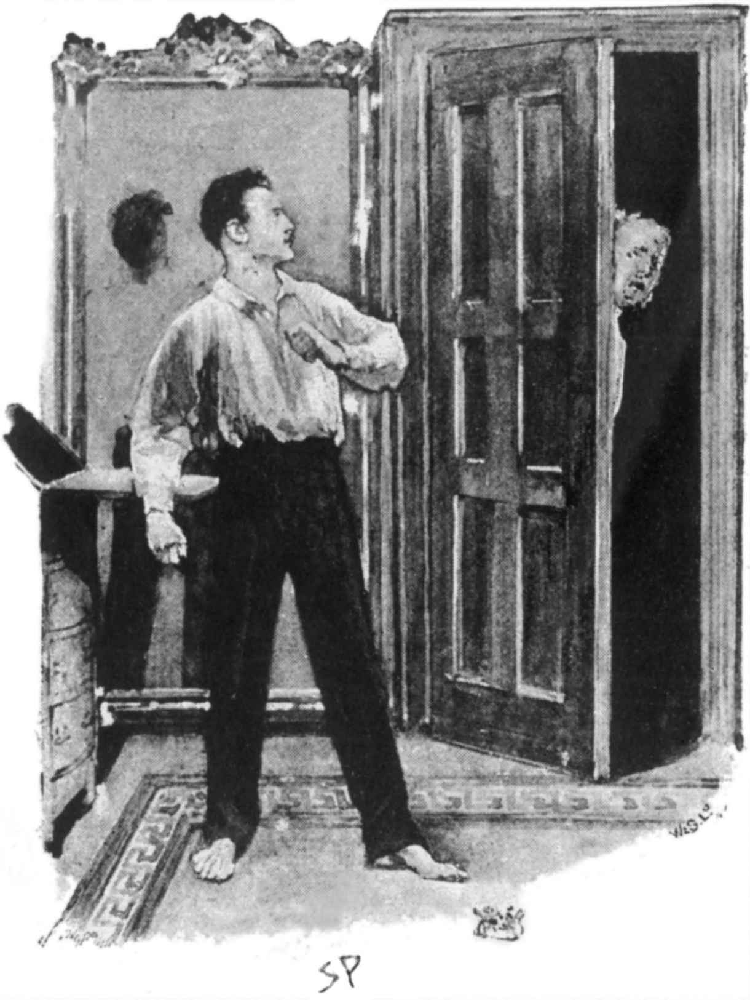

“小畜生！你做贼呀！”

“煤气灯半明不暗，是我把灯这么亮着的。我儿子在那里一副狼狈相，只穿衬衫，一条长裤，王冠捧在他手里。看得清他在使劲儿扳，用力拗。给我一声喊，吓得他手一松，王冠掉到地下，脸色死一般苍白。我一把抢起来检查，发现一个金尖角上三枚翠玉不见了。

“‘你这个无赖！’我吼着，气得发昏，‘给你弄坏啦！你让我丢一辈子人！那几枚宝石呢，你偷的？’

“‘我偷？’他叫着。

“‘你偷了，做贼了！’我咆哮起来，抓住他肩膀猛摇。

“‘没有呀，一枚也没有丢呀！’他说。

“‘丢了三枚，肯定你偷藏了，你做贼了，还说谎，还当骗子了，你不是在扳吗，还要再掰掉宝玉吗？’

“‘你骂够了吧？’他争辩，‘我反正没偷，你骂好了。你一个劲骂，由你骂，这个事反正我一句也不愿提。天一亮我就走，离开这个家，闯世界走我的路。’

“‘你走，你要走到警察手里去！’我吼着，又是伤心又是火，人已经半疯了，‘这件事非要追查到底不可！’

“‘你问我，我怎么知道，’他说，瞧他那倔劲儿，真想不到他成了这样的德行，‘你喜欢叫警察，就叫警察来查好了。’

“这时候，我火得直起嗓子又喊又骂，把整屋子都给吵醒。玛丽第一个奔过来，一看见那顶王冠、阿瑟的脸色，全部事情她都明白了，听得她一声尖叫，随即昏倒在地上。我差女仆去叫警察，请他们马上进行调查。当巡官带一名警察进屋的时候，阿瑟交叉胳膊绷着脸站在那里，问我是不是要控告他犯了偷窃罪。我回答他，毁坏王冠是毁坏国家财产，这已经不是私事，是公案了，我不得不决定，一切都必须按照国家法律行事。

“‘随你吧，’他说，‘可总不能就马上把我抓了走吧，只要你让我出屋子去一下，五分钟，你我都能没事了。’

“‘你好乘机逃跑，你好乘机把偷到手的东西藏起来。’我说。这时我意识到我的处境已落得极其可怕，我反而求阿瑟不要糊涂，不仅仅是我个人，而且还有一位比我尊贵得多的人，名誉和地位都要被危及，要给他挑起一件震惊全国上下的大丑闻。只要他向我说出把三枚宝玉怎么了，那么一切有望转危为安。

“‘这个事你头脑千万得清醒，’我说，‘你是当场被捉住的，拒不承认只会罪上加罪。只要你想挽回，还完全来得及。告诉我们翠玉藏在哪里，那么一切都可以宽恕，不予追究。’

“‘我不要你宽恕，谁要宽恕你就宽恕谁好了，’他回答我，冷笑一下，别转了脸。我见他如此冥顽不化，苦口相劝只当耳边风，那就没有别的办法。我叫来巡官，把他拘押起来。立刻搜查，搜身、搜房间，还对屋里一切他可能藏匿宝玉的地方、角落全搜遍，结果一丝痕迹也没有发现。孩子死活不开口，我们怎么劝说、威逼都不济事。今天早上他进了牢房，我办完了警方需要的手续之后，就赶忙跑你这儿来求助，请你施展高手解决这件案子。警方公开承认，目前对本案尚无头绪。你这里需要多少费用尽管花费，我已经拿出一千英镑作悬赏奖额。我的上帝，我怎么办呢！一夜之间，我的信誉没有了，我的宝玉、我的儿子都没有了！哦，叫我怎么办呢！”

他双手捧头，身子哆嗦，嘴里咕咕哝哝，伤心得说不出话来，不知如何是好。

福尔摩斯静坐着有几分钟，双眉皱起，眼睛盯着炉火。“你平时接待客人多不多？”他问。

“就只有合伙股东和他家里人。最近有时候，阿瑟的朋友乔治·伯恩韦尔来过几次。其他，就没有人了。”

“你们出去应酬之类的事多不多？”

“阿瑟多，玛丽和我一直待在家里，我和她两个不喜欢应酬。”

“年轻姑娘，这不很正常。”

“她性格好静。再说，她已不算很年轻，已经二十四岁了。”

“这件事，根据你所讲，好像对她也是一个打击。”

“打击太大了！她比我还要难受。”

“是你儿子有罪，这一点你和玛丽两人都没有疑问？”

“还能有什么疑问！是我亲眼见他手上拿着王冠。”

“恐怕还不能以此作为证据得出结论。冠冕给损坏了？”

“坏了，给扭歪了。”

“那你不认为他是在把扭歪的地方扳直回来？”

“上帝保佑你！你是在尽量为他也是为我说话，可是这样做太难呀。他当时到底在做什么？如果他确实无辜，为什么不说明白？”

“正是。如果是有罪，他为什么不编个谎话逃避呢？他沉默，依我看，是在两边为难。这件事有几点特别的地方，起先有响声把你惊醒，警方对此怎么看？”

“他们认为那是阿瑟关上他卧房门的响声。”

“说得倒像呢！一个人作大案，好像就要碰门弄出响声来把人都惊醒。那么，几枚宝玉不见了，他们怎么说？”

“他们这会儿还在敲木板、翻家具，指望能找出来。”

“他们想到屋外找吗？”

“是的，他们劲头十足，把整个花园都细细查了一遍。”

“好了，我说亲爱的先生，”福尔摩斯说，“这不是很明显告诉你，事情比你和警察起初想的都要深奥得多吗？起初你们一看挺简单，在我看来可是极复杂。想想你们的分析都是什么样子！你想想，你儿子从床上下来，走过去，冒极大的险到你起居室，打开你书桌柜，把王冠拿出来，用足力气拧了一个角，走到另一个地方去，把三十九枚玉中拧下的三枚藏起来，藏得手脚巧妙，没人能够发现，然后拿着还剩下的三十六枚玉回到屋里，冒着给人看见的极大危险。我现在要问，你们这个分析站得住脚吗？”

“那还能有什么别的解释呢？”银行家做了个绝望的手势叫道，“要是他没有不良动机，他为什么不能解释清楚呢？”

“我们要做的工作就是要弄弄清楚，”福尔摩斯回答说，“现在请你，霍尔德先生，和我们一起到斯特里特哈姆你家里去，花上个把小时再把各个环节仔细看一遍。”

我的朋友坚持要我一同前往，这也正中我的下怀，因为听了这个故事以后，我大为好奇，也深感同情。我承认，银行家的儿子是不是犯罪，我当时和这位不幸的父亲看法一样，是明摆的事实。但是我对福尔摩斯的判断抱有充分的信心，所以我觉得，既然他对大家所接受的解释并不满意，那么其中必定另有原因需要探究。我们一路向南郊行去，他坐着一言不发，下巴沉到胸前，帽子拉前遮住双眼，完全陷于沉思之中。我们的委托人由于有一线希望呈现在他的眼前，所以心情似乎有些好转，以至放松得与我拉扯起他的银行业务来。我们转乘一会儿火车，再步行一小段路，就到了这位大银行家朴素的寓所，费厄班克。

费厄班克是一幢白石砌的方形住宅，位于大路稍远的一边。一条双车弯道，沿着积雪的草坪，伸向入口处两扇紧闭的大铁门。右首是一扇木栅小门，连接一条狭窄的、夹在两排整齐树篱之间的小径，从路口直通厨房门，这是一条供商贩出入的旁门小道。左首是一条通向马厩的巷道。这条巷道不在庭院之内，平时少用，但来去非走此路径不可。福尔摩斯让我们站在门口，自己慢慢绕房屋走一圈，通过前门，走商贩小道，兜过花园后面进入马厩巷道。他去了好长时间，霍尔德先生和我就进餐厅，在炉火边等他回来。我们坐在那里，没有说话。这时门被推开，进来一位年轻女士，中等偏高的身材，亭亭玉立。她黑头发黑眼睛，再衬以十分苍白的肤色则更显其乌黑。在我的记忆中还没有见过这么惨白脸色的女子，两片薄唇也是毫无血色，只有她的双眼，哭得肿而发红。她拖曳衣裙静悄悄走进来，给我的感觉，她的悲痛更甚于银行家早晨所给我的印象。而且，看得出，她是一位个性很强、很有自持力的女子，所以很明显此事对她的打击一定更大。她不顾有生人在场，径自走向她的叔父，用手以女性特有的温情在叔父头上轻轻抚摸。

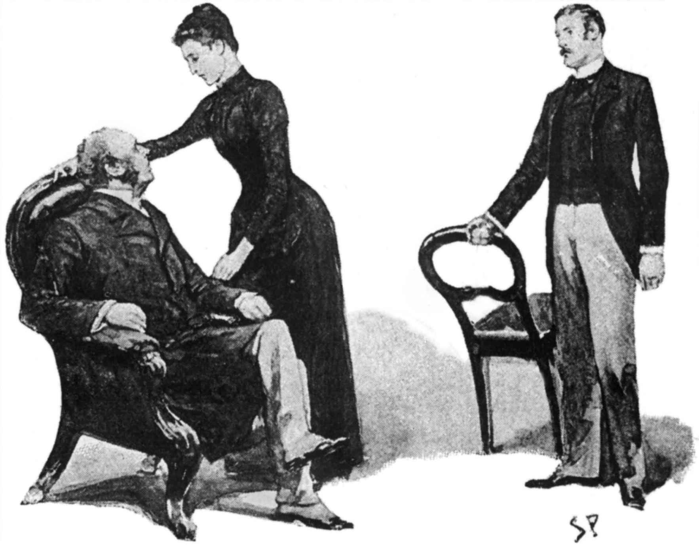

她以女性特有的温情在叔父头上轻轻抚摸。

“你一定要叫他们把阿瑟给放了。你跟他们说了吗，爸？”她问道。

“不，不，我的女儿，这件事一定得查到底才行。”

“我可以说他肯定是无罪的，你知道女人有直觉，挺灵的。我知道他没犯错事，你这样严厉对待他，你要后悔的。”

“那他为什么死不开口，如果他真是无辜的话？”

“不一定吧！也许因为连你都怀疑他，他挺冤的，跟你倔着性子呢。”

“我都亲眼见了，王冠在他手上，我怎么不怀疑他呢？”

“哦，他不过是地上拾起来看看呢！噢，相信我，相信我吧，我不瞎说，他是无辜的。这事他不会，别提他吧，一想到我们亲爱的阿瑟给关进监狱，真太可怕了。”

“我不能罢休，一定要把宝玉找到——绝不罢休，玛丽！你爱惜阿瑟，都蒙了眼，看不清对我的后果有多严重。绝不罢手，绝不能轻易了事。我还从伦敦请来了一位先生，要进一步深入调查这事件。”

“是这位先生？”她问道，脸转向我。

“不是，这位是他的朋友。那位先生有点事，让我们先进来，他这会儿正在马厩巷道那里转转看看。”

“马厩巷道？”她竖起了浓黑的双眉，“他在那儿想发现什么？啊！这位，我猜一定是他了。没错，先生，你一定能够证明，我的感觉肯定没错，证明我的堂兄弟阿瑟是无罪的。”

“我完全赞同你的意见。我还确信，有你在一起，我们就能证明这一点，”福尔摩斯走进屋里，又回身到门垫上把鞋上的雪蹬掉，“我相信，我很荣幸见到的这位，是玛丽·霍尔德小姐，我可否向你提一两个问题？”

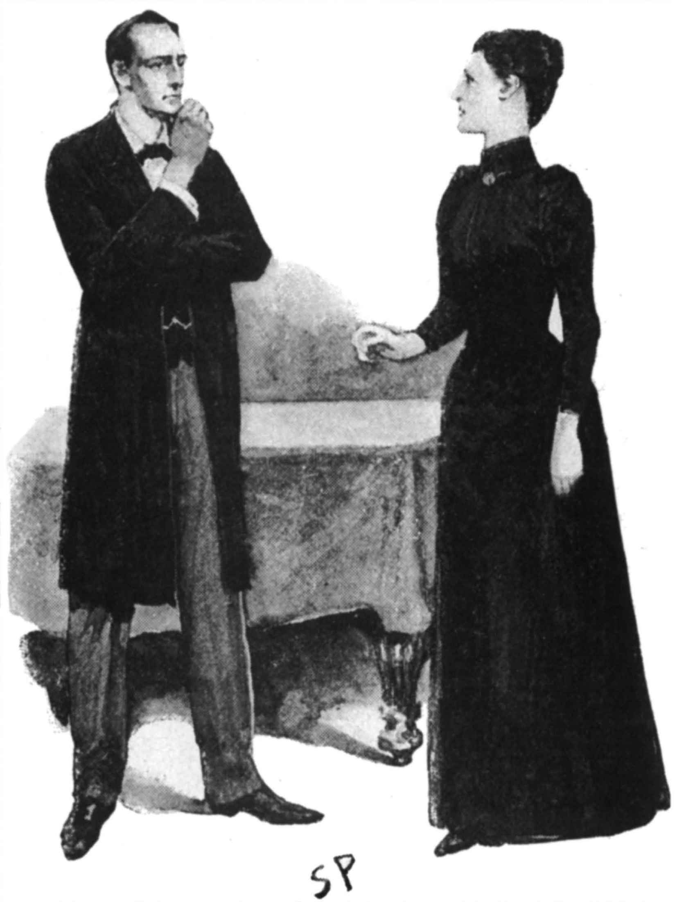

“我可否向你提一两个问题？”

“请讲吧，先生，但愿能有助于澄清这件可悲的事。”

“昨天夜里你什么也没有听见？”

“没有，是叔父后来大声说话，我听到了才起来的。”

“昨天夜里是你把门窗都关上的。所有的窗你都上了插销？”

“是的。”

“今天早晨插销都没动过吗？”

“是的。”

“你们有个女仆，她有个情人吧？我想，昨天夜里你对你叔父说起，她出去会情人了，是吗？”

“是的，也就是她待在客厅，可能让她听见了叔父谈到王冠的事。”

“我明白，你的意思是说她可能出去告诉她的情人，两人一起策划作案盗窃。”

“这种推测都是没有根据的，没有用，”银行家不耐烦地叫道，“我都告诉你们了，我看见阿瑟把王冠拿在手里呢！”

“请别急，霍尔德先生，我们必须追问一下这个问题。关于这个女仆，霍尔德小姐，你看见她从厨房门回来，我想是吧？”

“是的，我是去检查厨房门晚上是否关好，碰见她溜了进来。我也看见那个男人，看见他躲在暗影里。”

“你认识他吗？”

“噢，认识，他是卖菜的，给我们送蔬菜，名叫弗朗西斯·普罗斯珀。”

“他站在，”福尔摩斯说，“门口的左侧——就是说，远在小路那一头，还没靠近门口的地方？”

“是的，他站在那边。”

“还有，他是个装木头假腿的人？”

年轻女士富于表情的黑眼睛里仿佛闪出惊恐的目光。“啊呀，你像是个巫师，”她说，“你怎么会知道？”她面作微笑。但是，福尔摩斯瘦削、威仪的脸上却并未报以些微的笑容。

“现在我想应该上楼去看看，”他说，“然后再到屋子外面转转。上楼之前，我还是再看一看下面的窗户吧。”

他很快地从一个个窗前走一圈，只在那扇可以从大厅向外望到马厩巷道的大窗前稍停一下。他打开这扇窗，用高倍放大镜非常仔细地察看窗台。“现在，我们可以上楼了。”最后他说。

银行家的起居室是一间简朴的小房间，地上铺一块灰色地毯，有一个大书桌柜，一面长镜子。福尔摩斯径自走到书桌柜边，细细看了桌柜上的锁。

“是用哪个钥匙开的锁？”他问。

“就是我儿子他自己说的——开贮藏室碗橱锁的那把钥匙。”

“钥匙在你这儿吗？”

“就放在梳妆台上。”

福尔摩斯拿起钥匙把书桌柜打开。

“这把锁开起来没有声音，”他说，“难怪没有惊醒你。这只匣子，想必就是装王冠的。我要看一看。”他打开匣盖，取出王冠放在桌上。这是一件华丽的珠宝工艺品，那三十六枚翠玉是我从未见过的最上品的玉石。王冠的一侧有一道裂口，一个包角上三枚玉石给掰掉了。

“现在，霍尔德先生，”福尔摩斯说，“这一个尖角，同这一个不幸丢掉翠玉的尖角是对称的，请你试试能否把它掰下来。”

银行家吓得一个劲摇手退缩。“我做梦都不敢，试不得。”他说。

“那么我来试试。”福尔摩斯猛然使力一掰，但是掰不开。“我觉得有点松动，”他说，“但是，虽然我的手劲比什么人都厉害，要把它掰开的话，不费点时间还真是不行。那么一般人，要一下子掰下来就别想了。现在，如果我要把它掰下来，你想会是什么情况，霍尔德先生？将是手枪打枪一样嘣的一声响。请你告诉我，这发生在与你的睡床不过以多少码计的距离之内，你居然一点都没听见？”

“我也讲不清怎么回事，我是一团漆黑。”

“我们走下去，曲径通幽，会明亮的，霍尔德小姐你以为如何呢？”

“我承认，我和我叔叔一样无法理解。”

“你看见你儿子的时候，他没穿鞋，连拖鞋也没穿？”

“他身上只穿了裤子、衬衫，别的什么也没有。”

“谢谢你，我们这次调查有幸获益匪浅。要是还不能把事情搞个水落石出，那完全只能怪自己无能。好，请允许我，霍尔德先生，现在到屋外继续调查。”

他要求让他一个人去调查，他解释的原因是人多脚印杂乱，徒增不必要的困难。他去了大约一个多小时，最后回屋，脚上沾满雪，脸上的表情依然莫测高深。

“差不多了，该看的现在都已经看了，霍尔德先生，”他说，“等我回到我的寓所，就能给你的事有个最圆满的了结。”

“那，宝玉，福尔摩斯先生，宝玉在哪里？”

“我不好说。”

银行家搓起了双手。“难道就这么算了，永远找不到了？”他大声说，“还有我的儿子呢？你不是都答应的吗？”

“我讲的话都管用，绝不食言。”

“那，我的上帝呀，事情还是一团漆黑呢，昨天夜里我家到底是怎么回事？”

“明天上午九点到十点，你到贝克街我的寓所来，我一定可以向你讲得很清楚。我明白你是全权委托我处理这件事，只要我把宝玉找回来，我所花费用多少你并不在乎。”

“能找回来，我倾家荡产在所不惜。”

“那好，我就可以很有把握了，再见。很可能，不到晚上，这儿我还要来一趟。”

我很明白，我的同伴对这件案子胸中已经全盘有数，虽然他的结论远非我所能估计、所能想象。在我们回家途中，我多次想让他透露一点底细给我听听，然而他总是扯开我的话头。最后我看没有希望，也就不提此事。回到寓所还不到三点，他急忙走进他的房间，几分钟后就出来，已打扮成一个穷光蛋，穿一件油光发亮的破外套，衣领翻起，系一条红领巾，一双破旧的靴子，是个典型的流浪汉。

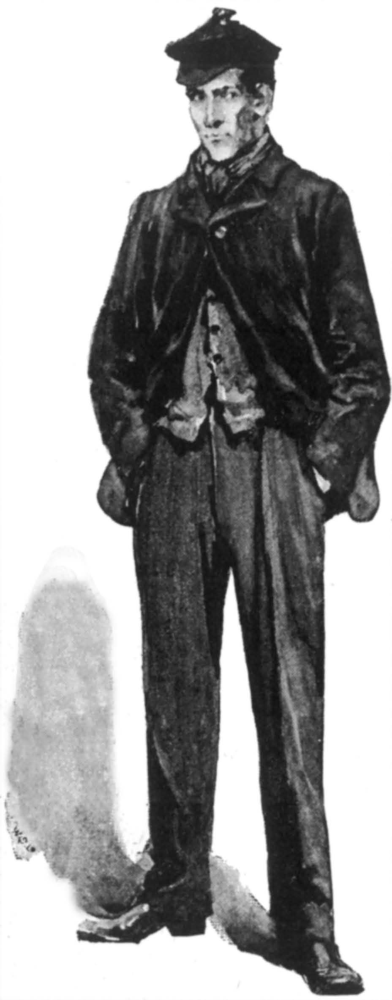

打扮成一个穷光蛋。

“看看，还差不多吧，”他说，照照壁炉上方的镜子，“我真希望你同我一起去，华生，但又怕不行。我可能已经抓住了这桩案子的线索，也可能在跟着鬼火走，瞎蒙。到底怎么样，很快会明朗，但愿没几个小时就能回来。”他拿出食橱里的牛肉块切下一片夹了面包，就往口袋里这么一塞，准备了权充一餐，出发去奔命。

我刚喝完茶，他就回来了，一副兴高采烈的样子，手上甩着一只松紧扣的旧靴子。他把靴子往墙角一丢，便去倒茶喝。

“我是经过这里，顺便进家门，”他说，“我马上又得走。”

“上哪儿去？”

“哦，上西区那头，可能要费一点时间才能回来。要是太晚了，你就不必等我。”

“事情进行得怎么样了？”

“哦，还可以吧，没出什么纰漏。从这儿一离开我又去了斯特里特哈姆，没进他们屋子。一个很有意思的小问题，这个问题不可轻易放手不管。好了，闲话少说，把这身破烂脱掉，换上体面衣裳，还我本来面目。”

我从他的态度来看，他是话中有话但不明说，肚里已是稳操胜券。他双目闪亮，苍白的两颊也有了颜色。他匆忙上楼。几分钟后只听见厅门砰一声碰上，他又去投入追猎，乐此不疲。

我一直等到半夜，还不见他回来，只好进我的卧房去休息。他热衷于一条线索的时候，常常一连几天没日没夜，那是习以为常的事，所以他迟迟不归，我毫不奇怪。我不知道他是几点钟回来的，但是我早晨下楼去用早餐时，看见他已经一只手拿一杯咖啡，另一只手拿一张报纸，他的精神要多好有多好。

“我不等你起来自己先吃了，很对不起，华生，”他说，“可是你该记得我们的委托人早晨就要来会我们了。”

“啊，现在已经过了九点，”我回答，“看我也太不上心此事。这不，我听见打铃声了！”

一点没错，正是我们的金融家朋友驾到。我一见他就惊讶不已，他整个人都变了形。他原来宽厚丰满的脸盘变得瘦削塌陷，看他的头发似乎平添了一层白霜，走进来的神态了无生气，筋疲力竭，比之昨天早晨更显得万分痛苦。我刚把安乐椅推给他，他就沉沉地跌坐下去。

“不知道我作了什么孽，要遭这样的罪，”他说，“两天以前，我还是好端端一个宽心幸福人，无忧无虑在世上，现落得无颜无面孤老头一个。横祸接踵而来，我的侄女，玛丽，也把我抛弃了。”

“抛弃你？”

“是呀，今天早晨，见她床上一夜没人睡过，她房间也空了，客厅桌上给我留了张纸条。昨天晚上我给她说过，很悲痛但是没发火，说如果她和我儿子结婚的话，就不会发生眼下这种事情。大概我这么说话欠考虑，她是冲着我的话才留条这么写：

我最亲爱的叔叔：

我感到我已给您带来了苦恼，恐怕都是我做得不对，才发生这么可怕的不幸。我内心深深愧疚，今后与您共同生活在一个屋檐下不会再有幸福。我只有永远离开您，别无办法。请不要为我的前途担忧，我自有去的地方。请切记千万不要寻找我，因为您必将徒劳，而且对我会十分不利。我生生死死永远是

您忠实的玛丽

她这条子是什么意思，福尔摩斯先生？你看是不是会自杀？”

“不会，不会，根本不会。这倒也许是个最好的解决办法。我确信，霍尔德先生，你的痛苦、烦恼就要结束了。”

“哈！你真的有把握？你听到什么了，福尔摩斯先生，你听到有什么消息？宝玉在哪里？”

“一千英镑一枚翠玉，这代价你觉得行吗？”

“付一万英镑我都愿意。”

“这倒不必，三千，足以把事了了。还加一点小小的酬劳，我想总是要的。你带着支票簿没有？给笔，还是开上四千好了。”

银行家神情茫然地如数开出支票。福尔摩斯走向书桌，取出一个三角形金箔小纸包，包的正是三枚翠玉，回首往桌上一扔。

我们的委托人发出一声狂呼，一把抓在了手里。

“啊，你真行！”他乐得都来不及喘气，“我有救了！我有救了啊！”

这高兴激动的反应同他原来的忧愁痛苦一样的难以自制。他将这几枚失而复得的翠玉紧紧地贴在胸口。

“你还欠一笔债，霍尔德先生。”福尔摩斯颇严肃地说。

“欠债！”他马上抓起笔来，“说说多少，我马上偿还，偿还。”

“不，不是欠我的，你欠你儿子的债，你得好好向他道歉。他是你的好儿子，他把事情的责任全揽在自己身上，好品德。要是我的儿子能这样做，我会感到自豪，如果我有孩子的话。”

“不是阿瑟拿的？”

“我昨天跟你说了，今天再同你讲一遍，不是他。”

“真是这样！那我们赶快看他去，让他知道事实真相。”

“他早已知道。我事情一清楚，就找他谈过话，可是他不肯对我讲实话。我就把事实告诉他，他才不得不承认，我讲得都对，还向我交代了某些细节；我不完全清楚的，他都给我补充了。你今天早晨带来的消息，更好，可以让他完全开口。”

“我的天哪，告诉我，那是怎么回事，这个奇怪的谜？”

“我会告诉你，还要让你看我的步骤，怎么走到了这一步。现在，我首先要对你讲，这事我说起来还真觉得难以开口，你听起来也很难接受：你的侄女玛丽同乔治·伯恩韦尔爵士两人，相好着呢，跟他一块儿私奔了。”

“我的玛丽？不可能！”

“不幸的是，不只是可能，而且是事实。你们让伯恩韦尔爵士这个人上你们家，可是无论是你儿子还是你，都不清楚他的真面目。他也算得上是英国最危险的歹徒——一个赌棍，输红了眼，一个亡命之徒，根本不懂什么叫道德良心。你侄女对他这种人一无所知。他对你侄女信誓旦旦，其实他对上百个女人都是这样。你侄女被诱惑迷了心窍，自以为只有自己才打动了他的心。这个魔鬼深知如何用花言巧语让姑娘给他当工具来使，你侄女几乎每晚都要跟他幽会。”

“我不能，我绝不信，有这种事！”银行家叫道，脸色都青了。

“那就让我来讲给你听，昨晚上你家里发生的事。你的侄女，当她断定你已经回到房里，就溜到楼下，在窗口，那个对着马厩巷道的窗口，同她的情人讲话。那男人的脚印深印在雪地上清清楚楚，是站在那儿有一会儿时间了。你侄女告诉情人这个王冠的事。男的一听这个话，就燃烧起了对这件珍宝邪恶的欲火，逼迫她服从他的欲望。你侄女爱你，这一点我不怀疑，但是有的女人，一爱上情人，对其他人的爱就会不顾，我想她就是这一类女人。她还没听完男的指使，看见你从楼上下来，就马上把窗子关好，对你说什么仆人同一个木腿情人之间的越轨行为，这当然也确实是不假。

“你儿子，阿瑟，同你谈过话就回房去睡了，但是因为欠俱乐部钱的事睡不着觉。到半夜，他听得轻轻的脚步声走过他的房门，他就起来，看看外面。他大吃一惊，看见是堂姐蹑手蹑脚在过道上走，走到你的起居室里去了。这孩子都惊呆了，披上衣服，等在暗处看究竟是怎么回事。不一会儿你侄女从屋子出来，你儿子借着过道的灯光看见她手里拿着那顶珍宝王冠从楼梯下去。你儿子吓得哆嗦着跑过去，躲在靠近你房门口的垂帘后面，从那儿可以望见楼下厅里的情形。他看见堂姐悄悄把窗打开，把王冠递出去交给在暗里的什么人，然后把窗重新关上，匆匆回到她自己房里。她就在你儿子躲着的垂帘面前走过，他站着离得很近。

“对你侄女的这种行为，你儿子不会当场出来，当面采取行动，他不忍戳穿、惊吓他自己心爱的女人。可是等她一走，你儿子马上想到这对你不是灭顶之灾吗！他想到必须赶快挽回，刻不容缓。他不顾一切奔下楼，还光着脚丫，打开窗，翻窗跳到雪地上，在巷子里跑，月光下看见一个人影。乔治·伯恩韦尔爵士企图逃跑，可是给阿瑟抓住，两人就扭打起来。你孩子抢住王冠，对方紧抓不肯松手，争抢之中，你儿子揍了乔治爵士一拳，打在他的眼上。这时什么东西被拉断了，王冠倒是给夺回了手。你儿子马上往回跑，回屋关上窗，上楼要到你房里来。他一下子发现王冠给抢得扭歪了，就使劲儿要把它扳正过来。正在这时候，你来了，当场让你撞个正着。”

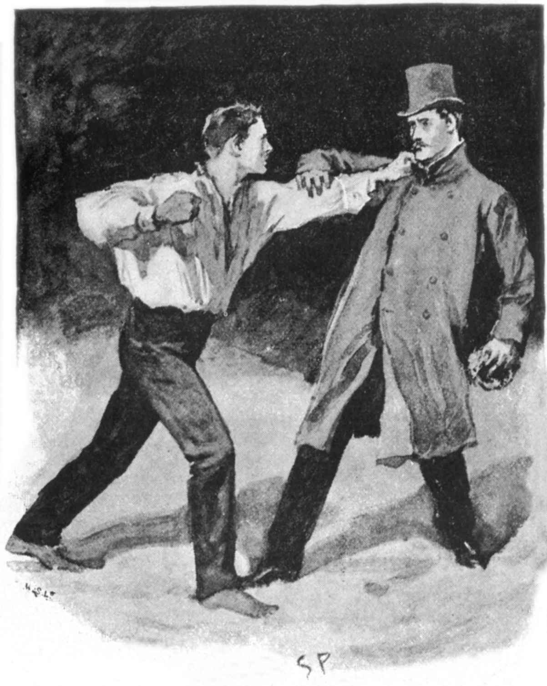

两人就扭打起来。

“是这样吗？”银行家气喘吁吁地说。

“他正想着你该感谢他还来不及呢，不料劈头就是被你一顿臭骂，孩子心中激起了怒火。他不能向你诉说实情，他得手下留情，不忍伤害了人。他要有骑士风度，无论如何要护住堂姐的秘密。”

“啊，所以，侄女会看见王冠就一声尖叫，昏了过去，”霍尔德先生嚷道，“噢，我的上帝！我瞎了眼，我蠢货！怪不得，儿子要求我让他出去五分钟！我的好孩子，是想要找一找，少了的宝玉丢在了争夺的现场。我错怪了他，我多么混蛋！”

“当我来到你这里，”福尔摩斯继续道，“立刻绕着你屋子细细看一遍，观察雪地上是否留下有助破案的痕迹。昨晚以后没下雨雪，还恰好有浓霜保存了脚印。我沿着买菜的小道看过去，可是脚印都已经踏烂，没法辨别了。还好，过了那一段，离厨房门稍远的一头，有一个女人曾经同一个男人站那里谈过话，男的脚印有一个是圆形印迹，说明是一条木头假腿。我都还能看出他们给人惊动过，因为女的快步跑回厨房门，脚尖部分深，脚跟部分浅。那木腿仍旧站着等了一会儿，过后才跑掉。我想是女仆和情人，这是你对我讲过的，调查下来也正是这样。我绕进花园，没看见什么，只有乱脚印，我知道这都是警察留下的。等我进了马厩巷道，我面前的雪地上，就写着长长的复杂的故事情节了。

“那里有两行男人靴子的脚印，另外还有两行，一看很高兴，是赤脚的脚印。我根据你告诉过我的情况，马上断定这赤脚的两行是你儿子的脚印。头一个人来回走过两次，后一个是迅速跑步，脚印踩了靴子的痕迹，很明显是追另外那个人。我跟随脚印走，发现走向客厅的窗前，靴子把雪踩稀了，说明他是在那儿等着。然后我再走向另一头，巷道上有一百多码远的距离。我看出靴子转过了身，这儿的雪踩得一塌糊涂，好像发生过一场搏斗。最后，还看见几滴血，说明我判断没错。靴子以后顺着巷道跑了，又有一小摊血迹，说明他受了伤。他走到头上了大路，人行道已经清扫过，线索追踪到此结束。

“我进了你屋子，你该记得，我用放大镜检查客厅的窗台、窗框，马上看出有人翻窗。我分辨出脚的轮廓，有一只湿脚踩着进来的脚印，这时候我终于形成初步的推测，对发生的整个情况有了看法：有一个人在窗外等候；有人拿到王冠；这个行动被你儿子看在眼里；他去追贼；同贼搏斗；两人都抢住王冠不放，两人使劲争夺，才把王冠损坏，单靠一个人的力气还不一定能损坏得了；你儿子抢到了手，跑回来；可是王冠损坏，丢失了的那部分抓在了对方手上。整个过程到这里，我都清楚了，余下的问题是，谁是贼？又是谁拿了王冠去交给他？

“有句话我很相信，叫‘去伪存真’，把绝对不可能的排除掉，余下的十之八九便是真。现在，我知道，你自己不会把王冠拿出去，余下只有你侄女和女仆。如果说是哪个女仆，你儿子为什么心甘情愿替她受过呢？这是绝对不成道理、讲不通的。那么，他爱着他堂姐，所以要替她担待，守住秘密。这个解释才有充分的理由——尤其这秘密是件丢人的事，他就越要守得紧。我记得，你看见侄女在窗前的那情形，还有她一看见王冠竟昏了过去，我的猜测就十拿九稳了。

“那么谁会是她的同谋呢？肯定是一个情人了，因为不是她心上人的话，还有谁的分量在她心里能超过她对你的爱和感激之情呢？我知道你不常外出，你的朋友圈子很有限，但是其中有乔治·伯恩韦尔爵士。此人大名我早有所闻，他对女士的手腕臭名昭著。我断定是他留下那种皮靴印，失落的宝玉也必定在他手里。虽然他知道阿瑟发现了是他，他照样认为自己可以平安无事。因为他料定这小子不敢吐露一个字的实情，否则必定要危及到全家。

“好了，你也能凭自己的判断力想得到我下一步怎么进行。我装扮成一个流浪汉到乔治爵士家去，施点小惠结交他的贴身仆人，打听到他主人昨天晚上跌破了头。末了，以六先令的代价买到他主人一双扔掉的旧鞋，肯定是他主人的。拿到鞋后，我赶往斯特里特哈姆，同脚印一核对，完全符合。”

“我看见一个破破烂烂的流浪汉，在巷道里，昨天晚上。”霍尔德先生说。

“一点不错，正是鄙人。最后我确信已找到了我要找的人，就立刻回家，换下装。考虑下来，我还非要扮演一个微妙的角色不可，因为必须避免起诉，才不致丑闻张扬。而且我知道，如此狡猾的恶棍一定看到我们在这件事上完全处于被动。我去找他，一上来，不用说，他矢口否认。我把他的经过、一招一式，都抖出来给他听，他就咆哮威吓我，从墙上取下杀威棍，想动武。我早料定，有备无患，他还来不及出手，我的枪已经举到他脑袋上，这才叫他懂得要讲讲道理。我告诉他，我们可以出钱赎他手里的宝玉——一千英镑一枚。这个价令他一迭声叹气，顿感懊悔。‘哎呀呀，真是可惜！’他说，‘我已经把三枚翠玉脱手给人家，总共才六百镑的价格呀。’我向他保证不告发他，只要他讲出收赃人的地址。之后我立即找到那个人，和他讨价还价，以一千英镑一枚将三枚宝石赎了回来。随后我去看你儿子，告诉他一切都办妥了。这样，我奔波劳累一天之后，终于把事办完，两点钟左右上床睡觉。”

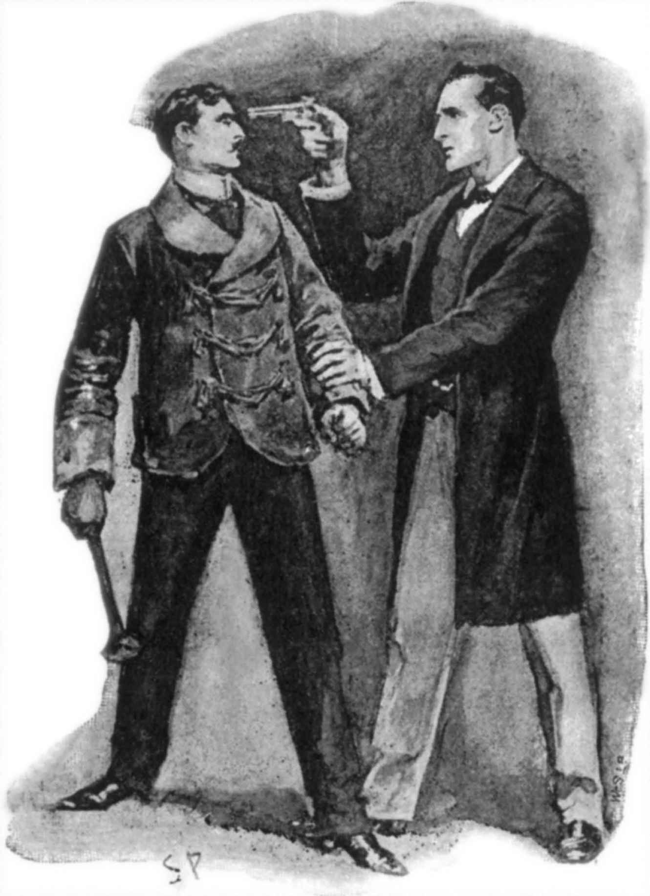

我的枪已经举到他脑袋上。

“这一天可以说是英国从一桩行将公之于众的大丑闻中得到了挽救，”银行家说，站起身来，“先生，我找不到话来感谢你，不过你一定会看到我绝不辜负你所做的一切。你的本领我实在是闻所未闻，现在得赶快去看我儿子，我的好儿子，为我的错误向他道歉。至于你所讲玛丽的事，真叫我伤心透顶。像你这样的本领，恐怕也没法告诉我，她现在在哪里。”

“我想，我们可以有把握地说，”福尔摩斯回答，“乔治·伯恩韦尔爵士在哪里，她也就在哪里。同样还可以肯定地说，只要她犯下罪，终究会要受到严厉惩处。”

（1892年）

# 紫叶山毛榉林迷案

“一个热衷于为艺术而艺术的人，”歇洛克·福尔摩斯说道，把手中的《每日电讯报》的广告栏专页扔向一旁，“往往是从最平凡最不起眼的事物中发现最大的艺术趣味。我很高兴看到，华生，你已经很懂得这个道理。承蒙你选了我们几个案例稍作记载，颇能掌握其中的分寸。我还必须说，虽然你偶尔有点修饰、润色，但是你并不对我经手的、我在里面担当角色的causes
célèbres<a href="#part0057.xhtml_ch1"
id="part0057.xhtml_ch1-back">(1)</a>
大加渲染，搞得耸人听闻，而是注重写出一些细小的情节，这些情节看起来似乎微不足道，但内中大有文章可做，可加以演绎推理，可加以逻辑综合，这正是我使之成为本专业职能所特具的一功。”

“可是，”我说，微微笑着，“我的纪录总被认为有耸人听闻之嫌，而实际上并非如此，所以我难以摆脱。”

“你有错，也许是，”他议论道，一边用火钳夹起红红的火炭点着长长的樱桃木烟斗，他平时思考的时候习惯于用另外那个陶制烟斗，在争论问题的时候才用这个烟斗——“也许你错就错在总是想把每篇记述写得有声有色有生活，不是把你的任务限制起来，记述事情的因果关系、严谨的推理，而这个，恰恰是事物最值得注意的方面。”

“在这个问题上，我对你做得相当公正，不偏不倚。”我说，口气冷淡。我的这位朋友性格奇特，我不止一次地觉察到他自说自话，很不顾人情，对此我颇为反感。

“不，并非我自私，我自大。”他说道。他一如往常，惯于针对我的内心而不只是对我的话语作出回答，“我要求对待我的能力务必公正，是因为那不仅属于我个人的事——而是我个人身外的事。犯罪事常有，逻辑推论不常有。因此你应该刻意写逻辑，不要细述犯罪过程，结果把本来是一门课程传授的性质降格为讲一连串故事。”

这是一个初春寒冷的早晨。吃过早餐后，我们两人相对而坐，坐在欢跳的炉火旁，坐在贝克街的老屋老房中。浓雾在一排排暗褐色房屋间翻滚，对街的窗户成了模模糊糊的深黄色昏暗光环。餐桌还没有收拾，屋里的煤气灯，照着桌上的白布，照着盘碟刀叉晶晶发亮。福尔摩斯一早上都没开口，埋头在他的报纸广告栏里搜寻什么目标，一张又一张地翻个不停。最后，他不再找了，才抬头不无好气地向我来一通说教，指出我笔底下的种种不足。

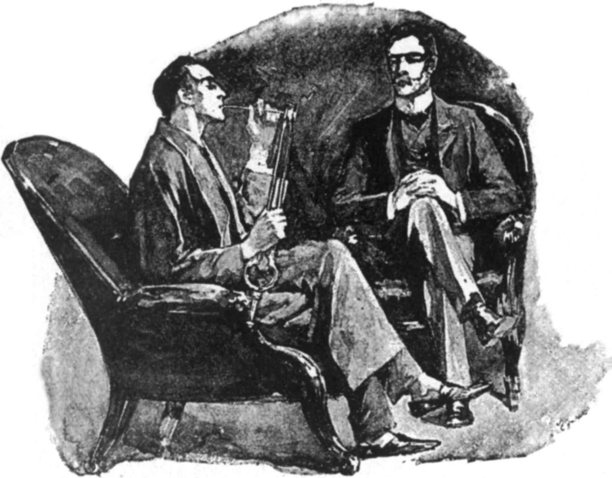

吃过早餐后，我们两人相对而坐。

“同时，”他稍停一下，抽几口长烟斗，眼瞅着炉火，“你也不大会被指责危言耸听。我们的这些案件中，使得你也极感兴趣，亲自参与，有相当一部分谈不上是刑事犯罪，从法律意义上讲，不属犯法。比如那件小事，我千方百计给波希米亚国王帮忙，玛丽·萨瑟兰小姐那种奇怪的经历，还有丑脸歪嘴汉那件疑案、单身贵族那件事，都是法律以外的问题，要避免过于夸张，我怕你还是写得太繁琐。”

“结果可能是这样，”我回答，“但是我采用的是小说手法，要有趣味。”

“啊，我说伙计，对于公众，不作专业观察的广大公众，他们几乎难以从一个人的牙齿看出是纺织工，从左拇指看出是排字工，也无法看出你分析、推理的细微差别！但是，说实话，你过分繁琐的话，我也无须责备你，因为大刑案时代已经过去。一个歹人，就算是一个刑事案犯，过去那种无法无天的江洋大盗式的胆大妄为是没有了，大故事没得讲了。说到我干的这行小小的营生，还不是在日见衰落，只办办为人家寻找丢失铅笔这种鸡毛蒜皮的小案子了，或者给寄宿学校的年轻姑娘出出点子罢了。我有数，我干这一行已经是最后见底了，没有太大油水了。今天早晨我竟收到如此一张条子，标志我已跌落到了零点，我想是这样。你看看！”他把一封折皱的信扔给我。

邮戳是蒙塔格街昨天晚上寄出，内容如下：

亲爱的福尔摩斯先生：

我急切要向您请教，我是否应该接受聘请当家庭教师，如若没有不方便，我将于明天上午十点半前来拜访。

您忠诚的

维奥莱特·亨特

“这位年轻女士，是你认识的？”我问。

“不认识。”

“现在就是十点半了。”

“是呀。噢，来了，门铃响了。”

“这件事也说不定比所想的要有趣。你记得蓝宝石事件，起先不过是好玩，发展到后来引出一个严重案件。眼前这个，恐怕也是。”

“啊，但愿如此。是不是，就见分晓。我大概不会搞错，当事人来到。”

他话音刚落，门已打开，一位年轻姑娘走进屋子。她衣着朴素，干净整洁，一张聪明伶俐的脸，点点雀斑犹如一枚！鸟蛋。她行动敏捷，像个为人处事能拿主意的女性。

“实在是对不起，打扰您了，”她说，我的朋友正起身迎接她，“我是遇到一桩非常奇怪的事，我没有父母，也没有亲戚朋友可以请教，我想只有求教您。您是好心人，会告诉我怎么办才好。”

“请坐下讲，亨特小姐，我很乐意尽力为你服务。”

看得出来，福尔摩斯对他这位委托人的言语举止印象良好。他向她打量着看一眼，然后安坐，双眼低垂，双手指尖顶着指尖，听她陈述事情经过。

“我是家庭教师，有五年了，”她说道，“是在一位叫斯彭斯·芒罗的上校家里。可是两个月前，上校奉命到新斯科舍的哈利法克斯去上任，他带着孩子都去了美洲，这样，我就失业了。我登报寻找职业，好几次按报上招聘前往应征，都不成功。到后来，我小小的一点积蓄快要用完，真是到了财尽计穷的地步。

“在西区，有一家著名的家庭女教师介绍所，叫韦斯塔韦家教所，我每星期去一趟，看看有没有合适的人家可做。韦斯塔韦是这家介绍所创办人的姓氏，具体经营者是斯托珀小姐。她坐在小小的办公室里，求职的妇女在前面的候见室等着，逐个按次序传进去，按登记册上看条件，挑选合不合适。

“唔，上星期，我照常给领进小办公室，看见不仅是斯托珀小姐单独一个人，挨着她手肘旁坐着一个非常粗壮的大个子男人，满脸堆着笑，肥下巴一层层肉叠住喉咙，鼻梁上架着一副眼镜，紧紧盯住每一个进来的妇女看。轮到我一进去，他坐在椅子里猛一惊，马上转向了斯托珀小姐。

“‘很好，’他说，‘再好也没有了，没见有这么好的了，顶级！顶级！’他好像很高兴，搓起了双手，表现的样子十分亲热。他一副和善的姿态，叫人看着都愉快。

“‘你是来求职喽，小姐？’他问。

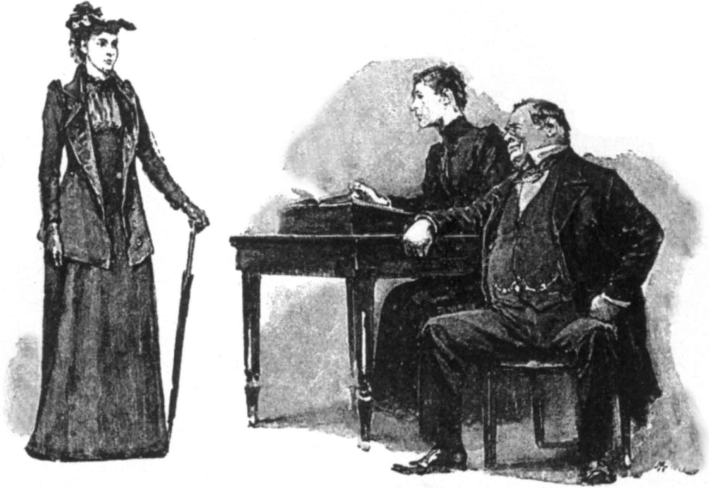

“你是来求职喽，小姐？”

“‘是的，先生。’

“‘当家庭教师？’

“‘是的，先生。’

“‘你要求多少薪水？’

“‘我以前在一位斯彭斯·芒罗上校家每月四英镑。’

“‘哦，哎哟哟！苛刻——真苛刻！’他嚷嚷说，情绪好激动，举起一双肥厚的手，一个劲挥舞，‘怎么会有人出这么一点小钱，给这么好的一位女士，一位多才多艺的女士？’

“‘我的才艺，先生，我恐怕不如您想象的那么好，’我说，‘懂一点法文，懂一点德文、音乐、绘画——’

“‘哎哟，哎哟哟！’他叫着，‘这倒不是主要问题，关键在于，看你是有还是没有一位女士应有的气质、风度。总而言之，一句话，如果你是没有，那你就不合适。教育一个孩子，他将来有一天对国家历史上说不定会起重大作用。如果你是有的话，那为啥竟有这种先生，好意思叫你那么掉价，叫你接受三位数都不到的薪金？你在我这里的薪水，尊贵的小姐，从一年一百英镑开始。”

“您想想，福尔摩斯先生，我是穷得不名一文，这样的待遇简直好到不敢相信是真的。可是这位先生，看我脸上露着怀疑，马上打开钱包，拿出一张钞票。

“‘这也是我的规矩，’他说，眉开眼笑，一双眼在挤满皱纹的白脸上只剩两条发亮的细缝，‘习惯上给我年轻的小姐预先付给一半的薪金，这样的话，好让她们够开销付车马费什么的，还能置点衣服。’

“我在想，我还从来没有遇到过能这样体贴关心的人。我还欠着小商贩的债，预支的这笔钱对我正是及时雨。可是我总觉得这整个事情不大自然，所以希望多了解一点情况，不忙表示。

“‘我是否可以问您家住哪里，先生？’我说。

“‘汉普郡，迷人的乡村地方，紫叶山毛榉林，离温切斯特不过五英里。那是最可爱的乡村，我亲爱的年轻小姐，住在一幢很好的乡村古宅。’

“‘那么我的职务，先生？我乐意了解一下要做些什么。’

“‘一个孩子——一个可爱的小淘气，刚刚六岁。噢，你看他拿拖鞋拍蟑螂多来劲儿！劈啪！劈啪！劈啪！你眼一眨，三只就给报销掉了！’他靠在椅背上，笑得两眼又睻成了缝。

“小孩子这样玩乐，让我有点吃惊，但是做父亲的笑成那样，我又想他也可能是说说好玩。

“‘就是一样工作，那就是，’我又问，‘就照管一个孩子？’

“‘不，不，不止一样，我亲爱的年轻小姐，’他大声说，‘你的职务嘛，我肯定，你很聪明，一想也就想到，还要听候我妻子一点吩咐，这类吩咐是小姐分内应当遵从的，你不会觉得有难处，对吧？’

“‘我很乐意让您家感到需要我。’

“‘那就好。现在，说说服装，先比如讲，你晓得吧，我们家喜欢时尚——癖好服饰打扮，可心地都单纯。要是我们喜欢让你穿上个什么打扮，你不会反对我们一点小小的癖好，是吗？’

“‘不会。’我说，但对他这个话相当奇怪。

“‘让你坐这里、坐那里，你不至于反感不高兴吧？’

“‘哦，是的，不会。’

“‘还有，你来我们那里，请你先把头发剪短些怎么样？’

“我简直不敢相信自己的耳朵了。正像您看见的，福尔摩斯先生，我的头发长得很密，栗子般的颜色，特别好看，相当艺术的，我做梦也不会想到要这么随便作牺牲。

“‘我想，这恐怕办不到。’我说。他一对小眼睛紧紧盯住了我，我这么一说，看到他脸上掠过一道阴影。

“‘我想这个事情恐怕非办到不可，’他说，‘这是我妻子的一点小小的癖好，夫人们的癖好，你要理解。我说小姐，夫人们的癖好是一定要照顾的，这么说，你不愿意把头发剪短？’

“‘不行，先生，这我不行。’我直截了当回答。

“‘啊，那好，那么这件事就算啦。真是可惜，因为你其他方面真是合适。既然这样，斯托珀小姐，我只好再多看几位年轻姑娘吧。’

“女经理坐在边上一直在忙着翻看资料，我们两人说话的时候，她一声都没吭，可是这会儿她拿眼向我一瞥，脸色很不耐烦，使我不禁想到，我这么拒绝，可能她也要失掉一笔可观的佣金。

“‘你希望你的名字还继续保留在登记簿上吗？’她问我。

“‘如果你愿意的话，斯托珀小姐。’

“‘唉，其实，登记也没有什么用处，这样难得的机会你都这么轻易拒绝掉！’她尖刻地说，‘就很难指望我们还有什么办法为你另找这么好的机会。再会吧，亨特小姐。’她按了桌上的铃，一个仆人进来把我带了出去。

“哦，福尔摩斯先生，我回到寓所，打开食橱，见里面口粮已经不够了，桌上还放着两三张催款单，我开始反问自己是不是做了件蠢事。毕竟，这些人的怪癖，要别人顺从他们的要求，他们至少是付出相当的代价来换取的，在英国当家庭教师一年能得到一百英镑是罕见的。再说，我的头发对我有什么用？如今好多人把头发剪短以后更显得精神了，也许我剪短了也跟她们一样呢。第二天，我心想是做了一件错事。再过一天，我肯定自己是错了。我要克服我的傲气，再去介绍所问问那个位置是否还空缺着，可是出乎意料我接到了那位先生的亲笔信。我把信带着，我念给您听：

亲爱的亨特小姐：

承蒙斯托珀小姐好意，将你的地址告诉我，所以我写信请问你是否重新考虑你的决定。我妻子热切盼望你能来临，因为我把对你的印象叙说之后，她对你极感兴趣。我们愿出一季度三十英镑，即一年一百二十英镑，以补偿因我们的癖好可能对你引起的不便。我们的癖好实际上并不对你要求很苛刻。我妻偏爱铁青蓝，喜欢你早晨在屋内穿这样颜色的衣服，也不需要你自己去花钱购置。我们有衣服，原是我爱女艾丽斯（现在费城）穿的，我看这衣服对你一定很合身。至于坐的地方这里那里，或者按照要求来自娱自乐，均绝不致令你感到为难。关于你的头发，无疑是令人可惜，尤其是我，虽只短暂的一见，也不得不为如此的美发大加赞赏。但我恐怕必得坚持此点，我只希望增加薪金以补偿你的损失。你的职责，在小孩方面，是很轻松的。望你务必前来。我乘马车到温切斯特来接你，请通知我你欲乘坐的火车班次。

你忠诚

的杰夫罗·鲁卡斯尔

“就是这封信，我刚刚收到，福尔摩斯先生。我已经决定接受这份工作，但是，我想到，在采取最后一步之前，最好把整个事情告诉您，请您帮我考虑。”

“好吧，亨特小姐，既然你决定了，那就这样办吧。”福尔摩斯微笑着说。

“您不劝我拒绝不接受？”

“说实话，我不会乐意让我自己的妹妹去接受这么一个职位。”

“您这话究竟是什么意思呢，福尔摩斯先生？”

“啊，对其中原因，我也没根据，说不清楚，你也许有你自己的看法吧？”

“是的，依我看，有一种可能，鲁卡斯尔先生好像是个和善的人，脾气好，可是他的妻子会不会是个神经病？鲁卡斯尔先生又不希望太声张，怕给送进疯人院，所以想方设法满足妻子的怪癖，稳住她，不让她大发作。”

“这是一种可能——按理说，也是这样，最有可能。可是对一位年轻小姐来说，无论如何，去这种人家不是一桩好差事。”

“可是为了钱呀，福尔摩斯先生，钱呀！”

“那也是，当然薪水是很高——简直是太高了，所以我就不免担心，他们为什么要出你一百二十英镑一年？他们出四十英镑也就足够随便挑一个，这背后必然有一定道理。”

“我是这样想，我把情况都告诉您，以后万一请您帮助，您就知道有这么回事。有您在背后支持我，我就感觉壮胆多了。”

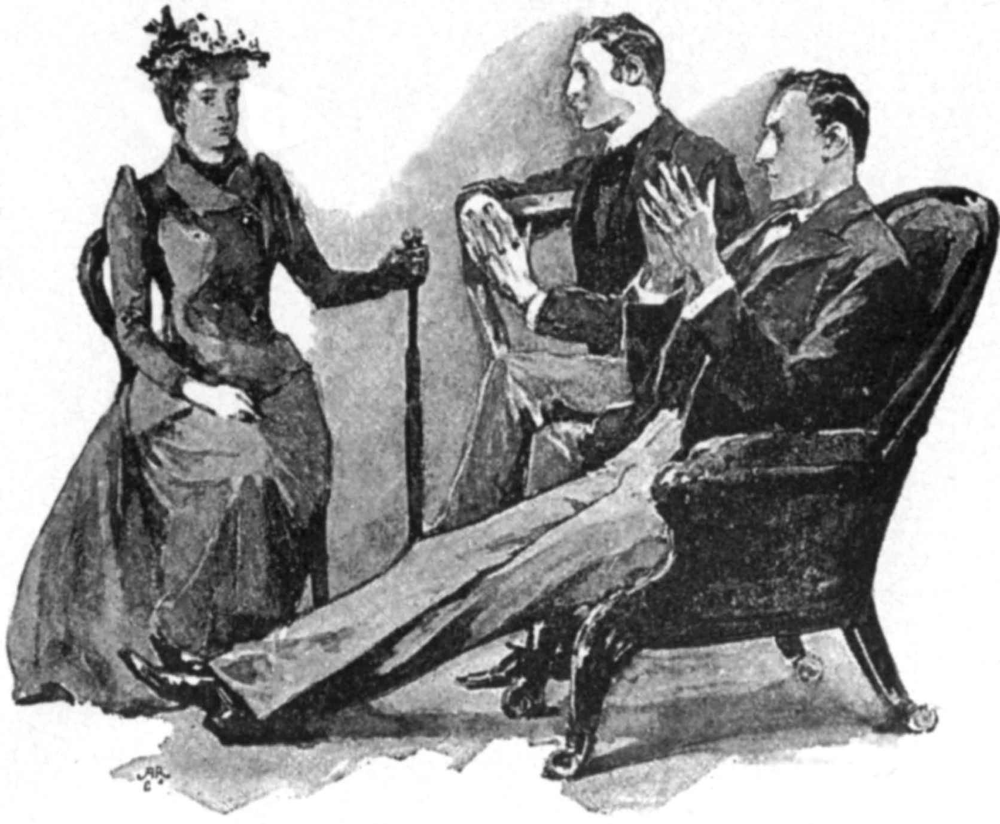

“有您在背后支持我，我就壮胆多了。”

“噢，你可以就这样前去赴任。我向你保证，你这个小问题说不定是我几个月来最有趣味的事，这里头很有些不一般的问题，需要特别注意。要是你发现了问题，或者有危险——”

“危险？您看出什么危险？”

福尔摩斯沉重地摇摇头。“要是我们能说出是什么危险，那就不成其为危险，”他说，“但是你不管什么时候，白天还是夜里，你发个电报给我，我立刻就到。”

“这就好，”她轻轻地从座椅上站起来，愁云一扫而光，“我现在去汉普郡，心里就踏实了。我马上给鲁卡斯尔先生写信，今天晚上就牺牲掉我可怜的头发吧，明天动身到温切斯特。”她向福尔摩斯说了几句感谢话，再向我们两人道声晚安，急忙告别离去。

“可以看出，”我说道，听着她敏捷稳健的脚步走下楼梯，“这姑娘年轻，可是很有能耐，能保护自己。”

“是呀，像她这样要是没能耐可不行，”福尔摩斯心情沉重地说，“要是过了好些日子还听不到她的消息，那就是我估计错了。”

过不多久，我朋友的预言果然应验。两个星期过去了，这期间我发现自己的心思老往姑娘那边转，牵挂着这个孤单的女孩子会落入什么样吉凶叵测的境地。特别高的薪金，古怪的条件，轻松的差事，所有这一切都令人感到异乎寻常；那到底是怪异的癖好还是另有阴谋，雇她的人是好心肠还是怀有鬼胎，我没有能力加以判断。福尔摩斯呢，我常常看见他一坐就是半个小时，眉头紧蹙，独自在那里出神。只要我一提到这件事，他就把手一挥。“材料！材料！材料！”他不耐烦地嚷着，“没有黏土怎么造得出砖！”末了就咕哝说，他绝对不会让自己的姐妹接受这种差使。

电报在一天深夜终于来了。当时我正准备睡觉，福尔摩斯还在通宵达旦专心致志于他的化学研究。这是他的老规矩，搞得废寝忘食，晚上我让他一个人弯腰曲背摆弄那些瓶瓶罐罐，到了早晨我下来吃早餐了，看见他还是弯腰曲背没有个停。我们收到了电报，他拆开黄信封，把信纸扫了一眼，就向我丢过来。

“你查一下开往布雷德肖的火车时刻。”他说，接着又转身去做他的化学实验。

电报发出简短而紧急的求助：

明天中午请来温切斯特黑天鹅旅馆。请速来！我已走投无路。

亨特

“你同我一起去吗？”福尔摩斯问，向我看一眼。

“一起去。”

“快看一看时刻表。”

“九点半有一班车，”我说，查到了要找的布雷德肖，“到温切斯特是十一点三十分。”

“那倒正好。这样的话，我还是把手上这丙酮分析推迟一下再说。这个早晨，我们要把精神体力保持最佳状态。”

第二天十一点钟，我们正在顺利前往英国故都的途中。福尔摩斯一路上埋头翻阅晨报。一过了汉普郡边界，他把报纸丢下，欣赏起沿途的景色。这天天气宜人，春光明媚，蔚蓝的天空中，白云由西向东飘浮。灿烂的阳光、凛冽的空气，令人神清气爽，更觉精力充沛。放眼望去，远至环绕阿尔德肖特城的起伏山冈，是一片乡村景色，农家小屋红瓦、灰顶，掩映在青翠处处的新绿之间。

“景色多么清新美丽！”我叫道。从贝克街的浓雾中摆脱出来，我觉得耳目为之一新，精神顿时振奋。

但是，福尔摩斯沉重地摇着头。

“你知道吗，华生，”他说，“我这个人也真该诅咒，看什么事情往往以自己主观特有的心情为转移。你看着这些稀稀拉拉的房屋，你的印象中是觉得很美，我看上去，脑子里一下子想到的，尽是一种屋子与屋子孤独隔离的感觉，在那里头犯下罪不容易为外人所知，不易被及时发现。”

“我的老天！”我叫道，“欣赏这些美丽的乡村古宅，谁会去想里头犯罪的事呀！”

“对那里头，我充满着恐惧感。我相信，华生，凭我的经验，伦敦最蹩脚最肮脏的陋巷里的犯罪，未必比这赏心悦目的乡村里的犯罪更可怕。”

“你真危言耸听！”

“有道理明摆可讲。在城市里，舆论压力起的作用要比法律还大。城里哪条巷子有孩子挨打哭叫，醉鬼出拳打人，还不至于坏到邻居无人同情、无人愤怒的地步。司法机关也是近在咫尺，一纸诉状立刻见效，犯罪到被告席仅一步之遥。可是看看这里，孤独不相关的房子，都是各自一家成一统，居民们又愚昧无知，法律都还不成意识。可以想象，穷凶极恶的行为、隐秘的罪恶，在这些地方年复一年地发生，却都木然无知。向我们求援的这位小姐，如果住在温切斯特，我就绝不会替她担心，可是在此五英里之外的乡村，这就有危险。不过，很清楚，不是她个人受到威胁。”

“不是她自己，如果她能来温切斯特迎接我们，说明她能脱身。”

“是这样，她有自由。”

“那么，到底是怎么回事呢？你能猜测解释吗？”

“我可以说上七八种假设，每一种假设都能给我们目前所知的情况对号入座。不过哪个才算真正对头，只能等我们拨开迷雾、获得新情况才能有定论。到了，那是大教堂塔顶。很快就能明白亨特小姐要讲什么事。”

“黑天鹅”是大街上一家有名的客栈，挨着车站没几步路。我看到那位年轻小姐正在那儿等着我们。她预订了一间起居室，午餐已在桌上摆好，等我们一到就用餐。

“我真高兴，你们能来，”她急切地说，“实在是难为你们了，可我真不知该怎么办，只好全靠两位来指点我。”

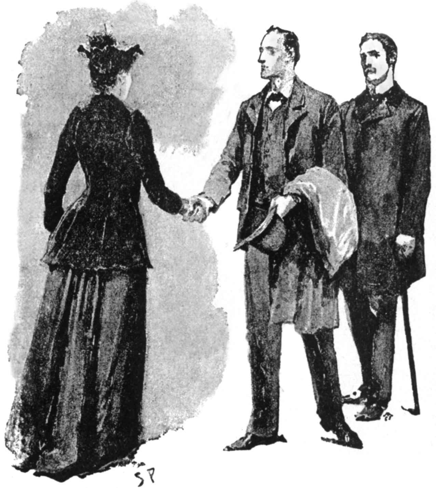

“我真高兴，你们能来。”

“请说说你究竟遇上了什么事。”

“我要说，我还一定得抓紧时间，因为我答应鲁卡斯尔先生三点钟以前回去。今天早上我向他请假上城里来，我来做什么他并不知道。”

“让我们把事情一五一十听个明白。”福尔摩斯把又细又长的腿向火炉边一伸，一本正经洗耳恭听的样子。

“首先，总的来说，我确实没有受到鲁卡斯尔先生、夫人的虐待，对他们我该有一句讲一句，可是我不理解他们，心上对他们感到很不安。”

“你不理解他们什么？”

“他们的行为不知是什么道理。看看他们做些什么，你们就知道啦。我下来那天，鲁卡斯尔先生用马车来接我到紫叶山毛榉林。这地方正像他说的，非常漂亮，但是房子并不漂亮，一幢四四方方大宅屋，白墙，风吹雨打再加潮湿，已经是到处污迹斑斑。四周是园地，两侧跟后面是树林，正前一片坡地，平坡下就是南安普敦公路，在距宅屋门前一百码远处弯绕经过。前面这片地属于这房屋，周围的树林，属于萨瑟顿勋爵的部分保护地。因为屋子正厅门前直对着是几棵紫叶山毛榉，这地方就拿树来命名。

“东家用车来接我，对我很客气很热情，跟初见那天一样。当天晚上就把我介绍给他夫人、孩子见面。我们原先的猜测一点都不对，福尔摩斯先生，那天在贝克街你家里猜的不对，鲁卡斯尔夫人精神完全正常，不疯。我看她性情挺安静，一个妇道人家，脸色苍白，比她丈夫年轻许多，不会超过三十岁，我估算着，可是鲁卡斯尔先生自己至少有四十五岁了。从他们的谈话中我听出来他们结婚七年了。他原来是个鳏夫，跟前妻只有一个孩子，是女儿，已经去了费城。鲁卡斯尔先生私下里告诉我，女儿离开他们的原因只为对后母莫名其妙地看不惯。我想，他女儿大概总有二十出头吧，这样的话，在家里同父亲的年轻妻子相处就很不舒服。

“鲁卡斯尔夫人在我看来，无论是心地还是相貌，都很普通平常，她给我的印象既说不上怎么好，也说不上坏，对我来说无所谓。显而易见，她对丈夫、对年幼的儿子十分专一，十分投入。她明亮的灰眼睛不住地东顾西盼看着丈夫、儿子，一觉察到他们有任何一点小小的需要，就忙不迭赶快尽量满足。丈夫态度虽是大大咧咧，对妻子还是挺体贴。总的来看，他们是快乐的一对。可是她私底下有苦处，这个女人，她时常想什么想得出神，愁容满面，我不止一次意外看见她掉眼泪。我有时想她是为了孩子，孩子脾气坏，不听话，成了她的心病，我真从来没见过惯宠得这么坏脾气的小鬼。小家伙个头儿比正常孩子小，脑袋瓜可是大得出奇，同身子不相称，整天不是突然撒野耍上一阵子，就是不知怎么又绷起脸不高兴了。他惟一的乐趣就是虐待比他弱小的动物，抓老鼠、小鸟、小虫什么的，特别伶俐拿手。我不是要谈这个小家伙，福尔摩斯先生，确实，孩子同我要谈的事情没什么关系。”

“一切小事我都乐于听取，”我的朋友说，“不管看上去跟你有关或者无关。”

“重要的情况我尽量一件不漏。这家人家有件叫人不愉快的事，是我很快就注意到的，仆人的外貌和行为。只有两个仆人，还是一对夫妻，男的名叫托勒，他粗鲁，笨手笨脚，灰白头发，连鬓胡子，还老是一股子酒气熏人。有两回，我和他们在一块儿，他可醉得厉害。奇怪，鲁卡斯尔先生好像没拿他当一回事。他的老婆身子高大结实，老板着脸，平时跟鲁卡斯尔夫人一样少言寡语，当然远不如夫人和蔼可亲。这对夫妻叫人讨厌。幸好我多半时间在小孩的儿童室里，或是我自己屋里，这两间房是靠在一起的，都在房屋的一个角上。

“初到紫叶山毛榉林的两天，我过得很平静，到了第三天，鲁卡斯尔夫人吃过早饭就下来在丈夫耳边轻声说话。

“‘哦，好的，’鲁卡斯尔先生转向我说，‘我们非常感谢你，亨特小姐，因为你这么迁就我们，把自己的头发剪掉。不过我要对你说，这样对你的容貌丝毫不受影响。现在我们要看看你穿上铁青色衣服会怎么样，衣服已经放在你卧室的床上，如果你乐意穿上，我们两人非常感谢你。’

“我一看要我穿的衣服，是特别的蓝颜色，料子很高级，是哔叽一类，但是一眼就看得出是穿过的。衣服我穿上再合身也没有了，简直就是量着我的身材做的。鲁卡斯尔先生和夫人看了都高兴极了，两人一个劲儿不住地夸奖。他们在客厅等我。客厅很大，占据了整幢宅屋的前面部分，有三扇落地长窗，一把椅子紧挨中间一扇长窗放着，椅背靠着长窗。他们让我往椅子上坐好了，鲁卡斯尔先生在客厅那一头走来走去，开始给我讲故事，我从来没有听过的很逗人笑的故事，讲了一个又一个。你们都想象不出他有多滑稽可笑，把我都笑累了。可是鲁卡斯尔夫人，完全没有幽默感，脸上一笑也不笑，坐在那儿，两手搁在膝头，一脸的焦虑和沮丧。大约过了个把小时，鲁卡斯尔先生忽然说已到开始一天工作的时间，说我可以换衣服了，可以去儿童室看小爱德华了。

“两天以后，又这样完全相同地表演一番。我又是换上了蓝衣服，又是坐到窗前，又是听东家讲一大堆好笑的故事。讲得也真是精彩，别人都学不来，听得我总是笑得乐不可支。然后他递给我一本黄色封面的小说书，把我的椅子稍往旁边移一移，不要让我自己的影子把书遮住。他要求我给他大声念小说。我读了大约十分钟，是从一章的中间部分开始念起，忽然不知怎么，正念到一个句子的半中间，他叫我停住，去换下衣服。

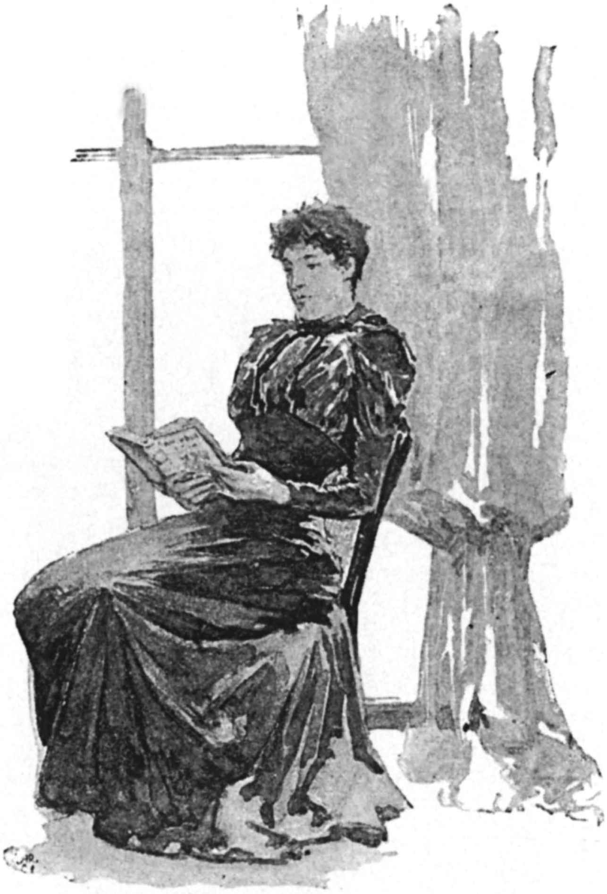

“他要求我给他大声念小说。”

“您可以想象，福尔摩斯先生，我感到真是奇怪得不得了，这种表演是什么意思呢？他们还非常注意、非常当心，我看得出来，不让我的脸朝向窗外。这样我就越要看看背后究竟是怎么回事，不看明白不甘心。初一想，好像办不到，但是很快给我想到了一个办法。我有一面手镜打破了，我灵机一动，拣上一片碎镜片举到眼前，能够把镜片稍稍这么转一转，那么折一折，就把背后的情形全看清了。我得承认，我非常失望，因为什么也没看见，至少头一眼的印象就是如此。后来，我再看的时候，看见了一个人，那个人站在南安普顿路上，是个小胡子，穿灰色套装，那样子正在朝我这个方向瞧。这条路是重要公路，路上总是不断有人来往，可是这个人身子靠在我们宅园隔墙的围栏上，专门在张望。我放下手帕，向鲁卡斯尔夫人瞅一眼，发现她的眼睛盯着我，直朝我瞧。她不说话，可是我已经明白，她看出了我手里有镜子，已经给我看见了背后外面的情况，她马上站了起来。

“‘杰夫罗，’她说，‘路那边有个不三不四的家伙老盯着亨特小姐看呢。’

“‘不是你朋友吧，亨特小姐？’鲁卡斯尔先生问。

“‘不是，这里我一个人也不认识。’

“‘嘿！太无礼！请你回身挥手叫他走开。’

“‘还是不理他的好。’

“‘不，不，那他会经常在这儿闲荡，请你转过身去，就这样挥手，叫他走开。’

“我照吩咐的做了，同时鲁卡斯尔夫人立刻把遮阳篷放下。这是一星期以前的事，从那以后，我不用再坐到窗前了，不再穿蓝衣服，也不再看见路上的那个男人。”

“请继续讲下去，”福尔摩斯说，“你的讲述叫人听着非常有趣。”

“您会觉得很不连贯，恐怕听下来我讲得拉拉杂杂，各种事情都不相干。再说那第一天，我一到紫叶山毛榉林，鲁卡斯尔先生领我到靠近厨房外的一间小屋，我们走近的时候，听到链条当啷响，像是有一头大动物在走动。

“‘这儿朝里看！’鲁卡斯尔先生说，指着两块板之间的一条裂缝，‘不是挺漂亮的吗？’

“我望进去，只觉得有一对闪亮的眼睛，一截模糊的身子蜷伏在暗处。

“‘别害怕，’东家说，看见我吃惊的样子，笑了起来，‘那就是卡洛，我的獒犬。讲是讲我的，可实际上只有老托勒，我的仆人，喂它才管得住它。我们一天喂它一次，不喂得太多，这样让它一直保持一股子火辣辣的猛劲。托勒每天晚上放它出来，有哪个胆敢私闯住宅，就要领教它的尖牙。上天保佑，你可千万别当它无所谓，夜里一定得牢记足不出户，否则小命不保。’

“这警告不是随便说说的。就在两天以后，大约半夜两点钟，我在卧室里向窗外稍有张望，看看美丽的月夜。屋前的草坪一片银光，亮得如同白昼，我站立着，对这宁静美丽的景色正着迷，这时我警觉到紫叶山毛榉下的阴影里有什么东西在动。那东西一走到月光下，我才看清是什么，那是一条大狗，大得像头牛犊，茶色的皮毛，张开着嘴，翘起黑黑的狗鼻，龇着大牙。它慢慢走过草坪，消失在另一边的暗影里。这个可怕的守卫叫我心中打了个寒战，我想没有一个夜贼能把我吓成这个样子。

“现在，我有一件奇怪的事要告诉您。我的头发，您知道，在伦敦剪掉的，我把剪下的头发盘起来放进我的箱子底。有一天晚上，安顿孩子上了床，就在自己房里看看家具，理理我的一些小物件，这也是一种乐趣。房间里有一个旧抽屉柜，上面两个抽屉原先是空着的，没有锁，下面的一个抽屉上着锁。上面的两个已经放满了我的衣服，但是还有不少衣服没地方放，这第三个抽屉没能用，我纳闷干吗不用呢！我忽然想到说不定是无意之中随便锁上的，就拿出给我的那串钥匙来试试能不能打开。一试真巧，这第一把钥匙就把它打开了。我把抽屉拉出，里面只有一样东西，我可以肯定你们永远猜不到是一样什么东西。是我的一束头发。

“我拿起来仔细一看，那特别的颜色与柔软跟我的完全一样，但是，那明摆着绝对不可能是我的头发。我的头发怎么会锁进这个抽屉呢？我手颤抖着把自己的箱子打开，把东西都翻了出来，在箱底取出我自己的头发。我把两束头发放在一起一对比，我可以向你们保证，两束一模一样。这不是出奇了吗？我一肚子疑惑，搞不懂这是怎么一回事，什么个道理。我把那束奇怪的头发放回抽屉里，这事跟鲁卡斯尔夫妇一字不提，因为我觉得把他们锁好的抽屉私自打开就已经是做了一件错事。

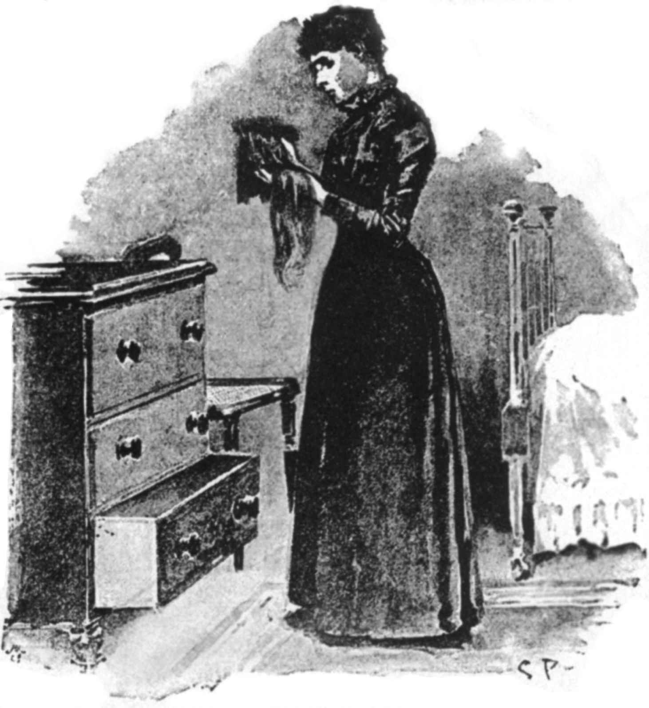

“我的头发怎么会锁进这个抽屉呢？”

“我是个生性喜欢观察的人，你们大概也看出这一点，福尔摩斯先生。不久我脑子里对整个屋子的结构布局很清楚了。有几间边房，好像一直没有人住，进入边房的门朝着托勒的住房方向开，那门一直锁着。可是有一天，我上楼，看见鲁卡斯尔先生从这扇门里走出来，手里还拿着钥匙，脸色不好，跟平时圆滚滚、乐呵呵的脸不一样了，似乎换了一个人。他脸发红，眉毛竖起，怒气冲冲，激动得太阳穴上青筋暴起。他把那个门一锁，打我身旁匆匆过去，对我不吭一声，不看一眼。

“这就引起我的好奇，所以，当我领孩子在屋外散步的时候，就溜达绕过去，好看看房子这一边的窗户。窗户一排四扇，三扇很脏，第四扇关着百叶窗，看得出来，平时一直都不开。我正走走逛逛，不时向窗子望望，鲁卡斯尔先生出来到我跟前，如同往常一样地笑嘻嘻、乐呵呵。

“‘啊！’他说，‘刚才碰到我打你身边走过一声不响，请一定不要以为我粗鲁无礼，我亲爱的年轻小姐，我正忙着处理一点要紧的事。’

“我请他放心，绝不会认为他不把我放在眼里。‘顺便问一下，’我说，‘您这儿好像有好多房间都空在那里，有一间还关上了百叶窗呢。’

“他很感意外。我好像觉得，他听了我这话很吃惊。

“‘我有一项业余爱好，照相，’他说，‘那间房间，我用作暗室。倒看不出，真不简单，我们请到了一位多么细心的年轻小姐呀！谁会想到那个？有谁会去想到那个呢？’他口气是打趣，说着好玩，可是眼睛看着我，一点也没有好玩的神态，我看出他只有怀疑、烦恼，绝不是好玩。

“哦，福尔摩斯先生，这一回，让我了解到那些个房间里有点不寻常的东西不想让我知道；我心里反而按捺不住，要探个究竟。虽然我是出于好奇，但不仅仅是好奇，应当说，更是出于一种责任感——一种感觉、感情，探明这个地方有什么内幕，我不是做坏事，是做好事。人都说女人有直觉，也许这就是女人的直觉叫我有这种心情。不管怎么样，既然身临其境，我就留着个心眼，找机会闯禁区，进那个门。

“直到昨天，才有了机会。我可以告诉您，不单是鲁卡斯尔先生，其实托勒和他妻子两个也都在那些没人的空房间里忙过什么活儿，有一次我看见他拿一只大号布袋过那个门。近来他喝酒喝得挺凶，昨天晚上酩酊大醉了。我上楼去，看见钥匙在门上，不用说，是他忘在门上了。鲁卡斯尔先生和夫人都在楼下，孩子正和他们两个在一起，所以这正是大好机会。机不可失，我轻轻转动钥匙打开锁，打开门，悄悄溜了进去。

“进门是一条小过道，墙上没裱糊，底下没地毯。过道尽头转过弯就是一排三个门，第一个门、第三个门都开着。进门都是空房，房里灰尘堆积，光线阴暗。一间是两扇窗，还有一间是一扇窗，窗上积满尘埃，外面傍晚的光线照不进来，昏暗得很。中间那扇门关着，门上闩一根铁床上的粗横档，一头插进墙上的一个扣环，另一头用粗绳绑在墙柱上。这扇门上着锁，可惜没有门钥匙。这个紧闭关死的门显然跟外面那个百叶窗是同一个房间。我看见这扇门底下有亮光，可见里面并非漆黑一团。很明显，房间里有天窗，是从上面照下来的光线。我站在过道里，瞧着这扇征兆不祥的门，猜想这里头藏着什么秘密，就在这时候，忽听得房间里有脚步声，从房门底下门缝里透出的一点光，看见有个人影在来回走动。见这情景，我心里陡然升起一阵莫名的恐惧，福尔摩斯先生。我的神经紧张得无法控制，不由自主转身就跑——没命地跑，就好像有只可怕的手在后面要扯我的衣裙。我跑过走道，跨出那扇门，不料同鲁卡斯尔先生撞个满怀，他正等在门外边呢。

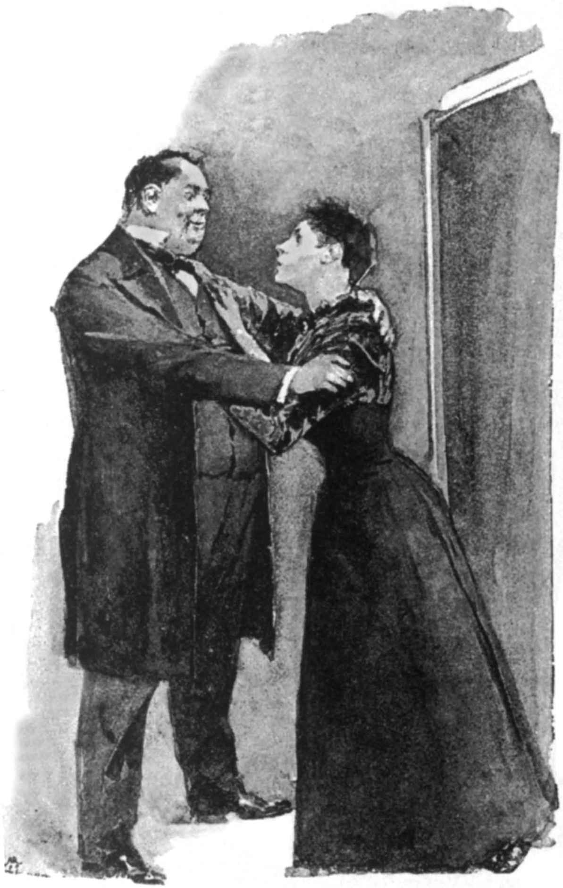

“不料同鲁卡斯尔先生撞个满怀。”

“‘不错，’他说，脸微笑着，‘果然是你。我是想，这门开着，肯定是你了。’

“‘哦，吓死我了！’我没命喘气。

“‘我亲爱的年轻小姐！我亲爱的年轻小姐！’——您想象不到他的态度有多么温和、多么体贴——‘是什么把你吓成这个样子，我亲爱的年轻小姐？’

“可是他说话的腔调简直就像哄孩子，他装得太过分了，我警觉起来，提防着他呢。

“‘我糊里糊涂跑到边房的空房间去了，’我回答，‘光线暗，黑咕隆咚的，我一个人怕极了，吓得跑回来了。哦，那里死静死静，真可怕！’

“‘就不过这样？’他说，眼睛死死盯住我。

“‘是呀，您想是什么呀？’我反问他。

“‘你知道我为什么要锁这个门？’

“‘我当然不知道。’

“‘就是不让闲人进去，你明白吗？’他还是好不亲热地微笑。

“‘早知道是这样，我肯定——’

“‘好了，好了，现在你知道了，你要是再把脚跨过那个门槛一步’——说到这儿，他的微笑顷刻间变成龇牙咧嘴的狞笑，把一张恶魔的脸逼到我面前——‘我就把你扔给那条獒犬！’

“我给吓得不知怎么办才好，大概是从他身旁飞快跑掉，跑进我的房间吧，我什么也不记得了。后来我才发现自己躺在床上，浑身抖个不停。接下来我就想到您，福尔摩斯先生，没人帮我想主意的话，我再也不敢在那里待下去。我怕那幢房子，怕那个男人，那个女人，那两个仆人，甚至怕那个孩子，一切都叫我害怕，只有让我领你们快过去才好。当然，我可以逃出那个宅屋，可是我的好奇心同我的恐惧心一样强烈，我很快下定决心，给您发电报。我戴上帽子，披上斗篷，跑到电报局，离我住的地方大约半英里，发好电报就回去，心里觉得踏实多了。当我走近门口的时候，心头又惊慌不安起来，害怕那条狗已经放出来。不过我马上记起托勒晚上醉得不省人事呢，我还知道这屋里只有他才摆弄得了这只凶恶的畜生，除了他别人都不敢冒险把狗往外放。我悄悄进屋，平安无事。整个后半夜躺着没合眼，想着能见到你们了，心里兴奋着呢。今天早上，我请了假，没遇困难，就到温切斯特来，可是三点钟以前得赶回去，鲁卡斯尔先生和夫人要作客赴约，晚上不在家，我得照看孩子。现在，我已经把全部经过都告诉您了，福尔摩斯先生，希望您告诉我这一切都是怎么回事，最要紧的，我该怎么办，那我就真是能放心了。”

福尔摩斯和我对这个离奇的故事听得出神入迷。这时，我的朋友站起来，在屋子里走来走去，两手插袋，脸上表情极深沉凝重。

“托勒酒醉没醒吗？”他问。

“没醒。我听到他妻子告诉鲁卡斯尔夫人说，她拿他没一点办法。”

“这就好。那么鲁卡斯尔夫妇今天晚上要出门去？”

“是的。”

“那里有没有能锁得很严的地下室？”

“有，有藏酒的地窖。”

“你给我的印象，在整个事情中的表现是个机智勇敢的姑娘，亨特小姐，你想不想再表现英勇事迹？如果我不认为你是个非常杰出的女性，我是不会这样要求你的。”

“我愿意试试看。做什么？”

“我们七点钟到紫叶山毛榉林，我的朋友和我。那时候鲁卡斯尔夫妇已经走了，托勒恐怕，我们但愿，他还动弹不了。剩下只有托勒太太，她可能会声张报警，所以你得打发她到地窖里去干些什么差事，一下去就把她锁在里头，你就能放开手脚不碍事了。”

“这能办到。”

“好极了！我们就能把事情彻底搞清楚。当然只有一种可能可以讲得通：你是给请去顶替什么人的，真正的那个人被关在那间屋子里。显然是这样。至于被关的是什么人，我毫不怀疑，肯定是女儿艾丽丝·鲁卡斯尔小姐。我记得没错的话，据说她是去了美国。你给挑选上，因为你很像她，身高、体形、你头发的颜色，都像。她的头发给剪掉，很可能是患了什么病，这样，自然啰，不得不委屈你也作点牺牲。完全是碰巧，让你看见了她的一束头发。公路上的那个男人肯定是她的什么朋友——可能就是未婚夫——很清楚，你穿了他们女儿的衣服，又是那么相像，他听到你的笑声，看见你的模样，以后又看见了你的手势，使他确信鲁卡斯尔小姐身心健康快乐，根本不指望、不需要他来关心。狗晚上放出来，是为了防止他设法和女儿接触。这些都已相当清楚。这桩案子最关键的一点是那个小孩的性格。”

“这跟案子风马牛不相干。”我脱口而出。

“我亲爱的华生，你是个医生，应该知道，对一个小孩的脾气性格有所了解，要从研究父母亲着手，反过来也是一样。我常常是从小孩身上研究获得对父母性格特征的初步认识，这很有效。这个孩子生性异常残忍，为残忍而残忍，他的这种性格，不管得自笑眯眯的父亲之传，还是母亲之传，我在怀疑，都是反映着对那姑娘的凶残。可怜的姑娘捏在他们手中有凶兆。”

“我相信您说得正确，福尔摩斯先生，”我们的委托人大声说，“经您这么一点明，好多好多事情都叫我想起来了。哦，我们一刻也不能耽搁，快去救那个可怜人吧。”

“我们务必想得周到、谨慎，因为我们要对付的是个极险恶的人。我们七点之前不动，一到时间，我们就会来和你一起，这桩谜案很快就能解开。”

我们言必行，行必果，七点整到紫叶山毛榉林，把马车停在路旁一家酒店那边。几株山毛榉，树叶森森，在落日余晖中像锃亮的金属闪烁有光，即使亨特小姐没有站在门口台阶上笑容满面地迎接我们，足已使我们认出就是这边的宅屋。

“都安排好了吗？”福尔摩斯问她。

这时候从楼下什么地方传来很响的撞击声。“是托勒太太在地窖里，”她说，“她男人倒在厨房地毯上直打呼噜呢。这是他的钥匙，和鲁卡斯尔先生那串钥匙一个样。”

“你干得真漂亮！”福尔摩斯高兴地叫道，“请带路，我们马上就要看到这黑暗勾当的真相。”

我们走上楼梯，开锁开门，沿过道往里走，一直来到亨特小姐所讲的设障门前。福尔摩斯割断绳索，挪开横挡着的粗铁杠，接着拿钥匙一把一把试着开锁，但一把都打不开。屋子里毫无动静，听不见一点响动，福尔摩斯的脸色阴沉了下来。

“我有把握我们来得并不晚，”他说，“我想，亨特小姐，你最好还是不要跟我们进去。现在，华生，用肩膀顶门，不信就撞不开它。”

旧门老朽，并不坚固，无需两人合力一起猛撞，只一顶就顶开了。我们一起冲进去，竟是空房一间。除了一张简陋的小床，一张小桌，一筐衣服之外，没有别的家具。上面的天窗打开着，被囚禁的人已不翼而飞。

“这里边出了鬼把戏，”福尔摩斯说，“鬼东西猜到了亨特小姐的意图，抢先一步把受害人弄走了。”

“怎么个弄走法？”

“从天窗，我们马上就看到是怎么弄走的。”他纵身攀上屋顶。“啊，就是，”他叫道，“这儿有一架轻便长梯，一头搁在屋檐上，就是这样把人弄走的。”

“不可能吧，”亨特小姐说，“鲁卡斯尔夫妻俩走的时候这儿没有梯子。”

“是他回来架上梯子的。我跟你说，他可是个狡猾危险的人哪。这不是吗，我一点不奇怪，我听到了楼梯上有脚步声，准是他，不会错。我说华生，快把手枪准备好。”

话音刚落，门口出现一个人，肥胖、健壮，手执粗棍，亨特小姐看见他，尖叫一声退靠墙边，福尔摩斯跨步上前，与他面对着面。

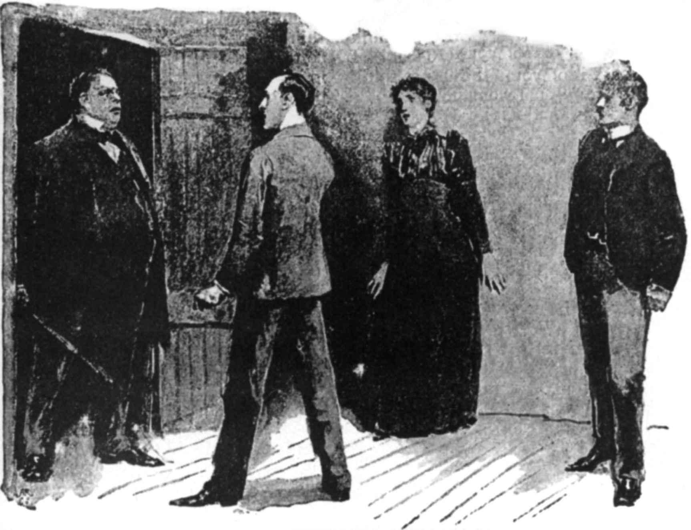

门口出现一个人，肥胖、健壮，手执粗棍。

“你这恶棍！”他说，“把你女儿弄哪里去了？”

胖子眼睛向屋里一扫，又抬头看天窗。

“这话该我来问你们呢，”他尖声叫道，“你们这帮贼！贼探！你们落到我手里，给我当场捉住了不是？看我怎么收拾你们！”他一个转身，从楼梯上咯噔咯噔直奔下去。

“他要去放狗！”亨特小姐叫道。

“我有左轮枪。”我说。

“去把大门关上。”福尔摩斯叫道，我们一齐冲到楼下，我们还没到门厅，就听到猎犬呼呼狂吠，接着是一声凄厉的惨叫，伴着可怕的撕咬声，听得人毛骨悚然。一个有点年纪的红脸人，挥着胳膊从边门跌跌撞撞跑出来。

“我的上帝！”这人嚷道，“什么人放狗了，都两天没喂了呀。快，快，要来不及了！”

福尔摩斯和我冲出去，拐过屋角，托勒紧跟我们后面。一头饥不择食的大畜生，黑嘴紧紧咬住鲁卡斯尔先生的喉咙，咬得他在地上扭滚呼号，我跑上去就是一枪，把狗打个脑袋开花。它立即倒下，锐利的白牙仍然嵌在鲁卡斯尔先生满是肥膘褶皱的颈部，我们费了好大的劲才把人狗分开，把人抬起来。人还活着，但给咬得血肉模糊，十分可怕。我们把他抬进了屋，让他躺在客厅的沙发上，同时吩咐已酒醒的托勒去向他妻子报告消息；我这边实施急救，减轻伤者的痛苦。这时，一个身高但憔悴的妇女走了进来。

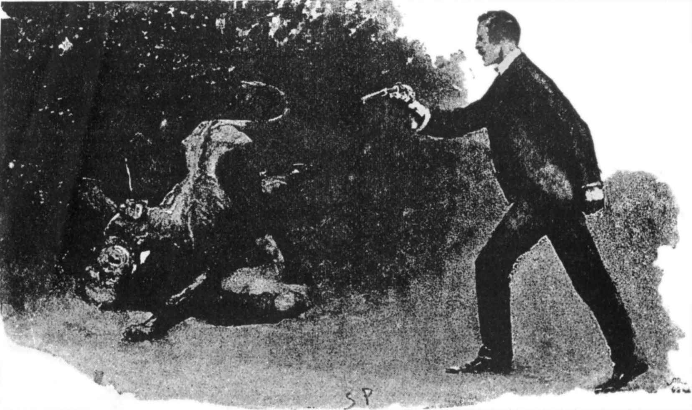

我跑上去就是一枪，把狗打个脑袋开花。

“托勒太太！”亨特小姐叫她。

“是的，小姐，鲁卡斯尔先生回来以后，先把我放出地窖，再上去找你。哎呀，小姐，可惜你没让我知道你的心思，要不我早就会告诉你，不用费那么大劲儿。”

“啊！”福尔摩斯说，眼睛注视着她，“很明显，这事情托勒太太知道得比谁都清楚。”

“是的，先生，我知道，我就是要把知道的一切都讲出来。”

“那好，请坐下，我们来听听，还有几个问题，我得承认，我还没能弄明白。”

“我来给你们讲讲明白，”她说，“我要是早从地窖里出来的话，就都明白了。如果这事要起诉到治安法庭，你们得记住了，我是站在你们一边的，再说，我本来也就是艾丽丝小姐的朋友。

“艾丽丝小姐在这个家里从来没有快活过。自从她父亲再婚以后，她没好日子过，在家里她受到冷落，没她说话的地方。不过，她在朋友家认识福勒先生以前，还能过得去，这以后，日子才全糟了。就我知道，艾丽丝小姐是有家产权的，有遗嘱在，可她从来不争，讲忍让，她是这么个人。她从来不说一个字要自己的权利，什么事都捏在鲁卡斯尔先生的手掌里，由他说了算。鲁卡斯尔先生对她也还放心，怕哪天有个丈夫插进来，要求获得法律范围内他应得的一切。于是父亲就使手段要阻止她。父亲要女儿签个约，说是不管女儿结婚前、结婚后，女儿的钱父亲都有权使用。女儿不能签下这个约，父亲就一直逼她，虐待她。闹到后来她患上了脑炎，整整六个星期，差一点要死掉；后来她渐渐康复，但是人瘦得不成形了，她一头好看的头发也给剪掉了。可这一切没改变男朋友对她的爱心，他诚心诚意待她、护理她，对她十分忠诚。”

“啊，”福尔摩斯说，“我知道了，承蒙你讲了这些，我们听出了事情的根由、眉目，以下的事我也就凭推论可想而知。可以断定，鲁卡斯尔先生是想用关人的办法来对付他们？”

“正是，先生。”

“可是福勒先生坚持不懈，优秀海员都是这样。他围着屋子转来转去不走，找到了你，跟你好说歹说，再加金币叮当响，‘软硬’兼施，到最后终于让你深信你和他是利害一致的。”

“福勒先生是个和气好心人，慷慨大方。”托勒太太平静地说。

“就这样，他让你男人没少喝酒，等你主人一出去，就把一架梯子准备好。”

“说得对，先生，是这么回事。”

“我们应当感谢你，托勒太太，”福尔摩斯说，“我们不清楚的事，你都给讲清楚了。哦，乡村外科医生到，鲁卡斯尔夫人也到，我想是，华生。那我们就陪亨特小姐回温切斯特去吧。再说，我们现在待在这儿，到法庭这陈述权的合法地位locus
standi<a href="#part0057.xhtml_ch2"
id="part0057.xhtml_ch2-back">(2)</a>，也是问题。”

就这样，门前有紫叶山毛榉的那个乡村凶宅谜案，终获解决。鲁卡斯尔先生总算幸免一死，但已成健康损坏、精神颓废的人，全靠他妻子的悉心照料才能苟延残喘。夫妇俩还同两个老仆人一起过，仆人对鲁卡斯尔的昔日生活知道得太多，他们也就觉得难以辞退。福勒先生和鲁卡斯尔小姐一起出走后的第二天，在南安普顿经主教批准，获得婚姻特别许可，终于喜结良缘。福勒先生目前在毛里求斯岛担任政府公职，至于维奥莱特·亨特小姐，我的朋友福尔摩斯令我相当失望，由于小姐已不再成为他的问题的中心人物，便显得对她没有进一步的兴趣。她现在是沃尔索尔一座私立学校的校长，我相信她的工作已获得很大成就。

（1892年）

————————————————————

<a href="#part0057.xhtml_ch1-back" id="part0057.xhtml_ch1">(1)</a> 拉丁文：轰动性案件。

<a href="#part0057.xhtml_ch2-back" id="part0057.xhtml_ch2">(2)</a> 拉丁文：法庭上的陈述权，陈述权的合法地位。

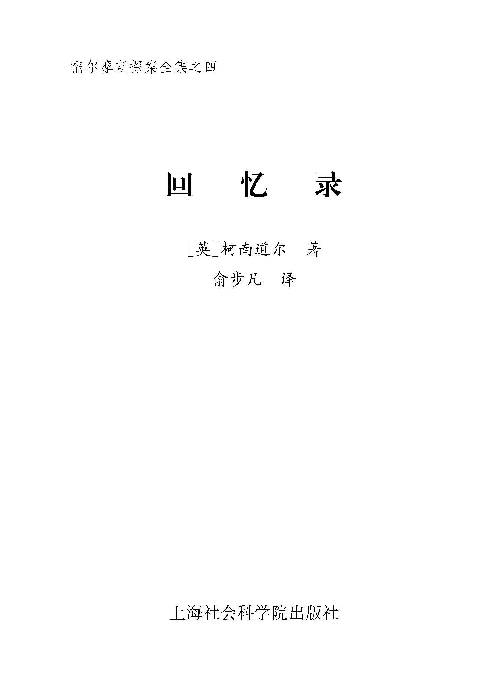

**图书在版编目（CIP）数据**

回忆录／［英］柯南道尔（Conan
Doyle，A．）著；俞步凡译．—上海：上海社会科学院出版社，2012

（福尔摩斯探案全集；4）

ISBN 978-7-5520-0105-1

Ⅰ．①回…　Ⅱ．①柯…　②俞…　Ⅲ．①侦探小说—小说集—英国—现代　Ⅳ．①I561.45

中国版本图书馆CIP数据核字（2012）第159593号

福尔摩斯探案全集之四

**回忆录**

------------------------------------------------------------------------

**著　　者：**［英］柯南道尔

**译　　者：**俞步凡

**责任编辑：**陈如江

**封面设计：**王小阳工作室

**出版发行：**上海社会科学院出版社

上海淮海中路622弄7号　电话63875741　邮编200020

http://www.sassp.org.cn　E-mail：sassp@sass.org.cn

**经　　销：**新华书店

**照　　排：**南京理工出版信息技术有限公司

**印　　刷：**上海中华印刷有限公司

**开　　本：**787×1092毫米　1/32开

**印　　张：**13.25

**插　　页：**2

**字　　数：**232千字

**版　　次：**2012年10月第1版　2012年10月第1次印刷

------------------------------------------------------------------------

ISBN 978-7-5520-0105-1/I·062

定价：29.00元

------------------------------------------------------------------------

**版权所有　翻印必究**

# 目录

[银额宝马](#part0062.xhtml)

[硬纸盒之谜](#part0063.xhtml)

[黄面人](#part0064.xhtml)

[证券经纪人书记员](#part0065.xhtml)

[三桅帆船上的囚犯](#part0066.xhtml)

[马斯格雷夫家族的仪规](#part0067.xhtml)

[瑞门村乡绅案](#part0068.xhtml)

[驼背人](#part0069.xhtml)

[住院病人](#part0070.xhtml)

[希腊译员](#part0071.xhtml)

[海军协定](#part0072.xhtml)

[最后一案](#part0073.xhtml)

[返回总目录](#part0000.xhtml)

# 银额宝马

“看来，华生，我得亲自跑一趟了。”一天早晨，福尔摩斯和我吃早饭的时候对我说。

“跑一趟！去哪里？”

“去达特穆尔，金斯皮兰。”

我听了并不感到奇怪。实际上，我真正感到奇怪的是他竟还没有卷入到这桩奇特的案子里去显一番身手，这桩案子在英国可是已经到处谈得沸沸扬扬。我的伙伴整日闷头在屋里走来走去，双眉紧皱，烟斗里浓烈的黑烟丝换了一斗又一斗，抽个不停。我向他问点什么，讲点什么，他一概充耳不闻。送报的每天把各种报纸早早送来，他只是粗略一看就扔在了一旁。然而尽管他默不作声，我还是十分清楚，他在冥思苦想些什么。外界疑惑议论的问题，就是西撒克斯杯锦标赛的宝驹奇异失踪以及驯马师惨遭谋杀一案不得下文，这恰是他可以运用分析能力施展本领的大好机会。所以，他突然宣布打算亲自出马、登台亮相，也正符合我的想法、我的希望。

“我要是能和你一起下去，那就再高兴不过，只要对你没妨碍。”我说。

“我亲爱的华生，你能去，我真是不胜荣幸。我觉得，也不会浪费你的时间，因为本案有好多问题，颇有特点，是千载难逢的机会。我想，现在时间正好可以到帕丁顿赶火车，路上我再把这事细细谈谈，讨论讨论。你最好把你那副高倍望远镜带上。”

就这样，个把小时以后，我们坐进了头等车厢的角落里，飞驰在开往埃克塞特的路上。福尔摩斯，一张轮廓分明、神态急切的脸盘配着一顶护耳旅行帽，正抓紧时间阅览帕丁顿站上刚买到的报纸。我们过了里丁好久，他才把看完的最后一份往座位下一塞，将烟盒递给我。

“开得真快，”他说，望着窗外，看了看表，“火车现在的速度，每小时五十三英里半。”

“我没注意看距离标桩<a href="#part0062.xhtml_ch1"
id="part0062.xhtml_ch1-back">(1)</a>。”我说。

“我也没看。沿线那些电报的电杆，每一档的距离是六十码，这么一算就很简单了。约翰·斯特雷克被人谋杀、宝驹告失踪，这案子想必你都知道了吧？”

“我是从《电讯报》、《新闻报道》上看到一点。”

“像本案这种案例，推理分析的艺术主要用来筛选案情细节，而并非再要寻找新证据。案情之悲惨是如此不同寻常，情况也相当完整，又牵涉到如此多人切身的利害关系，致使我们颇费苦心，无止境地推测、猜想、假设。困难在于，事实轮廓我们一定要清楚——绝对无可否认的事实——如何把事实从理论家和记者们添枝加叶的修饰中清理出来。然后，我们要立足于可靠的事实根据，看看可以得到什么结论，这个谜案的特点是什么，才是尽到了我们的责任。星期二晚上我收到电报，都是邀请我一起合作，一封是宝驹的主人罗斯上校，一封是警探格雷戈里，他正负责此案的侦破。”

“星期二晚上！”我惊呼道，“今天已经是星期四早晨，昨天你为什么不动身？”

“这是我犯的大错，亲爱的华生——我原就担心，我也容易犯错，这本是常事。可是你一给我写了回忆，就形成了人家对我不实际的想法。其实，问题出在我不相信那么杰出的良马在英国得以藏匿长久，特别是在达特穆尔北部如此人烟稀少的地方。昨天我一个小时一个小时在等，希望听到已经给发现的消息，盗马贼同杀害约翰·斯特雷克的该是同一个人。可是直到今天早晨，我才发现除了逮捕年轻小伙子菲茨罗伊·辛普森以外，毫无结果，这才感到该是我行动的时候了。从某方面说，我觉得昨天一天也不算浪费。”

“那你是得出结论了？”

“至少案子的主要事实都已为我所掌握，让我一桩一桩给你讲一讲。案子自己清不清楚，看给别人讲得清讲不清就可以了。要是一开始我就无法把情况向你交代，那就难以指望得到你的合作。”

我仰后靠着椅垫，抽着雪茄，福尔摩斯则俯身向前，瘦长的食指在他左掌上不住点点画画，把此次旅程的缘由向我作了概述。

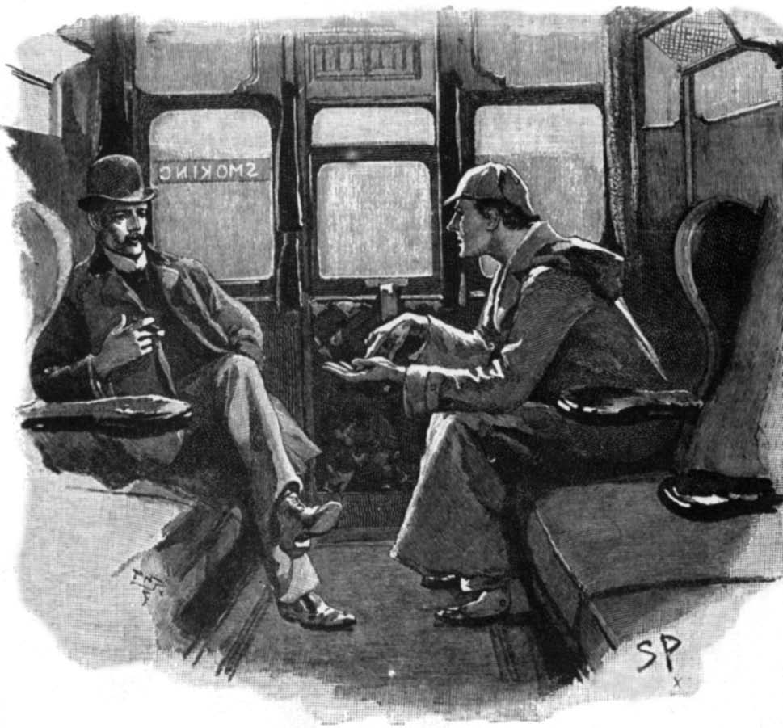

我仰后靠着椅垫，抽着雪茄。

“天门白这匹宝马，”他说，“是索莫密种，祖先就是驰名良马，始终保持优秀纪录。它已有五岁，赛马场上每次给它主人罗斯上校争得头奖，上校真幸运。在此不幸事件之前，这马一直是西撒克斯杯锦标赛的冠军。在它身上下的赌注虽然是三一比<a href="#part0062.xhtml_ch2"
id="part0062.xhtml_ch2-back">(2)</a>，它仍然始终是众赌客最看好的马，从来不叫下赌注的人落空，所以不管那么悬殊的赌注比，大量的金钱照样往它身上押。结果引起许多人出于利害攸关的考虑，千方百计要阻止，不让这匹天门白参加下星期二的比赛。

“这件事在金斯皮兰都知道，上校的驯马场马厩那边，对这匹马就采取了各种保护措施。驯马师约翰·斯特雷克，原是罗斯上校麾下的赛马骑师，后来因为体重增加退了下来。他给上校当骑师有五年，当驯马师有七年，一直是个非常热诚忠厚的仆人。他手下还带着三个小马倌，马厩也不算大，一共才四匹马。一个马倌负责每天在厩里守夜，其他两个睡在饲料棚里。三个小伙子都是好品格。约翰·斯特雷克已婚，住一幢小别墅，离马厩大约两百码远。他没有孩子，雇一个女仆，日子过得满舒坦的。乡下地方很冷落，北边大约半英里地，有几幢别墅，是塔维斯托克镇的一个承包商建造的，供病人疗养，也供有些人愿意来呼吸达特穆尔的新鲜空气。塔维斯托克镇在西边两英里远，穿过荒野地，大约也是两英里远，是比较大的梅普尔顿驯马场，属于巴克沃特勋爵，管理人名叫塞拉斯·布朗。四面八方都是荒野，只有少数流浪的吉卜赛人居住。就是在这么个环境，星期一夜里发生案子。

“那天傍晚，驯马、饮马，一如往常，马厩在九点钟上锁。两个马倌到驯马师家厨房一起用晚餐，那第三人，内德·亨特留下守夜。九点刚过没几分钟，女仆伊迪丝·巴克斯特到马厩来给他送晚饭，有咖喱羊肉，饮料没带。因为马厩里有水龙头，照规定值班人只许喝水，不许喝别的。天黑看不见，还要穿过一片野地，女仆手里拎一盏提灯。

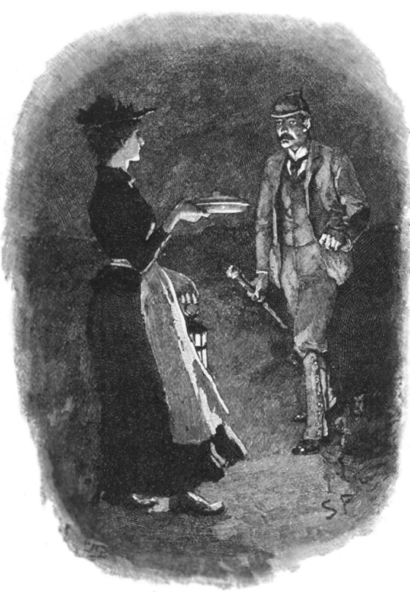

女仆手里拎一盏提灯。

“伊迪丝·巴克斯特到马厩还有三十码的时候，黑暗中过来一个人，招呼她停一下。她拿提灯一照，黄色灯光之中看见一个穿戴很体面的人，一身花呢的灰套装，一顶布帽，脚上是绑腿套，手里一根圆头重手杖。给她印象最深的，是这个人的脸色特别苍白，而且神态紧张。年龄，她看总有三十出头，不像三十以下。

“‘请问这儿是哪里啊？’这个人问她，‘不看见你这盏灯，我想只好夜宿露天荒地了。’

“‘这儿就是金斯皮兰马厩啊。’女仆说。

“‘哦，是吗！真走运，还给撞对了！’他叫着，‘我知道有个马倌每天晚上一个人睡在那儿。你这带的，给他送晚饭的啰。我看得出来，让你有机会赚几个钱买新衣服，你总不会嫌弃吧？’他从背心口袋里掏出一张折叠的白纸。‘这个今晚一定要给小马倌，你就一定可以有钱买最漂亮的衣裳。’

“女仆看他陌陌生生，这么突如其来，吓坏了，快跑几步不理他，来到了送饭的窗口；她一直是从窗子把饭递进去的。窗子已经打开，亨特正坐在里面一张小桌边。她刚开口告诉亨特遇到个什么人，那个陌生人也跑了上来。

“‘晚安，’陌生人说，在窗口望着，‘我有话要同你讲。’姑娘后来发誓说，这个人说话的时候，她看见攥在他手里的纸露出一个小纸角。

“‘你来这儿有什么事？’马倌问他。

“‘有点事，让你腰包有钱鼓起来。’来人说，‘你们有两匹马，参加西撒克斯杯锦标赛——一匹宝驹天门白，一匹贝阿德。你透点儿风给我，你也吃不了亏。有没有听说同重量五弗隆<a href="#part0062.xhtml_ch3"
id="part0062.xhtml_ch3-back">(3)</a>距离赛马，贝阿德可以甩掉天门白一百码，你们自己都把注押在贝阿德身上，有没有这回事？’

“‘噢，原来你是赛马探子，混蛋！’小马倌叫起来，‘我叫你看看金斯皮兰怎么对付你们探子。’他跳起身来跑到马厩那头去放狗。姑娘赶快往家跑，离开的时候回头看了看，看见那个陌生人身子倚着窗子。一会儿工夫，亨特带着狗冲出来，他已经跑掉了。亨特在屋子四周围找他，连个影儿也没有。”

“等一下，”我问，“小马倌带狗跑了出来，门没锁吧？”

“有见地，华生，有见地！”我的伙伴低声说，“这是个要点，引起我极大的重视，昨天我特地发电报到达特穆尔复核这个事实，问清楚了。马倌出来是把门锁上了的，还要附加提一提，那扇窗很小，人是钻不进去的。

“亨特一直等到另外几个人都过来，叫他们给驯马师去报信，告诉他这里发生的事。斯特雷克一听说，很激动，虽然他好像不是太了解其中真正的用意，他隐约感到不安。斯特雷克太太半夜一点醒来，看见他在穿衣服，问他干什么，他回答说担心几匹马，睡不着觉，想到厩里去看看是不是都好着呢。太太劝他别去，因为听到外面下雨，雨点滴滴答答打在窗上，可是他不听劝，自顾披上件大雨衣出了门。

“斯特雷克太太早晨七点醒来，见她丈夫没有回家，赶忙穿好衣服，叫来女仆，到马厩那边去。马厩门开着，一看里面，亨特在椅子里缩成一团，完全昏迷不省人事，宝驹的食槽里空了，也不见驯马师人影。

“另两个马倌，住在马料棚里，睡在马具室楼上，很快去叫醒。夜里他们什么也没有听见，这两个都是睡得很死。亨特明显受到药物强烈麻醉，怎么弄也弄不醒他，只好由他睡。两个马倌、两个女人一同跑向外面去找失踪的人、失踪的马。他们心存侥幸，驯马师会不会是什么原因牵马去晨练了吧。可是，他们走上屋旁一个土墩，瞭望四周野地，非但没找到宝马，倒是看见了什么东西，心里紧张了，觉得大事不好。

“大约离马厩四分之一英里的地方，约翰·斯特雷克一件大衣在荆棘丛里飘着。那里正是荒野上一个圆形凹陷的洼地，在底下发现了遇难驯马师的尸体。他的头颅被钝器严重击碎，腿股也受伤，有长条明显的刀口，是被利器划割。很清楚，斯特雷克曾经自卫，与凶手拼命搏斗，因为他右手里攥着一把小刀，血迹都凝到了刀柄上，左手里还抓着红黑两色的丝领巾，女仆认出来，正是昨晚到马厩来的那个陌生人戴的领巾。亨特一从昏迷中苏醒过来，也完全认定这条领巾是那个人的。他还肯定，也是这个陌生人，站在窗边的时候，往他咖喱羊肉里下了药，这样马厩就没人看管了。马的失踪，泥地上全是证据，洼地里激烈搏斗那会儿，马也在场。可是从这个早晨以后，再也不见马的踪影。尽管重奖悬赏，全达特穆尔的吉卜赛人也留意，可始终杳无音信。最后还有一点，经过化验，小马倌吃剩下的晚饭里含有大剂量的鸦片粉，那晚上在家里的人吃的是同样的饭，都一点没事。

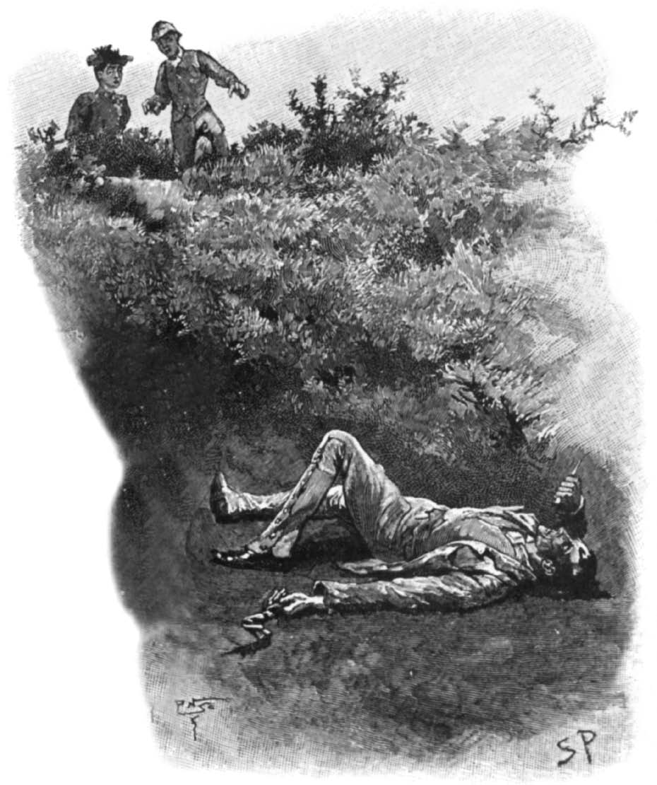

发现了遇难驯马师的尸体。

“这就是案子的主要事实，我已经去掉了所有猜测，尽可能按原貌叙述。现在把警方处理本案的情况简略讲一讲。

“警探格雷戈里，受命调查此案，是个很有能力的警官。他可能欠缺一点想象力天赋，否则早就晋升警场高位。他一到现场，立即排出最大嫌疑人，加以逮捕。抓他不难，他就住在一幢别墅里，我刚才讲到的几幢别墅那地方。他的名字，好像叫菲茨罗伊·辛普森。这个人出身、教养都很好，他的钱财都在赛马场上耗费精光，现在在伦敦体育俱乐部里做个赌注登记，混口平常安稳饭。一检查他的赌注记录簿，发现他把高达五千英镑的赌注押在天门白宝马的败北上。一被逮捕，他立即主动承认，他到达特穆尔是企图探听有关金斯皮兰驯马场的消息，也探探第二宝驹德斯巴勒的消息，这匹马养在塞拉斯·布朗的梅普尔顿驯马场。上面所说的那天晚上的事，他的行为，他没有意图要否认，但是他申明绝无罪恶目的，只不过想获得第一手消息罢了。当面给他出示领巾，他马上脸色刷白，怎么会出现在被害人的手里，他完全讲不清楚。他的湿衣服，说明那天风雨夜他外出了。他的手杖，山槟榔木，有重铅头，完全可以做凶器，不断猛敲，足以致人于死地，把驯马师击毙。可是另一方面，在他身上，无一处伤痕，而斯特雷克手中小刀的情况，说明那个人攻击他，身上至少会有一点遭到反击的痕迹。难题来了吧，敲不开的硬壳果。华生，若是你能给我一些启发，我对你感激不尽。”

我怀着最大的兴趣听了福尔摩斯的讲述。他特别言简意赅、条理清晰，把案情摊在了我的面前。虽说大部分事实我原已知晓，但是不太认识其中某些方面的重要性，更不清楚彼此间的关系。

“会不会有可能，”我犹豫地说，“斯特雷克腿部的刀割伤，会不会是脑部受创在痉挛性挣扎中引起的自伤？”

“大有可能，十之八九的可能，”福尔摩斯说，“这样一来，对被告有利的主要几点，有一点排除掉了。”

“还有，”我说，“到现在我还摸不清警方是怎么个看法。”

“恐怕我们的推论同他们大相径庭，”我的朋友回答说，“据我所知，警方想象，菲茨罗伊·辛普森把看守马厩的人麻醉以后，用事先配好的钥匙打开马厩大门，把宝驹天门白牵出来。他的目的当然是来偷马，但是马辔头没有了，他就只好解下领巾来权充替代套在马嘴上。然后，门大开着，牵马到外面，不料半路遇到驯马师，也可能是驯马师把他追上，便势必冲突、搏斗。辛普森拿起重手杖把斯特雷克脑袋打碎。斯特雷克虽用小刀自卫，辛普森没有受到丝毫伤害。宝马要么给辛普森藏到了什么秘密地方，要么是打架的时候跑掉了，这会儿可能正逃亡在野地。这就是警方对案情的分析。如果这种说法是不可信的，那别的说法更加不可信了。我只要一到现场，很快就会查出结果；照现在这点情况，我无法做进一步的解释。”

我们到达塔维斯托克小镇，天快傍晚。小镇位于达特穆尔一圈荒地的中央，像是凸起在盾牌上的雕饰。有两位先生在车站上等我们——一位是高个子，很有风度，留狮子鬈发，络腮胡子，有一对深邃明亮的淡蓝眼睛；另一位是小个子，神情机警，浑身干净利落，穿礼服大衣，裹绑腿罩，连鬓胡修剪得很整齐，戴单片眼镜。这一位就是罗斯上校，著名体育运动家。另一位就是格雷戈里警探，正崛起成为誉满英国警探界的人物。

“非常高兴你也来到这里，福尔摩斯先生，”上校说，“这位警长已尽了一切努力，但是我希望务必竭尽全力为可怜的斯特雷克报仇，把我的马找回来。”

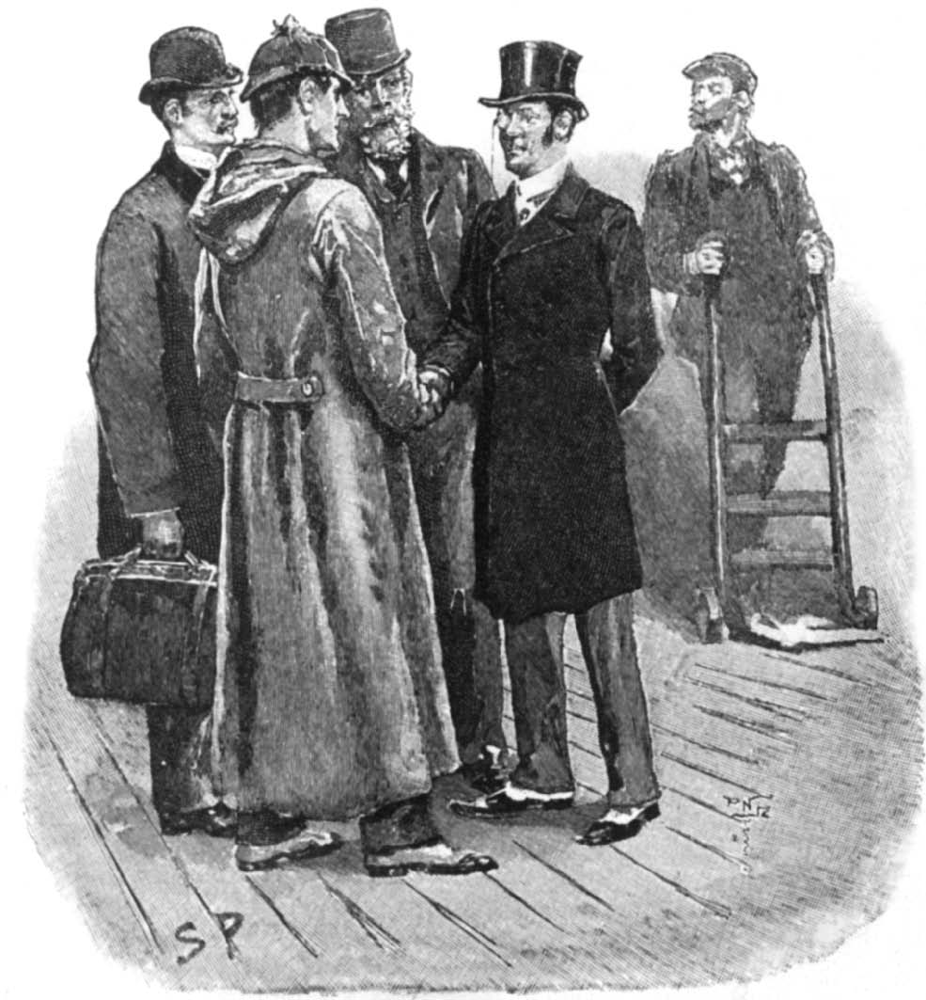

“非常高兴你也来到这里，福尔摩斯先生。”上校说。

“有什么新进展吗？”福尔摩斯问。

“我很抱歉地说，我们没有获得什么进展，”警探说，“外面一辆敞篷车等着，想必你有意趁天黑前看看现场，我们一边走一边谈吧。”

没一会儿工夫，我们都坐定在舒适的四轮马车上，车轮辘辘地穿行在古风奇特的德文郡城。格雷戈里警探满肚子装的案情，滔滔不绝往外掏个没完，福尔摩斯偶尔插话，问个问题。罗斯上校抱臂身靠椅背，帽子斜拉到双眼。我颇感兴趣地静听两位侦探的谈话。格雷戈里一套套地搬他的理论，几乎和福尔摩斯在火车上预言的一模一样。

“法网已把菲茨洛伊·辛普森牢牢套住，”他说道，“我个人认为凶手就是他。同时，我得承认证据还嫌笼统，不免人云亦云，情况若有新的发展，可能会被推翻。”

“斯特雷克的刀伤是怎么回事呢？”

“我们比较倾向的结论，是他倒地时候的自伤。”

“我这位朋友华生医生，在我们来的路上向我谈出这个意见。假如是这样的话，对这位辛普森是不利的。”

“那是当然的啦。他没有刀伤，没一点伤痕，但对他的罪证却是很过硬的。他最有利害关系，盼望宝马完蛋，对小马倌下毒，他嫌疑最大。他毫无疑问，冒雨外出过。他的重手杖，是凶器。他的领巾，落在受害人之手。我看有足够证据把他提交给陪审团。”

福尔摩斯摇摇头。“一个有头脑的律师可以把你驳得体无完肤，”他说道，“他干什么要把马牵出马厩呢？要把马害了，在那里下手不就得了？拿到他偷配钥匙的真凭实据了？哪家药房卖给他鸦片粉的？总而言之，他一个人生地不熟的外人，能把马藏到哪儿去？还是这么一匹名马！说到那张纸，说是他要让女仆交给马倌的，他自己作怎样的解释呢？”

“他说是一张十镑的钞票，他钱袋里就发现一张。你讲的其他几个疑点都并不是那么站得住脚。对这个地方他并不是一点也不熟悉，天热的时候他到塔维斯托克来住过两回。鸦片完全可以从伦敦带过来。钥匙，用过以后目的达到就扔掉。马，荒地有的是深坑底、矿洞，可以藏在那里。”

“那条领巾他怎么说呢？”

“承认是他自己的，但说是丢失的。不过有个新证据可以用来说明是他把马从马厩里牵出来的。”

福尔摩斯侧耳倾听。

“我们发现有足迹，表明有一帮吉卜赛人星期一晚上在凶杀案发现场一英里以内地方扎营。星期二他们都走掉了。这就可以认为，辛普森同吉卜赛人有联络有关系，他被追赶就把马交给吉卜赛人，说不定马现在就在他们那里呢。”

“当然有可能。”

“现在我们到处在寻找这些吉卜赛人。我也检查了所有马厩和外屋，塔维斯托克镇上，半径十英里范围之内。”

“我听说，就在很近有一个驯马场？”

“有，当然也是不可忽视的因素。德斯巴勒，他们的马，是下注的第二名，他们也就指望宝马天门白出事。赛拉斯·布朗，他们的驯马师，大家都知道在这场比赛中下了很大赌注，他跟可怜的斯特雷克并不友好。可是，虽然我们检查了他们的所有马厩，还是没发现他和这件事有关。”

“辛普森这个人同梅普尔顿马厩有没有利益关系？”

“一点也没有。”

福尔摩斯靠在车厢椅背上，谈话中断。没几分钟，我们的马车停在路旁一幢整洁的凸檐红砖小别墅前。稍远处，过一个驯马场，有一长排灰瓦房屋。四面八方是铺满枯萎羊齿植物的古铜色荒野，低缓起伏的弧形地平伸展到天边。塔维斯托克镇上房屋的尖顶，也被远在西边的一溜房屋，时有遮断，那溜房屋就是梅普尔顿马厩。我们逐个跳下车，就福尔摩斯独自背靠椅子坐着不动，两眼直盯住前方空望，仍旧沉浸在他的沉思之中。是我撞撞他的胳臂，他才如梦惊醒，跳起来跨出车厢。

“对不起，”他说，转向嗔怪地朝他望的罗斯上校，“我在做白日梦。”他眼中闪着光彩，神态中有不露的激动与兴奋。我便备受鼓舞，一如以往的经验，这是说明他手已搭住脉搏、捏住了线索，虽然我无法想象他从何处发现线索。

“也许，你很愿意立刻到犯罪现场去，福尔摩斯先生？”格雷戈里说。

“我还是愿意先在这儿待一会儿，有一两个细节问题先弄个清楚。斯特雷克给带回来了，我想是吧？”

“是的，就搁在楼上，明天验尸。”

“他在你手下服务好些年了吧，罗斯上校？”

“是的，我对他处处满意，没话说的。”

“他被害之后衣服口袋里的东西，我想你都有登记啰，警长？”

“我把东西都搁在起居室，你要看就去看。”

“这就很好。”

我们一行鱼贯进入前屋，围着中央的桌子坐下，警官打开一只方形铁皮匣，拿出一小堆东西摊在我们面前。有一盒火柴，两英寸蜡烛头，一个ADP牌欧石南根的烟斗，一个海豹皮烟袋，装着半盎司切得细细的板烟丝，一只金表链的银怀表，五枚沙弗林<a href="#part0062.xhtml_ch4"
id="part0062.xhtml_ch4-back">(4)</a>金币，一个铝皮铅笔盒，几张纸，一把象牙柄细小的刀，刃口精致锋利，上面刻有伦敦韦斯公司字样。

“这把刀子不同一般，”福尔摩斯说，拿在手里细细看了一会儿，“上面有血迹，我想就是他手里拿的那把刀。华生，这种刀是你们医生用的，没错吧？”

“就是，我们叫作眼翳刀。”我说。

“我没认错。精细的刀刃用于精细的手术。奇怪的是，冒雨外出，带这么一把细细的手术刀做什么用，而且，衣袋里还不能放。”

“我们在他尸体旁边找到这把刀的软木刀鞘，”警探说，“他妻子告诉我们这把刀是放在梳妆台上的，他出门的时候随手带上。这当作武器并不中用，不过可能临时一拿，手边没有别的，好歹也是把刀。”

“非常可能。这纸怎么回事呢？”

“三张是卖草人的收据。一张是罗斯上校的字条，写的指示。还有这一张是妇女服装店发票，三十七镑十五先令，开票人邦德街莱苏丽尔夫人，抬头是威廉·德比希尔。斯特雷克太太告诉我们，德比希尔是她丈夫的好朋友，他的信有时候就寄到这里。”

“德比希尔太太倒很阔气，”福尔摩斯说道，看了看发票。“二十二几尼<a href="#part0062.xhtml_ch5"
id="part0062.xhtml_ch5-back">(5)</a>一件衣服可不便宜。就这样，没什么可研究的了，现在我们下去，去看看现场吧。”

我们走出起居室，有个妇女在过道上等着，她上前一步，手拉着警探的衣袖。女人面容憔悴、瘦削，脸上有着近日来所受惊吓的深深烙印。

“你把他们抓到了吗？把他们找到了吗？”她喘着气。

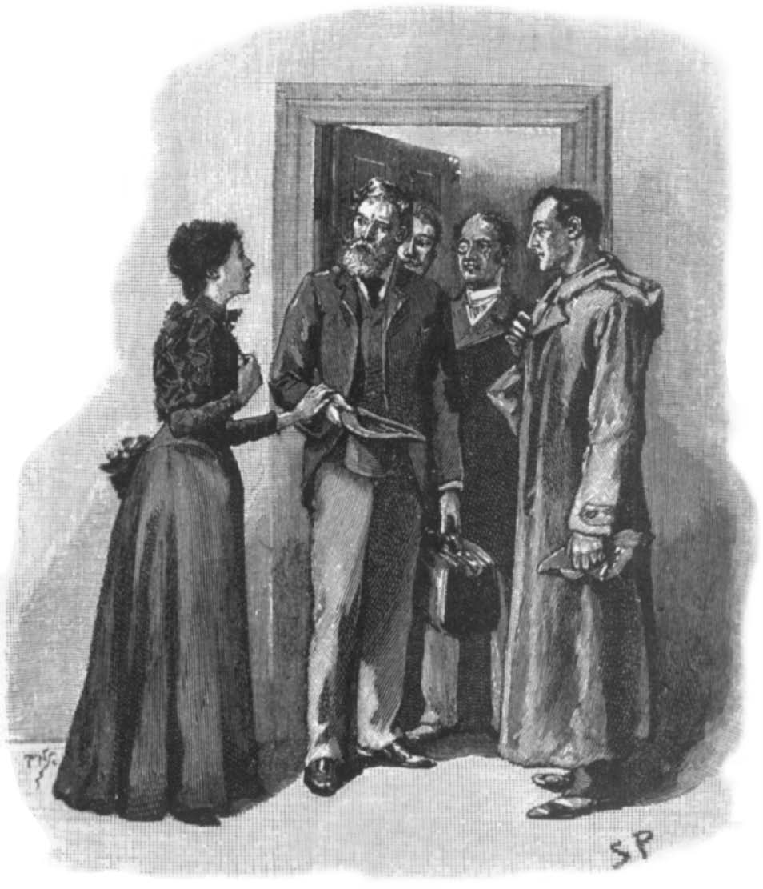

“你把他们抓到了吗？把他们找到了吗？”

“还没有，斯特雷克太太。现在伦敦来了福尔摩斯先生，来帮我们破案，我们一起干，这就快了。”

“噢，没错，不久前我在普利茅斯一次公园舞会上见过你，斯特雷克太太，对吗？”福尔摩斯说。

“不，先生，你弄错了。”

“是吗！啊，我可以发誓没错，你是穿的一件鸽子灰鸵鸟羽绒边的衣服。”

“我从来没有这么一件衣服，先生。”这位女士回答。

“啊，这就是了。”福尔摩斯说道。他道了一声歉，就跟随警官走到外面。我们在荒野地上没走多远，就到了发现尸体的那凹地，沿边上是荆棘丛，那天看见的大衣就钩在上面。

“据我所知那天夜里没有风。”福尔摩斯说。

“没风，可是雨很大。”

“那就是说，大衣不是给风吹上去的，而是被放在那里的。”

“是的，是被挂在那里的。”

“很有意思。我看看，这地上都给踩乱着脚印，星期一晚上到今天有多少脚印踩过了！”

“这儿边上铺着一条席子，我们都站在席子上。”

“很好。”

“这口袋里有斯特雷克的一只靴子，一只菲茨洛伊·辛普森的皮鞋，一只天门白宝马的铁蹄。”

“我亲爱的警官，你今天特别行！”福尔摩斯接过拎袋，下到低处，把席子稍向中间挪挪，然后身子趴在席上，双手托着下巴，仔细研究眼前践踏过了的泥地。“瞧！”他忽然叫道，“这是什么？”那是一根蜡火柴，烧剩一半，上面都有泥，粗一看还以为是根细枝条。

“看我怎么竟把这个疏忽漏掉。”警官表情懊恼地说。

“小条嵌在泥里，看不见。我看见，是因为有心在寻找。”

“什么！你是晓得、有心找的？”

“我想到，有此可能。”

他从拎袋里掏出鞋子，拿来同地上的脚印一一核对。然后跑上坑沿，俯身在荆棘丛、羊齿草之间东看看西望望。

“这里恐怕没有多少痕迹可看了，”警官说，“周围一百码，我都仔细检查过。”

“的确，”福尔摩斯说，直起身来，“你这样说，我也就算了，不必多此一举。但是趁天还没黑，在这野地里稍微走走，以利明日踏勘。我想把这块马蹄铁藏进我的衣袋，求个好运气。”

罗斯上校对我同伴不动声色、一板一眼、一点一画的工作方法很不耐烦，看了看表。“你和我一起回去吧，我说警长，”他说，“还有几个问题要向你请教意见，尤其是，要干脆向公众宣布宝马除名吧，不参加锦标赛了。”

“绝对不除名，”福尔摩斯果断地大声说，“我会让宝马照样列名，岿然不动。”

上校点点头。“我很高兴听到你这个意见，先生，”他说，“你去兜你的圈吧，完了以后，来可怜的斯特雷克他家里，我们一起上车去塔维斯托克。”

他同警探转身返回，福尔摩斯和我在荒野上慢慢地走。太阳渐渐沉落到梅普尔顿马厩后面，斜坡野地在我们前面无垠绵延，浸染了一层金色，金色在一点一点变深，变成铁锈色、棕褐色，枯萎的羊齿草和荆棘丛正沐浴着夕阳的余晖。可是这壮丽的景致在我同伴的心目中，恰似晚景凄凉。他依旧沉溺在他的沉思之中。

“看来这样吧，华生，”最后他说，“谁杀害斯特雷克的问题，我们暂且撇开，集中力量找一找宝马。那么，假定凶杀当时或者凶杀以后，马脱缰逃掉，能跑到哪里去呢？这马是最爱合群的动物。让它自己跑，必然要跑回金斯皮兰，或者也会跑到梅普尔顿，此是本性，怎么就流落荒野不归呢？它现在应该早就给发现了。是不是吉卜赛人把它逮走了呢？可这些人平常一听到哪儿出了乱子，避之惟恐不及，他们不希望给警察找到头上来，他们不会要拿这样的马去卖钱。搭上手这么一匹马，就冒风险，没好处，这是很清楚的事。”

“那会在哪儿呢？”

“我已经说过，不是在金斯皮兰，就是在梅普尔顿，应该说，是在梅普尔顿。让我们按照这个假设去做，看看结果如何。荒野的这个地方，警官讲过的，土地又干又硬。但是地势向梅普尔顿低下去，你从这儿就能看得见，那一头是块长长的洼地，在星期一夜里一定很湿。要是我们的假设正确，那么马一定跑过那里，那里一定有痕迹，可以找得到。”

我们边谈边走，兴致很高，没几分钟，到了要查看的洼地。福尔摩斯提出，我向右手边沿坡下去，他向左手边下去。等我还没走出五十步远，就听见他叫我，看见在向我招手。他面前的软地上有明显的马蹄印迹，他从袋里拿出蹄铁来一核对，完全吻合。

“你看，脑瓜子要多动，想象可是多么有价值，”福尔摩斯说，“格雷戈里就是缺的这一点。我们设想有怎样怎样的可能，按假设去求证，发现果不出所料。咱们继续进行。”

我们走过湿软的洼底，再走过大约四分之一英里干硬的草地，地面又斜下去，又发现了蹄印。再向前又消失了约有半英里，但是快到梅普尔顿马厩的时候，在附近重新有了那蹄印。是福尔摩斯首先发现，他站直了身子指指印迹，脸上充满胜利的喜悦，因为在马蹄印旁还清晰可见有人的脚印。

“起先只有马，没有人。”我叫道。

“完全正确，起先没有人。啊，这是怎么了？”

马和人两行印迹突然转向，朝着金斯皮兰的方向过去。福尔摩斯呼哨一声，我们一起跟着掉头。他两眼紧盯行迹，这时我一下子惊异非常，发现在一旁这足迹重新再掉转了方向。

“多亏你，华生，”我指点着的时候，福尔摩斯说道，“你这发现，我们少跑好多路，要不然我们又得回老路。现在咱们根据这个脚印折回。”

我们再走，走没多远，足迹到了一条沥青路面就消失了，这条路正对着梅普尔顿马厩的一排大门。我们向前走去，从门里出来一个马夫。

“我们这儿不许闲人逗留。”马夫喝道。

“我想打搅一下，有点事要问问，”福尔摩斯说，伸出拇指、食指两个指头，探入马甲衣囊，“明天早晨五点钟，来拜访你家主人，赛拉斯·布朗先生，会不会嫌早了一点？”

“上帝保佑你，先生，有人要来，他会见的。他可是起得最早。他过来了，先生，你有事问他自己吧。哦，不，先生，不行，可不能叫他看见我收您钱了，要饭碗儿不保。过后，过后再，倘若您有意的话。”

福尔摩斯把刚从口袋里掏出来的半个克朗重新放回，有个嘴脸一副狞恶相的老头跨步从厩门出来，手里执一根猎鞭甩呀甩的。

“干什么，道森！”老头吼道，“不许闲话！干你活去！你们那两个，来这儿干什么的？”

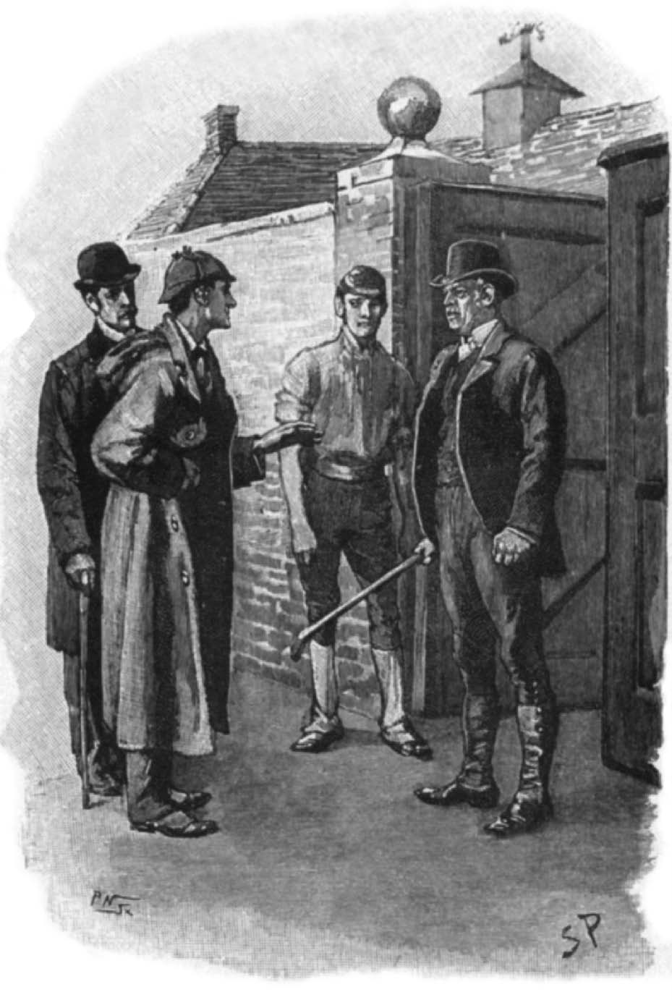

“你们那两个，来这儿干什么的？”

“我想跟你谈十分钟话，先生。”福尔摩斯柔声和气地说。

“我没时间跟游手好闲的人谈什么话。陌生人这儿不许待，走开，不然，当心狗咬你脚脖子。”

福尔摩斯弯腰向前，对着这个驯马师的耳边轻轻说了几句，老头身子猛一跳，脸变得通红。

“你胡说啥！”他叫道，“想讹人！”

“很好。愿意在外面公开谈还是到你里边去谈？请便。”

“那，那就，里边吧。”

福尔摩斯微笑着。“我就一会儿时间，不会让你久等，华生，”他说，“那么，布朗先生，请便了。”

二十分钟后，红霞已经完全消失，福尔摩斯和驯马师重新走了出来。就只那么一转眼工夫，赛拉斯·布朗先生的变化有如天壤之别，那副样子我倒从未见过。他的脸灰白了，额头沁出汗珠，吊在手上的猎鞭随手颤抖，如枯枝风吹。他那趾高气扬、恶声恶气的姿态荡然无存，变得畏畏缩缩、低头哈腰，像一条哈巴狗跟随在我朋友的身边。

“您的指示一定照办，一定完全照办。”他说着。

“务必不许出错。”福尔摩斯说，向他兜头扫了一眼。对方缩缩脖子点点头，领略着他眼中的威慑力。

“噢，不，不会，不会出错，保证到场出赛。要不要先改回原貌，还是不动？”

福尔摩斯稍一想，发出一阵大笑。“不，不必，”他说，“我会写信给你。不准耍花招，你小心着，不然——”

“噢，请放心，请放心！”

“好，谅你也不敢。就这样，明天等我消息。”布朗哆哆嗦嗦向他伸过手来，他理也不理转身就走。我们立即折回，去金斯皮兰。

“赛拉斯·布朗堪称丑角大师，像他这样一会儿气壮如牛，一会儿胆小如鼠，而且一副奴才相，确实少见。”我们往回择路而行，福尔摩斯对我说。

“那么说，马在他那儿了？”

“他本想耍威赖掉，可我揭穿他那天天亮时候他怎么干来着，说得分毫不差，他一听，自己的一举一动都叫我亲眼目睹，自觉没辙。你看出方头皮鞋的足迹，正是他特别的鞋印，完全一致。还有，当然，这种事下人是不敢做的。根据他起早的习惯，他肯定是第一个起床。我就对他说，他是怎么样看见有匹马落单在野地。他怎么样跑出来把马套住，一看怎么样让他大吃一惊，原来是宝驹天门白。因为额头上，那天门，是一片白色，由此得名的标记在。这是天赐良机落到了他手里，只有这马能打败他下注的马。我告诉他，起初他脑瓜还没想过来，开始把马往金斯皮兰牵，过会儿，他怎么样才鬼主意一动起了邪念，想到该把它藏起来，等比赛完了以后再说，他就怎么样又往回牵，牵进梅普尔顿偷藏好了。我把细节都这么点滴不漏报给他听，他傻呆了，不得不低头认罪，不住地告饶。”

“你搜过他的马厩了？”

“噢，这种老油子，与马打了一辈子交道，藏一匹马有的是办法。”

“可是，马还留在他手里，你不怕给他损了吗？”

“我亲爱的伙计，他会像保护自己眼睛那样保护马。他明白只有照管好了马，才有望获得宽大处理。”

“罗斯上校这个人，我的印象是对什么都不懂讲情面、讲宽恕。”

“这个由不得他罗斯上校，关键在我手里，是宽是严说少说多我说了算。我是非官方，就有这点主动权。不知你是看出还是没看出，华生，这个上校对我很有点傲慢，我现在就想拿他稍微开开心，叫他尝尝我的一点儿味道。这马对他只字不要提。”

“你不同意，我绝对不讲。”

“何况与约翰·斯特雷克是给什么人杀害相比，这个是次要的问题。”

“你一定要追查到底！”

“就此结束不查了，你我今晚就回伦敦。”

听我朋友这话，我如遭雷击。我们来到德文郡才不过几个小时，他刚一开始侦查就已经取得如此辉煌成绩，竟要半途而废，实在令我难以理解。他闭口不再谈此事，我也同他无话可说。我们一起回到了驯马师家里，上校和警探正在客厅等着我们。

“我的朋友和我决定今天夜车回城，”福尔摩斯说道，“已经呼吸到你们达特穆尔的新鲜空气，令人神清气爽。”

警探愣瞪双眼，上校轻蔑地撇撇嘴。

“这么说，杀害可怜的斯特雷克的凶手，你抓不到，没信心了。”上校说。

福尔摩斯耸耸肩。“困难很大，阻力不小，”他说，“不过，我还是充满希望，你的马星期二照常参赛不误。对你有个要求，让你的骑手早作准备。我能要一张约翰·斯特雷克先生的照片吗？”

警探从一个信封中拿出一张给他。

“我说亲爱的格雷戈里，对我需要的东西，你都预备得一应齐全。如蒙允许我这里再稍等一会儿的话，我有个问题要问问女仆。”

“我得说，对我们伦敦来的顾问，我颇感失望，”罗斯上校不客气地说，我的朋友离开了客厅，“我看，事情跟他不来也一样，毫无进展。”

“至少，能确保你的马参加比赛。”我说。

“不错，他给我的是个保证，”上校耸着肩说，“可我倒愿意他能把马给了我。”

我正要回敬几句，为我的朋友抱不平，他回客厅来了。

“好了，先生们，”他说，“我没事了，到塔维斯托克去吧。”

我们登上马车，是一个小马倌给开着车门。福尔摩斯好像突然想到什么，弯下身去拍拍小伙子的胳膊。

“你们围场里有羊，”他问，“你们谁看羊的？”

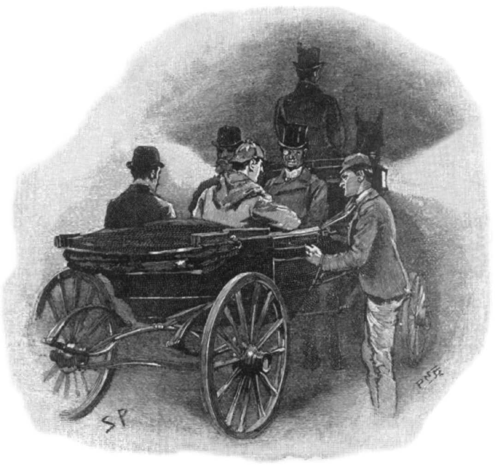

“你们谁看羊的？”

“是我，先生。”

“最近发现羊有什么情况没有？”

“哦，先生，没什么情况，就是有三只羊不知怎么瘸腿了。”

我看出了福尔摩斯感觉兴奋，因为他抿嘴在笑，还搓起了双手。

“这个假设过分大胆，华生，很有点冒险，”他说，捏了我一下手臂，“格雷戈里，让我向你介绍这里的羊有怪毛病，提请你不妨注意。赶车吧，车夫！”

罗斯仍旧那副神态，对我伙伴的能力抱有不屑一顾的成见。但是我瞧瞧警探的脸，看出他对这个倒是引起高度警觉。

“你觉得这里头很重要？”他问。

“绝对重要。”

“还有什么问题你要我注意的？”

“那天夜里的狗，是个不小的小问题。”

“狗这天夜里毫无动静。”

“可是个不小的问题。”福尔摩斯说道。

四天以后，福尔摩斯和我又上了火车，奔温切斯特去看西塞克斯杯跑马锦标赛。罗斯上校如约在车站外迎接，我们坐上他的大马车驰向郊外的跑马场。上校脸色阴沉，态度极其冷淡。

“我的马影儿都没看见。”他说。

“我想你只要看见，总认得出来吧？”福尔摩斯问他。

上校怒气冲冲。“赛马场我干了有二十年，以前从来还没有人问过我这种问题，”他说，“小孩子都认得天门白宝马，白前额，白右前腿。”

“下注怎么样？”

“这就难说了。昨天你还能有十五比一，可是比差越来越小，眼下你恐怕三比一也勉强。”

“哈！”福尔摩斯说，“明摆着有人知道内情了。”

马车驶抵看台墙外，我看到赛马牌上的项目、名单。

**西塞克斯杯锦标赛**

每马交款五十沙弗林。头名除金杯外得奖金一千沙弗林，第二名得奖金三百镑，第三名得奖金二百镑。马龄以四五岁口为限。新赛程一英里五弗隆。

1．希思·牛顿先生，赛马：尼格罗；骑师：红帽，棕黄上衣。

2．德洛上校，赛马：帕奇利斯特；骑师：桃红帽，黑蓝上衣。

3．巴克沃特勋爵，赛马：德斯巴勒；骑师：黄帽，黄衣袖。

4．罗斯上校，赛马：天门白；骑师：黑帽，红上衣。

5．巴尔莫拉尔公爵，赛马：艾利斯；骑师：黄帽，黄黑条纹上衣。

6．辛格尔福特勋爵，赛马：拉斯波尔；骑师：紫色帽，黑衣袖。

“我们撤掉了原来另外一匹马，把全部希望押在你说的一句话上了，”上校说，“瞧，那是什么？宝驹天门白？”

“五比四，宝驹天门白！”赛马赌注登记经纪人在高声吆喝，“五比四，宝驹天门白！五比十五，德斯巴勒！五比四，押其余马！”

“马号都出齐了，”我叫道，“总共六匹。”

“总共六匹，齐了？那，我的马也该在场啊，”上校高叫着，急得不得了，“颜色都不对嘛，怎么没看见它。”

“才过了五匹，这一匹，肯定你的了。”

我正这么说，就见一匹剽悍的枣红马从磅马栏内一冲而出，在我们面前缓辔而过。马背上骑的正是上校那位众人熟知的黑帽红衣骑师。

“那马不是我的，”马主人叫着，“这什么马，全身没一根白毛。你搞的什么名堂，福尔摩斯先生？”

“啊，啊，我们且看它跑得怎么样吧。”我的朋友冷静沉着地说。他拿起我的望远镜观看几分钟。“棒极了！刚出蹄就不一般！”他忽然喊道，“都过来了，转弯了！”

我们在马车上视点极佳，马径直跑过，看得真切。六匹马紧挨一起，齐头并进，扔一条毯子都可以一古脑儿盖住。可是跑到赛程一半，梅普尔顿马场的黄帽骑师突出到了前面。然而，还没到我们面前，他这匹德斯巴勒却成强弩之末，而上校的那匹马，一个迅疾冲刺，突破终点，领先紧跟后边的德斯巴勒达六马身之遥，巴尔莫拉尔公爵的艾利斯名列第三。

“这么说，是我的马，没错啦，”上校气喘吁吁，手揉揉眼睛，“我承认，我搞得不知哪里是头尾了。你存心施妙计蒙我，太过分了吧，福尔摩斯先生？”

“当然啰，上校，事情你马上就清楚了。我们这就一起过去看看这匹马。在这里，”他说道，我们挤到磅马围栏里，那里只有马主人和他们的朋友才可以允许进去，“只要用点酒精给它洗洗脸洗洗腿，你就认得它正是那匹宝驹天门白，准是一见如故。”

“你真让我目瞪口呆！”

“我在盗马人手里找来的，擅自如此安排让它参加比赛。”

“我亲爱的先生，你做得真神真绝。这马状态甚佳，刚才跑的，以前从来都还没那么棒呢。我对你的能力，真不该一直心存怀疑，特此向你表示万分抱歉。多亏你的大力，才把我的马找了回来。要是你能把杀害约翰·斯特雷克的凶手也抓到，那可就更好了。”

“我已经抓到了。”福尔摩斯静静地说。

上校和我惊愕不已地望着他。“你抓到了！人呢？”

“就在这里。”

“这里！哪里有？”

“近在眼前。”

上校怒气上冲，满脸通红。“受到你的帮助，我完全认账，福尔摩斯先生，”他说，“不过，你这个话，要讲清楚，你是在侮辱人。要说玩笑，能开这种玩笑？”

歇洛克·福尔摩斯大笑。“你放心，我又没说你同犯案有关系，上校，”他说道，“真正的凶手就站在你身后。”他走过去，举手放到良马光滑的脖颈上。

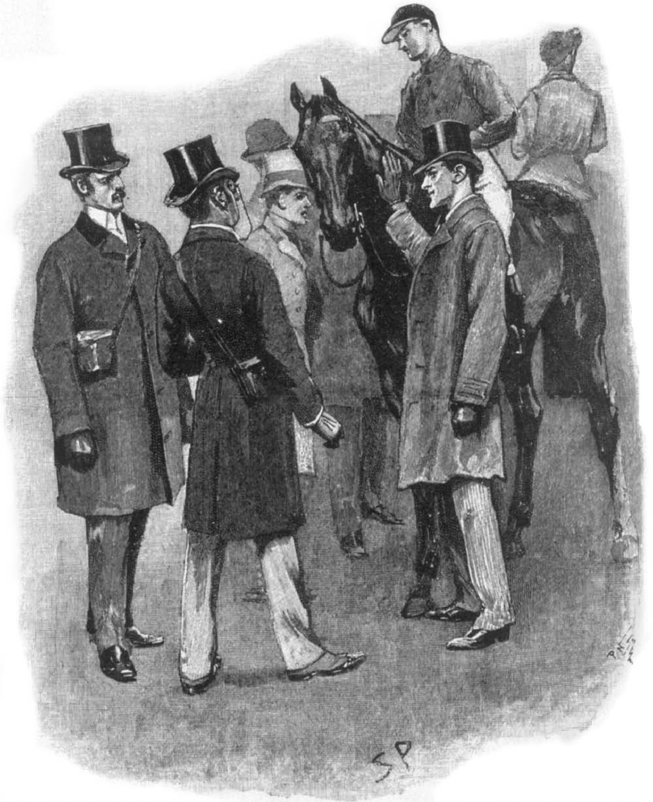

他走过去，举手放到良马光滑的脖颈上。

“这马！”上校和我同声惊呼。

“没错，是马，可它应当说至多只有轻罪，因为我该说它不过是自卫杀人。那个约翰·斯特雷克，是个完全不值得你信赖的家伙。现在铃响了，我想下一轮比赛中能有小胜。我们另找适当时间再作详谈吧。”

我们搭乘普尔曼式豪华快车当夜返回伦敦。一路上我们听着同伴叙述在那个星期一夜晚达特穆尔驯马场谜案发生的经过和他揭开谜案的方法。可以想象，我和罗斯上校一样，听得只感觉旅途太快太短。

“讲实话，”他说，“我根据报纸上的消息得出的论断，是完全不正确的。不过里面还是有一些迹象，可惜重要的地方反被有些枝节掩盖了。我去德文郡的时候，深信菲茨罗伊·辛普森就是案犯，虽说我确实也看到指控的证据非常不足。直到去驯马师家坐在马车里，我才想起那个咖喱羊肉大有文章。你们记得吧，你们都下车，我还坐在车里，正出神呢。我怪自己脑袋瓜怎么会那么不使劲，这样一条明显的线索也会疏忽掉。”

“我承认，”上校说，“我到现在都还摸不清这线索有什么用。”

“这是我整个推理链条的第一环节。鸦片粉剂不是无味的，气味并不难闻，但还是闻得出。调在一般食物中，吃的人一吃就会发觉，肯定不再吃了。咖喱正好是调料，把鸦片粉味道冲淡。但是，那天夜里那个陌生人菲茨洛伊·辛普森，绝对不可能到驯马师家里去做这个手脚，也不能设想有那么巧事，那天夜里他正好带着鸦片粉，正好遇上咖喱羊肉让他能下手又能掩饰。作这种假设是荒唐的，完全站不住脚。因此，辛普森可以排除嫌疑。于是，注意力就集中到斯特雷克和他妻子身上，只有这两个人可以在那天决定煮咖喱羊肉当晚饭。给小马倌的那一盘特地放开，调进鸦片，所以别的人同样吃羊肉晚餐都没中毒，平安无事。那么，是谁能够避开女仆对这盘羊肉做手脚呢？

“在解决这个问题之前，我抓住狗没出声这一重要现象，得出一个正确推论；突破一点，就可兼及其余。辛普森案情中，我已知马厩里养狗，还已知，有人进入把马牵走。这狗居然没叫，没有惊醒睡在马料棚里的两个小马倌，很明显，半夜来者非外人，必是狗所认识的人。

“我已有把握，没有十分也有八九，确信约翰·斯特雷克深夜来到马厩，牵走天门白宝马。是什么目的？当然是不怀好意，否则，何必要下毒麻醉自己厩里的小马倌呢？至此，我尚不了解其中缘故。在此以前，赛马一直有作弊情况发生，驯马师假手代理人，将大笔赌金押在自己的马跑输掉上面，那就要施诡计不让自己的马跑赢。有时候是骑师故意勒缰让马跑不快，有时候采取更有把握更隐秘的手法。眼前这个是属于哪一招呢？我指望他口袋里藏的东西有助于我得出结论。

“果然大有帮助。你们不会忘记那把不同一般的小刀，是在死者手中发现的。这种刀，没有哪个神志清醒的人会选择当武器来使。正是华生医生告诉我的，这种刀只能用来做最精细的手术；那天夜里，也正是准备用于做精细手术的目的。你一定知道，以你马场丰富的经验，罗斯上校，把马的后脚踝上的肌腱这么小小地挑一下子，不会留下丝毫痕迹，可是马就别想再能参加比赛了。马给这么一弄，会慢慢变成有点轻微的跛脚，一般也就认为是训练疲劳过度，或者得了点风湿症，不至于看出是被人害的。这是恶毒勾当。”

“流氓！恶棍！”上校叫道。

“至此，我们已经解释了约翰·斯特雷克为什么要把马牵到荒野地。这样一匹烈马一感觉下刀挑割的疼痛，必定高声嘶叫，再睡死的人也要给惊醒。所以，为防万一，必须远离，手脚到野地里去做。”

“我真瞎了眼！”上校叫道，“那就对了，怪不得需要蜡烛，还擦火柴。”

“正是这样。检查了他的东西以后，我有幸不仅完全发现了他的犯罪手法，还发现了他的犯罪动机。你也是世面上人士，上校，你知道口袋里是不藏别人账单的吧，我们一般总是自己处理自己的账务都来不及。我就马上得出结论，斯特雷克有婚外生活，他另有金屋藏娇。账单内容显示，事情跟一位女士有关，还是一位高消费女士。你对你麾下的人算得慷慨大度，也难以相信他们能给自己家里的女士买得起那么一件二十几尼的女装。我探问斯特雷克太太，问到这件衣服，她一无所知。我有数了，她是个局外人，蒙在鼓里。我记下了服装店地址，只要拿上斯特雷克的照片，就能轻易戳穿德比希尔先生之假托鬼话。

“从这时起，一切问题都清楚了。斯特雷克把马牵到一处凹坑洼地，点亮蜡烛就不会被人看见。辛普森逃离，慌忙中掉了领巾。斯特雷克捡到——或许转念想，可以用来绑住马腿。一下到洼地，他转向马后面，便擦火柴。谁知这畜生，给这突然的亮光惊吓了，动物的自卫本能，使它感到有危险，便猛一个尥蹶子，那铁蹄正中斯特雷克的脑门。他为了使精细的手术做得利索，已不顾下雨，脱掉了大衣，因此，人给踢倒下的时候，手中小刀划着了裤腿，拉了血口子。我这么说，都清楚吗？”

“高明！”上校叫道，“就是高明！都像是给你亲眼所见！”

“我最后部分的推测，看得出吧，大胆得有点冒险。我也想到，精明如斯特雷克，做切割肌腱这种精细的手术，他事前不会不经过试验练习。他怎么做预先练习呢？我搜索的目光落到了羊身上。经我询问，我自己都不免惊奇，我这猜想还真没错。

“等回到伦敦，我走访了那家妇女服饰商店，店主对斯特雷克完全熟识，说他是个大主顾，名叫德比希尔，说他有个极漂亮的娇妻，喜欢打扮。不用讲啦，这个女人令他债台高筑，压得他透不过气，逼得他走上犯罪道路。”

“你把事情讲得很清楚了，但有一件事，”上校高声道，“马呢，马哪儿去了？”

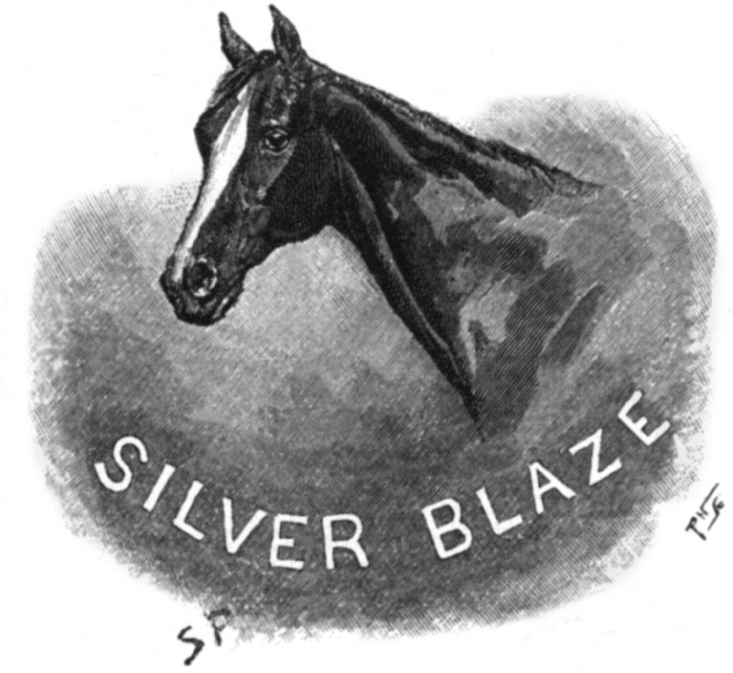

“啊，马跑掉了，是你的一位邻居把它留下好生看养。这个事情，我们多一点宽容吧，宽容为怀。这是到克拉彭站了，没错。过不了十分钟就可以到维多利亚。你若是有意，上校，请到鄙舍吸支烟。还有其他若干细节问题，我仍然乐意谈谈，你还会有兴趣的。”

（1892年）

————————————————————

<a href="#part0062.xhtml_ch1-back" id="part0062.xhtml_ch1">(1)</a> 距离标桩（quarter-mile
post），1/4英里间距的标识路桩。

<a href="#part0062.xhtml_ch2-back" id="part0062.xhtml_ch2">(2)</a> 三一比：指赢时只取对方一份，输时则给对方三份。

<a href="#part0062.xhtml_ch3-back" id="part0062.xhtml_ch3">(3)</a> 弗隆（furlong），长度单位，等于1/8英里，或201.17米。

<a href="#part0062.xhtml_ch4-back" id="part0062.xhtml_ch4">(4)</a> 沙弗林（sovereign），英国旧时面值一英镑的金币。

<a href="#part0062.xhtml_ch5-back" id="part0062.xhtml_ch5">(5)</a> 几尼（guinea），英国旧金币，1813年停止流通，此后仅指等于21先令即1.05英镑的币值单位，常用于规定费用、价格等。

# 硬纸盒之谜

为了挑选几桩典型案例，藉以说明我的朋友歇洛克·福尔摩斯才智卓越，我尽量不选那些情节耸人听闻的故事，而是提供不加虚饰、真正足以显示他才能的案件。不幸的是，不可能把耸人听闻和犯罪截然区分开。于是令笔者陷于左右为难的境地，如果牺牲掉叙述中至关重要的细节，案情就显得不真实，给人以假象；或者只能就事论事，不加选择，报报流水账。说了这几句开场白，我就要转向一则纪实，从头到尾确实都是奇特而骇人听闻的事。

八月暑热天，贝克街像一只火炉，骄阳直射对面黄砖街屋，耀眼刺目。真令人难以置信，也正是这些屋墙，在冬天的雾气中竟是灰蒙蒙的，毫不起眼。我们的百叶窗半阖半开，福尔摩斯蜷曲在沙发上，反反复复地看着早上邮差送来的一封信。对我来说，印度服役期间练就了耐热的功夫，我是怕冷不怕热，九十华氏度的气温也受得住。可是晨报无味，议院已经闭会。人人都要离城，我也向往新森林的林地或是南海的海滨，但银行的存款已经用完，也就只好把假日推迟。至于我的同伴，乡村也好，海滨也好，对他一概没有吸引力。他只喜欢待在五百万人的人海中间，伸出他的触角，向人群探索，对尚未侦破的刑案的任何传言和疑点反应敏锐。在他诸多天赋中，就是没有欣赏大自然的一席之地。只有他的注意力从城内罪犯追踪到乡下的同案犯身上，这时才会挪动一下他的位置。

看到福尔摩斯全神贯注，不想说话，我扔下了无聊的报纸，靠着椅背，自顾想得出神。忽然我同伴开口，打断我的思路。

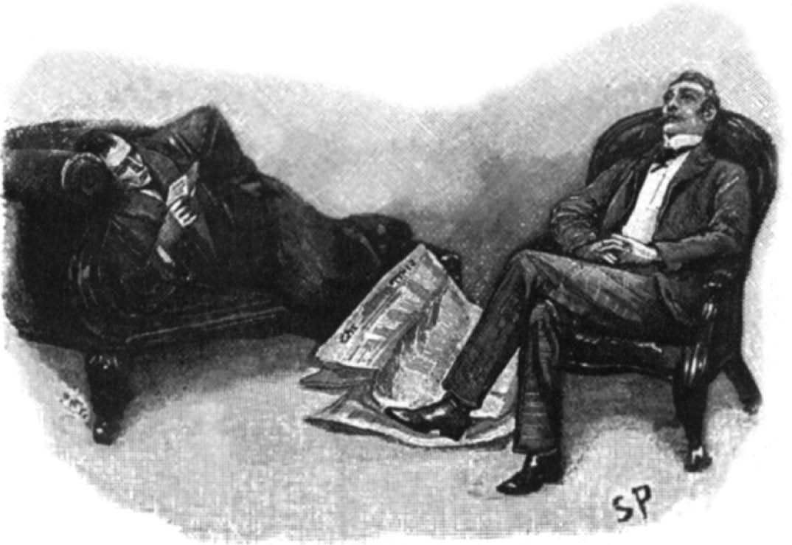

忽然我同伴开口，打断我的思路。

“你是对的，华生，”他说，“那样解决争端，看来实在是最愚蠢的做法。”

“极端愚蠢！”我应声叫道，但猛然省悟，他这说的不正是我心里所想的吗？我在椅子里坐起来，向他茫然凝视。

“你怎么知道我在想什么，福尔摩斯？”我大声道，“你这真是令我难以想象。”

看我迷惑不解的样子，他由衷地笑起来。

“你该记得吧，”他说，“不久前我让你读过爱伦·坡一节文字，他同伴没有说出口的想法，他很快就推导了出来。你当时认为，这不过是作者的巧妙手法。我说我也有这样的习惯，常常作这样的推论，你听了并不以为然。”

“哦，不是！”

“恐怕，你这是言不由衷，我亲爱的华生，你的眉毛倒是说了真话。所以，我看你扔下了报纸，沉入了思考，我很高兴，又有机会来作研究，最后你的心思让我识破，这是一个明证，证明我透悉你的心灵，相知甚笃。”

但是我依然远远无法理解他的意思。“你给我读的那个例子，”我说道，“推理是从他观察对方的行动才得出的结论。我记得是，他绊了一块石头，望天上看看星星，等等这些动作，可是我只静悄悄坐在我的椅子里，我给你什么线索启示了呢？”

“你实在不了解自己，面部表情表现人的情感。你的面部表情反映你的感情，再忠实不过。”

“你的意思是说，从我的面部表情你看出我在想些什么？”

“你的表情，特别是你的眼睛。也许你自己也想不起你是怎样陷入沉思的。”

“想不起了。”

“那就让我来告诉你。把报纸一扔，你这个动作就引起了我的注意。你木然无表情，坐了半分钟。然后你的眼睛盯住新装框的一幅画，戈登<a href="#part0063.xhtml_ch1"
id="part0063.xhtml_ch1-back">(1)</a>将军，我看见你面部表情有变化，在开始思考起来了，但是没有想得多远。你的目光转向了还没有装框的肖像亨利·沃德·比彻<a href="#part0063.xhtml_ch2"
id="part0063.xhtml_ch2-back">(2)</a>，这幅像搁在书堆上面。然后你眼睛抬起来，看墙，你的意思是很明白的，在想这幅像装好了框就挂到空墙上，同戈登的画像并排挂在那里。”

“给你看得准极了！”我惊叹道。

“到这一步，我还没有走偏吧。再接下来，你的思想又回到比彻身上，一个劲儿眯眼盯着看，好像在研究他的相貌、性格。然后你的眼睛不眯缝着了，但还是看着他，脸上一副凝神思索的样子，这是在回顾比彻一生的种种事迹。我估摸着，你是在想他内战时期担当北军的使命，我记得他受到英国人强烈反对，你对此曾经替他愤愤不平。你若不是想着这些，就不会是这样的表情。你反应如此强烈，我知道你若不是在想比彻遭遇不公，就不会那个样子。又过一会儿，我看到你的眼睛从画上移开，我估计你的心思现在转移到内战上来了。我观察到你双唇紧闭，眼睛明亮，手攥紧了拳头，我就肯定，你一定在想那场生死搏斗中双方表现的忠勇气概。但接着，你的脸色又悲哀起来，摇摇头，你是在想生命无谓抛掷，多么可怕、悲哀。你的手不自觉地抚摩你自己的老伤，嘴边漾起一丝笑容，我看得出，你愤慨耻笑这样解决国际问题实在荒唐愚蠢。在这一点上，我同意你，那确实愚蠢，并很高兴发现所有我的演绎法都是正确的。”

“完全正确！”我说，“你解释得对，我承认我像上次一样折服。”

“这是非常表面的，很肤浅，我亲爱的华生，我坦白跟你讲，你那天如果没有表示不相信，我决不会插嘴，打断你的思路。现在我手上有个小问题，但恐怕很棘手，它的困难决非这种思想分析的小把戏可与比拟。报上有一则小报道，克罗伊登十字大街有位库辛小姐收到一只包裹，里面装的东西十分奇怪，你注意了没有？”

“没有，没有看到。”

“啊！你一定漏看了，把报纸扔给我。在这里，金融栏下面，麻烦你大声念念。”

我捡起他扔回的报纸，念他指出的那一篇，标题是《毛骨悚然之邮包》。

家住克罗伊登十字大街之苏珊·库辛小姐，不幸为一极其令人作呕之恶性行为所惊扰，此事必隐含更邪恶之目的。昨日下午二时，邮差送达一牛皮纸小包裹。包裹中一硬纸盒，盒内装满粗盐。库辛小姐将盐倒出，发现新割下之人耳一对，惊吓万状。此盒系于昨日晨从贝尔法斯特<a href="#part0063.xhtml_ch3"
id="part0063.xhtml_ch3-back">(3)</a>以包裹邮件寄出，寄件人不明。事情十分诡异，因库辛小姐系一年届五十之老小姐，单身独居，少与人往来，少与人通信，邮包上门更属罕见。然其数年前原居彭奇，曾将多余房间租与三名医学院青年学生，后因吵闹及生活无序，不得不逐令三人搬出。警方认为，对库辛小姐之恶意骚扰系此三青年学生所为，盖出于怨恨，遂将解剖室废弃物邮寄以示恐吓。尤认为事实之极有可能者，三学生中有一人系北爱尔兰人，而库辛小姐确知其为贝尔法斯特人是也。本案正于积极展开调查之中，警方之卓越探长莱斯特雷德先生，认真负责处理本案。

“《每日纪事》报就这么多，”我读完后，福尔摩斯说，“现在来看看莱斯特雷德，今天早上收到他的信，信上说：

我认为本案很对合你的路子。我们大家希望将本案立马解决，但发现有一点困难不易着手。我们当然已去电贝尔法斯特邮局，但那天有大量邮包寄出，无法特别确认这一件邮包，也记不清寄件人。盒子是半磅装蜜露烟草盒，于我们毫无帮助。对医学院学生的分析，我依然认为是最有道理。你若能拨冗抽空几个小时，我将十分高兴期盼你能来此一趟。我可去涉案人家中，或在警局，全天恭候。

“你说呢，华生？这个案子是个难得的机会，可以供你记录，冒冒酷暑，克罗伊登下去走走怎么样？”

“我正盼望有事可做呢。”

“这就有事了。拉铃，叫他们把我们的皮鞋拿来，叫辆马车。我换换休闲衣，雪茄盒装装满就来。”

我们一上火车，就下了一场阵雨，把克罗伊登的暑气压下，比城里凉快好多。福尔摩斯先发过电报，所以莱斯特雷德到车站上接我们。他一如往常，瘦小精干，一副侦探模样。步行五分钟，就来到库辛小姐居住的十字大街。

这条街很长，街旁是两层楼砖房，干净、整齐，发白的石阶，三三两两系着围裙的妇女在门口闲谈。这条街走到一半，莱斯特雷德停下脚步去敲一家的门。一个小丫头来开门，我们被领进前厅，库辛小姐就坐在厅里。她是个眉目善相的女子，一对文静的大眼睛，灰色鬈发垂盖两鬓。一只没有绣完的椅套搁在膝头，装着各色丝线的针线篮放在身边的一个凳子上。

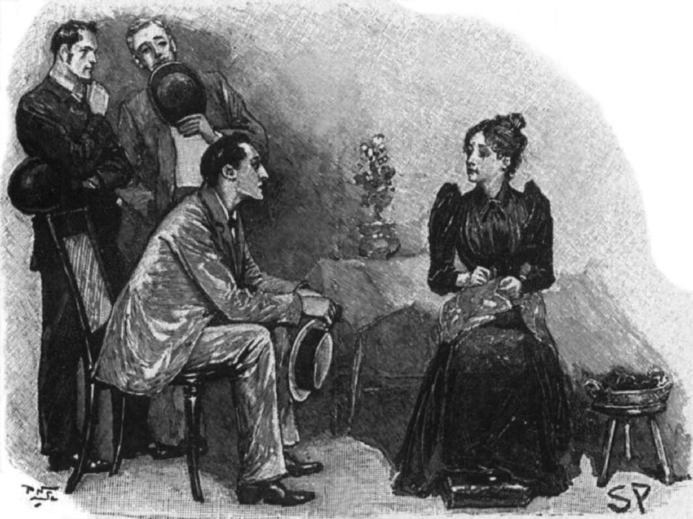

库辛小姐就坐在厅里。

“那盒子放在外面，怪怕人的东西，”莱斯特雷德进去的时候，库辛小姐说，“请你都拿走吧。”

“要拿走的，库辛小姐。还留在这里，是因为我的朋友福尔摩斯先生要当着你的面看看这东西。”

“为什么要当我面呢，先生？”

“要当面问几个问题吧。”

“问我有什么用呢，我告诉你了，这事我是一点也不知道呀！”

“正是这样，女士，”福尔摩斯说，语气委婉，“我知道为了这件事，你已经够气恼了。”

“是呀，我够受了，先生。我一个妇道人家，喜欢安静，过着隐居的日子，把我的名字上了报，警察上我家里来，我哪里有过这种不太平的事！我不要这种东西搁这儿，莱斯特雷德先生，你们要看到外屋去看吧。”

宅子后面的小花园里有一间小棚屋，莱斯特雷德进去，拿出来一只黄色纸板盒，连同一张牛皮纸，一段细绳。小径那头有条长板凳，大家坐下。福尔摩斯将莱斯特雷德交给他的东西一件件仔细检查。

“这段绳子很有意思，”他说，拿起绳子就着光亮看看，还用鼻子闻闻，“这绳子你看出什么了，莱斯特雷德？”

“涂过柏油。”

“一点不错，是涂过柏油的细绳。你看，这很明显，库辛小姐是用剪刀剪断绳子，从两个断口绳头上可以看得出，这一点很重要。”

“我看不出有什么重要。”莱斯特雷德说。

“重要性在于，绳结原封未动，这个绳结打得很有特色。”

“打得很死，这一点我已经注意到了。”莱斯特雷德得意地说。

“绳子就这样吧，那么，”福尔摩斯说，一边笑笑，“看盒子包装。牛皮纸，有很浓的咖啡味。怎么，没检查过？我看肯定是。地址写得不整齐，歪歪扭扭：‘S．库辛小姐，十字大街，克罗伊登。’是用粗笔尖写的，很可能是蘸水钢笔，墨水很差。Croydon克罗伊登这个字，原先拼的是i，后来改成y。包裹是一个男人寄的——字是男人的笔迹——教育程度不高，对克罗伊登这地名不熟悉。检查至此，还算顺利！盒子，黄纸板，半磅装蜜露盒，盒子左下角有两个拇指印，此外没有显著痕迹。装满粗盐，是保存兽皮或是保存其他的粗制商品的粗盐。埋在盐里的，就是这两个吓人之物。”

福尔摩斯说着就拿出两只耳朵，放在横搁膝头的一块纸板上，细细观察。莱斯特雷德和我在两旁弯腰凑着看，看看这恶心的遗物，又看看我的同伴疑惑急切的脸。最后，他把东西放回盒中，坐着深思一会儿。

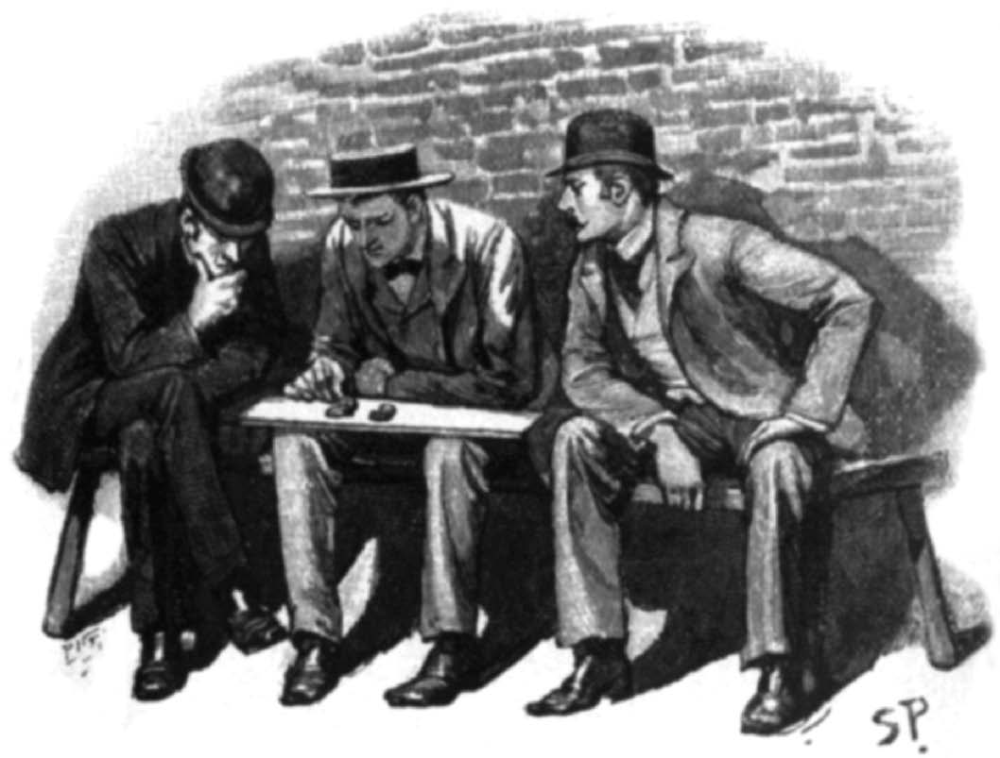

福尔摩斯拿出两只耳朵，细细观察。

“你们也都看到了，”最后他说，“两只耳朵不是一对。”

“没错，我也注意到的。不过，学生恶作剧，解剖室里拿的，随便捡两只凑成一对就算了。”

“也可能，但这不是恶作剧。”

“你肯定？”

“可以推断，绝对不是恶作剧。解剖室的尸体都注射防腐剂，这两个耳朵没有注射过防腐剂，是新割下的，而且是用并不很锋利的刀割下来，不是解剖刀，这个，要是学生，不会是这种割法。再说，学医的人只会用石碳酸或者蒸馏酒精来防腐，这才符合学医者的常规，绝对不会用粗盐。我再强调一遍，绝不是恶作剧，我们要侦查的是一桩恶性刑事案件。”

听了我同伴的话，看到他越来越沉重严峻的脸色，我不由得打了一个寒战。这段严肃的开场白似乎投下了阴影，含有十分奇异而不可名状的恐怖。然而莱斯特雷德摇着头，像是在半信半疑。

“说恶作剧，是讲不通，那先不说它吧，”他说，“但另外一种说法，更加站不住脚。我们知道，这位妇女在彭奇、在这里，一直过的是极安静、极本分的生活，已有二十年之久。在这期间她极难得有一整天离开自己的家。那么，罪犯偏要把罪证寄给她，为什么？特别是，这件事我们不知道，她也不知道，她又不是个老牌演员，好演什么戏！”

“这正是要我们解决的问题，”福尔摩斯答道，“就我这方面讲，我着手基于我的假设和推理是正确的，而且，是谋杀两个人。一个是女人耳朵，小一点、细一点的，还穿有耳洞。一个是男的，太阳晒黑的皮肤，已经变色，也穿过耳环。这两个人，估计已经死了，否则早应该听到情况了。今天是星期五，邮包是星期四早上寄出，那么惨案应该发生在星期三或者星期二，或者再略早一点。如果两个人已经被谋杀，除了凶手谁会把这杀人证物寄给库辛小姐呢？可以确定，寄这包裹的人就是我们要找的人。再看他把邮包寄给库辛小姐，其中一定有道理。是什么道理呢？那是告诉她事情办成了！或者，叫她感到痛苦，也有可能。可是这样的话，她应当知道这个人是谁。她知不知道？我也很难确定。如果她知道，又为什么要报警呢？她可以把耳朵一埋了事，谁会知道？如果她想包庇罪犯的话，她就会这样做。如果不想包庇罪犯，那么应该说出他的名字来。这就是症结所在，需要我们去查明。”他说得又急又大声，眼睛茫然地望着花园篱墙，但这时忽然站起身，朝屋里走去。

“我有几个问题要问库辛小姐。”他说。

“那就少陪了，”莱斯特雷德说，“我手上还有点小事忙着。我看，库辛小姐这儿已经没有需要进一步了解的情况。你要找我，来警局好了。”

“我们上火车的时候顺便去看你。”福尔摩斯答道。一会儿，他和我又回进前厅。静静的女士依旧在那儿拿着椅套，定定地做她的针线活。我们进去，她把椅套往膝头一搁，一对坦然而探索的蓝眼睛望着我们。

“我相信，先生，”她说，“这事一定搞错了，这邮包根本不是要寄给我的。我已经对苏格兰警场的这位先生说过许多遍了，可他只朝我笑。这世上我没一个仇人，我自己知道，所以，有谁会来这样恶意捉弄我？”

“我也是这样想，库辛小姐，”福尔摩斯说，在她旁边的椅子上坐下，“我想，很可能是——”他突然停住了，我十分奇怪，一看，他很专注地望着女士的侧面。一瞬间，在他急切的脸上露出既惊讶又满意的神情。女士眼睛望望他，发觉了他打住话头的原因。福尔摩斯便稍稍正色，恢复原来的态度。我凝视女士那浅灰白的头发，整洁的便帽，金色的小耳环，平静的面容，但没有发现我的同伴见证了什么值得兴奋的地方。

“我想问一两个问题——”

“哦，问得我真心烦！”库辛小姐厌倦地高声道。

“你有两位姐妹，我相信。”

“你怎么知道？”

“我一进屋就注意了，壁炉架上面有三位女士一起的照片。一位，很清楚是你本人，还有两位长得很像你，毫无疑问是你的亲姐妹。”

“是的，你说得没错，是我的妹妹，萨拉和玛丽。”

“还有靠近我这一边的一张照片，在利物浦照的，是你的妹妹，一起的这位男士，穿的制服，好像是船员。我看你妹妹，拍照的时候还没有结婚。”

“你眼光真厉害。”

“我吃的这行饭，就用的这个心。”

“是的，你说得对。可是，这之后不多久，她和布朗纳先生结婚了。那时候他是跑南美的航线，可是他太爱她了，耐不住离开她太久，就转到跑利物浦、伦敦的船上。”

“噢，大概是‘征服者’号吧？”

“不是，是‘五朔节’<a href="#part0063.xhtml_ch4"
id="part0063.xhtml_ch4-back">(4)</a>号，这是我上次听说的。吉姆来这里看过我一次，那时他发誓戒了酒的，后来才破戒又喝上了酒。他一上岸就喝酒，可一喝就醉，就发酒疯。嗨！酒杯一上手，日子就不好过了。先是不理我了，接着和萨拉吵开了，到了现在玛丽连信也不来，不知道她们的情况怎么样了。”

看得出，库辛小姐谈到了一个令她心事沉重的话题。和许多孤独生活的人一样，她起初羞于涉及这种事，但一谈起来就变得十分想要谈。她告诉我们许多关于船员妹夫的详细情况，然后又扯到她以前的房客，医学院的学生，把他们不知趣烦人的地方这样那样讲了一大串。还告诉我们他们叫什么名字，在什么医院工作。福尔摩斯一字不漏地全神贯注地听，还不时提提问题。

“你讲到你第二个妹妹，萨拉，”他说，“你们俩都不结婚，很奇怪，怎么不住在一起呢？”

“啊呀！你不知道萨拉那个脾气，你知道了就不会说奇怪了。我试过的，我来克罗伊登以后，我们一起住，住到差不多两个月以前吧，才不得不分手。对自己的妹妹，我不愿说她什么不是，可她也太爱样样要管，不肯息事宁人，很难伺候，这萨拉！”

“你是说她在利物浦跟他们吵过架。”

“是呀，可有一段时间他们是相处得很好的好朋友。萨拉去那边住，本来是要和他们亲近点，可结果，现在是对吉姆·布朗纳没一句好话。萨拉来这儿住，那六个月里，一说起来就数落他喝酒，样样不是。吉姆一定是嫌她太爱管闲事，受不了她，我猜一定是忍受不了发脾气了，这就吵开了。”

“谢谢你，库辛小姐，”福尔摩斯说，站起来欠身点头，“你妹妹萨拉是住在，我听你说，是住在新大街，瓦林顿？好，再见！很抱歉，这桩事让你惹了不少烦恼。这其实，你是说跟你毫不相干的。”

我们出了屋子，正好有一辆马车经过，福尔摩斯立即招呼。

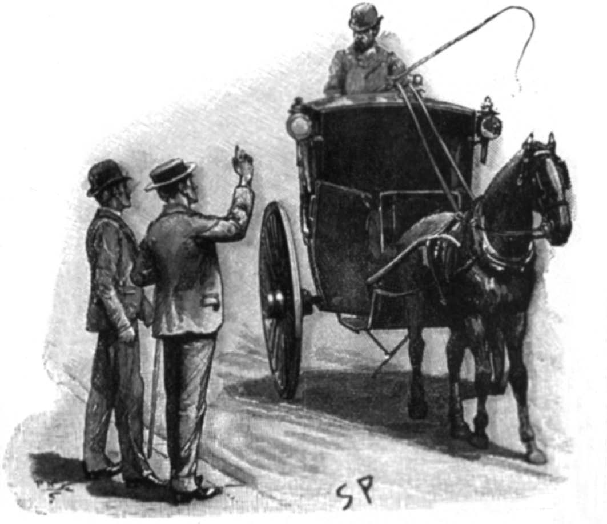

正好有一辆马车经过。

“到瓦林顿有多远？”他问。

“只有半英里，先生。”

“好吧，上车，华生，我们打铁趁热。事情简单，但还有一两个相关细节，不要轻易放过了。车夫，经过电报局停一下。”

福尔摩斯发掉一封简电，回到车上继续走路，把帽子压低盖到了鼻子，以免阳光射到脸上。车夫把马车停在了一栋房屋前，这房屋和刚才来的那栋十分相似。我的同伴叫车夫等着，他正要上前去叩门，门自己开了，一个穿黑色衣服、头戴光泽帽、表情严肃的年轻先生出现在门前台阶上。

“库辛小姐在家吗？”福尔摩斯问。

“萨拉·库辛小姐有病，很重，”这个人说，“昨天得的脑炎，很严重。我是她的医师顾问，我有责任，禁止别人拜访她，建议你十天以后再来吧。”他拉拉手套，把门带上，向街上径直而去。

“好吧，不能见就不见。”福尔摩斯笑呵呵地说。

“恐怕见了也说不上什么，或者不会跟你说什么。”

“我不指望她能告诉我多少，我只要看她一眼。我想，也没关系，我要的情况反正都已经有了。载我们到一家好一点的饭店吧，车夫。去吃顿午餐，吃完饭顺便去警察局找莱斯特雷德朋友。”

两人一起吃了顿便饭，十分满意。餐桌上福尔摩斯不谈别的，只谈小提琴。他兴致勃勃，头头是道，谈怎么给他买到了斯特拉迪瓦里<a href="#part0063.xhtml_ch5"
id="part0063.xhtml_ch5-back">(5)</a>的提琴，这把提琴起码值五百几尼，可他只花了五十五个先令在托特纳姆宫廷路的一个犹太掮客那里买到手。他又谈到了帕格尼尼<a href="#part0063.xhtml_ch6"
id="part0063.xhtml_ch6-back">(6)</a>。我们坐在那里喝了一瓶红葡萄酒，谈了一小时，他跟我谈这位大师的种种轶事。下午过去了，灼热的阳光已经缓和下来，变成晚霞，这时我们来到了警察局。莱斯特雷德在门口等着我们。

“有封给你的电报，福尔摩斯先生。”他说。

“哈！回电来了！”他接手就撕开，眼睛快速一扫，然后一揉塞进口袋。“完全符合。”他说。

“你查到什么了？”

“一切都已查明！”

“什么！”莱斯特雷德愣愣地望着他，“你在开玩笑。”

“我这辈子还没有这样严肃过呢。骇人听闻的一桩大案，我想已让我摸清全部底细。”

“罪犯是什么人？”

福尔摩斯随手拿一张名片，在背面写几个字，扔给莱斯特雷德。

“这是名字，”他说，“你最快最早也要到明天晚上才能将他捉拿归案。我建议你在处理本案的全部过程中，最好不要提我的名，因为对我而言，不过是想要挑战疑难案件，加以解决，如此而已，别无目的。来吧，华生。”我们一起快步奔向车站，留下莱斯特雷德站在那里，手持福尔摩斯扔给他的那张卡片睁大了眼瞧着，喜形于色。

“这个案子，”那天晚上我们在贝克街的家中衔着雪茄聊起来，歇洛克·福尔摩斯说道，“某些地方有点像你写过的两个案例故事，名叫《血字的研究》和《四签名》，调查研究的方法是从结局逆向推理，溯源起因。我已经写信给莱斯特雷德，要他提供我们现在还缺少的几方面细节，这也要等他将罪犯逮捕之后才能知道。他做这件事还算可靠。他虽然推理能力一点也不行，但是只要让他明白要做什么，他就像斗牛狗那么厉害。确实，就靠这点顽强劲儿，才让他在苏格兰警场身居高位。”

“这么说来，案情你还没有完全掌握？”我问他。

“基本已经掌握。我们知道这件罪恶勾当的作案人是谁，尽管被害人有一个还不清楚。当然，你已经得出你的结论了。”

“我推测是这个吉姆·布朗纳，利物浦轮船上的船员，你怀疑是他吗？”

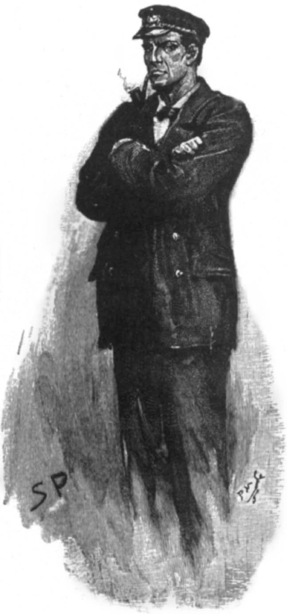

“我推测是这个吉姆·布朗纳。”

“噢，岂止是怀疑。”

“可是，也不过是一些模糊线索，此外并没有看出什么来。”

“刚好相反，我心里是再清楚也不过。让我跟你说一说几个主要的步骤过程。你记得，我们开始接触这个案件，心中白纸一张，完全没有头绪，这常常反而是有利的好事。我们没有先入为主的成见，完全单凭观察，从观察所得作出推论。我们首先见到的是什么？一位十分和善可敬的女士，她坦诚得似乎不会有秘密需要隐藏。还有照片，我看出她有两个妹妹。这让我心头马上一亮，这盒子可能原本是要寄给这两个中的哪一个。我先把这想法搁一边，否定也好，肯定也好，且不管它。然后我们去了花园，你记得，我们看了那个黄黄的小盒子，里面的作案物，耳朵。

“绳子的类型，是船上缝帆工人用的那一种绳。我马上想到和海上人员有关，该从这方面去调查。我再一看这个绳结是船员通常打的那种结绳法，包裹又是从一个港口寄出，那只男人耳朵也穿耳洞，这是船员的标志，陆上工作的人不大有穿耳朵的。我就锁定目标，这出悲剧的男演员得从航海圈子中去寻找。

“我再检查邮包地址，看到是寄给S．库辛。好了，老大姐，当然了，是库辛小姐，但是她的首字母S，也可以是另一名字的首字母，两人可以是一样的。这样的话，我们就得以从一个全新的起点上开始调查。我于是回到屋里，怀着这样的目的，想把问题好好问个清楚。我正要告诉库辛小姐，我认为邮包是寄错了。这时候你记得吗，我突然话到嘴边立即收住，原因是我看到了事实，让我惊讶不已。此时，我们调查的范围大大缩小。

“身为医疗人员，你很清楚的，华生，人的身体上没有一处像耳朵一样千差万别，每个人的耳朵是一把衡量尺度，明显地与他人不同。去年的《人类学杂志》，你可以找到两篇短文，出于鄙人之手，谈的是这个题目。所以，我检查了盒中的耳朵，我具有这方面专家的眼光，仔细一看，看到了解剖特点。我再进屋去观察库辛小姐，我看见她的耳朵，和我检查的那只女人耳朵简直一模一样，想象当时我那个惊讶、那个兴奋劲儿吧！这件事，绝非偶然，绝非巧合。耳廓都一样扁短，耳垂一样是宽弧度，耳廓软骨的旋卷形状也是一样，从总的特征来看，简直就是同一只耳朵。

“我当然立即看到这一发现意义重大。那是证据，证明被害人是她的血缘亲属，而且关系很近。我就和她谈她的家庭情况，你记得吧，她说了具体事实情况，很有意义。

“首先，她妹妹的名字叫萨拉，住的地址直到最近还是这同一个地址。所以，这邮包是寄给谁的，怎么发生的错误，就很明白了。接着我们听说和幺妹结婚的那个船员布朗纳，听说布朗纳一度和萨拉小姐关系密切，萨拉因此搬到利物浦，跟布朗纳夫妇一起住。但是后来发生争吵，就分开了。这一吵就吵散了好几个月，互不来往。正是这个原因，布朗纳万一要寄邮包给萨拉小姐的话，他只知道旧地址，一定仍按旧地址寄。

“好了，曲径通幽，事情开始明朗。我们原本知道这中间有一个船员，这个布朗纳，是性格很冲动的人，他性情激烈不易控制——你记得吧，为了和妻子在一起，他宁可丢弃很优越的工作不干——又沉溺于喝酒、酗酒。我们有理由相信是他的妻子被谋杀了，那个男人——推测下来，也是船上人——被一块儿谋杀了。忌妒，肯定是，妒火燃烧，酿成犯罪。杀人行为的证物为什么要寄给萨拉·库辛小姐呢？肯定是因为萨拉在利物浦住的那段时间，发生过什么事，同酿成这次凶杀悲剧有关。你知道，依照航线布朗纳的船要停靠贝尔法斯特、都柏林，还有沃特福德。这就可以推测，布朗纳作了案以后，时间紧急，立即要上‘五朔节’号，贝尔法斯特是停靠的第一个港口，所以就在这里把血包裹寄出。

“我想，分析到这一步，也还有第二种可能性，虽然这个可能性很小，但也要说一说，再继续往下分析。有一个失败的情敌，是这个情敌杀掉布朗纳夫妇，那只男人耳朵就是这个丈夫的。这样的推论有许多明显的漏洞，但也还是有值得可信之处，所以，我拍了份电报给利物浦警察局的朋友阿尔加，请他查一查布朗纳太太是否在家，以及，布朗纳是否上了‘五朔节’号船走了。这之后，我和你就去瓦林顿拜访萨拉小姐。

“我怀着好奇，首先要看看她的耳朵有没有家族特征，再另外就是她能够给我们一点重要资讯，不过要她提供资讯这一点，我并不乐观，不抱希望。她一定已经听说了昨天这件事，克罗伊登早已传得沸沸扬扬，而且只有她心里明白这只邮包真正是寄给谁的。如果她愿意维护司法正义，她早应该向警方说明了。然而，非要我们亲自上门去不可，我们就去了。结果发现，这只邮包事件爆发的那天——她发病也正是这一天——引发那么大的震动，导致她立刻得了脑炎。这就清楚说明，她知道这件事情的全部真相；也同样很清楚，我们指望她协助，可得要等上一段时间呢。

“但是，我们其实不指望她能有所帮助。我们要的答案在警察局里等着我们呢。我早就请阿尔加把答案发到警察局去了。结论再明确也没有，布朗纳太太家大门深锁已超过三天了，邻居认为她到南方拜访亲戚去了。轮船公司那边早已查出布朗纳搭‘五朔节’离港，我一算日子，这艘船应该在明晚驶进泰晤士河。布朗纳一到，叫他马上就遇到虽然迟钝但厉害的莱斯特雷德。我信心十足，一切案情必能真相大白。”

歇洛克·福尔摩斯的希望没有变成失望。两天以后，收到一只鼓鼓的信封，内有莱斯特雷德警探长的一封短信，一份好几张纸的打字文件。

“莱斯特雷德已经抓到凶手了，”福尔摩斯说，向我看一眼，“你听听他怎么说的，一定很有趣。”

亲爱的福尔摩斯先生：

按照既定方案来验证我们的推论。（福尔摩斯插话：“这个‘我们’用得很妙，华生，你能听出来吗？”）我昨日下午六时前往阿伯特码头，登上S．S．‘五朔节’号轮，该船属于利物浦、都柏林及伦敦邮轮公司。经查询，船上有一名船员系詹姆斯·布朗纳，因他这次旅程中行为异常、屡出差错，被船长勒令停止工作。我下到他的舱位，看见他坐在一个木箱上，双手捧住脑袋，身子摇晃不定。他高大结实，脸修得干净，皮肤很黑——颇像阿尔德里奇，那个洗黑财案中帮助过我们的人。他一听我是警察，腾一下跳了起来，我一吹警笛，在外面的两名水警立刻过来。不过他无意抗拒，乖乖伸出双手戴上手铐。我们将他带到单独的房间，连同他的箱子，企图搜出犯罪物证，但除了一把大尖刀外，别的一点也没找到，那种刀为大多数水手均有。然而，我们马上发现不需要我们搜集证据，因为将他押到警局一审讯，他便主动坦承罪行。于是立即由速记员按照他的招供加以记录，做了笔录。我们打字一式三份，现附上一份供阅。据供述证明本案案情正如本人一贯所见，甚为简单，但仍感谢阁下对本人的侦查鼎力相助，谨此致谢。

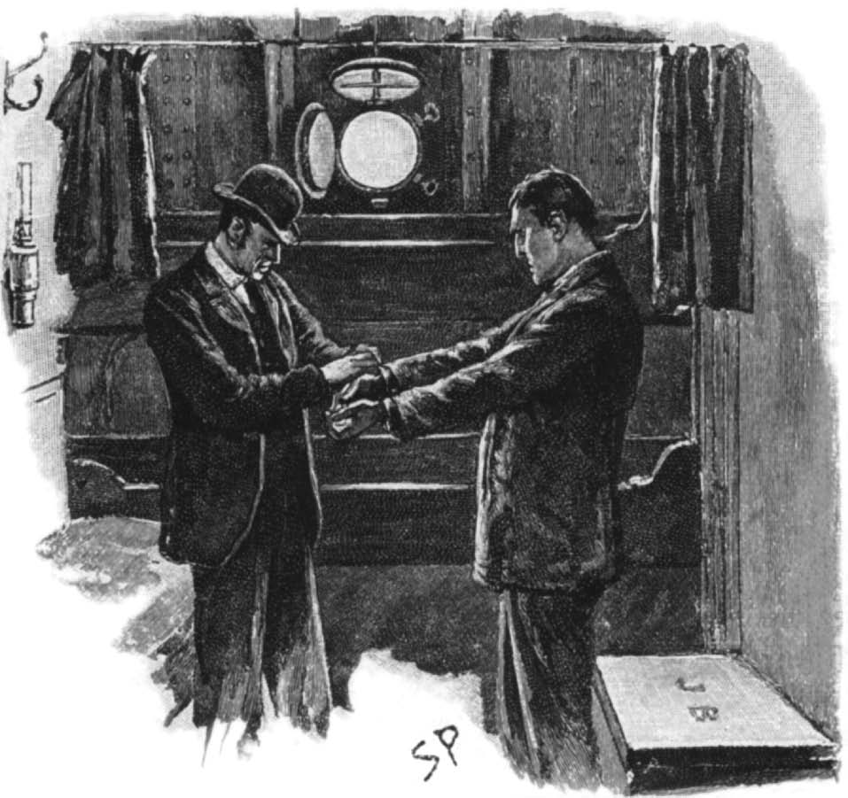

他乖乖伸出双手戴上手铐。

您忠诚的

G．莱斯特雷德

“哼！审问倒确实简单，”福尔摩斯说，“我清楚，他第一次邀请我们调查的时候，对案情何尝是这样想呢。好吧，我们来看看吉姆·布朗纳自己怎么说吧，这是他在谢德威尔警察局对蒙特戈默里警官所作的供词，是一份逐字的记录。”

\*　\*　\*

“‘我还有什么可说？是的，我有好多话要说。我要把心里的话统统说出来。你们可以绞死我，关死我，怎么都随便你们了。坦白说，做了这件事以后，我晚上睡觉都无法阖眼，也别想有安稳觉睡了，直到死的一天。我时不时看见他的脸，玛丽的脸更是经常出现在我的眼前。不是这张脸就是那张脸，阴魂缠住我，永远散不去。他皱着个脸，黑不溜丢，而玛丽老是一面孔的惊吓。嗨，小白羊羔，从前我对她始终是一张充满喜爱的脸，不曾动过火，突然变得杀气腾腾了，她一见怎么能不吓掉魂呢！

“‘可这都是萨拉的过错，一个毁了的男人诅咒她遭殃，让她的血坏死吧！这不是要洗刷我的罪恶。我知道，我回头又喝起了酒，就变得像头野兽。但是玛丽会原谅我，会扶持我，就像一根绳子紧紧拴住我这根木头不倒。如果这个女人不来破坏我的家庭。全是因为这个萨拉·库辛爱我——起祸的根源呀——她爱我，直到内心的深爱变成狠毒的仇恨。到头来她知道我的心爱全在自己妻子身上，我是连妻子走在地上的脚印也爱着呢，都要胜过萨拉整个的肉体和灵魂。

“‘她们三姐妹。老大是个大好人，这老二是个魔鬼，幺妹是个天使。萨拉三十三岁，玛丽我们结婚的时候是二十九岁。刚组成新家庭，说有多幸福就有多幸福，整个利物浦再没有别的女人比我的玛丽更好了。之后我们请萨拉来住上一个星期，一个星期变成了一个月，这样一步步下去，她也就成了一起生活的家里人。

“‘当时，我已经把酒戒了，我们积攒每一个小钱，就等于有大钱一样开心。我的上帝，谁想得到变成了这个样子？做梦也想不到呀！

“‘我一直是星期六回家，有时船要装货，我一次就可以在家里住上一个星期。这样，同她姐萨拉接触的机会更多了。萨拉高挑的身段，皮肤偏黑，手脚利落，性格急躁，昂着头瞧人，很傲，眼睛忽闪忽闪，像火石打出火花。小玛丽在旁边的时候，我一点都没在意萨拉。我发誓，但愿上帝可怜我吧！

“‘我感到，有时候萨拉喜欢和我单独在一起，常找理由要我和她一起出去散步。可我从来不曾有过别的想法，直到有一天晚上，我才眼睛擦亮看清楚了。我从船上下来，发现妻子不在家，只有萨拉一个人。“玛丽呢？”我问。“哦，她出去付账去了。”我有些心焦，在屋里走来走去。“五分钟不见玛丽就不高兴了，吉姆？”她说，“我这么不值吗！你和我待一会儿都不乐意。”“不是，不是，二姐。”我说，向她好意伸手，她马上双手紧紧握住，手心火一般的滚烫。我看着她的双眼，明白了。她不必开口讲，我也不用说。我皱着眉，把手抽回。她不说话，靠在我身边站了一会儿，接着就举起手来拍拍我肩。“稳得住你个老吉姆！”她讥讽我说，笑笑，跑出屋外去。

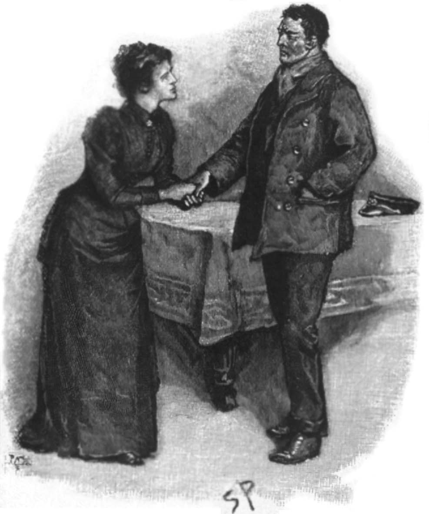

她手心火一般的滚烫。

“‘唉，从此以后，萨拉恨透了我，她这个女人也真是太会恨人。我是傻瓜，还让她跟我们住在一起——我糊里糊涂，太傻了——我对玛丽一个字也没提，因为我知道她会伤心。事情就这样，跟以前一样。但没多久，我发觉玛丽开始变了。她以前很相信我，心地极单纯，可现在她变得古怪起来，疑神疑鬼。我不在家就追问到哪里去了，去做什么了；我有信，就问是谁写来的，还搜我衣袋里有什么东西，尽是这种莫名其妙的事。她一天比一天怪僻，处处管着我，整天不得安宁。她无事生非，没完没了地跟我吵。我完全蒙在鼓里，不知道究竟怎么一回事。萨拉开始疏远我，和玛丽却是形影不离。我早就应该明白了，都是她从中搞鬼，搬弄是非，怂恿玛丽，撺掇我们夫妻失和。但我还是一直像个瞎子，到这时都一点没看出底细。然后我就开戒了，重又开始喝酒。但心里还是想玛丽能像以前那样待我，我就不喝酒。可她是真的讨厌我了，我们之间的隔阂越来越深。直到后来，这个亚力克·费拜恩一插进来，事情就一发不可收拾，彻底完蛋。

“‘他起先是上我家来看望萨拉的，但很快就专找我们两人来了。这个人有一套，很能讨人喜欢，他到哪儿都能交到朋友。他时髦、神气、得意洋洋，一头鬈发，很帅气。他跑遍了大半个世界，吹嘘起来海阔天空，样样亲眼见过。这个人确实讨人喜欢，我不否认。一个船员，能有那样的气派风度，我想他一定是蹲船楼上的，不是跑甲板的。他来我家进进出出一个月，我胸中一点戒心都不曾有，他可是不怀好意，欺骗我，暗地里做对不起我的事。到后来，有事叫我起了疑心，从这天起，我便永远也不再安宁。

“‘说起来也是小事，我无意间走进客厅，刚到门口，看见妻子春风满面前来相迎。可是她一见是我，面孔立刻拉了下来，一副失望的样子，马上转过身不理，走开。这就够了。她听到脚步声，肯定误认是亚力克·费拜恩来了，才会是那样子。要是当时让我撞上费拜恩，我非宰了他不可。我要么不发火，一发起火来就像发疯。玛丽看出我眼中冒着邪火了，跑上来扯住我衣袖，“别这样，吉姆！别这样！”她说。“萨拉呢？”我问。“在厨房里。”她回答。“萨拉，”我叫着走进厨房，“这个人，费拜恩，永远不许他再踏进我家门。”“怎么了？”萨拉问。“我说不许就不许。”“哦！”她说，“我的朋友不配进门，那我也不待在这屋里了。”“随你高兴，”我说，“只要费拜恩再敢来露脸，我就割下他耳朵送你作纪念。”她被我的脸色吓坏了，我想。她一句话没答，当天晚上就离开我家。

“‘哦，我现在也不知道，是否全是这个女人的妖术魔法，是她怂恿我妻子乱来，让我跟妻子闹翻。就这样，她到离我家两条街远的地方找了房子，同时也租给水手寄宿。费拜恩常去那儿，玛丽也常同她姐姐和费拜恩喝茶。她去得有多勤，我不知道，但是有一天，我尾随她，冲进门去，费拜恩就从后花园翻墙跑了，像只臭鼬似的溜掉。我向妻子发誓，要是让我撞见她和这男人在一起，非杀了她不可，之后就拽着她回家。她哭哭啼啼，浑身发抖，脸色像纸一般白。我们之间再也没有一点感情，只能看着她恨我，又怕我。我一想到这些，就喝酒。她也就更厌恶、嫌弃我。

“‘哦，萨拉看到在利物浦住不下去，她就离开，据我知道，回到了克罗伊顿同她姐姐一起住。可是家里的情况还是越来越糟糕，到了上星期，最终惨祸临头，完了。

“‘事情是这样的。我们上‘五朔节’号出航，航期七天。可是一个大桶忽然松掉，把船壳板撞翘了，所以只好返航回港修理，停留十二个小时。我离船回家，心想妻子一定会大吃一惊，希望她看我这么早回家，会很高兴。在回家的路上脑子里就转着这些念头。正在这时候，一辆马车从身旁经过，车上居然是她，居然是她和费拜恩并坐在一起，两人又说又笑。我站在人行道上看着他们，他们全然不知正好让我撞见。

“‘我跟你们说，说句坦白话，这时候我控制不住自己了，现在回想起来还像昏昏沉沉是做噩梦。前一晚喝酒喝得很晚，这两件事一起涌上脑门。现在脑子里还在咚咚敲着什么似的，像是甲板上铁锤在砸。那天上午，两耳只听得见像是尼亚加拉大瀑布在轰鸣。

“‘哦，我随后跟上去，在马车后面奔跑，手里拿着根沉重的橡木手杖。跟你们说，我一开始就两眼看出来都红了。腿脚一跑开，这时想到该机警一点，别靠太近，保持一段距离，能看得见就行，绝对不能让他们发现我。马车到了火车站，售票处人群拥挤，我可以靠他们近一点又不被发现。他们买了新布赖顿的票，我也买了。可是我在他们后面第三节车厢上车。到了目的地，他们沿着散步广场走，我跟在后面保持一百码远。最后，看见他们租了一条船去划船，因为天气炎热，他们当然想在水上消暑。

“‘这倒好像他们是非得落在我手里不可似的。天上起迷雾，几百码远就看不清。我也租一条船，跟住他们，看得见他们的船影。他们划得没我快，可也不慢。等我赶上去，已经离岸足足有一英里远。迷雾像块幕布遮在四周，围住我们三个人。上帝呀，我怎么也忘不了，他们看见了追上来的船里是什么人，这时候，他们那个脸色呀！玛丽尖叫起来，费拜恩像疯了一样咒骂，拿起桨来戳我。他一定从我的眼睛里看出了杀气。我闪开了他的桨，用手杖对准他的脑袋就砸，这就像敲碎一个鸡蛋。我本想可以饶了玛丽，尽管我已疯狂，可是她扑上去，两手抱住他，哭喊他“亚力克”，我就也给她一棍。玛丽手脚一摊，倒在了费拜恩旁边。我这时变成了一只疯狂嗜血的野兽。要是萨拉也在的话，上帝作证，她就和他们一起，也凑上一个。我抽出刀来，就——啊，算了！我说得够了。我一想到，萨拉搞鬼捣乱结果，她要是收到这样的东西，我就有一种野人的狂喜。接着我把两具尸体捆在船里，凿穿一块底板，看着连船带人一起沉没。我很清楚，船老板一定以为他们在雾中迷失方向，划出海去了。我把自己浑身上下整理整理，立即上岸，再登船。刚才做的事，不露声色，没有引起一点怀疑。当夜我准备好了邮包，寄给萨拉·库辛，第二天从贝尔法斯特寄出。

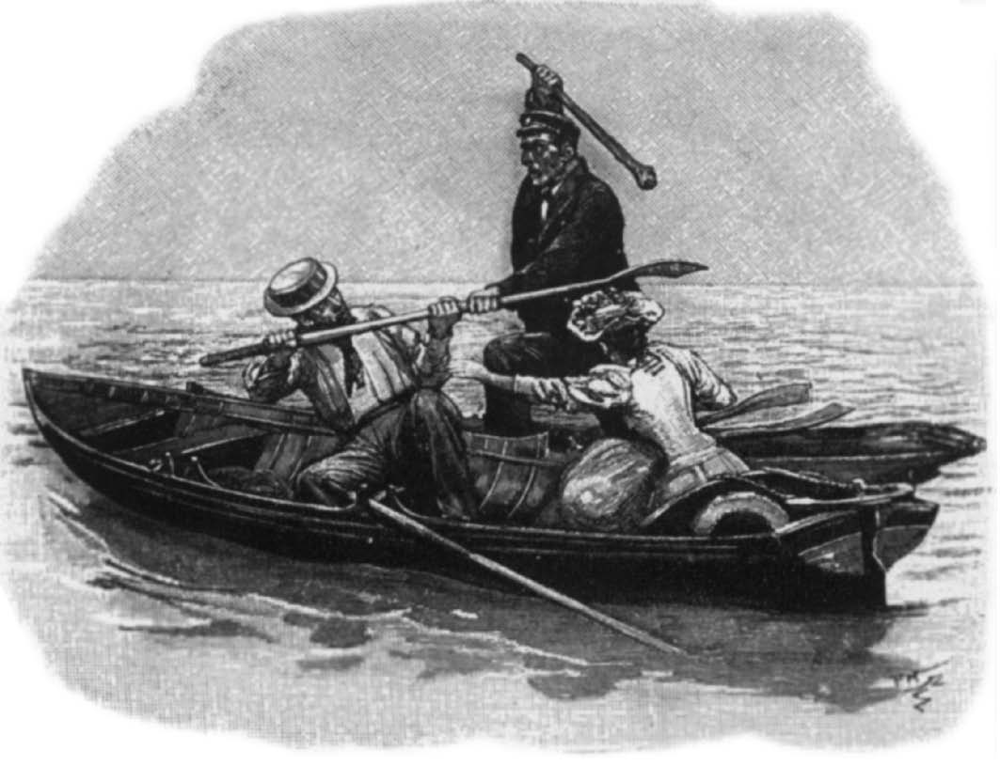

用手杖对准他的脑袋就砸。

“‘就这样，全部事实，你们都知道了。你们可以绞死我，随你们怎么处置都行，无所谓。因为，我已经受到了惩罚，那样的惩罚你们是不可能再让我经历一遍。我闭不上眼睛，我一直看到那两张脸在望着我——瞪着我，我的船划出迷雾，冲上去，他们发现了，那样地瞪着我。我把他们打死，干脆痛快。可是，他们现在正慢慢折磨着我，在杀死我。再叫我过那么一夜，天没亮我不是疯掉，也是死掉。你们不会把我关在单人牢房吧，先生？可怜可怜我，别这样。你们现在怎么对待我，但愿你们来日痛苦的时候别人也会怎样对待你们。’

“这有什么意义呢，华生？”福尔摩斯严肃地问道，把纸放下，“这痛苦，这暴力，这恐惧，这么一连串下来，究竟达到了什么目的呢？必定要达到某种有意义的结果，否则我们的宇宙就是由无目的的偶然所支配，那是不可思议的。但是，什么意义呢？这是个博大精深经年不止的问题，为人类理性所一直无法回答。”

（1893年）

————————————————————

<a href="#part0063.xhtml_ch1-back" id="part0063.xhtml_ch1">(1)</a> 戈登将军（General
Gordon，即Charles George
Gordon，1833—1885），英国殖民军官，号称“中国戈登”，组建英法联军攻入北京（1860），协助清朝政府镇压太平天国。战死于苏丹。

<a href="#part0063.xhtml_ch2-back" id="part0063.xhtml_ch2">(2)</a> 亨利·沃德·比彻（Henry
Ward
Beecher，1813—1887），美国基督教公理会自由派牧师，废奴运动领袖，主张妇女参政。

<a href="#part0063.xhtml_ch3-back" id="part0063.xhtml_ch3">(3)</a> 贝尔法斯特（Belfast），英国北爱尔兰东部港口城市，北爱尔兰首府。

<a href="#part0063.xhtml_ch4-back" id="part0063.xhtml_ch4">(4)</a> 五朔节（May
Day），每年5月1日，欧洲庆祝春天的节日。

<a href="#part0063.xhtml_ch5-back" id="part0063.xhtml_ch5">(5)</a> 斯特拉迪瓦里（Stradivari，Antonio，1694—1737），意大利提琴制造家，其制作法成为后世楷模。

<a href="#part0063.xhtml_ch6-back" id="part0063.xhtml_ch6">(6)</a> 帕格尼尼（Paganini，Niccolo，1782—1840），意大利小提琴家、作曲家，作有《随想曲》24首及《女巫舞曲》小提琴协奏曲、吉他曲等。

# 黄面人

［这些短篇文字予以出版，都是根据众多案子写成，犹如是一些怪诞戏剧，我同伴在侦破中表现出特异才能吸引我们成为观众，最后也成为演员参演其中，这就势必让我热衷于写他所获成功，不写他偶遇失败。这倒并非是要为他顾全好名声——应当说，只有在他迫于背水一战之际，才是他精力才智真正达到顶峰之时——实在因为凡他遭遇失败之事，别人也未必能获得成功，而我若写这种故事也就永远不知结局。然而情况往往是，即使他侦查中犯错、有失误，最终案情仍然得以真相大白、圆满解决。这类例子我所做纪录有五六个之多，其中有两件最有特色、最有趣味，一件是马斯格雷夫家族仪规案，还有就是现在这一件，我正要落笔讲述。］

歇洛克·福尔摩斯这个人，很少为运动而运动，为锻炼而锻炼。可是能与他膂力较量者，鲜有人在。他也是一个同一重量级的最佳拳击手，以我所见绝对如此。平时，他把体力无谓消耗看作是白白浪费体能。他不会陷于无事忙，一动一静都只服务于成事之目的。他精力无限充沛，永不知疲倦。这归功于他养生有道。他日常饮食极其简单，生活之朴素几近节衣缩食。偶尔用用可卡因，此外毫无恶习。之所以用此物，也仅仅出于一时无案可查，报纸又枯燥无味，才聊以消解单调愁闷而已。

早春时节有一天，他精神大为放松，居然与我一起到公园去散步。公园里榆树嫩芽初生，乳绿晕染，栗树梢头粘尖绽放出片片五瓣新叶。我们乘兴而游，两人本是肺腑相知，此时寡言相宜，默默无语游逛两个小时，等回转贝克街，已快五点钟。

“真不巧，先生，”家童开门，说道，“刚才有一位先生来找您。”

福尔摩斯含有怨意看我一眼。“都怪下午散步！”他说，“那位先生来过又走掉是吗？”

“正是，先生。”

“你没请他进来？”

“我请他进屋过，先生。”

“他等我多长时间？”

“半个小时，先生。我看他心急坐不定，在屋里走来走去走不停，还跺脚。我到门外等候先生，听见他这样着急。最后他来到外廊，喊说，‘这人是不是永远回不来啦？’这是他原话，是他那么说，先生。‘请您再稍等一等，’我说。‘那我去外面等，我闷得受不了，’他说，‘过会儿再来。’他这么说走就走，我说什么也留不住他。”

“好，好，我知道，你做得不错，”福尔摩斯说，我们走进屋内，“真叫人来气，华生，我多么需要有案子上手。这个，你看，这个人那样等不及，说不定事情很重要。啊哈！桌上烟斗，你不是这个烟斗，肯定是他掉在这儿忘记拿走。欧石南好烟斗，旧是旧，长柄，烟店都叫是琥珀柄。我怀疑，伦敦哪来那么多真货琥珀烟嘴？有人见搁个苍蝇在里边就当真不会假。我说，这个烟斗，此人可是看得很珍贵，一定是他心烦意乱才会遗忘在这里。”

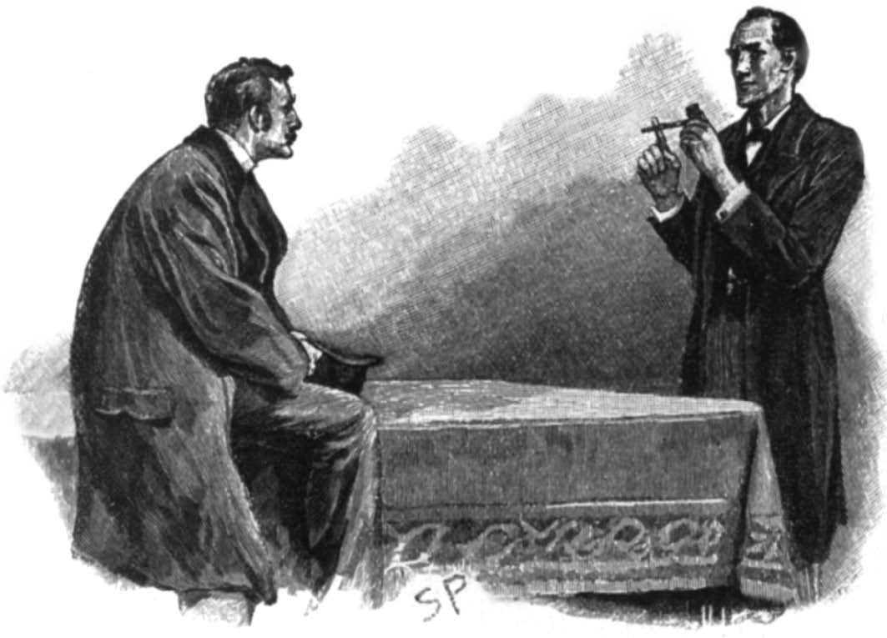

“啊哈！桌上烟斗。”

“怎么说他很珍贵呢？”

“噢，我看这烟斗原价也就七先令六便士。现在这个，你看，已经修补过两次，一次是修木柄，一次是补琥珀。两次修补，你看见吗，都是用银料，所花价格不菲，要高于本身原价。可见得他必定十分珍惜这个烟斗，否则花钱修修补补还不如买一个新烟斗。”

“还看出其他有什么？”我问，因为烟斗在福尔摩斯手里专注地翻来覆去地审视，这种专注仅为他所特有。

他拿着烟斗，伸出细长手指弹一弹，像是一个生物教授在讲骨骼课那个模样。

“烟斗这东西，有时候特别有讲究，”他说，“最看得出个性，还有表、鞋带也是。不过这一个上面，不很明显，没有重要迹象。看起来，这个人身强力壮，左撇子，一口牙齿很健全，粗枝大叶，不需要厉行节约。”

我朋友信口说出这些分析，然而看得出他那眼神正在注视我是不是理解他如许推论。

“你认为一个人买得起七先令一个烟斗，家境一定富裕？”我说。

“这是格罗夫纳混合烟，八便士一盎司，”福尔摩斯回答说，磕出一点儿烟末在手掌上，“只要这个价格一半钱，就足够他抽上品好烟，所以他无需厉行节约。”

“其他方面呢？”

“他习惯在灯火上、煤气灯上点烟斗。你看见吧，锅袋圈这一边都烤焦了呢，用火柴绝不会有这个现象，谁会拿火柴来点这边沿呢？只要在灯火上点，锅袋边非烤焦不可。而且都是这锅袋右边，从这点我判定他是个左撇子。你拿你烟斗往灯上试试，你习惯用右手，必然是左边沿靠上火苗。你有时也换个手使，但不是经常性，他却是一直如此。再有，他把琥珀都咬碎咬掉，一个必须有力量、身强力壮，另一个必须有一副好牙齿，才会把烟斗咬成这样。要是我没弄错，听楼梯，是他重新光临，那我们就有问题可以研究啦，肯定要比这烟斗大为有趣。”

一会儿房门被打开，一个高个头年轻人走进来。他身穿深灰色正装，素净但颇考究，手里拿着一顶褐色宽檐毡帽。我估算他大约三十岁，但实际上还要稍大几岁。

“对不起，”他有点尴尬地说，“我刚才应当敲敲门，应当先敲门，才对。实在是我心头很乱，还请多加包涵。”他举手摸着额头，像是有点头晕，然后身子一倒，倒向椅子上落座。

“看样子，你有一两天没睡觉，”福尔摩斯和颜悦色地说，“这比过度工作，甚至无度行乐，都要伤神。请问我能帮你什么忙呢？”

“我是来请教先生，我不知怎么办，我整个生活都简直已经崩溃、乱套。”

“你是不是想要我给你当顾问侦探？”

“不单单是这样，我要听取你给我宝贵意见，你有智慧，能明断——世事见多识广，是位大能人，请赐教我下一步该怎么办。我要感谢上帝遴选你来帮助我。”

他说话微弱、急促、颤抖，心情难以自禁，迫不及待要讲，但看他说个话都是件痛苦事，他在竭力用意志控制自己。

“事情不说不行，但开口也难，”他说，“一般人都不愿意向外人道家事。尤其是妻子行为这种问题，到两位素不相识的先生面前来谈论，实在是丢尽颜面。被逼无奈，不得不如此，走投无路，不得不来讨教。”

“我说，格兰特·芒罗先生——”福尔摩斯突然称呼道。

客人从椅子上跳起来。“什么！”他叫道，“你晓得我名字？”

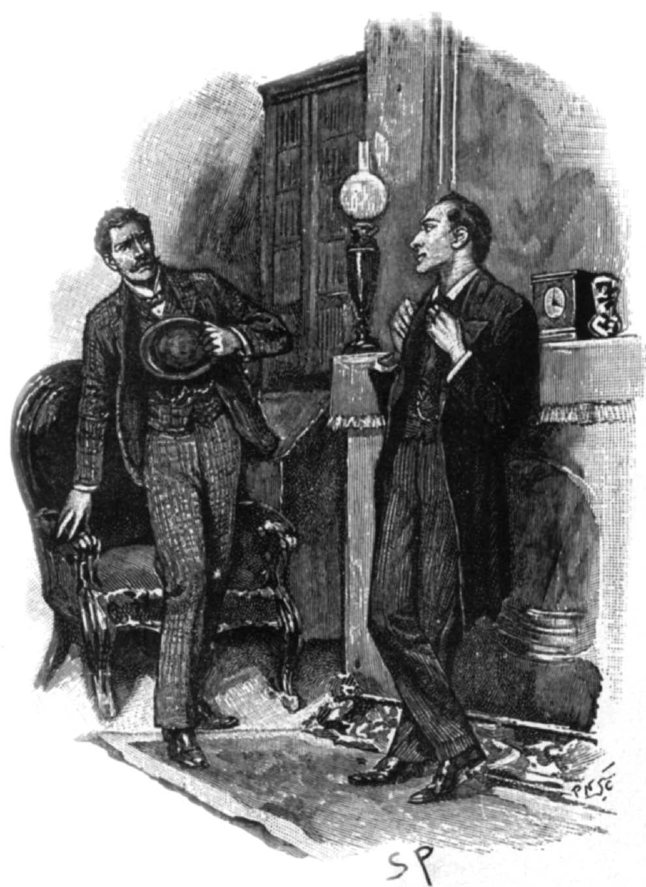

“什么！你晓得我名字？”

“要是你希望保密自己姓名、身份，”福尔摩斯微笑道，“我建议你帽子里不要具上本人姓名，或者注意只把帽子顶面对着谈话人。我应当告诉你，我朋友和我一起在这间屋子里听过许多外人坦陈过许多隐私秘密，我们有幸给许多烦恼心灵带来过安宁和好运。我确信，我们对你也一定能同样做到。我诚恳要求，时间恐怕紧迫，你把事情毫无保留地谈一谈，不再迟疑，好不好？”

来客又举手抚摸额头，好像颇感头痛。从他举止神情来看，他一贯少言寡语，内向自持，天性骄矜，内心有苦楚创伤宁可自己深藏，不愿向外暴露。然而忽地一下，他手握拳猛一甩，将顾虑抛却，立意开始陈述：

“事情是这样，福尔摩斯先生，”他说道，“我已经结婚，结婚已有三年。三年来我们夫妻相亲相爱，生活甜甜蜜蜜，同所有正常人家一样，是一对和睦好夫妻。我们没有一点不和，言语、行动，连想法都从来没有不一样。可现在，从上星期一开始，我们之间忽然产生隔阂。我发现她思想行为一反常态，让我无法理解，居然跟陌路相逢一样，我们心灵已经疏远。我要知道为什么。

“有一件事要先说一说，福尔摩斯先生。艾菲爱着我，这一点不要有任何误会，她是一心一意地爱着我，现在比以前更爱我，这我知道，我感觉得到。我不是要来谈论这个事。一个男人，女人在爱他，他完全明白。但是我们之间有秘密，秘密不搞清楚，就永远合不拢。”

“请让我听你讲事实，芒罗先生。”福尔摩斯说，有点不耐烦。

“艾菲她从前，把我所知给你讲一讲。我初次见她，她就已经丧偶，年纪还很轻——才二十五岁。那时候她叫希布龙夫人。她小时候就随家去美国，生活在亚特兰大城，在那边后来嫁给希布龙。丈夫是个律师，业务很兴旺。他们有一个孩子，可是那地方发生黄热病，孩子和丈夫都染上这场病死去。她有丈夫死亡证，我见过。从此她对美国产生恶感，就回国来，和姑母一起住在米德尔塞克斯平纳尔，她姑母没结过婚。有一点要提一提，她丈夫留给她遗产，一笔款子不小，大约四千五百英镑。丈夫生前投资，获利很好，平均年利七厘。我遇见她那时候，她来平纳尔才六个月。我们一见倾心，几星期后便就结婚。

“我自己经营蛇麻业，每年收入有七八百英镑。我们日子很宽裕，在诺伯里租下一幢舒适小别墅，年租金八十英镑。我们那个小地方离城虽然很近，可是乡村风味十足。离我们不远，有一家小旅馆和两幢住宅。我家前面是田野，田野那边单独有一幢别墅小楼。除此以外，再没有其他房屋，要向车站跑上一半路才能看见有房子。我做生意有季节性，我逢一定季节进城。夏天业务不忙，很少进城。我们在乡下小家里，夫妻两个过得要多快乐有多快乐。说实在，我们之间连一点疙瘩影子都从来没有过。谁知竟会出现这件倒霉事。

“有件事要先给你讲一讲，然后再往下说。结婚当时，妻子把她自己财产全部转到我名下——我原是不太同意，因为我想到，万一我生意不好，那就保不住有危险，可是她坚持要这样做，也就只好照办。好，大概六个星期以前，她找我要钱。

“‘杰克，’她说，‘当初你接受我这笔钱，有言在先，你说我什么时候要用就什么时候问你拿。’

“‘当然，’我说，‘这钱本来就是归你自己所有嘛。’

“‘这样，’她说，‘我要一百镑。’

“我听后一愣，原来，我只以为她也就是要点钱买件新衣服什么吧。

“‘那么多做什么用啊？’我问。

“‘哦，’她说，像是开玩笑，‘你说过，你不过是我一家银行，银行从来不问人家取钱做什么用，没这规矩吧。’

“‘你当真要，没问题，这钱给你。’我说。

“‘哦，是呀，我是真要。’

“‘你不肯告诉我什么用途吗？’

“‘以后再说吧，现在不告诉你，杰克。’

“我也就只好同意。从来没有过，这是第一回，我们之间开始存有隐情。我开一张支票给她，这事就这样，没再去想它。同以后发生那种事也没什么关系，我只是想还是提一提比较好。

“好，我刚才跟你说过，离我们家不远有一幢小别墅，和我家只隔一片地，可是你要到那里，就得走大路，再绕小巷。小别墅那边，有一片苏格兰枞树小园林，我常喜欢到那里去散步；有树木有树林，总是人见人爱。八个月来，这小别墅一直没人住，真可惜。两层楼房，很漂亮，有一条游廊古色古香，周围都是金银花。我好多次站在那儿想，要能住这里头该有多美好。

“好，现在要说，是上星期一傍晚，我朝那边逛过去，遇到一辆篷车从小巷出来，看见游廊旁边那草地上，堆着好些地毯，还有其他家用物件。很清楚，小别墅已经出租。我走过去，停下来，无事闲逛看看屋子，一边在想，不知是什么人要来住这里做我们近邻。我正看着，忽然发觉楼上一扇窗里有一张脸也在向我望。

“我说不清这张脸怎么一回事，福尔摩斯先生，可是我一见，只觉得脊梁骨上一阵寒气上来。我离那窗有一点距离，所以看不太清那脸相，但是可以肯定，这脸极不自然，绝不是常人相貌。给我就是这么个印象。我赶快跑向前去，靠近一点，这个人正在看我，我也好看看清楚。可是，等我过去，那脸就忽然不见，如此突然，像是给人一把拽回到屋子暗里去似的。我站着足有五分钟，心里思忖着这个事，从各方面分析这个印象。可是这张脸是男是女都没搞清楚，毕竟距离我太远。但就是那脸色，印象要算最深：发青，发灰，发白，是土色，而且僵硬，死板得吓人。我满肚子疑问，决心要看看小别墅这家新住户是什么人。我上前去敲门，门忽地打开，是一个高个头精瘦女人，面孔铁板，令人生畏。

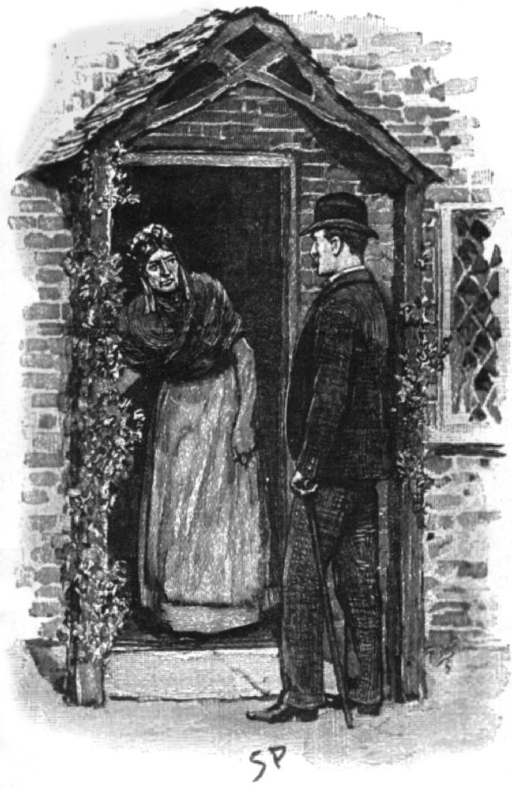

门忽地打开，是一个高个头精瘦女人。

“‘你干吗？’她问我，是北方口音。

“‘我是你们邻居，就住那个屋子，’我说，向着自己那边房子点点头，‘看见你们才搬来，我想是不是要帮个手做点什么——’

“‘好呀，我什么时间用得着什么时间请你。’她说完，迎面把门一关。我碰一鼻子灰，自讨没趣，便转身回家。整个晚上，我尽管强迫自己往别处想，可心里总是摆脱不了那张窗口鬼脸、那个闭门鬼婆。我决定不对我妻子讲这桩怪事。她女人家，胆小，容易紧张，我有这种不好印象，不必叫她也要跟我一起多事。我只在临睡前跟她提起小别墅已经有人来住。对我这么说，她没接话。

“我平常睡觉睡得很熟，家里人总笑我睡得死，夜里闹不醒我。可就是这一夜不一样，不知因为我碰到点小事引起点兴奋，还是因为其他什么缘故，反正不如平时睡得沉。我半睡半醒中迷迷糊糊觉得房间里有响动，慢慢意识到是妻子已经穿好衣服，还披上斗篷，戴上帽子。我如同梦呓嘟哝着这么晚有什么事真莫明其妙。我眯眼一看，看见她，蜡烛光下那张脸，令我吃惊得不敢出声。看她表情，我以前从来不曾见过——她要做也做不出如此脸相。她脸色死灰，呼吸急促，紧张地朝床这边看，一边手系斗篷，一边看有没有惊醒我。看看，以为我还熟睡着，便轻轻溜出房门。一会儿听见吱嘎一声，很刺耳，是前门铰链响。我从床上坐起来，指关节敲敲床沿硬杆，确定我清醒着，不是睡梦里。我拿出枕头底下怀表来看，是凌晨三点。我妻子在半夜三点外出走到乡间路上，到底要做什么呀？

“我坐起二十来分钟，脑子里翻腾不停，一个劲想可能是什么原因，可是我越想越觉得不可思议。正当疑惑不解这时候，听得门轻轻关上，接着，是她脚步在上楼梯。

“‘你刚才到哪里去来着，艾菲？’她进房来，我问。

“她听我这一问，吓一大跳，惊叫一声。这一惊叫比其他什么事都更令我感到不安，说明有内情见不得人。我妻子一个妇道人家，一向忠诚坦白，现在眼见她居然进自己房要偷偷摸摸，自己丈夫对她说话吓得要尖叫起来，怕成这个样子，怎么不让我寒心！

“‘你醒着，杰克！’她惊慌地说，又强做笑容，‘那，那我没把你吵醒吧。’

“‘你刚才到哪里去？’我问她，很严厉。

“‘也难怪你觉得惊奇。’她说。我看她解斗篷，手指在发抖。‘啊，也是，以前我从来没有这样。实在是，我感到气闷不好过，要呼吸新鲜空气。感觉好像，再不到屋子外面我真要昏厥过去。我在门外站上几分钟，现在就感觉好过不少。’

“她用这一番话向我解释，始终没有抬头看我一眼，声音也变得同平时大不一样，我完全明白她是在扯谎。我没有理她，把脸背过去朝墙，很是伤心，满肚子忧愁、怀疑、猜忌、怨恨。妻子到底隐瞒我什么呢？溜出去是做什么呢？我感到不搞个水落石出心里不安宁。可是妻子对我做过一次假，我就不想再问她第二次。那天夜里我一直翻来覆去，脑子翻江倒海，左猜右猜，只是越猜越糊涂。

“第二天我本来要进城，但是没去，脑子太乱，哪有心思做生意。妻子好像也同我一样在七上八下，她老偷眼看我，眼光充满疑问。我看得出她知道我不相信她那些个话，看得出她也惶恐不知如何是好。早饭时间我们几乎一句话也没说。吃好饭我马上出去散步，以便在早晨新鲜空气中想想这件事。

“我一直跑到水晶宫<a href="#part0064.xhtml_ch1"
id="part0064.xhtml_ch1-back">(1)</a>，在里边待了一个小时，回到诺伯里已有一点钟，不知不觉路过小别墅。我停一下望望窗户，不知是否还能见一见那张怪脸，昨天在那儿直瞧我。我正站那儿，怎么也想不到，福尔摩斯先生，门忽然打开，是我妻子打门里出来。

“看见是她，我惊呆在那里不动啦。可是我们目光一相遇，她比我更意外，脸上大惊失色。她像是一时想要缩回屋子里去，可是看到已经来不及，躲也躲不掉，便走上前来，脸刷白，两眼目光惊恐，嘴角再强做微笑都无法掩饰内心慌乱。

“‘哦，杰克，’她说，‘我是来看看要不要给新邻居帮个手。你为什么这么看我？你不会生我气吧？’

“‘原来这样，’我说，‘夜里你是到这里来。’

“‘你这话什么意思？’她大声说。

“‘你是到这里来，我肯定你是来这里，这都是些什么人，你要那个时间来看他们？’

“‘这以前我没来过。’

“‘你现在怎么对我尽是谎话？’我向她吼着，‘你说话腔调都走样。我什么时候有事瞒过你？我要进屋子去，看个究竟，探它个彻底。’

“‘哦不，不，杰克，看在上帝分上！’她气急、紧张，简直不能自制。我朝着门冲上去，她抓住我衣袖使足力气把我往回拉。

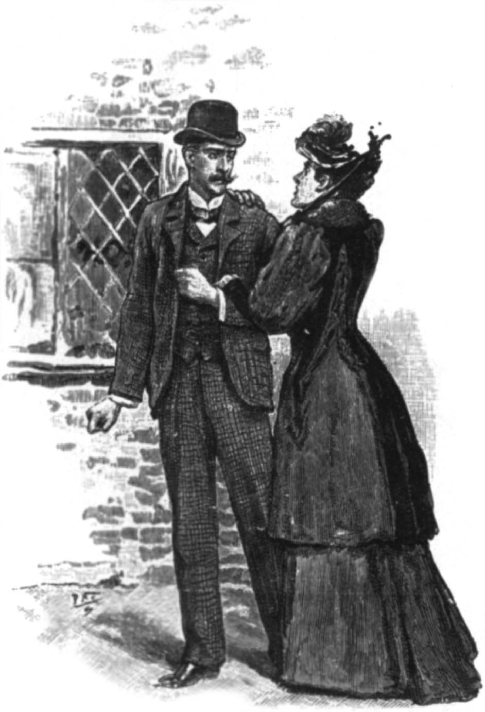

她抓住我衣袖使足力气把我往回拉。

“‘我求求你别这样，杰克，’她叫着，‘我发誓，改天我把一切都告诉你，可你现在进屋要出大事。’我想把她甩掉，她拼命拽住我，发疯似的哀告、恳求。

“‘相信我，杰克！’她喊着，‘就相信我这一次，绝不会、绝不让你上当后悔。你该知道，不是为你好，我绝不会有事瞒你。你不听我，我们整个家都毁在这里。你跟我一起回家，就一点事也不会有。你要是不听劝，进屋子，你我都要完。’

“她这话说得那么恳切、那么绝望，这番话语、这种态度，把我抓住，使我站在门前犹豫不决。

“‘要我相信你，有一个条件，也就一个条件，’我最后说，‘那就是，这出戏到此为止，从此结束。你有秘密要保留，尽管听便，不过你必须答应我，不许晚上出来看人，不许再瞒过我做什么事。我愿意把以前都一笔勾销，只要你答应今后不再，就行。’

“‘我知道你会相信我，’她松掉一口气，高声说，‘你这愿望，一定办得到。我们走吧——哦，离开这儿回家吧。’

“她还是拽住我袖子拉我离开小别墅。我们走，我回头朝后看看，那张灰黄脸正在窗上向我们望。我妻子同这个怪物之间难道会有什么名堂？或者，那个泼妇人，昨天和我见过面，是否同她有关系？真是一个怪谜。我知道，我不解开这个谜，心情永远平静不下来。

“这之后，我在家待着两天。我妻子恪守我们那个口头约定。就我所知，她未出家门一步。可是，第三天，我有充分证据证明，不管那天信誓旦旦，还是无用，她未能摆脱那个秘密吸引力，要被拉走，要脱离自己丈夫，丢弃妻子责任。

“那天我进城，回家是乘两点四十分那班火车，以往回家一直是乘三点三十六分火车。我一踏进家门，女仆满脸惊慌跑向客厅。

“‘太太在哪里？’我问。

“‘我想，在外面散步吧。’她回答说。

“我又是一团疑云塞住心窝。我冲上楼，看看，她果然没在家。我无意间向窗外一望，女仆刚才还跟我招呼说话，这时却见她穿越田野正往小别墅那边奔过去。当然我一下子全明白又是怎么回事，我妻子又还是去到那边。她肯定关照女仆，万一我回来，赶快告诉她。我怒火上升，心头绞痛。我跑下楼，冲出屋追过去，下定决心一劳永逸了断这事。我看见妻子同女仆正从巷道奔回来，可我没停步理她们，是那小别墅里藏有秘密，才使我家生活蒙上阴影，我发誓，不管遇上什么，今天非揭开它底细不可。到屋前我门也不敲，扭门一推闯进门道。

“楼底寂静无声，厨房里一壶水已煮开，沸滚得咝咝响，一只大黑猫蜷缩在篮筐里，可那个女人，那天看见，现在可是没有踪影。我跑进另一间屋子，无人。我冲上楼去，也就是两间空房，楼面上不见有人。整幢小楼空无一人，家具陈设、墙上镜框都十分平常、粗陋，只是那间房有所不同，就是我看见窗上那张怪脸这一间，还算舒适，有点讲究。可是我立即感到怒火中烧，气不打一处来，我看到壁炉台上立放着一张我妻子全身照，正是这一张，三个月以前，是我亲自给她拍摄。

“我待在那里好一会儿，屋里确实没人，于是才离开，心头那个沉重，感到从来未有过。回到家，妻子来到厅里，我是实在气伤心，便不睬她，从她身旁擦过，径自走进书房。可是还没来得及关门，她已紧跟进来。

“‘真是很抱歉，没能遵守诺言，杰克，’她说，‘不过，你只要知道全部情况，相信你一定会原谅我。’

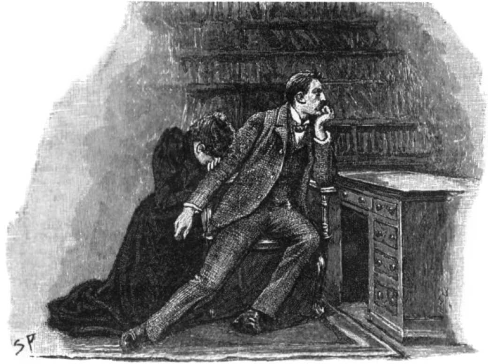

“真是很抱歉，没能遵守诺言。”

“‘那就把事情都告诉我。’我说。

“‘还不能，不能，杰克。’她说。

“‘告诉我住在那别墅里，到底是什么人，你都能送上照片给人家。你不说个原由，就别指望我们之间还会有信任。’我说完，马上丢下她，便离家出走。这是昨天，福尔摩斯先生，到现在都没曾见过她面。这个奇怪事也就没法进一步了解。我们夫妻之间这是第一次产生阴影，叫我六神无主，不知怎么解决才好。今天早晨忽然想到你，你一定能帮我拿主意，所以特地赶到你这里来，我现在一切都拜托你了。要是还有什么地方我没有讲清楚，请尽管问我。不过，最要紧一点，赶快教我怎么办才好，这个痛苦我实在受不了。”

福尔摩斯和我听取这篇陈述，很是意外，因而兴趣特浓。陈述是在情绪极度激动紧张之下所作，难免凌乱错落。我同伴坐在那里一声不吭许久，手撑着下巴，陷入深思。

“告诉我，”他终于开口说，“你看见窗前那张脸，能否断定那是一张男人脸？”

“我每次看见，都隔着好长距离，所以我也难说。”

“显然你对它印象非常不好。”

“脸色同平常人不一样，相貌特别呆板，我要走近去，它就会忽然不见。”

“你妻子问你要一百英镑，已有多长时间？”

“快有两个月。”

“她前夫照片你见过没有？”

“没有。她丈夫死后不久，亚特兰大发生过一场大火，她家里所有文件全都被烧毁。”

“不是还有死亡证吗，你说你见过。”

“没错，可那是大火以后，补发给一份副本。”

“有没有什么美国人，原来就同她认识，你见过没有？”

“没有。”

“听说过她还要去亚特兰大没有？”

“没有。”

“或者，从那儿有信来过没有？”

“没有。”

“谢谢你。这个事，现在我还得要再想一想。如果那小别墅现在空着不再有人住，我们倒是有点困难。如果相反，按我想法多半是这样，昨天，你一回家，别墅里马上得到报告，没等你去人早已经躲掉，那么他们现在就该重新回到别墅，我们就很容易弄明白。这样吧，我建议你，回诺伯里，再注意监视小别墅那个窗户。只要你认定里边有人住着，你先不要硬闯，先给我朋友和我拍个电报。我们一收到电报，一小时之内赶到你那里，我们很快就能把这桩怪事揭开底细。”

“要是还空着呢？”

“那样的话，我明天过来，再同你谈。再见，记着，最为重要，不要自寻烦恼，你还没有弄清楚其中真正原因。”

“我恐怕这件事不妙，华生，”我同伴送格兰特·芒罗先生到门口以后回来说道，“依你之见怎么看？”

“一桩棘手事。”我回答。

“正是，讹诈案，若是此说不错。”

“那么，讹诈人是谁？”

“唔，那个家伙，舒舒服服住在小楼里，那个房间里，把讹诈对象玉照供到壁炉之上。我敢说，华生，窗子那张黄脸就是，逃不掉。这个案子我是胜券稳操在手。”

“你已经作出推论？”

“可以这么说，不过，还仅是暂作推论。但是，假如结果不对，那将大出我之所料。别墅中人，是该妇女之前夫无疑。”

“你根据什么呢？”

“否则，她为什么那么惊慌失措，不让她丈夫进小别墅？其中事实，我听出来，大致是这样：这个女人在美国结婚，丈夫染上某种什么不良恶习，或者姑且说是恶性疾病，麻风病吧，叫人避之惟恐不及；或者落下残疾，作这个假定可以吧？结果她离开丈夫，回到英国，改名换姓，想开始重建新生活。她这回结婚已有三年，以为景况也就确保无虞。她是拿他人死亡证冒充作前夫死亡证向现任丈夫出示，殊不料其行踪还是被前夫探知，或者说，被一个烂污厉害的女人，与废人前夫有连裆关系，得以探知，这样一个假定也无妨。他们写信给她，威胁要找上门来，揭她老底。她要到一百英镑，设法用钱把事摆平。他们不买账，还是要来。那天丈夫向妻子偶然提起小别墅里有人来住，她当然心知肚明已给人追到家门口。等丈夫睡着，她跑出去，说服他们无论如何要让她安静，别惹事。她没能成功，便第二天早晨再去，结果给丈夫撞见，正如已告诉我们知道，妻子正好从小楼出来。她只好答应不再到小楼里去。但是，咫尺近邻太不安全，非打发走不可，两天以后，她满怀希望，再行尝试，带去那一张照片，也有可能是对方向她索要。正在讲谈之中，女仆奔跑过来说主人已回家，妻子闻讯，断定丈夫要闯到小别墅来，赶快叫屋里人后门溜出，藏进枞树林，很可能就是这样。这片树林，陈述中讲过，就在附近不远，所以，他也就只看到空楼一幢。不过，如果他今晚前去，别墅里还是没人，那我就要感到不解啦。我这一篇推论，足下认为怎么样？”

“纯属猜测。”

“可是至少包括全部事实。如果有新事实补充，未能被包括、被容纳，再重新考虑不迟。这位朋友没有从诺伯里来消息之前，我们无事可做。”

但是时间等得并没多久，我们刚用好午茶，电报就到。

小楼有人，窗仍见脸。我将迎七时火车，一切静等来后进行。

我们走下火车，格兰特·芒罗先生正在月台上迎候。车站灯光下，我们见他脸色苍白，焦虑不安，激动得浑身颤抖。

“他们人都还在，福尔摩斯先生，”他紧紧拉住我朋友衣袖说道，“我刚才过来看见楼里亮着灯光。趁这机会，查他个明白，彻底解决。”

“那么你是怎么打算呢？”福尔摩斯问他，我们正走在幽幽林荫道上。

“我打算直冲进去，亲眼看看楼里是什么人，我希望你们两位给我做个见证。”

“你下定决心要这么做，不顾你妻子哀求警告最好不要解开这个谜，对吗？”

“对，我决心已定。”

“好，我想你做得对。怀疑来怀疑去不解决问题，摊开事实最硬朗。我们最好立即行动，当然，从法律上讲，我们这样做要犯错误，但是，我看也值得。”

这天夜里很暗，我们从公路转入巷道，天上开始下起毛毛细雨。巷道车辙很深，两边树篱夹道。格兰特·芒罗先生急不可耐地向前奔着，我们深一脚浅一脚紧跟在他后面跑。

“那边屋子，有灯亮着，是我家，”树丛之间有灯光闪亮，他指指，低声说，“眼前这屋就是小别墅，我非得进去不可。”

我们说话间已经转过巷道拐角，那小楼就近在咫尺。门前暗处射出一线黄光，说明门只虚掩着，没有关掉，楼上有扇窗内灯光明亮。我们一望，见有个黑影一下从窗帘上掠过。

“就是那个怪物！”格兰特·芒罗叫道，“看见没错吧，在里头呢。你们跟我来，马上一切都知道。”

我们正跑上门去，忽然一个女人出现在黑影中，背朝金黄光线，黑暗中看不清脸，只见她伸出双臂作恳求状。

“看在上帝分上，别这样，杰克！”女人叫道，“我预料到，今晚你一定要来。别往坏里想吧，爱人，请再相信我，绝不让你上当后悔。”

“我已经相信你太久，艾菲，”他厉声叫道，“让开，我进去！你别想拦我。我朋友和我，今天非把事彻底弄个明白不可！”他一下把她推在一边，我们后边紧跟上。刚闯入门，一个老妇人冲过来挡在他面前要拦住他，他一下把她往后推开，我们一阵风登梯上楼。格兰特·芒罗直冲楼梯头上那间光亮房间，我们随后跟进。

这间卧房温暖舒适，布置得很好，桌上点两支蜡烛，壁炉架上也点着两支。屋角一张书桌，有个人坐在桌边，像是个小女孩，身子趴在桌上。我们刚一进门，她马上把脸背转过去，我们只看得见她是身穿红色连衣裙，臂戴长长白手套。当小女孩向我们回过头来，我一见便不觉惊呼。这张脸正对着我们，铅灰色、死沉沉，毫无一丝表情，真令人惊骇至极。可是顷刻之间，谜底揭破。福尔摩斯大笑一声，过去伸手到孩子耳后，从她脸上一揭，一副假面具被揭下来，一看真容墨黑，却原却原来是个小黑人。

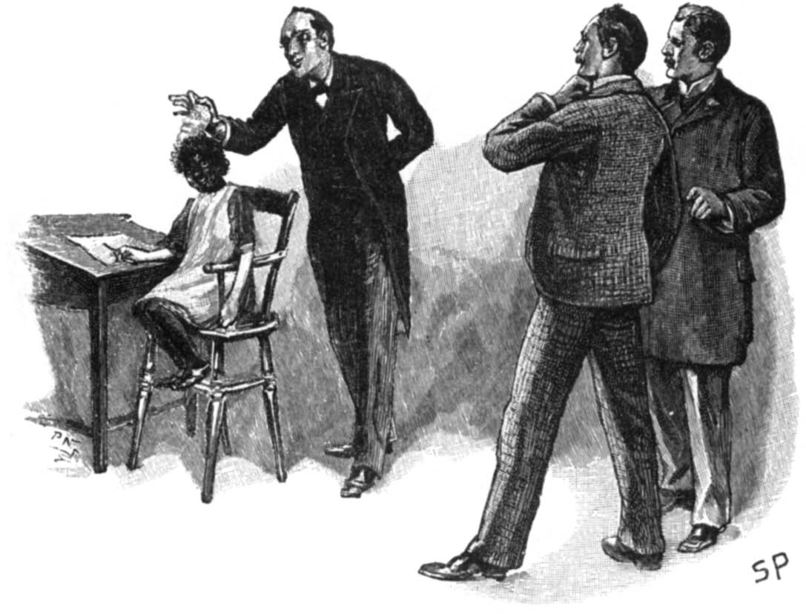

却原却原来是个小黑人。

来是个小黑人。小黑人正露着一口白牙齿，瞧我们目瞪口呆这副傻瓜样，只一个劲儿在嘻嘻嘻地乐。我看孩子那滑稽可爱相，也乐得哈哈大笑起来。可是格兰特·芒罗，手按住自己喉咙，站在那儿呆望。

“哦，上帝！”他叫道，“这是怎么回事？”

“我就告诉你怎么回事，”他妻子叫道，正大大方方进房来，面容坚毅而自豪，“你强迫我，不让我自己有个好安排，逼得我没法，那我告诉你，这事我们俩得有个妥善办法来解决。我丈夫死在亚特兰大，我孩子可活着。”

“你孩子？”

她从胸口掏出一个项链大银片。“你从没见它打开过。”

“我以为不是盒片。”

她按一下弹簧，盒片盖一下开启，里面是一张男人照片，其相貌出众、英俊而智慧，但带有明显遗传特征，是非洲血统。

“这就是约翰·希布龙，当年在亚特兰大，”夫人说，“品格高尚，世间没人可比。我不顾种族偏见要嫁给他，从此本民族不容我，我也不惜。和他一起那些年，我从来不曾有过一点后悔念头，一刹那也没有。但是也算不幸，我们惟一一个孩子，继承她父系血统，而不是她母亲我。不同种族通婚，这种现象常有。小露茜比她父亲还要黑得多，但是不管是黑是白，她都是我亲骨肉，自己亲女儿，妈妈心头宝贝疙瘩肉。”小女孩儿听闻此言，直奔过来偎依妈妈身边。“我把女儿留在美国，”夫人继续道，“只因女儿身体不好，换个地方水土不适恐怕更不好。我就把她托付给一位苏格兰妇女照管，以前做过我仆人，非常忠实可靠。我从来没有这种想法，竟要把自己女儿遗弃，一刻也不曾有。可是自从遇上你以后，杰克，爱得你无法摆脱，我怕跟你说我有这么个孩子。上帝饶恕我，我怕我会失掉你，没有勇气对你说真相。我得选择，我要你，可我无能处理好这个事，女儿还小，只好暂时先放一放。我有个女儿这事瞒着你三年，但是我一直从保姆那里有消息，知道女儿一切都好。终于，我忍不住要见见自己亲生女儿，我内心挣扎得很激烈，想摆脱这种愿望，但是不行，办不到。虽然明知有危险，我还是决定让孩子过来，哪怕来几星期也好。我给保姆寄去一百英镑，关照她这里有幢别墅小楼，她可以过来住，做个邻居，这样就不至于把我们母女关系暴露出来。我考虑这考虑那，样样要提防，吩咐保姆白天要把孩子在屋里藏好，小脸小手都要掩盖住，免得窗外有人看见，说这儿有个小黑人，引得邻居之间议论纷纷。我要是不去担心那么多，倒反而可能聪明一点，可是一味只怕被你识破真相，想得我都已理智不清。

“是你第一次告诉我说小楼已经有人来住。我本当是等到早晨，但是兴奋得睡不着觉，忍不住要溜出去，以为你这个人反正是喊都喊不醒，谁知我出去偏叫你看见，麻烦就此开始。第二天，我瞒着你行事又给你撞上，你总算宽宏大量，不加追究。三天以后，你从前门进来，我只好叫保姆带孩子从后门跑掉。现在，今天晚上，一切你都已知道，我就干脆问你，拿我们怎么办，我和我女儿，怎么办？”她紧握双手，静候回答。

时间等过十分钟，久久十分钟，格兰特·芒罗终于打破沉默。听他回答既出，恰恰正合我之所想，因而快慰不已。他把小女孩抱起来，亲亲吻吻；接着，一只手抱住孩子，另一只手挽住妻子，转身走向门口。

“我们回家吧，可以宽宽心好好谈，”他说道，“我这个人也是说不上有多好，艾菲，可这个事，比你对我这样想法，总还不至于。”

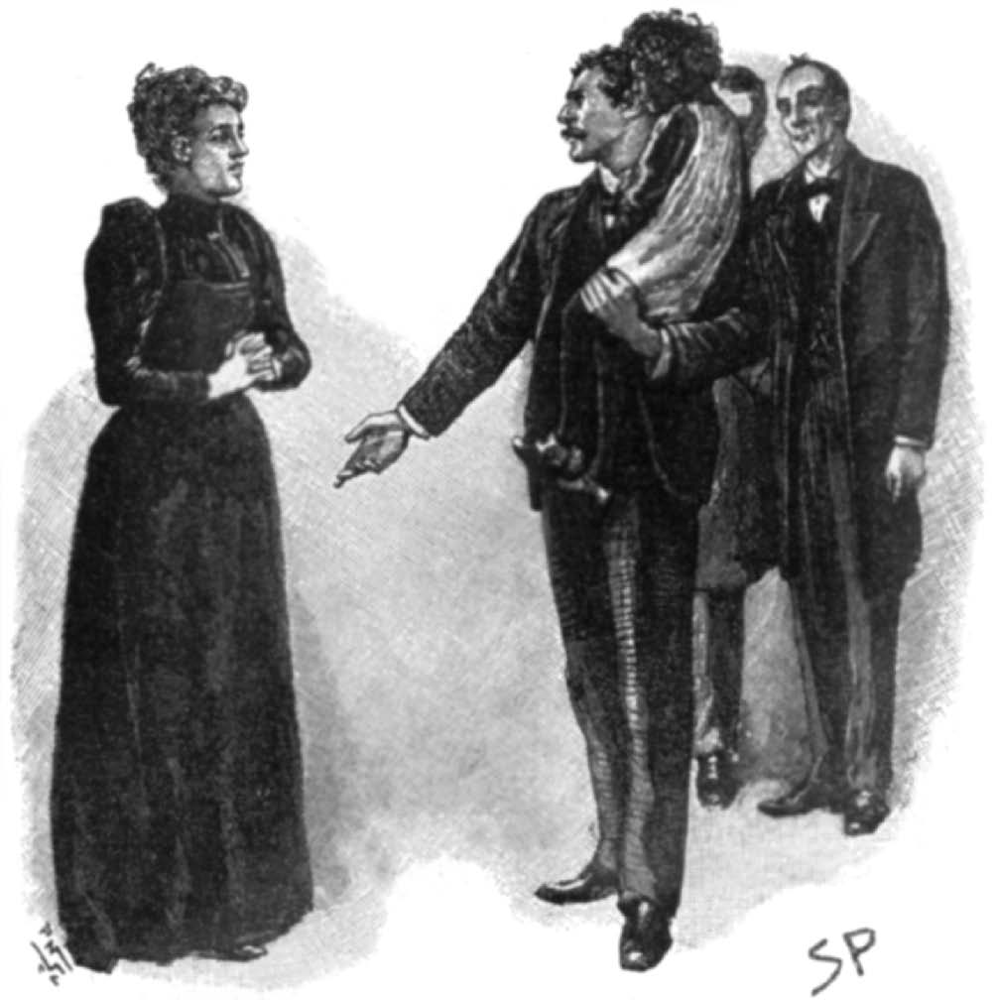

“我们回家吧。”

福尔摩斯和我跟随在后走上巷道，一出巷道，他扯扯我衣袖。

“我想，”他说，“我们回伦敦吧，那儿比诺伯里更有事需要我们去做。”

那天夜里一直到很晚，他对这件事一句没提，最后他点亮一支蜡烛拿在手上，回过身去进卧房，才甩出话来。

“华生，”他说，“往后只要你稍有感觉我对自身能力过于自信，做事不肯多花点心思力气，请你不吝在我耳边提醒一声‘诺伯里’，我将对你不胜感激。”

（1893年）

————————————————————

<a href="#part0064.xhtml_ch1-back" id="part0064.xhtml_ch1">(1)</a> 水晶宫（Crystal
Palace），1851年建于伦敦海德公园的钢架玻璃体展览馆，主馆长536米，举办第一届世界博览会，次年移建于南郊锡德纳姆山（Sydnam）。

# 证券经纪人书记员

我结婚后不久，在帕丁顿区买下一家诊所。我是从法夸尔老先生手中买进的。老先生有一个时期医疗业务很兴旺，但是由于年纪大了，又加身患圣维特斯舞蹈病，手脚不便，诊所业务逐渐冷落下来。社会公众都难免会有这种看法，觉得给人医病的医生自己应当身体健康，一个医生连自己身上的毛病都无法治好，他的医术看上去也就大告不妙。随着这位老前辈身体日衰，诊所也就每下愈况，等到我从他手里接下的时候，他的年收入已从原来的一千二百英镑跌落到三百英镑稍出点头。然而我对自己充满信心，我正当年富力强，不出两年，管叫诊所业务重振当年兴旺面貌。

接手开业三个月，兢兢业业埋头于业务，同我的朋友歇洛克·福尔摩斯很少见面。我实在很忙，抽不出身去贝克街，而他自己又深居简出，除了办案需要，一般不出门。然而，令我很感意外，六月的一天早晨，我吃好早餐正坐着看《英国医学杂志》，忽听门铃响，接着传来我那老伙伴高亢略带尖利的嗓音。

“啊，我亲爱的华生，”他说，大步跨进屋子，“看见你真高兴！华生夫人想必早已无恙了吧？我们四签名一案的侦破，给尊夫人小受惊扰。”

“谢谢你，我们两个都好。”我说，和他热烈握手。

“不过我也希望，”他又说，往摇椅里坐下，“虽然看病很忙，可不要把我们推理问题的那点兴趣给淡忘了。”

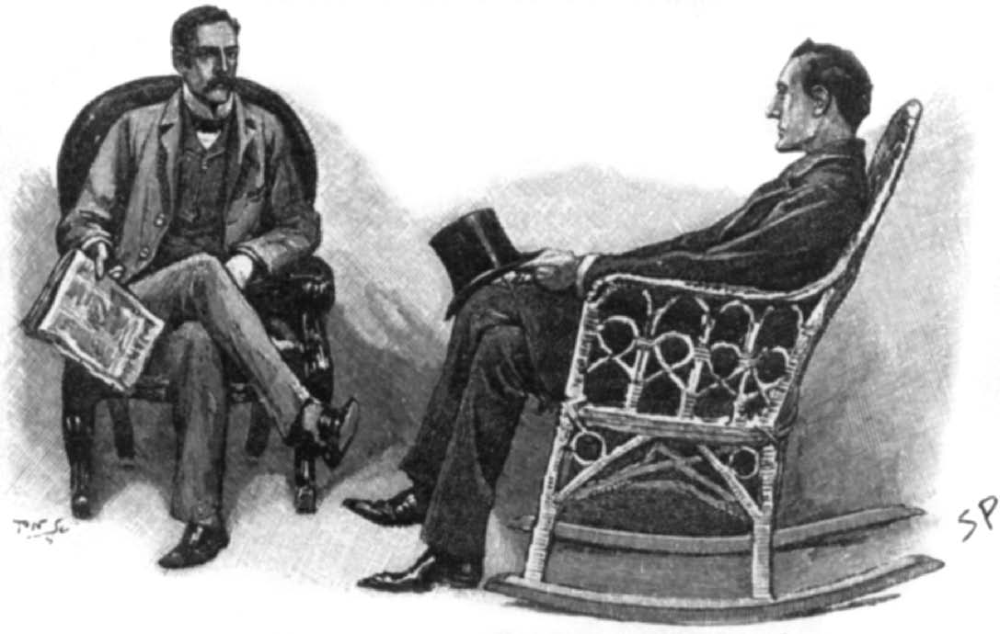

“可不要把我们推理问题的那点兴趣给淡忘了。”

“恰恰相反，”我回答说，“昨天晚上我还把旧笔记都翻了一下，把过去的破案记录分分类。”

“相信你不会到此为止，以后不再收集材料。”

“绝对不会。我一直指望这种经验越多越好。”

“今天，就有事啦，怎么样？”

“行啊，就今天，只要你开口。”

“可得远行伯明翰，行不行？”

“当然行，只要你说就行。”

“那门诊怎么办？”

“我邻居有时候外出，我给他带着做，他也会帮我忙，还我这份意思。”

“哈！那再好也没有，”福尔摩斯说，人往椅背上一靠，半眯的两眼直盯住我，“我看你近来身体不怎么好，夏天热伤风有点讨厌。”

“上星期得重感冒，在屋里三天没出门，不过没问题，已经痊愈了。”

“是好了，看得出壮实着呢。”

“哦，你怎么知道我感冒？”

“我亲爱的伙伴，你该知道我的办法。”

“又是推理演绎法啰？”

“当然啦。”

“从哪里推知？”

“从你拖鞋。”

我低头看看套在我脚上的漆皮新拖鞋。“这怎么就能——”我正开口问，福尔摩斯抢先回答了。

“你这拖鞋是新的，”他说，“穿了也就不过几星期。鞋底翘向我这里的一边有点烘焦。初一想，总是打湿了，烘烘干烘焦的，可是面子上有小圆纸片在，是鞋店店员的标记。要是鞋打湿，这纸当然就该掉了，可见并非烘鞋，是你脚穿着鞋坐那儿伸腿烤火。如果是个健康人，即使在天气潮湿的六月，也没有谁会这样做法。”

就像福尔摩斯的所有推理那样，事情一经解释，原来竟是那样的简单。他能从我脸上看出我的想法，他的微笑也含着敏锐与犀利。

“恐怕这么一说，把我自己的底泄漏无遗，”他说，“干脆只讲结果，不讲原因，倒也是办法。那么说，你准备到伯明翰去啰？”

“当然去。是什么案子？”

“上了火车再跟你讲。委托人在外面四轮马车上等着，立刻就走怎么样？”

“稍等一下。”我给邻居草草写好一张条子，跑上楼去向妻子把事情解释交代一下，就出门跟上福尔摩斯。

“你邻居是医生。”他说，朝那铜牌点点头。

“是医生，跟我一样买下一家诊所。”

“是一家老诊所了？”

“同我的一样，打这房子建成，就开诊所直到现在。”

“啊！这两家，你这家生意是最好啦。”

“可以这么说。你怎么知道的？”

“看台阶，老兄，你门口的台阶比他的台阶要凹下去三英寸。车上这位先生就是我的委托人，霍尔·帕克罗夫特先生，请允许我来介绍一下。马鞭抽紧点，车夫，赶火车时间有点紧。”

跟我面对面坐着的这位先生是个年轻人，身材匀称，气色很好，一脸的坦率诚恳相，留一点黄黄小卷须。他戴一顶闪亮的大礼帽，身穿素净的黑正装。看一眼这身打扮，就知道——是个精明干练的伦敦城里人，属于被叫作伦敦佬<a href="#part0065.xhtml_ch1"
id="part0065.xhtml_ch1-back">(1)</a>那个阶级的人。就是这个阶级的人，给我们组成骁勇善战的义勇军团，也就是这个阶级的人，给英伦三岛提供最多的优秀体育家和运动员，为其他各阶层人所不及。他红扑扑的圆脸庞天成一张喜乐可人的笑脸，但是他的嘴角下垂，我觉得是欢喜中挂着悲哀。一直到我们在火车头等车厢中坐定，登上了奔赴伯明翰的旅程，我方始了解到这位先生遇到了什么麻烦事，不得不远道而来寻访歇洛克·福尔摩斯。

“我们要坐十足七十分钟的火车，”福尔摩斯说道，“请你，霍尔·帕克罗夫特先生，把你跟我谈过的经过情形，原原本本也向我的朋友讲一讲，非常有趣，最好再更详细一点。对我来说，把情况接着再听一遍，也不无好处。这件案子最后结果，华生，里边要么很有些名堂，要么一无名堂。但是不管名堂有还是没有，就已经摆在面前的情况来看，至少是足够异乎寻常、荒诞离奇，对你对我都值得一听，值得一看。好，帕克罗夫特先生，我不再打扰。”

我们的年轻旅伴两眼闪光看着我。

“这事坏就坏在，”他说道，“是我，我自己是个十足大笨蛋。按说原本好好的事不该有问题吧，也看不清自己现在是否已经上当受骗。但是万一这事真的砸了，那就搞得鸡飞蛋打，两头落空，什么也到不了手，那有多冤多窝囊。我不善于说话讲故事，华生医生，反正是什么我就说什么。

“我以前在德雷珀广场考克森和伍德豪斯商行供职，可是今年开春商行卷进委内瑞拉公债券案，这个事你们一定都还记得，结果商行倒闭。我在行里供职有五年，商行倒下来，老考克森给我一份鉴定书，鉴定评语很好。当然了，职员只好全被辞退，我们总共有二十七个人。我东奔西跑找事做，可是像我这样的户头不知有多少，大伙儿都一样，哪捞得到机会，这样勒紧裤带挺了好长时间。给考克森做事那些年，我一个星期三镑薪金，积攒下了大约有七十镑。可很快就吃光用光，就要挨饿，到了山穷水尽的地步。我简直连应征广告邮票、信封也支付不起。找事情，奔跑多少公司、商行，啪嗒啪嗒楼梯上下，鞋底都磨穿，可还是觅不到个职位。

“最后，看到莫森和威廉斯商行有个空缺，是龙巴德街一家大证券商行。对伦敦东部中央邮区，敢情你不是行内，不熟悉，那几乎是伦敦最富的一家商行。它的广告应征规定必须信函邮寄。我寄去鉴定书、申请书，可自知希望渺茫，没有盼头，谁料回信倒是来了，说是若下星期一前去，新职即可上任，唯一只需仪表令人满意即可。谁知道他们是怎么个挑选法。有人说他们那个经理挑人像摸彩，探手进去瞎摸到哪份申请书就是哪个人。不管怎么说，这一回就算轮到我走运，说成就成，我是要有多乐就有多乐。一开始的薪水一星期一镑，工作和我在考克森一样。

“现在该说这事儿的正题，蹊跷得叫我不安。我住的地方是汉普斯特德小街那边，波特巷十七号。好，就是接到聘用通知那天晚上，我正抽烟来着，房东太太进屋递给我一张名片，上面印着‘财务经理阿瑟·平纳’。这名儿以前从没听说，也不知找我是何贵干。不过当然，还是让房东太太把人请了进来。来人是中等个头，黑头发，黑眼睛，黑胡须，鼻尖儿有点发亮。脚头轻快，讲话干脆，像个很珍惜时间的人。

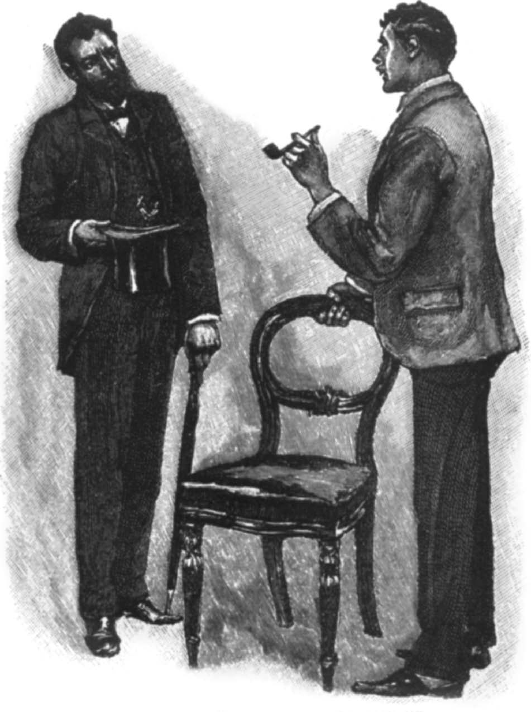

来人是中等个头，黑头发，黑眼睛，黑胡须。

“‘霍尔·帕克罗夫特先生，想必是？’他说。

“‘正是，先生。’我回答，推一把椅子给他。

“‘原来是在考克森和伍德豪斯商行做事？’

“‘是的，先生。’

“‘现在是莫森商行雇员？’

“‘正是。’

“‘好，’他说，‘事情是这样，听说你精通财务经管，这方面的能力非是一般，要数说成绩还真不少。你知道帕克，过去的考克森经理，他说起你来赞不绝口。’

“听这么一讲，我当然很高兴，我过去办事一向认真麻利，可做梦也没想到在伦敦还能这么备受称赞。

“‘你记忆力很好？’

“‘还可以。’我回答，谦虚点。

“‘你失业以后还关心市场行情吗？’他问。

“‘关心。证券交易牌价我每天早晨都要看。’

“‘这才是真正有心人！’他大声说，‘这就生财有道啦！你别见怪，当场试试怎么样？请问，艾尔郡股票牌价是多少？’

“‘一百零六镑五先令至一百零五镑十七先令半。’

“‘好，新西兰统一公债呢？’

“‘一百零四镑。’

“‘那，英国布罗肯·希尔股票？’

“‘七镑至七镑六先令。’

“‘棒极了！’他举起了双手叫道，‘名不虚传，一点不错。好家伙，厉害，给莫森去当个小职员，屈就，屈就了！’

“他这么个说法，倒叫我愣怔住了，你想可不是！‘那，’我就说，‘别人对我都没有你这么看好啊，平纳先生。我是好不容易谋到手这么个职位，我已经很高兴了。’

“‘嗨，瞧你！你是将才，该飞黄腾达，你这不是给大材小用了嘛。现在，让我告诉你，我怎么评价你的。我是量才录用，按劳付酬，你大本事拿大钱。钱呢也是不多，可比比他们莫森，那是一个天一个地。我看看，你是什么时候去莫森？’

“‘星期一。’

“‘哇哈哈，我说，我斗胆得劝你一句，你根本就甭去那儿上什么班。’

“‘不去莫森？’

“‘别去，先生，到那一天你该是法国中部五金有限公司业务经理了，它在法国城乡分公司就有一百三十四家，还不算比利时布鲁塞尔一家，意大利圣雷莫一家。’

“我简直倒抽一口气。‘从没听说过。’我说。

“‘很可能没听说。企业一直平静安稳经营，资金都向私人筹集，兴旺发达，无需社会公众介入。我哥哥哈里·平纳是创办人，当了总经理，就进入董事会。他知道我在这里交游广、人头熟，叫我物色一个好人才，又要薪金不高。要年轻、干劲足、听他指挥、能冲能上。帕克提起你，所以今天晚上我到你这儿来。一开始，我们只能给你五百，区区小数。’

“‘一年五百镑！’我叫起来。

“‘那只是开始。不过还有佣金好拿，你的代销商完成的营业额，都提取百分之一归你。我给你讲的是实话，这佣金比你薪水还要高喽。’

“‘可是五金行业我一点都不懂。’

“‘哎呀，我的伙计，你不是懂会计吗！’

“我的脑子在嗡嗡响，人在椅子上都要坐不稳了，但是忽然一个疑问叫我感到一阵寒气。

“‘我有话得向你实说，’我说，‘莫森只给我两百，但是莫森是靠得住的。而贵公司方面，实际上我都还不太清楚——’

“‘好，好，有头脑，精明！’他叫着，乐得有点狂起来了，‘我们就是要找你这样的人，单靠几句话就给说动可没那么容易，办不到，这就中，该这样。看这儿，钞票，一百英镑。如果你觉得这事我们可以达成，就请你收起，作为预支薪水藏好口袋里。’

“‘好极了，’我说，‘我什么时候就任到职？’

“‘明天下午一点，在伯明翰。’他说，‘我口袋里就有着便条，给你带上去见我兄长。你到企业街126B去找他，是公司在那儿的临时办公地点。当然要他确认聘用你，可是你我已经说定，不会有问题了。’

“‘说真的，我不知该怎么感谢才好，平纳先生。’我说。

“‘不必，不必，我的伙计，你这样的人才，应该的嘛。有一两件小事——也就是过过形式——得给你安排好。你身边正有一张纸，麻烦你写一写，这样写：我欣然同意就任法国中部五金有限公司业务经理此职位，薪水规定最低五百英镑一年。’

“我照他讲的写好，他把纸条放进口袋。

“‘还有件事不能忘了，’他说，‘莫森那边你准备怎么办？’

“我一时高兴，把莫森给忘了个干净。‘我给他们写个辞呈就得了。’我说。

“‘我就正是要劝你不必这样做。我为你这事都已经同莫森经理吵了一场，我跑去向他问起你，他对我没好气，责备我挖他们商行的人，把你诱跑什么的。我后来也耐不住发了脾气，“你们想用高人，就得出高薪。”我说。“他宁可要我们的低薪，也不要你们的高薪。”他说。“我和你打赌五英镑，”我说，“只要他受了我的聘，你就别想听到他一个回音。”“行！”他说，“我们把他从贫民窟里最底层捡起来，谅他不会拍拍屁股一走了事。”这都是他的原话。’

“‘什么了不起东西，狗屁！’我骂，‘我这辈子跟他有什么相干，为啥要感恩他？你让我别写信给他，我当然也就不写，不理他。’

“‘好，一言为定，’他说，椅子上起身，‘哈，我为我哥觅到这么一个高才，高兴！一百英镑预付金，给，这是信。把地址记下了，企业街126B。记住，约定时间明天下午一点钟。晚安，祝你好运，一切顺利！’

“我和他见面的全部经过，我记得起的，就是这样，华生大夫，有这么鸿运高照，该多乐。我暗自庆幸，我一坐半夜没能睡。第二天早早赶火车去了伯明翰，好把约见时间安排得很充裕。我在新街一家旅馆放下东西，随后出门按着给我的地址找去。

“我比约定的时间早到一刻钟，不过我想这也没啥关系。126B是两家大商店之间的一条过道，连通一段拐弯绕的石头阶梯，那一头有好多套屋子，租给公司或个人开业做办公室。业主的名字都在墙上写着，就是没见有法国中部五金有限公司。我站在墙根边有几分钟，心情沉重起来，怀疑这整个事情是不是个精心设计的骗局。正在这时候，有人上前招呼我。一看这个人，居然同昨晚那个老兄一模一样。个头一样、声音一样，就是脸收拾得很干净，头发颜色稍浅一点。

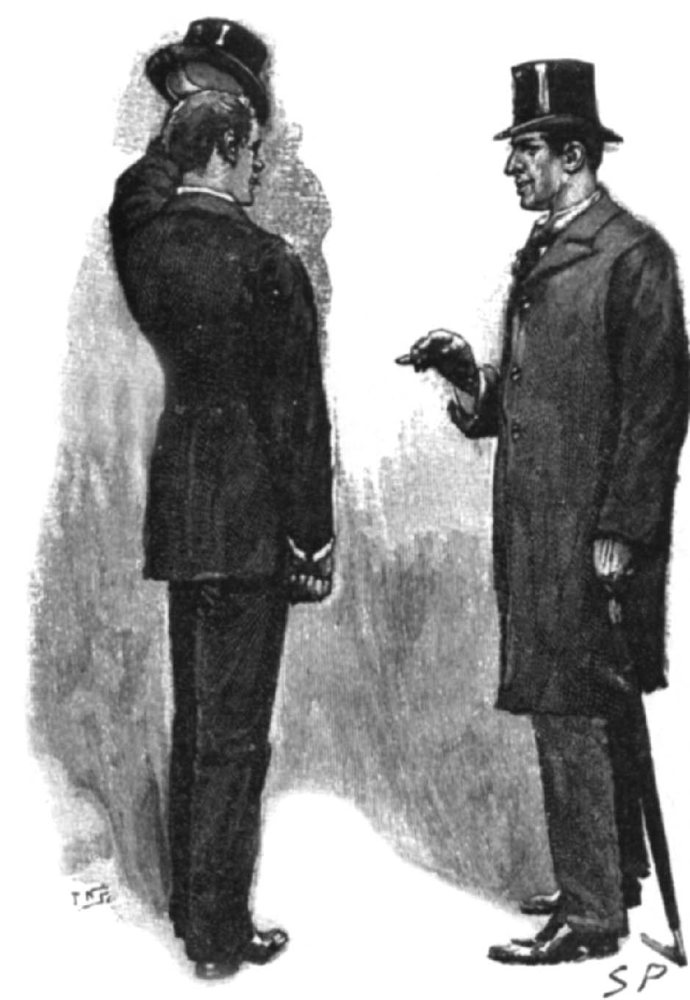

正在这时，有人上前招呼我。

“‘是霍尔·帕克罗夫特先生吧？’他问。

“‘就是。’我说。

“‘噢，我正等着你呢，你比约定时间稍稍早了一点。今天上午接到兄弟来信，信上对你大加赞扬。’

“‘我在找办公室，正好你来了。’

“‘我们还没来得及挂出名牌，上星期才找了这么几间办公室临时安顿一下。随我来吧，我们把事情谈一谈。’

“我跟他走到阶梯顶端，那里，就在石板瓦底下，有两间空房，又小又脏，没铺地毯，不挂窗帘，他领我走了进去。我原先想的，总以为是大写字间，闪亮的桌子，职员一排排就座，就像常见的那样。可眼前，让我两眼发直，两把松木椅子，一个小桌子，搁一本账簿，还有一个废纸篓。这就是全部家当。

“‘请不必有想法，帕克罗夫特先生，’这位新认识的人见我拉长着脸，便说道，‘罗马不是一天之间就能建成，我们有的是钱，腰杆硬着呢，用不着办公室上摆阔气。请坐，你的推荐信给我看看。’

“我把信给他，他看得很仔细。

“‘你给我兄弟阿瑟的印象，看来非常深刻，’他说，‘我晓得他看人眼光是很厉害的。你知道吗，他相信伦敦人，而我，相信伯明翰。可这一次，我听他一回。行了，就这么定，你受聘了。’

“‘我做什么事呢？’我问。

“‘你先管一管巴黎的大仓库，英国的陶器货源进来以后，负责向法国一百三十四家代销商源源不断供货。货要到一星期以后进好，你这期间留在伯明翰另有应差。’

“‘做什么？’

“他没回答，从抽屉里拿出一本红面大本子。

“‘这是巴黎工商客户名录，’他说，‘人名后面就是交易业务项目。我让你带回家，把五金代销商都摘出来，连带他们的地址也要，做一份表格对我很有用处。’

“‘好的。可这里都已经分档列好了。’我提出。

“‘可是很不清楚，他们的做法同我们不一样。抓紧一点，星期一我要，十二点把这表格交给我。好，再见，帕克罗夫特先生。只要你热情高、有脑子、能干，你放心，公司不会亏待你。’

“我把这个大本子腋下一夹，回到旅馆，胸中纳闷不是滋味。一方面，我给正式聘用了，一百英镑已经到了手，可是另一方面，他办公室那副模样，外边墙上连个公司名儿都没有，还有作为企业家，形象有问题。这雇主的地位到底如何，我的印象不佳。这且不管他，反正钱已到手，把手上工作先做起来。星期天整整一天我在赶那个工作，可是到了星期一，我才只做到H字母。我跑去跟上司说，还是在那间空落落的烂屋子里头，他说那就星期三交，我就回来再赶任务。我拼命做没个停，到星期五——也就是昨天，才告完成，带去交给了哈里·平纳先生。

“‘非常感谢你，’他说，‘我把这件工作的困难恐怕估计得低了。这份单子对我很有用，少不得。’

“‘是得有一点时间。’我说。

“‘好吧，现在，’他说，‘我要你做一份家具店的单子，他们也都卖瓷器。’

“‘好的。’

“‘明天晚上七点，你过来告诉我工作进度怎么样。别太劳累，晚上花两个小时去戴氏音乐厅欣赏音乐，工作之余不无好处。’他说着就张嘴笑起来。我一下子心都抽紧了：发现他左上第二颗牙齿，也是很蹩脚的金牙。”

福尔摩斯兴奋地搓着双手，我惊奇地呆望着委托人。

“你还不知道，华生医生。是这么回事，”他说，“在伦敦来找我谈的那个人，当我说不去莫森商行上班时，他也对我张嘴笑，我无意中看到他镶的金牙，和这个完全一样，一模一样。两个人的金牙都这么在我眼前一亮。我把他的嗓子、身材模样搁在一块儿一想，他只是刮了胡子、套上发套，改头换面一下，这是同一个人，不用我怀疑。当然，你也要说或许是两兄弟长得很像呢，可是连镶牙都镶成同一个模样，总不可能。他客客气气把我送出来，我一走上街，不知怎么办才好了。回到旅馆，把脑袋往冷水脸盆里浸浸，设法理出个头绪来。他为什么要把我从伦敦支到伯明翰来？一个人在那儿演两个人，自己写了信带给自己看，都是干什么？我左思右想想不出个所以然，实在弄他不懂。后来我才忽然开窍想到，我看不明白的，歇洛克·福尔摩斯先生有眼光不会看不明白。我才抽时间乘夜车赶到城里，一早来拜访，并请两位一起同我上伯明翰。”

听这位证券经纪人书记员讲完奇异的经历，我们都顿住没作声。后来福尔摩斯瞥了我一眼，身子往靠垫一仰，脸上露着胸中已有数的喜色，像个品尝家初抿一口美酒作着回味鉴赏的姿态。

“相当精彩，华生，是不是？”他说，“所讲有几点我觉得很有意思。看来，你会同意我，到法国中部五金有限公司的临时办公室去拜访一下阿瑟·哈里·平纳先生，我们两人必定不虚此行。”

“我们怎么样上门呢？”我问。

“哦，那挺容易，”霍尔·帕克罗夫特高兴地说，“你们是我的朋友，想谋点差事干干，我就带你们两个去见总经理，这不是再自然不过的吗？”

“说的是，就这样，”福尔摩斯说，“我要亲眼见见这位先生，看看他到底玩什么把戏。我说朋友，你有什么地方使你叫人那么看重？或者可能是——”他咬起了指甲，呆呆地凝望窗外，就此没再讲一句话，一直到我们踏上新街。

晚上七点钟，我们三人拐进企业街走向公司的办公地。

“我们来早了的话一点没用，”我们的委托人说，“他到这儿，专门只为来同我碰头，这地方除了定下的这时间以外，根本就没见有人。”

“这就值得深思。”福尔摩斯说。

“哟，瞧我说的吧！”委托人大声道，“那儿前面走着的就是他呀。”

他指指路对面一个匆匆走着的人，身材略小，衣服深色、光洁。我们看他朝路对面的报童望望，报童在叫卖刚出的晚报。他穿过出租马车、公共马车奔过去，向报童买了一份报，把报纸捏在手里，走向一个门就不见了。

“就那里，他进去了！”霍尔·帕克罗夫特喊道，“那地方就是公司办公室。跟我来，我能对付，没问题。”

我们跟随在后爬上五楼，到了一扇半掩的门前，委托人敲敲门，屋里人应声叫进去。我们入内，正如霍尔·帕克罗夫特所讲，里面空空如也，毫无陈设，唯一的一张单桌边，就坐着刚才街上看见的那个人，面前摊开着报纸。当他抬起头来看到我们，我好像在他脸上看到一副哭丧相，岂止哭丧——还加恐慌，这种表情一辈子也难看上几回。他额头闪着汗珠，面颊死沉，惨如鱼肚白色，两眼圆瞪，定定地呆望。他盯住书记员，就像是不认识的一样。同时我从我们向导脸上反应的惊异可以看出，这也是他雇主此前不曾有过的表情。

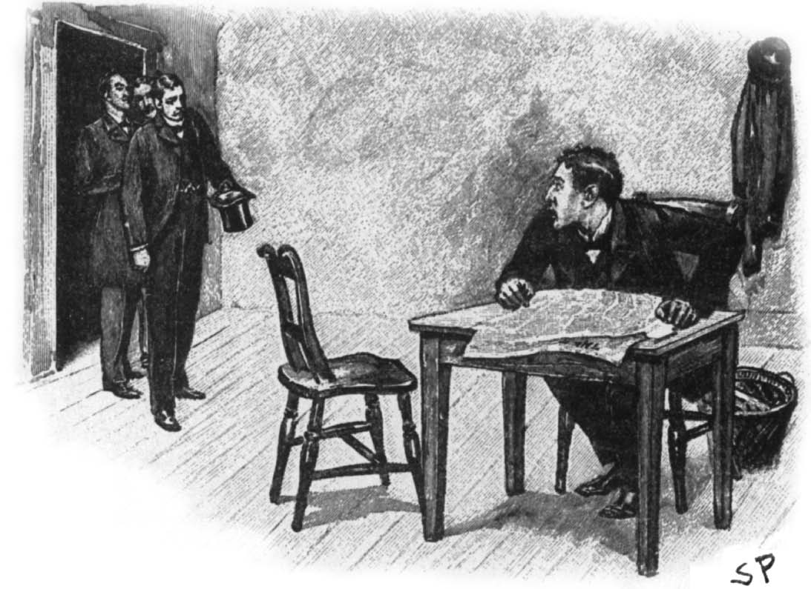

在他脸上看到一副哭丧相。

“你脸色不好，平纳先生！”他失声叫道。

“不、不舒服，”对方回答，很明显在强作镇静，没开口先舔舔干嘴唇，“这两位同你一起来的先生是谁啊？”

“一位是伯蒙奇的哈里斯先生，还有这位是普赖斯先生，本地人，”我们的书记员机灵地回答，“两人都是我朋友，都是能人先生，不过近来空闲着，他们想在贵公司里看看，有没有空缺，谋上个差使。”

“有！有！我给看看，”平纳先生强做笑容叫道，“行，没问题，我们可以给你们想想办法。你是想做哪一行当业务事，哈里斯先生？”

“我是会计师。”福尔摩斯说。

“啊，行，这个我们正要人，那你呢，普赖斯先生？”

“书记员。”我说。

“我很希望公司接纳两位，一有消息我一定立刻通知你们。现在三位先回。哦，上帝，让我安静吧！”

他嘴里蹦出最后这句话，好像把刚才那阵子紧张忽地全部放下，变得释然了。福尔摩斯和我相互看一眼，霍尔·帕克罗夫特朝桌子跨前一步。

“你忘了，平纳先生，我是按约定特地来听你指示的。”他说。

“没错，帕克罗夫特先生，没错，”对方语气更为镇定，“你这儿稍等一下，请你的朋友也同样啰，和你一块儿等一等。你的事情我三分钟就给你处理，对不起，叫你们久等了。”他站起身，一副彬彬有礼的姿态，朝我们点头哈腰，向屋子里边一个门走去；进了门，就随手把门带上。

“现在怎么办？”福尔摩斯轻声说，“他想脱身？”

“不会。”帕克罗夫特回答。

“为什么？”

“门里边是一间内室。”

“不通外面？”

“不通。”

“里边有家具吗？”

“昨天还是一间空房。”

“那他进去干什么？这倒很有些搞不懂了。如果有谁会给吓成个疯子，我看叫他平纳这名字就很好。到底有什么会把他吓得浑身发抖？”

“疑心我们是侦探。”我提上一句。

“就是。”帕克罗夫特叫道。

福尔摩斯摇摇头。“他脸色不是我们吓白的，我们进屋子的时候他已经刷白了，”他说，“很可能是——”

他的话被门里猛一阵乒乒乓乓的响声打断。

“他自己敲自己的门，这算什么意思？”书记员嚷道。

乒乒乓乓的声音敲得更响。我们都朝那个关着的门望，不知怎么回事。我向福尔摩斯看一眼，见他的脸色严峻了，身子十分激动地向前探。忽然又听见有喉咙口低低的咕噜咕噜声，接着是咚咚的木器碰撞声，福尔摩斯一个箭步蹦过去推门。门从里面闩死，我们随他一起把整个身子不断往门上撞。一个铰链崩掉，又一个铰链也崩掉，门立即砰然倒下，我们踏门冲入内室，却不见人。

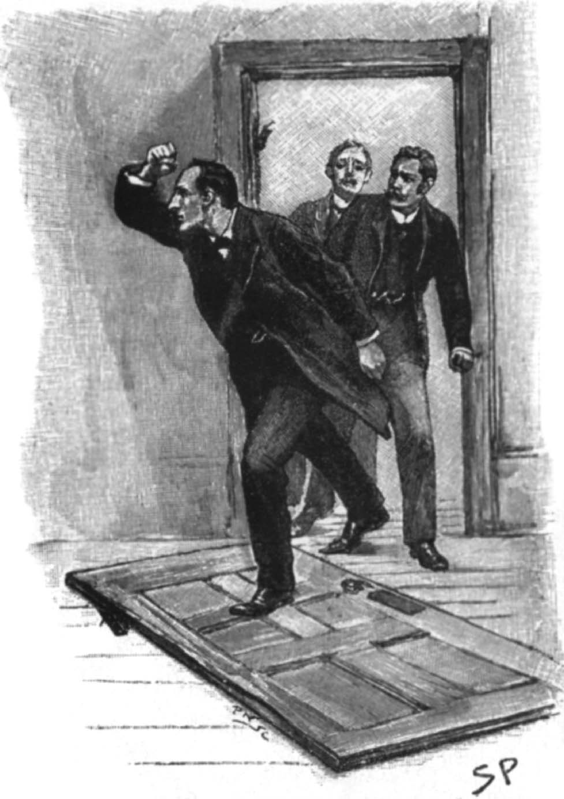

我们踏门冲入内室，却不见人。

已经坏事，只差一会儿工夫，我们迟了一步。最靠近我们刚才那外间的一个墙角上还有第二道门，福尔摩斯跳过去一把就推开。地板上，扔着一件外套、一件背心；门背后，钩子上，挂着个人：法国中部五金有限公司总经理，他用自己的裤子吊带绕着脖子。他的双膝收起，脑袋垂得快要从身上掉下来。刚才打断我们说话的声响，就是他吊死的时候两只脚挣扎踢门的声音。我马上上前抱住他腰部，望上一抬，福尔摩斯和帕克罗夫特解下宽紧吊带，带子已经深深嵌进脖颈青紫色的皮肉里。我们把他抬到外间躺下。他一张土灰色的脸，发紫的嘴唇还有气在吞吐——五分钟的时间就变成这副惨状。

“你看看他怎么样，华生？”福尔摩斯问我。

我弯腰观察检查。他的脉搏极微弱，而且有间歇，呼吸越来越拖长，眼皮有点跳动，眼缝露出翻白的眼球。

“再晚一点便无救，”我说，“现在没危险了。把窗打开，水瓶给我。”我解开他领扣，往他脸上洒冷水，把他胳膊不住地上下扳动，他的呼吸渐长而连贯，恢复自然。“现在，只是醒过来快慢的问题了。”我说，站起身走开。

福尔摩斯站在桌旁，两手深深插入裤袋，低垂着头。

“应该把警察叫这儿来，”他说，“警察叫来了，整个案子好移交给他们。”

“到头来我还是一团迷雾，”帕克罗夫特嚷道，抓抓头皮，“他们把我好不容易弄到这个地方来干什么，还有——”

“嗨！那个一切都已够清楚，”福尔摩斯接嘴道，“就只是，这最后突然一下子。”

“那么，其余怎么个事你都清楚？”

“我看很明显了。你说呢，华生？”

我耸耸肩。“我承认，我觉得是莫测高深。”我说。

“哦，如果你一开始能多个心眼想想这个事，就肯定会注意到一个情况。”

“能注意到什么情况？”

“噢，整个事情，关系在于两个问题。第一是促使帕克罗夫特写个声明，进入这家莫名其妙的公司服务，你看不出这里面大有文章？”

“我没能看出有什么文章。”

“好，他们为什么要他这样做呢？不像是正当事业、正当做法，因为到时候上班通常口头说好就成了，完全没有必要多此一举，毫无道理。你没看出来，年轻的朋友，他们急于要得到你的亲笔笔迹，没有别的办法，这不正是好办法？”

“要我亲笔，为什么？”

“就是要，为什么呢？一旦我们解答了这一步，我们的小问题就有大进展。为什么？只有一个讲得通的理由，有人要学习模仿你的笔迹，首先要千方百计搞到你的样品。现在再来看第二个问题，我们发现两个问题可以彼此印证。这个问题就是平纳坚持要求你不必辞去你的职务，而是存心叫这家大企业经理满心想着霍尔·帕克罗夫特先生就要到职。这个新职工他还从未见过面，星期一早晨将要来到办公室。”

“我的上帝！”我们的委托人叫道，“我真是没长眼睛！”

“现在你该看清要你手迹的原因了。假定有人顶替你的位置，他出手的字迹同你申请书上的笔迹完全不一样，是两个人，那游戏就做不成功，马上戳穿。但是暗地混进去的那个家伙学你笔迹，模仿你，他位置就能坐得稳；我估计办公室里没人见过你。”

“一个人也不认识。”霍尔·帕克罗夫特咕哝道。

“再好也没有。当然还有绝对重要的，务必断绝你对商行有好感；阻止你，叫你不可能与他们任何人有接触，也就没人会告诉你有人冒名顶替打进了莫森商行。因此他们给你出手漂亮的薪水预支；还把你支走，到这中部地方，叫你忙活够多的工作，防止你有闲暇回伦敦。在伦敦你会泄漏他们的小把戏。所有这一切，都是显而易见的事。”

“这个人要假装他哥哥干什么？”

“噢，那也很清楚，这个事情中显然只有他们两个人。另一个冒名顶替你去上班，这一个充当你的推荐人，又不能拉第三人进来合谋做你的雇主；这绝对不行。他就只好尽量乔装打扮，冒充一下两兄弟，当然不免你要发现模样一样，但是他有把握让你会以为一家人哥儿俩长得相像。可是智者千虑总有一失，幸而金牙露馅，否则还引不起你产生怀疑。”

霍尔·帕克罗夫特向空中挥舞握紧的拳头。“哦，天哪！”他叫道，“我还全蒙在鼓里一无所知，那另一个冒充我霍尔·帕克罗夫特混到莫森商行去做什么？我们怎么办，福尔摩斯先生？请指点我怎么办。”

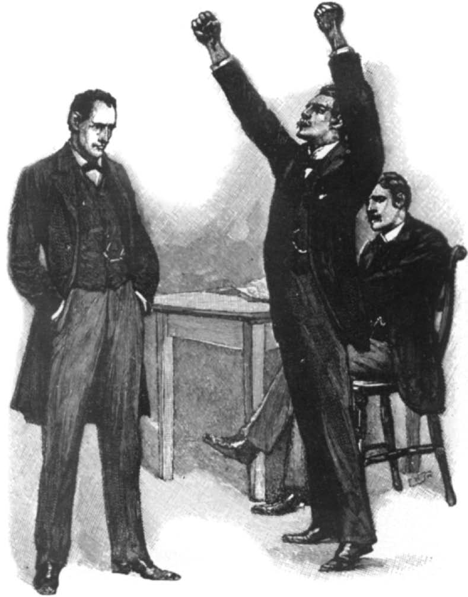

“天哪！我还全蒙在鼓里一无所知。”

“我们必须向莫森发电报。”

“他们星期六十二点关门。”

“没关系。有看门的，或者值班的——”

“啊，对了，他们掌握着巨额证券，所以配有常备警卫，我记得伦敦人谈起过这个事。”

“很好，我们发电报过去，看看是否一切都无恙，是不是有与你同名的人在那里工作。这些都很清楚了。不清楚的是，此地这个家伙为什么看见我们以后，马上走进那屋里去上吊自尽。”

“这报纸！”一个嘶哑的声音在我们身后叫道。那个人坐起来了，脸色苍白，一副鬼相，骨碌着两眼，已经还魂，手痉挛地抚摩脖子里宽宽的一圈勒痕。

“报纸！没错！”福尔摩斯高声叫道，欣喜若狂，“我这个白痴！光想我们来看人，那报纸就一点没进脑子里去。准没错，秘密一定就在报纸上。”他把报纸往桌面一摊开，嘴里立刻发出胜利的呼唤。“瞧这儿，华生，”他叫唤道，“这是伦敦报纸，《旗帜晚报》早版。在这里，找到了。看标题：‘伦敦大案　莫森和威廉商行起凶杀　洗劫未遂　罪犯就擒’。看见啦，华生，恰正是我们急着要弄清的消息，请你给我们大声念念。”

从消息在报上登载的版面位置看，是伦敦特大号的新闻。报道全文是这样的：

盗窃巨金未遂，致死一人，凶犯当场擒获，系今日下午发生于伦敦之特大劫财凶杀案。久负盛名之证券所莫森和威廉商行，向为证券金融坚挺可靠之家，证券数合计已远超过百万英镑之巨。该行经理遂觉责任重大，稍有不慎必将导致巨大利益之损失，因此业已配备最新型之保险箱，并设一名武装警卫日夜驻守巡视。该案缘起一新职工名霍尔·帕克罗夫特者，上星期受商行所聘用，彼原来并非他人，即贝丁顿是也，臭名昭著之伪币制造者及保险箱撬窃贼。该犯与其弟服徒刑五年劳役监禁，于不久前刚获释。其所用何种手段尚不清楚，而得以假名成功获取该写字间之正式职位，遂利用此职务之便利而得到各锁钥之铸型，并彻底熟识金库及保险箱之设置情况。

按莫森商行惯例，星期六下午歇业，职工均不上班。伦敦警方图森警官，时一点二十分，见一衣冠楚楚者携大毡包自该行台阶而下，顿觉异常。因有大疑，警官追及此人，案犯虽作殊死抵抗，但有警长波洛克前来协助，终将其逮捕。当场截获惊人之赃款，毡包内将近十万英镑之美国铁路债券，另有多家矿业及公司之巨额股份凭证。经在商行中检查，找到不幸警卫之尸体蜷缩塞入一最大保险箱中，此事若非警官图森机警果敢立地破案，便要等到星期一晨方能发现。警卫颅骨被从后面用铁棍击碎。毫无疑问，贝丁顿假装有物遗忘须取而获准进入，将警卫杀害，迅速盗窃大保险箱，得手后即携款撤离。该犯一贯兄弟二人合伙作案，此案所异者其弟竟未见参与，至目前为止，虽警方倾力缉查，尚杳无踪影。

“好了，我们可以让警察在这方面省一点力气，”福尔摩斯说，朝龟缩在窗边的憔悴枯槁的那个身子看一眼，“人性也真是复杂得奇怪，华生。你看，即使恶棍杀人犯也能唤起如此爱心，一旦获悉他的兄长要脖子套绞索定死无疑，他也宁可选择自杀。可是，我们的行动不容选择，医生和我留下看守，帕克罗夫特先生，有劳你跑个差使，去叫警察吧。”

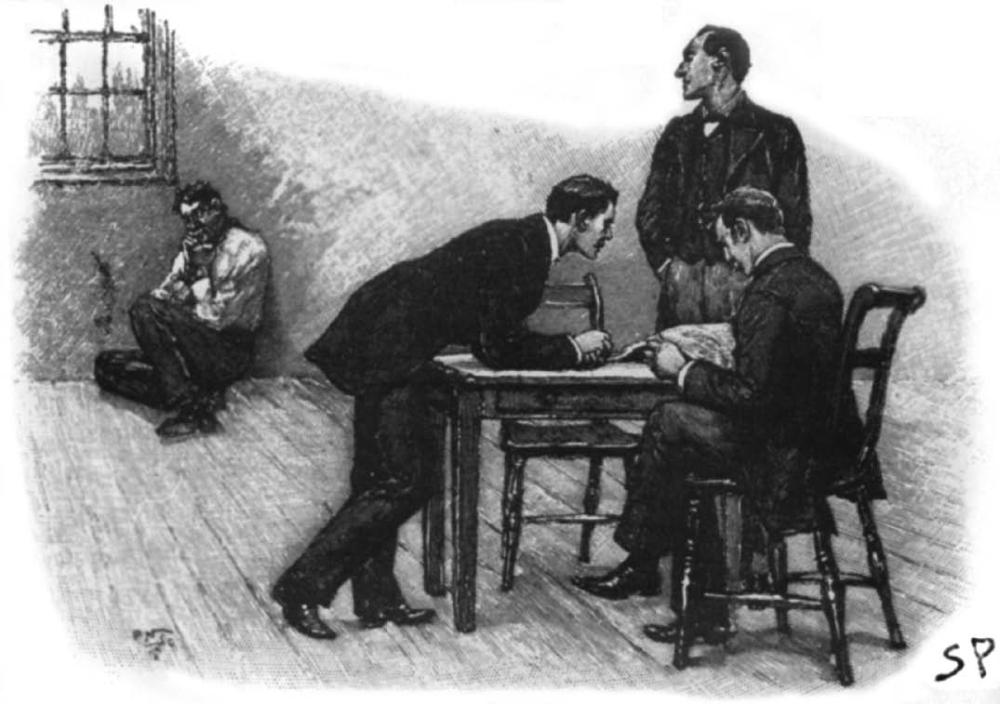

朝龟缩在窗边的憔悴枯槁的那个身子看一眼。

（1893年）

————————————————————

<a href="#part0065.xhtml_ch1-back" id="part0065.xhtml_ch1">(1)</a> 伦敦佬（cockney），指伦敦东区居民，该区为贫民区。

# 三桅帆船上的囚犯

“我这儿有几份东西，”我的朋友歇洛克·福尔摩斯说，那是一个冬天的夜晚，我们在壁炉前各靠一边坐着，“我确实认为，华生，值得你花点时间看一看。都是档案资料，有关格洛里亚·斯科特号的奇案。就是这张纸条，大大震惊治安官老特雷佛，把他活活吓死了。”

他已从抽屉里拿出一个灰不溜丢的小纸卷，解开卷带，递给我一张潦草地写在半张石板纸上的寥寥数语的字条。

The supply of game for London is going steadily up. Head-keeper
Hudson，we believe，has been now told to receive all orders for
fly-paper and for preservation of your hen-pheasant's life．

向伦敦供应野味趋势看好。总管赫德森，我们相信，现已奉命悉数接受黏蝇纸订单并维护你的雌野鸡生命。

掠过一眼这短短简谜一般的文字，我抬头看看福尔摩斯，他望着我脸上的表情只格格地笑。

“看你有点莫名其妙。”他说。

“我看不出这么一张便条能叫人有什么可怕，依我看完全荒唐，没有特别意思。”

“很像是。不过事实就是这样，一位身体好好的健康老人，读了这字条立刻一命呜呼，就像是挨了枪托，一下就给击倒似的。”

“你倒引起了我的好奇，”我说，“刚才你为什么说对我有特别的原因，更应当研究研究这个案子？”

“因为，这是我所经手的第一桩案件。”

我以前常常有意探究我的同伴，最初是什么原因促使他有心从事犯罪研究，但他老对我打哈哈，一直掏不出他的实话。现在他坐在扶手椅上，俯身把文件摊在膝头，然后他点起烟斗，坐着抽一会儿烟，又把文件翻来覆去地看着。

“你从来没有听我说起过维克多·特雷佛？”他问道，“他是我在大学的两年期间惟一交上的一个朋友。我这个人从来不善交际，华生，常常宁可独自一人在屋里闷坐，冥思苦想，满脑子探索问题，所以和我同年龄的人凑不到一块。击剑和拳击，是我的爱好，此外，对体育也没多大兴趣。我的治学同其他人很不一样，所以缺乏共同点，毫无交流接触。特雷佛是我惟一结识的一个人，那也只是碰巧才认识，一天早晨我上小教堂，他的一条斗牛犬咬了我脚踝。

“认识之初，交往很平淡，可是友谊从此开始。我十天不能随便走动，特雷佛常来看我，照顾我。起先话并不多，很快他待的时间就长起来，没到学期结束，我们已经成为好朋友。他精力充沛，情绪饱满，是个血气旺盛的人，性格很多方面和我正相反，但某些气质很一致。我发现他也是个落落寡合的人，我跟他倒成了莫逆之交。后来他请我上他家，见了他父亲，他们家在诺福克郡敦尼索普。我还接受他盛情邀请，长假期去他家住了一个月。

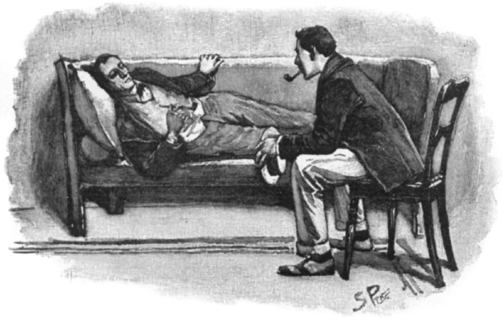

“我十天不能随便走动，特雷佛常来看我。”

“老特雷佛，一看就知道是个有钱人家，受人尊重，他是治安官，地产业主。敦尼索普是个小村，在布罗兹湖区的乡下，朗麦尔的北边。宅屋老了，是栎木砖瓦房，占地很开阔，宅前是一条菩提树林荫道。那里的沼泽地是打野鸭的好猎场，也是垂钓好去处。还有个藏书室，不大，可是精致而珍贵，听说是从原屋主手里承传下来的。还有一位手艺尚可的厨师。有这么些条件，要是在那儿度假一个月还嫌不乐意，那就太过挑剔了。

“老特雷佛妻子已亡故，我朋友是独生子。

“听说有过一个女儿，可是去了趟伯明翰患白喉死了。这位老父亲我倒是很感兴趣，他受教育程度不高，可是生活经验非常丰富，动手动脑都行。他读书是够不上万卷，行万里路可是远不止，见过种种大小世面，还博闻强记永不遗忘。人长得虎背熊腰，结实粗壮，一头乱蓬蓬灰白头发，一张饱经风霜的古铜色脸，碧蓝的眼睛总像是凶光毕露。但他在乡里远近闻名，是个和蔼慈善的人，在法庭断案总以宽大为怀，也是有口皆碑的事实。

“有天晚上，那是我刚到他们家不久，晚饭后正坐着喝葡萄酒，小特雷佛说起我喜欢观察、喜欢推论，已养成习惯，形成一整套思想方法。当然这在我自己还没有认识到会在我的一生中起什么作用。老人不信，觉得儿子无非在把我的一点小聪明夸大其词。

“‘那就好，福尔摩斯先生，’老人笑道，兴致很高，‘我就是个最好的题目，看看你能从我身上作些什么推论。’

“‘我恐怕推论不出多少，’我回答，‘我想提一提，在刚过去的一年里，你担心要遭到人身攻击。’

“他嘴边的笑意不见了，两眼盯住我，显出惊讶。

“‘噢，有点道理，’他说，‘你知道吗，维克多，’他转向儿子，‘那一帮偷猎人给我们赶跑了，他们发誓非拿刀捅了我们不可，爱德华·霍利爵士真的遭过他们暗算。我打那以后始终保持着警惕，我不明白你怎么知道呢？’

“‘你有一根很别致的手杖，’我回答，‘我看到上面刻有字，从中可以知道你用这手杖没超过一年。可是你特意在头上钻了洞，熔化了铅灌进去，使手杖能用作防身武器。我敢说，要不是可能遇到危险，你不必作这样的提防。’

“‘还有吗？’他微笑着问。

“‘你年轻时候常参加拳击。’

“‘又给你讲对。你怎么知道呢？难道我的鼻子给打歪了？’

“‘不是，’我说，‘是你的耳朵，特别扁平又特别厚，这是拳击手的标志。’

“‘还有吗？’

“‘你手上有老茧，你做过长时间的采掘工。’

“‘采掘金矿发的财。’

“‘你到过新西兰。’

“‘又讲对。’

“‘你到过日本。’

“‘很对。’

“‘你曾经对某个人非常熟悉、关系密切，此人姓名的首字母是J．A．，但是后来你要把这个人遗忘掉，要全部忘得一干二净。’

“特雷佛先生慢慢站起身来，朝我瞪着两只睁得大大的蓝眼睛，眼神惊奇、惶惑、狂乱，接着一个踉跄向前栽去，脸扑在桌布上凌乱的杯盘之间，跌得不省人事。

“你可以想象，华生，他儿子和我是多么震惊。不过还好，昏厥时间不长，我们解开他的领扣，拿起桌上一个洗手碗向他脸上喷水。他喘过一两口气，人就坐了起来。

“‘啊，孩子们，’他强作笑脸说，‘但愿没把你们吓着了吧！我看上去挺健康，可心脏不太好，禁不起刺激，动不动就要晕倒。不知道你怎么会有这一手，叫你都说对了，福尔摩斯先生，可我觉得，所有的侦探，现实中真的也好，虚构想象出来的也好，在你面前都只能算是小巫见大巫了。这可以成为你的事业，终身吃这个饭。先生，你可以相信一个饱经世事、阅尽人间沧桑的人给你说的这句话。’

“他这个建议，是慧眼识人，对我能力褒奖有加吧，但你可以相信，我正是这样，华生，这是第一次使我觉得，一向以来仅仅视作业余爱好的专长，居然可以考虑选为终身职业。但在此时，我一心想着老先生忽然晕厥，没工夫考虑别的事。

“‘我但愿没有说到让你伤心的话吧？’

“‘哦，你触到了我的伤痛，真的。想问一下你怎么知道？还知道多少？’他现在是半开玩笑似的说，但眼神仍旧透着深深的惊骇。

“‘实际上很简单，’我说，‘那天在小船上，你捋起胳膊把鱼捉到船里来，我看见你肘弯部位刺有J．A．的字母。字形仍旧看得清楚，但明显已经给祛除过，周围皮肤有模糊的痕迹，看得出是要把字迹抹掉。那就是说明，这两个首字母曾经是你非常珍惜的，但是后来你想要忘掉。’

“‘真是好眼力！’他叫道，舒了一口气，‘情况正像你说的一样。不过不必提它了，旧相识的恶鬼是所有恶鬼中最可怕的。一起到弹子房来，安安静静抽支雪茄吧。’

“从那天以后，特雷佛先生对我态度还是很诚恳，但是诚恳之中始终带有几分疑虑，这个连他儿子都能看出来。‘你叫我老爸心神不定，’他说，‘爸爸都拿不准，什么你知道什么你不知道。’老先生有心不要显露，但是我清楚，他内心波动很激烈，时时处处不能不有所流露。最后我意识到，是我引起他心神不安宁，我在这儿作客该结束了。可是就在我要离开的这天，发生一件事。有这件事才牵出后面的重头戏。

“那天我们三人坐在花园草坪的椅子上晒太阳，欣赏对面布罗兹的湖光水色，这时女仆跑出来说有一个人在门口要见特雷佛先生。

“‘他叫什么名字？’老先生问。

“‘他不说。’

“‘他要做什么？’

“‘他说你认识他，说只同你讲几句话就行了。’

“‘领他到这儿来吧。’一会儿就过来一个瘦小干瘪的人，模样委琐，脚步拖沓，一件夹克敞着前胸，袖口上有柏油污渍，一件红黑格子衬衫，一条粗蓝布工作裤，一双长靴已经破烂。一张棕色削尖的脸，始终露着奸笑，嘴里黄牙错落不齐，双手皱皮疙瘩，半握着拳，一副水手的习惯姿态。他懒散地走向草坪，我听得特雷佛先生嗓子里打嗝似的一声响。他从椅子上忽地跳起，向屋子跑进去；一会儿又出来，走过我身旁，我闻到一股浓浓的白兰地酒味。

“‘啊，朋友，’他说，‘找我有什么事？’

“水手站在那里，眉毛眼睛都皱起，一张瘦削的脸咧嘴微笑。

“‘你不认识我了？’他问。

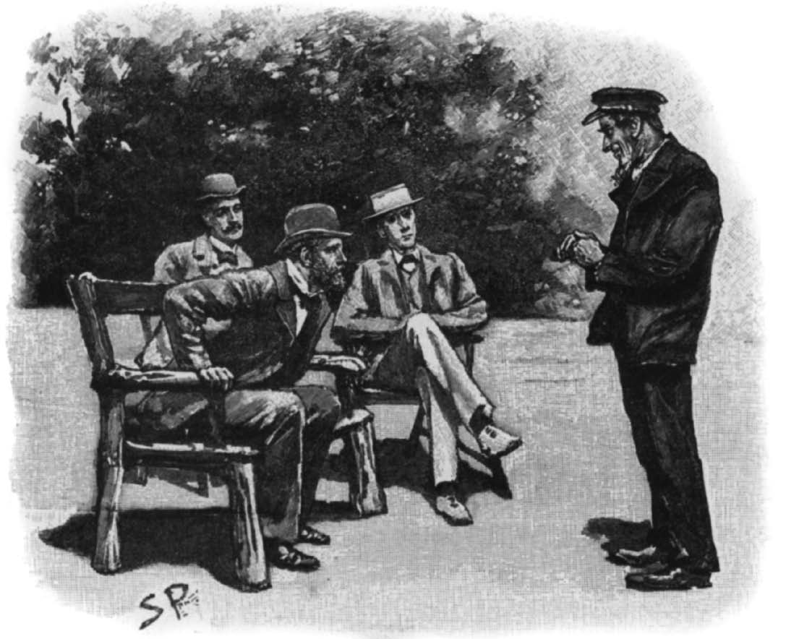

“你不认识我了？”

“‘噢，天啊，这不是赫德森吗！’特雷佛先生说，一副很惊愕的样子。

“‘正是，赫德森，先生，’水手说，‘是呀，上次见了你到今天，已经三十多年了。这儿，你有了宅子有了家，可我，还是船上腌肉桶里拣咸肉吃。’

“‘啊，要晓得我可没忘记过去，’特雷佛先生大声说，同时走到水手跟前，轻声讲些什么。‘到厨房去，’接着又提高了嗓门说，‘先吃点喝点。没问题，我想办法给你安顿。’

“‘谢谢你，先生，’水手说，捋一下遮在额上的头发，‘我刚下船，一艘八节流浪船，无固定航期航线，流浪货船流浪人，干了两年了，人手紧，很累，我得休息了。想来想去，只有来找贝多斯先生或是你。’

“‘噢！’特雷佛先生高声说，‘你知道贝多斯先生在哪里？’

“‘是呀，上天保佑，老朋友在哪里我都知道，’这个人面带奸笑地说，懒洋洋地跟女仆去了厨房。特雷佛先生含含糊糊同我们讲起，这是早年去采矿的时候的同船人，他讲了就离开，进屋，让我们留在草坪上。一小时以后我们也回了屋，看见他撒手撒脚躺在餐厅沙发上，酒醉不省人事。这天整个儿的情况，给我心里留下很坏的印象。第二天我离开了敦尼索普，没有丝毫留恋或惋惜，因为我觉得，我住在那里只会使我朋友尴尬为难。

“长长的假期，第一个月就是这件事。回到伦敦，在家里做了七个星期有机化学实验。然而，秋天来临、假期即将结束的时候，有一天我收到朋友发来电报，恳请我再到敦尼索普去，说有急事要求我指点、帮助。我当然把什么事都丢下，立刻出发，又北上跑一趟。

“他备好双人单马车在车站接我，我一眼就看出这两个月来他没少吃苦。人瘦了，脸憔悴了，他往日谈笑风生、特别轻松的神情不见了。

“‘老人家快不行了。’他见面头一句就这样说。

“‘怎么啦！’我叫起来，‘出什么事啦？’

“‘中风，神经严重刺激，时时刻刻有危险，这会儿回去还不定他有活没活呢。’

“你可以想见，华生，这么可怕的消息，太意外了。

“‘怎么引起的？’我问。

“‘嗨，正是这问题呀。上车，路上跟你细谈。还记得你离开我们前的上一天，晚上来的那个人吧？’

“‘记得。’

“‘那是个魔鬼，福尔摩斯先生。’他喊叫着。

“我惊奇得傻眼看着他。

“‘真的，十足一个魔鬼。他来以后，我家没太平日子过——一天也没有。那晚以后，老人家没有了抬头的日子。现在老命危在旦夕，心都碎了，全是这该死的赫德森害的。’

“‘这个人那么厉害，怎么回事？’

“‘是啊，我就是也想知道呀，像爸爸这样善良宽厚的老人家——怎么会捏在这种贼流氓的手里！现在你来了，我就宽心了，福尔摩斯。我完全相信你有分析力、判断力，知道你能给我拿出最好的主意。’

“马车在乡下干净平坦的大路上飞跑，前方绵延一片的布罗兹湖区在夕阳余晖中闪烁霞光。左方树林望过去，已经看见高高的烟囱和旗杆，那就是乡绅治安官宅邸的标志。

“‘我父亲让这个家伙当园丁，’我同伴说，‘结果没能满足他，又提升他当管家，这下整屋子都得听他管。他游手好闲，想做什么就做什么。他酗酒，经常喝个烂醉，还污言秽语尽是脏话，女仆们都怨恨叫苦。爸爸只好用加工资的办法来安抚她们。这个混蛋还划船，拿父亲最好的猎枪，出去游猎逍遥。这样如同老祖宗，还一天到晚绷着个鬼脸，朝你冷笑、瞪眼，傲慢无理至极。他要是我这辈年龄，我早就揍他，把他打翻在地二十次。跟你说，福尔摩斯，我这段时间一直耐着性子压着火，我现在自己反过来想想，要是我不克制，说不定倒是个聪明的做法。

“‘唉，情况越来越坏，这个畜生赫德森，变得越来越嚣张。有一天他冲我父亲出言不逊，我正好在旁边，上去一把揪住他肩膀把他撵出屋子。他不吭声，灰溜溜跑掉了，只铁青了脸，恶狠狠瞪着两眼，那目光发出比言语更毒的威胁。不知道我这样一来，可怜的老爸和他之间又有什么交涉，但是第二天老爸来找我，要我去给赫德森道歉。我拒绝了，这你也该想得到。我反问父亲，怎么会听任这样一个坏种对他、对全家人如此飞扬跋扈、肆无忌惮。

“‘“唉，我的孩子，”父亲说，“你说的也的确不错，可是你不知道我的处境有多难。不过，你会知道的，维克多，父亲会让你知道，不管出现什么情况。你不会想得到你可怜的老父亲有多么伤心，你晓得吗，孩子？”他非常激动，一个人关进了书房，整天不出来。我只能从窗外望见他在不停地写。

“‘那天晚上，情况有了转变，我才大大松了一口气，因为赫德森对我们说，他要走，要离开我们。那时我们已吃好晚饭，还坐着，他走到餐厅里来，喝得半醉，响起破嗓子宣告他的意图。

“‘“这儿诺福克，我待够了，”他说，“我要到汉普郡去找贝多斯先生。他一定乐意见我，像你们那时候，我敢说。”

“‘“你不要不开心赌气了走呀，赫德森，我希望你不要这样。”我父亲说，竟还要低声下气用这副腔调，我气得浑身血液都要沸腾了。

“‘“还没有给我赔礼道歉呢。”混蛋绷着脸说，朝我瞟了一眼。

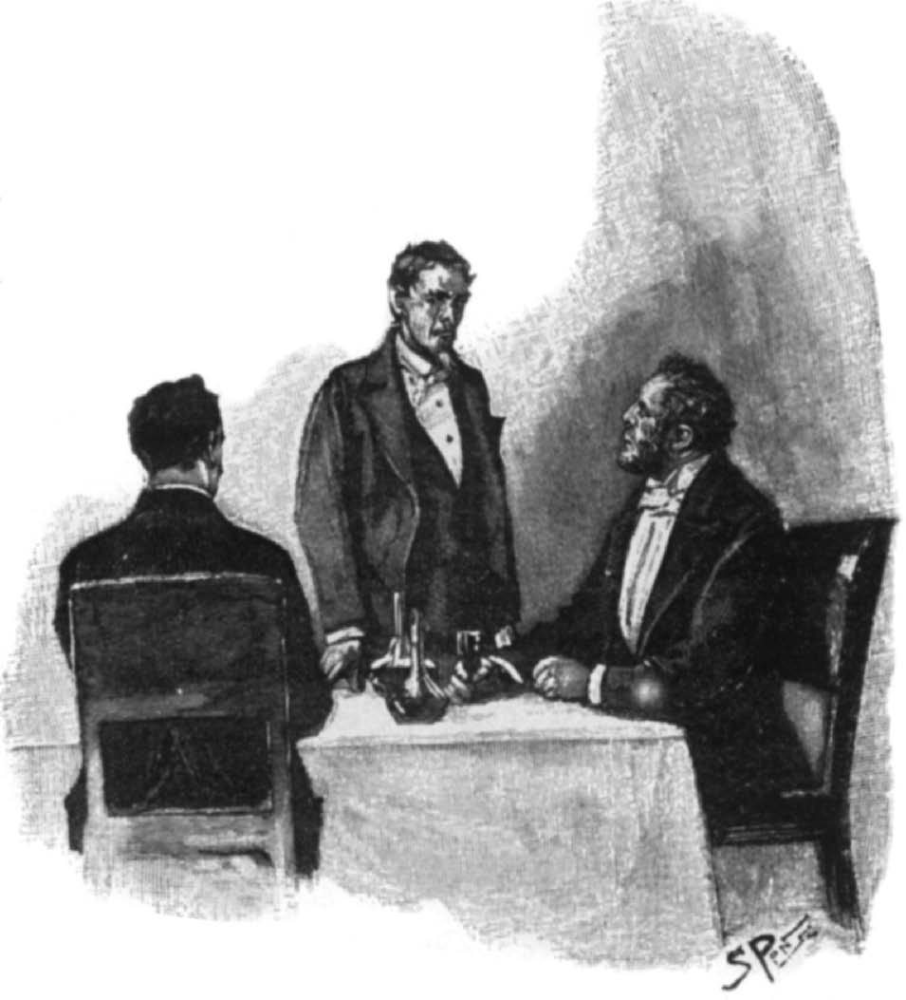

“还没有给我赔礼道歉呢。”

“‘“维克多，你要承认，这一位朋友你应该尊重，你是失礼了。”父亲转身向我说。

“‘“完全相反。我要说，我们父子两人对你迁就得太不像话。”我回答。

“‘“好，好，有你这句话就行，是你说的啊？”他咆哮着，“很好，叫你声小老弟，咱走着瞧！”

“‘他夹着尾巴出了餐厅，半个钟头以后，离开了我家，我父亲反而陷入了紧张害怕的可怜境地。一夜又一夜，我听见他在房里踱来踱去。好不容易他心态刚刚恢复正常，大祸终于从天而降。’

“‘什么事？’我急忙问。

“‘情况非常奇特。昨天晚上来一封给父亲的信，盖的是福丁哈姆邮戳。父亲一看，便双手敲着脑袋，急得一个劲在屋子里转圈儿，一副失魂落魄的样子。我一看不行，就硬拽住他往沙发上坐下，他的嘴和眼皮渐渐歪到了一边。我一看是中风，快去把福德哈姆大夫请到。我们抬父亲上床，可是他人开始瘫了，丧失知觉，没能再恢复过来，看来已经难有活命的希望。’

“‘你说什么呀，特雷佛！’我大声叫嚷，‘信上能写什么，会引起这么可怕的后果？’

“‘没什么呀，事情奇就奇在这里。一纸短简，不相干，没意思。啊，我的上帝，担心的事终于临到头上了！’

“这么说着，我们顺林荫道绕弯，暗光中看到宅屋窗户窗帘全放下，我们三步并作两步到了门口，朋友已显出满脸悲伤。一位黑衣绅士迎出来。

“‘是什么时候，大夫？’特雷佛问。

“‘就在你刚走那会儿。’

“‘恢复过知觉吗？’

“‘临终前苏醒过一会儿。’

“‘有没有留言？’

“‘光说有纸在日本柜的后抽屉里。’

“我的朋友同医生去了死者的房间，我留在书房，脑子里把这事翻来覆去想，只觉得心情之忧郁前所未有。特雷佛过去的历史怎么样？这位拳击家、旅行家又是采金人，为什么要受一个瘦猴脸水手支配？又为什么一提起胳膊上半模糊的字母要晕厥过去？接到汉普郡来信就要吓死？我接着想起，福丁哈姆就是在汉普郡，而那个贝多斯先生，水手找他去了，看样子是去敲诈，也提起过他正是住在汉普郡。那么这封信要么来自水手赫德森，说他已经把以前的犯罪事实告密，要么来自贝多斯，向一个老同谋发出警告，说他马上要被赫德森告发出卖了。如此说来事情就够清楚，但又为什么信上所写，照儿子的说法，文字纯属荒唐无稽呢？其中原因，他恐怕是没有看懂。如果真是这样，那么一定是一种密码信，内中有诀窍，字面上讲这样，实际意思是那样。这信我一定得看一看，只要确有隐秘意思，我相信我能破解出来。我坐在暗屋里独自思量了一个小时，后来一个泪痕满面的女仆拿进一盏灯，跟随后面的是我的朋友特雷佛，面色苍白，但还算镇静，手里拿着几张纸。喏，就是现在我膝头上的这几张。他面对我坐下，把灯移到桌边，递给我一张字条，就是你看的这个，一张灰纸上潦草写着几个字，是这么写的：‘The
supply of game for London is going steadily up．Head-keeper Hudson，we
believe，has been now told to receive all orders for fly-paper and for
preservation of your hen-pheasant's
life．’（向伦敦供应野味趋势看好。总管赫德森，我们相信，现已奉命悉数接受黏蝇纸订单并维护你的雌野鸡生命。）

“我得说，初看到这张字条，我满脸那个疑惑，就跟你刚才看了以后一个样。我再仔细读一读，果然不出我所料，这奇怪的文句组合，很明显暗藏有隐秘的意思。又想，什么‘黏蝇纸’、‘雌野鸡’这种词，会不会是先有约定的暗语？这种暗语意思随便设定，再怎么分析猜测都是毫无办法的。但是我不相信是属于这种情况，因为有赫德森这个名字在里头，写信的意思恐怕是我原来估计的那一类，这信是贝多斯写来的，不是水手所写。我把信倒读试试，可是‘life
pheasant's
hen’（生命雌野鸡）这样的词组没有意义。再每隔一个词跳读看看，也不行，‘the
of for’（这为）也好，‘supply game
London’（供应野味伦敦）也好，都没能显示任何意思。

“可是过了一会儿，解谜的金钥匙马上来到我手里。我看出从头每隔两个词一读，意思立刻出来，怪不得要送掉特雷佛这条老命。

“很是简短扼要，是发出警告，我马上读给我的朋友听：

“‘The game is up．Hudson has told all．Fly for your
life．<a href="#part0066.xhtml_ch1"
id="part0066.xhtml_ch1-back">(1)</a>（事情全完。赫德森已全部说出。你快逃命。）’

“维克多·特雷佛脸埋进颤抖的双手。‘就是这个意思，没错，’他说，‘这可是比死还要坏，还要叫你蒙受耻辱。那么，还有“head-keeper”（总管）、“hen-pheasant's”（雌野鸡）这些词的意思呢？’

“‘这在信里头就没有意思，不过，要确定这写信人是谁，这就对我们大有用处。你看，他是这么开始写的，“The…game…is”，等等，这是预先已经拟好要告诉的秘密话，之后每个空档要填充两个词。他很自然地，总是用心中首先想到的词。这里都是用运动方面的词，你可以想见，他不是个打猎爱好者，也一定是个禽类爱好者。这个贝多斯的情况你了解吗？’

“‘噢，你这么提起，’他说，‘我记得可怜的父亲每年秋天，总是受邀请到他猎场去打猎。’

“‘那就没问题了，这一封信，肯定是他写的了，’我说，‘剩下来的，我们要了解是什么秘密，给这个水手赫德森捏在掌心，可以叫家势雄厚的两个人老命不保。’

“‘嗨，福尔摩斯，我担心其中是一件罪恶事，丢人事！’我的朋友大声说，‘不过我对你是没有什么秘密要隐瞒的。这儿有份文件，是我父亲写的。他面临赫德森的威胁，知道危险日益逼近，写好留着，我刚才在日本柜里找到，是他告诉大夫的。请你拿去念吧，我自己念，实在没有力气，也没有勇气。’

“就是这些纸，华生，是他给我的。那天晚上我在旧书房给他念的，现在念给你听。你看，外面写的是，‘格洛里亚·斯科特号三桅帆船航行记事。一八五五年十月八日由法尔默思起航，同年十一月六日于北纬十五度二十分、西经二十五度十四分沉没。’这是一封信，书信体记事。

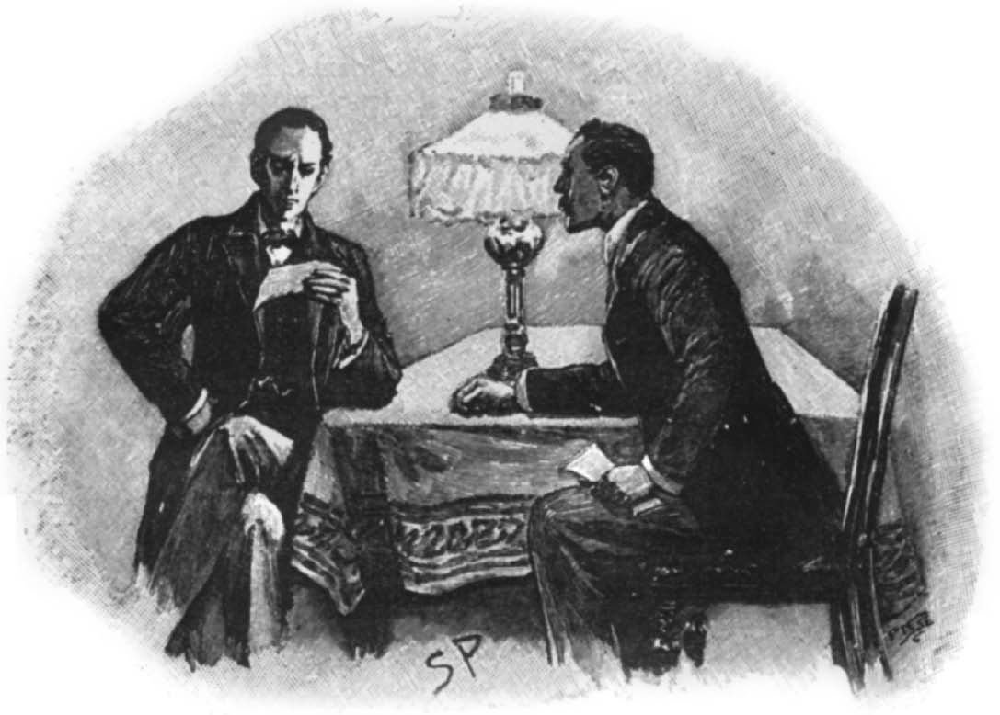

“就是这些纸，是他给我的。”

“‘我最亲爱的儿，父亲受的耻辱日益迫近，已是暮年无光。我把事实真相如数写下，并不畏惧法律，也不顾虑丧失在本郡的官职，更不在乎知我者的眼里身价一落千丈，会令我痛心疾首；我想的只是你，你要因我而蒙羞受辱——你爱我，你对我，如我希望，从来不曾有过一点不尊敬的地方。但如若一向令我提心吊胆的打击不免降临，我会叫你将此信不妨一读，以便你直接从我所讲知道我负有的罪责。若是还不至于如此，终于一切得以平安无事（愿仁慈万能的主赐福！），此信又不曾销毁，又不知何时偶入你手中，那么我恳求你，念上帝的份，念你亲爱的母亲，念你我父子之情，务必付之一炬，永世遗忘，勿予提及。

“‘到时你果真看到此信，则我必已身败名裂而陷囹圄，或者，你知我心脏衰弱，则十有八九我已沉默长眠。但无论何种情形，皆已无须继续隐瞒，故而我此信所述，必是句句属实，愿示肺腑，以求宽恕。

“‘我的名，亲爱的儿，不叫特雷佛。我年轻时候原名詹姆斯·阿米塔奇<a href="#part0066.xhtml_ch2"
id="part0066.xhtml_ch2-back">(2)</a>。你现在由此可以理解数星期之前我那次受惊以至晕厥，全因你的大学朋友对我讲的一番话，在我听来我的秘密似乎就要被他挑破。阿米塔奇的我，进入伦敦一家银行工作，阿米塔奇的我，触犯国家法律而被定罪，判以流刑。不要对我过于苛责吧，我的孩子。那是为一宗道义约束而非法律约束的债款，即赌债之谓，我须偿付，便暂挪公款，原有把握短时间内即可补进填平，不料厄运难逃，原指望的钱未能到手，且祸不单行，又逢提前查账，我账目亏空即被揭出。此类案犯本可从轻发落，但三十年前实施严刑峻法，不比今日。可悲我二十三岁生日这天，被视为重刑犯身戴镣铐，与三十七名其他囚犯一起，押上三桅船格洛里亚·斯科特号，塞入甲板间，发配澳大利亚。

“‘那是一八五五年，其时克里米亚战事正酣，多数囚船被征用在黑海作运输船，政府不得不权宜调用较小且设施不全的船发送囚犯。格洛里亚·斯科特号一向是跑中国的茶叶商船，船型老旧，重艏低垂，宽船身，与新式快速帆船相比早已落伍。船载重五百吨，船上除三十八名囚犯外，还有船员二十六人，士兵十八人，船长一人，船副三人，医生一人，牧师一人，狱卒四人。从法尔默思起航时，号称百人。

“‘囚犯舱一间间的板壁，薄且脆，不如专用囚船是厚实的橡木板壁。隔壁与我贴邻有一个人，我们都是在船尾，此人我还在他被押上码头时就注意到了。一个年轻人，一脸清秀，无髭无须，鼻梁细挺，瘪嘴。他昂首阔步，摆出得意扬扬、满不在乎的架式。最为突出的是他非同寻常的身高，我没见过谁的头顶及得上他的肩膀，用尺量肯定不低于六英尺半。在如许委靡、忧伤、困顿的脸相中，能看到这样一张神采坚毅的脸，确属难得。我一见，如寒冻遇篝火。令我高兴的是，与他竟成邻居，令我更高兴的是，夜深入睡，耳边传进细语，原来，是他将隔板捅破一小孔。

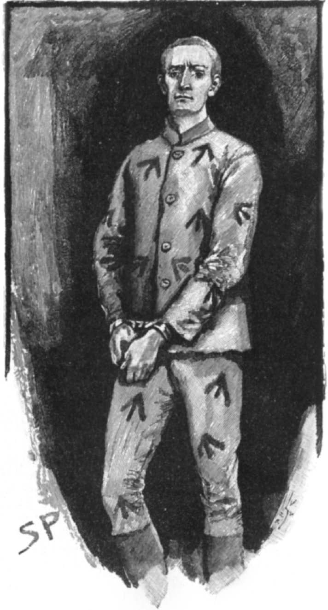

他被押上码头。

“‘“哈啰，朋友！”他说，“你叫什么名？犯何事来此？”

“‘我回他话，也问他是何人。

“‘“我叫杰克·普伦德加斯特，”他说，“上帝作证！跟我一起你必有好处，绝不吃亏。”

“‘我记起曾听说过他的案子，是震动全国的大案，那时我还未被捕。他出身世家，本领高强，但沾染恶习，无可救药。他巧施连环计，骗取伦敦诸富商大宗款项。

“‘“啊哈，我的事你还记得！”他说，颇自豪。

“‘“记得，很清楚。”

“‘“那么说，其中了不起之处你也知道？”

“‘“什么了不起？”

“‘“我搞到将近二十五万镑，不是吗？”

“‘“听说如此。”

“‘“可是一个子儿也没被追回，知道吗？”

“‘“不知道。”

“‘“此巨款未还，你猜哪里去了？”

“‘“猜不到。”我说。

“‘“仍攥在我掌心之中，”他得意道，“上天佑我！我手上英镑之多多于你头上头发。只要你有钱，小伙子，有本事挣、有本事花，那世上事事都由你。一个无所不能无所不为者，你想他会甘心在此？你想他会甘心在这艘跑印度支那老棺材一只的破船上？老鼠、虫子、臭气，活受罪，坐以待毙？不，先生，大丈夫当能自助助人，一起干吧！信赖他吧，你吻《圣经》发誓，他必搭救你。”

“‘他言之凿凿，但我起初还不以为然。过了一会儿，他又对我一番试探，并一再郑重誓言，才让我明白他确已有劫船之计谋。原来上船之前，已有十二名犯人串通酝酿，为首者普伦德加斯特，他有金钱，金钱即为动力。

“‘“我有一同伙，”他说，“不可多得的一个好人，可靠如左右手，好样的，好本事，钱在他手里，他藏着。你猜这会儿他在哪里？嗨，他就是这船上的牧师——船上牧师，一点不假！他披黑袍来到船上，证件件件都有，箱子里的钱足以买通一船上下的人。全体水手都听他的。他们受雇签字前，就已被他一个不漏全部收买过来，当场付现还打掉点折扣。他还收买了两个狱卒，还有二副梅勒，连船长他都能买下，若是他认为值得。”

“‘“那么怎么行动？”我问道。

“‘“你考虑呢？”他反问，“我们要叫士兵的制服染红，比裁缝做的红上加红。”<a href="#part0066.xhtml_ch3"
id="part0066.xhtml_ch3-back">(3)</a>

“‘“他们有武器。”我说。

“‘“我们也有武器，小伙子。我们每人两支枪，有手就有枪。我们有着全体水手做后盾，要是船还拿不下来，那我们该去进小姑娘寄宿学校了。你左边那个人，今夜你谈谈试试看，可不可靠。”

“‘我照办了，发现隔壁那位也是年轻人，处境与我相同，罪名是造假币。他名叫伊文思，后来改名换姓，如我一样；他现在是英国南方一富贵之人。经我一说，他便欣然同意加入密谋行动，想自救惟有此途。船还未过海湾，全体囚犯除两人外，都已秘密联络起来。那两人中一个是弱智，不可托付，另一个患黄疸病，不能行事。

“‘劫船行动一开始就很顺手。船员都是一伙流氓，专候着机会下手。假牧师来囚犯舱给大家鼓劲打气，带一个黑包，表面上是装经文册子，他就这样经常出入在我们之间。到第三天，我们每个人的床脚边藏好了一把锉刀，两支手枪，一磅炸药，还有二十发子弹。两个狱卒早已是普伦德加斯特的人，二副也成了他的帮手。剩下船长、两个船副、两个狱卒、中尉马丁和他的十八名士兵，还有医生，是需要我们对付的。事情虽然进行稳当，我们还是不可掉以轻心，决定在夜间发动突然袭击。然而事情出乎意料迅即爆发，具体是这样的：

“‘大约船行第三个星期的一天傍晚，有个犯人身体不适，医生来看病，他的手在铺位上触到硬物，一摸是手枪。他若是当场不声张，此次密谋便要流产，偏偏他慌张惊叫，脸色刷地变白，犯人知道不好，立刻起来把他按倒；他还来不及再出声，嘴已堵住，被绑翻在床上。医生来时打开甲板门后未再上锁，我们便赶快一拥而上。两个哨兵中弹倒地，班长闻声跑出来察看发生什么事，即遭同样下场。另有两个士兵守卫官舱的门，想必是火枪根本未装火药，因为他们并没有开枪。他们在匆忙上刺刀，也立刻被击毙。我们接着冲向船长室，门尚未冲开，里边响起枪声。推门一看，船长趴在桌上，脑浆直流，染污了钉在桌面的大西洋航海图，他旁边站着牧师，手中举着的枪还在冒烟；两个船副也已被船员擒住。看来整个事情已大功告成。

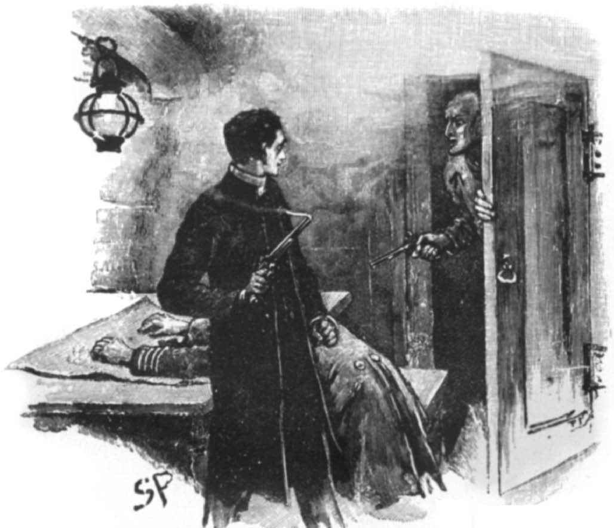

推门一看，船长趴在桌上。

“‘船长室隔壁就是官舱，我们一窝蜂进去，长靠椅上稀里哗啦一坐，谈得兴高采烈，因重新又获自由而欣喜若狂。官舱周围有许多货箱，威尔逊，那假牧师，拖一箱打开，拿出十二瓶棕色雪利酒。我们砸掉瓶口，把酒倒满大酒杯，正待举杯痛饮，忽然火枪声大作，震耳欲聋，刹那间一屋子浓烟弥漫，隔桌的人都看不见。待硝烟稍散，眼前横尸一地，威尔逊和另外八个人互相枕藉，扭动着作垂死挣扎。鲜血和着桌上的棕色雪利酒，那印象每当现在忆及都要令我恶心呕吐。我们面对这惨状不寒而栗，若非普伦德加斯特拼力顶住，我想我们必死无疑。他犹如一头公牛，一声狂吼冲出门去，未死的人紧跟其后。我们跑出舱外，看见艉舱甲板上中尉和他的十个士兵，站在官舱顶的活动天窗那里，刚才他们正是从窗口向桌面开枪。我们趁他们尚来不及填好火药，就冲上去。他们英勇抵抗，但我们人多势众，仅五分钟就把他们全部解决。我的上帝！航船已成了屠宰场！普伦德加斯特像个狂怒的魔鬼，他从甲板上举起士兵像拎起小孩子，不管是死是活，直朝海里扔。一个中士伤势虽重，仍泅游挣扎，有人不忍，一枪打碎他脑袋了结。战斗结束，除两个狱卒、两个船副和一个医生，我们的敌人已一个不留。

“‘对这几个人如何处置，引起争议。我们很多人为争回自由而高兴，但凭良心说，原本并不希望去杀人。杀死荷枪实弹要杀人的士兵是一回事，将人蓄意残杀则是另一回事，不能无动于衷。我们八个人——五个犯人，三个水手，说我们不愿意看见将他们杀死，但是这没有说动普伦德加斯特，包括站在他一边的那些人。我们惟一的安全机会维系于事情做得彻底干净，他坚持说，他不能留下活口，将来让他们到法庭上去做证人。这场争吵激烈得差不多要把我们拘禁起来，但最后他说如果我们愿意，我们可以另驾小艇离开。我们欣然同意，我们也已厌恶这血腥的屠杀；我们看到，此事还未下手，恐有更残忍事发生。我们每人拿到一套水手服，一桶水，两桶吃的——一桶腌牛肉，一桶饼干，再给一个罗盘。普伦德加斯特顺手给我们一张海图，告诉我们要推说都是遇难海员，船沉没于北纬十五度西经二十五度，然后砍断缆绳，让我们走。

“‘现在我要讲到这个故事最惊人处，我的爱儿。在骚乱时候船员把前桅下帆横桁顶风，现在等我们下船以后，重新扬起风帆，乘东北微风离开我们缓缓驶去。我们的小船在平缓起伏的海浪上颠簸漂行，伊文思和我，在小船上算是最受有教育的人，坐定了查看海图，确定我们现在处于什么位置，计划向何处海岸行驶。向北五百英里是佛得角群岛，向东七百英里是非洲海岸，这个问题应当仔细考虑。总体而言，因风向转北，以确定塞拉利昂为最好，我们便朝此方向行驶。这时候，我们向后望，三桅船在我们右侧方位很远，已经不见船身，只露船帆。我们正这么望着，忽然看见那里一团浓密黑云倏地直升而起，似一棵怪异大树竖立天际。略过几秒钟，一声如霹雳巨响震耳传来，等浓烟稀散，格洛里亚·斯科特号已渺无踪影。一瞬间我们马上掉转船头，奋力朝烟云飘升下的水面划去，那里肯定已出大事。

“‘我们费了足足一个钟点才赶到那边，向周围一看，发现来得为时过晚，已经无人可救。一艘破碎的小船壳、许多残板、破箱、断桅、圆木，随海浪起落漂浮，大船已经沉没了。既然不见人影，我们便绝望回头。正在此时，忽闻呼救，寻声望见一段船板上趴着一个人。我们把这人拉上船，一看原来是年轻水手，名叫赫德森。他有烧伤，筋疲力尽，不能告诉我们发生什么情况，到第二天早上才开口。

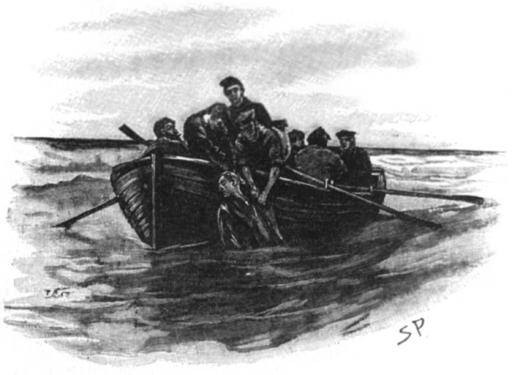

我们把这人拉上船。

“‘情况是我们离船以后，普伦德加斯特和他那伙人动手处死余下的五人，两个狱卒被射杀，扔进海里，接下来三副也是同样遭遇。普伦德加斯特再下到甲板间，亲手把倒霉的医生喉咙割断。最后剩下大副，这大副是个艺高胆大之人，他看着这高大的罪犯手中提着血淋淋的刀向他走来，他把已经给挣扎松掉的绑索猛一下扯掉，冲下甲板钻进后货舱。十二个犯人拿着手枪追下来抓他，只见他手里拿着火柴藏在一个开封的火药桶边——船上共载有一百桶火药。这时他高声发誓叫道，若敢动他一下，立即点爆火药，叫全船同归于尽。他话未了即刻发生轰然爆炸。照赫德森讲法，是一个犯人向大副开枪，误中了火药桶，而并非大副划火柴点爆。但不管是何原因，格洛里亚·斯科特号和劫持它的那批暴徒总之是如此结局。

“‘简单说来，我亲爱的孩子，这件涉及我的可怕历史事实就是如此。下一日我们被一艘开往澳大利亚的双桅船霍特斯泼号救起。该船长相信我们是海难客船幸存者，也就不存疑义。海事法庭将格洛里亚·斯科特号运输船以海上失事为由记录在案，而其真实命运未尝有一词之泄漏。经过一帆风顺的旅程，霍特斯泼号将我们送上悉尼港。伊文思和我改名换姓去从事采金业，我们混迹在各国人群之中，隐藏往昔真实身份毫无困难。其余事我无须细说。后来我们发迹了，周游世界，以殖民地富翁身份回到英国。我们置地买屋建家业，二十余年来过着富裕安乐的生活，我们希望把过去的事永远埋葬。当这个水手来找我们时，我一眼即认出是我们海上救起的那人，我当时心里是何种感觉，便可想而知。不知他是如何追踪到此，趁我们有畏惧之心，赖靠住我们过活且为所欲为。你现在终可明白，我为何要百般迁就于他以求宁静，你也多少会同情我为此终日惴惴不安。他现已离我他去，找另一人继续讹诈，凭三寸毒舌而发致命威胁！’

“下面写的字，因为手势越抖越厉害，看起来很费劲，‘贝多斯写来密信，说赫已全盘说出。哦，上帝，怜悯我们的灵魂吧！’

“就是这样，那天我给小特雷佛读的这份东西。我想，华生，按此情况来看，可说是一出戏剧。好朋友为这事心里不胜悲痛，出走去了特拉伊经营茶场，我听到消息，他在那里一切都好。至于那个水手和贝多斯，自从那天写警告信以后，都再也没有下落，两人完全销声匿迹，警方没有得到过任何揭发报告。所以看来是贝多斯受到威胁，误以为真。有人看见过赫德森出没于该处，警方判断他杀害贝多斯后逃逸。而我则认为，事实恰巧相反，我看非常可能是贝多斯相信自己要被出卖，就报仇雪恨把赫德森杀掉，带上一切能带的钱财逃往国外。案子事实就是这些，医生，如果对你收集故事有所裨益，我相信聊可供你一用。”

（1893年）

————————————————————

<a href="#part0066.xhtml_ch1-back" id="part0066.xhtml_ch1">(1)</a> “game”意为“比赛、游戏、计谋、猎物、野味”等，本文句中明指野味，暗指昔日犯事。“fly”意为“苍蝇、逃跑”。

<a href="#part0066.xhtml_ch2-back" id="part0066.xhtml_ch2">(2)</a> 詹姆斯·阿米塔奇（James
Armitage），首字母就是文于手肘的J．A．。

<a href="#part0066.xhtml_ch3-back" id="part0066.xhtml_ch3">(3)</a> 旧时英军制服为红色。

# 马斯格雷夫家族的仪规

我的朋友歇洛克·福尔摩斯的性格特别使我感到与他相处实在必须格外注意。虽然他的思想方法精确严谨可称人中之杰，服饰穿着也只求整洁朴素，可是他个人的日常行为十分邋遢，不拘小节，和他一起生活很不习惯。就我个人而言，我在生活习惯上完全不是一个传统拘谨的人。我在阿富汗那期间，也可说是乱七八糟，波希米亚式的无拘无束放任到了极点，使我也变得十分懒散，不像一个医生应有的品格行为，不过我还是有个范围限度。我一看到他把雪茄往煤桶里放，把香烟往波斯拖鞋头上搁，把未覆来信用折刀往壁炉台面上一戳，我就没好气，脸色一本正经起来。另外我认为，手枪练枪法总要到户外去，这是不用说的，可是福尔摩斯，独有他别出心裁，居然在屋里坐着扶手椅，举枪轻扣微力扳机，用标准打靶子弹一百发，对着墙上点击出爱国主义象征的维多利亚女王V．R．<a href="#part0067.xhtml_ch1"
id="part0067.xhtml_ch1-back">(1)</a>字母。我深感这样做法破坏了好端端的环境氛围，房间这样一来很是不雅。

我们几间房间老是充斥着化学物品和刑侦遗物，而且随意乱放，常会出现在奶酪盘里，甚至更不可容忍的地方，然而最大的问题还是他的纸张文件。他最恼火把文件遗失或毁掉，特别是有关他过去案子的资料，但是要隔一两年才有那么一次机会加以整理和妥善安放；正如我已在若干篇凌乱的回忆录中曾有提到，他每当热情高涨、意气昂扬地做出卓越成绩而功成名就之后，随即跌落，马上懒散，捧一把小提琴、几本书打发日子，从沙发到桌子之外便少有移动。如此，一月又一月地纸张累积，直到每个屋角都堆满一捆捆手稿，也绝不会烧掉一张一份。那些手稿一直扔那里，他主人不动也就无人会动。

有一年冬天一个晚上，我和他一起坐在火炉旁，我看他正好收起摘记本结束抄录，就冒昧提出，叫他腾出两个钟头把房间稍稍整理收拾一下，以求整齐舒服一些。我这个正当要求他不好拒绝，便带着一张老不情愿的脸退到他自己的房里去。他马上又回出来，随手拖着一口铁皮箱，把箱子往地板当中一放，拿个小凳往铁箱前一坐，把箱盖打开。我看到是小半箱的纸，用红带子扎成一捆一捆。

“这里，别看那么空，都放着好些个案件呢，华生。”他说道，两眼别有含义地看着我，“只要你知道都是在这个箱子里藏着，我想，有的你就会叫我往外拿出来，不会再叫我把其他什么东西都放进去了。”

“那都是你以前的工作记录？”我问，“我一直希望能有这些案情资料呢。”

“是的，伙计，这些都是早期办案记录，我的传记作者还没有来给我大肆宣扬锦上添花呢。”他举起一捆又一捆，轻轻地抚摩。“这些并不都是成绩，华生，”他说，“但是里头很有一些说小不小的问题。这是塔尔顿谋杀案报告，还有范贝里案，是酒商案，俄国老妇人历险案，铝制丁字拐杖奇案，畸形足里科里特及其恶妻案。还有这里——啊，瞧这个，才真是奇案，堪称珍奇。”

他伸手到箱子底掏出一只小木匣，是活动拉盖，像只儿童玩具匣。他从匣内取出一张折皱的纸，一把旧式铜钥匙，缚有线球的木扦桩，还有三个生锈的金属小圆片。

“哈，我的朋友，你说这些东西都是什么玩意儿？”他问道，看着我的脸微笑。

“珍品收藏。”

“奇异珍品，这其中的故事还更要叫你大大惊奇。”

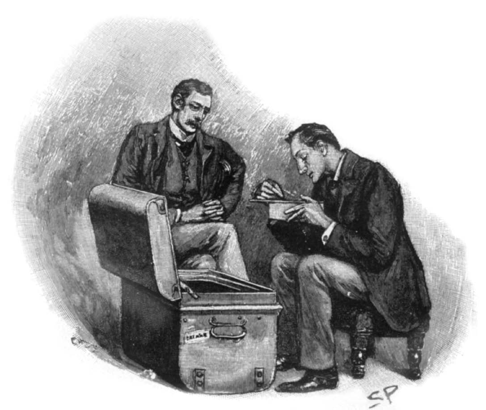

这其中的故事还更要叫你大大惊奇。

“哦，遗物一样的东西，还有故事好讲？”

“的的确确对象本身就全都是故事。”

“这该怎么讲？”

歇洛克·福尔摩斯把东西一件件捡起来，沿桌边一字儿排开，然后坐回椅子，两眼看着这些物件，露着满意的表情。

“这些都是，”他说，“我留下好让自己常回忆马斯格雷夫家族祖传礼仪文典的这桩案子。”

我以前不止一次听他提起过这个案件，可是一直没能知道详细案情。“我一定很高兴，”我说，“要是你能给我细细讲一讲。”

“那么乱糟糟的东西不管它了？”他高声调侃道，“讲整洁，好是好，但过分顶真费神，华生。这个案子，我很乐意让你今年记下来，增加一例。因为刑事案例中，它有好些地方在国内是独一无二的，甚至在国外也是。我的一点微不足道的成就，要集成集子，不记入这个独特的案例，那肯定称不上完整。

“你该记得，格洛里亚·斯科特那个案子怎么回事，我和那个不幸人谈话，他的不幸命运我讲给你听过的，和他谈话是第一次引起我注意，把刑侦工作定为终身职业方向。你看到了，现在我的名声远扬四方，无论公众，还是警方，都一致承认我这里是疑难案子终审法庭。甚至在你初次认识我的时候，遇上的案子你记下来取名叫‘血字的研究’，那时候我的业务虽还不是非常兴旺，但也已经委托不断，够忙的了。可是你难以理解，开始的时候我遇到的困难有多大，我经历好长时间，好不容易才开辟出了成功之路。

“我初来伦敦的时候住在蒙塔格街，转过街角就是大英博物馆。住在那里这段时间，空余时间学习各门类科学知识，对我以后有很大帮助。那期间时不时有案子接手，主要是通过老同学介绍，因为在大学的最后几年，学校师生对我人品、学问、能力都很有好评。我办的第三个案子是马斯格雷夫家族古仪文典案。此案一连串奇异事件，还有至关重要的大问题，令我产生兴趣，是我办案迈出的第一步，由此开始才能走向今天这样的成功。

“雷金纳德·马斯格雷夫和我在同一个学院学习，我和他只是泛泛之交。他在大学生中不合群，一般认为他骄傲，我看个中原因实际是他性格上的自信不足，却又要力图掩饰。他的外貌，一看就是个极典型的贵族子弟，瘦身形、高鼻梁、大眼睛，举止温文尔雅。他确实是王国一支最古老家族的后裔，虽然他的一支属于非长子家系，是十六世纪从北方马斯格雷夫家族分离出来，迁徙到苏塞克斯西部定居的一个分支，那里的赫尔斯通庄园可能是苏塞克斯郡还有人居住的最古老的建筑。他的出生地环境对他有不可摆脱的影响，我每看到他苍白而敏感的脸色，俯仰顾盼之间安详稳重的姿态表情，就一定会联想到那些灰白拱道、直棂窗户和封建古堡那种古老苍劲的遗迹。有一两次我和他见面随便谈起，我记得他对我的观察和推理方法一再表示很感兴趣。

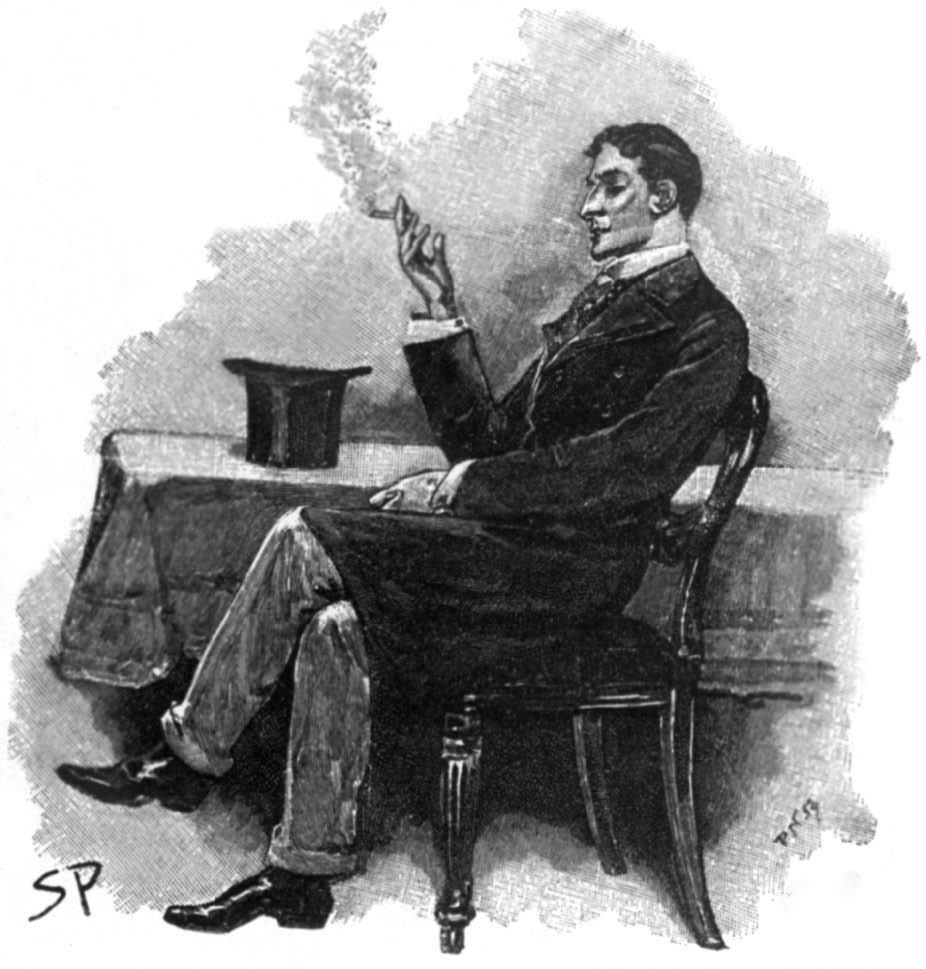

雷金纳德·马斯格雷夫。

“我和他有四年没有见面，后来有一天早晨他走到蒙塔格街来找我，进屋和我打招呼，仍旧一点不改有身份青年的模样——一副落落大方高贵公子相——姿态风度依旧安静文雅，与众不同。

“‘这一向很好吧，马斯格雷夫？’热烈握手，我问他。

“‘你一定听说我父亲去世了，’他说，‘他走了快两年了。从此赫尔斯通产业管理就由我担当。我还是地区议员，事情忙得不可开交。但是你，我知道，福尔摩斯，你的本领过去叫我们惊羡不已，现在从事于实际业务了？’

“‘是的，’我说，‘就靠这点脑子来糊口。’

“‘我听说后真高兴，因为今天来请你指教对我非常重要。我在赫尔斯通遇上了麻烦，报警方，警方无能为力，事情也确实出奇得不可理解。’

“你能想象我一听他这么讲，心里有多么急切，华生。几个月来我一直空闲无事，心里着慌，眼下这不是机会抓到手上了嘛！我内心深处充满自信，就是别人失败的事，我能获得成功，现在正是大试身手的机会到了。

“‘请告以详细情况。’我高声说。

“雷金纳德·马斯格雷夫在我对面坐下，点上我递给他的香烟。‘你知道，’他说，‘虽然我是单身，可是在赫尔斯通还得用着一大批仆人，乱糟糟古老大宅，什么事都要有人管。我一切维持原样，野鸡打猎的月份，我还是照开家庭舞会，所以人手少了张罗不过来。家里总共是八个女佣，一个厨子，一个男管家，两个男佣，一个小听差。花园和马房当然另外再用一帮人。

“‘这些仆佣当中，在家做得时间最长的是男管家，叫布伦顿。他原是小学教师，没事做，所以当年我父亲雇了他。可他是个精力旺盛、性格很强的人，很快在家里树起威信。长得也挺好，仪表堂堂，额头宽阔。他来我家和我们一起已有二十年，可现在还不到四十岁。他身上有不少优点长处，还有特别才能——能说好几种语言，各种乐器都能玩几下——他对自己这么个地位一向以来居然非常满足，也真不简单。可我总觉得他安于现状，不思进取。一个赫尔斯通管家，所有来我家的人都知道他只不过是一个管家而已。

“‘这是个人物，可也有毛病。他有点风流唐璜<a href="#part0067.xhtml_ch2"
id="part0067.xhtml_ch2-back">(2)</a>的味道。你可想而知，像他这么个人，在乡村冷僻之地，演这么个角色并不难。他结婚以后就好了，谁知老婆一去世，打起光棍，他又惹我们麻烦不少。几个月前，我们满心指望他可以太平收敛了，因为他同我家二使女蕾切尔·豪厄尔斯订了婚，可是不久便把她抛弃，去跟猎场看守班头的女儿珍妮特·特雷杰利斯搞在了一起。蕾切尔——是个很好的好姑娘，只是有点威尔士人容易激动的脾气——害了一场脑炎，现在，也就是昨天吧，才能在屋里走动，跟以前的她一比，像个眼睛乌青的幽灵了。这是赫尔斯通的第一出戏，可是第二出戏接着上来，把头一出戏也就抛诸脑后。开场是管家布伦顿出事，被解雇。

“‘怎么回事呢？我已经讲过，管家是个聪明人，也是聪明反被聪明误。事情好像与他无关，是他好奇多管闲事。他落得如此境地，以前我一直不知道，等事情出来了方才明白。

“‘我刚才说了，老屋杂乱无章。上星期的一天——是星期四晚上，准确点讲——我老睡不着，大概是晚饭以后昏头没注意，喝了大杯浓咖啡。我翻来覆去直到凌晨两点，还是睡不着，干脆起来，点亮蜡烛，想把我看的一本小说看下去。小说留在弹子房里，得去拿，我就披上休闲衣，走出卧室去拿。

“‘到弹子房得下一截楼梯再过走道口，那是通藏书室、枪械室的过道。你可以想象我有多么吃惊，这时候从走廊望过去，看见藏书室门开着，一道灯光照出来；临睡前是我亲自把灯灭了、把门关了的。我猛一下很自然想到是夜贼。赫尔斯通宅屋的走廊墙上有许多古代武器，都是当年战利品，作了墙上装饰。我就顺手取下一把战斧，然后放下蜡烛，蹑手蹑足沿走廊过去，向门里望。

“‘是布伦顿，管家，在藏书室。他正坐那儿，衣服整齐，在安乐椅上，膝头摊一张纸，像是地图，一只手撑着额头在沉思。我愣站在那里，很惊奇，躲在暗处看他怎样。桌边一支细蜡烛，光线不亮，但足以看清他衣服穿得好好的。又见他忽然从椅子上站起来，走到书柜桌旁边，把锁打开，拉出一个抽屉，拿了一页文件，再回到座位。他把文件凑着蜡烛光铺平在桌上，开始聚精会神地细看。我家的文件要他这么来偷看研究，我顿时怒火上升，便忍不住向前跨上一步；布伦顿立即抬头，看见我站在门口，他跳起来，脸吓得发青，马上把刚才在研究的那张海图一样的纸朝怀里一塞。

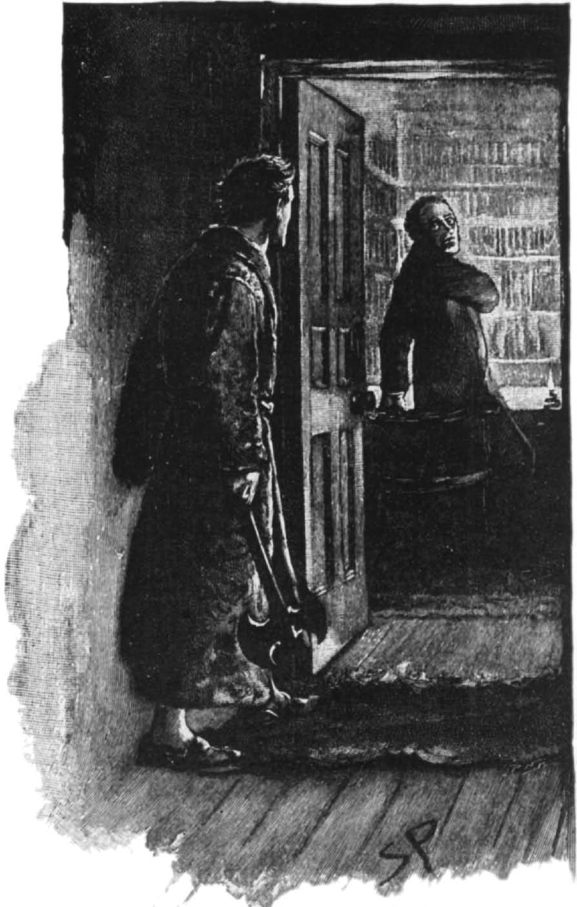

把那张海图一样的纸朝怀里一塞。

“‘“好哇！”我说，“我们对你的信任，你就这样来报答。这里不需要你了，你明天就给我走吧。”

“‘他鞠一躬，又窘又恼的样子，一声不响打我身边过去。蜡烛还在桌上，我借着烛光看看布伦顿从书柜桌拿的是什么纸。一看真是意外，根本不是什么重要东西，原来不过是我家一份古时行礼仪的对答文，叫作马斯格雷夫古仪文典，是我们家族特有的礼仪文典。过去几百年每个马斯格雷夫家的人一到成年，都要遵照文典举行礼仪——一件过去族内人才会注意的东西，就像我们自己的纹章图记，或许对考古学家还有点价值，但是毫无实际用处。’

“‘文典这事待会儿最好讲一讲。’我说。

“‘行，如果你认为真有必要的话，’他有点犹豫地回答，‘不过我先接着说下面的事。我把书柜桌重新锁好，用布伦顿留下的钥匙。我转身要走，这时我发现管家又回来，站在我面前，叫我非常奇怪。

“‘“先生，马斯格雷夫先生，”他大声说，激动得嗓子嘶哑着，“我不能丢这个脸，先生。我身份低微，可一辈子是要脸面的人，丢脸等于是要了我的命。我的命全在你手里了，先生——是这样，一点不假——你真要是把我逼上绝路，就刚才这个事，你不能容我的话，也行，可得看在上帝分上，容我给你递辞呈，一个月后，我走，算是我自己的意思要走。这我能受得住，马斯格雷夫先生，可别当众，当那么多熟人的面，把我赶走。”

“‘“不行，不能宽容你那么久，布伦顿，”我回答他，“你的行为绝对不可容忍。看在你在我家时间这么长这点上，好吧，我不想让你当众丢脸，可是一个月太长，给一个星期，你走，你随便找个什么理由都行。”

“‘“只给一个星期，先生？”他绝望地嚷嚷。“半个月——至少半个月吧！”

“‘“一个星期，”我重复说，“应该知道，这对你已经是够宽大的了。”

“‘他垂头丧气，没奈何，慢慢走开了。我吹熄了蜡烛，回到自己房里。

“‘这以后两天，布伦顿干活特别勤奋卖力，处处格外小心谨慎。那件事我只字不提，心里只想，且看他要怎样保面子。可是到第三天早晨，就不见他人。照规矩，吃过早餐他要来听我吩咐一天的工作。我从餐厅出来，正好碰见女仆蕾切尔·豪厄尔斯。我跟你已经说过她病刚好，这时看她虚弱，仍旧一脸苍白毫无血色，我就劝她不要工作。

“‘“你还要卧床休息，”我说，“身体养好了再干活吧。”

“‘她奇怪地望着我，那表情叫我怀疑她脑子还有没有病。

“‘“我都好了，马斯格雷夫先生。”她说。

“‘“我们得听医生怎么个讲法，”我回答说，“你得停下，现在不必工作。去楼下传个话叫布伦顿来见我。”

“‘“管家走啦。”她说。

“‘“走了？走哪里去？”

“‘“他走了，到现在都没见他人。他不在房里。哦，是的，他走啦，他走啦！”蕾切尔往墙上倒去，身子倚靠着，发出一阵阵尖声大笑。我怕她歇斯底里忽然大发作，赶快打铃叫人来。姑娘给搀扶回她房里去，一路又嚷又哭。我问仆人布伦顿哪里去了，结果，确实是不见了。他的床上没人睡过，昨夜他回房以后就再也没见过他；也看不出他是怎么离开屋子的，早晨所有的门窗都关得好好的。他的衣服，他的表，甚至他的钱，都在房间里，只有他平时穿的黑套装不见了。他的拖鞋也没有了，但靴子倒留着。男管家布伦顿会上哪儿去呢？他现在到底怎么样了呢？

“‘我们马上把整个宅屋从地下室到阁楼都搜个遍，可是连个影子也没有。这房子，我说过了，是座迷宫一般的老宅屋，特别是那原来的旧厢房，现在没住什么人，但是我们也一间不漏，包括地下室，反复搜查，结果失踪者一点蛛丝马迹也没发现。我难以相信，他把什么东西都扔下空手跑掉。还有，他能上哪里去呢？我叫来本地警察，也找不出个结果。昨夜下过雨，我们检查过草坪、屋前屋后大小所有的路，一切徒劳。情况就是这样。后来事情又有新发展，把我们的注意力从这原来的谜团上引开。

“‘蕾切尔·豪厄尔斯病了两天，一会儿昏迷，一会儿歇斯底里，只好请个护士晚上陪着她。布伦顿失踪以后第三天夜里，护士见病人睡得很好，自己也就在扶手椅上打盹睡着了。一清早醒来，发现床上空了，窗子打开着，病人已无影无踪。我马上被叫醒，带了两个仆人寻找失踪的姑娘。一查就不难查到她的行踪去向，从窗前开始，我们很容易随着她的脚印穿过草坪，来到池塘边。到这里，足迹在石子小路旁消失；这条石子路从房屋一直通到这边，那湖有八英尺深。你可以想象，看到可怜的疯姑娘足迹在湖边消失我们是什么心情。

“‘当然，赶快打捞，指望发现遗体，可是根本就没有尸体，倒是捞出一样想不到的东西：一个亚麻布口袋，袋里有一堆生锈的烂金属，几个没有了光泽的水晶或是玻璃片。我们从池塘里能找到的就这点不明不白的东西。昨天我们竭尽一切可能又是寻找又是查问，始终得不到蕾切尔·豪厄尔斯和理查德·布伦顿的下落。本郡警方已经智竭技穷，我只好来求教你，这是最后一计了。’

“你可以想象，华生，我听着这一连串的稀奇事，心里是多么急不可耐。我尽力把一件件事情都串起来，想找出一根能把它们都串起来的主线。管家失踪，女佣失踪，女佣爱着管家，但是后来爱不成便又恨他；她是威尔士人脾气，火爆、激动，管家一失踪，她急得要死；她把一只装些莫名其妙东西的口袋扔进湖里，这就是供思考的全部因素，可是没有一件可以触及事情的实质。一连串事情的起点在哪里？所有这一切只是一团乱线的线尾。

“‘我要看一看那一份文典，马斯格雷夫，’我说，‘这份东西你的管家要看，竟值得他冒那么大风险，不惜丢掉差事。’

“‘文典那份东西，一点意思都没有，’他回复说，‘不过至少也是件老骨董值得保存吧。我这里抄有一份对答，可以供你过目。’

“他给我的，就是这一张纸，华生。一份难得一见的问答卷文典，每个马斯格雷夫人一进入成年都要行礼仪。是怎么个一问一答，在这儿，我念给你听听。

“‘其属谁欤？’

“‘彼去之者也。’

“‘孰应得之？’

“‘此来之者也。’

“‘日之悬何处？’

“‘橡树至上也。’

“‘阴之何处？’

“‘榆树至下也。’

“‘如何步测？’

“‘步北十复十，步东五复五，步南二复二，步西一复一，其下既至矣。’

“‘吾侪何以取之？’

“‘以吾侪之所有。’

“‘何故与之？’

“‘信誉之故也。’

“‘原件没有署日期，但文字都是十七世纪中叶的拼法，’马斯格雷夫又说，‘依我看，对解决本疑案恐怕帮助不大。’

“‘至少，’我说，‘给了我们又一个谜。这个谜，比之前一个谜要有意思得多。可以说，这个谜得以解开，也就是前一个谜的解决。恕我说句不中听的话，马斯格雷夫，你的男管家，我看他头脑眼光之灵活、清晰、深远，胜过他东家十代人。’

“‘你这话我不明白，不敢苟同，’马斯格雷夫说，‘这一纸东西实际上对我毫无重要意义。’

“‘可对我绝对大有用处，我敢说布伦顿也是这个看法。他那天夜里给你抓住之前，早已经看过，可以断定。’

“‘那倒也是，很可能。我们一向不在意，并不珍藏。’

“‘他那一次，我估计，是把脑子里的记忆理一理，确定一下。据我的理解，他是把什么地图或是海图拿来同手稿对照。你一来，他赶快往口袋里藏。’

“‘这是对的。不过我们老家的老规矩、老习俗对他有什么用呢？繁琐的仪式程序又有什么意义呢？’

“‘我不认为查明其中的问题有多大困难，’我说，‘只需要你同意我们赶头班车去一趟苏塞克斯，到现场作深入的调查就行。’

“当天下午我们两人一同到了赫尔斯通。你大概都见过图画照片，还有文字描写，那是一幢有名的古建筑，所以不必我详细介绍，只需说明是一幢L形结构，长的部分比较近代一些，短的部分完全是古代建筑，是整幢宅屋的核心，另一部分是从这里延伸建成。在古屋的正中间，低矮厚重的门楣上方，凿有年份一六〇七。不过行家们都认为，看那桁梁、石料，房屋实际上要比这年份早得多。古老的房屋墙特别厚，窗特别小，上个世纪家人就新建起侧翼的那排房子，把老屋用作库房、酒窖，不再住人。宅屋四周环绕茂密的古树，形成幽雅的林园。我的委托人所说的那个湖，紧靠林荫道，距离房子大约两百码远。

“我已经确信，华生，这里头的三个谜不孤立，只不过是一个谜，如果能把马斯格雷夫礼仪文典解读通了，我脑子马上开窍会有线索，一路通向管家布伦顿和女仆豪厄尔斯的下落。我于是全力以赴向这一点突破。这个仆人，为什么那样急于要掌握旧礼仪文典呢？显然是因为他看到其中有秘密，而这家乡绅自己几代下来都无人知道，他希望乘机从中得到好处。那么到底是什么秘密呢？关系他管家什么身家命运呢？

“我把文典一看，马上看出来里面的测量法一定是指某个方位，其余所讲都是暗语，同它有关。只要找到那个地方，就是找到发现秘密的快捷方式，这个秘密马斯格雷夫家族祖先竟有必要以如此神秘的方法传诸后世。开始可以有两个入手方向，一个是橡树，一个是榆树。橡树，是毫无问题的，就在屋子的前面，左首的车道边，橡树之中有一棵最高大的老爷爷树挺拔耸立，又是我见过的一棵珍贵的古树名木。

“‘你家礼仪文典上讲的该是这棵树，它比文典要老。’车驶过的时候我说。

“‘诺曼人征服<a href="#part0067.xhtml_ch3"
id="part0067.xhtml_ch3-back">(3)</a>之前早就有这棵树了，这没问题，’他接着我的话说，‘树干粗二十三英尺。’

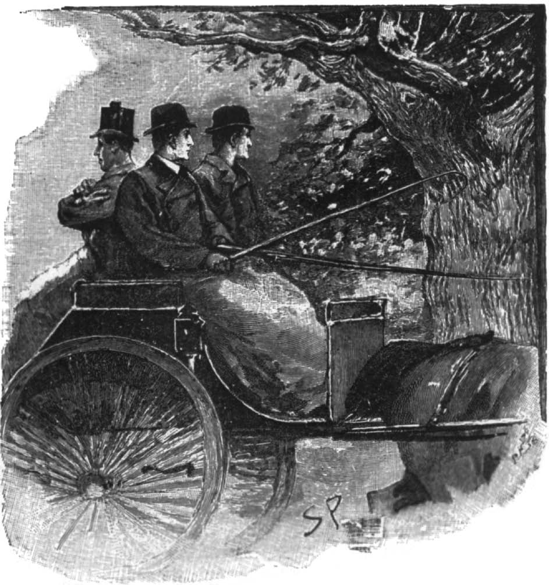

树干粗二十三英尺。

“我猜测的几个问题有一个正好落实。

“‘你家还有老榆树吗？’

“‘从前在那边有一棵，可是十年以前遭雷劈，我们就把树锯倒算了。’

“‘你见过是在那里吗？’

“‘噢，见过。’

“‘还有没有别的榆树呢？’

“‘老树没有了，新榆树很多。’

“‘那棵老榆树长的地方我想去看看。’

“单马车已到屋前，我们没进屋，委托人先领我到草坪上看榆树遗址。位置差不多就在橡树和房屋的正中间，我的调查看来进展顺利。

“‘恐怕没法知道这棵树原来有多高了吧？’我问。

“‘我知道，六十四英尺高。’

“‘是怎么知道的？’我惊奇地问。

“‘我有个家庭老教师，教我三角，常常要我做测量高度的练习。十几岁的时候，这里的树、房子我都测过有多高。’

“真是好运气，得来全不费工夫，我还想不出怎么搞到数据，数据已经来了。

“‘请告诉我，’我问他，‘管家向你问起过榆树的高度吧？’

“雷金纳德·马斯格雷夫惊异地睁眼朝我望。‘你这一提醒，倒是让我记起来，’他回答说，‘几个月以前，布伦顿同马车夫为争个什么小事，确实向我问起过这棵树的高度。’

“大大的好消息，华生，这说明我的路子完全对头。我抬头看看太阳，太阳已经偏西，我算一算，不用一个小时，太阳就要移到老橡树顶上，那么文典中提到的一个条件就可以满足。而榆树的影子一定是指影子远的一端，要不然干脆拿树干作标准应该更好。我要找的是，当太阳偏过橡树顶的时候，榆树影子远程落在哪里。”

“那有困难，福尔摩斯，因为榆树没有了。”

“也是，但我想，布伦顿能办得到，我也能办得到。再说，实际上不困难。我和马斯格雷夫一起到他的书房，自己削了这个扦桩，把这桩再缚上绳子，绳子每隔一码打一个结。取一根鱼竿正中一截两，一截正好是六英尺长。然后同委托人回到榆树的位置上，太阳刚刚偏过橡树顶，我把竿子固定竖好，对准影子的方向一量，长度是九英尺。

“计算法很简单，一根六英尺长的鱼竿投影是九英尺，则一棵六十四英尺高的树的投影应为九十六英尺，而且鱼竿投影同榆树投影当然是在同一方向线上。我量出距离，几乎就量到了房屋跟前，我就插扦桩在那里。你可想而知我有多高兴，华生，在我的桩头的两英寸之内，我看见地上有个锥洞。我知道这是布伦顿测量以后做的标记，我终于把他追上，踩住了他的尾巴。

“从这一点开始，我进行步测，掏出袖珍罗盘来先定准正北方向。一脚一步和屋墙平行各走十步，插个桩做记号。然后向东迈不大不小各五步，再各两步向南，这时我到了老屋的门口。再向西两步也就是沿石板甬道走两步，这就是该文典上暗指的地方。

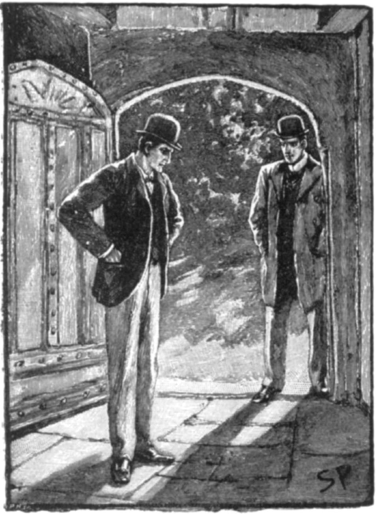

这就是该文典上暗指的地方。

“我一阵心寒，从来没有感到这样失望过，华生。一时之间似乎觉得一定是我计算上犯了根本性错误。斜阳把甬道地面照得通亮，我看到铺的一块块灰石板，久经脚底磨损，已用水泥封死，肯定长年不曾有人翻动。布伦顿没在这里动过手脚。我敲敲石板，到处一样的声音，也看不出有孔道或者撬痕。可是，幸亏马斯格雷夫眼见我这一系列测量行动而受到启发，跟我一样激动起来，赶快拿出手稿核对计算结果。

“‘其下既至’，他叫起来，‘你没注意这句话“其下既至”。’

“我原来想的是挖掘，要掘地，可现在，一下子开窍，是我想错了。‘那么说是地窖？’我也叫起来。

“‘对，这老房子当初就有地窖。这底下，走这个门。’

“我们走下弯弯的石阶梯，同伴擦火柴，把角落里木桶上的一盏提灯点亮。一瞬间就看清了，我们找对了地方没错。而且看出，近日已经有人来光顾，并非只有我们。

“这里一向是堆木料的地方，原先散乱在地上的木头已有人往两旁堆，清出中间空档。这里是一大块重石板，石板中心有个锈了的铁环，铁环上扎一条黑白格子厚围巾布。

“‘我的天！’委托人高声叫道，‘是布伦顿的围巾，我见他围过，绝对没错。这个贼东西，到这里来干什么？’

“我提出建议去叫来两名本郡警察来到了现场。接着我拉住围巾想把石板提起来，可是我用足力气也只能动一点点，在一个警察帮忙之下才好不容易把石板挪开。下面是个洞，张开黑黝黝的大口，我们都向下望着。马斯格雷夫跪在边上，拎提灯往下照去。

“我们看这地窖，大约七英尺深，四英尺见方。靠边有一口箍铜的矮木箱，箱盖打开着，锁孔就插这把钥匙，这把形状古怪的老式钥匙。箱子上积满厚厚的灰尘，霉烂，虫蛀，木板已经穿洞了，箱子里都长起了青灰色木菌。箱子底上撒满金属圆片，显然是古硬币，就像我这儿拿的这些，此外一无所有。

“可是我们一下子就顾不得木箱了，我们眼光不约而同落到箱子旁边蜷缩的什么东西。是一个人，穿黑衣服，身子蹲下，额头抵着箱子角，两手伸出搁在箱子两旁。这个蹲姿使血液在头脸部凝滞，都认不出这张紫肝色变形的脸是谁。但是我们把他拖上来看，他的身量、服装，还有头发，足以使我的委托人认出，正是那个失踪的管家。他已经死了几天，但是身上没有伤痕或者青紫可以显示他落得这个结局的原因。把他的尸体从地窖弄上来后，我们发现自己仍然面临一个问题，一个同开始的时候一样难以解决的问题。

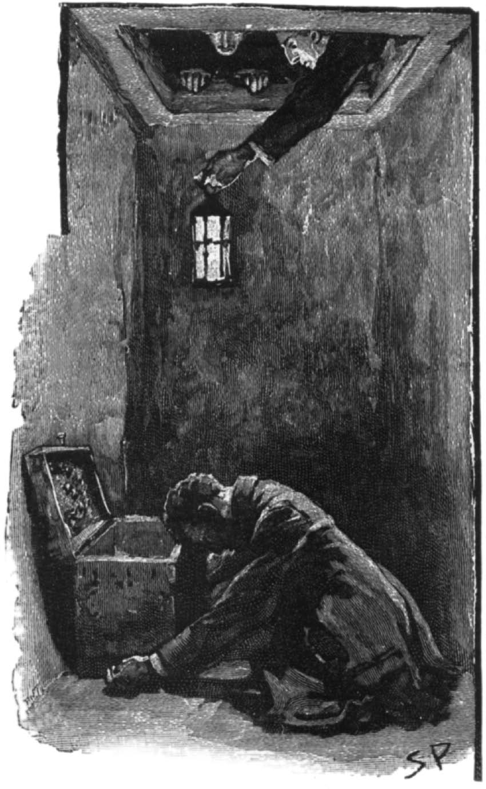

我们眼光不约而同落到箱子旁边。

“我至今还承认，华生，那时我对自己的侦查很感失望。我一发现文典上暗示的那个地方，就以为有望能解决这件事。可是我现在已经身临此地，仍旧远未弄清这个家族如此费尽心机巧妙设计所要隐藏的是什么东西。虽说我把布伦顿的下落查明了，但是还得揭示他遭此下场的原因，也还得弄清那个失踪的女仆在这个案子中扮演什么角色。我坐在墙角一个小桶上把整个事情反复考虑。

“我遇到这种情况会采取什么方法，华生，你是知道的。设身处地，把我自己放在他这个人的位置。首先，衡量他的智力，竭力设想自己经历同样这么些过程和情况。布伦顿无疑具有一等智力水平，他在这个案子中事情可以简化，以致不必考虑所谓人为误差，如天文观测常用的这个说法。他知道藏有巨宝，他准确找到地方，他发现盖住藏宝地洞的石板太重，没有帮助一个人无法搬开。下一步怎么办呢？他不能向外求援，即便是有可信赖的人也不行，要开门放人进来，就会被发现，太冒险。所以要找人，肯定从内部找帮手才是最好。那么能找谁呢？这个姑娘，曾经倾心爱他。男人不管对女人有多坏，都很难意识到自己最终会失去那个女人对他的爱。他可能向姑娘豪厄尔斯献几回殷勤，又重归于好，便拉她为同谋。两人夜里一起下地窖，一起合力是可以把石板掀开的。我如此推论他们的行动，犹如亲眼目睹。

“不过虽说是两个人，毕竟一个是女人，要搬石板力量还是不够，一个苏塞克斯警察大汉和我两个人都觉得不轻松。他们要是搬不动怎么办呢？我处在这时候很可能会这么做，我于是站起来，仔细查看满地的木料。我果然一下子就找到如我所猜想的那么一根，约三英尺长，一头明显有缺口，还有几根，一侧有很重的重力挤压的痕迹。很明显，他们把石板提起一点，马上用木头往缝隙里塞，这样把石板撬开，最后缝隙大得人可以下到地洞。他们可能用一根木头把石板撑住，木头的底端撑出了缺口，因为这段木头吃着石板的全部重量，下端抵着另一块石板的边上。至此，我的推论还是颠扑不破。

“现在我如何重演那场夜戏？很明显，这个洞只能下一个人，那就是布伦顿了，姑娘等在上面。布伦顿把箱子打开，把东西传上去，想必如此——还不知是什么东西——那么然后——那么然后发生什么呢？

“这个性格刚烈的凯尔特女人，看到这个曾经伤害了自己的男人——对她怎么个伤害，也许是远在我们意料之外——现在落在自己的手中了，她灵魂中郁积许久的复仇之火便突然爆发了吧？是不是碰巧木头滑掉石板立刻落下，便成了布伦顿的石棺石墓呢？她只是存心对布伦顿的活葬不吱声？或者，就是她出手把撑木一下打掉，叫石板落盖封口的呢？不管哪种可能，我都好像看见这个女人的身影，抓了宝物飞快跑上弯绕的石阶，充耳不闻身后传来闷在瓮中似的叫喊、石板上咚咚的拼命敲打，就叫这个薄幸郎闷死在里边拉倒。

“所以第二天她会紧张得浑身发抖，面无人色，发出歇斯底里的狂笑，秘密原因就在这里。可是箱子里到底有什么呢？她拿到手又怎么办呢？当然，我的委托人在池塘里捞到的不过是些没有用的金属片和玻璃片，是姑娘扔掉的，不留罪证痕迹先得把这些无用物处理掉。

“我有二十分钟坐在那里一动不动，继续思考案情。马斯格雷夫站着，脸色苍白，提灯弯腰照着洞里看。

“‘这是查理一世硬币，’马斯格雷夫说，手拿着几枚原先是这箱子里的钱币，‘可见我们对这份文典的年代估计还是准确的。’

“‘我们还可以发现查理一世的其他东西，’我突然想明白了文典头两句的含义，我大声说，‘池塘里捞起来的袋子，里面的东西让我看看。’

“我们上了地窖，到他的书房。他拿出一堆破烂东西放在我面前。我看着这些东西，理解他为什么把这些东西看得无关紧要：金属物件都已锈得发黑，小石头小石片似的东西灰不溜丢。我拿一块在袖子上擦擦，立刻，在我手心窝里，发出星星一般的闪闪亮光。金属物件呈双环圈形状，但已经歪扭变形，不是原来的样子了。

“‘你一定记得吧，’我说，‘保皇党即使在国王死了以后<a href="#part0067.xhtml_ch4"
id="part0067.xhtml_ch4-back">(4)</a>还在英国掀起武装反抗，最后逃跑，把最贵重的东西都埋藏好，等待有朝一日恢复太平还要回来。’

“‘我家祖先，拉尔夫·马斯格雷夫爵士，是杰出的骑士，查理二世<a href="#part0067.xhtml_ch5"
id="part0067.xhtml_ch5-back">(5)</a>亡命途中保驾的第一功臣。’我的朋友说。

“‘啊，这就对啦！’我对他说，‘到现在为止，我想，问题最后一个环节就在这里。我必须向你祝贺，一件珍宝完璧归主，只是得来颇带点悲剧性。那其实是一件无价之宝，而作为历史珍品，还具有更为重大的意义。’

“‘那是什么？’他喘气惊异地忙问。

“‘不是别的，正是英国国王的古王冠。’

“‘王冠！’

“‘正是王冠。想想文典上的内容，它是怎么讲的？“其属谁欤？”“彼去之者也。”这是指查理被处决。“孰将得之？”“此来之者也。”这是指查理二世，已经预见到他的来临。我想，这顶破烂得不成样子的王冠，毫无疑问，古时候斯图亚特王朝的国王都戴过，圈在他们王者的额头之上。’

“‘怎么会到池塘里去的呢？’

“‘啊，回答这个问题得费点时间。’这是我所构建的假设和求证的一根长链，我向他从头至尾叙述一遍。等我把故事讲完，已是夜色朦胧，皓月当空。

“‘查理回来以后，怎么没有把王冠取走呢？’马斯格雷夫问我，把这些遗物收回到亚麻布袋里。

“‘啊，给你点到了要点，可是这一点我们恐怕永远也搞不清楚了。很可能是掌握这个秘密的马斯格雷夫在此期间去世，由于疏忽，这份隐语只是传给下一代，可是没有解释涵义。从那时候到今天，一直如此父子相传，而不解其中奥秘。直到最后，引起一个人的兴趣，被他破解了其中的秘密，他也在这次冒险中丢掉性命。’

“这就是马斯格雷夫家族古仪文典的故事，华生。他们现在把王冠留在了赫尔斯通——当然法律上有一点周折，结果付了相当可观的一笔钱，才允许他们保存。我相信，你只要提我的名字，他们就会把王冠让你看。至于那个女人，从此没有消息，很可能离开英国，带着犯罪的记忆逃往海外去了。”

（1893年）

————————————————————

<a href="#part0067.xhtml_ch1-back" id="part0067.xhtml_ch1">(1)</a> V．R．是英国维多利亚女王的拉丁文Victoria
Regina的首字母缩写。

<a href="#part0067.xhtml_ch2-back" id="part0067.xhtml_ch2">(2)</a> 唐璜（Don
Juan），中世纪西班牙传奇中的贵族青年，最初是反宗教禁欲的形象，以后发展为泛指专事勾引女性的荒淫浪荡子，屡见于西方诗歌、戏剧。

<a href="#part0067.xhtml_ch3-back" id="part0067.xhtml_ch3">(3)</a> 诺曼人征服（Norman
Conquest），指1066年法兰西诺曼底公爵威廉对英格兰的军事征服。

<a href="#part0067.xhtml_ch4-back" id="part0067.xhtml_ch4">(4)</a> 指查理一世（CharlesⅠ，1600—1649），英国斯图亚特王朝国王，因对抗国会，迫害清教徒，压制新兴工商业，而引起共和革命，随即发动内战予以镇压，战败，被国会以“暴君、叛徒、杀人犯和国家公敌”罪名处决。

<a href="#part0067.xhtml_ch5-back" id="part0067.xhtml_ch5">(5)</a> 查理二世（CharlesⅡ，1630—1685），查理一世之子，1660年王政复辟。

# 瑞门村乡绅案

一八八七年的春天，我的朋友歇洛克·福尔摩斯先生由于疲劳过度，体力虚脱，健康尚未恢复。不久前发生的荷兰苏门答腊公司和莫波吐依兹男爵巨型计划的整个案子，在公众心目中还记忆犹新。此案案情对政治和经济的牵涉过深，不宜在我的系列文章中披露。然而从另一方面看，问题的独特与复杂，则给了我朋友以机会，展示了他毕生与犯罪行为作斗争的诸多武艺之中，又出新招的价值。

翻阅我的笔记，看到四月十四日这一天，我收到一封从里昂发来的电报，通知我福尔摩斯正卧病于杜朗旅馆。不到二十四小时，我已赶到他病榻之旁。令我宽慰的是，他的症状并不严重。即使如他这样钢筋铁骨的身子，也难以经受持续不断的紧张侦查，在长达两个多月的时间里，每天工作不少于十五个小时。他还告诉我，甚至不止一次一口气工作五天五夜不休息。即使艰苦的劳动获得了胜利的喜悦，也未能让他从如此彻底的筋疲力尽中恢复过来。他的名字一时响彻整个欧洲，屋子里满地的祝贺电报都要淹没脚踝，我还是发现他陷于痛苦沮丧，不能自拔。这次，三国的警方均告败北，惟他独步直拔头筹，力挫欧洲最老谋深算的巨拐大骗，所有这些，也都不足以使他从极度的虚弱中振奋。

三天以后，我们一同回到贝克街。我想换换环境显然更有益于我朋友的健康，若趁此机会到乡村去，享受个把星期的大自然春光，极具吸引力，再说这也是我自己心所向往。我有个老朋友，海特上校，在阿富汗的时候我专门给他治过病，现在在萨里郡瑞门村附近买了房子，屡次邀我去他那里作客。在最近一次邀请中特地说如果我的朋友与我一同前往，必将热烈欢迎。我原以为要来点外交辞令才能说动，可是，当福尔摩斯一听说那边屋主只是单身一人，因此可以享有充分的自由，便欣然接受我的计划。于是，我们从里昂回来一个星期以后，就到了上校的家里。海特上校是位好客的老军人，他闯过世界，见过世面；而且，还正如我所预料，他也很快发现，和福尔摩斯有许多共同点，一谈就投机。

到达的当天晚上，我们用过晚餐，坐到上校的枪械室里。福尔摩斯放开四肢躺在沙发上，海特陪我参观收藏的东方枪械。

“噢，不能忘，”上校突然说，“我得拿支枪上楼，以防万一。”

“以防万一！”我惊奇道。

“是呀，我们这里最近不太平。老阿克顿，本地一个富豪，上星期一有人闯入他的家，虽说没受大损失，可是那些个贼也没逮住。”

“没一点线索吗？”福尔摩斯问道，抬眼望着上校。

“到现在还没有，但不过小事一桩，村镇那种小案子罢了。太小，不值得你注意，福尔摩斯先生，比你办过的那件国际大案，这就微不足道。”

福尔摩斯对他的赞美摆摆手，但是脸露微笑，说明他心里还是美滋滋的。

“有什么征候没有？”

“我看是没有。几个贼搜了他家的藏书室，费了好大的劲，也没拿走什么。整个藏书室给翻个彻底，抽屉个个都倒空，大小书柜搜个遍，结果，只有一卷蒲柏译的荷马史诗，两支镀银蜡烛台，一方象牙镇纸，一个橡木小晴雨计，还有一团线，就不见了这么点东西。”

“竟还有这种盗窃，稀奇古怪！”我不由得惊异。

“哦，这些贼明摆是顺手牵羊，捞到什么是什么。”

福尔摩斯在沙发里哼了一声。

“本郡警方应当把这事查一查，”他说，“啊，很明显，肯定是——”

我举起一个手指在嘴上作警告。

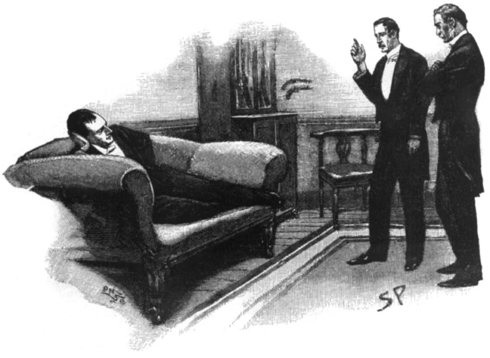

我举起一个手指在嘴上作警告。

“你是到这儿来休息的，我亲爱的伙计。看在老天分上，不用你管案子了，看你精神还这么不好。”

福尔摩斯耸耸肩，向上校无可奈何地瞥一眼，于是话题扯开，不谈这种令人紧张的扫兴事。

然而也是天意，我作为一个医生的操心，结果还是白费。第二天早晨，问题硬是要来光顾，临到我们头上，要回避也回避不掉。我们的下乡作客马上名不副实，不照我们的预想进行。那时正在吃早饭，上校管家顾不得礼节直冲了进来。

“听到消息吗，先生？”他喘着气，“坎宁安家出事了，先生！”

“被盗窃！”上校叫道，咖啡杯举到一半。

“杀人啦！”

上校一声惊叫。“天哪！”他说，“是谁被杀了？治安官，还是他儿子？”

“不是，先生，是马车夫，威廉。子弹打穿他心窝，吭也没能吭一声。”

“那，是谁开枪？”

“是一个贼，先生，打了枪就跑掉，逃得无影无踪啦。贼打餐具间的窗里进来，正好给威廉撞见，可怜他为保护主人财产，丢掉性命。”

“什么时候？”

“昨天晚上，先生，十二点光景吧。”

“啊，那，我们一会儿就去看看。”上校说，继续吃他的早饭。“真是不幸，”管家走后，他又说道，“是我们这里的头面人物，老坎宁安他在这里，是个很有正气的人。这个事他要伤心透了，威廉在他手下多少年了，干活很好。肯定是，就是偷阿克顿家的恶贼干的。”

“偷那么一点东西的怪贼。”福尔摩斯若有所思地说。

“就是。”

“啊哈！这，其实正是世上最简单的事，但是初看都一样，有点儿古怪，是不是？一伙夜贼，在乡村作案，目标总得要调换，不会在同一个地区几天工夫就干上两次闯窃。昨天晚上你谈起以防万一这个事，我就是这么想，我心头一掠以为很可能这个贼或者这伙贼，不会再来光顾我们英国这同一个教区——由此可见，还有好多事我要学着点儿呢。”

“依我看，这是本地贼所为，”上校说，“势必是，所以他会找上阿克顿家、坎宁安家下手，这两家是本地最大的大户。”

“最富人家？”

“哦，本应当是，只是打了好几年官司，我看两家的家底已打得元气大伤。老阿克顿说坎宁安有一半家产是他的，律师们就乘机伸手两边捞。”

“要是本地贼，那就不难抓出来。”福尔摩斯打着呵欠说，“好了，华生，我不想多事多废话了。”

“警官福雷斯特求见，先生。”管家推门进来说。

警官是一位年轻人，一脸的神气和机警，跨步入室。“早上好，上校，”警官说，“我希望不致打扰各位；我是听说贝克街的福尔摩斯先生在此府上。”

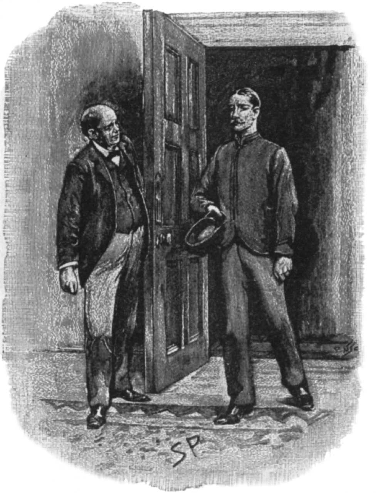

警官一脸的神气和机警，跨步入室。

上校举手向我朋友一摆，警官随即点头致意。

“我们想你大概愿意莅临指导，福尔摩斯先生。”

“人意拗不过天意，华生，”福尔摩斯说，大笑，“你进来的时候，我们正谈论这件事呢，警官。也许你能让我们知道一点详细情况吧。”他说着就往椅背上一靠，他这个姿势我很熟悉，便知道我的打算泡汤了。

“阿克顿案子我们没有线索，不过这个案子还是很有进展，没有问题，两案是共犯，案犯有人看见。”

“噢！”

“是的，先生。可是，他开枪打死可怜的威廉·柯万后立刻逃跑，逃得像头鹿似的快。坎宁安先生从卧室窗子看见这个人，他的儿子亚历克·坎宁安先生是从后面走廊看见他的。事情发生大概是十二点缺一刻。坎宁安先生刚刚上床睡觉，亚历克先生穿好睡衣在吸烟。两人都听见威廉喊捉贼，亚历克先生跑下楼来看情况。后门打开着，他到楼梯前，看见外面有两个人在扭打。一个开了枪，一个倒地，凶手穿过花园，跳过树篱。坎宁安先生从卧室窗子望出去，看见这个人上了路，就一下子不见了。亚历克先生停下来要救人，坏人就乘机跑掉。只知道是个中等身材的人，穿黑衣服，什么相貌还没有线索。不过我们正加紧调查，如果他是个外来人，我们很快就可以把他找出来。”

“威廉在那里做什么？临死有话吗？”

“一句话也没有。他和他母亲住在下房。他是个很忠实的仆人，我们想他是在检查屋子门窗是不是都关好，不要有疏忽。阿克顿事情出来以后，当然家家都提高警惕。强盗刚把门撬开——门锁给撬掉了——威廉正好撞见。”

“威廉出来，同他母亲讲过什么话没有？”

“他母亲老了，耳朵聋，我们问不出她什么。我知道她平常就不是个清楚人。她再受到这次打击，神志已经有点不正常了。可是有一个情况非常重要，看这个！”

警官拿出一张撕破的笔记本纸，在膝头铺铺平。

“是我们在死者手里发现的，他拇指、食指捏着。看样子是从一张稍大的纸上扯下的。你看到吧，上面提到的时间正是可怜的他丧命时间。你看，凶手从他手里抢掉了纸，或者是他从凶手手上抢过来的破纸。这字看上去是约会。”

福尔摩斯拿起纸片，上面文字如下：

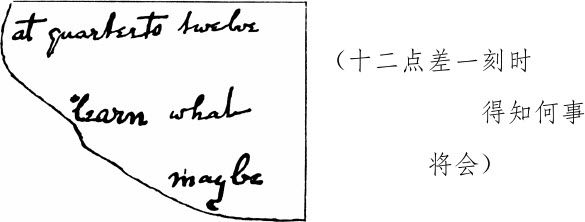

“可以认定是约会，”警官继续道，“这样推论当然可信，虽说这个威廉·柯万是个好名声的忠厚人，也说不定同盗贼为伍搞在一起。约好他在那里等候，甚至帮贼破门入屋，后来两人又可能闹翻。”

“这字写得倒是非常有趣，”福尔摩斯说，已经把纸聚精会神地研究了一番，“这里头比我原先想的要深得多。”他低沉地双手抱头。警官在想，伦敦下来的著名侦探大专家对本案也是一筹莫展，不禁暗笑窃喜。

“你刚才说，”福尔摩斯一会儿就开口，“要说很可能窃贼和仆人彼此认识，这张字条是他们一个人给另一个人的约会，此种假定颇有见解，完全可能。可是这张字条表明是——”他又把头沉进双手，沉思了几分钟。等他抬起头来，我惊异地看到他两颊生辉，目光咄咄逼人，如同没病以前那模样了。他已经恢复元气，浑身来劲，一跃而起。

“跟你们讲一下，是这样，”他说道，“对这件事，我要从旁冷静了解若干细节。其中有些情况，对我有极大吸引力。如能允许，上校，我的朋友华生和你，暂时留下，我和警官一同去走一趟，以便核实一下我的一两个想法。大约半个小时就能再见你。”

一个半小时很快过去，只有警官一个人回来。

“福尔摩斯先生独自在外面野地里踱他的方步，”警官说，“他要我们四个人，一起都到那边房子去。”

“去坎宁安先生家？”

“是的，先生。”

“干什么？”

“我搞不太清楚，先生。我还是跟你讲一下，福尔摩斯先生病还没有全好，行为有点古怪不正常，又兴奋又激动。”警官耸耸肩说。

“我看不必大惊小怪，”我说道，“我常常注意到，别看他好像疯疯癫癫，这恰恰是他胸中正有主意的时候。”

“可有人说他拿的尽是疯主意，”警官嘟嘟囔囔着，“他是要我们就去，上校，准备好了的话，最好就走。”

我们看见福尔摩斯在野地里踱来踱去，头低垂胸前，两手插着裤袋。

“事情越来越有趣了，”他说，“华生，你这乡村一游不虚此行，有大收获。我今儿个早晨也不枉了这迷人春光。”

“你已经去过犯罪现场了，我知道。”上校说。

“是的，警官和我一起稍稍作了点侦查。”

“有什么成绩？”

“哦，我们看见一些有趣的事，一边走一边跟你们讲我们做了些什么。首先，看见了这个不幸人的尸体。确实是如报告所称，死于左轮枪击。”

“你原来怀疑啰？”

“哦，什么事情都不妨有证实比较好，我们的查核没有白白浪费时间。后来拜访了坎宁安先生和他的儿子，他们指出了确切地点，凶手穿过花园树篱逃跑。这里就大有趣味。”

“那是自然。”

“然后我们拜访遇害人母亲，但是从她那里得不到什么情况，她是年老衰弱了。”

“那么调查有什么结果呢？”

“那就是确信本案有其特别之处。也许，现在的走访可以拨开迷雾。我想，我们两个都同意，警官，死者手里这片碎纸，上面写的时间就是他遇害的时间，这一点极其重要。”

“它可是提供了一条线索，福尔摩斯先生。”

“它确实提供了一条线索。写这张字条的人，就是要叫威廉·柯万在那个时间别睡、出来。这纸另一大半在哪里呢？”

“我在地上仔细找过，希望能够找到，可是没有。”警官说。

“另一半从死者手上被抢走了。这个人为什么那么着急非要抢走不可呢？因为这正是他的罪证。那么他把纸怎么办呢？往口袋里一塞，总是如此吧，没有留意到纸的一角紧紧攥在死人手里。我们如果能得到那片纸，那就定破迷案长驱直入。”

“是的，可是没有抓到罪犯怎么可能拿到罪犯口袋里的东西呢？”

“是呀，是呀，值得好好想想。还有，另外一点也很明显，纸条是有人送交威廉的，写纸条的人不会自己送给他。这是当然啦，否则，他何不当面口说关照就成了。那么，是谁传的条子？或者通过邮局寄？”

“这我已经调查过，”警官说，“威廉昨天下午接到邮差一封信，信封给他毁掉了。”

“好极了！”福尔摩斯叫道，拍拍警官的肩膀，“你连邮差都去找过了，和你一起工作很有味道。好，到了，这是仆人下房。往这边走，如果你愿意，上校，我让你看犯罪现场。”

我们走过被害人住的小屋，踏上一条橡树林荫道，通向一幢安妮女王<a href="#part0068.xhtml_ch1"
id="part0068.xhtml_ch1-back">(1)</a>时期的陈旧而气派的古宅，那门楣上刻有马尔普拉凯<a href="#part0068.xhtml_ch2"
id="part0068.xhtml_ch2-back">(2)</a>的年份。福尔摩斯和警官领我们绕过去到一扇边门，此处隔着花园，沿路那边是树篱。厨房门前站着一个警察。

“请把门打开，长官，”福尔摩斯说，“那儿，在楼梯上，小坎宁安先生站在那儿，望见就在我们现在这个地方有两个人正扭打一起。老坎宁安先生是在那个窗口——左边第二个窗——他看见那个人逃向左边的矮树丛。然后，亚历克先生跑出来，跪在受伤的人旁边。地面很硬，你们看，没有痕迹可供引导。”他这么说着，这时有两个人转过屋角，沿花园小路走过来。一个上了年纪，脸上表情刚毅，皱纹很深，眼神阴郁；另一个是精神抖擞的年轻人，一脸笑容可掬的表情，一身鲜亮的服饰打扮。他们俩与我们到此的作案现场形成非常奇异的反差。

“怎么，还在调查这个案子？”那个有点年纪的对福尔摩斯说，“我想你们伦敦来人是马到成功啰。不过，行动进展好像并不很快嘛。”

“啊，你得给我们点时间。”福尔摩斯轻松地说。

“是得要时间，”年轻人亚历克·坎宁安说，“是呀，我也看不出我们有什么线索。”

“有一条线索，”警官回答，“我们认为，我们只要找到——我的老天，福尔摩斯先生！你这是怎么回事？”

我可怜的朋友面色顷刻之间变得可怕起来，两眼向上直翻，脸作痛苦扭曲状，挺不住哼了一声，脸朝下扑倒地上。他突如其来病势发作，叫人吃惊不小。我们把他抬进厨房，让他躺在一张大椅子上，看他喘大气喘了几分钟。最后，他有气无力地道声歉，表示很不好意思，又重新站好了。

“华生知道，我生了一场大病，才刚刚好一点，”他解释道，“这种神经痛很容易发作。”

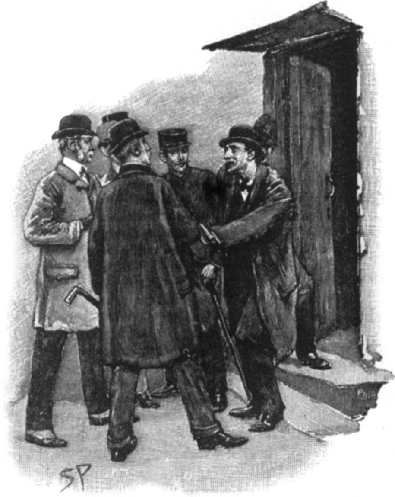

“华生知道，我生了一场大病，才刚刚好一点。”

“要不要用我的马车送你回去？”老坎宁安问。

“哦，既然来了，有一点我还是想确定一下。我们很容易把它查清。”

“是什么？”

“哦，我似乎觉得，很可能是，不幸的威廉并不是先到这里，而是后来才到，在窃贼进屋以后才到。你们好像肯定认为，虽然强盗把门撬开，但是居然没有进来。”

“我想那没有什么讲不通，”坎宁安先生严肃地说，“因为，我儿子亚历克还没有睡觉，要是有响动，就会让他听见。”

“他人在哪里？”

“我正在更衣室里吸烟。”

“哪个窗户是更衣室？”

“左边最后一个，就是紧挨我父亲卧房的那一扇。”

“那么说，你们两个房间也就都亮着灯？”

“那是。”

“这里的问题就奇怪了，”福尔摩斯说，微笑着，“难道是，一个夜贼——是个有经验的夜盗老贼——竟胆大妄为到不顾两个人还没睡，屋里都还亮着蜡烛，不怕被看见就破门而入？”

“他肯定是个冷静沉着的老贼。”

“噢，当然啦，要是本案并不特别令人难以理解，我们何必特地来请教你的指点，”小亚历克先生说，“根据你们的想法，贼已经进屋盗窃，威廉才来把他抓住。我觉得那是荒唐可笑的说法。我们不是没有发现屋里有翻动，有什么东西丢失吗？”

“这要看是拿什么东西，”福尔摩斯说道，“两位可别忘记，我们所对付的夜贼是个非同一般的家伙，根据他的作为，他似乎有他专门的目的。瞧瞧，比如那个，毫不起眼的奇怪对象，是他在阿克顿家拿的——都是些什么？——一个线团，一方镇纸，还有些个我都说不上是什么玩意儿的东西。”

“那好，一切拜托了，福尔摩斯先生，”老坎宁安说，“一切就按你和警官的意思办得了。”

“首先一点，”福尔摩斯说道，“我得请你们提供一笔缉拿凶犯的悬赏金——你们稍有解囊先垫一垫。因为报请上级长官们同意拨下这笔款子还得要费点时间，这些事情还没法一下子办得下来。我拟了一份公告，请过目，行的话，就请在这儿签个字。也就五十英镑，我想可以了。”

“我出五百英镑都不在话下，”治安官说，接过福尔摩斯递给他的纸条，还有铅笔，“这儿，这儿不对了吧。”他把写好的纸拿起一看，说道。

“哦，我写匆忙了。”

“你看你一上来写的就是这个样子，‘鉴于星期二凌晨一点差一刻所发生之未遂盗窃案’，写成个什么，事实情况是十二点差一刻。”

对于这样的错误我看后感觉很痛心。我知道福尔摩斯一向在这种细小地方极其精确，丝毫不会疏忽，对事的准确无误是他的特点。可是近来一场病对他影响很大，现在这个小问题让我看到他还远没有恢复健康。福尔摩斯一时很有些尴尬；警官在一旁抬抬眉毛做怪样，亚历克·坎宁安张口大笑，老绅士则提笔纠正错误，然后把纸递还给福尔摩斯。

“可以尽快拿去付印，”他说，“我想你这个主意倒是高明。”

福尔摩斯小心翼翼地把纸条夹入记事本里藏好。

“好，那么现在，”他说，“这件事要好好进行，让我们把屋子都看一遍，确认一下这个怪僻的老贼折腾完了一点东西都没拿走。”

进屋之前，福尔摩斯先检查了被撬的门，可以明显看出是用凿子或者坚固的小刀插入，把门锁撬开。我们看见工具撬进去在木头上留下的痕迹。

“你们不用门闩的？”他问。

“我们从来没有这个必要。”

“你们没养狗？”

“养了，狗是拴在屋子另一头的。”

“仆人都是几点去睡觉？”

“一般十点。”

“我明白了。威廉那个时间按通常已经该睡觉了？”

“是的。”

“那就特别了，在那个特别的晚上他不睡觉。好，现在，如蒙美意让我们看一看屋子，我将不胜欣喜，坎宁安先生。”

一条石板走道，厨房就在旁边，走道通向一段木梯，登梯就到宅屋的二楼。我们上了楼梯平台，上去是又一段装饰更考究的楼梯，通向正对面的前厅，走出平台，就是客厅和几间卧室，包括坎宁安先生和他儿子的卧室。福尔摩斯慢慢地走，十分留意房子的建筑结构。我从他的表情觉察到他是在追踪一条重要线索，但是我一点也想象不出他是作的什么推论、循着什么方向。

“我说先生，”坎宁安先生很不耐烦地说，“这个肯定没有必要的。楼梯口那个，是我的房间，过去那间，是我儿子的。请你判断一下，贼跑上这里来，我们都不察觉，能有这种事吗！”

“我说，你应当外面到处遛遛才能闻上浓浓的嗅迹。”那儿子颇阴毒地笑道。

“还是请容我再唠叨几句。我看看，比方说，这卧室窗子朝下望，能看多远。这个，我明白，是你儿子的卧室，”——他随手把房门推开——“那个，我猜就是更衣室，盗窃发生的时候，他正在里头吸烟来着。那个窗子能望到哪里？”他走过卧室，推开一扇门，又望望另一间房间。

“现在差不多总该收场了吧？”坎宁安先生尖酸地说。

“谢谢，我想，要看的也就都看了。”

“如果很有必要，也不妨进我房间看看。”

“不嫌打扰的话，也好。”

治安官耸耸肩，领大家进他自己的卧室。里面摆设平常，普普通通一间。我们向窗口走过去，福尔摩斯磨蹭下来，结果他和我落在了最后面。床脚边小桌上搁有一大盘橘子，一大瓶水。我们正走过，我都不知怎么回事，福尔摩斯，往我前面一挤，故意把东西全打翻，水瓶砸个粉碎，橘子滚了一地。

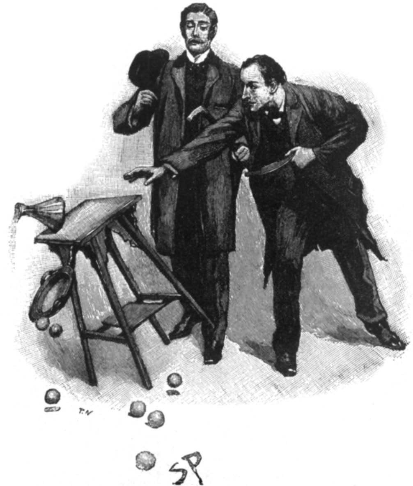

故意把东西全打翻。

“你怎么搞的，华生，”福尔摩斯沉着地说，“地毯都叫你弄得一塌糊涂。”

我慌忙弯腰去拾橘子，心里明白我的同伴要我来承担一下过失，其中必有道理。其他人也都忙不迭捡水果，扶桌子。

“哎咳！”警官叫起来，“他跑哪儿去了？”

福尔摩斯不见了。

“等一下，”亚历克·坎宁安说，“我看这个人神经有毛病。快，父亲，快去看他乱跑到什么地方了！”

两人一起冲出房间，留下警官、上校和我三人面面相觑。

“依我说，我同意主人亚历克的话，”警官说道，“又犯上毛病，可我好像——”

他的话突然被刺耳的喊叫声打断：“救命！救命！杀人啦！”我猛一阵战栗，听出是我朋友呼救，我疯狂一般从房间冲向楼梯平台。呼救声正被压下变得嘶哑，已被卡住的叫喊声，从我们第一个看过的房间里传出来。我冲进去，直入那间更衣室，只见福尔摩斯翻倒在地，坎宁安父子两个压在他身上，儿子双手掐他喉咙，老子好像在扭他一只手腕。我们三人一拥而上把他们拉开。福尔摩斯摇摇晃晃站起来，面色苍白，显然已经筋疲力尽。

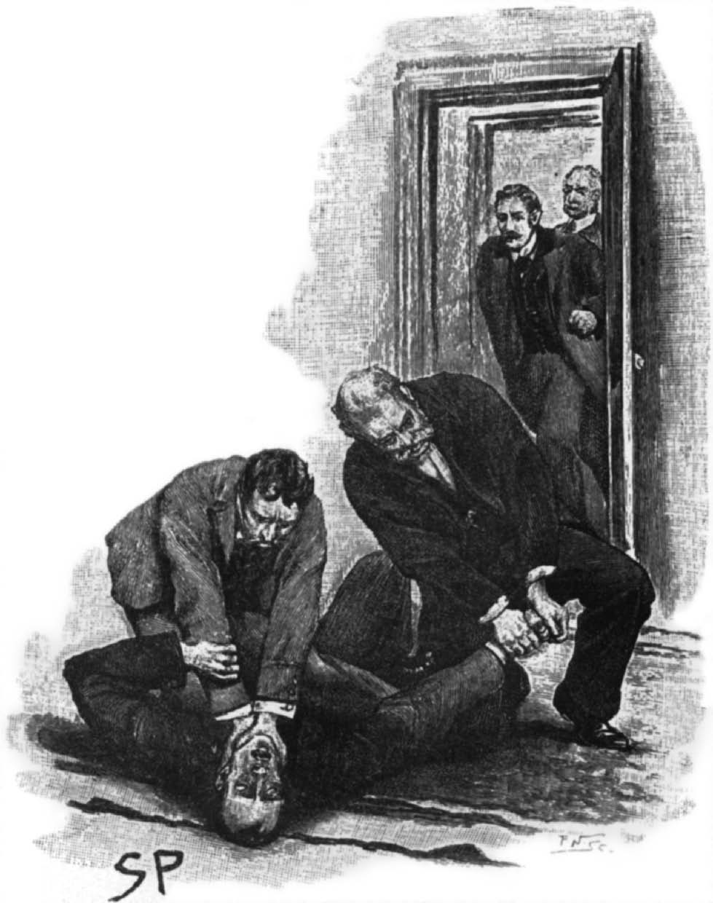

“救命！救命！杀人啦！”

“逮捕这两个人，警官。”他气喘道。

“是什么罪名？”

“谋杀他们的马车夫，威廉·柯万。”

警官迷惑地呆望着他。“哦，现在，福尔摩斯先生，”警官最后说，“我相信你不是真的要——”

“啊哈，你们看，这两张脸！”福尔摩斯冲着两个人叫道。

一点不假，我从来没有见过比这更自认输掉、罪责难逃的脸部表情。这老的变成张嘴哑巴，睁眼迷茫，耷拉一张又狠又恨又无可奈何的老脸；那小的是另一副相貌，原先气势十足、得意扬扬，现已威风扫地，黑眼睛露着困兽的凶光，俊俏的脸痉挛扭曲。警官无话可说，跨步到门口，吹起警笛，两名警察应声来到。

“只好委屈了，坎宁安先生，”他说，“我相信，这事最终是场闹剧、误会，不过，您能看到——哟，干什么？放下！”他朝亚历克挥去一拳，立即就要扣响的左轮被喀哒一下打落在地。

“不许动，”福尔摩斯说，从容地一脚踩住手枪，“到法庭上你才会看到它有用。这才是我们真正需要的。”他举起一个小纸团。

“那半张纸！”警官叫道。

“正是没错。”

“哪里找到的？”

“在我料定的地方，一下就拿到，我很快就能把全案是怎么回事同你们讲。我想，上校，你和华生现在回去吧，我最迟一小时就能再见你。警官和我有话要问罪犯，午饭时间你肯定可以见到我。”

福尔摩斯言而有信，约一点钟，他来到上校家的吸烟室和我们在一起了。陪着一起来的还有一位稍有点年纪的绅士，他向我介绍这位绅士就是阿克顿先生，头一起夜窃就发生在他的家里。

“我希望阿克顿先生一起来，我好向你们大家一起讲讲这件案子，”福尔摩斯说，“因为他自然是对案情最有直接关系。我担心，亲爱的上校，你会懊恼把时间耗费掉用来接纳如我这样迎着暴风雨的海燕。”

“恰恰相反，”上校热情地答道，“我考虑的是，能允许研究你的工作方法，是最大的荣幸。我承认，你的工作方法非我所能想象，我一点也搞不清最后怎么给你破的案，我还是没能看出有什么蛛丝马迹的线索。”

“我的解释恐怕并不能尽如人意，只是我的老习惯，事情完了以后工作方法从不瞒人，我的朋友华生不瞒，凡是不怕动脑筋、对此有兴趣的人，都不瞒。不过，先得说，在那间更衣室里我给折腾得厉害，我想来点白兰地，上校，我的体力刚才简直消耗殆尽了。”

“我相信你不会再来一次发神经痛了。”

福尔摩斯畅怀大笑。“这事待会儿再谈，”他说，“我把事情一五一十挨顺序给你们讲，说清楚是什么问题使我下定判断。若是你们听着有哪些推理不十分明白，尽管打断问我。

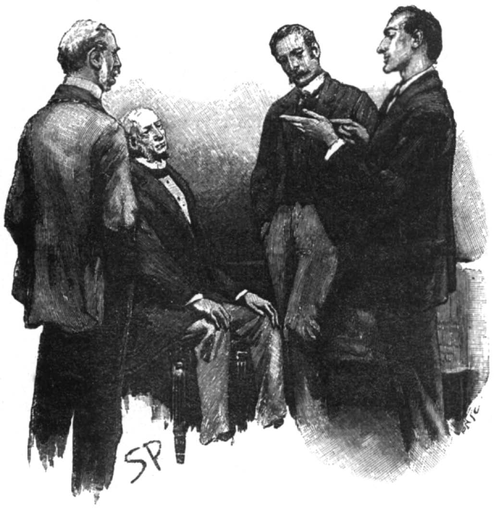

“我把事情一五一十挨顺序给你们讲。”

“侦查工作的最高艺术，要能够在众多的事实当中，分析辨别哪些是关键问题，哪些是次要问题，否则，你的精力要被分散，得不到集中。现在本案，从一开始我心中就毫不怀疑、非常明确，解开整个谜案的钥匙，完全在于找到与死者手里相连的半张撕走的纸。

“进入这个问题以前，我想请你们注意一个事实，如果亚历克·坎宁安他那套陈述是真的，如果凶贼枪杀威廉·柯万以后，如他所讲是立刻逃跑的，那么很明显，贼不会要抢死者手里的纸。好，如果不是贼，那必定就是他亚历克·坎宁安自己抢掉的，因为在这个时间只有他能够做到，等老头下楼来，已经有几个仆人也到了现场。问题原就这么简单，但是警官却忽略掉这一点，因为他一开始就观念设定这些大乡绅与犯案绝无牵涉。而我，看问题绝不囿于偏见，只尊重事实，惟事实是从。所以，调查的第一步，我就不得不用怀疑的眼光看亚历克·坎宁安先生在其中扮演什么角色。

“我接着就对撕剩的纸进行仔细研究。纸是警官交给我们的，我立刻注意到其中包含有很重要的内容。就是这碎纸，你们现在还没看出其中很能说明问题的地方，是吗？”

“字看上去很不规则。”上校说。

“我亲爱的先生，”福尔摩斯高声道，”完全看得出，是两个人交替着写的。我请你们注意，这‘at’和‘to’中间的t写得很有力，请你们同‘quarter’和‘twelve’中间的t比比看，笔力就弱。这个差别你们一看就看得出，很容易作出分析，这四个字你们绝对有把握说，‘learn’和‘maybe’是有笔力的人写的，而‘what’是笔力较弱的人写的。”

“是啊，再清楚不过！”上校叫道，“两个人要这么来写一张字条，是什么用意呢？”

“这就明摆着不是好事。两个中有一个对另一个不信任，是这个人拿主意作的决定，干这件事不管怎么，手脚要一人一半对分。还有，两个当中，显然是那个写at和to的人为主谋。”

“你有什么根据呢？”

“从两人字迹手势的对比可以作出推断，理由确准无疑，不必作假设。仔细研究这纸片，可以得出结论，是手势有力的那个人先落笔把他该写的字写好，留出空白再让另一个人填字。空白老是留得不够，你们看，这第二个人只好挤着往里添字，quarter硬往at和to之间挤着写，说明at和to这些字是先写好的。先写的这个人，无疑应当就是这件事的策划者。”

“好，妙极了！”阿克顿先生高声叫道。

“这仅是摆在表面上明显的事实，”福尔摩斯说，“我们现在再来看一个问题，这个问题可重要了。你们不太知道从手迹可以推论一个人的年龄，现在笔迹专家对此已经达到相当精确的水平，在正常情况下，手迹判断年龄不差十年是有把握的。我说正常情况，因为生病、体弱，笔迹会有老年人的征象，甚至残障人有的是青年，却也有像是老年人的笔迹。现在来看我们这个，一个手迹粗壮有力，另一个就显得软弱无力，t字母都掉横，但还是能保持看得懂。我们可以说，一个是年轻人，另一个上了年纪，但还不是老朽。”

“好，妙极了！”阿克顿先生再次高声叫道。

“不急，还有更进一步的问题，那才叫微妙有趣。这两人的手迹有共同点，他们有血缘关系。你们最容易看出的是他们把e都写成希腊字母ε，但是我注意到其他许多细小的地方，都显示着同样的问题。从这两人的字样，可以辨别出存在家族风格，有家族共性，我对此确信无疑。当然，我只是给你们讲现在审查这片纸得出的主要结果。其实这纸上不下二十三处可另作演绎推论，在专家眼里不比平常，要比诸位看得有味。二十多个结论更加深了我原来的印象，是坎宁安家父子两人，写的这封信。

“已有这样的结论，我下一步当然就要调查犯罪实施细节，看看对我们彻底查清本案能起多大作用。我和警官到那幢宅屋，看了有关的地方。死者身上的伤口我完全能够确定，是左轮枪大约在四码多一点的距离打的。衣服上没有火药痕迹，因此亚历克·坎宁安讲他看见两个人扭打起来开枪行凶，那是纯属谎言。再有，父子两人一口咬定凶手向大路那个地方逃逸。可是到那里一看，竟然有一条宽阔的沟，沟底是湿的，沟里、沟的附近一个脚印也没有。由此可见，坎宁安父子又是谎言，因而，现场上的那个不明人，根本是无中生有。

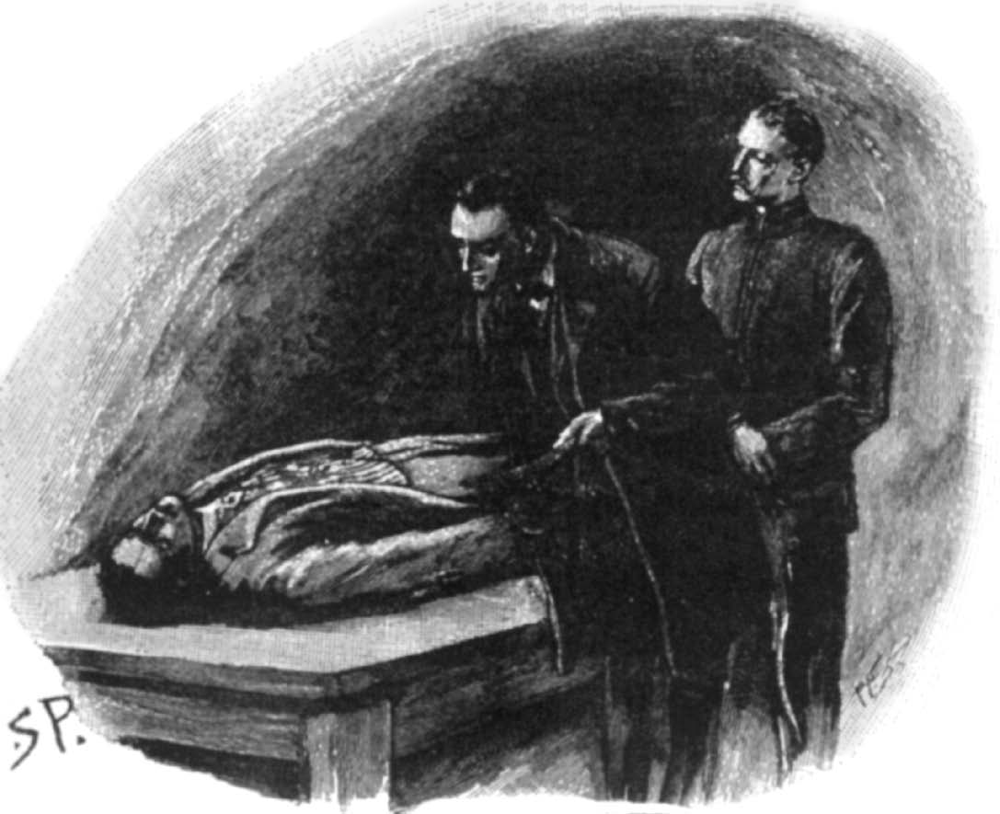

衣服上没有火药痕迹。

“至此，我就考虑这桩奇怪案子的作案动机。为了达到这一点，我首先要解决先前阿克顿先生家里那起盗窃案是怎么回事。根据上校讲的，我知道你阿克顿先生同坎宁安家正打着一场官司。我因此马上想到，他们到你藏书室，目的是要窃得什么文件凭证，对他们官司胜诉非常重要。”

“一点没错，”阿克顿先生说，“他们肯定是这个目的。我有权提出诉求，他们现在地产的一半依法应该是我的，但是如果他们能拿到这地产证——这份地产证幸好我交给律师藏进了保险箱——给他偷掉证件丢了凭证我们就要败诉了。”

“不知你看如何，”福尔摩斯微笑着说，“这么胆大妄为、鲁莽瞎闯，我说有点像是亚历克小子这号人的特点迹象。文件没有找到，目的未达，为掩饰其动机转移疑点，就随手拿点东西，以示为一般小偷。这应该说是简单清楚的，然而谜团依然很大，无论如何，我要搞到字条另一部分。既已认定是亚历克从死者手里抢走，也可以断定他抢到手只能往自己睡衣口袋里塞，否则能往哪儿扔呢？惟一的问题是那纸会不会还在衣袋里，这要花点工夫探一探。为此目的，我们一同亲临现场登门拜访。

“坎宁安父子碰上我们，你们应该都还记得，是在厨房门外。非常要紧的是，我当然一定得提防绝不可以说起那张纸，否则等于提醒他们立刻毁掉罪证。警官正要对他们讲，我们对纸很重视，在追查，天赐我良机我正好有病在身，赶快装病发作，才把话截住岔开。”

“老天保佑！”上校喊道，大笑，“原来你突然发病是装的，那我们大家也是白白为你惊慌一场啰？”

“这是天赋，做得功夫还真到家。”我高声说，惊异地望着这个一直奇招迭出叫我应接不暇的人。

“这是艺术，经常有用，”他说，“我恢复常态，便马上再略施小计，叫老坎宁安留下了‘twelve’这词的亲笔字迹，我便有了证据，同碎纸上的twelve可资对照。”

“咳，我又做了一次蠢蛋！”我叹道。

“我看得出，对我身体虚弱如此，你是在同情、怜悯，”福尔摩斯说，大笑，“真是对不起，我知道你当时为我深深忧虑，感到痛心。接着我们都一起上楼，进了那个房间，看见睡衣挂在门后。我故意踢翻桌子，吸引他们的注意力，乘机溜回去掏衣袋。我刚拿到纸——正如我所预料，就在一个口袋里——两个坎宁安扑到我身上。我完全有数，要不是你们及时赶到相救，我当场就必死无疑。我现在都还觉得那小子死掐我脖子，老混蛋拼命扭我手腕扳我手要夺纸。他们已经看到我把事情真相探明，你们看，原以为绝对保险，一下子变成彻底败露，令他们非要垂死挣扎不可。

“我后来找老坎宁安谈了一次话，问他作案动机，他不回避，老实回答。他儿子可是个十足的恶棍，给他抢到了手枪的话，准是见人就往脑袋打，也要往自己脑袋打。坎宁安眼见案子全部暴露，无法掩盖，也就心死，把事实和盘托出。情况也就是因为威廉秘密跟踪，看见两个主人那天夜盗阿克顿家，捏住把柄在手，威胁要揭发，想乘机敲诈。可是亚历克先生是个险恶人物，他才不吃这一套。他歪脑子一动，也就利用乡里因有夜盗、人心恐慌之机，再造一次骇人听闻的夜盗，以除掉心腹之患，可说天衣无缝。威廉被诱出、击毙。如果他们把整张纸全拿掉，接下来的案情细节再稍周密一点，很可能本案引不起怀疑。”

“那张纸呢？”我问。

福尔摩斯把撕走的纸拿来放在我们面前拼好。

如果你十二点差一刻时

来东大门，你将得知何事

使你极感惊喜，且

对你及安妮·莫里森将会

有莫大益处。但勿将此事

对任何人讲。

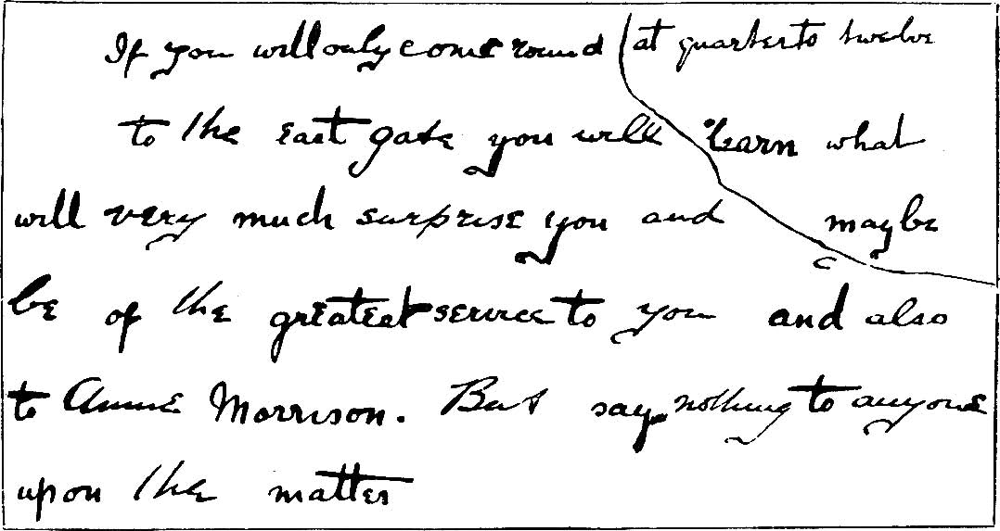

“这件正是我希望要的东西，”福尔摩斯说道，“当然，我们还不知道亚历克·坎宁安、威廉·柯万同这个安妮·莫里森之间是什么关系，但是结果表明这个诱饵设得相当巧妙。我相信你们不会不乐意看出家族遗传在手迹上也有特征，两人的p是一样的，g的拖尾也是一样的，i缺上面小点是这个老人字迹最明显的个性特点。华生，我想，我们来乡村安静休息已有显著的收获，现在我精神抖擞，明天一定可以回贝克街了。”

（1893年）

————————————————————

<a href="#part0068.xhtml_ch1-back" id="part0068.xhtml_ch1">(1)</a> 安妮女王（Anne，1665—1714），英国女王，斯图亚特王朝最后一代君主。

<a href="#part0068.xhtml_ch2-back" id="part0068.xhtml_ch2">(2)</a> 马尔普拉凯（Malplaquet），西班牙一村庄，西班牙王位战争时期（1701—1714）英荷联军在此击败法军，世称马尔普拉凯战役。

# 驼背人

一个夏天的晚上，那时我结婚已有几个月，我坐在壁炉旁吸最后一斗烟，对着眼前的小说困得直垂脑袋，因为白天的工作把我累得筋疲力尽了。我妻子已上了楼，前厅传来锁门声也已经有一会儿，表明我的仆人也都歇息去了。我从椅子上起身，磕着烟斗灰，忽然间，听到门铃响。

我一看钟，十二点差一刻。这么晚了，不会有客来访，肯定是病人，那就很可能要看病一夜睡不成。我苦着脸去门厅开门，一看，叫我意外一惊，站在门前的，原来是福尔摩斯。

“啊，华生，”他说，“但愿这时候闯门还不算晚吧。”

“我亲爱的伙计，进来吧。”

“你有些惊讶，噢，也难怪！现在放心，没事了吧！我想。你怎么还是抽阿卡狄亚混合烟！还跟单身汉时候似的。看你衣服上的绒毛状烟灰，就准没错。也一眼就可以看出，你还习惯于穿军服，华生。你不改衣袖里藏手帕的习惯，总是个军人相，不像真正平民老百姓。今夜在你这儿过一宿怎么样？”

“当然欢迎。”

“你对我说过，你有一间房间可以留单身男客住，我想你这会儿没有男士访客，看你衣帽架就清楚。”

“你来住我当然高兴。”

“谢谢。那么帽架空挂钩我来挂上。有点遗憾，看出府上来过不列颠工人了，有事的征状。我希望阴沟没事吧？”

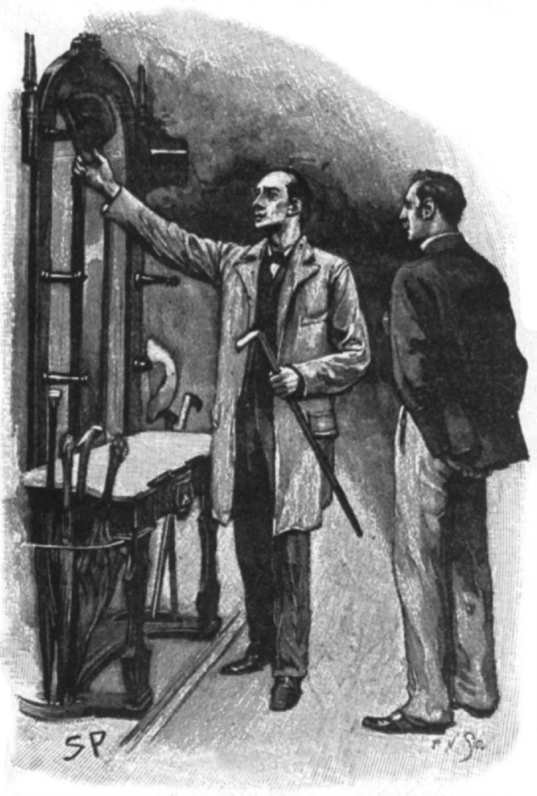

“帽架空挂钩我来挂上。”

“不是，是修煤气的。”

“啊！工人留下了两个皮鞋钉子的痕迹，在你的油地毡上，灯光正好照着，看得清楚。不用，谢谢，我在滑铁卢吃过晚饭了，倒是很乐意和你抽抽烟。”

我随手递给他烟袋。他在我对面坐下，默默地抽了一会儿烟。我有数，他无事不登三宝殿，这个时间来一定有要事，所以我也就耐心恭候，等他开口。

“我看得出，你这一阵来业务相当繁忙。”他说了，向我注视一眼。

“是的，白天忙了一天。”我回答他。

“也许在你眼中我很傻，”我又说，“真不懂你是怎么推论知道的。”

福尔摩斯暗自笑笑。

“你的习惯我都深知，我亲爱的华生，”他说，“你是附近出诊走着去，远途出诊才坐马车去。我看到你的高帮鞋，已经穿了些日子，可是没一点脏，这就肯定近来所忙是坐马车出诊。”

“高明！”我叫道。

“小玩意儿罢了，”他说，“这是一个例子，推理者获得的结论叫周围人只觉得莫名惊奇，之所以有这种效果，因为别人忽略掉的小问题，实际上正是赖以推理的关键和基础。同样道理，我亲爱的伙计，你写的这些个小故事，非常夸张，实际上你是留一手，问题中的某些关键不露给读者，才收到奇效。眼下我同样处于这类读者的地位，因为我经手最奇的一件案子，把人弄得晕头转向，虽说已有若干线索，但是还缺一两条，必须补足才能完成我的推论。但是我能补足，会有的，华生，我一定会有！”他眼闪亮光，瘦削的面颊兴奋泛红。转瞬间，犹如一掀面纱见真容，还以真切、热烈的自然容貌，但仅是一转瞬而已。当我再看他时，他的脸又回复到了印第安人似的冷峻，这使许多人把他看作是金属机器而非血肉之躯。

“这个案子，相当有趣，”他说，“甚至可以说别具特色。我已经深入案情，我想，已进入我解决它的视线。在这最后阶段你要是能陪我一下，那就是帮了我大忙。”

“我乐意奉陪。”

“明天就远走奥尔德肖特行不行？”

“没问题，看病请杰克逊代劳一下。”

“那好。我十一点十分从滑铁卢出发。”

“这时间我赶得及。”

“如果，你不太困，我把发生的事扼要给你讲一讲，还有我们该做些什么。”

“你没来之前真是困，现在精神得很了。”

“我把事情尽量讲得简单扼要，关键之处不漏。恐怕你已经看过这案子的报道，就是驻奥尔德肖特的芒斯特皇家步兵团巴克利上校怀疑被谋杀一案，正由我经手进行调查。”

“我一点也不知道。”

“看来除当地以外，还没有引起广泛注意。案子才发生两天，大致情况是这样：

“芒斯特皇家步兵团，你也知道，是英国陆军著名的爱尔兰团，它在克里米亚战争、平定印度土兵叛乱中，都建有奇功，从那以后，每次战斗功勋卓著。这支部队直到这个星期一晚上，一直由詹姆斯·巴克利上校指挥。上校是个英勇善战、经验丰富的老军人，他最初是个二等兵，由于在印度平叛作战勇敢，被提升起来，一直升到负责指挥他出身的这个团。

“巴克利上校还是中士的时候就已经结婚，妻子闺名南西·德沃伊小姐，是本团一个前掌旗军士的女儿。那就可想而知，在新的环境中这对年轻夫妇不免受到周围的排挤倾轧（那时候不过是青年小夫妻）。不过他们很快就能适应新环境，据说，巴克利夫人很受本团家属的欢迎，她丈夫也同样受军官弟兄们的敬重。这里要补充一句，她是个非常漂亮的女人，即使现在已经结婚三十多年了，依然风姿绰约动人如女王。

“巴克利上校家庭生活看来堪称和睦美满。墨菲少校，我知道的许多事实都是听他介绍的，他告诉我说从来没有听到这对夫妇有过不和。总的来讲，他觉得巴克利对妻子的爱要胜过妻子对巴克利的爱。从她为人妻那方面看，虽然对丈夫也不乏情爱与忠诚，但明显欠缺些柔情。不过他们在团里被公认是一对中年模范夫妻。他们夫妻之间的关系，绝对没有一点事情叫人看得出日后会引发悲剧。

“巴克利上校本人性格上似乎有些与众不同的地方。他是位悍将，咋呼开朗的老军人，平时嘻嘻哈哈，但有些场合，他显得相当粗暴，还有报复心。虽说脾气如此，但在妻子面前从来不使性子。另有一桩事实，墨菲少校，还有和我谈过话的五个军官中有三个，都说曾经注意到有时候他脸上流露出特别忧郁的神情。据少校讲，巴克利在餐桌上和弟兄们打趣说笑兴致正高的时候，常常好像有一只无形的手一下子把他嘴上的笑容抹掉，这样的心境会一连好几天，消沉忧愁。这种消沉还加上有点迷信色彩，军官们都看出他的性格变得不同寻常，迷信到不敢一人独处的地步，尤其在天黑以后。这么个威猛勇武大汉连个小孩子都不如，因此不免引起议论和猜测。

“芒斯特皇家步兵团（原是老一一七团）第一营驻扎在奥尔德肖特已有多年，带家属的军官住在营房外面，那期间上校住一幢小别墅，叫‘籁静’，距北营约半英里。别墅独幢独院，但是西边临近公路不到三十码。家里只用一个马车夫、两个女仆，因为巴克利夫妇没有孩子，平时也没有客人来借宿，籁静就只有男女主人和这么几个人居住。

“现在要讲，本星期一晚上九点到十点之间籁静发生的事。

“巴克利夫人大概是天主教徒，对圣乔治慈善会很关心，那是瓦特街小教堂举办的，专门给穷苦人施舍旧衣服。这天晚上八点钟，慈善会举行会议，巴克利夫人匆忙吃过晚饭去参加。出门的时候，车夫听见她关照丈夫几句一般家常话，说是一会儿就回来。她叫了莫里森小姐，住在临近别墅的一位年轻女士，两人一同去参加会议。会开了四十分钟，九点一刻，巴克利夫人回来，经过莫里森小姐家，在她家门口分手。

“籁静有一间晨起室，朝向公路，面对草坪是大玻璃折门。草坪宽三十码，与公路有矮墙隔开，墙上是铁栅栏。巴克利夫人一回家，径直进的就是这间晨起室。窗帘没有放下，因为这屋子晚上一般是不用的，但是这天巴克利夫人点亮了灯，又打铃，叫珍·斯图尔特，一个女仆，给她拿一杯茶来，这跟她平常的习惯不一样。上校正坐在餐室里，听到妻子回了家，也到晨起室里来。车夫是看见他穿过客厅走进晨起室的，这以后就没人再见过他了。

“要的茶足足准备十分钟才送来，这个女仆走近门口，吃了一惊，听见男主人女主人的吵架声，吵得很凶。她敲敲门，没回音，转转门柄，转不动，原来门从里面反锁住了。她没办法，就只得跑去叫厨娘，两个女人还有车夫一同到厅里，听着吵架，吵得不可开交。他们一致说只听到两个人的声音，就只巴克利和他妻子两个。巴克利说话嗓子压得低低的，又没有完整的话，怎么听也听不出他讲些什么。夫人大不一样，说话火气很大，嗓音一提高就听得清楚。‘你这个懦夫！’她一遍一遍不断地这么叫喊。‘现在怎么办？现在怎么办？我这几十年，你还我。我和你无法再一起生活了！你这懦夫！你这懦夫！’就是这么一些零碎话。接着突然男的一声惨叫，又扑通一声，没了声音，女的发出钻心尖叫。车夫知道出大事了，冲到门口，想把门撞开。这时里面传出一阵又一阵的尖叫声。然而车夫没能把门撞开，女佣被吓昏在那里，一点也没能上来帮个忙。他忽然想到，立刻跑出厅门，绕到草坪上，那边法国式落地长窗是开着的。我知道，夏天这种窗常开不关。这样他就毫无困难进入室内，女主人已经不出声，瘫倒在长沙发上，昏了过去，而那位不幸的军人直挺挺倒在血泊中断了气，两条腿跷在椅子扶手上，脑袋着地，靠着壁炉挡板的棱角边。

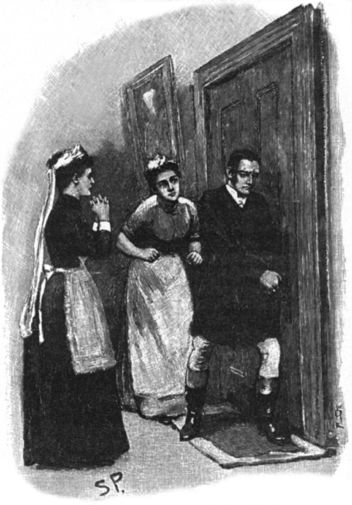

车夫没能把门撞开。

“车夫首先想到，男主人已经没法救了，自然是先把门打开要紧。可是想不到又遇上了出奇的事，这门里侧居然没有看到钥匙，屋子里到处找也没找到钥匙，他也就再从长窗出去，叫了警察和医生回来相助。这位夫人，自然就成了最大嫌疑，但她依然昏厥不醒，就先将她抬到卧室里去。把上校尸体扛上沙发，他们接着仔细检查现场。

“不幸的老军人受的致命伤在后脑部，一道伤口有两英寸长，明显是钝器重击所致，难就难在猜不出是什么器具。地板上，尸体旁边，有一根骨柄雕花硬木棒。上校生前收集各种各样刀剑枪械，都是从他打过仗的各国带回来的，警察猜测这根棒也是他的战利品。可是仆人都说以前没见过，不过屋里那么许多珍藏品，这一根棒被忽略没注意也有可能。警察在屋子里再也没能发现其他重要情况，只剩一个无法解释的事：不见了的门钥匙巴克利夫人身上没有，被害人身上也没有，房间各处也都没有，不知哪里去了。末了是叫来奥尔德肖特的锁匠才把门打开。

“事情就是这样，华生，星期二早晨，我应墨菲少校邀请，去了奥尔德肖特协助警方办案。我想你听了这个案子已经觉得很有兴趣了，可是我侦查下来，立刻感到实际更不简单，远比初步看到的要复杂得多。

“还没进屋子，我先盘问仆人，结果也就是已经讲过的这点事实。但是有一个情况，是女佣珍·斯图尔特回忆起来的，很有内容。你还记得，她当时一听到吵架，就去把别的仆人找了来。起初只她一个人，她说，主人和夫人嗓子都压得很低，听不出在讲些什么，是从他们说话的调门，不是内容，听出是在吵架。经我再三追问，她才又想起听出夫人有两次提到大卫这个名字。这一点是个重要的方向，可能就是导致争吵的原因。上校的名字，你记得，是詹姆斯。

“案情中有一点，对仆人和警察印象都很深，那就是上校的脸，面相歪扭。按他们的说法，人受极度惊恐才会吓出这样的表情，他面相之可怕叫谁见了都会晕过去。可以肯定，他预见到自己末日来临，才会陷入无比的恐惧。这当然符合警察的推论，或许是看到妻子要谋杀他了。至于伤口是在脑后，与这推论也并不完全矛盾，认为可能是他转身想躲避时朝他打击的。夫人这头一点情况都得不到，她正发急性脑炎，始终昏迷不醒。

“警察那里我还了解到，莫里森小姐，你还记得，那天晚上和巴克利夫人一起出去的，但她说不知道巴克利夫人回家以后怎么就发了脾气这个事。

“收集到了这些情况，华生，我抽上好几斗烟进行思考，努力抓关键问题，把次要问题撇开。毫无疑问，案子中最奇怪、最应该注意的一点是门钥匙莫名其妙不见了，整间屋子里仔细搜遍都没能找到。那就必定是有人拿掉，既非上校自己，也非夫人所拿，事情是十分清楚的，有第三人进入过这间屋子。这第三人只能从窗户进来，我想到仔细检查屋子和草坪可能会发现这个神秘人物的踪迹。你清楚我的工作方法，华生。这次侦查中没有哪个方法没有用过，结果是发现了一些踪迹，但是跟我预想的很不一样。在这间屋里确实有人来过，是从公路穿过草坪进来的，我采到五个清晰的脚印：一个在大路旁，正要翻矮墙的地方，两个在草坪，还有两个在靠窗地板上，不太清楚，但正是从这儿进的屋。这个人明显是奔跑经过草坪，因为脚尖印比脚跟印要深。不过叫我惊讶的倒不是这个人，而是他还有个伴。”

“还有同伙？”

福尔摩斯从衣袋里掏出一张拷贝用的大薄纸，小心地摊开在膝头。

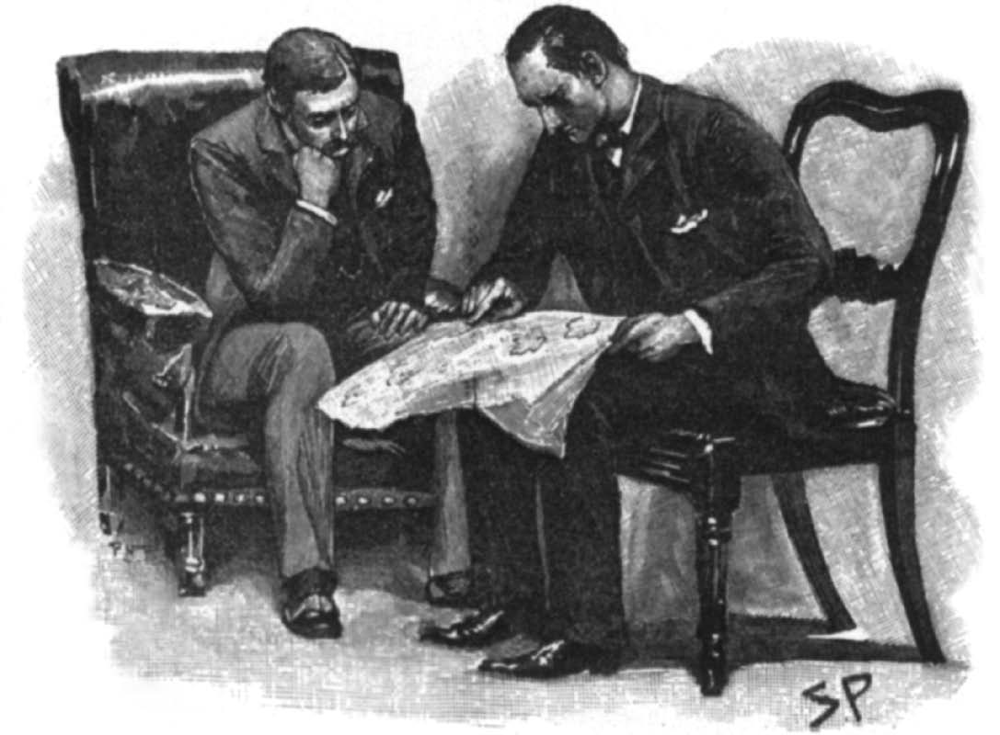

一张大薄纸摊开在膝头。

“你看得出是什么？”他问我。

纸上布满了某种小动物的爪印。五个爪指很清楚，有着长长的爪尖，整个如中型点心调羹那样大小。

“一只狗。”我说。

“你听说有狗能爬窗帘的吗？我发现很清楚，这东西爬上了窗帘。”

“那么，是猴子？”

“可那不是猴子的爪印。”

“那究竟是什么？”

“非狗非猫非猴子，我们熟悉的动物一样都不是。我试着根据爪形大小复原这个动物的形态。这儿有四个，是这只动物站定的爪印，你看，前脚后脚之间相距至少十五英寸，加上脖子和头的长度，你就得到，这个动物体长差不多要有两英尺——算进尾巴的话，那就更长。再来研究以下另一个长度。这个动物走动跨步的尺寸，每一步是三英寸，你就可以知道，形体是身子长，可是腿很短。想不到一根毛也没掉下，不过大致形态就是我讲的这个样子，是一只食肉动物。”

“那是怎么推断的呢？”

“因为爬窗帘了，窗上挂着一只金丝雀鸟笼，这动物是爬上去要抓鸟。”

“那么这是只什么动物呢？”

“我要能叫得出是什么，那破案大概也就差不多了。总的看，应该是一种鼬属动物，白鼬之类——个体比我见过的要大。”

“跟案情有什么关系呢？”

“这个，是呀，也是不清楚。不过我们毕竟了解到不少情况，这你看到了。我们知道有一个人站在大路上目睹巴克利夫妇吵架——窗帘拉开着，屋里灯亮着。我们还知道他穿过草坪，进到屋内，带有一头奇怪的动物。还有，要么是他打死了上校，或者有同等的可能性，上校一看见他就吓得自己摔倒，脑袋撞上铁栏角。最后，就是那个最怪的事了，是这个闯入者离开的时候取走了钥匙。”

“你这些发现反而把事情搞得比先前更加复杂了。”我说。

“确实是这样。这些发现无疑显示案情比原先猜测的要深刻得多。我把情况想了一遍，得出结论，我必须从另一方面探索本案。可是看我，华生，看我把你累着了，有话等明天去奥尔德肖特一路上再讲好了。”

“谢谢你，讲到了这么个份上，要停也不行啦。”

“可以肯定，巴克利夫人七点半离家，对丈夫情绪还是很好。她一向，我想我已经说过，一向不算怎么温柔体贴，但是马车夫听见，她对上校说话的口气是平和正常的。不过，同样要确定另一个事实，当她一回到家，就进晨起室，这里不大可能碰到她丈夫，还马上要喝茶，这是女人心情激动的表现；最后，是丈夫过来看她，她便勃然大怒向他追究什么。因此，在七点三十分到九点这段时间里肯定有事发生，促使她对丈夫的情绪、感情忽然转变。莫里森小姐在那一个半钟头的时间里始终和她在一起，这就绝对可以肯定，不管她怎么否认，她肯定知情。

“我最初的假设是，有可能这位年轻小姐和老军人之间有瓜葛，小姐现在向夫人承认了。能说明夫人于是一路回来满肚子火气，而姑娘当然要矢口否认说什么事也没有发生。这样猜测同仆人听到的话也不是完全合不拢。但是另提到大卫，而上校对妻子爱得执着是人所共知的，这就又是大矛盾。更不要说还有第三个人闯入，与死人直接有关。这样一来，当然，上面的猜测完全连不上线，站不住脚，真让人举步维艰。但是，我总体观念，放弃上校同莫里森小姐有关系这个想法，更加确定这位年轻小姐身上另有线索，她知道巴克利夫人迁怒自己丈夫的真正原因。因此我就采取直截了当的办法，走访莫里森小姐，对她讲我完全认定她是知情人，明确告诫，不把事讲清楚，她的朋友巴克利夫人将面临重罪审判。

“莫里森小姐是位瘦小文弱的姑娘，两眼羞怯，一头金发，但是我发现她毫不缺少机智与主见。她听我讲完，坐着想了一会儿，然后转身向我，态度坚决，和盘托出，这是很值得注意的。考虑到你的情况，我压缩讲简短些。

“‘我答应我朋友不讲这件事，可答应归答应，’姑娘说，‘她现在碰到要受这么严重的指控，自己又病倒开不了口，可怜的好姐姐，我要帮她一把，答应的事，决心不管它了。我这就告诉你星期一晚上那个事。

“‘我们从瓦特街慈善会回来，大约九点一刻。回家要经过赫德森街，一条很安静的大道，街上只有一盏路灯，靠左手边。走近灯下，看见一个人朝我们过来，是个驼背，驼得很厉害，肩上挎着一样东西，像是一只箱子，是个伤残人，垂头，屈腿。我们走过的时候，正好在灯光下，这个人抬起头来看我们。他看着就停下了，怪怕人地叫起来，“我的上帝，是南西！”巴克利夫人吓得脸色苍白，人都站不稳了，那个怪吓人的驼背赶快扶住她，她才没摔倒。我要去叫警察，没想真是怪，夫人对他回话非常和气有礼。

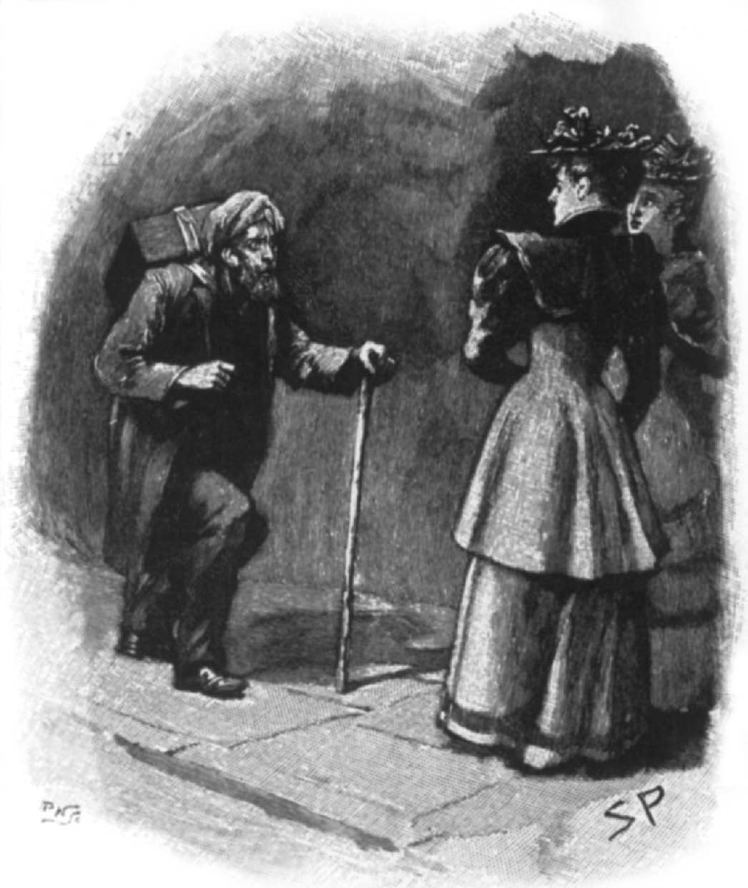

“我的上帝，是南西！”

“‘“三十年了，我以为你不在人世了，亨利。”夫人说，嗓子在发抖。

“‘“我是已经死了。”这个人说。听他讲这话的声音，叫人胆寒。他面色阴沉、可怕，那两眼的目光，我现在做梦还梦见。他的头发和胡子已经灰白，脸上皱缩得像只干皮苹果。

“‘“你前面先走几步，亲爱的，”巴克利夫人说，“我要和这个人说几句话。没事，别害怕。”她尽量镇定地说，脸色还是死灰一般，嘴唇颤得简直讲不成话。

“‘我按她要求先走，他们在一起谈了几分钟。之后夫人就过来了，可是两眼冒着火光。我看到那个跛子残疾人站在路灯杆旁，捏紧拳头向空中挥舞，气疯了似的。夫人一句话也不说，走到了这儿门口，她才握住我手要求我对谁也不要讲刚才这件事。

“‘“那是我从前认识的人，搞得很苦，不像人了。”她说。我答应绝不说出去，她吻了我，这以后就再也没见过她。我现在把全部事实经过都告诉了你。我那天没向警察讲，因为不了解我亲爱的朋友处境有那么危险，我现在知道只有把事讲明白了，才对她有利。’

“这就是她的陈述，华生，对我，你能想象，那是黑夜之中遇明灯。以前各件不连贯的事一下子都挨上次序对上了号，全部案情已见端倪。下一步，也就是要找到那个人，给巴克利夫人产生这么大影响的人。如果他还在奥尔德肖特，找到他也就不难，那里居民不多，一个残疾人势必会引起注意。我费了一天工夫寻找他，到了晚上——就是今晚，华生——把他找到了。这个人名叫亨利·伍德，就住在巴克利夫人、莫里森小姐遇上他的那条街，住的租房，才刚来了五天。我以租户登记的名义找了房东太太，跟房东谈得非常好。这个人是变戏法玩杂耍的，每天晚上到私人经营的士兵俱乐部去兜上一圈，一家一家耍点娱乐节目。他养一只动物，放在箱子里随身带着。女房东有点担惊受怕，她从来也没见过，不知是什么怪物。房东讲，他就靠这只动物耍把戏。房东能告诉我的就是这么多，另外还说，身子那么歪扭畸形的一个人，活着也真是不容易，说他讲话常有怪腔，最近这两夜，还听见他在房间里唉声叹气，有哭声。他人挺不错，付钱很爽快，不过付给她的押金里头有一枚像是假弗罗林<a href="#part0069.xhtml_ch1"
id="part0069.xhtml_ch1-back">(1)</a>，房东给我看，华生，原来是一枚印度卢比。

“到了现在，我亲爱的伙计，你完全清楚我们该如何做了，这就是我为什么要来找你。事情很明显，巴克利夫人和莫里森小姐一起走了以后，这个人远远尾随在后，他从窗外看见两夫妻吵架，便冲了进去，将背在箱子里的动物放了出来。肯定就是这么个过程。屋子里到底发生什么事，全世界就只有他一个人能告诉我们了。”

“你打算去问他？”

“当然啦——就得要有个旁证在场。”

“你是要我做见证？”

“如果你愿意，那再好也没有。我们看他，能把事情完全交代清楚，那就最好；要是拒绝，我们别无选择，立刻提请将他逮捕。”

“可你怎么有把握，等我们再回到那边，他人还在？”

“你放心，我有安排，我已经派了一个贝克街孩子去盯住他，他跑哪儿都别想甩得掉。我们明天就去赫德森街找他，华生，同时我要说，这会儿若是再耽误你上床就寝，我可要成罪人了。”

我们赶到惨案发生地是中午时间，同伴领路，很快进入赫德森街。尽管福尔摩斯为人冷静，遇事不露声色，我还是一眼就看出他在抑制着内心澎湃的激情。我自己则是半作为猎奇运动，半作为智力游戏，也是兴致勃勃，这是我每次参与他刑侦调查所必有的体验。

“就是这条街，”他说道，我们转入一条宽阔的短街，街旁是一排普通两层楼砖房，“哈，辛普森来报告了。”

“人在，没问题，福尔摩斯先生。”一个街头流浪儿向我们跑过来，大声说。

“好样儿的，辛普森！”福尔摩斯说，拍拍他头，“快，华生，这个屋子。”他递一张名片进去，转告有要事求见。一会儿我们就和要见的这个人面对面坐下。尽管天热，这个人却还是蜷缩着紧靠炉火旁，小房间热得像火炉。这个人身子扭曲成一团缩在椅子里，那残疾而畸形的样子竟难以形容。他脸转向我们，粗黑的面貌历经沧桑，但看得出，原先是一张俊美出色的脸。他疑惑地望着我们，两眼射着黄光和怒色。他不说话，不起身，向两把椅子摆摆手。

“想必是从印度回来的亨利·伍德先生，”福尔摩斯和颜悦色地说道，“巴克利上校一下子成了死鬼，我是为这点事顺便来访。”

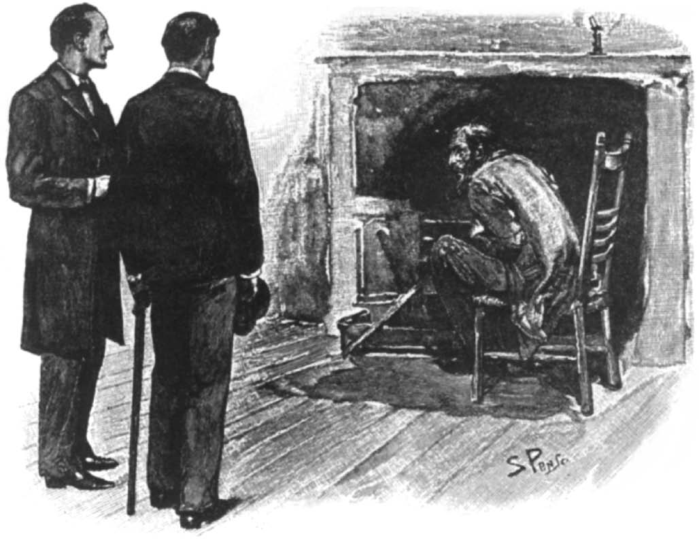

“想必是从印度回来的亨利·伍德先生。”

“这事和我有什么相干？”

“这正是我要查明的问题。你知道，我认为，除非事情搞清楚，巴克利夫人，你的旧交，躲不过要被控犯有谋杀罪。”

这个人猛地一怔。

“我不认识你是什么人，”他叫道，“也不晓得你是怎么知道的，你能发誓你刚才告诉我的是真话？”

“哎呀，警方正等着她醒过来把她逮捕呢。”

“我的上帝！你就是警察？”

“不是。”

“那你是干什么的？”

“伸张正义，人人有责。”

“那你可以相信我的话，她是无辜的。”

“那么是你有罪。”

“不，我没有罪。”

“那么是谁杀了詹姆斯·巴克利上校呢？”

“他是天理不容，死于非命。不过，要告诉你，我要是砸他脑袋，我也真是有意要砸他，那么死在我手里也是他罪有应得。如果不是他自己心虚跌死，完全可能，我也要他以血还血。你要我把内中事情讲给你听，好呀，我想我有什么不好讲，我这里无丑无羞无亏心。

“事情是这样的，先生，瞧我这背，像只骆驼，我的肋骨都断掉了，可是当年，下士亨利·伍德，在一一七步兵团是个最帅的小伙子。那时我们在印度兵站驻扎，叫布尔蒂的一个地方。前天死的巴克利，那时和我在一个连队，都是中士。团里有个美女，咳，真是最美的姑娘，有她开口说个话都觉得活着有滋有味。她叫南西·德沃伊，是掌旗军士的女儿。那时有两个人爱着她，可她只爱其中一个。请不要见笑，看我这缩在椅子上，烤火的丑八怪，听我说，正是我长得帅她才爱上我，请不要笑掉牙。

“哎，虽然她心中只有我，可是她父亲要她嫁给巴克利。我是个莽莽撞撞的毛头小伙子，而巴克利是受过教育的人，又是很快要佩剑升官了。姑娘还是心向我忠贞不贰，眼看我就要把她赢到手，这时爆发了土兵叛乱，全国动荡，一切都乱了套。

“我们被困在布尔蒂，我们一个团，只有半连炮兵，有一个连是锡克族兵，还带着大批英国平民，妇孺家眷。我们被一万叛军包围，那形势就像一群猎狗围着笼子里的耗子。被困第二个星期，我们断了水，关键问题就看能否同尼尔将军取得联系，他的纵队正在内地行动，只有这一条出路，我们带着妇女儿童，靠自己突围是没有希望的。我自告奋勇出去接头尼尔将军，报告我们处境危险。我的请求被批准，我找巴克利中士，据说他对周围地形比别人熟悉，他给我画了张路径图，照图可以通过叛军防线。当夜十点钟，我出发踏上征途。我身负着千人的性命，但是我夜间翻墙出城，惦念心头的只有一个人。

“我按图跑下一条干河道，原来是说这样我可以避开敌人的哨兵，可是我匍匐身子一绕过河道湾，就给六个叛军逮个正着，他们早埋伏在暗处候着我来呢。我遭到当头一击，给打昏，手脚捆住。但是我受到的真正的打击不是在头上，而是在心上。我醒过来，听到土兵在讲话，土话我能听懂一点，听出是我自己人，是那个安排路线叫我照着走的人，通过一个土著仆人把我出卖，才会落到敌人手中。

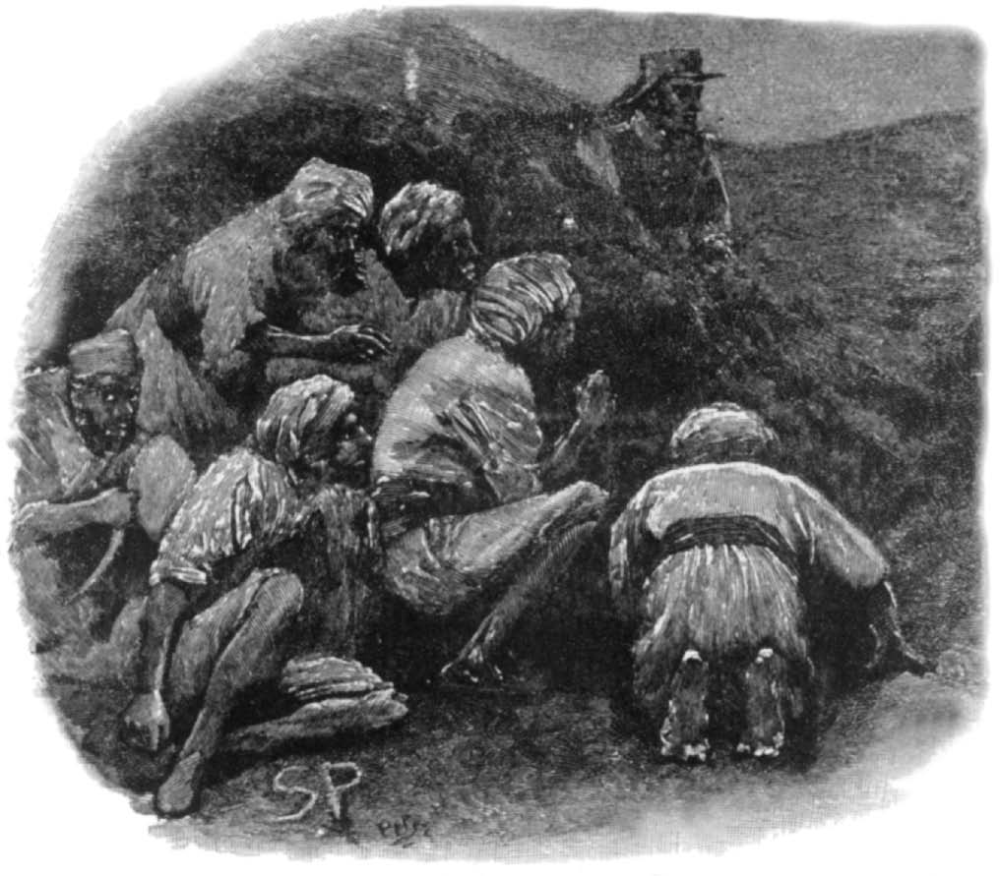

“他们早埋伏在暗处候着我来呢。”

“啊，这就不必细讲它了，反正你现在知道詹姆斯·巴克利这个人有多厉害。下一天布尔蒂还是由尼尔将军前来解了围，可是我给叛军撤退的时候带走，从此多少年，我没能再遇上一张白人脸。我惨遭折磨，设法逃跑，给抓回，再给折磨，死去活来。你自己也看见了，我已经成了什么个样子。叛军有的逃到尼泊尔，把我一起带去，后来又转到大吉岭。那边的山民把看押我的印度土兵杀了，我就又成了他们山民的奴隶，一直到最后逃脱。但不是向南跑，而是向北去，一直跑到阿富汗。在阿富汗又流浪好多年，最后才回到旁遮普。我还是多半住在土著窝里，学了点变魔术耍把戏，靠这个生活。我还有什么用呀，一个残废了的跛子，回到英国，或者回到我原来的弟兄们那里去，难道叫他们看到我成了这个模样吗？即使一定要报仇，我也不愿意回去。宁可叫南西，还有老同伴都以为亨利·伍德已经死了，挺直腰背走了，绝不愿意让他们看见他还活着，拄根拐杖，爬似的走着，活得像只黑猩猩。大家都当我是死了，我也但愿大家这样想。我听说巴克利把南西娶到了手，而且在团里升得很快，即使这样，我也不想跑去说话。

“谁知人一到老要想家，多少年了，我一直梦着英格兰绿油油的田野树林，最后决定死之前回来看一看。我积攒上路费就回来，接着就到这里兵营地住下。我熟悉军营，晓得士兵弟兄们的爱好，给他们表演添乐，靠这也够我维持生活了。”

“听你讲的，很是感人，”福尔摩斯说道，“我已经听说你遇见巴克利夫人，而且你们都互相认出来。你接着，我想是，接着就跟踪她到家，在窗外望见她和她丈夫吵起来，夫人肯定斥责他对你的行为。你自己抑制不住冲动，跑过草坪，闯进屋里去。”

“我确实这样，先生，巴克利一看见是我，马上大惊失色，可怕的样子我以前从来都没见过。他仰面就倒，头撞在炉前架的角铁上，不过，他还没跌倒，人已经死了。他是先死后倒地，我从他脸上一看就知道，这个我明白得很，喏，就像看壁炉上边这镜框里的经文文句那么明白。只要让他一看见我，就像是子弹穿了他罪孽的心窝。”

“后来呢？”

“后来南西晕了过去，我在她手上拿了钥匙想开门叫人，但一转念，不用管，还是快跑为妙，不跑的话，这么个情况肯定对我不利。我被抓，秘密也就不保，就把钥匙匆忙往口袋里一塞，丢下我的手杖去抓泰迪，泰迪正爬着窗帘呢。我抓住它放进箱子——它就是从箱子里爬出来的，我就尽快跑走了。”

“泰迪是谁？”福尔摩斯问。

这个人俯身过去，把角落上一个兔舍似的箱子盖打开，立刻从里面溜出一只漂亮的红褐色动物，身子细长溜滑，四条鼬鼠似的短腿，一个长尖鼻子，一对美丽的红眼睛，动物长这么好看的眼睛我还没见过。

“是獴。”我叫道。

“是的，有人这么叫，也叫埃及獴，”这个人说，“我管它叫捕蛇鼬。我这泰迪捉眼镜蛇可灵活可厉害了，这儿有一条去了毒牙的眼镜蛇，泰迪每天晚上到军人俱乐部去表演捉眼镜蛇，给士兵们添乐子开开心。

“还有什么要问，先生？”

“那，以后再看吧，如果巴克利夫人遇麻烦解决不了，我们再来求助。”

“要是那样的话，我当然挺身而出。”

“如果没事，就不必把死者的罪过行为说出来，掀起丑闻。你至少已经知道，他三十年来一直为自己的罪孽很受良心谴责，那么也就聊以自慰吧。啊哈，街对面走着的，墨菲少校。再见，伍德，我要去问问昨天以来情况怎么样了。”

少校还没有转角拐弯，我们就赶上了他。

“哈，福尔摩斯，”他说，“我想你已经听说了，无事生非，本来没事，都弄得像是大事。”

“怎么搞的？”

“验尸刚结束，医学鉴定最后结论，死因中风。你看，简简单单小事一桩，没有案子了。”

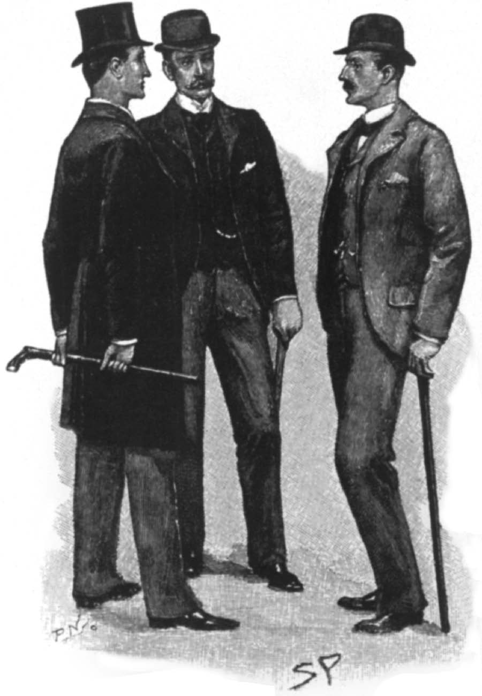

“简简单单小事一桩，没有案子了。”

“噢，解决得再简单也没有，”福尔摩斯说，微笑着，“好吧，华生，奥尔德肖特不会有我们的事了。”

“还有，有一件事，”走向车站去的时候我说，“南西的丈夫名字叫詹姆斯，另一个叫亨利，她提到的大卫，又是谁呢？”

“根据这个名字，我亲爱的华生，原本就应该能够把案情的故事全部推想出来，可见我并非是个很理想的推理家，并非如你刻意描写的那样神乎其神。大卫，很明显那是谴责用词。”

“谴责用词？”

“是的。大卫曾因迷失获罪，你知道，情形同詹姆斯·巴克利中士是一样的。你记得乌利亚和拔士巴那个故事吗？我的《圣经》知识，恐怕不太记得清楚了，你去看一看《塞缪尔记》上篇，或是下篇，就可以知道这个故事。”<a href="#part0069.xhtml_ch2"
id="part0069.xhtml_ch2-back">(2)</a>

（1893年）

————————————————————

<a href="#part0069.xhtml_ch1-back" id="part0069.xhtml_ch1">(1)</a> 弗罗林（florin），英国19世纪后叶通行的两先令银币或英联邦国家的同类银币。

<a href="#part0069.xhtml_ch2-back" id="part0069.xhtml_ch2">(2)</a> 《圣经·旧约·塞缪尔记下》第十一章记载：以色列王大卫觊觎军中赫族人乌利亚之妻拔士巴的美色，设计将乌利亚派往战阵最险恶处，使其暴露于敌阵前被射杀，大卫遂得娶拔士巴为妻；耶和华对大卫此事甚为不悦。

# 住院病人

我拿出零碎不太连贯的回忆录粗略浏览一遍，有意将我的朋友歇洛克·福尔摩斯的思想方法和特点加以阐明，但想要选择各方面都能符合我要求的例子，就有困难了，这是个老问题。因为在那些案子中福尔摩斯虽然运用了某些分析推理的绝招，证明了他的侦查手段既独特又具有很高的价值，但事实本身往往都很细小平常，我都觉得不值得提到公众面前。另一方面，还常有这样的情况，虽然他侦破了最离奇、最富有戏剧性的案子，但是他参与探究案情所起的作用又不能满足我这个传记作者的要求。先前那则小故事，我以“血字的研究”为题加以记录，还有后来一篇有关格洛里亚·斯科特号囚船的沉没，可以用作犹如锡拉岩礁与卡律布狄斯漩涡<a href="#part0070.xhtml_ch1"
id="part0070.xhtml_ch1-back">(1)</a>般惊险的例子，将永远震撼刑案史家。也许我现在要写的这个案子，我朋友所扮演的角色着墨不深，但是案子的整条情节链是如此奇特，以致我不能轻易将它从系列中割裂抹去。

我说不准这件案子发生的确切日期，因为备忘录不知被我放在哪里了，但可以肯定是在福尔摩斯和我一起住进贝克街寓所的头一年。现在正值十月多风多雨的季节，我们两人整天呆在屋里。我担心自己的健康状况，经不起多吹秋风，而他呢，一味地沉浸在那些复杂的化学实验之中，时间再长也依然乐此不疲。可是将近晚上的时候，一根试管弄碎了，这才让他不得不提前结束研究，从椅子上忽地站起来，老不高兴地皱眉叹气。

“一天的工作白费了，华生，”他说着跨步朝窗前走去，“哈！星星都出来了，风也停了，到伦敦街上去散散步，你看怎么样？”

窝在这小小的起居室，我感到厌倦，也就欣然同意；拿条围巾裹住脖颈，裹到鼻子，好抵御夜间侵人的寒气。我们一起逛了三个小时，逛到新闻报业的舰队街、饮食娱乐的河滨大道，观赏到万花筒般光怪陆离的人生景象潮涨潮落般永无止歇。福尔摩斯一路来独到的议论，对细节的敏锐观察和精确的推理，使我耳目一新、茅塞顿开。回到贝克街已经十点，一辆布鲁厄姆四轮马车停在门口。

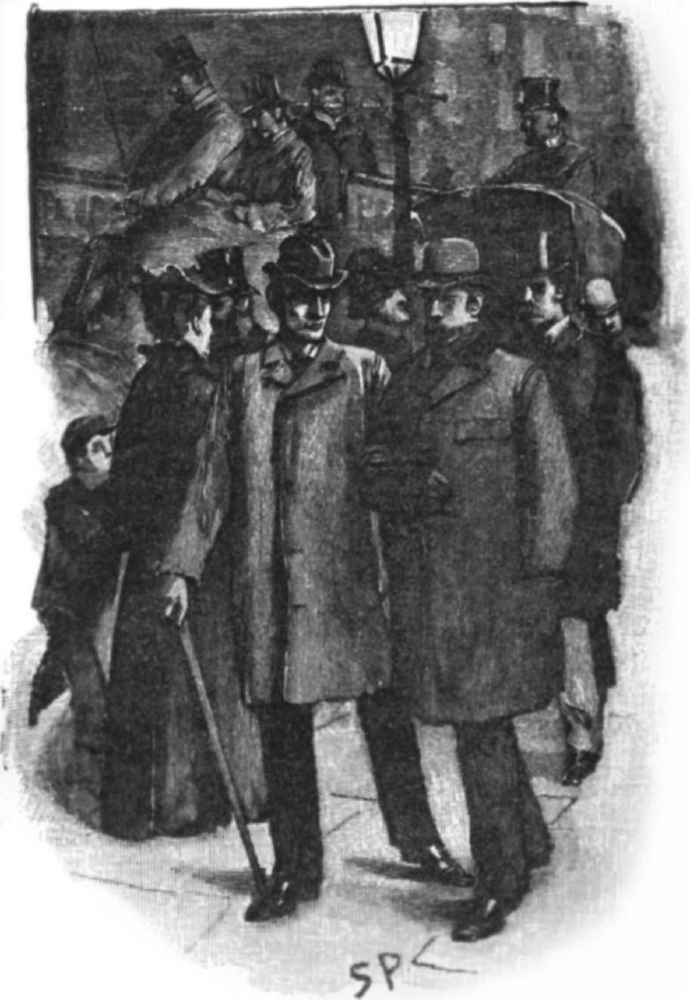

我们一起逛了三个小时。

“噢！是一位医生——全科医生，非专科，我看是，”福尔摩斯说道，“行医时间不长，生意很不错，想必是登门来求助！幸亏我们回来了！”

我深知福尔摩斯的工作方法，能够领会他的推理。看见车内吊着一个柳条编的篮子，凭着灯光一看原来是一篮子一应俱全的医疗器械，他正是根据这个作出迅速的判断。楼上我们屋子的窗亮着灯光，说明这位夜访客人确实是来找我们的。我好生奇怪，什么事这么晚了还让一位医生同业来访我们，我随福尔摩斯进入我们的专用室。

我们进屋时，一个面色苍白、尖瘦脸、留着一把灰黄络腮胡子的人从壁炉边的椅子上起身。他年龄不会超过三十三四岁，但面容憔悴，气色不好，说明他生活受到挫折，耗尽年轻精力，伤掉精壮元气。他神情紧张，态度迟疑，是一位神经很敏感的绅士先生。一双细瘦白皙的手，站起来时搭在炉台上，倒像是艺术家而不是医生的手。身穿衣服平淡朴素——黑礼服大衣，暗色的裤子，领带稍有些颜色。

“晚安，医生，”福尔摩斯轻松地说，“很高兴看到，没让你等几分钟。”

“那么说，你同我车夫讲过话了？”

“哦，没有，是这桌上的蜡烛告诉我的。请坐吧，让我知道我怎么为你服务。”

“我是帕西·特里维廉医生，”来客说道，“住在布鲁克街四〇三号。”

“有一部专著，讲不明原因神经损伤的书，作者不正是你吗？”我问。

一听到他的著作我也知道，他高兴得苍白的脸上添了红光。

“很少听人提起我这部书，我当它是死书一本，”他说，“出版商告诉我这书没销路，很叫我伤心。先生你，我猜也是医生啰。”

“一个退伍军医。”

“我一直对神经病学很感兴趣，原本希望能作专门研究，可是一个人首先应该从事他力所能及的工作。哦，扯远了。歇洛克·福尔摩斯先生，非常感谢你拨出宝贵的时间接见我。情况是最近一连串非常奇特的事情发生在我布鲁克街的家里，而今天晚上，事态已经极其严重，我觉得一个小时也不能耽搁，得快来向你求教，向你求助。”

福尔摩斯坐下来，点上烟斗。“求教也好，求助也好，都乐意效力，”他说，“是什么事困扰你，请把详细情况告诉我。”

“有一两件小事实在微不足道，”特里维廉医生说，“简直叫我羞于开口。可事情无法解释，发展到了目前更不像话，变得非常复杂，我只好到你这里，请你来帮我看看什么是重要，什么是不重要。

“我开头不得不要先讲讲大学时候的情况。我是伦敦大学的学生，你知道，并非我自吹自擂，我在校时教授一致评论我是个很有前途的学生。毕业以后，我在国王学院附属医院谋到个小职位，继续从事研究工作。算我有幸，让我在强直性昏厥病理学研究方面有所突破，引起极大的注意，最后以神经损伤的专著获得布鲁斯·平克顿奖金和奖章，就是承蒙你的朋友刚才提到的那部著作。我可以毫不夸张地说，那时大家都认为我前途无量。

“可是我遇到了大障碍，缺乏资金。你们一定知道，一个医生要想出名，一定要到卡文迪什广场区，在那里的十二条大街中，挤进一条去开业，就需要高额房租和设备开销。除了这笔创业开办投资，他还必须要有维持几年的生活费，还要雇像样的车、马。所有这些费用都是我无法负担的，我只能指望靠节约，缩衣节食十年之后，才能正式挂牌行医。可是，一件意想不到的事，突然给我带来了新的希望。

“这就是有位绅士来访，名叫布莱星顿，与我素昧平生，一天早晨忽然来我屋里，开门见山谈他的来意。

“‘成绩非凡、最近获奖的帕西·特里维廉先生，就是阁下啰？’他说。

“我点点头。

“‘请坦率回答我，’他接着说，‘这一定对你大有好处。你有大智慧，必成大事业，你明白吗？’

“这种算什么问题，也值得来问，我不禁笑了。

“‘我相信自己能尽力而为吧。’我说。

“‘有没有不良习惯？不酗酒吧，啊？’

“‘没有，先生！’我大声回答。

“‘这就好！非常好！不过，还得再问一问，你那么大本事，干吗不开业？’

“我耸耸肩。

“‘是啊，就是啊！’他说，得意忘形的样子，‘老问题老常谈，这就叫“脑子里空有，口袋里无有”，对不对？要是我帮你在布鲁克街开业，你意下如何？’

“我愣望着他，实在感到意外。

“‘啊，说白了，是为我自己，并非为你，’他高声说，‘我跟你明人不讲暗话，只要你事业好了，那么我也就好了。我呢，投上个三千几千的，要知道，投这个资是没问题的。’

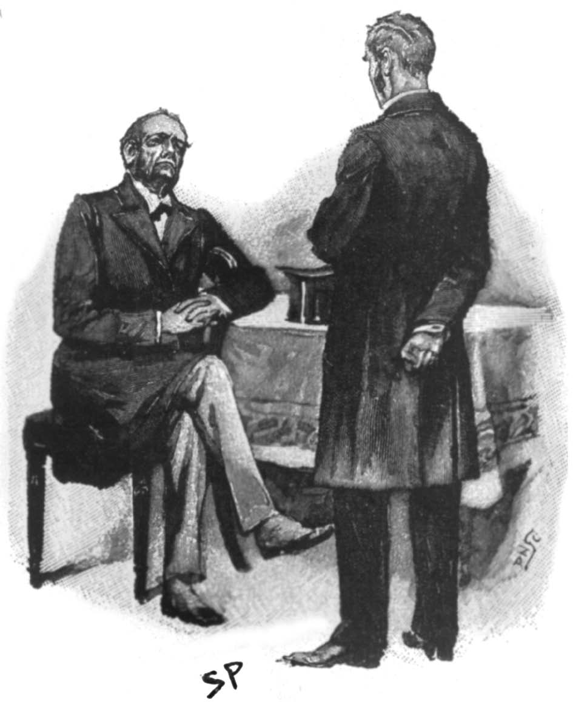

“说白了，是为我自己，并非为你。”

“‘那什么意思呢？’我忙问他。

“‘那也就不过是跟其他投机事业一样嘛，不过要保险得多。’

“‘那我怎么做呢？’

“‘我告诉你，我来租房子，进设备，雇女佣，一切管理消费都我来，你只管稳坐诊疗室看病就是了。你的吃用开销都归我，你交给我进款的四分之三，你拿四分之一。’

“这个布莱星顿向我这么提出来，福尔摩斯先生，是个奇特主意。我们怎么样谈条件，怎么样达成协议，这里就不细说了，免得你厌烦。结果就在报喜节<a href="#part0070.xhtml_ch2"
id="part0070.xhtml_ch2-back">(2)</a>，我搬进了这个屋子。他提供了答应的一切条件，我开始营业。他来和我一起住，算是一名住院的病人。他心脏衰弱，所以需要经常不断的护理治疗。他把最上面一层两间最好的房间做他的起居室和卧室。他生活与众不同，杜门谢客，深居简出，生活也不讲规律，但在某一方面倒是很有规律。每天晚上，在固定的时间，总要走进我诊疗室来查账目，我赚多少诊疗费，他每一几尼给我五先令三便士，其余都归他拿去，放进他房间的保险箱。

“我很明白，他这个投机生意永远不吃亏不后悔，从一开始就成功，钱稳进。看好几例病人，加上我在附属医院原来的声望，我便很快出了名，这样不出几年我使他也成为富翁。

“就是这么一些，福尔摩斯先生，我过去的历史，我和布莱星顿先生的关系。下面就要给你谈发生的事情，为什么今晚我要到这里来。

“几星期以前，布莱星顿先生下楼找我，看他那样子，非常激动。他说发生盗窃了，案子发生在西区，我觉得这个事情没有必要那么激动，但他紧张得当天就赶快要把门窗加固闩牢。他一个星期不得安宁，不停向窗外张望，每天晚饭前照例的一场散步也取消了。从他这态度看，他是在恐惧什么事或者什么人，恐惧得要命。可是我问起他这事，他就恼怒，我也就不问他了。时间渐渐过去，他担惊受怕也好些了，开始恢复正常，谁知又来一桩新的事情，这下可惨，他失魂落魄得简直要垮了。

“事情是，两天以前，我收到这封信，现在读给你听，上面没有地址，也没有日期。

有位现居英国的俄国贵族亟愿登门帕西·特里维廉医生诊所就医，他罹患强直性昏厥症已多年。特里维廉医生是为人所共知的医治此病的权威专家，病人要求于明晚约六点一刻前来就诊，特里维廉医生若方便，烦请在家等候。

“这封信让我深感兴趣，因为研究强直症的最大困难是病例稀少。可以想见，我当然就在诊疗室专候，到时间，家童把病人领进了屋。

“来人是个上了年纪的长者，瘦而拘谨，样子普普通通——一点没有体现俄国贵族的概念。陪同他的人，模样倒是叫我注意，一个大高个青年，英武惊人，脸色黝黑而严峻，四肢粗壮，胸脯宽厚，犹如赫拉克勒斯<a href="#part0070.xhtml_ch3"
id="part0070.xhtml_ch3-back">(3)</a>。他挽着老人胳膊进来，亲切地搀扶老人在椅子上坐下；光看他外表，真不知会有如此温良。

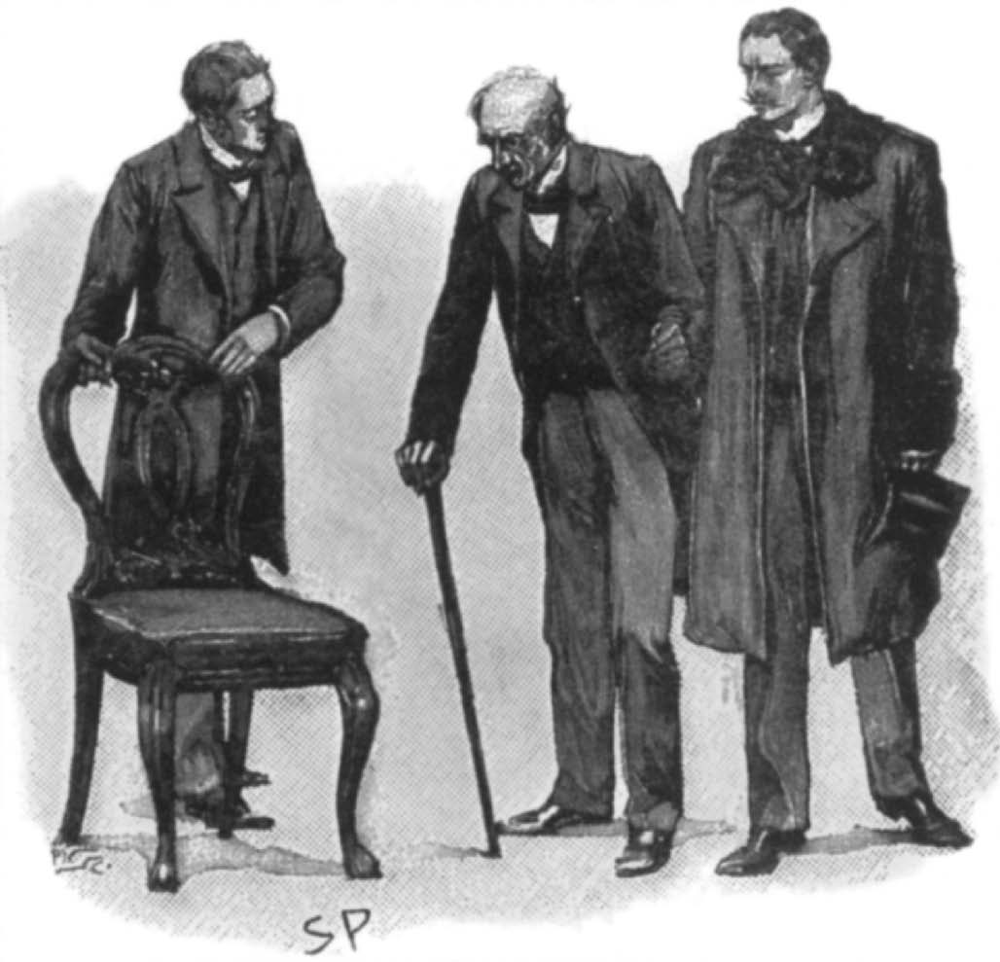

搀扶老人在椅子上坐下。

“‘请原谅我前来，大夫，’年轻人对我说，讲的是有点走样的英语，‘这是我父亲，父亲身体状况是我最大的心事。’

“他这样孝顺，我很感动。‘你父亲治病，你也留在这里关心着吧？’我说。

“‘那不行，’他做了个害怕的手势，高声说，‘那我会感到有说不出的痛苦。要是叫我看到父亲发起病来，那怕人的样子，我是说什么也没法受得了。我自己的神经官能也是异常的脆弱，如果允许，你给我父亲治疗，我到候诊室去等着。’

“既然这样，我当然同意，年轻人退了出去。病人和我就谈起了病情，谈得深入，记得详细。老头对答有点迟钝，智力好像不佳，我归咎于语言沟通有限。可是，我正在写病史记录，忽然，他停住没话了，我问什么，他一声也不搭理。我回头朝他看，不禁一愣，他身子僵直地坐在椅子上，面孔毫无表情，完全僵死，没了神的眼睛直望着我。他的怪病又发作了。

“我首先一个感觉，刚才也说过了，他既可怜又可怕。接着我感到，应该说这也不坏，这种病例临床机会相当难得。我把病人的脉搏、体温作了记录，测试了他的肌肉强直程度，检查他的反应能力，检测下来各方面都没有特别不正常的情况，都与我过去获得的病例经验相一致。我过去对这种病都是使用烷基亚硝酸吸入剂，效果良好，现在倒又是一次极好的机会，来检验使用这种药剂的疗效。药瓶在下面实验室里，所以我让病人在椅子上坐着，跑下去拿药。找药稍许耽搁了点时间——说耽搁也不过就是五分钟吧——我拿了药赶快回来，想想叫我有多么吃惊啊，屋里空了，病人不见了。

“当然，我首先是去候诊室，他儿子也跑掉了。前厅门合着，但没关上。我那个接待病人的家童新来，并不机灵，他总是等在楼下，我看好病，打了诊疗室铃，才由他上来领病人出去。他刚才什么也没听见，这不是咄咄怪事了吗！布莱星顿先生散了一会儿步就回来了，但这件事我一个字也不提，因为，说实话，近来我尽量少和他啰嗦。

“我绝对想不到这个俄国人和他儿子还会再来，所以你可以想象我有多么惊讶。今天晚上，同样的时间，两人居然堂而皇之又登门，像昨天一样。

“‘我要万分地抱歉，昨天招呼不打一声，自己就跑掉，大夫。’我的病人说。

“‘说真的，这样叫我受惊不小。’我说。

“‘哦，是这样的，’他说，‘我发病后一醒过来，总是对刚才的事记不清楚，一片云雾。我一看，这好像是间陌生的屋子，你又不在，没人，我就糊里糊涂跑到街上了。’

“‘我呢，’儿子说，‘看见父亲走过候诊室门，很自然想是治疗已告结束，直到回家以后，我才明白原来是怎么回事。’

“‘好吧，’我笑着说，‘还好，没出事，只是和我开了个大玩笑，吓了一大跳。所以，先生，那就请进候诊室，昨天意外中断，我乐意继续治疗。’

“我同老先生谈话，问诊大约有半个小时，然后给他开处方，看着他由儿子挽住胳膊离开。

“我已经讲过，布莱星顿先生每天总是选在这个时间散步，他一会儿就回来，自顾上楼。没多一会儿，我听见他奔下来，直冲我诊疗室，像个疯子一样。

“‘谁到我房间去了？’他叫唤着。

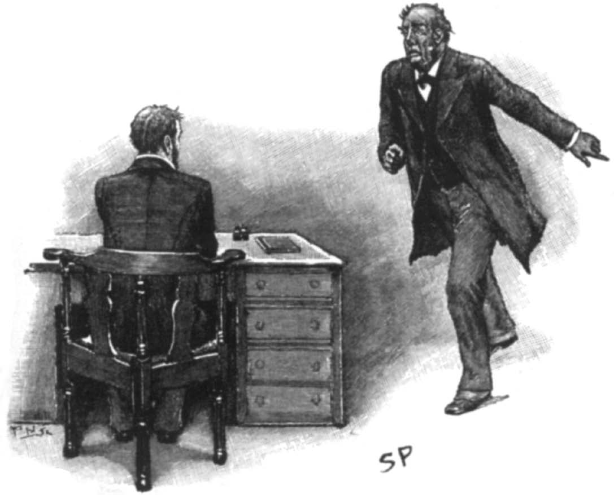

“谁到我房间去了？”

“‘没人。’我说。

“‘扯谎！’他大吼大叫，‘你上来看！’

“我没在意他粗鲁无礼，看他都紧张得快成疯子了。我跟他跑上楼，他指指浅色地毯上的几个脚印。

“‘你说这是我的脚印吗？’他嚷着。

“那脚印很明显比他的脚印要大许多，而且是新踩的。下午有大雨，你知道，病人就是那父子两个来过。情况肯定是这样：等在候诊室的那个人，不知出于什么目的，趁我一边忙着的时候，上楼进了我住院病人的房间。没有东西给动过，也没有东西丢失，但是脚印明摆着，有人闯入是事实。

“这个事搅得大家心头都不太平，可是布莱星顿先生对这事激动不安的样子，大大出乎我的意料。他竟会坐在扶手椅子里乱吼乱叫，我都没办法叫他讲明白这是为什么。是他叫我到这儿来找你，我马上意识到这样做是必要的，肯定这里头有什么名堂，虽说他有点把事看得过分严重。你如果能坐我马车一起去，那么至少对他有个安抚，虽说我也难指望你能把这怪事解释清楚。”

福尔摩斯神情专注地听了这长篇的叙述，我看得出引起他很大的兴趣。他的面容像往常一样没有表情，但是眼睛眯起来，应和着大夫叙述一个比一个奇特的情节，盘旋上升的烟一口比一口浓。来客讲话结束，福尔摩斯霍地起身，不发一言，把我的帽子递给我，把他的帽子从桌上拿起来，随着特里维廉大夫走向门口。只一刻钟时间，我们就在布鲁克街医生寓所门前下车，房屋是属于伦敦西区医业街的那种灰暗平面式建筑。小家童领我们进门，然后立即登上宽宽的铺满地毯的楼梯。

可是突然发生的一件怪事叫我们立刻止步，楼梯顶头的灯噗一下子灭掉，黑暗中一个尖厉的颤声从上面传下来。

“我有枪，”声音喊道，“我警告你们，再往上走我就开枪。”

“这是在搞什么名堂，布莱星顿先生。”特里维廉大夫高声叫道。

“噢，是你，大夫，”声音说，松了一口气，“另两位先生，是没错的吧？”

我们在暗中被注视了片刻。

“行了行了，没错，”声音最后说，“都上来吧，对不起啦，不得不多加小心，我只好失礼了。”他一边说一边重新点亮楼梯口的煤气灯。我们看见面前是个受到惊吓的人，他的脸，同他的嗓音一样，说明他是神经高度紧张。这是个胖子，看得出过去比现在还要胖，因为面颊两旁像大猎犬有松皮下垂。他一脸的病容，那稀疏灰黄的头发，心情激动得简直都要竖起来。他握着一支手枪，我们向前走时，他把枪塞进口袋收起。

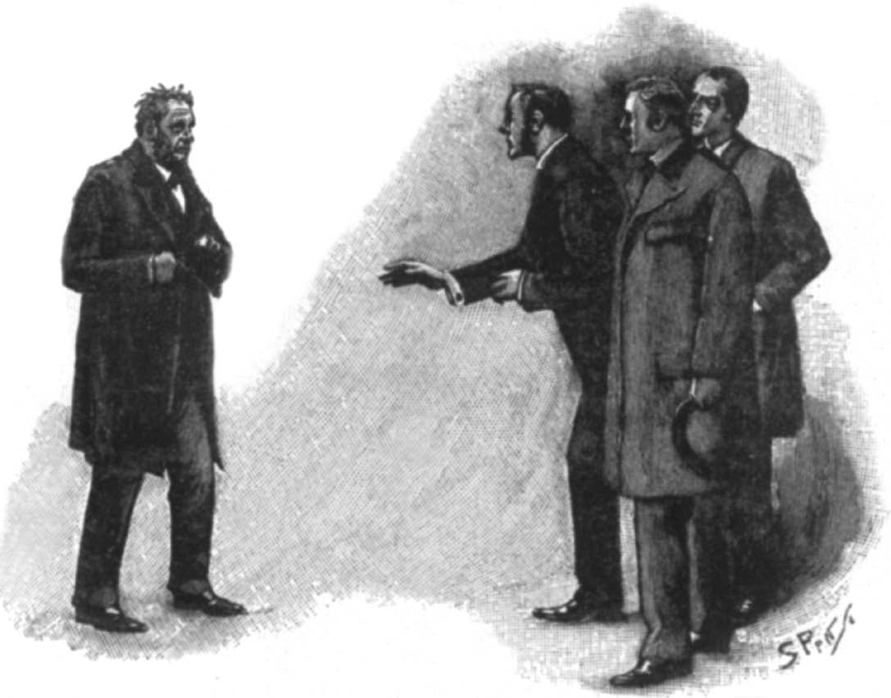

他把枪塞进口袋收起。

“晚安，福尔摩斯先生，”他说，“说真的，我非常感激你能来这里，实在非常需要你来指教，想必特里维廉大夫已经告诉你有人非法闯入我房间。”

“是的，”福尔摩斯说，“那两个是什么人，布莱星顿先生，为什么要来骚扰你？”

“哦，哦，”住院病人心神不定地说，“当然啦，这个事很难说，也没法指望我来回答，福尔摩斯先生。”

“你是说你不知道啰？”

“请这边来，请过来，进里边来就知道了。”

他领我们进他的卧室，房间宽敞，布置得很舒适。

“你看那个，”他指着床头一口大黑箱子说，“我不是很有钱，福尔摩斯先生——一辈子不搞投资，只有这一次，特里维廉大夫想必都告诉你了。我不相信银行，银行我一个都不相信，福尔摩斯先生。我只跟你说，我一点小家底都在这箱子里头了。这你就能理解我了，知道有人私闯我的房间，不等于要我的命吗！”

福尔摩斯以怀疑的眼光逼视着布莱星顿，摇摇头。

“你想要骗我，来问我拿主意，我可是一句话也没有。”

“我不是把一切都告诉你了吗！”

福尔摩斯厌烦地一挥手，立即背转身。“晚安，特里维廉大夫。”他告别。

“你真一点指教都不给？”布莱星顿破着嗓子叫道。

“指教你，先生，要讲真话。”

一分钟以后我们已在街上，往家的方向走。我们穿过牛津街，走到哈利街，我的同伴才开口说话。

“对不起拖累你白跑一趟差使。他把我们当傻瓜，华生，”他终于说，“不过，这毕竟是一桩有趣的案子。”

“我是看不出什么有趣。”我否认说。

“那里头，显然是有两个人——可能不止，但至少是两个——怀有什么目的存心要接近布莱星顿这个人。完全可以确定，那个年轻人设法两次进了布莱星顿的房间，他的同谋配合，把大夫拖住不得脱身。”

“不是强直性昏厥吗？”

“装样骗人，华生。在我们的专家医生面前，我不敢说三道四，不过这种毛病是很容易装的，本人就装过。”

“后来又怎么样？”

“巧也是巧，布莱星顿总是这个时间出去，碰不上他。两个人特地挑选这么个时间来就诊，因为他们要确保这个时间候诊室里不会有病人。然而，这个时间又恰好是布莱星顿去做保健散步活动，可见他们对他的日常生活情况并不很了解。要说他们的目标真是盗窃，那么至少要搜寻一番，找一找，但并没有。此外，我可以从人们的眼睛里看出遇有生命危险的恐惧，他就有。无法想象此人结下了这样的两个仇人似乎还一点都不知道，因此我可以肯定，他知道这两个人是什么人，只是由于某种原因，他故意隐瞒不说。等着吧，明天他就会讲，不讲不行。”

“不妨假设也还会有另一种情况，”我表示怀疑说，“虽然是不大可能，不过也不是一点不可信吧？说不定患强直症的俄国人和他儿子的整个故事，不过是特里维廉大夫编出来的，是他自己不怀好意到布莱星顿房里去呢？”

煤气灯光下，我看见福尔摩斯对我设想之离谱只是好笑。

“我亲爱的伙计，”他说，“这也是我初上来时候的一个想法，只是我很快就判定大夫所讲是真话。那个年轻人在楼梯地毯上就留下了脚印，房间里的脚印我也就没有必要再看。我还要告诉你，脚印是方头鞋，而不是布莱星顿的尖头鞋，而且比大夫的脚要长出一英寸三，所以你一定会承认，是有这么一个年轻人，没问题，不假。现在，只管去睡我们的觉，到早晨如果听不到布鲁克街进一步的消息，那才怪。”

福尔摩斯的预料很快兑现，竟还是一场惨剧。第二天早晨七点半，天刚蒙蒙亮，我发现他穿好晨衣站在我床边。

“下面来了马车，等着我们，华生。”他说。

“事情怎么样了？”

“布鲁克街有事。”

“有新消息没有？”

“惨剧，不过还不一定，”他说着，把窗帘拉起，“看这个——笔记本上撕下的一张便条，写着‘看上帝份上，请速来。帕·特’，用铅笔草草写的。我们的大夫朋友，情况危急才写的这张便条。快来，我亲爱的伙计，我们紧急出动。”

大约一刻钟时间，我们又来到大夫的营业所，他面色惊恐地奔出来迎接我们。

“哦，出大事啦！”他高声叫道，双手捧住脑袋。

“怎么回事？”

“布莱星顿自杀了！”

福尔摩斯一声呼哨。

“真的，夜里上吊。”

我们进屋，大夫先把我们领到一间房间，显然就是候诊室。

“我都不知该怎么办才好，”他嚷着，“警察已经来了，在楼上。太可怕啦！”

“你什么时候发现的？”

“他每天一清早，要给端上一杯茶喝。女佣进去，大约七点，他吊在了房间中央，真惨。他把绳绕在原先挂大吊灯的钩子上，拿那口箱子，他昨天指给我们看的，作了垫脚。”

福尔摩斯站着沉思一会儿。

“如果允许，”最后他说，“我想上楼，事情要调查一下。”

我和他一起上楼，大夫跟在后面。

一进卧室门，眼前的景象凄惨可怕。我说过这个布莱星顿给人印象皮肉松弛，现在吊在上面看起来更加明显、突出，简直没有了人样。脖子给吊得拉长像拔了毛的鸡脖子，躯体、头颅就越发肥肉滚壮不相称。他身上只穿一件长睡衣，下面露出一双僵直的赤脚、肿大的脚踝。旁边站着一位精干的警探，正往笔记本上做记录。

“啊，福尔摩斯先生，”我的朋友进屋，他热情地招呼，“看见你我真高兴。”

“早安，兰诺尔，”福尔摩斯回答，“你不会怪我私闯民宅吧？我相信，发生这个事情之前有些情况你听说了吧？”

“知道，讲给我听了。”

“你是怎么个看法呢？”

“据我看，这个人给吓得灵魂出窍，吓得上了吊。这床上本来睡得好好的，你看，身子压的印子还在，多深多沉的印子。大约凌晨五点钟，你知道吗，这个时间正是自杀多发时间，也正是这时间他上了吊。看情况，他走上这条路还是经过深思熟虑、有准备的呢。”

“我说他大约死了有三个钟点，根据肌肉僵硬度判断。”我说。

“注意到屋子里有什么特别情况？”福尔摩斯问。

“发现一把螺丝起子和几颗螺丝钉，在洗手盆上。好像夜里抽烟抽得很厉害，这是在壁炉上捡到的四个雪茄烟头。”

“啊哈！”福尔摩斯说，“他的雪茄烟嘴找到了吗？”

“没有，没看到。”

“他的烟盒呢？”

“有，在他外衣口袋里。”

福尔摩斯打开烟盒，里面还剩一支雪茄，对着闻闻。

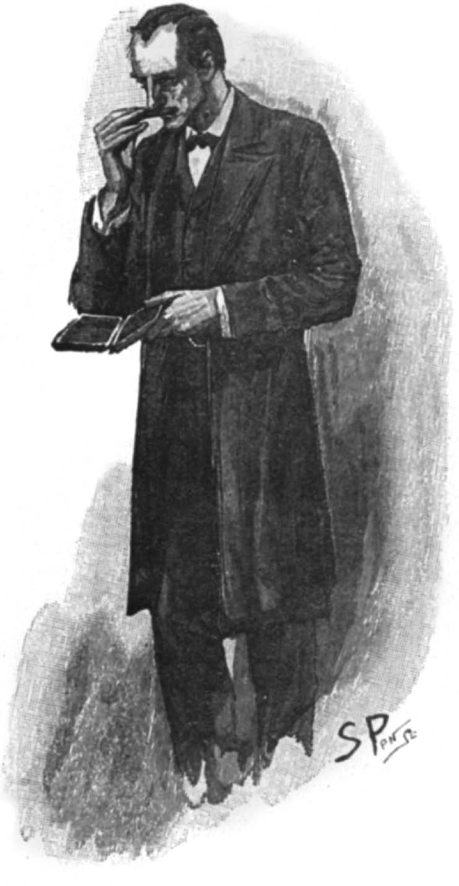

还剩一支雪茄，对着闻闻。

“噢，他这是一支哈瓦那烟，可是这些，都是荷兰从它东印度殖民地进口的烟。这种烟常用稻草捆包，你知道，而且比别的牌子要松。”他拿起四个烟头，掏出口袋里的放大镜来看。

“两个是用烟嘴吸的，两个不是，”他说，“两个用不是很快的刀削过，两个牙齿咬过，还是一嘴利牙。这不是自杀，兰诺尔先生，这是一件精心蓄谋的他杀案。”

“不可能！”警探叫道。

“为什么？”

“有谁会这种傻法，谋杀人还让他上吊死？”

“这就要我们来调查。”

“凶手怎么进来？”

“从前门。”

“前门早上还闩得牢牢的呢。”

“那是走掉以后再闩上的。”

“你怎么知道？”

“我看到有痕迹。对不起，稍等一下，我就能给你们进一步说明事实真相。”

福尔摩斯走向门口，转了转门锁，颇内行地检查一番，然后拔出在门锁里侧的钥匙，仔细看过，还有床、地毯、椅子、壁炉台、尸体、绳子，都一一检查过来，最后才算满意。在我和警探帮助下，割断绳子，把死人安放到地上，给他端端正正盖上一条被单。

“这绳子是哪里的？”他问。

“是这里割下来的，”特里维廉大夫说，从床底下拖出一捆绳子，“他老是怕着火，紧张得很，备着这捆绳子，万一火烧了楼梯，就可以用绳子从窗口逃命。”

“正好省了他们的麻烦。”福尔摩斯沉思着说，“是呀，实际情况很简单，我可以说，到下午，就给你们公布案情，我有把握，不信公布不了。壁炉台上这张布莱星顿的照片，我拿着，有助于我调查。”

“你什么也没告诉我们嘛！”大夫大声说。

“哦，案子发生的前后过程是没有问题了，”福尔摩斯说，“这里面是三个人：年轻人一个，老头儿一个，还有第三个，这个人还没有数。前面两个，不需要说了，就是假扮俄国贵族和他儿子的，两人的外貌特征我们很清楚，他们是被屋里的同谋放进来的。我要提请你采取措施，警官，立即逮捕童仆，这个人，我知道才来这里给你当听差，大夫。”

“小混蛋找不到了，”特里维廉大夫说，“女佣、厨师刚才都找过他。”

福尔摩斯耸了耸肩。

“他在这出戏里演的角色不可小看，”他说，“三个人上楼，都是踮起了脚尖走，老头走前面，年轻的跟着他，第三个不详者殿后——”

“真棒，我亲爱的福尔摩斯！”我脱口喊道。

“哦，没什么，都有脚印叠脚印摆得清清楚楚，好在哪个是哪个昨天晚上就已经有数了。他们上了楼，到布莱星顿卧室，发现房门锁着，就用铁丝捅进去转动打开，锁孔里有使过劲留下的划痕，你们不用放大镜都看得见。

“一进门，头一招就是把布莱星顿先生的嘴堵住。他可能睡着没醒，或者吓瘫掉喊不出声。屋墙很厚，可以想见，他那细声尖叫即使来得及喊一声也听不见。

“把他拿稳当了以后，据我估计，便围住他向他摊什么事，指责他，讲明这个那个老账清算的日子到了，完全私刑性质，持续有一段时间，抽的雪茄可以看出。老头坐藤椅，用烟嘴的正是他，年轻的坐得稍靠边，他往五斗柜边磕烟灰，第三个在踱来踱去。布莱星顿，我想是叫他直挺挺坐在床上，不过这个还不能绝对肯定。

“好，这么一番之后，抓住布莱星顿把他吊起来。事情都早有安排，我相信，他们带来滑轮什么的东西，可以做成绞架。螺丝起子、螺丝钉，我猜是用来固定滑轮。但是，瞧见这支钩子，有现成的，结果叫他们省了麻烦。事情干完以后就撤离，都走掉，他们的同谋把门闩好。”

我们怀着极大的兴趣听完夜来事情经过的叙述，这都是福尔摩斯根据细微的迹象作出的推论，实在微妙，即使已经给我们一一讲明了，我们也难以领会他的思路。警探赶快要去追查那个家童，福尔摩斯和我也就回贝克街来吃早饭。

“我三点钟回来，”我们用好餐他说，“三点钟，警官和大夫都到这里来会我。案子现在还有细节疑点，希望届时一切都能明朗。”

我们邀约的人按时来到，但是我的朋友三点三刻才见回来，从他进门的神态，我看出事情进行很顺利。

“有消息吗，警官？”

“小东西被我们抓到了，先生。”

“很好，其他几个我也找到了。”

“给你找到了！”我们三个一同喊起来。

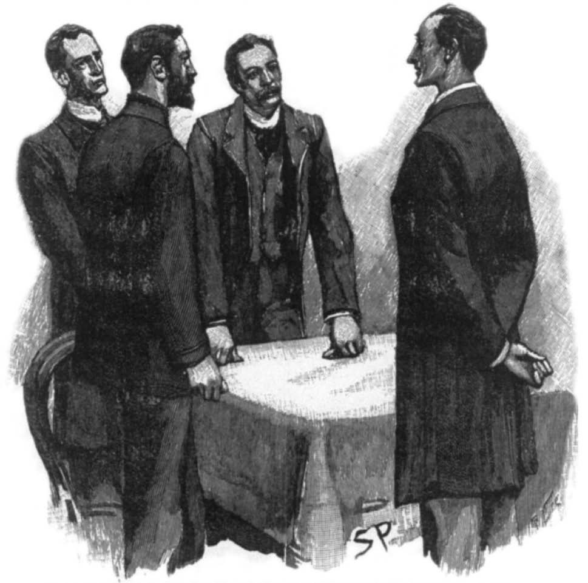

“给你找到了！”我们三个一同喊起来。

“哦，至少已经摸透他们的底细。这个叫什么布莱星顿的，我原来就估计到，正是警察总局掌握的知名人士，连同杀他的三个人。三个名叫比德尔、海沃德、莫法特。”

“是抢劫沃辛顿银行的一伙。”警探大声说。

“正是，没错。”福尔摩斯说。

“啊，事情这就像水晶那么清楚了。”警探说。

但是特里维廉和我疑惑地面面相觑。

“你们一定还记得沃辛顿银行大抢劫案，”福尔摩斯说，“一共是五个案犯——现在的这四个，还有第五个名叫卡特赖特。那次抢劫，银行门卫托宾遇害，七千英镑被劫走，这是一八七五年的事。这五个嫌疑犯全被抓获，可是拿不到有力的证据，一时不能定案。一帮里头最狡猾的是布莱星顿，或者叫萨顿，是他告发了其他的人。由于他提供证据，卡特赖特处以绞刑，其余三人各判十五年徒刑。前些日三个人提前好几年被释放，就决定要找到出卖他们的人，要为死去的同伙报仇，事情你们也看到了，两次找机会动手，都没能成功，第三次，你们看见了，终于得手。还有什么需要我作进一步解释的吗，特里维廉大夫？”

“我觉得你已经把事情解释得非常清楚，”大夫说，“这就肯定是了，那天他所以惶恐不安，就是因为从报上看到他们释放的消息。”

“正是这样，他说什么发生盗窃，才感到害怕，只不过是托辞。”

“但是为什么他不和你说真话呢？”

“噢，我亲爱的先生，他知道过去的同伙要找他复仇，他这就无论如何要把自己的真实身份掩藏住，谁也不能知道。他的秘密不是一件光彩的事，自己的嘴怎么肯吐露！他卑鄙恶劣，虽说如此，他仍应生活在英国法律之盾的保护下面。我相信，警官，你会看到，法律之盾没能将他保护，但正义之剑将为他复仇。”

这就是关于住院病人和布鲁克街大夫的奇异故事。那个夜晚以后，警方没有见到三个杀人犯的踪影。苏格兰警场推测，他们上了诺拉·克列依那号轮船，混在乘客之中出逃，结果随船覆没。这艘船数年前在葡萄牙海岸距波尔多以北数十海里外遇难，全船无人生还。对那个家童的起诉，因证据不足，不予立案。这件被称为布鲁克街之谜的案件，各报至今都未加详细报道。

（1893年）

————————————————————

<a href="#part0070.xhtml_ch1-back" id="part0070.xhtml_ch1">(1)</a> 锡拉岩礁与卡律布狄斯漩涡（Scylla
and
Charybdis），意大利墨西拿海峡的岩礁与漩涡，水势凶险，船入境便进退两难，传说还有女妖攫取过往船只的水手。

<a href="#part0070.xhtml_ch2-back" id="part0070.xhtml_ch2">(2)</a> 报喜节（Lady
Day），3月15日，圣母玛利亚领受天使加百列报喜耶稣降生。

<a href="#part0070.xhtml_ch3-back" id="part0070.xhtml_ch3">(3)</a> 赫拉克勒斯（Hercules），希腊神话中主神宙斯之子，力大无比，亦称大力神。

# 希腊译员

我和歇洛克·福尔摩斯长久亲密相处，但从来没有听他讲起过他的亲属，也很少听他谈起他的早年生活。他这方面的谨慎保守、轻易不言，让我感觉他好像有点不重亲情人意，以致有时候我也要把他看成是个孤僻的怪人，一个有脑无心的人，一个智力超群而缺乏人情味的人。他对女性疏远，不喜欢结交新朋友，这两者是他不热情的冷漠性格最典型的表现，不过再怎么也不至于无情到连自己的家人都绝口不提。我不禁会想，他可能是孤儿出身，没有亲属在世。但是有一天，叫我感到十分奇怪，他开始谈起他的弟兄来了。

那是一个夏日的傍晚，我们茶余闲聊，东拉西扯，漫无目标，从高尔夫球俱乐部谈到黄赤交角<a href="#part0071.xhtml_ch1"
id="part0071.xhtml_ch1-back">(1)</a>的原因，最后谈到返祖现象和遗传适应性问题，讨论的要点是，一个人的特殊才能有多少出于遗传，有多少出于自身早年的训练。

“拿你自己来讲，”我说，“从你告诉我的情况来看，好像很明显，你敏锐的观察力，独到的推理能力，都取决于你自身有系统的训练。”

“在一定程度上是这样，”他思索着回答，“我祖上都是乡绅，自然过的是他们乡下人那个阶级的生活。但是应该说，我的这点能力一脉相承于祖先，可能还受惠于我的祖母，她是法国画家吉尔内<a href="#part0071.xhtml_ch2"
id="part0071.xhtml_ch2-back">(2)</a>的姊妹。艺术血液是最具有特质性的。”

“你怎么知道是遗传因素呢？”

“因为，我的兄弟迈克罗夫特这方面的能力比我还要高。”

这对我倒又确实是一桩新闻，居然英国还有另一个人具有如此独特的才能，那警方和社会怎么竟丝毫不曾与闻？我提出了这么一个问题，带点意思是说，我的同伴出于自我谦虚，有意把他的弟兄抬高了。福尔摩斯对我这个疑问报以哈哈大笑。

“我说亲爱的华生，”他说道，“我不能同意有些人把谦虚列为美德。从逻辑角度看，事物本身是怎么样，那就应该是怎么样。贬低自己，也如同夸大自己的能力一样，都有悖于客观真理。因此，我说迈克罗夫特的观察能力高过于我，你要相信我讲的是实实在在的话，一点不假。”

“他比你小吗？”

“比我大七岁。”

“那怎么会一无所闻不出名呢？”

“哦，他在他那个圈子里可是大名鼎鼎。”

“什么圈子？”

“哦，比如说在第欧根尼<a href="#part0071.xhtml_ch3"
id="part0071.xhtml_ch3-back">(3)</a>俱乐部。”

我从来没有听说过有这么个名称的地方，所以面露疑惑的神色，这时福尔摩斯掏出表来看看。

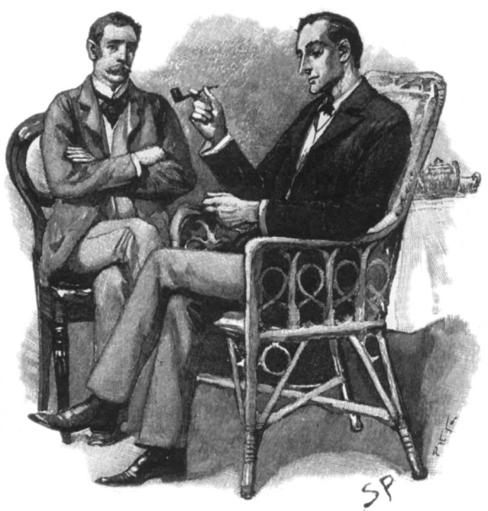

这时福尔摩斯掏出表来看看。

“第欧根尼俱乐部是伦敦特别之中的特别俱乐部，而迈克罗夫特又是个特别之中的特别人物，他经常是五点差一刻到八点差二十分这段时间里待在那个地方。现在是六点，趁这夕阳无限好，你有意散散步的话，我很高兴把我说的这两个‘特别’向你介绍介绍。”

五分钟以后，我们上了街，向摄政广场走去。

“你一定奇怪，”我的同伴说，“迈克罗夫特为什么不用他的才能来搞侦探工作，可是这个工作他不干。”

“可我听你说——”

“我说的，他的观察和推理能力都在我之上。如果侦探艺术可以在安乐椅里从头至尾完成推理，那我弟兄就是举世无双的刑案大侦探。可惜他没有这个雄心，也没有这个精力。要他检验一下自己的解决方法行不行他都不干，宁可给人说他错，他都不愿意费事来证明自己对。我是一再地向他请教问题，以后事实证明得到的解答个个都正确。但是案子要提交法官或陪审团，问题需要调查，他不参与，实际工作他绝对不卷入。”

“那么说，他不从事这个职业？”

“根本不是。我是吃饭的营生，在他不过是闲暇爱好，不当正经事。他的数学才能那就更加出众，所以在政府各部门负责财务审计。迈克罗夫特住在蓓尔美尔街，拐个弯就是白厅街<a href="#part0071.xhtml_ch4"
id="part0071.xhtml_ch4-back">(4)</a>，他每天去白厅，早出晚归。日复一日，年复一年，没有其他活动，没有其他去处，要么就在第欧根尼俱乐部，就在他住处的对门。”

“这个名称没听说过。”

“很可能没听说。伦敦这地方有不少人，你知道，有的生性疑人避人，有的厌恶人际关系，不愿与人多有交往。不与人为伍，但是舒舒服服的椅子、新到的期刊画报，倒是与之为伍，乐此不疲。所以，因为这批人的需要，第欧根尼俱乐部才应运而生，它容纳了都市中人最爱孤独、最不爱交际的居民群。俱乐部中人不允许关注他人事情，除了在会客室，绝对不许交谈，若有三次违规，提交到俱乐部委员会，即予除名以示惩戒。我兄弟是俱乐部发起人之一，我觉得那地方的气氛安乐怡情，十分宜人。”

谈话间，我们转过詹姆斯街尽头，已经来到蓓尔美尔街。福尔摩斯在离卡尔登亲王府不远的一个门前止步，关照我不要开口，把我领进大厅。我透过玻璃隔窗望进一间宽敞豪华的房间，里面坐有好多人，一个个找角落向隅而坐，都在看报。福尔摩斯领我走进一间小屋，窗外就是蓓尔美尔街。他离开一会儿，很快带了一个人回来，我一看就知是他弟兄。

迈克罗夫特·福尔摩斯比歇洛克要高大雄壮得多，是个很肥实的胖子。他的面盘较宽，但是如同他兄弟的模样，也是一副极机警敏锐的脸相。他的眼睛特别明亮，灰眼珠，水汪汪，似乎一直在凝神深思，这种眼光我只有在歇洛克聚精会神的时候才看到。

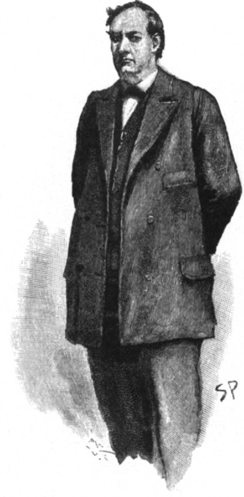

迈克罗夫特·福尔摩斯。

“我很高兴见到你，先生，”他说，伸出像海豹掌那样宽阔肥厚的手，“自从你给他作记载以来，我到处听到歇洛克的名字。噢，对了，歇洛克，上星期我等你来，跟我讲那件庄园宅屋的案子，我担心你会办不下来。”

“没问题，我已经解决了。”我的朋友微笑着说。

“当然是亚当斯干的了。”

“是的，是亚当斯。”

“我一开始就认定他了。”两人一起在俱乐部凸肚窗边坐下。“想要观察人研究人，这正是个好地方，”迈克罗夫特说，“看！对象说到就到。看这两个人向我们走过来，就把他们做例子吧。”

“一个是撞球记分员，还有旁边那个呢？”

“正是，没错。旁边那个你怎么看？”

那两个人在窗对面停了下来。我看得出，一个人的背心口袋上有记分号，那是撞球的标志，另一个矮小、黑皮肤，帽子扣在后脑勺，腋下夹几个购物包。

“我看是，一个老兵。”歇洛克说。

“最近刚退伍。”他弟兄说。

“我看，是在印度服役。”

“是个军士。”

“我猜，皇家炮兵队的。”歇洛克说。

“死掉老婆。”

“有一个孩子。”

“不止一个，我说好兄弟，不止一个孩子。”

“真行，”我大笑道，“可就有点玄了！”

“没错，”福尔摩斯答道，“不难看出，他那个神态，雄赳赳的样子，晒黑的皮肤，这就是个军人，还不是列兵，还是刚从印度回来。”

“退役不久这一点，可以从他穿的靴子看出，还穿着那种所谓的炮弹靴。”迈克罗夫特说。

“走路跨步不像骑兵，歪戴的军帽，从一边眉骨上的皮色比较白可以看出。这人的体重不符合当工兵，他是炮兵。”

“看他满面哀容，表明死了亲爱的人。他自己上街买东西，从这个情况看，死的是老婆。买的都是儿童的东西，瞧见了吧，买了个拨浪鼓，有一个孩子还很小。妻子很可能产褥热去世。看他胳膊下夹有童书，说明还有一个孩子要操心着呢。”

这时我才相信我朋友的话不虚，他哥哥观察力之敏锐确实还在他之上。他向我瞥一眼，笑笑。迈克罗夫特拿出玳瑁盒来取鼻烟，用一块大红丝巾把掉在胸前的烟末拂去。

“有件事要讲讲，歇洛克，”迈克罗夫特说，“这事挺合你心意——一桩很独特的案子——提到我这里来分析判断。我是实在没有精力研究透彻，马马虎虎又不行，只作为推理思考的一种乐趣，充其量如此。你要是有意听听情况——”

“我亲爱的迈克罗夫特，非常愿意。”

他兄长从记事手册上撕下一页，写张便条，按了铃，将便条交给侍者。

“我请梅拉斯先生到这里来一下，”他说，“他就住在我楼上，我和他已经有点熟了，所以他有什么为难事就来找我商量。梅拉斯先生据我知道是希腊血统，一位语言专家，精通多国语言。他的生活来源，就是一半靠法庭上当翻译，一半给下榻诺森伯兰大道各家旅馆的东方富翁当向导。我想还是由他自己把离奇的经历讲一讲吧。”

几分钟后，来了一位壮实的矮个子，橄榄色的皮肤、煤黑的头发，说明他是南欧人，但讲的一口英语像是受过教育的英国人。他同歇洛克·福尔摩斯热情地握手，知道这位刑侦专家有心要听他的奇怪经历，一双黑眼睛直闪着喜悦的光芒。

“我知道，警察不会相信我——不相信我讲的话，不会相信，”他悲戚地说，“他们以前从来没有听到过这种事，他们不相信会有这种事。可是我的心情，永远也不会平静，我要知道脸上贴胶布的人到底是什么下场。”

“你讲，我仔细听着。”歇洛克·福尔摩斯说。

“今天晚上，是星期三，”梅拉斯先生说，“噢，那是星期一晚上——也就是两天之前，你知道——发生事情了。我是个翻译，我的这位邻居想必都告诉你了，我能翻译各种语言——差不多各种语言都能翻——可我是希腊人，取的希腊名字，最精通自己的语言，所以我主要是翻译希腊语。好多年了，我是伦敦头牌希腊语翻译，我的名字各旅社都知道。

“我经常被要求随叫随到，没一定的规定时间，外国人遇到困难了，要叫我，旅游客人到得晚了，也希望我帮忙服务，这是常有的事。所以我毫不奇怪，星期一夜里，一个穿着时髦、名叫拉蒂默的年轻先生来我住处，叫我上他的马车，车已经停在门口。有个希腊朋友来看他，谈生意，他说，他只能讲本国语，别的话都不会，翻译就必不可少。他给我打招呼说他家不近，在肯辛顿，得走一程距离。看他样子非常着急，刚出门下台阶，他就忙不迭把我往车里推。

“一进车，我马上觉得有点不一样，这不是伦敦街上寒酸的普通四轮马车，车厢要宽得多，装饰旧了破了，可是原来是相当考究的。拉蒂默先生坐在我对面。我们经过查林十字街，转到沙夫茨伯里大道。一进入牛津街，我就想提醒他不对头，到肯辛顿这是在绕远路，可是一看对面那举动、架式，我把话噎住了。

“他从怀里抽出一根灌了铅的大头短棍，打得死人的棍子，前后舞那么几下，显示重量、威力，然后一言不发，把短棍在身边一放，回头把两旁玻璃窗拉起来。我吃惊不小，窗上都已蒙了纸，不让我望得见外面。

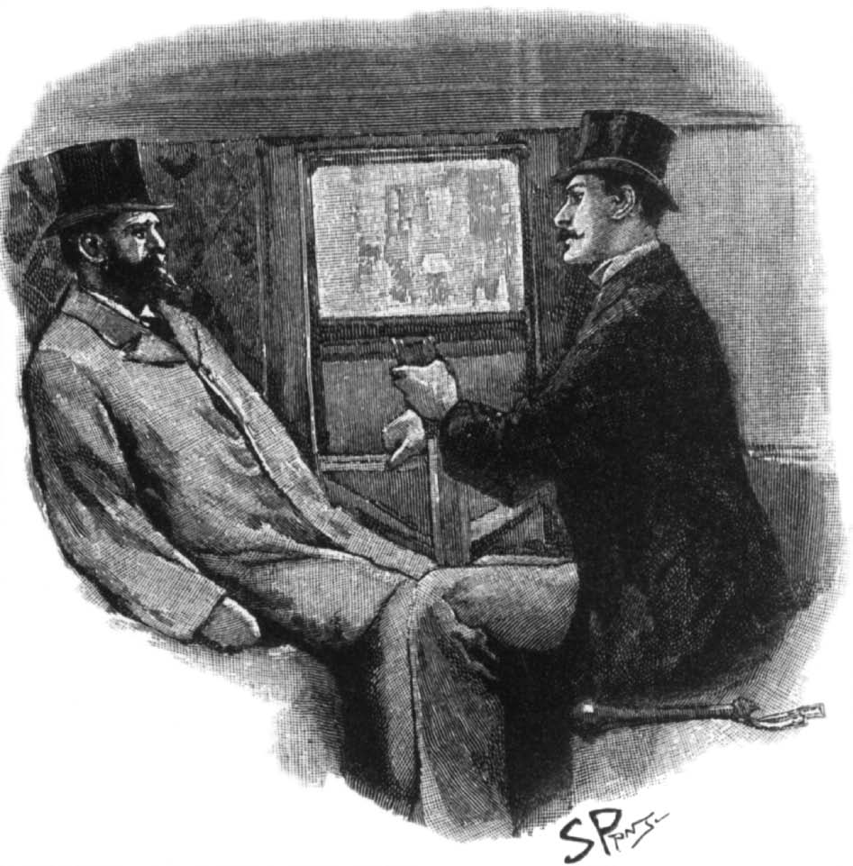

“窗上都已蒙了纸，不让我望得见外面。”

“‘很抱歉，你看不到外面，梅拉斯先生，’他说，‘这是不想让你看到我们经过些什么地方。要是你认得经过的路，对我可能不大方便。’

“你可以想见，听到这个话，我简直要昏过去。对方是个身强力壮的年轻小伙子，想跟他动武，即使他没有家伙，我也根本不是他的对手。

“‘这样子太不像话了吧，拉蒂默先生，’我都结巴了，‘要知道，你这样是非法的。’

“‘真是失礼了，没办法，’他说，‘不过放心，我们会补偿你的。同时我也得警告你，梅拉斯先生，今晚上，你想报警，或是想做不利于我的事，你的情况就严重了。我提醒你记住，没人知道你现在在哪里；无论在这车里，或是到我家里，你都跑不出我的手掌心。’

“他说得心平气和，可是声音刺耳，言词充满威胁。我坐着不出声，心里纳闷到底为什么要用这样的方式绑架我。但是不管怎么样，有一点是清楚的，我若反抗，没有好处，我也就只得听天由命吧。

“大概赶了两个小时的路，我根本无法知道是去什么地方。有时跑得咯噔咯噔响，说明是石板路，其他时间平稳无声，那是沥青路。除了听声音变化，再也没有征兆可帮助我猜测是在什么地方。两边窗上报纸遮得密不透光，车厢前面的玻璃窗早用蓝帘子挂住。离开蓓尔美尔街的时候是七点一刻，等马车停下来，我看表是八点五十分。车窗摇下，我望见一个低低的拱门，上方亮着一盏灯。我被赶下马车，门开，我已经到了房子里面。我刚才进来的时候模糊的印象好像两边是草地和树木。这里是私宅庭院，还是田园乡下，我都没法说得清楚。

“一盏彩色罩煤气灯，火头调得很小，屋子里好像很大，挂着一些画，此外什么也看不见。昏暗的灯光下，我看出开门的是个矮小、委琐、塌肩拱背的中年人，他朝我转身的时候，亮光一闪，才知道戴有眼镜。

“‘这是梅拉斯先生吧，哈罗德？’

“‘就是。’

“‘做得很好，很好！我们没有恶意，梅拉斯先生，说真的，不过就是因为没有你，我们办不成事。要是你跟我们诚心合作，你绝不会后悔。可如果你要耍花招，只好让上帝保佑你了！’他说话腔调又急又咬牙切齿，夹几声格格格干笑，他给我的印象比那个青年还要可怕。

“‘要我做什么事？’

“‘不过是向一位来访的希腊先生问几个问题，再让我们知道答案。不过，不叫你讲的话你不要讲，否则——’他又发出格格的干笑，‘叫你回到来的路上去。’

“他说着就打开一扇门，领我进一个房间，里面装饰好像很豪华，但是也只有一盏半暗的灯照明。屋里很大，我脚下的地毯，踩着感觉又厚又软，是高级地毯。我看出有几张丝绒面椅子，一座高高的白色大理石壁炉台，壁炉台一旁好像是一副日本铠甲。灯底下有一把椅子，老头指指叫我坐下。年轻人离开了，但忽然又从另外一扇门回来，领进一个人，穿着宽大的睡衣，慢慢地走过来。他走到半明不暗的灯光底下，我才看得稍清楚一些。一看这个人的脸，叫我浑身寒战。他面如死灰，已无人色，憔悴消瘦，一对发亮的眼珠外突，是个有气无力的人了。比身体瘦弱更令人吃惊的是，他脸上贴有打叉的胶布，嘴上封着一块大胶布。

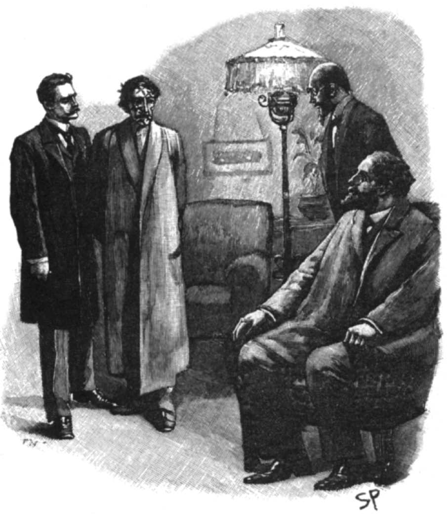

“一看这个人的脸，叫我浑身寒战。”

“‘石板拿来了吗，哈罗德？’老头大声问，那个已经脱了人形的人颓然坐进椅子里，‘让他手松开了吗？那好，现在给他笔。你来问问题，梅拉斯先生，他写答案。先问他，他是不是准备在文件上签字？’

“这个人的两眼在冒火。

“‘绝不！’他在石板上写了希腊字。

“‘没有商量的余地吗？’我按照身旁暴君的吩咐发问。

“‘除非我亲眼看到她结婚，由我认识的希腊牧师主持。’

“一阵恶毒的干笑。

“‘你知道等着你的是什么吗？’

“‘我自己已经什么都不在乎。’

“就是这么几个问题和回答，半问半写地进行。

“我还得一再地问他是否答应在文件上签字，我还是一再得到同样愤怒的回答。但是忽然我想到了好主意，问话当中夹一点私话，先是无关紧要的话，试试旁边两个家伙听不听得懂。结果发现他们木然不知，毫无反应，我就胆子大起来。没问题，可以这样做。我和他作了这样一些对话：

“‘你顽固没好处。你什么人？’

“‘不怕。我初次来伦敦。’

“‘要命不要，看你自己。来了多久？’

“‘听便。三星期。’

“‘产业永远没你份。怎么折磨你？’

“‘也落不到恶棍手里。不给饭吃。’

“‘签字就自由。这什么地方？’

“‘不签。不清楚。’

“‘一点也不替她着想。你叫什么名字？’

“‘不信她会这么想。克莱蒂特。’

“‘签字就能见她。你哪里来？’

“‘宁愿永不再见。雅典。’

“只要再有五分钟，福尔摩斯先生，我在他们鼻尖底下一定可以了解到全部情况。下面再问一句，事情就有可能大致明白。可是正在这当口，门开了，一个女人进屋来。我看不太清楚，只看出高高的个头，很好的身段，黑头发，穿着宽大的白睡衣。

“‘哈罗德，’女人说，讲的是咬音不准的英语，‘我再也待不下去了，这儿多闷呀，只有——哦，我的天，这不是保罗吗！’

“最后说的是希腊语，就在这一刹那，被问话的这个人猛一下把嘴上的胶布扯掉，尖声大叫：‘索菲！索菲！’就冲向女人。女的张开双臂，两人刚拥抱一起，年轻人上来一把抓住女的，推出房门。老头毫不费力拉了瘦弱的被害人从另一个门出去，屋里这会儿只剩我一个人。我一下子跳起来，脑子忽地想，赶快乘机看清楚这屋子是什么样的地方，好掌握线索，可是，还好我没挪步，刚抬头，就看见老东西已经站在了门口，两眼直盯住我呢。

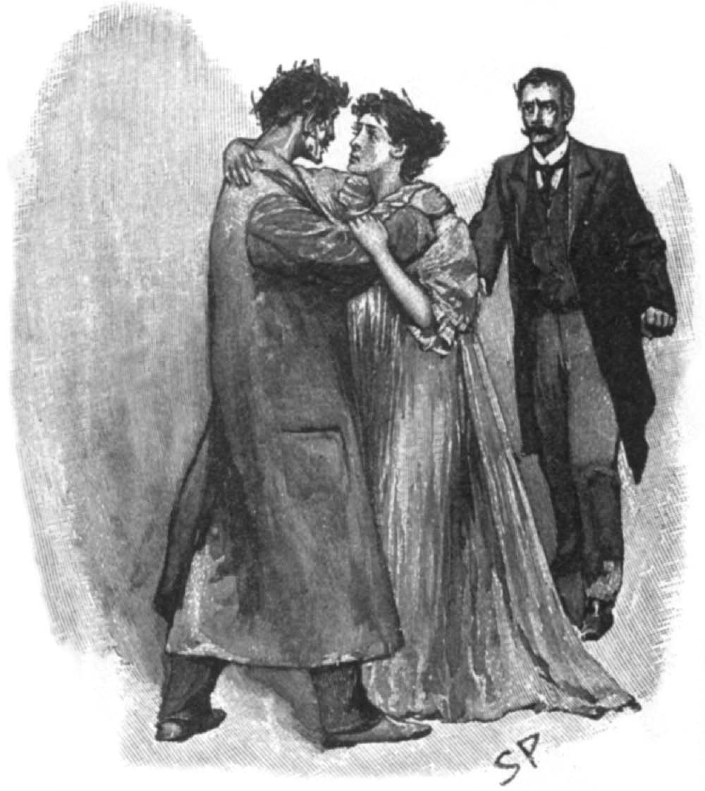

女的张开双臂，两人拥抱一起。

“‘好了，梅拉斯先生，’他说，‘你看，私事不避你，我们多信任你，没把你当外人。本来不必麻烦你的，我们原来有个会希腊语的朋友担任这个协议洽谈的翻译，不巧有急事被召回东方去了，那就得另外找人来替代。很幸运，听说你的水平很高。’

“我点点头。

“‘这儿是五英镑，’他说，向我走过来，‘这个，我希望，这点意思足够酬谢了。不过请记牢，’他补上一句话，手轻轻拍拍我胸膛，格格格地笑，‘这事向个活人讲出去——只要是一个人，那就当心——那就叫上帝怜悯你的灵魂啰！’

“真没办法告诉你，这个卑鄙龌龊的人搅得我心里有多恶心，又多害怕。这时灯光直照着他，我把他看得清楚了，他瘦脸发黄，留一小撮尖尖的枯草似的胡须，说起话来把个脸凑着你，嘴唇、眼皮在那儿痉挛地抖，像是患圣维特斯舞蹈病<a href="#part0071.xhtml_ch5"
id="part0071.xhtml_ch5-back">(5)</a>。我不禁想，他一会儿一会儿地笑，也是一种神经病症状。他脸上最怕人的，还是那双恐怖的眼睛，铁灰发青，从眼底透出阴毒、凶狠的光。

“‘只要你一讲，我们就会知道，’他说，‘我们有自己的消息渠道。现在走吧，马车正等着，我朋友一路护送你。’

“我急忙穿过前厅，登上马车，又顺眼看了一下树木、花园。拉蒂默先生寸步不离，面对面坐着一言不发。静默之中又是漫长的路程，车窗依然拉起，最后，已过了午夜，马车停住。

“‘你这儿下吧，梅拉斯先生，’送的人说，‘对不起，离你家还有一段路，只好这样，没办法。你想要跟踪我的马车，那就是你自己找死。’

“他说着就打开车门，我跳下车脚跟还没站稳，车夫就一鞭子，马车一溜烟跑掉。我惊魂不定，四下里望望，是一片无人的荒野，只有黑压压的灌木乱树。远处有一排房屋，上层零零星星亮着几扇窗户，另一边，看见有铁路红色信号灯。

“载我来的马车已经不见踪影。我站着不住环顾四周，猜想是在什么地方。这时，发现黑暗中有人向我走来，走近了才看出是个铁路站上的脚夫。

“‘劳驾问一声，这里是什么地方？’我问他。

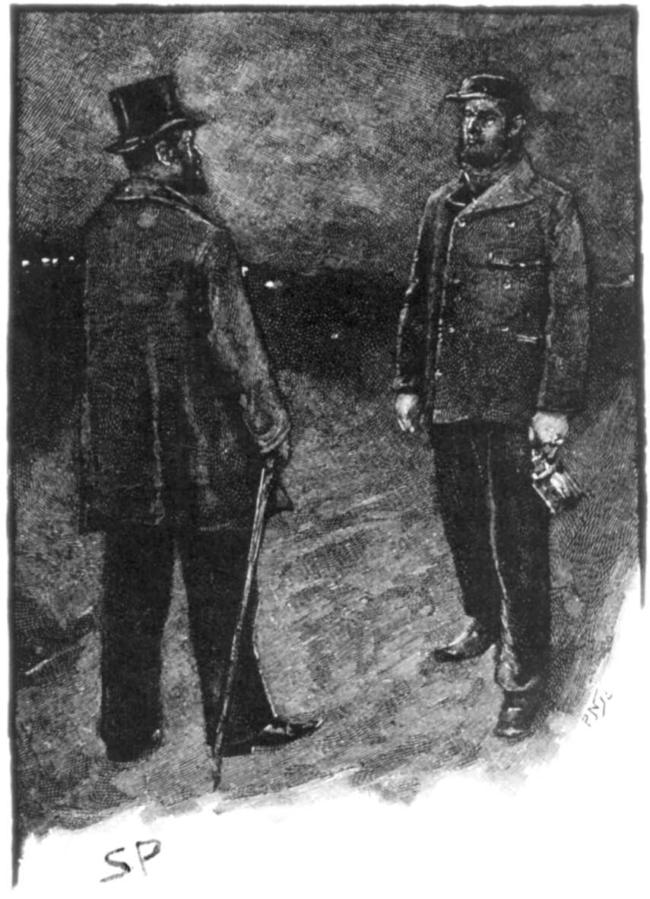

“劳驾问一声，这里是什么地方？”

“‘旺兹沃思公地。’他回答。

“‘进城能乘火车吗？’

“‘约莫走上一英里，到克拉彭枢纽站，’他说，‘你正好赶得上维多利亚末班车。’

“所以这么着，我的历险到此结束，福尔摩斯先生。我不知道自己去了什么地方，我遇见的是什么人，除了跟你说的这些事，其余全然不知。但是，有一桩肮脏勾当，那是清楚的，只要办得到，我要帮助那个不幸的人。全部事情昨天早晨同迈克罗夫特·福尔摩斯先生讲了，随后向警方报了案。”

听了这番离奇惊人的经历，我们默默静坐了几分钟，然后歇洛克望了望他的哥哥。

“采取了什么措施吗？”

迈克罗夫特拿起旁边桌子上一份《每日新闻》。

兹有希腊绅士保罗·克莱蒂特，来自雅典，不通英语，另有希腊女士名索菲，两人均告失踪。若有告知下落者，当予重谢。X2473。

“各家报纸都登了这条启事，但没有消息。”

“希腊使馆知道了吗？”

“我问过了，他们完全不知道。”

“那么，向雅典警察当局发电报吧？”

“歇洛克是我们家精力最充沛的人，”迈克罗夫特转身对我说，“那么，你当仁不让，接手下来，有什么好消息，快告诉我。”

“当然，”我的朋友说，从椅子上起身，“我会告诉你的，还会告诉梅拉斯先生。同时，梅拉斯先生，我是你的话，我一定小心，时刻警惕，因为不用说，那伙人看到启事，就知道是你告发的。”

我们一起走回家，福尔摩斯在电报局发了几份电报。

“你看，华生，”他对我说，“这晚上我们不虚此行。以往我有好几桩案子，都是通过迈克罗夫特的手转给我的。刚才这个案子看来可能性只有一个，特点倒有好几个。”

“你有解决办法了？”

“噢，我们已经知道了这么多线索，要是没法顺藤摸到瓜，那是怪事的怪事。事实情况听下来，你一定已经有了自己的推理猜测。”

“是的，不过还很模糊。”

“怎么个想法，说来听听？”

“很明显的地方是，希腊姑娘受了名叫哈罗德·拉蒂默的英国青年拐骗。”

“在哪里被拐骗？”

“可能是雅典。”

福尔摩斯摇摇头，“这个年轻人一点希腊语都不懂，女士的英语还过得去。推理结论——女的来到英国已经有一段时间，男的根本没有去过希腊。”

“这么说的话，我们可以猜测女的是到英国来旅游，是哈罗德把她勾引上了。”

“非常可能。”

“后来她弟兄——想必两人是亲属关系，是兄长——从希腊赶来阻止，没想哥哥自己落到了年轻人和他的同党手中。他们把他私禁起来，暴力威胁，要他签下什么证书图谋姑娘的财产——他可能是这笔财产的受托人——要转让给他们，他当然不答应。为了和他沟通讲条件，需要找个翻译，这就找到梅拉斯先生头上，以前可能还用过别人。姑娘不知道哥哥来了英国，是这天偶然碰上发现的。”

“很对，华生，”福尔摩斯高声道，“可以肯定，你的分析与事实差不了多少。你看我们已经胜券在握，唯一担心是他们会突然下毒手，我们要争取时间，抢在他们前头。”

“怎么才能找到他们住的地方呢？”

“唔，如果我们的假设正确，姑娘的名字，现在叫或者曾经叫过的名字，应该是索菲·克莱蒂特，这样，找她就不困难。我们主要寄希望于此，因为她哥哥完全没人知道。哈罗德这个人，明摆着同姑娘的关系已经有一段时间了——起码好几个星期——她哥哥等到获悉此事，才赶过来，都得有点时间才行。如果这个期间他们住的地方没有动过，那么迈克罗夫特登报的启事就能有回音，有人会提供消息。”

我们边谈边走，不觉已到贝克街家了。福尔摩斯走在前面上楼梯，刚把房门推开，就一声惊讶。我从他肩头望去，也同样大为惊奇，他的兄长迈克罗夫特端坐在扶手椅里抽着烟。

“来了，歇洛克！来了，先生，”他看着我们惊喜的脸，和蔼地微笑着说，“你们想不到我也有这么好的精力，是不是，歇洛克？因为这个案子确实很吸引我呢。”

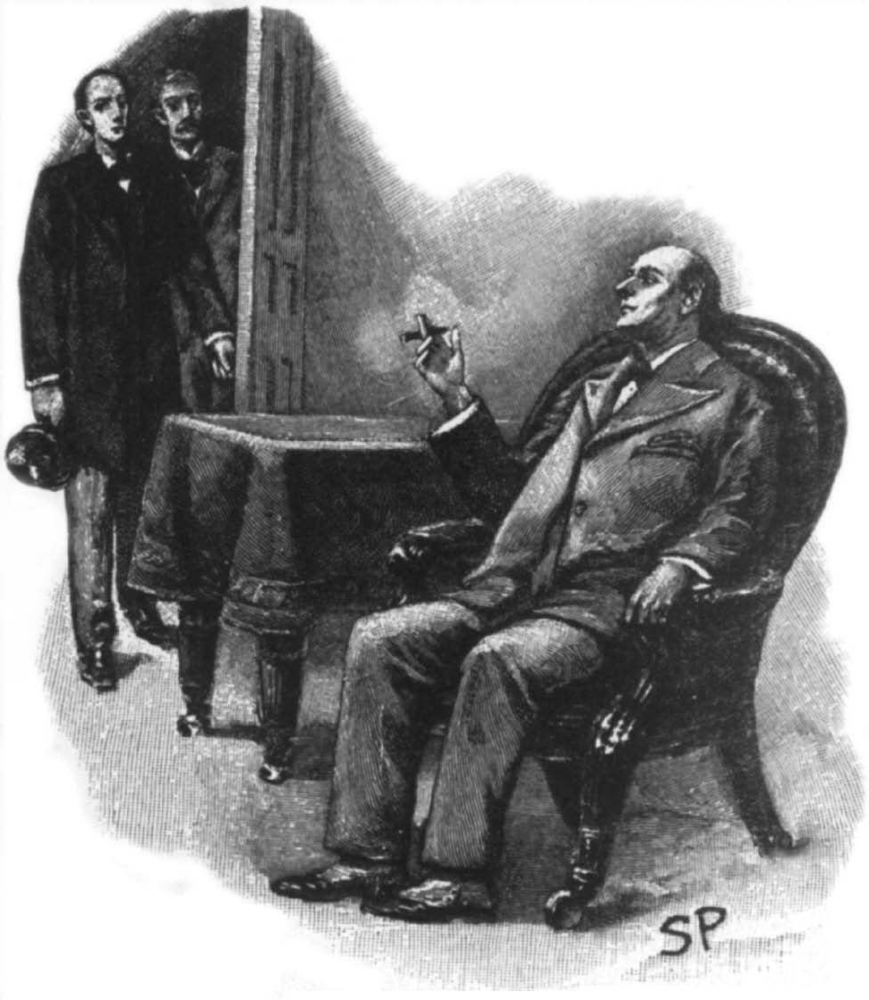

他看着我们惊喜的脸，和蔼地微笑着。

“你怎么来的？”

“坐马车，超过你们。”

“有新的情况？”

“我的启事有了消息。”

“好哇！”

“你们刚走没几分钟就到了。”

“有什么结果？”

迈克罗夫特·福尔摩斯掏出一张纸。

“看，”他说，“信是一个身体虚弱的中年人写的，用的是J钢笔<a href="#part0071.xhtml_ch6"
id="part0071.xhtml_ch6-back">(6)</a>，奶油色王裁纸。

先生：

见今天登报寻人启事，特告知本人对这位女士很有了解，她正遭遇不测，现住地址：默特尔兹，贝克纳姆。如欲知详情，可来我处。

您忠诚的

J．达文波特

“是从下布里克斯顿发的信，”迈克罗夫特·福尔摩斯说，“马上过去拜访他，了解详情，歇洛克，你看怎么样？”

“我亲爱的迈克罗夫特，那位兄长的性命危在旦夕，比妹妹的情况严重得多。我的意思，报告苏格兰警场，找格雷格森警探，赶快去贝克纳姆，要知道这个人的命快保不住了，时时刻刻处于危险之中。”

“让梅拉斯先生一起去，”我提议，“不能没有翻译。”

“很对，”歇洛克·福尔摩斯说，“吩咐仆人去叫一辆四轮马车，我们这就出发。”说着立即拉开抽屉，我注意到他拿左轮手枪往口袋里一塞。“得准备着，”见我看着他，便对我说，“要当心了，从听到的情况来看，我们要对付的是一帮穷凶极恶的匪徒。”

我们到蓓尔美尔梅拉斯先生家，天几乎全黑。有一位绅士刚刚来拜访梅拉斯先生，请他出去了。

“知道他到哪里去吗？”迈克罗夫特·福尔摩斯问。

“不知道，先生，”开门的妇女回答，“只知道同那位绅士坐四轮马车走的。”

“那位绅士通报什么姓名呢？”

“没有通报，先生。”

“是不是一个青年，高高黑黑的，长得挺帅的？”

“哦，不是，先生，是位小个子绅士，戴眼镜，脸瘦瘦的，样子很高兴，说话总带着微笑。”

“快走！”歇洛克·福尔摩斯马上叫起来，“事态严重了。”马车立刻驶往苏格兰警场，车上他说，“这帮人劫走了梅拉斯先生。他们前天晚上打交道后就有数，他不是个有胆量的人，他们一出现，就能把他吓唬住。他们还是请他去做翻译，这个没问题，还要用他一用，用完了，对不起，肯定算他的告发账。”

我们原打算乘火车，这样到贝克纳姆能赶上他们的马车，甚至赶在他们前头到达，哪知道在苏格兰警场搞了一个多小时才找到格雷格森警探，再给办出合法手续允许我们进入私宅，到伦敦桥已经九点三刻，十点半我们一行四人才在贝克纳姆车站下车。还要坐半英里的马车，到达默特尔兹——一幢黑沉沉的大宅，背靠公路，矗立在私家园地上。我们辞了马车，一起沿住宅车道向前走。

“窗户都黑着，”警探说，“屋子好像没人。”

“鸟既飞，巢已空。”福尔摩斯说。

“怎么说？”

“一辆有行李载重的四轮马车刚走不到一小时。”

警探大笑。“这车印子我在门灯下早看见了。装有行李从何说起呢？”

“你看到的，恐怕是另外方向的车辙，我是指向外去的车辙，那要深得多——深得很，所以我们讲车上肯定载着重物。”

“小事一桩，胜我一筹，”警探说，把肩耸了耸，“撞门可不容易啦，门叫不开的话，我们只好撞啦。”

他使劲捶打门环、拉门铃，震得满屋子响，可是没一点反应。福尔摩斯跑开了一会儿又回来。

“给我打开了一扇窗。”他说。

“难为你与警方站在一边，协同不是掣肘，福尔摩斯先生，”警探瞧着我的朋友把窗钩拉掉，方法挺机灵，“行啊，既然如此，我们就是不请也要非入不可。”

我们一个接一个进入一间大屋子，显然就是梅拉斯先生说的这一间。警探拎着提灯，我们借光看到那两扇门、窗帘、灯，还有一副日本铠甲，这些梅拉斯先生都讲到过。在桌上有两个酒杯，一只白兰地空瓶，一些残羹剩肴。

“听，这是什么？”福尔摩斯忽然问。

我们立定，竖耳静听，阵阵轻微的呻吟，从上面什么地方传出来。福尔摩斯冲向门，跑出大厅，声音是从楼上传下来的。他带头向上跑，警探和我紧跟在后，他的兄长也不落人。在三楼，迎面有三个门，哀叫声是中间那个门里传出来的，一会儿低声闷气，一会儿高声哀号。门锁着，但钥匙插在门外边没拿走。福尔摩斯一转钥匙推门冲入，可是一下子回身出来，手捂着鼻子。

“里面烧炭，”他叫道，“等一下，让烟气跑掉一点。”

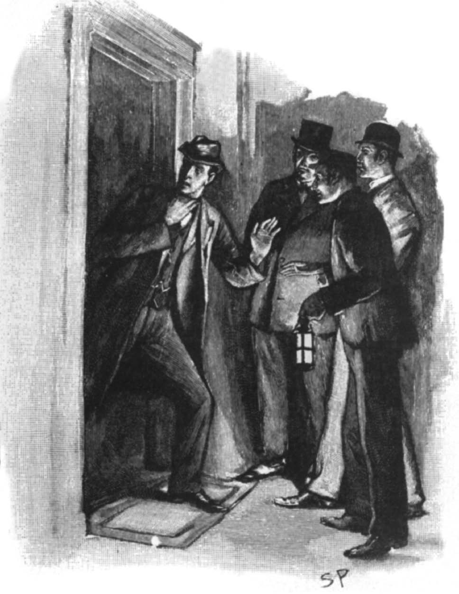

“里面烧炭，让烟气跑掉一点。”

我们朝里一望，屋里只有一点亮光，是屋中央一个三角火盆冒着一星星蓝火，投到地板上是一圈蓝荧荧的微光。在一边暗影里，我们看见有两个模糊的人影蜷缩在墙边。打开了的门，涌出一股呛鼻浓烟，令人透不过气，咳嗽不止。福尔摩斯奔向楼梯顶头呼吸一口新鲜空气，再回来冲进房间，把窗打开，端起炭盆朝园子外扔出去。

“再稍等一等进去，”他又冲出来，大口喘气，“蜡烛也没用吧？我看这屋里的空气没有了，火柴都划不着。拿灯就这儿门口照着，快把人去拖出来，迈克罗夫特，灯拿着！”

我们冲进去抓住两个中毒窒息的人就往外拖，拖到过道厅灯光底下一看，两人嘴都发紫，没有知觉，面部肿胀、充血，眼珠外凸。他们脸部扭曲得已经面目全非，两人中有一个要不是凭他的黑胡子、矮胖身材，说真的，我们根本认不出他就是那位希腊语翻译，他在第欧根尼俱乐部和我们分手才不过几个小时。他连手带脚给捆得结结实实，一只眼睛上留着毒打的伤痕。另一人，也被同样捆绑，是个高个子，人已瘦得只剩一具骷髅，脸上乱七八糟贴着些胶带。我们把他放到地上，人已毫无气息。我一看就知道晚了一步，错过时机救不活了，而梅拉斯先生还有救。我们用了阿摩尼亚和白兰地，渐渐看到他睁开了双眼。我舒了一口气，终于把他从死亡的深渊中拉了回来。

梅拉斯先生告诉我们他的遭遇，讲得很简单，不过足以证明我们的估计完全正确。拜访他的人一进屋就从袖子里抽出那根棍子，威逼他走，不走立即打死他，就这样他再一次受到绑架。确实，他一个只懂语言翻译的文人，根本无能应付，结果给这个格格奸笑的老流氓捏住动弹不得，他的手不住发抖，脸发白，一句话也说不出来。他很快给带到贝克纳姆，再当一次翻译，比第一次更具有戏剧性，两个英国人威胁被囚禁的希腊人答应他们提出的要求，不答应就立即杀死。最后，发现一切威胁都不能使他屈服，他们重新把他投入禁闭室。回头他们斥责梅拉斯先生出卖了他们，报上登了寻人启事。他们操起棍子朝他打，之后他就什么也不知道了，直到睁眼看见我们围在他身边。

这就是希腊译员的奇案，至此其中仍有解释不清的谜。后来我拜访了那位回应寻人启事的绅士，才最终查明真相。受骗的年轻女士出身希腊富裕之家，此番是来英国访友，与一个名叫哈罗德·拉蒂默的青年邂逅。这个人用足功夫将她迷惑勾引，最后诱她跟他私奔。姑娘的几个朋友得到消息觉得事出意外，有责任赶快通知她在雅典的哥哥，以便撇清关系。她哥哥一到英国，因人生地不熟，落入拉蒂默和他的同党之手，那老家伙名叫威尔逊·肯普——是个罪恶累累的老流氓。两个人把他骗过来，欺他语言不通，落在他们手里毫无办法。他们把他秘密囚禁，对他百般折磨，不给饭吃，逼迫他签下字据，把他自己和妹妹的财产全都交出来。他们绑架他，把他关在屋里，他妹妹完全不知道。在他脸上贴胶布，目的是万一让他妹妹撞见，也看不出来。可是女人心细眼尖，胶布没能掩盖住真相。译员来做翻译的那天，这是他们兄妹头一次见面，给她一下子就认出来了。可怜姑娘她自己也成了囚徒。这房子里还有一个男人，充当马车夫，一个女人，是他老婆，守屋子看住她，此外再没有旁人，这两个也都是他们的同党爪牙。歹徒们一发现秘密已经败露，绑架的人又死不屈从，两个恶棍就带了姑娘出逃。几个小时后，匆匆从装饰豪华的这幢租房撤离。他们临走先要出口恶气，手中这两个人，一个不肯低头，一个把他们出卖，都要干掉。

几个月以后，有人从布达佩斯给我们寄来剪报，是一条新奇的消息，说两个英国人携一女子旅游，结果酿成悲剧。两个男子似乎均遭刺杀身亡。匈牙利警方认为，是争吵引发互殴致死。但是我知道，福尔摩斯持不同看法，他至今坚持认为，如果能够找到那位希腊姑娘，就可以听到她述说，她如何为自己和兄长报仇雪恨。

（1893年）

————————————————————

<a href="#part0071.xhtml_ch1-back" id="part0071.xhtml_ch1">(1)</a> 黄赤交角：天文学上黄道面和赤道面之间的交角，为23°27′。

<a href="#part0071.xhtml_ch2-back" id="part0071.xhtml_ch2">(2)</a> 吉尔内（Vernet，Claude-Joseph，1714—1789），法国风景画家，尤以15幅风俗组画《法国海港》著称。

<a href="#part0071.xhtml_ch3-back" id="part0071.xhtml_ch3">(3)</a> 第欧根尼（Diogenes），公元前4世纪希腊犬儒学派哲学家，愤世嫉俗，为与世隔绝，宁可蹲在木桶中无视外界。

<a href="#part0071.xhtml_ch4-back" id="part0071.xhtml_ch4">(4)</a> 白厅街（Whitehall），即英国政府，也是所在的街名；蓓尔美尔（Pall
Mall）则是以俱乐部集中而闻名的一条街。

<a href="#part0071.xhtml_ch5-back" id="part0071.xhtml_ch5">(5)</a> 圣维特斯舞蹈病（St．Vitus's
dance；St．Vitus），圣维特斯是公元3世纪舞蹈病患者的保护圣徒。

<a href="#part0071.xhtml_ch6-back" id="part0071.xhtml_ch6">(6)</a> J钢笔（J
pen），蘸墨水钢笔，钢笔尖系由一位名叫詹姆斯（James）的英国人于1829年发明。

# 海军协定

我刚结婚不久的七月，令人难忘。这一月发生三件重大案子，我有幸随同歇洛克·福尔摩斯一起进行侦查，同时研究他的工作方法。我翻了当时的记录笔记，找到的三篇题名是“第二摊血迹”、“海军协定”和“疲惫的船长”。其中第一件案子事关重大，涉及王国第一家庭中的许多显贵，所以若干年内不可能公之于众。然而，凡是福尔摩斯经手的案子，都没有像该案如此清楚地显示其推理水平之高，而给予关注的人们如此深刻的印象。我至今保留一份几乎是逐字逐句的谈话纪录，是福尔摩斯向巴黎警署杜布克先生和但泽著名刑侦专家弗里茨·冯沃尔德鲍姆两人剖析案子事实真相的谈话，他们两位对本案花费不少精力，结果证明都浪费在无关紧要的枝节问题上。新世纪已将来临，该案恐怕要等待未来才能给予适当的报道。我于是转向记录的第二篇，此案曾经关系国家重大利益，内中几处案情更是独一无二，别具特色。

我读书的时候有个要好同学名叫珀西·费尔普斯。他和我同年，但是比我高两级，学习出类拔萃，学校颁发的奖项几乎都叫他囊括，毕业时获得奖学金，供他进剑桥继续深造。我记得他家有贵戚，还是小孩子的时候，听说他舅舅是霍尔德赫斯特勋爵，一位声名显赫的保守党政要。他的这层关系很受看重，在学校里沾光不少。可是我们反而喜欢拿他开玩笑，在运动场上和他追逐打闹，绊他跤、出他丑。等到大家一踏上社会，那就各自另一码事了，依稀听说他凭自己的学历和社会背景在外交部得到一个很好的职位。后来我就渐渐把他完全淡忘，直到来了下面这封信，才又想起他这个人：

我亲爱的华生：

我想你总还记得“蝌蚪”费尔普斯吧，你那年在三年级，我在五年级。很可能你已听说我凭舅父的关系在外交部谋到了好差事，颇受器重和信任，可是并不知我已祸从天降，仕途就此告终。

这个倒霉事在此不必细写，如果蒙你应允我的请求，那么我会向你面陈详情。我罹患脑炎九星期，最近刚刚恢复，但仍感极度虚弱，不知可否烦请携你朋友福尔摩斯先生来我处一走？很愿意听听他对我事的意见，虽然政府当局已断定无可挽回。务请陪他来，且越快越好。我是无时无刻不在提心吊胆之中，度一分钟如一个钟头。一定请告诉他，我没有及早向他请教，并非是我对他的能力不相信，实在是因为受打击太深，脑子承受不起。现在我脑子重新清楚了，但还是不敢想得太多，以免再度崩溃。写封信都还觉得累，所以你看，不得不口述代笔。拜托尽力邀请他来。

你的老同学

珀西·费尔普斯

读了这封信，我很受感动，他词意恳切，一再要求福尔摩斯怜悯亲临。所以大受感动之下，此事再有困难，我也应义不容辞尽力而为。而且我很清楚，福尔摩斯热爱他的刑侦艺术，只要委托人相信他，他是向来有求必应。我妻子同意我，叫我一分钟也不要耽搁，为这件事快去找他。我于是赶紧吃好早饭，就又回到我的贝克街老寓所。

福尔摩斯坐在边桌旁，穿着休闲服，聚精会神地做着化学实验。一个大曲颈瓶在本生灯蓝荧荧的火焰上烧得沸滚，蒸馏水滴入一个两升容积的量杯中。我走进屋里，朋友头也没抬一抬。看他的实验一定很重要，我就自己坐在扶手椅上等着。他看看这个瓶，瞧瞧那个瓶，用玻璃吸管从每个瓶子里吸几滴液体，再拿一试管溶液放在桌上。他右手捏一张石蕊试纸。

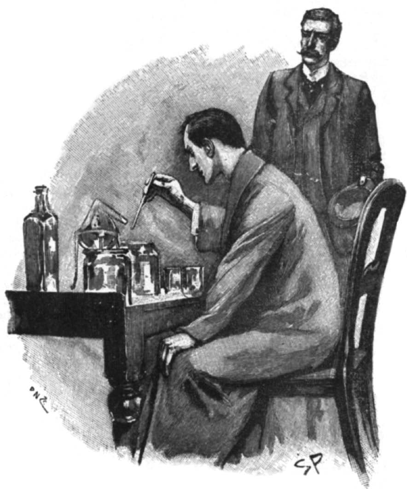

聚精会神地做着化学实验。

“你来得正好，华生，”福尔摩斯说，“如果这试纸还是蓝色，就属正常没问题，如果变成红色，那就是说溶液能置人于死地。”他把试纸浸入试管，立刻呈现污浊的暗红色。“嘿嘿！不出我所料！”他叫道，“回头就听你调遣，华生。烟自己拿，就在那波斯拖鞋上。”他转身走向书桌，迅速写好几份电报，随手交给童仆，然后坐到我对面的椅子上，曲起双膝，两只手搂着瘦长的小腿。

“一桩简单普通的杀人案，”他说，“你是来给我提供奇案啰，我想。你是预报暴风雨的海燕，华生，登门必有要案。是什么事呢？”

我把信交给他，他看得十分专注。

“信上没说什么情况，是吗？”他说，把信还给我。

“没说什么。”

“可是笔迹倒值得注意。”

“笔迹不是他自己的。”

“确实。是一个女人。”

“明明是男人的笔迹。”我大声说。

“不，是女人笔迹，而且是一个性格不一般的女人。你看，调查初始，就有事应当注意，你的委托人同什么人有密切关系，这个人，不管是好还是坏，性格特别。我现在已经被这个案子吊起胃口，你如果可以，我们立刻出发前往沃金，拜访这位处境危难的外交官，还有按他口述代笔写信的这位女士。”

我们很巧，正好到滑铁卢赶上早班车。不到一小时，我们就到了沃金，眼前是一片冷杉和欧石南树林。布里尔布雷原来是一幢大宅，孤零零矗立在宽广的园地上，离火车站徒步只有几分钟的路。我们递进名片，立即被请进一间陈设幽雅的客厅。稍等几分钟，一位身体结实的男人出来接待，态度非常客气。看他年龄三十多岁，不到四十，面颊红润，眼色喜乐，全然是一种不脱无邪顽童气的印象。

“我非常高兴你们能来，”他说，和我们热情地握手，“珀西早晨来一直在问起你们。咳，可怜的老朋友，他现在是落水人见一根草也要抓！他父亲、母亲叫我来迎接你们，他们现在那个话题都不能提，一提就痛苦、伤心得受不了。”

“我们都还一点也不了解是什么事件，”福尔摩斯说，“我看你不是他们家里的人。”

我们初识的朋友面露惊异，马上低头看了一眼，便张口大笑。

“没错，你看到这项链盒片上的图案字母JH，”他说，“我一时间在想，你倒真是聪明绝顶。我的名字就叫约瑟夫·哈里森。珀西就要娶我的妹妹安妮，我们不就成姻亲关系了嘛。我的妹妹在珀西房里，你就要看到。两个月来，珀西全靠她一手照料伺候。我们这就进去吧，我知道快要把他急死了。”

我们被领进一间与客厅同在底楼的房间。房内布置既像起居室又像卧室，角落摆满雅致的鲜花。一个年轻人，苍白、憔悴，躺在靠窗的沙发上，窗打开着，透进来浓浓的初夏花园的芬芳气息。一个女子坐在他身旁，我们进屋，女子站了起来。

“我走开吧，珀西。”女子说。

珀西抓着她手不让她走。

“你好，华生，”珀西热情地说，“你留了小胡子，我都快要认不得你了，我敢说你多半也认不出我了。这位，我想是你的朋友，大名鼎鼎的福尔摩斯先生吧？”

我简单介绍过后，两人一起坐下。这时壮实的青年人离开了，他的妹妹留着，手捏在病人的手里。她是个引人注目的女子，身段略显矮胖，不太匀称，但是她有一张橄榄色的美丽面容，一对黑黑大大的意大利姑娘的眼睛，还有一头乌亮的云发。她的容貌艳丽，相形之下，她陪伴的人的苍白脸色更显得委靡、枯槁。

“我不想浪费你们时间，”他说，在沙发上把身子撑起来，“开门见山就谈事情。我这个人，身心快乐、事业成功，福尔摩斯先生，谁知快临到结婚了，会遇上飞来横祸，毁掉整个前程。

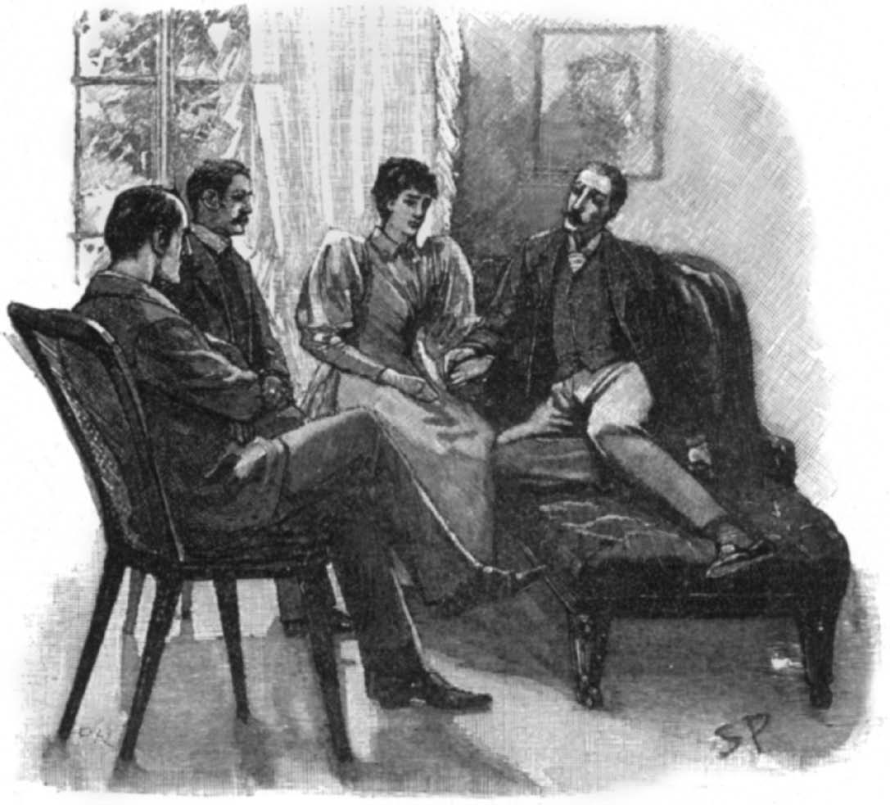

他在沙发上把身子撑起来。

“我是在外交部供职，华生可能都告诉你了，因为有着舅父霍尔德赫斯特勋爵这层关系，很快升任重要职位。舅父担任本届政府的外交大臣，交给我的几项重要任务，我件件都能出色完成，他终于对我的才学和能力给予充分信任。

“大约十个星期以前——确切讲是五月二十三日——他召我进他的私人办公室，对我工作表现出色夸奖一番，接着告诉我，有一件新的重大任务需要我去完成。

“‘是这样，’舅父说，从书柜桌拿出一个灰色纸卷，‘这是英国和意大利签订的秘密条约原文本。事情有些麻烦，报界舆论已经有传闻。这签约极端重要，机密不许有丝毫泄漏。法国和俄国大使馆不惜重金收买条约的内容。原件放在我书柜桌里不准动，现在实在需要备一份副本，才拿出来。你办公室里桌子有保险吧？’

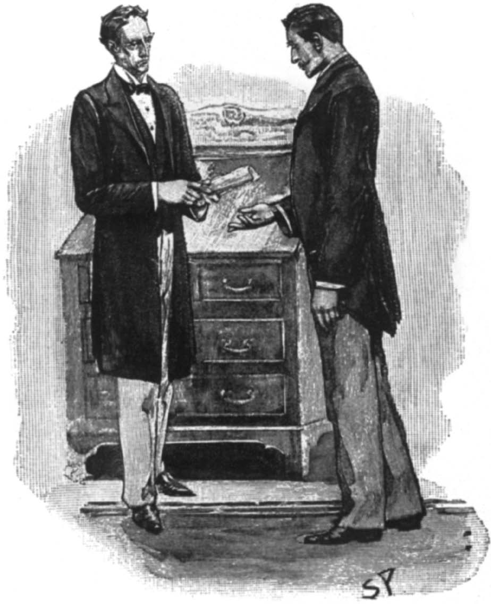

“这是秘密条约原文本。”

“‘有的，先生。’

“‘好，那就把条约锁在你那里。我跟你说，等下班大家走了以后，你留下来用这空档时间抄副本，免得被别人看见。抄好以后，原件和副本都在桌子里锁好，等明天早晨你亲自来交给我。’

“我接了文件，就——”

“对不起，打断一下。”福尔摩斯说。

“谈话就和你一个人吗？”

“那当然。”

“是一个大房间？”

“有三十英尺见方。”

“在房间中央谈话？”

“是的，差不多是正中间地位。”

“说话大声吗？”

“我舅舅的嗓子一向就特别低，我几乎没说话。”

“谢谢你，”福尔摩斯说，闭起了眼睛，“请讲下去。”

“我完全按照舅父的指示，要等到同事都离开才能做。办公室里有一个同事，叫查尔斯·戈罗特，还剩一点公事没办完，我就走掉去吃晚餐，让他留在那里。等我回到办公室，他已经走了。我就急忙要把工作赶出来，因为我知道约瑟夫——那位哈里森先生，就是你刚才见到的——正在城里，知道他要乘十一点钟的火车去沃金，我也想尽可能赶上这班车。

“我拿出条约来一看，立刻发现它的重要性确实如舅父所讲，一点没有言过其实。还没有细看内容，我已经可以说它是确定大不列颠帝国对三国同盟的立场，同时确定，一旦法国海军在地中海对意大利海军占据绝对优势，英国需要采取何种对策。条约涉及内容全部属于海军方面，末了是双方高级官员的签字。我大致看过，就坐下来着手我的抄写任务。

“条文很长，用法文缮写，总共二十六条。我尽量快抄，但是到九点钟，还只抄了九条，看样子赶火车是来不及了。我感觉昏昏欲睡，脑子迟钝，原因是晚饭没吃好，还有是一整天工作下来，疲劳了。喝杯咖啡可以清醒清醒头脑。楼梯脚边是小门房，门卫整夜看守在那里，习惯上总用酒精灯给加班的工作人员煮咖啡喝。所以我打了铃，叫他上来。

“可是真奇怪，打了铃叫来的竟是个女人，一个高大个头、满脸粗俗相的老妇人，系一条围裙。她解释说是门卫的老婆，在这里干杂活的，我就告诉她要咖啡。

“我又抄了两个条款，觉得困极了，更难熬，就站起来，在办公室里走动走动，伸展一下两条腿。要的咖啡还未送来，心里纳闷到底是怎么回事。我打开门，顺走廊向下望望怎么回事。那是一条笔直廊道，灯光昏暗，一头是我工作的办公室，只有这一个出口，另一头接一段拐弯的楼梯，楼梯到底接一段走廊，走廊旁边就是门卫的门房。楼梯半中间有一截小平台，横向里对直是另一条走廊。这条走廊又接一段楼梯，通底下的边门，专供仆人进出用，也是职员从查尔斯街进入办公室的便门捷径。这就是我办公地方的略图。”

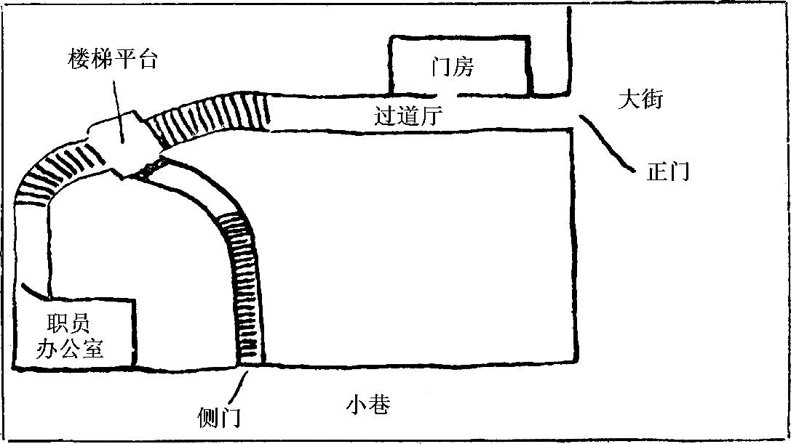

办公处略图

“谢谢，我清楚，你说的我很明白。”福尔摩斯说。

“说到要点了，最重要的地方，请注意。我走下楼梯，到门厅，发现门卫在他的小屋里大睡，咖啡壶在酒精灯上一个劲儿沸滚。我提了壶，把灯灭了，咖啡溢了一地。门卫睡得很熟，我伸手正要去把他推醒，他头顶那儿的铃忽然震耳响起，把他惊醒。

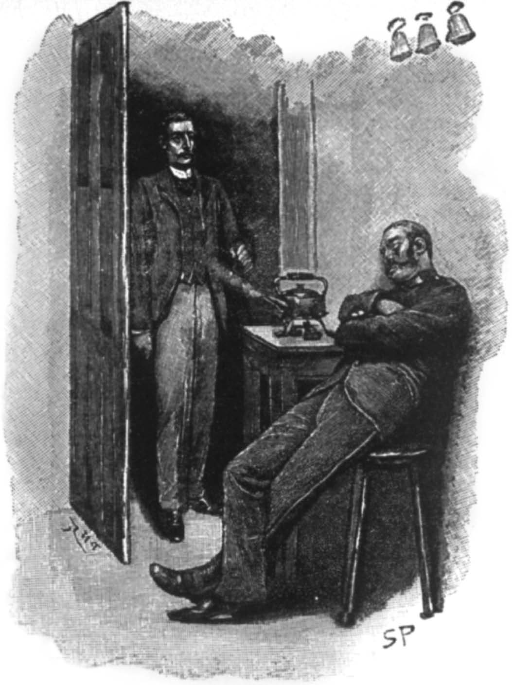

门卫睡得很熟。

“‘费尔普斯先生，先生！’他说，慌张地看着我。

“‘我下来看看咖啡好了没有。’

“‘我煮着咖啡就睡着了，先生。’他朝我看，又朝还在响的铃看，露着一脸的惊奇。

“‘你不是人在这儿嘛，先生，奇怪，谁打铃？’他问。

“‘打铃！’我大声说，‘这是哪儿打铃？’

“‘是你办公室的铃啊。’

“顿时我的心给一只冰手揪住似的，那就是说有人在我办公室了，那份绝密条约还放在桌上呢！我发疯似的跑上楼梯，奔向走廊。走廊上一个人也没有，福尔摩斯先生。办公室里也没有人，一切同我刚才走开的时候一模一样，唯一就是那份条约，托付我的条约，我放在桌上的，不见了。副本还在，原件不翼而飞。”

福尔摩斯在椅子里直起身，摩搓起双手，我看出，问题直入他的心坎。“请讲下去，然后怎么样？”

“我头一个念头，贼是打边门楼梯上来的，要不然，如果从正门走，一定会给我撞见。”

“你能有把握这个人没有一直躲在办公室，或者走廊里，你不是说过道很暗吗？”

“绝对不可能，办公室、走廊，一只老鼠都躲不住，根本没有可以藏身的地方。”

“谢谢！请继续讲。”

“门卫见我脸都吓白了，知道出事了，也跟我上楼。这时候我们两人冲过走廊，直下楼梯，奔向查尔斯街。底下的边门关着，但没锁上，我们拉开门出去。我记得清楚，这时候临近有乐音钟响了三下，那是十点差一刻。”

“这一点极为要紧。”福尔摩斯说，一边在衬衫袖口上记下。

“夜特别黑，下着毛毛雨。查尔斯街上没人，可是街尽头的白厅路上，和往常一样有不少车来人往。我们帽子也没顾得上戴，在人行道上跑，对街拐角上看见站一个警察。

“‘发生盗窃案了，’我上气不接下气地报警，‘外交部重要文件失窃。见有人打这里过去吗？’

“‘我在这里已经站了一刻钟，先生，’警察说，‘这时间只有一个人走过——一个女人，高个头老妇女，披佩斯利花头巾。’

“‘咳，那是我妻子，’门卫叫起来，‘有没有别的人走过？’

“‘没见。’

“‘这么说，贼是朝那另一个方向跑了。’这个门卫叫着，扯住了我袖子。

“我不太相信，而他是想要把我岔开，倒叫我生疑。

“‘女人朝哪里走了？’我大声问。

“‘不清楚，先生，我见她过去，可没理由平白无故盯着人家朝哪里走。看她样子挺匆忙。’

“‘这有多少时间了？’

“‘哦，没几分钟。’

“‘不到五分钟吧？’

“‘啊，是的，没有五分钟。’

“‘你还白费时间问什么，先生，现在每分钟有多宝贵，’门卫嚷着，‘请相信我说，这事和我老婆绝对没关系，快往那一头去追。好吧，你不去，我去。’这么说着，他朝相反方向奔过去。

“我马上追着他，一把抓住他衣袖。

“‘你家住哪里？’我问他。

“‘艾维巷十六号，布里克斯顿。’他回答说，‘可是我说你别乱疑心，搞错方向，费尔普斯先生。快到街那一头去看看、听听，有什么情况。’

“就照他说的，也可以。警察和我们一起跑过去，可是只看见街上人车来往，人们都急急忙忙赶路，夜里要下雨，快走不耽搁，没一个闲人会和我们说见谁走过了。

“我们只好回到部里，查看楼梯、过道，都没有结果。办公室前面的走道上铺着奶白色油地毡，要有痕迹是很清楚的，我们细细检查，没发现脚印痕迹。”

“晚上一直在下雨吗？”

“雨大概七点开始下的。”

“那么，女人是九点光景来到办公室，沾泥的鞋怎么会没留下痕迹呢？”

“很高兴，给你问到点子上了。那时我也这样想过的，可是做杂活的女工有规矩，楼下进门要脱鞋，换上布拖鞋。”

“那么这一点是清楚的，就是说，晚上下雨天，痕迹一点都没有留下，是吗？这一系列事件真是异乎寻常，很有意思。接下去你又怎么办呢？”

“我们也检查了办公室。屋里暗门是绝对不会有的，窗子离外边地面都有足足三十英尺，每一扇都从里面上着插销。铺的地毯下绝对不可能有地道口。天花板一整片白，天上也掉不下来。总之，要说盗文件的贼不是走门进来，我死也不会相信。”

“壁炉怎么样？”

“没有壁炉，是用暖炉的。铃绳挂在我办公桌右首上方的铁丝上。拉铃一定要跑到右边位置才行，奇怪的是，哪个罪犯作案还打铃？这个谜根本无法猜透。”

“确实，案子很不一般。再下面采取了什么步骤？你检查了办公室，我想，要看看窃贼留下什么蛛丝马迹——有没有烟蒂、掉落的手套、发夹或者其他小东西？”

“什么东西也没有。”

“有烟味吗？”

“哦，我没有想到这一点。”

“哦，一丝烟味对这样一桩案子也极有价值，值得注意。”

“我自己从不抽烟，所以我想，如果有烟味的话，就会引起我的注意。真是一点线索也没有，唯一有疑问的就是门卫的妻子——叫坦盖太太——忽然跑掉，离开这个地方。门卫没能作出解释，只说她平时一直是这个时候回家。警察和我一致认为最要紧的是把这个女人抓起来，防止她将文件脱手，估计文件就在她手里。

“这时苏格兰警场已接到报警，警探福布斯先生立即赶到，全力以赴侦查本案。我们叫了一辆马车，半个小时就按地址到了目的地。一个年轻女子来开门，是坦盖太太的大女儿。她说母亲还没有回来，把我们请进前屋里等着。

“大约十来分钟，有人碰门。这时我发现我们犯了严重错误，完全怪我不好，不是我们自己去开门，我们让姑娘开的门。我们听见姑娘说，‘妈，家里来两个客人等着找你’，接着马上听见过道里啪嗒啪嗒奔跑的脚步声过去。福布斯一把拉开门，我们两人跑进后屋，也就是厨房，可是老妇人比我们先到一步。她眼含敌意望着我们，一下子又认出是我，就显露一脸的疑惑。

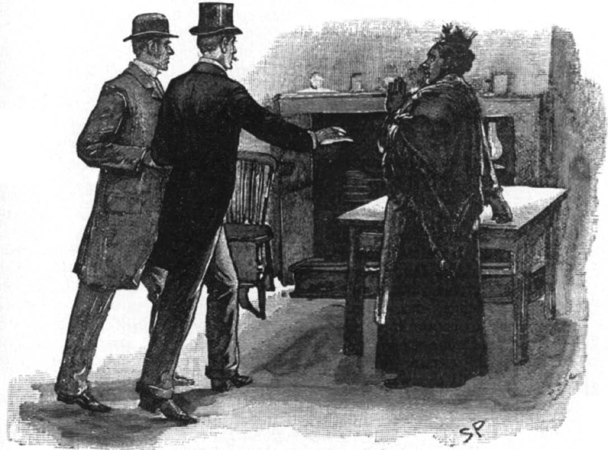

她眼含敌意望着我们。

“‘怎么，这不是部里的费尔普斯先生吗！’

“‘嗨，得啦，你清楚我们是什么人，才要这么躲着？’我同伴问她。

“‘还以为是卖旧货的呢，’她说，‘有个生意人跟我们在扯皮。’

“‘恐怕不是吧，’福布斯对她说，‘我们不会无缘无故找你，外交部一份重要文件给你拿走了，你急忙跑到这里想处理掉。别动，跟我们走，苏格兰警场里走一趟，搜一搜。’

“她抗议，抗拒，都没用，一辆四轮马车叫到，三人坐进去。临走把厨房检查过一遍，特别注意炉灶有没有她一个人先把文件烧掉的迹象。但是不像，一点灰烬、纸屑都看不见。一到了苏格兰警场，立刻交给女警察搜身，我等结果，心里焦急万分。女警察回出来报告说，什么文件也没有。

“这时候我惊恐万状到了极点，从此我灵魂出窍，手脚在动什么、人在做什么都不知道，脑子空掉了。我原想非找到文件不可，不敢想找不到的话后果会怎么样。然而到了现在，一点办法也没有了，我就不得不考虑我正面临什么样的处境。太可怕啊！华生一定对你讲过，在学校的时候，我是个敏感、文弱的孩子，性格如此。我想到舅父，想到他的内阁同僚，我让他蒙受耻辱，我自己、我身边所有的人，都蒙羞受辱。我自己出了这事身败名裂，倒是还在其次，外交无小事，不允许有差错，现在闯了这么个祸还得了啊！我算是毁了，可耻，无望，彻底毁了，我不知道自己做了些什么，想不通这个事怎么偏偏轮到我头上。我如梦非梦似的记得，外交部同事都围着我，竭力安慰我。有一位同事雇车送我到滑铁卢，送我上了开往沃金的火车。我相信，要不是巧遇邻居费里尔大夫，同事准要一起乘火车陪我到家。大夫一路上照顾我，也多亏有他照顾，因为在车站我已经晕厥过一次，还没到家，我已经语无伦次，人要疯了。

“你可以想象，大夫打门铃把家人从床上叫起来，看到我成了这副样子，全家是什么个场面。看我可怜的安妮，在这儿，还有我母亲，都要心碎了。费里尔大夫在车站上听警探说了点情况，知道了事态的缘由，他向大家说了安慰话，也于事无补。大家都清楚，我一病不起，短时间好不了。约瑟夫不得不卷铺盖搬出他这个安乐窝，腾出来让我做病房。我就在这儿，福尔摩斯先生，卧病九个多星期，神情不稳，手脚不灵，发脑炎，说胡话。要不是哈里森小姐整日床前陪着我，还有大夫天天不断的治疗，我今天不可能和你说话。白天是哈里森小姐护理我，晚上雇一个护士看着我。我疯病一发作起来，什么事都会做的。慢慢地，我神志开始清爽了，不过也就是最近三天来，渐渐恢复记忆，可又不时想，哪会叫我碰上这种事。首先我得发个电报给福布斯先生，这个案子在他手上处理着。他来了，告诉我各方面都做到家了，就是发现不了一根线索。门卫和他妻子，也反复审查，查不到任何迹象同本案有关系。警方的疑点于是就落到年轻人戈罗特身上。这个人，你还记得吧，那天晚上下班后留在办公室赶任务的。对他的疑点实际上就不过是这么两点：他留得晚，他是法国姓名。但是，事实情况是他走了以后我才开始工作，他的家世，祖先是胡格诺派<a href="#part0072.xhtml_ch1"
id="part0072.xhtml_ch1-back">(1)</a>教徒，而作为英国人，他的心理感情、传统习惯和你我全都一样了。无论如何查也没能发现与他有什么牵连。事情就这样停了下来。我可就想到你，福尔摩斯先生，我把最后希望寄托在你这里了。如果你也使我失望，那我这辈子的名誉、职位，只好永远断送。”

病人沉沉地靠回到软垫上，这一长篇叙述使他筋疲力尽，护理人倒一杯提神药剂给他。福尔摩斯默默地坐着，头仰靠，眼闭起。在陌生人看来，这个姿态是无精打采，但是我知道，这是表示他正陷入最紧张的思考。

“你的陈述已如此清晰明确，”最后他说，“我要问的问题也就不多了。只是有一个最重要的问题，你接受这么一个特别任务，告诉过谁没有？”

“谁也没有。”

“比方说，这位哈里森小姐，也没有？”

“没有。我受命此项任务到执行任务这段时间，没有回过沃金。”

“有没有什么人碰巧去看过你呢？”

“没有。”

“你的亲戚朋友知道进你办公室怎么走吗？”

“噢，是的，这个他们都知道。”

“不过，条约的事你既然一个人都没有说过，问这些也就不相干。”

“我一点都没讲过。”

“门卫你了解吗？”

“只晓得是个老兵，其他不了解。”

“哪个团？”

“噢，听说是——科尔斯特里姆近卫团。”

“谢谢你。不碍事，我可以向福布斯详细了解。当局掌握的数据很全面周到，只是没能充分利用。哦，玫瑰这东西多可爱！”

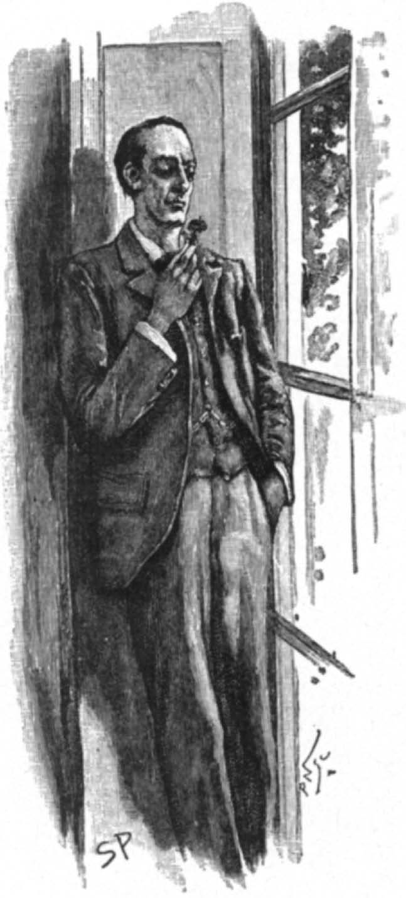

“哦，玫瑰这东西多可爱！”

他从长沙发前过去走到开着的窗口，伸手折起一枝弯垂的玫瑰，低眉欣赏绿叶红花。他性格中竟有这一方面，我觉得还是新鲜事，以前我从来不曾发现他对自然景物有过浓厚的兴致。

“没有任何事如同宗教那样需要逻辑推理，”他说道，背靠百叶窗，“逻辑推理可以由推理学家建立起一门精确的科学。我们确信上帝彰显的至善至美，据我看似乎就体现在花朵。所有其他一切事物，我们的权能、我们的欲望、我们的食物，以及所有生活必需品，仅为生存的起码需要。但是这玫瑰，这鲜花，则是完全不同的超然之物，味之芬芳、色之艳丽，给我们的生活增添善美，而并非是生活的条件。惟有善美才具有超然，所以我要说，我们从鲜花看到美好的希望。”

珀西·费尔普斯和他的护理人望着福尔摩斯发表宏论，两人脸上只露着莫名的惊诧和极度的失望。福尔摩斯陷入遐想沉思，手指夹着那枝玫瑰花。持续几分钟之后，年轻女士打破了沉寂。

“据你看有没有希望解决这个谜案，福尔摩斯先生？”女士问道，口气有点生硬。

“哦，这个谜案！”他回答，一经点醒重又回到现实中来，“唔，要是否认这个案子相当深奥复杂，那是不明智的。不过我可以答应我会深入调查，一有眉目就让你们知道。”

“你看到线索了？”

“你已经提供我有七个线索，不过当然，我必须验证，而后才能断定其价值。”

“你怀疑什么人？”

“我怀疑我自己。”

“什么？”

“怀疑下的结论太快。”

“那回伦敦去验证你的结论吧。”

“你的建议非常好，哈里森小姐。”福尔摩斯说，站起身来，“我说，华生，我们没有什么可做的了。不能叫你抱空心希望，费尔普斯先生，事情相当棘手难办。”

“我水深火热，盼着你呢。”这位外交官叫道。

“好，我明天还是这班车出来，虽然带来的消息未必是好消息。”

“上帝保佑你工作顺利，”我们的委托人喊道，“让我知道调查正在进展就是救我命。顺便说一下，霍尔德赫斯特勋爵给我来了一封信。”

“啊！他怎么说？”

“信上很冷淡，但没有严厉的话，我清楚，我重病在身，他才没有痛骂。他一再说，事情是极其严重的，还说我的前程无可挽回——意思指的，当然是我被革职——等我恢复了健康，再找机会弥补过失吧。”

“唔，情理之中，也考虑周到。”福尔摩斯说，“走吧，华生，回去有一整天工作等着要做呢。”

约瑟夫·哈里森先生用马车送我们到火车站。我们很快搭上朴次茅斯开来的火车。福尔摩斯依旧沉浸在深深的思考之中，几乎一句话也不说，直到过了克拉彭枢纽站。

“真是悦目赏心，进入伦敦的各条铁路线都是居高临下，能这样俯瞰房屋。”

我想他是在说笑，因为这景观实在不堪入目，但是他马上作了解释。

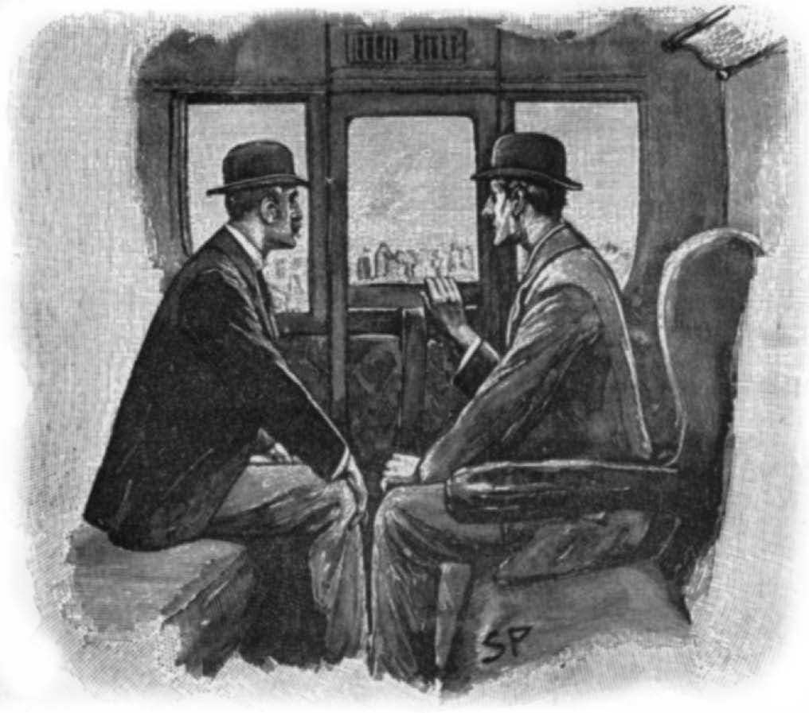

这景观实在不堪入目。

“看那些个巨大、孤零的房屋建筑，拥挤矗立在青石岩上，就像是一个砖瓦之岛露在铅灰色的海面。”

“看那是寄宿学校。”

“都是照明航程的灯塔，我说伙计！未来之光！每一所学校孕育着数以百计的光辉灿烂的小种子，要靠他们缔造一个未来更明智更富强的英国。看来那个人，费尔普斯，不是喝酒喝的吧？”

“我看他不像会饮酒。”

“我看也不像，可是我们应当把各种可能性都估计到。这个可怜人坠入深水奄奄一息，能不能把他救上岸真是个问题。哈里森小姐你怎么个看法？”

“个性很强的姑娘。”

“正是，可人挺不错，要不就是我看错人。和她哥哥是诺森伯兰那边一个制铁业老板的孩子，就兄妹俩。去年冬天，费尔普斯旅游的时候同她订的婚，把她带到家里来给家人认识，她哥哥一同陪来。不巧就遇上这个飞来横祸，她只得留下来护理情人。兄长约瑟夫，觉得这里起居舒适，也一起留下了。你看，我已经作了一点个别了解，不过今天得做一天的调查工作。”

“我的看病业务——”我刚想说。

“哦，假如你觉得自己的事比我这儿兴致更高——”福尔摩斯就粗声粗气抢说道。

“我是要说我的业务撂下一天两天没关系，反正这是一年中的淡季。”

“那，再好没有，”他说，又回复了高兴劲儿，“很好，我们一起来调查这个事。我在想先从福布斯开始，去找他。他能提供我们详细情况，看看哪里是突破口，好深入下去。”

“你说有线索了吗？”

“唔，我们有了几个，还要进一步调查才能确定有多少价值。案子最难办的就是犯罪动机不明，眼前这个并非动机不明，其中能得着好处的是谁？有法国大使，有俄国人，有出卖情报给他们的那个人，还有霍尔德赫斯特勋爵。”

“霍尔德赫斯特勋爵？”

“不错，可以想象，一个政治家出于自己的某种需要，也会不惜销毁文件。”

“具有光辉经历的霍尔德赫斯特勋爵也会这样做？”

“不无可能，不可轻信地排除，我们今天就拜访这位高贵的勋爵，看看他那里有多少情况可以告诉我们。实际上我的调查已经付诸行动。”

“已经动了？”

“对。我在沃金车站已经向伦敦各家晚报发电，各报都要刊登这份启事。”

他递给我一张笔记本上撕下的纸，上面用铅笔字这样写着：

五月二十三日晚九点三刻有马车载客至查尔斯街外交部门前或近旁下车，知情者请将马车号告知贝克街二二一号B，赏金十镑。

“你有把握贼是乘马车来的？”

“如果不是，也无妨。不过，假如费尔普斯先生讲的不错，办公室里、走道上都没有可以给人藏身的地方，那么贼一定是从外面进来。这么个下雨天的夜里从外面进屋，油地毡上又没有留下湿漉漉的脚印，才没几分钟时间就检查不到，那只能是唯一一种可能了，这个贼是乘马车来的。我想肯定是坐马车，这个推断万无一失。”

“听上去很有道理。”

“这是我要讲的一条线索，可以把我们导向某个方向。此外那个铃声，当然也重要——可说是本案最奇特的一点。为什么打铃呢？难道做贼还要虚张声势？或者另有谁同贼一起进来，打铃是为了阻止盗窃行为？或者纯属偶然？还或者——？”他随着思考的步步深入，又深潜到紧张的静思之中，我对他的习惯、情绪颇有了解，他可能豁然开朗，见到了新曙光。

我们三点二十分到达终点站，在小饭店匆匆吃过午餐，立即奔向苏格兰警场。福尔摩斯已经有电报给福布斯，所以福布斯正等着我们——他矮小，狐狸眼，面相尖薄、拒人。一听说我们的来意之后，态度更显得冷淡。

“你的工作方法我早有所闻，福尔摩斯先生，”他口气尖酸地说道，“你就是擅长利用警方供给你的所有线索，然后你自己设法了断案子，让警方出丑。”

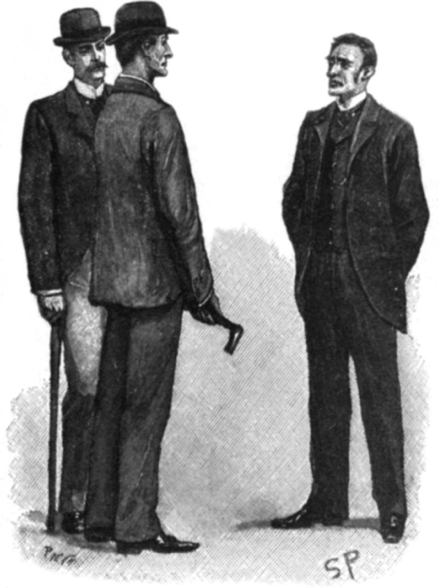

“你的工作方法我早有所闻。”

“事实恰恰相反，”福尔摩斯说道，“我过去破获的五十三件案子，只有四件归在我的名下，那四十九件案子全部算是警方的荣誉。你不知情我不怪你，你年轻，经验不足，但是你若是想在新职务上有长进，就同我合作，别拗着我。”

“本人乐意听你指教一二，”警探说，转变了态度，“不瞒你说，我在办案上至今还没有获得过荣誉。”

“这个案子你怎么进行的？”

“坦盖，那个门卫，一直盯他梢。他调离近卫团过来，名声很好，我们也找不到一点嫌疑。可是他妻子很不好，我考虑这事她应该知道，不会没有一点关系。”

“你盯住她了？”

“我们派女警探盯她梢。坦盖太太好喝酒，我们女侦探有两次乘她兴陪她一起喝，可是从她身上也探不出什么来。”

“听说旧货商要到她家去讨债？”

“是的，欠债都偿清了。”

“哪里来的钱？”

“这个没问题，门卫领了年金，他们家没有露出手头很阔的样子。”

“费尔普斯先生打铃要咖啡，是她来应差，她怎么解释？”

“说是男人太累，她想让男人多歇会儿。”

“噢，这个同过后发现门卫在椅子里打盹是一致的。这么说，除了女人性格有点不好，这一头就没有问题。你问她没有，那天晚上她为什么急急忙忙跑掉？那着急样子连警察都注意到了。”

“她比平时晚了，要赶紧回家。”

“你向她指出吗，费尔普斯先生比她至少晚离开二十分钟，怎么赶在她前头到了她家呢？”

“她解释说，她是乘的公共马车<a href="#part0072.xhtml_ch2"
id="part0072.xhtml_ch2-back">(2)</a>，比较慢，他们叫了汉森车<a href="#part0072.xhtml_ch3"
id="part0072.xhtml_ch3-back">(3)</a>，当然快。”

“她一到家直奔后屋厨房，说得清为什么吗？”

“因为她有钱放在那里，要去拿了付给讨债人。”

“问她的话她倒句句有对答。你有没有问，她离开的时候看没看见有人在查尔斯街上走？”

“她只看见警察，没见有旁人。”

“好，你对她的盘问可说很彻底。此外还做了些什么？”

“职员戈罗特这九个星期来一直受到跟踪，但是没有一点结果，我们没能发现他有什么问题。”

“还有吗？”

“哦，我们下面的步子迈不出去——一点根据也没有。”

“打铃这事，你好好想过是什么道理吗？”

“唔，我承认这个事真把我难住了，这个人倒是贼胆包天，来偷你还向你发警告。”

“是啊，确实很怪。谢谢你了，给我说了那么些情况，等我找出这个人就让你亲手去抓，我一定会通知你。我们走吧，华生。”

“我们现在上哪儿去？”离开警场，我问他。

“我们现在去拜访霍尔德赫斯特勋爵，内阁大臣，英国未来的首相。”很幸运，我们到唐宁街，霍尔德赫斯特勋爵还在办公室，福尔摩斯递进名片，我们立即受到召见。内阁大臣按照他一贯讲究的旧式礼节接待我们，引领我们在壁炉两旁豪华的沙发上坐下。他站在我们前面的地毯上，修长的身材，面目精明、严肃、富有智慧，鬈曲的头发已经过早灰白。看他仪态大方，气宇不凡，果然是个名副其实的尊贵人。

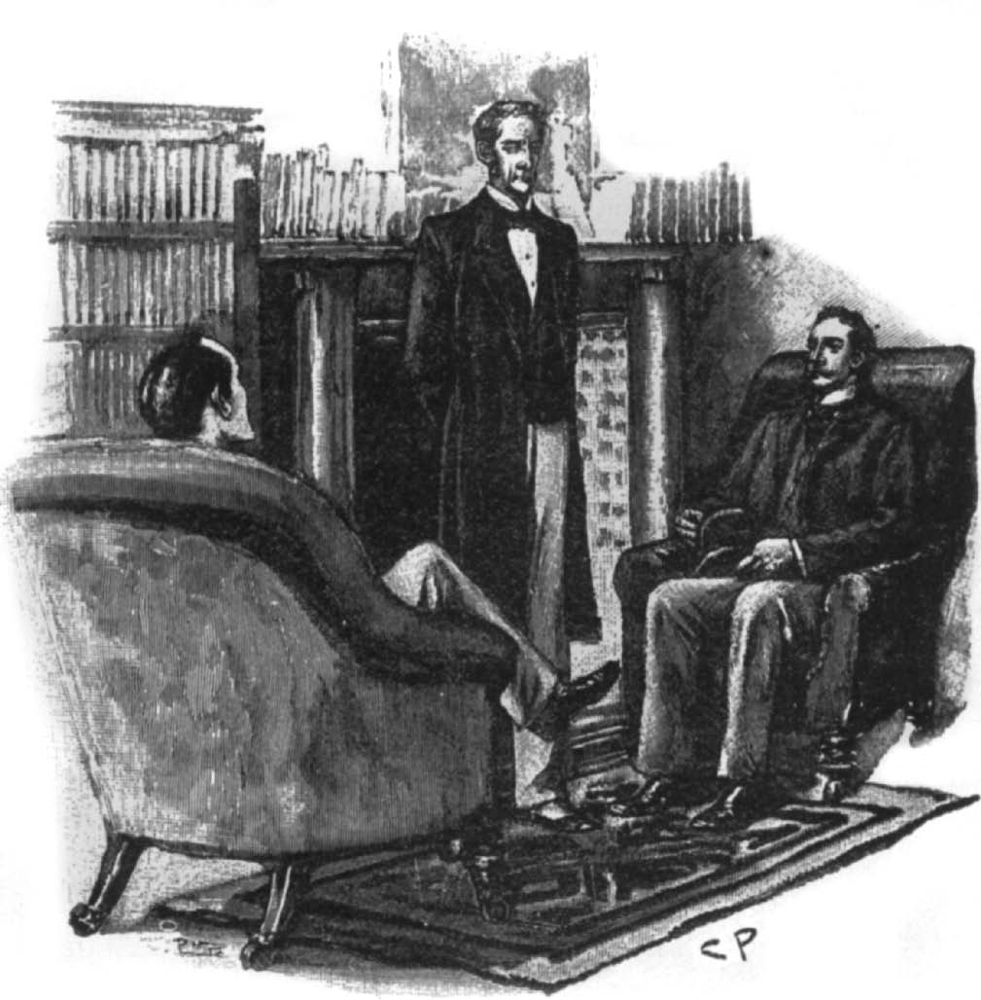

果然是个名副其实的尊贵人。

“我久闻你的大名，福尔摩斯先生，”他面露微笑说道，“两位来意不言而喻，我是清楚的，本部能引起你们关注的别无其他，仅有一桩案子。可否问一下是受了谁的委托来办理此案呢？”

“是受珀西·费尔普斯先生的委托。”福尔摩斯回答。

“噢，我不幸的外甥！你们能理解，就因为我们有亲属关系，所以更不允许我对他有丝毫的偏袒。我不讳言，这件事对他前程的不利影响，也就非同他人。”

“但是，如果文件找到了呢？”

“啊，那当然另作别论。”

“我这儿有一两个问题想要问你，霍尔德赫斯特勋爵。”

“我乐于尽我所能奉告有关问题。”

“你交代缮写文件的任务就是在这间办公室吗？”

“正是这里。”

“谈话不可能被外人听到是吗？”

“这绝对没有问题。”

“你有没有向别人提到过要吩咐人抄文件这个事呢？”

“从来没有。”

“能肯定吗？”

“绝对肯定。”

“好，既然你自己从来没有说过，费尔普斯先生也从来没有说过，也就没有别人知道这件事，那么贼到他办公室把文件窃走纯属偶然，是贼碰上机会顺手把文件拿走。”

内阁大臣笑了。“你说的这个已经超出我的职业能力以外。”他说。

福尔摩斯考虑了一下。“还有非常重要的一点，我想提出来和你商讨，”他说，“我知道，你很担心条约的内容透露出去，后果将是极其严重的。”

内阁大臣富有表情的脸上显出阴霾，“后果确实非常严重。”

“后果出现了吗？”

“还没有。”

“如果条约已经落到，比方说，落到法国或者俄国外交部的手里，你能够听到消息吗？”

“我能够听到。”霍尔德赫斯特勋爵正色道。

“既然，已经将近十个星期过去了，一点动静都还没有听到，就可以认为，条约并没有落到对方手里。”

霍尔德赫斯特勋爵耸了耸肩膀。

“我们很难想象，福尔摩斯先生，贼偷了条约是为了裱装起来挂在墙上。”

“也许，他是在待价而沽。”

“要是再稍等上一点时间，就要一文不值，不出几个月条约就不再是秘密了。”

“这一点非常重要，”福尔摩斯说，“另外，也不妨假设，窃贼忽然得病——”

“比方说，患上了脑炎，是吗？”内阁大臣问道，向他脸上扫了一眼。

“我没有这个意思，”福尔摩斯沉静地说，“好吧，霍尔德赫斯特勋爵，我们已经耽搁你不少宝贵时间，现在该向你告辞了。”

“祝你成功破案，不管案犯是什么人，一概绳之以法。”这位贵人送我们到门口，向我们点头说道。

“一位了不起的人物，”我们出来上了白厅街，福尔摩斯说道，“但是要保住他的位子，得有一番斗争。他贵而不富，开销需求倒是很多，你注意到了他的皮鞋底吗，是换掉旧的重新上的底。现在，华生，我不再耽误你的本职工作，今天马车启事没有回音的话，就无事可做。可是明天，要搭昨天同时间的火车到沃金去，你如果能同我一起，我一定对你极为感激。”

\*　\*　\*

第二天早上我们如约碰头，一同坐火车去沃金。登报启事没有回音，他说，案子这方面也就没有新的线索。他决心如此之大，脸绷得像呆板的印第安人毫无表情，从面容上我看不出他对案子目前的情况满意还是不满意。我只记得他说话谈到贝蒂荣人身测定法，对这位法国学者佩服、赞赏，无以复加。

我们看到委托人在护理人的悉心照料之下，看上去比以前好多了。见我们进去，他毫不费力地从沙发上起身来招呼。

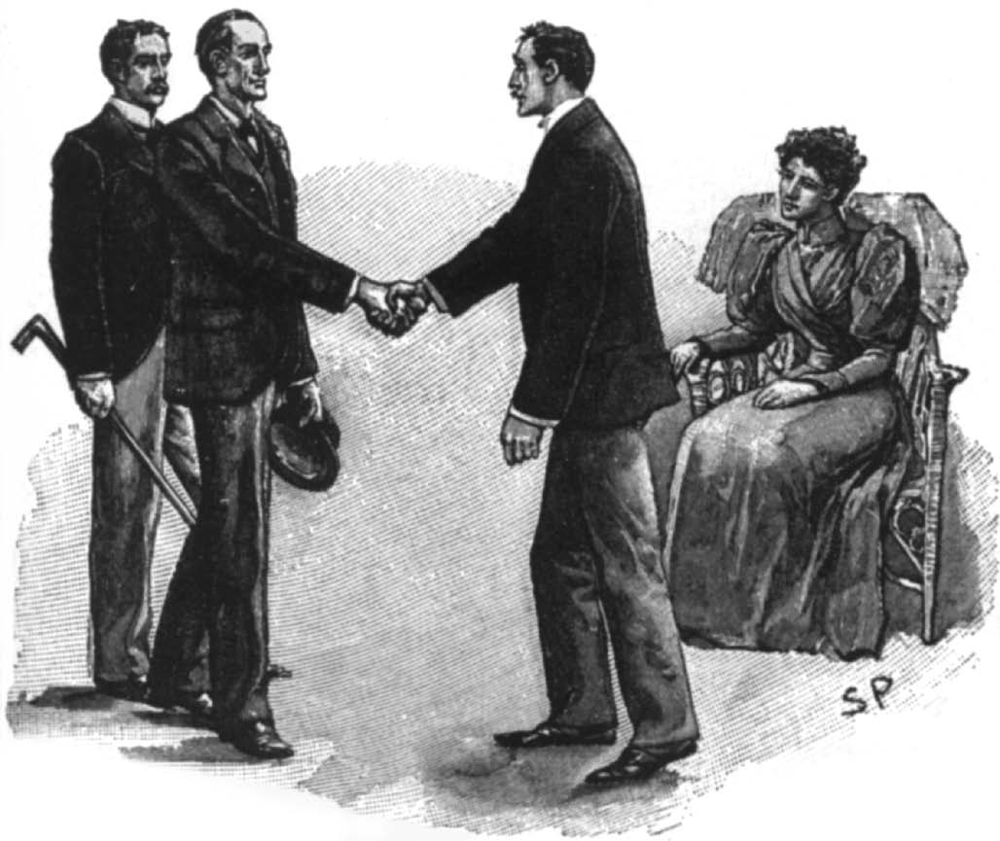

他毫不费力地从沙发上起身来招呼。

“有消息吗？”他急切地问。

“我的报告是，正如昨天有言在先，没有消息，”福尔摩斯说，“去看了福布斯，去拜访了你舅舅，有一两个关联的问题还要深入调查，可能由此发现情况。”

“你没有失去信心，这么说？”

“当然没有。”

“上帝保佑你！听你这么说，”哈里森小姐高声道，“我们要有信心，要有耐心，事情一定能够水落石出。”

“你没能说什么，我们可有事要告诉你呢！”费尔普斯说，重新坐回到长沙发上。

“希望你提供新的情况。”

“是呀，昨夜我们这里出危险了，出大事，还不是小事呢。”他的口气十分严重，两眼露出恐惧的神色。“你知道吗，”他说，“真想不到，我自己不知不觉成了什么大阴谋的目标了，不但要搞垮我，还要我的命呢！”

“啊？”福尔摩斯惊叹。

“讲起来也叫人不相信，左思右想我世上没冤家仇人嘛。可是昨晚上那个事，没办法有另外的解释。”

“请讲给我听。”

“你知道吗，昨天是头一夜，屋里我一个人睡，没再要护士陪。我觉得好多了，就想不用麻烦别人，不过夜里一直亮着灯。谁知，半夜两点，睡得不是很沉，忽然有轻轻的响声把我惊醒，像是老鼠在咬木板，我注意静听一阵，觉得是老鼠在一个劲地咬。过后声音越来越大，最后是窗上传来铁器喀哒一下刺耳的声响。我十分惊奇，坐了起来，这下我明白了是什么声音，起初是有人用东西撬进窗框的响声，后来是撬开插销的声音。

“然后停了十来分钟，是这个人等了一下，在探听动静有没有把我惊醒，然后就听见轻轻的吱嘎一声，窗慢慢地拉开。我忍不住了，因为我的神经已经不像以往那样能够耐得住。我跳下床，哗一下拉开百叶窗，一个人缩在窗下边。我看不太清楚，但他一转身飞快跑掉了。他兜着大披巾，把下半个脸全遮住，但有一样东西可以肯定，他手上有刀，看来像是一把长刀，他转身跑的时候我看见刀光一闪。”

“这个非常重要，”福尔摩斯说，“后来你怎么样，请讲。”

“要是身体好的话，我就跳窗追上去了。我跑不动，只好打铃，全屋子人都被叫醒。这中间稍隔了一点时间，因为铃在厨房，仆人都睡在楼上。我大声叫喊，把约瑟夫先叫了下来，他再去把别的人叫醒。约瑟夫和马夫在窗外花坛上发现有脚印，可是近来天气干燥，过了草地就跟踪不到脚印了。有一个地方，路旁隔离的木栅栏，有痕迹，他们告诉我，好像有人翻过去，翻的时候把木栅尖踢断了。我还没向本地警察报告，我考虑最好先听取你的意见。”

委托人讲述这个事，引起福尔摩斯很大的震动，他从椅子上站起来，在屋里走来走去，激动不已。

“真叫祸不单行。”费尔普斯道，笑了笑，很明显这场惊吓使他身心不宁。

“你很担着风险呢，”福尔摩斯说，“和我到屋子外面去走走，你行不行？”

“哦，行，我就是要晒晒太阳，约瑟夫也来吧。”

“我也去。”哈里森小姐说。

“你就别去了吧，”福尔摩斯说，摇摇头，“我的意思，请你就留在屋里坐着。”

姑娘坐回到椅子上，一脸的不乐意。她哥哥同我们一起，一共四个人，走出屋子。绕过草坪来到青年外交官的窗外，正如他说的，花坛上有脚印，但是都已经给弄模糊，无法辨认。福尔摩斯弯腰看了看，随即直起身，耸耸肩。

“这些没有用，谁也别想看得出什么来，”他说，“我们绕宅屋周围走走，看看是什么原因独有这间屋子夜贼有兴趣。照我想，该是客厅、餐厅这些大窗户，才对他更有吸引力。”

“直对着大路上，望过来容易看得见吧。”约瑟夫·哈里森先生提供解释说。

“啊，对了，是呀，这儿一扇门，他或许也试过能否打开。这是什么门？”

“这是边门，商贩进东西的时候走这个门，晚上是锁好的。”

“你以前遇到过这样的惊吓吗？”

“从来没有。”我们的委托人说。

“你屋里有没有金银器具，或者别的东西会招引盗贼？”

“根本没有值钱的东西。”

福尔摩斯在房屋边这么随便逛逛，两手插在口袋里，漫不经心、满不在乎的样子，这副神态在他并不多见。

“噢，对了，”他转向约瑟夫·哈里森说，“你说的，你发现栅栏那里，有贼翻过去的地方，我们去看看！”

这个胖青年领我们到那里，木栅栏一块板的顶端有断裂，断掉的小木片还垂吊在上面。福尔摩斯把木片折下，仔细察看。

“你认为是昨天夜里断掉的？折口很久了，不是新的，你看看。”

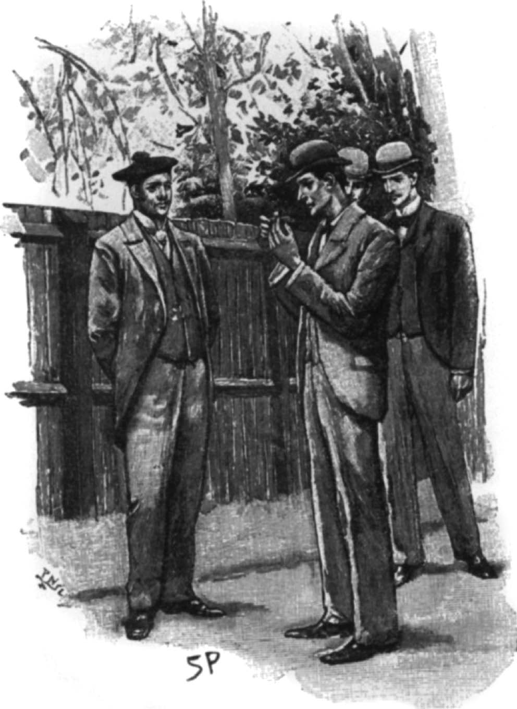

“不是新的，你看看。”

“哦，可能是。”

“这里也没有人翻跳过去的痕迹。不，我看这里不会有线索，还是回房间里去，把事情研究研究。”

珀西·费尔普斯只能慢慢地走，让未来的内兄搀扶着。福尔摩斯快步走过草坪，我们已回到房间的窗口，他们两个还远远落在后边。

“哈里森小姐，”福尔摩斯说，态度极严肃认真，“你白天一定要待在这里，守着，任凭有什么情况都不能离开，这是最最要紧，切记切记。”

“知道了，你吩咐的，一定照办，福尔摩斯先生。”姑娘惊奇地应诺。

“晚上去睡觉，离开这里，一定要在外面把门锁上，钥匙带好，照我的话这样做。”

“那珀西呢？”

“他同我们去伦敦。”

“就让我留这里？”

“这是为了他好，你这样是帮了他大忙。快！就这样说好了啊！”

她赶紧点点头答应了，这时那两个也进了屋。

“干吗坐着愁眉苦脸的，安妮？”兄长叫道，“到外面晒晒太阳嘛！”

“不要，谢谢你，约瑟夫。我有点头疼，这房间挺凉爽，我觉得舒适。”

“下面你的意思怎么办，福尔摩斯先生？”我们的委托人问道。

“是啊，至于这桩小插曲调查嘛，主要还是追住大目标，抓大头绝不放松。我的意思，看来你很有必要和我们一同到伦敦去。”

“就走？”

“唔，看你方便，越早越好，最好一个小时就走。”

“我感觉已经相当不错，只要于事有补，走吧。”

“于事大大有补。”

“那么说你让我今夜留在伦敦了？”

“我正要跟你说呢。”

“好哇，我那位夜猫子朋友再来光顾，鸟去笼空，叫他扑空。我们反正听你的就是了，福尔摩斯先生，你要我们怎么做，尽管讲。你觉得，要不要让约瑟夫也和我们一起走，好对我有个照顾？”

“哦，不必。我的朋友华生，就是医生，你知道的，他能照顾你。我们在这里吃午饭，如果你不碍事，过后三人一起动身进城。”

一切按照福尔摩斯的建议安排妥当，哈里森小姐也照着他的吩咐找个借口待在那个卧室不离开。我的朋友心里是怎么打算，我也想不出个所以然，看来好像要把姑娘同费尔普斯隔离开。费尔普斯的健康已稍有恢复，看到事情付诸行动，颇有兴奋感，在餐厅和我们一同用午餐。谁知，福尔摩斯居然出乎意外地来上一招，叫人大大吃惊。他陪我们到车站，送我们进车厢，突然轻轻宣布说，他不打算离开沃金。

“还有一两件事，我想了解清楚再走，”他说，“你不在，避开，费尔普斯先生，反而有利于我进行这个事。华生，到了伦敦，麻烦你替我多担待一点了，立即叫车带我们的朋友到贝克街，你要一直陪着他，我就会来见你们的。也是幸会嘛，老同学碰头在一起，一定有好多话要聊聊。费尔普斯先生今晚上就睡我的空房间，到明天吃早饭时间我就能和你们在一起了。有一班车，我八点钟赶到滑铁卢。”

“到了伦敦，我们怎么样进行调查呢？”费尔普斯拉长了脸问道。

“这个我们明天做，眼前我考虑这里的事刻不容缓。”

“你回布里尔布雷告诉他们，我想明天就回去。”费尔普斯叫道，火车开动驶离月台。

“我不一定回布里尔布雷。”福尔摩斯回答着，向我们高高地挥手，火车迅速驶出车站。

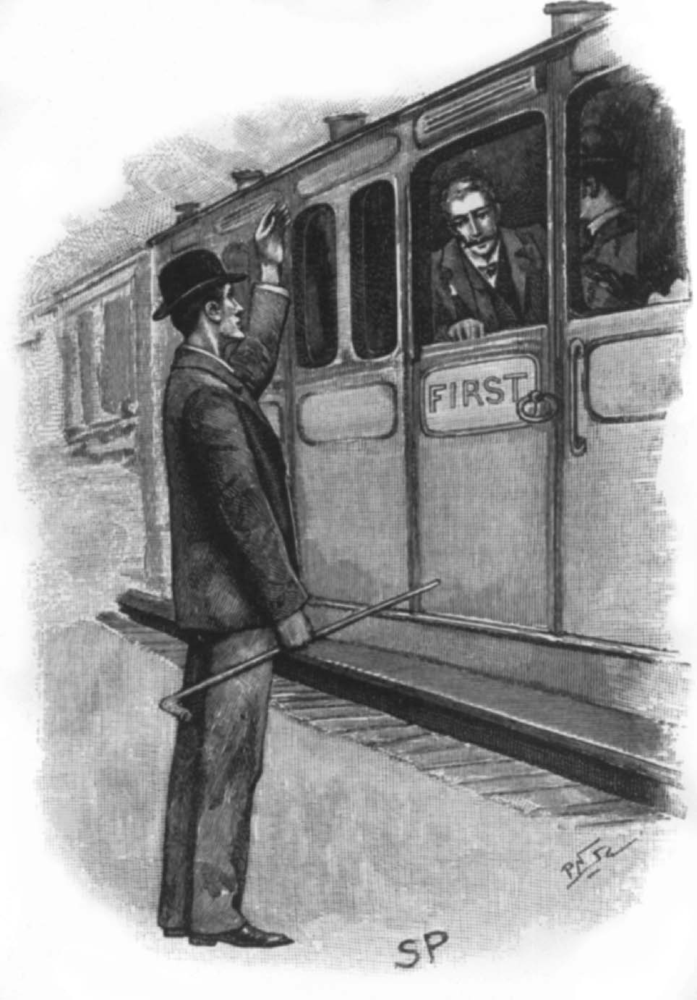

“我不一定回布里尔布雷。”

费尔普斯一路上和我谈论，福尔摩斯为什么临时变卦，我们两人谁也讲不出令对方信服的理由。

“我猜他要找昨天夜贼的线索，还不知是不是夜贼。我在想，那未必是一般的贼。”

“你自己是怎么个看法呢？”

“说句实话，你可能以为是不是我神经错乱，自己糊涂了。但我相信，有阴谋家在针对我实施险恶的政治阴谋，不知出于什么理由，我也难以理解，要谋害我的性命。这么讲，听起来太玄乎，甚至荒谬，但是看看事实！是贼的话，屋里根本没有东西可偷，他来撬我房间窗户干什么？手里还要拿一把长刀干什么用？”

“你肯定那不是撬门的撬棍？”

“哦，不，是一把刀，我看见，明明是刀刃的闪光。”

“有什么深仇大恨，要这样凶恶地对付你呢？”

“是啊，弄不懂呀。”

“那就是了，如果福尔摩斯也是同样看法，他的行动一定是为了这个，要不还能为什么？假定你的推测是正确的，那么如果昨天夜里想要加害于你的人，给他亲手抓住，就行了，一落手到底，也就逮住了盗窃海军协定的人。你想想，要说你有两个人在与你为敌，一个是盗窃你的文件，另一个是要你性命，这岂不荒唐！”

“但是福尔摩斯说他不到布里尔布雷。”

“我了解他不是一天两天了，”我说，“我深知，他这是对我们说说的，考虑不周到的事他从来不做。”这么谈着，话题就转向别处。

可是这一天把我搞得疲惫不堪，费尔普斯久病之后依然虚弱，不幸的遭遇使他变得容易紧张、激动。我给他讲许多我的往事经历，讲阿富汗，讲印度，讲社会问题，讲一切使他感兴趣的事，尽力给他调剂精神，但收效甚微。他一心挂念着丢失的条约，时时刻刻在疑问、在猜测、在思索福尔摩斯正做什么了，霍尔德赫斯特勋爵要采取什么步骤了，早晨会得到什么样的消息了。随着夜色深沉，他由激动转入异常痛苦。

“你对福尔摩斯深信不疑吧？”他问。

“我亲眼见他办过许多案子，非常出色。”

“可是如此复杂没头绪的案子，他还没有破过吧？”

“哦，不，我见过比你这个案子线索还要少的，他都能破了。”

“但是并非如此事关重大的案子吧？”

“这不太清楚。但我确实知道，他为欧洲三个王室办过攸关名声的案子。”

“你是了解他的，华生，他这个人如此不可思议，我怎么也摸不透他。你看他对这事有把握吗？你觉得这个事他有指望成功吗？”

“他没有说起。”

“那就是预兆不佳了。”

“完全相反。我有数，他没有线索，他总是说没有，有了线索，正有待最后完全肯定，他这种时候最沉默寡言。现在，我亲爱的同学，不要自己紧张，心神不宁，这对事没有好处。我劝你早早睡吧，养好精神，明天什么事都好对付。”

我好不容易劝我的同伴听我的劝告进房去了，但从他兴奋的情绪看，我知道他并没有心思睡觉。他这样的精神状态对我也有影响，使我在上半夜翻来覆去没法安睡，满脑子想着这件奇怪的案子，作出数十上百个假设，可是一个更比一个不能自圆其说。福尔摩斯为什么要留在沃金？为什么要叫哈里森小姐整个白天守着病房不走开？为什么他要如此小心翼翼不让布里尔布雷的人知道他还逗留在那儿呢？我竭力寻求对这些事实的解答，终于把我的脑汁绞尽而睡着了。

我醒来已经七点，马上下床到费尔普斯房里，发现他面容憔悴，筋疲力尽，一定是整夜没有睡着。他第一句话就是问福尔摩斯来了没有。

“他答应好要来，就会来，”我说，“稍早一点晚一点罢了，就会到的。”

我的话立刻兑现。八点刚过，一辆汉森车疾驶到门前，我的朋友从车上下来了。我们站在窗口，望见他左手缠着绷带，脸色冷峻而苍白。他走进屋里以后，稍过了一会儿才上楼。

“看他样子，斗败了，筋疲力尽。”费尔普斯高声说。

我也不得不承认给他说对了。“弄到最后，”我说，“看来案子的线索还是在城里。”

费尔普斯怨声叹息。

“谁知是好是坏，”他说，“我是抱着多大的希望等他回来啊。他的手昨天没有缠布嘛，怎么搞的？”

“你不是受伤了吧，福尔摩斯？”我朋友一进屋我就问他。

“没啥，不小心擦了点皮，”他回答，向我们点点头问个早安，“你这个案子，费尔普斯先生，确实比我调查过的案子都要曲折。”

“恐怕你也是心有余而力不足。”

“算是有了一次极为难得的经验。”

“绷带就是历险记，”我说，“情况怎么样，给我们说说？”

“先吃早饭，我亲爱的华生，要知道我今天早晨从萨里一口气赶了三十英里路。我登的马车启事没有回音吧？咳，是呀，不能老想着处处都顺利、事事都成功。”

桌子已经准备好，我正要打铃，哈德森太太就送来了茶点、咖啡，没几分钟，端上三份早餐。我们一齐就座，福尔摩斯狼吞虎咽；我望着他暗自疑惑；费尔普斯愁眉苦脸、垂头丧气。

“哈德森太太手脚利索，就是能应急，”福尔摩斯说，掀开一盘咖喱鸡，“她手艺花样不算太多，可是苏格兰妇女都一样，一顿早餐很有讲究。你那个是什么，华生？”

“火腿蛋。”我答道。

“好！你想来点什么，费尔普斯先生——咖喱鸡或是蛋，要就请自己动手？”

“谢谢你，我一点都不想吃。”费尔普斯说。

“哦，来一点！你面前那个，试试吧。”

“谢谢你，我真的一点都不想吃。”

“唉，那怎么成，”福尔摩斯说，做个鬼脸眨眨眼，“我想，你总不能拒绝我的一番好意吧？”

费尔普斯动手掀盘。刚一掀开，他发出一声惊叫，坐在那儿愣瞧着盘中物，脸色同瓷盘一样刷白，原来，盘子正中间放的是一个蓝灰色小纸卷。他一把抓起，两眼快看如狼吞虎咽一般，接着把纸卷紧贴胸前，高兴得在屋里手舞足蹈起来，欢呼雀跃，如痴如狂，然后他一下子倒在了扶手椅中，由于激动过分，人都瘫掉了。我们赶快倒白兰地给他喝，免得他昏厥过去。

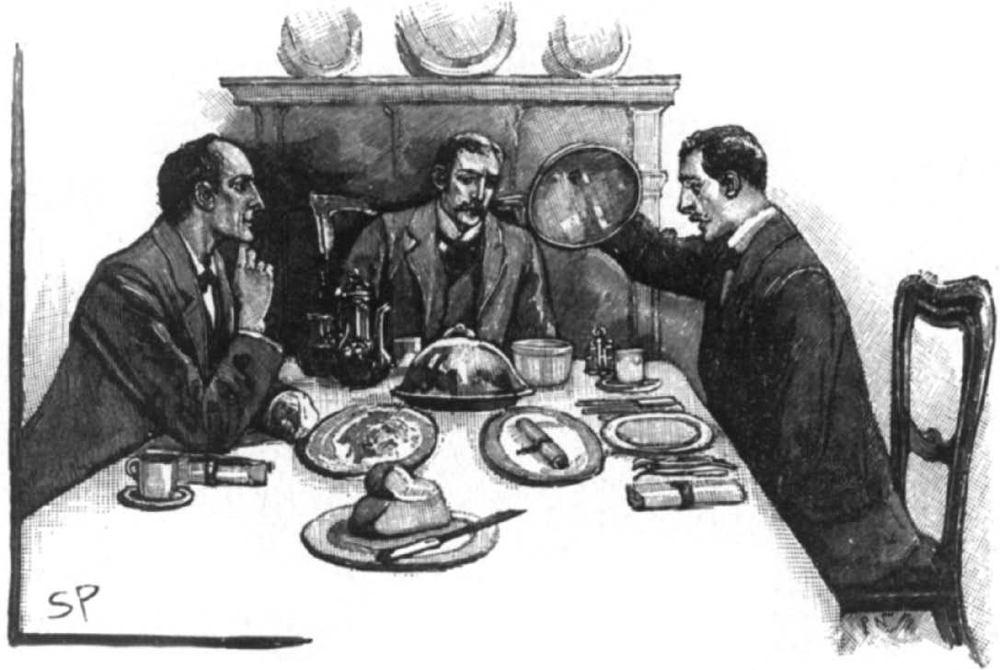

刚一掀开，他发出一声惊叫。

“好啦！好啦！”福尔摩斯轻轻拍拍费尔普斯的肩膀，安慰他说，“像这样突然跳到你面前，有些恶作剧，不过华生会告诉你，我总是喜欢让事情带点儿戏剧性，好玩。”

费尔普斯抓起他的手来不住地吻着。“上帝保佑你！”他叫道，“你挽救了我的荣誉。”

“是呀，这也关系着我自己的荣誉呢，要知道，”福尔摩斯说，“请你确信一点，我如果办案失败，也就像你受托重任而失事一样，是非常糟糕的。”

费尔普斯把这份失而复得的文件珍藏在上衣内口袋里。

“我是不忍心打扰你用餐，可我也忍不住要知道你是怎么到手的？从哪里弄回来的？”

福尔摩斯喝了一杯咖啡，又吃了点火腿和鸡蛋，然后起身，点着烟斗，安安稳稳地坐在椅子上。

“我给你讲讲先做了些什么，后来再怎么做。”他说道，“车站上和你们分别以后，我回头步行，一路轻松愉快，欣赏萨里的优美风景。走到了一个叫里普利的小村，在一家小客店用了茶点，然后做好准备，把扁瓶灌满水，口袋里塞好纸包三明治。我逗留到傍晚，才开始向沃金跑。跑到布里尔布雷宅园外面的公路上，太阳正好下山。

“好，我就等着，直到公路上一个人影也没有——依我看，这条公路本来就没多少人过往——就翻过栅栏，进入宅园地。”

“宅园大门一直是开着的呀！”费尔普斯脱口说道。

“知道，可是我就喜欢这样做。我选了一处地方，那儿有三棵大枞树，靠树作掩护，走过去，屋子里的人就不会发现我。我躲在一旁灌木中，由一丛灌木爬向另一丛灌木——瞧我裤子膝盖磨的这个脏样子，就是明证——直爬到那丛杜鹃花旁边，正对着你卧房的窗口。我在那儿蹲下来，等着看动静。

“你的房里窗帘没有放下，我看见哈里森小姐坐在桌边看书。十点一刻，她合上书，关好百叶窗，退出卧室。

“我听见她锁上房门，听得很清楚，她拿钥匙转了门锁。”

“钥匙！”费尔普斯脱口叫道。

“没错，是我关照哈里森小姐，去睡觉的时候把门从外边锁上，钥匙要带好在身上。她照我的话做，一点不打折扣。你可知道，如果没有她的合作，你就拿不到你现在衣袋里的这份文件啦。她离开了，灯光也没有了，我还是等在杜鹃花丛里。

“月夜清朗，可是守夜还是很难熬的，不过到底还有钓鱼人的那点兴奋感，静静守候在水边等大鱼来上钩。时间过得好长好慢，然而——几乎跟那次一样长，华生，那次侦破‘花彩绷带案’，比起来本案是小案了，你和我一起等在那间杀人凶屋，有同样的感觉。听着沃金教堂的钟声一刻一刻地敲过去，一次又一次地担心，不要就此没事，白守了。最后，大约凌晨两点，我忽然听到轻轻的响声，是拔掉门闩，用钥匙开门。顷刻间，仆人进出用的门开了，是约瑟夫·哈里森先生，跨出门，来到了月光下。”

“约瑟夫！”费尔普斯脱口惊叫。

“他光着脑袋，肩上撂着黑披巾，一有动静，可以随手拿起来把脸蒙住。他蹑手蹑脚沿着墙根阴影走，到了窗前，拿一把长薄刀插进窗框，把销子拔掉，拉开窗，再拿刀撬进百叶窗缝隙，又撬掉销子，百叶窗也立即推开。

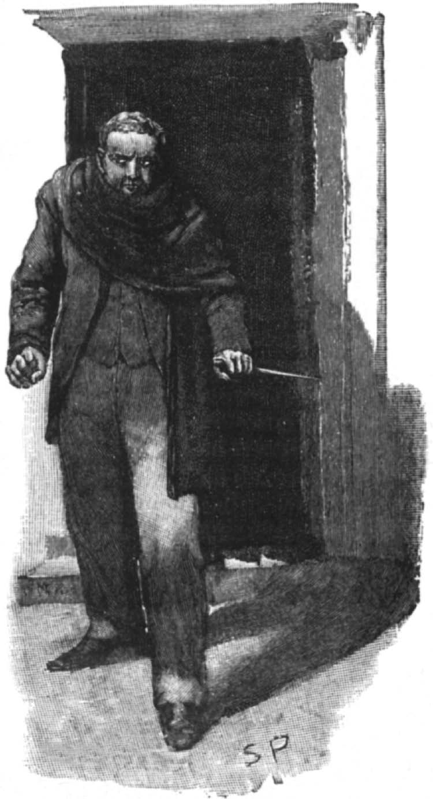

他光着脑袋，肩上撂着黑披巾。

“从我藏着的地方可以看到房间里面，看清楚他的一举一动。他把壁炉架上的两支蜡烛点亮，马上去把靠近门边的地毯卷起一角。他蹲下身揭起一块方木板，通常都是留出这么个空档便于管子工安装煤气管道接头用的，木板盖住T字形煤气管，由接头接出管子向下通入厨房。这就是他藏物的地方。他从里面取出这个文件小卷，然后把木板盖好，铺平地毯，吹灭蜡烛，就这样，末了他人赃直接落入我的手中——我正站在窗外将他迎个正着。

“嘿，这位约瑟夫先生，比我想象的凶恶得多，他拿刀劈过来，我一来一去就按住了他，把他反压在地上，我指关节划破了一点。结束搏斗，他乜斜一只眼来看着我，杀气腾腾。我迫使他老实，他遵从我的话，把文件交出。我文件一到手，就放他跑了。但是今天一早我给福布斯发了详情电报，只要福布斯行动迅速，就可以把他的要犯捉拿归案，让他如愿以偿。可是我不妨预言在前，等他这号人去候贼，贼早已逃掉。但是那样的话，实际上对政府当局倒是不无好处。我在想，在霍尔德赫斯特勋爵方面，还有就是你，珀西·费尔普斯先生，都宁可不要经过治安法庭为好。”

“我的上帝！”我们的委托人喘气道，“难道说，我吃苦足足十个星期，失窃的文件始终一直同我在一个房间里？”

“正是这样。”

“这个约瑟夫！约瑟夫这个流氓，这个贼！”

“咳！看来，约瑟夫这个人，他的内心比外表更阴毒、更危险。夜来听他自己招认的那意思，我才晓得，他炒股票亏了血本，为了要翻身，不惜铤而走险。他是个极端自私自利的人，只要有好处到手，根本不顾自己妹妹的幸福，也不考虑你的声誉、前程。”

珀西·费尔普斯沉沉坐回他的椅中。“我的头天旋地转，”他说，“听了你的话，我都发晕了。”

“你这个案子最大的困难，”福尔摩斯说道，像是在讲课的模样，“在于线索、头绪太多。最关键的事实被不相干的事实掩盖掉。面对呈现在我们面前的许多事实，必须筛选出我们认为是关键的问题，然后把它们理出次序串成串，重新构建事实原貌。我从起初的一件事实就怀疑上了约瑟夫，就是那天晚上你原是准备和他一同乘火车回家，那么他很可能会来找你，还熟悉外交部，所以是顺理成章的事。我听你讲有人伺机要翻进你卧室来，那就只有约瑟夫，不可能是旁人，在你房里藏着东西——你陈述中讲到过，大夫陪你回家，约瑟夫的房间立即让出来给你住——我的怀疑也就立即得以肯定，尤其是，护士不值班的头天夜里，他就赶快乘机动手，说明这个夜贼是屋子里的人，处处熟悉。”

“我真是瞎了眼！”

“根据本案事实，我还原作案过程，是这样的：这个约瑟夫·哈里森，从查尔斯街便门进入外交部。他熟悉路径，便直奔你办公室，这时候你正巧离开。他一看没人，就打铃，正是打铃这时候，眼睛看到了桌上这份文件。一看之下，原来是一份有很大价值的国家文件，正是大好机会，他立刻藏进衣袋，随即跑掉。这仅是几分钟之间的事，你记得吗，后来是睡眼蒙眬的门卫意识到铃响问你，才引起你注意，这点时间足够让贼逃跑。

“他抓紧赶上一班火车就回沃金，将偷来的文件仔细一看，竟是如此重要，等于无价之宝。他先找个保险的地方藏起来，准备等一两天就取出，交到法国大使馆，或者别的什么地方，只要能高价脱手就行。紧接着你突然回家，他措手不及，匆忙之间搬出屋子。从此以后，屋里日夜至少连你有两个人在，他没有办法取出珍宝。碰上这种情况叫他急得简直要发疯。好不容易等到了机会，他企图潜入房内偷走，谁知你没睡着，事情又不成功。你可能记得，你平时吃的药这天晚上没有吃。”

“记得。”

“我估计他在药里做过手脚，增强药效，指望你夜里睡不醒。我当然料定他还要伺机而动，只要没有危险一定再干。你离开卧房，在他是求之不得。我叫哈里森小姐白天守在房里，他就没法乘我们不在先下手拿走。但让他觉得夜里干贼活平安无事，我可是在暗里盯住他，这情况前面都说过了。我早料到文件多半就在屋里，但是考虑不宜大动干戈来寻找，要叫他自己从暗藏的地方取出来，省得我多费手脚找麻烦。还有哪些问题我没有讲清楚的吗？”

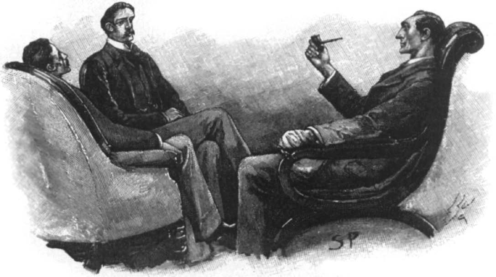

“还有哪些问题我没有讲清楚的吗？”

“头天夜里他干吗要撬窗呢，”我问，“他不能开门进房间吗？”

“开门，他得经过七间屋子，翻窗的话，只经过草坪。还有问题吗？”

“你不认为，”费尔普斯问道，“他有行凶的动机吗？那把刀就是手持凶器。”

“有此可能，”福尔摩斯答道，耸耸肩，“我只能有把握说，约瑟夫·哈里森先生是一位梁上君子，我绝对不相信他这种人会心慈手软。”

（1893年）

————————————————————

<a href="#part0072.xhtml_ch1-back" id="part0072.xhtml_ch1">(1)</a> 胡格诺派（Huguenot），16至17世纪法国新教派（与英国新教均属加尔文宗），向天主教夺权，反对国王专制，引起长期内战。

<a href="#part0072.xhtml_ch2-back" id="part0072.xhtml_ch2">(2)</a> 公共马车（bus），伦敦1897年开始有公共汽车，此处的bus是公共马车，一种双层车厢的马车，后部有舷梯，行驶固定路线。

<a href="#part0072.xhtml_ch3-back" id="part0072.xhtml_ch3">(3)</a> 汉森车（hansom），御座高居车后的双轮双座轻马车，以此车设计人命名。

# 最后一案

我怀着沉重的心情拿起笔来写下这最后的一案，把我的朋友歇洛克·福尔摩斯独特的天赋才能再作记载。我曾经竭尽绵力把参与他刑侦的奇异经历写下来，从开始一起住的时候跟随参与的第一案“血字的研究”，直到后来侦破“海军协定”这一要案——该案及时防止了挑起一场严重的国际纠纷。但是我深深感到，写的东西总是又凌乱又不充分。我原打算到此为止，对某个造成我一生惆怅的案件不再提起，但时光流逝，两年来惆怅与空虚无以填补。最近有人写信，迫使我不得不拿起笔来，是詹姆斯·莫里亚蒂上校发表信件为他已故兄长强词辩护，对此我除了将所发生的事如实公之于众，别无选择，因为我是唯一掌握全部事实真相的人。我觉得这样也好，时机终于到来，好心不被好识，那就再无必要为之遮遮掩掩。就我所知，报上公开报道的只有三次，即：一八九一年五月十六日的《日内瓦时报》；五月七日路透社电讯英文稿；最后就是近日这批信件。其中，第一次和第二次的报道极其简略，而最后的信件，我需要指出，那是完全不符合事实的。我有责任将莫里亚蒂教授和歇洛克·福尔摩斯先生之间所发生的真实情况，作首次披露。

读者都还记得，自从我结婚以后，接下去就是开业行医，福尔摩斯和我之间极为亲密的关系也就渐渐疏远。不过当他感到需要一个搭档进行破案工作，便不时来找我，然而这样的情况也变得越来越少了。到一八九〇年这一年，我看看只记录了三件案子。这一年的冬天到一八九一年开春，我从报上看到他为法国政府所聘负责一桩重大案件的侦查工作，我接到过两次福尔摩斯给我的信，一次发自纳尔榜，一次发自尼姆。这样，我估计他在法国很可能要待上一段长时间。谁知，四月二十四日晚上，大大出乎我的意料，看见是他走进我诊所来了，还叫我吃惊的是，他比以前更苍白而消瘦了。

“是的，我这一阵来搞得心力交瘁，”他看着我的脸色，没等我开口就说道，“最近我有点小被动，小危机。把百叶窗关起来，不碍事吧？”

屋子里只有桌上一盏灯亮着，刚才我就在灯下阅读。福尔摩斯贴墙走过去，把百叶窗合上，插紧插销。

“你是在怕着什么吧？”我问。

“是的，害怕。”

“害怕什么？”

“怕气枪。”

“我亲爱的福尔摩斯，你在说什么？”

“我知道你很了解我，华生，了解我绝不是个神经过敏的人。但是我得说，危险逼近你身边还不承认，那就不是勇敢，那叫愚蠢。麻烦点个火柴好吗？”他深深吸一口香烟，才似乎觉得心神安定。

“我这么晚来打扰你，很抱歉，”他说，“我还有事要求你，破个常规，待会儿我到你后院，得翻墙离开你家。”

“出了什么事啦？”我问他。

他向我伸出手，我借着灯光看见他两个指关节有伤，在出血。

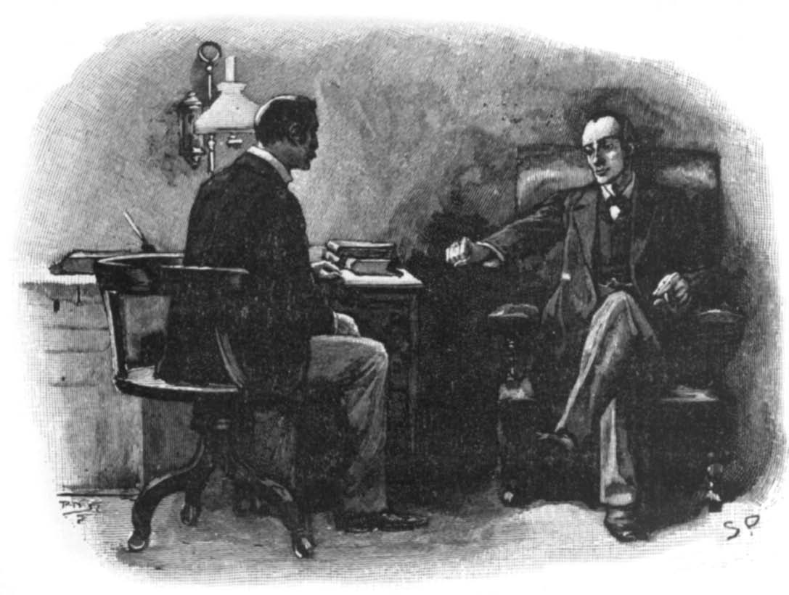

两个指关节有伤，在出血。

“你瞧，并非我虚张声势吧，”他说，微笑着，“这可是真家伙，都能把手剁掉。尊夫人在家？”

“她不在，做客去了。”

“是吗！就你一人？”

“就我一人。”

“那我好说了，建议你和我一同到大陆去旅行一个星期。”

“到什么地方？”

“哦，随便什么地方，我是哪儿都没关系。”

这里头的事情很有些奇怪，完全无所事事地去度假，福尔摩斯从来没有这种兴致，再看他苍白疲倦的面容，都告诉我他神经紧张到了极点。他从我眼睛里看出我有疑问，便把胳膊肘在膝头一撑，十个指尖对顶，向我解释他面临的紧迫情势。

“你可能从来没有听说有个莫里亚蒂教授吧？”他说。

“没听说过。”

“唉，真叫社会之大无奇不有！”他大声说，“这个人，伦敦一霸，可是无人知道他，这就使他的犯罪纪录达到登峰造极的地步。我告诉你，华生，一点不夸张，如果我能制伏他，为社会清除掉这个大害，那我这辈子的事业也算是登峰造极了，然后我就准备换一种安静的生活方式了。有件事只能跟你说说，最近我为斯堪的那维亚王室和法兰西共和国办的那几件案子，使我能够如愿以偿，过着自己向往的安静生活，可以集中精力搞自己的化学研究。可是我没法安逸过日子，华生，只要一想到莫里亚蒂教授这么个人还在伦敦到处横行无忌，我就坐立不安。”

“他到底干了些什么坏事呢？”

“看他的履历，不是个等闲之辈。他出身世家，受过最高教育，有非凡的数学天赋。二十一岁的时候，就写出一篇关于二项式定理的论文<a href="#part0073.xhtml_ch1"
id="part0073.xhtml_ch1-back">(1)</a>，曾经扬名整个欧洲。凭借这一点在我们一座大学院里获得教授头衔，很显然，他是前途无量了。可是此人继承他先祖如魔鬼性恶的一面，全身奔流着的血液中是犯罪的血缘，再加上具有人所不及的高智慧，他恶的本性非但没有收敛，反而变本加厉，有无限的危害性。他在大学城里恶名昭彰，最终放弃头衔，辞去教职，来到了伦敦城。在伦敦给他当上了军事教练，一般就只知道这么一点，但是我现在要跟你说我自己发现的他的情况。

“你是清楚的，华生，我掌握着伦敦高层次的犯罪活动，没有人比我更了解的。最近这些年来，我一直意识到犯罪活动有一种背景势力，有组织的势力，根子很深，给作恶歹徒扛着盾牌，法律都奈何不了他们。各种犯罪案子层出不穷——造伪币案、抢劫案、谋杀案——我深深感觉到有这股势力的存在。而且，推论起来可想而知，由这股势力操纵着的案子，未被发现的，我还不知道、无法亲手去处理的，不知有多少。我已经努力多年，要揭掉掩盖犯罪、保护罪犯的黑幕，最后，好不容易总算给我抓住线索，千回百转顺藤摸瓜，找到了那位数学大师、前教授莫里亚蒂的头上。

“他是罪恶王国的拿破仑，华生。这个大城市，犯罪数量之中有一半，还有几乎所有破不了的刑案，罪魁祸首都是他。他是个鬼才、诡辩家、挖空心思的思想家。他的脑子高度发达，人类中一流的。他一动不动，像蜘蛛居于网中心，网丝辐射四面八方，有一丝微微颤动，立即洞察一切。他自己只须动脑，不须动手，手下拥有众多党羽爪牙，组织严密，训练有素。有什么罪行要干，有什么机密要窃取，看中哪一户去打家劫舍，哪个人要除掉，爽快得很——只要有教授说一句话，马上动手，立见成效。党羽爪牙即使被捕，可以花钱保释或者辩护，而控制他们的核心人物永远抓不到——连嫌疑也沾不上边。他们的组织情况我估计得到，就是这样，华生，我是千方百计要把它揭发，把它摘除。

“可是，教授戒备森严，采取极周密狡诈的防范措施，我怎么也无法抓到他的罪证，把他告上法庭。我的一点能力，你是知道的，亲爱的华生，和他较量三个月，到末了不得不承认，我在智力上棋逢敌手。厌恶归厌恶，我实在也佩服他智谋高超。可是最后，他终于露出破绽——真正只是极其微小的破绽——然而，在我这么紧逼住他的时候，也就只要一点小破绽就够他受了。我抓住机会，从这一点突破，向他张网，现在已经一切就绪，可以收网了。三天以后——就是说，到下星期一——瓜熟蒂落，这位教授连同他的同伙，将被警方一网打尽。然后就是一场世纪大审判，有四十多桩大悬案得以告破，他们全部要被处以绞刑。但是如果我们行动稍一不得法，你知道，即使到最后关头，他们都能从我们手上滑掉，溜之大吉。

“唉，如果一切事情做得不动声色，不惊扰莫里亚蒂教授，那就大功告成了。可是他实在诡计多端，我一步一步张网向他围上去，他步步都知道。他一次次想破网脱逃，我一次次把他拦住。告诉你，我的朋友，把这悄无声息的战斗全部写下来，那在刑侦史上就能占一席之地，还是明枪暗箭你来我往精采极致的篇章，因为我从来没有同哪个对手如此斗法，斗得上天入地。我是棋逢敌手，可我的棋就是高他一着。到今天早上，实施了最后步骤，再有三天工夫就可以收网了。我稳坐家中，正把事儿琢磨着，屋门打开了，莫里亚蒂教授站在了我的面前。

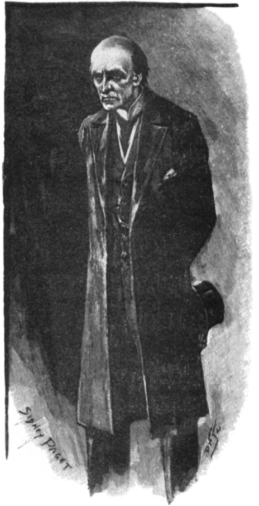

“莫里亚蒂教授站在了我的面前。”

“我的神经算得上坚强，华生，但是不瞒你说，一看到这个令我耿耿于怀的人忽然站在门前，着实吃了一惊。他的容貌我是熟悉的。他特别高而瘦，额头隆起发亮，双目深陷，胡须刮得干干净净，面色苍白，像个苦行僧，却不失他教授的风度。由于伏案工作太多，有点驼背。他脑袋前冲，左顾右盼个不停，慢慢吞吞，疑疑惑惑，可怖如爬虫类。他睻缝起两眼，奇怪地盯住我。

“‘你的前额，不像我原以为的那么发达，先生，’他终于开口，‘在睡衣口袋里摸弄上了膛的枪，这个习惯太危险了。’

“没错，他一进来，我马上意识到自己面临杀身之祸，他要摆脱困境，只有叫我闭嘴出不了声。所以我转眼间已经拉开抽屉，一下子拿枪放进口袋，隔着衣服把枪对准他。现在既然他这么说，我就干脆把枪拿出来，机头扳开放在桌上。他一直在微笑，眨着眼，可是眼神歹毒。幸好有枪，让我心定，有备无患。

“‘你显然不了解我。’他说。

“‘完全相反，’我对他说，‘我认为，我已经对你有充分的了解。请椅子上坐，有什么话要说，我可以给你五分钟的时间。’

“‘我要讲什么，你心里已经有数了。’他说。

“‘那么，我怎么回话，你也应该有数。’我对答。

“‘你不肯让步？’

“‘绝不。’

“他刷地一下子把手插进口袋，我立即拿起桌上的手枪。不料他只是掏出一本备忘录，上面潦草地记着一些日期。

“‘一月四号，你挡我去路，’他说，‘二十三号，你又碍我手脚；二月中，我全给你搅乱；三月底，我几项计划被你破掉；到了现在，四月将尽，我看看自己，处境危难，已经走投无路，你逼人太甚，你逼得我忍无可忍。’

“‘你打算怎么样呢？’我问他。

“‘你必须住手，福尔摩斯先生，’他扭着一张脸说，‘真的必须住手，告诉你说。’

“‘等过了星期一吧。’我说。

“‘啊，啊！’他说，‘我完全肯定，智力如你这样的人，应当看到事情这么下去结局只有一种。你该适可而止了，你把事情做到这个份上，我们只有一条路可走。我眼见你有办法，事情搅烂在你的手里，我且当作智力游戏。实话告诉你说，要我采取极端措施，倒也令我痛心呢。你别笑，先生，我还是要向你正告，绝非说说而已。’

“‘干我这一行，与危险同行。’我告诉他。

“‘不是危险，’他说，‘而是彻底毁灭。给你断掉路的，不单单是一个人，而是一个强大的组织。你虽然聪明过人，但是这个组织范围之广大、力量之雄厚，非你所能想象。你站开点吧，福尔摩斯先生，否则别怪人把你踩个稀巴烂。’

“‘哦，别忘了，’我说着，站起身，‘谈话谈得够有趣，我差点忘了还另有重要事情等着去办呢。’

“他也起身，望着我，默默不语，摇摇脑袋。

“‘那，好吧，’他终于又说，‘看来很遗憾，不过我这里已经仁至义尽。你的把戏一招一式我都清楚，星期一以前你不会得逞。这是一场你死我活的决斗，福尔摩斯先生。你想把我置于被告席去受审，可以告诉你，我永远不会站到被告席上。你想击败我，告诉你，你永远休想击败我。你要是有本领足以叫我毁灭，放心吧，你将和我同归于尽。’

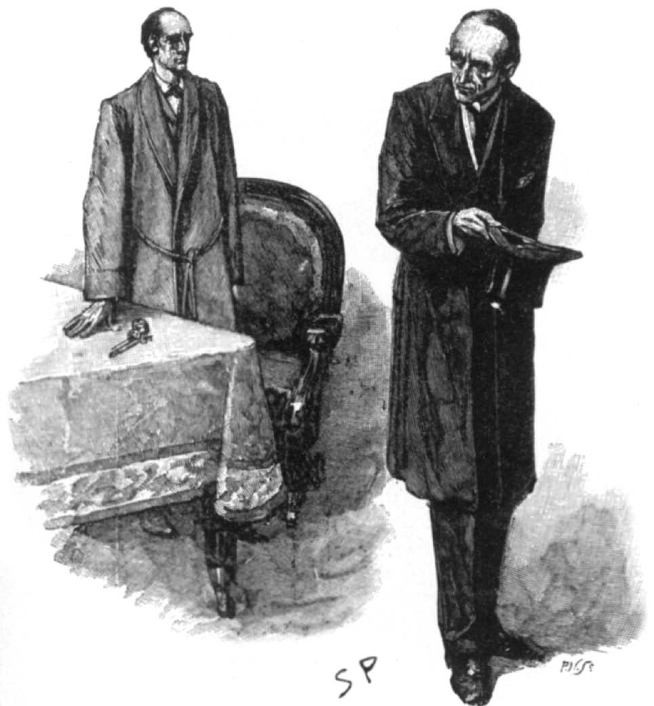

“放心吧，你将和我同归于尽。”

“‘你对我真是过奖了，莫里亚蒂先生，’我说，‘让我也来敬告你一句，告诉你吧，只要确保将你剪除在先，那么为了维护社会大众的利益，我必继后不惜和你同归于尽。’

“‘我最多同归于尽，休想我死你活。’他吼叫着，转身驼背朝我，眨眼怒气冲冲走出屋子。

“这就是我和莫里亚蒂教授的一次会见，别开生面。说真的，我心里很不是滋味。他讲话平静、干脆，叫人相信他所讲当真，并非宵小无赖随口胡言。当然，你要说：‘为什么不报警防着点呢？’道理是我确信他会叫党羽来对付我，我有充分证据证明他一定会这样做。”

“你已经受到攻击了？”

“我亲爱的华生，莫里亚蒂教授对这种事是言必行、行必果。有天中午我到牛津街处理点事，刚走过本廷街拐到韦尔贝克街十字路口的转角，忽然一辆双马货车直对我冲过来，如迅雷不及掩耳。我一闪身跳上人行道，千钧一发，幸免于难。货车冲过马里利本巷，转眼就跑掉了。有了这么一下，我便只走人行道，华生。可是，我走到了维尔街，从一幢房屋顶上飞下一块砖头，落在我脚旁砸得粉碎。我叫来警察，检查那个地方，屋顶上堆满修房用的石板和砖头，他们对我说是风刮的，有块砖掉了下去。我心里当然很明白，可就是拿不到一点证据。这以后我雇了马车，到蓓尔美尔街我哥哥家，在他那儿待过白天。刚才上你这儿来的路上，又遭到一个暴徒拿大头棒袭击我，反给我打倒在地，警察把他拘留起来。但是，我可以绝对肯定地跟你讲，路上的这位先生，我一拳打在他的门牙上，我的指关节都打破了皮，而那个退职数学教授，他，我敢说，这会儿正在十英里外的黑板上演算题目呢，这两个人之间，不可能查出有任何一点联系。这样，你就不会感到奇怪了，华生，为什么我一进你屋子，先把百叶窗关上。我没有办法，还要叫你让我离开这里，不走前门，设法打后屋出去，以免被人注意。”

我向来钦佩我朋友的无畏勇气。他坐在那里，平静地叙说着危险事一件件接连发生，听得我惊心动魄，这一天简直就成了恐怖的一天。

“今晚上你就在这儿住吧？”我问道。

“不，我的朋友，我对你是个有危险的客人。我已经作好计划，一切都能顺利进行。水到而渠成，警方可以出动捕人了，不需要假手我的帮助，只是以后有待我出庭作证就行。有鉴于此，我已无事要做，离开数日为好，保持平静状态，以便警察放手行动。所以我说，如果你能同我一起到大陆旅行一趟，是我最为祈望的。”

“最近业务比较清闲，”我说，“还有一位邻居可以委托照应，我很高兴同往。”

“明天早上就动身怎么样？”

“如果需要，当然可以。”

“啊，好，一定得走。是这样，我们约定几条，我亲爱的华生，请你一定要遵守，严格照办。你现在和我一起并肩进行一场殊死的战斗，对付的是最阴险狡猾的歹徒，欧洲最有势力的犯罪组织。现在你听好！你不管带的是什么行李，不可签上地址，要交给可靠的人今夜送到维多利亚车站。明天早晨，你雇一辆双轮马车，要特别吩咐仆人，不可以雇第一辆、第二辆兜上来的马车。你上了马车，用纸条写个地址交给车夫，写好是到劳瑟廊街的斯特兰德大街头上，关照车夫纸条不可以丢掉，车钱可以先付。车子一停，立即穿过廊街，要估计好时间，到那边是九点一刻，你会发现有一辆四轮小马车紧靠街边停着，赶车人披黑色斗篷，领子上镶红边。你跨进这辆车，就能及时赶到维多利亚站，乘上开往大陆的快车。”

“在哪里同你碰头？”

“就在车站。我们预订的是顺数第二节头等车厢。”

“那就在车厢里会面喽？”

“对。”

我叫他在我这里过夜算了，他不肯。我也明白，他是顾念到留在哪个屋檐下那里就要不太平，因此非走不可。翌日的计划再匆匆叮嘱几句，他便起身随我来到后院，翻过院墙来到莫蒂默街，立即一声呼哨，叫了双轮马车，我听见他乘车驶去。

次日晨，我不折不扣按福尔摩斯的指令行事。吃过早饭，我小心谨慎、确有把握地雇上一辆马车，以防落入来车专设的圈套，接着立即驶往劳瑟廊街。我快步穿向对街，一辆四轮马车等候在那里，身材魁梧的车夫，裹着黑大氅；我一踏上车，他就扬鞭策马，直朝维多利亚车站飞驰。到站脚刚着地，车夫看也不看我一眼，立即掉转马头疾驰而去。

一路来环环紧扣，步步顺利，安排得令人叹服。我的行李已经先到，我不费周折就找到福尔摩斯所说的那节车厢。整列火车也只有这一节挂有“包厢”的标牌。现在只有一件事令我着急，就是还不见福尔摩斯露面。看看站上的钟，离开车时间只有七分钟了。我在熙熙攘攘的旅客和送别的人丛里寻找我朋友那瘦长的身影，却找不到，竟是踪迹全无。这时见有一个老态龙钟的意大利教士，说着很累人的英语，在尽力让脚夫明白他的行李要托运到巴黎。我上前帮了点忙，这就耽搁了几分钟。回头再前后望望，还是没见人。我回到车上，看到脚夫不管车票对不对，领那个老迈的意大利朋友硬是要做我的旅伴。我向老人解释不可以侵占别人座位，但是没用；我的意大利语比他的英语更糟糕。我也就只好无可奈何耸耸肩，先只顾继续找我的朋友要紧。我忽然不由得打了个寒噤，想到他不来，说不定是夜里出事了。但车厢门都已关上，汽笛鸣响，这时——

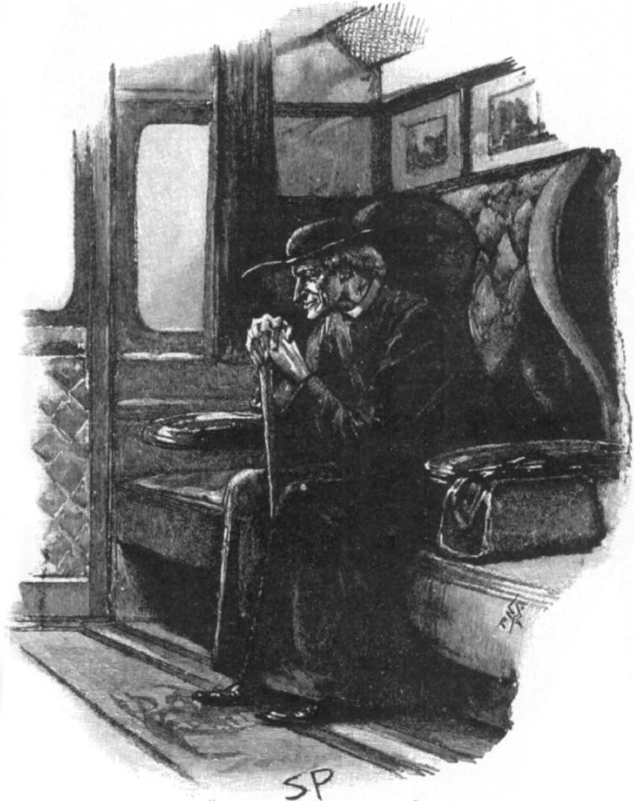

老迈的意大利朋友硬是要做我的旅伴。

“我亲爱的华生，”一个声音说道，“你还没有屈尊向我道个早安呢。”

我不觉大吃一惊，猛转身，那个年迈老教士回过脸正望着我。转瞬之间，他满脸皱纹蜕尽，鼻子挺起，收唇抿嘴，迟钝的眼神变得炯炯有光，佝偻的身躯舒展硬朗。而后顷刻间，整个儿人又重新委顿下来，福尔摩斯就如他突然而来又突然而去。

“我的老天！”我喊道，“你把我蒙得晕头转向！”

“防范措施不嫌多余，”他轻声说，“我充分估计到他们要疯狂追踪我们。啊，可不是，莫里亚蒂他亲自来了。”

福尔摩斯说话间，火车已经开动。我向后望去，看见一个身材高高的人在人堆里挤着拼命往前跑，不住挥手像是要叫火车停下似的。可是晚了，火车正在加速，一瞬间就驶离了车站。

“防范到家，你看，我们脱身了，干净利落。”福尔摩斯说，大笑。他站起来，脱下黑色教士衣帽化装，折好放进手提袋。

“看过晨报了吗，华生？”

“没有。”

“那么，你还不知道贝克街的事？”

“贝克街，怎么啦？”

“昨夜他们放火烧我们房子，没有造成重大损失。”

“我的天，福尔摩斯，这是不能容忍的！”

“那个大头棒狙击手被捕以后，我的行踪他们全不知道了，要不然，他们不会以为我已回家。他们对你也一定有防备，监视你，所以莫里亚蒂才会到维多利亚车站来。你一路到车站没有出一点纰漏？”

“我完全按你的指示办。”

“你找到四轮马车没错？”

“是啊，车等在那里。”

“你认出马车夫是谁吗？”

“没有啊。”

“那是我哥迈克罗夫特。在这种事情上，最好不要雇用外人，不可信。眼下，订订计划吧，还得对付莫里亚蒂。”

“这是趟快车，又有轮渡联运，所以我看，我们一定能把他彻底甩掉。”

“我亲爱的华生，我对你说过，这个人的智力水平与我不相上下，不可小看了。我这个意思，你显然没有理解，换了我是他，是追踪者，遇上这么一点小小的障碍，你绝不会相信我会被难倒、会气馁。那么好，你为什么就把他看得那么不中用呢？”

“他还能有什么办法？”

“就是处在我的位置，我要采取的办法。”

“你是什么办法呢？”

“包一辆专车。”

“来不及了。”

“绝对来得及。这一列车在坎特伯雷停车，通常至少等渡船要等上一刻钟，他就能在那里追上我们。”

“那别人还以为我们是罪犯呢。等他一到我们先下手抓他就得了。”

“这样一来，三个月的心血就要白费。大鱼虽然抓到，他底下的中、小鱼就全部蹦跳破网而逃。要到星期一，才能一网打尽。不行，先抓他不可取。”

“那怎么办？”

“到了坎特伯雷我们下车。”

“然后怎么样？”

“噢，然后我们作一次横贯欧洲的旅行，到新港，再到迪埃普。莫里亚蒂只会照我原来的路线走，他跟着我们的行李会跑到巴黎去，叫他在车站守上两天吧。我们在这个时间，给自己买上两个毡毯旅行包，一路采购东西，照顾旅游所过各国商家的生意，优哉游哉经过卢森堡和巴塞尔，上瑞士一游。”

于是我们就在坎特伯雷下车，可是发现要等一个小时才有车去新港。

我的行装都在行李车上，眼看着火车疾驰消失，心中不免怅然。这时福尔摩斯扯了扯我的衣袖，朝后面铁路方向指指。

“来了，你看。”他说。

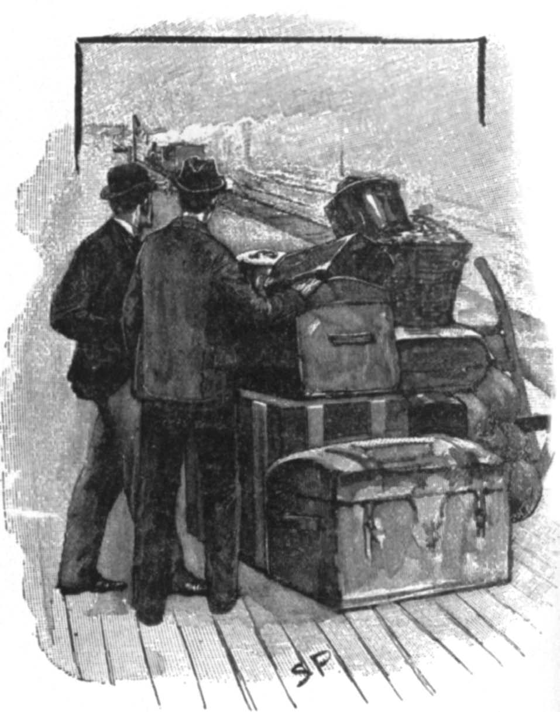

“来了，你看。”

远方，从肯特森林中升起一缕黑烟，顷刻之间，就见机车牵引一节车厢飞速转出森林驶上进站轨道。我们刚刚找个行李堆后面作藏身处，火车便哐啷哐啷呼啸鸣笛而来，一股热气扑面冲过。

“他过去了，”福尔摩斯说道，我们看着那节车厢微微颠摇驶过几处岔口，“我们这位朋友的智力，你瞧，毕竟有限。如果，我怎么个推断法他能够拿得住，也怎么个推断，还能顺势行事，那就不得了。”

“他要是把我们追上，会怎么样呢？”

“那不用说啰，非把我干掉不可，不过还要看，两人格斗，胜负未卜。眼前的问题，我们在这儿提前用午餐呢还是先到新港再找餐馆，那样的话，就得挨阵子饿。”

我们当夜到了布鲁塞尔，在那里待两天，第三天继续行动，直抵斯特拉斯堡。星期一早晨，福尔摩斯给伦敦警场发一封电报。当晚我们回旅馆，发现回电已到，福尔摩斯拆开一看，嘴里骂一声，随手就往炉火里一扔。

“我早就应该料到他们！”他感叹道，“让他给跑了！”

“莫里亚蒂？”

“警场破获了整个集团，可就是莫里亚蒂成了漏网之鱼。他给他们耍了个金蝉脱壳计。我不在国内，当然就没人能对付得了他。我原以为，我已经把目标都端到他们手上了，谁知仍旧不行。现在，你还是回国吧，华生。”

“为什么？”

“因为，现在你和我作伴，对你有危险。这个人的老巢已给捣掉，他回伦敦就要完蛋。根据他的性格，如果我看得不错，他非要竭尽全力找我报复不可。那次简短的会面，他已经讲得够明白，我相信他说到就要做到。我劝你务必回去行医要紧。”

福尔摩斯，我一直与他并肩战斗侦破刑案，已是甘苦与共的老朋友，所以断难接受他这样的要求。我和他坐在斯特拉斯堡餐馆里争论这个问题，达半小时，结果当夜还是继续我们的旅程，平安到达日内瓦。

我们徜徉在罗讷河谷，度过令人神往的一周。以后从洛伊克转道，来到吉米山隘，跋涉于依然深厚的积雪，再借道因特拉肯，到了美林根。这是一趟赏心悦目的旅行，一路行来，山下嫩绿一片，春光明媚，山上白雪皑皑，冬寒凛冽。然而我很清楚，福尔摩斯心头无时无刻不为那个阴影所笼罩。在阿尔卑斯山村人情融融之时，或在重岭山道人迹稀疏之际，我都可以看出，他眼观六路，耳听八方，对身旁经过的人都加关注。因为他确信，不管我们走到哪里，都有可能处在被人追杀的险境。

记得那一次我们通过吉米山隘，正沿着阴郁的道本尼山界行进，有一块大石从右方山脊上坠落，轰隆隆掉进我们身后的湖里。福尔摩斯拔腿跑向山巅，站在高耸的峰顶，引颈朝四下里张望，但是没发现什么情况。我们的向导担保说没事，这个地方春季里山上掉下滚石是常见现象。福尔摩斯不多话，只对我笑笑，那神情是在说预料中的事正要临头了。

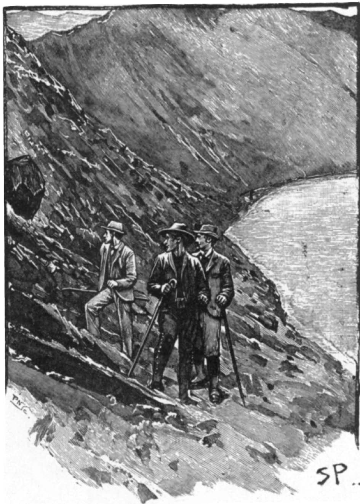

有一块大石从右方山脊上坠落。

尽管他神经高度紧张，但丝毫没有灰心气馁，恰恰相反，我还未曾见过他如此的精神抖擞。他一次又一次反复提及，一旦确定已为社会除掉莫里亚蒂教授这一祸害，他将无比高兴，也就可以从此结束自己的侦探生涯。

“我想，朝闻道，夕死可矣，华生，这辈子也算没有白活，”他说，“如果我的生命历程今夜结束，我应该心安理得，伦敦的空气因我而清新。我经手了一千多桩案子，自己清楚是克尽力量尽到善处，可以问心无愧。近来，我倾心于研究自然本质属性的问题，胜过我们人为折腾的浅表的社会问题。你的回忆录可以收尾了，华生，到这天为止，抓住或者除掉这个欧洲最危险、最厉害的大案犯，我的事业也就到此封顶。”

我将言简意赅，结束本故事的叙述。这已不是我要细说的题中之意，然而我责无旁贷，有关具体情况不可略而不提。

那是五月三日，我们来到美林根小村庄，住在一个叫老彼得·施泰勒开设的“大英旅馆”。施泰勒老板过去在伦敦的格罗夫纳旅馆当过三年侍者，是个机灵人，说得一口好英语。在他的建议下，四日下午我们两人一起出发，去翻山越岭，晚上可以到一个罗森洛依小村庄过夜。他向我们郑重建议有个莱辛巴赫瀑布值得一游，绝不可错过，在山腰半途上顺路，折进山道走没多远就能看到。

那确是个惊险的去处。融雪汇成的巨水激流，隆隆直泻万丈深渊，飞起团团水雾有如房子失火浓烟滚滚。山瀑注入的山口是一个大裂谷，周边岩壁黑亮如煤炭，渐深渐窄成一沟壑陷阱，水急如沸，深不可测，跳腾漫溢于锯齿交错的岩岸。绿水长流滚滚奔突，咆哮下泻；水花密密织帘，劈啪上蹿而忽隐忽现。这时，眼望着湍流漩涡，耳听着水声喧嚣，叫人只觉得眼缭乱头晕眩。我们紧靠山崖边站立，深深探视水光流彩映衬着黑岩飞溅，倾听那深渊激越的轰鸣，宛若人群在怒吼与呐喊。

半山腰上特辟的这条山径小道，使人能饱览瀑布全景。但小径也只到此为止，游客必须原路返回，我们只好如此转身回走。这时候，看见一个瑞士少年向我们奔过来，手里拿着一封信，信封上有刚才离开的那家旅馆的标记，是老板写给我的。信上说，我们离开不久，来了一位英国妇女，她患肺结核已到后期，在达沃斯·普拉茨过了冬，现在到卢塞恩旅游访友，不料突然咯血不止，看上去撑不了几个小时，只要有个英国医生给她看一下，对她便是莫大安慰，所以能否请我即刻返回一趟，等等。好心的施泰勒特加附言说，如蒙我慨允，他本人将对我感激大德，因为这位太太断然拒绝瑞士医生替她诊治，他本人因此深感负有重大责任。

对此请求，我不能置之不理，不可拒绝一位身在异国他乡而生命垂危的女同胞的要求。然而，要我离开福尔摩斯，倒又踌躇起来，但最后还是答应了，因为福尔摩斯让瑞士少年留下做伴又当向导，我便快回美林根。我朋友说在瀑布这边还将稍事逗留，然后漫步翻山，前往罗森洛依，我也将于晚间到达那里同他会合。我临走转身再看一眼福尔摩斯，见他手抱胸前，背靠岩石，俯视着飞泻的水流。谁能料到，这竟是我和他今世的永别。

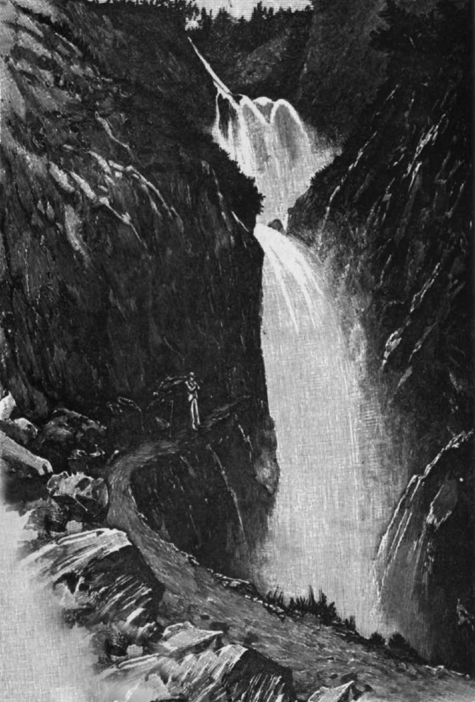

见他手抱胸前，背靠岩石。

我下了山坡，回头再望，此处已看不见瀑布，但还能望见山腰上那条弯绕转入瀑布方向的岔道。我记得，当时看见有一个人快步走上这条小路。

我很清楚看到绿色山坡映衬着那个黑色的身影，注意到走路健步如飞的样子，但我没往心里多想，我有急事在身，赶路要紧。

我大约走了一个多小时，才到了美林根，老施泰勒正站在旅店门道上。

“来啦，”我赶紧上前说，“敢情女士的情况没有恶化吧？”

老施泰勒脸色显露出莫名惊异，只见他眉头一跳立即皱起，我的心刹那间如铅沉重。

“这不是你写的？”我从衣袋里掏出信，问他，“旅店里没有生病的英国女人？”

“哪里有呀！”他大声道，“信封倒是旅店的标记！啊，知道了，一定是那个高个子英国人写的，你们前脚走，他后脚进。他说——”

我不等老板往下解释，惊恐得脑子轰鸣，已经沿村路疾速回转，要快快赶往刚才下来的那条小山径。刚才是顺势下坡，跑了一个小时，现在我使了浑身力气上坡拼命跑，还是费了两个多钟头，才重新回到莱辛巴赫瀑布。那里，福尔摩斯的登山杖依旧靠在我离开的时候他靠着的岩石上，然而不见了他的踪影。我高声呼喊，还是没人，只有我自己的声音在山谷间绕着我回响。

看着这根登山杖，我不寒而栗，那表明，他没有到罗森洛依去。他留在这三英尺宽的小山径上，一边是悬崖峭壁，一边是万丈深渊，仇人在此置他于死地。瑞士少年肯定是得了莫里亚蒂的好处，拿了赏钱，让他们两个狭路相逢，自己跑掉了。后来怎么样呢？有谁来告诉我们以后发生的事呢？

我站了几分钟，让自己镇定一下；我面临这情况实在心慌意乱，不知所措。然后我开始想到福尔摩斯自己会怎么做，照着揣摩实践，来了解这件悲剧的真实情况。噢，我发现这并不难，容易了解。我们谈话那会儿，没有跑到山径的尽头去，登山杖搁在那里，可作标记，正是我们站过的地方。此处山岩地的黑土，水珠飞溅不绝，永远湿软，鸟过此地都落得下爪印。有两行人的足迹从我这里过去，直到山径终端，清晰可辨。足迹仅有去却无回。离边缘几码的地上，黑土踩得泥泞不堪，沿峡谷的荆棘和蕨类被挤乱压烂扯断。我不顾水点向我飞洒，俯身下去细细察看。我离开旅店的时候天色已暗，现在只能看到乌黑的岩壁上这儿那儿的水珠闪亮，深壑远处水花的反光。我拼命叫喊，但仍只有瀑布咆哮如人的吼声传入我的耳朵。

但是上天不负苦心人，终于让我发现我的朋友和同志的临终遗言。我方才说过福尔摩斯的登山杖丢了下来，倚在小径旁一块突出的砾石巨岩上，我眼睛注意到这大石岩上头有个发亮的东西。我举手去拿，原来是他一向随身带的银色香烟盒。我刚拿起来，压在烟盒底下折成小方块的纸随即掉到地上。我捡起打开，看到一共有三张纸，都是他从笔记本上撕下，特地写给我的，语气、字迹全然是福尔摩斯的性格特点，语言准确，字迹稳健、清晰，如同在书房里写出来的一个样。纸上写道：

我亲爱的华生：

承蒙莫里亚蒂先生允诺，让我写下这几行文字，而后将我与他之间所存问题作一最后了断。他已向我简述其方法，如何得以摆脱英国警方，如何获知我们的行踪去向。这便进一步证实，我对他的才能所作的高度评价，确无虚言。我一念及我将为社会消除因他的存在而造成的祸患，便深感愉快，纵使我自己不得不付出代价，也不免给朋友们带来悲伤，尤其是你，我亲爱的华生。但我已经向你作出解释，我的事业受到最大挑战已至终极，对我而言，再无更合适的结局使我可以如此心满意足。应向你坦白承认，我本已看清美林根此信有诈，但我有意将计就计把你支开，因为意识到这样的蓄谋加害绝不会罢休，且更趋险恶。请转告帕特森警长，他需要对该黑帮定罪的证据存于M字母文档，内有一蓝色信封，上写“莫里亚蒂”。离开英国时，我的财产已作处置，交付我兄迈克罗夫特。顺致华生夫人好！请相信，亲爱的朋友，我忠诚于你！

永远忠诚的

歇洛克·福尔摩斯

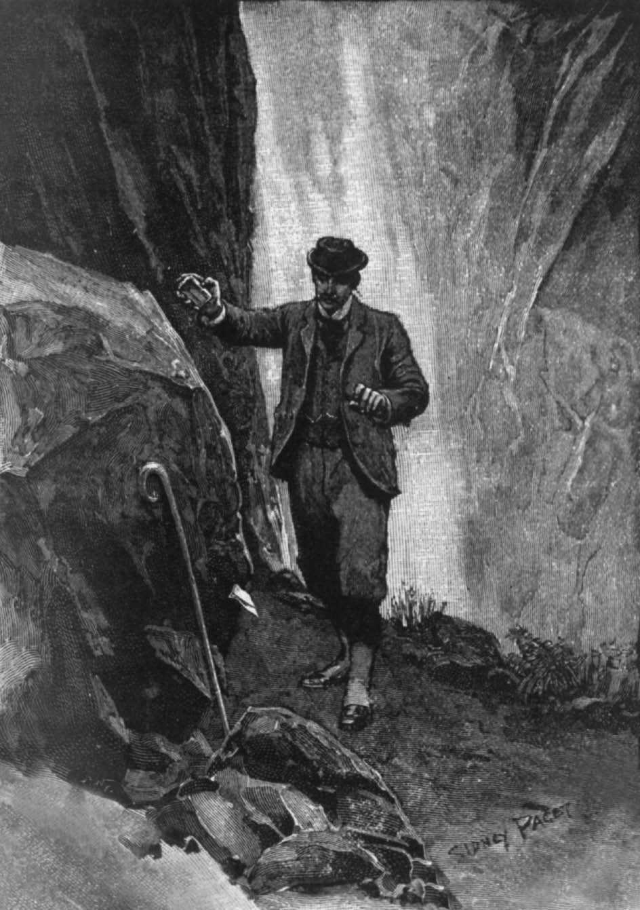

小方块的纸随即掉到地上。

余下的事几句话就能讲完。根据专家现场勘查，可以确定，两人进行过一场搏斗。在此情势下，非拼个你死我活不可，结果扭打颠扑，一起坠入峡谷。要找到两人的尸体，绝无希望。当代最险恶的罪犯和最杰出的卫法勇士永远葬身于漩涡丛生、水沫飞溅的无底深渊。瑞士少年从此不再露面，毫无疑问，他也是莫里亚蒂雇用的无数爪牙之一。至于整个黑帮，公众应该记得，福尔摩斯搜集了全部罪证，揭露了他们的组织，揭露出已死的莫里亚蒂的铁腕对他们控制得多么严密。但是整个诉讼过程中，对他们的罪魁莫里亚蒂的详情未有多少涉及，我现在之所以不得不把他的罪恶生涯全盘揭出，全是由于那些别有用心的辩护人以攻击福尔摩斯来纪念莫里亚蒂，为他开脱罪责。福尔摩斯，我要说，是我所知道的品格最好的好人、智慧最高的高人。

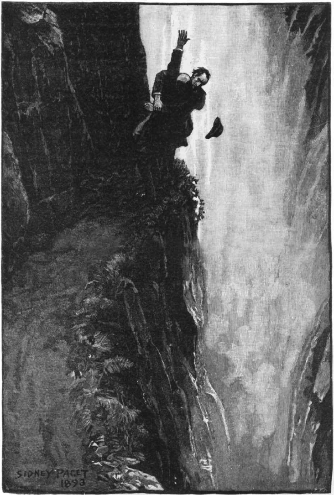

一起坠入峡谷。

（1893年）

————————————————————

<a href="#part0073.xhtml_ch1-back" id="part0073.xhtml_ch1">(1)</a> 关于这一点，美国科幻作家阿西莫夫（Isaac
Asimov，1920—1992）撰文指出并非科学事实：莫里亚蒂21岁，应是1865年，而早在1825年挪威数学家阿贝尔（Niels
Henrik
Abel）已完成了二项式定理的最后一项细节的研究。同样，在《恐怖谷》中说莫里亚蒂发现一颗小行星而名声大噪，其实此时若有这种发现已无多大价值，因为1825年法国天文学家皮埃尔·西蒙·拉普拉斯（Pierre-Simon
Laplace）出版专著《天体力学》，有关小行星问题已告完全解决。福尔摩斯是小说，以此虚拟手法假托莫里亚蒂的大教授身份而已。

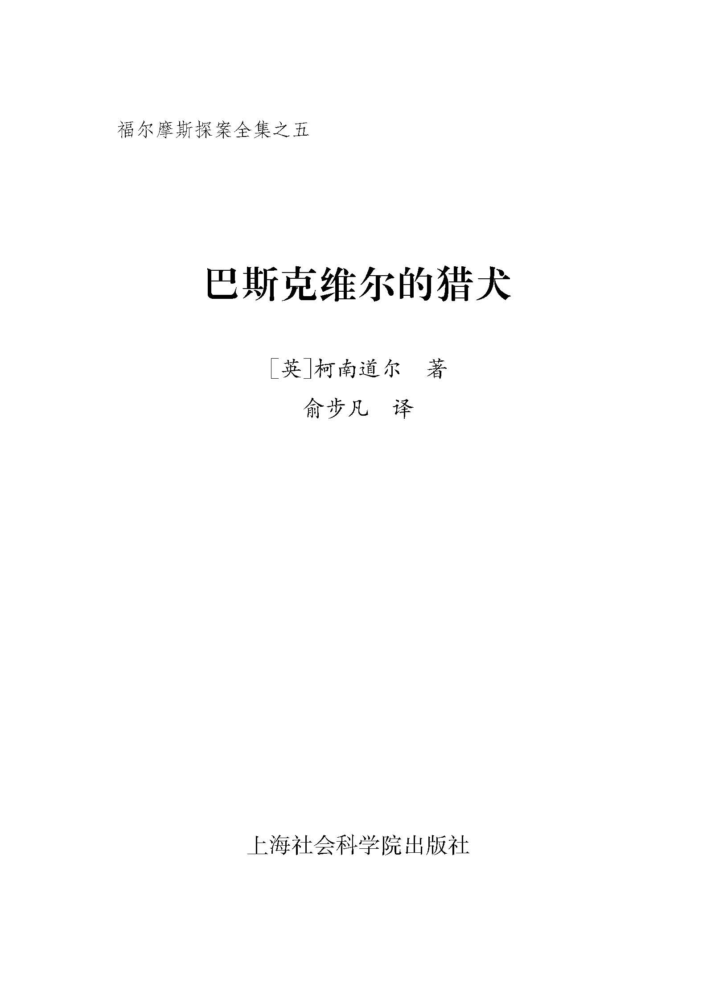

**图书在版编目（CIP）数据**

巴斯克维尔的猎犬／［英］柯南道尔（Conan
Doyle，A．）著；俞步凡译．—上海：上海社会科学院出版社，2012

（福尔摩斯探案全集；5）

ISBN 978-7-5520-0106-8

Ⅰ．①巴…　Ⅱ．①柯… ②俞…　Ⅲ．①侦探小说—英国—现代　Ⅳ．①I561.45

中国版本图书馆CIP数据核字（2012）第159595号

福尔摩斯探案全集之五

**巴斯克维尔的猎犬**

------------------------------------------------------------------------

**著　　者：**［英］柯南道尔

**译　　者：**俞步凡

**责任编辑：**陈如江

**封面设计：**王小阳工作室

**出版发行：**上海社会科学院出版社

上海淮海中路622弄7号　电话63875741　邮编200020

http://www.sassp.org.cn　E-mail: sassp＠sass.org.cn

**经　　销：**新华书店

**照　　排：**南京理工出版信息技术有限公司

**印　　刷：**上海中华印刷有限公司

**开　　本：**787×1092毫米　1/32开

**印　　张：**9.5

**插　　页：**2

**字　　数：**166千字

**版　　次：**2012年10月第1版　2012年10月第1次印刷

------------------------------------------------------------------------

ISBN 978-7-5520-0106-8/I·063

定价：29.00元

------------------------------------------------------------------------

**版权所有　翻印必究**

# 目录

[第一章　歇洛克·福尔摩斯先生](#part0079.xhtml)

[第二章　巴斯克维尔的祸害](#part0080.xhtml)

[第三章　疑案](#part0081.xhtml)

[第四章　亨利·巴斯克维尔爵士](#part0082.xhtml)

[第五章　三条线索告中断](#part0083.xhtml)

[第六章　巴斯克维尔庄园](#part0084.xhtml)

[第七章　梅里皮特宅邸的斯泰普尔顿家](#part0085.xhtml)

[第八章　华生医生的第一份报告](#part0086.xhtml)

[第九章　华生医生的第二份报告　沼泽地里的烛火](#part0087.xhtml)

[第十章　华生医生日记摘抄](#part0088.xhtml)

[第十一章　突岩上的人](#part0089.xhtml)

[第十二章　命丧沼泽地](#part0090.xhtml)

[第十三章　布网](#part0091.xhtml)

[第十四章　巴斯克维尔的猎犬](#part0092.xhtml)

[第十五章　回顾](#part0093.xhtml)

[返回总目录](#part0000.xhtml)

 

 

谨以《巴斯克维尔的猎犬》敬献

亲爱的罗宾森，承蒙你向我讲述西部乡间一则传闻，启发我构思出这篇小说，并在故事情节上给我提出宝贵意见，给予很多帮助，特此致以衷心感谢。

你最忠诚的

A．柯南道尔

# 第一章　歇洛克·福尔摩斯先生

歇洛克·福尔摩斯先生平日早晨一向起得很晚，要么就是偶尔整晚熬夜不睡觉，现在他正坐在桌旁用早餐。我站在壁炉前的地毯上，拿起了一根手杖。这根手杖是昨天一位访客遗忘在这儿的。手杖很精致，木质坚硬，顶头是个圆木球，就是人们一般所称的那种“山槟榔木手杖”。圆球下面有一道银箍，箍宽约一英寸，上面刻有这么一行字：“赠M．R．C．S．<a href="#part0079.xhtml_ch1"
id="part0079.xhtml_ch1-back">(1)</a>詹姆斯·莫蒂默。C．C．H．友人敬献”，年份是“一八八四”。这种手杖，是旧时私人医生常用的——样子庄重，又结实坚固。

“我说，华生，这根手杖你觉得怎么样？”

福尔摩斯是背对我坐在那里的，我也没有弄出什么声响让他听见我拿起手杖在看。

“你怎么知道我拿手杖？难道你后脑勺长眼睛了？”

“你不知道，我眼前正放着一把咖啡壶呢，反光锃亮，还垫着个银盘子。”他解释道，“啊，华生，告诉我，你对访客的这根手杖有什么想法？可惜我们没有遇上他，不知道他来这儿有什么事；那么，这件遗落的东西就变得有意思了。你根据手杖来推断一下这个人，讲给我听听。”

“依我看，”我说道，尽我所能学着我这位同伴的想事方法，“这位莫蒂默医生医术高明，是个有点年事的老医生，受人尊敬，所以病家会送给他这一件礼物，表示敬意和纪念。”

“对！”福尔摩斯称赞道，“说得极是！”

“我还在想，他很可能是乡村医生，在乡下行医都靠两条腿跑各家各户。”

“何以见得？”

“这根手杖，你初一看，还挺新，非常好，可是再一看，已经磕碰了不少。可以想象，城市里的医生不会带着这么一根手杖。下面的铁皮包头都已磨损，可见得拄着走过不少路了。”

“完全有道理！”福尔摩斯说。

“我们再看看‘C．C．H．友人’，我猜是某个猎场<a href="#part0079.xhtml_ch2"
id="part0079.xhtml_ch2-back">(2)</a>，是当地一个狩猎场，他可能给猎场的人治过伤什么的，所以大家送他一件小礼物，略表敬意。”

“华生，真看不出你有这么大的进步，”福尔摩斯说，把椅子向后一转，点起一根烟，“我得坦白讲，你把我小小的一点成绩，老是满口称道，说得多好，老是把你自己的能力估计得很低。也可能是事实，你本身确实不发光，可你是光导体，传导光。有些人本身不具有天才，可是具有推上一把激发天才的力量，这也同样了不起。我得承认，亲爱的伙计，我还不是多亏有了你嘛！”

他以前从来没有说过这样一些话，不用否认，他的这番话让我兴奋无比，得意非凡。因为以往我对他称赞点什么，或者想要把他的破案高招公诸大众，他总是不以为然。我同时想到我终于熟谙了他的一整套方法，加以应用，居然受到他亲口赞许，心中颇感骄傲。这会儿，他从我手中接过手杖，仔细端详，察看了几分钟。接着又显出饶有兴趣的样子，丢下香烟，走到窗前，用凸透镜再重新审视手杖。

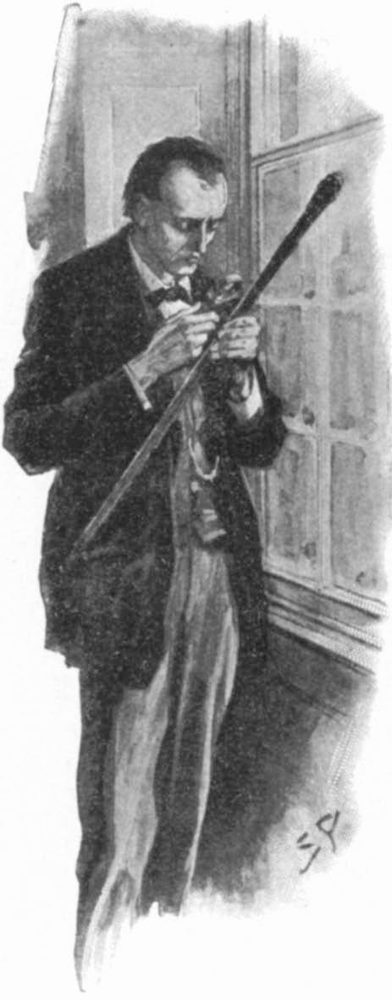

用凸透镜再重新审视手杖。

“有意思，虽然还只是初步，”他转身说，一边走到长沙发的顶端去坐下，他喜欢往那儿坐，“手杖上有一两个地方看出点问题，根据这些，可以做几项推论。”

“难道我还有遗漏没能看出来？”我很自信地问道，“我想，不可能有重要的细节被我疏忽掉吧？”

“不一定，亲爱的华生，你许多结论都犯错误。我说你激发了我，推了我一把，说明白点，意思是，有时候是我看出了你的谬误之处，才反过来把我引向正确，推我走上正道。当然并不是说在这件事上你完全判断失误，这个人肯定是个乡村医生，没错，他走的路也是不少。”

“那我不是对了！”

“仅此而已。”

“这就够了，全部事情，不就这么一点吗！”

“不，不，我亲爱的华生兄，不是全部——绝对不是全部。我要提醒你，比如说，有人给一位医生送礼，总是医院的可能性比什么狩猎场要大得多吧。那么首字母C．C．冠于医院之前，应当是Charing
Cross查令十字街这个名称更加自然，更加讲得通。”

“或许你对。”

“朝这个方向去考虑，大致错不了。只要这个假设靠得住，再进一步求证，就八九不离十了，对这位未知的来客可以勾勒出确切的轮廓。”

“好，那么假定C．C．H．果真代表Charing Cross
Hospital查令十字街医院，能进一步求证什么呢？”

“事情还不清楚吗？你懂得我运用的一些方法，自己试试看！”

“我只能得出面上的结论，此人下乡之前，在城里当医生。”

“恐怕还得往更深处探索。问题要这么看：在什么样的情况下，才最可能有这样的送礼？什么时候他的朋友才会一同送他一件礼品以表敬意？最明显不过，是在这种时刻：莫蒂默医生要离开医院，自己独立去当开业医生；已知的送礼这件事，可以说一定是由城市医院转到乡村去行医的时刻。这样说，扯得玄乎了吧！不能断定刚好是在这种时候别人才送他礼，能不能？”

“这可能性当然也是有。”

“好了，你就应当想得到，他恐怕不是医院正式医师。因为只有在伦敦医疗界站得住脚的人，才能谋到正式职位，而这样的人，也就不会流落到乡下。那么他是什么样的人呢？如果他是医院的医生，又不算正式的，那就只能是个外科住院医师，或者是内科住院医师——地位只比医科大学高年级学生稍好一点。还有，他是五年前离开的——手杖上有年份。所以说，你那个严肃认真的、人到中年的家庭开业医师，便子虚乌有，烟消云散了。他不是这么一个人。我说亲爱的华生，在我们面前呈现出来的，是一位年轻人，年龄不到三十，热情、随和，胸无大志，缺少点心眼儿。还有，有一条爱犬。这条狗，我推测，不是很大，但也不算小。”

我对他这番话不敢恭维，报以哈哈大笑。福尔摩斯身子往沙发背上一靠，嘴里吐出的小烟圈缓缓飘上天花板。

“你说的那后半部份，我无法确证，”我开腔了，“不过这也不难，可以查一查这个人的年纪、职业这些主要情况。”说着，我从自己小小的医书架子上拿下一本《医学便览》，翻到人名篇，里面收录着几个姓莫蒂默的，只有一个同我们的访客相符。我高声读出此人的资料。

詹姆斯·莫蒂默，一八八二年毕业于皇家外科医学院，德文郡达特穆尔格林本<a href="#part0079.xhtml_ch3"
id="part0079.xhtml_ch3-back">(3)</a>村人。一八八二年至一八八四年在查令十字街医院任住院外科医师。撰文《疾病之隔代遗传》，获杰克逊比较病理学奖。瑞典病理学会通讯会员。撰文《几种隔代遗传畸形症》（载《柳叶刀》医学杂志，一八八二年），《我们是否在前进？》（载《心理学报》，一八八三年三月号）。任格林本、索斯利和高岗村等教区医务官。

“没有提到地方狩猎场，华生。”福尔摩斯特意露出笑容说道，“只是个乡村医生，这一点给你说得很准。看来我的推断也不偏不倚猜个正着。用什么话来形容此人性格，我刚才说的，要是没记错，他热情随和，不求功利，缺少点心眼儿。我有经验，眼下这个世道，只有热情随和的人，才会有人送纪念品，只有不求名利的人，才会放弃伦敦的事业跑到乡下去，也只有没心眼儿的人，才会到你屋里等上一个多小时，结果把手杖丢下，也不留张名片。”

“那么狗呢？”

“习惯上经常叼着这根手杖，跟在主人后面。手杖不轻，有点分量，得往中间地方紧紧咬住才能叼着走，所以狗牙印在中央都清清楚楚。狗的大小，从下排的牙印宽度判断，小种狗嫌宽，大种狗嫌窄，那就可能是——对呀，一点没错呀，就是一只鬈毛垂耳的西班牙獚犬。”

他是一边说着话，一边在屋里踱步，这时正踱到壁凹处向楼外突出的窗台前，停住不走了。听他的声调口气，绝对自信，不禁使我抬头疑惑地望着他。

“我说亲爱的伙计，你怎么这么肯定呢？”

“原因很简单呀，这不就是那只狗嘛，现在到了这儿门口，正在台阶上了！狗的主人在拉门铃了。别走，求你别走，华生，他可是你的同行，你在场对我有帮助。现在正是戏演到精彩之处，华生。你听见上楼的脚步声了吧，是有事找你来的，且看事情是好是坏吧。詹姆斯·莫蒂默医生，医学界人士，对犯罪学专家歇洛克·福尔摩斯有什么可问呢？请进！”

来人一见面，外表令我大感惊异，因为我原以为是那种典型的乡村医生的模样。他是个很高的高个子，瘦削，挺直的长鼻，隆起在一对锐利的灰眼睛之间，两个眼睛靠得很近，在一副金丝边眼镜片后炯炯有神。一身衣服倒是像个做医生的样子，可是不修边幅，十分邋遢，上身一件双排扣礼服大衣已经很脏，下身长裤也有磨损。虽然年纪不大，高高的后背已经拱起，走路姿势脑袋前冲，一副若有所思的神态，像是一直关注着什么。他一进门，眼光就落在福尔摩斯拿着的手杖上面，喜出望外地一声欢呼，就走向前来。“真是太高兴了，”他说，“我也搞不清楚是丢在这里，还是丢在轮船公司。这根拐杖我是无论如何不能丢的。”

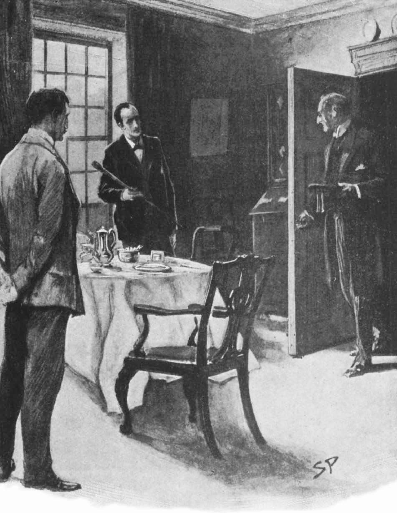

他一进门，眼光就落在手杖上面。

“是件礼物，我知道。”福尔摩斯说。

“是呀，先生。”

“查令十字街医院送的？”

“是那里两个朋友，我结婚的时候送的。”

“唉呀呀，唉呀呀，看我真是糟糕！”福尔摩斯说，一个劲地摇脑袋。

莫蒂默医生透过镜片眨着两眼，显得有点诧异。

“糟糕什么？”

“没什么。我们对你有点小小的猜测，跟你说的对不拢。你是说结婚送的？”

“是呀，结婚礼物。我结婚了，就离开医院了，当顾问医生的希望当然也就没有了。要建个家，有个自己的窝，只好这样。”

“噢，哈，我们总算没犯大错，”福尔摩斯说，“好，詹姆斯·莫蒂默博士——”

“不敢，不敢，就称密斯特<a href="#part0079.xhtml_ch4"
id="part0079.xhtml_ch4-back">(4)</a>，称我密斯特好了——一个皇家外科医学院的学生，微不足道。”

“看得出来，还是个有板有眼讲学问的人。”

“只能说稍稍有点医学知识，福尔摩斯先生，在无涯的学海边捡捡贝壳罢了。想必你就是歇洛克·福尔摩斯先生了，不是这位——”

“不是，这是我的朋友华生医生。”

“见到你很高兴，先生。我曾听到有人把你和你朋友的名字相提并论。你使我产生很大的兴趣，福尔摩斯先生，真想不到能眼见你有如此的长颅骨，眼眶也长得真够标准。我用手摸一摸你的顶骨沟，你介意吗，先生？你的颅骨，我说，在未得到实物之前，做成石膏模型，给人类学博物馆送去，一定是件稀有标本。我倒不是讨好人，这样说反招人嫌，说实话，我是真的觉得你的颅骨极为珍贵。”

福尔摩斯挥手示意我们这位生客在椅子上坐下。“你是对自己的专业十分用心的人，你是三句不离本行呵，先生。本人对本行的专心也是一样，”他说，“从你的手指可以看出，你是自己卷烟抽的。你抽烟吧，请随便。”

来客掏出烟纸、烟丝，三下两下就卷成一支，手法惊人地熟练。他那长长的手指像昆虫触须一般细巧、灵活、敏捷。

福尔摩斯看得一言不发，但是他那微微飘忽的眼神告诉我他对这位不寻常的生客颇有兴趣。

“冒昧敢问先生，”他终于开口了，“你昨晚赏光来此，今天再度重访，目的不光是为了量量我的颅骨吧？”

“不，先生，不是。要是有机会那样做，当然是件非常有意思的事。我来找你，福尔摩斯先生，因为我自知才疏学浅，又无人生实际经验，可偏让我遇到了问题，十分严重、十分奇怪的问题。我完全相信，你是全欧洲第二位高手——”

“是吗，先生！那么敢问荣登第一位的是谁呢？”福尔摩斯没好气地问道。

“要论具有精细科学头脑的人，贝蒂荣先生<a href="#part0079.xhtml_ch5"
id="part0079.xhtml_ch5-back">(5)</a>那是众口一词，没话说的。”

“那你去请教他不是更好吗？”

“我说了，先生，对于具有精细科学头脑的人而言是他，但是就事件而论的实际经验，你是公认首屈一指的。说真的，先生，我并非东拉西扯——”

“有一点吧，”福尔摩斯说，“我看，莫蒂默医生，你还是直截了当一点，不必转弯抹角，把你想叫我效劳的问题这就说出来。”

————————————————————

<a href="#part0079.xhtml_ch1-back" id="part0079.xhtml_ch1">(1)</a> M．R．C．S．系Member
of the Royal College of Surgeons（of
England）（英国）皇家外科医师学会会员的首字母。

<a href="#part0079.xhtml_ch2-back" id="part0079.xhtml_ch2">(2)</a> H字母在这里可能是hunt（猎场）的缩写，也正如下文所推测更可能是hospital医院的首字母。

<a href="#part0079.xhtml_ch3-back" id="part0079.xhtml_ch3">(3)</a> 本篇故事发生地点设在英格兰西南部的德文郡Devonshire，devon意为泥炭，德文郡属泥盆纪地质，多泥炭沼泽；达特穆尔Dartmoor，dart意为镖、投，moor意为（湿泥炭）沼泽；格林本Grimpen，grim意为严酷、残忍，pen意为牲畜圈、栏、围。此种地点有利于营造本故事环境气氛。

<a href="#part0079.xhtml_ch4-back" id="part0079.xhtml_ch4">(4)</a> 密斯特（Mister），即先生，英语对男士的普通称呼。

<a href="#part0079.xhtml_ch5-back" id="part0079.xhtml_ch5">(5)</a> 贝蒂荣（Bertillon，Monsieur，1853—1914），巴黎警察局刑侦部负责人，创造人体测定法以识别罪犯，后为指纹学所取代。

# 第二章　巴斯克维尔的祸害

“我口袋里带来一份手稿。”詹姆斯·莫蒂默医生说。

“你进屋子的时候我已经注意到了。”福尔摩斯说。

“是一篇旧的手稿。”

“十八世纪前期的，要不就是伪造的赝品。”

“你怎么知道的，先生？”

“你进来谈话的时候，一直摸着手稿，露出纸角一两寸，让我捉摸到了八九分。一份年久的旧文字材料，断定它的年代只允许有十来年的误差，否则，就是鉴定技术太蹩脚，谈不上专业水平。我对此有过一篇专论，拙文或许你曾有看过。你这篇文件的年代我估计是一七三〇年。”

“正确的年份是一七四二年。”莫蒂默医生把手稿从前胸口袋里抽出来。“这是一份祖传家书，是查尔斯·巴斯克维尔爵士交托给我保管的。三个月前，他突然去世，死得很惨，事情引起整个德文郡的恐慌。我同他私交还好，又是他的保健医生。他这个人意志坚定，嗯，很有目光，做事讲究实际效益，人又通情达理，不信胡说八道，这一点跟我一样。不过，他就是对这一份家书极认真，十分地当真，内心里早有准备，要遭遇同样的厄运，这不，厄运确实降临到他自己头上来了。”

福尔摩斯伸手接过纸，在膝头上展平。

“你看见吗，华生，S字母一会儿长一会儿短交替着写，这种风格就是根据之一，我据此可以确定年代。”

我凑到他肩头望下去，一张泛黄的纸，字迹年深日久有些糊了。顶头写着“巴斯克维尔庄园”，下面是一行潦草的大字体数字“一七四二”。

“像是一篇记事的叙述文。”

“正是，记叙一桩传说的事，在巴斯克维尔家族流传已久了。”

“不过我知道，你来找我，是为了最近发生的真事，不是传说，对吗？”

“那自然，刚发生的事，完全是真事，紧迫得很，一定要在二十四小时内决定怎么办。好在手稿不长，跟事件可是密切相关，我这就念给你听好了。”

福尔摩斯仰身往椅背上一靠，双手十指相对，闭起了眼睛，静心细听。莫蒂默医生把手稿拿到亮处，扯开嘶哑的嗓子大声诵读这桩奇异的陈年旧事：

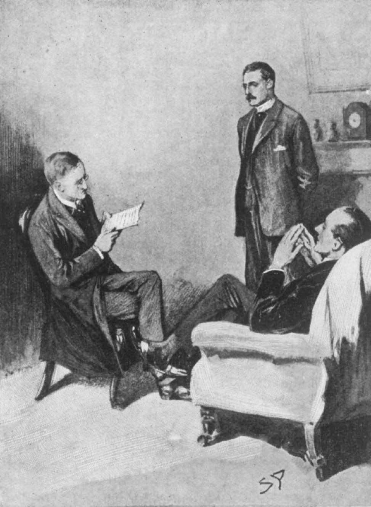

把手稿拿到亮处，大声诵读。

巴斯克维尔猎犬一事之原由，众说纷纭。吾系休戈·巴斯克维尔之直系后裔，此事听先父口述，先父则听先祖父口述。现将所知如实记下，吾信确有其事，并无虚假。在此忠告子孙务必牢记：正义女神持平公正，罚罪与恕罪恩威兼施，绝无偏倚；无论罪孽如何深重，只须祈祷、忏悔，罪罚终得恕免。于纪事中获取教训，不必因往昔之恶果陷于恐惧，而务须谨慎检点于未来；丑行劣迹使吾家族饱尝深重之灾难，愿从此根绝，不因后代再恣肆妄为，祸重降临。

据传早自大叛乱时期<a href="#part0080.xhtml_ch1"
id="part0080.xhtml_ch1-back">(1)</a>（博学之克拉伦登男爵<a href="#part0080.xhtml_ch2"
id="part0080.xhtml_ch2-back">(2)</a>对该时期撰有史著，吾真诚推荐此书以供一读），巴斯克维尔庄园归休戈名下。休戈不信神，不敬畏神，系狂野粗俗、不可理喻之辈，臭名昭著，一提彼名无人不嫌恶摇头。若止于此，则乡邻尚可忍可谅，实因此一地区诸圣从未受到崇奉，教事一向淡漠，其放浪冷酷之本性在西部原是家喻户晓。休戈之祸起，在偶见一农夫之女，即钟情（姑且不避此高洁之词屈降于彼淫徒之丑行）不能自已。农夫在巴斯克维尔庄园邻近种地数亩。然该少女颇有自持，清白名声，惧怕玷污于休戈之恶名，自是对其避而远之。时至米迦勒节<a href="#part0080.xhtml_ch3"
id="part0080.xhtml_ch3-back">(3)</a>，休戈获悉少女父兄等家人皆因事出门，遂得乘隙纠集游手好闲之徒五六人，潜至农家将少女强抢回庄。抢得庄来，关入楼上卧房。休戈与狐朋狗友围坐一起狂欢痛饮，如此通宵达旦乃惯常事。此时，可怜少女拘禁楼上，闻楼下狂歌乱吼，淫言秽语，不堪入耳，惊恐不知如何是好。人说休戈·巴斯克维尔酒醉出言之龌龊，有敢重复者必遭天打雷轰。女最终情急生智，惧极心横，做出令最勇猛男士亦为之咋舌之举动，自屋檐气窗翻出，沿南墙攀缘爬墙藤蔓而下（至今满墙藤蔓依旧），穿越沼泽地朝自家方向奔逃。其家与庄园相距约九英里之遥。

休戈酒酣，离座携酒食——此外亦许更有贼心叵测之欲——前去寻幸求欢于受掳之女，却见人去楼空，笼中金丝鸟不翼而飞！其狂怒之下，如疯似魔，冲下楼梯至餐厅，跳上大餐桌，眼前之物，杯盘酒壶，悉数脚踢乱飞。遂向狐群狗党大叫大嚷，声称当晚只要将女捉回，必使自身肉体灵魂一并献予恶神，任其摆布，尽情施恶。纵酒狂饮之众徒，面对其盛怒之状呆若木鸡。中有一人，或其心更恶，或犹是趁酒兴余勇，狂呼速遣猎犬追逐少女。休戈闻言如梦醒，急出屋，呼唤马夫牵马备鞍，并命犬舍大开，使群犬嗅少女遗落之头巾，即挥之蜂拥奔突，顿时月光之下，沼泽地之上，猎犬群奔，狂吠声响彻四野。

其时，众酒徒对事发之疾速且不及意料，一时目瞪口呆，立如木柱不知所措。但转念之间，倏然开窍，速去沼泽地探视究竟。旋即闹哄哄、乱糟糟，人声鼎沸，有高叫取手枪者，有呼喊牵马者，竟还有酒鬼不忘再带上瓶酒者。最终魂魄稍定，神志渐清，乌合十三人之众，跨马挥鞭出发追赶。皓月当空，沿少女返家必经之途，策马并进，疾驰而去。

众酒徒跑出约二英里时，途遇一沼泽地夜牧人，即喝问其见过追逐者否。牧人据说先已惊吓异常，竟至一时未能开口，少顷说出曾见一可怜少女，随后有群犬追至。“所见尚不止于这些，”牧人道，“休戈·巴斯克维尔骑黑马从此而过，随其后紧跟一条猎犬，寂然无声息，犹如魔鬼般可怖，但愿上帝勿令此犬随我脚跟。”众酒鬼听罢，斥骂牧人，径自前去。行不多时，即令众酒徒冷汗浑身，因忽闻一阵单马奔蹄自沼泽地迎面相向而来，不意竟是休戈黑马，鞍上无人，缰绳垂地，口吐白沫向后狂逃。酒徒聚拢一起，内心恐惧万分，却依然向沼泽地深处行进。若此时仅为一人，则无疑早已拨转马头向后退回。以如此心情蜗行趋前，遂见群犬。此群猎犬原以奋勇及种优而闻名，此时群聚紧挤于沼泽地一斜沟或称坡地之处，正作呜咽哀鸣状，先已有落荒而逃者，余皆颈毛直竖，探首一窄沟滞眼呆望。

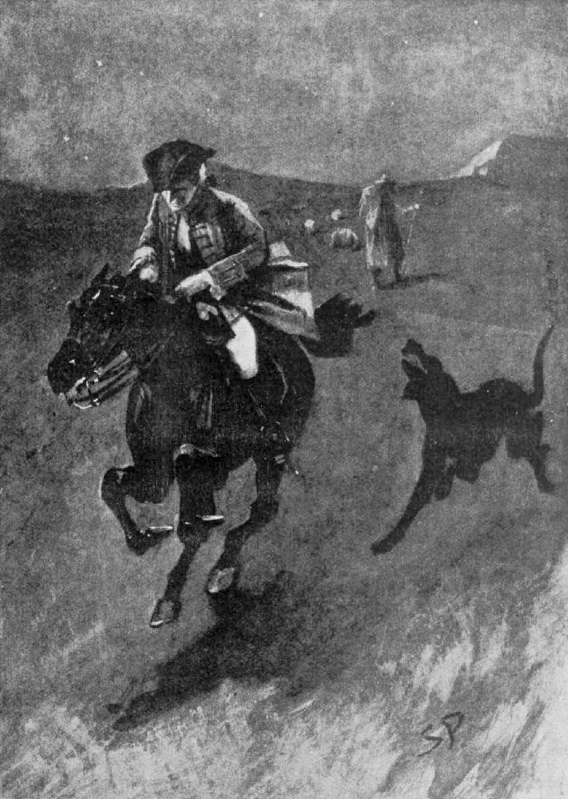

随其后紧跟一条猎犬，犹如魔鬼般可怖。

众酒徒勒马止步，此时此景，较出发时已酒醒许多。数人不欲再作前行，却有三人，抑或胆量最大，抑或尚酩酊未醒，仍策马顺狭沟前去。渐入一开阔地，见巨石两柱，兀立当前。此巨石系古时先民之遗迹，至今尚可见于彼处。月色似银，泻于旷野，于开阔地中央，倒卧可怜少女，盖因恐惧、疲竭已死。然令彼胆大包天之三酒徒毛骨悚然者，并非少女之死，亦非躺在少女不远处休戈·巴斯克维尔之尸体，却见一乌黑之巨物，正扑于休戈躯体撕咬其喉。此怪系一巨兽，状如猎犬，然无人曾见犬有如此巨者。三人目击此物撕扯休戈·巴斯克维尔之喉，其时，巨怪回首直视，两眼寒光闪烁，张嘴如盆，涎水滴沥。三人惊惧大叫，迅即拨马逃命，于沼泽地狂奔，一路惊呼。据传，一人即于当夜气绝毙命，系吓死也；另二人自此终日失魂落魄，精神失常。

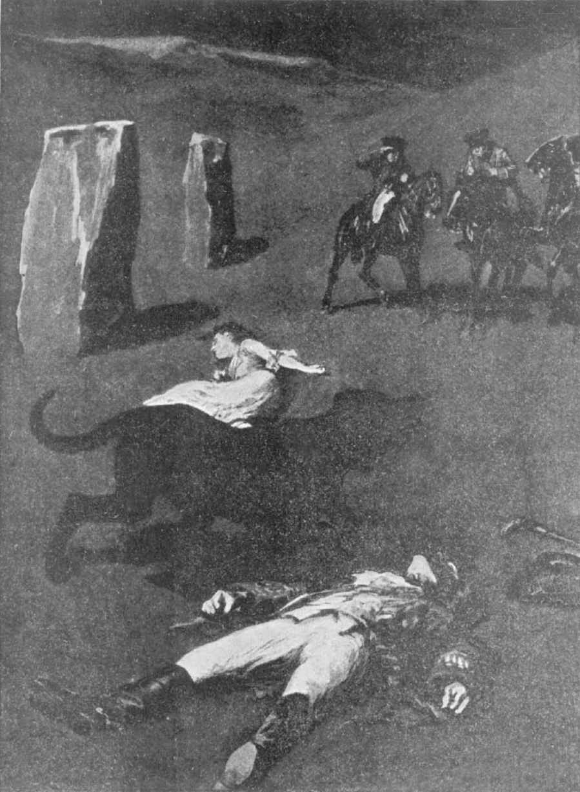

一乌黑之巨物，正扑于休戈躯体撕咬其喉。

吾家子孙，此即怪犬传说之来历。据传从此以后，吾家受其祸烈而不绝。吾记叙此事，清楚告知此事之来龙去脉，无需承受妄加猜测、随意讹传所生之恐惧。亦无需否认，吾家族多人不得善终，死于非命，惨绝而神秘。但愿能得上帝无边慈爱之庇护，永不再降罚于远隔三四代之无辜子孙，因彼受儆戒而恪守圣书之教诲也。以上帝之名，嘱吾儿孙，小心谨慎为要，黑夜时分，万勿去沼泽地，此其孽魔张狂之时，以免惨罹祸害。（此家书由休戈·巴斯克维尔<a href="#part0080.xhtml_ch4"
id="part0080.xhtml_ch4-back">(4)</a>示子罗杰与约翰，慎嘱勿告知乃姐伊丽莎白。）

莫蒂默医生一口气读完这篇传奇之后，把眼镜往额头一推，定神望着福尔摩斯。福尔摩斯打个哈欠，把烟蒂扔进火炉。

“完了？”他问。

“你不觉得很有趣吗？”

“搜集传奇故事的人，会感兴趣。”

莫蒂默医生又从口袋里摸出一张折叠的报纸。

“你看，福尔摩斯先生，我们这儿还有更新的材料。这是《德文郡纪事报》，今年五月十四日，一篇简短的事实报道，讲查尔斯·巴斯克维尔爵士的死亡情况，就发生在报道的前几天！”

我的朋友稍稍欠起身，神色专注起来。我们的来客重新戴好眼镜，开始读报载消息：

查尔斯·巴斯克维尔爵士近日暴卒，因其很可能被提名为参加下届选举的中部德文郡自由党候选人，故使全郡不胜哀悼。查尔斯爵士虽然在巴斯克维尔庄园居住时间尚短，但凡是曾与接触者，皆因其为人热情、慷慨与厚道，深表尊敬与爱戴。值此暴发户充斥之时，查尔斯爵士以名门之秀，因厄运致家道中落，然经努力奋斗，终又致富荣归故里而重振家业，重建声望，实为可喜可贺之事。众所周知，查尔斯爵士在南非投机事业中获得巨利，他之胜人一筹处在于见好即收，绝不面临倒运方才止步。他将所得变现，携归英伦。返居巴斯克维尔庄园仅有两年，正当众口称赞其重建与扩展计划何其庞大之时，却因本人去世而中断。因无子嗣，他曾公开表示，在其有生之年，本乡全体居民将得到他的资助，为此，许多人因他的暴亡痛心疾首。他对本地及郡属慈善机构之慷慨捐助，本报曾屡有报道。

查尔斯爵士的死因情况虽不能说已完全检验清楚，不存疑问，但至少当地各种迷信谣传皆不足凭信，毫无疑问尽可排除。毫无根据可怀疑系为谋杀，或想象死于非自然原因。查尔斯爵士单身未婚，此种人据说心态易有不正常。他虽拥有巨富，而个人生活却极其简朴，无任何嗜好。巴斯克维尔庄园家中仆佣仅为一对夫妻，姓巴里莫，丈夫为总管，妻子理家务。两人提供证词表明，而且也已为朋友数人所证实，查尔斯爵士一个时期来健康状况似有不佳，尤其显示出心脏方面之症状，比如面色有变，呼吸急促，患严重神经衰弱症。詹姆斯·莫蒂默医师，作为死者之好友及私人医生，也作有同样的证明。

案情并不复杂。查尔斯·巴斯克维尔爵士有一种习惯，每晚就寝前必至巴斯克维尔庄园著名的紫杉树小巷道去散步。巴里莫夫妇证实他有此习惯。五月四日，查尔斯爵士曾说起他次日欲赴伦敦，并命巴里莫准备行装。是夜，他一如往常去作晚间散步，散步时必抽雪茄则是又一个习惯。他去而未回。至十二时，巴里莫发现厅门依然洞开，很觉吃惊，便点起提灯出去寻找主人。这天天气潮湿，查尔斯爵士留在树巷地面的一行足迹颇明显。沿小巷道走去，半途有一栅门，出门即可通往沼泽地。有迹象表明查尔斯爵士曾在此稍作停留，然后顺小巷道走下去，行至尽头，正是在此处，发现其尸体。有一事尚未获得解释，据巴里莫陈述，其主人的脚印自沼泽地栅门以后形迹有变，此后一路似是踮起脚尖走步。有个默菲<a href="#part0080.xhtml_ch5"
id="part0080.xhtml_ch5-back">(5)</a>吉卜赛，马贩子，其时正好在沼泽地不远处，但据称他正酒醉糊涂，承认听得喊叫之声，却说不清来自何方向。查尔斯爵士身上未发现暴力伤痕，但医生证明其脸部变形严重，致不能辨认——变形如此之剧，以致莫蒂默医生初见之下，不敢认证躺于面前者确为其友人——据解释，此为呼吸困难和心脏衰竭而猝死之常见症状。此一解释亦为尸体解剖所证实，表明死者罹患由来已久之官能性疾病。验尸陪审团作出之裁决与医学鉴定完全一致。依事实如此终结，究属妥善。因显然至关重要者，查尔斯爵士之后裔须在庄园居住，俾不幸为之中断的善行义举将得以继续下去。设若验尸未能如实作出报告，则将无法排除各种荒诞不经的谣传。若任其传播，则势必难以再有巴斯克维尔庄园之入主。人所共知，在世之最近亲属为亨利·巴斯克维尔先生，系查尔斯·巴斯克维尔爵士胞弟之子。前曾闻此年轻人在美洲，现已着手寻找其下落，以便通知前来继承巨额财产。

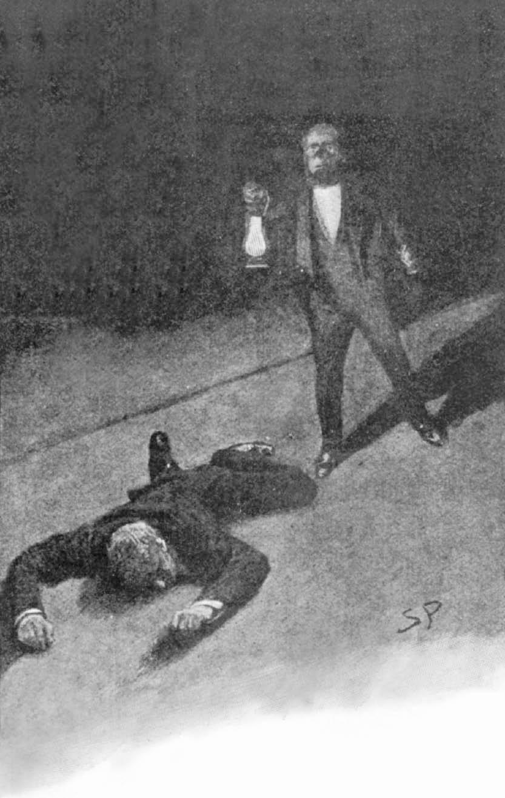

行至尽头，发现其尸体。

莫蒂默医生折起报纸，放回口袋。

“这些都是公之于众的事实，福尔摩斯先生，有关查尔斯·巴斯克维尔爵士死亡的情况。”

“真该谢谢你，”福尔摩斯说，“引起了我的注意，这个案子确实很有意思。我看过报纸当时的报道，可是我完全给梵蒂冈宝石案这么件小事拉过去了，急于为教皇效劳，居然把几件很有意思的英国案子丢在了脑后。这篇报道，你所讲的都是公之于众的事？”

“是的。”

“那么，再让我来知道一点未公之于众的内幕吧。”他往后一靠，双手十指相对，显出毫不在乎的神态，如法官一般没有表情。

“正是这样，”莫蒂默医生说，情绪激动起来，显得异常兴奋，“我所要讲的，都是对什么人也没有讲过的。至于我的动机，可要对验尸官调查保守秘密。是这样，作为一个懂科学的人，不宜介入公众迷信之中，起推波助澜作用，这对公众会有不良影响。我还另有原因，巴斯克维尔庄园，它本来名声已经有损，要是再增加点什么说法，那就正如报上讲的，将无人敢住进庄园去了。鉴于这两个理由，我想，还是保持沉默比较好，说出来实际效果不佳。但对你，完全不必有顾虑，可以如实相告。

“沼泽地区居民很少，住家相距很远，住得靠近的人家才有见面的机会。正是这缘故，我同查尔斯·巴斯克维尔爵士来往比较多。除了拉夫特庄园的法兰克兰先生，生物学家斯泰普尔顿先生，方圆数英里之内再没有什么受过教育的人了。查尔斯爵士喜欢离群独处，因为有病，才使我们两人认识起来，又都对科学感兴趣，我们就经常保持来往。他从南非带回许多科学资料，每逢天气好的夜晚，我们少不了聚在一起讨论布须曼人<a href="#part0080.xhtml_ch6"
id="part0080.xhtml_ch6-back">(6)</a>、霍屯督人<a href="#part0080.xhtml_ch7"
id="part0080.xhtml_ch7-back">(7)</a>的比较解剖学，消磨不少时光。

“最近几个月来，事情是越来越明显了，我看到查尔斯爵士神经高度紧张，紧张到了极点。他原本就深信那个传说，就是我给你读的那个——一直深信不疑。所以他只在自己庄园内散步，晚上绝不会跑到沼泽地上去，怎么请也是请不出他的。说来你简直不敢相信，福尔摩斯先生，他无时无刻不担心家里就要遭殃。他祖上的种种纪录，他说起来都头头是道，当然件件教他心寒。他常常会想起大难就要临头，好几次问我夜晚出诊的时候，路上可曾见到怪物，或者听到过一只猎犬叫。他问我猎犬的事有好几次，每次说起来都紧张得声音也发抖。

“我记得清清楚楚，那是出事前的三个星期。有天晚上我套起轻马车去他那里，碰巧他在大厅门口。我从马车上下来，正站在他面前，这时发现他两眼发直，朝我身后望，满脸的惊吓和恐惧。我猛地转身，只看见有样东西，忽地闪过，像是一头黑色的大牛犊，就在路的尽头。他怕得要命，怕成那个样子，我倒要看看究竟是什么东西，就跑向那头动物出现的地方，可是它不见了。这件事发生后，他心境极坏。那天晚上我一直陪着他。就是那天，他解释自己怎么会这么惊慌失措，并拿出一份祖传家书，托我保管，就是刚才念的那一份。我提起这件事，因为想来同以后发生的悲剧未必没有关系，但是当时我心里想这完全是微不足道的事，惊慌成那个样子，实在大可不必。

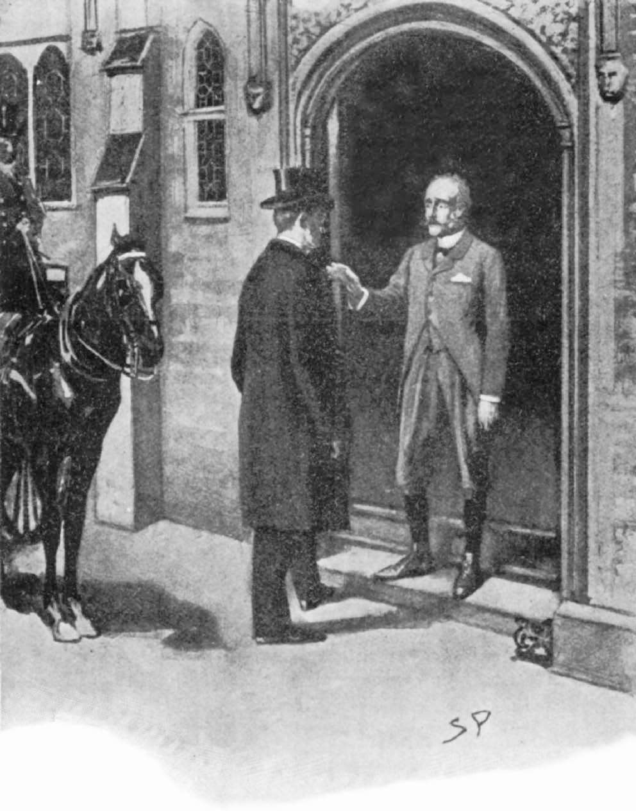

“我从马车上下来，发现他两眼发直。”

“查尔斯爵士要来伦敦，还是出于我的劝告。他的心脏，我知道已经不是很好，还一直在精神紧张之中过日子，尽管这个事的缘由看来荒唐，可是毕竟已经严重影响着他的身体健康。我想，让他到城里住上几个月，使他分分心，多个消遣，面貌也许就焕然一新。斯泰普尔顿先生，和大家都是老朋友，也十分关心他的健康状况，也有跟我一样的意思。不料到了临行之前，大祸从天而降。

“查尔斯爵士那天夜里去世，是管家巴里莫发现的，差马车夫珀金斯来叫我，我正好还没睡，所以能够距他死亡不到一小时就赶到巴斯克维尔庄园。我做了检查，我的检查结果同验尸结论是完全一致的。我还顺脚印踏勘了紫杉树小巷道。在通向沼泽地的小道栅门前，看了看，他好像有过停留。我观察到，从这里开始，以后的脚印两样了。我还注意到，在沙砾软土的地面上，除了巴里莫的脚印，没有别的痕迹。最后检查了尸体。尸体躺在那儿还一点没动过，一直等我到场。查尔斯爵士面朝下倒地，双臂前伸，指甲抠入泥土里，由于强烈刺激，他的脸部剧烈扭曲，扭曲得变了形，我都不敢认定是他了，不过的确全身没有任何伤痕。巴里莫对验尸官有一点没有说对，他说尸体周围的地上没有可疑痕迹，但是我看到有——相距不太远，很清晰，都是新的脚印。”

“脚印？”

“脚印。”

“男人的还是女人的？”

莫蒂默医生向我们神秘地望一眼，压低了嗓音像是耳语似的回答说：“福尔摩斯先生，都是一只大猎犬的爪印。”

————————————————————

<a href="#part0080.xhtml_ch1-back" id="part0080.xhtml_ch1">(1)</a> 大叛乱时期，指1642—1651年的英国内战时期。国王查理一世及保皇党与国会之间因王权与民权之争爆发战争，议会获胜，国王被断头处决。

<a href="#part0080.xhtml_ch2-back" id="part0080.xhtml_ch2">(2)</a> 克拉伦登男爵（Lord
Clarendon，1609—1674），英国政治家、史学家，英王查理二世枢密顾问、大法官，著有《英国叛乱和内战史》。

<a href="#part0080.xhtml_ch3-back" id="part0080.xhtml_ch3">(3)</a> 米迦勒节（Michaelmas），每年9月29日，基督教纪念天使米迦勒率领使者与撒旦战斗。

<a href="#part0080.xhtml_ch4-back" id="part0080.xhtml_ch4">(4)</a> 此休戈·巴斯克维尔是本篇从开始就提到的那个恶人休戈·巴斯克维尔的同名后裔。

<a href="#part0080.xhtml_ch5-back" id="part0080.xhtml_ch5">(5)</a> 默菲（Murphy），爱尔兰的普通姓氏，被用来戏称爱尔兰人，含贬意。

<a href="#part0080.xhtml_ch6-back" id="part0080.xhtml_ch6">(6)</a> 布须曼人（Bushman），意为“丛林人”，非洲纳米比亚和博茨瓦纳等地的土著民，皮色棕黑，个矮，以狩猎为生。

<a href="#part0080.xhtml_ch7-back" id="part0080.xhtml_ch7">(7)</a> 霍屯督人（Hottentot），南非一民族，属布须曼人，原居好望角，几已灭绝。

# 第三章　疑案

说实在的，听到这些话，我浑身起鸡皮疙瘩。医生他自己说话的声音也在颤抖，这说明他一边在向我们叙述，一边内心里也极度紧张。福尔摩斯激动得向前探着身，两眼闪出锐利、专注的光芒，这是他对事情极度感兴趣时显露的目光。

“你看清楚了？”

“就像现在我看见你这样清楚。”

“你没跟别人说？”

“跟别人说有什么用？”

“旁人怎么就没有看见呢？”

“脚爪印离尸体大约二十码，谁也不会想得到。我要是不知道那个传说，恐怕也不会在意了。”

“沼泽地里不是有许多牧羊犬吗？”

“当然有，可那不是牧羊犬。”

“你是说很大？”

“巨爪！”

“尸体边上没有吗？”

“没有。”

“那天晚上天气怎么样？”

“又潮湿又冷。”

“没有下雨？”

“没有。”

“树林小路是怎么个情况？”

“是两排紫杉树篱，都是十二英尺高的老树，密得没法穿过，中间的小道大约八英尺宽。”

“树篱和小路，这之间还有什么？”

“有。路两边都有长条草地，每边各宽约六英尺。”

“唔，我懂了。紫杉树篱有个地方是个门？”

“对了，一扇栅门，通向沼泽地。”

“还有别的出口吗？”

“没有。”

“这么说，到紫杉树篱的小巷道，要么从宅屋走，要么从沼泽地走？”

“还有一个出口，远在另一头，要穿过凉亭。”

“查尔斯爵士去了这个门没有？”

“没有。他躺着的地方距离那头有五十码。”

“好，现在请告诉我，莫蒂默医生——这非常重要，你看见的脚印是在小路上，不是在草地上？”

“草地上看不出脚印。”

“都是在小路的边上，跟沼泽地栅门同一侧吗？”

“不错，都是在小路的边上，和沼泽地栅门同一侧。”

“你这么说，我感到太有意思了。还有一点，栅门是关着的？”

“关着，还上了锁。”

“门有多高？”

“大约四英尺高吧。”

“人能跨得过去吗？”

“可以。”

“在栅栏门边你看到什么痕迹了？”

“没什么痕迹。”

“怪事，怎么就没有一个人检查一下？”

“不，我检查了，我亲自看过。”

“没发现什么？”

“脚印很乱。看得出来，查尔斯爵士在那里站了五分钟，或者十分钟。”

“你怎么知道呢？”

“因为他雪茄烟灰掉过两次。”

“太棒了！是咱们同行，华生，想事方法跟咱们一个样。还有痕迹呢？”

“在沙砾地一小块地方，都是他的脚印。我看得出来，不是旁人的脚印。”

福尔摩斯的手指敲着膝头，显示有点按捺不住。

“可惜我没有去现场！”他高声说，“显然是桩非同一般的复杂案子，科学家们可以大显身手的好机会呵！那片沙砾地上，要是我，应该可以看出很多线索来，可惜早被雨水冲掉了，叫看热闹的农民用木鞋踩得没有了。啊，叫声莫蒂默医生，莫蒂默医生呵！你就没想到该叫我去嘛！说句实话，这事你自己有责任！”

“我没法来叫你，福尔摩斯先生，不能对外界公开有关事实，我已经说了其中的缘由，不希望这样做。再说，再说——”

“你想再说什么呢？”

“有些问题，即使最精明老练的侦探，也是无能为力的。”

“你的意思，这件事是超自然的妖魔作怪？”

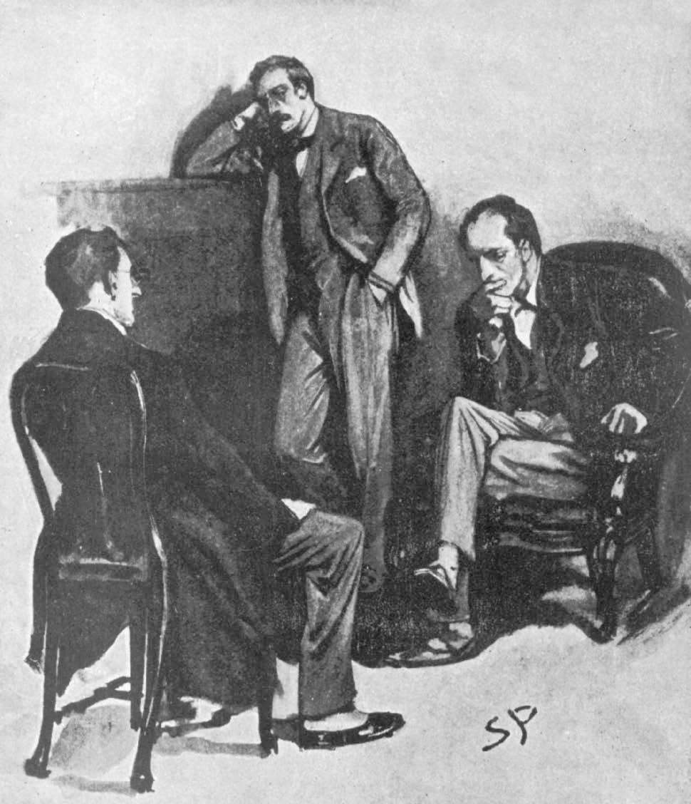

“这件事是超自然的妖魔作怪？”

“我还不能肯定这么说。”

“你不能肯定，但你显然是这么想的。”

“自从悲剧发生以来，福尔摩斯先生，我耳朵里已经听到好几桩事情，都难以用自然现象解释得通。”

“举举例子。”

“比如说吧，这件怪事出来之前，有好些人见过一样怪物，在沼泽地上，跟巴斯克维尔的怪兽一个样，科学从来没说起过有这种动物。他们一致认为这是一只巨怪，发亮光，极可怕，是恶魔。我曾经特地向他们打听过，有一个是村里人，头脑清楚、精明，有一个是钉马掌的铁匠，还有一个沼泽地上的农夫，如何如何，他们都说得一个样，是个可怕的幽灵，同那只传说的猎犬完全一样，神秘、凶恶。我跟你说，这个地区笼罩着一片恐怖，谁敢在晚上走过沼泽地，就算得上一个英雄好汉。”

“那么你，有科学知识教养的人，难道相信那是超自然的神怪？”

“我也不知该相信什么才好。”

福尔摩斯耸耸肩。

“我迄今一直是对人世做调查研究，”他说道，“只不过是同人间的罪恶作斗争而已，至于要同万恶之神去打交道，恐怕心有余而力不足，非我所能了。眼下你总得承认，那爪印可是明摆着的物质事实。”

“原先是一只活狗，够厉害的，能咬人脖子，现在成妖魔了。”

“我看你已经完全滑到超自然主义者一边去了。那么，莫蒂默医生，容我问你一句，既然你持有如此的观念，又何必来找我呢？你同时告诉我，调查查尔斯爵士的死因不会有结果，可又希望我来做调查。”

“我没说希望你来做调查。”

“那么，我有什么可以帮助的呢？”

“我是来求你指点，应该对亨利·巴斯克维尔爵士做些什么，他就要到滑铁卢车站了。”莫蒂默医生看了看自己的表，“正好还有一小时一刻钟。”

“他是继承人？”

“是的。查尔斯爵士一死，我们就寻找这位年轻绅士的行踪，才知道他在加拿大办农业。据刚刚传来的消息说，他是个很不错的人，各方面都好。我现在不是以医生的身份出面说话，而是以查尔斯爵士的遗嘱受托人和执行人出面说话。”

“我猜，没有别的申请继承人了？”

“没有了。另外还有一个亲属，也是我们能追查到的一个，是三兄弟中最小一个；去世的查尔斯爵士是大哥；老二年轻时候就死了，也就是亨利这孩子的父亲。这老三罗杰，是羊群中的黑羊，家族败类。他跟专横跋扈的老巴斯克维尔一脉相承。还巧着呢，他们告诉我，他那个长相同挂在家里的老休戈画像简直一模一样。他为非作歹，闹得在英格兰待不下去，逃到了中美洲，在那儿染上了黄热病，一八七六年死掉了。亨利是巴斯克维尔家族最后仅存的子孙。嗯，还有一个钟头零五分，我要到滑铁卢车站去接住他，不让他直接去庄园。我接到了电报，他今晨抵达南安普敦。现在，福尔摩斯先生，你看我应该怎么跟他交代呢？”

“不让他到祖祖辈辈的老家去，这是为什么？”

“按常理自然是可以的，对吗？可是不行，因为考虑到每个巴斯克维尔家的人一到了老屋，就有生命危险。我觉得，如果查尔斯爵士临死还能跟我说话，一定会叮嘱我，千万不能把孩子领进这个祸害之地，孩子可是这古老家族唯一的根苗、家产巨富的继承人。况且，不可否认，本地这个贫穷、毫无生气的乡村，全指望着他，靠他回来振兴。要是偌大一个庄园连一个主人都没有了，那查尔斯爵士所做的全部义举善事立刻彻底泡汤。我担心，惟恐自己摇摆不定，把握不好，因为明显涉及我个人的利益关系，所以特来向你提出本案，请求你的指点。”

福尔摩斯稍稍考虑了一会儿。

“简单说，事情就是这样，”他说道，“依你的意见，有妖魔作怪，把达特穆尔搞得不得安宁，巴斯克维尔一家人在此无安身之地——你是这样看的吗？”

“至少我得把话说明白，已经有先例在，这是完全可能发生的。”

“确实是这样。但是也可以肯定地说，如果你所讲的超自然道理是正确的，那么要叫这个年轻人遭殃，在伦敦跟在德文郡，还不都是一样容易！一个恶魔只有在本地施威的魔力，像教区的地区权限那样，那还算什么恶魔呢！”

“你对这事太轻言了，福尔摩斯先生。如果是你自己身受这一桩桩、一件件事情，你就会同我有一样的看法和做法。你的意思，我当然是明白的，年轻人在德文郡也同样是安全的，同在伦敦一样。他还有五十分钟就到了，你看怎么办好呢？”

“按我说，这样吧，你叫一辆马车，把你的狗带走，瞧它正在抓我家的大门呢，快去滑铁卢接亨利·巴斯克维尔爵士。”

“然后呢？”

“然后嘛，你什么也别对他讲，等我对这事做出决定再说。”

“要等多长时间你才能做出决定呢？”

“二十四小时。到明天十点钟，莫蒂默医生，你再来这儿找我，我必将非常感谢，如果你带着亨利·巴斯克维尔爵士一起来，那么对我以后要进行的计划将大有帮助。”

“我一定遵行，福尔摩斯先生。”他在衬衫袖口上记下约定的时间，带着表情奇异、目光凝滞、心神不宁的样子匆匆离开。走到楼梯口，福尔摩斯又把他叫住。

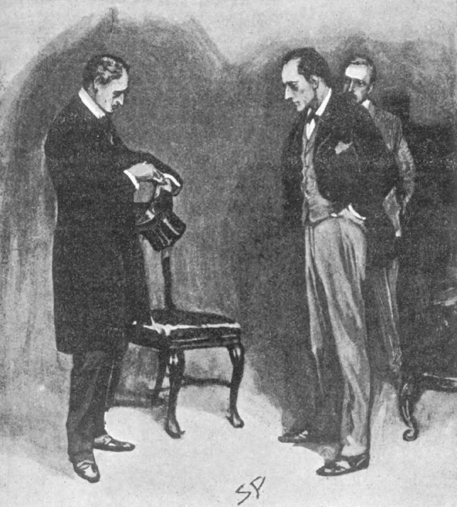

他在衬衫袖口上记下约定的时间。

“还有一个问题，莫蒂默医生，你说查尔斯·巴斯克维尔爵士去世之前，有几个人看到过沼泽地的那只魔怪？”

“有三个人见过。”

“以后还有人看见过吗？”

“没再听说过。”

“谢谢你，祝你早上好。”

福尔摩斯回到座位上，神态安详、满意，这表示他对上门的这件案子，心中已不再是一片模糊，毫无主意。

“出去吗，华生？”

“你有事就不出去。”

“没事，老伙计。要有动作了，我会有求于你。这真乃天下一奇案，可说是旷世仅有。你走过布莱德雷店的时候，叫他们送一磅粗烟丝过来，要最浓、最烈的，啊？谢谢你。你高兴的话，天黑以前不要回来，如那样就最好。在这段时间，我要把今天上午的问题，这个最有趣味的问题，拿过来就其初步印象过一过，理一理，也就乐在其中了。”

我知道，我的朋友十分需要闭门的宁静、离人的孤独，才能连续数小时费心用脑、殚精竭虑地进行紧张的思考。此时他要把每一项细节拿来掂量，反复构建、组合、推理，在推理的比较平衡中剔除不合理的成分，一发现实质的关键的而非臆想的枝节问题，便马上不失时机地抓住。我因此把整天时间消磨在俱乐部中，一直等到天黑才回到贝克街来，当我回去重又在客厅里坐定时，已快九点了。

我推开客厅的门，第一个感受就好像屋里着了火，满屋子都是烟，连台灯的灯光都因为蒙烟而变得暗淡了。等进了屋，我才放下了心，原来是浓烈的板烟弥漫，烟气呛得我喉咙耐不住咳嗽起来。从烟雾之中，模模糊糊看到福尔摩斯穿着睡衣的身影蜷缩在安乐椅上，嘴里咬着黑色陶制烟斗，身体周围放着一卷卷的纸。

“着凉了，华生？”他说。

“没有。空气太混浊，才咳嗽。”

“我看是有点闷，你说得对。”

“闷得叫人都透不过气！”

“那就把窗打开。你在俱乐部泡了一天吧，我说。”

“哦，我亲爱的福尔摩斯！”

“我说得对吧？”

“没错。可怎么会——”

他见我一脸疑惑，大笑起来。

“看你浑身那个快活劲儿，华生，这就让我牛刀小试，拿你来松弛一下神经。一位眉清目秀的绅士，在湿漉漉的雨天里出门去，晚上回来，居然帽子、皮鞋依然锃光闪亮，他准是在什么地方待了一天没走动。他又不是个三朋四友成群的人，那么他何处去落脚呢？这还不昭然若揭？”

“是，是，昭然若揭。”

“世上事，事事都明摆，有眼无心看不见。那么你想想，我是上哪儿去来了？”

“你不是待这儿也没动吗！”

“恰恰相反，我到德文郡去了。”

“你灵魂出窍去了？”

“完全正确。我的身体留在这安乐椅里，抱歉的是，还趁我灵魂不在的时候喝光了两大壶咖啡，消耗烟叶也是无法计数。你走了以后，我叫人去斯坦福地图店弄来沼泽地这一区域的地籍图，我这就灵魂飞出，神游了一天。我自信对这地方条条路径、处处角落，都已经了如指掌，可以自由巡回。”

“一幅详细的大地图吧？”

“很大。”他打开地图一部分，摊开在膝头上。“你看，这是跟我们有关的那个区域。这中央就是巴斯克维尔庄园。”

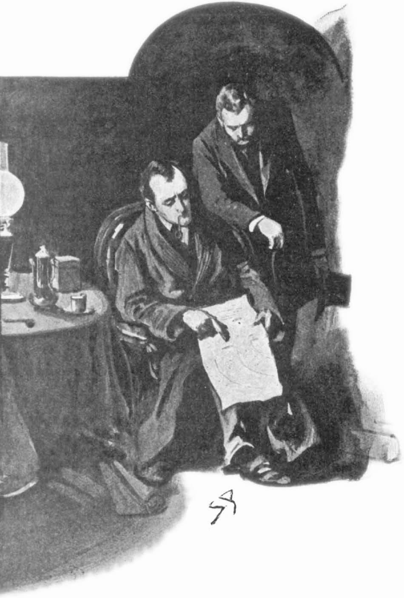

“这中央就是巴斯克维尔庄园。”

“四周有一圈树围绕着吗？”

“有。紫杉树小路没有在这儿标出来，可我猜想一定就是沿这条线这么过来，这边是沼泽地，你可以看见，就是右边这一块。这儿一小块地方的屋子是格林本村，就是咱们朋友莫蒂默医生开诊所、居家之地。以此为中心，半径五英里之内，看见吧，只有零零落落的几户人家。这儿是拉夫特庄园，他谈话里提到过的。标明在这儿的房子可能就是生物学家的住宅——斯泰普尔顿，要是我记得没错，是姓这个姓。这里是有两座沼泽地农家屋的地方，叫高岗和泥潭。距此十四英里远，是王子城大监狱。散布在各个点之间的大片空地，周围的空地，都是荒无人烟的沼泽地。这么个地方，就是悲剧演出的舞台了，我们参加进去演出，还有连台好戏在后头呢。”

“一片荒野之地。”

“是呀，所在可是块风水宝地，可以任由恶魔在人间肆虐——”

“你这不是自己也倒向超自然迷信嘛！”

“为恶魔作伥的，恐怕是有血有肉之躯呢，能不是吗？我们一上来就面临两大难题。第一点是究竟有没有发生过犯罪，第二点是，究竟是什么性质的犯罪以及犯罪是怎么进行的？当然，如果莫蒂默医生的疑虑、推测是正确的话，我们面临的就是一般自然法则以外的非自然力，我们的调查只好落幕收场。但是，我们不到绝处心不死，要竭尽全力去求证其他的假设，只有碰壁全无结果，才对此甘拜下风。我说，可以关窗了吧，你应该好过些了。这也是与众不同，我是得有浓烟味，有强劲的烟味空气才会有强劲的思想产生。当然我还不至于钻到小盒子里去思考问题；不过从逻辑上讲，我确是这个理儿。这桩案子，你用过心思没有？”

“想过，这一天来一直想着呢。”

“有何高见呢？”

“可说是扑朔迷离。”

“案子确实非同一般。有几个地方不容忽视，脚印变化就是一个。这一点你怎么看？”

“莫蒂默说是，那个人走这段路是用脚尖走的。”

“他不过是重复法医的话，验尸法医是个笨蛋。为什么有人好好地偏要用脚尖走路！”

“那么，怎么解释？”

“这个人在跑，华生——没命地跑，奔跑逃命，跑得心脏爆裂，仆地而死。”

“为什么要逃命？”

“这就是问题的关键所在。有迹象表明，这人给什么吓坏了，才逃命的。”

“你凭什么这样说？”

“我推断，他受惊吓，是见了沼泽地那边过来什么东西。正是这样，也是极有可能的，只有这个人已吓得魂不附体，才会失去方向，不是往家里跑，反而向反方向跑。要是吉卜赛人的证明可以算数，这个人一边跑一边高喊救命，跑的方向、叫喊的方向都正好是没有人的方向。还有，那天晚上他在等谁呢？等人为什么要在树林小路上等，不在自己家里等？”

“你认为他是在等人？”

“这人已上了年纪，身体虚弱，他晚上散散步，是可以理解的。可是地上潮湿，夜里寒冷，站在那里五分钟，十分钟，这正常吗？莫蒂默医生根据雪茄烟灰得出的结论，十分可靠，我完全信得过。”

“他是每晚都要出去的。”

“他不可能天天晚上要到沼泽地栅门去逗留，我认为不可能。相反，证据表明，他对沼泽地很忌讳，躲还来不及呢。那天晚上可偏是等在那儿了。这一夜正是，他就要动身去伦敦的前一个晚上。事情应该略具端倪了，华生。所有的过程有些关联了。麻烦一下，请把我的小提琴拿给我。这件事搁一搁，一定要等到明天上午见了莫蒂默医生和亨利·巴斯克维尔爵士，才能再作更深入一步的思考。”

# 第四章　亨利·巴斯克维尔爵士

我们的餐桌吃过早饭就给早早收拾干净，福尔摩斯穿着睡袍等待约好的会面。我们的当事人很守时，时钟刚敲十点，莫蒂默医生就到了，身后跟随的是年轻的准男爵。后者矮小精干，一对黑眼珠，年龄约三十来岁，身体长得挺结实，浓眉粗脸，一副强悍好斗的相貌。他身穿略带红色的粗花呢套装，外表显示出是个久经风霜、多半是在户外活动的人，但他眼神沉稳、安详，态度持重、自信，处处表明是一种绅士风度。

“这就是亨利·巴斯克维尔爵士。”莫蒂默医生介绍说。

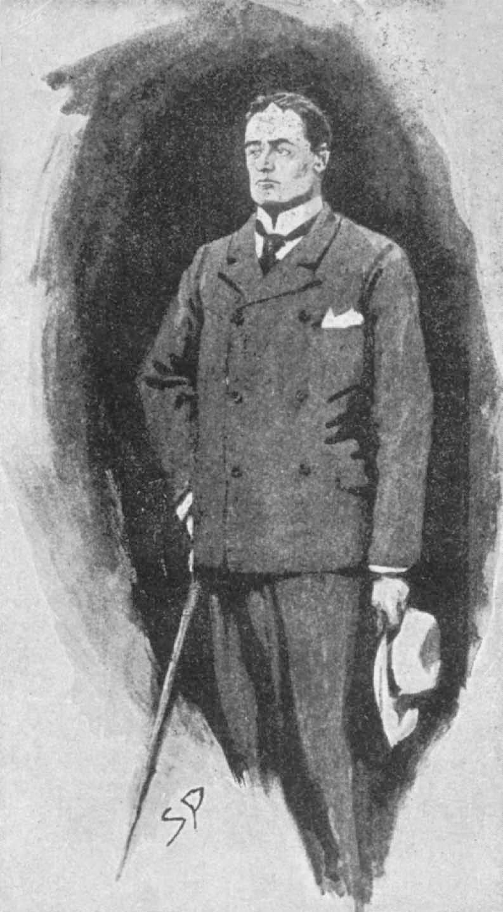

亨利·巴斯克维尔爵士。

“喔，是的，”亨利爵士说道，“说来也奇怪，福尔摩斯先生，假如我这位朋友没建议我来拜访你，我自己也是要来的。久闻大名，你连不起眼的小问题都能看出内中的奥秘。今天早晨我就遇上一件，我自己怎么也想不通是怎么回事。”

“请坐下，亨利爵士。你是说，你一到伦敦，就已经碰到了不寻常的事？”

“也不是什么太重要的事，福尔摩斯先生。只不过是有人开玩笑，多半是开玩笑。是这一封信，其实连信都称不上。我是今天早晨收到的。”

他把信放在桌上，我们都探过身去看。是一般纸质的信封，浅灰色，上面收信人写“亨利·巴斯克维尔爵士，诺森伯兰旅馆”，很粗糙的仿印刷体笔迹，邮戳是“查令十字街”，投递日期是前一天傍晚。

“有谁事先知道你要住诺森伯兰旅馆呢？”福尔摩斯问，目光敏锐地望着我们的来客。

“没有谁会知道呀，我还是见了莫蒂默医生之后，我们一起决定的。”

“那么莫蒂默医生，毫无疑问已经去过了？”

“不，没有，我一直待在一个朋友家里，”医生解释说，“根本不可能说起我们会到这家旅馆去。”

“嗯！看来，有人对你的行踪非常感兴趣。”福尔摩斯从信封里抽出一页折成四折的半张傻瓜帽纸<a href="#part0082.xhtml_ch1"
id="part0082.xhtml_ch1-back">(1)</a>，把纸打开，在桌上铺平，信笺中间只有一行字，是用剪下来的铅印字拼凑贴成的一句话：

你面临生命危险须谨慎不可近沼泽地。

只有“沼泽地”这个词用墨水手写，也是写成仿印刷体字样。

“看过了，”亨利·巴斯克维尔爵士说，“能不能告诉我，福尔摩斯先生，这恐吓是什么意思？又是谁会对我这么有兴趣？”

“你怎么看呢，莫蒂默医生？你总得承认这里头并没有超自然的鬼神在作怪，无论如何不会有吧？”

“当然不会，先生。不过，这写信的人完全知道，这桩事情之中，还是有超自然神灵作怪。”

“什么事情呀？”亨利·巴斯克维尔爵士急切地问道，“听起来，诸位知道我有什么事吧？我自己的事自己倒不知道。”

“你离开这里之前，就会知道个中情况，亨利爵士，这一点我向你保证，”福尔摩斯说，“现在这时候，还是先有劳你跟我们一同研究研究这封信。很有趣，信一定是在昨天晚上拼贴好寄出的。有昨天的《泰晤士报》吗，华生？”

“有，在墙角那边放着呢。”

“麻烦一下，你拿一拿——反面一版，请翻过去，看见头条文章？”他迅速朝文章各条块上下扫了一眼，“重头文章，这是谈自由贸易。让我来给大家读一段。

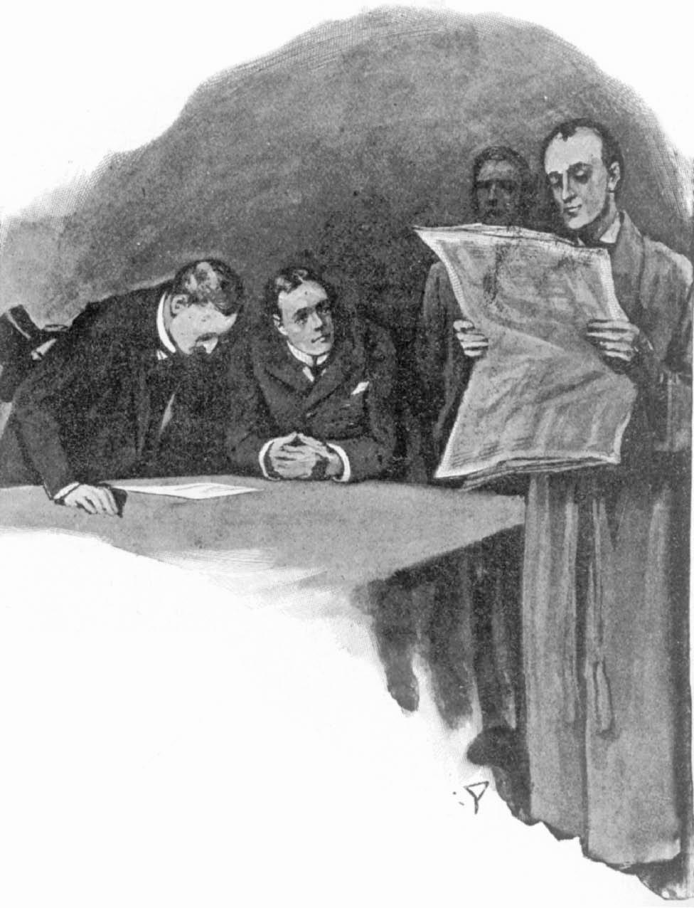

他迅速朝文章各条块上下扫了一眼。

“花里胡哨的言辞让你相信，征收保护性关税将给各业及工业带来极强的生命力。但是稍作谨慎分析便可知，不可图近利，须从长远着眼，此项立法将有导致国家财源面临受阻的危险，并将削减进口总值，降低岛国总体生活水平。”

“你对这件事是怎么想的，华生？”福尔摩斯欣喜莫名地大声说，得意洋洋地搓起了双手，“你不认为这种评论的气度难能可贵，值得称道吗？”

莫蒂默医生以职业性专注的神情观察福尔摩斯的脸色是否正常，而亨利·巴斯克维尔爵士将一双茫然的眼睛盯着我。

“我对税收这种事一窍不通，”亨利爵士说，“这跟那张来信条子有什么相干？不是扯得离题十万八千里了吗？”

“恰恰相反，我认为我们正好对上了路子，亨利爵士。华生熟悉我的思路，比你清楚得多，可是恐怕连他也不一定摸得着头脑，抓得住这段话里边的含义。”

“不知道，我坦白承认，看不出有什么联系。”

“你瞧，亲爱的华生，关系紧密得很呢，那些字都是从这一段里摘出来的。‘你’，‘生命’，‘谨慎’，‘不可近’，‘须’，‘面临’，‘危险’。还看不出这些字都是从里面摘出来的吗？”

“原来如此，你太神了！太棒了！令人叹服！”亨利叫道。

“如果还觉得牵强附会，那么‘不可近’、‘面临’、‘危险’确实是从这一篇里剪下来的，事实确凿可信。”

“嗯，噢——果然不错！”

“没错，福尔摩斯先生，我完全料想不到，”莫蒂默医生说，两眼惊异地盯着我的朋友，“说是从报上剪下来的字，我当然可以相信，但要说就是哪一篇，还说就是这篇大文章，那可就不是件容易的事了。我还从来没有碰到过有这么大本事的人。你怎么会有这一手的？”

“请问医生，你能判断黑人头骨和爱斯基摩人的头骨吗？”

“当然可以。”

“怎么判断？”

“这可是我的爱好和专长。区别很明显：眉骨的隆起、脸面部角度、腭骨线，都有区别，还有——”

“那么这可是我的爱好和专业呀，区别也同样很明显，《泰晤士报》九点铅字印的字迹新，半便士一份的晚报，铅字就蹩脚，我眼睛一看就能分清，跟你看黑人头骨、爱斯基摩人头骨一样在行。识别铅字类型是刑事侦破的一项基本知识，侦破专家的一项基本功。不过我年轻的时候不行，也得坦白承认，有一回把《利兹信使报》同《西方晨报》搞混了。不过《泰晤士报》上评论文章的字型是与众不同的，像这样的字型绝不可能出自其他报纸、其他版面。信既然是昨天贴好寄出的，那么最有可能就是昨天报上的字，我们一找就可以找到。”

“你这么一说，我也明白了，福尔摩斯先生，”亨利·巴斯克维尔爵士高兴地说，“看这贴在信上的字，是用剪刀剪的——”

“是指甲剪刀，”福尔摩斯说，“你看，剪刀头很短，看见吗，‘不可近’是剪了两下才剪下来的。”

“是的，两下。那么，这个人是用小剪子把这些字剪好，再用糨糊贴到——”

“胶水。”福尔摩斯说。

“用胶水贴在纸上。我倒不懂，为什么‘沼泽地’这个词要手写呢？”

“因为他找不到铅印的词呀。其他的词都简单，还容易找到，这‘沼泽地’就不太一般。”

“嗯，说得没错，是这个道理。这封信上你还看得出点别的名堂吗，福尔摩斯先生？”

“形迹尚有一二。为了不留痕迹，这个人是用了一番心思的。这地址，你看，写成印刷体字样，可是写得不好。《泰晤士报》这张报纸，都是有相当文化程度的人才看，一般人不大看的。据此可以推断，写信人有一定的文化程度，可他要假装没有文化的样子，要想尽办法隐掉自己的笔迹，是生怕给你认出来，或者会给查出来。再一点，你发现吗，这些字贴得不齐，不成一线，而是高低很不一致，有的特别高。‘生命’就是，贴得最不是地方。表明剪贴的人很粗心，或者表明很紧张，有点心慌手乱。总的看，我倾向于后一种情况，紧张。因为这是重要的事情，这个人搞这么一封信不大会粗心大意。要说是慌里慌张，那就又引出一个新问题来，他为什么要慌张呢？信只要清早寄出，亨利爵士离开旅馆之前总归收得到的，用不着紧张。要么怕给人撞见——又是怕给谁撞见呢？”

“我们现在简直是在胡乱猜测。”莫蒂默医生说。

“不见得，各种可能都要摆一摆、想一想，把可能性最大的挑出来，这就是想象力的科学化运用。不过当然啦，以事实为根据，永远是我们思考问题的出发点。还有一点，你一定又要说是胡猜了，我几乎可以肯定，这个地址是在一家旅馆里写的。”

“倒要听听你又是根据什么这样说的呢？”

“仔细看看清楚，看得出来，写的笔和墨水都不好使，写不顺畅。写一个字，笔尖就两次拉了纸；地址这么短短的几个字，墨水就断水三次，表明墨水瓶里没墨水了。哪个人家墨水瓶会是这种样子？少见。这两件事合在一起发生，不用说更是罕见。可是要知道，旅馆的墨水、旅馆的笔，就正是这副模样，不是这副模样那倒是稀罕事了。真的，我不妨武断说一句，只要去把查令十字街各家旅馆跑一下，检查各家的废纸篓，保证能发现剪过的《泰晤士报》，社论字剪掉过的那一张。写匿名信的这位仁兄，别想逃得出咱们的手掌心！唉，唉，这纸？”

他又检查起贴字的傻瓜帽纸，拿起来凑到仅离眼睛一两英寸处仔细端详。

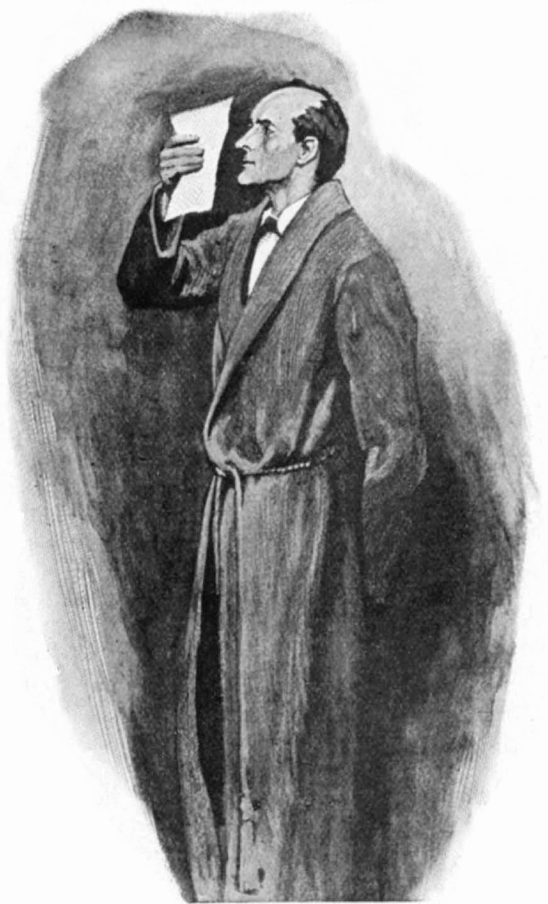

他又检查起贴字的傻瓜帽纸。

“什么？”

“没什么，”他说着重又把信纸搁下，“这是半张白底信笺，水印也没有了。看来，从这封无头信本身找线索，也就这么多，只能到此为止。想再问一句，亨利爵士，你来伦敦以后，还遇到些什么值得一谈的，说来听听？”

“啊，没有了，福尔摩斯先生，好像没有。”

“没发觉有人盯你梢，监视你？”

“我像是进入一部小说，情节还特别曲折离奇。”我们的客人说，“真见鬼，要盯我梢、监视我干吗呀？”

“我们正要说到这一点。不过在这之前，还想问一下，你没别的事要向我们谈了吗？”

“哦，就不知什么事你们才认为值得谈。”

“一切日常的事，只要是反常的，都值得谈。”

亨利爵士笑了笑。

“我对英国的生活还不熟悉，我从小差不多是在美国、加拿大度过的。不过，我想，让你丢失一只皮鞋，恐怕在这里也不算是正常现象吧！”

“你掉了一只皮鞋？”

“我亲爱的爵士，”莫蒂默叫道，“那一定是谁搞错了地方。你一回旅馆就会看到放好了。这点鸡毛蒜皮事也用得着麻烦福尔摩斯先生吗？”

“嗯，不是问我正常生活之外的事嘛！”

“正是，”福尔摩斯说，“不管事儿多不起眼，讲起来都觉得傻里傻气。你是说你掉了一只皮鞋？”

“是呀，放错地方了，也可能。昨晚我放在房门口，早上起来只有一只了。问过擦鞋的，他说不知道。最恼人的是这还是昨晚在河滨道新买的，穿都没穿过呢。”

“没穿过，为什么要放到外边给擦呢？”

“是双黄皮鞋，还要上油打光，所以我放在外面。”

“明白了，昨天你一到伦敦，就外出上街，就买了一双皮鞋？”

“我逛商店买了好些东西，莫蒂默医生一起陪着我。你瞧，我要回去，得穿戴得像个绅士。大概都是在美国西部待的，变得什么都大大咧咧了。我有许多东西，光这双棕黄色的高帮皮鞋——花了我六元钱——还没穿上脚就给偷掉了一只。”

“偷一只去做什么，没用的，”歇洛克·福尔摩斯说，“我也是这样想，同意莫蒂默医生的看法，丢失的皮鞋很快就会回来。”

“好，那么，各位先生，”准男爵用决定的口气说，“我这儿点点滴滴的事情都说得差不多了，现在该轮到诸位兑现诺言，告诉我到底一块儿要安排点什么事情。”

“你的要求完全合理，”福尔摩斯回答道，“莫蒂默医生，你昨天跟我们讲的那桩事，今天也只好由你再讲一遍啰。”

受到如此的鼓励，我们这位科学家朋友便从衣袋里掏出那份家书，和昨天早上跟我们讲的一样，一五一十把整个案子再说一遍。亨利·巴斯克维尔爵士听得全神贯注，中间不时发出几声感叹。

“噢，我继承这份遗产，恐怕烫手得很哪。”他听完长长的叙述后说道，“我很小的时候就听说过有一只猎犬，这是我家最喜欢讲的故事，可我从来没把这故事当真。听了伯父死的情况——嗯，我的脑袋涨得都要爆炸了，究竟怎么回事我都还没搞清楚。你们好像连这个也还没有确定：这到底是属于警察管的事呢还是属于牧师管的事？”

“正是这样。”

“现在又出现寄到旅馆里的这封信，我猜跟事情有关联。”

“看上去，沼泽地上出现的什么事情，有人知道得比我们还多。”莫蒂默医生说。

“另外还有一点要知道，”福尔摩斯说，“人家对你并无恶意，他们是警告你有危险。”

“也说不定这就是他们的目的，存心要把我吓走。”

“噢，当然可能也是。我得谢谢你，莫蒂默医生，你向我提出了这个问题；有几种可能，都值得注意。但眼前最紧迫的事得马上决定，亨利爵士，你是否合适回巴斯克维尔庄园，是去还是不去，哪个比较好。”

“我干吗不去？”

“那边说不定有危险。”

“你说的危险，是家里闹鬼呢还是来自外头？”

“啊，那也是我们正要弄清楚的事呀。”

“不管怎么样，我的答复是确定不移的，福尔摩斯先生。无论是阴间的死鬼也好，阳间的活人也罢，都绝对不能阻止我回我自己的老家去。这就是我的最后回答，不容更改。”他说这话的时候，一对浓眉紧锁，脸色充血，黑里泛红。这表明，巴斯克维尔家族的火爆脾气在这位硕果仅存的后裔身上依然没有改变。“同时，”他接着说，“你们说的这些事情，我没有时间去思考。这个事没边没际，叫人无法理解，也不是坐而空谈一次可以决定下来的。我要自己静下心来思考一段时间，看看再说。现在，你瞧，福尔摩斯先生，已经十一点半，我这就得回旅馆了。如果你和你的朋友，华生医生，下午两点能来敝处聚谈，并共进午餐的话，届时我可以再同诸位详细谈谈这事对我的震动该有多大。”

“方便吗，华生？”

“没问题。”

“那就有劳你的盛情款待了。我给你叫一辆马车吧？”

“我想走走，这件事搞得我心神不宁。”

“乐意奉陪，一起走吧，”他的同伴说道，“准两点钟碰头。Aurevoir<a href="#part0082.xhtml_ch2"
id="part0082.xhtml_ch2-back">(2)</a>，祝早安！”

我们听着两位来客的脚步声从楼梯下去，接着屋门砰地关上。一刹那工夫，福尔摩斯由懒洋洋似睡又醒的样子，变成生龙活虎。

“穿皮鞋，戴帽子，华生，快！一分钟也耽搁不得！”他冲进卧室里去，穿的是睡袍，才只几秒钟就又出来，已经换好收腰礼服大衣。我们俩一齐奔下楼上街，一望，莫蒂默医生和巴斯克维尔在前头，还能看得见，相隔大约两百码远，正向牛津街方向走去。

“要不要追上去把他们叫住？”

“不要，千万叫不得，亲爱的伙计。有你华生做伴，多蒙不弃，我也就很满意了。我们的朋友兴致还不错。这么明媚的早晨，实在是散步的好时光。”

他加紧脚步往前赶，不一会儿和前面两人的距离就缩短了快一半，便保持相距一百码，紧随其后。我们跟进牛津街，又转入摄政街。有一回我们的朋友停下来看橱窗，福尔摩斯也就同样驻足看看橱窗。不过，须臾之间，他高兴得压着嗓子轻轻叫了一声。我顺着他眼睛紧盯的前方望去，只见一辆很气派的马车，里面坐着一个男人，刚才还停在街对面，这时正开始在慢慢向前移动。

“一定是那个人，华生！跟上他！看仔细，无论如何得认出他的脸。”

就在那时刻，我看到马车侧窗中有一张一大把黑胡须的脸，一双凶光毕露的眼睛，朝我们转过来。忽然间，车顶活门向上一推，准是这个人向车夫喊了话，马车便一溜烟向摄政街飞驰过去。福尔摩斯东张西望想叫住一辆马车，可是空车一辆也没有。于是他在车水马龙中满街奔跑追赶。但是那辆车跑得太远，已经看不见了。

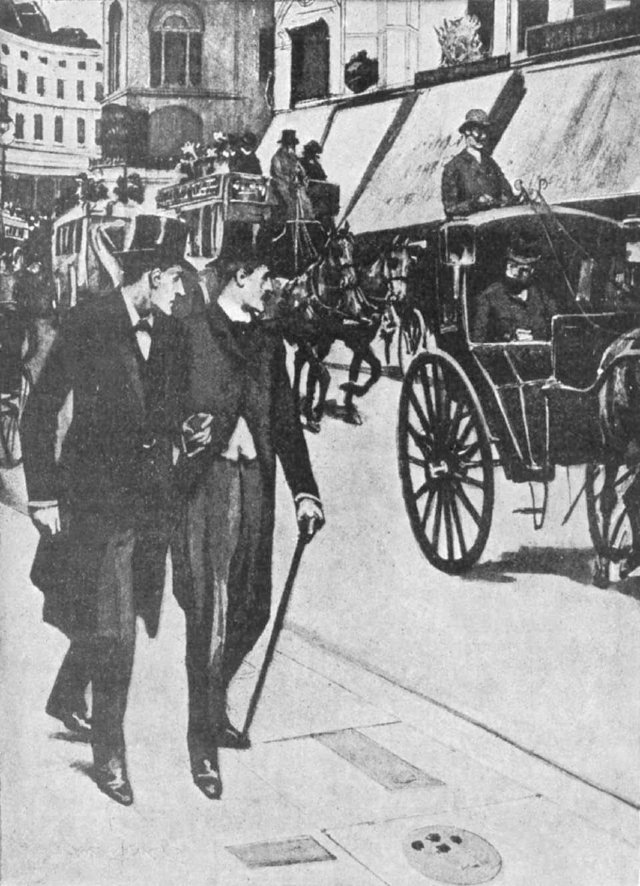

马车侧窗中有一双凶光毕露的眼睛。

“算了！”福尔摩斯恨恨地说，喘着气，从车马人群中过来，心中恼火，气得脸都发白，“有这么倒霉、这么糟糕的！有过吗？华生，华生，可得痛心疾首记住这一回，给人甩掉了，咱千里驹也有失蹄时！”

“那是什么人？”

“还不清楚。”

“是盯梢的？”

“嗯。情况都听到了，事情就很明白，巴斯克维尔一落脚，就处于某人的阴影之下，否则怎么会那么快就知道他下榻诺森伯兰旅馆？要是他头一天就给盯上的话，我敢说，第二天照样还要盯住他。你注意到了吧，我有两次走到窗口去，就是莫蒂默在讲那传说的时候。”

“记得，我注意了。”

“我向窗外望，看有没有人在下面街上假装逛来逛去，可是没发现。我们对付的这小子脑袋瓜子不笨，华生。这件事根子深着呢。才交手，虽然没能断定对方是善意还是恶意，可已经发觉他分量不轻，手腕有两下。两位朋友一走，我就立刻跟住，原指望看看是什么人在跟踪他们。此人挺狡猾，他知道靠走路跟踪不好，就包了一辆马车。这样既可以在后面装作闲逛慢行，也可以不至于引起两人的注意。他这样做还有另一个好处，一旦两人上了马车，他就立刻可以跟上去，不会被拉下。不过，这样做缺点也是有的。”

“那他就得受马车夫牵制。”

“一点不错。”

“真可惜，我们没把他的车号记下来。”

“亲爱的华生，我虽迟钝，你真的认为我迟钝到连个车号都会疏忽？车牌是二七〇四号。不过，这会儿车号对我们还没有用。”

“我是一时没了主意，不知该怎么办才好。”

“一发现是马车盯梢，我本应当立刻转身朝反方向走，不让他注意，然后随机应变也上一辆车跟住他，保持一定距离，或者干脆一直先到诺森伯兰旅馆，在那儿等着他，等这个可疑人跟随巴斯克维尔回来。原本他是盯人的，现在反过来被我们盯，盯住他，看他去什么地方。真遗憾，太心急了，叫对手占了上风，出乎我们的意料。我们暴露了自己，把目标也丢掉了。”

我们两人就这么一边谈，一边沿着摄政街慢慢闲逛。这时，莫蒂默医生跟他同伴在我们前面早已不见踪影。

“光跟踪他们两人并不是目的，没用了，”福尔摩斯说，“可疑人影也不见了，也不会再回头。我们得看看手中还有什么牌，再出牌就得果断。你记得车里边那张脸吗？”

“我只认出他是大胡子。”

“我也是——从胡须看，给我的印象准是假胡须。一个头脑精明的人，担当如此机敏灵活的重任，留一大把胡须很不合适，除非要伪装面目才有用。华生，这边来。”

他折入区邮电局快递部，一进门就受到邮电局经理的热情招呼、殷勤接待。

“嗨，维尔森，我有幸帮了你一点忙，小事一桩，你还不忘？看你这么客气。”

“哪能忘呢，先生，我不会忘的。你挽回了我的名誉，也可以说是救了我一命呢。”

“好伙计，不要这么说吧。我还记得，维尔森，你手下有个孩子叫卡特赖特，那次事情调查中表现得聪明伶俐。”

“不错，先生，他还在。”

“能把他叫来吗？——谢谢你！还有，这张五英镑，麻烦你给我换零。”

一个十四岁的少年，神采奕奕，相貌长得机灵，应经理召唤立刻来到，站在那里，以极大的尊敬注视着这位大名鼎鼎的大侦探。

“我看看《旅社便览》，”福尔摩斯说，“谢谢你！我说卡特赖特，这儿总共有二十三家旅馆，都在查令十字街这附近。你认识吗？”

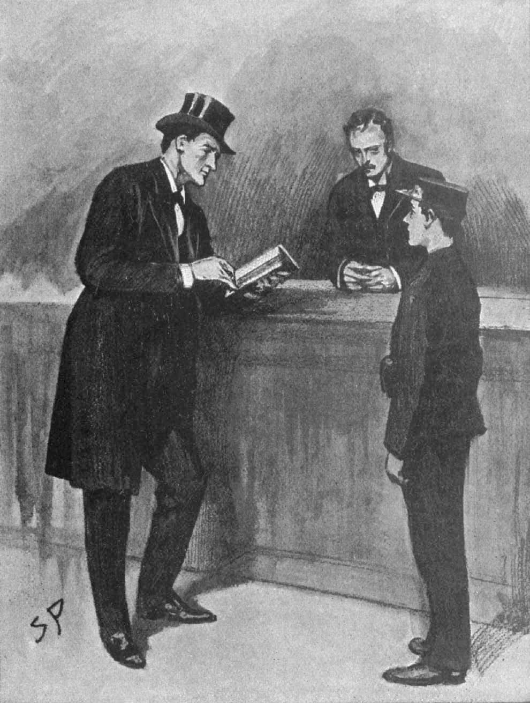

“这儿总共有二十三家旅馆。”

“都认识，先生。”

“你挨家去跑一趟。”

“好的，先生。”

“每到一家，你给门上人一个先令。这儿是二十三先令。”

“好的，先生。”

“你说是要看看昨天的废纸，就说有一份重要的电报送错了，你要把它找回来。这么说明白吗？”

“明白，先生。”

“不过，真正要你找的是《泰晤士报》，有一张剪刀剪过了一些小洞的报纸。这儿有一份《泰晤士报》，就是这一张，你认清楚了，清楚吗？”

“是的，先生。”

“如果外边看门人把大堂服务员叫来，你也给服务员一个先令。这儿再给二十三先令。这二十三家里面很可能有二十家，不巧昨天的废纸都烧掉了，或者处理掉了，大概还有三家会让你看废纸，你就在里面找这一张《泰晤士报》。可能性恐怕不大，不一定找得到。再给十先令，是预备万一找到了好用。黄昏以前我在贝克街，打个电报过来，向我报告结果。好了，现在，华生，我们这一头，该打电报找马车夫，二七〇四号。再顺便去看看证券街画廊；旅馆约定的时候还早，打发掉这点时间再去赴约。”

————————————————————

<a href="#part0082.xhtml_ch1-back" id="part0082.xhtml_ch1">(1)</a> 傻瓜帽纸，即大裁纸，一种书写印刷纸，英国规格是13.5×17英寸，旧时该规格纸张有小丑圆锥帽水印图案，因将此种圆锥帽也给笨学生或不用功学生戴，以示惩罚，故名。

<a href="#part0082.xhtml_ch2-back" id="part0082.xhtml_ch2">(2)</a> 法语：回头见。

# 第五章　三条线索告中断

福尔摩斯颇能排遣他的心情，控制他的意志，可以做到随心所欲的程度。整整两个小时，为那桩费心劳神的差事，我们都深陷其中脱不得身、静不得心，而他却可以忘得一干二净，完全沉浸在现代派比利时美术大师的作品之中。他可以津津乐道于艺术，矢口不谈其他。从我们看完画廊离开，直至走到诺森伯兰旅馆为止，一路所谈全是艺术；其实他对艺术的认识是非常肤浅的。

“亨利·巴斯克维尔爵士在楼上恭候光临。”旅馆接待员迎上来说道，“爵士吩咐，一俟先生驾到，立即迎请上楼。”

“我想先看一看贵旅馆的登记簿，可以吗？”福尔摩斯说。

“当然可以。”

登记簿上，在巴斯克维尔之后添了两个名字，这两个人是后来的。一个来自纽卡斯尔，叫西奥菲勒斯·约翰逊，随带家属，还有一个是来自奥尔敦郡高房镇的奥尔德莫夫人。

“这位约翰逊，我以前认识，就是他没错，”福尔摩斯对服务员说，“他是律师，白头发，走路跛脚，对吗？”

“不是，先生。这位约翰逊先生是煤矿老板，一位绅士，手脚挺灵便，年纪比你还轻。”

“他的职业你肯定没有搞错？”

“不会错，先生。他住本旅馆已经多年，我们都非常熟悉了。”

“哦，是这样。那么奥尔德莫夫人，这名字也好像记得。你看我挺好奇，对不起，访朋友的时候，又会意外遇上另外的朋友，常有这种事。”

“这位太太身体不好，行动不太方便，先生。她丈夫以前是格洛斯特市市长。她到伦敦，就经常上我们这儿来。”

“谢谢你，她我倒是不认识。华生，刚才问的问题，弄清了一个重要的事实。”我们一同跨上楼梯时，他压低嗓音继续对我说，“现在摸清楚了，这些人，看他们对我们的朋友有多关心，可是不住在这同一家旅馆。也就是说，他们到处跟踪他，这我们都已经看到了，然而同时呢，他们也在处处躲着他，不让他看见，担心被发现。就是这个，这个事实是很能说明问题的。”

“说明什么问题？”

“它说明——嘿嘿，亲爱的老伙计，这是怎么回事？”

当我们快上到楼梯顶头的时候，没想到撞上亨利爵士迎面要下来。只见他脸涨得通红，一手提一只沾满灰尘的旧皮鞋，火气大得连话都说不上来，稍后看他讲话的样子，竟顾不得那个美国西部音、牛仔腔，张口全出来了，跟早上我们听到的口音比起来，可要重得多。

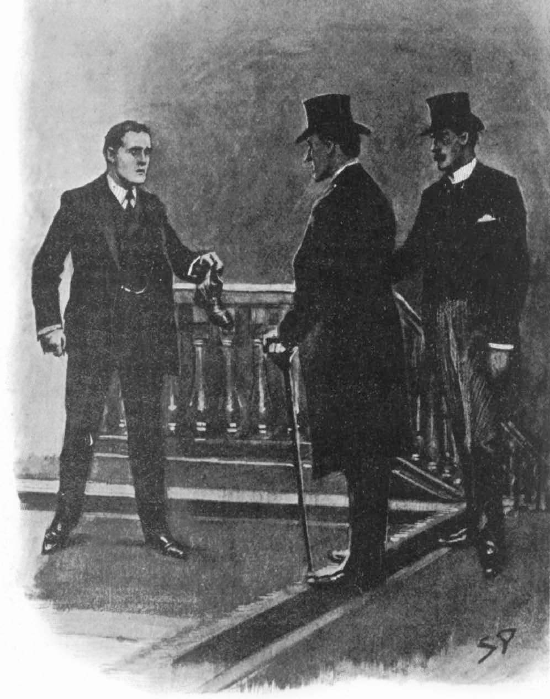

一手提一只沾满灰尘的旧皮鞋。

“这档子旅馆，拿吾好耍、看吾好吃吃怎么的！”他叫嚷着，“他们当心了，可别看错人头吃错药！老实告诉你们，那个茶房不给吾把鞋子找回来，叫他吃不了兜着走！吾这个人算得一向好弄来兮，福尔摩斯先生，你瞧这下子恶作剧也太不像话了！”

“还在找你的皮鞋？”

“是呀，先生，非找到不可！”

“你不是说，一只棕黄色新皮鞋吗？”

“是呀，先生，可现在又丢了一只旧的黑皮鞋。”

“什么！你是说，是——”

“吾是说，是这样的。我一共就三双鞋——新的黄皮鞋，旧的黑皮鞋，还有就是脚上的这双漆皮皮鞋。昨天晚上他们拿掉我一只黄的，今天又把一只黑的给叼走。喂，找到了没有？说话呀，别光愣站着瞪眼！”

来的是一个德国人服务生。

“没有，先生，旅馆里我都去问过了，都说还没有看见。”

“好了，今朝下半天，给吾找回来，天黑前找不回来，吾就找你们经理，同他讲吾要退房。”

“会找到的，先生——请耐心包涵，保证找回，保证。”

“好吧，这就往下看了。这个贼窝，我还能老丢东西！哦，哦，福尔摩斯先生，请你原谅，我这么点小事，吵得你——”

“我看这事很值得吵一吵、追一追。”

“嚄，你倒是这么认真！”

“这事你怎么个解释呢？”

“我是根本就不想解释它，简直莫名其妙，下作透顶，谁想到还会有这种事，偷鸡摸狗，我从来没有碰到过。”

“莫名其中之妙，恐怕——”福尔摩斯说着，一边思索。

“你先生怎么个看法呢？”

“喔，还不敢说很有把握。你这件案子相当复杂呢，亨利爵士，同你伯父的死一联系起来看，就不简单。大案要案经过我手有五百件，还不敢说有哪一件的底像这一件这么深。不过我们手上已有几条线索，想必总有条把可以引出真相。要是线索不对，就难免付出点时间，最后还是会搞清楚，这只是迟早的问题。”

我们午餐用得很愉快，席间很少扯到把我们聚拢来的这桩事。用餐完毕，我们去了一间起居室包房，福尔摩斯问起巴斯克维尔下一步作何打算。

“去巴斯克维尔庄园呀。”

“什么时间呢？”

“本周末。”

“总的说，”福尔摩斯说道，“你的决定还是明智的。证据已经很充分，你在伦敦给盯上了梢。这么个大城市，成千上万人里头，很难搞得清是什么人，怀有什么目的。他们企图不良的话，就要加害于你，我们想防止怕也无能为力。你未必知道，莫蒂默医生，今天早晨你们出了我的屋门，就让人盯上了，知道吗？”

莫蒂默医生一下子震惊了。

“盯梢！谁盯梢？”

“很遗憾，我也没法告诉你那是什么人。在你们达特穆尔高地那边的邻居中，认识的人当中，有没有留大黑胡子的？”

“没有——哦，我想想——唉，对了，巴里莫，查尔斯爵士的管家，不就是留一大把黑胡子嘛！”

“啊！这巴里莫人在哪里？”

“他是总管庄园的。”

“得证实一下，他人是不是在那里，还是另有可能他也在伦敦。”

“怎么个证实法？”

“给我一张电报纸。‘迎接亨利爵士，是否准备就绪？’这样写就行了。收报人是巴斯克维尔庄园巴里莫先生。那边最邻近的电报局在哪里？格林本。很好。我们另外再发一份电报给格林本邮电局长：‘致巴里莫电报令亲自签收。若本人不在，即退诺森伯兰旅馆，亨利·巴斯克维尔爵士。’这样，不用到晚上，就可以知道巴里莫是不是还在德文郡管着庄园。”

“就这么办，”巴斯克维尔说，“还有，莫蒂默医生，巴里莫这个人怎么样？”

“他是原先老管家的儿子，老管家已故世，他们管理这庄园到现在已是第四代。就我所知，他夫妻两人在本地是很受人尊敬的一对。”

“这么说来，”巴斯克维尔说道，“要是我家没人住在庄园里，就什么都由着他们，这可真舒服，我不去就省事多了。”

“那也是。”

“这个巴里莫，查尔斯爵士的遗嘱提到有他的份额吗？”福尔摩斯问道。

“他和妻子各得五百英镑。”

“哦！这笔份额他们自己知道吗？”

“知道。查尔斯爵士很喜欢谈他立遗嘱分给每个人多少多少份额。”

“很有意思。”

“我希望，”莫蒂默医生说，“你不必怀疑怎么这些人会得到查尔斯爵士的遗赠；我本人也被留给一千英镑呢。”

“是吗！还有旁人吗？”

“分给个人的有许多份，数目不算大。分给公共慈善捐款的数目很大。其余的完全归亨利爵士。”

“其余数额是多少呢？”

“七十四万英镑。”

福尔摩斯吃惊得眉毛倒竖。“想不到有这么大一个数。”他说。

“查尔斯爵士是个富翁，远近闻名，但是我们都不清楚到底有多富，直到后来检查他的证券，才知道底细。遗产总值差不多就是一百万英镑。”

“我的老天！这么大的数！冲着这笔赌注，是会有人拼死也要搏他一回。还有一个问题，莫蒂默医生。说假如啊，假如我们这位年轻朋友万一在这儿有个三长两短——请你原谅，别在乎不吉利的假设——由谁来继承这笔遗产呢？”

“因为罗杰·巴斯克维尔，就是查尔斯爵士的兄弟，未婚而亡，所以，遗产就要传给德斯蒙德家族，那是远房表亲。詹姆斯·德斯蒙德是威斯特摩兰郡一位年长的牧师。”

“谢谢你，这些详细情况非常有意思，非常重要。詹姆斯·德斯蒙德先生你见过吗？”

“见过。他有一次来过，来看查尔斯爵士。他这个人外表看上去就让人敬重，生活很简朴、严肃。我记得，查尔斯爵士赠给他财产，他一概拒不接受，不管查尔斯爵士怎么强要他接受。”

“这个人清心寡欲，会成为查尔斯爵士万贯家财的继承人吗？”

“他是继承人，这是法定的。他还是现金资产的继承人，除非现在的所有人另立遗嘱。当然，这得由现在的继承人自己处置。”

“你立了遗嘱没有，亨利爵士？”

“没有立，福尔摩斯先生。我没有时间，我还是昨天才听说了事情的真相。但是不管什么情况，我觉得钱财不应与产业和爵位分离。我不幸的伯父是这个想法。产权所有人如果没有足够的钱财来支撑家业，他怎么能重振巴斯克维尔家族的荣誉、威望呢？房产、地产、钱财都是连在一起不可分的。”

“是这样。是的，亨利爵士，我心中所想的同你一致，你回德文郡去，不要迟延，这是相宜的。只是要给你定一个条件，你绝不可以单独一人前往。”

“莫蒂默医生同我一起回去。”

“可是莫蒂默医生本身看病、出诊很忙呀。他的住处离你们家好几英里远，纵有满腔热情，遇事也难照应，怕是爱莫能助，所以不行。亨利爵士，你必须另有人陪同，一个可信赖的人，一定要同你在一起，时刻不离。”

“就你自己来吧，行不行，福尔摩斯先生？”

“事情一旦到了危急关头，我定会及时赶来助一臂之力。可是你要理解，我的咨询业务很广泛，来自各方面的申诉经常不断，所以无限期离开伦敦，那是不可能的。目前就有一位名人的事务急需处理。他是英国最有名望的人士中的一位，被人毁损名誉，受到敲诈，只能由我出来结束这场诽谤官司。你这就看到，要我同你去达特穆尔是不可能的。”

“那么你打算让谁陪我去呢？”

福尔摩斯用一只手按着我胳膊。

“如果我这位朋友愿意挺身而出，那就可以说没有人更合适了。你有危急，他能在一旁保驾，绝无问题。这个事，我是最有信心的，我能说一百个放心。”

这个建议完全出乎我的意料，我一听到后，感觉很不安，可是我还没来得及开口分说，巴斯克维尔已经一把抓住我的手，热烈地猛摇起来。

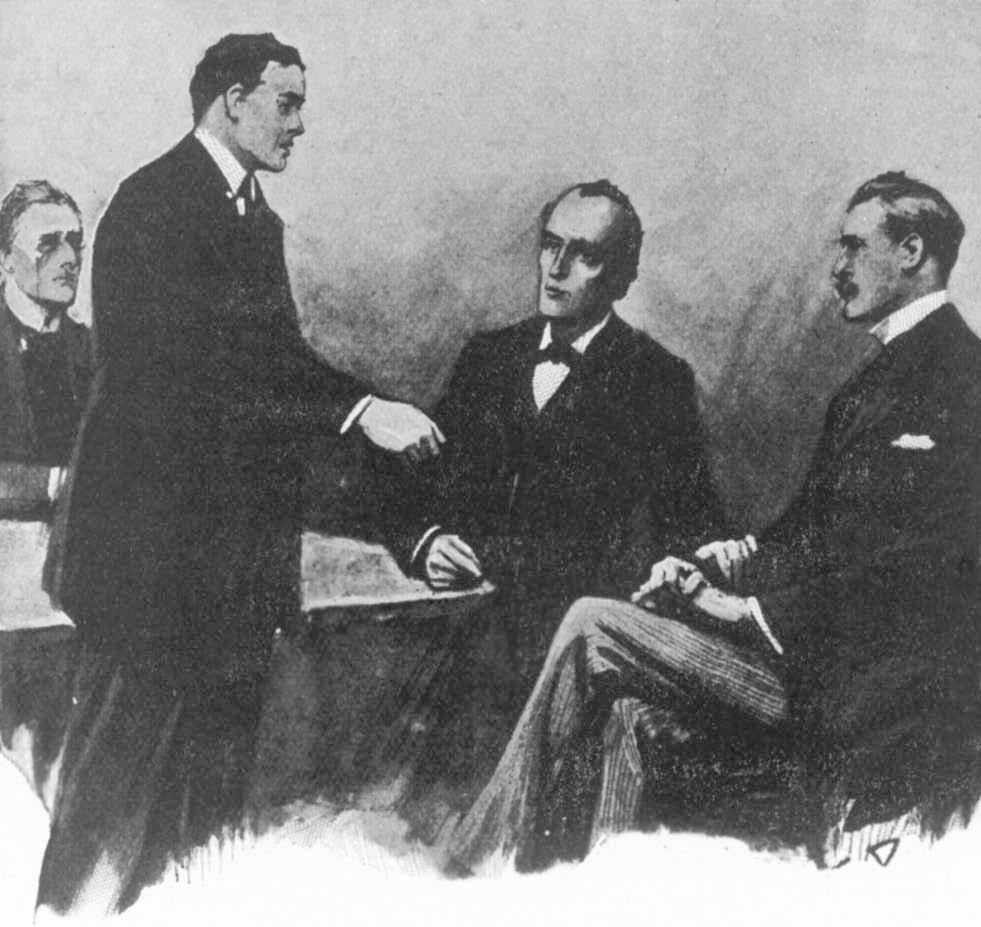

这个建议完全出乎我的意料。

“好，好，再好没有，承蒙你的厚意，华生医生，”他高兴地说道，“你了解我的处境，事情的来龙去脉你也跟我一样清楚。你能来鄙庄园，屈尊陪我，我将终身难忘。”

承担冒险重任，对我永远具有无法抗拒的吸引力，况且我还受到福尔摩斯一番话的恭维，受到准男爵真挚热情的欢迎，定要我做他的同伴。

“既然如此，那就却之不恭了，”我只好这么说，“但不知能否不负厚望。”

“这样，你要及时向我做全面的情况报告，”福尔摩斯说，“有危急发生——肯定会有的，我将指示你如何行动。我估计，到星期六，一切就能准备好了吧？”

“就看华生医生是否方便了？”

“没问题。”

“那就定在星期六走。如果没有变化，我们就在十点半，在伯丁顿方向开来的那趟火车到站时见面。”

我们起身离开的时候，巴斯克维尔突然发出胜利的欢呼，扑向房间的墙角，从橱柜底下拖出一只棕黄色的皮鞋。

“就是我掉的那只鞋！”他喊道。

“失而复得，愿我们的困难都能这样顺利解决！”福尔摩斯说道。

“这件事真是奇怪，”这时莫蒂默医生说道，“午饭前我在屋里都仔细搜寻过一遍。”

“我也找过，”巴斯克维尔说，“旮旯角落一处没漏。”

“当时房里肯定没有这只鞋。”

“如果是这样情况的话，那就肯定是服务生趁我们用午餐的时候放回去的。”

那个德国人给叫来了，但是他矢口否认知道这件事情，怎么问都搞不清楚。一桩桩诡秘的事件接连不断地发生，现在又添了这一桩，事情不算大，可摸不清到底耍的什么鬼把戏。除了查尔斯爵士猝死这整个的大疑团，仅仅这两天之内意外的事情接踵而至，令人无法捉摸，无法解释。包括收到用铅印字贴成的信，马车里蓄黑胡子的盯梢人，新黄皮鞋的失踪，黑色旧皮鞋的失踪，还有现在新黄皮鞋的重新回来。我和福尔摩斯乘坐马车驶回贝克街，他一路沉默不吭声。从他紧皱的眉头和严峻的脸色，我可以看出他的心事跟我一样，满肚子在翻来覆去地把这些表面上毫不相干的桩桩怪事拼来拼去，看看是否能串在一起。整个下午，直至傍晚入夜，他静坐无语，沉浸在抽烟和深思之中。

快到吃晚饭的时候，送来了两份电报。第一份电报：

顷悉巴里莫居守庄园。

巴斯克维尔

第二份电报：

遵嘱去二十三家旅馆，遗憾禀告均未见剪过的《泰晤士报》。

卡特赖特

“两条线索都没有结果，华生。经手一件案子，处处碰壁，没有比这种情况更急煞人的了，我们务必转移方向另找目标。”

“还有个马车夫，盯梢人乘过他的车。”

“是呀，我已经发电报，要求执照管理局查他的姓名、住址。我的问题这就有回答了，说到他他就到，我看一定是他。”

门铃拉响，果然是好消息，比盼望的口头回话更为满意。大门开处，站着一个相貌粗鲁的人，这正是我们要找的马车夫。

“管理局上头通知我，有位客人，是写着这儿地址的，打听二七〇四号车。”他说道，“我赶车赶了七年了，从来没有让客人说过一声不好。我马上从车场奔这儿来了，得当面问问您，您对我有什么地方觉得不满意呀？”

“不是对您有什么不满意，一点也不是，好哥儿们，”福尔摩斯说，“绝对不是，只是想打听个事，您能详细告诉我，我就付给您半个沙弗林<a href="#part0083.xhtml_ch1"
id="part0083.xhtml_ch1-back">(1)</a>。”

“行，今天运气不错，事事顺当。”马车夫说，咧开嘴笑了，“您想要问个啥事儿呢，先生？”

“先问您的大名、府上住址，因为日后恐怕还要求教于您。”

“约翰·克莱顿，市镇区特皮街三号，我的车租的是希普利车场的，在滑铁卢车站旁不远。”

福尔摩斯把这些都记了下来。

“好，克莱顿，请讲一讲，今天早上十点钟乘您车来看这儿房子的那个乘客，他后来又跟着两位先生朝摄政街去了。”

车夫惊异起来，并且面有难色。“呃，对您讲这件事，没什么好讲啦，您都已经知道这些，别的我也就说不上来啦，”他说，“再说，乘车的先生讲他是侦探，不许我同别人讲起他的事。”

“我说好伙计，这可是件正经八百的事情哟，要瞒着我不说实话，您可就要不好办哪。您说，乘客告诉您他是个侦探，不许说他的事？”

“是呀，他是这么说的。”

“什么时候对您说的？”

“他下车的时候。”

“他还说了些什么？”

“说了他的名字。”

福尔摩斯向我递了一个胜利的眼色。“噢，他讲了名字，讲了？那不是犯傻吗！他讲他叫什么名字？”

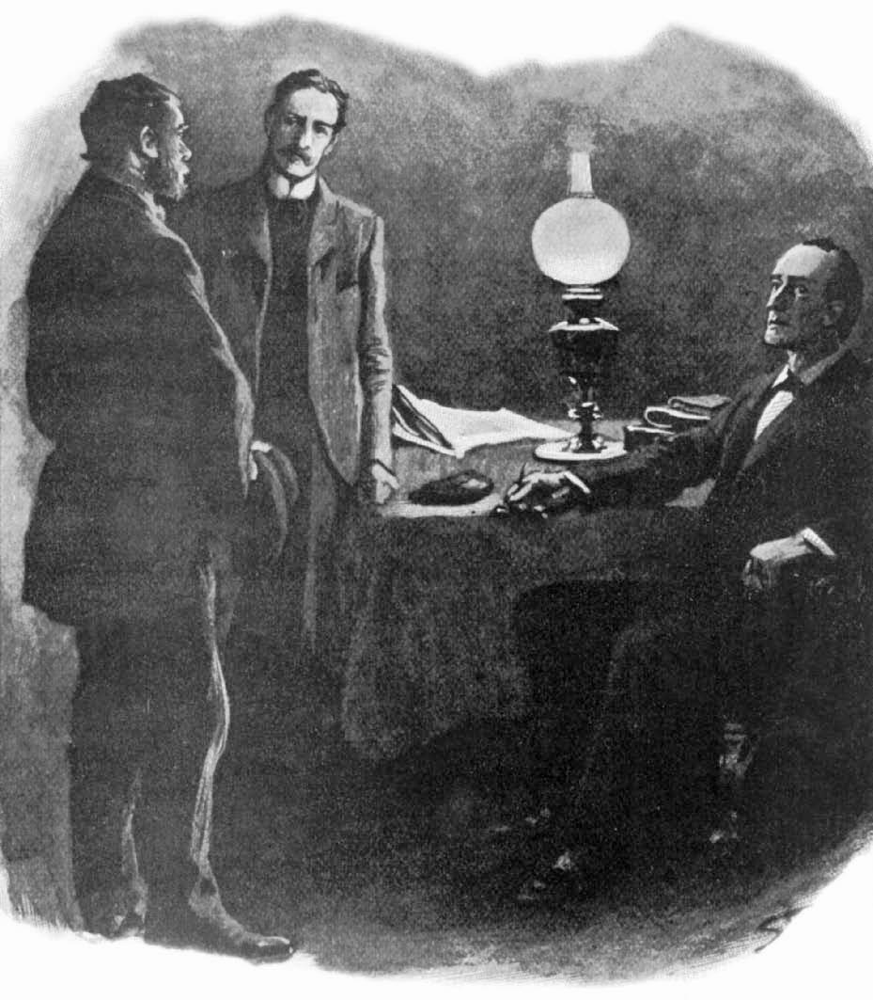

“噢，他讲他叫什么名字？”

“姓名是叫，”车夫说，“歇洛克·福尔摩斯先生。”

我的朋友居然给这位车夫的答话弄得呆住了，以前可是从来没见他这么掉过神，一时间愣在了那里，过后便忍不住失声哈哈大笑。

“妙呀，华生——真是妙不可言！”他说，“想不到这位仁兄随机应变之快，功夫不在你我之下。怪不得我要给他甩掉，还甩得够惨。他自报就叫歇洛克·福尔摩斯，对吗？”

“没错儿，先生，这就是那位乘客的大名。”

“绝妙，妙绝。说说是在哪儿搭上您的车，都是怎么个情况。”

“九点半，他在特拉法加广场招呼我。他说自己是侦探，只要这一天他叫我怎么做我就怎么做，什么也别问，他就付我两几尼<a href="#part0083.xhtml_ch2"
id="part0083.xhtml_ch2-back">(2)</a>。我当然很高兴，一口答应照办就是。先到诺森伯兰旅馆，等在那儿；后来有两位先生出来，招了停在那儿的马车，我们跟随着走；后来就到了这儿了，就歇着了。”

“就是这个门？”福尔摩斯问道。

“哦，那就讲不清楚，反正乘客肚里有数，这是他的事儿。我们就这么半路上停着，等了一个半钟头，两位先生出来了，打我们马车边走过，一路走，我们一路跟上，顺贝克街下去——”

“这清楚了。”福尔摩斯插话。

“之后走过了大半条摄政街。再后来我的先生哗的一下推开顶窗，叫我快走，直奔滑铁卢车站，越快越好。我甩起了鞭子，不到十分钟就赶到了。最后，他说话算话，真的付了我两几尼后就走，到车站里去了。就是刚离开车，又回头，说：‘你可知道，搭你这辆车的我，不是旁人，就是歇洛克·福尔摩斯先生。’这么着我才知道了这个名儿。”

“噢，是这样，以后没再见到他？”

“他进了车站就再没见着了。”

“那么歇洛克·福尔摩斯先生是个什么模样？”

车夫搔搔头。“唉，这位先生要说倒也难说清楚。我估计，四十来岁的年纪吧，中等个头，比你矮个两三英寸，先生。身上的穿着像是个有钱人家，长着一大把黑胡子，胡须末尖剪个齐平，脸色灰白。我能说的，也就这么一些。”

“眼珠颜色呢？”

“这说不上来。”

“您还能记起点什么？”

“记不起，先生，记不起了。”

“好，给，半沙弗林。你要是还能提供更多的情况，照样还有赏。晚安！”

“晚安，先生，多谢了！”

约翰·克莱顿咯咯地笑着走出屋子。福尔摩斯回头向我耸耸肩，苦苦一笑。

“这第三条线又告断了，刚刚扯上个线头，马上就完结，”他说，“这个流氓太狡猾！他摸着我们的路线，晓得亨利·巴斯克维尔爵士来找我们咨询，在摄政街认出了我是谁，猜准我会记下马车号码，会找到马车夫，所以，就回敬我这个口信，嚣张至极。跟你说，华生，这一回我们是棋逢敌手，在伦敦他将了我一军。但愿你去德文郡能翻过来。可是我内心里对这事可担心着呢。”

“担心什么？”

“不放心派你去，这事风险很大，华生。一桩棘手、危险的案子，我是越想心中越寒。真的，不瞒你讲，我的老伙计，你可能会笑话我。不过我就叮嘱你一句话，希望你能安全回到贝克街来，我就很高兴了。”

————————————————————

<a href="#part0083.xhtml_ch1-back" id="part0083.xhtml_ch1">(1)</a> 沙弗林（sovereign），英国旧时面值一英镑的金币。

<a href="#part0083.xhtml_ch2-back" id="part0083.xhtml_ch2">(2)</a> 几尼（guinea），英国币值单位，等于21先令即1.05英镑，常用于规定费用、价格等。

# 第六章　巴斯克维尔庄园

亨利·巴斯克维尔爵士和莫蒂默医生在约好的日子准备就绪，我们依照原来的安排出发前往德文郡。福尔摩斯和我一道坐马车到车站，向我作了临别前的叮嘱和关照。

“空道理我不多讲了，也不想让自己心中的犹豫不定影响了你，使你也心乱，华生，”他说，“你要把事实尽可能细致、详尽地向我报告，你光报告事实，归纳的工作就让我来做好了。”

“哪一类的事实呢？”我问。

“任何方面，只要是有关案情的，哪怕看上去并不怎么直接的。尤其是年轻的巴斯克维尔同邻居之间的关系，或者，有关查尔斯爵士死亡问题，新发现的点滴情况。前些天，我自己曾做过一些调查，可是结果我看下来都于事无补。只有一件事，似乎可以做出结论，那就是这个人，詹姆斯·德斯蒙德先生，他的名份是下一个继承人，一位上了年岁的正人君子，性格随和，人极善良，所以如此的不法行为他是不会干的。我认为，我们在分析问题的时候，这个人完全应当排除掉。剩下的人，实际上就是沼泽地的人了，也就是亨利·巴斯克维尔爵士周围的一些人。”

“先把巴里莫夫妻辞退掉，从身边赶开，好不好？”

“不好，绝对不妥，这要犯大错误。如果他们是无辜的，这样做就冤枉人，太不公正；如果他们是有罪的，那就等于放掉他们，逃脱制裁。不，不可以，我们把他们两个作为嫌疑列入名单。我记得庄园里还有一个马夫，沼泽地有两个农夫。我们的朋友莫蒂默医生，此人我相信绝对诚实，再就是他的妻子，这就不清楚了。有一个生物学家，斯泰普尔顿，还有他的一个妹妹，据说是个长得非常漂亮的年轻女郎。还有拉夫特庄园的法兰克兰先生，此人也是个未知数。还可能有这个那个邻居，这些人你都要一个个加以仔细分析研究。”

“我一定全力以赴去做。”

“你该带着枪吧？”

“带的，备而不用。”

“绝对必要，你那支左轮枪日夜备着，不可离身，绝不可掉以轻心，麻痹大意。”

两位朋友已经订好头等车厢的座位，正站在月台上等候我们。

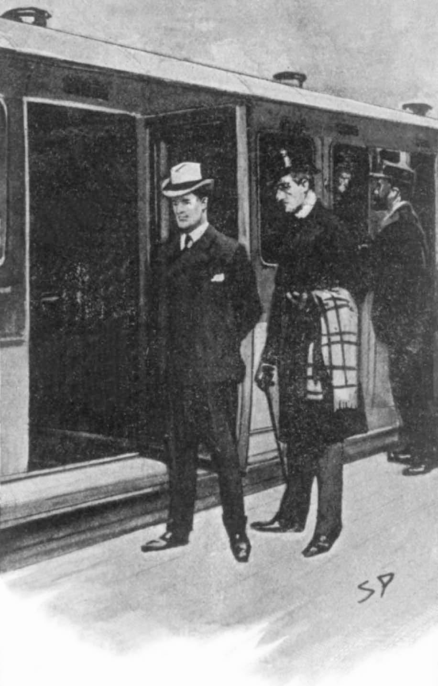

两位朋友正站在月台上等候我们。

“没有，我们什么消息也没有。”莫蒂默医生回答着我朋友的问话，“有一件事，我敢担保，那就是昨天、前天没有人盯我们梢。我们要么不出去，出去的话保持高度警惕，谁也逃不过我们的注意力。”

“你们俩一直在一起吧，我想？”

“就是昨天下午不在一起。我每次进城来，总得用上一整天玩玩，消遣消遣，所以我就去参观了外科医学院博物馆。”

“我到公园去逛逛，看看各式各样的游客，”巴斯克维尔说，“我们都没有遇上什么问题。”

“即使不出问题，也是太冒失了，”福尔摩斯说，摇着脑袋板着脸，“我请求你了，亨利爵士，你不要一个人单独行动。你要一个人独断独行，必定大祸临头。还有一只鞋子拿到了？”

“没有呀，就此一去不返了。”

“这就是嘛，里头大有文章呢！好，再见吧！”火车开动了，已经慢慢驶出月台，他还在关照。“长个心眼啊，亨利爵士。莫蒂默医生给我们讲的老故事中，有一句话要记牢，晚上别去沼泽地，那正是恶魔疯狂的时候啊！”

我回首望着，月台向后退去，福尔摩斯高高的身躯挺拔肃立，一动不动，站在那儿一直目送我们。

车行飞速，旅途愉快。一路上我和两位同伴相处更熟，相知也更深了。我还同莫蒂默医生的西班牙垂耳长毛狗逗着玩。不多几个小时，棕色的大地渐渐变成了红色，砖砌房渐渐变成了石砌房，枣红色的牛群放牧在树篱围起的草地上吃草，草地青葱碧绿，菜园丰美茂盛，这里只要雨水充盈，便是个富饶的地区。年轻的巴斯克维尔目不转睛地望着窗外，这德文郡的景致，有些他还记得，让他认出来了，于是便高兴得叫起来。

“我离开了家乡，在世界上兜了一大圈，华生医生，”他说，“可还没有见过什么地方可以同这儿相比。”

“德文郡人都赞美自己家乡好，不赞美的人我还没遇上过。”我说。

“这里是地好水好人也好，真所谓地灵人杰呵。”莫蒂默医生说，“试看我们这位朋友，一眼就知道，属于居尔特人的圆颅头型，具有居尔特人热烈、亲和、大方的性格。遭难的查尔斯爵士，他的头颅属于稀有的特殊类型，一半盖尔人，一半爱弗人，是兼有两种特点的混合型。你离开巴斯克维尔庄园那时候，还很小，是不是？”

“我才十几岁父亲就去世了，自家庄园从来没有去过。父亲那时在南滨——南面的海边，住一幢小屋。之后我就去了美国找一个朋友，所以跟你华生医生一样，庄园对我来说是完全陌生的，我的心情迫切、好奇，要看看沼泽地是个什么样子。”

“你要看？这个挺容易满足，你瞧，这已经就是沼泽地了，是刚开始的景象。”莫蒂默医生说道，指指车窗外面。

越过一方方绿色田野和一长圈矮树林，远处耸起一座灰暗苍郁的小山，山顶高低参差如狼牙，远远望去，昏暗迷茫，犹如梦中幻景。巴斯克维尔静坐许久，两眼呆呆地望着远方的景色。从他脸上热切的神态，我看出，这奇异景色的第一眼对他的触动有多么大。在这块地方，他本族人掌管得那么长久，留下的印记和影响是多么深刻。他身穿苏格兰粗花呢套装，说话带着美国口音，这会儿枯坐在这节无甚趣味的车厢里。然而我端详他那深色的、表情丰富的脸庞，更令我觉得，他不折不扣是那支有血气、有性格、有魄力的家族的后裔。在两道浓眉之间，一对翕动的鼻翼、一双栗色的大眼之中，透着自尊、豪迈和力量。如果在那可怖的沼泽地里，我们果真面临不测的艰难和险阻，他绝对是个可靠的同伴，你为他赴汤蹈火，他也能为你视死如归。

火车在一个小站停靠，我们都下了车。在矮矮的白色栏杆外面，有一辆双驾矮脚马四轮马车正等着。我们的到来显然是件大事，站长和脚夫都向我们围上来，帮着拿行李。这是个恬静、干净、朴实的乡村小镇，但是我们惊讶地看到，站门口有两个穿黑制服的士兵模样的人，身边倚着短来复枪。我们打旁边经过，他们眼珠直朝我们转。马车夫是个小个子，长着一张粗糙、僵硬而无表情的脸，在向巴斯克维尔爵士行礼。几分钟之后，我们便飞驰在宽阔、灰白的大道上。起伏不平的牧草地，在路两边隆起；三角墙的坡顶房屋掩映在密树浓荫之间；在宁静的、阳光照耀的村子远方，衬着夕阳的天空，是一片灰暗的、绵延不断的沼泽地，空旷阴沉之中，间或还突起几座犬牙交错似的险恶的小山。

四轮马车折入旁边一条岔路。我们穿过一道道沟壑，那是数百年来被车轮辗压出来的小巷道。巷道两旁的地面似已成了抬高的坡岸，弯弯向上，长满湿漉漉的苔藓和肥厚的鹿舌蕨，古铜色的蕨丛和色彩斑驳的黑莓在夕阳余晖中闪出光亮。我们的马车缓缓走上坡地，过了一座窄石桥，便顺着一条腾跃喧嚣的溪流奔驰。溪水穿过灰色的乱石巨砾，泡沫飞溅，汹涌而下。道路在密生矮栎和冷杉的峡谷中沿溪流曲折蜿蜒而上，每逢一个转弯，巴斯克维尔都高兴得呼叫，急切地向四周环顾，问着问不尽的问题。在他眼里，所见一切都是旖旎动人的；可是在我，我总觉得这一带的乡村有着一抹凄凉的色调，刻骨铭心地印记下深秋的肃杀之气。黄叶将小路铺满仿佛盖上一层地毯，还在不住地掉落，从我们头顶上飞舞飘过。当车轮辗在败叶铺就的地毯上的时候，辚辚马车声哑寂了——悲哀的树叶，在我眼里，是造物主所铺，铺在巴斯克维尔家族的后人返回家园的马车前面。

“看那边！”莫蒂默医生叫道，“那是什么？”

我们前面出现了长满石南灌木的陡坡地，这是沼泽地向外突出的一处尖嘴地角。在尖嘴地角顶上，清清楚楚站着一个骑在马上的士兵，就像是矗立于碑座上的骑士雕像，黑影轮廓分明而严峻。马枪搁在向前伸的左臂上，做好预备射击的姿势。士兵在监视着我们所走的这条道路。

“这是干什么，珀金斯？”莫蒂默医生问道。

车夫在座位上侧过身来。

“王子城有个犯人越狱逃走，先生，到现在已经跑出来三天了。监狱看守守住每一条路，每个车站，但到今天连他的影儿也没有。这儿的庄稼人都不得安宁了，真的，一点不假。”

“嗨，我知道，谁去报告，就能有五英镑赏金。”

“是呀，先生，得五英镑，冒险要给割断喉咙，两下比较划不来。你知道，这可不是个没能耐的犯人，什么事都干得出来。”

“是个什么人？”

“叫塞尔登，诺丁山的杀人犯。”

这件案子我还记得很清楚，因为杀人犯极端凶残，凶杀过程中所使手段惨绝人寰，福尔摩斯对此案也曾发生兴趣。后来凶手得免死刑，是因为有异议，认为他的残暴行为是出于精神完全不正常。这时，我们的四轮马车上了斜坡的坡顶，展现在眼前的是广袤的沼泽地，到处错杂地分布着嶙峋怪异的突岩和堆垒如冢的乱石。从沼泽地上过来一阵冷风，令我们浑身战栗。这渺无人烟的荒原，正是那个鬼魅似的人的隐迹之地，说不定像一头野兽正藏身于哪一个洞穴之中呢。他的内心对摈弃他的整个人类充满着憎恨。光秃的野地，凄厉的冷风，幽黑的天空，原已是充满阴森恐怖的气氛，现在又加上有个杀人逃犯，便更加令人发憷。连巴斯克维尔都噤若寒蝉，把大衣领口裹紧。

我们离开了丰饶的乡村，将它抛在身后远方的坡下。现在回头遥望，只见在落日斜照之下，溪水像金丝一般，翻耕过的棕色土壤和郁郁苍苍的宽阔林地也烁烁有亮色。我们前面的道路，穿越在赤褐红与橄榄绿的广阔坡地上，坡地时起时伏，更显得凄凉萧瑟。偶尔路过一幢小屋，都是用石料砌的墙、铺的顶，并无藤蔓攀缘以修饰它那粗陋的外貌。忽然，我们低首望见一处盆状的低洼地，那里长着成片的橡树和冷杉，因长年狂风猛吹，所以生长不良，全部扭曲、弯折而矮小；越过树林，望见竖起两座高高的尖塔。车夫用马鞭一指说：

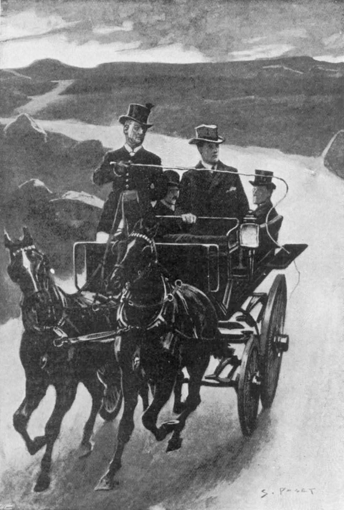

车夫用马鞭一指说：“巴斯克维尔庄园。”

“巴斯克维尔庄园。”

庄园的主人站起了身，双颊泛红，目光炯炯地望着。没几分钟，已来到宅邸大门前。那是用密集的铁条焊接成奇异繁复的窗花式样的大铁门，两边的门柱已风雨剥蚀，上面地衣苔藓斑驳，柱端各饰一个巴斯克维尔家族象征的石雕野猪头。门房是花岗岩砌的屋子，已破败得柱椽外露，成了颓垣乱石，然而对面却是一座崭新的建筑，刚完成一半，是查尔斯爵士赚回南非黄金所建的第一座屋子。

由门道进入，就是一条林荫住宅路。也因为是落叶铺路，车轮辘辘声又沉静下来。老树枝杈在我们头顶交织，形成一条阴暗的拱道。巴斯克维尔抬头向窄长不明的车道望过去，在深深的尽头，立一幢房屋，亮出如幽灵般的灯火，他不由得一哆嗦。

“这儿就是出事的地方吗？”他低声问。

“不，不，是在那边的紫杉小路上。”

年轻的继承人阴沉着脸向四周望望。

“怪不得伯父总感觉到有祸事要临头，是这样的地方，难怪呀，”他说，“谁来都会寒心。我要在六个月之内，给这儿拉上一行电灯，将天鹅牌、爱迪生牌的一千支光灯泡，装在大厅门前，你就会认不出这个地方了。”

住宅林荫道通向一片开阔的草坪，大宅就显露在我们面前。在渐渐淡弱的光线下，我看见草地中央是一幢石头建筑，有一个廊台突出在外。屋正面爬满常春藤，只是这儿那儿修剪出一个个空框，留出窗户和盾徽标志，好像黑面纱上开的孔。两座尖塔正是从这座中央建筑矗立而起，已很古老了，塔上开着许多雉堞枪眼。塔楼的左右两侧为翼楼，是较为近代的黑色花岗岩建筑。昏沉的落日余晖照过窗棂厚实的玻璃，大斜坡屋顶上的高烟囱吐出一缕黑烟。

“欢迎，亨利爵爷！欢迎回到巴斯克维尔老家！”

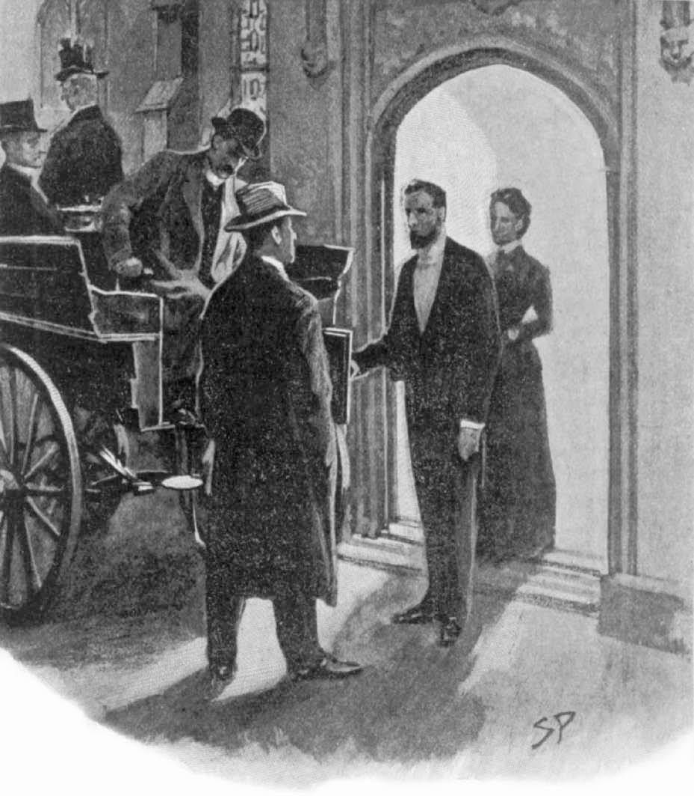

“欢迎，亨利爵爷！”

一个高个子男人从廊台的阴影中走出，上前来打开四轮马车的车门。还有一个，背对厅堂昏黄烛光，映出是一个女人的身影。女人也走过来，帮男人一道把行李包拿下车。

“我得赶这辆车回家，少陪了，亨利爵士不介意吧？”莫蒂默医生说，“我妻子等着呢。”

“稍待一会儿，吃了饭再走吧？”

“不客气，我得马上走，说不定已经积下好多事等我回去处理呢。我本当留下领你在屋子里看一遍，好在有巴里莫，他比我合适多了。对不起，再见。可别忘尽管叫我，无论白天黑夜，只要你用得着我。”

车轮声从住宅道上很快消失，亨利爵士和我转身进入大厅，屋门随后铿锵关上。那是很高雅的房屋，我们进入的这一间，又高又大，都是栎木的大椽巨梁，因年代久远已经发黑。在高高的铁狗柴架后，一座巨大的旧式壁炉里，木柴熊熊燃烧噼啪爆裂。亨利爵士和我伸手烤火取暖，因为长途坐车，都浑身麻木了。随后我们向四周环顾，看到狭长的高窗上是古旧的彩色玻璃，看到栎木镶板细工、公鹿头的标本、墙上所挂的盾徽，都在中央大吊灯的柔弱光线下，形成幽暗朦胧的气氛。

“跟我原来想的一样，”亨利爵士说，“一个古老的家，不正是这幅景象吗？想想也是，就是这么个地方，我家人世世代代住了五百年。一想起来，我心也沉了，不容易呢。”

我见他在向周围看这望那的时候，黝黑的脸上闪着孩子般天真情切的神态。他站立之处，上方有光照，但是长长的投影一直从墙上沿下来，像一顶黑黑的天篷张在他的头顶。巴里莫去把行李放进我们的房间，已经转回来，现在正站在我们面前，显出受过良好训练的仆役所特有的随听差遣的态度。他是一个仪表非凡的美髯公，高高的身材，样子极帅，黑胡子修剪得方方正正，面色白皙，相貌堂堂。

“现在就用饭吗，爵爷？”

“准备好了吗？”

“几分钟之后就能开餐，爵爷。房里都已备好热水。我妻子和我很高兴和您生活在一起，爵爷，就等您来作出新的安排。您可以理解，眼下情况变了，这所房子里少不了要另叫更合适更多的人来收拾。”

“变了什么情况？”

“我只是说，爵爷，查尔斯爵爷过的是退休安静的生活，他的生活我们还能照顾得过来。您，当然了，会有更多的人，所以家里人员就需要有所变动。”

“你的意思，你想和妻子一同离开？”

“当然，这要等您觉得方便的时候，爵爷。”

“你我两家在一起过已经是好几辈人了，不是吗？要是我来这儿，一开始就断了这几辈子的家庭联系，我心里是什么滋味呢？”

我在管家白净的脸上，看出有几分感慨。

“我也这样想，爵爷，我妻子也会难受。不过，讲句心里话，爵爷，我们夫妻俩实在太想念查尔斯爵爷了，他这么过世，给我俩打击太大，看这屋子就叫我俩伤心。我犯愁呢，再在这巴斯克维尔老屋待下去，心里受不住，没法心安。”

“可你们想去做什么呢？”

“不碍事，爵爷。我们可以去做点买卖，我们能做。查尔斯爵爷好心给了我们资助，也就够了。哦，现在，爵爷，还是先让我领您去看看房间吧。”

在这古老厅堂的上房，有一圈方形回廊，围着栏杆，由一段两截梯上去。从中心点伸展两条走廊，贯通整幢建筑，所有的卧房都向着走廊开门。我的卧房同巴斯克维尔在同一侧，而且差不多紧贴隔壁。这些卧房好像比宅邸中央部分要现代得多，油光墙纸和无数的蜡烛为之生辉，去除了我们刚到的时候结在心头的阴郁凄凉的印象。

但是大厅旁的餐厅却是个黯然无光的地方。这是一间长屋，有台阶在中央分成高低不同的两部分，高台上供家人用餐，低处留给仆佣。在一端的更高处是演艺廊台，望上去可以看得很清楚。乌黑的梁木横过我头顶，梁的上方，便是烟熏黑了的天花板。如果排排火炬照得通明，宴会色彩缤纷，狂欢闹饮，那么黯然的气氛尚可缓解，可是眼下，两位黑衣绅士，坐在罩子吊灯投下的小小光圈之中，一位的嗓音压抑，一位的精神忧郁。暗影中有一排祖先的画像，衣着服饰各式各样，从伊丽莎白女王时代的骑士，到摄政时代<a href="#part0084.xhtml_ch1"
id="part0084.xhtml_ch1-back">(1)</a>的纨袴子弟，一个个都在陪伴我们，向我们瞠目注视，似乎以沉默威慑我们。我们没有说话，总算把这顿饭吃完，并且一同去了新式弹子房，在那儿抽一支烟，这对我来说应该还是很惬意的。

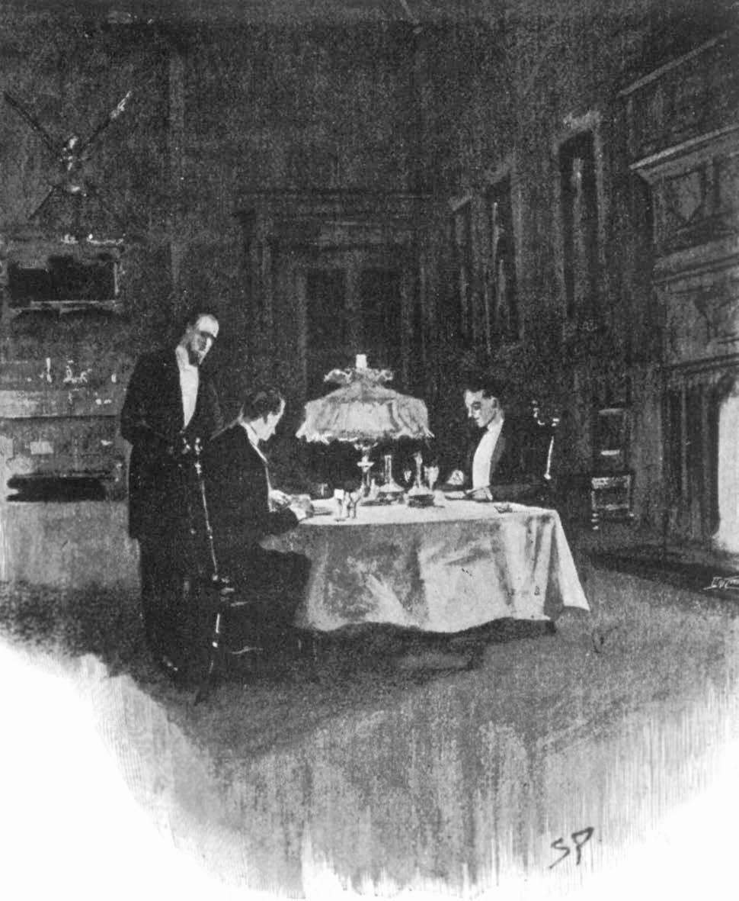

餐厅却是个黯然无光的地方。

“说实话，这里不是一个好地方，让人心情不舒畅。”亨利爵士说，“我原想可以适应这儿的环境，可是叫人失望，这儿跟想象的不是一回事，难怪我伯父一个人住这种房子，会心神不宁。不过，先别管它了，今天就早一点歇息吧，到了明儿早晨，精神可能会变得好一点。”

上床之前，我拉开窗帘，从窗子向外望。这窗正对着大厅门前的草坪。再远处，两丛矮树，在愈刮愈大的夜风中萧萧作声，频频摇摆。碎云竞相飞奔，云隙之间露出了半圆的月亮。在惨淡的月光下，树丛的外面，我看见碎岩嶙峋、绵延起伏、低洼昏朦的沼泽地。我拉好窗帘，觉得刚才获得的最后印象同先前一切印象没有什么两样。

可是这还不能算是最后的印象。我感觉疲惫乏力，却又睡不着觉，辗转反侧，越想着该睡就越无法入睡。隐隐传来报时的钟声，听着每一刻钟敲响一次。除此以外，这古老的房子，被死一般的沉寂所笼罩，无声无息。可是，忽然间，在这死寂的深夜，一种声音传入我的耳朵，清晰，回响，绝不会听错，是一个女人的啜泣声，是无法克制的悲伤、痛苦又要强忍而发出的抽噎。我在床上坐起来，竖起耳朵倾听。声音不是很远，就在这幢房子里。我每根神经都紧张起来，聚精会神，等了半个钟头，可是只听到报时钟声及墙外常春藤的瑟瑟响，此外再也没有听到别的声音了。

————————————————————

<a href="#part0084.xhtml_ch1-back" id="part0084.xhtml_ch1">(1)</a> 摄政时代（the
Regency），指1811—1820年乔治三世精神失常由其子骄奢淫逸的乔治四世摄政时期。

# 第七章　梅里皮特宅邸的斯泰普尔顿家

翌日早晨，清新的空气和美丽的景色，把我们两人头天初见巴斯克维尔庄园郁结在心头的阴暗灰色的印象一扫而光。亨利爵士和我坐着吃早点，阳光透过直棂高窗倾泻而入，窗玻璃上盾徽图案的片片色彩淡淡地洒在身上。深暗的护墙板在金灿灿的日照下泛出青铜般的光泽。要说这就是昨晚在我们心目中的同一间屋子，实在叫人难以相信。

“我看，是我们自己心情不好，而不是屋子，要怪我们自己！”准男爵说道，“旅途一路来累着了，马车上又受冻，把这个地方看得太灰溜溜了。现在不是精神焕发了吗，情绪也开朗了！”

“倒不完全是个情绪问题，”我接口说，“你有没有，比如说，听到有人，一个女人，在夜里哭？”

“是奇怪呀，是呀，我半醒不醒的时候，迷迷糊糊听到像是有人哭。我听了一会儿，后来就听不见了，所以我想是在做梦吧！”

“我可听得真切，是一个女人的哭声，绝对没错。”

“我们这就问个清楚。”他摇铃叫来巴里莫，问他知不知道是怎么回事。我有点看出来，这位管家听到主人问他的问题，白净的脸色变得更苍白了。

“这屋里只有两个女人，亨利爵爷，”他答道，“一个是女厨工，她睡在厢房里；还有一个就是我女人。这我可以说，不会是我女人在哭。”

其实，他是在说谎话。因为吃过早饭，我碰巧在长廊上跟巴里莫太太照面，阳光正好照着她整个的脸。她是个体格高大的女人，外表冷漠，身躯肥胖，嘴巴紧闭，呆板少动；可是她的眼睛无可掩饰地红着，夹着浮肿的眼皮望了我一眼。准确无疑，一定是她，在夜里哭了；而如果是她哭，她的丈夫不会不知道。可是她丈夫冒着显然会被戳穿谎言的危险，断然否认事实。他为什么要这样做呢？女的又为什么会哭得那么伤心呢？在这个面孔白净、模样帅气、蓄着黑胡子的男人身上，笼罩着神秘的疑团，形成不祥的氛围。正是他第一个发现查尔斯爵士的尸体，我们知道的所有有关老人惨死的情况，都是听他讲的。难道说，我们在摄政街见到的马车上的那个人，正是这个巴里莫？胡子完全是一样的。车夫描述的可是个比较矮的人，不过，这种印象也很容易搞错。我怎么样来彻底查清这个问题呢？显然，首先应该做的事，是去找格林本邮电局长，问一问那份核实情况的电报是否确实面交巴里莫亲收。不管结果如何，至少在我该向福尔摩斯写报告时有内容可讲。

亨利爵士吃过早饭后有许多文件要处理，趁这个时间我正好可以跑一趟。我沿着沼泽地边缘走了四英里路，一路走来令人很感愉快，不觉已经来到一个僻静的小村，村里有两幢大房屋，原来一幢是客栈，另一幢就是莫蒂默医生的住宅，比周围别的房子都要高大。邮电局长也是村里杂货铺老板，对那封电报还记得很清楚。

“当然啦，先生，”他说，“我把电报给了巴里莫先生，按照要求送的，没错。”

“是谁送的？”

“我的孩子，在这儿。詹姆斯，上星期那封电报，你送给庄园巴里莫先生了，对不对？”

“是的，爸爸，是我送的。”

“送给他本人收了？”我问。

“喔，那天他在楼上，我没交给他本人，我给了巴里莫太太收下，她答应马上就送上去。”

“你见到巴里莫先生了？”

“没有，先生。跟你说了，他在楼上。”

“你没见着他怎么知道他就在楼上？”

“喔，那是他自己老婆嘛，当然知道他啦，”邮电局长不耐烦地说，“他没收到电报？要是出错的话，那巴里莫先生早该自己找上门来了不是！”

再想追问下去弄清楚看来已经没有希望。但这一点是清楚的，即使福尔摩斯设了巧计，我们也没能证明巴里莫确实不曾去过伦敦。假定事实就是这样——假定都是他，即：最后一个看见查尔斯爵士还活着的是他，新继承人回到英国后头一个跟踪的也是他，那又怎么样呢？他是受别人指使还是出于他自身的罪恶计谋？害掉巴斯克维尔一家人对他有什么好处呢？我想起了从《泰晤士报》评论文章剪字贴成的警告信，这是否就是他干的呢？也可能是另有什么人因为反对他的计谋而干的？要么就是那种动机，如亨利爵士所说，如果这家主人被吓跑，那么一个永久舒适的家就落入巴里莫夫妻之手。但是无疑地，像这样的一种解释是经不起推敲的，不能说明何以要如此煞费苦心地、颇多周折地对年轻的准男爵设下一张看不见的网。福尔摩斯自己也说过，他经手的惊人大案不知有多少，都比不上这一件复杂。我在暗灰的孤寂的路上往回走的时候，心中默默祈祷我的朋友能早点从繁忙的事务中脱身，愿他能早日下来帮我分担肩头的重任。

我的思绪忽然被打断，后面传来奔跑的脚步声，还听到有人叫我名字。我想是莫蒂默医生了，便回过头去，不料令我吃一惊，竟是个陌生人向我追上来。他是个矮小精瘦的人，胡子刮得挺干净，下巴尖削，约莫三四十岁的年纪，穿一身灰色套装，头上戴一顶草帽，肩上挎背一只空罐头做的生物标本匣，一只手里拿一个绿色的扑蝴蝶网兜。

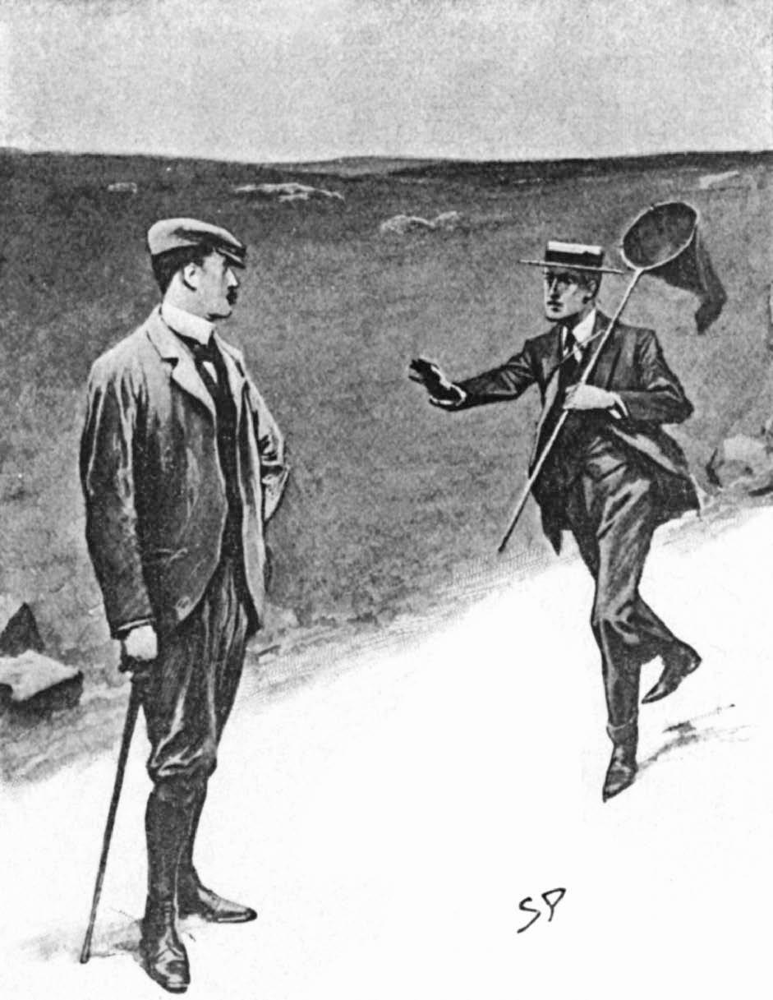

竟是个陌生人向我追上来。

“我认识你，恕我鲁莽，华生医生，”他说，正喘着气朝我走过来，“在我们沼泽地这儿，大家都是熟人，正式介绍都用不着。你大概听说了，好朋友莫蒂默说了我的名字。我就是斯泰普尔顿，梅里皮特家的。”

“看你的网兜和匣子我就知道了，”我说，“我听说斯泰普尔顿先生是一位生物学家。不过，你怎么会认识我呢？”

“我刚才在莫蒂默那儿，你正好打他诊所窗前过，他指给我说你是华生医生。正好我和你同路，也就想赶上你做个自我介绍吧。亨利爵士想必一路上还好吧？”

“他很好，谢谢你。”

“我们都很担心，查尔斯爵士不幸过世以后，新来的准男爵恐怕不肯在这儿长住。让一位有钱人屈尊埋没在这么个地方，确实有点说不过去。可是也不用我多说，对敝乡而言，实在是众所忌讳呢。亨利爵士对这件事，我在想，不至于有迷信的恐惧心理吧？”

“我想不会有。”

“你想必知道魔狗传闻，叫他们家受了害的？”

“听说过。”

“也真是，这儿的农夫就是迷信这种传闻！他们谁都能发誓说，见过沼泽地有这么只畜生。”他脸带微笑这么说，但是我从他眼里看出他似乎把这很当一回事，“这种故事让查尔斯爵士精神很沉重，我肯定，这就导致发生悲惨的结局。”

“怎么会呢？”

“他的神经已经极度紧张，只要一看见狗，心脏病就会发作，就会致命。我猜想，那天晚上在紫杉树小路上，他一定是看见了什么东西。过去我总是担心会有什么不测，我是很敬爱很关心这位老人的，知道他心脏受不得刺激。”

“你怎么知道？”

“莫蒂默说的。”

“那么，你想一定有狗追了查尔斯爵士，结果把他吓死了，对吗？”

“不然的话，还能有什么别的说法？”

“我还不知道是什么结论。”

“福尔摩斯先生怎么看呢？”

他这个问题，让我一时顿了口，但一看对方脸上表情若无其事，目光沉稳，似乎不是有意要我惊讶。

“你华生医生，我们怎么好装成不认识！”他说，“你写的侦探案我们这儿家喻户晓。你赞扬了他，你自己也出名了。莫蒂默一看到你，就指着告诉我你就是华生医生。你既然到了这儿，那么必然是福尔摩斯先生自己对此事极为关注了，所以我也就自然而然地产生好奇心，想听听他是什么看法。”

“这个问题，恐怕我也回答不了。”

“冒昧敢问，能有劳他大驾莅临敝村吗？”

“目前他不能离开城里，有别的案子需要他集中精力处理一下。”

“真遗憾！我们这里是天暗无光，让我们也沾他一点光该有多好！不过就照你自己的调查，如果有需要我效劳的地方，你别客气，尽管吩咐就是。如果我能想到点什么，关于你有疑难的问题啦，或是你怎样调查本案啦，我或许可以给你一点帮助，出一点主意，甚至现在就可以。”

“这点就请不必费心了，我这次来，纯粹是为访问亨利爵士，我这里还不需要什么人的帮助。”

“好，好极了！”斯泰普尔顿说，“你完全有道理，应该谨慎小心，高度警惕，不容旁人置喙，无需狗拿耗子。在下多承赐教，荣幸之至。这事就这样，敝人就此不再多嘴了。”

我们说着话已经来到一处地方，有一条窄窄的长满草的小径，从大路上岔开，曲折迂回地穿过沼泽地。右侧是一座陡峭的砾石嶙峋小山冈，早年曾辟作花岗岩采石场。正对我们的一面是深暗的崖壁，岩隙石缝间长出蕨类和荆棘。在远处的空中飘起一缕青烟。

“由这里走不多远，沿这沼泽小路就可以到梅里皮特舍间，”他说道，“费你个把钟头的时间，我能把舍妹介绍给你，将不胜荣幸。”

我首先想到我应当陪伴亨利爵士才对，不过转念又想，他桌上摊了一书桌的文件、证券，这方面的事我帮不上忙，插不上手，再说福尔摩斯明确强调我应当了解熟悉沼泽地一带的邻里情况，我于是便接受斯泰普尔顿的邀请，同他一起弯进了小路。

“这可真是块宝地，沼泽地。”他说着，环顾四周起伏的丘陵。起伏不平的上岗，宛如绵延的绿色浪涛；尖峰乱立的花岗岩山顶，像是被浪涛激起的奇形怪状的水花。“沼泽地永远不叫人厌烦，您无法想象还有什么地方能有那么奇妙，它是那么广阔，那么荒凉，那么神秘莫测。”

“看样子你很熟悉这个地方。”

“我来此还只有两年，本地居民都称我为外来户。我们来的时候，查尔斯爵士在这里也才住下不多久。我有兴趣，我善于观察、发现、研究乡下的各种情况，可以说，我对本地的了解，没有人能比得上。”

“要了解本地，不是容易事吗？”

“很不容易。你瞧，比如说吧，从这儿向北这一大片平川地，中间穿插些奇形怪状的小山，你看得出有什么特别的地方吗？”

“跑马，跑马倒是块难得的好地方。”

“你这么想本来很自然，可就怎么也想不到，前不久付出了好些生命的代价。你注意到了吗，那里有几块地方，密密的草地，鲜绿的草地？”

“是呀，是沃土，比其他地方的土地要肥沃。”

斯泰普尔顿朗声大笑起来。

“那就是格林本大泥潭，”他说道，“在那儿只要一步失足，不管人畜都要丧命。就是昨天，我眼见沼泽地的小种马<a href="#part0085.xhtml_ch1"
id="part0085.xhtml_ch1-back">(1)</a>，有一匹误入泥潭，再也没能出得来。光剩一个脑袋伸在泥潭上面挣扎了好长时间，后来陷下去淹没了。即使在旱季，要过那个地方也挺危险，这场秋雨过后，那更是个可怕的去处了。可就是我，我能走进中心地去，照样回得出来，毫发无损。嘿，刚说来着，说到就到！又是一匹倒霉的，陷进去了！”

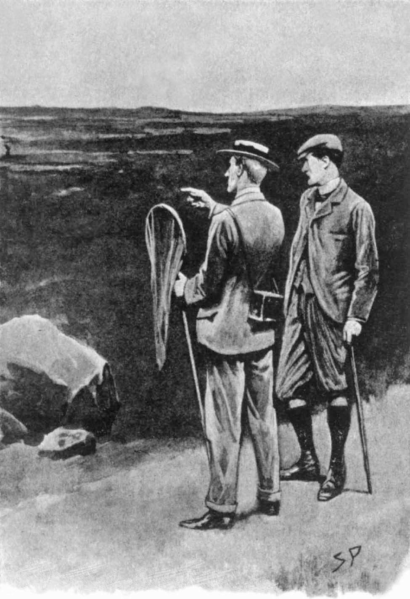

“那就是格林本大泥潭。”

在那绿色的苔草丛中，有个棕色的什么东西，是一匹马，正一上一下不停地折腾、挣扎。脖子拼命伸长了在痛苦地扭动，随后发出一声绝望的嘶鸣，吼声在沼泽地上回响，吓得我浑身透凉，而这位同伴，他的神经似乎要比我坚强。

“完蛋！”他说，“一个生灵给泥潭吞没了。只两天，就是两条命，说不定还会陷掉不少呢。马都是在旱季跑到里面去，可不知道现在不一样了，老路进去，就掉下去没命了。糟糕透了的地方，这个格林本大泥潭。”

“你不是说你可以通过泥潭吗？”

“没错，有一两条路，灵活点的人还可以走走，这是我发现的。”

“这种可怕的地方，你要去做什么？”

“噢，你瞧见那远远的山岗吗？像是泥潭包围中的孤岛，长年围在沼泽中，无路可通。可正是在那里，有不少珍稀植物和蝴蝶，你有本事进去，你就能弄到手。”

“哪天我也想碰碰运气试试。”

他显出一脸惊讶的神色望着我。

“你可千万试不得，”他说，“这是人命关天的事，万一倒霉，我可担待不起！可以说句不好听的，你是进得去出不来，别想活着回来。我是靠着记标识才能到那里去的，认标识本身就是件难事。”

“天哪！”我喊了一声，“什么声音？”

一声悠长、低沉、凄厉的吼叫从沼泽地上传来，可怕得难以形容。声音回荡起来，响彻空间，也说不清到底是从哪个方向发出的。先是沉沉地起声，逐渐增强变成狂吼，接着回落成悲哀的颤音，重又沉沉地轻下来。斯泰普尔顿脸露诡异的表情看着我。

“鬼怪地方，沼泽地！”他说。

“究竟怎么回事？”

“庄稼人都说是巴斯克维尔猎犬在吠叫，在找猎物。以前我也听到过一两次，不过叫得没有这一次厉害。”

我心寒得一阵冷战，向四周张望，那起伏的莽莽荒野，杂乱地散布几处灌木绿丛。在无边的旷野上，只有一对体大而漆黑的乌鸦在我们后背的岩岗上聒噪，此外别无动静。

“你是受过教育的人，你不会相信这种无稽之谈吧？”我说，“据你看，这种怪声音是从什么地方发出来的呢？”

“沼泽泥潭有时候会发出异响，由于淤泥下沉，或者地下水上冒，或者还有什么别的原因吧，都会发出声音。”

“不是，不是，那是动物发出的叫声。”

“噢，恐怕是的。你有没有听见过池鹭<a href="#part0085.xhtml_ch2"
id="part0085.xhtml_ch2-back">(2)</a>的叫声？”

“没有，从来没有听见过。”

“已经很稀少了——现在在英国差不多已经绝种，可是在沼泽地上，我相信什么东西都还有可能存在。如果我们刚才听到的声音，说是池鹭的叫声，就是仅存的麻，也叫䴔䴖，我觉得并不奇怪。”

“这么怕人的怪叫我生来就没有听见过。”

“是呀，简直是不可思议之地，不可思议。瞧那边山坡，你说那又是什么？”

陡峭的山坡上，有许多灰色的石头围成的圆圈，至少有二十来个。

“做什么用的？是羊圈吗？”

“不是，那是我们远古祖先住的地方，很了不起呢。史前时期，人类多半住在沼泽地，以后这地方没人再住。发现这类遗迹已经不多，不过同原来的情形一样，几乎没有什么变动。这些就是棚屋，屋顶早没有了。你还能看见灶头和睡铺，如果有兴趣的话，去里边就可以看到。”

“有如城镇的规模了吧，居住的年代是什么时期呢？”

“是新石器时代的人——没有具体的年代。”

“靠什么生活呢？”

“就在这些坡地上牧牛，也已经学会开锡矿。那时已经有青铜剑，比石斧就大大进步了。看对面那个山上有大壕沟，得用青铜器才能挖得成，这就是标志。对了，沼泽地上你还能看到很特别的东西，华生医生，哦，请稍等一下！肯定是只大飞蛾。”

不知是一只小苍蝇还是飞蛾颤着翅膀打我们小路上飞过，一刹那间，斯泰普尔顿飞身扑了过去，其势之迅猛大大出乎我的意料。同样令我惊奇的，这小生物向大泥潭直飞而去，我这位初识的朋友，竟也是一步不停，跳跃于树丛之间，紧追不舍，举起绿色扑蝶网兜不住挥舞。他所穿灰色衣服披散的样子以及蹦跳着七拐八弯地追逐的动作、姿态，看上去也同一只大飞蛾差不多了。我站在那里，看他追蝶扑蝶看得出神，既佩服、惊羡他身手矫捷，又担心他万一失足掉进泥潭而成千古恨。正在心中兴奋与焦急缠结之时，我听到一阵脚步声，转头一看，竟是一个女子，站在小路上，离我很近。看她是从冒着一缕青烟的那个方向跑来，想必是梅里皮特家的来人；因为路径必须通过沼泽地的低洼处，所以我起初看不见她，一直到了跟前方才发现。

我无需多加猜测，一眼就知来者一定是之前曾经说起过的斯泰普尔顿小姐。在这个沼泽地区，太太小姐不多，而且我记得她被描述成美女。这个向我走近的女子，果然仪态不凡，是个美人。但是，这兄妹两人差异有如天壤。斯泰普尔顿的肤色适中，长着淡色的头发、灰色的眼睛，而妹妹是深肤色。英国深肤色的女子，我所见过的都没有像她这么深——身材颀长苗条而优雅。她生就一副端正不俗的脸相，十二分端正，端正得似乎过于规矩，若不是有两片情感丰富的嘴唇、一对热切动人的深灰眸子，就显得有些冷漠。亭亭玉立的身段，配上高雅的服饰，她出现在这孤寂冷落的沼泽荒径之上，简直会引人奇想，怀疑她是不是一个幽灵化成的尤物。我转身过去的时候，她的眼睛正望着她的哥哥，接着便向我紧赶几步靠近。我举帽致意，正想作自我介绍，她却抢先开口，而说的竟是教我莫名其妙、摸不着头脑的话。

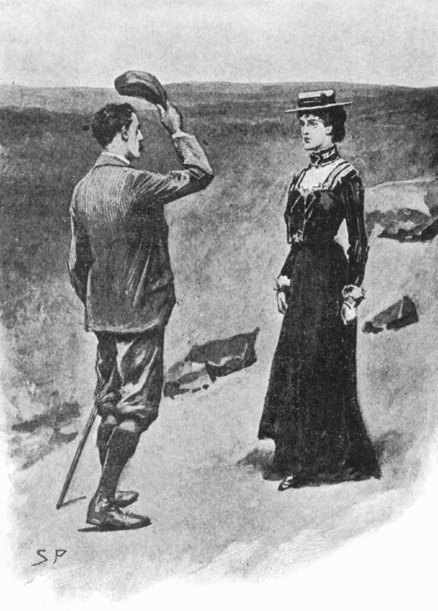

我正想作自我介绍，她却抢先开口。

“快回去！”她说，“快回伦敦去，马上就走！”

我只能吃惊地向她呆望。她两眼炽烈地朝我看，并且着急得朝地上跺跺脚。

“为什么要我回去？”我问。

“这儿不是解释的地方。”她压低嗓音，恳切地说，说话时都抿紧着嘴，“以主的名义要求你，回去，沼泽地永远不要再来！”

“可是我才来呀！”

“你这个人，你这个人！”她叫道，“我忠告你，你都弄不清是好是坏！回伦敦去！今晚就走！无论如何都要离开这个地方！嘘，我哥来了！我说的话，一个字也不要提！劳驾你，把杉叶藻那边的一枝兰花摘给我好吗？我们这儿沼泽地兰花很多。可惜你来得太迟了，没赶上看到这里最美丽的时候。”

斯泰普尔顿已经放弃对小昆虫的追捕，回身向我们这边跑过来，累得直喘气，脸也通红。

“啊哈，贝丽尔！”他说，我听出他招呼的口气似乎并不真诚。

“啊，杰克，你热了吧！”

“是呀，我在捕一只赛蛾，很珍贵，在晚秋季更是难得看见。真可惜，没能逮到！”他说这话心不在焉，一对小而明亮的眼珠不断地向我和女子的脸上扫视。

“你们已经相互介绍过了，我看得出来。”

“是呀，我跟亨利爵士说来得太迟了，看不到沼泽地最美丽的景致了。”

“哈，你把这位当是谁呀？”

“我想总该是亨利·巴斯克维尔爵士了。”

“搞错了，搞错了，”我说，“我不过是个卑微的人，普通人，爵士是我的朋友，本人是华生医生。”

她那富于表情的脸上泛起恼恨的红晕。“我们还没弄清楚就谈起话来了。”她说。

“啊，你们还没谈多少话呀。”她的兄长说道，还是满含着狐疑的眼神。

“原来是跟华生医生说话，我还当他是回乡的爵士呢，不知道你只是来做客的。”她说，“兰花开早开晚他不关心，那就请过来，看看梅里皮特家的屋子，走吧？”

没走多少路，我们就到了沼泽地上一幢孤独、冷清的房子，从前兴旺的时候，这里是牧场，前人走了，现在经过修葺，改成一幢新式住宅，四周果园环绕。可是栽的树如同所有沼泽地上的树那样，矮小，饱受摧残，生长不良。总体上看，这里给人低沉郁闷灰溜的感觉。一个长相奇怪的、衣服旧得掉色的干瘪老男佣把我们迎进屋里，老头儿的模样同这幢房子倒挺相配。屋子里面，可就大不一样了，几个大房间，摆设布置都很高雅，看得出全属女士的情调和趣味。我从他们家的窗子看出去，望着点缀着灰色花岗岩石的沼泽地，高低绵延伸向极目的地平线，不禁感到奇怪，是什么原因使这位受过高等教育的男士和这位美貌的女士要住到这么个地方来呢？

“选上了这么个怪地方，你在这样想，是不是？”我没问，男士倒先看透了我的心思，“我们就是有办法，日子过得蛮快活。我说得对吗，贝丽尔？”

“很快活。”女士说，可是话音勉强，毫无自信。

“我原来是办学校的，”斯泰普尔顿说，“那是在北方乡村。那种工作对我这个人的性格不合适，嫌太机械刻板，没什么趣味。不过，好在能和孩子们一起生活，引导他们，培养他们，按照每个人的个性，造就他们成为有理想、有品行的人，也是很值得我去做的事。谁料得到运气不好，学校里发生了急性传染病，死了三个男孩。我遭受这一打击，便一蹶不振，我的家产全贴了进去，赔个精光。跟孩子们做伴虽说有趣，可是这种生活丧失了也就丧失了，我不得不另找出路，结果焉知非福，因为，我对植物学、动物学原来就有浓厚的兴趣，在这里发现了一个无限广阔的天地，足可以施展我的才能。好在舍妹也同我一样，是个热爱自然、有志于自然科学的人。你从我家窗子向外看出去，你心里的所有疑问从脸上都看得出来，华生医生。”

“我当然会产生疑问，心里想这儿多么单调乏味——你呢，恐怕还好，令妹可就耐不住寂寞吧？”

“不，不，我一点也不感到寂寞乏味。”他妹妹急忙说。

“我们有许多书，有自己的研究工作，而且还有好邻居，关系很好，很合得来。莫蒂默医生对自己本行最有学问了，不幸的查尔斯爵士也是个可敬可亲的好朋友。我们最了解他，说不尽心里对他有多么怀念。你觉得我该去拜访一下、认识一下亨利爵士吧？今天下午就去不碍事吧？”

“相信他见到你一定很高兴。”

“那好，麻烦顺便替我提一声，就说我打算登门拜访。我们也就只能略表诚意，使他早日有回家的感觉，对这里的新环境早日习惯起来。你楼上请吧，华生医生，有兴趣看看我收集的鳞翅目昆虫吗？可以说，在英国西南部，这是最完整的标本。等你看完，午饭也就准备好了。”

可是我急着要回去，我有责任在身。阴森的沼泽地，小种马悲惨丧命，与巴斯克维尔猎犬的传说相联的令人毛骨悚然的声音，所有这一切都给我的思绪蒙上忧伤的阴影。然而这些只是印象，或多或少有些模糊不清，因而还在其次，最要紧的是斯泰普尔顿小姐的警告，那是确凿无疑的事实。她说得那么紧急、恳切，无可怀疑，其中必有缘故，事情还牵涉得很深，很严重。所以不管如何坚请、挽留我用午餐，我还是拒绝了，急急地告辞出门，踏上回程，仍旧走来时的那条荒草小径。

大概总是熟门熟路有捷径，正当我快要走上大路的时候，我大吃一惊，因为眼前斯泰普尔顿小姐已坐在小路旁的一块石头上。她因为赶我赶得太急，脸上泛着美丽的红晕，一手叉在腰间。

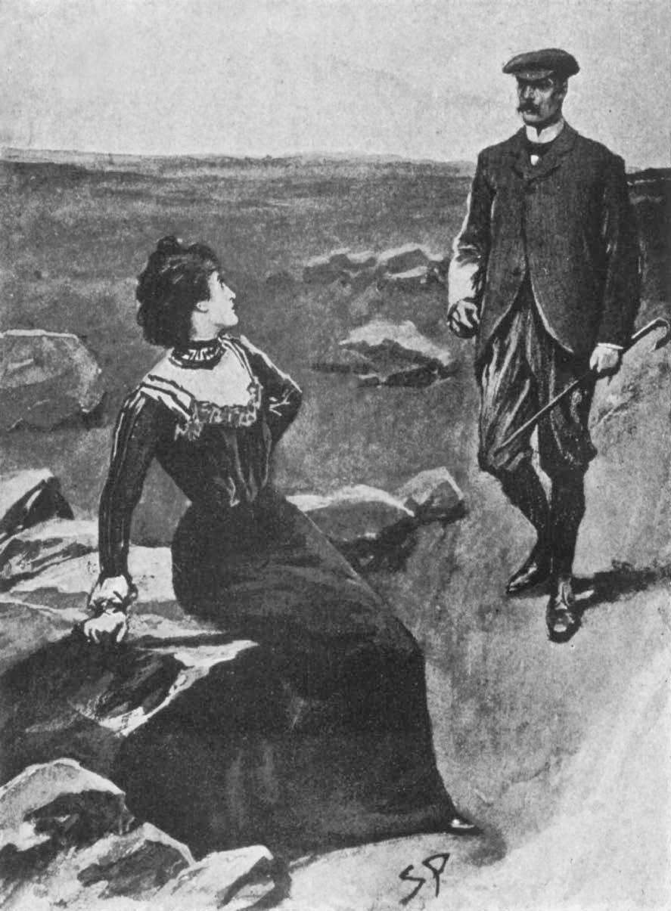

小姐已坐在小路旁的一块石头上。

“我抄近路跑来的，好截住你，华生医生，”她说，“我来不及了，连帽子也没戴。我不能停留太久，不然哥哥要找我。我要对你说真是对不起，傻里傻气的把人都会认错，把你当作亨利爵士。请把我的话都忘了，那些话跟你没关系。”

“可我忘不了，斯泰普尔顿小姐，”我说，“我是亨利爵士的朋友，他的利害与我有关，我不可不管。告诉我，你干吗那么着急要亨利爵士回伦敦去？”

“妇人一时的念头，华生医生。等你对我有了更多的了解，就会知道，我的一言一行不一定都讲得出个什么道理。”

“不对，不对，我明明看到你说话都发抖了呢，你那个眼神我还记得。请你，请求你，和我讲实话。因为，斯泰普尔顿小姐，我一到这里，就感到周围都是疑团。生活在这儿，变得像格林本大泥潭一样，到处是一块块小小的绿草地，掉进去就陷在里头，可又没有引路的人引你到对头的路上去。告诉我，你到底是什么意思，我保证把你的忠告转达给亨利爵士。”

一丝犹豫掠过她的脸，但当她回答我的时候，一下子眼神重又坚定下来。

“你想得太多了，华生医生，”她说，“我哥和我都为查尔斯爵士去世伤心得很呢。我们和他非常熟，他过沼泽地到我家来，最喜欢走这一段路。他家以前遭的那个祸一直压在他的心头，印象太深，直到这次出事，我很自然就想到，事情一定又出在老问题上，他一直说心里害怕着呢。这回他家里又有新的人要来住下，我就担心，所以还是向他提出忠告的好，说这里不太平。我的意思就是这些。”

“什么不太平呢？”

“你知道猎犬的故事吗？”

“这种无稽之谈，我不相信。”

“可我信呢。要是亨利爵士还能听你话，你劝他走，这地方不要待，他这儿的家一直出人命。世界大着呢，干吗非要住在这个危险的地方？”

“就正因为这里是个危险之地，他才偏要来，这是亨利爵士的性格。我怕是不可能叫他离开，除非你把原因讲得再明白再确切一点。”

“再讲确切，我也讲不出了，我真的没有别的意思。”

“我得再问你一句，斯泰普尔顿小姐，你说你当初跟我说的话没有别的寓意，好，那为什么你不想让你哥哥知道你说的话？这里头又碍着你哥哥或是旁人什么呢？”

“我哥很希望大庄园里有人住进去，他的想法是，这样对沼泽地的穷人有好处。所以要是让他知道我说的这些话，万一真的把亨利爵士说得跑掉了，他准会发火。好了，我现在已经做到家了，也不用再说什么了。我得赶紧走，不然，哥哥找我，会怀疑我一定是来找你的。再见吧！”她一转身，没几分钟便消失在乱石巨砾之间，而我，怀着一肚子的疑虑和担忧，加紧步子赶回巴斯克维尔庄园去。

————————————————————

<a href="#part0085.xhtml_ch1-back" id="part0085.xhtml_ch1">(1)</a> 小种马（pony），郡产的矮种马，驯良耐劳，善挽车。

<a href="#part0085.xhtml_ch2-back" id="part0085.xhtml_ch2">(2)</a> 池鹭（bittern），即麻（jiān），或䴔䴖（jiāo
jīng），鹭科鸟，栖息于沼泽地，雄鸟鸣声沉而响，很远可以听见。

# 第八章　华生医生的第一份报告

从现在开始，我要按照事态的发展，把过去写给歇洛克·福尔摩斯先生的原信一一抄录，这些信件都依旧置于我的案头。信件有一页已经遗失，但并不妨事，依然记录下了一切经过，如实反映了全貌。并且这是我当时的实际心情和疑虑，比之仅靠记忆来写，要更为准确，尽管事实上我对这些可悲的事件记忆犹新。

巴斯克维尔庄园，十月十三日

亲爱的福尔摩斯：

我之前曾给你去过信及电报，谅已使你及时了解在这个遭上帝遗弃的世界一角所发生的一切。一个人在这里待得越久，沼泽地的鬼蜮之气，其无边的苍凉连同可怖的魔力，就越深深地侵入他的灵魂。你一旦进入沼泽地的中心，就再也看不到现代英国的丝毫痕迹，而只有另外的一面。在此地到处可以发现史前人类居住和活动的遗迹。你随意走走，周围便是那些远古人类住的房屋以及他们的坟冢，还有高大的石柱。这些石柱据推测是神庙的标志。望着灰色石屋遍布于垦挖得满目疮痍的山坡，你会忘掉自己的年龄，不知身处何时何年。如果看到从低矮的门洞里钻出个身披兽皮、毛发蓬乱的人，将燧石箭头的箭杆搭向弓弦，这时，你会感到，这本该是他的地盘，是他的自然环境，而不是你该来的地方，不是你的自然环境。他们怎么能如此密集地居住在一直那么贫瘠的地区，真是桩怪事。我不是考古学家，但是我能想象得出，他们不是好争善战的民族，以致被迫接受这块他人不愿居住的地域。

然而所有这些，与你派我来这里执行的任务并无关系，而且对你这样严格地只讲实际的人来说，可能也无兴趣。我还记得对于究竟是太阳绕着地球转还是地球绕着太阳转的问题，你的态度是完全漠不关心。还是让我回到正题，谈谈亨利·巴斯克维尔爵士吧。

你近日未曾收到我的信，只因至今无甚要事可供奉告。现有一紧要情况发生，我将逐一向你叙述。但首先，我想让你对这一情况的有关方面有个初步的了解。

其一，在前几天我曾说起过，沼泽地上有个逃犯的事。现已完全确信，该犯业已逃逸，这对本地区住得极为分散的居民不啻是福音，可以大大松一口气了。自其逃跑至今，已有半月，在此期间，他消失得全无踪影。当然，单就藏身而言，这里丝毫也不显困难，到处有小石屋，足可做栖身藏匿之所，但无食物来源，总不能去沼泽地上捉羊来活杀生食。我因此认为该犯业已远遁他乡，所以此地即使住得边远的农夫也可高枕无忧。

此间共有四个男人，都身强体壮，对自身的安全当无问题。惟想起斯泰普尔顿，心中便有点不安。他家周围数英里之内无人居住，所处境地孤立无援。家中有一个女仆、一个男仆及兄妹两人。而这个哥哥也并非五大三粗的人，这一家万一被诺丁山逃犯这样的亡命之徒破门而入遭到袭击，便束手无策，难以对付。亨利爵士和我两人都极关心他们一家的安全，曾想到让马夫珀金斯过去守夜，但斯泰普尔顿本人却未有表示接受的意思。

有一事实，我们的这位准男爵朋友已开始对我们的女邻居表现出极大的好感。这原也不足为奇，对他这样一个血气旺盛、精力充沛的年轻人来说，在这个孤寂、沉闷的地方，度日实在无聊。何况女邻居又是一位十分动人的美貌女子。在她身上，有着明显的热带女郎浓烈的异国情调，同她哥哥的冷漠、寡情形成强烈的对比。而亨利爵士这边，也使人感到内心深藏着如火的炽烈情感，女邻居想必也感受到了被左右而无法摆脱的魅力。我也曾观察到她说起话来，眼睛不住地朝他看，好像自己说的话都要取得他的赞同一般。我确信他对她一片痴心。他两眼发出渴望的光芒，薄薄的双唇表现出内心的坚定，这都显示其决断或者鲁莽的性格，你可能也会觉得他有趣而值得研究。

斯泰普尔顿于头天来巴斯克维尔拜访，翌日晨又领我们两人一同去看传说的恶人休戈丧命之地。走过好几英里山路，穿越沼泽地到达一个地方，这里十分阴沉凄凉，容易使人想起那一类的故事来。我们看到，在乱石嶙峋的山冈之间，有一条不长的山沟，顺着山沟，可通向一片开阔地，遍地长荒草，杂然其间的多为白色的羊胡子草。中央矗立两柱巨石，顶端已经风蚀，呈尖状，看起来就像巨型怪兽的两根磨损的大獠牙。各处都与那则旧传闻所讲的惨景相吻合。亨利爵士甚感兴趣，问斯泰普尔顿好几次，是否真的相信超自然的魔怪会来世间害人。他回答得轻描淡写，并不经意，但显而易见他内心里很郑重其事。斯泰普尔顿关于自己的答话十分小心谨慎，却很容易看出来，他是尽量少说，在斟酌准男爵的情绪，不把全部意思和盘托出。他同我们说起发生过几件类似的事情，几户人家遭到类似的魔怪之害。这是要给我们留下印象，他对此事的看法其实与众人并无二致。

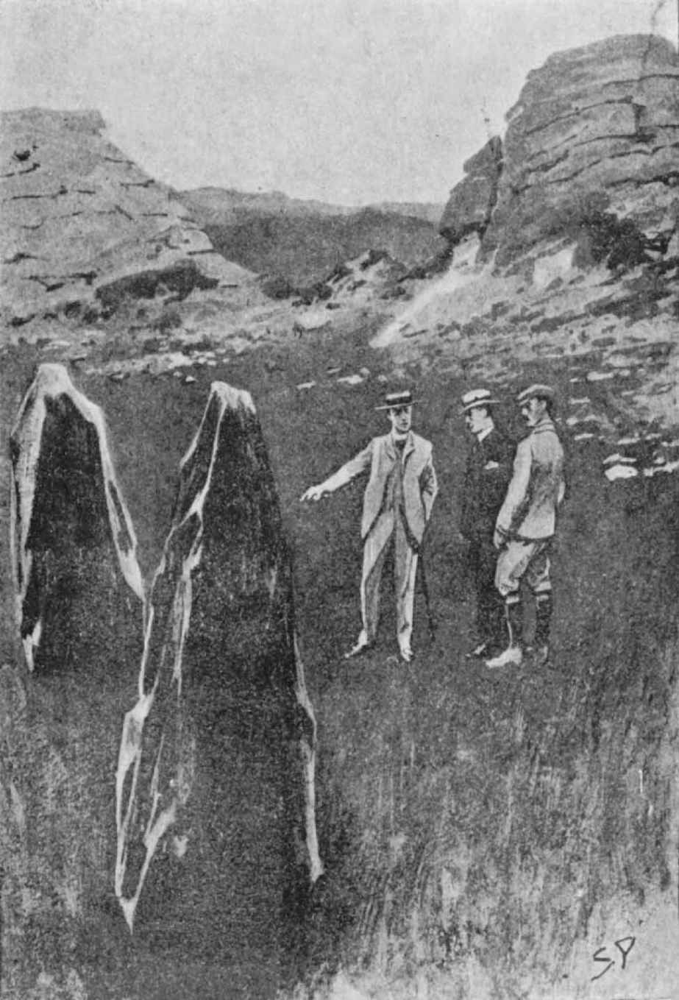

像巨型怪兽的两根磨损的大獠牙。

归途中，我们留在梅里皮特住宅用午餐。就是这一次，亨利爵士同斯泰普尔顿小姐相识。他头一眼就似乎已被她强烈吸引。我完全看出，他们已经互相有意思。在回家的路上，准男爵一次又一次地谈起她，从此，我们几乎没有一天不同他们兄妹两人见面。今晚他们在这里吃晚饭，谈好下个星期我们去他们那儿。可以想象，如此的一对能结合起来，斯泰普尔顿一定会非常欢迎。然而我不止一次从旁发现，当亨利爵士对他妹妹表示关切之时，他的脸马上露出不悦，显出反感。他是少不了妹妹的，这毫无疑问，没有妹妹，生活更要空虚寂寞，可是如果他就此对胞妹的美满婚姻从中阻梗，那就未免是极端的自私。我可以肯定，他绝对不希望他们的亲密友情发展为爱情。我许多次观察到，他千方百计不让他们有单独密谈的机会。说到你的叮嘱，叫我绝对不可让亨利爵士独自一人外出，可是一旦爱情介入，那就难上加难，变得非常难以应付。如果一字不打折扣地执行你的命令，那我将开罪于他，立即成为不受欢迎之人。

那一天——星期四，说得确切点——莫蒂默医生同我们一起吃午饭。他正好在长冈地方发掘一座古冢，挖得一具史前人类的颅骨，他为之喜出望外。真没见过像他这样专心致志、如痴如醉地热衷于此道的人！斯泰普尔顿兄妹后来也到了。这位好好医生应了亨利爵士的要求，带我们去了紫杉树小道，领我们看那天夜晚出事现场到底是怎么样的情况。那是一条很长的、阴森森的紫杉小巷道，夹在两行稍高的修剪整齐的树篱中间，路两旁各有一条窄窄的草地，在远处的尽头，是一座破旧的凉亭。居中一半处就是通沼泽地的栅门，也就是老绅士掉下雪茄烟灰的地方。栅门是一扇白色木门，有门闩，出了门，就是空旷的沼泽地。我记得你对此事的推理，我努力想象整个事情如何发生。老人站在那里，看见有什么东西穿越沼泽地向他过来，可怕之物，吓得他魂飞魄散，奔跑逃命。他怀着极大的恐惧，跑得心衰力竭，倒地而死。那条长而阴森的巷道就是他所奔跑的地方。为什么跑呢？沼泽地的牧羊犬？还是一只幽灵大猎犬，它乌黑，不出声，像魔怪？其中有没有什么人在作怪呢？那个白净脸、眼色警觉的巴里莫肚中藏有隐情嘴上不肯说吗？这一切都是迷雾一团，但总而言之，内中定有犯罪的阴谋。

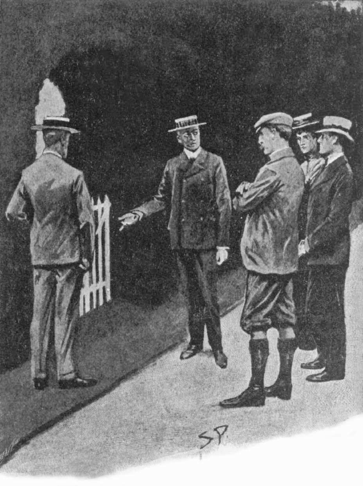

看那天夜晚出事现场到底是怎么样的情况。

上次给你写信以后，我又遇上另一个邻居，就是拉夫特庄园的法兰克兰先生，他住在南边，距我们四英里远。他是一位长者，面色红润，头发银白，脾气火爆。他嗜好研究英国法律，为打官司就打掉一大笔财产。他争讼仅以争讼为乐趣，官司一来，他对替哪一边争、哪一边打都无所谓，故而可说他是不惜高价买争讼之乐趣。有时候，他会当街拦断一条路，并公然抗拒教区命他撤去路障之令。有时他又亲自动手拆掉别人的大门，并宣布一条古已有之的要道重新开通，反驳原主对他提起非法侵入私宅的诉讼。他精通旧采邑权法和公共权法，使他的法律知识有时候为弗恩沃西村村民的利益争讼，有时候又反过来反对他们。因此，根据他的行为的后果，时而以胜利者给人抬着游行大街，时而给人拿个他的假人像当街烧掉。据说他目前手中尚有七宗讼案，说不定会把他仅剩的财产打个精光，到时犹如一只黄蜂拔掉螫刺，将无害于人。若是法律争讼姑且不论，他还是一位和蔼可亲、心地颇为善良的好人。我之所以提及他，仅因为你曾特别关照，凡周围的人和事，都应向你汇报。法兰克兰现在又正忙得不可开交，他是个业余天文爱好者，有一架高倍望远镜，便整天趴在自家屋顶上，用望远镜向沼泽地上瞭望，以期发现逃犯的踪迹。若是全力以赴仅止于此，倒也罢了，也不失为一桩好事，可是有谣传说他此举用意在告发莫蒂默医生不经死者亲属许可私掘坟墓。因为医生在长冈挖掘古冢，发现新石器时代的古人颅骨。这法兰克兰常常在人们感觉生活单调无聊得发慌时，弄出来一点小小的花样，正好有助于大家调剂调剂精神。

至此，已向你汇报了时至今日有关逃犯的情况，并述及斯泰普尔顿兄妹、莫蒂默医生和拉夫特庄园的法兰克兰，现在让我以最重要之要点作为此篇之收尾，告知有关巴里莫更多的情况，这其中尤以昨晚事态的发展更为惊人。

首先，你自伦敦发出那份查询电报，意图确证巴里莫本人是否在此。我已解释过，邮电局长的话说明查询根本不起作用，我们未能获得任何证明。我告诉亨利爵士此事的个中情由，他便依他的脾气立即将巴里莫叫来，问他是否亲自收到那封电报。巴里莫说收到了。

“小孩送到你手上的？”亨利爵士问。

巴里莫很惊讶的样子，稍稍考虑了一下。

“没有，”他说，“我正好在楼上小屋里有事，是我妻子收下送上来的。”

“是你亲自发的回电吗？”

“也没有。我关照我妻子怎么回电，她就下楼去写电报了。”

当晚，巴里莫自己又来重提此事。

“我搞不大懂今天早上你们问我是怎么个意思，亨利爵爷，”他说，“想必，他们没有说我做得不对，让您不满意了吧？”

亨利爵士不能把原委告诉他，只说没有此事，尽管放心，并将自己全部旧衣服送给他，以示安抚，好在在伦敦新添置的服装已经全部运到。

巴里莫太太也颇引起我怀疑。她是个胖而结实的女人，行为很古板，个性好强，在人前不肯丢面子，拘谨得如同是一个清教徒。她一天到晚冷冰冰的样子，你都难以想象，确实很少有。我已经告诉过你，在第一天晚上，我听见她哭得很伤心。自那以后，我几次看出她脸上有泪痕，一定有悲痛的事叫她心碎。有时我想，她是否有前愆罪孽而常心怀愧疚。有时我又怀疑巴里莫也许是个家庭暴君，虐待妻子。我始终觉得在巴里莫这个人身上肯定有文章，大有问题。果然在昨天晚上出了件鬼事，给我发现了内情。一团疑问，原来还有这么回事。

这事本身算不得复杂，也许微不足道。你清楚我睡觉一向不很沉，在这所房子里，更因为要多留个心眼儿，所以睡得比平时更不踏实。昨天深夜，大约凌晨二时，我被脚步声惊醒，听见轻轻的脚步打我房前经过。我立即起身，悄悄开门往外看，见一个长长的黑影照在走廊上。是一个人影，手里拿支蜡烛，蹑手蹑脚向走廊过去。这个人穿着衬衫、长裤，光着脚。我只能看清一个身影轮廓，可是那身高看得出来正是巴里莫。他走得很慢，小心翼翼，那鬼鬼祟祟的样子肯定不会是在干好事。

我已同你讲过，走廊被环绕大厅的阳台隔断，但走廊在那一边又接上了。我等他走得看不见了，然后跟出来。我走过阳台，他已到走廊的尽头。我看见从一个房间的门里照出来微弱的亮光，知道他进入了一个房间。由于这里所有房间都无陈设，又无人住，所以他这深夜行动更加诡秘莫测。亮光稳住不晃了，好像他人已站定不动。我弯着腰悄悄地尽量不出声，沿着走廊过去，凑近门边朝屋里看。

巴里莫身子趴在窗前，把蜡烛举向玻璃窗，侧面正好对着我这一边。他向着窗外漆黑的沼泽地探望，显出急切的样子，脸色很紧张。他站在那里注视了几分钟，接着沉沉地叹了口气，手一挥便把蜡烛熄了。我立刻返身回房。一会儿，潜行的脚步声再次经过，朝刚才来的方向走回去。过了许久，我刚要朦胧入睡，忽又听到什么地方有拧钥匙开锁的响声，但是我听不出声音从何处来。我猜不透这又是怎么回事，但是在这座阴森森的大宅里必定有不可告人的罪恶勾当，我们要尽早把它弄个水落石出。我不拿仅是一己的猜测来打扰你，因为你要求我只须向你提供事实。今天早晨我和亨利爵士有一番详谈，根据昨夜我观察到的怪事，我们制定出一个行动计划。现在暂时搁笔，待下一次禀告，读起来想必更加饶有兴味。

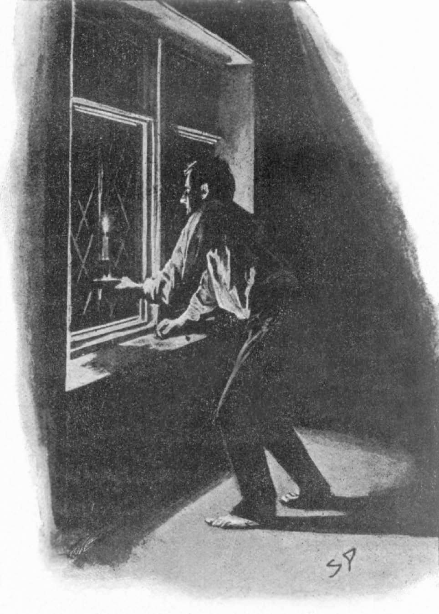

把蜡烛举向玻璃窗。

# 第九章　华生医生的第二份报告　沼泽地里的烛火

巴斯克维尔庄园，十月十五日

亲爱的福尔摩斯：

你派我执行任务以来，起初几日并没有许多消息向你报告，实在也是进展不大，真是无奈。而现在，须知我就要弥补失去的时间，因为事情的发展正向我们接踵而来，情况也已日见复杂。上次报告，我只写到巴里莫在窗前探望，不知所以，似是卖了关子。但我现在已掌握了更多的线索，你一定会大为震惊，除非我全部搞错，无一准确。事件出现的转折，实在是我始料未及。有些方面，仅四十八小时内即已明朗，有些方面则变得更纷杂如乱麻。我在此向你一一报告，你自会作出判断。

半夜怪事后的清晨，吃过早饭，我走到过道那边，察看昨夜巴里莫去过的房间。他紧张观望的是西窗，我一看，原来有其妙处，是房间内其他窗户所无——这窗正好能清楚地望到沼泽地。前面有两棵树，中间隔开留出空隙，由此望出去，可说一览无遗。别的窗子也能望见，但是距离较远。由此看来，既然巴里莫只从这扇窗张望，肯定是在看沼泽地里的什么东西，或是什么人。因为只有从这扇窗看才能达到这个目的。当晚漆黑一片，所以真不知道他想要看见什么！我突然转念想到，莫非就是男女偷情那种事。这就可以说明他为何行动要偷偷摸摸，及他的妻子为何总是惴惴不安。此人仪表堂堂，相貌出众，引诱几个村姑的心来偷欢，应是易如反掌，所以这样的推论看来可以站得住脚。夜里我回房后又听见开门声，可能正是说明他出去秘密幽会。早上我心中在自圆其说，现在又在告诉你我怀疑的目标与方向，然而结果却全然不是这么回事。

不管巴里莫的真实动机是什么，我觉得在真相未能大白之前，应保守秘密。只有我一个人知道，对我未免是个负担，所以吃过早饭，我就去了准男爵的书房，与他当面谈了我亲眼所见的全部情况。出乎我的意料，他并不怎么吃惊。

“我知道巴里莫半夜里常有走动，我本来是要找他问个清楚的，”他说，“我听到他在过道里走，有两三次，走过来再走过去，也就是你说的那个时间。”

“那就是说，他可能每晚都要专门跑到那个窗子去。”我推测说。

“是这样吧。要是真是这样，我们可以盯住他看个明白，究竟背后搞什么鬼。我在想，要是你的朋友福尔摩斯来这儿，他会怎么做。”

“相信也就是像你现在想到的这么做吧，”我说，“跟踪巴里莫，看看他到底干什么。”

“那好，咱们就一块儿干。”

“可是，说不定会让他听到。”

“这个人耳朵背。再说，我们本来就是要找机会抓住他。咱们今晚上就待在我房里，等着他，听他过来。”亨利爵士兴致勃勃，搓起双手，显然他也乐意做做这种出人不意的机密事。在沼泽地带生活十分枯燥，也好藉此解解闷。

过去曾经同查尔斯爵士拟订修造房屋计划的建筑师和从伦敦来的营造商，准男爵同他们联系过了，所以有望不久即将大兴土木。另外还有请自普利茅斯的装潢师和家具商，这摆开的架势，可以看出我们的朋友心怀宏愿，手中有实力，将不辞劳苦、不惜工本地来恢复这个家族的威望。等待房子修造完毕，里外装饰一新，家室重新布置，那么就万事俱备，只缺一位新夫人入住了。我们之间已经心照不宣，这不过是水到渠成的事，只要这位女士点头就成。因为我还从未见过一个男人像他这样痴情迷恋一位女子，我们漂亮的女邻居斯泰普尔顿小姐。但是情况不是如人们想象的那么顺利，好事多磨吧。今天，举个例讲，平静的水面被扰乱，泛起了涟漪，造成我的朋友心神不宁，烦躁不安。

我和他谈完上述有关巴里莫的话之后，亨利爵士便戴上礼帽，准备出去，我当然也要照例同行。

“怎么，您也要去，华生？”他问，一边好像不解似的望着我。

“这得看您是不是到沼泽地去。”我说。

“是呀，去沼泽地。”

“哦，那您该清楚我要执行指示。我很抱歉对您造成不便，但是您也听到福尔摩斯一再叮嘱我不可以离开您，特别强调您不能单独一人到沼泽地去。”

亨利爵士一手搭在我肩膀上，露出轻松的微笑。

“我亲爱的伙计，”他说，“福尔摩斯，他尽管富有智慧，也不见得事事料定如神。我来这里沼泽地以后，有些事他是想不到的。您懂我的意思吗？我说呀，您可别扫人兴呵。我得一个人去。”

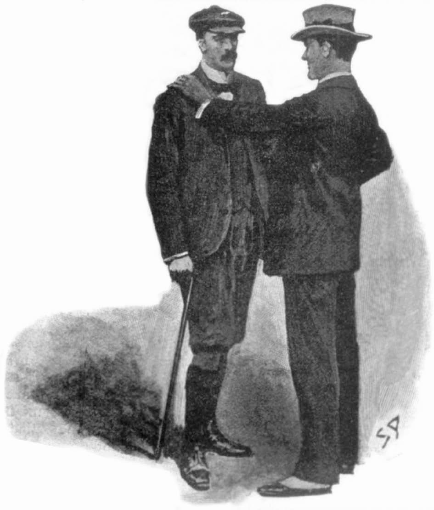

“我说呀，您可别扫人兴呵。”

这事很尴尬，让我好生为难。我不知该怎么说、该怎么做才好。我还没拿定主意，他已经拿起手杖走掉了。

我把这事重新考虑一番之后，自己良心受到了强烈的谴责，我不应有任何托词允许他脱离我的视线。一旦我回来向你承认，由于疏于执行你的指示，因而出了大事，我到了这个境地，心中滋味真难以想象。说真的，一想到这里，我脸颊都发烫了。去追他，现在还不算晚，我立即拔腿朝梅里皮特住宅方向跑去。

我以最快的速度一路奔跑，跑到了沼泽地岔出几条小路的地方，不见亨利爵士人影。我担心弄到最后连方向都跑错了，所以爬上了一座小山冈，以便登高望远，确定一下方位——就是那座辟成了采石场的黑色小山。我很快就看到他了。他正在沼泽地小路上，距我约四分之一英里远，身旁有一位女士，不用说便是斯泰普尔顿小姐。非常清楚，他们两人已经心心相印，会面是早就约好的。两人肩并肩，缓缓而行，侬侬密语。接着我看见女士急急地摆动双手，像是表示自己说的话十分当真，而爵士在身旁也听得十分专注，并有一两次摇摇头，表示绝对不能同意。我站在岩石中间注视着他们，不知下一步应当怎么办才好。追上去打断两人亲密的谈话，那样太粗暴无礼；而我的责任是明确的，不许他有一时一刻不在我的眼皮底下。秘密跟踪，窥视自己朋友的隐私，真是一件可鄙的差事。诚然，我也只能在这山岩上看着点，除此以外没有更好的办法。那么只好事后向他坦白承认自己的行为，以求良心上的清白。的确，万一这时发生险情危及他的生命安全，我也是离他太远，鞭长莫及，起不了多少作用。不过我相信，你会同意我的看法，处在这种地位确实十分为难，我也确实无法可想。我们的朋友亨利爵士和这位女士在小路上停下了脚步，站在那里沉浸在私语之中，这时我突然发现窥探他们俩幽会的不只我一个。我眼前忽地一闪，闪出一样绿色的东西在空中晃动，再定睛一看，是有人举着的一根棒上的东西，这个人在崎岖不平的地上走动，原来是斯泰普尔顿，带着他的捕蝶网。他距离那对情侣要比我近得多，正在朝他们两人走去。

就在此刻，正好亨利爵士猛地把斯泰普尔顿小姐拉近身边，用胳膊把她拥在怀里。但是，我好像看见她在挣扎，别过脸去，他向她俯首下去，她举起一只手，像是在挡他。一下子，我又见他们受惊吓似的一跳分开，慌忙别转了身子，原来是斯泰普尔顿惊搅了他们。他正发疯似地朝他们奔去，那杆捕蝶网在他肩后乱晃。他在一对情侣面前发怒，激动地指手画脚。他那个样子到底是什么意思，我还摸不太透。接着看出来了，斯泰普尔顿是在责骂亨利爵士，爵士一直在辩解，可是他根本不听，而且更加光火。女士傲然站立一旁，不吱一声。后来斯泰普尔顿猛把身一转，朝妹妹狠狠甩臂招了一下手。妹妹犹犹豫豫向亨利爵士看了看，跟在哥哥身旁一同走去。这个生物学家朝自己妹妹做出强烈的手势，说明他也迁怒于自己的妹妹。准男爵呆立在那里，朝他们的背影看了一会儿，也就慢慢地转过身，向着回头路上走，耷拉着脑袋，一副懊恼沮丧的样子。

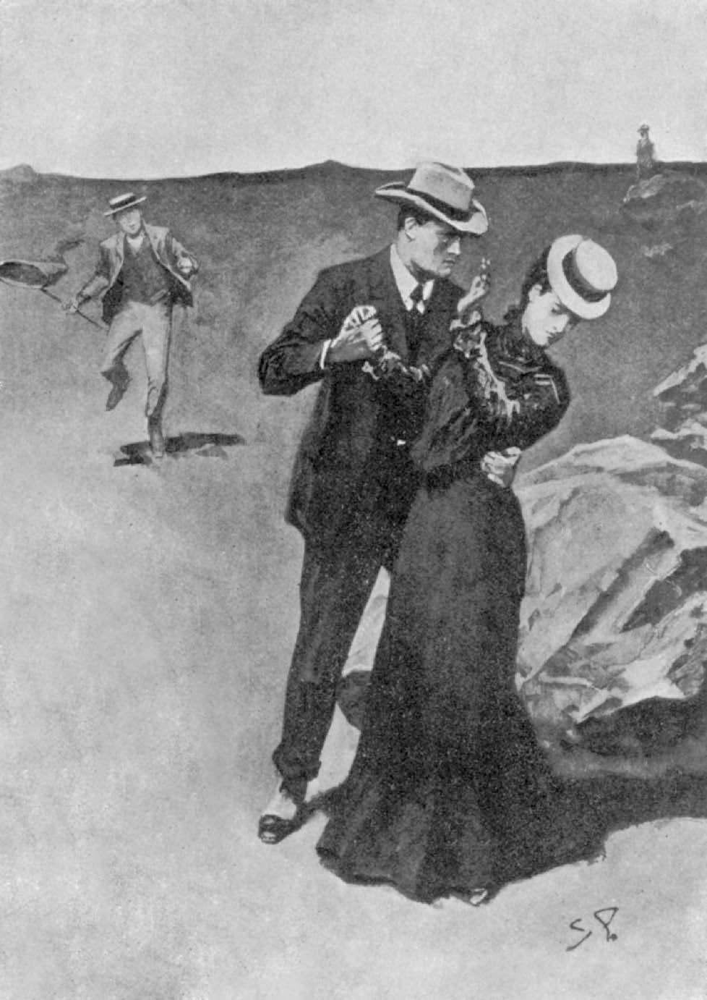

我好像看见她在挣扎，别过脸去。

这一幕是什么戏，我还说不准。只是让我目睹这私情隐秘的一幕，却瞒过了我朋友，内心羞愧难当。于是跑下山，来到山脚下迎向准男爵。他脸气得通红，眉头拧紧，掉了魂似的不知所措。

“天哪，华生！您从哪里掉下来的？”他说道，“这么说，您还真是跟着来了？”

我向他解释了一切，我觉得自己留下不仅是失责，万万不可以，便怎样尾随着来了，看到了怎样的一回事。忽然间，他两眼冒火，向我逼视，但是我坦白相告的诚恳态度平息了他的怒气，他懊丧之余，也只好哈哈大笑了。

“总以为，跑到这荒野中心来，该是相当安全的地方，男人有点事不会给人发现，”他说，“可谁知道，真是岂有此理！好像全乡的人都出来看你演戏似的，让人看着我求爱——求的什么爱，倒霉透顶了！您预订了什么好位置了？”

“就在小山上头。”

“太后座了吧，啊？她哥哥倒是占了前排。您看见他向我们扑过来吗？”

“是的，看见了。”

“您见过他发神经病吗？有过吗

“没有，没有过。”

“我是说呢，没有嘛。直到今天，我一直看他是个精神正的人，完全正常的。可是您记住我今天说的，总有一天，要是他，要么是我，得穿上疯子紧身衣服，约束约束。我有什地方不对了，怎么了？您跟我一块儿生活了几个星期，一直分开，华生，跟我说实话，直说！她是我自己心爱的女人，他却不许我做她的丈夫，凭什么？”

“依我说，不允许是不对的。”

“他总不能反对我这家世地位吧！那么，一定是我自己有什么缺点叫他瞧不起。他讨厌我些什么呢？我长这么大，从来没伤害过人，所有我认识的男男女女，没害过一个，可他是简直连她一根手指头都不许我碰！”

“他这么说了？”

“这么说了。岂止这些，比这还多得多呢。我说给您听，华生。我跟他妹妹认识也就不过几个星期，可就从第一眼见她，就觉得她是为我造出来的，而她呢，也是——她只要和我在一起，就觉得快活。这不假，我敢发誓。女人的眼睛，比讲话还清楚。可是她的哥哥就是不许我们在一块儿。也就好容易挨到了今天，总算有个机会同她单独一起说说话，她见了我可高兴了。可是她高兴归高兴，就是不谈爱情，她要是能阻止我的话，甚至也不许我谈到爱情上面去。她只是一个劲地说这个地方危险，我不赶快脱离这个地方，她是绝对放不下心来的。我告诉她，自从我见到她以后，就不想离开了。如果她真的要我走，那只有一个办法，只能要她设法跟我一起走。这个，我说了好多话，向她求婚，要她嫁给我，可是还没等到她回答，她的那个兄长就跑来了，向我们冲上来。瞧他那张脸，凶神恶煞，像个疯子、神经病。他的脸气得铁青，那双灰眼睛凶得冒火。我对女士做什么了？她要是讨厌我，我总不敢硬勉强她吧？我因为自己是准男爵就想为所欲为了？如果他不是她的哥哥，我知道会怎么好好对付他。他是哥哥，我就告诉他，我对他妹妹的感情是真诚的，没有不可告人的地方，我是希望，有幸能让她成为我的妻子。这么说也没用，他不理我这些。那我也耐不住要光火了，我就对他没好气，但还是忍住没有发作，想想她正站在身旁呢。结果他把妹妹带走，戏就这样结束了，您都见到了。瞧我现在这副模样，比谁都窝囊。您倒说说，这到底是怎么搞的，华生，我会对您感激不尽。”

我试着提出一两种解释，可是说实在话，我自己也说服不了自己。我们朋友的身份、财产、年龄、人品和仪表，各方面条件都堪称优越，我挑不出他有什么不配的地方，要么只有他家的厄运尚未结束。非常令人不解的是，向女士正正当当地求婚，竟遭到如此粗暴无理的干涉、阻挠，可以丝毫不顾女士本人的意愿，而女士对当时这种情况，却也接受，毫无反抗的意思。然而，我们的疑惑、猜测很快搁置一旁，因为就在这天下午，斯泰普尔顿本人亲自来拜访，他特地为上午自己的粗暴无礼登门道歉。在亨利爵士书房里，两人促膝长谈，谈话的结果是裂缝弥合了，为表示此意，约好下星期五去梅里皮特住宅吃饭。

“还不能讲他不是神经病，”亨利爵士说，“我忘不了他早上向我跑上来的时候那个眼神。我接受的，不过是他的道歉，实在诚恳，好话说尽，能这样也就算了。”

“对他那种德行，他作解释了没有？”

“他妹妹是他生活中的一切，他说。那就很自然啦。再说他能这么看重自己的妹妹，我当然也高兴。兄妹俩一直在一起，据他自己讲，他是个很孤独的人，只有妹妹同他做伴，所以一想到要失去妹妹，就真的难以接受。他说他不知道为何我会爱上他妹妹，等到他亲眼看到了事已至此，她很有可能从他身边被带走，方才大感失落，一时间控制不住自己，说话做事都不负责任了。他对发生的事感到十分抱歉。他承认自己有多愚蠢，多自私，竟不顾妹妹的终身大事，只想把这么一个如花似玉的妹妹束缚在自己身边。他说如果妹妹要嫁人，离开他，那就情愿嫁给我这样的近邻，也不愿意她嫁给别人。但是话又说回去了，这对他来说，实在是一个太大的打击。他说最好给他一些时间，让他多少有点心理准备来接受这个现实。要我给他三个月，把这事先搁一下，在这段时间别心急，只和他妹妹保持友谊关系，不发展爱情，那么在他那一边，保证绝不会再反对。这个我答应了，事情就这么平息下来。”

如此，几个小小的谜团，一个已获澄清。确实正像人挣扎于泥淖之中，终于在哪一处碰到了硬底一般立定了。至此，我们知道了为什么斯泰普尔顿要对妹妹的追求者这么反感——尽管追求者是一位如亨利爵士那样不可多得的人。现在，我要转向从一团乱线中抽出的另一条线索，就是那夜半哭声之谜，巴里莫太太满面泪痕之谜，管家向西格窗偷偷夜行之谜。向我祝贺吧，我亲爱的福尔摩斯，你得说，我受你委派，没有辜负你的嘱托——你在派我下来的时候所寄予我的信任没有白费，你不会后悔。所有一切谜团一夜之间便已彻底弄清。

我说“一夜之间”，说确切点，实际是两夜工夫。因为，第一夜白搭了，没有一点结果。我和亨利爵士一起坐在他的房间里，直到凌晨三点，一点声音都没听见，只听得楼梯上头大钟的报时声。那是一次最沉闷难受的熬夜，结果我们两人都倒在椅子上睡着了。不过，我们并不气馁，决心再试不辍。第二天夜里，我们把灯火捻小，静坐抽烟，不出一点儿声音。时间过得出奇地慢，可是我们一直挺着，像猎人守住陷阱那样有兴致，有耐心，等着猎物过来自投罗网。一点钟敲过了，又等到听敲两点，我们有点绝望，正准备作第二次撤退，就在此时，我们两人不约而同从椅子上腾地坐起身，浑身倦意顿消，立刻警觉起来。我们听到了走廊上有咯吱咯吱的脚步声。

轻轻地，我们听它一步一步走过，听它走远，没声音了。这时，准男爵轻轻把房门打开，我们两人一起随后跟出去。那个人已经拐过阳台，走廊里一片漆黑。我们悄悄潜行，摸到了另外的那一侧，正好让我们看见这个高个子、黑胡子的人影。他弯腰驼背，踮着脚走过了廊道，然后走进了上次进的那个门，蜡烛火光把黑暗中的门框照亮，一道黄光穿过昏暗的走廊。我们小心地一步步向那门靠近，每跨一步先试试地板是否经踩。为谨慎起见，我们也把鞋都脱了丢在房里。但是，尽管如此，陈旧的地板还是在脚底下咯吱作响，有时似乎他不可能听不到我们在走近的声音。所幸这个人耳朵相当背，而且他还全神贯注干着自己的事。最后我们走到了门口，向里面望去，发现他趴在窗台上，手里举着一支蜡烛，那张苍白、神色紧张的面孔贴向窗玻璃，就是我前天夜里所见的那个样子。

我们预先并没有周密的计划，说好临时怎么行动。准男爵他喜欢当机立断，见机行事，认为该怎么做时就怎么做，是最自然有效的办法。他径自向房里走进去，这么一来，巴里莫吓得忽地一跳，离开了窗口，嘶的一声倒抽一口冷气，在我们面前站住了，面色死灰，浑身发抖。在他苍白的脸上，一对黑色的眼睛闪着惊恐的目光，看看亨利爵士，又看看我。

“你在这儿干什么，巴里莫？”

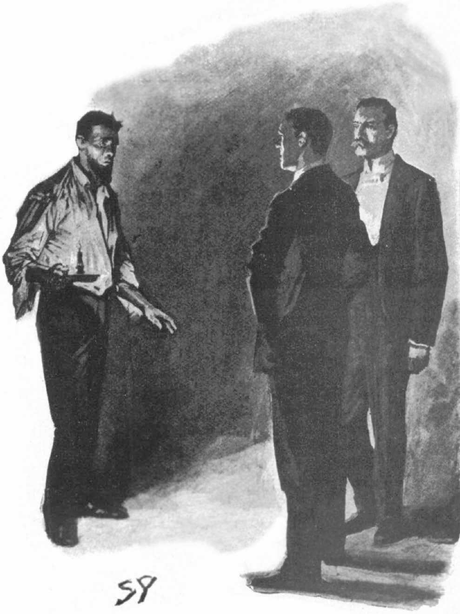

“你在这儿干什么，巴里莫？”

“没干什么，爵爷。”他已吓得张口结舌说不出话。他手上的蜡烛在瑟瑟发抖，烛光下的人影也随之发抖。“是这些窗，爵爷，我夜里来看看，有没有关好。”

“这二楼上的窗？”

“是，爵爷，全部窗子。”

“告诉你，巴里莫，”亨利爵士声色俱厉地说道，“我们一定要你讲实话，不说不行。你晚说不如早说，省得麻烦。好了，说吧！别耍花招，你在这窗前干什么来着！”

人到了这个处境，不免陷入绝望，他看着我们，一双手使劲地拧着，疑惧、痛苦到了极点。

“我没有做坏事，爵爷，不过是把蜡烛照近窗子。”

“为什么要拿蜡烛照窗子？”

“这个别问，亨利爵爷——别问这个！我跟您说吧，爵爷，不是我自己有什么瞒人的事，这事不能说。如果事情只关我自己，不关旁人，我绝不会瞒住您不说。”

这时，我的灵机忽然一动，从管家颤抖的手中一把拿下蜡烛。

“一定是拿着打信号用，”我说，“咱们看看有没有回应。”我照他的样子举着蜡烛，同时注视漆黑的窗外。月亮被云遮住，我只能朦胧地看出黑糊糊的一层树影，略淡一点的漫漫沼泽地。稍后，我高兴得一声欢呼，从窗框当中望出去，在黑暗的远方，忽然出现一个黄色小光点，穿越漆黑的夜幕。

“看，那边！”我叫道。

“不，不，爵爷，不是那个——完全不关那个！”管家忙抢嘴说，“向您保证，爵爷——”

“蜡烛从窗口拿开，华生！”准男爵叫道，“看见吧，那边也没有了。好呀，你这流氓，还想抵赖，不是打信号？好啦，快说！那边的同伙是什么人？搞什么阴谋诡计？”

那个人到了这时候，脸色反而变得坦然无畏起来。

“这是我个人的事，不关您的事，我不会说。”

“那好，你别在这儿干事了，你走吧！”

“很好，爵爷，我是要走，我一定走。”

“可你要知道，你走得很不光彩。唉，啊，人总得有点羞耻心，知个好歹。你家和我家一起生活了一百多年，在这同一个屋檐下，结果叫人发现，你居然在背后捣鬼要害我。”

“不，不，爵爷，不是，不是害您哪！”这是一个女人的声音，巴里莫太太站在了门口，比丈夫还要惶恐，脸色还要苍白。这种极度紧张的神态，把她原来穿裙子、披披肩的肥大身躯的好笑样子抵消掉了。

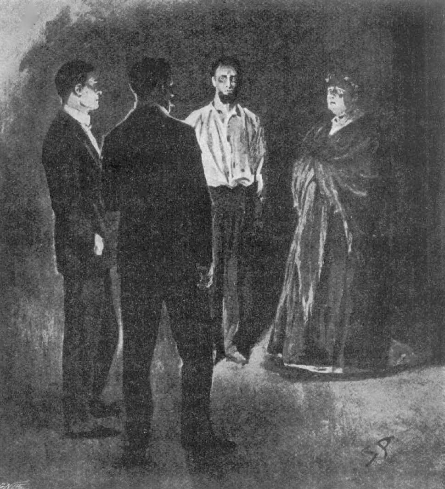

巴里莫太太比丈夫还要惶恐。

“我们走吧，艾莉萨，事情算是到头了，把我们的东西收拾一下。”管家说。

“噢，约翰，约翰，不都是我把你连累的吗？都是我，亨利爵爷——找我吧！都是为我的缘故，还因为是我请求了他，他才干的。”

“那么，说出来！都是怎么回事？”

“我罪过的兄弟，在沼泽地里挨饿呢，不能看他在咱门口饿死呀！火光是暗号，告诉他吃的准备好了。他那边的火光是送饭去的地方。”

“那你的兄弟是——”

“就是那个逃犯，爵爷——塞尔登，那个罪犯。”

“就是这事情，爵爷，”巴里莫说，“我说过，那不是我个人的秘密，所以我不能告诉您。可现在您全知道了，您该明白了，就算有阴谋，也绝不是对您的。”

好了，这就是深夜潜行和窗前烛光的原委。亨利爵士和我两人惊奇地看着那女人，难道真是这样吗？这位持重好强而可敬的女性竟同全国最臭名昭彰的罪犯是同一父母所生？

“是的，爵爷，我姓塞尔登，他是我的弟弟。在他还小的时候，我们太宠他，他要怎么就怎么，都由着他。结果他以为世界都是为他一个人的快乐存在的，他在世界上可以要怎么干就怎么干。长大以后，他交上了坏人，魔鬼附身变坏了，母亲为他心碎，一家人的名声给他败坏。他不断犯罪，越陷越深，到最后，还是靠上帝的仁慈，总算没送他上断头台。可是在我眼里，爵爷，他永远是我这个做大姐的小弟，一头鬈发的孩子，我带领过他，和他一同玩游戏。他越狱逃出来，爵爷，因为他知道我住在这里，我们不会见死不救。有天夜里，他又饿又累，好容易跑到我这儿，狱警又追得紧，叫我们怎么办呢？我只好让他进门，给他吃的，把他藏起来。后来您回来了，爵爷。弟弟想，到沼泽地会比别的地方更安全，等风声过一过再说，就这样，他去那儿藏起来。每逢隔天夜里，我们都要看看他是否还在，用蜡烛火光在窗前打暗号，有回应，我丈夫就带上面包、肉给送去。每天，我们盼望着他走，可是只要他在一天，我们就要管着他一天，不能把他扔下不管。全部实情就是这样。我是个诚实信主的女人，您能看到，如果这样做有什么罪过的话，不该怨我丈夫，都该怪我，他是为我才去干这事的。”

女人的话说得十分恳切，本身就能证明说的都是实情。

“这都是真的吗？巴里莫？”

“是的，亨利爵爷，句句实话。”

“你帮自己太太这样做，不能怪你。既然如此，把我说的话全都作废吧。你们两人，就回屋吧，这个事，明天早上我们再谈。”

等夫妇两人走了以后，我们再到窗前去看。亨利爵士把窗子一下推开，深夜的寒风向我们扑面吹来，漆黑的远处，那黄色的小光点依然闪亮。

“他倒是敢这么做，奇怪。”亨利爵士说。

“大概蜡烛放的位置，只能让我们这里看得见。”

“很可能。您看距离有多远？”

“我看是在豁嘴山的那一边。”

“差不多一二英里吧。”

“还没那么远。”

“嗯，让巴里莫送吃的去，就不可能太远。这个坏蛋，正在蜡烛边等着呢。嘿嘿，华生，我想去抓住他！”

我心里也正这样想。看来，巴里莫夫妇俩对我们并不信任，因为秘密是被迫交代出来的。那个人对社会是个祸害，对这样一个怙恶不悛的惯犯，不可心软，不可原谅，趁此机会把他捉拿归案，叫他停止作恶，不再为非作歹，那我们也是尽了一份应尽的责任。就他这种残暴的本性，我们如果袖手旁观，那别人就要遭殃，要付出代价。说不定哪天晚上，我们的邻里，比如斯泰普尔顿家，就会遭他袭击。也许正是想到了这一点，才使得亨利爵士非要去冒一冒这个险不可。

“我跟你去。”我说。

“好，拿上枪，穿好皮鞋，马上走，越快越好，那家伙可能会吹灭蜡烛跑掉。”

不到五分钟，我们已经出门，踏上了征途。秋风呜咽，落叶萧瑟，我们迅疾穿过幽黑的矮树丛。深夜的空气中弥漫着浓浓的潮气和腐败味，月亮不时从云隙间探头一望，奔驰的云层就把天空遮挡。正当我们踏进沼泽地的当口，天上下起了丝丝细雨，烛光仍在前面隐隐地亮着。

“您带家伙了吗？”我问。

“带了根猎鞭。”

“我们下手要快，都说他是个亡命之徒。出其不意，攻其不备，趁他还来不及抵抗，一下子把他逮住。”

“我说，华生，”准男爵说道，“要是福尔摩斯，该会怎么办？在黑夜之中，恶魔张狂之时？”

好像是对他的话立刻作出响应一般，忽然从阴森的沼泽地中发出一阵怪叫，就是我在格林本大泥潭边听到过的那个声音。静夜之中，借着风势，这声音由缓缓沉沉的低鸣，继而高声嚎叫，再转入凄惨的呻吟，而后慢慢落下，渐渐消失。并且一次又一次反复发出，刺耳，狂野，令人毛骨悚然，整个夜空为之战栗。准男爵抓住我的衣袖，他的脸在夜色中显得惨白。

“上帝呀，那是什么，华生？”

“我也不知道。是沼泽地的声音，前些日我听见过一次。”

怪声停止了，周围一片死寂。我们站定，直起耳朵听听，再也没有一点声音。

“华生，”准男爵说，“一定是猎犬的叫声。”

我浑身的血都凉了，因为听他讲话犹豫颤抖，说明他已突然害怕起来。

“他们，都说这是什么声音？”他问。

“谁？”

“乡下人呀。”

“哦，这些都是没知识的人，您何必管他们讲什么？”

“告诉我，华生，他们都是怎么说的？”

我迟疑了一下，但是无法回避这个问题。

“他们说，这就是巴斯克维尔猎犬的叫声。”

他咕哝一声，沉默了一会儿。

“是只猎犬，”他最后又开口说，“可是这声音远在好几英里以外呢，我想，是在那边。”

“说不准是从哪边传来的。”

“声音随风吹，忽低忽高，格林本大泥潭，不是那边方向吗？”

“是呀，正是。”

“噢，是在那边。那么，华生，您自己怎么想，是不是猎犬叫？我又不是小孩子，您不用怕，尽管实话告诉我。”

“我上次听到，正和斯泰普尔顿在一起，他说可能是一种什么鸟的叫声。”

“不对不对，是猎犬。我的上帝。这些个故事传说可能是真的吗？我真是遇上危险了吗？藏在暗处的危险！您不相信，对吗，华生？”

“不信，不相信。”

“这个事，假如在伦敦一定是笑料，可是在这儿，在黑漆漆的沼泽地上，又听着那种叫声，就是不一样呀。还有我伯父！他躺下的地方，边上有猎犬脚印。这些事都兜拢了。我当然不是个胆小鬼，华生，可是那个声音好像让我的血都凝固了。摸摸我的手！”

他的手凉得像块石头。

“明天您就会好了。”

“那个声音在我脑子里，怕是赶不掉了，您看我们现在怎么办？”

“我们回去吧？”

“不，不行，我们是出来捉人的，要干就干到底。我们抓罪犯，说不定有魔鬼猎犬在后头追我们呢。来吧！咱们倒要看个明白，有什么妖魔鬼怪全都放出来吧，放到沼泽地来！”

我们摸着黑一脚高一脚低向前走，周围是一座座嶙峋山冈的重重黑影，豆点黄光就在前方静静地亮着。在漆黑的夜里，看一盏灯光到底有多远，最不易判断准确。隐隐的亮光有时候似乎远在天边，有时候又好像近在眼前，近得不过几码远。可是我们终于看清烛光位于何处，确定已经靠得很近。一支蜡烛，垂满烛泪，嵌在一条石头缝里，边上都用石头挡住，这样可以避免风吹，又可以挡住亮光四散，使别处看不见，只留出向巴斯克维尔庄园方向的一边可以看得见。一块花岗岩巨砾拦在前头，我们匍匐向前，躲到巨石后面，从石头上望过去，看那支信号蜡烛；很奇怪，只见沼泽地中间孤零零一支蜡烛，自立自燃，旁边竟无人影——只有一条上蹿的黄色火苗和旁边岩石上的光照。

“现在怎么办？”亨利爵士悄声说。

“先在这里等着，肯定就在蜡烛附近，好好看看，能不能看见。”

话音未落，我们两人一同看见了。嵌蜡烛的那些石头后边，探出一张可怕的黄脸，一张吓人的野兽般的脸，满脸道道横肉饱绽，污秽肮脏不堪，长着粗硬的长须、乱草蓬蓬的长发，这样子，要说是山上穴居的远古野人，倒还差不多。由下方射上来的烛光，照着两只险诈的小眼睛，邪恶地向左右的黑暗之中窥视，像一头狡黠的猛兽听出了猎人的脚步声。

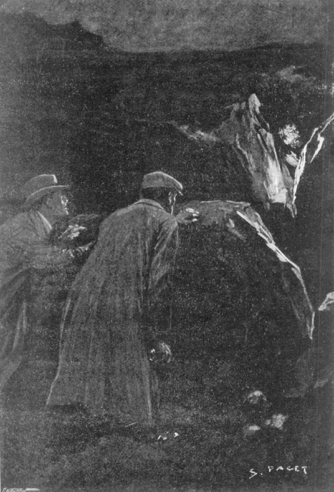

石头后边，探出一张可怕的黄脸。

显然已有什么动静引起了他的狐疑。说不定巴里莫同他还另有联络暗号，我们不知道，或是这个人还因为别的缘故感觉到了情况不妙，我从他凶相毕露的脸上看出有恐惧的神色。他随时可能把蜡烛灭掉，消失在茫茫黑暗之中，所以我一个箭步向前窜去，亨利爵士也一同上。就在这一刹那，罪犯嘴里骂了一声，出手打来一块石头。石头砸在遮挡我们的巨岩上，击得粉碎。他跳起来转身就跑，我瞥见他粗短矮壮的身影，因为这时碰巧月光从云端照下来。我们越过了小山头，看见那人从另一面山坡冲下，在乱石上跳跃飞跑，如山羊般迅捷。要是我拔出左轮枪打他的腿，远射兴许也可以把他击倒，但是我带枪只是用于受到攻击时的自卫，不能射击没有武器的逃跑者。

我们两人都是快腿，而且受过良好的训练，可是很快发现追不上他。借着月光，我们能看见，看着他在远山的山坡巨砾之中迅速奔跑，变成了一个影子。我们一直追，追得筋疲力竭，眼看距离越拉越远，最后只得停下来，坐在两块大石上喘气，望着人影在远处消失。

也就在这时刻，出现一桩奇特的意想不到的事。我们从坐着的石头上站起身，放弃了无望的追捕，准备转身回家。月亮低悬在右侧空中，圆如银盘，被花岗突岩利牙参差的尖顶烘托着低低的下半部。我看见突岩顶上有个人影，映衬着这一轮皓月，轮廓鲜明，黑如一尊乌木雕像。别以为这是我的错觉、幻象，福尔摩斯，可以肯定地告诉你，我这一生还从来没有见过这么清晰的影像。依我判断，这是个瘦高的人形，站在那里，两腿稍稍分开，双臂交叉，头低垂，好像正在面对泥炭和花岗岩遍地的大荒野沉思默想。他也许是这骇人之地的精灵。他不是那个罪犯，因为他所在的方位与罪犯逃逸的地方相距很远。此外，他的身材也高得多。我一声惊呼，指着他叫准男爵看，正当我转身去拉爵士胳膊的刹那间，那个人不见了。这时花岗岩的尖顶仍旧烘托着月亮的下半部，但是尖顶上静立不动的那个人像已踪影全无。

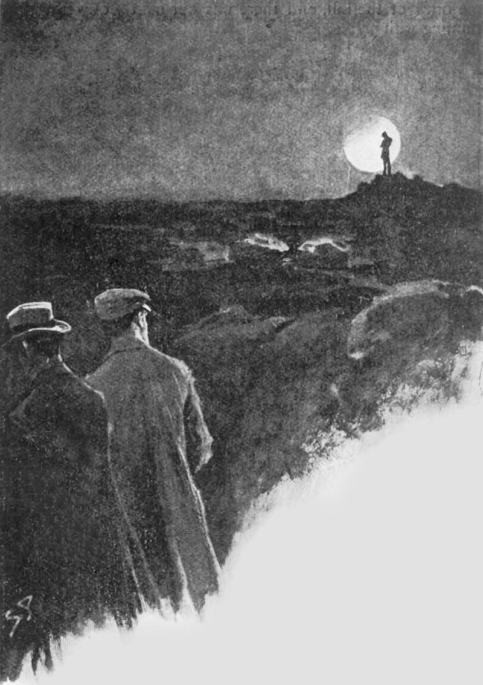

突岩顶上有个人影，映衬着一轮皓月。

我有意朝那个方向去，要搜索突岩，但距离太远。准男爵为了那个吼叫声，神经还在不停地震颤，他想起了自己家庭不祥的故事，因此已无心再做别的冒险。他没有看见那个站立于突岩山冈上孤独的影像，其突然出现和威风凛凛的样子，我为之惊疑不已，在他则当然丝毫无此体会。

“是狱警，肯定是的，”他说，“这坏蛋越狱逃跑之后，沼泽地上到处有警察。”

也许是的，他的解释有几分对，不过我想还须有更进一步的证明。今天我们想给王子城打个电报，告知逃犯的下落、去向，以利追捕。美中不足的是，我们没有将他当场擒获，未能胜利而归。这就是我们昨晚的冒险。你必须同意，我亲爱的福尔摩斯，就给你写信报告此事而论，我已做得非常出色。我给你讲的许多事无疑相当的离题，不过我仍觉得最好应让你掌握全部事实，由你自己来从中选择最可用的材料，有助于你得出结论。我们肯定正在取得进展。就巴里莫一事而言，我们业已发现其行为的动机，使局面大为澄清，但是神秘莫测的沼泽地，以及面目不清的诸居民，这些依旧是迷雾一团，愿下一次报告或能柳暗花明。最好就是你亲自来到我们这里。不管如何，你不久又将接到我的信。

# 第十章　华生医生日记摘抄

我在此最初几日的叙事，有寄给歇洛克·福尔摩斯的报告可供采用。然而，故事叙述至今，我又不得不放弃这一方法，再次有赖于我的回忆，并借助我当时所记的日记。选几段日记，就能使我想起一些情景，这些都深刻地、详细地印在我的脑子里。好吧，我就从那天早晨开始讲起，就是我们去追捕逃犯无功而返，又遇沼泽地月影奇观之后的第二天早晨。

十月十六日。阴，多雾，蒙蒙细雨。滚滚云雾将房屋团团围住，时而翻腾浮起，显露出了阴暗起伏的沼泽地，山坡上细流涓涓，粼粼闪闪，远处巨砾，雨打的石面上水光泛着天色。屋内屋外都沉浸在阴郁晦暗之中。昨夜的紧张、辛苦使准男爵陷于情绪烦躁、惊恐疑惧的状态。我自己也极感心情沉重，意识到有一种危险迫在眉睫——始终面临的危险，由于我未能确知而更觉可怕。

难道我的此种感觉没有来由吗？只要考虑一下连续发生的一连串怪事，就足以说明有一种近在身边的极凶险的罪恶行动。庄园最后一位主人猝死的这件事，把这个家族传说的情形又照样重演了一遍，还有农夫们一再声称沼泽地上有一只怪物频频出现。我就已有两次亲耳听见，像是远处猎犬的嗥叫声。要说这竟会真是超乎自然常规的现象，我以为绝不可信，绝不可能。一只魔怪猎犬，却留下实物的爪印，其吠声充斥空间，这就实在难以想象。斯泰普尔顿也会宁信其有，连莫蒂默都不得不信。但是，只要我还算是个正常的、现实的人，就绝对把它看成是感官可知的常识，我说什么也不会相信那套鬼话。要是信这套鬼话，就无异于把自己降低到了这些无知农夫的水平。农夫把这只狗说成是神灵、鬼怪还不够，还要把它形容得嘴里眼里都能喷出上帝惩罚人的地狱之火。福尔摩斯绝不听信这种奇异邪说，而我是他的助手、代理人，当然也不会相信。但事实总归是事实，我确实两次听到在沼泽地上的这种叫声。假定确实有一只大猎犬跑到了沼泽地里，那么有什么情况都应该容易解释，没有解释不通的道理。然而现在，这么一只大猎犬，能藏身在什么地方呢？到哪里去找吃的呢？是从什么地方跑来的呢？怎么会没人在白天看见过呢？所以应当承认，不管是合乎自然的解释还是超乎自然的解释，现在都同样地难以讲得通。况且除了这只猎犬，伦敦马车里的那个人，说明有人从中插手，这是事实；还有信，警告亨利爵士勿去沼泽地。这些都是明摆的真事。当然，这样做，可能是朋友出于好意，也完全可能是坏人的恶意。朋友也好，恶人也罢，人都在哪里呢？是留在伦敦呢，还是跟到这里来了？会不会——会不会就是在突岩上看见的那个人？

确实，我仅看到他一眼，但有几点，我是绝对有把握的，这个人，是我在这里不曾遇到过的。所有邻居我都见过了，没有这么个人。他个头比斯泰普尔顿要高得多，比法兰克兰要瘦得多。巴里莫倒说不定有点像，可是我们把他留在家里，我完全肯定他不可能外出跟踪我们。如此看来，又有一个人在盯着我们，就如伦敦那个跟踪我们的人一样，我们至今都未能把他弄明白。如果我可以把那个人抓住的话，那么问题便可迎刃而解。为了达到这一目的，我现在非得拼上全力、非得豁出去不可了。

今天早饭后，我们又有一点新情况。巴里莫提出同亨利爵士谈话的要求，两人就去了书房，关起门来谈。我坐在撞球房里，没多久，听到有几次他们的嗓门高了起来。我还有点小聪明，料准是在谈什么要事，果然，一会儿准男爵就开门叫我。

“巴里莫有点不满意，”他说，“他觉得我们去追了他内弟，这做得不公平，他是自愿把秘密告诉我们的。”

管家站在我们面前，脸色苍白，人却很镇定。

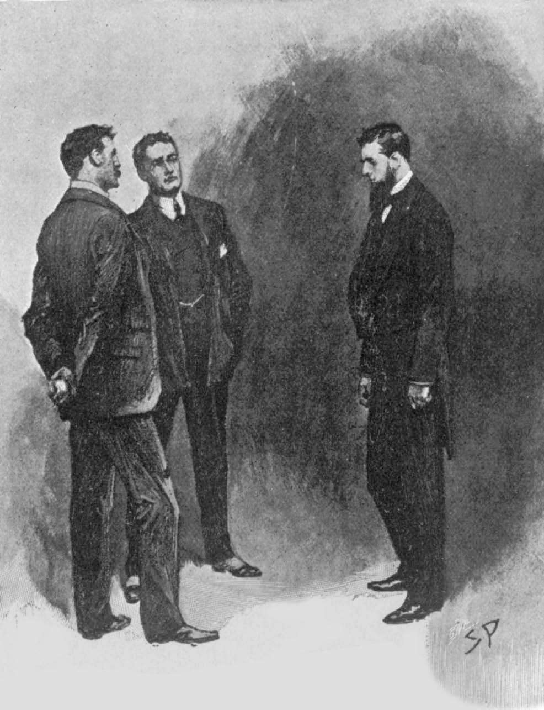

管家脸色苍白，人却很镇定。

“我可能说话过了点头，爵爷，”他说道，“要是有点过头，那就请您包涵，大人不计小人过。不过，话还得说，事情太出乎我的意料。听说您两位今天早晨才回来，又听说是去抓塞尔登去的。这个人已经够他受的了，够他折腾的了，想不到结果还是我，我还会给他刀口上再抹盐。”

“如果是你早跟我们讲明白，完全是你自己自愿交代，当然就完全不一样，”准男爵说道，“可是你告诉我们，不，应当说还是你太太告诉我们的，那就是出于被迫，你不得不说，不说不行。”

“我没料到您会趁这个机会，去这么做，亨利爵爷——说真的，真没料到。”

“这个人是社会要犯。这儿沼泽地周边的房子，都是叫不应的独门独户。这个人无恶不作，瞧一眼他的脸，就清清楚楚。拿斯泰普尔顿家来说吧，是最邻近的例子，除了他自己，屋里再没人有自卫能力。这个罪犯一天不进大牢，大家就别想有一天的太平。”

“他绝不会闯到人家去的，爵爷，这一点我可以向您保证。在这个国家，他永远不会再侵犯任何人。我向您保证，亨利爵爷，再过不了几天，准备工作就可以都做好了，让他上南美去。看在上帝的分上，爵爷，我恳求您别报警，说他还在沼泽地，他们已经放弃了在那儿的追捕。他会安安静静待着不出事，就等着上轮船。您不能告发他，一告发我和我老婆都要连累进去。求求您了，爵爷，千万不要报警。”

“您看怎么样，华生？”

我耸耸肩。“他能顺利离开本国，也就给纳税人减轻一项负担吧。”

“可说不定他临走前又找谁搞一家伙作案呢？”

“他不会这么疯狂的，爵爷，什么东西我们都给他准备好了。他要是再犯一次案，就等于暴露自己藏在哪儿了。”

“这倒也是，”亨利爵士说，“好吧，巴里莫——”

“上帝保佑您，爵爷，我打心底里感激您！要是他再给抓进去，我可怜的老太婆她一定没法活了。”

“我们这不是在纵容重罪犯吗，华生？不过，听他这么说，我也狠不下心来检举这个人。就到此为止吧，行啦，巴里莫，没事啦。”

巴里莫嘴里不住地说着感激话，转过了身，但他犹豫了一下，重又回过头来。

“您待我们真的太好了，爵爷，我应当尽心尽力相报才对。我有一点事情，我知道的，亨利爵爷，应该早点说的，可那是在验过尸好久以后才发现的，这事我从未向人吐露一个字，跟查尔斯爵爷去世有关的事。”

准男爵和我两人都不觉站了起来。“你知道他怎么死的？”

“不是，爵爷，不是那个。”

“那你知道什么？”

“我知道当晚他为什么要等在那门口，他是要见一个女人。”

“要见一个女人！他吗？”

“是的，爵爷。”

“那女人是谁？”

“是谁我说不上来，爵爷，不过我可以给您这个女人名字的缩写字母，是L．L．。”

“这些你都是怎么知道的，巴里莫？”

“是这样，亨利爵爷，您伯父那天早晨收到一封信，他平时信很多，他是个知名人士，谁都知道他善良心好，有难处的人都愿意向他求助。可是那天早晨，也是凑巧，就只有这一封信，我就比平时多注意了一下，是从库姆·特雷西寄来的，上面是女人的笔迹。”

“哦？”

“嗯，爵爷，这事我没往心里去，要不是我妻子，我怎么也不会再想起来。就几个星期之前吧，她收拾查尔斯爵爷的书房——他过世之后还一直没有动过，在壁炉格子后边看到烧过的信纸纸灰。信纸已经大半烧焦，成了碎片，剩下信纸最后一点点，还剩一条纸，字迹在黑底上留着灰白，能看得出来。看上去是信末的附笔，写的是：‘您是一位正人君子，信阅后务必烧掉，十点钟请于栅门等候，切切！’下面就是L．L．这两个缩写字母签名。”

“那条纸你还在吗？”

“没有，爵爷，我们一动，也就都碎掉了。”

“查尔斯爵士同样笔迹的信还有吗？”

“哦，爵爷，我没有特别注意他的信，这次是因为正好只来那么一封，所以才有点印象。”

“你也不清楚这L．L．是谁吗？”

“不清楚，爵爷，我没您知道得多。不过我是想，要是能找到这位女士的话，那么查尔斯爵爷的去世情况，我们可以知道得多一点。”

“我真不明白，巴里莫，这么重要的情况，你留到现在才说！”

“唉，爵爷，那是正好我们自己的事情来了，头疼都来不及。再有就是，我们两人都特敬重、敬爱查尔斯爵爷，一直惦念着他对我们的种种好处。可怜老爷人都没了，这件事再提出来不大好，里头还关系到一位女士，那就更需要小心了。所以，还是，我们最好——”

“你以为有损他的名誉？”

“嗯，爵爷，我想总没有好处吧。可现在您对我们太好了，我知道的什么事，如这件事，不跟您说清楚，就有些对不住您，愧对您了。”

“很好，巴里莫，这事就这样吧。”等管家走了以后，亨利爵士转身对我说，“啊，华生，这个新发现，您怎么看呢？”

“本来已经很暗，现在弄得比以前更暗更黑了。”

“我也是这样想。不过只要找到L．L．，整个事情就应当会有眉目。得到的线索至今就那么多，现在知道有人掌握事实真相，关键先要把这位女士找到。您说怎么办才好呢？”

“马上得向福尔摩斯报告。这是一条线索，是他一直在找的线索，应马上告诉他。遇到这个事情还不快叫他下来，那我可担当不起了。”

我立刻回到房里，就今天早上的这次谈话，给福尔摩斯写了报告。我很清楚他最近非常忙，因为从贝克街来的信很少，写得也很短，对我提供的信息也不再作评语，关于我的任务，更少提及，无疑是那件敲诈勒索案占去了他全部的精力。但这个新发现应该足够引起他的重视，从而唤起他更大的兴趣。如果他现在已经在这里，该有多好！

十月十七日。今天整日倾盆大雨，雨水冲刷着常春藤，屋檐水流如注。我想到那个逃犯在沼泽地里淋雨，受冻，真是自作孽！不管犯了什么法，他所吃的这苦，受的这罪，也算是赎他的孽债吧。然而，我又想起还有一人——马车里的那张脸，月亮下的那个人影。那个隐蔽的监视人，躲在暗处的家伙，不也正淋个落汤鸡吗？傍晚时，我穿好雨衣、雨靴，向水天水地的沼泽远处走去，心中胡思乱想些可怕的景象。雨往脸上打，风在耳边吹，求上帝帮助现在流落在大泥潭里的人吧，看那再坚硬的高地也在变成泥淖了。我找到了那黑黑的突岩石冈，就在这冈巅，我看见过那孤零零一个的监视者。我上到怪石峥嵘的顶端，向着起伏绵延的阴惨高地放眼四望。急风暴雨横扫那黄褐色的大地，低沉的青石板色的云层悬浮于地面，灰云作涡旋状在嶙峋的山腰间顺势缭绕。遥望在前方远处的凹地里，半掩着雨雾，巴斯克维尔庄园两座尖细的塔楼耸起在树林之上。这是我唯一所见的有人生活的迹象；除了密布于山坡的那些史前时期房屋的遗址，哪里也没有两夜前在此见到的那个孤身人影的踪迹。

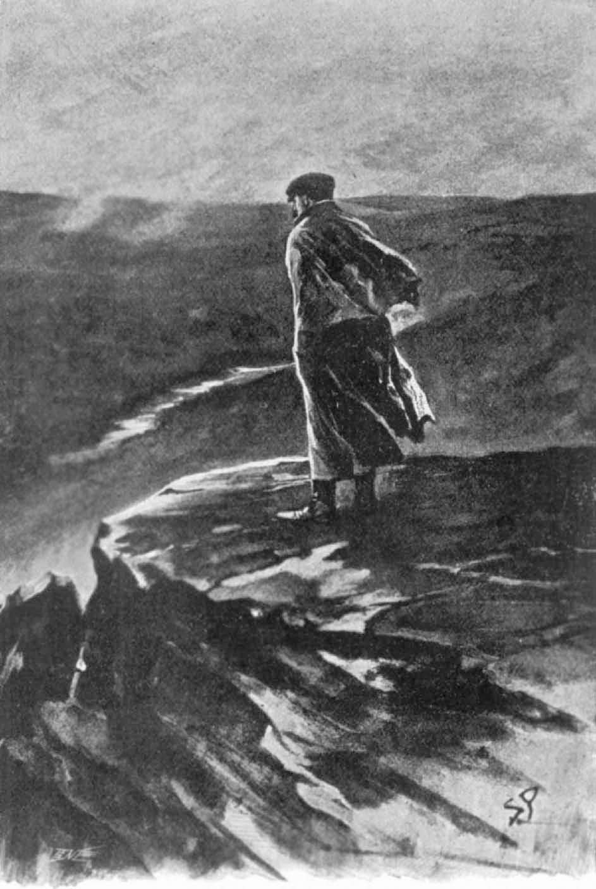

我找到了那黑黑的突岩石冈。

我往回走的时候，莫蒂默医生从后面赶上来。他驾着那辆双轮马车，从一条沼泽小路上拐弯出来。这条路通往偏远的黄泥坑农庄，路窄而崎岖不平。他始终关注着我们，心情很迫切，一天不来庄园看看我们，问问情况如何，他就一天也放心不下。他再三叫我上他的马车，要载我回家。他说他的西班牙小狗不见了。小狗乱跑，跑到了沼泽地去以后就从此没见着。我尽量安慰他几句，但一想起格林本泥潭的矮马，暗自思量着，他的小狗是再也没希望回来了。

“想打听个事，莫蒂默，”马车在路上颠簸摇晃前行，我问他，“我想，这里的人，凡是在您马车方圆跑得到的地方，都认识吧，有没有不认识的？”

“我想差不多都认识。”

“那您是否知道，有没有一位妇女姓名是L．L．字母打头的？”

他想了几分钟。“没有，”他说，“有几个吉卜赛人，还有几个做粗活的，她们我就说不上来了，在庄稼人和乡绅中间，女人中没有L．L．字母打头的。唉，慢着，”他停顿了一下，又接着说，“有个劳拉·莱昂斯——她的姓名Laura
Lyons首字母是L．L．，不过她住在库姆·特雷西。”

“她是谁？”我问。

“她是法兰克兰的女儿。”

“什么！就是老神经法兰克兰吗？”

“正是。她嫁给一个艺术家莱昂斯，是在莱昂斯到沼泽地来写生那会儿。后来才知道这个人原来是个坏蛋，把劳拉抛弃了。不过，我听人说，过错不完全在其中的一方。她父亲不愿过问，因为女儿结婚根本没有征求父亲同意，可能还有其他什么原因吧。所以，一边是老缺德，一边是负心汉，这姑娘日子很艰难。”

“那她靠什么生活呢？”

“我想老法兰克兰多少会给一点接济，多是不会有的，因为他自己的官司已经把他拖累得够呛。不能说因为到这一地步都是她自己找的就不管了，总不会看着她没办法过，陷入绝境吧。她的事传得人人都知道了，就有人设法帮助她，使她能过上正常的生活。斯泰普尔顿帮了她，查尔斯爵士也是一位，我自己也给过一点钱，让她能够做点打字的工作，有个职业。”

他想知道我打听这事的目的是什么，这不是他应当知道的事，我就扯了些别的原因来搪塞过去。不能告诉他太多，不能随便相信人。明天早晨我要上库姆·特雷西去，要是能找到劳拉·莱昂斯太太——这个人在本案中什么身份尚不明，那么对在谜团链中弄清这一环有望大大地跨前一步。我也锻炼得像狡猾的蛇那么富于智慧，当莫蒂默追着问这个问题，我又不宜详细回答他时，便巧妙地把他引开，无意中问他法兰克兰的颅骨属于何种类型。他一听这个，好了，剩下的路上除了颅骨学的话，便什么也听不到了。我和福尔摩斯共事了那么些年，总算没白跟随他。

在这狂风暴雨的阴郁的天气里，仅有一件事值得一记，就是刚才我和巴里莫的谈话，使我又多了一张好牌，到时候就可以打出去。

莫蒂默留下来进餐，餐毕他和准男爵一起打牌。管家到书房来给我送咖啡，我趁此机会又问了他几个问题。

“啊，”我说，“你那位冤家亲戚走了呢，还是仍旧躲在那边？”

“不知道，先生，但愿他已经走了。他在这儿尽添麻烦，没有好事！上次给他送吃的到现在，一直都没有消息，是三天前给他送吃的。”

“那天你见到他人了？”

“没有，先生，可是下一天我再去那个地方，看见食物已经没有了。”

“这么说，他一定还在那里啰？”

“可以这么说，先生，要么就是还有另一个人给拿走的。”

我坐着，刚把咖啡杯举到唇边，眼睛瞧着巴里莫。

“你是说那边还有另一个人？”

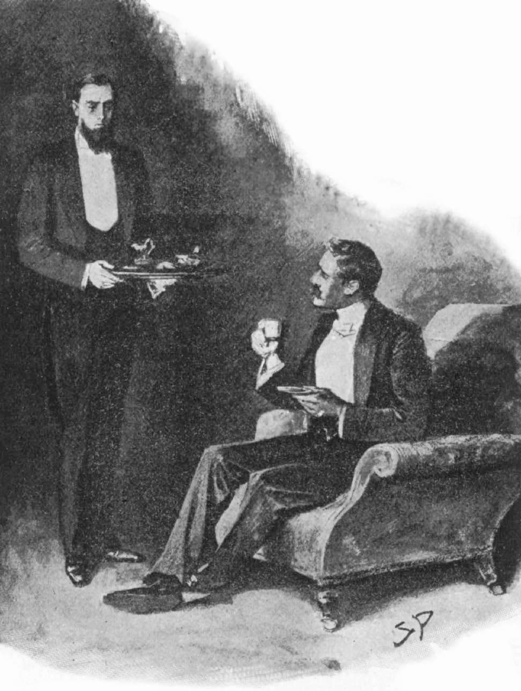

“你是说那边还有另一个人？”

“是的，先生，沼泽地里还有一个人呢。”

“你看见过这个人？”

“没有见过，先生。”

“那你是怎么知道的？”

“是塞尔登告诉我的，先生。一个星期以前，大概再早些时候吧，这个人也在藏着，不过据我听到的，他不是犯人。这事我心里很烦，华生医生——我对您坦白说，说实在的，我烦透了。”他突然说得极为恳切。

“喔，你听我说，巴里莫！我对这事原本没有兴趣，还不是为了你家主人嘛。我到你们这里来，没有别的目的，就只是为了你主人的事，要帮他的忙。你得坦白告诉我，你烦心是怎么个意思，请告诉我。”

巴里莫踌躇了一会儿，好像后悔不该脱口而出，或是觉得难以用言语来表达自己的思想感情。

“这些凑在一块儿的事，先生。”他终于喊道，向着大雨淋刷的沼泽地方向的窗子挥了挥手，“那里肯定是有着害人的勾当，在搞犯罪的鬼计谋要害人，我敢发誓肯定是的！先生，我真盼望亨利爵士早点回伦敦去吧！”

“你有什么根据这样担心呢？”

“看看查尔斯爵士怎么死的！光是验尸官说的那些话，就够险的了。再看看晚上沼泽地里那个怕人的声音。太阳下山以后，没人敢过沼泽地，您付给多少钱也不敢走。看看这个不知来历的人藏在那里头，在望着什么，等着什么。等着干什么呢？什么个用意呢？明摆着，对巴斯克维尔家的人，谁也不会是个好兆头。就盼着哪天我能歇了，让亨利爵士新的管家佣人来接手庄园这个摊子。我很乐意这样，早离开这里为妙。”

“这来历不明的人，”我说，“还有些什么情况？塞尔登都是怎么说的？看见他藏哪儿了，干些什么了？”

“塞尔登见过他一两次，摸不透他。这是个很阴险的家伙，嘴也紧，不吐露半点事。乍一遇上，还以为是警察，可很快就弄明白这个人肚里有计谋，另有他自己的事。他样子是个有身份的人，是个绅士，这他能看出来，没错儿，就是到底来做什么，怎么也摸他不透。”

“他说了在哪儿住没有？”

“住在山坡上那些个老屋里——石头屋，远古祖先从前都住的那些个石头屋。”

“吃什么呢？”

“塞尔登看见有一个小孩专门给他做事，他要什么都给他送去。我敢说，准是到库姆·特雷西去弄东西来。”

“很好，巴里莫，这个事里头还有名堂呢，咱们改日再谈吧。”管家走了以后，我走到窗前，望着黑暗的窗外，透过雾气弥漫的窗格玻璃，看着奔腾的烟云，看着风压树林颠簸起伏的轮廓。这是个在屋内都感觉到险恶的夜晚，在沼泽地的石屋里该是什么滋味就不用说了。有什么样的深仇大恨才使一个人要在这种地方这种时刻躲藏起来！究竟有什么了不起的重大紧迫事，需要如此地经受非人的磨难呢！看来，使我困扰万分的中心难题可能就在那沼泽地的小屋子里。我发誓，不超过明天，要尽我所能尽的一切力量，非把谜底揭开不可。

# 第十一章　突岩上的人

我用日记摘录写成了上一章。故事已经讲到了十月十八日，正是这时，一桩桩怪事开始向着凶险的结局迅速发展。以后几天所发生的事情已铭刻在我的记忆中，不可遗忘，无需参照当时的记录，我都能说得详细，讲得清楚。我就从这次日讲起。在这一日，我摸清了两个极其重要的事实。一个是，库姆·特雷西的劳拉·莱昂斯太太给查尔斯爵士写过信约他见面，约的地点和时间，也正是查尔斯爵士出事身亡的地点和时间；第二个是，躲藏在沼泽地里的那个人，确定可以从山坡石屋中找到。有这两件事实掌握在手，我觉得，如果再不能把疑案弄出个眉目来，那我这个人不是无智便是无勇。

昨天傍晚，我没有机会把了解到的有关莱昂斯太太的事告诉准男爵，因为莫蒂默医生陪他打牌打得很晚。今天吃早饭的时候，我才把新的发现告诉他，并问他是否愿意陪我一起到库姆·特雷西走一趟。起先他欣然同意，但再一想，我们一起合计下来，觉得我一个人去，效果可能更好，因为这类走访，越是搞得郑重其事，所获信息恐怕越少。于是我让亨利爵士留下，虽然难免有点不安，也只好自己上车，出发去进行新的调查。

一到库姆·特雷西，我关照珀金斯把两匹马和车管好，自己去打听要拜访的那位女士。不费周折就找到了她的住处，她住在城中心，房子也不错。一个女佣毫不拘礼地把我请进屋里。走进客厅，见一位女士正坐在一架雷明顿打字机前。她马上起身，笑容可掬，但当她一看到我原来是个陌生人，面色便沉了下来，重又坐定，问登门有何贵干。

莱昂斯太太给人的头一眼印象，是位绝色佳人。她的眼睛、头发都呈深榛褐色，两颊虽长着明显的雀斑，然而也有着对深肤色的人来说恰到好处的红润，如同在淡黄色玫瑰花心里隐现着悦目的粉红。这头一眼的印象，我还要说，确实令人赞叹，但继而定睛再看，也就不无可挑剔之处。发现有些欠缺的是，面容略显粗相，眼神似乎不够灵活，嘴稍易咧开，这些都有损十全的美貌。但是当然啦，那都只是过后的想法，当时我只觉得我是站在一位端庄美丽的女士面前，她正问我来访是为何事。临到了这一刻，我竟然觉得一上来怎么开口说，倒也颇费踌躇。

“我很荣幸，”我说，“能认识令尊。”

劈头如此的介绍并不讨好，女士的反应让我感到自己的笨拙。

“我父亲和我没有任何关系，”她说道，“我不欠他什么，他的朋友也不是我的朋友。他根本不管我，要不是多亏查尔斯·巴斯克维尔爵士，还有别的人好心，我早就饿死了。”

“我正好是为了已故的查尔斯·巴斯克维尔爵士才来府上见您的。”

女士居然立刻失色，雀斑也点点明显起来。

“他的事，我能告诉您什么？”她问道，手指在键盘上神经质地抖动。

“您很熟悉他，是吗？”

“我刚才说了，我是全靠他的善心和慷慨帮助，才能自立，让日子过得去；多亏他关心我，同情我不幸的处境。”

“您和他通信吗？”

女士扬起头，棕褐色的两眼闪出愠怒的目光。

“您问这是什么意思？”她没好气地反问。

“意思是，为了避免给外边传言。我在这儿问，总比事情在外边传，无法收拾，要好得多吧？”

她沉默着，脸依然苍白，最后她昂着头，显出不在乎的无所谓的神态。

“好吧，我回答，”她说，“您想问什么？”

“您和查尔斯爵士通过信？”

“我当然写信要感谢他的关心和慷慨，写过一两封。”

“记得写信日期吗？”

“记不得。”

“和他见过面吗？”

“见过一两次，是在他来库姆·特雷西的时候。他这个人不喜欢张扬，做好事也不喜欢当着人家的面。”

“见他面那么少，写信也那么少，他怎么就能知道您的事，就能给您帮助了呢？您说主要是靠他的帮助。”

她不慌不忙，顺理成章地回答我这个难题。

“有几位绅士，他们知道我经历不幸，就一起共同帮助了我。一位是斯泰普尔顿先生，查尔斯爵士的近邻，他们是亲密朋友。他心肠很好，都是透过他把我的情况告诉了查尔斯爵士知道的。”

我已经听说查尔斯·巴斯克维尔爵士曾有好几次委托斯泰普尔顿分发救济金，所以女士的这番话可以相信。

“您写过信给查尔斯爵士要求见面，是吗？”我接着她的话问道。

莱昂斯太太恼怒得脸发红。

“尽问这些，先生，您太过分了吧！”

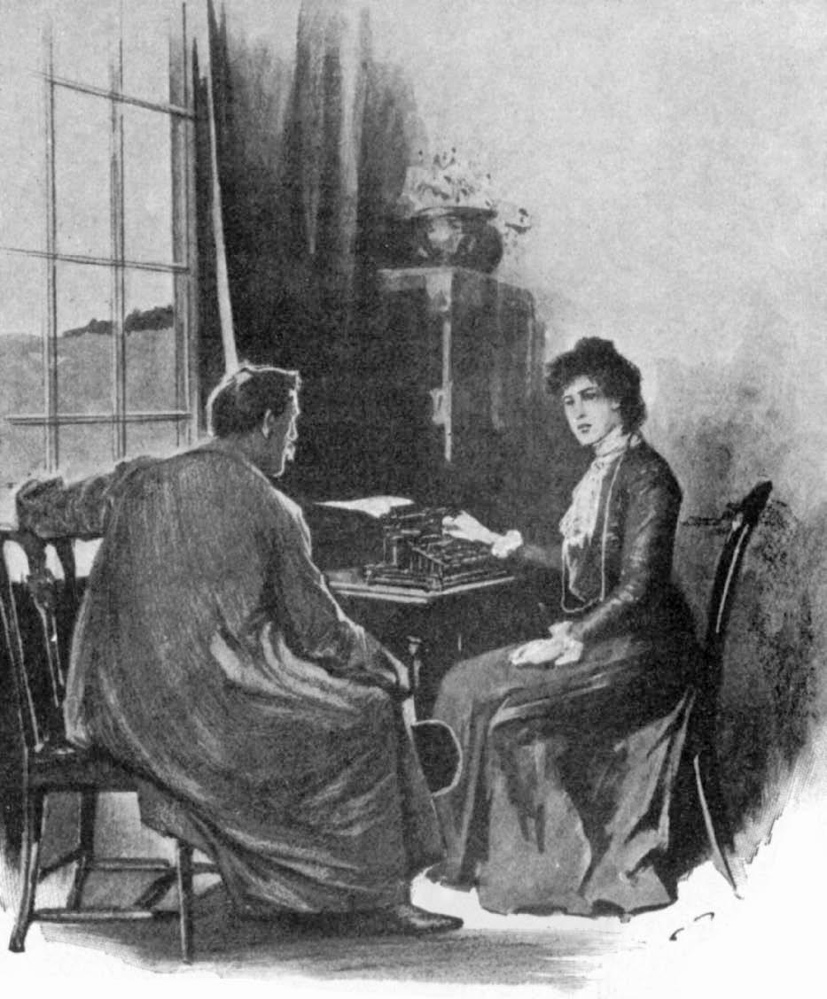

“尽问这些，您太过分了吧！”

“实在很抱歉，夫人，我也是不得已而问，请原谅。”

“好吧，回答您，当然没有。”

“查尔斯爵士去世这一天，没写过信？”

脸红一下子退去，在我面前出现了一副死灰的面容。她那焦躁着的嘴唇没能说出“不”字，我耳朵没听见，我眼睛看见她是想说而没说。

“一定是您记不起了，”我说，“我不妨把您信中的一段话给您说一说。是这样写的：‘您是一位正人君子，信阅后务必烧掉，十点钟请于栅门等候，切切！’”

我以为她要晕过去，可是她强自振作，使自己保持镇定。

“难道天下根本就没有正人君子这回事？”她呼吸急促起来。

“您这么说是冤枉了查尔斯爵士，他确实遵嘱把信烧掉了，不过有时候也事有凑巧，信烧了，字迹还可以看得出来。您现在承认写过这封信了吧？”

“是的，我写过，”她大声地、一古脑儿地把心里的话说了出来，“是我写的，干吗我要否认？这又不是丢脸的事，见不得人！我希望他能帮助我，相信同他见面直接谈谈，能取得他的同情，所以我要求他见见我。”

“可是为什么约在这么一个时间呢？”

“因为我刚听说他下一天就要去伦敦，一去就得住上几个月。我没能早一点去，有没能早去的道理。”

“那么为什么要在花园里约见，不上屋里去见他呢？”

“一个单身女人，在这个时间进一个单身男人的屋里去，您看合适吗？”

“噢。您到了那里，后来又怎么样呢？”

“我没去。”

“莱昂斯太太！”

“没去，我以人格保证，我没去过。有别的事插进来，我没能去成。”

“什么事？”

“那是私事，我不能说。”

“那么，您承认您同查尔斯爵士约好会面的时间和地点，正好是他去世的时间和地点，但是您又否认曾如约前往会过面。”

“这是事实。”

我一而再再而三地盘问她，都未能突破这一点，以获取更多的情况。

“莱昂斯太太，”我站起身，想结束这次时间不短、结果却不大的访问，说，“您不肯把自己知道的事情全盘讲清，您就要担负非常重大的责任，还把您自己置于非常危险的地位。弄到不得不叫警方来协助处理的话，到那时，您可就麻烦了，不好办了。如果您这方面是清白无辜的，那您一开始就连那天给查尔斯爵士写过信都要否认，又为了什么呢？”

“因为我担心，本来没事，结果会搞得变成有事，还怕牵连成为一件丑闻。”

“您为什么特别强调要查尔斯爵士把信毁掉呢？”

“您看过了那信，该知道。”

“我没说我看过全信。”

“您都能讲得出内容嘛。”

“我引用的不过是附笔。我说过，信是烧掉了，并不是全信的字都认得出。我再一次要问，查尔斯爵士死的那一天，收到您这一封信，您叫他看后烧掉，那么要紧，其中必定有原因。”

“其中原因纯属个人私事。”

“您主要的原因是逃避依法追究。”

“那我告诉你，也没什么大不了，您该去听听我的经历有多惨。我结婚太草率，自食其果，懊悔也来不及了。”

“这些我都听说过。”

“我丈夫不是个东西，因不断受他虐待，我的日子不好受，法律都袒护他。每天我都讨厌和他在一起，可每天逼迫我要和他在一起过。那天我给查尔斯爵士写了这封信，是我听说只要能付一笔钱了结掉，我就能自由了，我满怀这希望就写了信。如果能这样，我就有救了——可以太平了，能幸福，像人一样有自尊，可以有活路。我知道查尔斯爵士很慷慨，我想自己亲自去向他诉诉自己的苦处，他一定能帮助我。”

“那您怎么又不去了呢？”

“那边信一送出，这边正好有人帮我解决问题了。”

“为什么就不马上写信向查尔斯爵士解释一下呢？”

“我是要写的，可第二天早晨看到报纸登了他的噩耗。”

这女人的话前后还能连贯，我提的一连串问题她回答得无懈可击。剩下的问题，我只能核实一下，在命案发生的那天或是差不多的时候，她是否对丈夫提出过离婚诉讼。

看来，如果说她真的去过巴斯克维尔庄园，她就不大敢说没有去过。因为到那里去必须乘马车，去了再回到库姆·特雷西来就得是凌晨时候了，这样一次距离不短的出行不可能守得住秘密。所以，可以相信她说的是实话，或者，至少其中有实话。我再也问不到什么，技穷之下只好垂头丧气地回来。我又一次碰壁。我要达到目的，履行自己的使命，可是一路上总有隔墙阻挡无法通过。我越想起这位女士的脸，她的模样、态度，就越觉得她还有事情隐瞒着。她为什么脸色一下子要变得那么苍白？为什么一上来事事都要否认，都是最后被迫才不得不承认呢？为什么悲剧一发生，她竟保持缄默呢？所有这一切肯定不是像她对我说的那么简单。由于在这一方面不能再有进展，就应当立即转向另一条线索，去沼泽地上的石屋寻找。

然而那也是一个茫然无把握的方向。当我归途坐在车上，注意观察一山又一山的远古人类遗迹，我就意识到了这一点。巴里莫只提到那个人住在遗弃的石屋里，可是沼泽地的石屋纵横遍布数以百计。幸而我还是有自己的经验，有自己的目标，因为这个人让我看见时是站在黑突岩的顶上。不妨就将此定为搜寻的中心范围，在那个范围内一间一间搜查沼泽地的石屋，或许碰巧能让我找到。那个人在屋里的话，我要用枪指着他，叫他当场说出是什么人，为什么要一直盯住我们不放。在摄政街的车马人流中他能溜得掉，可是在这荒无人烟的沼泽地上，他休想故伎重演。要是万一我找到了有人住的石屋，恰巧人不在，我就守候在那里，即使熬上一个通宵也完全值得，一定要等到他归巢。福尔摩斯在伦敦给他甩了，我的主角丢了的人，要是让我手到擒来，那该有多棒！

对本案的调查，我们一直运气不佳，一再地不顺利，可是到了现在，我竟时来运转。送好运气来的使者，不是旁人，正是法兰克兰先生。他花白的胡须，红润的面孔，站在花园门外，花园门正朝着大路，我的马车打他门前经过。

“好啊，华生医生，”他兴高采烈地喊道，“让马儿歇一下，进来喝杯酒，该祝贺祝贺我啦！”

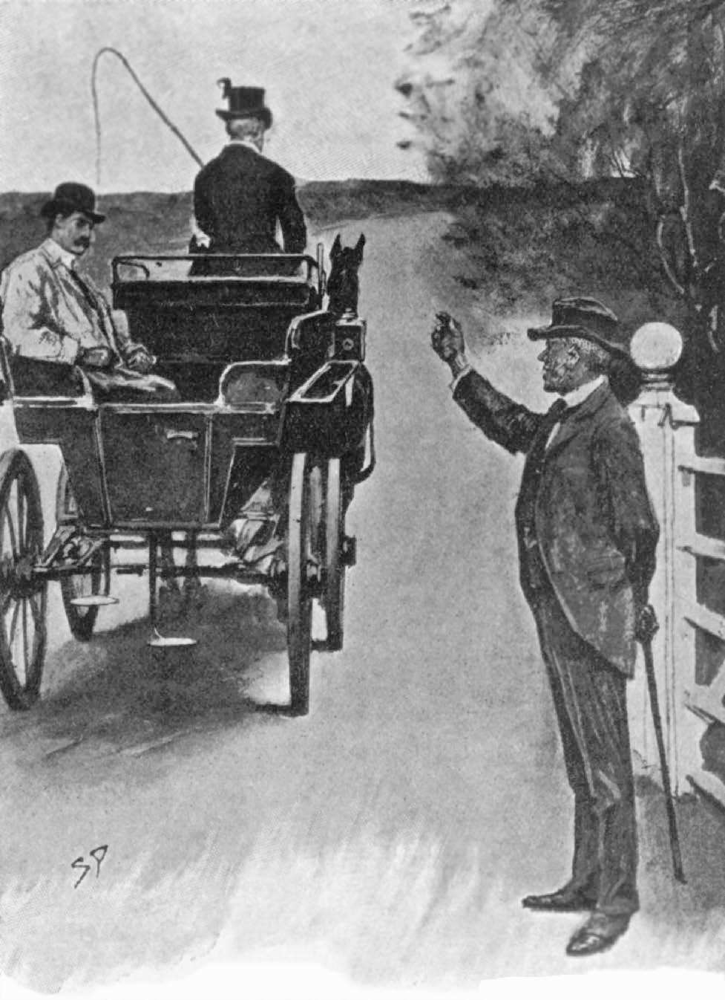

“好啊，华生医生，进来喝杯酒。”

我听说了他如何对待自己的女儿之后，心中已对他不存多大好感，但是正好我急于要先打发马车回家，这倒是个好机会。我也就下了车，给亨利爵士写了张便条，说明将步行回来吃晚饭，于是我随法兰克兰进了他的餐厅。

“今天是我的大喜日子哪，先生——我一生里的大喜日子，”他放开嗓子嚷道，不住地格格笑，“我了结了两桩案子。我是存心要教训教训这地方的人，法律就是法律，教训这里一个人，此人胆敢无视法规。我就是用越宅筑路权这一条款来确定，路穿过老米德尔顿的住宅园地中心，直通过去，先生，离他前门不到一百码。你是怎么个想法？我们就是要教训教训这帮子大人物，不许践踏平民的权利，这批狗混蛋！我还封掉一座园林，弗恩沃西家常在里头野餐。这批刁民自说自话，在他们眼里没产权这回事。他们拥来拥去，爱上哪儿就上哪儿，废纸、瓶子乱扔。两件案子都解决了，华生医生，我都是赢家，我好久没有这么高兴过了。上一回到现在，那回告了约翰·摩兰爵士非法侵入，他在自己动物繁殖场里打猎。”

“您怎么个告法呢？”

“看看记录，先生。值得一看呢——女王陛下法庭，法兰克兰对摩兰。这场官司我花了两百英镑，可是我胜诉了！”

“您得到什么好处呢？”

“有什么好处？没有，先生。我要很自豪地说，在这桩官司中我没有得到好处，我是完全彻底出于公共责任意识而行事。毫无疑问，弗恩沃西今天晚上就会把我扎个草人烧掉。上一次就有人这样做，我报告了警察，告诉他应当制止这种无赖行为。警察局也是混账透顶，先生，他们根本不给我提供应有的保护。法兰克兰对女王政府的诉讼案即将引起全体社会公众的关注。我对他们早就有话，他们如此对待我，总有叫他们后悔的一天。瞧瞧，我的话见效了吧，没白说吧！”

“怎么回事呢？”我问。

老头摆出一副料事如神的傲态。

“因为哪，他们正在拼命侦查，想要知道的那个事，在我已是了如指掌。不过，怎么也别指望我会给那批狗杂种帮一点忙。”

我本来在盘算找个借口脱身，不愿听他东拉西扯瞎胡吹，现在见他这么一说，倒想要听听是什么下文。我对这老缺德已有几分了解，他有个不通常情的怪脾气，你对他的话表现出很感兴趣，他反而对你不放心，马上噤声缄口。

“也就是件偷猎案子嘛，是不是？”我用漠不关心的口气说道。

“哈哈，老弟，比这大大要紧着哪！沼泽地里的那个犯人怎么样了？”

我吃一惊。“您的意思，您知道他的下落？”我说。

“确切在什么地方，我也说不清，不过，我有把握可以帮警察把他逮住。怎么不想想，要抓到这个人的方法嘛，只要先摸清他从哪儿弄来吃的，这不就有底了吗？”

看样子，这底还真给他摸准了七八分，事情很不妙。“那倒是，”我说，“可是您怎么知道就是在沼泽地里？”

“我清楚，我都亲眼见了，有人给他送饭。”

我的心为巴里莫一下子提了起来，给这么一个专门无事生非，靠惹人麻烦取乐的倔老头捏在了手里，那可就要吃不了兜着走。呵，还好，他底下那句话使我如释重负，一颗心又落下了地。

“你听了要大吃一惊，他吃的东西，都是让一个小孩送去的。我每天都看到，在屋顶上用我那架望远镜看得见。小孩总是走一条路线，总是同一个时间。给谁送去，除了那个逃犯还有谁？”

这真是鸿运高照！然而，我依旧压抑内心的喜悦，不露声色。一个孩子！巴里莫曾经说过，我们那个黑暗中的人正是由一个男孩给他送食品、送东西的。法兰克兰不清楚，他发现的是这个人的线索，而不是逃犯的线索。我只要从他这里了解到情况，就免得我作无谓的搜寻，可以省掉不少时间和力气。当然，我还得表示不太可信和不以为然的样子，这是一张丢不得的王牌。

“依我看来嘛，那有什么好大惊小怪的，是沼泽地上哪个牧人的儿子，给自己父亲送饭吧。”

稍有反对的表示，就要激得这个老专制火冒三丈。他恶狠狠地瞪我，向我吹起白花花的胡髭，像一只龇牙咧嘴发威的猫。

“你懂个什么，哼！”他说道，手指向遥遥的沼泽地，“那头那个黑突岩山，看见没有？你再看远一点，那个矮山，看见光秃秃只长荆棘吗？那个地方，整个沼泽地小丘最多的地方，尽是石头。哪个牧人会往那儿钻？你那个话，叫你声先生，荒唐透顶，笑话至极！”

我立即捋他顺毛，承认自己不了解实际情况，都说得不对。我一服输，他大为高兴，便侃侃而谈。

“你可以放心，先生，我说话从来有根有据，没有把握从不发表意见。那个孩子，我都好几次看见他，还拿一卷东西。每天都是，有时候一天两次，我都能——等一下，华生医生，我眼花还是怎么的，那个山坡上，现在不正有东西在动吗？”

大约几英里远处，我清楚地看到一个小黑点，衬托在墨绿和灰色的背景上。

“快来，先生，快来！”法兰克兰喊道，冲上了楼梯，“你亲眼看，自己想想就明白了。”

那望远镜配有一支三脚架，是个庞大的仪器，安置在房顶的铅皮平顶上。法兰克兰急忙把眼睛凑上去，嘴里发出一声欢叫。

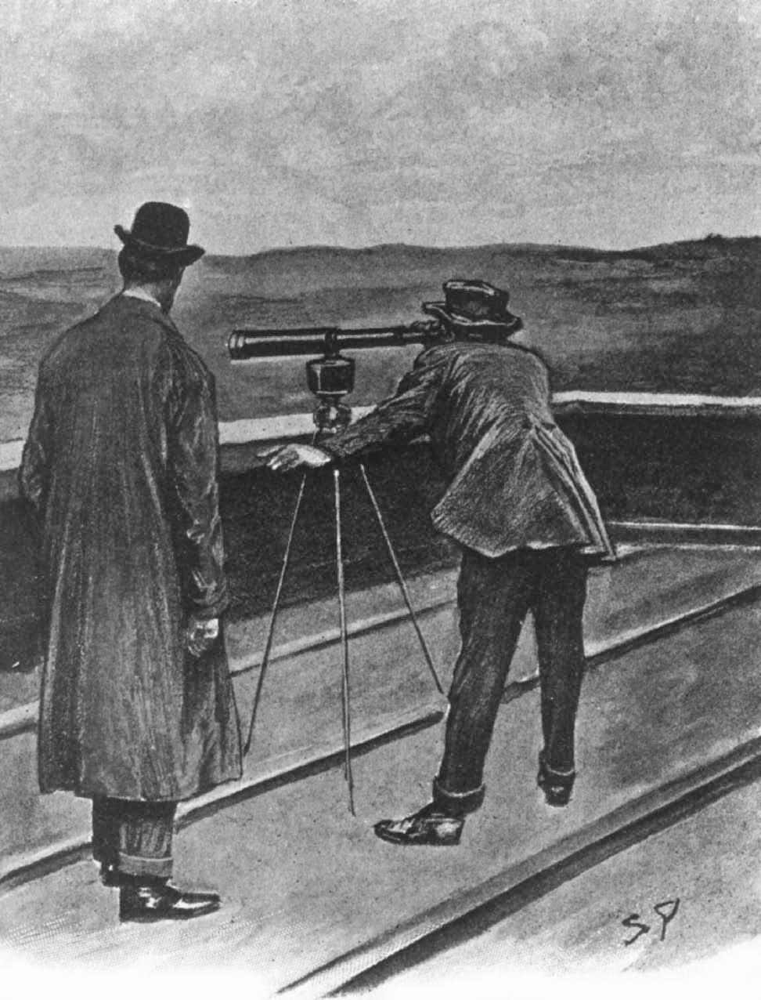

急忙把眼睛凑上去，嘴里发出一声欢叫。

“快，华生医生，快来看，快，要翻过山头了！”

果然没错，一个小孩，肩上扛一卷东西，费劲地一点一点往山上爬，快爬到山顶的时候，又看见了那个衣衫不整的可疑人身影的轮廓在灰蓝天色背景下一闪，鬼鬼祟祟地向四周望望，像是在提防被人跟踪，倏地一下子在山头那边不见了。

“怎么样！我说得对不对？”

“一点没错，是个小孩，好像负有秘密任务。”

“什么任务，一个乡下警察都能猜得到，可他们硬是别想打我这儿知道一个字。我要求你也得保守住这个秘密，华生医生。一个字也别说，你听明白了！”

“一定遵命，尽管放心。”

“谁叫他们待我太不像话——不像话。等到法兰克兰对女王政府的诉讼案内情一出来，我准保全国马上轰动，激起民愤。压根儿就别想指望我给警察帮忙，他们什么也不管，就专门管住我。那些个流氓烧我草人，这么咒人死，都不管。你别走哇！得帮我把这一瓶都干了，庆祝伟大的发现！”

我谢绝了他的一番好意，很成功地劝止了他自告奋勇陪我步行回去的盛情。在他还能望得见我的时候，我佯装一直是走大路，这以后，我就马上离开大路，穿过沼泽地，向着刚才孩子消失不见的那座石岩山上走去。现在事情变得对我大为有利，我发誓，决心不遗余力，拼着老本也不能让时来运转的难得好机会错过。

我爬上山顶的时候，太阳已经西斜。在我的脚下，是两边长长的斜坡，向阳一边还是金黄草绿，背阳一边隐没在灰暗的阴影中。极目的天际，呈现一抹苍凉的暮色，暮色之中兀自立着奇形怪状的贝利弗和维克森突岩山冈。在这广阔的大地上，没有声息，没有动静。有一只大灰鸟，也许是鸥，也许是麻鹬，翱翔在高高的蓝天。上达天穹下至荒原，在这茫茫苍苍的空间，唯有它和我，此外再无别的生物。荒芜的景色，孤独的感觉，以及我的神秘而紧迫的使命，让我的心冷得不禁打起寒战。四周也见不到那个孩子。在我下面，有一条两山间的凹地，里面有环绕成圈的几座古老石屋，其中有一座还保留有屋顶，尚可挡风避雨供人栖身。我一看见，心窝便一阵欢跳，这一定是那个可疑人的巢穴了。我的脚终于踏上了他藏身地的门径——他的秘密已全落入我的掌心之中。

当我慢慢接近小屋的时候，步子走得极小心谨慎，就像是斯泰普尔顿捕蝶那样，在举着兜网悄悄靠近落稳的蝴蝶。不出所料，我欣喜异常地发现这里确实被人用作居住之所。巨砾乱石之间有一条隐约可辨的小径，通向屋子一个坍塌的缺口，这缺口便权充作屋门。那个来历不明的人可能正躲在里面，或者也可能正在沼泽地里闲逛。身临其境的冒险探秘，使我感觉到神经兴奋得震颤。我把烟一扔，紧紧握住左轮枪柄，几个箭步窜到门口，向里一望，里面空无一人。

但是有很多迹象表明，我没有找错目标，这里正是那个人所住的地方。一块雨布裹着几条毛毯，就放在新石器时代的人用作睡铺的一块石板上。在临时叠起的石灶底下留有一堆新燃的灰烬，旁边放着几件餐具，还有半桶水。扔着的一堆空罐头说明这个地方已经有人住过一些时候。等我的眼睛渐渐适应了点点树阴间的阳光之后，我还在屋角看到一只搪瓷小杯和半瓶酒。屋子中央有一块平面石头，显然是当桌子用的，上面放一个小布包——毫无疑问，就是我从望远镜里看到的男孩背在肩上的这一卷东西。里面有一个大面包，一罐牛舌，两罐桃子果酱。我拿起看一看再放下的时候，心怦地一跳，看见原来下面还压着一张纸条，上面写着字。我拿起纸来看，用铅笔写的字很潦草，竟然是这样写着：“华生医生已去过库姆·特雷西。”

我手上掂着这张纸条，在那里站了足有一分钟之久，暗忖着这草草一行字中的含义与分量。这个人并没有亲自跟踪我，而是派了一个人——也许就是这男孩——在盯我梢，注意我的行踪，这便是盯我梢的人的报告。说不定从我踏上沼泽地以来，没有一步不受到监视，不被报告了上去。我一直有这种感觉，是有一股看不见的力量，一张无形的网，无比细密而巧妙地把我们团团围住，我们被笼罩却不知觉，只有到了紧要关头，你才明白自己确已被收拢在网眼中动弹不得。

有这一份报告，也可能还有其他报告，我满屋子里找着，然而再也没有第二张，也没有发现别的痕迹，让你能够推断这个人有何特点，有何意图。他孤身一人住在这种地方，只有一点可以确定，这个人必定具有斯巴达人的精神和生活习惯，不在乎生活的舒适程度和条件。我想起了大雨，望着开口的屋顶，我看出了他为要达到目的，其意志是多么地坚定不可动摇，才能使他在如此非人的环境中住下来。他实在是我们厉害的敌人，要不然，难道居然还会是我们的保护天使降临？我下定决心，不弄个水落石出，就不离开这间小屋。

西面的太阳渐渐隐没，天边映着金红色的余晖，晚霞照着散布在远处格林本泥淖中的水洼，泛出一汪汪红光。那边是两座巴斯克维尔庄园的塔楼，更远有一片弥漫的烟气，说明这就是格林本村。在这两处的中间，山冈的背面，是斯泰普尔顿家的住屋。在傍晚金色的余晖中，这一切都显得分外美好、恬静而醉人。但是，我望着这一片景色，丝毫不能感受到大自然的平和与宁静。我正想着那步步逼近的面对面的遭遇，内心茫然又恐惧，不由得浑身战栗。我的神经在悸动，可是目标与决心坚定不移，人坐在小屋隐蔽的暗处，紧张而耐心地守候屋主人的来临。

等着等着，终于，听到声音，人来了。从远处传来皮鞋走在石头上的噔噔响声，一步一步，越走越近。我往角落的最暗处缩一缩身，摸着口袋里的枪，把保险打开，决定不看清这个人不露面。那声音停了好久，说明他站住了。稍后，脚步声又过来，靠得近了，一个黑影，斜斜地投在小屋出口的地上。

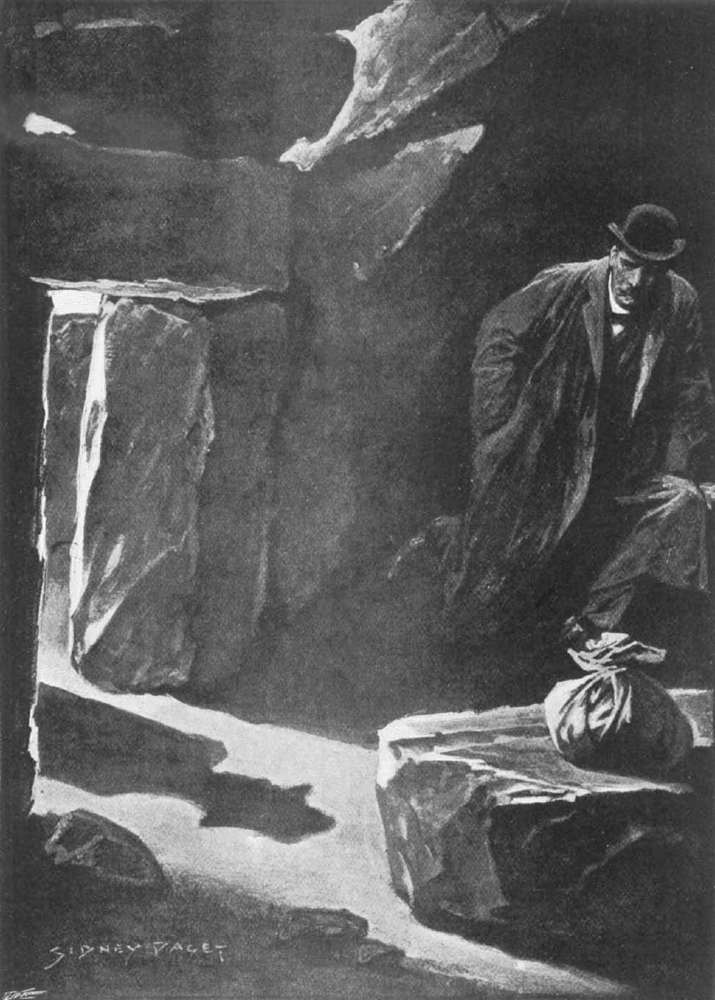

一个黑影，斜斜地投在小屋出口的地上。

“真是个可爱的黄昏，我亲爱的华生，”一个很熟悉的声音说道，“我说呀，到外面来，比待在里面要舒服多了。”

# 第十二章　命丧沼泽地

我屏息干愣在那儿一两分钟，简直不敢相信自己的耳朵，然后我的神志马上清醒，也能够开口说话了，同时，压在我心头的责任与重担也一古脑儿卸了下来。因为，那冷峻、深沉、幽默的口气，在全世界只属于一个人。

“福尔摩斯！”我脱口喊道，“福尔摩斯！”

“出来吧，”他说，“当心左轮枪走火。”

我在粗陋的门楣下弓着身，看见福尔摩斯就坐在外面一块石头上。他那灰色的眼珠转得欢快，看着我这副惊喜莫名的傻样子，非常好笑。他瘦了，憔悴了，但仍干净、机警。他清癯的脸色被太阳晒成古铜色，脸面被风吹得粗糙了。一身花呢套装，头戴布帽，看上去完全是个沼泽地的旅行者，但是他依然不改爱整洁的本性。他的个人整洁如同猫的洁癖，乃是他自身个性特点之一。他的下巴依然光洁，亚麻布衬衣依然笔挺，全然如同在贝克街的老模样。

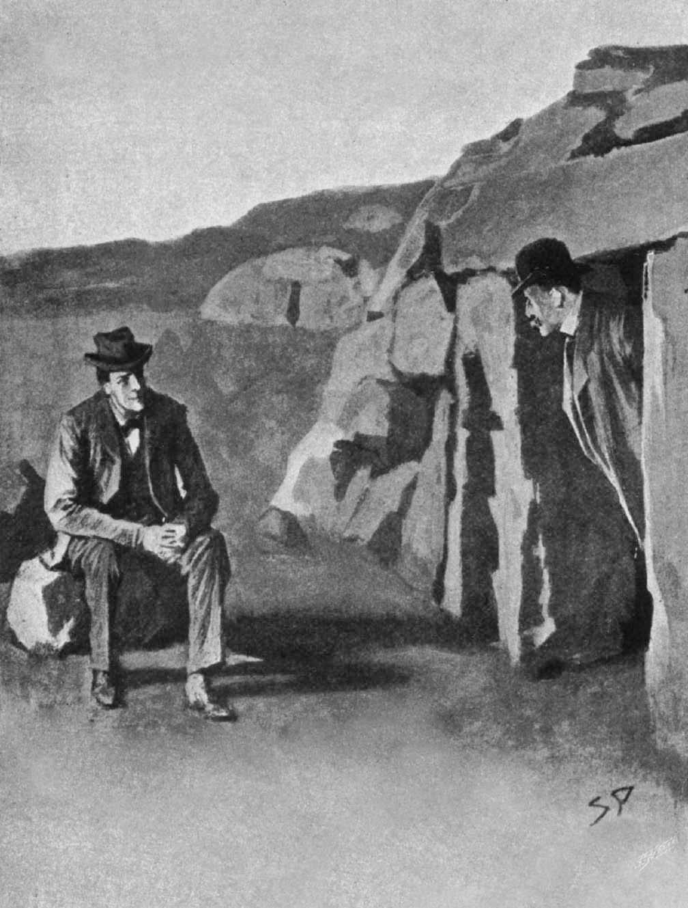

福尔摩斯就坐在外面一块石头上。

“这辈子遇人还没这样高兴过。”我说着，拧住他的手猛摇猛晃。

“也没有比这回更惊吓的吧，啊？”

“嗯，这一点，我得承认。”

“吃惊的不光只有你，跟你讲实话，我也没料想这个无人到的死地方，让你给找来了，更没想到你居然藏进了屋里。我走近门口不到二十步才发现情况。”

“我的脚印。给你看出来了？”

“不是，华生，我还不敢说，能够在无数人中把你的脚印辨认出来。要把我蒙蔽过去，你最好得换掉牌子，别只抽一种烟。我看见了烟头，牛津街布莱德雷牌子，这就等于告诉我，好朋友华生就在附近不远的地方。你去看看，烟蒂还在小路那边，是你扔在那儿的，肯定是你，紧张得很，就跑进了这空屋。”

“正是。”

“我也这样想——知道你有坚忍不拔的精神，很可贵，我完全相信，你肯定埋伏在暗处枪打得到的距离之内，等待这屋主人回来。你还真把我当成个罪犯了？”

“我不知道你是个什么人，下了决心要找到，弄个明白。”

“很好，华生！你怎么会找到我这个住的地方？可能那晚上你们去抓逃犯，看见过我，是我做得不周到，叫月亮把我照着让你看见了？”

“对了，那天我看见了你。”

“那么，你搜遍了所有的屋子，才找到了这一间？”

“不是，你那个男孩给我看见了，让我认定了寻找的范围。”

“一位老绅士有望远镜，毫无疑问。起先我发现透镜的反光，我还弄不明白。”他站起来，朝小屋里望一望，“哈，是卡特赖特给我送供应来了。这纸是什么？哦，原来你去过库姆·特雷西，对吗？”

“去过。”

“去看劳拉·莱昂斯太太了？”

“正是。”

“做得好！我们两人的调查正好是同时并进。把我们的结果一对拢，这案子就能看得相当清楚，我看是这样。”

“好了，你来了，我打心眼里高兴。说实话，责任重大，又神秘莫测，两方面凑在了一起，搞得我神经太紧张。真叫人摸不着头脑，你怎么忽然来这儿了？来了又在做什么呢？我一直以为你还在贝克街处理那桩敲诈勒索案呢。”

“我正是要你有这样的想法。”

“原来你是在利用我，并不信任我！”我又气又恼地叫道，“我想我在你手下还不至于这样没用吧，福尔摩斯！”

“我的老伙计，你对我的帮助很大，起的作用难以估量，在这桩案子还是别的案子上都一样。如果我看上去是对你耍什么花招，那我就求你多多原谅。说实话，我所以那样做，部分也是为了你的缘故。正因为我体会到你面临着多么大的危险，所以我才亲自下来，来摸清这件事的底细。如果让我跟亨利爵士还有你都在一块儿，那么局面就不易打开，肯定是这样，我观察到的情况同你们观察到的情况就都一个样，只有一种；我的在场还会引起对手格外的警惕，会加倍小心，这就会加大对付的难度。现在这样做，我才能够放开手脚行动，如果我住在庄园里，显然就办不到。我藏在后台暗处，在整个过程中，而实际上在做什么无人知晓，我是随时准备好，关键时刻一到，立刻突然冲到台前。”

“可是何必把我蒙在鼓里呢？”

“因为，叫你知道了，对我们大家都没有好处，也许有可能连我自己都隐藏不住。你一定要来把情况告诉我，或者你是好心，要送点这样那样的东西，给我改善一下条件，这就势必增添不必要的风险。我把卡特赖特带来，听我差遣——你还记得邮局快递部的那个小鬼吧，由他照料我一点生活：面包、干净内衣。有了这些，还需要什么？另外他等于给我再添了一对眼睛、一双勤快的脚，这两样对我都是无价之宝。”

“那么说，我给你的报告都是白写、白费力气了！”——说起写这些报告，我付出了多少艰辛与甘苦，有时写得还颇自鸣得意，一想到这儿我讲话的声音都颤抖起来。

福尔摩斯从口袋里掏出一卷纸。

“你写的报告都在我这儿呢，我的好伙计，而且都反复地看了又看，跟你说，一百个放心好了。我早有很好的安排，报告在路上传递只耽搁一天。为了你对这件极端艰难的案子所表现的热情和智慧，我应当对你表示最高的敬意。”

我还是有着遭受愚弄的感觉，内心不免刺痛，但是福尔摩斯这些赞扬的话，又温暖了我，驱走了我心头的怨气。我回头一想，他说得很对，要想达到我们的目的，这实在是一个最好不过的办法，我确实还是不应该知道他来沼泽地的好。

“这就是了，”他看到我脸上的阴云已经消散，就说道，“现在跟我说说，你走访劳拉·莱昂斯太太有什么结果——这个我已经不难猜到，你去就是为找她。原本我已经有数，在库姆·特雷西地方，只有她对我们这桩事有帮助。事实上，要是你今天没去，非常可能我明天就会去。”

太阳已经落下，暮色笼罩了沼泽地，空气也冷了下来，我们退进小屋里避寒。暮色之中，两人坐在一起，我把拜访女士的谈话一五一十告诉了福尔摩斯。他听得津津有味，有些地方我要重复两遍，他才听得满意。

“这事相当重要，”等我讲完，他说道，“这就弥补了一个缺口。在这件极其复杂的案子中，这正是我无法连接的缺口。你大概也意识到了，这位女士同斯泰普尔顿之间有非同一般的亲密关系，对吧？”

“我不知道有非常亲密的关系。”

“这事肯定没有疑问，他们见面，写信，彼此十分热乎。现在，这就给了我们手上一件有力的武器，我只须拿这件武器去点拨他的妻子——”

“他的妻子？”

“我给你讲讲明白现在这个事，要回报、酬谢你给我讲了那么许多的情况。那个女士的身份，在此地人们只知道是斯泰普尔顿小姐，实际上是他的妻子。”

“我的老天，福尔摩斯！你说得对吗？那他怎么又允许亨利爵士爱上自己的妻子呢？”

“亨利爵士坠入情网，伤害不着任何人，只伤害亨利爵士自己。他特别当心不让亨利爵士对自己老婆恋爱成功，这你自己都已经观察到了。我要再说一遍，这位女士是他老婆，不是他妹妹。”

“煞费苦心搞这场骗局干什么？”

“因为他料定，让她充当一个未婚女子，对他大有用处。”

所有那些我说不出的朦胧感觉、迷迷糊糊的疑惑，至此豁然开朗，问题的要害终于归结到了这个生物学家身上。这个戴草帽、拿捕蝶网的人，不仅板脸没有情趣，苍白没有热忱，我似乎看出他原来是个更可怕的东西——其居心极隐蔽而诡诈，表面装出一张笑脸，内里怀着一颗歹毒的心，真是笑里藏刀，口蜜腹剑。

“呵，原来是他，我们的敌手——在伦敦盯我们梢的就是他？”

“因此我就看破了这个谜。”

“还有那封警告信——一定是这个女人发的啰！”

“正是。”

一种鬼怪伎俩，蒙蔽我如此之久，现在，一半已看到，一半已猜到，终于从黑暗中显出原形。

“不过这一点你肯定吗，福尔摩斯？你怎么知道那个女人是他的妻子？”

“因为，他初次遇到你的时候，有些忘乎所以，竟把自己一段真实经历讲给你听。这个，我可以说，他事后会后悔，后悔不已。他过去确实曾经在英格兰北部地区做过小学校长，现在，要查个小学校长，比查什么人都还容易。只要通过教育部门，就能查清在教育界工作过的人。我稍稍调查了一下，了解到有一所小学，因为情况很糟糕，办不下去而关闭了，那个办学的人——姓名不相同——带着妻子不知去向。夫妻两人的相貌特征完全和他们吻合。但是我又了解到，这个失踪的人也热衷于昆虫学。好了，鉴别人物的工作就告完满结束。”

黑幕已被揭起，但许多真相仍在隐秘之中。

“就算这个女人确实是他的妻子，劳拉·莱昂斯太太怎么又插进来呢？”我问道。

“这就是诸多问题中的一个问题，正是你自己的调查把这个问题点明了。你去访问这位女士，情况已经摊得非常清楚了。我不知道她和她丈夫提出离婚没有，只要一离婚，又把斯泰普尔顿当成是个未婚男子，那就没问题，她有心要成为他的妻子。”

“那么，如果她知道被蒙骗了呢？”

“那样的话，这位女士就能帮我们大忙了，这就是我们——你我二人首要的任务，明天去找她。华生，你离开你的职守时间已经很长了，你还不觉得吗？你的岗位应该在巴斯克维尔庄园。”

最后一道红霞在西边消失，黑夜降临在沼泽地，几颗微星在紫色的空中眨眼。

“还有最后一个问题，福尔摩斯，”我站起身，说道，“当然啦，你我之间无需保密了，这都是什么意思？他想搞什么名堂呢？”

福尔摩斯压低了嗓音回答说：

“是一桩谋杀案，华生——蓄意的、凶残的、精心策划的谋杀。详细情形先别问，我已经向他撒下了网；他向亨利爵士撒网，我也向他撒网，再加上你的协助，他已成为我的囊中之物。只有一个可能还对我们构成威胁，仍有危险，就是他趁我们还没有准备就绪，赶在我们之前先下手。再过一天——至多两天——我这儿就可以张网完毕。从现在起，你的任务就是寸步不离地守住你的当事人，像慈母看护生病的孩子那样一刻不离。你今天的任务已证明完成得很好。我唯一还必须向你嘱咐的，就是守在他身边，不得离开。听！”

一声惨叫——一声恐怖的、极痛苦的长长的呼号冲破了沼泽地的寂静，凄厉的叫声听得我浑身血液都要凝固了。

“啊，我的上帝！”我透不过气来，“那是什么？怎么回事？”

福尔摩斯呼的一下站起身。我看见他运动员一般体型的身影在小屋的门口，身子下俯，头前伸，朝黑暗中探望。

“嘘！”他轻轻地嘘了一声，“别出声！”

那是声嘶力竭的喊叫，叫得很响，但听起来远在黑幽幽平川上的一个什么方向，再一下，听起来又忽然近了，更响了，比起初也更紧急了。

“是哪里？”福尔摩斯低声说。我从他颤抖的声音可以知道，他，一个钢铁汉子，心灵也在深深震颤。“是哪里，华生？”

“我看是那边。”我向黑暗中指指。

“不，是那边！”

痛苦的叫喊划破静静的夜空，叫声更响了，比刚才还近了许多。和叫喊相混的，还有另一种声音，一种低沉的呼噜呼噜叫，带有狂暴逞凶的吁吁气息，忽高忽低，一起一伏，如海涛般奔涌不止。

“是猎犬！”福尔摩斯喊道，“快来，华生，快来，老天，要来不及了！”

他迅即拔腿奔向沼泽地，我也马上紧随其后。可是，现在，怪石嶙峋之间，崎岖不平的地上，从我们的正前方，传来最后一声凄绝的惨叫，接着就是沉沉的“扑腾”一声。我们止步，倾听，再也没有声音破坏这无风夜晚的静谧。

我看见福尔摩斯举手敲敲前额，非常懊恼的样子，还用脚跺着地。

“他先出手了，我们惨了，华生，我们太迟了。”

“不，不会，一定不会。”

“我真是个笨蛋，还不动手。而你，华生，没看住人，你看闯下什么祸！好吧，苍天在上，他下毒手，我们也给他以血还血！”

我们冲破黑暗向前狂奔，在乱石中跌跌撞撞，硬挤过荆豆丛，上气不接下气地跑上小山，再冲下山坡，朝着刚才可怕的声音传来的方向奔去。一跑上高地，福尔摩斯就情急地四下里张望，但是沼泽地上黑暗异常，在阴沉的大地上一切均无丝毫动静。

“看见什么没有？”

“没有。”

“嗨，听，什么响？”

一阵低沉的呜咽，传入我们耳朵，就在我们左方！在那一边有一条山脊，尽头是峭壁，下面便是乱石遍布的斜坡。在坎坷崎岖的地面上，有一个像是摊开四肢样子奇特的黑影。我们走近去，轮廓形状才有点清楚了，原来是一个呈匍匐姿势的人，脸贴地，头颅斜折着扣在身子底下，肩缩紧，背拱起，身体蜷着像要翻跟头的模样。这个姿态实在奇怪，我一时难以理解他已灵魂出窍，怎么还有刚才的呜咽声。我们俯身去望着这个人影，人已无声息，一动不动。福尔摩斯一把抓起拎了一拎，不禁一声惊叫，马上划着一根火柴，微光照出这死人攥紧的手指，碎脑壳淌出一摊血，在浸染扩大。火柴微光下再一看，顿时使我们痛心得几乎要立时晕过去——是亨利·巴斯克维尔的尸体！

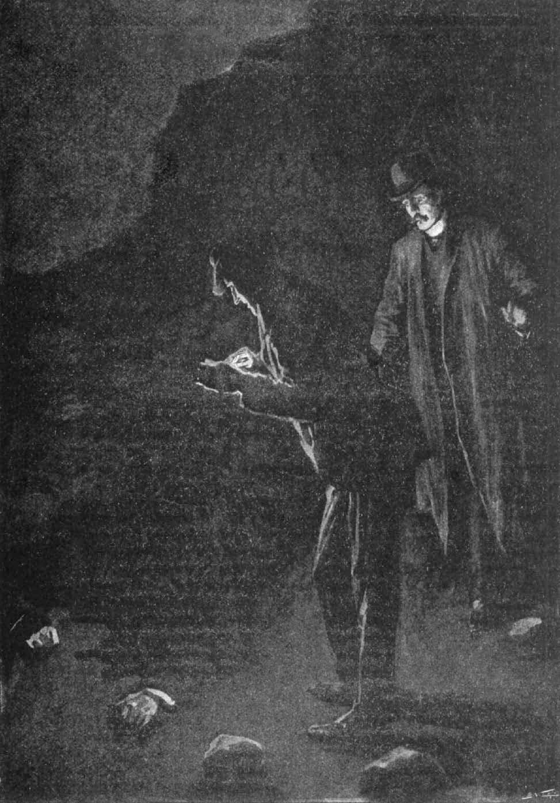

我原来是一个呈匍匐姿势的人。

我们俩谁也不会忘记这一身略带红色的苏格兰粗呢套装——就是第一天上午在贝克街看到他穿的这一身衣服。我们只一眼就清楚地认出来，这时火柴忽闪一下灭了，恰如我们的希望从我们的灵魂中破灭掉。福尔摩斯沉吟着，他的脸色在黑暗中显著惨白。

“这畜生！这畜生！”我双手捏拳喊道，“呵，福尔摩斯，一辈子都不能原谅自己，丢下他使他惨遭了厄运。”

“这更要怪我，都是我该死，华生。我只顾这一头计划布置得周密一些，却把那一头当事人的性命置之不顾。我一生的事业，这是个最大的打击。可是我怎么能知道——我怎么会知道——他不顾我再三警告、叮嘱，甘冒生命的危险，单独一个人跑到沼泽地上来呢？”

“我们怎么想得到，听到的就是他的叫喊——我的上帝，是那么地喊叫，怎么能救得了他呀！那狗畜生置人于死地，在什么地方？恐怕现在就藏在这些乱石中间。还有斯泰普尔顿，他在哪里？这个，定要找他算账。”

“当然找他还账，一定要找他。叔侄两人都遭了毒手——一个是眼见这只畜生，以为是神灵魔怪，活活吓死，再一个见了也是逃跑，没命跑，跑到尽头也是死。可现在还得证实人和这畜生之间的关系。我们除了听到了声音外，还无法肯定这个畜生的存在，因为亨利爵士显然是摔死的。好吧，苍天在上，他再狡猾，不出明天，就叫他落入我的手掌之中！”

我们两人痛心地站在这具尸体两边，感到惨不忍睹。我们不辞辛劳地奔波多少个日日夜夜，竟落得这样一个凄惨可怜的结局。我们受到如此突然的打击和无可挽回的损失，将从此一蹶不振。后来，月亮升起，我们爬上山岩的顶端，不幸的朋友就是从这里摔死的。从这高处，我们向黑暗的沼泽地望去，冥冥中亮着银色的月光。远处几英里之外，在格林本方向，闪烁着一盏黄灯，那只能是孤独的斯泰普尔顿家的灯火了。我遥望着灯光，朝它挥拳，狠狠地咒骂。

“干吗不马上就把他抓起来？”

“破案时机还不充分呀，这个人精明狡猾到了极点。我们没法单凭掌握案情办事，我们得拿出证据，要是稍一不慎、走错一步，这恶棍就会从我们手上溜走。”

“那怎么办？”

“明天要做的事还不少，今晚也就只能给这位不幸朋友做点后事吧。”

我们一同择路从陡峭的岩壁上下来，走向尸体，衬着反射银光的石头，暗暗的尸身显得更清楚了。他的四肢扭曲的那个痛苦状，叫我看着也心酸难受，泪水模糊了我的眼睛。

“得叫人来帮忙，福尔摩斯！我们没法把他抬回庄园里去，路不近呢。我的老天哪，你怎么啦，疯了？”

我正在说着，只听见他大叫一声，向尸体弯下身去，接着便忽然手舞足蹈，哈哈大笑起来，拽住我的手猛地摇晃。这还是我那个严肃而善于自持的朋友吗？这是郁结心头的怒火怨气大爆发吧！

“胡子！胡子！这人有胡子！”

“有胡子？”

“不是准男爵——那是——啊，我的邻居，逃犯！”

我们忙不迭把尸体翻过身来，滴血的胡子翘起在冷清的月亮光下。一看那突出的前额、深陷如野兽的眼睛，我马上认出，就是那天在烛光中从石头后面现出的那一张脸，正好向我瞪眼望过来，确实没错——逃犯塞尔登的面孔。

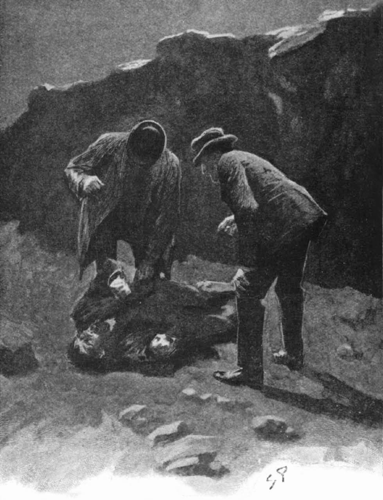

确实没错——逃犯塞尔登的面孔。

一闪念之间，我什么都明白了。我记起来，是准男爵把自己的旧衣服都送给了巴里莫，他同我谈起过这个事。一定是巴里莫又把衣服转送给塞尔登，好帮他逃亡。皮鞋、衬衫、帽子——确实都是亨利爵士的。这悲剧也真够凄惨，可是按照国家法律，这个人至少也是死有应得。我告诉福尔摩斯事情的来由，我欣慰，兴奋，热血沸腾。

“这么说，是这衣服招来杀身之祸。”他说道，“事情很清楚，给猎犬闻过亨利爵士身上的东西——那只皮鞋，在旅馆里偷来的，肯定是这样，所以猎犬就对这个人紧追不放。不过，有一点很奇怪，塞尔登在黑暗中，怎么知道有猎犬在背后跟着呢？”

“他听见声音了。”

“光听见沼泽地上有猎犬的声音，不至于让这种亡命之徒一样的逃犯吓到如此地步，更不至于狂喊乱叫，连被人再捉的危险都不顾。根据他的叫喊声来判断，他知道有动物在后面追，他一定已跑出很长一段距离。他是怎么知道的呢？”

“假定我们的推测都正确，我还有一个更大的谜团，不知这猎犬为什么——”

“我想不用推测。”

“好，就是，为什么猎犬今晚上放出来。我想这猎犬不会一直放在沼泽地上乱跑的吧？斯泰普尔顿一定要有把握知道亨利爵士出来了，他才会放狗。”

“这两个问题中，我的问题更加困难。我看你的问题马上就要得到解决，而我的问题将一直是个谜。现在摆在眼前的问题是我们怎么处置这血淋淋的尸体？总不能曝尸荒野让狐狸、老鸦吃掉吧！”

“我的意思，先在哪个小屋里放一放，等我们通知警察再说。”

“不错。你我两个抬他这点路没问题。喔，华生，你看是什么来了？正是他自己出马了，好大的胆，瞧他那么得意忘形！说话注意，不让他起疑心——说漏一句话，我们整个计划都要砸锅了。”

一个人影正从沼泽地上向我们走近，我看见微微一点雪茄烟火。月光照在他身上，看出了矮小精悍的体型、欢快的走路姿势，是生物学家。他发现了我们，停下步，然后又再走过来。

“噢，华生医生，是您吧，是不是？真想不到，夜里这么晚了，还会在沼泽地看到您。哟，怎么啦，这是什么？有人受伤了？啊——不会是咱朋友亨利爵士吧！”他打我旁边急急地擦身而过，向死人弯下身去。我清楚地听到他倒抽一口冷气，看见雪茄烟从他手指间掉落地上。

“谁——这这这是谁？”他结巴着说。

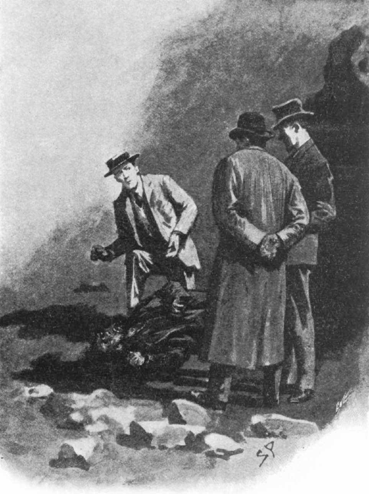

“谁——这这这是谁？”他结巴着说。

“那是塞尔登，王子城逃跑的那个人。”

斯泰普尔顿转向我们，面色青灰，可是他竭力克制住内心的慌乱和失望，两眼直逼福尔摩斯，又直逼住我。

“天哪！这个事麻烦着呢！是怎么死的？”

“好像是从山上摔下来，跌断了脖子。我和朋友在沼泽地上闲逛逛，听到了叫喊声。”

“我也听到叫喊，所以我就出来了，我是担心亨利爵士。”

“为什么偏偏只担心亨利爵士？”我忍不住问道。

“因为我约他随便过来玩玩，他没有来。我听到沼泽地上不断叫喊，就担心了，自然要警觉起来，想到了他的安全。那么”——他眼光又忽地从我脸上转向福尔摩斯——“叫喊以外，你们还听到什么没有？”

“没有，”福尔摩斯说，“您听到什么吗？”

“没有。”

“那么，您想问什么呢？”

“喔，您知道有种传说吗？庄稼人都说是鬼怪狗呀什么的，据说夜里在沼泽地上能听见。我在想，今天晚上，倒要听听，是不是真有这种声音。”

“我们没有听见这种声音。”我说。

“据您看，这个人惨遭横祸，是怎么死的？”

“我看，准是什么事心急慌忙，暴露了自己，叫人发现，就晕头转向了。一定是疯了似的，在沼泽地上乱跑，最后就摔死在这里，扭断了脖子。”

“这道理看来倒是最能说得过去。”斯泰普尔顿说，口中叹了一声，我看这是表明他松了一口气，“您的高见呢，歇洛克·福尔摩斯先生？”

我的朋友欠欠身表示回礼。

“您认人认得真够快。”他说。

“自从华生医生下来以后，我们这里的人也都一直在盼着您来呢。您正巧赶上目睹一出悲剧。”

“是的，确实这样。我没有异议，这位朋友所作的解释能概括实际情况。我明天就回伦敦，只好带着一件不愉快的记忆回去。”

“喔，您明天要回去了？”

“我有这个打算。”

“想必您这次来访，对一些我们困惑不解的事，能蒙赐教指点迷津？”

福尔摩斯耸耸肩。

“人往往事与愿违，希望的未必成功呀。侦查需要掌握事实，不靠传说和谣言，这件案子办得不能令人满意。”

我的朋友把话说得极为坦率，毫不经意。斯泰普尔顿两眼直勾勾地看着他说这话的神态，随后又再转向我。

“我倒是想，把这个可怜的人抬到我家去吧，可是就怕惊吓了我妹子，这就不合适了。还是拿点什么把他的脸遮一遮，等到明天早上，这样比较安全一些。”

事情就照这样安排做好。我和福尔摩斯一同谢绝了斯泰普尔顿的盛情邀请，转身向巴斯克维尔庄园的方向走。我们回头望望，那个身影在广阔的沼泽地上慢慢地远去，在他身后，银光照亮的斜坡上，遗下墨色的一堆，那个人，以如此可怕、悲惨的结局躺在了那里。

# 第十三章　布网

“我们终于胜券在握了，”我们一同走过沼泽地，福尔摩斯说道，“这家伙的神经算得上坚强！他发现错杀了人，阴谋落空，还是那么镇定！换了别人，要惊得发呆，傻在那儿了。我在伦敦跟你说过，华生，现在我还要跟你说，我们过去还没有遇到过这么一个强敌，眼下正棋逢敌手，更值得较量一番。”

“让他看见你了，不是好事。”

“我起先也这样顾虑，不过没有办法，看见就看见了呗。”

“会有什么后果吗？既然看见你来了这儿，你想他的计划会怎么样？”

“会使他更加谨慎小心，或者，驱使他狗急跳墙，马上不顾一切采取行动。大多数有点鬼聪明的罪犯都是这样，他会过高估计自己的聪明，设想着完全能够把我们耍弄对付掉。”

“为什么不马上把他抓起来？”

“我亲爱的华生，你是天生急于行动的人，你的性子，永远是做事痛快淋漓。可是假如，不妨就这么假设呀，今儿晚上就把他逮起来，对我们究竟有什么好处呢？我们对他还毫无证据嘛，其手段之狡诈不亚于恶魔！如果他通过人来作恶，我们还能够抓到人证，但是如果我们把那条大狗拉到光天化日之下，没有用处，无助于我们把绞索套到狗主人的脖子上去。”

“我们当然有证据。”

“连个影儿都没有呢——只不过是推测、假设。要是拿着这种故事当证据上法庭，一定会哄堂大笑，给轰出来！”

“查尔斯爵士的死就是明证。”

“只发现了死，身上毫无被害的痕迹。你我都知道完全是给吓死的，你我还知道是怎样把他吓死的，可我们拿什么教十二位陪审官也相信呢？猎犬踪影在哪里呢？狗咬的牙印有吗？当然，我们都知道猎犬是不咬死尸的，查尔斯爵士在畜生没赶上来的时候就先死了。可我们得把这一切加以证实才行，而我们现在都还办不到。”

“就算这样，那么今天晚上的事呢？”

“今晚的事还是没多少用呀。仍旧是老问题，这个人的死同猎犬有什么关联！我们都没有见着狗嘛，我们只是听见，可是没法证明是狗在追人，完全不能证明有罪恶的计谋。不行，我亲爱的伙计，我们不得不承认事实，到目前掌握的证据都还不足以立案，为了使这件案子站得住脚，冒一下险也值得。”

“你考虑接下去怎么办呢？”

“我对劳拉·莱昂斯太太抱有较大希望，让她清楚自己在事情中充当了什么角色会对我们有用。此外我也有自己的计划，明天的事就够对付的了。不过，我指望明天一天下来，我们最终能占了他的上风。”

我没能再进一步问他什么。他只顾走路，沉浸在冥思苦想之中。不知不觉已一路来到了巴斯克维尔庄园门前。

“你进去吧？”

“进去，没有必要再躲着了。不过，进去之前，还有一句话，华生，不要向亨利爵士提起猎犬的事。塞尔登的死因，让他也以为，就是斯泰普尔顿让我们相信的那样，这样他对明天要临头的事情，比较能经受得住。已经约好他明天去他们家吃晚饭，你报告上写的，我没记错吧。”

“也约我去的。”

“那么，你一定要借故推托，一定要让他一个人去，这样就容易安排了。现在，晚餐时间已过，恐怕太迟了，我们俩吃点夜宵就行了。”

亨利爵士见了福尔摩斯，吃惊之下，喜不自胜，因为最近一些日子发生的事情，使他一直在盼着促使福尔摩斯成行，从伦敦来到这里。然而，一会儿他发现我们的朋友既没带行李，也不解释为什么没有行李，便耸起双眉大感诧异。我和准男爵一同给他凑合齐了所需衣物用品，然后吃着很晚的夜宵，向准男爵叙述我们所遇到的事。他想知道的尽量都让他知道。而我还得第一个担当起令人不愉快的任务，把这个消息透露给巴里莫夫妇知道。对巴里莫来说，倒不啻是个解脱，但是他夫人哭得脸埋在了围裙里。对全世界的人而言，她兄弟是个暴徒，一半是魔，一半是兽，不是人；但对她而言，在心目中永远是一个淘气可爱的小男孩，幼年时，弟弟拽着她的手一起长大。这个人实在是罪孽深重，临死没有一个女人给他哭灵送终。

“今天早上华生出门之后，我一整天闷在屋里，”准男爵说，“我觉得我还算是个有信誉的人，因为我讲话算数，答应好单独一个人不外出，就不外出。要不今儿傍晚会是多惬意，多迷人，斯泰普尔顿带一个口信来，叫我过去。”

“这我不否认，您去了，晚上会过得很惬意，很迷人，”福尔摩斯冷冰冰地说，“可是您不知道，我们还以为是您摔断了脖子，为您伤心得很呢，这个事儿您高兴吗？”

亨利爵士睁大了眼睛。“怎么以为是我呢？”

“这个该死的家伙穿的是您的衣服，我怕是您家的仆人拿去送给他穿的吧，说不定要惹上警察的麻烦呢。”

“那不大会。衣服上都没有记号，这我晓得。”

“那算他运气好——事实上，你们大家都运气好。这件事，从法律上讲，你们全家都有牵连。作为一名铁面无私的侦探，我可以确定，首要的任务是先把你们全家抓起来再说。华生的报告是最足以证明有罪的材料。”

“可是那案子呢，案子怎么样了？”准男爵问道，“这乱麻一堆，您摸到什么头绪没有？我不知道，自从华生和我来到这里，究竟有多少作为，多少进展。”

“这个嘛，不用很久，我就有行动，把事情给您弄个水落石出。这件事是极其困难、非常复杂的，还有几个疑点我们需要弄清楚——也是能弄得清楚的。”

“我们有过一次，华生想必已经告诉您了。我们听见沼泽地上有猎犬叫，所以我能发誓，那绝对不是空口吹出的迷信。我对狗有研究，我在美国西部那阵子，老跟狗打交道。我只要一听狗叫，就能分辨得出是什么狗。现在的这只狗，要是您能把它套上口罩，拴上链条，我就发誓承认您是位空前的大侦探。”

“我有把握套住它的嘴，拴住它的脖子。我保证做得到，条件是您要同我配合好。”

“只要您吩咐，我照做不误。”

“那就好。我还要求您只管照我讲的去做，别老问什么理由。”

“行，没问题，照您说的办就是。”

“只要您照我讲的做，那事情马上见效，大问题会变成小事一桩，很快解决。我坚信——”

福尔摩斯突然住了口，眼睛定神朝我头顶后上方望着什么。灯火照亮着他的脸，他是那样地凝神，那样地专注，等于是一尊轮廓分明、线条清晰的古典雕像，是一个目光机敏锐利的典型形象。

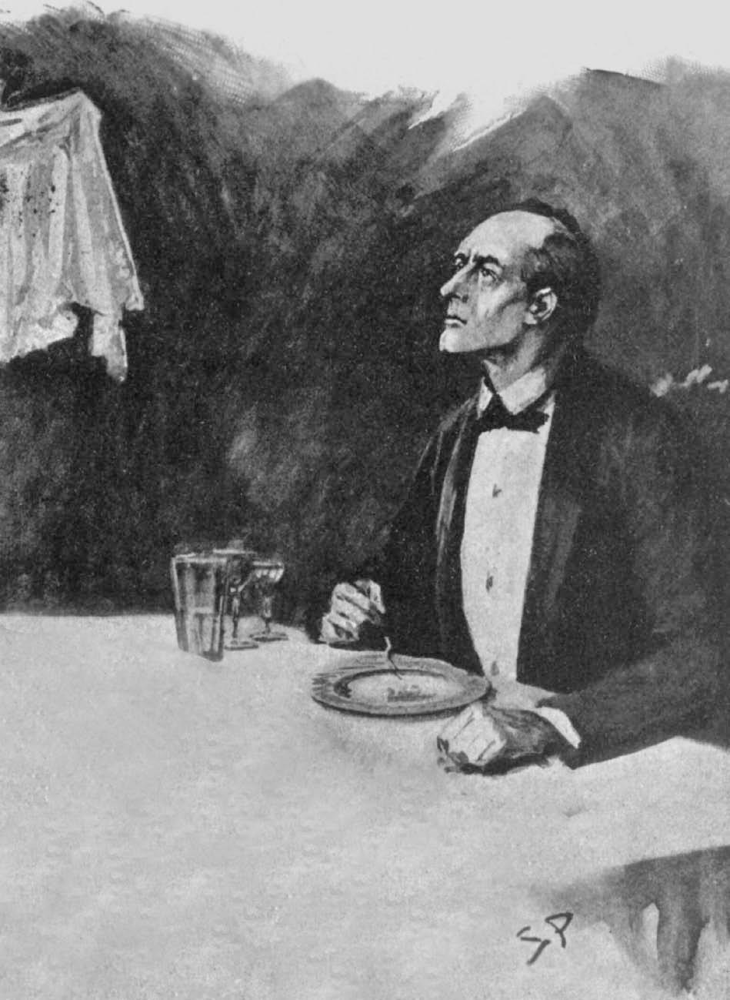

眼睛定神望着什么。

“怎么啦？”我们俩都向他喊道。

当他目光收起，两眼回落的时候，我看出他抑制着内心的激动。他的表情依然镇定自若，可是在他的眼睛里闪着极其兴奋的光芒。

“请原谅，鉴赏家正在欣赏得入迷呢。”他说，一边挥手指着对面墙上挂的一排人物肖像，“华生说我对艺术一窍不通，其实是他老兄自己不懂。原因是我们两人对作品的着眼点完全不一样。啊，这些人像画才真正是上品佳作。”

“是吗，您这么一说，我听得可高兴，”亨利爵士说，惊异地望了我朋友一眼，“这种东西，我不可以不懂装懂。我对绘画是外行，对马呀、牛呀，那才是内行，一看就说得出个门道。看不出您还有工夫研究这一门玩意儿。”

“好在哪儿，我一看就知道。现在，我就能看出，那一幅，出自奈勒<a href="#part0091.xhtml_ch1"
id="part0091.xhtml_ch1-back">(1)</a>的手笔，我敢说一定没错，就是在那一头，那幅女人像，穿蓝丝绸衣服的。还有，那幅戴假发的，胖绅士，肯定是雷诺兹<a href="#part0091.xhtml_ch2"
id="part0091.xhtml_ch2-back">(2)</a>的作品。喔，这些全都是您家里人的画像吧？”

“都是。”

“知道每一位的名字吗？”

“巴里莫都教我一一记住过。我这个做学生的，功课不算坏，大概还没有忘记呢。”

“拿望远镜的那一位，是谁？”

“那是巴斯克维尔海军少将，在西印度群岛罗德尼<a href="#part0091.xhtml_ch3"
id="part0091.xhtml_ch3-back">(3)</a>麾下任职。那一个，蓝颜色服装，手里拿一卷纸，是威廉·巴斯克维尔爵士，皮特任首相期间，他任下议院委员会主席。”

“还有这一位骑士，我对面——披黑色天鹅绒斗篷、挂绶带的？”

“噢，这一位您问个正着，他就是家道不兴的祸根，作恶多端的休戈，巴斯克维尔猎犬之说正是从他开始。这个人，我们是忘不了的。”

我也颇感兴趣，还怀着几分惊奇的心情看着这幅像。

“天哪！”福尔摩斯说道，“他样子还挺安详平和的，可是我敢说，他的两眼潜藏有魔鬼。我原先把这个人的相貌想象得还要狂暴，还要凶残。”

“画的真实性是没有问题的，肯定像本人。是他本人，画布后面有名字，有年份，是一六四七年。”

福尔摩斯没有再多说话，可是那老酒鬼的画像对他似乎有魔力，吃着夜宵的时候，叫他两眼继续不断地盯住画看。直到后来，等亨利爵士回到自己的卧房去了，我方才摸清了他的思路。他手里拿着寝室蜡烛，带我回到宴会厅，举起蜡烛照着墙上这幅年代久远、已显暗淡的画。

“你看出点名堂没有？”

我望着那顶羽饰阔边帽，额边的鬈发，镶有白蕾丝的领圈，以及被所有这一切围衬着的那张一本正经的严肃面孔，相貌不算凶残，却也显得做作、生硬和严厉，一张薄唇紧闭的瘪嘴，一副神色冷酷、容不得人的眼睛。

“像谁你看得出来吗？”

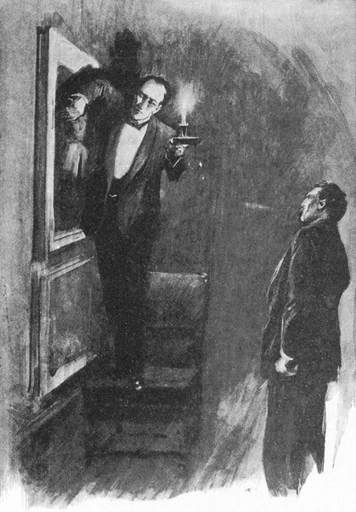

“像谁你看得出来吗？”

“下巴很像亨利爵士。”

“有点像，细细看。等一下！”他站到椅子上，左手举蜡烛，右臂弯起罩住画上的阔边帽和长鬈发。

“噢，没错！”我恍然地惊叫起来。

一张斯泰普尔顿的脸立刻突现在画布上了。

“哈哈，你看出来了吧，我的眼睛训练有素，善于鉴别真容，不管旁边的花花饰饰怎么干扰。这是刑事侦探的首要功夫，怎么伪装都逃不过他们的眼睛。”

“真是奇妙，简直就是他本人的画像。”

“是的，是个返祖现象的典型实例。很有趣，而且是形态与精神共具的返祖。研究家族的肖像，足以使人相信轮回再生的宗教说法。那个人是巴斯克维尔家的族人——这是明摆的了。”

“怀有篡夺财产继承权的阴谋诡计。”

“完全是这么回事。这张画很巧，巧就巧在正好提供我们线索中一个最重要的环节，是线索系列中一直缺少的环节。我们对他完全清楚了，华生，对他完全掌握了。我敢发誓，不用到明天晚上，他要像自己兜住的蝴蝶一样，在我们的罗网里乱拍翅膀乱扑腾，无助，绝望，挣扎。一枚别针，一块软木，再一张卡片，我们就把他钉到贝克街的标本陈列室里去！”

他转身离开画像的时候，突然发出几声平时罕见的大笑。我难得听到他朗声大笑，但他只要这么大笑，就必定预示着某个恶人日子到头了。

我清晨早早起身，但是福尔摩斯起得更早，已在徒步走动，我穿衣的时候，见他正从车道上回来。

“啊哈，今天我们要实实足足干上一天。”他口气重重地说，一面兴奋得摩拳擦掌似的搓起了双手，“网都张好到位，就等动手起吊。今日里就要见分晓，到底是我们把他这条尖嘴大狗鱼捉住呢，还是他从我们的网眼里溜掉。”

“你已经到沼泽地里去过了吗？”

“我去了格林本送一份报告给王子城，通知他们塞尔登已死。我是想，我把这件事处理掉，你们谁也别管了，没你们的事了。我还跟忠诚的卡特赖特联系过，要是不让他知道我安全无恙，他就会候在小屋前等到死也不走，像一只狗守在主人的坟墓旁。”

“下一步怎么行动？”

“先去找亨利爵士。啊，他来了！”

“早晨好，福尔摩斯，”准男爵说，“您像一位将军，在同参谋运筹一次战役。”

“差不多正是这样，华生在向我请求命令呢。”

“我也来报到听候调遣。”

“很好。我了解到您今晚有约，要去你们的朋友斯泰普尔顿家共进晚餐。”

“希望您也一起来。这一家人都热情好客，我能肯定他们见到您都会非常高兴。”

“可惜华生和我一定得去伦敦啦。”

“去伦敦？”

“是呀，我想现在这个时候，我们去那里要比在这里更能做点事情。”

我们看到准男爵的脸马上拉长了。

“我是希望，你们总得陪我把事情了结吧。这个庄园、这个沼泽地可不是个好地方，丢我一个人在这儿！”

“亲爱的朋友，您一定要充分信任我，完全照我的话去做。您可以告诉朋友们，我们本来是很愿意跟您一起去的，可是来了一件急事，催我们快回去。我们希望很快就回来，再来德文郡。请您一定代传这个口信好吗？”

“您这么坚持，只好这样吧。”

“没有别的办法，真是对不起您了。”

我看到准男爵额头生起愁云，很显然，他觉得我们是弃他而去了，因而深深感受到伤害。

“两位什么时候动身？”他冷冷地问。

“吃过早饭就走。我们得坐马车去库姆·特雷西。不过，华生的东西都还留在这儿，作为保证，他一定还会回来的。华生，你写张条子给斯泰普尔顿，说你向他道歉你不能去。”

“我真想和你们一同到伦敦去，”准男爵说，“为什么我一个人留在这儿呢？”

“因为这是您的职责所在的地方嘛，还因为您答应过我，让您怎么做您就怎么做，所以我要您留下来。”

“好，那好，我就留下。”

“再向您提一个要求！希望您坐马车去梅里皮特大宅，到了以后，就叫您的马车先回家，让他们知道您打算步行走回来。”

“走过沼泽地？”

“对了。”

“您不是一再提醒我不能去沼泽地的吗？”

“这一次您可以，保证安全，不会有事。要是我不相信您神经健全又有胆量，我不会提出来。您就得这样办，这是关键的关键。”

“好，我一定做到。”

“性命头一要紧呵，您穿过沼泽地不许乱走，只能走直线，从梅里皮特大宅到格林本那条直线路，这是您回家的必经之路。”

“我一定照您说的去做。”

“这就好。我想吃过早饭就动身，时间趁早，这样下午就能赶到伦敦。”

我内心非常惊疑怎么是这样的安排，尽管我记得昨天夜里福尔摩斯说过，下一天他就要结束这次拜访，可是我想不通，他竟会要我同他一起走；我也不明白，正是在这种他所称的最紧要最危险的时刻，两人都跑掉。没有办法，无条件服从就是了。就这样，我们向一脸苦恨相的朋友道声再见，离别而去。两个小时后，我们已经到了库姆·特雷西火车站，随即把马车送上归途。一个小男孩正等在月台上。

“有什么吩咐，先生？”

“你乘这趟车回城，卡特赖特。你一到，就发一份电报给亨利·巴斯克维尔爵士，用我的名字，就说若找到我遗落的笔记本请挂号寄贝克街。”

“知道了，先生。”

“现在你到车站邮局去问一问，有没有我的信。”

孩子回来时拿着一份电报，福尔摩斯转手交给我，上面是：

电悉。携空白拘票前来。五时四十分抵达。

莱斯特雷德

“这是我早晨去电的回电。他是公家刑侦这一行里的好手，我觉得，我们需要他来协助一下。现在，华生，趁这段时间，快去拜访劳拉·莱昂斯夫人，你已经认识她了。”

他的战略部署开始显露。他推出准男爵前往赴宴，让斯泰普尔顿相信我们真的已经走掉，而实际上，一有需要，我们立即就能回来。从伦敦发出一份电报，只要亨利爵士向斯泰普尔顿夫妇一提起，就能打消他们心头的最后一点疑虑。

我好像看见我们的网已经兜住了那条尖嘴狗鱼，在越拉越紧。

劳拉·莱昂斯太太在工作室里。福尔摩斯的拜访开门见山，坦率直白得令夫人惊愕。

“我来调查已故查尔斯·巴斯克维尔爵士去世的情况，”他说，“我的朋友华生医生已经告诉我您上次谈过的话，同时还说，关于此事，您还有隐瞒。”

“我隐瞒什么了？”她以挑战的态度反问。

“您承认，您要求查尔斯爵士十点钟在门外等候。我们知道，那正好是他去世的时间、地点，您把这两件事的关联隐瞒掉。”

“没有关联呀！”

“没有关联，那倒真正是件极不寻常的巧合了。可是我想，我们完全可以说有关联，毕竟是有关联的。我想该向您摊牌，实话实说，莱昂斯夫人，我们认为这是一件谋杀案。证据证明，牵涉的人不单单有您的朋友斯泰普尔顿先生，还包括他的妻子。”

女士从坐椅上跳了起来。

“他的妻子？”她叫道。

“事实明摆着，已不是秘密，那个女人外面只道是他妹妹，实际上是他的妻子。”

莱昂斯太太重又坐下，两手紧抵着椅子扶手。我看见她用力抓得过紧，肉红色的指甲都压迫得发白。

“他的妻子！”她又重复说，“他的妻子！他没有结过婚呀！”

福尔摩斯耸耸肩。

“给我拿证据来！给我拿证据来！你们得拿出证据——”她闪烁着厉害的目光，这比说话更能说明问题。

“我来正是准备给您看证据的。”福尔摩斯一边说着，一边从衣袋里抽出几张纸，“这是他们夫妇的一张照片，是四年以前在约克郡拍的。照片背面有签名‘范德勒先生和夫人’，不过这两个人您一看就认得出来。他；这是她，您若是见过面的话，不难认出。还有三份书面证明文件，都是范德勒先生和夫人的熟人写的，是可靠人证。那时候他办了一所圣奥利佛私立小学。您过目一下，看看关于这两个人的关系，还有什么疑问。”

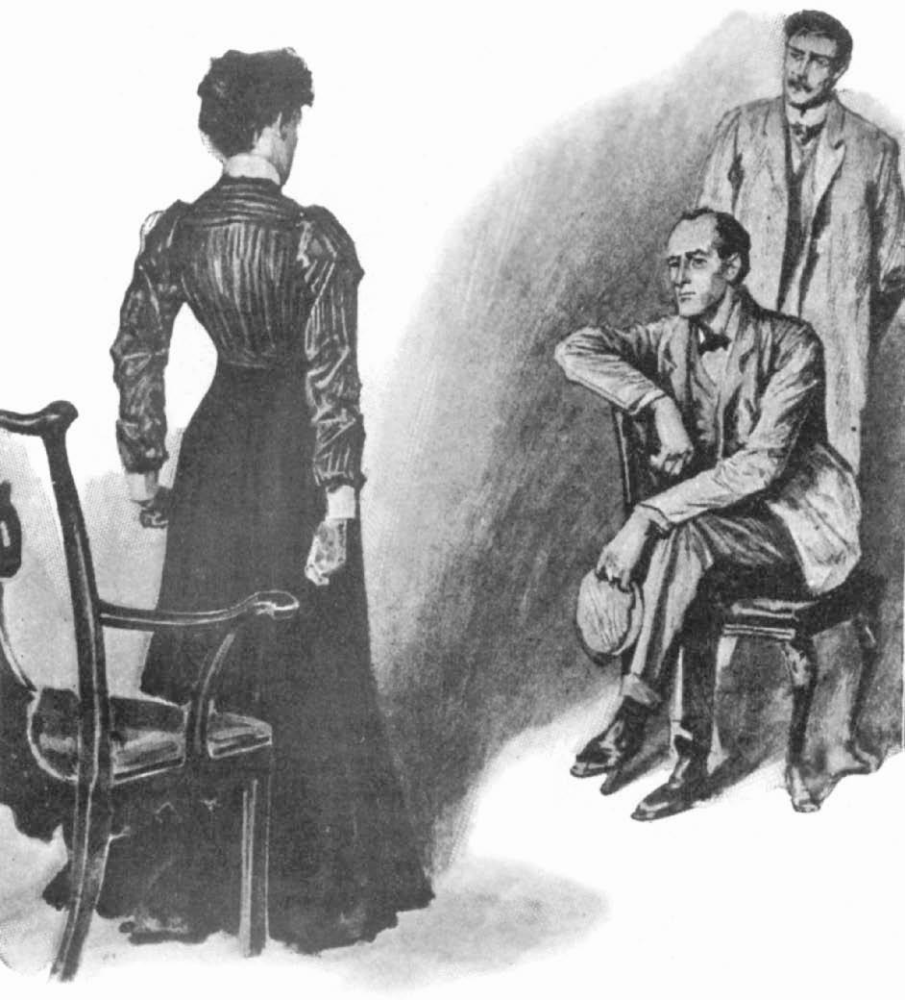

“我来正是准备给您看证据的。”

她把文件看了一下，抬起脸望着我们，这是一个女人陷于绝望的呆滞、僵冷的脸。

“福尔摩斯先生，”她说道，“这个人要求我和他结婚，只要我同自己的丈夫离婚。他在说谎，在欺骗我，这个坏蛋，什么花招都想得出来。那他从来没有跟我说过一句实话。为什么——为什么呢？我还以为什么都是为了我的缘故呢，可是现在我才看清，我不过是他手上的工具，供他利用。他对我从来没有真情，干吗我还要对他保持忠诚？他自食恶果，我干吗要替他遮遮掩掩？你们要问什么就问吧，我再也不会隐瞒。有一点我要发誓声明，我写那封信绝对没有要害老先生的意思，他一向待我是很好的。”

“我完全相信您，夫人，”福尔摩斯说，“把这些事都重新讲一遍，在您一定是很痛苦的，不妨这样，简单一点，我来把怎么个情况说给您听，事实若有出入的地方，您提出来，改正一下就行了。好，寄出这封信是斯泰普尔顿授意您做的吧？”

“是他口授，我写的。”

“我想，他的理由是，为了您可以得到查尔斯爵士的帮助，离婚诉讼费可以有着落，对吗？”

“是这样。”

“您把信寄走之后，他又劝阻您别去赴约，是吗？”

“他跟我说，这样又很伤他的自尊心，给人家知道钱是为这个用途，面子过不去。又说，尽管他是个穷人，也要靠自己，用尽最后一个铜板，来排除分隔我们俩的障碍。”

“看上去他还真是个有情有义之人。那么，后来您就从报上知道了噩耗，在这之前您没有再听到什么？”

“没有。”

“他让您发誓不说要和查尔斯爵士见面这件事？”

“是的。他说那是暴死，死得不明不白，事情一讲出去，我就要受到怀疑。他这么一恐吓，我就沉默不敢说了。”

“那是呀。不过您自己有过怀疑没有呢？”

她犹豫起来，低下了头。

“我知道他的为人，”她说，“但是，只要他对我好，真心待我，我就永远也对他忠心。”

“应该说，您总算有运气，让您脱身，免掉一场灾祸，”福尔摩斯说，“他的事都让您掌握着呢，这点他早就很清楚，可您还能活着没事。您几个月来一直在悬崖峭壁上走。现在我们真要向您道个早安，莱昂斯太太，您很快就会听到我们的消息。”

“我们这个案子，底已经摸清楚，面临的难题已经一个个得到解决，”福尔摩斯说，这时我们正在车站等着从城里开来的快车，“不久，我就有充分的材料写出一部长篇现代犯罪小说，它一定不同凡响，绝对奇异惊人。研究刑事犯罪学的学生会记得六十六年前小俄罗斯古德诺发生的同类案件，当然还有在北卡罗来纳州的安德森谋杀案。但是眼前这个案件本身具有与众不同的特点。现在虽然还没有拿到这个阴险狡诈的家伙确凿的证据，但是，我就不信，到今晚睡觉以前还不能搞它个水落石出。”

伦敦来的快车轰隆隆驶进车站，一个精干瘦削结实的小个子，像只斗牛犬从头等车厢里蹦了出来。我们三人紧紧握手。一看到莱斯特雷德用毕恭毕敬的态度望着我的同伴，我就想到，从他们开始一起合作以来，他已向我的同伴学了不少东西。我还记得很清楚，这位理论推理专家那时常用嘲讽来激发这位实干的朋友。

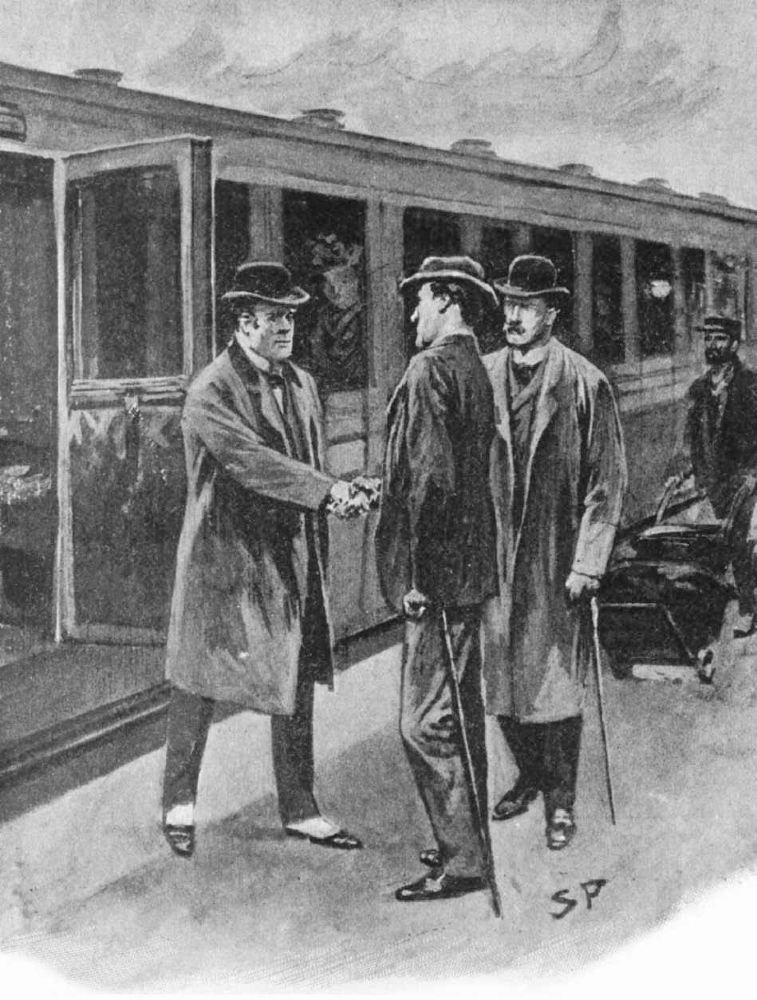

我们三人紧紧握手。

“有好差事啦？”他问。

“几年来最美的美差。”福尔摩斯说，“现在到出发行动，大约还有两个小时的时间，我说，先趁这点时间吃顿晚饭。然后，莱斯特雷德，我们就领你到达特穆尔高原去呼吸呼吸夜晚的纯净空气，把你喉咙里的伦敦脏雾都换个干净。从来没有去过？呵，你有幸，我保证你忘不了这一回的初游。”

————————————————————

<a href="#part0091.xhtml_ch1-back" id="part0091.xhtml_ch1">(1)</a> 奈勒（Kneller，1646—1723），英国画家。

<a href="#part0091.xhtml_ch2-back" id="part0091.xhtml_ch2">(2)</a> 雷诺兹（Reynolds，1723—1729），英国肖像画家。

<a href="#part0091.xhtml_ch3-back" id="part0091.xhtml_ch3">(3)</a> 罗德尼（Rodney，1718—1792），英国海军上将，对法国、西班牙、荷兰海战，屡获重大胜利。

# 第十四章　巴斯克维尔的猎犬

歇洛克·福尔摩斯有一个缺点——姑且也算一个缺点吧，那就是，他肚里的计划在付诸实施之前，绝不向人夸夸其谈。这部分的原因，当然是出于他自己天性高傲，总是凌驾于周围的人，还喜欢让人对自己的作为突然大感惊讶；另外也是出于他职业的本能，步步小心谨慎，逼使他绝不存侥幸之心轻言取胜。可是这样做造成的后果，却是常常叫助手、同伴摸不透意图而无所适从，我就没少吃他的苦头。可是比比现在黑夜驱车的旅程，那就没有这么沉闷了。巨大的挑战和考验就在眼前，我们已临到了最后时刻，眼看就要上阵奋力一搏，可是福尔摩斯依然一言不发，我也就只能在那里猜测他的行动步骤可能如何。最后感觉到冷风拂面，窄道两旁已是漆黑空旷一片，我才意识到重又回到了沼泽地上，我预感到并期待着事情即将发生，神经紧张得发颤。马儿每跨一步，车轮每转一圈，我们便更接近最后的冒险。

我们也不宜多话，因为马车是雇来的，由车夫驾车，所以就只能谈些无关紧要的琐事。但由于内心期盼的焦虑和激动，神经却是十分的紧张。这种拘束不自在终于过去了，令我舒了一口气，因为此时我们已到了法兰克兰的居住地点，打他那儿经过。我知道我们已接近那座大宅，接近了行动的目的地。我们没有再往那房屋的门口方向过去，就在住宅岔路口下车。付了车钱，我们立即叫车夫赶快回库姆·特雷西。我们走向梅里皮特住宅。

“带家伙了吗，莱斯特雷德？”小个儿侦探微微一笑。

“只要我穿裤子，屁股后边就有裤袋；屁股后边有裤袋，里头少不了有家伙。”

“好！我朋友、我，都要提防不测。”

“你把事儿瞒得真紧，福尔摩斯先生，现在怎么行动？”

“等等再说。”

“我说，这里不见得有个什么好玩的地方。”公家侦探说着打了个冷战，向四周望望黑黝黝的山坡，望望飘浮在格林本泥潭上的雾霭，“前面屋子里有灯光。”

“梅里皮特家的大宅，也就是我们这一趟出行的终点。走路得踮起脚尖，说话得贴着耳朵。”

我们悄悄地沿着小路移动，看样子要进屋子里去，但是在距离房子大约两百码的地方，福尔摩斯把我们止住。

“就在这儿行了，”他说，“右边的石头正好作掩护。”

“等在这儿吗？”

“对，在这儿先埋伏一下。下来，莱斯特雷德，到这个洼坑里。你，华生，进过屋里，进去过吗？说说房间的位置？这一头的格子窗是什么房间？”

“是厨房吧，厨房窗子。”

“那个呢？它特别亮呢。”

“那肯定是餐厅。”

“百叶窗都拉上了。你熟悉这里的地形，悄悄过去，看里头在做什么——千万别让他们知道有人监视啦！”

我顺小路摸过去，弯腰躲在矮墙外面，矮墙围着一片长不高的果林。我蹑手蹑脚躲入阴影，在一个地方，正好可以直望到没上帘子的窗内。

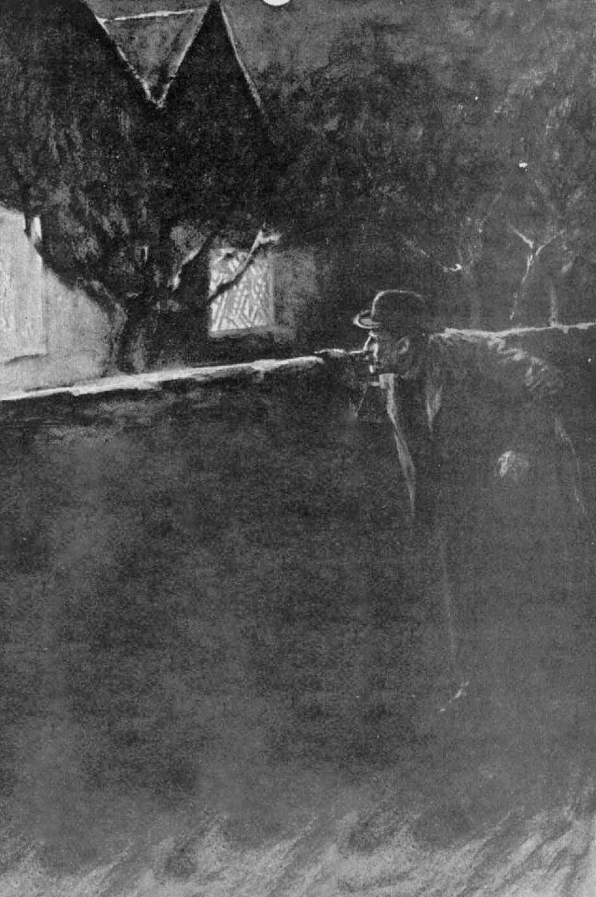

正好可以直望到窗内。

屋里只有两个人，亨利爵士和斯泰普尔顿。两人面对面坐在圆桌边，都是侧面向着我，都在抽雪茄，面前放着咖啡和葡萄酒。斯泰普尔顿谈兴正浓，可是准男爵脸色苍白，心不在焉。或许在想着要他一个人单独穿过那片多有凶兆的沼泽地，感到忧心忡忡。

我正在望着，只见斯泰普尔顿起身离开屋子，亨利爵士又斟满了酒杯，身子靠在椅背上，喷吐着雪茄烟。我听到开门的吱嘎响，皮鞋走在砾石路面的咔嚓声。脚步在我躲着的矮墙里面沿小径走过。我探头望着，看见生物学家在果林一角的一间小房子的门前停下，用钥匙开锁。他走进小屋，屋里传出一阵奇怪的乱动乱响。他在里边大概只待了一分钟。再次听见钥匙转了一下，他又从我这边走过，再回进宅屋。我看见他又在应酬客人了。这时，我轻手轻脚回到同伴等着我的原地，告诉他们所见到的情形。

“你说，华生，那个女人不在一起？”我报告完毕，福尔摩斯问我。

“没在。”

“那会在哪儿呢？别的屋子都没有灯光嘛，不会在厨房。”

“不知道在什么地方。”

我刚才说的格林本大泥潭上笼罩着的那一片浓重的白色雾气，这会儿正朝我们这个方向慢慢涌过来，聚积起一堵墙似的挡在我们旁边，低低的、厚厚的，形状分明。月光照着白雾，看上去就是一地银光闪闪的冰层，远处一座座突岩的岩顶好像是冰原上探出来的山石。福尔摩斯转过脸，面对缓缓涌动的白雾，眼睛望着，嘴里不耐烦地嘟囔着。

“雾在向我们这边过来，华生。”

“要紧不要紧？”

“当然要紧啦——弄不好，要坏在雾上，计划落空。现在他不会待得太久，已经十点钟了。我们能否成功，他的命保不保得住，要看他出来怎么样。他出来的时候，雾还没有到小路，没有盖掉小路，那就好。”

我们头顶上是皎洁美好的夜空，星星眨着清冷而明亮的眼，一轮明月把大地浸浴在柔和朦胧的光亮之中。我们面前，大宅的这幢黑影，它那高高低低的屋顶和耸立的烟囱，轮廓分明地突现在银光辉映的天空。一道道金黄色亮光从低低的窗户照进果园，射向沼泽，有一道光突然灭掉，那是仆人熄灯走出了厨房。现在只剩下餐厅里仍然火烛明亮，两个人，一个是暗藏杀机的主人，一个是浑然不知的客人，还在雪茄烟中谈天说地。

白色如绒、盖满大半沼泽的滚滚浓雾，在每分每秒向大宅步步逼近，已经先有薄雾丝絮前来撩拨透着金光的窗棂。果园深处的围墙已隐没不见，只有果树，似穿出翻腾的白雾而不染。我们这么眼睁睁看着大雾打着旋卷过了屋角，层层堆砌起来，最后只有二楼和屋顶依旧显露，成了一艘飘没在幻影海洋上的奇异的航船。福尔摩斯情急得把手不断拍着面前的岩石，把脚不耐烦地跺着地面。

“一刻钟后他再不出来，这路就给雾掩没了，过半个钟头，连我们自己都要伸手不见五指。”

“要不要往后边退一退，退到稍高一点的地方？”

“对，也是个办法。”

就这样，雾幛向前推进，我们向后退却，一直退到了离大宅有半英里之遥。这白色的雾海，海面上闪耀银色月光，依然毫不宽容地徐徐向前进逼。

“距离太远了，”福尔摩斯说，“这太危险，他会在接近我们之前被人追上，这个危险不能冒。不行，一定得不惜代价，坚守在这里。”他往地上跪下去，把耳朵贴着地面。“感谢上帝，听到了，好像他走过来了。”

一阵急促的脚步声打破了沼泽地上的宁静。我们蹲在乱石之中，目不转睛地盯住前面泛着银白的层层浓雾。脚步声越来越响，透过雾气，如同透过幕帘一般，走出来一个人，正是我们久等的这个人。他出现在星光清朗的夜色之中，有些惊慌地向四周望了望，然后加紧脚步顺路而行，从离我们隐蔽处很近的地方经过，随后朝我们身后那长长的坡地走上去。他一边走，一边不住地向四周环顾，显然心中忐忑不安。

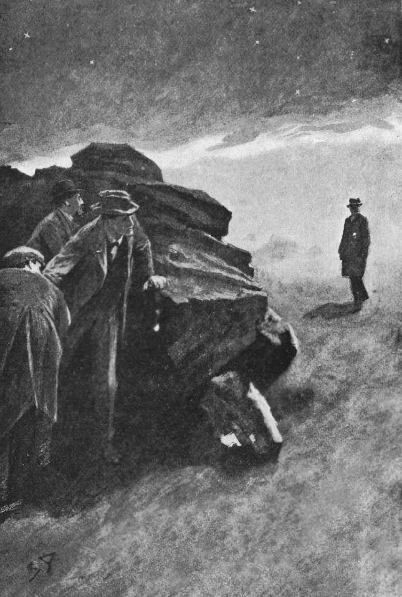

他出现在星光清朗的夜色之中。

“嘘！”福尔摩斯一声轻嘘，我听到清脆的打开手枪保险的声音，“注意，来了，狗！”

从缓缓滚进的雾团里，传出轻微而急促的啪嗒啪嗒响。云雾离我们藏匿处不到五十码远，我们盯住那里，三个人都全神贯注，不知是什么可怕的东西会从中窜出。我正挨着福尔摩斯臂肘旁，我朝他脸上瞥一眼，他脸色刷白，却是狂喜的神态，双眼在月光下炯炯发亮。忽然间，他目光凝聚，射向前方，惊异得咧开紧闭的双唇。同一瞬间，莱斯特雷德发出一声惊惧的尖叫，跌趴在地。我一下子跃起，已变得有些不灵活的手紧握着枪。从雾影中，只见有一个形状可怕的东西向我们这边窜过来，把我吓得魂儿出窍。猎犬！体躯硕大无比，浑身漆黑如煤炭，我从未见过竟有这样的猎犬。它那张大的狗嘴里喷着火焰，两只狗眼忽闪忽闪冒着火光，嘴鼻、颈毛、脖子下也都是火。这一个通体乌黑、面目狰狞的东西，从雾幛蹦出向我们这边直扑而来，其凶恶、丑陋、骇人的样子，没有别的物类可与相比，连疯子做最怪诞的噩梦时也不会梦见，那只能想象是一只魔怪了。

这只巨大的黑东西一跃一蹦沿着我们的朋友经过的路径窜下去，随着他的足迹紧紧追赶不放。我们被这个怪异的幽灵吓昏了头，愣了一下，等神志猛醒过来，发现已让怪物从我们面前飞奔过去。不好！福尔摩斯和我两人一起举枪便打。只听得这怪物随枪响发出一声嗥叫，说明已经中枪，至少是中了一枪。可是，不见它止步，照样向前继续死追不舍。在路的远处，我们望见亨利爵士回头朝后看，月光下，脸色惨白，吓得扬起手臂，瞪大眼睛绝望地看着这个可怕的东西向自己追扑过来。

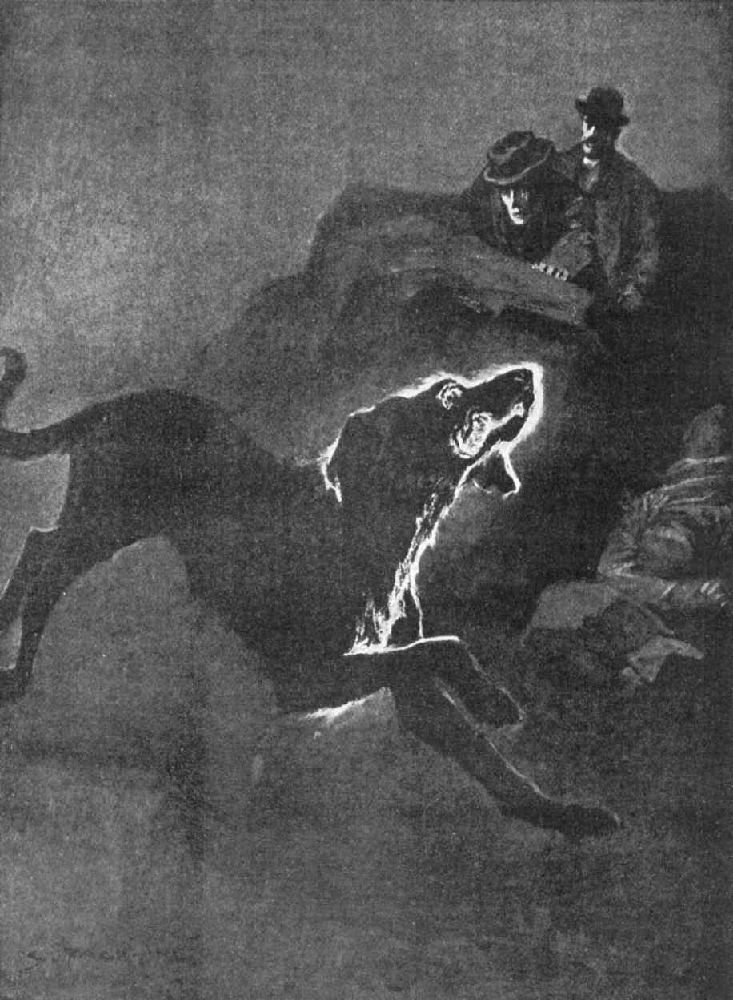

巴斯克维尔的猎犬。

听到那猎犬痛苦惨叫，我们的惊恐立时全消，即刻全身振奋。只要它怕打，它就不是什么魔怪；只要我们能把它打伤，我们也就定能把它打死。这天夜里，福尔摩斯跑得飞快。我从来没见过还有谁比他跑得更快。我是人称飞毛腿的，可是我一下子就被他甩掉，就像我一下子把矮个儿公家侦探甩掉那样。我们三人在路上飞奔上前，听到前面亨利爵士在一声接一声地呼救，也听到猎犬低沉的吼声。我眼看着这野兽蹦起来，把准男爵扑倒在地，正要向着他的咽喉咬去。在此危急的一刹那，福尔摩斯甩手将左轮枪五发子弹轮击一空，发发命中那畜生的胸腹部。恶狗发出一声痛苦凄惨的嗥叫，并向空中凶狠地猛咬一口，立刻滚倒在地，四脚朝天，垂死挣扎地乱蹬了几下，便侧身瘫下去，一动也不动了。我喘着大气，弯下身，把手枪顶着那怕人的微光闪闪的狗头，但是不必再扣响扳机，大猎犬已气绝身亡了。

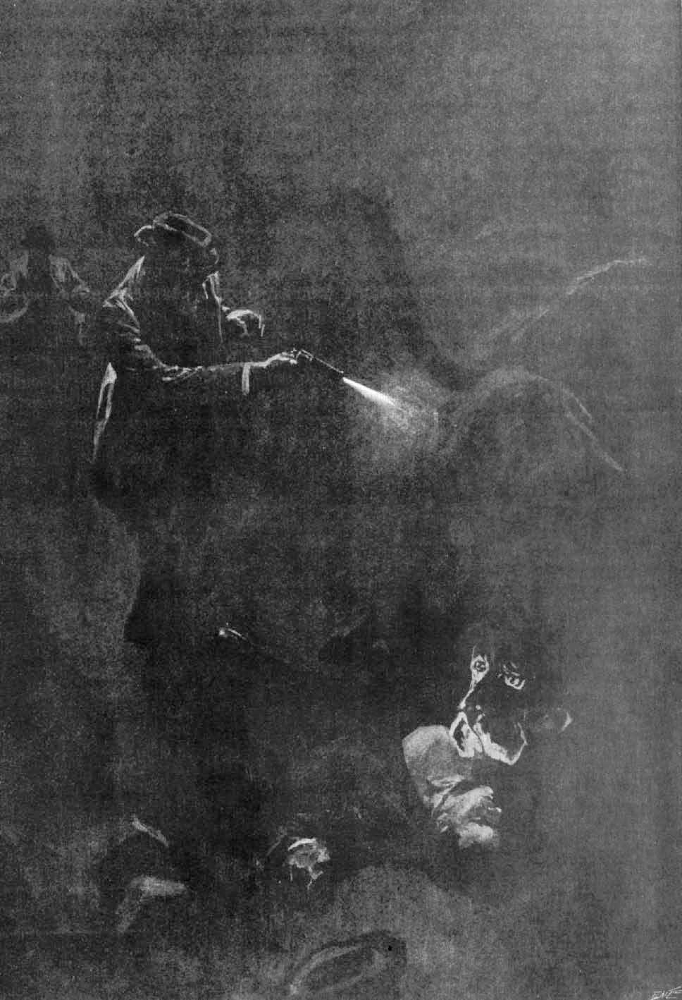

五发子弹轮击一空，发发命中那畜生。

亨利爵士躺在地上，失去了知觉。我们把他的衣领解开，看到他身上并无伤痕，说明我们营救还是及时的。福尔摩斯便低声做起了感恩祷告。我们的朋友眼皮抖了几下，有气无力地动了动身子。莱斯特雷德拿出他的白兰地酒瓶塞到准男爵的上下牙之间。他睁开两只惊恐的眼睛望着我们。

“我的上帝呀！”他轻声说，“是什么呀？究竟是什么东西？”

“死掉了，什么都不用怕了，”福尔摩斯说，“我们把危害您家的恶魔消灭了，永远、彻底消灭了。”

撑直四肢躺在我们面前的这只动物，单就身体的大小和力量来说，就已无比可怕。它不是一只纯种的侦探犬，也不是纯种的大獒，很像是两者的混合种——样子凶暴吓人，体大如一头母狮。即使是现在，死掉不动弹了，那张大的嘴好像还在向外溢出蓝莹莹的火焰，一对深陷的凶光逼射的小眼睛周围也有一圈火光。我用手摸了摸狗嘴，一抬起手来，就看见我的手指居然也在黑暗中发出光亮。

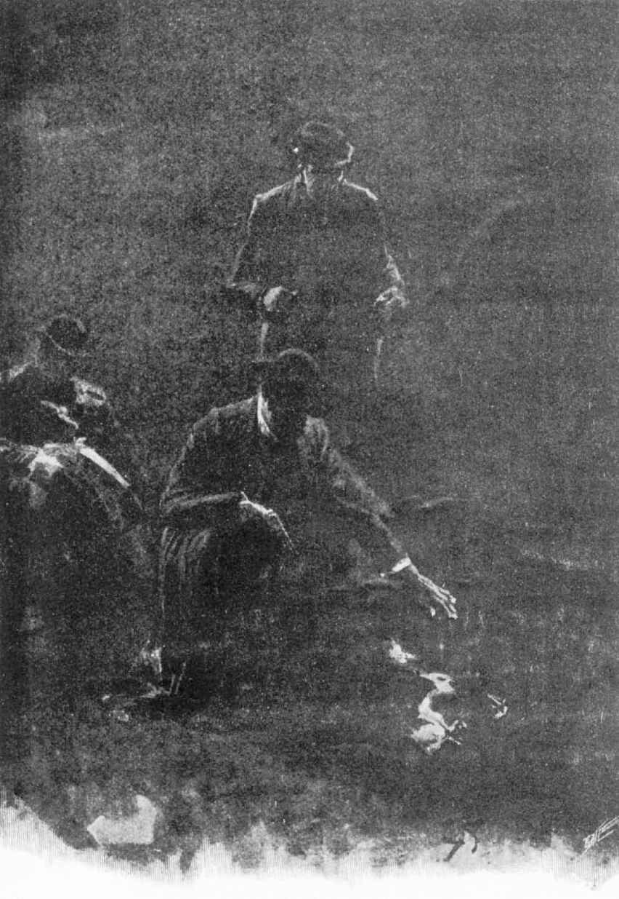

我的手指居然也在黑暗中发出光亮。

“是磷。”我说。

“真是恶魔的用心，”福尔摩斯说道，一边用鼻子朝死狗哧哧地嗅嗅，“没有什么气味能干扰它的嗅觉。我们对您该表示深深的抱歉，亨利爵士，叫您受了这一场惊吓。我本想不过是只平常的猎犬，没想到是这么一只家伙，再加大雾，我们就没能把它拦截住。”

“您救了我一命。”

“可是叫您冒了一次大险。您站得起来吗？”

“再让我喝一口白兰地，就没事了。嗯，好了。来，帮我一把。您说下边该怎么办？”

“您留这儿，您今天晚上可不能再受惊吓了。等一下，我们会有人陪您回到庄园去。”

他挣扎着晃悠悠地站住，可是脸色还是死灰，很怕人，四肢在哆嗦。我们搀他走到一块石头旁边，让他坐下。他用一双手蒙着脸，人在痉挛。

“我们还有事，先离开一下，”福尔摩斯说，“余下的事还得赶快去干，每分每秒都很要紧。案子完全清楚了，现在只剩下去抓人了。”

“人不会在屋里，百分之九十九没希望，”我们又顺着原路迅速返回，福尔摩斯继续说，“一打枪，就等于告诉他，鬼把戏戳穿了，完蛋了。”

“我们隔开很有一段距离，雾又大，枪声可能听不见。”

“他跟在后边，赶着猎犬跑出来——这点你们应当肯定。不会的，不会在屋里了。到了这时候，他还不跑？不过，屋子总得搜一搜，该确定一下。”

前门开着，我们一拥而入，赶紧一间屋一间屋地进出检查。过道里遇上蹒跚哆嗦的老男仆，惊恐地望着我们。除了餐厅，全无灯火。福尔摩斯抓起台灯照着屋子的角角落落，一处也不遗漏，丝毫不见要捉拿的人的踪影，可是楼上有一间房门上着锁。

“里面有人，”莱斯特雷德叫道，“我听见动静了。把门打开！”

里面传出低低的呻吟和瑟瑟的声响。福尔摩斯抬起脚对准门锁就是一脚，门一下子被蹬开，三人紧握手枪，冲进房内。

可是仍然扑空，不见那个负罪亡命恶棍的影子，倒是面前有个什么东西，十分奇怪又意想不到，我们不解地望着，愣了一下。

这间房搞得像个小博物馆，沿四面墙壁是一排玻璃面的盒柜，里面陈列着各种蝴蝶和飞蛾标本，摆弄这些东西，成为这个心态复杂、用心险恶的人的一种消遣。在房间正中央，有一根直立的木柱，原是竖起支撑横贯屋顶、被虫蛀的旧梁木，起加固作用的，现在这根木柱上捆着一个人。那人用被单兜头全身裹住，一时还看不出是男是女。一条毛巾绕着脖子系在后背柱上，另一条毛巾扎住脸的下半部，只露出两只黑眼睛——眼里充满了痛苦、羞辱和可怕的疑虑。我们盯住他看，他也盯住我们看。一会儿工夫，我们把封嘴毛巾、裹的东西一一解除，斯泰普尔顿太太在我们面前倒在了地上。她那美丽的脸庞向胸前低垂，我在她颈项上看见一道道清晰的鞭抽的血痕。

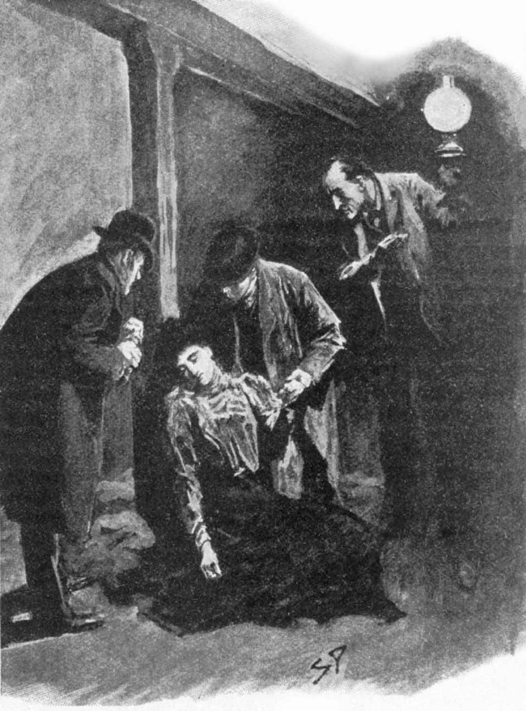

斯泰普尔顿太太倒在了地上。

“这畜生！”福尔摩斯喊道，“快，莱斯特雷德，白兰地酒！把她扶到椅子上去！她是给虐待的，撑不住，昏过去了。”

她重新睁开眼睛。

“他没事吧？”她问道，“他跑掉了吗？”

“他逃不出我们的手掌，夫人。”

“不，不，我不是指我丈夫。亨利爵士？他没事吧？”

“他没事。”

“那只狗呢？”

“打死了。”

她发出一声长长的放心而满意的叹息。

“感谢上帝！感谢上帝！喔，这个恶棍！瞧他怎么待我的！”她猛地捋起袖子，露出胳膊。我们吃了一惊，看到臂上青一块紫一块伤痕累累。“可这还不算什么——不算什么！是我的心，我的心给他伤透了，给他撕碎了。我什么都能熬过来，虐待我，冷落我，骗人骗己过日子，什么都逆来顺受，只要还有一线希望，他还能爱我。可现在，我明白了，这一次我又上当了，我给他骗了，做了他的工具。”她说着，呜呜地泣不成声。

“你已经看穿了他，夫人，”福尔摩斯说，“告诉我们，在什么地方可以抓住他；你曾经帮他作过恶，现在帮助我们，来赎你的罪过吧。”

“他只能逃到一个地方去，”她回答道，“泥潭中间有一个小岛，以前的一座旧锡矿，猎犬就是藏在那里的。他也做好准备，万一出事，就逃过去藏身。他肯定往那儿跑。”

雾幛如白绒堵在窗外。福尔摩斯端着灯走到窗前。

“瞧，”他说，“今天夜里，谁也别想找得到路，能跑得到格林本泥潭去。”

她拍起了手掌，朗声而笑，两眼和牙齿露出恨极而喜的光色，她幸灾乐祸起来。

“他能找到路进得去，可永远别想出得来，”她喊道，“今晚他怎么能找到那些路标呢，那些小木棍？以前我们，他和我，一起想的办法，在泥潭的路上都插上标记。啊呀，今天我要是都给他拔掉，那该有多好！只要这么办，他就任你们处置啦！”

很明显，大雾不消散，我们任何追逐都是徒劳的。于是我们留下莱斯特雷德，让他看守大宅，福尔摩斯和我同准男爵一起返回巴斯克维尔庄园。有关斯泰普尔顿一家的实情用不着再瞒住准男爵，当他听了他所倾心的女人原来是怎么回事以后，很勇敢地承受住了这个打击。只是夜间那场惊心动魄的冒险已使他神经受到创伤，当夜没到天亮就发起高烧来，躺在床上神志不清，胡话不断。莫蒂默医生被请来照看他。准男爵稍有好转，便决定两人一同去周游全世界，以期恢复健康如初；原先，他在未成为这份凶兆家产的主人之前，本是个身体健壮、精神愉快的人呀。

现在，我很快就要结束这篇难得一读的故事了。在叙述当中，我力图使读者共享心灵的深切恐惧以及理念的探究与推测。许多疑惧已经多日，日夜萦绕我们心头，却以这样的悲惨局面告终。猎犬死后第二天的早晨，大雾散去，我们由斯泰普尔顿太太带路到了一个地方，这是他们夫妻两人找到的一条深入沼泽地的小路。看着她带领我们追踪她丈夫的那个迫切心情和高兴的劲头，我们更理解了这个女人过的生活有多么悲惨和屈辱。到了一处小小的半岛形地块，我们让她留在那里。此地的泥炭土质还坚实，呈狭长尖烛状伸入广阔的沼泽地，没多远就到了尽头，从尽头开始，这里一根，那里一根，用小木棒插在一摊摊草丛上，标出弯弯曲曲的路线。四周尽是泛着绿沫的水洼、污浊的泥潭，陌生人不识标记便无路可走。疯长的芦苇和墨绿、黏滑、泥泞的水草散发出的腐败臭味和浓重浊气向我们迎面扑来，若走几步不小心失足，就要陷入污黑的、颤颤的泥潭里，越过膝盖，淹没到大腿。每跨出一步，泥潭面上就波动起伏达几码远。一路上看一步走一步，脚跟便给泥潭紧紧拽一步。一陷入泥潭里去，就像是底下有一只毒手要把我们拖向污泥深处，还像是一定要死命地拖住你不肯松手。一路来别无痕迹，只有一次，我们总算看见一点迹象，表明有人在我们之前走过这条险路。在一丝羊胡子草中间托起一样黑乎乎的什么东西，翘起在那里。福尔摩斯去抓那样东西，刚跨出去一脚，人立刻沉下去，埋到腰部，要不是我们拽住他往上拉，他就再也跨不到硬地上来了。他手里高高举起一只黑色高帮皮鞋。皮鞋内里印有字样“梅耶斯，多伦多”。

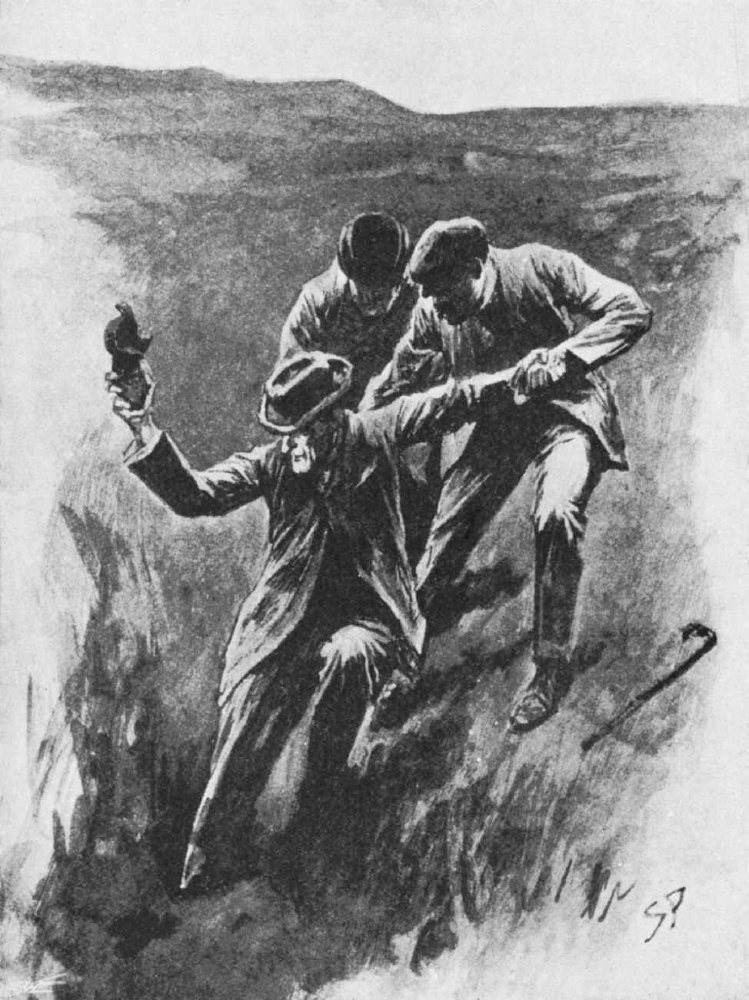

刚跨出去一脚，人立刻沉下去。

“洗个泥浴也值得呀，”他说，“就是我们的朋友亨利爵士丢失的那只皮鞋。”

“斯泰普尔顿逃跑时扔在这儿的。”

“正是。他用来给狗闻了跟踪嗅迹，用过以后还拿在手里；知道把戏完了，鞋还拿着，逃到这儿才把鞋扔掉。这么看来，他一路逃到这里都没事，至少逃到这个地方。”

除此之外，我们未能发现别的情况，作无端的想象、猜测是没有用的。在泥潭里发现不了脚印，污泥没上来很快把足迹淹没了，等我们走完最后一段泥潭小路，踏上了坚硬的土地，就赶紧看有没有脚印，但是一个印记都没有看见。如果大地是诚实无欺的，那么一定是斯泰普尔顿昨晚上冒着迷雾去隐蔽之地的小岛，只到了半途，根本就没有去成，在格林本大沼泽的深处某个地方，大泥潭的污浊泥浆把他吞没了，把这个冷酷心肠、残忍恶毒的人永远埋葬掉。

在四周都是泥潭围绕的小岛上，也就是他藏匿那只凶恶野兽的地方，我们发现了许多他遗留下的证据。岛上有一个大转轮，一个竖井，里面一半填满了垃圾，说明此处是一座废弃的矿井。旁边还有矿工住的棚屋，只剩破败的遗迹。矿工一定是包围在泥水恶臭之中，受不住臭熏都跑了。在一间小屋里，有一只钩环，一根链条，还有一堆啃剩的骨头，说明这只野兽是关在这儿的。有一具狗的骨架，上面还黏结着乱糟糟的棕黄色的毛，丢在断垣残壁中。

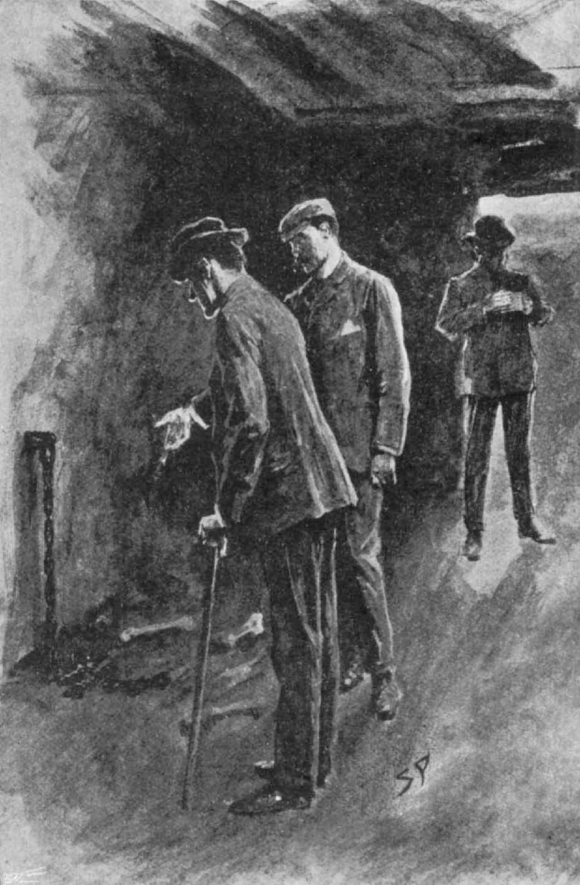

这只野兽是关在这儿的。

“是一只狗！”福尔摩斯说，“啊，一只西班牙鬈毛狗，可怜的莫蒂默再也见不着他的宠物了。嗯，我看这个地方已经没有什么秘密了，也就是这样，是个藏狗的地方。他藏得住狗，可是藏不住狗叫，总不能让狗不出声，所以才传出来了那种吼叫，白天听起来也怪吓人的。遇到要用的时候，他就把狗带到梅里皮特关进住宅外面的小屋子里。这样做难免是一种冒险。那也只有在紧要的日子来临，他呕心沥血的一切努力到了最后的时刻，便要孤注一掷赌一下。这个铁罐里盛的是糊状的东西，没错，是一种荧光混合物，用来抹在那畜生身上。这是利用世代传说的那只魔犬的故事，装神弄鬼吓唬人，存心把查尔斯爵士吓死。所以也就难怪，连那个自己是魔鬼似的逃犯，一见了这只怪物在漆黑的沼泽地中一蹦一跳，从后面向他蹿上来，也要吓得乱跑乱叫，就像我们的那位朋友那样。不过，轮到我们这些人说不定也会那样的。这确实是个阴险毒辣的计谋，不仅可以把要谋害的人害死，而且使庄稼人不敢深究这怪物到底是什么东西。很多庄稼人在沼泽地上见过这只猎犬，谁看见了还敢过问呢？我在伦敦早已说过，华生，我现在还要再说一遍，这个人真是要比我们以前去追捕的那些人危险得多。可现在，终于躺在那儿了。”——他伸出长长的胳臂，向着一大片杂色斑驳的绿污泥潭挥手指指。泥潭向远处延伸，尽头连上那赤褐色的沼泽地的斜坡。

# 第十五章　回顾

时间已到十一月底，一个阴冷、大雾的夜晚，在贝克街，福尔摩斯和我一起在客厅里红红的炉火旁面对面坐着。自从去德文郡了结那桩惨案之后，他又经手了两件很重要的案子。在第一件案子里，揭露了阿普德上校的丑行，他与闻名的“无敌俱乐部”纸牌舞弊案有牵连。在第二件案子里，推翻了不幸的蒙特邦歇太太的冤案，使她免于担负谋杀丈夫前妻的女儿卡莱小姐的罪名，这个年轻的卡莱小姐结果六个月后被发现还活着，而且在纽约结了婚。这事大家仍记忆犹新。我的朋友因为连续破了几件重大案子，所以精神振奋，情绪高昂。我于是乘兴邀他谈起巴斯克维尔谜案的详细情节。现在才有我已经期盼良久的这个机会，因为我心中清楚他不喜欢个案与个案发生重叠干扰，也清楚他不容许对当前工作逻辑清晰的思考因为耽于往事的回忆而分神。亨利爵士和莫蒂默医生正好也来到了伦敦，正准备出发作一次长途旅行，这是原先就安排好的，以便使他那深受刺激的神经得以恢复。这天下午他在们来拜访过我们，于是，就很自然谈起了这个话题。

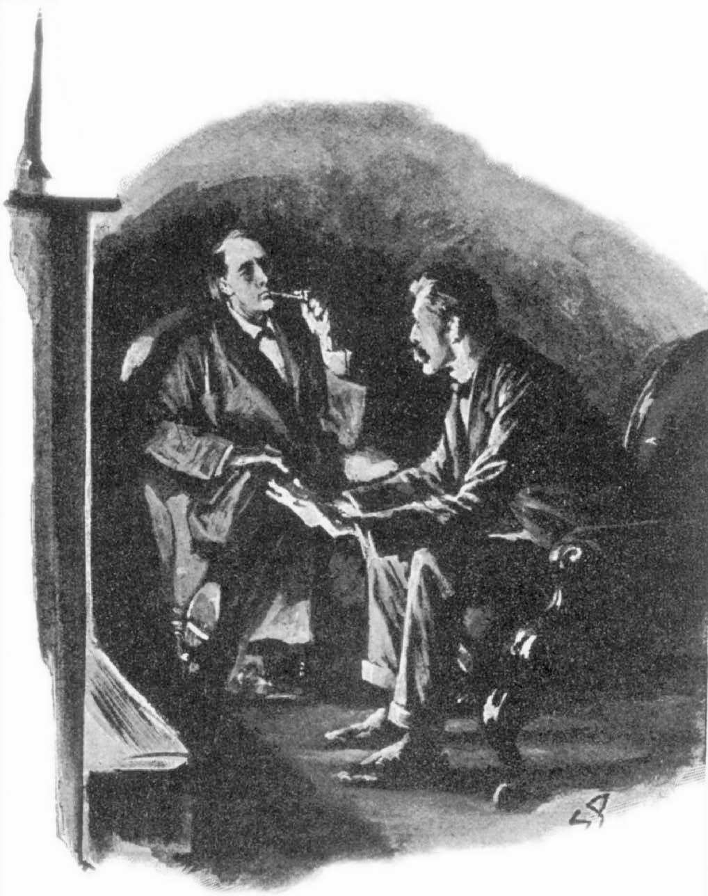

在红红的炉火旁面对面坐着。

“事情的整个过程，”福尔摩斯说，“依照自称叫斯泰普尔顿的这个人的角度来看，是一桩简单明了的事情，然而对于我们来说，一开始的时候，没有办法明确他的动机，连事实也仅只掌握一部分，整个情况就显得非常错综复杂、扑朔迷离。好在我已经同斯泰普尔顿太太谈过两次话，案情至此全部真相大白，我看是没有什么不解之谜了。我有索引的案件统计表摆在B字栏，你能找到几条有关这件事的摘记。”

“有劳你回顾一下，把全案的梗概连贯地谈一谈。”

“好的，虽然我不能保证全部事实记得一点不漏，脑力高度集中往往会把过去的事淡忘。律师对于自己手上正在处理的本题案件，和法律权威辩论起来很拿手，可是庭审过了才一两个星期，脑子里就忘得精光。所以我每一件案子总要跟上一件案子打架。卡莱小姐的事会搅乱我回忆巴斯克维尔庄园。明天说不定要出来个把小问题，又让我全神贯注起来，转移掉对这位美丽的法国女郎，还有臭名昭著的阿普德的注意。不过，关于猎犬这个案件，我很愿意尽可能说说事情的全部过程。有什么地方忘掉，你提醒我好了。

“我经过调查，家族的肖像画一点没错。这个家伙，完全可以证实是巴斯克维尔家族的人。他是罗杰·巴斯克维尔的儿子，罗杰是查尔斯爵士的兄弟。罗杰恶名昭彰，逃往南美洲，传说死在那边，没有结婚。事实上，他结了婚，婚后还生有一个孩子。就是这个家伙，他的真名同父亲的名字一样。他娶了一个哥斯达黎加美女贝丽尔·加尔西亚。后来，窃取一大笔公款潜逃，改名范德勒，逃到英格兰，在约克郡东部办了一所小学。他之所以会染指教育事业，原因是他在归途中偶尔结识了一个教师，是一个患肺病的教师，想到不妨利用一下，靠着这个教师的能力做点事站稳脚跟。这位教师姓弗雷泽。学校起初还不错，不久弗雷泽死了，学校就一下子垮了下来，越办越糟糕，名声越来越坏。范德勒就带着余款，改名叫斯泰普尔顿，心里别有打算，又因为有对昆虫的专门爱好，便来到了英格兰南部。我在大英博物馆还了解到，他在这一门学问的领域里还算是个有点名气的权威呢，而且有一种蛾，是他在约克郡的时候首先发现、做出研究的，所以命名范德勒，作为专门名称。

“我们现在谈他的这段生活，确实让人感到很大兴趣。这个人显然是经过了调查，发现只有两个人，是他获得巨大财产的障碍。他一到达德文郡，初始的计划，我相信还是模糊不明确的。但是他从一开始就让自己的妻子以妹妹的身份出现，很明显，这本身就是别有居心，存心要干坏事的做法。阴谋的各个环节到底怎么样，可能还没有确定，但是要拿她做钓饵的想法在他心中确定无疑。最后他决定要夺取财产，看准了这一目标后，便不怕用一切手段，不惜冒一切风险。他第一步行动，是把自己的家安置在靠近祖宅的地方；第二步，同查尔斯·巴斯克维尔爵士培养友谊，建立感情，同时跟邻居们搞好关系。

“准男爵亲口和他讲了家族中有关猎犬的传说，不料就此给自己铺就了一条死路。斯泰普尔顿，我就这么称呼他了，斯泰普尔顿了解到这老头儿心脏衰弱，一吓就可以把他吓死，这些都是从莫蒂默医生那儿知道的。他还听说查尔斯很迷信，真的把猎犬这个传说当一回事，胸中牵挂着这个凶象，添了心病。他坏脑筋立刻就动到这上头，不就可以用这个方法把准男爵置于死地吗！而且几乎不可能找得到元凶。

“他心中打上这个主意，便挖空心思进行犯罪的设计，安排各个细节。一般人实施这个阴谋，弄只凶恶的猎犬也就行了，他不一样，他还要加工，把动物变成了魔鬼。这就比别人多了个鬼点子，棋高一着。这狗是从伦敦福勒姆街犬商贩罗斯和曼格尔斯那里买来的，所有的狗中，他挑中的这一只最强壮，最凶猛。他带上狗由北德文郡铁路回来，再走一段好长的路，穿过沼泽地，这样就不惊动人，没有人知道。他已经在捕捉昆虫的时候深入过格林本泥潭，知道路径，所以就在那里找到一个地方把狗藏好，把狗关在狗窝里，伺机而动。

“可是找时机也不那么容易。老先生不可能在晚上给引诱出来，离开他的住宅。有好几次，斯泰普尔顿牵出狗来埋伏守候在外面，可是没有结果。这样跟踪、追寻，机会又不可得，几次一来，他，主要是他的那只狗，叫农民们目睹了。有魔犬的传说就此得到证实，传得神乎其神。他曾经动歪点子，叫自己妻子引诱查尔斯爵士上钩，可是在这件事上，出乎意料，妻子不肯听从。妻子不愿意把这位老绅士拖入情网，让他中美人计给害了。任怎么恐吓，甚至我都难以想象的殴打，都不能使她屈服。她绝不肯配合这件事，弄得斯泰普尔顿有那么一阵子毫无办法。

“正在这束手无策的时候，他找到了一个机会。查尔斯爵士同他有了友情，就信任了他，让他掌管一笔慈善捐款，资助有难的女人劳拉·莱昂斯太太。斯泰普尔顿把自己装扮成一个单身汉，甩开手脚对莱昂斯太太下工夫，并且让她明白，只要她能同自己丈夫离婚，他愿意和她结婚。正在这时，他的计划盘算突然遇到紧急情况。他得知查尔斯爵士就要离开庄园，这是应莫蒂默医生的劝告，他自己表面装得与医生的意见也不谋而合。可是他心里想必须立刻采取行动，不然他的目标一走远，就鞭长莫及了。他于是动脑筋叫莱昂斯太太写了那封信，恳求老人无论如何在动身去伦敦之前的这天晚上同她见一次面。接着，他又用听来似乎理由十足的一套话说服她不去赴约，这样一来，他等待已久的好机会终于有了。

“他从库姆·特雷西坐车赶回家，及时把狗牵出来，涂涂抹抹，装扮成一只魔怪，然后带到栅门那边，他心中有数，老绅士就是等在这个地方。狗受了主人唆使，跳过栅门扑向老人。可怜准男爵被狗追着，在紫杉小路上奔逃喊叫。暗暗的小巷道上，看见这么一只又大又黑的怪物，张开大嘴喷着火焰，双眼冒着火光，朝自己追扑过来，确实非常可怕。他心脏有病，一受惊吓，就给吓死，倒在小路的尽头上。准男爵是在小路上奔逃，猎犬是在路边草地上追赶，这样，只有人的脚印可以看得出，狗的脚印当然看不见，畜生看人躺倒在地不动，可能过去闻了一下，闻出是没了气的死人，就掉头回转。正是在这个时候留下了脚印，莫蒂默医生发现的也就是这些狗爪印。猎犬接着给叫走，赶快关回到格林本泥潭地的窝里去。这样就成了一件神秘的事，当局感到莫名其妙，乡下人大为恐慌。最后案子到了我们这里，接手下来。

“查尔斯·巴斯克维尔的惨死，就说这些了。可以看出，斯泰普尔顿他做得有多么阴险毒辣。确实，几乎没有办法找到真凶，提出起诉。他唯一的同谋凶犯，永远不会泄漏天机。行凶手段之巧妙，难以想象，使他得手顺利，不露痕迹。案子中牵涉的两个女人，斯泰普尔顿太太、劳拉·莱昂斯太太，对斯泰普尔顿都深深感到怀疑。斯泰普尔顿太太知道他的意图是要害老人，也知道养着一只猎犬。莱昂斯太太不知道这些事，但是她不得不担着块心病，人死的时间同她未赴约的约会时间完全一致，而这个约会的事又只有斯泰普尔顿知道。可是，两个女人都捏在他的手里，他对她们根本无所畏惧。这样，他的阴谋前一半大功告成，但是剩下的一半却要困难得多。

“斯泰普尔顿并不知道还有个财产继承人在加拿大，这是可能的。可是让他很快从朋友莫蒂默医生那里得到这个消息，还告诉他这个叫亨利·巴斯克维尔的人将要到达的种种情况。斯泰普尔顿的第一个念头就是设法把这个从加拿大来的陌生年轻人在伦敦就做掉，根本不让他到德文郡来。他对自己妻子已经信不过了，因为妻子拒绝帮他一起设陷阱害老头儿，也不敢让她离开身边太久，生怕会管不住她。出于这样的原因，他带妻子一同来伦敦。他们下榻在梅克斯博罗私家旅社；那旅社给我找到了，在克赖文街。这种地方，我常派人去搜集证据。在旅社，他把妻子关在房间里，像关监牢似的。自己乔装改扮，戴上胡须，跟踪莫蒂默医生来贝克街，然后跟着去火车站，再跟到诺森伯兰旅馆。他妻子对丈夫的阴谋多少知道一些，但是对他怕得厉害——怕继续受虐待，不敢写信警告她明知要遭遇危险的那个人。万一信落到丈夫手里，自己性命肯定不保。最后，我们也都知道她想出了一个聪明的办法，用报纸剪字来贴成一封信，信封上用假的笔迹写地址。信到了准男爵手里，对他发出了第一次危险警告。

“有一件关键性的事，斯泰普尔顿必须做一做，就是要弄件亨利爵士身上的衣物，以后万一需要用上狗的时候，这件东西让狗嗅一嗅就能追上去。他想到就干，出手快，胆子大。我们对皮鞋的事就清楚了，旅馆整理房间的女服务员肯定是被塞足了钱照他的吩咐去做的。谁知事有不巧，第一次替他偷来的鞋是新鞋，穿都没穿过，当然没有用处。他就叫送回去，重新再搞一只——这件小事有最大的启发性，能看出问题，我心中马上有了谱，证实了我们要对付的是一只真正的猎犬。因为不可能有别种假设可以解释为什么要急于弄到一只旧鞋，而新鞋搞到手了却还不要。一件不起眼的小事，越奇怪，越不合常情，却是越值得用心细加斟酌的。再有，一件案子，看来显得最难最复杂的一点，只要加以充分的关注、考虑，做科学的分析处理，往往也就是最能说明问题之处。

“接下来，第二天早晨，我们的朋友来访，斯泰普尔顿坐着马车一直跟踪他们。他能知道我们的房子，我的面貌，再加上他总的行为，我倾向于一个结论，斯泰普尔顿此人的罪行劣迹，绝不仅仅限于巴斯克维尔一桩案子。联想到过去三年里，西部曾经发生四起大盗窃案，可是没有一件捉到过罪犯。最后一件是五月间，发生在福尔克斯通。这件案子很轰动，一个蒙面贼夜窃，给一名听差撞上揪住了，贼便开枪把他打死。我不得不怀疑，斯泰普尔顿就是用这方法来接济他日益枯竭的财源；这些年来他一直是个危险的亡命之徒。

“那天早晨，我们领略了他的机智、灵活，他轻易就把我们甩掉。而且有胆量有魄力，敢于用我的名字通过马车夫的嘴来回敬我。从这时开始，他知道在伦敦，我已经接手办这件案子，因此，他知道在伦敦已没有下手的机会。他回到达特穆尔高原，等准男爵去了再说。”

“等一下！”我说道，“你说的一件件事实经过，听着连贯都没错，可是有一点你漏掉没解释清楚。狗主人来了伦敦，那条狗怎么办呢？”

“这件事我是注意了的，当然也是很重要的事。毫无疑问，斯泰普尔顿有一个心腹，尽管他不至于把计划和盘托给这个人，免得反而受他摆布变得被动。在梅里皮特大宅有个老男仆，名叫安东尼，他和斯泰普尔顿的关系已有多年。早在他当小学校长的时候就是在一起的，所以他完全知道男主人、女主人其实是一对夫妻。这个人已经不在乡下，出逃不见了。我不禁想起安东尼这姓在英国不大有，而在所有讲西班牙语的国家，包括美洲讲西班牙语的国家，是个常见的姓，他们是叫安东尼奥。这个人说话同斯泰普尔顿太太一样，英语很好，只是有点大舌头，听起来有点异样。我曾经亲眼看见这个老头儿穿过格林本泥潭，他认识斯泰普尔顿标出的小路。这么看来，主人不在的时候，他照料这只狗，就是自然而然的事了。虽然也许他并不一定知道养着这只猎犬是什么用意。

“斯泰普尔顿夫妇当时一回到德文郡，亨利爵士和你也随后赶到。这里需要交代一下我个人这段时间在做什么。你们应当还能回忆得起，那天我仔细研究那张印刷字贴成的信纸，想看看纸面上的水印。我把纸凑得很近，离开眼睛就不过一两英寸，马上闻到一股微微的香气，闻得出是一种茉莉花香。香水一共有七十五种，作为一个刑事专家，应当能够辨别每一种香水味。在我经手处理的案子里，靠辨别香水味而一举破了案的，不止一起。一闻到香味，就提醒我这里面有一位女士，我的目光已经开始转移到了姓斯泰普尔顿的这一对男女。就这样，在我没有去西部乡下之前，我已确知有猎犬，猜中了这个罪犯。

“我的狩猎目标定在斯泰普尔顿身上。然而，我要是和你在一起，这事肯定是不成的，因为他警惕性已经很高，弦绷得极紧。所以我只好瞒了大家，连你也瞒在内，人家还当我依旧在伦敦的时候，其实我已经秘密地下来了。我吃的苦不算多，没有你想的那样严重，这种生活小事绝不会扰乱我对案子的侦查。我大部分时间在库姆·特雷西，只有必须亲临作案现场的时候，才去那边的小屋。卡特赖特随我一起下来，他乔装打扮成乡下孩子，对我帮助极大，吃的食物、换的干净衣服，都靠他送给我。我这边在监视斯泰普尔顿，那边卡特赖特也在不住地盯你的梢呢，这样我才能一只手牵住几头线索。

“我已跟你说过，你的报告能很快送到我手里，一到贝克街马上转到了库姆·特雷西。这些报告对我大有用处，尤其是斯泰普尔顿自报经历的那一篇，正巧他说的有点实话，使我能够确认这一对男女是什么身份，最终使我步步不落空。可是案子给横里杀出来一件事干扰了，变得更加复杂起来，就是出了个逃犯，这逃犯又同巴里莫夫妇有关系。这件事给你澄清了，做得非常出色，正好我这边根据自己的观察也获得了同样的结论。

“等你在沼泽地上发现我的时候，事情的全貌我已经完全掌握，但是还没有一件证据可以提供给陪审团。甚至那天晚上斯泰普尔顿图谋害死亨利爵士，结果那个逃犯倒霉替死，连这个也无助于我们证明他犯有杀人罪。看来，除了在出手作案当场捉住，别无他法。要这么做，只好安排亨利爵士自己出马做诱饵，务必单独一个人，还要表面上完全无人保护。我们如此做了，付出的代价是让我们的当事人受到严重的惊吓，换来的是我们完满地了结了本案，凶手斯泰普尔顿自取灭亡。亨利爵士给推出去暴露在危险之中，这个，我必须承认，是我在处理本案中的一大缺憾。但是，我们无法预见到这只畜生的样子会如此恐怖，足以把人吓瘫掉，也预料不到会有大雾，使这只畜生一下子从浓雾中窜出的时候，我们都猝不及防。我们达到了目的，取得了成功，所付出的代价，据专家和莫蒂默医生确证只不过是暂时的。作一次长途旅行可以使我们的朋友康复，不单单是神经上的刺激，还包括精神上的创伤，都将完全消除。他对那位女士的爱是深沉的、真挚的，对他来说，这件不幸的伤心事，最伤心处莫过于竟然也上了她的大当。

“现在，剩下还要说说她在整个事件中扮演了什么角色。她，毫无疑问是受斯泰普尔顿控制的，不管出于爱还是出于怕，也许两者兼而有之。因为爱与怕这两种心情并非不能相容。这种控制力是绝对有效的，这么说一点也不过分。她对男人是言听计从，叫她在人前装妹妹，就装妹妹。只有在男人千方百计要她参与谋杀的时候，才发现他对她的控制是有限的。她会随时向亨利爵士提出危险警告，同时又不愿意危害到自己的丈夫，她曾再三想方设法这样做。斯泰普尔顿自己还不免要吃醋。他看到准男爵追求起自己妻子来了，尽管这本来就是他设下的美人计，临场也按捺不住要醋劲大发，大光其火，不惜暴露出他的火爆本性。这个本性原先一直强行抑制，掩饰得纹丝不露。他用主动亲善笼络感情的办法，使亨利爵士经常上梅里皮特住宅来，他盼望这样迟早有一天会有机会得手。可是，关键的、紧要的一天来了，他夫人突然不听他的话。妻子已经知道一点逃犯死去的原因，这天她又知道猎犬关在了宅子外面的小屋里，晚上亨利爵士要来吃晚饭。她居然责备起丈夫来了，不许他干这种罪恶勾当，结果招来丈夫一阵狂怒，丈夫第一次当面向她说不要她了，他已经另有所爱了，她平时的柔顺可爱一下子变成强烈的怨恨。他看出她要出卖他，就把她捆起来，不让她有机会见到亨利爵士透露半点秘密。他想当然地希望，等到全乡的人都相信准男爵的死因归之于家庭的厄运降祸——他们肯定是会这样相信的，到时他就可以赢得妻子的回心转意，接受既成事实，对所知情况保持沉默。这一点，依我看，他无论如何是失算了。就算我们没参与这桩案子，他这一点也注定要保不住，肯定还是照样要坏事。一个西班牙血统的女人，对这种侮辱绝对不肯轻饶，不会把他放过。啊，现在，亲爱的华生，不去参考我的摘记，再要怎么样详细给你叙述这件出奇的奇案，恐怕很困难。我不清楚有什么重要情节落下，没有说明白。”

“他用魔狗可以吓死亨利爵士的老伯父，但要把亨利爵士也这么吓死就难以办得到吧？”

“这只畜生凶恶非同一般，而且只被喂半饱。受害人即使不给狗的鬼样吓死，至少也会吓怕，吓瘫掉，无法抵抗而被咬死。”

“这倒是。还剩有一个难题我不能解释，如果斯泰普尔顿侥幸得逞，要夺取继承权，他用什么来讲清这个事实：他既然是继承人，何必住在祖产近旁却要隐姓埋名呢？他要争继承权，能不引起怀疑，对他进行调查吗？”

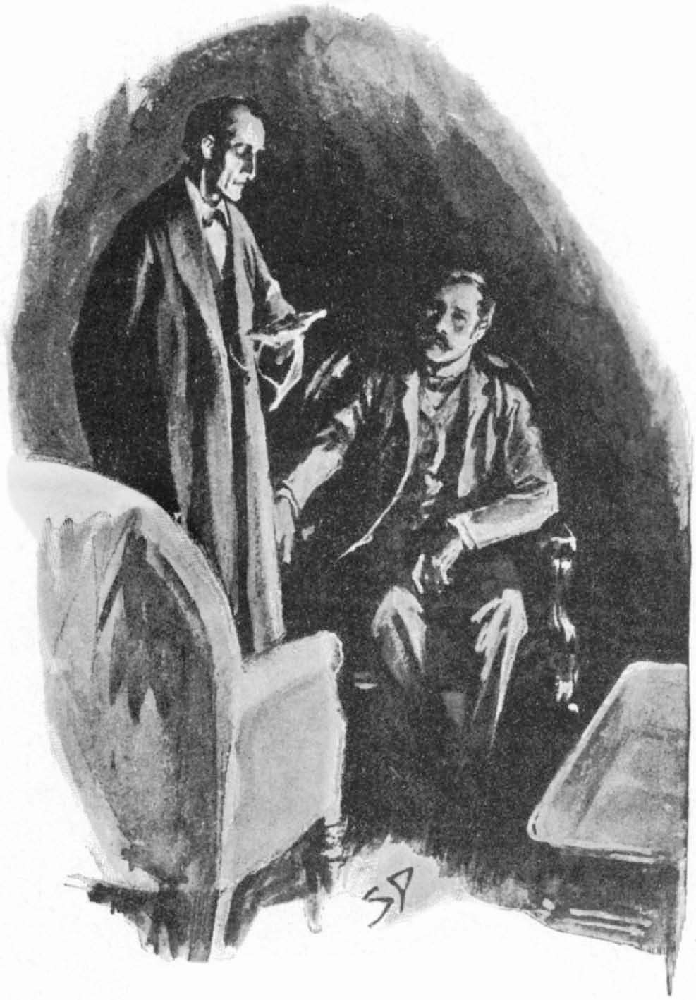

“还剩有一个难题我不能解释。”

“这真是一个很大的难题，指望我来解答这个难题，我怕是无法胜任，你对我的期望过高了一点。过去和现在的事都在我的调查之中，但是一个人将来会怎么做，回答起来就有困难。斯泰普尔顿夫人听她丈夫说起过几回，下一步想怎么怎么。有三条路可走：他可以从南美洲提出财产继承要求，在当地的英国政府机构证明其身份，这样无需再回到英国来就能获得这笔财产；或者短时间去伦敦将自己精心伪装一番；要么，还有，找一个同谋，提供证明文件，证明他是继承人，而对他收入的一部分保留所有权。我们不必担心，根据我们的了解，这个人有的是办法来解决这个难题。现在，我亲爱的华生，几个星期来，我们的工作一直紧张、严肃，很辛苦。我想，腾出一个晚上，我们来调剂一下，让脑子轻松轻松。我在休格诺剧院订了个包厢，你听过德·雷什凯两兄弟的<a href="#part0093.xhtml_ch1"
id="part0093.xhtml_ch1-back">(1)</a>歌剧吗？有半个小时，请准备吧；半途还可以去玛齐尼饭店吃顿饭呢。”

————————————————————

<a href="#part0093.xhtml_ch1-back" id="part0093.xhtml_ch1">(1)</a> 德·雷什凯两兄弟：波兰著名的两兄弟歌唱家，兄Jean
de Reszke（1850—1925），为男高音；弟Edouard de
Reszke（1855—1917），为男低音。

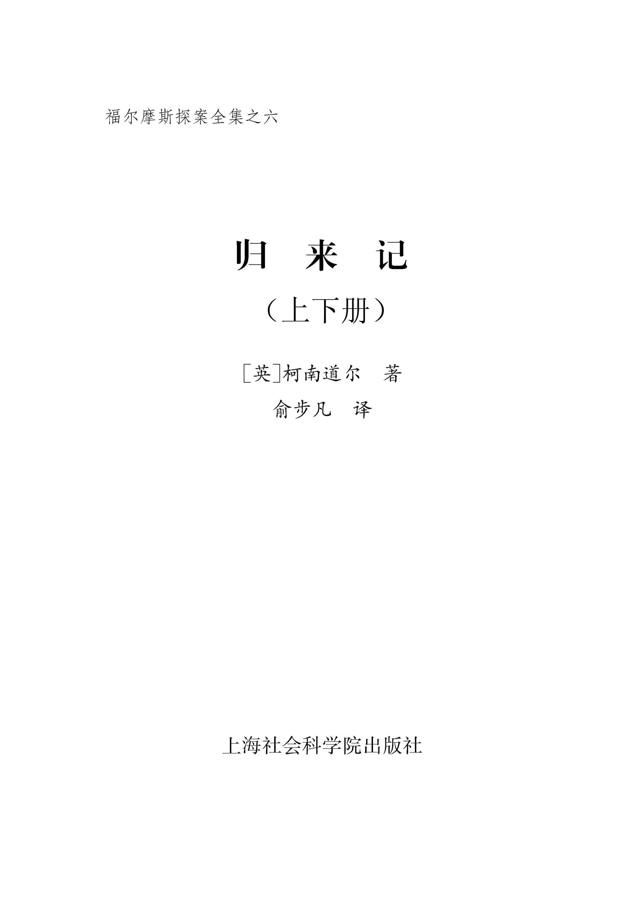

**图书在版编目（CIP）数据**

归来记（上下册）／［英］柯南道尔（Conan
Doyle，A．）著；俞步凡译．—上海：上海社会科学院出版社，2012

（福尔摩斯探案全集；6）

ISBN 978-7-5520-0107-5

Ⅰ．①归…　Ⅱ．①柯…　②俞…　Ⅲ．①侦探小说—小说集—英国—现代　Ⅳ．①I561.45

中国版本图书馆CIP数据核字（2012）第159597号

福尔摩斯探案全集之六

**归来记（上下册）**

------------------------------------------------------------------------

**著　　者：**［英］柯南道尔

**译　　者：**俞步凡

**责任编辑：**陈如江

**封面设计：**王小阳工作室

**出版发行：**上海社会科学院出版社

上海淮海中路622弄7号　电话63875741　邮编200020

http://www.sassp.org.cn　E-mail：sassp@sass.org.cn

**经　　销：**新华书店

**照　　排：**南京理工出版信息技术有限公司

**印　　刷：**上海中华印刷有限公司

**开　　本：**787×1092毫米　1/32开

**印　　张：**16

**插　　页：**4

**字　　数：**280千字

**版　　次：**2012年10月第1版　2012年10月第1次印刷

------------------------------------------------------------------------

ISBN 978-7-5520-0107-5/I·064

定价：43.00元（上下册）

------------------------------------------------------------------------

**版权所有　翻印必究**

# 目录

[归来记（上）](#part0098.xhtml)

[归来记（下）](#part0107.xhtml)

[返回总目录](#part0000.xhtml)

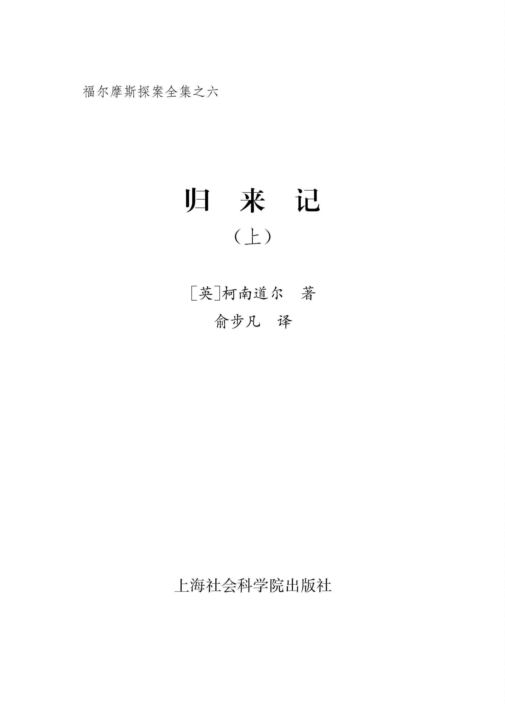

# 目录

# （上册）

[空屋伏击](#part0100.xhtml)

[诺伍德的建筑师](#part0101.xhtml)

[跳舞的人](#part0102.xhtml)

[孤身骑车人](#part0103.xhtml)

[修道院公学](#part0104.xhtml)

[黑彼得](#part0105.xhtml)

[米尔沃顿迷案](#part0106.xhtml)

[返回目录](#part0097.xhtml_ck001)

# 空屋伏击

一八九四年春季，尊贵的罗纳德·阿德尔莫名其妙突遭谋杀，引起全伦敦的关注，上流社会尤其为之惊恐不安。公众虽然从警方的调查中对案情多少有所了解，但详细情况秘而不宣，因为案子的起诉条件已经完全充足，也就没有必要将事实全部公布。只是到了现在，将近十年以后的今天，才允许我补足全案缺损的环节，此案便更值得令人注目。案子本身确实饶有趣味，但是这点趣味对我而言，与另一桩以后发生的完全意想不到的事相比，就简直微不足道。那件事才确实使我感到巨大震惊，是我此生所经受的最为奇异的历险。即使到了今天，时隔如此之久，只要一想起来先是不寒而栗，回头又感觉是一股兴奋而惊疑的心潮涌动胸中。读者公众每看到我所写某位人士杰出非凡的头脑和行动，便颇有兴致，但是之所以我再也未能把我所知与大家分享，我要向诸君说明，要不是该人士亲口明令禁止，那原本是我极愿意履行的首要义务；这项禁令他直到上月三日才告解除。

我同歇洛克·福尔摩斯的亲密友谊，致使我对刑案侦破产生浓厚兴趣，这是可以想见的事。在他失踪以后，我的这种兴趣也并未终止，对公诸报端的各种刑事案件，件件不忘悉心研读。我还甚至多次尝试，运用福尔摩斯的方法加以推理解释，私下里颇自鸣得意，尽管成功不多。但是还没有哪个案件像罗纳德·阿德尔惨案那样吸引我。我读到此案审讯中的举证，便立即认定是蓄意谋杀，但凶手是一人或是几人都还不得而知，我就比过去更清楚地认识到福尔摩斯去世给社会带来的损失。这件奇案我可以确定，有几处问题福尔摩斯会加以注意。他作为欧洲第一刑侦专家，以他训练有素的观察力和特别敏锐的警觉性，警方倘能有他的辅助，定能得到他先期的指点。我整天巡回出诊，同时把这案子翻来覆去地想，但找不出一个令我自己尚能满意的解释。虽然公众对审讯结论已耳熟能详，但我还得在此不厌其烦地把事实重述一遍。

尊贵的罗纳德·阿德尔是梅努思伯爵的次子，其时伯爵为澳大利亚殖民地的一位总督。阿德尔的母亲从澳大利亚回来做白内障手术，同儿子罗纳德、女儿希尔达一起住在公园路四二七号。这个年轻人出入上流社会——人尽所知，他向无仇人，也无任何不良行为。他和卡斯特尔斯的伊迪丝·伍德利小姐订过婚，但几个月前双方同意解除婚约，此后并没有留下感情创伤。说到其他方面，此人生活圈子很窄，生活方式很传统。他性格冷漠，好清静。可就是这么一个与世无争的青年贵族，大祸突然降临到他头上，死得非常离奇，非常出人意料，时间是一八九四年三月三十日夜里十点到十一点二十分之间。

罗纳德·阿德尔喜欢打牌——经常打，但是下注不大，从不豪赌。三个牌戏俱乐部鲍尔温、卡文狄希和巴格特尔，他都是会员。情况是，他遇害的那天，吃过晚饭在卡文狄希俱乐部打了一局惠斯特；这天下午他也在那儿打牌。和他一起打牌的几个人——莫瑞先生、约翰·哈代爵士和莫兰上校——都作证打的是惠斯特，各人的牌好坏都差不多，阿德尔大概输掉五英镑，就没再输了。他手气很好，输这么一点根本不算什么。他几乎每天不是在这个俱乐部就是在那个俱乐部打牌，但是打得很小心谨慎，一般总是以赢家收牌。证词表明，几星期以前，和莫兰上校一起搭档，他一口气竟赢了戈弗雷·米尔纳和巴尔莫洛勋爵四百二十英镑之巨。他最近的情况，调查下来就这么一些。

案发当天晚上，他从俱乐部回来是十点整。母亲和妹妹晚上外出串门去了。女仆陈述听见他走进二楼的前厅，这里一向就是他的起居室。女仆已经生好了火，因为有烟，她把窗子打开一扇。一直没听见这屋里有什么响声，直到十一点二十分，这时间梅努思夫人和她女儿回家了。她要进儿子房里去道个晚安，可是房门从里面反锁着。她们喊门、敲门，都不见回应，于是叫来人，把门撞开，才发现不幸的年轻人倒在了桌旁，脑袋叫左轮枪子弹打开了花，可怕得很。房间里没有任何武器，桌上有两张十英镑的钞票，还有银币、金币十七英镑十先令，按钱数分别码成小堆。还有一张纸，上面是一行行俱乐部朋友的名字对着数字，看得出，临死前他是在清算打牌的输赢账。

把现场仔细一检查，反而使案情变得更加复杂。首先，年轻人把房门从里面闩死，这是什么道理？要么，门是凶手闩的，作案以后跳窗逃走。可是，跳窗高度至少有二十英尺，下面是一个藏红花坛，花儿正开得旺盛。花也好，地也好，都没有踩踏过的痕迹，房屋外面隔开公路的那窄条草坪上，也没见脚印。所以，显然是年轻人自己把门闩上的。那么，他是怎么死的呢？攀爬窗子却不留痕迹，没人有这么大的本事。假定是从窗外开枪，一支左轮枪能打得那么准，这个人的枪法真是了不得。另外，公园路是一条大道，人来车往川流不息，离这住宅不到一百码就是个马车站，却没有人说听见枪声。然而，人就这样死着，是左轮枪子弹打的，是软头子弹，弹头开花，击中要害立即毙命。这就是花园路奇案的情况，由于一点也摸不着作案动机，案子就更显复杂。正如我已经说过的，年轻人阿德尔，并无冤家仇人，屋子里钱财也没动分毫。

我脑海里整天翻来覆去琢磨案情，希望自成理论，把案子的来龙去脉说它个头头是道，要找出窍门，就如我的亡友所强调，侦查工作每现突破口，务必抓牢。然而我得承认，始终无甚进展。傍晚，我漫步穿过公园，六点钟光景走到了公园路的牛津街口，一伙闲人聚在人行道上，仰头对着一处窗户看，我顺着方向望去，正是我要观察的那所房子。有个瘦瘦高高的人，戴副墨镜，我猜他准是个便衣警探，正在高谈阔论推测这个案子，旁边人都围着他听得起劲。我挤上前凑近他一听，简直荒唐。我听着无聊，便往后退，不小心碰了身后一个残疾老头，他捧的几本书给碰了掉在地下，我赶紧给他捡起来，记得有一本书的书名是《树木崇拜的起源》，我马上想这老头一定是个穷藏书家，收藏些珍稀书籍，或是买卖，或是玩赏。我向他连声道歉，说没注意不小心。很显然，我卤莽碰掉的这些书，在他主人眼里是极为珍贵之物，老头轻蔑地哼了一声，转身就走，我望着他弯腰曲背、飘着连鬓白须消失在人群中。

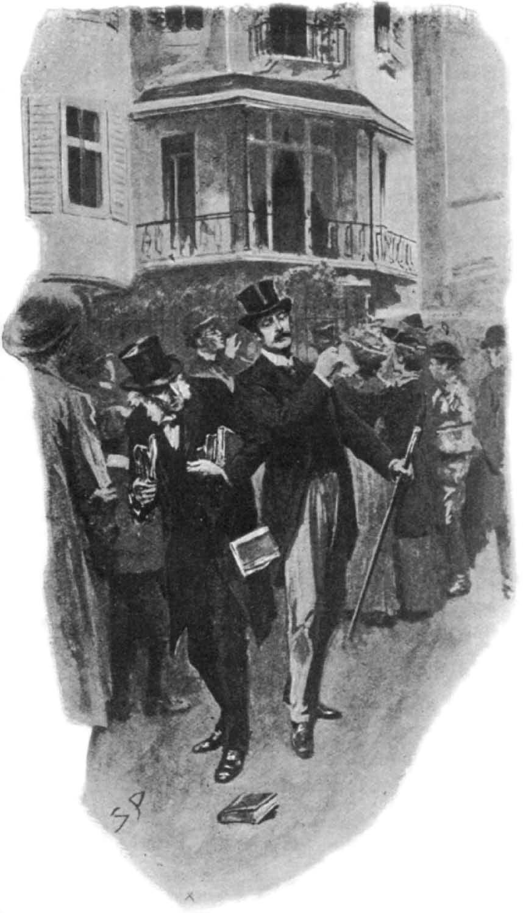

他捧的几本书给碰了掉在地上。

多次观察公园路四七二号，对弄清我感兴趣的这桩疑案没有什么帮助。住宅和大街由半截是栅栏的矮墙隔开，栅栏墙高不过五英尺，谁都很容易翻墙进花园。可是窗户就高不可攀，没有水管之类的东西可以借助爬墙，再有本事也攀不上去。我对此更觉迷惑不解，只好折回肯辛顿。进书房还没五分钟，女仆来说有人要见我。叫我大为吃惊的是来者非旁人，就是那个古怪的旧书收藏家。白发蓬松中一张瘦削干枯的脸，正望着我，那些宝贝珍爱书，不下十来本，夹在右臂下。

“你没想到是我吧，先生。”他说，嗓音怪而嘶哑。

我承认没有想到会是他。

“哦，真过意不去，先生，我刚才一瘸一拐跟在你后面，真巧，看见你走进了这幢房子，我心里就想，要进屋见见这位好心的先生，打个招呼，刚才我态度不好，可没有一点恶意，你还帮我捡起了书，实在是不好意思。”

“这么点小事，何必认真，”我说，“那么说你熟悉我住的这儿？”

“哦，先生，不揣冒昧，我还是你的邻居呢，你知道教堂街这拐角上，那个小书店，就是我的。所以认识你很高兴，当然是啰。大概你也爱藏个书什么的，这儿有《英国鸟类》、《卡图卢斯》<a href="#part0100.xhtml_ch1"
id="part0100.xhtml_ch1-back">(1)</a>和《圣战》——挺便宜的，本本都便宜。再来五本书，你书橱第二格就可以放满了。现在你自己看，不那么整齐，你说是吗，先生？”

我转过头去看看身后的书橱，当我回过头来，书桌对面站着的竟是歇洛克·福尔摩斯，在对我微笑。我倏地跳起，完全惊呆，盯住他有几秒钟。接着，我准是晕了过去，这是平生第一次也是最后一次。确实有一片白雾蒙住我的眼睛在打转，等白雾消散，我才发现我的领口解开着，嘴唇上有着白兰地辛辣的余味。福尔摩斯向我的椅子俯着身，手里拿着他的扁酒瓶。

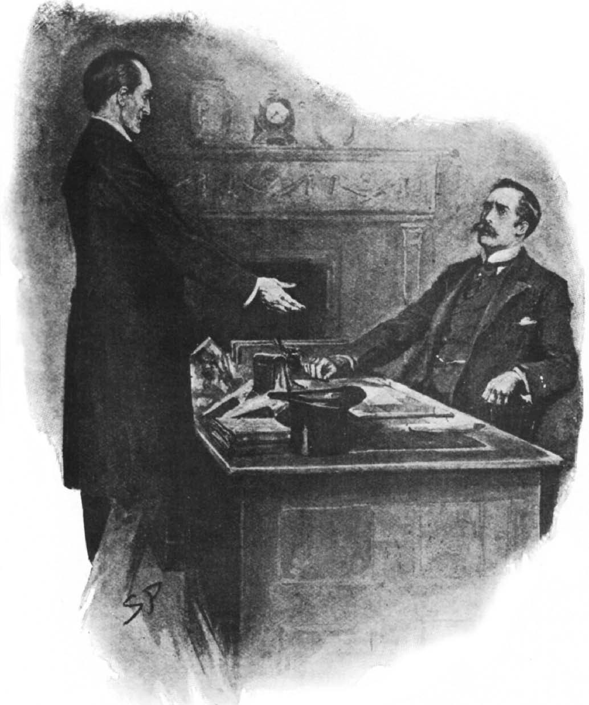

书桌对面站着的竟是福尔摩斯。

“我亲爱的华生，”他这说的话是多么熟悉的声音啊，“真是万分抱歉，我万万没有想到会让你吃惊得这个样子。”

我紧紧抓住他的胳膊。

“福尔摩斯！”我叫道，“真的是你？你还活着，真的吗？那个死峡谷，怎么让你爬出来的？”

“别急，”他说，“你能讲话没事了吗？看我无事生非，来了还演什么戏，把你惊吓成这样。”

“没事，我好了。可是，真的，福尔摩斯，我简直不相信自己的眼睛。老天哪！想不到啊，是你——实实在在是你，不是别人——站在我书房里了。”我又紧紧抓住他的衣袖，摸着那里面精瘦而有力的胳膊。“哦，你不是鬼，真的不是，”我说，“我亲爱的老伙计，看到你，我真高兴死了。坐，坐下，跟我说，是怎么给你逃出死峡谷，活了命的。”

他在我对面坐下，老模样，从容不迫，点上一支烟。他穿着破旧的礼服大衣，就剩这点书商的样子，其余，那白发和旧书都堆在了桌上。福尔摩斯看上去比过去更精瘦了，机警如鹰似的面容显得苍白，这就告诉我，他近来的生活并不正常。

“能直起腰了，真舒服，华生，”他说，“一个高个子装得矮掉一英尺，一连撑上几个小时，可不是好受的。现在，我亲爱的伙计，解释的事情嘛，我们眼下有一件艰巨危险的工作，夜里要干，我想请你合作呢，等这个工作完了以后，再把情况一五一十说给你听，这比较好吧。”

“我满肚子疑问好奇，真想先听为快。”

“今儿晚上和我一起去吗？”

“随时随地听你差遣。”

“很好，一如从前。出发之前还有时间吃一顿晚饭。好，那么，讲讲峡谷的故事。我从峡谷出来，没费劲儿，道理很简单，我根本就没有掉进去。”

“你没有掉进去？”

“没有，华生，我根本没有掉进去。我给你的字条，完全是真的，是真话。我一看见莫里亚蒂教授站在小道上拦住了去路，他那个凶神恶煞的样子，我也横下心，自己的命就到此为止吧。从他一双灰眼睛中，我看出他是铁了心了。我同他讲了点条件，他最后放一马宽限点时间，让我写上一张条子，就是你后来拿到的。把条子、香烟盒还有手杖都留下放好，我就走上小道，莫里亚蒂仍旧盯住我。我走到了绝境，站住了。他没有掏武器，突然冲过来把我拦腰抱住，他清楚，他一切都已完蛋，惟有报仇，找我拼了。我们两个在瀑布旁扭作一团，还好我懂日本摔跤术，我这一手以前用过好几回，很管用。我从他两臂中脱出来，他恐惧得狂吼狂叫，没命地踢了一阵子，两手在空中乱抓。可是他用尽力气也是白搭，脚一个腾空，人栽了下去。我探头向下看，看见他一个劲直往下掉，啪一下砸在一块大岩石上，身子又给弹出去，轰隆嗵掉进水里。”我听福尔摩斯讲述，听得直发傻。他一边说一边噗噗喷着烟。

“可是脚印不对啊！”我不禁说道，“我明明看见，不会看错，两个人是朝前走的脚印，没有往回走的脚印。”

“那是这样的，教授坠崖身亡，一刹那间我想到，千钧一发，命运之神挽救了我，而莫里亚蒂，我知道绝不止他一个人发誓要我的命，至少还有三个人，他们头儿一死，更对我恨之入骨，要向我复仇。当然都是不要命的人，不是这个就是那个总能搞掉我。再一想，要是全世界都说我死掉了，他们就必定肆无忌惮，这号人，他们准要马上露面，那我就迟早能把他们除掉。到了那个时候，我再出来宣告我仍旧活在人世也不迟。脑子运转可真是快，莫里亚蒂教授还没有在莱辛巴赫瀑布沉底，我已经把这一切做法全想妥了。

“我站起来，看看身后的悬崖。在你那篇我后来读得津津有味的生动描述中，你断言那是绝壁。其实不对。岩壁上有一些小小的踏脚点，还看得见有几处岩石突出在外。悬崖太高，攀登到顶显然是不可能的，要是走潮湿的小道出去，一定会留下脚印，也不行。要么，把鞋倒过来走，可以的，类似这样我以前也做过，可是，同一方向这三对脚印，一看其中就有骗人的把戏。想到最后，只有冒险攀登上悬崖这一条道可走。可也真是铤而走险哪，华生。瀑布在下面咆哮轰鸣，我不是个富于想象的人，可是不假，我就听见好像是莫里亚蒂的声音在峡谷深沟里一个劲儿向我叫唤。一失足可就是千古恨。有几次，旁边草丛一把没能抓住，脚在湿漉漉的岩石凹口上一个打滑，心想这下完了。可是我拼命往上爬，终于爬上一块突出的岩石，有好几英尺宽，上面长满柔软的绿苔，我可以舒舒服服躺着，又不被人看见。我在这儿四脚朝天的时候，你，我亲爱的华生，同所有跟来的人在那儿东看西找，连我个尸体都没看见，好不伤心。

“最后，你当然以为我是死了，虽然完全错误，也确实是意料不到。你只好离开，回到旅馆，剩下我一个人。我原想我的历险可暂告结束吧，可是别想得美，马上给颜色看了，接二连三叫你吃不了兜着走。呼啦啦一块大石头，从上面飞下来，擦过身旁砸向小道，又蹦起来掉进了峡谷。我起初想，不过是偶然落石吧，可是，等我抬眼往上看，看见伸出在暗暗的天空有个人头。第二块石头接着下来，砸在我躺着的凸岩上，离我脑袋还不到一英尺。这下，意味着什么很清楚了。莫里亚蒂不是单枪匹马，有个党羽——我只一瞥就知道这个党羽有多么厉害、多么危险——教授动手，要把我干掉，那时这个人在守望。他一定躲在什么地方，在暗里我看不见。他朋友的下场，我怎么脱身，他都亲眼目睹。他等候机会，然后绕到悬崖顶上，同党没成的事，他要继承遗志干下去。

“不容我细想，华生，又看见那张鬼似的脸从顶上伸出来，知道又一块石头要来了。我就沿山道向下爬，往下爬可不是轻松事，比往上爬要困难百倍。我没时间想什么是危险，我双手刚抓住岩石边把身子腾空，又一块石头呼地一声从我身边掉下去。我下到一半的时候，一脚踩空，摔了下去。不过还好，上帝保佑，是摔在小道上，只破点皮，出点血。我赶快跑，在山上摸黑赶了十英里路。一星期以后，跑到佛罗伦萨。到了这个时候，保管世上已无人知道我的下落。

“那个时候我只有一个人可以接头——哥哥迈克罗夫特。对你，我只得再三道歉，我亲爱的华生，没办法，所有这一切就是要人们相信我已经死掉。事情也只好这样，如果你不相信我真的死了，我不幸的结局你不会写出教人信服的文章。三年来有好几次，我想提笔给你写信，可总是担心你对我太关切，会使你稍不谨慎就泄漏我的秘密。也为同样的原因，今天晚上，你碰掉了我的书，我也只能避开你，因为那时候我正处境危险，你若是稍有惊奇激动的表现，就要引起别人注意，暴露我的真实身份，后果将不堪设想，无法弥补。至于迈克罗夫特，我不能瞒他，因为我得问他要钱用。事情的进展，在伦敦不像我原先希望的那么顺利，对莫里亚蒂匪帮的审判，漏掉两个极凶恶的要犯，也是与我不共戴天的敌人，竟让他们得以逍遥法外。于是，我远赴西藏旅行两年，游游拉萨，拜访大喇嘛，度过好些日子，感觉很有乐趣。你大概读过那个考察报告，是个名叫西格森的挪威人写的，写得很出色。但是我相信，你绝对想不到里面读到的正是你这个朋友我的消息呢。后来我经过波斯，拜访了圣地麦加，又到喀土穆访问哈里发<a href="#part0100.xhtml_ch2"
id="part0100.xhtml_ch2-back">(2)</a>，时间不长，但内容丰富，把访问的结果写报告给了外交部。回到法国，进行煤焦油衍生物的研究，花了几个月时间。这项研究是在法国南方蒙彼利埃的一个实验室里进行的。研究有成果，满意结束，又听到我的夙敌只有一个在伦敦，我就准备动身回来。这时正好又出了这桩公园路奇案的新闻，于是加速行动。这件案子很吸引我，因为是非曲直，对我个人来说，恐怕是再试身手最难得的机会。我立即回伦敦，到贝克街自己的家里。我一进门，差点儿把哈德森太太吓死。看到屋里原封不动，迈克罗夫特把我的几间房间，还有文件纸张保持得一切如旧。于是乎，你瞧，我亲爱的华生，今天两点钟，我在自己的老房子里坐在了我的旧椅子上，一心只希望看到老朋友华生还来坐他以前一直坐的那把椅子。”

上面就是四月的一个晚上我听到的激动人心的叙述——要不是亲眼看见这个我以为再也见不到的颀长精瘦的个儿、机智热诚的面容，活生生就在面前，我怎么也难以置信这篇叙述。我自己处于丧偶之痛，他有所耳闻，嘴上不说什么，行动上深表同情，给我安慰。“工作是悲伤最好的抚慰药，我亲爱的华生，”他说，“今夜我给我们两个一起安排了一项工作，如果能把这事成功了结，那就不枉在这个星球上做一世人。”我想叫他告诉详情，但他不多说。“直到明天早晨，够你听够你看，”他回答道，“往事足足三年，有得讨论，讨论到九点半，届时我们开始进行伟大的空屋探险。”

又如旧时一样，一到时间，我挨着他坐在了一辆双轮马车中，我口袋里藏好左轮枪，对此历险心中忐忑。福尔摩斯则是冷静、镇定、沉默。街灯一道道亮光闪过他严峻的脸，我看到他紧抿薄唇，皱眉深思。我不知道伦敦罪恶丛林的幽暗之中我们要打的是什么野兽，但是从老猎手的表情来看可以确信，此次征途充满艰险——透过苦行僧般的阴郁不时泛起严厉的冷笑，预示所猎目标凶多吉少。

我原以为我们一定要去贝克街，但是福尔摩斯让车停在了卡文狄希广场拐角地方。我看见他跨下马车，先向左右两边望望，接着每过一条街他都要特别注意有没有人跟踪。我们走的路完全是一条独特的路线。福尔摩斯对伦敦的旮旮旯旯都是了如指掌，这会儿他熟识路径健步如飞，横穿小巷，绕过马厩，我完全不知道是什么地方。最后到了一条小马路，沿边都是灰不溜丢的旧房子，由此通到曼彻斯特街，再到布兰福特街。然后迅即拐入一条窄巷，经过一扇木门，是个荒落的庭园，拿出钥匙，打开一幢屋子的后门，我们一起进去，他随手把门关上。

里边漆黑一片，很明显这是一幢无人居住的空屋。我们脚底下的光地板在叽叽嘎嘎地响，我伸出手摸墙，触摸到的是墙上挂着的条条破墙纸。福尔摩斯冰凉细长的手指紧握我的手腕，领我向前，走过一条长廊，昏暗中隐约看见一个门楣的扇形气窗。福尔摩斯在此向右一个转身，我们就进入一间四方形大空屋，空屋四周暗黝黝，只有屋中央靠外面街上的灯照着一点亮光。这里近旁没有街灯，窗户积满厚厚的灰尘，在里边，除了彼此的身影轮廓，我们什么也看不清。我的同伴手搭着我的肩膀，嘴凑到我的耳边。

“知道我们是在什么地方吗？”他轻声说。

“那不就是贝克街嘛。”我回答，透过模模糊糊的玻璃窗向外望着。

“一点不错。我们是在卡姆登宅，这里就在我们自己老屋的正对面。”

“我们来这儿干什么？”

“因为这里位置好，对面华屋广厦好风光一览无遗。过来，我说亲爱的华生，靠近窗这边走一点，不过小心别叫人看见了。好，你看看我们住的老房子——你那么多神奇故事不都是从那里面炮制出来的吗？我不在这儿三年，是不是我已经消失得全无踪影，不再会有奇迹令你吃惊？”

我轻轻上前，向外张望那扇熟悉的窗子。当我对着那窗把眼神一定，倏地抽了一口气，惊叫起来。那窗下着窗帘，屋里的烛光点得很亮，一个人影，坐在椅子里，映在照亮的窗上，轮廓分明。影子的模样丝毫不爽，那头的样子，那宽宽的肩膀，一看就没错。脸半侧着，一幅剪影，像老辈人喜欢的衬纸黑剪影。那活脱脱是一个福尔摩斯。我奇怪得胡涂了，不禁伸手去摸摸，他是不是正站在我旁边；他正在不出声地笑得浑身颤抖。

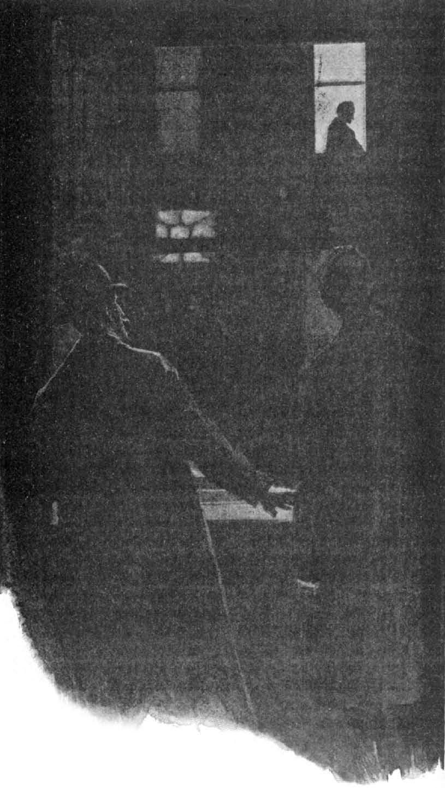

向外张望那扇熟悉的窗子。

“怎么样？”他问。

“天哪！”我叫道，“妙极了。”

“这便确证无误，本人可算得岁月流逝、身心不枯，惯技不废、新招迭出，”他说道，听得出为自己艺术手法的高明，口气兴奋而得意，“像真的一样，不错吧？”

“不错，我简直要发誓说那就是你本人。”

“手法如此之高明，多亏格勒诺布尔的奥斯卡·默尼埃先生，他花了几天时间做模子，做成一个蜡像，半身像。其余的事情，今天下午回到贝克街我自己做，加以布置。”

“什么目的呢？”

“目的嘛，我亲爱的华生，有那么些人，一定要叫他们相信我人就在这里，实际上我不在，在别处。”

“你认为住所受人监视了？”

“我清楚，有人在监视。”

“是什么人？”

“我的夙敌，华生。那帮子老对手，他们的头子，在莱辛巴赫瀑布底下永远沉默了。你该晓得，他们清楚，也只有他们清楚，我还活着。他们等着，相信我迟早要回到住所这地方来，所以不断守候。今天早晨，让他们看见我回来了。”

“你怎么知道的？”

“因为，他们派出监视哨，我向窗外一望就望见了。放的这个哨于我不足以构成危害，此人名叫帕克，杀人越货为生，单簧口琴倒吹得极拿手。这个人我不在乎，我在乎的是他背后的那个人，相当难对付。莫里亚蒂的刎颈死党，就是在悬崖上下手推岩石的那个家伙，伦敦要犯，极狡猾极危险。就是这个人，今晚要对我下手，华生，可是，这个人并不知道我们正要对他下手呢。”

我朋友的计划将一步步实现。从这个近便而隐蔽的地方，使监视者反被监视，跟踪者反被跟踪。对面那个轮廓分明的人影，是个狩猎诱饵，我们才是猎人。我们一起静静地站在黑暗中，注视着前面的路上人影匆匆地走过来又匆匆地走过去。福尔摩斯不出声，不动弹，当然我知道他正全神贯注，高度戒备，他的一双眼睛紧紧盯着过往的行人。这是一个黑暗、阴湿又喧嚣的夜晚，风穿长街呼啸而过，街上来来往往的人不少，都裹住了外套、围紧着脖子。有一两次我好像看见是同一个人反复出现，我还特别注意到有两个人在稍远的街那头一所房子的门道里避风。我让我的同伴注意他们，可是他不耐烦地轻轻咕哝了一声，照旧只顾自己望着街。有几次他跺跺脚，手指敲敲墙壁，表现烦躁，我很清楚，他是在担心计划会不会落空。最后，将近午夜时分，街上行人渐渐稀少，他在房间里踱来踱去，激动不已。我正想和他讲点什么，这时抬眼看到明亮的窗上，又是叫我同刚才那样大大惊讶。我一把抓住福尔摩斯的胳膊，指指对面。

“那影子动起来了！”我叫道。

那儿竟不再是个侧影，却变成了转向我们的背影。

三年时间并没有消磨掉他的急躁脾气，也没有改掉对智力低于他的人缺乏耐心。

“当然要有动作啦，”他说，“难道我会笨得那么可笑，华生，放个一动不动的假人在那儿，想哄得住欧洲最老奸巨猾的人？我们来这个屋子已经两个小时，哈德森太太也已经把蜡人动过八次，也就是每隔一刻钟换个姿势。她是避开前光转动的，她转动蜡人就不会落下自己的影子让人看见。啊！”他忽然猛地倒抽一口气，借着一点昏暗的光，我看到他探头向前，集中注意，整个人都紧张起来。外面街上已空无人影，那两个人或许还蜷缩在门道里，可是我没能再看见他们。一切归于寂静与昏暗，只剩对面明亮的黄色窗帘中央有个人影轮廓。此时万籁俱寂，只听得见轻微的、强抑兴奋的急促呼吸声。福尔摩斯一把拽住我躲到最暗的屋角里去，一手捂住我嘴，令我噤声。他抓住我的手指在颤抖，我还从来没见我的朋友有过如此的激动，而面前黑暗的街道依旧孤寂、死气沉沉。

但是忽然间我意识到了他的超人感官感觉到了什么。极轻的蹑手蹑脚声传入我的耳朵，不是来自贝克街方向，而是我们藏身的这幢房子的后面。一扇门开了又关好。一会儿，过道上有人踮起脚走过来——脚步声，在尽量不出声，但空屋回响偏是震耳。福尔摩斯靠墙蹲着，我也和他一样蹲下，右手紧握左轮枪柄。昏暗中望过去，依稀看见一个人影，在门口，比门外的黑暗更黑。这个人立定片刻，然后又轻轻向前走进屋，弯腰低身，饿虎扑羊似的，走近我们不到三码的距离。我一阵紧张，准备好他要凶恶地扑上来，但我马上想到他根本不知道有我们在这里。他紧挨我们这边过去，悄悄靠上窗口，轻轻地把窗抬起半英尺。当他蹲下身子靠着打开的窗口时，街上的灯光不再被灰尘玻璃阻挡，照亮了他的脸。这个人好像兴奋异常，两眼如星光闪烁，面部在痉挛抽搐。原来是个老头，细尖鼻，高额秃顶，留灰白大胡子，一顶夜礼帽推在后脑勺，外套敞开，露着夜礼服的白前襟，黑瘦无肉的脸上布满深刻的皱纹，凶相毕露。手里好像有一根拐杖，可是往地上一放，听出是铁器的响声。接着看他从外套口袋里掏出一件鼓鼓的什么东西，摆弄一阵，末了叽嘎咔嗒一响，像是上了弹簧落了栓。他仍旧是蹲在地板上，跪姿向前倾，把身体重量都压在那根杆子上，接着是持续一阵叽叽嘎嘎转动和摩擦，末了又是好响的咔嗒一下，这才直起腰身。这下我也看清他手里操的什么家伙了，是一杆枪，只是枪托的形状非常特别。他拉开枪膛，像是把子弹放了进去，啪地一下推上枪栓。然后又俯下身去，把枪管搁在窗台上。我看见他的长胡子遮在枪托上，一只眼睛闪着亮光在瞄准。他把枪托紧抵肩胛，轻松地舒出一口气，瞄准了那个令他喜不自胜的目标，黄黄背景上那个人的黑影，清清楚楚落在他的准星上。片刻之间，他屏息静气，接着手指紧扣扳机。只听得奇怪的嗖的一声，随着是清脆的破璃破碎落地声。一刹那间，福尔摩斯腾空跃起，像猛虎从背后扑向枪手，把他一个狗吃屎扑倒在地，老头却一个翻身跳起来使尽平生之力掐住福尔摩斯的喉咙。我这时上去对准他脑袋用左轮枪柄猛击一下，他重又倒在了地板上。我乘势把他按住，叫他动弹不得，同时我的战友吹起急促的警笛。人行道上立刻响起脚步奔跑声，两个穿制服的警察和一个便衣警探，从前门冲入，进了房间。

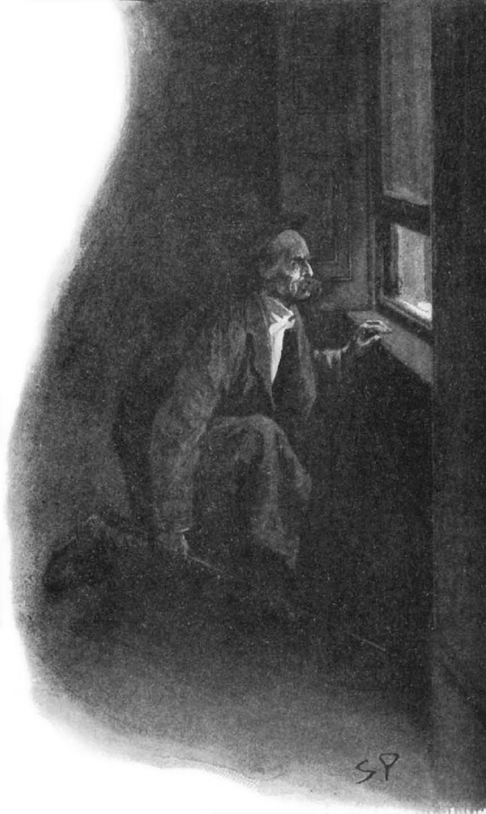

街上的灯光照亮了他的脸。

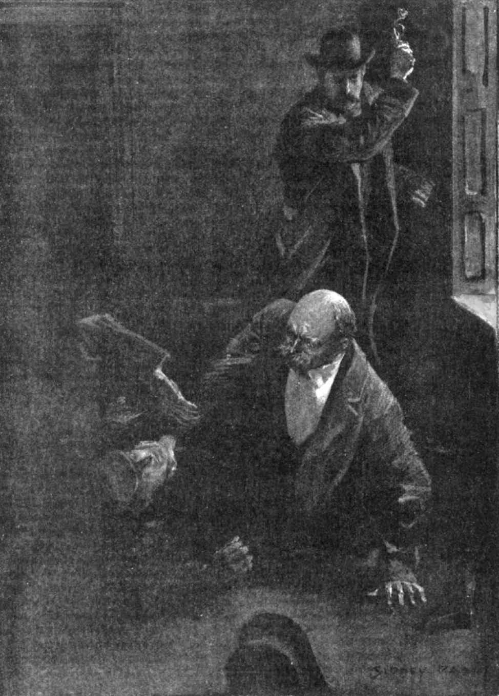

对准他脑袋用左轮枪柄猛击一下。

“是你啊，莱斯特雷德？”福尔摩斯说。

“是啊，福尔摩斯先生，我接了这任务亲自出马。见你又回到伦敦，真是太好了，先生。”

“我想你需要借助点非官方的外力，一年有三件凶杀案悬而未决，那可不行，莱斯特雷德。不过，你处理了穆尔齐疑案，比以往要迅速——就是说，你办得相当不错。”

几个人都站起来了，我们的囚犯在喘大气，他的两边站着两个高头大马的警察。这时街上已陆续聚集着一些闲人。福尔摩斯走到窗口把窗关好，又放下窗帘。莱斯特雷德掏出两根蜡烛点着，警察也把两盏提灯的遮光罩都翻起，这样，我终于能够看清这位被我们生擒活捉者的尊容。

对着我们的是一张神气十足而奸诈万分的面孔，看那上半截是哲人学者的高阔天庭，瞧那下半截却是一副无耻之徒的嘴脸，此人必具天赋大才，行善作恶均可上天入地。观察他凶残的蓝眼睛，冷冷地垂着眼皮，他尖钻刺人的鼻子、威势吓人的浓眉，你就不可不识得此系造物主所明摆的危险信号。他对我们均示以轻蔑，眼睛只盯住福尔摩斯的脸，表情是既恼恨又惊异。“你厉害！”他不住地嘟囔，“给你棋高一着，你厉害！”

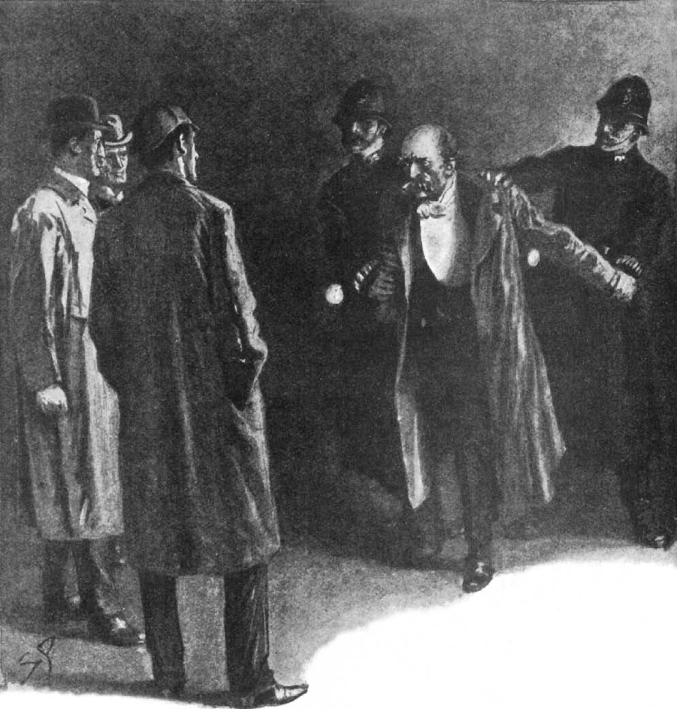

“给你棋高一着，你厉害！”

“啊，上校！”福尔摩斯说道，整整歪皱了的领子，“这真叫‘不是冤家不碰头’，就像老戏里常说的。那次我躲在莱辛巴赫瀑布悬崖的岩壁上，承蒙你多多美意关照，从此以后，想不到还会有幸再见你。”

上校还是朝我朋友瞪着一双眼，人已恍惚不定。“你这狡猾的恶魔，你这狡猾的恶魔！”除了这个话，他说不出别的。

“瞧我，还没介绍你呢，”福尔摩斯说，“这位先生，是塞巴斯蒂安·莫兰上校，以前曾在女皇陛下的印度陆军中服役，是一位我们东方帝国所造就的最优秀射手。我想，上校，说你打猎射猛虎仍然无人可与匹敌，没有说错吧？”

凶脸老人不吭一声，仍在怒目仇视我的同伴。他那吹胡子瞪眼的模样，活脱脱就是头恶虎猛兽。

“说也奇怪，我略施雕虫小技居然也能把老猎手蒙骗住，”福尔摩斯说道，“这叫以其人之道还治其人之身。你也做过的，在一棵树下拴一只小羊，自己拿了来复枪藏在树上，等着小羊诱饵把老虎引来，你不也是这样做的吗？这间空屋子就是我的树，你就是我要猎的虎。你大概总要带着几枝备用枪在身边，以防可能来上好几只虎，或者万一你自己没有瞄准好，没打中，那当然是不大可能的。这几位，”他指了指身旁的人，“则是我也要有的另外备用的枪。姑且打这么个比方，也还是恰当的吧。”

莫兰上校一声狂叫要蹿上来，可是警察把他拽住不能动。他脸上怒不可遏的表情十分可怕。

“我承认，你有一招出乎我的意外，”福尔摩斯说道，“你也会利用这间空屋、这扇方向正好的前窗，我没有料到。我原猜想你会在街上下手，所以我的朋友莱斯特雷德和他的同事在外面候着你。除此以外，一切都恰如我所料。”

莫兰上校转脸对着警探。

“且不说你有没有理由逮捕我，”他说，“可至少，你没有理由让我听凭这个人嘲弄。如果我触犯了法律，那就应当依法办理才是。”

“啊，这倒也是道理，”莱斯特雷德说，“我们要走了，你还有什么话要讲的吗，福尔摩斯先生？”

福尔摩斯从地板上捡起那支大威力重磅气枪，察看机件结构。

“一件好武器，难得一见的棒家伙，”他说，“无声，威力极大。我认识冯·赫德尔，德国盲人技师，这是他为莫里亚蒂教授特制的一支枪。我知道有这么一支枪已多年，但始终无缘得见、上手一试。现在我把枪交给你妥为保管，莱斯特雷德，还有这些配套专用的子弹。”

“请你放心交我们保管，福尔摩斯先生，”莱斯特雷德说，一群人向门口走去，“你还有什么话吗？”

“就问一下你以什么罪名提起诉讼？”

“你说什么罪名吗？那当然是图谋杀害福尔摩斯先生啦。”

“不是这个，莱斯特雷德，我绝对无意牵涉于此案，这次抓捕全是你的功劳，归功于你。就这样，莱斯特雷德，我向你祝贺了！你是一向智勇双全，是你把杀人犯手到擒来。”

“杀人！杀了谁，福尔摩斯先生？”

“就是警方倾力侦查而一直未能抓获的人——这个塞巴斯蒂安·莫兰上校，是他用气枪开花弹打死了尊贵的罗纳德·阿德尔，对着公园街四二七号二楼正面开着的窗里开的枪，在上个月三十日。就是这个罪名，莱斯特雷德。好，现在，华生，如果你能不怕破窗吹进冷风，不妨到我书房去待上半小时，抽支雪茄，必定乐趣无穷，获益匪浅。”

我们的老屋子，在迈克罗夫特·福尔摩斯一再关照和哈德森太太的悉心照料下一切如旧，原封不动。我一进房间，眼见四周异常整洁，但是所有原来的什么东西在什么位置，依然如故。这一角是化学实验的地方，搁着那张酸液斑驳的松木板桌。那里书架上，摆着一排大本的剪贴簿和参考书，都是些搁在一般伦敦人手里就要烧掉的东西。挂图、提琴盒、烟斗架——连放着烟丝的波斯拖鞋——我一圈看下来，都一概原物原位。屋里有着两个人——一位是哈德森太太，我们进来她立即热情地笑脸相迎——另一位，则是毫无声息的假人，他可是在今夜的历险中扮演了重要角色。他是我朋友的彩色蜡像，制作得极为精确，看上去惟妙惟肖。蜡人装在一个小座架上，披着福尔摩斯的一件旧睡衣，这么一装扮，从外面街上望进来，绝对逼真。

“我想，该小心的地方你都注意到了，哈德森太太？”福尔摩斯说。

“我是跪着摆弄的，先生，都照你说的话去办。”

“非常好，做得完全成功。你看到有打过来的子弹吗？”

“看见了，先生。真可惜，把你漂亮的蜡像打坏了，子弹正巧穿过头部，飞到墙上给砸扁。我在地毯上捡到的，在这儿呢！”

福尔摩斯把子弹拿给我看。“是那种左轮枪子弹，你瞧，华生，高明得很哪，谁能想得到这样的子弹是用气枪打出来的？好了，哈德森太太，非常感谢你的大力相助。现在，华生，请你再回你的老位子上去坐好了，有些个情况我要同你讨论。”

他脱掉了皱巴巴的旧礼服大衣，从蜡像上取下灰褐色睡衣来穿好了，于是重又恢复了昔日的福尔摩斯。

“老猎手神经依然镇定，手没抖，目光不失敏锐。”他说，审视自己的蜡像被击碎的脑袋，在哈哈笑。

“从后脑贴正中啪一下洞穿脑壳。他在印度曾是头号射击高手，我敢说，现在伦敦枪法也无人在他之上。他的名字你以前听说过没有？”

“没有，没听说。”

“是啊，是啊，名声一般！不过，我记得不错的话，以前你也没听说过詹姆斯·莫里亚蒂教授呀，可他是本世纪知识界一位巨擘哦。请你帮我拿一下人名索引，书架上那本。”

他背靠着椅子，大口喷着雪茄烟，懒洋洋地一页一页翻看。

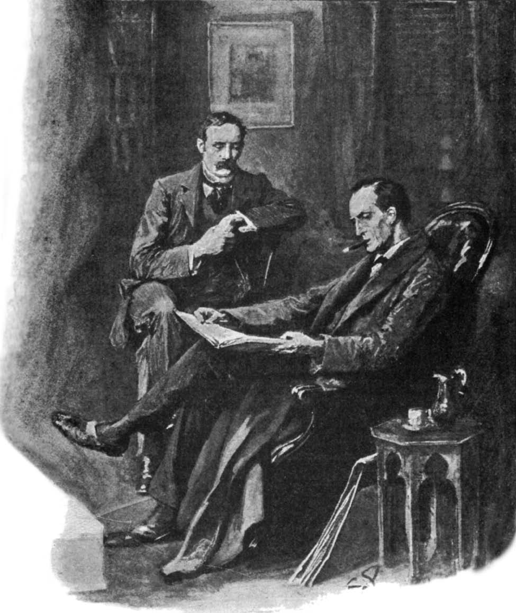

他背靠着椅子，懒洋洋地一页一页翻看。

“我收集的M这一栏，人物真不少，”他说，“光莫里亚蒂这一个，搁哪儿都足以光辉夺目；喏，这儿有莫根，投毒犯；梅里丢，要世代遭人唾骂；还有马修斯，这个人在查林十字广场的候诊室把我左边的犬齿打落；好，瞧这儿，是我们今晚的朋友了。”

他把本子递给我，上面写着：

莫兰，塞巴斯蒂安，上校。无业。原属班加罗尔第一工兵团。一八四〇年生于伦敦，前英国驻波斯公使奥古斯塔斯·莫兰爵士之子。肄业于伊顿公学、牛津大学。曾参加乔瓦基战役、阿富汗战役，也曾在查拉西阿布（特遣队）、舍普尔、喀布尔服役。著作：《喜马拉雅西部山地猎虎记》（一八八一），《丛林三个月》（一八八四）。住址：水道街。俱乐部：英印俱乐部，坦克维尔俱乐部，巴格代拉牌戏俱乐部。

该页的页边空白处有福尔摩斯笔迹清晰的旁注：

伦敦第二号大要犯。

“真叫人不可思议，”我说，把本子递还给他，“此人履历，还是个荣耀的军人呢。”

“不错，”福尔摩斯答道，“某些方面，他干得相当有成绩。他做事一向很有魄力，在印度仍有传说，他怎么抓一只吃人的猛虎，虎受伤逃进水沟，他紧追不舍逮住了它。有些树，华生，长到一定高度，突然会往歪里长，长得难看了，在人身上，你会看到常常也是这样。这我有个理论：一个人的成长，是再现他历代祖先的发展过程，像这种忽然变好或者变坏，正是显示他的家系血统中有某种强烈的影响起了作用。这样说来，这个人就是自己家族史的一个缩影。”

“你这个讲法太玄乎。”

“好吧，我也不坚持。不管是什么原因，莫兰上校变坏了。他在印度明里没有大的劣迹丑闻，但事情不少，情况不妙待不下去啦。他退伍，回了伦敦，又是弄得臭名昭彰。这当口被莫里亚蒂教授觅上当宝，立时走红成为大参谋。莫里亚蒂在他身上用钱很大方，只利用他干一两件高级差使，都是别的一般匪徒不能胜任的事。你记得一八八七年洛德有个斯图亚特太太被害的案子吗？不记得了？然而我断定莫兰是主谋，可惜没拿到一点证据。这位上校聪明过人，把自己隐藏得很好，莫里亚蒂黑帮集团告破，我们都无法把他告上法庭。你该记得那一天，我到你家来找你，不是赶紧关上百叶窗，生怕挨气枪打吗？不用说，你以为我神经过敏了，胡思乱想。我可是很清楚，丝毫不胡涂，因为我知道有这支枪，非同一般，厉害得很。还知道，握这支枪的是个举世无双的神枪手。我们到了瑞士那会儿，他随莫里亚蒂跟踪过来。也是不用说了，我在莱辛巴赫悬崖绝壁的凸岩上，那个五分钟里，叫我生死倒悬，出自他的贵手。

“你可以想见，我逗留法国期间注意看报，就是要找机会制伏他。只要他还在伦敦逍遥法外，我活在世上就没有趣味。日日夜夜他的魔影缠在我的心头，他对我下手总候得到机会，我怎么办？总不能一看见他就拿枪打，这样我自己坐监狱有份；向市长求助，也不济事，他们不可能仅凭一点无端怀疑就出手进行干预，所以我一筹莫展。但是我留意着刑案新闻，知道迟早总要逮住他。后来出了这件罗纳德·阿德尔凶杀案，我知道我的机会终于来了。从我知道的那些情况看，这案子还不明摆着是莫兰上校干的吗？是他同小伙子一起打牌，从俱乐部出来跟踪到他家，窗子正开着，朝里一枪把他击毙。肯定就是这么回事。光凭使用这种子弹就足够绞他脖子。我马上回到伦敦，却被那个放哨的发现了。我料定，他要向上校报告，告诉他要密切注意我的出现。上校不会不把我的突然返回，同他犯了案这件事联系起来，因此惊恐万状。我也确信，他必定千方百计要先下手为强，为达此目的，必定备着那杆利器，见机行事。我给他在窗上设好了目标，活灵活现的目标，同时向警方报信需要他们配合——噢，对了，华生，你没看错，躲在那边门道里的就是他们——我找好了那个观察哨，监视点，万没想到他倒也是找上这个风水宝地要对我下手来了。好啦，我亲爱的华生，还有什么不清楚需要我加以解释吗？”

“有，”我说，“你还没有讲清楚，莫兰上校谋杀尊贵的罗纳德·阿德尔是出于什么动机呢？”

“啊！我亲爱的华生，这一点，我们就来作一番假设吧，既是假设，那么即便最有逻辑的头脑也不免出错。每个人可以根据现有的证据作出各自的推测，你的推测很可能同我一样正确。”

“那么说你有假设了？”

“我想，说明案情事实并不困难。有证据表明，莫兰上校和年轻的阿德尔两人合伙赢得好大一笔钱。肯定是，莫兰从中作了弊——他这一手我早就有数。可以相信，发生谋杀这天，是阿德尔识破了莫兰做手脚。非常可能是私下向莫兰挑明白，甚至警告要揭发他，除非他自动退出俱乐部，承诺从此不再打牌。按理说，像阿德尔这样一个年轻人，不至于会去揭发比他年长许多的一个知名人士，闹出一场骇人听闻的丑事来，但是我估计他肯定是要这样做。把莫兰逐出俱乐部，意味着断他生路，他是靠赌博作弊为生的，因此，他要谋杀阿德尔。其时，阿德尔正在清理账目，算算自己应当归还别人多少钱，他绝不要靠搭档的作弊从中渔利拿昧心钱。他锁上门，生怕母亲、妹子进来看到名单、钱币，问长问短，要扰乱他。这么讲，听得过去吗？”

“没有疑义，你说明了事实真相。”

“这将在庭审中得到证明，或者被推翻。同时，不论发生什么，莫兰上校再也不会打搅我们了。这支出名厉害的冯·赫德尔气枪将为苏格兰警场博物馆增色，而歇洛克·福尔摩斯重又献身侦查大量有趣的小问题，这种问题，伦敦错综复杂的生活会源源不断地提供。”

（1903年）

————————————————————

<a href="#part0100.xhtml_ch1-back" id="part0100.xhtml_ch1">(1)</a> 卡图卢斯（Catullus），生活于公元前1世纪，罗马抒情诗人，以写给情人的爱情诗闻名，对抒情诗的发展颇有影响。

<a href="#part0100.xhtml_ch2-back" id="part0100.xhtml_ch2">(2)</a> 哈里发（Khalifa），伊斯兰政教合一的国家元首的称号。

# 诺伍德的建筑师

“在刑侦专家眼里，”福尔摩斯先生说道，“自从莫里亚蒂教授故世以后，伦敦变成一座索然无味的城市。”

“鄙人不敢苟同，你要知道，许多正直人士不会同意你的说法。”我回答。

“噢，是的，我可不能自私了。”他说，微笑着，把座椅从餐桌边转过身来，“整个社会因此太平，没人再会遭殃，只有我这个可怜的刑事专家无事可做，失业了。莫里亚蒂此公不死，则公害未已，那时只要打开晨报来一看，就呈现迹象无数。当然常常只是极微小的一点线索，真的，华生，朦胧得看不出什么名堂，但是足以告诉我是此人的坏主意出笼了，蛛丝网边上稍有动静就看得出蛰伏在中心的毒蜘蛛是个什么动作。宵小蟊贼偷偷摸摸，女性被恣意妄为，逞凶却不知缘故——掌握线索的人，都可以用来连接组合成一个整体。对于研究高层黑社会的刑事科学工作者，欧洲那时没有别的首都能提供如伦敦这样的有利条件。但是现在——”他耸耸肩，对他自己花了不少心血力气而造成的现状，却如此幽默地表示不以为然。

我在讲这些的时候，福尔摩斯回来已有数月，我因他的要求把自己的诊所卖掉，重新搬回到贝克街和他共住原来的寓所。一位姓弗纳的年轻医生，买下了我那座肯辛顿的小诊所。我开价不低，想不到他没犹豫就接受了——这其中的缘故几年以后才弄明白，原来弗纳竟是福尔摩斯的一位远房亲戚，他付的钱实际上就是我这位朋友给他筹措的。

在我们再次共同度过的几个月里，日子并不如他所说的会太平无事。我翻阅一下记的笔记，发现这一时期的案子就有几件，包括前总统穆里罗文件案以及轰动一时的荷兰轮船弗里斯兰号事件，这轮船案子还差一点让我们两人丧命。不过他性格冷峻、傲慢，向来不喜欢公众的赞扬。他对我定出规矩，不要对他的破案成功和侦破方法讲一句话——我已经解释过了，这项禁令到最近才告撤销。

歇洛克·福尔摩斯先生说完一通不以为然的话就靠回椅背，随意翻开晨报，这时猛一阵门铃响声引起我们注意，紧接着有人用拳头像是擂鼓似的把屋门捶得嗵嗵响。

只听得门一开，就是重重的脚步声踏进门厅，急急忙忙登上了楼梯，只一会儿工夫，一个狂乱的年轻人，圆睁两只大眼，面色刷白，披头散发，浑身颤抖着冲进房间。他把我们两人望了一遍，看到我们疑问的目光注视着他，才意识到自己如此贸然闯入应该先表歉意。

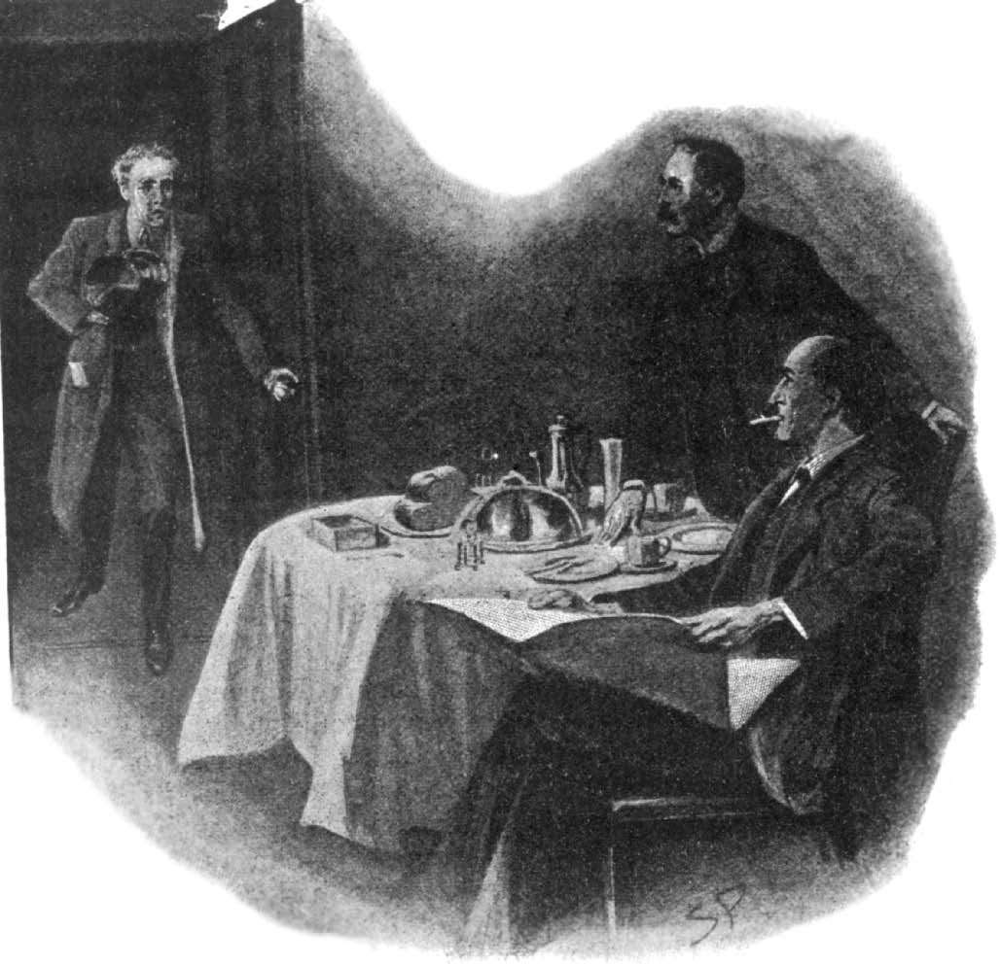

一个狂乱的年轻人冲进房间。

“对不起，福尔摩斯先生，”他嚷嚷道，“可别怪我，我都快疯了。福尔摩斯先生，我就是那个不幸的约翰·赫克托·麦克法兰。”

他通报大名那样子，好像名字一讲就能表明他登门的目的和态度似的，但是我看出，我的同伴脸上反应木然，这表明对来者的姓名他如同我一样并不熟悉。

“请抽支烟，麦克法兰先生，”他说，把烟盒推过去，“请安心，看你的样子，我的朋友华生医生在这里，可以给你开点镇静剂。这些日子来天气一直很热。现在就请椅子里坐下来，觉得稍好一点的话，慢慢地、平静地给我们讲一讲你是谁，来这儿有什么事。你说了你的姓名，像是我应当认识你，可是不瞒你说，我根据明显的事实，只知道你是个单身汉，是个律师，是共济会员，有气喘病，此外就一无所知了。”

我朋友的工作方法我是熟悉的，他的这几点推论我不难领会。我也看出来人不修边幅，随身带有一扎法律文件，表链上有护身符，还有气喘的样子，都足以作出推论。可是我们的委托人，就愣在那里对此中奥妙大感疑惑不解。

“是呀，我这些你说的都对呀，福尔摩斯先生；还有，我要算是现在伦敦最不幸的人了。看在苍天的分上，可不能对我不问不管啊，福尔摩斯先生！说不定我还没把事讲完，他们就要来逮捕我。一定要叫他们给我时间，好让我把事实都说给你听，那样我进了监狱也可以安心；虽然关在里边，可知道你会在外面为我奔走。”

“要逮捕你！”福尔摩斯说，“那是为什么——为什么事，以什么罪名逮捕你？”

“指控我谋杀下诺伍德一位约纳斯·奥德克先生。”

我同伴为之动容，表露同情，而同情之中我看出似乎也不无满意的神情。

“我说来着，”他说，“刚才吃早饭时间，我还在对我的朋友华生说呢，轰动社会的案子报上都已经见不到了。”

我们的来访者伸出颤抖的手，把福尔摩斯膝头上的那份《每日电讯报》拿起来。

“你先生没看吧，要是你看一下，就会清楚我今天一大清早跑到你这儿来是为了什么。我感觉好像我的名字和我的不幸都在每个人的嘴巴上挂着呢。”他把报纸翻折到头版，“就在这儿，请让我给你读一读，你听，福尔摩斯先生，标题是：‘下诺伍德名建筑师神秘失踪，疑为谋杀并纵火之大案刑犯已被掌控’。他们已经掌握犯罪线索，福尔摩斯先生，我知道这个线索一定要引到我身上。我从伦敦桥车站一直受到跟踪，不用说他们只等命令下来就会立刻将我逮捕。我母亲要伤心死了呀——她的心要碎了啊！”他惶恐、懊恼，一个劲地扭着手，身体在椅子上如坐针毡，不能安定。

我注视着眼前这个被控是个大凶犯的人。他浅黄的头发，长得很俊秀，只是神态紧张，疲惫不堪，惊恐的蓝眼睛，脸刮得很干净，一张薄嘴在神经质地翕动，年龄约莫二十六七八，从穿着、举止来看是位绅士。夏季薄外套口袋里露着一卷签着字的证件，说明了他的职业。

“我们快抓紧时间，”福尔摩斯说，“华生，麻烦你把报纸有关的部分念一念好吗？”

在委托人引述的触目惊心的大标题下，我读了这篇对凶犯指名道姓的文字：

昨日深夜，或今日凌晨，下诺伍德发生一起据称极为重大之刑案。约纳斯·奥德克先生作为从业多年之营造业者，系该城郊区一知名人士。奥德克先生独门鳏居，年龄五十二岁，住锡登罕路底之幽谷山庄。彼以性格孤僻而周知，平素不善辞令，与人少有交往。其退出建筑业已有多年，据说经营得法，获益甚巨而成富翁。然居屋之后方仍存有一贮木栈场，于昨夜约十二点，贮木发生火警。消防车及时赶到，但因木燥火烈，致火势难以控制，一炬而成灰烬。初认为仅一普通失火酿灾而已，但有异常迹象表明系一严重刑事犯罪案件。令人惊疑者，火灾现场不见屋主踪影。深入调查竟发现已是空屋，人告失踪。检查住房，卧床无人睡过，房内保险箱被打开，重要文件散乱满地，最后，更有激烈搏斗之迹象赫然可见，一橡木手杖柄端染有血迹。据知约纳斯·奥德克先生昨晚接待来访者于卧室内，有见证该手杖即来访者之所持物。此人为一伦敦青年律师，名约翰·赫克托·麦克法兰，系东中区格莱沙姆大楼四二六号格拉罕及麦克法兰律师事务所之年轻合伙人。警方业已握有充分证据显示其犯罪之动机，案情必将有惊人之发展，且拭目以待。

今晨最新消息——谣传约翰·赫克托·麦克法兰先生被控谋杀约纳斯·奥德克先生已遭逮捕，至少逮捕令已发出确无疑义。对诺伍德之侦查则有进一步征象之发现。据悉，遇凶建筑商底楼卧房除有搏斗迹象外，又见法国式落地长窗被人开启，并有拖拽重物至木栈之痕迹。最后据称，竟于火场遗烬中发现烧焦若炭之尸骸骨灰。警方推断此为一骇人听闻之刑事大案，遇害人遭木棍击杀于卧室，券证被悉数卷劫，尸体移至木栈，继而纵火意欲焚尸灭迹。此案已交苏格兰警场富有经验之警探莱斯特雷德之手，此刻其正以惯有之能力与机智追踪线索。

福尔摩斯双目闭起，十指顶尖，听完这篇精彩报道。

“此案很有些意思呢，”他以那副慢吞吞的样子说道，“且容我问一句，首先，麦克法兰先生，不是说你已证据确凿足可逮捕法办嘛，怎么眼下还有如此自由？”

“我住在多林顿公寓，布莱克希斯街，同我父母一起住，福尔摩斯先生。可是昨天晚上，处理约纳斯·奥德克先生的委托，时间待得太晚，我就在诺伍德一家旅馆过夜，打那儿出来去上班。他遇害我一点也不知道，还是在火车上读到的报纸，就是你刚才听到的那个消息，没想到自己处境已经一下子落得那么可怕、那么危险了，马上想到这个事得快来找你。不用说啦，我要是在城里办公室的话，或是自己家里，当然早就被逮捕走了。我在伦敦桥车站一下火车，就有人把我给盯上，当然不用说——啊，不好！什么人来啦？”

那是门铃大响，紧接着楼梯上重重的脚步声，顷刻之间我们的老朋友莱斯特雷德出现在门口。我朝他一望，瞥见他肩后有两个穿制服的警察。

“约翰·赫克托·麦克法兰先生，对吗？”莱斯特雷德问。

我们不幸的委托人脸色一下子刷白，站起身来。

“你在下诺伍德蓄意谋杀约纳斯·奥德克先生，你被捕了。”

麦克法兰转身朝我们做了个绝望的手势，又浑身垮掉似的栽进椅子里。

“等一下，莱斯特雷德，”福尔摩斯说，“等半个多小时在你并不碍事，这位先生正在给我们讲述这个事呢，很有意思，有助于我们把情况弄清楚。”

“我想，弄清这件事不会有困难啦。”莱斯特雷德绷着个脸说。

“不管怎么，请予准许，我很有兴趣听听他的陈述。”

“那好，福尔摩斯先生，要我拒绝你什么倒是有困难，看在你对警方不无有用之处，往日帮过一两次忙，苏格兰警场得还你一份情呢，”莱斯特雷德说道，“那就这样吧，我必须看住人犯，还有责任要向他提出警告，他说的话都将成为不利于他的证据。”

“只好这样了，”我们的委托人说道，“我只要求你听我讲，要知道我讲的绝对都是真话。”

莱斯特雷德看看他的表。“给你半个钟头时间。”他说。

“我先得要解释，”麦克法兰说道，“对约纳斯·奥德克先生我是一无了解。他的名字我熟悉，因为许多年前我父母和他认识，但是后来彼此疏远了。所以，昨天下午大约三点钟他走进我城里的办公室，我就很感意外；当他说明来意之后，那就更叫我大大吃惊。他手里拿着几张笔记本的纸，上面写满潦草的字迹——喏，就是这么几张——他往我桌上一放。

“‘这是我的遗嘱，’他说，‘我要你，麦克法兰先生，给写成正式的法定形式。你写吧，我坐这儿等着。’

“我动手抄写这份遗嘱。你们想想看我有多么惊奇，他的财产，除了留下一点以外，竟然全部归我所有。他是个怪人，小个子，像只雪貂，须眉全白。我看看他，他笑嘻嘻地用一双灰色的眼睛盯着我。我一看他的遗嘱，简直无法相信自己的眼睛了，可是他解释说，他是独身，几乎没有亲属在世。说是年轻时候认识我父母，过去一直听说我是个好孩子，可以信赖，因此愿意把钱给我，他感觉值得，心里踏实。我当然只能一迭声表示感谢。遗嘱按规定写好，签上字，有我的书记作证人，就是这张蓝纸上写的。这些个纸，我已经说过，都不过是草稿。约纳斯·奥德克先生然后告诉我还有一些字据契约——房屋租约、地契、抵押契据、临时凭证，等等——这些都必须让我过目清点。他说等到这些都办妥了以后他才能放心。他要我晚上就到他诺伍德的家里，带上遗嘱，以便把事情全都安排妥当。‘记住了，我的孩子，跟你父母先一句话也别提，等事情全部办好了再说。我们要出其不意，给他们来个惊喜。’这一点他很坚持，要我答应一定守信做到。

“你可以想象，福尔摩斯先生，他要我这么做、那么做，我当然不会拒绝。他是我的恩人，这时候我一心只想对他唯命是从。我于是向家里发个电报，说手头有要紧事，办到时间多晚说不准。奥德克先生告诉我，要我九点钟和他一起用晚餐，在此之前他可能不在家。可是他的住址我很难找，等我找到他家差不多已经晚了半个小时。我看见他——”

“等一下！”福尔摩斯说，“是谁来开的门？”

“一个中年妇女，我猜是他的女管家吧。”

“恐怕她叫得出你的名字？”

“叫得出。”麦克法兰说。

“请接下去讲。”

麦克法兰擦了擦额上的汗，然后继续陈述。

“这个妇女领我到起居室，桌上已经摆好了简便的晚餐。吃过饭，约纳斯·奥德克先生把我领到他的卧室，里面有一口大保险柜。他打开保险柜，拿出一摞证件，让我同他一起过目。一份份看过来已经十一二点钟了，他意思是不必打搅女管家，让我从他卧房的法国式落地长窗出屋，这门窗本来就是开着的。”

“窗帘下了没有？”福尔摩斯问他。

“我倒没注意，不过好像窗给遮着一半。是的，我记得他拉开窗帘，把窗打开。我的手杖不见了，他对我说，‘不碍事，我的孩子，这以后我们要常见面，手杖我找了替你放着，没问题，你下回来拿好了。’我这就走长窗离开他家，保险柜开着，票据证件扎成一沓放在桌上。时间很晚了，我回不了布莱克希斯，就在安纳利纹章<a href="#part0101.xhtml_ch1"
id="part0101.xhtml_ch1-back">(1)</a>旅馆过夜。其他的我什么也不知道，到了早晨，才看到吓人的消息。”

“还有什么要问的吗，福尔摩斯先生？”莱斯特雷德说，他在听这篇奇异解释的时候，几番扬眉蹙额。

“现在没有什么要问了，我先要到布莱克希斯去走访。”

“你该是去诺伍德哦。”莱斯特雷德说。

“噢，是的，没错，我正是这个意思。”福尔摩斯说道，脸上带着莫测高深的微笑。莱斯特雷德虽然不愿承认，但经验事实叫他不得不看到，福尔摩斯那个脑子犀利如剑锋刀刃，在他莱斯特雷德遇上是坚不可摧无法解决的任何事物，搁在福尔摩斯手上便能迎刃而解。我看见莱斯特雷德用莫名的眼光望着我的同伴。

“我想现在我有话该同你讲，福尔摩斯先生，”他说，“这位麦克法兰先生嘛，好啦，我的两位警察在门口，还有一辆四轮马车等着呢。”倒霉的年轻人站起来，祈求地向我们看看，走出房间去。警察押着他上了马车，莱斯特雷德留了下来。

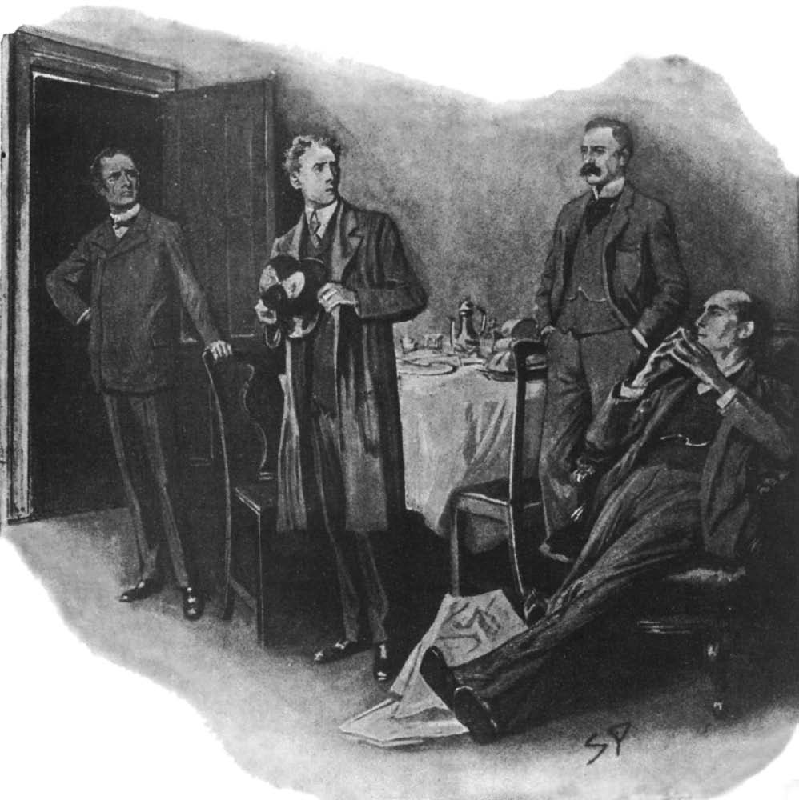

年轻人站起来，祈求地向我们看看。

福尔摩斯收拾起这几张很粗糙的遗嘱手稿，一脸兴致勃勃的神态，加以审视。

“这些证件几处地方，莱斯特雷德，有问题，你看出来了吗？”他说着，推过去。

警官拿起看看，显得莫名其妙。

“我看了这头几行，还有第二页的中间，还有末尾的一两个地方，都清楚得像是印出来似的，”他说道，“可是别的地方写得就很糟糕，有三处地方我简直都看不清写了什么。”

“你有什么高见呢？”福尔摩斯问。

“啊，该问你是什么高见啰？”

“那是在火车上写的，清楚的部分表明是车正停在车站上，不清楚的部分是车在行进中，最不清楚的是火车正在经过道岔。痕迹专家能立刻辨认是在一条郊区铁路线，因为只有大城市附近才会接二连三出现岔道口。他是赶着用旅程时间来写这份遗嘱，这该是一列快车，在诺伍德和伦敦桥之间只停过一次。”

莱斯特雷德张口大笑。

“你分析起来，一大套理论，说得天花乱坠，福尔摩斯先生，”他说，“你说这些跟案子有什么关系？”

“噢，它足以证实年轻人所讲的这份遗嘱，是约纳斯·奥德克昨天在旅途中草草写成。那就奇怪了——岂非怪事？——一个人竟以这样随便的方式来写一份这样重要的文件，这就意味着他并没有把这件事真正看得很重要。他之所以这样做，实际上这份遗嘱他不打算生效。”

“那，等于专为自己起草一份送葬令状。”莱斯特雷德说。

“噢，你这样想？”

“你不这样想？”

“噢，很可能是这样，可是案子我还没有眉目。”

“没有眉目？啊，都这地步了还不算清楚，还能要怎么个清楚法？一个年轻人，天赐良机，只要老头儿死掉，他就可以继承一大笔财产。他怎么干？对谁都不露口风，他安排好，找借口说是晚上要去看一个委托人。他等屋里唯一的第三人上床睡觉，乘夜深人静，把屋主人谋杀，在木料堆上焚尸灭迹，然后逃离现场躲入邻近旅馆。屋子里、手杖上的血迹很少。他自以为手脚做得干净，根本没在意留下了这点血迹，只想着把尸体灭迹，那就线索丝毫不留——有痕迹的话，不管怎么样，总会把他暴露出来的。这不是再明显不过了吗？”

“依我看，我的好莱斯特雷德，若是那么明显，还有什么侦查价值可言，”福尔摩斯说道，“另外重大方面的问题，你倒不好好加以思量。你只要稍稍为年轻人设身处地想一想，你会选上遗嘱刚刚立好的这个夜里就下手作案吗？两桩事情接踵而至，你不觉得够危险的吗？还有，明明知道是你来这屋里，由一个仆人领你进屋，你就偏偏选上这么个时刻？好，最后，要那么煞费苦心毁掉尸体，把自己的手杖却丢在了那儿，不怕留下罪犯痕迹？你得承认，莱斯特雷德，这都是不可思议的。”

“至于手杖，福尔摩斯先生，你我都明白，干罪犯的都总是慌里慌张，这样丢三落四；只有心态平静的人才能避免，不至于那样。罪犯很怕再回头进房间里来。再想想别的推理吧，要能符合事实一些才行。”

“我很容易给你作出十几二十个推理，”福尔摩斯说，“比如，有一个推理，很有可能性，就当作礼物送给你。老人拿出文件，都是价值高昂。一个流浪汉，正好路过，打窗外看见，窗帘只半掩着嘛。律师走掉了，流浪汉进来了，看见手杖顺手抓起，把奥德克敲死，焚烧尸体以后逃离。”

“流浪汉烧尸体，为什么？”

“你这样问，那我要反问你，麦克法兰干吗要烧尸体呢？”

“销毁罪证吧。”

“那么流浪汉也是要销毁谋杀的所有罪证。”

“流浪汉怎么一点东西也不拿走？”

“因为都是契约字据，不好转让兑现的。”

莱斯特雷德摇摇头，我猜想他内心里该不是原先那样稳如磐石了吧。

“好吧，福尔摩斯先生，你找你的流浪汉去，我们只管抓住我们的人不放手，谁对谁错咱走着瞧。只是这一点要注意了，福尔摩斯先生：就我们所知，字据证件一份未少，这世界上也就只有这个人，一份不拿才有他一份不拿的道理，因为他是法定继承人，情况不管怎么样，反正都是他的份。”

我的朋友被他说得一时愣住。

“我无意否认，你这方面的证据不能不说相当坚实有力，有利于你的推理，”他说道，“我只是希望指出，依然还有其他推理，并非没有可能。如你说的走着瞧，咱们拭目以待。那就早安再见！我今天大概会顺便去诺伍德，看看你进展得怎么样。”

警探走后，我的朋友站起身准备投入这一天的工作，那机敏抖擞的神情，表明对面临的任务信心十足。

“我第一个行动目标，华生，”他匆匆穿上长外衣，说道，“必须是，我讲过了，布莱克希斯方向。”

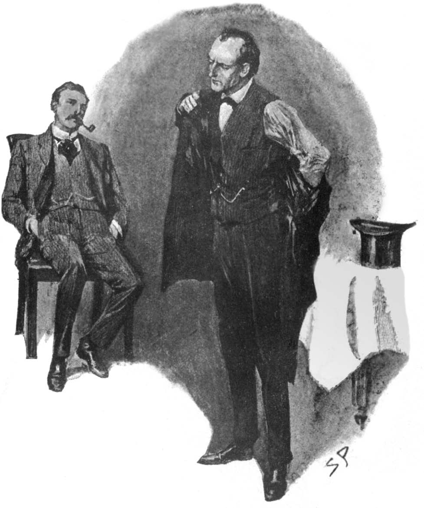

他匆匆穿上长外衣。

“为什么不是诺伍德？”

“因为我们这件案子，前一桩事同后一桩事紧接着出现，两者都很奇怪。警方犯的错误是集中注意力在第二桩事情，因为那恰好是犯罪行为。但是我很清楚，逻辑上讲，接触本案要从第一桩事情入手——那份不寻常的遗嘱，如此匆忙草草写就，授予如此一位意想不到的人作继承。看来，如果我这样着手，以后的事就可以简化。是的，我亲爱的伙计，我想你不用帮我忙，这事不会有什么危险，否则我无论如何也不会只想一个人行动。没问题，等我晚上回来见你，一定能够向你报告，不幸的年轻人信赖我，求我加以保护，我为他完成了些什么事。”

等我的朋友回来已经很晚了，我一看他脸色焦急、憔悴，就知道他是乘兴而去，败兴而归。他拿起小提琴，单调沉闷地拉了一个小时，竭力平定情绪，排遣烦恼，最后扔下了琴，认真向我讲述遭遇的挫折。

“看来是大错，华生——彻头彻尾的大错。我在莱斯特雷德面前太夸口、太莽撞。说句心里话，这一回，我想他老兄的路子对了，而我们错了。我的直觉是一回事，而实际却是另一回事。我真是非常担心，大不列颠的陪审团还达不到应有的智力水平，恐怕不要听取我的推理，而宁可采信莱斯特雷德的事实举证。”

“你到布莱克希斯去了？”

“是啊，华生，我上那儿去了。我很快发现这个惨死的奥德克，原来是个十足的烂小人。麦克法兰的父亲不在家，找儿子去了。母亲在家——一个蓝眼睛的木讷小妇人，连气带恨，在浑身发抖。当然，她怎么也不相信自己儿子有罪。对奥德克的下场，却是不惊奇、不惋惜，恰恰相反，她一讲起来就咬牙切齿，那样子无意之间佐证了警方的判断，他们的做法有道理了。儿子听母亲这么讲他是个坏家伙的话，就免不了会引起仇恨，行使暴力，那是肯定的。‘真不是个东西，他不是个人，他是个畜生，’她说，‘一辈子是个坏料，年轻时候就坏。’

“‘你早就认识他了？’我问。

“‘是的，我可认识他了，早先，他盯住我求过婚呢。还好老天有眼，教我看出他的本性，才把他甩掉，宁可嫁给穷虽穷点可是正正经经的好人。我都已经同他订了婚，福尔摩斯先生，可是我听说了好怕人的事，他把猫关进一个鸟笼里，活活关死，这么残忍，这么狠心的人，我说什么都不能和他在一起。’她到书柜桌去拉开抽屉翻找，一会儿翻出一张女人的照片来，照片上的脸给用刀横七竖八划得大破了相。‘这是我的照片，’她说，‘是在我举行婚礼的那天早上，他划成这个样子送还给我的。他就这样咒我。’

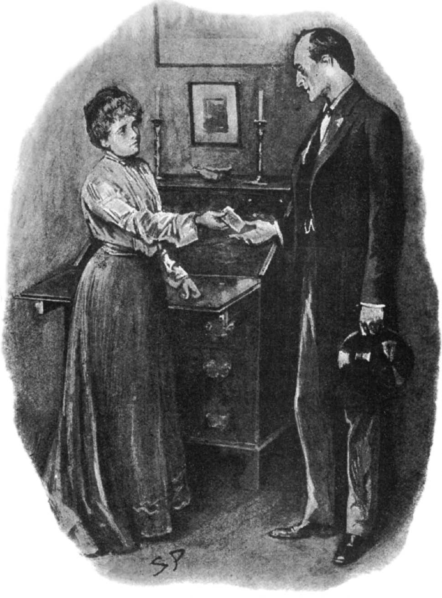

她一会儿翻出一张女人的照片来。

“‘可是，’我说，‘虽然是这样，他现在不记恨你了，他不是把全部财产都留给你儿子了嘛。’

“‘我儿子，我，谁都不会要约纳斯·奥德克的一点东西，死活都不会要！’她斩钉截铁地嚷着，‘上帝在天，福尔摩斯先生，上帝惩罚了这个坏人，到时候上帝也会证明我儿子双手没有沾他的血。’

“哦，我尽力试问几个线索，都没有结果，无助于证实我们的假设。更有几个问题，同我们适得其反。最后只有放弃，离开转向诺伍德去。

“这个地方，幽谷庄，一栋清水墙、现代式大别墅，立在园地靠后位置，门前是草坪，种有许多月桂树。右后方离开道路有一点距离，就是木栈，已经成了一片火场。这笔记本上我画了草图。左边这个窗，是奥德克的房间。你看，从大路上望得见屋里，这算是我今天唯一的一点安慰。莱斯特雷德没在那儿，由他的警长尽主人之谊。说是他们有了大发现，一上午在火场上扒灰烬，除了那些尸体残骸骨灰，他们还找到几颗变了色的金属圆片。我拿来仔细看了，不就是裤子纽扣嘛。其中有一颗我都认出牌子标记‘海安姆’，那是奥德克服装上裁缝的姓。我对草坪仔细检查，看看脚印、痕迹，可是这阵子干旱天气什么都变得坚硬似铁，发现不了什么，只看出来是有过一捆东西，也就尸体吧，给拖过一处水蜡树矮树篱，拖到木料堆。所有这些迹象当然都同官方的论调合拍。我趴下身子在草坪上来回检查，背上烤着八月的太阳，看了一个钟头，末了站起身，跟没来似的，一无所获。

“咳，毫无结果，就转到卧室去，也这么检查一遍。没有太大的血迹，只有沾上的一些，并不显眼，当然是新鲜痕迹。手杖拿掉过，上面的血迹也很少。手杖是我们委托人的，没问题，他本人都承认的。地毯上看得出有两个人的脚印，就两人，没有第三人。这又是给对方警场赢上一着，他们屡屡得分，我们可是原地不动。

“我好像看到一点曙光——可也只是一闪而过。检查保险柜，东西都拿空了，全在桌子上。证件封好在几个信封里，有一两个被警察他们拆开。我看下来也是没有什么大的价值，从银行存折上看，奥德克先生的境况未见得有多么富裕。不过我看那不是证券数的全部，还提到有部分契约——可能价值更大——只是我没有看到。这一点我们如果能够确证核实，那就对莱斯特雷德的推论是个有力的否定，因为明明自己很快就能继承，何必还要去偷呢？

“最后，所有东西物品、每个角落都检查到了，没有迹象，只有碰碰运气找女管家谈谈看，她叫勒克辛顿——小个子，黑黑的皮肤，不多话，看起人来斜眼多疑。她要是愿意谈，是能谈出点东西来的——我相信，可是她嘴紧得很，守口如瓶。是的，是她把麦克法兰先生领进屋，时间九点半。她巴不得那时间自己手烂掉，开不了门，他进不来才好。十点半，她上床睡觉。她的房间在屋子的另一头，没听到什么动静。麦克法兰先生的礼帽，还有那根手杖，她认定没错，都留在了厅里。她给大火惊醒，亲爱的主人已经不幸遇害了。主人有冤家对头没有？那个，谁也免不了有的吧，可是奥德克先生向来自顾自，只有有事的人才接见。她见过纽扣，肯定是主人昨晚穿的衣服的纽扣。木料堆干燥得很，有一个月没下雨了，一着火，烧起来跟火绒似的厉害。她给惊醒起来，到现场一看，只见一片大火，什么也没有了。她和消防队都闻到肉烤焦的气味，从火里冒出来。那些个证券文件她一概不知，奥德克先生的私事她从不清楚。

“就这些，我亲爱的华生，是我的失败报告。不过——不过——”他紧握筋骨棱棱的双手，显出一副确信无疑的神情——“我知道，全部错了。我从骨子里感觉到，还有事情隐藏着没揭出来，女管家清楚。她两眼阴沉，防范着人，只能说明她心中有鬼。然而再要谈已经无用，华生，除非时来运转，否则，我怕诺伍德失踪案就无法写进我们本年破案记事录。我看，不得不让引颈企盼的公众空等一场。”

“说不定，”我说，“这个年轻人的一脸善良能打动陪审团呢？”

“这不荒唐吗，我亲爱的华生。你还记得一八八七年那个杀人凶犯，贝尔特·司蒂芬斯吗？他想要我们高抬贵手放了他。他就像主日学校出来的年轻人，简直没人比他长得更善良温和可亲了吧？”

“那倒是。”

“除非我们另有立论站得住脚，否则此人就算完了。本案现在对他可以立即起诉，你很难找得出毛病，而且进一步调查反而更增加立案的理由。噢，想起来了，那批证件有一个小疑点，我们不妨作为一个起点来调查。我一翻那个银行存折，发现余额所剩无几，主要因为开掉了几张大支票，都是过去一年里开给柯尼利亚斯先生的。我在想，这个柯尼利亚斯先生是何许人，一个退休的建筑师还会同他有这么大宗的交易，我倒是很有兴趣知道个究竟，说不定他与这个案件中有什么关系。柯尼利亚斯可能是个掮客，照例这几笔大额付款应该有相符的票据，但是我们没有找到。既然未能发现别的迹象，我的研究方向现在就得去银行查问这个把支票兑现的大户头。我不得不担心，亲爱的伙计，我们的案子，会以莱斯特雷德把我们的委托人绞死而告终，那不是太冤枉人叫人窝囊了，苏格兰警场则当然是高奏凯歌一曲。”

我不知道福尔摩斯那一夜有没有睡着，只在下楼去吃早饭的时候看见他脸色苍白，愁容满面，两眼生出了黑眼圈而格外地明亮。他椅子边的地毯上扔满香烟蒂头，散乱着好些当日的晨报。有一封电报摊开在桌子上。

“这个你是怎么看啊，华生？”他问道，把电报丢给我。

从诺伍德发来的电报，电文是：

新获重要罪证，麦克法兰罪行确定。奉劝弃手本案。

莱斯特雷德

“像真的似的。”我说。

“莱斯特雷德小胜扬扬得意，”福尔摩斯答道，露出一丝冷笑，“叫我放弃这个案子，恐怕还不到时候。说实在的，新获重要证据，可以是把双刃剑，或许刃口往哪里切过去并不是如莱斯特雷德所想象。吃你的早饭吧，华生，我们两个一块儿出去，看看怎么办。我感觉上，今天需要你同行，需要你精神支持。”

我的朋友自己没吃早饭，这也是他的一大怪癖，一紧张起来，就不吃饭。我知道他，他仗着一身钢筋铁骨有使不完的力气，可是最后营养接不上来人都晕过去。“我现在没有工夫让体力精力用在消化上。”每当我向他提出医学忠告，他总是这样回答我。所以今天他早饭碰也不碰，就要和我一同出发到诺伍德去，在我已不觉稀奇。幽谷庄，我已经叙述过，是一栋城郊别墅，这时周围还有大群人在看热闹。进入大门，莱斯特雷德出迎，他满面红光，自觉是胜利者，从头到脚浑身得意飘飘然。

“啊哈，福尔摩斯先生，你有没有证明是我们错了？你找到你那个流浪汉了没有？”他嚷嚷道。

“我还没有得出结论来呢。”我的同伴回答。

“可昨天，我们得出了我们的结论，现在业已证明完全正确。所以，你必须承认，这一回我们略胜你一筹，我说福尔摩斯先生。”

“瞧你这么喜形于色，当然必有了不起的大发现。”福尔摩斯说。

莱斯特雷德开怀大笑。

“我们好多人给败阵下来，被击败的滋味轮着你可是更不好受吧，”他说道，“一个人总不能指望自己事事胜算占上风，是不是这样，华生医生？请这边走，先生们，我保证叫你们心服口服，本案凶犯就是约翰·麦克法兰。”

他领我们穿过走道，进入另一头一间昏暗的客厅。

“这个地方，麦克法兰这小子行凶以后过来取他的帽子。”他说道，“好，朝这儿瞧。”他故作把戏一般，嗖一下擦亮火柴，照着白灰墙上一点血迹。凑近火柴，我看见这血迹还是一个清晰可辨的拇指血指印。

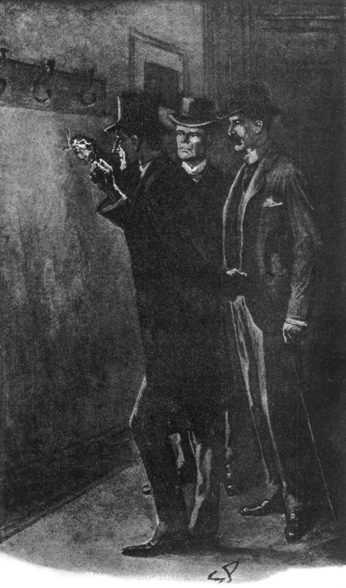

一个清晰可辨的拇指血指印。

“你拿放大镜看看，福尔摩斯先生。”

“是的，我正在看。”

“你也清楚，不会有两个相同的指纹吧？”

“是这样，这个我也听说过。”

“那就好，墙上指印，同这个麦克法兰小子右手拇指的蜡模指印，我今儿早晨命令给他做下来的，请你比较比较，看看怎么样？”

他把蜡模靠近血印，无需放大镜就可以看出两者是同一个指纹。没话说，我们可怜的委托人这下没命了。

“最后一着，决定性一着。”莱斯特雷德说。

“是的，最后决定性的。”我不禁附和道。

“最后，决定性。”福尔摩斯说道。

福尔摩斯的口气，我耳朵听出别有意思，便回过头去朝他看。他脸上的表情已经大变，在暗自高兴得忍不住扭动，两眼闪光如一对亮星。我看得出，他是在竭力克制自己不要爆发出内心的大喜。

“我的天哪！我的天哪！”他终于说道，“好了，现在，有谁能想得到？光看表面真是太不可靠了，一点不假！看上去是个多么优秀的年轻人啊！那对我们是一个教训，我们的判断不可过于自信，对不对，莱斯特雷德？”

“不错，我们有些人就是太过于自信，我说福尔摩斯先生。”莱斯特雷德说。此人狂妄得令人难以忍受，但是我们只好气压胸中，不便发作。

“这真是出奇了，小伙子去钩子上拿帽子，偏要拿大拇指往墙上按指印！你就想想吧，能有这样的自然动作吗！”福尔摩斯外表镇静，但是由于过分压抑内心激动，说着话身子在颤抖。

“顺便问一下，莱斯特雷德，是谁发现的，这个大发现？”

“女管家，勒克辛顿太太，是她告诉值夜勤的警察才注意到的。”

“夜勤警察在哪里？”

“在卧房里值勤，那间作案现场，看住里边东西不让人动。”

“警察昨天怎么没有发现这个痕迹呢？”

“那是这样，昨天这间客厅没有来得及检查。再说，你看，这不是个值得注意的地方。”

“不，不值得——完全不值得。那么说，这印迹是昨天就有的，没问题吗？”

莱斯特雷德朝福尔摩斯看看，心想他脑子有毛病了吧！我承认，连我都对他又是兴奋得不能自已、又是随口乱说一气，也感到十分惊讶。

“你不信这个指印，你这等于说麦克法兰深夜从监狱跑到这里，来补上他自己的罪证。”莱斯特雷德说，“我可以叫世界上任何一个指纹专家来作鉴定，看看这是不是他的指印。”

“这个没问题，是他的大拇指印。”

“那就是了，那就够了，”莱斯特雷德说，“我这个人最讲实际，福尔摩斯先生，我是凭证据到手才下结论。你若还有话要讲，到那个客厅来找我吧，我有报告要在那儿写。”

福尔摩斯的情绪恢复了平静，而我似乎仍然看出他神情中隐含乐观。

“咳，他的这个案情进展，怕是适得其反，华生，你看呢？”他说道，“应当讲，恰恰对我们有转机了，给委托人带来了希望。”

“听你这么说很高兴，”我由衷地讲，“我真是担心小伙子他没有希望了。”

“没有希望，还不到说这个话的时候，我亲爱的华生。我们的朋友自以为拿到了多么重大的证据，事实上，这个证据存在大大的漏洞。”

“真的吗，福尔摩斯！什么漏洞？”

“很简单，我很清楚，这个印记，我昨天检查的时候根本没有。现在，华生，让我们到阳光下去走走。”

我陪我的朋友在花园里散步，我脑子里乱哄哄的，但是因为有了希望，心里觉得热乎乎的。福尔摩斯对屋子外各个表面都颇有兴趣地一一检查过来，然后走进屋里，领我从地下室到屋顶阁楼，把整栋房子检查一遍。各个房间几乎都没有家具摆设，但是福尔摩斯还是作了仔细检查，最后，在顶楼的过道上，看到一排三间空房间，他忽然既兴奋又喜悦。

“本案确实颇有特点，很难得，华生，”他说，“我想是时候了，我们的朋友莱斯特雷德，该向他摊牌了。他一直拿我们取笑，我们也来回敬回敬他吧，只等最终证明我对问题的判断是正确的。有了，有了，我有主意了，我们能有办法。”

这位苏格兰警场警探正在客厅里伏案书写，福尔摩斯跑去打断他。

“我知道你写的是关于本案已破的报告。”福尔摩斯说。

“正是这个报告。”

“你不认为还早着点吗？我总觉得你的证据还不全吧。”

莱斯特雷德听得出我的朋友话中有话。

“你此话怎讲，福尔摩斯先生？”

“有一个重要证人，你还没有请见。”

“你能请到？”

“我想可以。”

“那就请吧。”

“愿竭尽所能。你有几位警士？”

“有三人，可以一叫即来。”

“好极了！”福尔摩斯说，“容我问一下，都是身体壮拳头大、喉咙粗嗓门响的吧？”

“那当然没问题。只不过跟嗓子响有啥关系，这个我不明白。”

“我会让你明白，这个、那个都会叫你明白。”福尔摩斯说，“请把他们召来吧，我要试试。”

五分钟，三个警察召之即来。

“外面小屋里堆着麦秸，”福尔摩斯说，“就请你们去搬两捆过来。我想，这麦草可以帮上大忙，把我说的那个证人一请就到。好，谢谢各位。我说你袋里有火柴吧，华生。现在，莱斯特雷德先生，劳驾各位都随我上顶楼。”

我已经说过，那三间空卧房外面是一条很宽的过道，我们跟福尔摩斯到了走道一端的尽头，三个警察在一旁咧着嘴，莱斯特雷德愣瞧着我的朋友，一脸的惊疑，继而期待，终于冷面嘲笑。福尔摩斯站在前面，一副魔法师作法的姿态。

“劳驾你派哪位警士去拎两桶水来好吗？麦秸放这儿地上，两边不要靠墙。好，就这样，行了。”

莱斯特雷德脸上转红，显露怒容。

“不明白你在跟我们开什么玩笑，福尔摩斯先生，”他说道，“你知道些什么，就请直说，不必来这么一套莫名其妙的鬼把戏。”

“我向你保证，我的好莱斯特雷德，我每做一件事，都有一定的道理。你该记得几个钟头之前，你跟我开了点玩笑吧，一时让你占据上风。现在我该有点必要的措施，你何必反感。麻烦你，华生，把窗子打开，再划火柴把麦秸草从底下点着。”

我照他吩咐的做。麦秸点着后劈啪作响，蹿起火头，一股白烟给穿堂风卷着在走道里翻滚。

“现在，我们看看，莱斯特雷德，能不能给你请出这位证人来。我们大家一起都来喊‘着火啦！’好不好？好的，一、二、三——”

“着火啦！”我们一起喊。

“谢谢。再来一次。”

“着火啦！”

“还来一次，先生们，一齐喊。”

“着火啦！”这一喊大概全诺伍德都能听到。

喊声未落，奇迹出现。走道尽头看上去完好的墙面，突然推开了一扇门，跳出一个矮小、干瘪的老头，像只兔子从洞里蹦出来。

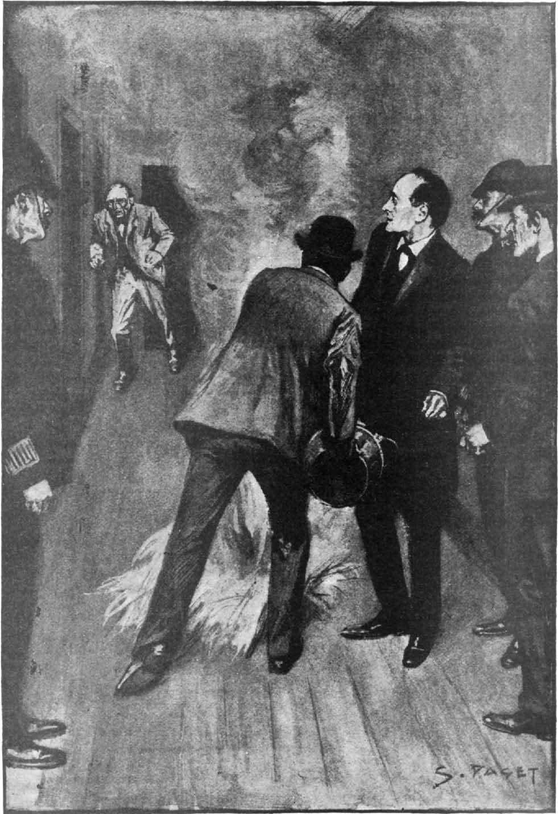

一个老头像只兔子从洞里蹦出来。

“成了！”福尔摩斯镇静沉着地说道，“华生，麦草上浇一桶水。对，行了！莱斯特雷德，允许我给你介绍，这位就是你们最最重要的证人，失踪的约纳斯·奥德克先生。”

警探呆呆地望着这个突如其来的人，而这个人，对着走道里的亮光眨巴眨巴眼睛，看看我们，看看冒烟气的火堆。那是一张可憎的脸——狡诈、邪恶、凶狠，白眼睫毛，围着多疑的、浅灰色的眼睛。

“这是怎么回事？”莱斯特雷德最后开口道，“你都在搞些什么名堂，你？”

奥德克望着怒容红涨的警探，不自然地笑一声，往后缩缩。

“我、我又没害谁。”

“没害谁？你耍尽手段要把人家平白无故送上绞刑架，要不是多亏这位先生，说不定就让你得逞了。”

这个卑鄙小人竟抽噎起来。

“说实话，我不过是开开玩笑的。”

“哼，玩笑，这是能开玩笑的事吗？我让你再开玩笑，把他带下去，带在客厅里押着，等我来。噢，福尔摩斯先生，”人一走，他继续道，“刚才当着警察的面我是不便说，不过，在华生医生面前，说说不妨。你这一招实在是高，高极了。可是你怎么来上这一手，我还摸不着头脑。是你搭救了一条无辜者的生命，也是你挽回了一件大丑事，要不然我的名誉在警界就此毁掉。”

福尔摩斯笑笑，拍拍莱斯特雷德的肩膀。

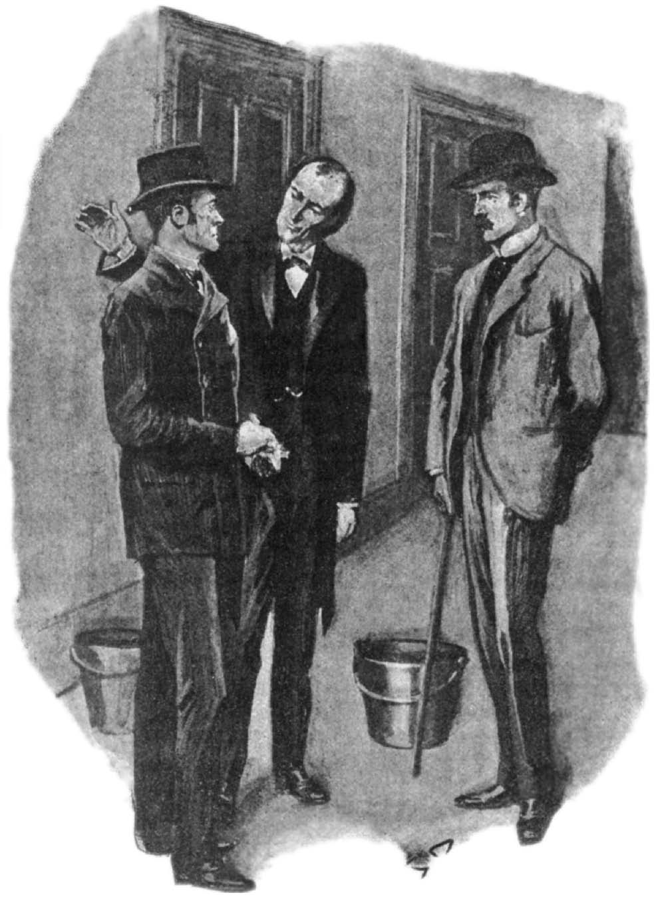

福尔摩斯拍拍莱斯特雷德的肩膀。

“你毁不掉，我的好先生，你会看到，你要名声大噪呢。把你在写的报告改一改，叫坏蛋们知道，要想蒙骗莱斯特雷德警官的眼睛，可是没门。”

“你不想在报告中列上你的名字？”

“完全不必，工作本身就是回报。也许等我未来哪一天再允许这位热心的历史家将我落笔之时，由他来称赞吧——是不是，华生？好了，现在我们来看看这只老鼠的藏身之地。”

过道尽头有用板条灰泥墙隔出六英尺的一个小间，开上暗门，靠屋檐缝隙透进来的光亮照明。里面置有几件家具，备有食物和饮水，还有一堆书报。

“这就是建筑师的好处，”往外走的时候福尔摩斯说，“他能够自行搞成一间密室，不需要帮手——除了，当然，他贴心的管家，这个女人，我也要马上把她收进你的罗网，莱斯特雷德。”

“我会采纳你的意见。可是你怎么知道这个地方呢，福尔摩斯先生？”

“我确定这个人藏在屋子里。我步测走道的长度，发现比楼下那条同样的走道短了六英尺，这就很清楚，他正躲在里面。我料定，来个火攻，他的神经就不可能镇定自若。我们当然可以进去把他抓出来，但是我设计叫他自己现形，那就更有趣更好玩。另外，我还欠你个小小的把戏，还你个迷魂阵，莱斯特雷德，因为你上午把我耍了一下子。”

“噢，先生，我的确得到你的回报了，但是你究竟怎么知道他就藏在这宅子里呢？”

“那个拇指印，莱斯特雷德，是你说的，最后的决定性证据。是的，一点不错，从另一面意思去理解，的确是的。我很清楚，那天根本没有这个指印，对细节我一向特别注意，这你也知道。我检查过这个厅，墙上空白根本没有痕迹，所以，那是后来夜里加上去的。”

“怎么加得上去呢？”

“非常简单。那些个字据套封的时候，约纳斯·奥德克让麦克法兰用拇指把封口软蜡按紧了。这样做动作快而自然，可以说年轻人自己都想不起来，是偶然之间的事。很可能奥德克自己也并没有意识，要这样做故意留下指印。后来在密室里盘算这件案子，才突然想起该弄个麦克法兰的指印证据，好进一步置他于死地。这件事简单不过，从封套上取个蜡模，不费吹灰之力。自己扎一点血，涂上蜡模，往墙上一按就行了，乘夜里，他亲自动手，或者是叫他的管家动的手。只要把他带进密室的文件检查一遍，一定能找到有指印的蜡封口，我敢打赌。”

“棒极了！”莱斯特雷德说，“棒极了！经你这么一讲，事情清清楚楚。可是，搞这个大骗局有什么目的呢，福尔摩斯先生？”

眼看这个目中无人的警探一下子变得像个小学生似地在向老师问问题，我心中真感有趣。

“噢，这个也不难解释。心胸狭窄恶毒，好记仇，报复心重，这位先生现在在楼下等着呢。你知道吗？他早年曾经向麦克法兰母亲求婚遭拒绝，你看你不知道！我告诉过你，你应当首先到布莱克希斯去，然后再到诺伍德。好，他觉得，这对他是个伤害。他耿耿于怀，满肚子邪恶，满脑子蓄谋，这辈子活着好像只为报仇，只不过一直找不到机会。挨到了这两年，境况对他不妙——我想是私底下投机生意失利了——发现自己处境不好。他决定对所有债主使个骗局，为达到此目的，他给一个叫柯尼利亚斯的先生开出高额支票，我估计，就是他自己，另用的化名。我还没有追查过这些支票，不过可以肯定，支票都用那个名字存进哪家外乡的银行，奥德克可以常常到那个乡镇去过活，避人耳目。他打算改名换姓，取上这笔钱，再潜伏到别处，过上一阵，换一个地方。”

“噢，完全可能。”

“他想到宣告失踪，就可以把追逐他的债主甩个一干二净，同时，也要向他的旧情人进行彻底、痛快的报复。只要做得像，他是给这个旧情人的独生子谋杀掉的，就能大功告成。这可是作奸犯科的大手笔，他予以实施，步步得法，不愧为大师。想到运用遗嘱，给出是本案犯罪明显的动机，让小伙子瞒着他父母秘密来访，把他的手杖拿掉，留点血迹，火堆里的动物尸骸、纽扣，都做得天衣无缝。陷入他这张罗网，几个小时以前，我还看不出有无可能解脱。可惜他并无艺术家的高超天赋，把握不住什么叫适可而止。已经画成了的画，他还想锦上添花——已经套在受害人脖子上的绞索，他想要再勒勒紧——这就弄巧成拙，全盘皆输。我们下去吧，莱斯特雷德。还有一两个问题，我想要问问他。”

困兽坐在他自己的客厅里，两边各守一个警察。

“那是开个玩笑，我说先生——一个恶作剧，没有别的意思，”他不住地哀告，“我向你保证，先生，我把自己藏起来，纯粹只想看看我失踪以后是什么个场面，另外我以为，你们不至于会想我是要加害可怜的年轻人麦克法兰先生。”

“那个，由陪审团来作出结论，”莱斯特雷德说道，“不管怎么讲，我们即使不告你谋杀未遂罪，也要告你陷害罪。”

“你还一定会看到你的那些债主将要求银行冻结柯尼利亚斯先生的全部存款。”福尔摩斯说。

小老头不禁一跳，转过脸来恶狠狠地朝我朋友看。

“我要对你千恩万谢才好哪，”他说，“总有一天我会要报答你的。”

我的朋友漠然一笑。

“我想，多少年之内，你是完全不会有时间了，”福尔摩斯说道，“顺便请问，你除了往木料堆里丢进你的旧裤子，还扔了什么？一条死狗、几只兔子，还是什么？你不愿意讲？哎呀，你真不够是个大路人！好吧，我估摸着，两只兔子的这点血、一堆骨灰，也就差不多了。你要是写文字，华生，就写上兔子吧，能管他用了。”

（1903年）

————————————————————

<a href="#part0101.xhtml_ch1-back" id="part0101.xhtml_ch1">(1)</a> 安纳利纹章（Anerley
Arms），此处arms是古代贵族的家族纹章，作为一种纹章标记的驿站酒店，可供旅人留宿。

# 跳舞的人

福尔摩斯一坐好几个小时，不出一声，弯着瘦长的腰背摆弄着烧瓶，制作一种气味特别难闻的化学品。他脑袋低垂胸前，从我这儿看过去，像一只瘦骨伶仃的怪鸟，全身灰白，顶一簇黑色的羽冠。

“那么说，华生，”他突然开口道，“你不打算投资南非股市了？”

我猛一惊。虽然我对福尔摩斯的特异禀赋和能力相当熟悉，但是我内心深处的私密想法给他这样突如其来一语道破，倒是感觉出乎意料地奇妙。

“这个怎么会让你知道的？”我问道。

他在圆凳上转过身，手里拿一支冒气的试管，深陷的两眼露出得意的神色。

“现在，华生，承认自己觉得奇怪吧？”他说。

“是呀，很惊讶。”

“我要你把惊讶在纸上写下来。”

“为什么？”

“因为五分钟以后你又会说那么简单，实在一点不稀奇。”

“那我一定不说就是了。”

“你看，我亲爱的华生”——他把试管插进管架，以教授给学生上课的姿态开讲——“作出一系列推论，每个推论务必来自于前面的推论，而且简单明了，这实际上并不难做到。如果这样做了，但是简单地删去推论的中间环节，只向人们给出开端和结论，那就会产生奇异惊人的效果，能够哗众取宠。现在对你的推论，其实没有什么奥妙，观察你的左手食指、拇指间的虎口，就有把握可以说你并不打算把自己的一点资金投入到南非金矿中去。”

“我看不出这之间有什么关系。”

“是好像没有关系，可是我能够马上向你说明有紧密的关系。这是一根很简单的关系链，缺掉了的几个环节是：第一，你昨晚从俱乐部回来，左手虎口间有白垩粉；第二，只有打撞球要稳住球杆，才会在虎口上抹白垩粉；第三，你只和瑟斯顿打撞球，从来不和别人打；第四，你跟我说过，是四星期以前，你说瑟斯顿有特权可以购买南非一项产业，可是特权有效期一个月就要到期了，他希望你和他一起投资；第五，你的存折锁在我的抽屉里，你没有向我要过钥匙；第六，因此说，你无意拿你的钱去投资。”

“太简单，不稀奇！”我叫起来。

“果不其然！”他说道，有点恼的样子，“每个问题一给你解释，你看你，就像小孩儿似的讲不稀奇。这里还有一个不明白的问题呢，看你怎么样来解决它，华生朋友。”他把一张纸向桌上一扔，就又回身去做他的化学分析了。

我一看，纸上画的尽是莫名其妙的象形符号，十分诧异。

“怎么啦，福尔摩斯，是小孩子的画画嘛。”我说。

“哦，那是你的想法。”

“那，还能是别的什么？”

“诺福克郡马场村庄园的希尔顿·丘毕特先生，这可是他正急着要弄清楚的问题。这个小小谜语清晨头班邮递送达，他本人下一班火车就到。哦，门铃响了，华生。不用猜，准是他了。”

听到楼梯上响起重重的脚步声，顷刻之间进来了一个身材高大、体格健壮、脸修得很干净的绅士。他眉目清亮，面色红润，说明他生活的那种地方，远不是迷雾笼罩的贝克街。他一进门，似乎随之带来东海岸的一股浓郁、新鲜、清凉的空气。他和我们握过手，正要坐下来，眼睛盯住了那张奇怪符号的纸头，那是我刚才看过搁在了桌子上的。

“啊，福尔摩斯先生，这个，你是怎么看啊？”他大声说，“人家告诉我说，你就喜欢解谜，稀奇古怪的谜。可是这个，我看没有再比它更稀奇古怪的了，你要找也找不着。我先给你寄上，好让你趁我人还没到先有时间研究起来。”

“这的确是件奇怪的作品，”福尔摩斯说道，“初一看，好像是小孩子画的玩意儿。纸上画的是一排跳舞的小人儿，奇形怪状。你对这荒唐的东西，如此郑重其事，是什么缘故？”

“我并不稀奇，福尔摩斯先生，是我太太，她很重视，简直要把她吓死了。她不说话，可是我见她眼睛里，那个恐惧样子，所以我要看看这玩意儿到底怎么回事。”

福尔摩斯把纸头拿起来照着阳光看。这是笔记簿上撕下的纸，用铅笔画的图形，是这样的排列：

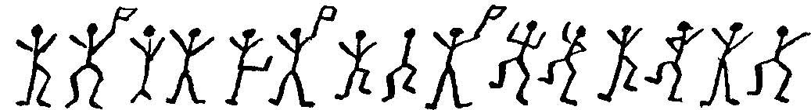

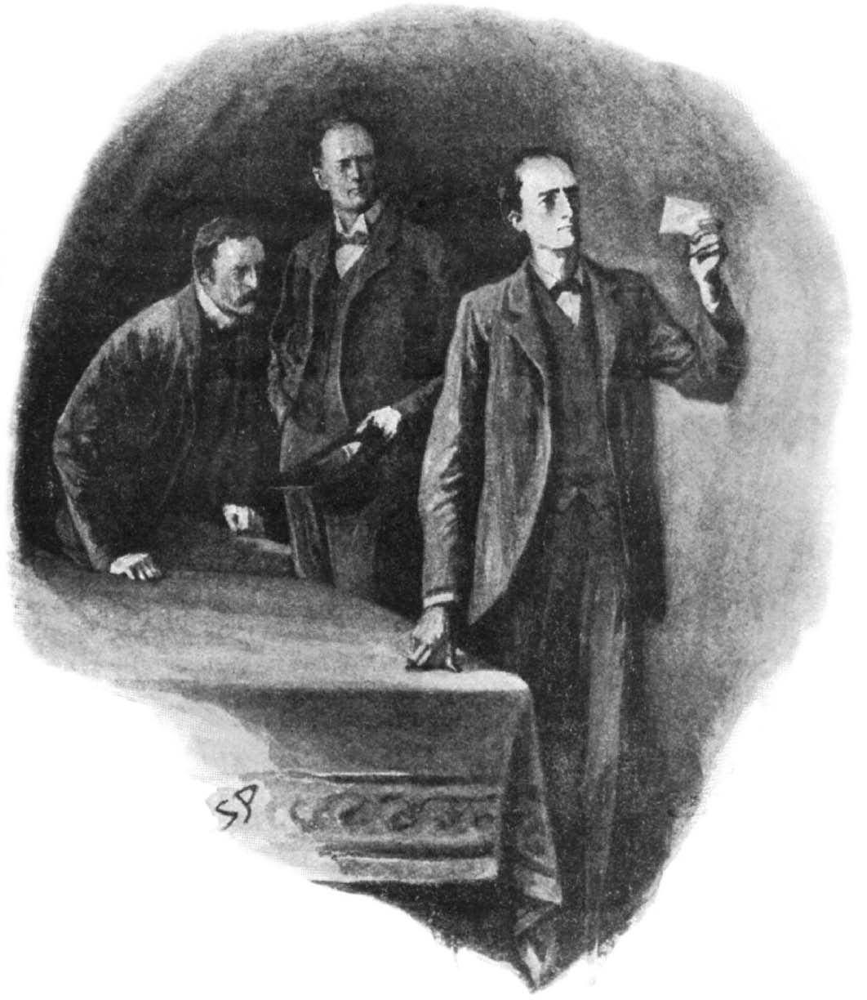

把纸头拿起来照着阳光看。

福尔摩斯审视了一会儿，然后小心折好，夹进袖珍笔记本。

“这里头一定大有名堂，非常有趣，绝非一般。”他说道，“你在信上给我讲了一些情况，希尔顿·丘毕特先生，我还想麻烦你重新讲一遍，让我的朋友华生医生也听听，他还不知道。”

“我不太会讲故事，”我们的来访者说，那双有力的大手神经质地一会儿握紧，一会儿松开，“恐怕有听不清楚的，你问好了。我开始从去年结婚那会儿说起，有一点要先讲一讲，我不富裕，但是我家一直住在马场村，有五百年的历史，在诺福克郡没有哪一家比得上我们资格老。好，去年，我来伦敦参加维多利亚女王登基五十周年纪念大庆，住罗素广场一幢公寓，因为我们教区的帕克牧师也是住在这公寓。里头有位美国年轻女士——她姓帕特里克——叫埃尔茜·帕特里克。我这就和她交上了朋友，不到一个月，我已经爱她爱得死去活来，我们悄悄地去登记结了婚，她跟我夫妻双双回到诺福克。你可以想象这有多荒唐，福尔摩斯先生，我一个名门子弟就这样娶回个妻子，对她的过去、对她的家庭竟一无所知。可是，你只要一见到她，认识她，你会理解我这么做是有道理的。

“这个事她很坦率，埃尔茜是个直性子。不能说她瞒我什么了，并非不是有言在先，我要是想甩手，她完全给过我主动权。‘我过去同一些不好的人有关系，’她跟我说，‘我希望把那些全都忘了。我再也不愿意提到过去，一提起来就会让我觉得很痛苦。你要是娶我，希尔顿，你娶的是一个自身绝没有做过不光彩、不名誉事的女人，你得相信我这个话，你要答应我，我成了你的人以前的那些日子，允许我闭口不谈。要是这条件无法接受，你回头吧，回诺福克去，丢下我一人，我还是你遇上我那个时候的样子，单独过活。’这是我们临到结婚前的那天她对我讲的话。我告诉她我要娶她，答应她的条件，我也是说话算话，始终遵守诺言。

“就这样，我们结婚已经满周年了，生活过得真正美满幸福。可是，大概一个月以前，是六月底，我第一次遇上了麻烦。一天，我妻子接到一封美国来信，我看到是美国的邮票。她脸色一下子刷白，看过信，马上往火炉里一扔，此后再也没提起这事，我也不问，我答应的话说到做到。不料她从此心神没有片刻的安宁，脸上一副恐惧相——那神态是在等着盼着随时有什么事要临头似的。她其实应当相信我，一定能看到我是她最可靠最有办法的人，但是她不讲，我也不问。我可以告诉你，她绝对是个诚实的女人，福尔摩斯先生，不管她过去有什么事，肯定不会是她的过错。我是诺福克一个普通乡绅，但是可以说，享有的家庭声望全英国没一个人比我高。这一点她清楚，嫁给我之前就很清楚。她绝对不愿意给我家的声誉沾上污点——她肯定是这样，我知道。

“好了，现在我谈这件事奇怪的地方。大约一星期前——也就是上星期二——我发现一扇窗的窗台上画了好些滑稽的跳舞小人，同那纸上的一个样，是用粉笔画的。我想会不会是小马倌画的，可是小鬼发誓说他根本不知道这个事。不管是什么人，那都是在夜里画的。我把小人都揩干净，事后向妻子提了一下。叫我大吃一惊的是，她对这事看得严重得不得了，要求我以后再有的话要让她看看。一个星期没事。到了昨天早晨，我发现有这张纸，搁在花园日晷仪上面。我拿给埃尔茜看，她一看就倒地晕了过去。这下她就成了个神志不清的女人，恍恍惚惚，两眼充满恐惧。所以我就给你写信，把纸条寄给你，福尔摩斯先生。这个事我不能报警，一报警，我就要给他们笑话。我不富有，但是如果有危险危及到我的爱妻，那么为了救她，我倾家荡产也在所不惜。”

他，一个英国土地上成长的男子，是造化的杰作——淳朴、正直、文雅，一张开朗秀气的脸，一对碧蓝的大眼睛，深情热烈。他对妻子的笃实钟爱，在他的面容上展露无遗。福尔摩斯极注意地听取他的叙述，这时坐着默不作声，思考了一会儿。

“你不觉得，丘毕特先生，”他终于说道，“最好的办法还是直截了当求你妻子，要求她把秘密告诉你？”

希尔顿·丘毕特大摇其头。

“答应的事要说话算话，福尔摩斯先生。埃尔茜能告诉我她早告诉我了，她不愿意说，我也不强求。不过，我归我，这方面弄个清楚是应当的——我得弄清楚。”

“那么我尽力相助吧。首先，你听说邻近有人看见过什么陌生人没有？”

“没有。”

“我猜你那个地方一定很冷落。有陌生面孔就会引起注意吧？”

“周围邻近是这样，但是有几处饮马地方，也不太远，农民常常留宿外来人。”

“这些象形符号肯定是有意思的。要是随便画画，那就解释不了，要是有含义，那就有一定的排列次序，我们有办法把它彻底弄明白。可惜这一张纸太短，就那么一点点，没法着手，你向我讲的情况又难以捉摸，连调查都是根据不足，我建议你回诺福克，注意留心观察，再有跳舞人出现，你把它准确临摹，画下来。那一次没有把窗台上粉笔画的形象照样记录，实在是万分可惜。周围一有陌生人，要严加盘问。等搜集到新的证据，就上我这儿来。这就是我给你的忠告，只能如此，希尔顿·丘毕特先生。如果有紧急情况发生，我随时准备着，会赶到诺福克，到你家里来看你。”

接见结束，福尔摩斯心事沉重。以后几天里我好几次看见他掏出笔记本，对那张纸条上画的奇怪图形专注地看了又看。他对事情只字不提，直到大约过了两星期，一天下午，我准备外出，他才把我叫住。

“别出去了吧，华生。”

“怎么啦？”

“今天上午，希尔顿·丘毕特有电报来。你记得希尔顿·丘毕特，那些个跳舞人？他一点二十分到达利物浦街车站，说不定什么时间就上这儿来。看他的电报，已经发生了新的情况，重要的情况。”

没等多久，我们的诺福克绅士从车站乘双轮马车直接奔这儿来了。他一副焦急、懊丧的样子，两眼困倦，天庭满布皱纹。

“真叫我受不了，这件事，福尔摩斯先生，”他说着，像是疲惫不堪，往一把椅子上重重坐下，“弄得你坐卧不宁，只觉得无形之间受人包围，又不知是什么人在算计你；还不止这样，要知道，还在向你的妻子步步进逼，要置她于死地。不行了，不是血肉之躯所能忍受。妻子给折磨得瘦下去——我眼看她给折磨得要垮了。”

“她说出了什么没有呢？”

“没说，福尔摩斯先生，她不说。有过几次，我可怜的爱妻想要说了，可又下不了决心，话到嘴边又打住，咽回肚里。我尽量鼓励她，大概我笨嘴拙舌，反而叫她更不敢说了。她只津津乐道我古老的家族，我家在郡里的名气，清白光荣的门第，讲得让我觉得可以引到点子上去了，谁知我一引她就立刻岔开，怎么也入不了题。”

“你自己发现了什么没有呢？”

“发现了不少，福尔摩斯先生。有好些新的跳舞人形，拿来给你看看，尤其重要的，我看见了那个人。”

“什么，画符号的那个人？”

“正是，我亲眼见他在画呢。让我一一跟你说吧。那天我拜访你以后回去，第二天早上第一件事，我看见的，是一连串新画的跳舞人，用粉笔画在工具间的黑漆门上。这间屋子位于草坪旁边，朝着正前窗户，看得很清楚。我赶快照着描下来，这就是。”他打开一张折叠的纸，展在桌子上。这就是临摹下来的象形符号：

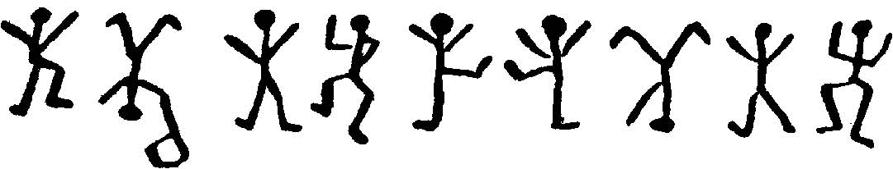

“好极了！”福尔摩斯说，“好极了！请继续讲。”

“临摹完了，把门上的图形都擦干净。可是，隔了两天，新画的又出现了，我也是照画在这里呢。”

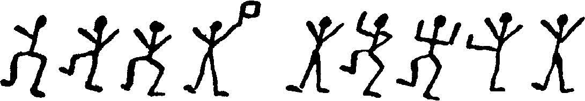

福尔摩斯搓起双手，高兴得格格笑。

“我们的材料累积迅速。”他说。

“三天后，又是一张纸条，用卵石压在日晷仪上，就是这个，上面画的，你看，跟上一次的完全一样。这以后，我决心夜里守候，拿了左轮枪，在书房里坐等，书房正对着草坪、花园。大约凌晨两点，我坐在窗边，除了外面月光，一片漆黑，这时候我听见身后有脚步声，原来是我妻子，她穿着睡袍。她催我去睡觉，我明确告诉她，要看个究竟，是什么人跟我们搞这种鬼把戏。她回答我说这是无聊的恶作剧，叫我别把它当一回事，不用去理它。

“‘真的惹你烦恼，希尔顿，我们旅游去得了，你和我走掉，就可以眼不见为净。’

“‘啊，叫恶作剧的混账东西把我们从家里撵走？’我说，‘那不叫远近乡邻都笑话我们吗！’

“‘好了，睡觉去吧，’她说，‘这事天亮了再谈。’

“她正说着，忽然间，在月光下我看见她的脸一下子变得更白了，她的手也在紧紧抓住我的肩膀。工具间的暗影里有什么在动。我看见一个弯腰的人影，绕过拐角，蹲在了工具间的门前。我抓住手枪，正要冲出去，可是妻子两臂抱住我，使劲不肯松手，我想把她甩开，可是她更加死命拽住不放。我一使劲终于挣脱了，当我开门跑到工具间，那个人不见了。但是他留下了痕迹，工具间门上已经画好了跳舞人，排列同上一次一样，就是我依样照画在这纸上的这个，已经出现两次了。我把周围全搜个遍，再也没有见到这个人的影子。然而事情怪就怪在他一定还在，并没有走开，因为天亮以后我再检查，发现门上竟在原先我见的一行小人下面又添了新画的几个人形。”

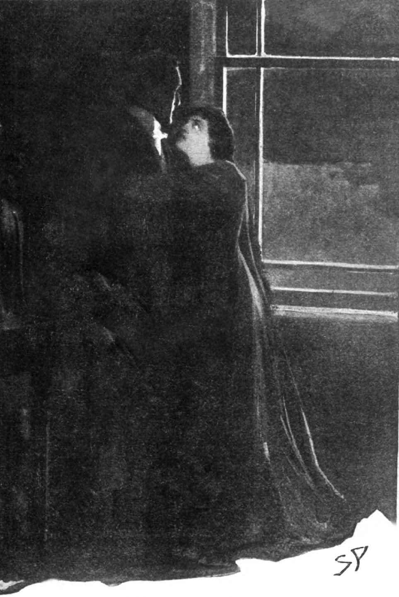

“妻子两臂抱住我，使劲不肯松手。”

“新画的几个人形你也有吗？”

“有，没几个，不长。我也画来了，这儿。”

他又掏出一张纸。新舞蹈的姿势是这样的：

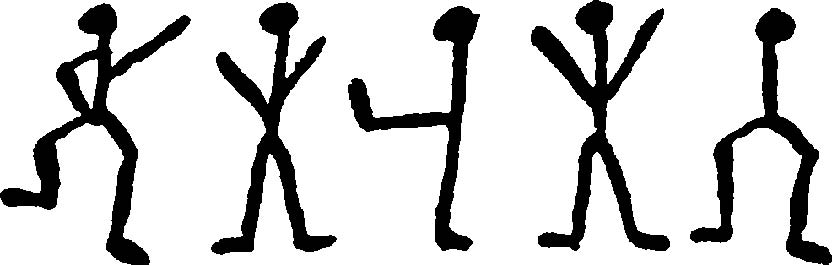

“告诉我，”福尔摩斯说——我从他的眼睛可以看出，他非常兴奋——“只不过是加在后面作为补充呢，还是完全脱离并不相干？”

“是画在另一条门板上，单独的。”

“好极了！这在我们是最重要最关键的注目点，我胸中充满希望了。好，希尔顿·丘毕特先生，请继续你的陈述，非常有趣。”

“没有别的要说了，福尔摩斯先生。除此之外，我很生气，那天妻子死命拖住我，要不那个贼流氓非叫我给逮住不可。妻子说她是怕我吃亏遭伤害，我心里忽然一闪念，说不定她真正担心的是他，那个人，会受到伤害，因为不用说，妻子一定知道这个人是谁，也知道画的这些符号是跟她讲什么意思。可是，听着我妻子讲话的口气，福尔摩斯先生，看着我妻子的眼睛，不容我生疑犯心病，我完全相信，她心目中所有的，确实只是我的安全。这就是全部情况，现在，要求你指点我应当怎么做才好。我是打算，叫上我庄园五六个伙计，埋伏在树丛里，等这个家伙再来，就给他一顿痛打，叫他今后不敢打搅，好让我们有平静日子过。”

“这样的对付方法恐怕是太简单了，这事可不是那么简单，”福尔摩斯说，“你在伦敦能待上多久？”

“我今天就得回去，我可不能让妻子晚上单独一个人，怎么也不行。她神经很紧张，她求我一定得回家。”

“这样也好。你要是能留下来，可能一两天后我会和你一同回去。那么，你先把这些纸留给我，看情况很有可能我不久就会去拜访你，帮你把这件事理出个头绪。”

福尔摩斯在我们的来访者离去之前，一直保持着侦探家惯有的平静，然而我作为他的挚友，不难看出他内心其实很是波澜起伏。一当希尔顿·丘毕特宽阔的背影在门口消失，我的同伴立即跑向桌边，把那些跳舞人形的纸都摊在面前，专心致志地投入复杂细致的研究。整整两个小时，我看着他把画有人形的纸，添上字母，一张张翻来覆去，全神贯注，没有片刻的停顿，已经完全忘记旁边还有我的存在。进行顺利的时候，吹吹口哨，哼哼曲子；逢有难住了的话，便蹙额皱眉、两眼发呆，坐上好一阵子。最后，他从椅子上跳起来，一声得意的欢呼，便搓起双手在屋子里走来走去，然后拿电报纸写了长长的一封电报。“如果按我希望的那样收到回电，你的探案集子里就又能增加非常有趣的一例，华生，”他说道，“明天我们有望到诺福克去，对这件叫我们朋友烦恼的谜案，给他带去一个确切肯定的说法。”

我心里充满疑问与好奇，真想立刻知道个究竟，但是也清楚福尔摩斯喜欢按照他自己的时间表、自己的方式方法来摊他的牌，所以我只好耐心等待他能向我摊明真相的那时刻。

可是回电迟迟不来，干等了两天。两天中福尔摩斯一直竖起耳朵关注门铃响。到了第二天的晚上，才来了希尔顿·丘毕特的一封信，宣告一切平静，只是那天清早又在日晷仪的基座上发现画着长串的符号。他临摹一张，附在信中一起寄来：

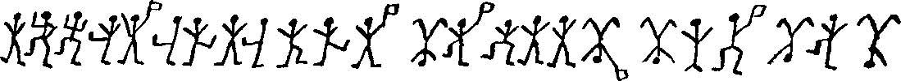

福尔摩斯伏案对着这串怪诞的图形看了几分钟，忽然惊跳起来，大叫不好，立时显出一脸的焦急与懊恼。

“这个事再也不能耽搁了，”他说，“今晚还有北沃尔沙姆的车吗？”

我翻了一下火车时刻表，最末一班已经开走。

“那，明天早点吃早饭，赶头班车，”福尔摩斯说，“非要我们出场不可了。啊！我们盼着的电报来了。等一等，哈德森太太，可能要给个回电。噢，不必了，完全不出我所料，来电已经再清楚不过，我们一小时也耽搁不得，赶快让希尔顿·丘毕特知道眼下事态的严重性，我们这位诺福克绅士，正人君子，已经掉进罪恶的罗网，危在旦夕。”

情况证明确实如此，这个故事起初在我看来只不过像是小孩子玩游戏，非常可笑，现在临到了收尾，现出了凶象，让我又一次经历一场惊愕与恐怖，身心为之震动。我真希望带给我的读者多少有点光明与希望的结局，但是作为刑案史实的记录，我必须把一连串凶险少见的罪恶事件如实陈述，这些事实一度使得马场村庄园成为全英国家喻户晓的名词。

我们刚一到达北沃尔沙姆，提起要去的目的地的名字想问问，站长已经在急急忙忙向我们跑过来。“请问两位是伦敦下来的侦探吧？”他说。

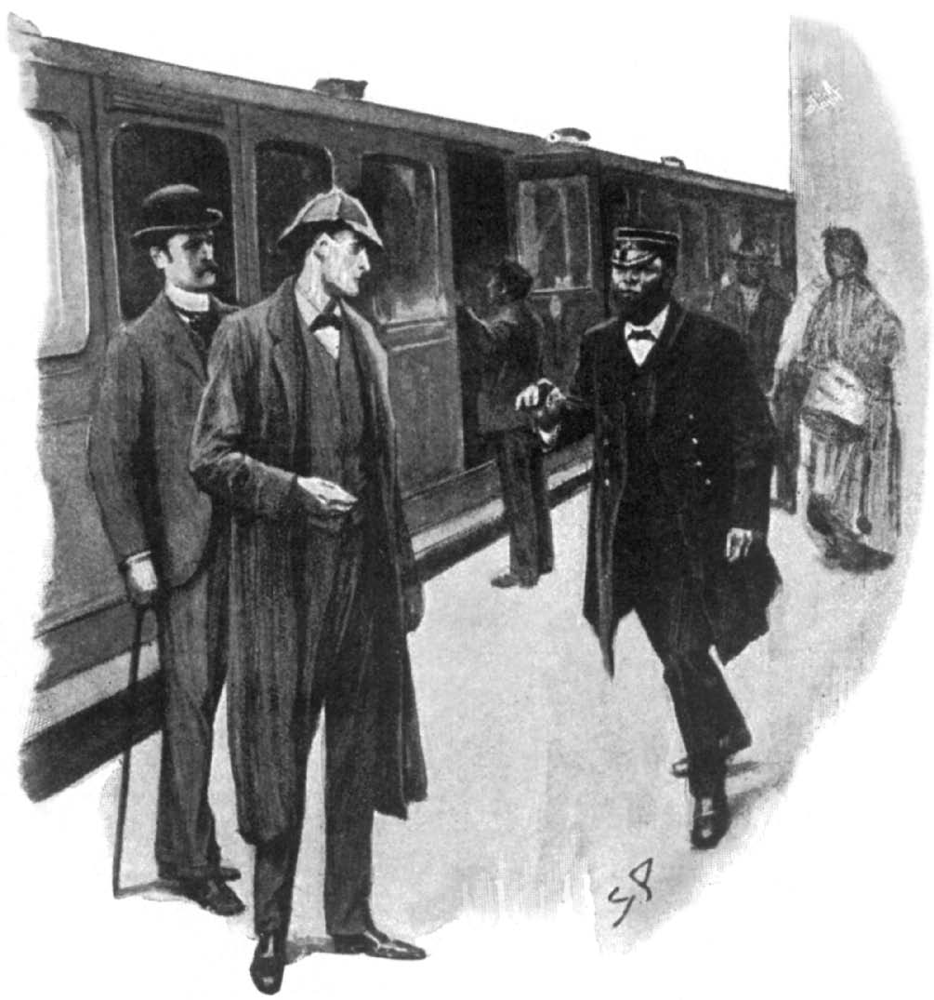

站长急急忙忙向我们跑过来。

福尔摩斯的脸上掠过一丝不悦的神色。

“您为什么就想到侦探这事儿？”

“因为诺威奇的马丁警长刚从这儿过去。那么您两位也许是外科医生了，女凶手还没死——刚才来的消息还是这样讲，你们过去抢救还来得及——抢救也是好让她上绞架吧。”

福尔摩斯听后急得眉额都皱黑了。

“我们是去马场村庄园，”他说，“可我们没听说那儿出什么事呀。”

“可怕人啦，”站长说道，“都挨枪打了，希尔顿·丘毕特先生和他妻子两个。女的先开枪打先生，再打自己自杀——女佣人说的。先生死了，妻子也没啥希望了。可惜，可惜，这原是诺福克郡最古老的家族，声望最高的一家。”

福尔摩斯没再吭声，赶快跳上一辆四轮马车，赶长长的七英里路，一路都没有开口。他这样的灰心丧气我很少见过。从城里出来在火车上我看他一直是心神不宁、心急火燎的样子，把晨报翻来覆去地查阅。现在他最担心害怕的事硬是发生了，难怪他伤感。他背倚靠垫，在那里茫然若失，但是，看那四野的风景却十分撩人兴致。我们所过之处，乃是英国风光这边独好的乡村地，那稀疏散落的农舍显示今日的人口已不兴旺；四面八方到处有教堂，座座高大的方塔拔地耸立在葱绿平原的景色中，诉说着昔日东盎格里亚<a href="#part0102.xhtml_ch1"
id="part0102.xhtml_ch1-back">(1)</a>的荣华与昌盛。最后便是浩淼的紫蓝色北海，出现在诺福克绿色沿岸之外。车夫举起马鞭指指前方树林中冒出来的几堵旧砖木山墙，说道：“那就是马场村庄园。”

我们驶向有门廊的大门，看见大门的前面，网球草坪的边上，就是那间黑黑的工具间，以及有底座的日晷仪，这都让我们产生过种种奇异的联想。这时有一个人，短小精悍，动作敏捷，留上蜡尖翘的小胡子，刚刚从一辆轻便马车上下来，他自报是诺福克警察局的马丁警长。一听说我同伴的名字，他马上表现出惊讶。

“啊，福尔摩斯先生，这件案子刚发生，是今天凌晨三点。你在伦敦怎么知道，还跟我一样快来到了现场？”

“是我预料到的，我来，希望阻止它不要发生。”

“那么说，你早掌握重要案情了，我们倒是一点都不清楚，只知道他们这一对是最恩爱的夫妻呢。”

“我只有跳舞人的证据，”福尔摩斯说，“这个事我过后向你解释。既然惨剧没能阻止发生，我这儿刻不容缓，用我掌握的资料来主持公道，伸张正义。你和我一起进行调查呢，还是觉得不便，我归我单独进行？”

“我当然不胜荣幸能有机会和你一起进行，福尔摩斯先生。”警长急忙说。

“既然如此，我很乐意听取证词，进行现场检查，不要无谓耽搁时间了。”

马丁不失明智，放手让我的朋友按他的方式行事，他本人则满足于把调查结果仔细记录下来。本地的外科医生，一位白发老者，刚从希尔顿·丘毕特夫人房里下来，报告说夫人伤势很严重，但不一定致命，子弹打进前额，要使她恢复知觉恐怕还要有一些时间。关于夫人的枪伤是被击还是自击的问题，医生不敢贸然表示肯定的意见。当然，子弹是极近的距离击发的。房间里只发现一把手枪，弹膛里空了两发子弹，希尔顿·丘毕特先生的心脏被击穿。两种情况都可以设想，男的打了女的再自杀，或者女的是凶手，因为掉在地板上的左轮枪是在他们两人的中间地位。

“男的给动过没有？”福尔摩斯问。

“除了女的，我们什么也没有动。要抢救，不能让她躺在地板上。”

“你来这里有多久了，医生？”

“四点钟到这里。”

“还有别人吗？”

“有，这里的警官。”

“你什么也没有动过？”

“一点没动。”

“你考虑很周到，做得很对。是谁去请你来的？”

“这家的女仆桑德斯派人叫我的。”

“是她报的警？”

“她和厨娘金太太。”

“她们现在在哪里？”

“在厨房里吧，我想。”

“那么，我们就去请她们来讲讲事情经过吧。”

这间橡木壁板和高窗户的古老大厅，就当作了调查庭。福尔摩斯坐在一把老式的大椅子里，憔悴的脸上一对眼睛却在洞悉一切地闪闪发光。我从他眼睛里看出了坚定不移的决心，哪怕用毕生的精力也要把这件案子查清楚，非要为这位未能搭救的委托人报仇雪恨不可。其余就是制服笔挺的马丁警长、白发苍苍的乡村老医生、我自己，还有一位木头木脑的本村警察，构成了庭上这么奇怪的一组人。

两个女人把经过情形讲得很清楚。她们睡梦中被枪声惊醒，分把钟以后接着又是第二枪。两人的卧房是比邻在一起的，金太太这时已经跑到桑德斯房间里来，她们就一起走下楼梯。书房的门开着，桌上点一支蜡烛。男主人扑倒在屋子中央，已经气绝身亡。靠近窗口，他的妻子蜷缩在那里，头歪贴着墙，半个脸全叫血染红了，伤势很怕人。她还在沉沉地喘气，可是说不了话。过道上，屋子里，都是烟和火药味。窗子是关好的，还从里面闩紧着，这一点两个女人一致认定没问题。她们立即派人请来医生，叫了警察，然后，马夫和小马倌帮忙，一起把受伤的女主人抬到她的房里。看床上样子，出事前主人夫妻两个都已经睡下了。女主人穿好着衣服——男主人穿睡衣，套着休闲服。书房里的东西，都没有动过。就她们所知，主人夫妇之间从来没有拌过嘴，所以一直把他们看作是非常和睦恩爱的一对。

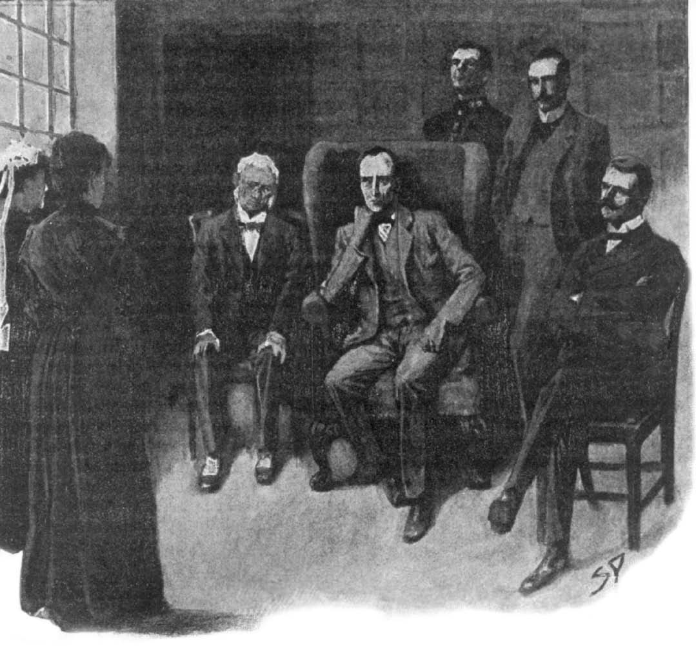

两个女人把经过情形讲得很清楚。

这就是仆人证词的主要之点。她们回答马丁警长的问话，说是她们很清楚，每扇门全都从里面闩好的，没有人从屋子里往外逃。还回答福尔摩斯的询问，两人都说记得刚从顶楼她们屋里跑出来，就有一股火药味，两人都闻到的。“这个事实，请一定要注意了，”福尔摩斯对他的刑侦同事说道，“现在，我看，该去把屋子进行彻底的检查。”

一看书房，原来是间很小的屋子，三面都摆着书，临窗是一张写字台，窗外望出去就是花园。我们首先注意到的是遇难的绅士，骨骼魁梧的尸体四肢撑开趴在地上。衣服不整，说明他是从睡床上匆忙起身的。子弹从前胸射入，穿透心脏，留在了体内。他一定是瞬息间被击而死，所以不见痛苦。衣服上、手上都没有火药痕迹。据乡村医生说，夫人脸上黏有火药，手上没有。

“手上没有不说明问题，有的话当然就能说明问题，”福尔摩斯说道，“因为，除非是子弹不佳，火药会后喷，否则击发正常，打多少发也不留火药痕迹。我建议，丘毕特先生的尸体现在可以搬走了。我想，医生，夫人伤口的子弹还没有取出来吧？”

“要动复杂的手术，子弹才能取出来。那支左轮枪里还有四发子弹，打掉两发，造成两处伤，有下落，所以六发子弹是清楚的。”

“初看没错，”福尔摩斯说，“那么，你也许能说说还有一颗子弹的下落吧，清清楚楚是打在这儿窗口上的？”

他突然转过身去，伸出细长的手指，指着窗框底边一英寸处的一个穿透的小洞。

“真的，没错！”警长叫道，“你怎么看到的？”

“我在找，才找到的。”

“实在高明！”乡村医生说，“你完全正确，先生。那就是还打过一枪，也就是还有第三个人在现场。那是什么人呢？是怎么跑掉的呢？”

“这正是我们面临的必须解决的问题，”福尔摩斯说，“你记得吗，马丁警长，仆人说她们从房间里出来的时候就闻到一股火药味，我不是提醒过这一点很重要吗？”

“是的，先生，但是坦白说，我不太明白你是什么意思。”

“那就是说，打这一枪的时候，门还有窗都是开着的，不然的话，火药味不可能在屋子里蔓延那么快，一定得有穿堂风才能吹得弥漫开来。但是，门和窗打开的时间又很短暂，只一会儿工夫。”

“这又怎么知道呢？”

“因为，蜡烛没有烛泪。”

“对啊！”警长叫道，“对啊！”

“既然肯定惨剧发生的时候窗是开着的，那么可以设想其中参与着第三人，这个人是站在外面朝屋里打的枪，而从屋里对这个外面的人开枪，就很可能打到窗框上。我一看，果然是，那上面有弹痕！”

“窗子又怎么关好、上闩了呢？”

“女人本能的第一反应就是快把窗关好、闩好。哦呵！这是什么？”

那是一个女用手提包，立在书房的桌子上——鳄鱼皮镶银边、小巧精致的手提包。福尔摩斯将手提包打开，倒出里面的东西，是二十张英国银行的钞票，每张是五十英镑，用橡皮圈箍住——没有别的。

“这个手提包务必保管好了，出庭作证有用，”福尔摩斯说，随手把钱放进手提包，交给了警长，“现在我们必须来研究一下这另一颗子弹怎么回事，从木头的碎片来看，很清楚，子弹是从屋子里面向着外面打的。我还想再问问厨师金太太。你讲的，金太太，你是被一声很响的枪声惊醒的，那是不是觉得，这一声比你第二声听见的要响对吗？”

“哦，先生，我是睡着了给惊醒的，这就难讲是不是了，反正那一声好像特别响就是了。”

“你不认为或许是两枪正好一起开的呢？”

“这个我可真的说不准，先生。”

“我认为那是两枪一起打的声音，我确信是这样。我想，马丁警长，这个屋子已经看得差不多了，如果你愿意同我一起走走，我们到花园里去看看有没有新证据可以发现。”

一座花坛延伸到书房的窗前。我们走近一看，都不约而同惊叫起来，花给踩倒了，花坛的泥上全是脚印。那是男人的大脚印，脚趾前部特别长而尖。福尔摩斯在草地上、落叶中寻找，像一头猎犬搜寻中枪落地的飞鸟。接着，发出一声高兴的呼叫，俯下身去捡起一枚小铜壳。

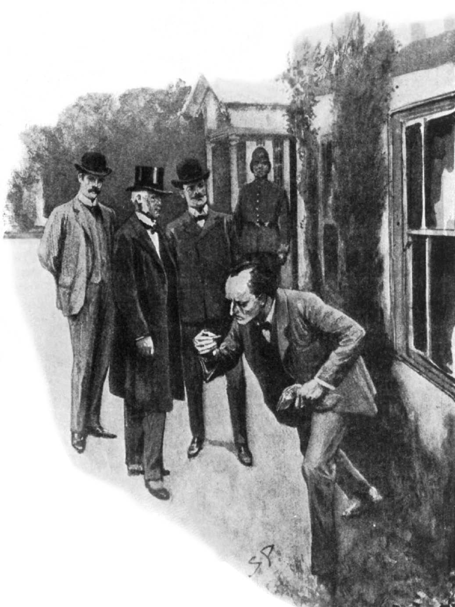

俯下身去捡起一枚小铜壳。

“不出我所料，”他说道，“那支左轮枪有推顶器，这就是第三发子弹。我要说，马丁警长，本案已可了结。”

乡村警长对福尔摩斯如此神速奇妙的侦破过程，脸上显出莫名惊讶。起初他还表露一点不相信，想要说说自己的意见，但马上收住，表示不胜敬佩，愿意一切听从福尔摩斯，绝无疑义。

“你怀疑是谁打的？”他问。

“我以后再谈，这个问题有几点还对你解释不了。我既已走得那么远，就得按自己的路走下去，等以后再把情况一古脑儿和盘托出。”

“随你便吧，福尔摩斯先生，我们只要把凶手逮住就行。”

“我无意故弄玄虚，只是在破案行动之中不便对破案来作详尽费时的解释，这不太可能。本案的线索已悉数在我手中捏住，即使这位夫人醒不过来，我们照样可以把昨天夜里发生的事情给予复原，确保公正判决。首先，我想知道这儿附近有没有一家叫‘埃尔里奇’的旅店？”

对仆人一个个问过来，可是没人听说过这么个地方，只有小马倌提到他好像记得有个农场主，叫这个名字，住在东罗斯顿那边，只有几英里远。

“是孤零零的一个农场？”

“单独的一个，先生。”

“这儿夜里出事，大概那边还一点没听说吧？”

“大概还没有，先生。”

福尔摩斯想了一会儿，脸上一展不可捉摸的微笑。

“备马吧，小伙计，”他说，“请给我送一封信到埃尔里奇农场去。”

福尔摩斯从口袋里掏出那些个跳舞人的纸，搁到书房的桌子上，坐下来忙乎了一阵。完了把信给孩子，关照一定要交到信上名字的本人手里，特别注意那人要是问起什么，一概不知道，不要回答。我看见信封上的名字写得歪歪斜斜很潦草，完全不是福尔摩斯平时那笔工整的笔迹。信上写：转交阿贝·斯兰尼先生，埃尔里奇农场，东罗斯顿，诺福克。

“我想，警长，”福尔摩斯说道，“你还是做得到家一点，发一封电报要求派个警士来比较好。要是我估计正确的话，你将要逮捕一个犯人押送到郡监狱，那是个凶恶危险的家伙。电报交给送信的孩子去发，没有问题。如果下午有火车回城，华生，我想我们要赶这趟车，我还有化学分析要完成呢，这分析可有趣啦。手上这件案子嘛，很快就告结束。”

少年被打发去送信了，福尔摩斯回头吩咐仆人们，如果有人上门来看希尔顿·丘毕特夫人，不要透露她现在的身体状况，只把来客马上领进客厅就是了。他极其认真、再三强调这一点。他布置完毕就领大家去客厅，说现在我们手上已经没事可做，大家休息坐等吧，等着瞧下面会怎么样。医生去照看他的病人，一起留着的只有警长和我。

“我想，趁此找点乐趣、做点有意思的事情，来打发一个小时，”福尔摩斯说，把椅子挪到桌边，面前摆开那些画有滑稽跳舞人的纸条，“对你呢，华生朋友，我欠着你的债，早答应满足你的好奇心，一直都还没有兑现。对警长你，本案从头到尾不啻是一堂极有价值的刑侦研究课。首先我得告诉你，在希尔顿·丘毕特先生两次来贝克街找我商量，情况就非常有趣了。”他接着把前面已经记述的事实简单扼要地讲一遍。“这些作品拿来我看，虽说难得一见，但若不是这么一桩惨案随着发生于后，谁见了也不过置之一笑。对于各种密写术，我比较熟悉。本人曾经写有粗浅的专题论文，对一百六十种不同密码作出分析，但是手上这个我还是第一次见到，完全陌生。创造这么一种密写方法的目的显然是为了掩盖它是密码传递，要给人假象，那不过是小孩子涂涂画画好玩的东西。

“然而，一旦识别它是代表字母的符号，用上我们所知的各种密写方法的规律，破解也就不难。第一张给我的纸条太短，我看了最多有把握说这个符号代表E。你们也知道，E在英文中是最常用的一个字母，非常显眼的，哪怕是很短的一个句子，也是出现最多的。第一张纸上十五个符号，有四个是相同的，那么确定都是E大概不会错。我们还看到，这个人形有几处擎着小旗，有的没有，从擎旗人形的分布状况来分析，很有可能是用作词的分隔符。我作出这个大胆假设，记下来，这个人形是代表E。

“但是，现在最难的问题来了。英文字母除了E，其他字母使用情况的次序就不清楚了。一页印的文字中哪个字母运用最多的，在一个句子中可能正好相反，倒很少。大致上讲，字母按出现数量多少来排列，是T，A，O，I，N，S，H，R，D和L这么个顺序，但是T，A，O和I出现多寡很接近，不相上下。想把它们彼此组合出成意思的词，这项工作做起来将是没完没了没有止境啦。我于是只好等待有新材料送来再说。希尔顿·丘毕特先生第二次来访，又给了我两个短句子，还有另外一张纸，这张纸上——因为没有举小旗子的——只是一个单词。符号是这样，在这儿。现在，这个单词是五个字母的词，我看出里头有两个E，就是第二和第四个字母。这个词可能是‘sever切断’，或者‘lever杠杆’，或者‘never绝不’。毫无问题，使用末了一个词来回答某个请求的可能性最大，那么情况也就表明它是夫人写的回答了。这个判断正确的话，我们现在就可以说这三个符号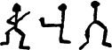分别代表N，V和R。

“即使是到了这个时候，我的困难还是很大。可是一个灵感让我开窍，知道了其他几个字母。我突如其来想到，多半是丘毕特夫人年轻时候一个很熟的人，来向她提出什么要求了。那么，两头是E、中间夹有三个字母的一个词，不恰恰就是这个名字ELSIE埃尔茜！再一检查，发现以这个词作为结尾的材料，重复出现三次，那肯定是向Elsie坚持某种要求。这样，我又得出了L，S和I三个字母。但是要求什么呢？在Elsie前面的这个词只有四个字母，末一个字母是E。可以确定这个词必是“COME来”。我试过其他以E结尾的四字母词，但是发现没有一个能适用于本案情况。这样我又获得了C，O和M，我便回头再研究那第一份材料，把它分成单词，还不清楚的词用点来做记号，经过处理，结果就是这样的了：

. M. ERE.. E SL. NE.

“这里，第一个字母只能是A，这个发现极其有用，因为出现在这个短句中不少于三次，第二个词中显然是个H。好，那就是这样：

AM HERE A. E SLANE．

“还空缺的显然是个名字，可以填充了：

AM HERE ABE SLANEY．

（我已到此　阿贝·斯兰尼）

“我有了那么许多字母，现在已经信心十足，可以继续看第二份材料，把它恢复出来是这个样子：

A. ELRI. ES．

“这里空缺的字母只能填T和G才合乎意思，‘at
Elriges住在埃尔里奇’，推测起来这名字是写信人所住的某家人家或者旅馆。”

马丁警长和我兴致勃勃、全神贯注地听我的朋友充分详尽地讲述如何找到答案的经过，我们的疑团完全解开。

“后来你怎么样呢，先生？”警长问道。

“我有充分的理由假设，这位阿贝·斯兰尼是个美国人，因为阿贝是个美国简称人名，还因为一封从美国来的信是本案的引发点，也使我想到这件事有深层的犯罪秘密。女主人讳言过去，不愿意同丈夫讲明，这两点促使我朝这方面去想。因此我发电报给朋友，纽约警察局的威尔逊·哈格里夫，他多次向我咨询过伦敦的刑案情况，我问他是否知道有阿贝·斯兰尼这么个人。他的回电是这样的：‘芝加哥头号刑事犯。’就在收到这封回电的那天晚上，也收到希尔顿·丘毕特寄给我斯兰尼的最后一份材料。用已知字母来复原他的话应该是这样：

ELSIE. RE. ARE TO MEET THY GO．

“再添上P和D，这句话的意思就出来了：埃尔茜，准备见上帝。我看到这个大流氓从劝说转而发出威胁了。我很了解芝加哥这帮歹徒，知道他话一放出，随后很快就要下手。我立刻同我的朋友和伙伴华生医生来到诺福克，很是不幸，时间迟了，最糟糕的事情已经发生。”

“跟你一起协同办案，不胜荣幸，”警长热情地说，“不过恕我直言，你只对你个人负责，而我得向上级负责。要是这个住在埃尔里奇的阿贝·斯兰尼确实是本案凶犯，趁我这会儿坐在这里逃跑了，我可是担当不起呀。”

“你放心，他不会逃跑。”

“你怎么知道？”

“一逃就等于承认罪行。”

“那我们快去逮捕他。”

“我想他一会儿就要来这里。”

“他怎么会来？”

“是我写信请他来。”

“真难以相信，福尔摩斯先生！你叫他来他就来，为什么？这么一请，不是引起他怀疑，反而叫他赶快逃跑吗？”

“这就要看我这封信是怎么写，我清楚，”福尔摩斯说道，“果然吧，要是我没弄错，这位先生亲自登门来了。”

有个人大步流星在小径上向门口走来。一个高大、英俊、皮色黝黑的人，身穿灰色法兰绒正装，戴一顶巴拿马草帽，一大把黑络腮胡子，高挺的鹰钩鼻，边走边把手杖一挥一晃。他那昂首阔步的样子就像是踏进自己的家门。我们听到他非常自信地起劲按着门铃。

“我想，先生们，”福尔摩斯轻声说，“我们都到门后去站好了，对付这么个家伙得格外小心。你把手铐拿在手上，警长。你别出声，话我来讲。”

我们不出声静候了一分钟——这可是永远难忘的一分钟。门推开了，这个人抬腿跨步进来，啪地一下，福尔摩斯拿手枪柄对准他的脑袋就砸，马丁已经把手铐铐在了他的手腕上。手脚之敏捷利索，叫这个家伙猝不及防，立刻束手就擒。他瞪出黑眼珠凶光毕露朝我们一一看过来，接着爆发一阵苦笑。

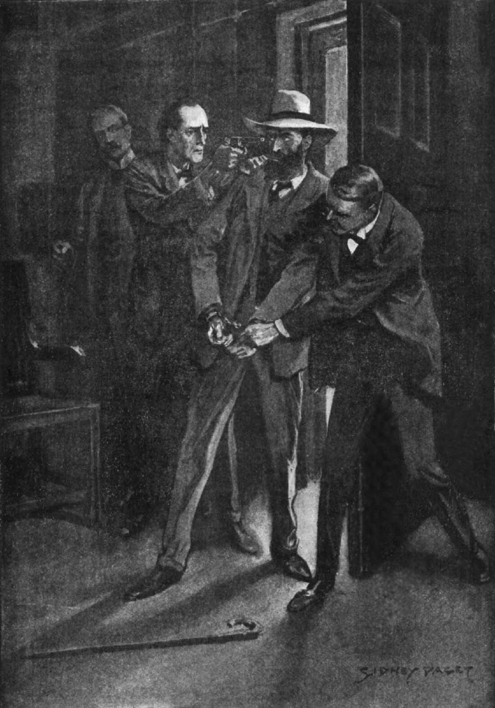

这个家伙猝不及防，束手就擒。

“好哇，先生们，这一回我给你们得手了，算我撞到枪口上了。我是接到希尔顿·丘毕特太太信才来的，这里头难道也有她不成？是她帮你们给我设这个圈套？”

“希尔顿·丘毕特夫人受了重伤，已经快要死了。”

这人一声嘶哑、悲哀的号叫，响彻整幢屋子。

“你胡说！”他厉声喝道，“伤的是他，希尔顿，不是埃尔茜！是谁伤着了埃尔茜？我只吓唬吓唬她——上帝饶了我吧！——可我是一根头发也舍不得碰她的呀！收回你的话——你给我收回！给我说她没有伤着！”

“发现她伤得很厉害，丈夫死了，她倒在旁边。”

他重重地跌坐在长靠椅上，沉沉地呻吟，把脸深深埋在戴铐的手中。有五分钟，他一声不吭，之后他又扬起头来，以冷静而绝望的语气说话。

“我没有什么要隐瞒你们的，先生们，”他说道，“我打死了希尔顿，是他先朝我开的枪，我没有谋杀罪。要是你们怀疑是我打伤了埃尔茜，那你们一点也不了解我，也不了解她。告诉你们，这世上没有哪个男人爱女人有像我这么爱她的了。我有权利要她，几年前她就答应嫁给我。这个英国人凭什么插进来拆开我们？我告诉你们，第一个有权娶她的是我，我要求的不过是我自己的权利。”

“是她要摆脱你，因为她发现了你是个什么样的人，”福尔摩斯威严地说，“她逃离美国，是要避开你，她嫁给了一位高尚正直的英国绅士。你追踪她，不放过她，使得她生活得很痛苦，你引诱她逼她抛弃自己尊敬、热爱的丈夫，去跟你这个她既恨又怕的人逃跑。你结果是把一位贵族杀死，逼得他的妻子自杀，这就是你在本案中的所作所为，阿贝·斯兰尼先生，你为此要负法律责任。”

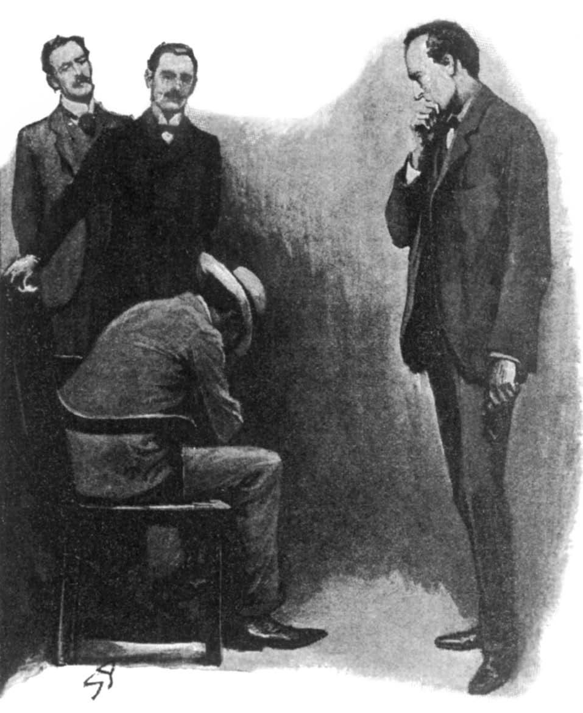

“你为此要负法律责任。”

“如果埃尔茜死了，我自己怎么都不在乎了。”美国人说。他张开一只手，看着手掌上捏皱了的纸。“瞧这个，先生，”他叫着，眼睛里露着疑惑的眼光，“你们别想拿这个来蒙我。你们能蒙得了我？埃尔茜真像你们讲的伤得那么厉害，那这信是谁写的？”他把纸团抛到桌上。

“是我写的，把你请到这里。”

“你写的？这世上只有我们帮里的人晓得跳舞人的秘密，你也能写得出来？”

“有人发明，就有人看懂，”福尔摩斯说道，“马车就要来把你押往诺威奇，斯兰尼先生，但是你还有点时间对你造成的伤害加以弥补。你知道吗，希尔顿·丘毕特夫人自己蒙受了谋杀丈夫的重大嫌疑，只是由于我来到现场，经过侦查，掌握资料，才得以不致受到控告。所以你应当给她洗刷，让天下人都清楚，对她丈夫的惨死，她不负有任何直接、间接的责任。”

“我会做的，”美国人说道，“看来我最聪明的做法就是把事实完全彻底讲清楚。”

“我有责任提醒你，这样对你自己会有不利。”警长高声道，以示执行不列颠刑法之不失严肃与公正。

斯兰尼耸耸肩膀。

“这个险，甘愿一冒，”他说，“首先，请诸位先生理解，这位女士，我们是自幼就相识。我们这个芝加哥的黑帮一共是七个人，埃尔茜的父亲，是我们帮的头目。这个老帕特里克是个极聪明的人，密写法正是他发明的，一般总看作是儿童涂涂画画的东西，不当回事，除非给你摸到其中的解法。后来，埃尔茜晓得我们的一些事了，她不能忍受我们的行当。她自己有着一点正当干净的钱，趁我们不备的时候溜掉，逃到伦敦。她原来同我都已经订婚了，我相信，要是我干上别的好职业，她就肯定嫁给我了。可是不光明正大的营生，她说什么也不愿意沾上关系。直到她嫁了这个英国人之后，我才知道她住的地方。我给她写信，但是始终没有回音，所以我就跑来了，写信不管用，我就使上密写法一定叫她看得到。

“算算，我来了已经有一个月。我落脚在那边农场，住在一间楼下的屋子，每夜进出方便，没有别的人来注意。我要想尽办法把埃尔茜弄走。我知道埃尔茜看到了密写，有一次她在我写的暗语底下给了回答。我耐不住了，就采取恐吓手段。她给了我一封信，求我走开，说给她丈夫引来什么不名誉的话，会使她心碎的；说只要我以后离开，不再来扰乱安宁，她答应半夜三点钟，等她丈夫睡了，她会到后窗口来同我见面说话。她真的下来了，还带上钱，想用钱买我把我打发走，我都要气疯了。我抓住她胳膊，要把她拖出窗外，就在这时候，她丈夫手里拿着枪闯了进来。埃尔茜倒在了地板上，我们两个就面对了面。我也带着家伙，我掏出枪想把他吓唬住，我好脱身。他向我开枪，没打中。我眼疾手快几乎同时就回他一枪，把他打倒。我急忙穿过花园逃走，只听见背后传来关窗声。我说的都是实话，先生们，句句实话。后来的事情都没有听说，直到小伙子骑马送来一封信。这信使我跑来这儿，像个傻瓜似的，把我自己交到你们手里。”

美国人谈话的时候马车到了，里边坐着两个武装警察。马丁警长起身，拍拍犯人的肩膀。

“时间到了，咱们走吧。”

“让我见见埃尔茜再走吧！”

“不行，她昏迷不醒。福尔摩斯先生，我只希望，若是再有大案到手，仍有你在身旁，也就荣幸之至。”

我们站在窗前，望着马车驶去。我回身过来，看见犯人抛在桌上的那纸团，就是福尔摩斯用来诱捕他的那封信。

“你看看，能不能读懂，华生。”福尔摩斯微笑着说。

上面没有文字，只画着一行跳舞的小人儿：

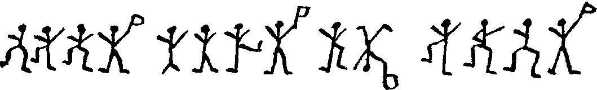

“你用上我破解的密码，”福尔摩斯说，“就很容易明白，意思是：‘Come here at
once．马上来这里。’我有十二分的把握，如此邀请，他非来不可。他做梦也想不到，此信除了他这位女士，还会有别人能写。所以，我亲爱的华生，我们已经大功告成，那些个跳舞人，一向被用于为非作歹，这一回反其道而行之，做了好事。我呢，也兑现了诺言，给你的小说笔记上添了点不平常的东西。三点四十分，我们有一班火车，我想快回贝克街赶上一顿晚饭。”

尾声再添几句话。美国人阿贝·斯兰尼，于诺威奇冬季巡回审讯中被判死刑，但是考虑到按情况量刑可予减轻罪行以及确实是希尔顿·丘毕特首先开枪，因而改判劳役刑。至于希尔顿·丘毕特夫人，我所知不多，只听说后来完全康复了，现在一直孀居，献身于济贫工作，并管理丈夫的家业。

（1903年）

————————————————————

<a href="#part0102.xhtml_ch1-back" id="part0102.xhtml_ch1">(1)</a> 东盎格里亚（East
Anglia），中世纪早期七国时代的一国，位于今东英吉利。

# 孤身骑车人

从一八九四年到一九〇一年这期间，福尔摩斯一直是个很忙的大忙人。可以毫不夸张地说，在这八年里，没有一件官方的疑难大案能不假手于他而得以了结。此外他还处理了数百起私人案件，其中好些案情错综复杂、稀奇古怪，他桩桩件件都有杰出的表现。在这么长时间持续不断的工作中，取得了许多辉煌的胜利，也不免有几起失败。所有这些案子我都给予充分、详细的记录，不少还是我亲身参与的。可想而知，从中选择哪些案件适合公之于众，实在不是一件容易的事。然而我还是按照以往的办法，优先选择的案件之引人关注，不是由于犯罪情节有多么凶险残忍，而是侦破结案足智多谋而又富于戏剧性。基于这一理由，我现在要呈献给读者诸君的是有关维奥莱特·史密斯小姐，即查林顿孤身骑车人一案，我们展开反复侦查，最关键时刻却出现不可逆料的悲剧性高潮。诚然，我朋友的破案能力业已闻名，此事未必更能锦上添花，然而该案有几点不同凡响，绝非我作为小说材料的其他诸多罪案记录可与比拟。

翻检一八九五年我的笔记，那是四月二十三日，星期六，我们首次与闻维奥莱特·史密斯小姐的事。对她的来访，我记得福尔摩斯极不欢迎，因为那时间他正埋头处理一桩事关重大的复杂问题，即著名烟草大王约翰·文森特·哈登陷于困境不能脱身。我的朋友，当集中精力于某一件事，对其他一切便置之度外，这时最不高兴别人插进来分散他的注意力，干扰他手上的工作。可是尽管如此，如果显得粗暴无理，又是于他本性所不容，他不能拒不听取来人的诉说。这是个年轻、貌美的女子，颀长、优雅、好风度，不顾天很晚了还跑到贝克街来，求福尔摩斯无论如何要给予指点和帮助。我们一再申明实在没有时间来处理她的事，结果不成，因为年轻女士来时决心坚定，除非把她强行赶出屋去，无法不叫她倾诉肺腑苦衷。福尔摩斯带着无可奈何的神情，露着倦容微笑，请这个美丽的强人所难者坐下，告诉我们她究竟遇到了什么麻烦事。

“问题至少和你的身体健康无关，”福尔摩斯说，锐利的目光向她一扫，“如此一位自行车爱好者，必定身体康健、精力充沛。”

女郎惊讶地看了一眼自己的双脚，我也观察到了她的鞋给车蹬有些磨损的鞋底。

“是的，我喜欢骑车，福尔摩斯先生，也就是为了这件事，我今天才来拜访你。”

我的朋友握起女郎未戴手套的手，全神贯注而不动声色地细察，如同科学家在检查标本。

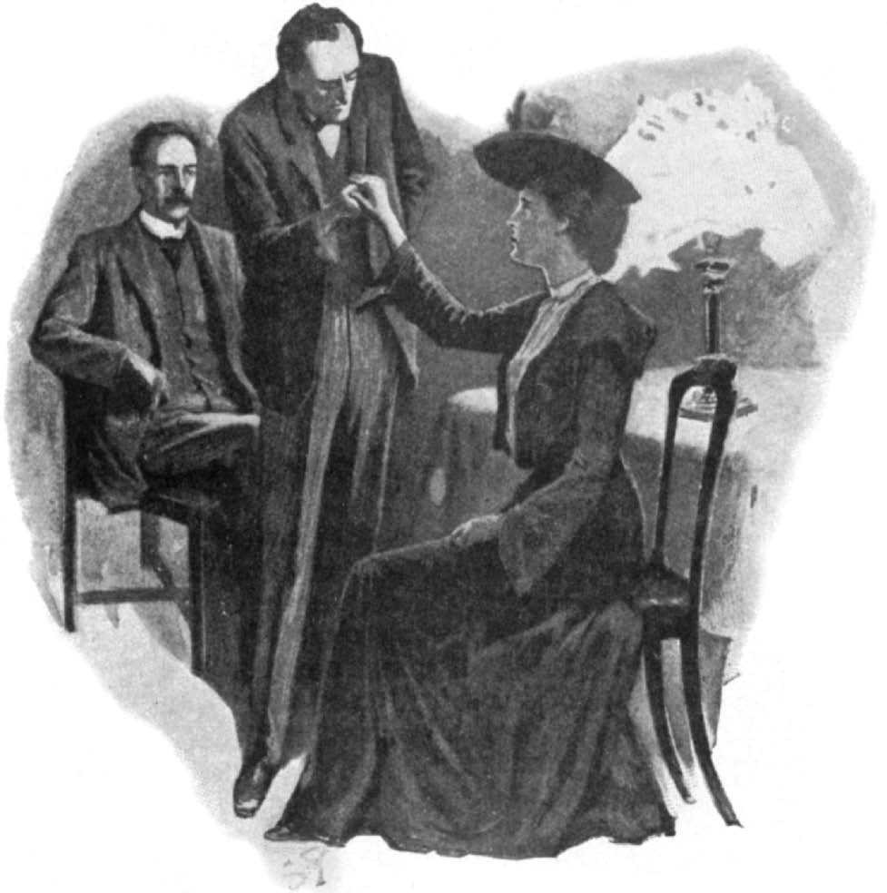

握起女郎未戴手套的手。

“你会原谅的，我相信，这是我的职责。”他说道，把手放下，“我差一点看错了，以为你是打字员，其实，很明显你是音乐家。你看到指尖有弯形吧，华生，这两种职业的人共同的特征。不一样的是，脸上的气质神态”——女郎的脸稍稍朝着亮光——“打字员是不会有的。这位女士，是音乐家。”

“是的，福尔摩斯先生，我教音乐。”

“看你的脸色，我猜是在乡村教。”

“是的，先生，在法纳姆那边，快靠近萨里了。”

“一个好地方，一提到就联想起好多有趣的事情。你记得吧，华生，也就是在那边，我们抓住了阿尔奇·斯坦福德，造假币犯。现在，维奥莱特小姐，你在法纳姆附近，萨里边界上，遇到了什么事呢？”

年轻女士清楚、镇定地作了下面这篇离奇古怪的陈述：

“我父亲已经死了，福尔摩斯先生。他叫约翰·史密斯，是老帝国剧院的乐队指挥，留下母亲和我两个在世上，无亲无故，只有一个叔叔，拉尔夫·史密斯。他二十五年前去了非洲，和我们从来不通音信。父亲故世，我们家境贫穷，可是有一天，人家告诉我们说《泰晤士报》登了广告，有人在寻找我们的下落，你可以想象，我们有多高兴，我们想一定是来给我们遗产这个事了。我们赶快找那个登报有名字的律师，到了那里，遇到两位先生，卡拉瑟斯先生和伍德利先生，他们是从南非回国探亲的。他们说都是我叔叔的朋友，叔叔几个月前在约翰内斯堡因极度衰竭而去世，去世之前曾经要求他们代找亲戚，但愿亲戚不致穷困受苦。不过我们也觉得事情很奇怪，拉尔夫叔叔活着的时候对我们从来不闻不问，死的时候才这么关心起我们来了。可是卡拉瑟斯先生解释说，原因是这样的，我叔叔一听到他哥哥已经去世，就感到对我们的处境负有责任了。”

“对不起，”福尔摩斯说，“你们是什么时候见面的？”

“去年十二月——四个月以前。”

“请继续讲。”

“伍德利先生这个人我觉得很讨厌，他老向我挤眉弄眼——一个年轻人，虚胖脸，红胡子，粗鲁相，头发在额前披散两边。我一看他就没好气——可以肯定西里尔一定不乐意我认识这么个人。”

“噢，西里尔是一位先生的名字！”福尔摩斯笑笑说。

年轻女士一阵脸红，笑了。

“是的，福尔摩斯先生，西里尔·莫顿，电气工程师，我们打算过了夏天就结婚。哎呀，瞧我怎么扯起他来了？我要说的是伍德利先生太叫人讨厌了。那个卡拉瑟斯先生，年龄稍大一点，还比较有礼貌。他脸色不好，灰里带黄，但脸修得挺干净，不多说话，态度挺和气，一直笑嘻嘻的样子。他问起我家父亲过世后生活怎么样，一听我说挺艰苦的，他马上建议说，让我来教他十岁的独生女儿学音乐。我说我不能离开母亲，他又提议说我每个周末可以回家照看母亲，他愿意付我一年一百英镑，这个出价是相当可观了，结果我答应了下来。事情就这样定了，我去了奇尔特恩农庄，离开法纳姆大约六英里路。卡拉瑟斯先生的妻子已经去世，是鳏夫，请了位女管家来料理家务，是一位上了年纪的人，叫迪克逊太太，挺让人尊敬的，孩子也很乖，我处处地方都称心满意。卡拉瑟斯先生很和气，很懂音乐，我们每天晚上在一起处得很愉快。一到周末我就回城在家里和母亲一起过。

“开心日子出现第一个不开心，就是红胡子伍德利先生来了。他每星期要来做一天客，哦，这一天在我等于三个月！这个人太可怕——事事只有自己没有别人，特别对我，更是肆无忌惮。他不怕出丑，老是献殷勤，说是爱我，吹嘘自己多么有钱，说如果我嫁给他，我会拥有全伦敦最名贵的钻石。最后，当我始终对他不理不睬时，有一天吃过晚饭，他竟然拖住我硬把我抱住——他那个疯劲儿可厉害——他要我吻他，咬牙切齿说不和他接吻就不放开我。卡拉瑟斯先生来了，把他拉开，他竟然回头对主人发脾气，动手打人。卡拉瑟斯先生给打倒在地，脸都裂开了、流了血。此后就不让他来做客了，你可以想象，这是当然啦。第二天卡拉瑟斯先生向我道歉，保证绝不会再让我受到这样的侮辱，从此以后就没见到过伍德利先生。

“现在，福尔摩斯先生，我要谈到紧要事情了，就是今天我来向你求救的事。你知道，每逢星期六午前时间，我总是骑自行车到法纳姆车站，要赶十二点二十二分的火车回城。从奇尔特恩农庄出来的那条路，偏僻冷落，特别是有一段，最冷清了。那一段有一英里多长，一边是查林顿欧石南灌木荒野，另一边是查林顿庄园外的大片树林。你在任何地方都找不到比这里更荒凉的路段了，难得会看见一辆马车、一个农民，一直要到了克鲁克斯伯里山那边的公路，才算好一些。两星期以前，我经过这个地方，也是巧，稍一侧脸往肩后看，我看见有一个男人，大约在后面两百码远，也是骑自行车，好像是个中年人，留短黑胡子。还不到法纳姆，我再向后看，这个人不见了，我也就没在意，没再想它。可叫我吃惊的是，福尔摩斯先生，星期一回去，在同一路段上又看见了这个人，你看有多怪。到了下个星期六、星期一，又是这个情况，跟上一回一个样，我就越来越感到不对劲了。这个人始终和我保持一定距离，没有任何举动，虽然如此，肯定不怀好意。我告诉了卡拉瑟斯先生，他一听我说，也感到奇怪，但是他告诉我已经订购好一匹马，还有一辆轻马车，这样，以后就不是一个人没伴走这条路了。

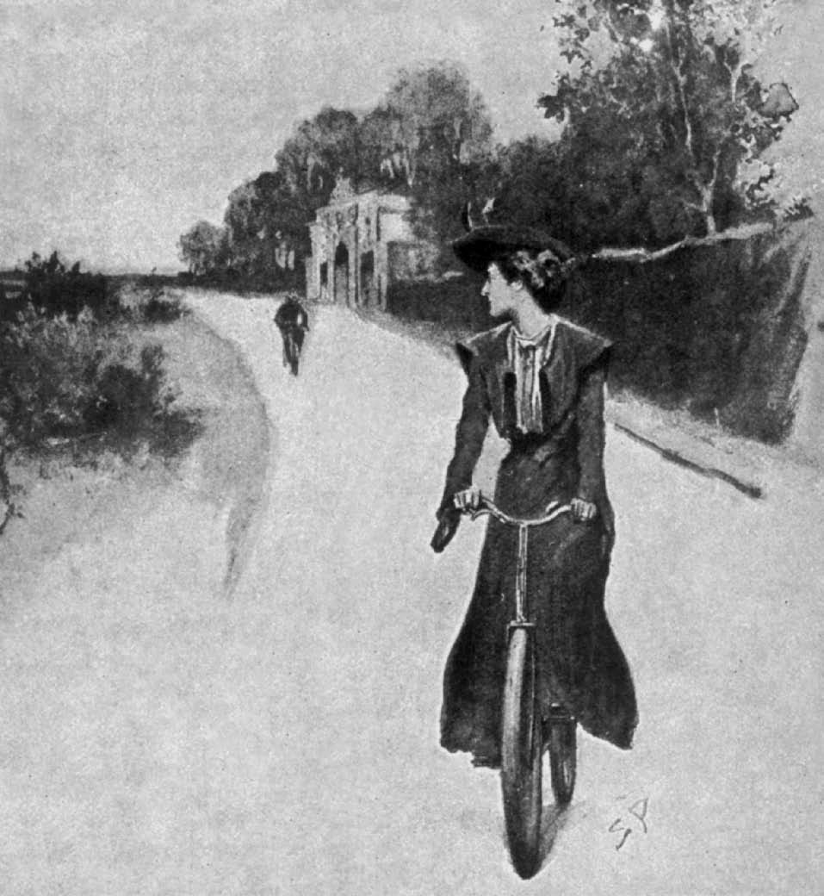

“这个人始终和我保持一定距离。”

“车和马本来这个星期要到的，但是不知什么原因，都还没有来，我也就只好再骑车去火车站。就是今天上午的事，你能想得到，我来到查林顿灌木荒地，又是那里，一点不错正是那个人，还是两个星期前的老样子。这个人始终和我保持这么一段距离。我看不清他是什么样的脸，不过肯定是个陌生人，穿黑色正装，戴一顶布帽，脸上看得清的就是有黑胡子。今天我胆大了，心里只是觉得好奇怪，决定设法看一看他的真面目，了解他到底想要干什么。我放慢速度，他也跟着慢下来，我干脆就停了，他也停下来。接着我心生一计，前面路上有个急转弯，我快蹬几下转过那个角，马上停车，等着，心想他一定要撞过来，刹不住车，冲到我前面去。谁知，就是不见他过来。我倒回去，绕过拐角看，可以望得见一英里的路，路上居然没见他人了。这更让我好生奇怪，这一程根本没有岔路，他没法跑掉呀。”

福尔摩斯笑得格格有声，搓起了双手。“这个事情倒是很有些出奇的地方，”他说道，“你转过拐角，再看路上，不见了人，这有多长时间？”

“两三分钟。”

“那，原路退回去，时间不够，你又说没有岔路可走？”

“没有。”

“那就一定走了路边什么小径。”

“灌木荒野地那边不会有的，有我也就看到他了。”

“是这样，那么按照推理排除法，我们可以得出结论，这个人是跑到查林顿庄园去了。那个地方，据我的理解，路的那一边都是它的领地。还有别的吗？”

“没有了，福尔摩斯先生。我只觉得太不可思议了，不来找你征求你的指点，我是没法安心的。”

福尔摩斯静静地坐了一会儿。

“你订了婚的先生在哪里？”他最后问道。

“他在考文垂的米德兰电气公司。”

“不会是他来看你，让你惊喜好玩？”

“哦，福尔摩斯先生！难道我还会认不出他吗！”

“有没有其他爱慕你的人？”

“认识西里尔以前有一些。”

“现在呢？”

“那个讨厌鬼，伍德利，也算得上你说的爱慕吧。”

“没有别人了？”

我们这位漂亮的委托人显得有些局促为难。

“他是谁呢？”福尔摩斯追问。

“哦，或许是我单方面过于敏感，但有的时候，我感觉到我的东家卡拉瑟斯先生，对我十分有意思。我们朝夕相处，晚上我给他伴奏，他始终没有说过什么。他是一位很好的先生，可是我心里总能明白。”

“噢，是这样！”福尔摩斯显得严肃了，“他靠什么生活？”

“他是个富人。”

“马和四轮车都没有？”

“哦，他确实是个很富裕的人，他每星期要进城两三次，对南非黄金股市兴趣最浓。”

“有什么新情况你马上告诉我，史密斯小姐。这会儿我正忙，你这案子我会抽时间处理，有什么事你不要不通知我就擅自行动。再见，相信我们能等到你的新消息。”

“这样一位窈窕淑女，君子好逑，也是大自然的既定规律，”福尔摩斯说，大口抽着他那支思考的烟斗，“不过好逑也不能求到乡村冷落道路上去追车。是个居心叵测的好逑者，毫无疑问。这个事情，其中有蹊跷，不一般，华生。”

“因为是专门在那个地段出现吗？”

“正是。我头一件必须做的事，要了解查林顿庄园里住的什么人，然后，查明卡拉瑟斯和伍德利之间是什么关系，两人好像属于完全不同的类型嘛。为什么两个人一道热衷于寻找、联络拉尔夫·史密斯的亲属？还有一点，卡拉瑟斯家离火车站有六英里远，连一匹马都没有，可偏偏要出双倍的代价来雇一个家庭教师，这样的家庭经济是什么道理？奇怪，华生——非常奇怪！”

“你下去走一走吗？”

“不，我亲爱的伙计，由你去走一趟，说不定也就是件小阴谋诡计，未必有大名堂，这就免得让这件事打断我手上的重要工作。星期一你一早就到法纳姆去，在查林顿石南灌木那个路段隐藏起来，当场亲眼观察，有情况见机行事。再探问一下庄园里住什么人，就回来向我报告。现在，华生，这件事就这样了，等有了调查的结果，看怎么个对待、解决，到时候再说。”

我们根据女士的陈述，知道她是星期一乘滑铁卢九点五十分的车回去，所以我赶在前头坐上九点十三分的车。到了法纳姆车站经询问，毫无困难就来到查林顿灌木荒野。地方很明显，不会错失女郎所讲的历险之地。就一条大路，一边是广阔的欧石南灌木地，另一边是老紫杉树篱围起的一家花园，花园里树木参天。一条园门主道，铺路石长满地衣苔藓，园门两边的石柱上挂满破旧的纹章标记。除了中央马车道，还看见树篱几处缺口，都有小径可通。宅屋从路上望不见，但是那环境的印象显得阴郁、破落。

灌木地上铺缀着荆花丛开的片片金黄，在明媚春日阳光中熠熠生辉。我选定一丛躲起来，可以看得见庄园大门车道，也看得到一长段大路的两边。我从路上下来的时候渺无人影，现在看见一个骑车人向我刚才来的方向过去，穿的黑色套装，还看清是黑胡子。他骑到了查林顿园地，就下了车，推车穿过树篱的缺口，就不见了踪影。

过了一刻钟，又来第二个骑车人。这一回，是年轻女士了，从车站方向过来。我看见她经过查林顿灌木地便向周围望望。不一会儿，那个男人从隐藏的地方出现，跳上车，跟随在女士后面。一幅宽阔静谧的风景上，两个人影在追逐飞驰，美丽的姑娘挺直地坐在车上，后边的男人弯腰俯身于车把，一举一动形迹神秘鬼祟。女士回头望望他，放慢蹬脚，男的也减速，姑娘停住，他就立刻刹车，一直保持大约两百码远近。姑娘出其不意猛回头蹬车径直向他冲去，他也一样敏捷地拼命往后逃。姑娘就回身走自己的路，傲慢地昂首而去，再也不屑理睬这个不敢出声的追随者。男的立即掉头，保持距离继续跟随，直到转过大路，我就看不见了。

我待在藏身的地方，幸亏没有离开，因为这时候那个人又出现了，在慢吞吞地骑回来。他拐向庄园大门，下了车。我看见他站在大树下有几分钟，抬起手来像是整整领带，然后再跨上车，从我身边骑过，沿车道朝庄园驶去。我穿出灌木丛，在树后张望，透过树林我隐约看见灰色的旧宅，矗立着好些都铎式烟囱，可惜车道穿入矮树林，就再也看不到人了。

然而在我，好像一日之计的晨事，已圆满告成，便转身踌躇满志地向法纳姆走去。当地房产经纪人对查林顿庄园是一问三不知，叫我去帕尔马尔转问一家著名的公司。回家途中在那儿暂作停留，受到经纪人殷勤接待。说是不行了，我今年想租用查林顿庄园避暑，已晚了一步，庄园一个月前就租了出去。租借人叫威廉森先生，一位有身价的老绅士。客气的经纪人打招呼说，不便告诉更多的情况，因为他对顾主不可议论。

这天晚上，福尔摩斯先生专注地听取我这篇极其详尽冗长的报告。我自忖有功，企望甚高，可是结果，连一言半语的赞赏话都不曾获得，相反，他那张一向严肃的面孔更严峻起来，对我做了的事和没有做的事都给予评价。

“你躲藏在那里，我亲爱的华生，根本不是地方，你应当躲到树篱后边去，这样才是距离最近，能把这个目标看得一清二楚。现在你看，相隔好几百码，报告给我的情况甚至比史密斯小姐讲的都要少。她讲她不认识这个人，可我相信这个人她一定认识，否则的话，这个人何必拼命躲开距离，不让靠近，不让看到自己的面孔？你描述了一番，他如何弯下腰趴着车把手，那又是在遮掩自己的面目，你要知道。好事没有做好，等于白跑一趟。他回到了宅子里去，你应当摸清他是什么人才对，你却来伦敦一家房屋代理商这里打听！”

“那我应该怎么办呢？”我反问道，脑袋都发涨了。

“你应当去附近的酒店，乡下传言的中心地，那里打听什么人都不落空，从主人到帮厨女工，他们会告诉你每个人的名字。威廉森？我没一点印象。说他是个有年岁的人了，那就不是这个人，能有劲头骑车，翻身跳上跳下，还不让年轻女车手追得上。你这次远行有什么收获呢？证实了姑娘的话不假，这个我本来就毫不怀疑。证实追车人同庄园有关系，这个我也是毫不怀疑。庄园给威廉森租去了，这能说明什么呢？好啦，好啦，我亲爱的先生，也不必懊恼、丧气，星期六以前我们还可以有点补救，同时，我自己要做一两次调查。”

次日早晨，我们收到史密斯小姐的一封信，简述了昨天的情况，与我所见完全一样，但信的重要内容在于附言部分：

我相信，福尔摩斯先生，你会尊重我向你吐露的秘密，我要说的是我在这里的处境已很困难，原因是我的雇主向我提起求婚。我相信他的感情确实是真诚高尚的。当然我说明我早已允诺了别人。他对我的拒绝看得非常严重，但仍然非常和气。然而你能理解，彼此有点尴尬了。

“我们年轻的朋友看来深陷于困境，”福尔摩斯读完了信，颇有心事地说，“情况越来越蹊跷，越有意思，越有好戏看了，同我原来所想的不一样了。我还是要到乡下去过上一天平静日子才好，今天下午就下去，有一两个假设必须加以求证。”

福尔摩斯下乡去，平静的一日，结束得颇为奇特。他晚上很晚才回到贝克街，嘴唇划破了，额上有乌青，浑身一副败落相，那模样自己倒很像是苏格兰警场的侦缉对象。他为自己的历险乐不可支，一边说一边情不自禁地哈哈笑。

“我虽然积极锻炼不足，锻炼锻炼毕竟有备无患，”他说，“你是知道的，我对不列颠传统拳击运动不无精通，偶尔好派用场，比如今天，要是没有这一手，可就吃大亏、倒大霉了。”

我请他赶快告诉我出什么事了。

“我找了家乡村酒店，就是我向你建议过，便于调查的，进去打听，很留心谨慎。我在吧台上，老板是张快嘴，我想知道的他都说。威廉森是个白胡须老头，就他一个带几个仆人住在庄园里。传说他过去还不知是现在，是个牧师，可是就短短住在这庄园的不长时间，听讲的一两件小事，就叫我看出他根本不像个牧师。我咨询过牧师机构，他们告诉我，过去曾经有一个叫这名字的牧师，此人的行为很不光彩。老板还告诉我，庄园里每个周末男男女女十分热闹——‘孵窝儿一伙，先生’——这庄园里，特别有个红胡子，名叫伍德利，长驻此间。我们正攀谈到这儿，不料这个人走过来了，原来他一直在酒吧里喝啤酒，我们的谈话都叫他听了去。他问我是什么人，想干什么，问这些问题是什么意思。他一口气如发连珠炮，满嘴口头修饰语不绝，末了干脆破口大骂，动手就打。冷不防他反手来了一家伙，我躲避不及，后来的几分钟可叫他尝到滋味了，叫这个贼流氓饱餐我一顿老拳，所以这就是你现在看见的我这个样子。伍德利先生叫车滚回去了。我的乡村之行就是这样，必须承认，我这一天萨里边际走一遭，不说有些趣味，实际收获却也不比你多。”

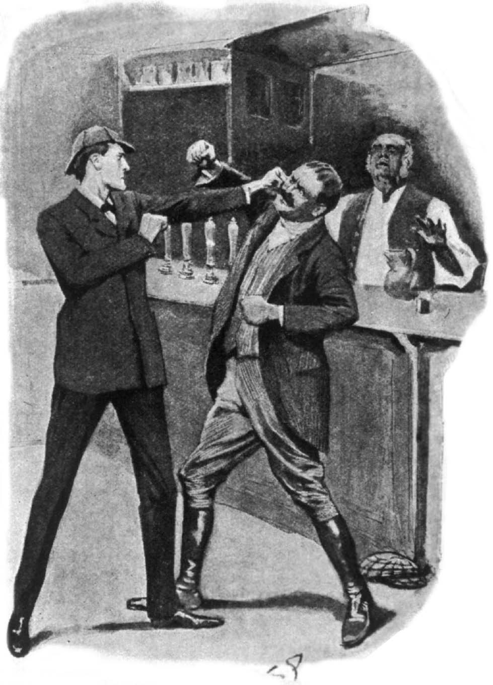

“这个贼流氓饱餐我一顿老拳。”

星期四，我们的委托人又来了一封信。她信上说：

福尔摩斯先生，听到我要辞去卡拉瑟斯先生的聘雇，你不会感到吃惊吧。即使有这点高薪也不足以慰藉我在此的烦恼。本星期六我回城，决意不再来此。卡拉瑟斯先生已备有马车，前此孤身路上可能的危险，也将不复再有。

至于我辞聘的具体原因，除了同卡拉瑟斯先生相处关系不自在，是那个讨厌的家伙伍德利先生又来了。此人一贯可恶，而现在比以前更加可怕。他好像发生过什么事故，脸上青一块紫一块，人都不成样了。我是从窗口望见他的，我要说感到幸运，没有同他照面。伍德利和卡拉瑟斯先生谈了很长时间的话，谈话以后他好像异常激动。伍德利一定住在此处附近，因为他不睡在这里，可是今天一早看见他又来了，在矮树丛那边鬼头鬼脑踯躅徘徊，简直是放出了一头吃人的野兽任它出没在这个地方。我有多厌恶、多害怕他呀，简直无法形容。这么一个畜生，照道理连一分钟都容忍不得，卡拉瑟斯先生怎么会容纳他呢？不管他，反正我的烦恼到星期六就要结束了。

“是这样，我清楚了，华生，这就清楚了，”福尔摩斯神情严肃地说，“有一场险恶的阴谋，要危害到这位姑娘。我们的责任是，她在这最后一次的路上，不能叫人截住出事了。我想，华生，我们一定要抽时间星期六早上一起下去，确保此次辛苦周折的调查不致半途而废、毫无收获。”

坦白讲，我直至现在都并不十分看重这件案子。在我眼中，与其说是有危险，还不如说是荒诞离奇。一个男人埋伏等候、追随一个漂亮女人，这不是什么不得了的事。而且，如果这个男人向追求的女人连招呼都不敢打，甚至女的过来他就要逃，这么没雄风的男子，也就不是个有攻击性的暴徒了。那流氓伍德利是与众不同，但是除了偶然有一次以外，并没有骚扰过我们的委托人。现在他来卡拉瑟斯家，也没有把姑娘怎么样。那个骑车人，按酒店老板的说法，无疑是庄园周末聚会的一员，但他是谁，他想要怎么样，还毕竟模糊看不清。然而，福尔摩斯严厉的表情，离开房间的时候竟把左轮枪藏进口袋，这些事实给我的印象就不是小事，使我感觉到在一连串的怪现象后面可能是大惨剧。

雨夜过后的清早，晨曦明媚，遍布欧石南灌木丛的乡村，处处荆花绽放，闪着簇簇金光。厌倦了伦敦的蒙蒙灰色、终日昏暗，现在美景一片，就更觉眼目清亮。福尔摩斯和我走在宽阔的沙子路上，呼吸着晨间的清新空气，浸淫着鸟语花香，沐浴在一派春光之中。我们从克鲁克斯伯里山肩的高路上望见了那座真相不明的庄园，独立在古老的橡树园中。树都是老树，但相比环抱在中间的这幢古屋，却依然显得年轻。福尔摩斯指着前下方那条长长的路，这条路宛如一条红黄色的带子，蜿蜒在棕色的欧石南灌木地和嫩绿的树林之间。远处，出现一个黑黑的东西，定睛看去是一辆单马车，在朝我们这个方向过来。福尔摩斯不觉情急惊呼一声。

“我失算了半个小时，”他说，“若这是她的马车，那她要乘的是更早一班的火车。弄得不好，华生，她就要过查林顿，我们要赶不上接她了。”

我们迅速奔下高地，马车也就看不见了。我们心急火燎只顾向前跑，平时惯于安坐不动的生活，其坏处这时暴露无遗，我渐渐不支落在后面。然而，福尔摩斯一向自有锻炼，因而蓄有充沛旺盛的精力，简直取之不尽、用之不竭。他是健步如飞，绝无丝毫的放慢。忽然，他停步了，这时他在我前面一百码的样子，我看见他挥起一只手，做了个绝望、懊丧的手势。就在这时，一辆空马车在路上转弯过来，马蹄慢跑碎步，缰绳拖地，朝我们嘎吱嘎吱越走越近。

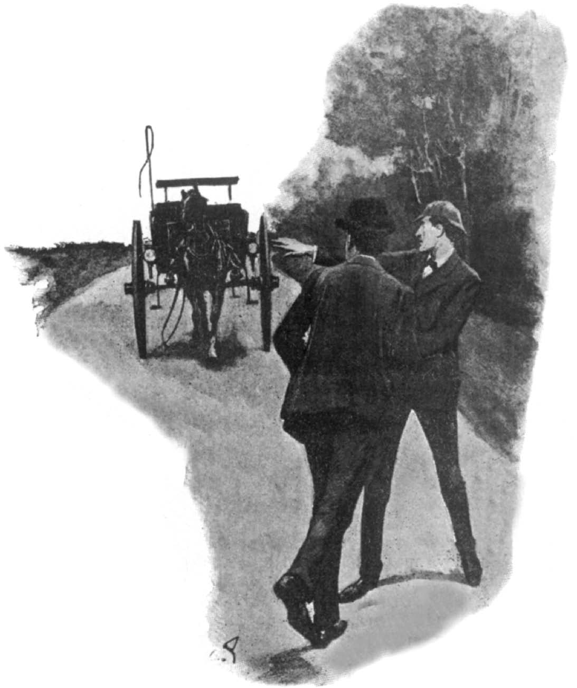

一辆空马车在路上转弯过来。

“坏了，华生，太晚了！”福尔摩斯叫道，我气喘吁吁地跑到他身旁，“我真愚蠢，怎么不想一想万一她要赶早一班的火车呢！劫持，华生——劫持！抢人、杀人！天知道！堵住，堵住！拉住马！好，行。来，快上车，看看还有没有救，死马当活马医了。”

我们跳上车，福尔摩斯拨转马头，狠劲抽一鞭，驾车疾驶回去。一拐过弯，庄园和灌木荒地之间一长段路展现眼前，我紧紧抓住福尔摩斯的胳膊。

“就是这个人！”我气喘吁吁地说道。

一个骑车人独自向我们驶过来，他头发披散，两肩塌落，是在用尽浑身的力气拼命蹬车，蹬得飞快如赛车。他忽地抬起胡子拉碴的脸，看我们冲他靠近了，就一个急刹车，跳在了地上。他那煤炭似的胡子、苍白的脸色，形成鲜明的对照，眼睛像燃火般地发光，朝我们和马车瞪眼愣愣地望。忽然他的脸色紧张激动起来。

“你们！站住！”他高声大叫，把自行车横过来挡住去路，“你们哪儿弄来的这个马车？停下，嘿！”他狂吼着，从口袋里掏出了手枪。“站住，给我停下，再不停下看我叫你们的马吃枪弹！”

福尔摩斯把缰绳往我膝头一甩，跳下了马车。

“我正要找你。维奥莱特·史密斯小姐在哪里？”福尔摩斯劈头喝问道。

“我正要问你呢，是你在她的这个马车上嘛，你应当知道她在哪里。”

“这马车我们在路上碰到的，车上根本没人。我们赶车回来救姑娘哪！”

“天哪！天哪！可怎么办哪？”来人失魂落魄地叫道，“他们把她劫走了，畜生伍德利，还有那个恶棍无赖。快，快，你们要真是她朋友，跟我来，一起去救她。只要能救她，我粉身碎骨在所不辞。”

他握着手枪发疯似地向树篱一个缺口跑去，福尔摩斯跟随着他。我把马放到路边去吃草，就紧跟住福尔摩斯。

“他们是从这儿出来的，”这个人说道，指指泥地小径上的几个脚印，“咳，停一下！树底下什么人？”

那是个小伙子，十七八岁，衣着是个马夫，穿着皮裤，裹着绑腿，仰天躺在地上，腿膝竖立，额上有一条可怕的裂伤，人失去知觉，但还活着。我看了一下他的伤口，还好没伤到骨头。

“是彼得，马车夫，”那个人说，“给姑娘赶马车的。那些个畜生把他拉下车，用棍子打成这个样子。让他躺着没事，现在顾不得他，救姑娘要紧，事关女人一生一世，要不她这辈子就毁啦！”

我们顺着林中绕绕弯弯的小径发疯似地跑下去。当我们来到宅屋外的矮树林，福尔摩斯一下站定阻止我们。

“他们没进屋子。左边有脚印——这儿，月桂树旁边。啊！我说的吧！”

他讲的没错，这时一声女人尖厉的叫喊——惊惧、激愤、颤心的呼叫——从前面浓密的绿树丛中发出。叫喊突然被捂塞，只听得见闷住的唔唔声。

“这边！这边！在滚球场，”那个人高喊道，直冲灌木林，“啊，这些孬种！两位跟我来！老天哪，要来不及了！来不及了！”

三人猛地闯入周围全是老树的一片如茵绿草地。草地对面一棵大橡树，树阴下是三个人。一个妇女，正是我们的委托人，嘴上扎紧了一条手帕，已是垂首半昏状态。在她对面站一个满面凶相的红胡子青年，裹着鞋罩，大叉腿站立，一手叉腰，一手晃着一根马鞭，从头到脚一副获胜得意的架式。两人中间站着个花白胡子的老头，穿花呢套装，外罩一件白色短法衣。我们看见他正把一本祈祷书装进口袋，很明显，那是刚做完结婚仪式。他举手拍拍邪恶新郎的肩背，嘻笑着向他祝贺。

“搞结婚仪式呢！”我气喘着说。

“快！”我们的领路人喊道，“快！”他冲过草地，福尔摩斯和我一同跟上。我们跑到跟前，姑娘正晃悠悠靠在树上才没有倒地。威廉森，这个前牧师，冷眼嘲笑着向我们一鞠躬，而暴徒伍德利，狂喜大笑，又大喝一声，冲我们上来。

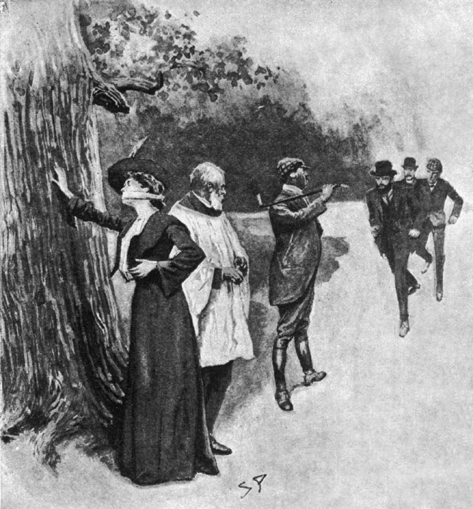

姑娘正晃悠悠靠在树上才没有倒地。

“去你那个胡子吧，鲍勃，”他说道，“我认得你，骗不了我。好啊，你带你的同伙来得正是时候，正好让我把我的伍德利夫人给你们介绍一下。”

我们带路人的回答倒也别致：他一把将黑胡子扯掉，往地上一扔，原来那是化装的，变成一张干干净净的蜡黄长脸，随即举起左轮枪，对着青年流氓，流氓正冲着他手举马鞭一甩一甩要挥上来。

“没错，”我们的同道说，“我就是鲍勃·卡拉瑟斯，我要看着这位姑娘，不让她伤了一根寒毛，做不到我宁可吊死。告诉过你，你要是动了她，就对你不客气。好吧，苍天有眼，我说到做到。”

“你晚了，她已经是我的老婆。”

“不，她是你的寡妇。”

一声枪响，我看见伍德利的前胸鲜血喷涌而出。他身子转了转，尖叫着仰面倒地，一张丑陋的红脸顿时转成惨白，还露着青一块紫一块，十分怕人。那老头儿，还没脱法衣，便破口大骂，他的一串串污言秽语，我真是闻所未闻。他随即也拔出了手枪，但还没来得及举起来，就看见指到了自己鼻前的福尔摩斯的枪口。

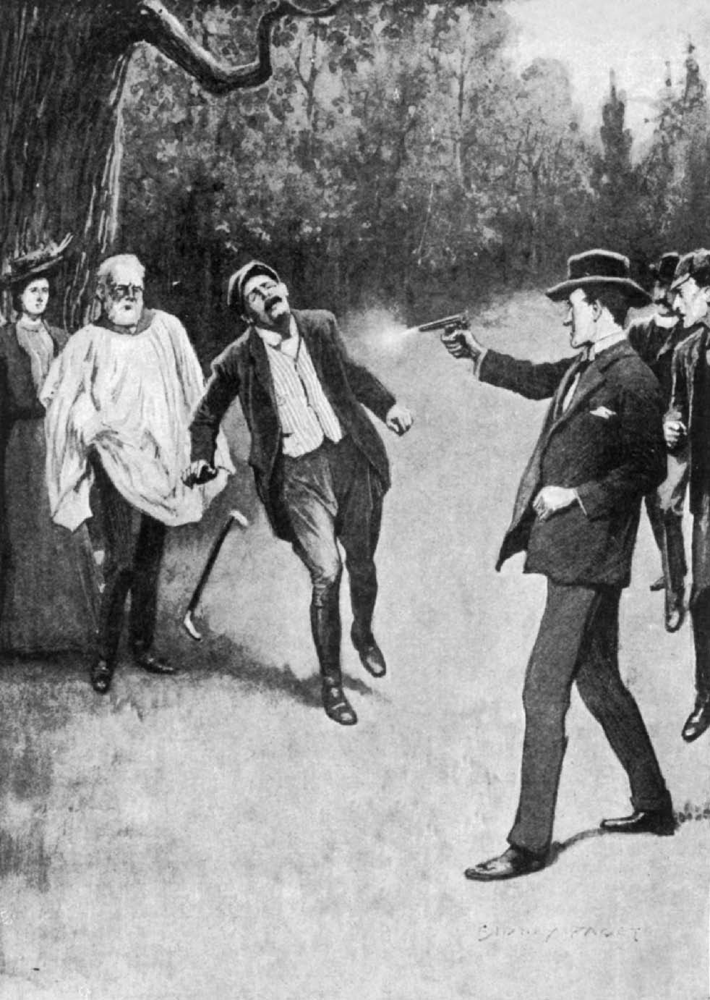

一声枪响。

“你少来这一套，”我的朋友冷冷地说道，“枪扔下！华生，把枪捡起来！对准他的脑袋！谢谢。你，卡拉瑟斯，把左轮给我，我们用不着再动武了。来，给我吧！”

“那，你是什么人？”

“本人名叫歇洛克·福尔摩斯。”

“嚯，天哪！”

“看来，你还听说过我。现在我代表警察当局，要等他们到达这里。喂，你！”他向一个吓得发抖的马夫招呼道，马夫刚才就站在空地边上，“过来，请把这张纸条送法纳姆，骑马去，越快越好。”他在笔记本上撕下一页写上几个字，“字条到警察署交给警长。在警长到来之前，由我监管各位。”

福尔摩斯威慑强大的气概控制了这幕惨剧的现场，眼前几个人全在他的掌控之中。威廉森和卡拉瑟斯听凭指挥把受伤的伍德利抬到屋内，我把惊吓的姑娘搀扶住。受伤人被放到他自己的床上，我奉福尔摩斯之命给他做了检查。福尔摩斯自己坐在挂壁毯的旧式餐厅里，押着两个人犯。检查完毕，我跑去向他报告。

“他不会死。”我说。

“什么！”卡拉瑟斯叫道，从椅子上跳起来，“我上楼去，非把他结果掉不可。你告诉我，那姑娘，那天使，这就成了暴徒杰克·伍德利的人了？一辈子绑在他身上了？”

“这不用你担心，”福尔摩斯说，“有两点很充分的理由，证明为什么她无论什么情况下都不是他的妻子。首先一点，我们不妨可以问问威廉森先生有什么资格主持婚礼。”

“我授有圣职。”老流氓嚷嚷道。

“早已被免除。”

“一旦当牧师，终身是牧师。”

“我看不见得。那么结婚证呢？”

“我们有结婚证，就在我口袋里。”

“你那是非法弄来的。不管怎么样，强迫婚姻是非法婚姻，属于重罪，你们不要吃不了兜着走。若想不通，就给你十来年时间让你好好想吧，我可不瞎说。至于你，卡拉瑟斯，你完全可以不必掏枪，事情对你反而还有利一些。”

“我现在才开始想到是这样，福尔摩斯先生。不过，我原是完全出于防备，要保护姑娘——我爱她，福尔摩斯先生，只是到了这时间我才懂得什么叫作爱情——一想到她要落入魔掌，南非最残暴的魔王之手，我都快要疯了——这个混蛋的名字，只要一提起来，从金伯利到约翰内斯堡，人人都害怕。说真的，福尔摩斯先生，你简直难以相信。但是，自从姑娘让我聘来，我一次都不忍心她单独经过此地这屋子，我清楚那伙贼流氓暗地里打她坏主意，我不骑车跟着她不行，我绝不让她吃亏遭算计。我拉开着距离，戴上胡须，好不教她认出我来，所以她也是真没认出我，可见她是多么纯洁高贵的好姑娘呀。要是让她知道我在这乡间路上跟着的话，她受我聘用就做不久啦。”

“你为什么不告诉她有危险？”

“那就，因为，她就要离开我啦，这个我受不了。即使她不爱我，在家里我能瞧着她的优雅姿态，听到她的美妙声音，也是多大的幸福啊。”

“噢，”我说，“你把这叫作爱情，卡拉瑟斯先生，可是我说这叫自私。”

“也行，反正两者是一回事。不管怎么讲，我不让她走。另外，有这一帮人在，一定得有人在她身边保护着才好。后来，电报一来，我就知道他们肯定要有动作了。”

“什么电报？”

卡拉瑟斯从口袋里掏出了电报。

“就是这个。”他说。电文极简要：

老人已死。

“原来如此！”福尔摩斯说道，“哼，我这就清楚了。我也理解这个消息，像你说的，事情到了节骨眼上。现在，你们一边等着，也就可以把你们所知道的事给我说说。”

穿法衣的、上帝摒弃的老无赖破口骂出一连串脏话。

“老天在上！”他说，“你要泄漏我们的秘密，鲍勃·卡拉瑟斯，那就等着，你怎么对付杰克·伍德利，我也就怎么对付你。你可以随心所欲对小妞儿甜言蜜语、天花乱坠，那是你自己的事，可你要是把哥们儿卖给了这个便衣警察，那你就把事做绝了，你的死期也就到了。”

“尊敬的牧师阁下何必激动，”福尔摩斯说道，点一支香烟，“你们犯的案已经够清楚了，我要问的是我个人特别好奇的若干细节。如果你有困难，不能告诉我，那我来讲，你来听，然后你看看，你有多少秘密尚能保留。首先一点，你们三个从南非赶来，玩这场把戏——你威廉森，你卡拉瑟斯，同伍德利。”

“头号大牛皮，”老头说，“他们两个我根本没见过，两个月前才刚认识，我这辈子也根本没去过非洲。你把牛皮收起来塞烟斗里当烟抽了吧，爱管闲事的福尔摩斯先生！”

“他讲的不假。”卡拉瑟斯说。

“好，好，你们两位远道而来，他牧师阁下是我们自己本国货。你们在南非认识拉尔夫·史密斯，看出他活不长了，知道他有个侄女，会继承他的遗产。是不是这样——嗯？”

卡拉瑟斯点点头，威廉森骂骂咧咧个不休。

“侄女无疑是他最近的亲属，你们知道老头儿不会立遗嘱。”

“看字写字都不行了。”卡拉瑟斯说。

“所以你们就来了，你们两个，打听寻找姑娘。打的主意是，你们一个人把姑娘娶上，一个人吞没财产。两人分赃，结果是伍德利分到当姑娘的丈夫，怎么会分成这样的结果呢？”

“我们在半途上打牌作赌，把姑娘来压注，结果他赢。”

“原来如此。后来你把姑娘聘到你家里，那伍德利向她求爱只好到你家里来。姑娘一看伍德利就知道是个恶棍、酒鬼，根本就不愿意答理他。你自己爱着姑娘呢，想要她。这样，原来的分赃安排就不作数。你一想到这个恶棍要占有她，绝对不能忍受，是吗？”

“不行，说什么也不答应！”

“两人就吵起来。他给气跑了，开始甩掉你自谋主张。”

“看上去，威廉森，我们什么也瞒不住，已经没什么可以不告诉这位先生了。”卡拉瑟斯苦笑着大声说，“是的，我们吵架了，他把我打了，我给一下子打在了地上。可要说动手打架，我还不一定输给他。以后就没再见他。也就这期间，他结识了这位被开除的牧师。我发现他们合伙借了这个地方住下来，原因在于姑娘到火车站此地是必经之路。里头肯定有算计，我就多个心眼，得保护她。我来看过他们几次，急于探清他们是什么打算。两天以前，伍德利拿了这封电报来我家里，拉尔夫·史密斯死了，他问我原先讲好的条件算不算数，我说不能了。他问是不是我想娶姑娘，分一份财产给他，我说我愿意这样解决，可是姑娘不肯要我。他就说，‘咱们先把她娶到手再说，过一两个星期也就叫她生米煮成熟饭了。’我说我不想动手蛮干。他马上现出无赖本色，满嘴下流话骂骂咧咧地走掉，甩下话发誓要把姑娘搞到手。姑娘这个周末就要离开我，我给她备好马车送她去车站。可是我老是七上八下心神不定，就骑上自行车跟出来。她已经走了，我没能赶上她，于是就出事了。我遇上你们两位先生驾着她坐的马车回来，知道情况不妙。”

福尔摩斯起身，将烟蒂扔进壁炉。“看我有多迟钝，华生，”他说，“你的报告，说到看见骑车人在树丛里，你想是在整整领带，其实光凭这一点就已经可以知道全貌了。然而我们还是值得庆幸，本案有它奇特之处，某些方面堪称独具特色。我看见了，车道上来了三位郡警察，很高兴看到小马倌紧随其后。那就好了，牧师也好，几分钟的新郎也好，由于他们今天早上的作奸犯科，也就永远毁了他们自己。我想，华生，你有医术，就伺候一下史密斯小姐，告诉她，若是完全恢复了，我们将乐意陪伴着她回母亲家里，若是没有完全恢复，你不妨问问有没有意思让我们替她发个电报给密德兰那位青年电气工程师，这就多半会使她立刻好转。至于你，卡拉瑟斯先生，我想，你参加了阴谋活动负有罪责，但也已尽力而为有所补偿。这是我的名片，先生，受审的时候，如果我的作证对你有利，听候差遣便是。”

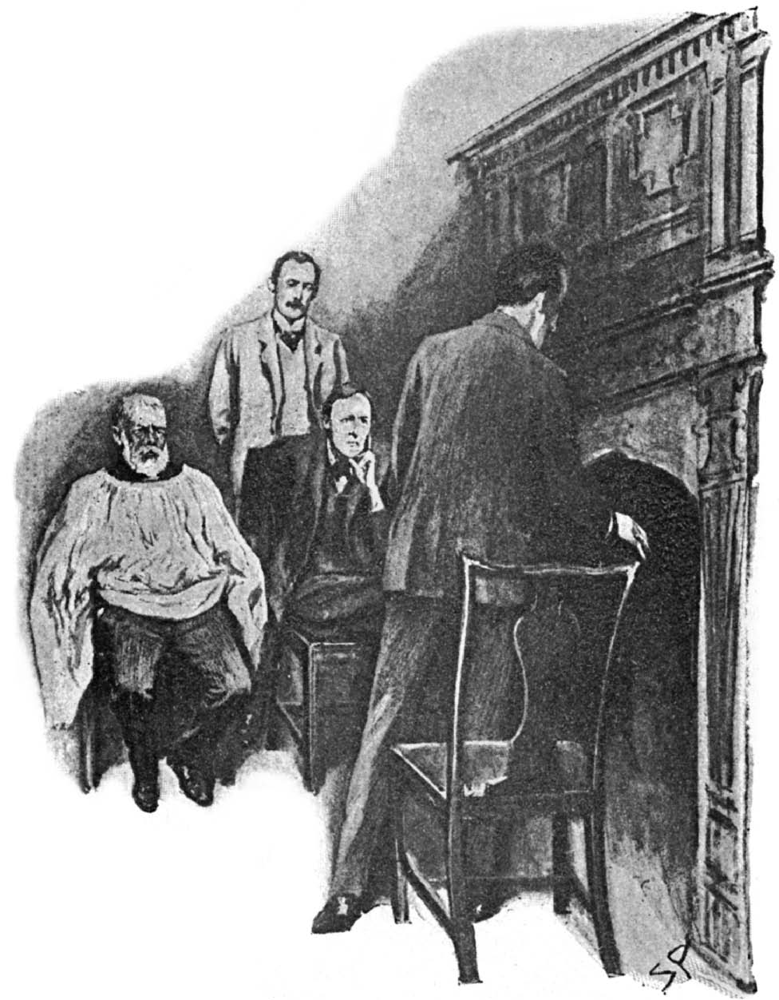

福尔摩斯起身，将烟蒂扔进壁炉。

我们的办案活动如陀螺旋转，层出不穷、应接不暇，令我难以应付，无法将文字写得面面俱到，这一点读者诸君都有觉察，也就难以给出那些最终细节来满足各种好奇心。案子一个紧接一个，前戏未罢后戏已登场，而每逢剧情高潮一过，演员便从我们忙碌的生活舞台上退场。但是，本案我倒是找出了手稿，末尾附有短记，里面记录了维奥莱特·史密斯小姐确实继承了一大笔遗产，她现在是莫顿和肯尼迪电气公司的大股东、著名的西敏寺电气工程师西里尔·莫顿的妻子。威廉森和伍德利两人因劫持罪和侵害罪受审，威廉森判刑七年，伍德利判刑十年。卡拉瑟斯的结局我没有记录，但是我确信，他对伍德利的侵害罪庭审不会看得很重，因为伍德利是个怙恶不悛的歹徒，声名狼藉。我估计判卡拉瑟斯几个月也就足以维护司法的公正。

（1903年）

# 修道院公学

在我们贝克街这个小小的舞台上，参演公案戏登场、下场的角色已经不少，但是我想不起有谁更比桑尼克罗夫特·赫克斯塔布尔的首次登场那样突如其来，使人吃惊不已。他拥有硕士、哲学博士等头衔，他的名片似乎太小，承载不住他诸多学术荣誉的分量。这名片刚进门才几秒钟，他本人已经接踵而入——他魁梧伟岸，气宇轩昂，尊严高贵，自持与孤傲全然集于一身。然而他刚把门随手带住，一上来先是踉踉跄跄往桌子上靠，接着就是轰然倒下，庞大的身躯覆盖着壁炉前的熊皮地毯，失去了知觉。

我们呼地站起，一时惊愕，无声地愣看着这大如海船的躯体，似乎是在生活的汪洋大海上遭到突然而致命的风暴袭击，已成一艘残破瘫痪的海难船。还是福尔摩斯快去拿来垫子枕在他的头下，我也就拿白兰地往他嘴里灌。看那呆滞苍白的脸上皱起条条忧患的纹路，双目紧闭，眼袋松弛发黑，口微张，嘴角无奈地下垂，下巴颏上胡子拉碴不曾修剪，衬衫、领口带着长途跋涉的尘垢，端正的颜面上却是一头蓬蓬乱发。一个被灾难痛苦击倒的人，就躺在我们的面前。

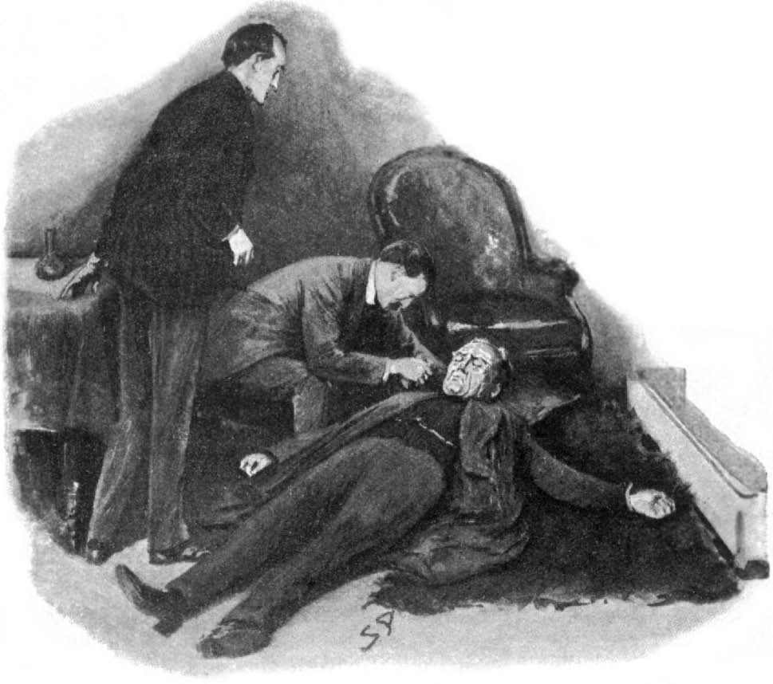

一个被灾难痛苦击倒的人，就躺在我们的面前。

“他怎么回事，华生？”福尔摩斯问道。

“极度虚脱——可能就是过度饥渴劳累。”我回答，用手指按着他微弱的脉搏，在他身上生命的滚滚汹涌变成了涓涓细流。

“往返车票，从麦克尔顿来，英格兰北部，”福尔摩斯说，他从这个人的表袋里找出了一张火车票，“现在还不到十二点，是乘头班车赶来的。”

紧闭的眼睑开始微动，终于抬起一双灰色的眼睛来茫然看着我们。稍过一会儿，这个人从地上爬起来，羞愧得脸一阵红。

“请原谅，身体实在撑不住，福尔摩斯先生，我是过度劳累。对不起，我想要一杯牛奶，吃块饼干。我没问题，会好的。我是亲自来，福尔摩斯先生，来求你一定同我一起上我那边去。我是怕电报讲不清楚，事情十万火急。”

“你先恢复一下——”

“我恢复了，很好了，真没想到会这么虚弱。想请你，福尔摩斯先生，同我下一班车去麦克尔顿。”

我的朋友摇摇头。

“我的同事，华生医生，他也知道，实话相告，我们现在非常忙，费尔斯文件案在处理，阿伯加文尼的谋杀案要开庭审判。除非比这更重要的事情，眼下实在没法离开伦敦。”

“比这重要得多呢！”我们的来访者甩出双手，“霍尔得内斯公爵的独生子被劫走，这事你一点没听说？”

“什么！前任内阁大臣？”

“正是。我们尽量不透露消息，不让报纸知道，可是昨天晚上在环球剧场已有传言，我想该传到你耳朵里了。”

福尔摩斯立刻伸手到他的百科数据汇集中抽出H卷。“‘霍尔得内斯，第六世公爵，嘉德勋位爵士<a href="#part0104.xhtml_ch1"
id="part0104.xhtml_ch1-back">(1)</a>，枢密院顾问’——头衔多得不得了！‘伯维利男爵，卡斯顿伯爵’——乖乖，一大串！‘自一九〇〇年起出任哈莱姆郡郡长。一八八八年娶查理·爱波多尔爵士之女爱迪丝为妻，其继承人系独生子萨尔特尔勋爵，拥有二十五万英亩土地，拥有兰开夏和韦尔斯的矿业。地址：卡尔顿住宅区；霍尔得内斯城堡，哈莱姆郡；卡尔斯顿城堡，班戈尔，韦尔斯。一八七二年出任海军大臣；以首席国务大臣——’嚯，嚯，此人当然也是国王的一位最高贵的臣民啰！”

“最高贵，也许还是最富裕。我清楚，福尔摩斯先生，你从事的是一项规格极高的职业，而且，全心全意工作，除了工作，还是工作。现在，我不妨告诉你，公爵大人跟我明讲了，谁能通报他儿子在什么地方，就开给五千英镑支票；能报告劫持者的名字，是一个或者几个都行，再加一千英镑。”

“真是天价，”福尔摩斯说道，“华生，我想，我们就陪赫克斯塔布尔博士去英格兰北边走一走吧。现在，赫克斯塔布尔博士，待你喝了牛奶，麻烦你告诉我发生的情况，什么时间发生的，怎么发生的，啊，最后，修道院公学，你这位桑尼克罗夫特·赫克斯塔布尔博士，与本案的关系，为什么事情发生了三天以后——你未修的下巴说明了天数——到今天你才从麦克尔顿跑来这里，要找鄙人献上一点微力。”

我们的来访者吃好了牛奶饼干，两眼恢复了光彩，脸上有了颜色，便挺起身来，口齿清楚、劲头十足地讲述情况。

“我必须告诉两位先生，本公学是一座预备学校，我是创建人，也是校长。《赫克斯塔布尔对贺拉斯之管见》<a href="#part0104.xhtml_ch2"
id="part0104.xhtml_ch2-back">(2)</a>一书或许会使两位想起我的名字。修道院公学，总是最优秀的，是英国的精英预备学校。莱瓦斯托克勋爵、布莱克沃特伯爵、凯思卡特·索姆兹爵士——他们都把自己的孩子托付给我。但是，就在三个星期以前本校达到了荣耀之顶点，霍尔得内斯公爵派他的秘书詹姆斯·怀尔德先生来通知我，公爵要把他的独生子、继承人、十岁的小勋爵萨尔特尔，送到我这里负责管教。可万万没想到，我这辈子要遭灭顶之灾了，这是个前奏。

“五月一日，孩子到校，正是夏季学期开学。孩子很惹人喜爱，他很快就适应了学校生活和环境。我告诉你——我自信说话向来还是谨慎的，但是出了这种案子再也不能说一半藏一半了——孩子在家里不是很幸福的。其实也是公开的秘密了，公爵的婚姻生活并不和睦平静，到后来夫妻双方只好分居了事。公爵夫人定居法国南方，这还是不久以前的事。我们都知道，小孩子的感情比较倾向于母亲。母亲离开霍尔得内斯府第后，孩子常常不开心，这也是公爵要把他送到公学托付给我的原因。来学校不过两周，孩子完全习惯了，在一个新家里，开心得很。

“最后一次看见他是五月十三日晚上——就是上个星期一晚上。他的房间在三楼，是内房，要穿过一间有两个孩子睡的大房间才能到他的房间。那天晚上外房的孩子什么也没看见，什么也没听见，因此可以肯定，小萨尔特尔不是从这里跑出去的。他房里的窗子开着，窗外有一根很粗的常春藤连到地面。下面我们看不到有足迹，但是只有这扇窗是唯一出口。

“星期二早上发现他失踪了。床是睡过的，走前衣服是穿好的，就是平常的校服，黑色伊顿式上装，深灰色长裤。没有一点外人入内的迹象，只要有叫喊、厮打，肯定有人会听见，里屋睡的那个大孩子康特晚上是很惊醒的。

“一发现萨尔特尔勋爵失踪了，我立即集合全校点名——包括学生、教师、校工。这一查，才证实萨尔特尔勋爵不是单独出走的，因为德语教师海德格尔也不见了。海德格尔的卧室也是三楼，在宿舍楼的上头，和萨尔特尔勋爵的房间朝着一个方向。他的床也是睡过的，但是很清楚衣服只穿了一半，因为衬衫、袜子都扔在地板上。很清楚他是攀了常春藤跑的，我们都能看出草坪上有他踩的脚印。他有辆自行车，平时一直放在草坪旁边的小棚子里，也不见了。

“海德格尔来我这里已有两年，进校的介绍信评语很好，但是他怪僻，不多话，教师也好，学生也好，都不太喜欢他。两人跑哪里去了，一点踪影也没有。

今天，已经是星期四的早上，我们还是同星期二一样，一无所知。当然人不见后就马上去了霍尔得内斯府上询问，路也不远，只有几英里。我们设想，孩子忽然想家，睡不着，说不定就回家去看父亲。可是家里根本不知道，各处都没有一点消息。公爵当然急得不得了。至于我，两位已经亲眼看到，孩子没了下落，我对事情负有重大责任，弄得筋疲力尽，神智都要不正常了。福尔摩斯先生，我恳求你对这个案子使出你的全部力量，在你的一生中，这样的案子，这样的价值，恐怕也不会有了。”

福尔摩斯聚精会神地听着校长忧心忡忡的陈述。他皱眉蹙额表示他不需要旁人来规劝他集中全部注意力于一个问题。这个问题除了关系优厚的报酬，恰是更符合他必须立即调动对复杂和异常情况的嗜癖之心。他随即拿出笔记本记下一二要点备忘。

“你没有及时来找我，错失了时机，”他严肃地说，“这时才来叫我接手，不知已经多了多少障碍。早让刑侦专家去调查，比如看常春藤、草坪，不可想象会看不出一点线索、结果。”

“这事不能怪我，福尔摩斯先生，他公爵阁下最不愿意听社会上谣言乱起，他怕家庭不和要给外扬。这种事他最恨最忌。”

“不是可以由官方调查吗？”

“是有调查，先生，结果实在令人失望。先是马上摸到一条重要的线索，说是有人看见一个男孩同一个年轻人在附近火车站，乘早班车离开了。到了昨天晚上，我们才得到消息，两人在利物浦被盯上，可是调查下来，人家跟我们这事风马牛不相干。我有多伤心失望，一夜睡不着觉，还是直接来请求你吧，这就乘早班车过来了。”

“追这条线索不对，那么看来对当地的调查就忽视了？”

“完全没有进行。”

“三天时间就这样泡汤，事情处理成这样，真是糟糕。”

“我也是这样说呢。”

“不过问题最终还是可以得到解决的。让我插手也很高兴。你有没有了解失踪孩子同德语教师的关系怎么样？”

“没有关系。”

“上不上他的课？”

“不上，两个人连话都从来没说过，据我所知。”

“那倒的确奇怪。孩子有自行车吗？”

“没有。”

“还有没有别的自行车不见呢？”

“没有。”

“能肯定？”

“肯定。”

“好了，那么你的意思是不是说，夜深人静，教师骑上车，胳膊夹起孩子跑掉的？你不认为是这样？”

“当然不是。”

“那你心中是怎么个看法呢？”

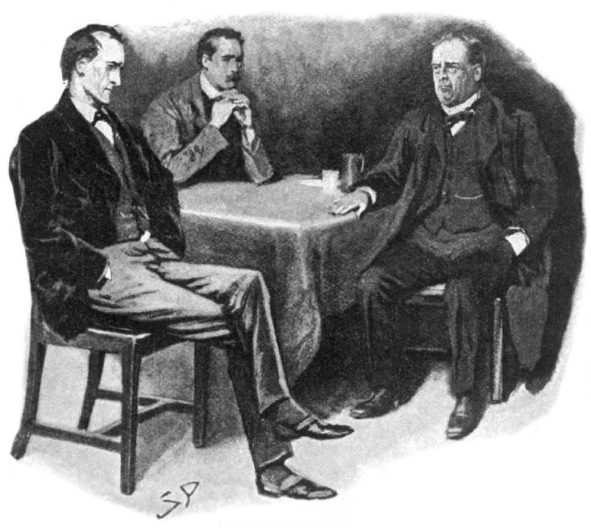

“那你心中是怎么个看法呢？”

“那辆自行车可能只是个障眼法，车给丢在了别的什么地方，两个人徒步跑掉。”

“有可能这样吧。但是使上如此的障眼法似乎相当荒唐，不是吗？车棚里还有别的自行车吗？”

“还有几辆。”

“那为什么不藏掉两辆，做个幌子是两个人一起骑走了？”

“这倒也有道理。”

“应当是这样的嘛，所以，障眼、幌子说不能成立。不过，这件事确是疑点，调查从这点开始。反正，自行车又不是很容易藏得掉或是毁得了的东西。再问一点，孩子失踪前有什么人来看过他吗？”

“没有。”

“他收到过信没有？”

“有，有一封。”

“谁寄给他的？”

“他父亲。”

“平时你拆信看吗？”

“不拆。”

“你怎么知道是他父亲寄来的？”

“信封上有他们家的盾徽，也是公爵的笔迹，特别刚劲有力。公爵他自己记得写过这信。”

“这之前有过信吗？”

“前几天也有过。”

“法国有过信来吗？”

“没有，法国从来没有。”

“你该明白我问的意思吧。孩子要么是给强行劫持，要么是他自己愿意出走。如果是自己走掉，还这么小的小孩子，就要估计到必定受到外人唆使、引诱。既然没有人来看过他，那就是写信引诱了，所以我想弄清楚和他通信的是些什么人。”

“这方面，我恐怕帮不了大忙。据我所知，唯一给他写信的只有他父亲。”

“当天出事前给他写来过信。父子关系亲密吗？”

“他阁下对什么人都谈不上亲密。他是一门心思、全身心沉浸在公众重大问题上，对普通常情，他往往不在乎、无动于衷。但是待这孩子，一直很好，这是他的特殊之处。”

“可是孩子的感情是在母亲身上？”

“是的。”

“孩子说了？”

“没说。”

“公爵说过了？”

“哪里，也没有。”

“那你怎么知道？”

“公爵阁下的秘书詹姆斯·怀尔德先生跟我还谈得来，就是他告诉我萨尔特尔勋爵这孩子的心理感情。”

“我明白了。要问一下，公爵的最后一封信——孩子不见以后在房里找到了？”

“没有，孩子带跑了。我想，福尔摩斯先生，时间差不多了，我们应该马上就去尤斯顿车站。”

“我会雇马车的。再过一刻钟，我们就跟随差遣。如果你要给家里去个电报，赫克斯塔布尔先生，一定要让你周围的人都产生印象，都以为你还在利物浦进行调查，或者由这个误导线索更引开去的随便什么地方。同时，我要在你学校那边私下里静悄悄地做点工作，或许两人出走留下的痕迹还没有完全消失，如华生和我这样的两条老狗尚可寻迹追踪。”

当天晚上我们到了皮克镇，赫克斯塔布尔博士著名学校的所在地，这里空气清洁凉爽，我们到达的时候天已大黑。大厅的桌子上有一张名片，管家上来向主人小声耳语几句。博士便转身对着我们，脸色正经而十分激动。

“公爵到这里来了，”他说道，“公爵和怀尔德先生已经在书房里。来，两位先生，我来给你们介绍。”

这位大政治家的照片我见过不少，是熟悉的，不过见他本人当然同看照片不是一码事。他是个高大威严的人物，穿着考究，长脸瘦削，鼻子怪样，长得又弯又长。他的面色苍白近于死灰，衬着底下一小撮稀稀拉拉的鲜红长胡须，一直飘到白色的背心上，背心的前面还有表链透着丝丝垂须闪闪发亮。这副尊容乍一见还真有点令人惊骇。他就是如此出现在我们面前，庄重、冷峻如一尊石人，站在赫克斯塔布尔博士壁炉地毯的正中央看着我们。旁边站着一个很年轻的小伙子，我知道他就是公爵的私人秘书怀尔德。这人小个子，神色紧张、警觉，一双浅蓝色慧敏的眼睛，一副随机应变的机灵面容。正是他，立即以居高临下的姿态和口气开启谈话之门。

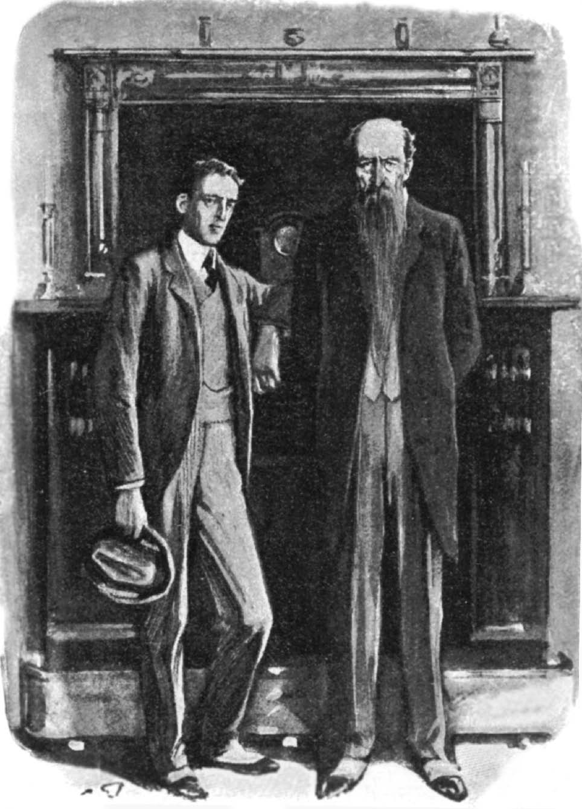

旁边站着一个很年轻的小伙子。

“赫克斯塔布尔博士，今天早上，我来拜访你，可惜晚了一步，没能阻止你上伦敦去。我听说，你去的目的是邀请福尔摩斯先生来承办处理本案。你，赫克斯塔布尔博士，居然未与公爵阁下商量，就擅自行动，颇令大人感到意外。”

“因为我知道警方已经无能为力——”

“公爵阁下绝对不认为警方已经无法办理。”

“不过确实，怀尔德先生——”

“你很清楚，赫克斯塔布尔博士，公爵阁下特别忌讳公众谣传。此事公爵自有安排，无须假手他人。”

“这个事情挽回也不难，”受到威吓的博士说，“可以送福尔摩斯先生搭早班车回伦敦。”

“不必，博士，不必，”福尔摩斯说道，不动一点声色，“这北方的空气令人神清气爽，我乐意在此乡间住上一两天，也好让我调节一下心情。叨扰于你借宿此间，还是去住村上的旅店，当然，听凭安排。”

我看到尴尬的博士进退两难了。这时，红胡子公爵开了腔，正好解了他的围。他的嗓子低沉声如洪钟，像是进正餐时的咣咣鸣锣。

“本公爵同意怀尔德先生所讲，赫克斯塔布尔博士，事先与我通报一声，应是明智之举。现在，福尔摩斯先生既已受信于你，若是拒绝其服务，则又是不明智之举。何须远宿村中小店，福尔摩斯先生，若来入住霍尔得内斯府下与我一起，我会十分乐意。”

“谢谢公爵阁下。为便于调查起见，我想，留宿在疑案的现场应是明智之举。”

“那就悉听尊便，福尔摩斯先生。有事需要了解，尽管向怀尔德先生和本人提出。”

“我很有可能要到府上拜访您的，”福尔摩斯说，“只是现在先要问一下，先生，您公子的无故失踪，其中原因，不知您心中是如何想法？”

“不，先生，我不清楚。”

“请原谅，我提起此事使您痛苦，但我也是不得不提。您觉得公爵夫人和这件事会有关系吗？”

可以看出这位阁僚大人物在犹豫不决。

“我想没有。”最后他说。

“那么另外最大的可能，就是孩子被绑架，目的是要敲诈赎金。您没有接到这一类要挟吗？”

“没有，先生。”

“再请问您公爵阁下一个问题，我知道在您公子出事当天您给他写过一封信。”

“不是当天，是前一天。”

“噢，是这样，可是他是在这天收到的，对吗？”

“是的。”

“您在信里有没有写过使孩子不高兴的言语，或者会促使他出走的话呢？”

“不，先生，当然不会有。”

“信是您亲自寄出的？”

尊贵的公爵大人正要开口，却被他的秘书抢答了，秘书迫不及待地插进来。

“公爵大人从来不必自己动手寄信，”他说，“这封信同别的信一起放在书房桌子上，由我来一起收好装进邮袋。”

“你肯定那些信中有这封信？”

“是的，我看见的。”

“那天公爵阁下有多少信？”

“二三十封。我来往的书信数量很大，可是，这同本案完全没有关系吧？”

“完全没有。”福尔摩斯回答。

“我只管我这边行动，”公爵继续道，“我已经建议警方将注意力转向法国南部。我说过了，夫人不至于鼓动孩子如此大胆妄为，可是这孩子脾气倔强，人小主意大，有可能受到那个德国人的唆使、协助，孩子自己往母亲那边跑了。我想，赫克斯塔布尔博士，我们现在该回府了。”

我看得出，福尔摩斯还有其他问题要提问，可是公爵大人断然表示谈话到此结束。很显然，出于贵族的强烈自尊心，同陌生人这样来谈论他家庭的私事，他极端反感。他更担心，每问一个问题都会将他公爵的历史好不容易掩饰起来的阴影角落投上光照个透亮。

当贵族大人同他的秘书离开以后，我的朋友马上投入侦查行动。他的性格一贯如此，急不可待。

孩子的房间被仔细检查，除了绝对肯定只能是从窗子出逃以外，毫无结果。德语教师的卧室和对象也都未能提供进一步的线索。他那边的一根常春藤枝杈，禁不起他的体重给拽断了。我们用提灯照亮，看见草坪上有他下来的一溜足印，浅草地上的一点痕迹是唯一的物证，证明他夜逃，而原因不明。

歇洛克·福尔摩斯独自出了屋，直到十一点过后才返回。他弄来一大张本地区的明细地籍图，拿到我房里，在床上铺开，把灯在地图中央摆稳了，就抽起了烟，不时拿冒着烟味的烟斗嘴指指地图上一些该注意的地方。

“这个案子越看越不简单，华生，”他说，“里头名堂肯定不少。我们头一步，先要熟悉这里的地形情况，这对我们开展调查大有裨益。

“看这地图上，这黑长块是修道院公学，我插上根针。那，这条线，是大路。看见了吧，经过学校，一头向东，一头向西，你看，这东西两边一英里之内，都没有岔路。如果两人由大路跑掉的话，只有走这一条路。”

“肯定是。”

“我们正巧运气好，很顺利查明出事当晚这路上的情况。这儿，我烟斗搁的这儿，是一个岗亭，乡里的警察在此值岗，从十二点到早晨六点。那，你看见吧，在东向的第一个岔路口，警察说他整夜没一刻离开过岗位，没看见有人经过。他确定无疑，不管大人小孩，只要经过这地方，不会看不见。这个警察，我今天晚上和他谈过话，谈下来可以相信，是个靠得住的人。好，这头就没事了。

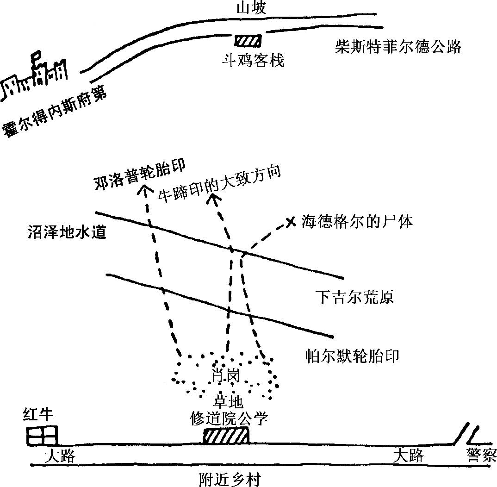

“我们现在看另一头。这儿，是旅店，叫红牛旅馆。老板娘那天身体不适，派人到麦克尔顿去请医生，可是医生另有出诊不在，等到早晨才赶来。店里人焦急得很，等医生来等了一夜，一直有人望着路上，整夜没停。他们说不曾看见有人经过。他们作证可信的话，那么西边这一头也可以放下，算我们省事，运气。也还可以说明，出逃的人根本没有走大路。”

“那么自行车呢？”我反问道。

“没错，这就要谈到车子的问题了。我们继续来推论：两人不走大路的话，那就是走学校的北边或者南边，往乡村跑。这是肯定的。我们再考虑、判断这两种情况。南边，你看吧，全是一大片耕作区，分块的农田，有石墙分隔的。那里，我看自行车难通过，南边就不考虑它了。好，看转向北边的乡村。这儿，是一小片林地，都叫它‘乱树林’，向远去就是一大片起伏的荒野，就是叫‘下沟地’的，延伸有十英里，地势才渐渐升高。这里，荒野这边，就是霍尔得内斯府第，从大路过去要十英里，穿荒野地走只有六英里。那是一块特别冷落的平地，泥炭地，有几户农民，有几小块农田，农民养羊养牛。除开这些，就是鸻鸟、麻鹬在这儿出没，不见别的，再下去就是通往柴斯特菲尔德的公路。那里，一座教堂，你看，几间小屋，一家旅店。再往远处去，山坡陡了。我们的问题，确定无疑是在这边，北边。”

“那么自行车？”我又问。

“行，行！”福尔摩斯说，有些不耐烦，“自行车骑得好，当然不一定只能走大路。泥炭荒野地横竖小路不少，而月亮那夜正圆。哦！有人来了？”

一阵急促的敲门声，随后赫克斯塔布尔博士进了屋，他手上拿一顶蓝色板球帽，帽檐有个白V字。

“终于让我们有了线索！”他叫道，“感谢老天！总算给我们找到了小鬼的去向！这是他的帽子。”

“什么地方发现的？”

“吉卜赛人的大车上。吉卜赛人在泥炭荒地扎过营，是星期二离开的，今天警察把他们追上，搜查了他们的大篷车，发现有这顶帽子。”

“他们怎么说呢？”

“他们搪塞、撒谎——说是星期二早晨在荒地上捡到的。他们一定知道孩子的下落，这伙贼流氓！感谢上帝，把他们都关起来了。法律很厉害，公爵有金钱，使上一样就不怕他们不开口，知道什么都会倒出来。”

“有此一点，不无小补，”博士离开了房间后福尔摩斯说道，“至少证实了我们的推理不错，肯定是下沟地这一边了，有望获得结果。警察除了把吉卜赛人抓起来，别的事情一点也没做。看这儿，华生！泥炭地有一条水沟穿过呢，你看，图上有注明。有的地方漫开来成沼泽，尤其是在这一地区，霍尔得内斯府第和公学之间这一带。现在旱季时候，别处难觅踪迹，但就是正好那个地方，人走过就有印子，去找不会徒劳无功。明天一清早我来叫你，你我两人一起试试，看看能否从这个谜案中找出一线光明。”

天刚亮我醒来，睁眼正好看见福尔摩斯瘦长的身影站在我床前。他穿着外衣，看得出已经出去过了。

“我看了草坪、车棚，”他说，“还去乱树林走了一圈。现在，华生，隔壁房里预备好了可可茶，我要催你动作快一点，因为今天有好多事情要做。”

他两眼放光，就像一位艺术大师看着自己的精心杰作即将完成那样的兴奋，面颊竟升起了红晕。这是另一个福尔摩斯，一个火辣而机警的人，不是贝克街那个沉思默想、慵懒苍白的梦幻者福尔摩斯。望着他摩拳擦掌、跃跃欲试的样子，我确实预感到今天必定是紧张劳累的一天。

然而难以预料，出师就是不利，很让人失望。我们抱着极高的期望，大踏步跨上黄褐色泥炭地原野，地面纵横交错着无数羊肠小道，好不容易来到了绿草鲜亮的宽阔地带，这正是隔在我们和霍尔得内斯府第之间的沼泽地。不用说，如果孩子是往家走，他必定要经过此地；经过此地，就不可能不留下脚印。但是，不见痕迹，没有孩子的痕迹，也没有德国人的痕迹。我的朋友面孔板住了，面色发黑了。他快步走在边沿地，急切注意观察苔湿地面的每一块泥迹。到处尽是羊脚印，有一个地方，下去要几英里开外，则是牛蹄印不少，此外什么也没有。

“出师不利，算了，”福尔摩斯说，忧郁地望着广袤起伏的泥炭地，“走，到那边去看看，下边那头，还有一块狭长沼泽地。哦呵！嘿！嘿！这是什么？”

我们踏上一条黑带似的小径，在中间的湿泥上，看见是清晰的自行车的印迹。

“啊哈！”我高呼，“我们找到了。”

但是福尔摩斯在摇头，脸色疑惑，并不见高兴。

“车是自行车，可不是那辆我们要找的车。”他说，“我熟悉四十二种轮胎，花纹各不相同。这个，你看，是邓洛普，靠外边上有小块。海德格尔的车胎是帕尔默，有条形花纹。爱维林，那个数学教师，他很清楚海德格尔的自行车。所以，这不是他的车。”

“那么，孩子的车？”

“也有可能，不过那先要证实他是有自行车的才行，但这个事我们还无法确定。现在你看见的这车子印迹，骑车的方向是从学校过来的。”

“不是朝学校去的？”

“不是，不是，我亲爱的华生。比较深的车轮压痕当然是后轮，承载重量的关系。你看，车印有些地方，后轮跟随交叉、压掉比较浅的印痕，前轮印痕，很明显是从学校过来，朝前面去。这车辙是不是跟我们要查的问题有关系，还难说，我们先往后看看，再追下去。”

我们从这块湿地里出来，往后看过去两三百码，车印不见了。继续沿着这条小径走下去，又看到了，渗着地下水的地方，又是自行车车辙，只是几乎都给牛蹄踩踏得看不清楚。再下去，又没有踪迹。这里，小径一直进入了乱树林。这片树林正挨着学校的后面。自行车应该是经过树林出来的。福尔摩斯在一块砾石上坐下来，两手托着下巴，我抽了两支烟，他一动不动。

“噢，噢，”最后他说话了，“那个，当然有可能，是个狡猾的人，把轮胎换掉，就认不出来了，不留踪迹。动到这个脑筋的罪犯，有两下子，我也不枉和他较量一番，很值得。这个问题先搁下吧。回过去，再去看沼泽地，有好多地方还没有查过。”

我们继续作有系统的察看，随着潮湿地边沿看过去。皇天不负苦心人，战果立现。刚越过一个低洼的泥塘，就是一条泥泞的小道。一上了这条小道，福尔摩斯便高兴地叫起来，像是一束电线拖出来的痕迹赫然显现在道中央，那就是帕尔默轮胎的印迹。

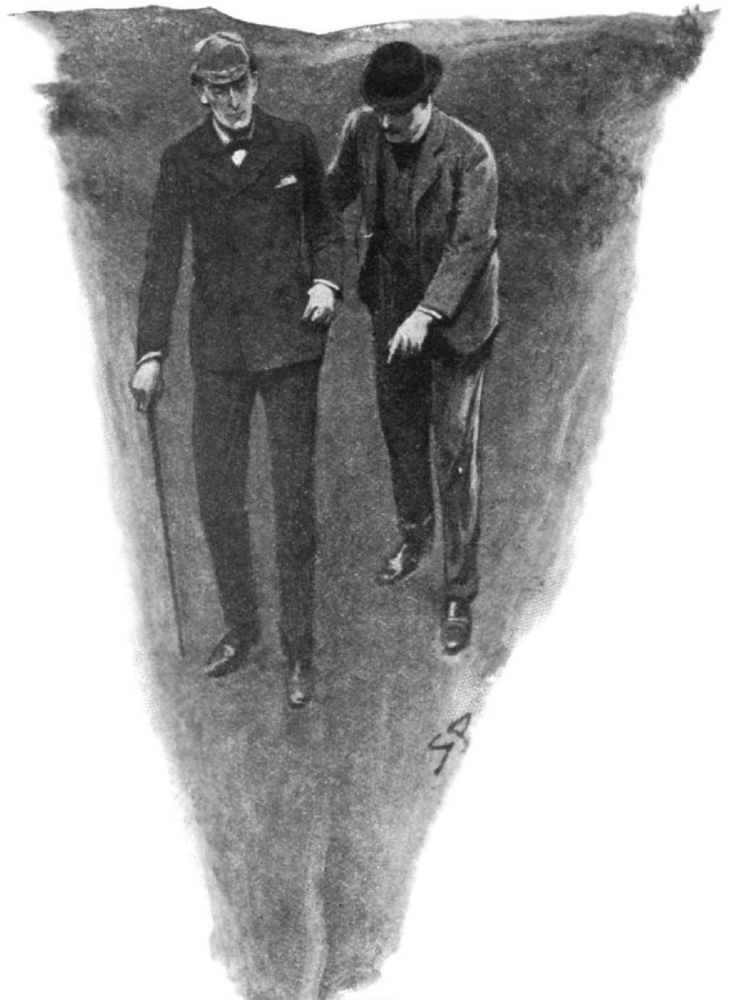

像是一束电线拖出来的痕迹。

“黑尔<a href="#part0104.xhtml_ch3"
id="part0104.xhtml_ch3-back">(3)</a>海德格尔，正是，没错！”福尔摩斯叫道，欣喜无比，“我的推理还算准确吧，华生。”

“向你祝贺了。”

“我们还有好长的路要走呢。请注意别把小路踩了。我们跟着车印这么走，就怕走不多远。”

继续往前走，发现这个地方是一块块软湿地纵横穿插，所以虽然时时会不见车辙，也还能够断断续续连接得上。

“你看见了吗，”福尔摩斯说，“骑车人现在无疑是在用力加快速度吧？这是没有疑问的了。看这里的车印，两个轮子都很清楚，前轮同后轮一样清楚。这只能作如此解释：骑车人身子前倾，重量前移到车把手，骑车要加速，总是身体抬起呈拱形姿势。

“呦，在这里摔倒了！”

有一大片烂糟糟泥泞，覆盖车辙有好几码，然后有几个脚印，然后车辙印迹重新出现。

“人车侧身滑倒。”我讲了看法。

福尔摩斯拾起一株压烂了的荆豆花，我一看大吃一惊，黄花上面溅满着暗红色污斑。再看小路上，也有，在杜鹃丛中凝结着发黑的块块血迹。

“坏了！”福尔摩斯说，“坏了！站旁边点，华生！不要把脚印踩上去了！看得出这里出什么问题？人摔伤了——又站起来——再骑上车——继续向前。这里没见有其他车轮印子。这边小径上是牛蹄印，不会是叫牛给抵了一家伙？绝不可能！也不见有另外的脚印。再向前，华生，跟着血迹、车轮走，他逃不掉。”

追踪没有多远距离，车轮在潮湿泛亮的泥路上急剧打起弯来。忽然间，我眼前一闪，前边密密的杜鹃矮丛中有金属亮光，原来是一辆自行车。我们把车从灌木中拖出来，是帕尔默轮胎，一个踏脚弯掉了，车身前部沾满、溅满可怕的血迹。在另一边的灌木丛中，露出一只鞋。我们赶快跑过去，看到竟是不幸的骑车人躺在那里面。这个人高个头，大胡子，戴眼镜，有一块镜片不见了，死因是头部遭到猛击，一侧颅骨被击碎。看样子，他受击以后还骑了那么长一段距离，很能说明这个人的活力和勇气是惊人的。他脚上光穿鞋，没有袜子，外套敞开，露着里面的衬衫式长睡衣。他是德语教师无疑。

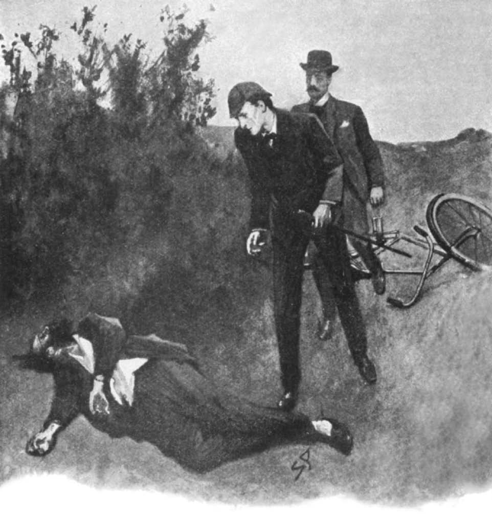

不幸的骑车人躺在那里面。

福尔摩斯神情庄重地将尸体翻过来，作了仔细的检查，然后坐下来沉思片刻。从他深皱的眉额可以看出，发现惨不忍睹的尸体，依他之见，这对于本案没有大踏步推进。

“往下怎么办，倒有点难了，华生，”他最后说道，“我的意思只有继续往下查。已经花上不少时间，得加紧脚步，一个小时都浪费不起。另一点，一定得赶快把发现尸体这事通知警方，要把这遇害人的尸体看好了。”

“让我回去报信。”

“不行，我需要你在旁边帮手。哎，你看！那头有个人在挖泥煤，把他叫过来，让他去报告警察。”

我跑去把农民带过来，福尔摩斯让这个大惊失色的人送一张便条给赫克斯塔布尔博士。

“现在，华生，”他说，“今儿早上我们已经获得两条线索，一条是帕尔默轮胎的自行车，看到了这车子是这样的结果；另一条是换了邓洛普轮胎的自行车。下一步怎么调查这条线索，让我们先把已知情况理一理，以便充分利用这些情况，把基本问题和偶然因素分个清楚。

“首先，你可以确信孩子是自愿出走，是从窗子下来跑掉的。可能独自一个人走，也可能有人带着走，必定如此。”

我表示同意。

“好，那么让我们回头来看这个不幸的德语教师。孩子出逃，衣服都穿好，因此，他预先有准备要做什么事。但是这个德国人，袜子没穿就出来了，那是紧急之中匆忙行动，肯定是这样。”

“是这样，没问题。”

“他干什么来了？因为，从他卧室窗户，看见了孩子逃跑；因为，他要赶快追上去把他带回来。他抓起自行车，去追孩子，他是在追赶孩子的过程中遇害的。”

“情况看来是这样。”

“现在来看我分析的关键问题。大人追小孩，跑上去就能抓住，很自然不过的事情，但是这个德国人不是那么简单行动，他要骑车去追。我还听说他是个骑车手，车技很好。如果他不是看到孩子逃跑，是有一种快速的方法跑，他不会这样做。”

“这就涉及那另外一辆自行车了。”

“让我们继续往下推理。教师死在离学校五英里的地方——不是枪打的，你注意了，小孩子也可能会开枪，可他是给一只强有力的胳膊重击，活活敲死的。那就是说，孩子必由一个人带着逃跑，逃跑得相当快，因为，一个自行车好骑手追了五英里才追上他们。然而我们侦查死者现场，发现什么？发现牛蹄印，没有别的。我都兜上好大一圈，五十码以内没有别的小道。另一个骑车人可能同谋杀没有直接关系，那里也没有发现人的脚印。”

“福尔摩斯，”我高声道，“这是不可能的。”

“对哇，”他说道，“你完全正确。我的说法是站不住脚的。因此我肯定有些说法讲得不对，有错误。你自己已经看到了，你说说谬误在哪里？”

“总不可能自己摔碎颅骨吧？”

“湿泥地会有这种事吗，华生你说呢？”

“我的脑袋瓜子不管用，再想也想不下去。”

“哦，不要这样讲，比这更困难的问题我们都已经解决了。至少我们掌握了好些情况，就看我们怎么来使用。那就来吧，帕尔默就这样了，让我们看看花纹呈块状的邓洛普，能提供点什么情况。”

我们寻找这辆自行车的行迹，追踪一段距离，沼泽地在往上升高，小径缓缓打弯转向杜鹃灌木丛中，那片水沟地就抛在了后面。这条车辙也就帮不了多少忙，所抱希望到此为止。在邓洛普车胎印迹再也看不到的地方，小径还是一直向前，通往霍尔得内斯府第，那庄严的塔形建筑，矗立在我们左方几英里外，而这一头我们的正前方，通向一处低洼灰色的村庄，这村庄也正是柴斯特菲尔德公路所在方位的标志。

我们来到一家邋遢破落的旅店，店门上方有一只斗鸡标牌，这时福尔摩斯突然嘴里“哎哟”一声，手马上抓住我肩膀，以免人要摔倒。他踝骨扭伤了，以前也曾有过一回，扭得很厉害，一点也走不动。他艰难地一蹭一跳，到了店门前，门口蹲着一个黑不溜丢的年龄稍大的男子，嘴里咬着一支黑土烟斗。

“你好哇，鲁宾·海斯先生？”福尔摩斯招呼道。

“你什么人，怎么会知道我名字？”这个乡巴佬反问，一双狡黠的眼睛疑惑地眨巴着。

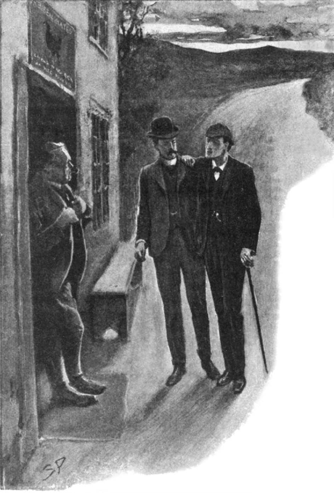

“你什么人，怎么会知道我名字？”

“噢，不就在你脑袋上边那地方写着嘛。一眼就看出，你就是老板模样的人嘛。我说，你这里是不备四轮客车的喽？”

“没有，我没有。”

“我的脚都没法着地了。”

“那就别着地。”

“不能走路哦。”

“那就蹦、跳。”

鲁宾·海斯先生粗声恶气，但是福尔摩斯和颜悦色。

“你瞧，朋友，”福尔摩斯说，“这个样子真叫我不好办啊。得想个办法走路哦。”

“有啥办法！”愣里愣气的店主说。

“有急事儿呢。想借辆自行车用，给一个沙弗林<a href="#part0104.xhtml_ch4"
id="part0104.xhtml_ch4-back">(4)</a>。”

店主竖起了耳朵。

“你要上哪儿？”

“去霍尔得内斯府第。”

“你们是他公家（公爵）的人喽？”店主说，打量着我们沾了泥土的衣服，眼光疑惑、轻蔑。

福尔摩斯笑容可掬。

“反正他见到我们一定很高兴。”

“为什么？”

“因为，我们带给他消息，他失踪的儿子。”

看得出店主立时一惊。

“怎么，你们有线索啦？”

“打听到了在利物浦，人家时刻盼着快快找到。”

胡子不修的铁板脸上立刻起了变化，突然松动温和下来。

“我可不像好多人，我不怎么指望他老公家（公爵）有多好来着。”他说，“我以前是他家的马夫头儿，他对我可刻薄，他对我说解雇就解雇，连一句好听的话儿都不给。可我呢，还是快活听到小主人在利物浦有消息了，我来帮你忙，把消息送到他府上去。”

“谢谢啰，”福尔摩斯说，“我们先吃点东西，过后你借辆自行车就行了。”

“我没自行车。”

福尔摩斯掏出一枚沙弗林在手上。

“我跟你说，朋友，我没有自行车，我给你两匹马就得了，一样到他府上。”

“好，好，”福尔摩斯说，“我们弄点东西吃了再讲。”

石板搭成的厨房里只剩下我们两人的时候，那原是扭伤了的脚骨忽然一点没事，恢复之快令人目瞪口呆。夜色快要降临，我们一清早以来还没有吃过东西，所以赶快抓紧时间填饱肚子。福尔摩斯在想得出神，有一两次走到窗前去向外东张西望。窗子朝着一个乱七八糟的院落，远处角上是铁匠间，有个邋遢孩子正在干活，另一边是马厩。福尔摩斯在屋里走来走去看这看那，刚回椅子坐定，又忽地站起来，高兴得叫一声。

“天哪，华生，没错，弄清楚了！”他叫道，“是的，是的，一定是这样。华生，今天看见好多牛蹄印，对吗？”

“是呀，有好些个。”

“在哪里？”

“那，到处都是，沼泽地，还有小道上，可怜海德格尔死的那边周围。”

“确实。好，我问你，华生，沼泽地上你看见有多少牛了？”

“好像没见有牛嘛。”

“怪事，华生，一路来尽见牛蹄，可是满地里一头牛也没见。非常奇怪，华生，是吗？”

“是呀，真是怪事。”

“好，华生，你好好想一想，你在小径、小道上看见有牛蹄吗？”

“是呀，有呀。”

“你记得起吗，有时候蹄印像这样，华生”——他拿面包粒屑做这样的排列————“有的时候像这个样”——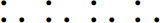——“可又有时候也会这样”——“你能记得起来吗？”

“不，我记不得。”

“可是我记得，能发誓，记得很清楚。现在，等我们有空再回头证实吧。我怎么那样晕头转向，没早得出结论。”

“你有什么结论了？”

“这不是头怪牛吗，才会这样走法，平步、小跑、飞奔。肯定说，华生，乡下小店老板没有这个脑子想得出这么个障眼法。海岸在望了，没事。那个孩子还在铁匠间，不管他，我们溜出去看看。”

那摇摇欲坠的马厩里有两匹鬃毛脏乱的马，福尔摩斯抓起一匹的后蹄来看，立即展出笑颜。

“老蹄子，可是旧掌新钉——旧铁掌，掌钉倒是新的，本案堪称典型案例。我们去铁匠间看看。”

孩子依旧干他的活，没理睬我们。我看见福尔摩斯的眼光从右边扫到左边，投向散乱满地的烂铁和木头。忽然听到身后有脚步响，是店主。店主眉头皱得直压凶狠的两眼，一张黑皮脸面紧张得直打战，手里抓一根铁头短棍，直奔过来。看他凶神恶煞的样子，我心想来吧，手已经握住了口袋里的左轮枪。

“你们两个该死的侦探！”店主号叫着，“想干什么？”

“啊，鲁宾·海斯先生，”福尔摩斯冷冷地说道，“看你这个样子，生怕人家发现什么了不是！”

这个人马上竭力控制自己，咧嘴放松，勉强发出嘿嘿笑声，这笑比他的凶相更具威胁。

“欢迎来吧，欢迎来我铁匠间，看你能找出点什么东西，”他说，“要看要查，先生，我人不在，这么探头探脑可不行！少啰嗦，付钱，付了钱给我走路。”

“那好，海斯先生，没有别的意思，”福尔摩斯说，“我们只是看看你的马，那我只好就走着去吧，反正不远，我想。”

“两英里都不到，这儿去他公家（公爵）府上，往左边路走。”他愠怒的两眼直瞪，望着我们离开他的小店。

我们沿路走没多远，福尔摩斯就停步，这时已经绕过一段弯道，旅店老板看不见我们了。

“正像儿童常说的，野外寒，进了旅店好温暖；我们温暖啦，”他说，“离开了这旅店，我是走一步冷一步，越走越冷。不，不行，我是离开它不得。”

“我肯定，”我说，“这个鲁宾·海斯知道整个事件。这是明摆着的，不说就知道他是个恶棍，而且还是个少见的恶棍。”

“噢！你对他有这么个印象吗？那儿有马，有铁匠间，是的，是个有意思的地方，这个斗鸡旅店。我说，得回头去看看，悄悄地。”

长长的斜山坡，处处是灰岩砾石，远远地伸展在我们身后。我们从公路下来，走上山坡，正朝霍尔得内斯府第方向望着，忽见有个人骑车向这边快速过来。

“蹲下，华生！”福尔摩斯叫道，伸手按下我的肩膀。我们刚蹲身隐蔽，骑车人飞速从公路上过去。在扬起的飞尘之中，我一瞬间瞥见一张苍白激动的脸——一脸的惊恐之色，张着嘴，两眼睁得大大地瞪着前方。那是我们头一天晚上见到的衣冠楚楚的詹姆斯·怀尔德的漫画像。

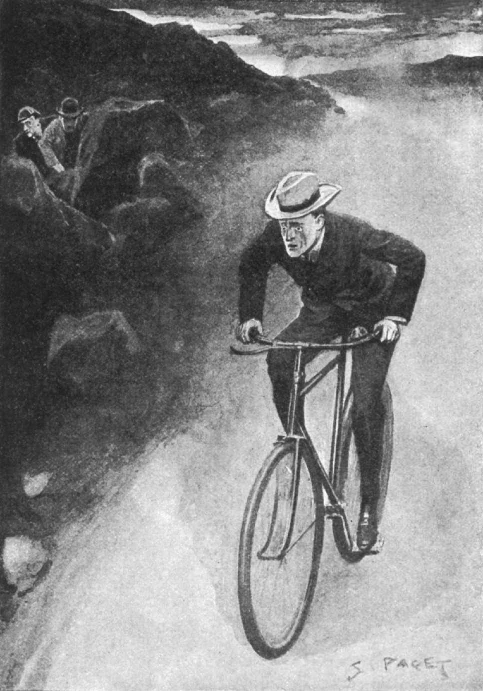

骑车人飞速从公路上过去。

“公爵秘书！”福尔摩斯出声说，“快，华生，看看他要干什么。”我们匍匐着从一块岩石爬到另一块岩石，迅速找到一处能望见小店门前的地方。怀尔德的自行车就靠在门外，屋子里没有动静，窗户里也望不见人影。太阳沉入霍尔得内斯府第高塔后面，暮色渐深。稍后，在朦胧中看到旅店马厩的院子里有一辆单马车，两盏边灯点亮，便听见马蹄哒哒、车轮辘辘上了路，顷刻间沿着柴斯特菲尔德大路疾驰而去。

“你看这是怎么回事，华生？”福尔摩斯耳语问。

“像是逃跑。”

“是单马车，我看那只有一个人，嗯，肯定不会是詹姆斯·怀尔德先生。看，他正在门口呢。”

一方块微红的灯光从门里射向黑暗，亮光的中心处是秘书的黑身影，他正探头朝夜色中窥视，显然是在等待什么人。最后，公路上响起脚步声，灯光中立即进入第二个人影，店门随即关上，一切重又陷于黑暗。约五分钟，二楼一间房里亮起了灯。

“这斗鸡旅店的生意经，别有门道。”福尔摩斯说。

“酒吧是在另外那一边。”

“没错，这些就是常讲的所谓私客。夜这么深了，詹姆斯·怀尔德先生到这种黑窝里来到底干什么？来和他碰头的是什么人？来，华生，我们就冒他一次险，过去探个明白。”

我们一起下到公路上，潜行到店门前。那辆自行车还靠着墙，福尔摩斯划一根火柴照着后轮，光亮中看见了邓洛普车胎的块状花纹，我听见他轻轻笑了一声。我们的头顶上，是亮着灯光的窗户。

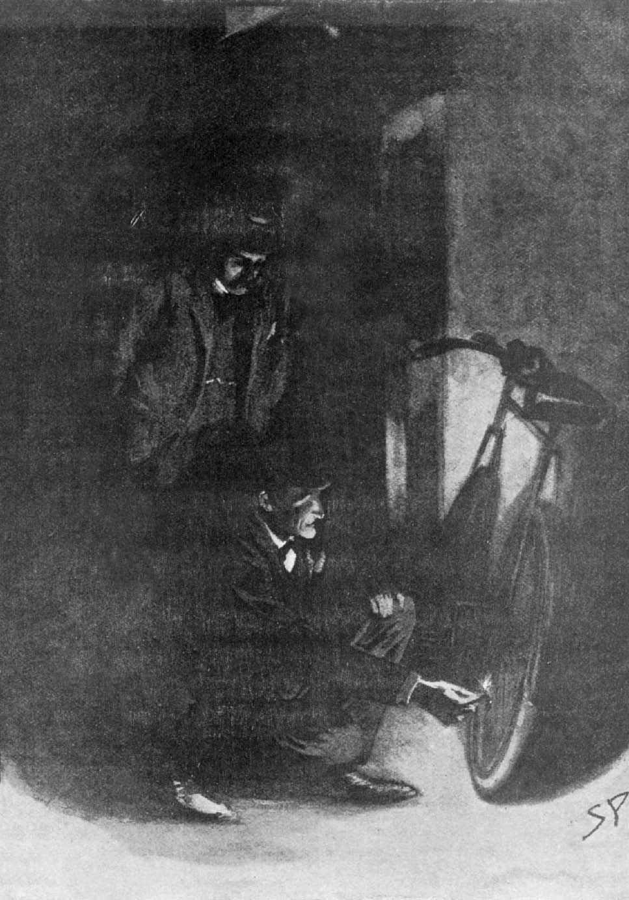

光亮中看见了车胎的块状花纹。

“我得想办法看看，华生，你弯下腰，扶住墙，让我上去，我想能够得着吧。”

接着他脚蹬我的肩膀，但是腿还没有站直，却又立刻下来。

“哦，算了，我的朋友，”他说，“一天的工作时间很长了，省点力气吧，回学校的路还长着呢，赶快，早回早好。”

我们疲惫地穿过沼泽荒地，一路上他几乎没开口讲话。到了学校他也不走进校门，而是先去麦克尔顿车站，在那里发了几封电报。夜深人静了，我听见福尔摩斯在安慰赫克斯塔布尔博士，博士为了他那位教师惨遭杀害而唏嘘不已。过后福尔摩斯又进我房中，精力充沛，神态机敏，如同早晨出发时候一样。“一切进展顺利，我的朋友，”他说道，“我保证，不用等到明天傍晚，我们就要把问题解决，谜案宣告侦破。”

第二天上午十一点钟，我的朋友和我走在了霍尔得内斯府第有名的紫杉树林荫道上。我们被引导穿过辉煌的伊丽莎白门厅，进入公爵阁下的书房。詹姆斯·怀尔德先生在那里，对我们彬彬有礼，但是在他诡谲的眼神中和抽搐的颜面上，隐约显现他为昨夜的行动心惊胆战、犹有余悸。

“你们来是要见公爵大人？很抱歉，大人身体不巧欠佳，被一则悲惨的消息搅得心神不宁。昨天下午我们收到赫克斯塔布尔博士的电报，告诉了你们发现的事。”

“我必须见公爵，怀尔德先生。”

“可是他在卧室里。”

“在卧室我也必须见他。”

“我相信他正卧床休息。”

“卧床我也必须见他。”

福尔摩斯冷面无情、绝不退让的态度向秘书表明，想要阻止是徒劳的。

“那好，福尔摩斯先生，我去禀告他你们来了。”

拖延了一个小时，大贵族方才露面。他的脸色比先前更加死灰，双肩拱起，我觉得那样子比前天上午见到的苍老许多。他呆板地和我们寒暄几句，落座书桌旁，红胡须垂在桌面上。

“什么事呢，福尔摩斯先生？”他说。

我朋友的眼睛看着秘书，秘书正站在他主人的椅子边。

“我想，公爵阁下，为说话方便起见，请怀尔德先生不必在场。”

秘书的脸色刷地更白，恶狠狠地瞪了福尔摩斯一眼。

“大人您认为——”

“好吧，好吧，你走吧。现在，福尔摩斯先生，你要说什么？”

福尔摩斯等秘书退下，看他把门关上。

“情况是这样，公爵阁下，”福尔摩斯说道，“我的同事华生医生和我自己，从赫克斯塔布尔博士那里得到保证，讲定本案了结以后应有报酬，此事我想听您亲口许诺才能放心。”

“那是当然啦，福尔摩斯先生。”

“他说讲出您公子的下落，酬金五千英镑，此数是否确切？”

“确切。”

“讲出劫持者的名字，无论一人或几人，另加一千英镑，确切否？”

“确切。”

“这后一项，无疑不仅应该包括劫持者，也应该包括共谋者，是不是？”

“是的是的，”公爵不耐烦地叫道，“只要事情办成，福尔摩斯先生，不会叫你有理由抱怨酬劳给低了。”

我的朋友搓起两只细长的手，脸上露出贪婪的表情，这令我顿感诧异，因为我知道他一向不在乎酬报。

“不揣冒昧，公爵大人，我看见您的支票簿正在桌上，”他说，“请开给我一张六千英镑的支票，我将非常高兴。同时请您随手画两杠好转账。本人的代理银行是城乡银行牛津街支行。”

公爵阁下脸色变得严厉，身子在椅子里直了起来，冷眼看着我的朋友。

“这是在开玩笑吗，福尔摩斯先生？这不是取乐的事情。”

“一点没有，公爵阁下，我是再严肃也没有了。”

“那你是什么意思？”

“我的意思，我已经赢得了报酬。我知道您的公子在哪里，而且，甚至知道在谁的手里。”

公爵的红胡子翘起来了，在死灰的脸上显得更红。

“他在哪里？”老头喘着气。

“他现在，还有昨天晚上，都在斗鸡旅馆，出此地花园大门大约两英里。”

公爵跌靠在椅背上。

“你指控谁？”

福尔摩斯的回答叫人震惊如雷轰顶。他刷地跨前一步，手按住公爵肩头。

“我指控您，”他说，“现在，公爵阁下，我麻烦您开给支票。”

我永远不会忘记这时候公爵的表情。他跳起来，举手握拳，像是坠入深渊的样子。随后，以不寻常的贵族的自我克制力压抑自己重新坐下来，把脸深深埋进双手，好几分钟没开口讲话。

“你是怎么知道的？”最后他问，没有抬头。

“昨天夜里你们在一起我都看见了。”

“除了你朋友还有谁知道？”

“我没有对其他人讲。”

公爵颤抖的手指拿起了笔，打开了支票簿。

“我说话算数，福尔摩斯先生，不管你掌握的情况对我有多么不利，支票还是照开。最初规定报酬的时候，我想不到事情会出现这样的变化。那么你和你的朋友都是懂得谨慎的人，福尔摩斯先生，对吗？”

“我难以理解阁下什么意思。”

“我就明白说吧，福尔摩斯先生，只有你们两人知道此事，就不要再传扬开去了。我想应该给你们一万两千英镑总数，对不对？”

福尔摩斯微笑着，摇摇头。

“恐怕，公爵阁下，事情安排不这么简单，学校教师的死亡要考虑在内。”

“这个事詹姆斯一点也不知道，你不能叫他负责任。这是那个暴徒流氓干的事，他雇用这么个人也是不幸。”

“我是这样看的，公爵阁下，一个人犯有一桩罪行，由此罪引发的另一桩罪，也负有道义责任。”

“负有道义责任，福尔摩斯先生，你无疑是对的，但是从法律角度来看肯定不是这样。发生谋杀案，一个不在现场的人不应受到刑罚，何况他憎恨、厌恶杀人。他一听说这个事情，就向我完全坦白了，他内心充满恐惧和忏悔。他立刻就完全和杀人犯断绝了关系。哦，福尔摩斯先生，你一定要救救——你一定要救救他！我求你一定要救救他！”公爵再也控制不住自己，在屋子里走来走去，脸在痉挛，捏紧双拳高举乱舞，最后好不容易使自己安静下来，重新坐到书桌边。“我赞赏你的行动，先到这里来，没有同别的人讲，”他说，“这样，才有可能商量怎样制止可恶的谣言流传。”

“确实，”福尔摩斯说道，“我想，公爵阁下，这件事，我们之间要绝对坦诚才能解决。我将竭尽我的全力来帮助公爵阁下，但是，要这样做，我必须了解透彻，这其中到底是怎么一回事。您为詹姆斯·怀尔德先生说的话，我理解有苦衷，不能把他当作杀人犯。”

“不是他，杀人犯已经逃走了。”

福尔摩斯不以为然地一笑。

“公爵阁下，您不大听说、不太了解我拥有一点小小的名气，否则您不会相信此人就那么容易从我手上逃走。鲁宾·海斯先生，按照我发出的报告，已于昨晚十一点钟在柴斯特菲尔德被抓。这是今晨我离开学校以前，接到本地警署警长的电报。”

公爵身靠椅背，愣眼惊诧地看着我的朋友。

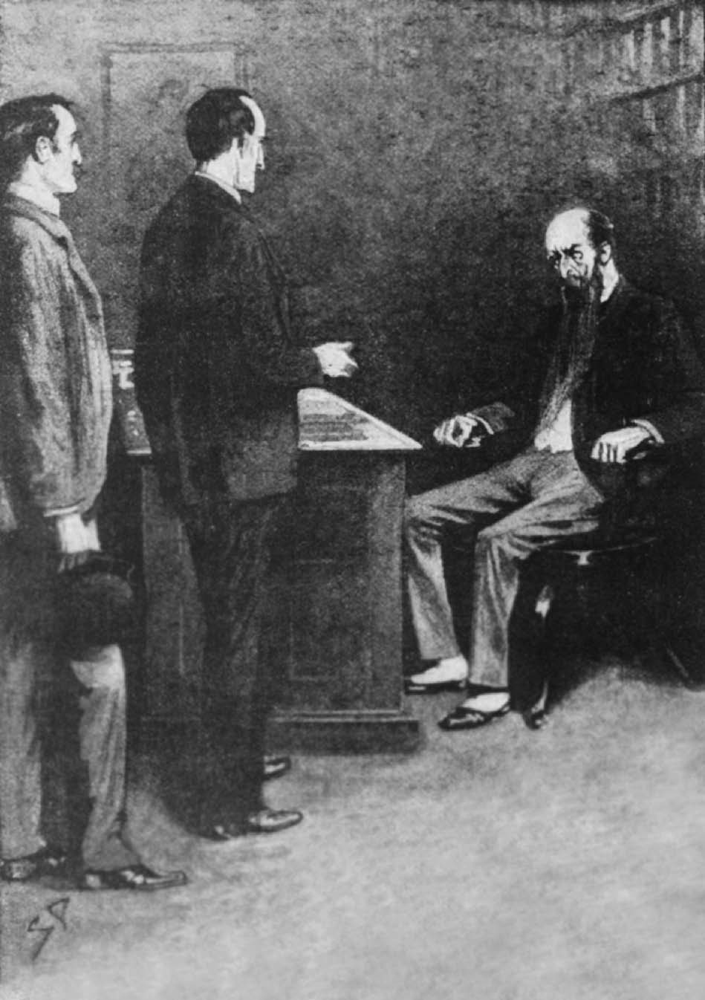

公爵愣眼惊诧地看着我的朋友。

“你像是有超人的本领，”他说，“鲁宾·海斯被抓起来了？我很高兴听到这个消息，只是不要牵连、影响到詹姆斯今后的命运。”

“您的秘书？”

“不，先生，我的儿子。”

这回轮到福尔摩斯感到震惊了。

“我坦率讲，这件事我一点都不知道，公爵阁下，请您详细说一说。”

“我不必对你隐瞒了。我同意你，我将和盘托出，不管对我有多么痛苦，这是上策。事到如今，我已是无路可走，都是詹姆斯的愚蠢、嫉妒，拖累了我。我还很年轻的时候，福尔摩斯先生，就有了爱情，一生唯一的一次一往情深的爱。我向姑娘求婚，可是她拒绝了，原因是和她这样的婚姻要毁掉我的前程。如果她还在世的话，我绝不会要娶别人。她死了，给我留下了一个孩子，我为了她的缘故，要把孩子抚养长大。我不能向世人承认亲子关系，但是我给他良好的教育，一到他成年，我就把他留在我身边。没想到秘密给他知道了，从此以后，他要挟我，声称要公开真相，掀开丑闻，这是最令我憎恶的。有他在，多少造成我婚姻生活的不愉快。尤其是，他恨我有了法定继承人，一知道自己身世就开始怀恨他年幼的弟弟。你可能要问，情况既是这样，我何必还要把詹姆斯留在家里。我的回答，因为我看着他，就是看到他母亲的脸；我爱着她不能忘怀，终身之苦无法摆脱。她种种的可爱、美好——詹姆斯处处地方都使我想起他的母亲，唤回我的记忆。我不能叫他走。但是我又担心他会加害于阿瑟——就是萨尔特尔勋爵——不能不防，所以我把阿瑟送到赫克斯塔布尔博士的学校，可以受到监护。

“詹姆斯同海斯这个家伙关系好，这人是我的佃户，詹姆斯去问他收租，此人原本就是个流氓，可詹姆斯偏偏和他混得火热，两人交往甚密，他就喜欢结交低层次的朋友。詹姆斯决定劫走萨尔特尔勋爵，就要利用这个人。最后那天我写过信给阿瑟，这你记得，好，给詹姆斯拆了这封信往里加塞了条子，要阿瑟在那个叫乱树林的小林子里会他，那林子就靠着学校后面很近。他是用公爵夫人的名义把孩子叫出来的。那天傍晚詹姆斯骑了车去——我现在跟你讲的都是他自己亲口向我供认的——在树林里会上阿瑟，告诉他说他母亲想念他、要见他，母亲就在荒野地那边等着，叫他晚上再来这树林，会有一个人备好马等着他，骑马带他到母亲那儿去。阿瑟不懂事中了圈套，他赴约了，看见这个人海斯，牵着一匹小马。阿瑟骑上马，一起走了。实际上后面有人追来——这是詹姆斯昨天才听说的——有人追上来，被海斯用棍子打了，结果把追赶的人打死了。海斯把阿瑟带到他酒店，斗鸡旅店，把他留在楼上的房里，让海斯太太管着。海斯太太是个好人，但是男人对她很厉害，完全受男人控制。

“这些，福尔摩斯先生，是两天前我第一次看到你的时候，整个的情况。真正事实我知道的不比你多。你要问我詹姆斯这样做目的何在，我能回答的，是他对我的继承人怀有嫉恨，许多事实在是不可理喻、难以想象的。在他看来，他自己才应当是我的全部家产的继承人，他深为怨恨使他得不到继承权的社会伦理与法律。因此，他有明确的目的，就是要我否认既定继承人。他急不可待，认为这样做的权力完全操在我的手里。他动了个脑筋，好同我讲条件——我只有废除既定继承人权利，他才能把阿瑟放回来，还要立下遗嘱明确家产由他继承，以免口说无凭。他很有把握，知道我是绝对不愿报警的，绝对不会借警方之手来处置他。我是说，他原打算用这种方法和我讲条件，但是实际上他未能如愿以偿。因为事情变化得太快，他都想不到，他没有时间来得及把计划付诸实施。

“他这个邪恶的计谋彻底破产，未能得逞，是因为让你发现了海德格尔的尸体，詹姆斯一听到这个消息都吓傻了。消息我们是昨天知道的，我们正坐在这儿，书房里，是赫克斯塔布尔博士发来了电报。詹姆斯忧伤、激动得不知怎么才好。我原先就不免对他有怀疑，果然是他捣的鬼。他竟做出这种行为，我把他好好训了一顿。他忙不迭认错，交代全部事实，随后他求我给他保密三天时间，不要声张，设法救他闯下大祸的同谋，让他找机会保命。我依了他——我总是对他心软让步——他苦苦哀求呀。他立刻赶到斗鸡旅店报信，叫海斯快逃，还给了他盘缠。我本人白天不能去，去了一定要引起纷纷议论。可是一等到天黑，我就赶快跑去看我亲爱的阿瑟。阿瑟安然无恙，就是让他亲眼目睹了恐怖场面，吓得他说不出话。我遵守我的诺言，可也是违背我的意愿，答应再把他留在那边三天，由海斯太太照看。事情很明显，叫警方知道了孩子在哪里，又想要瞒住杀人犯是谁，这是办不到的。我也清楚，因为惩罚凶手势必要连带毁了我苦命的詹姆斯。你要求我诚恳、坦率，福尔摩斯先生，我相信你的话，把一切事情都告诉了你，不想绕弯，不想保留，也请你待我以体恤与诚信。”

“我一定，”福尔摩斯说，“首先，公爵阁下，我必须跟您说，从法律角度看，您把自己置于极不利的地位。您包庇重罪犯，您协助杀人犯潜逃。可想而知，詹姆斯·怀尔德资助他的同谋逃跑的费用，必定出自于您公爵阁下的荷包。”

公爵点头表示承认。

“这确实是一桩十分严重的事情。尤其应该受到谴责的，依我看，公爵阁下，是您对待自己小儿子的态度，那样的黑窟，您竟把他丢在那儿三天。”

“都有郑重的承诺——”

“承诺，对这种人能管用？您不能保证孩子不会再一次被拐走。您姑息犯罪的长子，无辜的幼子任其面临不测的危险，这是极端不负责任的行为。”

骄傲的霍尔得内斯公爵，在自己堂堂公爵府第，受到如此不恭敬的品评，是很不习惯的。他气血上冲，脸红到了额头，但是良心使他沉默。

“我会帮助你的，但是有个条件，就一个，那就是请唤您的门仆来一下，由我按我的意思命他行事。”

一句话也没有，公爵按了电铃，仆人入内。

“你一定很高兴听到，”福尔摩斯说，“你家小主人找到了。公爵大人的意思，备四轮马车立即去斗鸡旅馆接萨尔特尔勋爵回家。”

“现在，”福尔摩斯等欣喜的仆人退下以后说道，“我们既已把握了未来，那么对往事便可以宽容为怀。好在我不处于官方地位，只要伸张正义的目的达到了，就没有理由要把我知道的事说出去。至于海斯，我无话可说，绞刑架等待着他，我不能出力救他免于一死。他要说出些什么，我不知道，但是不要紧，公爵阁下您可以叫他明白，只有沉默还会对他有好处。警方的看法，无非是绑架勒索案，他是要赎金罢了。如果警方他们自己发现不了其中问题，我没有必要去促使他们看得更广、更复杂。然而我要提醒公爵阁下，让詹姆斯·怀尔德先生继续留在您府上，只会带来不幸。”

“这个我明白，福尔摩斯先生，已经安排好了，他永远离开我，到澳大利亚去自谋生路。”

“那就好，公爵阁下，您自己说了您的婚姻不和，是他在这里才引起的，那么现在我建议您可以挽回了，向公爵夫人作出弥补，不幸中断的关系重新修好。”

“这个我也已经作好安排，福尔摩斯先生，今天早晨我写信给夫人了。”

“这样就好，”福尔摩斯说道，站起身来，“我想，我朋友和我便足以庆幸，此次来北方短暂一行，不无收获，有些成果。还有一个小问题想请教，海斯这个家伙把他的马掌假装成牛蹄印，是不是听怀尔德先生指使才出此奇招？”

公爵站着想了一会儿，脸上露出惊疑的神色，然后打开一扇门，领我们进入一间像博物馆似的大屋子。他带我们走到角落上一个玻璃柜前，指着上面的文字。

“此类铁蹄，”文字写道，“出土于霍尔得内斯城堡府第之护城壕，用作马蹄，而底纹打成连趾牛蹄状，以淆乱行踪，使来追者失去目标。据考系中世纪霍尔得内斯频举征伐之男爵所置备。”

福尔摩斯打开柜盖，一个手指沾上唾沫，在铁蹄上抹一抹，指上是一层薄薄的新泥土。

“谢谢阁下，”他说，把玻璃盖盖好，“这是我英格兰北方此行所见的第二件趣事。”

“还有第一件呢？”

福尔摩斯把支票折起来，小心翼翼夹进笔记本。“我是个穷人。”他说，珍惜异常地拍拍本子，深深塞入内衣口袋。

（1904年）

————————————————————

<a href="#part0104.xhtml_ch1-back" id="part0104.xhtml_ch1">(1)</a> 嘉德勋位（Knight
of the Garter），英国骑士的最高勋位。

<a href="#part0104.xhtml_ch2-back" id="part0104.xhtml_ch2">(2)</a> 贺拉斯（Horace，前65—前8），古罗马诗人，从倾向共和转而拥护帝制，著有《诗艺》，影响深远。

<a href="#part0104.xhtml_ch3-back" id="part0104.xhtml_ch3">(3)</a> 黑尔（Herr），德语：先生。

<a href="#part0104.xhtml_ch4-back" id="part0104.xhtml_ch4">(4)</a> 沙弗林（sovereign），英国旧时金币，面值一英镑。

# 黑彼得

我不知道我朋友的身体和精神状态是否还有比一八九五年更好的时候。他随着破案名声日振，侦查业务也就日忙。对此我则觉得，如果稍有表露某某显贵政要我都有结识，他们都曾亲临我们贝克街寒碜门庭来做委托人，还真会令我颇觉不识趣，太无自知之明。然而，福尔摩斯一如所有伟大的艺术家，生命为艺术，艺术是生命。而且他服务于人们的付出是无价的，我从未发现他以索取高额报酬为目的，只有霍尔得内斯公爵一案是例外。他是如此地与世俗相异其趣——或者说是不谙世情——那些权势富贵倘若不值得他同情，他常拒人于千里之外，不屑一顾；另一方面，他会不惜一连几个星期紧张劳作，埋头于那些社会地位低微者委托的事情，他们的案子往往多有奇趣而富于戏剧性，需要发挥想象力，更能挑战他的智谋。

在一八九五年这难忘的一年中，一连串稀奇古怪的案子层出不穷，他全身心地投入，从轰动一时的侦破红衣主教托斯卡的猝死案——按照教皇陛下的紧急指示办理，被他一举查实——直到将臭名昭彰的加那利舞蹈教练威尔逊加以逮捕，从而破获了伦敦东区的一个犯罪黑窝。与这两个重大案子接踵而来的是护林人李的住宅惨案，即彼得·加里船长死因扑朔迷离的奇案。福尔摩斯先生的探案故事如果不包括这个非常奇异的案子，那就会显得很不完整。

七月的第一个星期，我的朋友经常长时间不在住所，我知道他手上有事正在奔忙。这期间有几个相貌粗俗的人上门来寻访巴斯尔船长，这就使我明白福尔摩斯是在另外什么地方进行工作，假托身份和姓名，隐去真实面目，以免受人注意，引起惊动。他在伦敦各区至少有五个落脚点，各处都以不同的身份出现。这个事他不跟我说，我也不习惯硬要追问明白。我不知他在调查什么问题，但是头天给我的印象就肯定是一件不同寻常的案子。他不吃早饭就出去了，当我坐着吃我的饭时，他大步跨进屋里，大礼帽还戴在头上，一支有很大倒钩箭头的标枪像一把伞似的夹在他的腋下。

“天哪，福尔摩斯！”我叫道，“你不会带了这么一支家伙在伦敦街上转吧？”

“我坐车去了肉店又回来了。”

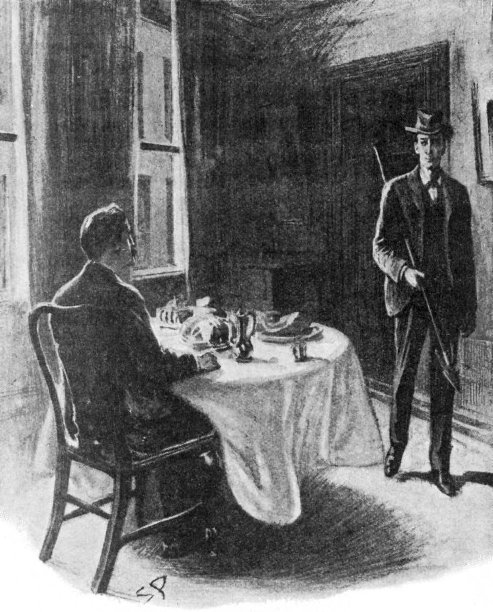

“我坐车去了肉店又回来了。”

“肉店？”

“我转了一圈回来，胃口就大开。一点不假，华生，早饭前进行锻炼有道理。可是我敢同你打赌，我刚才做什么样的锻炼，保管你猜不出。”

“我也不想猜。”

他倒着咖啡，格格格地笑了。

“你刚才没有到阿拉代斯肉店去，去的话就看到后店堂凌空吊着一头死猪，在那里直晃荡，有位老兄脱去外衣单穿衬衫使上这件武器，用猛劲儿戳着猪身。这个大力士，就是本人。我还没使上全部劲，只一下就把死猪穿了窟窿，真厉害，好开心啊。你想不想试试？”

“我才不想试。你这样做什么意思呢？”

“因为，我这样练一练，同护林人李住宅那件悬案不无关系。啊，霍普金斯，昨晚上我收到你电报了，正等着你来呢。来，一起谈谈。”

来客神态极为机警，年纪三十来岁，一身淡雅的花呢套装，但是还保持着穿警察制服时严肃笔挺的习惯。我一见就认出是年轻的警官斯坦利·霍普金斯，福尔摩斯认为他是个大有前途的青年，而他则以学生的态度仰慕、尊敬这位著名前辈，很重视他的科学方法。这时霍普金斯却是皱眉如愁云，神情极度沮丧地坐下来。

“不用了，谢谢你，先生，来之前我吃过早饭了。我在城里过的夜，昨天我来做汇报。”

“汇报什么？”

“失败，先生，彻底失败。”

“没有一点进展吗？”

“一点也没有。”

“奇怪！我倒要看看怎么回事。”

“我是巴不得你来呢，福尔摩斯先生。这是我上手的头一件大案，可是搞得束手无策，看在上帝分上，下来助小弟一臂之力吧。”

“好，好，我也刚好看过手头所有材料，包括侦查报告，看得比较仔细。那么，犯罪现场发现的那个烟丝袋，你怎么看呢？那上面没有线索？”

霍普金斯脸露莫名惊异。

“那是这个人自己的袋子，先生。里头有他姓名的首字母，还是海豹皮革——他就是个海豹老猎手嘛。”

“可是他没有烟斗啊。”

“是的，先生，我们没有发现烟斗。其实，他很少抽烟，有可能是备着给朋友抽的。”

“完全可能。我所以提到这个，因为，如果是我处理本案，我多半就从这里作为侦查突破口。现在，我的朋友华生医生，他对这个事还一无所知，而我本人想把事情经过重新听一遍，请简单扼要给我们再讲一讲吧。”

斯坦利·霍普金斯从衣袋里摸出一张纸。

“我这里记着年份时间，你们可以知道死者彼得·加里船长的经历。他生于一八四五年——年龄五十岁，是个猎海豹、鲸鱼的老猎手，勇敢，有经验。一八八三年，当‘独角海兽号’轮船的船长，是丹迪港的一艘捕海豹船，多次出海，几次都是满载而归。第二年，一八八四年，就退休，周游列国几年。后来买了幢小住宅，在苏塞克斯郡，靠近大森林住宅区的一幢房，都叫护林人李的房子，在那儿住了六年，一个星期前的今天，在那里去世。

“这个人有几个特别的地方。他平常的生活，貌似严格的清教徒——是个沉默、严肃、没笑容少言语的人。家里有老婆，一个女儿，今年二十岁，还有两个女佣人。佣人老是做不长，要换，都嫌住在这家人家不开心，有时候叫人受不了。这个人是个酒鬼，三天两头发酒疯，一发酒疯就像个恶魔。都知道他会半夜里把老婆、女儿赶出屋外，打得满院子跑，叽叽哇哇叫传到门外，满村子都被惊醒。

“有一次教区牧师到他家里去说他劝他，制止他的不良行为，老牧师给他大骂一通，结果他被传讯。总而言之，福尔摩斯先生，像彼得·加里这样蛮横不讲理的人，你上哪里也不易找得到。还听说，他当船长的时候性格就是这副样子。码头、船上人都管他叫黑彼得。给他起这名号，正好因为他是黑脸皮、一大把黑胡子，而且周围人都咒他这个恶脾气。不用说了，邻居人人都讨厌他，躲开他。现在他落得这么个悲惨结局，我没听见有一句哀悼可怜他的话。

“你一定在调查报告中读到这个人有间小木屋，福尔摩斯先生，你这位朋友大概没有听说过。那是他自己用木头在屋外面搭建的小屋——他一直称它叫‘船舱’——离他的宅屋几百码远，他每天晚上都在这里睡。木屋单间独立，很小，十英尺宽，十六英尺长。钥匙在他口袋里藏着，床铺自己整理，被褥自己洗，从来不让别人跨进门坎。木屋四面有小窗，一年到头蒙着窗帘，从不见打开。有一扇窗对着公路，晚上小屋里点了灯，人们指指点点，都不知黑彼得在里头搞什么名堂。就是这扇窗，福尔摩斯先生，调查的结果，我们还算得到一点可疑的证据。

“你记得有个石匠叫斯雷特，大约凌晨一点，从森林住宅区走出来——这是谋杀发生前两天——经过这地方，从树丛中望见窗上还有亮光。他发誓说，看见窗帘上映着一个人的侧面影子，清清楚楚，这个人肯定不是彼得·加里，彼得·加里他是完全熟悉的。这个人也长胡子，但是胡子短，向前翘起，同加里船长的胡子大不一样。石匠是这么说的，他在酒店里待了两个钟头，从路上望到那头的窗有相当的距离。再说，这是星期一他的印象，谋杀要到星期三才发生。

“星期二，彼得·加里又打闹起来，喝得满面通红，发狂像要吃人的野兽，在屋子外面乱闯，老婆、女儿听见他来了，就急忙躲开。晚上很晚了他才钻进自己的窝，大约半夜两点钟，已是次日凌晨，他女儿，睡觉的时候窗子开着，听到那个方向发出怕人的惨叫，因为他平时喝醉了酒就大喊大叫，所以没引起注意。一个女佣人七点钟起来，注意到小屋的门开着。可是他太教人害怕，没人敢去理他，一直到中午，家里人才从门外张望，看看他怎么样了。一看，那个景象吓得他们拔腿就逃，脸都刷白，跑到村子上。不到一个小时，我到了现场，接手这个案子。

“啊，我的神经相当坚强，你知道，福尔摩斯先生，可是说实话，我把脑袋往小屋里一望，我都吓了一大跳。成群的苍蝇，绿头大苍蝇嗡嗡一阵飞起，地板上、墙上，那个血都成了屠宰场。他把这屋叫做船舱，倒确实是像个船舱，一点不假，因为你就像是进了船似的。一头是个睡铺，一个水手柜，航海图，图表，独角海兽号的一幅画，书架上一排航海日志，一切的一切，都如同进了船长室所看到的那个样。屋子的正中间，紧靠板墙，就是他自己——他的脸扭曲，完全是下地狱无救的亡灵那个可怕样，血渍斑斑的大胡子，由于痛苦都翘起来。他宽阔的胸膛上插着一把捕鱼钢叉，钢叉穿透身子扎进背后的墙板，他像一只甲虫用针钉牢在纸板上。人是完全死了，最后痛苦地叫喊了那一声，就立刻死了。

“我知道你的方法，先生，我也应用了。现场我没让动，外面周围我仔细检查，再就是屋子的地板，都没有脚印。”

“真没有足迹？”

“向你保证，先生，根本没有。”

“我亲爱的霍普金斯，我侦破过许多刑案，还没有遇到过一件是飞行来客的腾空作案。只要罪犯靠两条腿行动，那就必定要留有踩踏痕迹、刮擦痕迹、些微移动痕迹，这些只要透过科学的观察研究都可以侦查得到。一个血溅满屋的案子，可是没有一点有助于我们破案的痕迹，这是不可想象的。我是觉得，检查当中怕是有东西叫你漏掉了？”

年轻的警官给我同伴这么直言冲撞，现出窘态。

“我没有及时来请你去，真是太傻，福尔摩斯先生。现在找你，已经无法挽回了。是的，屋子里有些东西值得特别注意。一样是鱼叉，用作凶器，当时是从墙板架子上拿下来的。架子上还留着两把，第三把的位子空着。柄上刻有字‘SS．独角海兽号，丹迪’。这个迹象可以断定，凶杀是一时发怒而引起，凶犯顺手一抓就操起这样一件利器。案发时间是凌晨两点，彼得·加里衣装完好，这个事实表明他同凶犯是有约相见。而且，桌上有一瓶兰姆酒、两个喝过的玻璃杯，也可证明这个事实。”

“对，”福尔摩斯说道，“我想这两个推论都合乎情理。屋里除了兰姆酒还有没有别的酒？”

“有，水手柜上还有个坦塔罗斯小酒柜<a href="#part0105.xhtml_ch1"
id="part0105.xhtml_ch1-back">(1)</a>，放着白兰地、威士忌。不过，这点对我们没有用，因为酒瓶都还是满的，坦塔罗斯柜没有动。”

“不能这么看，那还是有意义的。”福尔摩斯说，“那么，先听你讲讲你认为跟案子有关的东西。”

“那就是桌上的烟袋。”

“在桌上哪里？”

“桌子中央。粗海豹皮的——是带毛的皮革，有根皮绳可以系紧。翻盖内里是P．C．两个字母，袋中烟丝有半盎司，海员用的浓烈烟丝。”

“好极了！还有吗？”

斯坦利·霍普金斯从衣袋里掏出一本灰黄布面的笔记本，面子粗糙破旧，页口很脏。第一页上写有首字母“J．H．N．”和年份“1883”。福尔摩斯把本子摊在桌上，进行仔细检查，霍普金斯和我在他身后望着。第二页上是印刷体字母“C．P．R．”，接下来几页都是数字。再后面，抬头是“Argentine”（阿根廷），“Costa
Rica”（哥斯达黎加），“San Paulo”（圣保罗），每项下面是几页符号和数字。

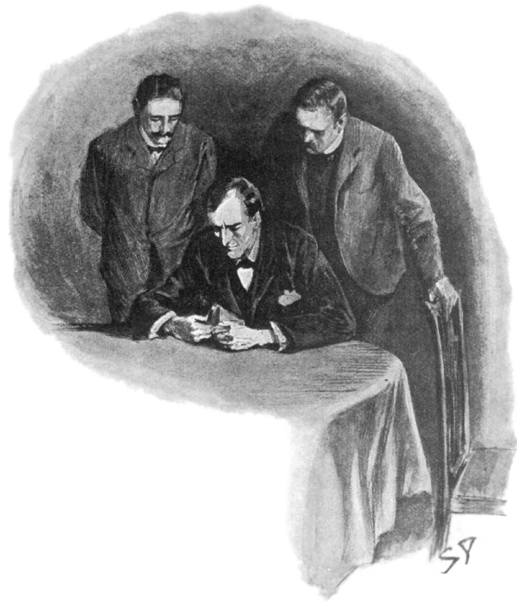

福尔摩斯把本子摊在桌上，进行仔细检查。

“这些你怎么看呢？”福尔摩斯问。

“像是证券交易所债券的上市证券表。我想J．H．N．是经纪人姓名首字母，C．P．R．可能是他的客户。”

“C．P．R．估计是Canadian Pacific Railway加拿大太平洋铁路。”福尔摩斯说。

斯坦利·霍普金斯捏了拳头捶打大腿，咬牙咒骂自己。

“看我这个笨蛋！”他叫着，“就是你说的，没错。那就剩J．H．N．这三个首字母需要加以解决了。我已经查过证券交易所旧的上市证券表，一八八三年的所内所外我都找不到和这三个字母相符合的经纪人姓名。可是我觉得这条线索是我掌握的最重要的一条线索。你也许同意，福尔摩斯先生，有可能这些字母是现场第二个人——换句话说，就是凶手。我还有把握要说，这个本子上记载的大量有价证券，与本案有关，是唯一一件证据，可以让我们在第一时间看到作案的动机。”

福尔摩斯的脸色显示对如此的推理新进展他都完全没有料到。

“我同意你这两个论点，”他说道，“我承认，这本记录，最初调查中没有发现，现在改变了我已经形成的看法。我对本案的判断对这一因素缺乏考虑。这笔记本提到的证券你设法调查了没有？”

“证券正由交易所在调查，但是我担心这些南美企业的持股人都在南美洲，等查清这些股份要有几星期时间才行。”

福尔摩斯一直在拿放大镜研究本子的封皮。

“这里弄脏了。”他说。

“是的，先生，那是血迹。我跟你讲过，我是从地板上捡起来的。”

“本子的正面还是反面有血？”

“是掉在地板上的那一面。”

“这就说明本子是杀人以后掉下的。”

“是这样，福尔摩斯先生，我赞同这个看法。我还推断是凶手匆忙逃跑掉下的，本子掉在靠近门口。”

“我估计这些证券都不是死者的财产，对吗？”

“都不是，先生。”

“那么你有没有根据可以怀疑是抢劫？”

“不像，先生，东西一点都没有动过。”

“啊，这个案子就真是奇怪了。噢，还有一把小刀呢，对吗？”

“一把带鞘的刀，还插着鞘，掉在死者的脚边。加里太太证明那是她丈夫的东西。”

福尔摩斯沉思了一会儿。

“噢，”他又开口说，“我需要亲自去看一看。”

斯坦利·霍普金斯高兴得叫起来。

“谢谢你先生啦，那我是如释重负了。”

福尔摩斯伸出食指对警长摇摇。

“要是一个星期前，事情还容易得多，”他说，“到了现在我才去，恐怕会毫无结果。华生，你有空的话，我很高兴你能陪着一起去。请叫一辆四轮马车，霍普金斯，一刻钟就准备好出发去大森林住宅区。”

我们在一个路边小站下了车，然后快步穿过广阔大森林尽头的一片林地遗址，遗址也有几英里长的路。这尽头的一片林地过去属于大森林的一部分，很长一段时期都凭借大森林把撒克逊人挡在外面无法入侵——这片不可踰越的“森林屏障”，给不列颠提供安全保障有六十年之久。很大的森林区域以后就遭到砍伐，因为这里成了英国第一家钢铁厂的所在地，砍掉的林木，正好可以用来熔炼矿石。现在，英格兰北方的富铁矿把钢铁冶炼业吸引到了那边去，此处除了劫后余生的小森林和满地坑洼斑驳的创伤之外，再也不见往日的烟火光景。现在我们的眼前，山上森林伐空的绿坡地上，立着一幢长长的平房石屋，有一条弯曲的车道穿过田野直达屋前。临近大路那边，是一座独幢小屋，三面围有矮树林，一扇窗、一扇门正朝着我们这方向。那就是案发现场。

斯坦利·霍普金斯先把我们领进屋内，向一位面容憔悴、灰白头发的妇女作了介绍——被害人的遗孀，脸面瘦削，皱纹深刻，眼圈泛着红，从眼底深处透出战战兢兢恐惧的目光，说明她长年经受着苦难和虐待。陪在一边的是她的女儿，一个面色苍白、金黄头发的姑娘。女儿两眼灼灼，显现逆反的神情，直言告诉我们说，她父亲死掉她很高兴，她要祝福把父亲戳死的那个人。这是个惊恐悲哀笼罩的家，是黑彼得·加里自己一手造成如此的结果。我们离开屋子，走在阳光下，有获释之感。我们沿着小径走，小径穿过田地，是死者双脚踏出来的。

小屋是间极简单的窝棚，木板墙，单坡顶，门旁开窗，对面墙上也有窗。斯坦利·霍普金斯从口袋里掏出钥匙，弯腰插锁孔，忽然住了手，眼睛关注什么，一愣一惊。

“有人撬过锁。”他说。

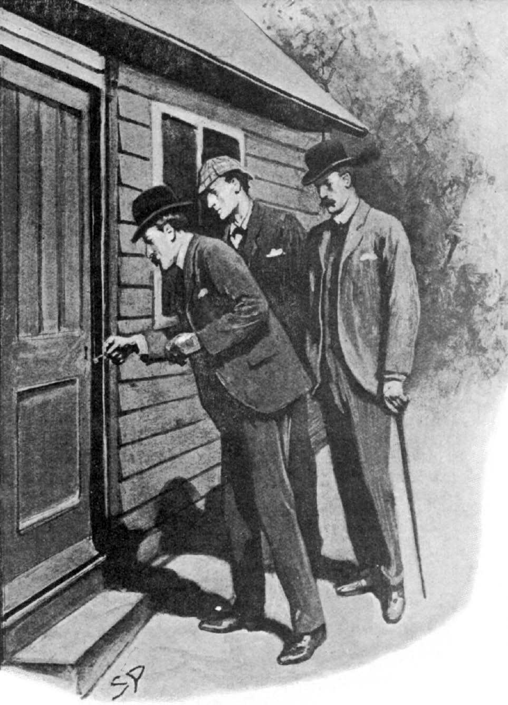

“有人撬过锁。”他说。

有人撬过，事实俱在。木门有刀痕，漆皮刮掉露出白木材，像是刚刮的。福尔摩斯在察看窗子。

“这里也有过手脚。想从窗子进去，就是没能进得去，这个人一定是个笨贼。”

“这事情出奇了，”警长说，“我敢发誓，昨天晚上这些痕迹都还没有。”

“也许是村子里好奇的人。”我一旁说道。

“不大可能，人家根本不敢走近这个地方，更不要说撬门窗进屋了。你怎么看呢，福尔摩斯先生？”

“我想在我们倒是件幸运的好事。”

“你说这个人还会再来吗？”

“还会再来。他这次没有料到门会锁住，他是用很小的小刀撬的，没能撬开，那怎么办？”

“夜里会再来，带上使劲的工具。”

“我也是这么说呢。我们要是不迎候着他，那就是我们的错了。现在我看看屋里是怎么个情况。”

惨剧的现场痕迹已经被清理了，只有小屋里的东西还跟案发那天夜里一样原封不动。整整两个小时，福尔摩斯聚精会神把各样东西一一检查过来，但是看他的表情是查不出什么结果。只有一次，他停住了，观察了好一会儿。

“这个架子上你拿掉过什么东西没有，霍普金斯？”

“没有，我没有动过。”

“有东西拿掉过，架上这一角积的灰尘比别的地方少。可能是一本书平放在这个地方，也可能是一只匣子。好了，好了，没有什么名堂了，让我们到美丽的树林里去走走，华生，鸟语花香，享受上几个小时吧。晚上在这儿和你见面，霍普金斯，要来看看客人会不会再次光顾，大家不妨照照面。”

夜里我们设好了埋伏，已时过十一点钟。霍普金斯要让屋门打开着，福尔摩斯的意见这会引起来人的警觉。锁本来就是一把很简单的锁，只要拿块铁片用力一撬就能弄掉。福尔摩斯还提议我们不要等在屋里，要等在外面，等在围着那扇顶头窗的树丛里。这样埋伏，来的人一点灯，我们就能看见他夜行到这里偷偷摸摸做什么。

守候等待，时间特别长而心焦，但有一种历险的感觉，就像猎人守在水池旁，等候食肉兽口渴前来饮水。是一头什么样凶残的动物在黑夜里偷偷向我们过来呢？若是一只食人猛虎，那只有同它的尖牙利爪进行殊死搏斗才能制伏。抑或不过是鬼鬼祟祟的豺狼，只对弱者和没有防备者才有危险？

万籁俱寂，我们蹲伏在树丛中，等待任何可能的不测来临。起初，有些村民夜归的脚步声、村中的话语声，引起过警觉，但是一两次以后这种无关的声音也没有了。我们四周毫无响动，只听着远远的教堂钟声，给我们报来黑夜行进的时辰，还有细雨落在我们头顶的树叶，窸窸窣窣如私语。

钟声响过两点半，这是黎明前最黑暗的时刻，从大门方向传来低低但清晰的喀哒一声，我们立时警觉。有人走上了马车道。又是久久的沉静，我不免担心只是虚惊。正在这时，又有了轻轻的脚步声，走到了小屋的另一边，稍后就是金属的刮擦和碰击，来人在用力撬锁。这一回，他的技术长进了，或是工具改进了，只听啪嗒一响，接着就是铰链吱嘎的开门声。然后划亮火柴，顷刻间，稳稳的烛光照亮小屋。透过薄纱窗帘，我们的眼睛盯住屋内看个究竟。

夜间访客是个年轻人，身体瘦弱，一把黑胡子，更映衬出脸色的死白。年龄最多二十出点头。我还从来没见过这样一个胆战心惊的人，只见他的牙齿在打战，手脚都在发抖。他穿着体面，是个绅士，系腰带的诺福克上装，紧腿灯笼裤，头戴便帽。我们看他两眼惶恐地向四周搜索。他把蜡烛头放到桌子上，人走向角落，我们就看不见他了。一会儿又回过身来，看见他手里拿着一大本书，是从书架上一排航海日志中抽出来的一本。他靠着桌子，很快翻阅，翻到他要找的一页。然后，握紧拳头愤愤一甩，把书合上，放回到角落里，吹熄蜡烛。他刚要转身离开小屋，霍普金斯就一把抓住他的领口。我听见他惊愕地大叹一口气，他马上明白是被捕了。蜡烛再点亮，这个被我们束手就擒的可怜人，捏在警探手中浑身簌簌发抖。他坐在了水手柜上，不知所措地看看这个看看那个。

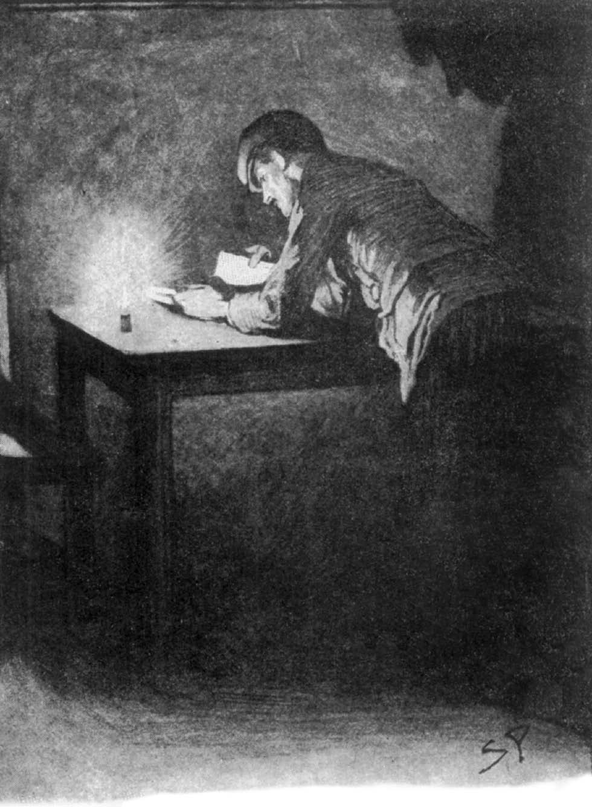

很快翻阅，翻到他要找的一页。

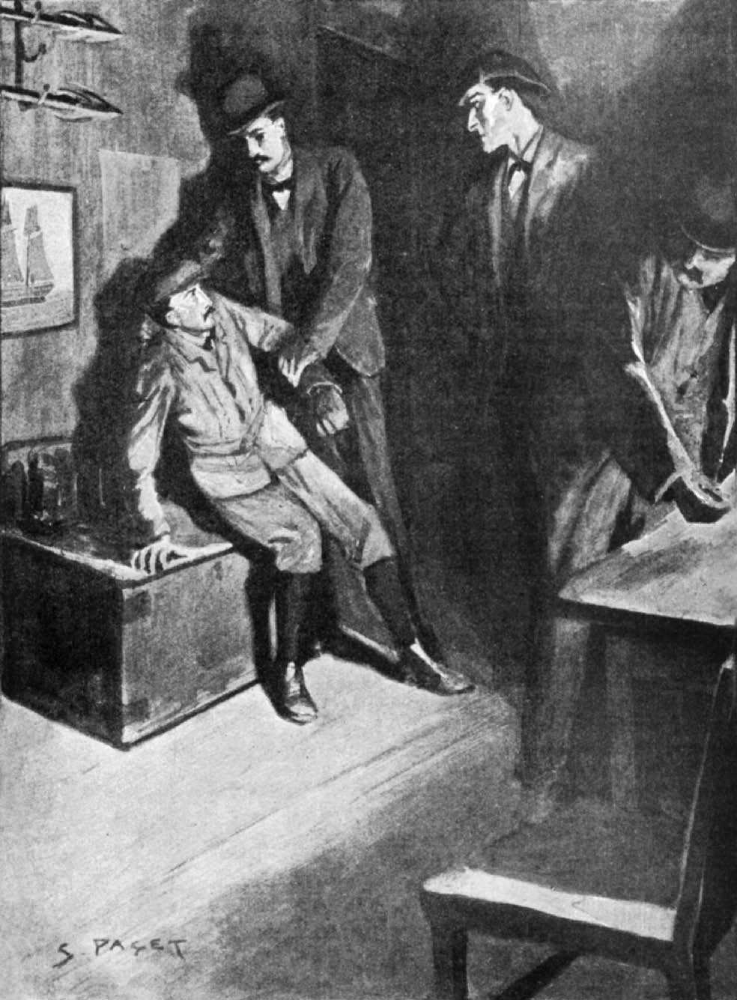

他不知所措地看看这个看看那个。

“哈，来得正好，”斯坦利·霍普金斯说，“你是谁？到这儿干什么？”

这个人回了一下神，竭力使自己镇定下来，望着我们。

“你们是侦探，想必是吧？”他说，“你们以为彼得·加里船长的死和我有关，我可以保证我是无辜的。”

“这个我们会弄清楚，”霍普金斯说，“先要问你，叫什么名字？”

“我叫约翰·霍普利·内力根（John Hopley Neligan）。”

我看见福尔摩斯和霍普金斯两个很快递了个眼色。

“你来这里做什么？”

“事关机密，这里不讲行吗？”

“不行，当然不行。”

“为什么我一定要告诉你们？”

“你若不回答，开庭的时候对你不利。”

年轻人畏缩着。

“那，那我跟你们讲，”他说，“我干么不呢？可是一想到旧日谣言的沉渣又要泛起，我就痛恨。你们听说过道森和内力根吗？”

我从霍普金斯脸上看得出，他从来没有听说过，但是福尔摩斯极感兴趣。

“你说的是英格兰西南部银行家，”他说，“他们亏损了百万英镑，康瓦尔郡半数人家倾家荡产，内力根也失踪了。”

“正是。内力根就是家父。”

我们这才得到点眉目了。但是，潜逃的银行家同被自己的鱼叉标枪钉在墙上的彼得船长还是隔着鸿沟，不明白有什么相干，我们倒要听听年轻人怎么个说法。

“事情主要关系到我的父亲。道森早已经退休。那是在我十岁的时候，不过我已经懂事，蒙受了害怕、羞辱。外面都说是我父亲席卷全部证券潜逃了，完全不是事实。我父亲有信心，只要让他有时间，把证券都变现，事情就好办了，每个债权人都可以偿清。逮捕令快下来的时候，父亲乘上他的小游艇跑了，跑向挪威。我还记得他临走那天夜里，向我母亲告别的情景。父亲把他带走的证券，留下一份清单给我们。父亲发誓说，他一定会回来，要正名，要讨还清白。所有信得过他的人，绝对不会上当受骗。可是，这一去再也没有听到他的回音。游艇和人不知去向。我们想，母亲和我，想是父亲、游艇连同随身带去的证券，一同沉到海底了。可是，我家有个好朋友，是个商人，他不久前发现我父亲的证券在伦敦上市。你们可以想象，这有多奇怪，不知怎么回事。我用几个月的时间，追查这些证券的来源，最后，费了好大的劲，克服周折、困难，终于查到原始抛售人是个叫彼得·加里的船长，就是住这小屋的这个人。

“我当然对这个人进行调查。查下来他原是一艘捕鲸船的船长，他的船从北冰洋返航的时间，正是我父亲渡海去挪威的时间。那年秋天，多暴风雨，南方过来的大风猛吹了好长的日子。父亲的小艇很可能被风向北吹，正好遇上彼得·加里船长的船。如果是这样的话，我父亲的情况会怎么样呢？不管怎么样，我只要找到彼得·加里船长，得到证明，这些证券是怎么上市的，也就证明我父亲没有抛掉这些证券，证明他带走证券不是为了自己的个人利益，不是这个目的。

“我就来到苏塞克斯，要找这位船长见面。谁知说是他被人杀了，是凶杀。我看到报上的调查报道，写到他这间小屋，写到屋里还保存有他船上的老航海日志。我就想到，查一查航海日志，一八八三年八月份，‘独角海兽号’船上有些什么情况，我就能解开父亲不知下落之谜。昨天夜里三点钟，我来试图查看航海日志，可是门开不开。今天晚上，我再来，进屋了，找到了航海日志，可是，抽出那一本翻到有关月份一看，这几页都撕掉了。也就在这个时候，我给你们逮住了。”

“是全部事实吗？”霍普金斯问。

“是的，全是事实。”他说，眼光躲闪。

“再没有跟我们说的了？”

他犹豫一下。

“没啥好讲。”

“这里昨晚以前你没来过？”

“没有。”

“那你说说这个怎么回事？”霍普金斯高声道，举起了笔记本这一物证，头页上正是这个人姓名的首字母，封面上沾着血迹。

被抓的倒霉蛋一下子萎缩了，脸埋进双手，全身哆嗦。

“你们哪里来的这个本子？”他沮丧地说，‘我不知道；我像是掉在旅馆里的。”

“够啦，”霍普金斯严厉地说，“还有事要说呢，叫你到法庭上去说吧。现在跟我到警察局去，走。噢，福尔摩斯先生，对你还有你的朋友，非常抱歉，多累两位专程下来帮我忙。现在看来，你们没必要来，没你们我也能这样成功解决。不过，不管怎么讲，我感激就是了。勃兰布莱特旅馆给你们留好了房间，我们这就一起进村吧。”

“哦，华生，这个案子你怎么想呢？”第二天早上我们回来的路上，福尔摩斯问我。

“我看得出你并不满意。”

“嗯，不，我亲爱的华生，我十分满意，只是，斯坦利·霍普金斯的方法不敢恭维。我对斯坦利·霍普金斯感到失望，我原先对他期望很高。要知道，对案情的估计必须问问有无别的可能性，要经得起反问，这是刑侦工作的首要原则。”

“那么说，还有别的可能性啰？”

“这件事的调查，我归我自己在进行。也许没有结果，我还不能说，且看追查到底怎么样。”

有好几封信已经在贝克街等着福尔摩斯呢。他赶快抓起一封，撕开，立刻发出一阵获得胜利的笑声。

“形势大好，华生！另一种可能正在发展。你拿一下电报纸好吗？替我写两封：‘萨姆纳，海洋公司，拉特克利夫公路。命三人明晨十时来。——巴斯尔。’这是我在那种地方用的名字。再一封：‘斯坦利·霍普金斯警长，洛得街四十六号，布芮斯顿。明晨九时半来用早餐。紧要事。如不来速回电。——歇洛克·福尔摩斯。’好了，华生，这桩案子叫我牵肠挂肚了十天，好累人。到此我如释重负，完全摆脱了。明天，可以确信，我们将听到最后尾声，从此结束。”

警长斯坦利·霍普金斯，按规定准时来到。我们一起坐下享用早餐，是哈德森太太特意准备的，丰盛美味。年轻的警探办案成功，春风得意。

“你真以为，你可以结案了，万无一失？”福尔摩斯问道。

“不可设想有更准确无误的办案。”

“我看还没有达到最后结论。”

“你别唬人啦，福尔摩斯先生，还要查问个什么东西？”

“你的解释毫无漏洞了？”

“当然没有。我查过，年轻人内力根，案发那天下榻勃兰布莱特旅馆，佯装来打高尔夫球。房间订在底楼，随时外出方便。当天晚上，他去护林人李的房屋，在小屋子找到彼得·加里，和他发生争吵，即用鱼标枪将其戳死。之后，为自己的行为所害怕，逃离小屋，失落笔记一本，原是带在身上要向彼得·加里提问这许多证券的。你总能看清楚吧，上面有些都打了钩，可别的——绝大部分——没有打钩。打了钩的，在伦敦市场上都能找得到，但是别的，可想而知，都还在加里之手。而青年内力根，按照他自己的说法，是急于要找回这些证券，以便归还他父亲的债权人。他逃离以后，一时不敢再来小屋。但最后还是壮胆要来，要拿到需要了解的数据。这么个过程不是够简单、明显的吗？”

福尔摩斯笑笑，摇摇头。

“其中我看有一个漏洞就够了，霍普金斯，致命性的是，压根儿不可能是他杀人。拿鱼标枪戳穿身体，你有没有试过？没有？呵，呵，我亲爱的先生，这点细节要加以充分注意。我的朋友华生可以告诉你，我用了一早晨进行过练习、验证。这不是轻而易举的活儿，需要膂力强劲、手法熟练。而这一击力量之强大，标枪头深深扎进了墙上，你能想象这么个贫血模样年轻人，下手能有这么厉害？也是这个人深夜同黑彼得共饮兰姆酒？两天以前晚上有人看见窗帘上是他的侧影？不，不，霍普金斯，另有人在呢，那个人，凶悍得很哪，我们就是要找他。”

警探的脸随着福尔摩斯的话越拉越长。他满怀的希望和雄心要泡汤了，但是不挣扎一番还不肯放弃地盘。

“你不能否认内力根那天夜里案发他在现场，福尔摩斯先生，那本子就是物证。我认为我有充分证据可以叫陪审团信得过，即使让你能够挑刺穿个洞，没用。再说，福尔摩斯先生，我要的人已经让我到了手，你那个可怕的人呢，人在哪里？”

“人，没问题，人上楼梯了，”福尔摩斯安详地说，“我想，华生，你最好把枪藏个地方，一伸手就能拿到。”他站起来，把一张写好字的纸放到边桌上。“现在，大家准备好了。”他说。

刚一听到外面有粗野的说话声，哈德森太太就推开门说，有三个人要见巴斯尔船长。

“一个一个领他们进来。”福尔摩斯说。

头一个进来的，是模样叫人发噱的矮个子，红面孔，一大把连鬓蓬松白胡须。福尔摩斯已经从口袋里抽出一封信。

“什么名字？”他问。

“詹姆斯·兰凯斯特。”

“很对不起，兰凯斯特，铺位已经满了。给你添麻烦了，给你半个金镑；到那个屋里去，等几分钟吧。”

第二个人是个干瘦的长条子，直发，菜色脸，名叫休·帕廷斯。他也不被雇用，也给了半金镑，也请他等候。

第三个申请人，相貌异样，一张巴儿恶狗的嘴脸，嵌在乱蓬蓬的头发和胡须中，一双目光蛮横的黑眼睛，在浓密垂盖的眉毛下打忽闪。他一个敬礼，水手姿势立正，便两手拿帽子在捏着打转。

“你的姓名？”福尔摩斯问。

“帕特里克·凯恩斯。”

“鱼枪手？”

“是的，先生。出海有二十六次。”

“丹迪港的，我看是吧？”

“是的，先生。”

“准备上探险船出航？”

“是的，先生。”

“知道工资？”

“一个月八镑。”

“你能马上出海吗？”

“整装准备好了就行。”

“你有证件吗？”

“有，先生。”他从衣袋里掏出一叠皱折油腻的纸，福尔摩斯看过一眼就还给他。

“你，就是我要找的人。”他说，“旁边桌上有合同，你去签个字，全部事情就这么定了。”

这个水手一摇一摆走过去，拿起笔。

“在这儿签名？”他问着，俯身到桌上去。

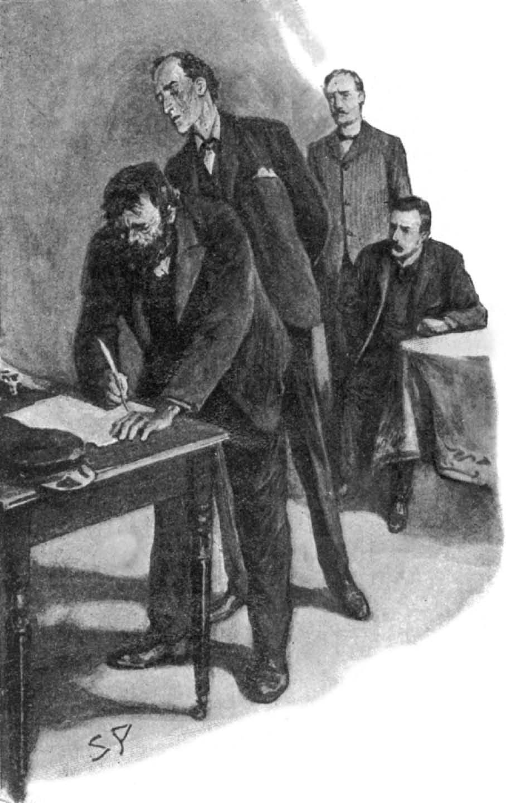

“在这儿签名？”他问着。

福尔摩斯在他背后两手一下子伸过他的脖子。

“这就成啦。”他说。

我听见喀嚓一声金属响，紧接着一声如激怒公牛的狂吼，一瞬间福尔摩斯和水手一起滚在了地板上。这个人力大无穷，即使双手已经给福尔摩斯迅捷铐紧了手铐，也几乎快要压过我的朋友，是霍普金斯和我一起上去，才助了福尔摩斯一臂之力。

我把冰凉的左轮枪口抵住水手的太阳穴，他终于清醒抗拒已经无用。我们拿绳索捆住他的脚脖子，才结束战斗，站直身子，大口喘气。

“真是对不起，霍普金斯，”福尔摩斯说道，“炒鸡蛋怕是凉了。不过，还有一半早餐，你更要好好享用，因为，想想，你已把案子胜利了结，你大功告成，味道好极了。”

斯坦利·霍普金斯张嘴结舌，在那儿又奇又傻。

“不知说啥好，福尔摩斯先生，”他终于开口，绯红着面孔，“这事儿，看来一开始我就在瞎蒙自己。现在才明白，永远不要忘了，学生是我，老师是你。虽说我看你做到了眼下这一步，可想不通是怎么给你知道的，其中是怎么回事。”

“噢，好，”福尔摩斯说，兴致很高，“我们都要吃一堑长一智。你这一次得到的教训是，永远不要单打一，不顾另有可能性。你是一门心思盯在内力根这个年轻小伙子身上，脑袋瓜子也就腾不出来想想另有人在。帕特里克·凯恩斯，他才是谋杀彼得·加里的真凶。”

水手粗哑的声音打断了我们的谈话。

“我说不对，先生，”他说，“我现在给落到你们手里，这咱也不讲它了。可我得讲明，你们得把话说准喽，别歪了理儿。你们说是我谋杀彼得·加里，我要说是我宰了彼得·加里，这可是两码子事。没准你们不信我说的，没准你们想我是在编词儿蒙人呢。”

“噢，不碍事，”福尔摩斯说，“就让我们听听你要怎么讲吧。”

“咱不啰嗦，有上帝在，讲话句句是真。这个黑彼得，我们是认识的。是他拔刀了，我才操起标枪干了他。我清楚，死的不是他就是我。他是自己找死，你们可以把这说成是谋杀。不过反正，没叫黑彼得用刀捅了我心窝，咱宁可让绳子绕脖子绞死。”

“你们干吗要这样？”福尔摩斯问道。

“事儿得从头说起。让我坐好，说话方便些。那会儿是一八八三年，开始的——这年八月。彼得·加里是‘独角海兽号’船长，我当后备鱼枪手。船正走出流冰往回驶，顶头风可猛，南风持续紧吹有一个星期。这时候我们救起一条小船，小船直给南风吹着往北漂。船上只有一个人——本国人，不是海员。大伙儿想是大船沉了，这人乘这只小艇往挪威方向去。我猜是船上人都淹死了。不管它，把人救到了船上。这个人跟船老大在船舱谈了好长时间话。我们看看他行李，什么也没有，光一只铁匣子。我就知道这么些，这人名字叫啥，没提起过。第二天晚上，人就不见了，好像没有过这个人、这个事似的。有传话说是天气恶劣，风浪大，他掉海里了，要么他自己跳海了。只有一个人清楚怎么回事，这人就是我。我在值深夜第二班的时候，亲眼看见船长把那个人双脚掀起翻出栏杆，朝海里扔。这是我们望见谢得兰灯塔前两天的事。

“好，这事我对谁也不说，等着瞧会有什么名堂。回到苏格兰，这事儿时间一过一压就没了，没人提没人问。一个陌路人不知怎么自己死掉，不关谁事，谁也不会去追问。彼得·加里不久下了船，辞掉海上活。过了好几年，我才知道他跑哪儿去了。我思忖他害人那勾当准是为铁匣子里有东西，现在应当找他去，问他好好要上一笔钱，才能封我的嘴。

“我从一个海员那里打听到他的下落，这海员在伦敦遇见过他。我就下来敲上他一笔。头一晚，他还算通情达理，准备给我一笔钱，可以够我生活，不用出海了。讲定过两天晚上把事了结。等我再去，看见他酒已喝得八分醉，脾气很坏。我们坐下，一起喝酒，聊着过去一块儿的日子。可是越喝我见他脸色越不对劲，我看好了墙上架有鱼标枪，我想好了可以用得着，防备自己完蛋。后来，他对我发作了，又唾又骂，眼睛里凶光毕露要杀人，手上已经拿好一把大折刀。我不等他刀出鞘，就操起标枪一家伙捅穿了他。我的天！他那声叫喊叫得够惨！瞧瞧他的脸，我眼都花了。我站那儿，血溅得到处都是。稍等一会儿，四周没一点动静，我也镇定下来。朝屋子看看，那个铁匣子就在架子上。彼得·加里他可以有，我也可以有，我不是一样有权利！我就把匣子拿了，离开屋子。我真是个笨蛋，会把烟袋留在桌上忘记拿走。

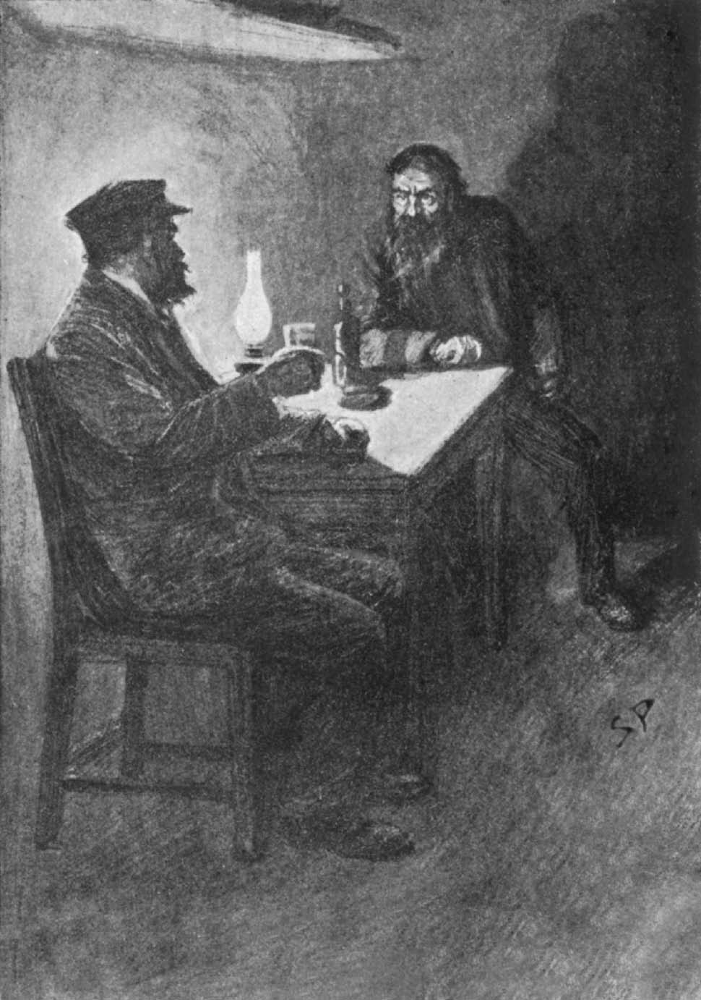

“我们坐下，一起喝酒，聊着过去一块儿的日子。”

“这夜的情况，有一件事最奇怪，我要跟你们说。我刚离开屋，跑到外面，忽听得有人，我赶快藏进树丛里。有一个人，鬼头鬼脑过来，进了屋，像是见了鬼似的哇地叫起来，撒腿就跑，一会儿就不见了人影。这人是谁，到屋里干啥的，我都说不上来。我接着也快跑，赶了十英里路，在顿布芝韦尔斯上了火车，就到了伦敦。这事可谁也搞不懂。

“再说，一看那匣子，里边根本没钱，只有证券，我又不敢去卖。我没把彼得·加里攥在手掌心，弄得困在伦敦没辙，没一个先令。我只剩下老行当可干。我看到广告，要雇鱼枪手，工资很高，这就去了海洋公司登记上，就叫我来这儿面试。这些是我知道的全部情况。我得再说明白了，我宰了黑彼得，警察还应当谢谢我才对呢，那个买绞绳的钱，我给他们省下了呢。”

“陈述得很清楚，”福尔摩斯说，起身点了烟斗，“我想，霍普金斯，你要及时把犯人押送安全地方。这里的房间不宜当监狱，再说帕特里克·凯恩斯先生的个头占掉我们屋子一大片地方。”

“福尔摩斯先生，”霍普金斯说，“我不知道如何向你表达我的感激之情，甚至现在我都没能理解你怎么叫这个人自投罗网。”

“全靠从一开始就很幸运抓住了正确的线索。如果我一上来先知道有笔记本，那就有可能把我的思想引上歧途，就像你那样了。幸而我听到的情况都指往一个方向。扎鱼标枪要有很大的力量，还要有技巧。喝兰姆酒，海豹皮烟袋，袋里是粗烟丝——所有这些，都指明是一个海员，而且是一个捕鲸手。我确信烟袋上的首字母P．C．不过是巧合，不是彼得·加里Peter
Carey的首字母。要知道他很少吸烟，小屋里也根本没发现有烟斗。你该记得，我问过你屋里有没有威士忌、白兰地，你说有。有多少不是海员的人，有别的酒放着不喝，要喝兰姆酒呢？所以，我断定那是个海员。”

“你是怎么找到他的？”

“我亲爱的先生，问题简单不过。如果是海员，也就只能是和加里一起，‘独角海兽号’的海员。据我了解，加里没有在别的船上干过事。我花了三天时间向丹迪发电报，第三天我得到了可靠回音，一份一八八三年‘独角海兽号’船员的名单。鱼枪手中，帕特里克·凯恩斯Patrick
Cairns这个名字赫然列在其中，至此，我的侦查已接近尾声。我估计他应该在伦敦，他会打算离开英国一段时间。我花几天工夫在东区活动，假托设一个北冰洋探险队，提出优厚条件招聘鱼枪手，在巴斯尔船长旗下出征——你瞧，不就上钩了！”

“佩服！”霍普金斯喊道，“佩服！”

“你一定要马上放了小青年内力根。”福尔摩斯说，“我想叮嘱你，你务必还要向他道歉，铁匣子也一定要交还给他。可惜，给彼得·加里抛售了的证券已经弄不回来，那没有办法。有马车了，霍普金斯，你把人带走吧。你如果要我出庭，我的地址，还有华生的，将要在挪威的什么地方了——详细地址我以后会给你。”

（1904年）

————————————————————

<a href="#part0105.xhtml_ch1-back" id="part0105.xhtml_ch1">(1)</a> 坦塔罗斯（tantalus），一种上锁的玻璃酒柜，若无钥匙开启，便对酒可望不可即。源于希腊神话，宙斯之子坦塔罗斯（Tantalus）泄露天机，被罚永世羁于上有果树的齐颏水中，欲低头饮水，水降低，抬头食果，果升高。

# 米尔沃顿迷案

我现在要讲的这个案件虽然已经过去多年，但是提起来还是颇有忌讳。因为长时间以来，哪怕是极谨慎、极保留地将事实稍有披露，都不可能。但现在主要涉案人已经无需牵涉人世间的司法裁决，所以不妨可以适当地、有限度地把故事讲一讲，如此的方法也不至于损及他人。这是一桩福尔摩斯和我两人一起动手解决的案子，极为难得的奇案，值得一记。我不得不将日期或其他容易追溯到真人真事的地方隐去，敬请读者诸君多加原谅。

福尔摩斯和我傍晚总要外出散步，有一天，那是凛冽寒冬的晚上，大约六点钟我们散好步回家。福尔摩斯把灯点亮，灯光照见桌上有一张名片。他瞥了一眼，接着嘴里厌恶地咕哝一声，拿起来往地上一扔。我捡起来一看，上面写的是：

查尔斯·奥古斯塔斯·米尔沃顿

阿倍尔多塔

汉普斯泰德区

代理人

“这是谁？”我问。

“伦敦最下流、最恶劣的人，”福尔摩斯回答，坐下来，在火炉前伸直腿，“名片背后写什么没有？”

我翻过名片。

“六时三十分往访——C．A．M．”

“哼！就要来了。要是在动物园，华生，你站着看那些蛇，在面前扭曲、游动，这剧毒阴险的爬虫，凶冷的眼，扁头阔嘴，你不恶心吗？不起鸡皮疙瘩吗？啊，那个米尔沃顿的印象，就是这个嘴脸。我办案见过五十个杀人犯，最坏也坏不过这个家伙，我最恨的就是他。可是我又不得不和他打交道——是的，是我叫他过来的。”

“他是个什么人呢？”

“听我告诉你，华生，他是敲诈勒索之徒的老祖宗。愿苍天保佑那些男女，尤其是女人，她们的隐私、名誉给他捏在了手里，生杀予夺！别看他脸上笑嘻嘻，内里绝对铁石心肠，毒如蛇蝎。喝女人的血，直把她们榨干。他精于此道，颇有些才干，用在得当的地方，本来也不是不能发达、过上体面的好日子。他的方法如下：让人知道，他可以出高价收买富贵、名誉之家的信件，不单单从不忠实的男女仆人手中进这类奇货，多半还从上流社会花花公子手里弄到，这种浪荡子能骗得痴心女人的轻信和感情。做这个买卖他出手不小气，我有一回听说，他出七百英镑给一个门仆，买下一张只有两行字的便条，结果这个名门之家就此被毁。市面上样样事情都会传到他米尔沃顿耳朵里；这个大都市，成百上千的女人都不止，只要听到是他，就闻虎色变，谁也料不定哪天要给他咬上一大口。这个人会使钱耍手段，很毒辣，伸手、张口毫不客气。他还会用工夫，把一张牌放下好几年，要等到能赢得最大赌注的时机才甩出去。我说了，他是伦敦最下流、最恶劣的人，试问，你能把这种人同脾气一来就打老婆的粗人相比吗？他这种人，绞尽脑汁使坏，让别家女人精神心灵遭受折磨、痛苦，以此为能事，靠这把自己的钱包填了再填。”

我难得看到我的朋友说话情绪这么激动。

“那行啊，”我说，“把这个家伙绳之以法不就得了？”

“从法律来讲，当然可以，但是实际上做不到。因为，这样做对一个女人有什么好处？他最多坐几个月牢，女人可就一辈子完蛋。她们给他捏住，不敢还击。如果他敲诈勒索的是一个平白无故者，我们当然能对付他，可是他狡猾如恶魔。不行，不行，我们必须想别的方法和他斗。”

“叫他到这里来做什么？”

“有个名门女子，境况为难了，把她的事委托给了我。就是贵族小姐伊娃·布莱克维尔，她是上一季度初登社交界的最漂亮的女子，过两周就要和达弗科特伯爵结婚，谁知给这个恶魔弄到了几封不慎重的信——不慎重，华生，没别的事——是这位女士写给一个年轻穷乡绅的信。可是这些信足以毁掉这次婚姻。米尔沃顿要把信交给伯爵，除非给他一大笔钱。我受委托约他谈谈，跟他——尽力要他把价钱压低点。”

这时街上传来马蹄声和车轮声。我向下一望，来了一辆豪华双驾马车，明亮的车灯照着栗色骏马滴溜光洁滚圆的臀部。仆人打开车门，下来一个矮壮的人，穿一件蓬松的黑色俄国羔皮翻毛大衣。一分钟后已来到屋里。

查尔斯·奥古斯塔斯·米尔沃顿，年纪五十左右，一颗显得很聪明的大脑袋，一张又胖又圆、无髭无须的光脸，总是挂着不动容的微笑，两只灰色的锐眼，在一副金边宽镜片后面忽忽闪烁。他的脸上正露点匹克威克<a href="#part0106.xhtml_ch1"
id="part0106.xhtml_ch1-back">(1)</a>先生的仁慈相，只是假惺惺皮笑肉不笑，两眼锐利的寒光一个劲地刺人，这便绝非善类。他的声音一如脸上的表情，要人听着温情脉脉。他趋向前来，伸出肥肉小手，嘴里喃喃地说他第一次来过没见着我们很感遗憾。福尔摩斯不理那只伸过来的手，面如石板、毫无表情地看着他。米尔沃顿将微笑改作咧嘴展笑，耸一耸肩，脱掉大衣，极仔细小心地折一折，放到一把椅子背上，然后坐下来。

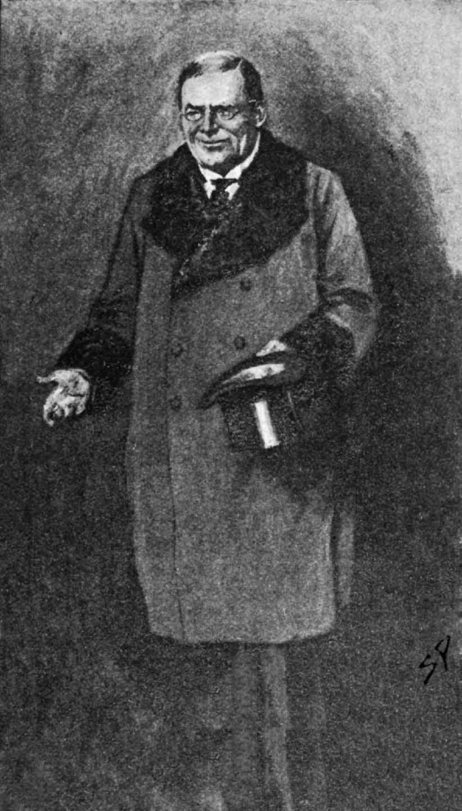

查尔斯·奥古斯塔斯·米尔沃顿。

“这位先生？”他说道，手朝我这边一挥，“是否谨慎？妥当吗？”

“华生医生，是我朋友和同事。”

“很好，福尔摩斯先生。我这样问，全是为您委托人的利害考虑，这种事，一点轻率不得——”

“华生医生对此已有所闻。”

“好，那就开门见山谈买卖。您说您代表伊娃女士，她授权您接受我的条件了？”

“什么条件？”

“七千英镑。”

“可以再谈谈吧？”

“我亲爱的先生，和我讨论条件是很不愉快的。到十四号还不付钱，十八号的婚礼也就一定办不成。”他露着令人难以忍受的微笑，比什么时候都更洋洋得意。

福尔摩斯想了一下。

“我看你是，”福尔摩斯于是说道，“事情不愿有所松动。我这里，当然了解这些信的内容。我的委托人也一定会照我的建议去做。我将劝说她把全部事情告诉她未来的丈夫，相信会取得谅解。”

米尔沃顿呵呵地笑了。

“很明显您不了解这位伯爵。”他说。

福尔摩斯脸色有点困窘，我看得出他是不了解。

“这些信有什么不得了？”他问。

“可是有色彩的——色彩丰富得很呢，”米尔沃顿回说道，“女士的信很迷人哪。然而我可以告诉你，达弗科特伯爵绝对不会赞赏这种信。你要愿意不这样想，听便，我们也就不必多谈。这本是买卖，愿卖愿买的事。你要是认为，把信交到伯爵手上，照样能维护住你的委托人的利益，那付这么一大笔钱把信赎回，当然是傻瓜蛋了。”他立起身，抓起毛皮大衣。

福尔摩斯感到愤怒、有辱，脸都青了。

“等一下，”他说，“不必急着走。事情敏感，当然要尽力避免流言蜚语。”

米尔沃顿重又坐到椅子上。

“我料准了你一定会明白这一点。”他得意地说。

“问题是，”福尔摩斯继续道，“伊娃女士并不富有。叫她出两千英镑也就可以了，这已经是倾其所有了。你的要价她绝对支付不起。所以，我请你降低要求，按我讲的价归还信件，我可以向你保证，这是你能得到的最高价格。”

米尔沃顿将微笑变作开口笑，两眼挑衅地忽闪。

“我可以理解你所说女士的钱囊也就这点吧，”他说，“可你同时也要知道，女士举行婚礼是个大好时机，朋友们、亲戚们都巴不得要来讨好她。这种女士，买什么样的结婚礼物，会犹豫不决，但我可以保证，买下这小小一沓信可要比买下伦敦所有的枝形烛台和餐具给她带来更多的快乐。”

“这不见得。”福尔摩斯说。

“唉呀，我的天，多么不幸！”米尔沃顿叫道，掏出厚厚一个皮夹，“真想不到女士们没有得到明智清醒的劝导，不肯作点努力。瞧这个！”他举起一张便笺，便笺信封上有盾形家徽。“那是属于——哦，现在讲名字有点过头了，要到明天早上才能讲。不过到了那个时间，这信已经到了这位女士丈夫的手里。全是因为她少得可怜的一点钱都不肯出，不肯把她的钻石拿出来派派用场，补补漏洞。这有多可惜哦！你记得吧，迈尔斯小姐和多尔金上校两人婚约一下子就吹掉了，只差两天时间，就要举行婚礼。《晨报》有一段报道，婚姻取消。为什么呢？说起来难以置信，区区小数一千二百英镑本来可以完全摆平，没有问题的。难道这不可惜吗？可眼下，我发现你，一个通情达理的人，居然讲条件推三阻四，讨价还价，要晓得，你的当事人的未来人生和名誉身价危若累卵哪！你让我大失所望，福尔摩斯先生。”

“我讲的是实话，”福尔摩斯对他说，“出不起这笔钱。你也该可以了，就我给你开的价，够高的了。你要是毁掉这个女人的一生，对你也没有一点好处呀？”

“这你就错了，福尔摩斯先生。只要事情一传开，我从别人那边会大大地获得好处。我捏着八九十来个同样类型的证据在手，时机已经成熟。消息让她们知道，我就是要给树立一个光辉榜样，看伊娃小姐就行。我可以叫她们大家更加清醒一点，放明白些。你懂得我的意思吗？”

福尔摩斯从椅子上跳了起来。

“堵住他，华生！不让他出去！我说先生，让我们看看你皮夹。”

米尔沃顿像老鼠那样一窜靠到屋子一边，背贴着墙站好。

“福尔摩斯先生，福尔摩斯先生，”他说着，翻转大衣前襟，里子口袋露着一把大左轮枪的枪柄，“我料到你就会来这么一手。这种老花样不稀奇，能有什么好处呢？我告诉你，我可是全副武装才来的。我一出手就能使上武器自卫，知道法律支持我自卫。另外，你认为我会把信件放在这皮夹里，你又是大错特错，我还不至于这么蠢。好啦，两位先生，今天晚上我还有一两处要跟人见面，到汉普斯泰德要走很长的路呢。”他跨前一步，拿好大衣，手握左轮枪，侧身走向门。我拎起一把椅子，但是福尔摩斯摇摇头，我重又放下。米尔沃顿点一点头，笑一笑，眨眨眼，走出屋子。一会儿我们就听到马车门碰上，车轮辘辘，走掉了。

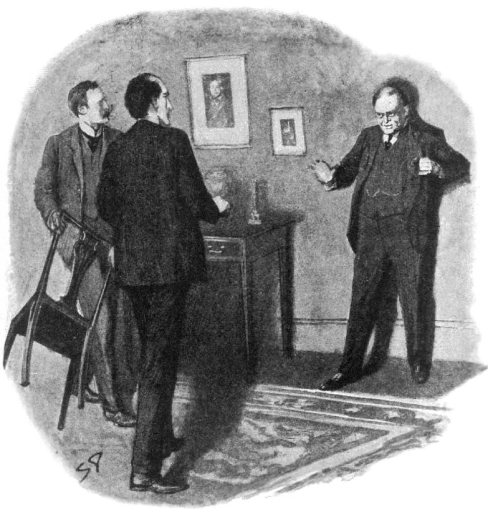

里子口袋露着一把大左轮枪的枪柄。

福尔摩斯坐在火炉边，一动不动，两手深深插入裤袋，下巴抵在胸前，两眼定定地看着荧荧的余火。足有半个小时，他不言语，不动弹。然后，一甩手，这是下定了决心的姿势，倏地起身，进了他的房间。稍一会儿，出来的是一个潇洒自在的工人小伙子，蓄一撮山羊胡，昂首阔步、神气十足。他凑着灯火点上土烟斗，要准备出门。“我得过些时间回来，华生。”他说，立即在黑夜中消失。我明白他要向查尔斯·奥古斯塔斯·米尔沃顿发动攻击了。但是我做梦也想不到这场战斗会是一着出其不意的奇招。

福尔摩斯整天这身乔装打扮进进出出，过了一些日子，一直没提一句他是去了汉普斯泰德，并且在那儿下的工夫绝不白费。我一点也不知道他做了些什么。直到后来，在一个风雨交加的夜晚，风呼呼地吼，雨劈劈啪啪打在窗上，他最后出征归来，卸去化装，坐到火炉跟前，才以他那个特有的方式闷着声畅怀呵呵大笑。

“你不会叫我新郎官吧，华生？”

“不会，你又不是！”

“叫你想不到，我订婚啦！”

“噢，我亲爱的伙计！向你祝——”

“同米尔沃顿家的女佣人。”

“你在说什么，福尔摩斯！”

“我是要探听情况，华生。”

“用得着这样做吗？”

“必须用这一步。我成了个管子工，生意兴旺得不得了，名字叫作埃斯科特。我每天晚上同女佣人出去谈话，谈的那个劲儿，天晓得，谈什么玩意儿！可我是醉翁之意，要探的都给谈出来了。我把米尔沃顿家摸了个透底，真叫了如指掌。”

“可是那位姑娘怎么办，福尔摩斯？”

“那没有办法，我亲爱的华生。桌上的赌注已经这样下了，牌非得一张张出好不可。然而我要说很庆幸有个情敌，只要我前脚一转身，那个人后脚迫不及待地补上去。今晚可真是好天气！”

“你喜欢这种天气？”

“正合适我要干的事。我是说，今晚夜盗米尔沃顿，去抄了他的老窝。”

听到这话，我倒抽了一口气，浑身打战。他这话是慢慢吐出，口气坚决，犹如黑夜一个闪电，忽地亮出旷野中各种可怕的情景。也就在此一瞬间，我似乎看见了这一行动会有什么样的后果——查获、被捕，辉煌的前程断送，失败、屈辱，无可挽回，我的朋友将要落到可恶的米尔沃顿手中听凭摆布。

“看在老天爷分上，福尔摩斯，想想你这样怎么可以！”我大声说。

“我亲爱的伙计，我是仔细考虑过的。如果有别的方法的话，我绝不会卤莽行事，这么大动干戈，尤其，确实是相当冒险。让我们把事情平心静气考虑一下，我想你会承认，这样行动道德上无可非议，只是做法上好像违法。夜窃他的家，无非也就是要强取他的皮夹子——夺掉他的皮夹，你那天不也准备帮我忙夺掉他的嘛。”

我在心里又回头琢磨起来。

“对，”我说，“道德上无可非议，我们的目的又不是要他的钱财东西，只不过是拿掉他用于非法目的的害人之物。”

“这就对了。既然道义上站得住，我就只剩下考虑个人安危的问题。但是，一个正义之人，眼看人家女士生死存亡之际，怎能只顾自己安危见死不救？”

“当心受到诬陷。”

“是的，有此风险，但是没有别的办法可以拿掉他的信件。这位不幸女士没有钱，也没有可以信赖的人帮忙。明天是最后期限，只有今天晚上把信拿掉，否则这个恶棍不是空话，就要下手叫女士遭殃。所以，我要么对委托人弃而不顾，要么打这张牌了，铤而走险。我和他，华生，是我和这个米尔沃顿之间一场生死决斗。他已经赢走了第一回合，你也看到了，这可是攸关我正义的自尊心和荣辱感，一定要战斗到底。”

“好，我不喜欢这样做，但是我也看到除此之外别无良策。”我说道，“我们什么时候出发？”

“你不必去。”

“那你也不要去，”我说，“我说话算话——一言既出，驷马难追——要么我叫上马车直奔警察局，把你告了，要么和你有难同当一起冒这个险。”

“你帮不上忙。”

“这个你怎么知道？料不定会发生什么事。不管怎么样，我决心已定。自尊心、荣辱感，又不是只有你有，别人也有的。”

福尔摩斯态度有些恼，但是皱眉马上开朗，手拍拍我的肩膀。

“行，行，我亲爱的伙计，这样也好。咱俩同寝一室多年，生死与共了，要挨子弹一起挨，也有趣。你知道，华生，我跟你明白说，我是酝酿多时，犯他一回罪，高超技术叫他知道厉害。这辈子这档子事也就这一回。瞧这儿！”他拉开抽屉，拿出一只小巧精致的皮套，打开一看，是一套光亮的器械，他一件件展示。“这是盗窃工具，最新式的，顶级的。镀镍撬棒，金刚钻玻璃刀，万能钥匙，样样是现代顶尖技术，文明长足发展之所需品。这个，还有暗灯。各种功能，一应俱全。你有走路不出声的鞋吗？”

“我有橡胶底的球鞋。”

“好极了！有面具吗？”

“我可以用黑丝绸做一副。”

“真是行家，看不出你有这一手。很好，你就做面具，走前我们吃点现成的东西。现在是九点三十分，我们十一点可以赶到彻切罗住宅区，从那里到阿倍尔多塔有一刻钟的路。半夜以前我们可以动手干活。米尔沃顿睡得很死，还严格遵守上床时间，十点三十分就寝。顺利的话，伊娃小姐的信进了我们的口袋里，两点钟就可以回来。”

福尔摩斯和我穿上夜礼服，这样看上去像是剧场看夜戏的两个人正走回家。我们在牛津街叫了一辆轻马车上汉普斯泰德方向，到了那边就付钱下车。我们把大衣纽扣扣紧，风又冷又猛，好像要把我们吹透。两人沿着一片石南灌木荒地走。

“这件事要细心谨慎，”福尔摩斯说，“这个人把信件都放在书房保险柜里，书房是他卧房的前厅。另外一点，像这种矮胖壮实的人，生活过得舒舒服服，就容易有多血质嗜睡。阿嘉莎——我的未婚妻——说的，在她们佣人房里，私底下把叫不醒的主人当笑话来讲。米尔沃顿有个秘书，死心塌地帮他看家，看得很紧，整天在书房里寸步不离，所以我们要晚上去。还有一条恶犬，守在花园里。最近两晚我和阿嘉莎约的时间很晚，她就把那畜生关上锁起来，好让我行动方便。到了，就这房子，一套花园大宅。穿过大门——现在向右，到月桂树里去。这儿，该把面罩戴上了。你看，各个窗户没一扇见有灯亮的，一切顺利。”

我们戴着丝绸黑面罩，一下子变成全伦敦两个最恐怖的人了。我们悄悄靠上黑漆漆无声响的房子。房子一边有个瓦顶长阳台，沿边有几扇窗，两道门。

“是他卧房，”福尔摩斯轻轻耳语，“这扇门直对着他的书房。这儿进去最好，可是上锁，还闩着，要进去，就要弄出响声。绕过这儿，那儿有个花房，有门通客厅。”

花房上着锁，福尔摩斯划一圈窗玻璃卸掉，伸进手去把门锁打开，一进房立即把门关上。就这一点，从法律角度看，我们已经成了重罪犯。闷热的暖房空气，又是奇花异草强烈刺鼻的芬芳味，简直令人透不过气来。漆黑一团中他抓住我的手，领着我迅速穿过一排排一丛丛植物，叶子刮着我们的脸。福尔摩斯具有奇异的本领，是他经久锻炼出来的功夫，能在黑暗中辨得清东西。他还是一手拉着我，一手又开一扇门。我感觉到我们似乎是进了一个大房间，房间里前不久还有人抽过雪茄烟。他在家具摆设之间摸索探路，再打开一扇门，进门后立即关上。我伸出手试着摸摸，摸到挂在墙上的衣服，我明白这是在过道里。沿过道走，福尔摩斯轻轻打开右手边一扇门。有什么东西向我们一窜，我的心都要从嘴里跳出来了。原来是一只猫，我真差一点要笑出声。这间房间里生过火，屋里弥漫着浓重的雪茄烟味。福尔摩斯踮起脚尖走，等我跟进了屋，轻轻地把门关上。这就到了米尔沃顿的书房了，那一头的垂帘就是进他卧房的门。

书房里的火烧得还旺，火光照亮屋里。靠近门边，我看得清有一个电灯开关。可是，即使安全也没必要开灯。壁炉一边有很厚的窗帘，那是凸窗，我们刚才在外面朝里望过的地方。再一边就是通向阳台的门。屋中央放一张桌子，配一把红皮革发亮的转椅。对面是个大书柜，柜顶上有一尊大理石的雅典娜<a href="#part0106.xhtml_ch2"
id="part0106.xhtml_ch2-back">(2)</a>半身像。那边的角落，书柜和墙壁之间，立着的就是一个高高的绿色保险柜。抛光的把手铜球上反射火光，映照着柜门立面。福尔摩斯轻轻走过去看看，又蹑手蹑脚到卧房门口，侧耳倾听有无动静。里面没有声音。这时我忽然想到，通外面的这扇门正好作我们遇紧急时的退身之路，我就检查这个门。让我惊奇的是，这会儿这门既不锁，也没闩。我碰碰福尔摩斯的胳膊，他戴面罩的脸向我别过来。我看见他也惊了一跳，显然同我一样感觉奇怪。

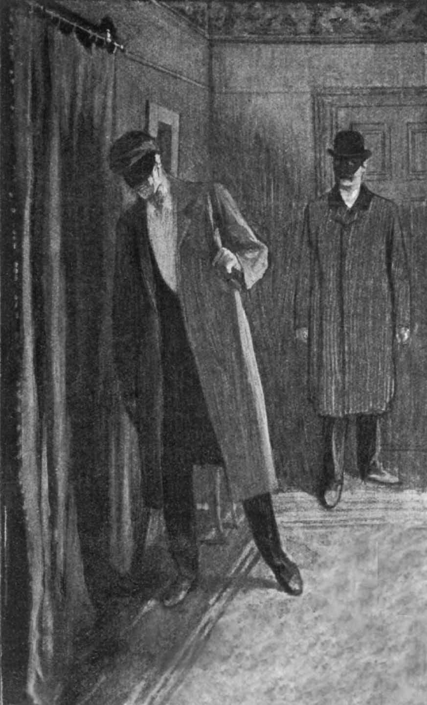

侧耳倾听有无动静。

“先不管它，”他把嘴凑上我的耳朵小声说，“搞不懂怎么回事，没时间研究这个。”

“我来看着点吧？”

“好，你就站这门口。要是听见有人来，把门在里边闩起来，我们就往来的道上撤。要是从别的地方过来，我们就走这个门出去，这是事情做好了的话。要是事情没做好，我们就在窗帘后面躲一躲。你懂我的意思吗？”

我点点头，在门旁站好。我原先的惧怕和顾虑已经过去，现在心里充满着从没有感到过的一阵火热。我们是法律的捍卫者，绝不是破坏者。我们怀着崇高的使命，怀着无私的、骑士般的良心，看着对手品格之卑污丑恶，这一切都增添了我们这次冒险行动的劲头和趣味。我没有一点犯罪感，而是身历险境反觉得高兴和振奋。我对福尔摩斯油然产生惊羡之感，看着他打开工具袋，看着他拣选工具，手势轻巧、利索、有序，全如一位外科医生在施行精细的手术。我知道开保险箱是他的一项特殊爱好，因此能想象得出他现在必有的兴奋喜悦之情。他面对这绿色保险柜，这吞噬了许多美丽女士荣誉在它肚中的恶兽，要予以手术解决。他卷起夜礼服的袖口——大衣放在了一把椅子上——拿出两柄钻子，一根撬棒，几把万能钥匙。我则守住这要道门口，眼睛关注着其他两扇门，准备随时应付不测；虽说如果真的突然发生意外，到底怎么个对付法，实际上我心中没数。约莫半个小时，福尔摩斯聚精会神地行动着，放下一件工具，拣起另一件工具，每一件都使得经验老到、得心应手。最后，我听得喀哒一声响，宽阔的绿色柜门打开了，我望过去见里面有许多卷纸卷，都扎好、封好、标有字。福尔摩斯取出一卷，在闪烁的火光下看不清楚，他就拿起小暗灯。开电灯是危险的，米尔沃顿就睡在隔壁房里。忽然，我看见他停住不动了，在专心地听着什么。接着，立即关上柜门，拿上大衣，工具塞进口袋，一个箭步跨到窗帘后面，招手叫我也快过去。

我过去和他在一起，才听到引起他迅速反应的响动。是在屋子里面的声音。远处一扇门砰地关上，稍后，模糊低沉的响动声伴和着沉重的脚步声，一步一步很快向这里过来。声音是从房外的过道传来的。房门打开了，啪嗒一响，电灯亮了。房门关好，浓烈的雪茄烟味冲入我们鼻孔。又是脚步声，走过来走过去，走过去走过来，听得出只隔着我们几码距离。最后，椅子嘎吱一响，脚步没声了。接着，喀哒，钥匙开锁，听见翻纸张的沙沙声。

我一直没敢往外看，这会儿，我才把面前的窗帘轻轻撩开一点缝，往外看去。福尔摩斯的肩压着我的肩，知道了，他在和我一起向外看。就在我们正对面，一伸手就能够得着，是宽宽的、滚圆的米尔沃顿的肩背影。很清楚了，他的行动我们完全估计错误。他根本没有在卧房里，是在另外耳房什么地方的吸烟室或是撞球房里坐着呢，那边的窗户我们都没有过去看。他的灰头发大脑袋，发亮的秃顶盖，近在咫尺。他仰靠红皮椅背，撑直两腿，一根长长的黑雪茄烟斜叼在嘴里。他穿的是紫红色军便服吸烟衫，镶黑绒领。他手里捏一厚叠法律文件，在懒洋洋地看，一边嘴里悠悠地吐出一个个烟圈。看他镇定自若、舒适优闲的态度，并没有很快就要离开的样子。

我感到福尔摩斯悄悄抓住我的手，用力握了一下，像是告诉我，这个情况他能够对付，他很镇定。这时，我正着急他是不是看得见在我这个位置上看见的情况。我看得很清楚，那保险柜的门没有完全关上，米尔沃顿随时都可能发现。这时，在我心里，我已拿定主意，只要让我看见他的目光朝那边一愣，叫他看见了保险柜门，我就立刻跳出去，把我的大衣往他头上一兜，蒙住他，摁住他，让福尔摩斯采取随后的行动。可是，米尔沃顿就是没抬头，懒懒地翻着手上的文件，看得蛮有兴致，一页又一页地翻过去，欣赏律师的辩才。这样，我又想了，等他看完这叠纸，吸完嘴里烟，就该回他房里去了。但是，纸没看好，烟没吸完，奇怪的情况接着发生，把我们的思想完全扭转到另一条路上。

有好几次，我发现米尔沃顿在不住地看他的表，还站起来一回，重又坐下，表现得很不耐烦。这个情况很明显是在等约会的人，想不到的是在这样深夜时刻果然有人来，这时外面阳台上有微弱的声音传入我的耳朵。米尔沃顿把纸丢下，在椅子上笔直地坐起。声响继续，来到门前，轻微的敲门声。米尔沃顿起身去开门。

“哈，你，”他粗声粗气道，“差不多晚了半个小时。”

为什么门不锁、米尔沃顿守夜不睡，其原因就在于此。听见的是女人衣服轻微的沙沙响。刚才我把窗帘的缝隙并拢了，因为米尔沃顿的脸转向我们这边，现在我又冒险稍稍掀开。他已坐回到椅子里，雪茄还是叼在嘴角，高高翘起，很是傲慢。在他的正面，炫目的电灯光下，站一个高高、瘦瘦、黑衣服的女人，面纱遮着脸，颔下系着斗篷。她喘气急促，颀长孱弱的身躯上下发抖，显得极度激动。

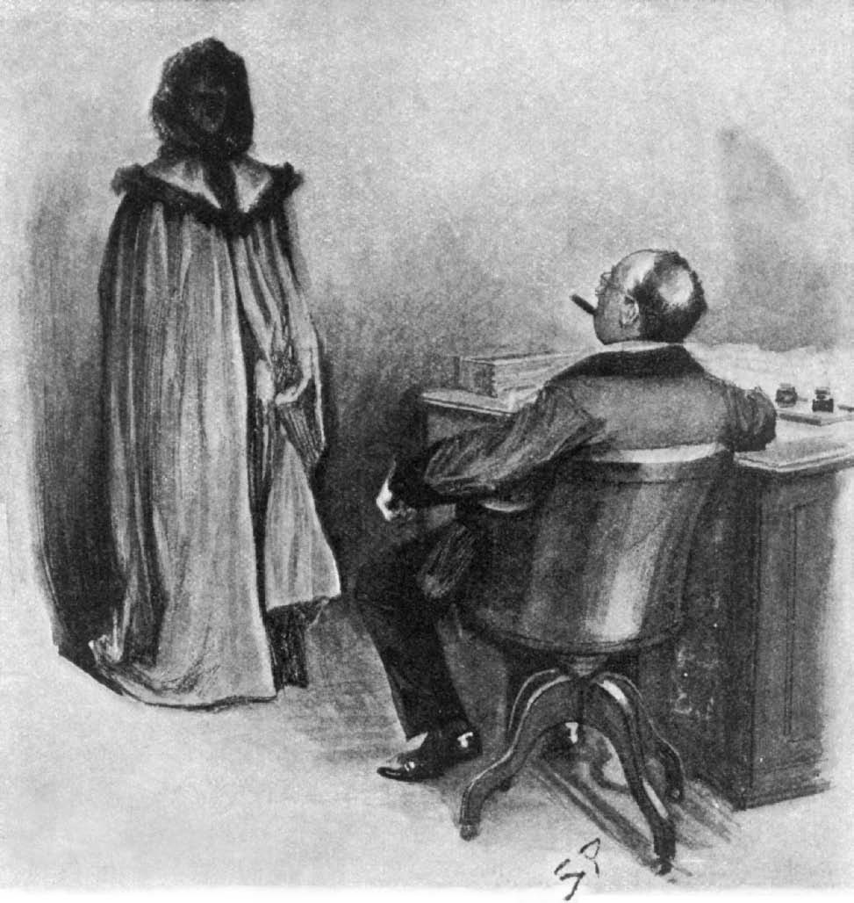

一个黑衣服的女子，面纱遮着脸。

“哎呀，”米尔沃顿说道，“你叫我睡不成个好觉，我说亲爱的，希望你不要辜负我这一夜。其实你就不能另选个时间来嘛——我说？”

女人摇着头。

“好啦，你不能也就只好不能啦。伯爵夫人要是不好对付，你现在就有机会跟她较量较量。祝福这姑娘吧，你怎么，发抖干啥？好好儿的，振作一点嘛。现在，咱们谈生意吧。”他从书桌抽屉里取出笔记本，“你说你有五封信，都是有关戴·艾伯特伯爵夫人的名誉，你要脱手。再好也没有啊，就看要什么价了。信，当然我要先过过目，只要是货真正好就行——啊，我的天，是你？”

这个女人，一句话也不说，揭了面纱，把颔下的斗篷解开。面对着米尔沃顿的是一张面色黯然而轮廓分明、清秀美丽的脸——一张脸，曲线适度的鼻梁，刚劲的黑眉，压着一对灼灼逼人的眼睛，平直薄唇的嘴边挂着仇恨的冷笑。

“是我，”她说，“给你毁掉一生的女人。”

米尔沃顿大笑起来，但是笑声中带着恐惧的颤音。“你自己太死心眼嘛，”他说，“谁叫你逼得我非那样做不可呢？我向你保证，我本意是一只苍蝇都不忍心伤害的。只是人人各有自己的难处，叫我有什么办法呢？我要的价是你完全出得起的，可是你就是不肯出。”

“所以你就把信交给我丈夫，他就——他是世上最高尚的人，正人君子，他，我给他系鞋带都不配——伤透了他的自尊心，他死了。你记得，那最后一天，夜里我上门，也是这个门，来求你，哀求你可怜我。你只是耻笑，耻笑我，你现在也在笑，朝我强做笑容。可你内心里在胆怯，掩盖不住你嘴唇在发抖。是吗，你想不到吧，在这儿又会见到我。是你那天夜里，教了我怎么能见你，同你单独面对面算账。好啦，查尔斯·米尔沃顿，你还有什么要说的？”

“你别想来吓唬我，”米尔沃顿说，忽地站起来，“只要我一声喊，就能把底下人都叫来，把你给捆了。可话说回来，你克制不住，发掉点火气，我也该宽容为怀。你就给我走吧，我没工夫同你多啰嗦了。”

女人站定着，手摸在胸怀里，薄嘴唇露着要杀人的冷笑。

“你害我，我叫你再也害不了人。你绞了我的心，叫你再也绞不了别人的心。我要除掉你，这世上最毒的毒蛇。挨我枪子儿，你这条恶狗——挨枪！——挨枪！——挨枪！——挨枪！”

她掏出一支锃亮的小左轮，一枪接一枪对准米尔沃顿身上打，枪口离他胸膛不到两英尺。他身子一抽搐，就仆倒在桌子上，猛烈咯血，手抓挠着纸。他又摇摇晃晃站起来，又挨上一枪，便扑通滚倒在地板上。“你杀人。”他叫了一声，就不动了。女人盯住他看了看，用脚跟朝他仰起的脸上踢一下，再看看，米尔沃顿不出声，也不动弹了。我听见衣服的一阵沙沙响，夜深的寒气吹入昏热的屋内，复仇人走了。

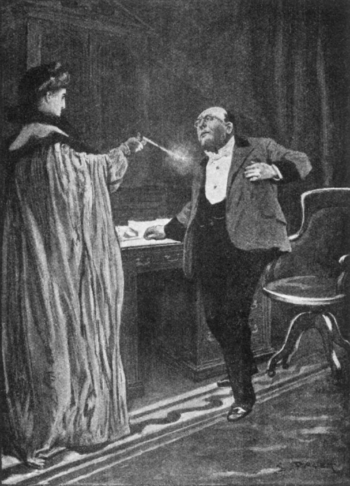

“挨我枪子儿，你这条恶狗。”

如果我们上前干涉，并不能使这个人免于一死。不过当女人对着米尔沃顿一枪又一枪不住地打，打得他抽紧了身子，我差一点就要跑上去，是福尔摩斯冰凉、有力的手按住了我手腕。这强有力的手腕一捏，我便完全理解了福尔摩斯的意思——不关我们的事，这是正义惩治了邪恶，不应忘记我们有我们自己的责任和目的。当女人刚一跑出屋子，福尔摩斯就迅疾无声地几步冲向另一扇门边，转动门锁把门关死。就在此时，听见屋子里响起声音了，杂乱的叫喊声、脚步声，是枪声惊动了全屋子人。福尔摩斯绝对清醒镇定，跨向保险柜，两臂抱起一捆捆信件，转身一古脑儿往火炉里扔，扔了再拿，拿了再扔，终于柜子空了。有人在转门把手，在拍门。福尔摩斯眼向四面一扫，预约米尔沃顿今天死期的一封信，还在桌子上，血迹斑斑，福尔摩斯随手丢进火焰熊熊的纸堆，然后拔了外门上的钥匙，随我之后一起出门，从外面把门锁上。“这儿走，华生，”他说，“这边花园，翻墙。”

我简直不能相信，警报传得那么快。往后一看，整幢屋子灯光全亮了。前门已经洞开，人影在车道上奔走，花园里也有人直嚷嚷。我们刚跑出阳台，一个家伙就喊捉人，紧追上来。福尔摩斯熟门熟路，打矮树植物园中抄过去，我跟着他跑。后面追得最紧的那个人，在呼哈呼哈喘气。一堵六英尺高的墙挡住了去路，福尔摩斯一纵身就上了墙，我也蹦上了墙，可是脚脖子给那个人抓住。我使劲一蹬，把他踢掉，爬过长满草的墙顶，脸朝下跌在矮树丛中。福尔摩斯赶紧扶我起来。我们一起飞跑，穿过宽阔的汉普斯泰德石南大荒地。我估计，跑了两英里路，福尔摩斯这才停下步，竖起耳朵听了一会儿。后面毫无声息，终于把追赶的人甩掉，平安无事了。

经过历险之后——这番深入虎穴的历险我已有记述，第二天我们吃好早饭，吸上一锅斗晨烟。此时，苏格兰警场的莱斯特雷德先生被引进我们的小小客厅，他板脸严肃，一本正经。

“早上好，福尔摩斯先生，”他说，“早上好。请问一声，你现在很忙吗？”

“还不至于忙得不能听你讲话。”

“我想，要是你手头没有特别的事，有一件稀奇案子要麻烦你帮个忙，就是昨天夜里，发生在汉普斯泰德。”

“是吗！”福尔摩斯说，“什么案子？”

“谋杀案——并非一般性的谋杀，很有戏剧性。我晓得，你对于这种案子，最热心最在行。要是你去阿倍尔多塔亲临现场，再给我们提出宝贵意见，那可就不胜感激。这可不是一般普通刑事案，我们早已锁定这个米尔沃顿先生好些日子了。这你我都清楚，他是个十足的恶棍。都知道他靠掌握几张纸头，就可以达到敲诈勒索的目的。这些个纸，都叫杀人犯烧个精光。屋里值钱的东西一样都不要，没拿。那两个罪犯，八成是很有身价地位的人。他们唯一的目的，就是防扩散，个人隐私不得曝光。”

“是两个？”福尔摩斯问道，“不是一个？”

“是啊，搭伴儿两个，差一点当场被抓住。我们有他们的脚印，有他们的外貌特征，要抓他们，是十拿九稳。第一个人，很厉害；第二个人，被花匠徒弟抓住，可是硬给挣脱逃掉。这个人，中等个子，身体强壮——方下巴，粗脖子，上唇胡，两眼蒙面罩。”

“这就搞不懂了，”福尔摩斯说，“哈，这不是在给华生画图形嘛！”

“没错，”警探嬉笑道，“正就是华生的图形。”

“那，我怕是没法帮你忙了，莱斯特雷德，”福尔摩斯说道，“讲实在的，我清楚这米尔沃顿是个什么东西，我认为他是全伦敦最恶劣的人。可惜，有些犯罪法律管不着，因此，在一定程度上，私人报复是正当的。不讲了，多讲没用。我已经决定了，我同情犯人，不同情被杀的人，我绝不会插手这个案件。”

福尔摩斯对我们亲眼目睹的这场惨剧再也不提一字，但是我看出他整个上午在用心思考，他的目光茫然若失，显得心神不定，这让我觉得，他一定是在努力追忆什么事情。直到用午餐，正吃着，他忽然跳了起来。“啊，对啦，华生，我想起来啦！”他叫道，“戴上帽子！跟我走！”他迈着最快的步子走出贝克街，迅速进入牛津街。差不多就要到摄政街广场，靠左手边，有一个店橱窗，陈列的都是当今名士和佳丽的照片。福尔摩斯的两眼定在其中的一帧照片上，我顺着他的目光望去。我看到那帧照片是一位端庄的皇族女士，着宫廷礼服，头戴高耸的钻石冕饰，雍容华贵。我注意到她那曲线适度的鼻，深刻的线眉，唇形清晰的嘴以及刚毅的小下巴。这时我一看文字，教我惊愕得目瞪口呆了，原来她曾经是某位拥有悠久世家称号的大贵族和大政治家的妻子。我和福尔摩斯对目相望，他往嘴唇上举起一个手指头，我们就转身离开了橱窗。

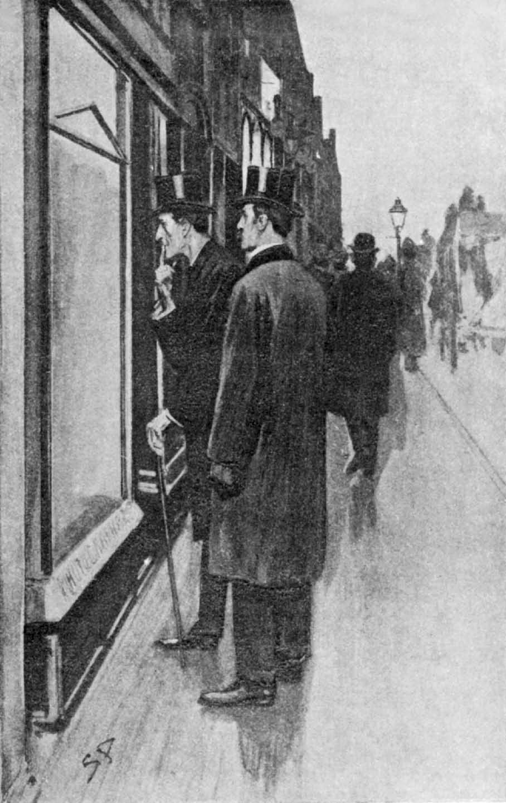

我顺着他的目光望去。

（1904年）

————————————————————

<a href="#part0106.xhtml_ch1-back" id="part0106.xhtml_ch1">(1)</a> 匹克威克（Pickwick），狄更斯小说《匹克威克外传》中的主人公，为人宽厚戆直。

<a href="#part0106.xhtml_ch2-back" id="part0106.xhtml_ch2">(2)</a> 雅典娜（Athene），古希腊神话中的智慧、技艺和战争女神。

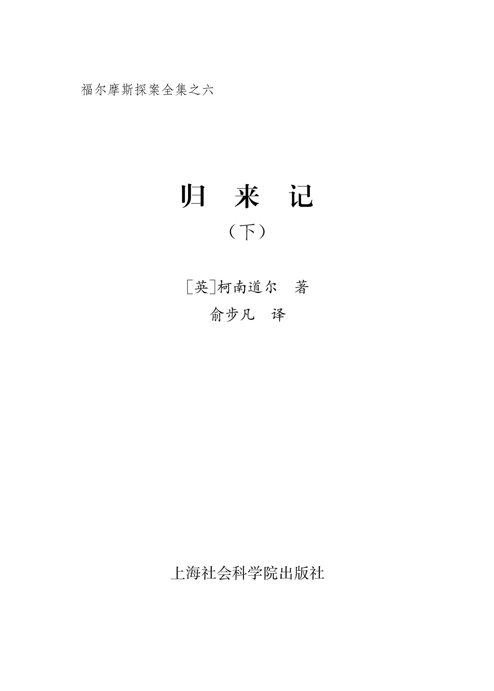

# 目录

# （下册）

[六尊拿破仑塑像](#part0109.xhtml)

[三个大学生](#part0110.xhtml)

[金边夹鼻眼镜](#part0111.xhtml)

[失踪的橄榄球队中卫](#part0112.xhtml)

[格兰吉庄园](#part0113.xhtml)

[第二摊血迹](#part0114.xhtml)

[返回目录](#part0097.xhtml_ck001)

# 六尊拿破仑塑像

苏格兰警场莱斯特雷德先生晚上来我们这里坐坐，已习以为常，并非稀罕事。莱斯特雷德能常来，福尔摩斯也挺欢迎，因为能够使他经常与警方总部保持接触，了解工作情况。作为对莱斯特雷德带来消息的回报，福尔摩斯对这位警探经办案子的详情细节，总是用心倾听，有时，还根据自己的广博知识和丰富经验，婉转谦虚地指点迷津，提供建议。

这天晚上，有点不一般，莱斯特雷德讲起天气和报纸，后来就陷于沉默不吭声了，闷头一个劲噗噗地吐着雪茄烟。福尔摩斯关切地望着他。

“手上有特别的案子？”福尔摩斯问他。

“哦，没有，福尔摩斯先生——说不上特别。”

“给我说说吧。”

莱斯特雷德哈哈笑了。

“嗨，福尔摩斯先生，不瞒你说，我是有着心事。那事情也真是够荒唐，我都不好意思麻烦你。可是，话又说回来，事情小是小，倒是非常的奇怪，你，我是知道的，就喜欢稀奇古怪的问题，尝个新鲜味儿。但是，依我看，这个事情倒是跟华生医生有关系，比你我更有关系。”

“是毛病？”我说。

“疯病，可以说，还是少见的疯狂。你说怪不怪，生活在如今这时代的人了，还对拿破仑一世恨之入骨，只要是他的像，一见了就要砸。”

福尔摩斯仰身靠着椅子。

“这就不关我的事。”他说。

“就是，所以我那么说嘛。但问题又来了，这个人要干夜盗，去砸别人家里的拿破仑像，这就不是医生的事，该是警察的事了。”

福尔摩斯立刻坐起了身子。

“夜盗！这就奇怪了，我要仔细听听。”

莱斯特雷德拿出工作手册，一页页翻看，好根据记录帮助回忆。

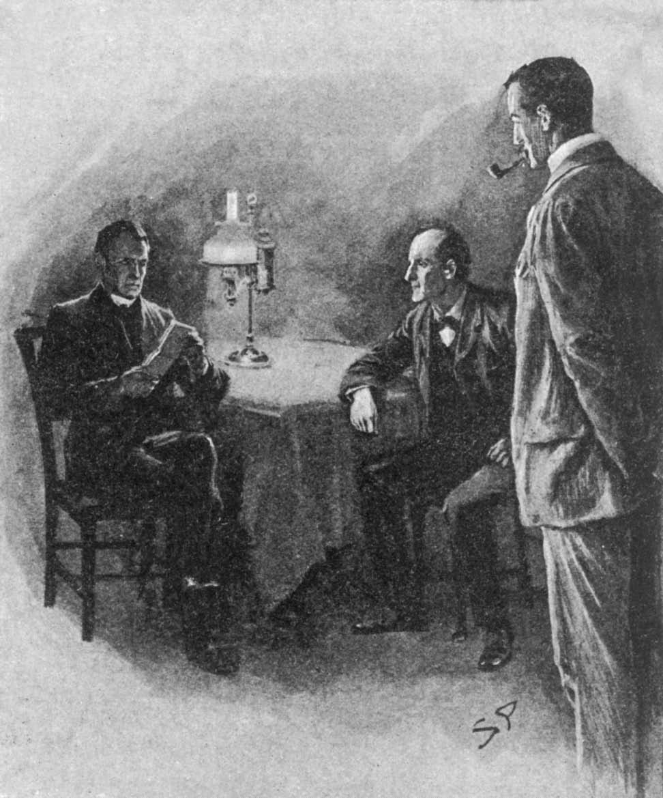

莱斯特雷德拿出工作手册。

“第一起，来报案的，是四天以前，”他说，“是莫斯·赫得森商店，他在肯宁顿路上有一家分店，卖绘画和塑像。店员刚刚离开店堂，一转眼，就听到哗啦一下，赶快回头看，发现柜台上一尊拿破仑石膏半身像被砸碎了，还有旁边几件别的艺术品，也已经粉碎。他奔到马路上，有几个过路的说看见有个人从店里跑出来，可是他左望右望，也没发现有流氓模样的人。这就好像是小流氓恶作剧，常有的事，没啥意思。报告到警察那儿，也就是这样看。打掉的石膏像最多几个先令的事，犯不着小题大做，搞什么调查。

“第二起报案，就严重起来了，也不一般了，就发生在昨天夜里。

“肯宁顿路上，距离莫斯·赫得森店两三百码，住一个有名的开业医生，叫巴尼科特大夫，泰晤士南岸一带他也是医术高明、业务兴旺的一个。他的家和主要诊所是在肯宁顿路，另在下布里克斯顿路，有他一家分所和药房，距离家两英里。这个巴尼科特大夫，是个拿破仑的狂热崇拜者，他家里藏满了这个法兰西皇帝的大量书籍、图画、文物。不久前，他从莫斯·赫得森那里买了两尊拿破仑石膏头像，是法国雕塑家笛万的名作复制品，一尊放在肯宁顿路家里的客厅，一尊放在下布里克斯顿路诊所的壁炉架上。好，今天早晨，巴尼科特大夫从楼上下来，大吃一惊，发现夜里有人进屋盗窃，不过没有别的损失，就是石膏像从厅里拿走了，被扔碎在花园墙根，撒了一地的碎片。”

福尔摩斯搓起了双手。

“这倒确实新奇。”他说。

“我想你愿意听的。事情还没讲完呢，巴尼科特大夫规定十二点钟到诊所。你可以想象他有多惊慌，一到那里，发现夜里窗给打开了，那第二尊石膏半身像碎得满屋子都是，整个像连底座都砸个稀巴烂，没剩一点大块的。两处现场都没有给我们留下一点线索，这样子到底是犯罪呢还是神经病呢，没迹象，推究不出。好，福尔摩斯先生，事实情况就是这样。”

“确实少见，简直荒诞。”福尔摩斯说，“我要问一下，这个巴尼科特大夫家里被打掉的两座像，同莫斯·赫得森店里那个是同一个复制品吗？”

“都是同一个模子翻出来的。”

“由这个事实，就不宜作推理说，砸像的这个人动机是出于仇恨拿破仑本人。考虑一下，这位大皇帝在全伦敦的像何止数百，他的像各种各样那么多，可哪有那么巧，反对崇拜他的偶像，偏偏从这三尊相同的胸像开始砸。”

“是的，我也有过和你一样的想法，”莱斯特雷德说，“但是另一方面，是伦敦这个区域只有莫斯·赫得森卖胸像，这三尊，是几年来他仅有的三尊。所以，尽管如你所说，伦敦有拿破仑像数以百计，但是很可能这三个只是本地区仅有，本区的疯子一开始就打了这三个。你怎么看呢，华生医生？”

“偏执狂有各种各样，没有一定，”我回答，“有这种情况，现代法国心理学家称之为‘执着意念’，性格上的小问题，其他各个方面精神都正常。一个人，读过拿破仑的书，印象特别深，或者拿破仑战争中家族创伤有遗传影响，传承了下来，就容易形成这样一种‘执着意念’，受了影响，想想就会发怒。”

“不是这样，我亲爱的华生，”福尔摩斯摇头说，“因为再多的‘执着意念’，光是你讲的那种人有偏执病，不至于要去找出这些雕像搁到了什么地方。”

“哦，那么你是怎么解释呢？”

“我不想凭空猜测，我只是注意到这位先生的反常行为，是讲究方式方法的。比如讲，在巴尼科特大夫的客厅里，有声响要惊醒全家人，胸像就拿到外面去砸，但是在诊所，不会惊动人，没有危险，就当场打碎。事情看来是无聊小事，但是我不把它看成仅仅是小事，想想以前我好些典型案例还不都是从极细小的事上开始突破的。你记得吗，华生，阿巴涅特家族那个大案，开始引起我注意的，是大热天气时荷兰芹在黄油里会浸没得多深，这么个小问题罢了。所以，莱斯特雷德，你讲的三尊石膏像被打碎，我可不能一笑置之。等这件怪事再有连续的新进展，你让我知道，我对你就非常感激。”

我的朋友所讲的进展果然来了，而速度之快，结局之残酷悲惨远远出乎他的想象。次日早晨，我正在卧室穿衣，有人敲了几下门，是福尔摩斯进来了，手里拿份电报，他大声念道：

速来肯辛顿彼特街一三一号。

莱斯特雷德

“怎么回事了？”我问。

“不知道——反正有事，我猜就是石膏像故事又有下文。要是这样的话，我们这位打雕塑专家在伦敦别的区开始行动了。桌上有咖啡，华生，我已经叫好马车在门口了。”

半个小时我们赶到彼特街，这里像是处于洪流滚滚的伦敦繁华区旁的死水塘，寂寥无声。有一排平面朴实而雅致实惠的住宅，一三一号就在其中。我们马车过去，看到房屋前的栏杆外面站着一堆挤着看热闹的人。福尔摩斯打起呼哨。

“天哪！八成就是人命案。这一下伦敦报童又要跑得不亦乐乎了。瞧那个人，拱背撑脖子的样子，表明有凶象。这里怎么，华生？上面台阶冲洗过，别处都是干的。踩得脚印那么多，怎么搞的！噢，噢，莱斯特雷德在前窗，怎么回事马上可以知道。”

莱斯特雷德警官板着脸阴沉地上来迎接，把我们领进一间起居室。一位上了年纪的人，穿法兰绒休闲衣，不修边幅，神态激动，在走来走去。莱斯特雷德给我们介绍他就是这里的主人——中央报业辛迪加的霍勒斯·哈克先生。

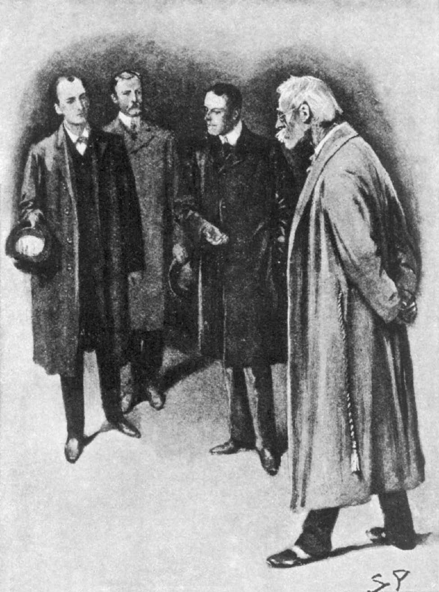

中央报业辛迪加的霍勒斯·哈克先生。

“又是拿破仑半身雕像，”莱斯特雷德说，“你昨晚上好像挺感兴趣，福尔摩斯先生，所以我想，请你来现场也会乐意。现在事情已经发展到极严重的程度。”

“什么样的程度？”

“杀人。哈克先生，请你把事情发生的情形向这两位先生讲一讲吧。”

穿晨衣的人一脸阴郁，转向我们。

“这件事真是出奇，”他说，“我搜集别人家的新闻搜集了一辈子，现在一桩真正大新闻出在我自己身上了，临到我就搞糊涂了，傻眼不知咋回事了。我又不能以一个记者身份在这儿，又不能自己采访我自己，要不然我准给各晚报写上一大篇两栏的报道。可现在，我放着有价值的东西不写，得向这个人那个人一遍一遍讲我亲眼目睹的事，我自己可是一点都没能派用场有作为。不过，你的大名我是听到过的，福尔摩斯先生，如蒙把这事给以解释清楚，让我费一遍口舌也是值得。”

福尔摩斯坐下听讲。

“事情看上去都出在一尊拿破仑的半身像上，我四个月以前买来放在这间屋子里，是偶尔在哈定兄弟商店买来的，那店就在高地街车站过去两家门面，价格很便宜。我大量的新闻稿都要在夜间写，经常要写到凌晨天亮。今天也是这样，我坐在书斋，是在屋子顶楼的后面。到了大约三点，我听到楼下有响动，有声音，不会错。我注意听听，又没有了，我思忖是外边的响声。可是隔了五分钟的样子，突然一声可怕的惨叫——可怕极了，福尔摩斯先生，我从来都不曾听见过的。这一声喊只要我活着，恐怕一辈子都忘不掉了。我当时一惊，呆在那里有一两分钟，接着就拿起拨火棒下楼去。我下来，到这间屋子，看见窗户大开着，同时马上发现壁炉台上那尊雕像不见了。入室夜盗，竟偷这么个东西，我都有点搞不懂了。这不过是件石膏翻制品，又值不了几个钱。

“你可以看见吧，人翻窗出去，跨一个大步，就踩上了前门的台阶。夜贼肯定是翻窗了，我就过去把屋门打开，走到外面。黑咕隆咚间，没料脚下绊上个死人，差一点给绊倒，死人横在那里。我回头来取灯，一看，死者喉咙割开了个大口子，周围地上一大摊血。他人仰天躺着，两个膝盖竖起，张开大嘴，很怕人，往后做梦准要梦见他这个样子。我赶紧一个劲猛吹警笛，接着就晕过去了，什么也不知道，醒来已是在客厅里，这位警官站在旁边。”

“那，被害人是谁呢？”福尔摩斯问他。

“不知道是什么人，一点看不出，”莱斯特雷德说，“死尸到停尸房去了，以后看吧，现在还没有查出来。这个人高个头，皮肤黑黑，是个身强力壮的大汉，年龄三十不会出头。他衣着破旧，但不像是工人。一把骨柄折刀扔在旁边一摊血里，是杀死他的凶器，还是他自己的东西，我也不知道。死者衣服上无名无号，口袋里别无他物，只有一只苹果，一根绳子，一张一先令的伦敦地图，还有一张照片。这就是照片。”

那显然是小照相机拍摄的快照。照片上的人尖嘴猴腮，粗眉，暴眼，下巴与厚唇直向前突、往上翘，活像只狒狒。

“那雕塑胸像怎么样了？”福尔摩斯对照片审视一会儿，问道。

“你没来之前我们刚刚得到消息，在坎普登大宅路，有幢空房的前花园，石膏像就在那里，给砸得粉碎。我现在正要去看，一起去吧。”

“当然要去，这里先看一看。”福尔摩斯检查了地毯、窗户。“这个人要么腿很长，要么动作特别灵活，”他说，“窗外地面很低，要跳上窗台把窗打开，没有一点灵巧功夫还真不行，出去向外跳相对比较容易。请和我们一起去看你的雕塑好吗，哈克先生？”

这位报人郁郁不乐地坐在了写字台前。

“我还是得想办法要写一写才好，”他说，“虽说各家晚报都抢去头条消息要作详细报道，这是肯定的。这种事都该我碰上吧！你们记得顿卡斯特城看台倒塌的事吗？那回，看台上的记者只有我一个，可我的报纸居然是唯一的一家没有登载此事的报纸。是我受到震惊太大，没能写报道。今天，也是落后了，自己家门前的凶杀案都还没写。”

我们离开屋子，听得他的笔在大页书写纸上刷刷地写。

发现打碎石膏像的地方也就只是两三百码远。我们头一回亲眼看到这位伟大皇帝陛下落得如此下场，竟有人刻骨仇恨到要置其粉身碎骨而后快。碎片在草坪上狼藉一地，福尔摩斯捡起几片来仔细检查。我看他神态专注而自信，我胸中也就有了把握，他终于抓到了线索。

“怎么样？”莱斯特雷德问。福尔摩斯耸耸肩。

“还有很长的路要走呢。”他说，“还有——还有——啊，我们有了一些事实根据。在这个罪犯的眼里，这些半身像的碎片是有价值的，他眼光特别，看得价值高过一条人命。这是一点。另有不同寻常的地方，他不在房子里砸，或者一拿到屋外就在附近砸掉得了，他不是这样做，所以，砸，不是目的本身。”

“他遇上那个人，慌了神，不知所措，才这么干的。”

“哦，那也可能。但是我要提请注意，特别是这座房子的地点，是在这房子的花园里，把胸像砸碎的。”

莱斯特雷德向四周环顾。

“一栋空屋，他知道这花园里也就不会有人。”

“没错。但是在这条街过来不远的那边还有一幢空屋，他跑到这里先要经过那幢屋。他为什么不就在那边砸掉呢？要知道，手捧石膏像，每多走一码的路，就多一分被人撞见的危险。”

“这就说不上了。”莱斯特雷德说。福尔摩斯指指我们头顶上有街灯。

“他干活，在这里能看得清，那边看不清，道理就在于此。”

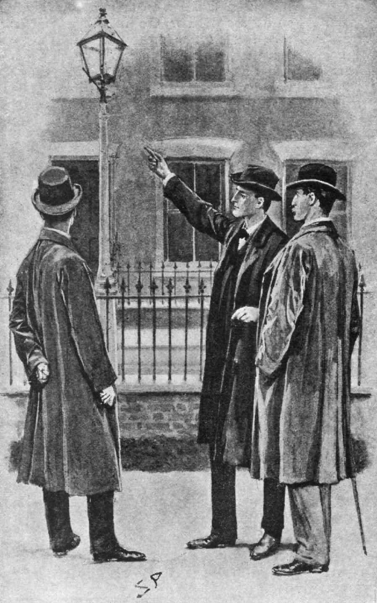

“他干活，在这里能看得清。”

“我的老天！对啊，”警探说，“我也想起来了，巴尼科特大夫的石膏像也是在离灯不远的地方打碎的。噢，福尔摩斯先生，这个情况我们怎么办？”

“记住了——记下来备案。我们要继续侦查，还会遇到这样的情况。下一步你准备采取什么措施，莱斯特雷德？”

“搞清真相的最有效方法，是先查明死者的身份，这个应该没有困难。弄清楚了他是什么人，和他相关联的都有些什么人，我们就有了好的开端，可以知道昨天夜里他在彼特街做什么来了，在霍勒斯·哈克先生门前碰上他、把他杀掉的是什么人，你想是不是这样？”

“对，没问题。但是我这里突破本案不完全是这条路子。”

“那你是怎么做呢？”

“哦，你的工作，最好不要受我的影响。我建议，你走你的，我走我的，各走各的路。以后我们再交换意见，相互取长补短。”

“那好吧。”莱斯特雷德说。

“你回到彼特街，见到霍勒斯·哈克先生，替我告诉他，就说我已经完全肯定，昨天夜里的事，是一名拿破仑妄想症的凶恶武疯子在他家里杀的人。这样讲对他写文章有用。”

莱斯特雷德呆望着他。

“你真的是这样认为？”

福尔摩斯笑笑。

“你认为不是？是呀，也许不是。但是我确信，这样做的话，霍勒斯·哈克先生和中央报业辛迪加的广大读者会觉得很感兴趣。现在，华生，我想，我们今天下边的工作要很费时、很复杂、很累人。我将很高兴，莱斯特雷德，如果方便，今天晚上六点，你来贝克街同我们碰头。这张照片，被害人口袋里搜出来的，我要用一用，晚上还你。如果能够证明我的一系列推论不错的话，也许，我得请你跟我们一起，协助我们，在今天夜间采取一次小小的行动。那就这样啰，晚上见，祝你好运！”

福尔摩斯和我一起走到高地街，在哈定兄弟商店门前停步，哈克先生就是在这里买的雕像。一个年轻伙计告诉我们哈定先生不在，要到下午才回来，说他自己还只是刚来的新伙计，店里情况不太了解。福尔摩斯面色不悦，颇感失望。

“那，好吧，没法指望事事顺利，华生。”他最后只好说，“哈定先生上午不在，我们下午再来。我一定被你猜到了，华生，我是要对塑像一个个被砸，追根溯源找一找，内中是不是有特别的原因。我们去肯宁顿路，看莫斯·赫得森先生，不知他那边对这个问题有没有解答。”

马车走了一个钟头，我们到了这家艺术商店。赫得森先生小个子，粗壮，红脸，态度显得急躁。

“是的，先生。就在我这柜台上，先生，”他说，“流氓可以进来砸货，我们付这税那税，不知都干啥用了！是的，先生，是我卖给巴尼科特先生两尊雕像。真不像话，先生！无政府主义干的勾当——我看就是，没错。除了无政府主义者，谁会去砸雕塑。红色共和党人——我就这么称呼他们这伙人。雕塑我是从哪里批来的？我看这个跟砸的事没关系。啊，你真要知道，那是我从盖尔得公司进的货，在彻尔切街，斯泰普尼区。这一家的雕塑业务是有名的，都有二十年的历史了。我进多少货？三尊——两个，加一个，三个——两个卖给巴尼科特大夫，一个在我自己柜台上，光天化日被人砸掉。这照片，我知道吗？不，不知道。噢，不，这个人，认识的，那不就是倍波嘛！意大利人，打零工的，在本店干过一阵，有点手艺，干些刻刻弄弄、嵌金、镶框什么的零活。上个星期离开的，走掉后没有消息。不知道，从哪里来，到哪里去，都不知道。他在我这里，我不觉得有什么不好。他是在雕像被砸两天前离开的。”

“就这样，莫斯·赫得森这里能了解到的，也就只有这么多了。”从店里出来，福尔摩斯说，“我们获得这个倍波的情况，两头有关联，肯宁顿和肯辛顿都有他的分，我们赶了这十英里路值得。现在，华生，就上盖尔得公司吧，去斯泰普尼，石膏雕像的制作地、货源地，我不相信那边会没有收获。”

马车一路沿着市区边缘走，经过伦敦高档住宅区、旅馆区、文化区、商业区，最后，经过航运区，来到一个有十万人口聚居的泰晤士河边的市镇，那里的分租屋、经济房住满欧洲各地拥来的流民，壅塞杂乱，异味秽气蒸腾。这里，在一条原是富商居住的大道上，我们找到了要找的雕塑工场。场外有个相当大的院子，堆满墓碑之类的石料。工场一间大房子，有五十来个工人在雕刻、翻模。经理是个大块头金发德国人，出来接待我们，彬彬有礼，对福尔摩斯的询问热情回答。经查账得知，从笛万的拿破仑大理石头像翻制出的石膏像有几百尊，大约一年前送到莫斯·赫得森那里的三尊，属于一批货六尊的一半，另三尊送货给肯辛顿的哈定兄弟店。这一批六尊同其他所有的这个雕像都是一样的，没有一点不同，专要砸这几尊是什么原因他也搞不懂了——竟有这种事，他不禁好笑。他们的批发价是六先令，零售可以卖到十二先令还多。石膏像是从头像前后两片模子翻的，两个模片从巴黎运来，合在一起浇注成一个完整的像。干这活的多数是意大利人，就在我们看到的这间房子里工作。浇注完了以后，石膏像放到过道里去晾干，以后就可以卖了。他告诉我们的就是这些。

等到一拿出照片来给经理看，反应可就强烈了。他马上气得脸发红，一双日耳曼人的蓝眼上两道眉毛拧在了一起。

“哼，这个流氓！”他叫道，“是的，就是他，我可认识他了。我们这里向来安分守己，就只一次，来了警察，都是这个家伙惹的事。那是一年前，也就这个时节，他在街上用小刀子捅了另一个意大利人。他回到工场，后脚警察跟到，就在这里给抓住。名叫倍波——他姓什么一直不清楚。雇佣这么个品行不端的人也是我倒霉。就是他的手艺可以——也算得上好手。”

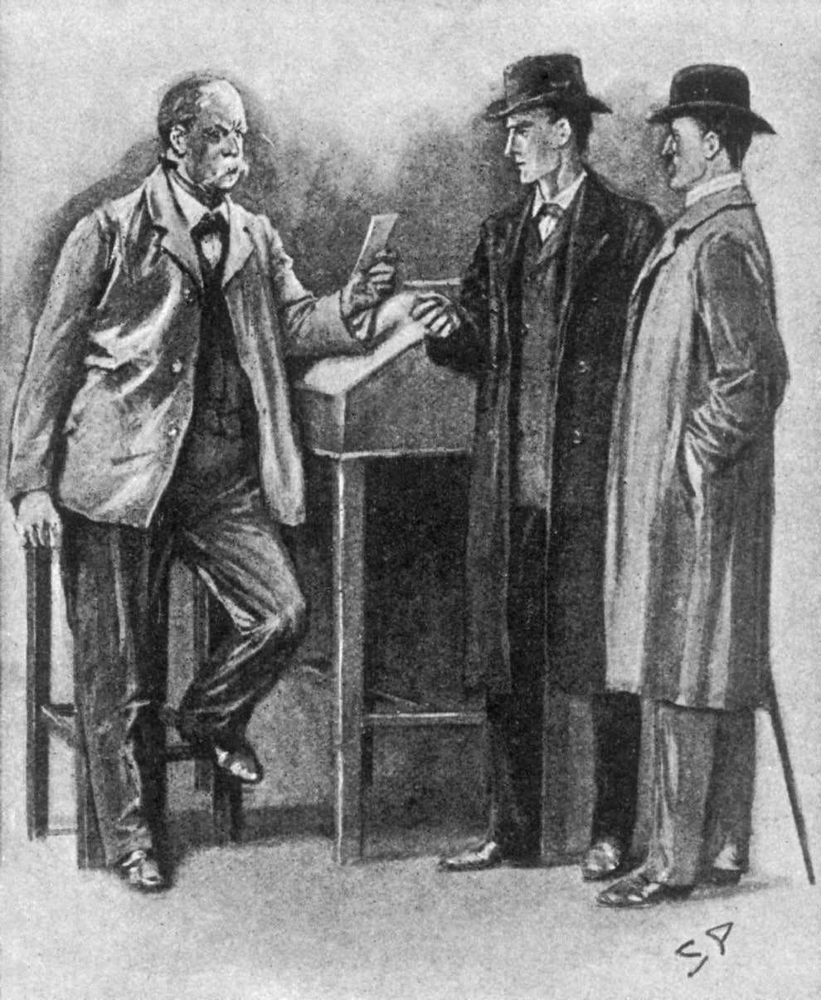

“哼，这个流氓！”

“吃官司了？”

“被他捅刀的人没死，判了他一年。现在肯定已经出来了，这里他是再也不来露脸。他有一个表弟还在这儿，一定能告诉你他在什么地方。”

“不要，不要，”福尔摩斯忙说，“同他表弟一句话也不要讲起——一句也别提，请你务必配合。问题很严重，我越深入，问题就越严重。你刚才查雕像售出账目，我看见日子是去年六月三日。你知道倍波被逮捕那天是什么日子？”

“我查一下工资账就可以告诉你大概的日子。”经理回答。“有了，”他翻了几页后马上说道，“最后一次发给他工资是五月二十号。”

“谢谢你，”福尔摩斯说，“我想不再打扰了，已经费了你好多时间。”他临走再三叮嘱经理不要向人讲起我们调查的事，然后我们转身朝西回去。

下午时间一转眼就要过去，我们赶快在一家餐馆匆忙补上一顿午饭。门口报童在吆喝：“肯辛顿凶杀案，疯子杀人。”这说明霍勒斯·哈克先生写的报道终于见报了。报道占了两栏，整个事情写得非常耸人听闻，文字也好，笔底生花。福尔摩斯把报纸竖在调味瓶架上，一边吃一边看，有一两次还咯咯地笑。

“真妙，华生，”他说，“你听这里：

欣闻对此案之侦查并无歧议，莱斯特雷德先生系警方最资深之警探，歇洛克·福尔摩斯先生系著名之刑侦专家，双方不约而同得此结论，盖一连串之奇异现象，且以如此惨剧而告终，皆出于一疯人之所为，实非属蓄意之谋杀，非缘其精神失常则无以解释诸般事实。

“这报纸，华生，真是最得力的工具，所以你要懂得如何加以利用。现在，你快吃好了，我们折回原地肯辛顿，去看哈定兄弟商店经理，听听他对这事怎么讲。”

这是家大商店，老板却是小老板，个儿小，人灵活精干，行动敏捷，脑子清楚，讲话应对如流。

“是的，先生，我已经看到晚报，知道情况。霍勒斯·哈克先生是本店顾客，几个月前给他送去一尊石膏雕塑。我们向斯泰普尼区盖尔得公司订了三尊一样的胸像。三尊都已经售出。卖给谁？噢，查查售货账就能告诉你，没问题。有了，我们都有账目在这里。一尊是给哈克先生，你看，一尊是给乔赛亚·布朗先生，在齐兹威克区金链花谷金链花别墅，还有一尊给桑德福先生，在里丁区下丛林路。不，你这张照片上的这个人我从来没见过。这样的人见过是不会忘记的，先生，这样的丑脸我是不多见的。我们的职工有没有意大利人？有，先生，有几个，是杂工、清洁工。这销售账他们要看就能看到，没有必要管住不许人看。是的，是的，很奇怪的事。如果发现还有问题，尽管随时来问。”

福尔摩斯把哈定先生的回答作了一点记录，我看出事情到了这一步他是非常满意了。他没有讲别的话，只说要快点了，不然同莱斯特雷德的约会要误点了。果不其然，当我们赶回贝克街，警探已经等候在家，看见他在屋里心急地走来走去。他那个气势架子，说明他一天的工作也没有白做。

“怎么样啊？”他问道，“顺利吗，福尔摩斯先生？”

“今天可真是忙了一天，可是也真没白忙一天。”我的朋友解释道，“两家零售店，连制造商都拜访上了。每尊石膏像的来龙去脉我都摸得一清二楚。”

“石膏像！”莱斯特雷德叫道，“好，好，你有你的一招，福尔摩斯先生，我不会来插嘴说个不字。可是我想，我一天做的，要比你强些，给我查出了死者是什么人。”

“是吗？”

“还查出了犯罪的原因。”

“了不得！”

“我们有一位警探，专门负责藏红花小丘<a href="#part0109.xhtml_ch1"
id="part0109.xhtml_ch1-back">(1)</a>意大利区。好，死者脖子上挂有天主教十字架，还有他的肤色，都让我想到他是南欧人。小丘警探一见他尸首就认识，他名叫皮埃特罗·万努齐，来自那不勒斯，是伦敦一名大盗。他跟黑手党有关系。黑手党，你知道，是个秘密政治组织，想通过暗杀来推行他们的信条。现在，你看见事情开始明朗了吧。另一个也准是意大利人，也是黑手党了。他一定是犯了内部纪律条令，皮埃特罗跟上了他。那照片，我们在他口袋里发现的，就是他跟踪的这个人，以便看准免得把人杀错。他盯上了那个人，看见他进了屋子，就在外面候着他。后来在扭打中，反而是他自己挨刀送了命。这个说法怎么样，福尔摩斯先生？”

福尔摩斯赞赏地拍拍手。

“高妙，莱斯特雷德，高妙！”他说，“可是我没听出砸石膏像你怎么解释呀。”

“石膏像！你脑子里老是只有石膏像，那算个啥玩意儿，小偷小摸，充其量，关上六个月。我们在调查的可是件凶杀大案，告诉你，我已经把线索全攥在手里了。”

“那么下一步怎么做？”

“很简单，我和小丘警探一同到意大利区，找那个人就行了，他的照片在我们手里，杀人罪，将其逮捕就行了。你和我们一起去吗？”

“不想去。我考虑我们可以达到目的，有更简单的方法。我不能说准，因为全要看——是的，全看一个条件，还没有完全掌握在我们手里。不过，我抱有极大希望——事实上，已是三分之二的把握在手——如果你今夜同我们在一起，我会帮你把他手到擒来。”

“在意大利区？”

“不，我判断是齐兹威克，这个地点，很可能找到他。如果你今天夜里一同到齐兹威克去，莱斯特雷德，我答应，明天一定同你到意大利区，稍晚不碍事。现在，我们还可以睡上几个小时，把精神睡足，反正要到十一点才出发，而且很有可能到天亮才会回来。和我们一块儿用晚餐，莱斯特雷德，你就睡沙发，你睡就是，出发时候叫你。还有，华生，劳驾你叫个特快专递，我有一封信要送，急件，马上要发。”

福尔摩斯利用这段时间进一间杂物阁楼去翻找堆在里面的整捆旧报纸。找好以后下来，两眼闪着胜利的光芒，但是找到些什么东西对我们两人一句话也不说。就我这一方面而言，在这个复杂案子的各方调查中，我步步紧跟他的方法，他已掌握踪迹，尽管我还看不清我们要到达的目标是什么，但是我清楚福尔摩斯料定这个罪犯心怀鬼胎，要千方百计寻找剩下的两尊雕像，一尊，我记得是在齐兹威克。毫无疑问，我们此行的目的是要把他当场擒获。我不得不佩服我朋友兵不厌诈的谋略，让晚报登出误导的消息，给这个家伙以假象，一切风平浪静，放心继续照旧作案。因此福尔摩斯叫我带好手枪，我一点也不感到意外。他自己备好一根铅头猎鞭，这是他所惯使的拿手武器。

十一点钟，一辆四轮马车到了门口，我们上车，驶过汉默史密斯桥到了一个地方，叫马车夫等在那里，然后我们继续向前走。不久来到一条岔路上，路边是整齐的住宅，每一栋都有花园宅地。借着路灯的光，找到一栋房子的门牌上是“金链花别墅”。屋里人都睡了，窗户漆黑一片，只有屋门门楣的扇形窗透出一小片浅淡的光照着花园的小道。木栅栏把宅地和道路隔开，靠里是黑黑的遮影，我们就都蹲在黑影下。

“恐怕要让你们等上点时间，”福尔摩斯咬耳朵说，“得感谢天公作美不下雨。不能吸口烟打发时间了，不安全。还好，有三分之二的把握，吃点苦一定有收获。”

我们深夜守候的时间不像福尔摩斯担心的那么长，而是以突然的方式突然地结束。顷刻间，没有听到任何一点响声，花园门就开了。一个灵活的人影，敏捷如猴，窜上花园小道，从门楣窗的亮光下一晃而过，隐入了房屋的黑影之中。我们只管敛气屏息。停了一阵，接着是轻微的嘎吱一声传入我们耳朵，窗被人推开。声音又停止，好一阵没听见动静。这个人已经爬窗进了屋子，我们看见屋子里有暗灯的亮光一闪。他的目标显然没有在这间屋，因为我们看见暗灯光闪过另一间屋的窗帘，接着又是一间屋。

“到开着的窗，等他爬出来就逮住他。”福尔摩斯在耳朵边轻轻说。

但是我们还没有动，这个人已经爬窗出来了。他走到那片微弱的亮光下，臂弯里有一件白色的东西。他贼头贼脑向四周围张望，街上深夜无人，寂静无声，给他壮了几分胆。他朝光背对我们，把东西放下，即刻响起清脆的敲击声，接着就是喀啦啦的碎裂声。这个人正专心于自己手上的事，并没有发觉我们轻轻跨过草地向他逼近。福尔摩斯如猛虎朝他背上扑去，紧跟着莱斯特雷德和我一边一个抓住了他的手腕，咔嚓给他戴上了手铐。我们把他的脸转过一看，一张丑陋的灰黄色的脸，在不住抽搐，抬眼怒视着我们。我们逮住的，正是照片上的这个人。

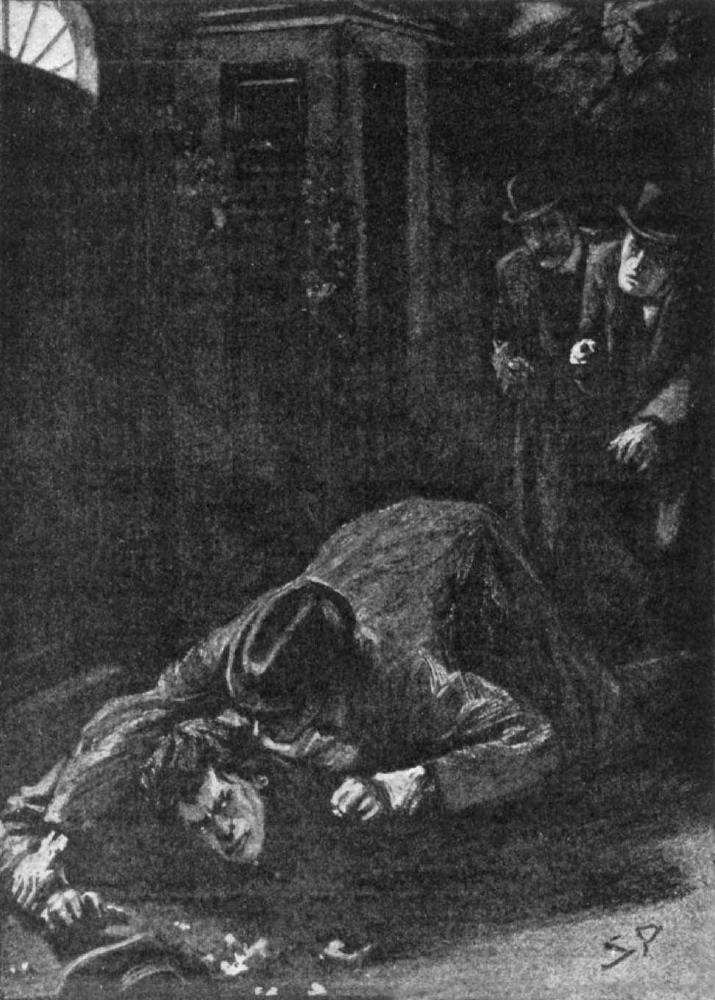

如猛虎朝他背上扑去。

福尔摩斯不去注意给逮住的这个人，而是先蹲在门前台阶上非常仔细地检查从屋里拿出来的这件东西。那是一尊拿破仑半身雕像，和上午看到的那尊一个样，也已经被打碎。福尔摩斯小心捡起一块块碎片凑着灯光看，但是一点看不出同其他见到过的碎片有什么两样。刚把碎片检查完，屋里的灯亮了，屋门开了，门口站着屋主人，一个面色和蔼、身材圆胖的人。

“这位一定是乔赛亚·布朗先生。”福尔摩斯说。

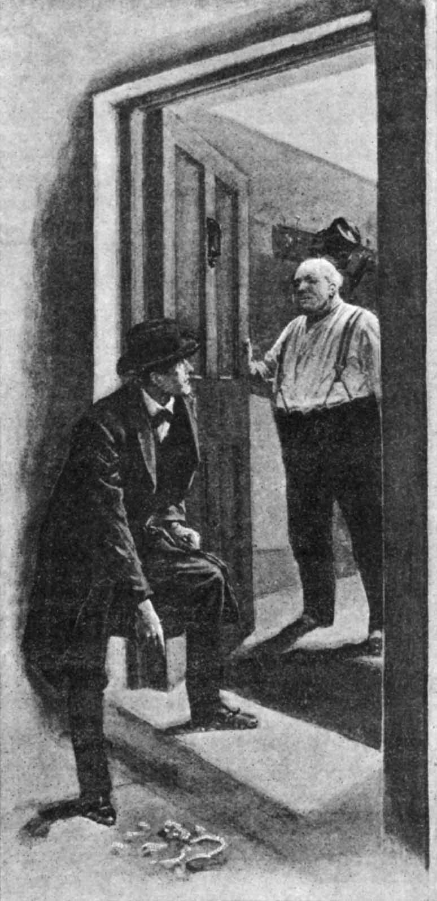

屋门开了，门口站着屋主人。

“是的，先生；你，不用说，歇洛克·福尔摩斯先生啰？你的专递快件我收到了，我照你的吩咐安排。我们把门都从里面锁上，等候动静，看是什么情况。噢，很高兴看到了，你们抓到了坏人。请吧，先生们，进屋里坐，休息一下。”

可是莱斯特雷德急于要把抓到的人押往安全地方，所以没有几分钟就把马车招过来，一车四人直返伦敦。人犯一句话也不说，但是眼睛透过蓬乱遮掩的头发直向我们瞅。还有一回，我的手靠近他，他像头饿狼猛地要想咬我的手。我们在警察局待了些时间，看看从他身上搜出些什么东西。但是，搜下来除了几个先令，一把刀柄上沾满新血迹的长柄小刀，此外就什么也没有。

“这就行了，”我们告别的时候莱斯特雷德说，“小丘警探了解这号人，会给他弄顶合头寸的帽子戴戴。你们看见了，我说是黑手党，我的理论完全为实际所证实。但是，我知道，我还是要极大地感激你，福尔摩斯先生，一出手就将他拿住，手段很高明。可我还不太清楚其中奥妙。”

“时间太晚了，讲讲又得个把小时，”福尔摩斯说道，“另外，还有一两处情节没有彻底搞清楚。这个案子，是属于那种不搞到最后不见底的一类。你如果明天晚上六点，再来我家里坐坐，就差不多可以把全貌摊给你看了，这个事情你到现在还蒙在鼓里。本案是很有特色的，在刑案史上也是绝无仅有。噢，华生，要是答应你再记上我的一两件工作，我敢说，记一下这拿破仑石膏像案，将给你的篇章增色不少。”

第二天晚上我们又碰头见面，莱斯特雷德带来了犯人的详细情况。他的名字，已经晓得，叫倍波，姓氏不详。在意大利居民区中是出名的一霸。有一手雕刻的好本事，过去凭手艺生活还清白，日子过得很不错。后来走上邪道，两次犯罪入狱——一次小偷窃，又一次，我们已经都知道了，用刀刺伤他的同胞。他英语讲得很好。为什么要打石膏像，原因尚不明，对此问题，他拒不交代。但是警方发现，这批同样的半身像可能是他亲手浇注，他在盖尔得公司干活的时候是做这一项工作的。对所有这些情况，大部分我们都已经掌握。福尔摩斯还是虚心专注地恭听。然而我，对他是太了解了，看得出他的思路是在别处。我觉察到，在他平静如常的面部表情之下，潜藏着不安和期待的复杂心情。最后，他从椅子里跳起来，两眼炯炯有神。这时门铃响了，一会儿听见楼梯脚步声，一个红面孔、灰白连鬓胡子的老年人，被引入房来。他右手里提一个老式毯制旅行包，一进屋就把旅行包在桌子上放好。

“歇洛克·福尔摩斯先生在吗？”

我的朋友向他笑脸颔首。“您是里丁区的桑德福先生？”他说。

“是的，先生，我来迟了一点，赶火车来不及。你写信说起在我这里的石膏像。”

“正是，没错。”

“你的信我带在这里。你说，‘本人意欲拥有您的笛万作品拿破仑像，愿以十英镑价钱向您求购。’是这样吧？”

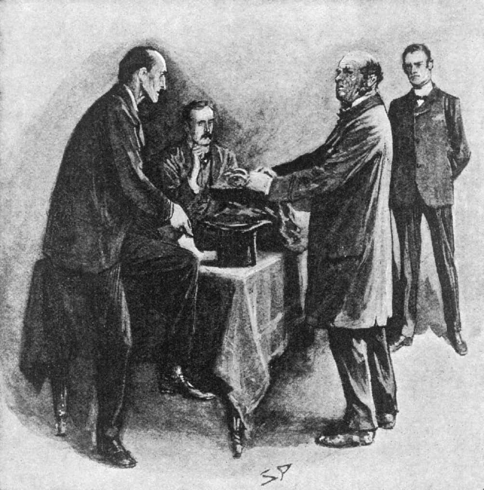

“你的信我带在这里。”

“正是，没错。”

“我接到你的信，觉得奇怪，弄不懂，你怎么知道我有这个雕塑。”

“不怪你弄不懂，不过一讲明就很简单。是哈定先生，哈定兄弟商店，说他们这最后一尊像卖给了您，是他把您的地址给了我。”

“噢，原来这样。他跟你说我多少钱买的吗？”

“不，他没说。”

“我是个诚实的人，虽然我并不富裕。我买这尊像只花了十五先令<a href="#part0109.xhtml_ch2"
id="part0109.xhtml_ch2-back">(2)</a>，我想，我要拿你十英镑之前，先得跟你讲明白，你应当晓得。”

“我晓得，您讲诚信，所以有顾虑，桑德福先生。但是我这里既已出口这个价，我也得诚信，讲了就要做到。”

“啊，你很慷慨，福尔摩斯先生。石膏像我照你说的带来了，这就是！”他打开毯包，我们终于第一次看到了这尊完好无损的拿破仑石膏像，此前所见都是碎片。

福尔摩斯从口袋里掏出一张纸，还有一张十英镑的钞票放在桌上。

“麻烦请在这纸上签个字，桑德福先生，当面这几位，都能做证人。也就只是说明，您把这尊像的一切所有权全部转让给了我。我是个很刻板的人，您瞧。是呀，谁也难料以后的事情会是怎么样。那就谢谢您了，桑德福先生，钱收好，祝您晚安。”

客人走了以后，福尔摩斯的行动吸引我们全神贯注。他先从抽屉里取出一块干净白布，铺在桌上，再把新到手的石膏半身像放在白布中央，最后，他举起猎鞭对准拿破仑的头顶啪的一鞭，头像立刻破成碎片。福尔摩斯忙不迭弯腰细看，顷刻间，一声大获全胜的欢叫，他举起一碎片，上面嵌有一物，暗色圆粒，如同布丁上面一颗紫葡萄。

“先生们，”他叫道，“让我给你们介绍，这就是天下闻名的博尔吉亚黑珍珠。”

莱斯特雷德和我一时傻愣了，接着便是无比兴奋，不约而同鼓起掌来，就像看戏看到出现了高潮。福尔摩斯清白的双颊升起红晕，向我们鞠躬，就如大剧作家答谢观众的盛情。仅在此刻，他才不再是纯理性的机器，予以暂停，而流露出需要受到赞扬的人之常情。同样，他一向孤傲、矜持，从来不屑于浮名和虚荣而向世俗冷面以对，现在看到自身所创造的奇迹并受到朋友的赞赏，还是能激发起内心深处的激情。

“是的，先生们，”他说道，“这是世上最有名的珍珠。我很幸运，通过归纳法的层层推理，从达柯尔旅馆的科隆那王子在卧室里发现珍珠遗失开始，一直推理追踪，追踪到珍珠是在石膏像里面，这斯泰普尼区盖尔得公司制作的最后一座即第六尊拿破仑半身像，宣告终结。你该记得，莱斯特雷德，这颗无价之宝突然遗失，引起多么大的震动，而伦敦警方却未能查获。他们曾经征询过我，但我也未能使侦查稍有起色。王妃的女仆曾受到怀疑，她是意大利人，后来查到她有个兄弟在伦敦，但是我们查不出此案与他们两人之间有什么关系。女仆名叫卢克丽西雅·万努齐，我胸中明亮了，这个皮埃特罗，两天以前被杀了的，就是她的兄弟。我在旧报纸上查日期，发现珍珠丢失是在倍波被捕的前两天，他伤人被捕——这个事情发生，他还在盖尔得公司工场间，正是他生产这批六个胸像期间。现在你们看清楚了这些事件的顺序，当然你们看到的是逆顺序，也就是事件呈现在我面前的顺序。倍波拿到了珍珠，他可能是从皮埃特罗手里偷来的，也可能是皮埃特罗的同谋，也可能是皮埃特罗和他姐妹的中间人。这些哪个才是正确的，对我们并不重要。

“关键事实是他得到了那颗珍珠。正当此时，他要被警察逮捕了。他跑回到工作的工场间，知道自己只有几分钟的时间，要赶快把这无价之宝藏掉，要不然，等会儿一搜身就要给搜出来。六尊拿破仑石膏像正放在走廊上吹干，有一尊还是潮的、软的。一刹那工夫，他是个熟练工，在湿的石膏像上钻个眼子，把珍珠嵌了进去，接着将孔眼填好抹平。这是个巧妙的藏匿方法，不会给人发现。但是倍波被判刑一年，这期间，六尊石膏像卖出去了，分散在伦敦几个地方。他就搞不清哪一尊里头有珍珠，只好一尊尊敲碎了看，因为摇也摇不出响声来，当时石膏还湿着，珍珠一嵌进去就给埋实了——看这儿，就是像这个样子。倍波没有失望，他为人机灵，有决心和毅力。透过在盖尔得那边工作的表兄弟，知道了石膏像批到了哪几家零售商店。他设法到莫斯·赫得森店受聘当伙计，追踪到了三尊，但都没有珍珠。然后，靠几个意大利伙计帮忙，他知道了另外三尊像的去处。第一尊就是记者哈克的，他到那里受到他的同谋跟踪。同谋指责他丢了珍珠，要他负责，发生争执，争斗之中他杀掉同谋。”

“如果是他同谋，还要带着他的照片干什么用？”我问道。

“为了跟踪他，在打听他到什么地方去了的时候，可以拿照片来问人。这个道理十分明显。好了，凶杀发生以后，我估计倍波一定要加快行动。他怕被警察抓住，所以一定要赶在前面，不让抓住，把事完成。当然，我不能说他在哈克的那一尊里没有找到珍珠，我甚至都不能下结论一定是为了一颗珍珠，但是我很清楚，他是在找什么东西，因为他捧了石膏像跑过几栋屋子，拿到有路灯的灯光下去敲碎了看。又因为哈克的石膏像是三尊中的一尊，那么可能性是我告诉你们的——三分之二，珍珠的可能性是三分之一。还剩下两尊，也很明显，他会先找在伦敦的一尊。我警告了屋主人，避免发生第二次人命案。我们去了，结果如愿以偿。只是到了这个时候，我才确定我们在本案中找的就是博尔吉亚珍珠，因为被杀人的名字把两件事联系了起来。结果就只剩下一尊像了——里丁的那一尊——珍珠必定在里面。我当你们的面从拥有人的手里购买下来——珍珠到了这儿。”

我们默默地坐了一会儿。

“好，”莱斯特雷德说道，“我看到你处理过许多案子，福尔摩斯先生，但是都似乎没有像这一件案子这样巧妙。我们苏格兰警场对你不嫉妒。不，先生，相反，我们都引以为荣。如果你明天能够来到场里，不管是老的警官，还是年轻的警察，人人都会高兴同你握手向你祝贺。”

“谢谢你！”福尔摩斯说，“谢谢你！”他把脸别转了过去，他会被人间温情如此感动，这在我是从来没有见过的。但只一会儿，他又变成冷静、实际、严于思考的人。“把珍珠放进保险柜吧，华生，”他说道，“那个康克辛格尔顿伪造案，把案卷拿出来。再见，莱斯特雷德，如果你遇上什么小问题，只要我能够，一定帮你出出主意、想想办法，我将很高兴。”

（1904年）

————————————————————

<a href="#part0109.xhtml_ch1-back" id="part0109.xhtml_ch1">(1)</a> 藏红花小丘（Saffron
Hill）：saffron，藏红花；hill，小山丘，此是一地名，但Hill也是常见的姓，音译是希尔。下文的小丘警探，是原文中拿地名指称负责该区的警探。

<a href="#part0109.xhtml_ch2-back" id="part0109.xhtml_ch2">(2)</a> 先令（shilling），1971年以前英国货币单位，20先令为1英镑。

# 三个大学生

那是一八九五年，歇洛克·福尔摩斯和我在某个大学城住了好几个星期，他有几件相关的事情要在那座大学里一并做了，我本无事，只是相随而去。就在这段时间，我们遇上了一件案子，案子不大，但是富有教育意义，我也就想要写一写。不用说，写出任何具体细节令读者联想到是某学院、某人犯罪，那是不慎重、不妥当的；令人痛苦的流言，应予避免，并使其消失。不过多加小心，掌握分寸，事件本身还是可以讲述的，因为有助于说明某些重要问题，我的朋友在此案侦破上有许多杰出的表现。我一定注意在叙述中的讲话、用语，避免涉及事件发生的具体地点，或牵连相关人士。

我们那时租住寄宿公寓，家具设备齐全，紧靠图书馆隔壁。福尔摩斯正在图书馆潜心研究早期英国宪章——他这一研究的成果十分惊人，这是一个专门的题目，我也许以后要作叙述。有一天，我们的一位朋友来访，希尔顿·索姆兹先生，是圣路加学院的讲师和导师。索姆兹先生瘦高个，情绪易于紧张激动。我知道他平时喜动不喜静，但是这天见他格外激动，激动得简直控制不住自己，显然是遇到什么不顺心的事了。

“我相信，福尔摩斯先生，你能为我牺牲你一两个小时的宝贵时间。我们圣路加学院出了件麻烦事，出了案子。还好你正在城里，要不然我就毫无办法。”

“这会儿我正忙着呢，一点都不能分心，”我的朋友回答，“你还是去叫警察帮助解决吧。”

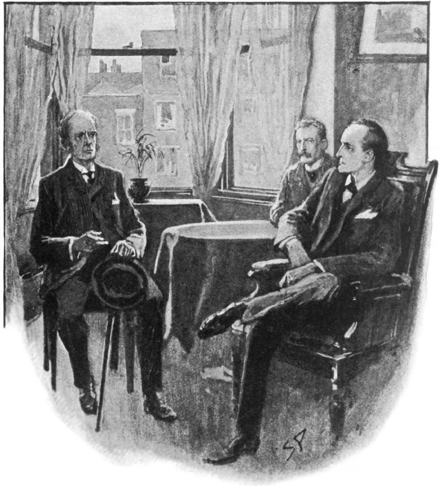

“你还是去叫警察帮助解决吧。”

“不，不，我亲爱的先生，这可万万使不得。一旦惊动了司法界，就很被动。这个案子涉及学院的名誉问题，绝对要防止流言蜚语。你办事能力高强，也能谨慎处置，这是众所周知的。世上惟有你能帮助我了，我求你了，福尔摩斯先生，这事全要靠你大力了。”

我朋友的脾气这一阵子来没有改进，因为他脱离了贝克街习惯而惬意的老窝，没有了他的资料剪贴簿，没有了他的化学实验，没有了遂心随意的环境，他觉得处处不如意。他无可奈何地耸了耸肩膀，看着来客激动异常地倾吐要说的事。

“我给你说，福尔摩斯先生，明天是福泰斯丘奖学金考试的第一天，我是监考之一，监考的科目是希腊文。试卷第一道题是一大段希腊文翻译，考生都没有读过的。这一段印在试卷上，如果让考生预先看到，有了准备，那当然就要大大占便宜。所以试卷必须绝对保密。

“今天，大约三点钟，印刷所送来了试卷的校样，内容有修昔底德<a href="#part0110.xhtml_ch1"
id="part0110.xhtml_ch1-back">(1)</a>的半个章节，我要仔细校读，以保证原文绝对正确。到四点三十分，校读还没有完全好，但是我跟朋友有约要去喝午茶，就把校样搁下，放在桌上。离开的时间有一个多小时。

“你知道，福尔摩斯先生，我们学院的门都是双扇门——内门是绿台面，外门是厚橡木。我回来开门，傻眼了，门上插着钥匙。我一下子想到是自己忘了拿掉钥匙，可是一摸口袋，钥匙好好儿在袋里。另有一把钥匙，我知道在仆人手里，班尼斯特——他管理我的房间有十年了，人绝对忠实可靠，不用怀疑。我一看钥匙，还真是他的钥匙，那么是他进我屋看看我是不是要喝茶了，回出来的时候粗心大意把钥匙忘在了门上。他进屋一定是我刚离开不多几分钟。遗忘钥匙要是在平时倒不碍事，可是在今天就闯大祸了，后果不堪设想。

“我一看桌上，就知道试卷给翻过了。校样是三张长条样，我走的时候是放在一起的，现在，有一张掉在了地板上，一张拿到了靠窗的桌子上，还有一张在原来的地方。”

福尔摩斯听到此时身子才动了一动。

“地上是第一页，窗边是第二页，第三页原处没动。”他说。

“是这样，福尔摩斯先生。我搞不懂了，你怎么知道的？”

“你讲的很有趣，请继续讲。”

“我脑子里马上反应，班尼斯特擅自翻看了我的文件，但是，他说没有，态度非常认真，我相信他说的是实话。这么说，就是有人经过这里，看见门上有钥匙，知道我不在屋里，就进了屋看了试卷。一大笔钱可就要保不住了，奖学金金额是很高的，哪个无耻的学生趁此机会偷看了试卷，就能把别人的奖学金抢到自己手里。

“班尼斯特对这个事没了主意，发现试卷肯定被人乱动过，他简直要昏过去。我给他喝白兰地，让他在椅子上坐好，镇定一下，我把房间仔细检查一遍。马上看到，私闯的人还留有其他痕迹，不单单只动了试卷。窗边的桌上有削下的铅笔屑，还有一小段铅笔芯。很明显，这个贼急急忙忙抄试卷，把铅笔抄断了，赶快再削铅笔。”

“讲得很对！”福尔摩斯说，他被这个案子勾起了兴趣，心情随即好转，“运气要来和你交朋友，破案有望。”

“还不只是这些。我有一张新的写字台，是红皮革台面，很漂亮。我可以发誓，班尼斯特也能和我一起发誓，台面光洁平滑，没有一点污迹。现在我发现有了一条刀痕，清清楚楚，有三英寸长——不是擦过的痕迹，是刀痕。还不止呢，还发现，桌子上有黑黑的小泥团，好像夹杂有木头锯屑似的，可以断定也是偷看试卷的人弄成的什么名堂。没有脚印，没有别的踪迹，看不出是个什么样的人。当时我是急得毫无办法了，但是突然开窍，心里一亮，你不是在我们城里嘛！我就直接过来，把事情托付给你。帮帮我吧，福尔摩斯先生，你看我走投无路了。要么把人抓住，要么考试延期，重出考题。可是一延期的话，不能不作出解释，接着而来就有谣言，很头痛，不仅给学院带来坏名声，还要殃及大学本部。我的意思，最最要紧，希望能把这事谨慎地解决，无声无息地解决。”

“本人乐意查查这件事，尽力而为替你想想办法，”福尔摩斯说，站起来，穿上外套，“此案不无蹊跷。考卷送你这儿以后，有人进屋来看过你吗？”

“有，道拉特·拉斯，一个印度学生，他和我住在同一幢楼，来问我考试方式。”

“进屋来问这个？”

“是的。”

“试卷就在桌子上？”

“是的，不过我很清楚，卷子是卷着的。”

“可以看得出那是清样吗？”

“有可能。”

“没别人进来过？”

“没有。”

“有人知道清样要送到你那儿吗？”

“没有，只有印刷工。”

“这个人，班尼斯特知道吗？”

“不，肯定不知道，没有人知道。”

“班尼斯特现在在哪里？”

“他不舒服了，可怜得很，在椅子里瘫了似的。我赶快跑过来找你了。”

“你让屋门开着？”

“我把试卷锁好了。”

“这样看来，索姆兹先生，只有印度学生看到卷好的试卷；除了他，那个偷看试卷的人是偶然撞见，事先并不知道。”

“我觉得是这样。”

福尔摩斯莫测高深地一笑。

“好吧，”他说，“我们去看看。这不是你处理的对象，华生——是智力问题，不是身体问题。不过，你愿意，也来吧。好，索姆兹先生——你前边请！”

我们委托人的起居室，一排花格窗，横宽竖窄，正对着这座古老学院的满是苔藓的古老庭院。一扇哥特式拱门，通一座老旧的石梯。底层就是导师的屋子，楼上是三个学生的房间，一人各住一层。我们到案发现场已是黄昏，福尔摩斯驻足先望望窗子，然后走近去，踮脚引颈，朝屋里观看。

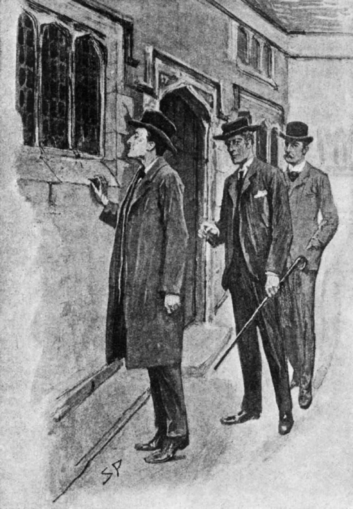

踮脚引颈，朝屋里观看。

“一定是从门里进的屋。只这个窗子，没有别的窗了。”我们的学者向导说。

“好吧！”福尔摩斯说，对着我们的同伴奇怪地笑笑、看看，“那，这里没啥可看，我们就进屋吧。”

讲师打开了外门，领我们进屋。我们站在了门口，这时福尔摩斯在检查地毯。

“哎呀，这儿没有痕迹，”他说，“天这么干，是难指望哦。你的仆人已经恢复了吧，你说你走的时候他坐在椅子上，哪一把椅子？”

“那边，靠窗那个。”

“我知道了，靠近这个小桌子。你们可以进来了，地毯我都看过了。我们再来看看这个小桌子，先看看。没错，上面有什么，已经清楚了。这个人进门来，拿试卷，一张一张翻，在中间桌子上。拿了试卷，拿到窗前桌子上，因为从这里可以望得见，你要是回来，穿过庭院，这样，便于发现，便于逃跑。”

“实际上，他跑不掉，”索姆兹说，“因为我都是走边门进来的。”

“啊，那很好哇！哦，但是，他心里是这样想的。让我看看三张长条样。没有手印——没有！噢，先是拿这一张，抄下来。要多少时间才能抄好，抄得最快最省的话？得一刻钟，再少不行。完了一扔，抓起下一张。他正在抄着，你回来了，他赶紧快撤——手忙脚乱，都来不及把纸放好，叫你看不出被人动过。你进外道门的时候，没有觉察到楼梯上有匆忙的脚步声？”

“没有啊，没注意。”

“好，他拼命抄着，铅笔芯都断了，就只好，你已经看出来，只好重新削。有意思，华生，这不是普通的铅笔，是粗铅、软铅，笔杆深蓝色，厂家名字印的是银色字母，这支笔已经很短，只有一英寸半长了。找一找这么个笔头，索姆兹先生，你就逮住那个人了。我还要补充一点，小刀不小，而且钝，不快，再给你增加这么一个线索。”

索姆兹先生为这一连串的情况分析所折服，也有不解。“其他各点都没问题，”他说，“但是，要说铅笔有多长——”

福尔摩斯拣出一小片铅笔屑，笔屑前端有字母NN，后端空白。

“看见吗？”

“这怎么？我不明白——”

“华生，我一直要考考你，一起来看这儿。这NN是什么？应该是一个词的词尾字母。你知道约翰·费伯（Johann
Faber），是生意最好的厂家名字，那么这就是剩下的笔头，笔用到了约翰Johann的词尾，不是很清楚吗？”他把小桌移到电灯光下。“看看桌面，他抄的纸是不是很薄，很薄的话，桌子抛光面就有笔痕。没有，看不出。就是这样了，恐怕找不出什么了。看看中间这张桌子。这个小团，我想，就是你讲的那个黑的软团东西。样子有点角锥形状，我看看，肚子里空的。正如你讲，里面好像有木屑。啊哈，有了，有刀痕——完全是刀划的，看得出。先是浅刮，末了深刻，成眼子了。我真要感谢你让我关心你这件事，索姆兹先生。这个门通什么地方？”

“通我的房间。”

“事情出来以后你进去过没有？”

“没有，我急忙上你那儿去了。”

“我要看一看。呵，好漂亮的房间，古色古香！你先等一下，别进来，我检查一下地板。没有，看不出有什么。这挂幔什么用？里面挂衣服，如果有人没处躲要躲进这房间，肯定藏在这布幔后面；这床太矮，这衣橱，又太浅，都不行。有人没有？我看看！”

福尔摩斯动手拉开布幔的时候，我见他神态警惕而果敢，他有准备，以防万一。布幔拉开一看，里面没有人，只有衣钩上挂着三四套衣服。福尔摩斯回过身，忽然弯腰看着地板。

“啊，这是什么？”他说。

一团角锥形状油灰似的黑东西，就跟书房桌子上的那个一样。福尔摩斯捡起来放在手掌上，凑到电灯光底下看。

“你的客人在你卧室也有痕迹，不光是在起居室，索姆兹先生。”

“他到卧房干什么了？”

“我想也很清楚。你突然回来了，可是他不知道，等你到了门口他才察觉。怎么办？快把东西收拾了，不露痕迹，躲到你卧室里藏起来。”

“天哪，福尔摩斯先生，你是说，我和班尼斯特在这间屋子说话的时候，有个贼人就在身旁，还一点不知道？”

“是这样。”

“这么说，那就还有另外一种可能，福尔摩斯先生，不知道你看过卧房的窗没有？”

“格子窗，铅窗框，分开有三扇，一扇是铰链窗，大小可以钻人。”

“正是，而且正对着庭院一个角，所以是不大看得见的。要不就是爬窗进来的，所以卧房里有了痕迹。最后，发现门要开了，也就打那边逃走。”

福尔摩斯马上摇头。

“我们来排摸具体对象，”他说，“我了解你说有三个学生，都要走这个楼梯，总是要打你门口经过？”

“是的，是这样。”

“他们都参加这场考试？”

“是的。”

“三人里边，有没有值得你怀疑的？”

索姆兹迟疑了一下。

“这个问题很敏感，”他回答道，“没有凭证，不好空口乱说。”

“我们不过听听可疑之处，凭证，我会找。”

“那我告诉你，简单说说这三个人的品行。住在下面的是吉尔克里斯特，是个优秀生，运动员，学院橄榄球队和板球队队员，是跨栏和跳远的大学代表队队员，长得一表人才，很有男子汉气概。他父亲，名声不佳，就是杰贝兹·吉尔克里斯特爵士，赛马输得破了产。我这学生也就落得家境贫困，但是他很努力，很勤奋，是会有前途的。

“住三楼的是道拉特·拉斯，印度人。这个人不多话，不太了解，印度人大都这样。学习很好，就是希腊文不太好。人很稳重，事事有条有理。

“顶楼是迈尔斯·麦克拉伦，他要是认真起来，是很出色的——也是大学里最有才华的学生，但是太任性、放荡，品行不好。他一年级的时候就因为赌牌作弊差一点被开除学籍。这个学期给他勉强混过来了。对这次考试他心里一定很害怕。”

“你是怀疑他了？”

“那还不敢这样说，但是三个人里面，他比较有可能。”

“很好。现在，索姆兹先生，让我们来同你的仆人见见面，班尼斯特。”

班尼斯特个子不高，面色苍白，脸刮得很干净，花白头发，五十多岁。突然出事打乱了他天天老规矩的平静生活，仍在惊魂不定，多肉的圆脸紧张地抽动，一副无所措手足的样子。

“我们在调查这件不愉快的事情，班尼斯特。”他的主人说。

“是的，先生。”

“我听说，”福尔摩斯问他，“是你把钥匙忘记在门上了？”

“是的，先生。”

“今天试卷放在屋里，你把钥匙忘在门上不拔掉，不是很奇怪的事吗？”

“也实在是很不巧，先生，可是我也常有这种情况。”

“你是什么时间进屋子的？”

“大概是四点半，就是索姆兹先生喝午茶时间。”

“你待了多长时间？”

“我看见主人不在，就出来了。”

“你看了这桌子上的试卷吗？”

“没有，先生——当然不会看的。”

“你怎么就把钥匙忘在门上了呢？”

“我手上拿着茶盘，想等回来再取下钥匙，过后忘了。”

“外门上是不是有弹簧锁？”

“没有，先生。”

“那么门一直是开着的？”

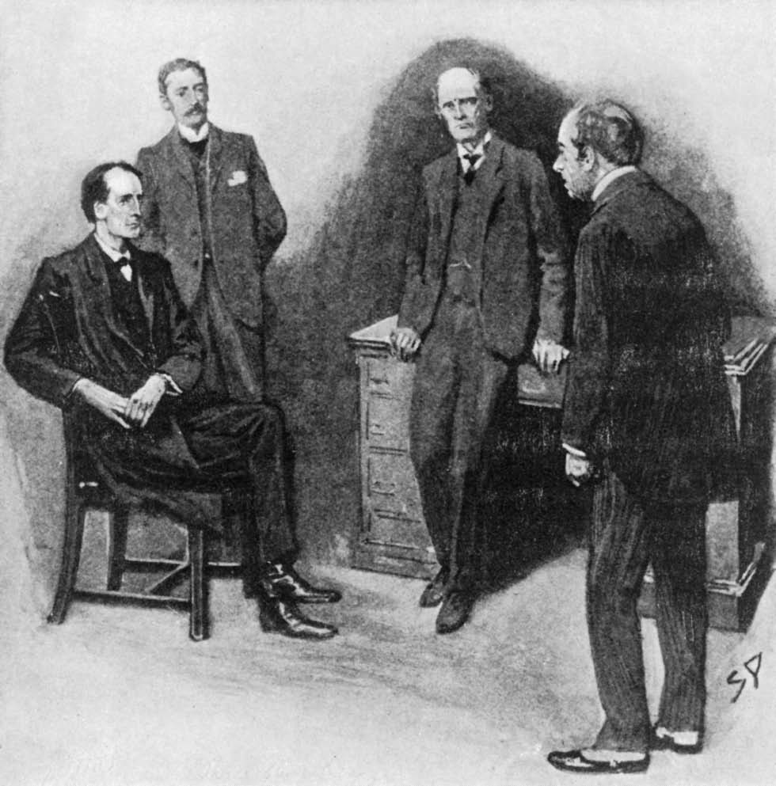

“那么门一直是开着的？”

“是的，先生。”

“屋里有人就可以出去啰？”

“是的，先生。”

“索姆兹先生回来找你，你心里很难受吗？”

“是的，先生。我来这里这么多年，还从来没有发生过这种事情。我简直要昏过去了，先生。”

“噢，我明白了。那么你感觉受不住的时候，你人在什么地方呢？”

“问我在什么地方，是吗？这里呀，在这里，靠近门旁。”

“这就奇怪了，因为你坐在了角落的椅子上呀。有这么些椅子，你为什么就近不坐，要拣那头的椅子跑过去坐呢？”

“这我不懂，先生，我坐哪儿都没关系。”

“我也觉得他真的不会想到那么多，福尔摩斯先生。他当时脸色很不好——白得很怕人。”

“你主人走了以后你还在这里？”

“只一会儿，分把钟。后来就锁了门，回我房里去了。”

“你怀疑谁吗？”

“哦，这可不能瞎讲呀，先生。我不相信，堂堂一所高等学府，会有先生靠这种行为弄钱。不，先生，我不相信。”

“谢谢你，那就这样。”福尔摩斯说，“噢，还有一句话，三位学生你也伺候，你没有提起出了这件事吧？”

“没有，先生——一个字也没提。”

“你还没见过他们？”

“没有，先生。”

“很好。现在，索姆兹先生，我们到院子里去走走，一起去。”

楼上三扇窗，在渐渐暗下来的暮色中放出亮光。

“你的三只鸟都在鸟窝里，”福尔摩斯说，抬头看看，“咳！瞧那个怎么了？有一个好像在那儿坐不定。”

那是印度人，他的侧影突然映在窗帘上，正在屋子里不停地来回走动。

“三个人我都要亲眼见见，”福尔摩斯说，“行吗？”

“一点没问题，”索姆兹回答，“这些都是学院最古老的房子，常有来宾参观，不稀奇。跟我来，我亲自当向导。”

“请注意，别提我的名字！”我们正敲着吉尔克里斯特的门，福尔摩斯说。一个很高个头、黄头发的青年开了门，知道我们是光临参观，便表示欢迎。房里有几处很别致的中世纪的室内结构，福尔摩斯非常欣赏，一定要在笔记本上画下来。他的铅笔断了，向房主人借了一支，最后还借小刀把自己的笔削一削。如此这般的好奇、欣赏、削笔、记录，在印度人的房里重演一遍。这个印度人——小个子，弯钩鼻，不多话，斜眼瞧我们，等福尔摩斯的建筑研究告终，方才脸露宽慰的笑容。两处登门造访，我没有看到福尔摩斯获得搜寻的线索。拜访第三位，连门都不开，吃了闭门羹。我们敲外门，不开不算数，还传出一阵骂。“我才不管你是谁，滚你的蛋！”愤怒的声音吼叫，“明儿就考试，别来打扰人！”

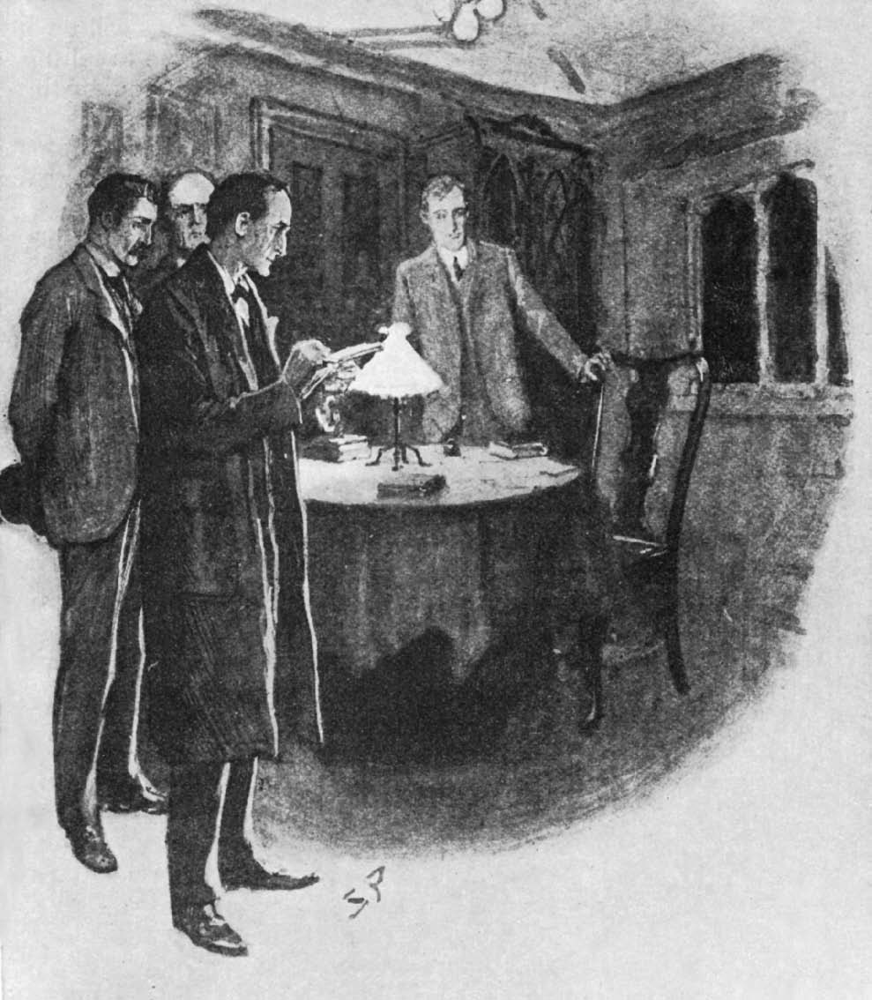

在笔记本上画下来。

“真粗鲁，”我们后撤走下楼梯，向导说，气得脸都发红，“当然，他不知道是我敲他门，可不管什么人，他这样是极不礼貌的。他这么个样子，确实，倒是要落嫌疑了。”

福尔摩斯的反应可是出乎意料。

“你能不能告诉我他身高有多少？”他问。

“这个，福尔摩斯先生，我可说不上来。比印度人高，可是高不过吉尔克里斯特。我猜猜也就五英尺六七差不多吧。”

“这个很重要呢，”福尔摩斯说，“现在，索姆兹先生，我要跟你道晚安了。”

我们的向导不禁叫起来，他又惊讶又失望。“怎么搞的，福尔摩斯先生，你可不能这么撒手，说走就走啊！你好像不了解情况嘛，明天就考试啦。今天晚上我就得拿办法。试卷走漏，我怎么还能开考！要正视这个现实。”

“事情现在只能这样，我明天一清早就会来看你，再谈这个事。到时候条件就成熟了，就可能采取行动。至于你这方面，不必有变化——一切照旧，一点不要变动。”

“那好，福尔摩斯先生。”

“你一切尽管放心。我们一定能想办法解决你的问题。我带上黑泥团，还有铅笔屑。再见。”

当我们走到庭院的黑夜之中，再一次看看楼上的窗，印度人还在房里踱来踱去，另两扇窗户已经没亮光了。

“我说，华生，你是怎么个看法？”福尔摩斯问我，我们已经走到了大街上，“完全像是在客厅里打牌玩游戏似的——三张牌，摸一张，对不对？眼前这三个人，肯定是其中的人干的。你挑牌吧，你说是哪一个呢？”

“顶楼那个嘴脏的家伙，这个人品德评语最差。那个印度人，贼头贼脑，也像，他老在屋子里打转干啥？”

“这个不成问题。好多人要背东西、记东西，都是这样。”

“他朝我们看的那个样子，一脸的讨厌。”

“你也会的；准备明天要考试，一分一秒多宝贵，偏偏一帮子闲人上门来，打扰你。不，我看不是。铅笔，也不是，还有小刀——都看不出问题。可是，那个人，叫我犯疑。”

“谁？”

“噢，班尼斯特，仆人。他在其中搞什么名堂？”

“他给我的印象，是个绝对老实人。”

“我也有同感。这就更奇怪了，为什么一个忠厚老实人——噢，噢，这儿有家大文具店，我们就从这里开始问问吧。”

大学城里只有四家像样的文具店，福尔摩斯每一家都跑到，拿出铅笔屑，愿出高价求购相同的一支。每家都同意可以先作预订，因为那不是一般号码的铅笔，它们很少有存货。我的朋友遇上这样的失败并不气馁，他无可奈何地耸耸肩，不无幽默感。

“没用，我亲爱的华生。这个，最后最有用的线索也告失败。不过，关系不大，没有这一点，本案关键问题照样可以抓得住。哎呀，糟糕！我亲爱的伙计，快到九点了，房东太太唠唠叨叨，叫我们七点半吃新豌豆来着。你呢，华生，没完没了地抽烟，又是吃饭老没个准时，我看迟早要叫你退房，连我也带着一块儿滚蛋——可是，得等我们把问题解决了，导师神经紧张的问题，仆人粗心大意的问题，那三个学生的光明前途问题。”

当晚福尔摩斯再也不提此事，我们用好了很迟的晚餐以后，他就坐那儿自顾自沉思默想了好久。到了早晨八点，我刚盥洗完毕，他就跑到我房里来。

“好了，华生，”他说，“时间不早了，我们得快去圣路加，你不吃早饭行吗？”

“没问题。”

“索姆兹现在急得要死，我们快去告诉他事情成了。”

“你能告诉他事情成啦？”

“没错。”

“水落石出啦？”

“是啊，我亲爱的华生，谜案业已解开。”

“你拿到什么新证据了？”

“你瞧！我赶早六点就起床出门，终于不负苦心希望。足足两个钟头，跑了不少于五英里的路，得到的东西可以说明问题。看这个！”

他伸出手来，掌上有三个黑黑的角锥形小泥巴团。

“呦，怎么的，福尔摩斯，昨天不是只有两个嘛。”

“今儿早上我又弄到一个。这可是证据确凿啦，这第三个哪里来，那第一、第二个也是哪里来，对吗，华生？好，走吧，能叫索姆兹朋友搬掉心上的石头了。”

导师遭遇如此不幸，我们到他房里，见他正急得坐立不宁，十分可怜相。没几个小时考试就要开始，眼看要么丑事公开，要么让罪犯得逞，竞争中作弊，窃取巨额奖学金。他陷于进退无路，已经六神无主，简直要站立不稳，一见福尔摩斯，立刻伸出双手跌跌撞撞迎上来。

“感谢上天，你可来啦！我正担心你也没办法，撒手不管。现在到底怎么办？考试要进行吗？”

“当然，正常进行，没事。”

“这个贼怎么办？”

“不许他参加。”

“你知道什么人啦？”

“知道了。要事情不公开，就必须赋予我们自己权力私设小法庭。请你索姆兹，在那儿，华生，这儿，我拿个椅子坐你们两位中间。我想，如此阵势、威势，足可以正克邪，震慑罪犯。请即刻打铃！”

班尼斯特进来，一见我们都是铁板面孔、凛然法官模样，已先自吃惊，不觉一个寒噤后缩。

“请把门关上，”福尔摩斯说道，“现在，班尼斯特，请将昨天的事情向我们从实招来。”

这人吓得脸刷一下发白，白到了头发根。

“我昨天什么都说了，先生。”

“没有要补充的？”

“没有啦，先生。”

“那好，看来非得要我提醒你。你昨天坐那把椅子，是为了要掩盖什么东西，这东西会暴露是什么人进了这屋子，是这样吧？”

班尼斯特面色完全像死人一样了。

“不，先生，没有的事。”

“只是提醒一下，”福尔摩斯平和地说，“我坦白说，我未能证实这一点。但是，情况是相当清楚的，索姆兹先生刚转身一走这当口，你就放人走掉，那个人就藏在卧室里。”

班尼斯特舔舔干燥的嘴唇。

“根本没有人，先生。”

“啊，真可惜，班尼斯特，到了现在这时候，你该说实话了，但我知道你还在说谎。”

这个人脸色一板，显示无所谓。

“根本没有人，先生。”

“行了，行了，班尼斯特！”

“没有，先生，一个人也没有。”

“你是不肯再讲实情了，算啦。那请你在这屋里留一留吧，卧室门边站着去。现在，索姆兹，我不得不要劳您大驾，到楼上您学生吉尔克里斯特房里，请他下楼到您的屋子里来。”

只一会儿工夫，导师领着他的这位学生转回来。他仪表堂堂，高挺的身材，动作轻捷灵活，步态矫健，面容愉快开朗。一双蓝眼睛疑惑地对我们一个一个扫过来，最后眼神落在了向隅而立的班尼斯特身上，露出了茫然惊愕的表情。

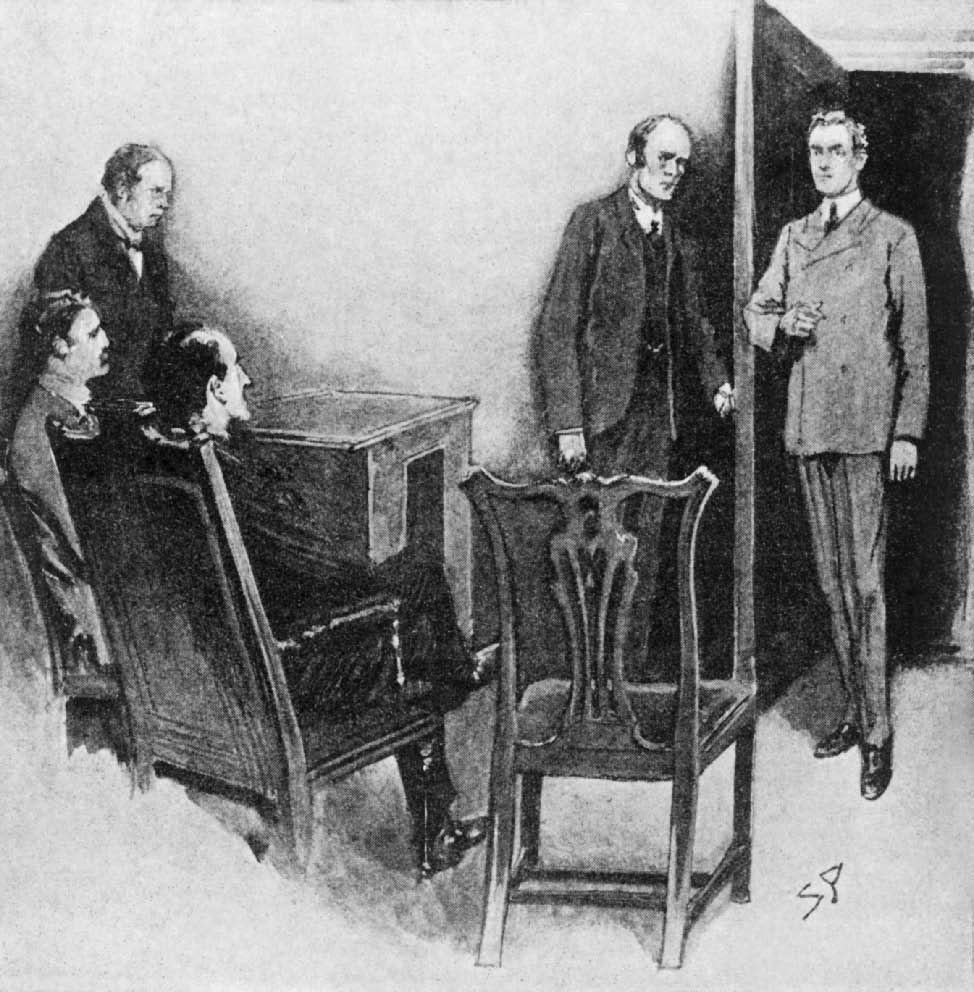

导师领着他的这位学生转回来。

“请把门关上，”福尔摩斯说，“现在，吉尔克里斯特先生，我们这儿没有外人，我们之间的谈话别人一个字也不会了解。我们彼此尽管开诚布公、实话实说。我们想知道，吉尔克里斯特先生，你这样一位体面有身份的人，怎么会犯出昨天这种事来呢？”

年轻人被当头一击，一个趔趄退后一步，满目恐惧、恼怒，瞪向班尼斯特。

“不是，不是，吉尔克里斯特先生，先生，我一个字也没说——一个字也没说呀！”仆人叫了起来。

“你没说，你现在可是说了。”福尔摩斯说道，“现在，先生，你必须看到，班尼斯特讲过以后，你就完全被动了。你惟有抓紧机会彻底坦白。”

一瞬间，吉尔克里斯特举起一只手，像是要控制住脸上不停的抽搐，接着就扑通跪倒在桌子边，把脸埋进双手，止不住一阵呜咽。

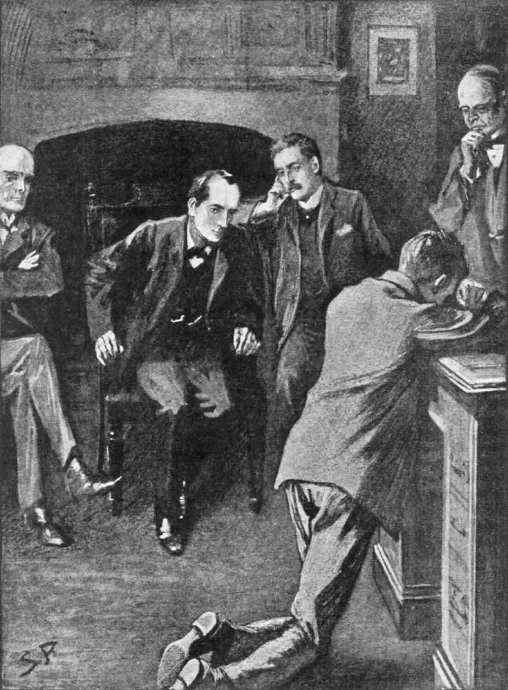

扑通跪倒在桌子边，止不住一阵呜咽。

“起来，起来，”福尔摩斯和蔼地说，“人难免要犯错，至少没人指控你是个不可救药的惯犯。也许你可以轻松一点，让我来告诉索姆兹先生事情发生的经过，你只要纠正我讲得不对的地方，这样好吗？那好，很好，省得一问一答麻烦。听着，看有哪里我把你做的事讲错了。

“索姆兹先生，你跟我说，没有人知道，连班尼斯特也不知道，试卷是在你的屋子里。从这个时候开始，案子就在我胸中有了数，轮廓已经清晰。当然，印刷工不包括在内。他要抄卷子的话尽可以在工作时间抄。印度人也不必考虑，卷子是卷着的，他不可能知道这就是试卷。另外一方面，也难以想象有如此凑巧的事，这个人偷入房间，碰巧这天试卷放在桌上等着他，我排除掉这种可能。这个人之所以潜入房间，是一定知情有试卷在那里，是有备而来。他是怎么知道的呢？

“我跟你过来走近这屋子的时候，检查了窗户。你以为我是在怀疑此人爬窗进来。光天化日之下，又是对面房屋的窗户众目睽睽，以为是爬窗入室，我岂不可笑。这个想法实属谬误。我是在考虑，走过窗口就有可能看得见中间桌子上放的是试卷，这个人就得有相当高的身量。我身高是六英尺，要引颈企足，才能看得真切。达不到这点高度，就无缘有这个巧遇的好机会。那么你该清楚了，我已经在想你的三个学生，如果有个头很高的，那就是重大嫌疑人。

“我进了屋，边桌上的一些痕迹，我都跟你说了。中间那张桌子，看不出什么。后来你讲到吉尔克里斯特，说他是跳远运动员，好，整个事情我一下子胸中了然，只待需要加以确证。确证也马上就到。

“事情发生的经过是这样的：这位年轻人下午在运动场上练习跳远，之后带着跳鞋回来。你知道，跳鞋上有鞋钉。他经过你窗前，因为个子特别高，试卷清样正好在桌上，他看见了，而且估摸着准是试卷。如果不是巧遇，他也就走过。无巧不成书了，巧在他经过你门口，见门上有钥匙，是你的仆人粗心大意忘记拿下来。他忽然灵机一动，进门看看，那纸是不是试卷。这不至于是个太大的冒险行动，他完全可以装做只是顺便进来问个问题。

“好了，一看果然是试卷清样，极大的诱惑，良机不可失。他把鞋往桌上一放。你在窗边椅子上放的是什么？”

“手套。”年轻人回答。

福尔摩斯脸露胜利者的喜色，看看班尼斯特。“他把手套放在了椅子上，就拿起清样来，要一张一张抄。他只晓得导师回来走大门，要是回来，他能看得见。而我们知道，你回来是打边门走。结果他是突然听到门有响声，一时跑不掉了。他遗忘了手套，拎起跳鞋慌忙避进卧室。你看见桌上的刮痕，一端是浅的，但是朝卧室方向就深了，这正表明鞋是朝卧室方向使劲一拖。作案人跑进了卧室躲藏，黏在鞋钉上的泥块掉在了桌上，还有一块脱落在卧室内。我要说明，我今天一早到运动场去，看到跳坑内垫的是黑色黏土，我取上了样品，里头还杂有细细的鞣料渣、锯木屑，都是撒在土上面起防滑作用的。我说得符合事实吗，吉尔克里斯特先生？”

这个学生站直了身子。

“是的，先生，是这样。”他说。

“我的天哪！你没话说了吧？”索姆兹叫道。

“不，先生，我有话要说。我做了可耻的事，被这样完全揭露，羞愧难当。我有一封信在这儿，写给您的。我一夜没睡着，半夜起来，早晨把信写好。写好这封信的时候，我还一点不知道我的罪行已经被查出来。信给您，先生。您会看到，我说，‘我已决定不参加本次考试。我已收到罗德西亚警察局的任命书，即将动身去南非。’”

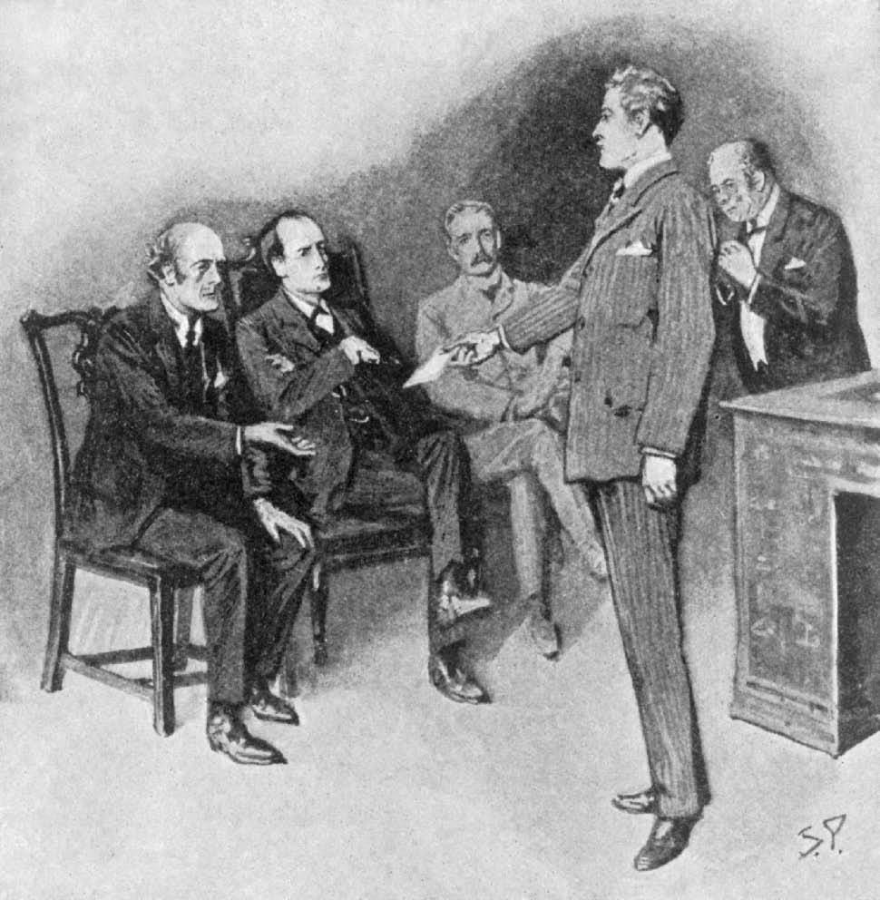

“信给您，先生。”

“我很高兴听到你不打算以欺骗手段谋取奖学金。”索姆兹说，“你怎么会改变主意的？”

吉尔克里斯特手指班尼斯特。

“是他，把我引向正道。”他说。

“请过来，班尼斯特，”福尔摩斯说道，“我讲的，已经很清楚，只有你能够放这个年轻人跑掉，因为你留在了这屋里，你出去以后就把门锁上。要说他是跳窗逃走，那是不可信的。这里，本谜案的最后一个问题你能讲清楚吗，你为什么要这样做？”

“事情很简单，先生，一知道就清楚了。不过，凭你再聪明，也不可能了解内中原因。时间要说到很远了，先生，我是老杰贝兹·吉尔克里斯特爵士的管家，老爵士，正是这位年轻先生的父亲。他父亲破产以后，我来本学院当校工。但是我不因为我的老东家在这世上没落了，我就忘记他。我没忘过去的旧日子，我照顾着他的儿子。哦，昨天，我进来这屋里，紧急之中，我一眼看到吉尔克里斯特先生的黄手套留在了椅子上。这手套，我是知道的，就明白了怎么回事。手套要是叫索姆兹先生看见，秘密马上就要暴露。我就朝椅子上倒下，坐实了一动不动，一直等到索姆兹先生出去找你。这时候，我可怜的小主人出来了。他从小在我膝头上玩耍，看着他长大，在我面前把事情都承认了。我要救他，这不是很自然的吗？我替他过世的父亲说他，叫他懂得不可以用这种行为取钱，不也是很自然的事吗？这能怪我吗？”

“确实不能怪，”福尔摩斯由衷地说，站起来，“好啦，索姆兹，你看，我们已经把你这个小问题搞清楚了，家里等着我们回去吃早饭呢。我们走，华生！你呢，先生，我相信罗德西亚光明的前途等着你。你这次摔了一跤倒在地上，让我们看看，在未来，你会站得多高吧。”

（1904年）

————————————————————

<a href="#part0110.xhtml_ch1-back" id="part0110.xhtml_ch1">(1)</a> 修昔底德（Thucydides，约公元前460—前400），古希腊历史学家，著有《伯罗奔尼撒战争史》八卷。

# 金边夹鼻眼镜

我看着三大卷刑案手稿，那是我们在一八九四年的工作记录。要从如此丰富的材料之中，选择案子内容饶有趣味，同时有利于展现我朋友久负盛名的高超本领，一时间我简直无所适从。我一页页翻检着，看到记录有令人厌恶的血蛭的故事和银行家克罗斯比惨死的故事，有阿德尔顿的悲剧，也有难得一见的不列颠古冢案。发生在这期间的案子还有著名的史密斯莫蒂默继承案，以及对布尔瓦街的杀人犯赫勒特进行跟踪和逮捕。后面这个案子的侦破使福尔摩斯赢得了法国总统的亲笔感谢信和法国荣誉勋位勋章。每一个案子都自成故事，值得讲述，但总的来看，我的意见是没有一个能像约克斯雷古宅案那样综合如此多的趣味特色，它不仅包括年轻的威洛比·史密斯令人痛心的夭折，还有那些随后的事态发展，把奇异的犯罪原因加以曝光。

那是十一月底一个风雨交加的夜晚，福尔摩斯和我入夜静坐，没有言语。他拿着高倍放大镜专心研究一幅羊皮纸上原文擦去重写的字迹，我则沉浸在一篇最新外科文献之中。屋外狂风横扫贝克街，骤雨猛击玻璃窗。说来也怪，身处城市中心，方圆十英里全是人造建筑，仍然深感大自然铁腕之严酷，意识到原始力量之巨大，使整个伦敦所受威胁，并不比遍布野地的鼹鼠窝强多少。我走向窗前，望着外面没有一个人影的雨街。稀疏的街灯照着空落的泥泞路面、泛光的人行道。这时，有一辆单马车从牛津街方向溅水疾驰而来。

“啊哈，华生，还好，今夜不必向外跑啦，”福尔摩斯说道，放大镜搁一边，把羊皮纸卷好，“坐了一会儿，事情也差不多了，这是很费眼力的活儿。我看下来，也就是一份修道院的记事录，时间是十五世纪后半叶。咳！咳！咳！什么来啦？”

狂风呼啸中传来一阵马蹄响，接着是车轮靠边擦着人行道沿石的叽嘎声。我看到马车在我家门口停了下来，有个人从马车上下来。“有事来了！”我脱口说。

“有事了？找我们的。好啦，我可怜的华生，我们得准备大衣、围脖、雨靴，每样都要准备，跟他一块儿经风雨吧。嚯，还好！马车跑了！行，这就好。他要我们跟他出去，就不会叫马车走掉。下去吧，我亲爱的伙计，去开门，屋里人早都睡了，别叫他们从床上爬起来了。”

夜访客一进门厅，灯下一看就认出是斯坦利·霍普金斯，年轻有为的警探，福尔摩斯多次对他的业务能力赞赏有加，说他很有前途。

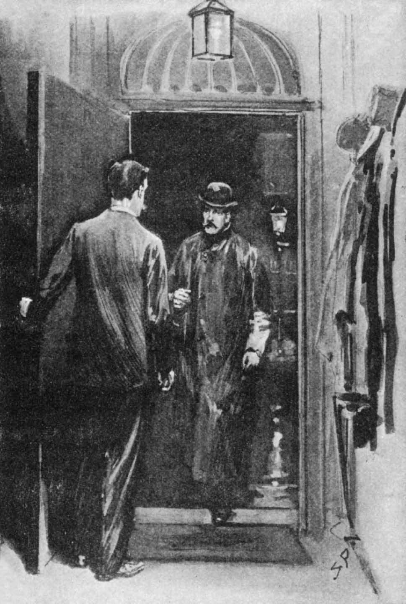

霍普金斯，年轻有为的警探。

“福尔摩斯在家吧？”他急切地问。

“快上来，我亲爱的先生，”楼梯上传来福尔摩斯的声音，“深夜上门，但愿没有不良企图哦！”

警探跨上楼梯，灯光照着雨衣水色晶亮。我帮他脱下雨衣，福尔摩斯把壁炉柴火添旺。

“来，我亲爱的霍普金斯，靠近点，伸腿暖和暖和，”他说，“抽雪茄。医生有一帖好处方，柠檬开水，深夜这样的天气，祛寒好药。你冒风雨前来，想必有重大事件。”

“确有要事，福尔摩斯先生。今天下午我忙得团团转，真不假。晚报你看到了，约克斯雷案子？”

“不是十五世纪以前的东西，我今天全不看。”

“嘿，只登了一小段，全胡扯淡，你不看也罢。我可一点没等脚底长草，拔腿就跑。那是在肯特郡，离查塔姆七英里，离铁路线三英里。三点一刻，接到电报，五点钟赶到约克斯雷古宅，立即展开调查，搭末班车回到查令十字街，就叫了马车直接到你这儿。”

“那就是说，你对这个案子恐怕没有头绪啰？”

“是的，不知头尾都是怎么回事。弄来弄去，老是叫我遇上棘手的案子，这不又来了。刚上手，还看似挺简单，十拿九稳错不了，谁知回头一看连作案动机都捉摸不到，福尔摩斯先生。这就叫我没辙了——不知动机，无从下手。就是杀了个人——这是无可否认的事实——可是，看来看去，不明白究竟是什么道理要害他。”

福尔摩斯点了雪茄，背往椅子上一靠。

“我们来听听看。”他说。

“事实我已经弄得相当清楚了，”斯坦利·霍普金斯说道，“现在我不清楚这些事实是什么意思。就我所知，整个情况是这样。几年前，这幢乡村住宅，就是约克斯雷古宅，由一个老人买下了。邻里都管老人叫科伦教授，他身体有病，半天卧床，半天拄根拐杖在屋里走动走动，或者坐轮椅让园丁推着，在花园里转转。邻居不多，都喜欢和他来往，认为他是个有学问的人，在那边很有名气。家里原先就只有一个老管家，马可太太，一个女仆，苏珊·塔尔顿，他来到这里的时候就是这两人伺候，都是好性格，待他不错。教授在写著作，大约一年前，他感到有必要聘一位秘书。聘过两个，都不满意。第三个，威洛比·史密斯先生，很年轻，刚从大学毕业，老先生好像觉得不错。工作是，上午记录教授的口述，晚上翻书查资料，为第二天的工作做准备。这个威洛比·史密斯是个品行端正的人，无论少年时期在阿平汉，或者青年时期在剑桥，他的鉴定书我都看过，一直是个正派、稳重、努力上进的好青年，本身没有一点问题。就是这样一个好小伙子，今天早晨，死在了教授的书房里，情况分析下来只能是谋杀。”

外边狂风呼叫，刮得窗子格楞格楞响。福尔摩斯和我再向火挨近点，年轻的警探慢慢地把事情逐一讲下去。

“你找遍了全英国，”他说道，“保管你也找不到会有像他这样的一家，自己只管自己，从不过问外界事。这家人家可以一连几个星期没一个人走出花园门外一步。教授埋头于自己的工作，对于其他一概不闻不问。小史密斯邻里一个人也不认识，同教授过着完全一样的生活。两个女人，只有家里事，用不着走到外面去。莫蒂默，那个园丁，给教授推轮椅，领抚恤金的退伍军人——克里米亚战争的老兵，也是个好品格的人。他不住在大屋里，单独住花园另一边一座三间房的小屋。这约克斯雷古宅，全部就这么几个人。另外，花园大门，距离通伦敦的查塔姆公路约一百码。门上有闩没有锁，伸手一拔闩，进门没阻碍。

“现在我给你们讲苏珊·塔尔顿的证词，只有她还能讲点当时的情况。那是午前，十一点与十二点之间，她正在楼上前房挂窗帘。科伦教授还在床上，天气不好，一般中午之前不起床。管家在屋后面忙着事。威洛比·史密斯在卧室，也是他的起居室。女仆这时候听见他走过通道下楼进了书房，书房就在这前房的下面。女仆没有看见他，但是女仆说他的脚步快而稳，不会听错。没有听见关书房门。约莫一分钟过后，下面屋子里一声惨叫，是嘶哑的尖叫、怪叫，分不清是男人的叫声还是女人的叫声，接着就是一下重重的撞击，把老屋子都震动了，之后就寂静无声。女仆站着待了一会儿，马上又回过神，来了勇气奔下楼。书房门关着，她把门打开，一看里面，小威洛比·史密斯先生四脚朝天倒在地上。起先没见有伤，可是想要把他扶起来，这时才看见一股血在他脖颈后面涌出来。是被刺的伤口，不大，但很深，刺断了颈动脉。刺杀的凶器就扔在他身边的地毯上。那是一把文件封蜡用的小刀，老式写字台上常有这种刀，刃口锋利，象牙柄，是教授书桌上备用的工具。

“起先女仆以为小史密斯已经死了，可是拿水壶往他额头上浇点水，他还睁了睁眼，‘教授，’他嘴里微微说——‘那女人。’女仆发誓说，绝对是这样的话没错。小史密斯还想说什么，右手抬起又放下，马上断了气。

“这时管家也到了现场，可是晚了一步，没听到威洛比临终的话。她让苏珊看着尸体，自己赶快跑到教授房里。教授坐起在床上，样子很惊吓、很激动，他都听见了声音，知道一定出大事了。马可太太可以发誓，教授还穿着睡衣，他自己是没法穿衣服的，一定要莫蒂默来帮他穿，规定好的，莫蒂默要十二点才过来。教授称他听见有叫声，但不知道到底出了什么事。年轻人临死说的话是什么意思他也无法解释，‘教授——那女人’，想来大概是神志昏迷的胡话。他深信威洛比·史密斯在世上不会有冤家仇人，这件案子实在难以解释。他首先一个做法就是叫园丁莫蒂默快去报警。过后，当地警察把我找去。我去之前，现场一点没动，我严格命令封锁所有房屋通道，不准在上面走。这案子是个好机会，可以把你的理论付诸实践，福尔摩斯先生。万事俱备，只欠先生出马。”

“只欠我歇洛克·福尔摩斯先生，”我的同伴苦笑着说道，“我们还要听听，你认为这是怎么一回事呢？”

“我这里首先，福尔摩斯先生，请你看看房屋平面图，让你有一个概念，教授书房的位置，本案的几个相关部位，有助于你了解我怎么调查。”

他拿出地图，也就是我照样画在这里的这张图。他把图摊在福尔摩斯膝头上。我起身，站到福尔摩斯背后看图。

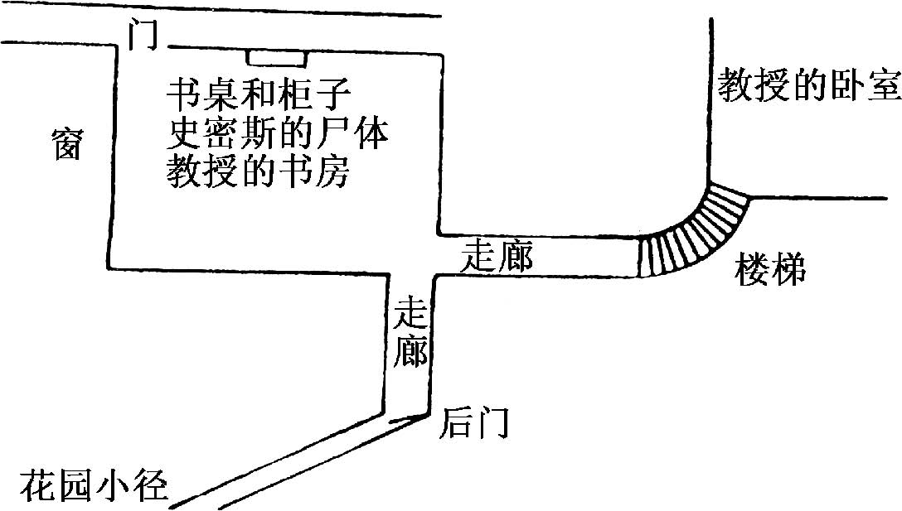

“当然这图很简单，只着重画出几个重要的地方，其余的地方你以后自己去看就是了。这儿，首先来考虑凶手进屋的路径，怎么进来？肯定是，打花园小路到二道门进过道，直接通书房。从别处进，就要复杂、麻烦得多了。事后也是由原路逃跑。从书房撤退还有另两个出口，但都不能走，一个，苏珊正从楼梯上下来，堵住了，另一个直通教授的卧室。我因此马上注意花园小路，路面给这场雨浸湿了，有脚印一定看得出。

“一检查，发现凶手很谨慎老练，不太容易对付。小道上根本没留脚印，但是，沿路边草地上，看得出有人走过，是故意避免遗留痕迹。我没能发现原模原样明显的迹象，但草地被人踩过，有人走过是没有问题的。那只有凶手，园丁他们不会，他们早晨没有来过，雨也是夜里才下的。”

“等一下，”福尔摩斯说，“小道出门通哪里？”

“通公路。”

“有多远？”

“一百码差不多。”

“小路经过门口，该有痕迹看得到了？”

“遗憾的是，门口这一段是铺了砖的。”

“噢。公路上怎么样呢？”

“没有，都踩成烂泥。”

“事不凑巧，啊。那么，草地上的足迹是进来还是出去呢？”

“没法说，轮廓都不清。”

“脚是大是小呢？”

“分辨不出。”

福尔摩斯显出不耐烦的样子。

“大风大雨没停，”他说，“辨别脚印要比看羊皮纸困难得多。好吧，好吧，无济于事。那怎么办呢，霍普金斯，无能为力、无济于事？”

“还是有能为力、有济于不少事呢，福尔摩斯先生。我知道是有人从外面偷偷进来的。我然后检查了走道，走道上铺的是椰子棕地席，不可能会有痕迹。从走道通到书房，书房里陈设不多，主要就是一张连有书柜的写字台，就是书桌柜，有两排抽屉，中间是小柜。抽屉都抽开着，柜子上着锁。抽屉大概是经常不锁的，里面没有什么值钱的东西。柜子里有些重要文件，没有翻动过的迹象。教授对我说一点东西也没有丢。可以确定，不是盗窃作案。

“接着看年轻人尸体。倒在书桌柜旁边，靠着左边，位置标在这图上了。伤口在后颈右侧，从后向前刺入。所以，自杀的可能性几乎是不存在的。”

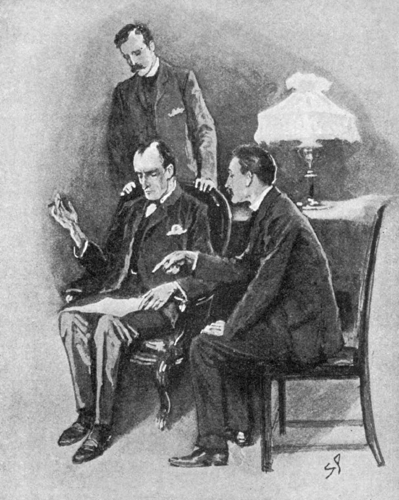

“位置标在这图上了。”

“除非仰面摔倒在刀尖上。”福尔摩斯说。

“是的，我也有过这个想法，但是我们发现刀离开尸体好几英尺，所以没有这个可能。再有就是他临死讲的话了。最后还有，非常重要的一样物证，发现在死者右手里抓着。”

斯坦利·霍普金斯从口袋里摸出一个小纸包，打开，是一副金夹鼻眼镜，镜端垂着断成两截的黑丝带。“威洛比·史密斯眼睛很好，”他推论说，“毫无问题，这是从凶手脸上或者身上抓过来的。”

歇洛克·福尔摩斯把眼镜接过手，极认真而有兴味地检查起来。他拿眼镜往自己鼻梁上戴戴，看这看那，又走到窗前朝街道上望望，然后凑到灯光下仔细观察。最后，他格格地笑了，在桌旁坐下，拿一张纸来写，写上好些字扔给斯坦利·霍普金斯。

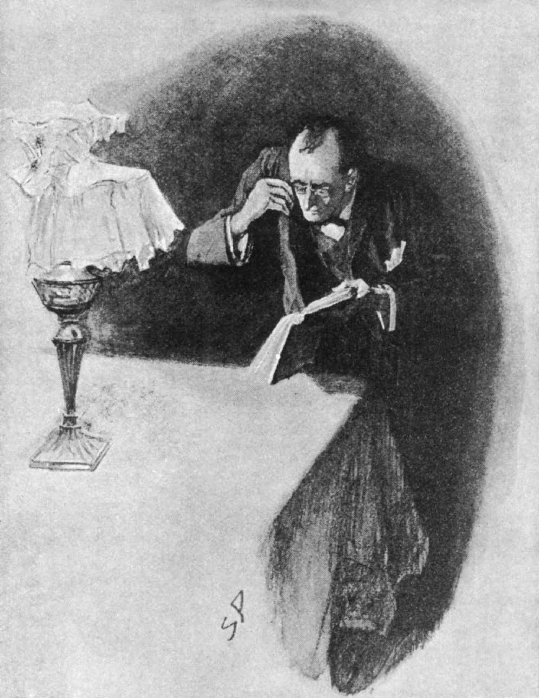

他拿眼镜在自己鼻梁上戴戴。

“给你，最好的方法，”他说，“肯定对你管用。”

惊疑的警探大声地读着纸条，上面是这样写的：

“寻人。一位有风度的妇女，衣着如贵族，阔鼻，双目挤近鼻梁，额多皱，面容呆滞刻板，或有塌肩。迹象表明，其于最近两三月在某验光师处配眼镜至少两次。系深度眼镜，验光配镜眼镜店并非众多，故寻觅该女士不难。”

福尔摩斯对惊愕的霍普金斯微笑着，此时这种表情也必然反映在我的脸上。

“我的演绎推理其实也简单，”福尔摩斯说，“什么东西都没有眼镜能够更精确地作出推理，推出这样那样的情况，特别是像这样一副不同一般的眼镜。这副眼镜是属于一位女士的，我从质量精致可以判断，当然，也从死者最后的话来判断。她是高雅体面之人，请看，很精致的纯金眼镜，能戴上这样一副眼镜的人，别的方面不体面，那是不可想象的。你注意了吗，眼镜的夹鼻很宽，说明这位女士鼻根很宽。这种鼻形往往短而粗，不过例外也不少，所以这一点不敢过于武断。我是狭长脸形，可是我的眼睛对不上镜片中心，甚至不能接近中心，可见这位妇女的两眼靠鼻梁很近。你看，华生，镜片凹陷，度数很深。一位女士的视力如此之差，对她的生活、生理必定会有一定的影响，额头、眼睑甚至肩胛都有相应的变化。”

“是的，”我说，“你的说法我同意。但是有不明白的地方，我无法理解你从何得出结论她两次去过眼镜店。”

福尔摩斯把眼镜拿在手中。

“你看，”他说，“眼镜夹衬有软木，以防压痛鼻子。这一边的软木变色了，已经有点旧，另一边是新的。很明显，一边原来那块掉了，换上了新的。这块旧的软木看得出也没有几个月的时间。两块都是一样的，所以我估计女士第二次是去的同一家店。”

“哦，天哪，真了不起！”霍普金斯惊叹道，喜出望外，“瞧我，证据都让我到手了，可就是不知道分析！不过，我是要打算把伦敦的眼镜店调查个遍。”

“当然应该查一查。想想这案子还有什么要跟我们讲的吗？”

“没有了，福尔摩斯先生。我想，你知道的和我一样多——其实比我还要多。我们都派人在乡村公路上、在火车站盘问陌生人，但是查不到情况。最叫我伤脑筋的，完全摸不透作案动机是什么，没人猜得出到底出于什么目的。”

“啊！我在这儿就没法再帮你忙了。你需要我们明天出门上那边去看看吗？”

“那是求之不得，福尔摩斯先生。从查令十字街到查塔姆，早上六点钟有车，我们八九点钟就能到约克斯雷古宅。”

“那就坐这班车。你这案子确实很有点奥妙，我乐意看看是怎么回事。哦，将近一点了，快睡上几个小时吧。你睡火炉前的沙发上，保管舒服。起身出发前，我点酒精灯给你煮咖啡。”

翌日，风已吹尽，但是我们出发上路，只觉晨寒凛冽。望着寒冬的太阳升起在蒙蒙的泰晤士河沼泽地及悠远昏沉的河段上，不禁使我联想起早年侦探生涯那次追逐安达曼土人的历险。经过长途困倦的旅程，我们在距离查塔姆几英里的一个小站下车。在小旅店备马套车的时间，我们抓紧匆匆吃了早饭，以便一到约克斯雷古宅就能立即投入工作。一个警察在花园门口迎接我们。

“你好，威尔逊，有情况吗？”

“没有，先生——什么也没有。”

“没有报告发现可疑的人？”

“没有，先生。昨天车站上没见有可疑的人来去。”

“旅店或者可供借宿的地方都查过了？”

“是的，先生，没有情况，有情况我们就会报告。”

“是啊，这儿走到查塔姆不是太远，有谁去了那儿或者上火车，不一定被人看见。这就是我讲过的花园小路，福尔摩斯先生。我可以保证，昨天那上面没有痕迹。”

“是哪一边的草地上有痕迹？”

“是这一边，先生。小路和花坛之间，窄窄的一段草地。现在看不出痕迹了，昨天很清楚。”

“是的，是的，有人走过，”福尔摩斯说，弯腰看草地，“我们这位女士落脚很谨慎，要不，这一边她在小径上会落痕迹，另一边在软地上会留下更清楚的痕迹，对吗？”

“是的，先生，她一定是个冷面老手。”

我看见福尔摩斯脸色很专注。

“你说她也是打这儿出来的，是吗？”

“是的，先生，此外无路可走。”

“在这一段草地上？”

“当然，福尔摩斯先生。”

“哦！手脚做得很干净——很干净。好吧，我想这小路也就这样了。我们再看看别的。花园门总是开着的，对吗？这位来客尽管长驱直入就是。她没有要杀人的念头，否则随身一定会带上件凶器，不必捡起写字台上的小刀来使唤。她一直跑过走道，在椰子棕地毯上没有留下足迹。然后进入书房。待了多久呢？我们无法判断。”

“没有几分钟，先生。我忘了告诉你，马可太太，那个管家，出事前不久刚收拾过屋子——大约一刻钟，她说过的。”

“好，这就给我们有了时限。这位女士进入房间，她做什么呢？走到写字台，找什么？不是抽屉里的东西。抽屉里有值得她拿的东西，抽屉也必定早就上锁了。不是这个，是那个书柜桌的木柜。啊哈！这面上有刮痕了吗！擦根火柴，华生。这个你怎么没有告诉我呀，霍普金斯？”

他观察这道划痕，是在铜片上，钥匙孔的左侧开始，划过去大约四英寸，划掉了柜面清漆。

“我注意到的，福尔摩斯先生，可是锁眼周围总是有划痕的。”

“这是新刮的，很新，你看，铜片上这道痕有多亮，旧的划痕跟铜表面就是一样的了。拿我放大镜看一看，漆皮划痕，给割开了，像给犁犁开的土沟似的。马可太太在吧？”

一位面带愁容的老妇人走进书房。

“昨天早上你揩过这个柜子吗？”

“是的，先生。”

“看到有这个刮痕没有？”

“不，先生，我没注意。”

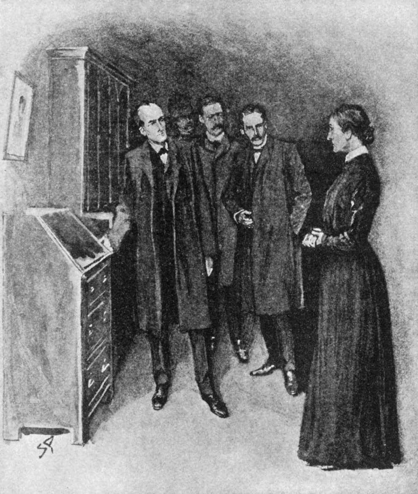

“不，先生，我没注意。”

“我知道你没有，否则揩布把这些漆皮屑早擦掉了。书柜桌的钥匙谁有？”

“教授有，系在他的表链上。”

“普通钥匙吗？”

“不，先生，那是丘伯牌保险锁钥匙。”

“很好，马可太太，你可以走了。现在，进一步看看。这位女士进书房，直奔书柜桌，把它打开，或者正在设法把它打开，在这节骨眼上，小威洛比·史密斯进来了。女士慌忙拔掉钥匙，手急在柜门上划出一道痕。史密斯抓住她，她顺手操起东西，正好是这把刀子，就向他扎，想叫他松手，好脱逃。这一扎就要了他的命。史密斯倒下了，女士逃跑了。女士达到此行的目的，拿上了什么东西，或者没有达到目的，没有拿到东西。女仆，苏珊在吗？你听到喊叫以后，有没有人从这门跑掉，苏珊？”

“没有，先生，不会的。出这门打过道走，那在楼梯上早让我看见了。再说，门没有开过，要不也让我听见了。”

“这个退路就是这样。那么没有疑问，女士从来的路上撤退。我了解，这另一条过道只通向教授的房间。那边没有路可走吧？”

“没有，先生。”

“我们走这儿过去，看看教授。我说，霍普金斯，这很重要，确实很重要。这教授的走道上铺的也是椰子棕地毯。”

“那个，先生，那又会怎么呢？”

“你看不出同本案有关系？好，好，我不坚持，说不定是我错。可是我感到有思路，一起去，由你来帮我介绍一下。”

我们走过过道，这条过道同那条通往花园的过道一样长。到尽头有一小截楼梯，楼梯上面是一扇门。我们的向导先敲敲门，然后领我们进入教授的房间。

这是一间大房间，里面全是书籍，书架上排满，墙角里塞满，箱柜上堆满。屋中央一张床，床上用枕头垫起坐着的就是这古宅的主人。一个我所少见的人，相貌奇特，面庞瘦削，鹰钩鼻，正转向我们看着。一对咄咄逼人的暗蓝眼睛，深陷在覆盖着两簇长眉的眼窝里。他已须发全白，只有嘴边的胡髭还略带黄色，一支雪茄在一大团蓬乱的白毛中闪亮。房间里弥漫着闷塞的烟臭。他向福尔摩斯伸过手来，我看到满手指是尼古丁的焦黄。

“抽烟吧，福尔摩斯先生？”他的英语，字斟句酌，但口音稍有些做作，“请自己取雪茄。还有您，这位先生？这烟不同一般，我乐意请你们品尝，是我特地从亚历山大港订购的，系埃俄尼第斯所特制。他一次给我送来一千支。我是不好意思说啦，我总是过两个星期就要他供应一回。这不好呀，先生，很不好，可是一个老人，少有娱乐趣味，有什么办法呢。吸烟加工作——所剩给我的，仅此而已，岂有他哉。”

福尔摩斯点上一支雪茄，眼光向屋内四周忽闪。

“吸烟加工作，然而现在只剩下吸烟了。”老人感慨道，“哎呀，真是个致命打击！祸从天降，有谁能想得到？多么难能可贵的一个好青年！我敢担保，再训练一两个月，就能成为一名得力的好助手。您怎么看这件事呢，福尔摩斯先生？”

“我心中还没个谱。”

“我一定要感谢您，如果您能替我们清除一头雾水、点明问题。我是一无作为的书呆子，又是废人一个，这样一个打击，当头一棒，彻底垮了。我简直已经丧失思维能力。但是，还好您来了，您精明强干——是实干家。这仅是您的每日工作，例行的事务。不管出现什么样的危急情况，一经您手便是游刃有余，一竿子摆平。也是我们有幸，真的，有您大驾光临，为我们排忧解难。”

任老教授在那儿讲话，福尔摩斯在屋子这边只管踱来踱去。我注意到他把烟猛吐猛吸抽得奇快，很显然他像这里的主人一样，喜欢这新到的亚历山大雪茄。

“真的，先生，这是一次毁灭性的打击。”老人说道，“那是我的力作——放在那里边桌上的一堆书稿，是我对叙利亚和埃及科普特寺院里发现的文献所作的分析，一部著作，对天启教派理论基础作出深入的研究。鉴于本人身体健康每况愈下，真不知道此书能否完成，更不要说眼下又去了一条胳膊。乖乖！福尔摩斯先生，怎么搞的，原来你抽烟抽得比我还要凶啊！”

福尔摩斯笑笑。

“我喜欢作评判、鉴定，”他说，从烟盒里又取上一支烟——这是第四支了——用剩下的烟头点了接上，“我不想麻烦你，费时间对你问长问短，科伦教授。因为据我所知，案发时间你在床上，所以什么也不知道。我只想问你一个问题：被害人临死说的话：‘教授——那女人’，你认为他是什么意思？”

教授把头摇摇。

“苏珊，一个乡下姑娘，”他说，“你知道这种人之愚蠢，不可置信。我想是小伙子神志昏迷而发的谵语，苏珊误以为是这样的话，其实并无意思。”

“我明白了，你自己对于这个悲剧没有解释？”

“可能是偶然事件，纯属偶然——我只是我们自己人这里说说——是自杀。年轻人都有自己隐藏内心的烦恼——那情种恋爱之类事，我们无从知道。这个可能性比谋杀要大。”

“那么这眼镜怎么讲呢？”

“哦！我不过是个读书人——耽于空想的人，我不善于解释实际生活中的诸多事情。不过，我们要知道，我的朋友，殉情而持信物，此事常有，且是各式各样。务必请再接一支烟，看到这烟受人如此欣赏，也是趣事一桩。一把扇子，一只手套，一副眼镜——此类的东西，一个人要结束自己生命，手持纪念品、珍品以示决死之心，也未可知吧？这位先生所讲草地上有脚印，则更是近乎谬误的事了。至于小刀呢，可能是不幸人摔倒的时候脱手甩出去的。也许，我是姑作童言罢了。但是在我看来，威洛比·史密斯是自戕轻生。”

提出如此的理论对福尔摩斯很有震撼，他继续走来走去好一会儿，陷入沉思，雪茄一支连一支。

“请告诉我，科伦教授，”最后他说道，“书柜桌的柜子里藏的什么东西？”

“没有什么，都是窃贼不想要的东西。家人证件，我不幸妻子的来信，我大学时的学位证书。给你钥匙，你可以自己去看。”

福尔摩斯接过钥匙，看了一眼，又还给他。

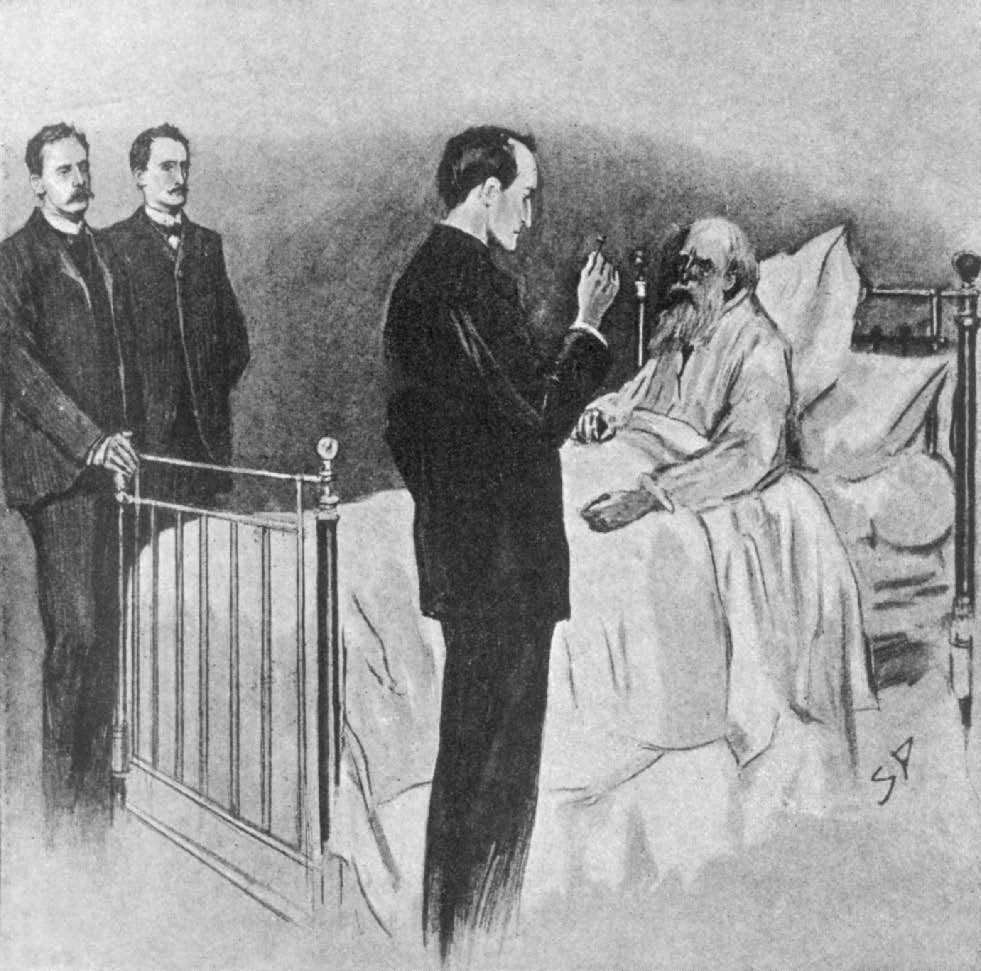

福尔摩斯接过钥匙，看了一眼。

“不要了，我想没有什么用，”他说，“还是到你花园去，脑子安静一会儿，把整个事想一想。你提出的自杀论，说得自成道理。我们必须向你道歉，进你屋多有叨扰，科伦教授，并且向你保证，用午餐不会来打搅你。两点钟我们再来，有什么新的情况再向你报告。”

福尔摩斯却是心不在焉，不知是何缘故；我们尽在花园小道走来走去，许久默不作声。

“你有线索了？”最后我开了腔。

“多亏得抽了那么些雪茄烟，”他说，“也可能，是我完全错误，雪茄烟会给予指明。”

“我亲爱的福尔摩斯，”我不禁叫道，“你到底是——”

“行了，行了，你自己会明白的，不明白也没有关系。当然，我们完全可以通过找眼镜店查获真相，但是我还有更简便易行的方法。啊，马可太太来了，正好！我们和她谈上五分钟，一定会有启发。”

此前我曾提过，福尔摩斯在需要的时候讲话很会揣摩女人心理，用的词语都听着顺耳，叫她们信得过。他只用很短的时间便深得女管家的好感和信赖，跟她谈得投机，似乎彼此已相熟多年。

“是呀，福尔摩斯先生，就是你说的嘛，先生。他抽烟实在是可怕得没得说啦，整天抽，有时候整夜抽，先生。一早晨屋子里那个样子——哎哟，先生，你准以为是来了伦敦大雾了。可怜的小史密斯先生，他也抽烟，就是没教授那么厉害。教授的身体好坏——哦，我不知道抽烟是好还是坏。”

“噢！”福尔摩斯说，“对胃口肯定不好。”

“是吗，这个我倒还不晓得，先生。”

“我看教授吃东西胃口不好。”

“哦，不好是不好，可说好就好，我拿不定他。”

“我不瞎说，今儿早上他早饭就没吃，午饭也不想吃了，我看他吸烟吸的那个劲儿，还能吃什么饭！”

“嗨，你这就说差喽，先生，恰恰相反，今儿早饭他吃得可厉害，从来也没见他有这么好胃口的。午饭哪，他还关照要吃一大盘炸肉排，我都吓一跳呢。可我，昨儿个看见小史密斯先生躺在那儿地板上，之后我见了吃的就恶心，不想吃。咳，这世上人和人就是不一样，教授就一点儿没倒胃口。”

上午就这样在花园里闲逛掉。斯坦利·霍普金斯走了，到村子里去了解一个情况，说是前天早晨几个孩子在查塔姆大路上看到有个陌生女人。我的朋友，他平时的精力好像已经消耗殆尽，我还从来没有见他办案子是这么漫不经心。霍普金斯带回消息说，他找到了那几个孩子，他们千真万确看到一个女人，相貌同福尔摩斯模拟的完全一样，戴眼镜，可能是夹鼻镜。他这时候甚至连这个消息都毫不在意，并无引起浓厚兴趣的样子。当苏珊伺候我们用午餐的时候，她主动提供情况说，昨天早晨史密斯先生出去过一次，回来不过半个小时，就出事丧命。我自己看不出这事有什么意思，但是却引起了福尔摩斯注意，我完全看得出他把这件事同他脑子里原有的整个想法融合一体。他忽然从椅子上跳起来，看了看表。“两点钟，先生们，”他说，“一起上去，跟我们的教授朋友把事情摊明白了。”

老人已经吃好午餐，吃空了的盘碟摆在那儿证明他的胃口极好，正如管家所讲。他向我们转过脸来，满头白蓬蓬长须发，两眼闪光，实在是个神秘老怪。他嘴上燃着永无止息的雪茄，已经穿好衣服，坐在围椅里，靠在火炉边。

“哦，福尔摩斯先生，这桩谜案已经解决了没有？”他身旁的桌上有一大罐雪茄，他把雪茄往我同伴这边推一推。福尔摩斯随即伸出手去，两人一个错手，罐子翻倒在桌边。我们赶快跪下去将滚落满地的雪茄一一捡起。都拾好后站起了身，我发现福尔摩斯两眼炯炯有神，双颊泛起颜色，只有在一次紧急关头我才看到过这种临战的神采飞扬。

“是的，”他说，“我已经解决了。”

斯坦利·霍普金斯和我目瞪口呆，老教授瘦削憔悴的脸上掠过似笑非笑的冷笑。

“真的！在花园里？”

“不，在这里。”

“这里！什么时候？”

“就是此刻。”

“你简直是在开玩笑，歇洛克·福尔摩斯先生。你这样做，我不得不同你讲，这是一桩非常严肃的事情，可不容许如此儿戏般对待。”

“我的理论是一根铁链，每一节打铸、测试毫不含糊，科伦教授，确信万无一失。你演这出戏是什么动机，在戏里扮演什么角色，我还不能说。过几分钟，我就能从你自己嘴里知道。同时，为了让你方便起见，由我来把事情经过复述一遍，也好让你知道我还需要补充些什么内容。

“有一位女士，昨天进入你的书房。她此来的目的，是要获取藏在你书柜桌里的某些文件。她自己有钥匙，因为你给我的钥匙，我仔细看了，上面一点也没有发现划漆皮会落下的颜色痕迹。这么看，你并非从犯。女士来偷窃你文件，我从证据分析，你并不知道。”

教授从嘴唇间喷出一团烟雾。“这倒是非常有趣，而且颇有启发，”他说，“你再要补充点吧？既然让你知道有这位女士，你当然也说得出她是怎么回事。”

“我要一步步说来。女士进来就被你的秘书抓住，为了脱身，女士就把他刺了。这是不幸的祸事，我倾向于认为是偶然事件。我相信女士并无意要置人于死地。若是预谋杀人，她不会不备凶器。她未料是这样严重的后果，非常害怕，慌忙逃离现场。可是在两人扭扯的时候，她被抓掉了眼镜，她是深度近视，不戴眼镜看不清东西。她向走道上跑，以为是刚才来的那条走道——都是铺上椰子棕地毯——等到发现走错了路，想回头，已经不行了，退路那边有人。怎么办呢？不能回头，又不能停在半中间，只有向前跑，继续跑，跑上了楼梯，推开了一扇门，女士这就到了你的房间来了。”

老人张着嘴坐在那里，圆睁两眼愣瞪着福尔摩斯，一脸的惊讶和恐惧，接着，他强自振作，耸耸肩，爆发出毫不由衷的大笑。

“真是妙语连珠，福尔摩斯先生，”他说道，“可是，你的精彩推理，有一处小小的瑕疵。我在这间屋子里，我一整天没有离开过一步。”

“这我清楚，科伦教授。”

“那么，你是说，我躺在床上，我竟不知道有一个女人跑到了我的房间里来？”

“我没有这样说。你是完全知道的，你同她讲话，你认识她，你助她脱逃。”

教授再一次爆发尖声大笑。他站了起来，两眼窜着快要燃尽的余火。

“你疯了不成！”他叫道，“你一派胡言。是我帮她脱逃？她跑哪儿去了？”

“她就在那里。”福尔摩斯说道，举手指向房间角上一座高高的书橱。

我看见老人双手举起，冷板的脸上一阵可怕的抽搐，重新跌回到椅子里。就在这同一刹那间，福尔摩斯所指的那个书橱，铰链转动摇开，一个女人从里面冲出，站在房里。“你说得对！”女人叫道，是异样的外国口音，“你说得对！我在这里。”

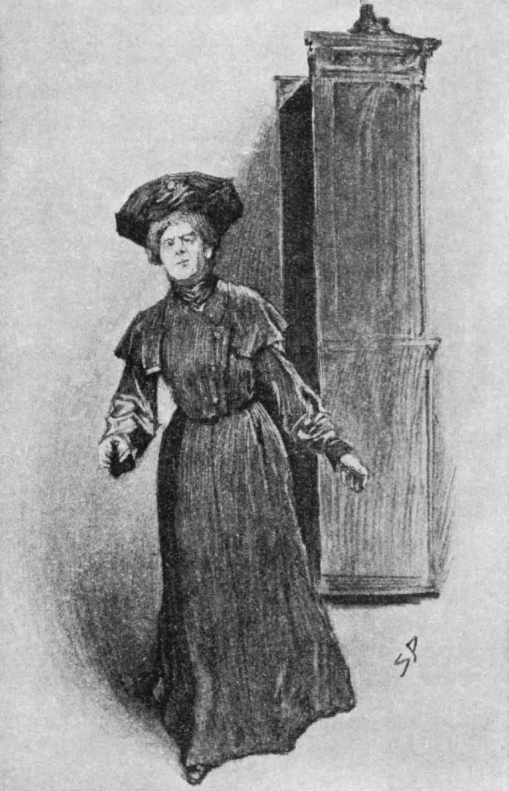

一个女人从里面冲出。

女人满身蒙着灰尘，缠着蜘蛛网，这都是躲藏的时候在里边的壁上蹭的。她脸上有几道污迹，但即使干净，也不漂亮。她的面貌长相活脱如福尔摩斯所推测的那样，还加一只长直的下巴。本来眼睛就不好，再加是从暗处来到亮处，她茫然地站在那里，眨眼看看周围，想辨清我们有几个人，是什么人。但是，尽管有着这些短缺和不足，这个女人的气质卓尔不群——刚毅的下巴、昂首的姿态，显示侠义胸怀，令人油然而生敬慕。

斯坦利·霍普金斯一手抓住女人的胳膊，宣布她被捕了。她轻轻把霍普金斯的手甩掉，浑身正气凛然、不可侵犯的样子。老人瘫坐在椅子里，扭曲着脸，两眼忧郁地望着她。

“是的，先生，我是被捕了。”女人说道，“刚才我什么都听见，知道你们了解事实真相，这一切我都承认，是我杀死了年轻人。这一点说得不错——你们说的那个是偶然性事件。我简直没有意识那是一把刀，我拿在了手里，因为在我的绝望之中，我从桌上随便抓起任何东西，就会扎向他，叫他让我走。我所讲，是事实。”

“夫人，”福尔摩斯说道，“我确信这完全是事实。我看你身体很不好。”

女人的脸色已变得非常难看，脸上蒙了几道灰尘就更显得可怕。她在床沿上坐下，再接着说话。

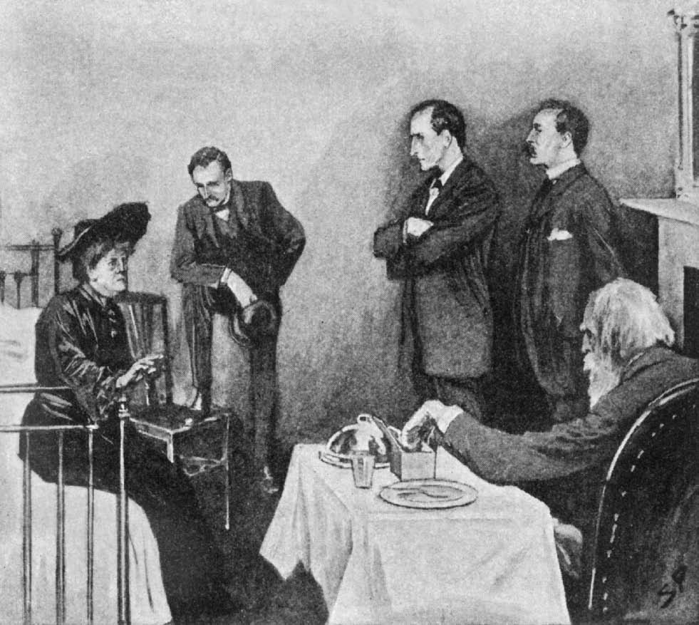

她在床沿上坐下，再接着说话。

“我在此的时间不多了，”她说，“但是我要你们都知道全部真相。我是这个人的妻子。他不是英国人，而是俄国人，他的名字我就不说了。”

老人立刻激动得发抖。“上帝保佑你，安娜！”他叫道，“上帝保佑你！”

女人恨恨地向他投去鄙夷的目光。“为什么你这么喜欢过这样不堪的生活，塞尔吉斯？”她说，“要这样伤害多少人而对谁也没好处——甚至对你自己也一无好处。然而，不要我来结束你这懦弱的生命，自有上帝给你时辰。我跨入这罪恶的房门，已深感亵渎自己的灵魂。可我还是必须要讲，不讲就没有时间了。

“我讲了，先生们，我是这个人的妻子。我们结婚的时候，他五十岁，而我还只不过一个二十岁的傻姑娘。那时，在俄罗斯，大学里——我不要说出那个地方了。”

“上帝保佑你，安娜！”老人又嗫嚅着说。

“我们是改革家——革命家——无政府主义者，你们知道，他和我，还有好多人。后来，出了一件事情，一个警官被杀害，就抓了好多人，要抓证据。是他，为了救自己的命，也为了得到奖赏，我的丈夫出卖了自己的妻子和同伴们。就这样，在他的指认之下，我们全体遭到逮捕。我们有的被处绞刑，有的流放西伯利亚。我在这后者之列，但不是终身流放。我丈夫来到了英国，带着肮脏的钱，从此隐匿。他很清楚，如果让我们的团体知道他的下落，那么不出一个星期，正义的裁决就会临到他头上。”

老人伸出颤抖的手去拿一支雪茄。“我现在落在你的手里了，安娜，”他说，“你过去一直对我是好的。”

“我还没有向你们讲他最卑鄙的事。”她说，“在我们团体的同志，有一位是我心仪的朋友。他品质高尚，毫无自私自利之心，对人充满友爱之情——所有这一切，我丈夫一点都不具备。我的朋友，厌恶暴力。我们都是有罪人——如果暴力是罪恶的话——但是这位朋友不是。他始终写信劝阻我们，不要诉诸此种手段。这些信件可以救助他免受刑罚，还有我自己的日记，也能对他有利，我的日记，天天记载我对他的感情、我们所持相同的观点。我的丈夫看到了信和日记，便拿走藏了起来。他诅咒，他竭力要把这个年轻人往死刑犯里推。不过，这一点他未能得逞，阿列克谢只是判以终身流放，发配西伯利亚。现在，就在此刻，他在盐矿里服劳役。想想吧，你这个恶贼，你这个恶棍！——现在，现在，就在此刻，阿列克谢，你连他这名字都不配称呼的，在那里受苦、服刑，完全是个奴隶，可你的命捏在了我的手里，我还是放过了你。”

“您永远是高贵的人，安娜。”老人说。喷出雪茄烟。

女人站起来，但又一沉坐下，轻轻发出一声痛苦的叫喊。

“我必须讲完，”她说，“我的刑期一满，我就马上寻找我的日记和信件，只要把这些文件交给俄国政府，就可以促成阿列克谢的释放。我知道我的丈夫跑到了英国，经过几个月的搜寻，终于获悉他住在什么地方，而且知道我的日记他还保藏着。因为，我在西伯利亚的时候，收到过他一封来信，信上责备我，是引用了我日记中的一些话。而且我相信，以他那种好报复的本性，永远也别指望他会自动把日记还给我。为此缘故，我在一家私人侦探事务所请一位侦探，到我丈夫家来当秘书——就是你的第二位秘书，塞尔吉斯，他来了不久很快又走了。他探到文件都收藏在小柜中，还取到了钥匙样，进一步的事他不愿做。他提供我一张房屋平面图，告诉我中午以前书房里总是没有人，秘书是在楼上。所以最后我鼓起勇气亲自来拿我的信和日记。我是成功了，但是付出了何等的代价呀！

“我文件拿到了手，把柜子锁上，这时候年轻人抓住了我。那一天早晨我见到过他，在大路上，我见有人，就上前问科伦教授家是哪里，遇到的正是他，可不知道他是我丈夫雇用的人。”

“是这样！是这样！”福尔摩斯说，“秘书回来以后，去告诉教授他碰到有这么一个女士。所以，他断气的时候，要想讲话说杀他的就是那个女人——跟教授讲过的那个女人。”

“你让我讲，”女士说，语气刻不容缓，脸好像在痛苦地抽搐，“他倒下了，我冲出屋子，走错了门，跑到了我丈夫的房间里。他说要告发我，我叫他明白如果他胆敢这样做，他的命是捏在我的手里。如果把我交给警察，我会把他交给我们的团体。我不是希望要活命，不是为我自己的缘故，而是要完成我的使命。他清楚我是说得到做得到的人——他自己的命和我的命是牵连在一起的。只是为此原因，绝不是为了别的，他才将我加以掩护。他让我躲进这个暗室——这是早年就留有的一个密室，只有他知道。他在这儿房里用餐，好分给我吃的。我们讲定，等警察跑掉，晚上我就离开这屋子，并且永远不再来到此地。但是我们这个打算到底被你识破。”她从怀里掏出一个小包。“这是我最后要说的话，”她说道，“这一包东西能够救出阿列克谢。我凭着你对荣誉和正义的热爱将此物交给你，请你接受！请交到俄国大使馆。现在，我完成了我的使命，尽到了责任，就——”

“截住她！”福尔摩斯大叫一声，人已窜过去，从她手里夺下一只小药瓶。

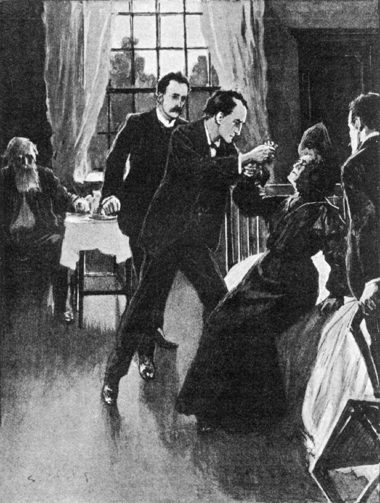

从她手里夺下一只小药瓶。

“晚了！”她说道，一下子倒在了床上，“晚了！我从躲藏的地方出来，就先把毒药吃了。我头在晕！我拜托您了，先生，别忘了这包裹。”

“一个简单的案子，不过，在好多方面，很发人深思。”我们正在回城的路上，福尔摩斯说道，“应该讲，破案发轫于一副夹鼻眼镜，巧也巧在幸而被死者抓在了手里，否则，我不敢说问题解决能有如此的顺利。这一点我是清楚的，从眼镜的深度看，这个人视力很差，一丢掉眼镜行动就很困难。当你问我是否相信她在一段窄草地上走掉，一步也不差，我当时就说了，你也该记得的，这个现象还值得考虑。我心中认为她未必能走得这样稳稳当当，要说她还备有另一副眼镜，当然不大可能。这就迫使我认真考虑，另作假设，就是，她依然在屋子里没跑掉。一看到两条走道是差不多的，那就清楚了，她很容易走错通道。如果是那样的话，也就很明显，她一定跑到了教授的房间里。我保持警觉，假定这样，必会出现什么迹象。我检查这间房间有什么可以藏人的地方。地毯没有缝隙，在地上钉得很牢，我完全断定不会有地道。那些书的后面或许有暗室，你也知道，古老宅屋的藏书室一般都有这种结构。我看到书在地板上堆得到处都是，但是一座书橱是空着的，这可能就是一扇门。我初看，看不出迹象，但是地毯是暗褐色的，这就有助于侦查。我于是拼命抽烟，烟也确实是上品好烟，尤其要把烟灰故意掉落在书橱前面这片可疑的地方。只不过是略施小计，可是成效大见。我然后下楼，让我搞清楚了，你也在场，华生，可是你没有看出我套着说话的意思，科伦教授的食量增加了——令人想到他是给另外一个人吃饭。后来我们再上楼，我故意打翻烟盒，趁此机会把地上看个清楚，结果明白无误，从雪茄烟灰上看出，凶犯趁我们不在的时候，曾经离开隐蔽处出来过。好了，霍普金斯，这儿已经到了查令十字街，我要向你祝贺，你这个案子得到胜利解决，你就顺顺当当回警场吧。我想，华生，你和我还要一起到俄国大使馆去一趟。”

（1904年）

# 失踪的橄榄球队中卫

在贝克街我们常常收到一些奇怪的电报，这本是习以为常的事，但是有一次我记忆特别深刻。那是七八年以前，二月中一个阴郁的早晨，一封电报让福尔摩斯看得足足有一刻钟疑惑不解。电报抬头是他的名字，内容如下：

请等我。万分不幸。右中卫失踪，明日急需。

欧沃顿

“河滨大街的邮戳，发报时间十点三十六分，”福尔摩斯说道，一遍一遍地看着，“欧沃顿先生拍电报的心情显然非常激动，所以电文语焉不详。哦，哦，他会来这里，我估计，等我看完《泰晤士报》就会来，到时候什么事就知道了。这些日子闲着无事，即使无关紧要的问题也受欢迎。”

这一阵子我们无所事事，日子过得非常缓慢，我领略过时光沉闷的可怕。经验表明，我同伴的脑子一向异常活跃，一旦脑子里空空如也，没有东西可以思考运转，就有危险。几年来，我坚持不懈地力劝他戒掉药瘾，药瘾有一次险些断送他光辉的前程。现在我知道一般情况下他已不再求诸这类人造刺激剂，但是我也很清楚，这个魔鬼并未死亡而只是在睡眠中。每逢我看到福尔摩斯苦行僧般的脸拉长而倦怠，深邃不可思议的眼神忧郁而昏沉，此时我也就知道这睡眠不过是暂歇的浅睡，什么时候说醒就要醒来。因此我瞩盼这位欧沃顿先生——不管他是谁，他已发来深浅莫测的电报——将打破这危险的寂寥，寂寥带给我朋友的危险之大，大于剧烈生活的一切风暴。

正如我们所盼望的，电报先行，发报人随后就到。名片上是：西里尔·欧沃顿先生，三一学院，剑桥。随名片而到的是一位肩阔身高、很年轻的年轻人，他那足有两百多磅重的虎背熊腰的魁梧身躯，几乎把屋门都给塞住，端庄的脸庞，惶遽的神态，两眼打量着我们两人。

“哪位是歇洛克·福尔摩斯先生？”我的同伴点点头。

“我已经去过苏格兰警场，福尔摩斯先生，见到斯坦利·霍普金斯警官，他建议我来找你。我这案子照他的意思，由你来解决比他官方接手更合适。”

“请坐，告诉我是什么事。”

“事情紧急，福尔摩斯先生——非常紧急！把我头发都快急白了。戈弗雷·斯汤顿——你想必听见过他吧？他是全队的关键人物。我宁愿不要那两个前锋，也不能没有戈弗雷这个中卫。无论是传球、抢球或者运球，没人比得上他，且他还是个核心，能把全队人调动起来。我怎么办呢？我只能来求救于你了，福尔摩斯先生。我们有穆尔豪斯替补，可他是踢前卫的，而且老是要挤进去争球，不守住边线。他定位球踢得很好，这的确是，但是不会判断情况，还一点不善于拼抢。那莫顿或者约翰逊，牛津的两员宿将，还会把他死死缠住。史蒂文森速度快，可是他不会在二十五码远的地方踢落地球。一个中卫，不能踢悬空球，又不会抛踢球，就根本无法独当一面。不，福尔摩斯先生，要是你不能帮我找到戈弗雷·斯汤顿，我们就输定了。”

我的朋友有趣而惊奇地听着这篇不短的介绍。来人讲得滔滔不绝，情急之下为了加强说话的力度以引起更多的注意，有力的大手一句一顿地拍着膝头。一等来人停嘴，福尔摩斯就伸手去拿下资料摘记汇编S字母的一卷，但是在这信息万宝全书中居然缺了一角，毫无收获。

“有阿瑟·H．斯汤顿，一个造伪币发迹的年轻人，”他说，“还有亨利·斯汤顿，我出了力，送他上了绞刑。就是这戈弗雷·斯汤顿，我没听说过，很陌生。”

来访人变得满脸狐疑。

“哦，福尔摩斯先生，我以为你是样样都知道，”他说，“这么看来，你从没听说过戈弗雷·斯汤顿，那你也就不知道西里尔·欧沃顿了？”

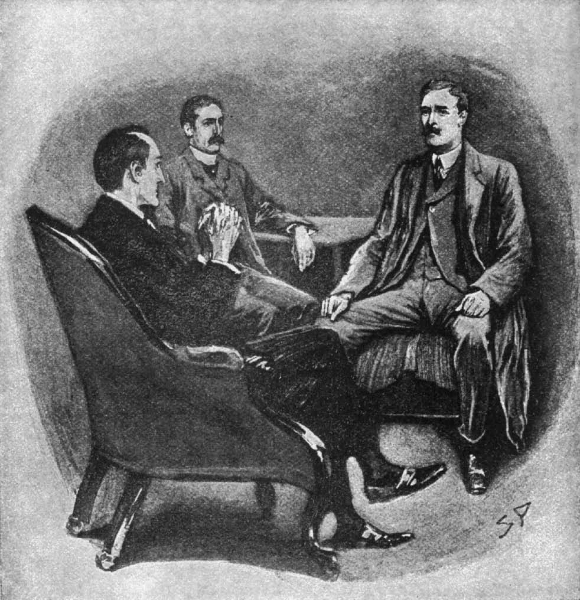

“我以为你是样样都知道。”

福尔摩斯微笑着摇摇头。

“大侦探先生！”这位运动员叫道，“哦，英格兰队对韦尔斯队比赛时，我是第一候补队员。本年度我是大学队的领队。这你不知道算不得什么！可是，戈弗雷·斯汤顿，我想英国没有谁不知道的，这首选的、顶呱呱的中卫，剑桥队、布莱克希思队和五大世界赛，他都是中卫。我说老天哪！福尔摩斯先生，你是在英国住的吗？”

看着这位天真的巨人如此大惊小怪，福尔摩斯大笑。

“欧沃顿先生，你生活在和我不一样的世界——你是在一个比我愉快、比我健康的世界。我和社会各方面都有接触，可是不怕你见笑，就是没同业余运动打过交道，其实那是英国最发达、最公益性的事业。还好，今天早晨你的不期来访，给我难能可贵的机会，让我在这个领域有事可做。这是个最清新空气中的最公平竞争的领域，所以现在，我可爱的先生，请你安心坐，细心谈，告诉我到底发生了什么事情，希望我为你做些什么。”

欧沃顿年轻的脸庞显露出颇不耐烦的样子，他这样的人一向是习惯于使用四肢多于使用头脑。但是渐渐地，我从他啰嗦、重复、不得要领的叙述中，知道了他向我们陈述的奇怪故事。

“情况是这样，福尔摩斯先生，我已经说过了，我是剑桥大学橄榄球队的领队，戈弗雷·斯汤顿是我的王牌队员。明天我们要同牛津大学比赛。昨天我们就来了，安顿在本特利私家旅馆<a href="#part0112.xhtml_ch1"
id="part0112.xhtml_ch1-back">(1)</a>。十点钟，我巡回一圈看一看，队员都已经上床休息。我相信训练要严格，睡眠要充足，以保持球队竞技状态良好。睡前我同戈弗雷说过话，他脸色仿佛不好，情绪不安。我问他怎么回事，他说他很好，没事——就是头稍稍有点疼。我跟他道了晚安，就走了。半个钟头以后，旅馆服务员告诉我，说是有一个相貌很粗、满脸胡子的人拿了一张便条要给戈弗雷。戈弗雷还没有上床睡觉，便条送到了他的房里。他看了以后，人马上跌坐在椅子上，好像是挨了一战斧被砍倒似的。服务员有些慌，要赶快来喊我，但是戈弗雷叫他别喊，自己喝了一口水，精神就振作了起来。他随后下楼，同等在大厅里的那个人谈了几句话，两人就一块儿走出去了。服务员最后看见他们是朝河滨大街方向直奔而去。今天早上，戈弗雷房里空着，他的床没有睡过，一切跟我昨晚上见到的一模一样。这个陌生人一来找他，他就跟着跑掉，此后音信全无，看样子他是不可能回来了。他戈弗雷是一个运动员，把运动、比赛看作生命的戈弗雷，他不会不参加训练，不会同领队不告而别，这里肯定是有原因的，有他重大的原因。不对，我感觉他是一走了事，我们指望不到他会回来。”

福尔摩斯对这奇事的一番陈述听得十分专注。

“后来你怎么办呢？”他问道。

“我打电报到剑桥，问那边有没有他的消息，回电说，没有人见到他。”

“他能回剑桥去吗？”

“可能的，有一趟晚班车——十一点一刻开。”

“可是，照你估计，他有没有去搭火车？”

“不知道，没人见他搭火车。”

“后来你又怎么办呢？”

“我给蒙特-詹姆斯爵士发了电报。”

“为什么发给蒙特-詹姆斯爵士？”

“戈弗雷是个孤儿，蒙特-詹姆斯爵士是他最近的亲属——他的表叔父吧，可能是。”

“是的，对这件事或许有关系，蒙特-詹姆斯爵士，英格兰巨富之一。”

“我听戈弗雷讲起过的。”

“你的朋友同他关系很密切吗？”

“是的，戈弗雷是他的继承人，老爵士已快八十了——还患严重的痛风病。他们说他指关节肿得都可以往他的撞球杆上擦白垩粉防打滑。他对戈弗雷从来是一先令都不肯给的，是个极端吝啬的守财奴，可是到头来还不是都要给戈弗雷！”

“你听到蒙特-詹姆斯那边有消息吗？”

“没有。”

“你的朋友到蒙特-詹姆斯爵士那边去的话，是什么用意呢？”

“哦，昨晚上他有心事，如果是为了钱的事情，那就多半是去找他的这个老亲属，亲属钱有的是。但据我知道的情况是他没有希望，要不到什么钱。戈弗雷不喜欢他这个老人，他往常是能不去就不去。”

“哦，我们可以马上作出分析，如果你的朋友是到他亲属那边去，就是蒙特-詹姆斯爵士，那么你得解释那个相貌粗鲁的人那么晚还来访，而且他一来就引起了事情，是什么道理。”

西里尔·欧沃顿两手拍拍脑袋。“这我讲不清楚。”他说。

“好吧，好吧，我今天本来就有空，乐意把你这件事查一查，”福尔摩斯说道，“我坚决主张你照旧准备好进行比赛，不管这位年轻人情况怎么样。肯定是，像你讲的，他这样突然离开，一定有重要事情，事情之重要，使他还无法回来。让我们一起到旅馆去走走，看看服务员能不能提供点线索，情况可以明朗一点。”

福尔摩斯善于在不知不觉中让见证人源源不断提供证据，这是他的拿手好戏。很快，在戈弗雷·斯汤顿擅离的房间内，他让服务员很高兴地把知道的事如数提供。昨晚来的人不是个体面先生，也不像是工人，就像服务员所描述的“上不上下不下的脚色”，年龄五十来岁，灰白胡子灰白脸，衣着平常，看样子心情很激动。服务员注意到他把便条递过来的时候手都在发抖，戈弗雷·斯汤顿看好便条就往口袋里一塞。斯汤顿来到大厅没有同那个人握手，两人没谈几句话，服务员只听到讲“时间”，然后就一起匆匆跑了，就是欧沃顿说的那个样子。时间是厅里的大钟正好十点半。

“我看是，”福尔摩斯说，坐到斯汤顿的床沿，“你是白天当班，对吗？”

“是的，先生，我十一点钟下班。”

“夜班服务员就没见到什么了，是不是？”

“没有，先生，就是看戏的旅客，回来比较晚，再没有别的人了。”

“你昨天是整天在值班吗？”

“是的，先生。”

“有没有信件给斯汤顿先生呢？”

“有的，先生，一封电报。”

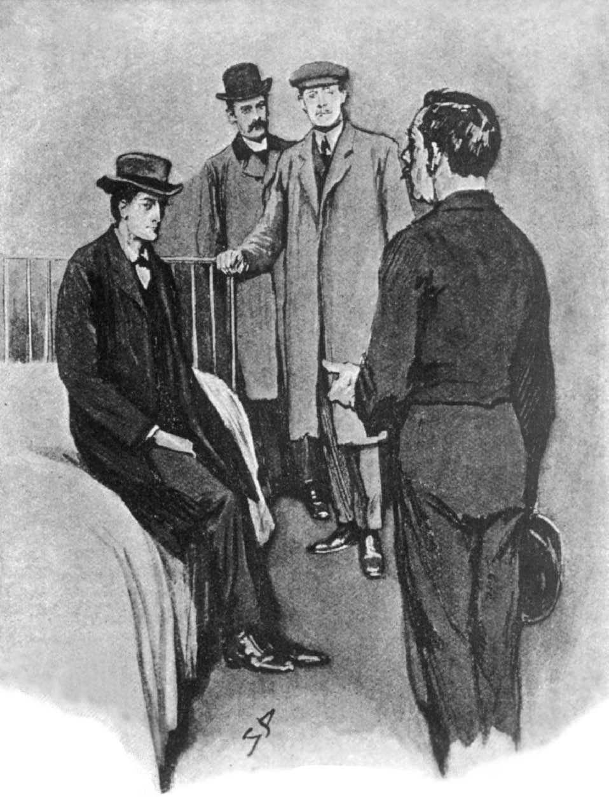

“有的，先生，一封电报。”

“啊！这重要了。是几点钟呢？”

“大概六点钟。”

“斯汤顿先生是在哪里接的电报？”

“这儿，他的房间里。”

“他拆开电报，你在场吗？”

“在场，先生，我等着，等是不是要发回电。”

“哦，回电了吗？”

“是的，先生，他写了回电。”

“你拿去发了？”

“没有，是他自己去发的。”

“他是当你面写的吗？”

“是的，先生。我就站在门口，他转过身在桌上写，写好说：‘行了，服务员，我自己去发吧。’”

“用什么笔写？”

“羽毛笔，先生。”

“就是这桌上的电报纸？”

“是的，先生，就是原来上面那一张。”

福尔摩斯起身，取了纸，走到窗前，对最上面的一张仔细检查。

“很遗憾，他没有用铅笔写，”他说，把电报纸丢回去，失望地耸耸肩，“就如你常见的，华生，纸上写字，下面会留印痕——曾经有人利用这个情况拆掉人家多少美满婚姻。可惜，我这里就没能找到痕迹。啊哈，有了，他是用粗尖的鹅毛笔写的，这也行啊，可以在吸墨纸上找到痕迹。对了，没错，就是这儿！”

他把吸墨纸撕下一条，拿给我们看上面有这样的字迹：

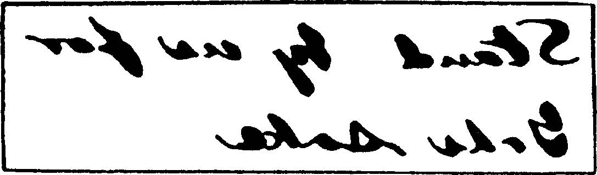

西里尔·欧沃顿兴奋起来。“拿到镜子那边去看！”他嚷着。

“不必了，”福尔摩斯说，“纸很薄，反面就能看得出，很清楚。”他把纸翻个面，我们都看到是：

“这是电报的末尾一句，戈弗雷·斯汤顿失踪前几小时发的电报。至少还有六个字我们看不到；但是就剩的这一句——‘看上帝分上帮帮我们’——说明这个年轻人看到面临很大的危险，但有什么人可以保护他免受灾难。‘我们’，你们注意了！其中有第二人。除了那个灰白脸大胡子，模样挺紧张，还能有谁呢？那么，戈弗雷·斯汤顿和这个大胡子是什么关系呢？两人向第三者求救免遭临头的灾难，那对方是谁呢？我们调查的范围已经缩小了，缩小到这个方面。”

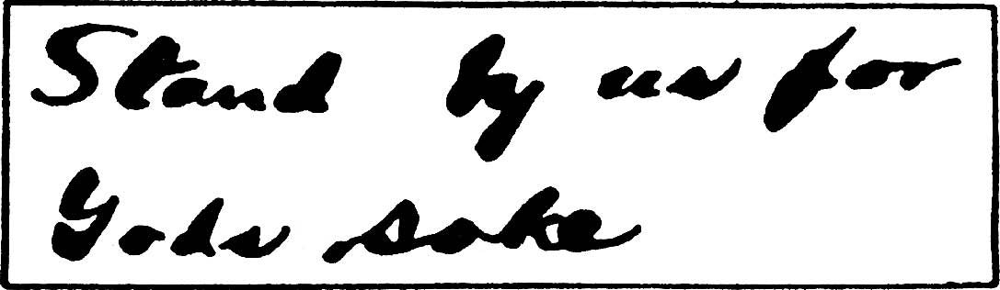

（看上帝分上帮帮我们）

“只要查一查这份电报是发给谁的不就行了。”我提议。

“当然可以，我亲爱的华生。你这做法很干脆，我也想过了，可是要知道，跑到邮局去查别人的电报底稿，邮局是不会同意的，要这样做，手续非常麻烦。不需要了，因为我这里，略施小计，同样可以达到目的。现在，我想趁你在场，欧沃顿先生，留在桌上的纸，这些材料，我要看一看。”

那是几封信、单据、笔记本，福尔摩斯灵敏的手指迅速翻动，两道锐利的目光扫射审阅。“没什么东西，”他看完说道，“顺便问一下，你的朋友年轻、很健康——没有毛病吧？”

“很健康，身板可硬朗。”

“知道他生过病吗？”

“一天也没病过。就是胫骨踢伤躺了几天，还有一次滑倒，膝盖受伤，那都不能算生病。”

“恐怕不是你想的那么健康，我看他可能有什么不能告人的暗病。要是你同意的话，我就带走一两份材料，以备调查有用。”

“等一下——等一下！”忽然一个粗喉咙心急慌忙地喊着，我们循声看去，一个怪模怪样的小老头，颤抖紧张地站在门口。他穿一身陈年老旧褪色的赭黑衣服，头戴阔边高礼帽，系一个松松的白领结——整个形象是个乡巴佬，更像那种殡仪出丧人。看他衣衫蹩脚，相貌可笑，但嗓子又高又尖，那模样仿佛有急事，引起了我们的注意。

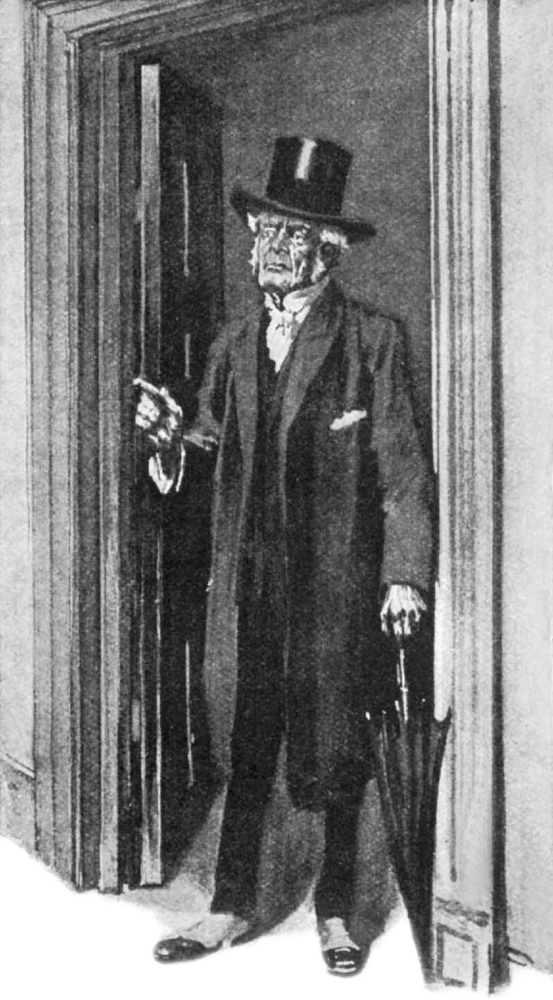

“等一下——等一下！”

“你是什么人，我说，你有什么权利动人家先生的文件？”他喝问道。

“我是私家侦探，我在负责调查他的失踪。”

“哦，你是侦探？谁请你来了，嗯？”

“是这位先生，斯汤顿先生的朋友，由苏格兰警场介绍给我。”

“你是什么人，先生？”

“我是西里尔·欧沃顿。”

“那就是你给我发的电报。我的名字，蒙特-詹姆斯爵士。我忙不迭赶来的，赶的那个快呀，就同乘贝斯沃特公共马车一般。这么说你已经叫侦探办这事了？”

“是的，先生。”

“你准备好付钱喽？”

“这我不担心，先生，我的朋友戈弗雷找到了，由他付费。”

“那找不到呢，嗯？你回答我！”

“要是这样，那他家里——”

“他没有家，告诉你！”小老头叫嚷着，“别想看上我一个子儿——我一便士也不给！你得放明白喽，侦探先生！这个年轻小伙子就我是他亲人，可老实告诉你，我不负这个责任。指望我他没门，那还不都是我自己一个子儿也舍不得花这么俭省出来的，可我没说现在就可以给他钱了。这些个纸嘛，你擅自乱翻乱动，我可告诉你，万一里头有什么值钱的东西，到时候就要拿你是问，要算账。”

“很好，先生，”福尔摩斯说，“容我提问，你本人对小伙子的失踪有何见教？”

“不，先生，我没有。他已经不小了，长大了，能自己管自己了。要是还笨得自己看不住自己，要我来找他，我可绝不担这个责任。”

“你的意思我清楚了，”福尔摩斯说，狡黠地眨眨两眼，“可是我的意思你大概不明白。戈弗雷·斯汤顿表面上看是个穷孩子，一旦他被绑架，目标就不是在他身上有油水，你的财富可是名声在外，蒙特-詹姆斯爵士，完全有可能是一伙贼人劫持你的外甥，要从他身上了解你的住宅、财产、生活习惯。”

我们这位叫人绝无好感的矮客人，脸色立刻转白，白得就像他的领结。

“老天哪，先生，这怎么得了！没想到有这等坏事！世界上竟有这样没人性的畜生！可是戈弗雷是个好孩子——是个懂好坏的孩子，他不受诱惑，不会把他的老叔叔给卖了。我今天晚上就把金器存放银行。还要请您不辞劳苦，大侦探先生！求您千方百计把他安全救回家。至于钱，好说，五镑、十镑的，您尽管开口向我要。”

这位高贵的吝啬鬼，就算他是心里想开了，肚量放大了，但是消息一点也提供不了，对我们帮不上忙，因为他对自己外甥的个人生活太不关心。我们唯一的线索就是电文残存的尾巴，福尔摩斯写了一张备在手上，动身去找他链条上的第二环。我们把蒙特-詹姆斯爵士支走，欧沃顿去他的球队商量怎么样应对这个突如其来的变故。

旅馆过去不远就是邮电局，我们到门前止步。

“试试看吧，华生，”福尔摩斯说，“当然，有个证明就可以要求查看底稿，现在我们没有这一步骤。估计他们记不得发报人的面貌，这地方那么多人，他们太忙了。我们来冒险试一下。”

“对不起，打扰了，”他对邮电局栅栏柜台里的年轻女士说，态度尽可能和颜悦色，“我昨天发的电报估计发错了，一直等不到回电，恐怕是没留上我的名字。麻烦你给我看一看是不是这样，好吗？”

年轻女士翻检一叠电报底稿。

“什么时候发的？”她问。

“六点过一点。”

“发给什么人？”

福尔摩斯手指按着嘴唇向我瞥一眼。“末了的字是‘看上帝分上帮帮我们’，”他稳重但轻声地说，“我急等快回电呢。”

年轻女士抽出一张底稿。

“是这张吧，没名字呢。”她说，递到柜台面上。

“所以嘛，等不到回电呢，”福尔摩斯说，“瞧我，有多糊涂，该死！早安了，小姐，多谢多谢，让我搞明白了。”我们转身回到街上，他一个劲儿搓着手咯咯地笑。

“怎么样？”我问。

“大有进展，我亲爱的华生，大有进展。为了要看到这份电报，我想好了七种方法，实在没料到初战便告捷，第一试就马到成功。”

“摸到什么线索了？”

“知道了我们该从哪里着手侦查。”他招呼一辆马车。“国王十字街车站。”他说。

“我们要上远路了？”

“是的，我们一起到剑桥去。所有的迹象，我觉得都在那个方向。”

“告诉我，”马车上了格雷饭店路，我问道，“失踪的原因，你是怎么看的？我们办了那么许多案子，我想不起有哪一件连作案动机都不明的，好像没有过。你肯定不认为，绑架他，目的是要敲他叔父一笔钱？”

“我承认，亲爱的华生，这本来就不是我很肯定的一种解释，我只是一时想到要这样说，全是为了那个讨厌的老东西，要教他对事也担个心、急一急，引起点余兴。”

“应当这样做。但是你真正的看法怎么样呢？”

“可以谈上几点。你必须承认，事情之奇怪，也要特别注意，是发生在重大比赛的前夕，又是发生在这个关键人物身上，是要决定一方胜败的人物。当然也可能是一种巧合，可是说巧也太巧。业余比赛不允许赌博，但是在场外好多人都公开打赌，所以有可能，有人挖空心思在选手身上搞动作做手脚，就像赛马场流氓对赛马捣鬼那样。这是一种解释。第二种解释，很明显，这个年轻人确是一笔巨大财富的继承人，不要看他眼下穷光蛋一个，阴谋劫持他以索取赎金，也不是不可能，未必是没来由瞎猜。”

“这两种说法都解释不了电报的问题。”

“是这样，华生，电报依然是个难题，我们要解决，集中注意力，不可旁骛。我们现在到剑桥去，正是为了弄清发这份电报的目的是什么。这样调查现在还没有数，不过天黑以前一定要搞清楚，或者要有相当进展。”

我们到达古老的大学城，天已经黑了。福尔摩斯在火车站叫了马车，命车夫直驶莱斯利·阿姆斯特朗大夫家中。几分钟后，我们在一条繁华大道的一幢大厦门前停车。我们被领进屋门，等了好久，才允许入诊疗室，看见大夫坐在桌子后面。

莱斯利·阿姆斯特朗，这个大名我不曾耳闻，这说明我在医学界联系太少，有些闭目塞听。现在我才知道，他不仅是剑桥大学医学院的负责人之一，而且是个多学科颇有造诣的学者，在全欧洲享有盛誉。但即使不了解他的光辉成就，一眼看到他也不会不留下深刻的印象：一张方正的宽脸，浓眉下一对深邃的眼睛，花岗岩雕一般坚毅的下巴。他城府很深，头脑敏捷，严厉，清心寡欲，持重，令人生畏——我看出莱斯利·阿姆斯特朗大夫是这样一个人。他手拿我朋友的名片，抬眼望望，平板的脸上没有一丝喜悦的表情。

“我听说过你的大名，歇洛克·福尔摩斯先生，也清楚你的职业——这流行当，我不敢恭维。”

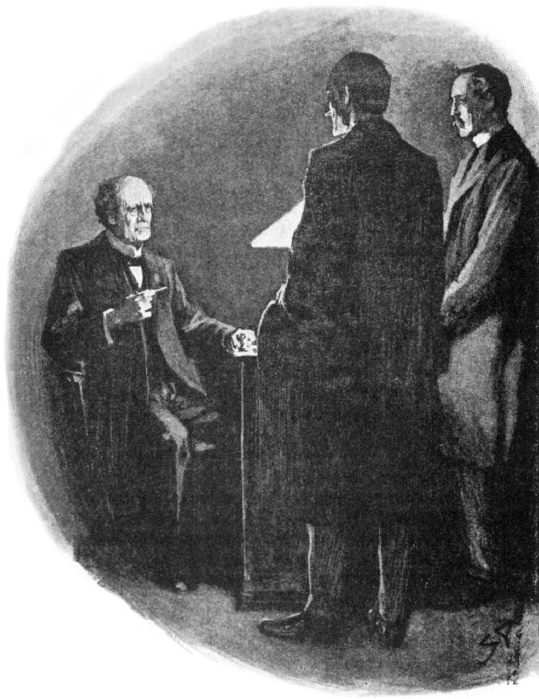

“我听说过你的大名，也清楚你的职业。”

“那你就是，大夫，把你自己置身于全国犯罪者的一边。”我的朋友冷冷地说。

“你的努力旨在遏制犯罪，先生，理应受到社会上每个人的支持，然而其实无须你越俎代庖，官方机构足以担当此项任务，达到这一目的。你每有光临，便多有无事生非，你探人隐私，揭人短处，搜集人家家丑而外扬；你无所事事，却浪费别人的宝贵时间。比如，就拿眼前来讲吧，我正在写一篇论文，没时间同你闲话。”

“也许是的，大夫，然而，此番谈话将证明比你这篇论文更为重要。不妨告诉你，我们所做，与你刚才的无端指责截然相反，我们竭尽全力不使个人隐私曝光。需要清醒的是，一旦落入警方手中，那倒非公之于社会不可。你应该视我为非正规的先遣队，行进在国家正规部队之先的前锋。我是来询问你戈弗雷·斯汤顿先生的事。”

“他怎么样？”

“你知道他，是不是？”

“他是我的至交密友。”

“他失踪了，你清楚吧？”

“哦，真的吗！”大夫脸庞严实，岿然不动。

“他昨晚离开旅馆——就再也没有消息。”

“没有问题，他会回来的。”

“可明天是大学橄榄球比赛。”

“我不关心这种儿童的游戏，我只深切关心这位年轻人的状况，我知道他、喜欢他。橄榄球比赛与我毫不相干。”

“你能关心他再好也没有，我在调查斯汤顿先生的下落，你知道他在哪里吗？”

“我怎么知道。”

“昨天以来，你没有见过他？”

“没有，我没有见过。”

“斯汤顿先生身体健康吗？”

“很健康。”

“你知道他生过病吗？”

“从不生病。”

福尔摩斯突然抖出一张纸伸到大夫眼前。“那么，也许你能解释一下这张十三几尼的单据，是上个月戈弗雷·斯汤顿先生付给剑桥你莱斯利·阿姆斯特朗大夫的收据，我从他书桌的文件中拣到的。”

大夫发怒，脸变红了。

“我不认为有必要向你解释，福尔摩斯先生。”

福尔摩斯把单据收回笔记本。“如果你不避讳作公开解释，那是指日可待的事。”他说，“我已经同你讲过，别人必定要张扬出去的事，我这里却能做得悄然无声。你放明智一点，尽可向我陈述一切。”

“我一无所知。”

“斯汤顿先生从伦敦给你写过信吗？”

“当然没有。”

“哎呀，哎呀——又是邮局的事！”福尔摩斯懒懒地叹口气道，“戈弗雷·斯汤顿从伦敦给你发了加急电报，是昨天晚上六点十五分——这封电报绝无疑问，同他失踪有关——而你，却没有收到。那是邮局该负责任，我一定要去找这儿的邮局，责问他们。”

莱斯利·阿姆斯特朗大夫从写字台后蹦了起来，深肤色的脸气得猪肝一般了。

“我请你出去，先生，”他说，“你可以去告诉雇用你的人，蒙特-詹姆斯爵士，我既不愿意和他本人也不愿意和他的代理人有任何交道。不，先生——别说了！”他猛按铃。“约翰，送两位出去！”神气的门房不客气地把我们送出屋。我们走到了街上，福尔摩斯发出大笑。

“莱斯利·阿姆斯特朗大夫真是位个性犟脾气倔的人，”他说，“少见有谁像他这样的。如果他把他的才智用到了莫里亚蒂<a href="#part0112.xhtml_ch2"
id="part0112.xhtml_ch2-back">(2)</a>那条路上去，就很糟糕，等于是厉害的莫里亚蒂起死回生又来了。现在，我可怜的华生，我们落成这样，在这不友好的城里遭遇搁浅，无处可去，而且案子没调查清楚还不能走。这家小旅馆，正好跟阿姆斯特朗屋子面对面，对我们挺合适。你去订个临街的房间，买些过夜的用品，我抓紧这点时间作些调查。”

福尔摩斯去作调查很费了一些时间，比他预计的要长，一直到将近九点才回到旅馆。他脸色苍白，神情沮丧，浑身灰土，看上去又饿又累。晚餐冷掉了，放在桌上，他抓起就吃。吃好，点上烟斗，就要发表一通议论——他每逢事情不顺利，总是如此，半是自嘲，但很发人深省。忽有马车辘辘，他立刻起身往窗外看，在煤气灯光下，一辆双驾灰马四轮大马车，停在了大夫门前。

“出去了三个钟头，”福尔摩斯说，“他是六点半走的，现在才回来。那么路程应该是十到十二英里，他一天跑一趟，还或许是两趟。”

“大夫出诊，这没有什么不正常。”

“可是阿姆斯特朗并非一般出诊大夫。他是讲师，会诊医师，不看普通病症，不然要妨碍他搞研究做学问。那么，这么远的路赶去，对他不是很大的负担嘛，他是去看谁呢？”

“他的马车夫——”

“我亲爱的华生，你以为我不是先从马车夫着手？我当然先去找马车夫，可不知是他自己品行刁恶还是受他主人的指使，他竟放狗来咬我。还好，我的手杖那么一扬，人、狗见了都要怕的。好了，这路走不通。关系这么一紧张，再要问就断了门路了。倒还是本旅店，院子里有一个人，是这儿老土地，还是好性格，向他打听到了线索。是他告诉我，大夫有什么习惯、白天怎么外出。正这么说着，他的话立刻验证，看见马车放到门前来了。”

“这不正好跟上马车去吗？”

“对啊，华生！今晚你真开窍，我也正是这样想的呢。你一定看到了，旅店隔壁有自行车行，我赶快进去租辆车，跨上就追，稍晚一步马车就要看不见了。总算被我赶上，小心拉开距离，保持一百码的样子。我盯着马车的灯光，跟出了城，走在乡村道路上，一路很顺。可是马上叫人难堪了，马车忽然停下，大夫下车，向后快步跑到我煞住的地方。他酸溜溜地嘲讽说，恐怕路太窄，马车在前面挡了我的路，请往前面去让我先走。来这么一下，将人一军，再巧妙也没有。我只好骑上车超过他的马车，在大路前面走，走了一两英里，找个地方停住车，看看后面，马车连影子都没有了。显然刚才有几条岔路，他已在哪一条岔路上岔掉。我往回骑，可是再也看不见马车。现在，你看，他在我后边回来了。本来我还没有充分的理由，不完全确定戈弗雷·斯汤顿的失踪同他这么出行一定有联系，只不过大体上对阿姆斯特朗大夫有关的事情也观察看看，反正他是有关系的，可是现在我发现，有人跟他一起走，他居然要这么紧张，事情就不一般了。我就要追住这一点不放手，非搞个水落石出不可。”

“我们明天再跟踪。”

“还能吗？恐怕没有你想的这么容易了。你不熟悉剑桥郡这里的地形吧？这里不便于隐蔽。今天晚上我一路经过的乡村，平坦整洁无遮掩，似乎你对一切均可了如指掌。我们跟踪的这个人，绝对不是个傻瓜，从今天晚上就充分看出来了。我已经用这里的地址向欧沃顿发电报，问他伦敦的情况如何，同时我们集中注意力在阿姆斯特朗大夫身上，他的名字还是多亏邮局那位年轻女士帮忙，被我在斯汤顿那份紧急电报的底稿上看到。斯汤顿这小伙子在哪里他阿姆斯特朗一定知道——这一点我可以保证。既然他知道，我们却侦查不出，那就是我们的无能了。现在很明显，牌在他手里捏着。我的习惯，你是知道的，华生，现在到了这份上，绝不中途撒手。”

第二天，我们仍然未能向解决疑案前进一步。吃过早饭，来了一张条子，福尔摩斯看了笑笑，递给我。条子写道：

先生：

我须坦率告诉你，你跟踪我的行动完全是浪费时间。昨晚你应已发现，我的马车有后窗。如果你愿意骑车跟我跑上二十英里，兜一圈结果是重新回到你的出发地，那就请便吧。同时，我可以通知你，刺探我没有用，对戈弗雷·斯汤顿先生不会有任何帮助。我确信，你对这位先生最好的做法，是赶快回到伦敦去向你的雇主汇报你无法找到斯汤顿。你在剑桥的时间肯定白费。

你的忠实的

莱斯利·阿姆斯特朗

“这位大夫是一个坦率、直爽的对手，”福尔摩斯说，“也好也好，他反而激起我的好奇心，我非要弄他个明白才走。”

“他的马车现在又在门口了，”我说，“他正要上车。我看见了，他一边跨步，一边朝我们这里的窗子望望。我骑车去跟踪他，让我试试怎么样？”

“不要，不要，我亲爱的华生！我知道你天性机敏，但我还是要说，这个大夫非等闲之辈，你不是他的对手。我考虑，还是让我一个人单独去侦查，或许能够达到目的。我看你还是随便做点什么好了，如果是两个陌生人一同出现在安静的乡村里探头探脑，就会引起许多猜测，会受到注意，这不能不防。好在你可以在这古老的城里观光，也自有乐趣。但愿不到晚上我就回来，能有好消息向你报告。”

然而，我的朋友不免又遭失败。他夜里回来，疲惫、失望。

“一天白费，华生。摸到大夫大致的方向，剑桥那边的几个村庄，都去过了。一整天时间，找酒店、消息灵通的地方去闲扯。我一口气走了好些地方：切斯特顿、希思顿、瓦特比契，还有欧金顿，都大失所望。按说，双驾四轮大马车一天里头在那种僻静地方出现，不会不叫人注意。大夫又赢分了。有电报来吗？”

“有，我拆了，你看：

向三一学院杰里米·狄克逊借庞倍。

我不明白什么意思。”

“噢，很清楚，是我们的朋友欧沃顿发的，回答了我问的一个问题。我得马上给杰里米·狄克逊捎个信，事情有望好转。另外，比赛的事有消息了吗？”

“有的，本地晚报有精彩报道，是最后消息。牛津队大胜，一场进一球，两场球门线触地球。最末一段这样写：

浅蓝队之所以失利，全应归咎于世界顶级球星戈弗雷·斯汤顿之未能出场，以致该队无时无刻不处于劣势。中卫线缺乏配合，致使攻防皆弱甚，全体前锋艰苦拼搏之努力遂告无效。”

“这么看，我们的朋友欧沃顿的预料完全应验。”福尔摩斯说，“从我个人来讲，我同意阿姆斯特朗大夫的看法，橄榄球也是从来不在我的眼里。今晚早点睡，华生，我估计明天一天有事忙着呢。”

翌晨醒来，我大吃一惊，看见福尔摩斯坐在火炉边，手持一支细小皮下注射针筒。我一见这针筒，就想到他性格上这个唯一的弱点，我最恼的就是看到他手上拿这晶亮闪光的针筒。他看我伤心发愣的样子，大笑，随即把针筒放在桌上。

“不必，不必担心，我亲爱的伙计，不必惊慌。眼前时刻，此非罪恶毒物。揭开我们的谜案，还非靠它不可，我是全寄希望于这根针筒。我外边稍作侦察，兜过一圈刚刚回来，一切事情都已就绪。把早饭吃个饱饱的，华生。我今天决心咬定阿姆斯特朗大夫不放松，一盯上他，我不直捣他老窝，不休息、不吃饭。”

“那样的话，”我说，“我们最好把早饭带上就走，他很早就要出发，他的马车在门口了。”

“不急，让他走，如果他能驾车把我甩掉，让我跟不上他，就算他高明。等你吃好，同我一起下楼，我要向你介绍一位侦探，我们眼前要完成的任务，有赖于这位绝对杰出的专家。”

我跟随福尔摩斯下了楼，来到马厩院子里。他打开一扇单厩门，放出一条短腿矮胖的狗，两耳下垂，黄白相间，既像猎兔犬又像猎狐犬。

“我来把你介绍给庞倍认识一下，”他说，“庞倍是本地著名的跟踪犬——跑的速度不是很快，它的身架子可以看得出，就是追踪嗅迹特别灵敏。好，庞倍，你不用跑得很快，不过，对两位中年伦敦先生也就够快的了，会跟不上你，所以，只好委屈一点，给你加个皮带颈圈。好了，宝贝，来吧，今天就看你的了。”

他领着狗过街到大夫门前。狗立刻嗅了一圈，便昂头尖叫一声，沿街向前跑去，绷直了皮带跑得可欢。半个小时以后，我们已经出了城，飞奔在乡村的大路上。

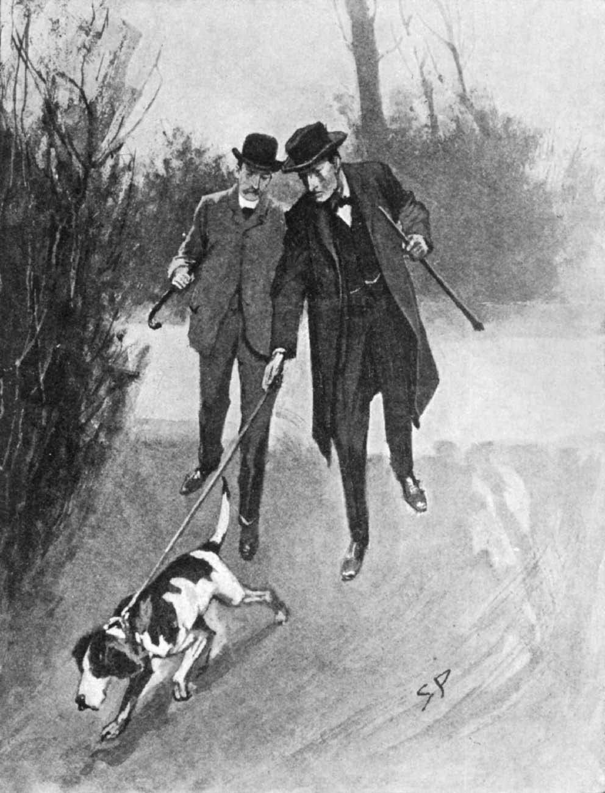

飞奔在乡村的大路上。

“你都做了些什么，福尔摩斯？”我问。

“老招数、老办法，用得着时挺管用。一清早我到大夫的院子里，拿了一针筒的茴香油洒在他马车的后轮上。一条训练有素的跟踪狗追踪茴香油的气味，从这里直追他到格罗茨约翰<a href="#part0112.xhtml_ch3"
id="part0112.xhtml_ch3-back">(3)</a>；我们的朋友，阿姆斯特朗，他别想甩得掉庞倍的追踪，除非他的马车从凯姆河里游过去，洗干净。噢，这家伙真狡猾！原来是这样，前晚上我就是这样给他甩掉的。”

这时狗忽然离开大路，转入一条长满野草的小道。小道走了半英里多的样子，又转上了另一条宽阔的大路。嗅迹一下就右转，通向我们刚刚离开的城镇。大路拐向城南，与我们出发的方向刚好相反。

“他这个迂回完全是为对付我们的，看得出吧？”福尔摩斯说，“怪不得向村里人打听，都一问三不知。大夫的这个把戏耍得真地道，可是他这样巧设迷阵，更需要知道是何用心了。这里，我们右边，应该是特朗平顿村。哟！那是他的马车，拐弯了，是朝这儿来。快，华生，别让他看见了！”

我们穿过一道树篱缺口躲进野地，随后拽住庞倍不许乱动。我们刚在矮树篱后面藏好，马车就疾驶而过。我看见车厢里坐着阿姆斯特朗大夫，肩膀塌下，低垂着头两手捂脸。这是沮丧的状态。我从伙伴严峻的面色知道他也看见了。

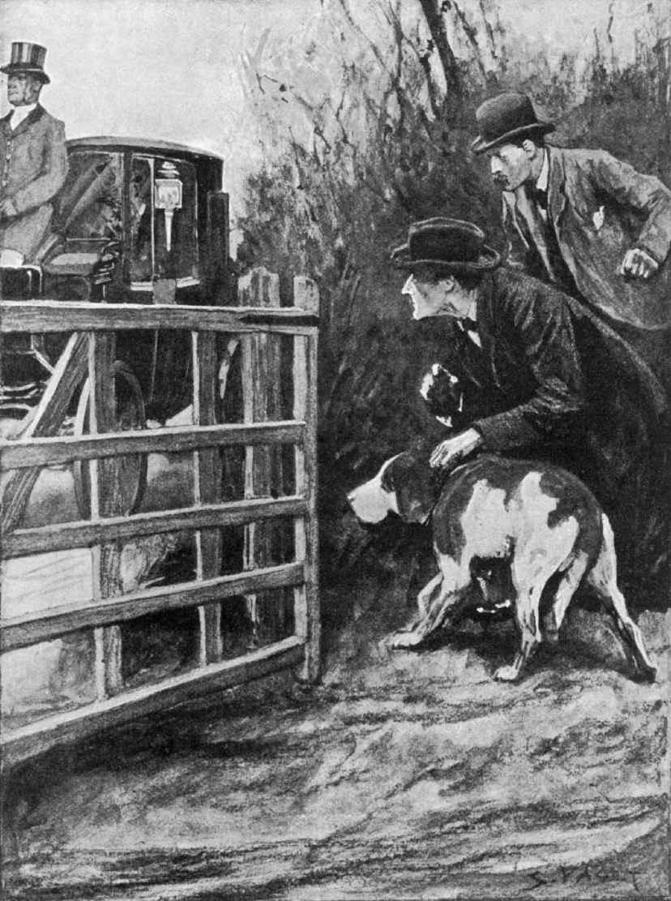

我们刚在矮树篱后面藏好，马车就疾驶而过。

“我们这事，弄不好吉少凶多，”他说，“很快就见分晓。来，庞倍！啊，那边野地里，一幢小屋！”

至此我们无疑已经到达征程的终点，庞倍在篱门外打着圈，使劲地叫。地上有马车印迹清晰可辨，一条小道通向这幢孤屋。福尔摩斯把狗拴在树篱上，立刻快步上前。他敲敲简陋的屋门，敲了又敲，没有回应。这房子并非无人的空屋，我们耳闻有低低的声音——一阵阵悲哀、绝望的啜泣声，令人极度伤心。福尔摩斯住手犹豫了一下，回头朝刚才来的那条大路望望，看见有辆马车过来，双驾灰色马，大夫的车，没错。

“啊，大夫绕回来了！”福尔摩斯叫道，“这下不好了。趁他没到，快看看是怎么回事。”

他推开了门，跨进门厅。啜泣声传入我们耳朵，变得更响，进而成了拖长的呜咽，如泣如诉。声音来自楼上。福尔摩斯冲上楼去，我随后紧跟。他推开一扇虚掩的房门，一看屋内的情景，两人都站着怔住了。

一个年轻、美貌的女人，躺在床上，死了。她那安详、苍白的脸，黯然地睁着的蓝色的眼睛，在一团浓密的金黄色长发中仰面而望。床跟前，是一个年轻的男人，半蹲半跪，脸埋床单，哭得浑身抽搐。他完全沉浸在悲痛之中，不知身外一切，福尔摩斯把手搭在他的肩膀上，他才抬起头来。

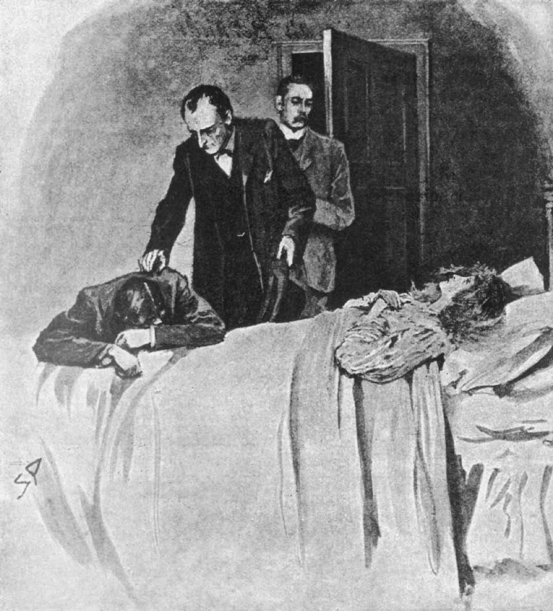

他完全沉浸在悲痛之中。

“你是戈弗雷·斯汤顿先生吧？”

“是，是的，我是——可是晚了，她已经死了。”

这个人已悲痛欲绝、没了神魂，不明白我们根本不是他所求救要请的医生。福尔摩斯正要讲话安慰他几句，告诉他这样突然失踪引起他朋友多大的惊恐，这时楼梯上脚步噔噔响，阿姆斯特朗大夫到了房门口，板着一张沉痛、严厉、质问的脸。

“哼，两位先生，”他说，“你们终于达到目的，还是在这样紧要关头私闯滋事，我不想吵嚷，扰了死者的安宁。可你们要知道，如果我稍年轻一点，我绝不饶过你们这么恶劣的行为。”

“很对不起，阿姆斯特朗大夫，我想我们之间有点小小的误会，”我的朋友神色庄重地说道，“一起到楼下去，我们可以互相谈谈清楚，这件事很不幸。”

一分钟后，铁板着脸的大夫和我们一起来到楼下的起居室。

“好吧，请讲？”他说。

“首先，希望你能明白，我没有受雇于蒙特-詹姆斯爵士，这件事情上我完全不赞同这位贵族先生。有人失踪了，提到我这里，我就要寻找下落。到了现在这一步，我的事情已告结束。只要并非刑事罪案，我责无旁贷，必须保守私密，不使其公开变成谣言。我看下来，此事不是违法案件，你可以绝对信赖我会谨慎处置。我通力合作，事情不会捅到报纸上去。”

阿姆斯特朗大夫听罢，立刻跨上一步，紧紧握住福尔摩斯的手。

“你是一个好人，”他说，“是我错怪了你。我感到丢下可怜的斯汤顿单独一人陷于如此境地，很是过意不去，就掉转马头再回来，因此又遇上了你，此事要感谢上帝。既然你已了解那么多，情况也就很容易解释清楚了。一年以前，戈弗雷·斯汤顿在伦敦住的那段时间，对房东太太的女儿产生感情，爱得很深，就娶了她。姑娘长得美，心地也像她人一样美，还加上聪明智慧高。哪个男人能娶上这么个妻子都是够光彩的，绝不丢脸。可是，戈弗雷偏是那个心胸狭窄的老贵族的继承人，他娶上这么一个妻子的消息要是让老头知道，定要取消他的继承权。我对小伙子相知甚深，这个人有好多优秀品质，我十分喜欢。我尽我所能从旁扶持，把他的事情摆稳。我们把这桩婚姻包得密不透风，这种事，只要有一人知道，那就一传十、十传百，很快人人都知道。还好有这幢孤零小屋，戈弗雷自己也谨慎，他至今能成功地守住秘密。除了我，还有一个忠诚的仆人，没有别人知道。仆人现在上特朗平顿还想求医找人。可是斯汤顿最终逃脱不了疾病这种最危险的打击，夺去了他爱妻的生命。她患的是一种最致命的肺病。可怜的孩子伤心得快疯了，节骨眼上还要去伦敦参加比赛，要是不去参加，就要说明理由，这样会把这个秘密暴露。我发电报安慰他，他回电请我尽力挽救。就是这封电报，不知怎么会让你看到。我没有告诉他病情已到极危险关头，生命垂危，我清楚，把他叫回来这儿，也无济于事，但是我把实情告诉了女孩她爸爸。她父亲不懂利害关系，不会处理事情，去告诉了戈弗雷。结果就是，他像发了疯似的，跑掉了，跑到这里，也无能为力，只有跪在妻子的床前。到了今天早晨，她终于病死。这就是全部情况，福尔摩斯先生，我确信，你是谨慎的，还有你的朋友，都言而有信。”

福尔摩斯紧握一下大夫的手。

“走吧，华生。”他说。我们于是离开悲哀之屋，走进冬日惨淡的阳光之中。

（1904年）

————————————————————

<a href="#part0112.xhtml_ch1-back" id="part0112.xhtml_ch1">(1)</a> 私家旅馆（private
hotel），个人经营的酒店、旅馆，非属公司集团性质的大型宾馆。

<a href="#part0112.xhtml_ch2-back" id="part0112.xhtml_ch2">(2)</a> 莫里亚蒂（Moriarty），大教授，罪恶势力魁首，福尔摩斯的劲敌，在《福尔摩斯探案全集之四·回忆录》的《最后一案》中被福尔摩斯斗败命亡。

<a href="#part0112.xhtml_ch3-back" id="part0112.xhtml_ch3">(3)</a> 格罗茨约翰（John
O'Groats），英国极北端一乡村名，常被用以形容地域遥远。

# 格兰吉庄园

这是个奇冷的深夜，霜寒的凌晨。一八九七年冬末的一天，我突然被人摇肩推醒。噢，是福尔摩斯。他手持蜡烛，俯身向我，面色紧张，我一见就知道有要紧事了。

“快，华生，快！”他喊道，“事情紧急。先别问！快穿上衣服，马上就走！”

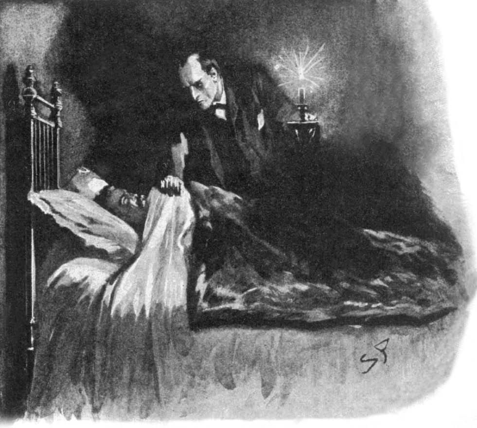

“快，华生，快！事情紧急。”他喊道。

十分钟后我们乘上马车，辚辚驶过一条条沉静的街道，一路直奔查令十字街火车站。冬日的晨曦已经微露，笼罩伦敦的灰白浓雾中，偶尔看见上早班工人的朦胧身影从旁经过。福尔摩斯裹紧厚大衣一言不发，我跟随在后也是一样；寒气实在凛冽，又都饿着肚子没吃早饭。

后来在车站上喝过热茶，上了开往肯特郡的火车找位子坐定，身子才暖和起来。于是他开讲，我倾听。福尔摩斯先从口袋里掏出一封简信，大声念道：

格兰吉庄园

马舍姆，肯特

下午3:30

亲爱的福尔摩斯先生：

一桩有望是奇异大案，你若即刻襄助，甚为荣幸。且侦破此种案件适合你的专长。现场仅将被缚夫人松绑，其余一切均如我初见，丝毫未动。务请火速前来，任尤斯塔斯爵士留于该处不妥。

你忠实的

斯坦利·霍普金斯

“霍普金斯的破案，找我参与其事已有七次，每次都很重要，他是认真慎重的，”福尔摩斯说，“我想你一定把他提供的几个案子都收入了你的集子。应该说，华生，你全靠选材得当，才大大弥补了你叙述方面的不足，你的描述是很可惜的。你的致命弱点，老是从讲故事的角度，而不是从破案的科学实践的角度，来写案情过程，这就破坏了一系列典型案例的示范作用和教育作用。每逢刑侦破案的技术手法最高超、最精微处，你就一笔带过，却过于看重惊险紧张的情节，这固然能激动读者，但是不可能教育读者。”

“那你自己为什么不写呢？”我说，有点反唇相讥。

“我要写的，亲爱的华生，要写的。现在，你看，我都忙不过来，等以后，准备投入我的人生余年来完成一部教科书，要集刑侦艺术之大成于一卷。眼前我们要处理的案子，看来是件谋杀案。”

“你认为尤斯塔斯爵士已经死了，是吗？”

“是这样。霍普金斯写的信，看得出他相当激动，须知他不是一个容易激动的人。是的，我估计是行凶杀人，被害人尸体留待我们去检查。如果是自杀，他绝不至于会找我去。给女士松绑，说明惨案发生的时候，给捆绑禁锢在房里。我们这是接手上流社会的案子，华生，高级纸，E．B．花押字母，盾形纹章，这个地点，风景如画。再者，霍普金斯是个讲话实在的人，绝不会是小题大做，所以，今天上午会够我们忙的。案发时间，是昨夜十二点以前。”

“你怎么知道的？”

“查一查火车班次，计算一下时间，就知道。当地警方接到报警，地方要上报转达苏格兰警场，霍普金斯从警场出动，回头再发信叫我。做这么些事情，没有一夜时间是不行的。哦，奇斯尔赫斯特站，到了。这些疑问很快就能清楚。”

马车在狭窄的乡间小道上赶了两英里的路，我们来到一座园林门前。一个管门老人打开大门，他那倦怠惊惧的面容反映着出了不幸的大事。林荫道穿过壮美的园林，夹道古榆参天，到一幢低平开阔的宅邸，正面是帕拉蒂奥立柱<a href="#part0113.xhtml_ch1"
id="part0113.xhtml_ch1-back">(1)</a>。中间主屋部分年代久远，盖满常春藤，只有那高大的窗户，明显已经过现代改造，翼房看上去完全是新式建筑。英气勃勃的年轻警官斯坦利·霍普金斯，一脸的机警与急切，跨出屋门向我们迎上来。

“你能来真是太高兴了，福尔摩斯先生，噢，你好，华生大夫。不过说实在的，刚接手的时候不紧张的话，我不会来麻烦你们。后来夫人醒了过来，她把事情讲得完全清楚了，我们也就没有太多的事要做了。你还记得路易山姆那伙强盗吗？”

“怎么，是他们，兰德尔三人帮？”

“就是，兰德尔父子三人，就是他们干的。我确信这一点。两周以前，他们在西顿汉姆作案，有人亲眼目睹，我们记录在案。这么快又下了毒手，手法一样，差不多。就是他们干的，没问题，这一回非把他们绞死不可。”

“尤斯塔斯爵士死了吗？”

“死了，他的头颅被打碎，用他的通条砸的。”

“他叫尤斯塔斯·布莱肯斯特尔，马车夫告诉我说。”

“是的——肯特郡首富——布莱肯斯特尔夫人现在正在阳光起居室。可怜的夫人，从来没有经受过这么可怕的惊吓。我看见她的时候，人也是半死了。我想，你见见她，听她把事情经过讲一讲，再一起上餐厅去检查。”

布莱肯斯特尔夫人仪表非凡。我很少看见有这么仪态优雅、这么女性十足、这么美貌的女子。她皮肤细白柔嫩，金黄长发，碧蓝的眼睛，眉目端庄秀丽，真可谓天姿国色。只是发生不幸事件，使她面色紧张而憔悴。她不仅遭受精神上，也遭受肉体上的痛苦，有一只眼睛受伤红肿。她的女仆，一个面容严肃的高个子妇女，正用稀释的醋剂小心地在给她擦洗眼睛。夫人疲惫地躺在睡椅上，但是我们一进去，看到她那敏锐的目光、以及美丽的脸庞上那机警的神态，表明她的智慧和勇气并没有因这次意外遭遇而丧失。她穿一件宽松的银蓝色睡袍，身旁还放着一件缀有黑色闪光饰片的餐厅服。

“发生的事情我都已经告诉你了，霍普金斯先生，”夫人困乏地说道，“你就替我讲一讲吧。啊，如果一定要我讲，那么我给两位先生再把经过重复一遍。他们餐厅去过了吗？”

“两位要先听夫人讲讲情况。”

“听你们安排，也很好。我一想起他还躺在那儿，心里真害怕。”她身体战栗，双手捂住脸。这么手一抬起，睡衣的大袖从臂上滑落。福尔摩斯一声惊叫：“你还有伤呢，夫人！这是怎么啦？”一条浑圆雪白的前臂上有两块明显的红肿伤痕。夫人赶忙将袖口掩住。

“这不是，不是今晚上的，跟这事没关系。你和这位朋友都请坐，我把一切都告诉你们。

“我是尤斯塔斯·布莱肯斯特尔爵士的妻子，结婚才一年。我想这一点不必掩饰，我们的婚姻并不愉快。即使我不讲，邻居们也要讲的。可能有一方面是我的过错。我是在南澳大利亚长大的，环境比较自由，不保守。这里的英国生活，讲究礼节，太古板，我不适应。不过主要还不是这个，主要原因是他不名誉的事，也是人人都知道的，那就是尤斯塔斯爵士是个酗酒成性的酒鬼，同这样的人我一个小时也相处不了。一个鲜灵活跳的女人，整日整夜拴在他身上，想想那是一种什么日子？认为这样一种婚姻仍要维持，那是犯罪，是亵渎，是不道德。我要说，你们这种害人的法律给这个国家只带来祸害——上帝绝不会容忍这样的罪孽。”她忽地坐了起来，两颊通红，眉眶下受伤的眼睛射着怒火。这时，态度严肃的女仆伸出有力的大手温柔地扶她把头枕在靠垫上。夫人平静了下来，狂怒转为了动情的抽泣。她又继续讲下去：

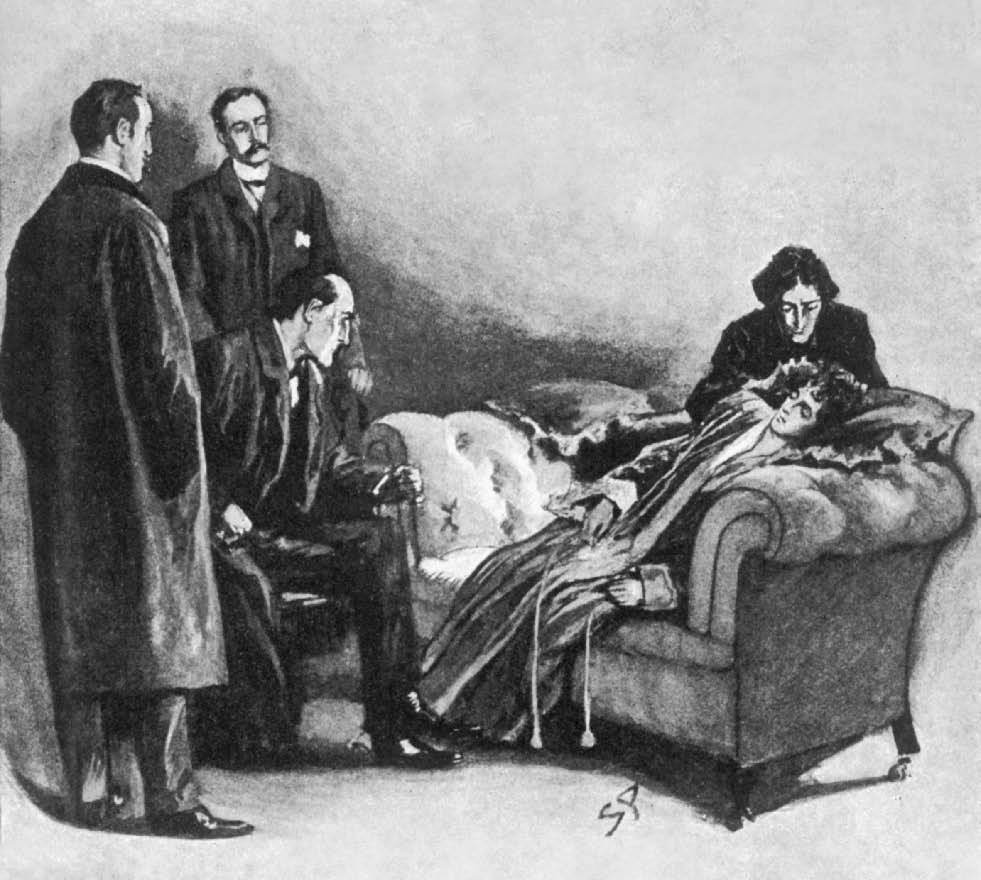

女仆温柔地扶她把头枕在靠垫上。

“现在说昨晚的事。你们也许知道，这幢屋子，仆人都睡在新建的侧房，这中间的屋子包括起居室，后面厨房，楼上我们的卧室。我的女仆，泰瑞莎，睡在我房间的楼上。此外没有别人，这里有响声，侧房离得远，那边听不见。这情况强盗一定知道，否则他们不敢那么大胆。

“尤斯塔斯爵士大约十点半歇息。仆人都已经回他们各自的住房。只有我的仆人还没有睡，在顶楼她自己的房里，我有事就叫她。我在这里一直坐到十一点过后，在埋头读一本书。后来就四周看看门窗是否都关好，便准备上楼，这是我的习惯，我亲自做。因为，我已经讲过了，尤斯塔斯爵士从来靠不住。我走进厨房、配餐室、猎枪室、撞球房、客厅，最后到餐厅。我走近窗口，窗上挂着厚窗帘，忽然感觉有风吹在脸上，就知道窗打开着。我把窗帘往边上一拉，看到一个人，差不多是个老人了，耸着肩同我面对面，是进了屋藏在那里的。窗是法国式落地长窗，也是门，可以通外面草坪。我手里拿着卧室的蜡烛台，照着光看到这个人的后面还有两个人，正在走进来。我吓得往后退，可是这个人已经向我扑上来，一把抓住我手腕，又卡住我脖子。我张嘴想喊，他朝我眼睛上猛地就是一拳，把我打倒在地上。我被打昏了，昏过去好几分钟。等醒过来，看见他们把拉铃绳都扯断了，我被绑在了餐桌那头的橡木椅子上，捆得扎扎实实，一点也不能动。他们用手绢扎紧我的嘴，使我一点也出不了声。在这时候，我丈夫进来，正好撞上。他肯定是听到了响声，起疑心，有所戒备。他穿着睡衣睡裤，手里拿根棍子，他喜欢使的那根黑刺李木棍。他向着那两个强盗冲上去，可是旁边一个人——那个老头——弯腰从炉栅上拿起通条，爵士打他身旁过，正好叫他狠命砸了一通条。爵士哼一声倒在地上，再也没能动一动。我又一次昏厥过去，也是没几分钟。等我睁开眼，看见他们从餐橱拿了银器，一瓶酒立在桌上，三个人手里都拿着酒杯在喝。我讲过一个是老头，有胡子，另两个，没有讲，是年轻人，嘴上没毛的孩子，看样子是父亲同两个儿子。三人咬着耳朵说话，末了走过来，看看我没有一点松动，就走了，随手把长窗带上。我挣扎了刻把钟，才把手绢挣掉，就高声喊叫。女仆下来了，把我放开。其他仆人也很快来了，我们赶快报警，本地警察马上同伦敦联系。整个情况就是这样，我如实报告两位。我是讲一次痛心一次，但愿以后没有必要再讲了。”

“有问题吗，福尔摩斯先生？”霍普金斯问道。

“我不想再叨扰布莱肯斯特尔夫人，不要再耽搁她的时间了，”福尔摩斯说，“去餐厅之前，我很想听你讲讲是怎么个情况。”他转眼瞧着女仆。

“有三个人，还没进屋的时候，我就已经看到了。”女仆说，“我靠窗坐在床上，望下去，看见月光里有三个人在大门那边。可是我没去多想。过了一个多小时，听到女主人喊叫，我跑了下去，看到了，真可怜，就是太太自己讲的那样子。主人躺在地板上，血、脑浆溅了一屋子。碰到这样的事情，叫一个女人家是一点办法也没有。她给绑在那里，衣服上溅着主人的血。太太还真是坚强的，要不是这位以前阿得雷德有名的玛丽·弗雷泽小姐，现在的格兰吉庄园布莱肯斯特尔夫人，谁能禁得起这样的惊吓。你们问得已经够多了，诸位先生，现在太太要进自己房里了，要我老泰瑞莎陪着好好休息啦。”

这个瘦削的女人如母亲般的温柔，用胳膊扶住女主人走了。

“她伺候了夫人一辈子，”霍普金斯说，“从小是她抱大的，跟随一起来到英国，都是第一次离开澳大利亚，那是十八个月以前。她的姓名是泰瑞莎·赖特。这样的女仆，如今是没处找喽。请从这儿走，福尔摩斯先生！”

原来浓厚的兴致从福尔摩斯表情丰富的脸上减退了，我知道，本案的吸引力随着谜团的消失而消失，只剩下缉拿罪犯就行了。这类宵小无赖，用得着他湿手弄脏来对付吗？一个学问深奥专解疑难杂症的专家，结果发现被邀请来治疗小毛病，委实有些恼火，这我从我朋友的眼睛里看得出来。然而，格兰吉庄园那餐厅里的情景，却是奇特、不可小觑，足以逮住他的注意力，唤回他已在减退的兴趣。

餐厅是间又高又大的屋子，栎木雕花顶板，栎木护墙板，厅壁四周墙面饰有精致的鹿头标本和古代兵器。门的对面就是高高的法国落地长窗，我们已经听说过了。右边有三扇较小的窗，使厅里充满寒冬的日照。左边是一座又大又深的壁炉，罩着一个栎木大壁炉架。壁炉边有一把沉重的栎木扶手椅，椅底有横档。椅子穿空环绕一根红绳子，绳子还绑在下面的木档上。解开夫人的时候，绳子从她身上掉下，但是打的绳结并没有解开。这些细节都是以后才引起我们的注意，现在我们光顾着检看那具可怕的尸体，正躺在壁炉前的虎皮地毯上。

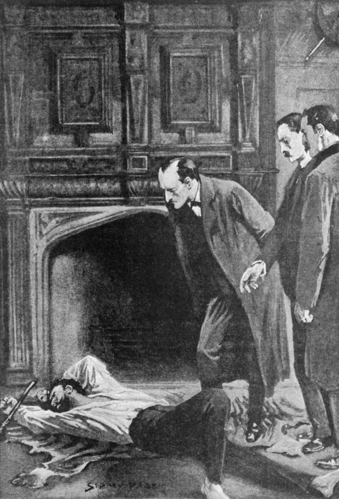

那具可怕的尸体，正躺在壁炉前。

这个人身材高大魁梧，年龄在四十左右，仰卧在地，脸向上，黑短胡子中咧嘴龇着白牙。他两手握拳，伸过头顶，一根粗短的黑刺李木棍横搁在手上。他皮肤黝黑，鹰钩鼻，原貌端庄，但仇恨使他面部痉挛歪扭而狰狞可怕。很明显，事情刚发生的时候他已经在床上，因为他穿着华丽的绣花睡衣，裤腿伸着光脚丫子。他头部遭重创致命，屋子里血浆四溅，可见这致命的一击极其凶狠有力。身旁就丢着那根粗重的通条，铁通条因猛击已有弯折。福尔摩斯拿起铁棒看看，再检查被这铁棒敲死的人。

“这个凶手，一定力大无比，这个兰德尔老头子。”他说道。

“是的，”霍普金斯说，“我有这个人的档案，他是个惯犯，可厉害。”

“你抓这个凶犯应该没问题。”

“一点问题也没有。我们一直在追踪他，有人说他已经逃到了美国，现在知道他们一伙还在英国，我看他们怎么也逃不了。已经通知各个港口警戒，晚上之前还要发出悬赏通缉令。叫我搞不懂的是他们干吗做得那么疯狂、愚蠢，不怕夫人一定会讲出他们的模样，让我们一听就不难确认是他们一伙。”

“很对，一般也要灭布莱肯斯特尔夫人的口，不能放过。”

“他们可能没有想到，”我插话说，“夫人还会醒过来。”

“这倒很有可能。她已经昏死过去，所以强盗才没有把她杀掉。这个遭难的爵士，是怎么个情况，霍普金斯？我听下来他有点不是很好。”

“这个人不喝酒清醒的时候是个好人，一喝酒那就不得了，十足的魔鬼，即使半醉也是，不过他喝得人事不省倒也难得。就是半醉不醉这时候，如同魔鬼附身，什么事都干得出来。我听说，别看他有钱有身价有头衔，有几次几乎要闹到我们警察局里来，说是他把狗浇上煤油，点火活活烧死——就是夫人她的狗，这事费了好大劲才平息下来。还有一回，他拿起盛水瓶向女仆泰瑞莎·赖特扔过去——这也惹起一场风波。这么看来，你我私下里说说，这个家没有他倒还干净。你在找什么？”

福尔摩斯跪下身子，很仔细地检查捆绑夫人的那根红绳的绳结，又细细研究绳子的断口，这是强盗扯断的，留有碎梢头。

“这绳子一扯，厨房里的铃不会响声大作吗？”他说道。

“没人听得见。厨房在屋子的后面。”

“强盗怎么晓得扯铃绳没人听得见铃声？他这么不在乎，胆子也太大了吧？”

“说得有道理，福尔摩斯先生，说得有道理。你这个问题提得好，我要反复问问自己才行。这么说，此人熟悉这屋子和屋子的居住情况。他肯定知道仆人这时间都已经早早睡了，知道没人听得见厨房的铃声，因此，必定同哪个仆人有关系，这是明摆着的事。但是仆人有八个，个个都是好品格，没有问题的。”

“人人都无异常情况的话，”福尔摩斯说道，“那就要怀疑到被主人向头上掷水瓶的那个人，这么一来，又要牵出背叛女主人的问题，这个女人对女主人可是忠诚伺候了一辈子呢。好吧，这个问题不管它了，等你逮住兰德尔，也就不难找出同谋是谁。夫人的陈述似乎有必要核实，也属必须吧，把我们眼前所见现场证据加以验证。”他走向法国式长窗，把窗打开，“没有痕迹，地上太坚硬，不可能找到痕迹。壁炉架上的蜡烛都点过的。”

“是的，点蜡烛有光，那是夫人卧房的蜡烛，强盗才能看得清。”

“他们拿掉了什么呢？”

“哦，东西是没拿什么——也就是餐柜里六七件银器。布莱肯斯特尔夫人认为他们打死了尤斯塔斯爵士就慌了手脚，来不及抢劫整幢屋子，只好逃跑了。”

“也有道理。可是他们还喝酒呢，我知道。”

“那是为了镇定神经吧。”

“也对。我看是，餐柜上的三只玻璃杯没有动过吧？”

“是的，原样没动。”

“我们看看。哦呵！这是什么？”

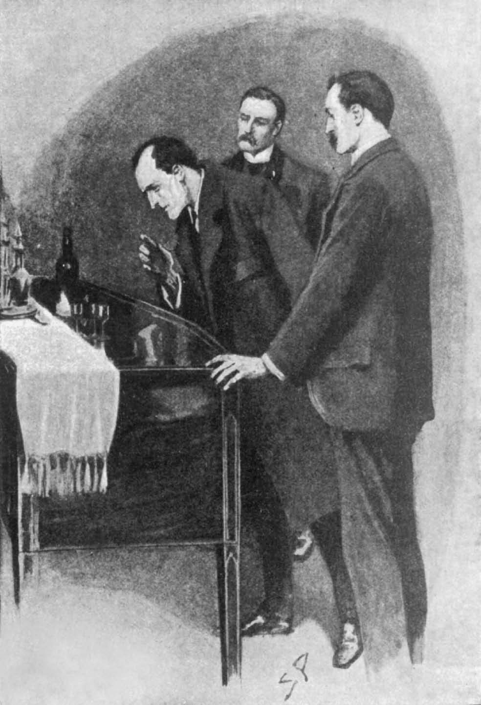

“我们看看。这是什么？”

三个杯子都在一起，都盛过酒，一个杯子里还有剩酒。杯子旁边就是酒瓶，还有三分之二的酒。酒瓶旁边搁着一个长长的不干净的软木瓶塞。瓶塞的样子和酒瓶上的灰尘表明三个凶手喝的绝非普通葡萄酒。

福尔摩斯神态焕然一新，无精打采的表情一扫而光，我又看到他那对深邃的眼睛放射兴致勃勃的机警光芒。他拿起软木塞来细细察看。

“这个瓶塞他们是怎么拔出来的？”他问。

霍普金斯指指一个半拉开的抽屉，抽屉里放有餐巾和一把大的开瓶塞钻子。

“布莱肯斯特尔夫人说这钻子用过没有？”

“没有，你记得她说晕过去了，他们开瓶她当然不会知道。”

“是这样。实际上，这把钻没有用过。这瓶酒是用袖珍螺钻开的，多半就是小折刀的螺钻，长不过一英寸半。你看看木塞顶端，可以看出螺钻钻了三次才把瓶塞拔了出来。塞子没有戳穿。用这把长钻子就能戳穿，只一拔就能拔出来。等你抓住了他，搜他身，一定会发现他有一把万能刀。”

“高妙！”霍普金斯说。

“可是，三个玻璃杯叫我看不懂，我不懂。布莱肯斯特尔夫人确实看见三个人是喝了酒的，是不是？”

“是啊，她这一点讲得很清楚。”

“那就这样了，事情完了。还有什么要讲的吗？那，还有，你得承认，这三个杯子有名堂，霍普金斯。什么？你看不出名堂？啊，好，这不管它。或许，像我这号人，有点知识，有点本领，观察、做事就明明简单的偏不简单，要舍简就繁。好吧，杯子的事权当偶然。那就再见了，霍普金斯，我看不出我对你还有什么用，你似乎对你这案子非常有把握。等兰德尔抓到了，别忘了告诉我一声，还有抓到以后是什么个下文。相信你能顺利了结本案，到时我知道了立刻向你祝贺。走吧，华生，我们回家还有更多的事要做呢。”

返家途中，我从福尔摩斯脸上看出，他对观察到的情况满腹狐疑。虽然他一时尽量丢开疑团，声称这事情已经清楚，可以解决了，但一会儿又疑窦丛生起来，双眉紧蹙，两眼茫然，表明他的思绪又回到了格兰吉庄园大餐厅里，丢不开那夜半凶案发生的地方。最后，他当机立断，火车在一个郊区小站刚刚启动的时候，往月台上跳，随后一把拉着我也下了火车。

“请原谅，我亲爱的伙计，”他说道，目送火车离去，一拐弯尾车厢也看不见了，“真对不起，我这么心血来潮要把你拖累了。可是无论如何，我绝不能把这个案子在这样的情况下丢手不管。我根根神经在跳，事情不对头，我们错了——完全错了——我能发誓，我们错了。可是，夫人所讲无懈可击，女仆的证明又很充分，各个环节都站得住脚，我还能有什么可怀疑的呢？三只酒杯，问题全在里头。如果我不是想当然，如果我们重新对本案以应有的谨慎审视每个细节，不让现成说法自障耳目，我怎么会抓不到确切的事实根据呢？我是应该能抓到的。这儿凳子上坐，华生，等火车来，我们到奇斯尔赫斯特去，听我把证据向你摊一摊。首先让你解除这个想法，认为女仆和她的女主人所讲一定是正确的。我们不要为夫人可人的外貌所迷惑，影响了我们的判断。

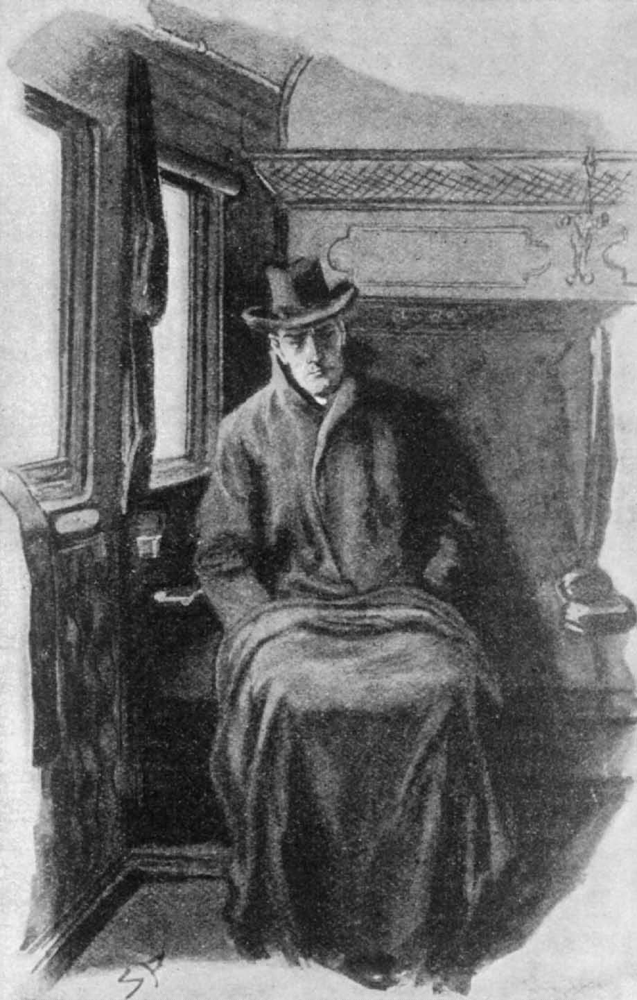

“我这么心血来潮要把你拖累了。”

“夫人讲的有好些地方，只要头脑冷静地想想，足以引起我们的怀疑。这三个夜贼两周以前刚在西顿汉姆打劫捞了一票，报纸上对他们的行动、相貌都有报道、描述，就很容易被拿来编故事，将作案往他们头上栽。实际上，盗贼得手一大票以后，一般总是销声匿迹一段时间，享乐消受，不会紧接着又铤而走险。还有，强盗在晚上那么早的时间作案，不大可能；对一位女士，用殴打来不使喊叫，不大可能，不打不一定叫，一打必定要叫；强盗有三个人，足够制伏一个男人，一上来就把他打死，不大可能；只抢那么点东西就满足，还有好多东西随手可得都没拿，不大可能；最后一点，我说是最不可能，强盗留下的半瓶酒。这么些不可能，你是怎么认为呢，华生？”

“加在一起看，倒是值得考虑，分开来看，未必不可能。所有这一切，我觉得最奇怪的是，夫人被绑在椅子上。”

“哦，这一点，我也不太明白，华生，应当是要么把她也杀死，要么把她绑到看不见的地方，有利他们逃跑。不管怎么样，我的看法是夫人所讲并非事实，不是吗？而现在，最最关键，是酒杯有问题。”

“酒杯怎么样？”

“你用心看看，看清楚吗？”

“看得很清楚。”

“我们被告知是三个人用酒杯喝酒，你觉得可能吗？”

“有什么不可能？三个杯子都有酒嘛。”

“没错，但是只有一个杯子里剩有陈酒的蜜蜂翅似的酒膜垢。这个情况你想想看，心中得到什么启发？”

“最后一杯倒满了最容易剩酒膜垢。”

“不对。整瓶酒有陈酒膜，不能想象前两杯倒的是清酒，第三杯是浊酒。有两种可能的解释，只有两种可能，一种是，倒好两杯之后，把酒瓶用力摇动，这第三杯便多了膜垢。这不大可能。不，不是，我肯定不是这样。”

“再一种可能呢？”

“只用了两个杯子，两杯酒的剩酒都倒进了第三个杯子，这样就造成了三个人喝酒的假象。所以，只有一个杯子有蜂翅酒膜，是不是这样呢？是这样，我相信就是这样。如果这个细小的环节给我讲对了，那么，本案立刻就变了样，很不一般，大有蹊跷了，说明布莱肯斯特尔夫人和她的女仆向我们讲的是一派谎言，她们编造故事，一个字都不可信；说明她们因为什么样重大的原因，在开脱、掩护真正的罪犯。因此，我们必须重新审查这个案件，摆脱她们的影响，按我们自己的路走，这就是现在放在我们面前的任务。来了，华生，这是去西顿汉姆的火车。”

格兰吉庄园的人看见我们回来，都大为惊讶。福尔摩斯发现斯坦利·霍普金斯已经去向上级报告，他就进入餐厅，把门从里面锁上。他扑在里面两个钟头，作了精确细致的调查，找出强有力的证据，以此为坚实的基础筑起了演绎推理的辉煌大厦。我坐在一边，像是一个学生，兴致勃勃地注视着教授的示范动作。我又亦步亦趋，跟随他进行缜密的研究。窗户、窗帘、地毯、椅子、绳子——一一作出细致的观察、恰当的分析。爵士的尸体已经移走，其他一切仍保持原貌，同上午所见一样。最后，使我十分意外，福尔摩斯竟爬到高高的壁炉台上。原来，在他头顶上方，垂着几英寸长的一根红绳，还系在铁丝上。他抬头看了好一会儿，然后一个膝盖抵着墙上的木头托架，试着把身子抬高点接近那个断绳头。他举手去够那断绳头还差几英寸，但是真正引起他注意的好像不是绳子，而是那个托架。随后，他满意地呼唤一声，跳了下来。

“行了，华生，”他说，“这个案子解决了——又是我们的探案集子里相当精彩的一篇。咳，可是瞧我有多迟钝，险些铸成这辈子的大错！到了现在，这个案子除了还缺一个环节要补充，整个链条已经串得相当完整了。”

“哪些罪犯你已经有数？”

“一个，华生，一个，只有一个人，可是很难对付，像雄狮那样厉害——一根铁棒都打弯了，就是明证！身高六英尺三，敏捷有如松鼠，手很灵巧，最主要的是脑子很快很活。这全部故事都是由他精心编造。是的，华生，我们遇到的是杰出人物的杰作。但是，那根铃绳，他露出了马脚，这本来是不应该给我们留下破绽的。”

“什么破绽呢？”

“是这样，你要取这根铃绳，华生，应当从哪儿取呢？当然是从铁丝的接头上解下最好。为什么要在离接头三英寸那里把它断掉呢？”

“该是这里有磨损吧？”

“是的，这个绳头，我们来检查，是磨损了。他够狡猾，是用小刀故意割的，还有那一头就没有磨损的痕迹。你从这里是看不见的，要爬到壁炉架上，就可以看见是用刀割的，切口很整齐，一点没有絮絮。你可以推想是怎么回事。这个人需要绳子，不能拉扯，扯下来，怕铃要拉响。怎么办呢？跳到壁炉架上，够不到打的结，一个膝头往托架上一撑——托架上的灰尘有印证——然后拿刀来把绳割断。我够不着那地方，起码还差三英寸——根据这一点，可以推测这个人至少比我高三英寸。再看栎木座椅上有痕迹，那是什么？”

“血迹。”

“没有问题，是血迹。光凭这一点，夫人的故事就不值一驳。如果案犯作案的时候夫人是坐着的，这椅子面上能溅上血迹吗？不，不，是她丈夫死了以后才坐上去的。我可以打赌，她的黑衣服上一定沾着这滴血迹。我们姑且遭遇滑铁卢吧，华生，而这是我们的马伦戈<a href="#part0113.xhtml_ch2"
id="part0113.xhtml_ch2-back">(2)</a>：以败仗开始，以胜仗告终。我现在就要找仆人泰瑞莎谈谈话，想从她身上获得线索，所以说话务必要小心了。”

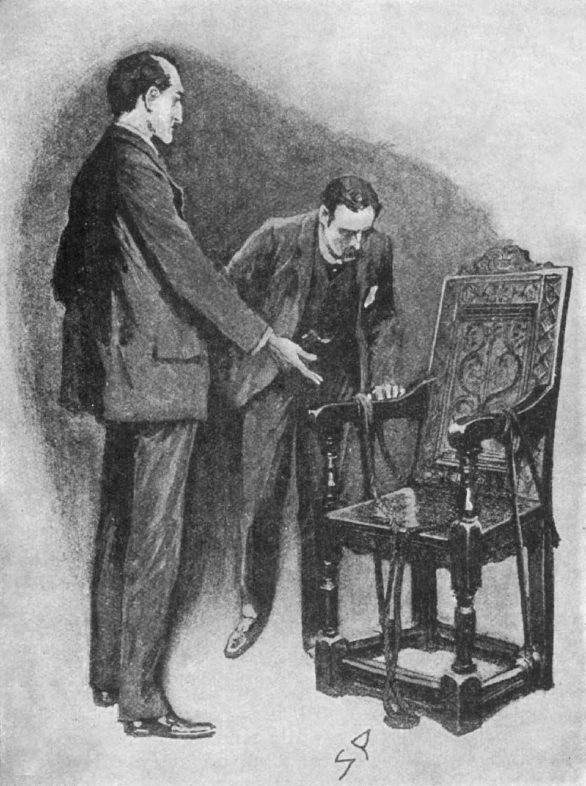

“是血迹。”

泰瑞莎这个人有点特别，严肃的澳洲保姆——看她样子，不随便开口说话，多疑，不重礼貌。福尔摩斯很费了点时间，以极温和友好的态度，真诚地倾听她的说话，才得以消融她的戒备而友好应对。她不想掩饰对已死主人的痛恨。

“是的，先生，是真的，他朝我扔水瓶。我听见他在骂我家女主人，我就告诉他，要是太太的兄弟在这儿的话，看你敢骂。他这就拿起水瓶向我扔过来，要不是太太拦着，他十几个都会扔。他一直虐待太太，太太是要脸面的人，不愿意吵闹，她受的苦连我都不愿意讲。你今儿早上见她胳膊上的伤，她从来不肯跟我说，可我知道都是给恶魔拿帽子别针扎的。这个可恶的魔鬼——他已经死了，我还要这样咒他，上帝会原谅我，他生前是世界上少见的魔鬼。他初见我们那会儿可甜蜜——才十八个月以前嘛，我们觉得是挨过了十八年似的。女主人那时才刚到伦敦。是的，那是她第一次出门旅行——这之前从来没有离开过家。爵士拿头衔、金钱，还有伦敦派头装模作样，献殷勤讨她喜欢。算她不识人，罚她受苦，女人走错一步都是这样。我们是几月遇上他的？像是，也就是我们来的第一个月。我们来是六月，那就是七月见的面了。去年一月份就结的婚。噢，她下楼来又在阳光室了，肯定会见你的，可你别问太多，别揭她痛处，她是心里、皮肉都已经够痛苦的了。”

布莱肯斯特尔夫人正斜躺在那张睡椅上，但是精神气色好多了。女仆带我们进去以后，再给女主人热敷青肿的眼睛。

“我希望，”夫人说道，“你不是再来盘问我的吧？”

“不是，”福尔摩斯回答，极尽语气的平和，“我绝对不会引起你无端不安，布莱肯斯特尔夫人，我的唯一愿望是为你把事情平息，因为我知道你已经遭受了许多痛苦。请你把我看作朋友，相信我，你能发现我不会辜负你的信赖。”

“你要我做什么呢？”

“把真实情况告诉我。”

“福尔摩斯先生！”

“不，不，布莱肯斯特尔夫人——这样没用。我有点小名气，你大概也听说过。我是完全确定了的，你说的情况完全是编造的。”

夫人和女仆两人脸一下刷白，惊恐地瞪视着福尔摩斯。

“你这个人真是无耻！”泰瑞莎嚷道，“你这是说我女主人在撒谎啰？”

福尔摩斯从椅子里站起来。

“你没有要和我说的吗？”

“事情都已经全告诉你了。”

“再想一想吧，布莱肯斯特尔夫人，坦率一些不是更好吗？”

在她美丽的脸上掠过瞬息的犹豫，但接着重又铁下心来，脸上似乎再蒙上面具。

“我知道的都告诉你了。”

福尔摩斯取了礼帽耸耸肩。“很抱歉。”他说，没再讲一句话我们就出了屋离开了。园子里有个水塘，我的朋友径向水塘走去。水面结了冰，却开着一个冰口子，那是为了方便一只落孤的天鹅有水喝。福尔摩斯朝冰面水孔看了看，就走向园门口，写了一张短笺请看门人交给斯坦利·霍普金斯。

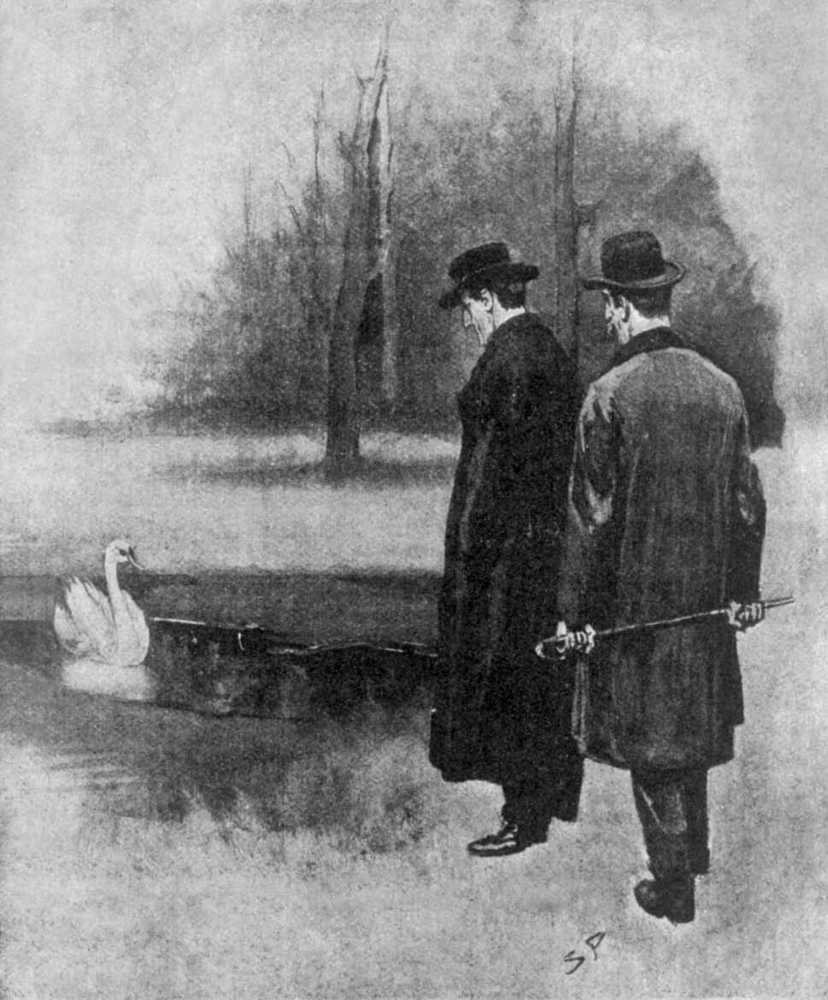

水面结了冰，却开着一个冰口子。

“也许成功，也许失败，但一定要帮朋友霍普金斯做点事，证明我们这第二次没有白来，”他说，“可是对他我还不能过于信赖。我们下一个行动方向是，我想，去阿得雷德南安普敦航运公司，办公处设在蓓尔美尔街，我没记错的话。英国和南澳大利亚航线还有第二家公司，但我们先跑这大的一家。”

福尔摩斯的名片一送到经理手上，立刻引起注意，很快获得需要的所有信息。一八九五年六月，该公司只有一艘船回南安普敦港，就是直布罗陀山号，是公司最大最好的一条船。查阅这次航程的旅客名单，发现有阿得雷德的弗雷泽小姐及其女仆。该船这时正在去澳大利亚途经苏伊士运河南岸什么地方。高级船员还是一八九五年那班人马没变，只动了一人，大副杰克·克罗克，升调一艘新船巴斯山号的船长，巴斯山号两天后将驶离南安普敦港。克罗克船长住在西顿汉姆，但是上午将要来公司接受指示，我们等一等可能会见到他。

不等了，福尔摩斯先生不想见他，但是愿意了解他的个人品德记录和脾气性格。

他的品德记录完美良好，公司高级船员中少有人可以与他相比。脾气性格方面，对工作恪尽职守，但是一下了船就自由放任不受拘束——他情绪急躁，容易激动，但为人忠诚老实热心肠。这是主要的情况，福尔摩斯都了解到以后，就离开阿得雷德南安普敦航运公司，乘马车直奔苏格兰警场。但是他只在门口没进去，坐在车里紧皱眉头苦思一阵，最后叫马车到查令十字街的电报局，发出一封电报，发好电报就再赶回贝克街。

“不行，我不能这样做，华生，”他说，我们回到了屋中，“一发出逮捕令，他就完了。我的办案经验，有过一两次，我查出了案犯，不料带来的伤害实在要比犯案本身大得多。我现在就学乖了，谨慎为上，宁可耍几下手段违背英国的法律，也绝不违背自己的良心。让我们多了解情况，三思而行。”

傍晚前，斯坦利·霍普金斯警官来了，他那边事情进行得并不顺利。

“你真是神机妙算，福尔摩斯先生。我想来想去，你的能力非人间所有，你看，怎么就让你知道偷掉的银器藏在了这池塘底呢？”

“我并不知道。”

“不是你叫我检查池塘的嘛。”

“那么说，你找到银器了？”

“是啊，找到了。”

“很高兴帮上你的忙。”

“可是你没有帮我，你这么一来，事情搞得更加复杂了。这是一伙什么强盗，偷了银器扔到屋子的池塘里什么意思？”

“确实非同寻常。我不过是想到，偷银器的人如果不是要银器——他们不是要东西，偷点东西不过是转移视线的障眼法——那么他们必定要把偷的东西早早扔掉。”

“你怎么就会想到这一点呢？”

“哦，我不过是想有此可能。他们从法国式长窗出来，就是个池子，水池的冰面上还正好开有一小片孔洞，他们一眼就看到了，东西藏这里不是很好吗？”

“噢，藏这里——好地方！”斯坦利·霍普金斯叫起来，“对了，对了，这下我全明白了！那是清早，路上有人，带着银器怕人看见，就先沉塘底再说，等危险过去以后回头来拿。这个解释，比你认为的障眼法更说得通。”

“不错，你的推论有道理，我的想法实在太不着边际，可是你必须看到，银器被发现，是用了我的思路。”

“是啊，先生——没错，那都是你的功劳。可我大大碰壁。”

“碰壁？”

“是的，福尔摩斯先生，兰德尔一伙今天早上在纽约被捕。”

“哎呀，霍普金斯！这就跟你的推论矛盾了，你以为昨天晚上他们还在肯特郡杀人呢。”

“乱了，福尔摩斯先生——完全乱了。不过，除了兰德尔父子三人帮，还会有别的三搭档匪徒，更有可能是新冒出来的团伙，警方还没掌握，不知道呢。”

“正是，完全有可能。怎么，你要走了？”

“是的，福尔摩斯先生，不把这案子搞到底我没法安心。看来，你没有什么见教了吧？”

“有一点我已经给你讲了。”

“哪一点？”

“就那个，我说是障眼法呀。”

“怎么是障眼法，福尔摩斯先生，为什么？”

“啊，当然啦，这是个问题。我只是提个看法供你考虑，你可能会发现有点道理。你不留下吃了晚餐再走吗？那好，再见。你有进展请告诉我们。”

晚餐毕，桌子收拾干净，福尔摩斯又再提起此案。他点燃烟斗，把套着拖鞋的脚伸向明晃晃暖烘烘的火炉。忽然他看了一下表。“我在等时间，有进展呢，华生。”

“什么时间？”

“就现在——没几分钟。我看得出，你以为我刚才对斯坦利·霍普金斯的态度不够好？”

“我相信你的判断。”

“回答得很巧妙，华生。你应当这样看：我掌握的情况属于非官方，他掌握的情况则属于官方；我有权作出个人的决断，他没有个人的决断权；他必须报告一切情况，隐瞒不报就是违纪渎职。现在，这是一件有疑难的案子，我不想使他处境为难，我不得不留一手，真实案情不能和盘托出，等我把案子全部了然于胸之后再作打算。”

“要等到什么时间？”

“时间已到。你将看到一出不大不小精彩戏剧的最后一幕。”

楼梯响，人已到，房门开处，走进一个非常标致的男子汉。如此标致的男子汉光临此门似乎不曾有过。他身材颀长，金色小胡子，碧蓝眼睛，热带阳光晒染的肤色，步履轻捷稳健，显示伟岸的身躯强壮而灵活。他进屋随手把门关好，站在那里握着双手，胸脯一起一伏，强压着难以抑制的激动心情。

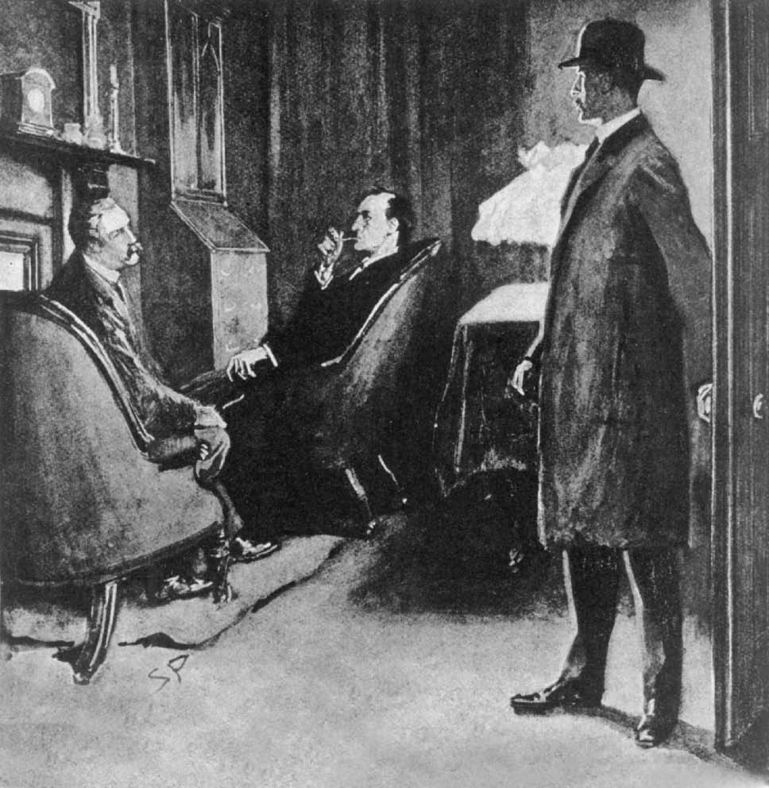

走进一个非常标致的男子汉。

“请坐，克罗克船长，你收到我的电报了？”

我们的来客在一把扶手椅上落座，疑问的目光时而转向我，时而又落在福尔摩斯身上。

“电报我收到，按照你说的时间来了。我听说你去过我们公司，那就是在你手里跑不掉了。听听看，最坏打算，准备拿我怎么样？逮捕我？开门见山，说吧！别坐在那里跟我来猫耍老鼠。”

“给他一支雪茄。”福尔摩斯说，“抽口烟，克罗克船长，别神经紧张。如果我把你当成真正的罪犯，就不和你坐在这里，一起抽烟，这一点你要相信。跟我真诚坦率，我们好做好收；要是耍花招，那你就要完蛋。”

“你要我怎么样呢？”

“昨晚发生在格兰吉庄园的事，给我如实讲一讲——要如实讲，请注意，不要瞎扯，不要隐瞒。我已经掌握很多，只要你有半点不实，我就向窗外吹警笛，就此撒手，不关我的事。”

这位船长想了一下，接着，晒黑的大手在膝头上一拍。

“也就看这一着吧，”他高声说道，“我相信你是言而有信的人，高尚、有教养，我把全部事实都告诉你。不过有一点先要讲明，关系到我个人方面，我怎么样都不后悔，不害怕。再遇到这种事我还是照做不误，而且引以为自豪。那个该死的畜生，他有多少条命，我就叫他死多少回！可是，牵涉夫人方面，玛丽——玛丽·弗雷泽——可诅咒的夫人两字，我实在不愿意这么称呼她。我一想到会把她牵连其中，就心神不宁；为了她，为了博得她那美丽的一笑，我不惜付出我的生命。那就——那就——我是别无选择，干吗不敢做敢当？我做的事，一古脑儿倒出来，先生们，咱们都是君子，肝胆相照，我干吗不敢做敢当？

“我要从头说起。你好像全都知道，估计你也知道，我遇见她是在直布罗陀山号的船上，我是这船的大副，她是旅客。从我见到她的第一天起，她就成了我唯一的心上人。一路航行，我是一天比一天地更爱她。有多少回哦，我值夜班的时候，漆黑的夜里，我跪下去吻船甲板，那是我注意到她可爱的脚走过的地方。她对我一点也没感觉，对我同一般女人对一般男人那样，平静正常。我没有怨言，这不过是我的单相思，在她心目中我们只是路上的朋友，一般的友谊。直到分别，她还是个毫无情感牵挂的自由女人，可是我，已经不是个自由的男人。

“等到我下一个航程归来，听说她已经结婚了。唉，她有什么不可以同她所爱的人结婚呢？爵位、财富——有谁比她更应该拥有这些呢？她是天命生就的享有美丽和高贵。她结婚嫁了别人，我不嫉妒不哀伤，我还不是那样的小人，不至于那样自私。我反而为她高兴，她自有好运，幸好同我这个不名一文的水手擦肩而过。这就是我对玛丽·弗雷泽的爱。

“啊，我万没有想到还会再同她见面。上个航程回来我升任了船长，新船还没有下水，要等两个月，我就和我的船员在西顿汉姆住下来。有一天，在乡下小路上，遇上泰瑞莎·赖特，玛丽的老保姆，告诉了我玛丽的一切情况，她的那个男人，所有的情况。我坦白讲，两位，我一听简直要气疯了。这条酗酒的恶狗，居然下得了手打她，玛丽的鞋都不配他去舔一下！我后来又见了泰瑞莎，接着就见到玛丽——以后又见她一次。这以后她就不再见我了。后来，一天我接到了通知，一个星期后船就要起航，我决定临走前再见上她一面。泰瑞莎是我的朋友，一直对我很好，她爱玛丽，恨死那个恶棍，心情和我一个样。我从她那里了解到这家人的生活习惯，知道玛丽喜欢在楼下她自己的小屋里看书看到很晚。昨天晚上我悄悄去到那里，轻轻敲她的窗。起先她不肯开窗，但是我知道她如今心里已经在爱我了，不忍心叫我这么晚了在屋外受冻。她低声跟我说到落地长窗那边去。我走过去，长窗已经打开。我进了餐厅，再一次听她亲口倾诉一切苦楚，我浑身血液沸腾，再一次诅咒这只野兽，虐待我心上所爱的人。咳，二位先生，我只是和她站在长窗里面，我们是完全清白的，上帝可以作证。这时候，那个人像个疯子似地冲进来，用最肮脏下流的话骂她。一个男人对女人竟是这么不要脸皮，还抡起手中一根棍子朝她脸上就打。我跳过去抓起通条，但是我没有出手，是他先打我，你看，我胳膊这儿，是他给打的。接着我反击了，我就只一下，就叫他脑袋开花，像只烂南瓜。你以为我后悔吗？我不，一点都不后悔。不是他死，就是我死，还远不止，更要紧的，不是他死，就是玛丽要死，我能让玛丽丢在这个疯子手中不管吗？就这样，是我把他打死的。是我的错吗？请问，你们两位先生处在我这个地位的话，会怎么做呢？

“玛丽挨他打，叫了一声，这就把老泰瑞莎惊动，从楼上跑了下来。餐柜上有一瓶酒，我打开瓶，给玛丽嘴里倒一点，她已经吓得半死了，再倒了一杯我自己喝。泰瑞莎冷静得像冰块，和我一块儿商量怎么办。我们一定要做成是夜窃的盗贼作的案。泰瑞莎一遍一遍教她女主人怎么讲经过，不漏口风。我爬上去割断铃绳，拿了绳把玛丽绑在椅子上。绳头弄碎，看起来自然，要不会引起怀疑，夜贼怎么能爬得上去割绳子。然后我拿了点银器碟子、盆子、壶，意思是遭到抢劫，然后我就离开，商量好等我走掉一刻钟才报警。银器我都丢进了池塘，就到了西顿汉姆。我觉得这辈子头一回在夜间真正做了件隐秘的好事。事实就是这样，全部的事实，福尔摩斯先生，我杀人我偿命。”

福尔摩斯抽着烟，有一会儿不讲话，然后走了过去，握住来客的手。

“你所说的同我想的一致，”他说，“知道你讲的句句都是真话，几乎没有一句我所没有想到。能借着托架去够到铃绳，只有杂技演员或者水手才有这个本事；绑在椅子上打的绳结，也是水手才有的手艺。这位女士只有一次机会同水手接触，那就是在她的旅程途中，而且她竭力掩护这水手，说明这个水手与她的社会地位相当，当然也清楚，她爱着他。你看，一旦我把线索、目标锁定准确，也就轻而易举将你找到。”

“原以为我们布置巧妙，绝不会被警察识破。”

“警察现在没有识破，以后也不会识破，我确信无疑。现在，你看，克罗克船长，这是非常严重的事情，虽说我清楚，谁也受不住他这样疯狂的侮辱挑衅，你是不得已的情况下才出的手，但是，怎么也不能说，为了防卫自己的生命，你的行为可以成为合法。然而那是由不列颠陪审团决定的事，我这里对你只有深深的同情。如果你能在二十四小时内出走，我保证没有人来追踪你。”

“就这样可以没事了？”

“肯定不会有事。”

水手气得脸发红。

“叫一个男子汉大丈夫这样做，出的什么主意？我也很懂法律，玛丽说不定哪天就要被当作共犯抓起来。你以为，我能溜之大吉，丢下她不管，叫她去顶我的罪吗？不，先生，叫他们来抓我，怎么处置都行，可得看在老天分上，福尔摩斯先生，无论如何要想想办法别让我可怜的玛丽上法庭。”

福尔摩斯向这位水手第二次握手。

“我只是考你一考，你又经受住了考验。好吧，这个重大责任由我来担当吧，但是我已经给霍普金斯有了很大的暗示，如果他没能领会，我不会再提醒。你看，克罗克船长，我们可以做得完全符合法律的形式。你是嫌犯。华生，你是不列颠陪审员，我还没有见过像你这样的陪审员，真是再合适不过的人选。我是法官。现在，陪审团先生，你已经听取了证词，据你看嫌犯是有罪还是无罪？”

“无罪，法官大人。”我说。

“人民呼声即上帝之呼声。你已被宣判无罪，克罗克船长，只要法律未再发现另有被害人，本法官保证你的安全。一年以后回到女士身边来，愿她的未来和你的未来都证明我们今天晚上作出的判决是公正的。”

（1904年）

————————————————————

<a href="#part0113.xhtml_ch1-back" id="part0113.xhtml_ch1">(1)</a> 帕拉蒂奥（Palladio，Andrea，1508—1580），意大利建筑师，所创六廊柱三角楣顶式门面盛行400年之久。

<a href="#part0113.xhtml_ch2-back" id="part0113.xhtml_ch2">(2)</a> 马伦戈（Marengo），意大利北部城镇，1800年拿破仑在此大败奥军。

# 第二摊血迹

我原打算，《格兰吉庄园》将作为我向公众推荐我朋友歇洛克·福尔摩斯先生的辉煌业绩的搁笔之作。我的这一决定并非迫于缺乏素材，事实上我已经收集记录了数百例案件，都尚未成篇；也绝非是由于我的读者方面对这位杰出人物独特的人品和高超的破案方法的兴趣已有减退，真正的原因在于福尔摩斯先生不愿意再把他的事迹与经验继续成文出版。但是，只要他还在从事职业侦探生涯，他的业绩记录对他的工作实践绝对具有不可低估的价值。现在他已经远离伦敦，到苏塞克斯丘陵地去专行研究学问和养蜂，他痛恨世上虚名，要求我要坚决地按照他的意思行事。虽然如此，我还是向他频频进言，我已经作有承诺在适当时机将《第二摊血迹》一案予以发表，并一再向他指出，这是所有有求于他处理的国际性大案中最重要的一件，至今的漫长系列故事应以此案为高峰，只有这样，才是有重戏压轴。我总算成功，终于征得他的同意，能将此案经过谨慎适度的描写，公诸大众。如果我讲述故事在某些细节方面似有言不尽意，谅公众能予以理解事出有因，是不得已而有所保留。

何年何月，甚至什么年代，恕不言明，是一个秋季星期二的早晨，有两位欧洲显赫要人亲临贝克街我们家徒四壁的寒酸居所来拜访。其一，高鼻、鹰眼，威仪居高临下，不是别人，正是两度出任英国首相的大名鼎鼎的贝林格勋爵。另一位，皮肤黝黑，五官轮廓分明，举止文雅，还不到中年，不仅外貌出众，而且才思敏捷，他就是英国崛起中的极有前途的政治家、欧洲事务大臣特里劳尼·霍普阁下。两人在我们报纸狼藉的长靠背椅上并肩坐下。从他们倦怠焦虑的神色不难看出，一定遇到紧迫要事而来下问相求。首相那双骨节突出、青筋暴起的手紧握着一把雨伞的象牙柄，清癯瘦削的脸，忧郁地看看福尔摩斯又看看我。欧洲事务大臣，手在不自觉地摸摸小胡子、捏捏表链坠。

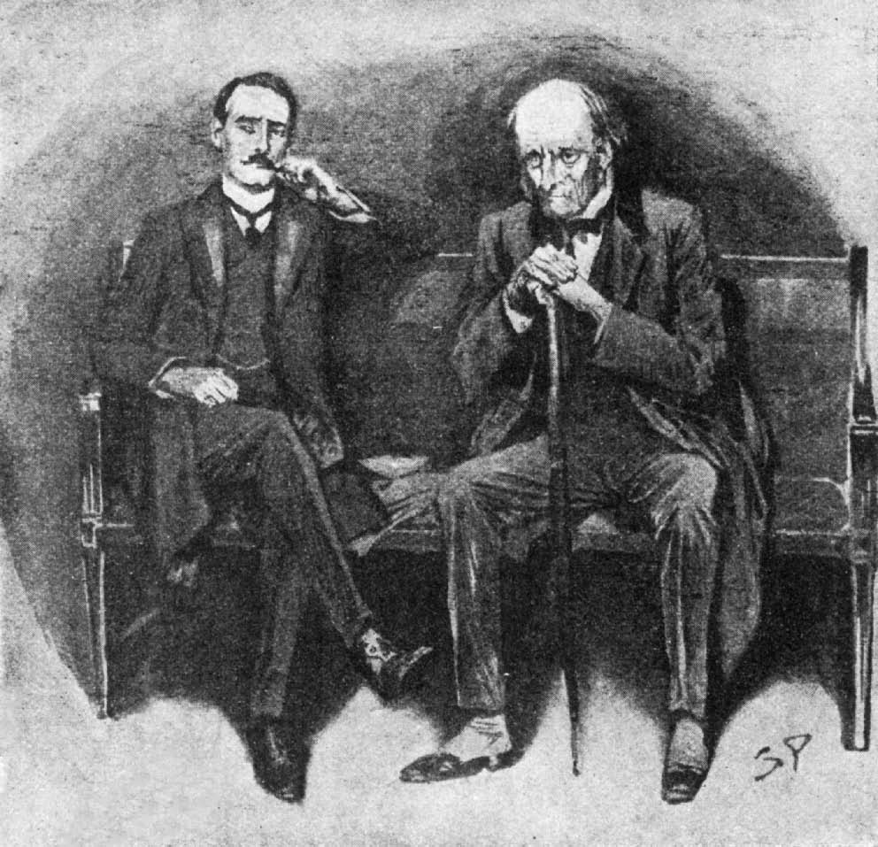

两位欧洲显赫要人亲临贝克街

“我一发现重要文件丢失，福尔摩斯先生，是今天早晨八点钟，就即刻报告首相。也是首相建议，我们一起来找你。”

“你们通知警方了吗？”

“没有，先生，”首相说，他讲起话来快速、果断，这是众所周知的特点，“我们没有通知警方，我们不能这样做。通知警方，结果必定等于公诸社会，这是我们特别需要加以避免的。”

“为什么呢，先生？”

“因为遗失的文件事关重大，这样一来文件就很容易被公布——我简直可以说——顷刻之间就要引起欧洲大乱，要说是关系战争与和平的问题，毫不危言耸听。所以必须极端秘密地找回，不动声色，否则如同找不回没有两样，因为窃取者的目的正是要让文件的内容曝光。”

“我明白了。现在，特里劳尼·霍普先生，请你告诉我，文件遗失的详细经过。”

“讲起来是没几句话，福尔摩斯先生。那封信——是一封外国君王的信——于六天前收到。信极其重要，我都没有放入保险柜，而是天天带回白厅住宅街自己家里，藏进我卧室一口上锁的公文箱。昨天晚上还在箱子里，我是确定无疑的。昨天我换晚餐服的时候打开箱子看过，信在里面，没有问题。今天早上信不见了。公文箱整夜放在我梳妆台的镜子旁边，我睡觉很惊醒，我太太也是，我们两个都可以发誓夜里没有人进过我们卧室，可是信就是不翼而飞了。”

“你晚餐是几点钟？”

“七点半。”

“到你上床睡觉有多长时间？”

“我太太看戏去，我坐着等她回家，我们进卧室是十一点半。”

“那么，公文箱有四个小时放那儿没人看着。”

“没人允许进卧室，要到早晨，女仆才可以进来，白天，我的贴身男仆、我太太的女仆，可以进来。两个都是忠实可靠的仆人，跟随我们时间很长了。再者，两人都不可能知道公文箱里放着非同一般的文件，能有什么样的价值。”

“谁知道有这封信呢？”

“家里没人知道。”

“你夫人一定知道吧？”

“不，先生，我对我太太没有提起过，到我今天早上发现不见了，她才知道。”

首相赞许地点着头。

“我早就知晓，先生，你的公职观念是很强的。”他说，“我深信，如此重大的机密公事绝对超乎家人情感之上。”

欧洲事务大臣点点头。

“承蒙过奖，先生。是的，今天早上才说了有这封信，这之前没向我太太提过一个字。”

“夫人能猜得出吗？”

“不，福尔摩斯先生，她不猜这种事——谁也不会猜得到。”

“以前你丢失过文件没有？”

“从来没有，先生。”

“英国谁知道有这封信呢？”

“内阁成员昨天都已经通报过了。但是每次内阁会议上都强调保密，这件事的严重性更由首相再三提出警告。可是，我的天哪，怎么想得到，几小时之后，是我自己把信给丢失了！”他那英俊的面容因极度沮丧而扭曲，双手揪着头发。这一瞬间，我们看到了他自然人性的一面，有冲动，有激情，也有些奔放，但他马上又蒙上高贵者的面具，重检声音，不失稳重。“除了内阁大臣，还有两位，也可能是三位政府官员，知道这封信，此外，英国就再也没有一个人知道。福尔摩斯先生，我可以保证。”

“但是外国呢？”

“我相信，在外国，除了写信人自己，没有人看见过这封信。我确信，他的大臣都不知道——此信并非按通常宫廷程序移交送达。”

福尔摩斯思考了一会儿。

“现在，先生，我不得不问一问这信有什么特别的内容，它的遗失会引起那么严重的后果？”

两位政治家对望了一眼，首相皱起了浓眉。

“福尔摩斯先生，这信的信封，灰蓝色，薄而长。信封上有红色火漆，是蹲伏的狮子图案。信封开的姓名地址，字体大而醒目——”

“我说，先生，”福尔摩斯说道，“这些细节很有趣，确实也关键，但我想调查必须从根本问题着手。信的内容是什么？”

“这事关国家最高机密，恐怕不能告诉你，我看好像也无此必要。你凭你众所周知的能力，如果能找到我描述的信封连同信笺，你就是报效你的国家了，并能获得我们权限所应付的最大报酬。”

歇洛克·福尔摩斯微笑着站起来。

“你两位身负国家大事，你有你要忙的，”他说，“我小小营生，也有许多事等着我，我得忙我的。实在抱歉了，这事我帮不了你们的忙，再谈下去也是白白浪费我的时间。”

首相立即挺身而起，深陷的眼睛霎时射出的凶光，足以震慑全体内阁。“我没有这样的习惯，先生。”他想要说下去，但是强压住怒火，重新落座。有一两分钟光景，大家静坐无声。然后，老政治家耸了耸肩膀。

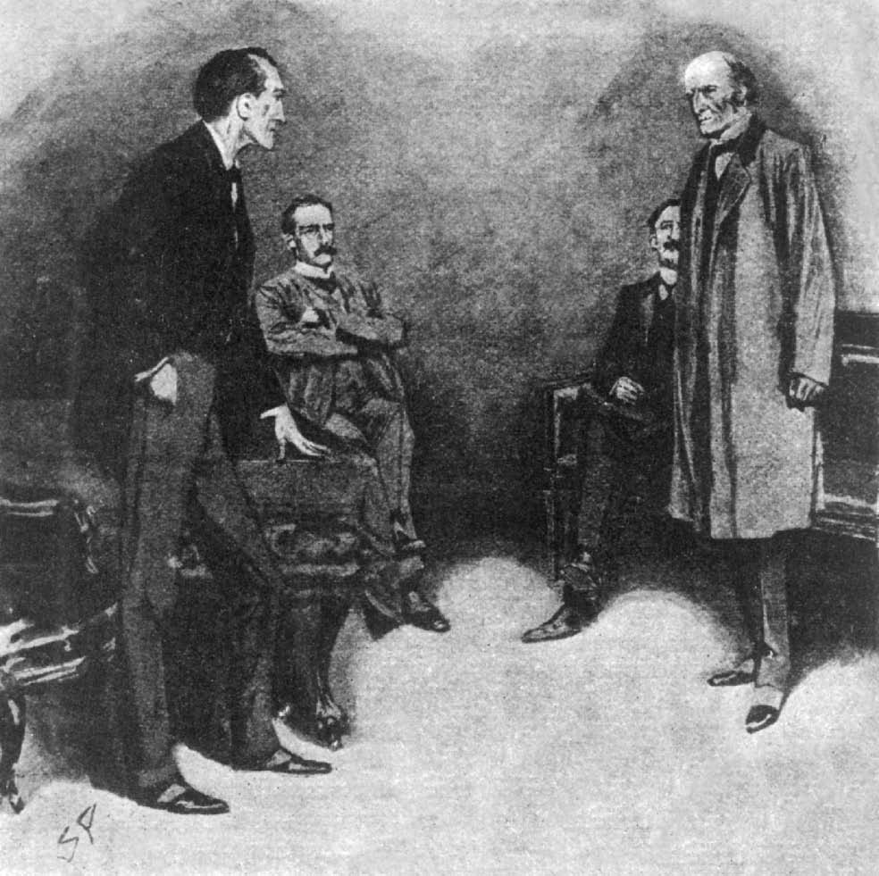

首相立即挺身而起。

“我们接受你的条件，福尔摩斯先生。毫无疑义，你是对的，我们希望你协助破案，又不完全信任你，是没有道理的。”

“我同意你的意见。”那位年轻政治家说。

“那么我要告诉你，完全信赖你的荣誉，还有你的同事，华生医生。我信赖你们的爱国主义精神，我不能想象，还会有比这事的爆发给国家带来的更大不幸。”

“你尽可信任，我们绝对可靠。”

“这封信，是来自某国的君王，他对我国近期殖民地发展之快感到愤慨。信是匆忙写就，也完全只是他个人的意见。调查表明他的大臣对此全然不知。同时，信写得很不合时宜，有些措辞富有挑衅性，一旦发表，必然伤害我国人民的感情，引起一场轩然大波。先生，我毫不怀疑地说，此信发表一星期，我国必将立即卷入一场大战。”

福尔摩斯在一张纸条上写了个名字，递给首相。

“不错，正是他。也正是这封信——此信必然意味着造成亿万英镑的损失、几十万人的牺牲——正是此信失落的灾难性后果。”

“你通报了写信人吗？”

“是的，先生，密码电报已经发出。”

“也许他有意发表此信。”

“不，先生，我们有充分的理由相信，他已经意识到自己的行动很不慎重，头脑发热。此信发表，对他本人和他的国家是一个沉重的打击，要比对我们的打击沉重得多。”

“如果是这样的话，将信公布对什么人有利呢？为什么要盗窃来公布呢？”

“那个，福尔摩斯先生，你要我回答的是国际高级政治学领域的问题。只要考虑一下目前欧洲的局势，你就不难看到本案的作案动机。整个欧洲都武装起来了，成了兵营。有两个势均力敌的军事营垒，大不列颠保持中立，维持双方的平衡。如果不列颠被拖入与另一方交战，必然会使这一方占据优势，不管他们参战与否。你明白吗？”

“很明白。那么是这位君主的敌人，有意要窃取他的信来发表，在该国和我国之间制造破裂，对吗？”

“是这样，先生。”

“此信落入敌手，会交给谁呢？”

“交给哪国的大臣吧。很可能，此刻正在火车上向着目标全速挺进。”

特里劳尼·霍普先生垂首胸前，大声长叹，首相手抚他的肩头。

“这是你的不幸，我亲爱的同事，谁也不能责怪你，并非是你的疏忽大意。现在，福尔摩斯先生，事实你都已清楚，你准备如何着手呢？”

福尔摩斯无望地摇摇头。

“我说，先生，你们认为找不到这封信就会发生战争吗？”

“我认为非常可能。”

“那么，先生，就准备打仗吧。”

“这样说，很可怕，福尔摩斯先生。”

“想想事实情况吧，先生。要说信给拿走是在夜里十一点三十分以后，那是不可思议的，因为我知道霍普先生和夫人此时以后两人就一直在房里，到发现信不见，没有离开过。那么应当说，拿走的时间是昨天晚上七点三十分到十一点三十分的这段时间，而且很可能是靠前的那段时间，因为不管谁去拿，都是事先知道有信在那里，那就肯定下手宁早不晚。那好，先生们，如果这么重要的文件在那个时间被盗走，现在可能在什么地方呢？没有人会拿了这信给压着，早就迅速转移到了需要的人手里了，现在还哪有机会给我们去探寻到、追回来呢？早去远了，我们追不到了。”

首相从长靠背椅上站了起来。

“你的话很有逻辑，福尔摩斯先生，我是觉得事已至此，回天无力了。”

“我们来假设，以便于讨论本案，信是被女仆或者男仆所窃——”

“两位都是老佣人，而且是经过考验的。”

“我理解你，可是得说，你的房间在三楼，和外面不通，一定要从屋内进入，外人上楼进房不可能不被看见，那就只有是家里的人能够拿到这封信。家贼偷信去给谁呢？交给国际间谍特工的话，我对他们还是有所了解的。有三位，可说是他们这行当里的头面人物。我着手研究研究，亲自跑一跑，看看是不是他们插手此事。如果有人找不到——尤其是昨天夜里开始不知去向，失踪了——那么信的下落我们就有了端倪。”

“为什么要失踪呢？”欧洲事务大臣问道，“满可以把信交到驻伦敦的大使馆就行，便捷省事。”

“我想不成，这些特工独来独往，他们同大使馆的关系多半很不协调。”

首相点头同意。

“我相信你讲得对，福尔摩斯先生，他要把这样宝贵的东西亲手交到最高当局。我想你要采取的行动步骤完全正确。同时，霍普，我们也不能只因为这起意外事件而忽略还有别的职责。今天如有什么进展，我们和你联系，你那方面调查的结果当然也要让我们知道。”

两位政治家欠欠身，步履沉重地走出屋子。

贵客离去后，福尔摩斯点上烟斗，默默地坐着，陷入沉思好一会儿。我翻开晨报，只管读一起发生于昨天夜间的骇人听闻的伦敦凶杀案。这时，我的朋友叫一声，跳了起来，把烟斗往壁炉台上一搁。

“对，”他说，“就这样做，没有更好的办法。情况很严重，但并不完全绝望。我们现在要弄清楚是谁盗走了信，但愿信还没有脱手。对这些人来说，无非是个钱的问题，我有不列颠财政部撑着呢。干脆论价钱作市场买卖，我就用钱买了这信——哪怕是让每个纳税人多交一便士也在所不惜。说不定这混蛋奇货可居待价而沽，拿在手上看看这边出什么价，等等那边会不会是更好的价。这种铤而走险的勾当，只有三个人胆大妄为——那就是奥博斯坦、拉罗希尔，还有艾杜阿多·卢卡斯。他们，我要一一拜访。”

我一听名字，对我手中的晨报扫上一眼。

“是不是戈多尔芬街的那个艾杜阿多·卢卡斯？”

“是啊。”

“你见不着他了。”

“怎么啦？”

“他在家里被谋杀了，昨天夜里。”

在我们以往的探案中，我的朋友常常使我惊疑不已，现在令我兴奋的是，原来我也能使他大大惊疑。他怔怔地望着我，接着把报纸从我手中一把夺过去。他从椅子上站起来的时候，我正看完这一段：

#### 威斯敏斯特谋杀案

昨夜戈多尔芬街十六号发生一起凶杀案，该处全系十八世纪古式宅屋，位于泰晤士河与威斯敏斯特教堂之间，几为议会两院大厦之阴影所掩蔽，甚为僻静冷落。艾杜阿多·卢卡斯先生居所系一精致小楼，已入住多年，因其为人和善，且在国内亦属享有盛誉之最佳业余男高音歌手，而为社交圈所知名。卢卡斯先生未婚，年三十有四，家中雇有老年管家普林格尔太太及贴身男仆米坦。女管家习惯早睡，歇于顶楼。男仆当晚未在家，去哈默史密斯访友。晚十时后，仅卢卡斯先生一人于室，此间发生之事无从知晓。约十二点缺一刻，时值警察巴雷特巡逻戈多尔芬街，见十六号屋门未闭合，即上前叩门，无人应答。但见前室有亮光，遂入屋至走道，再叩门，仍不见动静。推门入室，室内一地狼藉，家具悉数撂堆一边，一把椅子翻倒中央地上。椅旁，屋主仆于地，手紧抓一椅脚，系刀刺心窝，当即身亡。行刺凶器为一把印度弯形匕首，系墙上原有作室内装饰用之东方兵器。无迹象显示有盗窃之作案动机，因室内有价值之物品并未取走。艾杜阿多·卢卡斯先生系知名人士，广受尊重，其遭此神秘之谋害必为各方友好深表关切与惋惜。

“啊，华生，你怎么看这事？”福尔摩斯停了好一阵才问。

“很奇怪的巧事。”

“好一桩巧事！演本案这出戏的那个角色，我们点出名的可能是三个，这是其中之一。戏已经开演，我们正在要看之际，他已遭人谋杀。这不大可能是巧合，因为这种巧合的概率太小。不，我亲爱的华生，这两件事情有联系——肯定相关。我们正是要找出关系。”

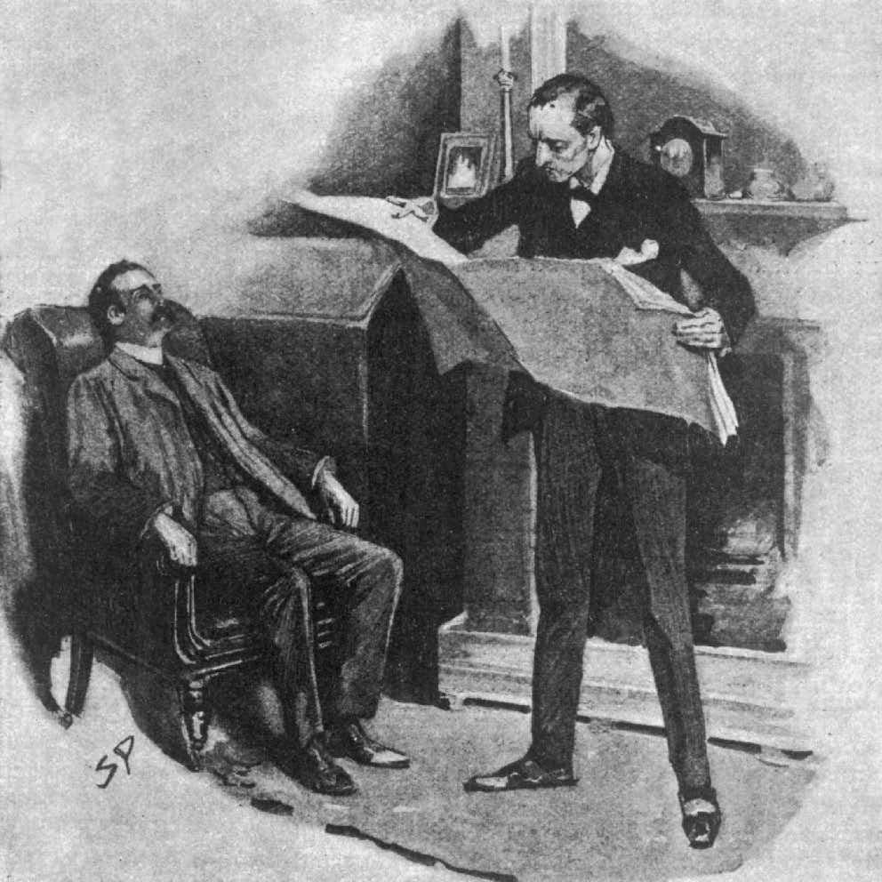

“好一桩巧事。”

“全部情况警方现在一定知道了。”

“一点都不知道。他们只看见戈多尔芬街的事，就知道这一点。他们不知道——也不会知道——白厅街住宅区的事。这两件事都知道的，只有我们，我们能够追踪两者的关系。有一点很明显，不管怎么样，让我怀疑上了卢卡斯。威斯敏斯特教堂区的戈多尔芬街，离开白厅街住宅区走走也不过几分钟的路。另外两个间谍，我知道的，都住在西区的最西边。所以，卢卡斯要比他们两个容易同欧洲事务大臣家里发生联系、得到讯息——一件小事，然而事件都在几个钟点内连着发生，那就证明事关重大。哦！有什么人来了？”

哈得森太太拿着名片托盘走进来，福尔摩斯看了一看，扬扬眉，随手把名片传给我。

“希尔达·特里劳尼·霍普夫人，云驾仙临，有请上楼。”他说。

一会儿工夫，伦敦的大美人走进屋来。想不到我们这寒庐陋室，今天早上竟如此蓬荜增辉，现在更是无比堂皇荣耀。我久闻贝尔明斯特公爵的幼女美丽非凡，但无论是口头赞美，或是无色的照片形象，都不如亲眼得见。那是难以想象的高贵、典雅、花容月貌、艳丽动人，我两眼几乎不及准备接受如此的美貌。然而这个秋日早上的佳丽，我们最先见到的，竟不是应该让观者印象深刻的美丽容貌。她的面颊粉嫩，但因激动而苍白，眼眸明亮，但似是燃着火光，敏感热情的嘴唇竭力紧闭，尽力不使颤动。恐惧——并非美丽——这就是我们来访的婀娜丽人站在门口的时候，跃入我们眼帘的第一印象。

“我的丈夫来过这儿吧，福尔摩斯先生？”

“是的，夫人，刚才来过。”

“福尔摩斯先生，我请求你不要告诉他我也来了。”福尔摩斯静静地点点头，给夫人指指一把椅子。

“夫人这样使我为难，请你坐下，讲你有什么事。不过，我恐怕不能无条件答应所有要求。”

她走向屋子那一头，背对着窗子坐下来。那是位风姿绰约的皇后——修长、优雅、女性感十足。

“福尔摩斯先生，”她说道——戴着白手套的手随着说话时而握紧时而松开——“我愿意对你坦率说话，希望你对我也要开诚布公。我和我丈夫之间几乎在所有事情上绝对互相信任，只有一点例外，那就是政治。有关政治问题，他对我守口如瓶，对我丝毫不谈。现在，我看出来，昨天晚上我们家里出了大事，我知道有一份文件丢失了。可这是政治事件，丈夫不要我介入，不同我明讲。事情很严重——很严重，我说——我应当了解清楚。除了几位政治家以外，你是唯一了解事件情况的人，所以我请求你了，福尔摩斯先生，告诉我发生了什么事，会导致什么样的后果。把真实情况告诉我，福尔摩斯先生，请不要顾虑损害我丈夫的利益，就不跟我说。你要知道，只有充分相信我，他的利益才能有保证，他应当看到这一点。请告诉我失窃的是一份什么文件？”

“夫人，你问我的，实在是不能说的。”

她叹了口气，双手掩住脸。

“你要晓得，我只能这样，夫人。我是因为职业的需要，才知道了真实情况，当然负有保密的责任。如果你丈夫认为不必让你知道这件事，他坚持不许说，我怎么能说呢？问这个是不妥的，你应当去问他自己才对。”

“我问过他，我来问你是万不得已，但不是要你告诉我详细情况，福尔摩斯先生。有个问题只要你给我点一点，就可以了。”

“是什么问题呢，夫人？”

“出了这件事，要影响我丈夫的政治前途吗？”

“哦，是的，夫人，不能得到解决，对他的影响肯定不幸。”

“啊！”她倒抽了一口大气，恰似心中的疑惧终于证实。

“再一个问题，福尔摩斯先生。事情一发生，我丈夫很紧张，漏出过一句话，我听出是丢了这份文件，会给国家引起可怕的后果。”

“他是这样说的话，我当然没有异议。”

“那都是什么样的后果呢？”

“不，夫人，你这问题，又是我所不能回答的。”

“那我就不想耽搁你的时间了。既然不能随便讲，也不能怪你，福尔摩斯先生。我相信，在你这边也不能怪我不好；我是非常想，即使违背丈夫的意愿，也要替丈夫分忧。我再一次请求你别说我来过了。”

她走到门口，回头向我们望望，给我的最后印象，是那美丽而忧虑的面容，惊恐的眼神，抿紧的嘴唇。然后她就这样走了。

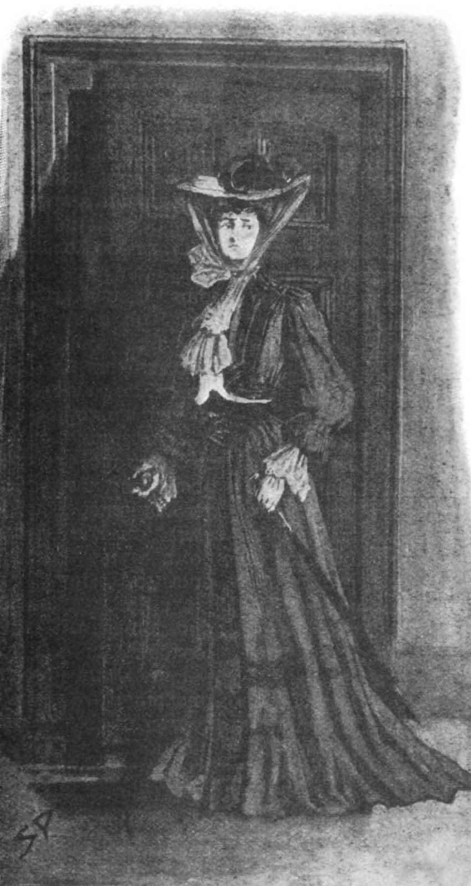

她走到门口，回头向我们望望。

随着前门砰的一响，簌簌的衣裙声也消失了。

“现在，华生，女性，是你的研究范围，”福尔摩斯微笑着说，“这位漂亮夫人演的是一出什么戏呢？她真正的意图是什么呢？”

“挺简单，什么意图，她讲得很清楚，焦虑不安，也是很自然的。”

“嗯！想想她来这儿的表情，华生——她的神态，压抑的情绪，着急，按捺不住问问题。要记住，她是来自一个不肯轻易表露自己情感的社会阶层。”

“她的确非常激动。”

“还要记住，她很迫切地要我们知道，只要她能了解详细情况，就会对她丈夫有益处，这有些奇怪。她是什么意思呢？你还注意到了吧，华生，她有意背光去坐那边，这是不要我们看清她的面部表情。”

“没错，她特意去窗口那把椅子坐下。”

“女人的心思不可捉摸。你记得玛盖特那个女人吗？也是同样的情况，使我对她起怀疑。她鼻子上没有搽粉——就这点导致我把问题彻底解决。怎么能轻信这些女人呢？她们最细微的举动可能含有很大的意思，她们行动有所反常，甚至会在一枚发针、一个卷发钳这类小东西上反映出来。好，再见，华生。”

“你要出去？”

“是的，今天上午到戈多尔芬街去，同苏格兰警场几位老搭档消磨点时间。艾杜阿多·卢卡斯和解决我们的问题有关系，不过到底是什么关系还讲不清楚。没有掌握事实，就先作推理，那是最大的错误。你留下值班，有访客就接待，我的好华生。我尽量赶回来一块儿吃午饭。”

这整整一天，接着又一天、再一天，福尔摩斯的心情，正如他的朋友所讲叫作沉默寡言，而有的人称作愁眉不展。他跑进跑出，不停地吸烟，不时拉几下小提琴，一会儿又陷于沉思默想，吃饭不定时，想起来就大啖个三明治，问他事情也答非所问。我是清楚的，这是他心事不畅，症结未解。对案情他只字不提，我是看报才了解到侦查情况，死者的贴身男仆约翰·米坦遭到逮捕，随即又释放。验尸陪审团验定是蓄意谋杀，何人作案依然不清楚，作案动机也没头绪。现场屋中不乏贵重物品，但一样也没少，死者的报章书信文件也未被翻动。经检查这些文件作出分析，表明他热衷于研究国际政治问题，善辞令，谈锋甚健，通晓多国语言，往来信件频繁，同几个国家的政界头面人物曾有私交。但是几抽屉的文件并无可疑之处，看不出与案子有任何的关联。在女人的这一方面，交往复杂而关系简单，认识的人不少，却没有朋友，他一个也不爱。生活习惯很有规律，对人循规蹈矩。这样的一个人被杀，全然是个谜，难以破解。

警方逮捕男仆约翰·米坦，完全是不得已的措施，避免被认为毫无作为、没有一点交代，但是毕竟拿不出任何证据来支持这一措施。那天晚上他在哈默史密斯会友，有充分的证据证明他不在犯罪现场。确实，案发前一个钟头，他离开哈默史密斯回家，一个钟头应该可以回到威斯敏斯特，但是他解释，觉得夜景美好，一路欣赏走了一程。到家的确切时间是十二点，发现惨案几乎昏倒。他同主人关系一向很好。有几样卢卡斯的东西——值得注意的是一小盒刮脸刀片——发现藏在男仆的箱子里，男仆解释是过世的主人送的礼物，女管家也能作证是有这个事。米坦受雇于卢卡斯已有三年。众所周知卢卡斯从来没有带米坦到大陆去过。卢卡斯自己常常到巴黎，一去就是三个月，让米坦留着看守戈多尔芬街的这个家。至于女管家，那天夜晚她一点都没听见有事。平时人来，都是主人自己开门请进屋里。

谜案持续三天，报上的消息没有进展。如果福尔摩斯知道更多，他也不会公布。但是他告诉我，莱斯特雷德警探把本案的内情都告诉了他，我知道他密切掌握着侦破的进展情况。到了第四天，巴黎发来一则长电讯，似乎解决了全部问题。《每日电讯报》报道：

巴黎警方之发现，已揭开上星期一夜间发生于威斯敏斯特戈多尔芬街之艾杜阿多·卢卡斯先生惨遭杀害之谜。读者当记得，遇害人系被刺于其室内，曾疑及男仆行凶，但因不在现场而予排除。昨日有一女士，据称家住奥斯特利兹街一小别墅之亨利·弗内耶太太，由其数名仆人告诸警察当局为精神失常。医检显示弗内耶太太长期来患有危险而不治之狂躁症。据查，警方发现亨利·弗内耶太太旅行伦敦刚于本星期二返回，证据表明其与威斯敏斯特之凶案有涉。经相片之比对业已得出结论，亨利·弗内耶先生与艾杜阿多·卢卡斯是同一人绝无疑义，死者出于某种原因家居两处，以双重生活栖止伦敦与巴黎。弗内耶太太为克里奥耳人<a href="#part0114.xhtml_ch1"
id="part0114.xhtml_ch1-back">(1)</a>，性格乖戾暴躁，患于嫉妒，久积而癫。据称十之八九为其所犯杀夫之罪，可怖之极伦敦为之震动。其星期一夜间之行动并无踪迹，但星期二晨查令十字街车站确有一妇人，其貌其状，其言其行，疯癫狂暴恰如其人，而引观者侧目。故可断言或是神经错乱以致行凶犯案，或犯案后引发神经错乱而癫狂不止。目前该妇尚神志不清，未能作清晰连贯之陈述。而医生则表示其恢复精神正常已属无望。另有证据，星期一夜间一妇人被目击于戈多尔芬街该屋前逡巡多时，该妇当为弗内耶太太无疑。

“你是怎么个看法，福尔摩斯？”我把这一段消息朗读完毕，他也吃完了早餐。

“我亲爱的华生，”他说，从餐桌上起身，在屋里走来走去，“你是久等而心烦。三天来我对你未有一字奉告，是因为我无可奉告。即使现在，巴黎的这篇报道，对我们并无多大帮助。”

“毕竟同卢卡斯的死是有关系的。”

“他的死，纯属偶然事件——一个小插曲——和我们的重大任务，要追踪文件、拯救欧洲免遭大难相比而言。近三天里头，只有一件事很重要，那就是，什么事也没有发生。我是每个小时都要从政府方面听消息，还好，整个欧洲没有任何不安的迹象。那么，如果这封信是遗失了——不，不可能遗失——只是假定遗失了，遗失到哪里去了呢？在什么人手里呢？为什么拿着不出笼呢？这是个问题，像一把铁锤日夜在敲击我的脑门。卢卡斯死的这一天，信就不见，真的是巧合、毫不相干？信是不是到了他那里？如果是的话，他的文件里怎么没有发现呢？会不会是他的疯婆娘把信拿走了？如果是的，那就是在她巴黎的家里喽？我怎么样才能去搜她的家找信，又不惊动法国警方呢？这是难题，我亲爱的华生，我们对付罪犯之时，也就要对付法律。人人都可以伸手抓我们，可是利害关系实在巨大而时间又极其紧迫。本案能胜利了结，将是我平生事业无上的光荣。啊，前方给我来了新消息！”这时送来了一封简信，他匆忙看一眼，“啊哈！莱斯特雷德好像有了重要线索。戴上帽子，华生，一起去威斯敏斯特，走吧。”

我是头一回到达本案现场——一幢高敞、灰墙、窄门面的房屋，严整、坚固、有气派，全貌一概是世纪的产物。莱斯特雷德斗牛犬似的面孔在前窗朝我们张望，一位大个子警察开门引我们入内，他便上前来热情招呼。他领我们进入的房间，就是案发现场，但是除了地毯上有一大摊污血，其余毫无痕迹。地毯是屋中央一块粗毛小方毯，周围是光地板，古式四方镶木，漆得精光油亮，十分美观。壁炉之上，装饰着多件醒目的战利品武器，有一件就被用作那天夜间的杀人凶器。靠窗有一张贵重的写字台，室内各样物件，绘画、壁炉毯、挂饰，透露出近乎女人的那种娇奢之气。

“巴黎的消息看到了？”

福尔摩斯点点头。

“我们的法国同行这一回抓到了要害。他们说的没错，弗内耶太太敲门——是出乎意料、不期而至，我猜是，因为卢卡斯他住的这个地方平时关上门，水都泼不进来——开门让她进屋，总不能把她关在外面街上。妻子告诉丈夫是怎么找到这里来的，接着把他骂了一顿。事情一件件兜着骂过来，嘴骂还动手，末了顺手拿刀一刺，不料只一下当场就把他杀了。当然这不是一眨眼工夫就完了的事，这些个椅子都撂到了一边，手上还抓着一把椅子，那样子是用椅子挡她一阵。这再也明显不过，等于我们亲眼看见。”

福尔摩斯抬抬眉毛。

“可你为什么还要找我呢？”

“噢，对了，那是另外一件事——一件小事，不过你会感兴趣——很奇怪，你知道，你一定会说不正常。虽然跟案子本身事实并没有关系，至少从表面上看无关。”

“什么事呢？”

“噢，你知道，这类案子发生，我们最小心的就是保持现场原封不动，所以一点都没动过，派人日夜看守在这里。今天早上，把人埋了，调查也结束了——是对他这房间里的调查——我们想把屋子稍弄弄干净吧。这块地毯，你瞧，并没有钉死，只是铺在地上。我们就掀起来，可是就有发现——”

“发现？你发现——”

福尔摩斯脸色紧张，急着听下文。

“哦，我敢说你一百年也猜不到我们发现了什么。你瞧见地毯上的血迹了？哦，那么多血，要浸透了地毯吧，对不对？”

“肯定会吧。”

“啊，叫你听了一定奇怪，木头地板上白白的，没有血迹。”

“没有血迹！不会没有——”

“是呀，你肯定要这样说，但事实明摆着，就是没有。”

他伸手拎起地毯一角，翻过来，表明就是他说的那个样子。

“可是地毯反面同正面一样有血，应当会留下血迹。”

莱斯特雷德看到把大名鼎鼎的刑侦专家也弄得莫名其妙，乐得忍不住咯咯地笑起来。

“好了，我来给你解释吧。地板上是有第二块血迹的，可不是在地毯上同样的位置。你看，”他说着，把地毯其余部分再翻转来，果然，在白白的旧地板上有一摊紫红的血迹，“这个你是怎么看呢，福尔摩斯先生？”

“噢，挺简单。两摊血迹形状对称，那就只是地毯动过了。这是块方地毯，没有固定，要动很容易。”

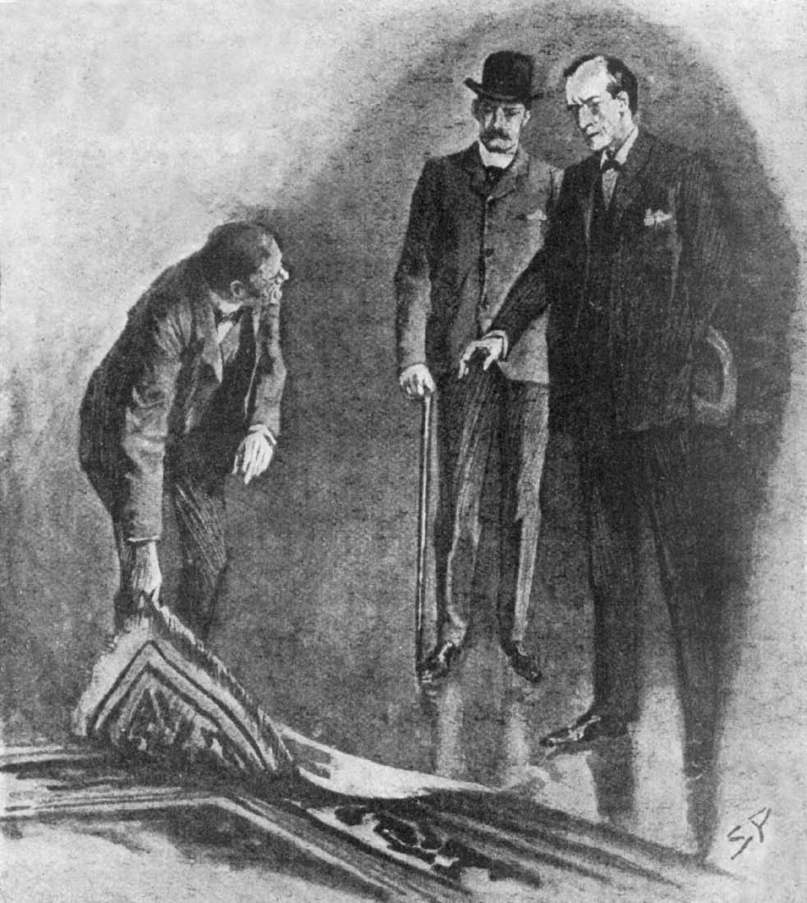

那就只是地毯动过了。

“政府警方这边，不会需要你，福尔摩斯先生，来告诉他们这地毯是转动过了。这本来就够清楚的嘛，两摊血是合得拢的——你这么合一合就看得出。我所要问的是，谁动了这地毯？为什么要动地毯？”

我看到福尔摩斯内心激动得平板的脸上在发颤。

“这就行啦，莱斯特雷德，”他说，“走道那边的警察，一直负责看守这地方吗？”

“是啊，他负责。”

“好，听我的意见，你仔细盘问他，不要当着我们两人的面。我们等在这里，你把他叫到后房去，单独谈，好让他少些顾虑，向你承认一些事情。问他，为什么胆敢放人进来，让人家单独在这儿，在这屋里。不能问他是不是这样做了，要肯定地问他为什么这样做，告诉他，你知道肯定有人进来过。逼着他说，警告他，老实坦白，才能够原谅他，才能没事。就照我说的去做！”

“行，他干的，我一定叫他呕出来！”莱斯特雷德嚷着，立即冲向门厅，不一会儿就听见他暴怒强硬的喝问在后房里响起。

“来，华生，来！”福尔摩斯欣喜若狂地高声说。他那无精打采的模样一扫而光，热烈兴奋的劲头现在突然喷涌而出。他把粗毛地毯拉开，露出盖着的地板。他跪下去，趴着身，用手指抠地板缝，有一块地板给抠动了，有铰链可以像箱子盖板似的掀起来。下面露出一个小黑洞。福尔摩斯急忙伸手进去，但哼了一声，手又抽回，非常懊恼，非常失望，洞里是空的。

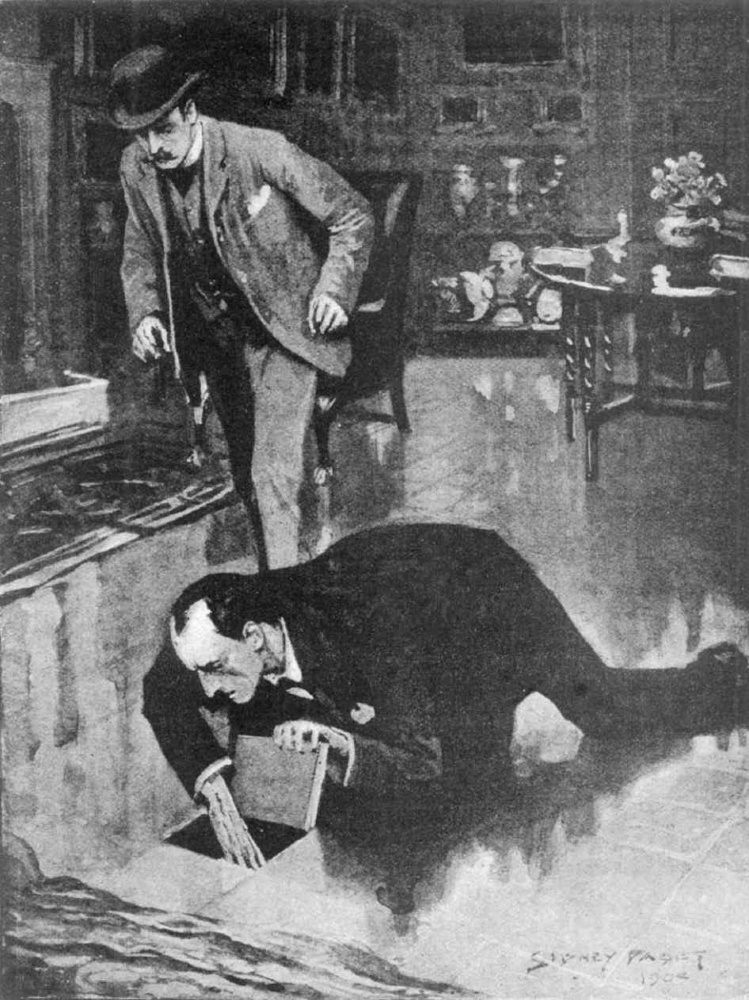

下面露出一个小黑洞。

“快，华生，快！重新铺好！”盖下木板块，刚把地毯拉过来，听得莱斯特雷德的嗓音响到了走道上。他看见福尔摩斯懒洋洋倚着壁炉架，举手掩嘴一个劲儿打哈欠，闲在那儿静候佳音。

“对不起让你久等，福尔摩斯先生。这个事我看把你烦死了，没耐心了。好啦，他都承认了，痛快。进来这儿吧，麦克弗森，让两位先生也听听，你干的好事。”

大个子警察，羞愧难当的样子，侧身进来。

“我不是有意破坏，先生，真的。是一位年轻妇女，上门来，昨天晚上——她说是走错了门，就聊了起来。你不知道有多孤单无聊，一个人整天守在这儿值班。”

“噢，那就怎么样呢？”

“她就想要顺便看看凶杀现场是哪间屋——在报纸上看到的消息，她说。她模样挺正派，说话文绉绉，很年轻，先生。我想让她看看就看看，也没碍什么事，可是，她一看见地毯上那摊血，一下就晕倒在地板上了，倒下像是死过去似的。我跑到后面去拿点水，可是没能叫她醒过来。我就去拐角那家常春藤店里买上点白兰地，等我拿着白兰地回屋，年轻妇女已经醒过来走掉了——大概不好意思，我看是，不好意思再见我。”

“地毯怎么给动过了呢？”

“哦，先生，地毯有点不平整，是的，我回来发现的。你看，她倒在地毯上面，这地板多光洁滑溜，地毯又没有固定，我拉拉平铺铺正就好了。”

“这是给你上了一课，你休想骗得了我，麦克弗森警察。”莱斯特雷德威严地说道，“你一定自以为这么玩忽职守，不会被发现。可是这地毯我只要看一眼，就够了，瞒不了我，有人进过屋了。你还算幸运，我的伙计，东西没有少掉，否则，你可吃不了兜着走。我真是对不起，这么点小事也要让你跑过来，福尔摩斯先生。不过，这第二块血迹同第一块血迹不合在一块儿也叫你感兴趣了。”

“当然啦，应当感兴趣。这个女人就来过一次吗，警察？”

“是的，先生，只来一次。”

“她是什么人呢？”

“不知道叫什么名儿，先生。她是看到广告去应聘打字的，没找对地方——人看上去非常舒服，非常文雅，很年轻，先生。”

“个头高高的？挺漂亮？”

“是的，先生，长得很好看的年轻女子。我想你能猜到她一定很漂亮，就是给有的人说起来叫作佳人吧。‘哦，警官，就请让我只看一看吧！’她求我说。讲话也美，会叫你答应她，照你们说就是有诱惑力。我想，不就是让她在门里望上一眼嘛，又没什么关系。”

“是什么衣着打扮？”

“很素雅，先生——一件长披风，拖到脚板。”

“那是什么时间？”

“时间是天快黑了。我买白兰地回来，家家都在点灯了。”

“很好，”福尔摩斯说，“走吧，华生，我想，我们别处还有重要工作呢。”

我们离开这宅屋，莱斯特雷德还留在前房，颇有悔意的警察替我们开门送我们出屋。福尔摩斯转上台阶，伸手出示拿着的一样东西，警察专注地望着。

“哦，正是，先生！”警察叫道，一脸的惊讶。福尔摩斯举起一个指头压着嘴唇，重又把手伸进胸前的口袋。我们转过街角，他便放声大笑。“棒极了！”他说，“好了，华生老友，最后一幕戏开场。告诉你听，放心好了，不会打仗，特里劳尼·霍普阁下光辉前程不会受到挫折，那位不慎重的君主也不会因为不谨慎而遭到惩罚，首相不会再有欧洲的复杂局势需要应付。在我们这一头，再略施小计，作出安排，谁也不会有半点倒霉，这出戏有惊而无险。”

我心中对这个不寻常的人着实惊羡不已。

“问题你解决了！”我高声道。

“还不能这样说，华生，有几点情况仍旧不明。不过，剩下的问题解决不了，那只怪我们自己太不中用。现在直接去白厅住宅街，把事了断结束。”

我们赶到欧洲事务大臣府第，这一回，福尔摩斯要找人询问的就是希尔达·特里劳尼·霍普夫人。我们被引入客厅。

“福尔摩斯先生！”夫人说道，愠怒使她脸色泛红，“你这人实在太无信用。我原本希望，我已经解释过了，我来找你务必保密，以免我丈夫误解我干涉他的公事。可是你现在径自闯到我这里来，借以显示你我之间有事情联系。”

“不幸的是，夫人，我别无选择。我既然受托追回这封极端重要的信件，就只能来请求你，夫人。请你宽宏为怀，把那封信交给我。”

夫人立即跳了起来，美丽的脸庞顷刻变色，两眼呆滞失神——身体摇晃起来——我看她快要晕倒了，但是，她以极大的意志力撑住了自己，脸上的表情霎时变得只有极度的疑惧和愤怒。

“你——你侮辱我，福尔摩斯先生。”

“请不要，请不要这样，夫人，这样于事无补。请交出信件。”

夫人冲向摇铃。

“仆人会请你出去。”

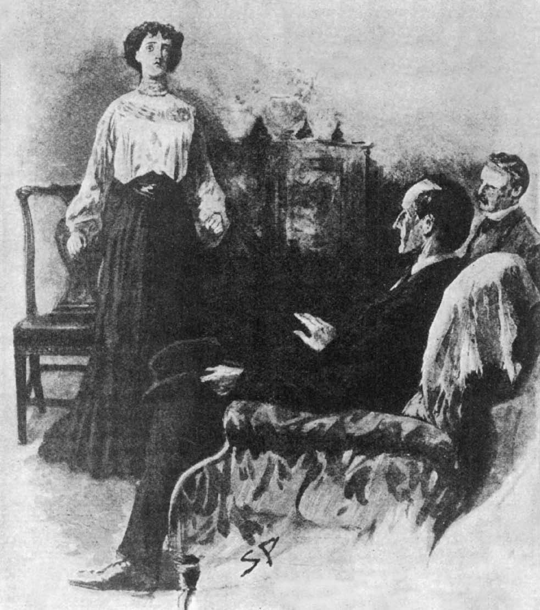

“仆人会请你出去。”

“请不要摇铃，希尔达夫人。铃一摇，我的避免家丑外扬的良苦用心，立即泡汤。交出信吧，一切就都风平浪静。你只要配合我，我保证一切事情安排妥当，如果不肯配合，我只好揭发。”

她毫不胆怯，威严地站在那里，势如女王，两眼对视福尔摩斯，似乎要穿透灵魂。她手按着摇铃，但是克制住没动。

“你想威吓我，不是个男子汉，福尔摩斯先生。你居然到这里来欺负女人，真是无耻之徒。你说你知道事情，你知道什么？”

“请坐下，夫人，你要是摔倒，只会伤了自己。你不坐下，我就不讲。好，谢谢你。”

“我只给你五分钟，福尔摩斯先生。”

“一分钟就够了，希尔达夫人。我知道你拜访了艾杜阿多·卢卡斯，把那封信给了他；你足智多谋，昨晚上又到他屋里去，用了点手段，把信从地毯下藏的地方取回。”

夫人凝视着他，铁青着脸，有两次气喘哽塞，欲言又止。

“你疯了，福尔摩斯先生——你疯了！”最后她叫道。

福尔摩斯从口袋里掏出一小块卡纸片，是从相片上剪下的一帧女人头像。

“我带来了，我想会有些用处，”他说，“那个警察认出了这张像是谁。”

夫人长叹一声，仰面靠在了椅背上。

“好了，希尔达夫人，信在你手上，事情还来得及纠正。我无意找你麻烦，只要这封信归还你的丈夫，我的责任也就尽到了。听我一句劝告，对我尽管放心，时机不可失。”

夫人的勇气真令人钦佩，事已至此，她还不肯认输。

“我要再一次告诉你，福尔摩斯先生，你荒诞的毛病可不小。”

福尔摩斯从椅子上站起来。

“那就只好对不起了，希尔达夫人，我对你已经尽到最大的努力，可惜所有功夫全白费。”

福尔摩斯摇了铃，男管家进来。

“特里劳尼·霍普先生在家吗？”

“他十二点三刻回家，先生。”

福尔摩斯看了一眼表。

“还有一刻钟，”他说，“很好，我等他。”

管家刚回身把门带上，希尔达夫人忽然就跪倒在福尔摩斯脚下，摊开双手，美丽的脸仰望福尔摩斯，泪涌满面。

“哦，饶了我吧，福尔摩斯先生！饶恕我！”她苦苦哀求道，“看在上天的分上，不要告诉他！我多么爱他啊！我不愿意让他生活有阴影，这事要碎了他高尚的心。”

福尔摩斯把夫人搀起来。“太好了，夫人，最后时刻你终于明白过来！时间紧迫，信在哪里？”

夫人冲向一张写字台，打开锁，抽出一个长长的蓝信封。

“在这儿，福尔摩斯先生，我发誓，没有拆开过！”

“怎么放回去呢？”福尔摩斯喃喃地说，“快，快，得快想办法！文件箱在哪里？”

“还在他卧室里。”

“运气真好！快，夫人，把箱子拿过来！”

只一刹那工夫，她捧着一个红色的扁箱子过来。

“你是怎么打开的？有配的钥匙吗？噢，果然有的，打开吧！”

希尔达夫人从怀里拿出一把小钥匙，打开箱子。箱子里面塞满文件，福尔摩斯把蓝信封塞到底下的文件里，夹在中间。箱子盖上，锁好，放回卧室。

“好了，等他回来就是了，”福尔摩斯说，“还有十分钟。现在放心，我会保护你，希尔达夫人。作为回报，我只要你快用这点时间如实地告诉我，这桩奇怪的事到底为什么？”

“福尔摩斯先生，我把一切都告诉你。”夫人哀声道，“哦，福尔摩斯先生，我宁可斩断自己的右手，也不忍叫丈夫有一点苦恼！全伦敦没有一个女人像我这样爱着自己的丈夫。如果让他知道我做了这件事——我是被迫不得不做——他永远不会原谅我。他的地位、他的荣誉，都很高，他不能忘记、不能原谅身边人的过失。救救我，福尔摩斯先生！我的幸福，他的幸福，我们的性命，都拴在这上面啦！”

“快讲，夫人，时间很短了！”

“问题出在我的一封信上，福尔摩斯先生。我婚前写过一封不检点的信——纯情姑娘情感一时冲动，写了愚蠢的信。我绝不是有意伤害他，可是他会认为那是犯罪。让他看到这封信，他就永远也不会相信我了。这信过去几年以后，我想事情都已经忘记。可是后来，这个人，卢卡斯，告诉我，我那封信落在了他手里，他要把信交给我丈夫。我求卢卡斯怜悯，他就说，可以把信还给我，只要帮他取到一份文件。他说文件就藏在我丈夫的公文箱里。原来政府部门有他的人，得到情报有这么一份文件。他声明拿掉文件对我丈夫没有危害。你要是处在我这位置，替我想想，福尔摩斯先生，我有什么办法呢？”

“把事情全都告诉你丈夫。”

“我做不到，福尔摩斯先生，做不到！一方面，必定要遭灭顶之灾，另一方面，拿丈夫的公文信，这行为的政治后果的严重性我理解不了，我只懂爱情与信任。我只能这样做，福尔摩斯先生！我拿丈夫的钥匙压了模，交给卢卡斯配了一把钥匙。我开了公文箱，取出文件，送到戈多尔芬街。”

“到了那里怎么样，夫人？”

“我照约好的方式敲敲门，卢卡斯开了门，我跟他进屋，厅门我没随手关上，因为我害怕，和这么一个男人单独在一起。我记得，我进屋的时候，外面有一个女人。进了屋我们马上办交换的事，我的信他就放在书桌上，我把公文交给他，他把我的信还给我。就在这时刻，门响了，门道上有脚步声。卢卡斯急忙掀起地毯，文件塞到有个藏东西的地方，地毯再盖好。

“这以后发生的事，像是一场可怕的噩梦。我看到的是一张黑脸，疯狂的脸，听到是女人的声音，用法语尖叫着，‘我总算没让自己白等，原来是，原来是你和婊子在一起，让我捉到了！’接着就是大打出手。看见卢卡斯手拎椅子，女人手里亮着一把刀。我赶快逃离可怕的现场，奔出屋子跑回来。到第二天早晨，从报上看到骇人的结局。不过那天夜里，我还是挺高兴的，把我的信拿回来了。我想不到下面会带来什么后果。

“到这一天早晨，才晓得，我不过是跳出这个坑又掉入那个阱。我丈夫为遗失文件急得要命，这又扎了我的心。我真好几次差一点要跪在他脚下对他讲出是我拿的信，可是这又意味着要承认过去的事。我那天早上跑到你那里，就是要了解我闯的祸到底有多大。当我一明白事情的严重性，就只有一个念头，怎么也要把丈夫的公文取回来。公文一定还留在卢卡斯藏的地方，因为那个可怕的女人进屋前已经藏好了。要不是来了这个女人，我不会知道卢卡斯有个隐蔽的地方藏东西。怎么再去那个屋子呢？我去察看了两天，门总是没开。昨天晚上，再作尝试。我怎么做，怎么成功的，这些你都已经知道。我把文件拿了回来，想只有把它销毁掉，因为我左思右想，总没法再放回箱子去，又要不让丈夫知道我的错，不能向他承认。哦，天哪，我听到他上楼梯了！”

欧洲事务大臣激动地冲进屋来。

“有消息吗，福尔摩斯先生，有什么消息了吗？”他高声问道。

“有了希望。”

“啊，感谢上天！”大臣脸上放出光彩，“首相要来和我用午餐，让他也分享你的希望好吗？他具有钢铁般的神经，可是我知道，自从出了这桩大乱子以后，他简直没有睡过好觉。雅可布，请首相上来吧？你在这儿，亲爱的，我想这是一件政治方面的事情，过几分钟，我们会让你一起到餐厅用餐。”

首相神态抑郁，但是我看出他双目闪光，两只嶙峋的手在发颤，他和年轻同僚一样也在激动。

“我听说你有好消息报告，福尔摩斯先生？”

“到目前为止，还不能肯定。”我的朋友回答，“所有可能的地方我都调查过了，都没有，但是我确信，不必担心发生任何危险。”

“这样不行，福尔摩斯先生，我们不能一直在火山口上度日，到底怎么样总得有个水落石出才行。”

“文件有希望找到，这就是为什么我来到这里。这件事情，我越考虑就越认为那封信根本没有离开这所房子。”

“福尔摩斯先生！”

“要说给拿了出去，那现在早应当已经公开了。”

“有人拿了信，为的是还放在这个家里，有这种事？”

“我不相信有人拿走。”

“那么文件箱里怎么不见了呢？”

“我不相信离开了文件箱。”

“福尔摩斯先生，这样开玩笑很不合时宜。你要相信我说的，信在箱子里不见了。”

“星期二早上以后，你检查过箱子了？”

“没有，没有必要。”

“要考虑可能检查疏忽呢。”

“不可能，我肯定。”

“但是我不相信不可能，这种事我见得多了。我估计箱子里还有别的文件，啊，一定是混在里头了。”

“我是放在文件最上面的。”

“或许给摇晃过箱子，就放乱了。”

“不，不，我都倒出来看的。”

“这个很简单嘛，霍普，”首相说，“我们去把文件箱拿来。”

大臣摇了摇铃。

“雅可布，把文件箱拿来。真是好笑，白浪费时间。不过，不给你看你不服，看吧。谢谢你，雅可布，就放这里。钥匙我一直挂在表链上。文件都在，你看。梅罗勋爵来的信，查尔斯·哈迪爵士的报告，贝尔格莱德备忘录，关于俄德粮食税的记录，一封马德里来信，弗劳尔勋爵便信——天哪！这是什么？贝林格勋爵！贝林格勋爵！”

首相从他手上夺过那蓝色的信。

“没错，就是——就是这信，完好无损。霍普，我祝贺你啦！”

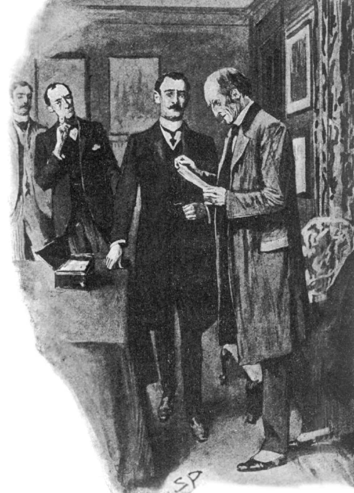

“就是这信，完好无损。”

“感谢你！感谢你！我心上的大石头掉落了。可是，不可思议——不可能，福尔摩斯先生，你是巫师，你是魔术师！你怎么知道在那儿了？”

“因为我知道不会在别处。”

“我没法相信自己的眼睛了！”大臣发疯似地跑向门口，“我太太呢？我得告诉她没事了，好了。希尔达！希尔达！”我们听见他在楼梯上喊。

首相望着福尔摩斯，两眼炯炯有神。

“哦，先生，”他说，“一定有什么瞒过了我们的眼睛。信是怎么回到箱子里来的？”

福尔摩斯微笑着闪开那对锐利的、询问的、好奇的目光。“我们也有我们的外交秘密。”他说，拿起帽子，转身走向屋门。

（1904年）

————————————————————

<a href="#part0114.xhtml_ch1-back" id="part0114.xhtml_ch1">(1)</a> 克里奥耳人（Creole），指生于美洲的欧洲人，也指他们与黑人的混血儿，以及路易斯安那人。

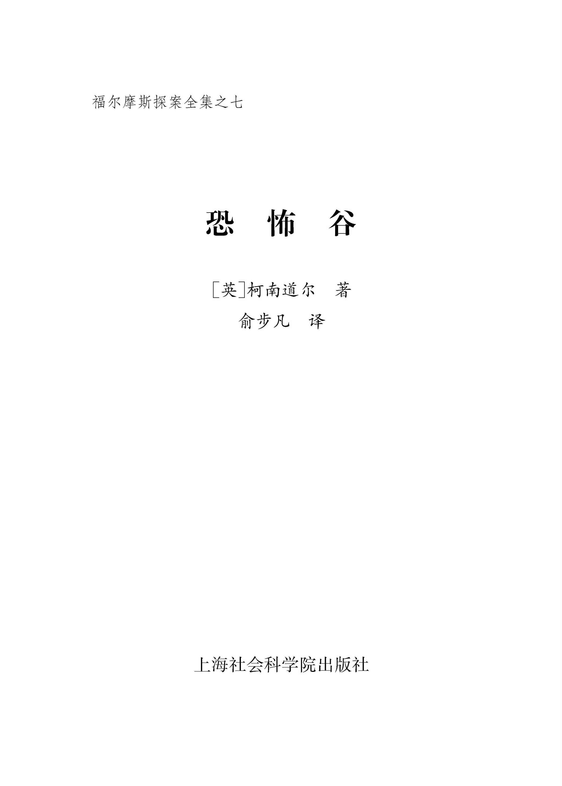

**图书在版编目（CIP）数据**

恐怖谷／［英］柯南道尔（Conan
Doyle，A.）著；俞步凡译．—上海：上海社会科学院出版社，2012

（福尔摩斯探案全集；7）

ISBN 978-7-5520-0108-2

Ⅰ．①恐…　Ⅱ．①柯…　②俞…　Ⅲ．①侦探小说—英国—现代　Ⅳ．①I561.45

中国版本图书馆CIP数据核字（2012）第159587号

福尔摩斯探案全集之七

**恐怖谷**

------------------------------------------------------------------------

**著　　者：**［英］柯南道尔

**译　　者：**俞步凡

**责任编辑：**陈如江

**封面设计：**王小阳工作室

**出版发行：**上海社会科学院出版社

上海淮海中路622弄7号　电话63875741　邮编200020

http://www.sassp.org.cn　E-mail：sassp@sass.org.cn

**经　　销：**新华书店

**照　　排：**南京理工出版信息技术有限公司

**印　　刷：**上海中华印刷有限公司

**开　　本：**787×1092毫米　1/32开

**印　　张：**8.5

**插　　页：**2

**字　　数：**149千字

**版　　次：**2012年10月第1版　2012年10月第1次印刷

------------------------------------------------------------------------

ISBN 978-7-5520-0108-2/I·065

定价：29.00元

------------------------------------------------------------------------

版权所有　翻印必究

# 目录

[第一部　伯尔斯通庄园的惨祸](#part0119.xhtml)

[第一章　警告](#part0120.xhtml)

[第二章　歇洛克·福尔摩斯的论述](#part0121.xhtml)

[第三章　伯尔斯通的惨剧](#part0122.xhtml)

[第四章　黑暗](#part0123.xhtml)

[第五章　剧中人](#part0124.xhtml)

[第六章　一线曙光](#part0125.xhtml)

[第七章　谜底](#part0126.xhtml)

[第二部　死酷党人](#part0127.xhtml)

[第一章　一条好汉](#part0128.xhtml)

[第二章　命主](#part0129.xhtml)

[第三章　维尔米萨第三百四十一分会](#part0130.xhtml)

[第四章　恐怖谷](#part0131.xhtml)

[第五章　最黑暗的时刻](#part0132.xhtml)

[第六章　临危胜出](#part0133.xhtml)

[第七章　伯迪·爱德华兹的妙计](#part0134.xhtml)

[尾声](#part0135.xhtml)

[返回总目录](#part0000.xhtml)

# 第一部　伯尔斯通庄园的惨祸

# 第一章　警告

“按我的意思是想要——”我说。

“我有事，别什么想要。”福尔摩斯颇不耐烦地说。

我自信我是个耐得住性子的人，但说实话，他这样打断我，不听我说下去，我很不高兴。“你自己不知道，福尔摩斯，”我口气严厉地说，“你有时候很叫人难堪。”

他正全神贯注于自己的思考，根本不理会我的不满。他举起一条手臂枕着头，放在面前的早餐一口未吃，眼睛凝视着刚从信封里抽出的一张纸条。他把信封举到亮光下仔细端详信皮和封口。

“这是博洛克的笔迹，”他思索一会儿说道，“这我一看就认出来，虽说他的笔迹我以前只见过两次。他的字母e是希腊体，顶上来点花头，很好认。只要是博洛克来信，那肯定有大事。”

他在自言自语，并不是对我讲话。可是他这一说倒引起了我的兴趣，我的不快立即消失。

“这博洛克是什么人？”我问他。

“博洛克，华生，是个假名，真实的那个人，花招很多，叫人难以捉摸。他在前一封信里，老实坦承这并非是他的真名。他明确警告我，不要在大都市几百万人口中去找他，那是大海捞针。博洛克之重要，不在他本人，而是与他有联系的另一个大人物。不难想见，专门跟着鲨鱼的舟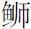<a href="#part0120.xhtml_ch1"
id="part0120.xhtml_ch1-back">(1)</a>，还有随着狮子的豺狼——本身并没啥了不起的东西，可是与凶恶异常的大家伙为伴，不但是凶恶，华生，而且狡诈——极度地狡诈。据我所知，他就是这样的人。你听我讲过莫里亚蒂教授吧？”

“大名鼎鼎的科学家罪犯，他的本事在歹徒中的名声之大犹如——”

“别抬举我，华生！”福尔摩斯轻轻一句把我打断。

“我是要说，要说犹如公众对他的底细一无所知。”

“哦，机灵！非常机灵！”福尔摩斯高声道，“真想不到，你学会了随机应变、机敏巧辩，华生。这么看来，我在你面前也要学着点儿才行了。不过，你称莫里亚蒂是罪犯，是从法律的角度对他的贬斥——实际上他是个天才，是奇迹！旷世大阴谋家，一切罪恶的总策划，黑社会的首脑智囊，这个智囊足以左右国家之命运——他就是这么一个人！但是表面上他做得不落痕迹，从未受到任何指摘，以操守严谨的谦谦君子为人所称道。所以，你称他为罪犯的话，得小心他把你告上法庭，叫你付出你一年的抚养金，赔偿他的名誉损失。那本书《小行星动力学》很出名<a href="#part0120.xhtml_ch2"
id="part0120.xhtml_ch2-back">(2)</a>，作者不就是他吗？这本书是纯数学的顶峰之作，据说科学界无人堪与匹敌，不是吗？这样的人是可以中伤的吗？小心可要落得你一个臭嘴的坏医生，挑他一个遭人诬陷的好教授——你们两个就此自定角色！就是这么一个大才，华生。可是，只要恶人歹徒伤不到我，我们的胜利之日必定到来。”

“但愿能见到这一天！”我由衷地叹道，“但你要讲的那个人是博洛克呀。”

“啊，是的——所谓博洛克者，是整个链条中的一环，只是离那个大环不远。博洛克并非坚不可摧的一环——这是我们两人说说。就我所能探知，他是这个链条中惟一的薄弱环节。

“可是，有一环薄弱，全局也就不再坚固。”

“确实这样，我亲爱的华生。所以，博洛克就显得非常重要。他身上还有一点起码的正义感，我又看准机会暗地塞给他十英镑钞票，不失时机加以怂恿，他就出手向我提供有价值的信息——有很大的价值，因为使我能够预先防范犯罪，避免只能事发才收拾罪犯。要是我们有密码的话，不用说了，马上就能清楚，他这封信就是我说的那种信。”

福尔摩斯再把纸摊平在空盘子上。我站起来，到他身后注视那上面写着的东西，十分奇怪，现照录如下：

534 C2 13 127 36 31 4 17 21 41

DOUGLAS 109 293 5 37 BIRLSTONE

26 BIRLSTONE 9 47 171

“都是什么意思呢，福尔摩斯？”

“很明显是传达秘密信息。”

“不知道密码，这密码信有什么用呢？”

“只有这封信，确实没有办法。”

“怎么说‘只有这封信’？”

“因为，许多密码让我读起来太容易，如同读报纸上私事广告栏的那些文字，弦外之音，我很容易猜中，都是些粗陋简单的东西，不过是智力游戏，玩玩倒不觉得厌倦。但是这次就不同了，这很清楚是某一本书中某一页的一些字，除非告诉我是哪一本书、哪一页，否则我无能为力。”

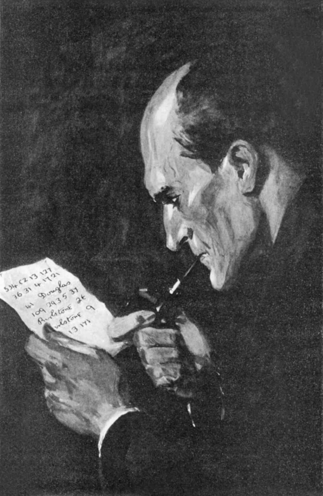

密码和解码人。

“道格拉斯Douglas，伯尔斯通Birlstone，又是怎么回事呢？”

“也很清楚，因为这一页中缺这两个字。”

“那为什么不讲明是哪一本书呢？”

“你天生机灵，我亲爱的华生，天赋有聪明，你的朋友都为你高兴，这就可以肯定，你不会把密码和密码信都装在同一个信封里，因为万一信投递错误，那你不就完蛋了！而现在这样呢，有一封信出错，两封信也就一起归于无用。我们的第二封信现在应该要到了，这封信要么加以解释，要么很可能是这些数字所指内容的书页。”

果然不出福尔摩斯所料，没过几分钟，童仆比利进来，拿的正是我们期待的那封信。

“一样的笔迹，”福尔摩斯说，打开信封，“还签上了名。”他把信笺展开时又说道，声音兴奋，“噢，我们有进展了，华生。”然而，他一眼扫过信的内容之后，却皱起了双眉。

“哎呀，这可太让人失望！看来，华生，我们要空欢喜一场，但愿博洛克自己不要出事。噢，他是这样写的：

亲爱的福尔摩斯先生：

这件事我干不下去了，因为太危险了——他在怀疑我了。我看出来他在怀疑我。这封信我刚写好信封，打算寄给你密码解密法，不料他跑过来了。幸亏我立刻藏起来，万一叫他看见了，那就要不得了。我从他的眼神看出怀疑。请将密码信烧毁，该信现在对你已无用了。

弗雷德·博洛克”

福尔摩斯坐了一会儿，手指搓弄着这张信笺，眉头紧皱，两眼凝视着炉火。

“但愿，”他终于说道，“并没有什么，只不过是他自己做贼心虛。他自觉是个叛徒，就会在那个人的眼睛里看到谴责的目光。”

“那个人，我想，是莫里亚蒂教授。”

“一点不错！只要那批党徒谈到这个‘他’，你就知道他们在谈的是谁。在他们心目中至高无上的只有这个‘他’。”

“他，又能怎么样？”

“哈，这可是大问题！你若是叫这欧洲的第一智囊盯住了，他背后是整个黑社会势力，那什么后果都可能发生。不管怎么样，博洛克朋友显然是吓糊涂了——你不妨把信纸上的笔迹和信封上的比较一下看看：信纸上的字告诉我们，是凶神过来之前写的，写得干净有力；信封上的字就潦草难认多了。”

“那为什么还要写呢？干脆不写就好了嘛！”

“那样的话，他怕我会追问他，会给他捅娄子。”

“那也是，当然，”我拿起了第一封密码信，皱起眉头端详，“真把人要急死，这一张纸条上写着重要的秘密，可惜硬是没有人能够破译。”

福尔摩斯把一口都没吃的早餐推开，点着了味浓难闻的烟斗，可这烟斗正是助他潜心沉思的伴侣。“真奇怪！”他说道，靠背仰望天花板，“也许有些问题，你那马基雅维利<a href="#part0120.xhtml_ch3"
id="part0120.xhtml_ch3-back">(3)</a>才智给漏网了，没使用上。让我们就以纯粹理性来考虑探究这个问题，此人是按照一本书来写成密码信的，就可以拿这作为我们探询问题的出发点。”

“这个出发点并不很有把握。”

“我们看看能否缩小范围。我把我的心思焦点高度集中，这时候似乎就变得并非毫无突破的可能。这是本什么样的书，我们有没有什么启示呢？”

“没有。”

“好，好吧，那也没关系，决不至于毫无办法。密码信开头第一个数就是534这个大数，最大数吧？我们可以据此设定，534是密码所指的该页页数。这样看来，这本书是一本篇幅很大的书，我们这就接近了目标。这么大会是一本什么样的书呢？下一个密码是C2。这个，你有什么启示，华生？”

“指第二章chapter the second，没问题。”

“未必吧，华生。什么理由，相信你会同意我的看法：既然给了页码，再讲第几章就没有必要了。再说，534页还只到第二章，那第一章怎么能有那么长呢！”

“是栏column！”我喊道。

“妙哇，华生。今天早上你的智慧大放异彩。要说不是栏数，那我可是必入歧途无疑了。好，现在，你看，我们已经知道是一本大书，每页双栏排印，行数就是很多了，因为里头有一个词的序号高达第二百九十三。至此，我们的推理是否已经到尽头了呢？”

“恐怕是到尽头了。”

“你看你又把自己低估了。让你智慧的光芒再闪耀一次吧，我亲爱的华生——再激发一次脑力！假定此书不是一本常见的书，他就应该把书寄给我了。他没有想要寄书，而是在他的计划还没有遭遇挫折的时候，只打算写这封信把解密的方法告诉我，他在信中是这样讲的。这就足以说明，此书他认为我自己必备，随手可翻，无需费事寻找。他有该书——他可以料想我也一定有。总而言之，华生，那是一本极普通的书。”

“你讲的确实挺入情入理。”

“如此，我们把搜索的范围压缩到一种厚本的书上，是双栏版式，又是常用书。”

“《圣经》！”我感到了胜利，不禁叫道。

“好，华生，好！但恕我直言，并不十分好！即使我姑且接受这个猜测，我也难以想象莫里亚蒂的党羽，这批歹徒，会手备经书。此外，以《圣经》版本之多，他应当想到我们两个版本的内容页码未必相同。所以很清楚，这本书一定是版本一式的书，绝无仅有。他确切无疑地知道，他书上的第534页也就是我书上的第534页，一致不会错。”

“符合那样条件的书是很少的。”

“确实很少，但希望刚好也正在于此。我们的搜索范围再缩小到版本标准划一的书，又是到处都有的书。”

“布雷德肖！”<a href="#part0120.xhtml_ch4"
id="part0120.xhtml_ch4-back">(4)</a>

“还是有问题，华生。布雷德肖所用文字简单、简练，辞汇很有限，集中选词凑成一封书信是很困难的。布雷德肖我们放弃掉吧。词典，我在想，道理也简单，同样不合适。那还有什么别的书籍呢？”

“年鉴！”

“对极了，华生！一语中的，如果你再没有猜对，那准是我自己犯大错。是年鉴！我们来看看惠特克年鉴像不像。是本家庭常用书，页数符合要求，双栏版式，起初语词使用有限，辞汇不多，但是，我记得不错的话，到后面用的词语就丰富起来。”他伸手在桌上拿了一本，“翻到534页，第二栏，这一栏密密麻麻的，我看是，内容讲英属印度的贸易和资源问题。请把这些词记一记，华生！第十三个词是‘马拉塔’。不对，看样子，一开头就不对头。第一百二十七个，是‘政府’，还有点意思，虽说这个对于我们和莫里亚蒂教授好像没有多大关系。再来看，马拉塔政府，是怎么回事呢？哎呀！下面一个词，‘猪鬃’，风马牛不相及。完全不对头，华生，这下完蛋了！”

他嘴上说话虽然含着点风趣，但紧蹙的两条浓眉表露出真正的失望和恼怒。我坐着呆望炉火，无能为力，心中很不是滋味。长时间的沉默，突然，被福尔摩斯一声欢呼打破，他冲向书橱，拿出另一本黄皮书。

“我们付出了代价，华生，只为太喜新厌旧了！”他喊道，“我们追赶新潮流，受到了应有的惩罚。今天是一月七号，我们很自然就翻新年鉴，实际上博洛克很可能是根据这本旧年鉴来凑成他的密码信。如果他写得成那封说明信，他一定会告诉我们是旧版本。现在来看这里的534页对我们有没有用。第十三个词是There，好，有希望。第一百二十七是is—‘There
is存在，有，’”——福尔摩斯两眼射出兴奋异常的光芒，细长灵敏的手指在颤动地数词——“‘danger危险’。哈！哈！对了！都记下来，华生。‘There
is
danger—may—come—very—soon—one．有危险即将临到某人头上。’下面是名字‘Douglas道格拉斯’，——‘rich—country—now—at—Birlstone—House—Birlstone—confidence—is—pressing．确信有危险即将临到一富绅道格拉斯头上，此人现住伯尔斯通村伯尔斯通庄园，火急。’你瞧，华生！这纯推理结硕果了，不是吗？要是杂货商有卖桂冠的，我一定要差比利去买一顶来送他。这件事我们是管定了。”

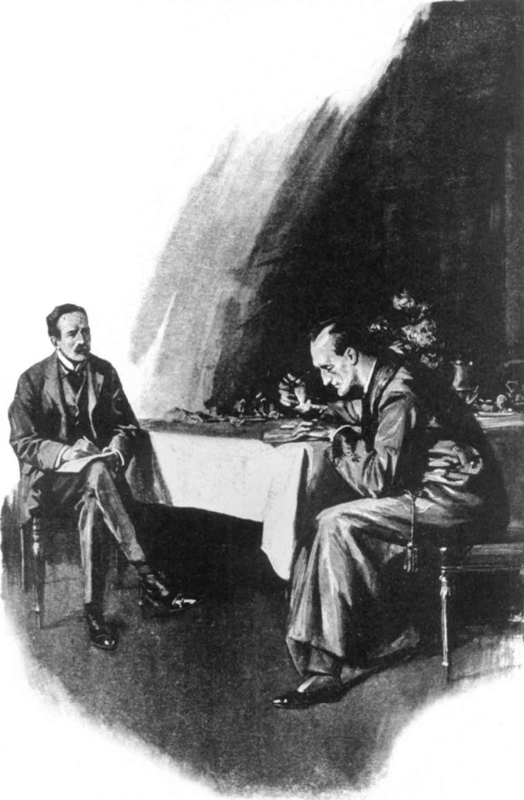

两眼射出兴奋异常的光芒。

福尔摩斯破译了密码，我迅速记录在膝头的大页书写纸上，呆呆地望着这些字。

“他这么表示他的意思，不是很通顺，拼凑得勉强。”我说。

“不能这样讲，他做得够出色了。”福尔摩斯说道，“你要在一个直栏中找出表达你意思的词，难得能够信手拈来意思表达得完全精确。主要意思之外，总得要让对方凭智力来推知其余。这里他的意思是相当清楚的，魔鬼要对一个叫道格拉斯的人伸出魔爪。这个人不知是谁，一个富裕的乡绅，住的地方讲清楚了。博洛克肯定是——找不到‘confident确信的’这个词，只找到‘confidence信任’，就权作代替——事情十二万分紧急。这就是我们的成果——这种分析，只是牛刀小试罢了！”

福尔摩斯是个做事全身心投入的手高眼高的艺术家。他工作一见起色，便会喜不自胜，但是回头看到工作仍落于他所期望的高水平之下，又会暗自伤神。他正在笑呵呵庆幸成功破译密码，这时比利开门进来，后面跟着苏格兰警场的警官麦克唐纳。

那是八十年代末，亚力克·麦克唐纳还默默无闻，不像现在这样已经名满天下。他是警方刑事调查部中一名年轻有为的探员，经手几起刑案，破案表现突出。他身材高大，背宽腰粗，一看即知此人力大无穷。他脑门高敞，晶莹明亮的双眼深陷在一对浓眉下，迸射出智慧的光芒。他不多言语，语必惊人。他性格刚毅，带有很重的苏格兰亚伯丁口音。

麦克唐纳办过两个案子，全因为福尔摩斯的协助而破案。福尔摩斯自己只知破案是件锻炼脑力的乐事，看重这才是真正的报酬。因此之故，这个苏格兰人对他的业余同事怀有深深的友爱和敬意。平庸之辈，有眼不识高山；惟有惺惺惜惺惺，才能英雄识英雄。麦克唐纳有才干有慧眼，福尔摩斯的办案能力与经验在欧洲独一无二，向他请教、求助，麦克唐纳毫不觉得辱没身份。福尔摩斯不喜欢与人往来交际，但是对这大个子苏格兰人并不讨厌，遇见总是面带微笑。

“你是一只勤勉的早飞鸟，麦克先生，”他说，“你早起，就啄得到虫子吃，恐怕是又有刑案在手了。”

“我想你该说‘一定’，而不是‘恐怕’，更符合事实，福尔摩斯先生，”警官答道，会心地笑着，“抿上一口酒驱走早晨这寒气，那才叫好。不，这会儿我不吸烟，谢谢你。我是必须要赶早上路，案子发生的最初时刻是最为宝贵的时刻，这一点你是最清楚了，别人没你了解得更清楚。但是——但是——”

警官说话忽然打住，眼睛十分惊奇地盯住了桌上的纸，就是我草草记录的那张纸。

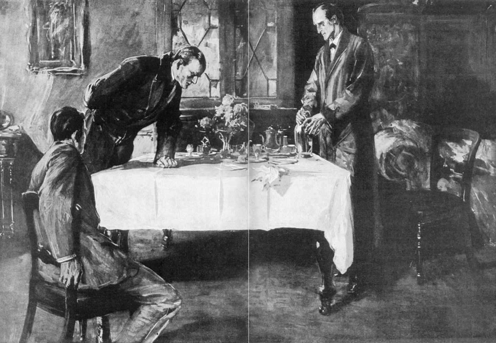

警官说话忽然打住，眼睛十分惊奇地盯住了桌上的纸。

“道格拉斯！”他急急念道，“伯尔斯通！怎么回事，福尔摩斯先生？哎呀，真是神了！这人名、地名，不可思议，给你哪儿弄到的？”

“破译的密码，是华生医生和我一起碰巧解开的。怎么了——这其中有什么问题吗？”

警官朝我们两人惊异莫名地看来看去。“我就是为的这件事，”他说，“伯尔斯通庄园的道格拉斯先生昨夜被人谋杀，可怕极了！”

————————————————————

<a href="#part0120.xhtml_ch1-back" id="part0120.xhtml_ch1">(1)</a> 舟（pilot
fish），热带、亚热带的鲹科鱼，体型不大，性喜傍随鲨鱼等大鱼。

<a href="#part0120.xhtml_ch2-back" id="part0120.xhtml_ch2">(2)</a> 关于莫里亚蒂的科学成就，美国科幻作家阿西莫夫（Isaac
Asimov，1920—1992）撰文指出柯南道尔有误：其时发现一颗小行星已无多大价值，因为早在1825年法国天文学家皮埃尔西蒙·拉普拉斯（Pierre-Simon
Laplace）出版的专著《天体力学》中对小行星问题已完全解决。同样还有，在《最后一案》（见全集之四）中提到莫里亚蒂21岁（推算应是1865年）推出了二项式的定理，其实挪威数学家尼尔斯·亨里克·阿贝尔（Niels
Henrik
Abel）早在1825年已完成了二项式定理的最后一项细节的研究。阿西莫夫还指出柯南道尔其他的“疏漏”，但福尔摩斯是小说，作者只是借此表示莫里亚蒂的大教授身份，是否符合科学史实并不重要。

<a href="#part0120.xhtml_ch3-back" id="part0120.xhtml_ch3">(3)</a> 马基雅维利（Machiavelli，Niccolo，1469－1527），意大利政治家、历史学家，著有《君主论》，主张为达到政治目的可以不择手段。

<a href="#part0120.xhtml_ch4-back" id="part0120.xhtml_ch4">(4)</a> 布雷德肖（Bradshaw），英国铁路营运指南，全名Bradshaw's
Railway Guide，由出版商George Bradshaw于1839年发行，1961年停版。

# 第二章　歇洛克·福尔摩斯的论述

这又是一个十分戏剧性的时刻，我的朋友就是为这种时刻而存在。但是，要说这个消息令他震撼，而且激动，那就言过其实了。他的本性一点也不冷酷，只因这种事司空见惯也就处之泰然。不过，要说他的感情表现木然的话，他的理智却极为活跃，看事明察秋毫。我是一听到这消息便感觉突然和恐怖，在他却是丝毫不动声色。他脸上显得极其平静，但兴致勃勃，犹如化学家正注意观察过饱和溶液中析出了结晶一样。

“值得注意！”他说，“值得注意！”

“你好像并不感到意外。”

“值得注意，麦克先生，但并不意外。为什么我不感到意外呢？我从有关方面收到了一封匿名信，很重要，警告我某某人的生命遭受威胁，处于危险之中。一小时都没到，危险就发生，成为事实，人已经死亡。我就关注了，所以，正如你所见，我不感到意外。”

福尔摩斯三言两语向警官解释了信和密码的事。麦克唐纳坐着，手支下巴，两道灰棕色的浓眉紧蹙一起。

“今天早上我打算到伯尔斯通去，”他说，“我来是想问你愿不愿意和我一起去——还有你的朋友。现在按你说的来看，本案我们还是先在伦敦着手比较好。”

“我倒不这样想。”福尔摩斯说道。

“真见它的鬼，福尔摩斯先生！”警官叫道，“报纸一两天之内准要充斥伯尔斯通谜案的消息，实际上什么谜案！案子还没有发生，伦敦已经有人发出预告，还有什么谜可谈！我们只要把这个人逮住，其余一切也都随着解决。”

“这固然是好，麦克先生，问题是你怎么才能逮住这个叫博洛克的人呢？”

麦克唐纳把福尔摩斯递给他的那信翻过来看看。“是从坎伯韦尔寄出的——这对我们没有多大帮助。名字，你说是假名，当然更没有用处。你不是说你送过钱给他吗？”

“有过两次。”

“是怎么送的？”

“钱汇到坎伯韦尔邮局。”

“你有没有利用这机会注意领钱的是什么人？”

“没有。”

警官一脸莫名的惊异。“为什么没有呢？”

“因为我讲话守信用。他第一次写信，我就答应他的条件，不跟踪他。”

“你考虑他后面有人吗？”

“当然有，我知道。”

“是那个教授，你给我说过的？”

“正是。”

麦克唐纳警官笑笑，朝我瞥上一眼，眨巴几下。“我不想瞒你，福尔摩斯先生，我们刑事调查部认为，你对这位教授是无的放矢。这个事，我本人也亲自作过调查，这位教授是个很受尊敬的人，有学问，是属于大才的人哪。”

“我很高兴，你们对才能有如此尊重。”

“老伙计，你不得不承认他呀！自从我听到你的讲法以后，我真当一回事去看了他。我和他闲扯，听他讲日食、月食的知识，他讲的我都没能太懂，他就取出个反光灯、地球仪，一经演示，立刻明白了。他借给我一本书，可是不瞒你说，尽管我在亚伯丁受的教育很不错，我的脑瓜子还是不管用，看不懂。他面容清癯，花白头发，讲话、态度，温文尔雅。我起身走的时候，他手抚我的肩头，真像是父亲一般，送你走上冷酷的世界之时为你祝福。”

福尔摩斯咯咯地笑，搓起了双手。“太好了！”他说道，“太好了！告诉我，麦克唐纳我的朋友，这次愉快的感动人的会见，我猜地点是在他的书房吧？”

“正是呀。”

“书房很雅致，是不是？”

“非常雅致——实在漂亮，福尔摩斯先生。”

“你是坐在写字台前？”

“就是。”

“阳光对着你，他的脸是背光的？”

“哦，那是晚上，不过记得灯光正好照着我脸。”

“那就是了。你有没有看见一幅画，在教授头顶上方？”

“我眼观四周一点不漏，福尔摩斯先生，也许正是从你这里学的本事呢。没错，我看见那儿有画——一个年轻女人，双手枕着头，斜眼瞧着你。”

“那是让·巴逖斯特·格勒兹<a href="#part0121.xhtml_ch1"
id="part0121.xhtml_ch1-back">(1)</a>的画。”

警官竭力表现得很感兴趣。

“让·巴逖斯特·格勒兹，”福尔摩斯继续道，双手指尖抵着指尖，仰身靠着椅背，“是一位法国画家，在一七五〇年到一八〇〇年这期间，声誉卓著。当然，我是就他的绘画生涯而言。他的画在他那个时代评价就很高，而现在的评价则更要高，高得很。”

警官两眼有点茫然起来。“我们还是，最好——”他说。

“我们正是在谈本题，”福尔摩斯打断他说道，“我现在谈的一切，和你所讲的伯尔斯通谜案直接有关，非常重要，甚至可以说，实际上是本案的问题中心所在。”

麦克唐纳不以为然地笑笑，向我投来求助的眼光。“对我来讲，你的思路未免转得太快了一点，福尔摩斯先生。你跳掉了一两个环节，这缺口我就跨不过去。这个早已去世的画家和伯尔斯通案子到底能有什么关系呢？”

“一切知识对侦探都有用处。”福尔摩斯解释说，“这是一件很小的小事，一八六五年格勒兹的一幅名叫《牧羊少女》的画，在波塔利斯拍卖，卖到一百二十万法郎——合四万多英镑——这么件小事也许可以使你联想起许多事情。”

显然很有道理，警官心悦诚服了。

“我要提醒你，”福尔摩斯继续道，“教授的薪水是有案可查的，年薪七百英镑。”

“那么他怎么买得起——”

“正是这样！怎么买得起？”

“啊，正是值得注意了，”警官恍然大悟，说道，“讲下去，福尔摩斯先生，我听出门道来了，完全对路了！”

福尔摩斯笑笑。他受到别人由衷的钦佩，总是心感温暖——一个真正的艺术家的品格。“伯尔斯通的事怎么样呢？”他问道。

“我们还有时间呢，”警官说，看了一下表，“我有马车等在门口，到维多利亚车站用不了二十分钟。谈到这幅画，我想起来，你有一次曾经和我讲过，福尔摩斯先生，你从来没有见过莫里亚蒂教授。”

“没有，我没有见过他。”

“那你怎么知道他家里的房间布置呢？”

“噢，那是另一码事。他的屋子我登门有三次，两次用不一样的借口等他回来，但是没等他来就离开了。一次是——哦，这一次我其实不便向官方警探透露。那是最后一次，我抓紧机会翻阅了他的文件——得到的收获大大出乎意料。”

“发现可疑的东西了？”

“一点也没有。这又是令我惊疑之处，然而，你现在也看到那幅画的问题了。这画表明他是个极富有的富翁。他的钱是怎么来的？他未婚，他的弟弟在英格兰西部一个车站当站长。他的教授职位每年是七百英镑，他却收藏得起格勒兹的名画。”

“是呀？”

“推论起来，应是很简单的了。”

“你的意思是说，他有大笔的收入，而钱的来路肯定是非法的吗？”

“一点不错。当然，我这样想还有别的理由——许多蛛丝马迹，不易觉察，但我看出通向蛛网的中心，那个毒虫蛰伏其中，一动不动。我只就你亲眼所见，提醒格勒兹的画，事情也就进入你的视线之中。”

“很对，福尔摩斯先生，我承认你讲的这些话都很重要，岂止重要——而且是高超、奇妙。不过最好再能讲得明白一些，是制造假钞、伪币，还是盗窃——究竟他的钱是从哪里来的？”

“你读过关于乔纳森·怀尔德的书吗？”

“噢，这名字倒挺熟。小说中的人物，是吗？小说写的那些侦探，我一向不感兴趣——都是杜撰的人，情节知其然而不知其所以然。不过是看着吊人胃口，没有实际意义。”

“乔纳森·怀尔德不是侦探，不是小说写的角色，他是个刑案要犯，上个世纪的——十八世纪五十年代的人。”

“那对我就没啥用处，我是个讲实际的人。”

“麦克先生，最实际的事情，对你来说是闭门三月，每天读十二小时刑案编年史，犯罪大都跳不出其窠臼，因为事物都是往复循环的——即便莫里亚蒂教授，也不过是依样翻新。乔纳森·怀尔德是伦敦罪犯的祖师爷、总后台，作案请他出谋划策，经手组织安排，他收取百分之十五的佣金。老轮新转，转一轮依旧，从前都做过，现在重又炮制。我来告诉你莫里亚蒂一两件事情，你会感兴趣的。”

“再好也没有，就请讲吧。”

“我是碰巧发现莫里亚蒂链条中的第一环节——一头是拿破仑大统帅，另一头是数以百计的亡命打手、扒手、诈骗犯，还有诈赌高手，两头一牵起来，便无恶不作，罪行累累。莫里亚蒂的总参谋是塞巴斯蒂安·莫兰上校，同他自己一样，法律制裁落不到他们身上。你知道莫里亚蒂给他多少钱吗？”

“不知道，听你说说。”

“每年六千英镑。这是付给他绞尽脑力的代价。你看——十足的美国交易准则。给我摸到这个情况，完全是出于偶然。他比一个首相的收入还要可观。你从这一点就可以想象莫里亚蒂的收入有多少，以及他活动的范围有多大。另外一点，最近我特意追踪莫里亚蒂的一部分支票——都是他支付正常家庭开支的普通支票，分别从六家银行支取。你是怎么看这件事的？”

“开户银行那么多，不正常。你从中得出什么结论？”

“他不想让人议论他多么富裕，没人能知道他有多少钱。我给他粗略估计一下，他足足有二十家银行的账户。他的大部分财产存到了国外，德意志银行、利翁内信贷银行，肯定是的。等你有空一点，我建议你花上一两年时间好好研究研究这个莫里亚蒂教授。”

经这么一谈，麦克唐纳警官对事情的印象深刻多了，兴致浓厚，听得出了神。现在，他那讲究实际的苏格兰人脾气，又使他马上转回到手头的案子上来。

“他可以这样做，他有权多开账户。”他说，“你谈的这些情况很有意思，但对我是离题远了点，福尔摩斯先生，真正要紧的，是你讲到教授和本案有牵连，是你收到博洛克的警告信。这很实际，和当前的任务直接有关，我们该进一步查一查吧？”

“对于作案的动机，我们可以推测一下。根据你的初步报告，这是一件令人费解的，或者至少是动机不明的凶杀案。现在假定犯罪原因就如猜测的那样，动机就有两种可能性。首先一个，我可以告诉你，莫里亚蒂对他的党羽实施铁腕统治，帮内纪律极其严酷。在他的法典里，只有一种惩戒方式，那就是处死。现在我们可以假设，这个被谋杀的人——这个道格拉斯，大祸临头，注定要被除掉，这件事被首领的一个手下知道——道格拉斯很可能是对首领有所违拗，将其处死的惩罚马上接踵而至，以此昭告众党徒——杀一儆百。”

“好，这是一种可能，福尔摩斯先生。”

“另外一种，那就是莫里亚蒂经手策划的常规业务，劫财害命。发现抢劫没有？”

“我还没有听到报告。”

“有抢劫的话，当然就推翻第一种假设，属于第二种性质了。莫里亚蒂可能得到承诺可以分得一定比例的赃物，然后策划作案，或者付给他多少钱，由他主持作案。两种方式都有可能。不管是哪一种方式，甚至还有第三种，是两者的综合，在我们都必须到伯尔斯通去，要下去才能找到答案。我知道这个人，他决不会在伦敦留下蛛丝马迹，叫我们逮着他。”

“那我们一定要到伯尔斯通去！”麦克唐纳喊道，从椅子里跳起来。“可惜，晚了点，我早没想到！我给你们两位先生五分钟准备，马上就走。”

“对我们两个绰绰有余了，”福尔摩斯说，立即起身，脱下休闲袍，穿上外套，“上了路，麦克先生，我要好好问你，请告诉我全部情况。”

所谓“全部情况”，结果听下来并没有多少情况，很令人失望。不过，提到我们面前的这桩案子，值得这位专家的悉心关注。他听着少得可怜但还是值得注意的细节，脸色开朗起来，搓起了一双细长的手。前面漫长而百无聊赖的几星期总算挨过去了，现在终于有了确定的目标，可以施展非凡的才能。像所有特殊的禀赋一样，当它们无所用武之地的时候，拥有者为之备感烦躁。如锋刃锐利的脑子，不用便要生锈，变得迟钝。

歇洛克·福尔摩斯的两眼闪亮有神，苍白的双颊升起红晕，工作的召唤使他容光焕发。他坐在马车上探着身子，倾听麦克唐纳对我们前去处理的苏塞克斯这一案子讲述简要的情况。警官自己也是不甚了了，他解释说，他是清晨由送牛奶火车带给他的一份草草写成的报告得到的消息。当地警官怀特·梅森和他有私交，因此麦克唐纳近水楼台先得消息，每有外地来求助，他获得消息总要比按部就班的苏格兰警场灵通得多。如本案是属于无从下手的疑案，一般总要请大都市专家出马才能了结。

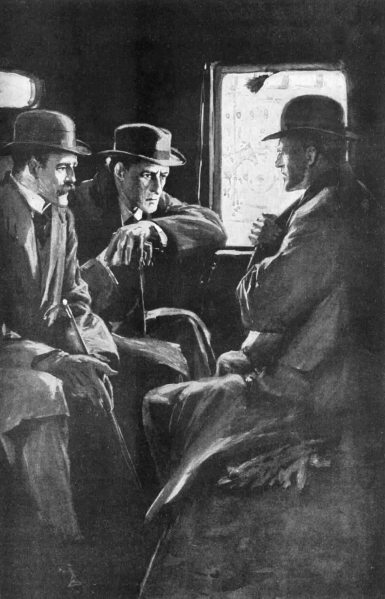

倾听麦克唐纳讲述简要的情况。

亲爱的麦克唐纳警官［他把信念给我们听］：

出公函是要求你来支援，另附上；此信仅供你私人过阅。早班车何时可到达伯尔斯通，务请电告，我去迎候——如我不能脱身，也要派人去接。此案异乎寻常，请立即动身前来，一刻也不要耽搁。你若能邀福尔摩斯先生一起来，务请同行。他将有事可做，一定是他心愿的差使。我们认为，本案若不是致死人命，便可全部如戏演过，圆满了结了。哎呀，真是一桩大有花头的疑案呀。

“你的朋友很有头脑。”福尔摩斯说。

“对，先生，要我给他评价的话，怀特·梅森这个人浑身是劲。”

“还有什么可以见告的吗？”

“要等他了，见了他，他会给我们作详细报告。”

“你怎么知道是道格拉斯先生，正是他惨遭谋杀呢？”

“那是在公文报告上写的。不过那上面没有写‘惨遭’，这种口气不是正式公文用词。上面写的是约翰·道格拉斯；还提到是伤在头部，被枪击致死；也提到案发时间，是昨晚将近午夜；还说本案无疑是一起凶杀案，但无人受到拘捕；本案特点离奇复杂。到目前为止，全部情况就是这些，福尔摩斯先生。”

“好吧，没有别的消息的话，就谈到这里吧，麦克先生。证据不足，匆忙作推理、下结论，是干我们这一行的致命伤。到目前为止，我只看到两件可以肯定的事——伦敦有个智囊大黑手，苏塞克斯死了个人。两者之间有链条，我们要查清。”

————————————————————

<a href="#part0121.xhtml_ch1-back" id="part0121.xhtml_ch1">(1)</a> 让·巴逖斯特·格勒兹（Jean
Baptiste
Greuze，1725－1805），法国风俗和肖像画家，多反映中下层妇女儿童的日常生活并含道德说教，作品有《受罚的儿子》、《新嫁娘》等。

# 第三章　伯尔斯通的惨剧

现在让我把个人并不紧迫的事暂且撇一边搁一搁，先要把我们到达之前发生的案情讲一讲，虽然这都是以后所了解到的事实。因为只有这样，才方便读者了解案情中有关的人以及他们在案子中奇特的处境情况。

伯尔斯通是个小村庄，位于苏塞克斯郡的北部边界，密布着一片古老的小屋，数百年间一成不变，但近几年来，它如画一般美丽的环境吸引一批有钱人来这里建起了别墅，一幢幢参差错落在四周的林地中间。这片浓密的树林据当地人说是威尔德大森林延续的边缘区，向北一直伸展到石灰岩丘陵牧地才渐渐稀疏。村里随着人口日益增长，一批小商店应运而生。于是，伯尔斯通出现了一派繁荣的景象，从一个古老小村落变为现代化的小镇。它在农村相当大的区域内占据着中心地位，因为那滕布里奇威尔斯自治市，算是离此最近的重镇，也已在肯特郡边境之地，要东去相距十至十二英里之遥。

离村镇大约半英里的地方，有一座古老园林，园中都是高大的山毛榉，因此闻名，那便是古旧的伯尔斯通庄园。园林有一部分的建筑历史悠久，可以追溯到第一次十字军东征时代，那时休戈·戴·坎普司在英王“红脸威廉王”赐给他的这座庄园中心建起了小城堡。小城堡在一五四三年毀于大火。到了詹姆斯一世时代，在这封建城堡的废墟上又建起一幢砖瓦住宅，原有熏黑了的墙角石仍使用来建房。

庄园房屋以其许多三角墙和菱形小格窗而保持着十七世纪初期建筑的遗风。战事频繁的祖上前辈，开挖双重护城河来护卫，外围一条护城河已经干涸，沦落辟作菜园地。内河依然存在，环绕宅屋，虽然只剩几英尺深，河面还保持四十英尺的宽度。护城河与一条小河相通，小河蜿蜒流向远处，河水虽然浑浊，但毕竟不是沟堑死水那样不卫生。房屋的落地窗离水面不到一英尺。

庄园对外的惟一通道是一座吊桥，吊桥的铁链和绞盘年久生锈，早已损坏。然而，庄园的新一代住户饶有兴致，把吊桥修好，重新可以收放自如，而且事实上每天夜晚都要把吊桥吊起，早晨放下。如此，使庄园重新回复到封建古代，一到晚上，便成为孤岛——这件事实，促使疑案更悬疑，更引起全英国的关心和注意。

住宅已有多年无人居住，破败不堪，几乎可以当作古屋遗址供人观赏，这时，道格拉斯居然看中，毅然租下。这一家只有两人——约翰·道格拉斯和他的妻子。道格拉斯无论性格和人品，都很出众。年龄大约五十岁，方下巴，相貌平实，灰白的小胡子，一对灰眸的眼睛特别锐利，身材瘦长结实，体力充沛、行动敏捷，丝毫不减当年。他待人随和，始终乐呵呵笑脸相迎。但是，从他的举止中看得出有点不拘小节，给人的印象是，他在下层社会中有过一段经历，与苏塞克斯郡这样高层次地区的社会存在距离与隔阂。

为此，周围有教养的邻居都以好奇和谨慎的眼光看待他。但是，由于他对一切地方事业的捐助慷慨解囊，频频参加村民宴饮娱乐等的大型集会，还藉着他是音色丰富优美的男高音，总是难以推辞大家的美意献上一曲，所以，他还是在村民中间很快获得好感，赢得人心。他似乎很有钱，据说是在加利福尼亚开金矿发的财。他在美国生活过一段时间，这是他自己亲口所谈，他妻子也曾经讲过。

由于道格拉斯为人慷慨大方、平易近人，所以给人的印象一直很好，特别有冒险进取的精神而大大提高声望。虽然他的骑术并不高明，但是每逢赛马会他有邀必到，还凭着坚强的意志非但不落人后，更与强手一争高下，常能反败为胜。有一回教区牧师家着火，消防队灭火无效，他见义勇为，几进火中抢救财物，如此突出表现，深得地方上好评。终于，约翰·道格拉斯入住庄园不到五年，已是誉满伯尔斯通的一个人物。

他的妻子，也一样，凡是有过一面之交的人，对她的口碑都很好。尽管按照英国人的习惯，对于入住本郡的异乡人，不经介绍是不大会主动上门拜访的。这一点她并不在乎，因为她本来就性喜孤独安静，看得出，她所有心思只放在侍奉丈夫、料理家务上。大家知道夫人是英格兰人，与道格拉斯先生相识于伦敦，那时先生正是鳏夫。夫人是个美貌女子，修长，苗条，深肤色，比丈夫要小二十岁，年龄的悬殊表面看来一点不影响家庭的和睦。

但与他们相熟的人有时候也说起，夫妇之间似乎并不真正相知甚笃，夫人对丈夫过去的生活避免多谈，或许更有可能是很不了解。有些好事人看出来因而有议论，说是道格拉斯夫人有时候神经好像很紧张，每当丈夫外出归来比较晚，她就表现出心情极度不安。在单调寂寞的乡间，邻里闲言容易传播，庄园夫人的这一疑点也就不胫而走，以致惨案发生之后，人们自然要记起，对此议论纷纷，引起猜测。

这同一屋檐下还有一个人，虽说这个人实际上并非常住，但惨案发生的时候他偏偏正在现场。他的名字现在就要特别提到公众面前，他是塞西尔·詹姆斯·巴克，是汉普斯特德郡黑尔斯洛基市人。

塞西尔·巴克，大高个头却浑身轻灵，走在伯尔斯通村街上，人人认识他，都知道他是庄园常客，而且是座上客。尤其令人注意的，他也是道格拉斯先生来到英格兰新居住地之前的未知生活中的惟一朋友。巴克是英国人，这没有疑问，但他自己说过，他认识道格拉斯是在美国，两人在那里一起生活，关系密切，这一点是清楚的。在人们眼里，他也是个很有钱的人，还知道他是个光棍汉。

论到年龄，他要比道格拉斯小得多——顶多四十五岁——高个子，腰板挺直，肩阔胸厚，脸刮得十分干净，一副拳击手的相貌，两条粗黑大浓眉，一对黑眼睛。他那目光慑人，与敌对峙时，不必有劳出手，只用眼刷地一扫，就能从敌群中扫出一条路让他过去。他不习骑射，喜欢嘴里叼个烟斗，往这旧村落的各处闲逛。或者和他主人一起驾车，男主人不在就载女主人，在美丽的乡间兜风。“他是绅士，随便得很，大方得很，”管家艾姆斯说，“可是，哎呀！我跟他一点也随意不得！”巴克对道格拉斯友情笃厚，对夫人也不少亲近——其间的友爱，不止一次未免引起丈夫的醋意，以致仆人都觉察到主人有着这种烦恼。这次大祸降临，巴克是这家里的第三者。

这老宅里的其他居民一大家子，只要提一提拘谨古板而能干的艾姆斯，还有艾伦太太就够了，艾伦太太是个快乐有福态的人，她分担了大部分家务，让女主人省心不少。另外家里还有的六个仆人，和一月六日夜间的案发都没有任何关系。

那是晚上十一点四十五分，有一个人跑来向小村警察所报警，警所由苏塞克斯管辖区的威尔逊警官主事。报警人是塞西尔·巴克，他激动异常，奔到警所门上就拼命打铃。庄园出人命了，约翰·道格拉斯被谋杀了，他上气不接下气报告完毕，转身马上赶回家。警官立即向郡警署上报发生重大命案，稍后几分钟就来到了案发现场，这时十二点刚过。

警官一到庄园，看见吊桥放下了，窗户都透着亮，整幢屋子陷于惊恐混乱。仆人都吓白了脸，聚到厅里来，惶惶然的管家在门口扭着手不知所措。只有塞西尔·巴克似乎还比较镇静，他已经把入口的门打开，招呼警官跟他走。这时候村里的伍德医生也到了，他什么病都能看，人们大病小痛都找他。三人一起走进案发的房间，战战兢兢的管家紧跟在后面，进屋就把门关上，不让女仆们看见这可怖的情景。

死者挺直四肢，仰卧在屋子中央。身上外面只穿一件粉红色休闲袍，里面是睡衣；一双赤脚套着毛毡拖鞋。医生把桌上的提灯拿了蹲下身去，对受害人只看上一眼，就断定已经完全无救了。伤势非常严重，胸口扔着一件奇特的武器，一支双筒猎枪，枪管截短，只留扳机前一英尺长。这很清楚，是专作近距离射击用的，这人迎面挨枪，几乎整个脑袋都给打碎。枪上两个扳机用铁丝一起扎牢，为的是扳机一扣就是双管齐发，以求威力最猛杀伤力最大。

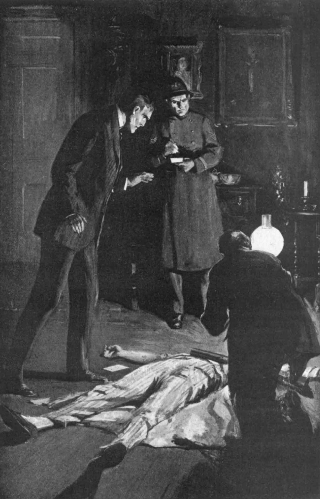

医生把桌上的提灯拿了蹲下身去。

乡村警察突然面临这样重大的责任，也深感惶恐。“现在一切都不要动，等上面派人来再讲。”他看着这可怕的头颅，低声地说。

“这儿的情况都一点没动过，”塞西尔·巴克说，“我保证，你看见的跟我初发现时候一个样。”

“那是什么时间？”警官掏出了记事本。

“那正是十一点半，我还没有脱衣服，在我的卧室里，坐着烤火。忽然听到枪声。枪声不是很响——像是给捂住的闷响。我冲到楼下——跑进屋子，估摸也就不到半分钟的时间。”

“门开着的？”

“是的，开着。可怜的道格拉斯躺在地下，就你见的这个样子。他卧室的蜡烛放在桌上，亮着。那提灯是我点的，没过几分钟。”

“没看见有人？”

“没有。只听见道格拉斯夫人随后从楼梯上下来，我立刻跑出去阻止，不让她看见这可怕的场面。艾伦太太，女管家，也来了，把夫人拽走。接着是艾姆斯，我和他再跑回屋子。”

“我听说的，知道你们这吊桥晚上一直是吊起的。”

“是的，晚上吊起着，是我放下的。”

“那凶手怎么能跑得掉呢？不可能的嘛！一定是道格拉斯先生自己打自己咯？”

“我们起初也是这样想的，可是，你瞧！”巴克撩开窗帘，看见菱形格的玻璃长窗完全敞开着。“再看这个！”他把灯提低一些，照着木窗台上有血迹，像是一只靴底印，“有人脚蹬这儿逃掉的。”

“你是说有人趟水过河逃走？”

“没错！”

“案发后，你就到这屋里，才半分钟，这时候那个人应该还在水里哦。”

“我想正是这样。当时我要跑到窗前就好了！可惜窗帘这么被遮着，你也看到了，所以我就没有想到。后来听见道格拉斯夫人下楼，我只顾着不要让她进屋里来，太怕人了。”

“真是怕人！”大夫说，看着碎头颅，周围溅的血迹，“这样厉害我都还没有见过，只有上回伯尔斯通铁路上火车轧死的那个，也是。”

“不过，我看，”警官说，他那迟缓的乡下头脑还在开着的窗上打转，“你说人从河里趟水跑掉，也是说得过去。可我要问的是，吊桥既然吊起着，他是怎么进的屋呢？”

“哦，这是个问题。”巴克说。

“桥几点钟吊起来的？”

“将近六点。”管家艾姆斯说。

“我听说，”警官道，“一般太阳下山桥就吊起了。那么，在现在这个时节，应该是将近四点半左右，而不是六点钟。”

“道格拉斯夫人有访客一起喝茶，”艾姆斯说，“要等客人走了，我才把桥吊起来。是我亲手吊的。”

“噢，是这样，”警官说，“要是有人从外面进来——假定是进来的——那一定是六点钟以前打桥上走，然后就藏身在什么地方，直到十一点以后，道格拉斯先生正好进这屋里。”

“正是这样！道格拉斯先生每天晚上最后一件事，总要看看几处的火烛是否熄了，才去睡觉。所以他会跑来这里。那个人等着他，把他给打了，然后跳窗逃走，把枪扔下。我是这样分析的，其他的说法都讲不通，不符合实际。”

警官在死者身旁的地板上捡起一张卡片，上面是用墨水写得很潦草的两个缩略字母V．V．，字母下面还有数目字341。

“这是什么？”警官拿着问道。

巴克惊疑地看着。“刚才我怎么没注意到！”他说，“一定是凶手掉下的。”

“V．V．341。看不懂是什么意思。”

警官把卡片拿在手上翻过来覆过去。“V．V．是什么？人名的缩写字母，可能是。你捡的那是什么，伍德大夫？”

大夫拿着一把大号铁锤，那是原先丢在壁炉前的地毯上的——一把坚实有分量的精工铁锤。塞西尔·巴克指指壁炉架上一只铜钉盒子。

“道格拉斯先生昨天调换油画，”他说，“他站在椅子上，挂了这幅大油画，我看见的。估计是他用的这把铁锤。”

“还是放回原地好，搁在地毯上别动，”警官说，搔搔头皮，疑惑不解，“这要调精兵强将的警力才解决得了问题，刨根到底怎么回事。该是由伦敦来清查这件案子。”他拎起提灯在屋子里慢慢兜上一圈。“啊！”他兴奋地叫道，把窗帘拉向一边。“这窗帘是几点钟拉上的？”

“一点灯就拉好了，”管家答道，“四点钟刚过吧。”

“有人在这儿藏过，肯定是。”他把提灯降低，角落里看得见有几个泥鞋印，“我敢说这正中了你的猜测，巴克先生。看上去，这个人是四点过后、六点以前，就是在放下了窗帘、吊桥还没有拉起，这时间跑进屋里来的。他溜进这间房间，这一间进门最近，先进入这里。一看没别的地方可以藏身，就钻到窗帘后面。这是再明显不过的事了。看上去，打的主意是要偷窃屋里财物，谁知让道格拉斯先生碰巧撞见，他就下了毒手，马上逃掉。”

“我分析也是这样，”巴克说，“不过，照我讲，我们何必白白浪费时间呢？干吗不趁着人恐怕还没跑远，快出去搜村子？”

警官想了一想。

“凌晨六点以前，没有火车，他无法由铁路逃跑。如果走公路，他两条裤腿湿淋淋全是水，肯定要被人注意。我在这里不好离开，要等有人来再说。我看你们在事情没弄清个大概之前，也是不便离开吧。”

大夫提着灯再仔细察看尸体。“这是什么记号？”他问道，“跟案子会不会有关系？”

死者的右臂撑在休闲袍外面，一直露到肘部。在前臂中间，有个奇怪的棕色标记，一个圆，圆里边一个三角，微有凸起，在灰白的皮肤上很是醒目。

“这不是文身刺青，”大夫说，眼睛透过眼镜仔细察看，“像这个我还没见过。这是他什么时间给烙上的？跟牛身上烙印一样。算是什么意思？”

“我也说不上来是什么意思，”塞西尔·巴克说，“道格拉斯有这个记号，十年来我倒是一直看见的。”

“我也是，”管家说，“好多次数了，主人捋起袖子，我就看到有这个记号。我也奇怪不明白是什么。”

“恐怕，这跟案子扯不上啥关系，”警官说，“可是，挺怪就是了。这个案子处处是怪。哦，又是怎么啦？”

管家一声惊呼，指指死者伸着的手。

“他们拿走了他的结婚戒指！”他喘气说。

“什么？”

“没错，真的，主人一直戴着结婚金戒，左手小指上。还有一只金块镶戒加在前面，中指上有一只蛇盘戒。看，这金块戒、蛇盘戒都还戴着，惟独结婚戒不见了。”

“他说的不错。”巴克接口道。

“你是讲，”警官说，“结婚戒是戴在那个戒指下面的？”

“就是呀！”

“那就是说，凶手，或是不管什么人，先取下你讲的那个金块镶戒，再取下结婚戒，然后，再把金块镶戒给戴上。”

“就是这样！”

这位乡村警官转不过来了，他摇着脑袋。“我看这件案子只有上交伦敦，越快越好。”他说，“怀特·梅森是个有本事的人，地方上的案子他没有办不了的。他就要到了，会助我们一臂之力。不过我指望我们还是要看伦敦的，不然搞不赢。不是我讲丧气话，这个事不是我们能吃得下来的。”

# 第四章　黑暗

凌晨三点，苏塞克斯的探长怀特·梅森警官，应伯尔斯通警官威尔逊的急电敦请，从总部驾轻便马车赶到，马跑得都快要断气。梅森警官由凌晨五点四十分的火车把报告送达苏格兰警场，又在中午十二点钟到伯尔斯通车站迎接福尔摩斯和我。怀特·梅森仪态平静，安详从容，穿一件宽大的花呢外套，脸色红润，髭须刮得精光，矮壮的身材，两条坚实的曲棍腿裹着绑腿鞋罩，看上去像个乡下小农夫，也像个正歇工着的猎场看守人，像这像那，就是不像个狠角色的官家刑侦探长。

“真是件离奇少见的案子，麦克唐纳先生！”怀特·梅森不住地说着。“新闻记者知道了这案子，会像苍蝇一样向我们围上来。但愿我们能很快把案子查了结，不等他们鼻子嗅到，蜂拥而来，把这里的线索踪迹全给你踩个稀巴烂。就我记忆所及，还没有如此的案子先例。有些地方正对你的口味，福尔摩斯先生，但愿我没讲错。还有，华生医生你，我们把案子了结，少不了医生大夫要出来讲几句话。你们的房间开在西镇旅店，没有别的地方可找，不过我听说那边挺干净，很不错。仆人会把行李送去。好，请吧，先生们，这边走。”

这位苏塞克斯警探非常活跃，热情友好。十分钟后，我们已到下榻处。再过十分钟，大家坐在了小旅店的休息室，我们被飨以恭听案情的便餐，所讲大致情况在上一章已有叙述。麦克唐纳有时做点记录，福尔摩斯静坐倾听，显出惊讶和钦佩的表情，就像一个植物学家在鉴赏盛开的奇葩。

“奇怪！”听罢案情介绍，福尔摩斯说道，“非常奇怪！想不起来以前有过比这更奇怪的案子。”

“我早料到你也会这样说，福尔摩斯先生，”怀特·梅森大喜，说道，“大家赶到苏塞克斯还真及时。现在我已经把事情都说给你们听了，介绍到我接手威尔逊警官、今晨三点到四点这段时间之前的所有情况。没有办法呀！老马还不得卸车歇工呀！不过我是不用那么奔忙的，事情就摆的这个样，并没有什么事要我马上可以去做。威尔逊警官事实都清楚了，我查核过，仔细研究过，再加上我自己有一点看法。”

“什么看法呢？”福尔摩斯急切地问。

“哦，我先检查铁锤，伍德医生协助我，我们没有发现铁锤实施暴力的痕迹。我倒是希望，道格拉斯先生没把铁锤丢在地毯之前，用过铁锤来自卫，那就会在凶手身上留下伤痕。可惜一点痕迹都没有。”

“那个，当然一点也不稀奇，”麦克唐纳警官说道，“用铁锤敲死人，铁锤上不留痕迹的案例，多的是。”

“正是这样，不能证明没有用过。不过，有痕迹的话，对我们就大有帮助，可惜就是看不到痕迹。然后我就检查枪，是大号铅弹的双筒猎枪。正像威尔逊警官指出的，两个扳机用铅丝一起绑住，你只要扣了后扳机，马上双管齐发。想出这种方法的人，目的很明确，就是扳机一扣，非致对方于死地不可。枪管被锯短，锯到不过两英尺长——很容易藏在衣服里。枪上厂家名字不全，在双筒凹槽地方有刻的字母PEN，名字的其余字母正好给锯掉。”

“一个大P，上面有花饰，E和N比较小，是不是？”福尔摩斯问道。

“对，没错。”

“Pennsylvania Small Arms
Company宾夕法尼亚轻兵器公司——很有名的美国枪械制造商。”福尔摩斯说。

怀特·梅森呆呆地望着我的朋友，就像是一个乡村小医师望着哈利医学街的医学大专家，疑难杂症只需大专家一句话，便令困惑不解的小医师茅塞顿开。

“受益匪浅，福尔摩斯先生，你说的完全正确。棒极了！棒极了！难道说，世界上枪械厂家的名字都在你脑袋里装着？”

福尔摩斯一挥手略过这个问题。

“没问题，那是美国猎枪，”怀特·梅森继续道，“我好像书上还是哪里看到过，美国有的地方就是用锯短的猎枪作武器。这回就是枪筒上没有名字，我也是脑子里想到过的。已经有证据证明，进入屋子杀死屋主的这个人是一个美国人。”

麦克唐纳摇摇头。“老兄，你太玄乎不可捉摸，”他说，“我没有听到有什么证据，证明庄园里有外人进来过。”

“打开的窗子，窗台上的血迹，不明的卡片，角落里的鞋印，枪！”

“那些没有一件是不可以伪造的。道格拉斯先生是美国人，或者说在美国长期居住过，巴克先生也是。你何必要从外面去想，引进美国人来说明有美国人的迹象。”

“艾姆斯，男管家——”

“他怎么样？可靠吗？”

“跟随查理斯·钱德斯爵士有十年——人牢靠如磐石。五年前，道格拉斯先生租下这座庄园，他跟随至今。他从来没见庄园里有过这样的枪。”

“枪藏起来了，所以枪管锯短，随便要搁哪个箱子都方便。他凭什么能肯定屋里就不会有这样的枪？”

“哦，不管怎么说，他没有看见过。”

麦克唐纳顽固地摇着他的苏格兰铁头。“俺就不信是有谁进的屋，”他说，“俺要你好生考虑。（他一争辩起来，亚伯丁口音就更浓更重了）俺叫你好生考虑，要说枪是从外面带进屋，要说这许多怪事，全是外面来人干的，那搅成个啥事！啊，老兄，叫人无法相信！完全不符合常理！我倒要请教你，福尔摩斯先生，根据我们都已听说的情况，你是怎么个判断。”

“啊，你讲你的理由吧，麦克先生。”福尔摩斯说，口气平缓而公正。

“若是有凶手，也绝非为盗窃行凶。戒指这个复杂手脚，再来那名片，都说明是为私人恩怨蓄意谋杀。好吧，有一个人潜入来，企图蓄意谋杀，他该清楚，他有脑子的话，他要脱身有多难，屋子四周全是水。他用啥凶器？你会说世上最无声响的凶器。他当然希望事情干完就跳窗溜之大吉，趟过护城河，跑得一干二净。这是最理想的了。现在的情况居然不是，千选万选，偏选件声音最响的武器，明知道枪一响就等于要把屋里人都叫过来，而且来得要多快有多快，还要跳河涉水，肯定要被人看见，难道这都是可以理解的吗？你说可以相信吗，福尔摩斯先生？”

“哦，你讲得有道理，”我的朋友想了想回答，“这一定需要充分的证据来证明。容我问一句，怀特·梅森先生，你有没有检查河对岸，是不是有从河里爬上岸的痕迹？”

“没有踪迹呀，福尔摩斯先生。因为是石头岸，看不出踪迹来。”

“脚印、手印都没有？”

“全没有。”

“哦！你不反对吧，怀特·梅森先生，我们马上到庄园屋子去看看？那边多少有点迹象可能说明问题。”

“我原本早就想建议去看看，福尔摩斯先生，只是我想让你去之前，最好对事实有个了解。我若是有什么地方对你不怎么周全——”怀特·梅森满腹狐疑地望着这个非正统侦探。

“我以前同福尔摩斯先生一起办过案，”麦克唐纳警官说，“他一向视若体育比赛，讲究恪守准则、光明磊落。”

“我自己是有这样的准则观念，无论如何要有，”福尔摩斯微笑着说，“我每办一案，都以推进社会公正为目的，有助于警方工作为目的。要说我曾和警方有隔阂，那是他们自己要排斥我，我从来不想掠夺他们头上的功劳。还有，需要讲清楚，怀特·梅森先生，希望让我按照我的方法行事，按照自己的时间表宣布结果——全程自始至终，不要打断。”

“我确信，有你参与办案，是我们的荣幸，我保证将知道的情况全部向你通告。”怀特·梅森真诚地说，“来吧，华生医生，到时候，我们指望能在你的书中上个角色呢。”

我们走在幽雅的乡间小道上，两边是截短枝梢的榆树。远处有一对古拙的石柱，久经风雨剥蚀，长满苔藓，石柱顶部是跃立状的伯尔斯通坎普司狮子，但轮廓已经模糊不清。绕过一条弯曲的车道没多远，如英格兰农村常见的景色，周围都是草地和栎树。接着一个小转弯，前面就看见那幢詹姆斯一世时代的一长排低矮的古别墅，灰暗的棕褐色砖房，坐落在古园林中，园中是修整过的紫杉林。我们走近去，屋前是木吊桥和幽静宽阔的护城河，冬日的寒水在阳光下银辉闪耀。

古旧的庄园，历经三百余年的时光流逝，几代人生于斯、归于斯，年年聚舞欢歌，岁岁纵马猎狐。莫非岁月沧桑古奥，才叫那如今年事已高的墙垣投上一抹谜案黑影！还有那些古老高耸的屋顶、突兀的三角墙，颇适于藏匿、遮掩险恶可怖的阴谋。我望着那排排深嵌的窗户，一长溜暗色水围的正前屋，顿然感悟，原来惨案之所以发生在这里，实在没有比此情此景更适合的地方。

“那个窗，”怀特·梅森说道，“吊桥右边第一扇，打开的窗，昨天晚上就这样开着的。”

“好像挺窄，人不容易过。”

“哦，总不见得是个胖子吧。这件事不用你来推论担心，福尔摩斯先生，你和我的身材就足可以过得去。”

福尔摩斯走到水边，望到对面，再察看石砌的河岸、上岸的草地。

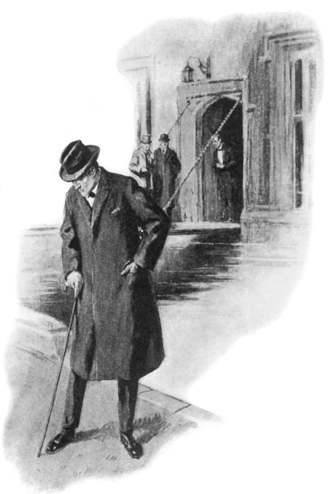

察看石砌的河岸、上岸的草地。

“我都仔细看过了，福尔摩斯先生，”怀特·梅森说，“什么也没有，没有人爬上岸的痕迹——他就一定会留下痕迹吗？”

“是啊，为什么一定会呢？水一直是这么浑吗？”

“总是这个水色。那条溪水流下来带着泥。”

“这有多深？”

“两边靠岸大约两英尺深，中间有三英尺深。”

“那就是说，这个人过河被淹死这一点，用不着考虑。”

“不用考虑，这水连小孩子都淹不死。”

我们过吊桥，一个瘦骨嶙峋、干瘪枯槁的人上前相迎，他就是管家艾姆斯。这个可怜的老人惊魂未定，脸色苍白，浑身颤抖。那乡村警官，身材高大，是个神情正经严肃的人，依然忠于职守，不离现场。大夫已经离开了。

“有新情况吗，威尔逊警官？”怀特·梅森问他。

“没有，先生。”

“你请回吧，已经够辛苦了，有事我们再找你。管家让他在门外等着，告诉他吩咐塞西尔·巴克先生、道格拉斯夫人，还有女管家，现在我们想跟他们谈谈，有些话要问。好了，先生们，也许大家会同意我先谈我的观点，然后你们才会得出你们自己的观点。”

这位乡村刑案专家，十分引起我的注意。他掌握可靠的事实，头脑冷静、清楚，有理智，他干这一行应当很有作为。福尔摩斯专心倾听，绝无这个官方发言人常有流露的急躁情绪。

“是自杀还是他杀——这是我们头一个问题，先生们，是不是呢？如果是自杀，那么一定是这样，他先把结婚戒指摘下，藏好；然后，穿着休闲衣下来，泥脚踩进窗帘后面角落里，为的是做出假象，好像有人等着他，打开窗，弄点血在——”

“这个我们不必考虑。”麦克唐纳说道。

“我也是这样想，自杀是不可能的，肯定是他杀。那么就要确定凶手来自外面还是出自屋内。”

“好，我们听听高论。”

“这两种可能分析起来都相当困难，但是非此即彼，只有一种可能。我们先假设，是屋里某一个人或者一个以上作的案。在屋里大小事情都已安定，但大家还没有就寝的时候，把他弄到楼下。他们行凶，用的是世界上最怪最响的枪，存心要告诉全屋子人出事了——这种枪家里以前从来没有见过。这样解释是讲不通的，不通吧？”

“是的，讲不通。”

“这里，有一点没问题，枪声一响，最多只有一分钟，全屋子人——不只塞西尔·巴克一个，他说他是第一个，实际上还有詹姆斯，还有其他人，都到了现场。既然这样，那么请问，在这点时间里，实施犯罪的人怎么能够又是在角落里留下脚印，又是要打开窗，又是窗台上弄血迹，又是要从死人手上拿下结婚戒指，做这做那，做得了吗？来不及吧！”

“这个分析很透彻，”福尔摩斯说道，“我倾向于你的意见，能同意。”

“那好，我们退回到原来的推论，是外人作案。虽说还是遇上巨大的困难，但是不管怎么说，不再是绝不可能。这个人是四点三十至六点这段时间进入屋内，也就是说，黄昏时间，吊桥吊起之前。这以前有客人，屋门是开的，所以潜进屋来没有阻碍。这个人可能是一般夜盗，也可能和道格拉斯先生有积怨。因为道格拉斯先生大半辈子是在美国，那猎枪也是美国货，这么看，推论报私仇有很大的可能性。他溜进这间房里，因为一进门正好就是这一间，就藏在窗帘后面躲起来。一直等到晚上过十一点，这时候道格拉斯先生来了这间房里。两相照面，交谈点什么；很可能根本没谈什么话，因为道格拉斯夫人说，她丈夫离开她没几分钟，就听见枪声。”

“蜡烛可以说明这一点。”福尔摩斯说。

“不错，蜡烛，是新蜡烛，点了还不到半英寸。他是先把蜡烛在桌上放好，这之后才遭到毒手。否则，不用说，人给击倒，蜡烛也要掉在地上。这说明，他不是一进屋就遭到攻击的。巴克先生来的时候，蜡烛还亮着，提灯是熄着的。”

“很清楚。”

“好，现在，我们可以根据这些线索设想当时的情形。道格拉斯先生进入这屋子，放下手里的蜡烛。有一个人从窗帘后面出来，手中有枪。他要结婚戒指——天知道为什么缘故，不过肯定就是这么回事。道格拉斯先生给了他。接着，也许出于预谋，也许是由于发生争执——道格拉斯可能去抓铁锤，就是我们看见扔在地毯上的那把——他就先下手，一枪把道格拉斯打倒。扔掉了枪，还掉了一张很奇怪的名片——V．V．341，不管它是什么意思吧——就跳窗，趟过水逃跑了，也就在这时间，塞西尔·巴克来到现场发现出事。这样说怎么样，福尔摩斯先生？”

“很有趣，但是有点不可信。”

“老兄，简直是一派胡言，没比你更荒唐的了！”麦克唐纳叫道，“杀了人，不管凶手是谁，我可以向你保证，他不是这样作的案，是另有方法的。他不计划自己如何退路，就贸然这么干是什么意思？他应该不出声才好逃走，偏偏用猎枪是什么意思？请教福尔摩斯先生，该轮到你来指点指点我们，因为你说，怀特·梅森先生的推论不可信。”

在这段长时间的讨论中，福尔摩斯静坐那里，一边专心旁听两人的你一言我一语，一字不漏；一边用锐利的眼光向左右环顾，额头紧蹙，极力深思。

“我想还要多掌握一点事实，才能作出推论，麦克先生。”他说，人跪向尸体的身边，“哦，我的天哪，这伤势真叫人可怕。能不能请管家进来一下？……艾姆斯，我知道，这个记号你经常看见，熟悉的，不知什么意思——圆圈里一个三角的这烙印——在道格拉斯先生的前臂上？”

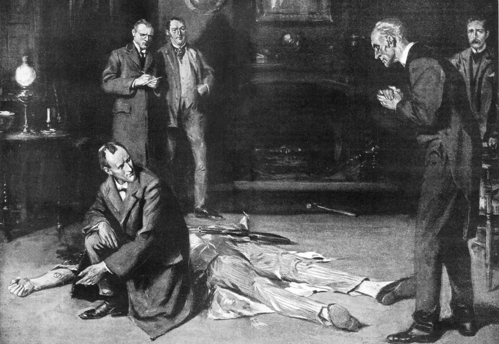

“哦，我的天哪，这伤势真叫人可怕。”

“常看见，先生。”

“你听见有谁讲起过是什么意思吗？”

“没有，先生。”

“烙这个印很痛的，可吃苦了。是火烙，肯定的。还有，我看到，艾姆斯，道格拉斯先生的下巴一边有一块胶布，这以前你见过吗？”

“有的，先生，是昨天早上修脸刮破的。”

“你知道他以前有没有刮破过？”

“很久没有见过了，先生。”

“有意思！”福尔摩斯说道，“当然，完全可能是巧合，或者，表示某种紧张心情，表示他预知危险来临。你注意到行为有什么不正常吗，他昨天，艾姆斯？”

“让我感觉到他有点心神不定，很激动，先生。”

“哈！这次行凶并非完全出乎意料。我们看来有一点进展了，不是吗？也许你看出问题，请教了，麦克先生？”

“不，福尔摩斯先生，比起我，你是高手。”

“那就，我们来研究一下这张卡片——V．V．341。卡片纸质很粗。屋里还有这样的卡片纸吗？”

“好像没有。”

福尔摩斯走到书桌边，把两瓶墨水都在吸墨纸上稍滴两滴墨水。“这不是在这屋子里写的，”他说，“这里是黑墨水，这字是紫墨水，而且还是用粗笔写的，这里只有细笔尖。不是这里写的，是在别的地方写的，我看是这样。你晓得这是什么意思吗，艾姆斯？”

“不晓得，先生，一点不懂。”

“你怎么看呢，麦克先生？”

“我的印象好像是秘密结社一类的东西，和他手臂上的记号是一回事。”

“我也是这个想法。”怀特·梅森说。

“好，我们可以拿这个来作假设进行推测，然后看看能解决我们多少难题。一个地下社会的党羽潜入到这座庄园里来，等候道格拉斯先生，用这样的武器把他的头几乎打掉，然后趟水逃走，丢下一张卡片在尸首旁边，好让报纸报道的时候提到这卡片，那就等于通报其余党徒大仇已报。这样说可以连贯起来，有逻辑。但是为什么要用这支枪，别的武器都不用？”

“是啊！”

“还有，丢了戒指又是怎么回事呢？”

“对呀。”

“还有，怎么逮不到人呢？现在已经过了两点，从天亮到现在，方圆四十英里以内的警察肯定都在搜寻衣服湿淋淋的陌生人，怎么没抓到？”

“就是说嘛，福尔摩斯先生。”

“除非是，他在附近有藏身之处，或者准备好替换的衣服，要不然决不会抓不到他。但是，已经到了现在这个时间，肯定给他跑掉了！”福尔摩斯一边说一边已经走到窗前，拿放大镜在看窗台上的血印，“很清楚，是鞋踩的。鞋印还特别宽，平底鞋，大概是。奇怪，看角落里沾泥的足迹印，对比下来，很明显这个鞋印完整得多，泥鞋印都是模糊不清。这桌子底下是什么？”

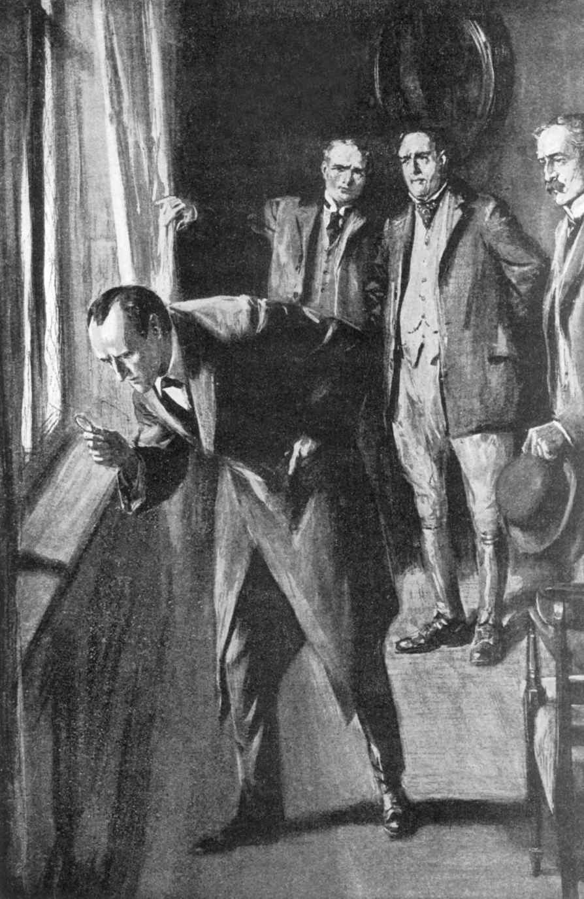

拿放大镜在看窗台上的血印。

“道格拉斯先生的哑铃。”艾姆斯答道。

“哑铃——只有一个。还有一个呢？”

“不知道，福尔摩斯先生。好像只有一个，我有好几个月没注意了。”

“一个哑铃——”福尔摩斯沉吟着说，但是他的话被一阵急促的敲门声打断。

一个高个头的人在门口望着我们。他晒得黑黑的皮肤，脸修得光净，一副精明能干的样子。我一眼就猜到，他就是已经听说过的塞西尔·巴克。他用傲慢、疑问的眼光朝我们几个人的脸上一扫。

“对不起，打断你们的谈话，”他说，“请听听最新消息。”

“人逮住了？”

“还没这么顺利，但是，发现了凶手的自行车，凶手把自行车丢下了。跟我来看看，就在门外一百码地方。”

我们看见有三四个马夫和闲人在车道上看一辆自行车。车子原先藏在树丛里，被拖出来了。车已经用得很旧，是拉奇怀特沃思牌，沾满着泥，看来是骑了好长的路。车后的工具包里有扳手、油壶，可是看不出是什么人的车。

“这对警察大有帮助，”警官说，“可以看看车子这些个东西有没有号码，有没有登记。能让我们找到这东西就是万幸，要是不知道他跑哪儿去了，至少能知道他从哪儿来。可是这家伙究竟干吗把车扔掉不骑呢？没车他怎么个逃法呢？这件事情我们好像又是一片黑暗，没希望了，福尔摩斯先生。”

“没希望吗？”我的朋友思索着答道，“我看未必！”

# 第五章　剧中人

“书房里需要看的，你们都看完了吗？”我们回屋的时候，怀特·梅森问道。

“暂时就这样。”警官说，福尔摩斯跟着点点头。

“现在应该听听庄园里人的证词。我们就在餐厅吧，艾姆斯。就请你先来，把你知道的告诉我们。”

管家的陈述简单而清楚，他给人的印象诚信可靠。五年前道格拉斯先生刚来伯尔斯通他就被雇用，知道道格拉斯先生是位富有的绅士，是在美国赚了钱。他是一位和善、体贴的雇主——艾姆斯以前对这种平等好像还不太习惯；不料好人也不是样样得好报。艾姆斯从来不曾见过道格拉斯先生什么时候有过忧虑不安，相反，在艾姆斯眼中他是最坦荡、最无忧无虑的人。道格拉斯先生规定吊桥每夜拉起，因为这是老庄园的老规矩，他喜欢保持屋子的老传统老习惯。

道格拉斯先生很少去伦敦，甚至难得出村庄。但是在被害的前一天，到过滕布里奇威尔斯去购物。艾姆斯那天注意到道格拉斯先生有些心神不定，情绪很激动，好像特别没耐心，特别烦躁，以前一向都不是这样的。那天晚上艾姆斯还没有睡觉，正在屋后的餐具室里收拾银器，忽然听得警铃大作。他没有听到枪声，可能是餐具室、厨房间都是在屋子的很后面，又隔着好几道门，还有一条走道，所以不容易听得见。女管家也听见急促的铃声，就从房里出来。他们两个一起跑向前屋。

两人刚到楼梯前，看见道格拉斯夫人从楼梯上下来。不，她没有很惊慌的样子，印象当中并不是非常着急。夫人走到楼梯口，巴克先生从书房里冲出来，拦住道格拉斯夫人，求她回楼上去。

“看上帝分上，回房去吧！”他叫着，“可怜的杰克死了！你来也没用。看上帝分上，快回去吧！”

巴克在楼梯上一再恳求，道格拉斯夫人就回房里去了。她没有大声叫，没有哭闹。艾伦太太，女管家，扶她上楼，陪她在卧室里待着。艾姆斯随巴克再回到书房，看到的一切就如同警察看见的一个样。这时候蜡烛已经熄灭了，提灯亮着。他们看了窗外，可是夜里一片漆黑，什么也没看见，什么也没听见。他们然后冲到门厅，艾姆斯摇动绞盘把吊桥放下了，巴克赶快跑去报警。

男管家的证词就是这样，很简要。

女管家艾伦太太的陈述，没有多少东西，不过是对男管家所讲加以确证。女管家的房间比较靠近屋子的前部，不像艾姆斯干活的那间餐具室在很后面。她正准备睡觉，忽然一阵铃声，她警觉了。她有点耳聋，没有听见打枪也许就是这个缘故。虽说近，书房毕竟隔着她的房间有一段距离。她记得是听见有一声响，她想是碰门碰重了，时间也还要早——在铃响之前至少半个小时。她看见艾姆斯先生奔向前屋，就跟着他。接着看见巴克先生，脸色煞白，慌里慌张，从书房里跑出。道格拉斯夫人正下楼梯，巴克拦住她，求着她回房去。夫人答应，但是夫人说些什么话，艾伦没有听出来。

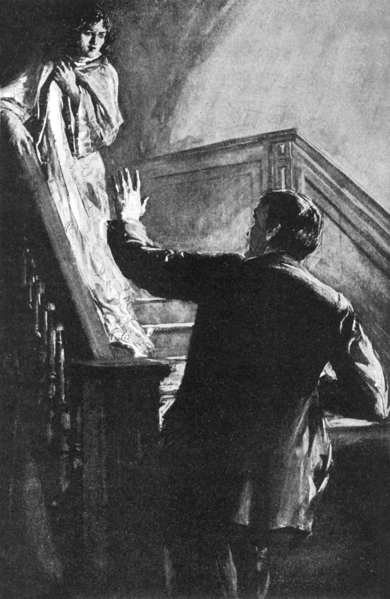

巴克拦住她，求着她回房去。

“扶上楼去！陪着夫人！”巴克吩咐艾伦太太。

艾伦就陪夫人去了卧室，尽力安慰夫人。夫人很激动，浑身发抖，但是没想再要到楼下去。她穿着休闲袍，坐在卧室壁炉旁，低头两手掩着脸。艾伦太太几乎陪了一夜。其他仆人事前都已睡觉，没有受到惊动，后来警察到了，才都起来。他们睡在最后面的屋子，有什么事一般听不见。

女管家这里再盘问也问不出新的情况，只有惊恐和悲伤。

塞西尔·巴克继艾伦太太之后作见证。关于昨晚发生的情况，都已经向警察报告，没有什么可以再加补充。他个人确信，凶手是跳窗逃走的。他认为，窗台有血迹，足以得出这个结论。那吊桥吊起着，除了跳窗，无路可逃。他无法解释凶手到底怎么跑掉，为什么不骑自行车走，如果那真是他的车；护城河里淹死绝不可能，河水没有超过三英尺深的地方。

在巴克心目中，对凶手有明确的分析和看法。道格拉斯平素言语谨慎，经历中的有些事情从来不谈。他很年轻的时候就移居美国，在那里发迹。巴克是在加利福尼亚州和他首次相识，两人结伙在该州一个叫贝尼托峡谷的地方经营矿业。经营很得法，不料道格拉斯突然把产业卖掉，回到了英国。那时候他丧妻鳏居。巴克随后也把产业变卖，迁到伦敦来住，两人重聚再叙友谊。

道格拉斯给巴克的印象是似乎有什么危险要降临到他头上。巴克早就看出，他之所以要突然离开加利福尼亚，又要到英国如此僻静的地方来租房子住，同那种危险不无关系。巴克估计一定是什么秘密会党，严厉的组织，在追踪道格拉斯，非要置他于死地方能罢休。道格拉斯虽然从来没有告诉他是什么会党，从来不讲怎么冒犯了他们，但是有时候片言只语让他想到是这种事。他猜想卡片上的字母和这个秘密会党有关系。

“你和道格拉斯在加州一起待了多长时间？”麦克唐纳警官问他。

“一共有五年。”

“你说是他单身一个人？”

“老婆死了。”

“听说过他前妻是什么出身？”

“不知道。只记得他说过妻子是德国血统，我见过照片，一个很漂亮的女子。我认识他的前一年，生伤寒病死的。”

“你不清楚他以前在美国什么地方？”

“听他说过芝加哥，他很熟悉这个城市，在那儿工作。我还听他讲起过煤铁区，那时间他跑过好些地方。”

“他是搞政治的？这个秘密会党有政治性质？”

“不，他根本不关心政治。”

“你根本没想过有什么不轨行为吧？”

“恰恰相反，我这辈子还从来没有遇上过这么正直的人。”

“在加州的时候，他生活上有什么特别的地方？”

“他最喜欢到深山来。在我们矿上工作，他也是尽量避免到人多人杂的地方去。这就让我第一次想到恐怕有人在追踪他。后来他忽然离开来到欧洲，我就确定八成就是这种事。我猜他受到警告。他走掉不到一星期，就有五六个人来打听他的下落。”

“是些什么人？”

“哦，都是些个相貌凶狠的大汉。他们到矿上来，要知道他到哪里去了。我告诉他们他去了欧洲，我也不知道怎么才能找到他。他们找他不是好事——明眼人一看就知道。”

“都是美国人——加州人吗？”

“哦，我也认不出是不是加州人，总之是美国人，这没错。都不是矿工，不知道他们是干什么的，我是跟他们少嗦为好。”

“这是六年以前吧？”

“将近七年了。”

“这么说，你们一起在加州是五年，这桩事算起来至少有十一个年头了？”

“是这样。”

“里头一定有什么深仇大恨，隔了那么长的时间还死死盯住不放过。仇结得那么深，恐怕就不是小事。”

“我在想，这是他一辈子的隐患，有这心病，使他永远不能平安。”

“不过，一个人大难临头，而且知道是怎么回事，不是可以报告警察要求保护吗？”

“他这种危险恐怕别人保护不了呢。有一件事你们要知道，他跑来跑去身上一直带着家伙，左轮枪一直在他口袋里揣着。谁知道也真倒霉，偏偏昨晚穿的休闲袍，把枪丢在了卧室里。桥一吊起，我猜他就以为是安全了。”

“我想这些时间弄弄清楚，”麦克唐纳说，“道格拉斯离开加州足足六年了，你是第二年就跟随来了，不是吗？”

“是呀。”

“他再婚已有五年，你回来正是他结婚的那个时间。”

“大约结婚一个月以前，我还是他的男傧相呢。”

“道格拉斯夫人结婚以前你认识她吗？”

“不，不认识，我离开英国有十年之久。”

“此后你同夫人一直经常见面。”

巴克望着侦探，脸色严肃起来。“我是同道格拉斯一直经常见面，”他答道，“我见夫人，那是因为你不可能拜访一位先生而不见他的太太。要是你想象其中有什么牵连——”

“我没有那样想，巴克先生，有关案情我不得不都要查问。我没有别的意思。”

“有些问得出格。”巴克怒冲冲地回他。

“我们无非是了解些情况。有些情况的澄清，对你对他人都是有好处的。那么，道格拉斯先生，对你同他妻子的友谊，一点没有意见？”

巴克脸都白了，他的一双有力的大手发抖地捏紧着。“你没有权利问这种问题！”他吼道，“这跟你调查案子有什么关系？”

“这我一定得问。”

“好，我拒绝回答。”

“你可以拒绝回答，可是你要晓得，你拒绝回答本身就是回答，因为如果你没有需要隐瞒的事，你就无需拒绝。”

巴克站着不作声，脸绷紧，两道黑浓眉皱起压下来，沉思一会儿，然后抬起头，笑了笑说：“好吧，我看你们几位先生就履行澄清的职责也好，我是无权从中阻挠。我只要求你们不要把这事让道格拉斯夫人烦恼，她现在已经是够受的了。我可以告诉你们，可怜的道格拉斯他这辈子只有一件过错，那就是醋心太重。他对我好——没有比我再好的朋友了，他也一心一意爱着他的妻子。他很高兴我上他这儿来，经常派人去叫我。但是，如果他妻子和我一起谈点什么，或是好像彼此心意合得来，他就会大发醋劲，勃然动怒，一时控制不住说出粗野的话。好几次，我发誓，既然这样，我就不来了。但事后他又给我写信表示悔意，恳求原谅，我也就只好不再计较。所以，你们记住我一句话，先生们，我要最后奉告一句，比起我的朋友，没有谁更爱、更忠于自己的妻子了——我也可以说，没有哪个朋友比我更忠诚的了！”

话说得很真挚、很动容，但是麦克唐纳警官还是不肯放过这个话题。

“你晓得吗，”他说，“死者的结婚戒指，从手指上给撸掉了？”

“是有这样的迹象。”巴克答道。

“‘迹象’，你是什么意思？要承认是事实。”

巴克有点慌张无所适从了。“我说‘迹象’，意思是，他自己把戒指取下了也不一定。”

“反正戒指不在了，这是事实，不管谁取走，都提醒人，他的婚姻同这起惨案是有关系的，能说不是？”

巴克耸耸他那宽肩膀。“我觉得这太强词夺理，”他回答，“你硬要这么说，就不免损害夫人的名誉”——他两眼立刻燃起怒火，随后又显然是强压住自己的感情——“好吧，调查案子，你走歧途，不用多说了。”

“现在我不想问你什么事了。”麦克唐纳冷冷地说。

“有个小问题，”歇洛克·福尔摩斯这时插话，“你进这房里的时候，桌上只有一支蜡烛点着，是不是？”

“是的，亮着一支蜡烛。”

“借着烛光，你看见了可怕的现场情况？”

“正是。”

“你马上拉铃叫人了？”

“是的。”

“拉铃很快人来了？”

“一分多钟。”

“人来了，他们发现蜡烛灭着，提灯亮着，这好像有点奇怪吧。”

巴克又显出犹豫的样子。“这有什么奇怪的，福尔摩斯先生，”他稍顿了一会儿就回答道，“蜡烛光不亮，我是想要亮一点的，提灯正在桌上，我就把灯点亮。”

“把蜡烛吹灭？”

“对呀。”

福尔摩斯不再提问。巴克不慌不忙地把我们一个一个看了一遍，我看他是怀着对抗情绪，一转身走出屋子。

麦克唐纳警官已经叫人送一张纸条给道格拉斯夫人，意思是将去她的卧室访晤，但是夫人回话说她在餐厅见我们。她现在进来了，三十岁模样，苗条美丽，非常矜持稳重，跟我原先料想中定是那种悲哀惊吓、失魂落魄的样子完全不像。确实，她脸色苍白、憔悴，正是经受了极大震惊的结果，但是她的举止神态依然镇定自若。她纤细秀气的手扶在桌沿，和我的手一样，安然毫不颤抖。她那双哀怨而疑问的眼睛在把我们一个个审察，眼神在探询，一瞬间转为开口说话。

“你们发现什么情况没有？”她问道。

难道是我自己的想象？她这发问的声调中只含疑惧而没有希望。

“我们已经采取各种步骤，道格拉斯夫人，”警官说道，“你尽管放心，我们一点一滴都不会放过。”

“不用考虑用钱，”她说，口气冰冷平静，“我的愿望，尽一切努力最要紧。”

“希望你提供情况，配合我们早日破案。”

“恐怕提供不出多少情况，我知道的一定会告诉你们。”

“我们听塞西尔·巴克说，你没有实地看见——你没有进那间屋，案发现场？”

“没有，他在楼梯上就阻止我，要求我回卧室去。”

“是这样。你是听见枪声，所以立刻下楼来了。”

“我披上休闲袍就下来。”

“从你听见枪声到你在楼梯遇上巴克先生拦阻，有多长时间？”

“大概一两分钟吧，这种时候是说不准时间的。他央求我不要下去，他一再说我去也没用，然后是艾伦，女管家，陪我又上楼。真像是一场可怕的梦。”

“能不能告诉我们，从你丈夫下楼，到你听见枪声，是多长时间？”

“哦，说不准。他是从梳妆室下去的，我没有听见他下去。他每晚都要到屋里各处转一转，怕火烛不小心。火烛的事，他最在意，这我对他很了解。”

“我正想问你呢，道格拉斯夫人，你丈夫来英国你才认识的，是吗？”

“是的，我们结婚五年了。”

“你有没有听他讲过，他在美国的时候有过什么事，对他有危险？”

道格拉斯夫人认真地想了想，才回答。“有的，”她最后说道，“我一直觉得有什么危险，对他有威胁。他不肯和我说。倒不是不相信我——我们夫妇之间十分相爱，绝对信任——是他不愿意让我知道，免得我担惊受怕。他想我一知道，反而要心不定要胡思乱想，所以他干脆不讲。”

“那你是怎么知道的呢？”

道格拉斯夫人脸上掠过一丝笑容。“做丈夫的，能够一辈子瞒得住秘密？一个爱丈夫的女人会一点觉察不出？他不肯谈他在美国的有些事情，就叫我知道了；他提防着什么，我就知道什么了；他说溜嘴漏出什么话，就知道他有什么话了；忽然有陌生人，他特别警惕，我就知道有什么原由了。我完全肯定，他惹上了势力很大的仇人，知道仇人在寻找他，他就一直在提防他们。这些我很清楚，所以几年来，只要他回家稍晚了点，我就提心吊胆。”

“我请问，”福尔摩斯说道，“是什么话引起你注意呢？”

“恐怖谷，”夫人回答，“我问起，他总是提起这个。‘我掉进恐怖谷，现在都还没能脱身呢。’——‘我们在恐怖谷出不来了吗？’我看见他情绪不好，我就问他。‘有时候我是担心我们出不来呢。’他回答说。”

“你一定问过他，恐怖谷是什么意思呢？”

“我问过。但是我一问他脸色就不自然，光摇头。‘我们有谁给恐怖谷阴影罩住，可就糟糕了，’他说，‘但愿上帝保佑你，永远轮不到你头上！’是真有这么一个山谷，他去过，经历了可怕的事。这一点，我肯定，可惜我讲不出更多的情况。”

“他没有提起过什么人的名字吗？”

“噢，有的，有一回他发高烧胡言乱语，那是三年前打猎受伤。我记得有一个名字，一直在他嘴上念叨。他说着这个名字，样子是又恨又怕。麦金蒂，这个名字——命主麦金蒂。后来他身体好了，我问他命主麦金蒂是谁，这个人主宰谁的性命。‘不是主宰我的命，谢谢上帝！’他一笑回答，我就只知道这么一点。不过，知道恐怖谷和命主麦金蒂有关系就是了。”

“还有一点，”麦克唐纳警官说，“你是在伦敦的公寓里认识道格拉斯先生的，对吧？在那边和他订了婚。这桩婚姻中间，有过什么浪漫史、什么其他秘密史吗？”

“恋爱浪漫史，总是有的，结婚总要恋爱，其他秘密史没有。”

“他一个情敌都没有？”

“没有，我一个男朋友也没有。”

“你一定听到了，他的结婚戒被拿掉了，这其中是否和你有关系？就算假定是过去岁月的什么仇敌，追到了这里来，犯下命案，拿掉他的结婚戒是为了什么理由？”

一刹那间，我可以发誓，女士的唇角掠现极浅的笑影。

“这我就说不上来，”她答道，“确实是莫名其妙的事。”

“好了，我们不耽搁你工夫了，很抱歉这时候要来打扰你，”警官说，“还有些问题，当然还有，以后需要的时候再麻烦你吧。”

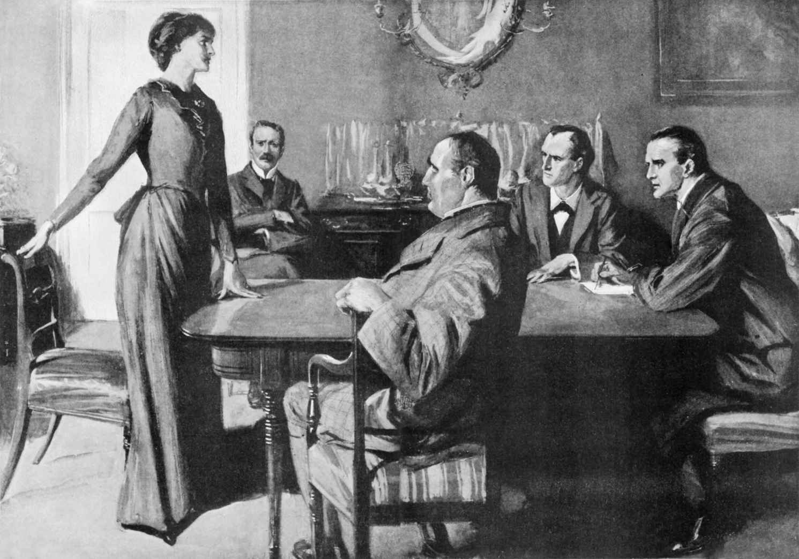

“我的证词你们印象如何？”

夫人起身，我意识到她眼光忽闪一瞥，探问似地审视了我们。“我的证词你们印象如何？”好像就是在无声地问我们这个问题，然后，欠欠身，曳衣一阵风，已经离去。

“一个漂亮的女人——非常漂亮的女人，”夫人走掉，门已关上，麦克唐纳深思着说，“巴克这个男人，当然要跟到这个地方来频频光顾。他又是个很能吸引女人的男人，他承认的，死者有忌妒。他自己心里最清楚，是忌妒什么。还是那只结婚戒，你们绝对不能放过这一点，从死者手上拿掉戒指的这个人——你怎么说，福尔摩斯先生？”

我的朋友双手支着下巴坐着，陷入沉思。现在他站起来拉铃叫人。“艾姆斯，”等管家进来，他说，“塞西尔·巴克先生在哪里？”

“我去看看，先生。”

管家一会儿就回来说巴克在花园里。

“你该记得，艾姆斯，昨天晚上你和巴克先生进书房的时候，他脚上穿的是什么鞋？”

“记得，福尔摩斯先生，他穿的是卧室拖鞋。他出去报警，我拿皮鞋给他换的。”

“现在拖鞋放在什么地方了？”

“还放在厅里，椅子底下。”

“很好，艾姆斯，这当然很重要，我们要知道哪些脚印是巴克先生的，哪些脚印是从外面来的。”

“是，先生，我该说我注意过了，拖鞋上沾有血迹——我自己的鞋上也沾着。”

“这很自然，考虑到房里的情况，都是血。很好，艾姆斯。我们需要的时候，再打铃叫你。”

几分钟以后，我们来到书房。福尔摩斯带着厅里拿来的一双毛毡拖鞋，正像艾姆斯说的，鞋底都结着黑色的血迹。

“奇怪！”福尔摩斯站在窗前阳光下，仔细察看拖鞋，在自言自语，“实在奇怪！”

他迅疾跨上一步，俯身拿一只拖鞋放到窗台的血迹上。完全相合。他没吭声，向着几位同事微笑。

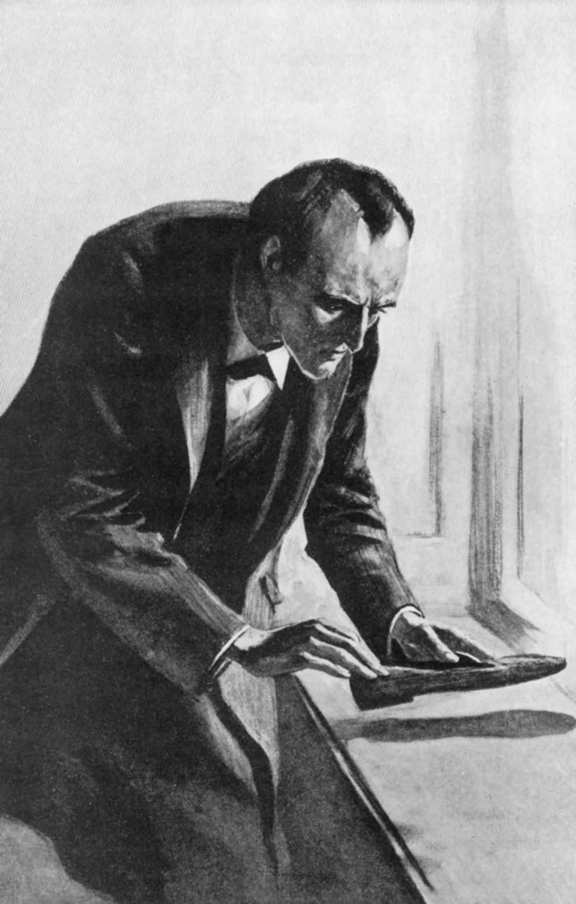

俯身拿一只拖鞋放到窗台的血迹上。

警官兴奋得失态了。他的土腔土调咣咣响，就像是棒子敲在栏杆上。

“我说的嘛，”他嚷嚷道，“还有问题吗！这脚印是巴克自己踩在窗上的不是！比谁的鞋底都宽嘛，我记着你说的宽平底。现在事情明白了。可是，是出什么戏，福尔摩斯先生——他演的什么戏？”

“啊，什么戏？”我的朋友思索着一遍遍地说。

怀特·梅森哈哈笑，搓起了一双肥手，踌躇满志。“我早说的嘛，里边花头不小呢！”他嚷嚷着，“果然是大有花头吧！”

# 第六章　一线曙光

三位侦探还有不少细节需要调查，我就一个人回到简朴的乡村旅店。离开之前我在庄园两边古老的花园里走走看看。一排排十分苍劲的紫杉古树围绕四周，修剪得奇形怪状，内侧是一片平整的草坪，草坪中央立有一座旧日晷仪，整个环境幽闲雅静，让我绷紧的神经顿时松弛下来。

如此深沉静谧的氛围，令人忘记那黑森森书房地板上，有具血淋淋四脚朝天的尸体，或者只剩噩梦如幻的些许记忆。然而，正当我信步闲逛、身心尽情浸润在气清树香之中，忽然出现一件怪事，又将我拉回那惨景，心头涌起凶象。

我说过花园四面都有紫杉围缀，到那房屋尽头的深处，树密如扎，形似墙篱。就在树篱的那一边，背着房屋隐蔽的地方，有一条石凳，从屋里方向过来是看不见的。当我走近时，听见有人声，一个男人低沉嗓子的话语，一个女人轻盈的笑答。

我迅捷绕到树篱后，眼前所见，竟是道格拉斯夫人，那男的就是巴克，他们还没有觉察我的到来。夫人的容貌使我大吃一惊。在餐厅里的时候，她是那样悲戚、拘谨，现在一切哀容的伪装都已荡然无存，两眼闪着生命欢悦的光芒，对着男伴的话语满面激情喜色。男的坐姿前倾，手肘搁在膝头，双手交握，那粗犷而俊俏的脸上回应着微笑。他们倏然——倏然也已太晚了点——发现我已人到跟前，一下惊愕，敛住笑容。两人匆匆交换着说了些什么，巴克站起身，向我走上来。

“对不起，先生，”他说，“你可就是华生医生吧？”

我冷冷地点一下头，这也是必然，造成我心头什么样的印象自然会有表露。

“我们想准是你了，你和歇洛克·福尔摩斯先生的友谊关系，大家都很知道。请过来和道格拉斯夫人谈谈话，方便吗？”

我阴沉着脸随他过去。地板上那具脑袋被打碎的尸体，很清晰地浮现在我的眼前。惨案才发生不多几个小时，他的妻子已经和他最亲近的朋友，就在他的花园树丛后面，一起谈笑风生。我冷淡地和女士打了招呼。在餐厅里我因她的感伤而感伤，但现在我对她祈求的目光却回以不屑的眼色。

“恐怕，你要以为我是个冷酷没心肠的人吧。”她说。

我耸耸肩。“这不干我的事。”我说。

“也许有那么一天，你会对我有公正的看法，只要你理解——”

“没有必要让华生医生理解，”巴克抢着说道，“他自己都讲了，根本不干他的事。”

“正是，”我说，“那就抱歉，我仍旧走我的路。”

“请等一下，华生医生，”女人用恳求的口吻高声说，“有一个问题，世界上数你最有资格回答，对我关系可是非同一般。你比谁都要了解福尔摩斯先生，清楚了解他和警察局的关系。假如有一件事，相信他，让他知道，他是不是一定要去报告警探呢？”

“就是，就是这个问题，”巴克急忙说，“他只管自己解决呢，还是都要向他们报告？”

“我真不知道对这一点该怎么说才好。”

“我求你——恳求你告诉我，华生医生！我相信你能帮助我们——在这方面引导我们，你就是帮我大忙。”

女人的说话和声音是那样的诚恳，令我一时将她刚才的轻浮全部忘记，只感动得要真心实意对待她。

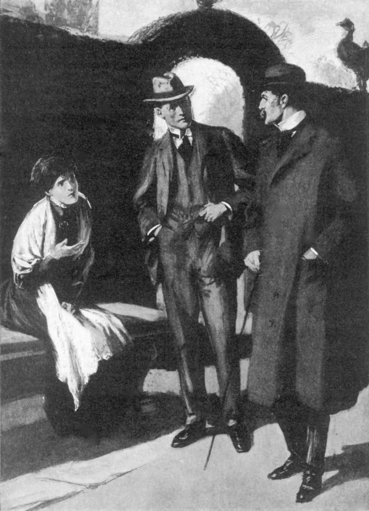

女人的说话和声音是那样的诚恳。

“福尔摩斯先生是独立进行侦探工作的，”我说，“他怎么做怎么行动都由他自己拿主意。同时，对于警方一同处理的案子，他当然也要忠实配合，要帮助警察将罪犯绳之以法，不得从中隐瞒什么。除此以外，我就难说了。我建议你还是自己去找福尔摩斯先生谈谈，他会全面告诉你。”

这么说着，我举了举帽，就走开了，随他们仍旧隐蔽地坐在树篱的后面。当我走远拐过树篱的时候，回头一望，看见两人还在热烈谈话，也在向我这边瞧。很清楚，是在谈论我和他们的不期而遇。

“我不相信他们的鬼话。”当我把这个情况告诉了福尔摩斯时，他这么说。福尔摩斯整个下午待在庄园和两个同道讨论案子，到五点钟的时候才回旅店，就着我给他订好的下午茶，狼吞虎咽起来。“别信他的，华生，只有到时候逮捕他们，一个是凶手，一个是同谋犯，那才真有他们的好看。”

“你真的这样想？”

他兴味盎然，情趣横生。“我亲爱的华生，等我将这第四个鸡蛋一举歼灭，我来把全部事实情况向你摊底。还不敢说已经摸透到底——还不敢这么说——但是只要追获那只丢失的哑铃——”

“哑铃！”

“哎呀，华生，难道你没看出来，本案的要害全在这个丢失的哑铃？好了，好了，你不必丧气，也难怪。只是跟你讲讲，我想不到警官麦克，连同本地方多精明能干的侦探，都没有抓得住这个事，别看事小，可是问题重大得很呢。一只哑铃，华生！想想看，有使一个哑铃做体操运动的吗？你一个哑铃试试，那你的身体就会是畸形发展，很快引起脊椎弯曲的危险。奇事啊，奇事，华生！”

他坐着，满嘴塞进烤面包，两眼闪出顽皮的神色，看着我一副莫名其妙困惑的样子。我看到他胃口大开，就确信成功在望。因为，想起过去多少个日日夜夜，我很了解他，只要一遇到案情无法解决，他便心烦意躁，像苦行僧苦思冥想，根本不思饮食，情切瘦削的面容更见消瘦。这会儿东西吃好，他点起了烟斗，坐在这小村旧式旅店的炉火旁，慢悠悠不经意谈着本案情况，就像是无所用心随口聊来，并非深思熟虑一本正经地叙事。

“谎言，华生——谎话连篇，弥天大谎，彻头彻尾扯谎——我们一入门就受骗上大当！我们是在谎言上开始起步。巴克编的故事全部是谎言，巴克的故事再由道格拉斯夫人从旁添枝加叶。夫人也是撒谎，他们两个都是骗人，串通一气狼狈为奸。所以现在问题很清楚，他们为什么要撒谎，他们要竭力隐瞒的是什么事实？我们来试试，华生，你和我，看看谎言背后是什么，把事实真相推演出来。

“我凭什么说他们是撒谎呢？很简单，他们编造得实在笨拙，不可能真有这种事。想想看，他们对我们讲的故事，凶手行凶以后在不到一分钟的时间里，把死者手指上的结婚戒指撸下来，那是先要拿掉另一个戒指，才能拿这个婚戒，还得把那另一个戒指再套回原处——他无事找事，那是几乎不可能的——还在受害人身边放下一张卡片。我说这都是绝对不可能的事。

“你也许要争辩说——不过我倒是很尊重你的判断力，华生，估计你未必会这样说——那戒指也许是在被杀之前拿掉的。但是有个事实，蜡烛只点了很短一点时间，这表明，两个人照面时间不会很长。道格拉斯这个人，从我们了解到的情况看，他禀性无畏，他稍经吓唬就会把结婚戒指给人吗？我们能想象结婚戒指这种东西是说给就给的吗？不，不，华生，凶手是一个人单独和死者待了一段时间，这期间点的是提灯。对这一点，我确定无疑。

“死因当然是枪击，这是明显的。因此，开枪的时间应当是比他们告诉我们的时间要早。像这种事情照理是不会搞错的。所以我们分明是受到他们两人精心策划的阴谋欺骗，是他们两个一面之词听到枪声响——男的是巴克，女的是道格拉斯夫人，口径一致。等到我证明，窗台上的血迹是巴克存心伪装上去的，目的是造成假线索迷惑警察，你就清楚了，案子显然牵涉到他巴克，他逃不掉。

“现在我们问问自己，凶手行凶的时间到底是几点钟。十点半的时候，仆人都还在屋里走来走去，所以在这个时间之前是不可能的。十一点差一刻，大家回房歇息，只除了艾姆斯，他还在餐具室。我实地试验过了，今天下午你走了以后，得到了证明，叫麦克唐纳在书房里发响声，我在餐具室就听不见，隔着几道门，一关，声音传不到那边去。

“可是，女管家的房间就不同了，在走道那边不很远，声音响一点我能隐约听得见。打枪的声音，如果射击距离很近，声音发闷，像本案的情况就是，不会很响，不过夜里安静，还是容易传到艾伦太太的房间里，能听到。她告诉我们，她耳朵背，听不真，但毕竟她作证提到，知道出事之前的半个小时，她听到像是有很重的碰门的响声。出事前的半个小时，应当是十一点差一刻，我肯定，她听到的就是枪声，也正就是发生凶杀的时间。

“如果正是这样，我们这就要查明，巴克和道格拉斯夫人两个，假定他们并非是真正的凶手，十一点差一刻他们听到枪声下楼，到十一点一刻他们拉了铃把仆人叫来，这段时间里两人都在做什么。他们在做什么？又为什么不马上报警？这是摆在我们面前的问题；这个问题一旦搞清楚，我们就前进一大步，案子解决就快了。”

“我也相信，”我说，“两个人有勾当。这个女人是没心肝的东西，自己老公被杀不多几个小时，就有说有笑去了。”

“确实，就照她自己讲的情况来看，为人之妻，很不像样。我不是一个崇拜女性的人，这你知道，华生，但是我的生活经验教导我，恐怕少有这样的妻子，自己丈夫惨遭不测身亡，听人家的话一说，真会看也不去看一眼。我要是结婚讨老婆，华生，指望老婆这点感情总得要有；一旦是我横尸近在咫尺，我的老婆决不至于经他人劝阻别转屁股就走。这个戏演得也实在够外行，即便是笨透了的刑事侦探，遇到这种场合当老婆的居然不哭不跳不叫，也要起疑啦。就算没有其他可疑之处，光凭这一点事，我内心也不免考虑此中定有预谋。”

“你肯定巴克和道格拉斯夫人就是杀人犯？”

“你这问题，真是一语中的，可是骇人听闻，华生，”福尔摩斯说，举烟斗向我摇摇，“像子弹把我击中。如果你是说，道格拉斯夫人和巴克知道谋杀真相，而且蓄谋隐匿，那么我要给你讲句心里话，我确定他们正是这样。但是，你的结论虽然击中要害，你的前提却不是怎么清楚。让我们暂时先考虑横在我们面前有哪些困难。

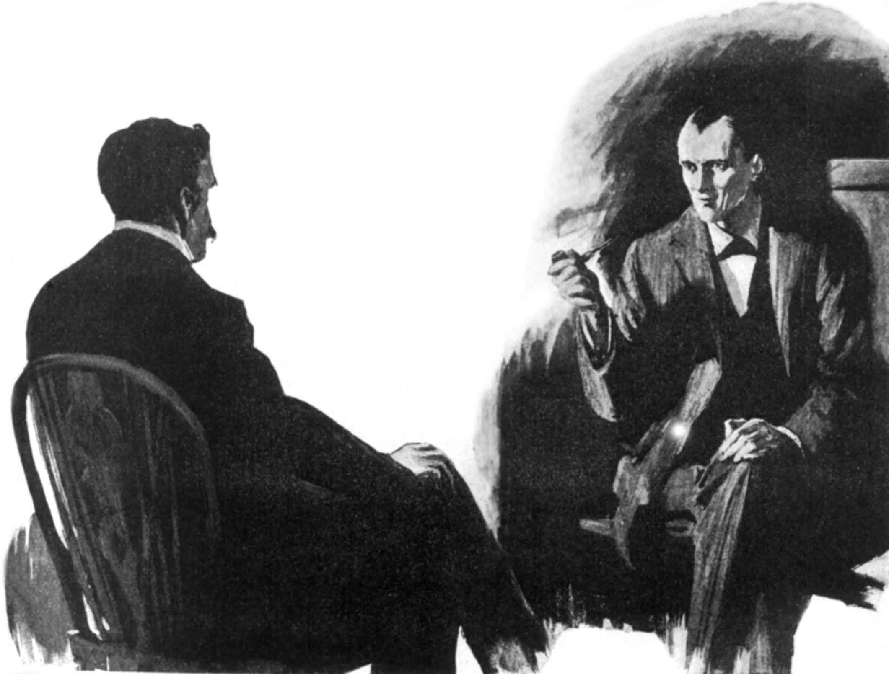

“你这问题，真是一语中的。”

“我们假设，这一对是私通，有奸情，决定要除掉碍他们路的人。这是个大胆的假设，但是经过对仆人间还有对旁人谨慎的调查，这一点得不到佐证。相反，有大量充分的证据证明，这对道格拉斯夫妇恩爱无比。”

“那个，照我讲，不是真的。”我说，想到了花园里看见的那张漂亮的笑脸。

“那，至少给人有这么一种印象。好吧，我们来假设这是极其狡猾的一对，在这方面蒙骗了所有的人，蓄谋杀死亲夫，这丈夫也正好有某种危险降临头上——”

“我们只不过是听他们这样说，一面之词。”

福尔摩斯深思着。“我理解，华生，你是在勾勒出一个推论，他们从一开始就没说真话，全都是骗人。按照你的想法，根本没有隐秘的威胁，没有什么秘密会党，没有恐怖谷，没有叫什么麦金蒂的头儿，或者这样那样的事。好，这也算是一种总而言之的大归纳。我们看看，这样会得出什么结论。是他们放出这种言论转移罪行视线，然后他们配合这说法故意把一辆自行车丢在花园里，造个证据借以证明有外来人。窗台上的血迹，也是这个意思。还有尸体旁的卡片，一样目的，实际上恐怕是在当场写的。这一切都符合你的假设，华生。但是现在我们碰到了困难，很棘手，陷入死胡同，无法自圆其说。武器那么多不用，为什么偏偏用截短的猎枪——还要是美国造？他们怎么能那么有把握，开枪不会惊动人引得大家都过来？艾伦太太当是碰门声，没有来看看问问，那完全是偶然的巧事。你说一对罪犯为什么要这样做，华生？”

“我承认无法解释。”

“还有，如果是妻子和姘夫合伙谋杀亲夫，那么杀夫以后就是要拿掉结婚戒指落个罪行痕迹，以事张扬，惟恐他人不知？你认为这样做法有可能吗，华生？”

“不，不可能。”

“再有呢，如果按你的想法，是他们故意丢一辆自行车在外面的隐蔽地方，其实达不到目的，不值得，因为连最愚蠢的警探都会说这明摆着是障眼法啊。罪犯要逃跑，自行车正是首要的工具，不能丢下不用！”

“我解释不了。”

“然而天下事，事事相关，人的脑力不会智穷不能解释。现在权当做一次智力测验，不能断言就是事实，让我来摆一摆也是一条思路而已。我要声明，这纯属想象，可是，想象不常常就是事实之母吗？

“我们假设，道格拉斯此人生前曾经有过秘密罪孽，很见不得人的罪孽，才导致这次遭人谋杀。来杀他的人，我们猜想是为复仇，是从外面进来的。这个复仇人，到底为什么理由，我得承认难作解释，是他拿掉了死者的结婚戒指。想来早在第一次结婚的时候结下的冤仇吧，拿走戒指就是这个道理。

“复仇人还没逃走，巴克和死者的妻子进了书房。凶手提醒他们，试图逮捕他，那么一件可耻丑闻就要公开。他们不得不改变主意，还是放他走为上策。为此目的，他们有可能把吊桥放下，可以轻轻放下没有声音，事后再吊起。凶手逃掉，不知为什么理由，他不骑车，步行反倒更加安全，所以把车扔下，扔的地方不易发现，等发现，他早已逃掉。到目前为止，我们只能作这样范围的推测，是不是？”

“噢，可能是这样，没问题。”我嘴上说，心中却不见得踏实。

“我们该记得，华生，发生的一切事情都异乎寻常。好，现在把案子再继续推下去，这一对——还未必就是一对罪犯——等凶手逃掉，他们意识到自己处在了什么地位，已经难以洗脱嫌疑的罪名，不是凶手，也是共谋。面临这个处境，赶快匆忙设法应付。巴克的沾血拖鞋在窗台上做印记，表示凶手是打这里逃跑了。他们两人肯定都听见枪声，也照他们应该做的那样拉铃发出的警报，但那是事情发生半小时以后。”

“这个你有办法证明吗？”

“哦，如果确有外来人，他逃不掉，应该被抓到，这一切就完全可以得到证实。但如果不是这样的话——噢，科学的源泉永不枯竭，科学的方法永无穷尽。我想，晚上一个人到书房去一趟，将对我大有帮助。”

“晚上一个人？”

“我准备一会儿就去。我早作好安排，艾姆斯很能配合，他绝对不是巴克的心腹。我待在那间房间里，体验那个气氛能给我有什么灵感启示，我是相信一地有一地的灵气。你笑了，华生老友。那好，我们看就是了。噢，你的那把大阳伞，带着吧？”

“在这里。”

“很好，借来使一使。”

“行啊——可是拿这防身能管什么用！要是遇危险——”

“没事，我亲爱的华生，否则我早就请你一同去帮忙了。我就要一把伞。现在我等两位同行从滕布里奇威尔斯回来，这会儿两人正查找自行车车主呢。”

快到黄昏，麦克唐纳警官和怀特·梅森调查回来了，两个都兴高采烈，报告不虚此行，获得很大进展。

“老兄，我说，我原先还怀疑是不是外面进来的人哩，”麦克唐纳说道，“现在都不必怀疑了。我们核对过自行车车号了，车主是什么样的人，清清楚楚。没跑冤枉路，跨前了一大步。”

“这么说来，结案也就快了，”福尔摩斯说，“我衷心向两位道喜祝贺。”

“哈，我是从抓住这个事实着手，道格拉斯先生前天显得情绪不好，他是到滕布里奇威尔斯之后回来。那是在滕布里奇威尔斯，他遇上有危险。所以就清楚啦，有人骑自行车来的话，一定是从滕布里奇威尔斯过来，这可想而知。我们把车带上，给一家家旅馆去认，立刻给认上了，伊格尔商务旅馆经理一看就说，车子是叫哈格雷夫那个人的，两天前这个人住这家旅馆。自行车，还有一个手提箱，这人就这点东西。他登记是从伦敦来，可是没留地址。手提箱是伦敦货，里面的东西都是英国货，可是这个人是美国人没问题。”

“很好，很好，”福尔摩斯说，高兴极了，“两位确实做了件实实在在的工作，我正和我的朋友聊着案情，东猜西猜。实际工作很重要，值得花工夫，麦克先生。”

“对呀，本来就是嘛，福尔摩斯先生。”警官得意地说。

“这也符合你的推论呀。”我对他说。

“可能是，也可能不是。让我们听听结果再说，麦克先生。这个人什么来历不知道吗？”

“不太清楚，看得出，他很小心翼翼提防着，不叫人知道他的底细。没有证件，不见有信，衣服上连个标记都没有。他房间桌上放一张骑车用本郡地图。昨天早上吃过早饭骑车离开旅馆，直到我们调查他，也不见有他的消息。”

“这叫我搞不懂了，福尔摩斯先生，”怀特·梅森说道，“这个人如果不想让人怀疑他，想来就应当是安安静静回到旅馆，不动声色，普通旅客一个。像现在这样，他难道不晓得，旅馆老板要报警，不见他人，就要跟凶杀案挂上钩了？”

“是会让人这么想的，也还说明他机智有本事，到现在都没法逮到他人，很不简单。他的外貌特征——什么个模样？”

麦克唐纳翻出他的笔记本。“他们能讲的，我们都记下了。他们好像详细也讲不太清楚，还是茶房、管事、女招待能讲一点，情况都差不多。这个人身高大约五英尺九，年龄五十岁光景，头发有点灰白了，小胡子也灰白，鹰钩鼻，一张脸，他们都说那个模样厉害，叫人一见就怕。”

“哦，是吗，那不用说啦，简直就是道格拉斯本人的写照。”福尔摩斯说道，“道格拉斯，五十刚过，灰白头发灰白胡子，身高也一样。还有别的吗？”

“穿一身灰色厚衣服，双排纽厚夹克，外面是黄色短大衣，头戴软帽。”

“枪有什么情况？”

“两英尺长都不到，完全可以装进他的手提箱，藏在大衣里带身上也一点没问题。”

“你考虑这些情况总的来说，同本案有什么关系？”

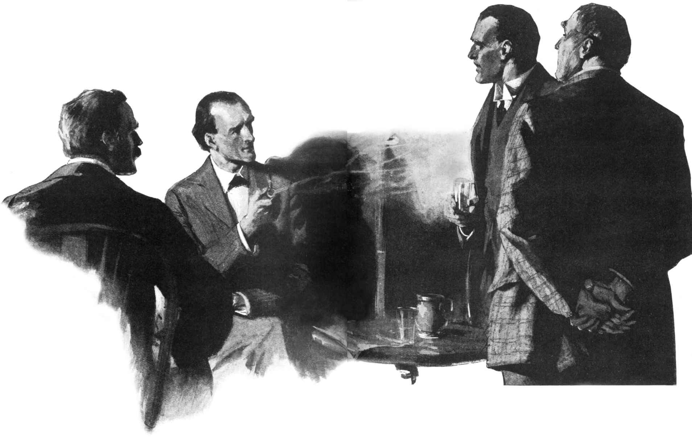

“这些情况同本案有什么关系？”

“是这样，福尔摩斯先生，”麦克唐纳说道，“让我们找上了这个人——你放心，我听到情况五分钟，就发电报描述了这人的形象——抓起他来就更准了。可即使现在这样，我们也已经跨前了好大一步。我们知道是个美国人，自称叫哈格雷夫，两天前带着自行车、手提箱来到滕布里奇·威尔斯。手提箱里有锯短的猎枪，所以他来有着蓄谋犯罪的动机。昨天早上骑车出发到这里，把枪藏在大衣里。据我们了解，没人看见他来。但是他用不着打村庄过，也能到达庄园大门口，还能避开大路上好多骑自行车的人。推测起来是，他很快找月桂树丛把自行车藏好，就是后来发现这车的地方，也可能他自己就潜伏在这里，监视庄园的动静，守候道格拉斯先生走出屋子来。在房子里使猎枪打，不见得方便，不过他原打算是在外面下手的，那就很明显有优点，打起来万无一失。有枪声也不怕，英国乡下邻居人家爱好打猎枪是运动，不稀奇，没人注意。”

“这么讲都很清楚了。”福尔摩斯说。

“啊，道格拉斯先生就是不出来。下面他怎么办呢？他丢下自行车，趁黄昏暮色走向屋子去，看见吊桥放着，四周没人。好机会不可失，没犹豫进屋去，要是遇上人也好找借口。可是没遇见有人。他进屋见个房间就先溜里边去再说，有窗帘，赶快躲后面去。一会儿他眼看吊桥给拉起，知道惟一退路就是跳护城河了。他等着，等到十一点过一刻，这时候道格拉斯先生要晚上例行巡视，检查到了这屋里。他开枪把他打死，逃走，照想好的方法跑掉。他很清楚，这自行车特征旅馆的人都知道，就成了找上他的线索，所以扔在那儿不要了，改别的办法逃往伦敦或是另外可以安全藏身的地方，这他都早有安排。这个说法怎么样，福尔摩斯先生？”

“哦，麦克先生，很好，这么个讲法很清楚。这是你讲的故事结论。我的结论：凶杀发生的时间，要比我们被告知的案发时间早半个小时；道格拉斯夫人同巴克两人合谋隐匿案情真相；他们协助凶手逃跑——或者说，至少是两人进入书房以后凶手才逃走——还伪造证据凶手是跳窗逃跑的，而事实上，很可能是他们亲自放下吊桥让凶手跑掉。这是我得出的结论，结论的前半部分。”

两位警探摇着脑袋。

“哦，福尔摩斯先生，如果是这样的话，那我们不过是跳出那个迷魂阵又给困进了这个迷魂阵。”伦敦警官说道。

“这个迷魂阵还要更糟，”怀特·梅森接上说，“夫人她一辈子压根儿就没去过美国，她怎么可能同一个美国杀手有关系，还要帮他掩护？”

“坦白讲，我自己也确实在疑问，”福尔摩斯说，“所以我今天晚上亲自作一点调查，或许有可能弄明白一些情况，有助于大家解决问题。”

“需要我们帮忙吗，福尔摩斯先生？”

“不，不必！只要天色一黑，华生医生的伞——我需要的就这么简单。还有艾姆斯，忠实可靠的艾姆斯，他会额外照顾我。我的各种思路，想来想去，无不归结到一个基本的问题——为什么用哑铃锻炼体格体形，只有单哑铃？这是很不符合常理的做法。”

这天晚上福尔摩斯亲征调查，夜里很晚才回来。我们住的是双床房间，在乡村小旅店这是对我们最好的招待。我已经睡着了，他进来，我似醒非醒。

“哦，福尔摩斯，”我喃喃地说，“查到什么了？”

他站在我的床边，没讲话，手里举着蜡烛，然后，向我俯下高高瘦瘦的身子。“我说，华生，”他附耳轻轻说道，“你跟疯子睡一间屋，一个患脑软化的人，一个心态失落控制不住的白痴，怕不怕？”

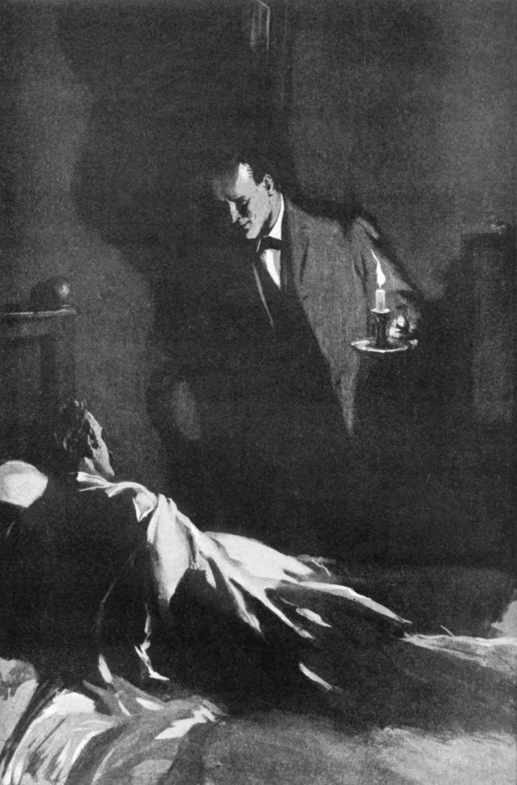

他站在我床边，手里举着蜡烛。

“一点不怕。”我惊醒回答。

“啊，那就万幸。”他说。当夜他再也没讲一句别的话。

# 第七章　谜底

第二天吃过早饭以后，我们去了当地警察所，麦克唐纳警官和怀特·梅森正坐在小会客室里紧急议事。桌子上堆着好多信件、电报，两人正小心整理，做着摘要。三份给放在一边。

“还在追查不知去向的骑车人？”福尔摩斯轻松地问道，“这个亡命之徒，有消息了？”

麦克唐纳没好气地指了指那堆信件。

“目前，莱斯特、诺丁汉、南安普敦、德比、东哈姆、里士满，还有另外十四个地方，都来了有关报告。有三个地方——东哈姆、莱斯特和利物浦——有情况，迹象很明显，他早该被逮捕才对。全国穿黄大衣的逃犯也是太多了点。”

“啊，说真的！”福尔摩斯深表同情地说，“现在，麦克先生，还有你，怀特·梅森先生，我希望给你们提出十分恳切的忠告，我起初和你们一起投入这桩案子的时候，我是有言在先，想必都还记得，我不愿给你们提供证据不足的推理，我还要有所保留，按照我自己的想法去工作，要到我认为已经可靠，自己满意，再摊开底牌。正是这个道理，所以此刻我不能告诉你们我心中怎么个打算。另一方面，我说过，我和你们工作一定做到光明磊落，我觉得任凭你们在毫无成效的工作上白费时间、精力而不加指点，这就很不应该。因此我今天早上来这里奉劝两位，我的劝告概括起来是两个字——放弃。”

麦克唐纳和怀特·梅森对着他们这位杰出的同行瞪眼呆望，惊诧莫名。

“你是说没希望了？”警官叫道。

“我是说你们的做法没有希望，不是说没有希望真相大白。”

“可是有骑车人的存在，不是平白无故捏造出来的，相貌特征都清清楚楚，手提箱，自行车，人肯定躲什么地方了。为什么我们要放弃，不把他缉拿归案？”

“没错，没错，毫无疑问，他躲在了什么地方，毫无疑问，我们能逮住他。我只是不让你们在东哈姆、在利物浦白白浪费气力。我保证，有别的方法，事半而功倍。”

“你这是留一手，你这就不上路了，福尔摩斯先生。”警官有点气恼。

“你知道我的工作方法，麦克先生，我只保密很短的时间，尽量地短。我希望，总得要把自己想法的各环节加以证实，这是完全能够做到的。然后，我就向两位告辞，回转伦敦，把我的工作成果悉数托付两位去了结。不这样的话，便是亏欠了两位。在我的侦探经历中，我还想不起哪件比这更有奇趣、更有研究价值的案例。”

“实在叫我无法理解，福尔摩斯先生。昨天晚上，我们从滕布里奇威尔斯回来见你的时候，你还挺称赞我们的调查很有成果。到底怎么搞的，让你对本案的看法又全然改变了？”

“好吧，你既然问起，我其实已经告诉过你，我昨天晚上去庄园侦查了几个小时。”

“哦，发生什么情况？”

“这，现在暂且只给你们一个粗略的回答。噢，想起来了，我正在看一份资料，这幢古建筑的报道，文章不长，简短扼要很有趣味，本地杂货店一个便士就有卖。”

福尔摩斯说着就从马甲袋里抽出一本小册子，上面有古庄园的版画地图。

“这对调查很有激励作用，我亲爱的麦克先生，当你意识到原来自己身处颇具历史意义的环境之中，气氛就不一样，心灵有感应。别轻看喽，我可以向你们保证，即使是这么概略的介绍，也能在你心目中勾起昔日如画一般的美感。允许我给你们念一段听听：‘伯尔斯通庄园始建于詹姆斯一世第五年，原址是更为古老的建筑，庄园堪称现存的詹姆斯一世时代护城河宅邸最完美典型之一——”

“你也真会拿我们开玩笑，福尔摩斯先生！”

“并非，并非，麦克先生！——我看出你们有些厌烦。好吧，不一字一字照本宣读，你们对本题目不以为然。但是，我要告诉你们，几桩事这里边有记载：一六四四年，反对查理一世的议会议员中有个上校，取得这块地基；内战期间，查理曾在此地藏身多日；最后，乔治二世也曾巡幸到此。你们得承认，这座古老的房子，跟好多大事有关系。”

“这我不怀疑，福尔摩斯先生。可是，那跟我们有什么关系！”

“没关系？真的没关系吗？眼界要放开阔些，我亲爱的麦克先生，这是干我们这行当的一项基本功。思想碰撞交融，智慧奇招怪用，越奇越有趣。这些话说来请不要见怪，说这话的人嘛，虽然不过是吃口刑侦探案饭，毕竟大你们几岁，也许比两位多活出点儿经验。”

“我得先承认你这一点，”侦探心悦诚服地说，“你讲的都十分有道理，我承认，可你这事也做得太绕弯儿了。”

“好，好，历史搁一边不谈，看眼下这件事。昨天晚上，我到了庄园，这已经说过了。我没找巴克，也不找道格拉斯夫人，毫无必要惊动他们。但是我很高兴听到说夫人看不出居丧的苦相，还吃了一顿丰盛的晚餐。我登门多亏艾姆斯先生照应。和他交心谈话后，他终于让我如愿，在书房里独自坐上一会儿，不告诉任何人知道。”

“什么！和尸体在一起？”我脱口叫道。

“不，不，现在一切都已井然有序了。蒙你允许这么做的，麦克先生，获有允准。屋子已恢复原样，我待了十几分钟，获益匪浅。”

“你做些什么？”

“噢，事情简单得很，没有什么神秘，我是寻找丢失的哑铃。我考虑本案，这始终是个最大的大问题，我终于将它找到。”

“在哪里？”

“啊，我们这就眼见要水落石出了。让我再往前走一点，只须走一小步，就能答应你们把我所知和盘托出同大家共享。”

“好吧，也只有随你，照你的意思做喽。”警官说，“不过，说是要我们放弃手上的事——究竟什么道理要放弃？”

“道理也简单，我亲爱的麦克先生，你们首先没有弄清楚该调查的是什么。”

“我们调查伯尔斯通庄园约翰·道格拉斯先生被谋杀案。”

“没错，没错，是这样，但是不要多费事去追踪自行车上那位神秘先生。我要确切地告诉你，对你没有用。”

“那你的意思我们该怎么做？”

“我会告诉你们该怎么做，就看你们愿不愿意。”

“哦，坦白讲，我老觉得你的做法稀奇古怪，可总是有道理。你拿主意，我照办就是了。”

“你呢，怀特·梅森先生？”

乡村警探茫然地看看这个，望望那个，福尔摩斯以及福尔摩斯方法对他还是头一遭新鲜事。“噢，既然警官说好，我也好喽。”末了他说。

“那就好！”福尔摩斯说，“那么，这样，我建议你们两位一同在乡间好好散散步，尽量轻松轻松。人家告诉我，这伯尔斯通岭到威尔德林地风景美丽无比。午饭嘛，找个合适的饭店总不会有问题；这我就没法推荐了，对这里乡下不熟悉。到晚上，人虽疲劳，但会十分惬意——”

“老兄，你倒有心开什么玩笑！”麦克唐纳嚷嚷道，气鼓鼓地从椅子上站起来。

“好，好，打发这一天，随你们便就是了，”福尔摩斯说，笑呵呵拍拍他的肩膀，“随你们喜欢好了，到哪儿都行，可就是要天黑前到这里来会我，不要失约——不要失约，麦克先生。”

“这么说听起来还差不多。”

“我说的都是金玉良言哦，但不坚持，只有一点，需要两位时，两位要到。现在呢，趁分手之前，劳驾给巴克先生写张便条。”

“便条？”

“我说，你写，行吧？行啦？”

亲爱的先生：

经过考虑，我们有必要抽干护城河的水，可望发现——

“不可能，”警官说道，“我都查过了。”

“甭管，甭管！我亲爱的先生，就请按我的要求办。”

“好吧，你说。”

——有望可能发现我们调查需要找的东西。我已约请工人明晨一早来府上抽干河水——

“这怎么可能！”

——抽干河水；故特此预先关照，望予配合为荷。

“好，签名，四点钟左右，派专人送达。到时间我们再在这屋子见面。到时间我们各自有事要做，我可以向你们保证，本案调查即将告一段落。”

当我们到时聚首，已是黄昏。福尔摩斯神色严峻，我则充满好奇，两位警探显然满肚子牢骚。

“是这样，先生们，”我的朋友正经地说，“我要求你们现在随我去把事情作一澄清，你们尽可自己作出判断，我安排你们所见是否足以证实我作出的结论。夜里很冷，也说不准要去多长时间，大家要穿暖和一点。头一要紧的事，必须赶在天黑以前到达现场，所以大家看，时间差不多了，我们该马上出发了吧。”

我们绕着庄园的花园外围走，来到一处地方，这里的花园栅栏有个缺口。我们从缺口潜入花园，趁着已暗的暮色，跟随福尔摩斯走到一片树丛，正方向靠近前门和吊桥，吊桥没有收起。福尔摩斯以一丛月桂树作屏障，蹲下来，我们三个跟随他蹲在树后。

“现在，我们做什么？”麦克唐纳粗声硬气地问。

“静心等待，不要出声。”福尔摩斯回答。

“我们在这儿到底做什么？我说你最好直截了当明讲让我们知道。”

福尔摩斯笑了。“华生总喜欢说我是现实生活中的戏剧家，”他说道，“富有艺术家的情调，如在舞台上演出，一定要演得成功。干我们这一行，说真的，麦克先生，假如不能来点戏剧性使我们的效果辉煌一下，那就实在单调乏味得令人厌烦。告上你没商量，砍脑袋不二话——这种结案收场有什么好戏可看？反过来，敏锐的推断，巧妙的撒网，对未来事作明断预测，有胆有识的推论得到证实，结果大获全胜——这才是我们的生活、我们的工作，有荣耀有正义，难道不是吗？眼下这时刻，你正感受着猎人守候猎物时的那种提心吊胆和兴奋激动。如果我有几时几分既定时刻表，还有什么悬念和紧张？敬请耐心一点，麦克先生，结局你马上就要明白。”

“好吧，但愿荣耀、正义还有什么的好事，在我们没冻死之前能够到手。”伦敦警探无奈地冷嘲热讽。

我们都不免同样有这种焦急的心情，因为我们守候得实在太久、太难忍了。黑暗渐渐笼罩了长长而阴森的古宅，护城河里升起一股凛冽、潮湿的寒气，侵彻骨髓，冷得我们牙齿都在打颤。大门口有一盏灯，那间凶煞的书房里亮着一团灯光，此外一切死寂、漆黑。

“时间还要等多久？”警官最后再问，“我们在守什么？”

“要等多久时间，你不清楚，我也不清楚，”福尔摩斯略带厉声地回答，“罪犯的行动安排都有铁路行车时刻那样准确，那干我们这一行不是太省力了。要问我们是在守——好，看那个，正是我们要守的！”

随着他的说话，书房里的黄光被一个人在灯前走来走去挡住了。隐蔽我们的这月桂树丛，正对着那窗，相距不到一百英尺远。接着，窗吱嘎一声打开了，我们看见灯光中一个人的黑影，向着外面暗中伸头探身张望。他向前注视片刻，鬼鬼祟祟、偷偷摸摸，那样子是在估摸外面会不会有人看见，然后向前伏下身子。寂静之中，我们听见轻轻搅动的水声。他好像是手拿工具往河里捞东西，忽然给他捞到了什么，像渔夫钓上了大鱼——一件圆圆的大东西，拖进窗的时候把灯光都遮掉了。

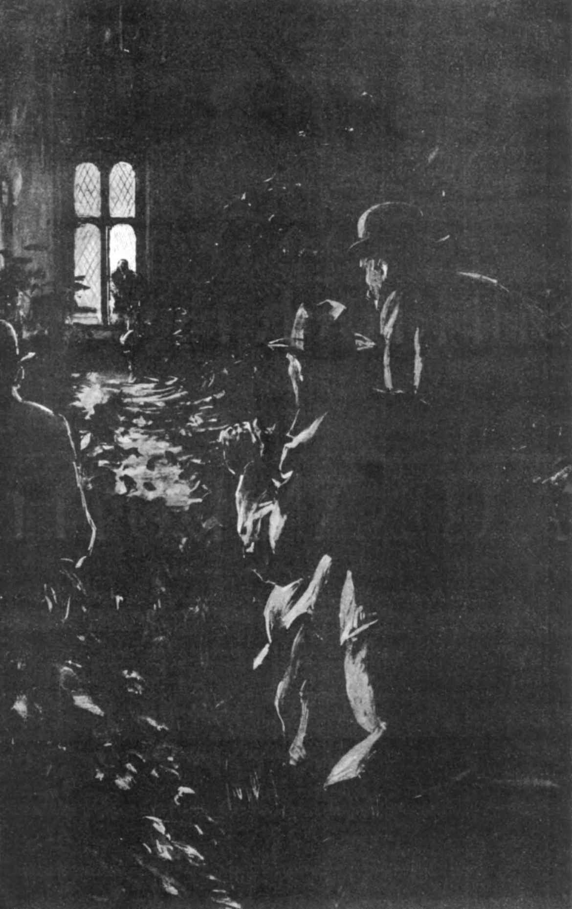

我们看见灯光中一个人的黑影。

“快！”福尔摩斯叫道，“快！”

我们都跳起来，腿脚僵硬着摇摇晃晃跟住福尔摩斯。他迅速奔过吊桥，用力拉响门铃。里边响起开门的声音，艾姆斯惊愕地站在门口。福尔摩斯二话不说擦身而过，我们紧跟在后，直冲书房，刚才看见的那个人就在这间房里。

我们在外面的时候看见的油灯放在桌上发出光亮，现在正提在塞西尔·巴克的手里。我们进房里，他举灯照着我们。灯光照出他自己那坚毅、果敢、修得精光的面孔和冒着怒火的双眼。

“这算是什么意思？”他吼道，“你们干什么？怎么回事？”

福尔摩斯很快向四面扫一眼，便一个箭步跳向一个用绳捆扎的湿包裹，包裹给塞在了写字台底下。

“我们找的正是这个，巴克先生——这个包裹，用哑铃压重量，你刚从这河里捞上来。”

巴克呆呆地望着福尔摩斯，一脸惊疑。“都叫你是怎么知道的，究竟是？”他问。

“很简单，是我放河里的。”

“你放的！是你？”

“确切讲是‘重新放回河里’，”福尔摩斯说，“你都记得，麦克唐纳警官，我早就提到少了一只哑铃。我想也引起你注意这个事，但是你忙不过来，没有时间考虑这个，不然你就能得出重要结论。河近在窗边，重物又丢失，这就不难猜测，是把什么东西沉了河底。这个想法无论如何值得检验一下。最后，多亏艾姆斯的帮助，他答应让我到这屋里，也多亏华生医生雨伞的弯柄，昨天夜里我钩起了这个包裹，检查了里边的东西。

“那么首要的事情，我们要查证是什么人这样做。我们能够达到这个目的，有个奏效的方法，就是宣布明天早上要抽干护城河的水。好，谁沉的包裹，谁就要急忙趁夜色快把包裹捞上来，这是百发百中的事。我们足足有四个见证人，目击是谁，果不其然不失机会。那么好，巴克先生，我想现在该是轮到你讲一讲了。”

福尔摩斯拿起湿淋淋的包裹放到桌上，搁在提灯旁边，解开捆扎的绳子。他从包袱里取出一只哑铃，把哑铃放回到墙角重新成对。接着取出一双高帮皮鞋。“美国货，你们看见喽，”他说，指着鞋尖。最后是一把套鞘的行凶长刀。最后解开一捆衣服，有整套的内衣内裤，一双袜子，一套灰粗呢服，一件黄色短大衣。

“衣服，都是平常衣服，”福尔摩斯说，“只有这件大衣，很有线索价值。”他把大衣往灯光凑近点。“这儿，你们瞧，这夹袋，一直延长到衬里这边，多大，哪有这种式样的，足可以装那支截短的猎枪。成衣铺标签，在领子上——‘Neal，Outfitter，Vermissa，U．S．A．尼尔，服装店，维尔米萨，美国’。我花了一个下午的时间，到神学院院长藏书室去查阅资料，使我增长不少知识，弄清这件事实。维尔米萨是美国的一个小镇，在一个山谷口子上，富产煤铁，很有名，很繁荣。我曾记得，巴克先生，你提起过产煤区，道格拉斯先生的头一位夫人。这就不难由此推论，被害人身旁的卡片有V．V．两个字母，那是代表Vermissa
Valley维尔米萨山谷，也就是从这个山谷派出杀手，很可能就是我们听说过的‘恐怖谷Valley
of
Fear’。这已经相当清楚了。那么现在，巴克先生，我好像有点多嘴，抢掉你的发言了。”

随着这位大侦探如此揭开事实真相，我们看到塞西尔·巴克的脸上红一阵白一阵，他在愤怒、惊异、恐惧，还有犹豫。最后他只得以嘲讽来退守。

“你知道得那么多，福尔摩斯先生，那就干脆请你都告诉我们算了。”他冷笑道。

“这没问题，我还能告诉你很多，巴克先生。不过，由你自己讲，来得体面一些。”

“噢，原来，你是这么想！那好，我可以告诉你，一句话：这里有秘密的话，也不是我的秘密，叫我来讲，那是找错了人。”

“好，既然你采取这种态度，巴克先生，”警官静静地说，“那我们先把你看起来，等有了逮捕证将你逮捕。”

“你要怎么做请便。”巴克强硬地回答。

他这里的情况恐怕只能到此为止。看一看他铁青的脸就知道，怎么逼他，即使对他peine
forte et dare<a href="#part0126.xhtml_ch1"
id="part0126.xhtml_ch1-back">(1)</a>，他也不会屈服做违背自己意志的事。然而僵局，忽然被一个妇女的声音打破，道格拉斯夫人一直在半掩的门外听着，这时走进屋来。

“你已经尽力了，尽心尽力了，塞西尔，”她说，“以后的事，别管它，你尽够力了。”

“不只是尽够了力，还太过分了，”福尔摩斯重重地说道，“我对你很同情，夫人，我该郑重劝你相信我们还是有司法公正观念的，可以完全放心，信赖警方。这里边也是我自己犯了错，你让我的朋友华生医生转告的话，我一时没有重视，始终以为你直接跟犯罪行为有关，现在才晓得完全不是这么回事。不过，还有许多环节不清楚，我诚恳建议你请道格拉斯先生自己出来，向我们说清楚事实真相。”

道格拉斯夫人听到福尔摩斯的话，愕然意外，不由得一声惊叫，两个警探和我，惊疑之下也自然是同样的反应。与此同时，好像屋墙里面显现一个人影，从昏暗的角落那边向我们走来。道格拉斯夫人转过身，立刻伸出双臂拥抱这个人，巴克也握住了这个人伸过来的手。

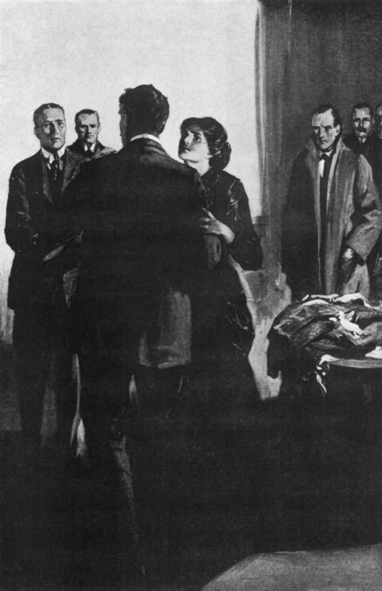

道格拉斯夫人立刻伸出双臂拥抱这个人。

“这是好事，杰克，”这个人的妻子，一再地说，“我相信这样最好。”

“正是这样，是的，道格拉斯先生，”福尔摩斯说道，“我确信你会觉得这么做最好。”

这个人站在那里迷茫地向我们眨眼，那是刚从暗里走到明处。这张脸很有特色：一对勇武的灰眸大眼，修短的灰白胡子，凸出的方下巴，嘴上带着幽默感。他把我们仔细打量一番，然后出乎意料径直向我走来，伸手给我一个纸卷。

“久闻大名，”他说，口音不完全像英国人，也不太像美国人，但是嗓子圆润悦耳，“这里面是一桩历史事实，适合你参考运用。噢，华生博士，你以前肯定没有见过这样的故事题材，这一点我敢掏尽最后一元钱倾囊和你打赌。你照你的构思来写这个故事，里面都是事实，只需要按照事实原貌写，你肯定能赢得公众欢迎。我已经把自己暗地里关了两天，用白天时间——在那个耗子窝，得尽量利用白天有光线——把事情都写在纸上。欢迎你使用——你和你的读者大众都欢迎使用。那是恐怖谷的故事。”

“都已经过去了，道格拉斯先生，”福尔摩斯平静地说，“我们希望听你讲讲现在的故事。”

“我要讲的，先生，”道格拉斯说，“我谈话，可以抽烟吗？好，谢谢你，福尔摩斯先生。你也是吸烟人，我记得不错的话。你可以想象，坐了两天，烟藏在口袋里就是不敢抽，怕叫烟味泄露秘密要坏事。”他背靠着壁炉架，猛抽着福尔摩斯递给他的雪茄。“你的大名，我早就如雷贯耳，可从来没想到会要遇上你。你们没看过这材料之前，”他朝我这儿的纸点点头，“听我讲讲，也一定会觉得都是新鲜事。”

麦克唐纳警官一直愣愣地瞧着这个新出现的人，觉得不可思议。“那，真叫我傻眼了！”最后他高声道，“你如果是伯尔斯通庄园的约翰·道格拉斯先生，那，我们这两天在调查的死人是谁？你又是从哪儿蹦出来的？我只觉得你好像从地板底下冒出来，玩偶盒一打开，玩偶嘟噜一下跳上来。”

“哦，麦克先生，”福尔摩斯说，摇摇食指表示不赞成，“谁叫你不读一读那本地方志，书里将国王查理一世避难的故事写得很有趣、很清楚。当年那些日子里，要是没有个巧妙的地方，别想藏得了身。有藏身的好地方，用过一次以后还要再用，所以我就想到能否在这个屋檐下找出道格拉斯先生。”

“你把我们捉弄了多长时间啊，福尔摩斯先生？”警官怒冲冲说，“你明知道我们的做法没用，为什么还让我们追踪白费力气？”

“不是一下子就清楚的，我亲爱的麦克先生。直到昨天晚上，我才对本案形成具体看法，又一定要到今天晚上，才获得证实，所以白天我请你和你的同事休一天假。请问我还能怎么做呢？我发现扔在河里的一套衣服，就马上判定，我们看见的尸体根本不是约翰·道格拉斯先生的尸体，而是滕布里奇威尔斯来的那个骑车人，不可能有别的结论。因此我要确定约翰·道格拉斯先生本人到哪里去了。想来想去只有一种可能，他跟夫人和朋友策划好，躲藏在屋子里，这房子本来就适合避难隐藏，等待风头稍过，最后再逃走。”

“没错，你估计得很正确。”道格拉斯赞许地说道，“我原是想，我这样就能逃过你们英国法律的制裁。因为我只以为我是难逃法网了，而当时一看眼前正是好机会，而且还可以一劳永逸，摆脱那些恶狗的追踪。不过，事情自始至终，我无罪无悔，要是再碰到这种事，我还照做不误。我把我的故事告诉你们，你们来评判评判。不用怕我会怎么样，警官先生，只要正义伸张，我该怎么样就怎么样。

“我不打算从头讲起，里面都写了，”他指指在我手上的纸卷，“你们可以看，都是奇异荒诞的怪事，归根到底一句话：有人和我结怨，他们不惜一切要我的命。只要我不死，他们也活着，就算我跑到天涯海角，也无容身之处。他们追杀我，从芝加哥追到加利福尼亚，后来追出了美国。直到我结婚了，安顿在这个僻静的小地方，我想我这下半辈子的最后岁月但愿能太太平平。

“我从来不对妻子讲起这个事。我为什么要连累她呢？让她知道，她就再也不会有一刻的安宁，要成天提心吊胆地过日子。我看出她多少也知道一点，因为我总不免在谈话中说漏一两句。但是一直到昨天，直到各位先生和她见面，她从来不曾知道事情的真相。她把她知道的都告诉了你们，巴克在这儿，也一样。当天晚上事情发生，时间仓促，来不及详细解释。现在她事情全清楚了，看来，我要是及早告诉她知道，那才是聪明的上策。可这也实在是个难题，不好办，亲爱的，”他握了握妻子的手，“我只能尽力而为。”

“好，先生们，事情发生的前一天，我去了滕布里奇威尔斯，一眼看见街上有个人。只是瞥到一眼，我对这种事情眼光是很敏锐的，一眼就知道他是谁，绝对不会认错。是我仇人当中最凶恶的一个——像只饿狼扑驯鹿，这些年一直追着我。我知道麻烦要来了，就回家做好应付的准备。我考虑由我一个人独自对付他也就可以了。一八七六年我在美国鸿运高照那段时间，是人人皆知的，所以心情安定，相信好运气还跟随着我。

“第二天我是整天警戒不懈，不出门，连花园都不去。这样才保险，否则，我还没靠近他，就被他逮着机会用那支截短的猎枪射杀了。吊桥吊起以后——平时晚上只要桥一吊起，我就安心了——我也就不去想那件事，可是做梦也没有想到他偷偷进了屋子，等着我呢。我穿件休闲衣在屋里转一转——这是我的老习惯，脚刚一迈进书房，就感觉不对劲。我相信，人遇有生命危险——我这一生中真是危机不断——会产生第六感觉，向你甩出红旗。我感到了危险，肯定有，可是我对你们也说不出个所以然。一瞬间，我看见窗帘下有皮鞋脚，好，清楚了，果然有事。

“我手里只有一支蜡烛，但是门开着，厅里的灯照进来很亮。我放下蜡烛，跳过去抓起壁炉台上的铁锤，那是我白天留在那里的。这时，他向我扑上来，我看见刀光一闪，我的铁锤马上砸过去。大概打中了他，他的刀当啷掉在了地板上。他立刻绕着桌子跑开，动作迅速像条鳗鱼，一下子从大衣里面拿出了枪。我听见他打开保险，但没等他扣扳机，我已经抓住了枪，抓住枪管。拼命夺枪扭打了一两分钟，他要是一脱手丢了枪，就是丢掉了命。

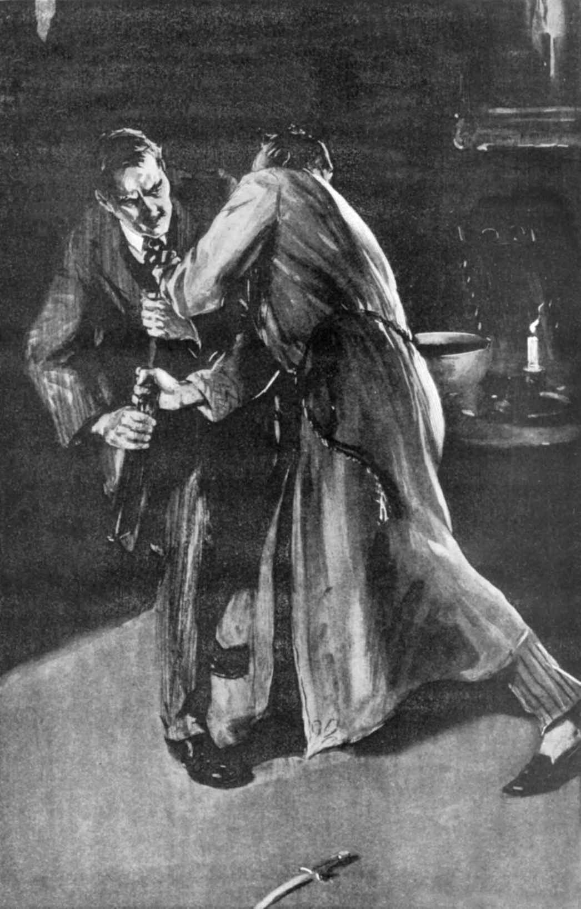

“我已经抓住了枪，抓住枪管。”

“他死命不松手，但是争夺中一直是枪托朝下，枪口朝上。可能是我碰响了扳机，也可能是争夺中枪走火，结果双弹一起轰在他脸上。好了，他完了，我看着他，这就是泰德·鲍德温。我在镇上就认出他，刚才向我扑上来更看清确定是他。可眼前这样子，连他母亲来认也认不出了。流血的事我过去习以为常，但是这时看着，真叫我恶心。

“我靠着桌边，巴克奔下楼来，听见妻子也来了。我赶紧跑到门口把她拦住，这血腥场面不是女人能见的。我答应她马上就要回房里去。我向巴克简短说几句——他一看也就明白了——就等别的人来了再说。可是不见人影。噢，明白了，他们都没有听见，那么这件事情只有我们三人知道。

“我马上灵机一动，啊哈，这不是天赐良机吗！真是乐不可支了。死人袖子捋起着，前臂上露出烙印标记，瞧我这儿！”

这会儿是这个真正的道格拉斯翻起他的衣袖，露出一个圆圈里有三角的褐色标记，和我们看过死者的那个标记一模一样。

“正是看到这个烙印，我才计上心来。我再看一眼，一切都成了，他的身高、头发、身材大小，和我都一样。这张脸，我发誓没人认得，这该死的鬼样子！马上扒下这套衣服，十几分钟工夫，巴克和我，把我的休闲袍给他换上，让他躺的那个样子，你们都看见。把他的衣服捆成一团，临时能找的压重物就只有那个哑铃，裹在一起往窗外扔出去。卡片，原本是他想用来放在我的尸体上的，现在给他自己放上了吧。

“又把我的戒指给他戴上，可是这结婚戒，”他伸出了那只厚实粗壮的手，“你们也都看见了，戴得有多紧，结婚那天戴上去始终没拿下来过，现在不用锉刀锉是撸不下来的。再说，我也未必愿意拿下来，要拿也办不到。这样，这件小事我们顾不得了，就算了。另外还有，我撕一小块胶布给他贴上，因为这天我自己正是同样地方贴着一块。这一点，聪明如你，居然也会疏忽掉，福尔摩斯先生。你只要撕下胶布看一看，就发现贴胶布地方根本没有割破皮的伤痕。

“好，情况就是这样。如果我能躲一阵子，然后和我的‘遗孀’一起逃走，就总算能有机会让我们的余生过上平安的日子。只要我还活在世上，这些魔鬼决不会让我好过。只有让他们在报上看到鲍德温已经把他的宿敌杀死，我的麻烦也就从此结束。我没有时间把这些事情对巴克和我妻子详细讲清楚，但是他们已经理解，很能够起配合作用。隐藏的密室我是熟悉的，艾姆斯也知道。不过艾姆斯永远不会把我和这件事联系起来，他想不到那上面去。我躲进密室，其余的事都由巴克去做。

“他怎么做，我想你自己知道得更清楚了。他开的窗，窗台上再补个脚印，让人相信凶手是从这里逃跑的。这样逃，这样做法，也是勉强，好在吊桥已经吊起来，说明也是没有别的出路。一切都做好了，然后他拉铃，把用得着的人叫来。以后的事情你都知道。就这样，先生们，你们决定如何处理，一切悉听尊便。但是我告诉各位，我所讲的都是事实，没有欺瞒没有作假，上帝一定会帮助我！现在我只想问，我这件事情，英国法律会怎么处理？”

一阵沉默。歇洛克·福尔摩斯终于开口。

“英国法律基本上是公正的。这件事，不是你的过错，不会冤枉你，道格拉斯先生。可是我想问你一点，这个人怎么知道你住在这里？怎么进的屋？怎么躲起来暗算你？”

“这我就不知道了。”

福尔摩斯的脸色苍白而严峻。“我看事情还没有结束，”他说，“你面临着更大的危险，倒不是英国法律的危险，甚至比你的美国仇敌还要危险。我看你眼前还有麻烦，道格拉斯先生。你要听我忠告，一定还要继续防备。”

现在，请读者诸君不嫌厌烦，随我暂时离开苏塞克斯伯尔斯通庄园，也离开现在这一年；这一年，我们有了此番刑侦之旅，在得知某人的疑案故事后宣告旅程结束；这个人许久以来人们只知道他名叫约翰·道格拉斯。我要引领读者诸君进入另一旅程，时间回溯二十年以前，空间西去数千英里以外，我将呈献给诸位一则绝无仅有的、骇人听闻的故事——如此绝无仅有、如此骇人听闻，会叫你觉得简直难以相信是否如我所说，是否真有其事。

请不要以为我一个故事未完，又穿插另一个故事，只要你读下去，就会发现并非如此。我细述那些遥远事件，也就解开了现在所叙故事之谜。最后我们将重聚贝克街寓所，本案故事如同许多精彩刑案故事一样，也将在此看到结局。

————————————————————

<a href="#part0126.xhtml_ch1-back" id="part0126.xhtml_ch1">(1)</a> 拉丁文：严刑逼供。英国旧时法律规定若重案犯拒审便可施加特种刑罚，如笼囚、饿食、铁块压身等，直至死亡。此规定于1772年废止。

# 第二部　死酷党人

# 第一章　一条好汉

那是一八七五年二月四日，严寒的冬季，吉尔默敦山脉的山谷白雪深积。蒸汽扫雪机出动除雪，保证铁道畅通无阻。夜车在联系着煤矿和钢铁厂区的漫长线路上，轰隆轰隆缓缓爬行，由平原的斯塔格维尔驶向维尔米萨，这个位于维尔米萨峡谷口的中心城镇。爬过此岭，火车便顺坡下滑经过巴顿道口、经过赫尔姆代尔直达纯农业县梅尔顿。这是单线铁路，但是每条岔道专线上——专线可说无数——一长列一长列满载着煤和铁矿石的车皮说明此地蕴藏丰富。财富使人口暴涨，使美利坚合众国这个最荒凉的角落变得人丁兴旺，热闹非凡。

这里从前荒无人烟。打头阵的拓荒者行经此地，怎么也想不到那丰盛的大草原、水土肥沃的牧地，和这岩石乌黑、杂林密布的昏暗地界比起来，会身价大跌。透过铁路旁时时浓荫蔽日的树林，望见白雪皑皑的山峰和嶙峋的山石巍巍耸立在两边树颠之上，留一条曲折的深谷蜿蜒其间，让这小小的火车正在吭哧吭哧向上蠕行。

前面的一节客车刚点起灯火，板凳简陋，长长的车厢坐着二三十个人，大多数是工人，在峡谷谷底劳累了一天归来。其中十几个人，个个灰尘满面，佩有安全灯，看来都是矿工。他们聚在一起抽烟，低声说话，不时拿眼睛瞅着车厢对面坐的两个人。这两人身着制服，佩戴徽章，显示他们是警察。

其余的人，有几个劳动阶级的妇女，还有一两个旅客，像是当地杂货店老板，再有就是一个年轻人，独自坐在角落里。我们所要讲的，正是这个人，他的长相模样，值得交代一下。

这个人满面春风，生气勃勃，中等个头，年纪不大，看上去顶多不过三十岁。他一双灰眸大眼，透过眼镜打量着周围的人，闪着明晰、探询而有风趣的目光。不难看出，他是个爱社交的直性子人，喜欢交朋友。一和他接触，就马上发现他天性合群，笑口常开而善于辞令。但是，只要你仔细深入对他观察研究一番，就能从他的下巴看出坚毅，从他紧抿的双唇看出果敢，这似乎在警告你，他也是个深有城府的人，别看他是一头黄发的爱尔兰年轻人，轻轻松松态度自在，他所到之处，是好是坏是善是恶，都可以随机应变。

年轻旅客同最靠近的矿工搭了一两句话，对方反应粗声粗气、爱理不理，他感到十分没趣，只好默不作声，怏怏不乐地望着窗外渐渐暗淡的景色。

景色并不赏心悦目，山峦之间，高炉喷吐的红火映着渐深的夜色。矿渣、炉渣沿途堆积如山，高高的井架竖塔如林。杂乱拥挤的低矮木屋，都已掌灯而窗框明晰，远近荧荧点点一路散落。时时停靠的各个站点挤满着皮肤黝黑的当地居民。

维尔米萨区的煤铁山谷，不是富有阶级和文人学士闲情逸致的去处。这里到处是为生存而进行惨烈搏斗的严酷场面，进行的是原始、粗野的剧烈劳动，从事这种劳动的是原始、粗野的健壮工人。

年轻旅客凝视着野外阴郁的景色，脸上露出既厌恶又有趣的错杂表情，说明这种景象对他而言，还是初见陌生。他偶尔从口袋里取出一个大信封，看看信，在信笺边上作些记录。有一次从他后腰掏出一样东西，令人想不到看起来貌似文雅的这个人也带着家伙，是一把海军用的最大号左轮枪。他拿枪一侧对光之际，照着弹轮上的铜弹闪闪发亮，看得出装满了子弹。他很快放回原处口袋藏匿不露，但已被邻座的一个工人看到了。

“嗨，兄弟！”工人说，“有事防着点吗？”

年轻人勉强笑笑。

“是啊，”他回答，“我打那来的地方，少不了备个家伙。”

“你是哪里来？”

“刚从芝加哥来。”

“这个地方陌生不熟悉吧？”

“不熟。”

“你不错，这里也用得着它。”工人说道。

“哦！是吗？”年轻人注意起来了。

“这里出过什么事，你都没听说？”

“没听说有什么事。”

“哈，这野地方事儿可多了，很快就叫你听到。你上这儿干吗来了？”

“听说这儿干活好找呗。”

“你是工会的吗？”

“当然。”

“那找活儿没问题，行。有没有熟人？”

“还没有，不过我有办法找到。”

“什么办法？”

“我是大自由人会的，没有一个地方没有我们的分会，只要有分会，我就有自己人。”

这一说，对方立刻起了特别的反应，工人向车内四周小心瞅上一眼。矿工们都在低声私语，两个警察正在打盹。他就走过来，挨着年轻旅客坐下，伸出了手。

“这儿。”他说。

两人紧紧握手，心灵已通。

“看得出你都是真话，”工人说，“不过再试试更牢靠。”他举起右手齐右眉毛，年轻旅客就将左手举到左眉毛。

“夜黑不开心。”工人说。

“走夜路不开心。”另一个回答。

“棒极了。我是斯坎伦弟兄，维尔米萨谷341分会。很高兴在此相见。”

“谢谢，我是约翰·麦克默多弟兄，芝加哥29分会，命主J．H．斯科特。运气真不错，这么快就遇上自家弟兄了。”

“哦，这儿我们的人可多呢，你会看到，本会势力在这儿维尔米萨山谷最兴旺发达，美国别处都比不上。不过，像你这样的年轻小伙子多一些就更好。叫人无法明白了，像你这样棒的小伙怎么在芝加哥就找不到活儿干？”

“工作有的是。”麦克默多说。

“那干吗要离开？”

麦克默多朝警察方向点点头，笑笑。“让这些家伙知道可要乐呵了。”

斯坎伦会意地嗯一声。“惹麻烦了？”轻轻地在耳边问。

“大麻烦。”

“要蹲牢？”

“不止。”

“不是杀了人吧？”

“谈这个话这里不是地方，”麦克默多说，神情突然警觉起来，似乎发现话说得太多过了头，“我离开芝加哥自有离开的理由，你就别再问这个事了。你是什么人，有权利这样问？”眼镜后面的灰色眸子立时射出凶光。

“好吧，兄弟，问问，没有别的意思。别人不会怀疑你的，不碍事，不碍事。你现在是到哪儿？”

“维尔米萨。”

“再下去第三站就到了。住什么地方？”

麦克默多拿出信封，凑到昏暗的油灯下。“这是地址——谢里登街，雅各·谢夫特，是一家公寓，芝加哥一个熟人介绍的。”

“哦，我不知道。维尔米萨我不是很熟悉，我住在霍布森辖区，马上就到了，我们在这儿要分手了。哦，我说，分手前，有句话你要记住了，你要是在维尔米萨遇上麻烦，直接去找工会，麦金蒂老大。他是维尔米萨分会的命主，那地方，没有黑杰克·麦金蒂摆一句话，什么事也别想做；只要他一句话，什么事都办得成。再见，兄弟！哪天晚上在分会见，后会有期！记住我的话，有问题去找麦金蒂老大。”

斯坎伦下了车，麦克默多又重新陷入沉思。黑夜早已降临，连绵不断的高炉怒吼着向黑暗喷吐火舌。在红光映照中，工人们的身影，随着绞车和卷扬机的运动，按着铿锵声和轰鸣声的节奏，在俯仰，在牵拉，在扭曲，在旋转。

“想来地狱也不过就是如此吧。”有一个声音在说。

麦克默多回头一看，是一个警察在座位上动动身子，望着外面火光映天的荒野。

“这个嘛，”另一个警察说，“我看地狱一定就是这个样子了。那儿，我们打交道的歹徒，地狱里还有更坏的恶魔能比他们更坏？我可是怎么也没法想象。我说，你是新来这个地方吧，年轻人？”

“哦，新来的话，怎么样？”麦克默多很冲地回答。

“哦，是新来，先生，那就让我劝告你，交朋友可得小心。换了是我，我不会一来就跟迈克·斯坎伦他们那帮人混得火热。”

“我跟谁是朋友和你有什么关系？”麦克默多提着嗓门吼道，车厢里的人都转过头来看他们吵，“谁要你劝什么告？我又不是吃奶小孩子，要叫人给提领着。我又没跟你说话，你多什么嘴，你也管得太宽了。给我安生点，没事歇一边！”他朝这个巡警龇牙咧嘴，像只吠人的狗。

两个警察，好心没好报，好言语竟不被领受，还碰了一鼻子灰，不禁一愣。

“不必发火，先生，”另一个说道，“都是为你好，给你提个醒。只不过见你是初来这地方才这么说的。”

“我是初到此地，但是对你们这号人可不新鲜！”麦克默多阴冷地怒喝道，“我知道到哪儿你们都是一票货。收起那个劝告吧，没人要听。”

“恐怕不用多久，我们就会相见，”一个巡警咧嘴一笑说道，“你真是块值得上手的料子，要是我来裁判的话。”

“没错，我也这么想，”另一个也说，“我们后会有期。”

“我不会怕你们，别吓唬我！”麦克默多叫道，“我的名字，杰克·麦克默多——知道了？要找我，就去维尔米萨，谢里登街雅各·谢夫特公寓。不躲不藏，行吧？白天、晚上，我都奉陪——可别找错了门、认错了人！”

矿工们在窃窃地赞同、赞叹这个新来客的大胆无畏。两个警察耸耸肩膀，回头自顾说话。

没几分钟，火车驶入灯光暗淡的车站。这里是一处林中大空地，维尔米萨算是这条铁路线上最大的城镇。麦克默多提起旅行袋，向黑暗中走去，这时有个矿工上来和他搭讪。

“嗨，朋友！你真棒，对付这号警察，”矿工口气敬畏地说，“听你的话，好厉害。来，让我帮你提行李，替你带路。我回家正好要经过谢夫特。”

两人走过月台，其他矿工友好地齐声向他道“晚安”。麦克默多脚还不曾踏进维尔米萨，声名先到，已经远播。

乡村已是恐怖之地，城镇更有城镇的不堪之苦。顺着长长的峡谷，先不见别的，只有那巨火流烟形成的滚滚云雾，笼罩半空，也成壮观。而人类力量的追逐，如着魔般挖地堆山，一座座四处零落，犹如建起他自身的丰碑。但是这座城中，呈现的是死水般的卑微丑陋和污秽。宽阔的路面，人来车往，污雪、湿土碾压搅和得长街一片泥泞。狭窄的人行道坑洼不平。看不到尽头的煤气灯，只把一排排木屋人家照得更显眼。家家都有临街廊台，家家门前凌乱邋遢、肮脏不堪。

两人进入城中心，景象豁然开朗，眼前一长排店铺灯火明亮，更有酒馆、舞厅和赌场麇集一气热闹非凡，矿工们在这里大把挥霍辛苦挣来的血汗钱，毫不手软。

“这就是工会，”矿工说，指着一家巍峨如宾馆的酒店，“杰克·麦金蒂是老板。”

“他是个什么人？”麦克默多问。

“怎么！这老大你没听说过？”

“我怎么知道，你难道不晓得我刚到这里不熟悉？”

“哦，我想，他的名气响遍全国，报纸就经常登他的消息。”

“登他什么消息？”

“那个，”矿工把声音压低了——“犯事呗。”

“犯啥事？”

“上帝啊，我说先生！说句话不怕你见怪，你也真是个傻蛋。你在这地方，能听到的也就一种事，就是死酷党。”

“噢，在芝加哥我是看过死酷党的消息，都是凶杀案，一帮杀人犯，对吗？”

“嘘，快别说！”矿工正色道，呆呆地站住不动，惶恐地注视着他的同伴，“老兄，在这个地方，你当街说这种话，小心活不久。好多人还没说到这么厉害的份上，就都把命给丢了呢。”

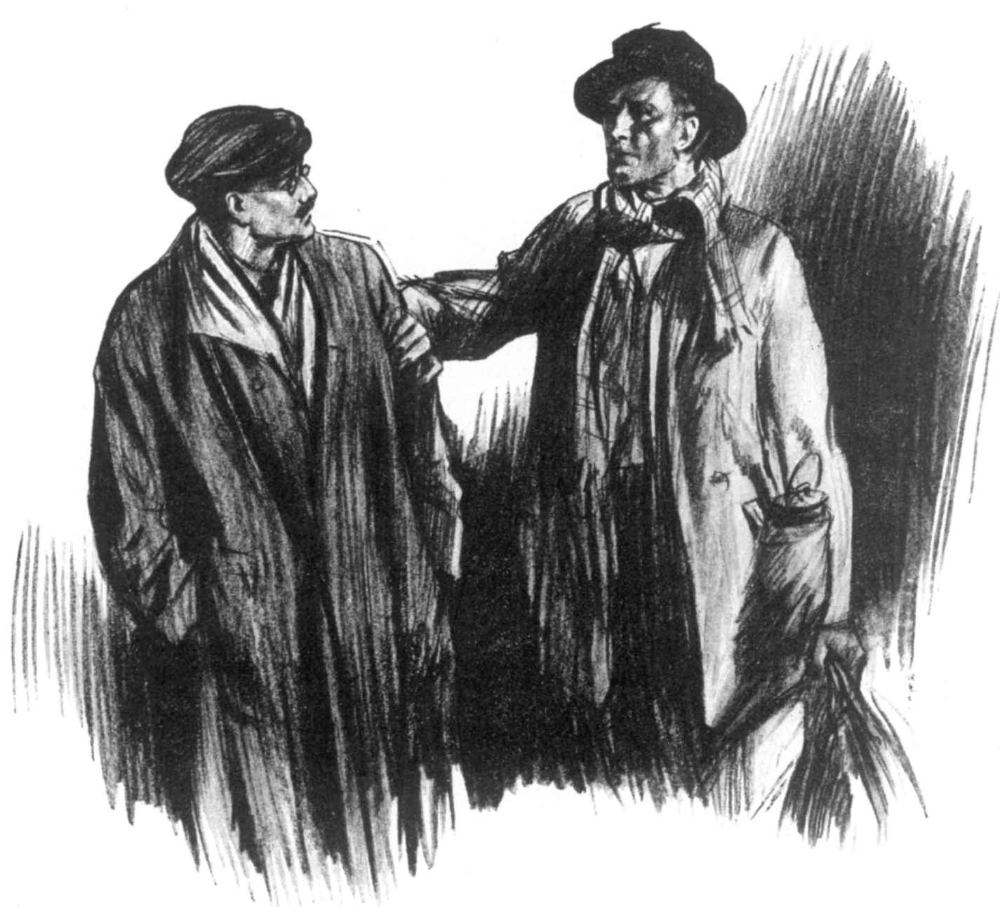

“你当街说这种话，小心活不久。”

“噢，我不知道，我都是报上看的。”

“我不是说你看到的不是真事。”这个人讲着话，一边紧张地看看四周，特别注意阴影处，生怕躲着人，暗藏危险，“杀人都叫凶杀，那上帝知道，凶杀不稀奇。可你不敢扯上杰克·麦金蒂的名字，新朋友。什么背后议论都会传到他耳朵里去。他这个人，一让他知道，轻易不会放过你。好，到了，这就是你要找的房子。街后的那一幢。你找老雅各·谢夫特，大家都说他是这镇上最诚实的人了。”

“谢谢你。”麦克默多说，和新朋友握握手，接过包囊，拖着沉重的脚步顺小路走向那幢屋子。到了门前，就咚咚地敲门。

屋门立刻开启。开门的人，大大出乎他的意料，眼前是一位妙龄女郎，竟是惊人地貌美。看长相是德国人，皮肤洁白细腻，金发飘逸，配上一对美丽动人的乌黑大眼睛。女郎睁着大眼看这上门的陌生人，奇怪地打量一番，不觉娇羞起来，粉嫩的脸颊泛起红晕。门口明亮的灯光衬托着女郎的身影，麦克默多觉得眼前是从来没有见过的一帧美女画，在这灰暗污浊的环境对照之下，更见夺目明亮。即使在黑煤渣废矿堆上，长出一朵可爱的紫罗兰，也不会比在此看见她更叫人感到惊奇。麦克默多呆呆地站在门口，一句话也没说，倒是女郎打破了沉静。

“我还以为是爸爸呢，”她娇声说，略带德国口音，“你是来找他的吧？他上街去了，我正等着他回来呢。”

麦克默多依然呆望着她，掩饰不住自己的爱慕之情。如此逼视之下，女郎心慌意乱，垂下了眼。

“哦，不，小姐，”他终于开口，“我不忙见他。我是有人介绍来寄宿的。我想，正适合我——现在知道真适合。”

“你也决定得太快了。”姑娘微笑道。

“任谁都会这样决定，除非是瞎子。”另一方答道。

姑娘对这赞美的话嫣然一笑。“进来吧，先生，”她说，“我叫伊蒂·谢夫特小姐，谢夫特先生的女儿。母亲去世了，我负责家务。你就在这前厅等着吧，坐火炉旁，父亲就来——啊，他来了！什么事跟他说好了。”

一个龙钟老人迈着沉重的步伐从小路上过来。麦克默多三言两语说明了来意。是芝加哥一位叫墨菲的人介绍他到这里来，给了这里的地址；这地址是别人告诉墨菲的。老谢夫特一口答应。麦克默多对房租二话不说，同意一切条件，他显然是不在乎花钱。他预付了一星期七元的膳宿费。

这个自认是逃犯的麦克默多，就在谢夫特家有了落脚地。这是第一步，由此引发一连串风波，漫长而痛苦，收场要到那遥远的异国了。

# 第二章　命主

麦克默多是个十分引人注目、很容易出名的人，不论走到哪里，很快就无人不知、无人不晓。不出一个星期，他已成为谢夫特家公寓里最重要的人物。寄宿这儿的住客有十个，有时候十二个，都是诚恳规矩的工头领班，或是老实正经的商店店员，气质习性和这个爱尔兰青年很不相同。晚上大家聚在一起，麦克默多总是谈笑风生。他能说能唱，说起话来妙语连珠，唱起歌来歌声动听。他生性善与人称兄道弟慷慨交友，他像是磁石，人们围着他被他所吸引，喜欢他有情趣，有魅力，与他相处其乐融融。

但是他也会像在火车上那样，会突然暴怒，不肯轻易低头认账，这就使认识他的人有点敬畏。对于法律和司法人员，他表现出极度的轻蔑，让同住的人有的很高兴，有的则感到不安。

从一开始他就毫不掩饰，他对房东的女儿十分倾心；他从第一眼看见她的美貌和优雅气质，就产生了爱慕之情。他不是那种畏畏缩缩的追求者，第二天他就告诉姑娘说他爱她。此后他一而再、再而三地向她求爱，毫不在乎姑娘说一些泼他冷水的话。

“有别人了？”麦克默多会大声说，“不行，让他倒霉去！叫他小心点！难道要我错过一辈子的机缘？把全心全意的爱让给别人？你可以说上千万个不，伊蒂，可总有一天你会说是；我还年轻，可以等待。”

他是个锲而不舍的求婚者，他有爱尔兰人的三寸不烂之舌，他有甜言蜜语百般讨好的本事，他还有一套丰富的经验和神秘的魅力用来攻占女人的心，最终夺得女人的爱。他谈他的出生地莫纳根郡那些美丽的山谷，谈遥远可爱的海岛，谈缓缓起伏的丘陵小山、丰美碧绿的牧场草地，他把这一切说得天花乱坠，比起这个地方的尘土、冻雪，想象起来那里一定是无比的美丽。

然后谈他熟悉的北方城市生活，谈底特律，谈密执安的林中伐木营，最后谈芝加哥，他在一家锯木厂工作。接着，话锋一转便说起浪漫史，在芝加哥这个大城市里有过奇妙经历，所产生的那种感情，实在奇妙，实在甜蜜而隐秘，简直不是言语所能表达。他讲着讲着，忽然机巧离题，卖个关子，飞向天外世界，再落到眼前这沉闷无聊的山沟中来。伊蒂听着，一对乌黑的大眼睛闪出怜悯和同情的光泽——同情和怜悯之心，便急速而自然地融化成爱情。

麦克默多受过良好的教育，所以很快找到了一个记账员的临时工作。这就占去了他白天大部分时间，无暇去找大自由人会的老大报到。还是在火车上认识的旅客麦克·斯坎伦，有天晚上来拜访他，才提醒他这件事不能拖。这个斯坎伦，小个子，猴腮脸，黑眼睛，是个小心谨慎的人，很高兴再见到麦克默多。喝过一两杯威士忌，他便说明了来意。

“我说，麦克默多，”他开口道，“我记得你的地址，所以冒昧来见你。真叫我吓一跳，你怎么还没有向命主去报到！为什么还不去见麦金蒂老大？”

“哦，我得找工作，很忙，没空。”

“你一定得抽时间去见他，宁可别的事都不做。哦，老天，真有你的！你怎么那么傻，来这儿的头一天早上，就应当先到工会，登记好你的名字！要是怠慢了他——那，你可决没——不说了！”

麦克默多有些惊疑。“我都已经是入会两年多了，斯坎伦，还从来没听说会员有这样的规矩要遵守呀。”

“在芝加哥大概是没有。”

“那，这里不是一样的组织嘛。”

“一样？”斯坎伦盯住他望了许久，眼里透着凶光。

“难道不一样？”

“过一个月时间，看你再怎么跟我讲这些事吧。我听说，我下了火车，你跟巡警吵了一架。”

“你怎么知道？”

“哦，很快——这个地方好事坏事传得都很快。”

“没错，我告诉这些狗杂种，对他们没好感。”

“天哪，你真是麦金蒂的心腹人！”

“怎么，他也恨警察？”

斯坎伦不禁大笑。“你快去见他，我说，兄弟，”他说，起身告辞，“你要是不去，那他不是恨警察，要恨你了！听朋友一句劝告，马上就去！”

事也凑巧，当天晚上，麦克默多又遇到一件事，迫使他要赶紧去见那个人。情况是这样，他对伊蒂的痴情越来越明显，好心的德国房东尽管木讷，也渐渐觉察到了。先不管来龙去脉，房东把年轻人招呼到自己房里来，不拐弯抹角，开门见山说话。

“我看出来，先生，”老头说，“你对我女儿伊蒂有意，是吗，还是我看错？”

“没错，是这样。”年轻人回答。

“呵（好）了，我现在奥（要）告诉你，这个事不成，在你之前早有人求婚了。”

“伊蒂跟我讲过。”

“那呵（好）了，你休（晓）得她讲的是实话。她告诉你是什么人？”

“没有，我问她的，她不说。”

“我是想，她不敢说的，这休（小）丫头！怕是一说，奥（要）把你呀（吓）住了。”

“要把我吓住！”麦克默多一时来火了。

“啊，是呀，我的朋友！你害怕他，也不是什么丢脸，那是泰德·鲍德温。”

“这混蛋什么人？”

“死酷党头儿。”

“死酷党！以前倒是听过。这儿死酷党，那儿死酷党，都是耳朵咬来咬去！你们怕它做什么？死酷党都是些什么人？”

这个寄宿公寓老房东，像每一个谈起这个恐怖组织的人一样，本能地压低了声音。“死酷党嘛，”他说，“也就是自由人会！”

年轻人瞠目了。“什么，我自己就是这个会的会员嘛。”

“你，也是！早几（知）道你我就不把房子租给你住——付我一英（星）期一百元也不干。”

“这个会，有什么坏的？讲博爱，讲友谊，章程上这么说的。”

“也许有的地方是这样，这里可不是！”

“这里怎么样？”

“它是暗杀党，实质这么为（回）事。”

麦克默多好笑了，不相信。“你有证据吗？”他问。

“证据！举它五十桩暗杀，够不够证据？米尔曼和范肖尔斯特，还有尼科尔森一家，还有老海厄姆先生，还有休（小）比利·詹姆斯，有，有别的好些人，不都是敏（明）摆的吗？不是证据？本山谷地界，有哪个男人、哪个女人不休（晓）得？”

“你这么讲！”麦克默多急急地说。“我要你把讲的话收回，要不就向我道歉。怎么做你自己选，我才离开你这屋子。你是知道我的，我又不是你们这里镇上人，是外来客。我的社团，我只晓得是个纯洁的团体，遍布全美国，都有我们的社团，全部是高尚的团体。现在，我正想加入这里的组织，你跟我说的完全是一个杀人组织，叫作死酷党。所以我说要么向我道歉，要么向我解释清楚，谢夫特先生。”

“我跟你说的，都是全世界都几（知）道的，先生。自由会死酷党，这头儿那头儿，一样的，你冒犯了一个，个个都奥（要）找你。我们领教得很够了。”

“尽是流言蜚语——拿证据出来！”麦克默多说。

“你这儿住久了，你为（会）看到证据的。我都忘了你也是他们的人了。你为（会）不用多久，变得和他们一样歪（坏）。你还是另找地方去住吧，先生。我这里不能收留你。这个坏蛋来追求我的伊蒂，一个还不够，我都不敢打发，还奥（要）再收一个来作房客吗？算了，今天再让你睡一晚！”

麦克默多这下面临被逐，不仅要搬出安乐窝，还要离开他心爱的姑娘。当晚他看见姑娘一个人在起居室里，就向她一吐苦水，倾诉衷肠。

“真的，你父亲向我下了逐客令，”他说，“若只是住宿问题，我倒不在乎。可是真的，伊蒂，虽然我认识你才一个星期，你已经是我的生命，没有你我活不下去！”

“哦，别说了，麦克默多先生，别这么说了！”女孩说，“我跟你讲过的，不是吗？你太晚了，已经有人追求我了。我要是拒绝嫁给他，那么我也不能答应和别人结婚，起码是这样。”

“假如是我在先，伊蒂，我就能有你了吗？”

姑娘双手掩脸。“是你先来求婚该多好，我是想呀！”她哽咽着说。

麦克默多一听这话立即跪倒在她面前。“看在上帝分上，伊蒂，就照你这句话做！”他叫道，“为了那个答应，你就愿意毀掉你的一生，还有我的一生？不要违背自己的心意，我心爱的！照你心思去做，没错，你那个答应连你自己都不知道说的是什么，不算数。”

他把伊蒂白嫩的手捧在自己褐色有力的掌心中。

“说一声你是我的！我们俩同心协力来对付！”

“不要留在这儿了吧？”

“不，在这儿。”

“不行，不行，杰克！”她这时被麦克默多双臂搂住，“不能留在这里。你能带我走吗？”

麦克默多的脸上闪过一丝犹豫，但马上沉着，坚毅如磐石。“不走，留在这里，”他说，“我一定能保护你，伊蒂，我们就是要留在这里。”

“为什么不一起离开这儿呢？”

“不行，伊蒂，我不能离开这里。”

“为什么呀？”

“我要是被迫逃走，我觉得抬不起头。再说，我怕什么？我们不是自由国家里的自由人吗？你爱我，我爱你，谁胆敢来插手？”

“你不知道，杰克，你来这儿时间还不长，不知道这个鲍德温，你不知道麦金蒂，还有他的死酷党。”

“是的，我不知道，可我不怕他们，也不信他们能有什么邪！”麦克默多说，“我等于是在下层野人中混过来的，我亲爱的，只要不怕他们，他们就要怕我——这是真理，伊蒂。乍看起来简直像发疯。如果这些人，像你父亲说的，在这山谷里横行不法，又是众矢之的，那怎么没一个人被绳之以法呢？你回答我，伊蒂！”

“因为没有一个证人敢站出来作证。谁敢作证，谁就一个月都活不过，而且，他们永远有他们自己人会宣誓作证被告根本不在犯罪现场。我相信，杰克，你也一定在报上看到过这些消息。我想美国的每一张报纸都有报道。”

“是的，我看过一些，可我总以为都是编的故事。说不定这些人这么做有什么原因、道理，说不定他们被搞错冤枉了，又没有别的办法来开脱自己。”

“哦，杰克，我不要听你这么讲！这都是他这样讲的——那个人！”

“鲍德温——他就是那样说的，是吗？”

“所以我才诅咒他呢。哦，杰克，现在我老实跟你说吧，我内心里其实在诅咒他，但是又怕他。我自己怕他，更为父亲怕他。我知道要是讲真心话，我们就要大祸临头。所以我只好对他表面上答应着，应付着，没有办法，不得不这样。可是只要你带我逃走，杰克，带我父亲一块儿走，就能摆脱这些恶人的魔爪，远离他们，过太平日子。”

麦克默多脸上又是一番斗争，然后又是马上沉着如岩石。“伤害不到你，伊蒂——也伤害不到你父亲。这些恶人嘛，我想只要我俩还活着，你会发现，我比他们最凶的人还要凶。”

“不，不，杰克！我不相信。”

麦克默多苦笑了。“我的天哪！你真不了解我！你纯洁的灵魂呀，我亲爱的，无法想象得到我都经历过什么事。咦，你看，谁来了？”

门忽然打开，进来一个年轻人，大摇大摆一副主人架势。相貌不难看，年龄、身材和麦克默多差不多，很是英气勃勃。他头戴一顶阔边黑毡帽，进门后，他竟不屑有劳举手脱一脱帽。帽子下面一张俊脸，一个弯弯的鹰钩鼻，一对凶光逼射的眼睛，怒冲冲地盯住坐在火炉旁的这一对。

伊蒂惊恐慌张，直跳起来。“我、我好高兴，见到你，鲍德温先生，”她说，“没想到，你这么早来。来，请坐下。”

鲍德温背手而立，望着麦克默多。“这个什么人？”他粗暴无礼地问。

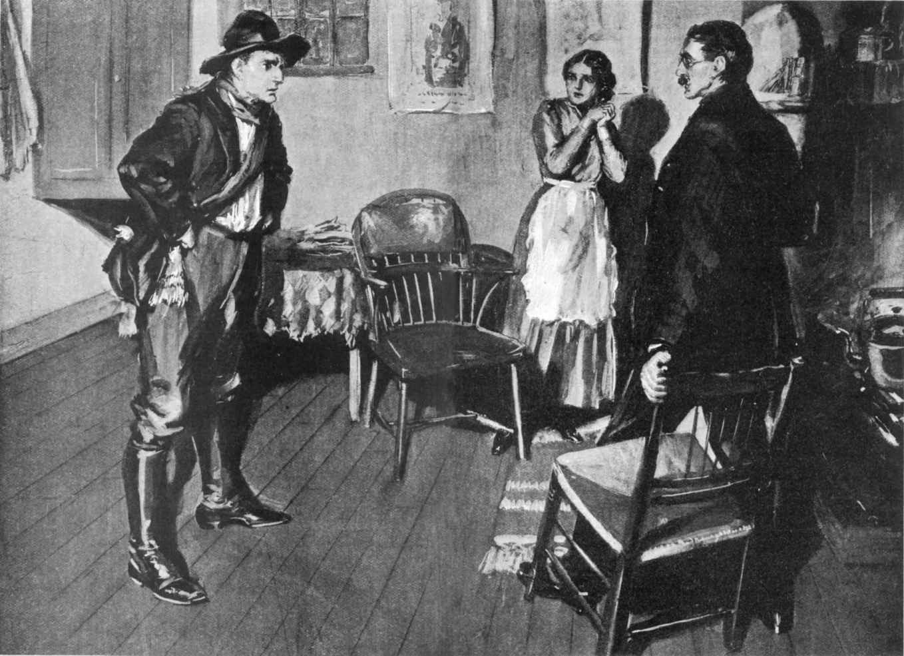

“这个什么人？”他粗暴无礼地问。

“是我朋友，鲍德温先生，我家新房客，麦克默多先生，给你介绍鲍德温先生好吗？”

两个年轻人都以挑衅的神情彼此点头。

“伊蒂小姐也许已经告诉你，我们俩的关系了？”鲍德温说。

“我不知道你们之间有什么关系。”

“你不知道？那好，现在应该知道了。告诉你，这年轻女士是我的。今天晚上天气不错，你可以去散散步。”

“谢谢，我没有兴致散步。”

“没兴致？”这个人的两眼冒着愤怒的凶光，“也许你有兴致交交手吧，房客先生？”

“这个，十分乐意！”麦克默多说，一跃而起，“不用你请我。”

“看上帝分上，杰克！哦，看上帝分上！”可怜的伊蒂失魂落魄地喊叫，“哦，杰克，杰克，他会杀了你的！”

“好呀，叫他杰克了，啊？”鲍德温咬牙切齿地说，“你们两个都已经到这分上了，是吗？”

“哦，泰德，冷静点——仁慈点吧！看在我面上，泰德，你要是爱我，发发善心饶了他吧！”

“我说，伊蒂，你别管我们两个，我们就能把事解决了，”麦克默多平静地说，“那就，鲍德温先生，随我一起到街上去。晚上天好，那边过去就是空地。”

“我把你摆平，不必脏了我的手，”敌手对他说，“在我把你干掉之前，先叫你后悔莫及不该到这屋子里来！”

“现在正是时候，少废话。”麦克默多喝道。

“我由我自己选时间，先生。你等着瞧就是，看这里！”他忽然捋起袖子，露出前臂上烙的一个怪记号，一个圆圈里有个三角形，“你可知道这是什么意思？”

“不干我事，不知道！”

“好，会叫你知道，我给你保证，反正你是活不成了。也许伊蒂小姐能告诉你这是什么意思。再说你，伊蒂，你会跪着回到我这里来——你耳朵听见了，小妞？——双膝跪地——然后让我来叫你知道该怎么教训你，是你种的瓜种的豆——就叫你得瓜得豆！”他狠狠地朝他们两个瞪一眼，立刻抽身就走，转眼间外边大门砰一声碰上了。

麦克默多和姑娘站了一会儿，没说话，接着姑娘扑上去抱住了他。

“哦，杰克，你真勇敢！可是这样也没用，你只有逃走！今天晚上——杰克——今天晚上！只有这条路。他会要你命的。他眼睛多狠毒，我看得出。他们十几个人，你怎么对付得了？老板麦金蒂，他下面分会的势力好大哟！”

麦克默多松开她双臂，吻她，扶她到椅子上轻轻坐下。“哦，我心爱的，哦！别为我发愁、为我担惊受怕。我自己也是自由人会的，我会和你父亲讲这个事。我比别的那些人也许不会好多少，不用把我当什么圣人，说不定你也会恨我，现在我都告诉你了，你说呢？”

“恨你，杰克？我在世一天，爱你一天，永远不会恨你！说是自由人会只有这里坏，别的地方都是好人，我为什么要把你当坏人呢？你也是自由人会的，杰克，那为什么不去找麦金蒂老板和他交朋友呢？哦，快去，杰克，快去！你赶在前头先告状，要不然，这些狗不会放过你。”

“我也是这样想，”麦克默多说，“我现在就去，是得好好对付一下。你跟你爸爸说，今晚我还睡这里，等早上再去另找地方住。”

麦金蒂酒馆的酒吧和往常一样人头挤挤，这里是全镇无赖流氓逍遥的地方。老板很有人缘，他性格脾气粗犷、豪爽，这就蒙上一张假面，不易看清他内里的狠毒。其实他的名望，不仅全镇的人都忌他，连整个山谷的三十英里地，还有两边大山，一大片地方的人都畏惧他三分，要来酒店照顾他的生意，对他的好心善举感恩戴德，不敢怠慢了。

除了他的秘密势力，其手段之毒辣众所周知以外，他居然还是个政府大官、地方议会议员、路政官，这都是一班地痞流氓把他选进政府去的，为的是在他手下得到庇护，分得残羹。苛捐杂税名目繁多，社会公益无人问津，审计人员被拉拢贿赂，黑账造假蒙混过关，善良正派的公民遭到明目张胆的敲诈勒索，还都噤若寒蝉，以免再生枝节，引火自焚。

如此这般，年复一年，麦金蒂老板的钻石胸针日见其大，表链金坠益变其粗，他的酒馆日新月异，地盘越发展越大，几乎有鲸吞全市之势。

麦克默多推开酒店弹簧门，走进拥挤的人群中，只觉烟雾弥漫，酒气熏天。里面灯火辉煌，四壁巨大的玻璃嵌镜炫耀夺目，映射着人头攒动的种种姿态，更添光彩景象。几个衬衫长袖的侍者穿梭忙碌，正为斜靠懒倚在金属面宽柜台边的酒客配酒。

在酒店尽头上，有一个人，侧倚柜台而立，体形魁梧健壮，嘴角叼一支雪茄斜斜地翘起。他不是别人，正是大名鼎鼎的麦金蒂。他是个黑巨人，满脸络腮胡，一头乱蓬蓬乌黑长发直披衣领，皮肤黝黑恰如意大利人，眼眸深暗无光，看人时微微乜斜，整个相貌显得格外阴险。

这个人的其他方面——体格匀称，相貌端正，态度直爽——都配合了他待人热情诚恳的伪装。有人初见，或许会说，他是个心直口快的人，虽然说话粗鲁，他的心地是好的。只有那对阴森死黑的眼睛，被他盯住了瞧的时候，才叫人畏缩成一团，感觉自己大难临头了，随时都有杀身之祸。他势力强大、不可抗拒，诡计层出不穷，叫你要躲躲不开，想防防不了。

对这个人打量一阵之后，麦克默多便从人群中挤过去，神情一如平常，大方而随便。他推开一伙围着大老板溜须拍马的群丑，他们正应承、附和着低级平常的小噱头，报以高声赞赏、捧腹大笑。年轻陌生人的一对灰色眼睛，透过镜片和迅疾转过来望着他的死黑眼珠傲然无惧地对峙。

“啊，年轻人，你陌生得很哪。”

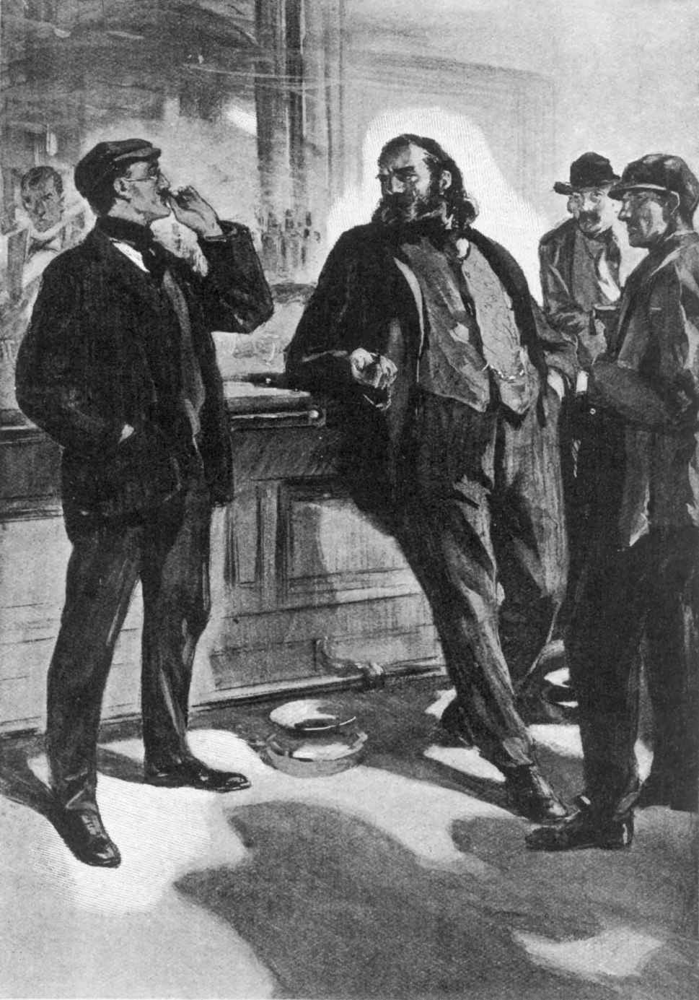

“啊，年轻人，你陌生得很哪。”

“我是新来这儿，麦金蒂先生。”

“你新来，也不至于不能给一位绅士应有正当的头衔。”

“参议员麦金蒂先生，年轻人。”圈子里有个声音提醒说。

“哦，对不起，参议员先生，本地规矩我不熟悉。我是有人介绍特来见你。”

“噢，你来见我，我正是从头到脚一点不差在这儿。有何见教？”

“哦，不敢。你的心如你的身体宽宏，你的灵魂如你的外貌美好，那我就别无所求了。”麦克默多说。

“我的上帝！你不愧是爱尔兰人，长了如簧巧舌。”酒店老板叫道，一时拿不定主意，是要耍一点嘴皮应付这个放肆的人好呢，还是拿出尊严摆点架子为好。

“那么说，本人外表还不错，足可以过得去？”

“那是当然。”麦克默多说。

“你说有人叫你来见我？”

“正是。”

“是什么人？”

“斯坎伦弟兄，维尔米萨第三百四十一分会。我祝你健康，参议员先生，为我们的友谊相识干杯。”他举杯到嘴边，便跷起小指，一饮而尽。

麦金蒂注意观察，扬起他浓黑的眉毛。“哦，颇有那么点意思，是吗？”他说，“我还要过细一点，你是——”

“麦克默多。”

“过细从严，麦克默多先生。因为我们这儿不随便相信，轻易取人。也不是人家说什么，就轻易相信。到这儿来一下，酒吧后面。”

那是一间小屋子，排满了酒桶。麦金蒂轻轻掩住了门，然后坐在一个酒桶上，咬着雪茄，转着脑子，一对眼珠骨碌碌审视来人。他坐着一言不发，有两分多钟。麦克默多笑眯眯接受检阅，这时，他的一只手，正插在外衣口袋里，一只手，捻着褐色小胡子。突然，麦金蒂一弯腰，猛一下掏出一支左轮枪，晃晃黑漆漆的枪口。

“瞧这个，我的兄弟，”他说，“你要是跟我们耍花招，被我知道，这就是你的末日了。”

“这样的迎接方式真少见，”麦克默多回答，不失镇定，“一个自由人分会的命主这样对待新到的弟兄。”

“嘿，不能例外，你得拿得出证明，”麦金蒂说，“你要拿不出，上帝来帮助你！你哪里入的会？”

“二十九分会，芝加哥。”

“时间？”

“六月二十四号，一八七二年。”

“命主什么人？”

“詹姆斯·H．斯科特。”

“地区理事？”

“巴萨罗缪·威尔逊。”

“好！经得住考问，你倒够流利。你来这儿做什么？”

“找工作，和你一样——不过，做做小差事。”

“你反应很快，对答如流。”

“是的，我一向反应很快。”

“你行动反应也快吗？”

“了解我的人都知道，这方面我小有名气。”

“好，你这话我们很快就能验证。本地分会的情况你听到怎么说？”

“我听说广纳好汉做弟兄。”

“不错，麦克默多先生。你为什么离开芝加哥？”

“这事不能告诉你！”

麦金蒂圆睁了眼睛，还从来没有碰到过有人这样回他话，倒反而觉得有趣。

“为什么不能告诉我？”

“因为对自己弟兄不可以说谎。”

“那么一定是不可告人的事？”

“你要这么想，也无妨。”

“听好了，我说先生，你不要指望我，作为命主，接纳一个隐瞒历史的人加入本会组织。”

麦克默多显出犹豫不决的样子，稍后便从内衣口袋里摸出一张破皱的剪报。

“你不会把自己人给卖了吧？”他说。

“你再对我说这种话，我就扇你一嘴巴！”麦金蒂发火吼道。

“说得中听，参议员先生，”麦克默多顺从地说，“我向你道歉了，我是无心说说。好了，我知道在你手下有安全保障，请看这剪报。”

麦金蒂对报纸报道扫了一眼：约拿斯·平托，于芝加哥市场街湖滨沙龙遭枪杀，一八七四年元月第一周。

“你干的？”他问道，把报纸递还给他。

麦克默多点点头。

“为什么事情杀他？”

“我帮忙山姆大叔<a href="#part0129.xhtml_ch1"
id="part0129.xhtml_ch1-back">(1)</a>制造钱币。我制造的不像他老人家那个成色十足，可是看上去一模一样，造价低，不值钱。平托这个人，帮我想办法出手——”

“出手给谁？”

“哦，也就是把钱流通到市面上。后来他说不干了，吃里扒外要告密，我可不能束手待毙，就先下手为强把他干掉，逃来了煤矿之乡的这儿。”

“为什么往这儿跑呢？”

“那是读到报纸，知道这样的地方，他们不会太注意。”

麦金蒂哈哈大笑。“你一是假币犯，二是杀人犯，跑到这里来，因为你想你会受欢迎？”

“十之八九差不多。”麦克默多回答。

“好，我说你大有出息。这么说，你还能制造假币？”

麦克默多从口袋里掏出六枚金币。“这都不是费城造币厂出来的。”他说。

“真的吗？”麦金蒂伸出猩猩一样毛茸茸的大手，接过来拿到亮光里看，“分不出真假。哈哈！人才，十分有用的兄弟，我说没错！我们就得有一两个亡命之徒，麦克默多兄弟；有的是机会，我们得大显身手；无毒不丈夫，先下手为强，后下手遭殃。”

“好，我是想尽一份力，和弟兄们大干一场。”

“你很有胆量，我掏了枪指着你，你眼睛一眨也不眨。”

“有危险的不是我。”

“是谁？”

“是你，参议员先生。”麦克默多从粗呢上装口袋里，掏出打开了保险的手枪，“我一直枪口对着你，我要出手决不会比你慢。”

“哈哈！”麦金蒂火红了脸，可是爆出一阵狂笑，“瞧瞧，我们多少年没见你这样厉害的兄弟了。我说，分会一定会以你为荣……怎么，你到底要干什么？我和先生谈上三五分钟都不行，你非要来打扰不可？”

是酒吧侍者惊疑尴尬地站在门口。“对不起，参议员先生，是泰德·鲍德温，说现在一定就要见你。”

其实不需通报，这个人自己已经把狰狞、恼恨的脸凑到侍者肩后探进来，他一把将侍者推出去，关上了门。

“倒好，”他朝麦克默多瞪一眼，怒不可遏，“你恶人先告状，哦？我有话跟你说，参议员先生，就是这个人。”

“我人已在，尽管讲。”麦克默多大声道。

“什么时间讲，怎么讲，全由我。”

“干什么，干什么！”麦金蒂从酒桶上下来，“不要这样。新弟兄来到这里，鲍德温，我们可不能用这种方式迎接他。伸出手来，兄弟，要讲和好！”

“不行！”鲍德温怒吼道。

“他认为是我碍着他了，我接受和他决斗。”麦克默多说，“可以徒手搏斗，要不满意，随便怎么都行，任他选。现在，我请你参议员先生，也是命主，给我们评判做主。”

“到底什么事？”

“一位年轻女孩，她应该有选择的自由。”

“选择的自由？”鲍德温叫唤着。

“都是本会两位兄弟嘛，那我说由她自由选择。”老大说。

“噢，你就这样评判，哦？”

“对啊，就这样，泰德·鲍德温，”麦金蒂说，虎视着他，“你还要争什么？”

“我辛辛苦苦跟了你五年，把我扔掉，袒护你从来没见过的人？我可不能一辈子由你做命主，杰克·麦金蒂，哦，上帝啊！到下一回投票的时候——”

参议员先生向他扑过去，像只老虎，一手掐住他脖子，把他倒推撞向一只酒桶，盛怒之下简直就要把他勒死，全靠麦克默多上去拦阻。

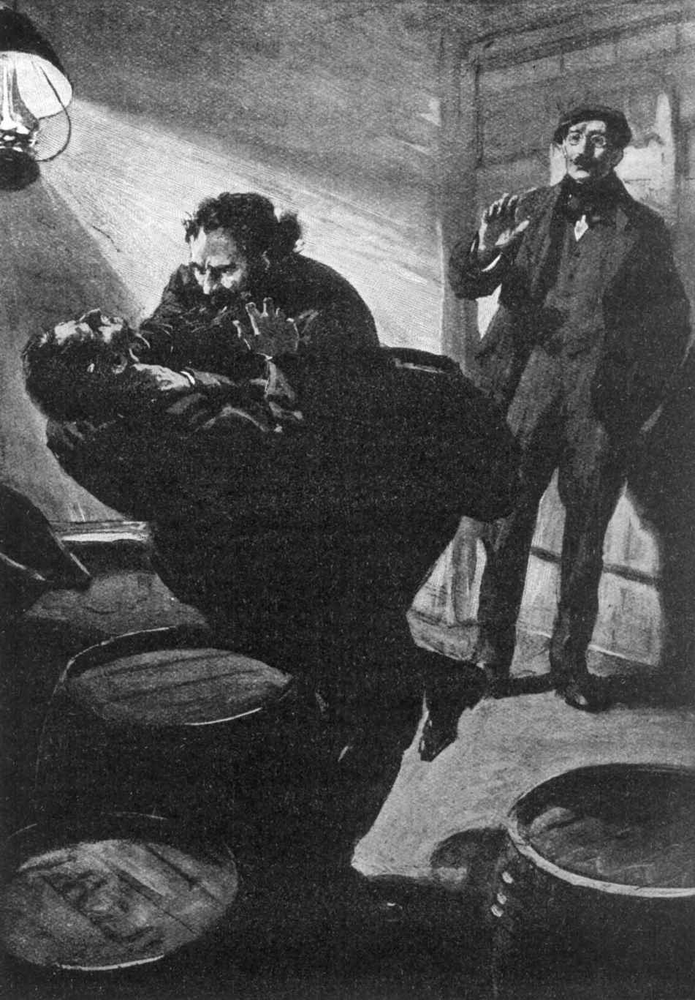

参议员先生向他扑过去，一手掐住他脖子。

“算了，参议员先生！看老天分上，这回就算了！”他高声道，一边把他往回拽。

麦金蒂这才松手。鲍德温吓得浑身发抖，来不及喘气，一屁股坐在撞到的酒桶上，手脚都在抽搐，一副惊魂未定、死里逃生的样子。

“这些日子来，你一直找死，泰德·鲍德温——总算叫你等到了今天！”麦金蒂吼道，宽大的胸脯一起一落，“你想把我从命主的位子拉下来，好让你自己当家做主？那得由全会说了算，你没门。只要我在这个位子上，谁也甭想扯起嗓子乱嚷嚷反对我，不服我管。”

“我哪里是反对你了。”鲍德温嘟嘟囔囔说，抚摩着喉咙。

“那就，好吧，”麦金蒂叫道，忽然怒气消了，马上面带笑容，“我们还是好兄弟，这事过去了就算完。”

他从架子上拿下一瓶香槟酒，打开瓶塞。

“现在，咱们，”他斟满三个高脚杯，继续道，“一起为本会和好而干杯。从此以后，你们要知道，弟兄间不能结怨记仇。现在，这样，左手按着喉咙，我对你说，泰德·鲍德温，还生气吗，先生？”

“云还厚。”鲍德温回答。

“总要云开日出，大放光明。”

“我发誓愿意如此！”

三人把酒一饮而尽，鲍德温和麦克默多两人都行了同样的和解礼数。

“好啦！”麦金蒂朗声道，搓起了双手，“一切怨恨全部消解，都要维护会内的纪律，时刻不忘遵行。会中章法，严厉决不容情。鲍德温兄弟是知道的——而你，也会很快知道，麦克默多兄弟，不要惹是生非！”

“我保证，一定严于律己，”麦克默多说，向鲍德温伸出手，“我这个人容易争吵，吵过也就忘。这是爱尔兰的急性子，人家都这么讲我。可是过去了的事，我决不再往心里放。”

鲍德温不得不握了伸过来的手；老大脸色严厉，凶狠的目光正盯着他。但是他阴沉着脸，显示那一番话丝毫没有感动他。

麦金蒂拍拍两人的肩膀。“也真是，都是女人！都是女人啊！”他嚷道，“想想看，我的手下之间夹了个小妞，不好办了！那就邪门了！好啦，这个问题，解铃还需系铃人，妞儿自己去解决吧，不是我命主分内裁断的事——上帝也会赞同这样做！我们的事情已经够多的了，还要女人来搅和。你就加入第三百四十一分会，麦克默多兄弟。我们有我们这里的规矩和章程，和芝加哥不一样。星期六晚上我们聚会，你来参加，我们就让你永享维尔米萨山谷的自由。”

————————————————————

<a href="#part0129.xhtml_ch1-back" id="part0129.xhtml_ch1">(1)</a> 山姆大叔（Uncle
Sam）：借用首字母U．S．作为对美国或其政府的戏称。

# 第三章　维尔米萨第三百四十一分会

这天晚上，竟然发生了这么多惊心动魄的事情！第二天麦克默多从雅各·谢夫特老人的寄宿公寓搬出来，住到镇尽头寡妇麦克纳马拉的家里。最早在火车上结交的朋友斯坎伦，没过多久正好也搬到了维尔米萨来，于是两个人就同住一起。没有别的寄宿者，只有他们两个，房东是个很随和的爱尔兰老妇人，什么事都由着他们自己，所以说话、行动都很自由，两个都是有秘密的人，觉得这样再方便也没有。

谢夫特对麦克默多挺好，常常请他到家里来，高兴吃饭就吃饭，所以他和伊蒂的关系一点没有疏远，而且随着时间一星期一星期地过去，反而更接近更亲密起来。

麦克默多觉得新居的房间很安全，就拿出制造伪币的铸模，在保证不泄密的条件下，他允许好多分会的弟兄进来参观一下模具，离开的时候每个人口袋里都装一些伪币带走。伪币铸造技巧实在高明，使用起来一点看不出破绽，绝对没有危险，这真是他的一项绝技。可是麦克默多拥有如此的手艺，却还要外出做工，这不是大材小用吗？在同伴们的眼里，实在十分费解。但是，有人向他问起，他明确解释说，如果没有一点表面上的谋生手段，就很容易招惹警察的注意。

居然有一个警察已经盯上他了。谁知也是十分运气，这个插曲让铤而走险的他把坏事变成了好事。自从第一次介绍和弟兄们见面以后，他晚上经常往麦金蒂的酒馆跑，上那儿去进一步结识“铁哥儿们”。“铁哥儿们”这是出没于该处的那帮亡命之徒喜欢用的称呼，在他们内部彼此互称。他的大无畏姿态、大胆泼辣的言语，博得大家的赞叹。有一次，他在酒吧内露了一手“自由式”摔跤法，出手敏捷，机巧利落地将对手扳倒在地，赢得这伙粗鄙狂野之辈的敬重。另外一件小事，更大大地提高了他在人们心目中的声望。

一天晚上，人最多的时间，门开了，进来一个人，是穿蓝制服戴大盖帽的矿警。这类矿警，属于由铁路局和煤矿主特别设置的警察机构，用来辅佐和加强普通民事警力，因为普通民警面对独霸一方的有组织帮派往往束手无策，穷于应付。这个矿警一进来，众人顿时肃静无声，用警惕疑虑的目光看着他。但是警察和罪犯的关系在美国有些地方、有的时候你我难分，麦金蒂自己站在吧台后面，看到这个警察混迹顾客之中，毫不惊讶。

“一杯纯威士忌，今天晚上太冷，”这位警官说，“我们以前没有见过吧，参议员先生？”

“你是新来的警官？”麦金蒂问。

“是的，我们还仰仗你，参议员先生，还有其他地方领袖，帮助我们维护本镇法律和秩序。我的名字叫马文上尉。”

“我们没有你恐怕更好，马文上尉，”麦金蒂冷冷地说，“我们镇上有自己的警察，不需要进口货。你们不过是有钱人用钱雇用的爪牙，雇你们用棍棒、用枪来对付穷苦老百姓，还不是这么回事？”

“好，好，这个我们不必争，”警官心平气和地说，“我希望我们大家都能尽到责任；大家的职责各不相同，但是恪尽职责却都一样。”他一杯酒喝完，转身要走，这时候目光落到杰克·麦克默多的脸上，麦克默多近在一旁，正对他怒目而视。“啊！哈！”警官叫起来，上下打量，“这儿碰到老朋友了！”

麦克默多从他身旁走开。“我从来没有你这样的朋友，一辈子也不和该诅咒的警察交朋友。”他说。

“只是认识，不是朋友，”上尉警官说，咧嘴笑笑，“你是芝加哥的杰克·麦克默多，错不了，你能不承认！”

麦克默多耸耸肩。“我不用不承认，”他说，“你以为一提我名字，我就会被吓倒？”

“你干的好事，我心里有数。”

“你这话什么意思？”他握紧了拳头吼道。

“不，不，杰克，你这套恫吓吓不了我。没来这该死的煤矿以前，我是芝加哥的警官，芝加哥哪个恶棍无赖，能逃得过我的眼睛！我一眼就认出啦。”

麦克默多板下了脸。“你也别以为我认不出你是芝加哥总局的马文！”他高声喝道。

“在下泰迪·老马文的便是，听候差遣喽。那边枪杀约拿斯平托的事，枪声似乎还在耳边哪。”

“不是我干的。”

“你没干？铁证如山，想抵赖？好了，这人一死，你就得以逍遥法外。不然，光是你的伪币案，他们早就该把你逮入大牢。好了，我们让它都过去了吧，你我之间嘛——老实说也不关我的职责——他们对你这案子搞不出个名堂，不了了之，明天，芝加哥的大门又向你敞开了。”

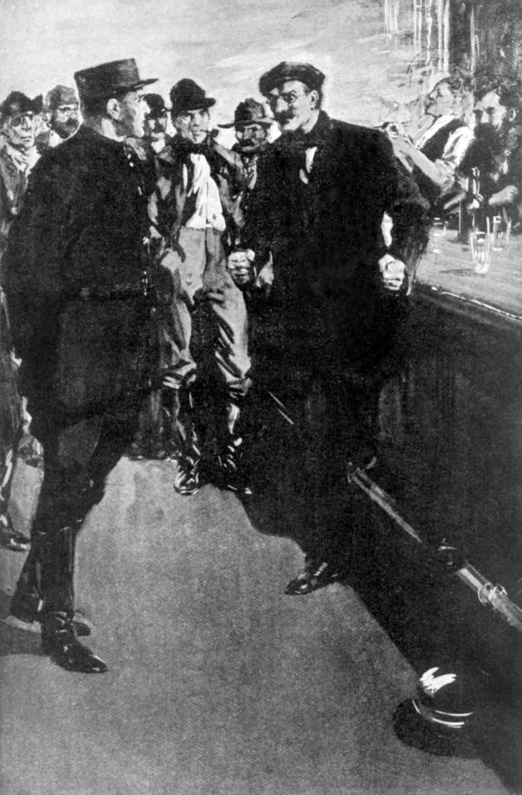

“你没干？铁证如山，想抵赖？”

“我哪儿都能混。”

“你瞧你，我是给你透露点消息，你倒是不识好歹，连谢都不谢一声。”

“行了，我领教了你的美意，谢谢你就是了。”麦克默多说道，态度并不十分领情。

“只要你规规矩矩做人，我就不声张出去，”上尉说，“可是，老天有眼，你要还不走正道，那就另当别论！好，晚安吧——你，也晚安了，参议员先生。”

警官离开酒吧，可是他这一来，麦克默多就成了当地的英雄。大家对麦克默多远在芝加哥的作为，之前一直只是私下议论，有人问起，他只是一笑带过，表情好像不希望把那了不起的大事归功于他。而现在，这件事情得到了官方的确证。泡酒吧的酒客都围住了他，和他热烈握手。从此以后，他成为死酷党中无所顾忌的人。他饮酒海量，毫无醉意。不过，这天晚上要是没有同住的斯坎伦陪他回家，这位盛誉满身的英雄只好在酒吧里过夜了。

到了星期六晚上，麦克默多被介绍给分会。他原以为不用举行仪式就可以入会，因为自己是芝加哥的老会员。但是在这里维尔米萨另有特别的仪式，他们以此为荣。凡是申请入会者都要通过本会典礼，在工会里一间专门用来举行典礼仪式的大厅里举行。集中在维尔米萨的成员大约有六十人，但决不代表该组织的全部力量，山谷里另外还有几个分会，两旁山地也有，每逢重大行动，人手都可相互调动配合，所以每件大案的作案者都是本土人但未必都相识。广布煤矿区总共不下五百名会员。

在空荡的会议厅里，人们围着一张长桌而坐。靠墙另有一张边桌，摆满酒瓶和玻璃杯，不少与会者看着那里早已垂涎欲滴。麦金蒂坐在桌子的首席，乱蓬蓬的头发戴着一顶黑绒平圆帽，脖子上围一条紫绸圣带，像个主持恶魔仪典的祭司。他的左右是会中的高级人物，相貌狰狞而又俊秀的泰德·鲍德温就在其中。他们每个人都披挂绶带或者佩戴大勋章，表明各自的身份阶级。

他们大部分都是中年人，其余的会员则是年轻人，大多在十八到二十五岁之间，年轻力壮，随时听令效命。年长者之中，个个相貌似虎狼凶残，生性无法无天。但是那些普通成员看来都是热情开朗的年轻人，令人难以相信全都是货真价实杀人不眨眼的刽子手。他们的心灵蒙尘，道德沦丧，把恐怖犯罪当作事业来追求，引以为荣，谁的杀人“活儿最干净利落”，谁就能获得最高荣誉，赢得最大的尊敬。

他们的人性已经完全扭曲，自告奋勇去杀死从来没有伤害过他们的人，甚至多半是这辈子从来没有见过面的人，把这种事情看作是精神高贵的英勇行为。作案之后，他们争辩到底是谁给予致命一击，互相叙述、描写被杀者的惨叫和痛苦可怖的情景，以此愉悦取乐，以此邀功争宠。

起初，他们安排罪恶计划还特别注意保守秘密，不过时日一久，就无所顾忌地公开进行。因为法律对他们一再失效，便让他们看清两点，一是，没有人敢出面作证控告他们；二是，他们有可靠的假证人，要多少有多少，随传随到，并有充足的财源聘用州内最有才干的律师。如此为非作歹长达十年，他们没有一个人被定罪判刑，惟一威胁到死酷党构成危险的，只有受害者遭害时自己起而抗击——哪怕受害人孤立无援，遭突然击杀，也会让攻击者带走一点痕迹、教训。

麦克默多得到告诫，他要承受严峻考验，但是没有人告诉他是什么样的考验。现在他由两个神情严肃的弟兄领进一间房间。透过隔板他听见里面有许多人在低声商议，有一两次他听到提及他的名字，所以知道他们是在讨论他的入会问题。随后进来一个斜披金绿两色肩带的内勤侍卫。

“命主有令，将他双手绑起来、双眼蒙住带进来。”侍卫道。

三个人一起动手脱下他的外套，卷起右胳膊袖子，用绳子把双肘一起绑紧。接着拿一顶厚黑的帽子朝他头上一套，把半个脸都罩住，眼睛什么也看不见了。他被带进聚会厅。

麦克默多被罩上帽子后，眼前一片漆黑，感觉紧迫难耐。只听见周围人们窃窃私语，还有沙沙声，接着就是麦金蒂讲话。由于耳朵被蒙住，声音听上去发闷，而且像在远处。

“约翰·麦克默多，”声音说，“你是自由人会老会员吗？”

麦克默多点头表示认同。

“你是否属于芝加哥第二十九分会？”

他又点点头。

“夜黑不开心。”声音说。

“正是，夜黑赶路陌生客。”他回答。

“天上云厚。”

“正是，暴风雨要来临。”

“众弟兄，满意否？”命主问道。

一片赞同声。

“我们知道，兄弟，依你暗语以及对答，你确实为我们会内自己人，”麦金蒂道，“然而，我们必须要让你知道，本县及附近外县，我们有自己一定的仪式，一定的规矩，以纳人才。你愿一试否？”

“愿意。”

“你心意坚定否？”

“坚定。”

“向前跨一步，以示证明。”

说过这句话，他感觉有尖硬铁器直抵住自己的双眼，这样情况下，向前跨一步，就有被戳瞎双眼的危险。他咬牙闭目向前跨步；人向前时，那抵住眼睛的东西便拿开了。他听到一片低低的喝彩声。

“有胆量，有种，”声音说道，“你能忍受皮肉之苦否？”

“但试无妨。”他回答。

“给他上！”

前臂猛一阵难以忍受的疼痛，他强忍住不出声、不叫喊。骤然间遭受如此剧痛一击，几乎要晕厥过去，但他咬紧嘴唇、握紧拳头，绝对不表现出痛苦。

“来吧，再厉害也不怕。”他说。

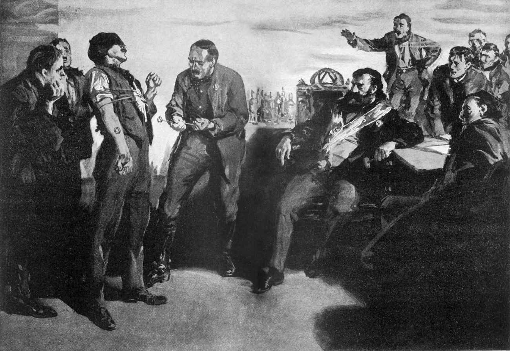

“来吧，再厉害也不怕。”他说。

这下引来了热烈鼓掌、高声喝彩。首次亮相获得如此好评，这在分会中从未有过。众人纷纷伸手拍拍他的背，那顶蒙头的帽子立即被拿掉。他被弟兄们团团围住，站在一片祝贺声中眨眼微笑。

“最后再有一句话，麦克默多兄弟，”麦金蒂说道，“你已宣誓承诺忠诚、守密，你可晓得违背誓言，惩罚立刻降临，杀无赦？”

“晓得。”麦克默多应道。

“你任何时候、任何情况都绝对服从命主否？”

“我绝对服从。”

“好，我代表维尔米萨第三百四十一分会，欢迎你入会，得以享有本会特权、本会参与权。把酒拿来，斯坎伦兄弟，要为好样的弟兄痛饮庆贺。”

麦克默多已经给递上了外衣，还没穿起来，先看看右胳膊。胳膊还在火辣辣地痛，前臂上已经皮开肉绽，深深的红肉，一个圆形里面一个三角形，是用烙铁烙成的。旁边有一两个人也捋起袖子露出这个分会标记。

“我们大家都有，”一个说，“可烙的那时候，没你这么硬气。”

“咳！这算什么。”麦克默多说。可是火烧铁灼的疼痛直钻他的心。

入会仪式后便是喝酒庆祝，祝酒过后便开始讨论会中事务。麦克默多只知道芝加哥那边平淡乏味的做法，现在竖起耳朵听这里的事务，听得他大出意料，惊奇不已。

“议事日程第一件事，”麦金蒂说，“读一封信，默顿县，第二百四十九分会命主温德尔来信，他说：

亲爱的先生：

有一事，要对我邻区的雷及斯特玛施煤矿主安德鲁·雷动手做一做。你一定记得，去年秋天巡警事件中，我会曾派两弟兄前往协助你分会。作为交换，请派两名好手前来，将由本会司库希金斯负责接待，地址谅必知道。他将交代何时何地行动。

您的自由盟弟兄

J．W．温德尔。D．M．A．O．F．

“我们有事向温德尔商借一两个人，他从不拒绝，这回轮到我们不可拒绝他了。”麦金蒂停顿一下，恶意而无光的眼珠朝屋子环顾一周。“谁自告奋勇接手这差事？”

几个年轻人举起了手。命主向他们看看，嘉许地笑笑。

“你去，老虎科马克，要是能干得像上次那么好，你就不错了。还有你，威尔逊。”

“我没手枪。”这个志愿者说，他还只是个十几岁的孩子。

“你这是头一回，对不对？好，上阵见点血，才好学着点。这个开头是大好机会。手枪嘛，有你的，我负责给你误不了。星期一你们去报到，时间很充裕。你们回来，一定接风洗尘。”

“这回有报酬吗？”科马克问道。这小伙子，体格结实，黑皮肤，面目狰狞。他异常凶猛，所以赢得雅号“老虎”。

“报酬不必担心。你们去是为了荣誉，事成之后，定有重赏给你们压箱。”

“那个人犯上什么事了？”年轻的威尔逊问。

“记着，这个人犯了什么事，你就不要问了。反正他在那边已经被判定，这不关我们的事。我们所做的，只替他们完成任务。他们替我们做的，也是一样。说到这个，默顿分会要过来两个弟兄，下个星期，到本地来办事。”

“两个谁？”有人问。

“注意点，最好不要问。你什么也不知道，就能不作证，什么也作证不了，也就不会招来麻烦。不过这两人非等闲之辈，干活儿手艺高得很。”

“还有件事，要抓紧时间！”泰德·鲍德温高声说，“这儿的人太不像话了吧，就是上个星期，我们的三个人被布莱克工头解雇了。放他时间太长了，早该收拾他，把他给治治。”

“怎么收拾？”麦克默多向身旁的人咬耳朵问。

“一颗大号枪子儿完事呗！”这个人爽快回答，哈哈地笑了，“你觉得我们的方法怎么样，兄弟？”

麦克默多现在已经是这个万恶社团的一分子，他的犯罪灵魂似乎也被这种精神所感染、同化。“我看这就中，”他说，“这地方，英雄少年有用武之地。”

几个坐在旁边的人听到他这话，立刻拍手叫好。

“怎么回事？”桌子顶头的黑大汉命主喝问。

“这位，我们的新弟兄，先生，他觉得我们的差事挺合他口味。”麦克默多马上站起身，“我是说，敬爱的命主，如果有用人的地方，我当为本会效力，无上光荣了。”

话音刚落，一阵叫好鼓掌。可以感觉到，一轮新日在地平线上喷薄而出。但是在几个老家伙眼里，冒尖得似乎嫌快了一点。

“我建议，”书记哈拉威开腔，一个鹰鹫嘴脸、坐在命主旁边的白须老者，“麦克默多兄弟稍安毋躁，本分会自有重用你的时候。”

“是，我意也是如此，一切遵命。”麦克默多说。

“很快就会用到你，兄弟，”主席说，“我们已作备案，你是甘当先锋的人，相信你为本会将大有作为。今晚有件小事，如若愿意，不妨锋芒小试。”

“听命吩咐，愿为差遣。”

“今晚你过来，将有助于你了解本团体的精神宗旨。我稍后要宣布。同时，”他看了看议事日程，“我有一两个问题需要提到会议上来讲一讲。首先，我要问财务我们的银行结存情况。要给吉姆·卡纳威的遗孀发放抚恤金。为分会因公牺牲，我们不能丢下他老婆不管，这不要忽视了。”

“这吉姆，上个月去刺杀马利河的贾斯特·威尔科克斯，结果反遭毒手。”麦克默多邻座的人告诉他。

“目前财务情况良好，”司库说，面前摊着银行存折账本，“近来各家商行银根都很宽。麦克斯·林德公司给付的五百元没有动用。沃尔克兄弟商行送来一百元。不过我自己作主退还，要求他付五百。要是星期三还听不到回音，他们的卷扬机传动部，就要叫他出问题。去年是烧了他的粉碎机，他才懂得要讲点道理。还有是去年西部煤业公司交来了年度捐款。我们手头并不缺钱，足够应付财务支出。”

“阿尔奇·斯温登怎么样？”一个弟兄问。

“他把矿产全卖掉，离开了矿区。这老魔头，丢下一封信给我们说，他宁可到纽约去做自由的清道夫，也不愿在讹诈集团恶势力下当大矿主。老天成全他，全靠是他跑掉以后我们才收到信！看上去，他是不想再来这儿山谷露脸了。”

一个脸刮得很干净的上了年纪的人，慈眉善目的样子，坐在桌子的另一端，与主席面对面，这时站起来。“司库先生，”他说道，“我问一下，这个人被我们赶出矿区之后，谁买下了他的矿产呢？”

“哦，是的，莫里斯弟兄，是被州和县铁路公司买下的。”

“去年还有同样一个情况，陶德曼和李的矿业上了市场的，被谁买去了？”

“还是这家公司买下了，莫里斯弟兄。”

“曼森铁工、舒曼铁工、范德尔铁工，还有阿特伍德铁工，他们近来都抛售了，被谁买进了呢？”

“都是被西吉尔默顿矿业总公司买下了。”

“我不明白，莫里斯弟兄，”主席说了，“谁也无法把产业从这个地方带走，谁买下跟我们有什么关系？”

“我必须对你进言几句，敬爱的命主，这可是和我们大有关系。我们是在逐步把小商家赶跑，这一过程进行已有十年之久，结果怎么样？结果是大公司来接替，像铁路公司或是煤铁总公司，他们的董事都在纽约、在费城，对我们的威胁不放在眼里。我们可以赶跑他们的本地工头领班，可那没用，他们还可以派别人来替代，我们自己反而增加了危险性。小商家伤害不了我们，他们没钱没势好对付。只要我们不把他们榨干，他们会留下来受我们控制。可是大公司一来，发现我们反抗，妨碍他们获取利润，他们就会不惜代价要把我们扑灭，送我们上法庭。”

这一番不吉利的话，说得大家张口结舌，张张脸色晦气，都在面面相觑。他们过去无法无天，从未遇到过挑战，因此也从未想过到头来会遭到什么报应。现在这么一说，连他们中间最亡命的人，都要打个寒噤。

“劝各位记着，我说的，”发言者继续说，“对小商家还是不要竭泽而渔吧；把他们驱逐殆尽之日，乃本社团力量破灭之时。”

实话没有市场，真理不受欢迎，发言者坐下时，响起了愤怒的喊叫。麦金蒂站立起来，浓眉倒竖。

“莫里斯弟兄，”他道，“你总是胡说八道，说丧气话，只要本会兄弟团结一致，全美国没有谁有力量碰我们。我们不是一直在法庭上和人较量着吗？我充满信心，大公司最终会清醒，对我们是付钱容易抗争难，和小商家一样。现在，弟兄们，”麦金蒂说得把黑平顶帽和圣带都摘掉，“今天晚上本会会务结束，只有这件小事，散会前要提一提，现在是弟兄们开怀畅饮、尽情欢乐的时候了！”

人性奇特。眼前的众人，都是杀人不见血、杀人不眨眼的狂徒，杀与被杀之间并无个人冤仇，一再屠戮一家之长，一再制造孤儿寡妇，面对哀号涕泣，不动恻隐之心，不见愧疚之意，然而柔情绵绵、凄切哀怨的音乐，竟会把他们感动得落泪。麦克默多有一副男高音好嗓子，要说之前还未获得会中弟兄们情感的交融，那么在他高歌一曲《我在篱垣上看你，玛丽》及《阿兰河边》之后，却使大家心灵震撼，再也抑制不住内心对他的惺惺仰慕。

在这第一晚的聚会上，这位新人的优秀表现得到弟兄们一致青睐，很明显地可望迅速蹿升到高位。然而，除了人缘关系好，还需要其他条件，才能成为够格的自由人会会员。不过，晚会结束之前，使他成为模范会员的机会来了。大家酒过数巡，早已醉醺醺，这时，命主起身招呼众弟兄。

“哥儿们，”他说，“镇上有一个人，应当加以铲除，你们大家也赞同他是罪有应得。我说的是《先驱报》的詹姆斯·斯坦格。大家看见吗？他一直张着臭嘴骂我们，一而再再而三地骂。”

一片喃喃的赞同声，夹杂几句轻轻咒骂。麦金蒂从背心口袋里掏出一张报纸。

法律和秩序！

“这就是他给起上的这么个标题。

**煤铁矿区恐怖统治**

第一起暗杀至今已过去十二年，其时早已证明我们之中存在犯罪组织。自那天起直至今日，暴行始终未曾停息，凶杀已登峰造极，使我们蒙受文明世界之耻辱。我们伟大祖国敞开胸怀欢迎接纳自欧洲专制制度逃亡之移民，而竟至于沦落到这种地步？他们移民到这里，自己竟成为暴君，反过来统治给予他们庇护之人。竟在自由星条旗帜之神圣民众身影底下，建立起一个恐怖主义国家、无法律保障之国家，而在我们心中造成恐惧，宛如我们所知真实存在之东方最严厉专制帝国。他们究竟是什么样的人，均属众所周知，该组织是获准立案之公开团体。我们还须忍受多久？我们是否要永远生活——

“够了，这种屁话不念了！”麦金蒂吼叫，把报纸往桌上一扔，“那就是在说我们的，我想问大家一个问题，我们该拿他怎么办？”

“宰了他！”十几个尖利的声音吼叫。

“我反对，”是莫里斯，这个面目清秀、和善的弟兄说道，“我要告诉大家，弟兄们，我们在这山谷出手太重了，总有一天人们为了自卫，会联合起来扑灭我们。詹姆斯·斯坦格是个老人，受到全镇、全区人的尊敬。他这份报纸，是严肃的，山谷里最有威信的报纸。如果搞到连他也杀了，就要引起全国骚动，恐怕最后将招致我们的灭亡告终。”

“他们要怎么样消灭我们，请问你这位斯坦巴克先生<a href="#part0130.xhtml_ch1"
id="part0130.xhtml_ch1-back">(1)</a>？”麦金蒂吼道，“动用警察？要知道，警察，一半被我们收买，一半见到我们就害怕。那么靠法庭、靠法官？我们不是一直在和他们打交道？又不是没有领教过！”

“这件案子，恐怕是由林奇法官来受理了。”莫里斯弟兄说。

一片愤怒的咆哮迎击他这个话。

“我只要动个指头，”麦金蒂叫道，“就能调动两百人马踏平全镇。”接着突然紧皱起黑浓双眉，恶狠地拔高嗓门，“瞧你这莫里斯弟兄，我注意你好一阵子了！你这个人自己不忠，还要在这儿动摇人心。你倒霉的日子要到了，莫里斯弟兄。你要把你的大名列入我们的日程表，那也没办法，我也就只好帮你写上。”

莫里斯脸色转成死白，膝盖都软了，人跌回了椅子里。颤抖的手抬抬眼镜，说话前，得先喝一口水。“我承认错误，敬爱的命主，向您和全会各位弟兄们，讲了都是不该讲的话。可我是忠诚的兄弟——大家有目共睹——我是担心，怕我们的组织遭遇不测，我才心急、好意说的这些话。但是我有更大的信心相信您的决断，我不坚持自己的看法。敬爱的命主，我向您保证，以后我决不敢再犯。”

命主听他这样卑怯认错，也就怒气消释。“好吧，莫里斯弟兄，要是我惩戒你，我自己也会很遗憾。只要是我在这把交椅上，我们的会一定要在思想行动上保持团结一致。好，现在，哥儿们，”他继续道，目光朝全体扫视一圈，“我还要嗦几句，假如斯坦格遭到严厉报复，我们也会招来不必要的麻烦。这些记者编辑一旦串通起来，全国报刊都会一起向警察、军队施压。不过我想你可以给他点不小的警告，这个事由你负责怎么样，鲍德温弟兄？”

“遵命！”年轻人欣然接受。

“你要多少人？”

“六人，两个人在门外把风。你，高尔，还有你，曼塞尔，你，斯坎伦，再有，威拉比兄弟俩。”

“我有意这位新来的兄弟应该去。”主席说。

鲍德温朝麦克默多瞧瞧，眼睛里很明显对前隙没有忘记。“行了，他要去就来吧，”他口气很冲地说，“够了，我们行动要越快越好。”

七个人爆出欢呼、叫嚣，醉醺醺唱着歌。酒吧里仍旧挤满狂欢的人群，会众弟兄留在那里的也不少。小分队衔命执行任务，出发上街。他们分散成两三人在人行道上走，以免引人注意。晚上寒气袭人，半月明亮，悬挂在星空霜天。几个人走到一幢大楼对面的院子里停下来集合。对面窗户通明，窗户墙面上镌刻金字“维尔米萨先驱报”，楼里传出印报纸机器的铿锵声。

“这里，你，”鲍德温对麦克默多说，“你就站在这门口把风，注意保持我们的退路通畅，亚瑟·威拉比留下来和你在一起。其余人跟我来。不要怕，哥儿们，我们有十多个见证，会作证这时间我们是在工会酒吧里没外出。”

时间已近半夜，街上除偶尔有一两个醉汉走着回家，寂静无人。一伙人穿过马路，推开报社的门。鲍德温带着人进门，正好迎面就是楼梯，立即上楼。麦克默多和另一个留在下面。听见上面的房间里传出一声喊叫，是呼救，接着是脚在乱踢乱踩，椅子一个个翻倒。顷刻间，一个白发人冲出房间，跑到楼梯口。

这个人没来得及再逃，便被抓住，他的眼镜叮当落下来，掉落到了麦克默多脚边。接着一声棒击，一声哎哟。他扑面倒地，立即棍棒交加，劈劈啪啪乱打，打得他翻滚抽搐。细瘦的四肢挡着棍棒直发抖。最后别人都停了手，只有鲍德温，凶残的脸上不住狞笑，还在朝他头上乱挥。白发人两臂已经无力招架，头发已经浸透鲜血。鲍德温俯下身去，对准、专挑没遮挡的部位狠命死打，这时麦克默多冲上楼梯把鲍德温拽开。

“你要把他打死啦，”他说，“停手！”

鲍德温惊愕地看着他。“该死的！”他吼道，“你什么人，来管我——才刚入会的你？给我站一边去！”他举起了棍子。麦克默多从后裤袋里嗖一下拔出手枪。

“你退后！”他吼道，“你敢碰我，我就崩了你的脸。会上讲得很清楚，命主吩咐，不能把人打死——你这不是要把他打死了？”

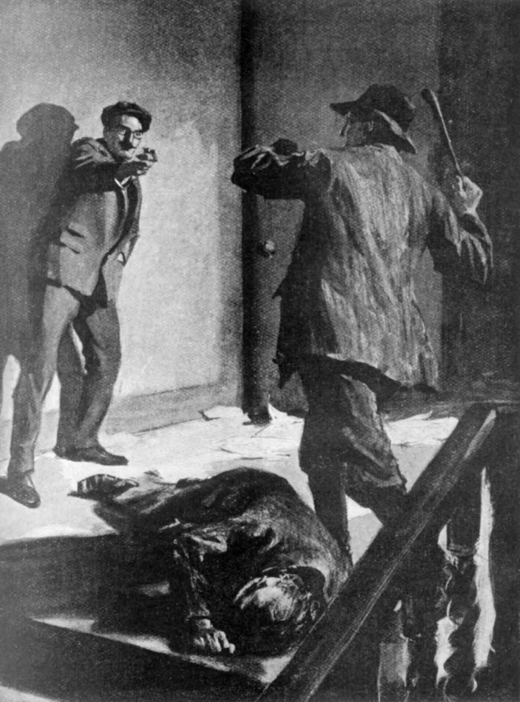

“你敢碰我，我就崩了你的脸。”

“是这样命令的。”另有人马上说。

“哦，天哪！你们还不快点！”楼梯下的人喊着，“窗子都亮了，你们在等全镇的人都来是吗？”

街上响起了喊叫声，一批排字工人和印刷工人在往楼下厅里跑来，眼看快要到了。凶徒把已经不得动弹的编辑丢在楼梯口，奔下楼，在街上飞跑。到了工会大楼，有几个就混入麦金蒂酒吧的人群中，隔着吧台悄悄给老板咬耳朵，任务已经圆满完成。其他的人，包括麦克默多，折入小街，经过小道，各自回家。

————————————————————

<a href="#part0130.xhtml_ch1-back" id="part0130.xhtml_ch1">(1)</a> 斯坦巴克先生（Mr.
Standback），系按习语stand
back造词取绰号，取意“站后，落后，保守，右倾”，又与斯坦格Stanger名谐谑，讥讽莫里斯右倾，是斯坦格一路的人。

# 第四章　恐怖谷

翌日早晨麦克默多醒来，一一回想起入会的情景。因为喝了酒，头还在发胀，手臂烙印的灼伤，红肿疼痛。他现在收入不错，上班工作也就可以不常去，所以起得迟一点，吃过早饭，整个上午留在家里给朋友写一封长信。写好信，拿起《每日先驱报》来看，在专栏中，麦克默多读到这样一条消息：

暴徒逞凶先驱报社——编辑受重伤

这是一则简短新闻，报道了事实经过，他当然比记者所写的要清楚得多。消息末尾有一段评论：

事情现已交警方调查。但恐难指望警方之努力得获比往昔更有效之结果。案犯中已有被辨认者，故可据实控告。行凶之动机，毋庸讳言，盖为臭名昭著之社团，彼横行社区，奴役居民，经年无所忌惮，惟《先驱报》则对其持不妥协斗争之立场。斯坦格先生众多友好，闻讯其虽遭惨无人道之殴打，致头部数处重伤，但尚无性命之虞，对此均感不胜欣慰。

下面报道提到，已征调配备温彻斯特步枪的武警部队对报社加以保护。

麦克默多放下报纸，点起烟斗，手臂因昨晚的灼伤，现在还有些颤抖。这时外面敲门，随即房东太太递给他一封信，刚才由报童送到，上面没有具名，这样写着：

希与你当面一谈，但不宜去你府上。可在米勒山旗杆旁晤面。望能现在即来，系有要事相告，予你务必知晓。

麦克默多把这短笺读了两遍，满腹疑团。是什么用意，是谁写来，他都无法猜测。如果是女人的笔迹，倒能想象也许又是一桩艳遇的开始，这在他过去的生活中并不陌生。但这却是男人的笔迹，而且是受过良好教育的人。他犹豫了一番，最后还是决定赴约看个究竟。

米勒山，是镇中心一座疏于管理的公园。在夏天，还不失是个避暑的好去处，可是在冬天，但见一片荒凉。从山顶上可以看到烟雾弥漫污秽不堪的全镇，还能将曲折蜿蜒的山谷尽收眼底。谷中矿井、工厂遍布，周围白雪被煤黑污染，矗立两边的是林木满坡、雪冠封顶的山脉。

麦克默多沿着常青树中弯弯曲曲的夹道一步一步向上走，来到一家无人的餐馆，那在夏季可是个娱乐中心。旁边就是一根光秃的旗杆，旗杆下，有个人，帽檐压下，大衣领翻起。这个人一转过身来，麦克默多立即认出，原来是莫里斯弟兄。正是他昨天晚上冒犯了命主，引得命主大怒。两人见面有问有答对过暗号。

“我有话要和你谈一谈，麦克默多先生，”这个已上了年纪的人说道，态度犹豫，显出不是十分放心的样子，“难为你赏光前来。”

“来信为什么不署名？”

“不得不小心谨慎，先生。谁都不知道这样做法会带来什么后果，谁也不知道谁可以相信，谁不可以相信。”

“会中弟兄都要相信。”

“不，不，不见得，”莫里斯激动地大声道，“我们说些什么，甚至于想些什么，简直都能传到麦金蒂那里被他知道。”

“注意了！”麦克默多正色道，“我只能说，你是清楚的，昨天晚上我刚刚宣誓要绝对忠于命主，你是不是要我不守誓言？”

“你要是这样认为，”莫里斯无奈地说，“我只能讲，很抱歉，让你来和我见面是白找你麻烦了。两个自由公民彼此都不能敞开思想谈话，那就没办法，只好罢了。”

麦克默多一直在观察对方，谨慎掂量，这时顾忌稍有解除。“当然我只是对我自己而言，”他说，“我是新来，这你知道，一切都还不熟悉，所以对什么事都不好随便开口，莫里斯先生。至于你这方面，有什么事要和我讲的话，我当然洗耳恭听。”

“好去向麦金蒂老大告密！”莫里斯说，语气苦涩。

“这样讲，那你也真是以小人之心，度君子之腹了。”麦克默多说，“就我个人而言，我忠于组织，这我可以坦白告诉你。但不等于说，我会把你推心置腹跟我讲的话去说给别的人听，那我不成了没脊梁骨的软虫！这绝对放心好了。但是也要警告在先，从我这儿得不到帮助，也不会有同情。”

“我不指望有同情、有帮助，”莫里斯说，“我跟你说这番话，是把命都交到你手里了；但是，像你，也够坏的了——在我看来，昨晚上你参与坏事，跟着最坏的人——但你毕竟是个新手，你的良心还没有泯灭，没有他们心肠狠。就是这道理，我想还是可以和你讲讲。”

“那，你要讲什么？”

“你要是把我卖了坑了，你会有报应的！”

“这放心，不坑人，我说过不就是不。”

“那我问你，你在芝加哥加入自由人社团，立誓是为了博爱、诚信，你有没有想到会把你引到犯罪的道路上去？”

“是你说这叫犯罪。”麦克默多答道。

“我说是犯罪！”莫里斯叫道，声音激动得发抖，“不叫犯罪，你就没长眼睛了。昨天晚上不是犯罪？一个老人，年纪足足可以做你们父亲，被你们打得满头鲜血，染红白发！不是犯罪——你还能叫什么？”

“那是有说法的，叫作斗争，”麦克默多说，“这是两个阶级之间的斗争，你死我活的斗争，双方都要不择手段打击对方。”

“哦，你参加芝加哥自由人会就是想的这个目的？”

“不是，那当然不是想这样。”

“我在费城参加的时候，也想不到，只晓得是一个互益俱乐部，会员友谊聚会的场所。后来我听说了这个地方——真该诅咒的那一天，怎么就叫我这耳朵听见了有这么个地方！——我来这里是想可以提高自己的生活。我的上帝，我提高成什么了！我妻子、三个孩子跟我一起来了。在商业广场开一家布匹服装店，生意做得蛮好。谁知我是个自由人会员这个话一传开，就强迫我加入本地分会，跟你昨天晚上一样。前胳膊烙下了这耻辱的标记，更丑的事烙在了我的心灵上，发现自己受着一个黑帮流氓的控制，掉进了犯罪的深渊。怎么办呢？我想应该行善做好事，这些话都不能讲，一讲就说你是叛徒，就跟昨天晚上那个情形一样。我也无法逃走，我的一家一当全部所有都在这爿店。再说一脱离组织，就逃不掉遭谋杀的下场，这我很清楚，只有上帝知道对我妻子、孩子会怎么样。哦，老弟，可怕——太可怕！”他双手掩住脸，不由得抽泣起来，身子在战栗。

麦克默多耸了耸肩。“做这种事，你心肠太软，”他说，“你不合适去做这一类工作。”

“我讲良心，有信仰，可是他们拉我和他们一起犯罪。叫我去干坏事，要是不肯，那很清楚我会是什么下场。也许我是懦夫，不得不为我可怜的老婆、小孩着想，也就横下心，好歹都得去。我这辈子心里摆脱不掉这件事了，不得安心了。

“那是孤零零的一间房子，离这儿二十英里远，翻过山的另一边。吩咐我在门外望风，像你昨天晚上一样，干这种事他们信不过我。其他人进屋。他们出来的时候，手上都沾满了鲜血。我们撤离，听到后面屋子里传出孩子哭叫。那个孩子才五岁，当着孩子的面，父亲被杀死。遇上这么恐怖的事，我都要晕过去了，可是我得控制住自己，强装成勇敢，要摆出一副笑脸。我很清楚，要不是这样，那下一回就是他们双手沾满鲜血从我家里跑出来，轮到我的小弗雷德朝着他的父亲哭叫了。

“就这样，我是个罪犯了，凶杀案的共犯。在这个世界上永远被唾弃，到另一个世界还逃不掉。我是个虔诚的天主教徒，可是神甫一听说我是死酷党，就再也不理我，我背弃信仰了，被革除教籍了。我已落到了这步田地。眼看你步人后尘，我问你知道会有什么结局吗？你是甘心做冷血杀手呢？还是设法赶快踩刹车？”

“你到底想怎么样？”麦克默多突然问他，“难道你是想让我去告密？”

“天主禁忌！”莫里斯叫道，“难怪，这种事，连用脑子想一想都会丢掉性命。”

“也是，”麦克默多说，“我看你是个胆小的人，把这事看得过分严重，太过分。”

“太过分？等你在这儿时间久了再说吧。看下面这山谷！上百个烟囱，烟像云一样笼罩！我告诉你，杀人如麻这片凶云，压在人们头上比想象的还要厚、还要重。这里是恐怖谷，死亡谷。人们的心灵从黄昏到天亮，都叫恐怖阴云笼罩着。那就等着吧，年轻人，你自己学着当心点吧。”

“好吧，我要多见识见识，再让你知道我是什么想法，”麦克默多说，看似漫不经心，“这一点很清楚，像你这样的人，在这儿不是地方。你趁早盘店脱手算了——你这点生意，一块钱才赚一毛钱的活计，有什么值得——越早脱手越好。你和我讲的话，我决不说出去，但是，对天发誓，如果叫我发现你要告密——”

“不，不！”莫里斯可怜地叫道。

“好了，话就谈到这里，我把你说的都记在心上，也许哪天回头能看清楚。我希望你对我说的这些都是善意，我现在要回家了。”

“走之前还有一句话，”莫里斯说，“我们在一起可能有人看见，他们会要知道我们谈些什么。”

“啊！可想而知，一定会的。”

“我是想请你到我店里来当伙计。”

“而我不愿意，谈的就是这件事。好，再见，莫里斯弟兄，祝你事事顺利！”

也就是这天下午，麦克默多坐在起居室火炉旁抽着烟，陷入沉思，门咚地推开，门框撑满了麦金蒂的大个头身子。他打过会党招呼，拿张椅子在年轻人对面坐下，定睛看着他有一会儿时间，麦克默多也一样朝他对看。

“我难得登门访客，麦克默多兄弟，”最后他开口，“我是接待拜访我的人都来不及，不过还是忙里抽空登门来看你。”

“大驾光临，不胜荣幸，参议员先生，”麦克默多真诚回答，从柜子里取出威士忌酒，“真是喜出望外的荣幸。”

“手臂怎么样了？”老大问。

麦克默多扮个鬼脸。“哦，真是值得纪念，”他说，“那值得，有价值。”

“对，值得，”对方答道，“对于忠诚的人，能效忠的人，为分会出力的人，是有价值的。今天早上，你和莫里斯弟兄在米勒山上谈些什么？”

问题来得如此突然，幸好他已早有准备。他舒心地哈哈笑说：“莫里斯不知道我就在家里挣大钱，他也根本不会知道，因为他用太高的良心尺度来衡量我们这样的人。他倒也真是个善心老好人，想当然以为我没有职业，要解决我吃饭问题，叫我到他布店里去帮忙。”

“哦，是为这事吗？”

“是的，就是这事。”

“你拒绝他了？”

“那还用说，我在自己房间里四个钟头，赚他十倍还不止吧？”

“那是不错。我可不和莫里斯这个人多接触。”

“为什么？”

“那个，我看就不便告诉你了。对这里大多数人来说，到此为止也就够了。”

“对大多数人可能够了，对我却不够，参议员先生，”麦克默多直冲地说，“你要是会看人，你应该清楚。”

这个黑巨人瞪了他一眼，毛茸茸大手紧握一下酒杯，像是要朝对方头上掷过去的样子。他怒不可遏，但是他忽然转而矫情大笑。

“你是一张冷门怪牌，确实，”他说，“也好，你要了解一些其中道理，给你说说也无妨。莫里斯没有和你讲反对本会的话？”

“没有。”

“没讲反对我的话？”

“没讲。”

“噢，那是他不敢相信你。这个人内骨子里不是一个忠诚的弟兄，我们很清楚。所以，我们注意观察他，等待时机要告诫他，我看时机也快到了。我们的羊圈里容不得有贼羊。你要是和不忠的人搞在一起，我们认为你也是不忠的人，明白吗？”

“我怎么会和他搞一块儿，我根本不喜欢这个人，”麦克默多答道，“说我不忠，今天若不是你，要是换了别人说我，我就把他现开销不二话。”

“好，这就中听，”麦金蒂说，举杯一饮而尽，“我是亲自来给你及时忠告，你接受了。”

“我很想知道，”麦克默多说，“我和莫里斯谈过话，是怎么让你知道的？”

麦金蒂大笑。“这就是我的本事，这镇上有什么事我都清楚，”他说道，“所以我说，你最好记住，到处有我的耳目。啊，时间不早，我只再说一——”

但是他的告别话出乎意料被打断。门哗啦一下推开，三张警察帽檐下的脸，竖眉横目盯住了他们。麦克默多跳起来，刚把左轮枪拔出一半，他就住手了，看到三支温彻斯特步枪已经平举到了他的脑袋上。一个身穿制服的人冲进屋内，手握六发左轮枪，原来是马文上尉，原先在芝加哥，现在是这里的矿警。他对麦克默多皮笑肉不笑地晃晃脑袋。

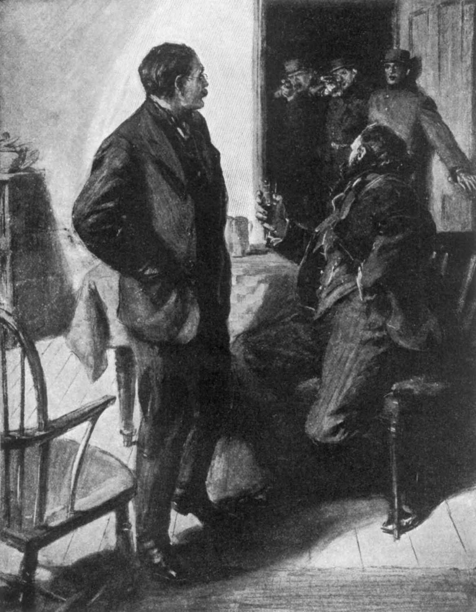

门哗啦一下推开。

“我说芝加哥来的坏胚子麦克默多先生，你还是有麻烦了，”他说，“还是无法安分，对吗？戴上帽子，跟我们走！”

“你这是要负责任的，我说马文上尉，”麦金蒂说道，“我倒要问问，你们凭什么，这样无缘无故闯入民宅，骚扰奉公守法的居民百姓？”

“这件事你站一边去，麦金蒂参议员先生，”上尉警官说，“我们不是找你来的，是找这个麦克默多。你应当协助，而不是妨碍我们执行公务。”

“他是我的朋友，我可以为他的行为担保。”麦金蒂老板说道。

“从各种情况看，麦金蒂先生，你还是为你自己近来的行为担保吧。”上尉回答他，“这个麦克默多，来这里之前，早就是个歹徒，现在还是为非作歹。枪对准他，弟兄们，我来缴他械。”

“枪在这儿，”麦克默多冷静地说，“假如是，马文上尉，你我单独面对面，你就没那么容易对付我。”

“你有拘票吗？”麦金蒂问，“我的上帝！维尔米萨这里就像是在俄国一样了，都是像你们这样的警察。这是资本家的暴行，你们这种做法以后更会肆无忌惮，我说。”

“你怎么想怎么做是你的事，悉听尊便好啦，参议员先生，我们该怎么办是我们的事。”

“我犯什么法了？”麦克默多问道。

“涉案殴打《先驱报》老编辑斯坦格，没有控告你谋杀罪，算你走运。”

“好啦，你们为了这件事抓他，”麦金蒂笑着大声道，“你们省点事吧，最好赶快住手。这个人一直在我酒吧间和我打牌打到半夜，我都可以找十几个证人来证明。”

“这是你的事，明天你到法庭上去对质吧。现在，走，麦克默多，给我放老实点，小心我子弹穿了你脑袋。你站远点，麦金蒂先生，我要警告你，我履行职责，不许有任何干扰！”

上尉脸色严厉，麦克默多和他老板两人不得不正视现实。老板和犯人分手前，藉机悄声说道。

“那玩意儿——”他跷起大拇指，暗示铸币机怎么样。

“没事。”麦克默多悄声说，他已经放到地板下安全藏好。

“和各位再见了，”老板说，握握手，“我要去请赖利律师，还要亲自出庭作证。记着我的话，他们别想抓到你的把柄。”

“我不管赌输赢。把犯人看紧了，你们两个，他要敢动一动，开枪就打。走之前，我得搜屋子。”

马文进行了搜查，但隐蔽好的小机械，一点痕迹都没有被发现。他也就只好下楼，和警察押了麦克默多上总局。天已经黑了，夹雪寒风劲吹，一路上几乎不见人，只偶尔有几个闲汉跟在后面，藉着天色昏暗看不清楚，壮着胆子高声痛骂犯人。

“揍死该死的死酷党！”他们叫骂着，“揍死他！”麦克默多被推搡着进了局里，他们笑骂他得到应有的下场。经过当班警官简短审问之后，麦克默多被投入大牢。一看，鲍德温以及昨天晚上其他三个罪犯也进来了。他们都是这天下午被捕的，等候明天审讯。

即使是这司法堡垒的内部，自由人会的长臂也能伸进来。天晚以后，有个狱警送来一捆麦秸给他们垫床用。麦克默多在草秸中发现两瓶威士忌，几只玻璃杯，一副扑克牌。他们饮酒打牌整夜作乐，毫不在意明晨的审讯。

结果果然证明控告他们的理由不能成立。光凭地方法官掌握的证据，根本不可能把他们提交上一级法院。一方面是报社排字工人和印刷工人被不断追问中，不得不承认当时的灯光昏暗，他们自己也糊里糊涂，难以发誓保证辨认无误这几个一定是凶手，只不过是认为被控的几个都参与行凶罢了。经麦金蒂聘请的律师一番狡辩诘问，证人的证词便更加含混不清了。

受害者已经作证，他是遭受突如其来的攻击，只能提供一个事实，就是头一个动手打他的人是小胡子，此外就说不出个确凿的情节。他还说他知道是死酷党的人做的，因为地方上没有别的人对他怀有敌意，由于他写评论抨击死酷党，长期以来一直受到该党的威胁恫吓。

另一方面，有六位公民作证，证词口径一致，说得清楚圆满毫无漏洞，其中包括行政高官、参议员麦金蒂，证明被告这些人一直在工会里打牌，一直到暴行发生后一个多小时才散伙。

不用说，他们被宣布释放，法官对他们被无故拘押，说了些近乎道歉的话，连带含蓄地教训马文上尉和警察执法过当，不够审慎。

这一裁决受到法庭旁听者的高声欢呼，麦克默多认出许多熟识的面孔。分会的弟兄们在欢笑挥手。但是也有一些人，坐在那里抿嘴垂眼，看着那几个人从被告席鱼贯而出。其中有一个小个子、黑胡子、表情坚毅的人，当开释的罪犯从旁走过时，说出了他自己和持同样看法的人的心里话。

“这些该死的杀人犯！”他说，“一定要收拾你们的！”

# 第五章　最黑暗的时刻

如果有什么能使杰克·麦克默多在会党中名声大噪的话，那就莫过于这次被捕又得以无罪释放。一个会员在入会的当天晚上就有出色作为，以致被提到地方法庭受审，这在该会的历史上还是首开纪录。他原已杯中有知己，酒友广交，是一个和大伙一起兴致高、爱热闹的狂欢者，此外还是一个很有心志的人，在至高无上的老大面前也未必买账，所有这些都使他享有很高的声誉。然而除此以外，他给弟兄们印象最深刻的还是有能耐，全体弟兄没有一个人的脑子像他这么好，他灵机一动，一个杀人不见血的阴谋就计上心来，或是一出手就能马到成功。“这位老弟办事干净利落，”老家伙们交口称赞，就等机会好好重用他。

麦金蒂手上能使唤的工具不少，但是得承认，这是一件得心应手的高档工具。他自视身为主人，用皮带系住了这条嗜血成性的猎犬。他派那些劣种狗去做小事，只有哪天大目标来了，才放这条优种狗出去叼大食。分会里的少数几个会员，其中包括泰德·鲍德温，眼看这个新来的人很快得宠，便忌恨在心。但是都奈何他不得，因为你和他好时，他可以跟你说笑就笑，和他坏时则说斗就斗。

不过，麦克默多尽管在党羽中赢得声望，但在另一方面，对他来讲简直是性命攸关的方面，他却丧失了。伊蒂·谢夫特的父亲从此不再理睬他，不许他进家门一步。伊蒂本人深陷爱情，不忍割舍，但她毕竟天性纯洁，良心正警告自己，若和一个被众人视为暴徒的人结婚，不知会有什么下场。

一天早晨，伊蒂整夜失眠，决定起身去看麦克默多。这也许是最后一次，她想尽最大努力，把他从拉他下水的罪恶势力中挽救出来。伊蒂到了他的家，就像他常常要求她来的那样，径直走到他的起居室里。麦克默多坐在桌边，背对着门，聚精会神写一封信。一个女孩子家的调皮念头忽然一闪——伊蒂毕竟只有十九岁。她推门进屋，麦克默多没有听见。伊蒂踮起脚走近，用手轻轻往他肩上一按。

她想要吓麦克默多一吓，她是成功了，但是回头却把自己吓得那个样子，很是不轻。麦克默多陡地跳起来，像猛虎转身，右手一叉子扼住她的喉咙，同一瞬间，左手已把信揉成一团。等他站直定睛一看，这才惊喜交加，马上敛住大惊失色的凶恶相——那副凶恶相，把伊蒂吓得直往后退，这样的惊吓在她以往平和的生活中从未遇到过。

“是你呀！”麦克默多说，拭着额上的汗，“该想到是你来呀，我的心上人，我怎么舍得掐你呢！来吧，快，亲爱的，”他伸开了双臂，“快让我来补偿你。”

但是伊蒂已经从这个人的脸上，看见了罪犯当场被抓时的大惊失色，这使她惊魂未定，无法恢复过来。女人的本能告诉她，这决不是一个男人平常忽然受惊的样子，那是罪恶——肯定是的——犯罪的惊恐！

“你是怎么了，杰克？”她惊呼，“为什么我会把你吓成这样？哦，杰克，要是你无愧良心的话，你不会这样看我的！”

“确实，我正在考虑别的事，你进来轻手轻脚，真像仙女飘然降临——”

“不，不，不要闲扯，杰克。”她疑心顿起，“让我看看你写的什么信。”

“啊，伊蒂，我不能让你看。”

她更加怀疑了。“给另外的女人写信，”她叫道，“我知道！要不，为什么瞒着我不让我看？是写信给你的妻子吧？我怎么知道你没结婚呢——你，一个外来陌生人，谁知道你的底细？”

“我没有结婚，伊蒂，现在，我向你发誓！这世上你是我惟一的女人，我对着耶稣的十字架发誓！”

麦克默多急得脸都发白，叫伊蒂不得不相信他。

“那，好吧，”她叫着，“你说，为什么不许我看信？”

“我告诉你吧，我的心肝，”他说，“我宣誓过不让别人看这种信，就像我决不违背对你的誓言一样，对别人许下承诺我同样要遵守。这是我们会里的事，即使对你也得要保密。冷不防一只手落到我肩上，叫我大吃一惊，你不明白，谁知道是不是警探的手呢？”

伊蒂觉得麦克默多讲的是实话。麦克默多把伊蒂拥抱在怀里，吻她，把她的惊吓和疑虑全都吻跑了。

“坐，坐在我身边。这把椅子就当王座，给这么一位美丽的女王，是你可怜的情人所能给你的最好东西。往后他要给你更好的，会给你幸福，我想我一定可以做到。现在你安心了，放心了吧？”

“叫我怎么能放心呢，杰克，我知道你是犯罪团伙的罪犯，我提心吊胆，不知哪天会听到你犯了谋杀罪被告到法庭上了。‘死酷党麦克默多’，昨天我家一个寄宿房客就这么说你。我听了心给刀扎似的。”

“别管，话再刺，不伤骨，当它耳边风。”

“可他们的话是对的。”

“哦，亲爱的，没你想的那么严重。我们都是穷苦人，不过是在走自己的路，争取我们应有的权利。”

伊蒂双臂勾住情人的脖子。“别干了吧，杰克！看在我的分上，看在上帝的分上，别干了！我今天来，就是来求你这件事。哦，杰克，瞧——我给你跪下，求你了！我跪在你面前，恳求你别再干了！”

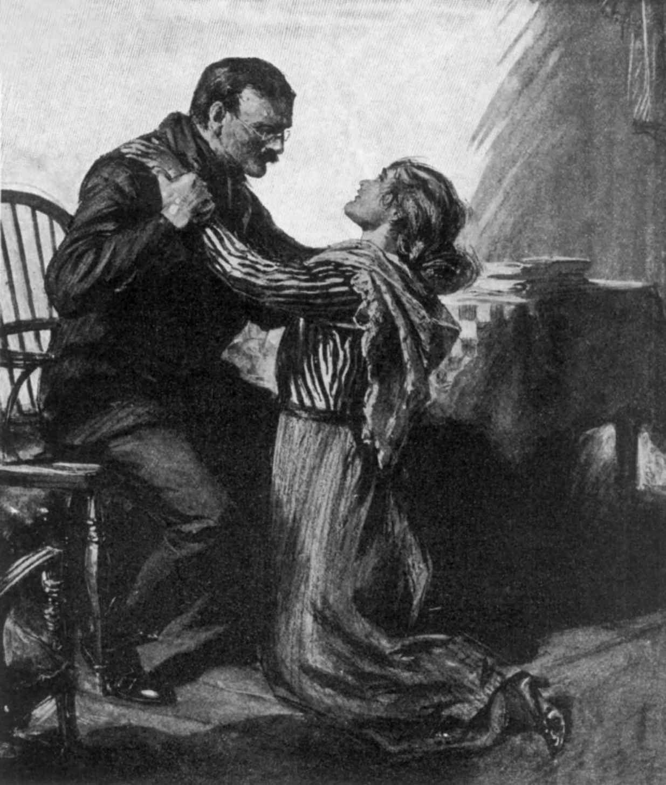

“我给你跪下，求你了！”

他把她抱起来，捧着她的脸紧贴自己的胸膛，抚摩她、安慰她。

“别担心，亲爱的，你求我，你又不清楚我究竟做什么事。我不做，那就要违背誓言，背弃我的同志们！要是你能看清楚我在做什么事，你绝对不会这样求我。再说，就算我不做，也不行。你不想想，会里能让人带着它的机密轻易跑掉？”

“我想过的，杰克。我都计划好了，父亲有一笔积蓄，他讨厌这个地方，让这些人搞得人心惶惶，搞得没有安宁日子过，他要离开。我们一起逃走，逃到费城或者纽约，那里就安全了，他们找不到。”

麦克默多笑起来。“他们的手臂可长着呢，你以为他们在这里就伸不到费城、纽约？”

“噢，那就到西方，到英国，或者德国，父亲就是德国人——到哪儿都成，只要脱离这个维尔米萨恐怖谷！”

麦克默多想到了老莫里斯弟兄。“哦，确实，这是第二次，我听到这样称呼这座山谷，”他说，“乌云确实压在你们头上，压得够沉。”

“我们过日子无时无刻不在小心提防。你以为泰德·鲍德温就放过我们了？要不是他怕着你，你想我们俩能在一起吗？你没瞧见他那对嫉恨、贪婪的眼睛怎么看着我！”

“苍天作证！让我碰到他这样，非好好教训教训他不可！可偏偏就是这里，亲爱的，我不能离开这地方。我不能够——一离开，那就什么事也做不成了。但是如果你让我按我自己的路走，我自有把握脱离它，顺顺当当把它给摆脱掉。”

“这种事情太不光彩。”

“哦，哦，那是你的看法。你给我六个月试试，我工作做出成绩，再离开，在别人面前我决不会脸上无光。”

姑娘高兴得笑了。“六个月！”她叫道，“你能保证？”

“噢，也可能七个月、八个月，再多也不超过一年，我们就离开山谷，远走他乡。”

伊蒂盼望的也就是能有这一天，这是一切希望的所在。那遥远的曙光竟把近在眼前的一片黑暗驱散。伊蒂回家见到父亲，心情特别轻松，是杰克·麦克默多进入她心田以来，最轻松开心的一天。

一般以为，这个组织的成员对组织事务应当知道，然而，他很快发现这个组织比一个简单的分会要广泛而复杂得多。即使如麦金蒂这样的老大，对许多事情也是茫然。因为还有一个称为县代表的官员，住在铁路线稍远的霍布森辖区，他使出阴险毒辣而猝不及防的手段，将几个不同地方的分会统一到他的权力控制之下。麦克默多见过此人一面，是一个猥琐、灰白头发的小个子，活像老鼠一只，走路鬼鬼祟祟，斜眼看人。伊万斯·波特，是他的大名。即使如维尔米萨老大之大，对他也心有怕惧，要避让三分，如同丹东<a href="#part0132.xhtml_ch1"
id="part0132.xhtml_ch1-back">(1)</a>在小而凶险的罗伯斯庇尔<a href="#part0132.xhtml_ch2"
id="part0132.xhtml_ch2-back">(2)</a>面前一般。

有一天，和麦克默多同屋寄宿的斯坎伦，收到麦金蒂一封便笺，内附伊万斯·波特的信，通知命主麦金蒂他已派来两个得力好手，劳勒和安德鲁斯，他们将按指示他们在邻区执行任务，为保密起见，他们具体的任务就不介绍了，询问命主可否对他们的饮食起居给予妥善安排，以待时机完成任务。麦金蒂在便笺上说，安排他们住在工会，难以保密，所以考虑下来，还是麻烦麦克默多和斯坎伦接待两位客人同住几天。

当天晚上两个人来了。劳勒已是有点年纪的人，精干、沉静、持重，穿一件旧礼服大衣，配上软毡帽、一蓬灰白胡须，看上去像是一位巡回传教士。他的同伴安德鲁斯，简直还是个大孩子，娃儿脸坦率开朗，轻松愉快的模样像是来此消磨度假，享受美好时光。两个人都是滴酒不沾，各方面的行为堪称组织成员中的表率。犹有过人之处的是，他们纯粹是驯服的工具，都是组织里的杀人高手，这方面已是阅历匪浅。劳勒执行过十四次杀人任务，安德鲁斯也已有三次。

麦克默多发现，两人津津乐道过去的事迹，讲述起来像是很谦虚，但是为帮派所作无私奉献、立下了汗马功劳，又引以为荣，不无骄傲，然而对于眼前的任务却是三缄其口。

“我们两个被选中，因为我和这孩子都不喝酒，”劳勒解释道，“大家信得过我们，不该说的话决不吐露半句。这点请勿见怪，那是县代表的命令，我们要服从。”

“那当然，我们都要共同遵守。”麦克默多的同屋人斯坎伦说，四个人正一起坐着用晚餐。

“是应当这样，我们谈过去的任务，尽管谈，不碍事，怎么杀的查利·威廉姆斯，怎么杀的西蒙·伯德，还有其他的任务，手头的事没做之前不能谈。”

“这里有六七个人，我得要收拾收拾，”麦克默多咒骂道，“我看你们干的，还没轮到铁山老板杰克·诺克斯，好歹让我去把他干了。”

“不，还轮不上他。”

“那么，赫尔曼·斯特劳斯？”

“不是，不是他。”

“好吧，你们不讲，也不能硬要你们讲，只是我很想知道是不是我的目标。”

劳勒笑笑，摇摇头，他口风很紧。

不管客人怎么守口如瓶，斯坎伦和麦克默多都决心参与他们所谓的“玩玩”。因此，到了一大清早，麦克默多听见他们从楼梯下去，就把斯坎伦叫醒，一起赶快穿衣服。衣服穿好，这时看到两人悄悄出屋，屋门开着。天还没有亮，借着路灯看见他们在街上走远了，就小心翼翼在后面跟上去，脚踩在深雪里不出声。

这寄宿公寓靠近镇边上，两个人很快到了镇外的交叉路口。这里等着三个人，劳勒和安德鲁斯和他们匆匆说了几句话，就结伙一块儿走。看情形，是一项重大任务，才会要这么些人。在这路口，有几条道通向几个矿区。他们走上向克劳山的那条路，那是一家大企业，全靠精力充沛、不畏邪恶的新英格兰经理乔塞亚·H．邓恩强有力的管理，才得以在长期恐怖横行时期，维持正常生产秩序和严格的劳动纪律。

天已大亮，工人们慢慢走着去上工，有的独自一人，有的三五成群，走在踩黑的小道上。麦克默多和斯坎伦混迹于人群中，远远盯住他们跟踪的人。一股浓重的雾气升腾，从中忽然响起尖利的汽笛声。这是开工前的信号，还有十分钟，罐笼就要下井，日班工人就要开始劳作。

他们来到矿井周围的一片空地，有百来名矿工等候在那里。天气严寒，他们不停地跺脚，朝手上哈气。那几个人站在机房的暗影里。斯坎伦和麦克默多爬上一堆矿渣，可以由此望到全景。他们看见矿井工程师，一个大胡子苏格兰人，名叫孟席斯，正从机房里出来，吹响哨子，指挥罐笼下降。

这时，一个高高胖胖的年轻人，严肃的脸孔修得很干净，急急地向井口大步走去。没走几步，目光落在了这几个人身上，见他们一动不动一声不出，站在机房下，全都把帽檐压得低低的，衣领拉得高高的，把脸遮住。一闪念间，经理预感到死神冰凉的手探进他的心窝上。但他又一转念很快就摆脱这死神的恐惧，不顾一切只为恪尽职守，走向这几个来者不善的陌生人。

“你们是什么人？”他跨上几步问道，“站在这儿干什么？”

没有回答。少年安德鲁斯向他走上几步，甩手朝他肚子上就是一枪。百来个等待下井的矿工傻愣了，站在那里手足无措都像瘫掉了一般。经理两手捂住伤口，佝偻着身体，摇摇晃晃靠向一边，但另一个杀手补上了一枪，他便立刻横倒地上，手抓矿渣蹬几下腿脚。孟席斯，那个苏格兰人，看见这场面发出一声狂吼，举着一把铁扳手向凶手扑上来，但是迎面两颗子弹在他脸上开花，他扑倒在凶手的脚下。

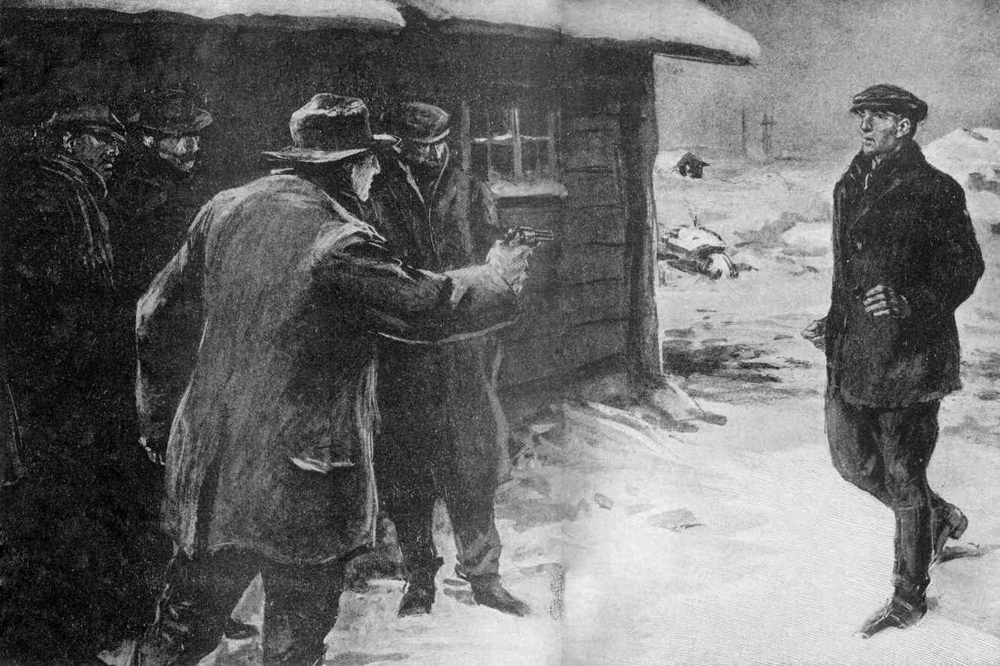

少年走上几步，甩手朝他肚上就是一枪。

这时一阵骚动，有的矿工高喊怒吼着奔向前来。陌生人的枪朝人群头顶上方乒乒乒射了几下子，人群便四散溃逃，有的直奔维尔米萨躲进了自己的家里。

少数几个勇敢的人聚集一起回到矿井的时候，这帮杀手已经逃之夭夭，消失在清晨的雾霭中了。当着上百名旁观者的面连杀两条人命，却没有一个目击者能够指证凶手是谁。

斯坎伦和麦克默多转身回家。斯坎伦心惊肉跳，这是他亲眼目睹的第一起凶杀场面。他觉得并不像别人告诉他的那样“好玩”。经理被打死，他的妻子撕心裂肺的号叫声一直追逐着他们到镇上。麦克默多沉默了，一言不发。但是对同伴的懦弱，他并不以为然。

“确实，像是一场战争，”他一遍又一遍地说，“我们和他们，只有战争，没有别的，我们只有使尽一切力量予以回击。”

那天晚上，工会大楼的分会会议室热闹非凡，不仅为克劳山煤矿经理和工程师的被杀而祝捷，该组织的这一成功无疑是对本地区公司的恐怖打击和敲诈勒索起到相辅相成的作用，而且同时也为远处的一大胜利祝捷，那是本分会会员的亲手杰作。

原来，县代表派出五名高手到维尔米萨来实施打击、行凶之时，也同步要求维尔米萨选派三人作为交换秘密潜往斯泰克罗依去杀死威廉·黑尔斯，这个吉尔默顿地区最出名、最有声誉的矿业主，他被认为是世上最无冤无仇的人，因为他无论从哪方面看都堪称是模范雇主好老板。然而他也要讲究生产效率，为此把几个酗酒、吊儿郎当的雇员结清工资辞退，可是这些混混仔正是法力无边的帮派中人。棺材警告都贴到他矿主门上了，他还是决心坚定不为所动。在一个自由、文明的国度里，他居然难逃杀身之祸。

死刑执行现已大功告成。泰德·鲍德温，这时摊开四肢、半躺地坐在命主身旁的光荣席上，他是这一组杀手的头头。他绯红的面孔，充血呆滞的眼睛，说明他缺少睡眠又喝过酒。他带上两个同志昨夜在山中辗转一宿，现在他们仪态惺忪凌乱，犹有夜黑风高出生入死的疲惫。可是从来没有这样的英雄，执行敢死任务回来，受到同志们如此热烈的欢迎。

杀人故事在欢声、笑声、雷鸣般的掌声之中一遍又一遍地讲述。夜幕降临，他们等着那个人驾车回家。他们埋伏在陡丘顶上，监视着马车必经之路。这个人裘服锦袍御寒裹得严实，手都来不及掏枪，就被拉下来，对准了连挨数枪。他曾高声求饶。他怎么个求饶法，被会员们一遍一遍地学样取笑。

“让我们再听听他怎么个求叫饶命。”大伙喊道。

他们谁也不认识这个人，但是杀人不眨眼，一次次行凶如戏剧般上演不辍，他们要让吉尔默顿的死酷党人看看，咱维尔米萨的人也是好样的。

事不凑巧，他们还在朝着不再出声的死人连连开枪，这时刚好有一个人和他妻子驾马车闯了过来。有人说把这两口子一起干掉。可是这夫妻和矿上毫不相干，是对他们无害的人，他们就厉声喝令赶快走开，不许声张，否则会有大祸临头。就这样，把血肉模糊的人弃尸路上，向狼心狗肺的雇主老板们再示警告。三个复仇者便迅速撤离，遁入山中；这山是完好无损的大自然，蜿蜒在那无数高炉和矿渣堆的边缘。他们得胜而归，毫发无伤，同党们的喝彩声响彻耳际。

这是死酷党人的大庆之日。山谷的阴影更加黑暗深沉。可是正如足智多谋的将领要抓紧胜利的时机，一鼓作气再接再厉，务使溃敌得不到间隙的喘息，脚跟没有片刻的站稳。所以，麦金蒂老大阴险毒辣的双眼已经望着进一步的行动部署，设计好向反对他的人实施新的打击。当天晚上，喝得半醉的会员们一一散去，他碰碰麦克默多的手臂，领他进入他们第一次会面的那间内室。

“我说，兄弟，”他开口道，“有一桩差事要干，想来想去，还是你最合适。这次是要你亲自动手了。”

“这是对我的信任，太荣幸了。”麦克默多回答。

“你可以带着两个人——曼德斯和赖利。我已经吩咐过他们了。除非把贾斯特·威尔科克斯给解决掉，我们在这个地区才能永得安稳。由你把他除掉，那整个煤田矿场全体会员都要对你感激不尽。”

“我一定豁出去干。他是谁，上哪儿去找他？”

麦金蒂的雪茄叼在嘴角边，半嚼半吸着，这时他拿掉雪茄，随手从笔记本撕下一页纸，在上面画出草图。

“这人是戴克钢铁公司的总领班，心狠手辣，打过仗，海军陆战队老上士，有战伤、有白发，是个不好对付的老手。我们两次去解决他，两次都不成功，吉姆·卡纳威反遭毒手。现在派你去端掉他。他家的房子——孤零零单独一家，在戴克钢铁公司岔路口，就是我图上画的这地方——有声音也没人听得见。白天不行，他带枪，出手又快又准，只要被他看见他就开枪，问都不问一声。只有晚上——晚上，他和他老婆，三个孩子，一个帮佣。一个不留，要干就全干掉，要么就不干。最保险省事是放一包炸药到他家门口，用一根慢引线点着了——”

“这个人干了些什么事？”

“我不是告诉你了吗，吉姆·卡纳威伤在他手里的！”

“他为什么要开枪打吉姆呢？”

“你这么问就没意思了！卡纳威晚上在他家外面，他就开枪把他打了。我跟你说到这儿就够了，你只管去干掉他就是。”

“他家两个女人，连同孩子，一起除掉？”

“都除掉——不一起轰掉，怎么报复他？”

“伤着他们，厉害了点，不关他们的事。”

“这不是废话吗？你想回头？”

“别急，参议员先生，别急！我的所作所为，什么时候让你觉得我不服从命令了？我是那种人吗，对也好错也好，反正都该由你说了才算数。”

“那么，你是去了？”

“当然去。”

“什么时间？”

“这样，最好给我一两天时间，晚上我去察看这所房子，做个计划，再——”

“很好，”麦金蒂说，和他握握手，“这事就这样，交给你了。等你带来好消息，大喜日子大加庆祝。这将是对他们的致命一击，叫他们全都跪在我们面前。”

麦克默多突然受命，任务接到手上不由得深思良久。贾斯特·威尔科克斯住的是一幢孤立的房子，在山谷边约五英里远。当天晚上他就单独出发去踩点勘查，等到侦察完毕回来，天已大亮。第二天他去看两个助手，曼德斯和赖利，两个鲁莽的年轻小伙子，他们对这件事兴高采烈，就像是去打猎逐鹿似的。

过了两天，到第三夜，三人在镇上碰头，都佩了枪，一个背了包炸药，这原是开矿炸山用的。来到那所孤立的房子，是凌晨两点不到。深夜阴风催急，乱云飞渡，半轮明月时隐时现。事先已有关照，当心有狗，所以十分小心，悄悄趋前，都紧握着打开了保险的手枪。但是除了耳边呼呼风吹，没有别的声音，也不见动静，只有头上的树枝随风摇曳。

麦克默多在屋前细听，但屋里寂静无声。他把炸药搁在门上，用小刀开个小口，装上导火线。点着以后，和另两人迅速撤离，躲得远远的，刚伏倒在一条安全的沟堑里，便是一声震天动地的猛烈爆炸，随着是深沉持续的房屋崩塌声。这告诉他们，任务完成了。该组织的血腥史上，还没有过比这次更彻底爽快的凶杀纪录。

但是，如此精心策划、如此勇敢执行的杀人杰作，结果是白搭！鉴于凶杀不断，贾斯特·威尔科克斯知道自己也是暗杀对象，便带着家人刚好在前一天搬走，去了其他无人知道的安全地方，还有一队警察加以保护。因此，炸药炸毁的是一座空屋，而那个严厉的经过战火历练的海军陆战队老上士，依然紧抓戴克钢铁厂矿工们的劳动纪律不放松。

“还是交给我，”麦克默多说，“我来收拾他，我非要除了他不可，即使和他周旋上一年半载也不甘休。”

全分会对他表示感激、深具信心，这件事也就暂告沉寂。没过几个星期，报纸上登出消息，威尔科克斯遭伏击被枪杀。这就不用说了，是麦克默多所为，他完成了未完成的任务。

这就是自由人会所施展的手段，也就是死酷党人的实际作为。他们对这一广袤富庶地区实行的恐怖统治，搞得人心惶惶却又能历久不衰。为什么这本书还要被更多的罪恶来玷污呢？难道我对这些人的嘴脸和手段说得还不够吗？

凶徒的行为都已经载入历史，留下记录，人们可以看到他们的详细资料。可以看到他们枪杀警察亨特和伊万斯，因为他们竟胆敢拘捕分会的两名成员——这是由维尔米萨分会策划的两起暴行，并蓄谋加害两个孤立无援又手无寸铁的人。读者还可以看到他们枪杀拉贝太太，因为她丈夫被麦金蒂老大叫人打得半死，而她却抱住丈夫不肯放手。还有杀害詹金斯老人，不久他的兄弟也遭谋害。还有詹姆斯·默多克被断肢致残。还有斯塔普霍斯全家被炸死。还有斯坦德尔斯被谋杀。案子一件紧接一件发生在这个恐怖的冬季里。

黑暗的阴影笼罩着恐怖谷。春天来了，溪水潺潺，草木生发，长久受制于铁腕的大自然照样生机复苏。可是生活在恐怖桎梏中的男男女女依然不见希望。他们头上乌云密布，暗无天日，在一八七五年的初夏已到了令人绝望的地步。

————————————————————

<a href="#part0132.xhtml_ch1-back" id="part0132.xhtml_ch1">(1)</a> 丹东（Danton，Georges
Jacques，1759—1794），法国大革命时期雅各宾派领袖之一，试图调和反对派，对抗雅各宾革命政府的各项政策，被处死。

<a href="#part0132.xhtml_ch2-back" id="part0132.xhtml_ch2">(2)</a> 罗伯斯庇尔（Robespierre，Maximilien
de，1758—1794），法国大革命时期雅各宾派领袖，领导公安委员会平定反革命叛乱，镇压反对派，在热月政变中被处死。

# 第六章　临危胜出

恐怖统治达到顶峰。麦克默多已经被任命为中层领导干部，明摆着可望继任麦金蒂，总有一天要荣升命主。现在，同志们有事要商讨决定，没有麦克默多的指点、帮助，那就什么事情也做不成。然而，他越是在自由人会中获得声望，就越是遭到当地镇民路人的横眉冷对。维尔米萨人不顾恐怖统治，决心联合起来反抗压迫者。死酷党人获得消息，《先驱报》社里有秘密集会，此外，守法公民都分发到了枪支弹药。但麦金蒂和他周围的人并不介意，他们自恃人多势众，坚定勇敢，装备精良，他们的对手则是无权无势、一盘散沙，还是跟过去一样，也就不过纸上谈兵，最多抓几个人去询问一下、做做样子罢了。这就是麦金蒂、麦克默多这些有胆有识的高人的说法。

那是五月的一个星期六晚上。星期六晚上聚会，一直是会里的老规矩。麦克默多正要离家赴会，那个莫里斯跑上门来见他，一张和善的脸皱着眉头忧心忡忡。

“有句话要跟你讲，方便吗，麦克默多先生？”

“讲吧。”

“我没忘记上次跟你讲过心里话，你十分守信没讲出去，老大特意来问，你也没讲。”

“你信得过我，我能不守信吗？不过当然，这不等于我就同意了你的说法。”

“这我知道，到底你是个能说说心里话不会出问题的人。现在我得知一个秘密，”他的手按着胸口，“真叫我心急如焚。这事但愿你们都早已知道，我倒是无所谓。我要说出去，弄不好就出人命，说实在的。我不说呢，我们大家都要一块儿完蛋。上帝帮助我，我是一筹莫展！”

麦克默多紧盯着这个人，看他四肢都在发抖。麦克默多拿个杯子倒上威士忌递给他。“你这个样子，当药喝点，就会好，”他说，“什么事，我听听。”

莫里斯把酒喝掉，苍白的脸面恢复了颜色。“只一句话就够了，”他说，“有个侦探把我们盯上了。”

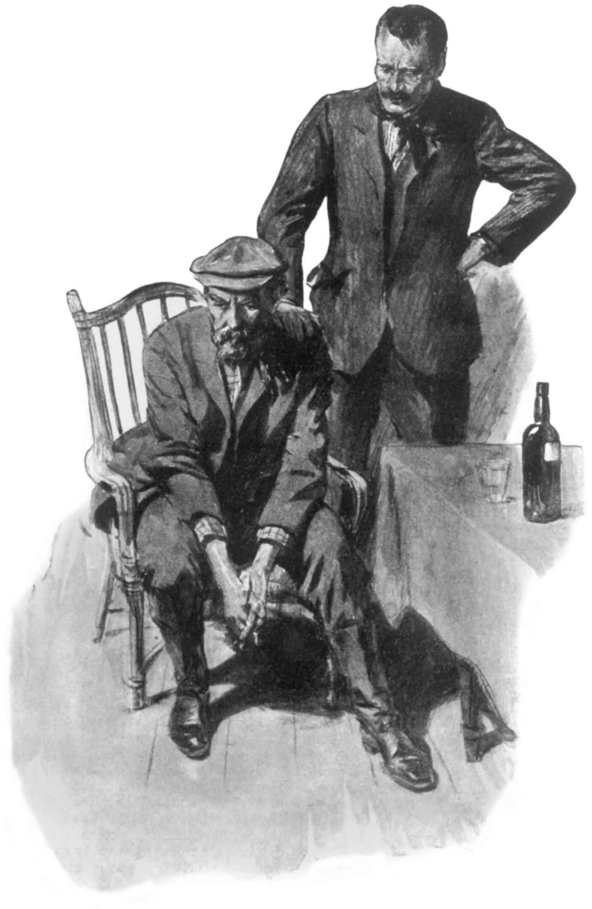

“有个侦探把我们盯上了。”

麦克默多看着他，十分愕然。“哈，老兄，你是不正常了吧，”他说，“这种地方，什么时候少了警察、侦探！对我们又能怎么样呢？”

“不是，不是，那不是本地区的人。你讲的，我们当然都晓得，他们对我们起不了什么作用。可你听说平克顿<a href="#part0133.xhtml_ch1"
id="part0133.xhtml_ch1-back">(1)</a>没有？”

“这个名字，有些人报上见过。”

“噢，我来告诉你，你大意不得，小心被他们盯上。这不是一家政府机构，做事马马虎虎不认真，它平克顿可有死劲儿，本事都好生了得。它要想彻查到底，一定会千方百计，非有结果不可。叫个平克顿侦探到了我们这里，那我们都要死在他手里了。”

“我们先把他给宰了。”

“啊，你第一个念头动的就是这个！那就一定要摆到分会上提出来。我不是跟你说过的，结果就是拿人开刀完事？”

“是啊，杀人又怎么样？在此地不是平常事吗？”

“是平常事，可是不该由我提出这个人来该杀呀。这一来我是永远别想再有安宁。看来我们自己的脖子都要保不住。上帝呀，我怎么办？”他身子坐不定，没了主意。

他的话引起麦克默多严重关注。不难看出，他也和对方有同感，面临危险，需要正视。他抓住莫里斯的肩头，紧张地摇晃。

“我说，老兄，”他激动得讲话简直是喊叫了，“你光坐在这儿没用，像个老婆婆跪着哭丧，不行。我们来看看情况到底怎么了。这人是谁？在什么地方？你是怎么听说的？为什么就告诉我呢？”

“我来跟你说，只有你一个人还能给我指点。我告诉过你，我来这里以前，在东部有一个店，那边有些好朋友，有一个朋友在电报局做事。这儿有一封他给我的信，昨天收到。信的这一页开头就谈这件事，你自己看。”

麦克默多看到信是这样写的：

你们那里的死酷党情况怎么样了？我们在报上看到不少这方面的报道。你我自己人，希望不久能从你处听到新消息。有五家大公司、两家铁路局联手采取紧急措施对付此事。他们决定动手，你应相信，一定能马到成功！他们已经深深卧底到那里了。平克顿已经掌握住对方的命脉。平克顿高手、佼佼者，伯迪·爱德华兹侦探，正积极投入行动之中。现在事情可以结束了。

底下还有附言：

我对你所讲的事，当然都是因为工作关系才得知，故也不宜多谈。他们使用十分复杂的密码，叫你每天处理起来不胜其烦，意思很难懂。

麦克默多无言静坐良久，垂手握信，一时间不祥的迷雾涌起，自己如临深渊。

“还有别人知道吗？”他问道。

“别人我都一个不讲。”

“可是这个人——你的朋友——会不会还向别的人也写信去讲呢？”

“哦，可能的，他还认识一两个人。”

“是分会的？”

“好像是的。”

“我之所以问这个，因为很可能你朋友作了描写，伯迪·爱德华兹这个人是什么模样——这样的话，我们可以把他找出来，跟踪他。”

“倒也是，不过我想我朋友不一定知道这个人。他告诉我这个情况，是他因为业务关系才掌握的，他怎么会认识这个平克顿侦探呢？”

麦克默多猛地跳起。

“老天在上！”他叫道，“我要逮住他。我也真傻，怎么一点都不知道。天哪！还算走运！我们要找他出来，不等他行动，我们先下手。这样吧，莫里斯，你就把这事交给我来办，行吗？”

“那好啊，只是不要提到我就好。”

“这没问题。你就站一边去，全由我来处理，你是连名字我都不会提。我来一手承担，就算这封信是写给我的好了，这样你放心了吧。”

“我想的也正是这样最好。”

“那就这样定了，你脑子里丢开就行。现在我要到分会去，我们很快就叫老平克顿人瞧瞧颜色。”

“你不会去杀了这个人吧？”

“这你知道得越少，莫里斯朋友，你的良心越得到安慰，你睡觉也睡得更安稳。这些就别问了，让事情该怎么样就听其怎么样吧，反正有我在就是了。”

莫里斯离开的时候，悲哀地摇摇头。“我觉得这个人的鲜血，我手上是沾着了。”他喃喃地说。

“自卫不算杀人，应当说，”麦克默多冷冷一笑道，“不是他杀死我们，就是我们杀死他。让他留在这山谷，总有一天我们全毁在他手里。哦，莫里斯弟兄，我们要选你当命主呢，全亏得你才救了这分会。”

事情很清楚，从他的行动看，他对这一新情况的想法比他嘴上所讲的显然要严重。可能是他意识到自己罪恶多端，可能是平克顿机构的威名显赫，可能是获悉实力雄厚的大公司决心要铲除死酷党，不管是出于何种原因，谁到了这个当口上都一样，他也只得准备孤注一掷了。他离开屋子以前把不利于他的文件都销毁掉，这才放心地长叹一口气，觉得有了些许安全感。可是危险依然压在他头上。到分会去的半途，他停步在老谢夫特家门前。这屋子已经不许他进入，他在窗上敲了几下，伊蒂就过来了。那个欢跳嬉戏的爱尔兰调皮鬼神情在她心爱人儿的眼睛里不见了，伊蒂在他脸上看出有危险迫在眉睫。

“出什么事了！”她叫道，“哦，杰克，你有危险！”

“哦，不是很坏的事，我心爱的。我们聪明一点，趁事情还不到最坏，搬家吧。”

“搬家？”

“我答应过你的，我总有一天要走的。我看时间到了，我今天晚上得到消息，坏消息，看到麻烦来了。”

“警察来了？”

“哦，一个平克顿的侦探。这些，不用你知道是怎么回事，亲爱的，也不用管它对我个人怎么样。我在这种事情里头陷得太深，要赶快脱身出来才好。你答应的，我走你跟我走。”

“哦，杰克，这才是救了你呢！”

“我做事讲信用，伊蒂，造化给你一身美丽，我决不让你有损一根毫发。我要把你供奉在云端金光宝座，仰望你不叫你下来。我这话你相信吗？”

她只紧抓住他的手，没有一句话。“那么，你听我说，照我说的去做，要知道，我们只有一条路好走了。这山谷地要出大事，我感觉到了，不会错。我们好多人都要防着点，我也是一个，得预防。我要走的话，不管白天黑夜，你一定要跟我一起走！”

“我会随后就到，杰克。”

“不，不，一定要和我一起走。山谷出事，我一走，我就回不来了，怎么能把你丢下呢？我还要躲警察，连传个信的机会也没有了。我来的那地方，认识一个好心女人，我把你留在那里，我们再准备结婚就是了。跟我来吧！”

“好的，杰克，我跟你走。”

“上帝保佑你，你这么信任我！我不会辜负你，要是我负心，就变成地狱里的恶鬼。现在，听我说，伊蒂，我会捎信给你，你接到我的信，立刻扔下一切，到车站候车室，等着，我会来接你的。”

“不管白天黑夜，我一接到你的信就来，杰克。”

做好了逃离的准备，麦克默多心里踏实多了，就去了分会去。分会里已经集合了好多人，经过复杂的口令盘问，方才通过戒备森严的周边岗哨，再通过内门警卫。他一进去，受到热烈欢迎，会场立刻活跃。屋里人头攒动，透过弥漫的烟雾，看到命主那一头蓬乱的黑发，鲍德温狰狞仇视的表情，书记哈拉威一张鹫脸，还有十几个分会领导干部。他十分高兴，刚好济济一堂，可以听取他的消息，共同商议对策。

“你看，大家见你到来都很高兴，兄弟，”命主说道，“正好有一件事，需要所罗门<a href="#part0133.xhtml_ch2"
id="part0133.xhtml_ch2-back">(2)</a>来裁决真假。”

“是兰德和伊根，”他坐下来的时候，邻座替他解释，“他们两个去斯泰尔镇毙掉了克雷布老头，争着要分会的赏金，你说说他们两个到底是谁开枪打中的？”

麦克默多从座位上站起来，举起一条手臂。他正经威仪的表情使大家凝神屏息，肃静无声，只等他开口。

“敬爱的命主，”他说，语气庄重，“我有特急情况报告！”

“麦克默多兄弟有紧急情况，”麦金蒂说，“根据本会规定，应予先行讨论。现在，兄弟，先听你的。”

麦克默多从口袋里把信掏出来。

“敬爱的命主，众位弟兄，”他说，“今天，我带来一个很不幸的消息，但所幸的是得到了这个消息，还能加以讨论，不然的话，毫无戒备，完全出乎意料的打击就要落到我们头上，我们将要遭受灭顶之灾，被一网打尽。我得到消息，本国最强大、最富有的机构组织已经联合起来要消灭我们。就在目前，有个名叫伯迪·爱德华兹的平克顿侦探正在山谷搜集我们的证据，要把绞索往我们很多人脖子上套，要把在座的各位捉入重刑犯大牢。现在面临这样的局面，所以我要当作特别紧急情况提出来，加以讨论。”

一屋子的人死寂无声，最后主席打破沉默。

“你有证据吗，麦克默多兄弟？”他问。

“我收到了信，”麦克默多说。他把信上有关的一段高声读出。“由于事关我个人信誉问题，此信的其他情况就不讲了，也不能把信交给你们。但是我可以向你们保证，信上其他内容都与本会毫无关系。我一接到信，就先提交到分会上来。”

“让我说说，命主，”一位年长弟兄说道，“我听说过伯迪·爱德华兹，他是平克顿私家侦探事务所最有名的侦探。”

“有谁认识他吗？”麦金蒂问。

“是的，”麦克默多说，“我认识。”

会场上响起一片惊愕的喃喃声。

“我相信他跑不出我们的手掌心，”他继续道，面露欣喜笑容，“只要动手快，略施巧计，我们就能一刀下去，速决速断，把事情了结。这得靠大家相信我，帮助我，我们一点都不用害怕。”

“谁怕，我们有什么好怕？我们的事他能知道个什么？”

“如果人人都像你这么坚定、忠诚，你就可以这样说，参议员先生。要知道这个人后面有资本家的百万巨款替他撑腰，你难道没有想到我们会里有意志薄弱的弟兄会被收买？他会弄到我们的秘密——很可能他已经弄到手了。现在只有一个办法，可以万无一失。”

“叫他永远出不了这山谷。”鲍德温喊道。

麦克默多点点头。“说得很对，鲍德温弟兄，”他说，“你我意见经常不合，今天晚上倒是英雄所见略同了。”

“他在什么地方，那么？我们哪里去找他？”

“敬爱的命主，”麦克默多热切地说，“我要向你汇报，这是生死攸关的大事，不宜在会上公开讨论。上帝禁忌，我并非不信任在座各位弟兄，只怕人多嘴杂，万一传到这个人耳朵里去，我们就要丧失机会，让落网的大鱼破网逃走。我建议分会组成一个行动委员会，主席先生——你一个，容我冒昧提名的话，鲍德温弟兄，再选五个人。我就可以全面谈谈我知道的情况，还有我的建议，应当怎么做。”

建议马上被采纳，委员会也立即组成。除了主席和鲍德温，还有鹫鹰脸哈拉威书记，猛虎科马克，中年杀手卡特司库，再来就是威拉比兄弟俩，两个天不怕地不怕、杀人不眨眼的亡命之徒。

往常的狂欢今天不多时就草草散席，因为众人心头压着阴云，许多人还是头一次看到要与他们清算的法律，如乌云飘到了他们头顶很久以来晴朗的上空。一直施予他人的恐怖，现在成了对自己逍遥生活的威胁，要被报复、受惩罚，过去是遥不可及、不可想象的，而现在已经迫在眉睫，因此更加显得惊魂不定。他们早早离场，由领导干部去商讨对策。

“现在说吧，麦克默多！”麦金蒂道，人已散尽，只剩他们几个孤零零地僵坐在那儿。

“我刚才说了，我认识伯迪·爱德华兹。”麦克默多解释道，“当然用不着我说，你们也想得到，他在这里不会用这个名字。这个人勇敢而不鲁莽，他化名叫史蒂夫·威尔逊，落脚在霍布森辖区。”

“你是怎么知道的呢？”

“因为我和他讲过话，有过点交道。那天当然没想到有这种事，要不是收到这封信，我都再也不会想起来。现在我才确定就是此人。星期三我去那里，在火车上遇见——也真叫他钉头碰在铁头上。他说自己是新闻记者，我听了也就相信。他老问死酷党的事，问什么这个‘暴行’那个‘暴行’，纽约一家报纸要报道。他问我各式各样这方面的问题，是有目的的。你们放心，我一点都不会给他捞到实情。‘我付报酬，付优厚的报酬，’他说，‘弄到资料就好向编辑交差。’我说了些让他乐意听的话，他给我一张二十元的钞票当作我提供消息的报酬。‘还可以给你比这多十倍的钱，’他说，‘只要你能提供我需要的消息就成。’”

“那你都告诉他什么了？”

“胡编乱造呗。”

“你怎么知道他不是报社记者呢？”

“我来告诉你。他在霍布森辖区下车，我也是。我有次去电报局，碰巧见他正从里面出来。

“‘瞧这个，’他走掉以后，营业员对我说，‘这个我们应当收双倍价。’——‘我想也是应当加倍收费。’我说。他把电报纸都写满了字，看上去像是中国文字似的密密麻麻，我看到是那个样子。‘他每天都要来发这么一张。’电报营业员说。‘是呀，’我说，‘给他报社发专题报道的，他是怕别人看到秘密。’电报员以为是这样，我也以为是这样。那是当时，可现在我不这样想了。”

“老天作证！我相信你的话，是这样，”麦金蒂说，“依你看，我们该怎么办？”

“快去把他收拾不就得了？”有人提议。

“对，越快越好。”

“只要知道能在哪里把他找到，我一刻也不停，马上就动手，”麦克默多说，“他在霍布森辖区，但是不知道住在什么地方。我订了个计划，大家看看是不是能采纳？”

“好啊，什么计划？”

“我明天一早就直奔霍布森辖区，通过电报营业员可以找到他，能找出他的住址。这没问题，我想。好，接着，我跟他说我本人就是个自由人会会员，可以把会里的秘密都告诉他，卖给他，要他出价。可以确信，他准落入圈套。告诉他，资料都在我家里，可是，如果在人来人往的时候让他来，那我自己不要命了，这是很明显的道理，他应该懂。我让他晚上十点钟来，什么都给他看。这样他非上钩不可。”

“再怎么样？”

“我把他弄来，下面怎么计划你们看看。麦克纳马拉寡妇家，孤零零的一幢房子，她是铁杆儿似的靠得住，又聋得像根木头，不管事。我们房子里就斯坎伦和我两个。这平克顿人只要答应——一答应，我马上通知你们——你们七个人九点钟到我那里去。我们来个请君入瓮，如果能叫他活着出去——好，那就算他走运，伯迪·爱德华兹下半辈子就可以由他去吹嘘个天花乱坠！”

“叫他们平克顿侦探位子留个空缺吧，要不，算我失策。那就这样，麦克默多。明天九点，准时到你那里。他来的话你让他进屋，门一关，剩下的事就交给我们了。”

————————————————————

<a href="#part0133.xhtml_ch1-back" id="part0133.xhtml_ch1">(1)</a> 平克顿（Pinkerton），由美国私人侦探Allan
Pinkerton（1819—1884，生于苏格兰）于1850年创建的美国私人侦探事务所，现已在全世界十多个国家设有分支机构，从业者达万人之众。

<a href="#part0133.xhtml_ch2-back" id="part0133.xhtml_ch2">(2)</a> 所罗门（Solomon），公元前10世纪以色列国王，治理犹太国达到鼎盛期，以智慧过人著称。《圣经·列王纪上3：16—28》记载所罗门智断夺婴案：同室两个妓女同生男婴，睡眠中一女把自己婴儿压死，遂弃死婴争活婴，讼至所罗门王前，王命劈活婴各归半，一母同意，一母不同意，宁作放弃，于是真伪立断。

# 第七章　伯迪·爱德华兹的妙计

正如麦克默多所讲，他住的房子是没有四邻的孤独一幢，很合适在此进行他们所设计的犯罪活动。房子离镇十分偏远，背对公路距离也不近。若是像以往其他的案子，只要策划把目标叫出来，他们以前许多次正是这样做，一出来拔枪对准了打就是了。但这一次不一样，还必须弄清楚他知道了多少内幕，都是怎么知道的，有多少已经送出去到了他的雇主那里。

很可能他们已经晚了，情报都被送走了。如果真是这样的话，他们至少也不能放过这个人，要算他的账报仇雪恨。不过他们仍抱有希望，这个侦探并没有弄到重大的情报。不然的话，他们争辩分析说，他就不会多此一举，还要把麦克默多所讲的无价值的东西写了送出去。但是不管怎么样，一切情况要从他的嘴里讲出来才能清楚。人一落入他们之手，就要设法撬开他的嘴。他们能够对付不愿合作的证人，这早就不是第一次。

麦克默多按照计划去了霍布森辖区。警察这天早晨似乎对他特别注意，那个马文上尉——他自称和麦克默多在芝加哥的时候就是老相识了——见他在车站上等车，过来主动招呼他。麦克默多转身避开，不愿意和他多说话。他完成了使命，中午返回，去工会见麦金蒂。

“他要来了。”麦克默多说。

“好！”麦金蒂说。这个巨人只穿长衬衫，表链针饰斜挂在宽背心前金光灿灿，乱蓬蓬的毛胡子下钻石晶晶亮。酒馆和政治都是他的营生，酒馆老板加政治大佬，使他有财有势权倾一方。但是，也因此令他更觉恐慌，昨晚上，监狱和绞索的形影似乎在他面前闪现。

“你估计他会知道得很多吗？”麦金蒂焦虑地问。

麦克默多缓缓地摇摇头。“他来这里有一阵时间了——至少六个星期。我想他还没有到我们这里来搜集重要的东西。如果这段时间全都来我们这里活动，以铁路资助作后盾，不难预料会给他搞出些结果，早已把情报传出去了。”

“分会里绝没有意志薄弱者，”麦金蒂叫道，“这儿的人，个个钢筋铁骨。不过，也是，老天有眼！就那个莫里斯，软骨头。他的情况怎么样？有谁出卖我们的话，那就是他。我想派两个兄弟天黑以前去揍他一顿，看他们能从他身上打出点什么情况来。”

“哦，那样做也无妨，”麦克默多回答，“我不隐瞒我对莫里斯还是有好感，不忍看到他太受伤害。他和我谈过一两次会里的事，他的看法和你我不一样，但他决不会是告密者。话虽如此，我还是不想横插到你和他中间来。”

“我总得解决了这个老东西！”麦金蒂赌咒发誓说，“我盯住他有一年了。”

“那好，你当然知道得更清楚，”麦克默多答道，“但不管怎么样，你等到明天再处理吧，我们必须停手其他的事，先要解决平克顿这方面的问题，不要在今天节外生枝先惊动了警察。”

“你讲得对，”麦金蒂说，“从伯迪·爱德华兹嘴里听听他消息是哪里来的，掏他心割他肺一定叫他讲。他看出里头有圈套吗？”

麦克默多笑了。“我想我是抓住了他的弱点，”他说，“如果真正被他盯住了死酷党，他就跟踪进地狱去吧。我拿了他的钱，”麦克默多咧嘴笑笑，掏出一沓子钞票，“让他看了文件之后，还要给更多钱。”

“什么文件？”

“哈，哪里有什么文件！搪塞他，说全体会员登记表、会规章程都在我这儿。他说都要抄下来带走。”

“不错，他想得挺美，”麦金蒂绷着脸说，“他没问你为什么不把文件给他带走得了？”

“我说这都是我要保存的东西，我不要受到怀疑吗？马文上尉今天就在车站上找到我说话呢！”

“对，我听讲了，”麦金蒂说，“真的，让你负起这重任了。把他给干掉，扔到旧矿井里就完事。不过无论如何，很难瞒过霍布森辖区那边的人，况且你今天又已经去那里露过面。”

麦克默多耸耸肩。“只要我们处理得法，他们抓不到我们杀人的把柄，”他说，“天色晚了，没人看见他到我们屋里来过。我都已安排好，叫他来无踪去无影。那就这样，参议员先生，我把计划跟你讲，你转告其他几位。你们要准时来。对，那就好。他是十点钟来，门上敲三下，我去给他开门。让他进来，我把门关上，他就是我们的瓮中之鳖了。”

“行，就能手到擒来。”

“是的，但是下一步需要考虑，他不是个好对付的人，还带着家伙。我把他骗来，他一定十分戒备。原来说是只有我一个人，结果带他一进屋子看见还有七个人，他就要开枪，我们就要吃亏。”

“是这样。”

“一打枪，就要惊动镇上警察，该死的不都要来了！”

“这估计没错。”

“所以我做好安排，你们都待在大房间里——你上次来找我谈话，就是那间大屋子。我给他去开门，把他引进门旁的会客室，叫他等着，就说是去拿文件资料。我趁机告诉你们情况，接着我再出去，拿些乱七八糟的文件资料。等他低头看资料，我就扑上去，按住他的手让他无法掏枪。你们一听到我叫，就冲出来，动作要快。他力气很大，跟我差不多，搞不好制不住他。不过，我一定能按住他，等你们出来，这没问题。”

“是一条妙计，”麦金蒂说，“分会不会忘了你这次大功劳。我在想，等我不坐这位子了，我要提名你做我的接班人。”

“说真的，参议员先生，我还是个刚入会的新会员。”麦克默多说，但是他脸上喜不自胜，颇得意听到出自这样顶级人物的顶级评价。

麦克默多回到家里，着手准备他今晚将要面临的严重斗争。首先要做的就是给他的史密斯和威森牌左轮枪擦拭、上油、填子弹。然后检查一下这位侦探将要落入陷阱的房间。这是一间大厅，中央一张松木长桌，旁边一只火炉，其余各边都是窗户，没有百叶窗，只拉上薄窗帘。麦克默多逐一仔细察看，结果很满意，这间屋子很合适用来实施秘密行动。与公路相隔有一段距离，屋里发生任何事情，对外面都不会有影响。最后跟同住朋友斯坎伦商量。他虽说也是个死酷党人，但这个小个子不是个很激烈的人，性格懦弱，和同志们意见从不相左。有时候被胁从参与杀人，内心里却惊恐不已。麦克默多把要做的事向他作了简要的交代。

“换了我是你的话，迈克·斯坎伦，我今夜就赶快离开，眼不见为净。这里天亮以前，要发生一场血案。”

“说的是，麦克，”斯坎伦答道，“不是不愿意，实在是神经吃不消。在煤矿那天眼看邓恩经理被打死，我真是受不了。我不如你或是麦金蒂，我没有胆量。会里如果不找我算账，我就照你的意思做，你们晚上的事情，由你们干，我离开的好。”

几个人按计划及时来到。从外表看，他们都是衣冠楚楚、落落大方的公民先生们，但是伯迪·爱德华兹一来只要看到他们狰狞的嘴脸，就能判断出凶多吉少。今天到这屋子里来的，没有一个不是双手沾满过十几次鲜血的人。他们杀人不眨眼，犹如屠夫宰牛羊一般。

当然，无论从外表和罪恶来看，首脑非这个令人望而生畏的麦金蒂老大莫属。书记哈拉威，长着个鸡脖颈，浑身皮包骨，四肢痉挛。他掌管分会经济财政大权，是个手脚干净廉洁奉公的人，但从不问财源是否来路光明正当抑或血腥污秽。司库卡特，是个中年人，一张羊皮纸般蜡黄的脸，表情冷漠，了无生趣。他是个干练的组织家，几乎每一起凶杀案都出自他的精心策划与安排。威拉比兄弟俩，铁板脸，年轻力壮大个头，行动却是轻捷灵巧，专门动手脚出力气活。他俩的同伴猛虎科马克，一个青年黑壮汉，即使是会中的弟兄，对他的凶狠残暴也要谈虎色变。正是这么几个人，这天晚上集合在麦克默多屋子里，要击杀平克顿侦探。

屋主人桌上备好威士忌，大家痛饮几杯，以壮行色。鲍德温和科马克已有醉态，凶残本性更是借酒毕露。科马克双手在火炉上烘烘——晚上寒冷，炉火已经生好。

“叫他来吧。”他咬牙切齿说。

“行，”鲍德温接着说道，“他掉入了陷阱，不怕他不说真话。”

“我们能听到他讲实话，不用担心。”麦克默多说。他是有钢铁般意志的人，尽管全部事情的分量压在他身上，他依然安之若素。一旁几个看在眼里，内心无不佩服。

“这个人全听你摆布了，”老大称赞道，“一定要到你的手掐到他脖子上，他才会如梦初醒。哦，可惜你这窗户都没装百叶窗。”

麦克默多走过去把窗帘一扇扇拉紧。“放心，现在没人侦察我们，时间要到了。”

“也许他不来，也许他嗅出一点危险味。”书记说。

“他要来的，不用担心，”麦克默多回道，“他急于来这儿，如同你们急于要见他。你们听！”

他们直坐起，都像蜡人般呆滞不动，有的刚把酒杯要举到嘴上，半途停在了那里。只听到三下很重的敲门声。

“嘘！”麦克默多伸手示意警戒。几个人激动的眼光彼此互射，手摸向暗藏的武器。

“别出声，小心没命！”麦克默多悄声说，就出了这间屋子，随手把门带上。

凶徒们直竖起耳朵，数着他们这位同志走过的脚步，听见他打开了屋门。没有多少招呼的话，接着辨别出进来的是陌生人的脚步声、不熟悉的嗓音。紧接着是门被关上，钥匙转动把门锁上。他们的猎物已经乖乖地钻进了牢笼。科马克这头虎哈哈狞笑，麦金蒂老大赶快伸出大掌掩住他的嘴巴。

“别出声，你这蠢货！”他轻声说，“要让你坏事！”

外室有模糊不清的低语声，还像是谈个没完。接着这屋门推开了，麦克默多进来，举起手指掩着嘴唇。

他走到桌子一端，向几个人扫了一眼。他神情有异，变得一副降大任于斯人的模样。他面孔顿时拉下，铁铸石雕一般威严，双眼透过眼镜射出犀利激奋的目光。他摇身一变，成了众人的领袖。几个人愣怔地望着他等待下文，他竟不说话，只凝神把他们一个一个看过来。

“喂！”最后，麦金蒂老大叫起来，“来了吗？是伯迪·爱德华兹来了吗？”

“是的，”麦克默多沉沉稳稳答道，“伯迪·爱德华兹来了，本人便是伯迪·爱德华兹！”

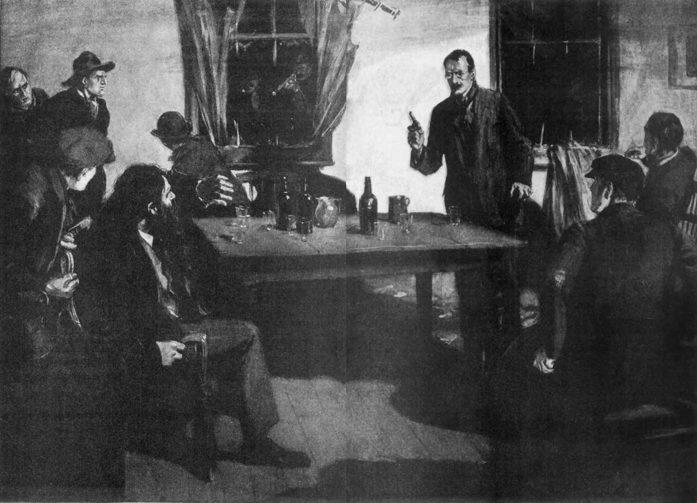

“伯迪·爱德华兹来了，本人便是。”

此话出口，足足十秒钟，全室一如空屋无人，鸦雀无声，只有火炉上的水壶，作嘶嘶尖声刺人耳膜。七个人顿时脸色死白，抬头仰望着震慑住他们的这个人，都惊恐得呆若木鸡。接着，一阵哐啷啷窗玻璃碎裂，一排排锃亮的来复枪伸进一扇扇窗口，窗帘都已扯到一边。

一看这景象，麦金蒂老大像只受伤的熊，一声咆哮，冲向半开着的门。一支左轮枪瞄准了他，矿警马文上尉一对严厉的蓝眼睛向他射来。老大倒退，跌回椅子上。

“你这样才安全，参议员先生，”他们一直只晓得他叫麦克默多的这个人说道，“你，鲍德温，手老实点，别想摸枪！你是不是等不及刽子手来临？手拿开，要不，我就——啊，这就好。屋子外有四十个警察团团包围，要想逃跑，没门，别指望。卸了他们的枪，马文！”

在来复枪黑洞洞的枪口下，绝无抵抗的可能，七个人全部缴械，恼恨，惶恐，疑惑，坐在桌旁不动。

“我们要分手了，跟你们说几句话，”设计把他们全部逮住的这个人说道，“我想，除了上法庭，我们以后不会再见面。给你们讲点事，叫你们好好想想过去和现在。你们现在知道我是什么人了，时间已到，必须摊牌，我就是平克顿的伯迪·爱德华兹。我被派来捣毁你们这个匪窝，当然历尽艰难险阻。没有一个人，一个人也没有，哪怕是最接近最亲近的人，没有人知道我的这一使命，只有这儿的马文上尉和我的上司清楚这个事情。终于在今天晚上，感谢上帝，我获得胜利！”

七张灰色僵死的脸，仰望着他，眼中是抑制不住的仇恨与敌视，他看出他们不甘心失败。

“也许你们在想游戏不算结束，可以，我再奉陪。不管怎样，你们有些人已无戏可唱。除了你们，还有六十多个人今夜被请进大牢。坦白地告诉你们，我接下此项任务以前，还不相信你们竟是这样的社团。我以为多半是报纸耸人听闻，所以还想要还以事实真相。他们告诉我事关自由人会的内幕，我于是就到芝加哥，入会成了会员。果然使我更加确信全是报纸胡说八道，因为我发现这个社团不做坏事，专做好事。

“我还是继续执行我的任务，来到了这里煤矿峡谷。我来到这个地方，一深入了解，才知道我完全错了，绝对不是有人写无聊故事、荒诞传说。我这就停下来看个究竟。我在芝加哥根本没有杀过人，这辈子也根本没有造过一枚假币。我给你们的说是假币，其实都是真币。给你们钱，也十分值得，我从来没觉得花钱花得这么痛快。我知道怎样迎合你们的心意，所以假装我是负案在身的要犯，这一着果然不出所料，很管用。

“所以我加入了你们那个恶魔组织，并且参与你们的议事。人家骂我是和你们一样的坏胚子。他们要说尽管让他们说，只要有利于我抓住你们就行。但是事实上，我怎么样呢？那天晚上你们毒打斯坦格老人，我参加了。我无法预先发出警告，没有时间，但是我制止了你，鲍德温，没有让你把他打死。我建议的事情，都是为了巩固我在你们之间的地位，而那些事情我有把握我都是可以阻止的。我无法救下邓恩、孟席斯，因为我事先无法知道，不过我能看得到杀人凶手要被处绞刑。我向贾斯特·威尔科克斯发出警告，所以我去炸屋，他和家人都躲到了别的地方。还有许多案子我无法制止，可是只要你们回想一下，为什么常常有这样的情况，你们要杀害的人改走其他的路回家，或者你们上他家去找他，他偏偏在镇上，或者你们认为他外出了，可他偏偏在家里没有出来，你们该知道这都是我在其中起了作用。”

“你这个内奸，千刀万剐！”麦金蒂咬牙切齿地咒骂。

“咳，约翰·麦金蒂，随便你怎样骂，你去安抚你的创痛吧。你，你们这一类，是上帝的敌人，民众的敌人。需要有人深入到你们和受你们控制的可怜的男男女女中间去了解真相，只有这个办法，我就是采取了这样的办法。你骂我是内奸，可是我知道，成千上万的人会称我是救命恩人，打入地狱解救了大家。我就是这样过了三个月，冒着生命危险的三个月。本来他们让我到华盛顿金库去工作，轻轻松松，就不会有这三个月的冒险了。原本我还得待下去，要把一切都搞清楚，掌握这里的每个会员每件秘密。正想再等一段时间，不料让我获得消息，我的机密快要泄露了：镇上有人接到一封信，将引起你们的警觉。于是我只好行动，而且立即行动。

“要说的都说完了，只是，到我生命终结的那一天，想到我在这个山谷做过这么一件好事，我会很平静。现在，马文，我不再耽搁你了，把他们逮捕，押走。”

还有些事情需要向读者交代。斯坎伦受托带着一封蜡封的便信送去给伊蒂·谢夫特小姐亲收。他接受了这一任务，眨眨眼，会心一笑。次日一大清早，一位美丽的女子和一个衣帽裹得很严实的人搭上铁路公司特别专车，一路不停迅速离开这危险之地。就这样，伊蒂随同她的情人，足迹从此离开了恐怖谷。十天以后，由老雅各·谢夫特主婚，两人在芝加哥举行了婚礼。

对死酷党人的审判在远离本地的其他地方举行，让帮派余孽无法威胁干扰司法公正。他们垂死挣扎，完全枉费心机。分会不惜重金——都是在这整个地区敲诈勒索来的黑钱——花钱如流水，妄图挽救他们的性命。但是，有一个人，这个人对他们的生活、机构组织、犯罪事实等情况掌握得一清二楚，他那严密、清晰、齐全的举证，任凭辩护律师绞尽脑汁如何诡辩也无法动摇。多少年了，死酷党终于被击溃、粉碎，山谷的乌云从此永远被驱散。

麦金蒂被处以绞刑，临刑时悲鸣哀号。他的同伙八名主犯也是同样下场。另有五十多名嫌犯按犯罪程度被判处各级徒刑。至此，伯迪·爱德华兹大功告成。

然而，诚如他所料，戏没有到此结束，还有人要演下去，角色一个接替一个。泰德·鲍德温，就是一个，他逃过了死刑，威拉比两兄弟也是，还有一些死酷党死硬分子也没有被处极刑。他们在世人面前消失了十年，最后熬到了这一天，重获自由——爱德华兹很清楚，他的对手被释放的这一天，他的平静生活也就宣告结束。这批歹徒共同赌咒发誓，要为他们的同志复仇，以杀死他为神圣使命。

他从芝加哥开始被追杀，有两次险遭毒手，可以料定第三次就逃不过了。他就离开芝加哥，改名换姓跑到了加利福尼亚。在那里，他的生活又遭挫折，伊蒂·爱德华兹病逝。他还是逃不过再次险遭杀害，只得再次化名道格拉斯，避到一个偏僻的峡谷去工作。在那里靠着一位名叫巴克的英国同行的帮助，积蓄了一大笔钱财。最后，得到警告，嗜血的狂犬再一次盯过来。他最后打定主意——只有赶快离开——迁居英国。就这样，以约翰·道格拉斯之名，再次结婚，娶一位高贵女子为妻，来到苏塞克斯郡以绅士身份居住了五年，这一段生活因我们前述的那桩奇案又告结束。

# 尾声

经过警署预审，约翰·道格拉斯一案转到上一级法庭。季审法庭<a href="#part0135.xhtml_ch1"
id="part0135.xhtml_ch1-back">(1)</a>以自卫杀人案由，宣判他无罪释放。

“要不惜代价让他离开英国，”福尔摩斯写信给道格拉斯妻子，“这里危机四伏，比他逃过的数次危机更为险恶。你丈夫在英国无安身立命之地。”

过了两个月，本案在我们心目中已渐渐远去。一天上午，信箱里丢进一封莫名其妙的短信。“我的天哪，福尔摩斯先生。我的天哪！”这封信就这么几个字，既无地址，又无署名。我看着这张开玩笑似的字条，不觉好笑，但是福尔摩斯表现出异乎寻常的严重神色。

“出事啦，华生！”他说，眉宇间一团暗云，久坐无语。

到了晚上，我们的房东哈德森太太带封信进来，说有一位先生想要见福尔摩斯，有极重要的事。紧随着通报人之后进来的，竟是塞西尔·巴克，在护城河庄园认识的朋友。他形容憔悴，拉长着脸。

“我带来坏消息——可怕消息，福尔摩斯先生。”他说。

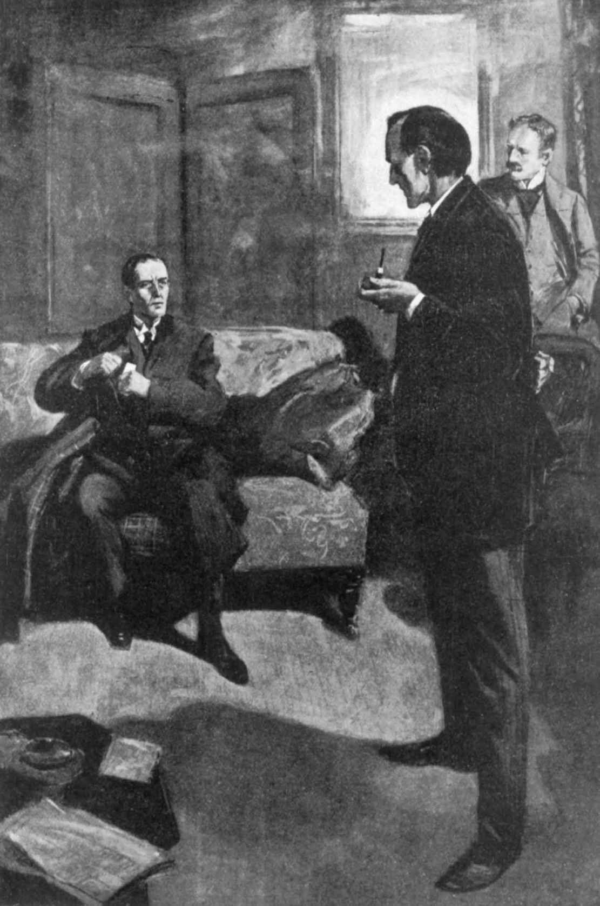

“我带来坏消息——可怕消息，福尔摩斯先生。”

“我也正担心着呢。”福尔摩斯说。

“你好像没有接到电报，没有吗？”

“我收到了一封信，是收到电报的人写来的吧。”

“是啊，可怜的道格拉斯。他们告诉我他原名是爱德华兹，可是对我来说，只知道他永远是贝尼托峡谷的杰克·道格拉斯。我跟你讲过的，三个星期前，他们夫妇两个乘帕尔麦勒号轮船到南非去了。”

“正是。”

“船昨晚到开普敦，今天早晨我收到这电报，道格拉斯夫人发来的。”

杰克在圣赫勒纳岛<a href="#part0135.xhtml_ch2"
id="part0135.xhtml_ch2-back">(2)</a>附近大风中坠海。无人知道如何发生此意外事件。

艾维·道格拉斯

“哎呀！结果是这样，这样！”福尔摩斯说，思索着，“哦，不用说，密谋策划的事件。”

“你是说，你的意思，不是偶然的意外事故？”

“世上没有偶然、意外。”

“他是被人谋杀？”

“当然是！”

“我想也是的。那些万恶的死酷党，该死的一伙复仇罪犯——”

“不，不是，我的好好先生，”福尔摩斯说，“是这里有一个高手，不必用什么截短的猎枪、六发左轮，这种笨做法。你会说真是个老手，大手笔。我可以告诉你，正是莫里亚蒂的手法，我一眼就看出。这次作案是伦敦指挥的，不是来自美国。”

“那，是什么动机呢？”

“因为这个人不甘心失败，这个人，长于斯、成于斯，身家性命全靠着这一手，他所要必得，所争必胜。一个大智的脑袋，一个庞大的组织。认准目标要除掉一个人，那是铁锤砸核桃——小题大做——不过这核桃是砸个稀巴烂了。”

“道格拉斯的事跟这个人有什么关系呢？”

“我只能说，这件事的消息首先得知于他莫里亚蒂的一个副手。这些美国佬有人悉心指点，有任务要跑到英国来动手，他们就和这个犯罪大顾问联手合作，国际罪犯都是这样。从这一刻起，他们锁定的人非死不可。第一步，莫里亚蒂显示自己的功力，开动他的机器大海捞针发现了他们的目标，然后他指示事情如何着手。但结果，他得到报告，鲍德温这一着失败，他于是就亲自出马使出高招。你听到我警告伯尔斯通庄园这位主人、你的贵友，以后的危险要比过去的大得多，我说对了吧？”

巴克捏紧拳头激愤地敲自己脑袋。“你是说，我们只有坐以待毙的分了？你是说没人能降伏这个魔王了？”

“不，我不是这样说，”福尔摩斯道，他的两眼好像看着遥远的未来，“我不是说无法打败他，但是你必须给我时间——时间，必须给我！”

我们一时静坐无语，福尔摩斯一对犀利的眼光直透那幔帐幕纱。

（1904年）

————————————————————

<a href="#part0135.xhtml_ch1-back" id="part0135.xhtml_ch1">(1)</a> 季审法庭（Quarter
Sessions），旧时一年开四次的法庭，1972年由Crown Court刑事法庭取代。

<a href="#part0135.xhtml_ch2-back" id="part0135.xhtml_ch2">(2)</a> 圣赫勒纳岛（St．Helena），南大西洋上的英属岛屿，1815—1821年拿破仑放逐于此。

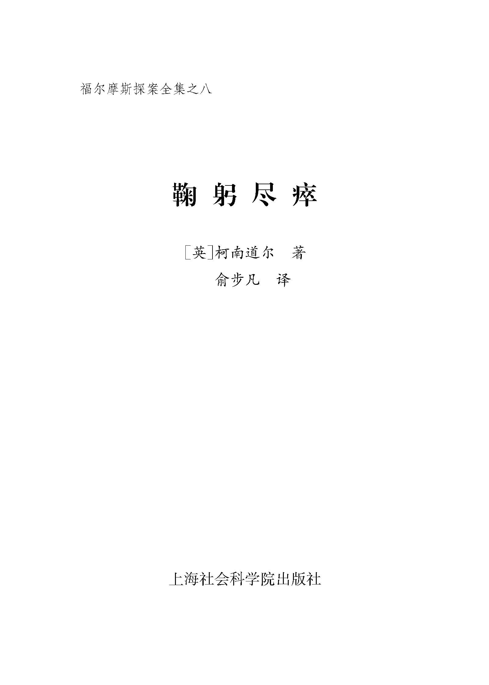

**图书在版编目（CIP）数据**

鞠躬尽瘁／［英］柯南道尔（Conan
Doyle，A．）著；俞步凡译．—上海：上海社会科学院出版社，2012

（福尔摩斯探案全集；8）

ISBN 978-7-5520-0109-9

Ⅰ．①鞠…　Ⅱ．①柯…　②俞…　Ⅲ．①侦探小说—小说集—英国—现代　Ⅳ．①I561.45

中国版本图书馆CIP数据核字（2012）第159636号

福尔摩斯探案全集之八

**鞠躬尽瘁**

------------------------------------------------------------------------

**著　　者：**［英］柯南道尔

**译　　者：**俞步凡

**责任编辑：**陈如江

**封面设计：**王小阳工作室

**出版发行：**上海社会科学院出版社

上海淮海中路622弄7号　电话63875741　邮编200020

http://www.sassp.org.cn　E-mail：sassp@sass.org.cn

**经　　销：**新华书店

**照　　排：**南京理工出版信息技术有限公司

**印　　刷：**上海中华印刷有限公司

**开　　本：**787×1092毫米　1/32开

**印　　张：**8.5

**插　　页：**2

**字　　数：**149千字

**版　　次：**2012年10月第1版　2012年10月第1次印刷

------------------------------------------------------------------------

ISBN 978-7-5520-0109-9/I·066

定价：29.00元

------------------------------------------------------------------------

**版权所有　翻印必究**

# 目录

[前言](#part0140.xhtml)

[维斯特里亚住宅案](#part0141.xhtml)

[布鲁斯-帕廷顿计划](#part0142.xhtml)

[鬼足之谜](#part0143.xhtml)

[红圈会](#part0144.xhtml)

[单身女士失踪案](#part0145.xhtml)

[奄奄一息的侦探](#part0146.xhtml)

[鞠躬尽瘁](#part0147.xhtml)

[返回总目录](#part0000.xhtml)

# 前言

歇洛克·福尔摩斯的朋友们很高兴获悉他依然健在，只是有时偶发风湿病，走路有点跛脚。他避居一个小农场已有多年，农场距离伊斯特本<a href="#part0140.xhtml_ch1"
id="part0140.xhtml_ch1-back">(1)</a>五英里，是一片丘陵地。他在那里研究哲学和农艺，以度时光。在这段休闲期间，他拒绝受理任何案件，即使再高的报酬也不例外，下定决心从此永远歇业退休。可是由于德意志战争的逼近，为服从政府的需要，他那非凡的智慧与丰富的经验再作贡献，又留下了历史性成果，这些都记载于《鞠躬尽瘁》篇中。还有几篇以前的探案记录，长久保存在我的文字材料中，现在也收入《鞠躬尽瘁》而辑成完整的一卷。

医学博士　约翰·H．华生

————————————————————

<a href="#part0140.xhtml_ch1-back" id="part0140.xhtml_ch1">(1)</a> 伊斯特本（Eastbourne），伦敦向南一海边胜地。

# 维斯特里亚住宅案

## 1．约翰·斯科特·艾克尔斯先生的奇异经历

我查阅记录本发现，此案上手是在一八九二年三月底阴风凄凄的一天，我们正坐着吃午饭，福尔摩斯收到一封电报，他马上草拟了复电。他没有说话，但一直在考虑这件事。之后站在火炉前，陷入沉思，抽着烟斗，不时看看电文。忽然，他转过身来，向我闪着诡秘的眼色。

“我想，华生，我们应该把你看成是个文学家，”他说，“‘怪诞’这个词，你该怎样解释？”

“奇怪——荒诞。”我回答。

他对我的解释摇摇头。

“应该还不止这些解释吧，”他说，“其实还含有悲剧和恐惧的意思。你回想一下你写的那些个故事，都叫广大公众久已感到头痛、感到厌烦了，你必须认识到，越奇怪不可思议，其中越有犯罪。想想那个‘红发会’，小故事，开头就真是奇怪得不可思议，到结果原来是铤而走险抢银行。另外，还有，‘五颗橘核’，那件事最奇怪荒诞，弄到结果原来是杀人灭口案。所以一见怪诞这个词，可不能掉以轻心。”

“电报上有这个词了？”

他便大声念电报。

适遇最怪诞不可思议之事，可否请教？

斯科特·艾克尔斯，

查令十字街邮局。

“是男是女？”我问。

“噢，男人，当然是。女人不会发先付回电费的电报的；要是女人，就自己来了。”

“准备见他？”

“我亲爱的华生，自从我们把卡鲁塞斯上校送去坐牢以来，你知道我有多无聊。我的脑子像一部空转的引擎，它原是制造来为工作而转动，没有工作便就空自转，空转得快要四分五裂解体了。生活平淡，报纸乏味，创造力、浪漫情怀，似乎都已经从这个犯罪世界上绝迹。也许你要问我了，如果有新问题，不管问题初看是多么微不足道，我要不要接手呢？哦，现在这个，大概我不至于弄错，是个委托人找我们来了。”

楼梯上传来有节奏的脚步声。一会儿工夫，一个壮实高大、灰白胡子、相貌令人敬畏的人，被引入室内。他持重的面相和高傲的态度，显露着他的身价，从他的鞋罩到他的金丝边眼镜，表明他是个保守党、教士、好公民，一个地地道道的正统派保守人士。但是受到某种强烈的刺激，扰乱了他原有的宁静，他那怒发冲冠的样子，气得通红的面颊，紧张激动的神态，都说明他内心无法镇定。他一进来就开门见山谈问题。

“有件极不愉快的事，偏偏就叫我给遇上了，福尔摩斯先生。”他说，“我这辈子从来没有过这种情况，太不像话了——绝对不能容忍，我一定要讨个说法，讲个明白。”他怒冲冲喘着粗气。

“请坐下，斯科特·艾克尔斯先生，”福尔摩斯同情地安慰他，“首先，我请问一下，你来找我究竟为了什么事？”

“哦，先生，事情倒是不怎么样，和警察都没关系。可是你一听到情况，保证你也会认同，我可不能忍气吞声白受窝囊。私家侦探这一号人，我原本一点也没有兴趣，但是你的大名，是我久仰——”

“承蒙抬举。但是第二点要请问，你为什么不是立刻就过来呢？”

“你这是怎么个意思？”

福尔摩斯看了一下表。

“现在是两点一刻，”他说，“你的电报大约一点钟发的，而你的麻烦是在你一早醒来就遇到了，这从你的衣着修饰上看得出来。”

我们的委托人用手捋捋平没有梳过的头发，摸摸没有刮过的下巴。

“你讲得不错，福尔摩斯先生，我来不及想到要梳洗，我忙不迭赶快离开那所房子。我没来你这里之前，是到处去打听，去问了房屋经纪人。你知道，他们说加西亚先生的房租都已经付清，说维斯特里亚住宅一切正常没问题。”

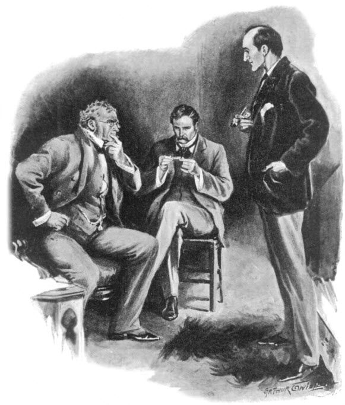

“我来不及想到要梳洗。”

“慢着，慢着，先生，”福尔摩斯笑道，“你像我的朋友华生医生，他有个不好的习惯，叙说事情没头没脑。请你把思路理一理，按部就班挨次序告诉我，是什么事情把你急得梳头修面都顾不上，礼靴、背心纽扣都没好好扣，就跑着找人问事、帮忙。”

我们的委托人苦着脸看看自己上下不整齐的怪模样。

“也真是，太不像样，福尔摩斯先生。说真的，我这辈子还从来没有遇上过这样的事情。我把这件怪事从头至尾说给你听。你听我一说，你会觉得，肯定的，觉得难怪我乱糟糟这副模样。”

但是，他还没开始说就被人打断了。门外一阵响声，接着是哈德森太太推开门，让进两个威武雄壮的警方当官模样的人，其中一个是和我们很熟悉的格雷格森，苏格兰警场的警官，雄赳赳气昂昂，就他那个圈子里的人，他称得上是一名干将了。他和福尔摩斯握手，介绍他的同道是萨里警署的贝尼斯警官。

“我们一块儿追踪，福尔摩斯先生，一追追到了这个方向。”格雷格森的一对巴儿狗似的大眼珠转向我们的客人。

“你是李街波汉公馆的约翰·斯科特·艾克尔斯先生吧？”

“是的。”

“我们找你找了一上午。”

“你们能跟上他，是靠的电报，没问题。”福尔摩斯说。

“正是，福尔摩斯先生。我们到查令十字街邮局找到线索，才跟到了这里来。”

“你们跟住我为什么？要怎么样？”

“我们希望有你的供词，斯科特·艾克尔斯先生，昨天晚上，厄榭那边维斯特里亚住宅的阿洛伊修斯·加西亚先生的死亡是怎么回事？”

我们的委托人身子坐直起来，瞪出眼睛，大惊失色。

“死了？你是说加西亚死了？”

“是的，先生，他死了。”

“怎么了？出什么事了？”

“谋杀，确定无疑是谋杀。”

“哦，上帝！太可怕！你的意思——你的意思，不是怀疑上我了吧？”

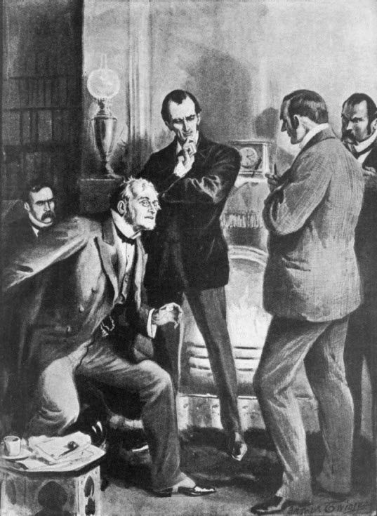

“不是怀疑上我了吧？”

“有你的一封信，在死者的口袋里发现，信上看出，昨天你要到他家里去过夜。”

“是这样。”

“噢，是这样，那就没错。”

警官随即拿出记事本。

“等一下，格雷格森，”歇洛克·福尔摩斯说，“你们要作的记录是一份普通陈述，是不是？”

“这是我的职责，要明确提醒斯科特·艾克尔斯先生，他的陈述将用来作为控告他的证词。”

“艾克尔斯先生在你们还没有来的时候，正要告诉我们这件事情。我想，华生，白兰地苏打水喝一点对他有好处。现在，先生，我建议你不必顾虑，他们来归他们来，你还是照你原先的，要怎么讲就怎么讲，就像没有被打断一样。”

我们的来客把白兰地一饮而尽，脸色恢复了。朝警官的记事本疑疑惑惑地看一眼，立即开始叙述怪诞的事情经过。

“我是单身，”他说道，“兴趣、精力全在社交方面，交了一大堆朋友。朋友当中有一个是做酿酒生意的人，已经退休了，他叫麦尔维尔，住在肯辛顿阿伯玛尔大楼。几星期之前，是一起吃饭在饭桌上，通过他认识了一个年轻人，名叫加西亚。他是西班牙人，我知道，他还同他们的大使馆有点联系。他讲的一口英语很棒，言语、态度叫人喜欢。长得很帅，我这辈子都没见过有他这么帅气的。

“这年轻人和我很快就建立起友谊。他第一天见面就对我很好，没两天就到李街来看我了。就这么一回生两回熟，最后邀我到他家去住几天，在厄榭和奥克肖特之间的维斯特里亚住宅。昨天晚上，我应约去了厄榭。

“他家里的情况，在这之前已经和我讲过。他同一个忠诚老实的仆人住一起，是他同胞，照料他的一切起居饮食。这个仆人能讲英语，掌管家务。还有一个手艺高超的厨师，他说是个白人跟印第安人的混血儿，在旅行的时候找到的，能烧一桌大餐。我记得他说过，布萨里的中心发现这么个住处有多么奇怪，我也同意他这个讲法。事实马上就证明它比我想的还要奇怪。

“我乘车来到这个地方——大约在厄榭南边两英里远。房子挺宽敞，背对大路，一条弯弯曲曲的车道，两旁夹着不矮的常青灌木。那是一幢破烂的房子，不知有多少年没有整修。我的马车走过长满乱草的车道，到了大门前，那风雨吹打得污黑斑驳的门面，使我不禁怀疑自己拜访这么个了解不深的人，是不是莽撞。这时，他亲自来开门了，欢迎我，态度热诚，叫男仆替我拎包，带我到卧室。男仆面色黝黑、阴沉，整个屋子灰溜溜不舒畅。我和他面对面坐着用餐，他尽力殷勤接待，但好像心不在焉，说话前言不搭后语，我不懂他在讲些什么。他不住地用手指敲打着桌面，牙齿咬手指甲，还有一些表现，神经很紧张的样子。一顿晚餐，做得味道很差，招待也并不周到。仆人板脸不说话，叫人很扫兴。老实对你说，这晚上我有好几次想找借口回李街算了。

“有一件事情我记起来，可能对两位先生调查了解情况有帮助。当时我是一点也没有在意。晚饭快吃完的时候，仆人递进一张便条。我注意到，主人看了以后，更加心神不定，比刚才更像掉了魂似的，连心不在焉似的讲话也不和我讲了，坐着一根接一根抽纸烟，只顾自己一个劲儿想着什么。那便条上什么内容，他没跟我说起。大约到了十一点钟，安排我去睡觉。过了一阵，加西亚在门口张望——房里这时暗着——问我有没有拉铃叫过人。我说我没有拉过铃。他说很对不起，这么晚了还来打扰我，说是时间已经快到一点了。这之后我就睡着了，一夜没醒，睡得倒很好。

“现在要讲到吓人的事情了。等我醒来，天已大亮，一看表，时间都快九点了。我当夜特别关照要八点钟叫醒我，这个事情怎么会忘了，我非常奇怪。我一骨碌跳起身，拉铃叫仆人。没人应声。我拉了又拉，就是没人应。一想知道了，铃出了毛病。赶紧穿上衣服，跑下楼去，心里很光火，要叫送热水来。你可以想象，我有多么吃惊，居然一个人也找不到。我在厅里高声喊，没人。一个房间一个房间跑着看，没人。主人头天晚上指给我看过他的房间，我就去敲他的门，没有人答应。转了把手推门进去，房间里空的，看床上的样子，根本没有人睡过。他和其他人都跑掉了。这家的外国主人、外国仆人、外国厨师，一夜之间全都没了踪影！我拜访维斯特里亚住宅就是如此结果。”

歇洛克·福尔摩斯搓着双手，咯咯地笑，因为他收集的奇闻轶事中又多了这一件怪事。

“你遇到的这个事，据我所知，可算绝无仅有，”他说，“请问先生，后来怎么样呢？”

“我火得很。一上来想的是我受人捉弄，拿我来开玩笑。我收拾好东西，屋门猛地碰上，拎着包回厄榭了。我去找了村里最大的房地产经纪商阿兰兄弟商号，发现那间别墅正是这家商号出租的。我忽然想到，从前后过程来看，不像是故意愚弄我，主要目的是为了逃避房租。现在正是三月底，季度结账日快到了。可是这个看法也不对，房产经纪人对我的提醒表示感谢，但是告诉我，房租都预付好了。随后我来到城里，找了西班牙大使馆，大使馆不知道这个人。这下，我就去找麦尔维尔，我第一次遇见加西亚是在他的家。可是我发现原来他也不了解加西亚，知道的情况还没有我多。到最后，等有了你的回电，才来了你这里。我是素有耳闻，你对疑难案子很有办法。可是现在，警官先生，我明白，你刚才进屋讲的那个话，事情还有下文，还发生了死人的事。但我可以向你们保证，我讲的话句句都是实话。除了我给你们讲的以外，我完全不知道这个人怎么遭到了不测。我愿意尽一切努力维护法律。”

“这我相信，斯科特·艾克尔斯先生——我相信，”格雷格森语气友善地和他说，“我应当说，你讲的情况同我们注意到的事实非常吻合。比如，晚餐时候来过一张纸条子。你有没有注意到这张便条后来怎么了？”

“我注意到了，被加西亚揉掉扔进了火里。”

“这你是知道的啰，贝尼斯先生？”

这位乡村警探是个壮实的大块头，红皮色，他那张臃肿的脸多亏有一双特别传神的眼睛得到弥补，眼睛深嵌在皱纹重重的面颊和眉毛之间。他微微一笑，从口袋里掏出一张折叠的褪了色的纸。

“炉子有护栏，福尔摩斯先生，扔纸团碰了护栏，我是在护栏后面捡到的，没有烧掉。”

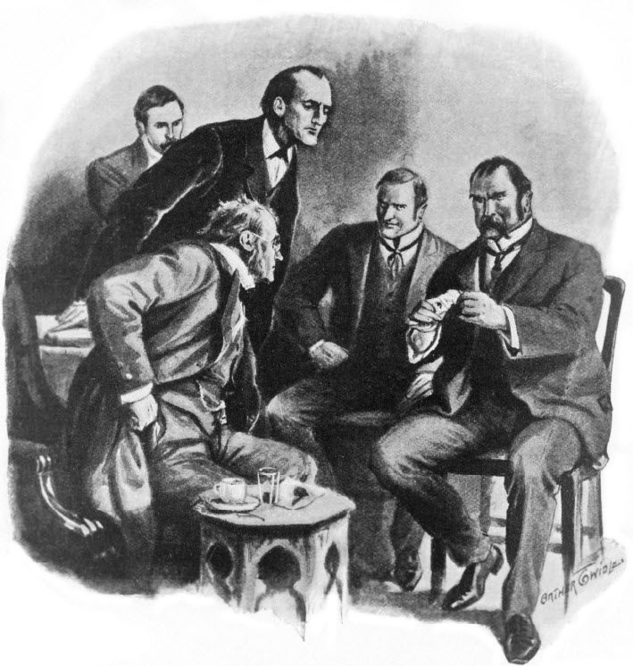

“纸团没有烧掉。”

福尔摩斯笑笑，很是欣赏。

“你一定把屋子检查得很仔细，连这小纸团都给你捡到。”

“绝无遗漏，福尔摩斯先生，我做事就是这样。要我念一念吗，格雷格森先生？”

伦敦人点点头。

“条子是普通的横格纸，没有水印，是一页纸两对折大小，用短剪刀剪两下剪开，再折成三折，紫色蜡封好。封得匆忙，用平的椭圆物压过，写给维斯特里亚住宅加西亚先生。这样写的：

我们自己的颜色，绿和白。绿开，白关。大楼梯，第一过道，右第七，绿台面呢。祝顺利。D．

这是女人的笔迹，笔触很尖，字很细，可是地址是用另外一枝笔写的，或者是另外一个人写的，比较粗比较重，你看这。”

“条子里头有名堂，”福尔摩斯看了一眼说，“我真佩服你，贝尼斯先生，你作调查很注意细节。还有几个小地方值得补充。椭圆形封蜡，肯定是一枚袖子纽扣——还有别的什么东西是这样的形状呢？剪刀是弯头指甲剪刀，剪两刀，很清楚可以看出每一刀都有弧形。”

乡村警探咯咯地笑了。

“我以为果子汁已经给我榨干，想不到还挤得出来，”他说，“我以为这条子也没啥用，玩点鬼花头罢了。女人嘛，就是那种花头，免不了那种事。”

这样谈着的时候，斯科特·艾克尔斯先生却坐在那里心神不宁。

“你发现这条子，我很高兴，事实证明我讲的不是假话，”他说，“可我得申明，加西亚出了什么事，我是一点也没听说；他家里怎么回事，我也是一点都不知道。”

“加西亚嘛，”格雷格森说，“容易回答，他死了。今天早晨，发现死在奥克肖特公地上，离他家大约一英里。脑袋给砸开了花，用沙袋这类重物给砸的，不是砸了个口子，是砸崩了，脑浆都溅出来。那个地方没有人，周围半英里地以内没有人家。看得出是从后面遭袭击给打倒，打死以后，凶手还不停地砸，砸了有段时间，手段非常残忍。凶手没留下脚印，也不见有别的痕迹。”

“抢劫了吗？”

“没有，没有抢劫的迹象。”

“太惨了——太惨，太可怕，”斯科特·艾克尔斯先生颤声说，“可这事叫我撞上，真是倒了大霉。我一点也不相干。邀请我作客去，屋主人是他自己半夜跑到野外，落得这么悲惨的结局，我怎么会给扯进这个案子里呢？”

“很简单，先生，”贝尼斯警官回答他，“死者身上惟一的材料，口袋里是你的一封信，信上说你到他家过夜。就是你去的这一夜，他死了。正是这封信，我们才知道死者的姓名、住址。我们早上九点过后找到他家，你不在了，家里也不见有其他的人。我发电报给格雷格森先生在伦敦找你，我自己调查了维斯特里亚住宅。然后我进城，会同格雷格森先生一起来到这里。”

“现在我想，”格雷格森说，站起来，“这个事需要立案调查，你跟我们到局里走一趟，斯科特·艾克尔斯先生，我们要把你的陈述记录作为供词。”

“可以，我马上去。不过，我还要聘请你帮助我，福尔摩斯先生，请求你不惜代价为我主持公道。”

我的朋友转向乡村警官。

“我想，你不反对我和你合作吧，贝尼斯先生？”

“哦，当然，不胜荣幸之至，先生。”

“从你办的事来看，你动作很快，很干练。我想问一下，有没有迹象可以看出死者遇害的确切时间？”

“他一点钟时已经在现场，天在这个时间下的雨，他遇害肯定是在下雨以前。”

“但是那完全不可能，贝尼斯先生，”我们的委托人叫了起来，“他说话的声音我不会听错，我可以发誓，这个时间他来我睡的房间和我说着话呢。”

“怪是怪，但绝不是不可能。”福尔摩斯说，笑了笑。

“有根据吗？”格雷格森问。

“表面上看，这案子不算复杂，虽然表现出若干新奇的特点。我对事实需要作进一步的了解，了解之后，才敢给出肯定的意见。哦，顺便问一问，贝尼斯先生，你检查屋子，除了便条，还发现其他值得注意的东西没有？”

这位警探惊愕地看看我的朋友。

“有，”他说，“有一两样很值得注意的东西。恐怕要等我到局里把事办完，你就会知道，而且还会给我提供一点意见。”

“一切看你方便了，”歇洛克·福尔摩斯说，打了铃，“请送这几位先生，哈德森太太。还麻烦你把这封电报叫人发出去，要付五先令回电费。”

来客走掉以后，我们静坐一会儿。福尔摩斯紧抽着烟，目光锐利的两眼上面两条眉毛紧皱，头前倾，表现出他那特有的追求心切的神情。

“噢，华生，”他突然回头问我，“你怎么个看法？”

“这位斯科特·艾克尔斯神秘莫测，我说不上来。”

“这桩案子呢？”

“哦，加西亚的人全都失踪，这个情况，我认为他们多少跟谋杀有关，行凶之后逃避法律制裁。”

“这也是一种可能性，一种说法。从表面来看，你得承认，他的两个仆人要是谋害他，偏偏在有客人来的这天夜里动手，这未免奇怪。那好些天里，夜夜都是他一个人，他们满可以怎么干掉他都行。”

“可是，他们为什么要逃走呢？”

“是啊，他们为什么要逃走？这里面大有文章。另一个大问题，我们的委托人斯科特·艾克尔斯所遇的情况，也是奇怪。现在，我亲爱的华生，人的智力对这两大问题难道已临极限，不能作出解释？如果能作出一种解释，也能说明那张谜语字条特定的意思，那就好，就值得暂且拿来作为一种假设，等到新发现的事实为我们所掌握，能用以证明罪犯的阴谋诡计，那我们的假设就会渐渐成为案子的结论。”

“但是我们能作什么假设呢？”

福尔摩斯仰靠椅背，半闭眼睛。

“你必须承认，我亲爱的华生，开人玩笑不是这样开法，不要去想。这里明摆着是件极严重的刑事案，其结果已经呈现。把斯科特·艾克尔斯哄骗到维斯特里亚住宅，其中必有关系。”

“有什么样的关系呢？”

“让我们一环扣一环连起来。明显的情况，这个西班牙青年和斯科特·艾克尔斯之间，陌陌生生忽然那么热火，这友谊很不自然，是西班牙人主动。那天才见第一面，回头便就不辞路远跑到伦敦来拜访艾克尔斯。接着保持紧密接触，很快就邀请他下乡到厄榭。这里头，他对艾克尔斯打什么主意？艾克尔斯对他有什么好处？我看不出这个人有什么魅力。他并不特别聪明——远非机智灵活的拉丁人的族类。那么好了，是不是加西亚为了某种目的选人选了好久，才发现、看中了他呢？他身上有特别的长处吗？我说他正好具有。他是个典型的有传统尊严的英国人，足可以去对付另外的英国人，是一个活人证。你自己已经亲眼见到他的陈述，两位警探根本没有再加追问，因为他的陈述无可挑剔。”

“要他作什么人证呢？”

“结果他没有作证，事情出问题，有了变化，否则就要他作证。这是我对本案的看法。”

“我明白了，他可能用来证明不在犯罪现场。”

“正是，我亲爱的华生，是要用他来证明不在犯罪现场；维斯特里亚住宅里的人在一同策划实施一个阴谋，这从道理上推测，能讲得通。不管它是什么，我们可以推定计划实施阴谋的时间是一点钟以前，他们在时间上耍花招，这很容易做。让斯科特·艾克尔斯早早上床睡觉，时间比他以为的要早。情况很可能是这样，加西亚找个由头告诉他时间是一点钟，这时候实际上十二点都还没有到。如果加西亚要去干什么事情，事完之后赶在上述蒙骗的时间里回来，一旦面对指控，他就可以有充分的证据作出强有力的反驳。于是，这位正人君子的英国人在随便哪个法庭上，都一定会宣誓作证说被告这段时间一直是在自己家里。所以，面临再糟的情况他们也不怕，这张王牌一甩就能对付过去。”

“对，对，我懂了。那其他人都不见了是怎么回事？”

“我还没有掌握全部事实，但我看不会有不可逾越的障碍。只不过若是拿眼前这点材料强加推论的话，就要犯下错误，就会不自觉地拿这些材料来凑合你的假设，想自圆其说。”

“那封信呢？”

“那上面怎么写？‘我们自己的颜色，绿和白。’听上去是赛马。‘绿开，白关。’很清楚这是信号。‘大楼梯，第一过道，右第七，绿台面呢。’这是指示一定的地点。这事弄到末了我们可以发现一个忌妒吃醋的丈夫，肯定就是这类结果。很清楚这是一件危险的差事。要不，这个女人不会说‘祝顺利’。D——应该是这条路的指路人。”

“这男人是个西班牙人，我推测D代表Dolores多洛蕾丝，西班牙很普通的女人名字。”

“好，华生，好极了——但是，这种说法难以成立。西班牙人给西班牙人写信，应该用西班牙文。这个写信人肯定是英国人。好了，我们歇歇神，耐心等待警官再回来，他们能有作为。同时，还要多亏好运气，让我们免掉几个小时难耐的懒散无聊。”

萨里的警官还没有回来，福尔摩斯发的电报已经有了回电。福尔摩斯看过，正要夹进笔记本，看见了我期盼的眼色，他咧嘴一笑，把电报扔给我。

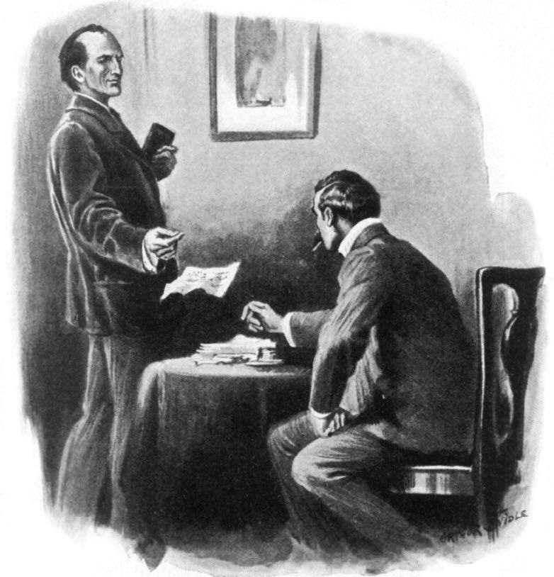

他咧嘴一笑，把电报扔给我。

“我们在高层人士圈子里打转。”他说。

电报是一份名单和地址：

哈林比勋爵：丁格尔林幽谷；乔治·弗利奥特爵士：奥克肖特塔楼；治安官海尼斯·海尼斯先生：帕迪街；杰姆斯·巴克·威廉斯先生：福顿古堡；亨德森先生：高府第；约舒亚·斯通教士：下沃尔斯林。

“这就缩小了目标范围，方便了我们的行动，”福尔摩斯说，“贝尼斯，没有问题，是个脑子清楚的人，已经实施了相同的计划。”

“我不太明白。”

“哦，我亲爱的伙计，我们已经得出一个结论，加西亚晚餐中收到信，是个约会、幽会。现在，对内容的理解如果正确无误，为了守信赴这个幽会，就要登上主楼梯，找走道上的第七个门。十分明显，那是一幢很大的大房子。也同样可以确定，这幢房子离开奥克肖特不会超过一到两英里。因为加西亚往那个方向步行，根据事实，我可以判断，他一定要及时回到维斯特里亚住宅，才能达到说明他不在犯罪现场的目的，那就只能是一点钟以前的事情。奥克肖特附近的大宅数量有限，这就很简单了，我向斯科特·艾克尔斯提到的房屋经纪人发电报询问，回电列了一张单子，姓名也在这封回电里。我们这团乱麻的另一头必在其中。”

将近六点钟的时候，我们在贝尼斯警官的陪同下来到了美丽的厄榭萨里村。

福尔摩斯和我都带了过夜用品，在布尔找到了舒适的住处。最后，我们和警官一起走访维斯特里亚住宅。那是三月一个漆黑的寒夜，当我们顶着迎面而来的急风细雨，穿过荒野公地，朝那悲剧的目标走去时，此情此景真是十分协调。

## 2．圣佩德罗之虎

走了一两英里凄清的路，来到一座高大的木围门。进门是一条阴郁的栗树夹道，顺着这条弯曲的浓荫车道，我们走到一幢低矮黑暗的房屋前。在蓝灰色的夜空下，房屋显得乌黑沉沉，屋门左方的前窗透着幽幽灯光。

“由一名警察看着这屋子，”贝尼斯说，“我来敲敲窗。”他从草坪上走过去几步，手敲窗玻璃。透过灰蒙蒙的玻璃，我隐约看见有个人从火炉边的椅子上跳起来，听见屋子里传出一声惊叫。不一会儿，一个脸色苍白、喘着气的警察来开门，烛光在他颤抖的手中晃悠。

“怎么回事，沃尔特斯？”贝尼斯冲他问道。

警察用手帕擦擦额头，长长地松了一口气，似乎放心了。

“你来了就好，先生。夜真长，恐怕我的神经不管用，不如以前了。”

“你的神经，沃尔特斯？我看你是没有神经了吧！”

“哦，先生，这屋子太冷落，还有厨房里的那东西。你刚才一打窗，我怕是有个怪物又来了呢。”

“又来什么了？”

“鬼，先生，真的，窗上有鬼。”

“窗上有什么？什么时候？”

“大约两个钟头前，天刚黑，我坐在椅子上看报，不知怎么，我一抬头，看见下面那格窗玻璃贴着一张脸往里看。我的天哪，先生，那是什么脸呀！准要叫我做噩梦！”

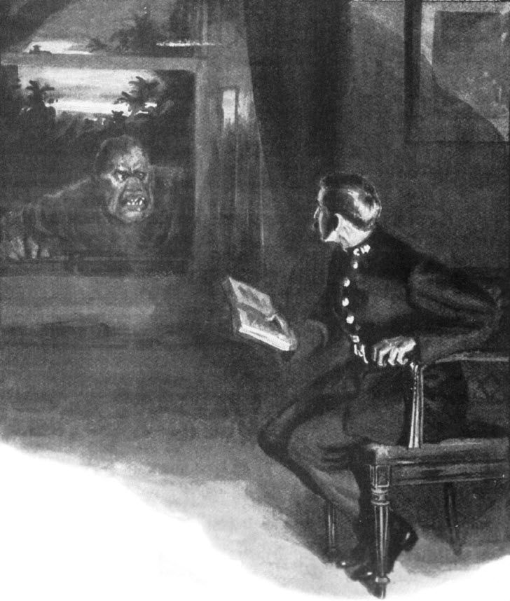

“天哪，那是什么脸呀！”

“瞧你，瞧你，沃尔特斯，像是个警察讲的话吗？”

“我知道，先生，我知道，可太怕人了，先生，不承认也是不顶用。它不是黑，先生，可也不是白，说不上到底什么颜色，像是灰不溜丢土疙瘩上泼洒了牛奶。说它大小——有你两个脸盘这么大，先生。那个样子——两只瞪出的大眼珠，张着一口白牙，像要吃人的野兽。说实话，先生，我都不动弹了，气都不敢出了。后来一眨眼就不见了，跑了。我跑到外边，到林子里看，感谢上帝，什么也没见着。”

“还好我相信你是个好人，沃尔特斯，要不你这工作我要给你记个过失。要是真遇见鬼，警察的职责，怎么可以光求上帝，不上去出手逮住它！这件事，我看，你是神经紧张，眼花了吧？”

“这事不急，容易解决。”福尔摩斯说，点亮袖珍烛灯。“没错，”他很快检查了草地，回进来报告，“有十二码的鞋印，我可以确定。按照脚的尺寸来推断，该是个巨人。”

“查下来怎么样？”

“好像是穿过矮林向公路去了。”

“好吧，”警察板着脸想一下说，“不管他是什么人，想要干什么，反正现在是不见了，我们有更紧要的事要办。那么，福尔摩斯先生，这就让我带你把屋子看看吧。”

所有卧室、起居室都进行了仔细检查，什么也没有发现。显然，屋里人没有动过什么东西，没有带走任何东西。全部家具包括细小物件都是连屋子一起租用的，留下的衣服上都有高霍尔本的马克斯公司标记。发电报询问过，回电说衣服的钱买主都付清了，其他情况店主马克斯一概不知。还有一些零星小物品，几只烟斗，几本小说书，有两本是西班牙文，一支老式的销子发火左轮枪，一把吉他，这些都是个人物件。

“这里都没有什么，”贝尼斯说，手里拿着蜡烛，把一间一间屋子走过来，“现在，福尔摩斯先生，请随我看看厨房。”

厨房黑幽幽的，天花板高敞，位置在屋后。角落里有一摊草，那显然是厨师的草铺。桌上堆满着食物杯盘、用脏的餐具，都是昨天晚餐余下的残羹剩肴。

“瞧这儿，”贝尼斯说，“你看这是什么？”

他把蜡烛举到一样奇怪的东西前面，这东西立在碗橱旁边，像个人形，干瘪，皱缩，黑乎乎，皮包骨，说不准是个什么东西，有点像是个小矮人的銃尸。我仔细检视了一番，心想，是个小黑人木乃伊。再一看，形体蜷曲，又像是古猿。我越看越拿不准了，分不清是动物还是人。有两圈白色贝壳串挂在胸前。

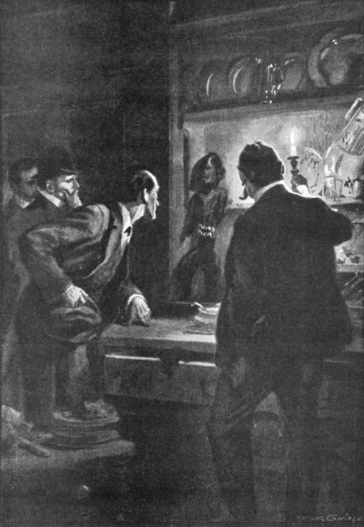

这东西立在碗橱旁边，像个人形。

“很有趣——非常有趣，真是！”福尔摩斯说，眼瞧着这具丑陋的遗物，“还有别的什么？”

贝尼斯不说话，领我们到洗涤槽，把蜡烛举向前去，我们看见一只白颜色的大禽类，躯体、翅膀、腿脚都给撕成七零八落，上面还带羽毛，乱糟糟地扔在槽里。福尔摩斯指指断掉的头，上面有垂肉。

“一只白公鸡，”他说，“太有趣了！确实是一件不可思议的奇案。”

贝尼斯先生再继续展示最后的凶案迹象，从洗涤槽底下拖出一只铅桶，桶里装的全是血。又从桌子上取来一大盘烧黑的碎骨。

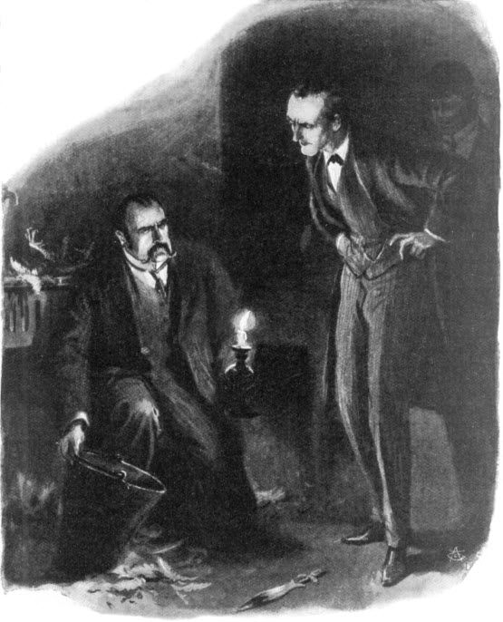

从洗涤槽底下拖出一只铅桶。

“这是杀了什么，又焚尸，我们都是从火堆里拣出来的。今天早上请了一位医生来看，他说这些不是人骨头。”

福尔摩斯笑着，搓起双手。

“我要恭喜你呢，警长，你接办了这么一件极为罕见、深有教益的案子。你的能力，恕我说一句恭维的话，似乎胜过你的机会。”

贝尼斯警官的小眼睛闪着得意的光芒。

“你说得对，福尔摩斯先生。伦敦以外，我们各地的工作都停滞不前，眼下这么一件案子真是天赐良机，我当然要抓住这机会，不能错过了。这些骨头，你是怎么个看法？”

“一只羔羊，我看是，可能是小山羊。”

“还有那只白公鸡呢？”

“是奇怪，贝尼斯先生，非常奇怪，以我所见，绝无仅有。”

“是的，先生，这屋子里住的人奇怪，做的事更奇怪。其中一个已被打死，难道是他的同伴去盯住他，把他打死的？如果是这样，那我们就抓他们，现在所有港口都监视起来了。不过我本人看法不一样。是的，先生，我自己的观点很不一样。”

“你有你的分析了？”

“我习惯独立作业，福尔摩斯先生，这么做是因为关系到我个人的荣誉。你已经成名了，我还在努力之中。我希望以后能够说，本案是由我独力侦办完成的，并没有靠你的帮助。”

福尔摩斯朗声大笑。

“放心吧，放心，警长，”他说道，“你走你的路，我过我的桥。我的成果，可以随时供你使用，只要你觉得需要，愿意向我索取。我想，这房子里要看的都已经看了，我的时间有限，用到别处更有收获。奥勒瓦尔<a href="#part0141.xhtml_ch1"
id="part0141.xhtml_ch1-back">(1)</a>！祝你好运！”

我可以举出福尔摩斯许多微妙的举动，这些都是别人不注意的，只有我一一看在眼里，这显示他已经追上了一条关键线索。在无心的、不经意的旁观者眼里，一点也觉察不出他那灼灼有神的眼睛、轻快的举止中潜藏着激烈急切的情绪，我则确信他已有对策，正付诸行动。按他的习惯他不必说，按我的习惯我不必问，我们心气相通。我足以同享他的游猎，从旁提供一点微力将目标捕获，而不致多有无意义的打扰，分散他一门心思紧张用脑。反正只要时间一到，我一切都会明白。

所以，我等着——但是越等越失望，白等了一场。一天又一天过去了，我的朋友似乎没有向前跨进一步。一天早上，他在城里待了半天，我偶然听出他是去了大英博物馆。只除了这一次外出，他都是成天消磨于独自一人散步，要不然就是找村里的一帮碎嘴子去闲聊，留心同这些人结交。

“我知道，华生，到乡下住上一个星期对你很是值得，”他说，“看看树枝嫩芽抽绿，重见榛树柔荑花序，很是赏心悦目。我这么带上一把锄头、一只提桶、一册植物学基础读本，就可以过上几天求学问有收获的日子。”他自己这副装备打扮，寻寻觅觅，但是晚上带回来的，只见不多几株小植物而已。

我们漫步闲谈的时候，有时也遇到贝尼斯警官。他向我的同伴打招呼，一张红红的胖脸堆满笑容，一对小眼睛闪闪发光。他很少谈及案子情况，但从他的片言只语中我们听出他对事态进展不无得意。然而我必须承认，到案子的第五天，大大出乎我的意料，不得不惊奇。这天打开晨报，看到大字标题：

**奥克肖特谜案揭晓**

**凶手嫌犯已经落网**

我把这标题一念，福尔摩斯如芒刺在背从椅子上跳了起来。

“什么！”他叫道，“你是说贝尼斯抓到凶手了？”

“显然是咯。”我说，便念了以下的报道：

昨晚深夜厄榭及所邻地区闻讯奥克肖特凶案之嫌犯已告捕获，随即引起极大之轰动。据了解，维斯特里亚住宅之加西亚先生被发现死于奥克肖特公地，尸体有明显遭到极度暴力袭击之重创，而其仆人及厨师于同晚逃逸，毫无疑问，两人涉嫌重大。据尚未证实之消息称，被害人屋中藏有贵重物品，贵重物之受觊觎为作案之动因。贝尼斯警长承办本案，竭尽全力，获悉负案逃犯隐匿之地，研判确信嫌犯并未远遁匿迹，必藏伏于事前有备之地。然侦查之初即知凶嫌终将落网，因该厨师曾为一二商贩于窗口获见此人面目奇异而足证——系一巨大丑陋之黑白混血人，明显具有黑人形态，而皮色偏黄。彼案发后亦曾为人所目击，因其当日夜晚胆敢复归窥探维斯特里亚住宅，而受沃尔特斯警士所侦察并追踪。贝尼斯警长研判其返屋窥视必具目的，因而必欲再来，故弃守屋内而设伏于树丛。该犯果然中伏，于昨晚经搏斗被擒获。唐宁警士在搏斗中遭该野人重伤。吾人所知，嫌犯提交地方法官，需随即还押于警方，此案情因该犯之被捕遂必有大进展矣。

“我们应当赶快去见贝尼斯，”福尔摩斯叫道，拿起帽子，“趁他出发前找到他。”我们急忙上了村路。果然如我们所料，截住了警官，他刚刚从住所出来。

“你看到报纸了吧，福尔摩斯先生？”他问道，一边拿出一份报纸给我们。

“是呀，贝尼斯，我看到了。我想给你提个朋友的忠告，请不要见怪。”

“你是说忠告，福尔摩斯先生？”

“我仔细研究了这个案件，我觉得你的路子不对头，我不想让你在这条路上滑得太远，那是没有出路的。”

“谢谢你的好意，福尔摩斯先生。”

“请相信，我全是为你好。”

这时候，我好像看到贝尼斯的小眼睛有一只眼睛眼皮一抖一跳。

“我们都已经同意，各走各的路，福尔摩斯先生，我正是这样做了。”

“哦，那好吧，”福尔摩斯说，“请别见怪。”

“怎么会呢，先生。我相信你对我是一片好意，但我们是两家，不是一个系统、一种方式，福尔摩斯先生。你有你的路数，我有我的绝招。”

“那就不谈了吧。”

“欢迎你随时关心我这边的消息。这个人是十足的野人，力气大得赛过拉车的马，像魔鬼那么凶狠。唐宁的拇指差一点被他咬断，还好大家把他按倒了。这人一句英语也不会讲，叽里哇啦不知嚷些什么。”

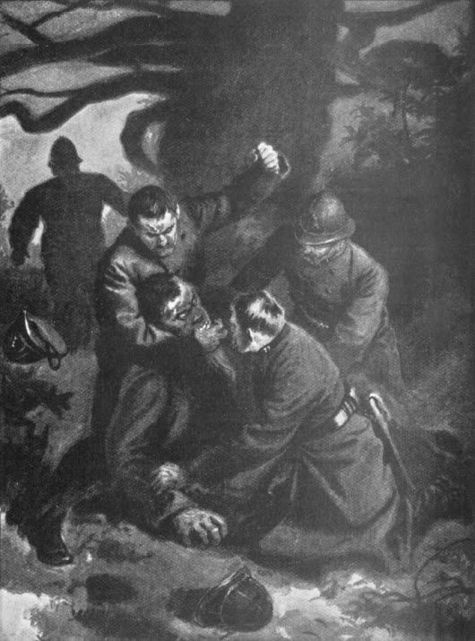

“还好大家把他按倒了。”

“你们有证据证明他是谋杀主人的凶手？”

“我没有这样讲，福尔摩斯先生，我没有这样讲。我们是旗开得胜，你做你的，我做我的，这原本就是讲好了的。”

福尔摩斯耸耸肩，我们就一起走开。“说服不了他就算，瞎子骑马乱闯。随便，照他说的，我们各走各的路，且看结果就是了。不过贝尼斯警官身上总有点什么怪异，让我无法理解。”

“那椅子上坐，华生，”福尔摩斯说，这时我们回到了布尔的下榻处，“情况我要让你有个了解，今夜我可能要请你帮忙。让我把本案的来龙去脉，就我所知向你摊一摊。主要案情还是简单的，不复杂，但要抓人的话，还有很大的距离，这方面还有鸿沟需要填平。

“我们回到那张条子上去，就是加西亚死的那天晚上送到他手上的那张。贝尼斯的想法，加西亚的仆人和凶案有关，我们把这暂搁一边。这是有事实根据的，因为是他安排斯科特·艾克尔斯来的，这只能出于一个目的，制造不在犯罪现场的证据。接着是加西亚一手策划这天晚上的事，当然是策划犯罪的事，他正是死于晚上实施犯罪计划的过程之中。我说是‘犯罪’，因为只有出于犯罪阴谋，才要制造不在现场的假象。那么，是什么人要了他的命呢？肯定，策划的犯罪阴谋是针对这个人的，是这个人杀了他。推论至此，我认为我们还是站得住脚的。

“现在我们可以说明加西亚家里仆人失踪的原因。他们都是这件真相不明罪案中的同谋。如果加西亚作案得手回来了，就用得着这个英国人去作证撇清一切牵连到的嫌疑，一切都不会有问题。但是加西亚此举极度冒险，到了规定时间他还不回来，那就说明反而是他自己把命送掉了。但一切早有安排，倘若是这种情况的话，他的两个仆人就赶快躲到事先安排好的地方去，逃避搜查，藏好行踪，等待以后看机会重新再作行动。这样能充分说明事实情况吧，是不是？”

一整团乱麻在我面前似已理出头绪。我真奇怪，像往常一样，说破之前我怎么总是看不出来。

“其中一个仆人为什么要回来？”

“我们可以假设，匆忙出逃之中有珍贵的东西，他舍不得丢下的东西，给丢下了。而这个人十分固执不肯放弃，是不是这样？”

“噢，那下面一步怎么样？”

“下面一步就是吃晚餐的时候加西亚收到的那张便条，这说明在另一头有个同谋。那么另一头是哪里呢？我已经给你说过，一定是哪间大宅屋。但附近大住宅的数量不多，仅有几幢。我来这村里的头几天走访一些人，搞植物研究，趁这个机会对大宅进行侦察，了解这些宅屋主人的身家背景。其中有一幢住宅，只有这一幢值得注意，让我盯上了。那就是著名的海加布尔雅各宾老庄园，离奥克肖特那一头一英里远，距离杀人现场不到半英里。其他住宅都是安分守己的人家，生活平常，没有传奇，没有故事。但是这海加布尔的亨德森先生，地方上都说他是个怪人。怪人有怪事，因此我集中注意力在他身上，以及他屋里的所有人。

“一群怪人，华生——这个人本身是这家最怪的人。我找个合适的藉口去见他，可是我发现，他那一对深色、凹陷的眼睛多疑，我登门的真正意图，他心里已经有数。这人年龄五十光景，强壮、机灵，铁灰色的头发，两道黑浓眉都连起来了，迈腿跨着鹿步，气概不凡，有帝王相——是个凶狠、专制的人。在他羊皮纸般蜡黄的皮色下，似乎有一团火焰在燃烧。看样子是个外国人，不是外国人也是长期在热带地方待过，人又黄又枯，可是一张皮像马裤呢一样紧绷。他的朋友兼秘书卢卡斯先生，无疑是外国人，巧克力皮肤，文绉绉，面善心却不善，像只猫，讲话温吞，阴刁刻毒。你看，华生，我们遇上的是两伙外国人——一伙是维斯特里亚住宅，一伙是海加布尔——我们的鸿沟可望弥合了。

“这两个人，一对密友，是全家的中心。但是还有一个人，是我们头一个要找的目标，更加重要。亨德森有两个孩子——两个女孩，一个十一岁，一个十三岁。有个家庭教师，伯内特小姐，英国人，四十来岁。还有一个亲信男仆。他一家的基本成员就这么些人。这一家人常常旅行，倾巢出动。亨德森是个大旅行家，经常旅行，最近一次外出一年时间，回到海加布尔也才不过几个星期。还要补充一点，他是个巨富，他想怎么就怎么，有钱样样办得到。另外一点，他家总是用着好多人，厨师、管家、男佣、女佣，一大帮，也和英国大宅一个样，吃饭人多，做事人少。

“这些情况一半是从村民闲聊中听来的，一半是我自己观察到的。最好的摸底方法是找被辞掉的底下人，有满肚子怨气。我找到了一个，真走运。说是运气，也要出去找才找得来，不找不会有运气。贝尼斯说过，我们和他是两条路子，我按我的路走，才使我找到了约翰·瓦纳，海加布尔原先的花匠，被专横的主人一怒之下辞掉。可是他和这家的其他佣人很要好，大家对主人都是又怕又恨，所以给我拿到了打开这家秘密之门的钥匙。

“怪人！华生。我不能说情况已经全摸透了，但知道了是一伙怪人。这住宅两边有耳房，仆人住一边，主人住一边。主仆房间之间不关联，膳食安排专由亨德森亲信仆人负责，东西都由一个专用门送进去，只有这一点联系。女教师和孩子很少出去，最多到花园里玩。亨德森从来不单独行动，他的秘书，皮肤黝黑，像是他的影子，跟他形影不离。仆人间闲话，说他们的主人很怕着什么似的。‘为了钱，他把灵魂出卖给了魔鬼，’花匠瓦纳这么说他，‘债主上门都还想要倒打人一耙。’他们从哪里来，他们是什么人，没人知道。他们非常凶暴，亨德森有两次拿打狗的鞭子抽人，靠着他钱包满，出重金赔偿，才免于被告上法庭。

“好了，现在，华生，我们根据这些新材料来判断，可以断定那封信是出自这家奇怪的人家，是叫加西亚进行一桩预谋好的什么事情。谁写的这封信呢？一定是这宅子里的内部人写的，而且是个女人，那不是女教师伯内特小姐还会是谁？我们推理起来只有这个结论。不管怎样，我们可以作这个假设，看看因此推导出什么结论。我再要补充一点，从伯内特小姐的年龄这些情况来看，我原先一下子就想到这里头肯定牵扯到爱情方面的事了，其实不对，不是这种事。

“她写这张条子，当然可想而知是加西亚的朋友和同谋。那么她一听到加西亚被杀之后会怎么样呢？如果是属于阴谋的事，她必定守口如瓶。还有，在她的内心深处，一定极其痛苦，又不能表露，一定恨透杀死加西亚的人；可想而知，能够报仇的话，她会不遗余力。那么，我们能否见一见她呢？想办法在她身上做点什么工作呢？这是我起初的想法，但是目前我们遇上了很不利的情况。那天出事以后，伯内特小姐不见了，没人看见她的踪影，从那天至今，压根儿消失了。她还活着吗？是不是那天晚上是她叫她的朋友出来行动，她自己也遭到一样的结果？或者只不过是给关了起来呢？这个问题，我们需要弄清楚。

“你可以想见目前的困难，华生。我们没有证据，不能依法进行搜查，若把我们的行动方案提到地方法官面前，不免显得荒唐。这女人不见，证明不了什么问题。在这栋房子里，怪事不怪，一个人一星期不见不稀奇，但眼下这关节上她可能有生命危险呢。我没有别的办法，只有监视这栋房子，叫瓦纳帮我忙，他负责看住大门口。我们不能让这个局面拖延下去，如果法律不管，那就我们自己来冒这场风险。”

“你打算怎么做？”

“我知道女教师的房间，可以从外面一间小屋的屋顶上进去。我准备就你我两人今夜行动，不入虎穴，焉得虎子！”

但是我必须承认，这一去如何，十分不乐观。这旧宅充满凶象，里面住的人可怕而危险，深入虎穴不但危险，又是知法犯法，几桩不利的事凑在一起，就如当头一盆冷水浇灭了我火一样的热情。但是，福尔摩斯并未头脑发热，十分冷静清醒，这就行了，明知山有虎，偏向虎山行，决不退缩。要知道，这样，而且只有这样，才能求得本案的彻底解决。我不说话，握了他的手：勇往直前，义无反顾。

可是，事情完全始料未及，我们的调查竟会是一个如此离奇的结局。大约五点钟的时候，正当三月的黄昏暮色刚刚降临，一个慌慌张张的乡下佬冲进我们的房间。

“他们跑了，福尔摩斯先生，搭末班车。那个妇女挣脱了他们，我把她救上马车回来了，就在楼下。”

“太好了，瓦纳！”福尔摩斯叫道，一跃而起，“华生，鸿沟立刻就能填平！”

马车里一个妇女，神经紧张，人已瘫软，尖削的瘦脸，刻画着经历这一惨剧的悲痕。垂向胸前的脸，有气无力地抬起来，呆滞的目光转向我们。这时我发现她的瞳孔已变成浅灰色虹膜中的两个小暗点，我马上知道她被灌毒，服过鸦片。

“我照您的吩咐，守住大门口，福尔摩斯先生，”我们委派的人，那个遭辞退的花匠说道，“大马车一出来，我就跟上去，一直跟到车站。她走路好像梦游似的，可是，他们要把她拽上火车，这时候她清醒过来，拼命挣扎。他们硬把她往火车上拽，她挣脱了，一纵身往下跳，我接住她，把她救上了马车，就直奔这儿来。我看到火车车窗上那张脸，可忘不了他。我只管把妇女载着就跑，要是被他这个混蛋抓到，我也要没命啦——这乌黑眼黄皮鬼。”

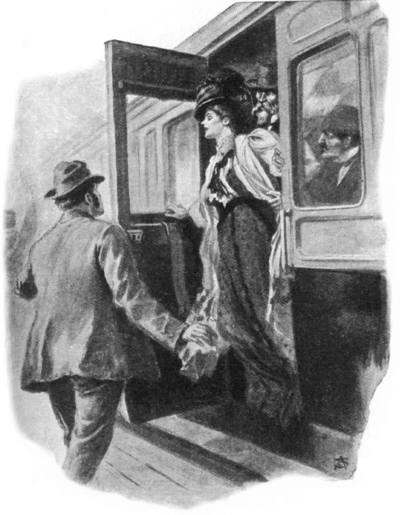

她一纵身往下跳。

我们扶女人上楼，让她躺在沙发上，冲一杯浓咖啡给她喝，把药性解掉，她脑子很快就清醒。贝尼斯已被福尔摩斯叫来，眼前的情况他一看便清楚了。

“啊，先生，正是我要的证人，你帮我找来了，”警官握着我朋友的手，热情地说，“我一开始找的就是这一条线索，和你同一条线索。”

“什么！你追踪亨德森？”

“啊，福尔摩斯先生，你藏进海加布尔树丛，我可是爬在庄园里的树上，看着你在下面，只看谁先到手证人。”

“那么你为什么要逮捕那个黑白混血人？”

贝尼斯咯咯地笑。

“我算准了这个亨德森，他自己说叫这个名字。他已警觉到有人在怀疑他，只要一感到有危险，他就要销声匿迹，不再行动。我逮捕了别人，让他造成错觉，以为我们已将注意力从他身上移开，我知道他就此松懈，以为没事，这就让我们有机可乘找到伯内特小姐。”

福尔摩斯手搭警官的肩头。

“你会高升，你有天赋，有直觉。”他说。

贝尼斯高兴得满脸绯红。

“这一星期来，我派了个便衣守候在车站。海加布尔的人一露脸，他就紧盯上去。可是伯内特小姐一脱身，他便顾此失彼了。谁知道，是你的人把她接了来，一切也就顺利了。没有她作证，我们不能抓人，这很清楚，所以我们赶快要录得口供，越快越好。”

“她正在恢复当中，”福尔摩斯说，望一眼女教师，“可是请你告诉我，贝尼斯，这亨德森是什么人？”

“亨德森，”警官答道，“就是唐·牟利罗，从前被称作‘圣佩德罗之虎’的就是他。”

圣佩德罗之虎！一闪念之间，让我想起这个人的全部历史。他的名字，就是以文明之名统治国家最荒淫无耻、最嗜杀成性的一代暴君的代名词。他体壮如牛，精力无限。他无法无天，无所忌惮。他拥有绝对的权力凌驾于国民之上，淫威肆虐于一个忍辱怕事的民族长达十一二年之久。一提起他的名字，便使整个中美洲震惊、恐惧。那个时期的最后几年，全国爆发了反对他的起义。他残暴而极狡猾，一闻风声不对，就秘密转移财富，装上一艘船，由他的亲信驾驶出逃。起义军第二天冲进宫中，已经人去楼空。这个独裁者带着财物连同他的两个孩子、他的秘书逃之夭夭，从此在世上销声匿迹。但是他的名声不绝，欧洲报纸还拿他作为题材常有评论。

“是的，先生，唐·牟利罗，圣佩德罗之虎，”贝尼斯说，“你查一查就知道，圣佩德罗的国旗是绿白两色旗，同那封便笺上提到的一样，福尔摩斯先生。他自称亨德森，可是我追查到了他过去的底细，从巴黎、罗马、马德里一直到巴塞罗那，他的船是一八八六年到达那里。人们在找他复仇，始终不放过他，但是直到现在才把他找到。”

“是一年前找到他的，”伯内特小姐说道，她已经能够坐起来，现在激情地参与谈话，“有过一次，差一点就要了他的命，可是邪恶之灵庇护他渡过难关。现在，又是一次，是高贵、侠义的加西亚倒下了，那个恶魔还是毫发未损。但是我们还会一而再、再而三地前仆后继，总有一天正义要得到伸张，就像太阳明日一定要升起，这是必然的。”她捏紧着纤弱的手，仇恨与疲倦使她脸色极显苍白。

“这件事你是怎么卷进去的呢，伯内特小姐？”福尔摩斯问道，“一位英国女士怎么参与这样一件外国人的凶杀案呢？”

“我参与，是因为要伸张正义，在这个世界上没有别的路好走。圣佩德罗几年前血流成河，英国法律管了没有？这个人搜刮民脂民膏装船运走，英国法律管了没有？在你们眼里，这些都好像是在别的星球上犯的罪。可是我们知道，悲哀和苦难使我们认识了真理。对我们来说，下地狱，哪个魔鬼都不如胡安·牟利罗<a href="#part0141.xhtml_ch2"
id="part0141.xhtml_ch2-back">(2)</a>那么凶恶可怕。只要大批冤魂在呼唤要向他报仇雪恨，我们在世上活着也不安宁。”

“的确是这样，”福尔摩斯说，“正如你所讲，我听说他无恶不作，残暴无比。你是怎么受其害的呢？”

“我把全部实情告诉你们。这个恶棍，凡是他认为对他有所不利的人，他就找借口格杀勿论。我的丈夫——说明一下，我的真名叫维克托·杜兰多夫人——我丈夫是圣佩德罗驻伦敦的公使。他在伦敦认识我，同我结婚。他是世上少有的品德高尚的人。很不幸，牟利罗听说他很孚众望，就找个借口召他回去，回去就把他枪毙了。丈夫临行前也有预感此去凶多吉少，所以拒绝带我一起走。他的财产被没收，留给我的是一点微薄的收入，一颗破碎的心。

“不久暴君垮台了，逃亡了，你们都知道。他毁灭了多少人的生命，他们亲近的人、接近的人也都株连遭殃，受迫害，遭杀戮。人民要算这笔账，是不会善罢甘休的。大家组织起来，建立一个社团，大仇不报，社团不散。我们发现逃亡的暴君更名亨德森，我受命打入他的家中，不断向外提供他行动的情报。我可以办到，当家庭教师安插到他的家里。他想不到每天同桌吃饭的这个女人，她的丈夫就是被他一纸调令从此不得生还。我给他是笑脸迎奉，管教他的孩子，等待着时机。在巴黎的时候曾有过一次机会，但是不成功。我们之后赶快避走，七绕八弯，这里那里跑遍整个欧洲，摆脱追杀，最后回到这幢房子，这是他初到英国就租下的。

“这里当然也有正义之士在候着他。加西亚，他是圣佩德罗前高官子弟，知道他要回来，便带两个忠诚可靠的助手充当下人，三个人胸中燃着一样的复仇之火。加西亚白天没法下手，牟利罗处处严密提防，不带保镖卢卡斯决不外出。卢卡斯在当年一起得势的时候真名叫洛佩斯。可是夜里他一个人睡，这是一个机会。那天晚上，按照事先的安排，我给我的朋友送去最后的情报。因为这个魔王永远处在警觉之中，不断调换卧室。我必须注意让所有的房门都打开，同时在朝向车道的窗上发出绿光或者白光为信号，表示行动安全或者行动推迟。

“可是事情出了毛病，可能是我引起洛佩斯的怀疑，那个秘书。他暗中跟踪我，等我写好信，他就猛扑上来。他和他的主人一起把我拖到我的房间，骂我是叛贼。如果他们能逃避杀人后果的话，他们早就用刀把我捅死了。最后，两人争议下来认为把我杀死太危险，倒是可以趁这个机会把加西亚除掉。他们塞住我的嘴，牟利罗扭我的胳膊，逼我说出地址。我发誓，如果我知道这会让加西亚送命的话，我宁愿被扭断胳膊也不会说。洛佩斯在我的信上写好地址，用袖子纽扣压过封好，叫仆人何塞送去。他们怎么将加西亚谋害，我不清楚，但知道是牟利罗亲自动手干的，因为洛佩斯要留在屋里看住我。我估计是，牟利罗埋伏在小路弯弯曲曲通过的矮树丛里，等加西亚走过来，就把他打倒。起先他们打算等他进屋以后再杀死他，追究起来就说是打死一个窃贼，但是他们商议下来觉得不妥，因为这会卷入一场官司，他们的身份就要暴露，就要更加招来打击。加西亚一死，追杀可能也就停止，因为这一来，或许可以吓阻其他人，会放弃作下一步行动的努力。

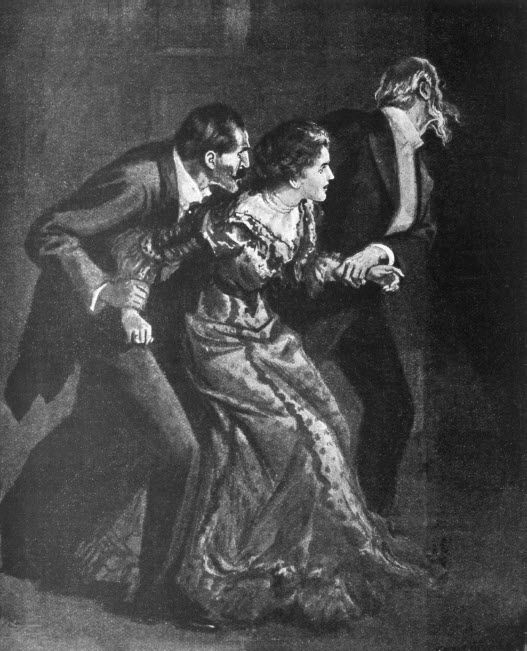

“一起把我拖到我的房间。”

“要不是有我知道他们的所作所为，他们现在就能逍遥法外。不用说了，我这条命好几次险遭毒手。我被囚禁在我的房里，他们百般威吓，残酷折磨，要摧垮我的神经——请看我肩上这个刀疤，手臂上道道伤痕——有一次我想朝窗外喊叫，他们塞东西把我嘴堵住。就这样被关了整整五天五夜，不给吃不给喝，让你身体、精神无法支撑下去。今天下午，让我好好吃了一顿午餐，可是我一吃就知道给我下了毒。我昏昏沉沉像在梦中，记得被半扶半拽上了马车，又这样上了火车。这时候，火车要开动了，我忽然间脑子清醒，我的自由掌握在自己的手中，火车一动正是好机会，便奋不顾身跳下车。他们想拉我回去，要不是这位好人相助，把我救到马车上，我永远也别想脱得了身。现在，我感谢上帝，我终于逃离了魔掌。”

我们聚精会神地听了这篇难得一听的叙述，还是福尔摩斯先打破沉默。

“我们的困难还没有过去，”他说着，摇摇头，“我们的警察行动结束了，我们的法律行动开始了。”

“正是这样，”我说，“律师巧言善辩，可以说成是自卫行动。犯下上百次罪都没事，这一次上法庭，倒还是他们有道理。”

“放心，放心，”贝尼斯快活地说，“我看诉诸法律反倒更好。自卫是一回事，而蓄谋把人诱出，达到杀害的目的，则是另一回事；不管你是出于什么防备他的危险等等理由，都不行。放心，没事。法律上，我们绝对站得住脚，叫海加布尔大宅里的房客下一回上吉尔福德巡回法庭，便见分晓。”

然而这是一桩历史案子，要让圣佩德罗这只虎得到惩罚还得有一点时间。他和他的死党有勇有谋，他们进入埃德蒙顿大街的一栋寄宿宿舍，再从后门溜出到了柯松广场，就这样甩掉追捕的人。那天以后，英国再也不见他们的踪影。过了六个月，一个叫蒙塔尔法侯爵的人和他的秘书鲁利先生，在马德里艾斯库里亚尔饭店遭暗杀，这桩案子被归咎于无政府主义，凶手一直未抓到。贝尼斯警官到贝克街拜访我们，拿来了这两个人的复印照片，秘书是个黑脸，他主人的相貌，一副威严的气势，一对慑人的黑眼珠，两簇浓眉。至此，已毫无疑问，虽然延误了时机，正义毕竟还是得到了伸张。

“这是一件复杂、混乱的案子，我亲爱的华生，”福尔摩斯抽起了晚上的一斗烟，说道，“你不可能看得那么简洁、准确，一点也不引起误入歧途岔路。它涉及两大洲，关系两群神秘人物，再加我们高尚可敬的斯科特·艾克尔斯这位朋友登场，让我们觉得被害的加西亚耍弄阴谋诡计，是个很有心计手段的人。所以侦破全案可以说是很了不起，在十分混杂的迷雾丛林中，我们靠着警官的有力合作，得以紧紧抓住主线，从曲曲弯弯、盘根错节中择路走了出来。还有什么不清楚的问题吗？”

“那个黑白混血人厨师转回来，是为了什么目的？”

“我想，厨房里那样怪物能说明这个问题。这个人是圣佩德罗原始荒野的森林土人，这样东西是他的神物。他和同伴逃到预先指定的隐蔽地方——是他的同伴已经先到那里，这没问题——同伴劝他这件东西会拖累他们，先丢下别带走。但是混血人舍不得丢弃，第二天赶回来，在窗上张望，发现警察沃尔特斯正看守屋子。他为这件事等了三天，出自虔诚或者说是迷信，驱使他再试一次。贝尼斯警官，他一向机警，在我面前表现得不当它一回事，其实很重视这一点，而且设下圈套，让这头野兽自投罗网。还有什么问题，华生？”

“撕烂家禽，一桶血，烧焦的骨头，这神秘的厨房里那么些神秘的东西，到底是怎么回事？”

福尔摩斯笑笑，打开笔记本翻到一个条目。

“我花了一个上午的时间，在大英博物馆查阅这个问题，还有别的问题。这里摘录了埃克曼著的《伏都教和黑人宗教》中的这一段话：

虔诚之伏都教信徒皆视献祭牺牲为头等之要事，祭牲以慰其不洁之神。最高形式以杀人为祭典，继而行人肉宴。通常祭品为一白公鸡，须活鸡拔毛，并撕裂作碎片，或将一黑山羊割喉而火焚之。

“所以你看，我们的这位野人朋友举行仪典祭奠是很正宗的。其实纯属荒诞，华生，”福尔摩斯又道，缓缓合上笔记本，“但是，从荒诞到恐怖，仅一步之差，我这说法不无道理。”

（1908年）

————————————————————

<a href="#part0141.xhtml_ch1-back" id="part0141.xhtml_ch1">(1)</a> 奥勒瓦尔（au
revoir），法语：再见。

<a href="#part0141.xhtml_ch2-back" id="part0141.xhtml_ch2">(2)</a> 胡安·牟利罗：即前文所说的唐·牟利罗。

# 布鲁斯-帕廷顿计划

一八九五年十一月第三个星期，浓重的黄雾迷漫伦敦。从星期一到星期四，我真不知哪天才能从贝克街我们的窗户看得清对街房屋的轮廓。第一天，福尔摩斯替他那本又厚又大的数据剪贴簿编列互见条目索引。第二天和第三天，他一心消磨在最近成了他爱好的研究题目——中世纪音乐。但是到了第四天，我们吃过早饭，把椅子放回，眼见那湿漉漉的黄褐色雾气阵阵翻滚，从面前飘过，在窗格玻璃上凝结成一片片油腻的水滴，我的天性活泼、不耐寂寞的同伴，再也忍受不了这种灰色单调的情景了。他浑身力量无处发泄，抑郁强压无法纾解，在起居室里来来回回走个不停，咬咬指甲，敲敲家具，对这种死气沉沉，胸中实在窝火。

“报上没有有趣新闻吧，华生？”他问。

我领会福尔摩斯的所谓有趣新闻，意思是指刑事案件新闻。报上有的是发生革命的新闻，可能要打仗的新闻，即将改组政府的新闻，但是这些都不在我同伴的视线之中。我看到的犯罪报道，没有一件不是平淡无奇、不值一顾。福尔摩斯唉声叹气，继续不停地来回踱步。

“莫非伦敦的罪犯都歇手了？”他说道，满腹牢骚，像是一个竞技场上败下来的运动员，“瞧瞧窗外，华生，路人隐隐约约，模糊不清，全都包围在大雾之中，盗贼凶手在伦敦这样的天气尽可横行无忌，就如老虎隐没在丛林，看不见它，等到看见，已经扑上你身了，只有受害人自己才能看清楚。”

“多的是，”我说，“小偷小摸不计其数。”

福尔摩斯不屑地哼一声。

“这么阴沉沉的大舞台，该会有大戏要演出，”他说，“这个社会，所幸我不是一个罪犯。”

“这话倒是不错。”我打心里赞同。

“假如我是布鲁克斯，或者伍德豪斯，或者是五十人中任何一位，他们都有充分理由要了我的命，我自己反被追踪，我的命还能活多久？一张传票，一次假约会，就一切搞定万事大吉。幸亏在拉丁国家没有雾天——这些暗杀之国。啊！终于有事情上门了，要打破这死气沉沉和单调无聊。”

是女仆送来一封电报，福尔摩斯拆开一看，哈哈大笑。

“哎呀呀，来干什么？”他说，“兄长迈克罗夫特要来这里。”

“你不要他来？”我问。

“我不要他来？他来看我，就如同有轨电车开到乡下小路上。迈克罗夫特有他自己的轨道，在他自己的轨道上开电车。回蓓尔美尔街他的寓所，第欧根尼俱乐部，白厅——都是他活动的圈子。一次，只有一次，他来过这儿。又有什么事要劳他大驾脱离他的轨道了？”

“他没有讲明？”

福尔摩斯把他兄长的电报递给我。

为卡多甘·韦斯特事必须见你。即来。

迈克罗夫特

“卡多甘·韦斯特？这名字听见过。”

“我一点印象也没有。但是迈克罗夫特这么突如其来，必有原因！星球也会脱离轨道。哦，你知道迈克罗夫特是干什么的？”

我有一点记得，在《希腊译员》那件案子里讲起过，写到他。

“你告诉我他在首相政府里干差使。”

福尔摩斯咯咯地笑。

“那些日子我对你还不是很了解，谈起国家机密不得不谨慎一些。你认为他受雇于国家政府，是对的。某种意义上说，你会感觉到他有时候就代表英国政府。”

“我亲爱的福尔摩斯！”

“我这么说把你吓着了。迈克罗夫特一年薪水是四百五十英镑，不过他只是下属小职员，并无任何野心，既不想荣誉也不图封号，却是国家最不可或缺之人。”

“怎么讲？”

“哦，他的地位独一无二，他自己独当一面，以前不曾有，今后也不会有，空前绝后。他头脑清晰，精密有条理，而且博闻强记，没有人有他这点本事。同样的能力，我用在侦办刑案，他则用到他那个特别的行当上去。每个部门作出的结论都要经他汇总，他是中心交换站，情报交换中心，由他权衡统一支配，别人也都是专家，而他专门负责总调度。如果某个部长需要情报，要知道包括海军、印度、加拿大以及金银复本位制问题的情报资料，他可以从各部门分别获取不同的相关意见，但只有他迈克罗夫特能够加以综合平衡，立即说出各资讯之间的相互影响关系。开始，当局把他看作快捷的工具使用，当作捷径好抄近路，现在他已成为独立部门，机要人物。他的大脑分门别类储藏着各种资料，一旦需要马上就可以调出来。他的话多次影响着国家的政策。这已成为他的生命。他的生活没有别的内容，只有在我去找他，请教一点小问题，这时他才稍稍松弛一下，当作做做智力体操。可是朱庇特<a href="#part0142.xhtml_ch1"
id="part0142.xhtml_ch1-back">(1)</a>今日从天而降，里面有什么玄机？这卡多甘·韦斯特是什么人？他和迈克罗夫特又是什么关系？”

“我知道，”我高声说，一下扑向沙发上去翻那堆乱报纸，“有了，有了，在这儿，就是这个！卡多甘·韦斯特，是个年轻人，星期二早上发现死于地铁。”

福尔摩斯立刻坐了起来，注意力集中，举起的烟斗停在了半途。

“这个事一定很严重，华生。死一个人，竟要惊动我兄长丢下他手上的事，那就绝非一般。他跟这事会有什么关系呢？据我所知，这件事没有什么特别的地方。这个青年很明显是自己摔出车厢摔死的，没有遭到抢劫，没有特别的理由可以怀疑是他杀。不是这样吗？”

“验过尸了，”我说，“一验就验出了不少问题。仔细看看报道，我可以肯定这是件蹊跷的案子。”

“这件事惊动我兄长出马，我想必定是件不同寻常的案子。”他身子深深地沉入安乐椅里，“现在，华生，我们来看看事情经过。”

“这个人名叫亚瑟·卡多甘·韦斯特，年龄二十七岁，未婚，乌尔威奇兵工厂职工。”

“政府雇员，噢，是这样，这就跟我兄长挂上钩了！”

“他于星期一晚突然离开乌尔威奇，最后见到他的是他的未婚妻维奥蕾特·韦斯特伯里小姐。这个年轻人在雾中与她忽然分手，是晚上大约七点半。两人没有吵嘴，从女方找不出行凶动机。还有就是听说发现尸体的人是铁路养路工，名叫梅森，在伦敦地铁阿尔盖特站不远的路段发现。”

“什么时间？”

“尸体在星期二早晨六点被发现，躺在铁道外面，在东向的左侧钢轨旁。这地方离车站很近了，铁路在这里已穿出隧道。尸体头部重度碎裂——很可能是坠车所致。这具尸体出现在铁路上，只有这样的原因。如果是从邻近街上移尸过来的话，那一定要翻过车站栅栏，而且那边总是有检查员站岗。那是不可能的，这一点几乎可以绝对肯定。”

“很好，情况可以这样认定。这个人，不是坠车，就是被推下车，或者是死尸被抛下车。这些我清楚了，继续讲。”

“尸体靠近的铁路线上运行的列车，是由西向东开的，有的只是地铁列车，有的来自韦尔斯登和外区联接站。可以确定的是，这个遇难年轻人是在晚上很晚的时间乘这个方向的车，但是他在哪个站上车，就无法确定。”

“他的车票，一看就知道。”

“他身上没有车票。”

“没有车票？哦，天哪，华生，这就奇怪了。根据我的经验，地铁车站月台，没有车票是进不来的。那么，可以推测，这个青年是有车票的，是不是为了掩盖他是在哪一个车站上车这一事实，车票被拿走了？有可能。也或许掉在车厢里了？那也有可能。但这一点就是奇怪，很有意思。我想没有抢劫的迹象吧？”

“从现象上看不出。他身上的东西，这里有一张清单。钱包是两英镑十五先令，一本支票簿，是首都和郡银行的。有这些东西才确定他的身份。还有两张乌尔威奇剧院戏票，是第一楼厅前排座位，日期是当天晚上。还有一小包技术文件。”

福尔摩斯“哈”一声惊呼，表示满意。

“终于连上线了，华生！英国政府——乌尔威奇。兵工厂——技术文件——我兄迈克罗夫特，整个环节齐全了。他来了，我没听错的话，他自己来讲情况了。”

片刻间，高大肥硕的迈克罗夫特·福尔摩斯被领进了屋。那庞大沉重的躯体让人觉得他个头笨拙、动作迟钝，但是不灵活的身架子上的那颗脑袋，却是眉宇间神情无畏，深陷的铁灰色双眼是如此机警，嘴唇紧闭显得如此果断，眉眼嘴角表情是如此深不可测，以致只要对他看上一眼，就会忘掉他那颟顸臃肿的体态，而只记着他心智如高屋建瓴的神态。跟在他身后的是我们的老朋友苏格兰警场的莱斯特雷德——精瘦、严肃。两人阴沉的面色预示着问题性质之严重。莱斯特雷德警探握握手，但一声不吭。迈克罗夫特·福尔摩斯使劲儿脱着大衣，慢吞吞往椅子上坐下去。

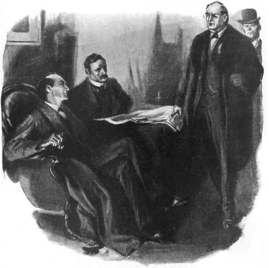

高大肥硕的迈克罗夫特·福尔摩斯被领进了屋。

“这件事很伤脑筋，歇洛克，”迈克罗夫特说，“我最讨厌旁生枝节打乱我的习惯，可是当局说我不处理不行。照暹罗那边目前的情况看，我现在离开岗位那是最糟糕的事了。可是这实在是个危机，我从来没有见过首相这么心烦意乱。至于海军部——像捣翻了蜂窝，乱哄哄一团。这个事你们报上看到了？”

“我们刚刚注意到。是什么技术文件？”

“啊，问题就出在这里！万幸呵，还没有公开，一旦公开，那报纸舆论就要闹得不可开交。遇害青年口袋里的文件，是布鲁斯-帕廷顿潜艇计划书。”

迈克罗夫特·福尔摩斯说话的严肃态度显示这项计划事关重大，他的兄弟和我坐着听他说下去。

“你们都听说了？我想大家都知道。”

“只知道个大概。”

“这件事至关重要，这是政府的机密之机密。我告诉你们，在布鲁斯-帕廷顿潜艇活动半径范围内，不可能再有海战发生。两年以前，提交国会的国家财政预算私底下另外拨出一大笔款项，用在这项发明专利上，并采取一切防范措施严加保密。这项计划无比复杂，包括三十个单项专利，每一个单项都是构成整体的重要组成部分。计划书保存在机密办公室的一个精工制作的保险柜里，这间机密办公室毗邻兵工厂，办公室门窗都有防盗装置。设想到的无论何种情况下，计划书都不可能从办公室被盗走。如果海军总监要查阅计划，也必须到乌尔威奇办公室去才行。可是，我们想不到会在伦敦市中心，在一个年轻小职员的口袋里，发现了这些计划书。官方获悉，竟然会出这种事，简直可怕极了。”

“幸好都被你们找回来了吧？”

“没有，歇洛克，没有！所以情况就难以收拾了。我们没有找到。从乌尔威奇拿走了十份文件，卡多甘·韦斯特口袋里只有七份，最关键的三份不见了——盗走了，失踪了。你把所有事情都暂时搁下，歇洛克。警察、法庭上的那些案子、普通案子别管它了。这是个重大国际问题，你务必要解决。卡多甘·韦斯特为什么要偷文件？失踪的文件到哪里去了？他怎么死的？尸体怎么会在那个地方发现？怎么样才能挽回、弥补这场灾祸的损失？找出这些问题的答案，你就为国家立下大功了。”

“为什么你自己不解决呢，迈克罗夫特？我能做到的，你都能做到。”

“也可能是这样，歇洛克。问题是要过细侦查。你把侦查到的细节事实告诉我，我可以坐在椅子里，回答你，给你提供专家意见，很管用的意见。可是要是东奔西跑，要去走访铁路路警，眼睛还得夹上一只放大镜——这个样子，不是我能做的事。不行，这只有你来做，你是能够查明真相的人。如果你想在下一次光荣榜上有你的名字——”

我的朋友笑笑，摇摇头。

“我侦办刑案，是为工作而工作，”他说，“当然这问题摆在面前，有几点很有意思，我乐意过问一下。就请你再提供若干事实。”

“关键的几个问题，我这里有份摘要，连带有几个地址，这对你会有用。负责文件保管的官员是政府著名专家詹姆斯·瓦尔特爵士，他的荣誉事迹和头衔在名人录里占有两行的位置。他恪尽职守一辈子，如今头发已花白，是正人君子，在上流社会，是每个家庭欢迎的座上贵宾。最要紧的一点，这个人的爱国主义政治品格，毋庸置疑。保管保险柜钥匙的，连他是两个人。我要说明一点，星期一上班时间，文件绝无疑问是在办公室里，詹姆斯爵士大约三点钟离开去伦敦，钥匙带在身上。出事的整个晚上，他在巴克莱广场的辛克莱海军上将家里。”

“这件事得到证实了没有？”

“证实了，他的兄弟瓦伦丁·瓦尔特上校，作证他离开乌尔威奇，辛克莱上将又证实他是到了伦敦。所以，詹姆斯先生在这一个问题中，不再有直接的嫌疑。”

“另一个有钥匙的是谁？”

“一个正科员兼制图员，锡德尼·詹森先生，四十岁，已婚，有五个孩子。他沉默寡言，有点脾气，但总的来说，在公务上有杰出纪录。他与同僚关系并不密切，工作上则是兢兢业业。根据他的说法，他星期一下班以后，整个晚上待在自己家里，钥匙挂在表链上，没有离过身。这些也已由他妻子陈述作证。”

“给我们讲讲卡多甘·韦斯特。”

“他服务已有十年，工作表现很好，年轻人急性子，脾气暴躁，但是个爽直、忠厚人，大家有目共睹。我们都喜欢，一点也不嫌他什么。他在办公室里仅次于锡德尼·詹森，他的职务使他每天要亲自接触计划书。此外没有其他人接触计划书。”

“那天晚上是谁锁的计划书？”

“锡德尼·詹森先生，这位正科员。”

“好了，是谁拿走了文件，那就完全清楚了。东西也是在副科员卡多甘·韦斯特身上发现的，这就是结论，不是吗？”

“是这样，歇洛克，可是有着许多情况无法解释。首先，他为什么要拿文件呢？”

“我想是计划书值钱吧？”

“他很容易就卖得好几千英镑了。”

“除了拿文件到伦敦去卖，你看还可能有别的动机吗？”

“没有，我看没有。”

“那么，我们应该以这项动机为出发点来作假设，韦斯特要拿到文件，只有私配钥匙才办得到——”

“得私配几把钥匙，因为要开大楼的门、办公室的门。”

“那就应该有好几把私配的钥匙。他拿文件到伦敦出售机密，无疑还打算要把计划书都放回到保险柜里，第二天早晨才不会被发现遗失。他到伦敦实施叛国行为，结果送了命。”

“怎么送的命？”

“我们可以假设，他是在回乌尔威奇的途中被杀害，被抛出车厢。”

“在阿尔盖特发现尸首，过伦敦桥车站已相当远了，这是他去乌尔威奇的路线。”

“他经过伦敦桥，可以假设有多种情况。比如，车厢里有一个人，他正与这个人秘密会面，会面了结果导致当场动手行凶，他丢了性命。也可能，他企图离开车厢，人摔出去，掉在了铁轨上，摔死的。另一个人关上车门，大雾很浓，不会被人发现。”

“根据目前所知情况，无法作出更充分的解释。但是你要考虑一点，歇洛克，还有多少问题你没有接触呢。我们假设一下，看是否解释得通。这个年轻人卡多甘·韦斯特，早就打算把文件偷到伦敦，他必然和外国间谍约好接触，又要把这天晚上安排得不致引起怀疑。但事实并非这样，他拿两张剧院戏票，陪他未婚妻走到半路，忽然溜掉，人不见了。”

“盲目瞎猜。”莱斯特雷德说话了，他一直坐着静听谈话，听到这里已憋得不耐烦。

“这未免太离奇了，这是说不通的第一点。说不通的第二点：假定说，他到了伦敦，见到了外国间谍，他一定要赶在早晨以前把文件带回来，以免被发现文件遗失。他拿了十份，口袋里只有七份，另外三份哪里去了？他当然不会出于自己的意愿遗失三份。再有，叛国得到的钱呢？应当发现一大笔巨款在他口袋里呀。”

“这个，我的看法很清楚，”莱斯特雷德说，“我一点也不怀疑是这么回事：他把文件偷去卖，见到间谍，双方价钱谈不拢，他就离开回家；但是间谍跟着他，在火车上把他杀掉，取走最重要的文件，将尸体丢下火车。这样就能说明一切问题了，还有不清楚的吗？”

“身上为什么没有车票呢？”

“车票上的站名会暴露间谍住的地方，所以就把车票从被害人身上拿走。”

“对，莱斯特雷德，很对，”福尔摩斯说，“你的推理很严密。不过，真是这样，本案就结案了。一方面，卖国贼已死；另一方面，布鲁斯-帕廷顿潜艇计划书，可想而知，已经到了大陆。我们还有什么事可做呢？”

“绝非无事可做，歇洛克——要采取行动！”迈克罗夫特叫道，人站了起来，“我的直觉，这种讲法不对头，没那么简单。有你的用武之地！到案发现场踏勘！走访有关的人！把每块石头都翻它个个儿，一块不漏！从你干这一行至今，还没有过这样的大好机会来为国效劳。”

“好吧，好吧！”福尔摩斯说，耸耸肩，“来吧，华生！还有你，莱斯特雷德，麻烦你，陪我们走访一两个钟头，行吗？我们从调查阿尔盖特车站开始。再见，迈克罗夫特。天黑以前，我向你报告，不过有言在先，你别抱太大希望。”

一个钟头以后，福尔摩斯、莱斯特雷德和我站在地铁的案发地点，这里出了隧道马上就到阿尔盖特车站。一位谦恭的脸色红润的老先生代表铁路公司接待我们。

“年轻人的尸体就躺在这里，”老先生说，指着一个地方，离开铁轨约有三英尺距离，“不可能是从房屋什么的上面摔到这里，这里，你们看见了，都是实面的光墙，没有窗户，所以只有从火车上摔下来。那列火车，经我们查实，一定是星期一午夜经过的那一班。”

“检查车厢有没有暴力痕迹？”

“没有暴力迹象，也没有看见车票。”

“发现有开着的车门吗？”

“没有。”

“今天早上发现新证据。”莱斯特雷德说，“有位旅客，经过阿尔盖特，他是搭星期一晚间十一点四十分普通地铁列车，说是列车快到站之前，听见咣的一下，好像有人摔到铁路上的声音。因为雾大，什么也看不见。他当时没有报告。哟，福尔摩斯先生怎么啦？”

我的朋友脸上表情紧张，盯着看铁轨呈弧度弯出隧道。阿尔盖特是枢纽站，是个路闸网点。他专注地投去急切、疑问的眼光。我见他警惕的脸色，抿起嘴唇，鼻翼翕动，浓眉紧蹙，他这种表情我十分熟悉。

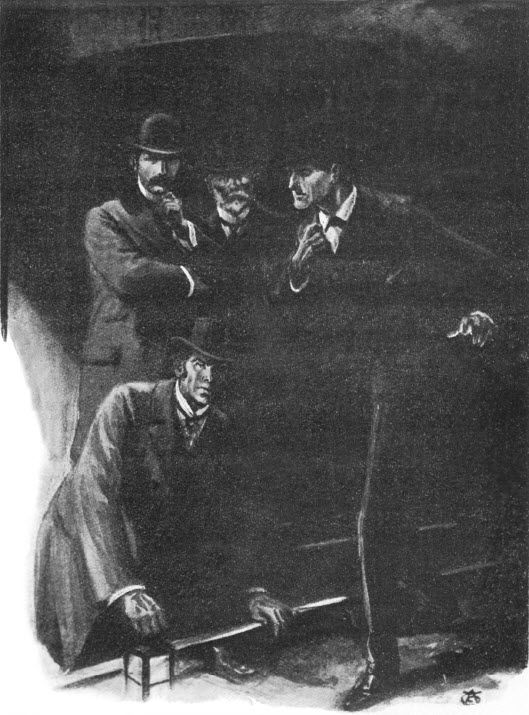

他专注地投去急切、疑问的眼光。

“路闸，”他咕噜一声，“这路闸。”

“路闸怎么啦？你什么意思？”

“一般铁路上好像没有这么多的路闸！”

“这样多不大有。”

“还有弯道，路闸、弯道，哦，天哪！原来就是这样。”

“怎么啦，福尔摩斯？你看出问题了？”

“一个想法——有一点启发，有一点，本案耐人寻味，少见，绝对少见，哪有这样的？居然铁路上一点血迹也看不到。”

“没有血迹。”

“可是我知道伤势很严重。”

“头骨碎裂，但是外伤不严重。”

“不管怎么样，总会流血。旅客大雾中听见摔倒响声的那节车厢，能不能去检查一下？”

“恐怕不行，福尔摩斯先生，这趟车早已经分散，车厢都重新编排分挂到各路列车上去了。”

“我可以向你保证，福尔摩斯先生，”莱斯特雷德说，“每一节车厢都严格检查过，我亲自察看的。”

我的朋友最明显的缺点之一，对脑子不如他灵敏的人缺乏耐心。

“很可能就是这样，”他说，回转了身，“看这情形，不一定要调查车厢。华生，这里的工作就这样吧。我们不必再麻烦你了，莱斯特雷德先生。我想，现在要上乌尔威奇去调查。”

在伦敦桥，福尔摩斯拟一份电报给他兄长，给我看后就发出去，上面这样写：

黑暗中已见火光，但可能熄灭。接电请将已知在英国的外国间谍及国际间谍列一完整名单并详细地址，派专邮送至贝克街即可。

歇洛克

“这样就行了，华生，”他说，我们在驶往乌尔威奇的火车里坐定下来。“多亏我兄迈克罗夫特，介绍我们这一桩非常离奇的案子，应当感激他。”

他急切的脸上依然神情极度紧张、激动。我看得出来，有了新的情况，新的启示，打开了一条令人振奋的思路。看哪，一只猎狐犬，原还是懒洋洋躺在窝里，耷拉着耳朵，尾巴松弛下垂；再对照现在吧，这同一只猎犬，却是目光炯炯，姿态蓄势待发，正要循着浓烈的嗅迹迅猛追扑上去——自早晨以来，福尔摩斯已判若两人。几个小时前，他还穿着鼠灰色休闲衣，在雾气蒸腾的屋子里佝偻着腰背无精打采，烦躁不安地踱来踱去。

“这里有线索，有值得研究的地方了，”他说，“我实在迟钝，没有意识到有这种可能性。”

“我到现在都还是一头雾水。”

“结局我也还不清楚，不过我已经有主意了，可以由此深入下去。这个人是在其他地方遇害，尸体被放在车厢顶上。”

“车顶上！”

“奇不奇怪？想一想实际情况就可以知道。发现尸体的地方正是路闸地段，列车经过这里颠簸摇晃得厉害，这是巧合吗？经过这个地方，车厢顶上有东西不就掉下来了吗？车厢里的东西都有固定，经过路闸不受影响。尸体要不是从车顶上掉下来，那就是无缘无故在这个地方出现。再考虑血的问题，当然是这样，尸体在其他地方流掉血，到了这段铁路就没有血了。每一件个别事实都有启发性，凑拢在一起，就产生综合效应。”

“那车票，还有！”我叫道。

“确实，我们原来无法解释没有车票的问题，现在就解释得通了，各样问题可以归结一起碰拢了。”

“假定是这样，我们仍然远没有揭开他的死因之谜。真的，事情不是变得简单，而是更加复杂、扑朔迷离。”

“也许是，”福尔摩斯思索着说，“也许是。”他不再说话，陷入沉思，直到火车慢慢进入乌尔威奇站，出站雇了马车，从口袋里掏出迈克罗夫特给他的纸条。

“我们下午要兜上一圈，访问好些人，”他说，“我想，先是詹姆斯·瓦尔特爵士，首要目标。”

这位高官的官邸是一栋精致的别墅，绿色的草坪一直延伸到泰晤士河畔。我们到达的时候雾气正在消散，湿雾中透过来微弱的阳光。门房应我们拉铃前来开门。

“詹姆斯爵士，啊！”门仆沉着脸说，“詹姆斯爵士死了，今天早晨。”

“哦，天哪！”福尔摩斯惊叫道，“怎么死了？”

“要么您请进来，先生，见见他的兄弟瓦伦丁上校？”

“好，那就最好。”

我们被领进一间光线暗淡的客厅。稍等片刻，有人来接待，一位高个子、蓄浅须、仪表堂堂的男子，他就是已故科学家的兄弟瓦伦丁上校，年龄约五十岁。他眼神惶惑，脸面未洗，头发蓬乱，都说明家中突遭不幸，受到打击。他谈起这件事，口齿有些含混不清。

“出这种事，真是惊天丑闻，”他说，“我的哥哥，詹姆斯爵士，一个自尊心很强的人，他不能忍受这样的失职，伤心透了。他一向为自己部门的严谨高效自豪，这一下真是个致命的打击。”

“我们原希望他会给一些指示，有利于我们侦查此案。”

“我可以确切地告诉你们，这对他完全是件谜案，对你和我们大家一样，都是个谜。他已经把一切所知情况交由警方处置。很自然，他肯定卡多甘·韦斯特就是罪犯，但是其他情况不可思议。”

“对这件事你有没有新的情况可以提供？”

“我自己一无所知，也就是从报上看到，听人说起。我无意失礼，但是你可以理解，福尔摩斯先生，眼下我们一切都乱了，不得不请求早点结束现在的接待访问。”

“想不到事情又这样横生枝节，”我们重新坐上马车后，我的朋友说，“我怀疑是非自然死亡，或者可怜的老头是自杀！若是后者，可能因为失职以死谢罪。这个问题留待以后再说吧，现在上卡多甘·韦斯特家。”

城郊一栋小而精巧的住宅，痛失儿子的母亲坐在家里。老太太悲伤过度，神智不清，见了她也没用。但是旁边一位脸色苍白的少妇，自我介绍就是死者的未婚妻，维奥蕾特·韦斯特伯里小姐，也是案发当晚与死者最后见面的人。

“我不知道该说些什么，福尔摩斯先生，”她说，“惨案发生以来我都没合过眼，脑子想个不停，白天想，晚上想，不知到底是怎么回事。亚瑟绝对是世上最单纯、最侠义、最爱国的人。信任他保管国家机密，他决不会出卖，剁掉自己的右手他也不会出卖。知道他的人都认为，那简直是荒唐，不可能，不正常。”

“但事实是怎样呢，韦斯特伯里小姐？”

“这，这，我也承认，我无法解释。”

“他缺钱用吗？”

“不，他的生活要求很简单，薪水又高，积蓄着几百英镑，我们已经准备新年结婚。”

“没有精神失常的迹象吗？我说韦斯特伯里小姐，要同我们绝对讲实话。”

我的同伴锐利的目光注意到她的神态有变化。她脸红了，犹豫不决。

“是的，”她最后说道，“我感觉到，他有心事。”

“时间好长了吗？”

“也就是上个星期吧。他老沉思默想，心情急躁。有一回我追问他，他承认出了事，会影响到他的前途。‘太严重，不能讲，对你也不能讲。’他说。我就再也问不出什么了。”

福尔摩斯脸色沉重了。

“请说下去，韦斯特伯里小姐，即使有对他不利的事，也要讲。讲了结果会怎么样，我们不要顾虑。”

“真的，我没有什么可以讲的了。有一两次，他好像快要和我讲什么了。一天晚上他讲起重大机密，我记得他说，外国间谍肯定愿意付一大笔钱要获得机密。”

我朋友的脸色更沉重起来。

“还说什么？”

“他说我们对这种事很马虎——叛国贼要把计划书弄到手是很容易的。”

“这个话是最近说的？”

“是的，最近说的。”

“把那天晚上的经过和我们说一说。”

“我和他一起走向剧院，雾很大，连马车都没法赶。我们走着走着，走到他办公大楼了，他突然钻进浓雾不见了。”

“没有说话？”

“他嘴里惊叫了一声，就这点情况。我等他，可是他再也没有回来。过后，我只好独自走回家。第二天早晨，上班时间一到，大家都来问我。大约十二点钟，我们听到了可怕的消息。哦，福尔摩斯先生，只有你能还他清白！不能叫他蒙受不白之冤呀！他的情况就这些。”

“好啦，华生，”他说，“我们还要到别处。下一站，看办公室，文件是在办公室里丢失的。”

“这个年轻人已落得个抹了黑的黑人，涉嫌重大，我们这一调查，似乎变得更黑了。”马车隆隆行进时，他说道，“他要筹备婚事，是犯罪的原因咯，势必要用钱嘛。既然谈起过计划书这个事，表明是有了这个念头的。几乎要向未婚妻说出动手计划，但那就会把未婚妻牵连进去成了叛国同谋，那可就是重大犯罪了。”

“但是还好，福尔摩斯，他没有拖他未婚妻下水，是吗？还有，他为什么把未婚妻丢在街上，自己一走了之，就这样去犯下一桩重罪呢？”

“说得好！这正是完全不合理，相当矛盾，所以他们遇到的一定是一个意外的情况。”

锡德尼·詹森先生是高级办事员，在办公室会见我们。他接待的态度十分恭敬，这通常是我同伴的名片所起的作用。他很瘦，长相硬气，戴眼镜，是个中年人，面容憔悴，两只手不自觉地扭动，是遇上意外精神紧张之故。

“真糟糕，福尔摩斯先生，太糟糕！主管死了，你听说了吗？”

“我们刚从他的官邸过来。”

“这地方一团糟了。主管死了，卡多甘·韦斯特死了，我们的文件被盗。星期一晚上我们关门，我们这办公室和政府其他部门一样，严谨，万无一失。哦，上帝，想想就怕人！这个韦斯特，那么些人，偏偏他出问题，做出这种事来！”

“你认准他有罪吗？”

“不是他还有谁？我一向信任他，就像信任自己一样。”

“星期一办公室是几点关门？”

“五点。”

“是你锁的门？”

“一直是我最后一个走。”

“计划书放在哪里？”

“就那个保险柜，我亲自放好的。”

“大楼没有看守人？”

“有的，可是他还要看守其他部门。他是个老兵，绝对忠实可靠。那天晚上他没见有什么情况，当然雾大也有关系。”

“如果卡多甘·韦斯特下班以后进入办公楼，他需要有三把钥匙才能拿到文件，是不是？”

“是的，得有三把钥匙：大门钥匙，办公室钥匙，保险柜钥匙。”

“只有詹姆斯·瓦尔特爵士和你钥匙齐备？”

“大门和办公室门钥匙我都没有——只有保险柜钥匙。”

“詹姆斯爵士平日工作一向有条理吗？”

“那是，我想应当是的。我知道，三把钥匙他是拴在同一个环上的，这我常常看见。”

“这钥匙环随身带着去伦敦？”

“他说过是这样。”

“你的钥匙也从来不离身？”

“当然。”

“那么，韦斯特是嫌犯的话，他一定有私配的钥匙，可是在他身上没发现。还有另外一点：如果这办公室的办事人员企图出卖计划书，可以进行复制，比把原件拿走不是简单得多吗？何必要这样拿走原件！”

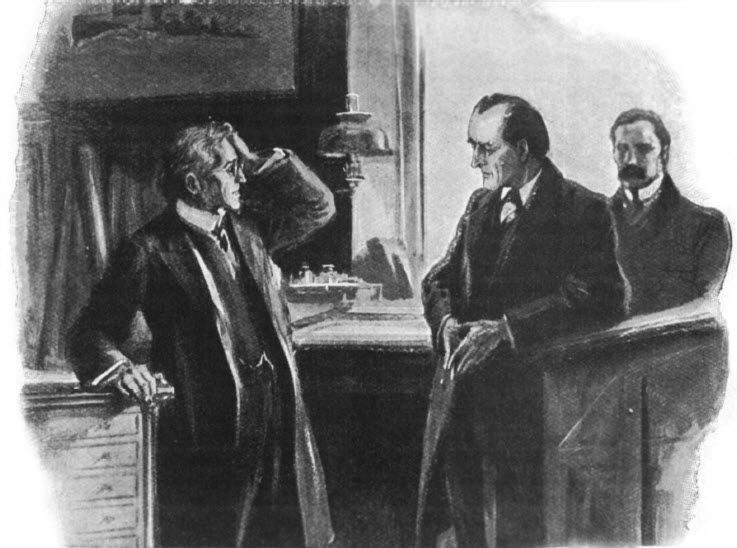

“他一定有私配的钥匙。”

“复制要有相当高的技术知识才行。”

“可我认为詹姆斯、你或是韦斯特，你们都具备这样的技术呀。”

“这我们都懂，可我请你别把我扯进这件事里去，福尔摩斯先生。计划书原件已经在韦斯特身上发现，我们这样东猜西猜又有什么意思呢？”

“嗯，他复制下来，同样能够达到目的，不会失风，可为什么偏偏要冒更大的风险窃取原件，也真是简单事情复杂做。”

“是很奇怪——可他就要这样做。”

“本案调查步步深入，问题也越来越多。现在三份文件仍旧遗失未能找回，据了解，是极端关键的三份文件。”

“是的，是这样。”

“你的意思是不是说，有了这三份，不要那七份，也能制造布鲁斯-帕廷顿潜水艇？”

“这一点我已向海军部报告，但是我今天又翻阅了一下蓝图，觉得恐怕未必就行。双阀门自动调节孔的那张蓝图拿回来了，那就除非外国人自己发明了这项技术。当然他们或许也能很快克服这一困难。”

“可是，遗失的三张蓝图毕竟是最重要的！”

“对。”

“我想，如蒙允许，我要看看这屋子。还有些问题，原来想问，一时想不起了。”

福尔摩斯检查了保险柜的锁，办公室的门，最后是铁板百叶窗。当我们走到外面草地上，这时他才发生了强烈的兴趣。窗外有一丛月桂树，有些树枝像是给拗折过的样子，他用放大镜仔细检查，又检查到树底下的地面有模糊的脚印。最后他要那位高级办事员关上铁百叶窗，然后指给我看，窗的中间关不拢，留下一道缝，可以从外面透过窗缝看到办公室里面。

“耽误了三天，那脚印被破坏掉了。脚印可能有用，也可能无用。好了，华生，我不认为乌尔威奇对我们还有多少帮助，有一点小收获而已。我们看看，伦敦是不是更有收获。”

然而我们快要离开乌尔威奇车站时，却有意外的收获。车站售票员很有把握地说他看见卡多甘·韦斯特——他很熟悉他的模样——星期一晚上，韦斯特搭八点十五分开往伦敦桥的车去伦敦。韦斯特一个人，买了一张单程三等车票。售票员看他那紧张激动的样子，十分吃惊。他颤抖得连找头都拿不起来，还是售票员帮他捡的。查一查时刻表，八点十五分，是他七点半左右离开未婚妻以后所能搭上的最早一趟车。

“让我们把问题重组重建，华生，”福尔摩斯沉默了半个小时后说道，“我不记得在你我合力侦查的案子中，有过哪一件案子比这件更棘手。好不容易前进一步，结果发现前面又是一道坎。不过，我们还是有了一点可喜的进展。

“乌尔威奇的调查，总体上对年轻人卡多甘·韦斯特不利，但是从窗子的种种迹象来看，可以作一个比较有利的假设。比如，不妨假定，他被某个外国间谍盯上，有过试探。也许不愿意，但一定发过誓，确保不准他讲出去。可这事深深干扰了他的情绪，所以对未婚妻透露了一些，从他说过的话就证明了这一点。好了，我们就假定，当他和未婚妻一块儿去剧院，在大雾之中忽然瞥见这个间谍走向办公大楼，他是个急性人，决断迅速，什么事情都比不上职责重大。他跟踪这个人，到了办公室窗外，看见文件被偷走，于是连忙追贼。这样，为什么不复制文件，而要偷走原件，就说得过去了。是外贼，所以才会偷原件。到目前为止，都还解释得通。”

“下一步怎么样呢？”

“接下去又有困难了。可以想象，在这样的情况下，年轻人卡多甘·韦斯特采取的第一个行动应当是抓贼，叫喊捉贼。他为什么没有这样做呢？会不会是一个上司在偷文件呢？这就能解释韦斯特的行为。是否就是这个主管，趁浓雾把韦斯特甩掉，韦斯特立刻追随到了伦敦，到他住处去拦截呢？假定他知道他住在什么地方。要赶快追上去，十分紧急，所以撂下未婚妻站在雾中，来不及跟她交代情况。我们的线索到这里又断掉了。这样的假设，和韦斯特的尸体放到地铁车顶上及带有七份文件之间，依然存在着鸿沟，距离很大。我有直觉，现在要从另外一头着手。如果迈克罗夫特给我们名单，就能够找出我们追踪的人，从两条线上齐头并进，不是单线作业。”

准得很，一封信已经在贝克街等着我们了。政府信使的特件急送，福尔摩斯扫一眼，扔过来给我。

虾兵蟹将小角色甚多，如此的重任均不是这等人所能担当。值得重视的人则有：阿道夫·梅耶，住威斯敏斯特乔治大街十三号；路易士·拉罗塞，住诺丁希尔，坎普顿大厦；雨果·奥伯斯坦，住肯辛顿，考菲尔德花园十三号。后一人据悉星期一在城里，现接报告已离去。欣闻你已有头绪。内阁忧心如焚，亟盼听到你的最后捷报。最高当局的查处急件业已下达，全国警力动员作你后盾，听候待命行动。

迈克罗夫特

“我怕是，”福尔摩斯笑笑，说道，“女王的全部人马开到，也无济于事。”他摊开伦敦市区全图，俯身急急地查阅。“好啦，好啦，”一会儿他满意地喊道，“事情有点转机了。噢，华生，我确信无疑，我们要顺藤摸瓜把它全部牵出来了。”他忽然兴奋起来，手舞足蹈地拍拍我的肩膀。“我现在就出去，先作一次侦察。没有你这位同志和纪实作家在我身边，我不会去做极冒险的事。你留在家里，大概过一两个小时我就能回来。如果觉得时间难以打发，你就取出笔和纸来，开始起个头写写我们如何拯救国家吧。”

我觉得自己受他感应，心中也兴奋不已。我很清楚，他不会轻易摆脱惯常严肃的态度，一定是逢有特别的喜事，精神才会如此豪爽。这个长长的十一月的夜晚，我一直在等待，焦急地盼他回来。最后，九点刚过，专邮送来一封信：

我正于肯辛顿格劳塞斯特路哥尔多尼饭店进餐。请立即来此会我，随身带撬棒、遮光提灯、凿子、手枪等各件。

歇．福．

一个正派的公民带着这些东西穿行于大雾笼罩的昏暗街道，真是一副好装备。我把东西小心地藏在大衣内，驱车直奔指定地点。到了那里，是一家豪华的意大利饭店，看见我的朋友坐在靠近门口的一张圆桌旁。

“你吃过饭没有？那就和我一起喝咖啡、柑橘酒。试一支饭店老板的雪茄，这种雪茄不像人说的那样有毒。东西都带来了？”

“都带着，在大衣里。”

“很好。我做了些什么，大致给你讲一讲，再说说我们要怎么做。现在你必须明白，华生，年轻人的尸体是有什么人放到车顶上去的，当我一断定这个事实他肯定是从车顶上掉下来，不是从车厢里摔出去，就已经很清楚。”

“从哪一座旱桥上掉下车顶不可能吗？”

“我说不可能。你去看看车顶，顶上略显拱形，周边没有围栏，所以我们可以确定卡多甘·韦斯特的尸体是被人放上去的。”

“怎么样把他放上去呢？”

“这就是我们要回答的问题。只有一种方法，很可能。要知道地铁在西区有几个地方不穿隧道。我好像记得，我坐地铁，在那里偶然看见外面房屋的窗户就在我头顶。那么，假如有一列火车停靠在这样的窗户下，把一具尸体放到车顶上，会有困难吗？”

“似乎不大可能吧。”

“我们还是要回到那句老古话：真真假假一百个，九十九个都是假，剩下一个必是真。这里，别的一切可能性都成为不可能，那就只有一种可能了。我发现那个刚刚离开伦敦的国际间谍，就住在紧靠地铁的那一长排房子里，我真是太高兴了，连你对我这突如其来的轻狂样子也有点惊讶了。”

“哦，果真是那样吗？”

“是的，果真是的。雨果·奥伯斯坦先生住在考菲尔德花园十三号，已经成为我的目标。我在格劳塞斯特路车站开始侦察，一位路警配合我，带我沿铁路走，我得到完全满意的成果。不单单看到考菲尔德花园楼的后楼梯窗正对着铁路，而且更加重要的是，那里是多条铁路的交叉点，地铁列车通过这里经常要停车数分钟。”

“成绩斐然，福尔摩斯！给你查对了！”

“初步——只能说是初步，华生。我们向前迈进一步了，但离目标还很远。好，看过考菲尔德花园楼的后窗，再看前面，又十分满意，房子已是人去楼空。房子相当大，里面没有陈设，根据这个我判断，他住在上面一层的房间里。奥伯斯坦只带一个随从，一起住，这是个心腹同谋。我们要清楚，奥伯斯坦是到大陆交赃去了，他并不想逃走，他没有理由害怕被下令逮捕。他做梦也想不到会来个非官方的住宅搜查。他不知道，这恰恰是本人所能做的事。”

“为什么不先申请个搜索令合法化呢？”

“证据尚不足。”

“我们要怎么做？”

“我们不知道他有没有什么东西可当作罪证，要进他屋里去搜一搜。”

“这个我觉得不妥，福尔摩斯。”

“我亲爱的伙计，你就在外面街上看着点，犯法的事我去做，没时间计较无谓的小节。想想迈克罗夫特的信，想想海军部，还有内阁，还有多少高层人士急着等消息，我们义无反顾。”

我的回答是刷地从桌边站起。

“你说得对，福尔摩斯，我们赴汤蹈火也在所不辞。”

他倏地起立，握住我的手。

“我知道，你关键时刻决不退缩。”他说。但是一刹那间我从他眼里看出我从未见过的近乎柔情的神色，顷刻，他又恢复严峻务实的理性态度。

“远近大约半英里，也不急，我们走着去吧，”他说，“东西别丢了，要注意。别让人把你当嫌犯抓起来，那就讲不清，倒大霉。”

考菲尔德花园是几排平面型、立柱门廊楼屋中的一排，是伦敦西区典型的维多利亚中期式住宅。隔壁一家，像是儿童在开派对，静夜中传来孩子们快乐的欢呼声和钢琴的叮咚声。四周依然浓雾笼罩，倒是正如友好相助一臂，张起帷幕将我们遮隐。福尔摩斯点亮提灯，照在厚实的门上。

“这个地方可是不好对付，”他说，“这门不但锁着，还上着闩。我们到地下室采光井看看，会有办法。那边的拱道，是好地方，万一来个忠于职守的警察，也好躲一躲。我手拉住了，华生，我也拉住你。”

我们很快一起摸到地下室采光井。刚躲入阴影中，警察的脚步声就在我们上面的雾中走过。听着有节奏的步伐缓缓地远去，福尔摩斯动手开启地下室的门。只见他弯腰一使劲，喀嚓一声，门被撬开。我们进入黑暗的走道，随手把地下室门关上。福尔摩斯领路弯弯曲曲在头里走，上了没有地毯的阶梯，提灯射出一小片扇形黄光，照着一扇矮窗。

“就这儿，华生——肯定是这扇窗。”他把窗打开。窗一开，就传来低沉刺耳的哧哧声，渐渐变成轰隆轰隆巨响，一列火车冲破黑暗，在我们前面飞驰而过。福尔摩斯提着灯沿着窗台上照，窗台上积满来往火车留下的厚厚一层煤灰，但是有几处的黑灰有被拖抹过的痕迹。

“你看见吧，这是他们搁过尸体的地方。咳，华生！这是什么？没错，正是血迹。”他指着窗台上几块微弱的污迹，“这儿阶梯上都沾着呢。证据已经确凿。我们等着，等停辆火车看看。”

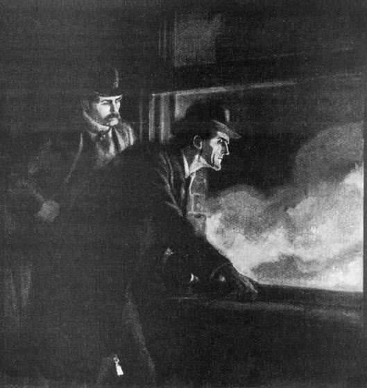

“这是他们搁过尸体的地方。”

等没多久，下一趟列车如前趟车一样，从隧道呼啸冲出，但是一出隧道立即减速，随后煞车吱吱嘎嘎直响，就在我们眼前停住。这时窗台距离车厢顶不到四英尺。福尔摩斯轻轻把窗关上。

“至此，我们的推断已得到证实，”他说，“你怎么想，华生？”

“一件杰作，你达到了前所未有的顶峰。”

“你这么说我不敢当。那是从我形成尸体是放在车顶上这个想法开始的，当然这个想法谈不上深奥，但这样一来，其余一切问题就迎刃而解了。要不是案子的利害关系特别重大，光这一点案情也没有多大意思。我们眼前仍然困难重重，不过这里也许还能发现一些东西，对我们有帮助。”

我们登上厨房阶梯，进入二楼的一个套房查看各个房间。一间是餐室，里面陈设简单，没有值得注意的地方。第二间是卧室，也是空空荡荡。再看一间，好像有点希望，我的同伴停下来系统地进行检查。这儿到处摊满书籍和报纸，很明显是作书房用的。福尔摩斯一个抽屉一个抽屉、一个橱柜一个橱柜逐一翻检，动作迅速而有条不紊，但是他紧绷的脸上没有显露一丝成功的喜色。一个钟头过去，和开始的时候一样，毫无进展。

“这只狡猾的狐狸，把蛛丝马迹都毁掉了，”他说，“凡是有可能成为罪证的东西一点不留。犯罪的信件都销毁了，或者转移了。这是我们最后的机会，找不到也就没有了。”

书桌上有一只马口铁铁匣，是放现钱的小箱子。福尔摩斯用凿子撬开，里面有几卷纸，纸上是一些数字和计算式，没有任何说明，只是反复出现“水压”和“每平方英寸压力”等文字，说明和潜水艇可能有些关系。福尔摩斯不耐烦地把这些都扔向一边，最后只剩一个信封，里面放的是一些小张的剪报，他全抖出倒在桌子上。我突然看见他情切的脸色燃起了希望。

“这是什么，华生？啊？这是什么？报纸登的广告，几次代邮广告，看印刷和纸张，是《每日电讯报》的私人广告栏，在报纸右上端的一角。没有日期——但是代邮本身是有次序的。这是第一则：

希望尽快听到消息。条件同意。请按名片地址详告。

皮罗特

下面一则：

复杂难述。务需详尽报告。以待钱货两讫。

皮罗特

接着是：

情况紧急。务必撤回要价，以待合同确定。希函约、广告为凭。

皮罗特

最后一则：

周一晚九时后。敲门两声，均为自己人，无须猜疑。钱货两讫。

皮罗特

“记得很完整，华生！能从另一头找到这个人就好了！”他坐着沉思，手指敲击桌面，最后跳起身来。

“哈，总的来看，也许并不困难。这里没有什么可做了，华生，我想该马上到《每日电讯报》社，对今天的工作做个收尾，一定能功德圆满。”

迈克罗夫特·福尔摩斯和莱斯特雷德隔天早餐后如约前来，歇洛克·福尔摩斯向他们叙述了我们昨天的工作进展。这位专职警探对我们自己承认的夜盗似的搜索行为直摇头。

“我们警察绝不许这样做，福尔摩斯先生，”他说道，“怪不得你的成绩能够超过我们。这些天来你们调查得过头了，你自己，还有你的朋友，会发现是自找麻烦。”

“为国家效劳嘛，国家国家，没有国哪有家——噢，对吧，华生？就当成在英国祭坛上殉难了吧！可是你的看法如何呢，迈克罗夫特。”

“棒极了，歇洛克！令人钦佩！还要看你怎么解决了。”

福尔摩斯把桌上的《每日电讯报》拿起来。

“看见皮罗特今天的广告没有？”

“怎么，还有广告？”

“对，在这儿。”

今晚，同时同地，敲门两下，极重要，与你本人安全攸关。

皮罗特

“好呀！”莱斯特雷德叫道，“他若赴约，我们一定逮住他！”

“我使这么一手正是这个意思。我想，你两位如果方便，八点钟和我们一起到考菲尔德花园去，我们很可能就把事情基本上解决了。”

歇洛克·福尔摩斯有一种能力，最了不起的特点，当他觉得自己的工作不可能更有效率的时候，就干脆让脑子停止活动，把一切思想转移到轻松的事情上去。我记得这值得纪念的一整天里，他埋头撰写关于拉苏斯<a href="#part0142.xhtml_ch2"
id="part0142.xhtml_ch2-back">(2)</a>的复调赞美诗的专题论文。至于我自己，我没有这种超脱的本领，结果，这一天等得我简直漫长没有尽头。本案对国家关系重大，最高当局焦虑不堪，我们直捣贼窝探其囊取其物——这些都搅和在一起，刺激着我的神经。直到轻轻松松吃过一顿晚餐后，我才舒了一口气，我们终于踏上征程。莱斯特雷德和迈克罗夫特如约在格劳塞斯特路车站外面等着我们。奥伯斯坦住所地下室的门第一天晚上已被撬开，但是迈克罗夫特·福尔摩斯执意不肯爬栏杆，于是就由我绕进去把厅门打开。到九点，我们已在书房里坐定，耐心等候我们所邀的人到来。

过了一个钟头，又过了一个钟头，十一点敲过了。大教堂钟声从容哀婉的报时，听起来像对我们所抱的希望唱起挽歌。莱斯特雷德和迈克罗夫特坐在那里焦急不安，一分钟看两次表。福尔摩斯很沉静，坐着一声不吭，半闭眼睛，但是根根神经绷紧着。他忽然一震，猛抬头。

“来了。”他说。

有鬼鬼祟祟的脚步从门外走过去，又再走回来。我们听见一阵凌乱的脚步到了门跟前，接着门环在门上重重地碰了两下。福尔摩斯站起来，做手势叫我们坐着别动。厅里的煤气灯只有一丁点儿亮光。他打开门，一个黑影侧身进来后，他随即把门关上，上锁。“到这边来！”我们听见他说，一会儿来人站在了我们面前，福尔摩斯紧随其后。这个人发觉不对，一声惊叫转身要跑出去，福尔摩斯一把抓住他的领口，将他扔回屋子里。不等这个上了手的人站稳，福尔摩斯已把房门关上，背靠门站着。这个人瞪眼四下张望，身子一摇晃，倒在地板上昏厥过去了。惊慌之中，他的宽边帽从头上掉落，围巾从嘴边滑下，露出一张蓄薄须而清秀俊美的脸，是瓦伦丁·瓦尔特上校。

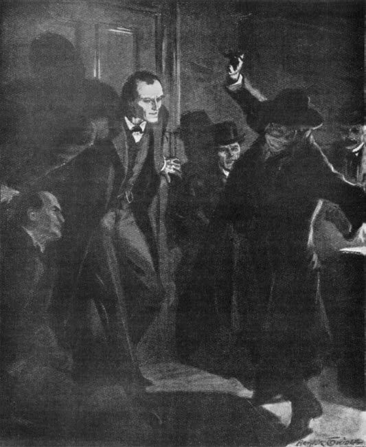

不等这个上了手的人站稳，福尔摩斯已把房门关上。

福尔摩斯惊讶地嘘了一声。

“这一回，你可以把我写成一头蠢驴了，华生，”他说，“想不到我抓的是这只鸟儿。”

“他是什么人？”迈克罗夫特急忙问。

“已故詹姆斯·瓦尔特爵士胞弟，潜艇所所长。是的，是的，我看到了那副牌局，他要出牌了。我想，最好还是把他交给我来审问。”

我们把倒在地上的人拖上沙发，这时他坐了起来，满脸惊恐看看周围，手摸摸额头，有点不相信自己的知觉似的。

“怎么回事？”他问道，“我来这里是找奥伯斯坦先生呀。”

“事情都清楚了，瓦尔特上校，”福尔摩斯说，“堂堂一个英国绅士，竟做出这种事来，大大出乎我的意料。可是你同奥伯斯坦的关系、联系，都在我们的掌握之中，有关年轻人卡多甘·韦斯特的死亡情况，我们也清楚。我奉劝你一句，不要辜负我们对你仅存的一点信任，希望你忏悔、坦白，还有某些细节，我们只能从你口中了解。”

这个人叹了口气，双手蒙住了脸。我们等他，但是他不做声。

“我可以明确告诉你，”福尔摩斯说道，“每一个重大情节都已经查清。我们知道，你急需用钱，私下里拿你哥哥掌管的钥匙做了印模。你和奥伯斯坦接上关系，他通过《每日电讯报》的私人广告栏给你回信。我们知道，你星期一晚上趁着大雾跑到办公室，但是被年轻人卡多甘·韦斯特看见，他随后跟踪了你。事实上，他早就对你起疑。他目睹你偷窃文件的行为，但是不能报警，因为也有可能你是拿文件交给你伦敦的兄长。他放下自己的私事不顾，可见他实在是一位好公民。他在迷雾中紧紧盯住你，一直跟踪到了这所房子。这时候，他就出面干预你了。可是结果，瓦尔特上校，你在叛国罪之外又添一条死罪，杀人罪。”

“我没有！我没有！上帝作证，我发誓我没有杀人！”可怜又可鄙的罪犯嚷道。

“那么，你说，卡多甘·韦斯特是怎么被你们害的？你们把他丢到了火车车厢顶上去。”

“我说，向你们发誓，我说。我承认，别的事我做过，正是你说的那样。要偿付股票交易所的债，我需要钱走投无路，奥伯斯坦给我五千，救我渡过难关。可是，杀人这回事，我是无辜的，和你们一样清白。”

“怎么回事，快说！”

“他早就对我有怀疑，像你说的，他盯住了我。我不知道，等来到了这里门口，才发现他。雾很大，三码以外就看不见。我敲了两下门，奥伯斯坦来开门。这个年轻人冲上来，责问我们拿文件想干什么。奥伯斯坦有护身棍，他一直随身带着。韦斯特跟着我们冲进屋时，奥伯斯坦就对准他头上一棍，这下要了他的命，五分钟以后就断了气，躺在客厅里。我们不知如何是好。奥伯斯坦想到了停在后窗外的火车。不过他先急着检查我带来给他的文件。他说其中三份是最关键的，他要拿走。‘不能拿走，’我说，‘不送回去，乌尔威奇不就要闹得天翻地覆啦！’‘我一定要拿走，’他说，‘技术性太强，一时无法复制下来。’‘今天一定要全部送回去不可。’我说。他想了一会儿，叫起来，说有办法了。‘三份我拿走，’他说，‘其他的都塞在这个青年的口袋里。等到一被发现，整个事就算在了他的账上，都是他干的了。’我想不出还有什么别的办法，也就只好照他说的做。在那个窗口，等了半个钟头，一列火车停下来了。雾大得很，什么也看不见，我们把韦斯特的尸体弄到车厢顶上一点困难也没有。跟我有关的事，就这些了。”

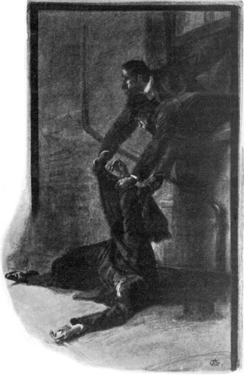

“把尸体弄到车厢顶上一点困难也没有。”

“你兄长呢？”

“他没说什么。只有一次被他看见我拿过他的钥匙，我想这就引起他怀疑了，我从他眼睛里看得出来，他怀疑我。你已经知道，他再也抬不起头来，没脸见人。”

屋子里声息全无。迈克罗夫特·福尔摩斯打破了这一阵沉寂。

“你想不想补救？可以安抚你的良心，也会减轻对你的惩罚。”

“我怎么补救呢？”

“奥伯斯坦把文件弄到什么地方去了？”

“我不知道。”

“他没有给你地址？”

“他说有信可以寄到巴黎洛雷旅馆，他就收得到。”

“想不想补救，那就全取决于你自己了。”歇洛克·福尔摩斯说。

“我愿意，我一定做。我跟他这个人又没有交情，他毁了我，一辈子完了。”

“拿纸笔，坐到桌边去，我说你写。把他给的地址写在信封上。好，现在写信：

亲爱的先生：

关于我们的业务，你现在无疑已有发现，尚缺一项关键细节。我特制作复印图可使完善。但此事已替我招来额外麻烦，必须再向你额外收取五百英镑。邮汇不妥，并只要黄金或英镑，拒收其他。本欲出国亲赴你处，但我若此时出国必招致注意。故望于星期六中午来查令十字街饭店吸烟室相见。只收黄金或英镑，切记为荷。

“这就行了，我就不信他不来，我们抓不到他才怪。”

果然灵验！这是一段历史——一个国家的秘史，比起公开的编年史，还要有趣得多，而且为人津津乐道——奥伯斯坦急于做成他毕生最大的这笔生意，因此被诱捕落网，要在不列颠蹲大牢十五年。在他的皮箱里搜出价值无限的布鲁斯-帕廷顿潜艇计划，他居为奇货，打算向欧洲各国海军部技术中心待价而沽。

瓦尔特上校判刑后的第二年年底，死于狱中。至于福尔摩斯，他又兴致勃勃回头研究拉苏斯复调赞美诗，文章被私人翻印流传，据专家认定是这方面的权威评论。几星期之后，我偶然听说我的朋友在温莎<a href="#part0142.xhtml_ch3"
id="part0142.xhtml_ch3-back">(3)</a>度过了一天，带回一枚精致无比的绿宝石领带别针。我问他是不是买的，他回答是一位仁慈的贵夫人送的礼物，因为他曾十分荣幸为这位贵夫人略尽绵薄之力，完成一项小小的使命。除此之外，他便不再多说。但是我想，我能猜到那位贵夫人的大名。毫无疑问，这枚绿宝石别针将永远唤起我朋友对布鲁斯-帕廷顿潜艇计划案的回忆。

（1908年）

————————————————————

<a href="#part0142.xhtml_ch1-back" id="part0142.xhtml_ch1">(1)</a> 朱庇特（Jupiter），罗马神话中统治诸神、主宰一切的主神，相当于希腊神话中的宙斯（Zeus）。

<a href="#part0142.xhtml_ch2-back" id="part0142.xhtml_ch2">(2)</a> 拉苏斯（Lassus，Roland
de，约1532—1594），比利时作曲家，以圣乐及世俗乐著称。

<a href="#part0142.xhtml_ch3-back" id="part0142.xhtml_ch3">(3)</a> 温莎（Windsor），英格兰东南部离伦敦不园的城市，英王室住所温莎堡所在地。

# 鬼足之谜

我和我的朋友歇洛克·福尔摩斯亲密相处以来，把奇特的经历和有趣的往事都一篇又一篇记录成文。我一直深感为难的是，他不愿意把自己的事迹公之于众。他性格忧郁，玩世不恭，对人们的掌声他只感到厌烦。每逢成功了结一桩案子，最使他高兴的莫过于把揭出的事实真相悉数移交警方当局，自己则一旁含笑听一片对警方不该叫好的叫好声、不该祝贺的祝贺声。正是我朋友的这种态度而绝非缺少有趣题材，才使我最近几年很少有案情纪实呈现于读者公众面前。我能参与福尔摩斯一起侦破刑案，一直是他对我特许的权利，所以更需要我处置谨慎，保持必要的缄默。

然而大大出乎意料，上星期二我收到福尔摩斯一封电报——从来都是只要能发电报，就不曾见过他写信——电文如下：

为何不告诉读者康沃尔恐怖事件——我经手的最奇刑案。

我不知道他怎么会心血来潮，忽然回想起这件事来了，突发奇想要我叙写此事。说不定他又会来个电报说取消此事，所以我赶快翻出记录，将此案的详细内容敷演成文，供读者一阅。

事情是一八九七年春，福尔摩斯工作任务艰巨，日夜操劳，他那钢筋铁骨般的身子也支撑不住，再加他平时不注意，健康状况便日益下降。这年三月，哈利街的穆尔·阿加医生，他怎么介绍给福尔摩斯认识的戏剧性情节，我改日再谈，现在只说他明确命令这位著名私家大侦探放开一切案件，进行完全彻底的休息，如果他不希望自己完全垮掉的话。他的健康状况也不容再掉以轻心，谁叫他往日对自己身体太不当一回事。不过他最后还是听从告诫，因为他担心将会长期丧失工作能力。他同意给自己彻底换换环境和空气，于是，那年的早春季节，我们一起来到康沃尔半岛的尽头，在波尔杜海湾边，住进一栋小别墅。

这是个得天独厚的好地方，特别适合于我的病人，调理他郁闷的心境。我们的白墙小屋，立于绿草如茵的高高海岬上，推窗望远，整个险峻的半圆山峰的海湾尽收眼底。此处历来是航船遇险之地。黑岩嶙峋的悬崖峭壁，浪涛激越下的巨石暗礁，无数船员葬身于这片海域。但每当北风徐来时，海湾平静而隐蔽，招引海途颠簸的船只前来休整和避风。

随后风向突然猛转，西南风狂吼怒号，拖曳铁锚，把船吹向下风海岸，在滔天白浪中作最后的挣扎，所以有经验的船员都要远离这一凶险地带。

我们的房子靠陆地这一边，周围的环境同大海一样沉郁。这一带是连绵起伏的沼泽地，孤寂灰暗。偶尔有个教堂的尖塔，表明昔日村落存有旧址。放眼四望沼泽地，处处残留着早已湮灭的先民的遗迹。那些可资纪念的奇异石碑，散落着埋葬骨灰的坟冢，以及特筑的土方工事，都提示着史前的争战。这真是个奇特的谜一般的地方，笼罩着被遗忘的民族的厄运气氛，勾起我朋友的无限遐想，他的大部分时间是久久地散步，对着沼泽地一个人默默地寻思。古代的康沃尔语也引起他的关注。我还记得，他产生一个想法，认为康沃尔语和迦勒底语是同一语族，而且很有可能是由做锡器生意的腓尼基商人所流传。他托购寄来一批语言学书籍，正定下心来对这一课题作出研究。可是忽然间，让我忧虑，让他却由衷地感到高兴，我们发现即使是在这梦境一般的地方，也会遇上案情，而且就出在自己屋门前不远处。那案子之紧急、神秘、引人注意，远甚于把我们从伦敦赶到这里来的那些刑事疑案。我们单纯、平静、健康的生活规律被骤然打破。我们就此被卷入一连串事件，这些事件不仅使康沃尔，也使整个英格兰西部引起极大的骚动。我的许多读者可能还记得那个所谓的“康沃尔恐怖事件”，尽管当时发给伦敦报界的报道是很不完整的。现在，事隔十三年，我将把这一不可思议事件的全部真相公之于世。

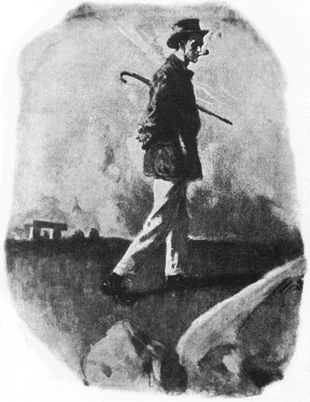

他的大部分时间是久久地散步。

我已说过，偶有的尖塔表明康沃尔这一带散布着零落的村庄。靠得最近的一个村叫特里丹尼克·瓦萨小村，二百来户的村民小屋围绕在教堂四周，古老的教堂布满苔藓。教区牧师朗德里先生是位有成就的考古学家，福尔摩斯因此与他相识。他是个魁梧的、和蔼可亲的中年人，拥有一肚子的地方知识。我们曾经应他之邀在他的牧师住宅里喝过茶，并因此也认识了莫蒂默·特雷根尼斯先生，一位生活自立而富裕的绅士。牧师住宅屋子大房间多，他租出了几间，也增补些牧师微薄的收入。牧师是单身，很乐意有这样的安排，虽然他和这位房客很不一样。特雷根尼斯先生又瘦又黑，戴副眼镜，弯腰驼背，给人印象身体畸形。我记得，在那天短暂的拜访中，发现牧师喋喋不休，他的房客却木讷不多言，我颇觉奇怪。他只苦着脸，像是多愁善感的人，光坐在那里，眼望别处，显然在想他自己的心事。

就是这两个人，在三月十六日星期二，突然跑进我们小小的起居室。我们刚吃过早饭，正在抽烟，准备要去作每日例行的沼泽地信步闲游。

“福尔摩斯先生，”牧师情绪激动地说，“夜里出事了，可惨了，更是出奇，我们长耳朵从来没听见过有这种事。还就是巧，你正好在这儿，简直是天意安排。全英格兰，现在就数你是最需要的人了。”

我以不甚欢迎的眼光瞧着这位煞风景的牧师，但是福尔摩斯立刻从嘴里拿下烟斗，在椅子上坐直了身，像是一只老猎犬听到了召唤。他向沙发挥挥手。来人一个在哆嗦，一个神色激动，一起并排坐在沙发上。莫蒂默·特雷根尼斯先生比牧师稍有自制力，但是一双枯手在抽搐，黑眼珠一闪一闪发亮，说明两人的心情都是一样紧张。

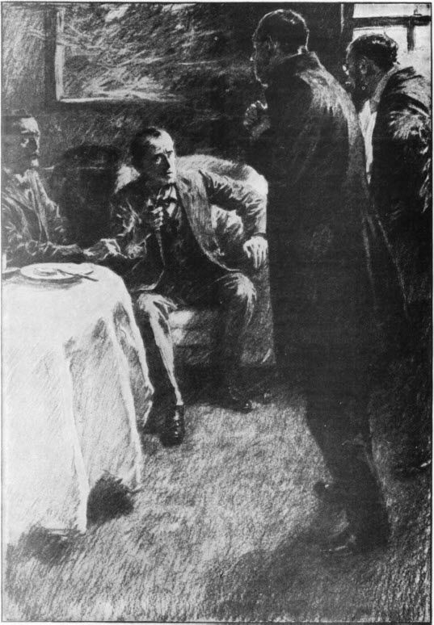

我以不甚欢迎的眼光瞧着这位牧师。

“我说还是你说？”特雷根尼斯问牧师。

“噢，看来，不管怎么样吧，事情是你发现的，牧师是听你讲的，他是第二手了，还是听你讲的好。”福尔摩斯说。

我看了看他们，牧师的衣服是匆忙穿上的，坐在他旁边的房客却穿得整整齐齐。福尔摩斯这一简单的推理使他们的脸上布满莫名其妙的神色。

“也许，还是我来先谈上几句吧，”牧师道，“然后等你听了特雷根尼斯先生谈仔细了，你可以作判断，或者要不要赶快到现场去，这个事实在很奇怪。我来说明一下，事情是这样，我们的这位朋友昨天晚上和他的两个弟兄，欧文和乔治，还有妹妹布伦达在一起，就在他们特里丹尼克·瓦萨的屋子里，房子靠近沼泽地一个石头搭的十字架。他是十点刚过离开的，当时他们都在餐厅桌上玩牌，兴致很高。他是个起早的人，今天早上，没吃早饭，正往那边去。理查兹医生的马车从后面赶上来，说有人来报急诊，赶快到特里丹尼克·瓦萨。莫蒂默·特雷根尼斯先生也就上马车一起去。到了特里丹尼克·瓦萨一看，出大事了。事情可怪了，他的两个弟兄和妹妹都还围在桌旁坐着，跟他昨晚离开的时候一样，面前摊着纸牌，蜡烛点完，烧到了插座底。妹妹仰面靠在椅子上，僵硬了；两兄弟坐在妹妹两边，又是笑，又是叫，又是唱，神志完全不清。这三个人，女的死了，两个男的疯了，他们脸上表情都很可怕——一副恐怖惊吓的样子，叫人不敢看。没有别人进过屋，一点痕迹也没有。屋里只有波特太太，她是老厨师、老管家，她说她夜里睡得很熟，一点声音也没有听到。屋里东西一样不少，一点都没有翻动过。根本无法解释怎么会把一个女人吓死，把两个身强体壮的男人吓疯。大概的情况就是这样，福尔摩斯先生，要是你能帮助我们破案，你可是做了件大好事。”

我满心希望好歹可以把我的同伴拉回到安静中来，这原本是我们这次旅行的目的，但是一看他那兴奋的脸，紧蹙的双眉，我就知道这希望全泡汤了。他静默坐了一会儿，沉浸在打破我们平静的这出怪剧之中。

“这事我要研究一下，”他最后说，“表面上看，案情不可思议。你本人去了没有，朗德里先生？”

“没有，福尔摩斯先生，特雷根尼斯先生到我牧师住宅把消息一说，我就马上带他赶到这儿来请教你了。”

“哦，悲剧惨案。出事的屋子离这儿有多远？”

“向里走，大约一英里。”

“那么，我们一起去。不过，去之前，我得问你几个问题，莫蒂默·特雷根尼斯先生。”

这位先生一直没有开口讲话，但是我觉察到他竭力控制着自己，其实比起牧师冲动的情绪，他要激动得多。他坐着，拉长的脸显得惨白，焦虑的眼光盯着福尔摩斯，一双干枯的手抽搐地紧握着。他听着别人叙述可怕的惨祸如何降临到他家人的头上，那毫无血色的嘴唇在颤动，黑色的眼珠好像反映出对现场情景的恐惧。

“请随便问吧，福尔摩斯先生，”他慌忙道，“一提起来叫人伤心，但是我会如实回答你。”

“把昨晚上的情况说说吧。”

“好的，福尔摩斯先生。我在那里吃的晚饭，正像牧师说的，吃了饭，我哥哥乔治提议玩一局惠斯特牌。我们是九点钟坐下来打牌，我走的时候是十点十五分，看他们围着桌子，玩得正是兴头上。”

“是谁送你出门？”

“波特太太已经去睡了，我自己开门走的，自己把厅门带上。他们那间屋子的窗是关着的，百叶窗没有放下来。今天早上看门窗，都没有动过，要说有外人进过屋，实在没根据。他们还坐在那里，被吓疯了，布伦达给吓死了，脑袋斜靠在椅子扶手上。我这辈子再也忘不掉这屋子里的情景了。”

“这些事实，根据你讲的，真是非常奇怪，”福尔摩斯说，“我想，这些情况，你自己也说不出个所以然吧？”

“可能闹鬼了，福尔摩斯先生，有鬼怪！”莫蒂默·特雷根尼斯叫道，“这不是世间的人做得出来的事。一定有什么进了那间屋子，熄灭他们心灵上的理智之光。这是人力能够做到的吗？”

“这么说，”福尔摩斯道，“这件案子非人所为，那这案子我就办不了啦。不过，我们必须竭尽全力找出合乎自然的解释，不屈从于这种说法去找退路。至于你，特雷根尼斯先生，我看你已经和他们分家了，是吗？他们住在一起，你是另外分开住的。”

“是的，福尔摩斯先生，这事已经过去，了结了。我们家原先是雷德鲁斯开锡矿的，早把这不稳定的产业卖给另一家公司，卖下来的钱够我们用的了。不必否认，为了分钱的事，有点感情不和。不过只是一时间的意气之争，很快就相互原谅，都忘记了，大家已经和好如初。”

“回想一下，昨晚你们在一块儿，记不记得有什么特殊现象和案情有关？好好想想，特雷根尼斯先生，任何迹象，我都需要。”

“实在一点也没有，先生。”

“你家他们几个精神都正常吗？”

“精神很好。”

“他们有没有神经质？有没有表现出危险来临的征兆？”

“没有任何征兆迹象。”

“那么你也补充不了什么情况，没有帮助了？”

莫蒂默·特雷根尼斯着急地想了一会儿。

“噢，有一件事想起来了，”他最后说道，“我们坐到桌子旁的时候，我是背靠窗户的，我哥哥乔治，他做我的牌搭档，他面对着窗。我见他向我身后看了一看，眼神很专注，我也就回过头去看，百叶窗收起来，窗户关得好好的。我只看见外面草坪上的矮树丛，好像有什么在树丛里动了动。我无法确定，不能肯定是人还是动物，但我肯定是有什么动静。我问过他，看见什么了，他告诉我的，也是和我一样的感觉。我能说的就这些。”

“你有没有去查看呢？”

“没有，这有什么好查看呢。”

“后来，你离开他们，也没有一点情况？”

“一点没有。”

“我不明白，你怎么早晨那么早就听到了消息呢？”

“我有早起的习惯，早餐前要出去散步。今天早上，我正要散步，医生坐着马车从后面赶了上来。他告诉我波特太太叫一个孩子送来紧急信，我就跳上去，坐他车和他一起去了。一到那里，只见那间吓人的屋子里，蜡烛、炉火几个钟头前就烧尽了，他们在黑暗的屋子里一直坐到天亮。医生说布伦达死了至少有六个钟头，没有暴力迹象。她靠着椅子扶手，脸上是那个表情。乔治和欧文在唱唱停停，停停唱唱，又不知叽里咕噜说些什么，就像两只大猩猩。哦，看看实在可怕！我受不了，医生的脸也吓白了，像张白纸。他一阵子晕倒在椅子上，差一点要我们去照料他。”

“奇怪——真是奇怪！”福尔摩斯说，站起身拿了帽子，“我想，我们还是到特里丹尼克·瓦萨去看看，不要再耽搁了。我承认，案子一开始就出现这么奇怪的问题，我还很少见过。”

第一天早上，我们的第一步侦查行动没有取得任何进展。只有开始的一件小事值得一记，这件事在我心中留下最不吉利的印象。到出事地点要走一条狭窄、弯曲的小路，我们在这路上走着，听到马车辚辚向我们过来，赶紧闪到路旁让道。马车打我们面前驶过时，我在关好的车窗上看到一张扭曲可怕的脸，龇牙咧嘴看着我们。瞪眼咬牙的脸在我们面前一闪而过，像是恐怖的幻影。

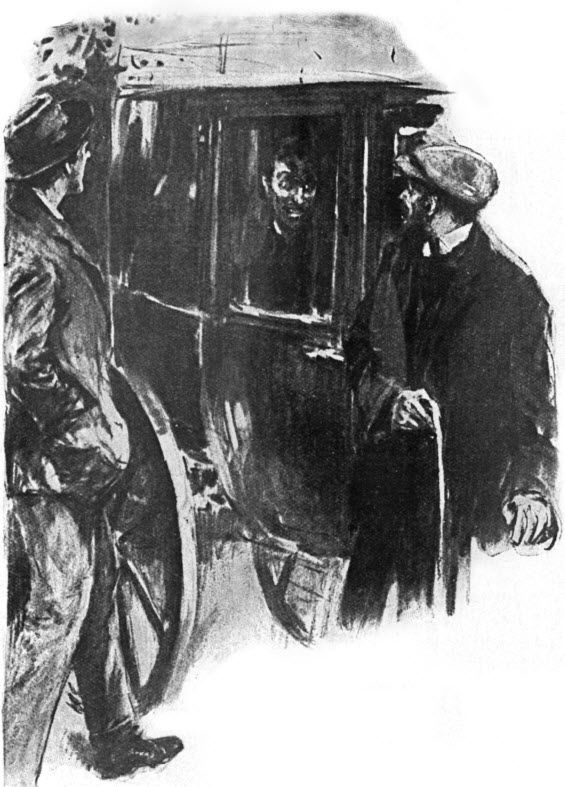

像是恐怖的幻影。

“是我的兄弟！”莫蒂默·特雷根尼斯叫道，嘴唇都发白了，“被送到赫尔斯顿去了。”

我们心怀恐惧看着黑色的马车隆隆驶远，然后转身朝他们惨遭不测的那座凶宅走去。

那是一座整洁的花园大宅，不是乡村小别墅。这座大花园，得益于康沃尔的好空气，正是满园春花烂漫时。那间起居室的窗户朝向花园。按莫蒂默·特雷根尼斯的说法，那鬼怪必定是出没于花园，只一吓就把兄弟俩都吓疯掉。我们进入门廊时，福尔摩斯在花丛间和小道上漫步沉思。他想得那样出神，我记得，他竟一脚绊上了浇花的洒水壶，踢翻了水，泼了我们的脚，湿了一地。走进屋，上了年纪的康沃尔管家波特太太迎上来。她有一个年轻姑娘当她的帮手，照料全家。老太太欣然回答福尔摩斯的问题。昨天夜里她没有听到什么响声。她的东家近来心情很好，她还从来没有见过他们这样兴高采烈。早晨一进这屋，看见三个人围着桌子这么可怕的样子，把她吓得晕了过去。等她醒过来，推开窗户，让清晨的空气进来，随即跑到外面小路上，叫一个村里的小孩子去请医生。如果我们要看看死亡的女士，现在已经移到楼上放在她卧床。两兄弟是找了四个身强体壮的大汉，才把他们弄到了精神病院的马车里。她自己在这屋子一天也不想多待，准备下午就走，回圣伊弗斯去和家人团聚。

我们上楼，看了尸体。布伦达·特雷根尼斯小姐虽然已近中年，仍不失是一位年轻漂亮的女郎。人虽死，但有色泽而轮廓分明的脸，依然俊俏，只是还遗留着惶恐与惊惧，这是她人生最后的面部表情。我们走出了她的卧房，下楼到起居室，惨剧发生的现场。隔夜的炭灰还在炉栅内，桌上，四支燃尽的蜡烛只剩烛泪堆堆，纸牌散满桌面，椅子都移到墙边，其余一切与昨夜一样，丝毫未动。福尔摩斯轻步迅捷地在室内走了一圈，把三把椅子拖到原来的位置，一一试坐，试试能看到花园里多大范围。他检查了地板、天花板、壁炉。但是我一直没有发现他的眼睛闪光明亮或嘴唇忽然抿紧；每当有这些表情出现，都是告诉我他在黑暗中看到了一线亮光。

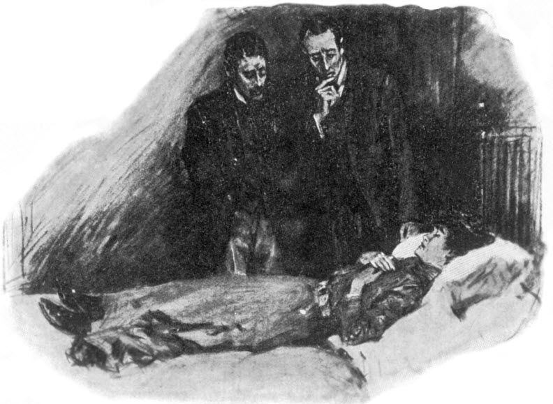

我们上楼，看了尸体。

“为什么生火？”他问到了这个问题，“春天了，小小的屋子，晚上他们还一直要生火吗？”

莫蒂默·特雷根尼斯解释说晚上还很冷，又湿，因为这个缘故，他一到，火炉就生起来了。“现在你准备怎么办，福尔摩斯先生？”他问道。

我的朋友笑笑，一手按着我胳膊。“我想，华生，我再要研究烟草中毒的问题，这是你经常谴责的，谴责得很有道理，”他说道，“请允许，先生们，我们现在要回住处，这里，我看已经没有什么情况值得我们注意了。我要在心里把事实情况多琢磨琢磨，特雷根尼斯先生，有什么事我一定会同你和牧师联系。就这样了，祝两位早安。”

我们回到波尔杜别墅没多久，福尔摩斯打破专注的沉静。他蜷缩在靠椅里，拼命吸烟，青烟缭绕，他那憔悴苦涩的面容几乎要遮住看不见了。他的两道浓眉深锁，前额紧蹙，眼神茫然空望。最后，他拿下烟斗，跳了起来。

“这样不行，华生！”他大笑一声说道，“让我们一起到崖岸边去走走，找找燧石箭头。找本案的线索，不如找燧石箭头。没有事实根据，脑子空想，等于引擎空转，转到最后会崩溃。大海的空气、阳光，再加耐心，华生——其他一切都会来的。“现在，我们冷静下来，确定我们处在什么位置，华生。”我们沿着悬崖走，他继续道，“要牢牢抓住已经掌握的一点点情况，这样，一有新的情况出现，就可以补充进去，适得其所。首先，我认为，你我都不会相信魔鬼作怪惊扰人间。这种想法应当排除，完全排除掉，这样才能开展我们的工作。没错，三个人是遭到人为因素的袭击，很可悲，是有意识的，或者是无意识的。这是问题根源所在。那么，发生在什么时间？很明显，只要所述情况确实，应当在莫蒂默·特雷根尼斯先生离开屋子以后不久立即发生。这一点很重要。推测下来是之后几分钟的事。纸牌都还在桌上摊着，已过了平时的睡觉时间，可是他们座位都还没动过，没有把椅子推进桌子底下。我再讲一遍，事情是他前脚离开，后脚就发生，决不迟于昨夜十一点钟。

“我们下一步要做的事，就是设法查一查莫蒂默·特雷根尼斯离开屋子以后有什么行动。这一点不困难，看来也是没有疑点。你是知道我的做法，你当然注意到，我怎么会笨手笨脚地踢翻了洒水壶。这么一来，让我取得了他的脚印，不这么做，无法得到那么清晰的脚印。印在湿地面上，再清楚也不过。昨天晚上湿气很大，你记得吧？这就不难了——得到脚印——把他的和其他的脚印一比对，就可以辨别出他的脚印来了，从而跟踪他的行动。他显然很快就朝牧师住宅的方向而去。

“那么，如果莫蒂默·特雷根尼斯离开现场后，有其他外来者对打牌的人实施作案，我们如何来勾勒出这个人，又是如何造成这样恐怖的效果呢？波特太太大概可以排除，她不至于犯案。有没有迹象显示，什么人爬到花园的窗户，用什么方法来吓人，能够让人一看到就吓得灵魂出窍、发疯？这方面惟一的说法，只有莫蒂默·特雷根尼斯他自己所说的，他的兄弟说过花园里曾有动静。这当然值得注意，晚上下雨，漆黑无光，有人存心要吓这几个人，就非得要把脸贴到玻璃窗上，不然看不见他。可是窗外沿边有三英尺宽的花坛，却没有发现一个脚印。更难以想象的是，一个外人如何能够制造如此恐怖的形象来吓倒屋里的人。我们也没有发现出此煞费苦心的奇招，他的动机到底是什么。你理解我们的难题了吗，华生。”

“困难重重，显而易见。”我毫不迟疑地回答。

“不过，材料要是能再多一些，就能证明这些困难不是无法逾越的，”福尔摩斯说道，“我想，也许你可以在许多案卷中，华生，发现一些无头案件。现在，我们暂时把这件案子搁起来，等有了更确切的材料再说。早上还有一点时间，我们来考察一下新石器时代的古人吧。”

我的朋友对事若要不在乎起来，还真会满不在乎，我可以谈谈他这方面的能耐。可是这个康沃尔春天的早晨，他那个不在乎的劲头也实在叫我意想不到。足足两个小时，他只顾着大发宏论谈凯尔特人，谈箭头，谈陶瓷片，一派轻松自如的样子。而那件凶险迷案，还等着他去解决，他却全然若无其事一般。要不是下午回到别墅，看到有访客等着我们，还不会把我们的心思马上拉回到案子上来。来者不必告诉我们是谁，那魁梧的身材，轮廓清晰而满布皱纹的脸庞，锐利的目光，鹰钩鼻，灰白的头发，头顶几乎要碰到天花板，络腮胡子——两鬓金黄色，到了唇边则变成了白色，白胡子上看得出抽雪茄留下的尼古丁色斑——所有这一切，在伦敦如同在非洲一样，都是无人不知，只有勇武的猎狮高手、探险家列昂·斯坦戴尔博士，才拥有如此出众的形象。

我们原已听说他住这个地区，也曾有一两次在高沼地的路上，有幸见过他那高大的身影。他没有向我们走来，我们也根本想不到会和他打交道。因为众所周知，他喜欢隐居，在旅行游猎的闲息空当，他大部分时间住在布尚·阿兰斯森林中的一所小房子里，埋头于书籍和地图之中，过着绝对孤独的生活，简单、宁静，没有奢求，对远近邻里的事从不过问。所以当我一听他声音急迫地问福尔摩斯，侦查这件神秘疑案有没有进展，我实在大为吃惊。“那警察像只没头苍蝇，”他说，“不过你经验丰富，说不定可以听到一点令人信得过的说法。你尽管相信我，我在这里住了很久，特雷根尼斯这一家，我很了解——真的，从我母亲这边来说，他们算是康沃尔的远亲——遭到这样的惨祸，太出乎我的意料。我告诉你，我本来已经去了普利茅斯，今天早上得到消息，又赶快回来，看看能为这件事做点什么。”

福尔摩斯扬起了双眉。

“这样你就耽误了船期吧？”

“我可以坐下一班。”

“啊哈！真是位重情义的人。”

“我跟你讲了，我们是亲戚。”

“是这样——你母亲那边的外表姐妹。你的行李在船上了？”　

“一部分上船，大部分还留在旅馆。”

“噢，是这样。可是，这件事想来还不至于已经上了普利茅斯晨报吧？”

“还没有登，先生。我收到了电报。”

“请问是谁发的？”

探险家瘦削的脸上掠过一丝阴影。

“你真能追根究底呀，福尔摩斯先生。”

“这是我的职业。”

斯坦戴尔定定神，重新镇静。

“告诉你也无妨，”他说，“朗德里牧师先生，是他发的电报，我就回来了。”

“谢谢，”福尔摩斯说，“你先问我的问题，我可以回答你了。这件案子的头绪，我心中还没有个底，不过应该很有希望得出结论，现在要说，还为时过早。”

“如果你已有确定的怀疑方向，告诉我也无妨吧？”

“不，这很难回答。”

“那好，我是白来了，不用再浪费时间了。”大博士迈步跨出我们的小起居室，扫兴而去。五分钟不到，福尔摩斯立即出去盯住他，直到傍晚他才回来。看他脚步迟缓，脸色灰溜，这就告诉我，侦查没有取得重大进展。有一封电报是给他的，他看过一眼，就往火炉里一丢。

“普利茅斯旅馆来的，华生，”他说道，“我从牧师那里打听到旅馆名称，就拍电报去，查查列昂·斯坦戴尔博士所讲的是否事实。看来，昨天晚上他确实是在那家旅馆，确实把一部分行李送上船运往非洲，他自己折回这里，了解情况。对这一点，你是怎么想，华生？”

“事情和他利害攸关。”

“利害攸关——是的。这里面有一条线索我们没有抓住，这条线索有可能理清这团乱麻。振作起来，华生，我知道，线索我们还没有全部到手。一旦到手，困难就将过去，案子迎刃而解。”

福尔摩斯的话没多久就兑现，打开一条崭新的调查之路，新发现有多么奇特、多么险恶，这些都是我无法想到的。早晨，我正在窗前刮胡子，听到嘚嘚马蹄声。向外一看，有一辆轻马车疾驶过来，到门口停下。是我们的牧师朋友，跳下马车，踏上花园小径。福尔摩斯已经穿好衣服，我们赶快出去迎接。

我们的客人激动得话都讲不清楚，最后气喘吁吁连喊带叫地说发生了惨祸。

“魔鬼降临了，大祸临头了，福尔摩斯先生！我这个教区，可怜被魔鬼盯上了！”牧师叫道，“撒旦亲自来撒野了！我们都给捏在他的魔掌里了！”他手脚乱舞，万分激动。要不是他脸色吓白，两眼恐惧，那样子还当是丑态可笑的表演。最后他才说出发生什么可怕的事。

“莫蒂默·特雷根尼斯先生，昨晚上，死了。死的情形，跟他家的三个人一模一样。”

福尔摩斯倏地跳起来，顿时紧张了。

“你的马车把我们都带上走，行吗？”

“行，可以。”

“华生，不吃早餐啦。朗德里先生，我们听你吩咐就是了。快——快，别让现场给破坏了。”

这位房客占用牧师住宅两个房间，是上下两间，都在一个屋角上。下面一间大一点，是起居室，上面一间作卧室。起居室向外望，便是槌球草坪，草坪一直伸到窗下。我们比医生和警察先到场，所以现场的一切丝毫未动。让我如实描述一下当时的情景。这是三月里一个多雾的早晨，所见给我留下的印象永远也无法从我心中抹去。

房间里的气氛阴森恐怖，压抑得令人窒息。先进屋的仆人推开了窗子，不然就更加叫人难以忍受。部分原因可能是屋子中央桌上还点着一盏灯，正在冒烟。死人就坐在桌旁，仰靠在椅子里，稀疏的胡子翘起，眼镜推到前额上，那张黑瘦脸转向窗户，面部扭曲变形，样子可怕，和他的妹妹死去的模样相同。四肢抽紧着，十指如钩爪，这是死于极度惊恐的症状。他衣着完整，不过看得出是匆匆忙忙穿的衣服。问下来知道他原先已经睡了，出事是在凌晨时间。

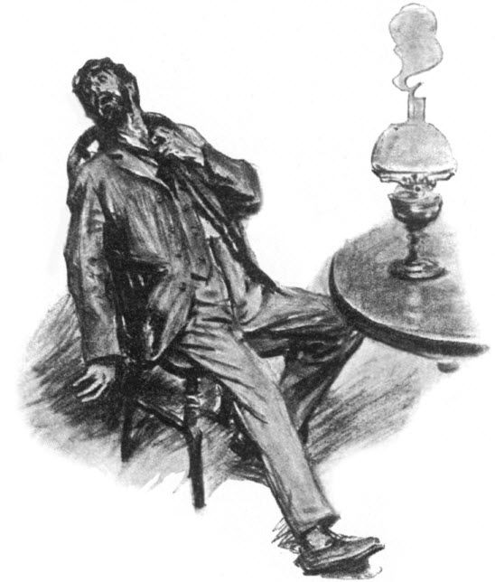

死人就坐在桌旁，仰靠在椅子里。

只要看到福尔摩斯走进夺人性命的房间时一刹那表情的变化，便可知他那冷静的外表下，内心燃起了炽热的烈火。他顷刻间神情紧张，表现出高度警觉，两眼发光，板着面孔，手脚跃跃欲试。他一下跑到外面草地，一下又翻窗进屋，在屋里察看，又上楼看卧室，就像一头猎狐犬奔突于猎物窝藏之处。在卧室，他迅速看过四周，接着推开窗子，这似乎又增添了他的兴奋感，他竟然探出身去，颇有兴致地朝外面一声欢呼。然后冲到楼下，翻窗出去，俯下身，脸贴草地，又跳起来，再返回屋里。他那种冲劲就像是猎人在追逐他的猎物。那灯，是普通的一盏灯，他一丝不苟地作了检查，量过灯盘的尺寸，用放大镜仔细察看套在灯罩顶部的云母防烟罩，从面上刮下一些粉末，装进一只信封，夹入笔记本。最后，当医生和官方警察到场，他招手叫牧师，我们三个人出去，走到了草坪上。

“我很高兴，应该说我的调查，没有白费一点力气。”他说道，“我不能留在那里和警察讨论这件事。但是，我将会非常感激你，朗德里先生，如果你能代我向警官致意，再提醒他关心卧室的窗和起居室的灯；两者都有玄机，联系起来，几乎就可以得出结论。另外，警察若是想要知道进一步的情况，我乐意在鄙舍接待他们，见哪一位都行。现在，华生，我想，也许还是到别处去忙我们的事为好吧。”

可是警察没来，也许他们不满意私家侦探插手本案，或者他们自以为另有调查方向，抱有十足的信心。但是可以肯定，随后的两天里，我们没有听到他们的任何消息。在这两天时间，福尔摩斯只待在别墅里抽烟，静心思考。更多的时间是到外面散步，一去就是几个小时，回来之后一字不提去了哪些地方。只是经过了一次实验，才使我明白他的调查有了眉目。他买来一盏灯，和悲剧发生的那天早上在莫蒂默·特雷根尼斯房间的那盏灯一模一样，往灯里灌满牧师所用的那种灯油，还准确记录下灯火燃尽所需的时间。再进一步的实验就叫人受罪了，我一辈子也不会忘记。

“你该记得，华生，”那天下午他说道，“我们听到的各种不同报告当中，都有一点共同之处，就是都说房间里的空气，两件案子，首先进屋的人都感到的空气。你可以回忆，莫蒂默·特雷根尼斯，他陈述最后那次去他兄弟屋子的情况，讲到医生一进屋就倒在椅子上，对吗？你忘了？好，这一点我来回答是什么道理。再有，你也该记得，波特太太，女管家，告诉过我们，她进屋子就晕倒，之后打开窗户才好了。在第二起案子中——莫蒂默·特雷根尼斯自己送掉了命——你该不会忘记，我们进去，那屋子里闷得厉害，虽然仆人已经把窗子打开。那个女仆，我后来问起才发现，人不舒服了，回她卧房睡倒了。你要认清，华生，这些事实很说明问题。两起案子都有毒烟的证据。两起案子，都是屋里有东西燃烧——第一起是炉火，第二起是点灯。炉火算是有需要，但是点灯——油耗量一比较就清楚——点的时候天早已大亮。为什么？这里，肯定三种情况之间有联系——燃烧、窒息的空气，最后不幸者死亡或者发疯。情况很清楚，是不是有关联？”

“看来是这样。”

“至少我们可以把这一点作为假设，由此推理。我们假设是这样，两起案子都有燃烧这一事实，产生气体，都发生奇特中毒现象。好，在第一案例中——特雷根尼斯的家人——燃烧物放在了炉子里。那时窗子是关着的，但是炉火燃烧，烟气自然通向烟囱跑掉相当一部分。所以可想而知，毒气作用就不大，就比第二起案子弱。第二起案子中，毒气能逸散跑掉的很少。所以结果可能就是这样的情况：第一案，只有女人丧命，也许是女性机体更加敏感，经受不住的关系，另两人表现出暂时性的，也可能就是永久性的精神错乱，显然都是毒药所起的作用。第二案中，毒气则产生了完全、充分的效力。由此可见，是燃烧产生毒气致人死命，这个推论可以成立。

“我头脑中有了这一根链条的推理后，自然要在莫蒂默·特雷根尼斯屋子里找一找残存的有毒物质。最明显的地方需要找的，就是油灯上的云母防烟罩。果然没错，让我发现上面有细小片状的粉末，在边缘发现一圈褐色的粉末，还没有燃烧尽。我从上面取了一半，你应该看到，放进了信封。

“为什么只取一半，福尔摩斯？”

“不要全部取走，我亲爱的华生，我不是这种人，做事不能断了官方警察的路。我把我发现的物证也都留给他们。还有有毒物质留在防烟罩上，只看他们有没有脑子去发现就是了。现在，华生，我们来点灯，但必须充分预防，把窗子打开，以免这儿两位对社会尚有用处的人士太早送掉性命。你靠窗口，坐那把扶手椅。这可不是儿戏，丝毫大意不得，一般人是万万不肯试的。噢，你能有辨别力，对吧？我想，我很了解我的华生。我搬这椅子坐在你对面，这样我们面对面，与毒药相隔距离都一样。屋门半开着吧。我们两人的位置，彼此相望，把实验进行到底，情况一不对头就马上中止实验。清楚了吗？那好，我拿这粉末——也就是剩下的这药粉——从信封里倒出来，搁在点着的灯火上。好了！现在，华生！我们都坐好了，且看情况发展如何。”

不多一会儿，情况就来了。我刚坐好，就闻到一股浓重的麝香味，马上有了感觉，难过要呕。气味一上来，脑子就不管用了，思想控制不住了。眼前出现一团翻滚的乌云，心里在告诉我，这团惊心动魄朝我猛袭而来的乌云里，虽然看不见，但潜伏着全宇宙所有难以言喻、难以形容的恐惧，所有一切魔怪的不可想象的邪恶。隐约的幻象、幽灵在乌黑的云际翻腾、飞舞，都在作态恐吓、威胁逼近过来，一个讲不清什么模样的人形，飘然来在门前，阴影一笼罩就夺走了我的魂魄。一股凛冽的阴惨恐怖之气将我凝固，我感觉根根头发倒竖，双目鼓出，嘴巴大张，舌头僵直伸吐，失去知觉。脑子被捣搅成了糨糊，神经戛然崩断。我想要高声大喊，可是晕眩中，仿佛只感到声音卡在嗓子眼里嘶哑作响，喊不出来，而且遥远得很，使唤不动。当我竭尽全力要挣扎摆脱，要穿越那团死缠的乌云时，朝福尔摩斯的脸上望去，只见他一脸的死白、僵硬，呆板——就是我见到的那死人的面相。正是这一形象，给我以强刺激，我霎时神智一闪，用尽力气，从椅子上扑出去，双臂抱住福尔摩斯，一起向门口跌滚，终于挣扎在了屋外的草地上，并排躺着，意识到了美好的阳光。阳光穿越把我们困在阴曹地府的恐怖乌云，乌云缓缓地飘离我们的心灵，像迷雾消散了，景致显现，于是平静的理性回来了。我们便从草地上坐起身，擦擦又湿又冷的前额。两人会心地互相对望，端详彼此经历了这场以身试毒的惊魂犹存的痕迹。

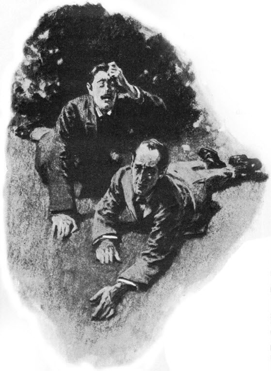

我们便从草地上坐起身，擦擦又湿又冷的前额。

“说实在的，华生！”福尔摩斯最后开口说话，声音还在发抖，“我要感谢你，也要向你道歉。这对自己也是未必一定需要的试验，更不用说拖累了朋友。我真的非常抱歉。”

“你知道，”我回答他，很感动，因为以前从来不曾见过福尔摩斯有如此的柔情流露，“能这样配合你，我觉得是很大的乐趣，是我格外的荣幸。”

他很快恢复半嬉笑半调侃的神情，这是他对身边人惯常的态度。“要叫我们两人变成疯子，何必多此一举，我亲爱的华生，”他说，“在精神正常人的眼里，我们竟这样以身试毒，豁出性命，我们就已经是疯子了。我承认，我没有想到效力会这么快速、这么厉害。”他冲进屋去，又迅即出来，胳臂直伸，手中拿着还点着的油灯。他把灯朝荆棘丛中一扔说：“等上一会儿，屋子里空气换换干净。我想，华生，两起惨案如何发生，你该不至于再有谜团疑惑了吧？”

“已经毫无疑问。”

“但是案子原因还是不清楚。到树荫下去讨论讨论，这种毒剂，好像还留在我喉咙口。我想，必须看到，一切证据都指向这个人，莫蒂默·特雷根尼斯，他是第一案中的案犯，尽管在第二案中他是受害人。首先一点，应该记住，闹过家庭纠纷这个历史事实，后来言归于好。纠纷闹到什么地步，和解裂痕弥补到什么程度，我们不得而知。当我一想到莫蒂默·特雷根尼斯，他那狐狸般狡猾的面相，戴个眼镜，一对机灵凶狠的小眼睛，我就不相信他是个特别宽宏大量的人。好了，其次一点，你该记得，他说花园里有人走动，这个说法一时把我们的注意力引开，转移造成惨案的真正原因，他便可以乘机脱逃。他的用意是要把我们引入歧途。最后一点，如果不是他离开屋子的时候在火炉上放毒药，还有谁会这样做呢？事情是他一离开就发生的，若是其他什么人进去，这一家人就会从桌上起身招呼。此外，平静安宁的康沃尔，晚上十点以后，不会有人出门走亲访友。所以，我们可以断定，一切证据都指向莫蒂默·特雷根尼斯是罪犯。”

“那么，他自己的死是自杀啰。”

“哦，华生，从表面上看，这个假设不无可能。对自己家人下这样的毒手，内心应该有罪恶感，有可能悔恨，而走上自我毁灭之路。可是，这里有无法反驳的理由可以推翻这种假设。幸好英格兰有一个人了解全部情况，我已经作好安排，今天下午我们听他亲口讲讲事实是怎么回事。啊！他提前来了。对不起，请这边来，列昂·斯坦戴尔博士，我们刚刚在室内做过一次化学实验，那小小的屋子里，就不太适合接待您这位贵客了。”

我听到花园门咔哒一响，现在，这位高大的非洲探险家的伟岸身躯出现在小径上。他见我们随便坐在树荫凉棚下，带着几分惊异趋身向我们过来。

“你叫我来，福尔摩斯先生，一个钟头前接到你的便条，我这就登门来了，但不知到此为了什么事。”

“也许，在我们告别之前，能把问题澄清，”福尔摩斯说，“此刻，我十分感谢你能以礼相待，不辞麻烦来鄙舍一趟。还请多加包涵，在此屋外接待，实在很不周到。我的朋友华生和我即将替报纸所称“康沃尔恐怖”的文稿增添新的篇章，我们选择这里的清新空气比较好。也许，两起案子的发生，我们需要讨论的，将涉及你个人的隐私，所以请你来这里谈谈，免得被人偷听走漏消息。”

探险家从嘴上拿下雪茄，面孔铁青，盯住我的同事。

“我听不懂，先生，”他说道，“你要说的什么话，怎么会和我个人有密切关系？”

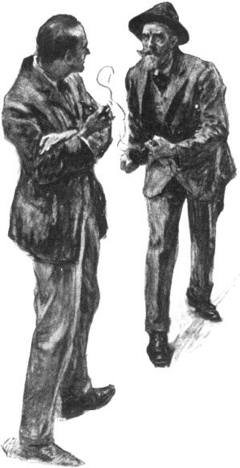

“我听不懂，先生。”他说道。　

“莫蒂默·特雷根尼斯的死。”福尔摩斯说。

就在这一刹那间，我真希望自己有武器才好。斯坦戴尔面露凶相，脸一下子涨得绯红，两眼怒睁，额头青筋暴起。他攥紧双拳，跳到我同伴跟前，但是他停住了，竭力使自己镇定、冷静下来，僵在那里。这样子，也许比昏了头的暴怒更危险。

“我长久与野人为伍，不知法律为何物，”他说道，“我行我素，我就是法律。你好生注意，福尔摩斯先生，不要忘记这一点。在我，我无意加害于你。”

“我也根本无意要加害于你呀，斯坦戴尔博士。确实，证据已经再清楚不过，情况我都已掌握，然而我还是找你本人，并不是去找警察。”

斯坦戴尔喘一口气，坐下来，居然因此而被镇住了。也许，在他冒险的一生中，这还是第一次。福尔摩斯的态度，有一种千钧之力，使人难以抗拒。我们的客人霎时张口结舌，激动得一双大手松开又捏紧，捏紧又松开。

“你什么意思？”最后他问道，“你想恐吓我，福尔摩斯先生，你可是找错了对象。别拐弯抹角，你究竟是什么意思？”

“我来告诉你，”福尔摩斯说，“我所以要告诉你，原因是希望以坦率换取坦率。我的下一步将怎么样，完全取决于你的诚意，看你如何为自己辩护。”

“为自己辩护？”

“是的，先生。”

“我要辩护什么？”

“辩护被控杀害莫蒂默·特雷根尼斯。”

斯坦戴尔用手帕拭着额头。“说实在话，你逼人太甚，”他说道，“你的成绩就都是靠吓唬人吓唬出来的。就凭你这点本事？”

“吓唬人的，”福尔摩斯严厉地说，“正是你，列昂·斯坦戴尔先生，决不是我。我把我的结论依据的事实，说几件给你听听，可以当作证词。关于你从普利茅斯回来，同时把大量财物运往非洲，这且不说它，这里只需提一点，首先让我了解到，你在这出戏中扮演了一个重要角色——”

“我回来——”

“我已听你说过理由，我认为全不可信，理由很不充分。这个且不谈它。你来这里探问我，谁是嫌疑犯，我没有回答你，你就去了牧师住宅，在外面等了一些时间，最后再回到你自己的别墅。”

“你怎么知道？”

“我跟踪你。”

“我没看见有人。”

“我跟踪你，当然不会叫你看见。你在家里整夜坐立不安。你想出计划，到了凌晨你将计划付诸实施。天刚拂晓，你出了门，你的大门口有一堆红沙砾，你捡一些放进口袋。”

斯坦戴尔身子猛一跳，惊异地望着福尔摩斯。

“你然后赶紧走了一英里路，去了牧师住宅。你脚上，我可以告诉你，穿的是一双棱底网球鞋，正是你现在脚上的这一双。你穿过牧师住宅的果园、园边的树篱，来到屋子的窗下。这时候天已经大亮，可是屋里还不见动静，你从口袋取出沙砾，向上面的窗口扔。”

斯坦戴尔跳起了身。

“你厉害有如魔鬼！”他叫嚷着。

福尔摩斯对此褒扬淡淡一笑。“扔了两把，也或许是三把，特雷根尼斯才到窗前来。你挥手叫他下楼，他匆忙穿好衣服，下来，到起居室。你从窗子进去，同他谈话——时间不长——你一边谈，一边在屋里走来走去。随后你出来，把窗关好，站在外面草坪上抽雪茄烟，观察出现什么情况。最后，等特雷根尼斯死了，你才离开，由原路回家。现在，斯坦戴尔博士，你怎么证明这是正当行为？这行为出自什么动机呢？你要是和我撒谎胡扯，不讲实话，我向你保证，这件事就要转手警方，再也不由我管。”

客人听了这番警告，脸色转成灰白。他坐下，双手捧住脸，沉思了一会儿，接着忽然猛地伸手从胸前口袋里抽出一张照片，往我们面前的石桌上一扔。

“为什么我要那样做，就为这。”他说。

这是一张面容姣好非常美丽的女子半身像。福尔摩斯俯身细看。

“布伦达·特雷根尼斯。”他说。

“是的，布伦达·特雷根尼斯，”客人重复道，“多少年了，我一直爱着她，多少年来她也一直爱着我。这就是我隐居康沃尔的秘密原因，人们感到惊奇的。隐居这里，为的是能接近这世上我最心爱的人。我不能和她结婚，因为我有妻子。妻子离开我好些年了，可是英国法律令人悲哀，我不被允许离婚。布伦达等我多少年了，我一样也在年年等待。可是，等待的结果，竟然是这样。”一声沉痛的呜咽震撼着他那巨大的身躯。他一只手按住斑白胡子下的喉咙，这才竭力控制住自己，继续道：“牧师知道，他知道我们的私情。他一定会跟你说布伦达是人间的天使。所以正是他打电报给我，我就回来了。一听到心爱的人遭遇这样的不幸，我的行李、非洲，又算得了什么？我的行动秘密，你已经掌握，福尔摩斯先生。”

“请继续讲。”我的朋友说道。

斯坦戴尔博士从口袋里掏出一个纸包，放在桌上。纸包上面写有字radix pedis
diaboli<a href="#part0143.xhtml_ch1"
id="part0143.xhtml_ch1-back">(1)</a>，下面有个红色标记，表示有毒。他把纸包推给我说：“我知道你是医生，先生，你听说过有这种药剂吗？”

“魔鬼脚根！没有，从来没有听说过。”

“不怪你没有这个专门知识，”他说道，“我相信，除了布达<a href="#part0143.xhtml_ch2"
id="part0143.xhtml_ch2-back">(2)</a>的实验室，欧洲别的地方连样品都看不到。药典和毒品文献都还没有记载。这是一种植物根，样子像脚，一半像人脚，一半像羊脚。一位植物学家就给取了这么一个形象的名称。西非洲一些地区，巫医拿来当作神明裁判的实验毒药<a href="#part0143.xhtml_ch3"
id="part0143.xhtml_ch3-back">(3)</a>，是严加保密的。我在乌班吉<a href="#part0143.xhtml_ch4"
id="part0143.xhtml_ch4-back">(4)</a>乡下好不容易才搞到手一点标本。”说着，他打开纸包，是一包像鼻烟似的黄褐色药粉。

“还有呢，先生？”福尔摩斯严肃地问道。

“我是要告诉你，福尔摩斯先生，发生的真实情况。你已经知道了那么多，事情明摆着，与我利害攸关，是应当让你全部知道。我已经解释过了，我和特雷根尼斯家的关系，因为布伦达的缘故，我和他们兄弟也是朋友相处。

为了钱财，他们家发生过争吵，结果莫蒂默和大家疏远，据说又和好。我后来遇见他，也跟其他兄弟一样，一视同仁。这个人阴险狡猾，诡计多端，好几件事让我对他产生怀疑，但是我犯不着和他一般见识。

“有一天，也就是两星期之前吧，他来我那里，我拿些非洲珍奇古玩给他看。好多东西，其中就有这一样神明裁判药，告诉他有奇效，能刺激中枢神经，激起恐惧感，有些土人不幸受到部落祭司逼迫，被试药神判，不是吓死就是吓疯。我告诉他，欧洲科学家还没有能力分析检验。这药怎么被他拿到手的，我也说不清，因为我没有离开过屋子。肯定有一次，我打开大橱柜，趁我弯身去翻箱子，他做了手脚拿走魔鬼脚根。我记得很清楚，他再三问我这药产生效果的用量和时间。可是我做梦也不会想到，他这样问是心怀鬼胎的。

“这件事我没放在心上，直到牧师发电报到普利茅斯告诉我，才知道大事不好了。这个恶棍以为我早已出海远去，听不到消息了，以为我这一去非洲又得好几年，但是我立刻回来了。当然，我一听具体情况，就断定是我的毒药被他用上了。我就马上来找你，希望听听你有没有别的解释，但是一点也没有听到。我心里有数，莫蒂默·特雷根尼斯是凶手，是他谋财害命。如果家人都精神错乱了，他就是共同财产的惟一监护人，因此他使用魔鬼脚根来毒害他们。两个发疯，妹妹布伦达丧命，在这世界上，我最爱的人，也是最爱我的人。全是他所犯的罪，应当怎么惩罚他？

“我应当诉诸法律吗？我有什么证据呢？我知道事实很清楚，可是我有什么办法能让乡亲们组成的陪审团相信呢？竟有这么稀奇古怪的事情！我或许办得到，或许办不到。可是我只许成功，不许失败。我的心头呼喊着要报仇。我已经对你说过，福尔摩斯先生，我的大半生都不受法律的约束，到最后我自己就是法律，现在就是，我判决他，他怎么害的人，也要怎么回报在他身上。我要亲手来制裁他，还他个公正处置。眼下，全英国，没有人比我更不在乎自己的生命了。

“现在，我把一切都跟你坦白，其余的情况，你都已经掌握。是的，如你所讲，我一夜未睡，一早离开我的住处。怕叫不醒他，所以在砾石沙堆上拣了些石子带着，这你说到了，扔他卧室的窗子。他下来了，让我从窗子进他的起居室。我当面揭露他的罪行，告诉他，我来找他，一是法官，二是死刑执行官。这个小人，跌倒在椅子里，瞪着我的手枪，吓瘫了。我点着灯，把药粉撒在上面，就站到窗外去，准备好，只要他企图逃离屋子，我就开枪毙了他。五分钟不到，他就丧命了。我的上帝！他痛苦地死了，呀！我的心冷酷如铁石。我亲爱的人，无故被害，死在他手里，他这点痛苦算得了什么，死有余辜。这就是我的故事，福尔摩斯先生。也许，你爱一个女人，你免不了也会这样做。不管怎么说，我现在在你手里，要如何处置，悉听尊便。我已经讲过了，死对于我全不在乎，没有一个活着的人比我更不怕死。”

福尔摩斯坐着沉默了一会儿。

“你有什么打算呢？”最后他问道。

“我打算好了，我的尸首埋葬在中非洲，那里有我的工作，但只进行了一半。”

“去吧，继续做你那一半的工作吧，”福尔摩斯道，“我是说什么也不会阻碍你的。”

斯坦戴尔博士站直了巨人的身躯，深深地一鞠躬，走出了树荫凉棚。福尔摩斯点起烟斗，把烟丝袋递给我。

“没有毒的烟可以用来调剂一下精神，”他说，“我在想，你一定同意，华生，这个案件不是叫我们来进行干预的案件。我们的调查独立自主，跟谁也不相干，我们采取的行动也是同样。你不会去告发这个人吧？”

“当然不会。”我回答。

“我没有恋爱过，华生，不过，如果恋爱，我爱的女人也遭到如此厄运，我也会天经地义像他那样做，这位不顾法律的、狩猎兽中之王狮子的人。谁知道呢？哦，华生，明摆的事，你也清楚，无需我来多嘴，让你讨厌。那窗台上的小石子，正是我研究本案的起始点，牧师住宅的花园里没有这种石子。当我的注意力集中到斯坦戴尔博士，以及他的住处，让我发现原来他那里才有这种石子。还有大白天点灯，罩子上留着粉末，这两个明显的环节，让整个案情衔接起来。好了，现在，我亲爱的华生，我想可以不去管这桩事了，心境坦然地回过头去，研究迦勒底语的词根，由此可以追踪到凯尔特大语族的这一康沃尔分支。”

（1910年）

————————————————————

<a href="#part0143.xhtml_ch1-back" id="part0143.xhtml_ch1">(1)</a> 此系拉丁文“魔鬼脚根”的意思。

<a href="#part0143.xhtml_ch2-back" id="part0143.xhtml_ch2">(2)</a> 布达（Buda），匈牙利地名，是首都布达佩斯（Budapest）的两城之一。

<a href="#part0143.xhtml_ch3-back" id="part0143.xhtml_ch3">(3)</a> 即毒药神明裁判法，令嫌疑人服用毒品，若无反应或不死，便裁定无罪。

<a href="#part0143.xhtml_ch4-back" id="part0143.xhtml_ch4">(4)</a> 乌班吉（Ubangi），在今扎伊尔的乌班吉河地区。

# 红圈会

“哦，瓦伦太太，我看不出你有什么特别的原因好烦恼呀，我同样也不理解，为什么要我来插手这件事。我的时间非常宝贵，我正有别的事忙着呢。”歇洛克·福尔摩斯这么说着，一边转过身去整理他的一大本剪贴簿，里面都是分门别类收集的最近资料。

但这是一位执拗的女房东，具备女性的纤细与敏感，她毫不让步。

“你去年帮我一个房客办过一件事，”她说，“费戴尔·霍布斯先生。”

“噢，是的——一件小事。”

“可是他一直叨念不忘——多亏你好心帮忙，先生，说你有办法，就如一团漆黑之中给亮起了明灯。现在我自己完全陷在了黑暗中，我还记着他的话不忘呢。我知道，你能有办法，只要你愿意什么都能成。”

福尔摩斯是三句好话一听心马上就软，也是本性仗义，心地仁慈。仗义、仁慈，在他是不可违抗的力量，于是放下手中的胶水刷子，顺从地叹了一口气，把椅子转过来。

“好吧，好吧，瓦伦太太，让我们来听听看，那就。你不介意抽烟吧，我抽上一口行吗？谢谢你，华生——火柴！你心不安，我理解你，因为你的新房客待在他房里，你始终没见着他人。啊，上帝保佑你，我要是你的房客，你会一连几个星期都见不着我人影。”

“那敢情是，先生，可这不一样。事情可吓人啦，福尔摩斯先生。我吓得睡不成觉，只听得见他有脚步声，走来走去，走来走去，晚上、早上、中午，可始终见不着一眼人影儿——这叫我怎么受得了！我丈夫跟我一样，也紧张得要命，可他整天工作在外，就我躲不开呀。他在背着人干啥？他在干什么？这屋里就我和他房客两个人，还有一个小姑娘，这样子我的神经受不住。”

福尔摩斯向前俯身，细长的手指搭在女士肩上。他要按抚人的话，简直有本事能把人催眠。女士眼睛里惊吓的神情消退，激动的面色也回复平静，在指给的椅子上坐下。

“要办事，先要让我知道具体情况，”他说，“别急，好好想一想，一点点小事说不定是最大的大事。你说这个人是十天前来的，付给你两星期的膳宿费？”

“是他问我要多少钱，先生。我说一星期五十先令，一间小起居室和一间卧室，家具齐全，是在顶楼。”

“然后呢？”

“他说，‘我付你五镑一星期，我按我的价来付你钱。’我是个穷女人，先生，瓦伦先生赚得不多，我的开销又大。房客拿出一张十镑钞票，当场给了我。‘如果你能答应条件，我每两星期都这样付，会有一段时间住你这儿，’他说，‘否则，就不行了。’”

“是什么条件？”

“哦，先生，也就是他要这屋子的钥匙，这当然没问题。钥匙，房客总是要有的。还有，让他单独一个人，一点不许有打扰，什么情况、理由，都不允许有打扰。”

“没什么大了不起的条件，对吗？”

“听听也是在理的事儿，先生，可实际上完全没有道理。他来了十天了，瓦伦先生也好，我也好，小姑娘也好，都没见过他一面。我们只听见他急急地走来走去，走来走去，白天，夜里，中午也是，除了那第一天晚上，从来没见他出过屋门。”

“哦，第一天晚上他外出了是吗？”

“是的，先生，到很晚才回来——我们都已经睡觉了。他租下了房子以后，告诉我，他要出去，叫我别把门闩上。半夜以后，我才听见他上楼梯。”

“他吃饭呢？”

“他特地关照，他一拉铃，我们就把饭放在他门外一张椅子上，他吃好饭，也是拉铃，我们再到这张椅子上把餐盘收走。要什么别的东西，他就写条子放在那里，是用印刷体写。”

“写印刷体字？”

“是的，先生，铅笔写的印刷体。只写一个字，不多写。我带上一张，给你看——SOAP肥皂。这里另一张——MATCH火柴。这是头一天早上他写的——DAILY
GAZETTE《每日新闻》。每天早晨我送早餐都连同送上这份报纸。”

“我的天，华生，”福尔摩斯说道，惊奇地看着这几张女房东给他的大裁纸，“这可是非同一般。深居不出，尚可理解，但写字用印刷体为什么？印刷体写起来费事，为什么不用手写体？这意味着什么，华生？”

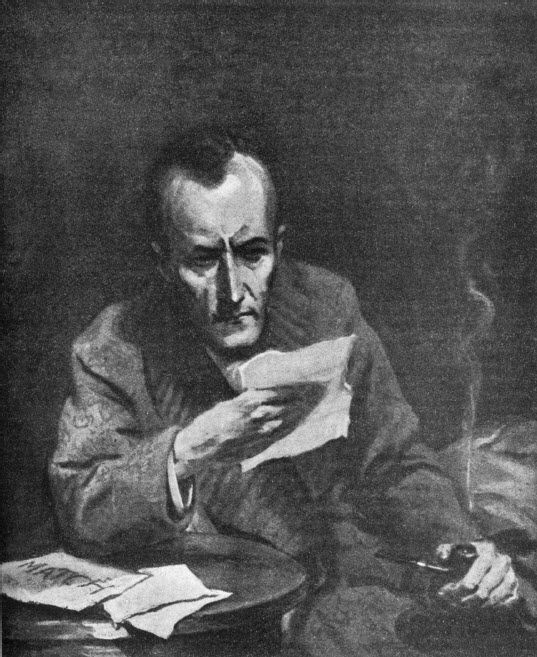

福尔摩斯惊奇地看着这几张纸。

“那是存心要掩盖他的笔迹。”

“为什么要掩盖？房东太太有了他的笔迹，那又怎么样呢？这个就算照你说的吧。那么还有，写张条子都要写得这么简单，为什么？”

“难以想象。”

“这是给智力活动开辟了园地，很有趣。这些字，用紫颜色粗芯铅笔写的，笔是普通的笔。你看见吗，纸是写好以后撕下的，所以这SOAP的S撕掉了一点。其中颇有意思，华生，你说呢？”

“小心提防着什么吧？”

“一点不错，会有明显的证据，有指纹呀什么的，这就会留下这个人的人证痕迹。好，瓦伦太太，你说这人中等个子，黑皮肤，留胡子。有多大年纪？”

“挺年轻，先生——不超过三十。”

“噢，还有没有别的特征？”

“他英语讲得很好，先生，但说话的口音听得出是外国人。”

“穿着考究吗？”

“可讲究啦，先生——绅士先生一个，深色衣裳——倒一点不引人注目。”

“他没说名字？”

“没说，先生。”

“没有信来，也没人来找他？”

“都没有。”

“你或者小姑娘，早晨总进过他房间的吧？”

“不，先生，他一切都是自己照料自己。”

“哦，天哪！那可是绝对不一般。他有什么行李？”

“噢，随身一个咖啡色大拎包——没有别的。”

“好吧，看来对我们有用的材料还不多。你知道他房间里有什么东西带出来过没有——什么东西也没有？”

房东从她的包里取出一个信封，信封向桌上一抖，抖出两根燃烧过的火柴，一个烟蒂。

“这是他今天早晨放在盘子里，我带了来。我听说你能从小事情上看出大问题。”

福尔摩斯耸耸肩。

“这些都没什么，”他说，“火柴，当然是点香烟用的，烧得只剩下很短的一截；点烟斗或是雪茄只要半根火柴。哟，这烟蒂，很有名堂。这位先生上唇下巴都有胡子，你说的是吗？”

“是的，先生。”

“这就不理解了。我该说，那是只有光了胡子的人才会吸成那个样子。哦，华生，就连你这么一点小胡子也要烧焦的。”

“用烟嘴呢？”我想到了，便说。

“不，不，烟蒂被衔碎了。我看你那房间里说不定是两个人吧，瓦伦太太？”

“不会，先生，他吃得那么少，真担心他一个人也吃不饱呢。”

“好，我想必须再多等一点材料看看。毕竟你没有什么可抱怨的。你只管收你的房租，这个房客又没有替你惹出什么麻烦，不过就是有些与众不同嘛。他付的钱很高，如果他隐瞒些什么，不关你的事。我们没有理由去干涉人家的私生活，除非我们拿到证据牵涉到犯罪。我已经接手这件事了，也就不会放手不管，有什么新的情况就向我报告，一有需要，我立即效劳。”

“这件事，当然有几点值得关注，华生，”女房东走了以后，他说道，“当然，有可能只不过是小事——个人的古怪行为，或者就是比表面现象要深刻得多。令人注意的第一件事，就是很有可能，现在的房客和当初租房子的人根本是两个人。”

“你凭什么这样认为？”

“哦，由这烟蒂，不是可以联想到租房子的人租好房子就马上出去了吗？他回来——或者是另外什么人来——这时候根本没有谁见证。我们没有任何证据说回来的就是出去的人。另外，再有，租房子的人英语很好，而现在这一个，用印刷体写的match火柴，这里应当用复数matches。可想而知，写这个词是翻词典翻出来的。词典上列出的词目，名词不会是复数。写条子又是只写一个词，简单到如此程度，那是为了掩盖不懂英文这一真相。没错，华生，有充分理由怀疑，房客换人了。”

“这又有什么目的呢？”

“啊！问题就在这里。弄清这一点也不难。”福尔摩斯取下那个大本子，这是他把平日伦敦各种报纸的私人广告栏编辑成册。“哦，我的天！”他翻过一页又一页，嘴里说道，“简直是大合唱，都是大呼小叫，有哭有笑，胡言乱语、一派胡闹！社会之大，无奇不有！可是里头大大地有价值，是大猎场，猎奇、追踪、研究，其中大有油水。我们的这个人，是独自一人，他不以通信方式向外联系、接触，以免暴露机密。有什么消息有什么短讯，怎样从外面传递呢？通过报纸，刊登私人启事这一途径，别无其他方法。我们有幸，只需要注意一份报纸就可以了。这里有《每日新闻》的剪报，近半个月的都在这里。‘王子溜冰俱乐部，黑长围巾女士’——不管这个。‘吉米绝非伤其慈母之心’——与我们无关。‘若该女士晕厥于布里克斯顿公共汽车上’——与我无关紧要。‘我心每日渴望’——胡扯淡，华生——你看这不是无聊闲扯吗！啊，这个倒有点像了。你听这里：‘请耐心，即将有可靠通讯方法，仍见此栏，G。’这是瓦伦太太房客来住的两天后登的报。这就听上去大有内容，是不是？神秘客还是懂点英语，尽管不会写。我们再看下去，还能找到什么蛛丝马迹。有，看这里——三天以后又有了。‘将有妥善安排，耐心、谨慎，乌云即将过去。G。’此后一星期，什么也没有。之后又来了，更确定无疑了。‘道路已畅通。我若获机会，当发短讯，请记住密码——一A，二B，依此类推。你即可听到消息。G。’这是昨天的报纸，今天报上没有。完全符合，就是给瓦伦太太房客的。我们再等上一等，华生，我确信，事情必会进一步明朗化。”

果然如此。隔天早晨，我发现我的朋友背朝炉火站在壁炉地毯上，一脸满意的微笑。

“你看怎么样，华生？”他朗声说道，从桌子上拿起报纸，“‘高红房，白石面墙，三楼，左第二窗，天黑后。G。’足以确定了。我考虑，早饭过后，去瓦伦太太家，对邻近房屋侦察一番。啊，瓦伦太太来了！今天早上有什么消息了！”

我们的委托人气冲冲闯进屋里来，表明事态有重大发展。

“这事情得要报警了，福尔摩斯先生！”她嚷道，“我再也受不了啦！非得叫他卷起行李滚蛋不可。我本来要直截了当同他讲，回头想到，还是先听听你的意见再说。可是我已经忍无可忍了，事情竟然发展到打起我的老头来了——”

“打瓦伦先生？”

“反正对他可厉害。”

“谁对他厉害了？”

“啊！我们也正要知道呢！今天一大早，先生，瓦伦先生是托特纳姆宫廷路莫顿-威莱公司的考勤计时员，他要在七点以前出门。谁知道，今天早上一出家门还没走几步路，冷不防窜上来两个人，拿一件衣服往他头上一兜，把他捆了塞进路旁的马车。马车赶了一个钟头，后来打开车门，把他推下车。他跌倒在路上，吓得掉了魂，没看马车往哪儿跑了。等他回过神来，才知道是在汉普斯特德野林地。他乘公共汽车回了家，这会儿还躺在沙发上呢。我赶快来这儿告诉你听，出这事儿了。”

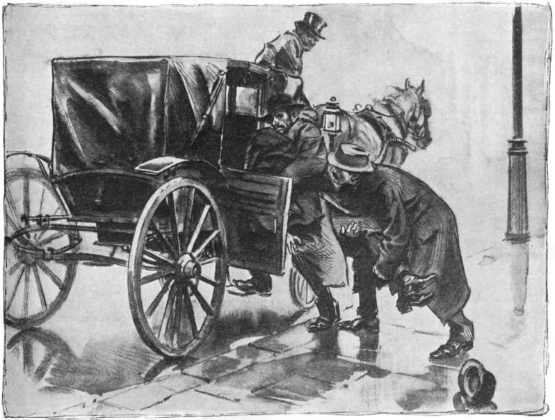

把他捆了塞进路旁的马车。

“真有意思，”福尔摩斯说，“他看清楚这些人的模样了没有——听他们讲话了吗？”

“没有，他给吓蒙了，只记得自己被人变戏法似的，抬上车里去，过后又给扔出来。至少是两个人，也没准是三个人。”

“有人来这么一下子，你就联系到房客身上去了？”

“是啊，我们住那儿有十五年了，以前从来什么事也没有，我当然认定是他。钱不在乎了，我要天黑前赶他走。”

“等一下，瓦伦太太，别莽撞。我在想，这件事比一开始的时候严重了。现在很清楚，是你的房客遇上了危险。事情也清楚，他的仇敌等在你家门口附近，早晨有雾，光线不好<a href="#part0144.xhtml_ch1"
id="part0144.xhtml_ch1-back">(1)</a>，错把你丈夫当作你家房客。后来发现找错人了，所以把你丈夫放掉。如果他们没有搞错，他们会要怎么做，那就难讲啦。”

“我该怎么办，福尔摩斯先生？”

“我倒有兴致要见见你的这位房客，瓦伦太太。”

“我不知道有什么办法见到他，要么你闯门闯进去。我每次把吃的给他放好，下楼梯，就听见他开门锁的声响。”

“他要把盘子端进去，我们找个地方躲着，就可以看见他了。”

房东太太想了一下。

“也好，先生。他房间对面是储藏室，我给你们一面镜子，就行了，你们躲在门后——”

“好极了，”福尔摩斯说，“他什么时间吃午饭？”

“大约一点钟，先生。”

“那么，华生医生和我差不多时间就过来。就这样，瓦伦太太，再见吧。”

十二点半，我们踏上了瓦伦太太住宅的台阶——这是一幢高耸的黄砖板式大宅屋，在奥梅大街，靠大英博物馆东北面这条街的狭窄路段上，矗立于这条街不远的转角处。从屋子楼上望下去，能看到整条霍伊大街，以及街上更为华丽的房屋。福尔摩斯笑着指指一排公寓住宅中的一幢，这一幢突出在外，所以最显眼，一望便知。

“你看，华生！”福尔摩斯说道，“‘高红房白石面砖’，就是这个，是信号台，没错。我们知道了这个地方，又知道了密码，如此看来，我们的任务也很简单。在那扇窗上正贴着‘招租’呢。你好，瓦伦太太，情况怎么样？”

“帮你们都准备好了。你两个脱掉皮鞋，搁楼梯口，我带你们上去。”

她安排了一个很好的隐蔽处，镜子放的地位，使我们坐在暗中可以很清楚地看到对面的房门。瓦伦太太把我们安顿好，刚走开，这时远端的一处铃声响起，正是对门那个神秘的房客拉的用餐铃。一会儿房东端餐盘上来，放在紧闭的房门旁边一张椅子上，然后蹬响脚步离开。我们蜷缩身子，躲在门角落里，眼睛紧盯住镜子看。等房东的脚步声没有了，接着就马上听到钥匙开锁声，门把转动，两只纤细的手从门缝里伸出来，很快将椅子上的餐盘端进去。稍等片刻，餐盘又连忙放回，这时让我看见一张深肤色的美丽而惊恐的脸，向这边贮藏室门开的缝隙瞥了一眼，接着房门就砰的一声关上，又是钥匙转动，便一切复归平静。福尔摩斯扯扯我衣袖，两人一起蹑手蹑脚走下了楼梯。

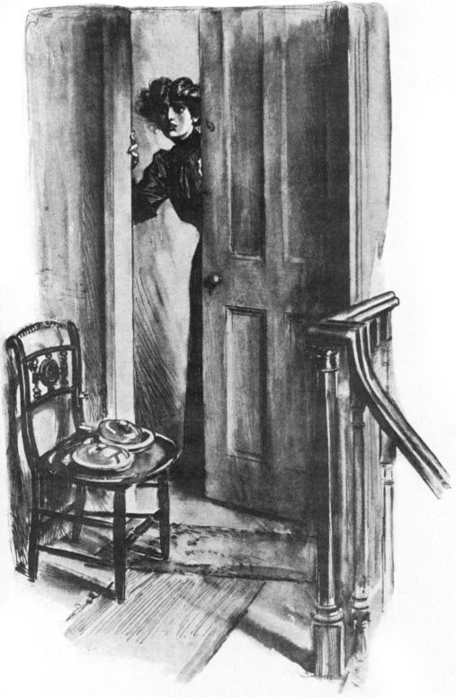

向这边贮藏室门开的缝隙瞥了一眼。

“晚上我再来拜访，”福尔摩斯对殷切期盼的房东太太说，“我想，华生，这事我们回去讨论比较好。”

“我的推测，你亲眼看到了，证明是对的。”福尔摩斯说，身子沉沉地埋在安乐椅中，“房客给掉了包，出乎我意料的，没想到是个女的，还不是个一般的女士，华生。”

“她看见我们了。”

“哦，看见了令她惊慌疑惑的现象，这是肯定的。事情总的情况相当清楚了，不是吗？一对夫妇来伦敦避难，想躲过紧急可怕的危险。这危险有多大，看他们预防得有多严密就知道。这个人有什么事必须要做，先把女的安顿安全，不会有丝毫闪失，他才放心去做事。这不是件轻易事，但是他要安排得万无一失，也很巧妙，女的住进去，就连房东端吃的送去，都没觉察出来，写印刷体字的条子，现在已经确证，不用书写体是防止暴露女性身份。男的无法来和她一起住，否则会把仇敌引来。也不能和她直接通信，只能利用报纸登私人启事栏的广告传递信息。至此，真相大白。”

“但是，事情的根由呢？”

“啊，是的，华生——这依旧是个棘手的问题，需要查明！这一切到底都是为什么缘故？瓦伦太太想得太怪，把问题搞得不着边际了，我们一开始无从下手。目前为止，我们完全可以说，这根本不是一般的爱情纠葛。你看见了，这女人的脸色，像是面临着危险的迹象。我们也知道，男房东被绑架，这显然是针对房客而来。这些险象，又都要严守秘密，就雄辩地说明这内中牵扯到生死攸关的问题。攻击瓦伦先生，进一步表明，仇敌，不管是什么人，他们压根儿不知道男房客已经由女房客替代了。这事很离奇，又复杂，华生。”

“你为什么要追踪下去？你从这里面会有什么收获？”

“确实，为什么呀？这叫为艺术而艺术，华生。我知道，你本人行医看病，最关心的是病情，不考虑收费问题，是吗？”

“为了提高技能，还要学习研究，福尔摩斯。”

“提高技能，永无止境，学到老也学不了，华生。那是一系列的研究课题，越到后来，成绩就越大、越有收获。本案是有深刻意义的案子，不为金钱也不为荣誉，只为希望早日查个水落石出。天黑以后，我们将看到侦查工作向前跨进了一大步。”

我们再到瓦伦太太的住宅。伦敦冬季的阴郁黄昏已成浓重的夜幕，死气沉沉的单调暗色，被窗户透出的黄光及煤气灯的昏晕冲破。我们从这寄宿住宅黑暗的起居室望出去，望到对面屋宇高处，一道浅浅的灯光在朦胧闪烁。

“那屋子里有人走动，”福尔摩斯轻轻说道，情急瘦削的脸探向窗前，“是他，看见是他的影子。他又出现了，手里拿着蜡烛。现在他在向对面这儿张望，在叫女的注意接头信号。现在，闪烁光，打信号了。数数记下信号，华生，我们两个好比对。一闪——这是A，没错。好，现在，又在亮。你记下是多少？二十。我也是二十。那是第二十个字母T。AT——这是个词，意思很清楚。又是T，这是第二个词的第一个字母，没问题。下面，是——TENTA，停住了，结束了。不完整嘛，华生？ATTENTA，没有这个词，没有意思。拆成三个词AT，TEN，TA，也不成意思。除非，要么T．A．是人名首字母。哦，又来了！那是什么？ATTE——怎么，打的是重复的信号。奇怪，华生，真奇怪！又来了，再打一遍！AT——噢，重复第三遍。ATTENTA打了三遍！为什么一连打三遍？好，这才好像结束了，从窗前走开了。你看是怎么回事呢，华生？”

“密码联系，福尔摩斯。”

我的同伴发出呵呵笑声，恍然大悟似的。

“并不十分深奥的密码，华生，”他说，“噢，是意大利文！这A，意思是向一个女人招呼。‘当心！当心！当心！’怎么样，华生？”

“相信被你说对了。”

“肯定没错。这是紧急信号，一连三遍这样发，更显得情况紧急。要当心什么呢？等一下，他又到窗前来了。”

又看见了一个低头弯腰隐约的侧影，在窗上闪着小火光，再发信号。信号很快，比刚才快得多——快得没法跟得上。

“PERICOLO——pericolo——唉，什么意思，华生？‘危险’，对不对？对，没错，发出危险信号。他又来了，PERI，咦，怎么回事——”

烛光突然熄灭，方窗框上亮光全无，这幢高楼的三楼陷入一条漆黑的暗带，其他各层窗扉依旧明亮。这最后的警报呼叫突然中断，怎么回事？被什么人打断？我们两人不约而同立刻发问，福尔摩斯从蹲着的窗边一跃而起。

“情况严重了，华生，”他叫道，“一定出事了！正在发信号怎么会这样打断？这个事我得跟苏格兰警场联系——不行，太急迫，太危急，我们走不开。”

“我去警场行吗？”

“我们要把情况再摸清楚一点，说不定其中并没有什么意外事。走，华生，我们到对面去，到现场看个究竟。”

我们快步走上霍伊大街，我回头看看离开的屋子。顶楼上的窗户隐隐有光，可以看见一个头影，一个女人的头影，一动也不动地呆望着夜空，似是屏息等待着突然中断的信号重新继续。在霍伊大街公寓的门道上，有一个人倚着栏杆，围着围巾，穿着大衣。当我们的脸被门后的灯光照着的时候，这个人一惊跳了起来。

“福尔摩斯！”这人叫道。

“啊，格莱格森！”福尔摩斯说，马上和这位苏格兰警场的警探握手，“有缘千里来相会，什么风把你吹到了这里？”

“你怎么来，我也就怎么来，想必一样。”格莱格森说，“你怎么也搭上这件事了？真想不到。”

“殊途同归，我在记录信号。”

“信号？”

“是呀，从那个窗户打的信号，半途断掉不打了，我们过来看是怎么回事。既然在你手上处理，那就没事，不必追究了吧。”

“等一下！”格莱格森紧迫地叫道，“跟你讲句老实话，福尔摩斯先生，我办的案子，有你在我一旁，我才能感觉踏实。这公寓只有一个出口，所以他跑不了。”

“这是什么人？”

“啊，啊，这一回我们可跑在你前头了，福尔摩斯先生。这一次你得让我们领先了。”他拿手杖往地上咚地一戳，一个马车夫应声出现，手里举着鞭子，从街的另一头一辆停着的四轮马车那边悠闲地过来。“允许我向你介绍吧，这位是歇洛克·福尔摩斯先生。”他向马车夫道，“这位是莱弗顿先生，美国平克顿侦探事务所。”

“就是侦破长岛洞穴奇案的英雄？”福尔摩斯道，“先生，幸会得很呀。”

这美国人是个沉静、精明的青年，胡子修得很干净，瘦削的长脸，听到这赞扬的话，不由得脸红。“混口饭吃呗，福尔摩斯先生，”他说，“要是能抓住乔吉阿诺——”

“什么！红圈会乔吉阿诺？”

“哦，他是名扬欧洲的人，对吗？是呀，在美国，我们也久闻他的大名。我们知道起码有五十件谋杀案都是他干的，可是我还没有把握逮住他。我从纽约追踪过来，在伦敦紧跟他一个星期了，就等候机会向他下手。格莱格森先生和我一起追到这儿的大公寓，这公寓只有一个门，他溜不掉。他进去之后，有三个人出来过，但我可以发誓，三个人中没有一个是他。”

“福尔摩斯先生说打信号，”格莱格森说道，“我想，像以往一样，他知道的好多事，我们可不知道。”

福尔摩斯言简意赅地讲了一下我们所掌握的情况。

美国人两手一拍，十分恼怒的样子。

“我们被他发现了！”他叫道。

“你怎么知道？”

“哦，八成是这么回事，肯定是！他在这里向同谋发信号，他在伦敦有好几个同党。正像你讲的，他在告诉他们有危险，突然中断了信号。他在窗户边，不是忽然发现街上有我们的人，就是意识到危险逼近，所以就得立刻采取行动躲避。只可能是这样，还会有别的情况吗？你怎么看，福尔摩斯先生？”

“我说立刻上去，亲自去查看一下。”

“可是我们没有逮捕令。”

“他是出现在无人居住的空屋里，处在可疑的情况下，”格莱格森说，“这个时间，机会再好也没有。原来我们跟踪他，只能等待纽约那头是否能协助我们逮住他。可是现在行了，我来负责将他逮捕。”

我们的警探，虽说智谋不足，但勇气有余。格莱格森登楼梯往上冲，去抓这亡命之徒，一副绝对沉静、持重的公干人的威势，一如在苏格兰警场的官场上正是步步高升。那个平克顿人企图超越上前，但是被格莱格森硬是挡道把他拦在后面。伦敦的警务仅属伦敦警察的权限，卧榻之旁岂容他人打鼾！

到了三楼楼梯口左首的套间，门虚掩着。格莱格森上前推开，里面一片漆黑，毫无声息。我擦亮一根火柴，点亮侦探的提灯。灯光一亮，我们大家吃了一惊，倒抽一口冷气，在没有地毯的松木地板上，有一道鲜血血迹，还有带血的脚印朝我们方向过来又转向内房间。内房的门关着，格莱格森上去一脚踹开，拿灯照向前方。我们从他身后赶忙朝里张望。

空屋一间，地板中央，一个个子不小的人身体缩成一团，脸刮得很干净，皮肤黝黑，脸孔扭曲，五官变形。额上是一圈血印，躺在光地板上一个鲜血画的圆圈中间。他双膝竖起，两手伸出仍作痛苦挣扎的样子，粗脖子上开了一个大血口，一把白柄的刀直插喉管深入胸腔。他身材高大如巨人，一定是在这把刀刺入之前，有如牛挨屠牛斧，已被击倒在地。在他的右手边地板上丢着一把锋利无比的牛角柄双刃匕首，匕首旁有一只山羊羔皮黑手套。

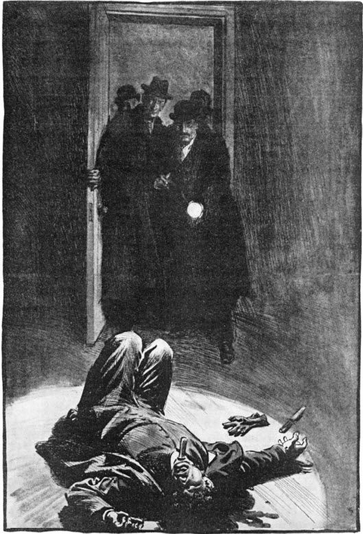

地板中央，一个人身体缩成一团。

“啊！这正是黑乔吉阿诺本人！”美国侦探叫道，“这一回让别人跑在了我们前面。”

“窗台上有蜡烛，福尔摩斯先生，”格莱格森说，“怎么，你要做什么？”

福尔摩斯跨上几步，点亮蜡烛，拿着在窗前一前一后地移动。过后又向夜色中探望，再吹灭了蜡烛，扔在地板上。

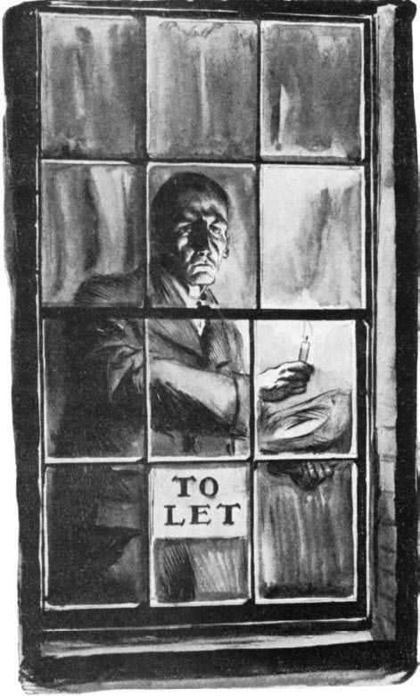

点亮蜡烛，拿着在窗前一前一后地移动。

“我预计这对我们管用。”他说道，走过来，站着不出声，努力思索着。两位刑侦专家正在检查尸体。“你刚才说，你在楼下守候的时候，看见有三个人从这公寓里出去，”最后他说道，“你看得清楚吗？”

“清楚，看清楚的。”

“有没有一个人，约摸三十岁年纪，黑胡子，黑皮肤，中等身材？”

“有，最后一个，打我身旁过去。”

“他就是你要找的人，我看就是。我可以告诉你他的样子，我们还有他一个很清晰的脚印。你有这些就足够了。”

“不一定够，福尔摩斯先生，伦敦几百万人，靠这一点未必找得出来。”

“也许是不行，所以我考虑最好还是把这位太太召唤过来帮助你们。”

我们一听这话，都转过身去。那边门口，出现了一位身材修长美丽的女子——布鲁姆斯伯里<a href="#part0144.xhtml_ch2"
id="part0144.xhtml_ch2-back">(2)</a>的神秘房客。她缓步走上前来，脸色苍白，紧张而且恐惧，两眼定神凝视，惊愕地盯住地板上黑不溜秋的死尸。

“你们把他给杀了！”女人自言自语道，“哦，Dio
Mio天主，你们把他杀了！”忽然我听见她尽情地深深吸了一口气，高兴得一声欢呼，跳了起来，在空屋里转圈手舞足蹈，不停鼓掌。她深色的两眼如看见奇迹般闪出无比兴奋的光芒，嘴里涌出千百遍悦耳动听的意大利赞叹语。哦，看见一位美丽女子见到死亡情景竟欣喜若狂，令人觉得可怕而又称奇！忽然她又停住了，眼睛定定地看着我们几个，目光在探询。

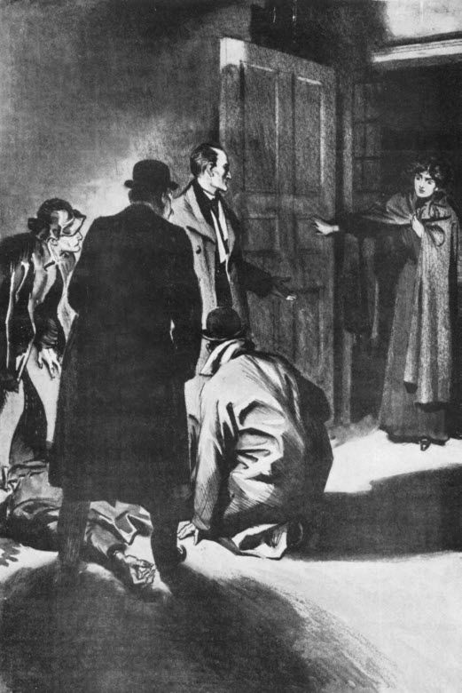

两眼如看见奇迹般闪出无比兴奋的光芒。

“你们！你们是警察，对吗？你们把奎赛佩·乔吉阿诺杀了，对吗？”

“我们是警察，夫人。”

她向屋子四周阴影里瞧瞧。

“可是，那么，根纳罗，他人呢？”女士问，“他是我丈夫，根纳罗·卢卡，我是伊米丽亚·卢卡，我们俩一起从纽约来。根纳罗呢？是他刚才在这窗口叫我过来，我赶快就来了。”

“叫你来的是我。”福尔摩斯道。

“你？怎么会是你？”

“你们的密码并不难懂，夫人。你来这里，欢迎光临。我知道，只要打出信号‘来吧’的信号，你一定会来。”

这位意大利美人敬畏地看着我的同伴。

“不明白你怎么知道这些事，”她说，“奎赛佩·乔吉阿诺——他怎么会——”她蓦地顿口，接着脸上放出胜利和喜悦的光彩。“啊，我知道了！我的根纳罗！我的英雄，漂亮的根纳罗，他把我安全藏好，受不到伤害，他就着手，他强有力的手，亲自把魔王杀死！哦，根纳罗，你真了不起！什么样的女人才配这样的男人呀？”

“好吧，卢卡夫人，”格莱格森没趣地说，一手拉住女士的衣袖，态度冷峻，好像是对付诺丁山歹徒一般，“我还不清楚你是什么人，要做什么事，不过凭你自己所说，已经很清楚，我们得请你到警场走一趟。”

“等一下，”福尔摩斯说，“我倒是觉得，这位女士正急着要把情况告诉我们，我们也正急于要了解情况。你知道吗？夫人，你的丈夫为了眼前这个死人要被逮捕、受审判，你讲的话将用来作为证词。但是，如果你认为他的行为是出于非犯罪目的，他的目的希望让公众了解，那么，你对他最有利的做法就是把全部事实真相和经过告诉我们。”

“现在，既然乔吉阿诺已经死了，我们什么也不怕了，”女士说道，“乔吉阿诺，这个魔鬼、魔王，我丈夫杀死他，世界上没有一个法官，会判我丈夫有罪。”

“那样的话，”福尔摩斯说，“我的建议是，我们把这门锁了，这儿一切和我们初见一样，原封不动，和这位女士一同到她的房间里去，听她告诉我们情况之后，再作出我们的意见。”

半小时以后，我们都已坐定，一共四人，坐在卢卡夫人那间小小的起居室里，听取她对那些非同寻常的凶险事件的陈述。事件的结局，我们碰巧已经亲眼目睹。她说话很快，英语很流利，但不符正规标准，我为了清楚起见，作了语法修正。

“我生于玻西利玻，在那不勒斯附近，”她说道，“是古斯托·巴雷里的女儿。父亲是大律师，曾经是地方代表。根纳罗在我父亲手下做事。我爱上了他，别的女人也一定会爱上他的。他没有钱，也没有地位——什么也没有，有的是相貌、人才，身体强壮，又有能力——父亲不准我和他结婚。我们就一起跑了，在巴里结了婚。我变卖了首饰，凑足钱到了美国。这是四年以前，我们一直住在纽约。

“一开始，运气真好，根纳罗帮一位意大利先生做了件好事——在一个叫鲍厄里的地方从一群歹徒中帮他解了围，把他救了出来，这样就认识了这位有钱有势的朋友。他的名字叫梯托·卡斯塔洛蒂，是卡斯洛莱-赞姆巴大公司的主要股东，这是纽约一家水果的主要进口公司。赞姆巴先生是个病人，我们的新朋友卡斯塔洛蒂掌握着公司的实权，雇员有三百多人。他聘请我丈夫到他公司工作，让他当部门主管，各方面对他另眼相看。卡斯塔洛蒂先生单身，我想他把根纳罗当他自己的儿子来对待。丈夫和我也都爱他，把他当作是我们的父亲。我们在布鲁克林买了栋小住宅，撑起了一个家。我们的前途从此得到保障。谁知天有不测风云，不久天空乌云密布，压在了我们头上。

“一天晚上，根纳罗工作回家，他带来一个家乡人，名叫乔吉阿诺，也是从玻西利玻来的。这人个头特别大，你们已眼见为证，他的尸体你们都看见了。不光是身材特别高大，他这个人一切都怪，同常人不一样。他在我们小屋子里讲话，那声音就像是打雷，还老是指手画脚，我们的小房间都不够他手挥的。他的脑子、脾气，都不正常，十分激动，性格很激烈，说话夸夸其谈，一开口简直就是吼叫，连珠炮似地狂轰你，那声势逼人，逼着你非乖乖听他的不可。他会瞪着两个眼珠朝你冒火，让你不得不受他摆布。这个人太可怕，厉害得不得了。感谢主，他终于死啦！

“他一次次地来，我感觉得到，根纳罗见他上门，比我更不高兴。我可怜的丈夫，坐在那里，铁青着脸，没精打采，听着他没完没了地对政治、社会问题肆意攻击谩骂，他一来光讲这种事情。根纳罗不说话，我从他脸上看出他内心很痛苦，这是以前一直没有的。起先我想他是讨厌，后来慢慢地，我明白了，不止是讨厌，而是害怕——深藏内心说不出口，想躲又躲不了，是这种害怕。那天晚上——我看出他内心害怕的那晚上——我两臂抱住他，对他说，你是爱我的，疼我的，不忍我有丝毫损伤，我恳求他，要他告诉我为什么这个大个子就使他这样晦气。

“他告诉我了，我一听，心一下子冷得结成冰块了。我可怜的根纳罗，以前在他那些野蛮激烈、疯狂挣扎的日子里，整个世界都跟他过不去，他的心碎了，不公平的生活逼得他走投无路快要发疯，在这种情势下他加入了那不勒斯的一个社团，红圈会，属于老烧炭党。会内的党纪会规极其严厉，管束很厉害。一旦入了会，别想再退出，要退就死路一条。我们逃到美国以后，根纳罗以为和这个党从此一刀两断，永远脱离了关系。谁知，有天傍晚，根纳罗在街上竟遇见了这个人——根纳罗在那不勒斯加入社团就是他做介绍给拉进去的——巨人乔吉阿诺。在意大利南方，大家送他个绰号叫‘死神’，他是杀人不眨眼的刽子手，根纳罗这一吓真是非同小可！乔吉阿诺来到纽约是为了避开意大利警察，他在这个新居住地建立起恐怖社团的分部。根纳罗把这些事都告诉了我，还把那天收到的一张通知给我看，顶头上端画有一个红圈，通知他某日开会，必须听命，不得缺席。

“这够糟糕了，可是更糟糕的事接踵而来。我已经注意了有段时间，乔吉阿诺晚上到我们家来，他是经常来的，老爱和我搭讪。尽管他在和我丈夫闲扯，一双贼眼，野兽般馋眼，老向我身上瞅。一天晚上，他的意图彻底暴露。我看清了他常挂在嘴上的‘爱’是什么东西——畜生，什么爱——不是人。那天他来，根纳罗还没回家，他闯进了门，两条粗臂搂住我，搂进他狗熊似的怀里，劈头盖脸地吻我，求我跟他一块儿逃走。我拼命挣扎，喊叫，正好根纳罗进门，就揍这畜生。他把根纳罗打昏在地，就逃出屋，从此再也不上门了。这一夜，我们就惹上了死敌，结下冤仇。

“几天后，会期到了。根纳罗开会回来，脸色告诉我大事不好，事情比我们想象的还糟糕。红圈会的经费一向是靠向有钱的意大利人敲诈勒索来筹集的，要是他们胆敢抗拒，就进行暴力威胁。事情找到了卡斯塔洛蒂头上，我们的亲密朋友和恩人。他不屈服，不怕威胁，把通知单交到了警察局。于是，红圈会决议，拿他开刀，杀一儆百，叫别人不敢违抗。在会上，他们决定用炸药把卡斯塔洛蒂和他的房子一起炸掉。任务由谁执行，用抓阄来决定。根纳罗伸手进袋子里去摸的时候，瞥见仇人的脸朝他狞笑。不用说，抓阄事先做好了手脚，阄儿条上有红圈会红圈的，抽到了就得去执行死命令，结果落到了他的手上。他要去杀死最好的朋友，否则他和我都要遭到红圈会报复，绝对没有活路。这也是他们的一贯恶毒手法，消灭他们最恨的异己，异己的朋友等也一同株连。一看到这个，厄运临到了我可怜的根纳罗头上，逼得他走投无路，简直要发疯。

“那天夜里我们俩一起坐着，手挽着手，互相勉励同命运共患难。执行爆炸任务已给定在第二天晚上。但在中午，丈夫和我踏上了前往伦敦的旅途。可惜我们无法向恩人发出危险警告，也无法向警察报案来保护他今后的生命安全。

“其余的事，先生们，你们都已经知道了。我们清楚，我们的仇敌像影子一样，走到哪里跟到哪里。乔吉阿诺有个人的怨恨要报复，但并非全为了私人恩怨，这个人生性就是极残忍狡诈，一不做二不休。意大利和美国都有他的恶势力，罪恶累累，说也说不完。他恶贯满盈，现在是到头了。我亲爱的丈夫抓紧时机，趁他们还没有追上我们，帮我安排好避难的地方。办法非常巧妙，我不可能有危险。至于他自己，他要摆脱他们，脱出身来同美国和意大利警方当局联系。我不知道他住在什么地方，怎样过日子。我只从报纸的私人广告栏中得到信息。有一次，我望向窗外，看到两个意大利人在监视这幢房子，我意识到恐怕被乔吉阿诺发现我们躲藏的地方了。最后根纳罗告诉我，也是通过报纸刊登启事告诉我，他会在某个窗口发信号给我。可是发的信号不是别的，只有警告，又忽然一下子断掉了。原来，噢，感谢天主！乔吉阿诺闯进来，正好叫根纳罗收拾了。现在，各位先生，我想问一问，我们担心的是法律问题，法官对根纳罗这样做到底会不会定他罪？”

“哦，格莱格森先生，”这时美国人看着警官说道，“我不知道你们英国的看法怎么样，在纽约，这位夫人的先生将会博得一片感激声。”

“夫人要随我一起去见见我们的上司，”格莱格森答道，“只要夫人说的都是实话，我不认为她和她的丈夫有什么好顾虑的。但是，我还摸不着头脑，福尔摩斯先生，你怎么回事，被搅和到这件事里来了？”

“学习吧，格莱格森，活到老，学到老，在这所古老大学里，学无止境。好啦，华生，你又多了新题材，可悲可叹又可笑，为你的办案实录再凑合添一笔。哦，我说，还不到八点，考汶花园今晚在演瓦格纳歌剧！我们马上走，还赶得上第二幕。”

（1911年）

————————————————————

<a href="#part0144.xhtml_ch1-back" id="part0144.xhtml_ch1">(1)</a> 伦敦纬度较高，处在北纬51度以上，冬季早晨八九点钟才天亮，下午则天黑得很早。

<a href="#part0144.xhtml_ch2-back" id="part0144.xhtml_ch2">(2)</a> 布鲁姆斯伯里（Bloomsbury），伦敦大英博物馆所在地区，上层阶级的住宅区。

# 单身女士失踪案

“怎么是土耳其鞋？”歇洛克·福尔摩斯问道，眼睛盯着我的皮鞋。这时我正坐在一把藤椅里，伸出的两只脚引起他的注意。他一贯具有好奇心。

“英国的，”我惊奇地回答，“我是在牛津街拉蒂默鞋店买的。”

福尔摩斯懒洋洋地笑笑。

“上过澡堂！”他说，“洗澡堂！上土耳其澡堂，讲究舒适、享受，但太贵了。在自己家洗澡，也能精神焕发，有什么不好呢？”

“最近几天，我的风湿痛又犯了，人有了衰老的感觉。土耳其浴，都称之为浴疗——一种保健新观念，全面的洁身疗法。”

“哦，福尔摩斯，”我接着又说道，“我的皮鞋和土耳其浴之间有什么关系，对一个周密的逻辑头脑来说，不言自明，这我毫不怀疑。不过，若能加以阐明，我将十分感激。”

“推理顺序并不深奥，华生，”福尔摩斯眨眨眼做做鬼脸说，“此仅属于初等演绎，只要问你，今天早上谁和你同马车，就能说明清楚。”

“我不相信凭这一点就能解释清楚。”我略带挑衅地说。

“好，华生！好一个抗议，本身就有逻辑性，很有分量。让我看看，要点在哪里？把最末了的问题最先来看——汉森马车<a href="#part0145.xhtml_ch1"
id="part0145.xhtml_ch1-back">(1)</a>。你看，你衣服的左袖和左肩，溅有泥土。你要是坐在汉森马车的座位中央，那就溅不到了。如果溅到，那么应当对称，两边都有。所以很清楚，你是靠边坐的，所以也就同样清楚，你有一位同车搭伴。”

“说得有理。”

“平淡无奇，算不上什么吧？”

“皮鞋和沐浴呢？”

“同样是小孩子的把戏。你穿皮鞋有你自己习惯的穿法，这一次，我发现鞋带系的是双结，这不是你通常的系法。所以，你解过鞋带，脱过鞋，又是谁系的鞋带呢？是卖鞋的——或者，澡堂服务员。卖鞋的，不大可能，因为你的鞋是半新旧。好，剩下该是什么？澡堂了。这有点荒谬是不是？但就是有道理。进土耳其浴澡堂，是有目的的。”

“什么目的？”

“就是你说的洗土耳其浴，也好换换花样吧。让我建议你再洗一次，到洛桑<a href="#part0145.xhtml_ch2"
id="part0145.xhtml_ch2-back">(2)</a>去洗怎么样？我亲爱的华生——买头等票，王侯将相的消费，有胃口吗？”

“好极了！可是，为什么要到那里？”

福尔摩斯仰靠着椅子，从衣袋里掏出笔记本。

“世界上最面临危险的一种人，”他说道，“就是孤身飘零的女人。她最无害于人，却最易于被害。她难免成为罪犯的打劫目标。她无依无靠，她居无定所。她富裕，有钱一国一国迁徙旅游，这家旅馆转那家旅馆。她失踪了，一直是来有踪去有影，现在却已无影无踪，在神秘的寄宿公寓里神秘地失踪。她是一只失落在狼窝里的羔羊，她被吞食，大概无人怀念。我这说的是，弗朗西丝·卡法克斯女士，很担心她已遭不幸。”

他说话由笼统不着边际，忽然归结到某个具体的人，我的心才随之落实。福尔摩斯在翻阅笔记。

“弗朗西丝女士，”他继续道，“是已故拉福顿伯爵直系亲属惟一在世的人。家产都早已给了男继承人，你大概记得，留给她的钱有限。但是有一些非常珍贵的西班牙银首饰骨董，还有精巧绝伦的钻石，她十分喜欢，爱不释手，一直不愿意存入银行，随身带来带去。弗朗西丝女士，容貌美丽，哀婉动人，仍在风韵犹存的中年，但是一次意外，让二十年前还是一支庞大的家族舰队，最后只剩下她这么一条孤船。”

“她出了什么事呢？”

“哦，弗朗西丝女士出了什么事，是活还是死？这就是我们要弄清楚的问题。这位女士生活讲究规律，四年以来，每隔一星期写一封信给她的家庭教师杜布尼小姐，这已成为习惯，未曾中断。这位老家庭教师已经退休，住在坎伯韦尔，前来找我的正是这位杜布尼小姐。将近五个星期过去了，再也不见有片言只语寄来。最后一封信是在洛桑国家饭店寄出的。弗朗西丝女士好像已离开那里，所以没有留下地址。杜布尼一家人都很着急。他们有的是钱，只要我们把事情查清，将不惜花费。”

“只和杜布尼小姐才有通信联系？女士应当还同其他人通信吧？”

“还有一个通信人值得注意，那就是银行。单身女士独自生活，她们的存折上天天有记录。弗朗西丝女士的钱存在西尔维斯特银行。我查过她的账户，最后第二张支票是付洛桑的账，数目很大，可见还有很多钱在手上。此后只开过一张支票。”

“开给谁的？开到哪里？”

“给玛丽·戴文小姐，看不出支票开到什么地方。这之前不到三个星期，这张支票在蒙彼利埃<a href="#part0145.xhtml_ch3"
id="part0145.xhtml_ch3-back">(3)</a>的里昂银行兑现，总数五十英镑。”

“这个玛丽·戴文小姐是什么人？”

“也是我需要找的人。玛丽·戴文小姐是弗朗西丝·卡法克斯女士的侍女。为什么卡法克斯女士要开给她这张支票，我们还无法断定。不过这没有问题，靠你的研究，这一点很快就能清楚。”

“我的研究？”

“为此才要你作一次洛桑出征来增进健康。你知道，我不可能离开伦敦，这会儿老亚伯拉罕斯正怕送命。另外，从总体上说，我不宜离开本国，苏格兰警场没有我会感觉孤单，各种罪犯也会趁机活跃，更加嚣张。去吧，我亲爱的华生，鄙见如若还能值到两便士一个字的话，那就在大陆那一头日夜电报供你使唤便了。”

两天以后，我到达洛桑国家饭店，在那里莫塞经理先生待客周到名不虚传，我处处受到殷勤招待。关于弗朗西丝女士，他告诉我，已离去几个星期。凡是遇见过女士的人都对她留有好感。她年纪不超过四十，依然风韵独具，看得出年轻时候是位绝色佳丽。莫塞先生对贵重首饰一事毫不知晓，但据茶房说起，女士房里的皮箱分量很重，一直上锁，未见开启。侍女玛丽·戴文像她女主人一样受人喜爱，她已与该饭店服务生领班订婚，打听她的地址并无困难，地址是：蒙彼利埃，特拉扬路11号。所有这些情况我都一一予以记录。我觉得，即使福尔摩斯本人再机敏灵巧，也未必都能搜集到如许事实。

只有一点尚不清楚而留下死角，即女士为何突然离去，未能探明其中原因。她在洛桑过得很是称心如意，身心颇觉愉快。从道理上讲，相信她肯定打算要过掉这个季节，住在豪华房间里，可以远望湖光山色。谁知道她却忽然离去，今天说走，明天就跑掉了，为此她居然一点不顾白付了一个星期的房租。只有侍女的情人茹勒·维巴能提供一点情况。他说女士突然走掉和一两天前有个人来饭店找她有关，那个人高个头，黑脸大胡子。“一个野人——十足的野人！”茹勒·维巴激动地说。这个人就住在镇上，曾经看见他和女士在湖滨道上讲话，神情很认真。稍后又上饭店来找女士，女士拒绝见他。只知他是英国人，但是没有留下姓名。这之后女士随即就离开了饭店。茹勒·维巴，还有更重要的，茹勒·维巴的心上人，都认为全是这个人的来访才使得女士忽然离去。只有一点，茹勒没有明讲，那就是玛丽为什么要离开女主人。这个事他不能说，不愿说。我想要知道的话，就一定要跑到蒙彼利埃去问玛丽本人。

我调查的第一步到此结束。第二步要全力查明弗朗西丝·卡法克斯女士离开洛桑后所去的那个地方。这里肯定有秘密，她当机立断出走是想要摆脱有人追踪，否则为什么她的行李没有明白贴上目的地巴登<a href="#part0145.xhtml_ch4"
id="part0145.xhtml_ch4-back">(4)</a>的标签？她自己和行李，都是一起绕道来到莱茵河游览区。这许多情况我全是从库克<a href="#part0145.xhtml_ch5"
id="part0145.xhtml_ch5-back">(5)</a>当地办事处经理那边了解到的，所以我也去了巴登。临走前向福尔摩斯拍了电报，报告我的进程，并收到他的回电。他在回电中颇赞扬了我一番。

到了巴登，找到线索，这并不困难。弗朗西丝女士曾在这家英国饭店住过两星期，在那里她认识了来自南美的传教士施莱辛格博士和他的妻子。同大多数单身妇女一样，弗朗西丝女士从宗教中获得慰藉与寄托。施莱辛格博士高超的人品、全心全意奉献上帝的精神，加上还有这样的事实——在履行传教使命中染上疾病，但是大难不死，这些都使她深受感动。她帮助施莱辛格太太照料这位康复中的圣徒。英国饭店经理告诉我，博士白天躺在阳台的躺椅上，两边各一位女士陪伴护理。他正在绘制一幅天国路径图，尤其是关于米甸人王国<a href="#part0145.xhtml_ch6"
id="part0145.xhtml_ch6-back">(6)</a>，他写有一篇专论。最后，博士康复了，与妻子回到伦敦，弗朗西丝女士陪他们一起前往。这是三个星期以前的事，经理说此后就再也没有听到消息。关于侍女玛丽，是早几天先走的，走的时候眼泪汪汪，跟其他女仆说，她这一去永远也不再伺候弗朗西丝女士了。施莱辛格博士临走前由他付掉一切费用。

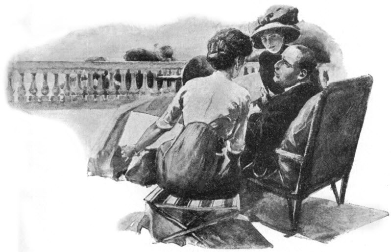

两边各一位女士陪伴护理。

“哦，对了，”饭店经理最后还说，“你是弗朗西丝·卡法克斯的朋友，来询问她的下落，但是最近来找她的不止你一位。也就个把星期以前，有一个人来这里打听过她。”

“这个人留名了没有？”我问。

“没有，也是个英国人，不过长的模样有点特别。”

“一个粗野大汉？”我问，仿照我的光辉朋友的榜样连忙套上话茬。

“正是这样，说得一点不差。这个人大个头，大胡子，晒黑的皮肤。看他模样，是住农家小店的人，不会住像样的旅馆。是个粗鲁厉害的莽汉，我想是，小心别惹着他。”

谜案的真相开始显露，就像迷雾散去，人形显现。这位善良敬神的女士受到一个恶棍跟踪，从一地追到另一地，咬住不放。女士怕这个男的，要不然她不会逃离洛桑。男的依旧跟踪，迟早要追上她。是不是已经追上她了？一直没有她的音信，会不会正是这个原因？跟她作伴的好人难道都不能给予保护，使她不致遭受暴力对待或敲诈之害？这么长途追逐的背后有什么可怕的目的、罪恶的阴谋呢？这就是我要解决的问题。

我写信告诉福尔摩斯我已迅速有效地查到案子的根由。我收到的回电却是要我描述施莱辛格博士的左耳，他左耳是什么样子。福尔摩斯还有兴致开玩笑、发奇想，有时实在叫人尴尬，不知如何应对。所以，对这种不合时宜的插科打诨，我不予置理——事实上，他这来电之前，我已到蒙彼利埃去追寻玛丽侍女了。

我毫不费事就找到了这位前侍女，了解到她所讲的一切情况。玛丽是个忠心耿耿的女仆，但不得不离开女主人，是因为看到她有人很好照顾着，也因为自己婚期快到，早晚得离开主人。她痛心地承认，她们在巴登的时候，女主人曾对她发脾气。有一次竟追问她，好像怀疑起她的诚实来了。既是这样那就分手的好，比不存疙瘩的分别倒反而容易。弗朗西丝女士给她五十英镑当作结婚礼金。玛丽和我一样，也对那个陌生人很有怀疑，认定是因为这个人，她的女主人才离开洛桑的。她亲眼看见这个人公然在湖滨道上恶狠狠地抓住女主人的手腕。他是个凶狠可怕的人。玛丽相信，弗朗西丝女士怕这个人，才愿意陪伴施莱辛格夫妇一起到伦敦。这件事女主人从来没有跟玛丽提起，但有很多细小的迹象让侍女确信她的女主人一直生活在神经紧张的状态中。刚说到这儿，她忽然从椅子上跳了起来，一脸惊恐。“看！”她叫道，“这个恶棍也跑到这里来了！就是他，我说的就是他。”

客厅的窗户开着，我望出去，看见一个胡子拉碴的黑大汉，在街中央慢慢走着，抬头一家一家地找门牌号码。很清楚，跟我一样，他也在找侍女玛丽。我此时一股劲冲上来，奔出去找他讲话。

“你是英国人。”我说。

“是又怎么样？”他恶声恶气反问我。

“可以问一下尊姓大名吗？”

“不，不关你事。”他断然拒绝。

场面很僵，干脆单刀直入倒是最好的办法。

“弗朗西丝·卡法克斯女士在什么地方？”我问他。

他惊愕地望着我。

“你把她怎么样了？你为什么要盯住她不放？你给我回答！”我又说道。

这家伙一声怒吼，像猛虎似地向我扑上来。我经历过不少格斗，不曾有敌手，但是这个人手如铁钳，狂如恶魔，我被他一把扼住了喉咙，几乎要昏厥过去。这时从街对面一家歌舞酒店冲出一个满脸胡须、身穿蓝工装的法国工人，手持短棍，一棍子打在行凶大汉的胳膊上，使他缩回了手。这家伙一时站住了，怒不可遏，正犹豫是否还要再行攻击，但他接着狂吼一声，扔下了我，转而冲进了我刚才出来的那间旅馆小楼。我回身感谢陌路相助的人，他还在街上，站在我身边。

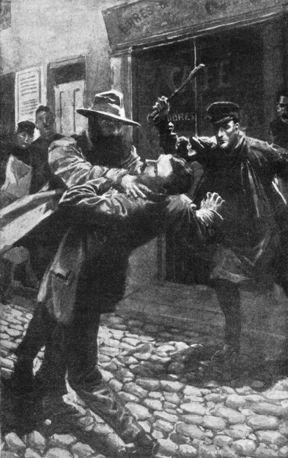

我被他一把扼住了喉咙。

“你好，华生，”他说，“你这样会把事情搞砸了！我看你还是跟我回伦敦吧，搭今夜快车。”

一个钟头以后，歇洛克·福尔摩斯恢复了平时的装束，坐在我下榻的旅馆房间里。他解释说，他的突然出现，又是这么巧遇，原因也简单，一方面是自己可以离开伦敦了，另一方面决定应当来接我手。他算得到下一程在哪个地方可以拦住我，便化装成工人在酒店里等我露面。

“你已经做了一连串调查工作，很不错，我亲爱的华生，”他说，“这会儿我想不起有哪些你疏忽的地方。你的工作总体上是到处发警报，但没有发现什么。”

“也许，换了你也强不到哪里去。”我不服气地说。

“不是‘也许’，我已经做得比你强。菲力浦·格林阁下就在这里，和你同住一家饭店。我们要作进一步的调查，以他为起点，才会有更大的成功。”

一张名片放在托盘上送了进来，随即跟进一个人，就是刚才在街上打我的那个大胡子歹人。他看见我，吃了一惊。

“这是怎么回事，福尔摩斯先生？”他问道，“我得到你的通知就来了。可是这个人，和事情有什么相干？”

“这是我的老朋友、老同事，华生医生，他正在协助我们破案呢。”

陌生人伸出巨大的、晒黑了的手，说了些道歉的话。

“但愿没有伤着你吧。你指责我伤害弗朗西丝女士，我就火了。说真的，这几天来的事，我没有责任。我的神经搞得就像带电的电线一样了。情况叫我无法理解，福尔摩斯先生，首先我想要知道，你们究竟是怎么把我找到的。”

“我和弗朗西丝女士的家庭教师杜布尼小姐有联系。”

“老苏珊·杜布尼，戴头巾帽的！我记得她。”

“她也记得你，那是在几天以前——你认为最好是去南非。”

“啊，我的事你全都知道，我用不着对你隐瞒什么了。我向你发誓，福尔摩斯先生，世界上决不会有哪个男人爱女人有我爱弗朗西丝女士那样真心实意。我原是个野小子，我知道——可是野小子里头，我是个好小子。她的心像白雪一样洁白，她不能忍受一丝一毫的粗鲁。所以，一听说我做的那些个事，她连话也不再跟我说了。可是，她是爱我的——妙就妙在这里——她是那样爱我，全是为了我，在她那些个圣洁的年月里，守着独身。几年过去了，我在巴伯顿发了财，我想可以去追求她了，祈求她心软下来。我听说她依旧没有结婚，便在洛桑找到了她，能想得到的办法都使上了。她的态度，我想是软了，但是她的意志还是很强。等下一次我再来看她，她已经离开洛桑。我又追到巴登。没过多久，听说她的女仆在这里。我是个粗人，刚从粗野的生活圈子里出来，华生医生那样子对我说话，我一时忍耐不住。哦，看在上帝的分上，告诉我弗朗西丝女士怎么样了？”

“这正是我们要了解的，”歇洛克·福尔摩斯说，脸色很沉重，“你伦敦的住址是哪里，格林先生？”

“到朗汉姆旅馆就能找到我。”

“那么，我劝你回去，不要离开，等待一有事我们好来找你，行吗？我不想让你空抱希望，但是你可以放心，只要为了弗朗西丝女士的安全，凡是我们能做的，一定竭尽全力去做。现在没有别的话要说了，给你名片，便于同我们保持联系。好了，华生，你整理一下行装，我给哈德森太太发个电报，明天早晨七点半，好好准备两个人的早餐，好让两个旅客饱餐一顿。”

我们回到贝克街寓所，正有一封电报在等着我们。福尔摩斯一看，高兴得欢呼，马上扔给我说：“缺损或撕裂，电文如此，拍发地：巴登。”

“什么意思？”我问。

“一切都在其中了。”福尔摩斯回答，“你该记得，我问过一个似乎毫不相关的问题，有关这位传教士先生的左耳朵，你没有答复我。”

“我已经离开巴登，问不到了。”

“是的，正因为如此，我同样的内容电报发给英国饭店经理，这就是他的回答。”

“这说明什么呢？”

“这说明，我亲爱的华生，我们要对付的是一个非常狡猾、非常险恶的人。博士施莱辛格牧师大人，是南美传教士。他不是别人，就是那个亨利·彼特斯，一个澳大利亚牌子的最无法无天的大流氓——这个国家年纪不大，倒已经出产了一批完人，道貌岸然的人物。他的拿手本事，专门诱骗单身妇女，利用她们的宗教感情。他那个所谓的妻子，英国人，名叫弗蕾塞，一丘之貉。光看那些手段手法，我断定必是此人，不会错。还有这一外貌特征——一八八九年，他在阿德莱德一次沙龙斗殴中，耳朵被咬伤，伤势严重——证实了我的怀疑。可怜的女士落在了这一双男女手中，他们阴险毒辣，是什么事都干得出来的，华生。弗朗西丝女士已死的可能性很大。即使没死，也一定遭到囚禁，关在什么地方，所以不能再给杜布尼小姐或是别的朋友写信。也很可能她根本没有到伦敦，或者只是经过。但前者不可能。因为大陆都有户籍登记制度，外国人想跟大陆警察耍花招是不容易的。后者也不太可能。因为这些流氓要想找到其他地方把一个大活人看押起来，很难办得到。我的直觉告诉我，弗朗西丝女士在伦敦，只是我们目前无法知道在哪里，我们只能走着瞧，先好好吃顿饭，养精蓄锐，耐心等待。晚上，我要到苏格兰警场跑一趟，找莱斯特雷德朋友谈谈去。”

但是，官家警察当局也好，机动灵活高效率的福尔摩斯私家侦探也好，都未能揭破这件谜案。伦敦数百万人口，茫茫人海中，要找出这么三个人，无异于大海捞针。寻人广告也登了，没有回应。线索也追查了，一无所获。施莱辛格每个可能作案的地点都加以监视，也是一场空。对他的老关系进行布控，可是都干干净净，和他一点来往都没有。一个星期过去了，毫无进展。可是，突然间，闪出一线希望之光，在威斯敏斯特路的波汶顿当铺，有人典当西班牙骨董银耳环。典当客个子高大，脸修得很干净，是个传教士模样的人，姓名住址一看就知道都是假的。耳朵没有引起注意，但所描述的人大体模样无疑地就是施莱辛格。

我们的大胡子朋友从朗汉姆旅馆三次来询问消息——第三次来，距新情况发现不到一小时。巨大的身躯，穿的衣服竟会显得过于宽松，因为情绪焦虑，他原先心宽体胖，现在是心忧体瘦了。“你们让我做点什么吧！”他总是这样哀求说。现在，福尔摩斯终于答应他的请求。

“他开始当首饰了，我们现在可以把他抓起来。”

“这是不是说明弗朗西丝女士已经被害了？”

福尔摩斯缓缓地摇摇头。

“如果他们一直把她关押到今天，那就势必不能放了她，一旦放了她，他们自己也就完蛋，所以我们必须作最坏的打算。”

“我能做些什么？”

“这家伙看见你不认识吧？”

“不认识。”

“那就行。以后他还会去别的当铺，要是那样的话，我们就失去线索。但这家当铺给他的价钱相当高，也没对他多加询问，所以要是他急需现钱，或许还要到波汶顿这家当铺。我让你传一张条子给他们，他们会让你坐在当铺里等待。等这个人一出现，你就跟踪到他家里。不要鲁莽，尤其，千万不要动手。你要向我保证，若是我不知情或未经我许可，不许擅自行动。”

两天来，菲力浦·格林阁下（这个人，我要提一提，是著名的海军上将的儿子。这位上将在克里米亚战争中指挥亚速海舰队），没有给我们带来新消息。到了第三天晚上，他奔进客厅，脸发白，人颤抖，强健的身体好像块块肌肉在兴奋地跳动。

“我们找到他了！我们找到他了！”他喊道。

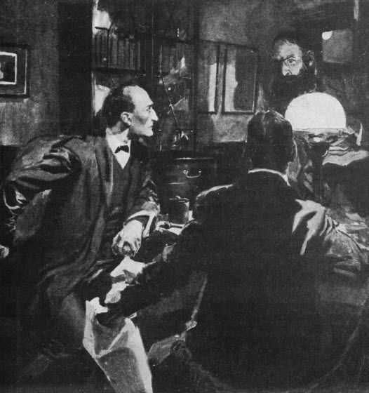

“我们找到他了！”他喊道。

他激动得连话都讲不连贯。福尔摩斯给他说些安慰话，把他按在扶手椅里坐好。

“好吧，跟我们慢慢仔细讲。”他说。

“她来了，才一个钟头之前，是他的老婆，这一回。他老婆拿来的是只耳环，是那个人上次的另一只。这女人高个子，脸色刷白，贼头贼脑的样子。”

“正是那个女的。”福尔摩斯说。

“她从当铺出来，我跟住她。她走肯辛顿路，我跟在她后面。这时候她拐进一家店，福尔摩斯先生，那是殡葬店。”

我的同伴一惊。“哦，是吗？”他问话的声音发抖，表明那冷静苍白的面孔后面掩藏着内心的焦虑。

“她和柜台里的女人正说话，我也进去。‘太晚了，’我听见她说，说的这个意思吧；店里的女人在解释原因。‘早就应该送过去了，’她回答说，‘时间是要久一点，和一般的不一样。’突然两人都不说话，看着我。我赶快问些什么话，然后就离开这家店。”

“你做得很对。后来呢？”

“女人出来了，我躲进一个门廊里。她起了疑心，我看得出，因为她向四面东张西望，然后叫了一辆马车，坐进车里。正好我也叫到了马车，就跟着她，最后她在布里斯顿的波特尼广场36号门前下车。我让车经过那门口，到广场转角那边后，下车看了这所房子。”

“看见什么没有？”

“窗子漆黑一片，只有底层一扇有光。百叶窗关上了，无法看到里面。我站在那里正犯愁，不知接下来该怎么办，这时来了一辆篷车，车里有两个人。两人下车，抬出什么东西，一起扛着走上台阶到门口，福尔摩斯先生，那是一口棺材。”

“啊！”

“我简直差一点就要冲进去。门打开了，让两个人扛棺材进屋。开门的就是那个女人。我站在那里，被她瞅到一眼，我想她认得出我。我看见她一惊，赶紧把门关上。我记得我答应过你，所以就到这儿来了。”

“你做得很好，工作出色”福尔摩斯说，在半张纸上草草写下几个字，“没有搜查证，我们采取行动就不合法。这个事有劳你跑一趟最好，把这张条子送到警察当局，拿一张搜查证来。恐怕有困难。不过我想，出售珠宝这一点就已经足够了。莱斯特雷德脑子还是会考虑的。”

“可是，他们这会儿就要谋杀她了，不然这棺材什么意思？当然是给她的，不是她还能是谁呢？”

“我们一定尽力而为，格林先生。分秒必争，一刻也不能延误。这件事交给我们就是了。现在，华生，”我们的委托人拔腿走掉以后，福尔摩斯又说，“让他去搬正规军，我们一如既往，担任别动队，我们按我们的步调行动。情势已经刻不容缓，为了应急，采取极端措施是正当的、合法的。一分钟也耽搁不得，火速去波特尼广场。”

“我们试试，把案情勾勒个大体轮廓看看。”他说道，我们的马车迅速驶过议会大厦和威斯敏斯特大桥，“是这些歹徒把心境不好的弗朗西丝女士诱拐到伦敦，首先设法挑拨离间她和侍女的感情。她写的信，都给扣下。通过同谋租到家具齐全的房子，一住进之后，就把她软禁起来。贵重的珠宝首饰就是他们的了，这是他们一开始就打好的主意。现在已经脱手一部分，他们自以为安全没有问题，因为他们很自信弗朗西丝女士无人关心、无人牵挂她会怎么样。但是如果把她放了，那她一定会声张，将他们告发，所以决不能放她。但是这么一直关着也不是个办法，最后，谋杀是必由的路。”

“看来是这样。”

“现在我们从另一条线索推论看看。你沿着两条毫不相关的思路行进，华生，你会发现，两条思路到头来就会会合，接近真实情况。我们现在来看看，不从女士而从棺材这一头，倒过来分析一下。这件事证实，正是我担心的，女士无疑已经死亡。另外还有一点，要按惯例安葬，一定要有正式的医生证明、完备的审核手续。如果这位女士明显属于谋杀，他们就只有在后花园挖坑埋掉。但眼前一切都是公开、正常进行，这意味着什么呢？他们肯定用某种方法谋杀她，能够骗过医生，伪装成是自然死亡——说不定是毒死的。可是，这样就奇怪了，怎么能让医生检查不出呢？莫非这医生也是同谋，这种假设看来不可信。”

“可以假造医生鉴定书嘛。”

“这很危险，华生，非常危险。不，我说他们不会这样做。停车，车夫！当铺刚才过去了，这家是殡葬店。你能进去吗，华生？你出面有模有样，可靠。问一问波特尼广场那家人的葬礼明天几点举行。”

店里的妇女很爽快，告诉我是早上八点举行。“你瞧，华生，毫不隐瞒，每件事情都在台面上进行！他们有的是办法，合法手续弄得齐全，因此有恃无恐，放胆干就是了。好吧，既然已经没有别的办法，只得正面强攻，你有武器吗？”

“手杖！”

“行，行，足够强大。‘工欲善其事，必先利其器。’警察，我们已经等不及了，也不能让法律绑住我们自己的手脚。你可以走了，车夫。现在，华生，我们一起有好运，以往只要两人联手出击，运气总是不错。”

到了波特尼广场中心的一栋黑漆漆大屋子，福尔摩斯上前用力拉响门铃。门立即开启，出现一个妇人，门厅暗淡的背光映衬着她高高的身材。

“你们，做什么？”她厉声问道，黑暗中注视着我们。

“我们找施莱辛格博士有话要说。”福尔摩斯道。

“这儿没这个人。”她回答，就要关门，但是福尔摩斯的脚已经把门抵住。

“那，我就是要见见住在这儿的人，他怎么称呼自己这没关系。”福尔摩斯强硬地说。

妇人犹豫着，随后就打开了门。“进就进来吧！”她说，“我丈夫什么世面都见过，他不怕。”我们进门，她随手关门，带我们到门厅右首的一间起居室，把煤气灯捻亮，让我们等着。“彼特斯先生马上就来。”她说。

她的话立刻兑现。我们刚立定，还没有好好看一眼这布满灰尘、千疮百孔的旧屋，门开了，一个高大的人轻轻走进来。他胡子刮得很干净，秃顶，一张大红脸，腮帮子下垂，摆着一副道貌岸然的样子，但掩盖不了凶残险恶的嘴脸。

“这里一定有些误会，先生们，”他说道，口气油滑，满不在乎，“我看，你们找错地方了，也许再往前面的街走一点吧——”

“行了，不必浪费时间，”我的同伴强硬地说，“你是阿德莱德的亨利·彼特斯，后来又叫巴登和南美的博士施莱辛格大人。我对你确认无疑，就像确认无疑本人叫歇洛克·福尔摩斯一样。”

彼特斯——我现在就这样称呼他——大吃一惊，两眼惊愕地直逼面前这个锲而不舍的追击者。“你的名字吓不倒我，我说福尔摩斯先生，”他冷冷地说，“为人不做亏心事，半夜不怕鬼敲门。你上我家来干什么？”

“我来是要知道你把弗朗西丝·卡法克斯女士弄到哪儿去了，是你把她从巴登带走的。”

“要是你能告诉我这位女士现在何处，我倒是喜出望外了。”彼特斯冷冷地回答，“我有一份账单，她还欠我将近一百英镑呢。她什么也没有留下，只有一副耳环，好看不值钱，商家都不屑一顾。在巴登，她跟彼特斯太太过从甚密，还有我——那时候我用的是另外一个名字，这是事实——她跟着我们生活，不肯离开，一直跟来了伦敦。我替她付账，付车票。谁知一到伦敦，她溜之大吉，留下一些过时的首饰，我刚才说的那个，算是抵债吧。你能找到她，那福尔摩斯先生，我万分感激。”

“我就是一定要找到她，”歇洛克·福尔摩斯说，“我要搜查这屋子，一定能找到她。”

“你有搜查令吗？”

福尔摩斯从口袋里露出手枪。“先就这个，搜查令随后就到。”

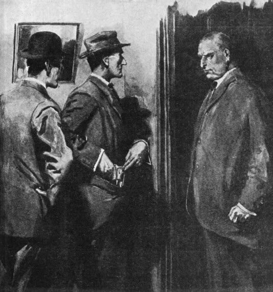

福尔摩斯从口袋里露出手枪。

“好呀，你胆敢上门抢劫。”

“不管你怎么说，”福尔摩斯冷笑道，“我的同伴更是一个危险的暴徒。我们一起搜查你的住宅。”

我们的对手把门打开。

“去叫警察，安妮！”他叫道。一阵女人疾走的裙摆声从走道上过去，厅门打开又关上。

“我们时间有限，华生，”福尔摩斯说，“你胆敢妨碍我们，彼特斯，决不会对你客气。抬进你家的那口棺材呢，在哪里？”

“你要棺材干什么？我们有用处，里头放着死人呢。”

“我要看尸体。”

“我不同意，绝对不可以。”

“不需要你同意。”福尔摩斯出手敏捷，一下把这个人推向一边，跑进大厅。眼前出现一扇半开的门，我们走了进去。是餐厅，棺材停放在桌子上，上方是一盏半明半暗的吊灯。福尔摩斯把煤气灯捻亮，掀起棺盖。在深深的棺材底部躺着一具瘦小的尸体，借着头顶上照下来的灯光，可清楚看出是个老妇人，脸已干瘪。再怎么被虐待，受尽饥饿和疾病摧残，这张干枯猥琐的脸绝无可能是不失风韵的弗朗西丝女士。福尔摩斯脸色惊异，但立即释然。

“感谢上帝！”他喃喃地说，“另外一个，不是她。”

“啊，你硬要让自己出丑，歇洛克·福尔摩斯先生。”彼特斯说，他跟在我们后面进餐厅。

“这女尸是什么人？”

“啊，你一定要知道的话，也可以，我妻子从前的老保姆，名叫罗丝·斯彭德，是我们在布里克斯顿救济院附属诊所里发现的。我们把她接到这里来，请了霍森医生，他的地址是费班克别墅十三号——你听清楚了他这地址，福尔摩斯先生——细心照料她，以尽基督徒应尽之责。第三天她死了——医生死亡证明上说，老年衰竭死亡——不过这只是医生的意见，你应该知道得更清楚啰。我们订好了肯辛顿路斯梯姆森公司办理丧事，明天早上八点下葬。你还要挑什么漏洞吗，福尔摩斯先生？偏要闹笑话，还是尽早收场吧。你打开棺材盖，原指望看到的是弗朗西丝·卡法克斯女士，不料发现一个九十岁的可怜老太婆，瞧你那副气急败坏的样子，我真想帮你拍张照片下来好欣赏欣赏。”

福尔摩斯面对这样的讽刺挖苦，表情依然平静冷淡，但是双手捏紧着拳头，看得出他内心极其恼怒。

“我要搜查你房子。”他说。

“你还不罢休！”彼特斯叫道，这时走道上传来了女人的话语，伴随着沉重的脚步声，“很快要你好看。进这儿来，警官先生，这儿请。这两人强闯民宅，我请不走他们，请帮我把他们赶出去。”

一位警官，一位警察，站在门口。福尔摩斯从名片夹里抽出名片。

“我的姓名和地址，这位是我的朋友华生医生。”

“噢，先生，久闻大名，”警官说，“可是没有搜查令，你不能留在这里。”

“是不可以，这个我也清楚。”

“逮捕他！”彼特斯吼叫。

“我们知道，如果需要的话，我们该如何处置这位先生，”警官威严地说，“不过，你也得离开这儿，福尔摩斯先生。”

“好吧，华生，我们就离开吧。”

片刻之间，我们又回到了街上。福尔摩斯依然冷静镇定，可是我简直要气炸。警官跟随在后面。

“对不起，福尔摩斯先生，法律规定。”

“是这样，警官，你不得不这样。”

“我想，你进去一定是有道理的，如果有什么事我可以——”

“有一位女士失踪，警官，我们断定是给关在这屋里。我在等搜查证送来，很快就到。”

“那好，我来监视他们，福尔摩斯先生，有什么情况，我一定告诉你。”

时间才九点钟，我们马上抓紧线索追踪。首先赶到布里克斯顿救济院。在那里我们获悉确有此事，一对慈善夫妇几天前来院里，声称一个已痴呆的老妇是他们从前的女仆，要求允许把她领走。走了以后就死了，对这消息没有人表示惊异。

下一个目标是医生。医生曾被请去，看到这个垂死的女人已经完全衰老，确实看着她断气，就照规定手续在死亡证明上签字。“我可以担保，一切手续完全合法，这件事绝无法律漏洞可钻。”医生说。这家人家没有什么可怀疑的地方，只有一点很奇怪，像他们这样的上等人家，竟然不用仆人。医生那里就查到这些，无法提供更进一步的情况。

最后我们去了苏格兰警场。签发搜查证的事，因为手续繁缛，结果不得不拖延。治安官的签发要在次日早上才能取到。如果福尔摩斯是在九点钟上门，就可以和莱斯特雷德一同去办好搜查令。这一天也就只好这样过去了。只是将近半夜，我们的警官朋友来报告说，他看见那幢黑房子的窗户上烛火这边那边移个不停，但没见屋里有人出来，也没人进去。我们没有办法，只好耐着性子等天明。

歇洛克·福尔摩斯内心烦躁，不想说话，坐立不安，没有一点睡意。我由他拼命抽烟。他浓眉深结，修长敏感的手指敲击着椅子扶手，脑海里翻腾着各种解开谜案的方法。整整一夜，我好几次听见他在屋里徘徊。最后，清晨我被叫醒，他冲进我的房间，身上还穿着睡衣，脸色苍白，眼窝深陷，这告诉我他一夜未睡。

“葬礼是几点？八点，是不是？”他着急地问我，“哦，现在是七点二十分。老天哪，华生，上帝给的脑袋都怎么使的了？快，伙计，快！生死攸关哪——九死一生啊！我们要延误大事！不好了！我永远也原谅不了自己，永远呀！”

不到五分钟，我们已经上了一辆汉森马车飞奔出了贝克街。即使这样快，过大本钟已经是七点三十五分，赶到布里克斯顿路，正好听见敲八点。不料对方也像我们一样晚，八点过十分了，灵车仍旧停靠在屋子大门口。我们的马口吐白沫停下来，这时候那具棺材刚由三个人抬着到门口。福尔摩斯抢上前去拦住他们的去路。

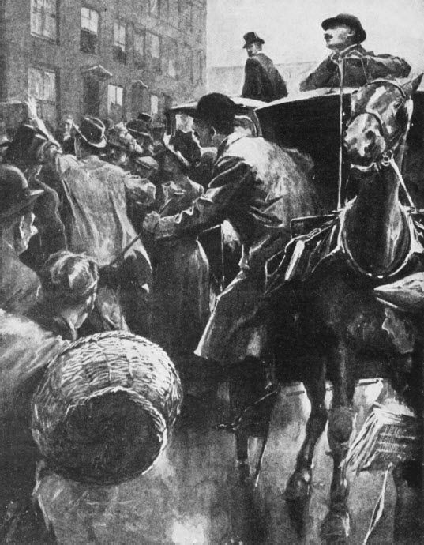

福尔摩斯抢上前去拦住他们的去路。

“抬回去！”他喝道，伸出手掌抵住前面第一个人的胸口，“马上抬进去！”

“你捣什么鬼？喂，我再问你，有搜查令吗？”狂怒的彼特斯吼叫着，涨红着脸在棺材那一头瞪眼往这边瞧。

“搜查令随后就到。棺材放回屋里去，搜查令就来。”

福尔摩斯那威严的声音势不可挡，抬棺材的人立刻听从照办。彼特斯这时突然躲进了屋里不见了，大家也就对新来的人惟命是从。“快，华生！快！螺丝起子！”福尔摩斯大叫，棺材已重新放回台桌上，“这一把给你，老兄！一分钟开棺，赏金币一镑！别问啦——快动手！对，好！再一个！再一个！大家一起来！开啦！开啦！好啊，开啦！”

大家一起使劲，把棺材盖撬开。棺盖渐渐打开，里面发出一股强烈的令人头晕的氯仿气味。棺内的人，头部缠着浸过麻药的纱布。福尔摩斯解开纱布，露出一张中年妇女的脸，美丽、端庄，如雕塑一般安详。福尔摩斯赶快伸手扶她起来，保持坐姿。

“死了吗，华生？还有气吗？应该说我们不算太晚！”

过了半个小时，因为过度窒息，而且吸入氯仿毒气，弗朗西丝女士已经没有自行苏醒的希望。最后施行人工呼吸，注射乙醚，用尽一切想得到的科学方法。终于，一丝生命的颤动，一毫眼睑的抽搐，一缕微光的反射，都表明生命在慢慢恢复，起死回生了。一辆马车飞驰赶到，福尔摩斯打开百叶窗，往外望去。“莱斯特雷德搜查令来了，”福尔摩斯说，“可是他会发现要抓的人已经跑了。不过还来了一位，”他补充道，这时沉重的脚步声在走道上响起，“来人比我们更有权利好好照顾这位女士。早上好，格林先生，我看应该把弗朗西丝女士送走，越快越好。葬礼现在可以举行了，可怜的老太婆，躺在这口棺材底下，现在让她独自安息去吧。”

“如果你愿意加上本案当作史料记载，我亲爱的华生，”当天晚上福尔摩斯说，“也只不过是一个暂时被蒙蔽的例子，头脑再清楚、再善于分析也免不了被蒙蔽。一般人也难免要犯下这类过失，能够辨识到并加以补救，就是难能可贵了。对这次声誉的挽回，我恐怕还要面对现实。我整个晚上在想，脑子转个不停，在想什么地方出现过线索，一句奇怪的话，由菲力浦·格林转述。老板娘说的，‘早该送过去了，时间是要久一点，和一般的不一样。’她是说的棺材。这棺材不同一般，那就可以得知，是按照特别的尺寸订制。可是为什么这样说？为什么？一转念，我明白了，记得棺材那么深，放的却是那么小小一具尸体，大棺材装小尸体，为什么？因为要留出空间装另外一具尸体。开一张死亡证明，埋葬的是两个死人。如果不是我自己眼睛没睁亮，这一切原本是很清楚的。八点钟，弗朗西丝女士要被活埋了，我们得抢在棺材抬出之前，拦下来不许运走。

“一直是祝愿她还活着，可是希望实在渺茫，但到底还是有希望，正如结果终于得到证明。据我所知，这些歹徒不动手杀人，到了最后也还是避免使用暴力。他们可以把她活埋而不落一点痕迹，神不知鬼不觉，没人知道她的最终结局。即使以后挖坟掘尸，他们也已经赢得时间得以逃脱。我希望，这样的想法可以说服他们甘心认输。你好好回想当时情况，你看见楼上那个阴森森的小房间，可怜的弗朗西丝女士被关在里头好长时间。他们最后一定是一拥而上，用氯仿把她闷死，然后抬到楼下，棺材里倒了更多的氯仿，防止她苏醒，最后盖棺钉死。诡计够高明，华生。翻翻刑案史，这还是新鲜事头一遭。我们的前牧师朋友这次逃出了莱斯特雷德的铁掌，我期待，还会听到他们爆出更奇特的犯罪案例。”

（1911年）

————————————————————

<a href="#part0145.xhtml_ch1-back" id="part0145.xhtml_ch1">(1)</a> 汉森马车（hansom），御座高居车后的双轮双座马车，以设计者英国建筑师Joseph
A．Hansom命名。

<a href="#part0145.xhtml_ch2-back" id="part0145.xhtml_ch2">(2)</a> 洛桑（Lausanne），瑞士西部城市，临日内瓦湖北岸。

<a href="#part0145.xhtml_ch3-back" id="part0145.xhtml_ch3">(3)</a> 蒙彼利埃（Montpellier），法国南部城市。

<a href="#part0145.xhtml_ch4-back" id="part0145.xhtml_ch4">(4)</a> 巴登（Baden），德国西南部莱茵河畔一城市。

<a href="#part0145.xhtml_ch5-back" id="part0145.xhtml_ch5">(5)</a> 库克（Cook），英国19世纪一家著名旅行社，创办人是Thomas
Cook。

<a href="#part0145.xhtml_ch6-back" id="part0145.xhtml_ch6">(6)</a> 米甸（Midianite），源出《圣经·创世记》，亚伯拉罕又娶妻基士拉，生米甸。

# 奄奄一息的侦探

歇洛克·福尔摩斯的房东哈德森太太，长久以来吃了不少苦，不光是她这二楼总有一批批奇怪而又往往不受欢迎的人不请自来，就连她那位非同寻常的房客自己也是生性怪僻，生活毫无规律，叫房东太太备受煎熬，简直不堪忍受。他邋遢得令人难以置信。他拉小提琴不看时间，要拉就拉，很不识相。他居然还不时在屋里练枪，常做些莫名其妙的化学实验，搞得恶臭难闻。他招致暴力威胁，生活在危险的氛围之中，全伦敦再也没有比他更糟糕的房客。可是也有另一面，他出的房钱极高。我和福尔摩斯一起住的那几年，他所付的租金就足可以买下这套住房，这一点我是完全清楚的。

房东太太对他深怀敬畏，不管他行为多么乖僻，从来不敢横加干预。房东太太也喜欢他，因为他对待女性彬彬有礼。福尔摩斯不喜欢也不相信女性，但尽管偶有对立，却永远是骑士风度。我婚后第二年，房东太太到我家里来，告诉我可怜的朋友处境悲惨。我知道房东太太真诚地关心着福尔摩斯，我认真地听她诉说情况。

“他要死啦！华生大夫，”她说，“倒下三天，不行啦，我看是过不了今天啦！他不让我请大夫。今天早上，我看他颧骨都凸出来了，眼睛睁得大大地望着我，我再也受不了啦。‘你答应也好，不答应也好，福尔摩斯先生，我这就要去请医生。’我说。‘那么，就叫华生。’他说。所以我是一刻也不敢耽搁呀，先生，要不你可就见不着他了。”

我吓了一大跳，因为我一直不知道他生病。我二话不说，赶紧穿衣服戴帽子。马车立刻掉头，我叫房东太太把详细情况告诉我。

“能说的也不多，先生。他前一阵子在罗塞海特研究一种什么病，在泰晤士河边一条小巷里。他回来后，把病也带回来了。星期三下午躺下，就此倒在床上动不了啦。三天了，滴水未沾，不能吃东西了。”

“天哪！你怎么不请医生？”

“是他不要，先生，他那个固执犟劲儿，你是知道的，我不敢不听他。他活不久了，待会儿，你自己见了就知道了。”

福尔摩斯样子确实凄惨。这是十一月多雾的天气，阳光暗淡，踏进病人的房间，更令人沮丧。但是使我心寒打颤的，是病床上那张直望着我的消瘦得变了形的脸。他的两眼因为高烧而发亮，脸颊火红，双唇干裂，结着黑色痂皮；搁在床单上的手，骨节嶙峋，在不住地抽搐，他的声音颤抖嘶哑。我走进去，他有气无力，躺在那里，但一看见我，两眼闪烁招呼着我。

“唉，华生，看来，我们厄运高照。”他说，声音微弱，但是依旧带着毫不在乎似的那个老腔调。

“我亲爱的朋友！”我叫着，向他走近。

“别过来！别过来！”他尖声说，那紧张的样子只能让我想到是面临着紧急的危险。

“走开，华生，不然你出去。”

“为什么？”

“叫你别过来，就别过来，多问什么！”

是的，哈德森太太说得没错，福尔摩斯比以前更加刚愎自用。但是眼见他已经气衰力竭得这样，又叫人怜悯。

“我是想帮你点什么。”我解释道。

“好吧！你别过来，就是帮我忙了。”

“那好，福尔摩斯。”

他严厉的态度缓和下来。

“你不生气吧？”他问道，喘着气。

可怜的老友，看见他病成这个样子，已经奄奄一息，我怎么忍心生他气呢？

“这都是为你着想，华生。”他嘶哑着说道。

“为了我？”

“我自己知道自己的病。这是苦力病，苏门答腊传来的——这种病，荷兰人，比我们清楚，可目前，也还是无法对付。只有一件事，可以肯定，接触传染性很强，一染上就致命。”

他这时讲话像发烧有高热度，痉挛地挥着细长的两手叫我离开远点。

“属于接触性传染，华生——一接触就传染。别接触，你站远了，就没事。”

“我的老天，福尔摩斯！你以为这样说就能把我拦住了？你就算是陌生人，我也不能不理你。对自己老朋友能不尽医道责任？”

我就又向前走上去，可是他瞪出狂怒的眼珠，把我喝住。

“你站开了，我就讲，你要是不站开，就给我出屋去。”

我对福尔摩斯出众的人品深怀敬意，我一向不肯违拗他的意愿，哪怕我对他并不理解。但是眼前，是我的职业本能使然，别的事，由着他支配我，可是在这病房，得受我支配。

“福尔摩斯，”我说道，“你病成这样，病人要像孩子一样听话。我来给你看病，你喜欢也好，不喜欢也好，我要给你检查病症，好对症下药。”

他两眼狠狠地盯着我。

“我非要请医生的话，好歹也要请个我信得过的。”他说。

“原来你信不过我？”

“你的有情有义，我完全信得过，但是，事实总归是事实，华生，不管怎么说，你不过是个普通医生，经验有限，医术平平。我说这种话，是很不愉快的，你逼得我别无选择。”

这话重重地刺伤了我。

“这不是你该说的话，福尔摩斯，这很清楚表明了你的精神状态。不过，你要是不信任我，我也不会强要你接受我的治疗。我可以去请贾斯帕·密克爵士，或者彭罗斯·费舍，或者别人，反正是伦敦最好的医生。但是，把话说到底，你无论如何得看医生。如果你要我来这儿见死不救，自己不动手也不请别人帮助你，那你就把你的朋友看错了。”

“你是一片好意，华生，”病人呻吟中似有呜咽地说，“要我来说穿你的无知吗？请问，你懂什么叫打巴奴里<a href="#part0146.xhtml_ch1"
id="part0146.xhtml_ch1-back">(1)</a>热病吗？你知道什么叫福摩萨<a href="#part0146.xhtml_ch2"
id="part0146.xhtml_ch2-back">(2)</a>黑色败血症吗？”

“从来没有听说过。”

“有好多，疾病问题，好多稀奇古怪的，病理学病状，在东方，华生。”他说一句，停一下，积了点力气再讲下去，“我最近，搞点研究，医学犯罪方面，学到不少。就是这过程中，染上病。你，无能为力。”

“也许我不行，但我知道爱因斯特里博士目前正好在伦敦，他是还健在的热带病权威之一。不要再拖延了，福尔摩斯，我现在就去请他来吧。”我毅然向门口走去。

不料，我从来没有受到过他如此的惊吓，忽然，这濒临死亡的人，如猛虎跃起，跨到我前面，只听见钥匙喀哒一转。接着他摇摇晃晃回到床上，体力骤然大量消耗，人倒下不动弹，直喘气。

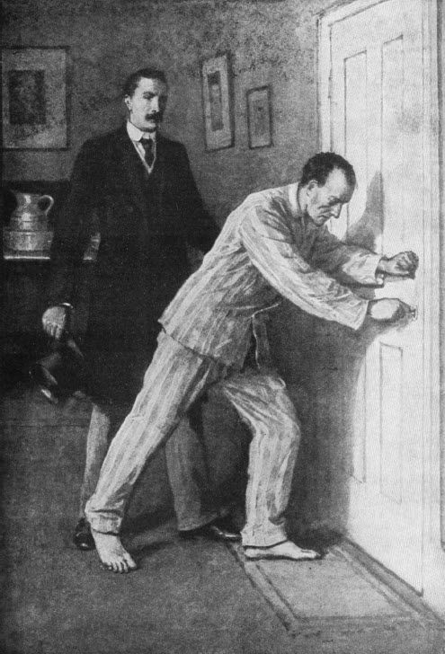

只听见钥匙喀哒一转。

“你总不能，来抢我钥匙，华生。不让你走，我的朋友，你就别走，待这里，等我好好，跟你说。”他边说边喘气，讲一句，就拼命呼吸，“只有你，最知我心思，真心真意，待我。我当然很明白。你做你的事去吧，给我时间，我能恢复点力气。现在不行，华生，现在不行，华生，现在不行。现在四点，到六点，你走。”

“你不正常了，福尔摩斯。”

“只有两个钟头，华生。我答应你，六点钟走。你等一等，也不成吗？”

“看来，我别无选择了。”

“没有选择，肯定，华生。谢谢你，我不需要帮助，整理床上。你尽管站开点。现在，华生，有一件事要做，你去找人帮忙，不是你提的那些人，是我选的一个。”

“当然行。”

“这三个字，你进这屋子，只有说的这三个字，才算通情达理，华生。那边，你看，有书，我是没一点力气了。我说，电池，非导体上通电，能起什么作用？别说话，到六点，华生，我们再说。”

然而，远没有到那个时间，他又马上说话了，还是不得不说，非说不可。而且，他说话那一声吼，吓得我真要魂儿出窍，不亚于刚才他跳向门口给我的一惊。那是我站着的时候，看着他在床上静静躺好，脸上被褥几乎遮没，好像是睡着了。我无心坐下来看什么书，只在屋里踱来踱去，看看挂满墙上的重大案犯照片。最后是无意间走到壁炉架旁，看见上面凌乱地放着烟斗、烟丝袋、注射器、削铅笔刀、左轮枪子弹，还有其他一些杂七杂八的东西。其中有一只黑白两色相间的象牙盒子，上面是抽拉盖，倒是一件精致的小玩意儿，我伸手去把盒子拿过来，要仔细看看，这时——他就发出一声恐怖的吼叫——这一声喊，恐怕外面街上都听得见。我这一下吓得浑身冰凉，毛骨悚然。马上回过头去，看见他一张抽搐的脸，两只狂怒的眼睛。我手上拿着小盒子站在那里吓呆住了。

“把盒子放下！放下，给我放下！华生——快放下，我说！”我把盒子放回壁炉架上，他这才松掉一口气，把头靠回枕头上。“我最恨别人动我的东西，华生。我最恨了，这你是知道的。你搞得我受不了。你这个医生——你这不是要把病人往太平间赶嘛！坐下，伙计，让我休息！”

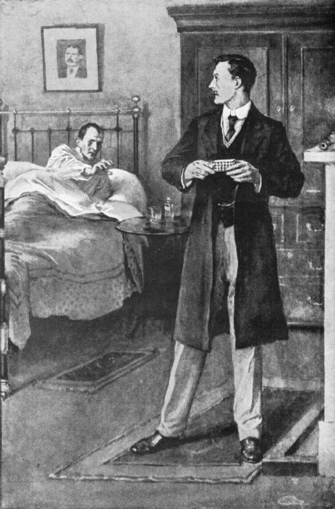

“放下，给我放下！”

这件意外事给我造成极不愉快的印象：先是狂怒，无缘无故地激动，继而言语粗鲁，和他以往温文尔雅的态度相差太远，这表明他的心智不正常了。一切祸患之中，崇高的心灵遭到毁损那是最可悲的。我一声不吭，颓丧地坐着，直到规定的时间过了。他好像一直在看钟，跟我一样，因为正好六点刚过，他便开始说话，和刚才一样劲头十足。

“现在，华生，”他说，“你身上有零钱吗？”

“有。”

“是银币吗？”

“有很多呢。”

“有多少半克朗？”

“五个。”

“啊，太少！太少！多么不幸，华生！不过，不管它这么点，你都放到表袋里，其余的钱都放到左边裤子袋里。谢谢你。这样就很好，使你保持平衡。”

完全语无伦次，不正常了。他在发抖，又发出不像咳嗽也不像哽咽的响声。

“你现在可以点煤气灯，华生，但是要很小心，只点一半亮就够了，一定不能更亮了，这个请你要当心，华生。谢谢你，这样就很好。不要，不要关上百叶窗。再麻烦你桌上放些信和报纸，让我够得到，拿得到。谢谢你。现在，壁炉台上那些乱七八糟的东西。好，好极了，华生！那边有个方糖夹子，请你用夹子把那只象牙盒子夹起来，放到这报纸上。好，这就好了！你现在可以去请柯弗顿·史密斯先生过来，在下伯克大街十三号。”

说实话，我已经不想去请医生了，因为可怜的福尔摩斯神志如此不清，离开他，不看着点，马上就会出危险。然而，他急于要我去请他指定的这个人来看病，同先前执意不准我去请人一样坚决。

“这个人我从来没有听说过。”我说。

“不可能听说的，我的好华生。说出来你要奇怪，世上能治这种病的神医，并不是医生，而是一位植物园主。是柯弗顿·史密斯先生，苏门答腊的知名人士，现在正好来了伦敦。这种病在他的植物园里爆发，得不到医药治疗，他自己进行研究，得到了很好的效果，影响很大。这个人做事一点一画，我叫你六点以前不要去请他，因为我知道，这时候，他书房里是找不到他人的。如果你能盛情把他请到，他对治疗这种病，富有经验，有独到本领，可以托付他，药到病除。他调查这种病，已经成为他的专项爱好，我相信，他定能帮助我。”

我注意到福尔摩斯说的这番话的意思是连贯的，完整的，所以我不想光是形容他说这话怎样不断时喘时息，时断时续，也不想形容他双手如何又抓又捏，说明病痛难忍。在我与他相陪的不多几个小时里，他病容更重了，潮红热斑更明显，眼窝发黑深陷，目光刺人，额上沁着冷汗，但是他这段话讲得语气自在，不失风度。都快奄奄一息了，还是个运筹帷幄的作派。

“把你看到我已经病成这样情况，好好告诉他。”福尔摩斯说，“把你感受到的印象都要讲清楚——一个临终人——垂危了，神志不清了。真的，我想不出，为什么整个海洋的海床，不是一整块，全牡蛎，此物就是大丰产了呀。啊，我要漫游！奇异多么是，脑子支配脑子！我说什么了，华生？”

“嘱咐我去请柯弗顿·史密斯先生。”

“啊，是的，我记得，我这条命全靠他了。去恳求他，华生，我和他，心中有疙瘩。他的侄子，华生——我疑心里面是卑鄙阴谋诡计勾当，我把他看出来了。那孩子死得挺惨。他对我怀恨着呢。你要说动他，华生，求求他，恳求他，想尽办法，把他请来。能救我的，他——只有他呀！”

“一定要他来，我拽也要把他拽进马车去。”

“这样做不行啦。你要说动他来，然后你走在他头里先回来，找什么理由都行，反正不要和他同行。别忘了，华生，你可别坑了我呀，你从来没有坏过我的事。天道没问题，天敌有的是，控制生物增长，物物相生相克呀。你和我，华生，我们已尽了我们天职。那么，这世界，牡蛎会不会大繁殖？不，不，可怕呀！你把心里这一切都要讲清楚啦！”

我全由着他，那样子完全是个智力发达却像是喋喋不休胡言乱语的傻孩子。他把钥匙交给我，我一看正好，赶快接在手中，这样免得他把他自己锁在屋里。哈德森太太，正在走道上颤抖着哭泣。我出了套间，还听得福尔摩斯高高尖尖的声音，拖腔拉调地谵妄不止。出了门，我吹口哨招呼马车，这时雾中出现一个人向我过来。

“福尔摩斯先生怎么样呀，先生？”这个人问道。

原来是老相识，苏格兰警场的莫顿警官，他一身花呢便衣。

“病得很厉害。”我回答。

他神态怪异地望望我。不是幸灾乐祸吧，车灯照耀之下，竟然看见他喜形于色。

“我听到一点传闻。”他说。

马车动了，我无心和他多说。

下伯克街原来是在诺丁山和肯辛顿相接的跨界地方，一长排房子很漂亮。马车停在一幢房子前面。这房子围有旧式铁栏杆，大折门，闪亮的铜饰，显着肃穆高贵的气派，再配以一个一本正经的管家，他出现在粉红色的电灯光中，人与屋颇能浑成一体。

“是的，柯弗顿·史密斯先生在家，华生博士！好的，先生，我把你的名片交给他。”

我是无名之辈，不会引起柯弗顿·史密斯先生的注意。透过半开着的门，我听见一个拔直喉咙、粗声粗气的嗓音。

“这个人是谁呀？来干什么呀？哦，天哪，斯泰帕尔，我说过多少次了，我研究的时间，不要来打扰！”

管家凑上前在迎合着轻声作一番解释。

“哼，我不见他，斯泰帕尔，我的工作不能就这样给打断了。我不在家，就这么说，叫他明天早晨来，如果他一定要见我的话。”

又一番轻咬耳朵。

“行，行，告诉他吧，他可以早上来，否则别理他。我的工作不得妨碍。”

我想到福尔摩斯在病床上辗转难受，可能在每分每秒计时等待我给他援助。没有时间讲什么客气了。他性命攸关，全在我必须迅速敏捷，处事果断。于是管家出来不等他开口向我道歉传主人的话，我把他推在一旁，径入屋内。

一个人从火炉边的躺椅上跳起来，尖声怒吼。我看见一张宽宽的黄脸，皱纹油腻，肥厚的双下巴，两簇褐眉下一对恶狠的眼睛气势汹汹地瞪着我，秃顶高脑门上压一顶天鹅绒小吸烟帽，学时髦歪戴着，斜下一侧粉红曲沿边。脑壳特大，可是当我眼光下移，令我惊讶这人的身躯又瘦又小，肩背歪曲，好像小时候患过佝偻病。

“干什么？”他高声尖叫，“直闯进来，什么意思？不是有话给你了吗，明天早上再讲吗？”

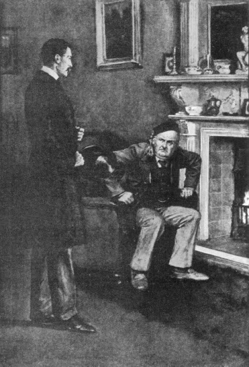

“直闯进来，什么意思？”

“真正对不起，”我说，“事情紧急，一刻也拖不得呀，歇洛克·福尔摩斯先生——”

一提我朋友的名字，在这小个子身上立刻产生异乎寻常的反应，原来的怒目而视顷刻消失，面色转为紧张而警惕。

“你是从福尔摩斯那里来？”他问。

“我刚从他那边过来。”

“福尔摩斯怎么了？他好吗？”

“他病得不行了，我就为这事儿来的。”

这个人指着一张椅子叫我坐下，他自己也坐好了。他转身之间我从壁炉上的镜子中瞥一眼他的脸，我敢发誓，他脸上竟是狞恶的笑容。但是，我自我安慰那是他一时的神经抽搐，才让我惊讶，因为回过身对着我的那会儿，脸上是一面孔真诚关怀的表情。

“真遗憾听到这个消息，”他说，“我是通过处理一点事情才认识福尔摩斯先生，但我已经真心钦佩他的才干和人品。他业余研究刑案学，我是业余研究病理学。他抓坏人，我灭病菌。我有我的监狱，”他继续道，指指桌上的一排瓶瓶罐罐，“这里培养的胶质中，有的是世界上最凶恶的犯罪分子，正在服刑呢。”

“正因为你有特别的医道技术知识，福尔摩斯先生希望见你。他对你有高度评价，而且认为，你是全伦敦惟一可以救他的人。”

小个子身子一动，时髦的吸烟帽滑落到地板上。

“怎么？”他问道，“为什么福尔摩斯先生说我能为他消灾？”

“因为你懂东方疾病。”

“他怎么知道自己染的是东方疾病？”

“由于职业关系，他在码头上和中国水手一起工作过，作过调查了解。”

柯弗顿·史密斯高兴地笑了，把吸烟帽捡起来。

“噢，是这样——是吗？”他说，“我看事情没有你想的那么严重。他病了多久了？”

“大约三天吧。”

“神志昏迷了？”

“有时候昏迷。”

“糟糕，那就糟了！看上去麻烦了。不答应他的要求，有点不近情理，可我最恨打断我的工作，华生博士。不过，这个事当然是例外，我马上跟你走。”

我牢记着福尔摩斯的叮嘱。

“我还有另外地方要去一去。”我说。

“没关系，我一个人去，福尔摩斯先生的地址我有。你放心，我最迟半小时就赶到。”

我忐忑不安，回到福尔摩斯的房间，惟恐我不在的时候发生最糟的情况。但让我放心宽慰的是，这一阵子他倒反而大有起色了。他的面孔依然死灰，但已没有神志昏迷的症状，说话依然虚弱，这难免，但比刚才那一阵子清醒得多。

“哦，见到他了，华生？”

“见到了，他就来。”

“上上大吉，华生！上上大吉！你是最得力的使者。”

“他想同我一起来。”

“那不行，华生，那绝对使不得。我什么病，他问了？”

“我告诉他了，是东区<a href="#part0146.xhtml_ch3"
id="part0146.xhtml_ch3-back">(3)</a>华人的病。”

“再好没有！好极了，华生，你好朋友，帮大忙。现在你可以退场了。”

“我得等着，听听他的诊疗意见，福尔摩斯。”

“当然你要听。不过，我有理由相信，要谈的意见，只有让他认为是在单独谈话，他才能谈得彻底，谈出价值来。我床头后面不是有房间嘛，华生。”

“我说亲爱的福尔摩斯！”

“这个事恐怕没有别的办法，华生，那并不是密室，只是里面躲一躲，也不会起疑心。就那里躲着，华生，我看就这样吧。”他忽然坐了起来，憔悴的脸上顿时严峻而全神贯注。“马车来了，华生。快，伙计，照我的话做吧，好朋友！不要动，不管出什么事——不管出什么事，听见了吗？不要说话！不要动！只用你两只耳朵听。”接着，一瞬之间，他刚才那会儿的精力突然消失，刚毅、决断的话音恍惚起来，变成半昏迷状的低声含糊的梦呓。

我迅速躲藏好。只听到楼梯上有脚步声，接着是开房门，又关房门。之后，很奇怪，一段时间寂静无声，只有病人急促的呼吸和喘气。可以想见，来者正站在床边，在审视病人。最后僵持的沉默终于打破。

“福尔摩斯！”他叫唤着，“福尔摩斯！”喊声急迫，硬要把睡着的人叫醒。“听得见我吗，福尔摩斯？”传来窸窣声，像是在猛摇病人的肩膀。

“是你吗，史密斯先生？”福尔摩斯微弱的声音问道，“我不敢想，是你，会来。”

来人大笑。

“我可是想得到，”他说，“好了，你瞧，我不是来了吗！这叫以德报怨，福尔摩斯——以德报怨！”

“你真好——你人品高尚，我欣赏你有独到的知识。”

我们的来客噗哧一笑。

“你欣赏我，有幸的是，伦敦能欣赏我的人，就你一个。你怎么回事，自己有数没数？”

“一样的病。”福尔摩斯说。

“啊！你知道病的症状？”

“那还不清楚！”

“好，我毫不奇怪，福尔摩斯。是一样的毛病，我就不奇怪。是同样的病，你也就不妙了。可怜的维克托，得病的第四天就归天了——多么身强力壮、活灵鲜跳的小伙子啊。那是当然，正像你所讲的，非常奇怪，他居然在伦敦中心区染上这罕见的亚洲病——正是这种病，我可是特有研究。无独有偶，福尔摩斯，给你注意到了，真不简单。不过，也得狠狠心肠指出，知道原因也就知道结果了。”

“我知道，是你干的。”

“哦，你知道，真的？可是你知道也没用，你无法证实。给你抖搂出来我不少的事，你那样做你怎么说？你有了今天倒来求我救你一命？想玩什么把戏——嗯？”

我听见病人在喘息，急促，吃力。“给我水喝！”他气咻咻地说。

“你就要完蛋了，我的朋友，可是我还不让你走，等我把话给你说完，所以我把水给你。拿着，别洒了！好了，你听得懂我说的话吗？”

福尔摩斯呻吟着。

“救救我吧，过去的事过去算了，”他低声说，“我的话，都别记在心上了——我起誓，一定不计较。帮我治病吧，我一定都忘记。”

“忘记什么？”

“哦，忘掉，维克托·萨维奇的死。事实上，刚才你是承认了，我可是忘了它。”

“你忘记也好，记着也好，随你便，我是不会在证人席上看见你了，只会看见你在棺材里，我的好福尔摩斯。明白告诉你吧，你知道我侄子是怎么死的，现在对我已经不碍事。不用谈他了，谈你的死吧。”

“是的，是的。”

“来找我的那个家伙——我忘了他叫什么来着——说你是在东区水手中传染上这个病。”

“我想只能是这样吧。”

“你自以为脑子有多聪明，福尔摩斯，是不是？自以为有多了不起，是不是？这一回叫你碰上比你更了不起的人。你好生回想一下，福尔摩斯，你得了这个病，没想到另有原因引起的？”

“我不能想，我脑子完了。看老天分上，帮帮我！”

“好呀，我要帮你。我要帮你明白是在哪里、是怎么样得的这个病，让你在死之前知道是怎么死的。”

“救救我，疼死我了！”

“疼，是吗？正是这样。苦力得了这个病，到末了都是叫疼叫断气。你是抽筋疼了，我猜。”

“疼呀，疼呀，抽筋呀！”

“那，我告诉你，你给我好好听着！你还没得这个病之前，记得发生过什么事没有？记记看。”

“没有，没有，没事。”

“再想想。”

“病成这样，不能想了。”

“那好，我来帮你想。收到什么邮包没有？”

“邮包？”

“一个盒子，有没有？”

“我头晕，我要死了！”

“听好了，福尔摩斯！”听到他在推摇垂死的病人，我躲在那里，克制住自己一声不吭，“你听我说，好好听着。记得盒子吧——一只象牙盒子？星期三寄到的，你一打开——记起来了吧？”

“是的，是的，我一打开，里面有一根尖细弹簧。玩具不像玩具，开玩笑——”

“根本不是跟你开玩笑，你上了我的当，你这个蠢蛋。你自作自受。谁叫你来挡我的路？你早该别管闲事，我一根毫毛也不会伤你。”

“我记得，”福尔摩斯喘气道，“弹簧！跳出来，戳出血。这盒子——在桌上呢。”

“就是这一个，没错！我往口袋里一放，带走了事，一丁点儿证据也不留。你现在明白真相了吧，福尔摩斯，知道你是死在我的手里了，你死吧！维克托·萨维奇怎么死，你知道得不少，我来打发你随他一起去吧。现在你死到临头，福尔摩斯。我就坐在这里，我就要看着你死。”

福尔摩斯的声音已微弱到几乎要听不见了。

“你说什么？”史密斯道，“捻亮煤气灯？天暗了，看不清。好吧，我来扭亮点，好让我看你看清楚一点。”他走过去，灯一下子变得大亮，“还有什么事要我给你效劳，我的朋友？”

“火柴，香烟。”

我惊喜得差一点要叫出声来，福尔摩斯恢复他的自然声音说话了——虽然还有一点虚弱，但那是原来我很熟悉的声音。接着陷于一阵无声的停顿。我感觉到，柯弗顿·史密斯正在惊讶莫名地低头呆望他的对手。

“你这是什么意思？”我终于听见他开口，声音干涩、焦躁。

“这叫深入角色，最有效的表演方法，”福尔摩斯说道，“老实告诉你，整整三天了，我不吃一口东西，不喝一滴水，直到这会儿，才有劳你倒了一杯水给我喝。但是，最叫人难熬的还是没烟抽。啊，香烟来了。”我听到了划火柴的声音。“哦，哦，好多了！听！听！一位朋友的脚步声吧？”

外面脚步响，门打开了，莫顿警探出现。

“一切顺当，这就是你要找的人。”福尔摩斯说。

警官宣示警告要领。

“以谋杀维克托·萨维奇的罪名，你被逮捕了。”他宣示完了说。

“还要加上一条罪名，企图谋害歇洛克·福尔摩斯。”我的朋友笑道，“为了救一个垂危病人，警官先生，柯弗顿·史密斯先生真够好心的，给我们捻亮灯光发出信号。噢，别忘了，犯人外衣右手口袋里有一个小盒子，拿掉它，以防万一。谢谢你，替我拿一下，小心了，放这里。开庭的时候，它可要起个大角色。”

猛然间一场争执、扭打，接着是铁器敲击声，一阵哇哇叫痛。

“你来这一手，自讨苦吃，”警官说，“站好了，不许动！”手铐喀哒一声。

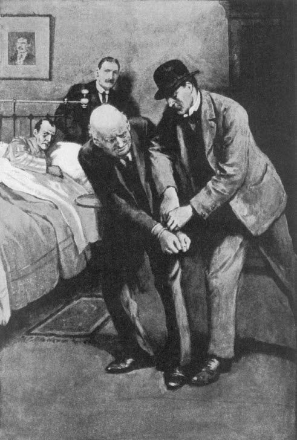

“你来这一手，自讨苦吃。”

“好一个圈套哇！”尖声的嗓音咆哮道，“上被告席的是你，福尔摩斯，不是我。他要求我来替他治病，我可怜他，来了。想不到，他现在胡说八道，好像真有其事，我讲了什么什么，听他胡编乱造，讲疯话随便栽赃。你怎么撒谎都行，福尔摩斯，我也有嘴巴可以说话，我的说法一样管用。”

“我的天哪！”福尔摩斯高声道，“我都把他给忘了，我亲爱的华生，真是十二万分的抱歉。你看看，我怎么能把你给忘了呢！不用我来替柯弗顿·史密斯先生介绍了，我知道你们天没黑前就早已认识。你楼下有马车吗？我跟你去，换好衣服，跟你到警察局里会有点用处。”

“不再需要这副打扮了。”福尔摩斯说道，他换衣梳洗时，喝了一杯红葡萄酒，吃了几片饼干，精神恢复不少，“你们都晓得，我的生活习惯本来就没有规律，来上这么一套玩意儿，我无所谓，在别人可就受不了。关键一点，要先让哈德森太太对我的病情信以为真，她才能传达给你，再由你转告给这个人。你不见怪吧，华生？你要理解这点，你有许多才能，可就是叫你作假你做不来，没办法。要是叫你知道了我这里头的秘密，再派你心急火燎地去把史密斯叫来，肯定要出纰漏，这是整个计划的关键，不能坏事。他存心报复，我知道。所以完全肯定，他要亲自来欣赏他的亲手杰作。”

“可是，你的样子，福尔摩斯——你的脸实在吓人呀？”

“彻底禁食三天，不会增进美容吧，先生。其实嘛，一块海绵就可以办到了。额头上抹点凡士林，眼睛里滴几滴颠茄，颧骨上涂点胭脂，嘴唇上一层蜂蜡起干皮，最佳效果就出来了。装病，是一门科目，有时候我认真考虑要写一篇专论。我跟你说话中间插科打诨，什么半克朗啦，什么牡蛎啦，或是别的不相干的胡说，那是为了增强效果，装作神志不清，胡言乱语一通。”

“实际上并没有传染，那为什么不让我靠近你呢？”

“你问这个，我亲爱的华生？你以为我真的看不起你的医术？难道我不知道，一个垂死的病人，不管怎么虚弱，可是脉搏不快，体温不高，能瞒得过你吗？被你一看就会识破了。距离四码，我才能骗得过你。如果我骗不住你，叫谁去弄来史密斯入瓮呢？哦，那个不行，华生，那个盒子动不得。你只能从缝隙里看，从那里可以看见锋利的弹簧，像毒蛇的牙齿，你一拉开盖子，它就跳起来刺你。我敢说，可怜的萨维奇就是给这个毒机关害死的。萨维奇是阻碍这个魔鬼继承财产的人，所以非要将他置于死地不可。你知道，我的通信很广很杂，有包裹寄来，我总是多加警惕。我很清楚，只有假装我中了他的奸计，才能出其不意，使他自以为得逞，夸耀他的罪行。这次装病，装得很彻底，我做了一回真正的表演艺术家。谢谢你，华生，帮我穿穿衣服。等我去警察局办完事，我想，到辛普森饭店去营养营养很有必要吧。”

（1913年）

————————————————————

<a href="#part0146.xhtml_ch1-back" id="part0146.xhtml_ch1">(1)</a> 打巴奴里（Tapanuli），印度尼西亚地名。

<a href="#part0146.xhtml_ch2-back" id="part0146.xhtml_ch2">(2)</a> 福摩萨（Formosa），16世纪葡萄牙人对我国台湾的称呼，意为美丽岛，曾为西方所沿用。

<a href="#part0146.xhtml_ch3-back" id="part0146.xhtml_ch3">(3)</a> 东区（the
East End），指伦敦东区，原为贫民区，与高等住宅区的西区相对。

# 鞠躬尽瘁<a href="#part0147.xhtml_ch1"
id="part0147.xhtml_ch1-back">(1)</a>

晚上九点钟，那是八月的第二天——世界历史上最可怕的八月<a href="#part0147.xhtml_ch2"
id="part0147.xhtml_ch2-back">(2)</a>，酷热难当，空气窒息，人们或许已经想到，那是上帝对这个堕落的世界在狠狠地诅咒。太阳早已下去，遥远的西边，低垂一道血红色，如剥开的伤口口子。天空中，星星亮晶晶地眨眼，夜幕下，港湾里的船舶灯光闪耀。这时，有两位德国知名人士，伫立在一幢住宅花园走道的石栏旁边，他们身后是一长排低矮的陡峭坡顶屋。两人站的地方是白垩巨岩峭壁，他们俯瞰着岩脚下的海边长滩。冯·波克，像是一只漫游的山鹰，于四年前栖息到了这山岩上来。两人紧挨着脑袋，低声密语。从下面望上去，两枝雪茄烟头的星火，像是恶魔的火眼在黑暗中向下俯视。

这冯·波克是个卓越人物——在为德国皇帝效忠的谍报人员中无人可与之匹敌。由于才干出众，才被派往英国去执行一项最重要的任务。一受使命之后，世上只有五六个接触这个内幕秘密的人才算真正了解了他的能力。这几个人，有一个就是现在这位同伴，冯·赫林男爵，公使馆一等秘书，他的一百马力的本茨<a href="#part0147.xhtml_ch3"
id="part0147.xhtml_ch3-back">(3)</a>大轿车正横亘在乡间小道上，等候把主人送回伦敦去。

“事态发展趋势按我的估计，这星期你就能回柏林。”秘书说道，“你到了那里，亲爱的冯·波克，我想你受到的欢迎，将令你喜出望外。我已耳闻消息，你在英国的工作被视为头等大事。”秘书身材高大，厚胸，宽肩，魁梧，说话声音低沉厚重，这些是他政治生涯中的主要资本。

冯·波克笑了起来。

“要骗他们并不很难，”他说道，“无法想象还有比他们更单纯天真的人。”

“这一点我倒不尽了然，”另一个不解地说，“他们有各种严密的制度加以限制，首先必须了解这些规章制度。他们是表面上简单，不了解的人容易掉入陷阱。对他们的最初印象，以为不设防、好对付，可是马上就叫你碰壁撞钉子，这才知道他们壁垒森严，得赶快吃一堑长一智改弦更张。比如说，他们偏执、保守的地方，一定要奉行不悖。”

“你指‘好传统’这一类？”冯·波克叹一口气，像是颇有苦衷一般。

“是指英国人的偏见，各方面表现得很顽强。就我犯过的一次最大错误来说吧——我有教训可谈，只要你充分了解我的工作，你也就会了解我的成就。那是我起初刚来到这里，受邀去参加一次周末聚会，地点在一位内阁大臣的乡村别墅。他们谈话之随便大大出人意料。”

冯·波克点点头，“我也参加过。”他冷冷地说。

“是嘛！噢，我自然把情报简要地向柏林发送。可惜得很，我们的大首相对这种事太掉以轻心，有一次广播谈话透露他对聚会内容了如指掌。结果不用说，就追到了我的头上。你不知道，倒霉的是我。这样一来，你要知道，我们的英国东道主可不是吃素的，我便被冷落整整两年。现在你，颇有点运动员的架势——”

“不，不，别称为架势。架势，是特意摆出来的，装出来的。我这可是自然姿态，我是天生一个运动员，运动爱好者。”

“所以喽，就会更有实地效果。你和他们玩赛艇，你和他们一起打猎，你打马球，和他们参加各种比赛，你可是在奥林匹亚的四乘车竞赛拿过奖的。还听说你甚至和年轻军官拳击。结果如何？谁也没对你存戒心。你是个‘老运动家’、‘体体面面一个德国佬’，饮酒海量，夜总会常客，一个四处玩乐、无所事事的年轻人。可是你这安静的乡村住宅里，时时刻刻都是个破坏中心，英国的破坏活动有一半出自此屋。你这位体育家，乡村绅士，可是欧洲最厉害的资深间谍。天才，我亲爱的冯·波克——天才！”

“过奖，过奖，男爵。不过我敢说，我在这个国家的四年并不虚度。我还没有给你看我的私藏，有劳垂顾一下怎么样？”

书房的门直向台阶开启，冯·波克把门推开，在前面引路。他咔哒一声扭动开关，打开电灯，然后把门关上。大个子跟随在后。他小心地把格子窗的厚窗帘拉严实，一切预防措施谨慎做好，没有疏漏，才转过那张晒黑了的鹰脸对着客人。

“有些档案已经不在，”他说，“我妻子和家人昨天离开这里，去了福勒辛，不很重要的文件都让他们带走。其余的一些，我当然要求使馆加以保护。”

“你的名字已经当作私人随员列入名单，你和你的行李都不会有困难。当然，也有可能我们不必去了。英国也会扔下法国不管。可以肯定，英法两国没有缔结联盟。”

“比利时呢？”

“是的，比利时也一样。”

冯·波克摇摇头。“我不明白那怎么行。签有条约明摆在那里。比利时如此屈辱，永远也翻不了身。”

“比利时至少眼前有了和平。”

“可是国家荣誉呢？”

“呵，我亲爱的先生，我们是生活在功利主义的时代，荣誉，是中世纪的观念。此外，英国没有准备，这倒是不可想象的事。但是即使我们的特别战争税高达五千万，人人都认为我们的目的昭然若揭，好像要让《泰晤士报》登广告似的，上了头版，可是这也没有把英国人从睡梦中唤醒。国内到处都在揣测这个问题，我的任务就是寻找答案。还到处有一股怨气，也是我的任务，要加以平息。但是我可以向你保证，就关键问题来看——他们的军火储备，潜艇战准备，高爆炸药的生产部署——什么也没有准备就绪。尤其是我们蓄意挑起了爱尔兰内战，又叫复仇女神们<a href="#part0147.xhtml_ch4"
id="part0147.xhtml_ch4-back">(4)</a>砸窗户闹个稀里哗啦，英国自顾不暇，她怎么还能参战！”

“英国必须为自己的前途着想。”

“啊，这是另一码事。我想，将来我们对英国会有明确无误的计划。你的情报对我们很重要，举足轻重。对这‘约翰牛’<a href="#part0147.xhtml_ch5"
id="part0147.xhtml_ch5-back">(5)</a>先生，不是今天就是明天的事。如果他选择今天，我们已经作好充分准备。如果是明天，我们则有更充分的准备。我倒是想，他们不笨，更懂得开战有盟友比无盟友来得上策，可那是他们自己的事。本周，是决定他们命运的一周。那么，你刚才谈的你的档案呢？”秘书坐在扶手椅内，光秃的脑袋反射着亮光，悠然地喷着雪茄烟。

这房间镶有橡木护墙板，四周都排满书柜，对面角落里挂有垂帘，露出一只铜制大保险柜。冯·波克从表链上取下一把小钥匙对保险柜的锁拨弄一阵，打开了厚重的柜门。

“瞧！”他说道，站过一边，用手一指。

灯光照着保险柜，照得里边清清楚楚。使馆秘书对柜内的一排排码得满满的分类架专注地盯着看。每一格分类架上都有标签，一眼望去，都是一连串的名称，如“海滩”、“港口防御”、“飞机”、“爱尔兰”、“埃及”、“朴次茅斯要塞”、“海峡”、“罗塞斯”，还有其他，共计二十来个。每一格里都塞满文件和计划书。

“了不起！”秘书说，放下了雪茄烟，两只肥手轻轻地拍着。

“全是在四年里搞到的，男爵。一个乡村绅士，豪饮、善骑的闲人，神不知鬼不觉，搞了这么多，干得不赖吧！不过，我要收藏的最珍贵的东西还在后面，随后就到，已留出专门位置予以接待。”他指指一处空格，标签是“海军信号”。

“你这里不是已经有了一份卷宗材料吗？”

“过期了，成废纸了。海军部已有警觉，把密码全部换掉。这是个打击，男爵——叫我功亏一篑。可是，全靠有存折储备，有备无患，有阿尔塔蒙帮手，今天晚上就能如愿以偿了。”

男爵看看表，嗓子里咕噜一声，表示失望。

“哦，我可不能再等了。眼下，事情正在卡尔顿王府街进行，我们都得各就各位。我本来想可以把你到手的大收获带去当作特大好消息。阿尔塔蒙没讲几点？”

冯·波克推过来一份电报。

今晚必到奉上火星塞。

阿尔塔蒙

“火星塞，嗯？”

“你看，他乍看像是汽车专家，我开着汽车行似的。我们的联络暗号，要说的事都用汽车零件来代替。如果他说散热器，那就是战斗舰，说引擎，是指巡洋舰，如此等等。火星塞是指海军信号。”

“中午从朴次茅斯发来的，”秘书说，看看姓名地址，“那么，你打算付他多少？”

“五百英镑，光就这件事给这个数，当然他还有工资收入。”

“贪得无厌。这批卖国贼，正好派用场。这种血汗钱，我是不情愿给他们的。”

“给阿尔塔蒙，我没有不情愿。他干得挺卖力，极出色。我付给他好价钱，他会千方百计交货。用他的话说，要银货两讫。再说，他不算卖国。我可以肯定地说，我们最激烈的泛日耳曼容克贵族，对英国的愤慨，和一个爱尔兰裔美国人的势不两立比较起来，简直就像幼鸽一只，嫩着啦。”

“噢，是爱尔兰裔美国人？”

“你听听他讲话，就不会再有怀疑。老实说，有时候他的话我都听不太懂，张口就像是要跟皇家英语<a href="#part0147.xhtml_ch6"
id="part0147.xhtml_ch6-back">(6)</a>宣战似的，不光是跟英国的国王宣战。你一定要走？他就要来的。”

“不等了，很遗憾，我已经超过了停留的时间。我们明天一大早等你来。等你拿到了从约克公爵府第门下取出的那本密码，你在英国的任务也就胜利结束了。哟！托考伊<a href="#part0147.xhtml_ch7"
id="part0147.xhtml_ch7-back">(7)</a>，匈牙利的葡萄酒！”他指着一个封得密实、积满灰尘的酒瓶，酒瓶旁边有一只托盘，盘里放两只高脚玻璃杯。

“你上路之前，请喝一杯吧？”

“不了，谢谢。看样子你很想痛饮一番。”

“阿尔塔蒙好酒，特别爱喝这托考伊。他个性火爆，小事情上需要敷衍他一下。我对他作过身家调查，老实跟你说。”两人走到外面台阶上，台阶过去那边，男爵的大轿车油门踩动，隆隆地震响。“那边是哈里奇的灯火吧，我看是，”秘书说着，把风衣拉拉好，“一片宁静、平和，本周就叫它换换火光。英国的海岸没得和平安静喽！只要齐柏林<a href="#part0147.xhtml_ch8"
id="part0147.xhtml_ch8-back">(8)</a>能够成功，计划能够实现就好。”

他们身后只有一扇窗透出光亮，里面有一盏灯，倚着灯，坐在桌旁的，是一位脸色红润的老年妇女，戴一顶乡村小帽，低头做着针线活，不时停下来抚摩身边凳子上的一只大黑猫。

“是玛莎，就只留下这个仆人。”秘书呵呵一笑。

“她简直就是不列塔妮亚<a href="#part0147.xhtml_ch9"
id="part0147.xhtml_ch9-back">(9)</a>的化身，”他说，“看她没有心思，闲得要睡着了。好了，奥勒瓦au
revoir<a href="#part0147.xhtml_ch10"
id="part0147.xhtml_ch10-back">(10)</a>，冯·波克！”秘书最后一招手，钻进了汽车。顷刻间，车头两道金黄光柱划破黑暗。秘书仰靠豪华轿车的背垫，满脑子在想着即将来临的欧洲大惨剧。汽车在乡村小道上拐来拐去，迎面一辆福特<a href="#part0147.xhtml_ch11"
id="part0147.xhtml_ch11-back">(11)</a>过来，都没有引起他的注意。

汽车灯光在远处消失了，冯·波克慢慢回到书房。看看屋里，老管家已经灭了灯，去安歇了。他有一种新的感受，偌大的房子，只觉得空寂而黑暗，因为他原来是一大家子人。他有一种如释重负的感觉，因为家人都已安然无恙，除了这个老妇人，厨房里还少不了她，整幢房子只剩他一个人暂留。书房里还有好些事要处理，于是他动手干了起来。他那张专注、俊美的脸庞被燃烧文件的火光映得通红。桌旁放着一个旅行皮包，要把保险柜里的重要档案按次序整齐地装进包内。他刚开始动手，那对尖耳朵就听见远处响起汽车声。他马上兴奋起来，一声欢呼，拉上皮包，关好保险柜，上了锁，急忙跑到台阶上。来得正好，一辆小汽车亮着灯在大门口戛然停下，立即跳出一个人，快步向他跑来。随后的汽车司机是个身体结实稍有年纪的人，蓄灰白小胡子，似乎待命跟随，留驻守夜。

“你好！”冯·波克迫不及待地问道，跑上去迎接来者。

来人得意洋洋地拿起一个棕色纸包在头上一晃，当作回答。

“今晚你得好好欢迎我，先生，”他高声道，“大功告成了。”

“密码？”

“电报上已经讲了嘛。全部兑现，信号、灯语、马可尼无线电——不过，告诉你，是复本，不是原件。拿原件太危险。但货是真价实货，你尽管放心。”他亲昵地大手挥拍着德国人的肩膀，对方缩身躲开他这种亲热的表示。

“进来，”他说，“屋里就我一个人，叫我久等，就等这个。复本，当然好，比原件好。他们丢了原件的话，势必要全盘改掉。只要你认为复本靠得住就成，对吗？”

这个爱尔兰美国人进入书房，舒展着修长的四肢坐在扶手椅子上。他六十光景，又高又瘦，面目清朗，留一撮山羊胡须，活脱脱一个山姆大叔<a href="#part0147.xhtml_ch12"
id="part0147.xhtml_ch12-back">(12)</a>的漫画像。他嘴角叼的雪茄，抽剩一半，已为唾沫浸湿，落座以后，划了火柴，把烟重新点着。“打算动身走了吗？”他说，一边打量四周。“我说，先生，”他又道，目光落到保险柜上，这时垂帘拉开着，“你就把档案都藏在保险柜？你没说过嘛！”

“不行吗？”

“哎呀，这种玩意儿，人家一看就有数，准把你当间谍！再说，随便一个美国贼，用一把开罐头小刀就能把它打开。要是我早知道给你的信都是扔在这种不保险的地方，傻瓜才会写信给你呢！”

“任什么窃贼强盗对这保险柜都没有办法，”冯·波克回答道，“任什么工具都别想弄得开这铜壳子。”

“开掉锁呢？”

“不行，那是双重锁。什么叫双重锁，懂吗？”

“这倒是不懂。”美国人说。

“是这样，要给一个词，再给几个数字，这锁才能打得开。”他站起来，指着钥匙孔为中心的双重圆盘，“这是外圆盘，按字母开关，这个内盘照数目开关。”

“噢，噢，好极了。”

“不像你想的那么简单吧！是我在四年前叫人打造的。我选的什么词，什么数，你想得到吗？”

“想不出。”

“哪，我选August八月这个词，数字是1914，看这儿。”

美国人做出惊奇和钦佩的表情。

“哇！妙不可言！真是好玩意儿，不错！”

“就是嘛，我们的人能猜出这日期的也没几个。现在你知道了，可明天早上就关门大吉了。”

“好啊，那你也得把我安顿一下呀，我可不愿意被扔下孤零零一个待在这个该死的国家。一个星期都不到了，依我看，就要烧得约翰牛乱蹦跶，我能隔岸观火才好呢。”

“可你是美国公民呀？”

“那管什么用！杰克·詹姆斯也是美国公民嘛，还不是照样给关在波特兰坐大牢，跟英国警察说你是美国公民管什么用！他们会说，在这里得遵守英国法律和秩序。哦，对了，先生，说起杰克·詹姆斯，我觉得你没有尽力掩护好你的人。”

“你这是什么话？”冯·波克厉声道。

“哦，你是他们的老板，不是吗？你不能眼看他们出事不管。他们出事，你什么时候救过他们了？就说詹姆斯——”

“那是詹姆斯自己出的错，这你自己也知道。他做事太自作主张。”

“詹姆斯是个笨蛋——我承认。还有霍里斯。”

“这个人是疯子。”

“嗯，到最后搞得他是有点昏头昏脑。他一天到晚要同上百的人周旋，他们都让警察盯上了他，他不疯也得疯。不过现在是斯泰纳——”

冯·波克猛吃一惊，脸色一下由红急得刷白。

“斯泰纳怎么了？”

“哦，他们逮住了他，倒大霉啦。昨天晚上突袭抄了他的铺子，连人带密件一起捉住，进了朴次茅斯监狱。你一走了之，他，可怜的家伙，有苦头吃了，能保住一条命，也就算万幸。所以你过海，我也要随你一起过海。”

冯·波克是个坚强有自制力的人，但是一看就知道，这个消息使他震撼。

“他们怎么会抓住斯泰纳？”他喃喃地说，“这下子可真是糟糕透顶。”

“哈，你还会有更糟糕的日子呢，我说，他们离我也不远了。”

“你言过其实吧？”

“真的，不假。我的房东太太，弗拉顿那边的，受到过盘问，我一听说就警觉到要赶紧了。不过，我要弄弄明白，先生，警察怎么知道这些事情的？自从我签约替你卖命以来，斯泰纳是你损失的第五个人了。要是我不赶快采取措施，第六个轮到谁，我很清楚，这你怎么解释？你手中的人，这么一个一个损失掉，你不觉得惭愧吗？”

冯·波克脸涨得通红。

“你怎么敢这样讲话！”

“要是我不敢，先生，我也不会替你干事。直截了当告诉你，我心里怎么个想法。听说，你们德国政客，间谍完成了工作，便被甩掉，你们毫不足惜。”

冯·波克跳了起来。

“你竟敢说这种话，难道是我出卖我自己的谍报人员！”

“我不是这个意思，先生，反正总有礭子、内奸，或者设下骗局、陷阱，内中怎么回事由你自己看着就明白了，反正我不想玩命了。我这就要去小荷兰，越快越好。”

冯·波克按捺住火气。

“我们合作那么久，现在胜券在握，有什么好吵，”他说道，“你做得很出色，冒了许多险，我不会忘记的。想办法就到荷兰去吧，从鹿特丹乘船去纽约。从现在起的一星期内，一旦冯·提尔皮茨<a href="#part0147.xhtml_ch13"
id="part0147.xhtml_ch13-back">(13)</a>开始行动，就没有别的航线是安全的了。我来把本子收好，跟其他秘密文件一起收好。”

美国人手捏小纸包，没有脱手的意思。

“钱呢？”他问。

“什么？”

“现钱，酬金，五百英镑。那该死的交货人翻脸不认账，我只好另外再给一百美元摆平他，要不，对你我都没好处。他说：‘没门儿！’坚持还要，最后这一百总算打发。事情从头至尾花了我两百英镑，总不能叫我赔钱，不给补偿吧！”

冯·波克苦笑笑。“看来你对我的信誉评价不高，”他说，“你是要我先给钱再交货啰。”

“嗯，先生，做买卖，钱货两讫。”

“好吧，照你的办。”他在桌边坐下，支票簿上撕下一张支票签好，但是没有就给他的伙计，“既然，你我关系这样了，阿尔塔蒙先生，”他说道，“你信不过我，我也无法再相信你，明白吗？”他补上一句，回头望着美国人，“支票好了，这桌上的就是。你拿到款子之前，我有权先检查这纸包。”

美国人二话不说，交给了他。冯·波克解开绕着的绳子，翻开两层包装纸，然后坐下对着眼前的小蓝本子呆看了一会儿，惊异但没吱声。本子封皮上印有大金字《实用养蜂手册》。这个老间谍头子翻开这本与谍报工作风马牛不相及的本子刚看了一眼，他后脖颈就给一只铁钳般的手卡住，一块浸透氯仿的海绵闷住了他歪扭的鼻嘴。

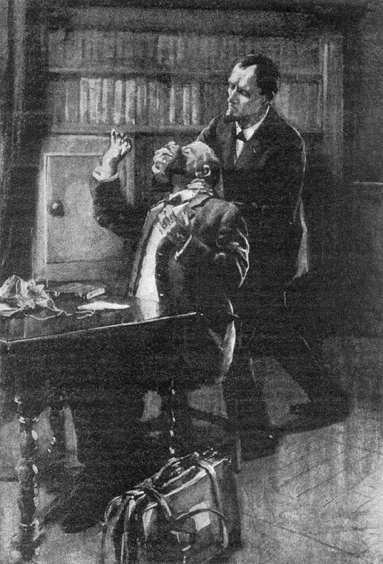

一块浸透氯仿的海绵闷住了他歪扭的鼻嘴。

“我们来上一杯，华生。”歇洛克·福尔摩斯说道，一边伸手去拿起了帝国托考伊酒瓶。

身体结实的汽车司机，一直坐在桌子那边，这时把玻璃杯赶快递过去。

“来，好酒，福尔摩斯。”

“难得好酒，华生。沙发上，我们的这位朋友，向我担保说这酒是从弗朗茨·约瑟夫<a href="#part0147.xhtml_ch14"
id="part0147.xhtml_ch14-back">(14)</a>的申布龙皇宫的专门地窖里运来的。劳驾你把窗户打开，氯仿气味有损品尝的味觉。”

保险柜半开着，福尔摩斯站在柜前把档案文件一一往外拿，迅速过目检查，整齐地放进冯·波克的旅行包里。那个德国人躺在沙发上，睡得鼾声大作，一根皮带捆住他的双臂，另一根皮带捆住双腿。

“不必慌，华生，没有人会来打扰我们。你按铃好吗？屋里没旁人，只有玛莎。玛莎贡献很大，很了不起。我一开始处理本案，就把这里的情况向她交代。啊，玛莎，你一定很高兴听到一切都很顺利。”

满面笑容的老妇人出现在书房门口，对福尔摩斯行了个屈膝礼，显得很高兴，但是皱眉看看沙发上的那个人。

“都顺利，玛莎，他一根汗毛也没损伤。”

“那就很好，福尔摩斯先生，他知书达理，倒是个很和气的主人。他昨天要我和他太太一起到德国去，可是那样就打乱你的计划了，是不是，先生？”

“是呀，不错，玛莎，有你在这儿，我就一百个放心。今天晚上我们等你的信号等了好一会儿。”

“那是秘书还没走，先生。”

“我知道。他走的时候汽车同我们擦肩而过。”

“我担心他不走了呢。我知道，他在这里，你的计划就不好进行。”

“那倒是，计划就泡汤了。大约让我们等了半个多小时，我就看见你的灯光亮了，知道可以行动了。你明天在伦敦向我报告吧，玛莎，在克拉瑞治旅馆。”

“好的，先生。”

“看来你一切都已准备就绪可以走了。”

“是的，先生。他今天寄走了七封信，我也都照样记下了地址。”

“太好了，玛莎，我明天再好好研究。晚安！这些档案，”老妇人退出，福尔摩斯继续道，“都没有什么太大用处，因为，情报当然都早已经送往德国政府。这些原件无法安全送出国去。”

“那都没用了。”

“还不能那样说，华生，至少可以让我们的人鉴别一下，其中什么已经被人家知道了，什么还没有被人家知道。要晓得，这里好多档案全是经由我的手送来的，还用说嘛，哪会真实可靠！如果让我看到德国巡洋舰按照我的计划，闯入索伦特海峡水雷区，那我这有生之年将是不胜荣耀。但是你，华生，”——他停下手里的工作，按着老朋友我的双肩——“这一阵我对你不了解，你这几年过得怎么样？看你和从前一样，还是像个轻松愉快的年轻人。”

“我觉得年轻了二十岁，福尔摩斯。我一接到你的电报，要我开车到哈里奇和你见面，我那个高兴劲儿真是甭提了。可是，瞧你，福尔摩斯——你也没有什么变呀——只是留了怪里怪气的山羊胡子。”

“这是为自己的国家工作需要，华生，”福尔摩斯说，手捋着小胡子，“明天，就成了回忆，不要它了。把头发一理，外表形象稍作修整，明天我再度出现在克拉瑞治旅馆，就去掉了这副美国佬的骗人假象，还我以前的我了——请你原谅，华生，我的一口纯正英语已经长久以来不纯正了——做个美国人的角色派派用场。”

“侦探工作你已经歇手退出了，福尔摩斯，我们都听说你过着隐士生活，养养蜂，写写书，住在南丘，一个小农场上。”

“是这样，华生，这就是我悠闲自娱、颐养天年的成果，我近几年来的力作！”他拿起桌上的书本，读出书的全名《实用养蜂手册兼论蜂王隔离法》，“是我一个人完成的，我日夜操劳、呕心沥血的成果。我过去观察了伦敦的犯罪世界，现在同样观察了这些勤劳的小小的蜜蜂世界。”

“你又重操旧业了，怎么回事？”

“啊，我自己也是想不到呀。单是外交大臣一个人来找我，我倒还能挡得住驾，可是首相也来屈尊亲临寒舍！——这个事，华生，只因为这位沙发上的先生对我国民太有用处啦。这个人独一无二，很是了得。我们好多事都出了毛病，可没人知道怎么出的毛病。怀疑有间谍，也是逮捕了一些，但证据显示，有一支强大的人马，秘密核心力量，刻不容缓，必须立即予以破获。我感到压力重大，这事我责无旁贷。足足费了我两年时间，华生，但是这两年不无乐趣，很有劲。我的这趟远游巡礼从芝加哥出发，加入布法罗一个爱尔兰秘密社团，以此起家，在斯基巴伦不断骚扰警察，最后获得冯·波克手下间谍的青睐。这个人认为我是个人才，推荐了我。你看看，这一路下来有多复杂。从那时起，我取得了冯·波克的信任。我却暗中巧使手脚让他大部分计划受挫，将他最得力的五名间谍推入监狱。我监视他们，华生，成熟一个，摘掉一个。好了，先生，但愿你睡得安好！”

那后一句是对冯·波克说的。冯·波克喘息一阵，眨巴眼睛，静静地躺着听福尔摩斯的这番话。听完就咆哮起来，用德国话一连串怒骂，气得脸在抽搐。福尔摩斯不管他如何谩骂，只顾自己快速翻检文件。

“德国话不富于音乐性，然而是一种表现力很强的语言。”他发表评论道，这时冯·波克骂得精疲力竭住了口。“啊哈！啊哈！”福尔摩斯对着一纸描摹图看了一会儿，收进放好，继续说道，“这回又要瓮中捉鳖了。原来这个薪水出纳员果真也是家贼，我注意他多时了。冯·波克先生，你肚子里有好多货呢，有得好好问你呢。”

俘虏挣扎着坐起来，目光既惊讶又恼恨，盯住逮捕他的人瞧。

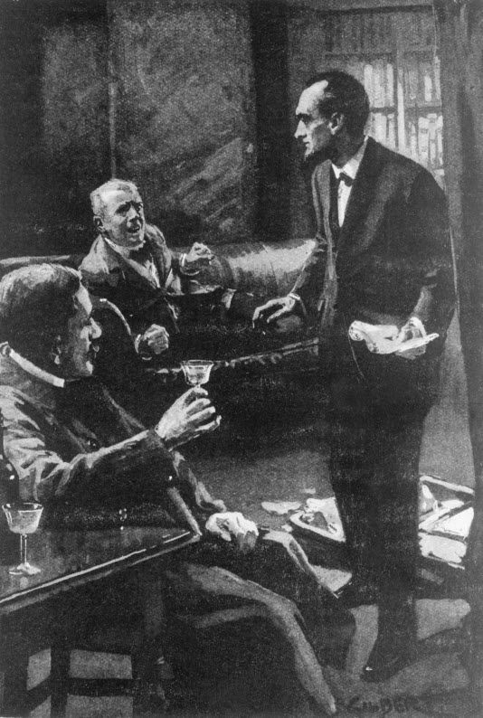

俘虏挣扎着坐起来。

“我还要和你较量，阿尔塔蒙，”他咬牙切齿一字一顿地说，“豁了命，也要和你较量到底！”

“老调重弹，”福尔摩斯说，“我都听得耳朵长老茧了。这也是死得伤心的莫里亚蒂教授爱唱的调子，还有塞巴斯蒂恩·莫兰上校，也爱唱它几回。但是我，照样活着，还在南丘那边养蜂来着。”

“诅咒你，你这个双料卖国贼！”德国人吼道，使劲地扯着捆住的皮带，瞪出眼珠，杀气腾腾。

“不，不，不是你说的卖国贼，”福尔摩斯说，微笑着，“我来老实告诉你，事实上所谓芝加哥的阿尔塔蒙先生，并无其人，只不过是我虚构的假用一名，现已作废。”

“那，你是谁？”

“我是谁，无关紧要。鉴于事情似乎很令你感兴趣，冯·波克先生，我不妨告诉你，我这已不是第一次有幸认识你们家族的人，与之打交道。我过去和德国做过大买卖，鄙人名字你也是耳熟能详。”

“报出来听听。”这个普鲁士人恶狠狠地说。

“正是我，他使艾琳·阿德勒和前波希米亚国王分手而避免丑闻曝光，那时你的堂兄亨里希正任帝国公使。也是我，他把你母亲的兄长格拉劳斯坦伯爵救出，没有遭到虚无主义者克洛普曼的谋杀。还是我——”

冯·波克惊愕地坐直了。

“原来都是同一个人。”他叫道。

“正是。”福尔摩斯道。

冯·波克沉吟一声，倒在沙发上。“那么多情报，都是出自你的手，”他高声叹道，“还有什么价值呢？我做了些什么？我永远毁了！”

“当然谈不上有什么价值，”福尔摩斯说，“都是需要查证才行，你没有时间去查证。你们的海军上将会发现，我们的新式大炮比想象的还要大，巡洋舰恐怕还要快上几许。”

冯·波克绝望地扼着自己的喉咙。

“有许多别的细节，时候一到自然都要水落石出。不过，你有一点特质，德国人中是少见的，冯·波克先生，你是位运动员，有运动员精神，当你明白，你这位屡屡以智胜人者最终反被人以智取胜，你将不会对我心怀恶意与怨恨。因为总而言之，你为你的国家已尽忠报效，我也为我的国家鞠躬尽瘁。还有什么更符合这般的自然常理？此外，”福尔摩斯把手按在这个被降伏者的肩上，不无善意地又说，“这总比倒在那种卑鄙的敌人面前要强吧。档案线索都整理好了，华生，你帮我一下，押解我们的俘虏。我想，我们该马上出发去伦敦。”

要弄走冯·波克，不是件轻松的事，他体格强壮又死命强硬。最后，两个朋友架住他的双臂，拖着他走过花园小道。只在一两个小时之前，他接受那位著名外交官的祝贺，有多自豪，走过这条小道的时候，真是踌躇满志、信心百倍。他挣扎一阵，还是被塞进汽车里去，捆手捆脚坐在小车的空座上。他那只珍贵的旅行皮拎包搁在身旁。

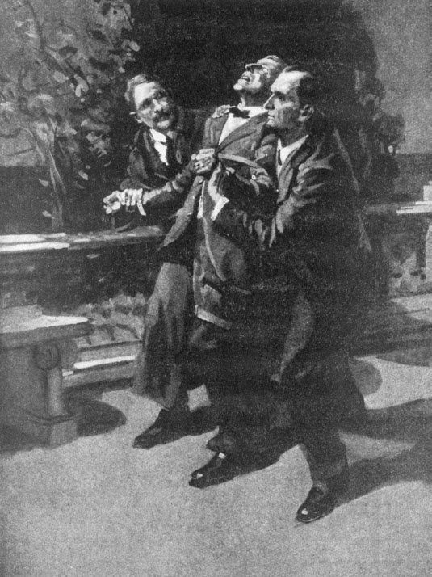

两个朋友架住他的双臂，拖着他走过花园小道。

“我相信，你能屈能伸，就委屈点吧，”一切妥当后，福尔摩斯说，“让我点上一支雪茄送进你的嘴，不算放肆无礼吧？”

可是对怒气冲冲的德国人，再殷勤友善也不讨好。

“我说歇洛克·福尔摩斯先生，你应当理解，”他说，“如果你这样对待我是出于你们政府的意志，那就是战争行为。”

“可是你们的政府，所有这种做法呢？”福尔摩斯说，手拍拍旅行拎包。

“你是个私家侦探，个人行为，你没有逮捕证可以拘捕人，整个行动程序完全非法，是行使暴力。”

“完全是。”福尔摩斯说。

“绑架德国公民。”

“还偷窃他的秘密文件。”

“好，你清楚自己的所作所为，你，还有你的同谋。经过村子我就喊捉强盗——”

“我亲爱的先生，你要是做出这种蠢事来，那正好让这里本来招牌有限的乡村客店在路口多挂一块招牌‘吊死普鲁士间谍处’，借此得以声名大振，更能招徕生意。英国人是个有耐心的民族，可是现在有点被惹火了，还是不要惹得太过分为好吧。不要这样，冯·波克先生，你还是放明白一些，安安静静跟我走，去苏格兰警场。到了那里，你可以把你的朋友冯·赫林男爵叫来。不过事情已经到了这个地步，你当然无法填补他给你空着的使馆随员的位子。回头我说华生，你还要和我们一起干老行当，据我知道，伦敦少不了你的参与。来，和我到这台阶上去站一会儿，这恐怕是我们最后一次安静谈话的时刻了。”

两位朋友亲密地交谈了几分钟，回忆着过去的日子。他们的俘虏给捆绑得结结实实，虽然一再挣扎，终是徒劳。两人转回汽车，福尔摩斯还顾盼着指指月光明亮的大海，若有所思地摇摇头。

“东风要吹起来了，华生。”

“我想还不至于，福尔摩斯，天暖和着呢。”

“华生真是个老实人！在这变化无常、不守信誉的时代，你还是个不变的标准时刻。可东风硬是要来哦，这股东风英国还从来没有刮到过，很厉害，很猛烈，华生，我们好多人都要在这阵狂风中凋零。但这依然是上帝的风，风暴过后，更加纯洁、更加美好、更加强大的国土将屹立在阳光之下。开车，华生，该是上路的时候了。我还有一张五百英镑的支票，得赶紧去兑现，万一开票人反悔止付的话，他说停就停。”

（1917年）

————————————————————

<a href="#part0147.xhtml_ch1-back" id="part0147.xhtml_ch1">(1)</a> 本篇是全集仅有的两篇以第三人称叙述的故事之一。

<a href="#part0147.xhtml_ch2-back" id="part0147.xhtml_ch2">(2)</a> 1914年8月，第一次世界大战全面爆发。

<a href="#part0147.xhtml_ch3-back" id="part0147.xhtml_ch3">(3)</a> 本茨（Benz，Karl
Freidrich，1844—1929），德国机械工程师，于1885年制造出世界第一辆内燃机汽车；本茨即成为德国名车品牌。今通译“奔驰”。

<a href="#part0147.xhtml_ch4-back" id="part0147.xhtml_ch4">(4)</a> 复仇女神们（Furies），希腊、罗马神话中的三个复仇女神，此处指英国女权运动，妇女上街示威并采取暴力行动砸橱窗等等。女权运动是民主国家妇女争取选举权，德国并没有对英国插手煽动（对爱尔兰则提供武器），此处是作者凭空所加。作者对女权主义持保守态度，尤其反对运动中的过激行为。

<a href="#part0147.xhtml_ch5-back" id="part0147.xhtml_ch5">(5)</a> 约翰牛（John
Bull），英国或英国人的绰号。

<a href="#part0147.xhtml_ch6-back" id="part0147.xhtml_ch6">(6)</a> 皇家英语［King's（或Queen's）English］，国王（或王后）英语，即标准英语。

<a href="#part0147.xhtml_ch7-back" id="part0147.xhtml_ch7">(7)</a> 托考伊（Tokay），匈牙利城镇，盛产白葡萄酒。

<a href="#part0147.xhtml_ch8-back" id="part0147.xhtml_ch8">(8)</a> 齐柏林（Zeppelin
Count Ferdinand
von，1838—1917），德国普奥和普法战争时的军官，1900年研制成功第一艘硬式飞艇，命名齐柏林号。

<a href="#part0147.xhtml_ch9-back" id="part0147.xhtml_ch9">(9)</a> 不列塔尼亚（Britannia），英帝国的拟人化称号，以头戴钢盔、手持盾牌及三叉戟的女人为象征。

<a href="#part0147.xhtml_ch10-back" id="part0147.xhtml_ch10">(10)</a> 法语：再见。

<a href="#part0147.xhtml_ch11-back" id="part0147.xhtml_ch11">(11)</a> 美国福特汽车公司（创始人Henry
Ford，1863—1947）于1908年生产出小巧轻便的T型福特车，售价仅260美元，成为低价可靠的万能运行工具而能进入寻常百姓家，福特也就以名车品牌风靡世界。

<a href="#part0147.xhtml_ch12-back" id="part0147.xhtml_ch12">(12)</a> 山姆大叔（Uncle
Sam），美国或美国政府的绰号，谑取首字母U．S．。

<a href="#part0147.xhtml_ch13-back" id="part0147.xhtml_ch13">(13)</a> 冯·提尔皮茨（Von
Tirpitz，1849—1930），德国海军上将，帝国海军大臣（1897—1916），创建德国远洋舰队。

<a href="#part0147.xhtml_ch14-back" id="part0147.xhtml_ch14">(14)</a> 弗朗茨·约瑟夫（Franz
Josef，1830—1916），即弗兰西斯·约瑟夫一世（Francis Joseph
Ⅰ）的德文名，奥地利皇帝，奥匈帝国及匈牙利国王，1914年6月28日斐迪南王储在萨拉热窝遭刺杀，即于7月28日对塞尔维亚宣战，第一次世界大战由此爆发。

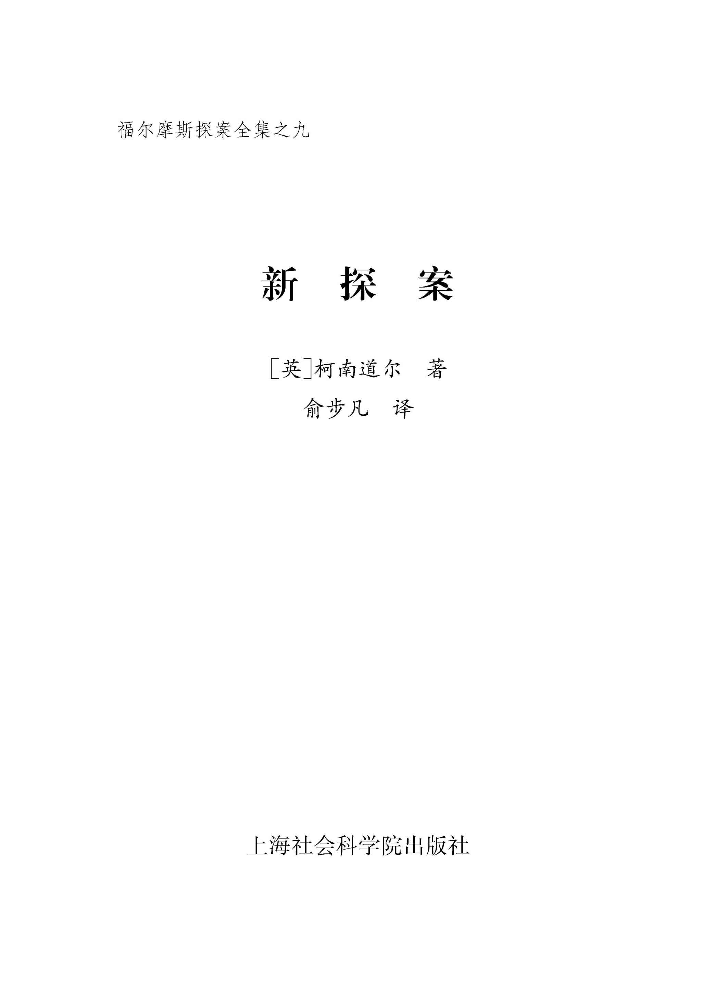

**图书在版编目（CIP）数据**

新探案／［英］柯南道尔（Conan
Doyle，A．）著；俞步凡译．—上海：上海社会科学院出版社，2012

（福尔摩斯探案全集；9）

ISBN 978-7-5520-0110-5

Ⅰ．①新…　Ⅱ．①柯…　②俞…　Ⅲ．①侦探小说—小说集—英国—现代　Ⅳ．①I516.45

中国版本图书馆CIP数据核字（2012）第159656号

福尔摩斯探案全集之九

**新探案**

------------------------------------------------------------------------

**著　　者：**［英］柯南道尔

**译　　者：**俞步凡

**责任编辑：**陈如江

**封面设计：**王小阳工作室

**出版发行：**上海社会科学院出版社

上海淮海中路622弄7号　电话63875741　邮编200020

http：//www.sassp.org.cn　E-mail：sassp@sass.org.cn

**经　　销：**新华书店

**照　　排：**南京理工出版信息技术有限公司

**印　　刷：**上海中华印刷有限公司

**开　　本：**787×1092毫米　1/32开

**印　　张：**12.25

**插　　页：**2

**字　　数：**166千字

**版　　次：**2012年10月第1版　2012年10月第1次印刷

------------------------------------------------------------------------

ISBN 978-7-5520-0110-5/I·067

定价：29.00元

------------------------------------------------------------------------

**版权所有　翻印必究**

# 目录

[序言](#part0152.xhtml)

[王冠宝石案](#part0153.xhtml)

[雷神桥迷案](#part0154.xhtml)

[爬行人案](#part0155.xhtml)

[吸血鬼案](#part0156.xhtml)

[三个同姓人案](#part0157.xhtml)

[显贵主顾案](#part0158.xhtml)

[三山墙案](#part0159.xhtml)

[军人斑面案](#part0160.xhtml)

[狮鬃毛案](#part0161.xhtml)

[退休颜料商案](#part0162.xhtml)

[蒙面房客案](#part0163.xhtml)

[肖斯科姆旧宅案](#part0164.xhtml)

[返回总目录](#part0000.xhtml)

# 序言

我担心歇洛克·福尔摩斯先生也会落得像那些一哄而起的男高音歌手一样的下场，时已过潮也落，还要勉为其难地向宽容的观众频频谢幕鞠躬、鞠躬谢幕。应该收场了，不管福尔摩斯确有其人或是虚构的形象，是结束的时候了。有人喜欢能有那么一个专为虚构人物而设的天界，一个奇妙的、不可能存在的地方。在那里，菲尔丁<a href="#part0152.xhtml_ch1"
id="part0152.xhtml_ch1-back">(1)</a>的时髦公子哥儿们依然向理查逊<a href="#part0152.xhtml_ch2"
id="part0152.xhtml_ch2-back">(2)</a>的美貌佳丽求爱，司各特<a href="#part0152.xhtml_ch3"
id="part0152.xhtml_ch3-back">(3)</a>的英雄们仍是有用武之地，狄更斯的欢乐的伦敦佬照样令人捧腹发噱，萨克雷的市侩们继续飞扬跋扈。也许在此英灵圣殿一个不起眼的角落里，歇洛克·福尔摩斯和他的华生也忝列一席之地，而另有更为精明强悍的大侦探同一位更为不精明的伙伴来占据他们曾经盛极一时的舞台。

福尔摩斯的侦探事业历时长久了——这样说并不想夸张，若有一些垂垂老矣的先生跑来告诉我，他们儿童时代就读过福尔摩斯侦探小说，我可是不敢诺诺，会令他们失望的。人们对于和自己的年纪相关的事，原本就不愿让人随意编排。冷酷的事实是，福尔摩斯不过是在《血字的研究》和《四签名》两册小书中才初露头角，那还只是一八八七年和一八八九年的事。到了一八九一年，以《波希米亚丑闻》为首篇的一系列短篇小说，陆续发表于《海滨杂志》，似乎很受大众欢迎，因而需求日增。从此以后，三十九年来，断断续续发表了几个系列的故事，迄今竟也有五十六篇之多，收编为《冒险史》、《回忆录》、《归来记》及《鞠躬尽瘁》，还有就是最近几年发表的这十二篇，也一并收入，题为《新探案》。他的探案生涯始于维多利亚<a href="#part0152.xhtml_ch4"
id="part0152.xhtml_ch4-back">(4)</a>时代的后期亦即鼎盛时期，也历经爱德华<a href="#part0152.xhtml_ch5"
id="part0152.xhtml_ch5-back">(5)</a>短暂统治期。在那个激烈竞争的年代里，福尔摩斯脱颖而出，立于不败之地。如此说法不算虚言。那些首先读到福尔摩斯的人是年轻人，尔后他们又眼看着自己的孩子读着当年同样的侦探故事长大起来。这也是显现不列颠民族所具恒心与诚心的一个范例。

我写完《回忆录》后，决定将福尔摩斯到此结束，因为我觉得我的文学生涯不能局限于单一渠道。那个脸色苍白、轮廓分明、四肢懒散的人物形象，占去了我太多的想象力。我因此就将其结束生命。但是幸而没有验尸官来对他验尸下结论。所以，在事隔一长段时间之后，我并无困难响应读者的厚爱与要求，对我的鲁莽行为加以解释和纠正，接续再写福尔摩斯。对此我并不后悔，因为我发现，这些小故事实际上并没有妨碍我在文学史、诗歌、历史小说、文艺心理学和戏剧学等诸多领域的研究和创作，而且因此发现自己在这些方面其实才能有限。即使不写福尔摩斯，我也不可能在这些方面取得更大的成就。当然，由于福尔摩斯的存在，我其他的严肃文学作品确实因此而鲜为人知。

读者诸君，现在歇洛克·福尔摩斯要告别了！我感谢诸位过去一贯的支持，在此谨希望我的回赠能使大家于繁重生活中聊补消遣，或者促使换换脑子，活跃一下，这些都是故事王国里的趣味闲话而已。

阿瑟·柯南道尔

————————————————————

<a href="#part0152.xhtml_ch1-back" id="part0152.xhtml_ch1">(1)</a> 菲尔丁（Fielding，Henry，1701—1754），英国小说家、剧作家，作品讽刺当时社会与政治，是英国现实主义小说奠基人之一。

<a href="#part0152.xhtml_ch2-back" id="part0152.xhtml_ch2">(2)</a> 理查逊（Richardson，Samuel，1689—1761），英国小说家，他的书信体小说《帕美勒》被认为是英国第一部小说。

<a href="#part0152.xhtml_ch3-back" id="part0152.xhtml_ch3">(3)</a> 司各特（Scott，SirWalter，1771—1832），英国苏格兰小说家、诗人，历史小说首创人，浪漫主义运动先驱，他的《萨克逊劫后英雄传》即是一部历史小说名著。

<a href="#part0152.xhtml_ch4-back" id="part0152.xhtml_ch4">(4)</a> 维多利亚（Victoria，Alexandrina，1819—1901），英国女王（1837—1901），印度女王（1876—1901），在位期间国内工商业迅猛发展，大力扩张世界殖民地，使英国成为世界第一强国，史称黄金时代。

<a href="#part0152.xhtml_ch5-back" id="part0152.xhtml_ch5">(5)</a> 即爱德华七世（Edward
Ⅶ，1841—1910），维多利亚女王之子，大不列颠和爱尔兰国王（1901—1910）。

# 王冠宝石案<a href="#part0153.xhtml_ch1"
id="part0153.xhtml_ch1-back">(1)</a>

华生医生很高兴又回到贝克街那二楼的房间。屋子里十分凌乱，可是许多破案的奇迹都是在这里起步。华生看看周围墙上的科学挂图，酸迹斑斑的化学实验长桌，墙角边立着小提琴盒，煤斗里依旧放着烟斗、烟丝。他的目光最后落在比利这个少年的笑脸上，一个聪明伶俐的童仆，有他在屋里，多少能把大侦探身上的怪僻阴郁气息冲淡一点，填补些他的孤独。

“一切都没有变，比利。你也没有变，我想他也没有变，对吧？”

比利忧心地朝关着的卧室门瞅一眼。

“大概，他在床上睡着了。”他说。

那是夏日傍晚七点钟，宜人的天气。但是华生医生对老朋友生活无规律、没准时，早就习以为常，所以对他在这个时间睡觉毫不奇怪。

“这看来，他手上有案子在办吧？”

“是的，先生，这一阵他很辛苦。我担心他的健康呢！他脸色不好，人也瘦了，常常不吃饭。‘什么时间用饭，福尔摩斯先生？’哈德森太太问他。‘七点半。后天，’他说。他一埋头工作，那股认真劲儿你是知道的。”

“是呀，比利，我知道。”

“现在他在跟踪什么人。昨天他化装成一个找活干的工人，今天，又变成个老婆婆，差一点没把我也骗进，真的。现在我该懂点他的门道了。”他指指靠在沙发边的一把女用阳伞，半开着没有收拢，“老婆婆全套行头，这是一件。”

“是一桩什么案子呢，比利？”

比利压低了声音，像是要谈论国家重大机密。“跟你说说没关系，先生，可不能说出去呀，是王冠上的宝石案。”

“什么——就是那桩十万英镑价值的盗窃案？”

“是呀，先生，他们一定要追回来，先生。你知道，首相、内政大臣都来我们这里，两人就坐在这个沙发上。福尔摩斯先生耐心接待他们，当场让他们把心放下来，答应会尽一切力量。以后又来了坎特米尔勋爵——”

“啊，是他？”

“是呀，先生，你也晓得啦。这个人是活僵尸，先生，我就要这么说他。我和首相很好说话，和内政大臣也不赖，没架子，挺平易近人的，可是就这个勋爵大人，我受不了。福尔摩斯先生也讨厌他。你不知道，反而倒是让他信不过福尔摩斯先生呢，不想聘请他，巴不得他破不成案呢。”

“福尔摩斯先生知道吗？”

“福尔摩斯先生是无所不知、无所不晓。”

“噢，我们当然不希望他失败，得让坎特米尔勋爵瞧瞧厉害。可我说，比利，窗前挂个帷幕做什么？”

“福尔摩斯先生三天前挂上去的。我们在帷幕后面放着个好玩的东西呢。”

比利上去把帷幕拉开，露出内阳台和凸形窗。

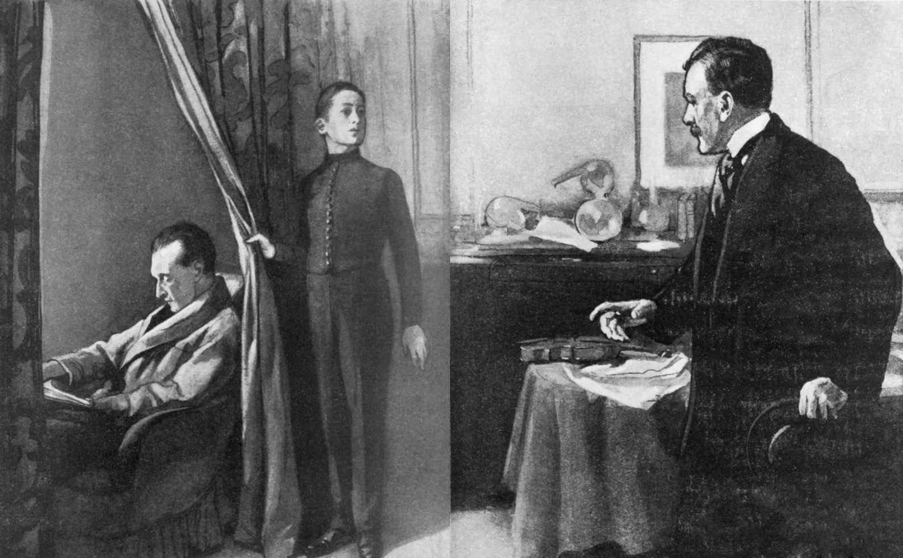

比利上去把帷幕拉开，露出内阳台和凸形窗。

华生医生不觉惊叫一声，藏的竟是他朋友的一尊本人蜡像，穿着休闲衣，装束齐全，脸偏向窗子，略低着头，像是在读书的姿势，身子深深坐在安乐椅里。比利把蜡像头取下，高高举起。

“我们把头摆出各种角度，就更显出活生生的样子了。窗帘不拉好，我还不敢碰它呢。窗帘掀起来，在街对面就能看得见。”

“这个做法我们以前也有过。”

“我还没有来吧。”比利说，他掀开一点窗帘，朝街上看，“有人，在那边远远向这里望呢。那边那个窗户，我看见有人，你过来看。”

华生刚跨前一步，卧室门就开了，瘦瘦高高的福尔摩斯走出来。他面色苍白而紧张，但举止与体态仍如以前那样干练敏捷。他一个箭步跃向窗前，将窗帘放下。

“就这样别动，比利，”他说，“刚才这样有性命危险，我的孩子。我可是少不得你哦。噢，华生，你又回老家了，见到你真高兴。你来得正是时候，关键时刻。”

“我猜也是。”

“比利，这儿现在没事。孩子也是个问题，华生。跟着我多危险，出了事怎么交代？”

“什么危险，福尔摩斯？”

“时有不测，我估计就在今晚。”

“今晚怎么啦？”

“遭暗杀，华生。”

“不可能，不可能，你开玩笑了，福尔摩斯！”

“我的幽默感尽管有限，要开玩笑，玩笑还有的是，我说的这个可不是闹着玩。不过现在没事，可以放松放松，可不是？让我喝几口酒吧？汽水机和雪茄都在老地方。仍旧坐你那把安乐椅吧，我们一切还是老样子，我挺喜欢。你大概，我希望还是没讨厌我这烟斗、这蹩脚货烟丝，不讨厌吧？这些天我都拿它来代替一日三餐呢。”

“为什么不吃饭？”

“饿一饿，思路反而清晰。噢，不用说，像你们医生，我亲爱的华生，应该知道吃东西要消化，血液集中肠胃，脑子供血就少了。我要用脑子，华生，身子其余组织是附件，所以，我是脑子优先。”

“说危险，怎么回事呢，福尔摩斯？”

“啊，是的，假如危险果真发生，那就要借助你的脑子记忆了，记住凶手的名字、地址，去找苏格兰警场，顺便代我向他们告别、祝福。凶手名字叫西尔菲乌斯——内格雷托·西尔菲乌斯伯爵。记一下，朋友，记下来！莫塞德花园西北一三六号。记下了？”

华生那张忠厚的脸急得抽搐，他很明白福尔摩斯面临着极大的危险，也很清楚他嘴上所讲的，只会轻描淡写，绝无半点夸张。华生向来是个行动派，这时便当机立断。

“算我一个，福尔摩斯，我这两天正好没事。”

“你的品德差劲了嘛，华生，你学起了新花样，骗起人来了。看你模样就是个大忙人，看诊忙得不可开交，每个小时都有人上门来求医。”

“再怎么忙也没有你这个事重要。你干吗不把那个人抓起来呢？”

“是呀，华生，我可以抓，对方也正怕我这一手。”

“那干吗不下手呢？”

“因为尚不清楚宝石被弄到了什么地方。”

“啊！比利和我讲的——失窃王冠宝石！”

“是的，一颗光芒闪耀的硕大蓝宝石。我张开罗网，鱼已入网，但是不见那宝石，这样只抓人有什么用呢？我们捉了这些人可以为社会除害，但这样还不够，我要的是找回宝石。”

“这西尔菲乌斯伯爵也是你网中的鱼？”

“是呀，而且是条鲨鱼，要吃人。另一条是塞姆·默顿，一个拳击手。塞姆，原还不是个坏人，叫伯爵给利用了。塞姆不是鲨鱼，而是一条大头鱼，傻乎乎给人作钓饵，也成了我网中之物，在乱扑腾。”

“这西尔菲乌斯伯爵在哪里？”

“今天上午我与他并肩而行。你以前也曾见我扮成老太婆，华生，可都没有这一回满意。他还真为我捡起掉在地上的阳伞呢。‘对不起，夫人。’他说——他半是意大利人，你知道，高兴起来，特有南欧人的热情礼貌，但是一个不对劲，便是魔鬼的化身。生活万变莫测，人世无奇不有，华生。”

“他要制造事端，杀人。”

“是呀，是这样。我跟踪他到米诺里斯，斯特劳本齐老店。斯特劳本齐是做气枪的——做得相当精巧，据我晓得。可以预料，此时对面的窗上，有把枪对准这里。蜡像你见到了吧？肯定是比利让你看的。哦，这漂亮的蜡像脑袋，随时都有被子弹洞穿的可能。啊，比利，什么事？”

童仆又进来，端上托盘，放有一张名片。福尔摩斯看一眼，便扬眉好笑。

“此人亲自登门，这一招很出人意料。收网吧，华生！这家伙有胆量。他名声不小，你该有所耳闻吧，是狩猎猛兽的专业行家。他这项运动史的纪录上若能将我忝列末位，对他来说，倒是辉煌胜利，胜利辉煌。现在已经证明，他感觉到我踩上他脚跟了。”

“叫警察。”

“要叫的，现在不叫。你窗外小心看着，华生，街上有没有形迹可疑的人？”

华生从窗帘边的空隙张望。

“有，门口不远，一个彪形大汉。”

“那就是塞姆·默顿——忠心而愚蠢，这个塞姆。来的先生在哪里，比利？”

“在会客室，先生。”

“听我按铃，你再带他上来。”

“是，先生。”

“要是没看见我在屋里，也照样把他领进来。”

“是，先生。”

华生在一旁，等着把门关上，看着同伴心中很是焦急。

“听我说，福尔摩斯，这可不行。这个人是亡命之徒，不顾一切，企图行刺你。”

“我不怕。”

“我一定保护你。”

“你会碍事。”

“碍了他的事？”

“不，我亲爱的朋友——碍我的事。”

“不，我说什么也不能离开你。”

“不，你得走，华生。你听我的，你从来没有违背过我的主意。这个人，当然无事不来登宝殿，可是我将计就计，他会反被我利用。”福尔摩斯拿出笔记本疾笔写了几行字。“搭车去苏格兰警场，交给侦查处尤格尔。你和警察一起回来，随即就可以把这个家伙逮捕。”

“这一着叫他好看。”

“你回来之前，我有足够时间可以发现宝石在什么地方。”他按铃，“走，我们从卧室出去。这第二出口就是以备不时之需。我们要看看他这条鲨鱼怎么样，他看不见我，我看得见他。我自有办法，你会知道，我怎么对付他。”

于是，一分钟之后，比利引领西尔菲乌斯伯爵进来的时候，房内已是空空如也。这个大名鼎鼎的打猎高手、运动家和花花公子，身材高大，皮肤黝黑，威武的翘须覆着凶残的嘴，其上吊起一根长而弯的鹰钩鼻。他全身穿着考究，花色领结，闪光别针，晶亮戒指，上下一派浮华之气。身后房门一关，他瞪着凶狠的眼睛，四下打量，仿佛防备步步危机，处处陷阱。接着便是令他猛地一惊，他看到了窗前椅背上露出一动也不动的脑袋、睡衣的领子。他一见之下，惊惧而杀气腾腾的黑眼珠闪出希冀之光，贼眼再向四周环顾一圈看看，确定没有旁人在场，就抡起粗重的手杖，蹑手蹑脚走向静坐的人，身子一缩正要窜上去，砸下手杖，突然，卧室门开，一声冷笑把他喝住。

“住手，伯爵！不要打坏了！”

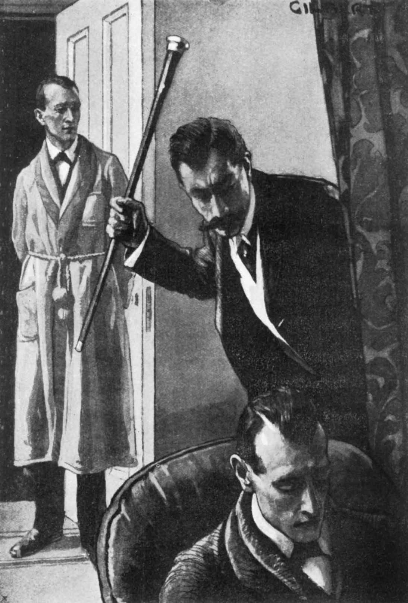

“住手，伯爵！不要打坏了！”

刺客吓得往回一蹲，惶惑的脸面在痉挛。顷刻间他又举起灌铅手杖，那架势还要从假人转向这边的真人，但是，那沉静的灰色眼眸和嘲讽的微笑逼得他两臂垂向身旁。

“这件艺术品蛮不错，”福尔摩斯说道，大步走向蜡人，“法国雕塑家塔韦尼埃的作品。他制作蜡像技术之高，如同你的朋友斯特劳本齐制作的气枪一样。”

“气枪，你是说？什么意思？”

“把你的帽子、手杖搁一边桌上去。谢谢你！请坐。不妨也把手枪摘下，放在外面吧？哦，行吧，要带着坐也听便。你来可是正巧，我原本就很想找你，稍有点儿事聊聊。”

伯爵紧皱浓浓的凶眉。

“我，也是，有话，要和你谈，福尔摩斯，所以，我才来这儿。不否认，刚才我是想敲了你。”

福尔摩斯的一条腿跷向桌子边。

“我猜到，你早在动这个脑筋，”他说，“可是这种个人恩怨又是何必呢？”

“因为你管得太宽太过分，不让我太平；因为你派人断我的路。”

“我派人？绝对没有的事！”

“装什么蒜！都叫我的人反而给盯住了。两军对阵，有来有往嘛，福尔摩斯。”

“哦，不足为奇，西尔菲乌斯伯爵。不过，先请你提到鄙人姓名最好有个称呼。要晓得，我干这一行，惯例只有流氓这帮子人才放肆直呼我的姓，所以我想你会同意，不循常礼过于犯忌吧。”

“好吧，就称你福尔摩斯先生。”

“这才差不多！老实跟你说，说我派人跟踪你，你实在是冤枉人。”

伯爵轻蔑地笑笑。

“人家也是肚明眼亮看得很清楚，又不是只有你。昨天，一个糟老头，今天，一个老太婆，他们整天都盯住我。”

“有这事，先生，承蒙你恭维了。昨晚被处了绞刑的道森老男爵说过，说是司法界有了我，戏剧界就少了我，你现在也是对我的演技褒奖有加了？”

“那是你——你自己？”

福尔摩斯耸耸肩。“你看墙角，那顶女人阳伞，承蒙你好意替我从地上捡起来，就在米诺里斯，之后你才感到怀疑。”

“我要是早知道，保管你别想——”

“别想回得了这间陋室，我明白这点。我们都有一时疏忽，错失了机会。就因为你当时不知道是我，所以才有现在的见面！”

伯爵浓眉打起了重结，压在凶光可怕的眼睛上。“你这么一说，把事情弄得更糟。原来不是你派的探子，竟是你自己化装扮演，亲自出马盯住我！你承认是你盯住我，为什么？”

“要说这个嘛，伯爵，你过去是在阿尔及利亚猎狮子的。”“怎么样？”

“是为什么呢？”

“为什么？那是体育运动——刺激——冒险！”

“还有，为民除害吧？”

“很对！”

“那我的理由也一样是这个呀！”

伯爵跳起来，手不由自主地伸向后裤袋。

“坐下，先生，坐下！还有另一层理由，更实际的原因。我要宝石！”

西尔菲乌斯伯爵狞笑一下，坐回椅中。

“怪不得！”他道。

“你是知道的，我为那个追踪你。你今晚来这里的真正原因是想摸一摸我的底，看我对这件事知道多少，是否有必要杀掉我。好，我不妨说，按照你的观点，那是绝对必要，这我清楚，只有一点不是，正要你告诉我。”

“哦，确实！可是请问，你指的是什么？”

“王冠宝石，现在在什么地方。”

伯爵瞪对方一眼，“哦，你要知道这个，对不对？凭什么我就能告诉你在什么地方？”

“你能，你会告诉我。”

“我怎么能？”

“你骗不了我，西尔菲乌斯伯爵。”福尔摩斯两眼盯住他，两道目光越聚越紧，像两把利箭穿透他的心窝，“你遮掩不住，我看得你一览无遗。”

“这么说，你当然看到宝石在哪里了！”

福尔摩斯拍手大乐，又轻慢地伸出一个指头点点他。“哈，你露出狐狸尾巴了，你承认了你知道。”

“我什么也没承认。”

“好啦，伯爵，你放明白点，咱们来做做交易，要不然，你准吃亏。”

西尔菲乌斯伯爵翻眼望望天花板。“你想唬我！”他说。

福尔摩斯定定地望着他，如同一位弈棋高手思索着下一步如何将死对方，随后便拉开书桌抽屉，拿出一本厚厚的笔记本。

“知道这里头都是什么吗？”

“不，先生，我怎么知道？”

“都是你的！”

“我的？”

“是的，先生，你的事！你的事都在里头——你的亡命罪犯生涯。”

“混蛋，福尔摩斯！”伯爵两眼冒火，吼道，“你叫我忍无可忍。”

“一切都在这里，伯爵，全部事实。譬如哈乐德老太太的死亡真相，她把布莱默的产业留给你，可是被你一下子全部赌光。”

“你在说梦话吧！”

“明妮·瓦伦小姐的一生遭遇。”

“哼！你什么也捞不到！”

“还有的是呢，伯爵。这个，一八九二年二月十三日，里维艾拉火车上头等车厢抢劫案。这个，同年，伪造里昂银行支票案。”

“不，你这儿讲得不对。”

“那就是说我别的地方都讲对了！我说伯爵，你是打牌老手，王牌都在对方手里了，你干脆早早摊牌认输，不必浪费时间。”

“你说的这些，跟你刚才讲的宝石有什么相干？”

“放心，伯爵，不用着急！我讲话一向不喜欢太猴急，现在给你说到关键上吧。我有那么多证据都对你不利，但是所有那些先且不说，我现在办的案子，是你和你的杀手犯下的王冠宝石案！”

“胡说八道！”

“马车夫，送你到白金汉宫的马车夫，把你带走的马车夫，都在我手上掌握着。还有一个信差，他在案发地目击过你。艾奇·桑德斯也在我手中，他拒绝帮你分割宝石。艾奇已经告发了你。你已是全盘皆输。”

伯爵额上青筋暴起，一双毛茸茸的大手紧握着，因强压怒火而颤抖。他想说话，可是一个字也吐不出来。

“这就是我打的王牌，”福尔摩斯说，“我把牌都摊在桌面上，可是还缺一张牌，一张钻石老K，不知宝石在何方。”

“永远不会让你知道。”

“永不知道？现在，放明白点，伯爵，睁大眼睛看看形势。你要吃官司吃上二十年。塞姆·默顿也一样，那你要宝石有什么用呢？毫无用处。但是，你要是交出来——那就好，你这些重罪我来替你了断。我们不要你和塞姆的人，我们只要宝石。交出来算了，我这里马上让你自由，以后只要你谨言慎行，就行了。如果你再重操旧业——那，下不为例，这一次我的任务主要在取回宝石，并非抓人。”

“我拒绝呢？”

“哦，那就——没办法呀！——拿不回宝石，就抓你人。”

比利应刚才的铃声已经进来。

“我说，伯爵，不如也让你的朋友塞姆一起来商量，毕竟，他也是利害关系人，应该到场。比利，门外有位粗里粗气的先生，莽大汉，请他上来。”

“他不上来呢，先生？”

“不要硬来，比利，不要对他粗鲁，只要告诉他西尔菲乌斯伯爵叫他，他一定来。”

“你要做什么？”比利一走，伯爵问道。

“我的朋友华生刚才和我在一起，我告诉他，我的渔网里有一条鲨鱼，一条大头鱼，现在我要收网，两条鱼一网打尽。”

伯爵从椅子上站起来，手背在身后。福尔摩斯握住睡衣口袋里半突起的家伙。

“你不得好死，福尔摩斯。”

“我本就有这种准备，这又有什么关系呢？可是你，伯爵，你自己一定难免竖着断气，而不是睡着身亡。不过讲这种未来的事又何必呢，不正常，为什么不让我们自己眼前有福不享？”

这个魔头黑眼珠马上射出野兽般凶光，看那狠劲想要动手。福尔摩斯的态势与他是道一尺魔高一丈。

“动枪是很不明智的，我的朋友，”他说，声音镇定，“你自己其实也清楚，你不敢开枪，即使说我给你有时间掏枪的话。枪，不是好家伙，声音太大，我说伯爵。还是用气枪好。啊！我想是贵友的脚步声，应邀来到。你好，默顿先生，街上挺冷清，是吗？”

这个职业拳击手，壮实的年轻人，有一张愚蠢、颟顸的瘦长脸，傻大个儿一尊，站在厅门口，困惑地向屋里瞧瞧。福尔摩斯温文有礼的态度他似乎从未见识过，虽然懵懵懂懂觉得有敌意，也不知该如何应对。他转向狡猾的同伙征求主意。

“在玩什么花样，伯爵？这个人要怎么说？怎么回事啦？”他的粗嗓门低沉沙哑。

伯爵耸耸肩，还是福尔摩斯作出回答。

“简单一句话，默顿先生，我该说一切都已经了结。”

拳击手还是只对着他的同伙讲话。

“这家伙闹着玩儿，还是怎么回事？我这会儿可没工夫搞啥玩笑！”

“不，我不希望是开玩笑，”福尔摩斯说道，“我想，我可以保证，到了晚上，你就是要笑也笑不出来啦。好了，就这样了，西尔菲乌斯伯爵，我是个忙人，时间耽搁不起，我要进卧室了。我不在这里，你请随便就是了，不用客气。我不在，也就没有拘束，你可以向你的朋友解释事情是怎么个情况。我去练一下小提琴：霍夫曼的《威尼斯船夫曲》。五分钟，回头听你最后答复。怎么权衡选择，应该很好决定了吧？让我们抓你呢，还是让我们取回宝石？”

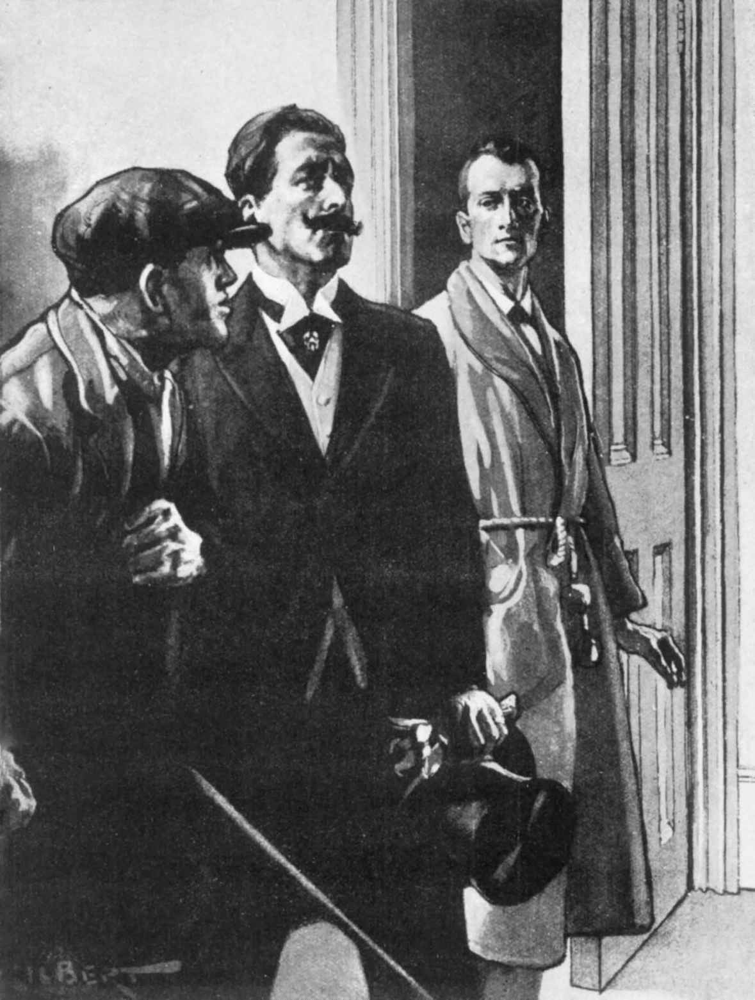

“我去练一下小提琴。”

福尔摩斯转身就走，顺手在墙角拿起小提琴。不一会儿，从关着门的卧室里传出哀婉悠扬的曲调。

“怎么回事哦，到底？”默顿着急地问，他的同伙还朝着他呆望，“宝石给他知道啦？”

“这混蛋看来知道得还真不少。吃不准他，是否全被他知道了。”

“我的老天爷！”拳击手的灰黄脸转白了。

“艾奇·桑德斯坏了咱们的事儿。”

“是他，真是他？我绝对给他好看，我上绞架也要杀了他。”

“这也没用，还是赶快决定该怎么办。”

“等一等，”拳击手说，疑惑地朝卧室门望望，“这个家伙鬼得很，得监视他，我怀疑他在偷听！”

“拉曲子还能偷听？”

“倒也是。不过也可能有人藏在幕布后面呢！这屋子里怎么挂那么些幕布帘！”他朝四周一打量，这才发现窗前那尊人像，呆呆地看着，用手指指，愣愣地说不出话。

“嗨！那是蜡像。”伯爵说。

“假的，啊？哦，吓了我一大跳！杜莎夫人<a href="#part0153.xhtml_ch2"
id="part0153.xhtml_ch2-back">(2)</a>蜡像馆都无法比哪！活生生像他，穿的衣服，一模一样。那些幕帘子，干啥？伯爵！”

“哦，别管它幕帘了！我们时间来不及呢，没多少时间了。这宝石的事，他要把咱们押起来。”

“这混蛋他敢！”

“只要告诉他宝石弄到哪儿了，他就放了咱们，没事了。”

“啥？交出去？交出十万镑？”

“路只有一条。”

默顿挠着平头脑壳。

“只他一个人，咱把他做了，叫他闭嘴出不了声，咱就什么也不用怕了。”

伯爵摇摇头。

“他有枪，有准备。我们一开枪，在这样的地方，很难脱得了身。另外，看样子，他掌握的情况也都给警方通报了。啊！什么声音？”

窗户那边似乎有什么声响，两人转过身去看，可是什么也没有，只有蜡像静静地坐在椅子上，室内依旧空空荡荡。

“是街上的声音吧，”默顿说，“这关头上了，我说头儿，就看你动动脑瓜子了，你会出招对付。干掉他不行的话，那看你怎样整他了。”

“比他厉害的人，我都能玩得转，”伯爵应答道，“宝石就在我身上，贴身藏着，我绝对一刻也不离身。今天晚上该送出国，星期天之前在阿姆斯特丹切割成四颗，他不知道还有范·塞达尔这个人。”

“我原以为范·塞达尔要下星期才动身。”

“原本是这样，可现在这情况，这班船一定要走。现在你我得有一人带着宝石快溜出去，快到石庞街告诉他。”

“可是假夹底还没有准备好，不藏好在夹底带着走很不保险。”

“哦，也就这个样子带走吧，一定得碰碰运气，因为时间一刻也等不得了。”这个运动家更觉得危险迫在眉睫，他顿了一顿，再瞪着眼珠朝窗口看看，没错，刚才那轻轻的声响是街上传来的。

“那福尔摩斯，”他继续道，“我们要把他骗过，那还不容易！你知道，他这个蠢货只要宝石，不抓我们。好吧，我们答应给他宝石，提供他错误线索，等他发现上当受骗，宝石已到了荷兰，我们都出国了。”

“噢，我说，好主意！”塞姆·默顿咧嘴笑道。

“你去，告诉荷兰人要赶紧行动。这边这个笨蛋，我来对付，给他个假口供误导他，告诉他宝石在利物浦。他还在拉他该死的哭丧调，讨厌，听得我脑袋发胀！等他发现宝石根本不在利物浦，宝石早已分作四块，我们也漂洋过海啦。到这边来，躲开那钥匙孔，给你宝石。”

“你真有胆量，敢这么带在身上。”

“还有哪里比这样更安全？我们能从白金汉宫偷出来，也会有人从我们屋子里偷出去。”

“让我好好瞧瞧。”

西尔菲乌斯伯爵鄙视地瞥一眼他的同伴，没理那只伸过来的脏手。

“怎么——你还怕我抢了你？瞧你，我说头儿，你这样，我还犯不着呢。”

“行了，行了，别动火，塞姆，都这时候了，还吵什么！到窗口来，你看个仔细有多美。拿好对着亮光！拿去！”

“谢谢啦！”

一个纵身，福尔摩斯从蜡像椅上跃前一步，一把夺过了珍宝，一手捏住宝石，一手把枪口对准伯爵脑袋。两个歹徒往后退缩，变得目瞪口呆，还没回过神来，福尔摩斯已按了电铃。

“别动手！先生们——别动手，请安静！免得打坏家具！看清楚了，你们的处境，反抗是没有用的，警察已在楼下。”

伯爵困惑莫名，还来不及发怒和惧怕。

“可，可你究竟打、打哪——？”他喘着气。

“不怪你这么惊奇。你没有觉察到，我房间有第二道门，通到这帷幕后面。我知道，掉换蜡像我自己坐好这一刹那工夫，你听见有声响，不过好运是在我这一边，结果你们的窃窃私语全让我听到。要是你们觉察我在场，你们的谈话决不会那么起劲儿生动了。”

伯爵一摊手，只好作罢。

“我们算是服了你，福尔摩斯，我看，你不愧是个魔王。”

“差不多，可以这么说。”福尔摩斯谦和地笑笑答道。

塞姆·默顿反应迟钝，半天没出声，搞不明白到底是怎么回事。这时，外面楼梯上响起沉重的脚步声，他才张口讲话。

“这一把抓得漂亮！”他说，“可我说，那小提琴还在拉着！不是还响着吗？我听到在响呢！”

“哈哈！”福尔摩斯答道，“不错，让它去唱吧！留声机真是件了不起的新发明。”

警察一拥而入，手铐喀嚓两下，两名罪犯被押上等着的马车。华生留了下来，祝贺福尔摩斯在他的荣誉史上又添了光辉的一页。两人的谈话再一次被沉着的比利打断，他又呈上名片托盘。

“坎特米尔勋爵驾到。”

“请他上来，比利，这位代表最高层的贵族名流，”福尔摩斯说，“他德高望重，就是过于保守刻板。我们与他反其道而行之怎么样？放肆一下跟他开个玩笑如何？刚才发生的事情，想必他还不知道。”

门开处，进来一位精瘦、威严的人，清癯的长脸上，垂着维多利亚中期式的乌亮鬓须，这与他的肩膀圆垂、举步轻缓的姿态不相协调。福尔摩斯上前热情迎接，握住那反应冷漠的手。

“您好，坎特米尔勋爵！这季节的天气已经很凉了，屋里挺暖和，我来帮您脱大衣？”

“不必，谢谢你了，不想脱大衣。”

福尔摩斯还是按着袖口不放手。

“还是脱一脱吧！我的朋友华生医生会告诉您，一会儿冷一会儿热的温度变化最有碍身体健康。”

这位贵族大老爷仍然推托，很不耐烦。

“我感觉挺舒服嘛，先生。也不想多停留，不过是来问问，想知道，你自告奋勇接手的任务进展如何啊？”

“有点困难——很困难。”

“我早料到，你会有困难。”

这位老大臣的言语神态之间，显出毫不掩饰的讥讽。

“人人都有自己的局限性，福尔摩斯先生，所以人也必须有自知之明才好。”

“是的，先生，在下糊涂。”

“那早该知道。”

“尤其是有一点，还望您能予以指点、帮忙。”

“你现在求我指点，为时太晚了，我还以为你早有把握，一定能马到成功呢。不过，我现在还是愿意帮你一把。”

“您知道，坎特米尔勋爵，我们当然要将真正的窃贼绳之以法，这没问题。”

“你先逮住了人再说。”

“那当然。但问题是——收赃的人我们该怎么起诉呢？”

“现在谈这个问题，不是太早了点吗？”

“也该早点考虑，及早计划才是。那么，您认为凭什么证据确定收赃的人呢？”

“看宝石落到了谁手里。”

“根据这一点您就可以将他逮捕？”

“那当然了。”

福尔摩斯的大笑人们难得见到，可是这回他竟开怀大笑，他的老朋友华生记得这是绝无仅有。

“那样的话，我亲爱的先生，我不幸奉告，您要被逮捕了。”

坎特米尔勋爵勃然大怒，蜡黄的脸上肝火上升。

“放肆！福尔摩斯先生！我为官五十年，从不曾有人敢这样对待我。我公务繁忙，职责重大，先生。我没时间，也没兴趣来开无聊的玩笑。老实告诉你，先生，对你的能力，我从来就不相信。我也一直说，这个案子早应该交给官家警方处理才靠得住，你现在的行为，证实我的看法一点也没错。晚安，先生。”

福尔摩斯迅即上前一步，挡住门，拦住勋爵老爷的去路。

“等一下，先生，”他说道，“把王冠宝石带走，罪状要比暂时持有严重得多。”

“先生，太不像话了！让我过去！”

“您大衣的右口袋里，是什么东西，拿出来！”

“你什么意思，先生？”

“别走，别走，您拿出来。”

一会儿工夫，惊讶莫名的勋爵站在那里，目瞪口呆，颤抖的手掌上是一颗金光闪亮的硕大宝石。

“怎么、怎么、怎么回事，福尔摩斯先生？”

“太抱歉，坎特米尔勋爵，太抱歉！”福尔摩斯高声道，“我的老朋友在这里，可以告诉您我有个习惯，也是个小毛病，爱开个玩笑。我从不拒绝制造点戏剧效果。恕我冒昧——非常冒昧，应当承认——我们一见面的时候，就把宝石放进了您的口袋。”

老勋爵看看宝石，又看看面前这张笑脸。

“先生，我搞糊涂了，不过——是的——这确实是王冠宝石。我们对你实在感激之至，福尔摩斯先生。你的幽默感，正如你所说，也实在把人搞得晕头转向，表现也太不合时宜。但是，你的专业才能令人十分敬佩，我刚才的批评至少应当收回。但是怎么——”

“案子只办完一半，细节有待补充。没问题，坎特米尔勋爵，您回去向高层报告破案成功，一定心情愉快，这或可稍稍弥补我的恶作剧之过吧。比利，送送勋爵老爷，再告诉哈德森太太，能快点送两客晚餐上来，不胜感激。”

（1921年）

————————————————————

<a href="#part0153.xhtml_ch1-back" id="part0153.xhtml_ch1">(1)</a> 本篇是全集仅有的两篇以第三人称叙述的故事之一。

<a href="#part0153.xhtml_ch2-back" id="part0153.xhtml_ch2">(2)</a> 杜莎夫人（Madame
Tussaud，1760—1850），瑞士蜡像制模师，伦敦杜莎夫人蜡像陈列馆创办人（1835），曾任法国宫廷艺术教师，法国大革命时下狱，1802年移居伦敦。

# 雷神桥迷案

在查令十字街的考克斯银行的金库，有一只铁皮箱，因久经旅行搬运已经旧损，箱子上有我的名字：前驻印度陆军军医约翰·H．华生医学博士。箱子里塞满着纸，几乎全部是歇洛克·福尔摩斯从前历次刑侦探案的文字材料。有的案子不全，并未了结，又索然无味，也就少作记述，因为都是没有结局可予解释的。一件疑难案子没有结论，对于研究者也许依然很有兴趣，但对于一般读者不免乏味而生厌。在这些未完成的故事中，有一件是詹姆斯·菲利莫尔先生刚出门又折回家去拿雨伞，却从此世上不见其人。另外有件比这个更奇特的案子，有一艘独桅帆船阿丽西亚号，春天一日早晨驶入一片海雾中便不见踪影，连船带人全部消失得干干净净。第三桩值得一提的案子是一位名记者，伊撒朵拉·伯桑诺，以好与人决斗闻名，突然有一天，两眼瞪着火柴盒就完全疯掉，火柴盒中有一条蠕虫，科学界人士都称不识其类。除了这几件无法索解的案子，还有一些则是牵涉到家族秘闻，这类隐私一旦公开发表，势将引发上流社会的恐慌。不用说，这种不讲诚信的事，我们是决不会做的。所以，应当趁我的朋友目前有精力处理时，把这类案件资料整理出来加以销毁。还有相当数量的案件或多或少总有令人感兴趣之处，本来可以编辑出版，但恐怕有出版过滥之嫌，反而会影响我推崇备至的朋友的盛名。有些案子我曾亲自参与侦破，可以以目击证人身份发言，有些则并未参与，或者仅只稍有听闻，所以只能以第三者的口气叙述。但下面记述的案子则是我亲身所经历。

那是十月的一天清晨，秋风萧瑟。我起床穿衣，望着屋后那棵给庭院增色的孤树法国梧桐，看枝上残叶随风卷去。之后便下楼用早餐，心想肯定会看到我的同伴不悦的神色，因为他像所有伟大的艺术家一样，极易触景生情，情随境迁。没想到恰恰相反，我发现他快要吃完早餐，神情居然特别开朗，喜形于色，还带着点他轻松起来特有的那种诡异的兴奋。

“有案子了，福尔摩斯？”我问。

“推理演绎之功具有感应力，华生，”他回答，“也促使你推理起我的秘密了。不错，我接了案子。一个月无所事事，停滞不动，如今车轮又转起来了。”

“要我参与吗？”

“没有什么可以参与，但可以讨论。鸡蛋是新厨子特地帮我们煮的，煮老了。这两个你先吃了再说。煮老了这个事实与一本《家庭指南》不无关系，我昨天在厅桌上看到的。即使渺小如煮鸡蛋这种琐事，也要求切实注意火候、时间，这与这本优秀杂志中那些爱情罗曼史相互有矛盾。”

一刻钟以后，餐桌清理干净，我们面对面坐定。他从口袋里抽出一封信。

“奈尔·吉布森，这个金矿大王你听说过吗？”他问。

“你是说美国的一个参议员吧？”

“不错，他曾经当过西部一个州的参议员，但是现在更是以世界金矿巨头而闻名。”

“是的，我知道。他在英国也住过一段时间，这个名字大家都很熟悉。”

“是呀，五年以前他在汉普郡买下一座很大的农庄。你大概听说了他妻子的死讯吧？死得好惨。”

“噢，对了，现在我想起来了，他的名字大家之所以熟悉，就是由于这个原因，但是详细情况我不清楚。”

福尔摩斯朝一把椅子上的报纸挥挥手。“没想到这个案子会落到我的手上，否则我早就应当做点摘录准备了。”他说，“事实上，这件案子虽然极其骇人听闻，但从表面上看起来断案不难。被告品貌给人以好感，令人同情，但掩饰不了杀人凶犯的铁证如山。验尸陪审团，还有治安法庭处理下来，都持相同的观点。现在案子都已经移交温切斯特巡回法庭审理了。已到这个份上，我怕是件劳而无功的事。我即便发现另有实情，华生，也无法推翻既定事实，除非，重新发现完全出乎意料的事实，能兜底翻掉，所以我看我的委托人没有希望。”

“你的委托人？”

“啊，我忘了还没告诉你。我也受你影响，华生，养成讲故事似的倒叙习惯了。那你最好看看这个。”

他递给我信，笔迹雄健粗犷的手札，信上写道：

克拉里奇饭店

十月三日

亲爱的歇洛克·福尔摩斯先生：

我实在不能眼睁睁看着上帝所造最美好的女子被推向死亡，而不尽力予以相救。我不能解释事情原委——连试图解释都是不可能，但绝无疑义地知道邓巴小姐是清白无辜的。你已知道案情事实了吧——谁还不知道呢？全国议论纷纷，却没有一个声音出来为她讲话！这是绝对的不公正，使我要发疯。该女子心肠之软都不忍去伤害一只苍蝇。我明日十一时将登门拜访，亟盼你能于黑暗中找出一线光明。也许我能提供一点信息而自己未必意识到。不管如何，尽我所知，尽我所有，尽我所能，一切为你所用，惟一希望你要救她。你生平所显卓越才能，请全力以赴于本案吧。

您忠诚的

J．奈尔·吉布森

“你明白了，就这个事，”福尔摩斯说，把早餐后一斗烟的烟灰磕掉，又慢慢装上一烟斗，“就是这位绅士，我等他。至于故事详情，你已来不及从这许多报纸上去搜集，还不如我粗略告诉你一个大概，你若是对诉讼程序有兴趣，可以多加思考。此人是世界首富，也是，按我的理解，最狂暴、最可畏惧的人。他娶有一妻，本案悲剧的受害人。这妻子，情况我不了解，只知她已过风韵年华，这就造成不幸。家中有个美貌动人的年轻家庭女教师，负责管教两个孩子。就是这三个，涉案相关人，地点是一栋古老的大庄园，该地区原是英国历史上的政治中心。好，案情是这样，妻子死于离屋子半英里远的地方，于深夜被发现，身着晚宴小礼服，肩上围披肩，一颗左轮手枪子弹穿入脑部。身旁没有发现武器，附近没有谋杀迹象。周围不见有武器，华生——注意这点！案发时间大概是黄昏稍晚，发现时间是十一点，一个守林人碰上的。尸体移进屋子以前，警察和医生验过现场。这么说太简略了，你能听明白吗？”

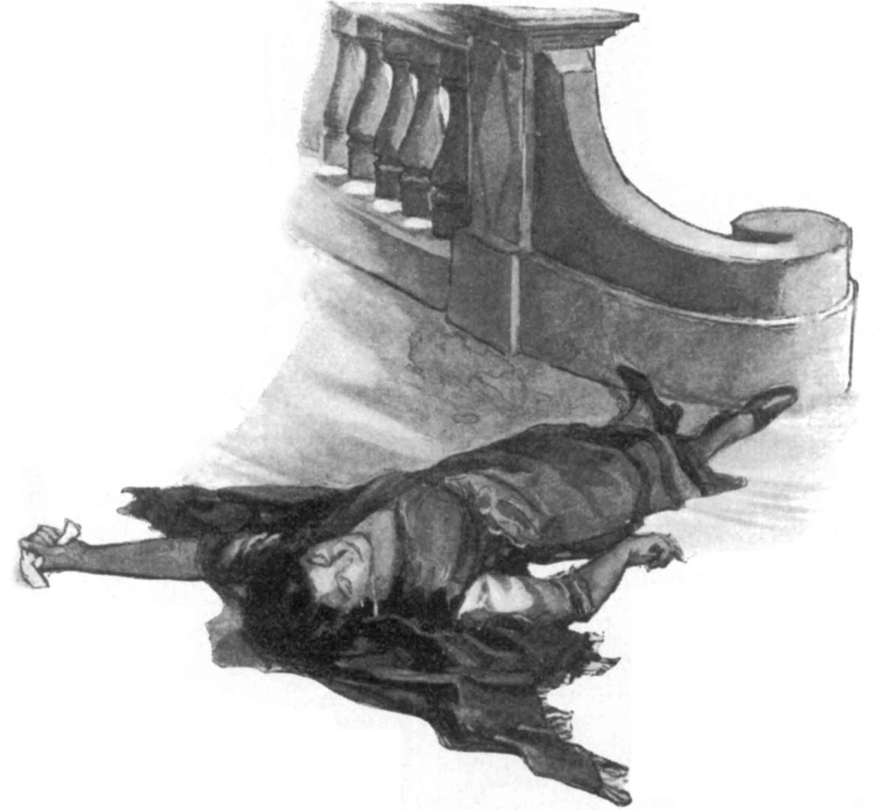

一颗左轮手枪子弹穿入脑部。

“都清楚。但是为什么怀疑女教师？”

“噢，首先是有直接证据。在她的衣橱底板上发现一支左轮手枪，弹膛开过一发子弹，口径同枪杀的子弹相符。”福尔摩斯眼神定住，嘴里断续重复说着“在——她——衣橱——底板上”，然后人往椅背上一靠不吭声了，我看出他的一连串思绪在迅速运转，我若是打断他，那是莽撞。“没错，华生，发现了，证据确凿，对吗？两个陪审团成员都这么认为。还有，死者身上有一张纸条，约她在现场见面，具名人是女教师。这怎么说？最后，有作案动机。参议员吉布森是个有吸引力的男子，妻子一死，最可能娶谁续弦？莫过于这位年轻女教师，根据各种说法，她早已接受了主人别样的关爱。爱情、财富、权势，一切都有赖于那中年夫人去世就可转移得到。丑恶，华生——丑恶至极！”

“是这样，确实，福尔摩斯。”

“她提不出不在犯罪现场的证据，相反，她承认她去过那边，雷神桥那里——正是惨案现场——而且正是那个时间。她无法否认，有好些个村民路过都看见她在那里。”

“这确实可以定案了。”

“啊，然而，华生——然而啊！这桥——是一座单跨宽石桥，两边是石栏杆——横跨最窄的水面。这湖叫雷神湖，是长长的浅湖，但此处最深，长着一片芦苇。死者就躺在桥头上。基本事实就是这样。哦，来了，大概不会错，是我们的委托人，时间提前很早嘛。”

童仆比利已经开门，然而他通报的来人姓名却是出乎意料。马洛·贝茨先生，我们两人都很生疏，不知是谁。这个人瘦杆一根，神经质惊恐的眼睛，瑟缩不安的神情——按我医家眼光判断，是个处于精神崩溃边缘的人。

“你好像很激动，贝茨先生，”福尔摩斯说，“请坐，恐怕我只有很短的时间和你谈话，因为十一点钟我另外约好有人来。”

“我知道，”来人气喘吁吁迸出话，像是就要断气一般，“吉布森先生就来。吉布森先生是我的主人，我是他农庄经理。福尔摩斯先生，他是流氓——大流氓。”

“你出言太重了，贝茨先生。”

“我就要说得重，福尔摩斯先生，时间也有限，绝不能叫他看见我在这里。他这会儿就快到了。我给盯死着，太早来不了。他的秘书弗格森先生，今儿早上才告诉我他跟你有约。”

“你是他的经理？”

“我向他提辞呈了。再过一两个星期，我再也不给他当奴才卖命了。冷酷的人，福尔摩斯先生，他对谁都冷酷。那些个社会慈善事业都是掩饰，遮盖着他私底下的丑恶。他的老婆，首当其冲第一个受害。他对老婆可厉害，残酷无情——就是，先生，残酷无情！她怎么会这么个死法，我不知道，但是肯定饱受虐待，日子很惨。老婆是热带地方人，生在巴西，想必你知道。”

“不，恰巧我不知道。”

“生长在热带，脾气性格也是热带型，太阳的女儿，火热的女性。她就是狂热地爱着自己的丈夫，可是姿色一旦衰退——我听说当年她是美艳无比——半老色衰，就再也得不到他的宠爱了。我们大家都很喜欢夫人，同情夫人，都痛恨他对夫人太狠心。他对我们嘴上说得漂亮，内心却十分狡诈。我要对你说的就这些，千万别让他表面一套蒙蔽了。现在，我走了。不，不，不要留我！他马上就到。”

来人心中既害怕，又警惕，望望钟，说走就走，转眼消失。

“是这样！这样！”福尔摩斯静默片刻说道，“吉布森先生看来好像有一个温馨的家庭，可是多听听总有好处，现在等待他自己来怎么说吧。”

时间一到，立刻听到楼梯上重重的脚步声，声震天下的百万富翁被领入室内。我一见到他便立刻理解了，为什么不仅他的经理惧怕他、不喜欢他，而且他的所有商界对手也对他死命攻击，污水都要往他头上泼。我如果是个雕塑家，要塑造一个理想中的企业成功人士，一个钢铁意志、铁石心肠的人物形象，就要选奈尔·吉布森先生当我的模特儿。他高瘦的身材，令人联想到这个人饥饿而贪婪，待人将要如饿虎扑食。如果将亚伯拉罕·林肯塑像的高贵的气质用卑劣来替代，便可想见这个人的面目。他的脸似乎是用花岗岩雕成，刻板、嶙峋、寡情，满面皱纹深陷，处处疤痕深重。灰冷的眼睛，在硬眉下射出锐利的光，对我们两人来回上下探索。福尔摩斯介绍我的名字，他微微弯一弯腰，接着矜持地拉过一把椅子与我同伴面对面坐下，他尖削的膝头突出，也就与福尔摩斯促膝而谈。

“开门见山说吧，福尔摩斯先生，”他开口说，“我不在乎这件案子的花费，只要钞票可以烧亮照出真理，我全都供应，你尽管烧。这个女人是无辜的。这个女人一定要洗刷罪责，这事要看你了，全靠你了。你开价吧！”

“我的业务收费是有规定的，”福尔摩斯严肃地说，“我决不随便变更，除了有时完全免费。”

“好，如果钱你不在乎，那就是要名。行，只要你把这事办成了，叫英国、美国的每一张报纸都把你捧上天，旧大陆、新大陆，保管你有口皆碑。”

“谢谢，吉布森先生，我还不觉得我有必要给捧上天。告诉你你也许会觉得奇怪，我宁愿无声无息地工作，所感兴趣而吸引我的，解决问题本身是也。谈这些浪费时间，讲事实经过吧。”

“我觉得报纸上大致你都看了，不知道还要提供什么才对你的工作有帮助。不过，若是哪一方面你希望有进一步的说明——可以，我在这里尽量解答。”

“好，有一点。”

“一点什么？”

“你和邓巴小姐究竟是什么关系？”

黄金大王猛一惊，从椅子上直起半个身子，接着又强作镇静。

“我想你如此发问也在你的职权之内——履行职责吧——福尔摩斯先生。”

“我们总须同意合作才是。”福尔摩斯道。

“那我坦白告诉你，我们的关系完全是雇主与年轻女雇员的关系，除了和孩子一起的时候看见她，和她说说话之外，一直没有私下见面，也不说话。”

福尔摩斯从椅子上腾地站起。

“我很忙，吉布森先生，”他说，“没有时间也没有兴趣胡扯淡，就请再见吧。”

来客也站了起来，他那瘦长空落的身子对福尔摩斯居高临下，硬眉毛下两眼闪出凶光，铁青的两颊升起了红火。

“你到底想怎么样，福尔摩斯先生？想撒手不管我这案子？”

“要怎么说呢，吉布森先生，至少你这个态度是不行的，我给你讲明白。”

“够明白，但你话中有话咯？要抬高价钱？案子棘手？还是什么？我有权利要求你解答。”

“哦，你也许有权利，”福尔摩斯说，“我就给你一个答复。这个案子相当复杂，一开始就是不容易，再要加上你不说实话，那就更加困难。”

“你指我说谎？”

“嗯，我是尽量说得婉转一些，你要坚持用这个词，我也不反对。”

这时我跳了起来，因为百万富翁的脸突然一下变得凶狠无比，举起了骨节突出的大拳头。福尔摩斯懒洋洋地伸手去拿他的烟斗。

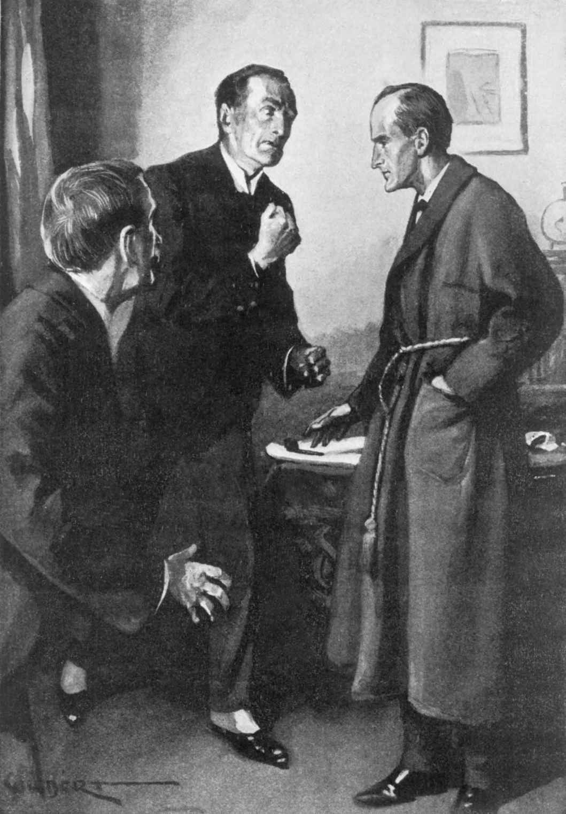

举起了骨节突出的大拳头。

“不要吵，吉布森先生，我发现，早饭以后再小的争吵也很伤身。建议你去早晨的空气里走一走，冷静，冷静思考一下，对你大有益处。”

黄金大王好不容易压住了自己的怒火。我不得不暗自佩服，他盛怒之下转眼间又能气焰自灭，转为不屑与冷漠。

“好吧，听你便。我看你该懂得怎么吃你自己的饭。我不能叫你极为勉强地接手这个案子。可今天早上这样的举动，对你没好处，福尔摩斯先生。我对付过很多比你凶得多的人，没一个能从我手上过去，得到过便宜。”

“多少人都对我这么说，可我还是依然故我，”福尔摩斯说，微笑笑，“好了，再见，吉布森先生，还有好多你该学着点呵。”

来客甩门而去。福尔摩斯无动于衷，静静吸烟，惺忪倦眼似的凝望天花板。

“有什么看法，华生？”最后他问我。

“啊，福尔摩斯，我是这么考虑，他这种人，凡是有挡他道的，他都要除掉。我记起了，他的妻子他不喜欢了，成了他的障碍，正如贝茨跟我们实说的那样，我觉得是——”

“确实这样，我的所见略同。”

“但是他和女教师的关系，你是怎么发现的呢？”

“诈他一诈，华生，兵不厌诈！我考虑到他那封信的口气，很激动、激烈，越出常情、常规，跟他城府很深的态度、仪表完全不配，那就十分清楚，他对被告感情很深，一心倾向于她，却不是被害人。我们要获得真相，必须了解这三个人的真实关系。你看到了，我对他实施正面攻击，他沉着应战。接着唬他一下，给他印象我是彻底知情。说实在话，我不过是怀疑罢了。”

“可能他还会回头再来？”

“他肯定要回头，他一定得再来，就这样他收不了场。哈，不是吗，铃响了！正是，他的脚步声。你好，吉布森先生。我刚才还在跟华生讨论你呢，你这样并不好，要误大事。”

黄金大王再次入室，情绪比刚才出去的时候已有缓和，但受创的高傲态度仍留在愤愤的眼睛里。常识迫使他要达到目的，必须暂先低头。

“我想过了，福尔摩斯先生，觉得我是急躁了一点，误解了你的意思。你要了解事实，这是你的职责，对的，事实应该是怎样就是怎样，我也该尊重你这一点才是。不过，我确实跟你讲，邓巴小姐和我之间的关系，和本案实在一点也不相干。”

“要我认同，是不是？”

“是的，我想应当这样。你好比医生一样，要了解一切症状，才好下诊断。”

“这就很对，说到正题上了。现在都还遮遮掩掩，等于有病看病还要欺骗医生。”

“说得也是。不过你也得承认，福尔摩斯先生，大多数人要被冲着问和某个女人有关系，总是难以直白启齿——要是确实有感情的话。我想任何人都有点小私情藏在自己的心灵角落，不欢迎外人来瞎闯，可你就是孟浪地撞进来。当然，你的出发点无恶意，应当原谅，是为了要搭救她。好吧，墙既已倒，内里也就都藏不住，你要看就看吧。你想问什么？”

“事实真相。”

黄金大王顿了一顿，仿佛先把思绪理一理，那张冷酷而布满深纹的脸更加阴沉下来。

“要讲呢，也没有几句话，福尔摩斯先生，”他终于说，“事情提起来叫人痛心，也难出口。所以我挑必要的讲，不必谈得太深入。我是在巴西淘金的时候遇到我妻子，玛丽亚·品托，她是马诺斯地方官的女儿，长得很美。那时我正值年轻，热血沸腾，即使是现在，热情冷却下来了，眼光挑剔了，再去回顾，也该说她是难得一见的绝色美人。她是热带型女郎，感情深沉丰富，热烈奔放，专心一意，不计利害得失，跟我认识的那些美国女人大不相同。好，长话短说，我爱她，娶了她。可是，罗曼史终究过去了——浪漫也就几年吧——我才认清我们没有——丝毫也没有——共同之处。我们的爱情减退了。如果她的感情也衰退下来，那倒好办，可是你知道女人之奇怪，难以说得清，我怎么做都无法叫她的感情疏远我。我甚至对她粗暴，甚至不惜被人说是对她残暴。因为我想，我浇灭她的爱情之火，叫她转而恨我，就对我们双方都有好处。可惜改变不了她。来到了这英国的森林里，她照样对我一往情深，好像二十年前在亚马逊河畔一样情深意切。我怎么做都没用，她一心一意跟住我。

“之后来了格蕾丝·邓巴小姐，她是我们刊登广告来应聘的，当我家两个孩子的家庭教师。或许你在报上见过她的相片，全世界都承认她是个美女。现在我不必假装道貌岸然，比别人有多高尚，我向你承认，和这样一个女人在同一屋檐下生活，朝夕相处，我实在不能不对她产生爱情。你责备我吗，福尔摩斯先生？”

“我不责怪你有这种情感，但是你表白了就该谴责。因为这位年轻女子的心中，以为她是在你的保护之下。”

“哦，就算是这样，”百万富翁道，尽管一瞬之间又像原来那样怒目而视，“我是不想假装自己有多么好。我要说，我这一辈子做人，眼见了要得到什么，我就出手拿什么。想得到这个女人的爱，她的爱情，我就什么也不顾。我跟她明讲了。”

“哦，你讲了，真讲了？”

福尔摩斯激愤起来，那模样也挺可怕。

“我对她说只要能娶她，我就娶她。但是我事实上办不到。我说钱我不在乎，我会尽一切使她幸福、快活，我全办得到。”

“我说你，实在慷慨。”福尔摩斯耻笑道。

“我说呀，福尔摩斯先生，我来你这里是为了请教案子问题，不是来研究道德问题，不需要征求你的批评。”

“我全是为了年轻女士的缘故，才接手你这件案子，”福尔摩斯正色道，“女士被指控的罪名，没什么；而你，你自己承认的，才确实比她严重。你企图欺凌一个寄身你篱下的无助女子。像你这样的有钱人，应当教训教训，世界上有许多东西并不是光靠金钱就可以买到。”

令我惊异，这个黄金大王受到如此训斥竟俯首帖耳。

“我现在真也是有这样的感受。谢谢上帝，我的打算幸亏没有称心如意。她决不答应，她决定辞职回家。”

“为什么又不走呢？”

“啊，首先一点，她家里靠她生活，一旦失业赚不到钱，就不能养家糊口，这可不是件轻松事。我向她发过誓——这是又一点——以后决不再缠着她了，所以她同意留了下来。另外，还有一层理由，她知道对我有影响力，她对我的影响比世界上什么影响都要强大，她要利用这一点来做好事。”

“怎么做？”

“哦，她对我的业务有些了解。那是十分庞大的，福尔摩斯先生——大得非一般人所能相信。我能叫人兴，也能叫人亡——但总是叫人亡的多。那不仅事关几个人，而是事关社会、城市，甚至国家的兴亡。生意场上的厮杀拼搏多有风险，弱者难免碰得头破血流，我可是把它当游戏，能玩得转。我本人不因失败而哀嚎，别人喊痛叫苦，我也不管。可是她的看法不同，我想她是对的。她这样看，也是这样说，人不可搜刮自身之外的财富，不可自己独有，叫万人遭殃，搞得人家生存不下去。这是她的看法，我想她看到金钱以外有更永恒的东西。她发现，她说什么我都听得进去，她决定经由影响我来替世人做好事。所以她留下来——这以后事情就发生了。”

“这事情，你是怎么看呢？”

黄金大王停顿不语，双手捧头，陷入沉思。

“对邓巴小姐是很不利的，我不用否认。女人都有自己的内心生活，她们有时做出的事，超出男人的理解。我起初震撼吃惊，不免也认为邓巴小姐真做出违反常理的事来，那是丧失了她的本性，但过后我脑子产生另一种想法，我说给你听听看，福尔摩斯先生，不管是否值得一提。我夫人绝对是个忌妒心很重的人，灵魂忌妒，同肉体一样忌妒，忌妒得发狂，虽然毫无根据——因为这个家庭教师，我夫人也晓得，这个英国姑娘，只对我的灵魂、对我的行为产生影响，这种影响我夫人她自己从来办不到。那是循循善诱的影响，可她不管这些，一样要嫉恨。她恨，恨得发疯，亚马逊的狂热在她的血液中奔流。一定是她要谋害邓巴小姐——一定是她拿枪威胁邓巴小姐，要她离开我家，不准再待下去。可能两个人扭打了起来，枪走了火，她拿的枪结果把她自己打死。”

“这个可能性我也想过，”福尔摩斯道，“实在说，这是惟一可以取代蓄意谋杀的说法。”

“可是她完全否认有这回事。”

“嗯，她否认也不能算数——对不对？也可以这样解释：当时情况惊险，她承受不了，匆匆跑回家，神志迷糊之中手拿着枪，随手往衣服堆里一扔，连自己都不清楚自己这些行为。枪一被发现，她只有极力抵赖，一切不知道，因为怎么解释都是讲不清了。这个假设又有什么讲不通呢？”

“邓巴小姐不会是这样的人。”

“是的，也许是。”

福尔摩斯看看表。“今天上午应该没问题，我们可以拿到许可证，晚上火车赶到温切斯特。我亲自会一会这位年轻小姐，对你这件事会大有裨益，虽然不能担保结果必定使你如愿以偿。”

官场手续延误时间，弄得当天去不成温切斯特，只好改为先到雷神湖去，那是奈尔·吉布森先生在汉普郡的庄园地。他自己没有陪我们，我们有当地的科文特里巡警队长的地址，那是第一个勘查现场的人。他高个细瘦，脸色灰白，神情诡秘，让人觉得他知道很多，怀疑也不少，只是不轻易说。他还会忽然鬼头鬼脑压低嗓音弯身凑上来耳语，有重大要事相告似的，一听不过是平常话。可是他也就这点怪模样，撇开这些，马上看出他是个诚实正经人，毫不虚夸，不显傲慢，绝对不会不肯承认自己无能为力，反而很欢迎别人相助。

“说真的，我宁愿你来，而不要苏格兰警场的人，福尔摩斯先生。”他说，“警场的人一插手案子，地方警察的功劳就全丢光，失败的责怪倒有份。现在你来，你办事公正，我早有听说。”

“我一点不想在这种事上出风头，”福尔摩斯这么说，让这位初识的忧郁警官大为放心，“案子破了，我连名字都不要提。”

“啊，你是大肚量，我相信。还有你的朋友华生医生，也是可信的人，我知道。现在，福尔摩斯先生，要到现场去，有一个问题我想要问你，这件事除了你，无法跟别人说。”他向四下望望，像是要说又不太敢说，“你不认为本案牵涉到奈尔·吉布森自己吗？”

“我考虑过这一点。”

“你还没见邓巴小姐。这个女人，她处处都好，没话说，吉布森就盼着自己老婆让路。这号美国佬更喜欢用枪，不像我们这里人。那支枪是他的，你知道。”

“证实可靠吗？”

“当然，先生，是他的双枪，一对枪的其中一支。”

“双枪的一支？还有一支呢？”

“哦，这位有钱人各种枪支弹药多着呢。我们没有找到配对的另一支——但是那只枪盒是双枪枪盒。”

“要真是一对双枪，应该找得到另外一支。”

“那是，我们把枪支都找了出来，在他家里，你不妨看看去。”

“过后去吧，我这会儿要一起先看看案发现场。”

我们在科文特里警官的小屋中谈话，这是一栋简陋的农舍，充作当地的警察所。我们从这里大约走半英里，穿过风扫残叶的石南荒地，脚下尽是金黄色的凋零羊齿蕨，来到一扇侧门，进入雷神湖庄园，顺着一条小径，走过野鸡禁猎区，又经过一片林间空地，就看到在坡地高处有一幢开阔的砖木结构大房屋，半是都铎王朝式样，半是乔治王朝式样，两种风格相间。我们的旁边是一个长形芦苇荡，水面中段是最窄处，马车道在石桥上通过，桥两侧便是湖面。科文特里警官在桥头站定，伸手指着地上。

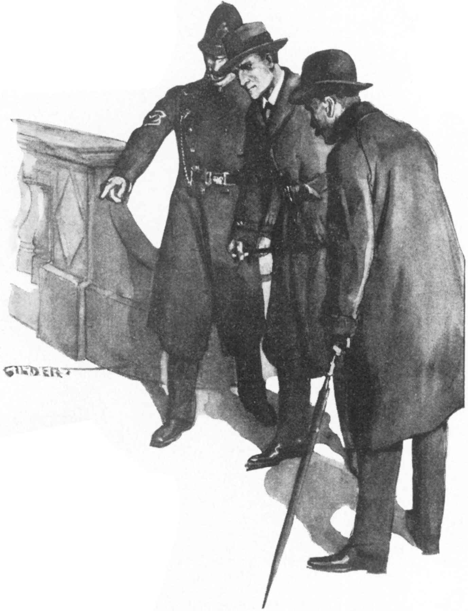

伸手指着地上。

“这里，吉布森夫人的尸体就躺在这个地方，我把那个石栏作标记。”

“你该是在尸体移动之前来到这里的？”

“是的，他们立刻来找我报警。”

“谁来报的警？”

“吉布森先生自己。一听到出事，他就带人跑来。他一再关照现场不许动，要等警察来。”

“这是对的。我从报上看到，是近距离开的枪。”

“是的，先生，非常近。”

“靠近右太阳穴？”

“就在右太阳穴稍后，先生。”

“尸体怎么躺的？”

“仰卧，先生。没有挣扎的痕迹，没有脚印，没有武器，左手里攥着邓巴小姐写的小纸条。”

“攥在手里，你是说？”

“是的，先生，攥得很紧，手指都简直扳不开。”

“这非常重要。这就排除了一种可能，是死后有人塞到她手里，企图制造假证据。对了，字条，我记得，很短：

我九点在雷神桥。

G．邓巴

是不是这样？”

“是的，先生。”

“邓巴小姐承认这条子是她写的吗？”

“承认了，先生。”

“她怎么解释？”

“她保留到巡回法庭去作证，现在不肯说。”

“这件案子实在是很有趣的了，这封信的问题非常奇特，是不是？”

“是的，先生，”陪同说道，“看来，我要是大胆下个判断，这才是整个案件中最肯定的一点。”

福尔摩斯摇摇头。

“就算这封信是真的，是她写的，那收到也有段时间了——至少一两个小时以前吧。好，那么，夫人还把纸条捏在左手里，为什么要这样小心带在身上呢？两人见面没有必要拿字条作凭证嘛，这不是怪事吗？”

“是的，先生，经你这么一说，倒也是。”

“我得安静坐一会儿，想想。”他坐在桥边石栏上。我看见他的灰眼睛向四方频频射出疑问的光芒，忽地他又站起，到对面的桥栏，刷地从衣袋里掏出放大镜，检查桥栏上的石纹。

“奇怪。”他说。

“是的，先生，我们也看到石栏上这个磕痕，我估计是路人碰的。”

石栏是灰色的，但是这磕痕发白，不及六便士分币大。仔细观察，可以看出缺口是磕击所致。

“有一定力度的撞击才会这样。”福尔摩斯道，陷入了深思。他拿手杖朝石栏上敲了几下，一点痕迹也没出现。“是的，那一下子很有力。打到的这地方也怪，不是在上面，是在下面。你看，痕迹是在桥栏下面一边。”

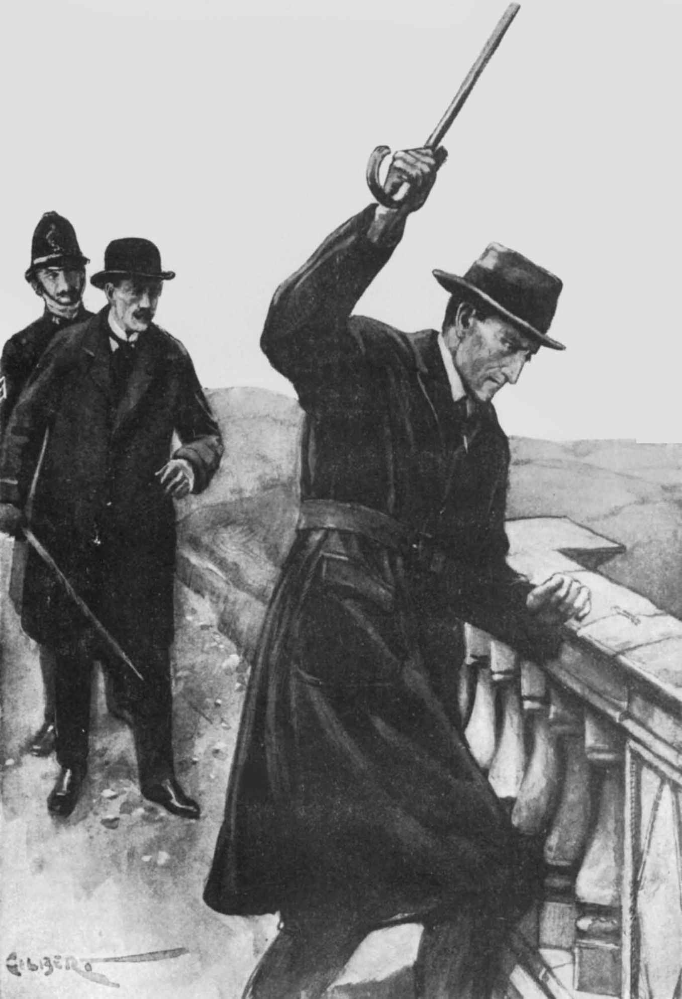

他拿手杖朝石栏上敲了几下。

“这地方距离尸体至少有十五英尺。”

“是的，离尸体有十五英尺，恐怕和案子无关，不过也是一点情况，值得注意。这里没什么可看的了。没有脚印吗？你说是？”

“地面很硬，先生，留不下脚印。”

“那我们走吧。先上屋里去，看看枪支，你说的，然后去温切斯特，我要见过邓巴小姐，再作道理。”

奈尔·吉布森先生还没有从城里回来，我们却见到了那位神经兮兮的贝茨先生，他上午曾走访过我们。他怀着看好戏的神情带我们参观一列排开的各式各样的武器，都是他的雇主在冒险生涯中积累的邪恶器械。

“吉布森先生树敌不少，只要认识他、知道他的为人，大家都清楚。”他说道，“他睡觉，都把子弹上了膛，枪放在床头抽屉里。他为人残暴，先生，我们怕他，无时无刻不提防着点。不用说，给害的可怜夫人，一直在威吓之下过日子。”

“你见过他动武出手打夫人没有？”

“没有，倒没有，不能说有，不过我亲耳听见他骂起来那个厉害劲儿，跟打也差不多——说话冷酷、刻薄，令人寒心，他甚至当着下人的面骂夫人。”

“我们的百万富翁在私德方面很见不得人。”我们走向车站的路上，福尔摩斯说道，“哦，华生，我们掌握了不少事实，了解到一些新的问题，但是离下结论还有点距离。尽管贝茨先生对他的东家极其不满、厌恶，从他那里倒是获得了可靠的情况，发现出事的时候，他东家正在自己的书房里，这一点没疑问。晚餐八点半已经结束，这时还是一切正常。报警已近深夜，但发案应该是在纸条上写的那个时间。没有一点证据证明吉布森先生五点从城里回来以后，再出过门。另一方面，邓巴小姐，我知道，承认她应约到桥上去会吉布森夫人。她只说到这一点，没有再多说一句，是她的律师建议她保留一下，等到庭上作证再说。我们有点要害问题要问这年轻女士，不见到她我定不下心来。必须承认，要不是有一件事，那我看这个案子对她太不利。”

“哪一件事，福尔摩斯？”

“她衣橱里发现手枪。”

“我的天，福尔摩斯！”我叫道，“我看正是这一关节上，才是拿住了铁证！”

“不对，华生，我最初在报上读到这一点，就觉得有问题。现在深入了解案情，对这个问题我更加坚定，这正是希望所在，我们要对这一点锲而不舍追下去。最关键的问题上，最要当心陷入误区。”

“我不理解你说的。”

“好，现在，华生，暂作假设，你是一个用心预谋除掉情敌的女人，你作出计划，写好信；被害人来了，你拿着武器，行凶得逞，手脚干净利落，不留痕迹。请你告诉我，做完如此精心策划的案子，你竟然留下破绽，忘记顺手把枪扔进芦苇里湮灭证据，反而小心翼翼把枪带回家藏到自己的衣橱里，这么一个明知首先会被搜查的地方，有这种道理吗？虽然了解你的好朋友都不会称你是个机灵鬼，华生，但是我也不相信你会做出这等蠢事来。”

“一时激动，心慌意乱——”

“不，不，华生，这我认为绝不可能。犯罪步骤策划周密，那么湮灭证据逃避刑责一样也会先周密策划。因此，我们面临一个严重的盲点，无法解释。”

“但是，这其中还有许多问题无法解释。”

“是的，我们正要加以解释。观点一旦改正过来，那原先最为相左的一点却成为通向真理的路径。比如，就是这支左轮手枪，邓巴小姐说自己一点不知道有这支枪。按照我们的新立论，她说的是真话。那就是说，是有人放到她衣橱里去的。谁放的呢？当然是要陷害邓巴小姐的人，那位不就是真凶了吗？你瞧，我们立刻走上了最富于成果的调查路线。”

当天我们不得不在温切斯特过夜，原因是手续迟迟办不下来。但是次日早晨，在正露头角已有名声的辩护律师乔埃斯·卡明斯先生陪同下，我们获准去监狱看邓巴小姐。我们早已从多方面听到，知道我们准备要见的是位美貌女子。确实，一见之下给我的真实印象更是难以忘怀，怪不得那位飞扬跋扈的百万富翁见了她也会折腰——她的魅力足可以柔克刚。一见她坚毅、清晰而温情的俊脸，谁都会感到即使她有做出激烈行动的能力，但是凭着她具有的内在高贵品性，必能永远诱人以善。她深黑头发，浅黑肌肤，身材苗条，体态雍容端庄，似有指挥若定的样子。但是，她的一双黑眸透出哀告无助的神情，像一头被追逐的猎物，陷入罗网，四处挣扎无法脱身。现在，知道我大名鼎鼎的朋友前来相助，她的面颊泛起一丝血色，两眼转向我们，闪出了一线希望之光。

“奈尔·吉布森先生想必已经告诉你我们之间的情况了？”她问道，声音低弱但是激动。

“是的，”福尔摩斯回答，“你不必因为被牵连进这件事中而过于苦恼。现在见到你之后，我知道，吉布森先生的申述，澄清了你对于他的影响，还你们之间关系的清白，这都是可以接受的，可以相信的，但是这些情况为什么不在法庭上坦然陈述呢？”

“我原以为不至于这样指控我，那是不会成立的。我本想只要等待一阵，整个事件就会自然平息，不用我们迫不及待把这个家庭的内幕生活一一披露出来，那会十分痛苦的。谁知结果非但没有澄清，反而变得更加严重了。”

“我亲爱的年轻女士，”福尔摩斯诚恳地大声道，“这方面请你不要心存幻想。卡明斯律师先生在这儿，他可以明确告诉你，所有的牌现在都对我们不利，我们要想反败为胜，必须尽一切努力。要假装说你并未面临多大的危险，那是自欺欺人，是有害无益的，所以，你要跟我配合，把实情告诉我。”

“我决不隐瞒实情。”

“很好，那就告诉我们你和吉布森妻子间的真实关系。”

“她恨我，福尔摩斯先生，用热带人的全部疯狂憎恨我。她这个人，做什么事都直来直去，她对丈夫有多么爱，对我就有多么恨。她是完全误解了我们的关系。我不想诋毁她，但是她热烈的爱情观念太重肉欲，难以理解是精神上、心灵上的内在关系，把她丈夫推向了我。也难以想象，我不过是抱着影响他去大力行善的愿望，才使我继续在他家待下去。我现在看到，我错了。无法说明我留下来是正当的，落得个我是他们不和的祸根的罪名，即使可以肯定，我离开了，他们的家庭不和依然照样继续。”

“现在，邓巴小姐，”福尔摩斯说，“请你确切告诉我们那天晚上发生的情况。”

“我会就我所知道的，告诉你真实情况，福尔摩斯先生，但是我的处境，孤掌难鸣，无法证实，而且还有几点——最关键的几点——我解释不了是怎么回事，也想象不出是怎么回事。”

“你只管提供事实，别人也许可以解释。”

“好的。说到那天晚上我去雷神桥，是因为那天早上我接到吉布森太太一张条子。条子放在教室的桌上，看样子是她自己放在那儿的。要我晚饭后到桥上去见她，说有重要事情同我讲，要我给一张回条，放在花园的日晷仪上。因为我们两人的事，她不想让旁人知道。我看不出有什么道理要这么保密，但还是照她的要求做，接受赴约。她还要我销毁她写的字条，我就把字条扔在教室的壁炉里烧了。她很怕她丈夫，丈夫对她非常粗暴，为此我经常责备她丈夫。我就想，她这样约我，只是不希望她丈夫知道我们会面谈话。”

“可是她自己把你的回条保留得很谨慎？”

“是呀，好奇怪，听说她死了还紧捏在手里。”

“好，后来怎么样？”

“我按时去了。到了桥头，她正等着我。我一直不知道她恨我，到这时候才发现原来她恨我恨得要死。她像个疯婆——真的，我看她的确是个疯女人。心里全是妄想、疑心、仇恨，神经错乱的人就是这样，要不然她每天和我两个毫不相干，怎么一下子这么深仇大恨了呢？她讲了什么话，我现在都说不出口。她一古脑儿发泄疯狂的怒火，用可怕而炽烈的言辞，朝我没头没脸地恶骂。我都没有回嘴——我无法回嘴。她那样子我看都不敢看了。我两手捂了耳朵快快跑开。我走时，她还站在桥上，还在尖刻恶毒地咒骂，咒骂声不断从那桥头上传来。”

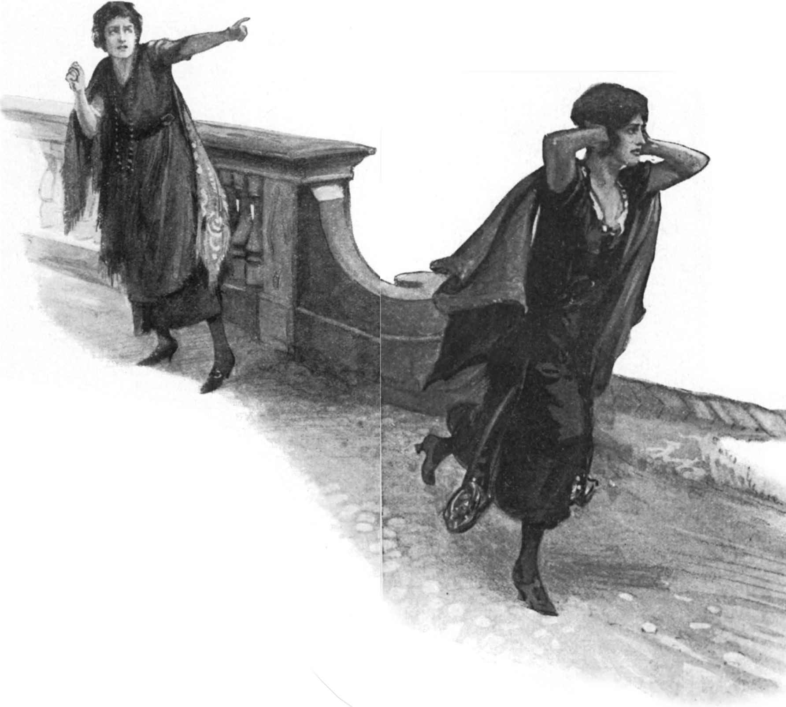

“我两手捂了耳朵快快跑开。”

“后来她是在那里被发现？”

“离她站着的地方没几码远。”

“那么，如果说是你走了以后不久她就死的，你没有听见枪声？”

“没有，我没有听见。不过，要知道，福尔摩斯先生，很难说不会发生这样的事。我害怕紧张得要命，只顾往回跑，快快躲进自己的房里还来不及，根本无心注意发生了什么事。”

“你是说跑回了自己的房里，那么第二天天亮之前，你又出过房门没有？”

“是的，听说出事了，可怜的人死了，我就和别人一起出去。”

“看见吉布森先生了？”

“是的，他刚从桥那边回来，我看见了他。他让人去叫医生、警察。”

“你看他很慌张吗？”

“吉布森先生是个坚强而有自制力的人，他好像从来不会流露出慌张的表情，不过我是了解他的，看得出他内心里正着慌呢。”

“那么有一点是最关键、最重要的，在你房里发现手枪，以前你见过没有？”

“从来没有，我可以发誓。”

“枪是什么时间发现的？”

“第二天早上，警察搜查搜出来的。”

“在你的衣服堆里？”

“是的，衣橱底上，衣服下面。”

“你估计放在那里有多长时间了？”

“头天早晨还没有。”

“你怎么知道？”

“因为我整理过衣橱。”

“这可以定论，就是有人进你房间把枪放进衣橱，存心栽赃害你。”

“肯定是这样。”

“是什么时间放的呢？”

“多半是吃午饭时间，要不就是我在教室里，给孩子上课的时间。”

“也就是你拿到便条那时候？”

“是的，这之后，整个上午时间。”

“谢谢你，邓巴小姐。还有没有其他有助于调查本案的情况要补充？”

“想不出了。”

“桥的石栏上有重击痕迹——就在尸体面对的地方，有个新敲击出来的凹口，你想想能作怎样的解释？”

“那不过是巧合吧。”

“奇怪，邓巴小姐，很奇怪，怎么就出现在案子发生的时间呢？只有猛力敲击才会有这样的磕痕。”

福尔摩斯自己也没有作答，他那苍白、渴望的脸上忽地显出紧张而神往的表情。我久已熟知，这正是他的天才迸发着最高智慧的时刻。在此脑力高度运行之时，我们没人敢说一句话，大家都坐着，律师、嫌犯和我自己，看着他聚精会神地沉思无语。他忽地从椅子上跳起来，由于精神集中、需要紧迫行动，而浑身震颤。

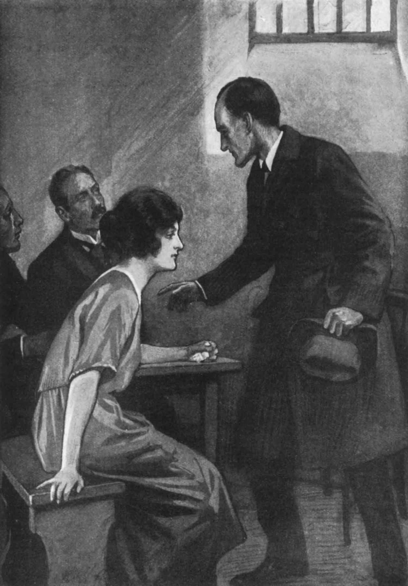

他忽地从椅子上跳起来。

“来吧，华生，快来！”他高声叫道。

“怎么啦，福尔摩斯先生？”

“不要担心，我亲爱的女士。你听我的回音吧，卡明斯先生。托正义之神的福，我会破一个管叫全英帝国欢呼的案子。你明天将得到消息，邓巴小姐，目前请你相信，疑云就要驱散，我充满希望，真相就要大白，前景一定光明。”

温切斯特到雷神湖这段路并不太远，可是因为我心中焦急，就显得漫长了；对福尔摩斯而言，那简直更是遥无尽头。因为，他情绪紧张，歇不下、坐不住，在火车车厢里踱步不停，或是用细长敏感的手指击鼓似的敲着身旁的坐垫。又忽然间，火车快到目的地的时候，他坐到了我的对面——我们订的是头等包厢——双手按住我膝头，瞧着我的眼睛，目光极为诡秘，神色很有些淘气。

“华生，”他说，“我想起来了，我们凡是碰到像这一类出征，你总是带着枪。”

那是为了他我才带枪。因为他每当全力投入案子，用心专注，往往疏于考虑自己的安全，所以不止一次我的手枪成为临危救急的患难之友。我提醒他要注意这种事。

“很对，很对，这种事我是没脑子。你身上带枪？”

我从后裤袋掏出枪，短小、灵巧，一件得心应手的好武器。他接过枪，打开保险，退出子弹，仔细检查一番。

“有点分量——不算轻呢。”他说。

“是的，实家伙。”

他握枪想了一会儿。

“你可知道，华生，”他说，“我相信你这支枪和我们现在侦查的这件谜案，有着非常紧密的联系呢。”

“我亲爱的福尔摩斯，你开玩笑了。”

“不，华生，我是正经话。我们来做一次实验，如果实验成功，便是真相大白了。做的实验全靠这支小手枪的作用了。一颗子弹拿掉，另外五颗填进去，关掉保险。好了，这就增加了重量，照这样演试，一定不会错。”

他心里是什么打算，我一点也摸不着头脑；他也不向我说明，只坐在那儿出神。很快我们在汉普郡下车，雇了一辆破马车，只一刻钟工夫就到了热情的朋友、那位警官的屋子。

“有线索了吗，福尔摩斯先生？什么线索？”

“那要全靠华生医生手枪的功效，”我的朋友说，“就这枪，现在，警官先生，你有没有十码长短的细绳子？”

于是到村里小店买来一团结实的细绳。

“好，东西齐备，这就成了，”福尔摩斯说，“现在，怎么样，就走吧，我希望这是我们旅途的最后一程。”

太阳正在西沉，夕阳照着这起伏连绵的汉普郡高地沼泽荒原，呈现出一幅绝妙的秋景图画。警官陪在边上勉强跟着走，不时向我朋友投以不满和狐疑的眼光，似乎对他的精神是否正常，大有怀疑。我们走近犯罪现场的时候，看我的朋友一贯镇定自若的表面下，其实也在深深忐忑不安。

“是的，”他回答我的疑问说道，“以前你也曾见过我失败，华生。这种试验，虽说我有直觉，但直觉毕竟不是很可靠，有时会上当。头一次心中一闪念，是在温切斯特监狱中，那是信心十足的。可是心思太活，一转念似乎又欠缺什么，也总可以找出其他不同的说法，怕线索误入歧途。但是——但是呢——好吧，华生，我们总得试试再说。”

他一边走，一边把绳子将左轮手枪枪柄紧紧绑住。我们已经走到案发现场，在警官的指点下，找到尸体倒卧准确的地方。福尔摩斯随即在蕨类矮树丛中找到一块有相当分量的石头，拿绳子的另一头将石块拴牢，靠着桥的石栏往下垂，吊到水面上。他自己在卧尸那个桥边的方位站定，手中举起左轮，枪和石头间的绳子便在桥外侧绷直了。

“现在开始！”他叫了一声。

话一出口，他把枪举到额部，随即松手，枪被石头吊着落下，啪的一声弹在桥栏上一砸，再给绳子拽向栏外掉入水中，不见了。福尔摩斯马上蹲到石栏边，高兴得大叫，表明他的发现就正如预料的一样。

“这个再准确、再清楚也没有了！”他唤道，“看，华生，你的枪解答了疑问！”边说边指着第二个磕痕，那大小形状同石栏上第一个痕迹一模一样。

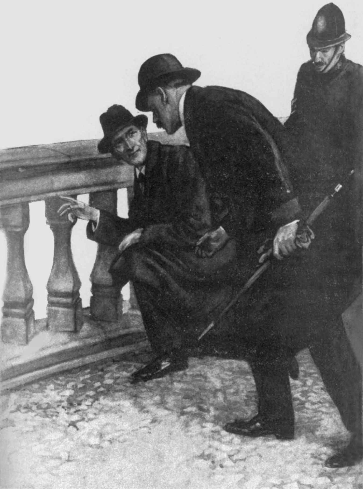

“这个再准确、再清楚也没有了！”他唤道。

“今晚我们住客栈。”他接着又说，站起来，瞧着惊讶不已的警官，“这就行了，你用一个锚钩，不费事，把我朋友的手枪吊上来。还能在旁边捞起另一把手枪，也是系着绳子、吊着重物。这是那位女士，蓄意自杀而又能报复，制造谋杀假象，加害一个无辜的人。你让吉布森先生知道，我明天早上去见他，届时替邓巴小姐辩白，可予释放。”

这天夜深，我们一起坐在乡村小旅店抽烟，福尔摩斯给我简要复述了事情的经过。

“我担心，华生，”他说道，“你若是将本案，雷神桥谜案，添进你的案例故事中去，不见得能让我的声誉锦上添花。我脑子迟钝，缺少想象与现实的综合分析能力，而这正是我这门艺术的基础。我承认，石栏上的磕痕这个线索，足以提示作出结论，而我，未能及时排除疑点、还原真相，只怪自己愚钝。

“我们不得不承认，这位不幸的女士用心之深，手法之巧，使得想要解开她的计谋谜团绝非易事。我看，在以往的工作中，没有遇到过比这更奇怪的案例，变态的情妒酿成如此的后果。不管邓巴小姐是肉体上或者只不过是精神上的竞争对手，在她都是眼中钉，无法容忍。她百般讨好自己的丈夫，丈夫却不要她，言语行为极其粗暴绝情，她就势必将这一切归咎于这位无辜的女子。她绝望了，便下定决心。决心之一，自己不要活了；决心之二，以自己的死，嫁祸于情敌。但不叫情敌一死了之，太便宜了她，而是叫她日后活得比死还难受。

“随后的各种步骤，也就顺理成章，表明用尽了苦心。她得到一张邓巴小姐的亲笔便条，看上去像是邓巴小姐安排的作案现场。不幸造假心切，以致弄巧成拙，至死都把这张陷害人的纸条捏在手中。光这一点，早就应该引起我的怀疑。

“然后她拿了丈夫的两支手枪来用——枪有的是，你看见了，屋子里像枪械库。先拿一支枪，打掉一发子弹。这很容易，到树林里去打一枪，没人注意。那天早上把这支枪藏到邓巴小姐衣橱里，最后带着另一支枪跑到桥上。她早已精心设计好一个方法，确保自杀的手枪当场消失。邓巴小姐按时赴约，夫人在死前就尽情发泄了满腔的怨恨，等到没人听见了，她就饮弹自尽。现在每一个环节都能串联起来了。报纸可能要问一开始为什么不打捞湖。放马后炮总是十分容易，偌大一个芦苇湖面，要打捞谈何容易，除非你目标清楚，在哪个方位打捞，打捞什么。好了，华生，我们拯救了一位好女子，也连带救了一个男强人。未来他们两位是否珠联璧合，不无可能吧。金钱世界里，将会发现奈尔·吉布森先生在那伤心的课堂里上了有效的一课，课堂里教的是我们人世间的教训课。”

（1922年）

# 爬行人案

歇洛克·福尔摩斯先生一直认为，我应该发表有关普莱斯纳利教授的一桩奇闻轶事，方能一劳永逸地消除二十年来惊动大学校园并震撼伦敦知识界的那种难堪的流言。但这样做有多重障碍，而且这件奇案的真实历史已封存于那只铁皮箱，箱子里藏的是我朋友许多案件的记录资料。现在我们终于获得允许可以解禁，披露事实。这是福尔摩斯在刑侦工作退休之前，最后处理的几桩案子之一。但即使是迟至现在将事件公之于世，还是要注意必要的审慎与保留。

那是早在一九〇三年九月一个星期天的晚上，我收到福尔摩斯一封如他一贯风格的短简：

若方便请即来——不方便亦要来。

歇．福．

在最后的日子里，我们的关系尤其不寻常。他是个为习惯所左右的人，怪僻而且顽固，使我不得不服从于他，天长日久，也就习以为常。我的作用，也就像是他的小提琴、粗烟丝、旧黑烟斗、厚资料簿，以及其他等等，都是不可或缺的，工作紧张起来，需要一个同志搭档，必须有所依靠，此时我的有无，便不是无足轻重的了。但我的作用并非仅限于此，我是他智力的磨刀石，我能激励他。他习惯在我面前嘀里嘟噜自言自语。他的自言自语很难说是针对我而发——很多时候对着床架也照样侃侃而谈——不过，既然都已形成习惯，多少有我从旁与他插科打诨还是很有好处。我是死脑子，遇急事也只会按部就班，因此常常惹恼他，但是一惹恼反而使他的直觉灵感更加神速地激发出来。这就是我与他作为朋友相处所起的一点微小的作用。

我来到贝克街，发现他蜷缩在扶手椅上，拱起了膝头，嘴衔烟斗，眉头深皱，正在沉思。这样子很清楚，他一定是遇到了疑难问题，苦苦思索而解脱不了。他一挥手，指指我那张旧椅子，但之后足足有半个小时，他没有任何招呼，仿佛没注意我的在场。但忽然一惊，像还魂一般，脸上习惯性地怪笑一下，热情欢迎我又回老家。

“请你原谅啊，我心不在焉，我亲爱的华生，”他说道，“不到二十四小时之中，我接到了几桩怪事。一件一件蹦出来，令我想起都有一个共同特点。经过认真考虑，想写一篇小小的论文，谈论侦探工作中狗的作用问题。”

“可是要知道，福尔摩斯，这人家早已研究过了，”我说，“猎犬——警犬——”

“不，不，华生，这方面的问题，当然，很清楚了。还有另一方面，那深一层的问题，还远没有涉及。你回忆一下，有一桩案子，你写得耸人听闻，关于山毛榉那个案子。通过观察小孩子的心理状态，作出演绎推理，探知那个道貌岸然的父亲犯罪的习惯性特点。”

“是的，我记得很清楚。”

“我对狗的思路跟这个案子相同。狗体现出家庭生活。有谁见过，丧家之犬能活蹦乱跳？快乐的家庭会有丧家之犬？恶人养恶狗，凶人养凶狗。狗身上反映出它们主人家的状况。”

我摇摇头。“你这个话，福尔摩斯，未免牵强。”我说。

他装满烟斗，坐回椅子里，没理会我的意见。

“我刚才所讲，有实践意义，跟我正在研究的问题密切相关。那是一团乱麻，你不知道，我要理出头绪。问题中有一点头绪，是个线索：普莱斯伯利教授的狼狗，罗依，为什么会咬他？”

我往椅背一靠，有些失望，心想我自己那么忙，就为这么一点小事把我叫来？福尔摩斯拿眼睛扫了我一扫。

“华生还是老脾气！”他说，“你总是不学学，大问题往往寓于小事情之中。可是这件事即使就表面上看不也是很奇怪的吗？这么一位资深老学者——你一定听说过普莱斯伯利，剑津大学<a href="#part0155.xhtml_ch1"
id="part0155.xhtml_ch1-back">(1)</a>著名生理学教授？——就是这么一个人，被自己的忠诚的狼狗一再攻击，你怎么看呢？”

“狗有毛病了。”

“这一点是要考虑。但是他的狗不咬别人，也不是一直攻击自己主人，只在特别时候，绝非一般，华生——绝对有隐情。年轻人本内特先生提前来了，这铃声一定是他。我原打算趁他来之前和你长谈一会儿呢。”

楼梯上响起急急的脚步声，接着是急促的敲门声，一位新委托人推门而入。他是个高高个子、仪表俊美的青年，三十来岁，穿着整洁高雅，神态显示还略带一点学生的拘谨，并未沾染社会人士的世俗气。他和福尔摩斯握过手，稍有几分惊异地看着我。

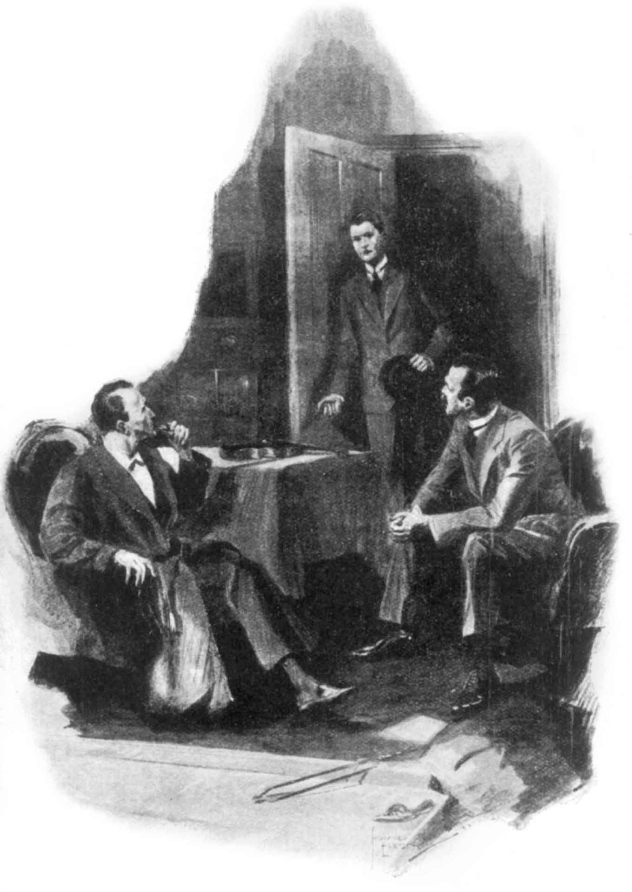

一位新委托人推门而入。

“这事恐怕还是比较慎重的，福尔摩斯先生，”他说道，“考虑到我对普莱斯伯利教授公私两方面的关系，我在第三人面前谈恐怕不方便。”

“请不必介意，本内特先生，华生先生是个绝对谨慎的人。我实在告诉你，这件事还非要有这么一位助手帮我处理不可。”

“既然如此，福尔摩斯先生，那就悉听尊便。想必你能理解，对这件事我不得不有所保留。”

“你一定很高兴，华生，我告诉你，这位就是特雷弗·本内特先生，大科学家普莱斯伯利教授的助手，住在教授家，已经和教授的独生女订婚。当然，我们必须尊重他的意见，教授一直看重他的忠诚与保密，但是表示最忠实可靠的方式就是采取切实的步骤澄清这个迷案。”

“我也希望这样，福尔摩斯先生，我正是这个目的。华生医生了解情况吗？”

“我还没来得及和他讲。”

“那我先把基本事实再说一遍，然后讲讲新的情况，这样比较好些。”

“仍旧由我来讲吧，”福尔摩斯说道，“也好看看我掌握的是否符合实情。这位教授，华生，闻名全欧洲。他一辈子从事学术研究，从来没有人说过他一句坏话。已丧妻，有一个女儿，叫易迪丝。他的性格，我想，十分直爽，比较主观，所以有人可能会说他好胜心强。直到几个月之前，一直如此。

“就在这几个月，他的生活发生了变化。他年龄已经六十一岁，可是他和他的同事比较解剖学科的主任莫菲教授的女儿订了婚。这事，据我看，不是一个上了年纪的人对生活理智的抉择，倒像是年轻人感情的热烈冲动。他的热烈追求，一往情深，也真是少见。女方爱丽丝·莫菲，是个身心健康的好姑娘，在教授眼里十全十美，难怪他十分着迷，头脑发热。但是毕竟，教授自己亲属方面，并不完全赞同。”

“我们觉得这个事很有些不妥。”来客说道。

“确实是。过分，鲁莽，不合常规。可是普莱斯伯利教授有钱，姑娘父亲方面并不反对。然而女儿自己是有点看法的，已经有几个人在追求她，虽从物质条件、地位来看不算称心如意，但年龄都相当。姑娘总的来说喜欢教授，也不计较性格脾气合不来，惟一的障碍就是年龄。

“也就在这同时，教授正常的生活中忽然出了点事，事情虽小但很有疑问。他做了一件以前从来没有过的事。他离家出走，不说到哪里去，两个星期后回来，看上去一副旅途劳顿的样子。他一反平常直爽坦率的脾气，一字不提去了什么地方。可是，这时偏偏来了一封信，我们这位委托人，本内特先生的信，是布拉格的一位同学写来的。信上说，他见到普莱斯伯利教授光临布拉格非常高兴，虽然没有机会和他说话。由于这封信，家里才知道他去了什么地方。

“现在讲到关键问题。从这件事以后，教授起了奇怪的变化，变得鬼鬼祟祟。周围人都感到他完全变了样，简直不认识了，他整个儿给蒙上了阴影，使他高尚的行为品性暗淡无光。但他的智力不受影响，讲课还是如同以前一样精彩动听。此外的一切就变了样，身上总有某种从未有过的、邪恶的、不可预料的东西。自己的女儿一向敬爱父亲，一再努力要恢复原来亲密无间的父女关系，要揭开父亲神秘的面具。你，先生，我可以理解，也是同样——但是一切无效。好了，现在，本内特先生，你来讲讲信件的事吧。”

“要知道，华生医生，教授以前对我一切都不保密，就算是他自己的儿子或是兄弟，也不过是这样的信任吧。我当他秘书，他经手的一切文件都交给我处理，来信都是由我先拆，加以分类。可是这次外出一回来，情况立即变了，他告诉我凡是伦敦的来信邮票下有十字记号的，必须另放一边，只能让他本人拆阅。我果然收到这样的几封信，是东区的邮戳，那笔迹好像是没有文化的人写的。这种信不知道他回了没有，有回信也是不经我的手，发信的信篮子里从来没有见过他放过回信。”

“还有盒子。”福尔摩斯提起。

“啊，对了，那个盒子。教授这次外出带回来一只小木盒，这件东西也可以说明他去过一趟大陆。盒子上雕刻很精细，一看就知道是德国那边的工艺品。他把盒子放进他的工具柜。有一天，我要找一根套管，拿了一下那个木盒，没想到他竟大发雷霆，用很粗野的话来责骂我，真叫我吃惊。我只是看看，又没有别的意思。这样的事我还是头一回遇到，深深地伤了我的心。我竭力解释说，不过是偶然拿了一下盒子。可是那天晚上，我感觉到他对我的目光很凶，这点小事使他耿耿于怀。”说到这儿，本内特先生从口袋里掏出一本小日记本，“那是七月二日。”他说。

“由你来作证人，很是确凿有力，”福尔摩斯说，“我正需要你记下的这个日子。”

“这是从我的导师那里顺手学来的好习惯。从这天开始，我就特别关注他的行动，我觉得我有责任关心他的情况。这样，我这里都记着了，就是这一天，七月二日，罗依咬了教授。那是教授从书房出来走进厅里。又一次，七月十一日，发生同样的情况。后来在七月二十日，又出了这样的事，我都记了下来。这之后，我只好把罗依关到马厩里去。它是一条很亲人、很听话的狗——我这么说，好像让你厌倦了吧。”

本内特的口气有点责怪，很明显，福尔摩斯没有在听。他绷着脸，两眼出神，望着天花板，这时他才忽地回过神来。

“奇怪事！非常奇怪！”他喃喃说道，“这种事我也觉得新鲜，本内特先生。现在，原来的情况也就这么多，差不多了，是不是？你说还有新的情况呢？”

我们的来客明朗的面孔随着可怖的回忆顿时暗淡下来。“我要讲的事发生在前天夜里，”他说道，“大约凌晨两点，我躺在床上醒着，听到走道里有沉闷的声音过来，我悄悄开门向外望。先要说清楚，教授睡在走道的那一头——”

“日子是——？”福尔摩斯插问。

我们的来客因为被一个不相干的问题打断而显得很不耐烦。

“我讲过了，先生，是前天夜里——九月四日。”

福尔摩斯点点头，笑笑。

“请往下讲吧。”他说。

“教授睡在走道的那一头，要到楼梯口就得走过我的房门。碰到这种事真叫人毛骨悚然，福尔摩斯先生。我知道自己神经坚强，不比什么人脆弱，可是看见那个样子我也禁不住战栗不已。走道很暗，只有半中间有一扇窗，照进一点光。我看见什么东西在走道上过来，一个黑影，在爬行。当他爬到光亮底下，我一看，竟会是他，是教授，福尔摩斯先生——在地上爬行！他不是用手和膝盖爬，应当说是用手用脚佝偻着爬，脸俯得很低，垂在两手中间，看他爬得还挺自在。我看得全身都要瘫了。等他爬到我门口，我才能跨步上前，问他是不是要我帮助他。他的回答也奇怪，忽地跳了起来，朝我狠狠骂了几句，快步走过去，下了楼。我等了大约一个小时，没见他上来。他再回房里，已经要天亮了。”

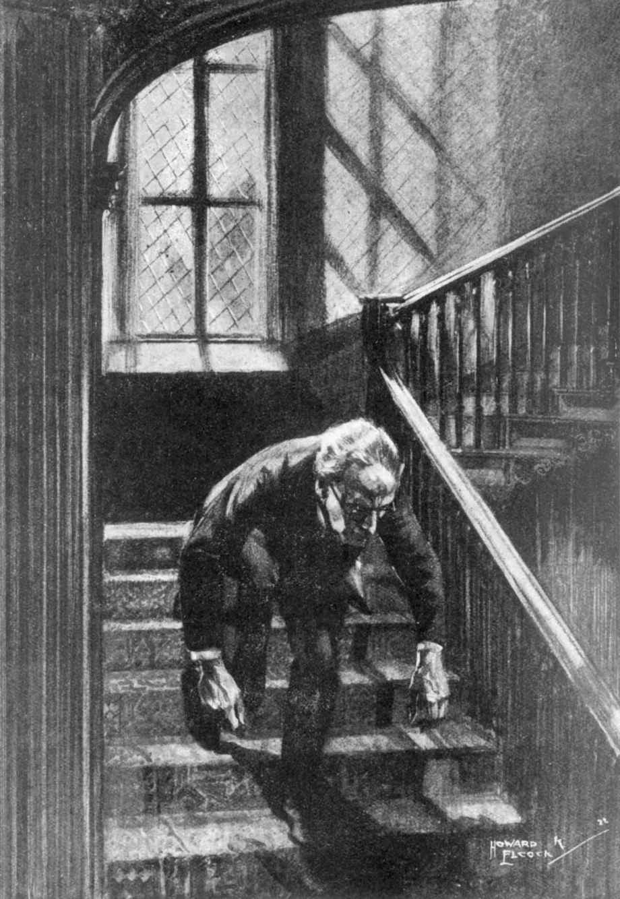

“朝我狠狠骂了几句，快步走过去，下了楼。”

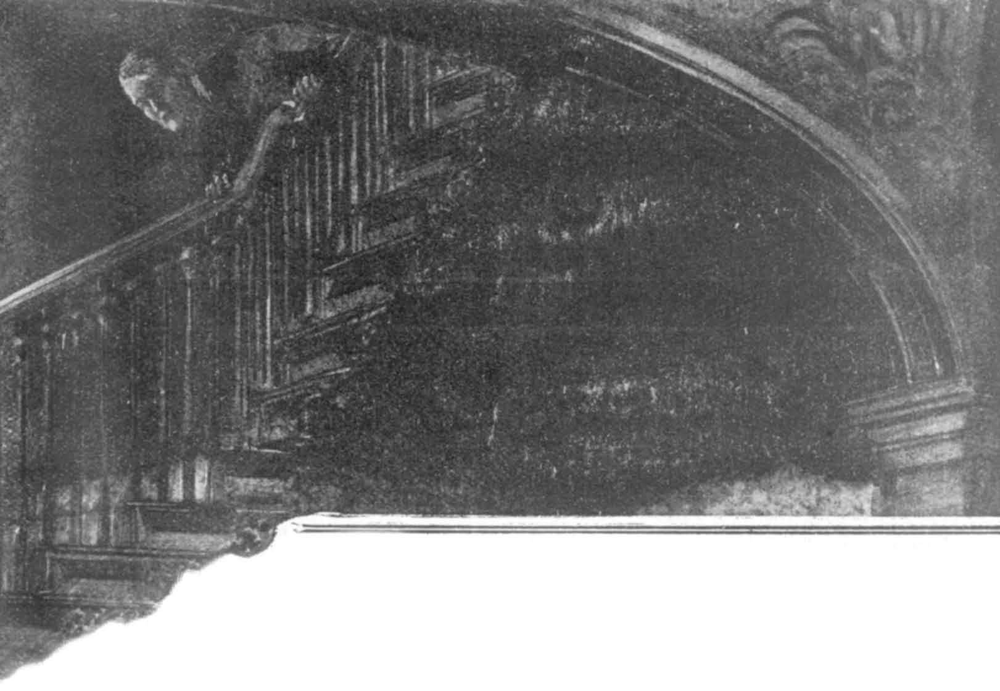

“哦，华生，你觉得怎么样？”福尔摩斯问道，那神气好像是一个病理学家，拿一个罕见的病例来问我。

“风湿性腰痛，多半是。我有过一个严重的腰痛病人，走路就是这个样子，而且心情特别烦躁，动不动就发火。”

“好，华生！你总是行事脚踏实地，说话三句不离本行。不过腰痛的说法我们还难以接受，因为他能够一下子挺腰站起来。”

“他身体可好了，”本内特说，“我知道，多少年来这一阵身体状况最好。可是现在所见也是事实，福尔摩斯先生。这种事，我们又不好去叫警察，该怎么办，实在无法可想。只觉得出现这种怪事，弄不好有什么灾祸临头。易迪丝——普莱斯伯利小姐——和我有同感，我们再也不能消极等待了。”

“这确实是件很奇特而有意义的案子，你认为如何，华生？”

“按照医生角度讲，”我说，“好像是属于精神病的病例老先生的大脑皮质突然受到情欲的刺激。他出国旅游，是想让激情有个缓和的机会。他的信件、盒子可能和其他私密事有关——比如借款，股票证券，这些都藏在盒子里。”

“可那只狼狗，不用说是不赞成他搞金融投机啰！不，不，华生，其中另有文章。现在，我只能提醒——”

福尔摩斯要提醒什么，恐怕再也无从知道，因为这时候房门忽地打开，一位年轻女士被领入房间。本内特先生一见她便跳起来叫一声，迎上前去伸手接住女士张开的双手。

“易迪丝，亲爱的！没出事吧，但愿？”

“不找你不行了，杰克！真要吓死我了！我再也不敢一个人留在家里呀！”

“福尔摩斯先生，这位就是我说过的小姐，我的未婚妻。”

“我们不是预料到会出事吗，华生？”福尔摩斯含笑说，“我知道，普莱斯伯利小姐，情况又有新发展，所以你来向我们报告，是吗？”

我们的新客人，鲜亮美貌的英国传统式姑娘，向福尔摩斯回笑答礼，坐在了本内特先生旁边。

“我去旅馆找本内特先生，他不在，就想很可能在你这里了。他讲过的，说是要来请教你。哦，福尔摩斯先生，希望你、请你帮助我可怜的父亲呀！”

“希望是有的，普莱斯伯利小姐，但是事情还不是很清楚，也许你带来的新情况能够使问题明朗一些。”

“事情发生在昨晚上，福尔摩斯先生。白天父亲一整天都不正常。我看他有好几回自己都不知道自己在做些什么，就像是做白日梦，梦游似的。昨天一天就是这样度过。人还是他那人样，可灵魂不是了。”

“告诉我出了什么事。”

“夜里狗拼命叫，把我给叫醒。可怜的罗依，它被拴在马房那边。我是把房门锁上再睡觉的。这是杰克——是本内特先生——一定告诉你了，我们都感到恐怕有祸事临头。我的房间在三楼，碰巧窗帘没拉上，外面月光很好。我眼睛正看着明亮的窗口，听着狗在狂叫，忽然吓了一大跳，看见父亲的脸，正在朝我看。他的脸贴在窗玻璃上，一只手举起来好像要推窗。窗要是被推开，那我想我肯定要吓死了。那不是幻觉，福尔摩斯先生。不能不相信，不能自己欺骗自己。我很清楚，有二十来秒，我躺着一动不动，盯着这张脸看。接着就不见了。可我没有——没有跳下床去往外看到底怎么回事。我瘫在床上，浑身发冷、打颤，直到天亮。吃早饭的时候，父亲一脸严厉，态度冰冷，一点不提昨夜爬窗的事。我也不提，但是我找个理由向他说我要到城里来——我这就上这儿来了。”

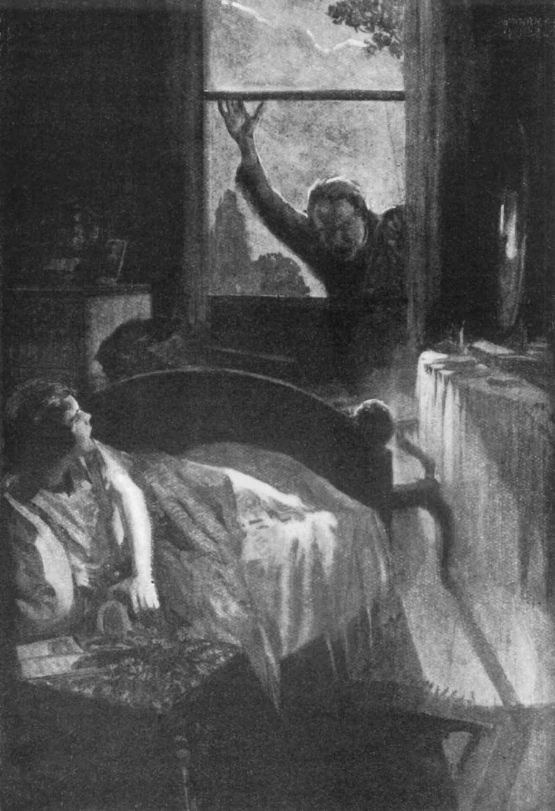

“他的脸贴在窗玻璃上，一只手举起来好像要推窗。”

福尔摩斯对普莱斯伯利小姐的叙述也感到极度惊讶。

“我亲爱的年轻女士，你说你的房间是在三楼，花园里有那么高的梯子吗？”

“没有，福尔摩斯先生，怪就怪在这里，根本没有办法够得到我那窗户——可偏偏就是父亲，那不会错。”

“日子是九月五日，”福尔摩斯说，“这事情还挺复杂呢。”

这回轮到本内特表示惊讶了。“你这是第二次提到日子，福尔摩斯先生，”本内特说，“是不是对本案很有关系？”

“有可能——非常可能——只是现在材料还不充分。”

“可能你是在想神经病发作和月相、月的盈亏有关系？”

“不是，完全不是，绝对不是这条思路。请你把笔记本留给我，我要对一对日期。现在我想，华生，我们行动的方向可以定下来了。小姐已经告诉我们——我对她的直觉、感觉完全相信——她父亲在某些日子记忆力很差，甚至丧失，我们就在这种时间去拜访他，推说是某月某日他邀请我们的，因此如约前来拜访。他会以为有这么回事，只是自己记不清了。我们去直接观察了解他，便于打开侦察局面。”

“好办法，”本内特先生说，“可是我提醒你们，有时候教授很暴躁。”

福尔摩斯笑笑。“正因为这个道理，我们马上要去——有十足的理由，看看我的推论是否符合实情。明天，本内特先生，我们在剑津一定相见。那边，我没记错的话，有一家客店叫‘契克斯别墅’<a href="#part0155.xhtml_ch2"
id="part0155.xhtml_ch2-back">(2)</a>，它那个葡萄酒，称得上差等的上乘水平，它那些床单，超过挨骂的水平。我想，华生，我们往后几天，所住的地方也就只好将就点了。”

星期一早晨，我们上路朝著名的大学城出发——这在无牵无挂的他，出个门是轻松事，但在我，不得不手忙脚乱安排一阵，因为我的业务规模这时已经不算小。福尔摩斯一路上不提案子，直到我们把衣箱都在他所讲的这家老资格大牌子的小客店安顿好，他才开口。

“我想，华生，我们午饭以前就上门去找这个教授。他十一点还有课，之后就回家，刚好趁这个空档。”

“我们拜访他用什么理由？”

福尔摩斯翻开笔记本来看。

“八月二十六日，是他的狂躁日期，估计他在这时候脑子不清楚，我们就说是有人约我们来的，想来他不太敢断然否认。你厚着脸皮忽悠他一下行不行？”

“行不行不妨一试。”

“妙，华生！勤恳如蜜蜂，更是勇敢如先锋，行不行不妨一试——这是你我两人的格言。找个熟路朋友带我们去吧。”

我们叫了一个本地车夫，他跳上漂亮的汉森车后座，载我们驶过一长排古老的学院校舍，最后拐入一条林荫马车道，在一幢赏心悦目的宅屋门前停下。屋的四周是草坪，种满着紫藤。普莱斯伯利教授住宅的一草一木一石一瓦，无不显示他讲究奢华与舒适的生活。车趋近时，我们就望见前窗露出一个花白的脑袋，抬起浓眉下一双锐利的眼睛，透过玳瑁眼镜朝我们打量。只一会儿工夫，我们不胜荣幸置身于他那深邃的书室之中。站在我们面前的正是这位莫测高深的科学大家，他的行为举止神秘诡谲，因此将我们从伦敦召来他的私邸，但这时看他的外貌或是举手投足并无怪异的样子。他身材高大肥壮，穿着礼服大衣，仪表堂堂，威风凛凛，眉宇架势是气派十足的学者专家风度。他相貌之中最引人注意的就是双目犀利敏锐，察言观色近于狡黠。

他看一眼我们的名片。“请坐，两位先生，有什么指教？”

福尔摩斯堆上笑脸。

“这个问题，正是我想向你讨教的，教授先生。”

“向我，什么？”

“有可能搞错了。我是听人转告说剑津大学普莱斯伯利教授有事需要鄙人前来效劳。”

“哦，有这种事！”我似乎看到那对灰眼睛里闪射出迫人的邪光，“你听说的吗？转告你的人姓名，是谁？”

“对不起，教授，信誉关系，不宜奉告。若是误会，也无伤大雅，我谨表歉意就是。”

“这不需要，我倒要推究此事原委，让我很感兴趣。你有条子、信件或是电报没有，可证明你的来意？”

“不，没有。”

“敢问你不致声称是我邀请你来的吧？”

“我无须回答什么问题。”福尔摩斯说。

“不，我说你回答不了，”教授厉声道，“不过，不必麻烦你，这里有一位可以轻易替你回答。”

他跨几步去按铃。我们在伦敦见面的本内特先生应声来到。

“进来，本内特先生，这两位先生是从伦敦来，说是有人约请他们来。我的来往信件都在你这里，有没有给一个叫福尔摩斯的人发过信？”

“没有，先生。”本内特答道，脸一阵红。

“这就是了，”教授说，对我同伴怒目而视，“好了，先生，”——他两手直撑桌面，身子前倾——“看来，你这个人的身份非常可疑。”

福尔摩斯耸耸肩。

“我只能再说一遍，我十分抱歉，我们无故打扰你一趟。”

“说得简单，福尔摩斯先生！”老头儿尖起嗓子嚎叫，一脸狞恶，说着就站到门前拦住去路，举起双手狠劲儿挥拳，“没那么容易让你们走。”他脸上横肉抽搐，龇牙咧嘴冷笑，发疯似地向我们叽里哇啦乱叫。我准备出手动武叫他让路，这时本内特赶忙过来说话。

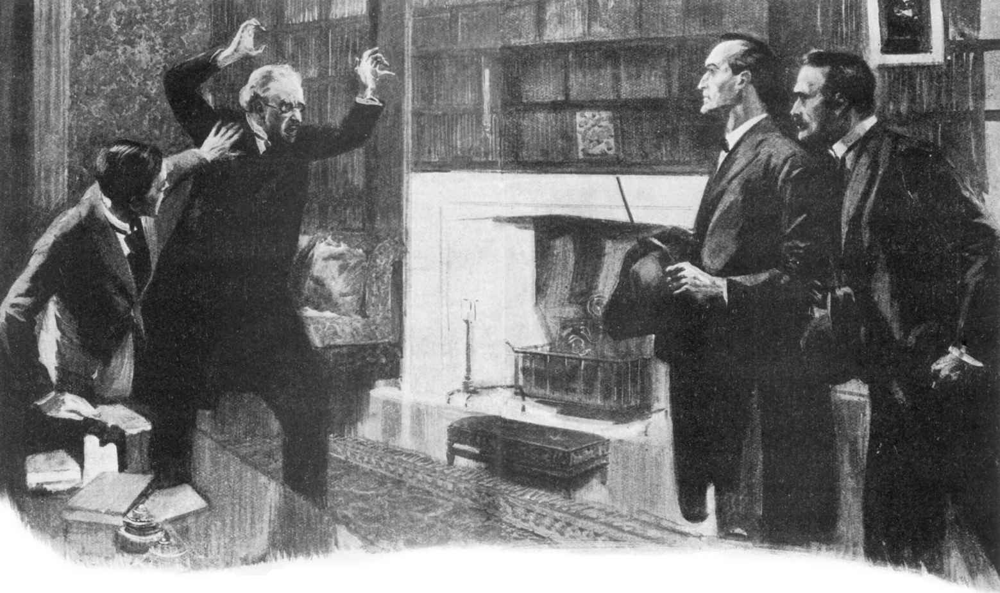

老头儿尖起嗓子嚎叫，一脸狞恶。

“我亲爱的教授，”他高声唤道，“请顾及你的身份！这事传到大学里变成流言就不好了！福尔摩斯先生也是位知名人士，对他可不能太过分呀！”

着脸气呼呼地，我们的主人——若能容我如此称呼他——闪开一边让出门来。我们这才脱身离开屋子，来到安静的林荫车道。福尔摩斯似乎对遇到这样的事在按捺不住地好笑。

“我们这位大学问家朋友，有点不正常，”他说，“我们这样直闯有些莽撞，可是我们的目的达到了，跟他正面交锋一下。哦，不好，华生，他追上来了，这恶棍不放过我们。”

后面传来奔跑声。不过我松了一口气，不是凶神恶煞般的那个教授，而是他的助手，出现在车道拐角。他气喘吁吁地跑上来。

“真对不起，福尔摩斯先生，我得道歉。”

“我亲爱的先生，怎么要你道歉！我干的这一行，遇见这种事是家常便饭。”

“从来没见他今天这样厉害，他脾气越来越凶。你明白了，他女儿和我为什么害怕要出事。你也看见了，他脑子清楚着呢，一点不糊涂。”

“非常清楚！”福尔摩斯说，“证明我估计错了。事实说明他的记忆力很好，完全不是我想的那样。哦，对了，趁着这时候，我们看看普莱斯伯利小姐卧房的窗子行吗？”

本内特拨开树丛走近路，就看见房屋的侧面。

“就是那里，左边第二扇窗。”

“哦，这怎么爬得上去呀！噢，你看，下面有藤蔓，上面有水管，能踏脚就好攀登。”

“我可没本事爬得上去。”本内特说。

“爬不上去，一般人都不行，那有多危险。”

“还有一件事，我想告诉你，福尔摩斯先生，教授写信给伦敦那个人的地址我有。他今天上午写信，我从吸墨水纸上看出了地址。这做法，对一个私人秘书来说是绝对不光彩、不许可的，但不这样，有什么别的办法呢？”

福尔摩斯看了看那张吸墨纸，放进口袋。

“朵拉克——一个怪姓。斯拉夫人，我想是。好，这是案子环节上重要的一环。下午就回伦敦，本内特先生。我们留在这里没有什么事可做了，总不能把教授逮捕，他又没有犯罪。也不能把他关起来，因为不能证明他有精神病。目前也不能采取任何行动。”

“那我们能做什么呢？”

“要有点耐心，本内特先生，事情很快就会有发展。除非我判断失误，下星期二可能是个关键性日子，这一天我们一定要再来剑津。总的情况，当然未必乐观，如果普莱斯伯利小姐能够多耽搁几天——”

“那容易办到。”

“那就让她等等，确保一切危险都过去了再说。同时，让教授一切照常，不要打扰他。他心境越好，事情也越有利。”

“他来了！”本内特惊恐地小声说。从树枝掩映中望过去，看见高高挺拔的身影出现在门口，向周围张望。他探身前倾，双手直垂胸前，摇来摇去，脑袋向两边转动。秘书对我们一挥手告别，避入树丛中。我们看他走到他的雇主前，两人很起劲、很激动地谈着什么，一起回屋内。

“我猜这老先生识破我们来访别有企图，”我们走向旅店时福尔摩斯说，“跟他短短见这一面，我就看出这个人脑子逻辑性很强。发火，不奇怪，从他的角度看，难怪要发火，他被侦探盯上了嘛，马上他就要怀疑到自己家里有人捣鬼。我们要注意了，朋友本内特恐怕会很为难了。”

福尔摩斯半途在一家邮局发了一封电报。晚上就来了回电，他递给我看。

已访商务路，见朵拉克。和气。波希米亚人，中老年，开大杂货店。

默瑟

“这个默瑟，从你走了以后，”福尔摩斯道，“好多事情，例行事务之类，都要靠他做。这一点很重要了，要了解这个朵拉克，教授和他秘密通信。这个人的国籍和教授的布拉格之行搭得上关系。”

“感谢上帝，总算有一点事可以联系上了。”我说，“现在我们好像面临一连串事情，互不相关，无法解释。比如，狼狗咬人和去波希米亚旅行有什么关系？这又和半夜在走道上爬行有什么关系？至于你记下的日期，那更是谜中之谜、最大的谜了。”

福尔摩斯笑笑，搓起了双手。我们正坐在古老旅店的古老起居室中，一瓶福尔摩斯所说的那种有名的葡萄酒放在桌子上两人中间。

“好，现在，让我们先来分析日期，”他说道，把十指相对住，那神态好像面向全教室讲课一般，“这个年轻人有头脑，日记记下七月二日出事，之后就是每九天一个间隔，只有，我记得，只有一次例外。但是，最近那次出事是星期五，是九月三日，也符合周期规律。比如这之前一次就是八月二十六日。如此看来，绝对不是巧合。”

我不得不同意。

“那就让我们姑且作一推想，每九天，教授服一种药物，一种有什么效用，但毒性也很强的药物。他本身脾气暴躁，服了这药，更有剧烈的刺激。他起先是到布拉格去弄来这个药，现在伦敦有个波希米亚人可以定期供应。这样各个环节都连得上了，华生！”

“但是还有狗、窗上的脸、走道上爬行？”

“是的，是的，我们只是起了个头。看来要到下星期二，一切才会有新发展，在这期间，只能和本内特朋友保持联系，顺便享受这美丽小镇的景色。”

第二天早晨，本内特偷个空隙来向我们报告新消息。正如福尔摩斯所料，他不得安宁了。教授虽没有明确指责是他把我们引上门，但是对他态度言语极其粗暴，很明显对他表示强烈不满、恼怒。但是今天早上又恢复了常态，在济济一堂的教室里，像往常一样讲授得极其精彩。“撇开他的怪异发作不谈，”本内特说，“他确实精力更充沛，神气更足，我记得他以前可没这么好，脑子也更清楚了。但是，他已经不是他——不再是我们熟悉的那个人。”

“我看，至少是一个星期之内你不用怕，”福尔摩斯对他说，“我是个忙人，华生医生也有许多病人要看。我们约定，下星期二这个时间，我们在这儿见面。下次和你分别的时候，若是问题还不能向你交代，那我觉得太奇怪了，简直难以置信了。即便有可能得不到结果，也总该会有个说法。记住，有什么情况发生，一定给我来信。”

这以后几天我也没有再见到我的朋友。但是到了星期一晚上，就收到他的简信要我明日一起搭火车。在前往剑津的路上，他告诉我一切都很好，教授家里平安无事，教授自身的行为也完全正常。当天傍晚，我们下榻那家契克斯别墅老客店。本内特先生来看我们，他也是这样说法。“今天伦敦方面又来消息。来一封信，还有一个小包裹，都在邮票下面打十字记号，这是在警告我不许拆，没有其他情况。”

“这就足够了，”福尔摩斯面色凝重地说，“现在，本内特先生，我想，事情如何我们今天夜里可见分晓。我的推论如果正确，今晚时机便到了，事情必然会有头绪。为达此目的，有必要跟踪观察教授，建议你不要睡觉，进行监视。当听见他经过你门口，不要惊动他，小心谨慎跟住他，一定不要惊动了。华生医生和我也在近旁一起监视。还有，你说的那只小盒子，钥匙在哪里？”

“在他的表链上。”

“我看，我们要想想办法，拿到钥匙。情况再不明朗，盒子的锁打开就行。这家里你可以叫得动哪个身体强壮一点的人吗？”

“有个车夫，叫麦克菲。”

“他睡在什么地方？”

“睡在马厩楼上。”

“可能用得着他。好了，现在没事，我们静观事态发展。再见——不过有希望，不到早晨就要再见到你。”

将近午夜时分，我们在正对教授门前的矮树丛中埋伏好。夜色清朗，但寒气袭人，还好我们都穿了大衣。夜风徐徐，行云匆匆，时时把一瓣明月遮住。凄凉沉寂的守夜令人难挨，还好抱有期望，心情兴奋，可以支撑，加上我的朋友确信，我们已经快要达到一连串谜案的结局，因而吸引我们聚精会神。

“如果九天周期可靠，那么今晚教授就要大发作，”福尔摩斯说，“所有那些奇怪的症状都是他到布拉格去过回来以后才出现，又和伦敦的波希米亚商人秘密通信。这个商人可能是布拉格关系的代理人，今天这个人又寄来了包裹，是从布拉格弄来的，这一点可以肯定。他是按照一定规律用药，就是九天一个周期，这是最先引起我注意的一点。但是他的症状非常奇特，你注意到他的指关节了没有？”

我没有注意过，只好承认不知道。

“他的指关节又大又起茧，是我不曾见到过的。看人先看手，华生，再看袖口、裤膝、鞋。指关节不同常人，只能解释为某种行为所致，就是被——”福尔摩斯说到这里突然打住，用手敲敲额头，“哦，华生，华生，我怎么那么蠢！似乎不可信，但必定是这么回事。所有的疑点都指向一个方向，我怎么看不到、想不到都有联系呢？指关节——我怎么就放过了指关节呢？还有狗！还有墙上的藤蔓！我简直是在做梦还是怎么的！那时候都没想一想！注意，华生！他出来了！好机会，我们候上了，可以亲眼瞧他一瞧。”

厅门慢慢打开，借着背后的灯光，看见普莱斯伯利教授高大的身影，身穿休闲服，出现在门口。人是站着，但是哈腰欠身，两臂前垂，就像上一回我们看见他的那个样子。

接着他走到车道，身体模样来了个奇特的变化，拱腰曲背，手脚并用向前匍匐，爬几步就一跃一纵跳几跳，好像浑身是力气，要蹦跳几下才足以发泄。他顺着屋前过去，到屋角拐弯，人影不见了。这时候，本内特也从厅门走了出来，悄悄尾随他上前。

“快，华生，快！”福尔摩斯轻声叫道，我们蹑手蹑脚穿过矮树丛，转到一个能看到屋子侧面的方位，这一面屋墙给月光照得很明亮。我们看得清清楚楚，教授爬到墙上长满藤蔓的墙下。我们眼睛一眨不眨，只见他猛地攀藤上爬，动作矫健灵活，不可想象。他张臂攀一根藤，换一根藤，直往上蹿，脚蹬稳，手抓牢，如此攀爬着。看得出来，他纯粹只为发泄力量，从中取乐开心，除此并无其他确定的目的。宽大的休闲服在他身子两边飘荡，这使他看起来像一只大蝙蝠贴在侧墙上，在明月的照射下就像一个大黑方块。现在，大概乐趣已尽，玩兴不再，便从一根一根藤上下坠，蹲着，再佝偻起原先的身姿，向马厩爬去。这时狼狗在外面，狂吠不止。一看见主人则是更加激奋，链条紧，凶狂暴跳，吼叫颤抖。教授在吠犬够不到的地方，小心蹲下，开始用各样方法来挑逗。他在车道上抓一把土石向狗头上撒去，捡一根棒来触他、捅他，两只手在张牙的狗嘴前几英寸拍打作声，尽力撩拨惹恼狗儿性子提将上来。那狗上了劲，失去控制，更加疯狂地乱吠。在我们一生的冒险经历中，从来不曾见过眼前这番恶劣景象，如此高贵庄重相的一个人作蛤蟆状趴在地上，使出各种邪门儿歪点子，不嫌残忍地玩弄着面前狂蹦乱跳的狗，挑衅得朝他作出狂乱的表现。

然而，乐极生悲，一瞬间惨祸发生！不是链条挣断，却是颈圈滑脱。那颈圈原来是适合高大的粗脖子纽芬兰狗的，这时只听见金属当啷落地，接着便看见狗和人满地滚在一起。狗狂呼怒吼，人失声尖叫，叫得凄厉恐怖。教授玩得过火，差点儿玩出人命，狂野的畜生正咬住他的喉咙口，狗牙深深嵌进脖子。我们赶快上去，把狗拉开，这时教授已经昏厥。我们拉狗也冒着危险，全靠本内特一声呼唤，人也奔到跟前，大狼狗便立刻听话安定下来。狗叫人喊，把睡在马厩楼上的马车夫惊醒，引下了楼。“我早就料到，”马夫摇摇头说，“前些日子我就见他这么玩狗，我知道迟早要被狗咬。”

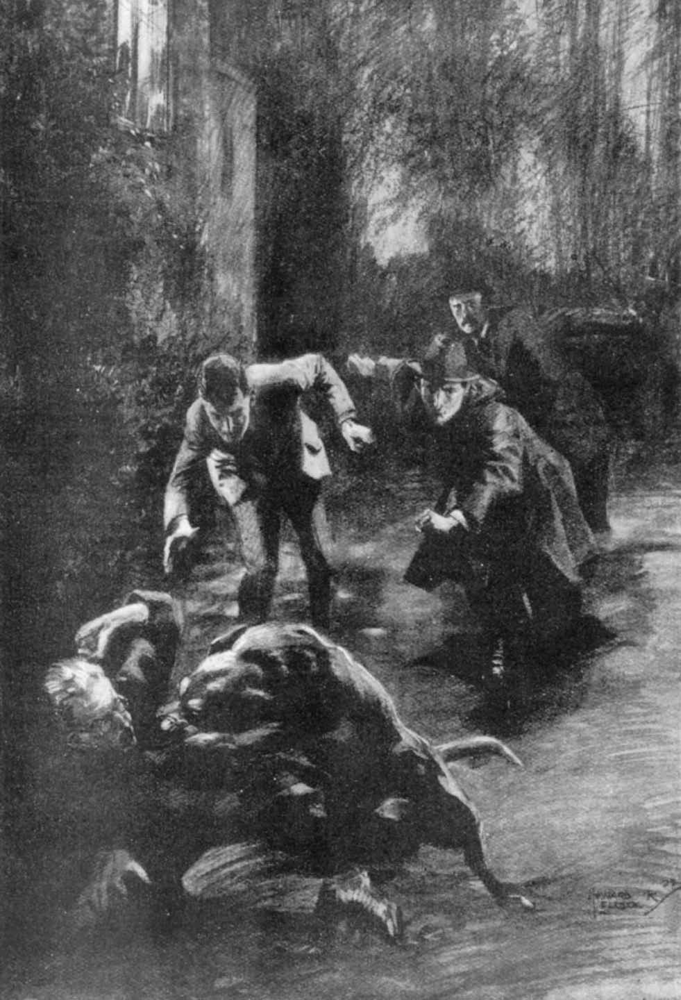

狗狂呼怒吼，人失声尖叫，叫得凄厉恐怖。

狗被拴好。我们一起把教授抬到卧室。本内特有医学学位，帮我一起处理咽喉伤口。狗牙的利齿差一点咬断静脉，伤口出血严重。半个小时以后，危险过去。我给病人注射了吗啡，他便陷入了沉睡。到了这时候，我们面面相觑，才定神看看发展到了这一步的事态。

“我觉得，该找个头等外科医生来给他治理。”我说。

“看在上帝的分上，不要！”本内特说，“现在家丑还没有外扬，我们几个知道还没关系，万一传出了屋门，那可挡也挡不住。要考虑到他在大学里的地位，在全欧洲的声望，他女儿的感情。”

“是这样，”福尔摩斯说，“我想，这件事就限于我们几个。虽然只操在我们之手，也要防止事态进一步扩大。表链上的钥匙拿下来，本内特先生。让麦克菲看守病人，有什么变化立即向我们报告。我们去看看教授那只盒子，有什么神秘。”

东西不多，但是足够说明真相——小药水瓶，一只空的，另一只几乎全满着，一个皮下注射器，几封信，字形歪歪斜斜是外国人的笔迹。信封上的十字记号，表明正是不许秘书处理的那几封信。每一封的发信地址都是商务路，签字是“A．朵拉克”。信的内容都是新药已邮寄普莱斯伯利教授的清单，或者是货款两讫的收据。但是有一个信封，字迹工整，是有文化的人写的，贴的是奥地利邮票，邮戳是布拉格。“证据有了！”福尔摩斯抽出信笺叫道。信上写道：

同道惠鉴：

自足下光临以来，鄙人始终萦怀，考虑再三。虽情况特殊宜作特殊之治疗，但鄙人仍须慎重从事，因药效业已显示颇具一定性质之危险。

类人猿血清或有更佳之疗效。正如已向足下申明，现所使用是黑面叶猿，因其标本现成易得也。遗憾此类性喜攀爬，而类人猿则直立行走，诸多方面更近于人性之现象。

故此务请足下多加防范，服用时期毋作不谨慎之显现。贵国尚另有一位服用本品同道，亦委托朵拉克为经纪人也。

烦请每周报告疗效为荷。

此致崇高敬礼！

H．洛文斯坦

洛文斯坦！这个名字使我想起在一张报纸上曾经见过，说是一位并不知名的科学家致力于研究开发一种新药——返老还童秘方和长生不老药。正是布拉格的洛文斯坦！洛文斯坦的健力壮阳血清，被医学界禁用，因为他拒不宣布处方。我简略介绍了我记起的情况。本内特从书架上取下动物学手册。“‘叶猴’，”他念道，“‘喜马拉雅山麓之大型黑面猿猴，最类人之最大个体攀行猴。’这里还有许多详细内容。好，谢谢你，福尔摩斯先生，事情很清楚了，我们已经追溯到祸事根源。”

“真正的根源，”福尔摩斯说，“是在于，当然，在于不适合年龄的恋爱。教授过于情切，以为他只要恢复青春就能如愿以偿。人想要超脱自然，必为自然所淘汰。要是离开天行之道，人类精英也一定逆返变成畜类。”他坐着，陷入冥思，手中把玩小药瓶，望着瓶中清澈的药液。“等我写信告诉这个人，他行销这种有毒性的药物，必须负刑事责任，这个麻烦也就会结束。但是类似事件还会发生，其他的人会有更巧妙的方法。实在是危害——人类的大危害。想想看，华生，那些追求物质、追求官能和世俗享乐的人，延长了他们无价值的生命，而追求灵魂纯净的人则不逃避神的召唤，那就是劣者生存，这不幸的世界岂不是成了累积污浊的垃圾桶了吗？”忽然间，这梦幻者一变而成为行动者，福尔摩斯从椅子上一跃而起，“好了，没有什么需要讲的了，本内特先生，各种疑点现在都清楚了，串成总的结论，原来就是那么回事。狗当然更灵敏，比人早感觉到变化。它凭嗅觉辨别，教授的气味已变成一只猴子，而不是原来的教授了，所以就要攻击他。罗依咬的不是教授，而是一只猴子。攀爬是这一类动物的本能，至于爬上年轻小姐的窗户，那也是好玩使然，我看，只是出于偶然。有一班早车可以回城，华生，不过，赶火车前我们还有点时间，在契克斯别墅喝杯茶吧。”

（1923年）

————————————————————

<a href="#part0155.xhtml_ch1-back" id="part0155.xhtml_ch1">(1)</a> 剑津大学：作者杜撰的校名，将两所老资格名牌大学剑桥（Cambridge）和牛津（Oxford）取头尾合二为一，叫剑津（Camford），以示文中该校及该教授的超级地位。

<a href="#part0155.xhtml_ch2-back" id="part0155.xhtml_ch2">(2)</a> 契克斯（Chequers），原是伦敦西北白金汉郡英国首相官邸的名称，此处为商家借用。

# 吸血鬼案

福尔摩斯把刚收到的一封信仔细看过，扑哧一声，几乎要不禁大笑起来，随即把信丢给我。

“这是现代文明与中世纪愚昧以及追求真实与凭空幻想的混合杂糅，能作如此掺和，我看实在是无以复加。”他说，“你是怎么个看法呢，华生？”

我念道：

46号，旧犹太街

11月19日

兹因吸血鬼事由

敬呈台端：

鄙事务所委托人明兴街弗格森缪尔黑德茶叶经销公司之罗伯特·弗格森先生，今来函询问有关吸血鬼事。因鄙所专营机械评估业务，该问题非属此项范围，故建议弗格森先生可造访尊府请教先生。因我等未曾忘怀足下承办玛蒂尔达·布里格斯案件之喜获成功，特予推荐。

您忠诚的

莫里森；莫里森多德公司谨启

经手人E．J．C．

“不要以为玛蒂尔达·布里格斯是一个年轻女子的姓名，华生，”福尔摩斯回忆说，“它是一艘船名，案子跟苏门答腊的巨鼠，大老鼠，有关系。这件事，外界还不曾传闻。可是吸血鬼的事为什么我们就该知道呢？不是他们的业务范围，难道是我们的业务范围？不过有事上门总比无事闲着要强，但这一下我们进入格林童话世界里了。抬抬手，华生，查一查V条目<a href="#part0156.xhtml_ch1"
id="part0156.xhtml_ch1-back">(1)</a>，有没有解释。”

我转过身去把他说的那本档案拿下来。福尔摩斯接过手，在膝头上放稳，兴趣十足地仔细翻阅，里面都是旧案记录，包括毕生累积的资料。

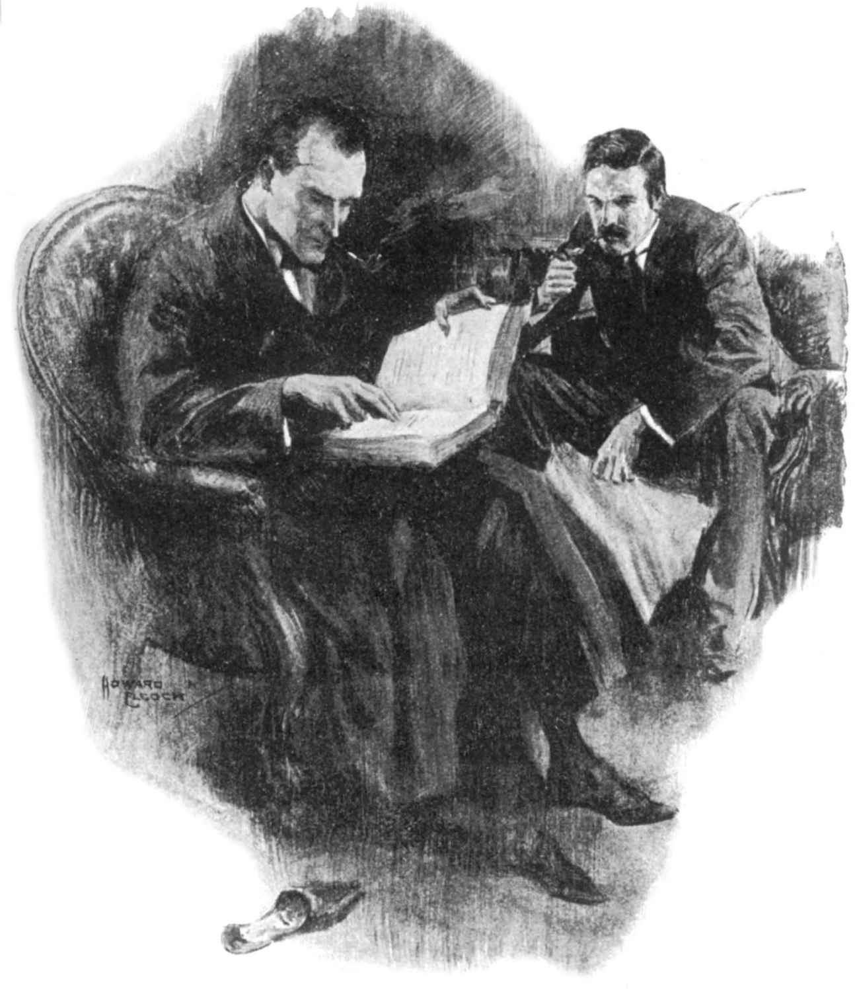

兴趣十足地仔细翻阅。

“航船格洛里亚·司科特号海难案，”他念道，“这是件重大案子，我记得你记载过，华生，尽管发表以后，我不敢恭维。维克多·林奇，造假案嫌犯。毒蜥蜴案，也叫希拉<a href="#part0156.xhtml_ch2"
id="part0156.xhtml_ch2-back">(2)</a>，那是奇案一桩！维特丽娅案，马戏团女演员。范德比尔特，这是保险柜盗窃犯。蝰蛇案，维格尔铁匠神工案，哇哈！哇哈！精彩连连，历史资料，你别小看它了。你听这个，华生，匈牙利吸血鬼，还有，特兰西瓦尼亚<a href="#part0156.xhtml_ch3"
id="part0156.xhtml_ch3-back">(3)</a>吸血鬼。”他专注地翻阅一阵，热情渐减，便把这本大书一放，哼了一声，很觉失望。

“无稽之谈，华生，一派胡言！尸体会行走，只有用桩子钉穿心脏，才能把他钉牢在坟墓里动弹不得。这些我们能相信？神经病了！”

“不过真有其事呢，”我说，“吸血鬼不一定只是死人，活人也会吸血。我看过资料，比如，老人吸童子血，可葆青春常驻。”

“不错，华生，这些资料中也有提及，但这种事值得我们相信吗？这个事务所十分实际，四平八稳不做无把握事。世界之大事情够我们忙乎，谁有空去管这档子鬼事！我想对罗伯特·弗格森先生的事不必去郑重其事。不过这里一封信，恐怕就是他写来的吧，也许可以看一看他写些什么。”

福尔摩斯拿起扔在桌上的另一封信，刚才在研究前一封信的时候对此未在意。他把信拆开来看，先是脸上还在好笑，看着看着，笑容敛住，变得紧张而全神贯注。等把信看完，他坐在那儿沉思了一会儿，信纸夹在手指间，过后忽然一惊，似乎从梦中醒了过来。

“奇斯曼庄园，兰伯利。兰伯利是什么地方，华生？”

“在苏塞克斯郡，霍尔舍姆南边。”

“不远吧，哦？奇斯曼庄园呢？”

“那边乡村我还熟悉，福尔摩斯。那里都是老房子，都按照当年建房人的名字来命名，都有好几百年了。比如奥德利庄园、哈威庄园、凯里顿庄园——这些人早就被遗忘了，可是他们的名字跟房子一起传下来了。”

“没错。”福尔摩斯淡淡地说。这是他的一种高傲、自持的脾气性格，尽管把咨询所得予以接受，暗自一一记在心里，表面上却很少显露对提供者表示谢意。“我倒是想，我们先要好好了解一下兰伯利奇斯曼庄园，再作道理。这封信，正如所料，是罗伯特·弗格森写来的。噢，他还提到认识你呢。”

“认识我？”

“你自己看。”

他把信递过来，信上的地址就是刚才说起的那个地方。信是这样写的：

亲爱的福尔摩斯先生：

我因我的律师举荐，特地向你请教。这件事十分蹊跷，而且无法与人商量，这关系到我朋友的事，我是代他接洽。我的这位朋友五年前娶了一位秘鲁女士，是一个秘鲁商人的女儿。我朋友因经营硝酸进口业务而与这位商人结识。女士十分美貌，但因毕竟为异国人，信奉宗教亦不同，夫妇间感情与兴趣皆异，渐生隔阂，无法融洽。因此，一段时间之后，他对于妻子的感情，渐渐冷淡，甚至觉得他们的结合实为错误。他觉得妻的品性，有许多方面令他无法捉摸与理解。但仅从外表上看来，女士却绝对敬爱丈夫，确实是位贤妻——因此令他反而觉得格外痛苦。

现在我即进入本题，详情还要等与你见面才更能讲清楚，事实也是此信仅能给你略述大概，以便你可以决定是否有兴趣承办本案。夫人原本温柔可爱，近来忽出现一些奇特行为，与前迥异。这位先生结过两次婚，前妻遗下一个儿子，今已十五岁，是很讨人喜欢且很懂事的少年。可惜年幼时不幸受过外伤，但他的后母曾经有两次无故殴打这可怜的孩子。一次用棍子打他，在他手臂上留下一个大伤疤。

但不止如此，比之对自己的孩子，一个不满周岁的可爱男婴，这只算得小事。有一次，约一个月前，保姆离开婴儿仅数分钟，婴儿突发大哭声，如受痛苦，保姆赶快返回。一进室内，却看见女主人，即太太，俯身于婴儿，咬其颈项。婴儿小脖子上有一细伤口，正在淌血。保姆大骇，欲叫男主人前来，但女主人告求不要去，并即给她五个金镑保守住秘密，也未作任何解释何故这么做。这件事便搁下，掩饰过去了。

但在保姆心中留下可怕印象，她一直深感不安。之后，便随时留意女主人行动，并且更加注意保护婴儿，因为她很疼爱这孩子。但她发觉，自己监视孩子的母亲，孩子的母亲也在监视她，只要她一离开孩子，这母亲便趁机接近孩子。保姆只好日夜严防，而母亲也日夜伺机而动，好像饿狼觊觎羔羊。这种事你读来一定十分难以置信，但我恳请你予以严重关注，实系事关小孩的性命，亦可能由此引起一个男人的精神失常。

但终于不免有一日事情爆发，再也瞒不住丈夫。保姆精神过于紧张，难以承受，终向男主人坦陈一切。男主人一听之下，认为无异于鬼话，难以想象之情境不亚于你我。他深知妻子十分贤惠，除了打继子之外，究竟是位好母亲，怎么可能会伤害自己的心肝宝贝呢？他便指保姆系幻觉，反觉其多疑纯属神经不正常，且如此诽谤女主人，不能容忍。但正当他们谈论之际，突然听到婴儿痛苦啼叫，保姆与男主人便一起冲入婴儿室中。这时你可以想象是什么感觉吧，福尔摩斯先生。他亲眼见妻子跪在摇床边忽地站起，又亲眼见孩子颈部淌血，被单染红。他惊叫一声，将妻子的脸扳向亮光，看见她嘴唇上都是血。正是她——这次毫无疑问了——是她吮吸可怜孩子的血！

事情就是这样。妻子现在关在屋里不见人，也不说一句话辩解。丈夫已陷入半疯狂状态。他只知，我也只知，此即“吸血鬼”之谓，而不知其他。我们原以为那纯属异国的夜话奇谭，现在，竟然发生在英国之心脏地带苏塞克斯——好了，一切等到明天早上再加详述。你愿和我会面吗？如愿意，烦请回电：弗格森，奇斯曼庄园，兰伯利，我将于十时登门拜访。

您忠诚的

罗伯特·弗格森

又：我记得你的朋友华生，和我打过橄榄球，他是布莱克希思队队员，我那时是李奇蒙队的中卫。在此谨作自我引荐。

“当然，我记得他，”我放下信说，“大鲍勃·弗格森，一直是李奇蒙队最棒的中卫。他厚道，脾气好，所以，他才会对朋友的事这么古道热肠。”

福尔摩斯深思着看看我，摇摇头。

“我真吃不透你，华生，”他说，“不了解你的地方还真不少。请发个回电吧，好人做好事啰，来而不往非礼也。就写‘乐意承办你的案子’。”

“你的案子！”

“别让他觉得本侦探事务所是一窝笨蛋。不用说，这当然是他自己的遭遇。这样发给他，等待明天上午就有分晓。”

次日上午十点整，弗格森走进我们屋中。我记得他原是个身高马大、手脚敏捷的人，在球场上迅速灵活，对方后卫的拦截，给他一绕就过。啊，人生的道路，没有比此时更令人心酸的了。想当年风头好健的一位强壮运动员，如今重逢已成了一把老骨头。这个大鲍勃的伟岸身躯已经塌陷，金发已经稀落，两肩已经削垂。我，恐怕他看到我现在的模样，他内心里也会唤起同样的感慨。

“哈哈，华生，”他招呼道，声音依旧是那样深沉热情，“你不像从前那个身子骨了。你应该还记得，那时我们在老鹿公园，我把你打出缆绳圈子界外跌到人群里去吧！我也是变掉了样。不过，大变还是最近一两天的事，人一下子见老了好多。福尔摩斯先生，你的电报，我已收悉，再装作是出于别人的委托，没有用了。”

“直接接办，简便多多。”福尔摩斯道。

“正是这样。但你也可以想象，谈论一个女人，又必须要维护她，有多为难。我能怎么办？能把这种事去报警吗？我还必须顾及孩子，孩子要受到保护。那是疯病吗，福尔摩斯先生？是家族遗传病？你以前有过这样类似的案子没有？看在上帝的分上，给我想想办法，我自己已是智穷力竭。”

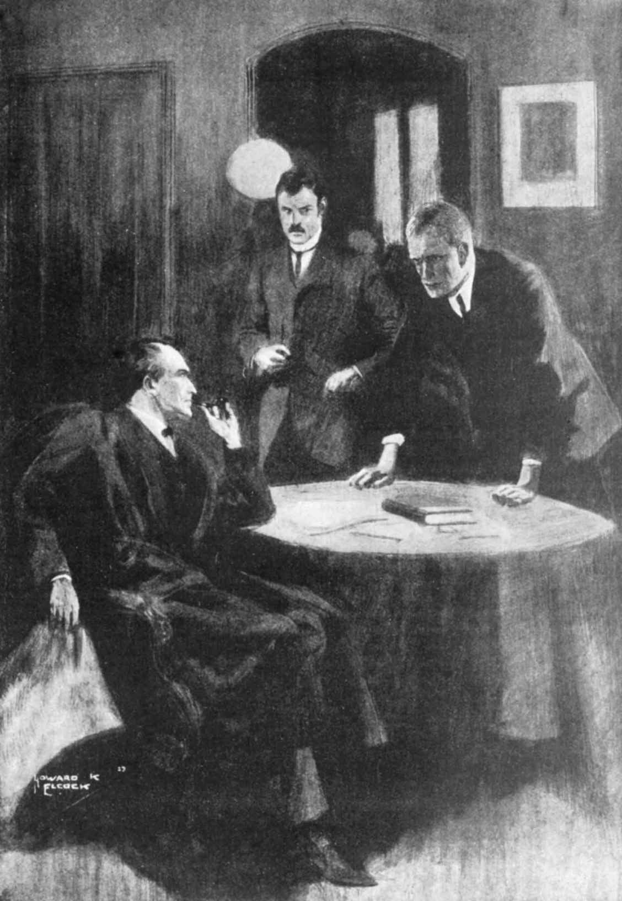

“给我想想办法，我自己已是智穷力竭。”

“那是一定，可想而知，弗格森先生。请先坐下，定一定神，好好回答我的问题。我可以向你保证，我离智穷力竭还有点距离，我很有信心，我们一定能找到解决的方法。首先，告诉我你采取了什么步骤，你的妻子还跟两个孩子有接触吗？”

“家里搞得很凄惨。她实在是个好女人，福尔摩斯先生。如果世上确实是有哪个女人真正全心全意爱一个男人的话，那就是像她那样爱我了。看到被我发现了这个可怕的不可思议的秘密，她的心全碎了，都讲不出一句话来。我骂她，她一句也不回，只睁大两只眼睛瞅着我，眼睛里只有惊吓、恐惧、绝望，接着就转身跑回房里去，锁上了门，这以后就再也不肯见我。她有个侍女，结婚以前就跟着她，叫多洛蕾丝——虽是佣人，实际好像朋友。多洛蕾丝给她送饭。”

“这之后小孩子就没事了？”

“梅森太太，那保姆，发誓日日夜夜守着孩子，说什么也不离开了。我是完全相信她的。我只担心可怜的小杰克，我信上跟你讲了，他两次挨打。”

“没有打伤？”

“没有，但也打得够狠。打这么一个跛腿孩子，躲都没能力躲的孩子，真揪心。”弗格森谈着他的儿子，憔悴的脸上显出柔情，“你想，瞧着这孩子有残疾，谁的心都会软。小时候摔的，伤了脊椎骨，福尔摩斯先生。可这孩子的心最好，最有爱心。”

福尔摩斯捡起昨天的信，又看了一遍。“你家里还有些什么人，弗格森先生？”

“两个仆人，才来没多久。一个马夫，迈克尔，住在宅子里。我妻子，我，大儿子杰克，小婴儿，多洛蕾丝，还有梅森太太。就这么些人。”

“我想，你们结婚的时候，你对妻子了解不是很深吧？”

“我认识她才不过几星期。”

“侍女多洛蕾丝跟她有多久了？”

“好几年吧。”

“那么说，你夫人的脾气性格，多洛蕾丝比你了解得深。”

“是的，可以这么说。”

福尔摩斯记在笔记上。

“我想，”他说，“我在这里谈，还不如到兰伯利去走一走管用。这桩案子，一定要亲自深入调查。倘若夫人留在她自己的房里，我们就不要去打扰她，添加她的不便。当然，我们会住在客店里。”

弗格森颇释然的样子。

“这正是我希望的，福尔摩斯先生。你要去的话，两点钟正好有一班头等车从维多利亚站开出。”

“当然，我们要去的。现在还有点时间，再等一会儿。我将全力以赴办你这桩案子。华生，当然一起参与，我们心不二用，力不二分。现在有一两个问题，希望在动身前搞清楚。这位不幸的夫人，我知道是对她自己的亲生儿子和你的大儿子都有暴力行为，是吗？”

“是这样。”

“但是暴力方式不一样，对两个孩子不一样，是吗？她对你的儿子是殴打。”

“一次是用木棒，一次是用手打，用手打也很重。”

“她是什么理由要打他？”

“没道理，就是恨呗。她自己说的，一再说是恨他。”

“也许，这情形，做后母的并不少见，可以说是一种对已死前妻的嫉妒。夫人天性嫉妒吗？”

“是的，她好嫉妒——热带人如火一般的爱，怀有嫉妒之心，也是如火一般。”

“但是孩子——他十五岁了。我想，身体残障，行动受阻，心理可能更见早熟，孩子心里是明白的。他和你说过究竟是为什么挨打吗？”

“没有，他辩解说，就是无缘无故挨打。”

“平时母子感情好不好？”

“不好，一直不好，没有母子情。”

“你不是说这孩子很有爱心吗？”

“世上再没有像他这样孝顺的儿子了。我的命就是他的命，我的一言一行都吸引着他。”

福尔摩斯又做了笔记，坐在那里想了一会儿。

“没问题，你再婚以前，和儿子两个是相依为命，须臾不可分离，是吗？”

“正是这样。”

“这样一个孩子，天性如此淳厚有爱心，那一定很想念自己的母亲了？”

“非常想念。”

“这个孩子真是一个有趣的好孩子。打孩子的事，还有一点要问问。对婴儿的伤害这一奇怪的行为，跟打你儿子是同一时间发生的吗？”

“第一次是同时发生的，她就像是忽然中了什么邪似的，对两个孩子都发作。第二次只是杰克挨了打，没听保姆说婴儿出事。”

“这么说，事情可复杂了。”

“我不明白你什么意思，福尔摩斯先生。”

“是不明白，只是暂时推理假设，有待时机和进一步的事实来加以确证。我这是个坏习惯，弗格森先生，可人性总不免是脆弱的，我怕是你的老朋友在这里要把我的科学方法来个夸大其词。在目前阶段，我只能说你的问题在我看来并非不可能解决。好，两点钟，在维多利亚车站，你一定可以和我们见面。”

这是个十一月阴沉多雾的黄昏，我们把行囊搁在兰伯利的契克斯旅馆，便驱车远奔苏塞克斯弯弯曲曲的泥道，直达弗格森居住的孤零零的古老庄园住宅。那是庞大而不一致的建筑，中间主屋最为古老，侧翼是新屋，有都铎王朝式的高耸的烟囱和长着苔藓的高斜面的霍尔舍母石板瓦顶，门前的石阶阶面已经磨陷，门廊上的一列古瓦镂刻着象征原屋主奇斯曼的图案：干酪块和一个男人<a href="#part0156.xhtml_ch4"
id="part0156.xhtml_ch4-back">(4)</a>。房屋内，天花板凹凸不平，由沉重的橡木横梁支撑，开裂扭曲的地板已呈弧形凹陷。这座摇摇欲坠的宅子里充满着一股陈年历久的霉变味。

屋中央是很大的大厅，弗格森领我们进去。一只古式的大壁炉，罩着铁屏，上面刻的年份是一六七〇。炉内塞足木柴，劈劈啪啪烧着旺火。

我环顾四周，看到内部的布置年代远近兼顾、地域风格迥异。半壁护墙板是原屋主自由民农夫始于十七世纪的遗制，但下半部挂着一排精美的现代水彩画。上半部不是橡木板，而是灰泥墙，挂着许多南美的餐具器皿和兵器。这显然都是楼上那位秘鲁太太的收藏物。福尔摩斯站起身来，怀着敏锐的好奇心一一审视。重新坐下时，眼神充满思索。

“咻咻！”他呼唤着，“咻咻！”

墙角一个篮子里蹲着一只狮子狗。这时慢慢地向主人走过来，行动很吃力，后腿向外撇，尾巴耷拉在地上。它舔舔弗格森的手。

“唤狗做什么，福尔摩斯先生？”

“瞧这狗，怎么了？”

“兽医也说不清。一种麻痹病，脑脊髓膜炎吧，医生说。不过病情在康复中，很快就会好的——是吗，卡罗？”

狗垂着的尾巴轻轻摇摆，以示赞同。一对悲戚的眼睛看看这个人，又看看那个人。他<a href="#part0156.xhtml_ch5"
id="part0156.xhtml_ch5-back">(5)</a>知道我们在谈论他的病。

“病是突发的吗？”

“一夜之间发作。”

“多少日子了？”

“大概四个月了吧。”

“怪事，很有启发。”

“你看出什么了，福尔摩斯先生？”

“证实了我的想法。”

“老天啊，你有什么想法，福尔摩斯先生？对你来说是智力猜谜，对我可是生死攸关的事。我的妻子恐怕会被判谋杀——我的孩子正处于危险之中。别跟我开玩笑，福尔摩斯先生，太可怕了，太严重了。”

大个子橄榄球中卫浑身颤抖，福尔摩斯伸手抚着他的胳膊。

“这件事无论怎么个结局，弗格森先生，恐怕在你都是非常痛苦的，”他说，“我一定竭尽全力帮你解决。现在我不能多讲什么，但在离开你家之前，希望给你作出正确的答复。”

“感谢上帝，这样最好。请原谅，两位先生，我得上楼去看看妻子，不知道她怎么样了。”

他走开了几分钟，福尔摩斯再次对墙上奇异的器物审视研究一番。我们的主人回下来的时候，一副垂头丧气的样子，十分清楚，楼上的情况并没有好转。随他进来一个高挑细长、棕色脸的女子。

“茶点预备好了，多洛蕾丝，”弗格森说，“看看女主人要什么，你给她拿上去吧。”

“女主人的病更重了，”女仆道，眼睛含怒看着男主人，“她没有吃东西。她的病更重了。她需要医生，没有医生，我害怕一个人跟她待一起。”

弗格森眼睛看着我，好像征询我的意思。

“若不嫌弃，我愿效劳。”

“你的女主人愿意让华生医生问诊吗？”

“我就带医生去。我没有问她是否同意，她需要医生。”

“那好，我马上跟你去。”

女仆激动得微微战栗。我随她上楼，走进一条古式走道，尽头是一扇厚实的铁框门。我一看这门，心中不禁在说，这种房门，弗格森想要强行进房去见他的夫人，可没那么容易。女仆在口袋中摸出钥匙，那沉重的橡木门板便转动铰链嘎嘎地打开，我跨入房中，女仆随后将门关上。

床上躺着一个女子，一看就知道正在发高烧。她神志半清醒。我一进去，她就抬起一双惊愕但美丽的眼睛，疑虑地望着我。看见来人并不认识，她反而放心，长呼一口气，头回落枕头上。我走上前，讲些安慰话。她安静地躺着，让我帮她诊断，量体温。脉搏很快，体温很高，但临床印象是精神状态的神经性病变，并非感染疫疾的发作。

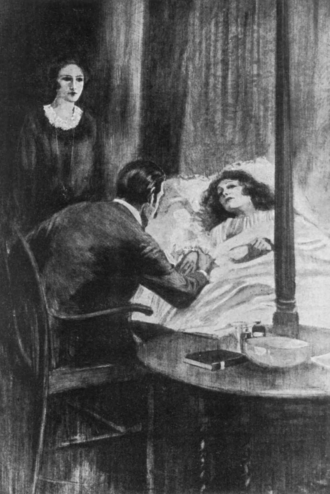

她抬起一双惊愕但美丽的眼睛，疑虑地望着我。

“像这样再多躺一天、两天，我怕她就快要死了。”女仆说。

女子转过绯红美丽的脸来朝向我。

“我丈夫在哪里？”

“他在楼下，原本要上来。”

“我不要见他，不见他的好。”随后似乎陷入谵妄，讲胡话了，“恶魔呀！恶魔呀！哦，魔鬼，我怎么办呀？”

“我能帮你什么忙吗？”

“不，不，没人帮得了忙的。完了，全毁了，我怎么做都不是人，全完了呀！”

这女人一定有奇异的妄想，我一点也看不出像鲍勃·弗格森这样诚实的规矩人会有鬼蜮伎俩。

“夫人，”我说，“你的丈夫深深地爱着你，他对发生的事，内心也是深感痛苦。”

她再一次将她美丽的眼睛转向我。

“他是爱我，是的，但是难道我就不爱他？我难道不是爱他到了宁可牺牲自己也不忍伤他的心吗？我可是爱他爱到这样的程度呀。他把我想得——他竟然这样的说我。”

“他实在太痛苦，他是不理解。”

“不，他不理解，可他应该相信。”

“你见见他吧？”我提议。

“不，不，我忘不了他的话多可怕，还有他的脸色，多吓人。我不要见他，你走吧，我这里不需要什么。只要告诉他一件事，我要我的孩子，我有权利要我的孩子。我就只要捎给他这句话。”她翻身脸朝墙，再也不答理。

我回到楼下，弗格森先生和福尔摩斯还坐在火炉边。弗格森听我叙述见面经过，更是显出一副愁眉苦脸的样子。

“叫我怎么能把孩子给她？”他道，“谁知她一发作起来会怎么样？我怎么能忘记，那天看她从摇床边站起来，满嘴沾着孩子的血？”他回想着，打了个寒战，“孩子让梅森太太守着才安全，孩子只有交给保姆。”

伶俐的女仆多洛蕾丝，她是这老屋中我们所见惟一还有些现代气息的一位女子，端进茶来。正在倒茶时，门开了，走进一个少年，一个可爱的孩子。他白皙的脸，浅金黄秀美的头发，一对活灵的浅蓝色眼睛。一看到父亲，便立刻闪现无比激动而幸福的光芒。他扑向父亲怀里，手臂勾住父亲的脖子，像个小女孩那样亲热娇痴，不肯松手。

“哦，爸爸，”孩子叫道，“我不知道你来了呢，要不然我早就在这儿等你了。哦，看见爸爸我就是高兴。”

弗格森轻轻解开拥抱的小手，不免有些惆怅。

“好孩子，”他说，温柔地拍拍儿子的金发头顶，“我回家早，因为我邀请朋友福尔摩斯先生和华生医生来这里住一个夜晚。”

“是那个大侦探福尔摩斯先生吗？”

“就是。”

少年带着怀疑的眼光看着我们，我觉得，似乎是不甚友好的凝视。

“你还有一个孩子怎么样，弗格森先生？”福尔摩斯问，“我们认识认识小宝贝吧？”

“叫梅森太太把弟弟抱下来。”弗格森关照，男孩应声去了，姿势一步一瘸，以我医生的眼光，一看便知患的是脊椎骨症。男孩一会儿回来，跟着一个高高瘦瘦的女人，怀抱一个秀嫩可爱的幼儿，黑眼睛，金头发，是撒克逊和拉丁血统绝妙的结晶。弗格森显然十分疼爱，他接过来抱住，温馨地呵护不止。

“怎么想得到有谁会忍心伤害这么个小娃娃！”他在喃喃自语，看着天使般白嫩的小脖子上那个红肿的小伤痕。

就在此刻，我无意间看了福尔摩斯一眼，发现他神情高度专注。他的脸如象牙雕刻般静止不动，一双眼睛，刚才还在注视父亲和婴儿，这时定睛凝神屏息，盯着屋子另一边的什么东西。我顺着他的目光看过去，估计是看那窗户外面淅沥落寞的花园。而事实上，外面的百叶窗半关着，遮掉了视线，但福尔摩斯肯定是集中注意力在看那扇窗。然后他笑笑，眼光收回，又落到小婴儿身上，看那胖嘟嘟脖子上的小伤痕。福尔摩斯仔细审视，不说话，最后握握朝他摇晃的肉嘟嘟的小拳头。

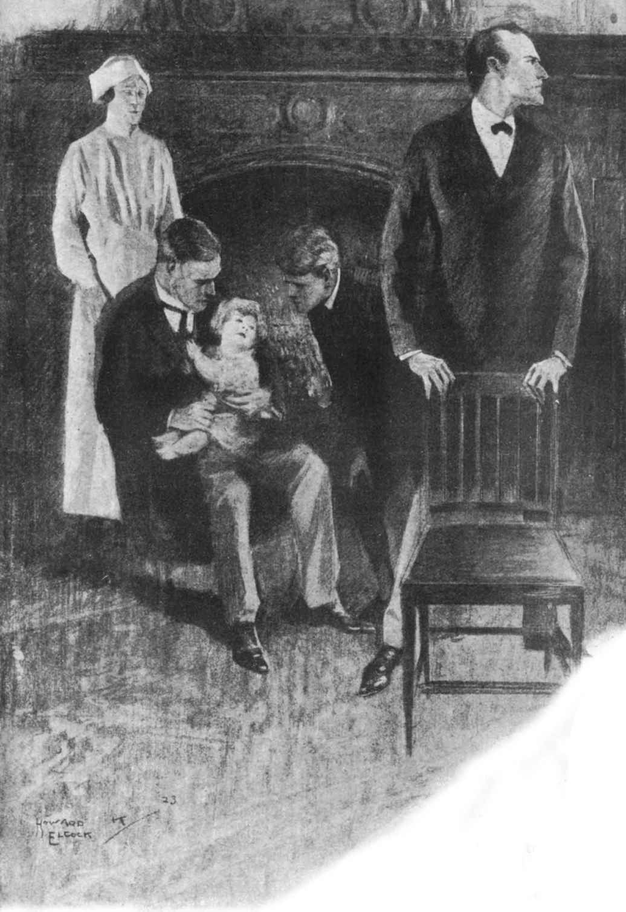

集中注意力在看那扇窗。

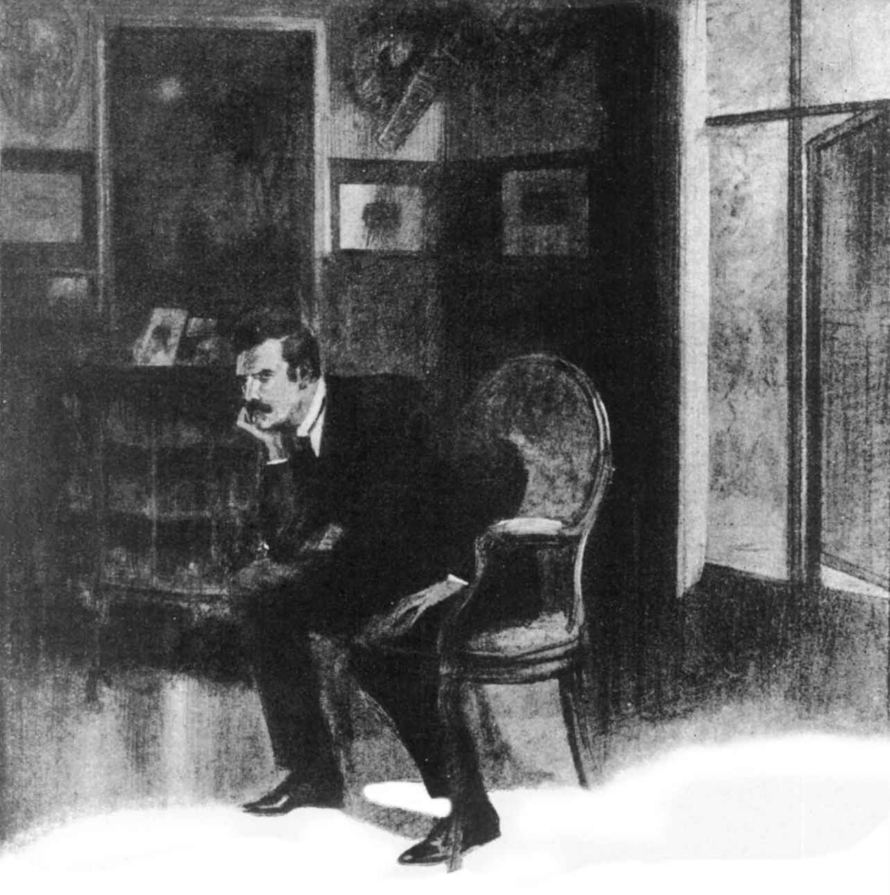

“再见了，小乖乖，你生命一开始，就遇上奇怪事。保姆，我想和你个别谈几句话。”

他把保姆叫到一旁，恳切地谈了几分钟。我只听到最后是这样的话：“你不用急，我想，很快就能放心。”保姆好像有些乖戾，是个不愿多话的妇人，她抱起孩子就退了出去。

“梅森太太这个人怎么样？”福尔摩斯问道。

“外表上不会引起多少好感，你也看到了，可是心比金贵，很喜欢孩子。”

“你喜欢她吗，杰吉？”福尔摩斯忽地转向男孩。孩子那表情丰富、机灵的脸上好像笼罩上阴影，他摇摇脑袋。

“杰吉喜欢还是不喜欢，表现都很强烈，”弗格森说，手搂着孩子，“幸亏我也是他喜欢的人。”

孩子喁喁地把头偎依在爸爸的胸怀。弗格森温柔地将他松开。

“去玩吧，乖杰吉。”他说，一副慈父的眼神，望着儿子出去。“现在，福尔摩斯先生，”等孩子走掉，他继续道，“我实在觉得恐怕会让你白跑了一趟。你看，你只能对我表示同情，除此之外，你能做什么呢？你至少应该看得到，这是一件极复杂、极敏感的案子吧！”

“敏感当然是敏感，”我的朋友说着，面露笑容，“但是直到此刻我还不曾觉得有多复杂，给难住了手脚。这个案子只需智力推理，一旦最初的智力推理由一连串孤立的事实逐一加以确认，那么主观假设就变成了客观事实，我们就有充分信心说我们已经到达目的地，可以登堂入室。事实上，我在离开贝克街之前，就已经得到结论，剩下要做的事，就是观测事实加以证实罢了。”

弗格森一只大手按着他布满皱纹的额头。

“看老天分上，福尔摩斯先生，”他急得嗓子都冒烟了，“你既然已经真相大白，就别把我吊着了，叫我怎么能受得了？你怎么查清楚事实，我不在乎，只要你把事实真正查清楚就行了。”

“确实，我应当对你讲明白。我马上就对你讲明，可是你得答应让我按照我的计划步骤来处理本案，行不行？夫人可以见我们吗？华生？”

“病得不轻，但完全清醒。”

“很好。我们只有当她的面才能澄清事实，让我们上去见见她吧。”

“她不肯见我。”弗格森大声说。

“噢，她会愿意的，”福尔摩斯说，一边在一张纸上草草写几句话，“至少你还有进门的资格，华生。就要劳驾你把这纸条交给夫人咯。”

我再上楼，把纸条交给多洛蕾丝。她留神地开门，一分钟后我听得房里一声呼唤，是一声又惊又喜的欢叫。多洛蕾丝探出头来。

“太太愿意见见，太太愿意听听。”她说。

于是便由我召唤弗格森和福尔摩斯上楼。一进卧室，弗格森连忙赶到床前。妻子已经坐起来，但挥手叫他走开，弗格森只好拿一张椅子坐下。福尔摩斯向夫人鞠个躬，也就坐在弗格森旁边。夫人睁大眼睛惊异地看着福尔摩斯。

“我想，多洛蕾丝可以离开吧，”福尔摩斯说，“噢，也好，夫人，你要让她留着，我也不反对。现在，弗格森先生，我是个忙人，还有许多事要找我，这里的案子也就直截了当解决吧，犹如动手术开刀，手脚越快，痛苦越少。我首先要说一句让你宽心的话，你的夫人，是一位最贤良、最仁爱而且是最能忍受冤屈的人。”

弗格森坐直了身子，喜不自禁地唤了一声。

“你对我说实话吧，福尔摩斯先生，我一辈子感激不尽。”

“我要说的。不过，说出来，另一方面又不得不叫你感到伤心。”

“这不用管我，只要你能给我妻子辨个清白就行了。这件事最要紧，世上别的都可以不在乎。”

“好，我告诉你，我在贝克街就已经有假设，再加以推理。吸血鬼的说法，我认为那完全是无稽之谈。这种鬼案在英国刑案中从未发生过，然而你亲眼所见也是一点不假。你看见夫人在孩子摇床边站起来，嘴上都是血。”

“我是亲眼看见的。”

“你怎么就没想到，出血的伤口，给吮吸了，并不是吸血，而是出于别样的目的呢？英国历史上不是有过一位王后，也是用嘴这样吸伤口把毒吸掉的吗？”

“是毒？”

“这儿是一个南美的家庭，我没有看见这里墙上那么多兵器之前，本能地觉得跟这类器具有关。也可能是别的毒，但反正我想到的是毒。等到我看见小小的鸟弓旁边那空的小箭筒，觉得果然不出我所料。孩子被南美箭毒<a href="#part0156.xhtml_ch6"
id="part0156.xhtml_ch6-back">(6)</a>或者别种毒箭头扎伤了，会导致死亡，除非赶快把伤口的毒血吸掉。

“还有那只狗！如果有人想使用毒箭，他应该会先试一下，看看箭上的毒还有没有效吧？我根本没想到这只狗，但是一见之下就明白，马上联想到一起了。

“现在你清楚了没有？你的夫人惊恐至极，感到压力很大。她看见了事实，是她救了孩子的命，可是这件事情又不能对你直说。她知道你是多么爱你的大儿子，怕你知道了要心碎的。”

“是杰吉！”

“刚才你抱着小儿子逗他的时候，我观察了你的大儿子，他的脸清楚地映在窗玻璃上，百叶窗做了玻璃的底衬，照得很清楚。我看见他的表情，嫉妒、嫉恨，那样子，在别人的脸上并不多见。”

“我的杰吉！”

“你必须面对现实，弗格森先生。他是特别痛苦的，因为那是一种畸形的爱，对你有一种病态的狂热的爱，对他死去的母亲可能也是一样，由此引发行为冲动。他看见婴儿多么可爱，又健康，又美丽，反观自己有残疾有缺陷，他的心灵受伤害，对婴儿充满了嫉恨。”

“哦，上帝呀！无法相信呀！”

“我说得对吗，夫人？”

女主人一直在哭泣，脸埋在枕头里，这时抬起头来望着丈夫。

“叫我怎么能对你讲呢，鲍勃？我一讲，对你打击太大了。还是等以后再讲吧，最好由别人来告诉你，不要我自己来讲。这位先生，写了张条子给我，真像神灵一般，一切情况他都清楚，我有多高兴呀。”

“我想，远航旅游一年，这是我给杰吉小主人开的一张治疗药方。”福尔摩斯说，从椅子上起身，“有一件事还在云雾里，没有弄清楚，夫人。我们很理解你打了杰吉小主人，这，任何做母亲的对此都会忍无可忍，但是你这两天离开了小儿子，怎么又放得下心了？”

“我告诉了梅森太太，她都知道。”

“果然是，我想也只有这种可能。”

弗格森站在床边啜泣，伸出双手，不住地颤抖。

“那就这样。我想我们告退吧，华生。”福尔摩斯附着耳边说道。“你挽上忠心耿耿的多洛蕾丝的一只胳膊，我就挽上她另一只胳膊。好，咱们走吧，”他把房门在身后带上，又道，“我想，剩下的事情留着他们夫妻俩会好好解决。”

关于本案，我只有一句话还要交代，那就是福尔摩斯对本篇一开始的那封来函写了回信，信是这样写的：

兹因吸血鬼事由

敬呈先生：

接十九日大函，经鄙人调查贵事务所委托人明兴街弗格森缪尔黑德茶叶经销公司之罗伯特·弗格森先生所提案件，业已圆满了结。因承贵事务所之推荐，特此致谢。

您忠诚的

歇洛克·福尔摩斯

（1924年）

————————————————————

<a href="#part0156.xhtml_ch1-back" id="part0156.xhtml_ch1">(1)</a> 吸血鬼（Vampire）的首字母是V，下文所列“航船格洛里亚·司科特号（Voyage
of the Gloria Scott）”、“毒蜥蜴（Venomous
lizard）”、“蝰蛇（Viper）”等等诸案英文都以V字母起首，均列于V条目中。

<a href="#part0156.xhtml_ch2-back" id="part0156.xhtml_ch2">(2)</a> 希拉（gila），全称Gila
monster，美国亚利桑那州希拉河（Gila）一带所产毒蜥。

<a href="#part0156.xhtml_ch3-back" id="part0156.xhtml_ch3">(3)</a> 特兰西瓦尼亚（Transylvania），罗马尼亚中部一地区。

<a href="#part0156.xhtml_ch4-back" id="part0156.xhtml_ch4">(4)</a> 该屋名是“奇斯曼”，即原建屋者名字的姓Cheeseman。cheese（干酪），man（男子），用雕刻干酪和男子的形象来表示屋主人的姓氏，这是英国常见的以图代字的一种标识。

<a href="#part0156.xhtml_ch5-back" id="part0156.xhtml_ch5">(5)</a> 前句中此狗的代词用it，此处拟人化用he，原文如此。

<a href="#part0156.xhtml_ch6-back" id="part0156.xhtml_ch6">(6)</a> 箭毒（curare），南美印第安人从马钱子属植物中提取的毒物，用以涂箭头。

# 三个同姓人案

这或许是喜剧，也或许是悲剧。它让一个人发疯，让我流血，而让另一个人受到法律惩处。然而那毕竟带着喜剧的色彩。好吧，是悲是喜敬请读者自己判断吧。

这一天我记得很清楚，因为那是福尔摩斯拒绝接受爵士封号的同一个月，他因为有功而要赐封爵号，这件事以后再说，现在我只是顺便提及。我作为他的搭档与至交，不得不力戒焦躁与不慎。我再说一遍，是这件事才使我记住了那个日子，那是一九〇二年一月底，南非战争刚结束不久。福尔摩斯在床上过了好几天，这是他的习惯，经常如此。但这一天他起床了，手中拿着一份大裁纸文件似的信，严峻的灰眼睛闪着笑意。

“你发财的机会到了，华生朋友，”福尔摩斯说，“你听说过有噶里德布这个姓吗？”

我回答没有听说过。

“哈，只要你找到一个姓噶里德布的，就能发财。”

“为什么？”

“哈，说来话长——也是一桩怪事。人事纷争之多，凡是我们经手过的案件，再没有比这个更稀奇。有个人要来这里接受我盘问，马上就来。所以，事情不必多讲，他一来也就明白。不过，这个姓，我们需要找一找。”

电话簿就在桌上，我顺手翻找，原不抱什么希望，没想到一翻就翻到，我喜出望外。

“有了，福尔摩斯！这里有了！”

福尔摩斯从我手里接过电话簿。

“噶里德布，N.，”他念道，“一三六号，赖德小街，西区。对不起，令你失望，我亲爱的华生。这是来信者本人，那是他信上的地址。我还得要找到和他同姓的其他人。”

哈德森太太进来，手持名片托盘，我拿起看了一眼。

“哈，看这个！”我惊奇地喊道，“头名不一样。约翰·噶里德布，律师，莫尔维尔，堪萨斯州，美国。”

福尔摩斯看一眼卡片，笑笑。“看来你还须另作努力，华生，”他说，“这位先生也是彀中人物。我当然想不到今天早上就能见他。他来得正好，可以讲出许多情况，我正需要知道呢。”

一会儿工夫，这个人已入室内。约翰·噶里德布律师先生，壮实矮墩的个儿，新修干净的一张圆脸，具有大多数美国事业人士的那副派头。总体上看是圆滚滚、孩儿气，让人得到的印象是笑容可掬、乐呵呵的年轻人。然而他的眼睛恰是令人极为醒目，我难得见到谁人脸上有如此一对眼睛能清楚地反映其内心世界，如此明亮、如此敏锐、如此迅速地随机应变。他的口音是地道的美国腔，但听上去并不怪异。

“哪位是福尔摩斯先生？”他问道，眼睛对我们看来看去，“噢，对了！相片很像是你，先生。没错。相信你收到一封信，是与我同姓的人写的，内森·噶里德布先生，是不是？”

“请坐下，”歇洛克·福尔摩斯说，“我们要，我想，要好好讨论一下。”他拿起那张大裁纸，“你是，当然，这封信上提到的约翰·噶里德布先生，想必来到英国有些时间了吧？”

“你说这个话是什么意思呢，福尔摩斯先生？”我似乎在他表情丰富的眼睛里看到了陡然生起的怀疑。

“你的全套服饰是英国的。”

噶里德布强作呵呵一笑。“我读过你的故事，知道一些你的手腕，福尔摩斯先生，但想不到你的手腕用到我身上来了。你怎么看得出来呢？”

“你衣服的肩头，你脚上的鞋头——谁看不出呢？”

“哦，哦，想不到我这么明显是个不列颠人模样。为了要办事，我到这里来有段时间了。所以呢，像你所说，我的全身行头是伦敦货。不过，我们见面不是为了谈鞋子、袜子，我们来谈谈你手上的那些文件好吗？”

福尔摩斯将来访者有点惹恼了，圆脸上已不见了和颜悦色。

“别急！不着急，噶里德布先生！”我的朋友低声安慰他说，“我的朋友华生医生会告诉你，我这种无关宏旨的小插曲，到头来证明很解决问题呢。那个内森·噶里德布先生为什么没有和你一起来？”

“他究竟干吗要把你扯进来？”我们的来访客大光其火，“这与你又有什么相干？这里谈的是两个绅士之间的正当业务，其中一个竟然要请起侦探来！我见了他，今儿早晨，他告诉我，他背着我做的这件蠢事，所以我到这里来了。不过，我还是感到不舒服。”

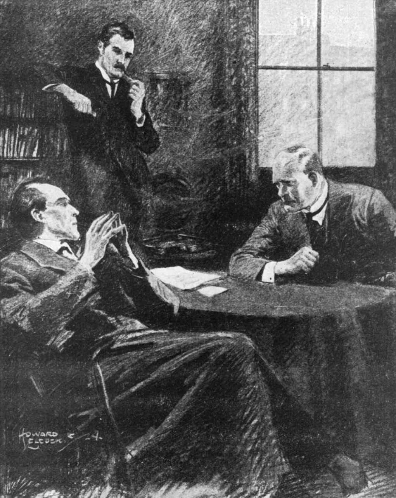

“他究竟干吗要把你扯进来？”

“这怪不得你，噶里德布先生。他那边是自己一头热，想达到你的目的——这个目的，我明白，你们二人都一样心急如火。他知道我有办法得到情报，这就找到我头上来，很自然的事嘛。”

我们的来客怒气渐消。

“那行，可是不一路，”他说道，“今儿早晨我去见他，他告诉我他已找到了侦探，我就问到了你的地址，直接找了来。我绝对不要警察插手这种私人事务。但是，只要你有意帮我们找到这个有用的人，那也不坏。”

“哦，那当然是这样咯，”福尔摩斯说，“现在，先生，既然你来了，我们最好听你亲口说说详情，我这位朋友对细节方面还一无所知。”

噶里德布在琢磨着我，目光并不友善。

“这位也需要了解？”他问道。

“我们经常一起合作。”

“好吧，本来也不是什么保密事。我把事实谈一谈，尽量简单扼要。你如果是堪萨斯人，也就不必向你解释亚历山大·汉密尔顿·噶里德布是何许人。他先是靠地产发家，后来在芝加哥又经营小麦仓库出租生意，把赚来的钱都投资买地皮，足足有你们几个郡大，沿阿肯色河，在道奇堡以西，好大一片。牧场地、林地、耕地、矿区，各式各样的地，在他手里都成了滚滚财源。

“他没有亲属，也没有朋友——要有的话，我也从来不曾听他说起过。可是他对自己这个姓氏十分自豪，这是个罕见的姓。就是这个姓，把我们聚在了一块儿。我在托皮卡<a href="#part0157.xhtml_ch1"
id="part0157.xhtml_ch1-back">(1)</a>当律师，有一天这老头儿上门来，真把他高兴死了，因为让他找到了一个同姓人。他就是有个怪癖，打定主意要找一找世界上还有没有人姓噶里德布。‘再找个跟我同姓的。’他对我说。我告诉他我是个忙人，哪能不做事光顾满天下跑着搜罗姓噶里德布的人。‘不碍事，’他说，‘只要按我的计划，事情成功，你就发了。’我只当他说笑话。谁知他这话可是有分量的，我很快就发现。

“这话说完后不到一年，他就死了，留下了遗嘱。这遗嘱也是特别怪，翻遍堪萨斯州遗嘱案卷也找不到这样一份奇怪的遗嘱。他把遗产分为三份，我可以享有一份，条件是要我再找到两个姓噶里德布的人，分享其余两份。每一份足足就有五百万美元，但是找不齐三人，那就一个子儿也别想捞到。

“这是个大好机会，我干脆把律师工作搁一边去，一门心思想再找到两个姓噶里德布的人，可是在美国一个也没有找到。我都跑遍了全国，先生，像用梳子似地都梳了一遍，始终没能找到一个姓噶里德布的人。后来只得看看老祖宗这边怎么样，就来到英国。果然有了，伦敦电话本上就有这个姓。大前天，我找到这个人，向他讲明来意。可是他只孤独一人，和我一样，有几个女亲戚，没有男子。遗嘱上写明要三个成年男人才行。所以你看，我们还是落个空门。如果你能够帮忙，觅得一个来补缺凑齐，我们乐意付你报酬。”

“你瞧，华生，”福尔摩斯笑道，“我说过一桩怪事，没说错吧？我本来想，先生，很简单的办法，登报，私人启事广告栏。”

“我都做过了，福尔摩斯先生，没人回应。”

“啊呀！这确实倒是个极其古怪的小问题呀。我闲时可以留心。噢，顺便说一句，也是怪巧的，你从托皮卡来，我过去和那边一个人有通信来往——现在已经去世——莱桑德·斯塔尔老博士，一八九〇年他是托皮卡市长。”

“斯塔尔老博士，老好人！”访客说，“说起他来，人人敬仰。那就这样，福尔摩斯先生，我们有什么进展就向你报告。大约一两天内你能听到消息。”这位美国人说完就鞠躬告辞。

福尔摩斯点起烟斗，坐了一会儿，脸上浮着异样的怪笑。

“怎么样？”最后我问。

“我正纳闷着呢，华生——搞不懂他！”

“不懂什么？”

福尔摩斯从嘴上取下烟斗。

“我一直纳闷，华生。这个人是出于什么目的，要对我说上这么一大套谎话。我差一点要拆穿他——有时候出其不意迎面一击是很奏效的——但是考虑下来，还是让他以为他把我们骗住了，这样更策略一点。这么一个人，穿的英国外套，肘部都已磨损，裤子膝盖已经松垂，穿了少说也有一年多吧。但是这封信上，他自己说的，都声称他是地道的美国人，最近才来伦敦。报上也根本没有登过启事广告。这你知道，我是绝不会错漏的。我最注意私人启事栏了，向来喜欢从中发现有什么小鸟好捉，现在有这么一只大野鸡我会错过？我也从来不知道托皮卡有谁叫莱桑德·斯塔尔博士。他处处都是破绽。我看，他是美国人倒是真的，来伦敦多年，就是口音还没变。到底搞什么名堂，这么拼命找姓噶里德布的人，背后有什么动机？值得我们注意。因为，如果他是歹徒，那也是一个十分复杂而狡诈的家伙。我们必须立即摸摸清楚，另一个写信给我们的人是不是也来这么一手。马上给他打电话，华生。”

我打电话，听到对方是一个微细而发颤的声音。

“是的，是的，我是内森·噶里德布先生。是福尔摩斯先生吗？我很想和福尔摩斯先生说几句话。”

我的朋友把电话接过去，我只听到他单方面不连贯的对话。

“是的，他来过了。我明白，你并不认识他……多久了？……只两天？是的，是的，当然太诱人了。晚上你在家吗？我想你的同姓人不会在吧？……很好，我们就来。我是很想谈谈，不要当他面……华生医生也和我一起来……你的来信中说你不常外出……好，我们大约是六点钟。你不要对美国律师提起……就这样，再见！”

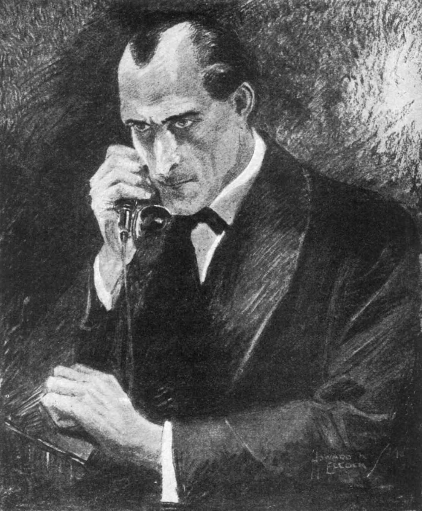

“我们大约是六点钟。”

春天的黄昏，暮色可爱，就连艾奇沃大路的岔道、那条赖德小街，与记忆中不祥的泰伯恩树<a href="#part0157.xhtml_ch2"
id="part0157.xhtml_ch2-back">(2)</a>刑场只有投石之遥，也沐着夕阳，显得金碧辉煌。我们走访的一幢房屋是早期乔治王式的旧式大建筑，正面平砖墙，底层有两座凸窗。我们的委托人就住在底层，两扇凸窗正是他的大房间的正面，他白天都在这里活动。我们经过小铜牌前，福尔摩斯指指上面刻着的怪姓。

“有些年头了，华生，”他说，指着褪色的铜牌，“是他的真名实姓。确实，值得我们注意。”

房子有公用的楼梯，门厅里标示出许多住户的姓名，有的是办公室，有的是私人住家。这不完全是住宅套间公寓，常是波希米亚式单身族<a href="#part0157.xhtml_ch3"
id="part0157.xhtml_ch3-back">(3)</a>生活的住所。我们的委托人亲自出来开门，他抱歉地说大楼管理女工四点钟下班走了。内森·噶里德布先生是个高身材，手脚不太灵便，驼背，瘦削，秃顶，有六十出头的年纪。他脸色死灰，皮肤板滞不鲜活，一看就知道是个不常运动锻炼的人。一副圆形大眼镜，一撮翘起的山羊胡须加上弯腰曲背的姿态，表露出他有探幽索隐的癖好。但总体形象还是很和蔼可亲，虽然带着些迂腐。

屋子也是奇特如主人，看上去像座小博物馆。房间既深又宽，四周都立着各式橱柜，摆满了标本，有地质学的，也有解剖学的。进门的两边是蝴蝶、蛾子的标本箱。屋子居中一张大桌，堆着各类杂物与碎石，一架高倍显微镜的铜镜管矗立其间。我环顾四周，十分惊讶这个人兴趣之如此广泛。那边是一橱燧石器，中间桌子的后面是一大柜子古化石，上面排列着石膏头骨，下方贴有标记“尼安德特人”、“海德堡人”、“克鲁马努人”<a href="#part0157.xhtml_ch4"
id="part0157.xhtml_ch4-back">(4)</a>。这表明，他是个多学科的学者。现在他站在我们面前，右手里还拿着一小块羊皮，刚才正在擦拭一枚古币。

“锡拉库萨<a href="#part0157.xhtml_ch5"
id="part0157.xhtml_ch5-back">(5)</a>古币——属于最盛时期，”他举起古币解释道，“末期就不行了，价值大不如前。我认为鼎盛期的钱币价值最高，虽然有人推崇亚历山大钱币。这儿有椅子，福尔摩斯先生。对不起，让我把这些骨头挪一挪干净。这位先生——噢，对了，华生博士——麻烦你把这个日本花瓶放一边去。你们瞧，都是我的小嗜好，乱七八糟。我的医生总说我不出去活动，有这么许多东西够我忙活，为什么还要出去呢？说真的，这么多橱柜，光给一个橱柜编目录，我就得花上三个月的时间。”

福尔摩斯好奇地四面瞧着。

“你说你是从不外出的吗？”他问道。

“有时候也坐车去苏富比或是佳士得拍卖店<a href="#part0157.xhtml_ch6"
id="part0157.xhtml_ch6-back">(6)</a>，此外就很少离开我这屋子。我身体不是太好，我的研究又很占时间。但是，你可以想象，福尔摩斯先生，太令人吃惊了——令人既兴奋但是又害怕——临到我的头上，听到这个无法形容的好运气。只要再找一个噶里德布就凑齐了，就成了。我们能找到，应当没问题。我有个兄弟，可惜过世了，女眷亲属都没有资格。这世上总还有人姓噶里德布吧。我听说你擅长解决疑难案件，因此，我写信找上你了。当然，这位美国先生也是对的，我先得听听他的意见才好，但是我找你是最好的办法。”

“我想你的行动确实是很明智的，”福尔摩斯说，“但你真的急于要拿到美国的地产吗？”

“当然不是，先生。没有什么能有吸引力把我引开，丢下这些个收藏。但是这位先生担保说，一等事情办成，他就买下我的地产。五百万美元，讲定了。市场上现在正有一打的标本出售，刚好可以弥补我的收藏品尚有的缺口，手头上还缺几百英镑，买不回来。想想看，我有了五百万美元，就可以做多少事呀。哈，我就成了国家收藏中心了，我就要成为当代的汉斯·斯隆<a href="#part0157.xhtml_ch7"
id="part0157.xhtml_ch7-back">(7)</a>了！”

他双眼在大镜片后面闪闪发光。很清楚，内森·噶里德布要找到一个同姓人，他会不遗余力。

“我来不过是要认识你一下，绝对无意打扰你的研究，”福尔摩斯说，“只为工作需要，我同相关人直接见面为好。你的来信还在我的口袋里，上面情况说得很清楚了。不了解的地方，美国先生来访时也问明白了，所以已经没有多少问题要问。我知道在本星期之前，你根本不认识他。”

“是这样，他是上星期二来找我的。”

“今天我们和他见面，他跟你讲了吗？”

“说了，他事后直接到我这里。他原先知道我写信这事，是很生气的。”

“为什么要生气呢？”

“他好像认为有损他的颜面，不过从你那里回来后，又开心了。”

“有没有提起行动计划？”

“没有，先生，他没提。”

“有没有向你要过钱？”

“没有，先生，这从来没有！”

“你看得出他可能怀有其他目的吗？”

“看不出，除了他讲的目的，其他没有。”

“我们同你电话约谈见面，告诉他了？”

“是的，先生，我告诉他了。”

福尔摩斯沉思起来，我看得出他十分困惑。

“你这许多收藏，有没有值大钱的物品？”

“没有，先生，我又不是富人。虽是很好的收藏品，但是值大钱的谈不上。”

“你不怕被盗？”

“一点不怕。”

“你在这里住多久了？”

“将近五年。”

福尔摩斯的询问被急急的敲门声打断。屋主刚去拉开门闩，那个美国律师便兴奋异常地蹦了进来。

“来啦！”他叫道，一张报纸高举过头顶摇晃着，“我想，我该马上来你这里。内森·噶里德布先生，恭喜啦！你成富翁啦，先生。这事儿圆满结束，称心如意。至于你，福尔摩斯先生，我们只能说，抱歉了，如果我们给你添了点毫无必要的麻烦。”

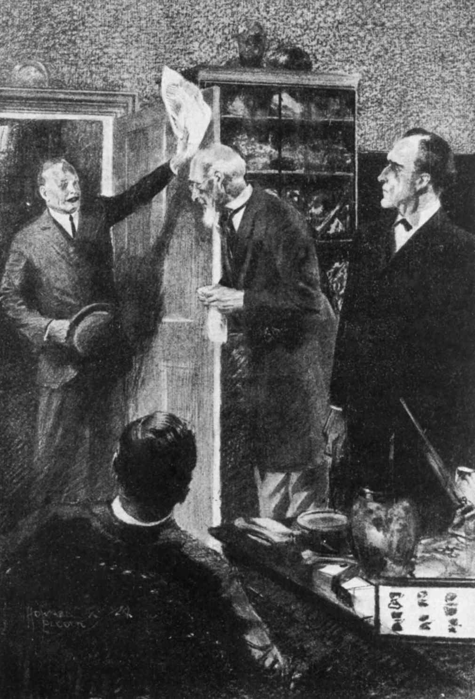

“恭喜啦！你成富翁啦！”

律师把报纸递给我们的委托人。他站在那里呆呆地望着一则用笔圈出的广告，福尔摩斯和我从他身后靠上去看。广告是这样写的：

霍华德·噶里德布

农机制造商

经营捆扎机、收割机、蒸汽犁及手犁、条播机、耙土机、农用大车、弹簧平板车，及各种其他设备。

承包自流井工程。

联系人：格罗斯文纳大厦，阿斯顿

“好极啦！”主人喘气叫道，“这下三个人都齐了！”

“我在伯明翰也调查了，”美国人说，“我的代理人把当地的这份报纸就寄来给我。我们要赶紧行动把事情办完。我已经写信给这个人，告诉他你明天下午四点钟去他的办公室找他。”

“你要我去找他？”

“你说呢，福尔摩斯先生？你不认为这样做更明智些吗？我在这里，一个连落脚地都没有的美国人，一桩天上掉下来的大好事，他凭什么相信我跟他说的话？可你是一位不列颠人，来由清楚可靠，你说的话他是要当真的。你愿意的话，我和你一起去，可惜明天我很忙。你要是遇到什么困难，你一叫我就来。”

“可是，我已有多年不曾这样旅行了。”

“没关系，噶里德布先生，我已经替你算好了往返时间。你十二点出发，很快，两点过后就能到那里，当天晚上就可以回来。你所做的事，就是见到这个人，证明事情缘由，办一张宣誓证明书，确证他的身份，哦，上帝！”他极其激动地又道，“想想我不远万里从美国中部赶来，你才走这么一百里去把事办完真的不算什么。”

“确实，”福尔摩斯说，“我想这位先生讲得很是在理。”

内森·噶里德布先生耸耸肩，无可奈何的样子。“你要是这么个意思，我就去吧，”他说，“要不答应也是不成呀，想想是你给我这辈子有这么大的希望。”

“那就这样讲定，”福尔摩斯说道，“你事情一经落实办完，尽快给我一个回话。”

“这我知道，”美国人说，“哦，”他看看表，又说，“我得走了，我明天来，内森先生，送你上伯明翰的火车。一起走吗，福尔摩斯先生？那好，再见，明天晚上我们就能得到你的好消息。”

我注意到，美国人离开了房间时，我朋友的脸色顿时清朗，深思、疑虑一概打消。

“我很想参观你的收藏品，噶里德布先生，”他说，“干我这一行，什么样杂七杂八的知识都管用，你这间房间正是知识的大宝库。”

我们的委托人听了很高兴，两眼在大玻璃片后面闪烁光芒。

“我以前一直听说，先生你是极有才智的人，”他说，“你有时间的话，我就陪你参观。”

“真不巧，这会儿我没时间。这些标本的标签、分类都很清楚，不必你再亲自解释也可以。如果明天我能抽出时间的话，我想，再补看一下，不碍事吧？”

“当然不，欢迎你来。当然，这儿明天关门，但是四点以前桑德斯太太在地下室，她可以让你进来，她有钥匙。”

“好，明天下午我正巧有空，你给桑德斯太太关照一声，就好方便一点。噢，对了，你这房屋的经纪人是谁？”

我们的委托人对这个突然的问题感到奇怪。

“霍洛韦和斯蒂尔，在艾奇沃路上。你怎么问起这个？”

“对于房屋建筑，我也有点考古的嗜好，”福尔摩斯笑道，“我很好奇，这房子是安妮女王时代的呢还是乔治王时代的。”

“乔治王时代，没有问题。”

“是的，我想可能还要早一些。没关系，很容易查清楚。好，再见了，噶里德布先生，祝你伯明翰之行大功告成。”

房产经纪人近在咫尺，但是发现已关门，于是我们就回到贝克街。直到晚饭后，福尔摩斯才又重新拾起这个话题。

“我们小小的案子已接近收尾，”他说，“没问题，你自己心中结论大致也有了。”

“我是一点头绪都没有。”

“事情开端已相当清楚了，结局我们明天也会看到。你有没有注意到广告上的奇异之处？”

“我看到，那个犁字plough拼作plow，拼法不对。”

“噢，被你看出来了，是吗？行，华生，大有进步。是的，英式英语是错的，美式英语是对的。报纸刊登完全按来文照排。还有弹簧平板马车buckboards，也是个美国字。还有自流井，在美国很普遍，我们这里不多见。总之，这是一则典型的美国广告，却自称是英国公司。你看出有什么讲究？”

“我推测是美国律师自己登的广告，但出于什么目的，我不明白。”

“哦，可以作多种解释。不管怎样，他都要把这位老古董请出门打发到伯明翰去，这一点是清楚的。我本想告诉老头不必去追野鹅白跑这一趟，但是，转念一想，遣他走也好，舞台上干净更好演戏。明天，华生——但等明天吧，好戏上场见分晓。”

福尔摩斯一早就出去了，中饭时间才回来，我注意到他的脸色极严峻。

“这个案子比我原先想的要严重，华生，”他说，“我要实话告诉你，虽然我说了实话以后，你更要非去冒险不可。相处至今，我当然深知你华生，但是确实危险，你应当知道。”

“好，这不是第一次与你共赴危难，福尔摩斯，我希望，也决不会是最后一次。这次有什么特别的危险？”

“我们面临的是一件非常棘手的案子。我已查明约翰·噶里德布律师先生的真实身份，他就是阴险毒辣、臭名昭著的‘杀人魔王’伊万斯。”

“我还是不明白怎么回事。”

“啊，这不是你的本行，不必去背诵新门监狱<a href="#part0157.xhtml_ch8"
id="part0157.xhtml_ch8-back">(8)</a>大事记。我去过警场找了朋友莱斯特雷德，他们那里尽管有时候缺乏想象与直觉，但是他们掌握的资料非常彻底与全面，还是世界首屈一指的。我想到可能在那边的资料记录中，收着我们这位美国朋友，可以查出点线索。果然没错，我发现了，在罪犯相片一览里，他那张圆圆的胖脸在朝我笑呢。‘詹姆斯·温特，又名莫尔克罗夫特，外号杀人魔王伊万斯’，这是照片上的姓名。”福尔摩斯从口袋里掏出一个信封，“我在他的档案里抄了几个要点：年龄四十四，籍贯芝加哥，已知国内枪杀三人，通过政治关系越狱逃跑，一八九三年抵伦敦。一八九五年一月，于滑铁卢夜总会赌博枪杀一人，被害人身亡，但被确证是他先动手肇事。死者身份为罗杰·普莱斯考特，系芝加哥假币制造犯。杀人凶手一九〇一年获释。之后受警方监督，生活正常，没有越轨行为。极危险分子，常携武器，随时伤人。这就是我们要猎的鸟儿，华生——一只难猎的鸟，你得承认。”

“他是什么目的呢？”

“哦，目的正在显露。我找过了房产经纪商，我们的委托人，房产商告诉我他已经住了五年。他之前，这间房有一年未出租。他的上家住户，是沃尔德伦先生，无业。沃尔德伦的相貌，经纪商办公室的人都还记得。这个人是突然消失不见的，一直没有他的音讯。他是高个子，留胡子，黑皮色。要知道，普莱斯考特，就是被杀人魔王伊万斯枪杀的那个人，据苏格兰警场的资料，也是高个子，黑皮色，留胡子。据此可以作出假设，我认为那个人就是普莱斯考特，美国罪犯。他就是住的这间屋，正是我们那位天真朋友现在专心致志经营的博物馆。如此，你瞧，链条的一头我们终于到手了。”

“下面那一头呢？”

“哦，我们现在还要去找呢。”

福尔摩斯从抽屉里取出一把左轮手枪交给我。

“我带上我心爱的老家伙。要是我们的西大荒<a href="#part0157.xhtml_ch9"
id="part0157.xhtml_ch9-back">(9)</a>朋友仗着他那个绰号动手，我们也就不客气。我让你打个盹，一个小时，华生，醒来后就到赖德街去冒一次险。”

我们到达内森·噶里德布那间与众不同的寓所，正好四点钟。房管员桑德斯太太刚准备要离开，一见我们便爽快地让我们进屋。门是弹簧锁，福尔摩斯答应在我们走的时候要检查一下，注意安全。一会儿楼门关上，见她戴着女帽从凸形窗下走过去，我们就知道这幢房屋的底楼只剩下我们了。福尔摩斯迅速把屋子检查一遍。在墙角落里的一个橱柜，稍稍离墙向外凸出。我们就躲到这个橱柜的空隙之间，福尔摩斯轻声向我约略讲了他的做法意图。

“很明显的，他打算把我们的善心朋友诱离这屋子，可是收藏家是个不出门的人，于是只好使出调虎离山之计。整个噶里德布谎言都为了这个目的。我得说，华生，想得出这种鬼点子也够绝，想不到这房客的稀罕怪姓让他的脑子开窍，编出万分诡谲的弥天大谎。”

“他究竟有什么目的呢？”

“对，我们现在就来这里找出答案。据我的观察，这跟我们的委托人一点关系也没有，而是和他谋杀的人有关——这个人是他的同谋。这屋子里藏有犯罪秘密。我看是这样。起初我只认为，这位朋友的收藏中有贵重物品，连他本人都不知道——贵重的无价之宝，值得罪犯打他主意。但是有一个事实，想到罗杰·普莱斯考特当年住的正是这间房子，那问题就更复杂了。好，华生，我们只要安心等待，静观其变。”

我们并没有等很久，很快就听到外门开启又关上，我们蹲在暗处缩起身子。接着喀嚓一下金属声，钥匙开锁，那美国人进了屋，随手轻轻把门关上，眼睛向屋内环顾，看看是否安全。他脱掉大衣，干净利落、极有把握地走向中间的桌子，把桌子推向一旁，扯开桌下的地毯，全部卷起来。从内衣袋里取出一把凿子，跪着使劲撬地板。我们随即听到抽动地板的声音，片刻间地板上露出一个方洞，杀人魔王伊万斯划火柴点亮一截蜡烛头，人就不见了。

这下也是我们的时间到了，福尔摩斯碰碰我手腕示意行动。我们一起悄悄靠近那地板开口，尽管我们动作很轻，但是脚下的地板太旧，嘎嘎作响。地洞下面那个美国人忽然探出脑袋，慌忙张望。他看见了我们，两眼射出凶光，但立刻转而厚颜狞笑，不得不低头，因为两支手枪抵住了他的脑袋。

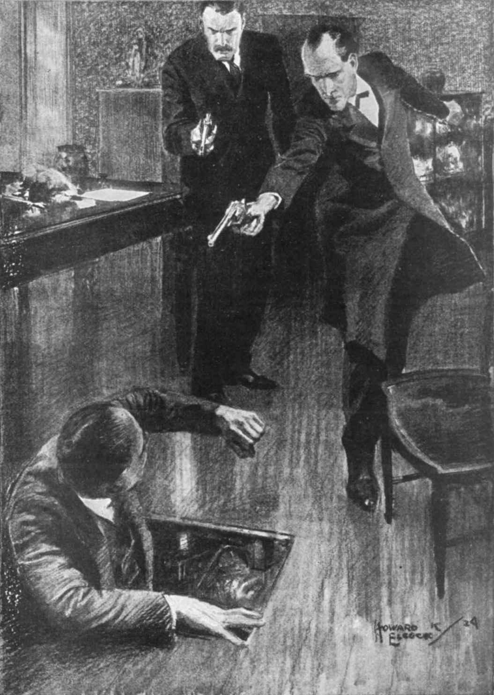

两支手枪抵住了他的脑袋。

“好，好！”他爬到地面上，咬牙说，“我想，你们比我多一个人啊，福尔摩斯先生。看来，我的把戏，给你看透。一开始就被你耍着玩，玩不过你。好，算我服你，败在你手下了——”

猛然间他嗖地从怀里抽出左轮手枪开了两枪，我忽然觉得腿上一股热辣的疼痛，有如被烧红的烙铁烙的一般。随即福尔摩斯的手枪啪的一下敲了他的脑门，我看见他仆倒地上，满脸淌血。福尔摩斯夺走他手上的凶器。我的朋友转身用瘦长结实的手臂扶住我，搀我坐到椅子上。

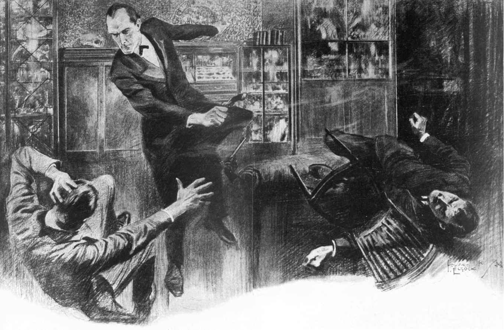

福尔摩斯的手枪啪的一下敲了他的脑门。

“没事吧，华生？上帝保佑，你不会有事的！”

受一次伤值得——受多次伤也值得——叫我感受到这张冷峻面孔的背后是多么深沉的友谊和忠诚。顷刻间，他那一双清澈、明亮的硬汉的眼睛，湿润了，模糊了，坚定的双唇颤动。这时候，我体会到他不仅有一个伟大的头脑，更有一颗伟大的心。我这些年来所作微末但忠心的服务获得这一刻的慰藉也就心满意足了。

“不要紧，福尔摩斯，不过一点擦伤。”

他掏出折刀把我的裤腿割开。

“你说得不错，”他深深舒了一口气，叫道，“表皮受伤。”他回头铁板着脸，瞪眼看着我们的人犯，这时人犯茫茫然坐起，“上帝饶你，算你走运，要是华生遭了你的毒手，你也别想从这屋子活着出去。现在，先生，你为你自己还有什么话可说？”

他为他自己已无话可说，只是坐在那儿，一脸苦相。我倚着福尔摩斯的手臂，一起向揭掉了暗盖的小地窖里望。伊万斯带下去的蜡烛把地窖照得很亮。我们看见一部生锈的机器，几捆纸，成堆的瓶子，还有一张小桌子整整齐齐垒着一摞摞纸包儿。

“印刷机——制造假币设备。”福尔摩斯说。

“就是，先生，”人犯说，摇摇晃晃站起来，倒在一张椅子里，“伦敦最大的假币制造犯，普莱斯考特的机器，桌上堆的小捆纸包，是普莱斯考特两千张面值一百英镑的钞票，拿上用出去没有一点破绽。两位先生请自己拿去用就是。做个交易，大家方便，放我走人吧。”

福尔摩斯大笑。

“我们不会干这种事，伊万斯先生，这个国家不是藏污纳垢之地，无你容身之处。是你打死普莱斯考特，对不对？”

“是我，先生，为这个蹲了五年大牢。是他先动的手——五年，其实应该给我挂个盘子大的勋章才对。没人能分辨得出普莱斯考特的伪钞和英国银行发行的钞票，要不是我杀了他，他的伪钞都能像洪水一样把伦敦给淹没了。全世界只有我一个，知道他制造假币的窝点，因此我要到这个地方来，这秘密你们怎么知道的呢？这个收破烂的呆子，怪姓的人，死不出去，我设法叫他走，这有什么好奇怪的呢？其实我可以再聪明一点，干脆除掉他，轻而易举。但是我这个人，心肠软，我开枪是因为对方也掏枪，否则我不开枪。可是我倒要请教，福尔摩斯先生，我有什么错？我既没有用过这假币制造机，也没伤了这老古董，你抓得住我什么了？”

“就算杀人未遂吧，在我这里，你犯的是这一条，”福尔摩斯说，“此外，那不是我们的业务，下一步由别人去处理。我们现在只管先抓住你。请打电话通知警场，华生，他们早就等着这一天呢。”

这就是杀人魔王伊万斯及他别出心裁的三个噶里德布同姓人的故事。后来我们听说那位可怜的老年朋友承受不了美梦破灭的打击，当那空中楼阁倒塌下来，他被埋在了废墟下面，进了布里克斯老人疗养院。普莱斯考特的假钞工厂被破获挖出来，警场这天大事庆贺。原来他们知道假钞工厂一定存在，但嫌犯死了，也就一直无法知道究竟在何处。伊万斯算是立了大功，让许多刑事调查部人员高枕无忧，因为那个假钞嫌犯对社会是大公害。他们可能很乐意为伊万斯申请他所讲的那个大盘勋章，可惜法庭不欣赏、不同意这种观点。于是，杀人魔王又回到刚放出来的那个暗无天日的地方。

（1924年）

————————————————————

<a href="#part0157.xhtml_ch1-back" id="part0157.xhtml_ch1">(1)</a> 托皮卡（Topeka），美国堪萨斯州首府。

<a href="#part0157.xhtml_ch2-back" id="part0157.xhtml_ch2">(2)</a> 泰伯恩树（Tyburn
Tree），伦敦旧时刑场，因古时绞刑常压树枝弹起吊死人，故也以树（tree）指称绞刑架。

<a href="#part0157.xhtml_ch3-back" id="part0157.xhtml_ch3">(3)</a> 因波希米亚人（Bohemian）性格豪放不羁，便以波希米亚式生活指放荡不羁的单身人群，尤指文化人。

<a href="#part0157.xhtml_ch4-back" id="part0157.xhtml_ch4">(4)</a> 克鲁马努人（Cro-Magnon），1868年发现于法国南部克鲁马努山洞的旧石器晚期新人。

<a href="#part0157.xhtml_ch5-back" id="part0157.xhtml_ch5">(5)</a> 锡拉库萨（Syracusan），又译叙拉古，意大利西西里岛东南港口城市，公元前734年由希腊人所建，公元前212年被罗马人占领。

<a href="#part0157.xhtml_ch6-back" id="part0157.xhtml_ch6">(6)</a> 苏富比（Sotheby，始于1744年）和佳士得（Christie's，始于1766年）是伦敦两家世界最老的拍卖行。

<a href="#part0157.xhtml_ch7-back" id="part0157.xhtml_ch7">(7)</a> 汉斯·斯隆（Hans
Sloane，1660—1753），英国医生，博物学家，大英博物馆主席，毕生收藏的20余万件文物成为大英博物馆的核心内容。

<a href="#part0157.xhtml_ch8-back" id="part0157.xhtml_ch8">(8)</a> 新门监狱（New
Gate），伦敦著名监狱，1902年拆毁。

<a href="#part0157.xhtml_ch9-back" id="part0157.xhtml_ch9">(9)</a> 西大荒（Wild
West），指美国早期的西部。

# 显贵主顾案

“现在可以没事了。”福尔摩斯终于作出决定，事情有了着落。多少年来这是第十次了，我一直要求他将下面的一则故事解禁，早日公诸大众。现在可以了，我终于获准加以记述，这在我朋友的侦探生涯中可说是表现极为卓越的大事记。

福尔摩斯和我两人都有土耳其浴的癖好。我们洗完浴，躺在干爽房间里，浑身松弛惬意，抽抽烟，这时会发现他比在其他任何地方都少了些许缄默，多了些许人情味。在这诺森伯兰大道浴室的楼上，有一个隔离的角落，并排放着两张躺椅，我们两人正躺在椅子上。这一天是一九〇二年九月三日，我所写的故事就从这一天开始。我问他手上有没有激动人心的案子，他立即回答，从盖毯下伸出瘦长、敏捷的手臂，从挂在旁边的外衣口袋里取出一个信封。

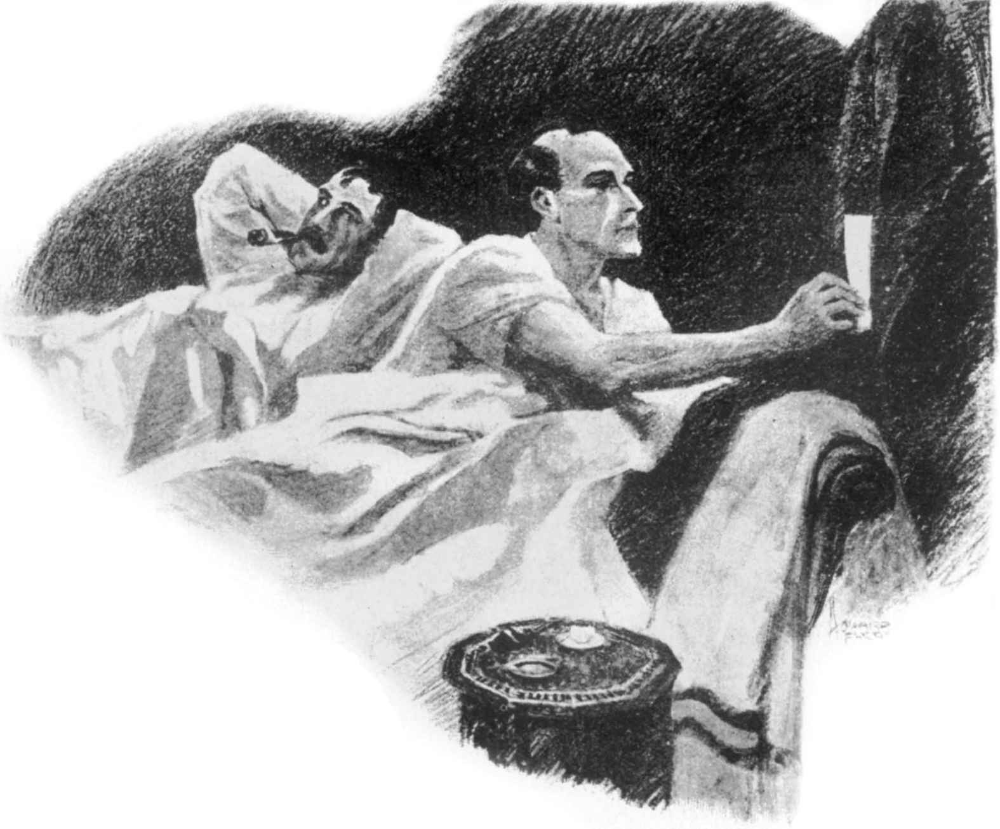

从挂在旁边的外衣口袋里取出一个信封。

“恐怕要么是小题大做，愚蠢又自以为了不得，要么就是个性命攸关的大问题，”他边说边把一纸信简递给我，“除了这信上所讲的，其他情况我一点也不知道。”

信是从卡尔顿俱乐部寄来的，时间是头天晚上。上面写道：

詹姆斯·戴默雷爵士谨向歇洛克·福尔摩斯先生致意，兹拟于明日下午四时半登门访晤。詹姆斯爵士欲向福尔摩斯先生请教者，系极为秘密且紧要之事，并恳请福尔摩斯先生务必拨冗接谈。乞蒙俯允电告卡尔顿俱乐部为荷。

“无需说得，我已经俯允他了，华生，”福尔摩斯说，我把信还给他，“这位戴默雷者，何许人也，你知道吗？”

“只晓得他名气很大，如雷贯耳。”

“哦，我可以说点给你听听。他善于处理那些不宜见报的秘密事情，并因此享有盛名。你大概记得哈默福德遗嘱案，这个案子是他和刘易士爵士进行了谈判的。他是个老于世故、外交手腕高明的人，所以我能肯定这次应该不会有假，是真正有需要，需要我们帮忙。”

“要我们帮忙？”

“是啊，你会乐意的，华生。”

“我不胜荣幸。”

“那你时间记住了——四点半。到时候再说，现在别去想它。”

我那时住在安妮王后街自己的寓所，但在约定的时间之前，我已赶到了贝克街。四点半，詹姆斯·戴默雷爵士上校准时来到。几乎无需对他进行描述，因为许多人都熟悉他的个性特色，身材高大，性格开朗直率，一张修得很干净的阔脸，尤其是，圆润悦耳的嗓音，一双灰色的爱尔兰眼睛目光坦诚，灵敏的唇边常挂微笑。光辉的高冠一顶，黑色的大礼服一袭，他浑身上下，从黑缎领巾珠宝针饰到漆皮鞋上的淡紫裹腿罩，无一不显示出他有讲究衣着、爱修边幅的习惯，他也正是以此而闻名。一尊大贵人驾临到了我们这间小屋陋室。

“果然，我是想到的，也会见到华生医生，”他彬彬有礼地一鞠躬说道，“他的合作可能是非常必要的，福尔摩斯先生。因为这一次我们要对付的，实在是个动辄暴力、毫无顾忌的狂徒。我可以说，全欧洲再也没有比此更危险的人了。”

“我过去好几位对手，都曾经荣膺如此的声誉，”福尔摩斯微笑道，“你不吸烟吗？那就对不起，我点烟斗了。你说的人，要是危险强过已故的莫里亚蒂教授，或是至今尚在的塞巴斯蒂恩·莫兰上校，那倒真是值得会他一会。敢问他的尊姓大名？”

“你可听说过格鲁纳男爵？”

“你是说那个奥地利杀人犯吗？”

戴默雷上校挥举戴着羔羊皮手套的双手，不禁大笑。“真是无人瞒得过你，福尔摩斯先生！神奇，神奇！这么说，你已经断定他是个杀人犯了？”

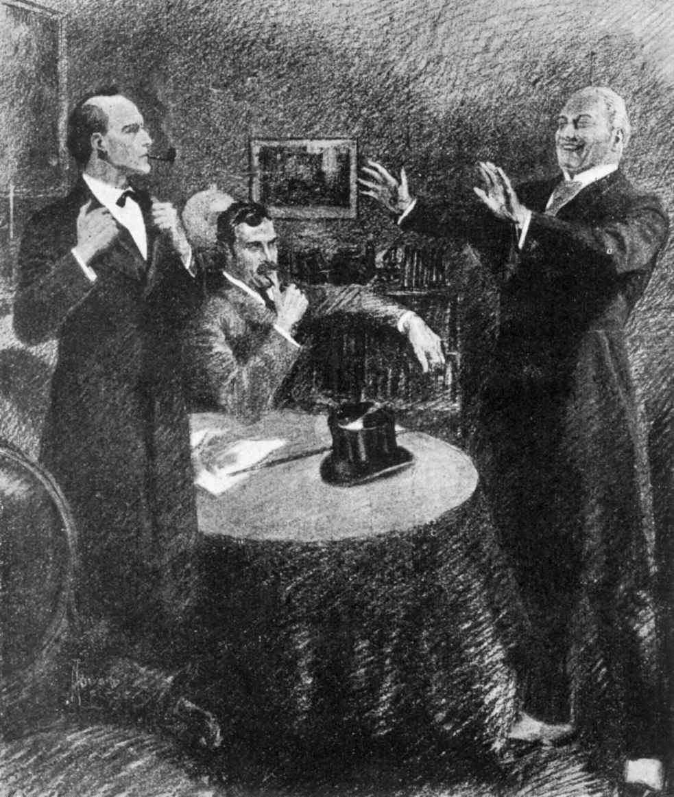

“真是无人瞒得过你，福尔摩斯先生！”

“这是我的业务，要关心大陆的刑案动向。凡是看过报都知道布拉格发生的事，对于这个人的罪行还能有怀疑？那纯然是法律上的技术问题，见证人死掉，他才得以逃脱法网，而见证人之死，死得非常不明不白！我是确信，他将自己妻子杀掉，搞成是‘意外事故’，这‘事故’刚一发生在史普卢根峡谷，我就如亲眼所见，是他下的毒手。我也知道，他跑到英国来了，并且有预感，迟早他会给我找点活儿干干。好吧，格鲁纳男爵现在怎么啦？我可以断定，该不会是原来悲剧的重演吧？”

“不是，这回要比那个严重得多。惩罚犯罪当然必要，但是预防犯罪更为重要。事情太可怕了，福尔摩斯先生。眼看可怕的事在你眼前发生，要酿成气候了，明知道将导致什么后果却无回天之力，一个人还有比这更不堪忍受的处境吗？”

“恐怕没有。”

“那你就该同情这位委托人，我是受他托付而前来。”

“我没想到你只是个中间人，被代理的主角是谁？”

“福尔摩斯先生，请你不要追问这个问题。事关重大，我一定确保不使他荣耀的大名牵扯到案子中来，他的目的动机绝对高尚纯正，只是不愿披露姓名。不需要我说了，你的报酬绝无问题，一切信得过，由你承办。委托人的真实姓名无关紧要，就免了吧？”

“很抱歉，”福尔摩斯说，“我处理的案子向来只是一端不明，现在两端都不明，那就如堕五里雾中不好办了。我恐怕，詹姆斯爵士，只好辞谢了。”

我们的来客大为慌乱，一张开朗、活络的面孔因激动和失望而阴沉下来。

“你难以理解你这样要求会是何等结果，福尔摩斯先生，”他说，“你这是将我置于进退两难的境地。可以完全肯定，只要我把事实告诉你，你接下此案，保证引以为荣，可是我有约在先，不得披露姓名。先将我能说的不妨说给你听，如何呢？”

“也好，但是有一点须要说清楚，我并未应许你什么。”

“这没问题。先讲，你一定听说过德·梅尔维尔将军吧？”

“开伯尔<a href="#part0158.xhtml_ch1"
id="part0158.xhtml_ch1-back">(1)</a>战役的名将德·梅尔维尔？是的，听说过。”

“他有个女儿，叫维奥莱特·德·梅尔维尔，富家千金，又年轻漂亮，多才多艺，天生丽质，尤物一个，各方面无可挑剔。就是这个女儿，天真可爱的姑娘，我们要想方设法把她从魔爪中营救出来。”

“姑娘落在格鲁纳男爵手里了，想必是？”

“对女人家是最厉害的控制——爱的控制。这个家伙，你也许听说过，相貌出众，风度翩翩叫人着迷，说话柔声细气，风流倜傥又叫人神秘莫测，这最能赢得女人的爱慕之心。据说，女人都心甘情愿听他摆布，他也就专门利用这一点为手段玩弄女性。”

“维奥莱特·德·梅尔维尔小姐是有身份地位的女子，他格鲁纳这种人怎么给遇上的呢？”

“那是在地中海，一次汽艇旅游，参加的人虽说是有筛选的，但旅费都是自己出，这就把握不住关口了。旅游主办人不了解这位男爵的真正品行，等到了解已经晚了。这个流氓缠上了姑娘，下足功夫，结果完全赢得了芳心。要说姑娘爱上了他，还不足以说明情况，姑娘对他已到了痴情的地步，坠入爱河不可自拔。世界上只有他了，别的什么都不存在。说他一句不是，姑娘一概拒绝，听不进。想尽一切办法去医治她的痴心病，可是徒劳。结果到了现在，她下个月就要和他结婚。她已经到法定年龄，而且铁了心，我们实在束手无策，不知怎么样才能阻止她。”

“她知不知道那奥地利的事？”

“这个狡猾的恶魔，他把自己过去的每一桩社会丑闻都告诉姑娘，但是耍花腔每一次都把自己说成是无辜者、圣人。姑娘一味听他胡吹，不情愿听旁人劝。”

“我的天！不过，你已经无意间把你委托人的姓名透露出来了！毫无疑问，就是德·梅尔维尔将军。”

我们的来客在椅子里坐不穏了。

“我要是存心骗你，可以满口胡说，福尔摩斯先生，其实不是。德·梅尔维尔已经身心俱毁不复当年，坚强的军人被这件事搞得焦头烂额，战场上叱咤风云的勇气已经荡然无存，成了衰弱老朽的人，完全没有能力同这个意气风发、精力充沛的奥地利流氓去较量。说到我的委托人，那是一个老朋友，与这位将军熟识多年的至交，他是看着将军女儿长大的，对姑娘怀有父亲般的感情加以爱护。悲剧酿成，不能袖手旁观，听之任之。这个事苏格兰警场无能为力，于是他就建议来请你出马。但是，我已说过，他特别讲好条件，不能将他牵扯到案子中去。我完全相信，福尔摩斯先生，凭你的大智大能，很容易打探出委托人是谁。但是我必须请求你，以名誉担保，不要这样做，不要去揭开这位隐姓埋名的人。”

福尔摩斯大笑，不以为然。

“我说，这就放心吧，可以答应。”他说，“我要补充一点，你的问题倒让我很感兴趣，有意探个究竟。我和你怎么个联系法？”

“到卡尔顿俱乐部就能找到我。万一有急事，有个私人电话，XX．31。”

福尔摩斯把电话号码记下来，再坐好，依然微笑，通讯录翻开着搁在膝上。

“男爵目前的地址，知道吗？”

“弗尔诺住宅，靠近金斯顿，是幢大宅。他做投机生意，忽然一夜之间发起来，这就使他如虎添翼，更能得手了。”

“他现在住在家里？”

“是的。”

“除了刚才讲的以外，这个人还有没有其他情况可以跟我讲讲？”

“他有不少开销很大的嗜好。他养马，是个行家。有一阵子在赫林汉打马球。后来他的布拉格事情传得沸沸扬扬，才离开那儿。他喜欢藏书藏画，很有艺术天分。我知道，他是公认的中国瓷器权威，写有这方面的专著。”

“心思很复杂，”福尔摩斯说，“大犯罪家都是这样。我的老交道查理·皮斯，是个小提琴家，汶莱特也是个不赖的艺术家。还可以举出好些个。好了，詹姆斯爵士，请你转告你的委托人，我会对格鲁纳男爵特别用心的，其他不多讲了。我自己有些消息来源，我敢说，我们有办法揭掉他的假面具。”

来客一走，福尔摩斯坐着沉思良久，令我觉得他忘了还有我在场。但他终于忽然觉醒。

“哦，华生，你怎么看？”

“我觉得你最好去见一见小姐本人。”

“我亲爱的华生，她自己伤心体衰的老父亲都感动不了她，我一个陌生人又有什么用！当然，其他方法全部无效，你这建议也就不妨一试。但我想，我们必须从一个不同的角度进行，我甚至想到欣韦尔·约翰逊或许会有帮助。”

在我的回忆记述中，还从未提起过欣韦尔·约翰逊这个人，因为我很少从我朋友后期的刑侦案例中取材。本世纪初那几年里，他是福尔摩斯的得力助手。约翰逊，他的往昔说来悲哀，曾经是个恶名昭彰的歹徒，在巴克赫斯特监狱两度服刑，后来悔过自新，投效福尔摩斯，在伦敦地下帮派组织中卧底充当耳目。他所提供的情报常常被证明极其重要，起到关键的作用。如果约翰逊当了警方的密探，那他很快就会暴露。他参与的案子从不直接上法庭，他的活动也就始终未被同伙察觉。由于有过两次判刑的声誉，他可以随便出入伦敦任何一家夜总会、小客栈和赌场。他观察敏锐，头脑灵活，成了很得力的情报内线。现在福尔摩斯想到要找的就是他。

我迫于自己的业务繁忙，对我朋友采取的行动步骤不可能随即跟进。但一天晚上，我应约在辛普森餐馆与他会面，他坐在靠窗的一张小桌旁，望着下面斯特兰大街上车水马龙，给我讲了做过什么事。

“约翰逊活动很积极，”他说，“他在地下社会的黑暗角落里能摸到一些情况，也只有在那种罪恶的垃圾地方，一定要潜伏到底，我们才能掌握到这个人的秘密。”

“但是梅尔维尔小姐对既有的事实都不愿正视，你有什么新发现就能使她觉醒，幡然悔悟？”

“谁知道，华生！女人的心思在我们男人总像是不可揣测的谜。杀人罪也许可以原谅、开脱，但小节不周，倒反而会冒犯、刺痛她们呢。格鲁纳男爵对我说起——”

“他同你说！”

“哦，对了，我的计划同你一点也没讲起过。是这样，华生，我喜欢和我的对手近距离正面接触，我喜欢面对面亲自观察他是个什么料的人。我对约翰逊作好指示以后，就叫了马车直奔金斯顿，见到了男爵。他态度极好，和蔼可亲得很。”

“他认识你？”

“不用认识，是我自己送上名片的。他真是个出众的敌手，冷若冰霜，胸有城府，说话慢条斯理，和顺得犹如上等社会的顾问医师，可是狠毒如眼镜蛇。他是有教养的——是个罪犯中的真正贵族，表面上嘻嘻哈哈午茶喝喝，背地里置人于死地。很好，我很高兴有人找我来关注阿尔伯特·格鲁纳男爵，和他打交道，三生有幸。”

“你说他和蔼可亲？”

“猫儿得意咪咪叫，耗子就抓到；有些人是假惺惺和气，可是比粗人的暴力要可怕得多。他的寒暄有奇招。‘我是想，早晚会要见到你，福尔摩斯先生。’他说，‘你是受雇于德·梅尔维尔将军，这不用问，要千方百计来拆散我和他女儿维奥莱特的姻缘，是这样吧，难道不是？’

“我默认。

“‘我亲爱的伙计，’他说，‘你只会毁掉自己来之不易的名声。这件事，你不可能成功，你只会白折腾一场，还不说要招致危险。让我奉劝你趁早悬崖勒马。’

“‘也真是巧，’我回答他，‘这句话应该是我来奉劝你的。你的脑瓜子，鄙人以前就很佩服，男爵。今天得以见识，我对你的尊敬并未稍减。让我开诚布公地说，没有人要抖出你的往事，叫你难堪不舒服。事过境迁，你现在风平浪静，但你要坚持这门亲事不放手的话，你将树立一大群劲敌，他们决不会坐视不管，让你任意妄为，结果必定弄得英国容不了你。这样划得来吗？你赶快放手这位姑娘，才是明智之举。你过去的所作所为一旦让姑娘知晓，你就要弄得很不是滋味。’

“男爵鼻子下有一小撮蜡捻小胡子，像昆虫的短触须一般翘起。他听着上面的话，胡子可笑地颤动，终于发出一阵缓缓的咯咯笑声。

“‘请原谅不免令我失笑，福尔摩斯先生，’他说，‘也真叫滑稽得很，看你手中并没有牌，想赌什么钱！我看任什么人都别来多事为好，白费力气，没好收场。你此处无大牌，福尔摩斯先生，小之又小的小三子而已。’

“‘你真以为如此？’

“‘我必如此。让我挑明说了吧，我握有王牌，手气好得很。我有幸赢得这位小姐的青睐，她对我一往情深。尽管我把过去每一件不幸的事都如实奉告于她，她却爱我愈深。我还告诉她，有些居心叵测的人——我希望你有自知之明——会来找她重提前事企图挑拨，我已告诫她如何处置。你听说过什么叫催眠后暗示吧，福尔摩斯先生？哦，你将看到这种催眠后暗示会如何起作用。因为只有高人才能使用催眠术，而且不落俗套，摒弃蠢举。所以她对你是有防备的，而我稳如大山，一百个放心。她会接见你的，因为她很听父亲的话，顺从父亲的意思——只有这一桩小事，例外不算。’”

“你看，华生，这就不必多说了。我保持心态，向他冷面告辞。可是，我刚握住门把手，他叫住我。

“‘顺便问一声，福尔摩斯先生，’他说，‘你知道勒布伦吗，那个法国侦探？’

“‘知道。’我回答。

“‘知道他落得什么下场吗？’

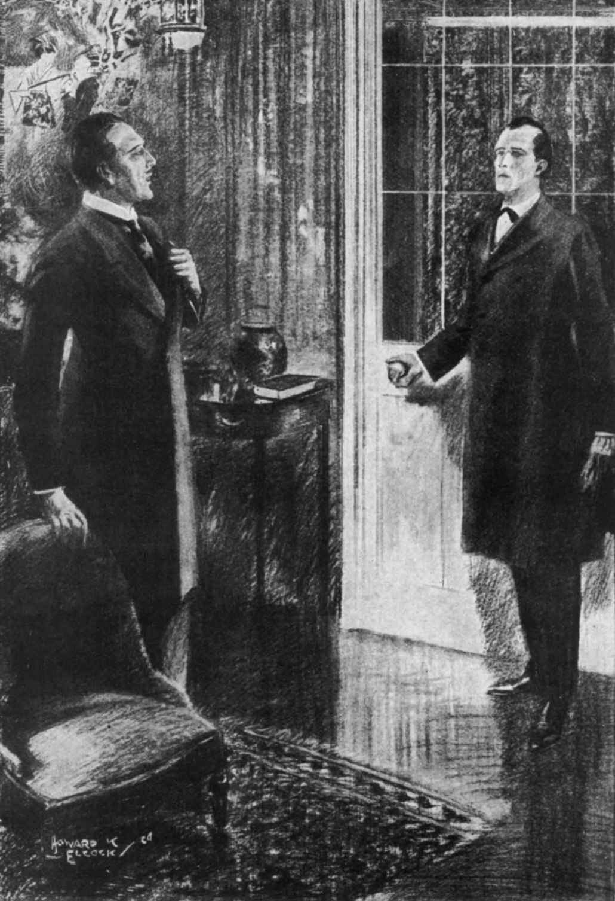

“知道他落得什么下场吗？”

“‘听说遭到蒙马特区的阿帕奇<a href="#part0158.xhtml_ch2"
id="part0158.xhtml_ch2-back">(2)</a>袭击，成了瘸子。’

“‘一点不错，福尔摩斯先生。说来也是一样地巧，就是那一星期以前，他也是来过问我的事情哦。别插手吧，福尔摩斯先生，靠这种事你走不了运。不少人尝过滋味，全都自讨苦吃。我最后奉劝一句，你走你的阳光道，我过我的独木桥，我们井水不犯河水，再见！’

“就这样，华生，你知道了，眼下就是这么个情况。”

“这个人好厉害。”

“绝对厉害。不过，我不在乎他嘴上厉害。这种人，更坏的是心比嘴要狠毒得多。”

“你一定要插手？他娶了那小姐，真的就要出事？”

“看他杀掉前妻那手段多毒辣，我说肯定又要出大事。另外，多么不寻常的委托人！好了，好了，我们不讨论。你喝完咖啡，和我一起回家，欣韦尔一定有情况等着向我报告。”

回到家，果然这个人已来了一会儿。一个魁梧、粗犷、红面患坏血病的人，一对炯炯有神的黑眼眸，才是他精灵头脑的外部征象。他似乎在那个王国里潜沉很深，因为竟被他找出了一个人证。这会儿他带了来，和他一起坐在长沙发上。那是一个身材窈窕、艳如烈火的少女，但脸色苍白，神情焦虑，虽然正值青春年华，而罪愆与忧伤的可怕岁月已经刻在了脸上，遗下一副愁苦的病容。

“这是吉蒂·温特小姐，”欣韦尔·约翰逊说，摆了摆肥手作介绍，“她没有不知道的——好吧，让她自己来讲。接到你的电报一个小时，福尔摩斯先生，我就请到她了。”

“要找我很容易，”少妇说，“伦敦的地狱里，随时能找到我，地址跟肥仔欣韦尔一样。我们是老朋友了，你和我，肥仔哥对吧！可是，老天有眼，世上还有公道的话，有个人该比我们下更深的地狱！那个人，就是你在找的，福尔摩斯先生。”

福尔摩斯笑笑，“看得出来，你是个好心人，温特小姐。”

“只要我能出力，让他去该去的地方，我一切听你差遣就是。”女客人咬牙切齿地说，惨白铁板的脸上，冒着怒火的眼睛充满仇恨，那是一种女人少有、男人决不会有的仇恨，“你不用知道我的过去，福尔摩斯先生，现在谈都没用了。我落到今天这个地步，都是阿尔伯特·格鲁纳害的，我要看他得到报应！”她双手发疯般在空中挥着、抓着。“哦，我也要把他推进地狱去，他把多少人推下了地狱呀！”

“你了解现在的情况吧？”

“肥仔欣韦尔跟我讲了。那恶鬼这会儿又追到手一个痴心女孩，就要和她结婚了。你得赶快阻止，快！你一定不能放过这个恶魔，决不能让清白的姑娘跟他走，叫姑娘别昏了头。”

“她正是头脑发昏呢，爱魔鬼爱得发疯。这个人把自己的事情都说给姑娘听，姑娘什么都不在乎。”

“杀人的事也讲了？”

“讲了。”

“我的上帝，还真有这种痴心人！”

“姑娘只知道都是中伤、谣言。”

“你怎么不叫她看铁证，叫她睁开眼看看？”

“是呀，你能帮助我们一起做吗？”

“我自己不就是铁证吗？我站到她面前去，告诉她这个人是怎么对待我——”

“你肯这样做？”

“我肯不肯？我为什么不肯！”

“好，值得一做。可是，男的已经把自己的丑闻都告诉了女的，取得对方的谅解，我估计女的也就不愿意再谈这种问题。”

“我敢打赌，他不敢全说，全告诉那女的，”温特小姐说，“除了那桩闹得人人都知道的谋杀，我还亲眼见他杀过两个，不止一个。他杀人不眨眼，心不慌，眼不跳，轻声细语跟我说：‘不出一个月，就叫他报销了。’他可不是空口说白话，不是。可我，压根儿不相信那是真的——你瞧，我自己那时候也是爱他爱得昏了头。他怎么对待我的，都跟对现在这痴心女一样！后来有一桩事把我震醒了。是的，天哪！仗着他那条吹牛说谎的烂舌头，把我一个劲地骗、哄，要不我那天夜里早就把他撇下了。那是为一个本子——他有一本咖啡色皮面的本子，可以上锁，面上有金色家徽。我看他是那天晚上喝醉了，要不绝不会让我看这本子。”

“是什么本子？”

“我跟你说，福尔摩斯先生，这个恶鬼专觅各式各样的女人玩，搞女人为荣耀，就像有的人收集飞蛾、蝴蝶标本似的，他找的女人都在这本子里藏着，有照片、姓名、详细情况记录，玩她们的种种花样。弄这种本子，简直不是人做的行为——肮脏下流透顶，再低级下流的人，也不会藏这种本子。可是阿尔伯特·格鲁纳就做得出这种事，藏这种葬东西。‘我玩过扔掉的灵魂’，他应该在封皮上起这么个题名，这才是照出他自己的良心。不过，说这些都是废话，这本子你又用不到，要用也拿不到。”

“他藏在什么地方？”

“现在还怎么可能告诉你藏在什么地方呢？我离开他已经有一年多了。以前我知道藏的地方。不过他是个精细人，人中的猫，爱整洁像只猫。有可能还是放在内书房里，旧书柜桌的格子上。他家你知道吗？”

“去过他的书房。”福尔摩斯说。

“你也去过，真的？你今早上才问这件事，你动作倒是不慢，出手真快。这一次阿尔伯特可遇上克星了。他外书房，都存放中国瓷器——两个窗子中间都立着大玻璃柜。书桌后面的一扇门，通往内书房——一个小房间，全堆着书报、纸张这种东西。”

“他不怕被偷？”

“阿尔伯特可不是个怕贼偷的胆小鬼，再狠的敌手也不敢说他没种。他防备很严，装有防夜贼的警铃。再说，窃贼有什么好偷呢——来偷些没用的瓷器？”

“毫无用处，”欣韦尔·约翰逊颇有行家里手的口气下断语，“收赃的不会要，这种东西卖没人买，熔又熔不掉。”

“没错，”福尔摩斯说，“好，现在，温特小姐，明天晚上五点你再来这儿。你建议和那位女士见面谈谈，很好，我考虑看看是否可以安排时间。你能合作，我非常感谢。我的委托人方面，不用说的了，相当大方慷慨，会考虑你——”

“不说这个，福尔摩斯先生，”女郎高声道，“我这出来不是为钱。让我看到这个人的下场，我要亲自动手惩治他——把他打倒在地，再踩上一脚，我要往他鬼脸上踩，这就是我要的报酬。只要你想惩治他，明天也好，哪天也好，我随叫随到。肥仔可以告诉你，打哪儿找我好了。”

我没有再见福尔摩斯。直到第二天晚上，我和他约在斯特兰街餐厅里用晚餐，我们才又见面。我问他和梅尔维尔小姐会晤的情况好不好，他耸耸肩，便告诉我事情经过，我在此予以复述。但他的叙述干巴生硬，我需要稍作润色，以使符合生活真实。

“安排约会倒是一点也不困难，”福尔摩斯说，“因为姑娘为了自己私订终身违抗父命，正急于要在其他方面表现出对父亲百般顺从，以此补过。老将军打电话来说一切准备就绪。温特小姐风风火火按时来到，于是五点半一辆马车把我们送到老将军宅邸贝克莱广场一〇四号——一座巍然庄重的灰色伦敦古堡，教堂和它比起来，似乎还稍嫌不够肃穆。仆人把我们引进一间很大的、挂黄色窗帘的会客厅，梅尔维尔小姐正在这里等着我们，庄严、苍白、自持，像雪山上的雪人，僵硬冷峻，遥不可及。

“我简直不知道怎么向你形容她的美貌，华生。大概在本案结束以前你会见到她，你就可以发挥你的语言才能了。她那漂亮，美若天仙，只有宗教的热烈诚信才能仰望的天界之美，我在中世纪大师的绘画中才见到这样的面容。一个流氓，怎么能够把畜生般肮脏的爪子搭到这样一个上界的神女身上，我真无法想象。你知道，大概是物极必反产生互相的吸引力，神灵与兽类，野人与天使，你绝不可能再见到这样的搭配了，实在糟糕。

“她当然已经知道我们的来意——那流氓早就给她打过毒针预防我们。温特小姐的现身使她感到意外，但她还是挥手叫我们随意坐下，就好像是可敬可畏的女修道院院长接待两个可怜的乞丐。若是我们自己也想要头脑发涨的话，华生，可得好好向这位维奥莱特·德·梅尔维尔小姐学习学习。

“‘我说先生，’女士说，那口气像是冰山上刮下来寒风，‘你的大名我早就耳闻。依我的了解，你是来挑拨我和我未婚夫格鲁纳男爵的感情。我只是为了遵从父命才接见你。我警告在先，你能说的什么话，都对我的决心产生不了丝毫影响。’

“我真替她难过，华生。我一刹那间产生一种感觉，她就像是我自己的女儿一样。我并不是一个善于辞令的人，我善用理性的脑，不善用感情的心，但是我还是发自内心，用尽一切肺腑之言来规劝她。我晓之以理、动之以情，告诉她一个女人如果等到为人妻之后才看清男人的真面目，为时晚矣，处境就艰难了——只能屈从于魔掌的抚摩、淫嘴的吮吸。我可算什么都说到家了——将来的羞耻、懊恼、绝望、痛苦，以泪洗面度日。但是不管我多么苦口婆心，都不能让她象牙般乳白的两颊动容反映一点颜色，呆滞的双眼增添些许光彩。我想起了那个流氓讲过的催眠术暗示，确实叫人相信她已不是生活在世上人间，而是在心醉神迷的梦境之中。然而，她的回答倒是斩钉截铁。

“‘我是耐足性子听你讲这些话，福尔摩斯先生，’她说，‘对我有什么效果，完全像我刚才预先说过的那样。我清楚，阿尔伯特，我的未婚夫，他经历过暴风雨的生活，招致人家的忌恨、误解、中伤。你不过是许多人里面的最后一个，把流言蜚语带到我面前。虽然，你可能是好意。我听说你是个受雇于人的侦探，被男爵雇用就愿意为男爵效劳，也可以被别人雇用来反对他，都一样。但是不管怎么说，我希望你今日能明白、永远明白：我爱他，他也爱我；全世界别样的说法在我听来就当是窗外小鸟唧啾。若说他高贵的品格有一时的偏差，也许是上天特地派我来帮助扶持他，恢复到原来的高尚品格。我不清楚’——讲到这里，她目光转向我的同伴——‘这位小姐是什么人？’

“我正要回答，女郎在身边像旋风一般抢上前。你要是见过冰炭相遇，也就是这两个妇人此时面面相对的情景了。

“‘我告诉你我是什么人，’她从椅子上跳起来，站定了，气得撇嘴嚷道——‘我是他最后一个情妇。我是一百个里的一个，被他引诱、受用、糟蹋、抛弃到垃圾堆的上百个女人的一个。现在他也一样要这样对待你。你的结局连垃圾都不如，而是坟墓，有坟墓还算是好的。告诉你，你这蠢女人，你要嫁了这个男人，落在他手里，你就死定了。他让你心碎、脖子断，要你扁要你圆都在他手里。这不是因为我忌妒你什么才这样讲，我才不想诅咒你，你是活是死，根本不关我的事。我恨他，要他不得好死，他怎么对我，我怎么还给他，我豁出去了。你不用这么看我，我告诉你大小姐，你过不了多久，没到头你就要落得比我还不值钱。’

“‘我没工夫嚼舌这种事，’德·梅尔维尔小姐冷冷地说，‘总而言之，我再说一句话，我清楚我未婚夫一生中也就只有三次，和居心不良的女人有瓜葛，我相信他即使做过点错事，也已诚心悔改。’

“‘只有三次？’我的同伴叫起来，‘你这蠢货！鬼迷心窍的蠢货！’

“‘福尔摩斯先生，我请你结束这次会面，’梅尔维尔小姐说，声音是冰冷的寒气，‘我全是遵从父亲的旨意才见你，但我不是来听这个女人狂吠。’

“温特小姐嘴里骂着窜上前去。我赶紧一把抓住她的手腕，要不然准被她揪住这个女人的头发，梅尔维尔小姐太叫人恼怒。我拖着温特朝门外跑，总算万幸，把她拖回马车，避免一场大吵大闹。她实在是气疯了。我是冷静的，但内心里也是满腔怒火，华生，这个女人，我们拼命救她，可她冷漠、傲慢，极端自以为是，根本不把我们放在眼里。所以，现在你又一次看到我们是什么处境了。第一招已经开局不利，很明显我非得另谋出路，突破僵局不可。我会和你保持联系，华生，因为看来很可能有劳你出马。也非常可能，下一着棋是他们先要有动作了，而不是我们行动。”

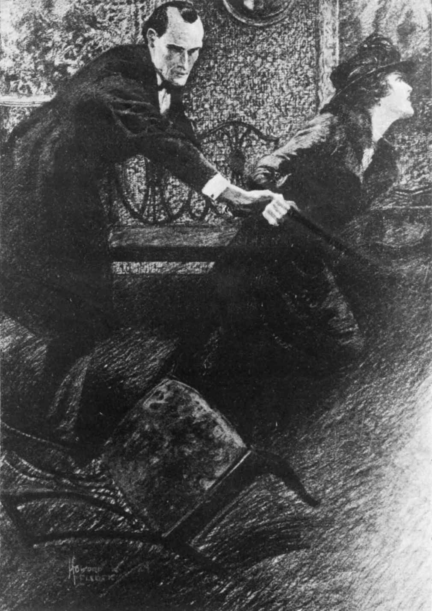

“我赶紧一把抓住她的手腕。”

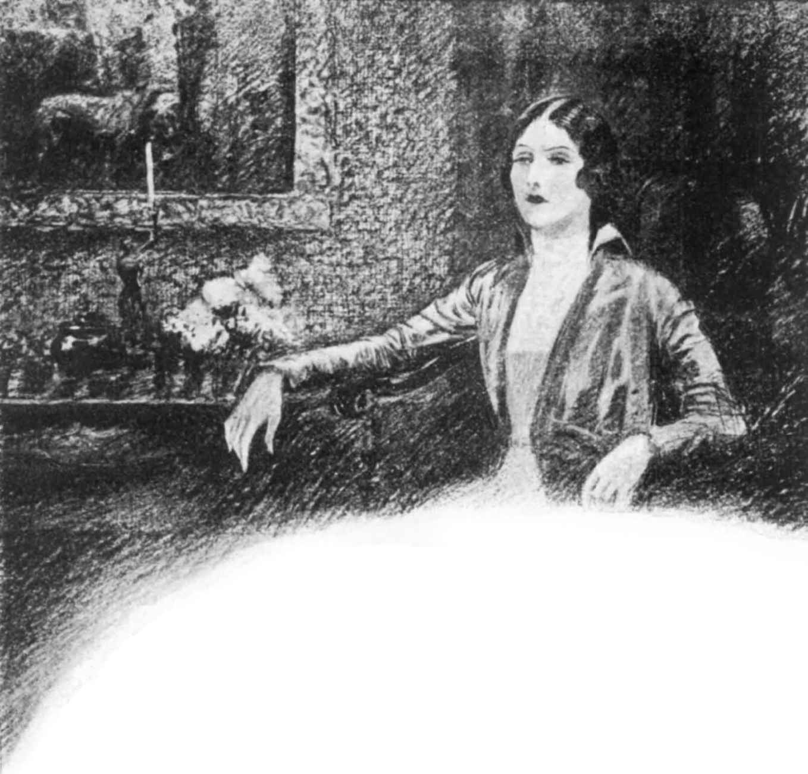

确实如此，他们出手了——应该说是他出手，因为我相信女士绝不知情，更别说参与了。我还记得，我都可以向你指出是哪一块人行道的方砖，我正站在那个地方，眼睛扫过一个阅报栏，一阵恐惧吓得我魂不附体。地点是在格兰德大旅馆和查令十字街车站之间，一个独腿报贩正巧张贴好晚报。这一天是离上次见面后两天。那张报纸版面上，有着黄底黑字的可怕标题：

**歇洛克·福尔摩斯\
遇袭遭谋害**

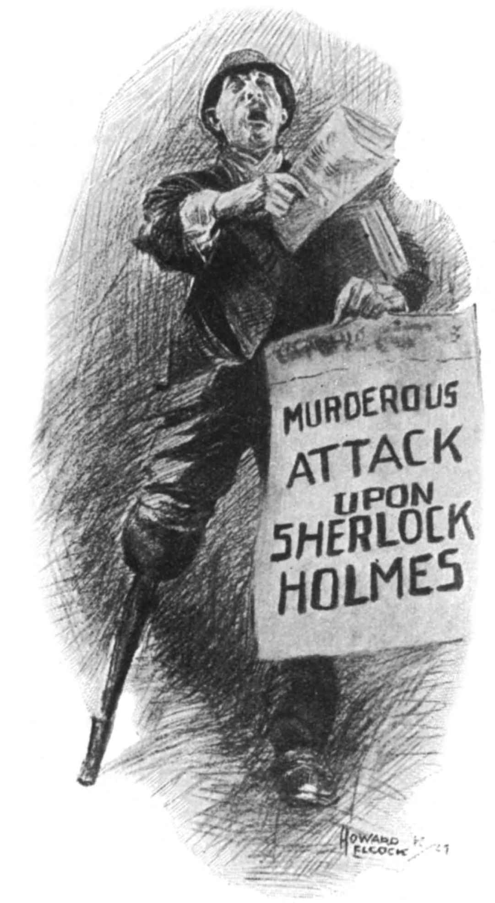

歇洛克·福尔摩斯遇袭遭谋害。

我记得我被镇住了好几分钟。后来我在慌乱之中抓起一张报纸，报贩说了我几句，因为我钱都忘了付。最后在一家药店门口站定，翻到那一段至关紧要的电讯。电讯是这样写的：

吾人遗憾地获悉歇洛克·福尔摩斯先生，著名之私家侦探，今日上午不幸遭受谋害袭击而生命垂危，迄未获得详情。事件发生似在里金大街罗亚尔咖啡馆门外，约十二时左右。有两人持棍杖，突然攻击福尔摩斯先生头部及身躯，据医生诊断伤势极为严重。其时福尔摩斯即送查令十字街医院。随后因其本人坚持，而送返贝克街寓所。暴徒穿着颇为体面，行凶后立即窜出人群，冲进罗亚尔咖啡馆，由后门经玻璃房大街逃逸。此辈俱属团伙罪犯必无疑义，盖因屡遭被袭者之侦查、破获而行报复。

不用说，我两眼匆匆掠过这段文字，立即跳上一辆汉森轻便车直奔贝克街。一进门厅就看见著名外科专家莱斯利·奥克肖特爵士登门出诊，他的马车还等在街旁。

“没有直接危险，”专家向我通报说，“有两处头皮裂伤，几处较严重淤肿。缝几针，打吗啡，都做过了，主要就是安静休息就行。但是谈几分钟话，还是可以，无须绝对限制。”

既然如此允许，我便轻轻走进半暗的卧室。病人完全醒着，听见他嘶哑着喉咙轻声唤我的名字。窗帘遮掉大半，透进的一道斜阳照在伤者的脸上。他额部包扎绷带，敷的白纱布上渗着一片殷红的血迹。我垂首坐在床边。

“没事，华生。不要这样紧张，”福尔摩斯说道，声音低弱，“好像很严重，其实没什么。”

“感谢上帝，但愿如此！”

“我自己也算是个击剑、单棍运动家，棍击好手，这你知道。常靠单棍护身。这次是没有防备会有第二个歹徒上来，我才吃亏。”

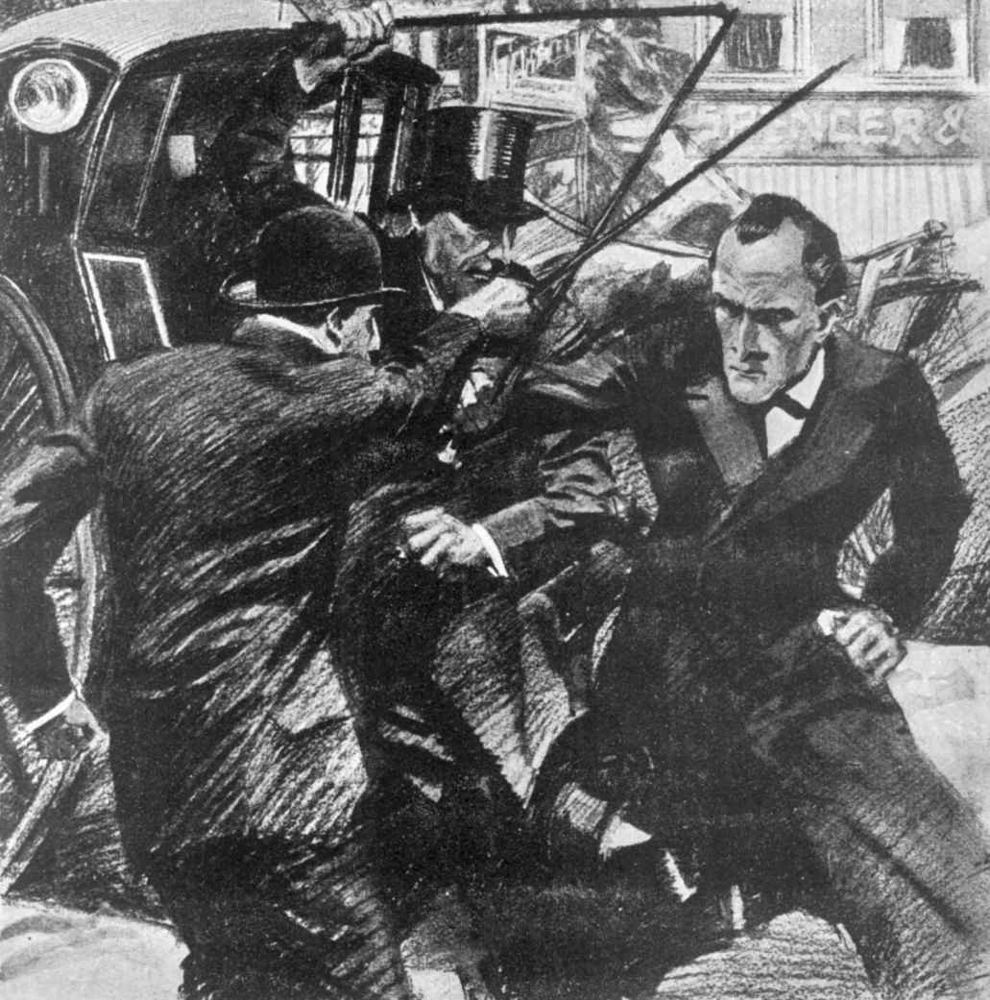

“没有防备会有第二个歹徒上来。”

“要我做些什么，福尔摩斯？当然是那个狗东西派人干的。让我去，把他们教训一顿，只要你一句话。”

“好老伙计华生！不必。这种事我们不要做，让警察抓他们就成了。但是他们早已脱逃，他们早有预谋，这一点我们可以料到。这也不碍事，我有计划。第一件事，夸大我的伤势。他们会来你这里打探消息，说严重一点，华生，说我假如能活过一星期，就是十二万分的幸运了——脑震荡，神志失常，谵妄——凭你怎么说都可以！说得越严重越好，不为过。”

“可是有莱斯利·奥克肖特爵士的说法呀？”

“哦，他没关系，要让他看到我快要不行了，这我会有办法。”

“其他还有什么？”

“对了，告诉欣韦尔·约翰逊，把那个女孩弄走躲起来，那些流氓现在就要找上她了。他们当然知道，这个案子是她在里头帮我。他们都敢动我，更不会放过她，情况紧急，今晚就去做。”

“我回头就去。还有别的吗？”

“给我烟斗，放桌上——还有，烟丝鞋<a href="#part0158.xhtml_ch3"
id="part0158.xhtml_ch3-back">(3)</a>，对！每天上午来一次，我们一起讨论作战部署。”

当天晚上我和约翰逊安排好，把温特小姐安置到偏僻的郊外暂避，等危险过去再说。

一连六天，社会大众形成的印象是福尔摩斯一只脚已跨进了棺材。病情报告严重，报纸上登的尽是险象迭生的文字。我是天天去看他的，明知根本不是这回事，他那结实的身体和坚强的意志正在创造奇迹。他迅速复原，我有时怀疑他也在骗我，实际他比表面上好得还要快。这个人有个怪脾气，喜欢保密，喜欢做事如同编戏，要制造戏剧效果，甚至连他最亲密的朋友也不得不猜测，到底他手掌心里抓的是什么药。他一定要把事情进行到底了，才算数，才摊牌。正如常言道：“一人做一人事，最保险无人知。”再没有人比我更和他接近了，但我还是常常感到我们两人之间有隔阂。

到了第七天，伤口缝线拆掉，但晚报上还是刊登说他伤口严重感染成了丹毒。也是同一天的晚报，有一则短讯，不管它是凶是吉，我一定要赶快让我的朋友知道。短讯说，本星期五由利物浦开出之丘纳德轮船公司卢里塔尼亚号，搭乘该船之旅客阿尔伯特·格鲁纳男爵前往合众国处理重要财务事宜，归来即行举办与独生女维奥莱特·德·梅尔维尔小姐之婚礼，云云。福尔摩斯一听这条新闻，苍白的脸色立即严峻起来，凝神贯注。这就告诉我，此则短讯对他有极大的触动。

“星期五！”他大声道，“距今只有三天了，这就要让恶棍逃过危险，但是他休想，华生！保管他跑不掉，绝对跑不掉！现在，华生，我要你替我做点事。”

“我就是为你办事来的，福尔摩斯。”

“那好，你抽出二十四小时，对中国瓷器作一番详细的研究。”

为什么这样做，他不加解释，我也不多问。凭长久以来的经验，我知道听从他是明智的，错不了。但是我离开他房间，走上贝克街，脑子里开始在反复思量他这道古怪的命令，我到底要怎么去执行。最后我坐马车直奔圣詹姆斯广场，去了伦敦图书馆。我找到我朋友洛克斯，他是图书馆副管理员，托他帮忙，终于在临行回家时，得以挟一卷大部头书在臂间。

据说那些出庭律师受理案子，都有本事在星期一临时匆匆接待证人，准备好辩词匆匆上庭，但是不到星期六就把强记的案情内容忘得精光。我现在当然不敢自称有这种本领，可以在短时间内准备有素已成陶瓷学权威。那整个晚上、整个通宵，只打了一会儿盹，再加一整个上午，囫囵吞枣地把陶瓷知识背熟。就这样，我才晓得瓷器大艺术家的印章，神秘的甲子纪年法，洪武之贵，永乐之美，唐寅书画，宋元开国盛世。我满脑子充斥着这许多知识，第二天晚上来见福尔摩斯。他已经不睡在床上了，这是任凭外界报道怎么也猜不到的事。他用手托住绑着绷带的脑袋，深深地坐在他喜欢坐的安乐椅中。

“你好，福尔摩斯，”我说，“听信了报纸的报道，那你是快要死了。”

“那个嘛，”他说道，“正是我需要的假象。现在，华生，你的功课做完了没有？”

“我是竭尽全力了。”

“好。那谈起这方面的话题，你应对自如没有问题了吧？”

“我想可以。”

“好，请你把壁炉架上那只小盒子递给我。”

他打开盒盖，拿出一件用东方丝绸仔细包裹的小东西。他小心解开，露出一个深蓝色极精美的小茶碟。

“拿的时候千万要小心了，华生，这是真正的明朝薄胎瓷，薄如蛋壳。没有比这更精致的了，克里斯蒂艺术市场上也没见过这样的珍品。这要是一套的话，就价值连城了——事实上，除了北京紫禁城里有成套的，外界有没有成套，就很难说了。古董收藏行家一见到这个茶碟，一定眼红，保管垂涎三尺。”

“这东西要我怎么处理？”

福尔摩斯给我一张名片，上面印的是：“希尔·巴顿博士，半月街三六九号。”

“这是你今天晚上的姓名，华生，你去见一下格鲁纳男爵。我知道一点他的生活习惯，到八点半，他多半闲着无事。你事先要送去一张便条，说你想拜访他，要说明，是带上一件稀世珍品明代瓷器请他鉴赏，并说你是一位医师——这你十分在行，演起来一定自然毫不费力。而且你也是收藏家，刚好得到一件珍宝在手，久闻男爵在这方面兴趣浓厚，要是有识货愿出价的人，你也可以割爱相让。”

“什么价？”

“问得好，华生。你对自己手中的珍宝，连价值多少都没概念，那就是泄了自己的底，非搞砸不可。这个茶碟是詹姆斯爵士帮我找来的，我知道是他的委托人的收藏。你就说这是举世无双的珍宝，这样说绝对不夸张。”

“我还要说明这一件必须请专家鉴定估价。”

“好极了，华生！你今天才思敏捷。提议佳士得，或者苏富比。不妨推说不便自己定价。”

“他若不愿见我呢？”

“哦，不会，他不会不见。他收藏成癖、成狂——特别是这件珍品，这方面他是公认的权威。坐下写信，华生，我说你写。不需要回信。只写你想登门拜访、目的是什么就行。”

信言简意赅，得体有礼，又能激起他收藏的猎奇欲望。写好立刻交邮差送出。这天晚上，我揣着珍品和希尔·巴顿博士的名片，踏上征途。

宅邸庭园之华美，确实说明格鲁纳男爵正如詹姆斯爵士所讲，是一位富豪。一条弯转的长车道，两边夹以整齐的灌木，直达一片砾石铺地的大空场，场地上立有几座雕像。这座宅邸原先是一个南非金矿大王在他鼎盛期建造的，房屋长形，不高，带有角楼。宅邸虽如梦境般奇特，但很有规模，特别坚固，颇具气势。一个男管家，看他那副派头入得主教之席，出来领我进屋，又将我转交一个身穿华丽长毛绒号衣的男仆，再由他引我去见男爵。

男爵站在两扇窗中间的一只大柜前面，柜门打开着，里面存放他收藏的一部分中国瓷器。我一进去，他转过身来，手里拿着一只棕色小花瓶。

“请坐，博士先生，”他说，“我在看自己的收藏，考虑还缺些什么，是否应该增补完全。这是件唐代小瓷器，时间在七世纪，你大概也有兴趣。我认为工艺极精致，釉色特美。你说你有明代的茶碟？”

我小心翼翼地打开小包，把茶碟递给他。他在书桌旁坐好了，因为天色已暗，便移过灯来。他仔细审察着。这时橙黄灯光也照亮了他的脸，正可以让我好好端详他一番。

他确实是个十分俊美的男人，他的美男子名声在欧洲如雷贯耳，名不虚传。论个头，是中等身材，但体格匀称，轮廓挺秀。他脸色黝黑，近似东方人，黑色大眼睛目光倦慵，对女人具有无可抗拒的诱惑力。须发乌黑油亮，髭须短撮，蜡捻得齐整干净。他五官端正，舒适悦目，只是两片薄唇无情。我若要看杀人凶手的嘴脸，就正是这模样——脸上一张凶残的殷红大口，杀人不见血，吃人不吐骨。他还将胡子留得向两边撇开，似乎故意敞露出残酷与险恶的嘴，不啻是向受害人发出警示、威慑的信号。他的嗓音动听悦耳，举手投足更是风流洒脱。说年龄，我看他三十略微出头，但后来看见他的记录，才知道竟已四十又二。

“好极了——真是极品！”然后他说，“你说共有六只配成一套。奇怪，这样的珍品，我都没听说过。我只知道在英国只有一只，可与它匹配，当然那一只不可能流入市场。恕我冒昧，希尔·巴顿博士，敢问你是从哪里得来？”

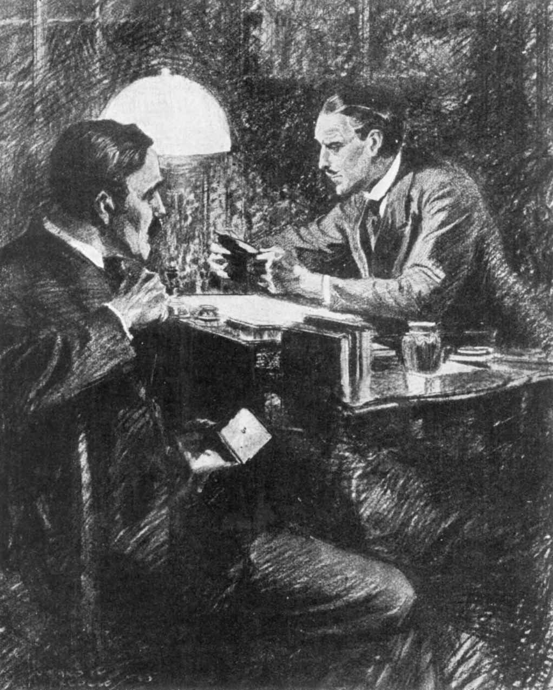

“好极了——真是极品！”

“这其实不相干吧？”我理直气壮地反问，一副若无其事的样子，“你看，绝对是真品，至于价值，我乐意请专家鉴定。”

“真是奇了，”他说道，两个黑眼珠滴溜溜地转，是在满腹狐疑，“这么贵重的物品，自然要清楚底细。这是真货不是赝品，这没问题。不过，恐怕——我必须考虑周到——要是到头来你并没有出售权就不好办了，是吧？”

“这个完全放心，我保证你吃不了亏。”

“那个，当然，把问题挑明了好，你有什么靠得住的保证？”

“我有银行信用可以担保。”

“好是好，不过这个交易还是令我觉得非比寻常。”

“成不成交没关系，”我冷冷地说，“我首先考虑你，全因为知道你是古董鉴赏家，但是我去找别家也不难吧。”

“谁告诉你说我是鉴赏家？”

“我知道你写过这方面的专题著作。”

“书你读过？”

“没有。”

“哦，天哪，越来越叫我搞不懂！你是一个鉴赏家又是收藏家，收藏如此贵重的物品，连这本书都不劳看一看？不看这本书，你手中的货怎么认识、怎么论价，你都怎么解释？”

“我忙得很，我是开业医生。”

“答非所问，根本不成其为理由。既然是爱好者，一定会下功夫钻研，和从事什么职业并不相干。你在信上说你是鉴赏家。”

“是呀。”

“我有几个问题倒要考考你。我不得不告诉你，医生——如果你真是医生——这件事就更加可疑了。我要问你，你知道圣武天皇<a href="#part0158.xhtml_ch4"
id="part0158.xhtml_ch4-back">(4)</a>，还有他和奈良那边的正仓院<a href="#part0158.xhtml_ch5"
id="part0158.xhtml_ch5-back">(5)</a>是什么关系吗？啊哈，把你难住了不是？再就请简述北魏在陶瓷史上的地位。”

我从椅子上一跃而起，佯装发怒。

“这太过分了，先生，”我说，“我来这里是看得起你，不是来给你当小学生听你考试。这方面的知识我不比你差，但对你这种无理发问，我不想回答。”

他定定地看着我，眼睛里的慵懒神态瞬即消失，闪射出凶光，薄情的嘴唇咧开，龇着白牙。

“你搞什么鬼？你来做奸细。你是福尔摩斯派来的密探，你来是对我图谋不轨。他快要死了，我听说的，所以就派人来继续监视我，打听我的底细。你耍花招擅自闯入这里，好呀！可你进得来，叫你出不去！”

他纵身跳起，我立即退后，防范他要冲上来，看来他已经怒不可遏。他一开始就对我存有戒心，再这么一试一问，让我露出马脚。我自知再也蒙蔽不了他。见他伸手到书桌小抽屉里去乱摸乱翻什么，忽然他耳朵一竖，似乎听见有声音响动，站住了警觉地听着。

“糟了！”他叫起来，“糟了！”他猛地冲进身后的那间小屋。

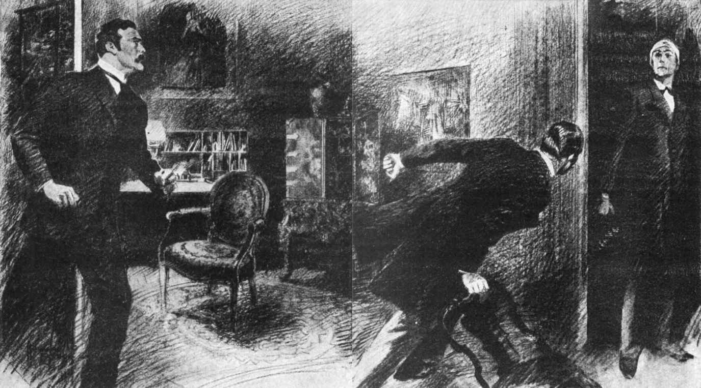

他猛地冲进身后的那间小屋。

我跨上两步冲到那间内室的门口，一看到里面的情形，心里一切都明亮了。室内向花园的窗子敞开着。窗前，仿佛看到一个可怖的鬼影，头上缠着血绷带，板着刷白的脸，是歇洛克·福尔摩斯站在外面。一刹那，他一窜就不见，只听见他身子擦过月桂树发出的声音。这大宅屋的主人猛吼一声冲向窗户。

这时候，一眨眼间，我看得清清楚楚，一只手臂——是女人的胳臂——从树叶中突地伸出一扬，随即男爵发出一声凄厉的惨叫——那声音之凄惨将永远留在我的记忆中。立刻见他两手掩住脸回身在屋里乱跑，头往墙上乱撞，接着倒下，在地毯上翻滚、扭动，一声声哀号震撼屋宇。

“水！上帝啊，给我水呀！”他吼叫道。

我抓起桌上的水瓶赶快去救他，这时候，管家还有几个佣人从厅里跑过来。我记得，当我在受伤者的身边跪下，将他骇人的脸转过来对着灯光，有一个佣人立即晕过去。那是硫酸，腐蚀了整个面孔，还在往耳下、领下滴淌。一只眼睛已经泛白无光，另一只发红肿胀。几分钟前我还在赞赏的俊脸，这时已像一幅优美的画作被脏污的海绵抹掉。脏污了，变色了，人样都没有了，异样地可怕。

我把发生的事向仆人们简略说个经过，指出是被泼了硫酸。有的仆人爬出窗户，有的奔向草坪，但天色很黑，又下起了雨。毁容的男爵撕心裂肺地号叫，狂乱地咒骂复仇者。“你这个恶毒的猫吉蒂·温特！”他哀号着，“啊，恶魔！跑不了她！跑不了她！啊，上帝呀，疼死我啦！”

我用油清洗他的脸，用纱布敷住他满脸的创伤，又注射一针吗啡。这一飞来横祸把他对我的怀疑全部打消，他紧紧拉住我的手，似乎我有回天之术，能将那望着我的死鱼般的眼睛恢复明亮。若不是我清楚地记着他罪恶的一生，导致这场惨祸是他咎由自取，我真要为他一掬同情之泪。我碰到他那乱抓乱摸滚烫的手，只觉得厌恶。当他的家庭医生另还有专家医生，前来接替我的时候，我算松了一口气。随后，一个巡警也赶到，我便将我真实的名片给他。不这样做已属愚蠢无用，因为警场的人对我的面貌几乎和对福尔摩斯一样熟悉。然后我就离开这幢寒心可怕的住宅，不到一小时我已回到贝克街。

福尔摩斯坐在自己那张常坐的椅子中，脸色灰白，显得疲倦。这并非是因为他的伤势，而是为今晚的事情。即使如他钢铁般的神经也不免感到震撼，听我说到男爵已遭毁容，实在惊骇不已。

“罪恶的代价，华生——罪有应得！”他说。“迟早要发生，上帝明鉴，他恶贯满盈。”他又说道，拿起桌上一本棕色的本子，“这就是温特提到的那个本子。如果这本子还不能打消这婚事，那就别再白费力气了。但肯定能成功，华生，一定能成功，凡是自尊自爱的女人，都无法容忍。”

“这是他的爱情日记吗？”

“毋宁说是淫乱日记，他的下流一言难尽。温特跟我们一讲起有这个本子，我马上想到这是件致命的武器，有它在，只等我们把它弄到手。当时我没有说出这个想法，生怕这女人走漏风声，但是我心中已在酝酿。当我遭袭击负伤，倒叫我灵光一闪，心生一计，可以藉此麻痹男爵，对我丧失戒心，这是再好也没有的机会。我原准备再等几天，但他要到美国去，迫使我提前动手，因为这一本过分暴露自己的日记凭证，他绝不会丢下不顾，所以我们必须马上行动。偷窃不行，他有防备，就晚上有机会，只要设法把他的注意力转移掉就行，于是我拿个蓝茶碟请你出马。我还要确切知道这本子藏的具体地方。又因为你的中国瓷器知识毕竟有限，应对交谈经不起长时间拖延，我的行动只能在几分钟内速战速决，这样我就决定把温特叫来一起行动。我怎么想得到她趁机在衣服里藏好着东西呢？我只想请她助我一臂之力，想不到她有她自己的计划。”

“男爵很快猜到我是你派去的。”

“我也料他猜得到，但是你牵制他的这点时间，已经足够我把他的日记弄到手，只是脱身要不被他发现，时间还不够。啊，詹姆斯爵士，你来得正好！”

我们这位彬彬有礼的朋友是应邀而来。他进门正好听见福尔摩斯在叙述经过，便全神贯注倾听。

“你完成了惊人的奇迹——惊人奇迹！”听完叙述，他叫道，“男爵伤势那么可怕，正像华生博士说的了，我们要打消这场婚事的目的，一定可以达到了，没有那本污人耳目的淫乱记事本，也足可以达成目的。”

福尔摩斯摇摇头。

“德·梅尔维尔这样类型的女子，是不会这样做的。为了她而被毁容的男人，是殉情者，她只会更爱他。不，不行，要从他的精神道德、他的灵魂上下手，不要从他的外貌、肉体上下手，这才能达到我们要戳破他的目的，透其心而不必破其相。这本子才能叫德·梅尔维尔回落到地面上来——我想不出还有什么别的方法。这都是他自己的亲笔，姑娘不得不信。”

詹姆斯爵士拿着本子和珍贵茶碟就走。我是自己热情好事，送他下楼上街。一辆布鲁厄姆马车<a href="#part0158.xhtml_ch6"
id="part0158.xhtml_ch6-back">(6)</a>正等着他。他跳上车，催令头戴花结帽的御者快速驶离。他刚进车时，便把大衣朝车窗上一挽，遮住窗外车厢上的盾形家徽标志，但是我借着我们屋内气窗透出的灯光已经看清楚了。我惊讶得张嘴，便回身进屋上楼，到福尔摩斯的房间。

“我发现了，我们的委托人是谁，”我高声道，赶快报告重大消息，“哈，福尔摩斯，原来就是——”

“就是诚信的朋友，义勇的君子，”福尔摩斯说道，用手制止我，“这就行了，永远别提。”

我不知道他们是怎么利用这本可以充当罪证的日记的。可能是詹姆斯爵士办的，更有可能因为这是件敏感的事，而托年轻女士的父亲去办的。毫无疑问，效果十分圆满。三天以后，《晨邮报》登出了一条消息，说阿尔伯特·格鲁纳男爵与维奥莱特·德·梅尔维尔小姐的婚礼已经取消。同一张报纸，还刊载了刑事审判庭对吉蒂·温特小姐的第一次开庭，严重控告她泼洒硫酸导致他人毁容，但因情有可原，予以从轻量刑。结果值得欣慰，只判这类刑案最轻的徒刑。歇洛克·福尔摩斯也差一点被控告偷窃罪，但由于出自良善的动机，并因他的委托人之地位极为显赫，所以即使严厉的英国法庭也充满了人性而变得灵活。我的朋友并没有被告上法庭。

（1924年）

————————————————————

<a href="#part0158.xhtml_ch1-back" id="part0158.xhtml_ch1">(1)</a> 开伯尔（Khyber），中亚兴都库什山脉的一个山口，阿富汗通往巴基斯坦的关隘要塞。

<a href="#part0158.xhtml_ch2-back" id="part0158.xhtml_ch2">(2)</a> 阿帕奇（apache），指巴黎、布鲁塞尔等大城市中的地痞、流氓、恶棍，取名自美国西南部一印第安部落名。

<a href="#part0158.xhtml_ch3-back" id="part0158.xhtml_ch3">(3)</a> 福尔摩斯生活中随便、特殊的习惯之一，将室内穿的浅口鞋或拖鞋作盛放烟丝用。

<a href="#part0158.xhtml_ch4-back" id="part0158.xhtml_ch4">(4)</a> 圣武天皇，日本奈良时代天皇，724—749年在位，其时正是日本佛教鼎盛期。

<a href="#part0158.xhtml_ch5-back" id="part0158.xhtml_ch5">(5)</a> 正仓院，日本奈良东大寺的文物宝库，内藏圣武天皇遗物等以及包括中国唐朝的古董万余件。

<a href="#part0158.xhtml_ch6-back" id="part0158.xhtml_ch6">(6)</a> 布鲁厄姆马车（brougham），一种御者座设于前端的车厢式四轮马车，以政治家Lord
Brougham命名。

# 三山墙案

我和歇洛克·福尔摩斯先生的许多探案历险，总觉得都没有这件发生在三山墙的案子那样突如其来，那样富有戏剧性。我已有好些日子没有见到福尔摩斯，无从知道他这一向有何动作。但是这天早晨，看他聊天的谈兴似乎很高，我刚在壁炉边的矮椅上坐好，他坐在我对面的椅子上，把烟斗衔进嘴里，这时我们的一位访客来到了。如果我说是一头疯牛闯入，一点也不为过。

屋门嘭的一声被撞开，一个身材高大无比的黑人冲入室内。

要不是他面目狰狞，如凶神恶煞，那模样还挺可笑。他身穿鲜艳的格子呢灰套装，胸前飘动着一条浅橙色领带，一张扁鼻子宽面孔向前探出，阴沉的黑眼睛，射着愠怒的凶光，在我们两人之间看来看去。

“你们两个，谁叫福尔摩斯山森（先生）？”他问道。

福尔摩斯举着烟斗，懒洋洋地笑笑。

“嚯！那是你了，这么说！”来人道，诡秘地迈步，做贼似地从桌边绕过来，“听好，福尔摩斯山森！把你手给我缩回去，别管人家闲事。各人自扫门前雪，莫管他人瓦上霜，你懂吗，福尔摩斯山森？”

“说下去，”福尔摩斯道，“很好啊。”

“哦！很好，是吗？”蛮汉咆哮道，“等我给你点颜色瞧瞧，你就说不出好了。像你这号人，我以前专门收拾，叫他们尝尝我的滋味，他们才老实了。瞧这个，福尔摩斯山森！”

他拔出一只棱角分明的大拳头，在我朋友的鼻子前晃一晃。福尔摩斯注意地看着这只大拳，很有兴趣的样子。“你生来就是这样？”他问道，“还是后天练出来的？”

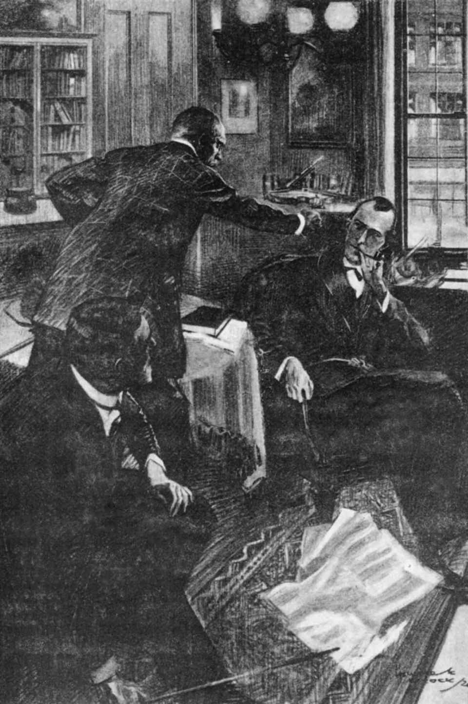

“他拔出大拳头，在我朋友的鼻子前晃一晃。”

不知是因为我的朋友冷峻而镇静，还是我拿起拨火棒发出轻轻敲击声，这时我们的来客已变得不那么骄横放肆。

“反正，我已经好好警告过你们了！”他说，“我有个朋友，对哈罗那边的事儿感兴趣——你知道我什么意思——他是不想你多管闲事。懂吗？你又不是法律，我也不是法律。若是你硬要踏脚进来，我可也得非出手不可。你不要忘记它。”

“我这一向来是要见见你呢，”福尔摩斯说，“我没有请你坐下，因为我不喜欢你身上的气味。你不就是斯蒂夫·迪克西吗，拳击家？”

“那是我的名字，福尔摩斯山森。你要是说话不三不四，一定叫你吃我苦头。”

“那最后之事<a href="#part0159.xhtml_ch1"
id="part0159.xhtml_ch1-back">(1)</a>，你当然一定也躲不过，”福尔摩斯说道，看看来客那张丑陋的嘴脸，“但是，那个在荷尔本酒吧外面杀死珀金斯小伙子——怎么！你要走啊？”

这黑人往后一个退步缩回身去，黑脸变成了铁灰色。“我不要听这种样子谈话，”他道，“我跟这个珀金斯有什么样关系，福尔摩斯山森？这个孩子出事丢掉性命那时间，我正在伯明翰公牛拳击场，进行训练着呢。”

“是的，你可以去对法官这么讲，斯蒂夫，”福尔摩斯道，“我一直注意着你和巴尼·默托克代尔的——”

“帮帮忙哦，老天！福尔摩斯山森——”

“行了，不谈这个也罢，等我要找你的时候再说不迟。”

“那就再见，福尔摩斯山森，但愿别计较我这来访的态度不好喽！”

“我肯定会计较，除非你告诉我是谁派你来的。”

“哦，哪里还有什么秘密呀，福尔摩斯山森，就是那位山森，你刚才就是已经提到过的嘛。”

“那么又是谁指使他的呢？”

“哦，那不是有什么秘密嘛，福尔摩斯山森。他就关照我，‘斯蒂夫，你去找福尔摩斯山森，告诉他不要管到哈罗那边去，不然叫他性命不全。’这完全是事实。”来客不等再有问话，便一溜烟跑出屋去，来也匆匆，去也匆匆。福尔摩斯敲敲烟斗磕掉烟灰，在暗自好笑。

“幸亏你没有敲他那糊涂的鬈发脑袋瓜子，华生。我看到你故意拿拨火棒那个动作。其实他这种人倒不足畏惧，四肢发达，头脑简单，吓唬吓唬小孩子，一下就把他镇住，你都看见了。他是斯宾塞·约翰帮派里的人，最近参与不法勾当，等我腾出手时，再清理他们。他的顶头上司是巴尼，诡计多端的家伙。这伙不法之徒专门打家劫舍、杀人越货。我现在要知道，这回是谁在幕后指挥？”

“为什么要来威胁你呢？”

“就是这个哈罗林地的案子，倒叫我决心要探个究竟了，会使他们这样不惜抛头露面，那就非同一般，其中必有蹊跷。”

“是什么原因？”

“我本来正是要和你讲这件事，不料先发生这个闹剧。这儿有一封信，一个叫麦伯利的太太写的。如果你愿意跟我到那边去，我们就给她回一封电报，立刻动身。”

我看到信上写的是：

亲爱的歇洛克·福尔摩斯先生：

我近来连续遇到奇怪事，都关系到我的住屋，我极愿听取您的宝贵意见。明天我一天在家，望您能来。出林地车站走一小时路就是我家。我已故丈夫莫蒂默·麦伯利，曾是您早先的委托人。

您忠实的

玛丽·麦伯利

地址是“三山墙，哈罗林地”。

“正是这事！”福尔摩斯说道，“现在，你有时间，华生，咱们上路吧。”

乘火车只不远的旅程，再坐马车走更短的路，便到了三山墙。那是一幢砖木结构花园住宅，矗立在一英亩毫无园艺的荒草地上。那楼窗上端是三小垛三角墙，这栋房子便根据这个象征叫三山墙。屋后是一小片浓郁沉沉不太高的松树林。整栋屋子景观显得萧索没有生气。虽然如此，我们发现屋子里面布置得相当精致，接待我们的是一位颇有风度的老妇人，言谈举止表现得很有文化素养。

“您的丈夫我还记得很清楚，太太，”福尔摩斯说道，“虽已过去好多年。承蒙他看得起，我曾替他效劳一件小事。”

“那你对我儿子道格拉斯这名字也一定熟悉。”

福尔摩斯专注地看看她。

“噢，原来您是道格拉斯·麦伯利的母亲？我对他有点认识。伦敦人都知道他是一个美男子哦，他现在在哪里高就？”

“他死了，福尔摩斯先生，死了！他是驻罗马使馆的参赞，上个月在那边感染肺炎死了。”

“啊，太可惜！谁也不会把这样一个人和死亡联系在一起。都没见过生命力像他那样旺盛的人，他精力充沛——浑身是劲啊！”

“精力太充沛了，福尔摩斯先生，反而毁了他。你一定记得他原来是——是个活跃开朗、无忧无虑的年轻人。可是他变得急躁、心烦、闷闷不乐，从没见过他那个样子。他心事重重。就只一个月时间，眼看他好端端一个帅小伙子，变成个小老头，不再乐观，一下子消沉了。”

“为了爱情——为女人？”

“该说是为妖精。好了，可怜的儿子，不谈这个。我请你来，不是为他，福尔摩斯先生。”

“华生医生和我都是来听您吩咐的，什么事请说吧。”

“事情十分奇怪。我住进这房子至今已有一年多，我希望隐居安静，生活没有干扰，所以平日不和邻居来往。三天以前，有一个自称是房产中介的人到这里来，说他有个主顾看中了这幢住宅，意思是只要我愿意转让这房屋，多少代价都不计较。我觉得奇怪，因为附近有的是这样条件的空住宅出售。但是我对他这样说倒也有兴趣，我就随便开个价，比我原来自己的买价高出五百英镑。不料他一口答应，立刻成交，只是附带一个条件，主顾要连同家具一齐购买，我可以加价。我有很多家具是从老家搬过来的，你看，都是很好的家具，因此我要了很高的价格。他又二话不说，照价接受。我一直想要外出旅游，这笔买卖让我有钱可以好好度过余生，有望过上还算像样的日子。

“昨天这个人来了，带了一张拟好的合约。我幸好让苏特罗先生看了，那是我的律师，他住在哈罗。他跟我讲，‘合约写得有点出奇，要知道，你一签字，你就没有权利拿走房屋里的任何东西——包括你私人的所有物品！’等这个人晚上又来，我指出这一点，表示我只同意连带家具出卖。

“‘不，不是，是什么都包括。’他说。

“‘那我的衣服、我的首饰呢？’

“‘噢，噢，对于你私人随身物件，可以作点让步，但是一切物品不经检查不得拿出屋外。我的主顾慷慨好说话，但是他有他的习惯，做事情有自己的脾气。这件事，要就全买，要就不买。’

“‘那就不卖了。’最后我对他说。就这样，事情就算了。可是这整件事总不是挺正常，我思前想后——”

讲到这儿，忽然出来一件意外事，谈话被打断。

福尔摩斯举起手示意别说话，接着他跨前几步，过去把屋门忽地打开。门外是一个高高瘦瘦的女人，他揪住女人的肩膀往里拽。女人甩手顿足地挣扎，直起脖子咯咯呱呱地叫唤，像只大母鸡被一把抓住提进鸡笼子。

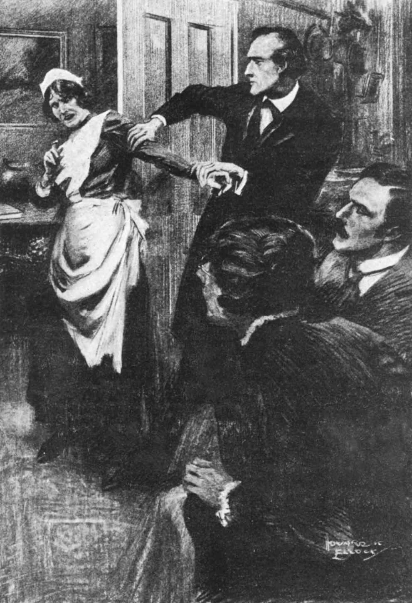

他揪住女人的肩膀往里拽。

“放开我！你想要干啥哟？”女人喊叫着。

“噢，苏珊，这是怎么啦？”

“哦，太太，我是来问问，客人是不是留下吃午餐，这个人就跳出来这样子揪住我。”

“我听见她在门口足足站了有五分钟，但是我不想打断您非常有趣的讲话。你有点哮喘，苏珊，没错吧？你喘气声太重，做这种差使不合适。”

苏珊气鼓鼓的一张脸，直朝抓她的人呆望。“你什么人哟，有什么权利这个样子揪住我？”

“我就是要当面问个问题。您写信给我，麦伯利太太，您想听听我的意见，有没有对别人讲起？”

“没有，福尔摩斯先生，我谁也没讲。”

“谁寄的信？”

“苏珊寄的。”

“这就是了。好，苏珊，你给谁通风报信，说你的女主人要向我问点事情？”

“你瞎说，我没有通风报信。”

“听着，苏珊，哮喘病人可能活不久，你要知道。老不说实话，可是要犯忌哦。你向谁通风报信了？”

“苏珊！”夫人大声喝道，“我看你不是个好人，不可靠。我现在记起来了，我看见你在树篱那边跟什么人说话来着。”

“这是我自己的事。”苏珊绷着脸回嘴。

“我来说吧，那是巴尼·默托克代尔，你在跟他说话，对吗？”福尔摩斯说。

“咦，你知道，你还问我干吗！”

“我本来不确定，可是现在确定了。那就好，苏珊。要是你告诉我巴尼背后还有什么人，这消息可是值十英镑。”

“人家可是一出手一千英镑，哪像你这十英镑。”

“哇，好个大阔佬，你笑我——那就是个富婆了。到这里，我们知道了不少，你还不如说了名字，先赚到现成的十英镑。”

“我不如先看你下地狱。”

“哦，苏珊！你这样咒人？”

“我现在不干就是了。你们，我是受够了，我明天就叫人来搬我的行李。”她愤然冲出门去。

“再见，苏珊，别忘了要用复方樟脑酊止痛剂……现在，”等怒气冲冲、满脸通红的女人出去，门一关上，福尔摩斯从打趣转为严肃，继续说道，“这个帮派的歹徒真不简单，他们目标很大，不可小看了。您写给我的信上邮戳是上午十点，苏珊立即向巴尼报信。巴尼去请示他的雇主，听取指示。他的雇主，男的或者女的——苏珊冷笑，是笑我乱猜猜错，所以我看应该是女雇主——酝酿着极大的阴谋诡计。黑人斯蒂夫被派上门来找我，是第二天上午十一点钟，就向我发出了警告。实在太神速了，您看。”

“他们要干什么呢？”

“是呀，正是问题呀。您这房子以前是什么人的？”

“一个退休船长，叫弗格林。”

“这个人的情况怎么样？”

“我一点也没听说过。”

“我怀疑是不是他埋了什么东西。可是，现在这时代，若有人要藏宝，尽可以藏到邮政保险库去。但是没理性的神经病做没理性的事还是有，没有了这些人，世界也单调。一开始，我猜是埋着贵重物品，但如果是这样，又为什么连你的家具也要呢？你有没有秘藏拉斐尔名画、莎士比亚手稿，连你自己也不知道？”

“没有，哪里有，最多就是一套王冠标记的德比瓷器茶具。”

“那就难以猜透这个谜案。另外，他们为什么不公开说明想要的东西呢？如果他们眼红您的茶具，尽管出个高价买嘛，何必连屋带家具买还要瓶瓶罐罐全买断？不，我看呢，这里头有着什么东西，您有着什么东西，连您自己都不知道。而且，如果让您知道，决不肯出让。”

“我也是这样看法。”我说道。

“华生医生点头同意，这就肯定是了。”

“哪，福尔摩斯先生，会是什么呢？”

“让我们试试，纯粹凭着拍脑袋推理分析，能不能分析出事实。您住这里一年了。”

“快到两年了。”

“那好。这么长的时间里，没人向您要什么东西，忽然就是这三四天，有人猴急找您了。您想是什么道理？”

“这只能理解为，”我又插嘴，“这样东西，不管什么，是最近才拿到这房子里。”

“可以这样肯定，”福尔摩斯说道，“现在，麦伯利太太，买来过什么东西呢？”

“没有呀，今年没买过新东西呀。”

“是吗！那真是奇了。啊，我想，得等情况再有一点发展，我们必须有进一步的线索。您的律师能干吗？”

“苏特罗先生，很能干。”

“您还有仆人吗，还是只有这苏珊一个？她刚才已甩门拂袖而去呢！”

“还有一个年轻女仆。”

“要设法邀请苏特罗来住上一两夜，您需要保护。”

“要提防什么人呀？”

“这不敢说了。事情还不明朗，搞不清楚他们是什么目的，我就得从另一头着手，找出他们的主谋。这个房产中介有没有地址？”

“有张名片，上头只有姓名、职业：海恩斯·约翰逊，拍卖商兼估价商。”

“这个人，单查商家名录是找不到的。诚实的商家不会隐藏他们的商业地址。好吧，有什么新情况，您马上让我知道。我接下您这案子，您就尽管放心，我一定要彻查到底。”

我们进了厅，福尔摩斯观察入微的两眼盯着堆在墙角的几个箱子。上面的标签十分醒目。

“米兰，卢塞恩，这是意大利。”

“可怜的儿子，是道格拉斯的东西。”

“您都还没有打开过吧？来了多久了？”

“上星期刚到。”

“可您说的是那——哈，恐怕这就是关键所在啦！我们怎么知道这就不是特别宝贵、特别值钱的物品啊？”

“这不可能的，福尔摩斯先生，可怜的道格拉斯只挣一点薪水，还有一小笔年金。他能有什么值钱的东西？”

福尔摩斯陷入沉思。

“不要耽搁了，麦伯利太太，”他终于说，“把这些箱子拿到楼上您房间里去。赶紧开箱检查，看里面有什么，我明天来听您的检查结果。”

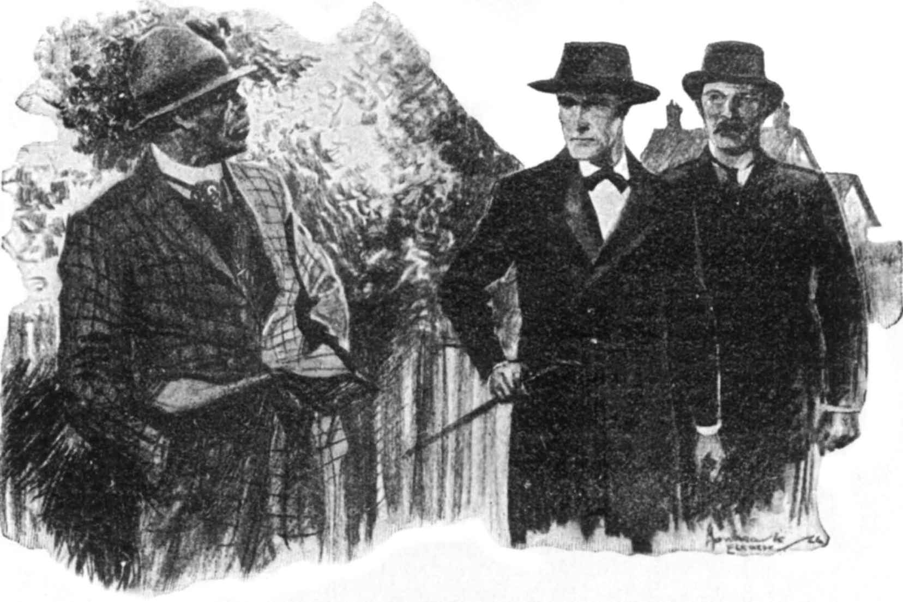

我们差一点跟他撞个满怀。

很显然这三山墙住宅受到了严密监视。我们走到巷道口，绕过高高的树篱，那个黑人，职业拳击手，站在暗影里，我们差一点跟他撞个满怀。在这种偏僻的地方，他那个身影显得狞恶可怕。福尔摩斯伸手拍了拍口袋。

“要掏手枪，福尔摩斯山森？”

“不，掏我的香水瓶，斯蒂夫。”

“你真会逗人，福尔摩斯山森，是吗？”

“要是我盯上你，斯蒂夫，不觉得是逗你了吧！今天早上我好意奉劝过你了。”

“是呀，福尔摩斯山森，你讲的我都好好想过了。再也别提帕金斯山森那档子事了。如果我能为你效劳，福尔摩斯山森，我一定愿意喽。”

“那好呀，告诉我谁是你背后的指使人。”

“天知道啦！福尔摩斯山森，我跟你说过实话了，我不知道。我的老板巴尼给我下的命令，就这点事。”

“好吧，你记住了，斯蒂夫，这座住宅里有位太太，还有屋子里的一切东西，都是委托我保护的，别忘了。”

“行，福尔摩斯山森，我记住了。”

“他生怕自己性命不保，真叫我把他给唬住了，华生，”我们继续走，福尔摩斯对我说，“要是他知道他的雇主是谁，他一定会出卖的。幸好我知道斯宾塞·约翰帮派的情况，知道斯蒂夫是他们的人。现在，华生，这个案子用得着兰代尔·派克，我这就去找他。等我回来，事情就会有眉目。”

我一天没见到福尔摩斯，但我可以想象他是怎么过的这一天。兰代尔·派克是个活宝，社会上一切杂七杂八新闻的万宝全书。他也是怪人，什么事都不管，只管待在圣詹姆斯街俱乐部的圆凸窗阳台上，整天做接收台、转发站，接收、转发大伦敦的各种小道消息和传闻。据说他靠着向各家新闻小报供稿每星期赚到四位数的报酬，小报都靠这种新闻来迎合大众探奇的心理。伦敦社会的混泥浊水之中，只要稍起一点波澜，就被这个精灵情报站一一记录，无一疏漏。福尔摩斯一直不忘向兰代尔提供消息，有时也会反馈，从他那里获得案情情报。

等我再看到我的朋友已是隔天的早晨，从他的神态便知道一切顺利。但不料发生意外大事，等待我们马上去处理，那就是以下电报的内容：

望速前来。委托人屋遭夜窃，警察已至现场。

苏特罗

福尔摩斯打一声呼哨。“剧情进入高潮，来得比我预料的还快。事情背后有大能量在运作，华生，我听到这个消息并不吃惊。这个苏特罗，当然就是夫人的律师。我犯了一个错误，是我不好，没有请你在那边守夜防卫。事实证明，这位律师很明显是根断芦苇，撑不起的无用人。事已至此，多讲也没用，还是再到哈罗林地去一次吧。”

我们看到这三山墙已乱哄哄不得安宁，不复前天那样井然有序。一小群闲人聚集在花园门口，有两名警察在检查窗户处的天竺葵花坛。进入屋内，看见一位白发苍苍的老绅士，他自我介绍是律师，旁边还有一个满面红光、咋咋呼呼的警官，他一见福尔摩斯就上来招呼，显然是个老朋友。

“啊，福尔摩斯先生，本案不用你插手，我看下来，就不过是一般的盗窃案，派两个老兵残将就得，用不着有劳专家出马过问。”

“当然我相信，这案子已交给了高手处理。”福尔摩斯说道，“你是说不过是普通盗窃案？”

“没错，我们很清楚是什么人干的，到哪里去捉他们。那是巴尼·默托克代尔黑帮，那个大个儿黑鬼也在里头——被人看见在这儿转悠。”

“太好了！被偷走什么？”

“啊，看来好像没有偷走多少东西。麦伯利夫人被迷药迷倒，屋里给——哦，女主人自己过来了。”

“你建议得没错，福尔摩斯先生，”夫人说道，歉意地笑笑，“都怪我，没有听进去，我是不想麻烦苏特罗先生，结果一点都没防备。”

“我今天早上才听说。”律师解释。

“福尔摩斯先生叫我邀朋友来家里住，好建议没有照办，这就付出了代价。”

“您看上去很累很虚弱，”福尔摩斯说，“要说明事情经过恐怕会累着您的。”

“都很清楚了嘛。”警官说，拍拍他的厚记事本。

“不过，夫人如果身体不是太累的话——”

“也真是没有多少可说，肯定是恶苏珊告诉他们怎么进的屋，他们对这屋子了若指掌。我感到嘴上给塞了氯仿布条，一刹那没了知觉，昏过去多少时间也不知道。等我醒来，看见床边有一个人，另一个人手上拿一卷东西，正从我儿子的行李堆站起身，有几件行李已经给打开，翻了一地。趁他没逃走，我跳起来把他抓住。”

“你这太危险了。”警官道。

“我拖住他，但他一下把我甩掉。还有一个好像打了我，我糊里糊涂不记得了。是玛丽，我佣人，听见了声音就对着窗外大叫，把警察叫来，可是窃贼已经逃走。”

“他们拿走了什么？”

“看下来，没有拿走什么值钱的东西呀，我知道，儿子的行李箱里没有什么东西。”

“这些人留下痕迹没有？”

“有一张纸，我抓住那个人的时候抢下来的，皱巴巴地丢在地板上，是我儿子写的东西。”

“这个，就说明并没有多大用处，”警官道，“如果是强盗——”

“没错，”福尔摩斯道，“按常理说应该是这样！虽然如此，那张纸我还是好奇要看一看。”

警官从记事本里抽出折好的一张大裁纸。

“我从不漏掉任何东西，不管多么细小，”警官十分炫耀地说道，“也是我对你的奉劝，福尔摩斯先生。凭我二十五年的经验，我得到的教训，肯定有指纹或是别的什么，不可错过。”

福尔摩斯检查纸张。

“你有什么看法，警官？”

“依我看，像是什么小说稿子，已写到结局了。”

“正是故事尾声，没问题，”福尔摩斯说道，“你注意到顶上的页码，是二百四十五，那还有二百四十四页在哪里，没有了？”

“那自然是窃贼拿了去，就愿他们拿了这玩意儿当好货去吧。”

“他们闯进屋子就是为了偷这样的纸头，这就显得太奇怪了。你对此有何高见，警官？”

“是的，先生，那些小偷慌乱之中碰到什么就抢什么。我希望他们到手这点东西快活去吧。”

“他们为什么偏要拿我儿子的东西？”麦伯利夫人问道。

“那是，他们在楼下找不到值钱的东西，就想上楼来碰碰运气，我看就是这道理。你说呢，福尔摩斯先生？”

“我得想一下，警官。到窗口来，华生。”我们站在一起，福尔摩斯拿了这张碎纸念起来。头上从半句开始，上面写着：

……一脸是血，血在刺伤、击伤的创口上流淌，但对他心上的流血，这又能算得什么！他瞧着那可爱的脸，为这张脸，他不惜牺牲自己的生命。那脸，却漠然地望着他感受痛苦与屈辱。她微笑——是的，哦，天哪！她在笑，就像是毫无心肝的恶魔。而他，仰望着笑脸。就在此刻，爱死灭了，恨爆发了。男儿决不生而无为。若是得不到你的拥抱，我的可心人儿呀，那就毁灭你，完全为了我要复仇。

“措词奇特！”福尔摩斯说，笑笑，把纸递回给警官，“你注意到了吗？一直是‘他’、‘他’、‘他’，忽然一转变成了‘我的’，作者写故事写得走神了，心潮澎湃，想象自己就是主角了。”

“这写得极端无聊，”警官道，把纸放回本子里，“怎么，你要走了，福尔摩斯先生？”

“案子已有高手处理，我在这里也就无用。噢，对了，麦伯利太太，您不是说有意要出国旅游吗？”

“我一直有这样的梦想，福尔摩斯先生。”

“您喜欢去哪里，开罗、马德拉群岛<a href="#part0159.xhtml_ch2"
id="part0159.xhtml_ch2-back">(2)</a>、里维埃拉<a href="#part0159.xhtml_ch3"
id="part0159.xhtml_ch3-back">(3)</a>？”

“哦，只要有钱，我要周游全世界。”

“是这样，周游世界。那就再见吧，傍晚时候我会给您消息的。”我们走过窗户时，我瞅见警官在笑着摇头，“这些个聪明人有时候做事总要犯着点疯病。”我揣测警官的微笑，仿佛这么说着。

“现在，华生，我们这一趟小小的旅途已到了最后一程，”福尔摩斯说，这时我们又回到伦敦市的喧闹之中，“我想我们要立刻抓紧时间，把事情赶快解决掉，你也最好和我一起去。要和伊莎朵拉·克莱因这样一位女士打交道，有一个证人是比较保险的。”

我们乘上马车，朝着格罗夫纳广场的某一地址疾驰。福尔摩斯一路陷入沉思，但忽然抬头说话。

“我说华生，我猜你已经全部看清楚了。”

“不，还不能那么说。我只在想，我们去找的那位女士是本案的幕后主谋。”

“一点也没错！可是，伊莎朵拉·克莱因这个名字你没有印象吗？她是大美人嘛，盛名盖世，没有一个女人可与她攀比。她是纯西班牙人，属于中南美洲征服者大家族的纯白人血统。她的家族好几代以来，都是巴西伯尔南布科的领袖人物。她嫁给一个德国老头，蔗糖大王克莱因，不久便成了全球最富有的女人，也是最迷人的寡妇。随后便是艳情迭出，把自己的生活安排得多采多姿。她有好些个情人，其中一个就是道格拉斯·麦伯利，伦敦最出名的美男子之一。从种种情况来看，这年轻人可不是逢场作戏。他不是社交圈里的狂蜂浪蝶，而是一个执着、有自尊心的男子汉，他掏心掏肺地爱人，也希望别人一样地爱他。但是，那一位则是小说中常见的法文所谓belle
dame sans
merci，冷酷美人，随处种情的交际花。这种人兴之所至，水性杨花，欲望满足后便要分手。对方若是不识相再要纠缠不休，便就对不起了。”

“那么说，写的正是他道格拉斯自己的故事了——”

“是呀！心有灵犀一点通，你都串起来了。听说伊莎朵拉女士就要和年轻的洛蒙公爵结婚，这公爵的年龄都可以做得她的儿子了。公爵的母亲也许可以不计较年龄，但是若有大丑闻飞扬开来，那就不一样了。所以这件事非同小可——啊！不知不觉已经到了。”

那是一幢伦敦西区最好的街角住宅。一个机器人似的看门人接了我们的名片进去，回出来说夫人不在家。“那我们等她回家。”福尔摩斯笑嘻嘻说。

机器人冒起烟了。

“告诉你不在家，就不在家。”看门人道。

“好，”福尔摩斯回答，“那就说我们不必等了，请将这张纸条交给你家主人。”

他在笔记本上草草写几个字，撕下折好，交给看门人。

“你怎么说，福尔摩斯？”我问他。

“很简单：‘本案移交警方如何？’我想，足可以通融我们进去。”

果然灵验——立竿见影。一分钟后，我们来到一间布置得如天方夜谭般的客厅，宽敞，富丽堂皇，一盏罕见的粉红色光的电灯，使一切映衬在半明半暗之中。我觉得，女士已到这把年纪，再怎么曾经是娇艳不可一世的美人，此时对这种半暗半明的光线当然会更觉亲和而喜欢。我们进去，她从长椅上起身：挺秀、匀称、完美、一派皇后气势，一张面具似的美艳脸庞，两只妖媚的西班牙眼睛，盯着我们两人射出凶光。

“为什么硬要见我——还有这很不礼貌的纸条？”她问道，举着字条。

“不用我解释，夫人。我绝对尊重你的智慧，相信你不需要我解释——虽然我不得不承认，你近来似乎聪明反被聪明误。”

“此话怎讲，先生？”

“就说你雇些流氓想吓退我别多管闲事，可惜你不知，干我这行的，越是危险越爱冒险。应该说，正是你，才迫使我非查清麦伯利小伙子的案情不可。”

“听不懂你都是在说些什么，我哪里雇什么流氓来了？”

福尔摩斯缓缓地转身要走。

“好，是我低估了你的智力，那就再见了！”

“站住！你上哪儿去？”

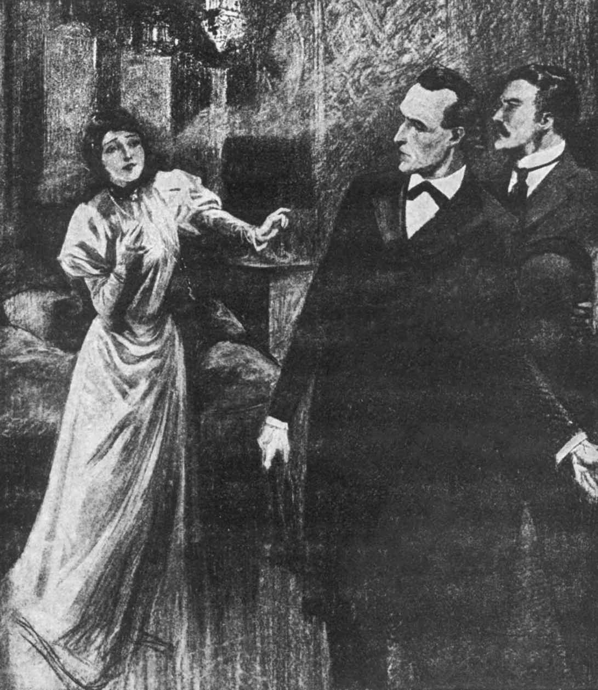

“站住！你上哪儿去？”

“去苏格兰警场。”

我们朝门口走了一半，她就赶上来，拉住了福尔摩斯的手臂。一瞬间，她由铁打似的强硬变成天鹅绒似的柔软。

“过来，坐下吧，两位先生，让我们把事儿谈谈。我还是和你开诚布公吧，福尔摩斯先生。你有绅士风度，女人都有本能很快就感觉得到。我把你当朋友相待。”

“我不能承诺也同等相待，夫人。我不是法律，但是我代表公正，尽管我的权力微不足道。我先洗耳恭听，然后告诉你我要如何处置。”

“实在是我自己愚蠢，竟去威吓像你这样勇敢无畏的人。”

“真正愚蠢的事，夫人，是你把自己交到一帮流氓的手里，他们会敲诈你，出卖你。”

“不，不！我不那么简单好对付。既然我答应开诚布公，我可以说，没有人，除了巴尼·默托克代尔和他的妻子苏珊之外，没有人知道自己的雇主是谁。至于这对夫妇，这已经不是第一次——”女士笑笑，点点头，显露风情万种的可人姿态。

“我明白了，你以前考验过他们。”

“他们是好猎犬，悄没声，不叫唤。”

“这种狗，早晚也会咬了喂养它们的手。他们夫妻两个因这次夜窃案要遭逮捕，警察已在捉拿他们。”

“他们挺得住，他们拿了钱就替人消灾，有约在先，我不会被牵连进去。”

“除非我把你牵连进去。”

“不，不，你不会，你是绅士。这事关女人的秘密。”

“第一步，你必须交还手稿。”

女士呵呵一笑，走到壁炉边，用一根拨火棒挑了挑一堆纸灰。“要我还这个吗？”她问道。她站在我们面前，赖皮加俏皮地看着我们，微露娇嗔挑衅的笑容，使我觉得，福尔摩斯所见过的罪犯，惟有这一个似乎最难对付。然而，福尔摩斯不受影响，不为所动。

“这可决定了你的命运。”他冷冷地说，“你的动作真够快，夫人，但这一回未免快过了头。”

女士把拨火棒喀啷丢下。

“你心肠真硬呀！”她叫道，“要不要我把经过全告诉你？”

“我想，倒是我可以告诉你。”

“但是你必须站在我的立场看问题，福尔摩斯先生。你必须从一个女人的观点来理解，这个女人眼看她的一生、她的希望即将毁于一旦！这个女人想保护自身，该受到谴责吗？”

“原罪是你自己。”

“是的，是的，就算我承认！他是个可爱的小伙子，可人儿，道格拉斯。可惜很不幸，我有未来宏愿，和他没有缘份。他要和我结婚——结婚，福尔摩斯先生——我和一个一文不名的小平民结婚！他只要结婚，允诺他其他一切，他一概不答应。他死心眼儿纠缠不放。我给与了他，他就以为我必须永远给与，尤其是只能属于他一个人，这是我不能容忍的。最后我叫他明白这一点。”

“雇了流氓打他，就在你窗前月下。”

“你真是什么都知道。是这样，瞒不过你，巴尼带一些手下人把他拽走。我承认，做得有点过火。可是他接着做什么？我相信，正人君子，是不会这样小家子气的！他写书，把这种私事全写进去。我，不用说，被写成了狠心狼，他是只小羔羊。事情都写在里头了，当然名字不一样。可是伦敦人一看，谁会看不出来呢？这种事，你怎么说呢，福尔摩斯先生？”

“可以的，这是他的权利。”

“真是意大利的空气融入了他的血液里，结果也融合了古代意大利那种残忍。他写信告诉我，还把书的副本寄给我。他先寄给我，打算叫我先受折磨。书稿一式两份，他说——一部给我，一部给出版商。”

“结果另一部没有送到出版商那里，你是怎么知道的呢？”

“我清楚他的出版商是谁，这已不是他的第一部小说，你知道。我发现出版商还没有接到意大利方面的来信，接着传来了道格拉斯突然暴病而亡的消息。只要还有一部书稿在外面，对我总是威胁。稿子肯定留在他的遗物之中，遗物肯定都要移交给他的母亲。我叫那帮人行动，派人打入他家里去帮佣。我原本打算以正当方式取回，真的是这样做的，出价买下房屋和屋里的全部物件，他母亲开什么价我就付什么价。结果事情没成。我无法可想，才不得不采取最后的手段。是的，福尔摩斯先生，我是对道格拉斯太狠心——可是，天晓得，我也只好抱歉了呀！事关我未来的一生，经不起他这么对待我，叫我有什么别的办法呢？”

歇洛克·福尔摩斯耸耸肩。

“也罢，也罢”他说道，“看来，我这一回又要对重罪加以通融，索取赔偿了事。请问，作一次全球旅行，按头等标准费用计算，要多少钱？”

女士睁大眼睛莫名其妙地愣着。

“五千英镑够吗？”

“噢，我想够了吧，可以了。”

“那很好。请你签一张支票，让我转交麦伯利太太。你应该让她换换空气。同时，夫人，”——他伸出食指晃晃以示警告——“要小心呀！千万小心！把玩锋利的快刀不会永不伤着你的纤纤细手。”

（1926年）

————————————————————

<a href="#part0159.xhtml_ch1-back" id="part0159.xhtml_ch1">(1)</a> 指神判的死亡与地狱之事。

<a href="#part0159.xhtml_ch2-back" id="part0159.xhtml_ch2">(2)</a> 马德拉群岛（Madeire），位于北大西洋中东部，葡萄牙辖区。

<a href="#part0159.xhtml_ch3-back" id="part0159.xhtml_ch3">(3)</a> 里维埃拉（Riviera），法国东南部、意大利西北部的地中海旅游地。

# 军人斑面案<a href="#part0160.xhtml_ch1"
id="part0160.xhtml_ch1-back">(1)</a>

我那朋友华生，头脑狭隘，执着起来一点也不肯转弯。他是早就一直缠着要我自己写故事。这也要怪我自讨苦吃，因为我平常对他过于苛刻，总要指摘他写的东西太肤浅，怪他一味迎合读者趣味，而不注意严格遵循资料反映事实。“你自己写写看呢，福尔摩斯！”他反唇相讥。而我当真提起笔来想自己写，这时候便开始理解并且承认只有像他那样的写法，才能引起读者的兴趣。所以我就学着他的手法叙述下列案件作为试笔。这一篇故事也十分离奇，又正巧华生还没有将它收入故事集中。讲到我的传记作者老朋友，该趁这个机会提几句。我的侦探工作，原本微不足道，我之所以要给自己添上一个人来合作、参与，并非一时高兴要多此一举，实在是因为华生品质难得。他谦虚谨慎，对我是一味高估、夸耀，却不看重自身的作用，从不居功。这是美德。一个搭档若对你的行动、步骤甚至于结果，都能了若指掌，那必有危险，容易坏事。但若是你在同伴眼里，所有行动进展都令人意外惊奇，前景和结局对他始终是不解之谜，那么这位搭档便是理想的帮手，不可多得。

我翻阅自己的记录，这个案子发生在一九〇三年一月，布尔战争<a href="#part0160.xhtml_ch2"
id="part0160.xhtml_ch2-back">(2)</a>刚刚结束，有一位詹姆斯·M．多德先生登门来访。这个堂堂英国公民，身材高大，皮肤黝黑，气宇轩昂。那时忠诚好友华生已经娶妻成家，离我而去。我与他朋友相处亲密无间，记得起的对我种种事情之中，惟有这一次他只考虑自己，将我孤单一人遗下，算得上是自私行为。

我有个习惯，喜欢背窗而坐，请来人坐在我的对面，这样光线便充分对着他们。詹姆斯·M．多德先生似乎一时不知怎样开场，我也无意催促他，因为这样反而给我更多时间好观察对方。我觉得，委托人登门来访，让他们留下强烈的第一印象是必要的，所以我就告诉他几点观察结论。

“你从非洲来，先生，据我观察。”

“是的，先生。”他回答，有点惊讶。

“帝国义勇骑兵队，我想是。”

“是呀。”

“米德尔赛克斯军团，肯定是。”

“哦，没错，福尔摩斯先生，你真是神机妙算。”

我看他神色叹服，便笑笑。

“一位先生神采奕奕走进我屋里来，脸色晒得黝黑，英国的太阳可是绝对晒不到那样的程度。手帕收在袖口，没有塞在衣袋里，便不难给他定下地位身份。你留着短胡子，这表明你不是正规军，你的模样是骑兵。至于米德尔赛克斯，你的名片上已经讲明你是思罗格莫顿街股票经纪人，那你还能加入到其他军团吗？”

“你真是明察秋毫。”

“我眼见的事物不一定比你多，这只不过是我练出来的本事，多观察所看到的事物。好了，多德先生，不讨论科学观察问题，今天早上你来找我不是为此目的。塔克斯伯里老庄园有什么事发生吧？”

“福尔摩斯先生——！”

“我说先生，不必如此惊讶，你来信上面就有地址。你相约来访，口气也显得紧迫，这就清楚显示，一定有紧急要事发生。”

“确实，一点也没错。但信是下午写好寄出，这以后又有好多事。要不是埃姆斯沃思上校把我赶出来——”

“把你赶出来？”

“对呀，可以说就是赶我出来。他无情无义，这埃姆斯沃思上校。他当年在部队里是个最厉害的军纪官。不过，那个时候我们年轻人也都是粗野放肆，不稀奇。我这次要不是看在戈德弗雷面子上，早就对上校不客气了。”

我点起烟斗，往椅背上一靠。

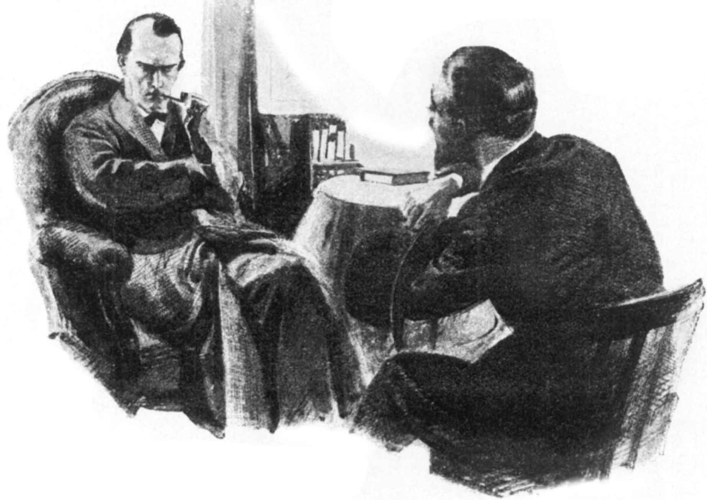

我点起烟斗，往椅背上一靠。

“什么事详细说说。”

我的委托人竟然扮起鬼脸笑笑。

“我以为什么也不用告诉你，你就能样样算得到呢，”他说，“那我就把事实说出来，求上帝帮忙，你能告诉我那是怎么一回事。我一夜没睡，脑子里尽折腾，可越想越糊涂，摸不着头绪。

“我一九〇一年一月参军——就在两年前——和年轻小伙子戈德弗雷·埃姆斯沃思同一个中队。他是埃姆斯沃思上校惟一的孩子——埃姆斯沃思是克里米亚战争维多利亚十字勋章获得者——儿子秉承父亲军人传统，所以顺理成章，毅然参加义勇军。全团也挑不出第二个像他这样的棒小子。我们结成好朋友——刎颈之交，这只有在同甘共苦的生活中才能建立。他与我作伴，这种友谊在军队生活中十分宝贵。我们共同经历一年艰苦战斗，同生死共患难。比勒陀利亚城外钻石山一仗，他中弹受伤，被一颗猎象大号子弹击中。我曾收到过他从好望角医院里写来的一封信，还收到一封从南安普敦寄来的信。后来就不再有信——音讯全无了。福尔摩斯先生，六个多月，不知他死活。他可是与我最知心，最要好，真正的至交。

“好，战争一结束，我们都回家了。我写给他父亲一封信，问戈德弗雷在什么地方，没有回信。我等了很久，重新再写一封信去。这一次总算有回信，也只简单几个字，说戈德弗雷已去环球航行，没有一年时间不会回来。就这些。

“我无法安心，福尔摩斯先生，这里头究竟怎么一回事，相当蹊跷。我知道，他决不会就这么把知心朋友丢下，这不像他，他不是这种人。后来，我又听说他是继承人，要继承一大笔钱，可他和他父亲日常并不是很合得来，关系不融洽，老头儿动不动就火气大，戈德弗雷年轻气盛也不吃他那一套。不，这个不是原因，我认为不是。我决定要追根究底，把情况搞清楚，但一时还抽不出空。我离家两年，回家自己的事情先得要料理一下，这就耽搁到本星期，才有空把戈德弗雷的事重新拿起来。我现在既然要管这件事，其余的就得全部扔下，弄个水落石出才放心。”

詹姆斯·M．多德先生这种人，把他看作朋友不会错，他不会是坏人。他下巴方正坚毅，说话时，一对蓝眼睛直视对方。

“噢，那你怎么做呢？”我问他。

“我第一步，就是直闯他家，塔克斯伯里老庄园，靠近贝德福德，实地去看看。我就写信给他母亲——父亲脾气太坏，少惹他——我来个单刀直入：我说戈德弗雷是我最好的好朋友，很想把我们共同经历的许多有趣故事说给她听，我本来是要到附近地方去，想顺便登门拜访，希望获得允诺，等等这些话。他母亲马上回信，非常客气，还邀我去过夜。好，星期一我就去了。

“塔克斯伯里老宅，地方偏僻得很——车站下去还得走五英里路才能到达。车站没有马车，我只好提着个皮箱步行，到目的地天已快黑。房子是幢大宅，曲曲折折坐落在很大一片园地上。能看得出，这宅子已有好些年代了，各种风格杂糅，从伊丽莎白式半明木结构的地基开始，一直到维多利亚式的柱廊，应有尽有。屋子里面，都有嵌板、挂毯，还有古画，有些已褪色。那屋子，阴森森，挺神秘。一个老总管，拉尔夫，跟房屋一个样，都是老古董。还有他的老伴，好像比他还要老。老婆婆原先是戈德弗雷的保姆。我听戈德弗雷自己说起过对她感情很亲，只差就是母亲了，所以尽管她相貌很怪，我还是对她极为尊敬。他母亲我也很喜欢——一个矮小的老妇人，慈眉善目，非常和蔼，像只小白鼠。就只有上校本人，叫我看着就别扭。

“我们一见面就搞得很不愉快，我差一点就要直奔车站回家。但我念头一转，不行，这样就正中他计，他不正希望我走吗？我被直接带进他的书房，一进去看见他，高个头、驼背、皮肤焦黑、灰蓬蓬的乱胡子，坐在书桌后面，桌上堆得乱七八糟。他的红糟鼻像个鹰嘴，两只灰眼，在浓眉底下直瞪着我。我这时才晓得戈德弗雷为什么很少谈到他父亲。

“‘哦，先生，’他说，声音刺耳，‘我倒是有兴趣听听你的光临有何用意。’

“我回答，已经在给他夫人的信中都讲得明明白白。

“‘是啊，是啊，你说是在非洲认识戈德弗雷，我们也就只听你自己这么说说罢了。’

“‘他有给我信，我口袋里带着。’

“‘给我看看。’

“我把两封信给他，他横眼扫一遍，丢还给我。

“‘噢，那有什么事呢？’他问。

“‘我是你儿子戈德弗雷最好的好朋友，先生。我们一起相处，要好得很，都忘不掉，忽然没他音讯，想要知道他的情况怎么样，这事不是挺自然吗？’

“‘我记得很清楚呢，先生，我都已经写信告诉你他的情况，他正在周游世界呢。非洲去过之后，他受了伤，健康不佳，他母亲和我都认为他需要彻底休养，换换环境。要是有其他朋友也关心他，那就请你把这些情况一并转告。’

“‘当然，’我回答，‘不过，很想麻烦一下，把船名和他一路的航线都告诉我，连带日期，好让我跟他通上信，这可以办得到吧。’

“我提出这个要求，主人好像不理解又很生气，眼睛上的浓眉打了个大结，手指不耐烦地敲敲桌面。最后抬眼瞧我的那个表情，像是下棋对手将了他一军，他决心非得反扑不可。

“‘许多人，多德先生，’他说，‘会觉得，你十分固执无礼，而且到这地步，已经纯属无理取闹。’

“‘请你一定要原谅，先生，这都是因为我和你儿子友情特别深厚。’

“‘当然，我已经充分考虑到这层关系，可我还是请你放弃这种无理要求。每家有每家各自内情，不是都可以向外人道来，不管外人抱着何等善意。我内人很想要听戈德弗雷的非洲故事，你告诉她就行。但是请你不必多管我儿子现在和将来怎么样，这种打听没有益处，先生，问这问那让我们很为难，不好办。’

“就这样，完全碰壁，福尔摩斯先生，无法突破。我只好假装接受，心里暗暗发誓不弄清楚好朋友下落，决不罢手。那天晚上气氛很沉闷，晚餐冷冷清清，三个人，在阴阴沉沉老屋里用餐。老太太问我好多她儿子的事，老头一脸铁板，闷闷不乐。这整个情况让我心情很不好，所以也就只尽到礼貌，坐到可以走的时间就告别主人，进我房间去睡。房间挺大，在楼下，空荡荡没什么摆设，跟宅内别的房间一样，也是阴沉沉。但是睡过一年南非草原，福尔摩斯先生，对住的地方也就不会太挑三拣四。我拉开窗帘，看看花园，看到半月明亮，夜色很好。然后我就坐在明晃晃的炉火边，桌上一盏灯，翻翻小说，尽量解解心头郁闷。但是看书也不成，老总管拉尔夫进来，给我添煤。

“‘我怕你晚上不够用，先生。天气很冷，这屋子又不保暖。’

“他走出房门时又停下。我回过头去，见他正站住看着我，脸上满是皱纹，眼睛里像是有话要说。

“‘对不起，先生，晚餐时，我也忍不住要听你讲我家小主人戈德弗雷。你知道，先生，我妻子把他带大，我也可以说算得上是他养父，也就自然要关心他。你说他表现得很好，是吗，先生？’

“‘全团没人有他那么勇敢。有一次全靠他把我从布尔人的枪林弹雨中救出来，没有他，我现在也就不可能在这里了。’

“老总管搓着一双瘦手。

“‘是呀，先生，是呀，戈德弗雷主人正是那样呀。他从小就勇敢，这园里没哪棵树，先生，不曾被他爬过。他什么也不害怕。从前是个多好的孩子——哦，先生，从前是多好一个小伙子呀。’

“我一下子跳起来。

“‘你怎么说？’我大声问。‘你说“从前”，你这话，他已经不在人世？到底怎么回事？戈德弗雷·埃姆斯沃思出什么事了？’

“我抓住老人肩膀，老人把我的手推掉。

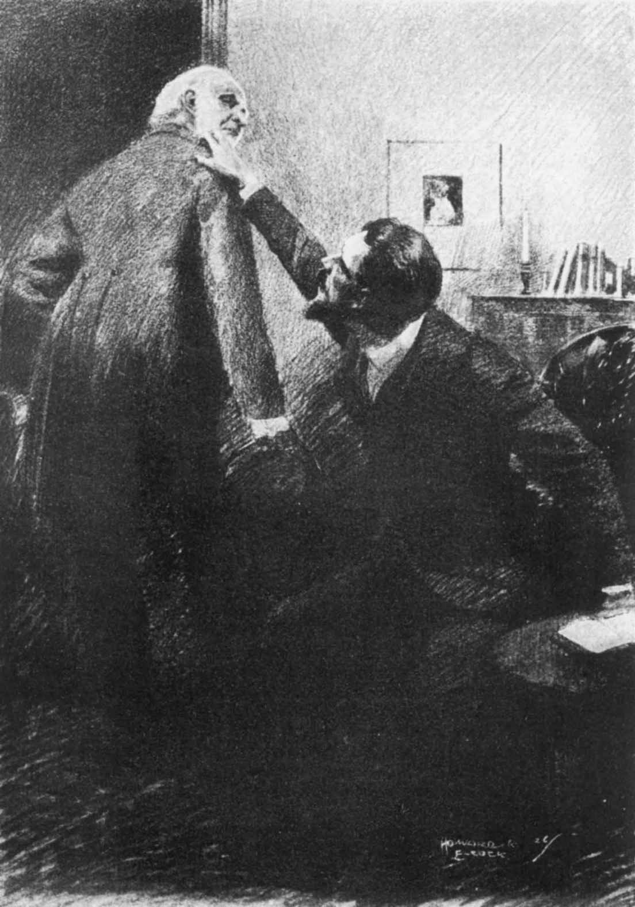

我抓住老人的肩膀。

“‘你问这事，我不知道，先生。小主人戈德弗雷怎么样了，你问我家主人吧，他全知道，我不好多嘴。’

“他要出去，我拖住他手臂不让他走。

“‘听我说，’我告诉他，‘你要回答我一个问题，才让你走，不然，不然我让你陪我一整夜。戈德弗雷死了吗？’

“他不敢看我的眼睛，恍恍惚惚像是被催眠过，嘴里勉强挤出几个字，真叫我害怕，大出意料。

“‘哦，上帝啊，要是死了倒好啦！’他悲痛地说，身子猛一挣脱，跑出屋去。

“你想，福尔摩斯先生，我坐到椅子里，还有什么好心情！老人的话我想来只能有一种解释，明摆着，我可怜的朋友恐怕犯下什么案子，或者至少是不名誉行为，影响到家庭声誉，他老父亲很严厉，把他儿子弄到什么地方去禁闭起来，免得丢人现眼。戈德弗雷是个没心眼的莽撞鬼，耳根子软，容易被人三句好话就拉走，八成落到坏人手里，上了当，毁掉自己。若真是这样，那真叫人悲伤。但我先要找到他，再看看我怎么才能救他。我心急如焚，不知如何是好，哦，一抬头，戈德弗雷·埃姆斯沃思就站在我面前哪！”

我的委托人竟激动得噎住了口。

“请说下去，”我说，“听你这一说，这个问题倒很不寻常啊。”

“他在窗外，福尔摩斯先生，脸贴着窗户。我跟你讲过，我看外面夜色，把窗帘撩在一边。他就正好站在窗帘打开的地方。那是落地长窗，我看到他全身。可是，他那张脸，一张脸，把我吓呆了。他脸色死白——从来没见过活人有这样的死白。我以为是鬼脸，鬼脸才是这个样子，但是他两眼忽闪着瞧我呢，那分明是活人的眼睛嘛。他看到我盯着他，就往后一退，马上消失在黑暗中。

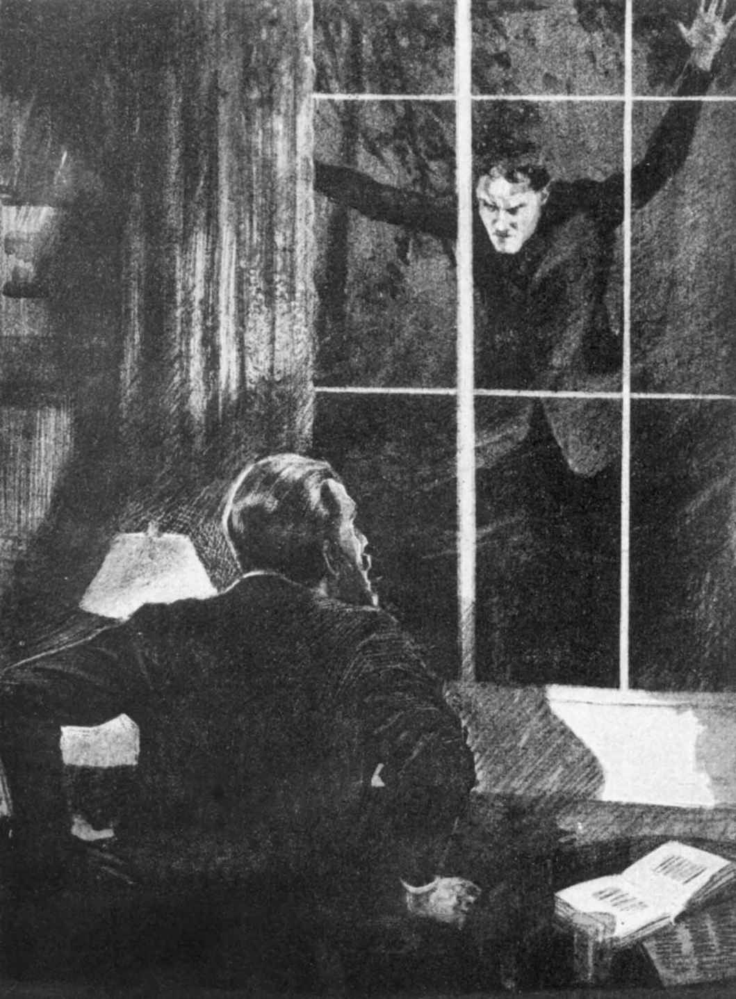

他在窗外，脸贴着窗户。

“戈德弗雷已经出事，可以肯定，福尔摩斯先生，不光是一张鬼脸，黑夜里一张死白的脸，真吓人。比这更严重的是——他见不得人，偷偷摸摸，罪恶似的——那个光明正大、坦荡荡的男子汉，我以前很熟悉，现在已经完全不是，我一想起这些就不寒而栗。

“但是我们和布尔人打仗，交手一两年之久，神经、手脚练得反应很是敏捷。一见戈德弗雷在窗边，不等他走掉，我就跑过去开窗。窗上搭扣不灵，花了点时间才把窗户打开，窗一开我就往外窜，很快跑到花园小道上，估摸着他奔跑的方向追上去。

“小道很长，光线不好，可是我感觉得到前面有动静。我追过去，叫他名字，没一点反应。追到小道尽头，是几条岔道，通向几间孤立的屋子。我站定，思索着该怎么办。这时候很清楚听到关门声，那不是我身后的大屋子，而是从前面黑暗中传过来。这就没错，福尔摩斯先生，我完全肯定眼睛看到的并非幻觉，是戈德弗雷从我眼前一露面就跑掉，进了哪个屋子里，这点我相当肯定。

“没有别的办法，这一夜我辗转难眠，翻来覆去想着这件事，思忖是什么缘故，怎么会发生这种事。隔天，我觉得上校态度稍有缓和，女主人还说附近有好几处风景区可以游玩。我便趁这个机会问，是否方便让我再多留一晚，老头儿虽然勉强，但也默许了。我就争取到一整天时间来进行观察。我已经完全确定戈德弗雷隐藏在附近什么地方，但到底是哪一间房子，又是什么缘故，实在需要查个明白。

“宅子真是大，也真错综复杂，就是一个团藏在里面，也没人知道。这种房子里藏着什么秘密，我很难发现得了，但是我听到那个关门声音肯定不是这大房子。我得上花园去察看，看看能不能找出来。这没有困难，几个老人都有他们自己的事正忙着，我可以自由行动。

“花园里有几间小屋，最远处的一幢独立房子比较大——大得可以当住家，让花匠或是守林人居住。那关门声音会不会就是这屋子传出的呢？我走近去，装作毫不在意，只是四处闲逛，没事才逛到这里来。这时，一个小个子，留着胡子，穿黑外套，戴圆顶礼帽——决不像花匠园丁这种人的模样——从门里出来，他动作利落，随手就把门带上，上锁，钥匙放进口袋，他一转身，发现了我，脸上顿时显得很吃惊的样子。

“‘你是客人吗？’他问。

我回说是戈德弗雷的好友。

“‘不巧他出远门旅行了，不然我来他一定会很高兴见我。’我又说。

“‘是嘛，也是，’他好像做了亏心事似地说话，‘那就请改天再来吧，等以后好日子。’他接着就走开。但是我转身去看看他，他还在花园那一头，让月桂树半掩着，远远站那儿也向我看呢。

“我走过那小屋，仔细瞧瞧，窗帘都拉上遮住，让人看了觉得不过是空房子。如果我大胆窥探，恐怕要坏事，被赶出去，因为我意识到自己正被监视。所以，我又闲逛，逛回宅子，等到晚上，再继续进行调查。天暗下来，等万籁俱寂，我打窗子溜出，小心不出声，摸向那间神秘的屋子。

“我讲过，窗帘全都遮住，但现在发现连百叶窗也都关上。可是有个窗户，透着一线亮光，我就上前仔细看看。很幸运，窗帘没有完全拉上，原来百叶窗有个缝，这就让我看得见屋里情形。里边还挺舒适，灯挺亮，炉火挺旺。在正对面，早上遇见的那矮个子，正坐着抽烟斗，看报纸。”

“什么报？”我问道。

委托人对我这么打断他叙述不太高兴。

“这有什么关系？”他反问。

“非常有关系。”

“我没注意到。”

“可能你看到是大开张报纸，或者小版面，是周刊一类的东西。”

“经你一提起，使我想起来了，不是大开张，很可能，好像是《观察家》。不过当时我确实没去注意这个细节问题，因为发现还有一个人背朝窗坐着呢。我敢发誓，这个人就是戈德弗雷。我看不见他脸，但是我认得出他是斜肩。他手肘撑着头，样子不是好心情。我正犹豫该怎么办，忽然有人拍我肩膀，是埃姆斯沃思上校，他站在我身后。

“‘这边来，先生！’他压低嗓音说。这就一声不出，走到了大屋。我跟着他，一直走进我的房间。走过门厅时，他拿起一张火车时刻表。

“‘八点半有一班车开往伦敦，’他说，‘八点钟马车在门口等候。’

“他气得脸煞白。真是的，我感到自己处境真是尴尬，只能结结巴巴地说些莫名其妙的道歉话，解释自己纯粹是想看看好朋友，实在情急心切不过。

“‘不讨论这件事，’他立刻打断我，‘你已经做得非常过分，干涉起我家私事来了。你来做客，居然当起间谍来了。我不想多说，先生，只说一句，以后不希望再见到你。’

“这下子，我也生气了，福尔摩斯先生，我说话也就不客气。

“‘我看见你儿子了，我知道你是出于某种目的，故意把你儿子隔离起来。我不知道你这样禁闭他是什么用意，可是我敢肯定他失去行动自由，已不是自由人。我提醒你，埃姆斯沃思上校，除非我确知我朋友处境安全、正常，否则我绝不会停止努力把谜底揭开，任你说什么做什么，都吓不退我。’

“老家伙变得像魔鬼一样凶，看样子要对我动手。我讲过，他人瘦，可是高大、厉害，一个倔老头，我虽然不弱，也很难对付得了他。不料，他怒目瞪了我很久，一个转身走出房去，不再理我。然后我也就按时搭早班火车离开，一心希望按我事先约好的立即来找你，请你帮忙，听取意见。”

以上就是来访者摆在我面前的问题。读者眼光敏锐，大概已经看出，解决这个案子难度不大，因为追根究底，可能性有限，不难作出选择。但是尽管浅显，还是很有些趣味和新奇之处，所以我就详细记录下来。我现在依旧运用逻辑分析法，把解决范围加以压缩，此法为我历来所惯用而屡试不爽。

“有多少仆人，”我问道，“他宅子里？”

“据我知道，就只有老总管和他太太。他们家生活看来极其简单。”

“这么说，那座单独的房子里就没有仆人？”

“没有。除非那个留胡子矮个儿是仆人，可是不像。看样子，他该是个有点身份的人。”

“这就说明了问题。有没有看见大宅里有人送饭到小房子？”

“噢，你这一提，对了，我确实看见老拉尔夫拎着篮子到花园，朝那间小屋走去，当时我根本没想到送饭那方面去。”

“你向当地的人作过调查吗？”

“地方调查，作过。我问过站长，问过村里客栈老板。我只简单问他们认不认识戈德弗雷·埃姆斯沃思，是我一个老战友，他们两人都确切告诉我戈德弗雷已去世界环游旅行了。他回过家，但紧接着就走了。从这个说法来看，显然当地人都这样认为。”

“你没有把怀疑的情况向外说？”

“没有。”

“很明智。这件事当然要深入调查，我要和你再去一趟塔克斯伯里老庄园。”

“就今天？”

这时我刚刚结束手上一件案子，这个案子我的朋友华生称之为“修道院公学案”，该案深深涉及格雷敏斯特公爵本人。我接着还有土耳其苏丹委托要办的案子，需要立即采取行动，若有延误将产生极严重的政治后果。这样直到下个星期，如我日程所记，才得以出发，由詹姆斯·M．多德先生陪同踏上贝德福德郡征途。驱车到了尤斯顿，我们把一位一脸刻板严肃、沉默寡言的绅士接上车，这是我事先安排好的。

“这位是老朋友，”我对多德说，“有可能，请他来全无必要，也有可能，将发生重大作用，看事情结果吧，现在先不用多说。”

华生记述的故事已使读者早已习惯于这一事实，就是当我对案子进行深入思考之际，我不愿空口多言，也不愿透露胸中盘算。多德心中一定对我存有疑惑，尽管嘴上没说什么，三人只管一心赶路就是。在火车上，我问多德一个问题，也是意在让我们新来的同伴预先了解一点情况。

“你说你从窗户上看见朋友那张脸，看得相当清楚，因此你确定就是他本人没错？”

“这绝对没有问题的。他鼻子压在玻璃上，灯光照着他，很亮。”

“不会是其他什么人，样子很像他吧？”

“不，不，肯定就是他。”

“可是，你又说他样子改变了。”

“只是皮肤变色。他脸——我怎么来形容他？——变白，成鱼肚白似的，是皮肤脱色了。”

“皮肤全都变色了吗？”

“也好像不是，主要是额头，额头贴住玻璃，看得最清楚。”

“你叫他名字没有？”

“我一时呆住，愣在那里，后来追出去，我告诉过你，没有追上。”

本案侦查实际上已经完成，只有一个末节需要查实。马车跑上好一阵，才停在委托人所说的那幢怪异凌乱的大宅前。老总管拉尔夫开的门。我已经把马车全天雇用，也就请我的年长朋友暂时在车上歇着等一等，有事我就来请他。拉尔夫，身材矮小，满面皱纹，穿着传统服饰，黑上衣，夹花条纹裤，只有一点不同寻常，戴着副棕色皮手套。一看见我们，他立即把手套脱下。我们进厅，他把手套往厅桌上一放。我这个人，诚如我的朋友华生常讲，感官极其灵敏，已经闻到一股极细微但有刺激性的气味，好像就是从这厅桌上散发出来。我回身，把礼帽搁在那里，顺手不小心掉到地上，赶忙弯腰去捡，趁机把鼻子凑近手套约一英尺距离。不错，这股类似柏油的怪味确是从手套上散发出来的。本案侦查到此终于全功告成，此刻也正当我进入书房。唉呀，我自己讲起故事来，也不得不卖卖关子。华生就是善于隐藏链条重要关键，到曲终时才高潮亮相，所以能引人入胜，取得奇异效果。

埃姆斯沃思上校不在书房，但一得到拉尔夫报告便马上过来。我们听见走廊上响起一阵脚步声，沉重、急促，正是上校。门哗一下推开，他冲进来，吹胡子瞪眼，脸都扭歪了，模样如此凶狠的老人我还从未见过。他手中捏着我们几张名片，一下全撕掉，扔在地板上，还用脚踩几下。

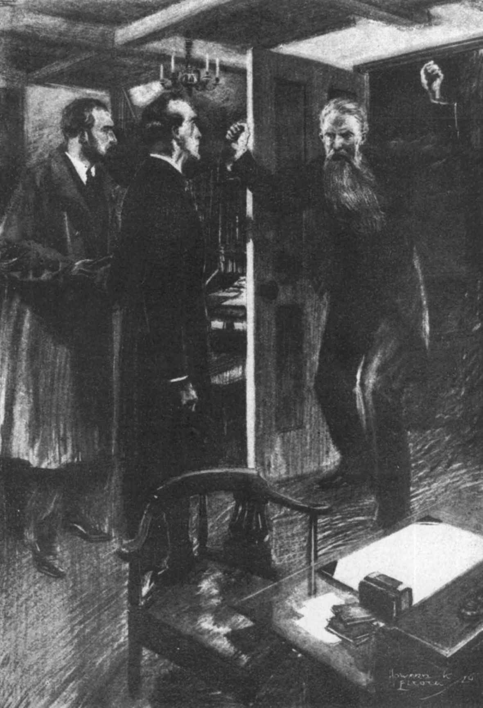

他冲进来，吹胡子瞪眼，脸都扭歪了。

“我不是告诉你啦，你这多管闲事的小混蛋，不准你再登门吗？我不准你再来。你胆敢不经我允许闯进我屋里，我就有权使用暴力。我拿枪毙了你，信不信？上帝见证，我会的！至于你，先生，”他转向我，“也同样要警告你，你那个臭行当，我知道。你要有本事，去别的地方逞能好了，我这里用不着你。”

“我就是不离开这儿，”我的委托人硬气地回答，“除非戈德弗雷亲口告诉我他有自由，没受限制。”

我们这位主人暴跳如雷，按着铃。

“拉尔夫，”他叫着，“打电话，警察局，叫他们派两个警察过来，就说这里有强盗。”

“等一下，”我说，“你必须知道，多德先生，埃姆斯沃思上校有权指控我们来他家完全非法，但另一方面，他也该知道，你所有的行动完全是出于对他儿子的深厚友情。我冒昧说一句，如果允许我和埃姆斯沃思上校谈五分钟，我一定能改变他对本案的全盘看法。”

“我没有必要改变，”老军人吼道，“拉尔夫，叫你去你就去，还等什么？快给警察打电话！”

“不需要这样，”我把背往门前一靠说，“警察一出场，你原来害怕灾难降临，这下子灾难可真要临头。”我拿出笔记本，撕一张纸很快写一个词。“这个，”我把纸递给埃姆斯沃思上校说，“就是我们前来这里的原因。”

他瞪眼凝视着纸，脸上只剩惊愕，怒容立时消失。

“你怎么知道？”他喘着气，重重地往椅子上坐下。

“鄙人的职业就是了解情况，在下只从事小小此行当。”

他坐着，陷入深思，举起枯柴般的手摸摸乱胡须，然后做了一个无可奈何的手势。

“好吧，你们要见戈德弗雷，你们见吧。我并不愿意，是你们强逼我的。拉尔夫，通知戈德弗雷先生、肯特先生，五分钟后，我们到他们那边去。”

五分钟后，我们走过花园，到了小道尽头那间神秘的小屋。一个蓄胡须的矮个子站在门口，露出一脸惊疑。

“怎么搞的，埃姆斯沃思上校，”他说，“这一来，我们的计划全部乱了套。”

“我没有办法，肯特先生，手脚叫人牵住。戈德弗雷先生能见我们吗？”

“可以，在里面等着。”他转身带我们进一间稍大的客厅。室内陈设很简单，一个人背对火炉站立，我的委托人一见就跳上前伸出手去。

“啊哈，戈德弗雷，老朋友，你好呀！”

可是对方挥手叫他后退。

“不要碰我，吉米，站远点。是呀，你觉得奇怪！我再也不像B骑兵队那个一等兵埃姆斯沃思啦，是吧？”

尽管他面貌异常，但还是可以看出他以前是个五官端正、皮肤被非洲太阳晒得黝黑的英俊男子，但如今深皮色之间出现异样的白斑，使他的皮肤黑里泛着死白。

“所以我不能见客，”他说，“你没关系，吉米，你的朋友不要来，我知道是好意，可你这样对我不利。”

“我要弄清楚，你是不是一切都好，戈德弗雷。那天晚上我看见你，你在窗上看着我呢。不把事情弄清楚，我不能放心呀。”

“老拉尔夫告诉我你来了我家，我忍不住要看看你。可我不希望你看见我，所以看到你要开窗，我赶快跑回小屋。”

“可到底是怎么回事呀？”

“啊，事情说起来也简单，”他说，点上一支烟，“你记得那个早晨，比勒陀利亚郊外，铁路东线上布弗斯普鲁那一仗？你听说我被打伤了是吗？”

“是呀，我听说，但不知道详细情况。”

“我们三个人和部队断了联络。你还记得，那个地方地势复杂。我们一个是辛普森——我们叫他秃头辛普森的那个人——一个是安德森，还有我。我们是在追击一个布尔人，不料遭他的暗算，反而中了他埋伏，两个人被打死，我肩部中了一颗猎象的子弹。全靠我还能拼命趴住马背，跑出好几英里，最后晕过去，从马鞍上滚了下来。

“等我清醒，天已漆黑。我挣扎着坐起身子，只觉得疼痛无力。忽然看见有房屋，离我不远。那房子好大，有南非式宽游廊，许多窗子。天很冷。你记得那里一到晚上，冷得手脚麻木，那寒气又湿又阴冻死人，跟清新气爽那种冷不一样。呵，我感到彻骨寒冷，我多么想到那房屋里去躺下。我摇摇晃晃站起来，一步一步拖着身子，人迷迷糊糊。我依稀还记得爬上台阶，一扇大门敞开着，进去，到一间大屋子，里面有好几张床，我一下就倒在一张床上，才舒坦地喘着气。床上铺好被子，我不管三七二十一，拉过来就盖。我身子正发抖呢，被褥往身上一盖，马上就睡着了。

“等我醒来，已是早晨。一看，我不但没来到安全地方，反而好像跌进一个鬼梦世界。南非火辣辣的太阳透过没帘子的窗户直晒进来，使这间刷得洁白的宿舍的每个角落都显露无遗。我的床前，站一个矮子，像个侏儒，脑袋特别大，犹如大葱头，嘴里咕咕噜噜一个劲说着荷兰话，挥着手，那手可真怕人，像海绵体。他身后站着许多人，都是看热闹，好像挺稀奇。可是我一看见这些人，立刻毛骨悚然，没一个人是正常人样，个个不是七歪八扭，就是水肿变形，他们笑起来如同魔哭鬼叫，听着就起鸡皮疙瘩。

“他们没人会说英语，可是这情形一定得沟通讲清楚才行。那个大头鬼越说越生气，嘴里在叫骂，像头野兽，他伸出变形的手揪住我，要拉我下床，不管我肩头的伤口还在流血。这个矮鬼力大如牛，真不知道他会如何对付我。这时进来一个人，已有些年纪，明显是个负责人，听到这边吵闹就进来。他用荷兰语训斥几句，揪住我的人马上躲在一旁。这个人然后转向我，瞪大眼睛奇怪地看着我。

“‘你怎么会到这里来？’他皱眉问我，‘别动！你已经累极了，肩头伤口马上要处理。我是医生，马上找人帮你包扎。跟你说，小伙子！你在这里要比在战场上危险得多呀！这里是麻风病院，你睡的是麻风病人的病床！’

“我还用说什么呢，吉米？看来，由于战火逼近，这班可怜的病人头天都被疏散了。之后英军开到，我才被这位医务总监送回来。他对我说，尽管他自信他对这种病有免疫力，也绝对不敢像我这样在麻风病人床上睡一夜。他让我住单独病房，帮我细心护理。一星期不到，我转移到比勒陀利亚总医院。

“现在你知道了我是多么倒霉。我起先还心存侥幸，可终究不能幸免。一回到家，就出现症状，吓人哪，你也看到我脸上这模样，逃不过呀。怎么办呢？我只有单独住这间屋子。我家有两个仆人，可以完全信得过，这是自家的房屋，可以让我住。这位肯特先生，是外科医生，愿意保守秘密，好心来照顾我。也只好这样做，简单易行。另外一条路，就太可怕了——去和陌生人一起绝对隔离，过那种日子，永远没有回家的希望。我们必须绝对保密，否则，即使在这偏僻的乡下，也要引起骚动，一定要把我送进麻风病院。就连你，吉米——也不敢让你知道呀。我父亲怎么会让你来，我真无法想象是什么道理。”

埃姆斯沃思上校指指我。

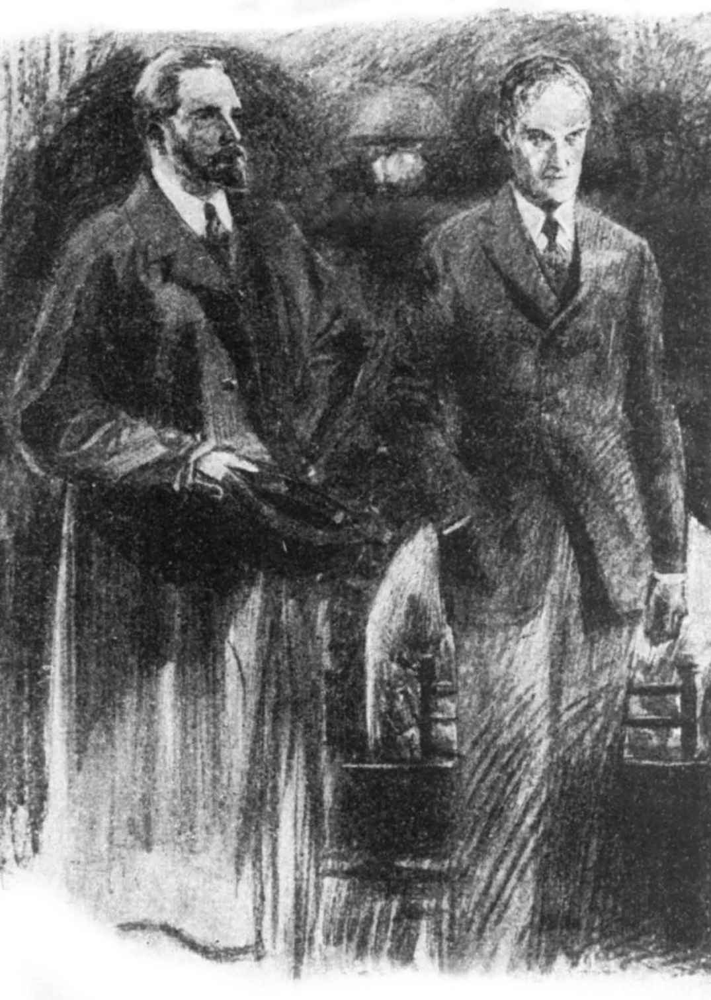

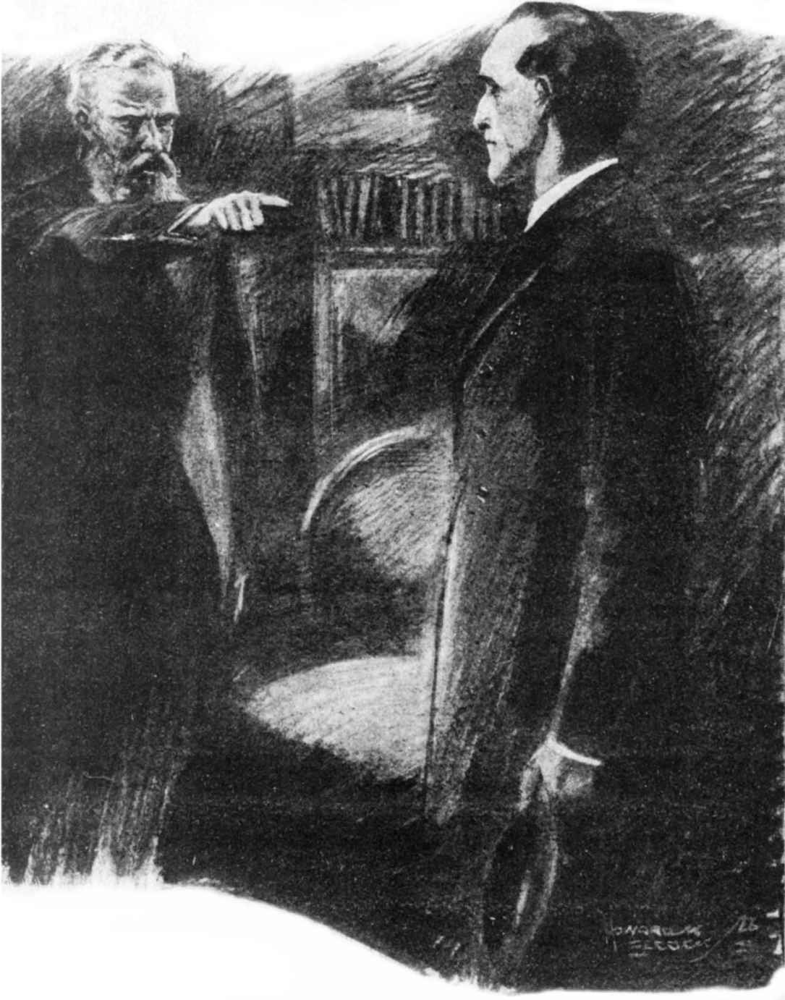

埃姆斯沃思上校指指我。

“是这位绅士，强迫我这样做。”他打开我写给他的那张纸条，上面写着“麻风”，“我是想，他既然知道是这个病，那就只好让他全知道，才能保住秘密。”

“应该如此，”我说，“难道这样做一定没有好处？我知道只有肯特先生一个人负责看护病人。请允许我问一句，先生你是不是这方面的专科医生？据我知道，麻风是一种热带和亚热带病。”

“我科班出身，具备合格的医学专业知识。”他板起面孔回话。

“这没问题，先生，你有资格，但我要说，你也会同意，像这种重大疾病，多听听别人意见，很值得，很有必要。你们没有这样做，我知道，是怕结果不得不把病人送走，隔离起来。”

“是这样。”埃姆斯沃思上校说。

“我早料到是这样，”我说道，“所以我请来一位朋友，医术医德兼备，他绝对谨慎可信。我曾经为他效过劳，出过一些力，现在请他来提供意见，以朋友立场，而不是医生立场。他的名字叫詹姆斯·桑德斯爵士。”

一听我这么说，肯特先生脸上流露出的惊喜之状，简直就像南非军中一个刚提升的小尉官要受到大元帅总司令罗伯茨勋爵接见的那个样子。

“哦，不胜荣幸。”他诺诺连声。

“那好，去请詹姆斯爵士到这里来，他现在正在门外马车上。还有，埃姆斯沃思上校，我们都到你书房去，我可以把事情大致解释一下。”

这时我就想念起华生来了。我这点侦探的手艺，原仅雕虫小技而已，全靠华生巧设悬疑和妙用赞叹使之高潮迭起，并将我原不过是按部就班的平实调查夸大升华为奇迹。现在由我自己讲述自己的故事，就没有这点技巧和本事，我也就只好平铺直叙，罗列一些思考过程，如同现在对这几位少数听众所讲。所谓听众，还包括戈德弗雷的老母亲，她也来到了埃姆斯沃思上校的书房。

“谈谈思想方法与步骤，”我说道，“先作出假设。当你作出几种假设，首先排除掉绝对不可能的诸因素，最后剩下来的，也许看来仍有疑虑，但实际上一定具有真实性。剩下来或许还会有几种解释，那就一一加以证实，最终有一个结论最可信，理由最充分。好，我们现在就运用这个原则来对这个案子予以论证。为什么这位先生要在他父亲大宅外的小屋被隔离、禁锢起来？对这个问题，我一开始有三种解释，可以这样假设：要不是隐匿罪犯，就是得了精神病又不希望他进疯人院，不然就是得了什么病，需要保密隔离。除此之外，其他假设都不可能。那就对这些假设进行衡量比较，作出筛选得以去伪存真。

“首先，隐匿罪犯之说，经不起检验。当地没有犯罪报案，也没有未决案件，这一点我相当肯定。然而，也可能犯罪还没有被发现，那么按家族利害关系来说，应该把他送出国才是上策，而怎么也不会藏在家里。这种藏匿行为我看无法解释真相。

“其次，精神病发作，乍听有理。把人隔离起来，一般要派一个人去看守。现在这个人出入都锁好门，以强制禁闭屋子里的人，这也加强了假设的可能性。但另一方面，这看管又不是十分严密，否则，病人不可能自行跑出来，去看朋友。你该记得，多德先生，我探讨过几个问题，比如问你肯特先生读什么报纸。如果读《柳叶刀》或者《英国医学杂志》，那就能支持我这一假设。再说，将精神异常的病人留在家里，不属非法行为，只要有合格的专人看护，向有关部门备案就可以，何必这么煞费苦心保密呢？所以，这个推理还是不能符合事实。

“剩下第三种可能性，罕见，不太寻常，但是处处吻合。麻风在南非是常见病。这个年轻人十分不幸，不知怎么搞的偏偏染上这种疾病，令家里人极度惊恐不安。他们希望不要送进隔离院，那就要严格保密了，防止走漏风声，因为消息一旦外传，当局有关部门马上要来干涉。如果出高薪聘请一位忠心耿耿的医生，来专门照顾护理病人，这是不难做到的。这就有理由解释，病人在天黑以后可以出来自由走动。这种病，普遍症状是皮肤泛白。这样假设，可能性看来最大——既然最有可能，我就大胆行动，加以证实。我一到这里，看见拉尔夫戴着手套，我注意到手套浸过消毒药水，而正是他负责送饭到小房子，到这里，我的最后疑点已经完全消除。上校先生，我写个词给你看，告诉你秘密已经暴露，我之所以写出来而不是用嘴说出来，是为了向你证明我处事谨慎，你完全可以信赖，请相信我，没事。”

我刚讲完以上简单分析，书房门打开，皮肤病学权威被请进来。他一向如狮身人面像一般，脸上带着不解之谜，现在却显得轻松和蔼，眼神也充满温馨与希望。他大步走向埃姆斯沃思上校，热情握手。

“我总是为人带来不幸的消息，难得有好消息，”大权威说道，“可是今天要说的消息可是好消息：他不是麻风病。”

“什么？”

“是典型性类麻风病，或者叫鱼鳞癣，一种鳞状皮肤病，影响仪容，非常顽固，但是治得好，也绝无传染性。确实，福尔摩斯先生，事情常有巧合。但这是不是巧合呢？还是其他不明原因造成的呢？不得而知。可能这位年轻人发现自己接触传染病以后，就产生恐惧心理，引起生理反应，结果越怕越像是真，我们可以这样看吗？不管怎么样，在下以职业荣誉作担保——哦！夫人晕过去了！我说肯特先生，快给她护理吧，她是太过惊喜而休克，就会好的，没事。”

（1926年）

————————————————————

<a href="#part0160.xhtml_ch1-back" id="part0160.xhtml_ch1">(1)</a> 本篇与下一篇是由福尔摩斯本人讲述的探案故事。

<a href="#part0160.xhtml_ch2-back" id="part0160.xhtml_ch2">(2)</a> 布尔战争（Boer
War），又称南非战争，1899—1902年南非英国人与南非荷兰人后裔之间的战争。

# 狮鬃毛案

这是一件很为难的事情，又来了一件案子，当然是我长期探案生涯中所遇的那种不寻常而难解的疑案。我已经退休了，案子还要落到我身上，而且偏偏就发生在家门口。那是我退隐到苏塞克斯小屋以后的事。生活在此使我全身心享受着大自然的恬静与安宁，这正是我过去长年累月身陷于阴暗的伦敦时所向往的生活。在此期间，好友华生几乎从我生活中消失了，最多也就是哪个周末难得来见上一面，因此，我只好自己来动手写案情实录。啊！假如他仍旧和我在一起，那对于这样一件奇案的发生以及我克服种种困难最后得以取胜，不知会写得多么精彩！现在，没有办法，我只能用自己的拙笔艰难地叙述我是如何步步侦破这件狮鬃疑案的。

我的乡村别墅位于英格兰草原的一片向南坡地上，那无边无际的英吉利海峡就展现在眼前。此段的海岸线全是白垩峭壁，从屋前地面下到海滩只有一条长长的单人可走的小径，曲折弯绕，又陡又滑。小径的尽头是一片百码宽的卵石沙石滩，海水涨潮也不淹没。这里处处是深湾凹口，每次新潮来临，便是天成美妙的游泳池。这片迷人的海滩延伸有好几英里，直到伏尔沃思海湾小村。

我住的是一幢孤屋，我、我的老管家，还有我的蜜蜂，组成了家庭全部成员。要距此半英里之遥，才有别的房子，那是著名的哈乐德·斯泰赫斯特职业学校，按校舍的三角墙式样也叫房山校。校园占地很广，聘有几位男教师，收了二十来个年轻人给予各种职业训练。斯泰赫斯特本人，在剑桥大学学生时代是出名的划船运动员，也是全面发展的优秀生。我一住到海边来，就与他建立友好关系。也就和他一个人，我们相处无间，晚上你来我往不需要预先有约。

一九〇七年七月将近月底，刮起八级大风，将海潮升高，淹没了峭壁岩底。一当潮退，便留下一个咸水湖。我讲的正是退潮的这一天早晨，风已平静，天地如洗，一派清新干净。这样心旷神怡的好天气，再用来埋头于工作就可惜了。早餐前我到外面散步，尽享沁人肺腑的好空气。我顺着峭壁小径走下海滩，正走着，听得后面有人叫，是哈乐德·斯泰赫斯特。他高声呼唤，兴奋地招手。

“多么美好的早晨呀，福尔摩斯先生！我就想到你会出来。”

“看样子，你去游泳吧。”

“又来你的老把戏，”他呵呵笑，手拍拍鼓鼓囊囊的衣袋，“你猜得没错，麦克弗森一早就出来了，我这就找他去。”

菲茨罗伊·麦克弗森是自然课教师，是个非常健美的年轻人，可惜得了一场风湿热，引起心脏病，身体受了影响。他天性爱好体育，各样运动只要是不太激烈的，都很拿得起。无论夏天冬天，他都游泳。我也是个游泳爱好者，所以经常和他一起水中见面。

这时候，我们望见了他。在小径尽头的峭壁边沿，看见他露着头，接着见他整个身子出现在崖顶上，摇摇晃晃地走，像个醉汉。他忽然一下子高举双手，一声惨叫，便仆倒在地。斯泰赫斯特和我赶紧奔上去——大约有五十码距离——把他仰面翻过身来，发现他快要不行了。他眼睛深陷呆滞，两颊呈可怕的青色，刹那间，一息生气回到脸上，用尽最后的力气，挤出两三个字眼，声音含混不清，但我的耳朵听清楚他嘴唇间吐出的最后字音是“雄狮子毛”。狮子鬃毛，什么意思？说得不着边际，无法理解。我辨来辨去，这语音不会是别的意思。他说完后，从地上支起半个身，脱手向上一挺，侧身摔下，死了。

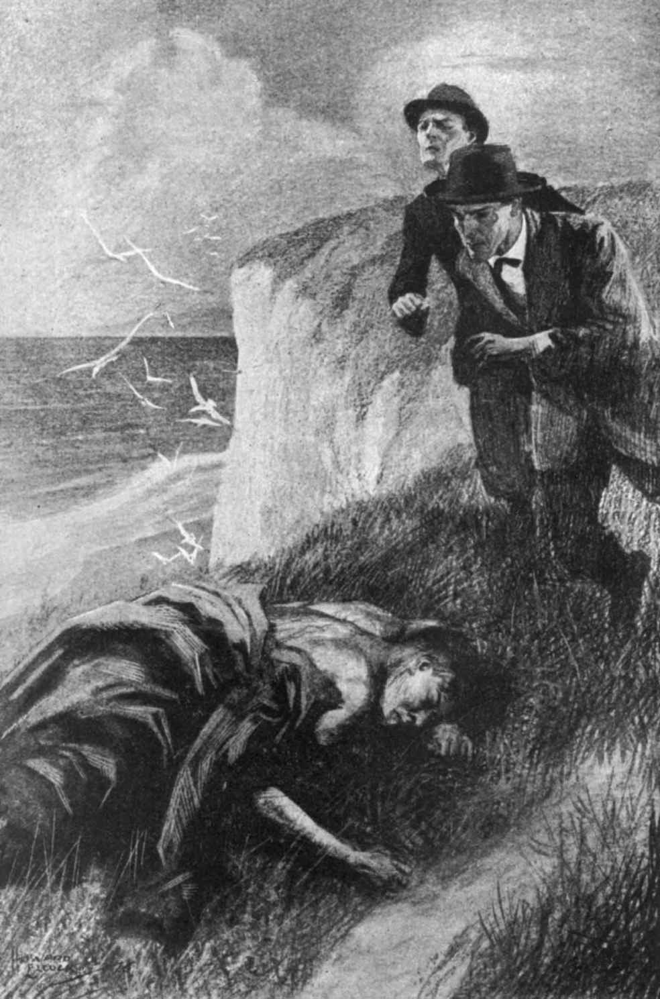

他说完后，侧身摔下，死了。

我的同伴给这可怕的场面吓得慌了手脚，但是我，可以想见，每根神经都警觉起来。这是必要的，因为很快表明我们面临的是一件非同一般的人命案子。他只穿柏帛丽雨布外套、游泳裤、帆布鞋，没系鞋带。他倒地的时候，只披在肩上的柏帛丽外衣滑落下来，露出了身子，我一看大吃一惊，他背部全是一条条血痕，像是被人拿钢丝鞭抽的。那分明是一种弹性很足的刑鞭，因此连两肩和两侧肋部都有细长红肿的鞭印。他的下巴有血迹，那是他极度痛苦中咬破下嘴唇淌出的血，他那痉挛扭曲的脸也说明他受着极度的痛苦。

当我正跪着，斯泰赫斯特站在一旁，看着死者的时候，却有一个人的影子遮下来。我们回头一看，原来是伊恩·默多克来到我们身边。他是职校的数学教师，瘦高个子，黑皮肤，平时不爱多话，对人冷淡，所以无人可称是他的朋友。他好像生活在无理根和圆锥曲线的高度抽象的空间之中，与常人生活颇有隔膜。他被学生视作怪物，本来几乎要成为他们的打趣对象，多亏他赋有外邦客的特异气质，轻易不好惹。他的外貌就不可小觑，乌黑的双眼，黝黑的皮肤。他有时会大发脾气，发作的时候，只能用勃然狂怒这种字眼来形容。比如有一次，麦克弗森的小狗让他来了火，他抓起狗就隔着窗玻璃往外扔。若不是看在他是个优秀教师这一点上，凭这种行为，斯泰赫斯特早就请他走路。就是这样一个奇怪复杂的人，此刻出现在我们身旁，他好像对眼前的情形感到极大的震惊而黯然神伤，但是有过那件扔狗的事，看来他对死者似乎不该会有太大的恻隐之心。

“太可怜啦！太可怜啦！我能做些什么？我能帮忙吗？”

“你刚才和他在一起吗？出了什么事你知道吗？”

“不，不，今天早上我来晚了，海滩上根本没去，我刚从房山校过来。我能做些什么吗？”

“你快到伏尔沃思警察所，快去报警，这儿出人命了。”

他二话不说，拔腿拼命奔去。我义不容辞把这事承担起来。斯泰赫斯特发着呆，就让他留在死者身旁。我第一件事就是赶快注意看有什么人在海滩上。从小径的高处，我看到海滩上空无一人，只有远处两三个人影正向着伏尔沃思村移动。这一点清楚了，便由小径往下走。这里的粘土或是灰泥岩都混有白垩质，这边那边有脚印，有上有下，都是同一个人的脚印。今天早晨没有别的人走这条路到海边去。在一个地方，看到一只手掌印，手指伸开按在斜坡上，这只能表明，可怜的麦克弗森往回向上走的时候跌倒过。还有一些圆形凹窝，这显示他不止一次地跪倒过。小径走到底，就是大潮退去留下的大咸湖，湖边上有麦克弗森脱下的衣服，岩石上有折叠好的毛巾，是干的，从这个可以推定他没有下过水。察看沙石硬滩地，有一两处在沙地上可以看到他的帆布鞋印，也有他的赤脚印。赤脚的事实证明他准备下水，而干毛巾显示最后他没有下水。

问题在这里已经摆明了——又是我平生所遇的一桩奇案。麦克弗森来到海滩最多不过十几分钟，随后斯泰赫斯特从房山校出来，所以这一点是没有疑问的。他要游泳，也脱了衣服，赤脚就是明证，接着是慌忙又披上衣服——胡乱披衣，都来不及扣扣——没有下水，或者至少没擦干就往回跑。改变主意的原因，是他挨了鞭抽，被死命地打，痛得他嘴唇都咬出了血，打得他只剩最后一口气，爬上来就死了。是谁干的这种没人性的事？在那边峭壁底部，确实有一些小岩洞，但是初升的太阳直射洞内，根本藏不住人。至于海滩远处的人影，距离如此之远，跟此处的犯罪不可能有关系，何况与他们还隔着麦克弗森游泳的海水湖，湖水直达峭壁。海上有三两条渔船，驶得不算太远，到时候可以对船上的人进行调查。查了这么几个方面，都无法引向明确的目标。

最后回到死者身边，这时已经来了一小群人在围观。斯泰赫斯特当然还在，伊思·默多克刚刚赶到，叫来了村里的警察安德森，一个大个子，黄胡须，那种苏塞克斯类型的粗壮迟钝的人——这种人笨重无声的外表下隐藏着内在的精明。他静听每件事，把每个人所讲的做了笔记，最后把我拖到一旁。

“很高兴听听你的高见，福尔摩斯先生。这是大案，叫我接手这种事，出了差错，上司路易斯要拿我是问的。”

我建议他立即去把顶头上司找来，再要叫医生，现场一切不许动，尽量不要再有新的脚印，一定要等他们到场。趁这时候，我搜了死者的口袋，有手帕，一把大折刀，一个折叠的名片夹，夹着一张纸。我把纸翻开，交给警察，上面是女人的潦草字迹：

我一定来，你放心。

莫德

看上去是男女幽会的事，但时间地点不详。警察将纸重新夹好，连别的东西一起放回柏帛丽外衣口袋内。眼下，情况就到此为止，我便回了屋去吃早饭，临走关照第一件事就是要对峭壁底下彻底搜查。

过了一两个小时，斯泰赫斯特来告诉我，尸体移到房山校等待验尸。他带来几点确定的重要消息。如我所料，岩壁底下的洞穴里一无所获。他检查了麦克弗森的书桌，有些信件，是和伏尔沃思村上一个叫莫德·贝勒密小姐的恋爱通信。我们就此确定了写那张纸条人的身份。

“警察拿走了信，”他解释道，“我无法带来，不过这一点没问题，是正当的恋爱关系。我看怎么也和这桩惨案无关，真的，也就是和他约会见面。”

“不过不大会约在这种游泳浴场，那里是你们大家照例常常会去的地方。”我讲了点看法。

“今天也真是凑巧，”他说，“几个学生都没有和麦克弗森一同去。”

“怎么会这样巧呢？”

斯泰赫斯特皱眉想了想。

“是伊恩·默多克把他们叫住了，”他说，“他一定要在早餐前把代数讲解完。也是可怜，对今天这件事他非常难过。”

“我听说他们两个关系并不好呀。”

“有过一阵子不和，可是之后有一年多了，默多克和麦克弗森很亲近，默多克从来没有和别人这么好过。他这个人，就是脾气性格不太随和。”

“噢，我明白。好像记得，你说过有一次为了虐待狗吵过架。”

“那事早就过去了。”

“也许还有心结呢。”

“不会，不会，这我肯定，他们的确是好朋友。”

“好，那么，我们要了解一下那位姑娘，你知道她吗？”

“谁都认识，这附近数她是最美的美人了——确实漂亮，福尔摩斯，走到哪儿都引人注目。我知道，麦克弗森迷恋着她，但想不到已经发展到这些信上那样的程度。”

“这姑娘怎么样？”

“是老汤姆·贝勒密的女儿。伏尔沃思的渔船、海水浴场更衣室，都是她父亲的产业。老头原先是渔民出身，可现在是实力人物了，同儿子威廉一道守着家业。”

“我们去伏尔沃思拜访他们怎么样？”

“以什么理由呢？”

“哦，找个理由还不容易。不论怎么，这个人的不幸，总不会自己对自己这样残忍地自虐致死吧。鞭子总得有人拿着，如果伤痕真是鞭子抽的话。在这个偏僻的地方，他的社交圈很有限，我们每个方向都查一查，不难查到作案动机，回过来就能给我们引出罪犯。”

穿过麝香草的芬芳丘陵地，要不是目睹惨案心境被破坏，这样的散步真叫人身心愉悦。伏尔沃思村位于海湾半圆的丘陵凹地中，在老式村庄后面的高坡上建了几幢现代房屋，斯泰赫斯特领我到了一幢新式住宅。

“这就是‘安居港’，贝勒密自己取的名，青石瓦带角楼的那幢。白手起家能有这样成绩很不错了——啊，你瞧！”

安居港的花园门开了，出来一个人。没错，那高个头、瘦骨嶙峋，一副懒散相的人，正是伊恩·默多克，那位数学家。一会儿我们就在路上相遇。

“你好！”斯泰赫斯特招呼他。对方点点头，狐疑的黑眼珠横里瞥我们一眼，径直要过去，但被他校长拉住。

“你为什么来了？”

默多克立刻上火，脸都红了。“我在学校里，先生，是你的属下，可我不明白，我自己的私人行动关你什么事！”

斯泰赫斯特的神经被搞得紧张了一天，心情烦躁到了极点，不然，他或许会有耐心，但这会儿他忍不住一触即发。

“在今天这情况，你这样回答实在无理，我说默多克先生。”

“是你一上来就问得不像话。”

“你已经不是第一次态度放肆，都是我一直不计较。今天，是最后一次，请你另行高就，给我尽快离开。”

“我本来就有这个意思，反正，这房山校我惟一可以作伴的人，今天已经失去。”

他迈开大步就走开了。斯泰赫斯特恼怒地瞪眼看他远去。“这个人不是太叫人无法容忍吗？”他大声道。

现在的事不能不叫我产生想法，就是伊恩·默多克先生正好抓住这一时机赶快脱离凶案发生的地方。怀疑，混沌初开，在我心中初成轮廓，也许见了贝勒密，案子会变得更明朗。斯泰赫斯特让自己压压气，便领我朝屋子走去。

贝勒密先生原来还是个中年人，蓄着火红的大胡子。他好像气呼呼正在发脾气，脸色也变得像头发一样红了。

“甭啰嗦，我说，咱不听他劳什子事，我儿子在这里，”——指指一个强壮的年轻人，正绷着脸，在起居室的角落那边——“跟我是一个心眼儿，麦克弗森先生打我女儿莫德主意，尽叫人丢脸，是的，先生。结婚这个话，他小子还没捞着提呢，可是又写信又私会，咱们爷儿俩就是姑娘的监护人，咱这里是铁着心——”

但是他把话打住，女儿自己进来了。一点不瞎说，这世上她走到哪儿哪儿就光彩夺目。有谁能想象得到这么一朵稀世鲜花竟出自这么一个家庭的根株上、长在这样一种环境氛围中？女人少有吸引我眼目的，因为我的脑永远掌控我的心，但是我一看到她完美清纯的脸庞，充满芬芳草原鲜艳娇嫩之色，也就不能不体味到年轻人一遇上她不得不为之魂迷而倾倒。现在就是这个姑娘推门进来，圆睁两眼，脸色紧张地站在哈乐德·斯泰赫斯特面前。

“我知道菲茨罗伊死了，”她说，“请不要顾虑，告诉我详细情况。”

“你的这个另外一位先生，让咱都知道消息了。”她父亲连忙插嘴说。

“我妹子要给扯进这种事，没那个道理。”年轻人窜出来吼道。

妹妹立即向哥哥怒眼一瞪。“这是我的事，威廉，请你让我按自己心愿处理自己的事。看起来，是谋杀案，我能帮助找出是谁作的案，我就为死去的人尽到了应尽的心意。”

姑娘听着我的同伴简略的叙述，神情极为专注。我看出\>她不仅拥有美貌，而且具有坚强的性格。莫德·贝勒密将作为一个最完美、最杰出的女性始终留在我的记忆里。她似乎一见到我就认识，因为她最后转向我。

“把他们绳之以法，福尔摩斯先生。不管他们是谁，我都会支持并协助您。”我感觉到她这样说的时候，对抗地向她父亲和哥哥瞟了一眼。

“谢谢你，”我说道，“在这种事情上我很重视女性的直觉。你说的‘他们’，意思是牵涉作案的不止一个人？”

“我很了解麦克弗森先生，知道他有力气，又勇敢，单独一个人别想对他下得了这样的毒手。”

“我能和你单独谈谈吗？”

“你给我听好了，莫德，别把你搅和到这个事里头去。”她父亲暴跳如雷。

姑娘无助地望着我。“我怎么办呀？”

“外面很快都要知道事实，所以我在这儿讨论也不碍事，”我说，“我本来还想守点秘密，可是你爸爸不允许，那就让他也来一起参加讨论。”接着我就讲了死者口袋里发现纸条的事。“这纸条验尸肯定要提出来，先请你作点解释行吗？”

“我觉得没有必要保密，”她答道，“我们已经订好婚约，之所以还守着秘密，是因为菲茨罗伊的伯父。他年纪很大了，说是在世不会久了，要是侄儿婚事不听伯父的话，就要取消他的遗产继承权，并不是为了其他的什么原因。”

“你怎么不早说！”贝勒密先生咆哮道。

“你要是能同情一点，爸爸，我早就说了。”

“咱不赞成咱女儿跟外头没身份地位的人有交道。”

“你这是对他的偏见，我们就不敢跟你讲。这个约会，是我写给他的回信。”姑娘从衣袋里摸索出一封皱成一团的信——

最亲爱的：

星期二等太阳一落，海滨老地方。只有这时间我才能抽身跑得开。

菲·麦

“星期二，就是今天，我讲的就是今天晚上见他。”

我翻过纸看看。“这不是邮寄来的，你是怎么收到的呢？”

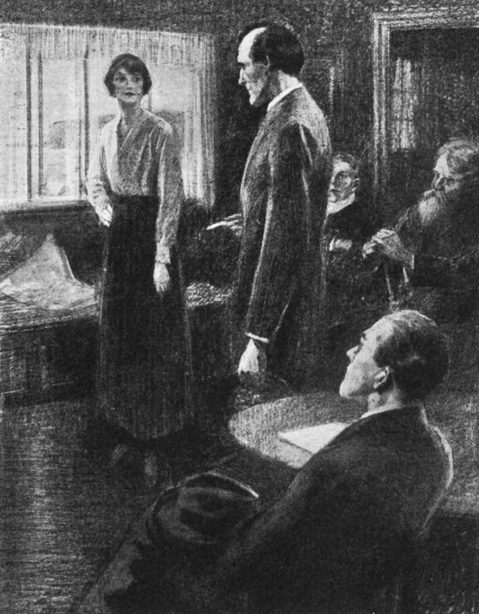

“这不是邮寄来的，你是怎么收到的呢？”

“这个，我可不能回答，这个和您调查的事一点关系也没有。只要是有关系的，我一定回答，决不含糊。”

她是这么做的，但是说出来的情况也无助于我们的调查。她不相信自己的未婚夫暗中有仇敌，她倒是承认自己有过几个热烈的追求者。

“能否问一问，伊恩·默多克是其中一位吗？”

姑娘脸红起来，感觉不自在。

“有一阵子，我想是的，后来就完全不是了，他了解了我和菲茨罗伊的关系。”

我对于这个怪人的涉嫌阴影似乎再一次有所确定，他的情况应加以调查，他的房间要进行秘密搜查。斯泰赫斯特愿意协助，他心中也开始怀疑。我们访问了安居港回来，指望这团乱麻的一端线头已经掌握在我们手中。

一个星期过去了，验尸结果没有使案子明朗化，也就暂停审理，以待获得进一步的证据。斯泰赫斯特对他这个下属作了谨慎的调查，初步搜了一下他的房间，但是一无结果。我本人再把现场整个踏勘一遍，都跑过，都研究过，也得不出新的结论。在我以往的探案故事中，读者还没有看到像现在这件案子那样使我完全陷于无能为力。连我的想象力都无济于事，想不出这件迷案的解决方法。然而接着，那只狗出了事。

那是我的老管家，是她首先在新奇的无线电里听到的，他们这里的人都是靠收音机收听乡里的新闻消息。

“好惨哪，这件事，先生，又是麦克弗森先生的狗。”一天晚上她说道。

我平时不大理会她这种话题，可是这次引起我注意没有放过。

“麦克弗森的狗，怎么了？”

“死了，先生。主人没了，它也悲伤死了。”

“你听谁说的？”

“哦，先生，人人都在说呢。狗灵性得很哪，一个星期一点不吃。到了今天，房山校两个年轻先生见它死了——死在海滩，先生，就那个地方，它主人遇害的那个地方。”

“就那个地方”，这话直钻我耳朵。有名堂、有玄机，我心中顿时觉得与案子有重大关系。狗的死，是出于狗儿驯顺忠良的天性，但是“就那个地方”，为什么冷落的海滩会致狗死命？难道它也是仇人的牺牲品？难道——？是呀，依然模糊不清。但是，我已在胸中构筑起思维的框架，没几分钟，我便去了房山校，找到斯泰赫斯特。他在书房里，我要求他把两个发现狗的学生撒德伯里和布朗特马上找来。

“是的，狗就死在游泳池边，紧靠水边上，”一个学生说，“一定是跟着故世主人的味道找过去的。”

我看了忠实的小狗，一头艾尔谷黑斑棕色猎犬，被放在大厅一条席子上。狗身绷硬，两眼鼓出，四肢僵曲，处处显示受极大痛苦而死的样子。

我离开房山校，走向海水浴潭。太阳西沉，大峭壁的黑影投向水面，如一张铁皮，闪着微光。这地方渺无人影，不见活物，只有两只海鸟在头顶盘旋凄鸣。借着余晖，我尚能辨别小狗在沙滩上绕着山岩走出的爪印，就是它主人放毛巾的那块岩石。我伫立凝思良久，身边的阴影越见黑暗，满脑子思绪竞相起落翻滚。你一定有过做噩梦的经验，梦中你好像有什么最要紧的东西想要到手，可是在遥远的彼处，你伸手怎么抓总是遥不可及。这正是我那天傍晚孤身一人立于凶险之地的心境。之后就转身慢慢走回家。

我刚走上小径的顶端，一转念忽如一道闪电，脑子想起一件事，正是我急于抓住而无从抓住的事。你会知道，华生好像也曾经述及，就是我有大量生僻的知识，非属正统学科，但正是芜杂才对工作起到作用，每逢有需要便可随手拈来。我的脑子是个杂货仓库——又多又杂，以至自己也说不清里面有些什么东西。我知道，在这个杂货仓库里至少有一样东西可以解开这个案子。这个想法虽然还模糊不清，但可以翻一翻，使其清晰起来。这个案子虽然离奇，令人难以置信，但也不是不可能解开。我一定要好好深入研究一番。

我的小屋有个不小的夹层阁楼，里面堆满着书。我一头栽了进去拼命翻找，一个小时后，终于找到一本咖啡色封皮上银白字的书。我下阁楼后赶快翻到我依稀记得的那一章，没错，那还是个不着边际，也未必切合实际的推论，但我马不停蹄一口气把它搞个透彻。真的没错，一定就是如此这般的事。等我休息时，已经是深夜了，心中焦急地等待天亮立即投入验证工作。

不料要做的工作遇上突发事件的干扰。我囫囵吞咽吃早点，正起身要到海滩去，苏塞克斯郡警局的巴德尔警官来了——一个强健、迟缓，但目光在思索的人，上门来两眼盯住我，一脸的困惑。

“知道你经验丰富，先生，”他说道，“我这不算是官方来找你，当然咯，话也用不着多说了，这麦克弗森案子实在是没办法。现在的问题，该抓人还是不抓？”

“是抓伊恩·默多克？”

“是的，先生。你想来想去也想不出别的可疑人犯。地方小人口少就有这优点，我们把嫌疑范围压缩到最小，不是他干的，还有谁呢？”

“凭什么控告他？”

警官的侦查路线只是步我的后尘，盯住默多克的怪僻性格和说不清的神秘兮兮；脾气火爆，动辄大怒，比如虐待小狗；过去和麦克弗森吵架，在追求贝勒密小姐一事上必定吃醋怀恨在心。我有过的看法，警官也一应相同，没有比我更新鲜的东西，除了一点，默多克好像正在加紧准备滑脚开溜。

“都有这么多证据在手上，再叫他跑了，那我的位子怎么还能保得住？”这位健壮迟钝的警官内心很苦恼。

“请想想，”我说，“你的断案漏洞大着呢。案发那天早上，他有不在犯罪现场的证明，他和他的学生在一起，整个时间，直到麦克弗森出事几分钟之后，他才到达现场。另外不要忘记，凭他只身一人，要对起码和他一样强壮的人行凶，是绝对办不到的。最后还有，造成伤痕累累的凶器，也是问题。”

“不就是软鞭子一类嘛？”

“你检查过伤痕了没有？”我问。

“我都看过，医生也看过。”

“我用放大镜仔细检查了，不是鞭伤，是一种特别的伤。”

“什么伤，福尔摩斯先生？”

我走到书柜桌拿出一张放大的照片。“这种案情要用这种方法。”我解释道。

“你做事真是认真彻底，福尔摩斯先生。”

“不这样做法，我还能是我吗！现在我们就可以来看了，这伤一直绕过右肩头，看不出有什么特别？”

“我看不出。”

“很明显的，伤的深度不一样。这是一个渗血点，这里又是一个。下来，这儿，又一条伤痕也是一样。这说明什么？”

“不知道，你说呢？”

“说得清楚，说不清楚，现在还拿不准，不过很快我就能得出一个结论，有正确答案。只要确定这伤痕是什么东西造成，那么对找出凶犯，就大为有利了。”

“我可以打个比方，当然，无稽之谈，”警官说，“铁丝网烧了烙到背上，铁丝交叉的结一定烙印最深，是最大出血点。”

“这个比方妙。或者我们可以说那是带有硬节的九尾鞭<a href="#part0161.xhtml_ch1"
id="part0161.xhtml_ch1-back">(1)</a>？”

“对呀，福尔摩斯先生，给你一言中的。”

“或者恐怕是另有致伤原因，一般难以想得到，巴德尔先生。你的理由还是很脆弱，不足以抓人。此外，还有死者临终的话——‘雄狮子毛’。”

“我怀疑他是不是说Ian伊恩——”

“是的，我也考虑过这个可能。如果第二个词的发音像是Murdoch默多克，那就成立了可是——搭不上边。他是尖声叫出来让人注意，我听得很清楚是lion
mane‘雄狮子毛’<a href="#part0161.xhtml_ch2"
id="part0161.xhtml_ch2-back">(2)</a>。”

“不可能是别的意思了，福尔摩斯先生？”

“也许有的，但是现在不想讨论，等有了扎实的根据再说。”

“什么时候会有呢？”

“等一个小时以后——也许用不了一个小时。”

警官用手搓搓下巴，眼睛半信半疑望着我。

“我真希望能够钻进你肚子里去，看看你怎么想，福尔摩斯先生。说不定，那几条渔船。”

“不，不，他们还太远了点。”

“那么，哦，是贝勒密跟他那个大块头小子？他们对麦克弗森先生可是不友善。会不会是他们对他下手？”

“不，不，你不必探我口风，等我有把握了会讲。”我笑道，“现在，警官，你我都各有事情要做，到中午，你再来这儿找我，就或许——”

正讲到这里，我们被一阵喧哗声打断，可本案也开始急转直下，有了戏剧性的结局。

外屋门突然被撞开，走道里响起跌跌撞撞的脚步声，伊恩·默多克踉踉跄跄跑进屋子，面无人色，头发蓬散，衣服凌乱，瘦削的手抓牢桌子撑住才没有倒下。“白兰地！白兰地！”他喘气道，一下倒在沙发上张口呻吟。

不光是他一个，后面跟着的是斯泰赫斯特，头上没了帽子，那气急败坏的慌乱相简直和默多克一个样。

“快，快，白兰地！”他喊道，“他只剩最后一口气了，我好不容易，拼命把他拽到这儿，半路上他都昏厥过去两回了。”

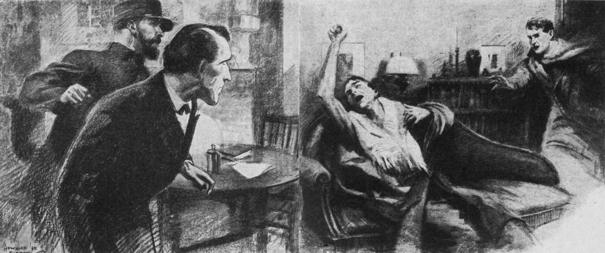

“快，快，白兰地！”他喊道。

半杯子烈酒一灌，也就立即改观，默多克一只手撑起了身子，把衣服从肩上掀掉。“看上帝分上，油、鸦片、吗啡！”他叫着，“治一治呀，痛死我了！”

警官和我一看，失声惊叫，只见他肩膀上横七竖八一条条红肿的网状伤痕，同菲茨罗伊·麦克弗森致死的创伤一样。

他的痛苦显然是难以忍受的，而且绝不限于局部症状，因为他不时窒息，透不过气。他脸色发紫，接着大喘一声，手猛抓心窝，额上冒出大颗汗珠。看他这样子随时都会气绝身亡，所以我们也只好不断给他灌白兰地，白兰地使他一次次苏醒过来。我们又用色拉油浸的棉花敷在他创口上，减轻他痛苦。最后他枕着靠垫把头倒了下来，衰弱垂危的生命终于躲入获救的庇护所。他昏昏欲睡，至少这半昏半睡状态也减轻着他的痛苦。

问他话没有回应，但情况稍定之后，斯泰赫斯特转身过来。

“我的上帝！”他高声对我说，“不知怎么回事，福尔摩斯？怎么一回事？”

“你在哪里碰见他？”

“下面海滩上，也就是麦克弗森送命的老地方。要是他的心脏也像麦克弗森一样弱，他这会儿就来不了这里。我把他拽上来，有两次都以为他断气了呢。把他背到房山校，太远，就弄你这儿来吧。”

“你见他在海滩上？”

“我是在峭壁走着呢，忽然听到他大声喊叫。他正在水边，跌跌撞撞像醉酒醉汉似的，我赶紧跑下去，给他披上衣服，把他扶上来。看老天份上，福尔摩斯，用尽你全身功夫，为我们这地方除害，请不遗余力呀。这地方住不下去了。你是全世界大名鼎鼎，难道你都救不了我们？”

“我想，我能，斯泰赫斯特，快跟我来！你，警官，一起来！我倒要看看，我们能不能逮住凶手交到你手上！”

我把昏迷的人交给老管家照看，我们三人直奔致命海水浴潭。在沙石滩上有一堆毛巾和衣服，是遇袭的人丢下的。我沿着水边慢慢地走，两位同伴跟随后面，像印第安人穿林走险成一字形跟进。这池大部分水不深，但是在峭壁下的滩地有凹陷，水深达四五英尺，游泳的人都喜欢到这个深水区来，而且这里碧绿清莹，美丽如同水晶。峭壁底部水面之上有一排岩石，我沿这里走在前面开道，警惕地注视脚下水中深处。我走到了池水最深最静的地方，这时我眼睛看到了我正要搜寻的那个物类，便发出一声胜利的呼唤。

“毒水母！”我叫道，“毒水母！就是这雄狮子毛！”

我手指这一样怪物，它看上去确实像一团雄狮子脖颈上扯下来的鬃毛，正栖在三英尺深的一块礁石面上。这个浮摇、颤摆、多须的怪物，似黄发集束夹有银纹，缓慢、沉重地进行着一张一收的搏动。

“害人不浅的东西，末日到了！帮我一把，斯泰赫斯特，我们来灭了这个凶手！”

突岩上有一块大砾石，我们一齐看准了用力推下去，轰隆一声，溅出一大片水花。等水波既定，便清楚看见大砾石压在水下那个岩礁上，旁边露出黄色皮膜，说明毒水母正压在了下面。一股油质浓液从砾石下面被压出，浮上来慢慢漾开，把水染了一片。

“哈，实在叫我看不懂！”警官高声道，“是个什么玩意儿，福尔摩斯先生？我长在这儿一辈子都没见过这么个怪物，不是苏塞克斯本地货。”

“被它光顾了苏塞克斯，”我说道，“这阵西南大风刮到这里来的。两位回我屋里去吧，我给你们看，有人有过同样的经历，遇上这种海怪可怕得很，九死一生，永远也忘不了。”

我们一起到了书房，看见默多克已经恢复，可以坐起来了。他头晕目眩，还感到头疼，时时出现痉挛。他断断续续地说，根本不知道是怎么回事，突然间浑身发痛，拼了命才爬上岸来。

“这儿一本书，”我说，拿起一个小本子，“它解开了一个似乎永远无法搞清的谜。书名叫《险遇》，作者是著名自然学家J．G．伍德。伍德亲身经历，遇上这种动物，差一点丢掉性命，他把研究结果写成了这本书。这种厉害的生物学名叫Cynea
capillata，一种细毛刺毒水母，剧毒致命，如眼镜蛇，可是疼痛感比眼镜蛇咬厉害得多。这里我来念一段。

游泳者若见到圆形褐色飘膜纤维团，形状宛如锡纸之包裹大团狮鬃，必须立刻引起特别警觉，此即可怖之Cyne
acapillata蜇刺毒水母。

“这里写的跟我们所看见的东西，不是很相像吗？

“伍德继续说到他在肯特郡海岸游泳，有过一次遭遇。他发现该生物的细丝，肉眼几乎看不见，自中心体呈放射状散开，距离可达五十英尺，一旦进入此范围以内，便有致命之危险。伍德只是在远处触及，也几乎丧命。

众多丝状触须一旦触及皮肤即产生红条纹，细观为微斑或小疱，每点均感受如烧红之针扎一般剧痛。

“局部的疼痛感，他还解释说，只不过是最轻的痛感，那整体的浑身疼痛就要痛死人。

剧痛向胸部整体扩散，令我如中枪一般仆倒，心跳即刻停止，后则继以六七次狂跳，犹如心脏即将冲出胸腔。

“他是在大海中，波浪扰动，触及毒须，尚且险些丢命，在狭窄静止的水域游泳池中，那就更加无法脱险。他说，中毒之后他都简直认不出自己了，脸色苍白，满是皱纹，一张脸像枯叶一般。他猛喝白兰地，喝掉一大瓶，这才捡回一条命。警察先生，我把这本书交给你，很有说服力，完全能说明麦克弗森不幸遇难的原因。”

“这也是不幸中之大幸，洗刷了我的冤屈。”伊恩·默多克这时苦笑着说，“我不怪你，警官先生，更不怪你，福尔摩斯先生，你们的怀疑都很自然。我觉得，在我即将被捕之际，我居然会有跟不幸朋友一样的遭遇，也总算能为自己洗刷，还我清白。”

“不，默多克先生，我已经掌握破案线索了，如果我按计划早点出门，我就能使你免吃这个苦头。”

“可是你是怎么知道的呢，福尔摩斯先生？”

“我是个读书杂食主义者，遵奉开卷有益，博闻强记。那个‘雄狮子毛’一直在我脑子里转，我印象中，好像哪里见过这个说法，确实曾经见过的。你们已经看到了，就是这本书上，正是这样描写这种生物的。那天一定是这东西浮在水面，麦克弗森看见了，他只能用这种方法来形容他所看见的东西，告诉我们他死于这样一个东西。”

“那么我终于得到澄清，”默多克说，慢慢地站起来，“我还要说一两句话解释一下。我了解，你们调查拿我作为目标。也是确实，我爱贝勒密小姐，可是从我知道她选上的是我朋友麦克弗森那天起，我惟一的愿望就是成全她的幸福。我退让一旁，成人之美，替他们牵线搭桥，经常帮他们传信。她信得过我。我爱惜着她，便急忙把朋友的噩耗告诉她，生怕有人抢先一步用突然而冷酷的方式告诉她，使她受不住。她不会告诉你我们之间的关系，怕你们不相信，反让我受牵连。好了，请原谅，我要回房山校去了，我很想在床上躺躺。”

斯泰赫斯特伸出了手，“我们的神经一直太紧张，”他说道，“过去了的事情就请原谅吧，默多克，我们今后彼此将会更有了解。”两人搀手扶背友好地走了。警官还留着，瞪着牛一样的大眼不出声望着我。

“哈，真有你的！”最后他叫道，“你的事迹我读过，但我不信。你果真了不得，服了！”

我摇摇头表示不敢当。接受这样的恭维，那就是降低了自己的标准。

“我是一开始就迟钝——太迟钝，应当受谴责。尸体若在水中发现，我一定就能迅速破案，是那条毛巾误导了我。遇难者来不及擦身，却使我想当然认为他没有下水。那么，为什么我不想想是水中生物攻击所致呢？正是在这里误入歧途。好了，好了，警官先生，我常常斗胆笑话你们警方先生，这回蜇刺毒水母也算替苏格兰警场报了一箭之仇吧！”

（1926年）

————————————————————

<a href="#part0161.xhtml_ch1-back" id="part0161.xhtml_ch1">(1)</a> 九尾鞭（cat-o'-nine-tails），旧时海军鞭刑用的九节皮鞭，能抽死人。

<a href="#part0161.xhtml_ch2-back" id="part0161.xhtml_ch2">(2)</a> 此处讲的是词音的异同，是人名伊恩·默多克（Ian
Murdoch）与雄狮子毛，即狮鬃或狮鬣毛（lion
mane）的发音异同。Ian与狮子lion这词的词音收尾一样，有可能混同，但Murdoch与mane（鬃，鬣）则差异很大，不可能混淆。

# 退休颜料商案

这天早上，歇洛克·福尔摩斯神情阴郁，透着哲学家的睿智与深邃，反映出高度的警觉性，什么事都瞒不过他的火眼金睛。

“你看见他了？”福尔摩斯问我。

“你是说刚才出去的一个老头儿？”

“正是。”

“是的，我进门他出门，碰到他。”

“你觉得这个人怎么样？”

“伤心，没用，潦倒，一个可怜人。”

“很确切，华生。伤心，无用，但是人生一辈子不都是伤心无用的吗？他的故事不就是个小宇宙人生的缩影吗？我们伸手，我们抓取，到头来我们手中留下什么呢？一个空幻影。可能比幻影更糟——愁苦。”

“他也是来委托你办案子？”

“哦，我想也可以说是的。他是被警场踢过来的，就像医生有时把治不好的病人打发给江湖郎中去应付。他们声称不必要费手脚了，病人不管怎么发展，好不了也坏不到哪里去。”

“是什么问题？”

福尔摩斯拿起桌上一张油腻腻的名片。“乔赛亚·安伯利。他自己说他是布里克福和安伯利公司的新股东，那是美术用品制造公司。颜料盒上你能看到这家公司的大名。他积了不大不小一笔钱，六十一岁从公司退休，在刘易萨姆买了一所房子。套了一辈子磨，现在卸磨歇息。人们也想，他日后生活总算可以安乐无忧过得去了。”

“是的，的确。应当这样。”

福尔摩斯拿一只信封看一眼背面草草写的字，是刚才老头在的时候他记下的。

“一八九六年退休，华生。一八九七年初，娶了一个比他小二十岁的女人——还是个很好看的女人，要是照片并没有过分美化本人的话。生活优裕，有妻子，又悠闲——晚年人生道路堪称舒坦。可是没料想不到两年，他变成那个样子，你也看到了，潦倒，悲惨，成了人世间一条可怜虫。”

“怎么会这样呢？”

“那种老故事，华生，朋友不安好心，妻子水性杨花。安伯利一生也有个爱好，象棋。也在刘易萨姆，距他家不远有个年轻医生，也是个象棋爱好者，我记下的名字，是叫雷·欧尼斯特医生。欧尼斯特常上他家来，结果自然而然，同安伯利太太亲密上了。你必定同意，我们不幸的委托人并不具有外在的优势，不管他内在有多少美德。上星期那一对儿私奔了——不知去向。更糟糕的是，不忠的妻子把老人一只私人文件箱一起带走，里面所藏是他一生大半的积蓄。我们能找到女人吗？能把钱追回来吗？接下来肯定是这样一个必然的问题，这是乔赛亚·安伯利性命交关的问题哦。”

“你准备怎么办？”

“嗯，这眼前的问题，我亲爱的华生，正巧，是你怎么办？——如果你能好心帮忙，代我处理这桩事就行。你知道我手上有着这件两位科普特基督教会<a href="#part0162.xhtml_ch1"
id="part0162.xhtml_ch1-back">(1)</a>主教的案子，今天处理此案正进入重要关头，我实在没有时间跑到刘易萨姆去，然而只有当地取证才有真正的价值。老头一再坚持要我亲自出马，我向他解释我有困难。他也就准备接受我派一个人去。”

“也行吧，”我答道，“我自知这个事没有多大把握，但愿意尽力而为。”就这样，这个夏日的午后，我出发去了刘易萨姆。可是做梦也没想到，不出一星期，我经手处理的这件案子在英国引得舆论大哗。

当天黄昏，天色已暗，我回到贝克街，将我这趟使命作一汇报。福尔摩斯叉开细瘦的四肢，深陷在椅子里，烟斗升起辛辣浓烈的烟圈。他眼睑低垂，一副倦怠的样子，要不是我叙事之间略有停顿，或是显出疑问，他才半睁那灰色如利剑般明亮尖锐的双眼，用搜索的目光盯住我的话，我一定以为他睡着了。

“乔塞亚·安伯利的住宅起名叫安逸居，”我叙述道，“我想你会有兴趣，福尔摩斯，那很像是某位没落贵族屈尊降贵与他四周的平民为伍。你知道那个地方很特别，单调的砖铺街，荒落的郊外公路，就在这种环境氛围之中，如孤岛一座的小屋，正是他的旧宅之家，有古趣而舒适，四周围以土坯的高墙，墙面地衣斑斑，墙顶苔藓杂陈，这种墙——”

“不要写诗做文章了，华生，”福尔摩斯厉声道，“我明白，直截了当土砖墙就行了。”

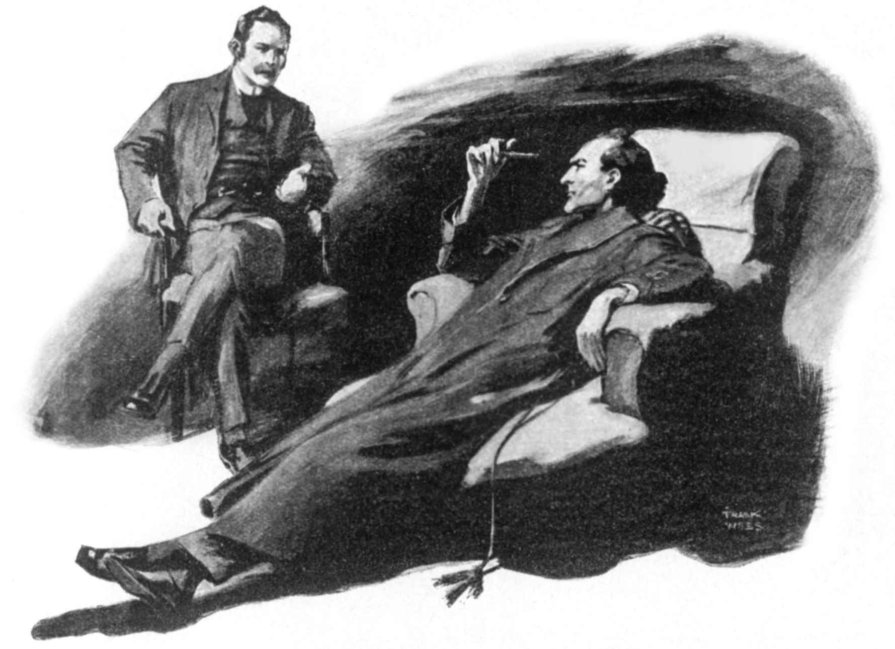

“不要写诗做文章了，华生。”福尔摩斯厉声道。

“不错。我真不知什么叫安逸居，要不是我在街上抽个烟，问了一个闲人，还不知就是那间房子。我提这个人可是有道理的，他高高黑黑，浓浓的胡子，很像个军人模样。我向他打听，他点点头，拿奇怪、疑问的眼光瞧了我一眼。他为什么这样瞧我，过后我才回想起来其中有道理。

“我还没进大门口，就看见安伯利先生在车道上走过来。今天早上我只匆匆见过他一面，就已经给我留下怪可怜的印象，这时在日光之下再见他，那相貌更觉得不正常。”

“这我当然也研究过，但还是有兴趣要听听你是什么印象。”福尔摩斯说。

“在我看来他好像是弯腰曲背处处赔小心的那种人。他弯背，重包袱压弯了似的，但他并非如我初次见面想象的那样是个孱弱无能的人，因为他的肩膀、胸脯，是巨人的骨架，形体只是往下瘦削，剩下两条腿，细长像纺锤杆。”

“左脚鞋皮皱，右脚鞋光洁。”

“这我没注意看。”

“是的，你没注意，我看出他一条腿是假腿。你继续讲下去。”

“我注意到他戴一顶旧草帽，帽子底下露出鬈曲的灰头发，满脸深皱纹，表情猴急、凶相。”

“很好，华生。他说了些什么？”

“他开始倒出一肚子的苦水。我和他一起在车道上走，当然注意向周围看看。这地方之糟糕，我从来没见过，花园里长满杂草，我的印象是根本没人管，任凭乱长、疯长，不加管理、修剪。我真不知道谁家正正经经的女人容忍得了这样的状况。屋子里，也是邋遢得没话说了，可怜的老头也意识到了这一点，正在动手整理。我看见他厅里正中间放着一大桶绿油漆，左手里拿着一把大刷子，他刚才正在刷漆。

“他把我请进一间暗幽幽的书房，在里面促膝长谈。你没有亲自去，他当然感到遗憾。‘我都不敢奢望，’他说，‘像我这么一个破落相的人，尤其是经济上挨了这么一下重大损失，怎么还能叫歇洛克·福尔摩斯这样大名鼎鼎的人物来给我关心重视。’

“我明确告诉他，经济方面没有关系。‘他自然是不看重金钱，他是为艺术而艺术，’老头说，‘从犯罪的艺术角度看起来，这件事他倒是很有些东西可以研究的。这个人性呀，华生博士——全是黑心黑肺黑肚肠，忘恩负义！这个女人要求的，我哪里有半点不答应？谁家的女人，有像我这么宠着惯着的！还有那个小子——都可以做我儿子的人，这屋里他随意进出，跟自己家里没两样。可是，瞧他们是怎么对待我的！啊，华生博士，这个世界，太可怕，太可怕了！’

“他诉苦，吐苦水，一个多小时。看上去，他以前没有怀疑到他们有私通。他全家就两个人住，还有就是一个女佣工，白天来干活，晚上六点回去。出事的那天晚上，老安伯利为讨妻子欢心，买了两张秣市剧院楼厅包厢的票。临走前妻子推说头疼不想看戏，他只好一个人去。这个情况无疑是事实，因为他出示了那张妻子的票，没有用过。”

“很奇妙——非常奇妙，”福尔摩斯说，他对此案的兴趣似乎大大提升，“请讲下去，华生，我发现你越讲越吸引人了。你当场检查了戏票没有？你，或许没有注意号码？”

“我偏偏就是注意到了，”我颇有些自豪地回答，“那号码刚好和我念书时候学校里的学号一样，三十一号，所以脑子里印进去了。”

“很妙，华生！他自己的座位，那么说，是三十号，或者三十二号。”

“应该是的，”我回答，但不免迟疑，“还是在B排。”

“这就很足够了。他还讲了些什么？”

“他还让我看了他的‘保险室’，他自己这么叫的。那屋子倒也真是保险——像银行——有铁门、铁窗——防盗的，他自己说。可是，女人另外配了钥匙，两人一共拿走价值七千英镑的现金和债券。”

“债券！他们怎么处理呢？”

“他说已经向警方提交一张清单，这样就叫他们无法脱手。他看完戏回家，将近午夜，发现家中被偷，门窗洞开，两个人都逃跑了。没有留信，字条也没一张，至今没有一点音讯。他马上报警。”

福尔摩斯细想了几分钟。

“你说他是在油漆，漆什么？”

“哦，他在漆走道。我说的这间屋子，门窗上的木头部分都已经漆好。”

“在目前这种情况下漆油漆，你不觉得有些奇怪吗？”

“‘一定要找点事做做，来平平伤透的心。’他是这样向我解释的。这有点反常，不过他本来就是个反常人。他当我面把一张妻子的照片撕掉——恨得咬牙切齿撕个粉碎。‘再也不要看见她，这不要脸的！’他哇哇直叫。”

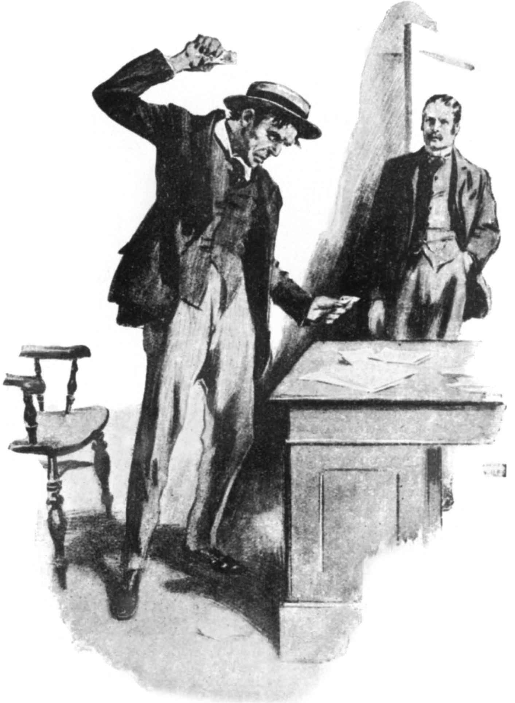

“再也不要看见她，这不要脸的！”他哇哇直叫。

“还有吗，华生？”

“有，一件事，比其他的事更引起我的注意。我坐马车到黑石南地车站，赶上我的火车，火车正要开动，突然看见一个人跳上后面的一节车厢。你知道我认人眼睛很尖，福尔摩斯。我认得很准，就是那个高高黑黑的人，我刚才说了，在街上问过信的。后来在伦敦桥上又看见他一回，一转眼他在人堆里不见了。我很肯定他在跟踪我。”

“肯定是！肯定是！”福尔摩斯说，“你说是一个高高黑黑大胡子的人，还戴副灰色太阳眼镜？”

“福尔摩斯，你真神了，我还没说呢，他戴的正是灰色太阳眼镜。”

“还别着共济会的领带扣针？”

“福尔摩斯！”

“很简单，我亲爱的华生。这且搁下，我们现在先来谈谈面临的问题。必须向你承认，本案原先我认为十分平常简单，不值得大惊小怪，现在很快呈现出极不平常的一面来。确实，你这次跑一趟，有些重要情况给忽略了，但是那些突然冒出来并且引起你注意的事同样值得严重关切。”

“我忽略什么了？”

“不要生气嘛，我亲爱的朋友，你知道我这是就一般而言，并非特指你个人。没有人能比你做得更好，有的人很可能还不如你呢，但你确实忽略了一些至关重要的问题。对于安伯利这个人和他的妻子，邻居们的意见怎么说呢？这肯定是很重要的。欧尼斯特医生他的为人如何呢？人们是不是相信他就是个洛撒里奥<a href="#part0162.xhtml_ch2"
id="part0162.xhtml_ch2-back">(2)</a>那种风流浪荡子呢？以你天生的优势，华生，每个妇女都会乐意帮助你配合你。邮政局的小姐，蔬菜水果店的老板娘，都是怎么说来着？我能想象得出，你到那家蓝锚酒店里跟那个女郎搭讪几句好听话，就能套出她不少实在话。可是，所有这些，你都漏掉了，没有做。”

“还可以去做嘛。”

“已经做了。多亏有电话，有警场方面的帮忙配合，我常常能获得所需的重要情报，足不出户，不需奔走。事实上，我的情报证实了这个人所讲的真伪。他在地方上的口碑，是个吝啬鬼，还是个刻薄鬼，对妻子态度很恶劣。那间保险室却是名副其实藏有巨款。年轻的欧尼斯特医生，没有结婚，也确实是安伯利的棋友，来下棋的同时，说不定很可能跟他妻子会有点儿事，也就这样罢了。一切仿佛没事的一般，没人会去说三道四——然而！——然而有难题！”

“困难在哪里？”

“也许是想象，仅在我的想象之中。好了，随他去吧，华生，我们避开困乏沉重的世界，从音乐的旁门逃出去。卡琳娜今晚在亚伯特音乐厅演唱，我们时间还来得及，换衣服、吃晚饭，去乐一乐。”

清晨我按时起床，但是一些面包屑和两个空蛋壳说明我的同伴又是起得很早。我在桌上看到一张字条。

亲爱的华生：

我有一两问题须与乔赛亚·安伯利先生面商。事后我们便可弃手本案——或不可。谨请三点钟时勿离开，因估计很可能需你帮助。

歇·福

福尔摩斯出外大半天，在他说定的时间才回来。只见他脸色暗淡，表情凝重，一言不发。在这种时刻，只有随他去，听其自然才是明智之举。

“安伯利来了吗？”

“没来。”

“啊，我在等他来呢。”

他并没有失望，老头随后就到，绷紧的脸上显出忧虑、疑惑的神色。

“我收到一封电报，福尔摩斯先生，不知是怎么一回事。”他递过电报，福尔摩斯大声地念道：

接电即来勿误，告知你近日损失已有消息。

埃尔曼，教区牧师住宅

“两点十分从小帕林顿发出，”福尔摩斯说道，“小帕林顿是在埃塞克斯，我想是离弗林顿不远。行，你应当马上出发。这很显然是个负责的人，是当地的牧师。圣公会圣职名册呢？对了，查到了，这儿：‘J．C．埃尔曼，文学硕士，主持莫斯莫尔及小帕林顿教区。’看看火车时刻表，华生。”

“五点二十分有一趟车，从利物浦街开出。”

“好极了。你最好同安伯利先生一起去，华生，好有个照应，遇事多个主意。很明显，我们已经面临本案节骨眼上了。”

但是我们的委托人居然一点也没有急切要去的样子。

“完全瞎胡闹，福尔摩斯先生，”他说道，“这个人怎么会知道发生的事？去不是白白浪费钱和时间嘛！”

“他不知道就不会发电报给你，快回电说你就去。”

“我不想去。”

福尔摩斯表现出严肃认真的样子。

“这么一条重要的线索有人提供上来，你怎么好拒绝，安伯利先生，我感到费解了，给警方的印象也是很坏的，我们会觉得你实际上并不想急于查清这个案子。”

我们的委托人对此说法似乎颇受震撼。

“好吧，你要这样看，那我去就是了。”他说道，“老实讲，看看就有点荒唐，这种牧师竟然会知道，但是如果你认为——”

“我确认没错。”福尔摩斯语气极重地说。于是我们就准备动身上路。我们离开屋子前，福尔摩斯把我拉向一边有话另行叮嘱，可见他对此行看得非常重要。“你惟一的任务，就是一定要盯住他到那边去，”他说，“如果他跑掉或者逃回，就马上找电话打过来，简单通报一声‘跑了’。我这里作好安排，不管我人在哪里，电话都能接得到。”

小帕林顿位于支线上，交通不是很方便。我记得这趟旅程并不愉快，天气很热，火车又慢，我的同伴绷着脸不乐意，除了偶然发一句牢骚，说我们这一次旅行毫无用处，便是闭口无言。最后到了小站，还要坐两英里路的马车才来到教区牧师住宅。一位牧师，身材高大威仪，摆着神气十足的样子在书房里接待我们。我们把电报呈上去。

“哦，两位先生，”他问道，“找我有何贵干？”

“我们是，”我解释道，“承蒙你的这封电报才来。”

“我的电报！我没有发电报呀！”

“我是说，这份电报，你发给乔赛亚·安伯利先生的，关于他的妻子，还有钱的事。”

“要是开玩笑，先生，这种玩笑开得太出格了。”牧师愤愤地说，“我从来没有听见过这个名字，你讲的这位先生，我也没有给人发过电报。”

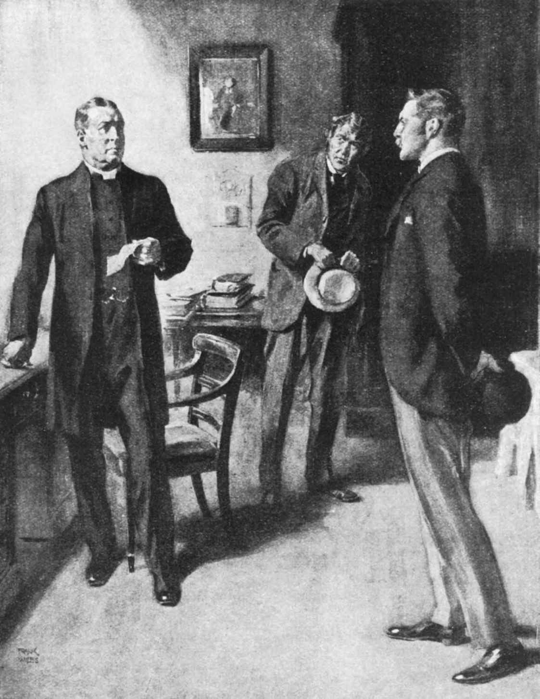

“这种玩笑开得太出格了。”牧师愤愤地说。

我们的委托人和我面面相觑，十分惊讶。

“也许搞错了，”我说，“是不是有两个牧师住宅？这电报上，发报人是埃尔曼，发自牧师住宅。”

“这里只有一个牧师住宅，先生，也只有一名牧师，这封电报明明是伪造的，此电报的由来，要报警，要调查清楚。现在，我看没有必要再多谈了。”

就这样，安伯利先生和我遭遇冷落，退到村路旁，我感觉自己正身处英国最原始的乡村。我们去找电报局，电报局已经关门。还好，一家铁路小旅店有电话。我马上跟福尔摩斯打电话，他想不到我们跑下来是这样的结果，在那一头表示惊讶。

“怎么会有这种事！”另一端那遥远的声音说，“会有这种事！今夜恐怕，我亲爱的华生，今夜你们没有回来的火车了，都怪我没估计好时间，委屈你们要在乡村旅店过一夜。不过，那边有自然好风光，华生——自然好风光，还有乔赛亚·安伯利——有景有人好作伴。”挂电话的时候听到他咯咯的笑声。

接下来，我对身边这位同伴的吝啬马上大有领教。他本来就已经喋喋不休抱怨旅行花费，坚持搭三等车，此刻又吵吵嚷嚷不愿付旅店账单。次日早晨，总算返回伦敦，但已很难说我们两人的心情谁比谁更坏。

“顺便到贝克街，你去休息一下吧，”我说，“福尔摩斯先生会有些新的见教。”

“比昨天更不值一听，有什么用处！”安伯利说，一脸的恼恨，但最后还是跟我走了。我已经先发电报通知福尔摩斯我们到达的时间，但是一进屋，我们只看到一封信等着，说他在刘易萨姆，叫我们就过去，这真是大怪事。可是我们随后发现更大的怪事，竟看见福尔摩斯在我们委托人家中的起居室里，不是单独一个人，旁边还坐着一个表情冷漠的人。他肤色黝黑、戴灰色眼镜，领带上别一枚很突出的共济会大别针。

“这位是我的朋友巴克先生，”福尔摩斯说，“他对你的事情感到兴趣，亲自来过问，乔赛亚·安伯利先生，我们趁你不在，一直工作到现在，我们两人都有一样的问题要问你！”

“什么问题，福尔摩斯先生？”

“只问你：你把两个人的尸体怎么处理了？”

这个人撕破了喉咙大叫一声，猛地跳起来，两只枯瘦的爪子抓向空中，张开着嘴，一瞬间他活像一只可怕的猛禽。再一看他，我们发现了乔赛亚·安伯利的真面目，他是个异样的怪物，他的灵魂如同他的躯壳一样扭曲变形。在他再跌回椅子的刹那，忽地伸手往嘴上一按，像是要压住咳嗽，福尔摩斯如猛虎扑过去，卡紧他喉咙，把他的脸往地下按，一颗白色小药丸从他喘息的嘴里掉了出来。

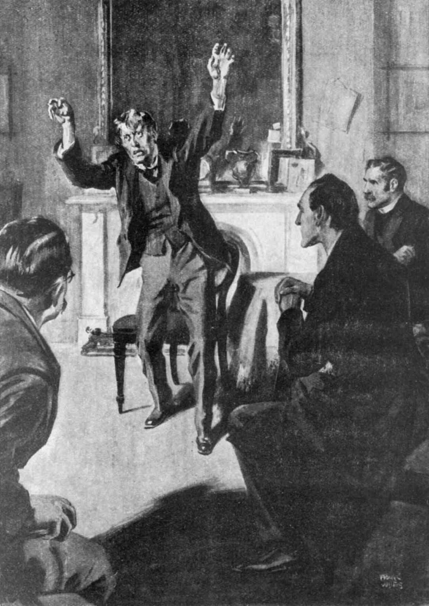

一瞬间他活像一只可怕的猛禽。

“别抄近路，乔赛亚·安伯利，事情一定得按部就班照程序来。怎么办，巴克？”

“上门口马车。”我们那位沉默的同伴说。

“去火车站才几百码的事情，一起走吧。你等在这儿，华生，我半小时就回来。”

颜料商老家伙那巨大的骨骼里蕴藏着狮子般的力气，但在两个有经验的擒拿高手面前显得无能为力，被连拉带扯拖进等候的马车。而我，独自一人留守在这不祥的空屋里。但福尔摩斯还没到他说的时间就回来了，随同的还有一位年轻精干的警官。

“巴克留在那边办理法律手续，”福尔摩斯说，“你这以前没有见过巴克，华生，他是萨里海滨我最厉害的同行对手。你跟我讲到一个高高黑黑的人，我便不难勾勒出这个人的全貌了。他办过几件案子，办得很漂亮。对不对，警官先生？”

“他有过几次是半途插手进来。”警官回答，话有保留。

“他的手法，很显然和我一样，无常法。无常法，你要知道，有时候是最管用的方法。比如说，你严正警告老头儿，不论他说什么，都一样要成为指控他的证据，你也绝对吓唬不住这个老流氓，让他服服帖帖招供。”

“也许不能。但是我们照样断案，福尔摩斯先生。不要以为我们对本案没有自己的招数，不要以为凭我们自己就抓不到人。如果你要挤进来，不择手段，采取我们不能采取的办法，从而抢夺我们的功劳，那就请你别怪我们量小非君子。”

“没人要抢你的功劳，麦金农。我说你尽可放心，从今后我便自动退出不再露面。至于巴克，除了我关照他的以外，他自己什么也没做。”

警官这才似乎释然开怀。

“好，漂亮，福尔摩斯先生。毁誉对你影响并不大，可对我们是大不一样。报纸上有问题一追问起来，就不好办了。”

“诚然！但他们有问题总是要问的，所以有问必答便是最好的办法。比如聪明的记者穷追不舍问你到底是哪一点引起你怀疑、最后又让你断定为真正的事实呢，你怎么回答？”

警官在那里傻眼了。

“我们还没有掌握确切的事实，福尔摩斯先生，但是这错不了，嫌疑犯在三个目击证人面前企图自杀，实际上承认了他谋杀自己的妻子和奸夫。你还有什么别的事实呢？”

“你有没有准备搜查？”

“有三名警察马上就到。”

“那就行了，你很快就可以弄清全部事实。尸体所在不会很远，地窖、花园先找一找，可疑的地方挖掘一下，用不着花多长时间。这房子很旧了，自来水管是后来才接的，那必定有一个不用了的旧水井，碰碰运气试试看。”

“可是你怎么想到这一层呢？是怎么一个过程呢？”

“我先给你看是怎么进行的过程，然后再为你解释，更要为我这位心急难熬的朋友解释，他一直是劳苦功高。首先，我来剖析一下这个老头的内心状态。他是一个很奇特的人——奇特至极，我想他的归宿与其是上绞架，倒还不如关进布罗德莫囚犯精神病院。他的心理状态，是一种很强烈的属于中世纪时代意大利人的心态，而不是现代不列颠人的心理。他是个可怜又可恶的守财奴，视钱如命，妻子受不了这个苦，很容易移情他人。医生来下棋，这个角色正好落到他身上，再好不过。安伯利长于弈棋——也就有个特征，华生，长于计谋。还和所有的吝啬鬼一样，是个好嫉妒的人，而他的嫉妒心之重近于疯狂。真也好，假也好，他必定要疑心两人私通有奸情。他决心报复，想出魔鬼般恶毒狡猾的计谋。到这儿来！”

福尔摩斯领我们沿走道过去，熟悉得如同是在这家里住过的一样，到了保险室开着的门前停下。

“噗！噗！难闻的油漆味！”警官叫道。

“这里就是我们的第一现场，”福尔摩斯说，“你得感谢华生医生侦查到这第一现场，尽管他未能引出结论，但是让我抓住了这一线索。为什么这个人要在这样的时刻，让屋子充满强烈的油漆味？很明显，他是要借以掩盖另一种气味——某种犯罪的气味，引起嫌疑的气味。然后是想到这间屋子，你看这儿，又是铁门又是铁板窗——是一间密闭的屋子。把这两点事实联系起来，可以引向何处呢？我决定只有亲自来踏勘这屋子。我已经确知案情是严重的，因为我先从秣市剧院了解包厢的事——这也是华生医生侦查到的又一个要害点——知道原来楼厅B排的三十座和三十二座那天晚上都没有人来看戏。可见，安伯利根本没有去剧院，他不在家的证据就不成立了。他这一着棋是很大的失误，无意间让我心细的朋友看清了他妻子戏票的座位号码。现在的问题就是我怎样才能检查这所房子。我选了一个外乡极冷僻的村落，派人到那边去，发电报把安伯利引过去，而且算定时间叫他当天无法回得来。为防万一有失误，就由华生医生陪着他。那位教区牧师的名字，当然啦，我是从圣公会名册上找来的。到这里一切都明白了吗？”

“真是大手笔呀！”警官说道，佩服得五体投地。

“这下不怕有人打扰，我就放手大胆破门而入。夜盗这行当，要是我存心入行，一定是职业高手。瞧我发现什么了！你看这煤气管道，沿着踢脚板过来，好，到墙角，向上，墙角这里有个开关。管子给接出进入保险室，看到了吧，到天花板中央灰泥玫瑰灯饰终止，安在装饰里面，但管口不封住，是开口的，如果把外面的开关一开，煤气就直灌这间室内。只要门窗都关好，开关开足，不用两分钟，叫关进这屋里的人，立刻丧失知觉。他用什么诡计把两人诱进这里头来，我不知道，但是一进这门，命就捏在了他的手里。”

警官饶有兴趣地检查管道。“我们有位警官提到过煤气味，”他说，“但是当时门窗都开着，再加油漆味——味儿很浓——已经充斥整个房间。安伯利在前一天就开始油漆了，据他自己说。那么，下面怎么样呢，福尔摩斯先生？”

“哦，然后，有一件事也大出我的意料。天刚亮的时候，我正在爬餐具室的窗，有一只手一把抓住了我的衣领，一个声音说：‘哈！你这老贼，盗窃什么哪？’我扭头一看，原来是戴墨镜的朋友也是对手，巴克先生。我们两人不期而遇，不禁都笑了。他好像是受了雷·欧尼斯特医生家人的委托来进行调查，得出同一结论，是谋杀案。他已经监视这房子好几天了。华生来访，被他当成了嫌疑犯。华生他是无法加以逮捕，但是现在看见有人爬餐具室的窗户，再不动手就不行了。接下来我把事情一五一十告诉他，我们就一起继续侦查。”

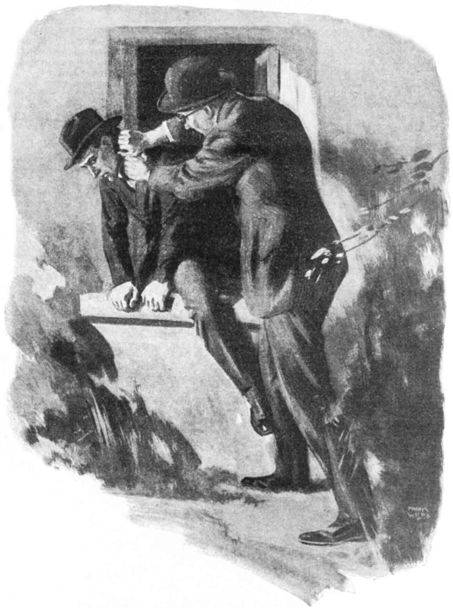

“有一只手一把抓住了我的衣领。”

“为什么和他，不和我们呢？”

“因为我是根据心中的设想做个小小实验，没想到结果还令人满意。恐怕对你们而言，这根本不值一做。”

警官笑笑。

“好，也许是这样。我只晓得，有你那句话就成，福尔摩斯先生。你这案子，现在要放手，你把你的结果都移交给我们。”

“当然，这是我一贯的作风。”

“好，我以警方的名义感谢你的美意。案子是清楚了，照你说法，找到尸体也就不难了。”

“我来给你看一个小小的铁证，”福尔摩斯说，“我确信安伯利本人都不曾发现，你要获得结果，警官先生，需要设身处地想你自己会怎么做。需要动脑费点想象力，但是会有回报。现在，我们假设，是你被关在这间小密室里，没有两分钟可活了，恶魔却在门外心中狂喜，你不能就这么便宜了他。你怎么办呢？”

“写个字条。”

“对啦！要告诉人家自己是怎么给害死的。写纸上是不顶用的，要被他发现，只有写在墙上，才有希望让人家查看到。所以，看这儿！这踢脚板上用紫铅笔写的，潦草可是擦不掉：‘我们遭——’就这样，没下文了。”

“你觉得是什么意思呢？”

“哦，离地只有一英尺，可怜人已经倒在地上，是临死前写的，还没写完，就失去了知觉。”

“他是要想写‘我们遭谋杀’。”

“我看正是。如果你在尸体手中发现有紫铅笔——”

“我们会找的，你放心。可是，那些债券怎么办？显然根本没有发生盗窃案。他也确实有这些债券，我们已经查明了。”

“你可以相信他已放在什么保险地方藏好着。私奔案风声一过，事过境迁，成为历史，他会忽然找到，宣称是一对犯罪人悔过了，将偷窃的财物归还或者是逃跑途中掉了的，等等。”

“对你而言，每一个疑点似乎都能迎刃而解。”警官说，“按道理，他应该只来找我们就可以了，但他却还要找你，我不理解。”

“完全是虚张声势！”福尔摩斯回答，“他自作聪明，聪明反被聪明误。他自以为得计，可以借此向怀疑他的人证明：‘瞧我该做的都做了，不但找了警察局，甚至连歇洛克·福尔摩斯都找过了。’”

警官听了哈哈笑。

“我们理解‘甚至连’是什么意思，没错，福尔摩斯先生，”他说，“这是我所知道的最独具匠心的诡计。”

两天后，我的朋友扔给我一份双周刊《北萨里观察家》，上面有一连串耀眼的标题，开头是“安逸居恐怖案”，末尾是“警方战功显赫”。标题下是满满的一栏报道，叙述了案子前因后果、详情，结尾一段就来了点睛之笔，是这样写的：

聪颖绝伦之麦金农警官因油漆味而推测且辨别另有异味，即如煤气之臭味隐含其中。其大胆之推论，即保险室极有可能为杀人之现场，继而侦查导致废井中尸体之发现，凶犯狡猾已极，井上做一狗窝而伪装之。此业绩将作为专职警探高智慧破案之范例载入刑案史册。

“好了，好了，麦金农是个好样的，”福尔摩斯说，雍容大度地笑笑，“你可以把它收进我们的卷宗，华生，总有哪天要披露故事的真相。”

（1926年）

————————————————————

<a href="#part0162.xhtml_ch1-back" id="part0162.xhtml_ch1">(1)</a> 科普特基督教会（Coptic
Church），基督教东派教会之一，信奉基督一性论，做礼仪时使用埃及科普特语。

<a href="#part0162.xhtml_ch2-back" id="part0162.xhtml_ch2">(2)</a> 洛撒里奥（Lothario），一个专事勾引妇女的人，系英国剧作家罗（Nicholas
Rowe，1674—1718）创作的典型人物。

# 蒙面房客案

歇洛克·福尔摩斯先生从事探案业务长达二十三年之久，其中有十七年我有幸成为他的合作者并一直记录他的事迹。既是这样情况，也就可想而知，我手上掌握着大量的刑案资料。对于我来说，寻找资料并不是问题，问题是在对这些资料的选择。我的书架上有一长排逐年的案例记录，还有几个公文箱装满着案子卷宗文件，这不仅对研究犯罪学的学者，也对研究维多利亚后期社会和官方丑闻的学者是不可或缺的重要资料。对于后者，我可以说，有些人曾忧虑地来过信，要求不要触及有损他们家族的荣誉或祖先的名声。其实一点也不必担心，我的朋友福尔摩斯出于他所特有的谨慎态度和职业道德，对于写作的题材选择依然控制极严，决不会滥用职业信誉。但是，我坚决反对最近有人企图窃取和销毁这些资料。这种行径出之于何人，是清楚的，如果他们再有此类行动，那么我有权代表福尔摩斯先生声明，有关某位政治家、某英明灯塔以及所豢养之鸬鹚<a href="#part0163.xhtml_ch1"
id="part0163.xhtml_ch1-back">(1)</a>的全部真相，将被公诸社会。对此，至少有一位读者，对他则是心照不宣的。

要是以为每一件案子都能让福尔摩斯有机会施展他特异的直觉和观察的天才，如同我在回忆录中大力描述的那样，这种想法是不切实际的。有些案子他很费心力才收获成果，但有些则是果实自己掉入怀中，并不曾费他吹灰之力。而侦破世上最骇人听闻的大惨案，却往往是最少运用到他的才华。现在我要加以叙述的就是这样的一例，文中涉及的人名地名我略作变动，但故事内容照实记录。

一天午前时间——那是一八九六年之末——我收到福尔摩斯匆匆写来的一封简信，要我立即前往。我赶到那里，看见他坐着抽烟，抽得满屋子浓烟缭绕。有一个上了年纪的老妈妈，房东太太一类的老肥婆，在一张椅子上与他相对而坐。

“这位是南布里克斯顿区的梅里洛太太，”我的朋友抬抬手说道，“梅里洛太太不反对抽烟，华生，你要享受这坏习惯也无妨。梅里洛太太有一则很有趣的故事要讲，故事更有下回需要且听分解，你在场很有用。”

“有什么要我做——”

“你明白，梅里洛太太，我要去看郎德尔太太的话，最好要有位见证人在场。”

“上帝保佑，福尔摩斯先生，”我们的来客说，“她可是真急着要见你呀，你把全教区的人都带去也不碍事。”

“好，那我们下午早一点来。我们走之前先把事情搞搞清楚，再理一遍，有助于华生医生了解情况。你说郎德尔太太住你的房子已有七年，可你只见过她一面。”

“还是请求上帝别让我看见的好！”梅里洛太太说道。

“那个，我理解，不成脸了，可怕得很。”

“哦，福尔摩斯先生，你简直无法说那还是脸！不能看呀！送牛奶的有一回瞧见她在楼上窗子前，只瞧那么一眼，把手上的奶瓶箱都掉地上砸了，洒得花园一地是牛奶。就是这么一张脸。我见她那一忽儿——冷不防给我看见——她快把脸罩上，对我说：‘哦，梅里洛太太，还是叫你看见了，所以，我一直不撩面纱。’”

“她过去的情况你了解吗？”

“一点也不了解。”

“她刚来住的时候，有什么介绍信、证明文件没有？”

“没有，先生，可她给现钱，钱可不少哪。一季度一预付，爽爽快快放桌上，二话也不说。我这年头，穷婆子一个，这样的机会哪能不要嘛！”

“她看中你房子，说起什么理由了没有？”

“我这房子，离马路远，坐落深，比人家的都还要背静。哦，还有，我只租一个人的，我自己也是没家眷。我估摸她试过别处，发现我这儿最合适。她要的是背人安静，钱不在乎。”

“你说她从头天起就始终没露过脸，只有过偶然的一次。那，真是怪事情，里边有故事，肯定有故事，不一般，怪不得你要调查她。”

“不是我，福尔摩斯先生，我只管收租，我挺满意的。你哪儿去觅得到这么个安静的房客，压根儿不添你一点麻烦。”

“那这么着急干什么呢？”

“她身体不好，福尔摩斯先生，那样子快是活不久了。她内心里有苦水，常会喊：‘谋杀！谋杀！’有一回我听她说：‘你这没人性的畜生！你这恶鬼！’她这么嚷嚷。那是夜里，叫得整屋子都能听见，吓得我浑身哆嗦。早晨我就进她房去。‘郎德尔太太，’我说，‘你内心有什么不好受，有冤屈，可以叫牧师，还可以叫警察。牧师、警察都好帮你。’‘看在上帝分上，别叫警察！’她说，‘牧师也不要，改变不了过去的事。不过，我死之前有人知道过去的事，我的心也好得到些宽慰。’‘那好呀，’我说，‘牧师、警察这些都不要，倒有一个人，干侦探的，我们都看书晓得他的事来着。’——哦，这一说，你猜怎么着，福尔摩斯先生，她呀，她一听可就高兴起来啦。‘就这个人，’她说，‘我怎么以前就没想到过呢！请他来！梅里洛太太，万一他不肯来，你就跟他说我是大马戏团郎德尔的妻子。你那样说好了，再给他个地名阿巴斯·帕尔瓦。’喏，这儿有她写的字条——阿巴斯·帕尔瓦。‘如果他是我猜到的那个人，我想，他会来的。’”

“要去的，是的，”福尔摩斯说道，“很好，那就这样，梅里洛太太。我跟华生医生有些话，稍谈一会儿，要谈到午餐时间，下午大约三点钟，我们在布里克斯顿你家再见。”

我们的客人刚刚像鸭子一样摇摇摆摆出去——没有别的词儿可以形容梅里洛太太的走路姿势——歇洛克·福尔摩斯就一个虎步跨向屋角一堆书和笔记本。数分钟，只听见翻页声刷刷响，接着一声满意的“有嘞”，他找到了要找的资料。他在那里兴奋得不想离开，一屁股坐在地板上，像打坐的和尚似的将两腿盘起，身边摞着大本的书，有一本摊开放在膝头。

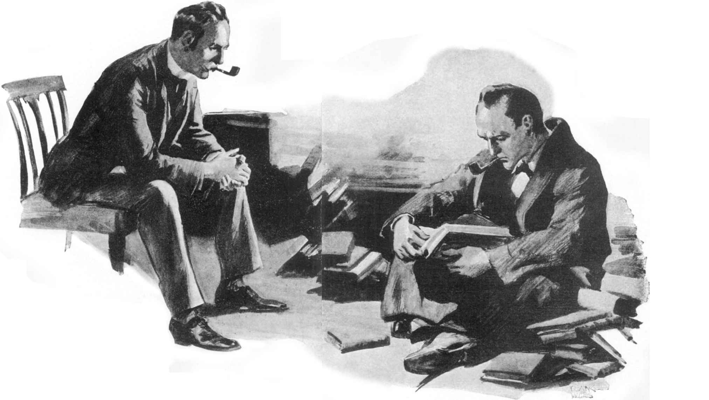

他一屁股坐在地板上，身边摞着大本的书，有一本摊开放在膝头。

“这件案子当时就叫我搞不懂，华生，你看这页边上我做满了旁注，就是明证。得承认我是解决不了，不过深信验尸官有错。阿巴斯·帕尔瓦那惨案你不记得？”

“一点不记得，福尔摩斯。”

“那天你和我在一起嘛。不过，当然，连我自己的印象也很淡薄了。这件事情我没有经手，双方都没有来委托我。也许你愿意看一看这些报道？”

“你就给我讲一讲大概吧。”

“也行，我一讲，你一定能回想得起来。郎德尔，那可是家喻户晓的名字，他是沃姆韦尔和桑格的强劲竞争对手。他的马戏团在他那个年代也是最大的马戏团之一。可是案子发生的时候，他已经开始酗酒，他本人连同他的班子已经走下坡路，这是很明显的事了。那天，大篷车停在阿巴斯·帕尔瓦过夜，那是伯克郡的一个小村，惨剧就在这个地方发生。他们是到温希尔顿的途中，走的陆路，搭了帐篷宿营，没有演出，因为那地方太小，开演划不来，还不够支出的。

“这个班子有一头北非雄狮，很棒的表演猛兽，取名叫撒哈拉大王。通常都是由郎德尔和他妻子两人一起在狮子笼里进行表演。这儿，你看，一张正在演出的照片，可以看出郎德尔身材魁梧，像头野猪，他的妻子十分美貌动人。案发后现场检验，有人作证这头狮子事前已经不正常，有危险迹象，但由于平日一直习惯了，掉以轻心，谁也没理会这种事故苗子。

“跟往常一样，夜晚总是由郎德尔或是他妻子给狮子喂夜食。有时一个人喂，有时两个人一起喂，一直不允许别人来喂。因为他们知道，只要是他们两个亲自喂食，狮子就会认定他们是恩人，不会使野性。可偏偏那一夜特别，七年以前的那天夜里，两人一同去喂，居然发生惨案。详细案情一直没有弄明白。

“好像就是那天半夜，全营的人给狮子狂吼、女人的惨叫惊动了，马夫、班子里的人从各个营帐里跑出来，提着灯。灯一照，惨不忍睹，离铁笼十码远，郎德尔趴在地上，后脑勺一个狮爪印大窟窿；笼子门打开着，门边是郎德尔太太仰面倒地，狮子正蹲坐在她身上吼叫，她一脸血肉模糊，没有人想她日后还能活。在那个大力士雷奥纳多的带领下，小丑格里格斯等马戏演员用长棍赶狮子，狮子一下跳回了笼子，大家马上把铁笼锁上。但是，狮子怎么出的笼，是一个谜。大家猜测说，两个人进笼，不料门一开，狮子就朝他们扑上来。只有一点可以证明，女的被抬到他们住的篷车上时，在昏迷中不住喊：‘孬种！孬种！’等过了六个月以后，她脱离危险，可以作证了，但是死因调查早已结束，理所当然判定是意外事故。”

“不是这样的话，难道还有别的可能？”我说。

“你也可以这样说。可是有一两处疑点，艾德蒙兹小伙子觉得讲不通，他是伯克郡警察局的，年轻后生可真行！后来他被派往阿拉哈巴德去了。我对这事引起注意，是他顺道来访问我，抽了一两斗烟聊起来的。”

“一个瘦个子，黄头发？”

“正是。我知道只要一提，你就会记起来的。”

“他疑问什么呢？”

“噢，我和他两个一样有疑问，怎么也不能自圆其说。从狮子的情形看，它出了笼，出了笼怎么样？向前跳几跳，蹦向郎德尔。郎德尔转身跑——狮子爪印打在他后脑勺——狮子把他扑倒了。然后，狮子不再往前蹦、逃走，而是回头扑向女人，女人近在笼子旁，把她扑倒，咬了一口她的脸。她昏迷中叫喊，好像是指她丈夫自己逃命不顾她，可是丈夫这时候还能救她吗？你看出破绽了吧？”

“确实。”

“还有一件事，现在回顾，我才记起来，也是有证据，狮子吼、女人叫的那时间，有一个男人也开始惊叫。”

“这该是郎德尔了，当然是。”

“哦，脑壳都打扁了，你还能指望听到他出声叫喊！但有两个证人说有一个男人的叫喊声和女人的叫喊声混在一起。”

“这可以想象，那时候全戏班的人都在喊叫。至于另外的情况，我想我倒可以提出几点解释。”

“好呀，乐意听你说说。”

“两个人是一起走到离笼子十码的样子，开门，狮子窜出来。男的回身，被击倒；女的反应灵敏，要跑进笼子里，把铁门关上，她只有这一个逃命办法。她正要这样，还没能进铁笼，狮子就向她扑了上来。她是恨丈夫先回身逃命，这就刺激狮子撒野，如果两人一起对付狮子，倒是可以把它吓住。所以她才喊‘孬种’。”

“高见，华生！你这颗钻石只有一丝微瑕。”

“你说，什么微瑕，福尔摩斯？”

“如果他们都是离铁笼十步，狮子怎么出的铁笼？”

“会不会他们有仇人，故意放了狮子？”

“而且平时一直是在一起玩惯的，在笼子里耍杂技表演惯了的，凭什么会这么残忍攻击呢？”

“也许是这个仇人用了什么手段激怒了狮子。”

福尔摩斯静默一会儿，若有所思。

“对，华生，你的推论说得对，有道理，郎德尔这个人有些仇人。艾德蒙兹告诉过我，郎德尔喝了酒就凶得很，挺着个大肚子，碰上谁就骂谁揍谁。我想，刚才的登门客人所说，郎德尔太太喊恶魔，就是她在梦中梦见已死的丈夫。但是，怎么说都不足信，一切都要看看事实。食橱里有冷盘山鸡，华生，还有一瓶蒙特拉谢白葡萄酒，我们先补充补充精力吧，精力充沛再行走访。”

我们乘坐的马车到梅里洛太太的家门时，太太肥硕的身躯已堵在了敞开的大门口。这是一处简陋却十分僻静的寓所。很清楚，她先出门迎驾是生怕一不谨慎失掉可贵的房客，所以还没有引我们入门之前，一再关照我们别有什么不当行为引起这样的后果。我们当然请她一百个放心，便跟她进门，随后踏上铺着破地毯的直楼梯，来到神秘客的房间。

这屋子四处封闭，通风不良，有霉味。这也是可想而知，房客与外界少有往来之故。一直是把猛兽关在笼子里，这女人也遭到命运的报应，到头来自己成了笼中的兽类。她此刻坐在阴暗角落一把破椅子里，由于长年不活动，她的身段线条变粗了，但可想见当年一定是很美的，因为现在看上去还丰满动人。一幅深色厚纱罩在她面部，但裁剪较短，露着一张优美的嘴和尖圆适度的下巴。完全推想得出，她从前是一位丰姿绰约的美女，而且，她的嗓音甜润悦耳。

“我的名字你不会陌生，福尔摩斯先生，”她说道，“我想你知道了一定会来的。”

“正是这样，夫人，虽说我并不知道你怎么有把握我对你的事会感兴趣。”

“我健康好转的时候，郡警察局侦探艾德蒙兹先生探望我，询问案情，我听他说你也注意到本案。我现在后悔骗了他，也许说实话才是聪明的办法。”

“说实话总是最聪明的办法，你为什么要骗他呢？”

“因为另外有人与此事性命攸关。我明知他是个无价值的人，但我还是不愿意因为毁了他而使我良心不安。我们俩曾经是这样亲密——这样亲密！”

“现在没有这个障碍了吗？”

“是的，先生，我护着的这个人已经死了。”

“那现在为什么不把你知道的实情去报告警察呢？”

“因为还要顾虑到一个人的实际情况，这个人就是我自己，我受不住流言蜚语。事情曝光，警察调查势必难免。我活不长了，但是我希望死得安静、干净。我要找一位值得信赖的人，把我可怕的遭遇告诉他，等我哪天走了，事情也就可以真相大白。”

“谢谢你的信任，夫人。同时，我是个有社会责任的人，我不能向你承诺，你讲过以后我不会将案子通报警方。”

“这我懂，福尔摩斯先生。我了解你的人格，了解你的处事作风，很了解，我好多年来一直拜读你的事迹。阅读是命运留给我的惟一乐趣，人世间的事我很少有不知道的。但不管怎么样，这是一个机会，我要抓住，也不管我的悲剧你会如何去处置。说出来了，心安了。”

“我朋友和我乐意恭听。”

女人起身去抽屉里拿出一张照片。一个男人，一看就知道是杂技演员，身强体壮，两只粗大有力的胳膊交叉抱在厚实鼓鼓的胸脯前，浓密的胡须下绽露微笑——征服许多异性者的得意的笑。

“他就是雷奥纳多。”她说。

“雷奥纳多，作证的大力士？”

“就是。这一个——这一个是我丈夫。”

一张令人畏惧的脸——长得活像头猪，一头凶暴的野猪，一看就是野性、兽性十足的蛮横人，一看就想象得出他发怒叫骂起来臭嘴张合、唾沫飞溅的样子，也能看出那对凶狠的小眼睛对世人射出的尽是歹毒目光。无赖，凌弱，暴虐——全表现在这张布满横肉的大脸上。

“两张照片可以帮助你两位先生了解我的过去。我是个出身寒微的马戏班女孩子，在大篷之下长大，十岁不到就表演钻铁圈。成年了，这个人爱我了，如果像他那种兽欲也配叫作爱的话。我在不幸的时刻成了他的妻子。从这天起，我就跌进了地狱，他恶鬼一样对我打骂不断，班子里的人没人不知道他怎么虐待我。他背弃我去找别的女人，我要是说他，就把我捆起来，用马鞭抽我。大家都同情我，讨厌他，可是有什么办法呢？大家怕他，全都怕他。这个人一年到头如凶神恶煞，一喝了酒，更是杀气腾腾。他因为打人，虐待动物，一次一次被传讯，可是他有钱，他不怕罚款。好的演员都跑掉了，马戏团开始走下坡路，全靠雷奥纳多和我在苦苦维持演出——还有小杰米·格里格斯，那小丑。这可怜鬼，一点不快活，但是还强装笑脸苦撑场面。

“以后雷奥纳多越来越进入我的生活。你们见他的外表模样了，我现在才看清他只是躯壳雄壮，灵魂也是多么可怜、渺小。但是比比我的丈夫，他简直就是加百利，给我传来上帝佳音的天使。他同情我，帮助我，终于我们亲近到发生了爱情——深沉的、刻骨的、炽烈的爱。这样的爱情，是我梦寐以求可是从来没有希望感受到的爱情。我丈夫觉察到了，但是我想，他虽然外表气壮如牛，内心里却是个胆小鬼，雷奥纳多是他感到害怕的那种男子汉。可是他有报复的方法，他加倍地虐待我。一天晚上，我叫救命的呼声把雷奥纳多引到我们篷车门前，随后差点酿成一场悲剧。雷奥纳多和我都看到，出事是不可避免了。我丈夫不配活在世上，我们两人策划把他杀掉。

“雷奥纳多脑子聪明，有计谋，都是他出主意想办法。我不是把责任都往他身上推，反正亦步亦趋我全有份，只不过是说我没有这样的脑子，想得出这样的计划。我们做了一根大狼牙棒——雷奥纳多做的——头上钉了五枚大钉，钉头朝外，做成狮子脚爪的形状，计划用这棍棒把我丈夫打死，再放出狮子来，造成是狮子把他一掌扑死的假象。

“那天夜里漆黑，我丈夫和我从车上下来，拎了一铅桶生肉，老习惯，去喂狮子。雷奥纳多躲在大篷车转角上，这是我们到铁笼子一定要经过的地方。他动作慢了，我们走过去了他都没下手，但他蹑手蹑脚从后面跟上来，我只听得咚的一声，木棍敲碎我丈夫脑壳。听到这一声我高兴得心都要蹦出来了，我赶快跑上前，把狮子的大铁笼门闩拉开。

“不料惨祸临头了。你们听说过吗，猛兽一闻到人的血腥极敏感，马上兴奋起来，刺激起兽性本能，要吃人了。我刚一拉开门闩，它就蹦出来，一下子把我扑倒。雷奥纳多本来是可以救我的，只要他冲上来用棍子打狮子，就能把它吓退。可是这个人掉了魂，只听见他吓得光喊叫，转眼只见他自顾逃命。这时候，狮子的牙齿撕咬了我的脸，又热又臭的呼气把我熏昏，我已经不知道疼痛了。我用手拼命抵住狮子哈着热气的血盆大口，没命地呼救。我好像听得营里的人惊动了，模模糊糊中记得一群人上来，有雷奥纳多、格里格斯，还有别的人，把我从狮子爪下救走。这是我最后的记忆，下面都不知道了，福尔摩斯先生，我等于死过去了好几个月。等我恢复过来，照镜子一看，我诅咒那狮子——哦，我是多么诅咒它呀！我恨它为什么只夺走我的美貌而不干脆夺走我的生命！我只有一个愿望，福尔摩斯先生，我也有钱足以实现这个愿望，这就是把自己隐藏起来，我这怕人的容貌也就无人看见。我要找一个住的地方，知道我的人永远也找不到我。这就是我残余的人生所能做的一切——也已是这样做了，一头可怜的受伤的动物爬回到它自己的洞中等死——这就是尤金妮亚·郎德尔的归宿。”

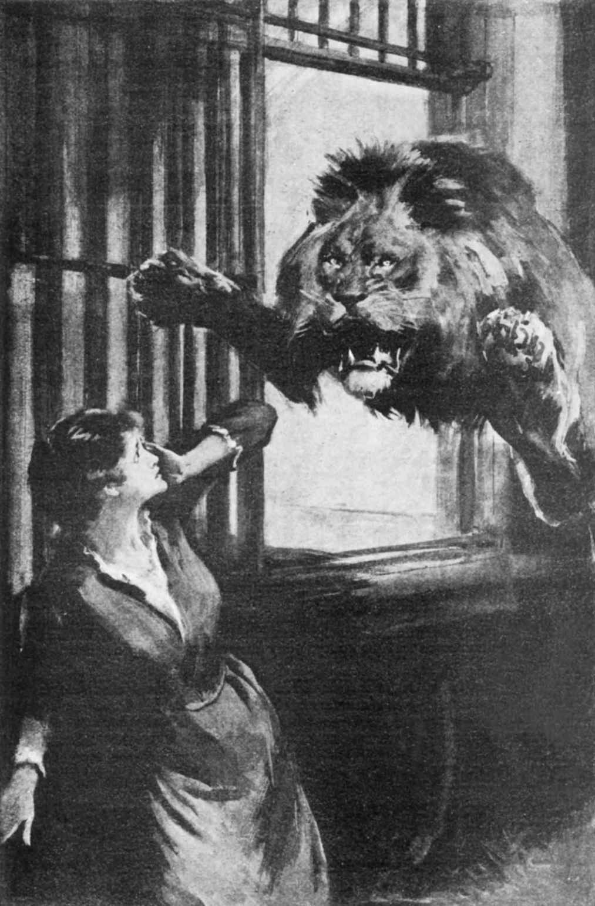

“它蹦出来，一下子把我扑倒。”

不幸的女人讲完了她的故事，我们静坐无声。最后是福尔摩斯伸出长长的手臂，轻轻拍拍夫人的手，他竟是这样的动情，我很少见他有过如此的表露。

“苦命人！”他说道，“命苦呀！人生之途吉凶叵测。如果来世得不到补偿，那这个世界捉弄人也太残酷了！雷奥纳多这个人怎么样了？”

“事情以后，我再也没有见过他，再也没有听人说起他。也许我恨他是不对的，他要能爱一个狮口余生的怪物，还不如去爱我们带着周游全国演出的畸形人呢。可是一个女人的爱心是不容易冷漠的，他任我陷在狮爪底下不管，在紧要关头抛弃我，可是我还是下不了狠心由我来把他送上绞刑架。对我自己，反正已经这样，什么也不必在乎了。我已经到了这一步，还能有什么更可怕的呢？他的命，我挡着点、护着点吧。”

“他死了吗？”

“上个月，他在马加特那边游泳，淹死了，我在报上看到他的消息。”

“那根五个狮爪的棍子怎么处理了？这是你的故事里最智慧的道具。”

“我不知道，福尔摩斯先生。营地旁有个白垩矿坑，坑底是发绿的深水，也许扔到那水底了——”

“好吧，好吧，这个现在关系已经不大，案子也就结束了。”

“是的，”女人说道，“一切都可以结束了。”

我们起身就走，但是女人的话中带有某些意味，忽然引起福尔摩斯的警觉，他迅速回转身去。

“你的生命不仅是你自己的，”他说道，“快把手放下。”

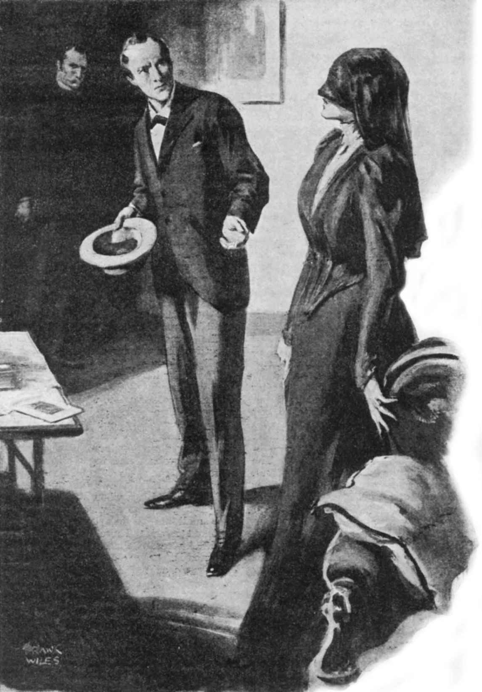

“你的生命不仅是你自己的。”

“我的生命对人还有什么用呢？”

“你怎么知道没有用？以坚韧的耐心承受苦难，本身就是一种榜样，在这缺乏耐心的世界上是最可宝贵的人生教训。”

女人的反应是一个可怕的举动。她撩起面罩，走向亮光。

“我看你忍受不了。”她说道。

毛骨悚然。言辞无法形容没有了面孔的面孔。两只生动美丽的棕色眼睛从完全毁掉的面孔上悲哀地望出来，看上去反而变得更加可怕。福尔摩斯举起手来做了个手势深表惋惜和遗憾，然后我们走出房间。

两天以后，我再去看我的朋友，他颇得意地指指壁炉架上一个蓝色小瓶。我拿来一看，上面有红色剧毒标签，打开盖子闻到一股杏仁甜味。

“氢氰酸？”我问。

“正是。邮寄给我的。‘我把一再想用的此物寄掉，交你收起，以示遵从你的忠告。’这是附来的字条。我想，华生，我们当然可以猜得到邮寄人的姓名，这位不屈的女士。”

（1927年）

————————————————————

<a href="#part0163.xhtml_ch1-back" id="part0163.xhtml_ch1">(1)</a> 鸬鹚（cormorant），即鱼鹰，性贪食，此处喻指贪官。

# 肖斯科姆旧宅案

福尔摩斯弯着腰，久久地在看一架低倍率显微镜，现在直起身来用得意的眼光望着我。

“这是胶质，华生，”他说道，“毫无疑问，是胶质。你来瞧瞧这片子上散着的物质。”

我俯身于目镜，调整焦距。

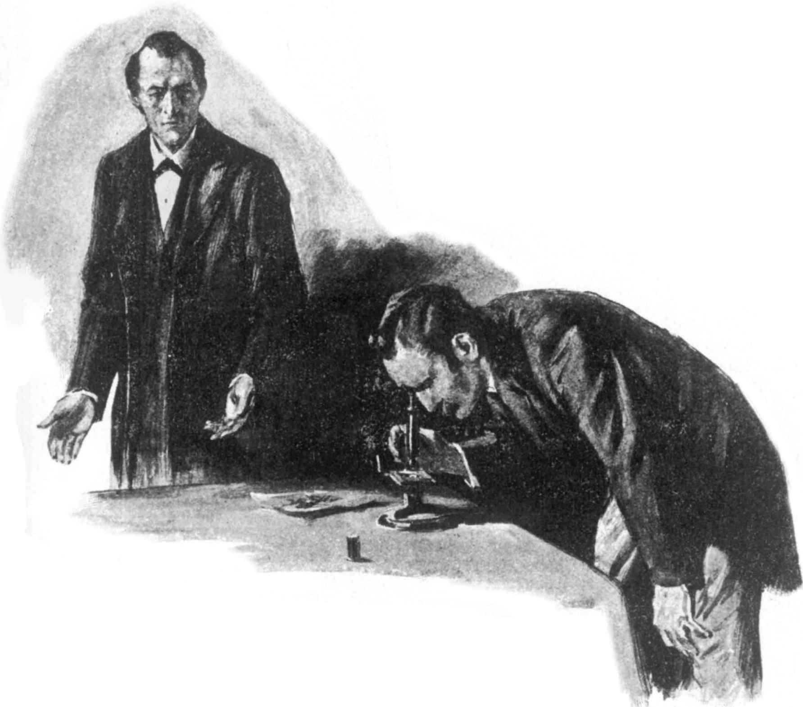

我俯身于目镜，调整焦距。

“这毛，是花呢上衣的纤维，不规则的灰团物是尘土，左边还有上皮鳞屑，中间的一些棕色点是胶质。没问题。”

“好，”我笑道，“我可以接受你的说法。那，这是说明什么呢？”

“是个极有力的证据，”他回答，“在圣潘克莱斯一案中，你该记得死亡的警察身旁发现一顶帽子。被告否认那是他的帽子，但他是个做画框的，一直在跟黏胶打交道。”

“是你办的一个案子？”

“不是，是我朋友，梅里维尔，警场的，要求我看看这件案子。是我让他们在被告的袖缝里发现了锌铜粒屑，据此推定他是制造假币嫌犯，他们这才重视显微镜的妙用。”他不耐烦地看看表，“有个委托人要来访，时间过了，还没来。噢，对了，华生，你对赛马很内行吧？”

“可以这样说，我把伤兵抚恤金一半耗在了赛马上。”

“那我让你当我的‘赛马指南’。你知道罗伯特·诺伯顿吗？这人名记得起吗？”

“噢，当然知道，他住在肖斯科姆老别墅，我很熟悉那地方，我在那边度过一个夏天。说起这个诺伯顿，曾经差一点要落到你手上来。”

“怎么回事？”

“他在新市场欧石南荒地上用马鞭子抽萨姆·布鲁厄——萨姆是柯曾街有名的放高利贷的人——差一点被他用鞭子抽死。”

“啊，听来有意思！他常那样任性放纵吗？”

“噢，原来就是个危险分子，出了名的。他几乎是英国最玩命的骑手——几年以前，全国利物浦越野赛马第二名。他是属于那种超越时代的人物。他这种人本该是个摄政时期<a href="#part0164.xhtml_ch1"
id="part0164.xhtml_ch1-back">(1)</a>的公子哥们——一个拳击家，运动家，赛马赌棍，一帮太太小姐的情人，但种种说法显示，他输掉了，倒了，都来不及回头了。”

“棒，华生！介绍很得要领，我好像看到他本人了。现在，你能给我介绍一点肖斯科姆别墅的情况吗？”

“只知道在肖斯科姆林苑的中央，有名的肖斯科姆种马场和训马场都在那儿。”

“大驯马师，”福尔摩斯道，“是约翰·梅森。我怎么连这都知道，你不必惊讶，华生，这儿正有一封信，是他约翰·梅森寄来的，所以我才知道。我们先多了解一些肖斯科姆吧，这对我们无异于发现一座大金矿。”

“那里有肖斯科姆垂耳长毛狗，”我说，“每逢赛狗会，这西班牙种都是大名鼎鼎的，在英国是最佳品种，也是肖斯科姆别墅女主人最大的骄傲。”

“女主人想必是罗伯特·诺伯顿爵士的妻子啰。”

“罗伯特爵士没有结过婚，我想，考虑到他的前程，还是不结婚为好。他和守寡的姐姐住在一起，比特丽斯·福尔德夫人。”

“你是说夫人和他住在一起？”

“不，不，这地方属于她去世的丈夫，詹姆斯爵士。诺伯顿在这里一点产权也没有。这是产业终身权益，在她之后要转移给已故丈夫的兄弟，现在她只是每年收取租金。”

“兄弟罗伯特，我想，收来租金都让他花了？”

“差不离。这个人谁跟他一起谁倒霉。他姐姐的日子一定不好过，可是听说姐姐还什么都由着弟弟。肖斯科姆到底出什么事了？”

“啊，这我正想要知道。哦，来了，我想，是这个驯马师找我们来了。”

门已经打开，仆人领进一个高个子，脸修得很干净，相貌坚毅严峻，只有驯马师和管教男孩的人的身上才会有这副神气。约翰·梅森先生看上去这两行都干得挺称职。他不卑不亢鞠个躬，在一张福尔摩斯向他挥挥手的椅子里坐下。

“你接到我信了，福尔摩斯先生？”

“是的，可是你信上没有讲什么。”

“事情比较敏感，详细的信上不宜讲，也太复杂，只有当面讲才行。”

“好吧，我们当面洗耳恭听。”

“首先一点，福尔摩斯先生，我觉得我的东家罗伯特爵士神经异常了。”

福尔摩斯扬起了眉毛。“此地是贝克街，并非哈利街，不看病，”他说，“所以，你说这个是什么意思呢？”

“意思是，先生，一个人做出一桩怪事，或者两桩怪事，还好理解，可样样都是怪事，你就要犯疑了不是吗？我在心里怀疑肖斯科姆王子和德比马赛<a href="#part0164.xhtml_ch2"
id="part0164.xhtml_ch2-back">(2)</a>把他搞得神魂颠倒了。”

“王子，那是你调教的小马驹？”

“全英国最棒的，福尔摩斯先生，这我有数，没别的可比。现在，老实跟你说，我知道你是正人君子，讲信用，这里说话不外传。罗伯特爵士一家要赢这次德比马赛，他是孤注一掷了，非赢了不可。他倾其所有，不惜借钱全部押在这匹马身上——而赌注赔率比也拉大了！你现在四十几就能赌一百，可是他开始捧这马的时候九十几才赌一百。”

“如果马真那么好，怎么会这样呢？”

“外界并不知道这匹马有多么好。罗伯特爵士这人有多聪明，把赛马探子都给骗了过去。他让王子那匹异母的半种兄弟拉出去溜达，试赛，亮相，你又分不出它们的不同。可是放开一跑，跑出一弗隆<a href="#part0164.xhtml_ch3"
id="part0164.xhtml_ch3-back">(3)</a>，就要拉开两个马身的距离。他脑子成天只想这匹马、这比赛，自己这条命也全赌在这上头了。他把高利贷犹太人应付着，就等着赛事下来看结果。王子要是一垮，他跟着也倒。”

“真是场玩命的赌博。但他精神异常从何说起呢？”

“哦，首先，你只要看他模样，我看他晚上都没睡觉。他整天泡在马厩里，两眼就是疯子的眼神，他神经要承受不住的。还有他对比特丽斯夫人的行为！”

“啊，怎么样？”

“他们两个一直感情融洽，有同样的爱好，真叫趣味相投。夫人爱马的热情不下于他，每天，准时驱车来看马——尤其特宠爱那匹王子。王子只要一听到石子路上车轮响，就直竖起两只耳朵。他每天早上小跑着到马车前面去领夫人赐给它的一块糖吃，可现在这一切都已成过去了。”

“为什么？”

“啊，夫人好像对马一点儿兴趣也没有了。已经有一个星期，她车子打马厩前一晃而过，连声‘早安’都听不到了。”

“你看是不是吵架了？”

“没错，还肯定是吵得凶，穷吵，不可开交呢。罗伯特爵士一定怨恨得要命，所以才会把那只西班牙小狗送掉。这只狗，夫人当成自己孩子一样宝贝着呢。他擅自把狗送了人。几天之前，送给老巴恩斯，就是三英里远克伦达尔那边开青龙旅店的。”

“的确是怪事。”

“就是嘛，夫人有心脏病，还有水肿，总不能叫她追着兄弟去跑。晚上他一向要到姐姐屋里待上两个小时，他也是应当这样呀，因为夫人对待这个兄弟也是少有的好。可是这一切也都过去了，他再也不亲近自己的姐姐了。夫人很伤心，也很苦闷，只好借酒浇愁，福尔摩斯先生——她喝酒像水中鱼，海量了。”

“姐弟隔阂闹矛盾。这以前姐姐喝酒吗？”

“喝是也喝，也就那么一杯，可现在，光一个晚上就是一瓶，天天如此。这是斯蒂芬斯，那个管家，告诉我的。一切都变了样，福尔摩斯先生，这里头总是有什么不对头了。譬如，还有，东家夜里到老教堂的地窖去干什么？跟他在那里碰头的是什么人？”

福尔摩斯搓起双手。

“讲下去，梅森先生，你越讲越有意思了。”

“是管家看见他往那儿去，夜里十二点，还下着大雨。下一天，我守在屋里不睡觉，果然，东家又出去了。斯蒂芬斯和我跟上去，这个做法很提心吊胆的，万一叫他看见可就砸锅了。他一发火，拳头不认人。所以我们万万不能跟紧了，离远着点，但是能看得见他。他去的地窖，是闹鬼的地方，可就是有人等着他呢。”

“什么叫闹鬼的地窖？”

“哦，先生，花园里有个教堂遗址，古老得很了，没人知道它的年代。教堂底下有个地窖，墓室，人人都知道这里常闹鬼，白天就是又黑又潮湿，冷落没人去的地方，晚上更是谁也没胆量走近它。就是东家不怕，他一辈子没怕过什么，可不知他夜里到那儿去要干什么。”

“等一下，”福尔摩斯说，“你指的还有人在那儿，一定是你们马厩的人了，或是家里的什么人，只要认出来，就可以问他这事嘛。”

“这个人就是不认识。”

“怎么会不认识？”

“我看得很清楚，福尔摩斯先生。那是又有一天的晚上，罗伯特爵士出来，打我们躲着的地方走过去——我和斯蒂芬斯像两只兔子，伏在树丛后面发抖。晚上月亮很好，过一会儿，听见还有那个人，从后面走来。罗伯特爵士已经走掉了，我们不怕他，就站起来。我们装着走过的样子，不过是月光下散散步，纯粹跟他是巧遇，随便搭讪一声。‘嗨！朋友！你是哪里的？’我问。他准是没听见我们过来，看他模样，猛回头，脸那个紧张，就像是见了墓室里出来的鬼似的。他呀地惊叫一声，撒腿就跑，没命地跑，腿也真长！——佩服他，一转眼人没了，声音也听不到了。他是什么人，干什么的，我们根本不知道。”

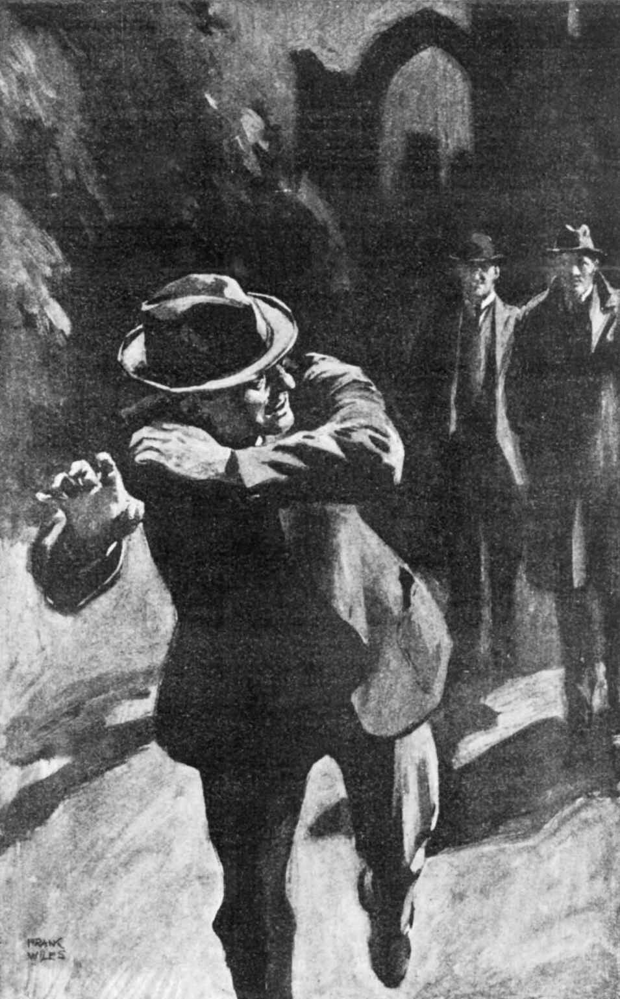

“他呀地惊叫一声，撒腿就跑。”

“月光下看得清楚？”

“看清楚的，一张黄脸，保证没错——模样是下等人，决不是正经人。这号人和罗伯特爵士能有什么交道？”

福尔摩斯坐着沉思了好一会儿。

“谁陪着比特丽斯·福尔德夫人呢？”最后他问道。

“她的侍女，卡丽·埃文斯，跟她已有五个年头了。”

“那是忠心耿耿的了？”

梅森先生有些支支吾吾。

“忠心是够忠心，”最后他答道，“可说不上到底是对谁忠心。”

“噢！”福尔摩斯惊异。

“我不能说人家私事。”

“我明白了，梅森先生，不用说，事情明显不过。从华生医生对罗伯特爵士的介绍，我理解，女人和他一起，没一个能平安脱身。你不认为姐弟俩吵翻这是其中原因？”

“那个，传说是这么说，已经好久了。”

“夫人以前没看到，我们推想是她忽然才发现。她要把这侍女打发走，兄弟不答应。夫人心脏不好，身子不遂，没有什么办法，心里再不高兴，要发火也发不出。可恨这个侍女照样在她面前放肆，夫人那恨，都不想讲了，憋在心里只有喝酒浇愁，罗伯特爵士一怒之下把姐姐宠爱的狗都给弄走。这些前因后果都连起来了吧？”

“哦，也许是——看来也是这么回事。”

“没错！这前半部正是这样。可是还要看到，所有这些情况，跟夜里去探教堂墓室又有什么关系呢？跟我们前面那个推论好像联系不上。”

“是呀，先生，更有件事让我弄不懂呢，罗伯特爵士怎么会去盗尸呢？”

福尔摩斯腾地一下坐起身。

“我们昨天才发现——我写了信给你之后。昨天，罗伯特上伦敦来了，斯蒂芬斯就和我一起到教堂地窖去。里边都是老样子，没见什么动，先生，只有在一个角落上有一堆人的尸骨。”

“你们报告警察了吧，我想？”

来客不以为然地笑笑。

“那个，先生，我看他们根本不会管这种事。一个骷髅，一些骨头，一具僵尸似的，说不定都是千年的老尸骨了。可就是以前没见有过，这我可以发誓，斯蒂芬斯也能发誓，尸骨都堆在角落，用一块板盖住。这个墙脚，以前一向是空角落，没东西的。”

“你们后来怎么样呢？”

“后来，后来不管它，走了。”

“这是聪明做法。你说罗伯特爵士昨天出来了，他回去了没有？”

“我们估计他今天回去。”

“罗伯特爵士把他姐姐的狗送人，是什么时候？”

“正好是一个星期以前的今天。可怜的小东西老在屋外面叫个不停，罗伯特爵士那天早上又正在火头上，一把抓起狗来，我想准要把狗摔死了，啊，他把狗交给桑迪·贝恩，那个骑师，吩咐他送掉，送给青龙旅店那个老巴恩斯，说再也不要看到这条狗。”

福尔摩斯坐着静思好一会儿。他抽起了那只最旧最脏的烟斗。

“我还不清楚这件事你要我做些什么，梅森先生，”他终于说道，“你能明确讲吗？”

“可以明讲，福尔摩斯先生。”来客说道。

他从口袋里摸出一个纸包，小心地把纸包打开，包的是一块烧焦的骨头。

福尔摩斯颇有兴趣地察看。

“哪儿弄来的？”

“锅炉间，比特丽斯夫人房间底下的地窖装着暖气锅炉，好久不用了，罗伯特爵士嫌冷，又再叫生火。

“哈威管炉子——我的一个伙计，就是今天早晨，他拿了这个来找我，是他在清锅炉灰的时候发现的，弄不懂怎么会有这东西。”

“我也不懂，”福尔摩斯说，“你看看是什么骨头，华生？”

骨头已经烧成黑色焦块，可是从解剖学角度一看，依然清楚。

“人的股骨上髁。”我说。

“果真如此！”福尔摩斯立刻严肃起来，“伙计是什么时候生的炉子？”

“他每天傍晚生火，生好火就走了。”

“夜里有人去锅炉间不碍事？”

“不碍事，先生。”

“你从屋子外面进得去吗？”

“行，屋外有一扇门。还有一扇门，由一截梯子通走道，比特丽斯夫人的房间正好就在那里。”

“这件案子水深着呢，梅森先生，水又深又黑又有血腥。你说罗伯特爵士昨天晚上不在家？”

“是的，先生。”

“那么，如果不是他的话，就是有其他人烧骨头。”

“是这样，先生。”

“你说的那家旅店叫什么来着？”

“青龙旅店。”

“伯克郡这一带有钓鱼的好地方吗？”这位驯马师是个直肠子，一听这话脸上立刻呆住，心想怎么尽遇怪事，又让他撞上个说神经就忽然来了神经病的人。

“哦，先生，我听说那个水车渠里有鳟鱼，霍尔湖里有狗鱼。”

“再好也没有。华生和我是出了名的钓鱼爱好者——没错吧，华生？这以后你有信就寄青龙旅店好了，今天晚上我们就去。不用说，你是不必过来啰，梅森先生，有事可以写信，需要的时候由我找你，比较妥当。等事情有了进展，我会给你一个明确的答复。”

就这样，在一个五月明亮的晚上，福尔摩斯和我包了一间头等包厢，向那个临时停车的招呼站肖斯科姆出发。我们头顶上的行李架塞着些钓竿、钓线轮和鱼篓之类的东西，十分显眼。一到目的地，换上马车，没有多少路就到了一幢老式的小旅店。也爱好运动的店主乔赛亚·巴恩斯热情教我们如何去把附近水面扫荡一遍。

“霍尔湖怎么样？能不能钓到狗鱼？”福尔摩斯问。

旅店老板的脸立刻转阴。

“那不行，先生，你还没钓，先叫你自己成了水中鱼。”

“此话怎么讲？”

“罗伯特爵士，先生，他最忌恨马探子。你们两位陌生客要走近他的驯马场，他决不会放过你们。跟他没一点道理好讲，这罗伯特爵士惹不起。”

“听说他有一匹马要参加德比赛。”

“是的，良种马驹，好马。他把我们好多人的钱全都去赌在它身上了。罗伯特爵士自己的一家一当也全部押上了。哦，还有，”——他两眼狐疑地瞧着我们——“我说你们两位，莫不是赛马场来的赌客？”

“哪里会，不过是两个工作疲劳的伦敦客，要来换换伯克郡的好空气。”

“好，两位总算找对地方了，这儿的空气新鲜没话讲。可就是要小心，我给你讲过的，罗伯特爵士，他这个人，没开口先动手，二话不说就打人。这林苑，离远点为妙。”

“那是一定，巴恩斯先生，我们一定照你讲的注意。噢，我记起来了，你厅里有只狗，呜呜叫，真是最漂亮的西班牙狗。”

“一点不错，真正的肖斯科姆种，英国任何地方都没这么优良的狗。”

“我本人也是个养狗迷，”福尔摩斯说，“哦，敢问一下，像这样一只高级狗能值多少钱？”

“论价钱我都买不起，先生。这一只是罗伯特爵士送我的，所以把它拴住了，要是一放开，它准一溜烟就跑回别墅去。”

“我们手上已经有了几张牌，华生，”店主离开我们之后，福尔摩斯说，“出牌还不太容易，不过有个一两天就行。啊，对了，我听说，罗伯特爵士还在伦敦，我们今晚不妨去闯一闯那禁地，也用不着怕皮肉吃苦。有一两点我还要加以确证。”

“你有推理了吗，福尔摩斯？”

“只有一点，华生，那就是大约一个星期之前发生了什么事情，深深影响了这肖斯科姆家的生活。是什么事情呢？我们只能从结果来加以推测。这结果看来还出奇地复杂，搅和在一起，不过这对我们有利，倒是那些平淡无奇、毫无色彩的案子，反而没有希望。

“我们来考虑已有的情况。兄弟不再关心疾病缠身的亲姐姐，把她的爱犬都弄走。她的狗，华生！你看不出其中问题吗？”

“只有兄弟无情无义这一点。”

“嗯，是这样。或者——噢，也有另一种可能。我们从发生争吵时候的情况开始看看什么问题，暂且假定真是发生了争吵的话。夫人闭门不出，生活习惯改变了，不再露面，只有侍女陪同坐马车出门，马厩前不再停留，不再关心她原先关心的马，还明显酗起了酒。这些是案子的种种事实，是不是？”

“还有教堂墓室里的情况。”

“那是另属一条思路。两条思路，先勿纠缠在一起。这第一条线，关系比特丽斯夫人，有诡秘之处，是不是？”

“我没能看出来。”

“好，那么，我们转向第二条线，涉及罗伯特爵士。他是发疯一般对德比马赛志在必胜。他落在了犹太高利贷债主的手中，他的财产随时会遭到强制出售，他的驯马场也要被债主夺走。他是铤而走险，胆大妄为之徒。他拿姐姐当靠山，姐姐的侍女又是他的心腹。如此看来，我们可说是稳坐钓鱼台，不是好钓鱼了吗？”

“教堂墓室呢？”

“哦，对啊，教堂墓室！我们假设吧，华生——那不过是个极端的假设，有个设定以便可以推敲琢磨——是罗伯特爵士把她的姐姐除掉了。”

“我亲爱的福尔摩斯，这是不可能的。”

“非常可能，华生。罗伯特爵士是个出身高贵之人，不过你有时能发现老鹰里面也有一只臭乌鸦。我们姑且就这一假设来进行辩论看看。除非发了横财，否则他不会远走高飞，而他的发财全指望肖斯科姆王子能大获全胜。因此，他还要坚守阵地。为此，他一定要把被害人的尸体处理掉，同时要找一个替身，装扮成自己的姐姐。那侍女，他的心腹，并非不可能。被害人的尸体可能弄到地窖墓室里去，那里没有人光顾，到了晚上便送进锅炉里焚尸。骨头证据我们都已经看到了。你说说意见，华生？”

“嗯，那就完全可能，要是你这骇人听闻的假设能够成立。”

“我看，有一项小实验，我们明天可以做，华生，有利于事情明朗化。同时，我们需要注意保持自己给人家的身份印象。为此我想我们用主人店里的酒来邀请店主一起喝一杯，跟他大谈特谈鳗鱼和雅罗鱼，这肯定投合他的兴趣胃口。谈兴浓时，无意之间能听到些本地新闻，定有用处。”

到了早晨，福尔摩斯才发现我们忘了带上钓狗鱼的诱饵，这也就免了这天的钓鱼作业。大约十一点钟，我们出外散步，他还得到老板允许，带着那只西班牙小黑狗。

“就是这个地方。”福尔摩斯说道，这时我们来到两扇高大的林苑门前，上面高耸鹰头狮身的徽标雕饰，“到了中午时间，巴恩斯告诉我的，那位贵夫人的马车就要出来。在两扇大门打开的时候，马车要放慢。等马车出来，还没有跑快的时候，你上前，华生，叫停车，向车夫随便问些话。你不用管我，我躲在这冬青后面，我看我的。”

那不是长长的守夜。等了不到一刻钟，就看见两匹雄壮的灰色马拉着一辆黄色叠篷四轮大马车从林荫道远处而来。福尔摩斯蹲在矮树后，牵住狗，我信步在路的中央，挥着手杖。一个看门人跑出屋，大门打开了。

马车已经收辔缓行，车上的人我看得很清楚，一个光鲜的少妇，亚麻黄发，无所忌讳的眼神，坐在左边。在她右首，是个圆背老妇，脸和肩围裹一大圈披巾，显示是个体弱有病的人。马车一上了大路，我立即举起手，摆出庄严号令的威势。车夫一勒住马，我便高声问罗伯特爵士是否在肖斯科姆别墅家里。

正在这时，福尔摩斯一跃而出放开手中的狗。狗一声欢叫直奔马车，蹦上踏板，但刹那间它的热情欢跃变成狂怒，朝着车上人的黑裙乱咬。

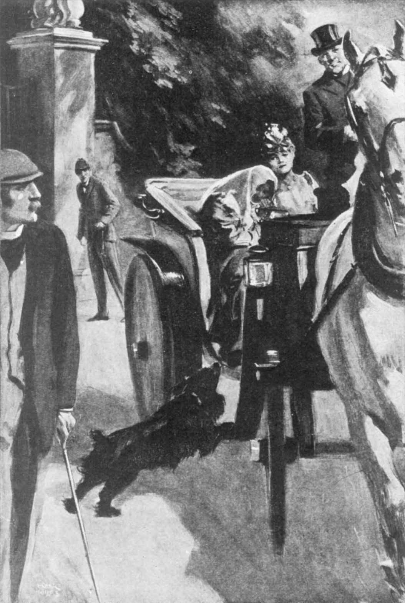

狗一声欢叫直奔马车，蹦上踏板。

“快走！快走！”一个粗嗓门卡紧喉咙尖叫。车夫挥鞭，我们被甩在了大路一旁。

“行了，华生，事儿成了。”福尔摩斯说，一边往兴奋的西班牙狗的项圈上扣链条，“它以为是女主人，结果发觉是个陌生人。狗决不会认错人。”

“可那是个男人的声音呀！”我高声道。

“一点不错！我手上又多了一张牌，华生，可是出手还须谨慎，同样得小心。”

我的同伴这天好像没有进一步的计划，我们便真的钓起鱼来，拿着渔具去了水车渠，结果晚餐多了一道鳟鱼美味。吃过饭以后，福尔摩斯才有表示我们要进行新的活动。我们又再到上午去过的那条大道上，走向大门口。一个高个人影站在那里等着我们，一看原来就是在伦敦认识的那位驯马师约翰·梅森先生。

“晚上好，两位先生，”他说，“我接到你的信，福尔摩斯先生。罗伯特爵士还没有回来，但听说今晚可能回家。”

“墓室离这房子远吗？”福尔摩斯问。

“有四分之一英里。”

“好，不用管他，我们一起去吧。”

“我不行，福尔摩斯先生，他一到家，就要找我去问肖斯科姆王子情况怎么样。”

“我知道！既然这样，你不必了，我们自己进行，梅森先生，只要你领一领路，到了地窖你就自己回来。”

天漆黑，没有月亮，梅森领我们穿过荒草地，就见前面耸立着重重黑影，那正是古教堂。我们由一个旧门廊坍塌的缺口进去，引路的向导在碎砖乱石上一高一低找路走到教堂的一个转角，那里有一条很陡的阶梯下到墓室。他擦亮火柴，照出这个阴森的地方——气息可怖，透着霉味，古代粗凿的石墙已有碎裂，叠垒的棺材，有的是铅棺，有的是石棺，都垒在一边，一直垒到我们头顶上方的幽暗的穹顶。福尔摩斯点亮手灯，一道窄而明亮的黄光冲破了这阴沉的环境。光线在棺材的铭牌上反射，这些铭牌都缀有这个古老家族的鹰头狮身徽标，在地狱的门前它依然彰显着尊严。

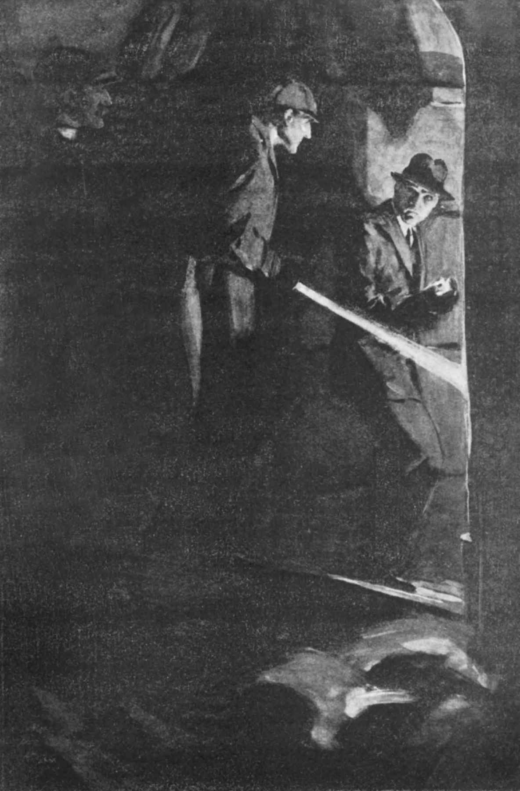

福尔摩斯点亮手灯。

“你说有尸骨，梅森先生，指给我们看，你就走。”

“就这个角落。”驯马师向前跨步。我们的灯光跟过去，却看见他站在那里惊呆着。“不见了。”他说。

“我也料到如此，”福尔摩斯轻笑一声说，“我想现在可以在炉子里找到骨灰，炉子先前烧掉过一部分。”

“死了千年的人的骨头，还要烧它干吗？”约翰·梅森问道。

“我们正是到这里来找这个原因，”福尔摩斯说，“这意味着要作一次深入调查。我们就不耽搁你了，我希望天亮以前得出结论。”

约翰·梅森走了以后，福尔摩斯开始细心察看墓碑，从中央开始，那似乎是最古的撒克逊时代，一长列下去是诺曼时期的那些雨果和奥多的墓碑，直到十八世纪威廉爵士和邓尼斯·福尔德爵士。看了一个多小时，福尔摩斯来到地下室入口处一具铅制棺材旁，只听见他轻轻一声欢叫。看他紧张又稳健的动作，可以断定他找到目标了。他拿出放大镜认真察看厚盖边缘，然后从衣袋里掏出开箱用的短撬棒，插进缝隙，把棺盖前端撬起。棺盖似乎只用两只夹具搭扣，一撬一动，发出破裂的刺耳声，但还没有完全撬开，已经稍稍望见了棺内，不料便有情况发生，被立即中断。

上面教堂有人走动，来人脚步急而稳，对这个地方十分熟门熟路，径直走近。一道光从阶梯照下来，顷刻间，一个持灯的人影在哥特式拱门下出现。这是个可怕的人，身材高大，来势汹汹，一盏大马灯拎向前方，下光反照着他那张胡须浓密、凶光毕露的脸。他怒目向着地窖各个角落环顾一周，最后落定在我的同伴和我身上，死死盯住。

“你们是什么人？”他吼声如雷，“到我的领地里来干什么？”他见福尔摩斯不回话，便跨前两步，举起随身拿着的一根粗重的手棍。“听见没有？”他叫道，“你们是什么人？在这里干什么？”手中棍子向空中挥舞。

福尔摩斯非但没有被吓退，反而迎上前来。

“我这儿也有话要问你，罗伯特爵士，”他说道，声势威严，“这是谁？怎么到这里来了？”

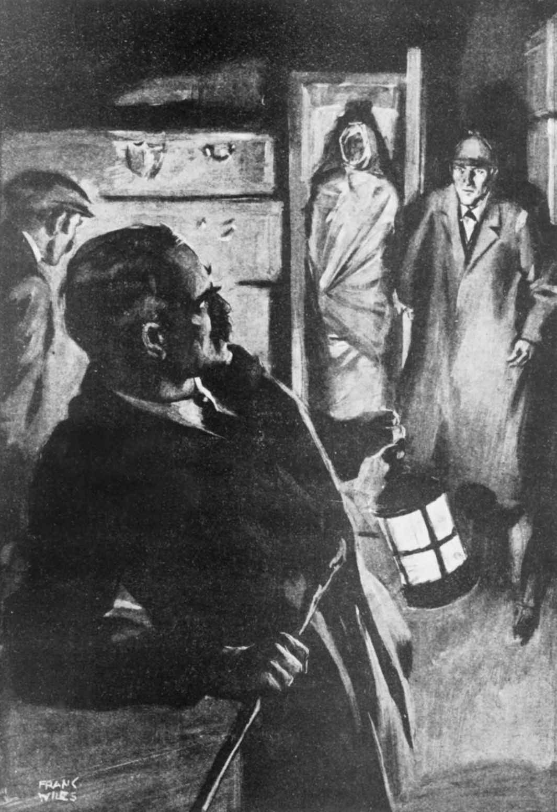

“我这儿也有话要问你。”

他转身用力一下推开棺材盖。趁着提灯光，我看到一具尸体，从头到脚裹着白布，却露出可怕的如女巫般的脸，凸出的鼻子和下巴歪到了一边，毫无血色，睁着浑浊凝滞的双眼。

男爵一声惊呼，踉跄倒退，身子靠在了一具石棺上。

“这个怎么叫你晓得？”他大声道，随即又重新恢复一脸凶相，“这关你什么事？”

“我叫歇洛克·福尔摩斯，”我的同伴亮出姓名，“你也许有所耳闻。不管怎么样，我的职责，也如每个好公民一样——维护国家法律。我看你对这件事要负极严重的法律责任。”

罗伯特眨巴着眼睛看了一会儿，但福尔摩斯镇定、冷峻，凛然一身正气，立即起了作用。

“向上帝起誓，福尔摩斯先生，我没做坏事，”他说，“这看来对我不利，我承认，可我也实在是不得已才这样做。”

“我也但愿，是这样就好，可是你只有到警察局去解释清楚。”

罗伯特耸耸宽阔的双肩。

“当然，要去的。先上来吧，到屋里去，由你判定该是怎么回事。”

一刻钟之后，我们来到一间据我看是老屋里的枪械室，因为玻璃柜中陈列的都是擦得锃亮的一排排枪械。室内布置很舒适。罗伯特把我们安顿好，离开几分钟，回来的时候一同带进两个人。一个，风华正茂的年轻女人，就是我们在大马车上看见的那一个；另一个是男人，小个子，獐头鼠目，举止猥琐，令人不舒服。这两人带着满脸惊疑的神色，从这点上可以看出，男爵还没有来得及把发生的情况向他们交代。

“他们，”罗伯特爵士用手向两人一挥说道，“是诺莱特先生和太太。诺莱特太太娘家本姓埃文斯，做了我姐姐多年的贴身跟随。我请他们两位来，因为我觉得最好的办法还是把真实情况告诉你们，他们两人就是世上能为我作证的人，我说的不是假话。”

“要说什么，罗伯特先生？你想过你现在这样，是在做什么啊？”女人叫道。

“至于我，我完全不负任何责任。”女人丈夫说。

罗伯特爵士向他不屑地瞅一眼。“责任完全由我负。”他说道，“现在，福尔摩斯先生，请听事情的真正经过吧，我如实讲就是。

“你对我的事已经了解得很深了，否则你不会到我见你的那地方去。所以，可以肯定，你已经知道，我正在训练一匹黑马，隐藏好实力，到时候出人不意夺得胜利。要是我赢，什么都成，都解决了；要是输——那可就，不堪设想！”

“这个处境我理解。”福尔摩斯说。

“我全靠姐姐，比特丽斯夫人，一切都仗着她这座靠山。但是要知道其实这房产的利息只为她自己生活所用，我个人，我是全操在犹太高利贷手中。我完全清醒，姐姐万一去世，我的债主就拥上来，像一大群秃鹰飞到我的地产上，一切都要给瓜分精光——我的马厩，我的马——一切的一切。啊，福尔摩斯先生，我姐偏偏真的死了，一个星期以前。”

“你没有跟别人说过？”

“我怎么能说？一说就是灭顶之灾！我只要应付撑过三个星期没有事，一切就顺利解决。姐姐侍女的丈夫——就是这位——是演员，我们动着脑筋了——我灵机一动——这段时间让他扮成我姐暂时渡过难关。这个差事，一天中也就不过是在马车上露一露面，姐姐房里是没人去的，除了侍女。这样安排起来并不难。我姐姐死于水肿，她长期给这个病折磨着。”

“这要由验尸官来确证。”

“她的医生能证明，几个月前她的病就有症状，很危险了。”

“噢，后来你怎么处理呢？”

“尸体不能搁在屋里。第一天晚上，诺莱特和我一起把尸体抬到老井屋，那里现在从来不用。可是她那宝贝狗跟着在门口拼命叫，所以我觉得要换个更安全的地方。先把狗送掉，再把尸体抬到教堂地窖，那个墓室。这里并无不敬和亵渎的意思，福尔摩斯先生，我觉得我没有对不起死者的地方。”

“你的做法在我看来不可原谅，罗伯特爵士。”

男爵摇摇头，不以为然。“说得容易，”他说道，“要是你换了我这处境，你也许感觉就不一样。谁也不愿眼见自己的希望、自己的努力功败垂成，而不竭尽全力挣扎挽救。我觉得，让她放在她夫家祖先的棺材里暂作安歇毫无不当，那里依然是庄重神圣的地方。我们打开一口棺材，移掉遗骸，把她安置进去，你也看到了，拿出的遗骸，不能就地扔在墓室里。诺莱特和我一起搬走，晚上他下到大锅炉间把尸体火化。事情就这样，福尔摩斯先生，想不到给你突然捉住，只好和盘托出了。”

福尔摩斯坐着陷入沉思。

“你讲的还是有漏洞，罗伯特爵士，”最后他说，“你赛马下赌注，也就寄希望在这个上面，这你是有把握必赢的，那么债主把你的家产拿了去也不怕嘛。”

“那匹马也是家产的一部分，要被分掉。我下赌注是输是赢关他们什么事？很可能他们把它拿去了根本不让它参加比赛。最糟糕的是，我的主要债权人也正是对我最怀恨的敌人——那十足的流氓，萨姆·布鲁厄。这个人我有一次实在忍不住拿马鞭抽了他一顿，在新市场石南灌木地。你想想，他会对我伸援手？”

“噢，罗伯特爵士，”福尔摩斯说，站起身，“这件事情，当然，必须移交警方去管。我的责任是把事实搞清楚，搞清楚事实就随它去再说。至于你的行为，伦理道德，不需要我来评说。时间快半夜了，华生，我想，我们走我们的路，回自己窝里去吧。”

现在情况已众所周知。这桩难得一见的案子的了结，比罗伯特爵士的行为应有的结局更要好一些。肖斯科姆王子赢了德比年度大赛，马主人净赚八万英镑之巨。直到马赛顺利结束，债权人才提出还债要求。债务全部偿清之后，罗伯特爵士还有足够的钱过着优裕的日子。警察和验尸官对这件事的处理都是宽大为怀，只是对夫人死亡的延迟申报稍加责备。幸运的赛主这次铤而走险得以消灾呈祥。现在他已走出了阴影，享受着美好的晚年生活。

（1927年）

————————————————————

<a href="#part0164.xhtml_ch1-back" id="part0164.xhtml_ch1">(1)</a> 摄政时期（the
Regency），指英王乔治三世精神失常由其子乔治四世摄政的时期（1811—1820），乔治四世荒淫恣睢，摄政期社会风气浮华奢靡。

<a href="#part0164.xhtml_ch2-back" id="part0164.xhtml_ch2">(2)</a> 德比马赛（Derby），始于1780年的英国传统马赛之一，每年6月在西萨里郡埃普索姆丘地举行，以创始人德比第十二伯爵命名。

<a href="#part0164.xhtml_ch3-back" id="part0164.xhtml_ch3">(3)</a> 弗隆（furlong），长度单位，等于1／8英里，或207．17米。
