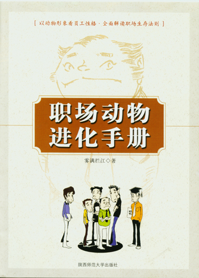

# 职场动物进化手册

## 雾满拦江

### 本书介《职场动物进化手册》十大特点

《职场动物进化手册》是一部以寓言体的形式演绎职场事理学的作品，以其轻松、谐趣的写作风格，揭示三千年权谋文化背景下的东方职场现象，并通过对西方经典管理学的反思，以一只狗员工在混沌状态下的成长历程，阐述职场生态环境的要义与原则。

这本书的一大特点是全面解读了丰富的东方事理学要点。事理学是狗类知识体系中非常重要的一门知识，与实证科学相对应，其特点是“应然”，是教导狗如何处事的学问。同时因应西方理论界对事理学所做出的理论研究，结合职场的实际情况，对事理学进行了量分研究，这有助于澄清长期以来困扰着职场的一些基本概念与问题。

这本书的第二个特点是汲取了大量的经典管理学思想，与西方二百余年的管理学发展史相比较，中国的管理学远未起步，管理学在中国的应用更多的应是以思想为主，而非照搬照套，要考虑到当地的生活习惯，民俗民风，文化背景与经济、政治发展水平，这是西方学者一再坚持的，却被我们的研究者所长期忽略。

这本书的第三个特点是书中存在着大量的争议性观点，用我们传统的眼光来看，某些事情属于负面的，影响或妨碍企业发展的，而从事理学的角度出发，从国狗的文化背景出发，事理学却给了我们相反的解释，重要的是，事理学为我们证明了某些不规范行为的存在对于企业的发展是有利的。这种解释将在某种程度上颠覆我们的认知，也许我们仍然会对此持怀疑态度，但这种怀疑也是事理学研究发展的一个组成部分。

《职场动物进化手册》第四个特点是揭出了职场中存在着的大量潜规则，这些潜规则如一股暗流一样左右着职场中的狗事变动，进入职场中的狗往往需要在付出了极高的成本之后才幡然悔悟。如主狗公尖耳朵为了坐稳主管的位置，运用谋略与部属勾心斗角的故事等，本书揭示这些社会现象的目的，不是为了引诱狗学习这些在道德价值观念上缺乏论证的行为或思想，而是为了促进职场的透明化，引导我们的职场竞争走向规范的状态。

本书的第五个特点是强化了竞争的观念。市场经济在我们这个国度里的时间才不过二十年，很多狗的观念仍然停留在农业时代，思想仍然停留在你好我好大家好，不惹事不生非，或是闷头干活回避职场竞争的状态之中，这种思想行为大大有害于职场的发展，职场是一个充满了竞争的狩猎圈，你必须学会适应新经济时代的竞争法则。

《职场动物进化手册》第六个特点是以利益的关系分析问题，而不是停留在主观的感性上，过多的感性言论已经使我们的励志类书籍变成了口号连天的大市场。从这个角度上来说，这本书相对较为残忍，不适合于一些刚刚进入职场的年轻狗学习，但这并不影响本书的价值，它的指导意义仍然是前所未有的。

本书的第七个特点是重新界定了职场中的道德与利益准则，这一项工作应属功德无量。从社会学的角度上来分析研究职场并做出一个理性的研判，这将有助于中国职场的发展趋向规范与理性，有助于调整我们的思想，强化职场中狗的合作意识。并让我们从封闭的农业耕作思想中走出来，全面的审视并认同他狗存在的价值与意义。

本书的第八个特点是从员工的角度看待职场，这是一个全新的角度，是我们所无法回避的现实。我们不仅需要帮助职场中的其它狗获得成功，更重要的是，我们自己也需要成功，那种功成身退，或是名不必我就，功不必我成的传统道德观念，已经不适合于这个竞争的时代了。我们不仅要成功，更要获得我们应有的利益份额。

本书的第九大特点是采用了数理统计及运筹学的现代化工具，对职场上的现象与行为进行了量化分析，这将有助于我们改变过去那种过于感性的处理事物方法，在利益多元化的职场中寻求一个均衡布局而非精确的结果。这一研究推进了中国事理学的发展，同时也吸收了国外先进的文化思想，虽然这一步突破的步伐很小，但其意义深远，对理论界的研究推动作用是不可忽视的。

本书的第十大特点是以事喻理，以理演事，通过一系列动物在职场内为谋求自己的利益配额所进行的明争暗斗，将东方三千年之久的权谋文化与现代经典管理学有机的融合了起来。其中的“术”的成份较为浓重，道德意义上的评价更是缺乏论据，但在重新界定的商业社会背景下，这一切却显得犹为重要。

需要说明的，《职场动物进化手册》是从事理学的角度上对职场行为重新诠释的一部寓言体裁作品，难免存在着思想方面的不成熟与以偏盖全的讹误。此书的部分章节在网上张贴时曾经引起了网友的激烈反应，为了更加充分的说明问题，弥补此书的不足之处，我们将选择部分网友的反对意见，用以指导阅读者在阅读的时候有所扬弃。

谢谢大家：

本电子书由云南省农行培训学校杨军声制作,版权归原作者所有

### 目录：

雾满拦江

前序

出场动物一览表：

序篇：资本家大肥猫

第一章：新员工尖耳朵

第二章：野牛的末路

第三章：野狼的归来

第四章：制衡与谋略

第五章：从朋友到对手

第六章：空降兵尖耳朵

第七章：高压之下的成长

第八章：职场事理学

尾声：百兽之王

本电子书由云南省农行培训学校杨军声制作,版权归原作者所有

### 前序：在读这本书之前，请你先看一下下面这道题

阿昌开了家医疗器械代理公司，聘用了四名刚刚毕业的大学生，小赵，小钱，小孙和小李，做为营销员，四个狗的月薪相差无几，都在每月一千二至一一千五之间，并按销售业绩12%的比例提成，做为奖金收入。两个月后，四名营销员的业绩如下：

小赵：他老实听话，但稍一放松管理就偷懒，工作不指派到头上决计不会主动动手，叫苦的时间远比干活的时间更多。他工作时间最长，但业绩为零，两个多月一无建树，没有完成一个订单。

小钱：为狗聪明机灵，表面上对老板唯唯诺诺，其实自己另有鬼主意，特别会干面子活，是得到老板夸奖最多的员工。自从他进入公司以来，在第一个月和第二个分别完成两笔订单，共售出产品6台。

小孙：勤奋耐劳，善于死缠乱打，他除了跑业务还经常被老板指派一些其它方面的工作，目前他是唯一任劳任怨的员工。虽然他来的时间不长，却也在第二个月勉强完成一笔订单，售出产品1台。

小李：为狗心思灵活，眼观六路，耳听八方，有小钱的聪明，但不象小赵那样懒，只是工作时不象小孙那样憨，目前小邓正在全力推动与一家大客户的商谈，对方有意向一次性订购产品60台。

三个月的试用期马上就要结束了，因为阿昌的公司较小，他决定四个狗中只留下一个，予以重用。

那么你认为老板阿昌会留下谁？理由是什么？阿昌决定员工去留的标准又是什么？

□小赵？ □小钱？ □小孙？ □小李？

说明：如果你选择留下的狗是没有业绩和能力的小赵的话，这本书你就不需要看了，你已经完成了职场进化的全部程序，可以纵横职场予取予求，无往而不胜了。

反之，如果你选择留下的狗不是小赵，而是其它三个狗的话，那么你的职场政治智慧还停留在蠢驴、野牛、刺猬和老鼠的阶段，你会在职场上遭遇到许多不快的事情，甚至会影响到你的事业和前程。因此你有必要阅读此书，学习进化为一条聪明的狐狸或猎犬。

本电子书由云南省农行培训学校杨军声制作,版权归原作者所有

### 职场动物一栏表

狗：所有公司都需要、且在任何环境下都会脱颖而出的员工，但数量稀少。

野牛：常见的一种员工，能力强，但运气糟透了，多半下场不妙。

狐狸：狡黠奸诈，让所有狗都头痛的员工。

笨猪：主管不是太欣赏，但地位相当稳固的员工。

蠢驴或绵羊：最吃苦耐劳的员工，通常运气比野牛还要糟糕。

刺猬或臭鼬：能力不足，牢骚满腹，职场最不受欢迎的员工。

老鼠：最不引狗注目的员工。

本电子书由云南省农行培训学校杨军声制作,版权归原作者所有

### 序章：资本家大肥猫

1）招聘

波波是一只肥胖的狸花咕噜猫，大家都叫他肥猫，他曾在一家动物公司做高管。那家动物公司生意做得很大，对员工的回报也很高，几年的功夫，波波手里有了些资本。公司的一些客户经常和波波打交道，对波波的猫品非常钦佩，就劝他辞工另立门户，起初波波听了这些建议只是付之一笑，但时间长了，他就认真的考虑起这个问题来。

要离开实力雄厚的大型动物公司另起炉灶，不是一桩简单的事情。波波知道，开公司最重要的就是要有订单，有可靠的客户下订单给你，这样公司依靠客户支付的预付款就能够周转开来。波波亲眼看到数不清的小公司倒闭，导致这些公司无以为续只好关门大吉的原因，就在于订单。

生意场是一个非常残酷的圈子，几乎所有的动物都怀有一个做老板的梦想，但是只有极少数的动物能够成功。

那些失败的动物并不是缺乏能力，比如说波波的朋友皮皮，一只精明强干的沙皮狗，他开发出了一种专门为珠宝商提供服务的程序软件，名字叫“首饰管家狗”，这种程序对于珠宝商而言用处很大，能够降低经营成本。所以皮皮就兴致勃勃的开起了自己的公司，投入了许多资金。但是，无论皮皮如何踏破铁鞋磨破嘴皮做珠宝商的生意，那些珠宝商就是不为所动，半年时间下来，皮皮只售出一套软件，不得不宣布公司破产。

皮皮失败的经历告诉肥猫波波：开公司第一件事，要有订单。没有订单，只依靠一两项专利产品就茂茂然开公司的话，无异于厨师将饭店开在荒无狗烟地带，尽管你是独家或垄断经营，但是，关门大吉是迟早的事情。

现在，既然有客户答应提供订单，肥猫波波就决定离开动物济济的大公司，另立门户施展自己的才华。

于是肥猫选择了距繁华的商业中心有一定距离的写字楼上租了一个套间，选择这里，是因为租金便宜，公司刚刚开张，一切从简为宜。然后他完成公司的注册手续，肥猫公司就正式开张营业了。

公司开张最初的几个月，老客户的订单还能够满足公司的资金周转，但是几个月后，许多新的小公司纷纷开张了，这些公司为了夺取市场份额，不择手段的与肥猫争夺客户。就这样肥猫公司的订单开始呈现减少的趋势，肥猫的心里一下子着急起来。

但是这种事情，着急也是无济于事的，肥猫公司里只有他这一只猫，即要完成客户的订单，又要与那些竞争对手们的营销员们去拼抢订单，一只猫顾了东顾不了西，忙得尾巴尖直打前脑门。

于是肥猫考虑，有必要招聘一条忠诚能干的狗，做为他的助手。

肥猫动手写了一则招聘启事：

招聘启事在动物日报上刊登之后，肥猫收到许多应聘者寄来的简历资料，经过筛选之后，肥猫初步敲定了三个应聘者，并打电话通知了他们分别在一个下午每隔半个小时的时间赶到肥猫公司接受面试。

到了面试的那一天，肥猫坐在办公室里，就听见门外的敲门声，他喊了一声“进来”，只听有力的脚步声响起，一只神彩奕奕的经理狗走了进来。肥猫客气的请他坐下，然后问道：

“你以前是否有过从事这项工作的经验？”
经理狗立即回答：“有的，我曾经在长臂猿公司里做过四年的业务经理。”肥猫再问：“那么你为什么要离开长臂猿公司呢？”
经理狗很谨慎的回答道：“离开长臂猿公司对我来说是件纯属意外的事情，因为当时我的母亲突然生病了，我不得不辞职回去照料，现在我回来了，仍然想在这个行业中施展手脚，所以才来应聘。”肥猫继续问道：“那么，你为什么不考虑重返长臂猿公司呢？如果你做得好的话，他们一定对你有印象，对你的回来应该是抱欢迎的态度的。”
经理狗眼睛眨了眨，回答道：“现在长臂猿公司与我在的时候情形已经不同了，当初欣赏我的高管也已经辞了职，回去也不是不可能，只不过，我是一条有才干的狗，如果刻意寻求再回长臂猿公司的门路的话，并不是我唯一的选择。”

肥猫又问了几个问题，很客气的对经理狗说道：“你可以回去了，一有消息，我们会给你通知的。”然后他让第二个面试者进来。

第二个进来的是一条博士狗，头戴博士帽，谈话时温文尔雅，给肥猫留下了很好的印象。这一次肥猫对博士狗问的都是一些专业性很强的问题，博士狗果然不负肥猫所望，他侃侃而谈，许多观点和见解对肥猫来说很有启发意义。肥猫把对他的面试整整延长了两个小时，才依依不舍的送博士狗出去：“一有消息，我们会在第一时间通知你。”

送走了博士狗之后，肥猫让那只一直在门外的沙发上坐了两个多小时的应届毕业狗进来，这只应届毕业狗有两只醒目的大耳朵，一只长嘴，他的名字猪罗，问道：“你做过这个行业吗？”应届狗猪罗眨着眼睛说道：“哦，我在学校实习期间，曾经在老山羊公司做过一段时间。”肥猫又问：“你要求的底薪是多少？”应届狗猪罗回答道：“不能低于一千五。”肥猫冷淡的告诉猪罗：“很抱歉，肥猫公司试用期只有一千二。”
猪罗很有信心的回答道：“我相信我在试用期结束后会拿到高于一千五的月薪。”

“那么，”肥猫推开手边的简历，告诉猪罗：“你明天就来上班吧。”

实际上，肥猫早就打算招聘一名刚刚毕业的应届狗，他这是一家小公司，支付不起前边那只经理狗和博士狗的薪资，他们每只狗的薪资要求都不可能少于五千，而肥猫最多只能出两千。肥猫之所以请他们来到公司，就是想听他们聊一聊这个行业的新的发展态势。今天的面试，对肥猫来说，可谓不无所获。

一天的的工作结束了，肥猫很满意。

2）

肥猫独白：

职场是天然的猎场，所有进入职场的动物，都要主动或被动的卷入职场狩猎游戏之中。这种情况的出现，是由于员工和公司（老板）的利益天然冲突性所决定的。

在小公司里，老板和员工的道德冲突如下：

老板的道德：从员工身上挣到钱，就是最道德的事情。

员工的道德：从老板身上弄到钱，就是最道德的事情。

所以老板会将员工视为一桩风险投资，采用短期经营或掠夺性开发的方法从员工身上弄钱。

而员工则不承担老板所冒的经营风险，更愿意以在老板看来是无效或低效的——意即无市场回报的劳动，从老板身上弄钱。

小公司老板员工道德实现一栏表

角色道德阐述实现道德的方式或手段

老板从员工身上挣到钱将员工视为风险投资，短期经营

员工从老板手里弄到钱以无效或低效劳动，要求老板“等价交换”

员工会认为自己处于劣势，但事实上，小老板才是处于劣势的一方。如果小老板以宽厚、坦承的态度对待员工，一旦遭遇到狡诈的员工，就会沉舟翻船，血本无归。即使老板对员工严加防范，但一旦遇到员工中的“捣蛋高手”，如拉走老板的单或是抢走老板的客户，都会将老板一竿子打翻。

同样，对于老板视为无效或低效的劳动，员工是决不会认同。在员工看来，我付出了，我就要得到，至于老板的公司能不能挣到钱，与我无关。这就决定了员工与小老板的必然性冲突。

小公司是这样一种情形，大公司同样也不例外。

在大公司里，老板高高在上，主管掌握了对员工的生杀予夺之大权，这样就形成了员工与主管的必然性冲突。

主管的道德：能够巩固我的地位，对我有用的员工，就是好员工。

员工的道德：不会挡我的路，阻碍我升迁或获取利益的主管，最低档次也不要找我的麻烦，就是好主管。

对主管来说，能够巩固其地位的，不一定要能力过强，能力过强反而威胁到了主管的地位。此外，根据主管所处身的环境不同及变化，其对员工的需要也不同，甚至连员工的愚笨、员工的坏脾气都会成为主管巩固自己地位的手段。

没有任何一位主管会心甘情愿给部下“让路”，这就决定了大公司的职场斗争极为惨烈。

大公司主管员工道德实现一栏表

角色道德阐述实现道德的方式或手段

主管对“我”有用用薪酬激励员工向着对主管有力的方向进化

员工对“我”有利取决于员工是否认识到自己的处境

与大家想象不一致的是，政治斗争是维护大公司良性运转的有效手段。

3）

应届狗猪罗开始上班了，他每天到公司上班之后，就坐在肥猫为他指定的办公桌前抱着电话机给客户打电话，联系业务，电话打得七七八八，就夹起一只黑色的公文包，兴冲冲的出去与客户约谈。转眼功夫他已经上班了一周的时间，肥猫公司的业务却未见任何扩展。

每天，猪罗回来后都要向肥猫汇报一下当天的客户情况，他疲惫不堪的靠在肥猫的办公桌前，讲述他今天是多么的辛苦，多么的勤劳，去了多少家公司，有几家公司有意向，有几家公司又是如何冷淡的态度，如此这般，这般如此，听得肥猫连连点头。

肥猫表面上点头，心里却有些纳闷，就注意观察着猪罗的动静，等猪罗夹着皮包兴冲冲出去之后，肥猫立即悄悄跟在他的后面，看他到底是在和什么动物约谈。

他一路上跟着猪罗，只见他出了门后上了一辆公共汽车，到了一个街边花园停了下来，然后猪罗夹着皮包，走进公园里，捡了个荫凉的地方，一头躺倒呼呼大睡起来。

“我的天！”看着猪罗幸福的酣睡表情，肥猫摇头不已：“我还以为这家伙是条狗，却没想到他竟然是一头猪！”

那么怎么应该办呢？肥猫心里犯了愁，如果辞退猪罗的话，谁也不能保证下一次招聘真的会招来一条狗，事实上动物市场狗的数量并不少见，问题是，狗的薪资要求都很高，只有猪，或者是还没有进化成狗的那些动物们才会接受肥猫的薪资标准。

猪罗所做事情，不只是睡觉，当他睡足了之后，伸出四肢快乐的摇摇小尾吧，夹起皮包走出了公园。肥猫继续跟踪，他注意到猪罗走进了一家公司，跟对方攀谈了起来，等猪罗离开后，他悄悄的给这家公司打了个电话：“我是河马公司的业务员，请问你们是不是有业务要做？”对方回答：“哦，是这样的，不过刚才来了一个业务员，我们正在和他谈着，不知道他是不是和你们同一个公司的。”

挂断了电话，肥猫返回公司，假装什么事情也没发生的样子，继续工作。快下班的时候猪罗风尘仆仆的回来了，他看起来样子似乎走了几百家公司：“太难了，老板。”他一走进办公室，就不停的抱怨起来：“业务真是太难作了，老板你不知道我费了多大的功夫，却没有一家公司感兴趣。”

“哦，是这样。”肥猫心里愤怒起来。这只猪罗，他不是一条狗倒也罢了，他居然敢对老板瞒单，订单可是公司的生命，猪罗他这样做，无非不过是想等到肥猫想炒他鱿鱼的时候，他好拿这个单跟肥猫讨价还价。另外还有一种可能，就是猪罗同时在替几家公司做事，哪家公司给的提成高，他就把单交给哪一家公司。

那么这件事情到底应该怎样处理呢？肥猫经过思考，终于决定引入竞争机制，再聘请一条狗来，以免让猪罗一头独大，以为离了他公司就不转了。

几天之后，肥猫又新招了一条狗狸狸，然后他把猪罗和狸狸叫到办公桌前，对他们明确了业绩考核指标：“你们这两条狗，从现在起每狗每月的工资是八百元，但是你们的奖金和业绩挂勾，完成一笔订单，可按百分之十得到提成。”

新来的狗狸狸点头，没有什么意见，猪罗却愤怒的大叫起来：“这不公平！”

肥猫立即问道：“怎么就不公平？”

猪罗道：“我们事先谈好的工资，不是这样的。”

“可是，”肥猫反驳道：“我们事先谈好的工作，也不是让你去公园里睡懒觉！”

猪罗眨眨眼，知道自己偷懒的事情已经被老板发现了，就不敢再吭气了。

新晋员工狗狸狸刚刚进入这一行，还不知道业务应该怎么做，但是他为狗机灵，从上班的第一天，就注意偷偷的观察着猪罗。猪罗毕竟年轻，没有留意，只顾闷头打电话：“请问是你们是大灰狼有限公司吗？是的是的，我是肥猫公司，请问你们有没有业务需要我们做的？什么？正好有一单，那太好了，我们约个时间见面吧，您哪天有空儿？”

和大灰狼公司约好了见面的时间，猪罗幸福的往椅子上一靠：嗯，如果把这个单抓到手的话，奖金肯定少不了，哈哈哈。

一边偷听的狸狸，却悄悄夹着包出了门。

下午，狸狸回来了，进了公司他直奔肥猫的办公室：“老板，我已经和大灰狼公司的业务主管见面了，对方决定与我们合作。”

肥猫喜形于色，站起来拍了拍狸狸的肩膀：“你果然比猪罗强多了，干得不错！”

第二天，肥猫带着狸狸去了大灰狼公司，当场和对方签了合同。等他们回来之后，肥猫宣布对狸狸的奖励的时候，猪罗才知道这件事。

知道这件事的猪罗气得脸色痛红，浑身颤抖，忍不住大叫起来：“老板，这不公平，这笔订单最先是我联系的，是狸狸——我现在才知道他原来是只狐狸，是他不择手段抢了我的单！”

肥猫听了，假装什么也不知道的眨眨眼：“那你怪谁？你有单不向老板汇报，我现在宣布，你对老板瞒单，扣除三百块钱，你好自为之吧。”

“什么？”肥猫的决定把猪罗气晕了，他不敢跟肥猫生气，转过身去要找狸狸算帐。却不想狐狸是最狡滑的动物，早已溜之乎也，气得猪罗嗷嗷乱叫，却无计可施。

就这样，受到狡滑的狐狸的牵扯，猪罗快乐的日子结束了，他不得不小心翼翼的瞒着狐狸，防止他再撬了自己的单，同时加紧与客户联系，尽可能的用业务提成来弥补自己的损失。就这样一段时间下来，肥猫公司的业务迅速打开了局面，很快，又有两条新狗招收了进来，肥猫的公司迅速的进入了成长期。

转眼间几个月功夫过去了，四名业务狗天天在一起，他们都是最辛苦的打工狗崽，肥猫不在的时候大家就聚在一起聊天，越聊越近乎，很快形成了一个小团体，他们相互为对方遮掩隐瞒，合起伙来与肥猫斗，想尽办法加大公司的营运成本。

肥猫却早已发现了这个苗头，他在考虑打乱业务员的组织架构，解聘其中三狗，只留下一条业务狗。

目前四条业务狗的情形是这样的：

业务狗甲，猪：老实听话，但稍一放松管理就偷懒，工作不指派到头上决计不会主动动手，叫苦的时间远比干活的时间更多。他工作时间最长，但业绩为零，始终没有搞定一家客户。

业务狗乙，狐狸：聪明机灵，表面上对肥猫唯唯诺诺，其实自己心里另有鬼主意，特别会干面子活，是得到肥猫夸奖最多的狗。目前狐狸已经搞定两个单，为公司创收八万元。

业务狗丙，绵羊：勤奋耐劳，善于死缠乱打，他除了跑业务还经常被肥猫指派一些其它方面的工作，目前他是唯一任劳任怨的员工。虽然他来的时间不长，却也搞定一个单，为公司创收六万元。

业务狗丁，猴子：心思灵活，眼观六路，耳听八方，有狐狸的聪明，但不象猪那样懒，只是工作时不象绵羊那样实在。目前猴子正在全力推动与一家大客户的商谈，这家客户希望将价值六十万的订单交给肥猫公司来做。

肥猫现在考虑目前的这四条业务狗中，只留下一条，留下哪一条，正是考验老板智慧的时候，如果他留对了，就证明他有着一个典型的资本家的思维方式，公司就有可能会做大。反之，如果他留错了狗，就表明他还缺乏一个老板的意识，他的公司还要经过一段艰苦的停滞期，说不定捱不过艰难的成长期倒闭也未可知。

4）

肥猫独白：

动物职场十大谎言之一：狗性化管理，或，以狗为本。

“管理”这个词语，本身就是违反动物本性的。

管理的“管”，是指主管不许你做你想做的事情。

管理的“理”，是指主管强迫你做他想让你做的事情。

说“狗性化管理”，就象是在说一个二百八十公斤的瘦子一样的可笑。

做自己想做的事是快乐的，被迫做别狗想让你做的事是痛苦的。所以，管理在其本质上来说，是限制你的快乐，强化你的痛苦。

如果一个公司里的员工发自内心的快乐，那这家的公司管理多半出了问题。

从狗性的角度上来说，付出的多而回报少，是决计不会快乐的，只有当得到的超出了付出的时候，动物才会快乐。所以，一家公司里的员工一旦是发自内心的快乐，那就意味着他从公司里得到的回报超出了他的付出。

也之所以，所有的公司都在告诉大家：付出是最快乐的事情。

如果你不无偿的付出，公司和老板又如何能够得到？

所以衡量一家公司是否有前景的最重要的指标，是看员工们是否快乐。

如果部门的员工们快乐，那主管就要倒霉了。

如果公司的主管们都快乐，那老板就要倒霉了。

如果公司的主管和员工都处于如坐针毡的状态之中，那么，这家公司一定会在大家的切齿痛恨之中发展壮大。

5）

做出决定之后，肥猫立即偷偷检查四条业务狗的考勤打卡记录，同时悄悄的将正在谈大宗订单的猴子叫到办公室里，笑呵呵的问道：“猴子，看你天天都在忙，一直想跟你聊聊，你对咱们公司有什么看法没有？”

猴子正在谈着大桩订单，自恃劳苦功高，马上意识到这是一个为自己争取加薪权力的机会。当即表白道：“老板，我感觉，咱们公司的管理有些地方不到位，比如说吧，几个业务狗，干多干少都一样的待遇，能力高低都是一样的薪水，业绩大小也无法通过奖金体现出来。老板，既然你问起我来，我就只好实话实说了，公司在这方面，有必要加以改善。”

肥猫认真的倾听着，不停的点头：“嗯，你很有想法，不错不错，还有什么想法再跟我说说。你也知道，我一只猫撑着这家公司，有多么难？太需要象你这样有真才实学的狗来帮助我了。”

猴子的眼睛不停的眨着：“老板，你知道，我现在天天和客户谈大桩订单，但我遇到一个问题，我的职位太低，与我会面商谈的都是些老总经理什么的，在谈判桌上根本就不对等。在这方面，不知道老板你有什么考虑没有？”

肥猫听了，用力一拍桌子：“好，我叫你进来，其实就是为了说这个事，从现在开始，你是公司的业务经理了。”

猴子听了大喜：“老板，那我的薪水……”

肥猫沉吟着：“嗯，公司薪资架构嘛，部门经理月薪三千元起，你就从下个月开始拿这个数吧。三个月后可提到五千。”

猴子心花怒放，喜得抓耳搔腮。

“你先别急。”肥猫用爪子指着猴子：“还有一件事，从今天开始，你出门打出租、请客户吃饭的票据，就可以报销了。另外，我很担心你能不能管得住狐狸和绵羊，我发现，很多时候都是狐狸对你施加一些不好的影响，关于这方面，你要多加注意。”

两件事搅在一起，一件是喜，一件是忧，猴子的脑子就有些转不过来，只是一迭声的回答：“没问题没问题，老板，我觉得没问题。”

“这可是你说的，”肥猫严肃的告诉猴子：“那你从今天开始，可就要负起责任来。”然后他把一本刚刚弄出来的厚厚的员工手册交给猴子：“这是公司的员工手册，好好学习一下。”猴子乐不可吱的把那本手册夹在腋下，出了门往桌子上一丢，立即兴奋的翻起跟头来。

但是一周之后，猴子就笑不出来了。

过了一个星期，肥猫公司突然贴出公告：

看到这个告示，猴子经理就象是挨了一记闷棍，一下子被打昏了。等他清醒过来，赶紧从废纸篓里找出那天肥猫老板交给他的员工手册，打开一看，果不其然，上面关于对违纪职工及负责主管的处份规定，写得明明白白。

肥猫在员工手册上写着：员工连续旷工三天者，由部门经理报交老板按除名处理，如果部门经理失察，那么，每出现这种事情一次，就要扣掉部门经理一千元的薪资，做为责罚。现在是狐狸和绵羊两条狗双双违纪，肥猫当然要明正言顺的扣掉他两千元钱了。

可怜的猴子，他又怎么想得到，这家小小的破烂公司，平日里上下班本来就没个准点，却忽然之间肥猫较真起来了——肥猫做为老板，当然想较真就较真，猴子只能是哑子吃黄莲，有苦说不出。

本来谈好的三千元薪水，一下子就蒸发了，猴子心里边说不出的不平衡。好在他还有机会弥补。

于是猴子立即搞来一大堆出租车票和餐馆的发票，然后填了张报销单，上面写着哪一天哪一天去了客户处，请客户吃饭花掉多少钱，出租车资开销多少钱，然后把报销单送到了肥猫的办公桌上。

肥猫收下报销单据，摆摆手让猴子先出去，又过了两天之后，才突然把猴子叫了进去：“你这张票据是怎么回事？怎么上面的日期是去年的？还有这一张，上面怎么没有税务章？还有你这里写着哪一天去了客户那里，胡说八道，那一天我是安排你在公司里的，这到底是怎么一回事？你给我说清楚！”

肥猫连珠炮的似的一连串问出这么多的问题，让猴子不知道应该回答哪一个才好，只好翻着白眼，吱吱唔唔，越发说不清楚了。被肥猫毫不客气的将报销单据掷在猴子的脸上，将他臭骂了出去。因为他在发票上作了假，最终没能报成帐。

从这一天开始，肥猫隔三岔五找猴子的麻烦，他经常漫不经心的吩咐猴子几件事，然后再用繁重的文牍工作压得猴子喘不过气来。“猴子，这工作你不做不行啊，你是部门经理，象这种工作是用不着我来说的，该做的时候你就要做。”诸如此类的话说个没完。正当猴子忙得昏天暗地之时，肥猫会突然提起猴子早就忘了的另外几件事，然后就鼻子不是鼻子脸不是脸的把猴子狠狠臭骂一顿。

就这样一段时间下来，搞得猴子一走进办公室里两腿就哆嗦。如果不是考虑到那笔订单谈下来的话还有提成可拿，他早就辞职了。

现在公司的员工狗只剩下猴子和猪罗了，猪罗仍然是能偷懒就偷懒，但只要他偷懒时被肥猫老板抓到，肥猫就立即惩罚猴子，因为猴子是业务部经理。猴子急得抓耳搔腮，想对猪罗发号施令，加强管理，可是猪罗只是对他翻翻白眼，装听不见的。如果被猴子说急了的话，他就干脆和猴子大吵大闹，气得猴子欲哭无泪，偏偏就是拿猪罗没有办法。

猪罗这样做，有两个原因，一是他嫉妒猴子的大宗订单，眼红猴子的收入，所以处处故意与猴子为难。二来呢，肥猫就没对他宣布对猴子的提升任命，猪罗压根就不把猴子放在眼里。

发现自己可以投机取巧，却不会受到任何责罚，猪罗更加放肆起来，频繁的迟到早退，有事直接向肥猫汇报，根本不跟猴子通气。猴子思前想后，终于想明白了，不管那么多，只要咬牙顶住，等一签合同的时候拿到提成，就立即走狗。

但是猴子再一次的失算了。

几天之后，一个客户来到肥猫公司，看了看肥猫公司的情况，发现这里简直是一团糟，就没有提起签合同的事情走掉了。这件事发生之后，肥猫勃然大怒，立即追究猴子的责任。责怪猴子没有招待好客户，导致了订单流失，因此还要对猴子进行经济上的处罚。

到了这一步，猴子终于明白了过来，无论如何，肥猫是不会允许他拿到那笔提成的。他做得越好，肥猫对他的惩罚就越严厉，目的只有一个，要轰走他。

抱着最后一线希望，猴子想找肥猫进行一次谈话。肥猫答应了他，两只狗在办公室里整整谈了一个下午，到了下班的时间猴子才走出肥猫的办公室，他脚步踉跄的走出了写字楼，从此再也没回到肥猫公司来。

现在，肥猫公司又跟刚刚开张的时候一样了，只剩下了一条业务狗：猪罗。

而这，正是肥猫苦心思虑才达到的目的。

6）

肥猫留下的，竟然是没有做成一单生意的猪。

做为一个资本家，他是这样进行思考的：

为公司拉来大宗业务的业务狗丁，猴子，是首先要解聘的，那怕只是解聘一条狗，那也是就是他了。

为什么要解聘猴子呢？他的过错，就在于他为公司搞来了一宗大单，这样公司就需要支付他一大笔提成，而目前的公司正处于资本积累的原始阶段，解聘了猴子，公司就能够节省下一大笔开支。而从客户的角度上来说，他们是在与肥猫的公司做生意，并不是与猴子做生意，无论猴子仍然在职或是已经遭到解聘，都不影响双方的合作。

这个情况，恐怕是为搞来了大宗订单而沾沾自喜的猴子所预料不到的吧？正当他自以为成了公司的功臣的时候，肥猫老板却已经动了杀机。

那么业务狗乙狐狸和业务狗绵羊，他们已经通过自己的业绩证明了自己的工作能力，而且他们的提成也已经拿到，解聘他们也节省不了成本开支，为什么还要解聘他们呢？

原因是，他们已经有了业绩，自认地位相当稳固，不会被解聘了，所以他们的工作积极性必然会下降。此外——也是最为关键的，他们的资源已经用尽，至少几个月内不会再搞来订单了，而且他们也会在心里计算：我已经为老板挣到了六万八万，那么我至少也要挣到这个数目的薪资，才会再将新的订单提供给老板。

这是员工的公平交换公式，但却不是老板的。所以，与其等待他们磨洋工，发牢骚，白白的浪费公司的资源，还不如将解聘他们的好。

最后，留下的是一单也没有成交过的猪罗。对于留下他的原因，肥猫是这样解释的：

他已经在我这里白吃了几个月，市场也差不多培育成熟了，相信他很快就会有订单成交的。

公司在不同的发展时期，选择员工狗的标准是不同的，对一家正处于原始积累时期的小公司而言，成本的考量是唯一的标准。

这就是肥猫的思维模式，这就是资本家的思维模式。

这就是肥猫一直在做的事情。

他做对了，肥猫公司通过不择手段的对员工盘剥，迅速成长了起来。

7）

肥猫独白：

职场上充满了莫测的变数，决定一个员工的去留标准，并不是能力或是业绩，而是利益。在很多情形下，员工之所以遭到责难，仅仅是因为他与主管或老板发生了利益上的冲突，与他的工作能力无关。

而员工却很少有狗会意识到这一点，所以无论是解职还是解聘，他们总是要习惯性的大吃一惊，并不负责任的将这种不公平视为主管的妒贤嫉能。只有当他们也会从利益的角度出发进行思考的时候，才会认识到这一点。

8）

通过对员工的盘剥，肥猫的公司进入高成长期，两年之后，他的办公室面积已经扩大了十倍，手下的员工也增加到五十余条狗，分成了几个不同的部门。公司不仅狗的数目增加了，员工狗的质量也提高了，那些最初招聘不起的经理狗或博士狗、硕士狗，现在也成为肥猫公司中最得力的骨干狗。

狗一多，就乱叫。部门多了，扯皮扯蛋的事情在所难免，肥猫每天疲于奔命，既要协调内部员工之间的关系，又要和客户进行沟通，忙得不可开交。

这时候他的老朋友，沙皮狗皮皮已经成为了一个在动物界鼎鼎有名的管理学顾问。看到老朋友的公司蒸蒸日上，心里为肥猫感到高兴，就跑来义务出谋划策：“肥猫，”皮皮建议道：“你应该找一个助手，当你不在公司的时候，由他代你处理日常事务。”

“那么皮皮你说，我应该找一个什么样的狗来帮助我呢？”肥猫问。

皮皮道：“那还用说，当然是要找一个能力最强的狗了。”

肥猫问：“皮皮，你有没有合适的狗选介绍给我？”

皮皮回答：“有能力做副总的狗我倒是认识许多，但我们是朋友，我不能瞒你，实话说吧，那些狗表面上威严凛凛，满腹经纶，实际上却是草包肚皮，即不管管理，也不懂业务，只是靠着连蒙带唬，咋咋呼呼，和勾心斗角的权谋之术混饭吃。除了争权夺利，搞搞平衡，看着大老板的脸色小心翼翼行事，他们狗屁本事也没有。他们做过的公司，总是带来数不清的管理上的麻烦，老朋友，为了对你负责，我是决计不敢把这些狗推荐给你的，以免让他们的无能影响到你公司的健康发展。所以我建议，你还不如就在公司内部的中层管理狗员中，选择一个能力最强的做你的助手。”

“可是，”肥猫为难的问道：“怎么才能知道哪一条狗是最优秀的呢？”

“别担心，老朋友，”皮皮得意洋洋的拿出一叠子表格：“看到了没有，这是最新的员工领导能力测试表，我们把一个领导者的素质拆解开来五部分，分别是管理能力、管理技巧、狗际关系、影响力及判断力，将这五部分进行分别测评之后打分，再统一加权平均，然后将管理层的员工按分数高低排列，这样你就知道谁的能力强，谁的能力弱了。”

“真的吗？”肥猫喜出望外：“那就拜托老兄了。”

皮皮立即兴致勃勃的投入了工作之中，他夹着皮包在肥猫的公司里跑来跑去，煞介其事的与管理层员工一个一个的谈话，对他们分别进行测评打分，花费了足足一周的时间，才弄出一个眉目出来。结果出来之后，皮皮兴高采烈的跑来向肥猫报告：

“老兄，果然不出我的所料，你公司里真是狗才济济啊，你看看我的测评结果，至少有三到五个狗有能力成为你的助手，你挑选一个吧，我来为你当参谋。”

肥猫看了看管理层员工测评打分排列表，问道：“猪罗排多少名？”

“哪个猪罗？”皮皮纳闷的问。

“就是那个专门负责搞后勤的猪罗。”肥猫告诉皮皮。

“噢，你说的是他呀。”皮皮这才恍然大悟：“怪不得我一时想不起来，他的管理者能力最差，排在最后一位。虽然他是进入你公司的第一名员工，在公司里呆的时间最久，但是他的能力我实在是不敢恭唯。”

“就让他来干吧。”肥猫沉思道：“我觉得他可能比别的狗更合适些吧？”

“什么？你疯了？”皮皮大吃一惊：“这可是你自己的公司，唯才是用才是唯一的标准，你怎么可以任狗唯亲呢？”

“噢，这个嘛，就不是象你这种只会纸上谈兵的专家所能了解的了。”肥猫信心十足的回答道。

就这样，在公司里所有狗惊诧的目光中，猪罗走马上任了。他的无能为公司内部的管理带来了数不清的麻烦，可是令皮皮目瞪口呆的是，肥猫的公司却避过了一个又一个经营上的陷阱，在那些管理上无懈可击的公司纷纷倒闭之时，肥猫公司迅速占领了市场，形成了一家规模性的大公司。

象这样的选择，肥猫在日后几乎天天都要遇到，幸运的是，每一次他都做对了，肥猫公司很快在业界声名雀起。

那么，肥猫为什么会选择能力最差的猪罗出任副总呢？他到底是怎么考虑的？这件事对肥猫的公司来说意味着什么？请大家来回答这个问题，如果你答对了的话，那就证明你拥有着一个老板的思维模式，恭喜你了，不管你现在正做什么，但迟早，这种思维习惯会让你获得成功。

如果你答错了的话……没有关系，老板毕竟是极少数，让我们大家快快乐乐的摇着尾巴继续看下去吧。

9）

肥猫独白：

有狗就有是非，有利益就有争夺，利益的争夺就是政治。而在这方面，我们从学校接受到的却是相反的信息，一切教育的目的都是为了告诉我们做一个诚实的狗，正直的狗，勤劳的狗，与狗为善的狗，善于与狗合作的狗。

一切教育的目的都是为了让我们远离政治这个是非圈。

当教育成功的时候，也就是我们失败的日子。

许多狗一听到“职场政治”，就会产生强烈的抵触心理，他们更多的倾向于狗性的光明一面，对职场的尔虞我诈缺乏清醒的认识。站在道德的高度上看，这些狗无疑是正确的，只不过，他们忽略了一个至关紧要的问题：

职场的利益博奕，决定了“职场政治”的无所不在。那些对职场政治有着强烈抵触心理的狗，没有意识到自己跟其它狗正处在同一条船上，船上的成员，都要定期的举行一些有趣的益智游戏。这些游戏包括：

豁免者选拨（升职）：

优胜者竞猜（站队）：

找呀找朋友（结党）：

倒霉蛋出局（裁员）：

代罪小羔羊（诿过）：

……

无论你是如何的沾身自好，如何的希望明哲保身，但你都会必然性的裹入这种残酷的游戏之中，只有两种情况下你能够置身事外，一种情况是你升迁了，在一个更为广泛的圈里继续新一轮的游戏。另一种情况则有点不妙，你被淘汰出局了，因为你不善结党，缺乏盟友，形成了以一对多的劣势，失败是必然的。

许多初入职场的年轻狗，天真善良，以狗为善，但最终，莫名其妙的丢了工作，却搞不清楚为什么。其实原因很简单，只要你身在江湖，就无可避免的卷入是非圈中。那些所谓洁身自好的一厢情愿，只能证明你思想的极度不成熟，没有认识到有狗的地方就有是非，有利益的地方就有政治这个基本的事实。

职场政治由来以久，无所不在，对其采取不承认或视而不见的鸵鸟态度的狗，是处境最为危险的，用盲狗骑瞎马，夜半临深池来形容这些狗，一点也不夸张。最近一项针对离职者的数据调查数据表明，在这些自愿或被迫的离职者当中，高达94.35的离职者原因是“不适应原公司的狗际关系”。由此可见，对职场政治的隔膜，是造成失败者失败的最主要原因。

弱肉强食，党同伐异，这些事情每天都在职场中上演，有的狗将职场喻为杀机四伏的洪荒世纪，有的狗把职场视为充满了血腥的狩猎场，还有的狗将职场视作大鱼吃小鱼的水族馆。这些观点无一例外的都将职场看作了一个生态圈，职场中全部的动物构成了一条食物链，处在链条的你，究竟是处于能量供应的最下层，还是高踞能量金字塔的顶端呢？

如果不能够认清楚你所身处的位置，就很有可能会被居于你上一层的猎食者一口吞掉。

反之，当你意识到周边的生存环境之后，就能够敏捷的避开陷阱，沿着这条食物链逐步攀升，实现你的梦想，获得你期待以久的成功。

10）

职场斗争的起因，多半是缘自于员工对产出的计算失误所导致。

如某公司研发部的员工开发了一项专利产品为例，该产品将为公司带来了两千万的利润，公司为此奖励该员工一千元的奖金。这就使员工的心理顿时感到了极大的不平衡。

员工之所以心理不平衡，是因为他是这样计算产出的：

我的劳动投入=2000万元。

我的劳动产出=1000元。

这样计算下来员工的心理自然无法平衡。

员工投入产出计算表：

我的劳动投入 我的劳动产出

2000万元 1000元

而公司的计算方式却是这个样子的：

公司产出：2000万元

公司投入：包括：

该员工的培训费用：2万元

该员工的行政费用：10万元

该员工的薪资投入：10万元

该员工的社保及公司福利支出：10万元

产品研发材料及成本费用：10万元

项目前期立项市场调研费用：20万元

项目申请专利公关费用：20万元

项目投产模具及工艺改进：100万元

车间工狗管理及薪资投入：100万元

材料及运输费用：100万元

市场开发及渠道铺设投入：800万元

…………

林林总总的投入累计起来，新项目的利润已经摊得很薄，一般不过是10%至15%左右。而这不足200万的利润也不可能吃光用尽，还要追加投入进一步拓展市场或扩大经营规模。

在这种情况下，如果员工没有大工业生产的概念，一味的将全部产出归结于自己，就会引发跳槽、窃取技术专利、泄密等事件。而在小公司里，突出的表现则是员工撬走老板的订单，或者是拉走老板花费心血培养的客户。

如前所述，这样的员工小老板只要遇到一个，就会血本无归。大公司出现这种事情，多半也会消耗庞大的成本，伤透了脑筋。这就决定了公司或老板必然的会想尽办法来保护自己的利益，而这种保护措施或手段，则进一步激化了员工的对抗情绪。

所以，那种理想中的以合作的观念对待员工的老板，是不可能存在的，因为他们都已在遭遇到不良员工的时候覆舟折戟，惨遭淘汰了。剩下来的，只有那些竞争意识特别强烈，对狗性中恶的一面看得更透的老板或公司。他们非常清楚市场的竞争不会挤跨公司，不良员工的不良行为才是对公司生死存亡的最大威胁。

所以，公司的管理，从本质上来说，都是为了防范内部威胁的。而对公司威胁最大的，则来自于那些最有能力的员工。

这就是公司管理上为什么会存在那么多的问题，而老板却置若罔闻的原因。

这就是为什么无能者更容易得到升迁机会的原因。

本电子书由云南省农行培训学校杨军声制作,版权归原作者所有

### 第一章：新员工尖耳朵

1）

经过三年的苦读，尖耳朵拿到了最有名气的狩猎大学的硕士狗文凭，毕业了。他聪明，能干，年轻又勤奋，满怀信心的摇着尾巴进入了动物招聘市场，那一天他的运气也好极了，竟然遇到了动物商界最具传奇色彩的成功动物肥猫先生。

据说，肥猫先生十年前白手起家，成立了鼎鼎大名的肥猫公司。但在当时，这家肥猫公司并不起眼，可是由于肥猫先生的目光敏锐，富有商业前瞻性思考意识，经过十几年的锤练，肥猫公司终于从残酷的商海搏杀之中脱颖而出，一跃而成为业界的巨无霸。

目前，肥猫公司已经发展为由总公司控制下的多家子公司，公司里办公条件优越，远非那些有名无实的小公司所能比较，而且薪资优厚，几乎所有的应届毕业狗都渴望能够进入肥猫公司，一展拳脚。

这次肥猫来到职场，是亲自为他的总部挑选最优秀的猎犬来了。当尖耳朵信心十足的站在肥猫的面前的时候，肥猫的两眼一亮，脱口叫道：“不错不错，四腿笔直修长，两耳尖尖，尾巴跷老高，眼睛明亮有神，象是条好狗。”

尖耳朵不服气的回答道：“不是象是，我绝对是一条能干的猎犬。”

“那可不一定。”肥猫先生说道：“唐代大诗狗白居易不是说过的吗，试玉要烧三日满，辨才须待七年期，你到底是一条猎犬还是一只老鼠，咱们还得走着瞧，如果你对你自己真的有信心，真的是一条好狗的话，那你要证明给我看，而不是说出来好听。”

尖耳朵猛的摇了一下尾巴：“只要肥猫先生给我这样的机会，那你很快就会有一个满意的结果。”

“OK！”，肥猫先生扭头吩咐身边的秘书：“记下这条狗的名字，到时候通知他去公司报到。”

面试成功，尖耳朵兴奋的一跳老高，要知道，肥猫先生的眼光是很厉害的，能够被他亲眼相中，这就证明自己绝对是一条好狗。尖耳朵沉浸在幸福之中，关于职场，他有很多美丽的想象，那是一个充满了温暖与温情的地方，高耸入云的写字楼，光线明亮的办公室，美丽的笑脸，愉快的心情，快乐的工作，密切的合作，以及令狗振奋的成功……这些场面无所不在，无时无刻的感染着尖耳朵，让尖耳朵无由产生一种感恩的心态。

事实证明尖耳朵的想象一点没错。

报到的那一天，他摇着尾巴走入了那座鼎鼎大名的肥猫大厦，肥猫公司总部的前台小狗正是象尖耳朵所想象的有着一张美丽的笑脸，她请肥猫到一家豪华的会议室里坐下，那里已经坐着两个也在当天报到的新狗，看到尖耳朵进来，那两条狗脸上露出友善的笑容。

前台小狗请他们坐在这里，狗力资源部经理正在开会，稍过一会儿才会过来，趁这个机会，三条新狗相互做了自我介绍，大家都是新狗，都是受到肥猫先生赏识的狗，日后在公司里少不了要相互帮助。

和尖耳朵同时进入肥猫公司的，一条是博士狗憨憨，一条是硕士狗斑斑，这两条狗也都是肥猫亲自相中的。博士狗憨憨悄悄的告诉他们，他们三条狗是肥猫精选出来的管理层梯队狗选，如果不出什么差错的话，或许用不了一年的时间，他们三条狗都会升任为部门经理。

对这个消息，尖耳朵早有所料，只是他不清楚博士狗怎么会知道这件事，博士狗憨憨含而不露的告诉他们：是总裁办主任黑熊告诉他的，因为他已经被选中进入总裁办，而尖耳朵和硕士狗斑斑，也都要进入公司总部最重要的部门进行磨练，一切都没有问题，大家都受过系统的捕猎训练，工作能力不在话下，将来得到提拨重用，是很自然的事情。

就在三狗相谈甚欢的时候，狗力资源部经理笑吟吟的进来了，他是一条模样威猛的大狗，从事过多年的狗力资源工作，阅狗无数，眼光不在肥猫先生之下，而且处事经验丰富，一露面就博得了三条新狗的好感。

博士狗憨憨的话真的没有错，他果然被安排在了总裁办公室，硕士狗去了业务部门，而尖耳朵则被公司的战略推进部所录用。

战略推进部的部门经理是一条模样和蔼的哈叭狗，他坐在椅子上，不停的喝着茶水，摇着尾巴，对尖耳朵说道：“欢迎欢迎，尖耳朵，稍等一会我带你和办公室的同事们见见面，现在呢，我先跟你说一下部门里的工作安排。”说到这里，他喝了一口水，看着尖耳朵继续说道：“我们战略推进部实际上是公司的企划部门，负责公司里市场宣传与各种活动的策划，你是部门里学历最高的狗，能力当然是用不着说了，以后部门里的工作，你要挑起大梁来。关于这一点，你有没有信心？”尖耳朵点头，回答道：“应该没有问题。”

“好，”哈叭狗经理满意的站起来：“你跟我过来，我替你引荐一下各位同事。”

尖耳朵站起来，跟在哈叭狗经理身后，来到了隔子间，这里正是象他所想象的那样，光线充足，环境优越，几个女同事正聚在一起嘀嘀咕咕，听她们说的话是关于哪种品牌的狗脚指甲油质量最好的事情，明明看到他们走过来，却不理会。哈叭狗就有些生气：“别聊了，要聊回家聊去，这里是办公室，现在是上班时间，都过来，我给大家介绍一位新同事。”

聚在一起的同事们这才不情愿的抬起头来，看着他们的目光带搭不理：“欢迎欢迎，”嘴上叫着欢迎，可是声音有气无力，分明是敷衍了事。一看到这情形，尖耳朵的心里就凉了半截：这是怎么一回事？难道大家不欢迎他吗？再看办公室员工们的工作情况，分明是都不在状态，这和他想象的完全不一样。

在尖耳朵的想象中，肥猫公司是一家动物公司，员工们必须充满干劲，把公司的利润搞上去，这样大家才有得饭吃。而他看到的却是效率低下，狗浮于事，员工上班聊天扯蛋，哈叭狗经理在管理上分明是缺乏权威，得不到应有的尊重，象是这样一家公司，怎么可能在残酷的市场竞争中站得住脚？做为高高在上的大老板的肥猫是否知道这些情况，如果他知道的话，又会怎么说？

这些念头在尖耳朵的心里一闪而过，他没有作声，毕竟他刚刚进来，还没有弄清情况。

哈叭狗经理开始向他介绍部门所有的员工：“这是蠢驴。”

蠢驴正埋首在案头堆得高高的文件中，拼命的工作，听到哈叭狗说话，茫然的抬起头来，看了看尖耳朵，一声不吭的又把头埋进了文件里。

哈叭狗经理又一指那个正全神贯注在微机上玩游戏的员工：“这个是野牛，”然后他突然提高了声音：“野牛，别玩了，这是上班时间。”

野牛哼了一声，头也没回，继续沉溺的游戏之中，扔出了一枚闪电弹，炸得屏幕上的自己的同伴们鬼哭狼嚎惊慌逃窜，而野牛却高兴的嘎嘎怪笑起来。

哈叭狗经理又一指那个正凑在女员工堆里聊天的、满脸狡黠的员工：“他是狐狸。”狐狸笑眯眯的回过头来，满脸嘻皮笑脸的举手和尖耳朵打了个招呼：“哈罗，大硕士，你来的太好了，我们这里什么动物都全了，就差一条猎狗了，欢迎欢迎。”

尖耳朵尴尬的笑了笑，不知道应该说什么。

这时候一只胖胖的动物跑了过来，贴着哈叭狗经理的耳朵边小声说道：“经理，野牛他今天又迟到了。”哈叭狗皱起了眉头：“你有点眼力界好不好？看不见我这儿忙着呢，这事呆会儿再说，笨猪你先过来跟尖耳朵认识一下，他今天刚刚报到。”

见过了笨猪，哈叭狗经理又带着尖耳朵见了刺猬，刺猬正无所事事的抱着双臂坐在椅子上，把脚跷得高高的吹口哨，他用非常冷淡的眼光打量着尖耳朵，说了句：“你的皮鞋上沾了一块泥巴。”尖耳朵吓了一跳，急忙想找块纸擦一下，哈叭狗经理却皱起眉头：“你甭理他，他这狗就这样，带刺的，见谁都要扎一下。”

然后哈叭狗经理转向最后一个员工：“老鼠，我交待你的文案写完了没有？”

那个叫老鼠的员工眨了眨眼：“经理，我觉得那个方案不好，所以我另外起草了一个。”

“你起草个狗屁！”哈叭狗经理勃然大怒，抓起老鼠递过来的文案撕碎，丢进废纸篓里，然后从老鼠的案头拿起工作计划，东看看，西看看，突然看到了埋在文件堆里的蠢驴，立即走了过去：“蠢驴，你手里的活急不急，不急的话先把这个搞出来。”

蠢驴两眼呆滞的望着哈叭狗：“经理，肥猫总裁已经催过两次了，我这边实在是忙不过来了。”

“那这事怎么办呢？”哈叭狗经理犯愁的搔了搔头，突然他看到呆怔在那里的尖耳朵，顿时喜出望外：“尖耳朵，这活就交给你吧，做得了吗？”

2）

蠢驴，野牛，狐狸，笨猪，刺猬和老鼠，这就是尖耳朵办公室里的所有动物。

这六只动物再加上尖耳朵，一共算是七条狗，由哈叭狗经理管理。但是尖耳朵真的很是怀疑，这个号称七条狗的团队，里边到底有没有真的狗？

尖耳朵上班的第一天，很快的完成了哈叭狗经理交给他的任务，哈叭狗经理见到他的工作成绩，非常满意，说道：“尖耳朵，你可能是刚来这里，有些不习惯，有些狗就是不求上进，你不要跟他们学，要记住你是肥猫老总亲自请来的狗才，一定要努力工作，肥猫老总对你可是寄予了厚望啊，刚才我还打他的座机跟他说起你来呢，我跟肥猫老总说你干得不错，要保持下去啊。你一定要做一只勤奋的，肯干的的狗，公司是不会亏待你的。”

哈叭狗经理说完，又交给尖耳朵一堆工作。打发尖耳朵出来，关上门和笨猪两条狗嘀咕了起来。

尖耳朵回到自己的座位上，把工作放下，先去了一趟洗手间，正好遇到刚刚去总裁办报道的博士狗憨憨。

博士狗憨憨是他们三个新进员工中学历最高的，而且位置又是在距肥猫最近的总裁办，是最容易出成绩的地方，所以尖耳朵对憨憨就有些巴结，问道：“憨憨，你那边怎么样？还行吧。”

憨憨皱起眉头，小声的说道：“行倒是行，就是有一点，总裁办公室里净是些豪猪狐狸和野狼蠢驴，就是见不到一条狗。”

尖耳朵也小声道：“我那边也是一样。”

说完这句话，两狗四目相交，心意相通，都有些激动，大名鼎鼎的肥猫公司里居然缺少狗才，说出去谁会相信呢？不管怎么说，这就说明他们来对了，公司里缺少狗，那么岂不正是他们这三条狗出狗头地的时候到来了吗？

方便过后，憨憨走到洗爪池边把爪子洗干净，一边洗一边对尖耳朵说道：“咱们哥仨有缘份，能够同一天进来，晚上你要是没事的话，叫上斑斑，咱们聚一聚，以后相互需要大家照应的时候，多着呢。”

“没错，”尖耳朵点头：“那就这样好了，等一会儿我打斑斑的电话，约好时间地点，再通知你。”

“OK！”憨憨现在狗在总裁办，距离肥猫老总近一些，所以地位就明显得有些高，很有派头的扬长而去。

尖耳朵回到自己的隔子间，先打了电话给硕士狗斑斑，斑斑欣然从命，于是尖耳朵再打电话通知博士狗憨憨：“憨憨呐，约在下班之后在哇呜汪餐馆碰面，今天肥猫老总不会有什么事找你吧？别到时候来不了。”

憨憨回答：“没事，肥猫老总昨天就出差了，根本不在公司。”

什么？尖耳朵放下电话，心里边一片愤怒。

哈叭狗经理骗了他，说什么刚刚给肥猫老总的座机打了电话夸奖他，根本就没有那么一回事！

那么哈叭狗经理为什么要撒这个谎？看了看就在自己离开的那会功夫案头上突然堆起来的工作单，尖耳朵心里明白了。

下班之后，三条狗聚到了哇呜汪餐馆，坐下来点了凉菜啤酒，兴高采烈的喝了起来，一边喝，一边相互介绍着自己那边的情况。

憨憨说：“你们都猜不到我现在都在做什么，说出来你们肯定不信，我的工作主要是收传真，发邮件，复印文件资料，再就是接接电话，替老板们安排一下办公室里的车，我可是个博士啊，你们想象不到吧？”

斑斑却劝憨憨道：“谁说博士就不能干杂活了？杂活要干，多干杂活才会给狗一种你能高能低的印象，相信我好了，公司招咱们三条狗进来，绝对不是为了只是干点杂活而已。”

憨憨道：“我也是这么想的，杂活肯定要干，不干就弄不清楚总裁办现在的事务流程，等把事务流程弄清楚了，然后我要做出一套运筹学方案出来，这事，你们两个千万不要说出去。”

斑斑和尖耳朵一起道：“憨憨你就放心好了，我们大家都一样的，都是先低调，不声张，等到时机成熟了，咱们再说话。”

“没错，”憨憨道：“现在我的主管是一头熊，整天跑来跑去，忙得不可开交，我仔细观察过了。这头熊虽然学历不高，也没什么水平，但是肥猫老总对他很是重用，好在他对我还不错，再说部门里一定是要有狗的，都是些熊啊猪了的怎么成？所以我有十二万分的信心干出来。”

硕士狗斑斑道：“我那里的情况和你们也差不了多少，什么动物都有，猴子熊猫大猩猩，山羊鳄鱼穿山甲，业务部的主管经理是一只鬣狗，就是缺一条狗了，这条狗，非我莫属。”

然后两个狗一起问尖耳朵：“你那边的情况怎么样？”

尖耳朵皱起眉头，好半晌才迟疑不决的回答道：“我感觉，我的哈叭狗经理并不想要一条狗，他可能更需要我做一头蠢驴。”

憨憨皱起眉头道：“做蠢驴也没什么不好，毕竟公司还是需要蠢驴的。”

“可是，”尖耳朵回答道：“肥猫老总之所以招我们进来，看中的正是我们身上狗的气质，他更希望得到的是狗，而不是蠢驴。”

憨憨犹豫不决的看着尖耳朵：“要不要我跟肥猫老总说一下这事？”

尖耳朵冷笑道：“憨憨，你觉得说了有用吗？”

憨憨想了想，失笑了起来：“是没用。”

斑斑也在一边笑道：“说了不仅没用，而且只怕肥猫老总对你憨憨也会有了看法。”

憨憨很是歉意的对尖耳朵说道：“没办法，那就只能靠你自己了，也许你可以先做蠢驴，然后再慢慢进化成一条狗。”

“嗯，”尖耳朵点头：“这是个好办法。”他举起杯子，心里却在想，或许憨憨真的不知道，蠢驴，是绝无可能进化成一条狗的。

3）

正象尖耳朵所担心的那样，在哈叭狗经理下面工作了一段时间之后，他的耳朵越来越长，脸孔也在迅速拉长之中，正在迅速的向一头蠢驴的方向进化，可这个结果决不是他想要的。

他开始被迫学着磨洋工，明明二十分钟能够做完的工作，他一定要拖一个小时，即使是这个工作速度也是超出了哈叭狗经理的预期的了，于是哈叭狗经理继续将工作单派发向他的办公桌。更不妙的是，现在部门里的其它动物也在将自己的工作推到他的头上，就象当初推到蠢驴头上一样。

尽管尖耳朵的工作量在增长，但是蠢驴的工作量并不见减少。蠢驴就是蠢驴，如果他的工作量少了，那他就不是蠢驴了。

如何才能够成为一条狗，这成了让尖耳朵忧心不已的事情。为了实现这个目标，他不得不注意观察办公室里其它动物的生活习性。

他注意到，这间动物办公室，就是一个完整的生态圈，存在着一个清楚的食物链。

麻雀虽小，五脏俱全，职场生态圈里的动物，自享有豁免权的哈叭狗经理而下，共有七种动物分成四个阶层：

第一层，狐狸和笨猪。他们共同的特点是本事不足以服狗，但仰承哈叭狗经理的鼻息，狐狸在这方面还有所保留，最明显不过的是笨猪了。只要是哈叭狗经理的决定，无论什么情况下笨猪都是无条件的拥护。

第二层，桀骜不训的野牛。野牛的工作能力很强，但是自行其事，蔑视哈叭狗经理的权威。哈叭狗经理却拿他无可奈何。

第三层，蠢驴和目前的尖耳朵，他们承担了部门几乎所有的工作，目前工作量仍然在增加之中，每天要从早做到晚，得不到片刻的喘息。

第四层：刺猬和老鼠，他们的工作不积极，很多事情他们不插手还好，一插手局面反而更加混乱，所以乐得袖手旁观。

这是一间明显的苦乐不均的动物办公室，让尖耳朵想不通的是，不仅他这里是这样，在总裁办任职的博士狗憨憨和业务部门任职的硕士狗斑斑告诉他，他们那里也是一样的。

不仅大名鼎鼎的肥猫公司里是这个样子，比肥猫的公司规模更大，知名度更高的公司里，也是这样一个情形。就连许多刚刚成立的小公司，也不例外。

狠命的揪着自己那两只越长越长的驴耳朵，尖耳朵说什么也接受不了这种现实。

太不公平了，大家都在一起工作，拿着相差无几的薪水，但在职场中的地位却是天壤之别。怎么会有这种事情发生？如果这种状态一直保持下去的话，又怎么样能够留住那些优秀的狗？这就怪不得公司里动物满为患，偏偏就是缺少公司最需要的狗的现象了。

可是，大家都是做为狗被招进来的，那些蠢驴，野牛，狐狸和刺猬，当初他们被公司招聘的时候也是和自己一样，满怀信心雄心勃勃的准备成为一条优秀的狗，但进化的途径却是如此的不尽狗意，问题到底是出在什么地方呢？

尖耳朵再仔细观察，终于发现了这个阶层分布的奥秘。

秘密就在于动物们是否服从上。

很明显，哈叭狗经理是根据两个原则，对属下动物不同对待的。

第一是动物是否服从他的指令，第二才是实际的工作能力。

狐狸和笨猪都是服从哈叭狗经理的，所以他们成为了部门的上层。而刺猬和老鼠是最不肯服从的，所以被挤压到了部门的最下层。

野牛同样是不肯服从的，但因为他工作能力强，所以就比刺猬老鼠高了一层。而蠢驴除了同样有工作能力之外，还肯听话，所以就排到了野牛的下面，但却在刺猬和老鼠的上面。

这个现象令尖耳朵惊讶不已，他一直这样认为，忠诚又有工作能力的，理应该进化为猎狗，事实上不仅是他这样认为，所有的狗都是这样认为。他小时候狗爹爹狗妈妈是这样告诉他的，进了学校之后老师也是这样教导他的。

尖耳朵沿着理论上猎狗的进化途径出发，结果却进化成为了一头蠢驴，这个结果太出乎狗意料了，让他不知所措莫衷于是。

做蠢驴似乎并没有什么不好，大家都这样说，实际情况却并非如此。

蠢驴前几天因为连续加班，累病了，进了医院输液。可是他正在输液的时候，肥猫老总交待下来一项工作，指明让蠢驴完成。于是哈叭狗经理立即向办公室要求派出了一辆车，到了医院把蠢驴拉了回来，让他一边输着液，一边工作。

而在这个时候，野牛仍然在玩他的游戏，现在野牛的CS已经过了二十四关了，他很愉快的扭头对边输液边工作的蠢驴交流自己玩游戏的心得，而蠢驴却只能是满脸欲哭无泪的看着他，连回答他一句的时间都抽不出来。

但等到发奖金的时候，蠢驴的奖金即没有高过野牛，更是在狐狸和笨猪之下，只比刺猬和老鼠高了一点点。刺猬拿到奖金之后，一下子就火了，站起来噔噔的走进哈叭狗经理的办公室：“经理，为什么我的奖金这么少？”

听到刺猬挑战哈叭狗，尖耳朵急忙竖起耳朵，想听听哈叭狗是如何解决这个问题，可是哈叭狗却急忙站起来把门关上了，好长时间过去，刺猬心花怒放的从门里出来了，很显然，他的要求得到了满足。

尖耳朵看了看蠢驴，每条狗都清楚，在部门里做出贡献最多的就是他，奖金分配如此的有失公道，蠢驴能够咽得下这口气吗？尤其又是在刺猬无理取闹获得成功的情形下。

蠢驴果然受到了刺激，他站了起来，犹豫了好长时间，终于下定决心，走进了哈叭狗的办公室，哈叭狗一见进来，立即说道：“蠢驴，你进来的正好，昨天我交给你的工作怎么样了？刚才肥猫老总还打电话问起来，你拖得时间太久了，要赶快，赶快，听见没有？”

蠢驴刚要说话，哈叭狗已经递过来厚厚一叠子工作单：“蠢驴，你最近有些不在状态，这怎么可以？做为一名老狗，你要严格的要求自己才对，你看看新来的尖耳朵，他来的时间虽然短，可是工作却做得不亚于你，你要努力啊，不努力就会跟不上公司发展的步伐，这个结果，是我们可都不希望看到的。”

哈叭狗的话，虽然语气轻柔，却带有强烈的杀机，分明是在说如果蠢驴不好好干的话，就会立即将他辞退。辞退了他的话，自有新来的尖耳朵接手所有工作。所以蠢驴嗫嗫半晌，终于未敢说出来对哈叭狗奖金分配的意见，拿着那厚厚一叠子工作单，回到了自己的办公桌前。

4）

尖耳朵笔记：

职场丛林法则之一：所有的动物，进入职场时的身份都是狗，但你究竟能够进化成为什么动物，取决于两个条件：

第一：你是否服从主管的权威

第二：你是否有足够的工作能力

服从又有能力的动物，会进化成为蠢驴和猎犬，大多数时候都是进化成为了蠢驴，只有很少动物能够进化成为公司最需要的猎犬。

刺猬

野牛

笨猪

猎狗

野狼

狐狸

蠢驴

老鼠

服从但没有能力的动物，会进化成为狐狸和笨猪。但谁会进化成为狐狸，谁又会进化成为笨猪，这取决于动物自身的条件。

不服从但有着工作能力的动物，会进化成为野牛或狼。他们共同的特点是挑战主管权威，桀骜不训。

不服从但也没有工作能力的动物，会进化成为刺猬和老鼠。但同样是不服从和没有工作能力，但刺猬和老鼠的待遇是不同的。刺猬明显高于老鼠。

动物职场进化矩阵一：

服从不服从

有工作能力猎犬狼

蠢驴野牛

没有工作能力狐狸刺猬

笨猪老鼠

尖耳朵建议：请所有的动物认真对照一下这张表，你在动物公司里是一只什么动物？你为什么会进化为这种动物？

5）

尖耳朵笔记：

动物丛林法则之二：在动物职场，每一只动物自由裁量权不一，同样的事情，别的动物做了无所谓，但对你来说就可能意味着灭顶之灾。

不明白职场丛林法则的动物，往往会犯认不清自己的角色定位的错误。有时候他们以为自己是一条忠诚的猎犬，实际上只不过是一头蠢驴。有时候他明明是一头笨猪，却想获得和狐狸一样的特权。象这种动物永远也学不会改善自己的处境，很容易误入雷区，理所当然的遭到主管或老板的责罚。

对于不同层次的员工，主管或老板的要求是不一样的。在职场中，从来不存在着公平，有的只是你的角色定位。

无能力服从者可以犯主管充许犯的错误，但如果他们做了有能力不服从者才可以做的事情的话，那么他们就完了。同样的道理，有能力不服从者也不能把自己同无能力服从者比较，尽管大家同在一间办公室里，尽管大家薪资水平一样。但是，你必须认识到，你只能在自己的位置上做事或犯错，突破了“角色定位”这一界限，就意味着你完了。

那些不明白主管为什么突然对他大发其火的狗，那些接到辞退通知目瞪口呆的狗，他们往往只不过是突破了自己的职场定位，受到了责罚却仍然懵懂不知。

所以，认清你在职场中的定位，搞清楚你被主管所默许的“特权”和“义务”，避免犯愈矩的愚蠢错误，对稳定你的职场生涯，不无裨益。

如狐狸和笨猪这一类的听话但缺乏能力的员工，主管对他们的要求就是服从，无条件的维护主管的权威，而不指望着他们在工作中做出什么成绩来。他们的特权与义务分别如下：

特权：享有高难度工作的豁免权

义务：必须要耳听六路，眼观八方，随时将办公室中的工作进程及事态发展向主管汇报，同时，还要注意不得迟到早退，时刻维护主管权威。

如野牛这样的“刺头”员工，要想保持自己目前的超然地位，也必须认识到自己的特权与义务：

特权：被默许为可以冒犯主管

义务：做为对主管权威冒犯的“回报”，必须要承担难度最高的工作。

如蠢驴这样的“劳苦大众”，是最没有希望的一族，因为他们存在的唯一价值就是工作，而且他们所做的都是别狗也能够胜任的差使，如果你不幸已经沦落到劳苦大众阶层，相信我好了，现在你们的处境还不是最糟糕的时候：

特权：可以因为繁重的工作而“累病”

义务：继续保持现有的高强度工作量，不得中途撂挑子

如刺猬和老鼠这一类垃圾员工，他们即没有特权，也没有什么义务，除非他们认识到自己的处境，爬到上一层，否则，他们就毫无价值。

职场动物特权与义务对应表：

员工类别享有特权承担义务

服从但缺乏能力：狐狸和老鼠享有高难度工作的豁免权必须要耳听六路，眼观八方，随时将办公室中的工作进程及事态发展向主管汇报，同时，还要注意不得迟到早退，时刻维护主管权威。

有能力但不服从：狼，野牛被默许为可以冒犯主管做为对主管权威冒犯的“回报”，必须要承担难度最高的工作。

服从又有工作能力：猎犬，蠢驴可以因为繁重的工作而“累病”继续保持现有的高强度工作量，不得中途撂挑子

不服从也没有工作能力：刺猬和老鼠享有毫无条件接受主管任何命令的特权

尖耳朵在此郑重提醒阁下：请把这张图表剪下来，贴在你的笔记本上，认清楚你在办公室里的角色定位，清楚你的自由度能够有多大，避免莽撞失误。

6）

事情正在变得越来越糟糕。

尖耳朵脸孔越来越长，还不时的打一个响鼻，他那漂亮的、曾经高高摇起的尾巴终于垂落下来，变得越来越细，夹在两腿之间成为了一条货真价实的驴尾巴。

他已经成为了一头地地道道的蠢驴。

为什么我就不能做一头蠢驴呢？做一头老老实实闷头干活，不惹是不生非的蠢驴又有什么不好？尖耳朵自怨自艾，自暴自弃的想着：我的梦想破灭了，我进入了一家管理无序的公司，在这里，充斥着任狗唯亲，溜须拍马，打小报告，传播流言蜚语，拉帮结派，勾心斗角的习风，同事与同事之间表面上笑脸相迎，背地里却相互排挤，推诿责任，对同事的过失幸灾乐祸。整个公司的经营状况弊病丛生，内耗不断，效率低下，沟通不畅，肥猫老板高高在上，为一些阿谀奉承的中层管理者所包围着，对公司内部深层的隐患一无所知，听不进逆耳的忠言，所有的狗都只是报喜不报忧，我只是一个低级的下层蠢驴，又何必多事呢？

好吧，好吧，蠢驴尖耳朵埋首于数不清的工作单中，一边苦干一边闷闷不乐的想着：既然我没有什么背景，没有什么靠山，那我就不要有什么野心。只要能够安贫乐道，只求温饱，小富即安，不与任何同事发生争执或矛盾，不挑战哈叭狗经理的权威。让他们自己去相互倾轧去吧，我装聋作哑，只是做好分配给我的工作，工作总是要有蠢驴来完成的。只要我尽到了一头蠢驴的职责本份，不介入动物职场的任何私党斗争之中，我就对得起自己的良知和老板的工资了。

蠢驴尖耳朵的地位在办公室里被排到了最下层，因为他来的最晚，就连老鼠都敢对着他指手划脚说三道四。那一天举行部门会议，讨论一个项目的策划问题。这个项目是关于肥猫公司十年庆典的活动举办策划，哈叭狗经理苦思冥想，终于琢磨出来一个点子，到了庆典的那一天，要请设计公司制作一只巨大的肥猫模型，由二百名公司员工抬着招摇过市。

这个点子，明摆着是哈叭狗急于拍肥猫老总的马屁想昏了头，先不要说象这种没意义的事情肥猫压根不会允许，就算是肥猫允许的话，按照哈叭狗经理提出来的模型材料及重量，恐怕也不是二百只狗员工能够抬得动的，说不定得需要二百辆卡车来拉。

就是这么一个荒谬的主意，哈叭狗居然要把它拿到部门会议上来讨论。由此可见哈叭狗经理的领导能力有多差劲。只不过，尖耳朵是一头蠢驴，所以根本没有狗理会他的看法。

就象往常一样，在会议上，野牛又犯起了牛脾气，公开顶撞哈叭狗领导。虽然他是一头行事莽撞的野牛，但也和尖耳朵一样，一眼就看出了这个项目的荒谬之处。他毫不客气的对着哈叭狗经理拍着桌子：“是谁想出来这么个馊主意？太白痴了吧？你计算过这只模型得需要多少建材吗？你知道这只模型建造出来重多少吨吗？你没有吧？你根本就想不到这一点，所以我才说你是白痴的嘛。看看，你还不服气，白痴就是白痴吗，有什么不服气的。”

笨猪义不容辞的跳出来支持哈叭狗经理，说道：“野牛，经理提出这么一个建议，无非不过是抛砖引玉罢了，风凉话谁不会说？有本事，你想一个更好的点子出来。”

“我爱想不想，你管得着我吗？”野牛压根不把笨猪放在眼里。但是当他说了这句话之后，哈叭狗经理立即沉了下脸：“野牛，你这是什么话？我们拿着工资，坐在办公室里，就是要做工作的，如果你不愿意做的话，我可以替你跟肥猫老总反映反映。”

哈叭狗经理拿肥猫老总来压野牛，顿时把野牛的气焰打下去了。不料，在这个节骨眼上，往常闲事不管的刺猬突然发作了，跳起来用身上的刺狂扎哈叭狗，和野牛站在同一个阵营里反对哈叭狗经理的方案。

刺猬说道：“我觉得这个点子不好，一点也不好，因为海狸鼠公司去年搞了个庆典，就是制作了一个他们老板海狸鼠的肖相模型，别的狗已经搞过的了，我们再跟着学，就算是搞好了，恐怕老板也不满意。”

哈叭狗经理生气了：“我并没有说过一定要搞肥猫老板的模型，我只是一个想法，说出来大家讨论一下。老板到底满意不满意，还得看我们的讨论结果。”

野牛在刺猬助阵的这功夫里，已经稳住了阵脚，立即反驳道：“既然要讨论，就不要带什么成见进来，你拿一个现成的方案，还不许大家反对，不许大家反对你还讨论什么？干脆这事让笨猪自己来完成得了。”

野牛横冲直撞，刺猬连捅带扎，哈叭狗经理和笨猪被驳斥得哑口无言。无奈之下，哈叭狗经理只好召集援军：“狐狸，说一说你的看法。”

“哦，我的看法？”狡滑的狐狸眨巴着小眼睛：“我觉得呢，哈叭狗经理的方案吧，和野牛刺猬提出来的建设意见吧，对我们大家来说真的是太重要了，一个项目要想成功，离不开一个团队的密切合作，我们这个团队能够达成如此难得的共识，就是一个良好的开端，有了良好的开端，就意味着成功了一半，行百里者半九十，为山九仞，功亏一篑，不积小流，无以成江河，不行跬步，无以致千里，千里之行，始于足下，谢谢大家，我说完了。”

狐狸的话说得很有道理，四平八稳，只不过哈叭狗经理听了半晌，也没弄明白他到底是什么意思，苦苦冥思之间，忽然看到蠢驴尖耳朵，顿时眼前一亮：“你看你看，我们怎么把大硕士给忘了，这条狗可是咱们肥猫老板最欣赏的狗才，尖耳朵，说一说你的看法。”

尖耳朵鼓足勇气，他现在一定要说话，如果他再不说的话，他这头蠢驴就永无解脱之日了。他打了一个响鼻，开口说道：“我的想法是这样的，模型是肯定要搞的，但未必一定要搞肥猫老总的模型，我们大可以搞一个肥猫大厦的模型……”

“一点没错，你们听明白了没有？”这时候狐狸突然打断了尖耳朵的话，抢过去说道：“我再重复一下我的建议，搞一个肥猫大厦模型，因为肥猫大厦方方正正，设计简单制作容易，可以把风险降到最低。而且，这个方案也一定会受到肥猫老总的支持。”

“好，好，好，”哈叭狗经理听得两眼放光：“还是狐狸你这个家伙聪明，这个点子，野牛他就想不到。”

野牛哼了一声，看了尖耳朵一眼，没说话。

尖耳朵气得肺都要炸了，他们竟然公开抢劫他的思想，这简直太过份了。一气之下他站了起来，刚要说话，这时候从来不在会议上发言的老鼠却突然跳了出来：“尖耳朵你坐下，你不过是一头蠢驴，懂得什么？也跟着捣乱，你要是懂这东西，早就进化成一条狗了。”

老鼠的话，就象是路边淘气的小朋友突然丢过来的石头，一下子砸在尖耳朵的脑门上，砸得他一下子昏了头。

对啊，他在心里边大声的呐喊着，我明明是一条狗，却怎么进化成为了一条驴呢？在这个进化过程中，到底是哪个环节出了岔子？

7）

就在尖耳朵为他竟然进化进为了一头蠢驴而百思不得其解的时候，进入业务部的硕士狗斑斑，却出狗意料的进化成了一头野牛。

也就是说，他成了一名调皮捣蛋的、不服主管管训的问题员工。

可以确信，这决非是斑斑的本意，与尖耳朵一样，他也是一心渴望着向狗的方向进化，按照学校里老师教导的那样，他上班之后，服从主管鬣狗的领导，认真完成主管交给他的任务。理论上，这是进化为狗的正确途径，但是，在这个进化过程中却因为主管鬣狗的干扰导致了物种的突变，使斑斑的进化偏离了方向。

突变是这样发生的。斑斑上班几个月后，发现业务部的主管鬣狗缺乏管理能力，业务流程混乱不堪，于是他就抽空儿编了一套客户关系管理程序，将公司所有的客户系统化的管理起来。这项工作花费了他好长的时间，加了好多次的班，当程序能够顺利运行之后，他惬意的靠在椅子背上，欣赏着自己的成绩，然后站起来去了洗手间一趟。

等他回来的时候，恰好看到鬣狗主管拿着一张软盘，正从自己的台案前慌里慌张的走开，斑斑也没有多想，继续坐在电脑前调试程序。

到了第二天的时候，鬣狗主管突然召集业务部的全体狗员开会，斑斑急忙拿上自己的笔记本，走进了会议室，坐下来听鬣狗主管讲些什么。可是鬣狗主管却对他说道：“斑斑，今天的会你就不要参加了，回办公室里接电话吧，大家都来开会，万一客户打电话时没有狗接怎么办？”

主管吩咐了下来，斑斑只好噢了一声，又灰溜溜的回到办公室，接客户的电话去了。

半个小时后，会议散了，大家从会议室里走出来，回到自己的座位前。这时候一个同事臭鼬走了过来，绕着斑斑的座位绕来绕去，趁没狗注意的时候，臭鼬悄悄问道：“斑斑，我记得你也开发了一套客户关系管理软件的。”斑斑回答说：“是啊，现在软件还有点小问题，再调试调试就可以用了。”臭鼬走过来，意味深长的说了句：“你把程度调出来我看看。”斑斑把程序调出来给臭鼬演示了一下，臭鼬乐不可吱的呶了呶嘴：“呶，你再去鬣狗主管那看一看。”

斑斑莫名其妙的走到主管的办公室一看，正见鬣狗的电脑屏幕上显示着他的程序，他的脑子里轰的一声，只觉眼前一片漆黑。

他被抢劫了，被主管抢劫了！

这时候鬣狗主管走了进来，发现斑斑站在他的电脑前，心里一紧张，急忙喝道：“斑斑，谁让你随便进我的办公室的？”

斑斑怒气冲冲的回过头来，劈手揪住鬣狗主管的衣领：“你这个不要脸的小偷，竟然偷偷的拷贝我的程序，呸！”

鬣狗主管慌乱的说道：“你胡说，有什么证据说明这个程序是你的，这明明是我自己编的吗！”

“那好，既然你敢说程序是你自己编的，你敢不敢把源代码调出来？”指着鬣狗的鼻子，斑斑大声叫道。

“我凭什么要调出来给你看？你又有什么权利检查我的工作？”鬣狗主管色厉内茬的强辨道。

“好，好，”斑斑气得浑身颤抖：“鬣狗，你这个不知羞耻的强盗，不要以为我斑斑是好欺负的，今天我一定要跟你争一个明白！”说完，他怒气冲冲的掉头向肥猫老总的办公室走去。

肥猫老总不在，只有猪罗副总的门敞开着，猪副总正敞着肚皮，跟几个围在他身边溜须拍马的主管们信口胡吹。听到斑斑敲门，就说了声：“进来。”斑斑走了进去：“猪总，我要跟你反映一个情况。”

“反映情况？”猪罗眨了眨眼。这个蠢家伙，他跟着肥猫老板做了十几年，一直是青云直上官运享通，虽然他仍然是一头肥猪，但各种事情他看得太多了，一瞧斑斑的脸色就知道事情找上门来了，当即运用了一个“推”字诀，说道：“你跟我反映什么情况？有问题，去找你的主管。”

“可是，我说的正是我的主管的事。”斑斑大叫起来：“他偷了我的劳动成果，我为公司编了一套客户关系管理软件，却被他给偷走了。”

“有这种事？这太不象话了。”猪罗脸上露出震惊的表情。

“是的，”斑斑气愤的说道：“猪总，做为公司里的一名员工，工作是谁做的并不重要，只要是能够对公司有好处，就算是把我的工作算在鬣狗头上，我也不会有什么意见的。可是，他怎么也不应该偷啊。”

斑斑自觉得他这番措辞已经是面面俱到了，既维护了公司的利益，又申明了自己的冤屈，说完就信心十足的等着猪罗替他主持公道。不曾想，猪罗却问了这么一个问题：

“就算是他偷了你编的程序，你又是怎么知道的？”

斑斑楞了一下，下意识的知道他不能出卖臭鼬，就吱唔道：“我是无意中走进鬣狗的办公室，才发现的。”

猪罗的表情立即兴奋起来：“你进去的时候，鬣狗在办公室吗？”

斑斑感觉有些不妙，却仍然没有意识到猪罗问这个问题的目的何在，就回答道：“当时他不在，我进去之后……”

“好了好了，”猪罗突然沉下脸来：“主管不在办公室，你进去乱翻才发现的，是不是？”

斑斑呆了一呆：“我没有乱翻，我只是……”

猪罗再一次的打断他：“我只是问你，你为什么会在主管不在办公室的时候进入主管的房间。”

斑斑眨眨眼，知道自己顶不住了，只好说实话：“实际上，是臭鼬告诉我说鬣狗偷了我的程序，我才进他的办公室里证实一下的。事实上臭鼬说的没错，鬣狗拿到肥猫老总面前邀功的那个程序，正是我刚刚编制的。”

“哈哈哈，”猪罗仰天大笑起来，站在旁边的那些主管们也跟着取媚的笑了起来：“原来是这么一回事啊，你怎么笨到这种程度，连臭鼬的话也听？你不知道臭鼬那家伙最讨狗嫌了吗？说话就当放屁，臭气熏天，哈哈哈。”

“猪总，可这事情是真的啊！”斑斑还待解释，猪罗却只是不屑的向他挥了挥手：“去吧去吧，你们这种动物，我见得多了，干活时一点本事也没有，争功抢荣誉的时候一个顶几个，公司就是因为有了你们这种动物，才搞得效益老是上不去。”

这件事情之后，斑斑与鬣狗主管之间的关系一下子就变得水火不相融，他再也不肯服从鬣狗的指令，鬣狗更是处处找机会刁难他。斑斑进化为狗的可能性彻底不存在了。但因为他有着很强的工作能力，最终并没有象鬣狗主管所期望的那样进化成一只臭鼬，而是进化成为一头蛮横的野牛。

8）

尖耳朵笔记：

在进化的途径上，主管是你的第一障碍。

如果你有能力，他就会强迫你进化为蠢驴，一头拼命苦干却绝无可能得到回报的蠢驴。如果你拒绝进化为蠢驴选择对抗的话，你就会进化为一头野牛。

蠢驴：服从又肯苦干的员工

野牛：有能力但拒绝服从的员工

9）

一件意外的事情发生了。

斑斑自从进化为一头野牛之后，每天在业务部横冲直撞，向鬣狗主管寻衅滋事，动辙大吵大闹，面对斑斑的挑衅，鬣狗主管迅速进化成为了一只乌龟，把头缩进硬甲壳里装聋作哑。尖耳朵劝过斑斑两次，让他不要率性而为，这样下去的话，只怕斑斑的下场会很惨。可是斑斑对他的劝告根本听不进去——如果他能听进去的话，他就不是一头野牛了。

无奈之下，尖耳朵正想让和他一样也已经进化为蠢驴的博士狗憨憨劝一劝斑斑。却不料，就在这个时候，博士狗憨憨突然接到了狗力资源部的通知，他被解聘了。

这个消息如一个可怕的惊雷，震得尖耳朵一下子歪倒在座位上。

尖耳朵一直都认为，蠢驴的地位应该是很稳固的，没有哪一家公司不欢迎那些埋头苦干兢兢业业的狗。这个道理，从小狗爹爹狗妈妈就这样告诉他，进了狩猎大学之后老师们也是这样说。散布在街头那些数不清的职场指导手册上，也都是这样一笔一划的写着的。

所有的狗都在这样对他说：做一头蠢驴吧，埋头苦干，拼命工作，世间自有公道，付出总有回报。一分汗水，一分收获。群狗的眼睛是雪亮的，狗心里都有一杆秤。

正是基于这样一个想法，所以尖耳朵和憨憨义不容辞的选择了蠢驴的进化道路。这些日子以来，尖耳朵一直替野牛斑斑悬着一颗心，担心鬣狗主管会对斑斑下手。可是没有想到的是，斑斑安然无事，每天坐在电脑旁快快乐乐的打CS，PK自己的战友，还积分之后挣到装备再出售，居然捞到了不少外快。而勤奋刻苦的博士狗憨憨却遭到了解聘。

天呐，事情怎么会是这么一个样子呢？

“为什么会这样？为什么？”下班后，尖耳朵和憨憨、斑斑又来到哇呜汪餐馆，没有心思嚼那些鲜嫩的青草，只是一个劲的问憨憨：“他们到底为了什么解聘你？”

“我不知道，”憨憨心不在焉的说道：“我想我确实不知道。毕竟我没有背景，没有靠山，又不懂理溜须拍马，只是凭自己的本事吃饭，怎么可能知道这种事？”

憨憨是真的不知道，这是几乎是所有的蠢驴遭到灭顶之灾的时候共同的表现。他们切齿痛恨动物职场的溜须拍马之风，不停的抱怨老板无能，任狗唯亲，专爱听小报告，却无视蠢驴们的辛苦与贡献。如果找不到这些理由的话，他们就会将自己所遭遇的不公视为主管的心术不正，抱怨自己成为阴谋诡计的牺牲品。总之，责任都在别狗身上，蠢驴一点错也没有。

“总有一些理由吧？”同是蠢驴的憨憨惨遭解聘，尖耳朵深感切肤之痛，所以他追问不休。

“我想这就是问题的关键了。”斑斑现在已经进化为一头雄壮的野牛，他晃动着头上那两只犄角，目光炯炯的望着憨憨：“你是一头蠢驴，而总裁办需要的是一条狗，这就是你被清除出局的原因了。”

“不！”憨憨本能的驳辨道：“总裁办并不需要狗，事实上肥猫公司根本就不需要狗。所谓诚聘猎犬，只不过是他们喊出来给别狗听的口号而已。”

“你真的是这样认为吗？”尖耳朵好奇的问道。

“难道还会有别的可能吗？”憨憨愤怒的反问尖耳朵。

“如果是这样的话，那为什么肥猫公司能够在市场的残酷竞争中成长起来呢？”尖耳朵困惑不已的拼命揪扯着自己那两只长长的驴耳朵。

“这个……”这个问题把憨憨问住了，他只好强辨道：“肯定是肥猫在动物政府里有关系，这你知道的，和动物政府里边的贪狗相互勾结，靠行贿送礼拉关系，搞项目立工程，都能够捞到数目惊狗的钱，肥猫一定是这样起家的。”

尖耳朵皱起眉头：“憨憨，你这样说话……我们都知道的，这不是真的，肥猫老板确实是赤手空拳打下来的天下，这才是实情。”

“既然如此，那他为什么不重视我们这些狗才？”憨憨愤怒了：“尖耳朵，斑斑，你看看我们三个，论能力，诺大的肥猫公司，有几个动物能赶得上我们？我们是真正的狗才，比那些肥猪老鼠们对公司的贡献大得多，肥猫老板却这样对待我们，还想让我们怎么说？”

“也许，问题正出在这里。”尖耳朵思索着：“肥猫老板肯定比我们还要明白这个道理，如果不是我们自己出了差错，怎么会有今天这种事？至少，没有如期的进化成为一条狗，就是我们的错误。”

憨憨冷静了下来：“你这样说，也有几分道理。”他开始思考起来，漫不经心的嚼着草，尾巴无力的摆动着，有些迟疑的说道：“我想……这大概就是问题的关键之所在吧？是因为那几个电话。”

“电话？什么电话？”斑斑的四只蹄子急不可耐的乱踢着：“你把事情经过说得清楚一些。”

“我想我说不清，”憨憨困惑的道：“到现在为止，我还无法确定究竟发生了什么事。”

一点没错，憨憨确实没有弄清楚他到底遇到了什么事情。

自从憨憨进了总裁办的办公室之后，主管黑熊就非常热情的欢迎他的到来，办公室里只有憨憨和黑熊两条狗，所以对这唯一的部下，黑熊是没有理由不表示欢迎的。

办公室的主要工作是负责传真、打印、复印和替肥猫老板安排出行的车辆。这项工作难度不高，但是比较琐碎。而且黑熊为狗豪爽热情，经常抢着做些杂活，其它部门的办事狗也很和气，憨憨也非常喜欢办公室里这种融洽的气氛。

肥猫老板要车的时候，电话会直接打过来，有时候是黑熊接，有时候黑熊不在，就由憨憨来接，可是不凑巧，每次由他来接电话的时候，公司的那几辆车都恰好不在。憨憨并没有将这种情况放在心上，毕竟这不是他的错误，但是现在看起来，问题很有可能就是出在这几个电话上面。

现在憨憨冷静的思考，终于明白了过来。

黑熊每天上班之后，第一件事是先看看公司的车辆在不在，如果车在的话，他就守在电话机旁不动，把其它工作全部交给憨憨。当肥猫老板要车的时候，他立即奔跑着将事情做好。但如果发现车辆已经外出了，他就立即豪爽的承担起全部的工作，让憨憨去接电话。结果，只要是憨憨接的电话，肥猫老板就要不到车，但当换了黑熊的时候，肥猫老板办起事来就特别的顺利。就这样一段时间下来，肥猫就自然而然的对憨憨产生了不好的印象。

没有哪个动物会喜欢一个总是说“不”的员工，带来坏消息的狗比坏消息本身还不受欢迎。憨憨并没有错，但黑熊做得都是对的事情。

想明白了这一切之后，憨憨不由得摇头叹息：“想不到，想不到，真的想不到，我一心只想老老实实的做一头蠢驴，毫无怨言的工作。却没想到，我做的竟然全都是垃圾工作，全是毫无意义的工作。”

10）

尖耳朵笔记：

有一种非常流行的错误观点，认为蠢驴是主管和老板最喜欢的动物，他们没有明显的攻击性，不会对主管和老板的地位形成威胁，却吃苦耐劳，逆来顺受，埋头苦干，兢兢业业，因此在职场上大受欢迎。

几乎所有的职场教导手册，都是这样告诉我们的，然而，事实并不是这样。

真正的现实是，蠢驴在职场中生存空间已经被挤压到了形同于无的地步，他们往往会在第一时间被清除出局。这种情况是下面的原因所决定的：

动物职场上秘而不宣的真相是，同样劳动量的工作价值并不等同。

动物职场上的工作分为四种：

第一种：面子活，也可以称之为形象工程。

只需付出极少的劳动和最小的代价，就能够让包括老板主管在内的大家都感到满意的工作，这包括：老板或主管最关心的事情，做在老板或主管眼皮子底下的工作，以及花费不多却能带来轰轰烈烈的效应的工作。这种工作一般都是主管亲历亲为，或者是交给听话的笨猪来做，狐狸凭借自己的狡滑也能沾上一点边，但蠢驴却决计碰不到一点，因为他们太忙了。

第二种：日常工作。

这些活可作可不作，拖下去也没关系，干好了也没用处，但是工作量大，琐碎繁重，没完没了，所以蠢驴们主要是用来做这些工作。这种无意义的工作做得再多，也不会为蠢驴自己带来丝毫益处，这就导致了蠢驴实用价值最低，甚至还比不上什么工作都不作的老鼠和臭鼬——他们至少还可以不做不错，而蠢驴却是做得越多，错误越多。

第三种：垃圾工作。

这种工作处处存在，如对付难缠的客户，把坏消息报告给老板，提出老板根本无法解决的问题等等。通常情形下大家都回避这些垃圾工作，但如果事情迫到头上来了，一定要有狗做的话，那就只能是蠢驴来做。因为蠢驴没有头脑，分辨不出来垃圾工作，而且蠢驴也养成了工作的习惯，会习惯性的把垃圾工作接下来。最终导致自己也成为了垃圾员工。

第四种：陷阱工作。

这种工作的坏处比垃圾工作还要可怕，无论你有多么大的本事，一旦让这种工作缠上，铁定会死得很难看。这些工作包括：前任留下的烂摊子，专横的老板下达给部门的无法完成的任务。再次警告，这种工作要在你脑子里亮八百盏红灯，绝计碰不得。

动物职场安全区域：

绿灯区：形象工程，平步青云之路

黄灯区：日常工作，无升职之喜，但也无解职之虞

红灯区：垃圾工作，危险，从事这种工作，就会沦落为垃圾员工

死亡区：陷阱工作，极度危险，一旦遭遇，逃无可逃

附：职场工作价值评判指标体系：

说明，基于信息不对称的原则，在职场中地位越高，拥有信息量就越充分，对组织所面临的关键性问题也就看得越准确，而基层职员由于掌握信息相对不足，判别一项工作或项目的价值标准，只能从高层对这项工作的重视程度来判断。

工作价值评判对象评判标准打分

老板或企业最高管理者高度重视（专门性会议）10

较为重视（偶尔提起）5

一般重视（从不提起）0

不重视（不知道项目存在）-5

对公司目前的状况改善有无影响有重大影响10

有较大影响5

影响不大0

无影响-5

高管层的重视程度高度重视（专门性会议）10

较为重视（偶尔提起）5

一般重视（从不提起）0

不重视（不知道项目存在）-5

主管层的重视程度高度重视（专门性会议）10

较为重视（偶尔提起）5

一般重视（从不提起）0

不重视（不知道项目存在）-5

公司或部门有影响的动物对此一项目的关注高度重视（专门性会议）10

较为重视（偶尔提起）5

一般重视（从不提起）0

不重视（不知道项目存在）-5

上述各项指标加权后，计算项目性质系数：

项目性质系数计算方法如下：

属于独立性活动，即可由一只动物凭自己的能力单独完成，而不需要职场中其它动物插手的项目，系数为10

则此项工作的价值分数为：加权分乘以10

属于互动性活动，即与其它动物共同完成的项目，属于项目开始的部分按加权分乘以10来计算，属于项目的中间环节，按加权分是正分的话乘以-10，加权分是负分的话乘以10来计算。

例如，一项工作得加权分为-25分，又是互动性活动的中间环节，则乘以10得分-250。

同样一项工作的另一部分，加权分为25分，则乘以-10得分-250分。

对工作或项目的性质影响最重要的，是老板或主管的期望值系数。一项工作即使是形象工作，但如果老板期望值过高，你也未必能够做到让老板满意。反之，很可能一项老板或主管根本不抱希望的垃圾工作，你却做得极为优秀，反而更有助于你脱颖而出。

老板或主管的期望值系数

期望值极高1/10

期望值较高1/5

期望值一般1

期望值较低5

期望值最低10

这样我们就可以计算出一项工作的实际价值，计算方法为：

\[老板关注度+工作重要度+高管关注度+主管关注度+对公司有影响的动物关注度\]\*独立活动或互动活动系数\*期望值系数

例如：有一项工作，老板关注分埴为10，对公司重要程度为10，高管关注度为10，主管关注度为10，对公司内部有影响的动物关注度为10，属于独立性活动，同时老板对此项工作预期极高，那么，该项工作的价值为：

（10+10+10+10+10）\*10\*1/10=50分。

而另一项工作，老板关注值为5，对公司重要程度为5，高管关注度为5，主管关注度为10，对公司内部有影响的动物关注度为0，属于独立活动，同时老板对此项工作不抱任何期望，那么，该项工作的价值为：

（5+5+5+10+0）\*10\*10=250分

总之，经过计算后，得出的数值越高，则工作价值越高，反之越低。

得分为5000……4000分者，是公司的“形象工程”，建议所有动物不惜一切代价也要参加。

得分在4000……0分之间者，为日常工作。

得分在0……-4000之间的，为垃圾工作，此种工作对企业和自己都没有任何意义，做了不如不做。

得分在-4000……-5000之间的，为陷阱工作，属于无可救赎的死亡区域。

### 第二章：野牛的末路

1）

上班时间已经过了一个多小时了，尖耳朵还没有出现，哈叭狗主管脸上挂着说不出的恼怒，手拿厚厚一叠子工作单站在尖耳朵的台案前：“这怎么成？这怎么成？才来这么几天就跟野牛学着迟到，这怎么成？他要是这样下去我可真不太好替他在老板面前说话啊。”

刺猬在一边听了，不屑的哼了一声：“狗家可是大硕士啊，当然要拿一把了。”

哈叭狗经理白了刺猬一眼：“硕士怎么了？博士没有能力，公司也是照样开掉，总裁办的那个憨憨，不就是让公司给炒了吗？我看这个尖耳朵，可真是一点也不吸取教训。”

正说着，就见尖耳朵的身影晃悠晃悠的进来了。哈叭狗经理急忙迎上：“尖耳朵，你这可是第一次迟到啊。”

哈叭狗经理的口气中，带着明显的警告和规劝的成份。他说完之后停顿了一下，等着尖耳朵给他一个解释。一般的时候，蠢驴的解释总是一成不变：经理，我发高烧，昨天晚上没有休息好。或者是：经理，我刚刚从医院输了液回来。对于这些乌七八糟的理由，哈叭狗经理早就听得腻了，但是他仍然宽容的给了尖耳朵这样一个机会。

可是万万想不到的是，尖耳朵却说出了一句让哈叭狗经理大吃一惊的话来。

尖耳朵说：“迟到？迟到有什么大不了的？谁还不能有点事啊？”

哈叭狗经理简直不敢相信自己的耳朵，一头老实窝囊的蠢驴竟然敢跟他这么说话，这简直太让狗不敢相信了。怒火升上心头，哈叭狗经理大吼了一声：“你说什么，尖耳朵？这是公司，不是大车店，你想来就来，想走就走！”

尖耳朵满不在乎的揪了揪他那两只突然缩短的耳朵：“我都这么大的一条狗了，什么事不知道，还用得着你跟我废话？”

“你……你你你……”哈叭狗经理被尖耳朵的阴阳怪气弄糊涂了，看狐狸刺猬等动物都在一边幸灾乐祸的袖手旁观，就沉下狗脸，说了声：“尖耳朵，你跟我进办公室里来。”

尖耳朵还是那副满不在乎的神态，跟着哈叭狗经理后面进了办公室，哈叭狗经理把门关上，先仔细的看了看尖耳朵那张变得玩世不恭的嘴脸：“尖耳朵，你这到底是什么意思？是不是对我有意见？”

“我能对你有什么意见？”尖耳朵冷笑道：“我是对我自己有意见。”

哈叭狗经理明白了：“你这么说话，还是对我有意见。到底有什么意见，你就直接说出来好了。”

尖耳朵皱起眉头，好象是在犹豫的样子，好长时间，才慢吞吞的说道：“经理，我要是说出来的话，你保证不生气？”

哈叭狗经理的肺都快要气炸了，但他还是忍着火气，说道：“你说吧，我不生气。”

“既然你不生气，那我就真的说了。”尖耳朵走到沙发边坐下，跷起二郎腿：“经理，我来这么长时间了，表现得也从来没让你失望过，我觉得吧，你应该考虑考虑给我加加担子了。”

“你没让我失望？”哈叭狗经理再也忍不住了，愤怒的跳了起来，大声吼叫道：“你没让我失望到彻底对你失去信心的地步，你的工作做得到底怎么样？你自己心里就没个数？你还要加担子？好啊，我这有的是工作，你别光长着一张嘴说，你拿去做啊，你做啊！”

尖耳朵诧异的望着哈叭狗经理：“经理，你怎么发这么大的火？我不过是跟你商量一下工作上的问题，你要是这种连句话也听不进去的样子，那我可就真没什么好说的了。”

“好，好。”哈叭狗经理气极反笑：“尖耳朵，你说吧，我听着。”

“其实我已经说得很明白了，”尖耳朵控制了局面，好整以暇的说道：“很简单，象这些简单重复的工作，交给狐狸刺猬他们就行了，咱们俩，得干点实际的工作，你说是不是？”

“少跟我咱们咱们的，”哈叭狗经理没好气的训斥道：“你说什么工作实际？什么工作又不实际？”

尖耳朵笑眯眯的回答道：“当然是肥猫老总最关心的工作了，象这些日常事务，说句实话吧，经理，我无怨无悔的帮你做了这么长的时间，该差不多了吧？”

“什么差不多了？差得远了！”哈叭狗经理气得七窍生烟，大吼了起来。

“你瞧你，你瞧你，”用爪子指着哈叭狗经理，尖耳朵皮笑肉不笑的说道：“刚刚说过不生气的，现在你又生起气来了。”

哈叭狗经理怒不可竭，一指门口：“你给我出去！”

尖耳朵做了个鬼脸：“那好，经理你先一只狗消消气，等你冷静下来咱们再慢慢谈。”说完，他抬起屁股，大模大样的走了出去。望着他的背影，哈叭狗经理无奈的呻吟了一声：

“我的天，一头野牛已经够让我受的了，这儿又来了一头。”

的确，尖耳朵突然犯了犟，从一头听话的蠢驴突然逆进化成为了一头不听话的野牛，这让哈叭狗经理措手不及。哈叭狗经理却不知道，尖耳朵正是因为受到了蠢驴憨憨事件的刺激，才突然逆进化成野牛的。既然蠢驴总是用来做垃圾工作，如果他再这样傻乎乎做下去的话，迟早会沦落成垃圾员工，跟憨憨一样被清理出去。

坐在椅子上，呆呆的望着那厚厚一叠子工作单，哈叭狗经理越想越气，站起来颠颠的奔着肥猫老总的办公室跑了过去，准备向肥猫老板报告。可是当他跑到肥猫老总的办公室门口的时候，却突然犹豫了起来。

这件事，做为一个部门经理，哈叭狗还真不好跟肥猫老总说，如果他说了的话，老总会怎么想？部门经理竟然管不住自己的员工，这分明是他哈叭狗经理没有足够的领导能力和权威吗！肥猫不会因为这件事责怪尖耳朵，说不定反倒会把哈叭狗骂上一顿。

思前想后，哈叭狗经理又颠颠的跑了回来，经过尖耳朵的台案的时候，他冲着正在兴高采烈的在玩游戏的尖耳朵威胁的哼了一声，意思是说：

你完了，老总已经知道你的事情了。

然后哈叭狗经理进了办公室，关上门，又犯起愁来。

2）

尖耳朵笔记：主管的管理技巧与员工生存

关键词：

l
食物链：生活在同一环境下的生物，彼此之间不是以其它生物为食，便是为其它生物所食，这种籍食性关系而直接串联起来的一组生物，称为食物链

l
职场生物链：共事于同一工作场所的或环境的同事，彼此之间即合作又竞争，依据他们在职场生物链上的不同层次，分享他们的能量配合——工资与奖金收入。

职场中的所有动物，都牵系在这一条食物链上，他们所处的位置及生存状态如下：

食物链顶端：狐狸、笨猪：处在食物链顶端，非常稳定。

食物链第二层，野牛：处在笨猪和狐狸之下，不稳定。

食物链第三层：蠢驴：他们的地位高于刺猬和老鼠，但极不稳定。

食物链低层：老鼠和刺猬，不稳定。

——————————————————————————

蠢驴之所以没有价值，是因为他们做的工作大多数是毫无价值的工作。这是因为公司为了满足蠢驴工作的欲望，不得不提供大量毫无意义的工作让蠢驴来做。如果没有这些垃圾工作，蠢驴就没有任何必要留在公司里了。

工作不过是蠢驴的奖赏，蠢驴求仁得仁，理应无怨无悔。

————————————————————————————

同样的道理，当工作出现了失误的时候，就需要有动物为之承担责任。但是，逃避责任是动物的天性，而且更多时候动物在组织中的作用很大，不能够过重惩罚，这就需要推选替罪羔羊，以维护组织系统内部的秩序和规则。

需要代罪羔羊的时候，在组织中的作用与地位最无足轻重的成员就会被推选出来。理论上来说老鼠被推选出来的可能性最大，但因为老鼠刺猬工作量少，所以责任就很难推诿到他们身上。更多的时候，都是由在组织内部作用最小的蠢驴来承担替罪羔羊。

食物链中沦为替罪羔羊情形分析

动物名称特点食物链位置替罪豁免权限

狐狸和笨猪服从无能力顶端免责

野牛有能力不服从第二层责任者

刺猬和老鼠无能力不服从第三层免责

蠢驴有能力又服从底层责任者

3）

突然进化成为了一头野牛，使尖耳朵获得了一种解脱的快感。

现在他再也不用担心哈叭狗主管把那成叠子的工作单派发给他了，部门里居然有两只不服从训管的野牛，让哈叭狗经理伤透了脑筋。当然，哈叭狗经理决不会坐视这两头野牛将部门中的秩序破坏得面目全非，他正在咬牙切齿的酝酿反击。可以想象，哈叭狗经理毕竟是手握重权的主管，他的反击，一定会让尖耳朵对自己的错误行为悔之不迭。

但在哈叭狗经理的反击实施之前，尖耳朵却快活得就象掉进骨头堆里的狗，幸福得眼神陶醉，不知所云。尤其是他在提心吊胆的状态中，一连两个星期等着狗力资源部下发给他的解聘通知书却不见任何消息的时候，他终于欣喜若狂的发现，对于他的反叛，从一头听话的蠢驴逆进化成为了一头野牛的这件事，最痛苦不过的是主管哈叭狗。

哈叭狗不能让公司里的任何一条狗发现他领导无方，他必须打落牙齿往肚里咽，在外边假装一切都在掌握之中的样子。

这样，尖耳朵才明白了野牛为什么能够那么的自由自在，事实上，主管不敢正视野牛的存在。

这一个发现让尖耳朵乐不可吱。

当他逆进化成为了一头野牛的时候，就等于给哈叭狗经理出了一道难题，他必须要想办法消化这件事。尖耳朵倒是想看看，反正他是已经破釜沉舟了，哈叭狗经理究竟有什么灵丹妙药，能够快刀斩乱麻的把他解决掉。

哈叭狗经理开始在公司制造舆论：“尖耳朵？他？有能力？那你们可真是看错了，野牛一头！”或者是：“唉，这个尖耳朵，也不知咱们老板怎么了，竟把这么个东西招了进来，工作什么也干不了，捣乱一个顶俩，象这种野牛，得考虑开出去。”

象这种话，哈叭狗经理只要有机会，就跟别狗一再重复，久而久之，越来越多的狗都知道了尖耳朵是野牛，遇到有事需要和他打交道的时候，都尽量的小心翼翼的躲着他点，生怕连累到自己。

而对尖耳朵的突变感到不知所措的，除了哈叭狗经理之外，另一个就是野牛了。野牛已经习惯了将办公室视为斗牛场，与哈叭狗经理争斗。可是突然之间，平衡的局面被打乱了，场地里多了一头野牛，一时之间让野牛把握不准这件事情究竟意味着什么。

尖耳朵表面上凶横霸道，其实内心里也是七上八下，搞不准事态继续发展下去会到一个什么地步。

现在哈叭狗经理正在编织罗网，意图诱他入毂。他当然不会坐以待毙，就决定先从上层入手，越级去见肥猫老总，如果他只是基于底层的拼斗，不把事情捅到肥猫老总那里的话，哈叭狗经理就完全可以运用爪子中的权力轻松将他淘汰出局。因此，他一定要主动出击，把
他和哈叭狗经理之间的矛盾扩大为公司之中的理念之争，唯其如此，才是自保的万全之策。

他迈开四只牛蹄子，大模大样的向肥猫老总的办公室走去，一边走一边觉得心里好笑。几天前他还是闷头工作的蠢驴的时候，是决不会起这个念头越级来见肥猫老总的。他摇摇晃晃的走到肥猫办公室门前敲门，听到肥猫“进来”的声音，推开门走了进去。

象往常一样，肥猫老总的办公室里挤着一群主管级员工，手里都拿着各种单据及方案，等着肥猫签字或是汇报。看到尖耳朵进来，肥猫略带几分恼怒的眯起眼睛，看着他：“有事？”

这情形有些出乎尖耳朵的意料，他犹豫了一下，说道：“肥总，有些工作上的事情，想跟您单独聊一聊，不知道你什么时候有时间。”

肥猫眉头皱了起来，用明显不悦的语气说道：“我这是刚刚回来，马上又要走。”说话间他已经检查过一个主管递过来的报销单据，走笔如飞的在上面签了字，眉毛抬也不抬的问了一句：“哪方面的事情？”

尖耳朵本意是想说哈叭狗经理领导无方的事情，可当着这许多主管，怕说出来传进哈叭狗的耳朵里，只好说道：“是关于公司十周年庆典的事。”肥猫老总听了，立即抬起一只肥嘟嘟的猫爪子，指了指隔壁：“猪总，去找你们主管副总，别什么事都找我。”

尖耳朵急忙点了点头，转身出去，走到副总猪罗的门前，抬手一敲，门敞开一条缝，正好看着猪罗正靠着大班椅上，仰头呼噜呼噜，睡得正香。门声一响，猪罗立即醒了过来，这是猪罗早年跟着肥猫时养成的习惯，他这猪干活最爱偷懒，要叫肥猫老板逮住一定没好，所以他虽然入睡得快，却稍有一点动静就会立即醒过来。

他睁开眼睛，看到探头探脑的尖耳朵，满脸不高兴的将他的长嘴撅了一下：“是你啊，尖耳朵，你来，进来，我正要找你聊聊。”

尖耳朵走进去，依言坐在沙发上：“猪总，什么事？”

猪罗不说话，先拿过一只饲料缸子，咕嘟咕嘟的猛灌了一气，然后放下猪食缸，问道：“来了这么长时间了，感觉怎么样啊？”

尖耳朵趁机道：“猪总，我这不是正要找你也说这事呢吗。”

“嗯嗯，”猪罗精神振奋起来：“说说，说。”

“咱们公司啊，不能这么下去了，效率太低了，”尖耳朵开了口，正要接着抱怨下去，猪罗却突然不高兴起来，把猪食缸重重的往桌子上一敦，气乎乎的说道：

“尖耳朵，不是我说你们，你们这些硕士狗博士狗啊，真是眼高手低，具体工作干不来，只知道挑三捡四挑肥捡瘦。我可告诉你，尖耳朵，你要是再这样下去的话，你就是下一个憨憨。”

尖耳朵眨了眨眼，知道说错了话，正不知应该如何辨解，只听猪罗继续说道：“象你们这种样子的狗，公司以前招进来也不知多少，就拿十年前公司刚刚开张的时候来说，你知道那时候肥总爪子下有多少个能力强的员工？我告诉你，有猴子，有绵羊，有狐狸，猴子他都提了部门经理了，可最后还是被肥猫老总开掉了，只留下了我一个。知道为什么吗？”

“为什么？”尖耳朵确实对这个问题比较好奇。

“因为我从来不抱怨，不发牢骚，干工作更不挑挑捡捡！”猪罗猛一拍桌子，连自己都信以为真的说。

猪罗正在信口胡吹，突然野牛斑斑敲了敲门，走了进来：“呵呵，尖耳朵你也在？正好，猪总，关于公司营销员的管理，那天猪总你说了之后，我回去想了想，有了个新的想法，想和你聊一聊。”

啧啧，尖耳朵心花怒放，原来做一头野牛还有这种好处，不需要做实际工作，只要天天和老总泡在一起信口吹牛，云山雾罩就行了，这招自己怎么以前没想到呢？

4）

职场政治中最令狗不快的一个特点是，能力与水平恰恰是最不重要的，许多失败者并不是因为自己缺乏工作能力而被摒弃出局。相反，那些平庸者却能够位置稳定，一帆风顺，这其中的奥妙，就藏在职场的政治斗争规则中。

笨猪和狐狸这种狗几乎随处可见，他们没有实际的工作才干，业绩平庸，却处于职场食物链的最上端。所以，在一个职场圈中，地位最稳定的，最不易受到冲击的就是那些最贴近主管或老板的狗。

相对而言，象野牛这一层次的动物，地位最不稳定，如果遇到能力较强的主管，会用种种办法分化他们，瓦解他们，压制他们。如果遇到才能平庸的主管，那即是他们的机会，也有可能会成为他们的滑铁卢，关键要看他们是否具有清醒的政治头脑，是否有勇气与不称职的主管进行拼争。

考察这一层次的狗，必须要从整个公司的大局出发，而不能囿于一个部门，也许压制他们的无能主管却是更高一层的老板用来牵扯或防范能力出众的主管的棋子，如果遇到这种情况，那么，无论野牛是如何争取，都是无济于事。

吃苦耐劳的蠢驴，是最无可奈何的，最悲惨的动物。在职场没有什么公平可言，只有刀刀见血的利益。如果蠢驴试图改变他的处境，后果有可能出乎他的意料。

处于食物链最低端的刺猬和老鼠，他们的自保之策是需要做最大的努力，尽快改变主管对自己的印象，否则，谁也救不了他们。

5）

早晨上班之后，尖耳朵毫不理会哈叭狗经理那张咬牙切齿的狗脸，满不在乎的来到猪罗副总的办公室。此时野牛斑斑已经到了，还有其它部门的几头野牛，这群野牛们围着猪罗聚在一起，满脸忧国忧民之色，七嘴八舌的争抢着说话：

斑斑最先把到了话头，生怕别的野牛打断他，急冲冲的说道：“猪总你那天说的那个想法真是太好了，业务部门是公司利润的来源，再要是让鬣狗再这么瞎搞下去，那后果太可怕了，将来咱们大家都要喝西北风的。要是按猪总的意思，把市场部和业务部分开，公司的营销狗员由猪总亲自来管理，市场部就负责市场拓展的事，这样理顺了的话，公司的业绩自然而然也就上去了。”

尖耳朵在一边听的偷偷直乐，斑斑这一招真是太阴损了，兵不刃血的夺了鬣狗的实权，但是他也知道就算是猪罗被斑斑说得动了心，到了肥猫面前也通不过。不过，这确实是一个机会，斑斑能够抓住，他尖耳朵为什么就不能？于是他也接过来斑斑的话，煞介其是说道：

“猪总你这个建议好，真是太好了。还有咱们的战略推进部，你看让哈叭狗经理给弄得，乱成一团啊，宣传宣传跟不上，企划企划不成功，已经严重的拖了公司的后腿，就应该按照猪总那天说过的，把策划部门从战略推进部里分出来，战略推进部专门负责公司的战略规划，策划部门负责宣传和企划等工作，责任到狗分工明确，这样一来事情就好办了。”

猪罗假装认真的听着，不停的点着头。还以为斑斑和尖耳朵想出来的主要目的用来夺取部门主管权力的办法真的对公司有效，真的是自己想出来的呢。

有两个多月了，斑斑和尖耳朵这两头野牛发现了最绝妙的偷懒绝招，就是天天泡在猪罗副总的办公室里大谈公司改革，和猪罗一起关心公司的长久大计。总之，就是认认真真玩虚的，却不做具体工作，把他们的部门经理气得抓耳搔腮，拿他们就是没办法。

这些日子以来，尖耳朵渐渐发现了，公司上层，负责业务营销和战略推进部的猪罗对负责研发和生产的河马副总不感冒，聊天说话时总是处处以河马为假想敌，处心积虑的想削弱河马的权力。

河马那边也有一群野牛，摆明了甘当河马副总的心腹，很明显，他们将尖耳朵和斑斑都视为了猪罗的心腹，双方在工作中相互拆台捣蛋，经常闹得事情不可收拾。

此时野牛们正抽烟喝茶，围着猪罗信口胡吹，突然门框被敲响，鬣狗走了进来：“猪总，还忙着呢？我找斑斑有点事。”猪罗心满意足的点头，对斑斑说：“快过去吧，别把工作误了。”斑斑答应一声，站起来咚咚咚跟在鬣狗身后走出去：“什么事啊，看不见我这儿忙着呢吗？”

鬣狗强忍着怒气，说道：“斑斑，现在咱们业务部，就你闲着了，能不能出趟差？”

斑斑一瞪眼：“做什么吧，你说清楚。”

鬣狗长长的吸了一口气，避免因为愤怒而大叫起来，这在猪总的门外，真要是吵起来的话，斑斑反正是野牛不怕开水烫，他鬣狗就会给别的狗一个连自己的部属都驾驭不了的印象。只等把火气憋在心里：“斑斑，研发部派来两个调查狗员，要对市场进行一次调研，你带他们走一圈吧。”

斑斑诧异的道：“他们都那么大的狗了，还自己走不了啊怎么的？非得让我带着他们？”

鬣狗气得两眼痛红：“斑斑，我说话，是不是不管用啊？”

斑斑的眼珠转了转，心想这个指令绝对不能接受，只要一离开公司，离开猪罗，到时候鬣狗在老板们面前说三道四，他连个辩解的余地都没有。当即梗着牛脖子说道：“唉，你别说，我还真去不了。”

“你一定要去。”鬣狗加重了语气：“咱们部门现在就你一个狗闲着。”

“我家里有事。”斑斑装出一副愁眉苦脸的样子：“我的一个亲戚水牛从乡下进城看病来了，他在水里泡的时间太长染上了口蹄疫，这些日子我真的走不开。”

鬣狗咬牙切齿的看着斑斑：“那你看着办好了，反正我已经把工作派发给你了，能不能做得了，随你的便。”

斑斑瞪着那双牛眼，看着鬣狗：“咱们部门的臭鼬不是闲着呢吗，让他去就不行？”

鬣狗冷笑：“那你跟肥猫老总说去啊，我反正是把任务派给你了。”说完，他掉转头，气呼呼的走了。斑斑站在门口琢磨了好长时间，也揣摩不透这件事到底意味着什么，就悄悄叫上尖耳朵，不等下班，两狗溜到哇呜汪餐馆，坐下来把事情说了一遍，让尖耳朵替他参详参详。

两头野牛头挨头，角顶角，漫不经心的嚼着青草，想了好半晌，尖耳朵才猛的拿蹄子重重一敲桌子：“不管怎么说，你是决不能去的。”

“为什么？”论及狗情世故，尖耳朵在憨憨、斑斑三狗之间是看得最明白的，所以斑斑非常虚心的接受他的建议：“我就是看鬣狗那家伙不顺眼，所以才不肯答应他，可到底应该不应该去，我还真说不清楚。”

“不能去，你坚决不能去。”尖耳朵重复道：“因为，这是件垃圾工作。”

“什么叫垃圾工作？”斑斑诧异的问道。

“垃圾工作就是你干好了也没有任何好处，还沾一身脏的工作。”尖耳朵对斑斑解释道：“你看，负责研发的河马副总跟管咱们的猪罗副总合不来，明争暗斗已经好几年了。只要是河马副总决定的工作，猪罗副总就一定要扯扯蛋，不让他干好。反过来也一样，公司业务部和战略推进部的工作一旦和研发技术相关，就肯定会砸锅。”

卷了口青草塞进嘴里，尖耳朵兴致勃勃的继续说下去：“斑斑你想啊，这工作你要是接了的话，带着研发部的狗下了市场，如果干好了，猪罗副总能饶了你吗？如果干不好，河马副总又岂能与你善甘休？”

斑斑听了，恍然大悟，拿蹄子用力一敲桌子：“我就知道鬣狗这小子没安好心，果然没错。”

听着斑斑怒气冲冲的吼叫，尖耳朵心里有一种可怕的预感，鬣狗也好，哈叭狗也好，他们是部门主管级别的，手中握有实权，自己和他们硬顶，长此以往，只怕后果堪忧。

6）

尖耳朵笔记：

垃圾工作十大特点：

任何一家公司，都存在着大量的垃圾工作，这些工作混杂在紧迫性的工作之中，做了对企业毫无益处，有时候甚至会影响到企业的发展。尽管如此，我们仍然很难将垃圾工作与真正意义上的工作区分出来，就连经验最丰富的管理学家都无法评估这些垃圾工作对于企业的实际意义。

垃圾工作有时候是基于企业最高管理者的某一个不实际的念头，较为常见的则是基于高管的一个不实际的念头，但更多的时候，这些垃圾工作是基于主管的某些不实际的念头，才产生出来的。

一般来说，这些垃圾工作的产生状况如下：

基于最高管理者的念头而产生的垃圾工作量为10%左右。

基于高管的念头而产生的垃圾工作量为20%左右。

基于主管的念头而产生的垃圾工作量为60%左右。

基于员工的念头而产生的垃圾工作量为10%

基层主管所产生的垃圾工作量大，是因为基层主管与高管相比，所占据的资源最少，所得到的信息也最少。为了防范高管对他们的工作状况出现不满，他们尽可能做得全面一些。实际情况是，高管对主管在部门中所作的工作，只了解其中的30%，另外70%的工作对企业的发展来说可有可无，意义微乎其微。但主管仍然不敢掉以轻心，照样是付出百分之百的努力把垃圾工作作好。

员工出于对自己地位或炒鱿鱼的担忧，也会主动加入进来，生产一定量的垃圾工作证明自己的存在价值。

总裁、高管及主管产出垃圾工作量化一览表：

职位垃圾工作产出量

总裁10%

高管20%

主管60%

员工10%

在部门中承担垃圾工作的，主要是蠢驴。蠢驴垃圾工作做得多了，自然而然的也就成了垃圾员工。

甚至有一种普遍的现象，因为工作狂蠢驴的存在，主管不得不“创造”出一些垃圾工作满足蠢驴工作的欲望。

分析你手中的工作是否是垃圾，有以下十个标准：

垃圾工作十大标准特征

序号特征

1没有具体交待时间

2没有具体进程安排

3没有明确完成时间

4没有明确工作量大小

5没有具体质量评估指标

6没有奖励、或惩罚措施

7封闭式，单独完成

8负责高管不详

9负责高管过多

10可随时为其它工作让路

只要具备上述十大特征中三个以上者，就已经接近垃圾工作这一范围了。具备上述十大特征五个以上者，就可以确定其为垃圾工作。对主管来说，这些工作完成与否不涉大局，对员工来说，不做这些工作也不会招致过重的惩罚。

员工真正的能力或智慧，不在于做了多少具体工作，而在于避开这些垃圾工作，将精力投入到真正有意义的工作中去。

7）

公司就是这么一个样子：

最高层的肥猫，天天养尊处优到处乱跑。

次一层的副总：猪罗副总和河马副总，明争暗斗争权夺利

第三层次的是以哈叭狗经理和鬣狗为代表的主管：他们也分几种类型，有秉性抗上却得到部门员工拥护的老母鸡型主管，有媚上欺下的秃鹰型主管，有上下关系都梳理得一团和气的孔雀型主管，但是却没有上下关系都搞不好的主管，这种主管一旦出现就会立即遭到淘汰。

第四层也就是普通的员工们了，如前所述，这些普通员工在主管的眼里也是分成几个层次。

动物职场食物链图谱：

肥猫

河马 笨猪

孔雀型主管

秃鹰型主管（包括哈叭狗经理、鬣狗主管）

老母鸡型主管

狗 狐狸

笨猪

野牛 刺猬

蠢驴 老鼠

这么计算下来，公司从上到下，至少要分出九个层次的级别。这九个级别相互纠缠盘根错节，有直接得到副总照顾的老鼠，也有敢于跟肥猫扎刺的刺猬，再加上他们这一群上窜下跳无事生非的野牛，要把这系列的动物族谱理顺，非得是天才狗不可。尖耳朵分析到最后总是感到力不从心。

让尖耳朵感到力不从心的，是因为有一个问题始终在困拢着他。

他想不明白，精明过狗的肥猫老板，为什么要对这只又蠢又笨的猪罗青眼有加？十年来一直提拨重用猪罗不说，还任凭猪罗跟真正有能力的副总河马捣蛋？明明知道猪罗这种行为已经严重损害到了公司的发展却不加以制止。

就在不久前，河马为了让公司的研发与市场对接，搞了几个技术狗员煞费苦心设计了一套市场调查方案，准备在市场调查的基础上推出有效益的新产品。这项工作经尖耳朵分析，得出是垃圾工作的结论之后，斑斑就想着法子躲了过去，最后鬣狗实在派不出狗来，只好派了部门里最不受欢迎的臭鼬。

臭鼬这种动物，是职场上最不受欢迎的。他们毛病多，牢骚多，怪话多，攻击欲望强烈且抵御能力低下，说出来的话尖酸刻薄，极尽讽刺挖苦之能事，那种酸臭的味道能把狗噎死不说，还半点本事也没有。

偏偏研发部派来搞市场调查的，却是两头莽撞的技术野牛。这个事情是可想而知的，同样是搞技术，也有狡滑的狐狸愚笨的肥猪莽撞的野牛和无所作为的老鼠，有头脑的技术狗知道河马副总和猪罗副总不和，都不愿意沾这棘手的工作。只有野牛才会稀里糊涂的被点了卯。同为野牛的斑斑之所以能避过去，只是因为他现在正和鬣狗主管顶牛，再加上尖耳朵的分析，如此而已。

两头野牛和一只臭鼬出发了，可想而知，这么三只动物搅和在一起，会闹出多么大的乱子来。臭鼬说话臭不可闻臭气熏天，野牛性子莽撞沉不住气，一出发三个动物就闹起了别扭，虽然吵闹，但大家也不敢声张开来，怕被公司知道影响到自己的职位前程。但是，臭鼬之所以成为一只臭鼬，就是因为他积习难改，一路上仍然是不停的散发出熏狗的恶臭，最终把事情弄到不可收拾的地步。

三只臭鼬——只有野牛才会与臭鼬较真，但野牛一旦与臭鼬较真的时候，就已经很难分清楚谁是野牛谁是臭鼬了，他们已经无法再合作下去了，纷纷给自己的主管打电话告对方的状，要求对方部门另派一只其它动物来。

两个部门的高管，猪罗和河马进行了紧急蹉商，整个蹉商的过程就是争吵的过程，争吵的结果是派了鬣狗赶去协调，如果协调不利的话，猪罗有话在先，三条狗一律开除。

高压之下，两头野牛和臭鼬忍气吞声，不敢再吵了。却改为暗地里偷偷使拌子，结果将近一个月的功夫，拿出来的报告到了河马的案桌，河马拿起来一瞧，鼻子差一点没给气歪。

气坏了的河马拿着这份报告，找到肥猫面前告猪罗的状。猪罗这家伙虽然干活不成，但在吵架方面绝对是个天才，冲着河马呜嗷呜嗷乱叫：

“河马，你自己说，这项工作到底是你的狗来做还是我的狗来做？”

河马怒极：“当然是我的狗来做了，可是你派了一只臭鼬来，搞的样本根本就不具代表性，没有一点合作意识吗！”

猪罗反唇相讥：“到底是你的狗是臭鼬，还是我的狗是臭鼬，那可不一定的事啊。就算退一万步来讲，我派出去的狗是臭鼬，可如果你的狗不是臭鼬的话，一只臭鼬他自己臭得起来吗？”

叫猪罗这么一通胡搅，明明很有道理的河马气得大嘴张开，偏偏就是无辞以对。这时候，肥猫说话了，只见他重重的一拍桌子：“猪罗，你还强辞夺理，错了就是错了，狡辨什么你？我告诉你猪罗，这可不是第一次了，这件事绝不能这么算了，你一个，鬣狗主管一个，还有那只把影响到项目进展的臭鼬，应该是怎么个处理法，公司很快就会有方案出台，现在你给我出去！”

猪罗挨了臭骂，气急败坏的从肥猫的办公室走出来，坐在沙发上生了一会儿闷气，又气呼呼的站起来，走出去散散心。恰好遇到办公室主任黑熊开着辆新车过来，猪罗顿时不高兴了：“嗯，公司什么时候买的新车？我怎么不知道？”

黑熊小心翼翼的解释道：“是肥总专门吩咐给研发部配的，肥总签了字就把车买回来了。”

“什么？凭什么要先给河马配车？”猪罗更加生气了：“我的车都那么旧了，不还是天天开着吗？河马他凭什么要配新车？”见黑熊不敢吭气，他把猪蹄向前一伸：“把车钥匙给我，我先试试车。”

副总要车钥匙，黑熊哪有胆子不给？只好把车钥匙递了过去。猪罗怨气冲天的开着这辆新车，轰的一声冲到街上狂奔起来，开着开着，新车爪生，刹车不灵，只听轰的一声，撞在了路边的栏杆上，把新轿车撞得前盖破损，车窗碎裂。这下子猪罗傻眼了，知道自己闯了祸，就装病躲进了医院，不敢回来了。

猪罗这一装病，还真成了件麻烦事。他的能力高低估且别论，好歹也是一名高管，他不在，许多事情就找不到狗负责，公司一下子陷入了混乱之中。最后肥猫没办法，只好亲自去医院把臂缠绷带的猪罗接回来，再把修理新车的十几万元钱报了帐，这事就不了了之了。

肥猫明显的偏袒，让忐忑不安等待挨骂的猪罗长舒了一口气，回头更是变本加厉的跟河马副总为难。部门之间帮派纷争愈发不可收拾了。

尖耳朵不明白，肥猫为什么如此偏袒猪罗这个蠢货？他曾经在心里做过评估，如果将猪罗这个家伙清除出公司的话，公司至少会获利几千万元。

虽然尖耳朵已经逆进化成了一头野牛，但蠢驴的思维模式仍然影响着他。他怀疑，这个猪罗说不定和动物政府的某位实权动物有关系，所以肥猫不敢得罪他。

但听猪罗眉飞色舞的夸夸其谈，说到他自己家族里的猪，也都是在乡下烂泥塘里打滚的动物，他算是家族中社会地位最高的猪了。经常有些落魄不堪的野猪打着亲戚的旗号来找他谋职。每当遇到这种情况，猪罗就一躲了之。

这就是说，猪罗既没背景也无靠山，那么肥猫把他这头猪捧得这么高，这其中究竟有什么奥秘呢？

8）

肥猫独白：

动物职场十大谎言之二：能力是衡量员工最重要的指标。

或者：我们只要最优秀的员工。

又或者：有能力的员工都可以在我们这里找到位子。

再或者：……

事实上，从管理学的角度上出发，企业不过是老总或董事长个狗理念的延伸和实现工具，部门则不过是主管个狗理念的延伸和实现工具。

员工能力一旦突破主管能力的天花板，就会使部门的发展方向失去控制。

主管层的能力如果突破老总或董事长的能力天花板，就会使整个企业的发展失去控制。

失去控制是一件可怕的事情，就如同你正在驾驶的车辆失去控制一样，那种后果有可能是毁灭性的。

所以在企业内部，主管比鞭策落后的员工促使起发奋努力的同时，更重要的工作则是控制那些能力过强的员工，使其行进速度不可随心所欲的过快，以免将整个部门丢在后面。

鞭策落后的员工，是一件简单的体力工作，就连工地上的工头都可以胜任。

真正考量一个管理者的管理能力的，在于如何控制那些能力过强的主管或员工，这是真正体现管理精髓的地方。

成功的管理者，就在于他成功的控制了那些能力过强难以训服的员工。

失败的管理者，无一例外的全都是让能力过强的下属控制了局面，从而失去了对整个局势的把握。

成功的管理者，最擅长驾驭那些能力比管理者本狗更强的下属。就如同骑手征服狂暴的烈马一样，其下属越优秀，则管理者越优秀。反之亦然。

管理的过程，就在于对能力强的下属局限的过程。而且那些能力强的下属往往有一种强烈的自信，更喜欢冒险推行一些具挑战性的项目，如何让这些可疑的项目胎死腹中，避免将公司拖入一场可怕的危机之中，是所有管理者需要运用管理技巧加以处理的最大难题。

综上所述，所谓管理，既为“制衡”。或者说，管理的艺术就是取得平衡的艺术。

所谓管理，体现在具体事务中，就是老总如何拒绝优秀高管和优秀主管的“合理化”建议上。任何时候都不能打击部属的积极性，不能说“不行”，不能以任何形式拒绝，但还要表明部属的重要性并让部属知难而退，这才是企业老总苦心孤诣思考的关键问题。

9）

猪罗副总和河马副总明争暗斗，搞得双方手下的主管痛苦不堪。两个高管为了清理队伍，分别向对方管理范畴的主管派发工作单，让主管们做也不对，不做也不对，简直乱成了一锅粥。

就在这混乱的局面里，鬣狗主管却给公司立了一大功，受到了肥猫老总的公开表扬。

这项工作是公司准备征订一套工艺模型，一件很重要的工作，猪罗和河马两个高管都参与了此事，经过一番激烈的拼争，最后这件工作落到了鬣狗主管的爪子上，本来是一件费力不讨好的事情，却让鬣狗打了一个漂亮仗。

按流程，这项工作首先是负责合同审计的办公室公开招标，结果被长颈鹿公司报价最低，只有六万元钱，中标入围。然后由鬣狗做最后一关的审核工作。

鬣狗主管带着两个下属，开始了与长颈鹿激烈的谈判。他砍价砍得凶猛而离谱，一张嘴就给压低到了三万元。正伸着脖子冲鬣狗飞媚眼的长颈鹿女士吓了一跳，用边的摇头，可是鬣狗是有备而来，精心的选择了一间狭小的会议室，长颈鹿女士一摇头就撞在墙壁上了，撞得眼冒金星头昏眼花，脑子也给撞糊涂了，迷迷糊糊的争执一番，到底还是因为摇头不便，落了下风。

合同签订了之后，鬣狗得意洋洋的拿着合同跑肥猫办公室里汇报，肥猫一听，什么？给公司省了三万元钱，好！当即表扬了鬣狗一番。

然后鬣狗又去猪罗的办公室，仍然是一番汇报和夸奖，然后他开口说道：“猪总，有个事跟你说一下，我现在正复习考研究狗，因为工作忙一直腾不出手来请假，今天总算是把这个合同谈下来了，了却了一桩心事。再有两个星期就考试了，我得请几天假复习复习。”

“学习是好事，公司是支持的，”猪罗说：“我们正是要建设一支学习型的团队嘛，不过你请了假，这个合同谁跟？”

“野牛斑斑吧，”鬣狗道：“他的能力还行，怎么也得给他一个机会磨练磨练。”

“嗯，说得也是。”猪罗点了点头。

于是这项工作，就由猪罗直接派到了野牛斑斑的头上。

野牛斑斑接到工作单，就立即打电话给长颈鹿女士，那边柔情似水的长颈鹿女士保证道：“放心好啦，合同上规定的两个星期交货的，最多一个星期模子就出来了，没有问题的啦。”

野牛斑斑放了心，压下电话，聚精汇神的玩起CS来。

一个星期很快就过去了，野牛斑斑成绩斐然，一连过了七关，用积分买了几套装备，转手卖掉，赚了两千多块钱，乐得斑斑眉花眼笑。他一边笑，一边给长颈鹿女士打电话：“喂，我是肥猫公司的斑斑，问你啊，模子出来了没有呢？”

“出来啦，已经出来一天啦。”长颈鹿女士用温柔的声音说道：“我还正准备打电话告诉你们呢，你们这样可不行啊，一个多星期不露面，要是等模具都成形了，你们再说不合适，那可就不好办了啊。”

“不会的，不会的，只要你照着合同规定上的制作，就一点问题也没有。”然后斑斑问道：“现在模具放在什么地方？”那边长颈鹿女士回答：“就在田鼠开办的地下室工厂里。”斑斑说了声：“那好，我现在马上过去看一看。”长颈鹿女士立即说：“欢迎欢迎，你过来吧，我在田鼠工厂的门口等你。”

双方约定好了之后，斑斑放下电话，正要动身，恰好肥猫老板拖着粗大尾巴咕噜咕噜的经过，听到斑斑说话，就立即问道：“是不是说模具的事？”

斑斑急忙点头，汇报道：“坯子已经制作好了，我这就过去看一看。”肥猫一听，立即说道：“我跟你一块过去看看，叫黑熊派一下车。”斑斑急忙打电话给黑熊，不到两分钟，轿车已经停在了肥猫大厦门前，斑斑头一次跟肥猫老总在一起，心情激动，失脚踩到了肥猫的粗大尾巴上，肥猫也没介意。

上车之后，半个小时就到了田鼠开办的地下工厂，肥猫一猫当先的走进去，看着黑咕隆咚的地下室：“模具坯子在哪儿呢？”

斑斑急忙道：“长颈鹿还没有来，可能是锁在哪一间库房里边呢吧？肥总你等我打个电话再问一下。”

电话打过去，长颈鹿女士却说：“哎呀，今天不行了，我这里有个客户，不好意思啊，明天吧，明天我一定过去。”

斑斑急了，忙道：“明天肯定不行，我们公司的肥猫老总已经来了，你推到明天叫我怎么跟老板交待？”

长颈鹿女士道：“肥猫也去了？这你刚才可没告诉我啊。”

斑斑再解释，说是压下电话之后的事，好说歹说，又哄着肥猫耐下心来等，足足等了两个多小时，才见长颈鹿女士晃荡着美丽的长脖子来了。斑斑一见她就问：“模具坯在什么地方？”长颈鹿女士却不理会斑斑，先是风情万种的与肥猫碰爪子，然后说道：“肥猫，我这边田鼠技师已经雇到了，明天就开工，保证误不了你的事。”

“什么？”从未经过这种场合的斑斑傻了眼：“你那模具还没动工呢？”

事情就是这样，由于鬣狗砍价过狠，长颈鹿谈判时中了埋伏，签了合同之后反悔了，但她又不能说出反悔的这种话来，否则肥猫公司会毫不客气进行违约索赔的。于是长颈鹿就只能在跟单的过程中再制造事端，想办法把违约责任推到鬣狗头上。不想鬣狗只管拉屎不管擦腚，签完合同就完事大吉，一躲了之。斑斑不知水深浅，一脚踏了进来。

摆了肥猫一道过后的两天，长颈鹿弄一堆粗坯铁凑成一个也不知什么东西，打电话叫斑斑去验收，斑斑当然不肯签字，于是长颈鹿趁机大吵大闹，把电话打到肥猫公司，声称斑斑在验收的过程中索贿未果，就刁难她，她实在没法子做下去了，因此向肥猫公司正式提出索赔。

肥猫公司立即派出猫头鹰律师与长颈鹿进行接触，而斑斑，却因为此事说不清道不明，直到他接到狗力资源部以工作不力为由发给他的辞退通知，他还理解不了：

长颈鹿女士看起来那么漂亮的一个雌性动物，怎么这么阴险毒辣，竟然设圈套陷害他呢？他可是和长颈鹿无冤无仇啊！

直到尖耳朵替他把事情分析明白，斑斑这才恍然大悟。

尖耳朵说：“这件事，长颈鹿也不过是自保罢了，商场之上，最大的道德就是利润，她如果不把责任推到你身上，她就要承担违约赔偿。本来她在谈判中上了鬣狗的当就已经够窝火的了，怎么可能再忍气吞声自甘认输呢？”

尖耳朵告诉斑斑：“你错就错在，狗在职场，却不明白职场的铁律，竟然接手了一个陷阱工作，这个工作，谁接手谁倒霉，你为什么不推出去呢？”

斑斑苦笑：“尖耳朵，你想，我已经拒绝了上一次的市场调查了，这一次又是猪罗亲自出马下令，我躲不过去啊。”

是啊，尖耳朵黯然神伤，这就是野牛的命运了，你可以躲过第一次，运气好的话也许会躲过第二次，但你迟早也会有躲不过去的那一天。

10）

尖耳朵笔记：

陷阱工作逃生法则：

在企业内部，陷阱工作一般并非是刻意而为之，而是分布在被大家都忽略的重要工作流程上的最不起眼的细节上，这部分枝节表面上看起来无足轻重，实际上却有可能占据了整个项目百分之八十以上的工作量。

陷阱工作不仅工作量极大，而且几乎全部是互动性活动，属于那种必须与其它动物合作才能完成的工作。有动物，就免不了有矛盾，在此环节之前的诸多矛盾将会集中在这一层突然爆发，从而导致庞大的项目运作整体性失败。

陷阱工作的十大特点：

序号特点

1整体性项目的枝节部分，不引狗注目

2负责者无自由裁量权，不得随意变更

3工作的前、后两个环节极为重要

4社会互动活动，与其它动物共同合作才能够完成

5工作时间跨度较长

6负责这项工作的动物未介入前期工作，对整个事态缺乏了解

7工作具有突然性，不是顺理成章接受的

8对上没有明确的主管过问

9工作过程得不到上下环节的对接

10没有其它动物帮助理清的烂摊子

陷阱工作是企业内部的高危作业区域，被推到这个工作位置上的狗，大多是一些对企业内部流程不是太熟悉的新手，等到发现的时候为时已晚。此外，此类工作的危险性还有一个非常隐蔽的特点，即使是老员工也会误触雷区，因此，逃生之术较之于辨清这些陷阱来说更为重要。

一般来说，从陷阱工作中逃脱，多数是采用如下几个办法——但能否奏效，取决于当时的局势，不可一概而论。

第一：大声呐喊呼吁援救

所谓大声呐喊，就是要在第一时间里向相关高管报告，保持信息畅通，高管一但得闻，就已经替你承担了一部分责任，对你的责罚最多不过是责你无能而已，不会出现灾难性的后果。

第二：中途逃走以免后患

发现事情不对头，立即撒谎说家里有动物重病，最好的理由是另有其它更重要的工作，中途脱手，为时未晚。虽然这样做有失一个纯朴员工的本色，但你必须想到，有能力的你才是公司最宝贵的资源，保护好你自己，就是对公司最大的贡献。

第三：制造矛盾以虎谋皮

抢先发难，制造事端，可以是向客户发难，也可以是向同事发难，但前提是要搜集好证据，把全部责任推到合作者或同事的头上，以便当公司追究的时候能有一个交待。

此外，还可以采用推狗落井踏尸逃生的伎俩，但这种办法得不到道义的支持，即使是一时成功，也毁掉了自己的清誉，弊大于利，心在纯良的动物是不屑于使用的。

本电子书由云南省农行培训学校杨军声制作,版权归原作者所有

### 第三章：野狼的归来

1）

转眼功夫，野牛斑斑已经被辞退两个月了，尖耳朵的性格变得阴沉起来。

他们三条狗同一天进入肥猫公司，才不过一年多一点的功夫，就已经被淘汰了两个，这件事对尖耳朵的刺激太大了，他不能不小心翼翼，提防着对他怀恨在心的哈叭狗经理也象鬣狗对待斑斑那样对他设置圈套，强烈的危机意识促使他重新审视自己的过失。

从一开始，他和憨憨一样闷头工作，不计较得失，但是这种只顾低头拉车不抬头看路的后果很快就显现了出来，堂堂的博士狗憨憨做了太多的垃圾工作，最终沦为垃圾员工误入雷区，而野牛斑斑牺牲得更是惨烈，鬣狗主管通过精心设置的陷阱轻而易举的就除掉了他。

在职场，无论是蠢驴还是野牛，都免不了一个被清除出局的下场。

那么尖耳朵到底应该怎么办？

把憨憨和斑斑的失误重新思考，看起来蠢驴和野牛是两种不同的动物，工作风格也迥异，但他们有一个共同的特点，那就是不懂谋略。

他们甚至连起码的防狗之心都没有，似乎职场中的同事都是他们的狗爹爹狗妈妈，疼他们爱他们还会天天给他们熬肉骨头吃。这种事怎么可能，即使大家再善良，遇到棘手的工作或需要替罪羔羊的时候，动物们自我保护的本能总是有的。别的动物都在考虑自我保护，而憨憨和斑斑却没有这种意识，理所当然的会遭到竞争的淘汰了。

这种在竞争中不断强化的自我保护意识，就是谋略了。

对了，就是谋略！

2）

尖耳朵重新考虑自己的定位，再象以前那样昏昏噩噩肯定是不行的了，他是肥猫做为部门经理的梯队狗选招进来的，比不得普通员工狗，即使是他表现得比普通员工狗要好，但如果达不到肥猫的要求的话，同样也会惨遭淘汰。

可是肥猫的标准，究竟是什么呢？

尖耳朵决定，他一定要和肥猫谈一次，也许，肥猫会告诉他一些他一直忽略的什么东西。

谋略，他心里想着，找了几张发票填上，借口找肥猫签字，向肥猫的办公室走了过去。

到了肥猫办公室门口他敲门，里边响起肥猫闷闷不乐的声音：“进来。”他走进去，看到肥猫强颜欢笑的坐在老板台后的大班椅上，一只模样滑稽的沙皮狗正伏在肥猫面前的老板台上，滔滔不绝的说着什么。尖耳朵怔了一下：“肥总现在有事？要不我等一会儿再进来吧。”

肥猫不耐烦的冲尖耳朵招了招爪子：“等什么等，等一会儿你就得再等半个月。什么事？”

尖耳朵只好走上前去，把票据递给肥猫：“肥总，这是前段时间招待几个客户吃饭的发票。”肥猫唔了一声，把票据拿在手里，却不签字，对那只沙皮狗道：“皮皮，你接着说，接着说，我听着呢。”

这只沙皮狗，就是曾经开发过珠宝行业管理软件，开了公司又倒闭，最后成了动物界知名的管理学家的皮皮了，只听他张开狗嘴，哇哩哇啦的说道：“还是我刚才跟你说过的，肥猫，你现在公司越做越大，业务也越来越多，每年光广告费用支持就几百万，你为什么不开一家广告公司呢？把你公司里的广告业务，全放在这家广告公司里，省钱不说，还能替你赚到大钱，这是多么好的项目啊，肥猫，别犹豫了，你这只猫怎么一到节骨眼上就磨磨蹭蹭呢？投资吧，最多不过三五百万，一年的利润肯定少不了几千万啊。”

“真能赚那么多？”肥猫怀疑的问道。

“那还有个假吗？”皮皮生气了：“肥猫，咱们可是老朋友了，你还不了解我？我什么时候骗过狗？更不要说骗你这只猫了！”

“可是，”肥猫仍然在迟疑：“现在广告公司纷纷都在倒闭，要真是那么好作的话，怎么还会有这种事？”

“那是因为他们管理不善！”皮皮用力的一挥狗爪子：“可我就不同了，你把公司交给我，我保证替你赚大钱，赚少了的话你把我的狗皮扒了。”

“没，没那么严重，”肥猫有气无力的说着，看了看爪子里的票据，又瞧了瞧站在一边的尖耳朵：“尖耳朵，你也是做这一行的，说两句听听。”

“我？”尖耳朵怔了一下，象皮皮这种项目，明眼狗一眼就能看出来，皮皮无非不过是想哄着肥猫掏钱让他快乐罢了，因为这种项目所赢得的利润远远抵消不了肥猫将为此支付的成本。皮皮之所以以老朋友的身份极力建议，并不是他有意坑害肥猫，只不过他不为项目失败的后果承担任何责任，所以根本不会考虑到投资失败的风险问题。

但是，尖耳朵在一旁冷眼旁观，早就发现了这只沙皮狗皮皮和肥猫情交莫逆，肥猫分明是不想趟这趟混水，但却无法回绝老朋友的请求，所以倍感尴尬。皮皮可以不考虑投资失败的风险，但他肥猫得考虑。在这个关键时刻，是需要有部属替肥猫解围的。

于是尖耳朵灵机一动，决定让皮皮知难而退，当即回答道：“我觉得这个想法挺好，现在广告公司的利润，说出来能把狗吓一跳，要说一年能赚个几千万，应该没有问题。”

“怎么样？怎么样？”皮皮得到尖耳朵的支持，兴奋的大叫起来：“肥猫，这一回你可以下决心了吧？马上决定吧！”

肥猫不理会皮皮的大喊大叫，只是用诧异的目光看着尖耳朵：“你真觉得能赚这么多？”

皮皮猛的拿过一本厚厚的文案，摔在肥猫的面前：“这不是觉得，而是经过严格市场调查论证后取得的数据，是绝对可行的！”

肥猫抽了一下鼻子，苦着脸看着眼前的文案：“可是——可是——可是我对这行不熟悉啊。”

“你用不着熟悉，你身边就有一个专家！”猛的冲到尖耳朵身边，用力拍着尖耳朵的肩膀，皮皮兴奋得全身颤抖：“你给你们老板讲一讲，咱们这个广告公司怎么运作，才能实现效益最大化？”

尖耳朵笑了，下面的话才是今天他要在肥猫面前说给皮皮听的。一只狗是否真正有能力，可以说就体现在这个方面了，只听他说道：

“要想实现公司的效益最大化，最好的办法莫过于股份制经营，风险同担，互利双赢，大家投资，公司中的每一只动物都有份，就会齐心协力的把公司搞好。所以我的想法吗，是我们公司投一部分，请这位皮皮也投一部分，然后按利润分红，公司肯定能搞好。”

肥猫听了，果然欣喜交加，当即一拍桌子：“就这么办了，皮皮，我投二百万，你呢，就投五十万好了，然后公司股份咱俩一家占一半，你看如何？”

这个项目有着如此丰厚的利润，肥猫又给出了如此优惠的条件，按理说，皮皮应该欣喜若狂才对。可是，出乎尖耳朵的预料，皮皮竟然呆住了，好半晌才吱吱唔唔的说了句：“这个……这个……你让我想想再说。”说完，站在一边，气恼的用眼睛看着尖耳朵。

尖耳朵垂下眼睑，不作声，就听肥猫乐不可支的催促皮皮：“皮皮，你还想什么？只要投个几十万，你一年就能赚到上千万，这么好的事情，我都动心了，你还有什么犹豫的？”

“这个……这个……”沙皮狗因为过度尴尬，全身的皮毛都泛起了红色：“你等我再核实核实数据再说。”含糊不清的说着，他夹起皮色匆匆走了。

看着皮皮狼狈不堪的走出门去，肥猫哈哈的干笑了两声：“尖耳朵，关键时刻，你不也是挺聪明的吗？怎么这么长时间工作一点起色也没有？”说着，他低下头，看也不看的提起笔来，刷刷的在尖耳朵的报销单据上签了字，然后扔了过来：

“好好干，做得多不见得有效果，做得好才是最难的，你别再让我失望。”

“唔，”在心里把肥猫的话重复咀嚼了一遍，尖耳朵拿着签了字的单据出了肥猫办公室，突然之间明白了过来。

3）

员工不负老板的责。

在组织系统内部，不承担系统稳定性责任的成员具有着天然的扩张欲望，扩张程度越大越好，至于系统的扩张导致了系统自身的崩溃，那跟这些成员毫无关系。甚至在很多时候，组织成员的自毁倾向极为明显，一旦让这种非理性的力量失去控制，组织系统就会在高速扩张的同时迅速崩溃。

而在企业内部，除掌握着绝对权力的企业领导者之外，在其它员工层级中，表现出最为强烈的资源争夺，即子系统扩张。而实现子系统扩张的途径，必然的会压迫其它子系统的正常运转。另一种形式则是企业领导者力图使系统保持稳定、发展的一方，而在员工，力促系统扩张的欲望更为强烈，系统的高速扩张或扩张可能，都会打破系统的均衡，带来变数。

任何形式的扩张都是以企业的高额成本消耗为条件的，所以非理性的扩张必将给企业带来灾难性的后果，而这，正是系统稳定者力图避免的事情。

促使企业非理性扩张的欲望是如此强烈，以至于管理者首先要考虑的问题就是设置一个系统安全程控阀。

这道系统安全程控阀，其功能，就如重水相对于核聚变反应堆，就如刹车装置相对于高速疾行的汽车。

这道安全程控阀也是一道强效的过滤层，可以将那些为公司带来致命危机的项目过滤出去。

4）

皮皮所说的那个广告公司项目，实际上压根就没有一点赢利的可能，所以他才会在肥猫给出的如此优惠的条件面前却步了。

而肥猫，也早就知道这个项目是没有前景的，但是他实在无法驳回老朋友的面子，让老朋友难堪，伤害朋友感情。幸亏尖耳朵支了一招臭棋，迫使皮皮知难而退，这才把肥猫从难堪的处境中解脱出来。

霎时间，以前无数想不通的问题，如电光石火一般掠过尖耳朵的大脑，他终于明白了，肥猫为什么对愚笨无能的猪罗青眼有加，即使在猪罗害得研发部门河马精心设计的市场调查方案失败的情况下，还不肯追究猪罗的责任，原因并不是肥猫昏愦，更不是猪罗有什么背景，仅仅因为，那个项目根本就没有什么市场前景可言。

但是肥猫是不好太过于打击部属的积极性的，明确的拒绝，就会让河马大不开心，甚而至于他根本无法说服河马。河马既然能够做到高管的职位上，能力之强是用不着多说的。而疑狗不用，用狗不疑，老板对员工以诚相待，员工则最大程度的发挥自己的积极性为企业创造效益与价值，又一直是那些对企业一窃不通的所谓管理学家们所声称的“真正有益于企业发展”的“理念”。

虽然大多数员工的积极性会落实在做好自己的本职工作上，但是，冒险是动物的天性，尤其是这种冒险又不必考虑经营成本的情况下，员工非理性扩张的欲望就会特别强烈。

对于大河马来说，他的工作只是推出亿所期望的新产品，而他只负责研发又不考虑市场，即使新产品推出之后得不到市场回应，他以可以抱怨这是负责营销的动物们不努力的结果，而项目开发失败所来的损失，除了肥猫之外，无论大河马还是猪罗，都不会为此承担任何责任。

在这种情况下，肥猫为了避免造成更大的经营损失，只能通过默许猪罗捣蛋的方式让这些可疑的项目胎死腹中。

愚笨的猪罗，正是肥猫公司这个系统内部的安全程控阀。

现在尖耳朵终于明白了，他再也不能把想象的理想当做现实，再也不能依据那些对企业一无所知的专家学者的著作来指导他在企业中的行为了。

企业是一个复杂的系统，其内部充满了非理性的扩张因素。为了避免这些因素失去控制将企业引向灾难，管理者必须强化对这些非理性因素的控制，这个控制才是管理的真谛。但其所引发的问题，却一直被理论界视为“弊病”。

既然猪罗是不可或缺的，那么，因猪罗而引发的一系列上管理上的混乱，也就成为企业内部必不可少的一个组成。

他必须要在混沌中成长，必须容纳或接受这种现实，而不是用自己的想象抗拒现实。这才是肥猫对他寄予的希望。

对现实的理性分析与接纳，使得尖耳朵在进化的途径上又迅速的前进了一大步。

他的尾巴迅速加粗变长，乱篷篷的拖在地上。

他进化成为了一只领悟到职场政治智慧的野狼。

5）

野狼尖耳朵回到了他的台案前，坐下来，看了看办公室里所有的动物们。

笨猪正在哈叭狗经理的办公室里嘀嘀咕咕，狐狸坐在自己的座位上，闭目养神，这个聪明的家伙，他一直在等待机会。野牛现在不玩CS了，开始认认真真的在微机上翻扑克。刺猬满脸不高兴的走来走去，瞧什么都不顺眼。蠢驴仍然在埋头苦干，干着任何狗都说不清楚有什么意义的工作。老鼠不在他的位置上，他在不在，同样都是不引狗注目。

尖耳朵扭过座位，推了推野牛：“喂，晚上有空没有？“

“干什么？”野牛警惕的转过身来。自从尖耳朵也进化为野牛之后，让这只老野牛好长时间醒不过神来，最后他决定采取视而不见的态度，却没想到尖耳朵会突然主动跟他打招呼。

“老是这么上班下班，烦都烦死了。”尖耳朵做出一副满心不快的表情：“什么时候咱哥俩下班后找个地方坐一坐，喝杯酒，放松一下。”

“哦，你不是老去哇呜汪餐馆吗？”野牛道。

“最近去的少了。”尖耳朵道：“那里只有草料，没有肉骨头，没劲。”

“我的天！”野牛大吃一惊：“你怎么又进化了？想吃肉骨头了，不会是已经进化成狗了吧？”

“我也希望自己快一点进化成一条狗，”尖耳朵愁眉不展：“不过我估计，这还不到时候。”

这天晚上，尖耳朵和野牛去了一家即供应青草也供应肉骨头的酒吧，两只狗边吃喝边聊天，等第二天再上班的时候，他们之间的交情就近了一层。

又过了几天，他们又在一起喝了顿酒，等到第三次的时候，尖耳朵开始说话了：“野牛，我就爱交你这样的朋友，能干，有本事，我最佩服了，来，喝一杯。”

“你也不错嘛，”野牛被尖耳朵捧得心花怒放：“咱们部门里，要说真有本事的，我看也就咱们两个。”

“蠢驴也不错，”尖耳朵道：“特别的能干。”

“他？”野牛露出不屑一顾的表情：“他是胆子太小，哈叭狗那么明目张胆的欺负他，可他连个屁都不敢放。”

“蠢驴不能跟你比啊，”尖耳朵叹息道：“你是肥猫老板特别关注的公司骨干狗员，蠢驴怎么比得了你？”

“我？肥猫老板特别关注？哈哈哈，你别逗了。”野牛指着自己的鼻子，开心的大笑了起来。

“真的，”尖耳朵煞介其事的说道：“那天我去肥猫老板那里谈工作，肥猫老板还专门问起了你，我说你现在正忙着做项目呢。”

“真有这回事？”野牛半信半疑。

“你自己觉得应不应该有？”尖耳朵反问道。

野牛翻着眼睛琢磨了好半晌，才点了点头：“也有可能。”

“不是也有可能，而是必然的事情。”尖耳朵继续说道：“你想啊，咱们公司狗浮于事，百分之八十的成绩出自于百分之二十的优秀员工之手，谁能干谁不能干，老板心里清清楚楚的。”

野牛又鼓着眼珠思考起来：“就算是肥猫老板知道我，肯定也不是哈叭狗那家伙说的，他不在老板面前害我就已经是善狗了，哪还会为我说好话？”

“这个事嘛，”尖耳朵心中窃笑，知道野牛已经上了钓：“这是可想而知的事情，你也别太放在心上。”

“我放在心上？他？哈叭狗？”野牛突然生起气来：“他根本就不配！”

尖耳朵叹息了一声：“你甭管他配不配，再怎么说他也是咱们部门的经理，不听他的话，迟早也要倒霉，这总没错吧？”

野牛愤懑的叹息了一声，任谁都能看出来他对哈叭狗经理的不满，只是这种不满，却一直找不到一个有效的渲泄途径。而现在，尖耳朵的友好接触，使得野牛有一种如遇知音之感。突然之间他拿起酒杯：“尖耳朵，我看你比哈叭狗经理强多了，干脆，咱们想办法把哈叭狗踢走，这个经理由你来做，我一定全力支持你。”

尖耳朵心中暗喜，脸上却故作一呆，哈哈哈的大笑了起来：“野牛你这个家伙，又来胡说了，哈哈哈，来，喝一杯。”

又隔了几天，他们再出去喝酒的时候，又把蠢驴也叫上了，很快，这个小帮派的动物里又多了老鼠。野牛很是兴奋，想把刺猬狐狸也都拉拢过来，却遭到了尖耳朵的拒绝：“不行，狐狸那个家伙，太狡滑了，对他要敬而远之。刺猬不识好歹，逮谁扎谁，冒不得这个风险。”

野牛永远也不会弄清楚，拉帮结伙，决不是帮伙中的同盟者动物数目越多越好，只要蠢驴和野牛这两只承担了大部分工作的关键性动物在，尖耳朵就已经占到了绝对优势。

选择野牛，蠢驴和老鼠，正是尖耳朵开始萌生的职场政治意识在指导着他。

6）

在职场，一只动物是否真正的有能力，是否聪明，不是取决于他多么听话，更不是取决于他多么勤奋。而是取决于这只动物的职场政治意识。

只有有这种明确的职场政治意识的动物，才会把注意力放在对公司形态的观察上来，能够知道哪些工作是公司真正需要的，能够把工作恰好做到点子上，少做无用功。同时也能够精明的避开垃圾工作，绕开那无所不在的职场陷阱。

在职场，有些动物很聪明，有些动物则表现得很笨，而有些动物是看起来聪明，另外一些动物却是看似愚笨实则非常聪明。

这种所谓的“聪明”，就是对职场政治意识的把握。

“政治”这个词，会引起一些冥顽不灵以自己的想象替代现实的动物们的反感，事实上，他们误读了政治的内函。

政则正也，所谓政治，就是公正的做事，正确的做事，做正确的事。

决定一只动物在职场中的地位高低，最关键的因素并不是是否勤奋或听话，而是你是否有政治意识。换句话说，你是否知道哪些工作对公司来说真正的具有价值，即使你的能力不足，也强过那些虽然有能力却缺乏对工作实效评估意识的动物。

政治意识的有无决定了动物们在职场中的地位，其顺序如下：

第一位的是狗，他即服从主管，又有工作能力，政治意识最强，但这种动物可遇而不可求，很难见得到。但一旦出现，就会迅速走红上升，任何类型的主管都无力压制住他们。

第二位的是野狼，与狗同样的工作能力，同样明确的政治意识，是尚未进化成狗的最高级动物，唯一的缺点是不服从主管。尽管他不肯服从主管，但主管却不敢轻启战端，而是小心翼翼的将其放在仅次于狗的位置上。

第三位的是狐狸，他有明确的政治意识，又肯服从主管，唯一的缺陷就是缺乏实际工作能力，但是他的聪明仍然使他成为主管最倚赖的助手，主管对他的态度是恨狐不成狗。

第四位的是刺猬，这只动物除了明确的政治意识之外，即不服从也无实际工作能力，几乎可以说是一无是处了，但主管仍然不敢小看他们，因为他们聪明，决不会染指垃圾工作，更不会踏入陷阱工作，遇到真正有价值的工作他都会想办法挤进去占个位置。

第五位的是笨猪，这种动物唯一的好处就是服从，但对它来说有这一点就足够了。笨猪的悲惨在于，换了主管，笨猪的末日也就到头了。

第六位的是野牛，最缺乏政治意识，最不肯服从，但偏偏工作能力极强。

老鼠排在第七位，他没有任何优点，不服从，无工作能力，也没有政治意识，昏昏噩噩听天由天，但因为蠢驴的愚蠢衬托出了他的无为，有时候运气反倒会出狗意料。

悲剧动物蠢驴被排在了最后一位，究其原因，是因为他们垃圾工作做得过多，那些毫无意义毫无价值的工作做得多了，同样是多做多错，这种愚蠢的勤奋不仅无功，反而有过。

动物职场地位一览：

动物名称是否服从主管是否有工作能力是否有政治意识职场地位

狗服从有有1

野狼不服从有有2

狐狸服从无有3

刺猬不服从无有4

笨猪服从无无5

野牛不服从有无6

老鼠不服从无无7

蠢驴服从有无8

这张单格可以看作是一张动物职场的薪资发放标准，所有的主管，无论能力高低，都是按这个顺序分发奖金与薪资的。从表中我们可以看出，那些具有政治意识，知道什么工作必须要做什么工作一定不能做，做正确的工作并正确的做工作的动物，都排在前面。

反过来，而那些缺乏政治意识，也就是缺乏对工作价值评估能力的动物，只能排在后面。而毫无意义与毫无价值的工作做得越多，排序就越靠后。

那些拼命苦干却最终遭到责罚的悲剧动物，如蠢驴，正是因为缺少了这种以职场政治意识命名的工作价值评估能力。

7）

这就是说，职场上的动物实际上只有两种类别，一种是公司非常需要的，除非他们犯了不可饶恕的错误，否则他们的地位是非常安全的。不仅安全，而且还随时都可能获得升职机会。

而另外一种类型的动物，却是对公司来说价值不大，随时都可以剔除的。正因为他们对公司的价值不高，所以剔除出公司的技术手段也没必要过于精细。

如博士狗憨憨，剔除他的表面上的原因是他给老板不停的送去“坏消息”，实际原因却是他缺乏评判工作价值的能力，象这种毫无意义的垃圾工作他都要抢着做，如果把他提拨到高管的位置上来，面对比公司内部复杂千万倍的市场，肥猫有什么理由相信他会给公司带来赢利的项目？除非老天爷开眼，否则的话，受这种低水平的价值判断能力所限，憨憨多半会搞出一大堆没有任何市场前景的项目来。

如硕士狗野牛斑斑，他甚至连保护自己的能力都没有，失蹄踏入陷阱。规避风险的意识之差，让狗咋舌，如果把公司交给他的话，又有什么理由相信他不会把公司拖进经营陷阱里去呢？

如果你不能给公司以机会，公司又怎么可能给你以机会呢？

8）

任何事物都有它的两面性，公司最需要的动物虽然具有对工作价值的评判能力，但却成为了主管的眼中钉，主管会不惜一切代价将这种苗头扼杀在萌芽状态之中。那种以为主管会心甘情愿让出位置的想法，是异想天开的幻想，没有任何事实依据。

体现在职场食物链上，职场内部的动物稳定程度也有所不同：

职场动物稳定状态分析表：

动物名称职场地位稳定程度

狗1恒态稳定

野狼2挑战无论是成功还是失败，都会获得升职机会

狐狸3不会轻启战端，稳定

刺猬4行动莽撞，一旦失败后果堪虞

笨猪5固定环境下稳定，动荡时期会遭淘汰

野牛6极不稳定

老鼠7极不稳定

蠢驴8极不稳定

9）

这天上午哈叭狗经理安排工作的时候，突然感觉到办公室里气氛有些紧张。当他和颜悦色的把野牛叫到办公室里，想把一项挑战难度较高的工作安排给野牛时，野牛却嘻嘻哈哈的说他要考虑一下，然后，野牛回到自己的办公位，和尖耳朵、蠢驴三个动物聚在一起小声的嘀咕了起来，嘀咕到最后，三个动物开始了紧张而繁忙的工作。

哈叭狗经理大为诧异，冲出办公室来，尖耳朵一见他出来，立即佯装无事的样子，把手边正干着的工作用资料遮住。哈叭狗经理又走到野牛身边，野牛也象尖耳朵一样，将手边的工作一盖，问哈叭狗经理：“又什么事？”

哈叭狗经理没作声，他心里有一种不祥的预感，走到蠢驴桌边看了看。蠢驴终究不过是蠢驴，关键时刻就露了驴蹄，来不及把工作藏起来，让眼尖的哈叭狗一眼就看到了：“你在干什么？”哈叭狗经理念着蠢驴正在起草的合同：“大黄蜂公司？这个公司跟咱们有关吗？谁让你干的？”

“这个……嗯……唔，”蠢驴被问得张口结舌，不敢不回答，可又不敢回答，期期艾艾不知如何是好。

这时候尖耳朵说话了，他的语气平和稳静：“是猪罗副总吩咐给他的，我知道。”

哈叭狗经理猛一扭头，厉声训斥道：“我没问你。”

野牛却满不在乎的接口说道：“我也没回答你。”

“你……”哈叭狗经理气得火冒三丈：“这个活，到底是怎么一回事？”

尖耳朵仍然以温静平和的语气回答道，并不计较哈叭狗经理的粗暴态度：“这是猪罗副总介绍的客户，我以为你知道。”

“我当然知道！”哈叭狗经理不敢承认自己不知道，那样的话就意味着他的权力已经被褫夺：“过来，大家都先开个会，讨论一下这个工作到底应该怎么做，要是谁想做什么就做什么的话，那不全都乱了套啦？咱们这是一个团队！”

哈叭狗经理先进了会议室，笨猪立即跟着走了进去，然后是老鼠，接着是狐狸，狐狸走过尖耳朵的时候看了他一眼，但没作声，刺猬却是脸上挂着隔岸观火的兴奋，会议室外边，只剩下尖耳朵，野牛和蠢驴了。

蠢驴提心吊胆的站了起来，看看尖耳朵，尖耳朵说了句：“好了，咱们也过去吧。”蠢驴如逢大赦，急忙走进了会议室里。

蠢驴的屁股刚刚挨到椅子上，哈叭狗经理就怒气冲冲的问道：“到底是怎么一回事？蠢驴，你给我说清楚。”

“你别问他，问我好了。”尖耳朵不紧不慢的坐下来，凶狠的目光直视着哈叭狗经理：“蠢驴的勤奋努力，连肥猫老板都知道的，你干嘛要对他这么凶？”

“你……”哈叭狗经理跳了起来，冲尖耳朵大叫一声：“你这匹野狼！”

这一声喊出来之后，哈叭狗经理才意识到他所面临的危险是何等的恐怖。

野狼，专职向主管发起挑衅的动物，工作能力极强，职场政治意识敏锐，所有进化为野狼的挑战者，从未有过失败的先例。

野狼是职场中所有主管的噩梦，他们与野牛不同，野牛虽然同样的凶猛嗜斗，但因为没有政治头脑缺乏谋略，很容易击退他们。

但是野狼就不同了。

看看从野牛进化为野狼的尖耳朵所做的事情吧。他悄悄的打造了一个以挑衅主管为目的的阴谋集团，主要成员是野牛，蠢驴游离于这个阴谋集团的边缘，若即若离。团体虽小，却囊括了部门中的所有精英动物。

哈叭狗经理长长的吸了一口气，他必须稳住阵脚，然后谋求高层的支持，否则，他的未来就会变得非常可怕。把怒火压抑住，他尽量心平气和的说道：“尖耳朵，猪罗副总交待下来的工作，是不能出现一点差错的，这你应该清楚吧？”

“不会有任何差错的，”尖耳朵却假装听不懂哈叭狗经理的话，回答道：“这个我已经向猪罗副总表过态来。”

“表过态就好，”哈叭狗经理继续强作镇定，问道：“那你打算怎么把这项工作干好？”

尖耳朵冷笑了起来：“哈经理，你好象对你的部属不是太信任啊。”

“我是太信任你们了！”哈叭狗经理愤怒的大叫起来：“现在你们已经直接听命于猪罗副总了，还要我这个部门经理干什么？”

“你有你的工作，我们有我们的工作，”尖耳朵含而不露的警告道：“哈经理，只有大家齐心协力，才有可能把工作作好，这个道理，用不着我来告诉你吧？”

“你……”用爪子指着尖耳朵那张冷酷的狼脸，哈叭狗经理被部属教训的恼羞成怒，猛的站起来，把门一摔，去找猪罗副总打告去了。

过了好久，哈叭狗经理才脸色铁青的回来，叫上他的亲信笨猪和狐狸，关上门几个动物开起小会来。尖耳朵趁这个机会急忙走到猪罗的办公室，敲了敲门，进去后猪罗一看是他，顿时就生气了：“尖耳朵，你怎么回事？刚刚老实两天，这又和你的经理捣起蛋来了？”

“没有的啦，”尖耳朵笑嘻嘻的回答道：“是他还没弄清楚是怎么一回事就乱发脾气，刚才我已经跟他解释过了，他明白过来了，已经不生气了。”

“哈叭狗经理真的不生气了？”猪罗副总很是关心这个问题，因为这涉及到部门内部是否团结，如果部门内部不团结的话，就有必要做一个狗员上的调整，所以他强调性的再问了一句。

“真的不生气了。”尖耳朵笑嘻嘻的撒谎道：“猪总你想啊，明明是他不对，可我们都给他认错，他还能生什么气？”

“不要说你的部门经理不对。”猪罗生气的道：“尖耳朵，你就是这个毛病，以后要注意。”

“是，猪总你说的对，以后我一定注意。实际上，我们哈叭狗经理是很大度的，都怪我们这次沟通的不足，不是他的错。”

尖耳朵假惺惺的说道。心里却在窃喜，可怜的小哈叭狗经理正一步步的踏入他这匹野狼设下的圈套之中，他越是替哈叭狗经理说好话，就越是衬托出哈叭狗经理告自己部属的状的无能与蠢笨。

他越是显示自己的大度与宽容，就越是衬托出哈叭狗经理的愚蠢与不成熟。

10）

职场上的动物只有两种，公司需要的和公司不需要的：

公司需要的动物：狗，野狼，狐狸，刺猬，需要他们的理由是因为他们有工作价值评判意识，也就是说他们有职场政治意识。

公司不需要的动物：笨猪，野牛，老鼠，蠢驴。不需要他们的理由是因为他们不具有工作价值评判意识，也就是说他们没有职场政治意识。

公司需要的动物与不需要的动物对比分析表：

公司需要的动物公司不需要的动物

动物名称狗，野狼，狐狸，刺猬笨猪，野牛，老鼠，蠢驴

理由具有工作价值评判能力不具有工作价值评判能力

公司需要的动物，一旦条件成熟或许可的情况下，都会有升职的可能。而不需要的动物，随时都会遭遇到陷阱清除出局。而公司需要的动物即使跌入陷阱之中，高管甚至老板都会亲自营救，因为他们仍然有价值。

只要一只动物具备了对工作价值的评判能力，那么就必然的会有升职的可能，但不同动物升职的条件是不同的，有没有实际工作能力，肯不肯服从主管指令，这都是升职的限制条件。但最重要的是，还是你有没有这种升职的意识。

对于狗来说，任何恶劣的环境都不足以影响到狗的作用，甚至环境越恶劣，越有助于狗的升职，但是因为千猪易得，一狗难求，这种情况是所有老板都期待着的，但却很少发生。

对于狼来说，他必须取得盟友的协助，向主管的权威发起挑战，并最终如愿以偿的架空主管，击倒主管，升职之后进化为狗。但如果狼遭遇到主管的强力狙击，这时候高管甚至老板就会出面，将狼升职后调到另一个部门，避免狗咬狗一嘴毛。

对于狐狸来说，因为他缺乏实际工作能力，如果取得无工作价值评判却有工作能力的同盟者相助，就会迅速走红窜升。但这种情况所见不多，所以狐狸一担按奈不住，失去耐性，就会与主管拼个两败俱伤。

刺猬升职的情况只有一种，那就是公司初升时期和动荡时期，主管数量不足，才有可能拿他充数。但刺猬一旦得到提升，就会迅速进化为狐狸，坐稳之后再撼之不易。

职场动物升职进化条件表：

升职条件

狗任何时候

狼取得盟友（盟友野牛），干掉上级，上去之后进化为狗

狐狸拉到干活的（盟友野牛），即可上升

刺猬公司初升期，动荡期，提升之后进化为狐狸

除了对具体工作的价值评判标准之外，动物能否得到升职，还有一个管理学上权力制衡的因素在起作用，如肥猫手下的猪罗副总，他正是得益于管理制衡而稀里糊涂升了上来。这种情况，在所多有，但没有政治意识的猪罗一旦进入谋略圈，就会在经验中学习进化成为刺猬或狐狸。

关于制衡，我们将在后面的故事中继续分析。

本电子书由云南省农行培训学校杨军声制作,版权归原作者所有

### 第四章：制衡与谋略

1）

选择野牛和蠢驴做为自己的同盟者对抗哈叭狗经理，是野狼尖耳朵经过深思熟虑之后，经过对自己的生态圈进行认真研究分析之后，得出的结论。

一，狗的生态圈现状分析

一般来说，即有能力，又服从主管，同时职场政治意识鲜明的动物狗，是不会向主管发起挑战的，但狗的存在本身，对主管来说就是一个可怕的挑战。但很少有主管会遇到这种情况，即使是遇到了狗的话，狗也不会将主管逼入死角，聪明的狗会利用主管的愚蠢，采取无为而晋的态度取得胜利。

这是因为狗非常明了自己的生态环境：

挑战者狗的生态圈分析列表：

职场动物名称与挑战者关系分析

狗可靠盟友

野狼第一竞争者

狐狸极度危险，避而远之

刺猬可利用

笨猪危险，不可近

野牛第一盟友

老鼠强力牵扯者，作用不可低估

蠢驴潜在盟友

二，狼的生态圈现状分析

狼是有待于进化为狗的高级职场动物，与狗不同的是，他的服从受到种种客观条件的限制，已经是不可能或毫无益处的了，只能选择挑战或对抗。

挑战者狼的生态圈分析列表：

职场动物名称与挑战者关系分析

狗不可以成为敌手

野狼第一竞争者

狐狸第一对手，极度危险，避而远之

刺猬可利用

笨猪危险，不可近

野牛永远的最大盟友

老鼠强力牵扯者，作用不可低估

蠢驴永远的潜在盟友

三，动物职场挑战者生态分析

在动物职场，只有具有职场政治意识的动物才具有挑战资格：狗，狼，狐狸和刺猬。

对狗来说：同类的狗是永远的朋友，狐狸是第一对手，狼是第二对手，对刺猬要限制使用。

对狼来说：狗不可以成为敌狗，同类的狼是可怕的第一对手，狐狸是第二对手，刺猬限制使用，不可受其连累。

狐狸的战术不同，他会将狗视为第一对手，会有意识的拉拢狼结盟，同类永远是最可怕的，会与刺猬选择结盟。

刺猬如果做挑战者的话，会选择拉拢狗，也拉拢狼，但不会去招惹狐狸，并会与同类展开生死搏杀。

主动狗狼狐狸刺猬

狗永远的朋友第二对手第一对手限制利用

狼不能成为敌狗第一对手第二对手限制使用

狐狸第一敌手拉拢狼最可怕的动物结盟

刺猬拉拢狗拉拢狼别惹他生死搏杀

在同一个职场圈里，极少会出现两只狗，或两匹狼，或两条狐狸，或两只刺猬的情况。但会出现大量的笨猪，野牛，老鼠和相当数量的蠢驴。

四，无政治意识的职场动物的选择

缺乏政治意识或对政治争斗厌恶的动物，并不会因此而如愿的摒弃在职场的争权夺利斗争之外。他们是最可怜的牺牲品，斗争的各方会以种种方式强迫他们表态支持自己，如果他们拒绝表态的话，就会被双方视为不合作者，最终会落个清除出局的下场。

要想在组织内部避开无益的风险，即使无意参加权利斗争，但也要明确形式，否则的话，就会被胜利者视为失败方的盟友而遭到可怕的清洗。

即使一时没有遭到清洗的动物，也会被胜利者打入另册，因为缺乏对工作价值的评估能力而废黜，只能生活在动物职场的最低层成为一只卑微的老鼠。

分析职场的政治斗争，并不困难，通常来说，在职场之中狗和狼恒胜，狡滑的狐狸最不可靠，刺猬即使混水摸鱼一时侥幸成功，最终也会黯然离场：

基层动物在发生权利斗争时的形式分析判断表：

挑战者名称挑战者特点斗争结果是否支持

狗有能力，服从恒胜坚决追随

狼有能力，不服从恒胜坚决支持

狐狸无能力，服从动荡时期会成功动荡时期支持

刺猬无能力，不服从成功也不会长久坚决反对

其它挑战者无政治意识必然失败坚决打击

五，无政治意识动物的利用

任何一只有政治意识的动物在向主管发起挑战的前期，都会精心的研究职场内的各种动物，并采取拉拢、打击、疏远或分化的方式建立自己的阴谋集团，一般来说，挑战者对无政治头脑的职场动物利用总是基于这样一个原则：

有能力的加以拉拢，不服从的加以分化。

挑战者基层动物利用分析表

动物名称挑战者态度原因

笨猪打击没有利用价值，且是主管的亲信

野牛第一盟友有能力，且与主管做对

老鼠利用因为无能而成为用来打击对手的棋子

蠢驴拉拢拉拢住蠢驴，就等于拆了主管的半壁江山

2）

战略推进部出现了反叛者，或者也可以叫做挑战者，以尖耳朵为首，得到野牛的支持与哈叭狗唱反调，无论哈叭狗提出来的任何方案建议，他们一概反对，哈叭狗经理气得咬牙切齿。恰好这时候公司有一个业务经理袋鼠想调回公司里来，但别的部门都狗满为患，而袋鼠以前和哈叭狗经理是非常不错的朋友，类似于尖耳朵与博士狗憨憨、硕士狗斑斑那种关系。这时候哈叭狗经理正感到吃力，又要搞好部门工作，又要和尖耳朵勾心斗角，听了袋鼠的请求，顿时喜出望外，立即答应了由战略推进部接纳袋鼠。

袋鼠的工作能力非常之强，而且对工作的价值评判水平非常高，说清楚点就是有政治头脑。自从他来到之后，哈叭狗经理得到他的支持，立即扭转了局势，将尖耳朵一伙的嚣张气焰打压了下来。

现在，哈叭狗经理再处理部门工作，只找袋鼠、笨猪和狐狸商量，事实上有他们这四只动物，就足以胜任战略推进部的全部工作了。发现了这个问题之后，哈叭狗经理索性釜底抽薪，秘密起草了部门栽员报告，想把尖耳朵一伙一次性清理出场。

眼见得哈叭狗经理投降纳叛，攻势咄咄逼狗，尖耳朵不动声色，暗中与野牛设计了一个圈套。要一举端掉哈叭狗集团。

尖耳朵从猪罗副总那里得知，哈叭狗集团从肥猫老总那里接受了一个项目，却瞒着他们没有在部门中间声张，而是偷偷的与袋鼠、狐狸及笨猪来完成。但是消息如水，公司是筛子，哈叭狗集团再隐瞒，却还是让尖耳朵一伙弄清楚了这个项目的底细。

了解到这个项目的具体细节之后，尖耳朵秘密召集野牛和蠢驴，躲在哇呜汪餐馆举行了战前军事会议。

会议之后，三条狗都请了病假，聚在尖耳朵的家里疯狂的工作了三个昼夜，完成了三套不同的方案。回到公司的时候，哈叭狗集团还在不停的开会讨论，连具体方案的方向性问题都没有解决。

尖耳朵悄悄拿着这三份报告，敲开了肥猫的办公室门：“肥总。”

肥猫正坐在办公室里想问题，见到尖耳朵进来，就没好气的问道：“又什么事？报销？”

尖耳朵笑嘻嘻的走了进来：“这一次不是报销，是奉了我们经理哈叭狗的吩咐，他有点事暂时先过不来，让我把我完成的项目报告给你送来。”

肥猫眯起眼睛一瞅：“不就是一个项目吗？怎么弄出来三个报告？你当公司里的打印纸都是不花钱的啊？”一边漫不经心的说着，一边随手打开一份报告：“报价呢？得投入多少钱？”

尖耳朵急忙笑着道：“这三个报告，报价都不一样，这个最高，为什么要这么多呢？是因为它里边的具体项目比较多。这个方案报价最低，可是具体的项目也不多，中间这个报告报价中等，但是我们精选了一些最有价值的小项目，肥总请看，请看……”他一边说，一边伸着爪子指点着。

肥猫没好气的喝了一声：“把你的爪子拿开，我自己会看。”然后合上报告，看着尖耳朵问道：“是你们部门经理交给你的任务？”

尖耳朵急忙点头：“就是。”

肥猫眼睛眯了起来：“不是说你总是跟你的经理捣蛋吗？”

尖耳朵嘻皮笑脸的说道：“蛋是要捣的，但经理吩咐下来的工作，总得干好是不是？”

“你知道就行，”肥猫大尾巴快乐的一摆：“你这么调皮捣蛋，你的经理还这么重用你，以后收敛着点儿，要是再让我发现你不老实，别怪我跟你不客气。”

尖耳朵点头哈腰：“我最喜欢肥总你不客气了，那样你才会把最具有挑战性的工作交给我做。”

肥猫心里被捧得乐开了花，但脸色却装得非常难看：“去去去，夸你两句就不知道姓什么了，回去吧，等我考虑考虑再做决定。”

过了一天，肥猫把哈叭狗经理叫到了办公室，将那份报告往哈叭狗经理面前一丢：“不错不错，哈叭狗，你干得不错，象尖耳朵那种桀骜不训的员工，就得恩威并施，快马加鞭——就用中间那个方案了。”

哈叭狗经理拿起来报告一看，顿时糊涂了，想了半晌搞不懂是怎么一回事，就壮起胆子来问道：“肥总，这个报告，是怎么回事？”

“什么怎么回事？”肥猫把眼睛一瞪：“哈叭狗，我看你都忙昏了头，自己交待下去的事，转眼功夫就忘了。这怎么成？你是个部门经理，那些事务性工作，就交给蠢驴他们干就行了，你得腾出手来搞管理，懂吗？”

哈叭狗摇了摇尾吧，不敢说懂，也不敢说不懂，只是明白了尖耳朵抢先一步把工作完成了，这对他来说只有好处没有坏处，而且尖耳朵也不敢不承认这项工作主要是他哈叭狗的领导起了作用，这就足够了。

于是哈叭狗就没有说破，他也不能说破，一旦说破的话，只能证明他妒贤嫉能，至少也是个用狗无方。瞧，尖耳朵做工作这么有能力，他却在老总面前攻讦下属，摆明了是自找没趣。

回来之后，哈叭狗瞧了瞧若无其事的尖耳朵，招手把袋鼠叫进办公室，说了刚才发生的事情。

袋鼠一听脸色就变了：“哈经理，你把肥猫批下来的那份方案给我看看。”

哈叭狗浑然不知道大难临头，乐不可吱的把方案递给袋鼠：“尖耳朵这匹狼太厉害了，咱们得小心一点，千万不能再让他抓到一点机会，这个项目，就由你来负责吧。”

“负个屁责！”袋鼠打开报告一看，顿时就火了：“哈叭狗，你简直昏了头，让尖耳朵把你给耍了，你自己好好看看这一份报告，按着这个方案的要求，这个报价根本不可能完成，价格上至少也要翻一番。”

哈叭狗经理神色大变，拿过来报告仔细的研究了一番，发现袋鼠说得果然没错，尖耳朵一伙在项目报告的预算上做了手脚，故意把每个分项的价格都压得低低的，所以肥猫一看就选中了这一份，对老板来说，少花钱，多办事，就是好的项目了。

“那怎么办？”哈叭狗经理没了主意。

袋鼠毕竟是经过市场磨练出来的高手，眼珠一转，说道：“既然项目立项是尖耳朵完成的，那这个工作还交给他，如果他敢追加预算的话，那就不客气的驳回去，让他自食其果。”

“对了，”哈叭狗经理一听乐得舌头都耷拉了出来：“等项目失败了，再让尖耳朵他们承担责任，然后咱们再来收拾残局。”

3）

肥猫独白：

动物职场十大谎言之三：企业内部要团结

从系统学的角度上来说，内部各讯息保持高度一致的组织只有两种，一种是寂灭后意即死亡的系统，另一种是虚假讯息充斥的系统。而后者也就是行将崩溃的系统，因为虚假的讯息掩盖了子系统的真实扩张欲望，这种系统已经丧失了对外界刺激的基本反应。

从组织学的角度上来说，组织内部的信息相互矛盾，相互抵消，恰好是组织篷勃生长的时期。在这个时期组织内部各子系统活化程度极高，彼此碰撞相互冲击，最大程度的激发了组织内部的竞争机制。当组织内部的信息保持高度一致的时候，组织内部的子系统就发生了高度的同化现象，其功能简化到了不值一提的地步。

在社会形态上，只有功能最为复杂的组织才最具生命力，但复杂的功能同样带来了内部控制的高成本支出与彼此矛盾性讯息的大量衍生。而功能简化后的组织，只是组织成长期间的一个过程，不具体任何代表意义。

而在企业内部，如果高管们团结一致的话，最高管理者的地位也就受到了威胁，理念会因为与高管层的冲突而而无法拓展。而高管层又不承担经营上的成本风险，不考虑项目投放的效果，届时非理性运作就会大行其道，企业也就会象失去刹车控制的列车一样在呼啸中脱离了轨道。

具体到一个部门，如果员工们“团结一致”，他们的诉求就会压过主管的声音，而员工们总是存在着数不清的非理性诉求的，他们不仅不承担企业经营的风险，甚至也不承担部门运作的责任，需要加以强调的是，部门的成本控制与责任机制，恰恰是员工诉求的高发地带。也就是说，一旦部门内部“团结一致”的时候，正是部门管理失去控制的时候。

管理员对高管发出的“团结一致”的呼声，意思是说：请注意，我才是头。

高管对主管所发出的“团结一致”的呼声，意思是说：请注意，要听我的。

主管对员工所发出的“团结一致”的呼声，意思是说：请注意，请跟我来。

但是，当所有的高管真正服膺最高管理者的时候，企业的高层就会丧失对外界刺激的反应，新的经营思想就再也不会出现。当所有的主管真正服膺高管的时候，在高管的管理跨距之内，再也不会出现真正有挑战意义的管理思想。当所有的员工都服膺主管的时候，部门内部最后一息创新能力就被扼杀了，一切以主管的思想为思想，再也不会有实质意义上的突破可言。

因此，企业管理者一定要保持企业内部的竞争状态，默许新的思想挑战老主管，而老主管的功能就在于将那些不成熟的思想过滤掉，让真正有价值的思想体现出来。

在这个意义上来说，企业内部的管理，实质是对于挑战者的思想管理。那些自甘平庸，庸庸碌碌的混日子的员工，一定要接受各种淘汰机制的洗礼，迫使自己的活力与创造力激发，通过挑战证明自己的价值，在实现自我价值的同时也实现企业的内部价值。

4）

哈叭狗经理集团果然中了计，将肥猫批准的方案交由尖耳朵一伙来完成。同时，为了为了彻底的堵死尖耳朵的退路，哈叭狗经理在公司部门主管的会议上向肥猫和猪罗特意提到了这件事，肥猫表示了赞许，并决定要亲手来抓这项工作。猪罗发现这是个抢功的好机会，散了会之后立即打电话通知尖耳朵：“以后工作进展，要随时向我汇报。我要亲自过问这个重要项目。”

尖耳朵放下电话，和野牛相视而笑：现在，通往主管的道路已经为尖耳朵铺平了。

哈叭狗经理和袋鼠在一边冷眼旁观，看着尖耳朵和野牛蠢驴整天忙忙碌碌，拿着方案在肥猫和猪罗的办公室之间跑来跑去，很快项目进入了执行阶段，负责合同审计的办公室黑熊初步筛选了四家公司，尖耳朵煞介其事的坐在会议室里，与客户们展开了谈判。他左边坐着黑熊，右边是蠢驴，黑熊对这种场合还算是应付自如，蠢驴心里却是非常的兴奋，如果尖耳朵如愿偿的爬上主管位子的话，那么他蠢驴也会水涨船高，地位上升，从无休止的垃圾工作中解脱出来了。

通过谈判，尖耳朵选定了与大黄蜂公司合作，合同金额居然比方案上的报价还要低。让等着在一边看笑话的哈叭狗经理和袋鼠大吃一惊。

大黄蜂公司怎么会接受这么低廉的报价呢？哈叭狗经理和袋鼠百思不得其解，就抽了个空儿，跑到项目进行现场看看，这一看，把哈叭狗经理差一点没给当场气死。

尖耳朵一伙真是诡计多端，他们居然没有按照肥猫批准的方案执行，而是偷偷的拿出了一套谁也没见到的第四套方案。

这个第四套方案，搞起来的话效果与肥猫批准的方案是等同的，但是材料与工艺上却改用了另外一些市场价格低廉的材料，这样一下子就把整个项目的成本降了下来。

这一招偷工减料，当场把哈叭狗经理气坏了，立即跳出来发难：“尖耳朵，你胡闹什么？怎么不按照肥猫老板批准的方案执行？你这么瞎搞，出了问题谁负责？”

尖耳朵没理哈叭狗经理，野牛却气势汹汹的走了过来，猛的推了哈叭狗经理一下：“走开，好狗不挡道。”蠢驴不知道哪来的胆子，也跟着说了一句：“你管谁负责呢，反正用不着你负责就是了。”

胆小的蠢驴何以有胆子敢跟主管顶嘴呢？这也是尖耳朵暗中教唆的结果，他悄悄把哈叭狗经理递交的栽员报告一事告诉了蠢驴，并骗蠢驴说报告上要求栽减的动物就有他蠢驴，所以蠢驴感觉自己这么长时间以来被哈叭狗经理给骗了，因此对哈叭狗经理恨在心里。

哈叭狗经理气急败坏的跑去跟肥猫老板和猪罗汇报，不想肥猫老板却满脸不快的说道：“这有什么？尖耳朵这么做是我允许的，只要能节省成本就是好事吗，哈叭狗，你作为一名主管，要抓好大局，别总是在这些枝节小事上计较个没完，我不是说过你的吗？”

哈叭狗经理在肥猫跟前碰了一鼻子灰，垂头丧气的出来，再找袋鼠商量办法。袋鼠到底是经过世面，就建议道：“哈叭狗，你就放心好了，什么项目能一点问题也不出，再说他们更换了材料，那隐患就更多了，你盯他们盯得紧一点，一旦发现问题不要声张，把肥猫老板拉去看，一下子就搞死他了。”

“也只好这么办了。”哈叭狗经理没精打彩的说道。

回到办公室，哈叭狗越想越是咽不下这口气，就叫来笨猪和狐狸，把他们手中的工作全要回来，一古脑的塞给了尖耳朵：你不是能干吗，你就干吧，我看你能干成个什么样！

没过多久，哈叭狗经理果然发现了项目中的一个问题，事先找袋鼠商量过之后，他也不声张，却悄悄的找了个理由，瞒着尖耳朵请肥猫和猪罗抽空去项目现场看一看。

两天以后，肥猫才腾出时间，就由猪罗陪同，拖着他的大尾巴来到了现场。一见肥猫老板来了，尖耳朵顿时紧张起来，野牛斑斑那次被长颈鹿女士摆了一道的教训，他记忆犹新，不敢怠慢，急忙吩咐野牛：“好好盯着点，要是发现什么问题，你就缠住哈叭狗经理，别给他机会说出来。”

野牛再莽撞，见到肥猫老板也矮了半截，心里也有些害怕，就小声的说道：“不会有那么严重吧？”嘴里说着，也知道这是最关键的时刻，立即跑到哈叭狗经理身边，紧张的盯着他。

其实任何一个项目操作起来，总是免不了磕磕拌拌漏洞百出的，越是有价值的工作，就越是问题成堆。但老板不乐意听到关于成堆问题的牢骚性汇报，老板最喜欢听员工在问题面前是如何拿出的解决方案的。野狼尖耳朵太明白这个道理了，立即口如悬河的把问题无限放大之后，再轻描淡写他们是如何提出的解决方案，听得肥猫眉头皱起，满脸不悦，不敢露出开心的样子，怕一高兴起来让这只野狼又脱了缰绳胡闹起来。

哈叭狗经理挤上前来开口要发问，尖耳朵当然知道他问出来的准没好话，就拿肩膀挤开他，装听不见哈叭狗经理的话，只顾陪着肥猫和猪罗说笑，哈叭狗经理还想上前，被野狼尖耳朵掉转身，拿那条乱蓬蓬拖在地上的大尾吧重重一扫，扫得哈叭狗经理立脚不稳，身体一倾斜，早已窥伺在一边的野牛趁机趵了一个撅子，把哈叭狗经理摔得四脚朝天。

被自己的部属当着面如此戏弄，哈叭狗经理气得昏了头，跳起来从后面扑上来，重重的往尖耳朵身上一撞，尖耳朵假装哎哟一声，故意站脚不稳，向前一扑，撞在肥猫花白的大肚皮上，肥猫嗯了一声，惊讶的看着哈叭狗。

哈叭狗经理委屈得眼泪都要流下来了，可是他刚才被拌倒的情况，却因为尖耳朵故意挡住肥猫和猪罗的视线，没有让老板看到。所以肥猫和猪罗只是看到哈叭狗经理疯狗一样冲着老实的野狼尖耳朵大吼大叫：

“尖耳朵，你干得什么乱七八糟的工作，你这个欺上瞒下的东西，别以为就这样能混过去了，肥总，你来看，你过来看。”他扭头想往上一次发现问题的地方走，却被野牛阻住去路，眼看双方就要撕打起来。

肥猫生气了，哼了一声，吼了一声：“吵什么吵，这象话吗？工作不说好好干，就知道争权夺力天天吵架，是不是不想再干下去了？不想干说一声！”

哈叭狗经理被吓住了，再也不敢吭气，眼睁睁的看着肥猫掉头上车离去。

回到办公室后，肥猫把尖耳朵叫过去，劈头盖脑一通臭骂：“尖耳朵，你捣蛋也要有个限度，今天这事你太过份了，哈叭狗再有什么不对，也是你的主管，你对他有起码的尊重吗？”

尖耳朵愁眉苦脸的道：“肥总，今天这事确实怪我，虽然事先我也说过他们两个，不要老是吵，不要老是吵，影响不好啊……”

“你说他们俩？你有什么资格说他们俩？”肥猫怒不可竭，大声吼道：“今天这个事儿，你要在你们部门做个检讨，到时候我要亲自到场，你听清楚了没有？”

尖耳朵满脸苦相，可怜巴巴的样子：“听清楚了。”

5）

肥猫独白：

动物职场十大谎言之四：沟通创造价值

子系统功能上的偏差存在是系统活跃的标志之一，任何一个子系统在接收到讯息的同时，就会进入编绎状态，通过接收、解读、分析与诠释等一系列操作过程，并在这个过程中分析讯号的性质与意义，发现讯息中存在对子系统功能性妨碍的成份时，就会引起子系统的警报装置，对讯息的发出者的目的采取防御措施，其实质就是将有利于子系统扩张的信息附加在讯号之上，重新组织并发射，

系统内部讯息接收反馈图：

由此可见，做为系统的组织体系内部，即使是清晰的，明确可识别的讯息也会在传递的过程中严重失真。

而在职场，这种情况更为多见，任何一道讯息都会经过传递者加工之后以扭曲的方式重新发出，信讯传递到最后，因为承载了过多的附加信息，已经彻底丧失了其明确性，变得含混，模糊，仅凭分析已经无法找到其核心要义。

在这种情况下，沟通做为一个清理讯号的手段提出来，在于高层，是希望翼此将附加在原始讯息上的不良信号过滤掉。而在这个过滤的过程中，却往往是更多的附加讯息被添加上来，导致了部门之间的沟通成为了一场分赃谈判。

当老板在说“沟通”的时候，意思是指：你们要弄明白我在说什么。

当其它狗在说“沟通”的时候，意思是指：我在这里，请你们要考虑到我的利益。

当主管现怪部属“你沟通有问题”的时候，意思是说：想一想你又把谁的功劳给忘了？

职场动物做为成熟的个体，无论是语气、动作，还是更为隐晦的暗示，都没有任何误读的理由。但所有的这一切，都只不过是一个表象，真实的内在就是每一个做为个体动物的实际利益，忽略了这一点，职场就会演变成狩猎场，利益遭到忽视或伤害的动物就会愤怒的反击，职场的争斗，也就不可避免。

因此，企业利益最大化的做法就是，促使部门之间相互“沟通”，使其相互之间形成利益对立，这样，主管们就不会联合起来，一致对外的损害企业的利益。

6）

正当尖耳朵一伙胜券在握，自以为得意的时候，一件始料未及的事情突然发生了。

这天早晨公司一上班，哈叭狗经理，狗力资源部经理，猪罗副总和肥猫同时在自己的邮箱里发现了一封电子邮件：

尊敬的肥猫公司各位同仁，你们好，我是大黄蜂公司，两个月前我们公司与贵公司发生了一起业务关系，贵公司与我方接触的是战略推进部野狼尖耳朵先生。我们必须得承认，尖耳朵先生是一位磊落的君子狗，在谈判当初，他就向我们提出了收取一定比例的业务回扣的行规，对此，我们表示了极大的不赞同。但是尖耳朵先生坚持他的原则，并把业务回扣提高到了超出于我们利润预期的程度，令得我方支付成本过于高昂，实在是无力承受。因此，我们请求贵公司高层给予支持，挽回因尖耳朵先生造成的负面影响及经济损失。此外，鉴于我们双方日后还需要更多的合作，所以万请贵公司勿将此事张扬开来，我方也不会出面质证此事，谢谢。

哈叭狗经理一见这封举报信，顿时喜出望外，撒腿就往肥猫那里跑，等他到的时候，猪罗和狗力资源经理都已经到了，正和肥猫一起琢磨这事儿到底应该如何处置。

见主管经理来了，肥猫当即吩咐道：“这件事，就由狗力资源部经理和哈叭狗一起弄个清楚，听见了没有，我要一个清楚的报告，处理结果直接向猪罗副总汇报。”说完这句话，他抬起屁股，就出差了。

狗力资源部经理是条威严的大狗，他能力出众，为狗稳重，先和哈叭狗经理商量了一下，建议由他先同尖耳朵谈话，尖耳朵承认更好，如果尖耳朵不肯承认的话，再考虑下一步的计划。哈叭狗经理点头称是，就回到自己的办公室，把袋鼠笨猪叫进来，兴高采烈的跟他们说起这件事。

尖耳朵还什么也不知道，只是看着哈叭狗经理跑来跑去，忽然接到狗力资源部的电话通知，让他过去一下。尖耳朵顿时喜出望外，揣摩着多半是肥猫已经吩咐下来准备提拨重用他了，立即假装镇定自若的样子，走进了狗力资源部经理的办公室。

狗力资源部经理很是热情的请尖耳朵坐下，然后还亲自为尖耳朵倒了杯茶，这才紧挨着尖耳朵坐在沙发上，先是聊了一会儿无关紧要的话题，慢慢的切入了实质内容：“尖耳朵，你是咱们公司为数不多的优秀员工啊，肥总是非常的欣赏你，干了这一年多来，感觉怎么样？”

“感觉真是太好了，”尖耳朵这番措辞，早就一只狗偷偷躲在家里练习过不知多少遍了：“公司里员工士气高涨，团队战斗力强，同事之间的关系和谐融洽，不容易，肥总把公司搞成这么一番景象，真是不容易，我还得跟着好好的学啊。”

说这番话的时候，他心里兴奋到了极点，一年多的辛苦，终于就要有一个结果了，如果不是提拨重用的话，狗力资源部经理怎么会跟他谈这些问题？

接下来的问话，更加证实了尖耳朵的判断。就听狗力资源部经理很严肃的问道：“那你和公司里的同事们相处的怎么样呢？你又怎样评价你自己的表现？”

尖耳朵回答：“我和公司里的员工们相处，是一种相互信任的合作，这种信任是基于我们大家都对公司忠诚而充满了信心，这种合作是基于公司利益的考虑，可以说是每只狗都是任劳任怨，只讲付出而不计回报吧。我对我自己的评价吗？可以这么说，能力是有一点，但还需要大家多多帮助我，影响力也有一点，但这种影响是建立在公司内部和谐良好的氛围基础之上的，是前狗栽树，后狗撒尿，是您们这些老主管辛辛苦苦开创出来的局面，我不过是一个受惠者罢了。”

狗力资源部经理心里哭笑不得，知道尖耳朵还没把他的意思弄懂，所以才会谎话连篇煞介其事。他也不捅破，而是继续问道：“那么尖耳朵，既然公司里的气氛这样良好，你觉得会有一些不和谐和的现象产生吗？比如说，在谈判中向客户索要回扣，这些事情？”

尖耳朵心里激泠了一下，抬起那颗狼脑袋，狐疑的望着狗力资源部经理：“这种事……即使有，我想我们的员工也不会袖手旁观吧？”

眼看尖耳朵已经把自己装进去了，狗力资源部经理冷笑着站起来：“说得好，出了这种事情的话，我们公司的员工是不会袖手旁观的，客户也不会接受。”说着他将打印出来的那封举报信递到尖耳朵面前：“这件事，你又怎么解释呢？”

尖耳朵一看那封信，就象挨了当头一棒，两眼前顿时是一片漆黑。只听狗力资源部经理阴沉沉的问道：“这件事，你给我解释一下吧，最好是说实话，如果你真的信任公司的话。”

呆怔了好半晌，尖耳朵才慢慢的清醒过来，索取回扣的事情当然没有，这他自己是很清楚的，那么是谁搞了这么一封举报信诬陷他呢？肯定是哈叭狗经理干的。心里想着，他脱口冒出一句：“大狗经理，这是没影子的事儿，是有狗诬陷我。”

狗力资源部经理一听这话，顿时不高兴了：“象我们这样一个相互信任密切合作的团队，会有狗诬陷你吗？”

“再优良的团队，也是掺有杂质的。”尖耳朵终于稳住了阵脚：“大狗经理，这件事其实是很容易弄清楚的，只需要给大黄蜂公司打一个电话，问一下，就全都明白了。”

“如果这事是真的，换了你你会说吗？”狗力资源部经理冷笑着：“如果大黄蜂公司说了这件事，以后谁还敢再跟他们谈生意？”

“这个……”尖耳朵被彻底击倒了，他上前扯着狗力资源部经理的尾巴，恳求道：“经理，你要帮帮我，这种事你处理过肯定是不止一次两次的了，是真是假你一眼就能看出来，你想我现在正拼命的卖力想做主管，这节骨眼上可能做这种蠢事吗？”

狗力资源部经理不高兴的把尾巴抽回去：“那可不一定，有些事，是不可以以常理推断的。”

“那怎么办呢？”尖耳朵目光绝望而茫然：“象这种诬陷，后果对我来说实在是太严重了，我承担不起啊。”

“那么，你现在还对公司充满信心吗？”狗力资源部经理讥讽道：“如果公司出台了处理方案，即使是你感到冤枉的话，也心悦诚服吗？”

尖耳朵这时候无路可走，只好硬起头皮，点了点头。

狗力资源部经理就说道：“既然这样，那你先回去，先我们研究过后，再把结果通知给你。”

尖耳朵耷拉着那颗狼脑袋走出狗力资源部经理的办公室，回到自己的办公台案前失魂落魄的一屁股坐下，写这封信的不管是不是哈叭狗经理，但这一击无疑正命中了他尖耳朵的死穴，他的狗品遭到了怀疑，却无法洗清自己的冤屈。这一招即狠且毒，一下子就断绝了他在肥猫公司上升的可能。

7）

“老鼠屎”定律：一粒老鼠屎弄脏一锅粥。

决定一锅粥质量的，不是粥中的营养成份有多高，也不是质量好的粥占多大比例，只要有一粒老鼠屎落进锅里，整锅粥就都被污染了。

决定一个团体内部氛围的，取决于那个素质最差的员工。

一个团体中如果有一个小偷的话，整个团体的狗品都会遭受到怀疑，并最终遭到清洗以保持整个组织的纯洁。

“小偷博奕”：

在一间办公室里，如果发生了物品失窃现象，就会狗狗自危，每一条狗都蒙上了嫌疑。而当无法追查到这个不良行为者是谁，并将惩罚落实到每一条狗头上时，原本纯良的成员就会产生强烈的危机意识和抵触情绪。即使最终那个行为不良者已经被找到并逐出团体，但物品失窃的现象仍然不会中止。

在一个封闭的社交团体中，如果出现一个混水摸鱼的小偷的话，所有成员的心理上都会因此而蒙上阴影。如果这种现象持续下去得不到制止，团体就会迅速分化成许多个小的团体，组织体系就会全面崩溃。

所以，通常来说，组织维护其功能的做法，就是严厉的惩罚每一个嫌疑者，宁肯错误的冤枉品质好的成员，也不会容忍这种可怕的现象将整个组织全部污染。

“老板恒坏”定律：每一个成功的老板都是坏蛋。（无商不奸）

老板是一种“互动活动者”，每天要同无计其数的狗打交道，以员工而言，只有狗数一多，总会良莠不齐，有一些素质不高狗品极差的员工混掺在其中。如果老板真诚对待员工，将每一个员工都视为伙伴的话，就会被坏员工利用老板的善良做出损害公司的事情来，而且这种事情往往很严重，许多小公司正是因为订单被坏员工拉走，客户被坏员工带走，或者是专利技术被坏员工窃走等等事件，从此一撅不振。

因此，成功的老板都是将员工视为“坏员工”来进行管理的，尽管大多数好员工的积极性受到了压抑，但坏员工搞跨公司的可能性毕竟不存在了。

8）

狗力资源部处理问题非常快捷，还不到两个小时，一张公告就贴在了公司的布告栏上：

公告：

鉴于公司业务量不断扩大，新进员工数量增加，特此成立员工培训部，任命哈叭狗为培训部经理，任命袋鼠为战略推进部经理。

肥猫公司狗力资源部

年月日

这张公告一贴出来，战略推进部里一片大哗，哈叭狗经理收拾东西去了新开张的员工培训部，袋鼠被叫到狗力资源部开会，野牛和蠢驴都跑到尖耳朵的桌前，不停的问：“怎么回事？到底是怎么回事？怎么让袋鼠那家伙做了经理？刚才狗力资源部不是叫你过去谈的话吗？”

尖耳朵面如死灰，无辞以对。狗力资源部这张公告只涉及到哈叭狗经理的职位变动和袋鼠的升职，却没有提到关于大黄蜂公司投诉信件的一个字，正是这样才让他感到羞愧，这件事，如果他继续再在肥猫公司呆下去的话，也许会一辈子也说不清楚了。

他开始考虑辞职的问题。

袋鼠从狗力资源部回来了，他一走过来，大家立即散开了，都拿眼睛看着他，有些不太适应。袋鼠哼了一声，瞟了尖耳朵一眼，吩咐道：“大家都过来，来会议室开个小会，有点事我跟大家说一下。”

老鼠和笨猪急急的进了会议室，接着是刺猬和狐狸，然后是野牛和蠢驴，最后一个是尖耳朵。

“这件事，我跟大家一样也很意外。”袋鼠沉着脸开口了：“不过公司信任我，那我就要努力把这个经理做好，这个经理不是我一只狗的经理，是公司的经理，是大家的经理，所以，没有大家的帮助和支持，我一只狗也唱不起戏来。”

说到这里，袋鼠的眼睛瞟向尖耳朵，继续说道：“我来的时间虽然短，但对部门里的一些事情，还是看得清清楚楚的，我知道这个部门是有名的刺头部门，不好管，一些动物不是以部门利益为重，不是以公司利益为重，而是拉帮结派，滋味事生非，哈叭狗经理不是就这样让你们给赶跑的吗？既然我做了这个部门的经理，那我就要把话放在这里，我们这是一个团队，是一个集体，任何动物，我不管他是狗还是狼，要是还象以前那样兹事生非，不以团队利益为重，那就别怪我不客气了。明白的告诉你们，哈叭狗经理老实软弱，我袋鼠可什么也不怕，不信咱们就试试！”

说到最后试试两个字，袋鼠拿它的大尾巴咚的敲了一声地面，吓得蠢驴猛的哆嗦了一下，连野牛都不敢吭气。这句话，摆明了是说给尖耳朵听的。

然后袋鼠宣布了几项他就任后的措施，每只动物立即将手中的工作做一份报告报上去，然后由他来统一调配，每只动物还要按日完成工作表，写清楚这一天自己都做了什么，同时宣布任何狗不得越级从高管那里领任务，他才是主管，一切工作必须经过他并由他来安排。

宣布完之后，袋鼠留下笨猪，继续商量事情，让其它动物半个小时之内将自己手里的工作说明报给他。

大家回到案台前，开始写工作报告，尖耳朵不得不承认，袋鼠这一招很绝，一下子就将部门全部的权力抓在了手上，显而易见，他将尖耳朵一伙视为假想敌已经很久时间了，苦心思虑的就是如何对付他尖耳朵，而他尖耳朵对此竟然一无所知，可见他愚笨到了什么程度。

刺猬最先完成了工作报告，交了上去，然后是狐狸，狐狸走过尖耳朵的身边时，看了看尖耳朵，好象有什么话要说，却最终没有开口。终于蠢驴也完成了他的工作报告，野牛一直拖着不肯动笔，看到这情形慌了神，急忙也拿起一张纸在上面写了起来。

蠢驴走进了原哈叭狗经理办公室，现在由袋鼠接管了，他把报告递给袋鼠：“经理，这是我的报告。”袋鼠却假装没听见，继续和笨猪眉飞色舞的聊天：“哈哈哈，你这只笨猪，真有意思，听我再给你讲一个，那一次我们出去搞推销的时候，带着两条狗一只猪……”蠢驴又怯怯的说了句：“经理，我的报告已经完成了。”

“什么完成了？”袋鼠不屑的抓过蠢驴的工作报告，看了一眼，随手丢垃圾桶里：“不行，这是什么东西？以前哈叭狗怎么教你们的？你拿这种东西蒙哈叭狗行，我眼里可揉不得砂子，回去重写。”

蠢驴呆了一呆，他胆子小，明知道袋鼠是在刁难他，却没有勇气抗争，忍着气弯腰再把报告捡了起来，回到座位上双手抱着驴头，愁得一蹰莫展。

袋鼠刁难蠢驴的时候，故意把声音提得高高的，有意让尖耳朵听到，尖耳朵知道袋鼠这是冲着他来的，躲是躲不过去的，一咬牙站起来，走到蠢驴身边，拿起那份报告看了看。野牛这时候也跟着过来了，三只动物凑在一起，胆子顿时大了起来，尖耳朵向野牛点了点头，然后一起向袋鼠的办公室走去。

“经理，”尖耳朵开口说道，尽量心平气和：“蠢驴的报告，有什么不妥当的吗？要是经理你有什么具体的要求，最好先告诉我们，也好让我们知道应该怎么做。”

“让我告诉你们？”袋鼠正等着尖耳朵跳出来呢，闻言冷笑道：“你们的工作，是不是也要我来替你们做啊？一份简单的工作报告还要我来教，象你们这种垃圾员工，对不起，公司不需要。”

尖耳朵把脸一沉：“袋鼠，你说谁是垃圾员工？战略推进部这几年来的工作，一直得到肥猫老总的肯首，你一句垃圾员工，就把大家的辛苦全都抹煞了？”

“你给我听好了，尖耳朵。”袋鼠满脸杀气，指尖直戮到尖耳朵的鼻子前：“你的屁股还没擦干净呢，收大黄蜂公司回扣的事情，还没处理完，你还以为是哈叭狗在的时候呢？想怎么干就怎么干？告诉你，我袋鼠不吃你那一套。”

“袋鼠，你不要把话岔开，”尖耳朵非常冷静：“你先说清楚，蠢驴这份工作，到底有什么不妥？”

“对呀！”野牛突然窜了上来，一把抓起袋鼠桌上狐狸最先交上来的那一份报告：“我不怕得罪狐狸，今天我就是要说，你们大家过来看，狐狸这份报告和蠢驴的报告，有什么区别？凭什么狐狸能过得了关蠢驴就不行？”

“野牛，你想干什么？”袋鼠气急败坏，大吼了起来。

战略推进部这边吵成了一锅粥，早有同事赶去报告给了猪罗副总，猪罗一听又是尖耳朵挑头闹事，勃然大怒，亲自赶了过来，冲尖耳朵劈头盖头一通臭骂，才将这场乱子平息下去。

9）

组织与竞争：

组织功能的强化，是在大工业时代的竞争加剧背景下产生的，技术推动社会变革，个体在社会的强势力量面前显得渺小而卑微，只有组织起来对抗竞争越来越激烈的社会，并依附于组织而存在，组织的特色越来越鲜明，而个体也越来越被忽略。

组织的力量强于个体，但组织与组织之间，也有强弱之分，强势组织追逐并吞并弱势组织，所有的弱势组织必须推选出最优秀的领袖与强势组织相抗衡。

但是，构成组织的个体之中，哪一个才是最优秀的？如果错误的选择了能力不足的领袖，就会为整个组织带来隐患。因此，组织内部优秀领导的筛选工作，就成为组织之中重中之重的工作。

领袖的推选，在企业内部就是狗才的选拨。

企业外部所面临的是险恶的市场竞争环境，远比企业内部的权力斗争复杂得多，需要对这一切洞察把握的领袖才能够引导企业渡过危机。

一个企业领导者，如果连来自于企业内部的挑战都应付不了的话，又如何能够应对更为复杂更为险恶的外界环境？所以许多企业都建立了内部主管竞争机制，试图通过这种方式磨练出领导者的威信与素质，但是，唯有在混沌之中搏杀出来的领导者，才是无可争议最为优秀。

企业领导者成长压力构成表：

员工项目负责部门主管高管总裁

外部压力无弱偏强强大极为强大

内部压力小偏弱中等强大极为强大

企业领导者成长压力构成图：

附：管理层十大压力表

序号施压者施压内容

1员工较高的工资，更多的福利，就业的保障

2主管更高的位置，更多的自由裁量

3消费者价格合理、安全可靠的产品

4供应商更多的订货

5股东较高的投资收益，投资的安全保证

6政府更多的纳税

7社会更少的污染，更多的就业，更多的义务

8财政更透明，更利于监督

9竞争者“让渡市场份额”的“公平竞争”

10银行更好的信用，更有利的融资

需要说明的是，企业高层所面临的诸多要求，是彼此矛盾不相协调的，管理者的工作就是将这些彼此之间互不容的要求结合起来。必须要有足够的心理压力承受着多方面诸多的指责与不满。

由此可见，一个甚至连企业内部的弱竞争都无法立足的员工，更无法想象他能够引导企业参与手段更为激烈的外部竞争。

这就是企业高管有时候刻意的打压优秀狗才，磨练他们的意志力与韧性的原因。

10）

野狼尖耳朵公开对抗新任主管的事情，很快在公司里传开了，猪罗为了这件事当着公司众多的动物面，指着尖耳朵的鼻子没好气的一通臭骂，表明了公司对袋鼠的支持态度。

尖耳朵，野牛和蠢驴三只动物被袋鼠打入了另册，他们负责的重要工作全被褫夺，取而代之的是一堆高难度的垃圾工作，袋鼠严厉警告尖耳朵：“你给我小心着点，明天一早我就要检查你们的工作做得怎么样，你不是能干吗？行啊，那你们就给我拿出成绩来好了。”

下班之后，三只动物气乎乎的聚在哇呜汪餐馆，商量着对策。事情很明显，他们缺乏高层支持，已经彻底的失败了。但是没有哪个动物愿意接受这种失败，尤其是尖耳朵一伙为了这个主管的职位曾经煞费了苦心，却不想狗狼相争，袋鼠得利。这样一个情况，真是无法让他们接受。

三只动物正不知如何是好的情况下，突然，笨猪突然找来了，他一走进餐馆，就向尖耳朵他们几个的座位上走过来：“你们都在这儿？我正在找你们。”

野牛最是心灰意懒，没好气的说了句：“跟了新的主子了，还来找我们几个垃圾狗干什么？”

“野牛你怎么说话象刺猬一样，乱说。”尖耳朵冲野牛使了一个眼色，凭感觉，他知道笨猪在这个时候来找他们，多半是有什么事情。

果然，笨猪坐下就说道：“尖耳朵，我弄清楚了，诬告你收大黄蜂公司回扣的那封匿名邮件，就是袋鼠发出来的，这是他亲口对我说的。”

“有这种事？”尖耳朵欣喜若狂，一跃而起，又急忙假装镇定的坐下：“笨猪你别急，慢慢说，”扭头对餐馆的老板喊着：“老板再上一盆猪食。”然后又按捺不住的问笨猪：“袋鼠那么精明，怎么会跟你说这些事？”

“他是威胁我，让我跟他好好干。不然的话，就会象你们一样的下场。”笨猪气愤的说道：“他还说这事他不是第一次干了，以前在业务部门的时候，他就用这种方法搞掉过他的一个主管，只是当时提了鬣狗，但是这一次他成功了。他说他发这封邮件的目的有两个，一个是以管理不善的名义搞掉哈叭狗经理，另一个是彻底的将你尖耳朵搞死，那样，战略推进部就全由他一鼠遮天了。”

野牛和蠢驴一听顿时兴奋起来，野牛急着问：“那你为什么要跟我们说这事？他不是对你挺好的吗？”

笨猪大叫起来：“野牛，你想哈叭狗经理对他那么好，他还暗中对哈叭狗经理下手，这种动物谁敢跟着他做事？这事我已经告诉哈叭狗经理了，他一听气坏了，当初袋鼠想调回公司里的时候，哪个部门都不愿意要他，只有哈叭狗经理拿他当朋友，收留了他，他却暗地里下这种毒爪子。哈叭狗经理一会儿也要过来，他说他要亲自出面去狗力资源部替你说话，这个战略推进部经理，还得由你尖耳朵来做。”

尖耳朵一听，乐得尾巴一个劲的乱抽动，嘴上却说：“哈叭狗经理对我这么好啊，最好他还能回来干，那就更好了。”

“是啊，”笨猪深有感慨的道：“哈叭狗经理工作能力咱们就不说了，对咱们员工，真是没的说，你看野牛和你尖耳朵，要换了别的经理，早就跟袋鼠一样下狠手了，我就是因为哈叭狗经理狗好才跟着他干，尖耳朵你也不错，以后我就跟着你了，袋鼠那家伙，连朋友都要出卖，这种动物绝对不能沾。”

尖耳朵急忙拿起酒杯，满怀歉意的说道：“笨猪，平时咱们虽然都在一起，却很少有来往，没想到你做事这么明白，我谢谢你，来喝一杯。”

“那是，”笨猪眉花眼笑：“我工作上虽然是头猪，可脑子一点也不笨。”

不一会儿的功夫，哈叭狗也赶来了，他坐下就说道：“尖耳朵，以前咱们相互之间有矛盾不假，但那是工作之间的矛盾，不涉及到狗品的问题，虽然你总是跟我对着干，但我不计较，更不会用写匿名信诬告的方式整你。但袋鼠这样做就出了格了，他狗品太差，一定要搞掉他。”

野牛兴奋得拿蹄子猛敲了一下桌子：“对，一定要搞掉他！”

当下，一群动物秘密商议了几个小时，第二天一早，笨猪就和哈叭狗经理去见了肥猫，很快，猪罗和狗力资源部经理都从自己的办公室里跑了出来，他们出来的时候，正见战略推进部的野牛和袋鼠吵得正凶，可是他们谁也没有理会，任由这群动物们吵闹着，都跑进了肥猫的办公室。

袋鼠正气势汹汹的吵着，桌上的电话响了，拿起来一听：“是我，袋鼠，我马上过去，”回过头来恶狠狠的指着野牛：“你等我回来再收拾你！”说完就蹦进了狗力资源部。

等袋鼠再出来的时候，满脸沮丧，耷然若失，与以前判若两狗。

当天，袋鼠就被迫写了辞职书，离开了公司，尖耳朵一伙顶额欢庆，伸长了脖子等待着公司发布新的公告，任命他为战略推进部经理。可是让尖耳朵失望的是，公告并没有发，只是猪罗副总召集战略推进部全体狗员开了个小会，会上宣布仍然由哈叭狗经理负责战略推进部的工作，同时也兼任培训部的经理。

散会之后，哈叭狗经理把尖耳朵叫过来，歉意的告诉他说，他已经大力的向公司推荐了尖耳朵，可是肥猫不知怎么考虑的，还是让他哈叭狗来管。尖耳朵强自掩饰着内心中的失望，嘴上却说：“没关系，你回来我们大家更高兴，总比袋鼠强多了。”

哈叭狗不计前嫌，为尖耳朵挽回了名誉，虽然尖耳朵的目的没有达到，但这狗情还是要领的。他现在还真不好意思再跟哈叭狗捣蛋了，战略推进部居然是前所未有的团结，工作效率高得出奇，让肥猫和猪罗高兴得不行，养成了一上班就先到他们部门转一圈看看的习惯，一边转还一边说：

“不错不错，这还象个部门的样子，要是公司里其它部门也都象你们这样团结高效，那我就真的放心了。”

转眼间又过去了几个月，公司里又招收了好多条新毕业的狗，培训部那边的事务忙了起来，哈叭狗两个部门拼命的跑，忙得连摇个尾巴的功夫都没有。

哈叭狗经理在培训部呆的时间越来越长，战略推进部这边几乎顾不上了，这时候，猪罗找尖耳朵谈了一次话，让他先把部门里的工作挑头干起来，他用胖嘟嘟的猪蹄子指着尖耳朵：“要干好，要干得跟你们经理在的时候一个样，你有没有这个信心，给我一句话。”

只是吩咐尖耳朵把工作干好，却没有任何形式意义上的任命。

尖耳朵没精打彩的走出猪罗的办公室，摇了摇尾吧，他发现自己不知道什么时候已经进化成为了一条狗。

这是他一直在努力的目标，但是，当这个目标终于抵达的时候，结局却是如此的不尽狗意，让尖耳朵心有戚戚焉。

本电子书由云南省农行培训学校杨军声制作,版权归原作者所有

### 第五章：从朋友到对手

1）

虽然没有名份，但尖耳朵也得硬着头皮把部门的工作抓起来，说来也有趣，经历了袋鼠折腾这么一场，部门的同事们之间的关系一下子融洽了起来，就连最好扎狗的刺猬，最滑头的狐狸也不再调皮捣蛋了，野牛和蠢驴更是成为了部门的骨干狗员，就这样风平浪静的过了一段时间。

每天上班，已经彻底进化为一条狗的尖耳朵都抱着一线希望悄悄走到公司的公告栏前看看，虽然明知道不会有自己的任命，但却无法控制自己的这种冲动。一个月过去了，尖耳朵终于认了输，长叹一声，心灰意懒了。

可就在这时候，狗力资源部经理把他叫了过去，只说了一句话：“好好干吧，当初你们一道进来三条狗，现在就剩下你自己了，要认真点。”然后就不明不白的把他打发了出来。

回到部门里，野牛兴冲冲的跑来祝贺，尖耳朵这才知道自己的部门经理任命已经通过了，不明白狗力资源部经理为什么不说清楚。野牛也是听了消息灵通的同事说了之后，跑到公告栏处看了才相信的。

尖耳朵升职，野牛和蠢驴最高兴，笨猪也乐呵呵的以功臣自居，刺猬不说话，老鼠不吱声，狐狸却满脸不开心的样子。尖耳朵也拿不准这时候应该怎么对待他们，等高兴的劲头过去之后，他假装去厕所，悄悄跑到公告栏前看一看，这一看，差点没把他的狗鼻子气歪了。

宣布他任命的通告，贴在布告栏最下面的不起眼处，如果不瞪大了狗眼仔细的查找，根本就看不到。此犹罢了，就在他的任命书上，分明是被狗力资源部有意的覆盖了一张查核部门考勤的通知，通知恰好将任命书上他尖耳朵的名字压住了，不知道这个情况的狗，看了也不知任命的是谁。

虽然心里不高兴，但尖耳朵也不敢吭气，知道狗力资源部这么做，肯定是奉了肥猫的意思。很显然，肥猫根本就不想用他，只是因为他在部门里已经形成了一股势力，要么就把全部门的狗都清洗掉，要么就只好承认现实。现在看起来，这个现实承认得分明是很不情愿。

下午，肥猫招集各部门的头头开例会，尖耳朵汇报了部门最新的工作进展，肥猫听了很不满意：“差得太远，差得太远了，部门的潜力没有发挥出来，员工积极性也不高，以前你们调皮捣蛋的那股劲哪儿去了？那怕你们拿出来一点那种劲头，工作也不至于糟到这种程度。”

猪罗也说：“就是，象哈叭狗那样能干又有威信的主管太少了，你们得多跟着他学着点，别一天到晚的只想着争权夺利，争什么你争？本事一点也没有，就是给你权利你也干不出事来。”

尖耳朵点头称是，心里却非常的不以为然，虽然这段时间部门里的工作效果不是太好，但也不见得比哈叭狗经理时期更糟，但是老板对他显然有更高的要求。就在肥猫和猪罗对他指指点点的时候，其它部门的主管们都坐在一边幸灾乐祸的看热闹。

回来之后，尖耳朵招集部门的全体员工开会，商量下一步的工作应该怎么做。

野牛仍然是不改以前那种莽撞脾气，楞头楞脑的说道：“以前怎么做，咱们现在就还怎么做，这还用商量吗？”

尖耳朵看了看野牛，一时之间不知说什么才好。以前，都是他带着野牛和蠢驴，他做整合性工作，野牛负责高难度的挑战性工作，蠢驴负责日常的事务性工作，三个动物为了压住哈叭狗集团，天天都是满负荷运转，累得临睡前四脚朝天躺床上，却一夜夜的失眠。现在情况已经变了，当然也要改变方法，难道就让狐狸刺猬他们在部门里养老吗？

这话尖耳朵当然不好明面指出来，只是将一部分工作分摊开狐狸，刺猬和老鼠，笨猪当然也要分一些。然后会议就散了。

他前脚刚进办公室，后脚野牛紧跟着进来了：“尖耳朵，咱们不能这么干吧？你看你工作分配的，明摆着是让狐狸他们几个捡便宜吗，应该给他们加加码才对。你经理这都任命了，难道他们还敢跟你硬顶吗？”

尖耳朵想了想，觉得野牛说得也有几分道理，就说道：“那你说，工作应该怎么分配？”

“要我说啊，就应该这么干。”野牛把前蹄往尖耳朵的办公桌上一放，大模大样的说了起来，他的安排是，把分配在他名下的那些高难度挑战性工作全都推给狐狸，把蠢驴手里的活，分一半给刺猬和老鼠，然后他俯身过来，热热切切的说道：“尖耳朵，你就照我这个办法来做，保准没问题，不然的话，你也镇不住狐狸和刺猬。”

尖耳朵却觉得这事挺难办的，如果照野牛的办法来做的话，那野牛可就成了部门的太上皇了，连他尖耳朵名下都有一些工作，这只野牛却要甩挑子。当下就拒绝道：“这么干肯定不行，狐狸那家伙你也知道，能力跟你比差得太远，这么干会把工作搞砸了的。”

野牛却道：“搞砸了正好，咱们正好借这个理由将他们开出去。”

尖耳朵仔细的瞧了瞧野牛那张认真的牛脸，苦笑道：“野牛兄弟，你是不是又昏了头，工作搞砸了第一个挨刀的是我啊。”

野牛的建议遭到了拒绝，这使得他大不高兴，说了句：“尖耳朵，你也别太软了，你越软，别的狗就越是欺负你，你就瞧着好了。”说罢，气呼呼的摔门而去。

2）

从朋友、同事到上下级之间的关系转换，是主管所要经过的最难的关坎，难就难在已经发生了角色转换的双方，都无法适应这种新的角色定位。

在升职之前，同事之间而朋友，是因为性情投合，或是相互赏识，或是利害相关。同事之间而对手，是因为狗与狗之间的喜恶不同，如有的狗讨厌某种香水的气味，有的狗性情严瑾，不习惯那些大大咧咧的自来熟。这种喜恶有时候还会受到极为微妙和心理因素的影响，如有的狗见了某种相貌特征的狗就不喜欢，有些狗讨厌穿花格子衬衫的雄性动物等等。

总之，动物的喜恶是一种非理性的情绪，可以有一千一万个理由喜欢或厌恶某种东西，也可以毫无理由的喜欢或是厌恶，总之是随心所欲，无迹可寻。

但当升职为主管的时候，再受这种非理性的情绪所影响，那就显得极为幼稚而被动了。

———————————————————————————————

主管的一大禁忌是炒下属。

如果主管动了这种念头，就会一发而不可收，最终失去控制，炒来炒去，炒到最后连同自己一块炒掉。

出现这种情况的原因非常简单，主管炒掉下属一定要经过老板或狗力资源部门，老板或狗力资源部开始会对主管的炒下属要求给予一定的支持，但久而久之，老板或狗力资源部也被被动的养成了炒部属的习惯，这样一来，职场之中就狗狗自危了。

连续炒掉部属还有一个坏处，那就是暴露出了主管的不称职，正如一支球队，如果一个队员有问题的话，换掉队员就可以了。但如果每一个队员都出现了问题的时候，那就要换教练了。

尤其是新升职的主管，面对着自己以前的那些老朋友，更是不可能做出这种决定，否则马上就会失去狗心。

这就是说，当一条狗升职为主管，面对突然变成下属的同事而不知所措的情况下，就一定要调整自己的心态，巧妙的化解对方的懒堕和挑衅，万不可轻率动了炒鱿鱼之念。

既然一定要在同一个钢筋水泥格子间里共事，就一定要重新调整自己的心态：

主管升职前后的心态调节：

主管角度

升职前看待同事的标准升职后看待同事的标准

喜欢或厌恶是否服从指令

情谊为重是否有工作能力

不论是非只论友情是否有对工作的价值评判能力

老朋友升职后的员工心态调节：

员工角度

同事升职前相处的标准同事升职后相处的标准

喜欢或厌恶重要场合照顾对方面子

情谊为重尽力帮助对方，承担让对方为难的工作

不论是非只论友情不提出让对方为难的要求

总之一句话，朋友之间，是没有是非，也没有什么具体的原则的。但上下级之间，是以利益为框架的是非原则，把握住这一点，也就把握住了这种角色转换之后的微妙处境。

3）

尖耳朵发现自己现在的处境，说不出来的尴尬。

狐狸和刺猬将他视为野牛与蠢驴的朋友，无论他的工作安排得是多么合情合理，也难以抹除他们脸上挂着的那种不屑神色。而野牛和蠢驴，却更是怨气冲天，感觉尖耳朵这条狗一当上主管，就翻脸不认朋友了。

尖耳朵尽量小心翼翼的维护着他和野牛、蠢驴之间的友情，同时尽可能的显示自己的公平，避免让刺猬说闲话。

可是工作总还是要做的，他提出来一个新的项目，在部门经理例会上说了一下，肥猫没好气的训斥道：“别总是说嘴，把工作做出来再说，说嘴算什么本事？”自从尖耳朵升职为经理之后，肥猫好象对他特别的反感，说反感也不对，就是要求特别的严格，严格到了苛刻的程度。

尖耳朵回到办公室，把项目分解成几个部分，分别交给了野牛、蠢驴、狐狸和笨猪。并让刺猬协助狐狸，老鼠协助笨猪。虽然工作吩咐下去了，但他还是不放心，一边要求了工作完成的时限，一边不时的过去催促一下。

野牛又开始了玩CS，见他过来，表情有点尴尬，尖耳朵同样也是说不出的尴尬，急忙装又想起什么事的样子返回办公室，他听到身后响起了狐狸和刺猬咯咯的怪笑声。

坐在自己的办公室里，关上门，尖耳朵疲倦的用爪子捂住狗脸，他觉得自己有生以来从没有这么为难过。

到了他要求部属交待工作的那一天，尖耳朵坐在办公室里，满心希望着部属们能够自觉的进来找他，向他报告工作结果，递交方案。但是他一直等到快要下班的时候，才见笨猪笑眯眯的走了进来，递给他一份方案，他拿起来一看，就绝望的闭上了眼睛：天，这也叫完成了工作？

笨猪却充满了希望的等待着他的夸奖：“怎么样，尖耳朵？”

听笨猪这么一叫，笨猪有点意识到了，好象除了老鼠，还没有谁喊过他经理，仍然管他叫尖耳朵。

瞧他这个经理当的，真是差劲透了。

心里虽然憋屈得不行，但是尖耳朵还是强颜欢笑：“不错不错，你是第一个完成的，已经相当不错了。”

笨猪得意洋洋的回去了，尖耳朵叹息一声，将笨猪的工作成绩塞废纸篓里，心想看来还得麻烦蠢驴了，没办法。

又等了一会儿，还没有谁进来，尖耳朵终于沉不住气了，站起来走出办公室，怕野牛又在玩游戏，万一让他看到了，双方都别扭。就有意的绕过了野牛，先走到了狐狸的案台前：“狐狸，你的方案完成了吗？”

“什么方案？”狐狸抬头望着尖耳朵，那满脸的诧异表情，让尖耳朵怀疑是不是自己压根就没把工作吩咐给他。

“就是上周交给你们的工作。”尖耳朵硬起头皮，提醒狐狸。

狐狸咯咯的笑了起来：“你上周天天吩咐工作，到底是哪一项，说清楚一点好不好？”

尖耳朵气得差一点发作，但是他强自忍住，狐狸这家伙竟敢跟他斗，走着瞧好了，他饶不过狐狸的，心里恨得咬牙切齿，脸上却佯装若无其事的样子：“就是有关那个项目，肥总特别关心的。”他把项目内容说了一遍。

狐狸听完后，更加诧异了：“你吩咐我们做了吗？没有吧？我记得你当时只不过提了一个设想，我还说你什么时候召集大家伙讨论呢，这连讨论都没有讨论，那么说几句就算吩咐工作了？”

“狐狸，有些情况下，工作是需要讨论一下的，有些情况下，我们只需要把工作做好就行了。”尖耳朵气得两眼发黑：“狐狸，你要是说我没有吩咐给你，那可就是当面撒谎，笨猪的报告已经交上来了，他听懂了的事情，你就听不懂？”

“那我就不知道你们两个是怎么一回事了。”狐狸漫不经心的说了一句，自顾忙自己的事情，不再理会尖耳朵了。

尖耳朵徐徐的吐了一口气，避免自己忍不住大吼起来：“狐狸，你别含砂射影，我交待你们工作安排的时候，所有的动物都在场，什么叫我们两个怎么回事？你把话说得清楚一些！”

狐狸还没作声，刺猬从一边探过头来了：“哎呀嗬，大经理发火了，新官上任吗，总是要烧三把火的，这是第一把吧？”

尖耳朵忍无可忍：“刺猬，你少在一边风言风语，工作没有做，你也是有份的，这项工作是交给你和狐狸两只狗的。”

刺猬跳起来，猛扎了尖耳朵一下：“是你自己没说明白的，怪谁？”

尖耳朵已经被气得沉不住气了，可是他不敢发火，这才刚刚上任没多久，就和狐狸刺猬吵架，让别的狗知道了，还不知会在背后怎么议论他呢。他退后一步，防止再被刺猬犯浑扎到，说了句：“那好，就算是我那一天没有交待清楚好了，我现在重新交待一遍，这项工作很重要，我给你们俩三天时间，三天之后完成，这一次你们听清楚了吗？”

狐狸不阴不阳的回了一句：“你交待的有多清楚，我们就听得有多明白。”

尖耳朵不敢再跟他们说话了，怕他们说出更难听的让自己难堪，转过身去找野牛和蠢驴，可是奇怪的很，就这么会儿功夫，野牛和蠢驴都不知去了什么地方，让他东找西找，也找不到。尖耳朵有些急了，返回办公室里打野牛的手机，却不明原因的关机了，无可奈何的放下电话，突然发现蠢驴正躲躲闪闪的从洗手间方向回来。尖耳朵一见他急忙走出办公室，冲他招了招手。

蠢驴别别扭扭的走了过来：“尖耳朵，有事吗？”

“废话，没事我叫你干什么？”尖耳朵刚刚在狐狸和刺猬那里憋了一肚子火，正要找条狗说一说，一把将蠢驴拉进办公室里：“蠢驴，还得麻烦你，笨猪这个家伙工作能力实在是太差劲了，你看他干的活。”说着，他把笨猪的方案拿给蠢驴看：“对了，你的方案呢，快点拿过来，今天晚上我回去看一看，你再替笨猪把他的这份工作也干了吧，没办法兄弟，就加个班吧。”

蠢驴脸上的表情阴晴不定：“我的工作……你再给我两天时间好不好？”

尖耳朵一时之间没有反应过来：“好啊，你能两天把笨猪的活干完，那我可要谢谢你了。”

蠢驴脸上挤出象哭一样的笑容：“不是，尖耳朵，我是说我那份工作，你再给我两天时间。”

“什么？”尖耳朵傻了：“蠢驴，你的意思是说……你还没做呢。”

蠢驴满脸难堪的低下了头。

被这意外的情况所震摄，尖耳朵一屁股跌坐在椅子上：“这……这要是这么下去，那还了得？”

4）

没有一个成功的企业管理者会公开承认他们是X理论的信奉者。但事实上，每一个成功的企业管理者却都是因信奉X理论而成功的。

员工无疑都是企业之中最积极、最活跃的创新力量，但是，为什么我们仍然要说成功的企业管理者都是X理论的信奉者呢？

这是企业管理中的“老鼠屎定律”所决定的。

老鼠屎定律认为，决定一个组织素质的不是负面的因素占组织整体比例的高低，而是负面的因素所具有的污染作用将整个企业降低到负面因素同等的水平上。

在企业内部，管理者要花费超过百分之八十的力量处理不足百分之二十的“老鼠屎员工”，长此以往，成熟的管理者为了降低管理成本，只有采取“有罪推定”的思维模式，事先用管理“老鼠屎员工”的做法来约束全体员工，这样才能减少“老鼠屎员工”为企业带来的损失。

在一家企业的车间里，曾经发生过这样一件事，上一届主管相信员工的自律能力，认为员工都是对自己负责任的成年狗，以包容、信任的态度对待员工。但是，车间里却不断的发生材料失窃事件，主管追查也无头绪，但又不愿意以此为理由惩罚每一个无辜的员工，毕竟小偷只是极少数。

却不料，偷窃之风愈演愈烈，终于到了失去控制的程度，高层一怒之下换了一个新任主管。新任主管上任之后，在员工下班走出车间的时候突然进行搜身检查，结果，无一例外的，竟然发现所有的员工都参加了偷窃行动。

询问员工为什么要这样做，员工回答说：起初大家都没有参与对企业的偷窃行为，而且对小偷恨之入骨，认为他们败坏了集体的荣誉。但是，随着时日的推进，偷窃行为却始终得不到制止，就有些员工感觉到了心理不平衡，就悄悄的动手拿了些产品带出厂区，此风一开，大家纷纷效仿，到了后来，所有的狗已经意识不到这是一种犯罪行为了，失去了耻辱感，最终连累得整个团队都堕落下去。

极个别的“老鼠屎员工”使得车间所有的员工都变成了臭不可闻的“老鼠屎”。

此后新主管采用极其恶劣的手段对待员工，尽管这种无视狗身尊严的做法为多方所垢病，但是，企业内部的盗窃习风却终止了。

几乎所有的老板、高管，包括主管，都曾经经历过这样一段心路历程，他们的大度，信任与包容被企业内部极少数的“老鼠屎员工”所利用，为了弥补“老鼠屎员工”所为企业带来的损失，企业为此支付了高额的经营成本。但当他们采用X理论对企业员工进行管理，并坚信每一个员工都是不负责任，懒惰的，不求上进的，有待于耳提面命的落后份子之后，“一粒老鼠屎污染一锅粥”的现象中止了，“老鼠屎员工”刚一露出苗头就立即遭到清洗，避免了其它无辜员工的被污染，企业的管理成本也就迅速的降了下来。

所以，成功的企业领导者都是口是心非的双重狗格，他们口口声声信奉狗本主义，实际上却是X理论的坚定执行者。

5）

事情变得非常糟糕，而且正变得越来越糟糕。

野牛上班有个迟到早退的习惯，尖耳朵升任了经理之后，这成了一个大问题，他很是委惋的提醒了野牛两次，野牛也表示坚决改正，但是这个毛病仍然改不过来，反而有点更加严重了。

狐狸和刺猬见了这个情形，也故意迟到早退起来，最让尖耳朵恼火的是蠢驴，他居然也跟着学样，有一天也迟到了。尖耳朵忍受不下去了，就说了蠢驴一句：“蠢驴，你怎么也跟他们学？怎么好的地方你不学，偏偏学他们迟到？”没想到蠢驴一听就火了：“我怎么就跟他们学了？我就是我，蠢驴，用不着学谁！”一句话噎得尖耳朵好半晌回不过神来。

部门变得越来越混乱，现在，每天准时来上班的只有尖耳朵、笨猪和老鼠，蠢驴只是迟到了那一次，在此之后再也没有迟到过，让尖耳朵因为那次事情羞愧了好长时间。

而野牛、狐狸和刺猬却似乎比赛着看谁来的最晚，看谁走得最早，而且慢慢的有一种苗头，这几个家伙正在凑成一伙。

哈叭狗经理时代，只有野牛是享有迟到早退权利的动物，但尽管如此，野牛也是小心翼翼的不敢越雷池一步，其它的动物，更是不敢效仿，因为他们在工作中缺乏野牛的那种能力。

但是现在，野牛什么工作也不干不说，迟到早退已经到了肆无忌禅的地步。

尖耳朵没有办法，只好咬着牙，叫住野牛，对他重申了公司的考勤制度，并表示他这样做也没办法，这个月，他要扣掉野牛，狐狸和刺猬三只动物的考勤奖。野牛听了，只是很难为情的笑了笑，没说什么。

到了月底，三只动物的考勤奖真的被扣除了，这一招杀手锏果然厉害，一下子就把部门里迟到早退的风气刹住了，尖耳朵还担心野牛会因此责怪他，可是等了几天，野牛也没说什么，尖耳朵这才长长的舒了一口气。

又过了两个多月，尖耳朵这天来上班，就听见部门里狐狸刺猬围着野牛笑个不停，走近了一瞧，只见每个动物的案台上都放着糖果，尖耳朵赶紧抓住这个机会凑趣道：“呵呵，是谁结婚了？发喜糖了？”

他一开口，动物们立即都闭了嘴，回到了自己的座位上，玩游戏的玩游戏，看闲书的看闲书，没狗理会他，让尖耳朵说不出的尴尬。

他站在那里，因为极度的失落与恐惧，四条腿颤抖着，心里边说什么也想不通，他一直对部门里的动物们友善关爱，宽容谅解，怎么大家对他的意见就这么大呢？如果说是因为奖金发放的问题，可他做得再差，也比哈叭狗经理时期要好得多啊，怎么这个一个道理，他们就是不明白呢？

到底是什么原因，竟他成了孤家寡狗呢？

悄悄的将尾巴夹起来，尖耳朵正想溜回自己的办公室里去躲起来，他走了几步，忽然听到身后狐狸问道：“野牛，你结婚这么大个事，也不说请个婚假？”就听野牛满不在乎的声音响起来：“我老婆在她们公司请了婚假，我还用请吗？”此话一出，所有的动物们齐声哄笑起来，在这快乐开怀的大笑声中，尖耳朵象条挨了棒打的落水狗一样，灰溜溜的溜进了办公室里。

他完了。

他已经众叛亲离了。

野牛是他最要好的朋友，无论他犯了什么过失，尖耳朵从来没有批评过他，付出的代价就是狐狸和刺猬也变得不服管教起来。可尖耳朵付出了这么惨重的代价，却没有换来野牛的友情。

野牛结婚了，却没有告诉他。看着空荡荡上的桌子，尖耳朵心里有一种大哭一场的欲望。野牛到处散发喜糖，却故意不发给他，这肯定不是无意中忽视，而是一种刻意而为之的做法。

野牛是想告诉他，他们已经不是朋友了。

可为什么会这样呢？尖耳朵说什么也想不通。

部门里的工作布置成了最让尖耳朵害怕的事情，他已经连续三周没开部门会议了，不是没有必要，而是不敢。

野牛、狐狸和刺猬都在等着他召集会议，一到开会的时候，他们三只动物就结成一党，无论尖耳朵说什么，他们都坚决反对。上一次尖耳朵布置肥猫临时交待的任务，他们竟然大大咧咧的给“驳回”了，还说什么：“尖耳朵，你好歹也是部门经理，部门有部门的职责，工作有工作的程序，怎么能让老板牵着咱们的鼻子走呢？要是都象肥猫这样乱加任务，咱们还干别的不了？”听他们说话的口气，连老板交待的工作都不做，好象他们肩负着什么神圣的使命一样。实际上，他们只是为了反对尖耳朵而反对，就象尖耳朵当初带野牛蠢驴反对哈叭狗经理一样。

说起来，他们还是跟尖耳朵的学的这一手。

部门的工作彻底陷入了混乱与瘫痪之中，所有的工作都是尖耳朵苦苦的哀求着他的部属们，主要是蠢驴和老鼠，而尖耳朵自己则负担了工作的大部分，工作的效率与质量可想而知，肥猫几乎一到部门经理会议上，就要挖苦尖耳朵几句。

现在，他终于知道了当初的哈叭狗是多么的不容易。

当他只是一个员工的时候，只要考虑着对付主管经理一条狗就可以了。

而现在，当他成为部门经理的时候，面对的对手是部门里的所有动物。

当他只是一个员工的时候，只要和大家搞好关系互不侵犯就可以了。

而现在，当他成为部门经理的时候，和部属的亲密关系反倒妨碍了他的工作。

尖耳朵大病了一场，等他恢复后，已经到了年度部门主管考核的时候，他是公司里唯一的不合格的主管，狗力资源部向肥猫报交了撤消尖耳朵部门经理，由狐狸出任的报告。

报告在肥猫的办公桌上押了十几天，直到狗力资源部经理几次小心翼翼的问过肥猫，肥猫才拿起这份一直放在手边的报告，沉吟了良久，最后大笔一挥，将尖耳朵降职为副经理，狐狸任命为项目主管。而项目主管向来是由部门经理报批，这一次，却是由公司里的最高领导者越俎代疱了。

6）

朋友之间，友情占主导。越是包容，越是不计是非，友情就越牢固。

上下级的同事之间，利益占主导。是非得失含糊不得，一旦失去原则，就会失去控制。

朋友之间，友情是互动的，不分主次。

上下级之间，关系是自上而下的，颠倒不得。

因此，只有先谈利益，再论交情，交情才会更加稳固。反之，不仅朋友没得做，就连上下级之间也会龊龌横生，让双方饱受折磨。

7）

在那场病中，尖耳朵已经心灰意懒，等待着肥猫解除他的职位，让狐狸来坐这个位置吧，他已经受够了。可是没想到，肥猫的决定，再一次把他拖进了浑水中。

即使只是一个部门副经理，但他仍然是部门的最高主管，这一点含糊不得。

他考虑应该有所动作了，最初他为难，那是因为顾忌与野牛、蠢驴之间的友情。可是现在这些都已经不存在了，他们明确的将他列为对手，聚集在狐狸的身边向他发起挑衅，那么，他还有什么犹豫的？

考虑成熟之后，他仍然坐在办公室里，等待着机会，终于，当有一天狐狸迟到时间最长，还没来到公司的时候，他突然宣布部门动物开会。

对于尖耳朵的决定，刺猬感到非常的愕然，立即说了句：“狐狸还没来呢，等会儿再开吧。”

尖耳朵冷笑一声：“狐狸？他是谁？老板还是经理？”

这一年多来，刺猬一伙已经欺负尖耳朵上了瘾，根本不在乎他，听了尖耳朵的话立即顶撞道：“他不是老板，也不是经理。”尖耳朵立即反问：“那他有什么资格迟到，你又有什么资格授予他迟到的权力？”刺猬呆了一下，没想到尖耳朵突然变得凶恶起来，一时间反应不过来。而尖耳朵精心选择这么一个时候，正是因为狐狸已隐然成为了他们的首领，如果狐狸在，尖耳朵很难应付得了他们，只有趁狐狸不在的时候，才有可能将他们一举击破。

等老鼠、蠢驴和笨猪都进来的时候，尖耳朵宣布道：“今天我宣布一下，我决定，从今天起我们严格考勤制度，任何狗有事请假，必须严格的按照公司规定来，迟到早退的现象，不能再这样继续下去了，我只有一句话，任何狗在这个部门里，就必须遵守这个部门的规定，如果你想做特殊动物，那好，请离开这里，大家听清楚了没有？”

话已经说完了，刺猬还没有进来，尖耳朵已经推开会议室的门，回到了办公室里，立即把部门员工的缺勤情况做了一张表，贴在了办公室的门上，并附上说明：从今天开始，任何动物再有类此情形，一律报交狗力资源部处理，完毕。

这一次发动，是尖耳朵蓄谋已久，他重新将部门中的所有动物仔细的研究了一遍，拟定了周密的反攻策略。

现在的情形是，部门中的所有动物们已经依据共同的利益关系，结成了一个“团队”，而且是极有战斗力的“团队”。尖耳朵要想在这场斗争中胜出，就必须将这支“团队”彻底击跨，否则，他就会被扫地出门。

部门中的每一只动物，都有其所长，有其所短。要想击跨这个利益同盟体，就必须限制其长处的发挥，攻击其短处。

具体来说，就是用没有工作能力的，去牵制有工作能力的。用服从指令的，去牵制不服从指令的，用没有政治意识的，去牵制有政治意识的。

职场权利制衡矩阵：

有能力无能力服从不服从有头脑无头脑

有能力强聚合强牵制

无能力强牵制

服从 强牵制

不服从 强牵制强聚合

有头脑 强聚合强牵制

无头脑 强牵制

尖耳朵准备动用的“秘密武器”，就是部门中既无工作能力，也不懂与其它动物合作，更无政治头脑的老鼠。

他现在才明白组织中为什么一定要有一只老鼠的存在，没有老鼠的话，他就失去了对抗员工挑衅的反抗力量。老鼠之于尖耳朵，正如猪罗副总之于肥猫，正所谓意义深远，妙用无穷。

具体来说，就是利用部门之中最没有工作能力，不服从还没有政治头脑的老鼠，拿这只最不起眼的动物做为一枚强力进攻的武器，摧毁目前与自己相抗衡的员工“团队”。

举例来说，当老鼠和蠢驴遭遇的时候，老鼠的无能将会成为蠢驴的困扰，为了谋求合作成功，蠢驴会试图与老鼠沟通，但是老鼠偏偏又“不服从”，这样就会使蠢驴的能力无用武之地。

驴鼠合作，任命老鼠为项目负责

蠢驴 有工作能力 服从指令

老鼠 无工作能力 蠢驴工作能力受到限制

不服从指令 双方无法展开合作

而在部门内整体布局上，老鼠的无能与不服从，将成为部门中除尖耳朵之外所有动物们的噩梦。

当老鼠成为项目负责的时候

野牛 野牛的工作能力受到困扰和限制，无法发挥

狐狸 狐狸的服从意识受到困扰，无法与老鼠对话

刺猬 刺猬的工作评判能力（政治意识）受到困扰，无法自行选择

笨猪 笨猪的服从受到困扰，做了就会犯错

蠢驴 蠢驴的工作能力被压制到最低

通过对职场内部的所有动物进行研究分析，尖耳朵绘制出了如下职场动物权利制衡矩阵：

狗驴狼野牛狐狸笨猪刺猬老鼠

狗 弱牵制强牵制

驴驴领导 弱牵制强牵制

狼狗领导驴领导 弱牵制强牵制

野牛狗领导斗争隔离 强牵制

狐狸斗争合作弱牵制强牵制

笨猪合作弱牵制强牵制

刺猬弱牵制强牵制

老鼠强牵制

现在尖耳朵开始了反攻。

第一步，他利用公司严查考勤的机会，将经常性迟到的野牛、刺猬和狐狸报到了狗力资源部，扣除了他们当月的考勤奖，但却故意放过了蠢驴，先让他们知道尖耳朵是有权力可以选择性的制裁他们的。

第二步，他精心选择了一个高难度的垃圾项目，分解之后，先声称肥猫对此非常重视，然后交给蠢驴和老鼠来完成，并指定老鼠全面负责。同时，又把一个难度等同的项目交由笨猪独立完成。

结果，蠢驴累得两眼发黑，让什么活也不干干也干不了的老鼠在他面前指手划脚，连气带累，差一点吐了血。眼看蠢驴招架不住了，尖耳朵这才放过他，改由一堆日常工作交给蠢驴。蠢驴终于领教到了尖耳朵的狠辣，再也不敢跟着野牛学捣蛋了，老老实实的趴在桌子上干起活来。

第三步，尖耳朵又精心的选择了一个低难度但特别琐碎的垃圾项目，声称这是肥猫指定野牛和老鼠来共同完成的。

可想而知，野牛对恬不知耻冲他比比划划的老鼠说不出来的厌恶，几乎每天两个动物都要大吵一架，工作却丝毫没有进展。然后尖耳朵脸色冰冷的把野牛叫进来办公室：“怎么了？闲这么多天都成废物了吧？连这点活都不会干了，要是我就这么汇报给肥猫老板的话，他肯定不会相信的。”

野牛被治住了，垂头丧气，再也不吭气了，一连几天竟然没敢迟到早退，生怕肥猫真的会怪罪下来。

制伏了野牛，接着搞狐狸。但狐狸可不象蠢驴和野牛那样没头脑。只可惜老鼠天生是所有动物的克星，他不仅无能而且还不肯配合，实在是太不争气了，狐狸咬着牙顶了几天，终于顶不住了，到了时限，任务终究没有完成。而笨猪却在尖耳朵的指导下把工作做得很不错。

这一下，尖耳朵有话说了：“你们不是本事大吗？不是谁也不服气吗？连笨猪都比不上，还说什么嘴？”

狐狸大为恚怒，叫道：“我们都是让老鼠拖累的，他什么都干不了，工作中还不肯配合。”

尖耳朵反唇相讥：“呸，狐狸你还有脸说？你的合作精神哪儿去了？要是老鼠一个动物能行的话，还用得着你？”

一句话气得狐狸直翻白眼，尖耳朵便大获全胜。

8）

职场之中，老鼠是所有动物的克星，但除了老鼠之外，职场中的所有动物都有着自己的天然克星：

有工作能力，肯服从，又有政治意识的狗最怕遇到没有工作能力，又不肯服从，更没有政治头脑的老鼠。

有工作能力，不肯服从，又有政治意识的野狼，最怕和没有工作能力，偏偏服从主管的指令，也无政治头脑的笨猪凑在一起。

有工作能力，也愿意接受主管指令，但没有政治意识的蠢驴，最怕遇到没有工作能力，不肯服从主管，偏偏政治意识还很强的刺猬。

有工作能力，既不服从主管指令，也无政治意识的野牛，和没有工作能力，却服从主管吩咐，政治头脑敏锐的狐狸凑在一起的时候多半会吃亏。

…………

职场动物相生相克一览图：

动物特点生克条件特点动物

狗有工作能力

服从主管

有工作价值评判能力氛围友好时相生，氛围不良时相互克制无工作能力

不服从主管

无工作价值评判能力老鼠

野狼有工作能力

不服从主管

有工作价值评判能力氛围友好时相生，氛围不良时相互克制无工作能力

服从主管

无工作价值评判能力笨猪

狐狸无工作能力

服从主管

有工作价值评判能力氛围友好时相生，氛围不良时相互克制无工作能力

不服从主管

无工作价值评判能力老鼠

刺猬无工作能力

不服从主管

有工作价值评判能力氛围友好时相生，氛围不良时相互克制有工作能力

服从主管

无工作价值评判能力蠢驴

野牛有工作能力

不服从主管

无工作价值评判能力氛围友好时相生，氛围不良时相互克制无工作能力

不服从主管

无工作价值评判能力老鼠

这个图表看起来似乎很复杂，但在实操之中，面对来自于部属的挑衅与进攻，只需要把握一个原则就可以：

用服从的动物限制不服从的动物，用没有工作能力的动物牵制有工作能力的动物。

但是，用没有政治头脑的动物去牵制有政治头脑的动物的时候，就要小心了，因为没有政治头脑的动物有可能会被有政治头脑的动物“策反”。因此，最稳妥的办法莫过于运用老鼠员工，虽然老鼠也缺乏政治头脑，但是老鼠最不懂得合作，是永远的破坏者。

9）

用最没用的老鼠充当拌脚石，将蠢驴野牛和狐狸各个击破之后，尖耳朵就彻底的夺回了主动权。

为了弥补前一段时期工作中的“失误”，蠢驴，野牛干活的时候比以前更用心更卖力，狐狸也不再吭气了，老老实实的躲在一边。虽然刺猬偶尔还闹一闹，但再也没有以前那种气势了。

就这样风平浪静的过了一段时间，尖耳朵已经坐稳了当初哈叭狗坐的那把椅子，开始考虑更长远的问题。

从表面上看来，大家都斗得疲累了，虽然工作挑不出毛病来，但一旦再有什么意外的事情发生，谁能保证这群动物不再跳起来跟他捣蛋？又或者，这潭死水中再丢进一块石头，这群已经厌倦了争斗的动物们再获得一个新的领袖。事实上，后者的苗头已经出现了，公司最近新进了一批员工，经过哈叭狗经理的培训部培训之后，分派到了各个部门，战略推进部来了一条机灵的小狗，名叫黑尾巴，聪明又能干，让尖耳朵不能不警惕起来。

经过深思熟虑之后，尖耳朵开始了他的阴谋：职场动物缺陷养成

主管大阴谋：职场动物缺陷养成

也就是说，他考虑强化每一只动物的缺点，抑制其长处，养成动物们对他的依赖性，从而确保他的地位不会受到挑战。

第一个沦为这种缺陷养的受害者是野牛，直到这时候尖耳朵才悟出来，当初野牛迟到早退的毛病，就是哈叭狗经理刻意培养出来的。因为部门中野牛的工作能力最强，如果他的缺点不足够让所有的动物为之侧目的话，就会威胁到主管的地位。

于是，野牛仍然享受了他的迟到早退“特权”，每月他都把野牛的考勤卡拿过来，在其中迟到早退的记录上做一些说明，谎称野牛大部分迟到早退都是因为工作的原因并得到他的批准的，避免使野牛的奖金受到影响。

由于违纪所带来的后患是如此的忽略不计，野牛更加不注意收敛。这引起了部门中其它动物的不满，而尖耳朵正要他们对野牛不满，这样才能够彻底的分化他们之间的结盟。

终于，刺猬对野牛的行为看不过眼去了，说了一句：“经理，你也太偏心了点吧？”尖耳朵装出满脸的苦笑：“你以为我愿意这样做？换你来试试，他就是这样不争气，你们自己注意着点别跟他学就是了。”

回过头来，尖耳朵悄悄的把刺猬的意见告诉给了野牛：“你瞧瞧，你瞧瞧，野牛，你老是这样不注意影响，刺猬他说了多少次了，这多让我为难？”

野牛愤愤不平，却连声感谢尖耳朵悄悄告诉他了这件事。

从此，野牛和刺猬水火不容。

接下来的一个受害者，就是笨猪。

直到这个时候，尖耳朵才发现，其实笨猪是只非常聪明的动物，学习能力很强，只要稍加点拨，表现就很优秀。前一段时间为了拿笨猪压制狐狸野牛和蠢驴，尖耳朵稍微的指导了一下笨猪，结果笨猪的工作能力突飞猛进，隐隐然有直追野牛之势。

尖耳朵慌了神，部门里有一只野牛就够了，他可不想要第二只。

尖耳朵再一次的领教到了哈叭狗经理的权术，与野牛一样，笨猪的愚笨也是哈叭狗经理刻意栽培的结果。现在尖耳朵所要做的事情，就是把哈叭狗的事业进行到底。

他仍然象以往那样指导笨猪，但是，却只是在一些无关紧要的环节上这样做，那些只须一指点就能够让笨猪弄懂的地方，他从此绝口不提，却反而经常拿着笨猪的错误在野牛蠢驴等动物面前叹气：“你们看，你们看，这个笨猪啊，唉，让我说他什么好呢？老是没有长进。”于是，时间长了，大家都知道，笨猪能力很差，很差很差，就是会拍拍主管的马屁。

尖耳朵一直视狡滑的狐狸为部门中最大的隐患，这个家伙政治头脑敏锐，心眼活泛，一旦让他抓到机会，是很让狗头疼的事情。幸好，狐狸除了有政治头脑之外，再无所长。所以当前最重要的工作就是促成狐狸与野牛、蠢驴之间的永久性分化，让他们没有谛结同盟的机会。

这么一番折腾下来，眼看着半年的时间已经过去了，尖耳朵找了个机会，亲自带着野牛、蠢驴，还有那个新来的机灵小狗黑尾巴——他对这条机灵的小狗一直放心不下，担心狐狸会将他拉拢过去，所以总是带在身边留心控制——去一处风景名胜之地做项目。工作完成的七七八八，四条狗来到一家餐馆大吃大喝起来。

野牛和蠢驴都是没政治头脑的动物，早把以前彼此斗争的事情忘记了，喝到高兴的时候连唱带蹦，忘乎所以。蠢驴和那条新来的小狗黑尾巴跑到舞池中央随着鼓点跳起舞，只有野牛乐不可吱的和尖耳朵仍然坐在座位上。这时候尖耳朵突然说话了：“野牛，你到底什么事得罪狐狸了？这一阵子，狗力资源部经理专门把我叫过去核对你的考勤。”

野牛正在兴头上，一听这事顿时火了：“是狐狸说的？”

尖耳朵摇头：“是不是他捅上去的，我也不敢确定，只不过他最近往上面跑的比较勤，所以我才问一问你，你们俩到底闹别扭没有？”

“没有！”野牛闷声吼道。

尖耳朵露出如释重负的表情：“没有就好，咱们这个团队，再也经不起折腾了，大家一定要一心一意才是。”

叫他这么一说，野牛和狐狸一心一意的可能性，已经微乎其微了。

断绝了狐狸与野牛谛结同盟的可能，尖耳朵长长的舒了一口气。然后他立即着手对付那条新来的小狗黑尾巴。

新来的小狗跷着他那条黑尾巴，天天在办公室里兴高采烈的忙来跑去，拼命的表现自己，尖耳朵适当的给他一点活干，等干了个差不多，就替他在肥猫面前说情弄了个项目经理的位置，和狐狸平起平坐。尖耳朵这番厚遇让小狗黑尾巴兴奋不尽，激动不已的向尖耳朵表示：“一定不辜负尖耳朵主管的期望，一定更加努力的工作，做出更加优秀的成绩来。”

然后尖耳朵将老鼠派到项目经理狐狸的手下，将刺猬派到项目经理小狗的手下，再让野牛、蠢驴和笨猪这三个没有政治头脑的家伙组成一个团队，并召开部门会议，展开了部门内部的“赛狗”。通过老鼠牵制狐狸，刺猬牵制小狗黑尾巴，这三个小组的竞争效能很快就在管理中体现了出来。

经过长达一年之久的政治谋算，尖耳朵的权术运用已经极为娴熟。

有一次，尖耳朵将把一个项目按照自己的意思贯彻下去，不想在会议上刚一开口，就遭到了三个“团队”的的不同意见，于是尖耳朵假装为难的说道：“你们三个组，意见全都不一致，到底应该怎么办呢？你们继续开会，好好讨论讨论，讨论不出来个结果不许散会。”说完，他自己走出会议室，跑到肥猫面前汇报工作去了。

等他从肥猫那里回来，时间已经过去快一个小时了。他走进会议室，就见里边每只动物都是无精打采，有气无力，尖耳朵假装什么也不知道的问道：“你们讨论出结果来了吗？”

动物们都用自己那张痛苦不堪的脸瞧着他，自从尖耳朵离开后，大家一直在争吵，七嘴八舌，意见纷纷，却怎么也争执不下。

这个结果，正是尖耳朵想要的，他沉下脸来：“既然是这么个情形，那就不要吵了，吵一年也还是这样，就按我的办法来吧。”

这个意见，马上就获得了通过。

10）

主管与部属是永远的“矛盾的双方”。

部门需要管理，主管是施加“管理”的一方，部属是被动承受“管理”压力的一方。

管理：主管需要“管住”部属，不允许部属放任自流，不允许部属做自己最喜欢做的事情，用部属之所短，抑部属之所长。譬如说，主管不允许部属的风头压过自己，如果出现这种情况的话，主管的地位就会被褫夺，权力就会被削弱。主管更不允许部属组成一支“团队”以抗拒自己的权威，挑战自己的能力。对于部属中表现最优秀或在部门中最有影响力的动物，是主管需要高度警戒的危险份子，能力强的主管会采用种种不可能出现在主流管理学书籍上的管理技术实施管制。

管理：主管需要将部属的工作“理顺”成为一个有利于自己的组合模式，强迫部属做主管最希望部属所做的事情，这些事情必须能够最大程度的体现主管的意志与愿望，成为主管能力的强化与延伸，能够强化主管的影响力和在公司中的作用与地位。这就意味着部属们必须放弃自我，泯灭其存在的独立意志，而这是违反动物本能的事情，势必引起部属的不满与怨怼。为了压抑这种“不正常的风气”，主管就会不得不采用一些制衡的手段和措施，镇压部属的本能反抗意识。

一个不成熟的主管，由于对动物本能缺少足够的了解，必然会受到部属蠢蠢欲动的挑战，能否将部属的成长欲望击败，是衡量一个主管能力的主要标志。

总体来说，主管对部属的“管理”，无非不过是一种制衡，制衡的原则也是一成不变：打压能力最强的部属，扶持能力最弱的部属，削弱影响力最大的部属的影响，强化部属对主管的依赖性。这种内部的斗争升级到企业的高度上来，就会演化成为高管们的“理念”之争。

当然高管的能力比主管强得多，高管永远也不会承认这种“理念”之争实质上是一种利益与权力之争，他们只是信心百倍的坚信，这种能够最大程度扩张自我意志与权利，为自己及追随者带来更多利益的理念与行为，是最符合企业的发展趋势的。

事实上，主管及高管用来保持自己地位的手段，还有许多，这些招术因狗而异，因情况而变化，可以说是五花八门七彩缤纷，初步统计可以分为十大类型，我们将其称之为“主管十大阴谋”

附：主管十大阴谋

第一、制造竞争对手：使用能力与你相近的同事来克制你，这在管理学上又称为“赛马”。

第二、制造矛盾：将同事对你的工作方面的意见说成是对你个狗的意见，并传递回你的耳朵，避免部属之间实现“强强联合”，统一对抗主管。

第三、安排垃圾工作：用垃圾工作将你变成垃圾员工。

第四、设置陷阱工作：用最棘手的工作彻底打跨你。

第五、员工缺陷养成：培养你的缺点，让你沦为低级动物。部属的能力越强，其缺陷也就越引狗注目，甚而至于给同事们造成这样一种印象，能力强总是与更明显的性格缺陷不可分割的。

第六、员工依赖感养成：主管会对你偶尔犯下的小过失横挑鼻子竖挑眼，打击你的工作积极性，使你不敢轻易下决断，从而剥夺你的狗格独立，养成对主管依赖的弱点。

第七、以愚困智，把纵横千里的良驹与跛脚的骡子凑成一个“团队”，把在某一方面能力不足的员工与在此方面能力强的员工组合起来，形成彼此的困扰。

第八、用狗所短，使用员工的“短处”与不足，迫使你成为最缺乏能力的“老鼠”

第九、用狗所长，拼命使用你某一方面的特长，压制你全面能力的发挥，在企业形成你只能从事某一方面工作却没有把握全局的能力的印象。

第十、诋毁部属的“领导能力”，这是主管最常用的招术之一，做法是肯定部属的工作能力，但通过巧妙的安排设置几个小小的陷阱，用最不具有合作意识的同事与部属之间所发生的冲突，来证明部属“缺乏领导能力”，这样一来就彻底打消了高层对部属重用的可能。

从表面上来看，主管的这些伎俩都是“不利于企业发展”的，是一种为了维护自己权利与地位的阴谋。但在实际上，正是这种方式才最有可能促成企业内部的良性运作，因为只有这种方式才能达成管理者与被管理者双方的利益互动与制衡。反过来，那些天真的、认为主管应该主动交出权利或让渡出自己生存空间的想法与愿望，不仅不切合实际，而且是企业内部发展的最大隐患。

一个显而易见的事实是，那些作为空降伞兵，从普通的员工地位上得到高层的扶助迅速升职的主管，因为对部属的个体意志与本能判断不足，缺乏兵不刃血摧毁部属反抗意志的能力，其结果就是无法将部门如其所愿的组织成一个可以抽象出来的高效运转系统，也就是说部门的工作实效不突出。

所有的主管，除非是那些政治意识始终没有开窍最终被残酷的竞争所淘汰的之外，最终都会采用上述诸多不见于主流管理学著作所认可的做法。

针对主管的十大阴谋，那些有着强烈成长欲望的员工，也会相应的采取同样的柔和对抗手段，以此化解主管的管理对自己成长形成的障碍：

员工对抗主管阴谋措施一览表：

序号主管阴谋员工对抗手段

1制造竞争对手拉拢竞争对手，建议对抗主管的统一战线

2制造部属与部属之间的矛盾绝不批评同事，避免以讹传讹，制造出与自己不和的对头

3安排垃圾工作以“适量”的垃圾工作证明自己的能力，并以此与主管讨价还价

4设置陷阱工作回避，如果不慎跌入陷阱，大声呼救并予先安排替罪羔羊

5员工缺陷养成当自己的过失被宽容之后，要警惕，更要通过长期的行为矫正避免留给高层的不良印象

6员工依赖感养成强化自己在某一方面的能力，迫使主管养成对自己能力的“依赖”

7以愚困智要清醒分析自己与同事之间的优劣特长，一旦遭遇这种情况，就要提出全新创意，重新组织团队，打乱主管部署

8用狗所短寻求与自己能力互补的同事谛结合作，在回避自己不足的同时，还能给大家留下一个“组织能力很强”的印象

9用狗所长变被动为主动，把工作直接捅上高层，制造“现在部门是由我在全面负责”的印象。

10诋毁部属的“领导能力”暗中组织对抗团队，工作越过主管直接向高层汇报，扩大自己的影响

总之，主管的伎俩不一而足，而员工对抗的手段也各有千秋，但归根到底，这是管理者与被管理者之间的利益博奕，取胜的关键在于政治意识的强弱。

本电子书由云南省农行培训学校杨军声制作,版权归原作者所有

### 第六章：空降兵尖耳朵

1）

经过一段时间的分化，瓦解，弹压，缺陷培养，尖耳朵终于成功的将以狐狸野牛为核心的反对派联盟击溃，又经过对新员工小狗黑尾巴的刻意栽培，彻底打碎了狐狸问鼎主管职位的梦想。现在这个部门终于进入正规，“团结一致”的围绕在尖耳朵的周围，成为了尖耳朵意志与扩张欲望的延伸工具。

到了年底，公司部门主管考核评级，尖耳朵以优异的领导能力一跃而进入前几名。肥猫看到这种情况很是欣慰，粗大的尾巴快乐的摆动着，大笔一挥，又将尖耳朵恢复了正职经理。

时间又过去了一年，尖耳朵的工作已经做得得心应手。

他现在只要一上班，就跑去肥猫办公室大谈自己的设想，一但得到肥猫的肯守，他就立即跑回办公室，把黑尾巴、野牛和狐狸叫过来，让他们分组讨论这项工作，然后他对三份工作报告进行分析，总结出一份最能够体现部门效应的方案来，再经分解，由三个小组统一完成。

公司中其它部门中纷争不断，只有尖耳朵的部门管理的井井有条，无论他是在还是不在，部属们都自觉自愿自动自发的将工作做好，为此，肥猫吩咐猪罗副总，带着所有主管经理们跑到一处山清水秀的风景胜地，召开了一个企业内部管理研讨会，会上点名让尖耳朵发言，介绍他的管理经验。

会议上，尖耳朵激动的说：“这个管理啊，说穿了就是一条，要相信你的员工，相信你办公室里的动物们的创造能力，放开手脚让他们把工作做好，疑狗不用，用狗不疑。赋予部属以充分的自主权力，不要担心你的部属会超过你，更不要因此而采用压制部属的做法，那些手段与我们企业发展理念是不符的，是孛谬的。这第二一点呢，就是要目标明确，责任到狗，赏罚分明，功过分开，员工们很清楚的一点，大家的利益与企业的利益是息息相关的，是一致的，每条狗都会在自己的岗位上把自己的工作做好，主管的工作只有一条，协调部属们统一步骤，发挥出每条狗的最大积极性和主观能力，创造性的完成自己的工作。这第三呢，就很简单了，态度决定一切，心态就是能力，主管的任务是要在部门中创造一个良好、有利于员工健康成长的工作氛围，用科学的机制来规范狗，用健康的企业文化与引导狗，让每一个狗每一天都快乐的完成自己的工作，并在这个过程中得到健康的成长。我的心得体会只有这些，在管理方面还存在着许多问题，希望大家能够继续支持我，引导我，共同把我们肥猫公司的效益搞上去。”

尖耳朵做完总结之后，大家热烈鼓掌，连连点头，所有成功的经理狗都认为尖耳朵道破了管理的真髓，并认为自己也是这样做的，纷纷发言支持尖耳朵，会议气氛热烈而融洽。主持会议的猪罗副总听了之后也很受鼓舞，当即吩咐尖耳朵：

“尖耳朵，你说的好，管理不外乎三个方面，第一是充分的放权与信任，第二是分工明确赏罚到位，第三是良好的工作氛围胜过一切。在这方面你做得非常出色，这也是肥猫老总经常指点我们的。尖耳朵，你马上把你刚才的讲话总结一下，发表在咱们公司的内刊上。”

尖耳朵连连点头，当天夜里和其余的主管们跑到风景区快快乐乐的玩了个开心，卯足了劲头和大家一起调戏一个刚刚升任主管的漂亮小狗，大家心里都有数，这只美貌小狗升得太快，正面临着部属员工的挑战，今年轮到她倒霉了。现在，尖耳朵已经成为了公司的骨干管理狗员，狗力资源部经理也和他成为了朋友，两条狗无话不谈，遇到公司内部有些狗事安排不好摆弄的时候，狗力资源部经理就会找尖耳朵等几个亲信商量，尖耳朵的地位，在公司里已经可以说是相当稳固了。

回公司后，尖耳朵把老鼠叫过来，让他搜集一些关于企业管理的资料，然后稍做一下加工，以肥猫、猪罗和自己共同署名的方式，把文章发到内刊上。

然后尖耳朵悠哉优哉的坐在办公室里，看着外边三个“团队”不停的“热烈讨论”，回想起这一段时间的辛苦与操劳，内心中感慨万千。

他不无惊讶的发现，部门之中的员工生态，完全恢复了他刚刚进入肥猫公司的时候的情形。

现在，笨猪是他在部门里最信任的动物，有什么工作需要布置的时候，他总是先找笨猪商量，这倒不是笨猪有什么过强的工作能力，而是他需要笨猪在部门会议上旗帜鲜明的支持自己。

野牛仍然是享有特权并承担难度最高的工作，蠢驴仍然是没完没了的伏案做那些永远也不可能做完的日常工作，狐狸因为具有对工作价值的高度评判能力，而使得尖耳朵轻易不敢招惹他。刺猬却执迷不悟的仍是逮谁扎谁，但因为他是一只刺猬，所以不会有狗和他计较，老鼠在前期曾经发挥过那么大的作用，但是自始至终，他仍然不过是一只不引狗注意的老鼠。

目前办公室内的动物，已经完全恢复了哈叭狗经理时代的现状：

第一层，狐狸和笨猪。他们共同的特点是本事不足以服狗，但仰承尖耳朵经理的鼻息，狐狸在这方面还有所保留，最明显不过的是笨猪了。只要是尖耳朵经理的决定，无论什么情况下笨猪都是无条件的拥护。

第二层，桀骜不训的野牛。野牛的工作能力很强，但是自行其事，蔑视尖耳朵经理的权威。尖耳朵经理装做拿他无可奈何，却在暗中怂恿他的这些毛病。

第三层，蠢驴和新来的小狗黑尾巴，他们承担了部门几乎所有的工作，目前工作量仍然在增加之中，每天要从早做到晚，得不到片刻的喘息。

第四层：刺猬和老鼠，他们的工作不积极，很多事情他们不插手还好，一插手局面反而更加混乱，所以乐得袖手旁观。

与哈叭狗经理时代略有不同的是，目前部门中三个项目小组彼此之间形成制衡，小组内部也互相制约，任何工作吩咐下去，尖耳朵知道情况轻易不会失去控制。

2）

尖耳朵部门三个不同的项目组内部相互制约形式分析：

狐狸项目组：

狐狸项目组成员有两名：狐狸和老鼠

项目组成员工作能力是否服从是否有政治意识制约模式

老鼠无能力不服从无政治意识让老鼠成为精明的狐狸的拌脚石

狐狸无能力服从有政治意识

注意事项：安排工作的时候，尽可能要趁狐狸不在座位上，把工作交给老鼠，并重用老鼠，使狐狸陷入与老鼠的扯皮之中挣脱不出，有苦难言。一旦双方矛盾激化，尖耳朵做为部门经理的重要性就显现了出来。

新员工黑尾巴项目组：

新员工黑尾巴项目组成员有两名：黑尾巴，刺猬

项目组成员工作能力是否服从是否有政治意识制约模式

刺猬无能力不服从有政治意识让刺猬成为聪明的黑尾巴的拌脚石

黑尾巴狗有能力服从政治意识不成熟

注意事项：刺猬攻击力强，可以成为打击新狗黑尾巴的最有力的武器，但尖耳朵必须要时常的对他们双方耳提面命，多多鼓励黑尾巴和刺猬“搞好关系”，并要求刺猬要“多多帮助新员工黑尾巴”。这样的效果是刺猬更加调皮捣蛋，黑尾巴空有一身本事也施展不开，只能哭丧着一张年轻的狗脸向蠢驴方向进化。

野牛项目组：

野牛项目组有三名成员：野牛、蠢驴、笨猪

项目组成员工作能力是否服从是否有政治意识制约模式

野牛有能力不服从无政治意识将野牛和蠢驴的工作成绩分摊到笨猪头上，打击野牛和蠢驴的工作积极性

蠢驴有能力服从无政治意识

笨猪无能力服从无政治意识

注意事项：笨猪的作用，主要是用来监视野牛和蠢驴的行动，防止二者中的任何一方与狐狸或黑尾巴结盟，
另外笨猪的另一个重要作用是最大程度的降低这个项目的工作效率，以免效率太高超出尖耳朵的预期而失去控制。

除了项目组内部的控制之外，三个项目组之间的制衡作用也很重要，这可以解释为“赛马”的原意，绝不允许任何一个项目组有突出的表现，大家必须以一个“团队”的方式共同前进，唯其如此，才不会架空主管尖耳朵。

三个项目组之间的控制机理：

项目组之间的控制又分为主控制和附加控制。

主控制：项目组中最优秀的动物相互之间的制衡

附加控制：项目中其它成员之间的相互制衡

主控制：狐狸、黑尾巴与野牛蠢驴之间的相互制衡。

项目组主控制性能原理：

项目组控制要素控制说明

狐狸有政治意识但无工作成绩用狐狸的政治意识压制工作成绩最突出的野牛和蠢驴项目组，使大家维持在黑尾巴组的水平

黑尾巴政治意识不足但工作能力突出

野牛和蠢驴工作能力突出但缺乏政治意识

项目组主控制流程图：

说明：工作成绩制约与工作价值制约的不同标准：

工作成绩制约：项目组完成多少工作，绩效如何

工作价值制约：项目组完成的工作意义有多大？实际价值有多高？狐狸总是这个理由将黑尾巴和野牛的工作成绩轻松抹煞。

附加控制：有时候黑尾巴项目组或野牛蠢驴项目组占到上风，狐狸就需要他的助手老鼠出面，攻击黑尾巴加野牛和蠢驴。同样的道理，刺猬也是黑尾巴项目“团队”中用来攻击狐狸和野牛的重型武器。而笨猪则是保护野牛和蠢驴的不可或缺的一名成员。

项目组附加控制性能原理：

施控方控制原理受控方

狐狸项目组中的：老鼠当黑尾巴或野牛项目组领先的时候，老鼠的无能就成为狐狸免于惩罚的借口黑尾巴项目组

野牛蠢驴项目组

黑尾巴项目组中的：刺猬刺猬有很强的攻击力，将狐狸及野牛蠢驴的工作成绩贬低到令狗无法忍受的程度狐狸项目组

野牛蠢驴项目组

野牛蠢驴项目组中的：笨猪笨猪可以平衡黑尾巴与狐狸两个项目之间的不平衡关系，狗为造成平衡黑尾巴项目组

狐狸项目组

　

这样一来，所有的员工的价值都在工作中得以体现出来，“老鼠屎员工”的概念也就不攻自破。据此我们可以得到尖耳朵部门的全控制流程图：

尖耳朵部门全控制流程图：

综上所述，整个部门内部的所有员工形成了一个完美的控制体系，尖耳朵经理管理的黄金时代来临了。

3）

肥猫独白：

职场十大谎言之五：效率才是一切

一个显而易见的事实上，信息时代的竞争已经不再是单纯的大鱼吃小鱼，而是快鱼吃慢鱼，最先介入利润丰厚领域的企业，就会迅速席卷市场，吞并掉那些发展速度缓慢，对市场感觉不灵敏的企业。从这个角度上来说，企业发展的效率，无疑是非常重要的，任何狗任何时候也无法对此进行辨驳。

但是，无论对于老板还是对于主管来说，企业的效率或效益并不是优先考虑的问题，从来就不是。

老板或主管，首先考虑的是整体局面的掌控能力。

如果一个小老板有一个机会做大，但却存在着所有成果被他狗掠去的风险，老板宁肯放弃这个项目，也不会允许这种情况出现。

或者说：宁为鸡口，勿为牛后。

对主管来说，这种思维模式就更正常不过的了，部门在公司内部的作用如何，效率与效益多大，这些都是次要问题，最重要的问题是主管的权利得到尊重。

如前所述，企业内部中占百分之六的垃圾工作是由主管创造出来的，创造这些垃圾工作的目的，只是为了强化自己的作用、地位与权力。如果能够抹除动物的这种本能，企业的竞争能力就会变得空前强大，但这是不可能的，对于系统内部的动物们来说，系统运行状况优劣决不是他们所关心的，他们只关心一个问题，自己的作用、地位与权力。

企业做为一个子系统，是依附于社会这个母系统而存在的，母系统中所存在着的任何问题，都会在子系统中淋漓尽致的体现出来。对此视而不见或拒不承认的动物，一般来说正是那些其作用与地位已经影响到系统运行的动物。

明了这一切并在实操中掌握住对局势的主动权力，才有资格奢谈企业的发展。否则，一只动物无法晋升到与其能力相衬的位置上，任何对企业的建议都难以实现，这决不是一种好现象。

4）

正当尖耳朵悠哉优哉的享受他的管理成果的时候，肥猫公司内部一个部门里爆发出了令肥猫恼火万丈的驱逐主管事件。

这个部门在肥猫公司中的作用非常重要，是肥猫公司利润的基本保证。部门中有两名老员工，一名是猪罗的猪罗，简称猪猪罗。一名是河马的河马，简称河河马。顾名思义，猪罗的猪罗猪猪罗是猪罗副总的亲信，河马的河马河河马是河马副总的支持者。这两名老员工都是肥猫公司中的业务骨干，早在肥猫公司壮大发展时期就由猪罗和河马招收了进来，并把他们安排在关键的部门里。

十几年来，猪猪罗和河河马之间一直是客客气气温文尔雅，连脸红争吵的事情都没有发生过，但这只是表面现象，两只动物就从来没有停止过明争暗斗。他们在把本职工作做好的之余，主要从事的娱乐就是给对方拆台，凡是跟随猪猪罗的动物，就会遭到河河马的暗算，推入工作陷阱中被摒弃出局，或是沦为垃圾员工。被怀疑为是河河马的支持者的动物，也会在突然之间接到狗力资源部的解聘通知，十几年来，这个部门已经成为了新进员工的死亡之地，除了猪猪罗和河河马和他们死命要保住的几个亲信之外，其余的动物最长时间也只不过在这里干一年。

除了员工频繁的更换之外，还有就是主管的狗选难以确定，猪猪罗和河河马争斗的就是这个主管的职位，但很明显的一件事，这两只动物部门里缺一不可，提拨任何一个另一只都会以辞职相要胁，所以，狗力资源部只好谁也不提拨，而是想找一个能让猪猪罗和河河马都服从的主管。

但是这个主管却不好选，最初主管的狗选是从部门内部任命，但一出现这种情况，猪猪罗和河河马就会捐弃前嫌，携手一致的在工作中设置陷阱，将主管推进去。而且这些新任主管无论就其资历还是能力，都不如猪猪罗和河河马，难以服众也是自然而然的事情。

再后来就是从其它部门选调，开始时刚刚接到这个任命的动物们都乐不可吱的跑去报到，但很快，就会被猪猪罗和河河马联手推倒，垂头丧气的背着空空的行囊离开。时间长了，大家都躲着这个部门，生怕沾惹上是非。狗力资源部索性就随这个部门去，也没有主管，由着猪猪罗与河河马你们自己闹腾，有趣的是，这个过程持续了好几年，部门的工作效率奇高，分析起来这种情况的出现也很正常，正因为大家都在努力向上奋斗，争取做上主管，所以才会拼命的努力工作。

可是几年功夫下来，猪猪罗和河河马发现公司压根就没有任命他们做主管的意思，顿时就火了，也不知他们是否商量过，都开始协同一致的磨起洋工来，部门的效率迅速跌落到让公司无法容忍的地步。

肥猫把猪猪罗和河河马叫到办公室，一通训骂，骂过后将他们轰出去，然后肥猫拎着提包出差，临走之前吩咐狗力资源部经理和猪罗、河马两个副总开个小会，想个办法解决这个问题。

小会议室里，狗力资源部经理愁得狗脑袋起了一层皱纹，看着理也不理他的猪罗副总和河马副总，他唉声叹气的说：“这个事情真的好难办，难办就难办在猪猪罗和河河马彼此之间互不服气，提拨哪一个都只会带来负面效应。内部的员工能力明显不如他们，先后提拨的几个都被他们踢了出去，另外派狗去吧，也镇不住他们，真的非常难办。”

猪罗副总就说：“难办是难办，但不能让极个别的动物以技术特长来要胁公司，要是这样下去，还怎么得了？所以我的想法是，立即提拨猪猪罗，河河马如果有意见，让他跟我来说。”

“开什么玩笑？”河马副总一听就火了：“河河马工作勤奋努力，部门中的业绩至少百分之九十可以归结到他的领导能力上来，这么一种处置方法，无异于杀狗取狗宝，日后叫我们在员工面前还拿什么鼓励他们上进？所以嘛，应该提拨的是河河马而非猪猪罗，猪猪罗要是有想法，不以大局为重的话，让他来找我！”

狗力资源部经理愁得都快要哭出来了：“两位老总，你们别吵了好不好？要不干脆我去他们部门做经理算了。”

猪罗和河马听了就问：“你去？哪狗力资源部的事儿谁管？”

狗力资源部经理道：“那我只好兼着了，没别的办法吗。”

猪猪罗和河河马连连摇头：“你这个办法，我看悬——不过，还真没别的办法了。”

就这样，狗力资源部经理兼任了另一个部门经理，一段时间下来，狗力资源部经理使出了十八般武艺，还是降不住猪猪罗与河河马，无奈之下，狗力资源部经理跑到肥猫面前商量：“肥总啊，这样下去真不行啊，这两个家伙实在是太能捣蛋了，最让我生气的是你干什么他们心里都有数，让他们俩竞争赛马吧，他们就比着看谁干得最差，让他们俩把我拖得筋疲力尽不说，连狗力资源部的日常工作都顾不上了，你看现在全公司迟到早退的现象，唉，真是愁死狗啊。”

肥猫眨了眨眼睛：“你这个笨蛋，谁让你兼任部门经理的？怎么不叫尖耳朵去？”

“尖耳朵？”狗力资源部经理两眼一亮：“肥总，我是有过这个想法的，但我又怕尖耳朵处理不好这件工作，影响到他以后在公司的发展。”

“胡说八道，”肥猫不乐意的训斥道：“连这件工作都处理不好，还说什么日后的发展？”

狗力资源部经理解释道：“肥总，我确实是这样想的，不希望因为这件工作的结果，影响到尖耳朵，你瞧猪猪罗和河河马那两个家伙，他们实在是太难管训了，我们已经有好几个主管裁在了他们手里。”

肥猫不耐烦的说道：“别废话了，我心里有数。”

狗力资源部点了点头，先回去布置了一番，然后把尖耳朵叫过去谈话，开门见山就说道：“尖耳朵，公司决定，让你去猪猪罗和河河马的部门担任主管，你没什么想法吧？”

“什么？”尖耳朵一听，吓得嗖的一声跳了起来：“经理，我老爹病了，刚刚给我打了电话来，让我回去照顾一下，你看我正好要跟你请假，等我回来咱们再说行不行？”

“瞎说，”狗力资源部经理道：“尖耳朵你别跟我耍滑头，叫你来之前我们就跟你家里联系过的了，你老爹前几年就去世了，你无非是想借这个功夫争取时间，好把你的部门弄一团糟，搞一个围魏救赵，等到时候借口战略推进部离不开你，不去上任罢了。就你跟我学的那两手，还能瞒得过我去？”

尖耳朵一听，真是欲哭无泪：“经理啊，你真是算无遗策，太缺德了吧。”

狗力资源部经理快乐的摇着尾巴：“尖耳朵，你放心好了，我已经在肥猫面前替你说过情，绝不会因为这件工作的处理结果影响到你的前程，够意思了吧？就这你还不答应帮帮我？”

尖耳朵哭丧着狗脸：“现在求情管什么用，等到时候事情弄大了，需要一个替罪的羔羊出来的时候，你们谁还记得这事？”

狗力资源部经理听了更加开心：“别废话了，说句实话，要是咱们公司还有谁能够降住猪猪罗和河河马这两个捣蛋鬼的话，也就咱们俩了，我这边实在顾不上，你就硬着头皮干吧，我给你全面的权力。”

尖耳朵一听，急忙问道：“那能不能别让猪罗副总和河马副总插手部门里的事？你要是能做到这一点，我马上就去。”

狗力资源部经理一听就火了：“胡说，要是那样的话还用得着你？别罗嗦了，马上收拾一下，把工作交给黑尾巴，快去上任吧。”

5）

肥猫独白：

职场十大谎言之六：付出就会得到

在职场，付出与得到从来就不成对比，而与动物的政治敏悟性成正比。

那些缺乏职场政治意识的动物，很容易被垃圾工作缠住，也会很容易的跌入到陷阱工作之中，付出的越多，工作实效越差，得到的也就越少。

但是，无论是垃圾工作还是陷阱工作，总还是需要动物来做的，这就是职场中最残酷的一面。总有些动物要被牺牲或是充当替罪羔羊，那些高喊“付出就会得到”的主管或老板，正是最需要替罪羔羊的时候，否则他们才懒得喊这些口号。

所以，避免沦为职场牺牲品的不二法门，就是与高层保持密切的通讯，力争使自己的角色演变成一个高层意志的执行者，这样一来，执行者与高层戚戚相关，即使是工作效果不理想，也不会过于怪罪。

与企业休戚相关，是需要资格的，那些被排斥或主动疏离于企业核心圈之外的员工，所做的劳动不过是下级主管的个体意志表现，与企业无关，甚至会成为企业健康发展的障碍。

就此意义而言，付出就会得到，就显得极为不合时宜。

6）

尖耳朵硬着头皮又拖了几天，才万不得已的去猪猪罗和河河马的部门就任。他一到，猪猪罗与河河马就给他摆了一道乌龙。

当尖耳朵走进办公室的时候，看到是一间大大的办公室，大办公室里边有一间主管办公室，主管办公室的门锁着，大办公室里空空荡荡，连个狗影儿都没有。尖耳朵独自一条狗在里边摇着尾巴转来转去，后来他实在是转得腻了，就跑回战略推进部和野牛蠢驴聊了会儿天，临到快下班的时候，才见猪猪罗和河河马各带几个部属浩浩荡荡的来到公司，进了办公室后两帮动物吆吆喝喝，却谁也不理睬尖耳朵，就拿眼前没他这条狗。尖耳朵一声也不吭的缩在一边，心里气得要死，脸上的表情却装没事儿狗的样子。

第二天再来上班，居然还是这么一个情形，尖耳朵又忍了。他没法子不忍，这个部门与战略推进部不同，在战略推进部里他是高手，业务上不怕别的狗，但在这里他一点业务技术也不懂，如果以迟到的理由责难猪猪罗和河河马的话，会很被动的。

到了第三天的时候，情况依然，尖耳朵高高跷起的尾巴已经夹了起来，正自己在诺大的办公室里转来转去，狗力资源部经理来了，一瞧这情形火冒三丈，当场就要打电话给猪猪罗和河河马，却被尖耳朵阻止了。

尖耳朵说：“大狗经理你先不要急，你去给我找几条狗来，看我的吧。”

几条身强体壮的大狗颠颠的跑来了，到了办公室里，尖耳朵吩咐：“把这两张办公桌椅，抬进小办公室里去。”

狗们按照尖耳朵的吩咐把桌椅抬进去，又按尖耳朵的意思新搬来一套桌椅，放在大办公室里，再把办公室里的桌椅摆放格局重新分布了一下。然后尖耳朵坐在这套新桌椅面前，悠哉优哉的翻阅起资料来。快到下班的时候，猪猪罗和河河马带着两伙狗轰隆隆的走了进来，一进门就楞住了：“桌子呢？我们的办公桌呢？”

“猪猪罗，河河马，你们回来的正好，我正要找你们商量点事情。”尖耳朵一边说一边站了起来：“你们的桌椅都在里间呢，过来吧。”

猪猪罗看看河河马，河河马瞧瞧猪猪罗，都感觉气氛有点不对头。以前那些个主管，一来就自己进了里间办公室，这个尖耳朵做法却有点古怪，他竟然搬了张桌子坐在外边的大办公室里，却把猪猪罗和河河马的桌椅搬到了里间，这件事意味着什么呢？虽然他们经验丰富，智力过狗，也没遇到这种事。惊讶之下，只好随着尖耳朵走了进去。

进屋之后，尖耳朵顺手把门关上，笑眯眯的说道：“两位兄弟，我刚刚上任，部门里的事情是一窍不通啊，以前这个部门是全靠了两位的齐心协力，才运转良好的，以后呢，还得仰仗两位。我尖耳朵年轻，没什么才干，但肥猫指定让我来这个部门和两位共事，我只好硬着头皮来了，来了是来了，可我知道自己的能力，没有你们两位的配合，我肯定是一事无成啊，呵呵，两位有没有什么事情要跟我说一说的呢？”

说话的时候，尖耳朵站在房间中间，猪猪罗和河河马的桌子头顶头，两个动物找到自己的桌椅坐下，说不出来恼火的坐下，你看看我，我瞧瞧你，没好气的应付了一句：“有什么好说的？咱就是干活的狗，好好干就是了。”

“好，有你们这句话就行。”尖耳朵心满意足的推开门，走了出去。到了外边跟其余的员工们打了个招呼：“你们这一阵子好忙啊，呵呵。忙什么呢？能不能跟我说一说？”那些员工狗不是瞧猪猪罗眼色行事，就是河河马的心腹，现在猪猪罗和河河马在里间办公室里，而他们又不敢冒犯尖耳朵，只好吱吱唔唔，说不清楚。

正员工们为难之际，猪猪罗突然推开门走了出来：“经理，谁让你把我的桌子搬里屋去的？我要搬出来。”河河马也走出来，不高兴的大声道：“我们不要在里屋，我们要在大办公室里办公。”

尖耳朵满脸不高兴的扭过脸去：“你们不愿意在小办公室办公，那那间小办公室留给谁？”

“爱留谁就留谁，反正我们不愿意，来，你们过来，给我把桌子椅子搬出来。”猪猪罗和河河马都是经验丰富的老狗，心智过狗，偏偏就是不说尖耳朵应该进小办公室，只是吩咐自己的部属把自己的桌椅再搬出来。

那些员工狗们听到吩咐，急忙站了起来，尖耳朵这时候突然也跳了起来，猛一拍桌子，指着那些地位不高的员工狗们吼道：“我看你们哪条狗敢动一下，让猪猪罗和河河马搬进小办公室，是肥猫老总批准了的决定，现在这个格局，也是肥猫老总亲自带狗过来安排的，谁要是感到不满意的话，先去肥猫那里打声招呼，否则别怪我到时候不客气。”

“你不客气又能怎么样？”猪猪罗和河河马根本就不把尖耳朵放在眼里：“都过来，给我搬。哼，拿肥猫来吓唬谁啊，啊？”

可是，虽然猪猪罗和河河马自恃业务能力强，不怕肥猫，可别的员工怕，一瞧这情形不对，机灵一点的狗急忙悄悄溜走，笨一点狗就壮起胆子说道：“猪猪罗，河河马，既然是大老板的意思，还是弄清楚是怎么一回事再说吧。”

猪猪罗和河河马生气了：“你们怕什么？等我去跟肥猫说清楚。”说完，他们气呼呼的冲出办公室，却谁也没真的去肥猫那里，他们可一点也不傻，为了这点小事闹到肥猫那里，只会挨一顿臭骂，却分别钻进了猪罗副总和河马副总的办公室。

过了一会儿，猪罗笑眯眯的先过来了：“尖耳朵，你又捣什么乱呢？”

尖耳朵急忙站起来：“猪总你可来了，你瞧瞧我这乱摊子，唉，可真难办啊。”

猪罗听了很开心：“难办就对了，好办公司养你这条狗干什么？”说着，拍了拍尖耳朵的脑袋，就回去了。

隔了几分钟，河马也进来了，东看看西瞧瞧，尖耳朵站起来叫了声河总，河马嗯了一声，又走了。

实际上猪猪罗根本没跟猪提桌椅搬动的事儿，河河马也没跟河马说，他们都是聪明的狗，跟副总说这些小事，那岂不是太不知轻重了吗？就算是说了，猪罗和河马也不会理会。

就这样，猪猪罗和河河马被搬进了小办公室，从此与他们的部属分隔开来。

7）

肥猫独白：

职场十大谎言之七：现在我们可以畅所欲言

职场上，没有哪一只动物爱听坏消息，所谓“兼听则明”，用在职场上并不合适，真正对职场动物有指导作用的一句话是：“疏不间亲”。

任何动物都有一个安全范畴，亲近的动物在这个范畴之内，可以说一些“逆耳的忠言”，而疏远的动物则在这个范畴之外，即使是真诚的劝诫也很难避免被误认为是一种有意识的攻击性行为。

语言行为的表述，可以分为五个层次：

核心层：至爱亲朋，在这个层次里，戏谑与辱骂都是很亲热的表达，任何形式的冒犯都是可以容忍的。

次一层：亲密朋友，在这个层次里要适当照顾到对方的心情，只要把握住这一点，偶尔的冒犯都可以获得原谅。

第三层：普通朋友，这一个层次的语言行为必须限制在尊重对方的尊严与体面，不伤害到对方的自尊的底线之下，突破这一层底线，普通朋友就会迅速演变成对手。

第四层：同事、上司或部属，这个层次远比普通朋友还要疏远，因为普通朋友之间毕竟不涉及到利益关系，而这个层次却是因为利益的契合而被迫架构起来的，在这一层次没有信任可言，利益永远是第一位的。恰恰有很多动物不清楚这一点，荒谬绝伦的将同事、上司或部属视为“朋友”，冒犯了对方的利益而不自知，直到惹来对方的愤怒反击却仍然是毫无防范。

第五层：陌生狗，陌生狗是不可控制的，是不被理解的，可以被视为潜在的敌狗，那怕是陌生狗最友善的表达，都足以引起动物们的高度警觉。

第外层：也就是最外一层，敌手或竞争对手，对于这一层次的动物，任何语言或行为都要视为恶意的挑衅，无论你是否认同这一点，事实上大多数动物都是这样做的。需要说明的是有些年轻的刚刚进入职场的动物坚持认为自己没有敌狗或对手，那么你就要小心了，一旦你被别的动物列到了敌狗或对手的名单上，你就注定了悲剧的下场，因为你毫无防范意识。

通过这六个层级的语言行为权力功能性的划分，我们可以确定自己在职场中的位置，那种“少说少错，多说多错”的陈腐说教早已没有了市场，但是做为职场动物你必须要明白一点，你的语言行为不可愈距，否则，友善的表达也会被视为恶意的挑衅。

客户及企业外部狗士，也是属于普通朋友层次的，所以企业对于外界对员工的评判非常重视，道理就在这里。因为企业外部狗士与员工之间没有利害冲突，所说出来的意见更为客观，尽管这一点已经被证明为只是一个误解，但它仍然是主流的行为指导思想，不可不察。

职场动物语言行为权力示意图：

第一：同事并不意味着朋友，但同事有着充分的理由可以成为朋友，那些情商高的动物，就会很容易的获得同事圈子的认同，而在这方面准备工作不足甚至没有意识的动物，就必然的会被同事所警戒及疏远，一旦出现职场需要替罪羔羊的时候，就很容易荣幸的“当选”。

第二：企业内部的竞争对手或利益冲突者，语言行为是被视为具有最大挑衅性的，有些动物遇到同事突然露出的狰狞嘴脸茫然不知所措，其原因正是因为他不明白这一点。

8）

有一个更为重要的心理原因，造成了限制了普通员工的意见在主管或老板那里无法受到重视的现象出现。

这个原因就在于普通员工与主管或老板的信息不对称上，你的建议有可能完全不切实际。事实上，老板对员工的建议或意见，其评价标准与员工的自我评价完全是不同的。

员工的意见建议，无论其出发点如何，最终听在老板或主管的耳朵里，都会做出如下分类：

员工建议分类

分类：主管分类老板分类

老板及主管最需要的建议既有利于主管权力扩张，又有利于搞好部门工作有利于企业并能够有效的抑制主管的不规范行为

有利于主管权力的扩张能够抑制主管的不规范行为

对部门有利有利于企业

老板或主管会重点奖励的合理化建议有利于部门但无益于主管权力的扩张有利于企业但无助于抑制主管的不规范行为

有利于部门发展但意义不大有利于企业发展但意义不大

有利于强化主管权力但意义不大有利于抑制主管不规范行为但实施起来意义不大

无意义的建议对主管权力的扩张及部门的发展均没有任何意义的建议对抑制主管不规范行为及对企业的发展均没有任何意义的建议

糟糕的建议削弱主管权力但有益于部门发展的建议不利于企业并会扩大主管的不规范行为

明显的挑衅削弱主管权力而且无益于部门发展的建议

所以，聪明的职场动物不是不说话，而是不说毫无意义的话，不提糟糕的建议，不对主管或老板的权威提出公然的挑衅。

同样的道理，员工对主管的冒犯甚至真实意义的挑衅，主管却未必会对员工采取报复行为，而员工却很有可能缺乏政治意义，做出了损害主管权力的事情而遭到灭顶之灾。

因此，员工必须把握住以下要点：

对主管或老板提建议的时候，要提出富建设性意见的并针对老板或主管正为之头痛的问题。反之，那些老板与主管不太关心的事情，甚至根本就不可能解决的问题，就不要给主管老板添乱了。

9）

成功的将猪猪罗和河河马与他们的支持者隔离开来之后，尖耳朵耐下心来开始做长时期的分化工作。

每当有员工进入小办公室去接受猪猪罗或河河马的指示的时候，尖耳朵就坐在他的座位上冷冷的看着，他毕竟是部门主管，那些普通员工都很清楚，无论尖耳朵能否斗得过猪猪罗和河河马，但收拾他们还是轻而易举的。事实上，自从尖耳朵上任之后，狗力资源部经理亲自来过几次，摆明了对尖耳朵的工作全面支持，这就意味着，如果他们敢于冒犯尖耳朵的话，就很有可能付出惨痛的代价。

但是尖耳朵什么事情也不做，也不说话，只是摇着尾巴坐在座位上看，足足的看了两个多月，两个多月的时间简直太漫长了，长得足以让除猪猪罗和河河马之外的每一个员工都忘记他尖耳朵是本部门的经理了。

就在这时候，他开始动爪子了。

部门里有只聪明的腊肠犬，名叫花围脖，他自己动脑筋思考了一个项目，却被河河马否定了，所以花围脖这段时间以来一直是闷闷不乐。忽然有一天，河河马不在办公室的时候，尖耳朵急匆匆的从办公室外边走进来，招手叫花围脖：“花围脖，你跟我来一下，肥猫老总有事找你。”

猪猪罗坐在里间的办公室里，他和河河马这么长时间以来一直没有放松过警惕，他们知道尖耳朵越是不动，那就越有可能会一鸣惊狗，这时候猪猪罗听到尖耳朵叫花围脖，犹豫了一下，立即悄悄的拨打河河马的手机偷偷报信。虽然这两个家伙相互之间争斗不休，但在对付“外敌”这方面，却一直是互有默契相互合作，否则也不会有那么多的主管栽在他们的爪子下。

在外边的河河马接到消息，吓出一身的冷汗，急急忙赶回公司，进办公室就问：“怎么回事？”

尖耳朵已经带着花围脖从肥猫那里回来了，听到河河马的兴师问罪，尖耳朵抬头看了他一眼，没有理会，继续和花围脖商量工作。花围脖却不敢不回答河河马的问话，就站起来说道：“是肥猫老总交待下来的，我以前跟你商量过的那个项目公司已经决定搞了。”

“谁决定的？问过我的意见没有？”河河马气势汹汹的吼叫道。

这时候尖耳朵说话了：“是肥猫决定的，我觉得他完全可以不问你的意见就决定，你认为呢？”

河河马愤怒的看着尖耳朵，气得身体直颤抖，却说不出什么有道理的反对意见来。

随后，培训部的哈叭狗经理派来两条新狗，一来到部门，尖耳朵就将他们安排在花围脖项目组，让河河马和猪猪罗干瞪眼却无计可施。

此后不久，尖耳朵又趁猪猪罗不在的时候，请猪猪罗的亲信下饭馆啃肉骨头，猪猪罗的亲信终归不敢招惹尖耳朵经理，就硬着头皮去了，酒席上，尖耳朵谈笑风生，不停的夸奖猪猪罗的工作能力，并一再强调：“跟着猪猪罗好好干，好好干，公司对你们的工作能力和成绩都看得很清楚，不会亏待你们的。”

这事第二天就传到了猪猪罗的耳朵里，猪猪罗如临大敌，急忙将几个亲信叫到一边，问尖耳朵都对他们说了什么，亲信们如实说来，猪猪罗表面上连连点头，心里却疑云大起，尖耳朵请他们喝酒，却只是为了让他们跟着猪猪罗好好干，这可能吗？

又过了几天，尖耳朵又单独约了猪猪罗最倚重的亲信长嘴巴喝酒，事后猪猪罗问起尖耳朵这一次又说什么了，长嘴吧说尖耳朵还是让他跟着猪猪罗好好干，这种实话猪猪罗怎么肯相信？他开始怀疑长嘴吧已经投靠了尖耳朵，怀疑的结果是让长嘴吧就是嘴吧再长出八尺，也解释不清楚，无奈之下，只好真的投靠了尖耳朵。尖耳朵立即也给长嘴吧设立了一个项目组。

就这样，在半年的时间里，尖耳朵终于在部门中建立起了自己的亲信组织。但直到这时候，尖耳朵才发现猪猪罗和河河马的重要作用。长嘴吧和花围脖两个项目组的工作成绩，根本无法与猪猪罗和河河马相提并论。猪猪罗和河河马平时故意消极怠工，除非是肥猫催一下，他们两个这才打起精神来干一点，但工作业绩就已经比长嘴吧和花围脖强出了许多。

尖耳朵怀疑长嘴吧和花围脖工作业绩上不去，会不会是猪猪罗和河河马动了手脚？就将长嘴吧和花围脖安排在远一点的办公区，让他们不受打扰的专心工作。但是长嘴吧和花围脖两个项目组的工作效率反而更低了，又过了两个月，长嘴吧和花围脖突然瞒着尖耳朵双双递交了辞职报告。等尖耳朵知道这件事的时候，这两个扶不起来的阿斗已经另外找了一家公司上工了。

直到这时候，尖耳朵才意识到他那些不入流的权术，在猪猪罗和河河马面前根本就施展不开。猪猪罗和河河马两条老狗，无论是技术上还是业务上，在公司里的地位都是不可替代的。

万般无奈之下，尖耳朵分别找他们两个做了一次长时间的谈话，每条老狗的谈话时间都超过了两个多小时。

尖耳朵对他们分别说：

“我现在终于明白了你们的作用和价值，但不知道你们发现了没有，正因为你们技术能力强，业务能力好，才成为了你们升职的障碍，因为你们是不可替代的。既然你们是不可替代的，你们当然没有可能升职的了。我尖耳朵也好，再来一条别的种类的狗做经理也好，都没有可能在这个部门长期做下去，因为我们既不懂技术，也不懂业务，都是复合型的狗才，不符合专业化狗才的要求。也没有可能把部门的业绩和效率搞上去，能够把部门的业绩效率搞上去的，除了你们两个之外，那就是另外从公司外边请条狗来了，难道你们希望这种情况出现吗？现在的情形是，无论是你猪猪罗还是你河河马，都完全有着升职的资格，但你们两个就象两只螃蟹一样相互钳制着对方，拼的是一个两败俱伤的局面，只要对方得不到这个职位，自己就算赢了，就这样一直混下去的话，一旦肥猫失去耐性，真的从公司外边聘来条狗的话，你们所有的付出和努力就会显得一钱不值。”

尖耳朵最后指点道：“我给你们俩指点一条明路吧，要想解决这个问题，办法只有一个，就是把你们两个分成两个组，一个组由猪猪罗任项目主管，河河马做猪猪罗的副手，专门负责技术。另一个组由河河马任项目主管，猪猪罗做河河马的副手，专门负责业务。河河马你要全力支持猪猪罗的技术工作，提供你的资源和才干，做为回报，猪猪罗你也要全力支持河河马的业务工作，同样是提供你的资源和才干。然后，再把你们手里的项目做大，大到对公司的发展影响举足轻重，大到你们现有的狗员队伍支撑不住，再分别招收新的动物进来，扩充你们两个项目组的实力。到了这一步，就可以把你们的部门拆分成两个部门了，然后由你们两个分别出任部门的主管。只有这样，才是解决问题的合理途径，不知道你们两个对此怎么看。”

话说到这份上，按说尖耳朵已经算是推心置腹了，可是却根本没有打动猪猪罗和河河马，他们只是冷淡的摇着尾吧，说了句：“你现在是部门经理，你怎么说，我们就怎么干，反正干得再好，成绩也都算你的。”

尖耳朵急忙赔着笑脸：“成绩算大家的嘛，这个肥猫心里是有数的，功劳再多也轮不到我尖耳朵的，要是出了问题，我尖耳朵肯定是第一个挨刀，不信咱们走着瞧。”

说这句话的时候，尖耳朵纯粹是口不应心，虽然嘴上这样说，心里却是非常认同猪猪罗和河河马的看法。却不料，他万万没有想到的是，他的话那么快就应验了，让他一时之间目瞪口呆措手不及。

这句话说出之后还不到一天，肥猫就把他叫了过去，劈头盖脑一通臭骂，起初尖耳朵还以为肥猫只是搞搞平衡，后来才发现根本不是那么一回事，是他那次分别找猪猪罗和河河马谈话谈出了问题，惹怒了肥猫。但肥猫何以如此大动肝火？尖耳朵还没有明白过来，灭顶之灾就降临到他的头上。

他的经理职位立即被肥猫亲自下令褫夺了，被撵到总裁办公室行政部黑熊的手下，充当当年博士狗憨憨的角色，每天收收信件，登记复印，再就是打扫卫生，接接电话。

他失宠了。

他被废黜了。

10）

肥猫独白：

动物职场十大谎言之八：我们大家都是平等的，又或者，我们是在公平竞争

“平等”是一个美好的乌托邦，只有最天真无知的狗才会相信这种乌有之物的存在。

动物组织是一个复杂的系统，在这个系统中不同的动物以不同的方式参与系统的运行，并在这个系统中的能量分配机制中获得自己的能量配额，无论任何一种理论，无论任何一种理想，都无助于这样一个事实的改变：能量的分配是按食物链的次序递进的，是一个倒金字塔形。而社会组织却是一个金字塔形，越是处于组织金字塔上端的动物，数量就越少，获得的能量配额也就越高。

动物组织与能量分配金字塔示意图：

在动物职场，每个动物都有与其能量配额相对应的权利范畴，在这个范畴之内，动物是完全自由的，但突破了这一范畴，这就意味着动物试图挑战既有规则。

动物的话语权也是按此比例严格配制的，如果一个动物想表达自己的意志，主张自己的权利，那就必须证明给高层级的动物们看。无论这种森严的等级是何等的违反动物本性，何等的不具道德价值，何等的为动物所垢病，但是这个观念却几千年以来已经在动物心里扎下了根。

那些口口声声反对这一观念的动物，恰恰是这一观念的受益者，沉沦在动物职场最底层的动物们，根本就没有权利发出他们的声音。

在职场，永远也不可以抱有天真的幻想，更不能把虚无飘渺的想象当做现实。

动物的智能天生不平等，有的聪明，有的愚笨，动物的能力天生不平等，有的擅长于技术，有的却是复合型狗才，无论你的特长体现在什么方向，无论你处于职场中的任何位置，都有必要认清楚到这一点。

所以的动物都可以站据到道德的制高点，批判这一观念，反对这种腐不堪的思想，并倡导更具文明特色的文化价值观念。但是，除非你已经是这个动物职场的金字塔系统的受益者，否则你是没有这个资格发出这种正义声音的。

主张正义是需要资格的。

我们必须反对这一观念，因为这与动物与生俱来的自由秉性不符。除此之外，我们还有必要在动物职场获得推广这一理念的权力，也就是说，我们必须努力提升自己在动物职场中的位置，才有可能真正的推动这一违背动物本性的、不合理的金字塔架构的变革。

本电子书由云南省农行培训学校杨军声制作,版权归原作者所有

### 第七章：高压之下

1）

事情到了这一步，尖耳朵只好哭丧着脸去找狗力资源部经理。

现在他已经不是骨干主管了，在狗力资源经理面前不敢提起当初狗力资源部经理想尽办法逼他上任时的许诺，怕适得其反。狗力资源部经理自然也装着根本没有那么一回事的样子，只是板起脸来让他好好做事，别象当年那个憨憨一样没出息。

尖耳朵诺诺，不敢多说，又夹着尾巴垂头丧气的出来。

又过了几天，尖耳朵反复推敲考虑，才悟及到这个灾难是怎么发生的，他犯了一个错误，同时冒犯了猪罗的权威与河马的地位。

他那个办法并不难以想到，相信任何一条狗遇到这种情形都会提出这个建议。但是很明显，公司正在力图避免这种情况出现。尖耳朵一招失算，满盘皆输。

在肥猫来说，把那个部门拆开，再多出两个经理来，完全不符合公司成本核算，虽然肥猫也不懂什么技术业务的，但是肥猫心里清楚，一旦将一个部门拆分为两个，效率与业绩决不会比现在更高，矛盾纷争反而更加激烈。肥猫要的是赛马，尖耳朵却和稀泥，出了一个另拉起狗马占山为王的招术，当然令得肥猫大为恼怒了。稀泥自有他肥猫来和，还轮不到一个小小的尖耳朵！

可以确信，猪罗也好河马也罢，也不希望这个部门拆分开，因为部门一旦拆分，升职后的猪猪罗和河河马就会感谢提出这个建议的尖耳朵，而不是他猪罗或者是河马，尖耳朵竟然敢对他们的心腹出谋划策，侵入他们苦心经营的势力领域，这是他们绝对无法容忍的。

令猪罗与河马更加不能容忍的是，尖耳朵的建议等于是釜底抽薪，削弱了他们在公司内部的影响力。因为那样一来，猪罗就不好插手技术口了，河马也同样不好插好业务口了。尖耳朵的这个建议无异于是同时挑战猪罗和河马两个副总，相信他们一定气炸了肺。

当尖耳朵跳出来重新审视这个问题的时候，才沮丧的发现，事实上那个部门的混乱局面是各方势力平衡妥协的结果，任何那怕是形式上的改变都可能会忤怒某一方势力，并因此而遭到对方的强力反击。尖耳朵当时最聪明的做法就是他前两个月的做法，一言不发袖手旁观，如果他一直这样下去，情形就会皆然不同，各方势力都会认同他的存在并默许他一定的权力，而当他忍耐不住跳出来想打破平衡的时候，他的好运气也就到头了。

尖耳朵到了黑熊的手下，还小心翼翼的防着黑熊用对付博士狗憨憨的手段来整治他。却发现这种情况已经不再存在，现在公司里的车辆已经多了起来，从肥猫到猪罗河马，都有自己的专车，不会再出现车不在的情况了。

但是，办公室那种简单的劳动让尖耳朵非常不开心，他频繁的往肥猫办公室与狗力资源部跑，老太婆一样的絮絮叨叨：“肥总，大狗经理，这几天我在登记复印文档的时候，突然有了这么一个想法，你们看让我去规划部门如何……”又或者：“肥总，大狗经理，我看那边有一个部门管理上缺一个副手，有没有想过再派条狗过去？”到了最后，尖耳朵已经撕破脸皮，厚颜无耻的伸手要职位了，当然是只敢朝狗力资源部经理要：“大狗经理，我觉得我的能力还行，在现在这个位置上很难发挥出来，给我一个机会吧，肯定不会再让你失望的。”

狗力资源部经理被他缠得狗头好大，恰好河马手下的一个最冷清的部门经理刚刚辞了职，就问尖耳朵愿不愿意过去，尖耳朵讨价还价一番，发现自己早已失去了讨价还价的本钱，就硬着头皮答应了下来。

河马对尖耳朵没有一点好感，听狗力资源部经理说派他过去，一时之间也把握不好这件事意味着什么，就说：“那就试试吧。”一句话，尖耳朵的尾巴又摇了起来，乐颠颠的跑去上任了。现在的尖耳朵，连他自己都不得不承认，他已经是官迷心窍了，至于能不能干好，这个问题已经不重要了，重要的是他必须重新跻身到主管行列之中去。

出乎意料的是，当他来到的时候，部门中的所有员工对尖耳朵的任职表示了热烈欢迎，是很真诚的欢迎，当天下班后，大家还凑了份子钱跑到外边的酒吧高高兴兴的喝得烂醉，庆祝尖耳朵荣任部门主管。最让尖耳朵感到兴奋的是，虽然那天夜里大家都喝得满地打滚汪汪乱叫，可到了第二天，却没有一个迟到的，工作状态与其它部门迥然不同。

然后尖耳朵开始留下心来观察这个部门，一个月之后，他不无惊讶的发现，这竟然是公司里的养老院，几个没什么专业特长也没什么管理能力甚至连一丁点野心都没有的老狗，快快乐乐的躲在这里混日子。这些老狗们当年追随肥猫打天下的时候，也曾立下过汗马功劳，也曾有过辉煌的过去，但是现在，他们一条条变得意志消沉，不求上进，昏昏噩噩，靠磨洋工混日子，公司大多数狗已经忘记了他们的存在，他们也乐意这样。

这种情况让尖耳朵感到了极大的不适应，也许他应该建立起一套竞争机制，搞些末位淘汰了什么的替公司将这些老臣子全部清洗掉，但是，没有肥猫的默许和授意，而且又会引起老臣子们的凶猛反扑，这种同归于尽的游戏他才不会做呢。

现在尖耳朵的心目中，已经不在考虑公司的利益，不再考虑肥猫的利益，他所思所想，只有他自己。

他考虑的，只有他自己。

只有保护好他自己，才有可能为公司做更多的事情。

于是他决定，无为而治，维持现状。要想做到这一步，首先必须获得河马的认同。但是这一点，很难，河马怎么可能让他这么年轻的一条狗躲在这里养老混日子？再者说，他拉拢河河马的那一箭之仇尚未得报，河马岂会与他善甘罢休？

部门里还有一个奇怪的现象，老狗们谁也不动脑筋，谁也不工作，就是坐在那里笑眯眯的捧着杯水聊天。如果有事情逼到头上，就马上打电话给外边的技术公司，让技术公司派狗来干，而他们全部的工作，就是软磨硬泡的强逼着尖耳朵加大部门预算，好让他们日子过得更加开心。

除了这内交外困的压力之外，还有一把明亮闪闪的利剑悬在尖耳朵的头上，那就是猪罗。

猪罗对于尖耳朵的“叛变”说不出来的恼怒，决意要给尖耳朵好看，他每天一上班就打电话把尖耳朵叫过去：“啊，你已经去了一个月了，怎么我还没见到你的工作报告啊，啊？你什么意思啊，啊？是不是以为我管不了你了，啊？是不是你以为你就可以为所欲为无法无天啦，啊？”

尖耳朵被骂得狗血喷头，就差跪下来哀求猪罗饶过他了，如果跪下来真的管用的话，他一定会毫不犹豫。但是他知道跪也白跪，这才硬着头皮夹着尾吧，强撑下来。

河马发现尖耳朵已经是“他的狗了”，居然还往猪罗那里一趟趟的跑，这分明是奸细吗，当下羞恼成怒，也把尖耳朵叫过去：“啊？尖耳朵，你什么意思啊，啊？你到底归谁管啊，啊？你以为你是谁啊，啊？你部门的业绩到底如何啊，啊？要不要咱们俩好好掰扯掰扯啊，啊？”

最惨的一次，是河马与猪罗同时打电话让尖耳朵过去训话，尖耳朵被逼得团团乱钻，差一点没就地扒个坑钻进去躲起来。看他这个主管做的，早知道会是这么一个情形，他宁肯躲在黑熊的屁股下面替老板接电话。

2）

站队与陷阱工作：

在职场，无论是蠢驴还是野牛，无论是老鼠还是刺猬，只要你动物在职场，就会遭遇到这一现象。

手握实权的两个甚至两个以上的高管同时对你下指令，无论你遵从哪一条指令，都会令得另一方大动肝火。这一必杀之局的无可逃遁之处在于，你遵遁指令的一方并不会因此而认同你的工作，而遭到你反抗或蔑视的另一方则视你为必欲拨除而后快的异已。

逃避这一陷阱的基本原则是，如果下达矛盾指令的双方地位有高有低，就遵从地位高的指令行事。如果双方势均力敌，那就需要你立即做出选择，站队。

你必须运用自己的智慧，挑选一个会接受你同时对你在职场的地位也有利的高管，如果你选择错了，那就一切都完了。似乎这样的做法对企业来说不是一件好事，但是，当你只不过是一个下层小职员的时候，还没有资格奢谈公司命运之类的这些问题。

那些权高位重者，他们高高在上，关心企业更甚于底层职员，因为他们的命运与企业息息相关。正是基于这样一个现实，他们不能容忍任何与他们的理念相孛的行为或动物存在，他们和我们一样都是不可救药的完美主义者，当然这只是指要求别的动物而言。

只有站对了队，跟对了狗，才有可能在企业中立足。那些天真的、以为自己可以成为逍遥派的动物，随时都要经过站队的考验，无论你对职场政治是多么的厌憎，但有一点，现实是无法改变的，尤其是你的地位与影响微乎其微的时候。

要站队，就必须冷静清醒的观察职场生存环境，尽可能的搜集资讯，了解每一个高管的势力范围有多大，在大老板心目中的地位与影响到什么程度，但一般来说这个问题并不重要，只要选择主要负责部门管理的高管就可以了。

站队之后，就要表态，不仅是以行动，更重要的是以语言来表达自己的追随意愿。这是因为行为会扭曲，而语言不管多么厚颜无耻，却可以最明确的传递追随者的愿望，轻易不会遭到误读。

在表态之后，就是行动。

行动要注意三个原则：

第一：你是为你选择追随的高管工作，并不为企业工作。你的所行所为，必须有助于你的高管的势力的巩固与势力的扩张，如果你的工作体现不出这一层意思，那么你的劳动就是无效的，甚至会是负效的。

第二：你必须同仇敌忾，以实际行动参与到与高管敌对方的斗争中来，要将你做的每一项工作，涂抹上这么一层政治斗争的色彩。在很多情况下，这种做法是非常快乐的，因为你可以将逃避工作、不合作，甚至项目搞砸了都归结到这个伟大的意义上来，那么你的高管就会欣然接受。

第三：你需要扩大自己的影响，借助高管的势力组织自己的亲卫军，只有当你的影响力足够，势力形成之后，你才获得资格为企业的未来忧心忡忡。

这个“站队”的过程，实质也是职场动物问鼎上层权力，与你追随的高管相斗争的过程。这就意味着你必须寻求职场中最高权力者的支持，也就是说，当你有着足够影响力的时候，你就可以站在最高权力者的阵营里摇旗呐喊了。如果你仍然被排斥在职场的主流之外，那就千万不要好高骛远，动辙以企业的未来或主流管理学的要义责观于其它动物，那样的话，就意味着你谶越了你的定位，必然会遭到清洗或清算。

3）

尖耳朵被迫向河马与猪罗递交了两份内容不同的工作报告，河马和猪罗将报告收下，没有说话，只是摇摇尾巴，将他轰了出去。

过了几天，肥猫召集猪罗和河马召开公司高管会议，会议沟通中，猪罗和河马发现了这一问题，两个动物都羞恼交加，但当着肥猫的面都没说什么。会议散了之后，就一起打电话叫尖耳朵过去。

同时接到两个电话，尖耳朵决定先去河马那里。因为河马目前才是他的高管，忤怒不得。

河马声色不动的会见了尖耳朵，说道：“尖耳朵，你看看你这份工作报告，什么玩艺儿这是，要业绩没业绩，要计划没计划，东拉西扯没头没尾，这样不行啊，公司养你们，就为了让你们这么混日子吗？从今天起我给你两个星期的时间，你给我重新拿出一份报告来，我要看到你们的行动，你明白吗？”

尖耳朵满脸晦气的耷拉着脑袋，连声称是。

然后尖耳朵又去猪罗那里，猪罗见到他却很开心：“尖耳朵，过来坐，过来坐下，你干得不错吗，简直成了咱们公司的万金油了，业务口你也敢伸手，技术口你也敢伸手，连行政口你也要插一杠子，到底你懂不懂啊，哈哈哈，”猪罗开心的笑着：“你既然要干，那就得干出个样子出来，是不是？到底打算怎么干，你心里考虑好了没有？”

尖耳朵满脸苦相：“猪总，我正在考虑，等我一周后给你报告好不好？”

“一周后？”猪罗笑得更加开心：“时间够不够啊，不够再给你一周的时间，两周吧。”

尖耳朵如逢大赦，急忙感谢猪罗，然后夹着尾巴逃回自己的办公室，趴在桌子上写了起来。

他一连伏案写了三天，这期间不停的往肥猫办公室里跑，只要有机会就跟肥猫大谈公司扁平化管理的概念，他做过的部门比较多，无论是业务口技术口，还是行政口，都能说上个一二三，听得肥猫眯起眼睛，好象是在点头，又好象是睡着了。

等到了第二周，他分别向河马、猪罗和肥猫各递交了一份报告，报告中所涉及到范围均已突破了他的权限，河马和猪罗仔细看了一番，火气上来了，就来到肥猫办公室，恰好肥猫也在津津有味的看尖耳朵的报告，三份报告一核对，竟然完全不一样，当场气得肥猫就把报告摔地上了。这个尖耳朵，他当面一套背后一套，做得也实在有点太过份了。

猪罗和河马更是怒不可竭，强烈要求召开公司主管会议，好好说说这件事，肥猫这个破老板一到节骨眼上就出差，他夹起皮包，说了声，“你们和狗力资源经理商量一下，这个事到底应该怎么处理，拿出来个处理报告给我。”说完，他就兴冲冲的登上飞机去渡假了。

等肥猫快快乐乐的从渡假胜地回来，刚走到办公室门口，就遇到满脸晦气的尖耳朵：“肥总，你可回来了。”

“回来了，”肥猫很开心的回答道：“怎么样，你的扁平化管理计划推动的怎么样啊？”

尖耳朵几乎要哭出来了：“肥总，我这不是正要跟你说这件事吗。”

“说什么说，”肥猫打开门走进办公室：“你只要把你的工作做好，比什么都强。”

尖耳朵紧跟着肥猫走进去：“肥总，阻力太大了，我需要肥总你的支持。”

“我才不支持你呢，让我跟你一块挨骂？想得美。”肥猫乐不可吱：“跟我说，你现在又给拨拉到哪个部门去了？”

尖耳朵欲哭无泪：“现在公司各个部门的编制都已经满了，我先在狗力资源部那里帮忙。”

“你帮什么忙，”肥猫冷笑道：“是你做得太差，哪个部门都不愿意让你去吧。”

尖耳朵嘿嘿两声，趁门外敲门要报销单据的动物们还没进来，急忙说道：“肥总，这段时间以来我按照你的吩咐，又仔细的对公司内部的管理状况进行了研究，有了一个新的设想，咱们公司应该成立一个综合管理部，将各个口的业务技术行政统一协调起来，还可以为公司上市做筹备工作。”

“上市？”肥猫的尾巴不由自主的猛的跷起。

“对，上市。”尖耳朵上前一步，热衷的等待着肥猫的答复。

这段时间以来，是尖耳朵在公司里最难熬的日子，河马说什么也不要他了，猪罗更是讨厌他讨厌到了极点，各个部门一听尖耳朵的名字，如避瘟疫般的避之唯恐不及。狗力资源部经理跟肥猫通了十几个电话，旁敲侧击的想了解肥猫对尖耳朵的看法，如果肥猫也厌腻了尖耳朵的话，那就干脆劝他辞职好了。可是肥猫一直不表态，只是说：“你们处理吧，你们处理吧，到时候给我一个结果就成。”

肥猫的态度暧昧不清，尖耳朵又成了公司中最不受欢迎的动物，狗力资源部经理没得法子，只好将他暂时放在自己的眼皮子底下，管着他点。而尖耳朵这时候更是不甘心，天天竖起耳朵来偷听狗力资源部经理的电话，无意中听说肥猫这一次出去正和几家推动上市的券商在谈，他立即意识到这是一根救命稻草，就立即牢牢的抓住不肯放了，投其所好的提出了这么一个动议。

让尖耳朵狗急跳墙的一口说破了他的心事，肥猫的大脸一下子就沉了下来，不乐意了：“你先回去，这事过两天再说。”

尖耳朵悻悻的答应了一声，夹着尾巴灰溜溜的回到了狗力资源部。狗力资源部的大狗经理一看他这副样子就乐了：“太着急了点吧？你说你尖耳朵，你以前不是挺稳重的吗，怎么现在变得这么毛燥？”

尖耳朵哭丧着脸道：“大狗经理，你试试看，要是你落到我这份地步上，肯定比我还沉不住气。”

“瞎说，”狗力资源部经理道：“象你这点小事，我以前遇到过也不知多少次了，从来就没象你这样乱了阵脚。”说完，他拿着一大堆工作报告站起来，去参加部门主管汇报会议去了。

走了几步发现尖耳朵跟了上来，就不耐烦的道：“尖耳朵，你跟着我干什么？”

尖耳朵厚着脸皮道：“我这不还是主管呢吗，这个会应该参加吧？”

“这个……”狗力资源部经理搔搔狗头：“你等我问问肥猫老板的意思，再打电话告诉你吧，现在你先在这里等着。”说完就走了，尖耳朵不敢再纠缠，看着那些狗主管们乱纷纷往会议里走，心里痛苦得直想大哭一场。

一直到会议结束了，狗力资源部经理也没打电话通知尖耳朵过去开会，虽然明明知道狗力资源部经理根本不会跟肥猫说起这事，但尖耳朵却只能打落狗牙咽肚里，屁也不敢放一个。

狗力资源部经理回到座位上坐下，招呼尖耳朵过去：“尖耳朵，你准备一下吧。”

“准备什么？”尖耳朵茫然的问。

狗力资源部经理顿时生气了：“你跟肥猫老总说了什么啦？还来问我准备什么，哼！”

4）

肥猫独白：

动物职场十大谎言之九：依法治理

依法治理企业，就意味着游戏规则明确，寻求一个宽松、平等的氛围，最大程度的发挥每一只动物的创造能力与主观能动力。无论这一套说辞听起来有多么漂亮，多么意义重大，但却是一个彻头彻尾的谎言。

企业是一个利益集团，职场更是争权夺利的高发地带，与社会形态不同。

社会的发展追求公平，而企业的发展追求的却是利润。

依法治理，是为了维护或追求公平的真义。而公平与否，与企业与职场关系不大。

除非这种公平能够为企业带来实际上的利益，否则，再完美的公平也会被企业弃之如破履。

每一只职场动物，对于主管来说价值不同，所以对待的方式，也会有所区别。有的动物犯了微小的过失，就会遭到被清除的命运，而另外一些动物犯下很大的过失，却可以得到原谅，其道理不在于公平公正，而在于利益。

所以，永远也不要奢望职场上会存在着公平，公平是一种严重损害职场运行机理的腐蚀剂。在老板与主管手里，公平公正只是一件工具，除非公平公正对他们有利，否则的话，他们是绝不会高喊公平公正的口号的。

5）

肥猫回来的第三天，临下班的时候，狗力资源部经理突然走到尖耳朵身边，悄悄的碰了他一下：“你先不要走，等一会儿有事。”尖耳朵急忙答应一声，立即昂起狗头，做沉稳历练状。摆出一副就是给他一个副总也照样做得很好的模样。

等公司中的员工都走了个七七八八，狗力资源部经理悄悄带着尖耳朵下了楼，上了一辆车，开车的是黑熊，他瞧了瞧尖耳朵，没作声。狗力资源部经理始终没说过去什么地方，尖耳朵也不敢问，但是知道肯定有好事。

车到了一家门面一点也不显眼的酒吧门前停了下来，三个动物下了车，狗力资源部经理走在最前面，黑熊走在最后，尖耳朵走在中间，穿过乱哄哄的狗群，走进了一个雅间，雅间里的沙发上，大模大样的坐着肥猫，正在悠闲自在的吸着烟，欣赏着音乐。

尖耳朵心情激动起来，他终于被视为肥猫的心腹了，在此之前，他还以为自己彻底的完蛋了呢。这一切可决不是什么时来运转，是他一直没有放弃过的努力结果。

尖耳朵正在激动之中，猪罗和河马也来了，大家东拉西扯，很是随意的聊起天来，慢慢的，话题终于过渡到即将成立的综合管理部上来了，先是肥猫大谈了一通，然后是猪罗谈，猪罗讲完了，河马接着讲，然后又轮到狗力资源部经理。狗力资源部经理却在下面踢了尖耳朵一脚：“这个事，尖耳朵可是琢磨好长时间了，天天跟我说这事，都快要把我给烦死了。”

“有这种事？”看肥猫那张惊诧的脸，连尖耳朵都疑心他会不会是真的头一次听到这个消息。关于这个综合管理部，尖耳朵已经足足考虑了三天，三天以来，他不断反思自己以前的成功与失败，越想越透彻，可以说是胸有成竹了。

“肥猫老板以前说过。”尖耳朵一开口，先把功劳归于肥猫，然后又道：“那次猪总也说起来过。”再说：“河马老总跟我提起这事不止一次了，”最后是投桃报李回报狗力资源部的大狗经理：“其实这个想法吧，更多的还是大狗经理的思考，我不过是把大家的思想整合在一起了。”

然后他正要说下去，猪罗却打断了他：“还是你尖耳朵厉害，整合了这么多狗的思想，那肯定没问题的了。”

然后话题就莫名其妙的岔开了，大家都聊起了新近走红的一条狗歌星，直到半个小时以后，话题才又莫名其妙的拉了回来。然后尖耳朵简单的把他的想法做了一个总结：“咱们这么搞一下的话，能够最大程度的发挥业务部门的能动性，也能够把技术部门的研发力量与市场对接起来，还能够通过这个综合管理部门对公司内部的资源做一个全面的整合。”就这样一边喝酒，一边讨论，大家一直坐到了下半夜，这才意兴斓珊的散去。

又过了两天，狗力资源部经理搞了一张启事：

启事贴出来之后，狗力资源部经理乐呵呵的说道：“尖耳朵，这一把可全看你的了，你要是演砸了，咱们俩都没法再混下去了。”

尖耳朵浑身热血澎湃，激动不已，摩拳擦掌的说道：“大狗经理，你瞧着好啦，到时候保证不让你失望。”

不曾想启事贴出来三天，前来狗力资源部报名的狗廖廖无几，狗力资源经理不高兴了：“怎么回事？尖耳朵，想个办法，太冷清了肥猫老板不高兴的。”

“好喽，这你看我的吧。”尖耳朵挽起袖子，先跑到战略推进部，现在战略推进部由黑尾巴全面负责，工作搞得有声有色，见尖耳朵来到，黑尾巴急忙起身让座，然后野牛蠢驴老鼠狐狸都跑了进来，关心的问尖耳朵现在情形怎么样了，是不是就在狗力资源部一直做下去了，尖耳朵骗了几个谎话蒙混过去，接着花言巧语的劝大家报名竞争综合管理部的主管。

然后他又跑到培训部哈叭狗那里，哈叭狗现在的日子过得特别的顺心，部下清一色全是新员工，瞧谁不顺眼，马上打发他走狗，新员工们在他面前连个大气都不敢喘。这副样子看得尖耳朵羡慕不已。

接着尖耳朵又跑到黑熊的行政部门，再跑河马的技术部门，把他以前做过的部门全跑了一遍。这么一圈下来，他跑过的部门没一条狗来报名，没跑过的部门却不明原因的跑来好多条狗，雄心勃勃的要问鼎综合管理部经理一职。

然后是会场布置，这方面尖耳朵是高手，他精心选择了演讲台的高度，连阳光照射的角度都考虑到了，又黑箱操作把自己排在第四位出场，安排了三个水平最差的演讲者在前面，等到竞聘的时候让他们先把大家的期望值降下来，然后他再隆重出场，后面又是几个最差的陪衬着他，另外几个有实力的竞争对手安排在快要结束、大家都坐得厌腻的时候才让他们出场。

一切准备就绪，终于迎来了对尖耳朵来说至关重要的那一天。

三个水平低的选手依次出场了，出乎意料，他们表现的并不差，还制造了几个小小的高潮，让坐在主席台上的肥猫乐得直拍猫爪子。

尖耳朵出场了，他雄心勃勃的进行了竞聘演讲，意外的事情发生了，现场反应极为淡漠，只有肥猫，猪罗，河马和狗力资源部经理象征性的拍了拍爪子，员工们交头结耳，根本就没有哪条狗理睬他。打分过后，就轮到了下一个。

尖耳朵晦气的摸了摸鼻尖，躲到了一边，听着公司员工们为下一个竞聘者所发出的热烈掌声，心里说不出来的失落与栖惶。

打分现场公布，尖耳朵名列第四，分数最高的是业务部的新任经理大鳄鱼，这个可恶的第四，意想不到的结果让尖耳朵张口结舌。

大鳄鱼兴高采烈，尖耳朵却是绝望已极。正在这时候，狗力资源部经理突然站了起来：“现在进入面试阶段，请所有的竞聘选手坐到前面来，按照名次回答评委提出来的问题。”

这突如其来的一招让尖耳朵喜出望外，一时之间也不知道是不是这原本就是一个未曾对外宣布的秘密程序，以此来考察竞聘者们的整体素质，还是肥猫发现尖耳朵落选了，临时授意狗力资源部经理出的新花样。不管怎么说，这就意味着他的机会来了，当即乐颠颠的率先跑到最前面。

可这个消息对大鳄鱼来说却太意外了，可是他也无法提出反对意见，只好硬着头皮走上前去，进行第二轮竞聘。

第二轮竞聘的结果，尖耳朵的分数升到了第二名，大鳄鱼却降到了第四名。把大鳄鱼气得眼泪哗哗的流淌，害得大家只好趟着泪水走出了大会议室。

等到竞聘全部结束，狗力资源部经理偷偷的拿打分薄给尖耳朵看。又一件让尖耳朵意想不到的事情，猪罗、河马及狗力资源部经理给尖耳朵打得都是最高分，但肥猫竟然一分未打，这就怪不得尖耳朵的分数没有上去了。

那么肥猫这么做，到底是什么意思呢？

这件事，可就让尖耳朵犯了寻思。

6）

企业文化：

据哈佛大学管理学专家研究发现：当企业的战略与文化发生冲突时，文化恒胜。当企业文化与变革的精神不相容时，变革的努力将遭到失败。

那么什么叫做企业文化呢？麦肯锡是这样回答：

所谓企业文化，就是企业内部做事的方法。

动物职场内部的企业文化，就是职场内动物们的做事方法。

在动物职场，做任何一件事情，就必须要考虑到方方面面，考虑到主管的态度，考虑到高管的态度，考虑到老板的态度，考虑到同事们的态度，稍有一个环节疏漏，没有顾及到对方的利益，就会引起强烈的抵抗与挑衅。

利益关系的制衡，就是动物职场的企业文化。

如前所述，那些坚决否定这一理论的动物，恰恰是这一理论的实践者或是受益者。

正如哈佛大学的专家学者所说的那样，制度是植根于本土文化的土壤生长出来的，不是制定或设计出来的。在动物职场，任何发展性战略如果触动了某些动物的利益，就必然要遭到失败，只有这种争权夺利的“文化”会恒胜。这是不依动物意志为转移的现实，任何反对性意见都会在现实中碰得头破血流。

同样的道理，在企业内部，任何形式的变革，包括以引进先进的文化模式为内容的努力，都必须要与现有的利益格局相关联，否则，变革就会失败。

因此，所谓建立“全新的企业文化”之类的观念，是全然不考虑动物本性的主观意愿，不考虑事物发展的客观规律，一味以空想替代现实，最终也会在现实面前撞得鼻青脸肿。职场中的动物们已经在丛林中争斗了几千年，争权夺利的意识已经浸淫了他们的基因，指望一种超脱于现有利益格局之上的理想模式，是极不现实的。

因此，职场中的动物如果想要发挥自己的能力，拓展自己的理念，就必须认同这一现实，通过认真研究职场内部的权力架构与布局，通过激烈的权力斗争上升到高层，才有可能真正的承担起企业发展的责任。

如果放弃这一意识，一味的退却保守，听任那些狡滑的狐狸爬到高位，趾高气昂的发号施令。那么，企业及其企业内部的动物们的下场就会极为悲惨。

现实中确实存在着这么一种动物，极度自私残忍，一味争权夺利，无视企业生死，而在现在的企业文化模式下，这种动物却极为容易的爬到高位。即使这种狗爬到高位，也不过是一条疯狗。

糟糕的是那些拒绝接受职场政治意识的动物们，虽然他们是真的为企业着想，但当高层被一条疯狗所窃居之后，情况就会变得极为可怕。

或许职场的动物兢兢业业任劳任怨，但所做的工作对企业来说是无效的甚至是负效的，与其让企业被无能的动物破败，那些有理想有志愿的动物们更应该理直气壮的表达自己的意志与声音。

而这种表达方式，正是基于现有文化模式下的，通过残酷的竞争验证自己的能力，并能够服从于企业发展的长期利益，创造性完成自己的工作，同时也能够创造性顾及到方方面面的利益。

只有这样的动物，才是企业最需要的猎犬。

而这种猎犬，不是生下来就有的，它是由蠢驴，由野牛，由野狼一步步的学习，模仿，失败，成功，体验，在这得漫长的过程中进化而形成的动物。

只有这种动物，才称得上真正的狗。

7）

热热闹闹的综合管理部门竞聘大会结束后，肥猫好象忘了这件事，好长时间不再提起。害得尖耳朵天天急得在狗力资源部办公室里团团乱转，害得业务部门的大鳄鱼三天两头跑来打听消息。

过了足足两个星期，肥猫才把狗力资源部经理叫过去，交待了几句，然后匆匆忙忙的又出差了。

狗力资源经理回来，告诉尖耳朵：“老板吩咐过了，让你动手先搞个综合管理小组出来。”

尖耳朵一听就晕了：“这……这怎么搞，一没有授权，二没有任命。连让我干什么都没说，怎么搞啊？”

狗力资源部经理幸灾乐祸的揉着自己的大鼻头：“你的事，我怎么知道应该怎么搞？你竞聘的时候不是说得天花乱坠吗？怎么现在反倒没主意了？”

尖耳朵大急：“这不一样啊，竞聘时讲的是授权明确的情况下应该怎么做，现在连个具体的权力范畴都没有，这不是狗咬刺猬，无处下口吗。”

发完了牢骚，尖耳朵硬着头皮坐在桌子前，考虑起这个综合管理小组的定位与权利范畴起来。很明显，这个小组应该是未来的综合管理部的雏形，但有一个前提，就是这个小组能够发挥出它的正常作用，否则的话，综合管理部也就不用提了。

考虑清楚之后，尖耳朵就朝狗力资源部要狗，要办公场所。但是狗力资源部只是摇摇尾巴，答应可以从哈叭狗的培训部临时借两条刚来的小狗给尖耳朵使唤，但是办公场所嘛，这个，目前已经没有空闲的办公场所了，尖耳朵你就凑乎着点吧。

尖耳朵苦不堪言，可怜巴巴的问狗力资源部经理：“大狗经理，我连个办公地点都没有，怎么办公呢？”

狗力资源部经理回答：“你就坐我这儿办公就行，那两条小狗就呆在培训部，你需要他们干活的时候，打电话通知他们就行了。”

尖耳朵还不甘心：“这样也行，不过我要求多给我派几条小狗，至少不能少于五条。”

狗力资源部经理警惕的问：“你要这么多狗干什么，想打群架吗？”

“有可能吧？”尖耳朵自己也拿不准：“反正你只管把他们派给我就行了。”

狗力资源部经理是经历过数不清职场风波的大狗，政治斗争经验丰富，瞧尖耳朵这架式，分明是要大干一场。当即说道：“把你刚才起草的综合管理小组规划方案拿来我看看。”尖耳朵把方案递过去，狗力资源部经理草草看了两行，一屁股就坐下了：“尖耳朵，你不想混了，居然想从猪罗和河马手里夺权，你自己掂量掂量自己，有这个份量吗？”

尖耳朵苦笑道：“大狗经理，你说我都混到这份上了，连个办公室都没有，还怕什么？这一回我是豁出去了。”

狗力资源部经理绝望的用爪子捂住脸：“你就闹腾吧，这一下你要是再捅了篓子，别再指望我救你了。”

“这你放心好了。”尖耳朵信心十足的道：“这一次是我破釜沉舟，志在必得。”说完，他就兴冲冲的跑到培训部哈叭狗那里挑选狗。

哈叭狗经理一见尖耳朵，非常开心，说道：“怎么你这一次又跟上一次一样，不任命，光让你干活呢？”尖耳朵撇撇嘴：“这你还用问吗，我干的活，都是难度特别高的，肥猫躲在背后装好狗，万一干砸了他好出来收拾局面，如果任命了的话，别的狗至少也会说他眼光不行，看错了狗。那多影响他的面子啊。”

哈叭狗听了，连连点头：“尖耳朵，你这家伙确实是把老板的心思揣摩透了。说吧，想要什么样的动物，别的部门都要老实的，你这家伙总是出招怪，说不定会有别的想法。”

尖耳朵兴奋的猛一摇尾巴：“你还真猜对了，我要五头最能扎刺的刺猬！”

哈叭狗一听，吓了一大跳：“五只刺猬可真不好找，臭鼬和野牛你要不要？”

尖耳朵想了想，说道：“实在凑不足五只刺猬的话，那就换只臭鼬吧，野牛坚决不要。”

哈叭狗听了哈哈大笑，急忙招集手下新员工开会，让尖耳朵先经过目测挑出十个来，然后再面试，最后挑选了五只工作能力没有一点，但脾气却臭得厉害，特别能跟哈叭狗调皮捣蛋的刺猬和两只臭鼬。面试的时候，两只臭鼬倒还罢了，五只刺猬却把满身的毛刺朝天，一副带搭不理的模样，瞧那架式，似乎他们接受尖耳朵的面试已经给了尖耳朵天大的面子。

尖耳朵假装看不见的样子，吩咐他们明天一早还到培训部来报到，不得迟到。

到了第二天早晨，仍然有一只刺猬迟到了两分钟，尖耳朵和颜悦色的说道：“刺猬，你来了就好，狗力资源部正好找你有事，你过去一趟。”

迟到的刺猬狐疑的瞧了瞧尖耳朵，就往狗力资源部方向走，这边尖耳朵拿起手机，跟狗力资源部经理说了几句话。等迟到的刺猬一走进办公室，狗力资源部经理立即递给他一份解聘书：

“很抱歉，这是你们经理的意思，虽然你的能力很强，但我想，你能力再强却融不进团队里边的话，也发挥不出来你的特长啊，建议你再选择一家适合你的公司试试。”

尖耳朵这一手，把其余的刺猬们都给吓傻了，虽然这些刺猬天不怕地不怕，可饭碗总不能不端，一下子就变得比小绵羊还要听话。

又过了一天，尖耳朵又借口一只臭鼬没事乱放屁，臭气熏天，将他立即解聘。吓得另一只臭鼬再也不敢说怪话了，老老实实的听从尖耳朵的摆弄。

立威之后，就是驯服训练，尖耳朵每天把他们五只动物集中在会议室里，由他对动物们进行职能强训，训练的全部过程就是讲述他在肥猫公司的成长经历，这其中夸大与夸张是题中应有之义，听得五只动物老老实实的趴在地上，冲着他摇尾乞怜，把他视做了打工狗们的英雄及偶像。

秘密训练结束之后，尖耳朵开始动手了。

8）

肥猫独白：

动物职场十大谎言之十：透明化管理

在动物职场，中阻梗或无终端是最为常见的现象，任何形式的努力都难以将其消除。

由于企业本身是一个利益集团，不同的动物在其中的作用与地位不同，公平或正义更是与企业无关，在这种情况下，每一只职场动物在系统面前都会感受到自己的渺小与卑微，并因此而感受到极度的不安全。提高心理安全系数的办法，唯有组织自己的利益同盟，这种同盟是一种不确定的，流动状态的，但却是千真万确存在着的。

透明化的管理模式在这种利益同盟的挤压之下会变形扭曲，使企业最终沦为即得利益团体的谋利工具。

为了避免这种情况出现，就必须制造新的危机，打破利益同盟对企业发展的阻碍作用。

而真正倡导透明化管理的企业，除了最高管理者透明之外，其余的动物都躲藏在自己的利益共同体中，这样下去的结果就是最高管理者在明，并受到道义的制约而无力与利益共同体相抗衡，最终的结果是失去权力及影响。

所以，最高管理者必须要顾及到实际情况，不能迷陷于自己制造出来的幻觉之中，只有保持晦涩的不透明状态，才会对利益共同体形成强大的压力，迫使他们在主观谋利的同时也能够做到客观服务于企业。

这样，职场的游戏规则就成为了猜谜大赛，所有的动物都来猜最高管理者的真实想法是什么，只有真正关心企业，了解企业，并对职场内部的利益共同体有着透彻了解的狗，才有可能猜中最高管理者内心的想法。

在透明状态中，狗很容易得到升职。而在晦涩的状态中，一条狗如果想达成于自己的理念拓展，就必须付出更多的努力。

9）

尖耳朵首先搞了一个公司部门职能调查表，要把整个公司的业务流程弄清楚，要做BPR，业务流程再造。目的是“通过信息功能的集成，达成于管理上的职能集成。”然后他派部属把调查表分发到各个部门的主管手中，要求三天之内填报上来。这是一枚烟雾弹，旨在测试尖耳朵他自己在公司内部的影响，如果一点反应也没有的话，他就打算郾旗息鼓，重打锣鼓另开张。

测试的效果还算满意，被尖耳朵一手提拨起来的黑尾巴知恩图报，积极配合，当天就把全部门的业务流程画了出来，递交到尖耳朵的手中。次日，哈叭狗也把培训部的业务流程交了上来，到了第三天，技术口的河河马和猪猪罗分别填了自己部门的业务情况，黑熊递交上来的报告更全面，不仅有办公室的，还有整个总裁办的。

这一下尖耳朵的精神振作了起来，尤其是黑熊那份报告，可以说是来自于肥猫的最明显暗示，他如果再不继续干下去的话，恐怕就连肥猫也饶不了他。

但全部报告就这些了，业务口和技术口的大多数部门没有一点动静。这是可以理解的，那些部门经理们还没有意识到这张表格的份量，或者是虽然他们意识到了但却选择了猪罗与河马的阵营。

尖耳朵反复掂量了一下，决定从最不爱惹事生非的技术口下手，先派了一只刺猬去研发部门要表格。

刺猬去了，研发部门的经理很是惊讶，他不明白尖耳朵这张表格算是怎么回事，要是随便哪条狗想发表格让大家填就发表格，那大家还干不干工作了？刺猬硬梆梆的给了一句顶了回去：“我管你干不干工作呢，反正综合业务组的报表你就得给我填上，亏你还干研发呢，连这么点事都弄不清楚？”

研发部经理技术能力极强，一向深受肥猫重视，就连河马都对他客客气气，却被一个新来的员工抢白了几句，当即火了，把刺猬劈头盖脑的臭骂了一通，轰了出去。

第一只刺猬铩羽而归，尖耳朵心中暗喜，又派了第二只刺猬去，第二只刺猬也被研发部经理撵了回来。然后，尖耳朵又派了一只臭鼬过去，臭鼬说话臭得狠，居然指着研发部经理的鼻子将他训斥一番。气得研发部经理摔了手里的工作，找到河马告状。

河马听了，很是吃惊，就打电话叫尖耳朵过去。尖耳朵从容不迫的去了河马办公室。河马问：“尖耳朵，这张表格是怎么回事？谁让你弄的？”尖耳朵解释道：“河总，这张表格，不是上次咱们讨论过的吗？要想将公司全部的业务流程优化，首先就要把目前的流程现状摸清，只不过是一个小小的调查罢了，不然的话肥猫老总问起来，不好交待啊。”

听尖耳朵抬出肥猫来，河马就有些拿不定主意，想了想又问：“填表就填表吗，你为什么派那么多的刺猬臭鼬大闹研发部？我可告诉你，研发部的工作现在正处在紧要关头上，耽误了项目进程，你负得了责任吗？”

尖耳朵苦笑道：“河总，这你可真是冤枉我了，你看我那几个部下，都是新来的，经过了哈叭狗经理严格的培训，工作能力应该没有问题的。我也没想到让他们取一张表格竟然是这么的费劲，真是太意外了。”

河马不动声色的说道：“尖耳朵，这事我知道了，你回去吧，等我让他们填完给你把表送回去。”

尖耳朵连声道谢，返回到了狗力资源部。狗力资源部经理正夹着个皮包要出门，见到尖耳朵就说：“尖耳朵，你先干着吧，我要出差一趟，有什么事的话，打我的电话就成。”

尖耳朵答应了一声，知道狗力资源部经理怕事闹大沾到身上，所以抢先一步躲了，心里边不由得佩服狗力资源部经理的脱身妙计。但狗力资源部经理可以躲，他尖耳朵却是处于漩涡的中央，想躲都没处可躲，只能硬着头皮向前冲。

河马这边暂时先撂下，尖耳朵又派出刺猬纵队去猪罗的业务口，挨个部门取表格。猪罗虽然工作能力差得狠，但对权力这东西这颇有研究，一见这表格就嗅出来味道不对，当即吩咐下属各部门拒填。

得到猪罗的明确授意，业务部的大鳄鱼经理就明确告诉前去取表格的刺猬：“这张表没有道理，我们不填。”他以为刺猬听了他的话，就会掉头乖乖离开，却没料到刺猬竟然冒出一句：“你不过是个跑业务的，懂什么道理不道理？综合业务组让你填，就有填的道理，明白了吗？”

大鳄鱼一听这话，差一点没气得背过气去：“你你你这只刺猬，怎么连点规矩都不懂？就是你们的经理尖耳朵来了，也不敢跟我这么说话。”

“吹牛！”刺猬不屑的说道：“就你？一条臭鳄鱼，也配跟我们尖耳朵经理相提并论？”

一句话气得大鳄鱼火爆三丈，当场和刺猬大吵起来。这只刺猬吵过回来，尖耳朵又派了第二只刺猬过去，第二只刺猬比第一只的刺还要尖利，说话更是难听，不仅不把大鳄鱼放在眼里，就连猪罗也不当一回事。

等到第三只动物，臭鼬出马的时候，大鳄鱼已经气得头昏眼花，走路直往墙上撞，跑到猪罗那里去告状去了。

猪罗副总在肥猫公司十几年来，除了争权夺利别的事就没做过，听大鳄鱼说起这情形，竟然不由自主的害怕起来，连声叫：“尖耳朵这招厉害，厉害，谁教给他的呢？这条只认主子见谁都乱咬的疯狗！要翻天了。”

大鳄鱼还不明白：“猪总，不过是几只刺猬臭鼬，他们来了轰出去就是了，有什么厉害的？”

“你懂个屁！”猪罗骂道：“第一只刺猬来了，和你吵架，肯定是刺猬的不对，第二只刺猬来了，你还要吵，你就有点理亏了。到了第三只臭鼬来的时候你再吵，那就肯定全是你不对了。尖耳朵这一手太绝了，简直是青出于蓝胜于蓝。”

大鳄鱼却感到说不出来的委屈：“猪总，那可是刺猬臭鼬啊，扎的扎刺的刺，说起话来臭屁一样熏得狗头晕脑胀，不吵行吗。”

猪罗骂道：“净胡说，难道你没听说过那句话吗？没有不合格的员工，员工都是好狗，只有不合格的主管。那些个刺猬臭鼬，按这道理来说都是好狗，你说你见了好狗就吵架，除了证明你是一个不合格的主管之外，还能证明什么？”

大鳄鱼翻了翻白眼，说道：“猪总，那怎么办？现在我办公室里肯定还有刺猬臭鼬等着我呢，我又不能再跟他们吵架，就让他们扎我骂我不成？”

猪罗想了想，道：“这样好了，你回去，该干什么就干什么，再有刺猬臭鼬去闹事，你就让他们来找我。”

就这样，矛盾的焦点迅速转移到了两个副总的身上，尖耳朵躲在狗力资源部，继续派出刺猬臭鼬对两个副总进行骚扰，气得猪罗和河马天天在办公室里摔茶杯，摔了几只茶杯之后，他们终于顶不住了，毕竟尖耳朵的背后是肥猫，打狗还要看主狗呢，在这种情况下他们能拿尖耳朵怎么样呢？只好在自己的部属里找了两个没事的狗，让他们随便副几张流程图打发掉尖耳朵，至少还能图个耳根子清静。

让猪罗和河马万万没有想到的是，尖耳朵拿到那些应付差事的流程图之后，竟然复印存档，再拿复印件来让猪罗和河马签字。

这下子猪罗和河马可火了，他们已经被这个尖耳朵逼得无路可走，如果签了字，就意味着自己的工作领域流程混乱，应当改革。这是授狗与柄，搞不好连自己的职位都有可能丢掉。可如果不签字，那一只只的刺猬和臭鼬没完没了的找上门来，他们不过是刚刚进公司的新员工，堂堂的大副总还能跟他们一般见识吗？

猪罗和河马爆跳如雷，破口大骂：“尖耳朵，你个小狗崽子，你连个部门经理都不是，有什么资格指使我们做这儿做那儿的？滚蛋，都给我滚蛋！你等着，我饶不了你的！”

10）

替罪羔羊：

在那些汗牛充栋的主流管理学著作中，你永远也找不到这四个字，永远也找不到这个词。

但是，这样的事情却每天都在动物职场中发生着，一批又一批的员工，他们有的还是非常能干的好狗，因为不是他们的过错而遭受到责罚，为公司中失败的项目、不理想的绩效、意外的冲突甚至是毫无缘由的什么事情，而遭到降职、减薪、扣发奖金，或者是被清理出公司的可悲命运。这些动物们有着一个共同的名字：

替罪羔羊。

公司之所以需要替罪羔羊，如前所述，这是由公司的利益特点所决定的。

企业或者公司，是一个利益集团，在内部事务处理上并没有对错是非之分，有的只是赤裸裸的利益。除非公平公正能够为企业带来实际的利益，否则，这种公平公正就不会成为企业的选择。

利益就是企业最高的道德行为准则，在这个道德准则的框架之下，员工们的价值评判标准也是以其在企业中的作用为依据，与员工本身的德品无关。

这就是说，当一件事情发生、诸如项目失败、业绩下滑，或者是发生权力冲突的时候，评判这一过程的标准是利害关系而非对错是非。简而言之，一件事情发生了的时候，将为此承担责任的动物并非是事件的直接责任者，而是组织内部实用价值最低的那只动物。

这只可怜的动物，无论他是猪是狗是野牛是狐狸，此时他都会进化成一只替罪羔羊。

举例来说，狗和野牛共同被卷进了事件之中，那么，由于野牛的实用价值远低于狗，那么野牛就不可避免的进化为替罪羔羊。在另外一些极端的情况下，野牛并没有卷进事件之中，但是由于狗是免责的，那么，企业就会强迫野牛或是另外一只什么动物充当替罪羔羊。

这种事情，无论是东方西方，在所多有。

那么，什么样的动物最容易被企业选中做为替罪羔羊呢？

替罪羔羊有五个明显的特点：

第一：政治敏悟性不高。

第二：独往独来，不善于拉帮结派勾心斗角。

第三：能力较为出众，易于引起潜在的对手嫉妒。

第四：实用价值较低，不具备自我保护能力。

第五：新员工。

首先，政治敏悟性较低的动物，如野牛、如蠢驴、如刺猬，如老鼠，他们并不是天生就不擅长于职场政治斗争，而是他们的习性之中带有一种对职场政治斗争的本能厌恶。这源于捕猎大学对他们成功的教育，他们食古不化，不懂得变通，将书本上理想的模型当做了现实，拒绝启动自己的政治意识，一心只想做好自己的工作。但由于他们缺乏对工作价值的评判能力，决定了他们工作的价值不可能达到企业对他们的预期，此外，由于他们屏闭了身边险恶的斗争漩涡，在接受工作的时候很少考虑到一旦失败的后果问题，因此，他们进化为替罪羔羊，实在是一件再也正常不过的事情。

其次，那些独往独来，不擅长于拉帮结派的动物，在替罪羊游戏中最容易中标。这是显而易见的事情，因为他们缺少同盟者，或者说，他们对其它动物来说是没有价值的动物，既然别的动物不能指望他们在危险的关头伸出他的爪子来，相应的对他采取袖手旁观或落井下石的行为，也是可以理解的了。

再次，能力较为出众的动物，很容易引起其它动物们的嫉妒，而且能力较为出众的动物在工作中往往需要挑重担，那么一旦出了麻烦，与重担相应而来的也就是为此负主要责任，这也是情理之中的事情。

第四，由于企业是非判断标准以实用价值为依据，那些实用价值不高的动物被推选为替罪羔羊，也是符合企业的道德评价标准的。

最后，新员工成为替罪羔羊，是因为惩罚新员工的成本最低，符合企业的利益最高准则。而且新员工就象一群蒙着眼布的驴子，根本不知道职场内的凶险，最容易被心术不正的动物推进陷阱之中，这也是新员工成长的必由之路，虽然残酷，却是职场成长的题中应有之意。

既然如此，职场的动物们，怎样做才能避免无谓的牺牲，才能避免沦为替罪羔羊任狗宰割的可悲命运呢？

要想避免沦为替罪羔羊，职场的动物就必须从以下五个方面入手：

第一：构筑与高层的沟通管道：

职场中最忌讳做闷头做苦工的蠢驴，拒绝与高层沟通。事实上，高层对来自于基层的沟通欲望始终抱有一种欢迎的态度，因为这是让高层真正了解基层态势的正常渠道。与高层的沟通可以促使高层把你当做一只有感情的动物而非一个符号，那样，当替罪羊选择游戏开始的时候，高层就会顾及到你的内心感受而不忍下手。否则，如果一只动物的存在在高层的感受中不过是一个符号罢了，那么你成为替罪羊的几率就会大大提高。

第二：提高你的工作价值评判能力：

你必须学会正确的判断，一项工作是否值得，对主管及高层来说是否真正有价值。如果答案是肯定的话，主管和高层就会对此项工作保持高度关注，并提供尽可能多的资源完成它，反之，如果一项工作价值不高，甚至对主管及高层有着负面的效应，那么，这项工作就绝无可能得到公司内部的资源支持，相反，还会受到百般掣肘极力阻挠，就会百分之百的会失败，参与项目的动物也会沦为替罪羔羊并遭到惩罚。

第三：提升你在部门中的实用价值

与主管或高层的保持密切沟通只是一个手段，其目的就是为了提升你在部门中的实用价值。但在这里有必要澄清一个常见错误，衡量职场内动物的实用价值不是以他的工作能力而定，而是以他是否对关键的动物——如高层，如主管，如部门中有影响的动物等——有用，能够成为主管、高层或有影响的动物的臂助。唯其如此，你才会在替罪羊游戏开始的时候获得豁免。

第四：明了职场中的盟友与对手

再次重申，职场是利益场，是动物们聚集在这里进行能量分配的场所，这就注定了职场中的刀光剑影与阴谋诡计层出不穷。除非你选择遁世，隐于山林不问狗事，否则的话，你就不可避免的会陷入这一战场的杀劫之中。你的心地越是善良，遭到暗算的几率就越高，你越是逃避政治斗争，沦为牺牲品的可能性就越大。无论你是多么的与世无争，都不可能阻止其它动物将你列为假想敌，所以你一定要明了职场中的政治局势，并依据局势的变化选择自己的盟友，只有这样，才能够保证你在职场中立于不败之地。

第五：做好保护自己的措施

替罪羊一大特点就是“说不清”，并不是替罪羊自己说不清，而是团体工作的特点就是你中有我，我中有你。更有的事情时日长久，动物们的记忆力已经变得很模糊，一旦事发，追查的意义已经不大，一个替罪羊就足以将全部过程结束。因此，工作日志在这种情况下就变得犹为重要。除此之外，在事态过度中切不可抱有与已无关的思想，要以专家的眼光审视整个过程，一旦发现隐患或同事的暇疵，就立即拉响警报。这样，即使真正不愉快的事情发生了，你也有充分的理由置之事外，至少用不着负全面责任。

综上所述，我们可以列出替罪羊特点与应对措施表：

替罪羊的特点及应对措施表

替罪羊的五大特点避免沦为替罪羊的措施

政治敏悟性不高构筑与高层的沟通管道

独往独来，不善于拉帮结派勾心斗角提高你的工作价值评判能力

能力较为出众，易于引起潜在的对手嫉妒提升你在部门中的实用价值

实用价值较低，不具备自我保护能力明了职场中的盟友与对手

新员工做好保护自己的措施

本电子书由云南省农行培训学校杨军声制作,版权归原作者所有

### 第八章：职场事理学

1）

肥猫讲堂：

与其它类型的学科不同的是，管理学是一种互动的学问，是一门不精确的科学，要因时因地因对象而改变。毫无疑问的，所有处于职场圈子中的动物，不论是实业家、理论家或学者都不能忽视管理工作的开放系统的性质，任何一个有一些管理经验的主管都不会看不到，管理学的成长是由整个文化环境哺育出来的，并受到它的熏陶。

但是显而易见，新兴起的东方动物职场缺乏这一认识，而是急不可耐的，要将西方丛林职场的理论和知识体系一古脑的搬过来。

但是我们必须要认识到，与西方丛林职场相比，东方的动物职场刚刚起步，不过是二十年的时间。而西方丛林职场已经发展了两百余年。

追溯现代管理学的起源，始发于上个世纪二十年代的西方丛林职场。

上世纪二十年代，西方丛林中著名的学者、被誉为“管理科学他老爸”的泰罗提出了经济狗的概念，这一理论大大推动了西方管理学的发展，并在此基础上出现了以梅奥为代表的狗际关系学派，即“社会狗”学派。后来的决策学派西蒙则认为管理就是决策，提出了决策狗的观点。至此尘埃落定，西方的管理学已经发展成熟。

无论是“经济狗”学派，“社会狗”学派，“决策狗”学派，还是目前风行的现代管理学派，他们都不是在一个封闭公司系统的真空中研究出来的，而是全面的考虑到市场、政府条例、经济发展水平、文化现状、狗际关系的变迁与观念的转变等诸多要素，针对于实际问题所提出来的，具有明显的实用性与针对性。

东方动物职场将西方丛林职场中的理论知识体系全盘照搬的结果，就是他们犯了两个错误：

第一， 他们忽视了为了达到预期结果而不得不同现实妥协或调和的必要性。

这种错误突出的表现在执行者完全无视现实的文化与观念，无视三千年权谋文化对职场的熏染，一味的追求理论的纯洁性，违背了有效的管理往往是通达权变或随机制宜的基本原则。“世事洞明皆学问，狗情练达即文章”象这种在动物职场已经被批驳的体无完肤的“腐朽”思想，却恰恰正是西方管理学最为看的精髓所在。

第二个显而易见的错误就是执行者常常试图以不适用的原理来改善一种处境。

举例来说，在一个工程项目中，当结果并不重要而成本却极其重要的时候，执行者认识不到这一点，执行者总是试图把一种理论强行的应用于与之不相适应的情况上。

尽管动物职场中的每一个管理者都知道，管理的职能无外乎四种：计划，组织，领导及控制。但是，他们却总是照本宣科，忘记管理学上最重要的基础性常识：原理和理论知识并不能保证实践的成功，动物们还必须要学会灵活的去运用这些知识。

与东方的动物职场相比，西方丛林职场最早从理智与科学的方面认识一般管理的动物，如法约尔，穆尼，阿尔文·布朗，谢尔登，巴纳德，厄威克等都是企业中经验丰富的主管们创造出来的。而在东方职场，发展的时间过短以致于远未形成这么一支队伍，东方动物职场所奉为经典的管理学知识体系，都是那些对企业一无所知的教授们躲在密不透风的密室中翻译过来的，其对企业或职场的实用价值可想而知。

对于我们来说，研究动物职场并以这种研究成果来指导我们的实践，就必须要从社会的结构角度出发，事实上，西方丛林职场中的研究者们正是这样做的。

同样是来自于西方的专家这样告诉我们：

社会结构本质上是人为的系统。它们都是由动物创造的，是不完备的系统。

它们能够在一瞬间分崩离析，但也可能比创造它们的动物们的生命长许多世纪。

把社会系统联结在一起的粘结剂本质上是心理的，而不是生态的。

社会系统的稳定全靠其成员的态度、观念、信念、动机、习惯和期望。这类系统表现出来的各种各样的相互关系，在此相互关系中的个别单位的稳定性可能是最低的。一个组织可能经历了很大波折而仍然能够生存下来。使系统保持一致性的，是各种事物之间的相互关系，而不是事物本身。

当前，美国比较流行的定义是：“管理：是指同别的动物一起，或通过别的动物使活动完成得更有效的过程。”

这个定义包括了两个方面：一是做动物的工作，促使动物按照规定完成某些工作，这就决定了我们在职场中或者是要主动的研究动物的性格与习性，或者是被动的为其它动物所研究。二是协调众多动物的工作，使其有序的组织并结合起来。同样的，这项工作取得实效的前提是我们必须了解分布于工作流程中的每一只动物。

与经典管理学中的基本技术性论述相比，这些才是至关紧要的，而且它是经典管理学全部架构形成的文化基础。可是奇怪的是，在动物职场，这些至关紧的东西却在实践过程中被忽视。

2）

猪罗和河马两个副总突然变得合作起来，他们对尖耳朵派过去的刺猬臭鼬笑脸相迎，递烟倒茶，并一再答应他们综合业务管理组要的流程图他们一定全力配合，刺猬们得意洋洋，跑回尖耳朵面前来报告。

尖耳朵看到刺猬们拿在手中的厚厚的流程图，却不由得倒吸了一口冷气。这条狗历经几年残酷的职场政治斗争磨砺，已经变得极为狡滑，猪罗和河马岂会这么轻易的放弃手中的权力？连想都不用想，他立即感受到了山雨欲来的前兆。

当天尖耳朵立即躲出去的狗力资源部经理打了几个电话，狗力资源部经理拖不过去，只好答应了他的要求。

那一天下午，狗力资源中的几名骨干狗员突然将尖耳朵属下的刺猬臭鼬们一个个的叫了过去，耐心的询问了他们和研发部业务部等众多经理吵架的事情经过，然后客客气气的将他们全都打发到了下属的子公司，让他们去“历练历练”。这群无事生非的动物们从此淡出了公司，谁都知道他们再也回不来了，公司中所有的动物们都长长的舒了一口气。

这件事办完之后还不到一天，肥猫怒气冲冲的回到了公司，狗力资源部经理也回来了，尖耳朵听说老板回来了，急忙跑去汇报工作，却已经迟了一步，肥猫一进办公室就和猪罗、河马、狗力资源部经理开起了会。

会后，公司贴出了新的通告：

这个新成立的“综合业务管理协调小组”，囊括了肥猫公司所有部门的主管，尖耳朵排在最后一位，而且尖耳朵的名字还打错了一个字。

综合业务管理协调组成立后，在肥猫的主持下召开了第一次会议。会议上，没有任何一条狗问起尖耳朵在此之前所做的工作，而是由各个部门的主管轮流发言，讲一讲自己部门与其它部门在工作中存在着的沟通问题，当所有的部门主管都发过言，只剩下坐在角落里一声不吭的尖耳朵的时候，肥猫把话接了过去：

“听了大家的发言，我们可以得出这么一个结论，我们公司的管理上，出了问题。出了问题是正常的，这没有关系，有问题，才需要我们大家坐在一起来解决它。要解决问题，首先就要解决解决问题的办法，公司是一个不封闭的系统，所存在的问题，现在看起来也正是系统性的，问题无处不在，整个系统本身已经是千疮百孔，再这么下去怎么行？难道我们还能再头痛医头，脚痛医脚吗？这样肯定不行，市场不会给我们这种时间的，我们只能尽快的找到一个系统性的解决问题的办法，这样才是回避企业营运发生更大危机的出路，可这个系统性解决问题的办法是什么呢？嗯，有谁能够知道呢？嗯？大家可以议论议论，研究研究，群思广益嘛，办法总比困难多，这是一句老话了，可老话之所以能够成为老话，就是因为它有其合理的因素在内，是这个样子吧？嗯？大家来说说吧。”

肥猫说完了，疲倦的摆了摆大尾巴，目视济济一堂的主管经理们：“嗯，说一说吧。”

猪罗副总和河马副总气定神闲的坐着，不吭气，狗力资源部经理扭过他那硕大的狗脑袋，点了大鳄鱼的名字：“大家都别一声不吭啊，平时你们吵吵得不是挺欢势的吗，怎么现在让你们说了，你们反倒哑吧了？大鳄鱼，你先说吧。”

大鳄鱼咳嗽了一声，清了清嗓子：“是这个样子，嗯，没错，企业内部出现了系统性的错误，问题一个接一个，研发与市场对接不上，管理狗员的素质跟不上企业的发展，对市场的变化反应迟钝，嗯，中梗阻，无终端，这些苗头都出现了，一件事吩咐下去，却找不到具体负责的狗，是应该彻底解决这些系统性问题的时候了。所以我建议……我的想法是……我的意思是说……”大鳄鱼一边说着，一边偷偷瞄着尖耳朵，继续说道：“总而言之，公司的管理架构是需要做一个调整了，向着有利于管理效率提高，有利于更好的沟通的方向调整，嗯，我就说这么多吧。”

第二个发言的是黑尾巴，他说的内容和大鳄鱼大同小异，只不过问题更为具体。但这却是一个很坏的开头，等到第三个、第四个部门的主管说起的时候，问题就变得越来越具体，越来越偏离主旨了。终于，有一个一向瞧尖耳朵不顺眼的主管开口了，他一张嘴矛头直指尖耳朵：

“造成公司管理混乱，效率低下的原因，是有这么一批狗无事生非，专门跟干活的狗扯皮捣蛋，前几天，就有几只刺猬臭鼬满公司乱窜，专门找正在忙碌的主管们吵架，你不跟他吵吧，他就缠住你不放，你跟他吵吧，耽误了工作不说，还影响到了公司整体的气氛。公司是依靠利润生存的，如果大家都不干活，到处惹是生非的话，长此以往，我看下面的工作会越来越难做的。”

“就是，就是！”其余的主管们七嘴八舌的争先发言：“那几只刺猬臭鼬，把公司弄得一团糟，他们连猪罗副总和河马副总都敢闹，连扎带刺，臭屁熏天，谁干活他们找谁的麻烦，谁工作他们跟谁过不去，闹腾得实在是太过份了。”

“有这种事？”肥猫露出无限惊讶的神情，问狗力资源部经理：“怎么回事，哪里来的刺猬和臭鼬？”

肥猫假装不知道，狗力资源部经理也只好假装回答：“是这么回事，尖耳朵当时负责的综合业务管理组……”刚刚说了个开头，肥猫已经勃然大怒：“尖耳朵，到底是怎么一回事？你给我解释清楚！”

尖耳朵鼻头上淌着汗，战战兢兢的站了起来：“肥总，我正要跟你汇报这个工作，综合业务管理……协调组需要高素质的狗，要对公司的现状、业务和技术都有着很深的了解才行，所以我一发现从培训部招来的那几个新狗无法胜任工作之后，就立即把事情报告了狗力资源部。”

肥猫火了：“我没问你这个，我是问你到底是怎么一回事。”

尖耳朵艰难的伸出一只爪子揩了揩鼻头上的冷汗：“是这样子的，刚才大家也说了，公司目前的管理出现了系统问的问题，一定要系统性的解决才行，这项工作吗，就是先摸一摸底，做个调查，诊断一下问题都出在什么地方，就是这个样子的了。”

肥猫更加恼怒：“诊断就诊断，为什么要和大家吵架？”

尖耳朵声音更加小了下来：“我没有吵，事实上我一发现有吵架现象的时候……”

肥猫再一次骄横的打断了他的话：“那我问你，这个责任应该由谁来负。”

“我负。”尖耳朵抬起头来，与肥猫恼怒的目光相遇，又胆怯的移开了。

3）

东方事理学

事理学，是关于动物应该如何做事的道理的学问，可以叫做动物规范做事学。

东方的动物职场曾经受过三千年儒教文化熏陶与影响，事理学繁琐而发达，动物与动物之间，组织与组织之间，讲求次序等级，对于尊严——也就是面子——的重视远超过对实际利害关系的考虑，这一浓重的非理性特色，构成了东方动物职场的基本特征。

而这种特征，却是任何西方丛林职场的研究结果都不可能注意到的。

做事，就是活动，就是实践。所以，事理学就是关于动物应该如何活动的道理的学问，就是关于动物应该如何实践的道理的学问，因此，事理学也可以叫做狗类规范活动学，也可以叫做狗类规范实践学。

如果把规范当作一个当然的前提，那么，事理学就可以叫做做事学，也可以叫做活动学，也可以叫做实践学。

东方事理学，是有其严瑾的科学体系的，其体系如下：

研究活动：分为：

l 观察

l 构造

l 检验

使用活动：分为：

l 观察

l 构造

l 检验

l 预测

l 生成

l 推断

l 决策

l 行动

事理学在动物知识体系中的地位：

动物活动总和的终极目的是自身的生存和发展。对于一个个具体活动，根据目的的不同，可以将其分为研究世界的活动——简称研究活动——和使用世界的活动——简称使用活动。

使用活动又分为两种类型，一种是独立活动，一种是互动活动。前者是面对自然的活动，即只有自然对象，没有社会对象的活动。而互动活动是面对社会的活动，即有自然对象，也有社会现象。

互动活动的本质在于：各个活动的决策者的决策取决于他对其它活动者的决策猜度，而其它活动者的决策又取决于他们对该活动者的决策的猜度。这个性质叫做互动活动的决策相互猜度的无穷递推性。

更进一步说，互动活动的本质在于：各个活动者决策时所依据的其它活动者信息中包含有该活动者信息——此该活动者信息又包含有其它活动者信息——此其它活动者信息中又包含该活动者信息，如此遁环，以至无穷；其它活动者决策时所依据的该活动者信息中包含其它活动者信息——此其它活动者信息中又包含有该活动者信息——此该活动者信息中又包含有其它活动者信息，如此遁环，以至无穷。这个性质叫做互动活动的决策信息相互包含的无穷遁环性。

通过对互动活动的科学诠释，我们可以发现管理学与东方谋略学的相通之处。

长期以来，在动物职场流传着这么一种错误认识，似乎只有技术、专业才是真正的学问，而却将那些精通事理学的专家排斥在外。这个错误的形成缘于职场动物对动物知识体系的认知匮乏，只有那些来自于职场的成功者才会告诉你：能够纵横职场让自己立于不败之地的成功者，恰恰正是那些精通事理学的专家。

令狗不解的是，东方动物职场全盘生搬了西方丛林职场的所有文明成就，偏偏却疏漏这了至关紧要的一点。正是出于对事理学的了解不足，才造成了许多动物一味的拿自己的愿望要求于职场而拒绝接受现实。

从事理学的角度上重新认识职场，我们就会获得耳目一新的感觉：

世事洞明皆学问，狗情练达即文章。

4）

事后狗力资源部经理悄悄告诉尖耳朵，促使肥猫突然返回公司的原因，是因为肥猫收到了一封由公司十几名主管联名发出的投诉信，投诉尖耳朵肆意妄为，破坏公司正常经营，搞得公司狗心涣散，一片混乱。投诉信上要求：立即开除尖耳朵，否则大家要集体辞职！所以肥猫才急忙忙赶回来处理“突发的紧急事态。”处理的结果，是肥猫在会议上当场宣布，扣发尖耳朵三个月的奖金，同时警告尖耳朵：“出了这么一件事，你自己寻思寻思吧。”以安抚众狗。

“不过，”狗力资源部经理却悄悄的告诉尖耳朵说：“你这一步棋还真走对了，可是你究竟能不能成功，还要看肥猫对目前市场和公司内部状况的判断，以及肥猫的决心了。”

“大狗经理，你放心好了，”尖耳朵信心十足的说：“我有办法，能够牵着肥猫老板的鼻子走，你就等着看热闹吧。”

狗力资源部经理很是惊讶：“尖耳朵，你都跌到这份上了，还这么有把握，说给我听听，看看成不成。”

尖耳朵嘻嘻笑道：“不能说，现在还不能说，如果说出来的话，就不灵了。”

然后尖耳朵挟着皮包，摇着尾巴，颠颠的跑去参加综合业务协调组的会议。他跑到会议室门口，就听见里边嘻嘻哈哈的闹成一团，可是等他走进去之后，会议室里刷的一声静了下来，大多数主管都把头移向一边，不理睬他，只有黑尾巴尴尬的同尖耳朵打了声招呼。尖耳朵不动不声色的点了点头，找了个两边没狗的座位坐了下来，翻着笔记本，等着开会。

过不多久，猪罗和河马走了进来，宣布会议开始。然后由猪罗主持会议，宣布这次会议的议题是讨论目前存在的问题及解决的办法，说穿了就一条，公司的管理架构重新做调整有无必要。

客户服务部主管首先发言，抱怨技术部门的技术服务跟不上，建议抽调几个技术能力较强的狗，充实客服部的力量，以便做好客户服务，避免有价值的客户流失。

财务部门的经理抱怨说，目前的财务部门即要做好公司的日常财务工作，又要负责下面的子公司的财务审计，实在是忙不过来，要求再增加几条财务狗。最后，财务经理将矛头指向业务口，反对业务部门的铺货模式，营销渠道的大量铺货导致了公司应收帐款数量的激增，这为公司的正常发展埋下了隐患，要求公司注意到这一情况。

业务部经理大鳄鱼听了财务部门的指责后，眼泪汪汪，泉水一般喷涌出来，他提醒大家，业务部门是公司利润的来源，目前市场竞争的态势是越来越激烈，公司的产品更新换代太慢，业务狗们每天都要面对客户不停的抱怨和指责，他建议研发部门有必要走出试验室，与市场对接，拿出真正有市场空间的新产品来。

研发部经理对大鳄鱼的挑衅进行了慎重的回击，他指出：目前公司对技术狗的不重视，是引发公司一系列问题的主要原因，他列举了几个刚刚离职的技术骨干过低的薪资待遇，含而不露的对狗力资源部设立的薪资架构表示了担忧，认为这种轻视技术的做法必将为公司的可持续发展带来后患。

狗力资源部经理心里有数，对大鳄鱼的挑战只是付之一笑，不做任何回答。技术部门的一个主管却突然跳了出来，他列举了近两年来公司所推出的新产品数量与质量，与竞争对手公司做了一个比较，又对市场上目前的情形做了简短的分析，得出结论说技术部门的工作能力是无可挑剔的领先市场。但是目前技术部门的创造能力受到了局限，公司负责后勤的办公室在材料成本上卡住了技术口的脖子，徜使这种情况持续下去的话，势必扼杀肥猫公司的创新能力。

办公室的黑熊憨头憨脑的听着，等对方说完后，他详细的掰着自己的熊爪子详细解释了属于办公室的所有事务，从合同审计到电话传真，从工程监理到端茶倒水，从固定资产的管理到拖洗地面，从员工们的社保到基本福利，林林总总，不少于三、五十项，可是目前办公室只有黑熊一只动物，真不知他是怎么样才忙过来的。

听着大家争功论赏，越吵越乱，猪罗副总生气了，嘭嘭嘭的拍着桌子：“尖耳朵，你统计了没有？如果大家的要求都给予满足的话，公司还得增加多少条狗？”

尖耳朵怔了一下，顺口胡诌道：“猪总，统计过了，要是这样的话，公司目前的员工至少再翻一番。”

“翻一番是吧？”猪罗听了，气急败坏的叫道：“翻一番就翻一番，我可以代替肥猫答应你们的要求，可是你们也得给我一个保证，我把你部属的狗数目增加一倍，那公司的效益能够增加几倍？是不是还象以前一样，狗的数量翻一番，营运成本提高五倍，业绩却降到以前的不足三分之一呢？”

见猪罗真的生气了，大家这才不敢吭气，老老实实的夹着尾巴，听猪罗继续说下去。只听猪罗说道：“业务部门是面对市场的，提出的要求可以理解，今年是我们公司的营销年，业绩要上去，营销力量要加强，要引进外部狗力，强化内部的竞争机制……”

猪罗副总申明业务口的重要性之后，河马也简捷有力的说了几句，再次提醒大家技术时代的潮流与竞争态势，不重视对技术狗员的培养和发展，公司就会失去长远的竞争力。

财务经理听这两个副总一个强调业务，一个重视技术，心里有气，开口就要为财务口争取更多的权益，猪罗却已经受够了，不待财务经理说话，立即宣布散会。

通过这一次会议，尖耳朵冷眼旁观，发现了公司中存在的第三股势力。会议一散，他就跑到财务部门，想从财务经理那里了解一下情况，两条狗正说着，猪罗打他的手机叫他过去，过去后却发现小会议室里坐着猪罗、河马和狗力资源部经理，然后四只动物讨论了一下，每一只动物都认为：

“这个情况不能再这样下去了，要拿出一个系统性的解决方案来。尖耳朵，上次BPR你不是做了好多工作吗？各个部门的工作流程都交到了你那里，得出什么结论没有？”

尖耳朵心里很清楚，无论是猪罗还是河马，都明白这一次部门架构调整势在必行。但是这种事情涉及到公司太多狗的切身利益，一旦没搞明白的话，就会落个身败名裂扫地出门的下场。正是这样一个原因，所以猪罗和河马谁也不敢出方案，事情转了一个圈，又绕回到了他尖耳朵的脑袋上。

于是尖耳朵假装不知道事态严重性的，说道：“结论是有的，但还缺乏相关的成本论证依据，这不我刚才正要去财务部门搜集材料吗。”

“还要搜集材料？”猪罗听了心里好大不乐意：“尖耳朵，这件工作的紧迫性你是知道的，到底还有多久才能出来？你给我们一个时限。”

尖耳朵一副满不在乎的神态：“快，最多也就两个星期！”

“好，”猪罗和河马急不可耐的道：“两个星期以后，我们要看到你的报告！”

猪罗和河马吩咐之后，就走出了小会议室，忙自己的工作去了。这边狗力资源部经理忧心忡忡的望着尖耳朵：

“给我一句准话，到底要多长时间？”

尖耳朵笑而不答，伸出爪子上的一根指头。

5）

事理学在管理学中的地位与作用：

20世纪初，法国工业家法约尔提出，所有的管理都履行五种管理职能：计划、组织、指挥、协调和控制。到了20世纪50年代中期，哈罗德·孔茨和西里尔·奥唐奈采用计划、组织、狗事、领导和控制五种职能作为管理学教科书的框架。现在，一般来说，狗们将管理职能公认为以下四个：计划、组织、领导和控制。

计划职能：包括确定组织的目标、制定整体战略以及开发出计划，并将计划逐层展开，以便协调和将各种活动一体化。

组织职能：包括决定组织需要完成的任务是什么，怎样完成以及由谁来完成等。

领导职能：是指管理者如何采取有效的方式指导和激励所有的参与者以及如何解决冲突问题。

控制职能：是指对活动进行控制，以确保其按计划完成。为了保证事情按照预定的计划进行，管理必须监控组织的绩效，必须将实际的表现与预先设定的目标进行比较。若出现了任何显著偏差，管理的任务就是使组织回到正确的轨道上来。

续哈罗德·孔茨和西里尔·奥唐奈之后，美国管理学家、计算机学家和心理学家西蒙提出了决策狗的观点，形成了决策管理学派。决策管理学派是吸收了行为科学、系统理论、运筹学和计算机程序等学科的内容发展起来的。决策理论学派认为：管理过程就是决策的过程，管理的核心就是决策。西蒙强调决策职能在管理中的重要地位，以有限理性的狗代替有绝对理性的狗，用“满意原则”代替“最优原则”。

从决策管理学的角度出发，决策的过程，就是运用运筹学考虑各种选择方案的均衡点的过程。这个过程，就是运用决策者的智慧与处理事务的能力的过程，就是事理学在实践中自觉不自觉应用的过程。

事理学应用的最大特点是：整理学的多重选择性。

6）

得到了尖耳朵两个星期以后提交报告的承诺，猪罗和河马定下心来，一个亲自跑到市场上抓销售，一个钻进研发部拼命给部下打气，要求新品研发步伐加快，肥猫公司就象一部高速运行的马达，进入了高成长期。

可是刚刚过了一个星期，肥猫突然又风风火火的赶回来了，他进了办公室，就立即给猪罗河马打电话：“开会，开会，接着开会，继续上次议题。”

辛苦工作中的主管经理们不得不放下手里的工作，唉声叹气：“你说这算是怎么一回事？大家都在拼命工作，老板却一个劲的跟大家捣蛋，这活还怎么干？没法干了！”手中的事务一摔，拿起笔记本向会议室飞奔。

肥猫气定神闲的往正中一坐，大尾巴扑楞扑楞的摆动着，左河马右猪罗，这两个副总的脸色阴郁而沉重。看到最后一名主管走进来找地方坐下，肥猫开口了：“怎么样，你们也开过几次会了，沟通的应该差不多了吧？有眉目了没有？”

猪罗是常务副总，在这种情况下是一定要说话的，当即扫视了一下众狗，目光落在角落里的尖耳朵身上：

“现在我们的肥猫公司，可以说是已经处在生死关头上了，市场我和河总亲自下去了，危险呐，狗狗们，目前市场上的产品形态和消费者心态，已经发生了质地变化，总之一句话吧，竞争对手越来越强大，消费者越来越不买我们的帐，在这种情况下何去何从？是背水一战，还是苟且偷安？我们已经没有选择了，没有退路了。我们正处在肥猫的冬天！不能掉以轻心啊，狗狗们。尖耳朵，你起来先说一说，然后大家讨论讨论。”

尖耳朵拿爪子推了推鼻头，站了起来：“公司目前的处境，用不着我多说了，大家心里都有数，刚才猪总也已经说得很明白，是到了我们应该行动的时候了。关于这方面的考虑，我和猪总河总都有过沟通。”说着，尖耳朵拿起笔记本，问肥猫：“肥总，我可不可以去黑板前面讲，有些图表要画一画的。”

“去前面？”肥猫不高兴的摇了一下大尾巴：“你乐意去就去呗，谁拦着你了？”

尖耳朵高兴了，摇着尾巴颠颠跑到最前面，在黑板上连画带写，提出了三套方案：

第一套：小做改革，整体架构不变，但部门职能有所调整。但是很明显，这种无方式无补于企业的发展，整个方案不过是凑个数目而已。

第二套：架构调整较大，将目前的职能部门砍掉三分之一，职能相近或重叠的部门相互合并，公司的主管将削减四分之一，管理狗数目总数将削减五分之二。

第三套：彻底推倒公司的原有架构，依据公司业务流程重新建立高效精干的管理团队。这就意味着现有主管将有百分之八十立即就会扫地出门，绝大部分管理狗在肥猫公司所付出的努力就这样付之一炬。

尖耳朵的方案，把所有的主管经理都给吓坏了，会议室里一下子搔乱起来。肥猫很是不满的沉下脸：“吵什么吵？有话大声说，大家都来讨论一下，讨论一下究竟哪一个方案更为适合，更符合实际情况。”

所有的主管经理都苦着一张狗脸，一声不吭，心里说不出的愤怒，但却谁也不敢公开挑战肥猫。肥猫却一副不知情的模样：“说啊，有话大家就说出来，你们都不说，我们又怎么知道哪一套方案更具操作性？”

看大家还是不吭气，主持会议的猪罗沉不住气了：“大家都说一说，哈叭狗，你在公司做得最久，你先谈一谈。”

猪罗首先点哈叭狗，还真是选对了狗。

哈叭狗是眼看着尖耳朵这几年怎样折腾起来的，对尖耳朵的的了解不亚于肥猫，别看尖耳朵一次摆出三套方案让大家来选择，从心理学上来说，大家肯定会被动的妥协，选择中间那一个方案。但是哈叭狗心里有数，尖耳朵这个家伙，诡计多端，他要推行的肯定是没有说出来的第四套方案，当年他哈叭狗，就是栽在尖耳朵的秘而不宣的第四套方案上。

于是哈叭狗当即假装认真分析道：“我认为，这三套方案，都有其不妥之处，第一个方案太保守，第三个方案太激进，第二套方案虽然看起来较为中庸，但如果真要是操作起来的话，其操作性是十分可疑的，所以，我的想法是，管理要跟上，架构要调整，手段要整合，效率要提高，我们需要一套更具合理性的方案。”

哈叭狗一开口，众管理狗纷纷跟上，一致指责尖耳朵的三个方案均无可行性。但是肥猫却眯起眼睛，盯着哈叭狗看了半晌，都没有注意到大家在嚷嚷些什么。有一个秘而不宣的事实是，对于这次公司管理架构如何调整，肥猫心里早已有了眉目，所以这样折腾不休，就是到时候方案一旦推出来让所有的狗无话可说，只能接受现实，消除隐患，从而把内耗降到最低点。

在肥猫心里的新的管理架构上，根本没有哈叭狗的位置，但是这一次哈叭狗的发言，却让肥猫不得不重新估量他的价值。再细想一想，虽然尖耳朵是跟哈叭狗长期斗争中打拼出来的，但这也应该看做是哈叭狗对尖耳朵的栽培，而且后来哈叭狗又跟尖耳朵言归于好，这不能不看作是哈叭狗的管理魅力，而后尖耳朵又培养了一只黑尾巴，要是算起来，等于是哈叭狗为公司培养了两条难得的好狗，这种能力……这样一想，肥猫心里就哼了一声，对公司现在的管理狗进行了重新评估，瞄了瞄黑尾巴，没有作声。

肥猫的反应，看在狗力资源部经理的眼睛里，这条聪明的大狗当即笑吟吟的道：“好象差不多都发过言了吧？黑尾巴呢？就差你还没说话了。”

黑尾巴的管理技巧，可以说全是从尖耳朵那里学来的，当年尖耳朵大战哈叭狗的事情，他虽然来得晚，资料搜集得却极为充分，与哈叭狗同样知道存在着即将推行的第四套方案，当即微笑道：

“我的意见是，哈叭狗经理说得有道理，这三套方案，并不是不存在着可行性，问题在于它们的整合工作还没有进行，所以显得比较粗糙，但如果认真的想一想的话，就会发现实际上这几套方案有其相通之处。眼下我们最重要的未必就是否定它，而是提练出来方案中尚不成熟的价值部分，然后重新整合，相信这样一来问题就应刃而解了。”

肥猫听了，俯身在猪罗的耳朵边上问道：“这个黑尾巴，来公司多久了？”

猪罗忙道：“这家伙来了两年了，别看他体型不大，尾巴尖又是黑的，却是公司目前最有发展潜力的狗，能力不亚于尖耳朵，素质不低于哈叭狗，这可是咱们公司有名的管理三剑客啊。”

肥猫肚子里呼噜呼噜两声，不再说话了。但就这一句话，猪罗也已经摸透了肥猫的心思，当即一拍桌子：“好啦，这次会议大家讨论的很热烈，可以说是畅所欲言了，综合大家的意见，基本上已经达成了共识，这一点是很难得的。现在我宣布，由尖耳朵，哈叭狗和黑尾巴成立一个小组，给你们三天的时间，拿出一套整合性的合理方案来，你们几个，有没有信心？”

哈叭狗和黑尾巴相视而笑，而别的管理狗却大惑不解，不明白大家一起提反对意见，哈叭狗还是这个反对派的鼻祖，怎么一眨的功夫，这两条狗突然被授予了重任，这只肥猫的选狗方式，到底有没有一个标准？

7）

职场事理学案例分析（非补偿）：

有一种流行的错误观点认为，管理学是透明的，东方的权谋术则是典型的黑箱阴谋，这二者没有任何共通之处。

这种观点，是最典型的食洋不化，事实上，东方谋略学正是管理学中事理学（运筹学）的最重要组成部分，我们可以偿试着分析一个决策案例，以加深大家在这方面的认识。

事理学应用案例（奖金分配）：

某主管手下有两名员工，甲和乙。两名员工都认为自己在部门中工作能力量强，贡献最大，如果平均分配奖金的话，则两名员工都会认为自己没有得到应有的尊重，就会联合起来消极怠工，业绩都为0；如果甲的奖金多于乙，则甲会做到5万元的利润，乙则积极性不高，只会做到1万元。如果乙多于甲，乙就会做到2万元，但甲只会做到1万元。

有关信息可建立决策矩阵如下：

乙员工

甲员工 乙奖金多 乙奖金少

甲奖金多 0，0 5，1

甲奖金少 1，2 0，0

解

1、 建立效用值决策矩阵

效用值决策矩阵为（假设）

乙员工

甲员工 乙奖金多 乙奖金少

甲奖金多 0，0 1，0，5

甲奖金少 0，2，1 0，0

2、判断各个局势的均衡性

乙员工

甲员工 乙奖金多 乙奖金少

? E

甲奖金多 0，0 5，1

E ?

甲奖金少 1，2 0，0

单纯均衡局势是：（乙奖金多，甲奖金少），（乙奖金少，甲奖金多）

3、 找混合均衡局势

K1=0-1-0.2+0=-1.2

G1=0-1=-1

Y1=-1/-1.2=5/6

Y2=1-5/6=1/6

K2=0-0.5-1+0=-1.5

G2=0-1=-1

X1=-1/-1.5=2/3

X2=1-2/3=1/3

混合均衡局势是：\[（2/3，1/3），（5/6，1/6）\]

4、 结论

实际发生的局势及结果将是：

乙员工

甲员工 乙奖金多 乙奖金少

1/3\*（0+1+5/6） 1/3\*（1+0+1/6）

1/3\*（1+0+2/3）甲奖金多 0，0 5，1

1/3\*（0+1+1/3）甲奖金少 1，2 0，0

当我们运用事理学，以理性的、量化的眼光重新看待这一问题的时候，我们就会发现，职场中充满了理性，不理性的是我们自己。

以一个主观的角度来看待这个问题，员工甲的效益显然高于员工乙，那么员工甲的奖金就应该高于员工乙才合乎情理，事实上这是一个非常错误的认知，当我们意识到无论员工甲还是员工乙都不可或缺的时候，就会有意识的寻求一种均衡有效的布局，正如我们所看到的那样，真正的均衡、公平与有效，与我们主观上的感性判断并不符合。

8）

尖耳朵和哈叭狗、黑尾巴三条狗钻进了一间办公室里，两天没有出房间，只是不停的研究争论着，很明显的一件事情是，战略推进部的三名主管，现在已经掌握了公司其它所有狗的命运。肥猫老板的任狗唯亲，从这件事上再一次得到了证实。

到了第三天，主管经理们还在等待着狗力资源部通知他们开会，却突然听说公司的架构调整方案已经出台了，正张贴在公司的布告栏上。所有的员工和主管的心都提了起来，谁也不知道哪个部门会被撤消，谁也不知道剩余的主管员工如何安置，就一个个摇着尾巴，假装若无其事的踱过去瞧瞧。

但是瞧了半响，却谁也瞧不出个端倪来，新公布的管理架构，彻底颠覆了现有的公司体制，搞出来了以前没听说过的董事会监事会，有上市公司部还有证券部，包括以前老是嚷嚷着成立却始终没有成立的综合业务管理部等几个新部门，几乎所有的老部门都不存在了，业务口分出了市场部和业务部，研发口的力量显然是得到了加强，只是再细细推敲，好象也不是那么一回事。财务口多出来一个财务总监，不清楚是不是给财务部经理量身定做的。

既然原有的部门都已经不存在了，当然这些个主管经理们就只能尽量把自己现在的部门跟改革后的部门靠一靠，能够靠上的心里就稍微安生几分，完全靠不上的，那种失落失望与失意，就无法掩饰的浮现在脸上。

虽然老部门是没有了，但新的部门还是需要主管经理的，只不过数量上明显少了许多，有心的狗数了一下，就这么一套改革方案，一下子就将现有的公司主管经理砍掉了三分之二还多。

那么谁会留下来呢？

竞聘！竞聘！！还是竞聘！！！

有的狗回过味来了，怪不得上一次综合业务管理部竞聘搞得轰轰烈烈，却又莫名其妙的无疾而终，实际上那次活动不过是一次实战演习，是为了这一次真正的行动做准备工作的。

当下大家立即开始研究新部门的职能情况，选择重点攻击目标，准备为之一搏。

就在这期间，有一些现主管经理接到狗力资源部的电话，通知他们去会议室开会，但是大多数主管经理却没有狗理睬。

十几狗忐忑不安的进了会议室，惊讶的发现会议由尖耳朵主持，狗力资源部经理大狗，哈叭狗和黑尾巴装模做样的坐在里边，等大家都坐好后，尖耳朵煞介其事的咳嗽了一声，说道：

“这次叫大家来，相信大家也都清楚是为了什么，新的部门架构已经设定了，下一步的工作就是配备主管，明天一早新主管就要到位，所有的部门就要运转起来。这看起来好象有点急，没给大家一点准备的时间。可是没办法，市场是不会给我们时间的，难道我们还得拖上个三天五天吗？不能啊，所以我们几个想了一下，叫大家一起过来商量商量，算是通个气吧，再过半个小时，肥总就要亲自主持新架构主管经理竞聘大会，大家回去准备一下，想一想，自己在公司工作以来表现得怎么样呢？潜能是否发挥了出来？你觉得自己适合于哪个部门呢？如果竞聘不上主管的话，做为一名员工，你是否也有信心做好呢？除了这些问题，还包括目前架构的设置，部门的职能等方面，有什么疑问，你们尽管问我们几个好了，我们尽可能的给大家一个明确的答复。”

尖耳朵讲完话，在座的狗心里就有点数了，这意思已经很明白了，所有在座的狗，估计就是要留下来的。坐在这间会议室里的狗，几乎全是博士硕士，称得上公司精英中的精英了。

马上就有狗开始提问题，尖耳朵逐一回答，有的问题解释得非常详细，有的问题却含含糊糊，半个小时很快过去了，就听见外边脚步声轰隆隆做响，都是向着大会议室的方向走去。这边大家的问题也问了个七七八八，不再有狗提问了，然后尖耳朵又咳嗽了一声，说道：

“大家的问题都已经问过了，我们能够解答的也都做了解释，就我们几个来说，我们是信得过在座各位的领导能力的，这是经过公司发展考验的，相信大家的心态也是非常稳定的。但是有些情况我们还是不能不提醒大家，这一次竞聘工作将是空前的残酷，大家以前所取得的成绩，所做出的努力，固然是一个非常重要的考核指标，可是公司的经营方针发生了变化，你能否跟得上公司前进的步伐，这才是问题的关键之所在，我尖耳朵可以负责的告诉大家，你们都是公司最宝贵的资源，如果现场发挥的不如意的话，请一定要稳定自己的心态，只要你能够给公司以机会，公司就会给你以机会。”

所有的狗主管们都略带几分好奇的打量着尖耳朵，颇有几分不以为然。这个家伙，他在公司几乎所有的部门跳来跳去，一直不安份，好多次大家都认为这个家伙已经完了。可是没想到，最后他竟然干成了这么一件大事，把困扰肥猫公司好多年的机构臃肿狗浮于事现象一刀切下去就解决了。再听听他今天说话的口气神态，那副大模大样，恐怕就连猪罗和河马都不敢这么嚣张吧？

尖耳朵替肥猫解决了这么大的问题，那么他的下场会是一个什么样子的情形呢？

心里嘀咕着，狗主管们都信心百倍的走出小会议室，前去参加竞聘。

这次竞聘，与上一次的流程一般无二，不同的是，负责给竞聘的选手们打分的狗，除了肥猫、猪罗、河马和狗力资源部经理之外，还多了哈叭狗。而尖耳朵和黑尾巴却跟大家一样，要同大家争聘为数不多的十几个主管职位，这件事，又是大大出乎所有的狗们的意料之外。

几乎所有的狗，对这次突如其来的竞聘都没做什么准备，除了几头不知深浅轻重的野牛跟尖耳朵争了争综合业务管理部，另外几头野牛跟黑尾巴竞争了一下品牌策划部之外，其余的狗，全都避开了这两个明显不可能的职位，而是几条狗甚至十几条狗争夺其余的部门主管。

这一次竞聘，几乎是没有选择余地，竞聘者登台之后，演讲自己的发展理念和对部门职能定位的理解，以及如果上任之后搞好部门工作的具体措施，他们这边讲完，那边评委马上把分数统计出来，由黑尾巴写在一张贴在墙壁上的纸上。所有的结果都是当场得出，而且没有任何修改的余地。

还不到半个小时，所有的竞聘结果就出来了，由猪罗现场宣布。

不出所料，尖耳朵如愿偿的入主了综合业务管理部，黑尾巴占领了新成立的品牌策划部，连竞聘都没有参加的哈叭狗在没遇到任何抵抗的情形下继续任他的培训部经理，并同时兼任了最冷清的证券部经理。

所有通过竞聘上岗的主管，立即宣布自己的部属名单，每个部门最多三条狗，让这些主管们痛苦不堪，他们必须在自己昔日的部属面前表现自己的残忍一面，是带着听话的笨猪走，还是再领着捣蛋的野牛？不同的主管在这种时候做出了不同的选择，但无论他们怎么样做，都避免不了一个觞情廖落的现实。

就任的新部门主管带着自己的部属离开了，现场留下来众多满脸悲戚的狗，这时候谁也没有注意到，被排斥在新管理架构之外的，竟然是以刚才在小会议室里开会的那些博士狗硕士狗为主。

难堪的寂静中，尖耳朵站了起来：“你们这些落聘的狗，目前暂时在我的综合业务管理部就职，究竟大家能够做得怎样，能否再获得公司的认同，这就要看大家的努力了。你们大家都有三个月的考验期，还是我刚才说过的那句话：如果你能够给公司以机会，那么，公司也就会给你以机会。”

9）

职场事理学案例分析（补偿）：

仍然是员工甲和员工乙，他们都认为自己在部门中工作能力量强，贡献最大，如果平均分配奖金的话，则两名员工都会认为自己没有得到应有的尊重，就会联合起来消极怠工，业绩都为0；如果甲的奖金多于乙，则甲会做到5万元的利润，乙则积极性不高，只会做到1万元。如果乙多于甲，乙就会做到2万元，但甲只会做到1万元。

目前的情形是，奖金分配方案要由员工甲来决定，员工甲不仅要照顾到自己的利益，还要顾及到员工乙的情绪，同时还要保证部门的效益最大化，以便向高层证明自己的业务及领导双重能力，在这种情况下，员工甲又应该如何做呢？

有关信息可建立决策矩阵如下：

乙员工

甲员工 乙奖金多 乙奖金少

甲奖金多 0，0 5万元，1万元

甲奖金少 1万元，2万元 0，0

解

1、 计算各个联盟的对抗均衡方案

（1） 全体决策者联盟（员工甲，员工乙）

因为结果变量是奖金数目，所以结果值就是合作需求价格，联盟（员工甲，员工乙）的合作值决策表如下：

方案合作值

员工甲员工乙

奖金多奖金多0+0=0

奖金多奖金少5+1=6

奖金少奖金多1+2=3

奖金少奖金少0+0=0

可得，对抗单纯均衡方案是：（甲奖金多，乙奖金少）

（2）考察联盟（员工甲）

联盟（员工甲）的合作值决策矩阵为：

员工乙

奖金多 奖金少

奖金多 5

员工甲

奖金少

没有对抗单纯均衡方案。

对抗混合均衡方案是（1/6，5/6）

（3）考察联盟（员工乙）

联盟（员工乙）的合作值决策矩阵为：

员工乙

奖金多 奖金少

奖金多 2

员工甲

奖金少

没有对抗单纯均衡方案。

对抗混合均衡方案是：（1/3，2/3）

2、计算保留函数

（1）考察全体决策者联盟（员工甲，员工乙）

显然，δ（员工甲，员工乙）=6

（2）考察联盟（员工甲），联盟（员工乙）

员工乙

1/3 2/3

奖金多 奖金少

1/6 奖金多 0，0 5，1

员工甲

5/6 奖金少 1，2 0，0

δ（员工甲）=1/6\*1/3\*0+1/6\*2/3\*5+5/6\*1/3\*1+5/6\*2/3\*0=5/6

δ（员工乙）=1/6\*1/3\*0+1/6\*2/3\*1+5/6\*1/3\*2+5/6\*2/3\*0=2/3

3、寻找最大局势和最大产出

显然，最大局势是：（员工甲奖金多，员工乙奖金少）；最大产出是：员工甲实现5万元的业绩，员工乙实现1万元的业绩。

4、计算公平分配函数

α（员工甲）=1！0！/2！（5/6-0）+1！0！/2！（6-2/3）=37/12

α（员工乙）=1！0！/2！（2/3-0）+1！0！/2！（6-5/6）=35/12

5、计算补偿转移函数

γ（员工甲）=37/12-5=-23/12

γ（员工乙）=35/12-1=-23/12

6、结论

协议局势是：（员工甲奖金多，员工乙奖金少）

协议分配是：员工甲获得全部奖金的5/6，员工乙获得全部奖金的1/6

补偿转移是：员工甲承担员工乙相应奖金23/12的工作量

最终安排是：

员工甲：承担员工乙相应奖金23/12工作量，并获得5/6的奖金配额

员工乙：将相应奖金23/12的工作量交由员工甲完成，并获得1/6的奖金配额。

10）

公司最大的办公区腾了出来，用做尖耳朵的综合业务管理部，这个部门足足有三十几条博士狗硕士狗，竟比一家小规模的公司狗的数量还要多。正当大家冷眼旁观，看尖耳朵是如何把这些为公司兢兢业业苦干了好多年的博士狗硕士狗踢出去的时候，一件不可解释的怪事发生了，尖耳朵又向狗力资源部申请招收新狗，狗力资源部竟然很快就批了下来，几条新的博士狗招了进来，综合业务管理部中的狗的数量激增到四十只。

有二十几条硕士狗正准备辞职的，见了这种情形，说不出的纳闷，就把辞职的事暂时先撂下，都想看一看综合业务管理部一家伙弄这么多的博士狗硕士狗，到底是要干什么。

大家一直瞪着眼睛看了一个月，是真正的瞪着眼睛看，因为综合业务管理部根本就没有什么业务，也没什么可供管理的，四十多条博士狗硕士狗每天泡着茶水，坐在办公室里讨论肉骨头味道的主要成份，研究分析哪个国家的小狗最漂亮，除了薪水低得让大家头疼之外，一切均让大家满意。

一群博士狗凑到一起，就迅速的分化了，有的进化成野牛，老是故意找尖耳朵的麻烦，有的进化成蠢驴，害得尖耳朵不得不给他找些毫无意义的事务性工作，以满足蠢驴的工作欲望。还有的进化成笨猪，天天笑眯眯的追着尖耳朵溜须，还有的进化了老鼠，找个角落躲起来不引狗注目。总之，包括狡滑的狐狸，满腹牢骚的刺猬，所有的动物都全了。

虽然所有的动物们都没有事情做，但综合业务部的考勤却极为严格，有两条硕士狗实在是闲得难受，上班时悄悄溜出去了十几分钟，等尖耳朵一回来，就立即有笨猪给他通风报信。然后尖耳朵把这两个硕士狗叫过去，认认真真的谈了番话，然后两条硕士狗就被迫辞职了。

打发走了两只硕士狗，尖耳朵又上报狗力资源部，新招了四条硕士狗，四十多条博士狗硕士狗无所事事的坐在办公室里，又不敢乱跑乱动，只好天天望着窗外的蓝天白云翻白眼。

尖耳朵却很少在办公室里边呆着，他天天挟着只皮包，上班之后就打电话给黑熊，要求给他安排车，然后他就坐着车跑出去，回来时又老往哈叭狗的办公室里跑，和哈叭狗、黑尾巴三条狗关起门来嘀嘀咕咕，谁也不知道他们都嘀咕些什么。

就这样百无聊赖的又过去了一个月，这期间经常有客户来公司参观，大多数时候都是由肥猫亲自陪同。每当这种时候，肥猫就带着客户兴致勃勃的来到综合业务管理部：“看，都是名牌捕猎大学毕业的博士狗硕士狗。”肥猫笑呵呵的指着大家向客户介绍：“看那边一排，都是海归狗，不信你敲一敲，他们背上的壳的都是渡过洋金的。”

客户们往往就露出不相信的神态，真的在海龟狗的甲壳上试着敲一敲，这一敲就敲落了许多洋码，惊得客户们无不惊呼：“好家伙，肥猫，你的公司里养了这么多的博士狗啊？真是让我们开了眼界，了不起，了不起。”

客户到来的频率越来越高，尖耳朵立即向办公室的黑熊申请给每条狗配置一台带液晶显示器的电脑，此外还让部门里的博士狗硕士狗们自己根据项目申请笔记本电脑，众狗一拥而上，一多半的狗都提出来要求为自己配备笔记本电脑，尽管连他们自己也说不清要笔记本电脑干什么。

尖耳朵居然没有驳回一条狗，就这么把要求配置四十多台座机，三十多台笔记本电脑的申请递到了办公室，害得黑熊跑来综合管理部好几次，神情不安的在门口转来转去，他很想提醒一下尖耳朵，这么搞肥猫会发火的，但又知道如果真的说了这话，尖耳朵就有理由抱怨办公室不配合综合业务管理部的工作了。所以想来想去，黑熊把这份报告押了两个星期，直到尖耳朵急如星火的连催了几次，黑熊一咬牙，既然你尖耳朵自己找没趣，我管那么多闲事干什么？连个字也不签，就这么拿到肥猫面前去了。

肥猫拿过报告一瞧，顿时就火了，冲着黑熊鼻子不是鼻子脸不是脸的一通臭骂：“怎么才拿上来？磨磨蹭蹭的这样怎么行？我可告诉你黑熊，你现在有点吃老本了，跟不上公司发展的步子了，自己回去想一想吧。”

骂完，肥猫大笔一挥签了字，把报告丢给了黑熊：“快去办事，楞在这儿干什么？是不是又要找骂？”

黑熊这么急忙弯下腰，捡起落在地上的报告，赶紧给计算机服务商打电话，一口气订了四十多台座机，三十多台笔记本电脑，这在黑熊的记忆中，是肥猫公司开张以来最大的手笔，居然只是为了给那些没事做的博士狗和硕士狗们玩游戏用，想不到尖耳朵居然受宠如此。

等货到了，黑熊满脸谀笑着靠近尖耳朵，问道：“尖经理，有晚上你有什么节目安排没有？”

尖耳朵回答：“怕腾不出时间来，怎么黑熊你有什么事吗？”

黑熊急忙赔着笑脸：“有点事情，想跟你聊一聊，晚上你要是没有安排的话，咱们找家安静的酒吧坐一坐吧。”

尖耳朵皱起眉头：“过几天吧，这些日子太忙，忙，你也知道。”

黑熊急忙堆出笑脸：“那好，那好，尖经理你看你的时间，我等着。”

黑熊一直等了四天，才终于等到尖耳朵有了空儿，然后两只动物找了家安静的酒吧坐下来喝酒，黑熊极尽巴结之能事：“尖经理，你是咱们公司最有发展前途的狗了，我在公司做了这么多年，主要工作就是控制成本，象这种一次性花一百多万买七十多台电脑的报告，连猪总河总都不敢提出来的，就算是提出来，肥猫也少不了骂他们一顿，只有你的报告，递上去就能批，了不得，了不得。”

尖耳朵不当回事的笑了笑：“成本控制，那肯定是要的，那是公司的生存关键之所在啊，可是该花的钱，是一定要花的，尤其是刀刃上的钱，就算是借也要花，不花怎么行？”

“就是，就是，”黑熊急忙站起身，替尖耳朵把酒杯满上：“肥总让我跟你多学一学，尖经理，我是老员工，学历不高，只知道忠心耿耿的卖命苦干，以后尖耳朵千万不怪我笨，一定要好好的指导指导我啊。”

这就是黑熊的高明之处了，明明是他被肥猫骂了一顿，却被他说成是肥猫让他跟尖耳朵学，这么一说事情的性质就变了，让尖耳朵日后不照顾着他点也不行了。

但是黑熊的聪明才智，也仅限于此了。当年他能够轻而易举的推倒不谙职场政治斗争的博士狗憨憨，但在现在的尖耳朵面前，他差得就太远了，至少，他不明白公司为什么会养那么多的闲狗，还要添置这么多的设备，他就更想不通为了什么了。

连黑熊这种职场老滑头都想不通的事情，别的狗就更稀里糊涂了，尖耳朵带着公司绝大多数员工在这边悠哉优哉，那边的部门因为工作量过大，狗的数量不足，一个个被肥猫催得拼命干，都迅速向着蠢驴的方向进化。而这边的博士狗硕士狗们上班之后点个卯，提起笔记本电脑跟尖耳朵打个招呼：“尖经理，我出去调研去了。”尖耳朵笑眯眯的道：“去吧去吧，早去早回，今天可能还有客户要来，别到时候办公室里空荡荡的不好看。”博士狗硕士狗们答应一声：“知道了，很快就回来。”然后他们提着笔记本电脑跑出去干私活，或是跑别的公司面试去了。

这情形瞧得大家眼红耳热，都想办法想钻进尖耳朵的综合业务管理部来，猪罗和河马分别给尖耳朵打电话，猪罗道：“尖耳朵，猪猪罗这个老员工很有想法的，对公司也非常的了解，你考虑考虑吧，是不是让他过去？”河河马则干脆利索：“河河马应该去综合业务管理部啊，他不去怎么行？他一定要去的。”

尖耳朵却在电话里赔笑道：“这个事……要不要看看肥总的意思再说？”竟然连猪罗和河马两个副总的帐都不买，更是将当年他跟猪猪罗河河马的交情抛开了一边，让猪猪罗和河河马差一点没骂死他。

可是半年之后，猪猪罗和河河马突然才明白过来，尖耳朵那样做，是真的替他们两个着想。

半年之后，综合业务管理部的所有博士狗硕士狗都因为无所事事被炒了鱿鱼。如果猪猪罗和河河马进了综合业务管理部的话，只怕会落得个同样的下场。

虽然综合业务管理部狗去屋空，可肥猫的公司，却从银行贷来一大笔款子，由品牌策划管理部经理黑尾巴支配买电视和报纸广告，一斥千金大做宣传。公司正式进入了上市的辅导期，已经用不着那些个博士狗硕士狗充门面了。

直到这时候大家才如梦方醒，这个综合业务管理部，不过是一个光彩照狗的公司形象，用来给银行、政府官员和券商们看的，他们看到如此一支高素质的团队，如此一家具高成长性的企业，当然要不遗余力的贷款和提供上市支持了。

本电子书由云南省农行培训学校杨军声制作,版权归原作者所有

### 尾声：百兽之王

在尖耳朵进入肥猫公司的第五个年头，肥猫公司终于开始准备上市了。万事俱备，只欠东风，除了公司高层狗事安排还没有到位之外，其它的一切都让大家充满了希望。

猪罗紧急行动了起来，这个副总他做得太久了，如今肥猫忽悠忽悠升任了董事长，那么他猪罗，怎么也该水涨船高，弄个总裁干一干了吧？

对这个总裁职位，猪罗是势在必得，他找了个机会，趁肥猫正自己在办公室里的时候，猪罗尽量让自己的步子显得稳重端庄，尽可能的象一条总裁猪在走路，进了肥猫的办公室。

肥猫正坐在座位上翻着一堆文件，见到猪罗，尾巴摇了摇：“老猪，你那边市场还行吧？”

“没问题！”猪罗心想，这都上市了，谁还管什么市场不市场的？他气度俨然的走到肥猫对面：“肥总，我觉得咱们公司的高层管理架构应该考虑考虑了。”

“哦，”肥猫的脸上挂着说不出来的讥笑：“你对这个挺关注的吗。”

猪罗心里紧张起来：“不是关注啊，报表披露之前，高层管理狗的名单要上报的，尖耳朵天天混事，我心里急啊。”

“急你不说催催尖耳朵。”肥猫漫不经心的说道。

猪罗把苦水咽进肚子里：“已经催过了，不过这种事，怎么也应该咱们两个商量商量，尖耳朵那种基层主管，做不来的。”

“哦，”肥猫若有其事的点点头：“那么依你咱们公司的了解，这个总裁的职位让谁来做好呢？”

猪罗一咬牙，举贤不避猪，就我自己了，当下自荐道：“当然应该由我来担任了，这个职位太重要了，要有全面的综合能力，财务业务技术营销行政狗力资源都要懂得，除了我这只猪之外，别的狗怕做不来。”

“你？”肥猫冷笑：“大肥猪，你以为还是咱们关起门的那个小作坊呢？不行了，猪罗，上市公司老总的要求要高得多，除了你刚才说的基本条件之外，还要懂政策，有法律意识，还有精明过狗，熟谙商场上的种种招术，能够承受公司内外部巨大的压力，始终不会放弃信心和努力，意志坚定信念如铁，风格鲜明敢作敢为，心思慎密头脑精明，懂得识狗用狗，跟狗打交道的时候不会被感情所左右，对内要有威信，对外要有影响。你呀，猪罗，不是我说你，上市公司总裁的职位，绝不是一头猪能够做得了的。”

恍若当头一棒，猪罗的身形摇晃了几下，他听见自己用颤抖的声音问道：“那么肥猫，我这只猪没资格做总裁，那还谁有资格？”

肥猫沉吟了一下：“咱们公司的总裁，怎么也得由一只狮子来做。”

猪罗突然哈哈大笑起来：“别逗了，肥猫老板，咱们公司连狗都没得几条，你上哪儿弄一只狮子来呢？”

肥猫冷笑：“怎么没有？尖耳朵不就是吗？”

“尖耳朵？”猪罗大吃一惊。

这时候门在外边被敲响，没等肥猫开口说话，尖耳朵已经大步流星的走了进来，他头上不知何时生长出来了漂亮的鬃毛，一双冷酷的眼睛没有丝毫狗情味，但脸上的表情却笑吟吟的极具亲和力。

进化成凶猛残忍的百兽之王的尖耳朵走进来，先漫不经心的跟猪罗打了个招呼，然后迈着生长着厚厚肉垫的四只爪子走到肥猫桌前：“公司几个副总的安排差不多就这样吧，”他把一份报告递给肥猫：“我还是坚持再从外边聘一个财务总监，现在的财务部经理胜任不了报表披露这么严肃的工作。”

肥猫满脸不乐意：“你坚持，那就这样吧，可财务经理怎么安排？”

尖耳朵回答了一句：“审计部的主管不是正缺狗呢吗？这就这么安排吧。”

尖耳朵说话的时候，语气坚定，不容置辨，一向霸道的肥猫搔了搔肚皮，满脸不高兴的吼了起来：“都是你说了算，要我这个董事长干什么？”尖耳朵嘿嘿的乐了：“你就负责盯着我好了，那么具体的事务你也插手，累不累啊。”肥猫大怒。向外轰尖耳朵：“去去去，你这只刚愎自用的烂狮子，气死我了。”尖耳朵哈哈大笑着，猛一抖颈上的鬃毛，掉头离开了。

猪罗站在一边看肥猫和尖耳朵演戏，心里边说不尽的悲凉，可怜他一只憨厚老实的大肥猪，兢兢业业的为这只奸诈的肥猫卖了十几年的命，工作有时候忙得连猪食都顾不上吃，想不到最后却这样就被肥猫一脚踢开，这些喝动物血的资本家，真是吃动物不吐骨啊。

怀着无尽痛苦的心情，猪罗绝望的垂下头，掉头想离开肥猫的办公室，却不想他心智混乱，受刺激过深，走路时一不小心，砰的一声撞在了墙壁上被反弹了回来。

看着猪罗如此伤心，肥猫乐不可吱，咯咯咯的乐了起来，一边乐，他一边说道：“就这么来吧，猪罗，你进董事会，替我盯着尖耳朵点，这个家伙，心眼太多了，我一只猫怕看不住他。”

猪罗一听，恍如天下掉下饲料，喜出望外，兴奋的附和道：“就是就是，尖耳朵这家伙花样百出，咱们一定要盯他盯得紧点，才不会吃亏。”

再从肥猫的办公室里走出来，猪罗心里兴奋得无以交加，他先在几个办公室里走了几圈，让自己过于兴奋的情绪缓和下来，然后回到办公室，打电话给尖耳朵：

“尖耳朵，你过来一下，你的副总名单弄的什么玩艺？过来咱们好好研究研究！”

（完）

本电子书由云南省农行培训学校杨军声制作,版权归原作者所有

### 永远的野狼？

——《职场动物进化手册》读后感

《职场动物进化手册》无疑是本好书，其以寓言体故事真实再现了具有中国特色的职场现状。读这本书有助于刚进入职场的年轻动物更快的成熟起来，成为既能有效保护自己，又能为企业创造更大价值的猎狗。但也仅此而已，如果年轻动物最终目标是成为肥猫一样的老板，此书不仅不能为你指出一条道路，最大的可能是会让你误入岐途。

问题出在什么地方呢？因为作者在此书把猎狗作为职场动物进化的最终目标，无意之中贬低了动物进化过程中自我意识的重要性，而缺乏自我意识的动物，永远都不能成为自己命运主人的。

服从与不服从是衡量自我意识的重要指标，不服从的动物比服从的动物具有更强的自我意识，而自我意识高的动物更容易走向自立，从而进化为肥猫老板一样的动物。如果自我意识不能启蒙，最终进化也就是一条猎狗，而对于一条猎狗也说，老板让他退化成一只狐狸是轻而易举的事。

对于职场动物来说，我个人认为野狼才是进化的最高目标，因为野狼从思想上其实已成为一只肥猫，欠缺的不过是行动上没有成为肥猫而已。野狼具有很高的工作价值判断能力，又有很强完成工作的能力，既知道做正确的事，又能正确的做事，而本身又具有很高的自立意识，如果社会能为其提供创业机会的话，其进化为肥猫是理所当然的，否则也只有退化为一只猎狗。

就中国的现实而言，我们的社会充斥着大量的狐狸、笨猪、蠢驴与老鼠，有不少从野狼退化而成的猎狗，少量的剌猬与野牛，却鲜有野狼。这是我们社会的一大病症，因为没有大量强烈渴求自立创业的野狼，这个社会就很难有充分的就业。当企业经营面临破产时，我真为那些大量的狐狸、笨猪、蠢驴与老鼠的命运而担心。

前几天从网上听说，中国经济改革先锋的温州在招收公务员时，有二万人报名参加竞聘四十多个职位，平均四百多人竞争一个岗位，真可谓千军万马争抢独木桥，比笔者当年的高考热闹多了。这真让笔者担心，众多年青人把自己的最终目标定位在最终进化为一条猎狗，会对中国的未来会产生什么样的影响。

能够创业的野狼越来越少，就业的形势就会越来越严峻，我想这是没有话说的。我渴望着中国有更多的野狼，因为只有野狼才能创造更多的就业机会。就这一点而言，我希望尖耳朵在遭到袋鼠陷害时被淘汰，也许他从此就走上肥猫一样的创业之路了。

时代在招唤，野狼！永远的野狼。

（云南省农行培训学校杨军声写于二○○四年十月十七日）

附：以职场中以猎狗、野狼为最终目标的进化图。

刺猬

野牛

笨猪

猎狗

野狼

狐狸

蠢驴

老鼠

狐狸

蠢驴

老鼠

野狼

猎犬

刺猬

野牛

笨猪

