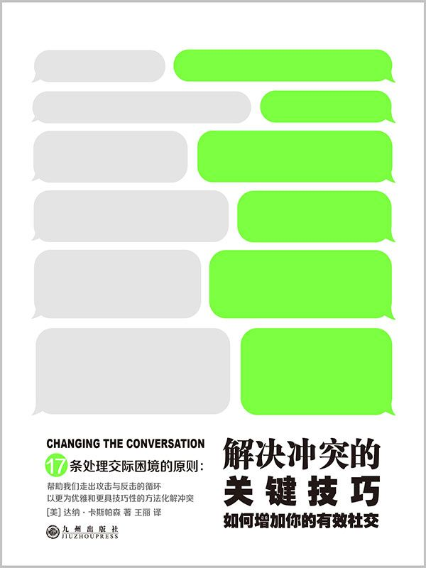

# 解决冲突的关键技巧：如何增加你的有效社交

**（美）卡斯帕森　著**

九州出版社

# 图书在版编目（CIP）数据

解决冲突的关键技巧：如何增加你的有效社交/（美）卡斯帕森著；王丽译.——北京：九州出版社，2016.4

书名原文：Changing The Conversation The 17 Principles of Conflict
Resolution

ISBN 978-7-5108-4370-9

Ⅰ.①解…　Ⅱ.①卡……②王…　Ⅲ.①人际关系学-基本知识　Ⅳ.①C912.1

中国版本图书馆CIP　数据核字（2016）第096580号

北京版权保护中心外国图书合同登记号：01-2016-1407

------------------------------------------------------------------------

All rights reserved including the right of reproduction in whole or in
part ni any form.

This edition published by arrangement with Penguin Books, an imprint of
Penguin Publishing Group, a division of Penguin Random House LLC.

------------------------------------------------------------------------

\

\

解决冲突的关键技巧：如何增加你的有效社交

------------------------------------------------------------------------

作　　者：（美）达纳·卡斯帕森著王丽译

出版发行：九州出版社

地　　址：北京市西城区阜外大街甲35号（100037）

发行电话：（010）68992190/3/5/6

网　　址：www.jiuzhoupress.com

电子信箱：jiuzhou@jiuzhoupress.com

印　　刷：三河市华成印务有限公司

开　　本：710毫米×1000毫米24开

印　　张：11

字　　数：100千字

版　　次：2016年7月第1版

印　　次：2016年7月第1次印刷

书　　号：ISBN 978-7-5108-4370-9

定价38.00元

------------------------------------------------------------------------

★版权所有侵权必究★

目录

[扉页](#text00001.html)

[版权信息](#text00001.html)

[FACILITATE LISTENING AND SPEAKING
让聆听和对话变得更加容易](#text00004.html)

[PRINCIPLE 1](#text00005.html_sigil_toc_id_2)

[PRINCIPLE 2](#text00006.html_sigil_toc_id_3)

[PRINCIPLE 3](#text00007.html_sigil_toc_id_4)

[PRINCIPLE 4](#text00008.html_sigil_toc_id_5)

[PRINCIPLE 5](#text00009.html_sigil_toc_id_6)

[PRINCIPLE 6](#text00010.html_sigil_toc_id_7)

[PRINCIPLE 7](#text00011.html_sigil_toc_id_8)

[PRINCIPLE 8](#text00012.html_sigil_toc_id_9)

[PRINCIPLE 9](#text00013.html_sigil_toc_id_10)

[CHANGE THE CONVERSATIOR 改变对话](#text00014.html)

[PRINCIPLE 10](#text00015.html_sigil_toc_id_11)

[PRINCIPLE 11](#text00016.html_sigil_toc_id_12)

[PRINCIPLE 12](#text00017.html_sigil_toc_id_13)

[PRINCIPLE 13](#text00018.html_sigil_toc_id_14)

[LOOK FOR WAYS FORWARD 寻找前进的方法](#text00019.html)

[PRINCIPLE 14](#text00020.html_sigil_toc_id_15)

[PRINCIPLE 15](#text00021.html_sigil_toc_id_16)

[PRINCIPLE 16](#text00022.html_sigil_toc_id_17)

[PRINCIPLE 17](#text00023.html_sigil_toc_id_18)

**CONFLICT　冲突**

你无法完全避免冲突，也很难改变别人在冲突中的表现。

但，你能改变自己的表现。

通过选用本书中介绍的方法，你可以提升自己的沟通能力。

通过提升沟通能力，你可以化解生活中的大小冲突。

本书提供了17条解决冲突的原则：它们都是处理社交困境的超实用工具。

**把冲突当作一种机遇**

实践这些原则有助于转换冲动的表达方式。它提供了一种由内及外解决冲突的方法，最终让每个当事人都满意。这些原则让人们能够勇敢地把冲突当作一种机遇。它们让我们知道，我们有凝聚好奇心和勇气的能力，它们将帮助我们走出攻击与反击的循环，以更优雅和更具技巧性的方法解决问题。

不管你是否会从头至尾阅读本书，都建议你花些时间完成书中的各种练习。有效解决冲突的能力源自实践。任何人只要努力都能够拥有这种能力。冲突可能有其存在的价值，同时也可能是无法避免的。当然，破坏性冲突除外。

# FACILITATE LISTENING AND SPEAKING　让聆听和对话变得更加容易

祖母曾教导我，在织毛衣的过程中，当几根线缠在一起时，不要试图只通过摘出一根线来解开整个结，那是错误的做法。此时，线与线之间存在一种复杂的关系。想通过抽出一根线来解决问题很可能会让这个结变得更复杂。

你得先弄明白这些线是怎样复杂地乱作一团的，然后才能找到一个可行的解结方案。

起先，我不以为然地试过“一根线”的解决方案，以为只要解开一根线，其余的部分就能散开。结果，我眼睁睁地看着结越来越紧、越来越复杂，最终，我不得不拿出剪刀。在某一刻，我厌烦了这种情况，决定尝试一下祖母的建议。于是，我开始看着整个结，想着如何去解开那些线。

我开始试着找出打结的原因。

在遇到矛盾冲突时，我们很容易倾向于先解除这种纠结状态，即便还没弄明白其中的原因及构成因素。我们希望自己尽快从看似会带来麻烦的状况中抽离出来，这类状况指：我们不喜欢的、不赞同的或不理解的东西。我们相信，通过让自己远离那些讨厌的人和状况，或让他们远离我们，就能解决问题。

然而，这种做法极少奏效。我们需要了解别人的情况，以便找出解决矛盾冲突的办法。至于我们是否喜欢他们、信任他们、相信他们的推理能力，这些都不重要。对方那些与我们的境况相关的情况会告诉我们矛盾冲突发生的原因，并帮助我们弄明白什么样的解决方案才算是有效方案。

**从认定转向探寻**

**了解到底是怎么一回事**

即使你觉得自己已经了解整个情况，也不妨问问其他相关人员身上发生了什么事。这并不是说你必须耐着性子听完他们指责你的一面之词。你要做的是让他们告诉你，他们在这种情况下经历了什么、对他们而言什么更重要，以及为什么重要。然后，尽可能明确地、不带指责地讲明你的情况。

当然，有时候，在矛盾冲突比较激烈的情况下，开始或继续一次富有成效的交谈是一项不可能完成的任务。我们可能会担心自己把情况弄得更糟、不知道要做什么，或者开始打退堂鼓。于是，试图避免应对矛盾冲突或一旦敌意显露便任由其发展的念头可能会很强烈。然而，我们并不是一定要不断重复那些具有破坏性的处理模式。

我们可以选择，可以采用那些催化关系破裂、充满暴力和使机会流失的矛盾冲突处理模式，也可以考虑另辟路径。只要用心，只要敢于实践，我们就能够培养出发起艰难对话的意愿和能力，从而以一种有效且有益的方式来处理混乱的冲突。

我们会发现，冲突要告诉我们什么。

**七个问题开启对话**

从愿意聆听别人的诉说和愿意向别人袒露心声开始。不管面对的是一次平静的对话，还是像一场战争的争吵，第一步要做的是，深呼吸，同时从为立场而战的模式转入诉说自身感受的模式。

在冲突中，聆听是件很难做到的事。在对方说话时，我们总是倾向于默默演练自己要说的话，而不会认真倾听对方在说什么。其实，我们可以带着了解情况的目的问几个问题。这几个问题可以帮助我们发现，冲突的推动因素是什么，以及可能会带来怎样的积极转变。

挑选出对你的情况最有意义的问题，然后向对方及你自己提出这些问题：

1　你怎么看待这种情况？

2　对你而言，这种情况下，什么最重要？

3　为什么重要？

4　你认为什么样的结果才算好结果？

5　什么妨碍了这种结果的实现？

6　你现在希望事情如何发展？

7　为什么那对你很重要？

## PRINCIPLE 1

ANTI-PRINCIPLE　反向原则

只听到攻击性语言。忽视所有附加信息。

PRINCIPLE　正向原则

不要只听攻击性语言。听听字面背后的意思。

这条“不要只听攻击性语言”的原则讲的是感知的问题：在面对冲突时，我们选择听什么？以什么样的方式听？

我们的聆听方式不仅决定我们听到的内容和我们的感受，同时也决定事态的走向。

通常，冲突的双方会交替攻击、防御及反击对方。而这条原则建议我们走出这样的循环，然后改变我们要听的内容。它的建议是：当受到攻击时，我们要学会不听那些攻击性语言。这并不是天真地鼓励我们去忽略真正的问题，而是建议我们倾听事情的本质，听听人们真正想说什么，即便他们说话的语气非常差。

问自己这样一个问题：

如果不是以这种攻击性的方式说出来，它听起来会怎样？

这一原则背后的推动力不是道德，不是让我们与人为善而忽略自己的需求，或让自己陷入危险的境地。它其实很实用。“不要只听攻击性语言”的原则会促使我们直接抓住问题的关键和有用信息，而不用陷入毫无意义的攻击与反击的死循环。当受到攻击时，我们能清楚地发现其中的攻击性，但如果把注意力集中到攻击性上，就是将时间浪费在次要问题上。我们要过滤掉这种攻击性，选择换一种行事方式。

FOCUS ON HEARING THE“WHY”　着重于听“为什么”

过滤掉攻击性语言并非易事。通常，你的直觉反应不是这样的。尽管如此，如果你的目标是降低冲突的破坏性并寻找解决方案，那么，不听攻击性语言是极其有效的做法。

拓展你的注意力。

暂时忽略对方说话的方式及内容，而把注意力集中在“为什么”上，为了你自己，也为了对方，尤其是在你已经很受伤或很生气的情况下。

举例说明带有攻击性和不带有攻击性的表述：

带有攻击性的表述：

“重点是什么？反正我说的话你一直都没听进去。”

“移民者在夺走所有工作岗位，并不断消耗资源。”

“如果你关心这所学校的孩子们，就不会参加罢工。”

“我讨厌你，妈妈，你从不肯放手让我做任何事。”

“你把孩子们接回家时，我不希望那个女人也在那儿。”

不带有攻击性的表述：

“我有一些很重要的事情要对你讲，希望你能好好听一听。”

“我担心目前的移民政策会让我很难找到一份工作。”

“我非常担心学校与老师之间的冲突会影响这里的孩子们。”

“妈妈，对于我的人生，我需要更多自主权。”

“我怕我们中任何一方的新恋情会对孩子们造成影响。”

想一个关于攻击性语言的具体事例并提出这样的问题：

“WHAT IF I HADN'T HEARD ATTACK?WHAT WOULD I HAVE HEARD?”

“如果我不听攻击性语言会怎样？那我又能听到什么？”

提高这种转化能力会让当下的冲突变得不再那么势不可当。它会让我们更有可能在艰难的情况下充分调用倾听能力。无论我们面对的是家务事、工作、社区或国家事务，这种练习都能为我们提供更好的机会，让我们抓住重点，而不仅仅是听对方说什么。

A WAY TO PRACTICE　一种练习方法

试着转化下面这段陈述，去除其中的攻击性：

“你一直在破坏我在孩子们面前的权威性。不能因为你没有勇气坚持给孩子们立规矩，就说他们根本不需要这些规矩。”

可以这样转化：

“我想我们需要给孩子们立些规矩，又担心我们给他们的信息太混乱了。当我想要按定下的规矩办事而得不到你的支持时，我很生气，也充满挫败感。”

THE CHOICE　你的选择

HEAR ATTACK　只听攻击性语言

HEAR INFORMATION　听取关键信息

## PRINCIPLE 2

ANTI-PRINCIPLE　反向原则

攻击别人，造成并维持破坏性模式。

PRINCIPLE　正向原则

忍住攻击的冲动。发自内心地去改变对话。

在双方产生冲突的情况下，拒绝陷入攻击与反击死循环的做法看似愚蠢，还有一点危险，甚至是不可能的事。

但是，通过忍住攻击的冲动，即使其他人仍在继续攻击，我们也能改变对话的性质。破坏性冲突是一种挫败式的交流。在冲突中，人们总是试图说明对自身而言重要的东西。通常，他们的表达无力、让人费解且很伤人。这样的表达会让参与对话的每个人都分心，从而偏离本来唾手可得的正题。“忍住攻击的冲动”并不意味着我们不设防或软弱，而是我们可以将对话的重心从攻击性语言的干扰上移开，转向更深层的内容。

**说话不要带有攻击性**

当正处在愤怒或恐惧中的你越来越抑制不住攻击的冲动时，应该调转方向，以阻断这种势头。不要攻击，也不要蓄势待发，做些别的事。在心和大脑保持充分的理智和灵活性的情况下，清晰地表明什么东西对你而言最重要，但不要攻击对方。试着弄清楚是什么让你们站到了对立的立场上，不要一味地维护自己的立场。

带有攻击性的表述：

1　当你十几岁的孩子没能按照事先的约定完成某件事情时，你十分愤怒：

“你怎么回事？我告诉过你多少次了，做完饭要把厨房收拾干净。我真是受够你了，你太懒了，也不尊重别人。”

2　你与合作伙伴在招聘政策上意见不一致：

“你只是在招聘你自己的微型翻版！你知不知道公司需要发展？你根本对如何构建一支高效的团队一无所知。要知道，这并不是在为你自己选个新酒友！”

3　你和兄弟姐妹们就如何处理父亲的遗产产生了冲突：

“我不明白你们怎么会想要卖掉这座房子。也许它对你们来说毫无意义，但我还没有准备好就这样扔掉父亲这些年来积攒的一切。显然，你们理解不了，家庭比金钱更重要。”

不带有攻击性的表述：

“看到你用完厨房后不清理，我很生气，也很失望。我们之间有过约定，我希望你能遵守它。如果你有什么问题，希望你能告诉我。”

“我们来谈一下招聘员工的标准吧。我发现这些新员工在技能和观点上与我们的老员工太过相似了。我希望公司能够不断发展，那我们就需要多元化的能力和创意。”

“我非常想念父亲，无法承受放弃房子的想法。我知道，如果我们决定不卖掉它，会面临一些困难。但你们愿意坐下和我一起商量一下吗？看看有没有其他能让我们都满意的办法。”

A WAY TO PRACTICE　一种练习方法

当你发现自己处于攻击模式时，试着把下一页这句话填补完整。

将攻击性语言从你要说的话中抽离出去。然后，找到一种对你而言自然的表达方式。

当（触发性事件）发生时，我感觉（当下的情绪），因为（我的需求或利益）对我真的很重要。你愿意（考虑一种可行的做法）吗？

如果你的陈述中已经开始出现攻击性，试着重新组织语言。

例如：

1　带有攻击性的表述

“当\[你懒得做清理（对性质的评价，而非对事件的描述）\]时，我觉得\[我有必要在今年接下来的时间里和你约法三章（一种行动计划，而非表明自己的感受）\]，因为\[我需要你停止像一个被宠坏的孩子那样为人处事（一种行动计划和评价，而非表明自己的需求）\]。你愿意\[努力长大一点儿\]（不明确的要求）吗？”

2　带有攻击性的表述

“当\[你以一种不负责任的态度对待招聘（对性质的评价，而非对事件的描述）\]时，我想要\[大喊大叫\]（一种行动计划，而非表明自己感受），因为\[我需要你认清现状（一种行动计划和评价，而非表明自己的需求）\]。你愿意\[停止像个自私的白痴那样行事，至少为公司考虑一次（评价及不明确的要求）\]吗？”

3　带有攻击性的表述

“当\[我当看到你准备卖掉父亲辛苦打造的一切\]（对对方意图的假设，而非对事件的描述）时，我感觉\[你只想要钱（对对方意图的假设，而非表明自己的感受）\]，因为\[你显然不像我一样在乎我们的家（伪装成需求的评价）\]。你愿意\[多考虑一下你自己以外的其他人（不明确的要求）\]吗？”

不带有攻击性的表述

“当\[我回到家看到厨房里一片狼藉\]时，我感觉\[很生气，也很失望\]，因为\[对我而言，遵守我们的约定很重要\]。你愿意\[再和我一起回想一下我们的约定，讨论一下我们怎样才能确保这种情况不再继续发生\]吗？”

不带有攻击性的表述

“当\[我看到新员工在技能和观点上与老员工相似\]时，我感觉\[很沮丧\]，因为\[我希望公司能够实现发展所需的多元化\]。你愿意\[跟我讨论一下公司的需求以及什么样的人最能满足这些需求\]吗？”

不带有攻击性的表述

“当\[我想到房子会被卖掉时\]，我觉得\[非常伤心\]，因为\[我希望我们能尊重父亲的毕生心血，以此与他保持一种联系\]。你愿意\[考虑一下除了卖房子以外的其他你可以接受的选择\]吗？”

为了将冲突转化为一种机会，你要有将难以表达的内容表达清楚的意愿，避免攻击性语言。通常，破坏性冲突之所以看似无法避免，是因为我们的习惯反应已经根深蒂固。

尽管如此，我们的习惯是可以改变的。

THE CHOICE　你的选择

ATTACK　攻击

INFORM　讲清楚

## PRINCIPLE 3

ANTI-PRINCIPLE　反向原则

激怒对方，让对方表现出最糟糕的一面。

PRINCIPLE　正向原则

假设自己在和最佳状态下的对方对话。

攻击与防卫只会引起更多攻击与防卫，而且人们倾向于根据对方的态度来转变他们的态度。因此，假设自己在和最佳状态下的对方对话。

让对方展现出愿意倾听并愿意谈话的一面。即使你怀疑对方并没有准备好或者无法以一种有利的方式聆听和对话，也要试一试。这种假设会帮助你扭转局势。

例如：

以一种认定对方能力不足的态度与其对话：

“我不想再讨论这个问题了，因为你只会再次反应过度。”

假设自己在和最佳状态下的对方对话：

“我们来找出解决这个问题的方法，它对我真的很重要。”

**只有你和与你对话的人**

能让冲突得到持久性解决并令冲突双方都从中受益。

冲突不是靠外界因素就能修复的。明智的干预或许有帮助，但从根本上，冲突的过程及其余震还是取决于当事人的精神和行为。假设对方愿意和你一起积极地解决问题，以此为前提与其对话。

例如：

1　以一种认定对方能力不足的态度与其对话：

“好吧，反正你永远都无法坚持履行约定，我不知道做这样的约定还有什么意义。”

假设自己在和最佳状态下的对方对话：

“我想确定，我们的约定确实对我们两个人都有意义，这样，它才能继续下去。”

2　以一种认定对方能力不足的态度与其对话：

“你就是一个控制狂，我根本没办法与你合作。”

假设自己在和最佳状态下的对方对话：

“我们来谈谈该如何就这个项目展开合作，现在我觉得对我而言有些失衡。”

不管我们喜不喜欢，都需要和对方一起去解决冲突。找到对方能沟通的一面；如果你找不到，硬着头皮去假设它存在。当一个人受到这样的对待时，他/她最佳的一面有可能自行出现。

A WAY TO PRACTICE　一种练习方法

假设你面对的是对方最佳的一面，试着重述下面这条意见：

“我甚至都不想再说什么了，因为你根本不接受反馈。”

可以这样重述：

“当我对你的工作有些反馈意见时，我该怎么传达给你才算是最好的方式？”

THE CHOICE　你的选择

PROVOKE ANTAGONISTIC DIALOGUE　引发敌意对话

PROVOKE USEFUL DIALOGUE　促成有效对话

## PRINCIPLE 4

ANTI-PRINCIPLE　反向原则

把需求、利益和行动计划混为一谈。

PRINCIPLE　正向原则

区分需求、利益和行动计划。

我们都有一些基本需求。这些需求演变出不同的利益。我们会选择不同行动计划去满足这些需求并获得相关利益。

需求、利益和行动计划是息息相关的，但它们不是一码事。满足某种需求或获得某种利益的方法很多，但行动计划却只能有一种。

通常，当冲突发生时，即使我们并不认同其他人的行动计划，我们也能了解他们的需求和利益。这样的了解能让寻找最佳行动计划的过程变得更容易一些。

每一种行动计划都是为了满足一种需求，或获得一种利益。

**行动计划**

允许人们自由持有冲锋枪。

我即将获得一份教师的工作。

我正在组织一个读书俱乐部。

我将成为一位裁缝的学徒。

我要搬到孟加拉国。

应该允许同性恋结婚。

**利益**

我希望能够住在一个安全的街区。

我想要一份能够让我实现个人抱负的工作。

我想要有这样一群朋友。

我想要接受良好的教育。

我想要一些新的体验。

我想要结婚。

**需求**

安全

实现自我价值

群体

自我管理

刺激

亲密关系

当我们选择的用于实现自身需求和利益的行动计划与别人的行动计划方向相悖时，冲突便会发生。

南希阿姨在医院里担任患者权益维护人。她对我讲述了一位即将不久于人世的患者的家人与医院工作人员之间发生的冲突。

从行动计划层面看，这次冲突似乎是这样的：

患者家人的行动计划：

“我们要在病房内烧些东西。”

医院工作人员的行动计划：

“我们不允许擅自在医院内生火。”

从需求和利益的层面看：

患者家人的利益：

“我们想要烧些药草，作为一种仪式，以便帮助我们的父亲进入来世。”

医院工作人员的利益：

“我们需要保证这栋楼里每个人的安全，我们并不想引发任何警报。”

首先，从行动计划层面看，这家人与医院工作人员陷入了一种僵局。但是，从需求和利益角度看，并非没有可行的解决方案。

在这种情况下，一旦各方的需求和利益变得明了，这家人与医院工作人员是能够进行协商的。医院可以允许患者子女在病房的水池里烧东西，这样便能在保证安全性的同时让患者子女完成为父亲举办的临终仪式。

有时候，我们太过依赖行动计划，以至于忽视其背后隐藏的需求和利益。最终，我们只会为各自的行动计划和立场而争吵不休，却无法扩大视野去寻找能够满足双方需求的有效途径。如此一来，就把可能性范围缩小了，因为我们并没有抓住最重要的东西。

在冲突中，当事态越来越混乱时，停下来，看看你是处在行动计划层面上，还是需求和利益层面上？

注意一点，要实现需求或获得利益，途径有很多，但如果你坚持一种行动计划，选择将大大减少。

把行动计划当成需求或利益的例子：

1　把行动计划当成需求：

“我需要你每晚能在8点之前回家。你每天回来得太晚。”

行动计划背后的实际利益：

“我希望你能够保证充足的睡眠，并完成你的作业。”

2　把行动计划当成需求：

“我需要一杆枪，这个街区的人太疯狂了。”

行动计划背后的需求：

“我需要安全感。”

3　把行动计划当成需求：

“我们需要每晚轮流做晚饭。”

行动计划背后的实际利益：

“我想要一些自由时间。”

**但是，如果我不在乎对方的需求会怎样？**

在冲突中，我们常常不会积极主动地去与对方进行沟通。那种情况下，更重要的一点是，不要浪费时间去争论行动计划。要发现需求和利益，你并不是非得主动去沟通，但你必须有找出解决方案的意愿。

克制住想要为自己的行动计划和立场争论的冲动，转而帮助与你起冲突的人全面了解当前情况下对你而言什么是比较重要的，同时找出对他们而言什么比较重要。

当驱动行动计划的需求或利益变得明朗后，找到对所有相关人员都有效的解决方案的可能性便会更大。当知道对自己而言什么才是真正重要的东西之后，人们更容易考虑改变行动计划。

A WAY TO PRACTICE　一种练习方法

回想一下你亲身经历或亲眼目睹的困难局面。

**弄清楚你或其他人正在采取的行动计划。然后，试着找出这些行动计划的目的及其背后隐藏的需求和利益。**

例如：

“我需要自主权”，这是一种需求。

“我需要一种可靠的交通工具”，这是一种利益。

“我需要一辆新车”，这是一种行动计划。

（车是支持自主权的一种可靠的交通工具。）

要学会自如地进行这类区分可能需要一些时间。

**不要放弃！**

当你觉得自己能够更为随意地略过行动计划时，就要开始试着在冲突出现时明确自己及对方的需求。鉴于人们常常说不清楚他们需要什么，猜测或大声地询问可能会有帮助。

一定不要对他们讲他们需要什么，因为你很可能会弄错，并很可能把对方激怒。

换种方法，你可以用提问的方式进行猜测。

可以用下面这种简单的问句：

“那么，目前对你而言什么最重要？”

是……

家人的安全？

找一份挑战性的工作？

让你的个人价值得到认同？

更多的自主权/乐趣/亲密感？

一开始的时候，讨论需求和利益可能会有些尴尬，但是不要担心。

有时候，讨论基本需求会让人觉得不舒服，而谈论利益可能更容易一些。在不把注意力狭隘地集中在行动计划上的情况下，利益能够反映需求。

即使你在探寻对方的需求和利益的过程中猜错了，这样的实践也会让你们的互动方向发生改变。虽然人们常常说不清楚他们的需求，但如果你猜错了，他们总是知道的，光是这一点就能够让你更进一步地了解当前的情况。

例如：

**1　“你会因为需要更多自主权而离开吗？”**

“不，我想要更多地参与到这个团队中。但不知为什么，我觉得我好像是个外人。”

**2　“所以，你之所以想在我们的房子之间建道围墙是因为你想要更好地保护隐私？”**

“不，我喜欢和邻居们交谈，我会很想念这样的时光。但我在晚上会感到紧张，如果有道围墙，会感觉好些。”

**3　“我们显然对如何安排孩子们早上的活动有分歧。你的重点是什么？是想要更常规化一些？”**

“不，我只是不想不停地讨论这些。或许我们能交替安排孩子们早上的活动，这也许更好办一些，那样的话，我们每个人都有休息的时间，并且可以按照自己的意愿做决定。”

你可能经常会猜错。但是，只要你的意图是去发现这个人的真正想法，错了也没关系。

**如果你是对的，人们会让你知道，并且，当他们感觉到你确实在认真倾听，他们很可能反过来也认真听你讲话。**

THE CHOICE　你的选择

CONFUSE NEEDS, INTERESTS, AND STRATEGIES　把需求、利益和行动计划混为一谈

DIFFERENTIATE NEEDS, INTERESTS, AND STRATEGIES　区分需求、利益和行动计划

## PRINCIPLE 5

ANTI-PRINCIPLE　反向原则

忽视各种情绪，或将它们以一种破坏性方式表现出来。

PRINCIPLE　正向原则

承认已产生的情绪。把它们当作信号。

三岁的小侄子马格纳斯曾给我讲过一个关于冲突和情绪的故事。

冲突主要围绕着幼儿园里一只特别漂亮的橙色杯子展开。尽管马格纳斯很喜欢这只杯子，它还是被分给了他的同班同学。为了让孩子们能想通这类问题，学校有一种说法：给你什么，就接受什么，不要伤心。“但有时候，”马格纳斯撅着嘴巴皱着眉说，“我还是会觉得伤心。”

正如马格纳斯所言，情绪是不可选的。只考虑冲突而不考虑相关的情绪常常会适得其反。另一方面，情绪不是冲突的根源，它们是信号，告诉我们重点是什么。我们感觉的强度会让情绪成为一种信号，准确地表明我们是否站在解决冲突的正确轨道上。

然而，当造成冲突的原因更为复杂时，如涉及历史、信仰及忠诚时，情绪的表象也可能是一种迷惑。为了让情绪能够帮助我们找到正确的方向，我们需要知道它们背后隐藏了什么。

**让情绪帮你看清楚**

不要只关注情绪本身，或急于让它们告诉你该如何应对冲突。利用这些情绪帮你看清整体局面，并破译背后的驱动力。

**承认你的情绪**

当经历一些压迫性情绪时，如气愤、恼怒等，先试着承认你的感觉，然后再看它背后的东西。做个深呼吸，同时问自己这样一个问题：

“我为什么会有这样的感觉？我该怎么做？”

这里，重点不是我们必须总能得到我们需要的东西。重点是，在冲突中，强烈情绪的存在要么会阻碍我们抓住重点，要么会帮助我们直奔主题。我们面临的挑战是，认真地对待我们的情绪，但不要被它强大的力量困住。

在这种情况下，保持情绪与你看重的东西之间的联系，让它帮助你开启积极的转折。告诉对方你的感觉，你选择的方式要既能传递你的感觉，又能让对方参与进来，从而让对方了解你当下的状况，然后与你一起寻找解决方案。

例如：

与其这样说：

“天哪！我简直无法相信，你又在关键时刻掉链子，你是白痴啊！你他妈的怎么回事儿？我都不知道你是怎么得到这份工作的。”

不如试着这样说：

“我无法相信！我很生气，你以前怎么说的，你根本做不到！我为这个项目付出了很多，我需要这份工作。到底怎么回事儿？”

与其这样说：

“这是我见过的最差劲儿的医护人员。没人搭理我，即便有人理你，也总是一副粗鲁无礼的样子，没什么实际帮助。有事问他们也白搭，因为我从来都得不到答案。”

不如试着这样说：

“这样的待遇让我很生气，工作人员如此不好沟通，让我很沮丧。我很担心我的母亲，我希望有人能回答我的问题。有人能帮助我吗？”

**承认其他人的情绪**

在紧张的冲突中，当事人很容易想要避谈情绪。他们可能认为，这些情绪的存在是显而易见的，无需刻意提起，或者，关注这些情绪会令谈话更困难。

然而，即便在这些情况下，也要忍住冲动，不要用下面的话来拒绝考虑对方的情绪：

“哎呀，成熟一点儿。”

或

“真可笑。你凭什么有这样的感受。”

或

“别再抱怨了。你都上瘾了。”

这样的反应只会促使人们更深地陷入自己的情绪漩涡，因为这些情绪没有得到认可。情绪是我们对一种境遇所做出的智力反应的一部分。承认情绪，然后询问它背后隐藏了什么。

例如：

与其这样说：

“行了，翻篇吧。事情没有那么严重。你太敏感了。”

不如试着这样说：

“听起来你是真的伤心了。对你而言，最大的困难是什么？”

与其这样说：

“能先冷静冷静吗？现在的你就像个疯子。”

不如试着这样说：

“看起来你对此很气愤。对你而言，最重要的是什么？”

谈论对方的情绪时，你可以说一说自己的情绪反应，以便争取相互理解。

例如：

与其这样说：

“哦，现在你很烦？你饶了我吧。如果这里真有人觉得厌烦，那也应该是我。我连听都不想听。”

不如试着这样说：

“好吧，你很生气，我也很失望。这到底是怎么了？在你看来这到底是怎么回事儿？”

等待对方做出反应，然后说出你自己的体会，比如这么说：“好吧，所以，在我看来，事情是这样的……”

**让对方给你信息**

由于感受通常比需求更明显，所以，让对方的情绪帮助你去了解究竟是怎么回事儿。如果你无法了解驱动对方情绪的需求是什么，大胆地猜测一下。向对方提问，但要注意措辞，让你的问题既顾及对方的情绪，又侧重于询问对方的需求和利益。

假如这个人能感受到你在认真地去理解他/她，光是这一点就能帮助你将冲突转向积极的方向。

例如：

与其这样说：

“别再夸张了，如果你不喜欢我男朋友，进你自己的房间去。他又不是你爸。”

不如试着这样说：

“好吧，听起来这确实让你烦恼了。我男朋友待在这儿，对你造成的最大困扰是什么？”

与其这样说：

“你在烦恼什么？我做错了什么？”

不如试着这样说：

“你看起来很沮丧。是因为我的表现与你的预期不相符吗？”

与其这样说：

“注意，我不知道你的问题是什么，但你要做的是打起精神来，然后完成这项工作。”

不如试着这样说：

“看起来你在项目之外遇到了一些困难，是吗？”

A WAY TO PRACTICE　一种练习方法

**尝试带着对情绪的认知去重新组织你的回应。**

**陈述**

“我们很久没做过什么有趣的事了。你总是忙于工作。这让我觉得我好像从未见过你。”

**回应**

“我简直不敢相信你竟然因为我的工作而埋怨我。没有钱，我们连日子都过不下去。”

可以这样重新组织语言：

“你是不是很怀念我们一起闲逛并且玩得很开心的那些日子？我也是。”

THE CHOICE　你的选择

SEE EMOTIONS AS OBSTACLES　把情绪当作阻碍

SEE EMOTIONS AS HELPFUL SIGNALS　把情绪当作有用的信号

## PRINCIPLE 6

ANTI-PRINCIPLE　反向原则

觉得确认便代表同意。拒绝确认。

PRINCIPLE　正向原则

区分确认和同意。

当感觉到自己的话被听进去时，人们更容易去倾听别人说什么，并推动谈话的进程。

即便你完全不赞同对方所说的话，你也可以确认他/她的立场或思维方式。首先要让对方知道，你准确地接收到了他/她传递的信息，然后，你们就可以开始讨论了。

下面是一些关于简单确认的例子。

1　陈述

“我不认为我们应该租下这套公寓，我们负担不起这么多的租金。”

**回应**

无确认：

“没事，别总是担心。”

有确认：

“所以，你认为这么多租金目前对我们来说太贵了，是吗？”

2　陈述

“我不希望这些孩子在我的地盘上走来走去。”

**回应**

无确认：

“你的问题是什么，你不喜欢孩子？他们没有破坏任何东西。这只是草地。”

有确认：

“好吧，你不喜欢孩子们穿过这里。是他们经过时做了什么，还是你只是单纯地不希望他们出现在你的地盘上？”

确认意味着让别人知道你已经听清楚了他们的立场，但并不表明你赞同。你表明确认的话语越简单，陷入无用的二次冲突的可能性就越小。记住，只确认立场，而不要回应任何攻击性语言。

例如：

**陈述**

“核能很安全，不要杞人忧天。”

**回应**

无确认：

“杞人忧天？如果你认为核能符合这个国家的长远利益，你真是愚蠢至极。”

有确认：

“你认为将核能当作国家的一种电力能源，这听起来是合理的。”

在冲突中，确认对方观点可以作为处理对方死守的立场的一种方法。你可以把对方的立场当作建立相互理解的起点。为此，你要向对方问清楚，究竟是什么让这一立场变得如此重要。去收集信息，以便了解用什么样的解决方法才能一劳永逸。

例如：

**陈述**

“这些山路不应该向开沙滩车的人开放。他们就是些小流氓。”

**回应**

无确认：

“这是公共用地，不应该被极端的环境保护者控制。那些开沙滩车的人应该也可以使用它。”

有确认：

“那么，你是想禁止沙滩车在这些道路上穿行。你最在意的是什么？”

区分确认和同意是将别人的想法与我们自己的反应解绑的一种方法。

例如：

确认但不同意：

1　“听起来你很担心你的孩子们，如果学校警卫配枪，你会觉得安心些。”

2　“好吧，这么说，你很讨厌我这棵树的残枝败叶掉到你的草坪上，你认为砍掉树会是个不错的主意。”

3　“看来，对你而言，打屁股可以作为一种训导孩子的方式。”

这样的确认似乎没有必要，因为我们觉得对方应该可以明显地感觉到我们听懂了他们的话。然而，在冲突中，人们常常会不停地重复他们说过的内容，因为，他们并不能清晰地感觉到他们的话被听进去了。因此，在提出自己的观点前，你要让其他人知道，你听懂了他们的话，这样他们才能停止向你诉说，而你就可以投入到一段更有成效的对话中。

A WAY TO PRACTICE　一种练习方法

考虑下面这段话，确认但不表示同意。

“我不希望我的孩子周围总是出现同性恋者。他们不应该出现在教师或神职人员的队伍中。”

可以这样确认：

“听起来是这样，如果你的孩子们和同性恋者接触，你会觉得不舒服，尤其是在他们作为孩子的教导者的情况下。是这样吗？你在担心什么？”

THE CHOICE　你的选择

IGNORE OR SUPPRESS IDEAS THAT CONFLICT WITH YOUR
OWN　忽视或压制与你的想法产生冲突的想法。

ACKNOWLEDGE IDEAS THAT CONFLICT WITH YOUR
OWN　确认与你的想法产生冲突的想法。

## PRINCIPLE 7

ANTI-PRINCIPLE　反向原则

提出建议，而非聆听。

PRINCIPLE　正向原则

避免在聆听过程中提建议。

在冲突中，尤其是当情绪高涨到一定程度时，抑制住想要立刻做出回应并就对方该怎么做提出建议的冲动。

练习聆听

当然，有时候，建议只是单纯的建议，而且可能会起到一定的作用。但是，在冲突中，当人们尚未感觉到自己的话被对方听进去时，建议往往被解读为“不予理会”，即打断他们要讲述的重点，或不相信他们有自行解决问题的能力。

在给出建议前，考虑一下你想要这么做的动机。

即便你完全出于善意，在冲突的过程中给出的建议也可能是无益的，甚至是有害的。提出建议可能会被视为一种表明不想再听下去的行为，一种试图操控或“纠正”对方的方法，或一种贬低对方需求的行为。

不要试图纠正对方或对其提出建议，问一些问题来帮助他/她把事情摊开在大家面前。

例如：

**陈述**

“整件事带来的压力太大了，简直无法跟你说，你总是心不在焉。”

**回应**

聆听给出建议：

1　“听我说，如果你只是想辞去那份愚蠢的工作，没问题。”

2　“至少这一次，你为什么不出去走走？别再无所事事地抱怨。”

3　“这不是我的问题，好吗？你需要打起精神来。也许你需要一位治疗师。”

聆听但不给出建议：

1　“好吧，你想要说什么？”

2　“对你来说，最让你感觉有压力的是哪个部分？”

PRACTICE LISTENING　练习聆听

A WAY TO PRACTICE　一种练习方法

**考虑一下这种情况：**

你的伴侣面临两个新机遇：目前工作的公司提供的一次升职机会，或前往另一座城市工作。他/她想要接受另一个城市的工作邀请，同时希望你能够一起移居那座城市。这就意味着你要放弃你自己的工作，并远离父母。你的伴侣说，他/她一直都很支持你，现在他/她需要你的支持。

试着组织几个问题，让伴侣把内心的想法说出来，从而帮助你理解他/她的立场。

避免无意中提出建议。

可以这样问：

“听起来你确实已经做好了改变现状的准备。多跟我讲讲那份工作邀请吧，什么地方让你觉得特别感兴趣？”

或者

“听起来，过去这些年，你一直都心甘情愿地在这里支持我，生活在这里从没有真正让你实现在工作方面的抱负，是这样吗？”

THE CHOICE　你的选择

MAKE SUGGESTIONS WITHOUT LISTENING　不聆听就给出建议

LISTEN WITHOUT MAKE SUGGESTIONS　聆听但不给出建议

## PRINCIPLE 8

ANTI-PRINCIPLE　反向原则

评判别人。

试图将自己的评价当作观察结论。

PRINCIPLE　正向原则

区分评价和观察结论。

通过观察得出的结论有助于冲突的明了化。

在冲突中，我们的评价往往会激发对方的防御意识，并阻碍我们接收重要信息。让冲突的当事人（包括你自己和对方）避免这个问题。

着重于让整个情况明了化。

例如：

评价：

1　“你总是迟到。”

观察结论：

“你来迟了，没赶上我们的最后三个会议。”

评价：

2　“你太不负责了，我无法相信你。”

观察结论：

“我们说好的，你会在10点之前回家，现在11点了。”

评价：

3　“这家公司的政策有性别歧视。”

观察结论：

“这家公司的高级管理层中仅有两名女性。”

评价：

4　“你是个混蛋。”

观察结论：

“每次我想讲话时，总是被你打断。”

AVOID TELLING PEOPLE WHAT THEY "ARE" . INSTEAD, DESCRIBE HOW THEIR
ACTIONS AFFECT YOU.

避免对别人说他们“怎么样”。而是说出他们的行为对你产生了什么样的影响。

抑制自己想要评价对方意图或性格的冲动。即使你认为自己的评价是对的，也只会让局势越来越紧张，而不会促进双方的相互理解。

你要做的是说出你观察和体会到的东西。找一种方式清晰地表明为什么这种情况让你感到很生气。把生气的力气拿来准确地表述对方的行为对你产生的影响以及其中的原因。

不要用控诉、责备或贴标签等方式给对方下定论，这样，你才能为双方都留有余地，避免进入攻击—防卫的思维定式。

例如：

1　评价

“你丫的，总是不断地找我麻烦。”

观察和体会

“你今天上午在那么多人面前对我大喊大叫，我很讨厌这样。如果有什么问题，你可以私下里找我谈。”

2　评价：

“要不是搬起石头砸了自己的脚，你就连什么是职业道德都不知道。能待在这，你已经很走运了，但显然你不这么认为。”

观察和体会

“你答应完成五个项目，但实际上，你只完成了一个。我冒险雇佣了你，但这却并不是我所期望看到的。”

3　评价：

“我不知道当初为什么相信你。你完全没有责任心。你又忘了明天晚上我们要一起出去的事。”

观察和体会

“你没有按时回家，我很担心你，同时对你不能履行承诺感到很生气。”

A WAY TO PRACTICE　一种练习方法

试着重新组织下面这段评价，将其变成观察结论和体会。

“显然，你太自私了，以至于你根本注意不到，这栋楼里的其他人都要早起上班，大家根本没兴趣欣赏你不分昼夜吹奏的曲子。”

可以这样重新组织语言：

“我早晨五点钟就要起床。这一周以来，你的公寓里每晚都传出音乐声，并且持续到凌晨一点钟。这让我无法入眠。睡眠不足让我觉得很疲惫。希望我们能就你吹奏音乐的时间做个约定。”

THE CHOICE　你的选择

OFFER EVALUATION　给出评价

OFFER OBSERVATION AND EXPERIENCE　给出观察结论和体会

## PRINCIPLE 9

ANTI-PRINCIPLE　反向原则

未经验证便按照自己的假设行事。

PRINCIPLE　正向原则

验证自己的假设。

如果证明它们是错误的，放弃它们。

“如此清醒的意识是在梦里，而梦境受到客观现实的约束。”

——奥利弗·萨克斯（OLIVER SACKS），

《火星上的人类学家：七个矛盾的故事》

（AN ANTHROPOLOGIST ON MARS：SEVEN PARADOXICAL TALES）

表侄女们严严实实地裹在被子里听我读一个关于精灵的故事。故事突然一个急转弯，给出了一个让人始料不及的结局：小精灵们带走了说谎的孩子们，让他们溺死在了沼泽里。“真是这样吗？”艾米丽皱着眉头问，“我希望不是这样。”

我们的生活离不开故事。大脑将不同的信息组合成一个连贯的整体，支持我们去经历各种兴衰成败、创造新事物、适应周围环境及建立彼此间的联系。但是，正如艾米丽的例子所表明的那样，有些故事不是真的，但有些故事，虽然我们希望它们不是真的，但它们确实是真的。如果不仔细研究，我们并不知道哪个是真、哪个是假。然而，在冲突中，我们常常会停止研究，转而开始假设。这样一来，我们给自己讲述的故事便建立在了静态、片面的信息上。

我们常常假装理解另一个人的感受、意图和性格。频繁地根据我们的假设行事，加之常常有选择地聆听，只关注那些支持我们观点的信息，使得我们对自己的假设更加坚定。

然而，很多情况下，我们的假设都是错的。

假设通常会降低我们的理解力，让我们很难找到有效的前行之路。那么，尝试一下别的做法。仔细想想你的假设，想一想它们是如何让你做出反应的。为了避免不必要的混乱和痛苦，不要依赖你的假设——要对它们进行验证。

找出事实的真相。

当发现自己的假设是错的时，放弃它们。

提出下面这类简单的问题：

1　“依我看，你似乎并不喜欢女性来坐这个位子，是吗？”

2　“我猜你首先感兴趣的是用最小的成本修好这些东西，对吗？”

3　“我猜你不想讨论这个问题是因为你不同意我的意见，是这样吗？”

A WAY TO PRACTICE　一种练习方法

考虑一下下面这句话，把它重新组织成一个可以验证假设的问句：

“你显然认为这个项目是在浪费时间，而且你已经打定主意要破坏它了。”

可以这样重新组织语句：

“我能感觉到你认为这个项目不值得做，真是这样吗？”

THE CHOICE　你的选择

ASSUME YOU ARE RIGHT　假设你是对的

TEST YOUR ASSUMPTIONS　验证你的假设

# CHANGE THE CONVERSATIOR　改变对话

有个夏天，我想清理一条林间小路，路上有一堆被人用推土机推过来的树桩和泥土，杂乱地堆在一起。在这个过程中，我发现了两点。首先，即便砍掉露在泥土外面的树枝和树根，这堆东西依旧杂乱地纠缠在一起。其次，如果想要把树桩拉出土堆，却不知道里面连着什么，白费力气。最终，经过反复尝试后证明，这些方法帮不了我，于是我停了下来。

我开始从另一个角度去看待这堆树桩和泥土。

我发现这些露在泥土外面的树枝和树根为这种混乱指明了一条路。顺着它们向土堆内探索，更容易找到纠结的核心，这比盲目地挖走上面几百磅重的土简单多了。在处理过程中，我发现，实际上是树根和树枝让这堆东西纠缠在了一起。一旦我把它们分开，树桩便自动滚了下来，处理起来相对容易很多。

同样地，在冲突中，当前情况的复杂性往往会被掩盖。结果，人们很容易想要处理掉已经显露的冲突信号，然后假装什么事情都没发生，或是在不了解事情原委的情况下强制实施自己的行动计划。然而，逃避或强硬的战术与无视战术加在一起通常会带来两种结果，即冲突的激化或升级，而始终无法找出冲突的根源。

有时候我们能感觉到自己已经听不进去对方的话，并开始侧重于以自己的方式行事，或证明对方是错的。这种时候，我们需要转换自己的思维方式，从确定转向询问，以此来让被掩藏起来的混乱状态明了化。如果我们可以带着好奇心去审视看似最困难的东西，它最终将失去让当前态势如此紧张的作用力。

## PRINCIPLE 10

ANTI-PRINCIPLE　反向原则

选定某种死板的立场，且不愿尝试去理解其他观点。

PRINCIPLE　正向原则

在困境中培养好奇心。

在困境中仍能保持好奇心是一种技能。这种技能需要练习。它让你在感觉到愤怒和恐惧的情况下，仍然能够问出这样的问题：

“究竟怎么了？有什么是我还没搞明白的吗？”

强烈而持久的好奇心能够带来改变。它能让我们看到蕴含在冲突深处的可能性。尽管这样，在冲突营造的紧张氛围中，我们的第一个冲动往往是放弃好奇心。如果这样，我们便不会再去试着理解对方，而更愿意看到对方受伤，同时也会忘了自己其实与他们息息相关。我们开始不同程度地抹杀对方的人性。

其实，我们可以换一种精神面貌，对当前情况和人保持持久、睿智的好奇心，即便当时我们并不好奇。“在困境中培养好奇心”，这一建议并不是让你置身于伤害之中，或是假装亲切；它是让你在面对冲突时保持一种想要尽可能知道更多的心态，而不是只关注从我们的视角看显而易见的东西。这一原则将促使我们去了解，要培养面对我们不喜欢、恐惧或不赞同的东西的意愿和能力，需要付出怎样的代价。并且，它会让我们学会聆听那些以前没有听进去的内容。

例如：

没有好奇心的情况下：

1　该死的，我要他马上闭嘴。

2　他们就是群白痴，根本不关心这个国家发生了什么。

3　她要是离开就万事大吉了。

4　跟他谈话就是在浪费时间，根本没法沟通。

5　她搞什么？她怎么能那样对我？

6　她/他需要（……自行填补……）

带有好奇心的情况下：

1　他真正想说的是什么？

2　对他们而言什么比较重要？为什么？他们有什么理由？

3　关于现在的情况，还有什么是我不了解的吗？我要做出什么样的决定？

4　现在，我们谈话过程中的主要阻碍是什么？为什么会有这样的阻碍？

5　是什么让她做出了这样的行为？她需要什么？

6　有没有其他做法？

A WAY TO PRACTICE　一种练习方法

回想一下你比较熟悉的冲突，可以是在家里、工作场合或社会中发生的冲突。

选择真正让你发火的一次。

慢慢回想，注意你是怎么失去对对方的好奇心的，什么时候失去的。

注意你是怎么关闭好奇心的：你的身体、思维及情绪分别发生了什么变化。不要把这些反应推到一边，要对它们进行深入了解。回想它们的同时深呼吸，每次呼气时，想象你周围的空间在变得越来越宽松。

唤回你的好奇心，向自己提出以下几个问题：

1　为什么这个人觉得自己的想法有道理？

2　什么让这个人做出了这些举动？

3　从根本上讲，这个人想要或需要什么？

4　我是不是也对这种困境的形成负有责任？

5　要促成有效的对话需要做出怎样的改变？

注意，当你忍不住想要用“因为他/她是个混蛋”这样的话做出回应时，抑制你的冲动。换种方式，先深吸一口气，再呼气，然后选择一种好奇的心态。

THE CHOICE　你的选择

ABANDON YOUR CURIOUS MIND　放弃你的好奇心

STRENGTHEN YOUR CURIOUS MIND　强化你的好奇心

## PRINCIPLE 11

ANTI-PRINCIPLE　反向原则

认为有效对话是不可能的。

PRINCIPLE　正向原则

相信有效对话是可能的，即便当前看似不太可能。

即使是在最糟糕的情况下，我们也有可能进行有效对话。

即便在这一过程中，我们错漏百出、频频失策，也能够通过发挥自我纠正的能力，去选择一条让事情朝着设想的方向前进的道路。“相信有效对话是可能的”，这不是在劝你忽略现实而去一味地痴心妄想。它其实是在提醒你去质疑我们信念的刚性和理解的范围。

**想一想，在冲突中，究竟是什么妨碍了有效对话**

考虑到涉及的人及其需求，思考一下什么样的切实改变能够让对话进行下去。

当对话进程看似受到阻碍时，想一想有什么办法能带动有效对话。

阻碍：角色不明

**办法：确定你们要做哪些决定，以及该由谁来做这些决定。**

明确角色，以便更好地专注于你们的对话。明确谁负责做哪些决定。如果该由你来做决定，担起你该担负的责任，不要因为别人长时间犹豫不决而责备他们。如果不该由你来做决定，把它交由该负责的人负责。明确你对他们的决定的反应，而不要试着去控制他们如何做决定。如果你觉得你们的角色应该有所改变，把它变成一个明确的议题。

例如：

如果一个朋友已经在你家住了几个月，你可以要求她/他开始支付房租，但是，是否要分担房租则由你的朋友决定。你要对她/他的决定做出回应。重要的是，你要知道，你们双方都有相应的责任，且都有相应的权力。每个人必须做出自己的决定，这样的认知是一种尊重的姿态，能够让复杂的情况变得明朗，让困境趋于缓和。

阻碍：有人丝毫不让步

**办法：将谈话从行动计划层面转向需求层面。**

如果你们僵持在行动计划或立场上，转而关注需求。后退一步，看看你是否明白对对方而言什么更重要。同时，确保你已经表明自己的利益诉求。如果你发现自己在坚守某种立场或行动计划，放松片刻，让你的方法变得更具探究性。仔细审视之下，双方立场可能更为坚定，然而，提及利益往往能让对话有所进展。

试试下面的询问：

“关于在这附近建戒毒中心这个提议，你能多说说具体的关注点吗？”

或者

“所以说，听起来你并不赞成在孩子们过来时让我的新女朋友（或男朋友）在这留宿。你最大的担心是什么？”

阻碍：冲突的信念

**办法：展开更广泛的对话。**

在某些坚定的信念导致的冲突中，让谈话的方向远离对信念本身的讨论。扩展谈话内容的范围，询问对方的经历，以及这样的经历如何造就了他们的信念。

例如：

1　“当我们开始谈论希望我们的孩子接受怎样的教育时，涉及的问题很多。在你看来，问题的核心是什么？”

2　“听起来你担心改变区划格局以增加租金的做法会对附近一带造成不利影响。能说说你的经历吗？告诉我它是怎样让你产生了这样的想法的？”

3　“所以，对于我们应该为以后的日子存多少钱，我们有不同的想法。你怎么想？我们应该怎样安排各项费用的先后顺序？”

阻碍：冲突来自群体同一性

**办法：区别对待忠诚与冲突，鼓励好奇心。**

有时候，冲突之所以难以化解，是因为冲突是群体同一性的产物之一。各种群体会在“他们”与“我们”之间划清界限。尤其是在冲突持续时间较长的情况下，人们会担心同一群体的其他成员会将其试图找出解决方案的举动视为背叛。

**采取积极措施的方法：**

如果可能，把问题摊开来谈。讨论一下不愿意与对方对话可能带来的破坏性结果。承认每个团体内部成员之间的盟约很重要，但也要区别对待盟约与冲突。

试着这样说：

“这对我们而言是个很重要的问题。某种程度上，它决定了我们这个群体的性质。有些人可能觉得，试图与对方对话是对我们的立场的背叛。我理解大家希望坚守我们的目标的愿望。但与此同时，为了找出解决问题的办法，我们也需要有与对方谈论这个问题的意愿。从长远来看，不进行那样的对话对我们来说是有损害的。我更愿意对方了解我们为何站在这样的立场上，也希望能够更好地了解他们的想法及理由。你们觉得怎么样？我们怎样才能让这样的对话变成可能。”

阻碍：害怕丢脸

**办法：为改变方向留出余地。**

通常，人们需要确保，如果他们改变方向或现在的立场，他们仍会受到尊敬，并仍被视为是有信用的人。着重于找出一种不会让任何人尴尬或时时刻刻想要扳回一局的解决途径。避免人身攻击。

为了有助于创造一种让人们愿意放弃原有行动计划的氛围，将重点放在讨论的行动计划的特性上，即它可以促成什么或阻止什么，而不要着重于整体行动计划。确保对方知道你了解他们对行动计划感兴趣的原因。把那些兴趣当作重要的有效信息，用以找出可行的解决方案。

例如：

**陈述**

“如果不给我找个助手，我就没办法照顾到这些新客户。”

**回应**

不顾及面子：

“哦，你想要个助理？是的，那得排队。你以为这里就你自己那么忙吗？当我们的钱多到可以大手大脚时，我会通知你的。”

**回应**

顾忌面子：

“我同意，处理好新客户的问题是首要任务。除了聘用新助理，还有其他办法吗？我们并没有这方面的预算。”

阻碍：挥之不去的不信任

**办法：将可验证的保证变成约定。**

如果冲突中的人们之间有很大程度的不信任，开诚布公地谈一谈，看看如何将可验证的保证变成某种约定。

**在更为正式的场合可以尝试这样说：**

“看起来大家都希望，确保今后会秉持今天达成的一致意见。我们可以把大家的担心写下来，将一些保证变成协议的一部分。”

**在更为私人的场合可以尝试这样说：**

“听起来你觉得我们的协议实际可能无法实现。是这样吗？我们来谈谈哪些内容仍存在不确定性，以及怎么做才能让我们双方都放心。”

A WAY TO PRACTICE　一种练习方法

想一想什么可以让有效对话成为一种可能。

对自己提出以下问题：

1　“我是否愿意进行有效对话？对方愿意吗？”

2　“如果不愿意，为了让我们双方都有这样的意愿，需要做出怎样的改变？”

3　“究竟是什么让我们难以进行卓有成效的谈话？”

4　“怎样的具体改变能让有效对话成为可能？”

排除要求别人改变其个性的答案。

THE CHOICE　你的选择

IGNORE THE POSSIBILITY OF USEFUL DIALOGUE　忽视有效对话的可能性

PURSUE THE POSSIBILITY OF USEFUL DIALOGUE　追求有效对话的可能性

## PRINCIPLE 12

ANTI-PRINCIPLE　反向原则

忽视自己的责任，让事情变得更糟糕。

PRINCIPLE　正向原则

如果你正在让事情变得更糟，停下来。

佛家认为，厌离心是智慧的根基。就是说，对无益习惯日渐增长的厌倦，终将帮助我们做出改变。

因为，在冲突过程中改变我们的习惯需要花费很大的力气，这不仅需要对之前的事态发展产生厌倦之心，还需要做出改变的决定，并做好付诸于行动的准备。

有时候，我们对冲突的反应方式如此根深蒂固，以至于改变似乎是不可能的事。然而，看待和处理冲突的方式并不是我们本性的一部分，而是一种后天习得的行为。所以，我们可以改变它。

想一想你置身于冲突中的主要目的：有什么潜藏的需求和利益诉求？问问自己，你的行为和目标是否一致。如果不一致，选择不同的行为方式。

例如：

一位母亲与她的十多岁的孩子就起床上学发生冲突，比较一下这位母亲的言行及其主要目的：

**主要目的：**

每天早晨有个轻松的开始，让每个人都能够按时到达各自的目的地。

**言行：**

“你能起床了吗？别再像个五岁的孩子一样了！我真是厌倦了，你快要让我疯掉了！”（攻击和责备）

**可能带来的结果：**

冲突愈演愈烈。孩子也很生气，充满反抗心理，然后开始对着干。

没有解决方案，准时离家上学的可能性变得更渺茫。

有时候，一些无益的行为会带来一种短暂的满足感，于是，要放弃这些行为就变得更加困难。试着把它们罗列出来，然后有意识地去考虑其他备选方案。回过头去再看一看本书开头列出的反向原则清单，如果你的行为与上面的内容有一致之处，后退一步，然后改变方向。

在上述冲突中，一旦母亲注意到她选择了一种带有责备和攻击性的方式，就可以有意识地调整方式、改变对话。她可以停止攻击和责备，而采取相反的应对措施：询问和倾听孩子的需求，再表明自己的需求，从而找出可行的解决方案。

例如：

“看来按时起床去学校对你来说是一项很难的任务，是这样吗？我们来谈一谈，看看怎么做才能把它变得容易一些。我希望我们每天都能有个美好的开始。告诉我哪些是较大的阻碍？我可以做什么？你又可以做什么？”

我们可以改变我们在冲突中的表现。这种努力可能让人望而生畏，但我们可以每次先尝试一小步。改变习惯的过程并不是单一性事件，而是一系列决定的实施，一旦我们决定如何去聆听和融入这个世界，我们就要将其付诸于每天的行动之中。通过不断地努力，我们便能够去停止一种行为，开始另一种行为。

WE CAN CHANGE WHTA WE DO.

我们可以改变自己的行为。

A WAY TO PRACTICE　一种练习方法

考虑一下你在冲突中采取和不采取的行动。

向自己提出以下问题：

1　“我有没有在阻止建设性对话的发生，或导致冲突向破坏性方向发展？”

2　“我是不是在妨碍一种可能十分有价值的协议的达成？”

3　“我是否在逃避一些十分困难却重要的谈话，或是在造成彼此间的分裂并妨碍彼此间的联结。”

4　“我的行为与我的目标一致吗？”

THE CHOICE　你的选择

INHABIT CONFLICT DESTRUCTIVELY　以一种破坏性方式解决冲突

INHABIT CONFLICT CONSTRUCTIVELY　以一种建设性方式解决冲突

## PRINCIPLE 13

ANTI-PRINCIPLE　反向原则

一味地责怪别人，不利于全面了解情况。

PRINCIPLE　正向原则

弄明白当下境况，而不是追究对错。

责备和确认各方的责任是两码事。

责备会使冲突变得含混不清，并将双方注意力集中在已过去的事情上。它会让我们无法集中精力去找出事情的真相和原因。因此，建设性谈话将变得更困难。

着眼于各方的责任能够让冲突的诱因明朗化，从而让我们能够把注意力集中到未来和可行的解决方案上。即便遇见喜欢争执的人，这种方法也行得通。

例如：

下面是一段微缩版的责备性对话：

**陈述**

“那个会议就是一场灾难，都是你的错。你永远都管不住你那该死的嘴。”

**回应**

“什么，除了你就没人可以说话了？问题在于你根本不知道如何主持会议。”

**陈述**

“当你不停地朝着每个人大喊大叫时，已经让整个会议无法继续下去！”

**回应**

“总之，这种会议就是在浪费时间。”

**陈述**

“不，是因为你表现得像头蠢猪，所以才浪费了大家的时间。”

**回应**

“很好，你来吧，你来主持这些会议，别指望我帮忙。”

下面是一段微缩版的关于责任的谈话：

**陈述**

“会议开成这样真的让我很有挫败感，你们似乎也一样。”

**回应**

“是啊，完全是在浪费时间，像往常一样。”

**陈述**

“我想，部分原因在于，我没有安排足够的时间让大家发言。”

**回应**

“好吧，是的，你从不给任何人开口的机会，最终我们都只能通过大喊大叫的方式陈述观点。”

**陈述**

“好吧，那么，我们来谈一谈下次要怎么改进。我会保证大家都有发言的机会。我想，我们需要制定一些处理紧张局势的基本交流法则。你怎么想？”

**回应**

“我想，如果我要再去参加会议，它必须与以往那些会议有所不同。”

**陈述**

“好，我们坐下来，搞定它。”

承认你的责任。

例如：

“你看到了，我试图对每个人进行微观管理的做法让整件事变得更糟了。我会试着退回去重新调整。”

往往，如果一个人开始放弃责备的意图，转而去解决问题，那么，整个谈话的重心就会改变。如果人们能清晰地认识到，谈话的目的在于为制定适宜的解决方案提供信息，而非确定一个责备对象，那么，他们会更愿意谈论自己的责任。

**明确对方的责任**

承认你自己的责任并非意味着可以忽略对方的责任。相反，如果你试图避免将对方的责任摆在台面上，就是在歪曲事实，同时也剥夺了对方促成事态向积极方向转化的机会。明确说出你观察后得出的结论，同时说明你的想法，让对方知道你所做的努力，以及你希望看到改变。这个过程中不要夹杂攻击和责备。

例如：

1　责备对方

“都是你的错。如果不是我一进家门你就冲我大喊大叫，我就不会弄丢它。你应该清楚地知道，我下班回家后总是很累的。”

明确对方的责任：

“我刚下班回家你就谈论这些问题，我很难有什么好的反应。首先，给我10分钟时间放松一下，可以吗？”

2　责备对方：

“我没有机会表明我的想法，因为你从来都不让我说话。一直都是你要怎么样，从不肯听取其他人的意见。”

确认对方的责任：

“我还没解释，我的提议就被你驳倒了。我没有了勇气，于是不再尝试。我希望你能听我把话说完。”

A WAY TO PRACTICE　一种练习方法

重新组织下面这段话，不要带有责备。

“你知道为了供你上这所学校我工作得多辛苦吗？因为你，我连自己的生活都没有了，而你却浪费了我的时间和辛苦钱，跑去跟朋友开派对。”

“你一直在逃课，成绩也下滑了。你能接受良好的教育对我而言很重要，我为此很辛苦地工作。我生气的是，你并没有专注于你的学业。这是怎么回事？”

THE CHOICE　你的选择

BLAME THE OTHER　责怪别人

FIGURE OUT WHAT HAPPENED　搞清状况

# LOOK FOR WAYS FORWARD　寻找前进的方法

我曾经试着在森林中的两点之间开辟出一条新路，中间要穿过茂密的灌木丛和变幻莫测的山地。我从第一个点开始，穿越树林，沿途留下记号，但却因为被伐倒的树木和突然冒出来的溪流偏离了方向。于是，我在灌木丛中迷了路，无法找到通往第二个点的路径。后来，我又换了一条路线。但是，无论从哪个角度看，树林的样子和我之前路过的都不相同，我找不到出路。

有一天，我尝试了另一种办法。

我站在第一个点，而我的丈夫比尔站在第二个点，我们隔空喊着对方的名字，循着彼此的声音走过去，我们穿过了那片地区，同时标记出了一条路线，直到我们两个汇合，将各自找到的路径连接在一起。

在冲突中，要解决问题，需要明确我们各自的起点，认清我们要应对的环境，以及对需要做什么来推动进展保持好奇心。冲突双方的声音会帮助我们找到穿越“复杂地形”的路径，即便这些声音并不怎么好听。道路是建立在已有地形上的，并通往两个方向。为了能成功地通过那个地带，我们需要各自站在有利位置上，去了解其中的危险与阻碍，可能与挑战。最后一组原则提供了一些想法，关于我们如何采取行动，来找出持久有效的解决方案。

## PRINCIPLE 14

ANTI-PRINCIPLE　反向原则

无视冲突。

找错谈话对象。

回避真正的问题。

PRINCIPLE　正向原则

承认冲突。

找对谈话对象。

面对真正的问题。

当冲突得到解决时，问题便会暴露在大家面前，从而推动人们去展开具有挑战性的对话。当冲突得不到解决时，很容易恶化、升级，或者成为挫折、压力及痛苦的根源。

在冲突中，我们常常会逃避，不想面对真正的问题，而最频繁使用的方法便是避免与对方谈论我们的关注点。这样不行。你要找出真正与你的问题相关的人，然后直接跟他们对话。不要对整个局势咆哮，不要在别人背后抱怨或背地里使阴招；要抵挡试图用这些方式来解决问题的诱惑。把问题拿出来讨论，用每个人都能接受的措辞对问题本身进行描述，但不要描述你自己当前更希望看到的结果，或是你对对方的评价。

例如：

1　不要这样说：

“现在的问题是，你不知道如何去做一名家长。不管孩子们做错了什么，你都没有惩罚措施。”

试着这样说：

“在我看来，现在的主要问题是，当孩子们有这样的表现时，我们该如何应对。你是不是也这么看呢？”

2　不要这样说：

“我就应该辞职。显然，你并不尊重和欣赏我的工作，功劳都被你占了。”

试着这样说：

“我想谈一谈我们该如何划分各自的功劳。我不认为当前的划分能够准确反映出你我的贡献。”

**提出具体可行的要求**

一旦问题被指出来，明确你自己的需求或利益，然后提出具体而可行的要求。不要执着于你提出的某种行动计划，要把注意力集中到隐藏的需求上。对方可能不同意你建议的行动计划，这种情况下，提出要求，但不要攻击、评价或逃避对方，这样才有助于对话朝着富有成效的方向发展。

例如：

1　不要这样说：

“你疯了，开这么快！你会要了我们两个人的命！”

试着这样说：

“你开这么快，我很紧张。你愿意保持时速70英里以下吗？”

不要这样说：

“你太懒了，又没有责任心。你都离开学校一年了。你认为我会永远为你的一切买单吗？”

2　试着这样说：

“我希望我们能有一个公平的财务原则。你愿意从现在开始每个月分担一部分房租吗？”

一旦明白了对彼此最重要的事以及各自希望达成的结果，你会更容易弄清楚哪些决定是你要做的，也会更加自觉地去执行这些决定。

**把问题分开**

如果你发现目前的冲突中有很多问题，试着列一个清单，然后每次只讨论一个问题。搞清楚问题之间的联系，优先处理主要问题。

例如：

1　“看来现在的主要问题是怎样决定工资水平。同时，听起来部门之间的交流对你而言同样很重要。或者，我们先从它谈起。你是不是也这么看呢？”

2　“我想现在的主要问题是如何分配家务。听起来，我们对公寓该保持怎样的清洁度没有达成一致。我们是不是该先谈一谈各自负责什么，然后再确定一个双方都同意的清洁标准？”

A WAY TO PRACTICE　一种练习方法

**试着重新组织下面的话：**

1　“让你管钱是没指望了，你花钱已经到了无法控制的地步。我想，从现在开始，由我来管理家里的财务。”

重新组织语言，说出问题，不要提及你更偏爱的行动计划或对对方做出评价。

2　“在与我们的会计师谈话时，你总是一副高人一等的态度。别总把我当傻瓜，我不像你一样说起来没完，并不代表我什么都不知道。”

重新组织成一个具体而可行的要求。

可以换一种说话方式：

1　“我想要谈一谈怎样分配家庭开支的问题。我不同意你一直以来的花钱方式。”

2　“如果我有不明白的地方，我会问。如果我保持安静，那说明我在思考。请你等我有问题时再向我解释。”

THE CHOICE　你的选择

KEEP THE PROBLEM UNDEFINED　让问题继续模糊不清

DEFINE THE PROBLEM　把问题搞清楚

## PRINCIPLE 15

ANTI-PRINCIPLE　反向原则

认定没有更好的选择。

以一种令人不满意的方式解决问题。

PRINCIPLE　正向原则

相信还有其他选择。

寻找大家都乐于接受的解决方案。

成功的解决方案能够满足相关人员的需求。

这并不意味着所有的需求都能得到满足。它的意思是，如果你想要一个持久的解决方案，这个方案必须能在某种程度上让相关的人员都满意。确保你和对方都有理由去坚守你们达成的一致意见。

不要匆匆做决定。你要坚信一种可能性——可以有其他选择，只是还未被发现而已，这些选择可以更好地满足相关人员的需求。允许新想法的出现，把大家提出的行动计划简单地看作某种选择，而不是你需要抗争或拒绝的解决方案。利用这些选择去识别每个人看重的是什么。

例如：

在一段关于“是否可以在城市里养鸡”这个问题的对话中：

提出的想法/行动计划

“地方议会应通过一项法令，禁止在市区养鸡。”

确认

“好吧，这么说，一种选择就是完全禁止在市区范围内养鸡。”

揭示利益关联：

“禁止养鸡有什么具体的好处？能防止什么，或带来什么样的可能性？”

**找出解决方案必须满足什么样的需求**

为了引出更多解决问题的创意，看一看冲突中的每个人都需要什么。提出问题，询问如何将这些不同的需求和利益结合在一起。

聆听你没听过的声音

例如：

下面是就一支青少年足球队的队员上场时间产生的冲突，其中各方的利益如下：

**家长：**

“青少年运动应该致力于教导孩子们如何做人。我希望队员们的辛苦付出能够得到回报，不管技术水平如何，孩子们应该都有上场的机会。”

**教练**

“这是一支竞技型球队，技术是最重要的。能够帮助我们获胜的队员应该得到最长的上场时间，这与他们对待平时训练的态度无关。”

与其这样问：

“谁应该上场？”

不如这样问：

“一支既看重队员的技能水平又看重他们刻苦程度的球队会是什么样子？怎样才能在上场时间的分配上体现出这一点？”

能带来有效解决方案的想法源自对冲突各方需求的考虑。找出一种能够满足这些需求的解决方案，聆听你没听过的声音，而不是你已经知道的东西。

A WAY TO PRACTICE　一种练习方法

考虑一下下面这种冲突，通过提问来找出未被发现的选择。

**父亲**

“显然，你无法同时兼顾学业和学校篮球队的训练。我会让你离开球队。”

**女儿**

“我不会离开篮球队，爸爸。我不在乎成绩，反正我也上不了大学。”

可以这样提问：

“如果在打球的同时能够将平均成绩保持在B等级上，会是什么样的情形？怎样才能实现这种可能性？”

THE CHOICE　你的选择

ASSUME ALL OPTIONS ARE KNOWN　认定已经知道所有选择

BE CURIOUS BAOUT UNDISCOVERED OPTIONS　对更多的选择保持好奇心

## PRINCIPLE 16

ANTI-PRINCIPLE　反向原则

达成含糊的一致意见，或者未达成一致意见。

PRINCIPLE　正向原则

明确一致意见，清楚它们的任何改变。

在做决定时，要确定每个人都对同一件事达成了一致意见。

明确你们一致同意的每一项内容。不要想当然地以为每个人都已经清楚。事实往往不是这样的，尤其是当你们面对的是冲突中最难以谈拢的问题时。

就某一方面达成一致意见后，你很可能会沾沾自喜，而把模糊的区域甩在一边，但这样做往往会引发一些后续问题。为此，花一些时间去确认是值得的。看看什么情况下它可能会瓦解，尽可能让它足够强大并满足当前情况下的各种需求。虽然重新进入可能引爆问题的模糊区域，会令你感觉不舒服，但是，在不带有任何责备或攻击性的情况下把难点讲明白，有助于缓解紧张氛围。这会促成一种常态观念，即，人们是可以不带有负面情绪去谈论一些棘手话题的。

**明确期望**

一旦找到关于如何向前推进的解决方案，而大家也有了喘一口气的机会，就可以考虑检测一下这个解决方案。调集你的好奇心，并使用简单的语言。

例如：

在更为正式的场合中，尝试这样说：

“我想最后核实一下这个解决方案，以确保我们对所有问题都达成了一致意见。”

逐步核实你们达成的一致意见。如果遇到你觉得不清楚的地方，可以这样说：

“这一直是个棘手并且有些难以商讨的问题，我想再核实一下，以确保我们现在达成的一致意见已清晰明了，并且每个人都对其有充分的了解。”

在更为私人化的场合，尝试这样说：

“那么，让我们重新核实一下，以确保各位都已清楚明白，好吗？”

核查一下可能暗藏问题的部分，试着这样说：

“看起来，这是最棘手的部分。我想再核查一下，以确保我们双方意见一致。你觉得怎么样？”

随着时间的推移，情况可能会有所变化

你们可能需要修改已达成的一致意见，或另找一个解决方案。当这种情况发生时，明确地把主题提出来。核实并确保，各方都接受并理解所做的修改。不要依赖假设。通过明确你们的一致意见里包括哪些内容及不包括哪些内容，促成一种局面的形成——大家都有让事情变得清晰明了的意识、能够自由表达意见，并有一种安全感。

A WAY TO PRACTICE　一种练习方法

考虑一下下面这种情况，找出检测一致意见的方法：

你和一位朋友共用一辆车，而你们就车的使用安排发生了冲突。你们已经对问题进行了充分讨论，并就每个人的使用日期达成了一致意见，但是却没有针对突发状况制定任何计划。

可以这样检测一致意见：

“我认为目前这个使用时间表已经很清楚了。我星期一和星期四可以全天使用，剩余的时间都归你。对吧？好吧，很好。”

“那么，让我们来谈一下，如果我们中的任何一方因为突发事件需要在对方的使用时间里用车该怎么办。”

THE CHOICE　你的选择

MAKE VAGUE AGREEMENTS　达成模糊的一致意见

MAKE CLEAR AGREEMENTS　达成明确的一致意见

## PRINCIPLE 17

ANTI-PRINCIPLE　反向原则

忽视未来发生冲突的可能性，也没有任何应对方案。

PRINCIPLE　正向原则

保持警觉，并做好计划应对未来的冲突。

成功解决冲突后，开诚布公地谈一谈该怎样处理以后可能遇到的问题。

人们很容易把冲突当作一次偶然的偏差，实际上它不是，冲突是持续不断的。它是一种摩擦，源自我们与周围世界之间不断地叠加、交织和碰撞。公开谈一谈应对未来冲突的行动计划，可以防止不必要的升级版冲突及破坏性结果。

练习接纳冲突提供的信息和能量。计划好以后遇到摩擦时说话的方式，从而以一种更具建设性的方式来利用这些信息和能量。作为寻找解决办法的一个步骤，谈一谈如果无法达成一致或情况有变时会怎样。

要向别人表明你的想法，可以使用下面这种简单的语言：

“很高兴我们找到了解决方案，并且能够就这些难题好好谈一谈。我在想，如果以后再遇到其他问题，我们该怎么办。也许我们可以制定一个计划，确定我们该如何提出问题，又该如何以最佳的方式讨论每个问题。你觉得怎么样？”

明确地谈一谈以后如何提出问题。找出能够帮助你们以最佳方式面对冲突的方法，就问题产生时双方如何沟通制定相应的行动计划。

防范未来可能发生的冲突看似会加剧当前的紧张氛围。其实恰恰相反，明确未来发生冲突的可能性，并共同制定出相应处理方案，有助于创建一种环境——在这种环境中，我们会把冲突视为生活中一种正常甚至可能带来积极成效的元素。

在更为正式的场合中，尝试这样说：

1　“如果你私下里跟我提出这些问题，而不是当着其他人的面说出来，我会更容易接受。”

2　“如果你对我吼叫，我很难听得进去。你能等到可以不吼叫也能把问题说出来的时候再和我说吗？只要说一句‘现在不是时候’这类的话就行，好让我知道当前是什么状况。”

3　“你看这样做怎么样？我们用一种手势或某种动作来让彼此知道，我们之间的氛围正在越来越紧张。”

4　“我更喜欢让事情正式一些，我们都选个代表怎么样？当问题产生时，他们可以召开一次会议。”

5　“当你觉得开始出现问题时，请立刻告诉我，即便看似时机不对也没关系，我想要知道。”

A WAY TO PRACTICE　一种练习方法

考虑一下下面这种情境，开启一段关于如何处理未来冲突的对话。

你所在街区的商店老板和一群喜欢在街上闲逛的年轻人之间的关系一直比较紧张。你和那些年轻人一起去见那些商店老板，双方就可以在商店前进行哪些活动达成一致意见。但你却认为，如果有新问题出现，双方关系可能会再次变得紧张，而你并不希望再招来警察。

可以这样开启对话：

“好吧。这个计划目前看起来很好。但是，我们还是要商量一下再遇到其他问题该怎么办，这样我们便能一起解决问题，而不需要警察的介入。你们觉得怎么样？”

“我们以后该怎样做才能更顺畅地就各种问题进行沟通？”

THE CHOICE　你的选择

IGNORE THE POSSIBILITY OF FUTURE CONFLICT　忽视未来发生冲突的可能性。

PIAN FOR FUTURE CONFLICT　制定计划应对未来的冲突。

CONFLICT IS A PLACE OF POSSIBILITY.冲突中充满各种可能性。

CHANGE THE CONVERSATION.你可以选择改变对话。
