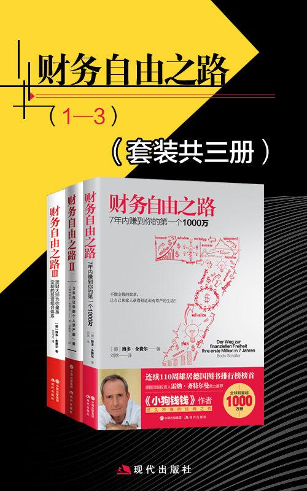

<svg xmlns="http://www.w3.org/2000/svg" xmlns:xlink="http://www.w3.org/1999/xlink" height="100%" preserveaspectratio="xMidYMid meet" version="1.1" viewbox="0 0 923 1345" width="100%">

<image height="1345" width="923" xlink:href="Image00058.jpg"></image>
</svg>

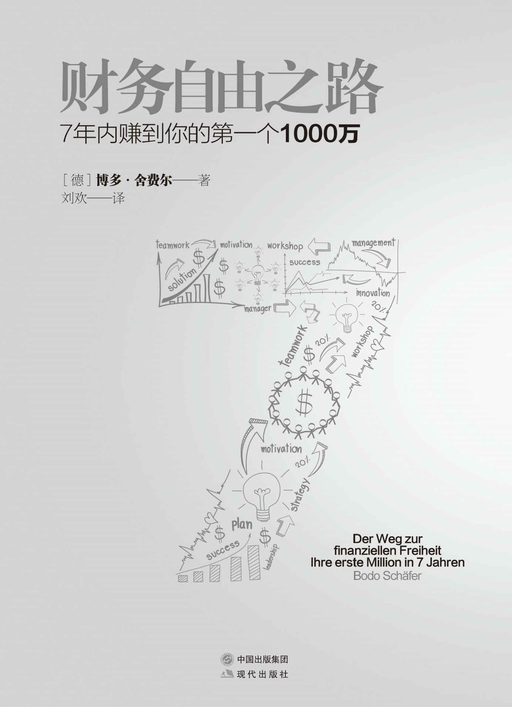

图书在版编目（CIP）数据

财务自由之路／（德）博多·舍费尔著；刘欢译．—北京：现代出版社，2017.3

ISBN 978-7-5143-4092-1

Ⅰ．①财…　Ⅱ．①博…②刘…　Ⅲ．①投资－基本知识　Ⅳ．①F830.59

中国版本图书馆CIP数据核字（2016）第326568号

COPYRIGHT: THE RIGHTS COMPANY, The Netherlands

The simplifed Chinese translation rights arranged through Rightol Media

（本书中文简体版权经由锐拓传媒取得Email：copyright@rightol.com）

财务自由之路

------------------------------------------------------------------------

作　　者 　（德）博多·舍费尔

译　　者 　刘　欢

责任编辑 　姚冬霞

出版发行 　现代出版社

通信地址 　北京市安定门外安华里504号

邮政编码 　100011

电　　话
　010-64267325　64245264（传真）

网　　址 　www.1980xd.com

电子邮箱 　xiandai@cnpitc.com.cn

印　　刷 　三河市南阳印刷有限公司

开　　本 　710mm×1000mm　1/16

印　　张 　18

版　　次
　2017年3月第1版　2017年3月第1次印刷

书　　号 　ISBN 978-7-5143-4092-1

定　　价 　45.00元

------------------------------------------------------------------------

版权所有，翻印必究；未经许可，不得转载

财富不会从天而降——除非你指望着中彩票头奖。但每个人可以做到的是：做出正确的决定，制订一个长期计划，使自己获得财务保障，甚至创造出一份财富，以此来改善自己的生活质量。如何消除对金钱和财富的偏见？怎样才能避免消费债务？如何在不丧失生活乐趣的情况下正确省钱，让你的收入大幅提高？所有这些问题，在本书中，博多·舍费尔会以一种充满说服力且设身处地的方式来进行回答。此外，本书还介绍一项重要内容：哪些投资项目不仅能保障财务安全，还有可靠的专家网络做后盾。

博多·舍费尔是成就最为卓越的非虚构作家之一。他是国际知名的讲座带头人和国际性会议发言人。博多·舍费尔将继续提供业内知识，透露极其有效的资金管理技巧，指引读者一步一步走上财务自由之路。

# 前言

大多数人的梦想和现实状况都有天壤之别，而他们却认为，这是不足为奇的。为消除这一不正确的认知，我写下了这本书。

我想表明：财富是你们与生俱来的权利；也就是说，生活体面、财务自由是你们的天职。我也乐意于使你们对前途再次充满信念。我撰写本书以来，发生了两件事情。

其一是我切切实实成功地触动了很多人的心。截至今天，已有超过1000万的人读过此书。此书已被翻译成大约35种语言，成为全球各个时代最为成功的理财书。

问题是：为什么这本书能取得如此巨大的成功？答案很简单：因为它帮助了不计其数的人。很多人写信给我，这些信件对我来说意义重大。他们的成功故事可谓精彩纷呈。自从专心研究金钱这一主题，他们生活中还有哪些方面没有彻底改变吗？说到这里，便引出了第二件事。

我写这本书的时候就知道，这本书可以使人学到财富世界的游戏规则。在此期间，我的这一看法也通过世界各地的积极反馈，以及走上财务自由之路的各界人士，得到了证实。

跟你现在读到的数据相比，很快将会有越来越多的人变得富有，这是一个方面。但是另一方面，也会有很多很多的人在财务上陷入僵局。这使人感到不好受。因此，我的任务还没有结束。我想使你进一步了解金钱这一主题。

也许有些人会反驳：“但金钱并不能给人带来幸福啊。”当然不能。而且这也不是金钱的任务。金钱应该给予我们安全感、自由感。金钱应该为我们提供这样一种可能性，一种我们可以过上自己想要的生活的可能性。但还有一点无可否认：金钱可以使人更接近于幸福的生活。

读完本书，你对这句话的理解会更深刻一些。因为这本书一直都是一本关于幸福的书，而不仅仅是一本关于金钱的书。它能指引你过上成功和幸福的生活——成为最好的自己。这也许道出了本书取得巨大成功的原因。

我读了许多读者写给我的感谢信，超过36000封！大多数人得出一个惊人的观察结果，用我的话总结就是：一旦金钱开始流动，它就会快速且大量地流入你的口袋，以至于你很惊讶以前你的钱都藏哪儿去了。

但愿你们也会如此。期待你的来信。

你最真诚的博多·舍费尔

贝尔吉施格拉德巴赫　2015年2月

# 序

你知道大多数人过上梦想生活的阻碍是什么吗？金钱。毫无疑问，是金钱。因为金钱代表了一种特别的人生观，反映了我们的心理状态。金钱并不会自动地产生，它更多地以一种能量的方式体现出来：我们在生活重心投入的能量越多，便会有更多的金钱向我们涌来。真正的成功人士始终具有聚财能力。一些人赚钱然后储蓄，另一些人使用金钱为周围人服务。不过，所有人都有持续赚钱的能力。

我们不应过度强调金钱的重要性。但是你知道金钱在什么时候尤为重要吗？在你金钱短缺的时候。有财务困境的人，就会知道金钱的重要性了。要克服金钱问题，不能让金钱控制我们的生活，而应让它在生活的各个领域助我们一臂之力。

我们每个人都有梦想。我们想要过上什么样的生活，我们应该得到什么，对此我们都有自己的想法。我们内心深处认为，我们都扮演着特定的角色，这能够为我们在当前环境下创造出一份更美好的生活。而实际上，我却屡次见证了一成不变的生活和现实状况逐渐扼杀了梦想。许多人忘记了，艳阳之下也有自己应得的一席之地，因为他们已经故步自封。

我们通常都听天由命。我们接受妥协——在我们整装待发之前，时间已大跨步地与我们擦身而过了。通常情况下，我们中的许多人如果没能过上理想的生活，都会归咎于自身的财务状况。

28年来我都致力于研究金钱、成功和幸福。从中我也学到了，从不同的角度去看待金钱：金钱会妨碍我们充分挖掘自己的潜力；或者从另一个角度来看，金钱能帮助我们成为最好的自己。

我和本书是你随叫随到的私人金钱教练。我想继续传授我的所学所获。我想引导你创造一台赚钱机器。有钱首先就意味着过上自由且独立的生活。当我认识到这一点时，我的内心便极度渴望将我的知识传递出去。我有义务将所有与我有接触的人，引导上一条切合他们本人实际的财务自由之路。正如人们可以学会飞行、潜水或编程一样，每个人都可以通过学习几个基础知识模块来走向富裕，甚至积聚财富。

变得富有的途径有很多。本书中为您详述其中一种，它由以下4种策略组成：

1．储蓄一定比例的金钱。

2．使用储蓄资金进行投资。

3．提高自己的收入。

4．从每次加薪中提取一定比例进行储蓄。

如果你付诸实践，你将会在15～20年之内获得50万～100万欧元（1欧元约合人民币7.4元）的财富（视你当时情况而定）。这并非奇迹。如果想更快（比如7年）获得你的第一个100万欧元，那你就必须尽可能多地使用本书中的策略。每使用一个策略，你便会更接近于你的目标。

如何在7年之后变得富有？你应该知道，这并不仅仅在讨论你想拥有多少财富，还在讨论你要拥有的人格。

走上财务自由之路肯定不容易，但更不容易的是财务不独立。如果你遵循本书中的各条建议，你的目标绝对会实现。我在我的讲座上成功地帮助了成千上万的人走上财务自由之路。我一直都在不停地见证，这些知识是如何彻底改变人们的生活的。

请不要认为只要拥有这本书就会使你变得富有。事实是：仅仅闭门读书不会让你变得富有。更多地运用这本书，使这本书的知识成为你知识体系的一部分，你才能变得富有。那时，你的潜能才会显现出来。

让我们一同携手走上这条共同的道路。首先在财务方面为自己确立一个目标。在接下来的内容中你会读到一个自我分析。请你在确定自己所处的财务状况之后，再开始读这本书。

我衷心地希望，这本书除了让你变得富有之外，还能以一种深刻的方式触动你。我不认识你，但我知道，如果你正捧着这本书，那么你一定是一个非常特别的人，你还没有屈服于周围环境给你的压力。你是一个想要创造自己未来的人。你想要设计自己的未来，你想要过上不平凡的生活。我全心全意地希望这本书能助你一臂之力。

你的最真诚的博多·舍费尔

# 自我分析：你处于什么样的财务状况

注意：阅读本书之前，请回答以下问题。

1．你如何评价自己的收入？

□非常好\
□很好\
□好\
□满意\
□足够\
□差\
□非常差

2．你如何评价自己的净资产？

□非常好\
□很好\
□好\
□满意\
□足够\
□差\
□非常差

3．你如何评价自己的投资？

□非常好\
□很好\
□好\
□不差\
□差\
□非常差\
□满意

4．你如何评价自己投资理财方面的知识？

□非常好\
□很好\
□好\
□满意\
□足够\
□差\
□非常差

5．你有周密的理财计划吗？你确切地知道自己的目标、需要的投入和资金来源吗？

□清晰明了\
□非常清楚\
□清楚\
□了解\
□知道\
□不知道\
□完全不知道

6．你有财务方面的教练吗？

□有\
□没有

7．你交际圈中的大部分人

□比你富有\
□财务状况和你差不多\
□比你穷

8．你是否每月至少储蓄收入的10％～20％？

□是\
□不一定\
□否

9．你是否定期捐赠金钱？

□是\
□否

10．你是否认为你应该赚大钱？

□是\
□否\
□从来没有考虑过这个问题

11．如果不再有其他收入，你现有的资金够你生活多久？

\_\_\_\_\_\_个月

12．你能计算出你什么时候可以仅靠利息便可生活吗？

□能\
□不能

13．如果你今后5年的财务发展状况和前5年一样，你会感到满意吗？

□满意\
□不满意

14．你知道自己关于金钱的真实想法吗？

□清楚知道\
□知道一些\
□不知道

15．你会如何描述你的财务状况？

\_\_\_\_\_\_\_\_\_\_\_\_\_\_\_\_\_\_\_\_\_\_\_\_\_\_\_\_\_\_\_\_\_\_\_\_\_\_\_\_

16．如果让你为自己在财务方面定义一个身份的话，你会怎么称呼自己（比如唐老鸭的舅舅
<a href="#text00006.html_ch1"
id="text00006.html_ch1-back">(1)</a>
、初学者、失败者、倒霉鬼、吸金磁石、成功者……）？

\_\_\_\_\_\_\_\_\_\_\_\_\_\_\_\_\_\_\_\_\_\_\_\_\_\_\_\_\_\_\_\_\_\_\_\_\_\_\_\_

17．金钱在你的生活中更多地是

□一种帮助\
□一种阻碍

18．你了解基金吗？

□清晰明了\
□非常清楚\
□清楚\
□了解\
□知道\
□不知道\
□完全不知道

19．你了解股票知识吗？

□清晰明了\
□非常清楚\
□清楚\
□了解\
□知道\
□不知道\
□完全不知道

20．你是否了解基本的投资准则并运用这些准则？

□是\
□否

21．你认为金钱对你而言重要吗？

□不重要\
□有一点重要\
□相当重要\
□非常重要\
□最为重要

22．关于金钱、支付和财务，你有何观点？

\_\_\_\_\_\_\_\_\_\_\_\_\_\_\_\_\_\_\_\_\_\_\_\_\_\_\_\_\_\_\_\_\_\_\_\_\_\_\_\_

\_\_\_\_\_\_\_\_\_\_\_\_\_\_\_\_\_\_\_\_\_\_\_\_\_\_\_\_\_\_\_\_\_\_\_\_\_\_\_\_

23．在回答完上述问题后，你会如何评价你的总体财务状况？

□非常好\
□很好\
□好\
□满意\
□足够\
□差\
□非常差

24．在回答完上述问题之后，你有何感想？

\_\_\_\_\_\_\_\_\_\_\_\_\_\_\_\_\_\_\_\_\_\_\_\_\_\_\_\_\_\_\_\_\_\_\_\_\_\_\_\_

————————————————————

<a href="#text00006.html_ch1-back" id="text00006.html_ch1">(1)</a>
 指守财奴。——译者注

# 目录

<a href="#text00004.html_calibre_pb_0" class="calibre12">前言</a>

<a href="#text00005.html_calibre_pb_0" class="calibre12">序</a>

<a href="#text00006.html_calibre_pb_0"
class="calibre12">自我分析：你处于什么样的财务状况</a>

<a href="#text00008.html_calibre_pb_0" class="calibre12">基本原则</a>

<a href="#text00009.html_calibre_pb_0"
class="calibre12">第一章　你真正想要的是什么</a>

<a href="#text00009.html_sec001"
class="calibre12">变得富有的机会如何</a>

<a href="#text00009.html_sec002"
class="calibre12">特殊的经历造就了我们</a>

<a href="#text00009.html_sec003" class="calibre12">仅有决心是不够的</a>

<a href="#text00009.html_sec004"
class="calibre12">我们的价值观和目标必须一致</a>

<a href="#text00009.html_sec005" class="calibre12">乐观主义和自信</a>

<a href="#text00009.html_sec006"
class="calibre12">你处于什么样的状态中</a>

<a href="#text00009.html_sec007" class="calibre12">金钱是善物</a>

<a href="#text00009.html_sec008" class="calibre12">生活的5个领域</a>

<a href="#text00009.html_sec009"
class="calibre12">优化自己还是削弱自己</a>

<a href="#text00009.html_sec010" class="calibre12">规划是关键</a>

<a href="#text00010.html_calibre_pb_0"
class="calibre12">第二章　责任意味着什么</a>

<a href="#text00010.html_sec001" class="calibre12">责任</a>

<a href="#text00010.html_sec002"
class="calibre12">你对这本书的反应如何</a>

<a href="#text00010.html_sec003" class="calibre12">“是别人的错……”</a>

<a href="#text00010.html_sec004" class="calibre12">后果和错误</a>

<a href="#text00010.html_sec005"
class="calibre12">你能掌控自己的未来</a>

<a href="#text00010.html_sec006"
class="calibre12">承担责任，拓宽你的可控领域</a>

<a href="#text00010.html_sec007"
class="calibre12">没有责任的生活会更轻松吗</a>

<a href="#text00010.html_sec008"
class="calibre12">为了改善你的财务状况而承担责任</a>

<a href="#text00011.html_calibre_pb_0"
class="calibre12">第三章　100万欧元是难以企及的奇迹吗</a>

<a href="#text00011.html_sec001" class="calibre12">发生变化的5个层次</a>

<a href="#text00011.html_sec002"
class="calibre12">奇迹发生于5个层次之上</a>

<a href="#text00011.html_sec003"
class="calibre12">要创造奇迹，你需要勇气</a>

<a href="#text00011.html_sec004"
class="calibre12">没有哪个奇迹的发生不需要冒险</a>

<a href="#text00011.html_sec005" class="calibre12">你真的需要好运吗</a>

<a href="#text00011.html_sec006" class="calibre12">好运是如何产生的</a>

<a href="#text00011.html_sec007" class="calibre12">创造奇迹容易吗</a>

<a href="#text00012.html_calibre_pb_0"
class="calibre12">第四章　为什么没有更多的人变得富有</a>

<a href="#text00012.html_sec001"
class="calibre12">穷人对财富没有明确定义</a>

<a href="#text00012.html_sec002"
class="calibre12">穷人的财富目标摇摆不定</a>

<a href="#text00012.html_sec003"
class="calibre12">穷人从不将财富看成绝对必需品</a>

<a href="#text00012.html_sec004"
class="calibre12">穷人做不到坚持到底</a>

<a href="#text00012.html_sec005" class="calibre12">穷人不去承担责任</a>

<a href="#text00012.html_sec006"
class="calibre12">穷人不准备付出110％的努力</a>

<a href="#text00012.html_sec007"
class="calibre12">穷人缺少一个好的教练</a>

<a href="#text00012.html_sec008"
class="calibre12">穷人只关注自己的劣势</a>

<a href="#text00012.html_sec009" class="calibre12">你的优势使你富有</a>

<a href="#text00012.html_sec010"
class="calibre12">变得富有的代价有多大</a>

<a href="#text00012.html_sec011" class="calibre12">安息年</a>

<a href="#text00013.html_calibre_pb_0"
class="calibre12">第五章　你关于金钱的真实想法是什么</a>

<a href="#text00013.html_sec001"
class="calibre12">你随身携带多少现金</a>

<a href="#text00013.html_sec002"
class="calibre12">你对金钱和财富是什么看法</a>

<a href="#text00013.html_sec003"
class="calibre12">你的信仰如何发生作用</a>

<a href="#text00013.html_sec004" class="calibre12">过去与未来大不同</a>

<a href="#text00013.html_sec005"
class="calibre12">找出你对金钱的真实想法</a>

<a href="#text00013.html_sec006"
class="calibre12">一种信仰就可以决定一切</a>

<a href="#text00013.html_sec007"
class="calibre12">你的信仰是如何产生的</a>

<a href="#text00013.html_sec008"
class="calibre12">这些人都是出于好意吗</a>

<a href="#text00013.html_sec009"
class="calibre12">你现在已了解自己关于金钱的信仰，接下来该做什么</a>

<a href="#text00013.html_sec010" class="calibre12">金钱是好还是坏</a>

<a href="#text00013.html_sec011" class="calibre12">信仰是如何产生的</a>

<a href="#text00013.html_sec012"
class="calibre12">如何改变你的金钱观</a>

<a href="#text00013.html_sec013"
class="calibre12">改变你的信仰就是改变你的人生</a>

<a href="#text00013.html_sec014"
class="calibre12">用新的想法取代旧的想法</a>

<a href="#text00013.html_sec015" class="calibre12">杠杆作用</a>

<a href="#text00014.html_calibre_pb_0"
class="calibre12">实用指南：第一个100万欧元</a>

<a href="#text00015.html_calibre_pb_0"
class="calibre12">第六章　债务</a>

<a href="#text00015.html_sec001"
class="calibre12">愚蠢的债务和明智的债务</a>

<a href="#text00015.html_sec002" class="calibre12">债务是如何产生的</a>

<a href="#text00015.html_sec003" class="calibre12">我如何避免债务</a>

<a href="#text00015.html_sec004"
class="calibre12">消除债务的13个实用建议</a>

<a href="#text00015.html_sec005" class="calibre12">应对债务的策略</a>

<a href="#text00015.html_sec006"
class="calibre12">债务让人感到绝望时，该怎么做</a>

<a href="#text00015.html_sec007"
class="calibre12">将目标定得更高远一些</a>

<a href="#text00015.html_sec008" class="calibre12">你如何获得快乐</a>

<a href="#text00015.html_sec009"
class="calibre12">关于债务的最高智慧</a>

<a href="#text00015.html_sec010" class="calibre12">后退几步</a>

<a href="#text00016.html_calibre_pb_0"
class="calibre12">第七章　如何增加自己的收入</a>

<a href="#text00016.html_sec001" class="calibre12">展示自己的强项</a>

<a href="#text00016.html_sec002"
class="calibre12">你应该关心自己的义务，而非权利</a>

<a href="#text00016.html_sec003"
class="calibre12">如果你得到8个小时的报酬，你应该工作10个小时</a>

<a href="#text00016.html_sec004"
class="calibre12">刻不容缓地去处理事情</a>

<a href="#text00016.html_sec005"
class="calibre12">世上不存在微不足道的小事</a>

<a href="#text00016.html_sec006"
class="calibre12">使自己成为不可或缺的一员</a>

<a href="#text00016.html_sec007" class="calibre12">对自己进行深造</a>

<a href="#text00016.html_sec008"
class="calibre12">越有问题，越自告奋勇</a>

<a href="#text00016.html_sec009" class="calibre12">让自己成为专家</a>

<a href="#text00016.html_sec010"
class="calibre12">个体经营者和雇员一样挣工资</a>

<a href="#text00016.html_sec011"
class="calibre12">个体经营者必须积累财富</a>

<a href="#text00016.html_sec012" class="calibre12">如何分析你的收入</a>

<a href="#text00016.html_sec013" class="calibre12">寻找其他收入来源</a>

<a href="#text00016.html_sec014"
class="calibre12">将精力集中在收入丰厚的活动上</a>

<a href="#text00016.html_sec015"
class="calibre12">收入并不意味着财富</a>

<a href="#text00016.html_sec016" class="calibre12">永不止步……</a>

<a href="#text00017.html_calibre_pb_0"
class="calibre12">第八章　储蓄——支付自己</a>

<a href="#text00017.html_sec001" class="calibre12">4个不储蓄的理由</a>

<a href="#text00017.html_sec002"
class="calibre12">使你变得富有的是储蓄而非收入</a>

<a href="#text00017.html_sec003"
class="calibre12">储蓄使人快乐，储蓄易如反掌——对每个人来说</a>

<a href="#text00017.html_sec004"
class="calibre12">你可以随时改变你关于储蓄的信仰和观念</a>

<a href="#text00017.html_sec005"
class="calibre12">储蓄使你成为百万富翁</a>

<a href="#text00017.html_sec006"
class="calibre12">教你的孩子支付自己</a>

<a href="#text00018.html_calibre_pb_0"
class="calibre12">第九章　复利的奇迹</a>

<a href="#text00018.html_sec001"
class="calibre12">为自己创造新的收入来源</a>

<a href="#text00018.html_sec002" class="calibre12">决定你收益的因素</a>

<a href="#text00018.html_sec003"
class="calibre12">你的金钱可以用来干什么</a>

<a href="#text00018.html_sec004"
class="calibre12">没有资本的资本主义意味着金融石器时代</a>

<a href="#text00018.html_sec005"
class="calibre12">为什么金钱能带来更多的金钱</a>

<a href="#text00018.html_sec006" class="calibre12">开明很重要</a>

<a href="#text00019.html_calibre_pb_0"
class="calibre12">第十章　你为什么必须饲养金钱</a>

<a href="#text00020.html_calibre_pb_0"
class="calibre12">第十一章　投资者和股民应遵从的原则</a>

<a href="#text00020.html_sec001" class="calibre12">第一部分：原则</a>

<a href="#text00020.html_sec002"
class="calibre12">第二部分：重要的决定</a>

<a href="#text00021.html_calibre_pb_0"
class="calibre12">第十二章　财务保障、财务安全和财务自由</a>

<a href="#text00021.html_sec001"
class="calibre12">第一步计划：财务保障</a>

<a href="#text00021.html_sec002"
class="calibre12">你需要多长时间的财务保障</a>

<a href="#text00021.html_sec003"
class="calibre12">为你的企业做好财务保障</a>

<a href="#text00021.html_sec004" class="calibre12">但我想投资……</a>

<a href="#text00021.html_sec005"
class="calibre12">实现财务保障需要多长时间</a>

<a href="#text00021.html_sec006" class="calibre12">预算计划</a>

<a href="#text00021.html_sec007"
class="calibre12">如果预算计划不是你的强项</a>

<a href="#text00021.html_sec008"
class="calibre12">要么开源，要么节流</a>

<a href="#text00021.html_sec009"
class="calibre12">你要用这笔资金为实现财务保障做些什么</a>

<a href="#text00021.html_sec010" class="calibre12">可口可乐的故事</a>

<a href="#text00021.html_sec011"
class="calibre12">第二步计划：财务安全</a>

<a href="#text00021.html_sec012" class="calibre12">你需要多少资金</a>

<a href="#text00021.html_sec013" class="calibre12">你欠自己一份财富</a>

<a href="#text00021.html_sec014"
class="calibre12">第三步计划：财务自由</a>

<a href="#text00021.html_sec015" class="calibre12">绝不动用你的本金</a>

<a href="#text00021.html_sec016"
class="calibre12">如何计算梦想所需的花费</a>

<a href="#text00021.html_sec017" class="calibre12">你的投资策略</a>

<a href="#text00021.html_sec018"
class="calibre12">定好目标，你成功了一半</a>

<a href="#text00021.html_sec019"
class="calibre12">财务自由很难实现吗</a>

<a href="#text00021.html_sec020"
class="calibre12">不应该让恐惧左右你的决定</a>

<a href="#text00021.html_sec021" class="calibre12">错误是有益的</a>

<a href="#text00021.html_sec022"
class="calibre12">你真的想实现财务自由吗</a>

<a href="#text00021.html_sec023"
class="calibre12">什么都不做的人才不会犯错</a>

<a href="#text00022.html_calibre_pb_0"
class="calibre12">第十三章　教练和专家网络</a>

<a href="#text00022.html_sec001"
class="calibre12">个人环境会对你产生影响</a>

<a href="#text00022.html_sec002"
class="calibre12">能给你最大帮助的三种人</a>

<a href="#text00022.html_sec003"
class="calibre12">只追随那些比你成功的人</a>

<a href="#text00022.html_sec004"
class="calibre12">我的教练——那位亿万富翁</a>

<a href="#text00022.html_sec005"
class="calibre12">如何找到一名导师，如何与导师正确相处</a>

<a href="#text00022.html_sec006"
class="calibre12">一次训练应该持续多长时间</a>

<a href="#text00022.html_sec007"
class="calibre12">如何建立一个专家网络</a>

<a href="#text00022.html_sec008"
class="calibre12">与渴望成功的人结交</a>

<a href="#text00022.html_sec009" class="calibre12">对卓越的模仿</a>

<a href="#text00022.html_sec010"
class="calibre12">本章是实践应用的关键</a>

<a href="#text00023.html_calibre_pb_0"
class="calibre12">第十四章　你可以播种金钱</a>

<a href="#text00023.html_sec001"
class="calibre12">你挣到的钱不仅仅属于你个人</a>

<a href="#text00023.html_sec002" class="calibre12">如何播种金钱</a>

<a href="#text00023.html_sec003" class="calibre12">收入的1/10</a>

<a href="#text00023.html_sec004"
class="calibre12">付出金钱的人拥有更多的金钱</a>

<a href="#text00023.html_sec005" class="calibre12">金钱使人快乐</a>

<a href="#text00024.html_calibre_pb_0"
class="calibre12">展望：未来会如何发展</a>

<a href="#text00024.html_sec001"
class="calibre12">西塞罗或德摩斯梯尼</a>

<a href="#text00024.html_sec002"
class="calibre12">建立一个团队，使自己持续走在富有之路上</a>

<a href="#text00024.html_sec003"
class="calibre12">请将本书的理念传递下去</a>

<a href="#text00024.html_sec004" class="calibre12">我个人对你的祝福</a>

<a href="#text00025.html_calibre_pb_0" class="calibre12">致谢</a>

<a href="#text00026.html_calibre_pb_0"
class="calibre12">附录：值得一读的同主题好书</a>

# 基本原则

# 第一章　你真正想要的是什么

你已经探索很久了。现在放弃探索，学习如何收获吧。

——海因兹·克尔纳《约翰尼斯》

一个典型的矛盾：我们内心深处的设想和我们的实际生活状况往往不尽相同。我们对于生活的设想和现实之间的差距，往往就如同白天和黑夜的差别。

我们每个人都渴望成长和幸福。在内心深处，我们都希望改变一些事情，使这个世界变得更美好。我们都确信，我们值得过上美好的生活。

##  变得富有的机会如何

我们实现梦想的绊脚石是什么？我们实现一切渴望的阻碍是什么？当然，大多数人都生活在一个不利于致富的客观环境中。我们的政府是一本反面教材，年复一年地大量举债。为了支付越发高涨的国家债务利息，政府提高了税收。

我们的教育体制也没有为这些问题给出答案。比如，“我们如何才能过上幸福的生活”，“我们如何才能变得富有”。我们能够学习到这样的知识，阿提拉于451年在沙隆之战中惨败，但是我们学不到如何使自己经济独立。谁能教会我们如何变得富有呢？是我们的父母吗？我们中的大多数人并没有富有的父母。也正因此，我们能得到的关于创造财富的建议也是微乎其微。此外，我们的社会倡导过度消费，我们的熟人圈和朋友圈中也缺乏这方面的良师益友。因此，许多人在生活中失去了一些东西，这些东西被我视作我们与生俱来的权利，即幸福和富有
。

如果审视我今天的生活，那么我的内心充满了深深的感激之情。我过上的正是我梦寐以求的生活，我经济独立。但我并非一直如此。跟大多数人一样，我也经历过这样的阶段，在那些阶段里，自我怀疑和迷惘充满了我的内心，仿佛使我瘫痪。

##  特殊的经历造就了我们

我们每个人在生活中都有过一些对我们影响颇深的经历。这些具有导向作用的经历改变了我们的世界观和我们对人类、机会、金钱以及世界的看法，进而使我们的生活变得更加美好或者更加艰难。

6岁时的一次经历影响了我的金钱观。我的父亲因为肝硬化被送进了医院。他得住院12个月，因为他需要绝对的静养，医生也要求他尽可能不要看书。

一天，我听到一位医生对我母亲说，他从来没有见过一位有这么多访客的病人。尽管父亲需要绝对的静养，但是每天都有不下6拨人来看望他。而且我们也发现，我父亲就算在病房里，也还在继续工作。他是一名律师，工作之余他还开展一项副业，他称之为“穷人的律师事务所”。收入微薄的人会得到他的免费辩护。

我母亲马上就去找父亲谈话了。母亲劝他不能再这样下去了，不然他就不能活着离开医院了。就连医生也极力劝他要“理性行事”。但是我的父亲是一个性格倔强的人，他还是坚持做他认为正确的事。

我经常在他的病床边坐几个小时，听访客向他倾诉的内容。你知道吗？他们的主题永远都是钱，他们永远都在哭诉，过失方永远都是环境或他人。我不懂法律案情，所以感觉好像一直在重复听到同样的故事：金钱焦虑、金钱焦虑、金钱焦虑……最初我还觉得这些故事引人入胜，但是很快就不胜其烦。慢慢地，我开始憎恶贫穷。贫穷使人生活不幸。因为贫穷，他们卑躬屈膝地来病房探望我的父亲，并向父亲乞求帮助。我要成为一个富有的人。我下定决心，30岁之前一定要成为一名百万富翁。

##  仅有决心是不够的

然而这并非一个了不起的成功者故事的开端。虽然我在30岁时达成了我的目标，但在此之前5年，我还负债累累，体重超重18公斤，对自身充满了怀疑。因为我当时的财务状况很紧张，所以金钱就是我当时生活的中心。

金钱的重要性，一直都是我们赋予它的。所以当你有财务问题时，金钱便会变得尤为重要。

我希望
一切都能变得更好，事态也终会朝着这个方向发展的。但如果我们只是徒有希望而不做努力的话，那什么都不会发生。希望是一种智能镇定剂，一种绝妙的自我欺骗
。我们在等谁？在等什么？是上帝还是命运？上帝绝不是一个古怪的临时保姆，会因为我们无所事事而奖赏我们。古老的格言自有其道理：“所有的傻瓜都生活在希望和等待之中。”

##  我们的价值观和目标必须一致

我曾经感到绝望：我明明日进斗金，怎么还负债累累？当我终于找到这个问题的答案时，我吃了一惊。我内心深处从不认为金钱是善物。我亲手毁了自己的成功。

我父亲终究在患病8年后去世，我时常听人说：“他是工作过度累死的。”我绝不愿因工作过度而死，也绝不想像那些穷人那样，去病房探望父亲，只为求得一名律师的帮助。我一定要变得富有，而且尽可能不付出太大的代价。

之后，母亲在父亲去世后也逃避似的皈依了宗教。她便是一个坚持“富人进天堂比骆驼穿过针孔还难”的人。而我，一方面想获得福报，就会想贫穷是福；另一方面，我又想变得富有，因为我憎恶贫穷。

两个不同的价值观将我引向了两个不同的方向。只要没消除我的价值观冲突，我就总会站在两个方向的分歧点上。

万不得已，我最终还是尝试
去使自己变得富有。每当我们尝试某事时，总有一些具体的阻碍挡在面前。我们为自己准备好退路。尝试新事物的人也总是预备好迎接阻碍他实现目标的困难。我们迎接障碍，因为我们不认为生活会优待我们，不认为自己已经强大到能够实现目标。

##  乐观主义和自信

将你的乐观主义暂时收起来。我也乐意向你解释一下我提出该项要求的原因。乐观主义当然是一种正面的品质，它会帮助你看到所有事物的积极面。但如果只有乐观主义而不具备其他品质的话，它也不会发挥很大作用。乐观主义经常被错当成自信。

乐观主义让你看到事物的积极面，而自信给你一种战胜事物黑暗面的信心
。生活并不是一支只由美好明快的曲调组成的交响乐，它还有黑暗低沉的曲调。不过自信的人在面对困境时不会胆怯。

自信指的是，一个人在自身经历的基础之上，知道他遇事可以依靠自己
。一个自信的人不会因阻碍而愤懑，因为他知道他一定会破除万难达成目标。多次的事实也证明他确实能做到。如何在短期内建立自信，详情参见第三章。

你的财务状况对于建立自信极为重要。财务状况可降低出现盲目乐观主义的可能性。账户余额让吹嘘无所遁形。你想建立起充足的自信，就必须管理你的财务状况。你的财务状况应该成为一个你不惧怕任何阻碍的证明
。

你不能让自己的财务状况破坏你的自信程度。没有自信的生活只能叫作生存。你永远都不会知道自己的潜能。你从不冒险，从不成长，从不应对处境做出反抗，从不充分开发自己真正的潜能。一个没有自信的人，只是一个一事无成、一无所有的无名小卒
。

所有这些都不是乐观主义，而是自信。只需看一眼账户余额，你就知道你的财务状况是你生活的保障。只需看一眼账户余额，你就立刻充满一种来自自身能力的安全感。

这正是本书的主题，即：管理你的财务状况，使它服务于你，而非给你带来麻烦。金钱可以使你生活艰难，也可以使你生活轻松。

##  你处于什么样的状态中

你是否认为你将会得到晋升？你是否认为“这”还不是全部？而且你还会比现在挣得更多？你是否认为你变得富有只是一个时间问题？请把你的乐观主义暂时收起来：你的个人财产在过去7年发生了什么变化？在下面横线写下一个数字，这个数字是你的个人财产在过去7年中增多或者减少的数量：

\_\_\_\_\_\_\_\_\_\_欧元。

这个数字往往使人失望，却也切中要点。如果你继续坚持原来的做法，你只会在7年之后再次看到一个大致相同的数字。再往后的年份里这样的趋势又会重复出现。如果你想获得不一样的结果，那你就必须有所行动：你必须改变自己的方式，首先需要改变的便是你的思维方式。

你的思维方式铸就了你今天的样子。这样的思维方式却并不能让你变成你想成为的样子。

你关于金钱的真实想法是什么？你在生活中总是不断地与自己进行对话。如果你私下里认为，金钱不好，那么你就无法使自己变得富有。那么，你的真实想法是什么呢？我们将在第五章中详细探讨这个问题。你会发现内心最深处关于金钱的真实想法和感觉，也会明白你应该如何转变你的观念。

##  金钱是善物

26岁时我认识了一个人，他教会了我致富的准则。仅仅4年之后，我就可以仅靠利息生活了。我之所以能如此之快地达成这一目标，是因为我的梦想、价值观、目标和策略都是一致的。

不管你相不相信，金钱确实改变了我生活中的许多东西。金钱不会解决你的所有问题，它也绝不是万能的。但是，缺钱却能使你的幸福蒙上一层阴影。有了金钱，你在处理问题的时候便能尝试多种方式。而且，你也将会有机会结识更多的人，参观风景优美的地方，得到更加有趣的工作，获得更多的自信，赢得更多的赞赏，获取更多的机会。

##  生活的5个领域

我将生活简化为5个领域：健康、财务、关系、情感和人生意义。5个领域都同等重要。

健康是革命的本钱。无法控制情感的人，也无法完成自己的既定计划。良好的人际关系就犹如盐对于汤的重要性。关于人生意义，我指的是做自己认为有趣的、符合自己才能的、有益于他人的事情。财务状况也属于此类范畴。永远不要为了金钱去做一些无趣的事情
。所以你需要的是财务自由。

你可以将生活的5个领域分别比作你一只手的5根手指。想象一下，你的中指代表你的财务状况，有人使用一把锤子狠狠敲击你的中指，你是说“没关系，只不过一根手指而已，我还有另外4根手指呢”，还是会将全部注意力集中在疼痛的中指上？

重要的是，生活中的5个领域能够互相协调一致。你应该使自己在5个领域中的任何一个领域都成为冠军。有金钱问题的人便无法平衡这5个领域。金钱问题也总是会对其他几个领域造成消极影响。同其他几个领域相比，金钱也是同等重要的。

为什么人们想在短期内变得富有？因为他们想获得足够的能为他们服务的金钱。因为他们想拥有一台赚钱机器，而非穷其一生当一台赚钱机器
。因为他们想拥有足够的资金，以过上一种收支平衡的生活。

你知道为什么大多数人都不去做自己真正感兴趣的事情吗？因为他们缺钱。有这样一个恶性循环：许多人并不去从事自己感兴趣的工作，因为他们不知道如何从中赚钱获利；但是，也没有人因为厌恶自己的行当而发大财；因为缺钱，他们也就选择继续待在原来的工作岗位上，自己不喜欢这份工作，然后，也赚不到钱。

解决方法是：将你的事业建立在你最大的爱好之上
。用你的爱好来赚钱。花点时间分析一下，你真正感兴趣的是什么、你的才能在哪方面，之后你才有可能从事一份自己既感兴趣又能赚钱的工作。

几年前我结识了一位纽约富翁，他在自己的办公桌上方悬挂了一条格言：“整天工作的人是没有时间来赚钱的。”显然，每个人都应该花时间思考一下。我问他“应该思考什么”，他答道：“认识你自己，弄清你真正感兴趣的是什么。之后再想一想你应该如何用你的爱好来赚钱。最好每天都问自己一遍这几个问题，一步步地找出最满意的答案。”

##  优化自己还是削弱自己

我们需要时间来了解自己，找出自己感兴趣的东西。只有在做一些使自己充满热情和力量的事情时，我们才是真正处于最好的状态，才能使金钱滚滚而来。我们需要时间看清自己的天赋，并将天赋发展成能力。我们需要时间来谱写人生剧本，并使之成为一部巨作。不花时间做这些事的人，就是在浪费生命。我们需要时间来做出一个原则性的决定，尽自己的义务去履行这个决定。因此，每个人都必须在生活中明确地做出决定：是想优化自己还是削弱自己。

优化自己指的是，学习如何以最佳的方式来运用时间、方法、才能、金钱以及与他人合作，其目的是达到最优结果。如果你想优化你的生活，你就应该不断努力成为你能成为的最优秀的人。

相反，大多数人都毫无计划地生活着，同时也削弱了自己。他们尝试过一种得过且过的生活
。5天的工作日对他们来说，是两个周末之间的令人不快的打扰。他们工作只是为了挣钱，并非为了一种满足感。他们不了解自己的天赋，当机会出现时，他们也识别不出来。

##  规划是关键

许多人计划假期比规划人生还要充分。这世上只有两种可能性：不是你自己规划你的生活，就是别人来规划你的生活。

许多人尝试过几次规划自己的生活，但是失败了。于是就有人说：“我规划得越多，意外发生在我身上时我就越痛苦。所以我不做规划，也就不会痛苦。”为什么这么多人都无法成功执行他们的规划，有一个很简单的原因：他们没有将自己的梦想、目标、价值观和策略联系在一起。

美国佐治亚大学的托马斯·史丹利博士历时12年之久，致力于研究富人的生活。他得出了这样一个结论：这些人都属于世界上自身满意度最高的人，因为他们的梦想、目标、价值观和策略是协调一致的。

你的行动准则应该以梦想、目标、价值观和策略这4根支柱为基础，你的财富也应建立在你的行动准则之上。因为你一生中能否有所作为，并不直接取决于你铁一般的行动准则，而是与你的梦想、目标、价值观和策略直接相关。

接下来的章节中，我们将系统探讨这4根支柱。你也将在4根支柱之上为你的财富打下基础。当一个人将这4股力量协调一致之后，他所具备的能力是超乎想象的。

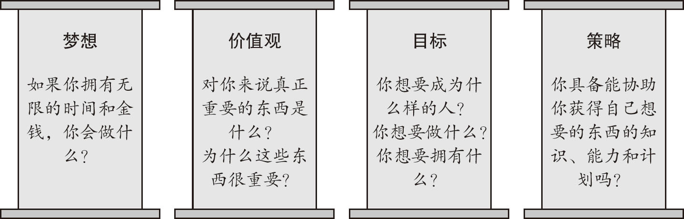

##### 你的梦想

与梦想相关的事，便是使你快乐的事。想象一下，如果你有足够的时间和金钱，你想做些什么事情。你会惊讶地发现，你的许多梦想都需要用到金钱。

##### 你的目标

接下来，你必须根据你的梦想确定你的目标。对此你需要做出一个明确的决定。只要我们还没有决定，没有执行，一切也仍然只是一个梦想。不妨自问一下，你想要成为什么样的人，你想要做什么，你想要拥有什么。在本书后面的部分，你将学到一种极为简单的方法，明确你的目标，并且做出一个明智的决定。

##### 你的价值观

这部分的重点便是：你的梦想和目标必须同你的价值观相一致。问一问你自己：我真正想要的是什么？对我来说真正重要的东西是什么？在第五章中，你将会确定你关于金钱的真实想法。你的价值观并非不容变更的既成事实，而是一种可能性的选择，接下来便是要做出这一选择。受到父母和周围环境的影响，我们的价值观也与他们的相同。

但是，今天你有权选择，你拥有选择自身价值观的自由。价值观并非不可更改的东西。你的一些价值观在不同情况下会自相矛盾，我亦如此。你还记得吧：一方面我想变富，另一方面又不愿工作过度而死。如果价值观将我们引向多个不同的方向，我们就会一事无成。因此，根据你的目标来调整你的价值观非常重要。具体应该怎么做，在第五章中也有详细描述。只有当你清晰地确定指导自己的价值观之后，你才能掌控自己的生活
。

##### 你的策略

如果你的梦想、目标和价值观已经协调一致了，那么接下来你就应该研发能够协助你成功的策略了。使你变得富有的策略，你在本书中便能找到。现在我就先向你做个简短的介绍吧。

如何应对可能发生的债务，详情请看第六章。

你需要相关的知识和能力来执行你的计划。你必须知道如何才能获得你想要拥有的金钱，或者说，如何快速提高收入，详情请看第七章。

在第八章中，你将会学到如何留存你的金钱，因为仅仅只有高收入的话，也还是没法使你富裕起来。只有当你将金钱留存下来之后，你才会变得富有。

此外，你将在第九章、第十章和第十一章中了解到如何“饲养”你的金钱。

如何详细规划你的财务目标，在第十二章中有相关的介绍。

最后，我们还需要确保你的计划的执行。你需要一个能引导你致富的人。我在第十三章介绍如何找到自己的教练。同时你也会学到如何创造一个最佳的环境——一个逼迫你坚持到底的环境——以确保你达成目标。

成功并不是全部内容，因为成功和幸福是有区别的，这些你将在第十四章中读到。成功意味着得到你想要的东西，而幸福意味着热爱你所拥有的一切。因此，我也会向你说明应如何享用你的金钱。

在前面部分，我们主要先讲变得富有的必不可少的条件。在第三章中你可以学到如何创造这一奇迹。

变得富有并非难事。等到一个人真的富有之后，他就会问，为什么没有更多的人变得富有呢？在第四章中你将找到这一问题的答案。

在下一章的内容中，我想和你谈一谈最重要的创造财富和幸福的概念。如果我们还不知道如何完全掌控生活，那我们就仍然只是弱小的牺牲品。一切的开端都起源于我们掌控生活的态度。

继续阅读本书之前，请你再看一遍目录，标注出你最感兴趣的话题。因为起决定作用的还是你如何使用这本书。你一定要经常思考这些问题：“这应该如何为我所用？我如何快速采取行动？”你要将本书的内容融入生活并付诸实践。这样的方法也同样适用于书中一些需要写下答案的小练习。记住：仅靠读书不会使人发财。掌握书面知识是远远不够的，知识运用于实践，才能获得真正的力量。

现在，就让我们一起来创造你的财富吧。7年之后你将变得富有，也许甚至不到7年……

------------------------------------------------------------------------

### 本章要点

- 金钱的重要性是我们赋予的。如果你有财务问题，金钱就会变得尤为重要。
- 我们的价值观和目标必须协调一致，否则我们便会处于矛盾之中。
- 乐观主义让你看到事物的积极面，而自信给你一种战胜事物黑暗面的信心。
- 自信指的是，一个人在自身经历的基础之上，知道他遇事可以依靠自己。
- 你的思维方式铸就了你今天的样子。这样的思维方式却并不能让你变成你想成为的样子。
- 成功意味着成为最好的自己。幸福指的是热爱你现在的样子。
- 财务问题总是会对其他几个领域造成消极影响。
- 做个选择：你是想拥有一台赚钱机器，还是穷其一生成为一台赚钱机器。
- 将你的事业建立在你最大的兴趣之上。
- 整天工作的人是没有时间来赚钱的。
- 只有当你清晰地确定指导自己的价值观之后，你才能掌控自己的生活。
- 你一生中能否有所作为，并不直接取决于你铁一般的行动准则，而是与你的梦想、目标、价值观和策略直接相关。

------------------------------------------------------------------------

# 第二章　责任意味着什么

给你责任的人同时也给你了权力。

——韦恩·戴尔博士《如何成为跨越极限之人》

如果我们意识不到自己的责任，那么财富的积累就只是妄想。责任不在于我们的国家、周围的环境、我们的伴侣、教育现状、健康状况、财务状况，而在于我们自己。

“等一下”，你可能会说，“那出现健康问题怎么办呢？遇到厄运怎么办呢？我被欺骗了怎么办呢？发生无责任事故又该怎么办呢？总要我们自己承担责任吗？
”

假设在一个晴朗的天气里，有人撞上你停得好好的车。你用对此负责吗？你不用对这位陌生人的行为负责，但你要对自己的反应负责。也许你会拿起猎枪击毙那个家伙，进行“正当防卫”。也许你会在一旁幸灾乐祸，因为你当时一下子就想到了，保险公司会支付这笔损失，你的车也因此可以重新进行喷漆，它反正早就需要喷漆了。在这种情况下，你甚至完全坐收渔利。

你并非对所有的事件都要负责，但你总是要对自己对事件的判断和反应负责。

##  责任

当然也有一些事件使我们的健康和经济受损，使我们苦恼不堪，但并不是发生在我们身上的事情使我们如此痛苦，而是我们对待事情的反应。同样地，对于自己的遭遇，我们能够自己决定应该做出怎样的应对。

假设这里有一个橘子，如果我轻轻挤压这个橘子，会出现什么情况？“愚蠢的问题，”你回答道，“当然会挤出橘子汁啊。”正解。那么，同一个橘子，如果我用脚踩，会发生什么情况呢？会踩出橘子汁。那么，如果我将这个橘子扔向墙壁呢？还是会出来橘子汁。

这个橘子并不对我所做之事“负责”，但对它自己的表现“负责”。它一直都以体内的橘子汁来对我的行为做出应对。同样地，我们也对自己内心的反应负责——对我们的态度和我们的表现负责。

责任意味着做出恰当的反应。我们一直都对自身的反应和表现负有责任。要承认，我们掌控自身反应并不容易，尤其是，当我们自身做出的反应很糟糕的时候。仅仅是因为对方先挑衅，你就和他争吵起来，这是不理性的。我们完全可以做出除争执和纠纷以外的别的反应。转身追杀一条刚刚咬过我们的毒蛇，这只会使毒液更快地流遍我们的全身，更好的方法是，马上采取解毒的措施。除了争吵，还可以静下心来分析事态。举个例子，我们可以扪心自问，合作伙伴的行为有多少仅仅只是针对我们先前恶劣态度的反应。

我们的反应便是我们针对突发事件做出的一个回应。我们需要对这个回应负责。责任这个单词在英语中叫作“responsibility”，在这个单词中隐藏着另外两个单词“response”（回应）和“ability”（技巧）。因此，责任这一词用英语来解释就是：有技巧地进行回应。以争吵应对争执，以冲突应对挑衅，绝非最佳的问题解决方式。

大多数人都会推卸责任。当人们不想承担责任时，我们总是听到他们用这3个理由来搪塞责任：

1．“是基因的错。”

2．“是父母的错。”

3．“是客观环境的错。”

一名年轻男子刺杀了两个人。于是，几名记者开始询问他的个人生活和他的犯案动机。

他向他们讲述，他在一个破碎的家庭中长大。他能记起来的画面便是父亲喝得酩酊大醉，然后开始暴打母亲。他们靠父亲偷来的东西生活。自然而然地，7岁时，他也学着父亲的样子开始偷盗。在杀人未遂而处以拘留之后，他又犯下了这两起杀人罪。他用这句话结束自己的故事：“在这种环境下成长，我还能成为什么样的人呢？”

这个年轻人有个双胞胎哥哥。记者得知这一情况之后，也去拜访了这位哥哥。令他们感到惊讶的是，这位哥哥跟他的弟弟是截然相反的两个人。他是一位有名望的律师，声誉极佳，被选入市政委员会和教区委员会。他已婚，育有两个孩子，家庭生活幸福美满。

记者感到十分吃惊。面对记者提出的问题“他何以发展至此”时，他讲述了同一个故事。不过，他这样结束自己的故事：“在常年经历这些事情的情况下，我除了变成现在这样，还能变成其他什么样子呢？”

同样的基因，同样的父母，同样的教育，同样的环境，但是两个人对事情的描述和反应却大相径庭。两个在同样环境下成长起来的人怎么会走上截然不同的道路呢？也许两个人都认识了一位良师益友，但一个人听从了劝告，而另一个人却没有。也许两个人都得到了同一本书，并开始了阅读，但只有一个人坚持读了下去，而另一个人却没有。原因我们无从得知。总之他们就是成长成了两个截然相反的人。

尽管存在各种各样的障碍，但我们仍然要负责任。对情况进行判断，做出反应的毕竟是我们自己。想象一下，如果从今天开始所有的金钱都将被充公，然后给每人发放5000欧元，会发生什么事情呢？接近傍晚时，便有人少了3000欧元，而有人的钱却因此变多了，几周之后又出现了富人和穷人之分。研究者声称，大约在一年后，金钱的分配又会回到它最初的样子。

##  你对这本书的反应如何

此外，既然我们刚好讲到责任，我是对我在书中介绍的内容负责的，而你对你在书中学到的东西负责。这也同样适用于我的讲座。学员在参加讲座后提高了收入，这样的情况我们见证了一次又一次。有些人甚至使自身收入翻了一番。大多数人存下了至少20％的资金，并且开始积累财富了。

许多人开始运动，健康饮食，健康生活。我引导学员在讲座上共同进行冥想，现在许多学员也将这15分钟纳入自己的日常生活中去了，他们的压力也因此得到了释放。我们接到许多学员的来电，通过投资，他们已经连续多年平均获利超过12％。尤其使我们感到高兴的是，学员改变了自己的金钱观，并且使用他们获得的财富做一些好事。你真应该听一听他们的语调中透出的满足感。他们不仅清偿了债务，还发现了其他的收入渠道。大多数人都学会了热爱金钱，并且学会了使用金钱使自己生活舒适。

但是，一些人来参加了我的讲座，在课程结束后无所作为。也许他们希望的是我挥一挥魔杖就能改变他们的生活，在他们的地下室里装满金条。

##  “是别人的错……”

有一位年轻人，他几年前参加过我的讲座《经济成功的突破口》，前段时间我又遇到他了。他见到我就说：“不管用，你讲的东西对我根本没有帮助。”因为我在课上是全心全意地想帮助大家，对大家产生积极的影响，所以当他这样说时，我感到相当吃惊。但随后这个年轻人又接着说道：“你的方法在刚开始的时候真的有效，我在第一年中就多挣了13500欧元，并且存下了25％。在第二年里，我就已经有超过30000欧元的存款了，也将我所有的债务都还清了。按照你的建议，我还和两个朋友一起成立了一个储蓄俱乐部。我们将钱集中存储在一起，每人每年能得到17.3％的分红。但不知什么时候起，大家都停止了这项活动，我也不再存钱了。你知道我拿我的存款做了什么吗？它现在就停在我的门外，我买了一辆保时捷……”

他改变了自己的信仰。他在头两年中已经掌控了自己的财务状况，并且开始积累财富了。他知道这种方法也适用于他。但是之后他懈怠了，“宰了自己的鹅”，只是为了买一辆车。而他不想承担过失。

谁应该对此负责？将责任推给他人是不是不人道？重要的是：你把责任推给了谁，也就给了他权力
。将责任推给他人是如此容易，让我们自我感觉良好。于是我们便这样做了：是公司的错，我在这家公司没法发挥我的才干；是伙伴的错；我的健康不允许……难道我们真的想让公司、伙伴、健康来操纵我们吗？你想一想：有责任的人，同时也拥有权力。出于这个原因，我总是喜欢将责任揽到自己身上。因为我喜欢自己掌控自己的生活。

##  后果和错误

如果我们以前犯过错呢？那又有什么样的责任呢？以前发生的事情会对现在造成影响，举几个例子：一名离婚的男子必须支付生活费给他前妻；健康受损的人必须注意饮食；一个负债累累的人必须做一个表白清偿诚意并交代全部财产情况的宣誓；犯有刑事罪的人必须坐牢。

道理已经很清晰了：在我们做出行为决定之后，其所造成的后果也随之而来。拾起木棍的一端，它的另一端也随之起来
。这个认知会使我们在生活中变得更加富有责任心。

那已经发生过的事情呢？通常情况下，我们都需要为自己承担责任，因为我们无法控制我们犯下的错误所造成的后果。但这并不意味着我们应该推卸过去的责任。我们对事件后果的判断和反应，便是我们的责任所在。我们对事件后果的反应直接影响到该事件接下来的发展状况。问题的关键在于：我们想要自己掌控将来事态的发展，还是让我们的错误及其后果掌控将来的事态？
如果我们在事件发生时勇于承担责任，那么所有的负面情绪在这一刻都会失去掌控力。

##  你能掌控自己的未来

对未来做好准备的最佳方法便是塑造未来。你可能不相信自己能做到吧？那你就跟大多数人一样，意识不到自己在未来10年都有哪些机会。

塑造未来的意识始于你的过去。它成长于你的知识之中，那些在过去的时间中改变了许多东西的知识。我们身上发生的潜移默化的改变，自身是注意不到的。我们通常都是一点一点地发生改变，这些变化难以察觉。

向自己提几个问题。你10年前的情况如何？作为一个普通人、一个名人、一个专家或者别人的合作伙伴，你干得如何？你的经验、目标和技术知识如何？你是如何与人打交道的，你的财务状况如何？请在下面的横线上写下你的答案。

\_\_\_\_\_\_\_\_\_\_\_\_\_\_\_\_\_\_\_\_\_\_\_\_\_\_\_\_\_\_\_\_\_\_\_\_\_\_\_\_

\_\_\_\_\_\_\_\_\_\_\_\_\_\_\_\_\_\_\_\_\_\_\_\_\_\_\_\_\_\_\_\_\_\_\_\_\_\_\_\_

你思考得越全面，你就能更多地认识到你是负有责任的。你将获得全新的自信。如果你在过去10年已经做出了这么多改变，那么你在未来10年又会变成什么样呢？

你10年前有没有想过现在会变成这个样子？想一想，你过去做出的哪些决定对你变成现在的样子（和你现在的工作、你现在拥有的一切）负主要责任。

\_\_\_\_\_\_\_\_\_\_\_\_\_\_\_\_\_\_\_\_\_\_\_\_\_\_\_\_\_\_\_\_\_\_\_\_\_\_\_\_

\_\_\_\_\_\_\_\_\_\_\_\_\_\_\_\_\_\_\_\_\_\_\_\_\_\_\_\_\_\_\_\_\_\_\_\_\_\_\_\_

你做出了这些决定。你决定了自己的希望和目标。你有能力掌控自己的命运。你可以从把实现梦想的10年缩短成7年开始。你现在就可以确定你想在7年内实现些什么，你想拥有什么，你想做一份什么样的工作。仔细想清楚，因为一旦你使用本书进行实践，你便会逐步实现你的梦想。

\_\_\_\_\_\_\_\_\_\_\_\_\_\_\_\_\_\_\_\_\_\_\_\_\_\_\_\_\_\_\_\_\_\_\_\_\_\_\_\_

\_\_\_\_\_\_\_\_\_\_\_\_\_\_\_\_\_\_\_\_\_\_\_\_\_\_\_\_\_\_\_\_\_\_\_\_\_\_\_\_

这种说法能成真吗？梦想成真的自信来源于你的过往。通过记录你过去积极正面的经历和成果，来延长它们对你的效应吧。这样你的意识便会更加清晰，你也能增强自信。

##  承担责任，拓宽你的可控领域

有一些你能直接控制和影响的事物，我称为可控领域
。还有一些你虽然感兴趣但无法影响的事物。想象一下，一个陌生人砸坏了你的车，这件事虽然和你有关，也就是说在你的个人范畴之内，但并不属于你的可控领域。

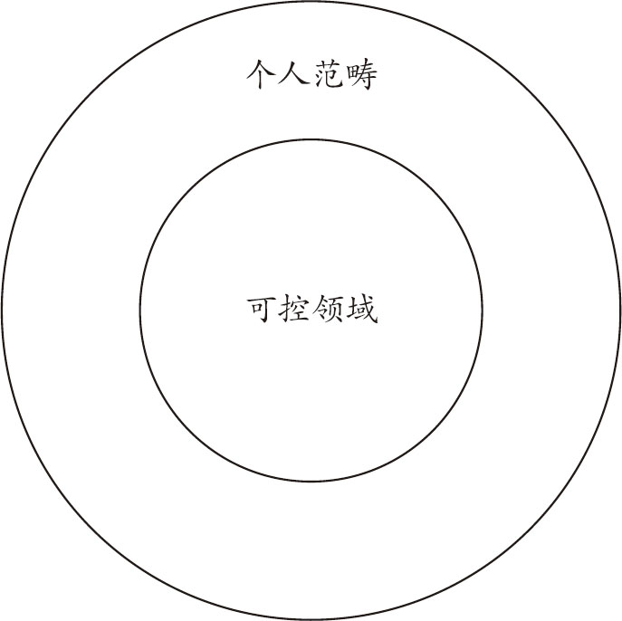

对于发生在你个人范畴之内的事情，你需要对你的判断和反应负责。

我们绝不能满足于现有的可控领域。有相关经验的人都知道，可控领域是可以拓宽的。孩提时代，我们的可控领域很小，20岁时明显大了很多。到今天，它还在继续扩展。你可以通过拓展可控领域来积累你的财富。

如果我们总是认为，问题是由外界因素引起的，所以它不可控，那么这个想法本身就是问题所在。如果总是谴责客观因素和他人，我们就相当于自动放弃了拥有控制权的机会。抱怨和指责的行为只会体现出我们的软弱。

之后，我们对事物产生积极影响的能力也逐渐消失殆尽。如果真的想改善我们的处境，就开始着手吧。解决方法要从内在去找，而非外在。我们可以主动对所有发生在个人范畴之内的事情承担责任，同时继续拓宽可控领域。既然以前已经拓宽过可控领域，我们在未来也能做到。

16岁时，我下定决心前往加利福尼亚州，并在那里生活。到达加州之后，我发现一切都与想象的不一样。我坐在旅店的床上，感到十分绝望。我也完全不懂美式英语，实际上我的英语水平基本相当于零。我怎么在那儿上学和挣钱呢？遭遇这样的困难，我大哭了一场，沮丧极了。但是慢慢地，绝望感消失了，并且被顽强和自豪取代。我去加州，就是为了通过努力而达到目标。我知道，我的目标不那么容易达成。

对于拓宽可控领域，这里有4种方法。

##### 1．从舒适的环境中脱离出来

我们应该离开舒适的环境，也就是使我们感到安全和惬意的环境。当我坐在加州的床上时，我已经远离了我的舒适环境。开始在那个陌生城市摸索时，我的可控领域也得到了极大的拓展。很快，我便可以在任意一个区域都感到舒服。然后就发生了一件神奇的事：离开最初的舒适环境之后，我也能感到舒服。

如果你经常旅行，那么你肯定也经历过相同的感觉。每次旅行都会将你带离你熟悉的环境。最终你会喜欢上旅行带给你的感觉：新鲜且特别。这样你也就学会了如何在舒适环境之外感受到惬意。

如果我们习惯于在每一次战胜挑战之后都马上迎接新的更大的挑战，那我们的可控领域便会快速地得以拓展。我也相信，这种态度最接近人类的天性和使命。踏入一个新环境，竭尽全力获得成功之后，我们就会觉得自己充满前所未有的活力。虽然对于一艘船来说，在港口更有安全感，但船仅用于停在港口，那我们也不会再造船了。我们虽然需要安全感，但同样也需要冒险和改变。在敢于尝试新事物，迎接新挑战的时刻中，我们会成长起来。拥有最广可控领域的人，几乎一直都处在舒适环境之外。如果没有一场接一场的危机，他们会觉得索然无味。就像运动员必须通过运动来保持活力，我们也需要新的挑战。

##### 2．问题

问题的存在同样为我们拓宽可控领域创造了良好的机会。一个问题之所以成为一个问题，是因为它虽然处在我们的个人范畴之内，却处于我们的可控领域之外。

同时，每一个问题也都为我们带来成长的机会。如果我们只是提出这样一个问题，“我怎么解决这个问题呢”，那可能事情不会有多少好转。不过我们也可以另提一个问题：“我如何创造一种情况，使这个问题不再出现呢？”这种新的情况指：不断拓宽我们的可控领域。

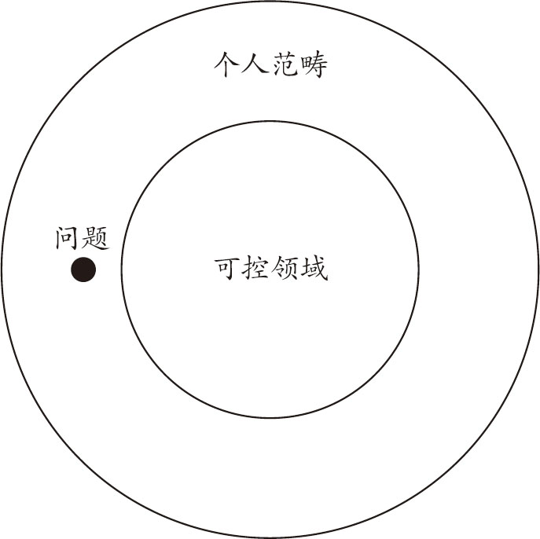

举个例子：你聚会归来，发现家里被入室盗窃，门被撬开，大量财物丢失。如果你只想解决问题，直接给锁匠和保险顾问打电话就好了。但如果你想避免这种情况再次出现，就需要多做一些事情，比如安装一个警报器，买一条看家的狗。如此一来，你就创造了一个防盗环境，你也拓宽了你的可控领域。就算你不在家，你的房子现在也有了监控。

逃避问题不会使人生活富裕。想要拥有更多金钱的人，就应该为自己列一个长长的问题清单。

##### 3．正确的提问方式

我们说过，提问质量决定我们的生活质量。为什么会这样呢？因为我们一直都处于一个自我对话的场景中。我们的大脑不断地抛出问题，然后自己回答问题。

如果提问方式是“我能做到吗”，我们就可能不会去做这件事。仅仅因为提问方式就会导致出现至少一个疑虑。更好的提问方式是：“我如何做成这件事情呢？”这种提问方式就排除了失败的可能性。你会成功的，问题只是如何成功。“如何”这个问题会促使你去寻找实现目标的方法，当然这个方法也是在你的可控范围之外的。

我们首先要问的不是“为什么”，而是“怎么做”。“怎么做”寻找的是解决方案，“为什么”寻找的是托词。寻找并最终找到托词的人，就没有必要再拓宽他的可控领域了，因为他是不负责的，同时他也就放弃了自己的权力。提问“怎么做”的人，他的答案很快便会将他引出现有的可控领域。因为“怎么做”是包含“为什么”这一层含义的，而反过来，“为什么”却不包含“怎么做”，也不会促使我们去寻找解决方案。

“我能做什么？”这个问题也是至关重要的。设想一下，如果在加州的时候我只关注我不会的和我不知道的东西，我肯定会找到很多理由赶快回家。这世上有许多一个16岁男孩在陌生国度无法做到的事情。然而，只关注我无法做到的东西并不会给我带来金钱和好处。相反，我必须更多地关注我会的东西。

正确的提问方式应该是：“我会做什么？我知道什么？我有哪些机会？”比如我会德语，所以我去教了德语课。然而我的英语实在是太差了，以至于如果我必须用英语进行解释时，都没法连续上5分钟的课。于是我就用德语上课。这样上课，虽然刚开始进度十分缓慢，但我的学生进步神速。今天我才知道，实际上这就是学习外语的最好方式。

如果提的问题是“谁来负责任”，那我们就是在寻找借口。当我们说“你负有责任”时，将事情引向积极方向的机会就消失了。而且，这个关于责任的问题还会将我们一直引向过去。正确的提问应该是：“在当时谁应该对此负责？”但你现在不能拓宽你当时的可控领域，所以需要将精力运用在当下。我们提出的问题也应该以当下为中心：我们现在能做些什么？

正确的提问方式可以帮助你拓宽可控领域，让我举最后一个例子。大多数人都会混淆提出“怎么做
”和“是否
”这两个问题的时机。众所周知，果断决策很重要。尽管如此，很多人还是很难做到。为什么？因为他们已经打算好他们应该“怎么做
”了。“怎么做
”是一个好的提问方式，但不适用于
需要果断决策的场合。

现在再回到我去加州的例子上来。想象一下，如果我当时问自己“如果我下定决心前往加州，我怎么在那边战胜所有的困难呢”，会发生什么？你相信我会决定去吗？

当你做决定时，你应该问“是否
”。这个问题的背后还藏着另一个问题“为什么”。你为什么要做某件事情？哪些原因促使你做这件事情？“怎么做
”在这个时刻并不重要，它会在之后顺其自然地出现。

做完决定之后，你就不用再关注“是否
”这个问题了。你大可不必在遇到第一个困难时就提出这样的问题：我的决定正确吗？我是不是应该尝试一些别的方法？如果这个时候不去思考如何解决困难，你便会重新提出“是否
”的问题。我们都认识一些做决定时患得患失，之后又很快反悔的人。正确的决策顺序应该是：

（1）我为什么要这样做？决定“是否”要做。

（2）我应该“怎么做”？出现下一个困难的话，你如何解决？一直牢记不放弃的理由。

我们在内心对话场景中提出的问题，能决定我们的前进方向，使我们的可控领域缩小或扩大。

##### 4．扩大你的个人范畴

你的个人范畴包括所有影响你的事物、对你而言重要的和你感兴趣的事物。如果某样事物对于你很重要，那你肯定想对其施加影响。你会不可避免地开始思考如何拓宽你的可控领域，因为你想在个人范畴之内尽可能多地按照你的方式对事物进行控制。

假设维利·文齐希和理查德·瑞吉西在一个跨国公司的同一个部门工作。如果说维利·文齐希只对自己所在的部门感兴趣，那他的可控领域就不会很大。而理查德·瑞吉西却在考虑公司的发展方向、客户关系和市场策略。为了提升自己的影响力，他也和其他各个部门保持关系。他不满足于现状，因为他想和公司总部也建立联系。他知道竞争有多激烈。于是，瑞吉西先生自然而然地拓宽了自己的可控领域。

研究者发现，一个企业的客户圈子与企业的可控范畴是成比例地增长的。另外一些企业却将精力放在非顾客身上，他们研究的是：为什么这些人不买我们的东西，我们如何才能做到让这些人也来购买我们的商品。后者的范畴较前者而言大很多，其客户圈子也相应地快速扩大。

##  没有责任的生活会更轻松吗

我们不仅对自己所做之事负有责任，也对自己未做之事负有责任。有的时候，逃避责任对我们的诱惑力非常大。很多时候，不承担责任显得方便又舒适。但我们之后需要付出的代价是极高的。因为我们会被别人玩弄在手掌之中，只能按照别人为我们谱写的剧本来生活。

我们充分利用自己的潜能时，会获得最大的满足感。我所理解的成功就是成为最好的自己。我全力以赴时，会感受到前所未有的活力。

##  为了改善你的财务状况而承担责任

大多数人对于自身的财务状况都十分轻率。你无处可学相关的知识。大多数父母也并非正面榜样。学校里没有“如何创造财富”的专业课程。我们的社会鼓励过度消费，过度消费无处不在。

你周围的大多数人也都是负面榜样。抱怨缺钱成了一种潮流。一些格言变得备受欢迎，比如“钱用光了，这个月还剩一大半”。此外，金钱对许多人来说，也是一个乏味的、令人不快的话题，“有钱人不谈论钱”，“金钱不是最重要的东西”。我们在第一章中就已经知道，金钱很重要。如果你根本不重视金钱，使自己陷入困境，这个时候金钱就会变得尤为重要
。换句话说：你必须避免使金钱成为你生活中价值很高的东西。因此，你必须承担责任。

当然，“金钱是万能的”这样的想法很愚蠢。然而，认为“有钱人结识不到有趣的人，有钱人不能去看迷人的风景，有钱人不能扩大自己的机会，有钱人不能集中精力做别的工作”的人，也同样愚蠢。

我们使用金钱做的事情，会在未来得以展现。我们为了金钱而做的事情，也会在未来产生效果。我们像设计师一样塑造自己的未来：我们在今天描画一个未来的蓝图，明天我们就按照这个蓝图来生活。古巴比伦人早就清楚这一道理：“明智的行为会伴随我们一生，使我们感到快乐，救我们于危难；同样地，愚蠢的行为也会伴随我们，使我们备受折磨，烦恼不堪。”

你会发现，金钱远比大多数人想象的要美好。积累财富也远比大多数人想象的要简单。但是你必须承担责任并真正地去履行责任。贫穷是自行产生的。比如说，贫穷会产生于推卸责任的时候。为了财富，你必须做几件基本的事情，这个内容我们接下来还会进行详细探讨。但是一切起源于你大脑中的想法：只有你（绝非任何人）能对你7年内收获多少金钱负责。

能量贴士

你对自己的生活和财务状况全权负责。

•离开你的舒适环境

•将困难当作成长的机会

•提出正确的问题

•扩大你的个人范畴

这世上有一些事你无能为力。但你可以决定，你打算如何判断以及如何对此做出反应。在这方面，你一直都是拥有权力的。

责任意味着：没有任何东西能改变你的态度或品格，因为你是按照自己的本性对事情做出反应。你可以决定自己以哪种方式去生活。这种态度使你能够生活幸福，并且成为最好的自己。如果你勇于承担责任，那么你就能在7年内变得富有。

------------------------------------------------------------------------

### 本章要点

- 你并非要对所有的事件负责。但你总是要对自己对事件的判断和反应负责。
- 给你责任的人同时也给你了权力。
- 你昨天做出的决定确定你的现在。你今天做出的决定确定你的未来。
- 愿望是我们未来生活的预兆。我们决定我们想要得到些什么，同时也决定了将来会获得些什么。
- 4种方法拓宽你的可控领域：

1．离开你的舒适环境。

2．将困难当作成长的机会，并且问自己：我如何创造一种情况，使这个问题不再出现呢？

3．提出正确的问题。

4．扩大你的个人范畴，同时你的可控领域也得到了拓宽。

- 随着年龄增长，你只会对自己没做过的事情感到后悔。
- 没有责任心地生活就意味着，使自己退化为一个无力的牺牲品，意味着按照别人为你谱写的剧本来生活。
- 如果我们在事件发生时勇于承担责任，那么所有的负面情绪在这一刻都会失去掌控力。
- 只有你自己（绝非任何人），能对你7年内收获多少金钱负责。

------------------------------------------------------------------------

# 第三章　100万欧元是难以企及的奇迹吗

大多数人都高估了自己1年内能做到的事情，也低估了自己10年内能做到的事情。

——吉姆·罗恩《雄心的力量》

现在有两个选择，一个是在6个月之内获得5万欧元，另一个是在7年之内获得100万欧元。如果让你选，你会选哪一种？你更想要5万欧元的现金呢，还是“满满一箱的才能”呢？想在短时间内获得更多的金钱，你也许只需要多做些努力就达成了。然而，想在7年内获得100万欧元，仅仅“多做些努力”肯定是不够的。

##  发生变化的5个层次

变化发生于好几个层次之上，在本书中，我们就来谈一谈这所有的5个层次。只有5个层次都发生了变化，才会出现真正富有影响力的变化。

第一层次：
你意识到自己对现状感到不满意。为了改变现状，你开始采取行动。

举例：你办公桌上的信件堆积如山，于是你决定一直不停地处理信件，直到你能再次辨认出你办公桌面板的颜色。

第二层次：
期待的结果没有出现，你意识到，仅仅只是采取行动还远远不够。你采取的行动还必须以解决困难作为目标导向。你问自己：我如何使结果变得更好呢？我如何不这么艰难，而是更灵巧地工作呢？

举例：你加班加点地工作，但到了月底，你挣的钱还是不够用。

新的技巧和策略将会为你带来解决方法。许多人都希望直接从一本专业书中得到解决公式。在后面的章节中，你将学到许多具体的技巧、策略和解决公式。然而，持续的、起决定作用的变化是发生在更高层次上的。

第三层次：
学到的技巧对你起到了一定的帮助。但是，如果拿自己跟其他成功人士进行对比，你就觉得他们好像不费吹灰之力就达成了目标。他们拥有富有影响力的、能为他们开启方便之门的朋友。

举例：一个意想不到的困难极大地打击了你。你本来需要将全部时间和精力投入生意中去，但现在你必须首先解决眼前的麻烦。一切都乱七八糟。

这时候找到解决办法就不那么简单了。我们来检视一下你的个人发展。这听起来就不像能快速达成的事情，尤其是那些有影响力的成功人士并不是你运用技巧就能结识的。要想成为你想成为的人，那就需要投入时间了。关于你想成为什么样的人，我有一个小提示：也许是你的榜样，或是你钦佩的人。如果按照目标去塑造生活，你也可以成为像你的榜样一样令人钦佩的人。

第四层次：
在你与自身和他人打交道时，仔细思考一下你的世界观。许多人戴着有色眼镜看世界，将美好的世界扭曲成了一个热带丛林，在这个丛林中，每个人都要互相对抗才能生存。

举例：有的人从不相信任何人。他们对别人有过几次失望，从此以后便小心翼翼。他们带着怀疑的目光看待一切事物和一切人，费尽心思地寻找别人设下的“陷阱”。有时候他们自己掉入自己的陷阱，因为他们本性不具有魅力，不讨人喜欢，所以别人对他们敬而远之。

解决方法是：换一副新的眼镜，换新的镜片。世上不存在一个孤立的现实，只存在一个我们感受到的现实。我们戴上一副新的眼镜看世界，世界就完全不同了。著名的管理培训师史蒂芬·柯维讲过下面的故事。

一天，柯维乘火车前去参加一项活动，他要在本次活动中发表演讲。他打算利用火车上的时间来准备演讲稿。突然，一名带着三个孩子的男子来到他的这节车厢。孩子们马上就开始嬉戏打闹。他们又叫又闹，在座位上跳来跳去，其他乘客也不胜其烦。而那名很明显是孩子父亲的男子，什么都没有做。他只是无动于衷地望着窗外。

孩子们越来越顽皮，开始脚踢座椅，甚至用手去扯几个乘客的衣服，最后还揪住了一位女士的头发。父亲仍然没有加以阻止。史蒂芬·柯维终于忍无可忍，他努力镇定下来，决定要插手这件事情。为了使他的话在孩子父亲身上达到良好的效果，他果断地站起身：“打扰了，先生，您难道没有看到您的孩子已经打扰到所有乘客了吗？请您告诉他们遵守秩序！”

带着对自己刚才行为和有力要求的自豪，他又坐下了。那位父亲缓缓地从沉思中回过神来，最终将头转向说话者，用低低的声音回答道：“是的，是的，我为孩子们的行为感到抱歉。我刚才完全没有注意到。我的妻子——孩子们的母亲，在几个小时之前去世了。我还不知道我以后该怎么生活。我们几个都还没法接受这个事实。我想，我的孩子们是在以他们自己的方式去接受这件事……非常抱歉。”

同黑白眼镜相比，一定也有一些有色眼镜，使我们自己和他人更加幸福。也有一些眼镜，使我们看到的是机会，而非错误和陷阱。

有一副有色眼镜，通过它，你将金钱视作一种能购买武器、引发战争、制造贪欲、使人寂寞的东西。你必须清楚，我们现在只是就这副有色眼镜而言。同样地，我们也完全可以换一个视角来看待金钱。我们可以戴上这样一副眼镜，通过它，你将金钱看作可以修建医院、缓解饥荒、改善医疗条件、延长寿命的一种东西。你能用金钱改善生活条件。金钱可以做许多好事。

你更愿意戴上哪一副眼镜来看待金钱？或者说，戴上哪一副眼镜，你能更幸福？

第五层次：
通过改变对自身的认知，我们可以带来巨大的变化。

举例：海因茨·哈特希是一名销售人员。他工作勤奋，掌握了工作所需的所有重要技能。他成熟稳重，同事都喜欢与他共事。他不会戴着“顾客是战利品”的眼镜看待顾客。他向顾客提供有益的建议，享受顾客对他的信任。这虽然很好，但还不够完美。顾客不会主动来找他。最大的区别在于：海因茨·哈特希将自己看作一个什么样的人。如果他将自己视为销售人员，他就必须主动去招揽顾客；如果他将自己看作专家，顾客就会主动来向他咨询。

将自己看作销售人员还是专家，做出不同的决定，所产生的效果是不同的。我们的自我认识，最终会成为自我实现的预言。

我曾经有一个生意伙伴，他总喜欢将自己看作一个牺牲者。他确信没有人上当受骗的次数比他多。因此，他戴上了一副“所有人都是坏人”的眼镜。

毋庸置疑，他真的被同一家公司欺骗了三次，也损失了许多钱财。这也加深了他的信念，他认为自己就是一个吸引骗子的磁石。他觉得自己不适合与这家公司再进行合作，遗憾的是，由于合同的束缚，他无法解约。也许他也不愿意摆脱这家公司，因为这会证实他的牺牲者身份。

我很快就认同了他的消极态度：“舍费尔先生，再小心翼翼都不为过。”之后，我甚至想好了应该如何和他一起制订“防御计划”。然而，在进入一家新公司之前将此作为第一步计划，是不够明智的。首先，他需要的是转变防御的想法。其次，这种做法也与我的自我认知不符：我要在每一次挫折中看到积极的一面。我确信，一切事物都有其积极的一面。

我拍了一下桌子说：“好了，我不会往这个方向去考虑的。我们一起来分析看看，你被欺骗了三次，从中你获得了什么益处吧。”这时，我的同伴涨红了脸，带着一副仿佛快要窒息的样子说道：“益处？你脑子没事吧？”

简短总结一下：我们开始分析，他的失败为他带来了哪些好处，我们也真的找到了好处。那家公司的领导，后来也愿意积极地帮助我们。我们仅仅通过一次谈话，便“赚到”了一大笔钱。

##  奇迹发生于5个层次之上

如果你想快速且不费力地，仅仅通过几个技巧来获得100万欧元，那么我要让你失望了。本书不是一盘烧好的菜，你加热一下便可以了，也不是一本你读一读就能变得富有的书。这样行不通，因为深刻的改变只能也必须发生在所有5个层次之上。当你全面地考虑到5个层次，奇迹便有可能发生。

一天，彼得对耶稣说：“主啊，我们有个问题。明天我们必须缴纳税款，但是我们根本没有钱。”耶稣回答说：“没有问题。”彼得有点糊涂了：“主啊，你还没听懂，我说的是，明天我们必须缴纳税款，但是我们根本没有钱。这就是一个问题。”耶稣再次回答说：“没有问题。”

有些人为了解决问题，会主动去做所有必要的事。如果你周围都是这样的人，那真是再好不过了。他们通常起早贪黑。他们尽可能多地阅读专业文章和书籍。为了解决自己的问题，他们尽可能多地向别人咨询，尽可能持久地工作。在这样的人身上，“困难”这个词并不会引发出绝望的情绪。他们也不会悲叹：“不，为什么这件事情偏偏要发生在我身上！”

耶稣轻易地就解决了这个问题。他吩咐彼得去捕鱼。因为彼得以前是个渔夫，所以这个想法并非是不合理的。彼得捕捉到的第一条鱼的嘴里衔着一枚钱币，这枚钱币付清了税款。

原理很简单：

第一层次：
奇迹之所以发生，是因为我们为此付出了努力。

第二层次：
去捕鱼这件事有助于技能的掌握。

第三层次：
你应该成为一个人物，一个因为自身能力强大，所以别人主动来接近你的人物。彼得遇到困难马上就去找耶稣，是因为他认为“耶稣肯定有办法”。

第四层次：
税款不是问题。政府不是为了榨取你的钱财而存在的。

第五层次：
身份，一个“没有问题的人”。

世界上充满了创造过奇迹的人。奇迹对我们来说，就是发生在时间和空间内的不寻常事件，它们与我们惯常的经验是相悖的。你今天无法根据自己的经验想象出来的东西，就是奇迹。许多人将巨大的财富或高薪酬看作奇迹。大多数人能够想象自己的月收入增加1倍，但5倍甚至10倍对他们来说，就是一个奇迹了。

有一段时间，我觉得每月收入10000欧元就是一个奇迹。25000欧元是我完全无法想象的。两年半之后，我第一次实现了月入超过50000欧元。回想起来，我并不觉得这件事对我来说有多神奇，因为我知道自己是如何做到的，我也确实为了这一金钱奇迹
付出了很多艰辛的努力。

当第三、第四和第五层次都发生了变化之后，奇迹才会发生。而对这样的变化，我们可以提前做好准备。

干坐着等待奇迹的发生，是一种愚蠢的行为，就好像一个运动员坐在家里的电视机面前观看奥林匹克运动会，希望自己能获得一枚金牌。我们必须自己引发奇迹。引发奇迹的4个法则，被我统称为持续不断地学习和成长
。

对我来说，持续不断地学习和成长
已经成为我的人生信条。当我们不再成长，我们就与死亡无异了。成长就是生命。持续不断地学习和成长意味着，感受到自身源源不断的活力，也意味着你能成为最好的自己。

##### 书籍

你有没有注意到过，每一个富人家里都有一间书房？你对此怎么看？这些有钱人都有书房，只是因为他们买得起书吗？还是说你相信，他们之所以这么有钱，是因为在早期就读过很多书？

一位智者曾经说过：“一个人是他读过的所有书的总和。”为什么阅读如此重要？一方面，因为语言意味着思想。我们学到的每一个新的词语，都意味着一个新的思想。思想是无价的。另一方面，我们的收入通常也是随着词汇量的扩大而增加的。

今天我们有一个很大的优势：在当今社会，书籍属于生活的一部分。过去并不是这样。假如你在19世纪上学，学生群体中只有少部分人拥有自己的书籍。我之所以称其为优势，是因为现在我们只需要花几个小时，就能读到前人花多年时间总结的经验和研究之精髓。我们不必再去犯前人犯过的错误。所有的知识，书上都有记载，我们需要做的只是去寻找。我们必须去发掘这些信息。我们拥有思想和言论自由，不仅如此，我们还发明了印刷术。

拥有这么好的机会，你能做些什么呢？你会阅读关于生活的所有5个层次的书籍吗？每周阅读两本书，就意味着一年的阅读量超过100本书，7年就超过700本书。你不相信700本书能改变你吗？

你肯定会问了：“我怎么可能做到？我根本就没有那么多时间！”你阅读的第一本书，应该是一本关于快速阅读的书，因为时间是无价的。只需要花3个小时来进行练习，你的阅读速度就会不断得到提升，轻轻松松地每分钟读1000个单词。也就是说，你能在两个小时之内读完一本300页的书。

此外，这里有一个小建议：如果有机会结识有趣的人，一定要好好利用，不要将时间浪费在“闲聊”上。让此人给你推荐两到三本他（她）读过的最好的书。接下来，问他（她）为什么觉得这些书好。这样你就免费获得了一位优秀读者做出的总结。你在短短几分钟之内就会知道，自己是否也应该读一读这本书。在这种方式的帮助下，我最终以书籍的形式接触到了许多宝藏。

##### 你的个人成功日记本

日记本是空白的书籍，是你可以自己写作的书籍，专属于你个人。每个人都应该每天写自己的成功日记，记录下当天所有的成功事件：你获得的每一次夸奖和每一次认可，无论是你遵守纪律，完成一项任务，还是你使某人快乐。

遗憾的是，我们的大脑并非一直都是可信的。同成功相比，我们更轻易地记住错误和失败，它们在我们大脑中留存的时间是成功的11倍。因此，我们在自己心目中的形象总体上会比实际差很多。而且我们周围的环境和我们所受到的教育也宣扬这种消极倾向。因此，我们从孩提时代一直到12岁，每听到一次“是”，就会听到17次“否”。至少有80％的媒体报道都是负面新闻。因此，我们应该反其道而行之，或者至少应该意识到自己正确的形象，这是至关重要的。

我们通常可以看到伟大人物保留下来的日记。有趣的是，这些人物在很早时便开始写日记了，早在他们有所成就或成名之前。他们当时也没法预料到自己日后会成名。每天写日记是否有助于他们日后取得成功？无论如何，记日记延长了他们的积极想法的寿命。

将自己看作一个足够重要的人物，开始记录关于自己的日记。

开始一天的工作之前，我会在我的成功日记本中记录，并继续系统地建立我的信心。（在第七章中，你将会了解到，为什么你的薪水受你的自信心影响。）

随着时间的推移，你还需要一本思想日记本（记录你的所有创意）、一本关系日记本（记录所有使你快乐的关系）、一本知识日记本（记录你从自己犯过的错误中学到的所有东西，使你以后不会再重蹈覆辙），以及其他内容的日记本……

自信并非偶然的事。我们的自信程度永远都是不够的。我们应该止步不前还是继续前进，往往都跟我们是否具有继续前进的自信心相关。

我们看到过很多这样的事情：信心不足的人为了保护自己不敢承担风险。然而，不敢承担风险的人，将永远无所作为，只会一事无成、一无所有
。

自信总是与众不同的。一本成功日记，比起其他任何东西，能更系统、更有效地帮你建立起自信。

请现在就好好回想一下，你现在或者以前都取得了哪些成功？你完成了什么事情？你帮助了谁？谁褒奖过你？

\_\_\_\_\_\_\_\_\_\_\_\_\_\_\_\_\_\_\_\_\_\_\_\_\_\_\_\_\_\_\_\_\_\_\_\_\_\_\_\_

\_\_\_\_\_\_\_\_\_\_\_\_\_\_\_\_\_\_\_\_\_\_\_\_\_\_\_\_\_\_\_\_\_\_\_\_\_\_\_\_

如果你现在只能回想出很少的东西，你的自信心就会不足。你现在写下的内容越少，就越需要尽快开始写你的成功日记。

即使你现在已经自信心爆棚，你成长路上的下一个任务仍然在等着你。你是否能完成这一任务，将由你的自信心来决定。如果想知道这一说法的可信程度，你应该向自己提出以下几个问题：

如果你清楚地知道你不会失败，你将会向着哪个目标奋斗（总统、作家、一级方程式赛车世界冠军、雨林救生员、加拿大大农场主、杰出人物的合作伙伴……）？

\_\_\_\_\_\_\_\_\_\_\_\_\_\_\_\_\_\_\_\_\_\_\_\_\_\_\_\_\_\_\_\_\_\_\_\_\_\_\_\_

\_\_\_\_\_\_\_\_\_\_\_\_\_\_\_\_\_\_\_\_\_\_\_\_\_\_\_\_\_\_\_\_\_\_\_\_\_\_\_\_

不方便或是没有兴趣，常常让我们不愿采取下一个决定性的步骤。然而，不方便只是一种托词。实际上，是我们不相信自己能取得成功。

能量贴士

通过每天写成功日记来建立自己的自信心。

•我们的自信心决定了我们是否敢于冒险。

•不去冒险便不可能获得成长。

•我们的思想意识、我们受到的教育、我们周围的环境，总体来看不利于我们自信心的培育。健全的自我评估意味着自信。成功日记会使你意识到自己有多优秀。

•写日记时，你学会了去注意自己的长处。

•在一段时间之后，你就会开始发现自己的长处并想：这件事我可以把它写进我的成功日记里。

•我们的期望决定我们会获得什么。我们的自信又决定我们的期望。

##### 讲座

同书籍相比，讲座还有另外几个优势：我们能在同一时间听到、看到、感受到并且经历许多东西。我们的感官接受的刺激越多，获得的学习效果就越好。此外，我们还能和主讲人对话。我发现，甚至在大型讲座上，结识主讲人，并和他建立起友好关系也是可能的。

此外，讲座还提供一种可能性，它使你能够完全从日常事务中脱离出来，让你远距离地观察自己的生活。它使我们能更轻易地做到所谓的“侧向思维”，也就是说，我们能够以一种开放的思维对事物进行多角度的思考。有时候，我们也会更加重视自己的直觉。

我们能在讲座上遇到其他志同道合的学员，集中学习的氛围会得到增强。这种相识，终将会发展成为有价值的人际关系。

好的讲座都价格不菲，这就阻碍了许多人去报名参加。很早的时候，我便做了一个决定：一年至少去参加4次讲座。那时的我也没有钱，甚至承担不起费用。但是我知道，我更承担不起的是不去提升自己的后果。我们为教育所付出的代价，与我们为无知愚昧所付出的代价是无法相比的
。从那时起，再高昂的费用都不能阻止我。我报名参加过15000欧元的讲座。每次我都能在参加公开课的两个月内获得超过学费一倍的额外
收入。

对我们欧洲人来说难以置信的事情，在美国是理所当然的。美国企业每年平均为员工放假40天，送他们去参加讲座。员工在这40天里不用工作，但公司照付工资。而这样做被证明是值得的。在日本，这样的时间更长。

1997年，美国的培训市场就达到了3500亿美元的营业额（是个人计算机市场营业额的两倍）！我们欧洲人必须注意，不能被这样的发展速度甩在后面。

##### 榜样

从出生那一刻起，我们就通过模仿来进行学习。我们受周围环境影响的程度，比我们今天愿意承认的还要深。没有任何一本书或是任何一次学习，能够像我们周围的人一样如此强烈地影响和塑造我们。

近朱者赤，近墨者黑
。尽管如此，我们仍然低估了周围人对我们的影响，因为我们喜欢把自己定义为独立的人。我的上一任教练说过这样一句话：“和狗一起睡觉的人，注定是和跳蚤一起长大的。”

这个话题如此难以让人接受，如此重要，同时得出的结果也是如此冷酷无情，所以我将专门用一章来进行讲解——第十三章“教练和专家网络”。

##  要创造奇迹，你需要勇气

在本章的开头，你曾读到：大多数人都高估了自己1年内能做到的事情，也低估了自己10年内能做到的事情
。

要施加巨大的影响力，就需要所有5个层次都发生深刻的改变。这需要时间。这样的成长可能不会立竿见影，但之后某个时刻会突然爆发出来。

竹子完美地说明了这一点。一位种植竹子的庄园主，将竹子幼苗种进土里并用土盖住。竹子幼苗要在土里沉睡4年之久。每天清晨，庄园主都来浇灌它，在第四年年末的时候，沉睡的竹子终于破土而出，之后竹子便在90天之内就长到了大约20米高！

在这4年时间里，庄园主根本不确定竹子是否还活着。但是他有信心，而且不离不弃。一位目光远大的思想家也需要这样的信念。这其中的艺术便是，不要让自己丧失勇气。没有任何其他事情能够给予你更多的勇气，除了同时在5个层次去进行努力。

##  没有哪个奇迹的发生不需要冒险

为了能在7年之内积累大笔财富，你需要承担风险。你觉得风险是什么意思？“当你不害怕的时候，斗牛对你来说算不上什么，”一位著名的斗牛士这样说过，“当你感到害怕，而不去斗牛，那也没有任何意义。但当你害怕斗牛，而仍然去斗牛，你就干了一件有意义的事。”

一位十分富有的人曾经这样说过：“所有有价值的东西，在最开始时都可以把我吓死。”如果你在迈出新一步之前不感到害怕，这就意味着，这一步对你而言还不够。

在第一章中我们讨论过“成就大事业”。什么是成就大事业？也许你会做一些事情，这些事情对你来说轻而易举，但别人对你钦佩有加。也有可能情况正好相反：你千辛万苦才克服自己的恐惧，而这样的事对别人来说却不值一提。因此，我们不应该以他人来衡量自己，而应该与自己做纵向对比
。接下来，请读一读下面的句子，仔细思考自己是否乐意承担风险。

•我们常常忘记，顺着我们目前为止走过的道路继续前行，同样有风险。这条路给我们一种熟悉感，但也不会更安全。

•生活就是一场比赛。不去冒险的人不可能获得成功。

•在这个星球上，没有“必胜”，只有“机会”。

•立即采取行动！因为你永远不能为成功做好完美的准备。

•世上唯一从来不犯错的人，是从来不做任何事的人。（西奥多·罗斯福）

•不确定性带来的痛苦，比确定的痛苦要强烈得多。

•每一次行动计划都有风险，都需要付出代价。但比起无所事事的舒适，它们的长期风险和付出的代价要小得多。（约翰·费茨杰拉德·肯尼迪）

•如果你害怕失去，你永远都不会获得。

•去冒险吧，你不可能从地面摔下去的。（丹尼尔·S．佩纳）

想让某些事物为了我们而改变，我们自己就必须先做出改变。每一次改变对我们来说都是一次冒险，因为我们需要以某种形式离开自己熟知的环境。成长发生于我们的舒适区域之外。因此，我的一位教练总是说：“离开你的舒适区域！在每次解决一个问题之后，都应该马上以一个新的更大的问题去取代它。”

如何在20年内积累大笔财富，之后仅靠利息就能衣食无忧？在本书中，也能发现这样一个针对性的计划。然而，你也能在7年之内实现这一计划。奇迹总会发生在有变化的地方。但你必须准备好，离开你的舒适区域，去冒险。同时你也需要好运。

##  你真的需要好运吗

你需要非常多的好运。但什么才是好运？让我先向你解释一下什么不是好运。好运不是一种不通过努力，光靠期待就可以获得的东西。

法兰克·辛纳屈曾经一夜成名。一次电视直播使他得到了全国观众的喜爱。据说，针对“他的运气真是太好了”这句话，他是这样回答的：“首先，我并非不劳而获；其次，我用了10年的时间来准备这一个晚上。”

高尔夫职业运动员伯纳德·兰格曾经有一次将球打到了树上，球没有掉下来，而是卡在了树杈上。看来这场比赛是他输了。这时，兰格爬上了树，他坐在树枝上，将球打了出来。球刚好落在了草地的中间。兰格将球打进了洞里，赢了这场比赛。一名记者问他：“兰格先生，你真是极为走运啊，对吗？”伯纳德·兰格回答道：“是啊，我也发现了，我练习得越多，我的运气就越好。”

根据研究结果，惊人的好运通常只是多年准备的结果。

##  好运是如何产生的

总有人在金钱上行好运，这样的例子数不胜数。然而，当你把这类好运拿到放大镜下仔细观察，就会发现他们都做过相似的准备。通常情况下，这些人都学习过如何储蓄。他们手中握有一定量的金钱，也学习了应如何抓住机会。

好运都是以机会的形式来敲击人们的房门。然而，有些人完全听不见这样的敲门声，因为他们识别不出这些机会。为了付清账单而四处奔波的人，无法腾出一个清醒的脑袋来识别出机会。

还有些人虽然能够识别出机会，却做不了决定，只想把事情往后推。好机会很快就从身边溜走了，不会等待慢吞吞的人，我们必须马上采取行动。

只有少数的人能够识别出机会，拥有必要的资本，并且采取了行动，他们就拥有了好运。积极寻找机会的人更少，他们才是拥有极大好运的人。

好运的组成部分：

•储存资本；

•识别机会；

•果断地做出决定并采取行动。

一个拥有极大好运的人，通常是自己做好准备并且主动冒险的人。我们只看到了玫瑰花，却没看到种植玫瑰的铲子。我们只看到别人走好运，却没看到别人为好运做出的准备。也没看到别人经历过的失败。你看到“培植好运菇”的准备如此系统化，肯定会大吃一惊。

我们倾向于将自己无法理解的事物视为奇迹或好运。然而你也看到了，奇迹是可以“创造”的。就连好运也只是多年准备的结果。

最终还是在于我们的态度，态度决定我们是否将无法解释的奇迹定义为一种超自然的现象，决定我们是否将坏运气当作理由。如果答案是肯定的话，那么你就不再负有责任，你的坏运气也会成为一个很好的借口。然而，如果你主动承担责任，那么你的好运气就是可以期待的。每个人都会得到属于自己的机会。

根本问题是：我们是否愿意对所有事情（包括奇迹和好运）承担责任？如果愿意承担责任，你将为自己创造的奇迹感到惊讶。如果拒绝承担责任，你就会声称“坏运气已经发生了”（但谁又能与之对抗呢）。如果勇敢地承担责任，那么好运气就在你的安排计划之中。

##  创造奇迹容易吗

阅读下一章，你就会确信，没有什么事情是无法理解的。事实确实是这样：变得富裕并非难事
。要理解并遵守个人纪律也并非难事。

你今天能不能做到，坐着阅读1小时，之后再花5分钟来写你的成功日记？你能不能做到每个季度去参加1次讲座？你能不能和更优秀的人做朋友？当然可以，这些都容易理解。

尽管如此，这并不容易
。因为就算是很简单的事情，如果需要坚持不断地做下去，也不容易。自律并且改变以往的习惯并不容易。实际上，我们甚至根本做不到这些事情。我们计划了某件事情，之后并不去执行，这样的事情发生的频率有多高呢？

这个问题的答案你将会在第五章中找到。你会发现，自律和新的习惯总是伴随新的信条而开始的。没有新的信条，我们不会改变自己的习惯；但当树立了新的信条，那么新的习惯就不再是问题了。

机会不会将时间浪费在没有准备的人身上。每一次的准备都开始于人们内心态度的转变。你是不是真的相信，自己是负有责任的？愿意承担所有的责任，对奇迹的发生是至关重要的。承担责任的人，在行动中进展神速。

------------------------------------------------------------------------

### 本章要点

- 大多数人都高估了自己1年内能做到的事情，也低估了自己10年内能做到的事情。
- 深刻的变化发生于5个层次之上：采取行动、运用技巧、个人发展、世界观和自我认知。
- 你或者在机遇中看见风险，或者在风险中看到机遇。
- 比获得100万欧元更加令人满意的是，成为一名百万富翁，后者是能创造奇迹的人。
- 信心不足的人不敢冒险，他们也以此来保护自己。
- 创造奇迹需要承担风险。
- 如果你在迈出新一步之前不感到害怕，这就意味着，这一步对你而言还不够。
- 惊人的好运是连续多年准备所产生的结果。
- 我们对自己能获得多少好运负责，也对自己生命中能出现多少奇迹负责。

------------------------------------------------------------------------

# 第四章　为什么没有更多的人变得富有

比赛是消极防御还是主动进攻，两者之间有着天壤之别。

——丹尼尔·S．佩纳《论融资》

在德国，成千上万的人在25岁时开始自己的职业生涯。你也是其中之一。你觉得你在65岁时成为百万富翁的概率有多高？我们来看一看德国从业者的税前年收入：

87.30％的从业者的税前年收入低于25000欧元；

10.40％的从业者的税前年收入位于25000欧元到50000欧元之间；

1.60％的从业者的税前年收入位于50000欧元到100000欧元之间；

0.50％的从业者的税前年收入位于100000欧元到250000欧元之间；

0.10％的从业者的税前年收入位于250000欧元到500000欧元之间；

0.05％的从业者的税前年收入高于500000欧元。

学习本书中描述的致富的基本原则很简单。那为什么没有更多的人变得富有？因为保持贫穷状态同样简单。每天写成功日记不难，但每天不写也很容易做到。每个月将10％的收入用于储蓄不难，但每个月把所有收入全都花光也是很容易做到的。多挣一点钱很容易，但少挣一点钱也同样容易。不同的选择差异，是我们的信念造成的。

想一想度假吧。有的人喜欢平躺着，懒洋洋地晒太阳；另一些人却一定要运动，玩几个小时的沙滩排球。双方都认为，自己的方式才是最佳的度假方式，做出选择也很简单。

没钱的人都有一些共性，他们坚持的一些原则使他们无法积累财富。

##  穷人对财富没有明确定义

你觉得财富意味着什么？你当前能给出一个明确的数字定义它吗？生活就像一家邮购商店。寄来我们订购的东西
。“在某一时刻获得一笔钱”这个说法不够准确。你不会写信给邮购商店：“请给我寄点好东西。”你需要一个明确
的数字，来表达对你来说多少钱代表财富。确定一下，你想在什么时候获得多少钱：

在\_\_\_\_\_\_\_\_\_\_年内，我将获得\_\_\_\_\_\_\_\_\_\_欧元。

只要你还没确定这个数字，生活就无法将这笔钱邮寄给你。一个小提示：你在之后还可以提高这个数字，但是现在请先写下一个数字。

要清晰地定义财富需要三个条件：你必须知道明确的数字，写下这个数字，并且将它转换成画面。

想象一下床，你眼前是想象出了“床”这个字，还是一张床的画面？这张床是干净整洁的，还是乱七八糟的？是空的，还是上面躺着一个人？我们潜意识里反映出来的并不是数字或者词语，而是画面。想要真正地积累财富，就应该潜意识采取同步行动。它能让我们自动地去完成必要的事情。

你是否向潜意识呈现所需的画面？你是否曾经将一块表、一辆汽车或是一座房子的图片裁剪下来随身携带？你每看一次，图片就会更加深刻地印在你的脑海里。在我的生活中，这样的方法屡屡奏效。

我认为，如果不这么做，代价是我们无法承担事情。我们的大脑需要这样的“地图”来引导自己。如果不能让自己置身于这些过度刺激之中，那我们也不必惊讶于自己一事无成。

我认识一位年轻有为的男士，他在6年内从一个模具工成为公司高层。

他对我说：“我获得了一张照片，照片上的人是我们公司年薪超百万的精英。我想成为其中一员。我将其中一人的头部裁剪下来，将我的照片贴上去。我每天看这张照片很多次，然后闭上眼睛，想象成为这个成功人士圈中一员的情景：他们对我说什么话，我去哪里旅行，我吃什么、喝什么，这是什么感觉。大约一年之后我确定了，我要实现这个梦想，我渴望实现它，这释放出的能量比我想象的还要更大。只要我将精力集中于这个目标，恐惧和怀疑就无法控制我。在我达到目标之前，这张照片在我心目中早已成为事实。”

他在6年之内就达到了自己的目标。而那位被他剪掉头像的人辞职了
。

我想提醒你：我现在所拥有的，正是我10年前梦想拥有的。尽管在当时这对我就是一个奇迹。我现在拥有的财富，并不比我当时渴望拥有的少。我就是知道，我能成功。然而，我拥有的财富，也没有超出我当时的想象。

能量贴士

明确你想要什么，编制一本与此相关的梦想图册：

•制作一本图册，将会成为你未来生活一部分的东西的图片贴上去。

•思考你想做什么，你想拥有什么，你想成为什么样的人。

•请选取那些能够打动你的图片。

•尽可能频繁地翻看你的梦想图册。

•之后将眼睛闭上一会儿，想象如果一切成真，你能看到、听到、感觉到、闻到、尝到什么。

##  穷人的财富目标摇摆不定

每当自我感觉良好时，我们都倾向于提高自己的目标；当处于低潮期时，我们又都喜欢降低自己的目标。然而，我们的潜意识喜欢稳定而持续的运动。因此，你应该尽可能少地去改变自己的长远目标。目标越远大，你需要做的改动就越少。也许你已经提过这个问题了：我应该为自己制定小而实际的目标呢，还是向着一个空中楼阁式的大目标而努力呢？我个人觉得大目标比小目标更易于实现。我接下来向你解释原因。

你为自己设立了一个小的目标，一旦你和目标之间出现障碍，你的视线就会被挡住。

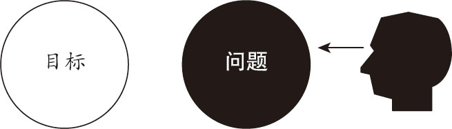

你朝着目标方向看过去，看到的全都是问题。你完全看不见目标。一旦我们无法将目光集中于目标，怀疑和恐惧就产生了
。你知道许多人为了避免被问题阻挡，会怎么做吗？他们会为自己寻找一个新的目标。

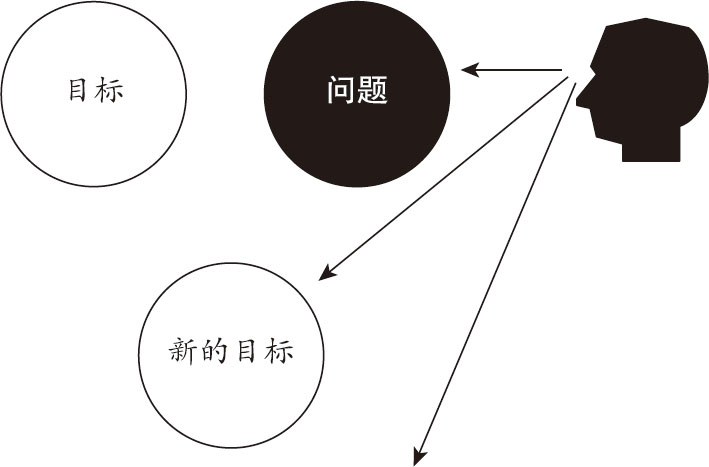

当然，他们和新目标之间也会在某个时候出现问题。为了回避问题，他们也许会再次寻找一个新的目标。所以，你现在要设立的并非一个小目标，而是一个大目标。在这种情况下，问题的出现就无法完全阻挡你看见目标的视线。你清楚自己为了什么而努力。

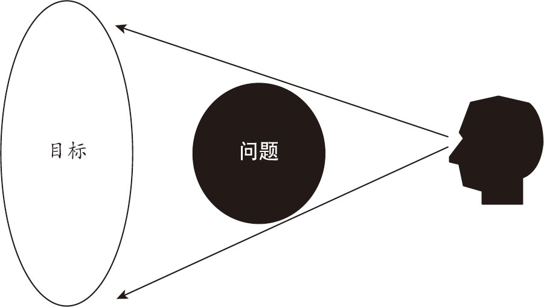

大目标更有益处，还有一个原因：大目标提升我们对机会的感知能力。许多人在某种程度上都倾向于对于己有益的事物予以关注。而大目标对我们而言就是有益处的，让我们对更多的事物感兴趣，去发现更多的机会，结识更多新的朋友。

积累了巨大财富的人，大都在早期就为自己设立了远大的目标。问题总是与目标形成一定比例的。目标较大，问题相对来说就较小
，即使它们可能看起来无法克服。

以CNN的创办者特德·特纳为例。他年轻的时候，从父亲身上学到了一个准则：为自己设定自己有生之年无法实现的目标
。他决定建立全世界最大的广播电视网。你能想象在这条追逐梦想的道路上出现了多少障碍吗？特德·特纳说：“出现这些问题无所谓，同我的目标相比，它们都不算大。所以我从来没有因为问题而迷失过方向，相反，我一直都向着目标在前行。”

##  穷人从不将财富看成绝对必需品

想象一下，你穿过一个森林，来到一个峡谷边。你看到在大约5米深的地方有一个钱包，几张10欧元的现金显露在外。你开始小心翼翼地爬进峡谷里。突然，你失足从一块岩石上掉了下去，幸运地稳稳抓住了一根树枝。也许你觉得这次冒险会使你丧命，于是就离开了。

如果峡谷里躺着的不是钱包，而是一个小女孩，情况又会有何改变呢？想象一下，她受伤了，在伤心地哭泣。见此情景，你的脑海中马上就会出现一个新的问题。你不再问自己“我应不应该下去”，你当机立断，不会听任一个受伤的小女孩就那样躺在那里。你脑海中的新问题就出现了：“我怎样才能救出那个孩子呢？”拯救这个小女孩对你来说，就成了一件绝对必要的事。

我们总是一再看到，成功人士故意将自己引入一种绝对必要的情境之中。他们将自己的义务展现在众人面前。他们将自己引向一种情境，让周围所有人都知道：“我要登上这座山，你只会看到我在山峰上招手，或是看到我的尸体躺在谷底。”

积累了大量财富的人，并非遵守纪律的典范，他们只是做了他们认为必须做的事情。他们没有其他选择，因为无法忍受穷困潦倒或是庸庸碌碌。

你有能力使你的目标成为绝对必需品
。制作一本梦想图册并经常翻阅，闭上眼睛想象这样生活是什么感觉。每三个月做一次。最终你将会发现，你的潜意识开始接受一些重要的想法：不实现这些目标你将无法幸福。一成不变的生活对你来说是巨大的痛苦。你一定要实现自己的目标
。然后，你便可以将自己要变得富裕的计划展现在众人面前。你树立目标时如此声势浩大，以至于所有人都在期待你去实现目标。你如此用力地宣布你的目标，以至于一旦没有实现目标，你在余生之中都会遭到周围人的嘲笑。你没有了回头路。这看起来很残酷。也许，你自己也不确定你是否绝对需要财富。在下一章中，你将会弄清这个问题。一劳永逸。

##  穷人做不到坚持到底

温斯顿·丘吉尔已踏入耄耋之年时，被出生地附近的一所大学邀请去做一次演讲。这在英格兰是大事件。为了见到这位名扬四海的英国伟人，人们不远万里赶过来。有人听说，他打算做一次自己人生中最精彩的演讲，将自己漫长岁月中总结的智慧用语言表达出来。

上千人挤在这所大学最大的礼堂里，神情激动地等待这位伟人以及他精彩的演讲。丘吉尔步入礼堂，走向麦克风，他说：“绝不、绝不、绝不、绝不放弃。”

然后，他便坐下了。演讲结束了。他没有再起身。听众慢慢开始明白：丘吉尔不打算再说别的了，因为他认为没有别的比他刚才说的更重要。绝不放弃就是他全部的信仰。

既然他的演讲如此简明扼要，为什么他不直接说“绝不放弃
”呢？为什么他重复了四遍“绝不
”呢？丘吉尔太了解人性了。人类都倾向于为自己设立一个极限。

要找到一个放弃的理由轻而易举。如果我们为自己设立极限，那么我们就会去达到这个极限
。如果为自己设立一个目标，就不要允许任何阻碍你前进的问题存在。完全不能让其存在。如果存在某个阻碍你的问题，你就会在某个时刻受到阻碍。这时，更好的方法便是，节约能量，根本就不去开始。

德国战机轰炸伦敦时，丘吉尔的顾问劝说他放弃抵抗。他们围绕在他身边，试图说服他：“你难道没看到吗？每一次轰炸都造成了许多英国人死亡。快投降吧，胜利终归是属于德国人的。我们的国人现在只是在做无谓的流血牺牲，而你需要对此负责。因为你的顽固，你就眼睁睁看着国人遭受残暴的对待。你需要理智一些……”据说，丘吉尔每个夜晚都对着德军轰炸机挥舞着拳头，大声喊道：“你们赢不了我。我绝不放弃，绝不，绝不，绝不！”

所有的朋友和劝告者都回避你，这样一种情况可以为许多人设立一个极限。曾经帮助过你、鼓励你的人都与你保持距离，他们想让你有一种负罪感，或者宣称你疯了。

马丁·路德的“极限”不是那个不接受他还迫害他的天主教会，而是他那些志同道合的朋友，他们想打击他，让他产生自我怀疑：“如果是你错了呢？你对多少人的不幸负有责任？你要去冒这个险，你没有把握。你必须对所有这些人永恒的痛苦负责……”

下定决心之前，你应该首先弄清楚，你是否真正地想要实现这个目标。可能你实现了目标，结果最终只是失望地发现，这个目标满足不了你。就像许多梦想住在带花园的大房子里的人一样，当最终真的住进这样一所房子时，却发现工作量太大了：要不断地修剪草坪、清理、修缮、维护……也许住在一套简洁的公寓里感觉更快乐。

你想知道你的目标是否能使你更快乐、更满足吗？也许你历尽千辛万苦实现了目标，最终却发现，自己想要的其实是别的东西。但如果你完全确定，这无疑会为你提供更多的力量和动力。使用以下方法便能检验自己，方法很简单：

请写下一个大目标（房子、车子、工作、公司、合作伙伴、旅行……），尽可能详尽地对你的目标进行描述。不要漏掉任何一个细节。

\_\_\_\_\_\_\_\_\_\_\_\_\_\_\_\_\_\_\_\_\_\_\_\_\_\_\_\_\_\_\_\_\_\_\_\_\_\_\_\_

\_\_\_\_\_\_\_\_\_\_\_\_\_\_\_\_\_\_\_\_\_\_\_\_\_\_\_\_\_\_\_\_\_\_\_\_\_\_\_\_

现在闭上眼睛，想象一下，如果你拥有房子、车子、工作、公司……会是什么样。想象一天的典型日程：你感觉如何？你需要做些什么？哪些事情和活动是必要的？可能会出现哪些困难？

如果你在这个小练习中，能坚持10分钟仍感觉十分快乐，你就基本能确定你达成目标后会感到满足。毕竟，绝不放弃更有优势。

##  穷人不去承担责任

如果将精力用来提问“为什么”，那我们就会找到借口。回顾过去是因为无力改变过去的事实。而提问“怎么做”的人，则将精力放在寻找解决方法上。他们寻找的是现在和将来会走的道路。

当某事无法正常运行时，我们总是负有责任的。我们永远不可能将生活赋予自己的责任，推卸给别人——不可能推卸给医生、律师和税务顾问。将专家看作在某些时刻在这些领域可以帮助我们的专业人士，是有益的，但责任还是在我们自己身上。我们必须掌握控制权，并妥当利用为我们服务的专业人士。永远不要让别人替你承担责任的情况出现
。你是否健康，你是否赢得诉讼，你对自己的税务情况是否满意，这都是你自己的责任。专业人士能对你进行帮助，但是你才是真正的老板。

奇怪的是，许多人虽然为承担责任准备得越来越充分，不再将自己的失败归咎于某个客观环境因素，但是他们仍然不对自己的成功承担责任。

请回答两个简单的问题：

•假如你“全力以赴”，那么你在接下来12个月中最多能赚到多少钱？

\_\_\_\_\_\_\_\_\_\_欧元。

•你是如何计算出这一数字的？

\_\_\_\_\_\_\_\_\_\_\_\_\_\_\_\_\_\_\_\_\_\_\_\_\_\_\_\_\_\_\_\_\_\_\_\_\_\_\_\_

\_\_\_\_\_\_\_\_\_\_\_\_\_\_\_\_\_\_\_\_\_\_\_\_\_\_\_\_\_\_\_\_\_\_\_\_\_\_\_\_

你怎么看下面这个计算方式：选取你有史以来收入最高的那个月，在此基础上乘以12
。然后你达到这个收入之后，再让每个月收入提高10％。面对这样一种计算方式，你是不是有一种不好的感觉，觉得这不现实？

接下来便到了你对自己的成功负全部责任的时刻了
。你的成功不取决于有利的环境，不取决于某个特殊的月份，不取决于你的运气，不取决于他人，不取决于星座运势。你的成功仅仅取决于你个人，你对此负有责任。你可以随时重复你的成功，你可以创造出成功所需的客观条件。你既然成功过一次，就可以再次取得成功。

你如果认为成功是不可重复的，就失去了提升自我价值的机会
。因此，在你取得成功之后，快速地再次取得成功也是相当重要的。这样一来，你也证明了自己才是成功的缔造者，而非某些客观因素。相信自己是十分优秀的，为你的最高目标去负责吧！

##  穷人不准备付出110％的努力

爱找借口的人总会找到借口。这里总结两个最危险的借口。它们之所以如此危险，是因为将自己伪装成一种人生态度。实际上，它们只是生活的谎言或借口：

•“将来我也会为现在拥有的一切感到满足。”

•“假如我能全力以赴，我就会成为最优秀的。”

这两句话的背后，通常都隐藏着自我欺骗、恐惧和缺乏自我价值感。

满足感是一个崇高的目标。为了得到幸福和满足，我们甘愿做一切事情。但是使我们感到幸福的是什么呢？答案是：我们按照自己的本性去生活。成长和成功都深深地植根于人类的本性，而我们最终是在成长和发展中获得满足感的。

你是否有过感到极其自豪的时刻？你是否有过让你感受到巨大满足感的成就？你实现这一成就，是否正源于如果不改变，自己就会感到不满意？

我们对于当前的成就存有感激之情，这是美德。但对于当前拥有的东西，将来也感到满足，这就违背了人类不断成长的需求
。一棵树，只要活着，就会不断生长。一个人，如果停止生长，就意味着死去。我们全力以赴时，能够获得最大的满足感。

多少天赋异禀的人在止步不前的人生中总是拿借口当挡箭牌：“如果我足够努力，我也能变得相当优秀。”为什么说这是找借口呢？想想看，如果这些人全力以赴了，但仍然没有取得成功怎么办？他们害怕的也正是这个。无论是谁，将最后一个可能的借口都摒弃掉，必将能取得成功
。他无法再躲在假象之下。只有付出110％的努力，你才对自己的生活承担了全部责任。这时的你，不想找也找不到任何借口了。你必须取得成功，你终将取得成功。

付出110％的努力意味着成长。假设你想锻炼自己的肌肉，你把铁块举起10次，这10次努力中的哪一次最重要呢？你的肌肉在哪一时刻成长得最多呢？获得举重金牌最多的保加利亚人说：在第十一次
。许多人将100％看作自己的目标，但是只做到80％。如果你将110％看作自己的目标，那么做到100％对你来说，就相对轻松一些。很快，你便会发现，100％只是相对而言的。

##  穷人缺少一个好的教练

积累财富最重要的一块基石，便是一位好的教练。一个远比你成功，能够庇护你，促进你发展的人物。我每一次同富有的人谈完话，都会发现，他们都有一个导师和几个关系密切的学习榜样。

我认识的所有富人都具备强大的自信心。他们的自信十分强烈，以至于他们很难去承认错误。他们设定好自己的程序，即使在对自身产生怀疑时，也能保持良好的状态。在感知自身对成功的责任方面，他们丝毫没有任何困难。恰巧相反，为了使自己保持更好的状态，他们喜欢在内心中扭转对某些事情的理解。

然而，他们都喜欢将荣誉颁给一个人，这个人便是教练。他们慷慨地承认，他们取得的成功在80％或更大程度上要归功于教练。甚至包括罗斯·佩罗和理查德·布兰森。

以顶尖运动员为例吧，为什么他们都有教练呢？为什么他们在摘得世界精英桂冠之后还是需要一个教练呢？原因是：只有教练才可能根据自身经验，在尽可能短的时间内将运动员的才能激发出来
。这样一来，就不需要走弯路了，可以学习并利用教练的经验。

假设你刚刚结束了一场为期4年的大学生活，取得林学专业学位。现在你要移民加拿大，你既不了解那里的森林状况，也不清楚那里动物的习性和植物的特性。假设现在有人提供给你一份占地面积为5000公顷山林的林区管理员工作，你可能都不清楚自己到底应该怎么开始这份工作……

接下来，假设你发现这里还有一位在此生活了67年的老林区管理员，灰胡子先生，他熟悉这里的每一条小路、每一种动物和植物。他知道哪里有流沙，哪里有雪崩的危险，知道所有的蛇巢，知道哪些害虫最多。如果跟他学习半年，是不是极为有用？想一想，你在6个月内学到了67年的经验！

此外，一位好的教练也能长期对你施加压力，促使你付出110％的努力。因为我们做的任何事情，都是为了避免痛苦，获得快乐。然而两者之中，我们更渴望的是：避免痛苦。假设你正在房间里做一件你能想象出来的最美妙的事情，突然发生了火灾，你想要避免痛苦、逃离火海的愿望，比你继续待在那里做使你快乐的事情的愿望，要强烈得多。一位好的教练清楚痛苦和快乐之间的关系，能够指导自己的学生做出最佳选择。他知道，痛苦虽然是最强大的动力，但过多的痛苦会适得其反。

而且，教练可以比你自己更客观地监督评价你的进步。如果你偏离了自己的计划，失望的不仅仅是你自己，还有你的教练。你会屈服于更大的压力，教练对你的监管便是更大的压力。因此，以成功为目标的人对外在压力的态度不是回避，而是欢迎。

与你对自身的期待相比，教练对你的期待更大一些。期待就像指南针，为我们确定人生的方向。教练为你设立好标杆之后，你必须依此更加努力。

能量贴士

为自己寻找一个教练。

•财务教练的资产至少应该是你的10倍。

•他能帮助你避免走弯路。

•他能促进你个人才能的发展，避免你浪费时间。

•教练能够最大化地激发你的积极性，在他认为没有风险时，他也会对你适当地施加“痛苦”。

•他能够督促你进步，检查你的成绩。

•他通常都推动你实现更高的目标，而这些目标在你个人看来是实现不了的。

你想保证自己让这些建议在实践中得以执行吗？“教练法则”就是保证其实现的最佳工具。任何帮助都无法像一个好教练那样效果之大、见效之快、成功之多。自然而然，这里又会有问题了：什么样的教练才是一个好教练呢？你去哪里找到他呢？你怎么才能说服他，让他做你的教练呢？在接受训练时，你需要遵守哪些规则？这些问题非常重要，所以我在第十三章中做了详细说明。

##  穷人只关注自己的劣势

请写下有助于你变得富有的特点和阻碍你变得富有的特点。你的优势和劣势分别是什么？

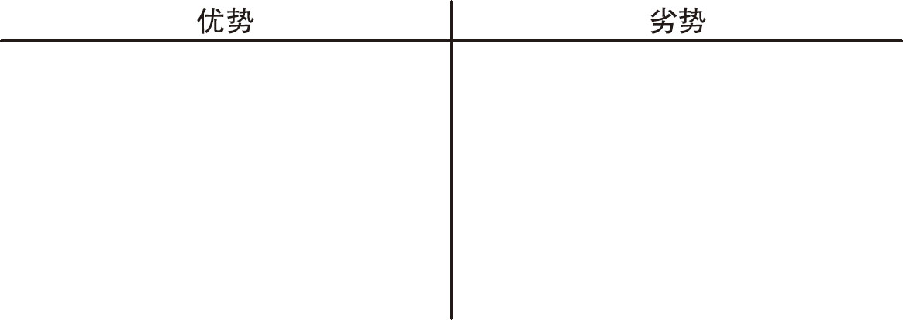

你注意到你是从哪一栏开始填写的吗？最先关注自身劣势的人是不会得到财富的
。这并不意味着，你可以直接忽视你的劣势。这里我们只涉及你填写自身优势和劣势的先后顺序，这对你变得富有很重要。

也许你也听说过，一个人只有在消除自身劣势之后才能获得成功。但这在今天不再是主流看法了。今天我们知道，消除劣势与获得财富之间并没有直接关系。同自身劣势相抗争的人会花费大量的精力，这样一来，他最终也就只是一个平庸之人。

##  你的优势使你富有

能使你变得富有的东西便是你的优势。以网球为例，史蒂芬·格拉芙有一个独特的优势，她特别擅长正手击球。只要有机会，她就会使出自己的优势强项。她没有花费大量精力去锻炼自己相对较弱的反手击球，而是锻炼自己跑到球的另一边，使用正手。

她的对手试着尽可能地攻击她的反手，因此她的训练也做了调整，去锻炼自己较弱的反手击球，结果是，格拉芙失去了对网球的兴趣。因为在这种情况下，她会更多地将精力投入消极防御上，而不是投入主动进攻，赢得比赛上。

比赛是消极防御还是主动进攻，两者之间有着天壤之别。

多少人失去了生活的乐趣和变得富有的机会，就是因为他们极力想消除自身的劣势。这在通常意义上，是一场毫无胜算的斗争，它只会破坏我们的生活乐趣。你不能忽略你的劣势，但你也不应该同劣势相抗争，因为这并不能使你变得富有。因此，你应该为你的劣势找到一个正确的解决方案
。如果你到今天为止，还没有成为一个好的会计，那么你的财务知识也许再也不可能成为你的一个优势了。你的解决方案就是，接受这一现实，雇用一名会计。

对于你的优势，你也不应该顺其自然。你需要一个教练系统性地指导、训练你的能力，直到你的优势更加强大。优势能为你带来金钱。所以，去为你的劣势找到解决方案，去为你的优势找一个教练吧！

##  变得富有的代价有多大

关于代价，我们总能听到很多恐怖故事。从健康受损到家庭破裂，再到成为一个财迷怪物，没有任何一个问题不是追逐财富造成的。

然而，你的身体是否健康，家庭是否和睦，并不与追逐财富具有直接关系，与此相关的是你对待健康、对待家庭的态度。如果硬要说金钱对其有影响，那么没有钱对身体的伤害更大。与生活富裕相比，长期的财务危机更可能给家庭生活蒙上一层阴影。与坐拥金山相比，家徒四壁更可能使人去犯罪。

变得富裕相对来说也不难，本书对致富的具体步骤进行了简明易懂的阐述。当然，你也得为此付出代价，那就是：你的时间。花几个小时来仔细钻研这本书，花几天的时间对你的财务情况进行基本的整理。在以后的日子里，你也需要每个月抽出几个小时。但是，同你赢得的时间相比，你花费的这一点点时间根本算不了什么。

##  安息年

假设你在未来5年当中可以休息一整年。在一整年的时间里，你可以做想做的任何事，并有能力支付这一年的所有账单。你可以去旅行，做使你快乐但平时又没有足够时间来做的事情。

这个想法来自《旧约》：第七年，土地要完全休歇，你不可耕种田地，也不可修剪葡萄园。安息年是闪米特人休养生息、反思生活的一年。人人都可以安心地思考和计划自己的生活，可以出门旅行或是干脆什么都不做。

我工作几年之后，金钱对我来说就不再是阻碍因素了，而是我生活的支助因素，这是金钱本该扮演的角色。我可以靠储蓄的利息生活。于是，我就休息了一年。在头几个星期里，我很少做事情，之后开始四处旅行，参加讲座。我学习了冥想，心也平静了很多。我读一些能够充实生活的书籍，这些书籍与我之前的工作并没有关系。我学会了去倾听自己内心深处的声音。我想要对未来做出规划，却发现我对此找不到答案，而是发现了问题。

新的问题总是不断出现，最终，我将所有问题都归纳成两个核心问题：“我是谁”和“我为什么在这里——我活着的意义是什么”。为了寻找答案，我开始了写作。我前往加勒比海，坐在一棵棕榈树下，试图各用一句话来回答上面两个问题。

我想你应该能感觉出来，这段时间对我来说多么有价值吧。在11天时间里，我写了许多东西，突然清晰地看见了答案。我找到了我的人生目标！由此迸发的力量和激情是惊人的。我发现了自己对生活的激情。

也许你曾将某些事情延后，处理那些事情需要平和的耐心和时间。如果你可以有一个安息年，你会怎么做呢？你能想象拥有一年完全属于自己且不必担心金钱的时间吗？

\_\_\_\_\_\_\_\_\_\_\_\_\_\_\_\_\_\_\_\_\_\_\_\_\_\_\_\_\_\_\_\_\_\_\_\_\_\_\_\_

\_\_\_\_\_\_\_\_\_\_\_\_\_\_\_\_\_\_\_\_\_\_\_\_\_\_\_\_\_\_\_\_\_\_\_\_\_\_\_\_

当然，想要发现人生的意义，也并不一定要财务自由。但是，你肯定也赞同我这个观点，财务自由有助于你发现人生的意义。太多的人意识到，由于日常事务的干扰，他们无法腾出时间来深入思考最本质的人生问题。

因此我也知道，你如果不去积累财富，付出的代价更高。你的自尊心会受挫。一定程度上的财务保障对保持健康是大有裨益的。你投入时间，是为了在本书的帮助下以智慧的方式来获得财富。这个投资会让你获得加倍的报酬，你会获得大量的时间，比如获得一个“安息年”。

我认为有钱是很好的。生活富裕、身体健康强于贫病交加。掌握财富更符合人类的天性。人的天性是需要不断发展成长的，对金钱而言也如此。

我们刚刚提出了一些问题，可能给你一种不安的感觉。也许这些问题是与你内心深处的价值观和信念相悖的。所以，就让我们一起来探明你关于金钱的真实
感觉吧！

------------------------------------------------------------------------

### 本章要点

- 大目标比小目标更易于实现，因为问题无法完全挡住你看向大目标的视线。
- 成功人士总是懂得将自己置于一个“必需的”情境，不实现目标，就永远不会快乐。
- 当你为自己设立了极限，你就会设法达到你的极限。
- 你不仅仅要对自己的失败承担责任，也要对你的成功承担责任。你如果认为成功是不可重复的，就失去了提升自我价值的机会。
- 一个付出110％努力，主动摒弃所有借口的人，势必取得成功。
- 你需要一位好教练，一位能够借助自身经验最大化地激发你才能的人。
- 最先关注自身劣势的人是不会得到财富的。
- 比赛是消极防御还是主动进攻，两者之间有着天壤之别。
- 多少人失去了生活的乐趣和变得富有的机会，就是因为他们极力想消除自身的劣势。
- 你必须为获得财富付出的代价是时间。但这与你通过财富挣得的时间是不可同日而语的。财富使你能平心静气地、不带金钱顾虑地思考人生的意义。

------------------------------------------------------------------------

# 第五章　你关于金钱的真实想法是什么

一个人当前所处的境况，是他自身信仰的准确反映。

——安东尼·罗宾斯《力量原则》

如果我问你想不想得到更多的钱，你一定会回答：“愚蠢的问题！我当然想要更多的钱。”

你是对的，你当然想要获得更多的钱。但是你潜意识里想要的是什么？还记得我们之前那个邮购商店的比喻吧。你只订购你深信不疑的、对你有好处的商品。其实你今天拥有的东西，正是你为自己量身定制的东西
。

关于金钱，只要你相信的是你一直以来的观点，那么你发出的订单也就总是相同的。即使你认为你需要更多的商品，但这也行不通。在你等待邮递员时，你希望他在你的订单之外为你带来一些别的东西（或是更多的东西），但是如果你的订单始终保持不变的话，那么你的希望就毫无意义。

请回答以下问题：

•你是否花过超出你计划的金额？为什么？

•你是否减肥“失败”？为什么？

•你是否想过存钱，但最终没有去做？为什么？

•你是否打算至少3个月不买新衣服，但后来还是买了？为什么？

•你是否透支过银行账户？为什么？

•你是否曾经储蓄，但后来中断了或是直接放弃了？为什么？

•你是否决定做某件事情，但最终并没有去做？为什么？

但是，你肯定也有过确定目标并实现目标的经历。为什么？其中有什么区别？

会不会在你的内心深处有一种更强大的力量，在某些时刻能够“凌驾”你的计划和良好的意图？

你想获得的东西与你所相信的东西之间，是有差别的
。也许你想要更多的钱，但是你又认为金钱会败坏人性。

让我们找出你内心关于金钱的真实想法吧。你会看到你的潜意识是如何发挥作用的，之后，你将分析你的金钱观（这里我引入一个概念“价值取向”）是如何产生的。你将能决定你的个人信念是否对你实现目标有所帮助。此外，你还会在必要时按照自身需求改变你的信念。

##  你随身携带多少现金

早上出门时，你一般随身携带多少现金？请在下面写下一个平均数：

\_\_\_\_\_\_\_\_\_\_欧元。

为什么带这个数目的现金？为什么不多带一些？为什么不带至少500欧元现金？大多数人随身携带的现金少于150欧元。为什么会这样？在我的讲座上，经常听到这样的回答：

•我怕把500欧元弄丢了。

•我担心我会直接把带的钱全部花光。

•我怕被偷。

•我会感觉浑身不自在。

•我根本就没有那么多钱。

他们有以上想法时，会给潜意识传递哪些信息呢？他们感到担心，他们感到浑身不自在，他们不相信自己。这“仅仅”是500欧元。如果数额更大的话，他们会怎么样呢？为财富而做的最好的准备工作，就是学习对金钱感觉自如
。因此我有个建议：时刻带着500欧元现金，与你的其他现金分开，而且你不能花出去。这笔钱是不可动用的储备金。就像哑铃能锻炼你的肌肉，你通过这种方式来锻炼你的潜意识，来培养你的财富潜意识（如果你已经这样做过了，那就随身携带1000欧元现金）。你绝不会遇到一个随身携带的储备金低于500欧元的有钱人。这些有钱人早在他们家财万贯之前就已经有这一习惯了。

能量贴士

随身携带500欧元的现金。

•你要感觉自己很富有。你要学会在有钱的情况下感觉自如。

•你要习惯有钱。

•你要在金钱问题上学会自信。

•你要消除害怕失去金钱或是被抢劫的恐惧感。

•你要准备好应对突发情况，在面对有价值的交易时总有足够的金钱储备。

•你要锻炼你的自律能力。

•你的潜意识会帮助你获得更多的金钱，因为它发现金钱使你快乐。

身体大多数行为和变化都是自发进行的，我们根本意识不到。就好像我们也根本不会去考虑何时、如何吸气或呼气一样，深深根植在内心的信念会控制我们的潜意识。你思考过这是否也适用于你与金钱打交道时的情况吗？

##  你对金钱和财富是什么看法

请评估一下你对于金钱的看法。请在下面勾选出适合你的情况的句子。在横线上写下与你相符的其他情况。

□金钱散发铜臭味。

□如果我有钱，那些女人/男人爱的就只是我的钱。

□我花钱如流水。

□干你的本行，别干你不懂的事。

□一个不珍惜一分钱的人，就不配拥有一个金币。

□金钱败坏人性。

□用金钱能做好事。

□金钱不是万能的。

□我得到金钱，就有人失去金钱。

□冷酷无情才能得到很多的金钱。

□富人进天堂比骆驼穿过针孔还难。

□金钱使人目空一切、自负自傲。

□只有存钱的人才能变得富有。

□上帝爱穷人。

□金钱是衡量我成功与否的标尺。

□富有使我失去很多生活乐趣。

□金钱使人感觉舒适。

□金钱很美好。

□金钱给人力量。

□财富使人孤独。

□我爱金钱。

□有钱人没有真正的朋友。

□财富招人嫉妒。

□有钱人睡不好觉。

□钱生不带来死不带去。

□金钱给人带来忧虑和麻烦。

□金钱的获得是以牺牲健康为代价的。

□我安于现状。

□如果我愿意，如果我全力以赴，我也能变得富有，但是我并不想这样做。

□金钱的获得是以牺牲家庭为代价的。

□使用金钱能做许多好事。

□对金钱的追求是高贵而美好的，基本上，我们拥有的所有东西都要归功于对金钱的追求。

□金钱使人幸福。

□认为金钱无法买到快乐的人，只是不知道去哪里买罢了。

□金钱不是万能的，但是没有金钱是万万不能的。

□如果我没有金钱，我就是一个完完全全的失败者。

□一切都是命中注定的。

□贫穷是不好的、可悲的、糟糕的。

□节约只适用于无能的人。

□知足者常乐。

□如果有很多钱，我就会变得好吃懒做。

□比现在更多的钱，我也挣不到啊。

□钱场得意，情场失意。

□好人和睿智的人应该一直都很富有。

□星座运势写了我是否能变得富有。

□谦虚是一种美德。

□过多的金钱是可恶的。

□我从来没有为自己制定过要存钱的条律。

□我运气不好。

□太多钱会使我堕落。

□如果我的孩子从小生长在富裕家庭中，他们就会变得娇生惯养，甚至沾上毒瘾。

□财富分配是不公平的，还有很多人在遭受饥饿的折磨。

□这世上还有比金钱更重要的东西。

□我挣的钱越多，交的税也就越高。

□我就像一块磁石一样吸引金钱。

\_\_\_\_\_\_\_\_\_\_\_\_\_\_\_\_\_\_\_\_\_\_\_\_\_\_\_\_\_\_\_\_\_\_\_\_\_\_\_\_

\_\_\_\_\_\_\_\_\_\_\_\_\_\_\_\_\_\_\_\_\_\_\_\_\_\_\_\_\_\_\_\_\_\_\_\_\_\_\_\_

##  你的信仰如何发生作用

我们很快就会弄明白你对金钱的看法是怎样的。请再粗略地浏览一遍你勾选出来的句子。你认为这些信念对你的生活产生了什么样的影响？你是否已经发现，你当今的财务状况在某种程度上是你的信念的表现？

\_\_\_\_\_\_\_\_\_\_\_\_\_\_\_\_\_\_\_\_\_\_\_\_\_\_\_\_\_\_\_\_\_\_\_\_\_\_\_\_

\_\_\_\_\_\_\_\_\_\_\_\_\_\_\_\_\_\_\_\_\_\_\_\_\_\_\_\_\_\_\_\_\_\_\_\_\_\_\_\_

你的实际收获同你的希望是否相符？

##  过去与未来大不同

几年前，我的体重达到了96千克，我还讨厌跑步。一想起我要愚笨而慢腾腾地穿过一片森林，我就充满厌恶之感。在我看来，跑步只适用于一些有先天缺陷的人。一定是有部分染色体出现了偏差，他们才会无论严寒酷暑、刮风下雨都坚持去外面跑步，而非舒服地躺在自己温暖的床上。

在体育课上，我们总是要进行长距离的赛跑，从更衣室跑到操场。有一次，我的体育老师刚好跟在我后面跑。出于敏锐的教育能力，他对我喊道：“舍费尔，你不是要用脚在地面踏出洞来，应该跑起来。大象的步伐都比你的轻盈。你踩踏地面发出的吧嗒声，足以吓跑方圆5公里内的所有动物！”他一路上大概连续说了我10分钟，全班同学都被逗得哈哈大笑，然而当时我的自信心还没有强大到可以和大家一同开怀大笑。从此，我开始讨厌跑步。每一种“有意义的”运动方式我都乐于去尝试，但是跑步对我来说，真的很愚蠢……年复一年，这个信念就在我的心里根深蒂固并发展成为深深的信仰。这也导致我当时的身体状况不太好。

直到我前几年在夏威夷认识了斯图·米德尔曼。当时他刚刚40岁出头，已经赢得了我们能想象出来的马拉松比赛，并创造了多项世界纪录：11天1000英里（1英里≈1.6公里）长跑赛，落基山600英里长跑赛，法国6天长跑赛，美国100英里长跑锦标赛……

当我告诉他我讨厌跑步时，他露出一种传教士般的表情，然后给出了一个让人难以置信的建议：“穿上你的跑鞋，我们一起来跑步。我从你走路的姿势看得出来，实际上你可以跑得很好的。”除此之外，他还研发出了一种跑步方式，这种跑步方式让人耐力更持久，跑步者可以连续几天仅从自身脂肪储备中汲取营养。我对此很好奇。但我还是无力地提出抗议：现在已是中午了，96千克重的我得躲到树荫下去才行，而且我在火辣辣的太阳下也坚持不了5分钟。然而，斯图决心改变我的想法。

于是，我们开始跑步了——舒适的慢跑。开始的几分钟，斯图分析了我的跑步方式，逐一指出我做得好的方面。此外，他给出了大量建议，包括呼吸方式、摆臂动作和脚着地的方式。令人惊讶的是，我真的不再感觉累了。我们一共跑了两个半小时，跑步使我感到有趣，对此我十分自豪。此后，我坚持每天跑步。这些年，我一直保持78千克的体重，健康有活力。现在的我，理解不了怎么会有人不跑步。跑步使人充满活力、精力充沛、身强体壮。

同样地，不管你关于自身和财富的想法如何错误，你也可以马上去改变。

##  找出你对金钱的真实想法

想象一下金钱过多的情况，我的意思是非常非常多的钱。在下面横线上记录你把过多的资本、过多的金钱、资产和产权同什么关联在一起。

\_\_\_\_\_\_\_\_\_\_\_\_\_\_\_\_\_\_\_\_\_\_\_\_\_\_\_\_\_\_\_\_\_\_\_\_\_\_\_\_

\_\_\_\_\_\_\_\_\_\_\_\_\_\_\_\_\_\_\_\_\_\_\_\_\_\_\_\_\_\_\_\_\_\_\_\_\_\_\_\_

哪些因素有利于你获得大量金钱，哪些因素不利于你获得大量金钱？拥有金钱的优势和劣势分别是什么？再看一遍你勾选出来的信念清单。

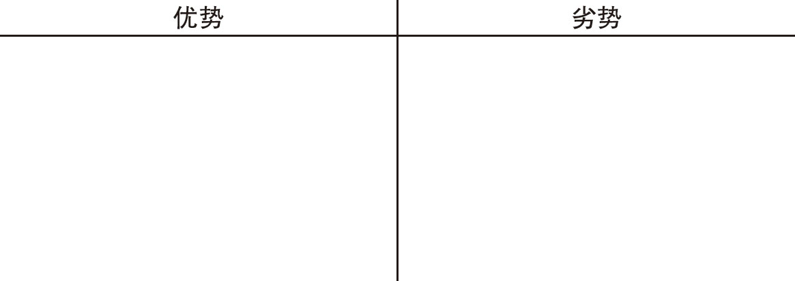

你写下的优势和劣势是一个什么样的比例关系？也许你写下的优势比劣势多一些。然而，在信仰和价值观方面，“多数胜”的原则不起作用，起作用的是情感力量原则。

##  一种信仰就可以决定一切

你拥有多少信仰，它们是积极的还是消极的，这些都不重要。重要的是，你的信仰有多强烈。大多数人对财务富足持有的消极情感，比对财务自由持有的积极情感还要强烈。

举个例子：我的一个熟人概括了财富对他的几个好处：他可以花更多的时间来陪伴家人，拥有更多的奢侈品，生活更加舒适；他可以为自己及家人提供更丰富的物质条件；他和妻子不必再如此辛苦地工作了，还可以雇人来替他们工作；他们可以去旅行，去认识有趣的人。

而实际上，我的这位熟人对于财富只有一个消极的看法，他认为金钱败坏人性。品行和道德对我这位朋友来说是非常重要的。拥有“愿意”放弃财富的品格对他来说如此重要。他的潜意识也帮助他“保持品格”。因此，他就大把花钱，也不去存钱。客观来看，精明如他的人做出这样的行为太愚蠢了，与其身份不符。但是他以这种方式保持住了他的“纯洁无瑕”。

注意

下面的练习是本书中最重要的部分，因为这一切都建立在你的信仰之上。想要变得富有，而又不去认识或者改变自己的信仰是徒劳的。记住：你的潜意识希望并确保为你带来那些你坚信对你最好的东西。

如果仅仅阅读这本书，你绝对能够获得非常有用且有趣的信息。然而，你如果想有效地改善财务状况，就应该拿起笔杆认真去做每一个小练习
。当然，你的生活是你自己的。如果你为这本书投入了时间和金钱，并且恰当地运用，你就会变得富有。

你关于金钱最强烈的信仰是什么？

1．\_\_\_\_\_\_\_\_\_\_\_\_\_\_\_\_\_\_\_\_\_\_\_\_\_\_\_\_\_

2．\_\_\_\_\_\_\_\_\_\_\_\_\_\_\_\_\_\_\_\_\_\_\_\_\_\_\_\_\_

3．\_\_\_\_\_\_\_\_\_\_\_\_\_\_\_\_\_\_\_\_\_\_\_\_\_\_\_\_\_

##  你的信仰是如何产生的

正如我们已知的，很多时候信仰是偶然之间产生的。也许是某些在你成长发展中扮演重要角色的人，与你一路同行，教给你人生的智慧。也许是你通过观察周围人学习到的。很多时候，某些关于金钱的特殊言论也影响到你；或者你见识过你的父母是怎么管理金钱的。

在你18岁之前，哪些人对你影响最大？请列举3～10人（母亲、父亲、朋友、亲戚、偶像、老师、培训员……）。

\_\_\_\_\_\_\_\_\_\_\_\_\_\_　　\_\_\_\_\_\_\_\_\_\_\_\_\_\_

\_\_\_\_\_\_\_\_\_\_\_\_\_\_　　\_\_\_\_\_\_\_\_\_\_\_\_\_\_

今天，谁对你影响最深？给你个小提示：经常和你待在一起的人（伴侣、朋友、同事、父母、合作伙伴、运动伙伴），往往也就是影响你最深的人。

\_\_\_\_\_\_\_\_\_\_\_\_\_\_　　\_\_\_\_\_\_\_\_\_\_\_\_\_\_

\_\_\_\_\_\_\_\_\_\_\_\_\_\_　　\_\_\_\_\_\_\_\_\_\_\_\_\_\_

这些人对金钱持何种态度？他们如何理财？他们给过你关于金钱的哪些建议？

第一个人：\_\_\_\_\_\_\_\_\_\_\_\_\_\_\_\_\_\_\_\_\_\_

\_\_\_\_\_\_\_\_\_\_\_\_\_\_\_\_\_\_\_\_\_\_\_\_\_\_\_\_\_\_\_\_\_

第二个人：\_\_\_\_\_\_\_\_\_\_\_\_\_\_\_\_\_\_\_\_\_\_

\_\_\_\_\_\_\_\_\_\_\_\_\_\_\_\_\_\_\_\_\_\_\_\_\_\_\_\_\_\_\_\_\_

第三个人：\_\_\_\_\_\_\_\_\_\_\_\_\_\_\_\_\_\_\_\_\_\_

\_\_\_\_\_\_\_\_\_\_\_\_\_\_\_\_\_\_\_\_\_\_\_\_\_\_\_\_\_\_\_\_\_

##  这些人都是出于好意吗

出于各种原因，别人给出的建议是不能全盘接受的。当然，大多数人都是出于好意才向你提出建议的。大多数情况下，你都可以相信父母，如果他们对你说：“你至少得比我们做得好啊。”然而，实际情况是你并没有比他们好太多，只是好一些
。此外，你的成功只是你父母失败的一个证明。他人提出的建议不仅仅向你指明一条道路，也为你划定了极限。你虽然会取得成功，但不会特别成功。

大多数建议者都想对自己的处境进行辩解。通过他们提出的建议，你能看出他们之前的痛处，也就是他们失败的点。一个建议你不要去冒险的人，估计他平时也极大地束缚了自己的生活，因为他自己不会去冒一些必要的险。所以，建议者常常将对自身处境的辩解伪装成对你的建议
。

除此之外，建议者总是随时谨记自身的利益。希望孩子留在身边的父母，绝不可能建议孩子去接受一份国外的工作。

基本原则是：永远不要接受一个不会设身处地的人给出的建议
。

##  你现在已了解自己关于金钱的信仰，接下来该做什么

即使你拥有了一条大多数人都有的金钱信念，你也还是不可能变得富裕。你只会自我止步，并陷入困境。

你对自己的金钱观满意吗？如果不认为金钱是美好的事物，你就不可能变得富有，即使你有着想要更多钱的愿望。所以你需要发展能帮助你获得你想要的东西的信念。

有一个简单的技巧，可以使你在30分钟之内改变你的金钱观和根深蒂固的信念。不过我们需要先弄清楚，你是否在正确地“修正”自己的信念。

##  金钱是好还是坏

你那些关于金钱的信仰究竟是对是错？谈到好与坏、对与错时，总有激烈的争论。

几个世纪以前的主流思想是：地球是平的。所有认为地球是圆的人都会被处以火刑。我们也认为植物都是绿色，直到发现我们之所以能看到多种颜色，是因为物体吸收光的颜色，而它反射的颜色，就成了我们肉眼所看到的物体的颜色。所以，我们看到的影像与物体的实质并不相符。非黑即白的划分并不高明，因为我们总是会有错的时候。

然而，出于许多原因，我们很难形成新的思维方式。原因之一就是我们对安全的需求。我们希望能够依赖自己或者依赖他人。康拉德·阿登纳曾经说过：“我昨天说过的废话与今天的我又有何干呢？”我们也许很难理解这一见解。再换一种更直接的表达：“我昨天的错误信仰与今天的我又有何干呢？”这里所表达的意思，用一个词来说，就叫作“一致性”。读了圣雄甘地的以下话语，你也许会重新思考你的观点。

一致性不是绝对的美德。如果我今天的观点与昨天不同，是不是就因为改变自身方向而没有一致性了呢？我的确与自己的过去不相一致了，但于真理而言，我是保持一致了……一致性在于按照认知去追随真理。

甘地刚结婚时，他关于婚姻和性爱的信仰肯定与后来不一样，后来的他决定不再与妻子同床共枕，为了能够全身心地投入自己的使命中去，他愿意为印度付出一切。但他的做法是否“正确”，就不是我们该问的问题了。

这也正是关键所在。人们都倾向于把事物划分为正确的和错误的。而“好”和“坏”的划分完全就是人类的发明，在自然界中是不存在好坏之分的。

##  信仰是如何产生的

一个农夫有一匹骏马，村里的人因此十分羡慕他。他们说：“人的一生一定要拥有一匹这样的骏马才完美。”而农夫回答：“谁知道呢……”

一天，骏马跑丢了，村里的人又说：“多倒霉啊。”而农夫还是回答：“谁知道呢……”

几个星期之后，这匹骏马回来了，身后还跟着3匹野马。村民几乎不敢相信这是真的，他们大喊：“他多幸运啊！”而农夫还是只说了一句话：“谁知道呢……”

农夫的儿子在驯服其中一匹野马时从马背上摔了下来，摔断了一条腿。村民惊愕地说：“他的财富并没有为他带来好运，如果没有这几匹野马，他的儿子现在还好好的。”农夫依然回应：“谁知道呢……”

不久，战争爆发了，村里健壮的年轻人都被征召入伍，唯独农夫的儿子因摔断腿而只能待在家中生闷气。农夫安慰他：“谁知道呢……”

战争结束后，没有一个从军的年轻人生还。村民又开始窃窃私语：“他的好运真是无人能敌。”

世上根本不存在客观现实。从爱因斯坦的研究开始，我们得知：现实是观察者本人自己创造的。我们所看见的东西，只以我们所理解的方式而存在。这本书对你来说，其存在方式也只是在于你是如何阅读、理解它。对于一条蛇来说，一本书的存在方式就会完全不同，因为蛇只能看见红外线。

你总归是要创造自己所理解的现实，创造信仰不是更简单？你已经多次改变过你的人生观（信仰）了。你曾经与某人坠入爱河，后来又分道扬镳。你喜欢一件衣服，后来又觉得它不好看了……你可以改变自己的信仰，然而，最终你还是你自己。也正如你所理解的自己一样：这就是你。你的人生观和世界观“创造”了你。你所相信的东西决定了你的处境。

假设我们的想法是一张桌板：

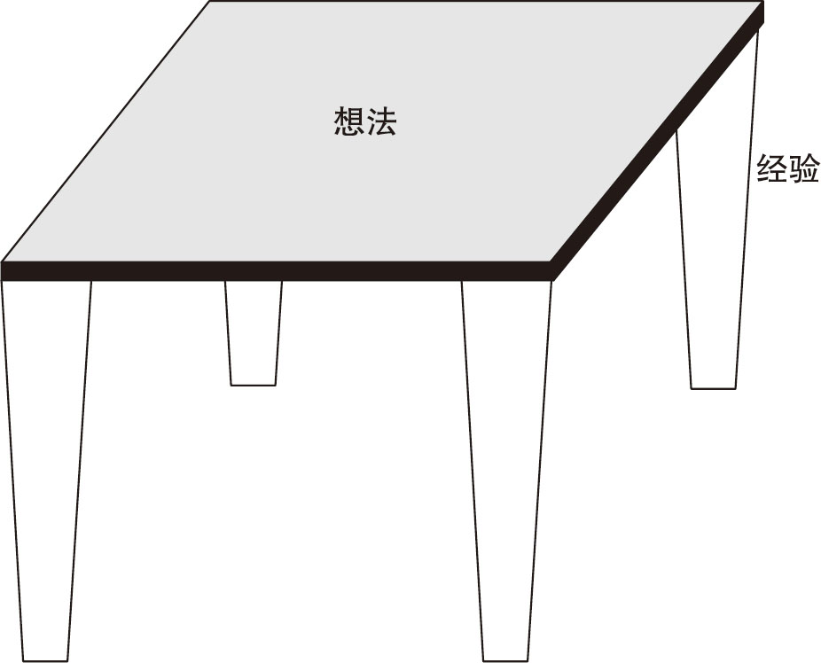

要从想法中形成信仰，就需要至少3根，4根更好，甚至更多的桌腿（可以支撑你的想法的经验）。

你有没有炒过股票呢？最终是什么结果呢？我认识过许多只买入过一两次股票的人。在炒股过程中，他们违反了炒股的理性准则。在证券行情下跌时，为了减小损失，他们就赶紧把股票抛出去了。他们也因此形成了这样一种想法：我炒股运气不好。遭此损失的人就去到处打听，看有谁经历过关于股票的糟糕经历，之后开始努力搜集“桌腿”。为了巩固自己的想法，我们会从别人身上“借取”经验。我们总去寻找那些能够使我们的想法得到证实的事实
。

你能与金钱相处自如吗？许多人的回答是“不能”，然后去寻找能够支持这一说法的证明。我们所处的境况，反映的就是我们的信念
。

金钱真的败坏人性吗？你认识的人里面有多少人相信这一说法？他们查阅报纸，就是为了找到更多支持这一信念的证明。这些人是不是同样也能找到金钱为善的证明呢？答案是肯定的。我们可以为所有信念找到支持的证明。因此才有这么多的宗教、哲学、政治路线……

##  如何改变你的金钱观

信念不能简单地以对和错进行划分。有一句话叫作“富人招人嫉妒”。是不是真的每个富人都有人嫉妒呢？如果这句话属实，同样地，富人也会有许多崇拜者。问题不在于你的观点是对是错。仅仅在于，你的观点在你通往目标的道路上是否对你有帮助
。

当然，首先你得清楚你的目标是什么。如果你还不清楚，那就详细地记录下你的目标。想一想，你想成为什么样的人，你想做什么，你想拥有什么。先从长远目标开始，以发挥长远目标对短期和中期目标的导向作用。内容可涵盖生活的5个领域：健康、财务、关系、情感和人生的意义。

7年或7年以后，我想：

•成为一个什么样的人：你会如何看待自己，你希望别人如何看待你？

\_\_\_\_\_\_\_\_\_\_\_\_\_\_\_\_\_\_\_\_\_\_\_\_\_\_\_\_\_\_\_\_\_\_\_\_\_\_\_\_

\_\_\_\_\_\_\_\_\_\_\_\_\_\_\_\_\_\_\_\_\_\_\_\_\_\_\_\_\_\_\_\_\_\_\_\_\_\_\_\_

•做什么：你的日常生活应该是什么样的？你想要做什么，或者你不想再做什么？

\_\_\_\_\_\_\_\_\_\_\_\_\_\_\_\_\_\_\_\_\_\_\_\_\_\_\_\_\_\_\_\_\_\_\_\_\_\_\_\_

\_\_\_\_\_\_\_\_\_\_\_\_\_\_\_\_\_\_\_\_\_\_\_\_\_\_\_\_\_\_\_\_\_\_\_\_\_\_\_\_

•拥有什么：你想拥有什么样的财富、朋友、健康和家庭？

\_\_\_\_\_\_\_\_\_\_\_\_\_\_\_\_\_\_\_\_\_\_\_\_\_\_\_\_\_\_\_\_\_\_\_\_\_\_\_\_

\_\_\_\_\_\_\_\_\_\_\_\_\_\_\_\_\_\_\_\_\_\_\_\_\_\_\_\_\_\_\_\_\_\_\_\_\_\_\_\_

3年或3年以后，我想：

•成为一个什么样的人：你会如何看待自己，你希望别人如何看待你？

\_\_\_\_\_\_\_\_\_\_\_\_\_\_\_\_\_\_\_\_\_\_\_\_\_\_\_\_\_\_\_\_\_\_\_\_\_\_\_\_

\_\_\_\_\_\_\_\_\_\_\_\_\_\_\_\_\_\_\_\_\_\_\_\_\_\_\_\_\_\_\_\_\_\_\_\_\_\_\_\_

•做什么：你的日常生活应该是什么样的？你想要做什么，或者你不想再做什么？

\_\_\_\_\_\_\_\_\_\_\_\_\_\_\_\_\_\_\_\_\_\_\_\_\_\_\_\_\_\_\_\_\_\_\_\_\_\_\_\_

\_\_\_\_\_\_\_\_\_\_\_\_\_\_\_\_\_\_\_\_\_\_\_\_\_\_\_\_\_\_\_\_\_\_\_\_\_\_\_\_

•拥有什么：你想要拥有什么样的财富、朋友、健康和家庭？

\_\_\_\_\_\_\_\_\_\_\_\_\_\_\_\_\_\_\_\_\_\_\_\_\_\_\_\_\_\_\_\_\_\_\_\_\_\_\_\_

\_\_\_\_\_\_\_\_\_\_\_\_\_\_\_\_\_\_\_\_\_\_\_\_\_\_\_\_\_\_\_\_\_\_\_\_\_\_\_\_

现在再看一看你勾选出的信念。哪些信念可以在你通往目标的道路上支持你？哪些会阻碍你？记住：你一直都在为自己的信念寻找支持的证据。你所看到的，事实上是你的信念引导你将精力集中在上面
。你的世界也会因此变成你所想的那样。所以，你必须抛弃那些阻碍你的信念，因为它们会强迫你将精力集中在错误的事物上。

请写下你想改变的信念：

1．\_\_\_\_\_\_\_\_\_\_\_\_\_\_\_\_\_\_\_\_\_\_\_\_\_\_\_\_\_\_\_\_\_\_\_\_\_

2．\_\_\_\_\_\_\_\_\_\_\_\_\_\_\_\_\_\_\_\_\_\_\_\_\_\_\_\_\_\_\_\_\_\_\_\_\_

3．\_\_\_\_\_\_\_\_\_\_\_\_\_\_\_\_\_\_\_\_\_\_\_\_\_\_\_\_\_\_\_\_\_\_\_\_\_

4．\_\_\_\_\_\_\_\_\_\_\_\_\_\_\_\_\_\_\_\_\_\_\_\_\_\_\_\_\_\_\_\_\_\_\_\_\_

5．\_\_\_\_\_\_\_\_\_\_\_\_\_\_\_\_\_\_\_\_\_\_\_\_\_\_\_\_\_\_\_\_\_\_\_\_\_

再想一想那张桌子的图片。一种信仰的组成部分包括一个想法（桌板）和许多支持这个想法的经验（桌腿）。

要改变信仰，你首先就必须折断桌腿，脱离所有的证明，孤立地观察这个想法。然后再考虑一下，这个想法对你来说是否具有意义。如果没有，你就要对这个想法表示质疑。

我们再以“金钱败坏人性”这句话为例。下面有几个问题，能够使你对这个想法增加怀疑。来看看一个我讲座里以前有过此想法的学生是怎么回答的吧：

1．为什么这个信仰可能是错的？

因为我认识几个非常富有的人，他们的品格特别高尚且正直。此外，我也认识一些穷人，他们就是无赖。很明显，品格并不会与金钱挂钩。《圣经》也将金钱写为好的事物。《旧约全书》中写到的所有英雄都是富有的。

2．给我灌输这个思想的人富裕吗？

不富裕！我也不想与任何有此想法的人互换人生。我不想拥有他们的工作、住所、汽车、朋友。我不想戴上他们的面具，也不想拥有他们那样的信念。他们都是可爱的人，但我不想成为他们那样的人。

3．如果我不放弃这个信仰，最终我会在财务上和情感上付出什么代价？

如果不放弃这个信念，我就必须继续做我不喜欢的事情。我会因此遭受损失。贫穷更可能败坏人性，因为它使人麻木不仁。我将会失掉对自己的尊敬，过上一种低质量、没有激情的生活，我会唾弃自己。

4．我的家庭以及我所爱的人会付出什么样的代价？

我无法为他们提供他们理应得到的生活。不，更糟糕的是：我的言行会对他们产生消极影响，他们会因为我的坏榜样和建议往贫穷的方向发展。为了为自己的处境辩解，我会阻碍他们的发展。

5．如果我现在改变这个信仰，我的生活会得到什么样的改善？我的感觉会是什么样的？

我可以将自己的精力花在那些能够使我的生活更加充实和美好的事物上。我会寻找良机。我尊重自己，因为我真诚对待自己：我可以致力于如何改善自己的品格和财务状况。我拥有的财富越多，我的品格就会越高尚。我感觉自己自由无束缚。

现在就请选出你想要改变的第一个信仰吧，然后回答一遍以下的问题。

1．为什么这个信仰可能是错的？

\_\_\_\_\_\_\_\_\_\_\_\_\_\_\_\_\_\_\_\_\_\_\_\_\_\_\_\_\_\_\_\_\_\_\_\_\_\_\_\_

\_\_\_\_\_\_\_\_\_\_\_\_\_\_\_\_\_\_\_\_\_\_\_\_\_\_\_\_\_\_\_\_\_\_\_\_\_\_\_\_

2．给我灌输这个思想的人富裕吗？

\_\_\_\_\_\_\_\_\_\_\_\_\_\_\_\_\_\_\_\_\_\_\_\_\_\_\_\_\_\_\_\_\_\_\_\_\_\_\_\_

\_\_\_\_\_\_\_\_\_\_\_\_\_\_\_\_\_\_\_\_\_\_\_\_\_\_\_\_\_\_\_\_\_\_\_\_\_\_\_\_

3．如果我不放弃这个信仰，最终我会在财务上和情感上付出什么代价？

\_\_\_\_\_\_\_\_\_\_\_\_\_\_\_\_\_\_\_\_\_\_\_\_\_\_\_\_\_\_\_\_\_\_\_\_\_\_\_\_

\_\_\_\_\_\_\_\_\_\_\_\_\_\_\_\_\_\_\_\_\_\_\_\_\_\_\_\_\_\_\_\_\_\_\_\_\_\_\_\_

4．我的家庭以及我所爱的人会付出什么样的代价？

\_\_\_\_\_\_\_\_\_\_\_\_\_\_\_\_\_\_\_\_\_\_\_\_\_\_\_\_\_\_\_\_\_\_\_\_\_\_\_\_

\_\_\_\_\_\_\_\_\_\_\_\_\_\_\_\_\_\_\_\_\_\_\_\_\_\_\_\_\_\_\_\_\_\_\_\_\_\_\_\_

5．如果我现在改变这个信仰，我的生活会得到什么样的改善？我的感觉会是什么样的？

\_\_\_\_\_\_\_\_\_\_\_\_\_\_\_\_\_\_\_\_\_\_\_\_\_\_\_\_\_\_\_\_\_\_\_\_\_\_\_\_

\_\_\_\_\_\_\_\_\_\_\_\_\_\_\_\_\_\_\_\_\_\_\_\_\_\_\_\_\_\_\_\_\_\_\_\_\_\_\_\_

##  改变你的信仰就是改变你的人生

目前为止，你已经跨出了重要的4大步：

1．你找到了自己真正的关于金钱的信仰。每当生活中发生不如你意的事情，你都要找出隐藏在事情背后的信念。

2．你检查了你的信念是否对你实现目标有所帮助。因此你也对自己的目标有了更加清楚的认识。

3．你暂时使信仰和支撑信仰的经验和证明分离。这也使得你能够客观地观察你的想法。

4．你批判性地探究了自己的想法，因此对旧的信仰产生了巨大的怀疑。

你现在已经准备好了用新想法去取代你的旧想法。然后你就可以通过寻找经验和证明，来将你的新想法转化成新的信仰了。

也许你现在在想：“这件事情绝不可能这么简单的。”那么我就想邀请你一起来尝试一下。然而，前提条件是，你一定要以手写的形式来回答这个小练习。你一定会激情澎湃的。

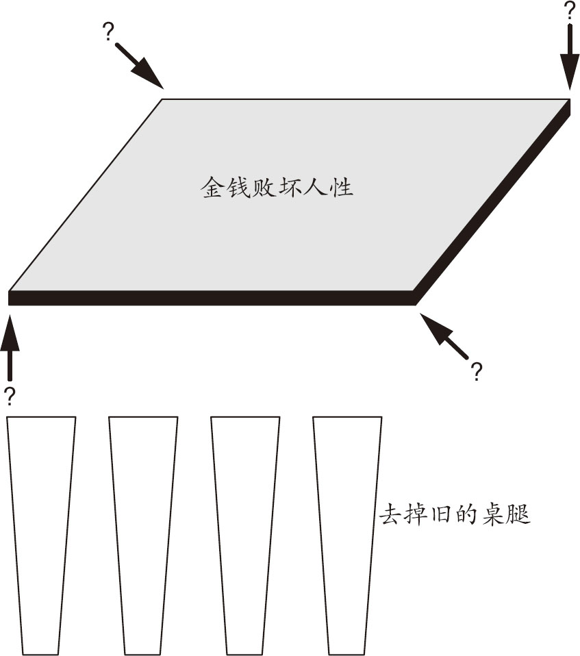

##  用新的想法取代旧的想法

去寻找一个对于你实现目标更有帮助的新想法吧。一个能够给你力量、让你将精力放在重要事务上的想法。然后去寻找能够支持这一想法变成信仰的证明和经验。正如一张桌子需要至少3至4根桌腿才能站稳一样，你至少也需要同样多的能够支持你的想法的经验。你完全可以“借用”他人生活中的证明和经验来支持你的想法。

那么，扔掉“金钱败坏人性”这个旧想法，树立诸如“我可以用金钱做许多好事。事情好坏不在于钱，而在于我”的新信仰，开始寻找能够支撑此信仰的证明。来看一看，参加讲座的学员都写了些什么内容：

1．一次偶然的机会，我结识了卡尔-海因茨·伯姆。他借助自己的金钱和知名度去帮助东非人民。金钱帮助他做了更多的好事。

2．我的上一任老板非常富有，他在自己的公司里建立了一个残疾人部门。我经常为他的人格魅力所折服。因为金钱，他有了许多去有意义地帮助别人的机会。

3．金钱展示出它的性格，也给予我们更多的机会。可以用金钱做更多的好事或者做更多的坏事，这都取决于我自己
。我也相信我自己
。因此金钱在我身上起到了很好的作用。我现在在委内瑞拉已经有两个教子了。

4．我非常佩服约翰·邓普顿爵士。他是一位百万富翁，但在为人处世方面仍然保持谦逊朴实的态度。他拥有18家基金会，全都由他出资和管理。他将公司的领导权也移交了出去，为了能够全身心地投入基金会中去。

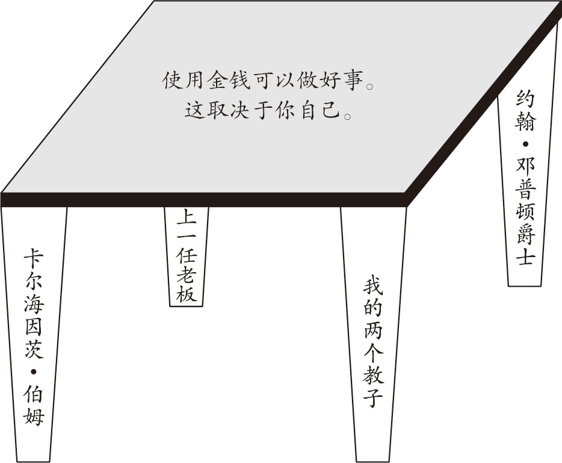

同样地，拿出你旧的信仰，将其转化为新的信仰：

旧信仰：\_\_\_\_\_\_\_\_\_\_\_\_\_\_\_\_\_\_\_\_\_\_\_\_\_\_\_\_\_\_\_\_\_\_\_

新信仰：\_\_\_\_\_\_\_\_\_\_\_\_\_\_\_\_\_\_\_\_\_\_\_\_\_\_\_\_\_\_\_\_\_\_\_

证明和经验：\_\_\_\_\_\_\_\_\_\_\_\_\_\_\_\_\_\_\_\_\_\_\_\_\_\_\_\_\_\_\_

能量贴士

要实现财务目标，你就要改变自己的信仰。

•记住，你的生活就是你信仰的体现。

•找出哪些信仰是“负有责任的”。

•将想法和支撑想法的证明分离，用对你实现目标更有帮助的新想法去替代你的旧想法。

•通过寻找证明支持新想法的方式，来将你的新想法转变成信仰。

•如果你改变自己的信仰，你就会做一些较之前不同的事情，会形成新的习惯，你的生活也会随之而改变。

•通过神经系统的冲动来加深你的新信仰吧。换句话说，现在就去采取第一步行动吧。

•你现在已经为自己取得财务上的成功奠定了有利的基础。

要实现自己的财务目标，你需要3种信仰：

1．我的处境自身必须改变。

2．我必须改变我的处境。

3．我可以改变我的处境。

每当一个人想行之有效地改善自己的处境，他就会产生这样一种感觉：“我必须这样做。”他知道，只有他自己是负有责任的。他也拥有足够的自信，他相信自己能够实现这些必要的改变。

拿破仑·希尔曾经写过一本关于成功的最著名的书籍：《思考致富
》。他的继母，在他的成长之路上，如此鼓励他：

这个被我们称为家的小屋，对我们来说是耻辱，对孩子们来说是他们成长的阻碍。我们一家人都身体健康，我们毫无理由去接受贫困，我们知道，贫困是懒惰和冷漠造成的。

如果我们作为父母停滞不前，接受生活现状，那么我们的孩子就会在这种生活环境中成长，他们也会像我们一样接受现状。我不喜欢贫困！我从来没有把贫困看作我的命运，我现在也不会这样做！

目前我还不知道，我们走出贫困，踏入自由之路的第一步是什么样的，但是我知道：我们一定能解放自己，同样地，我也知道我们需要付出时间，也需要牺牲一些东西。我希望为孩子们取得优越的教育条件。更多的是，我想让孩子们充满战胜贫困的雄心壮志。在你接受过贫困一次之后，贫困就会变成一种难以治愈的慢性疾病。

生来贫穷并不可耻。然而，将这种出身看作不可改变，就是可耻的。我们生活在全世界最富有、最发达的其中一个国家里。在这里，机遇在向每一个人挥手示意，每个人都努力识别并抓住机会。而我们家庭的情况就是——如果没有机会向我们挥手示意，那么我们就自己创造机会来摆脱现在的生活！

贫困就像是一种缓缓发生的身体瘫痪。它会逐渐地摧毁一个人对自由的渴望，夺走一个人对于生命美好事物的希望，削弱一个人的积极性。此外，它还使人们不得不忍受大量的恐惧，包括对疾病、批评和身体疼痛的恐惧。

我们的孩子还太小，还识别不出那些因为将贫困看作命运而产生的危险。但是我会教会他们识别这些危险。我也会教他们发展出一种富裕意识！教会他们期待富裕，准备好为富裕付出代价！

再考虑一下：你的处境必须
改变吗？如果是的话，那么你就必须去改变它，你也能够
改变它。

你是否必须
去做某件事情，这取决于你的信仰。在这里，你也可以对你的“软件”进行改编程序。

##  杠杆作用

想把某件事物变成必需品
，我们就需要应用杠杆作用。这意味着我们要像使用杠杆那样施压。杠杆作用往往产生于：如果你不去做某件事情，你就会感受到巨大的痛苦；但是如果你做了，你就会感受到极大的快乐。

你可以按照以下方法制造杠杆：将痛苦和你无法改变自身财务状况的事实联系在一起。

在下面横线处写下所有你必须放弃的东西。如果在你的一生中，你从来都不曾获得过财务安全或经济自由，那么你会错过些什么？这会对你的关系、健康、压力、自尊、对自由的需求产生什么样的影响？尤其是如果你在晚年中还必须一直劳心费力？

\_\_\_\_\_\_\_\_\_\_\_\_\_\_\_\_\_\_\_\_\_\_\_\_\_\_\_\_\_\_\_\_\_\_\_\_\_\_\_\_

\_\_\_\_\_\_\_\_\_\_\_\_\_\_\_\_\_\_\_\_\_\_\_\_\_\_\_\_\_\_\_\_\_\_\_\_\_\_\_\_

仅仅避免痛苦还不足对自己施加压力。要使你的目标变成必需品，你同时需要痛苦和快乐，没能实现目标的痛苦和成功实现目标的快乐。

在下面横线上写下如果你财务自由、无须再工作时，所有你能做到的事情。你可以花大把时间在感兴趣的事情和能帮助他人的事情上。这会对你的人生乐趣、自尊和人际关系产生什么样的影响？你会有多少空闲时间，你会有多快乐？这会对你的健康和人生意义产生什么样的影响？这会如何丰富你和你周围人的生活？

\_\_\_\_\_\_\_\_\_\_\_\_\_\_\_\_\_\_\_\_\_\_\_\_\_\_\_\_\_\_\_\_\_\_\_\_\_\_\_\_

\_\_\_\_\_\_\_\_\_\_\_\_\_\_\_\_\_\_\_\_\_\_\_\_\_\_\_\_\_\_\_\_\_\_\_\_\_\_\_\_

要使你的愿望变成绝对必需品，你的需求便是绝佳的理由。你为什么想要做，必须做某件事的理由。在需要做出决定的场合下，你应该经常使用“为什么
”而不是“怎么做
”来自我叩问。每一个达成过远大目标的人，都是将90％的精力放在“为什么”上，只将10％的精力放在“怎么做”上。而大多数人都将90％的精力放在“怎么做”上，只将10％的精力放在“为什么”上，因此他们无法实现自己的目标。

这一章的内容你已经基本读完了，现在我要祝贺你。虽然这花费了你一些精力，但是你已经奠定了积累财富的基石。你现在也清楚地知道自己想要的是什么了。

或许大多数人视作奇迹的东西，你在7年内就能实现，因为你已经将它掌握在手中，你拥有掌控未来的权力。要变得富裕，哪些因素是必要的，对此你也有清晰的认识了。你已经跨出第一步，并且已经确立自己的金钱观。必要时你可以改变信仰，使新的信仰在你通往目标的道路上助你一臂之力。

------------------------------------------------------------------------

### 本章要点

- 一个人当前所处的境况，正是他个人信念的反映。
- 其实你今天拥有的东西，正是你认为正确的、对你有好处的东西。
- 对于获得财富的最好的准备，就是学习如何在有钱的情况下感觉舒适自在。
- 大多数人对财务富足持有的消极情感，比对财务自由持有的积极情感还要强烈。
- 财务状况和你对金钱的所见所闻，对你的影响程度是一样的。
- 如果你想行之有效地改善自身财务状况，你就必须改变你的消极态度。
- 想要变得富有，而又不去认识或者改变自己的信仰是徒劳的。
- 他人提出的建议不仅仅向你指明一条道路，也为你划定了极限。建议者常常将对自身处境的辩解伪装成对你的建议。
- 不要在身边寻找建议，而应该在最合适的地方寻找建议。
- 发展出能帮助你获得你想要的东西的信仰是十分重要的。
- 你能在30分钟之内改变任何一种信仰。
- 我们每一个人在过去都曾经改变过自己的观点或想法。这些在当时无意识的、偶然发生的改变，现在你同样可以有意识地去做到。
- 评判信念的重要标准是：这种想法在你通往目标道路上是否对你有帮助？
- 每当生活中发生不如你意的事情，你都要找出隐藏在事情背后的信念。
- 要实现自己的财务目标，你需要3种信仰：

1．我的处境自身必须改变。

2．我必须改变我的处境。

3．我可以改变我的处境。

- 想把某件事物变成必需品，我们就需要使用杠杆。杠杆由“避免痛苦”和“体验快乐”两部分组成。
- 你可以制造杠杆。无法实现目标时痛苦，实现了目标就快乐。
- 每一个达成过远大目标的人，都是将90％的精力放在“为什么”上，只将10％的精力放在“怎么做”上。

------------------------------------------------------------------------

# 实用指南：第一个100万欧元

# 第六章　债务

绝不要用短期的解决方案来应对长期问题。

——丹尼尔·S．佩纳《交易和并购》

当今社会，负有债务对许多人来说司空见惯。在德国，每4个家庭中就有3个家庭负有消费债。为什么不去负债呢？谁想要一辈子当吝啬鬼呢？

学业结束之后，我在大约一年的时间内欠下了接近40000欧元的债务，因为我无论如何不想像我父亲那样生活。他每次买东西时，都要拿出一个小本子，用一支削尖的铅笔写上：“博多，冰激凌，0.40马克（德国于2002年1月1日正式启用欧元，马克退出历史舞台），1968年8月3日。”几乎每个人都看到了他的这一行为。太尴尬了！

不，我绝不能让别人认为我很吝啬。于是我经常邀请朋友去餐厅吃饭；我还需要一辆大轿车来展现身份；此外，我还必须支付一些其他费用——税收。最终，我只得求助于这一伟大的发明：信用卡。有了信用卡，我就不用自己付钱了，信用卡公司的人会帮我付款，至少我暂时先不用付钱了……

之后我就听到有人说：“他真是个人生赢家，他过的是头等生活。”我过起了头等生活：不喝气泡酒——只喝香槟酒；不吃牛排——只吃上等里脊。

我想像一个富人一样，生活在未来世界。而很快，过去以账单、催债信和高贷款利率等方式不断地打扰我。作为一个业绩优异、收入颇丰的销售人员，我总是能够获得新的信用卡。于是我开始进行交替还款，也就是说，我得到一张新的信用卡，然后用新信用卡去还旧信用卡的账单。就这样，我将自己卷入了一个螺旋式下降的财务状态中。

我不了解你的个人情况是什么样的，也许你必须阅读这一章——作为你的最后一根救命稻草；也许你完全不存在消费债的问题，那么请你一定要读完前面几页；也许你虽然负有消费债，但还在正常范围内，这种情况下，请你还是要读一读这一章。也许你在读完之后会产生一种新的观点，类似于这条座右铭的观点：“将不好的事扼杀在摇篮之中。”

##  愚蠢的债务和明智的债务

当然，债务也分为不同种类。在买房时，抵押贷款是以房屋价值为依托的。但有一些原则你必须考虑。否则，你只能为公司或者为自己贷款。我认为，负有消费债是一种非常危险的行为。家具、汽车、旅行、音响、电视机和其他家用电器，是造成消费债的几个典型理由。许多年轻人认为，在自己搬入新家的那天，他们必须有全新的装修。而我要劝你打消消费债的念头。记住：“我们想要的东西并不等同于我们需要的东西。”

而如果是建设一家公司，那么情况又完全不同了。在当今社会，如果缺少O.P.（other
people，其他人）和O.P.M.（other people's
money，其他人的钱）这两个重要支柱，公司不可能快速发展壮大。

我们来研究一下消费债的优点和缺点吧。首先说说优点：

消费债根本没有优点
。更确切地说：消费债是愚蠢的行为，对人产生破坏性的效果，打击人的积极性，消磨人的精力，使人最终陷入一种恶性循环。

为什么？我们有两种运用自身精力的方式：努力找出一个长期解决方案或是找出一个短期解决方案。短期解决方案存在的问题就是，我们实际上与长期目标相距更远。我们的目标是变得富有。如果我们使用信用卡，只是为了眼下能过上纸醉金迷的生活，那么我们只会消磨掉自己的积极性。原因如下。首先，一段时间之后，我们会发现自己无法再继续下去了。这时的金钱是可以计算的，如果算一算自己的总收入发现它是负数，那么我们不禁就会问：我究竟是为了什么而工作？其次，我们也会毁掉自己的动力，因为我们在今天就已经把自己未来的工作报酬花出去了。最后，我们会知道或是意识到消费债是“不好的东西”，但行为与自己内心深处的声音背道而驰，我们就失掉了自信。自信心不足也就意味着动力不足。

我们期望自己的境况变得越来越好，而我们的动力很大一部分都来自我们的这一期望。我们致力于长期策略，自己才会成为专家，使自己的境况越来越好。而受到个人债务压迫的人，缺少时间和动力来执行这一策略。相反，他必须不停地去做一些琐碎的事，仅仅是因为这些事现在变得很紧急。

总有不可预料的情况出现在我们的预期之外。借贷消费，就是用将来的收入来支付。现在，未来的收入还没有到手，意料之外的情况随时可能出现。众所周知，如果我们的收入因意外减少，无法按时支付贷款，这时银行家们就会相当紧张。紧张的银行家会夺走我们的动力和生活乐趣。我们都知道负有消费债是不明智的行为，那为什么消费债现在几乎成了一种正常现象呢？

##  债务是如何产生的

重要的是得知道，你不是身不由己陷入当前境况的，你仅仅因为过去的或现在的错误信仰才沦落至此。

回想一下我们的大脑是如何运作的：我们可以为了避免痛苦、感受快乐去做任何事情。债务一般产生于某个人想要避免眼下痛苦的时候：一个人买不起自己喜欢的东西，就意味着放弃，放弃就意味着痛苦。然而，买下一条漂亮的连衣裙时，或是预定好一次旅行时，我们就会获得快乐。大脑对于这类事物有着更快速和更强烈的反应。如果我们购买太多不重要也无法负担的东西，大脑就会长期处于一种糟糕的境地。它只想要避免眼前的痛苦和感受快乐。

人类虽然有进行策略性计划和分析的能力，然而避免当前痛苦、感受快乐的程序却要比进行分析的程序更强大。

我们都知道，与一时的放弃带来的短痛相比，债台高筑带给我们的长痛，要强烈得多。只是很遗憾，这一理智的认知在过去漫长的时间里没有促使人们减少消费债。债务毫无理性地发生了。

为了让你理解活得快乐、避免痛苦的程序对我们的行为有多么强烈的影响，我想给你讲一讲巴比伦人的故事。

就连古老的巴比伦人也欠下了消费债。他们来到当今银行的前身——放贷人面前，放贷人向他们提一些问题，就跟现今银行家对贷款人提出的问题一样：“你有抵押吗？”巴比伦人展示出就算放在今天也通行的抵押物之外，还会展示别的抵押——他们自己。因此，放贷业务就达到了一种繁荣昌盛的状态：每个人都具有信用价值，因为每个人都可以拿自己作为抵押。当一个巴比伦人不再有能力赎回自己时，他就会被当作奴隶卖掉。当时拍卖奴隶就像今天拍卖房子一样普通。10个奴隶中有9个最终都“死在城墙上”。

根据古典历史学家的描述，比如希腊的希罗多德，“伟大的巴比伦城墙是世界古代七大奇迹之一，由巴比伦国王那波勃来萨带领扩建，城墙高度超过50米，长约18千米，其宽度足以让6匹马并排在上面驰骋”。

这座城墙是奴隶修建起来的。这项工作的艰巨程度难以想象。太阳残酷无情地烤照着正在搬运砖瓦的奴隶。自这项工作开始之时算起，每个奴隶的平均寿命只有3年。每当他们因身体疲惫而昏倒在地时，监工人员就鞭打他们。如果他们无法再起身，他们就会被人从城墙上扔下去，在岩石上摔得粉身碎骨。尸体在夜晚被运走。

这样的场景，巴比伦的居民每天都能看到。一直劳作的奴隶是个不变的事实，普遍呈现给每一个巴比伦人。有趣的是，城墙上的奴隶中有2/3不是战俘，而是主动放弃自由之身的巴比伦人。

我们可能会问：一个人怎么可能傻到这种程度，去冒这样的险？他明明每天都看到发生在眼前的惨景，怎么还能在贷款时让自己作为抵押？

答案就是：因为人类的大脑此刻想要享受快乐、避免痛苦。未来失去自由和成为奴隶而惨死的痛苦，并不比当前的快乐更重要。从理性分析的角度出发，你可能无法理解这种情况。这样说吧，“我能够预料到会发生什么，因此我也能聪明地避免消费债”这个想法在当时并没有发挥作用，实际上在今天也没有发挥作用。虽然我们最终不会像古巴比伦人那样有严重的后果——但如果我们负债，我们也会陷入一种与奴隶类似的境况当中。

##  我如何避免债务

古代有贷款的巴比伦人，他们中的大多数都沦为了奴隶。但是古代也有不去向放贷人求助、善于理财的巴比伦人，这些人积累了财富，使巴比伦成为也许是当时最富裕的城市。两者之间有何区别呢？

有的人就是有过人的能力，却在经济上倾家荡产，也有的人10年前白手起家，如今坐拥金山。然而，每个人脑子里都装着同样的避免痛苦、感受快乐的程序
。

区别就在于，我们如何定义痛苦和快乐。我们的信仰体系生根发芽，它们决定我们什么时候感受痛苦，什么时候获得快乐。我认识一些男士，非真丝的，不是出自著名设计师之手的，价格低于49欧元的领带，他们是不会戴的。对这些男士来说，如果被迫系上一条C＆A的涤纶领带，而当风将领带吹得翻转过来，每个人都能看清领带上的标志时，他们就会感到痛苦。然而我也认识一些男士，如果必须花49欧元去购买一条领带，他们也感到痛苦。储蓄才能让他们感到快乐。于是我们就能断定：我们何时获得快乐、何时遭遇痛苦，是由我们的信仰决定的。

我们的行为并非基于我们自身的“逻辑感知力”和意图，而是基于我们的信仰。改变信仰，才能改变财务状况。

请回答这个问题：“我为什么值得拥有大量金钱？”

思考一下，哪些信仰对你目前的债务情况负有责任。下面的几个问题能够帮助你找出答案：

\_\_\_\_\_\_\_\_\_\_\_\_\_\_\_\_\_\_\_\_\_\_\_\_\_\_\_\_\_\_\_\_\_\_\_\_\_\_\_\_

•摆脱债务对我而言会有哪些坏处（如果坏处不存在，那么你就不会负债）？可能的坏处是：放弃自由、财务紧缩、形象受损、生活质量下降……

\_\_\_\_\_\_\_\_\_\_\_\_\_\_\_\_\_\_\_\_\_\_\_\_\_\_\_\_\_\_\_\_\_\_\_\_\_\_\_\_

•如果我摆脱债务，对我而言会有哪些好处？

\_\_\_\_\_\_\_\_\_\_\_\_\_\_\_\_\_\_\_\_\_\_\_\_\_\_\_\_\_\_\_\_\_\_\_\_\_\_\_\_

•从这些好处中还能引申出哪些其他的好处？

\_\_\_\_\_\_\_\_\_\_\_\_\_\_\_\_\_\_\_\_\_\_\_\_\_\_\_\_\_\_\_\_\_\_\_\_\_\_\_\_

•哪些信仰导致我欠下债务？

\_\_\_\_\_\_\_\_\_\_\_\_\_\_\_\_\_\_\_\_\_\_\_\_\_\_\_\_\_\_\_\_\_\_\_\_\_\_\_\_

•如果我还是继续处于欠债状态，我必须忍受哪些坏处？

\_\_\_\_\_\_\_\_\_\_\_\_\_\_\_\_\_\_\_\_\_\_\_\_\_\_\_\_\_\_\_\_\_\_\_\_\_\_\_\_

•我要如何做出决定呢？

\_\_\_\_\_\_\_\_\_\_\_\_\_\_\_\_\_\_\_\_\_\_\_\_\_\_\_\_\_\_\_\_\_\_\_\_\_\_\_\_

现在请再回到第五章的小练习，改变你的信仰吧。对自己进行全新的“编程”吧：你是自己生活的主宰，不是偶然出现的信仰的奴隶。

##  消除债务的13个实用建议

1．向你的长期目标看齐。问一问自己，你的所想、所言、所为是否都对你实现目标有所帮助。

2．改变自己的信仰。想要借助一些实用的建议去实现目标，而不去改变信仰，是徒劳的。

3．永远不要说：“这没用。”现在，每
一欧元都有用。

4．将自己的每一笔支出都罗列出来。我知道，这有点麻烦，但是我向你保证，这样的麻烦是值得的。要按照预算计划来支配金钱的支出。

5．剪碎你的信用卡。现在，马上。在你有了50000欧元存款之后，再去申请一张新的信用卡。

6．将可透支的信用账户换成普通的信用账户。后者利息更低，你也可以开始清偿欠款。

7．将所有的未收回款项罗列出来。亲自去找你的债务人收取欠款。允许他们分期偿还。真诚地感谢每一位支付欠款的债务人。

8．开诚布公地同你的债权人谈一谈，旁敲侧击只会使他们不理解你，使他们感到愤怒。相反，如果你开诚布公，大多数的债权人都会同意你提出的欠款归还建议。

9．每月偿还债权人的钱数不能超过每月余钱的一半。基于两个原因：首先，你马上就开始储蓄；其次，你要偿还一定数额，才能使你的债权人不对你失望。

10．对每一笔支出，都要问自己：这笔支出真的有必要吗？我必须花这笔钱吗？

11．寻找新的收入来源。

12．为自己限定每月支出的最高限额和每月收入的最低限额。

13．培养危机意识，模拟极端紧要关头的情形，尽快地采取行动。你一定已经改变了自身信仰，剪碎了信用卡了吧？

##  应对债务的策略

应对债务的最佳方式就是清偿。但这往往并不那么容易。也许你得让债务伴随你的生活一段时间。所以我想帮助你，我想让你在负有债务的情况下也能生活得快乐。

##### 你对待债务的态度

你已经了解我对待问题的态度了：问题具有两面性，也就是说问题也存在好的方面。我们现在必须改变一些东西，必须成长。因此我想问问你：债务的有利面是什么呢？你现在必须做哪些之前从没有做过的事情？你现在必须去认识哪些人？你的新信仰为你带来了哪些好的影响？你如何将自己目前所承受的压力转化成一种积极的推动力？

\_\_\_\_\_\_\_\_\_\_\_\_\_\_\_\_\_\_\_\_\_\_\_\_\_\_\_\_\_\_\_\_\_\_\_\_\_\_\_\_

\_\_\_\_\_\_\_\_\_\_\_\_\_\_\_\_\_\_\_\_\_\_\_\_\_\_\_\_\_\_\_\_\_\_\_\_\_\_\_\_

##### 你对待自己的态度

遗憾的是，在和前来咨询的人的对话中，我总是一再听到负债者用自责来折磨自己。也许他们负有债务，但并不是失败者。不要仅仅用金钱价值来衡量自己的价值。你毕竟是一个人，不是一张钞票。你是一个有着许多可爱特性的、有价值的人。

在每一场管理培训中，你都会学到这样的内容：你应该尽可能少地批评自己的员工。如果实在有必要，你也应该按照基本原则来对员工进行批评。

首先，你批评某个人之前，应该坐下来，写下这个人身上10条你所欣赏的特性。其次，你应该对事不对人，也就是说，永远不要怀疑这个人本身。

告诉我，为什么我们对待自己要比对待别人差呢？许多人都因为自我批评毁掉了自己。他们这是在自我毁灭。因此我建议：以后你再想要严苛地谴责自己时，就大声对自己说：“停！”然后拿出你的成功日记本，列出你喜欢的自己身上的10条优点。你还得清楚，你的信仰造成了你现在的处境，而且信仰是随时可以改变的。

##### 不要将责任归咎于任何人

我们倾向于将责任归咎于他人或是某些环境因素。记住：你给予一个人责任，你也就给予了他权力。你现在需要尽可能多的力量和权力。

我当初意识到这一点之后，很快就清除了自己的债务。在此之前，我谴责我的公司，谴责我那些未付款的客户，谴责国家的税收政策。然而事实是，我当时陷入了这个困境之中，只有我自己能将自己救出来。这个清晰的认知给予了我极大的力量。这样的力量被我用来清偿债务，而非用来推卸责任。

##### 不要害怕

恐惧感只会使你丧失行动能力。你在害怕些什么？就算真的发生灾难，你也能从中发现好的一面啊。想象一下可能出现的最糟糕的情况，就算这样，地球还是照样会转，对吗？这种观点的确难以让人接受，但你一旦接受，你就会感受到前所未有的自由。这种观点能帮助你去解放自己。因为灾难是过去的结束，它会摧毁旧事物，使新事物的产生成为可能。旧事物被摧毁之后，就会产生需要新事物填充的真空地带。你看，就连灾难都有好的一面，如果你善于发现——全新开始的机会。事实上，大部分的成功故事也确实是开始于灾难之后的。

##### 不要管别人怎么说

在别人向我进行债务管理咨询时，我经常听到这样的话：“邻居们会怎么说啊？多大的耻辱啊！我的父母会难过的……”

财务状况是衡量个人价值较小的一个方面。对于那些仅仅因为你有钱才和你一起交往的朋友，你完全可以舍弃。如果有人愿意难过，那这是他们自己的决定。不要让别人的看法来决定你的幸福感。

##### 避免同情

永远不要显示出你对自己的怀疑。不要对任何人说起你的债务情况。许多人都喜欢以寻求帮助为借口，趁机说起自己糟糕的情况。帮助并不会主动来到那些需要帮助的人面前，而是会来到那些值得获得帮助的人面前
。如果你讲述自己的困难，那么你一定会收获来自他人的同情。获得同情的人总想要得到更多的同情，因此就会向别人讲述更多糟糕的事情。要想维持这种美妙的同情关系，你就必须一直处在糟糕的境况之中，否则，你就没有糟糕的故事可讲了。我们所有人都想获得别人的好感，但谨防自己以获得同情的形式来获得好感。换言之，我们应该赢得尊重。

我们需要的是一个赢家的身份，赢家会吸引机会，赢家从不将自我怀疑展现在他人面前。

##### 永远留有现金——即使你没有名义上的现金

假设有这样一位“债台高筑先生”，他欠下了175000欧元的债务，还一文不名，他也没有途径去挣得更多的钱。他去拜访朋友，只能吃到闭门羹；在银行里，如果摄像头拍到他的脸，自动警报器就会自行启动。他还必须继续支付租金。他的信用卡全都被冻结了，下个星期连吃饭都成问题了。电信局威胁说，如果一个星期之内不把账单缴清，就要切断他的电话。供电所也以相似的方法来威胁他。由于没钱买汽油，他也不能再继续开车了。

对于这个故事，我想说的是：“债台高筑先生”80％的问题都不在于那175000欧元的债务，而在于他手上没有5000欧元现金这一事实。我并不是在暗示175000欧元的债务易于清偿。但是，因为没有5000欧元的现金，“债台高筑先生”必须浪费掉80％的精力。因此，他也根本无法将精力花在对他而言第一位的事情上面：创造收入。所以，时刻在保险箱或保险柜中存放一笔不动用的储备金是至关重要的。

我们再更进一步：假设“债台高筑先生”根本没有可能去清偿这175000欧元的债务。他没有将私人财务和公司财务严格分开，现在个人处境和公司处境都毫无希望可言，他必须申请破产。

假如“债台高筑先生”有25000欧元无人知晓的现金，那他的处境又会发生什么样的变化呢？破产虽然是无可避免的，但他有机会在破产后的6～12个月内都相对轻松地生活下去，也有能力支付所有重要的个人账单。此外，他也可以平心静气地考虑新的出路，开始新的创业。

你是否知道，为什么有些有钱人在遭遇破产、失去一切的时候还是能保持自己的生活水平呢？

能量贴士

时刻在保险柜中存放一笔不可动用的储备金（比如25000欧元）。

•超过80％的紧急性问题也就迎刃而解了。使你负担过重的一般都不是大笔债务，而是分散的“小”问题。

•这是一笔紧急储备金。也就是说，这笔钱只能在破产或在表白清偿诚意并交代财产情况的宣誓时动用。在此之前，你必须当这笔钱根本不存在。

•这笔储备金始终能给你重新开始的机会。

•25000欧元的储备金有利于你保持自信，满足你对安全感的需求。

•为了你自己、为了你的健康和你的家庭，你需要一个这样的策略。

##### 好好考虑一下你破产的时机

如果破产是不可避免的，那么你就得选择明智的破产时机。这时，你就应该尽可能快地联系一名有经验的破产事务律师。他可能会告诉你，继续坚持还有没有意义。通常情况下，将一辆旧车从深深的泥潭中推出来，会比重新买一辆新的小车要困难得多，令人不满得多。

如果你决定破产的话，那么这个时机就是相当重要的：基于许多原因，“11点55分”会比“12点”更好。这个决定十分困难，因为这可能关系到你“最爱的孩子”，也许你对它充满了感情，你投入了许多时间、力量、精力和金钱。此外，你可能还要具备一个非常重要的企业家品质：乐观主义。但你得注意，连环事件是有其法则的：对于长期缓慢变糟的事情，如果你没有做出一些改变，没有采取一些行动，它们根本不可能一下子就突然好转。因此，对于相关的问题，请你一定要向专业人士进行咨询。

##### 遵循50/50原则

千万不要将你能存下数额的50％以上用于支付债务。如果你每月能挣3000欧元，生活费需要2500欧元，那么你就剩下500欧元。这时你就应该用250欧元来偿还债务，还有250欧元存起来（不要让任何人知道）。

也许你的父母和银行顾问给了你一些别的建议。但是你想一想：在多年以后你终于无债一身轻了，这样一个目标又会让你有多大动力呢？也许你想的是，这个重担终于不再压在你的肩膀上了。这也确实能在短期内让你感觉十分美好。而实际上呢，你拥有的只是零，你一无所有。甚至大多数刚出生的婴儿都可以把你远远甩在后面。一无所有不是你的目标，清偿债务也不是一个足以激起我们热情的愿景。

你的目标应该是，积攒25000欧元的存款。第一个25万欧元，第一个100万欧元……因此你应该现在就开始储蓄，以此来培养你的财富意识。为自己设定一些能真正激发你动力的目标。

理解了50/50原则之后，我的身份马上就发生了改变：我马上就开始储蓄，不必等到一无所有的时候才开始
。

你也可以现在就开始储蓄
。你有多少负债，这不重要，你现在就开始储蓄就好了。同无债务负担者相比，你需要的只是更长一些的时间，确切地说，也就是两倍的时间。你也必须争取多挣钱，让你能存下的50％与无债务负担者挣的100％一样多。

能量贴士

从你每月余钱中抽出50％用于偿还债务，其余50％存下来。

•这样一来，你就可以马上开始积累财富了。

•你的努力要以能够激发你动力的目标为导向：你在积累财富的同时也清除了你的债务。

•通过建立现金储备来培养你的财富意识。

•你总是有钱来应对紧急情况。这样对你大有裨益，因为负债累累的情况下，你很难再申请到信用卡来应对突发事件。

##### 保持自律

当年，我也想快速清偿债务，于是我为自己制订了这样一个计划：首先我跟所有债权人进行了谈话。我将我的处境如实告诉他们，并向他们保证，我一定会尽快归还所有欠款。我请求他们给予我3个月的延期付款时间。除了一家机构，所有人都同意了——这样一来，我就可以马上建立起一笔储备金了。因为这次事件，我的整个金钱观都受到了颠覆。我开始有了一种富有的感觉。同时我也想知道，自己能自律到什么程度。我决定每天只用5马克来生活——居住、通信、汽车、保险以及其他固定支出除外。一天5马克，我必须吃饭，以及负担其他所有随机消费。

以前我将自由定义为：能够去做自己想做的事情。而现在，我对自由的新定义是：自由意味着，自律地去执行我计划好的事情。

关于这个定义，我其实是受到部分巴比伦人的启示，他们创造了大量财富，他们保持自律——不去向放贷者借钱。古巴比伦人总是说：你的弱点使你沦落至现在的处境，你又怎能称自己是一个自由之人？你是一块任人揉捏塑形的陶土，还是一块坚硬的、不可动摇的青铜？

“5马克计划”的执行并不容易。但很快我就对我的结果感到无比自豪。在此期间，我开的车是一辆福特嘉年华。司机侧已经没有门把手了，因为我之前刮到过栅栏。因此，我只能从司机侧的车门内把门打开，我只能像一只松鼠一样从副驾驶那边爬进车里。（松鼠其实是一种比较恭维的比喻，要知道，我当时可是重达96千克啊。）我当时也总是很担心客户看到我这副样子，影响他们对我的信任。

你能想象吗，我曾经非常艰难地试图花180马克来买一个新的门把手？你也不相信吧，我试图把这笔支出归入“绝对必需品”一类？因为不这样做，会对我的业务产生不利影响。然而，这与我的“5马克计划”不相符。于是，我每次停车，我都让福特嘉年华的司机侧紧靠墙壁，或是紧邻另一辆车，这样大家就会看到，我只能从副驾驶那边上车了。

我坚持了8个月。在这段时间里，我不仅积累了自己的第一笔现金储备，还清偿了所有债务。更重要的是我建立起了极大的自信：从那时起，我就知道，我自律的表现就是——执行我计划好的事情。

在执行“5马克计划”之前，我是一个相当不自律的人。当时的我并不知道，纪律能够带来自由（信仰）。当时的我将自律看作一个无才之人身上才会有的过时的品质。毕竟，我整个中学时期都靠蒙混过关，取得了超过勤奋好学、严格自律的同学的成绩。

今天我知道，我并不是由于缺乏纪律才取得了良好的中学毕业考试成绩。恰恰相反。让我来给你讲讲，我是如何学会自律，并改变自己的态度的。

一天，我和我的教练一起去厨房取咖啡。他拿起一壶咖啡，直接就把咖啡往地上倒。我跳到一边，深怕咖啡溅到自己身上，同时喊道：“等等，等等，您还没拿杯子呢！”他无动于衷地继续倒咖啡。在我不知所措地望着地面的一摊咖啡时，我的教练缓慢而又有力地对我说道：“你看到了吗，舍费尔先生？咖啡就好像是你的才能，它们一文不值地躺在地上。没有倒进杯子的咖啡一文不值，再多也无用。没有自律，你的才能也是一文不值。”

我的教练的做法有没有引起你的注意？他极为深刻地改变了我关于自律的信仰。在擦拭厨房地面的咖啡时，我第一次将自律看作我的才能的杠杆。自律就是力量，它决定了我们体内无尽的潜力的发挥程度。没有自律，任何一种才能都只能白白浪费。

##  债务让人感到绝望时，该怎么做

如果破产是在所难免的，请你考虑破产或做表白清偿诚意并交代全部财产情况的宣誓的时机。也请你记住：如果你有足够的现金（“不属于你”的现金），那么这两者对你来说都不是世界末日。你很快就会复原，你将有能力申请法律调解。当一位债权人相信你身上再没有其他的钱了，那么能拿到部分的偿还金额，他还是会满意的。根据“30％总好过完全没有”这条座右铭来看，一般情况下你可以撑很久。

我并不想鼓励你去申请破产或是做表白清偿诚意并交代全部财产情况的宣誓，我只是想向你指出，你还有一种明智的选择。请记住，你的策略应该一直以你的长远目标为导向。避免破产或做表白清偿诚意并交代全部财产情况的宣誓并不是你的目标，而挣第一个100万欧元是可以作为目标的。实例研究总是一再表明，负债意识并不一定会促使人做出最佳的策略决定。

一位前同事曾经欠下87000欧元的债务。作为一名丈夫，他看不到任何其他的可能性，除了勇敢地偿还债务。他夜以继日地加班，他的妻子在当语言教师的同时，兼职做清洁工，除此之外，她还要处理家务、照顾两个幼小的孩子。他们两个人每月净收入2800欧元，其中1500欧元用于清偿债务。汽车和假期就不要想了。然而，还总有一些过去的小额欠款冒出来，或是发生一些意外的情况。因此，他们无法每次都按时偿还，他们的朋友也因此感到十分不满。7年之后，我又遇到了他，并为他进行了一次分析。需要强调的是，他每月偿还1500欧元的债务，生活不可能轻松。他由于神经性睡眠障碍而消瘦了许多，整个人也变得郁郁寡欢，在他的家里已经几乎听不到笑声了。你觉得他现在还剩下多少债务呢？85000欧元！月收入的大部分都被他用来支付贷款利息了，剩下的被用于满足新的需求和支付税款了。

如果他最开始做表白清偿诚意并交代全部财产情况的宣誓，并且通过法律调解达成3年后偿还25000欧元的协议，他早就无债一身轻，他还应该有一笔27000欧元的存款才对。如果他每月存1500欧元，7年之内他至少都有126000欧元的存款了。而这位正直的伙计，现在还有85000欧元的债务，毕竟，他向银行做过还款许诺。

##  将目标定得更高远一些

大多数负债人士都容易得出后果严重的结论。他们认为，他们最好向着最低目标航行。他们抑制自己的意愿，埋葬自己的梦想。他们决定听从别人的劝告：“人应该做到知足常乐。”他们的座右铭变成了“朴素”。他们说服自己去相信，“不要为了财富使自己陷入被动”。起阻碍作用的信仰，比如“干你的本行，别干你不懂的事”，开始进入他们的潜意识。

知足常乐的人也是主动放弃的人
。他会对最低的生活条件感到满足，他会过默默无闻的生活，像一只地鳖一样隐藏在黑暗之中。但是你别忘了，你的债务的产生，并非由于你没有变得富有的能力，而是因为你拥有不利于财富发展的信仰。许多人在负债的情况下降低自己的目标，唯一的原因就是缺乏自信。一个债台高筑但同时具有高度自信的人，是能够清楚地认识到自己别无选择，只能全力以赴的。他能够认识到，一直以来坚持的期望只会让他一事无成。我们拥有什么样的期望，也就决定了我们能获得什么
。

渴望从生活中获取许多东西的人，生活会给予更多的回报。乔纳森·斯威夫特曾经说过一句讽刺的话：“不期望任何事的人是有福之人，因为他也不会失望。”

将你的期望设置得更高一些。夜晚越黑，灯光也就越重要。现在是时候做一本梦想图册了。拿出一本相册，将自己喜欢的所有东西都贴上去：你想要变成的样子，你想要做的事情，你想要拥有的东西。尽快去做这件事，毕竟你也想让自己的期望尽快地变成现实。当年我开着福特嘉年华穿街过道时，我希望很快就会开上一辆价值50000欧元的车。我想要拥有它，我期望实现它，我也知道我的梦想终将成真。我想象自己会用现金来支付这辆新车。我只用了两年半的时间来实现它。

永远不让目标低于期望。永远不要劝自己说：你不“值得”拥有。你自己是可以决定你值得拥有什么的。你的期望决定你会获得什么。灯光下有你的一席之地。

##  你如何获得快乐

许多人认为，只要自己没有问题，就会过得快乐。他们认为，只要问题还没有解决，他们就必须面含愠色地四处活动。然而现在，你知道了：“想要变得富有的人，需要一个长长的问题清单。”

问题将会一直存在。如果没有问题而短暂地忘却烦恼才有欢声笑语，我们永远都无法享受解决问题的乐趣。想一想：当你为自己所达成的成就而自豪时，都是因为你克服了困难严峻的处境。世界上没有任何问题不是手捧着礼物来到我们身边的。我们四处寻找问题，因为我们需要这份礼物。每一次疼痛的背后都有一座金矿
。我们需要这样的机会，这些从疼痛中产生的机会。也存在足够的理由让我们为它们的存在感到幸福。尽管存在问题，但我们还是能够获得快乐。

所以，下意识地问一问自己：我如何享受这个过程，如何从中获得快乐？

##  关于债务的最高智慧

一天，一个孩子去森林里散步，走着走着，他来到了一座房子前面。这座房子坐落于林中的一大片空地上。房子的两侧分别有一个巨大的花园，各有一名园丁。两个花园却截然不同。

一个花园一片荒芜、杂草丛生，园丁是一名怒气冲冲的人。他一边拔除杂草，一边咒骂着。另一个花园呈现出一派祥和的气息，繁花盛开，充满勃勃的自然生机。这座花园中的园丁好似毫不费力就做好了一切。他倚在一棵树上，愉快地用口哨吹着小曲。

孩子决定去拜访那名轻松愉悦的园丁。孩子问园丁，为什么他能够毫不费力地就打理好自己的花园，而另一名园丁无休无止地工作，还是无法将花园打理好。

“你知道吗？”这位轻松的园丁回答道，“曾经有段时间，我也像我的那位同行一样进行过尝试。我将杂草拔除了，但我确信我无法彻底消灭杂草。土地里还残留着草根，在我拔除杂草的同时，草种也掉落进泥土里了。总之，杂草是除不尽的。等我除完一边的杂草，另一边的又长起来了。”

“然后，我想出了一个新的策略。我找了一些比杂草生长速度更快的花草植物。这些植物很快就将杂草压倒了。这些花生长的位置也不再出现杂草。我的花园自己保持了整洁。”

这时，天黑了下来，孩子就跟着园丁来到了房子里面。在两人都进了房间以后，园丁突然把灯熄灭了。漆黑一片。他问那个孩子：“你能将黑暗拔除吗？”他又将灯打开了，然后继续说道：“战胜黑暗的唯一方法就是用灯光充满它。你无法驱逐黑暗或是与黑暗进行抗争。”

例如，你要跟你的恐惧相抗争，这也不会有什么效果。一个十分有效的对抗恐惧的方法恰恰是感激恐惧。如果你对未来感到恐惧和怀疑，不确定自己是否能做到，对前途失去信心，那么你不妨来试一试这个非常简单的小练习：写下5项你十分感激的东西。恐惧感就犹如黑暗，我们无法拔除或是驱逐它。但我们却可以像灯光一样，用感激之情“照耀”黑暗。

不花钱和存钱是两回事
。这也同样适用于债务，与债务相斗争就犹如你想要铲除黑暗。正是如此，50/50原则就十分重要了。战胜债务的最佳方式就是积累财富
。

这个孩子第二天早上准备离开时，看到了第三个花园。他向这位友好的园丁打听，花园里面都是些什么。园丁回答道：“这个花园的主人是一名伟大的医生。花园里都是有毒植物，他从这些有毒植物中提取出药物。”

你也应该从自己的有毒处境中提取出药物：从你的处境中获得鼓舞。不要期盼轻松的处境，应该期盼更多的能力。不要期望你的问题消失，应该期望自己拥有处理问题的能力。压力也可能对你有益，压力能够阻止你浪费自己的潜能。现在你必须活跃起来，使自己拥有创造力，你必须采取创造性的行动。压力对你来说，可以是毒药，也可以是良药
。这都是由你自己决定的。你如何定位自己？你是一位专业人士吗？专业人士是就算自己不认为自己是专业人士，也能够做到最好的人。更确切地说：每个人都可以处理好成功，但是处理好失败——就关系到许多事情了。债务不要紧，要紧的是我们处理债务的方式。

##  后退几步

与你的处境保持距离。不要过于认真地对待你的问题。如果你玩“大富翁”游戏输了，你并不会死。同样地，你也不会因为负债而死，所以也不要把负债看得过于严重。

我的上一位导师是一名亿万富翁，每当我必须做出一个困难的商业决策时，他总是对我说：“博多，跟着你的直觉走。你所做出的每一个决定，并不会比这个宇宙中一个屁更重要。”

你有过一些于己不利的信仰，于是，一个于己不利的处境也就随之产生。而现在，你已经用有利于致富的新信仰换掉了你的旧信仰。你开始积累财富。经历过这样的处境后，你也许会做一些你从来都没做过的事情。谁知道，从中能发展出什么呢？

------------------------------------------------------------------------

### 本章要点

- 永远不要用短期解决方案来应对长期问题。
- 消费债会扼杀你的积极性和自信心。
- 我们的信仰决定我们是否会欠下债务。而我们可以随时改变自己的信仰。
- 将你的力量用在清偿债务上，而不要用在推卸责任上。不要指责任何人，包括你自己。
- 用你的债务让自己学会自律。如果你能改变自己的信仰，那么自律对你来说也会很容易。
- 将你的目标定得更高一些，因为你的期望能决定你将获得什么。
- 每个问题都手捧一份礼物来到我们的身边。问题是很有趣的。
- 财务压力对你来说可能是毒药，也可能是良药。这由你自己决定。
- 每一个人都可以处理好成功，但是处理好失败才是真正的艺术。
- 债务不要紧，要紧的我们处理债务的方式。

------------------------------------------------------------------------

# 第七章　如何增加自己的收入

整天工作的人，没有时间来挣钱。

——约翰·D．洛克菲勒

每个人获得的东西都恰好是他值得获得的东西
。虽然我总听到有人抱怨：“我远比我现在获得的东西有价值得多。”但这是错误的。正确的说法应该是：如果你“值得”更多，那么你早该获得了
。

你的收入恰好体现你在经济市场中创造的价值。市场并不偏爱或讨厌你，它只会根据你的价值来付酬劳。需要注意的是，此处的价值并不是指你作为伴侣、朋友、父亲或母亲的价值，而仅仅指你所创造的经济价值。你并非一个被好运抛弃的、被众人低估的天才，你周围的环境、周围的人或愚昧无知的上级并没有与你作对。你值得拥有多少，这完全掌握在你自己手中。

你必须了解市场法则，你收入的高低取决于此。你今天的收入就是你昨天所做之决定的结果，如果不理解这一点，你就不能说：“现在我要另做选择。”
作为自己人生的设计师，你的收入或加薪是由你自己创造的。不是你被加薪，而是你主动获得加薪。如果别人能够决定你的收入高低，那么他们也就拥有了操控你人生的权力。你（也只有你）能增加自己的收入。你个人对此负责，你个人就可以做出决定。

千年来，这些能让你增加收入的法则一直有效。无论是对雇员还是对企业家，它们同样适用。如果能在实践上运用这一章的内容，你就有能力在一年之内将收入增加至少20％。

##  展示自己的强项

金钱和机遇并不会应需求而产生，而是应能力而产生
。你不会因为自己需要更多金钱而获得加薪，你只会因为你所拥有的能力而获得加薪。

在这一点上，几乎所有关于加薪的讨论都完全走错了方向。员工“需求”先生，对他的老板“强势”先生说：“我们家里又添了一个小孩，因此我们现在需要
一所更大的公寓。此外，我们还需要
一辆新车，否则我就没法上下班了……我需要
加薪。”“强势”老板不仅会拒绝他的加薪请求，还可能会决定，公司很快就不再需要
“需求”先生做员工了。

如果你想要获得加薪，那么你得解释清楚，为什么你值得
获得。好好地为加薪谈话提前做准备，将你能为公司创造的价值以及附加价值罗列出来。也将你的所有强项都写下来。提前告知老板你想和他进行加薪谈话。你得清楚，本次谈话的主要内容就是向老板解释你对公司的价值。如果你在此前没有过谈判经验，你应该先在镜子前或是与同伴进行排练。展示出自己的强项。这也同样适用于企业家。永远不要将你对自己的怀疑告知任何人
，要展示自己的强项。人们不会追随一个自我怀疑的人，只会追随那些坚强不屈的、对目标坚定不移的人。你的强项往往会为你挣得更好的报酬。

##  你应该关心自己的义务，而非权利

如果将注意力过多地集中在你的权利上面，你就无法继续前行了。问一问自己，你能为公司做什么，而不是不停地考虑公司能为你做什么。一家总是企图实现其权利的公司，注定是要失败的。在一段关系中，如果每个人都只关注自身权利，那么这段关系注定是要灭亡的。约翰·费茨杰拉德·肯尼迪这样说过：“不要问你的国家能为你做什么，而要问你能为你的国家做什么。”原因可以从纯粹利己的方面出发：这样的观点能使你取得极大进步；你会挣得更多的钱；你会成长。你会感到更加满足，因为你做出了成绩，而非只是要求别人提供成果。

##  如果你得到8个小时的报酬，你应该工作10个小时

你的付出应该多于别人对你的期望。让你周围所有人都感到惊喜吧。超出别人对你的所有期望吧。

中学时期，我曾经于放假期间在一家公司工作过，公司里的老手曾经友善地向我透露过，他们发现了一些机会：员工可以在用餐休息前的18分钟就离开，然后休息结束后再晚9分钟回来；可以在卫生间里读20分钟报纸；如果某个员工需要去取材料，他就可以穿过咖啡厅来一次舒缓闲适的散步……总的来说，员工可以做到，得到8个小时的报酬，但是只用工作6个小时。

我建议你：如果你得到8个小时的报酬，你应该工作10个小时。为自己挣得
更多的钱。培养能使你富裕起来的工作习惯。这与你为公司付出得“过多”并没有关系。长时间用小火煮饭的人，他的火最终会完全熄灭
。即使你的雇主看不到你的努力，不愿酬报你的努力，但你还是获得了能引领你一直向前的东西：有助于你取得成功的工作习惯。

##  刻不容缓地去处理事情

如果说世上存在成功之终极秘密，那就是刻不容缓地去处理日常事务的能力。为自己确定一条指导原则：尽可能快地着手去做
。把这当成一件有趣的事来做：用你快速的执行能力去震惊每一个人。让你的表走得快一些。也许你会说：“如果我工作速度太快，我就会犯错误。”是的，做得多、做得快的人，会犯更多的错误。但是首先，好处是占主导地位的。其次，犯错也是对你有益处的。因为害怕犯错而不去采取行动的人，永远都无法做成大事。你不需要将事情做到完美的程度。完美意味着停滞不前
。你需要的是追求卓越。害怕犯错的人总想将所有事都做得十全十美。不害怕犯错的人，会追求卓越。

问一问自己：我如何才能有卓越的成果呢？这取决于你自己。收到传真，请在3分钟之内回复对方。请马上给对方回拨电话。绝不要忍受拖延症。

能量贴士

刻不容缓地着手去做所有事情。

•不要害怕犯错误。

•IBM的创始人托马斯·约翰·沃森曾说过：“在我的公司里，想要出成绩，就必须犯下双倍的错误。”

•犯错使人积累经验。经验帮助你快速做出正确决策。

•学会去相信你的直觉。快速做出决策。

•凭你的第一感觉做出反应。你会犯错，但你会做更多正确的事。

•如果你做出的快速决策中有51％是正确的，你将变得富有。

##  世上不存在微不足道的小事

所有值得你去做的事情都值得你好好地去做
。不管你是写一封信，打一通电话，还是将会议室的椅子摆正。世上不存在微不足道的小事。请你坚持付出100％的努力，说不定哪位亿万富翁在你做一件事时发现了你的闪光点，然后决定要让你当他公司的合伙人呢。

提醒一下：我并不是在暗示你应该把所有事情都做到完美的程度。完美意味着没有错误。害怕犯错只会使人不敢采取行动。你说出一家时刻要求完美的公司，我将向你展示这是一家停滞不前的公司。不，你应该追求卓越。你应该用十分特别的方式，出色地完成你的工作。因为只有卓越的成就才能使他人铭记于心。

##  使自己成为不可或缺的一员

承担你工作领域之外的责任。让自己受到关注。每家公司里都有一个或多个不可或缺的人。你应该成为不可或缺的人。并不是让你将所有工作揽到自己身上，你应该揽到自己身上的是责任。增强你的影响力，主动请缨完成某些任务，承担项目的管理工作，保持一种“我是公司一员”的态度。

此外，使自己在你所属的部门或公司成为非必要的一员。千万不要认为要把事情做好，你就必须亲力亲为。否则，你只会成为公司的奴隶。

请勇于承担责任，使自己成为不可或缺的一员；请勇于放弃和下放权力，使自己成为非必要的一员。

##  对自己进行深造

人类的大脑在进化时，首先产生的都是本能反应。战利品出现在眼前，人们马上开始战斗；遇到危险时，人们马上爬上树……我们开始认识环境并提前做出了计划，我们的祖先从不断迁徙变成拥有固定住所。今天播下种子，几个月后会收获，这是一个很重要的意识转变。进行一次为期三年的职业培训，进行四年到六年的大学学习，之后可以赚到更多的钱，也是同样的道理。

但是学业的完成并不是结束。现在才刚刚开始。遗憾的是，我们还没有将这样的认知贯穿于生活中的大多数领域。否则我们也不会做事只是三分钟热度了。连续10年的挥霍，会使人贫困潦倒。连续吃10年的巧克力，会使人变胖，使人生病。连续10年过度看电视，会使人变傻。一个10年不看电视，但每天花两个小时读有用的专业书籍的人，可能并不了解当前的德甲联赛赛况，但他会比那些每天看两三个小时电视的人平均多挣两到三倍的钱。

##  越有问题，越自告奋勇

想要挣更多金钱的人，不能回避问题。因此，我们得到的最好建议就是去战胜问题。分到困难的任务，你更应该自告奋勇。

##  让自己成为专家

做所有人都能做的事，这件事情的价值就犹如沙漠里的一粒沙。如果你在北海有一个海上钻井平台，现在着火了，你会给谁打电话？当然是瑞德·埃德尔
<a href="#text00016.html_ch1"
id="text00016.html_ch1-back">(1)</a>
。几乎每个人都知道他。全世界也许有数以百万计的消防员，他们鲜为人知，但瑞德·埃德尔几乎家喻户晓。为什么？因为他属于专家级别。他只处理大型的油井火灾。

如果你做所有人都做的事情，那么你也只会拥有所有人都有的东西
。仅仅确认你可以比任何人做得更好（即使这个认知是正确的），这是不够的，因为许多人都有这种感觉。如果你做所有人都做的事，你就必须自己去寻找客户。如果你在市场上将自己定位为专家，客户就会主动来找你。关键不在于你的更胜一筹，而在于你的与众不同
。

为了成为专家，你都做了些什么？你的决定是不是向着这个目标看齐的——今年挣到足够多的钱，几年之后就“自动地”登上专家位置？还是说，你是有目标地向着你的专家位置奋斗的？

这首先取决于你的自我认知。你所有的决定都应该向着这个目标看齐——3年后成为你所在领域的专家。你不应该围绕已有的客户来建立业务，而应该围绕你想要发展的客户来建立业务。

你的愿景起决定性作用。也许你是一名医生，你的目标是使自己的名声超越米勒-沃尔法特医生。突然，你接到了外交部长的电话，他告知你，你现在已经名扬四海，如果你愿意担任内阁卫生部部长，总理先生将感到不胜荣幸。参考“当权力召唤你时，过分的谦虚会使你后悔”这条座右铭，你应该答应下来。现在你的愿景一下子发生了改变。你是否认为新的愿景会对你的生活产生巨大的影响？你现在是否对一份报纸（也许会对别的报纸）及其报道产生不同的看法？

在外交部长来电之前发展你的愿景，是一门艺术。找出你的热情和天赋所在，3年以后，你可以成为哪一个领域的专家。之后再坚持不懈地向着这一专家目标而奋斗。

##### 如果自身不改变，任何事都不会有所改变

如果想要事情向着利于你的方向去改变，那么首先你自己必须改变。如果你想要在3年、5年或者7年内做一些不同于今日的事情，那么你就必须为这一改变进行准备并促进改变的发生。你自己决定，是否7年后还想过一成不变的生活，得到一成不变的结果，周围人对你的关注度也一成不变……

你想要做什么？你不可能在某一天早上醒来，阅读晨报时，就读到你一夜之间成为专家了。一个人会成为一个什么样的专家，取决于他为自己塑造了一个什么样的专家角色。如果你想让事物发生变化，那就从你每天的工作安排中抽出一段时间。预留一段时间来将自己锻炼成专家。以继续深造的方式来为成为专家做好准备。确定你想成为的特殊的目标群体，寻找通道将自己“打入”你的目标群体中去，努力付出，为专业期刊写文章……

如果想让事物向着利于你的方向发展，那么首先你自己必须变得更好。

关于如何更快地成为专家，告诉你一个我迄今为止发现的最佳技巧。你今天就写一个整版广告，将自己宣传为一名专家，介绍你的优质服务或者你的产品。这样做有几个优点：

1．这促使你从客户的角度出发去考虑每一个长处。

2．你可以更加明确地专注于重要事务。

3．在写草案时，你也许就能确定你不喜欢这一领域。那么你就可以及早改变想法，避免浪费时间和精力。

4．实现专家目标的每一步都会更加清晰地展现在你的眼前，你也可以更为精确地定位你的目标群体。

5．你会知道如何最大化地满足客户需求，不停地问自己对客户最有用处的是什么。

6．整个过程会极大地加快进程。你可以马上就开始。

能量贴士

让自己成为专家。找到一个还没有专家的领域，或者自己创造一个新领域。

•你应该改变你的愿景，使你能主导自己的选择。

•你不应该以自己当前的状况为导向，而应该以你想要获得的状况为导向。

•目标使人充满创造性。在你“见过伟大的幻象”之后，你会突然明白哪一块拼图应该放在哪里。

•如果你的目标群体是普通人，你的商品必须尽可能便宜。如果你的目标群体限定为“小范围”人群，你可以把成果的价格定得更高一些。

•如果你是专家，客户就会主动上门找你。

•成为专家并不难。通常情况下，专家都是业余人士评选出来的。

##  个体经营者和雇员一样挣工资

你是否准备好在当好雇员的同时也能当好一名领导，这将极大影响你作为一名个体经营者是否能取得成功。也就是说，作为一名个体经营者，你必须自己从公司账户给你的个人账户发工资。这也意味着，你将公司财务和个人财务严格地区分开来。每个月，你发给自己一笔数额相等的工资。如果你不这样做，通常会出现以下可能性。

“逍遥者”西格弗里德每月收入3000～12000欧元。他购买任何他能买得起的东西。在淡季时，他必须借助小额贷款才能维持自己大约6000欧元的生活水平。在旺季时，他会奖励自己，因为工作很辛苦。

“逍遥者”西格弗里德一年中，有6个月平均每月能挣到8000欧元，生活富足。在另外6个月里，他平均每月只能挣到3500欧元，生活也还不错。西格弗里德先生毕竟不是一般人。他不想“亏待自己”，他贷了15000欧元。以他的收入情况，这个贷款并不是问题，15000欧元也只是一笔“完全可控”的金额。此外，他还是一个积极乐观的人。

在接下来的两年半里，“逍遥者”西格弗里德精心地打理自己的生活。他的债务现在已经涨到“可控”的30000欧元了。他没有将租赁汽车的费用计算在内，因为这带来了“税收优惠”。第一年的税费对他来说不算问题，因为他可以做一个“亏损情况”说明。然而第二年，他必须支付6000欧元税费，收入将会下降。在归还汽车时，他必须支付租赁公司4350欧元。

对此有所准备之前，他已经背上50000欧元的债务，每月偿还1500欧元。目前，出于一些“不可预见的原因”，他的收入还是3200欧元。第三年的税费、预缴税和一些旧的账单陆续出现……“逍遥者”西格弗里德痛苦地意识到，所有的乐观主义者，都“错误地描述了现实”。生活实际上是困难和残酷的。显而易见，西格弗里德先生的这个新观点对他的收入有负面影响。

其实这也很简单：如果“逍遥者”西格弗里德每个月自己给自己发3200欧元的工资，他应该生活富足，而且每年大约能存下30000欧元。连续3年之后，他在税后就应该有超过65000欧元的存款。65000欧元每年会为他带来7800欧元的利息（年利率12％）。他的动力强大，收入也会提高。他也能计算出，如果他每年比现在多挣10％，他在7年之内就会富裕起来
。

因此我有一个建议：以你的最低收益额为基准，自己给自己发一份固定工资。

能量贴士

如果你是个体经营者，自己给自己发一份固定工资。

•习惯于每个月使用固定的金额来生活。

•将个人财务和公司财务严格分开。

•建立存款。这样你才会知道自己为什么而工作，使你的动力变得强大。动力的强大使你的收入得以增加。

•两年内你就能有12个月的财务保障。那时候，只要你愿意，你就可以一年时间都不工作，仅靠存款生活了。你是自由的。

•只要7～10年，你就可以实现财务安全。你的“鹅”已经长大了。你每月会有大约5000欧元的利息。

•你不再继续工作，因为你不必工作了。如果你继续工作，也只是因为你想要尽情感受自己的兴趣爱好。

##  个体经营者必须积累财富

也许你试图将所有的钱都投进公司。这是个体经营者最常见的错误。在你的公司之外
，你没有再积累其他的财富。这样一来，你就使自己的个人幸福全都取决于公司的成功，指望公司在未来某一时刻卖个好价钱。

如果你真的想往公司里投很多钱，那么你应该明智地使用O.P.M.（其他人的钱）。去贷款吧，尽可能多地去筹备金钱。因为你不知道你需要多少钱，而且你早晚也要用到更多的钱。

这种情况下，适用的准则恰好和消费债的准则相反。再说一遍：千万不要去欠下消费债，但是可以使用别人的钱来建立和扩大你的公司。因为这样做有一个积极的影响。你的投资会提升你的营业额，你的企业价值会提升，同时，由于通货膨胀，你需要偿还的贷款在贬值。举个例子，如果你真的能够使用贷款进行有效投资，让你的营业额每年提升12％，那么你在6年内就可以使你的营业额翻一番。假设同一时间通货膨胀使你的贷款每年“实际”贬值5％，7年后，贷款（含利息）的实际价值只相当于你贷款时的69.8％了。

出于这一原因，个体经营者总会听到这样的建议：把钱从公司里撤出来并以个人名义投资。如果有必要，你可以将这些私人存款作为担保，获得O.P.M.。大多情况下，这都是完全没有必要的。因此，将你的钱定期从公司中撤出来，使用别人的钱来进行投资。

##  如何分析你的收入

如果一名运动员想要提升成绩，他就会将自己的成绩拆分为单个的板块，比如爆发力、身体素质、弹跳力、肌肉强度、柔韧性、姿势、技术和速度。接下来对每一个板块进行特殊分析，制订相应的训练计划。同样地，我们也想将同样的方法运用到你的收入中。先对你的收入做一个“诊断”，之后开一个“药方”。

请阅读以下的内容，为自己打分，打分区间为1分（差）～10分（优）。

##### 能力

你在自己的专业领域是一个什么水平？你有没有将自己定位为专家？你了解自己的专业领域吗？你是否已为自己建立起能提升你知识和能力的导师及专家团队？你在个人专业领域之外是否还继续深造？你的个人能力是否和你的专业技能共同成长？你了解成功的法则吗，是否运用了成功的法则？你具备领导资质吗？同你所在领域的优秀人士相比，你的能力如何？

你的自我评价：\_\_\_\_\_\_\_\_\_\_分（最高10分）

##### 精力

你准备将多少精力投入专业技能的提升中去？你实际投入了多少精力？你还有多少能量？你能否将精力集中起来，全身心做某件事情？对于你现在所做的事情，你的热情和激情有多大？你热爱你的工作吗？从长远来看，你在将来需要更多的精力，你是否仍然为自己的健康、运动、家庭和持续学习以及成长而投入时间？

你的自我评价：\_\_\_\_\_\_\_\_\_\_分（最高10分）

##### 影响力/知名度

你是否知道这是你的收入板块中最重要的板块？影响力是最强大的乘数。你的产品/你的服务受众面有多广？网球运动员鲍里斯·贝克尔能挣钱，因为他很优秀，而且付出巨大的努力。但是，他挣到大笔的钱，还是源于成千上万的观众观看他的比赛。知识、技术、产品在当今社会比比皆是。你能否利用你的产品挣到钱，取决于有多少人知道。注意：本条评价满分100分。

你的自我评价：\_\_\_\_\_\_\_\_\_\_分（最高100分）

##### 自我评价

你是否知道感知即现实？你推销自己的技巧如何？你对自己的举止有多自信？你的自信有多强？你是否认为自己出类拔萃、鹤立鸡群？你是否能很好地表现自己？别人是否认为你是一名专家？是否有人因为你优秀而愿意无偿地为你服务？别人是否认为认识你是莫大的荣幸？你能准确定位自己吗？

你的自我评价：\_\_\_\_\_\_\_\_\_\_分（最高10分）

##### 创意

你具有创造力吗？你是否易于接受新事物？你是否坚持自己的目标，同时准备不断尝试实现目标的新方法？你是否灵活变通？你会把自己的灵感马上写下来吗？你相信自己的灵感并将它付诸实施吗？你个人的创意工厂发展壮大了吗？你是否不断问自己，“这个创意如何才能切合我的情况”，“我如何才能快速采取行动”。你相信每一个你需要的信息和解决方法，都可以被找出来？你相信要得到这些信息，你就必须不断发展新的创意吗？

你的自我评价：\_\_\_\_\_\_\_\_\_\_分（最高10分）

要算出总分，用所得分数相乘再除以二就可以了。最高分为500000分【（10×10×100×10×10）÷2＝x】。

举个例子：你的能力得了5分，精力得了10分，影响力得了3分，自我评价得了6分，创意也是6分。算出来的结果就是2700分（与你每月的欧元收入相同）。但假如你在影响力板块得到了30分，那么你就有27000分（欧元/月）。

你的总分：\_\_\_\_\_\_\_\_\_\_分

也许你现在已经清楚了，你有哪些板块需要加强。我也可以给你几个启发，但是接下来的工作还是得你自己来做。

##### 你如何改善每个收入板块

##### 能力

前面提出的问题肯定已经为你给出许多建议了。请你阅读商业书籍和其他出版物，多了解一下其他国家。如果你还不会说外语，那么从现在开始学习。这里所说的学习远远超越专业工作领域。这种持续学习使你成长为一个成熟完整的人，发展出能吸引成功的个性。

我认为，对于我们的专家能力以及作为人的能力，最大的影响来自我们的周围环境。如果周围是比我们“更优秀”的人，我们就会变得更优秀；如果周围是“缺乏动力”的人，我们就会停滞不前
。

婴儿时期我们最佳的学习方式就是通过潜意识来观察和模仿。同样地，这在现在对我们来说，仍然是最佳的学习方式。我们需要
周围人的存在，以便观察和学习。因此我已经习惯每个月至少认识一位有趣的新朋友，他们在某一领域比我成功。

花点时间想一想，想要获得更多的专家能力和个人能力，你在72小时之内具体能做些什么。

\_\_\_\_\_\_\_\_\_\_\_\_\_\_\_\_\_\_\_\_\_\_\_\_\_\_\_\_\_\_\_\_\_\_\_\_\_\_\_\_

\_\_\_\_\_\_\_\_\_\_\_\_\_\_\_\_\_\_\_\_\_\_\_\_\_\_\_\_\_\_\_\_\_\_\_\_\_\_\_\_

##### 精力

由于愚蠢的、自我摧毁的生活方式，我们通常会堵塞自己的精力。大多数人低估了这一危害。如果你卧病在床，你是无法早上醒来就妄图征服世界的。如果你过着健康的生活，你就会发现：你消耗的精力越多，你的精力就越多
。

精力就是生命。精力也绝非是偶然得来的。我在这里并不是想要写一本健康养生的书籍。但是，如果你想要增加自身收入，你就得考虑一下，你如何使自己感觉精力旺盛。

你可以采取哪些具体步骤，以获得更多的精力？

\_\_\_\_\_\_\_\_\_\_\_\_\_\_\_\_\_\_\_\_\_\_\_\_\_\_\_\_\_\_\_\_\_\_\_\_\_\_\_\_

\_\_\_\_\_\_\_\_\_\_\_\_\_\_\_\_\_\_\_\_\_\_\_\_\_\_\_\_\_\_\_\_\_\_\_\_\_\_\_\_

##### 影响力/知名度

你必须竭尽所能使别人知道你的产品或你的名字。你可以去期刊专栏发表文章，你可以去参加脱口秀，你可以聘请一个好的公关代理，你可以发送直接邮件。

同其他地区经销商订立合作协议。如果你到伦敦找我的裁缝，他就会马上给你推荐一名衬衫裁缝，一家定制鞋店，以及他最喜欢的餐馆……

你可以举办一些活动，邀请你的潜在客户和合作伙伴共同参加。

不管做什么，花多少时间做，都无所谓。你应该花更多的时间，来营销和扩大你个人或你的产品的知名度。你应该竭尽所能地去获取关注度。

不要忘了：优秀的专家和良好的信息在当今比比皆是。仅仅只是优秀还不够，还得让别人知道你独特的能力。获得别人的关注，这就是你的任务。

想要提高知名度，你能做些什么？

\_\_\_\_\_\_\_\_\_\_\_\_\_\_\_\_\_\_\_\_\_\_\_\_\_\_\_\_\_\_\_\_\_\_\_\_\_\_\_\_

\_\_\_\_\_\_\_\_\_\_\_\_\_\_\_\_\_\_\_\_\_\_\_\_\_\_\_\_\_\_\_\_\_\_\_\_\_\_\_\_

##### 自我评价

一般情况下，人们只能想象比当前工资多100％是什么样。也就是你现在工资的两倍。更大的收入增长会被大多数人认为是无法想象的，他们因此会衍生出一种不自信的感觉。归根结底，这就是一个自我评价的问题。提高自我评价，收入也会增加。

自我推销的能力和技巧也在自我评价的范畴之内。如果你没有销售经验，我建议你阅读几本好的销售书籍，花一年时间销售商品。“在业务范围还小的时候，工作量会很大”，这句话是有道理的。也许你可以从中发掘出自己的热情。无论如何，你学会了推销自己。

要提升自我评价，更好地推销自己，你能做些什么？

\_\_\_\_\_\_\_\_\_\_\_\_\_\_\_\_\_\_\_\_\_\_\_\_\_\_\_\_\_\_\_\_\_\_\_\_\_\_\_\_

\_\_\_\_\_\_\_\_\_\_\_\_\_\_\_\_\_\_\_\_\_\_\_\_\_\_\_\_\_\_\_\_\_\_\_\_\_\_\_\_

##### 创意

最好的创意都出现于开车时、散步时、运动时或半睡半醒时。这时我们就需要一个笔记本或是一个录音机，将这些想法记录下来，否则，之后很可能再也想不起来。我为自己准备了一个创意笔记本，把所有的创意都收录进去。大多数的创意，我可能永远都实现不了，但这样的方法使我的创意工厂保持高速运转。

拿破仑·希尔曾说过：“每一家企业，每一项伟大的成功都开始于一个创意。”如果我们的创意很好，那么金钱就会从别处流入我们的生活中来。仅仅一个创意就有可能价值百万。

想使你的创意工厂保持高速运转，你能做些什么？

\_\_\_\_\_\_\_\_\_\_\_\_\_\_\_\_\_\_\_\_\_\_\_\_\_\_\_\_\_\_\_\_\_\_\_\_\_\_\_\_

\_\_\_\_\_\_\_\_\_\_\_\_\_\_\_\_\_\_\_\_\_\_\_\_\_\_\_\_\_\_\_\_\_\_\_\_\_\_\_\_

你看到了，你的收入并不由你的老板或市场专断决定。想要增加收入，你需要思考，找出公式里自己最大的弱点所在。好好研究。寻找解决方案。但也请记住，影响力是最强的杠杆。

如果你持续改进这5个板块，我可以向你保证，你在一年内就可以将收入提升20％，甚至也许更多。

##  寻找其他收入来源

一方面，你不能分散自己的精力，因为集中精力才拥有力量。另一方面，你又必须注意抓住这其中的良机。

如何解决这一矛盾呢？非常简单。只要你还没达到预期收入水平，你就应该将精力集中在这一件事情之上。只管将预期收入定得高一些。因困难而转向一个新的目标，以此方式来逃离，是没有任何意义的。

如果你学会了如何挣得很多的金钱，那么你在其他领域同样能取得成功。那么你如何找到这些机会呢？在哪里找到这些机会呢？最重要的是，你得知道，你的收入就是进入你生活中的金钱。

请做一个小练习：看一看你现在所处的房间。试着去记住10件红色的物体。你找出10件红色物体了吗？好了。那现在请阅读下一项任务，接下来请不要再四处张望，快速闭上眼睛，请说出6件蓝色的物体。

我们都倾向于只看我们关注的东西。而好的增加收入的机会可能存在于我们当前的事务范围之外。

##### 4种收入来源

原则上来说，我们获得的收入都来自于我们为市场创造的价值。价值有以下4种：

•产品价值

•知识价值

•服务价值

•创意价值

你能通过这些价值中的哪一种赚到钱？你如何营销你的知识？你如何将创意转换成金钱？你可以提供哪一种产品？记住，收入的范围涵盖所有进入我们生活的金钱。还有人欠你钱吗？你现有的哪些东西能卖钱？好好想一想！

##### 要求回报

有的人有时候创造了价值，却不要求回报，你属于这类人吗？请记住：要求回报通常都是一个自我评价的问题。只要你创造了价值，你就天经地义地应该获得报酬。你是否将自己的服务视为是有价值的，取决于你如何评估自己的价值。如果同样一个有价值的服务，专家收费很高，而你分文不取，那么唯一的原因就是你缺乏自信。专家意识到了自己的价值，而你没有。

我想对此进行明确的说明：你自己负责你的生活质量。因此，赚钱是你的责任。也正因为此，你必须要求回报，这一态度至少要维持到你实现财务自由之后。

你看见了，成功更多的是一种态度，而非能力。努力发展相信自己是有价值的人的观念。记录自己的成功日记本。

##  将精力集中在收入丰厚的活动上

这十分简单。将你的时间只花在能够获得丰厚收入的活动之上。将你所在领域的此类活动清晰地总结出来。许多人有能力做你在做的大部分工作，但是只有很少一部分人懂得（几乎）只专注于从事收入丰厚的活动。

你会发现，从事收入丰厚的活动，满足感会更高。虽然做其他的工作更容易，但是你别忘了，你的收入水平很大程度上取决于你能做那些别人不能做的事情。

“尽快”这条法则同样适用于此
。不要等到自己能力足够了才去做。尽快放权。放权那些别人都能做的事情，把空出来的时间集中用在收入丰厚的活动上。放权其他无用的事情，将时间用来定位自己。在同等时间内，只要你挣到的钱比付给助你做事的人要多，账单就永远不会来烦你。

大多数公司都想先成长起来，这样才有钱聘请自己所需的员工。而正确的做法是：尽快聘请这些人，以帮助公司更快地成长。

问一问自己：你的哪些工作是别人能做的？谁能做？

\_\_\_\_\_\_\_\_\_\_\_\_\_\_\_\_\_\_\_\_\_\_\_\_\_\_\_\_\_\_\_\_\_\_\_\_\_\_\_\_

\_\_\_\_\_\_\_\_\_\_\_\_\_\_\_\_\_\_\_\_\_\_\_\_\_\_\_\_\_\_\_\_\_\_\_\_\_\_\_\_

##  收入并不意味着财富

许多人不知道财富是什么：收入丰厚并不意味着财富。一般而言，我们的生活水平是随着收入而提高的。我们只是“需要”更多。奇怪的是，我们需要的往往都和我们挣到的一样多。

我们不能混淆“需要”和“希望”。

就连古老的巴比伦人都知道：“你所谓的‘必要支出’总会增长到你现在的收入水平。”

当你能够靠自己的资产生活，不必再继续工作，你才称得上富裕：这时，金钱为你而工作。你变得富裕，不是因为你挣到的钱，而是因为你存下来的钱。自己想拥有一台赚钱机器，还是当一台赚钱机器，两者的区别在于储蓄。关于这一点，在下一章中有详细的说明。

##  永不止步……

不要停止增加收入，除非你积累了足够的资产，可以仅靠利息生活。

当然我们也要有休息的时间。我已经习惯在每一次实现小目标后奖励自己。我一周工作6天，有1天休息时间。我一年中休假4次，其中一次长达3个星期。我发现在休假后我可以把工作做得更好，我会更加全神贯注、精力充沛。此外，我也充分利用自己的假期。我每年大约读150本书，其中有50本都是在假期中阅读的。在圣诞假期时，我会总结过去的一年并规划新的一年。对于生活的每一个领域，我都会确立目标，并写下我要确立这些目标的原因。不仅如此，我的认识笔记主要也是在休假期间写的。在这本笔记中，我记录的是我所学到的东西。这样一来，每一次的失败都会成为教训。为了保证不会再犯同样的错误，我把它们全都记录下来。假期对我来说是一段美好的时光，可以完全脱离自己的日常事务，将时间花在伴侣和自己身上。当我再度回到家里，我更加清楚地知道我做这一切是为了什么。我再度将精力更多地集中在目标上而非方式上。这是上述所言如果我一年休假4次，我工作更加有成效的其中几个原因。

为了防止自己筋疲力尽，你要安排休息时间，但在财务自由之前，千万不要停止积累财富。世上没有比推动一个停下来的火车更难的事了，但是要使一个全速运行的火车停下来，也同样困难。你不必一直奋力直冲，但是你也应该尽可能不要停下来，直到你仅靠利息就能生活。

那时你就不必再工作了。但是你又为什么要停止做让你感到快乐的事呢？如果你不必再工作，而只是做使你快乐的事情，你知道这时会发生什么吗？这时，一切才刚刚开始。

------------------------------------------------------------------------

### 本章要点

- 每个人都会获得他应得的。你值得拥有多少，这完全掌握在你自己手中。
- 你不会因为自己需要更多就得到更多，而是因为你值得更多。你应该关心自己的义务，而非关心自己的权利。
- 你的付出，应该大于别人对你的期望。让你周围所有人都感到惊喜吧，超出别人对你的所有期望吧。优秀还不够，追求卓越吧。
- 请勇于承担责任，使自己成为不可或缺的一员；请勇于放弃和下放权力，使自己成为非必要的一员。
- 想要挣得更多的人，需要一张长长的问题清单。
- 做所有人都能做的事情，这件事情的价值就犹如沙漠里的一粒沙。你不必做得更好，但要更独特。找出你的优势。
- 你的收入同你的自信并肩成长。
- 你的收入由以下板块组成：能力、精力、影响力、自我评价/自我推销和创意。
- 花更多的时间来营销和提高个人（或产品的）影响力。
- 将精力放在能够为你带来收益的活动上。问一问自己：我是否必须做这件事，或者是否别人也能做到。

------------------------------------------------------------------------

————————————————————

<a href="#text00016.html_ch1-back" id="text00016.html_ch1">(1)</a>
 瑞德·埃德尔（1915～2004），美国著名油井消防员。——译者注

# 第八章　储蓄——支付自己

既花钱又存钱的人，是最满足的人，因为他享受到了两者的乐趣。

——塞缪尔·约翰逊

一天，一位贫穷的农夫走进他的粮仓，在鹅舍里他发现了一枚金蛋。他的第一个想法是：“一定是有人在跟我开玩笑。”但是为了进一步确认，他还是拿着这枚蛋去找了金匠。金匠检查后告诉农夫：“100％是金子，至纯的金子。”农夫将金蛋卖掉，带着一大袋钱回家了。晚上，他举办了一个大型的庆祝会。黎明时，全家人都起床了，想看看鹅会不会又下金蛋。结果真的又有一枚金蛋躺在鹅舍里。从那时起，农夫每天早上都会找到一枚金蛋，他将金蛋卖掉，在很短时间内变得富有。

但是农夫是一个贪得无厌的人。他问自己，为什么我的鹅只下一枚金蛋呢？他也迫切地想知道，这个动物是如何下出金蛋来的。他变得越来越急躁。最终他走进鹅舍，用一把大砍刀将鹅砍成了两半。而他所看见到的所有东西，仅仅是一个尚未成形的金蛋。这个故事的寓意是：不要杀死你的“鹅”。

大多数人不是以同样方式处理的吗？“鹅”代表资本，金蛋代表利息。没有资本就没有利息。大多数人将自己所有的钱花出去，因此他们无法饲养自己的“鹅”。他们杀掉了自己幼小的“鹅”，在“鹅”有能力生金蛋之前。

如果你没有“鹅”或赚钱机器，那么不管你赚多少钱，你只是一台赚钱机器。多收入少支出，这句话听起来并不惊人。但是你会发现，储蓄非常有趣，而且是有意义的。

##  4个不储蓄的理由

储蓄的理由很充分。但是对此，大多数人都有4条理由来反驳：

1．他们认为，自己在将来会挣很多钱，所以现在不用储蓄。

2．他们现在想要享受生活，他们认为储蓄很困难，储蓄意味限制自己。

3．他们不认为储蓄很重要，他们觉得自己无法改变这种观点。

4．他们认为储蓄一无是处（低利率、通货膨胀）。

我们来研究研究这4条理由，你会发现实际情况与你的想法截然不同。阅读这4个句子，来看看正确的理解是什么：

1．是储蓄而非收入，使你变得富有。

2．储蓄使人快乐，储蓄易如反掌——对每个人来说。

3．你可以随时改变你关于储蓄的信仰和观念。

4．储蓄使你成为百万富翁。纵观10年，你每年平均得到12％或更多的利息。甚至连通货膨胀都是有利于你的。

难以相信吧？如果你知道这4个说法是多么真实的话，你一定会激动万分的。我们现在就逐个来分析一下吧。

##  使你变得富有的是储蓄而非收入

没有人能仅仅通过挣很多钱就变得富有。财富产生于你对金钱的留存。许多人都有一条不理智的期望：“等我挣到足够多的钱，一切都会好转起来。”然而实际上，生活水平是随着收入的增加而提高的。你的需求往往总是与你所拥有的一样多。更进一步地说，事实就是：不储蓄就只能负债。

我的第一位教练是一名成功人士，我十分喜欢和钦佩他。我也真的很幸运，因为他主动提出亲自指导我。然而，他要求我存下自己收入的50％。不可能，我这样想。我跟他说，其实我需要用100％的钱，所以不能存钱，有的时候100％的收入都不足以满足我的必要支出。

此外，我还是一名乐观主义者。我真的相信，一旦我赚了很多钱，一切都会好起来的。但我后来意识到，这其实是一个愚蠢的希望。如果我们不去改变自己，什么都不会改变。

财富会主动来到我们身边，我们不必改变自己现有的金钱观，这样的想法是大错特错的。这意味着拒绝承担责任。这就像说：“我现在可以使用不当的方式对待金钱，因为以后当我挣到很多钱，就又能使一切恢复正常。我将来反正都会畅游钱海，现在何必要在金钱方面克扣自己呢？”

对于你无法实现的事情，你的收入就是魔法公式，使你富有吗？相信我：这并不会成为现实。它终究也只是一个希望。

你真的可以挣到你想要的那么多金钱，而你的财务状况不会发生改变。这样的人我认识成百上千个，他们的月薪达到25000欧元，甚至更多，而他们除了债务，一无所有。为什么收入增加，而财务状况不变？因为有两个因素仍然保持不变：净收入的储蓄百分比和你自己。

如果你现在挣的钱不够用，那么就算你挣双倍的钱，还是不够用。因为储蓄百分比没有变。

如果你今天挣1000欧元，将10％存起来，也就是100欧元。而如果你挣12000欧元，要存下同样的10％（也就是1200欧元）就困难得多，因为数额大很多。因此，在收入低微的情况下，储蓄反而更容易一些。相对而言，省下100欧元比省下1200欧元容易一些。总量越大，相同百分比的数额就越大。

所以，你应该现在
就开始储蓄。同理而言，不管处于什么样的困境，你的处境永远都不可能比今天更轻松。今天就开始存下你净收入的10％吧。

因此，尽早开始储蓄吧。如果你现在18～20岁，还和父母生活在一起，现在就是最佳时机。你以后的处境再也不会比现在更轻松了。你以后还有什么时候能有这么低的消费呢？即使你必须“上交”一部分钱，这与你搬出去要花费的钱也无法相比。你再也不会遇到这样好的机会了。所以，能存多少就存多少。

##### 大多数人即使挣到更多的钱，也不改变自己的财务习惯

基本的观念几乎不会改变（除非你有意识地去改变自己的信仰）。有一种观点会阻碍我们存钱，那就是：“我需要它。”你肯定还记得这句话：“你不能把自己的‘必要支出’和希望混为一谈。这个被我们称为必要支出的东西，会随着我们每一次收入的增加而水涨船高。”

针对一项非必要的金钱支出，最愚蠢的辩解便是：“我需要它。我一定要买下它。”我们真正需要的东西其实是少之又少的。我们只是为了对自己的消费行为进行辩解，所以这样声称而已。想让事物向着有利于我们的方向发展，首先我们自己必须变得更好
。

##### 节俭是富人的美德

约翰·邓普顿勋爵19岁时，与妻子共同决定，存下每月收入的50％。他说，这在某些月份非常难以实现，尤其在他的佣金收入特别低的时候。

后来，他成了亿万富翁和世界上最受人尊敬的基金经理之一。今天，他说，关键性的时刻是那些他挣得太少几乎无法存下50％的月份。

沃伦·巴菲特是美国最富有的人之一。早在1993年，《福布斯》杂志估算他的财产就已达到170亿美元。他是如何变得如此富有的呢？他的秘诀就是：储蓄，投资；继续储蓄，继续投资。

沃伦·巴菲特起初是一个报童——早早开始存钱。他存下他能省下来的每一美元。他几乎不买任何东西，因为他不认为自己应该支出这些钱。他关心的总是自己在未来拥有的财富。

他不买汽车。不是汽车要花费10000美元，而是因为这10000美元在20年后的价值。

也许你会说：无聊至极。但是你已经知道，一件事情是有趣还是无聊，只是一个信念问题。如果你在40年前将这10000美元交给沃伦·巴菲特去投资，今天就会变成一点也不无聊的8000万美元。

你知道，下面这几位公司创始人有什么共同点吗？他们是维尔纳·冯·西门子，罗伯特·博世，费迪南德·保时捷，戈特利布·戴姆勒，亚当·欧宝，卡尔·奔驰，弗里茨·汉高，海因茨·利多富，约翰-雅各布斯，亨利·雀巢，鲁道夫·卡尔施泰特，约瑟夫·耐克曼，莱因哈特·曼内斯曼，弗里德里希·克虏伯，以及阿尔迪兄弟。他们节俭，节俭，再节俭。他们花费的金钱，比自己的收入少，明智地选择了投资。节俭肯定不是他们富裕的唯一原因，但明显是一个前提条件，没有这一基础，富裕是没有指望的。你绝对找不出不节俭的公司创始人。

##### 许多企业家都曾破产

也许你会说，你经常听到一些企业家破产的消息。对，但是他们没有消费债，生活也不奢侈。他们其实很节俭。他们破产不是因为他们私下里不节俭，而是因为一些不利情况或投资失败。

因为节俭和他们的企业家精神，他们渡过了这些危机。他们通常可以在几年时间里保持最低的支出水平。他们几乎不为自己花任何钱，他们能够忍受个人生活的简朴。

他们在某些方面节俭至极，以至于许多人会惊愕地大叫：“这不适合我。我不能，也不想这样！”但请记住：成功者准备好了去做大多数失败者拒绝去做的事情
。大多数人都拒绝储蓄。他们想要享受当下。很早以前，歌德就已经注意到这一现象：“每个人都想要当一个什么样的人，却没有人愿意成为一个什么样的人。”

伟大的企业家都想变得富有。他们献身于这一目标，其他任何事都次之。他们不做任何事来显得自己很有钱。外表对他们来说是无关紧要的。他们想要成为有所作为的人，因此节俭。

也许你属于这一类人，这类人会说：“我是个例外。我可以花掉100％的钱，但我仍然可以变得富有。”我想说也有这种可能。因为的确会有一些让人难以置信和莫名其妙的事发生。

不过数据统计并不站在你那边。而且直接改变你的信仰可能会简单得多：储蓄真的不是那么困难。

##  储蓄使人快乐，储蓄易如反掌——对每个人来说

你选择享受生活的时间，就是你开始储蓄的时间。但是不要再尝试之前失败过多次的方式。

大多数人储蓄的方式都错了。他们使自身处境变得艰难。他们试着紧缩整个月的开支。他们在这里抠一点，在那里省一些。尽管如此，一个月通常也剩不下什么。或者突然冒出来一笔意料之外的修理费，或是一张忘记支付的账单。

也许你曾经从另一个角度看待这种现象。其实你一直在付钱给别人，却从来没有为自己付过钱。买面包的时候付钱给面包师，支付利息时付钱给银行，买肉时付钱给肉铺老板，剪头发时付钱给理发师。

那你什么时候才付钱给自己呢？你在自己的生活中，至少应该和你的面包师、银行家、肉铺老板和理发师同等重要才对。

##### 储蓄意味着支付自己

你应该付钱给自己，而且应该首先付钱给自己！我的建议是：自己给自己发薪水。将每月收入的10％存入一个独立账户中。这10％会让你变得安乐富足。余下的90％用于支付其他开支。

你会惊讶地发现：使用收入的90％生活，与使用100％相比，其实没有什么区别
。你丝毫不会惦记那10％的资金。

也许你觉得这难以置信。但如果你躬行实践，你会感到吃惊。如果你还没有进行尝试，永远不要说它不可行。

千万不要把你现有的储蓄计划和人寿保险算进这10％之内。人寿保险可帮助你支付两类重要的款项：保险费用和养老保险。这两者对我们大多数人来说，都是必不可缺的。储蓄计划可帮助你置办一些中期消费品，例如新车、家具或一场旅行。

##### 投入10％的收入饲养你的“鹅”

千万不能动用那10％的存款。你可以用这10％的存款“饲养”一只下金蛋的鹅。10％的存款可使你生活富足。你很快就会发现，这10％的存款足以使你富裕起来，甚至你不用工作仅靠利息即可生活。

使用收入的90％生活，和使用100％相比，没什么区别。你难以相信这一说法。你的反应和我讲座课上的学生一样。而当他们尝试过我的方法之后，我得到了如下反馈：“我从来不认为这种方法具备可行性。但当我坚持几个月之后，我就完全忘记那10％的资金了。那10％便可以使我富裕，这个认知真是让人兴奋。”

能量贴士

你应该首先支付自己。在月初将收入的10％存入一个独立账户中。

•为自己设立一个“鹅”账户。在常用账户下开通一个长期划付委托业务，每月初将工资收入的10％转入“鹅”账户中。

•千万不要动用“鹅”账户中的存款。

•根据你从本书中学到的原则来管理“鹅”账户的资金。

•随着“鹅”账户资金的增长，你在生活中会更有乐趣、更加自信。

•设立“鹅”账户对于增强自律而言，是一种简单有效的方法。

##### 加薪时你会怎么做

也许以前你的薪水不如现在高。回想一下你当初培训阶段的工资。当初那么少的开支你还是过来了。你第一份工作的薪金如何？一般情况下我们的薪水会不断提高，开支也随着薪金水涨船高，最终将挣的钱花光。我们的生活水平也总是随着收入的增加而提高。

关于如何避免这种情况，这里有一个建议：从每次加薪中提取50％存入你的“鹅”账户中。因为你已习惯于当前收入的生活方式，拿出加薪的50％对你而言并不困难。使用这种方法会使你慢慢地习惯只有50％的加薪，另外50％便转入“鹅”账户中。

举个例子，你当前每月净收入为3000欧元，你现在开始每月初给自己发工资，将10％，也就是300欧元，转入你的“鹅”账户中去。

如果现在薪水涨了600欧元，你将加薪的50％，也就是300欧元，转入“鹅”账户中。这样一来，你同时将你的存款率提升了100％。

##### 为什么储蓄计划失败了

为什么大多数人没能实现自己的储蓄计划，这里有两个关键性的原因：

首先，花销超标
。出于这个原因，你只需从你现有的薪资中提取10％存下来就可以了。这10％你根本不会察觉出来。相比较而言，15％或20％对你而言分量就太重了。如果你之前就已经有一个储蓄标准，那么你可以考虑存下20％。

其次，大多数的人都只想将月末剩下的钱存起来
。那一般都不会很多。因此，你今后应该在月初首先支付自己。

能量贴士

从每次加薪中提取50％存入你的“鹅”账户中。这样，你的生活水平就不会提升很快。

•每一次加薪都能促使你的“鹅”加快成长。

•你知道自己为什么而工作。你向你的潜意识表明了你有良好的理财能力。

•每一次加薪都使你更加接近自己的长远目标。

•作为一名个体经营者，你集老板和雇员于一身。定期给自己加薪。

•这50％绝不会对你造成影响，因为你还没有习惯加薪后的生活。

##  你可以随时改变你关于储蓄的信仰和观念

对于储蓄这件事，很多人都缺少起促进作用的信仰。举几个例子：

•我没有能力约束自己储蓄。

•储蓄只适合于那些一无是处、无聊至极的人。

•我现在要享受生活，而储蓄意味着我将受到限制。我不准备那样做。

你已经读到本章，具备了充满逻辑的论据，能够去质疑上述毫无促进作用的信仰。你随时可以借助第五章中描述的方法，将你的旧信仰改变成新的、有帮助的新信仰。也许以下的某一说法会对你有所帮助：

•将所有种子全都吃光的农夫，就无法再播种了。

•不储蓄是完全没有经济头脑、幼稚、愚蠢的体现。一个不会理财的人，很难受到别人的认真对待。

•我钦佩那些完全驾驭自己生活的人，他们有能力将自己的精力运用到自己感兴趣的事中。健康的财务状况是先决条件。

•我相信我在未来会度过余生。因此，我在某种程度上想确定未来是什么样。这也是我储蓄的理由。

##  储蓄使你成为百万富翁

你在本章开头已经读到：以长远目光来看，你每年平均能得到12％或更多的回报。甚至就连通货膨胀都是有利于你的。

我知道，这在德国不见得是一个普遍的看法。在我们国家，如果你每年盈利超过5％，你就会被打上非诚信经营的标签。

实际上这5％与通货膨胀率基本上相符合。如果你每年只能得到2％～4.5％的利率，只会越储蓄越穷。也就是说，利息增加的速度，跟不上你的金钱购买力下降的速度。就这点而言，我可以理解每一个说这句话的人：在这种情况下，储蓄没有意义。

然而，下面的基本原则也适用于投资：如果你做的是所有人都能做的事情，你也只会得到其他所有人都有的东西。不要满足于普通的利润率。第一步行动是，学习关于投资的基本知识，这在接下来几章中有详细描述。

##### 100000欧元能变出什么

你马上会了解到复利的力量。先看一个例子。假设你继承了100000欧元，你将这笔钱存30年，也只能获得7％的利率。也就是说，你在30年之后会得到761220欧元。但是，如果你将这笔钱投资到一种年收益率16％的理财项目中去，30年后，你将会获得8584980欧元。

另外，再假设你将这100000欧元分成5份，每份20000欧元，分别投到5个理财项目中去。假如其中一项投资完全亏损了，第二项保本，第三项盈利7％，第四项盈利12％，第五项盈利16％。

在这种情况下，就单单第5项投资就能使你的收入超过170万欧元。也就是说，比你7％利率的两倍还要多。总的算来，尽管有两项投资失败了，你总收益还是超过260万欧元。

接下来的问题就是，你如何实现每年大约12％的收益率呢？你如何将风险分散开来，一方面防止自己完全亏损，另一方面又可以使自己以最大的概率投资成功。

最后，我还想向你介绍针对3个不同的目标——每一个都在前一个的基础之上——而设计的3个财务计划。你会发现：明智的储蓄可以使你富有。

##  教你的孩子支付自己

孩子应该在什么时候开始储蓄？从第一笔零花钱开始。你应该尽早将“支付自己”的理念告诉孩子。请让孩子接受有关储蓄和富裕的有用的信仰。

我的一个朋友决定给他8岁的女儿10欧元零花钱，并让她在车上坐好。他对她说，他现在必须向她解释一些非常重要的事。

他开车带着她去了城市中的贫民区。那里的一切，看起来黯淡无光。没有绿色，只有脏脏的泥土和混凝土。他问她，想住在这里，还是想住在他们那环境宜人的独栋宅院。

他向她解释，她在未来10～15年还会和父母住在一起，但是之后就由她自己负责了。那时，她要么居住在这样一个可怕的环境中，要么住在一栋像他们家那样漂亮的房子里。并且，他告诉女儿，她现在就可以自己决定。

他花了半天的时间来向他的女儿解释储蓄和“支付自己”的概念。他和她一起下车，穿过贫民区。他们一起在一家邋遢的饭馆里吃了午饭。当孩子感觉不舒服时，他说：“这里住的就是那些有10欧元就花10欧元的人。”

回家以后，他们一起做了一个储蓄计划：女儿想将10欧元中的5欧元存下来。因为她每存1欧元，她的爸爸就会为她存50欧元，也就是说每月能存下250欧元。

假设，我这位朋友和他的女儿坚持7年，然后他停止每月存250欧元的投资。即便如此，他的女儿在32岁之前也会获得超过200000欧元的金额。而我的朋友只需要投入21000欧元。

更为重要的是：我朋友的女儿在很小的时候就轻松地学会了金钱的概念。也许她再也不需要从她父亲手上拿钱了。

想想看，如果你每次都存50％，你将会有多少财富。当然，你应该在你认为自己“需要”100％的收入来满足所有“必要”支出之前，就开始这样做。

直接给孩子钱是不负责任的。给孩子解释金钱和富裕的概念可能会花费一些时间。但可以使孩子拥有大多数人没有的宝贵机会：金钱将会发挥本应发挥的作用，金钱会成为使人感觉自然舒适的东西。一般只有在缺钱的时候，金钱才会成为生活的重要组成部分。你可以在很大程度上，使孩子不会过分看重金钱，而将金钱看作生活中自动出现的、自然而然的组成部分。我为孩子们写过一本关于金钱的书籍，名叫“小狗钱钱”，适合10岁以上的儿童。

------------------------------------------------------------------------

### 本章要点

- 只有当你的钱多到可以使你仅靠利息便可生活时，你才算真正富有和独立。
- 如果你没有赚钱机器，那么你自己就是一台赚钱机器，只造出你值得获得的金钱。
- 是储蓄而非收入让你变得富有。财富产生于你对金钱的留存。
- 需求随着收入的增加而提高。如果你今天管理不好你的钱，那么等你挣到更多钱的时候，你就更管理不好了。
- 在收入低微的情况下储蓄反而更容易一些。因为收入越高，相同百分比的绝对数额就越大。
- 我们真正需要的东西其实少之又少。我们只是为了对自己的消费行为进行辩解，所以这样声称而已。
- 你绝对找不出不节俭的公司创始人。
- 不要只看到金钱现在的价值，要看到金钱在10年、15年或20年之后的价值。
- 成功者做好准备去做大多数失败者拒绝去做的事情。
- 使用收入的90％生活，与使用100％相比，没有什么区别。
- 我们的生活水平总是随着可支配收入的增加而提高。
- 你可以随时改变你关于储蓄的信仰和观念。
- 同样地，储蓄可能看起来比较困难，但是不储蓄给你造成的困难更多。
- 如果你做的是所有人都能做的事情，你也只会得到其他所有人都有的东西。
- 一般只有在缺钱的时候，金钱才会成为生活的重要组成部分。
- 引导你的孩子去接受储蓄的概念。

------------------------------------------------------------------------

# 第九章　复利的奇迹

金钱只留给那些了解并遵守资本法则的人。

——乔治·塞缪尔·克拉森《巴比伦首富》

使自己的金钱增值的人，会成为一个富有的人。而无视金钱增值规律的人，会再次失去他的金钱。道理就是这么简单。

如果你观察一下复利的奇迹，你就会发现：清楚复利的力量，但不使用这份力量来使自己实现财务自由的行为，是一种不负责任的愚昧无知。这样看来，贫穷就不是美德了，而是一种愚昧。

我想先给你展示几个这种几何增长的力量的例子。

##  为自己创造新的收入来源

我建议你去银行开设一个储蓄账户，在第一个月时存5欧分进去。第二个月时翻倍存入10欧分。

同时你也要开始为自己寻找新的收入来源。你有14个月的时间来使自己的状况“步入正轨”，存款增加。你必须利用你的时间来发展新的收入来源。在第16个月，你要存入1638.40欧元，第17个月是3276.80欧元，第18个月是6553.60欧元。来看看这个计划：

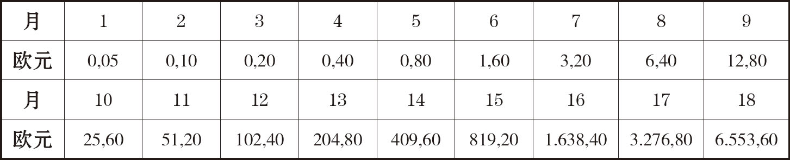

你必须自我发展和成长。你必须发挥自己的创造力并付出努力。这一切都是值得的。刚好在一年半以后，你会得到13107.15欧元，不这样做的话，你根本得不到。

举个例子，你可以从中拿出3000欧元来奖励自己。剩下的10000欧元，你可以用于投资，20年（年利率12％）以后你就有将近100000欧元。

能量贴士

去银行为自己开设一个储蓄账户，坚持18个月往账户存钱，每月的存入金额是上个月的2倍。

•你要学习去寻找新的收入来源。

•你要有足够的时间来开辟新的收入来源。

•你要像锻炼肌肉一样锻炼自己的收入。

•你的潜意识在发生变化。很快你就可以迎接全新的挑战了。

•你应该使自己独立于现有的收入来源。

•如果将这笔钱用于投资，你就为将来可观的财富建立了基础资本。

##  决定你收益的因素

影响复利的，只有三个重要因素：时间、利润率和投入。

我打算探讨这三个因素。请允许我在下面的例子中以超过12％的高利润率为出发点。从1948年开始，股票平均每年的收益率达到11％。许多好的基金也在其列。这种结果在德国被认为是几乎不可能的，所以我用两章的篇幅（第十章和第十一章）来阐述利润率和投资。

##### 时间

正如之前说过的：尽早开始是好事。举个例子，假设你从30岁开始每月存200欧元。如果按12％的年利率来算，你在65岁时就有1049570欧元。之所以得到这一巨大的数额，是因为你让金钱为你工作了35年。

但如果你是在45岁时才开始储蓄，你就“只有”20年的时间。如果你同样想实现105万欧元存款，按照12％的收益率来算，你就必须将原先的每月200欧元的存款额增加6倍，也就是每月1200欧元。

然而，如果你在55岁时才开始储蓄，你就只有10年的时间。尽管如此，你还是想实现105万欧元存款，那么你每月的存款额就必须超过5000欧元。

要挣到105万欧元，你需要：

•35年×每月存200欧元，或者

•20年×每月存1200欧元，或者

•10年×每月存5000欧元。

记住：你开始得越早，你就能越轻松地实现它。

因此，为你的孩子储蓄吧。更为重要的是，将储蓄的概念教给你的孩子。如果你从孩子一出生就开始每月为其投资100欧元，那么等孩子到了35岁，他就已经拥有524785欧元了（按照12％的年收益率计算）。

##### 利润率

和时间同等重要的因素是利润率。俗话说：时间就是金钱。我们也可以说：时间带来金钱。我还是给你介绍一下高利润率，虽然许多人认为很无聊。

每年有成千上万的德国人平均投资收益都超过12％。如果美国家庭主妇听到我们这里的利润率，每一个人都会疲倦地打哈欠。2％～5％的利润率在美国绝对会引发同情。我们在全世界享有这样的声誉——德国人是最节俭的储蓄者和最傻的投资者。

以对比方式看以下数据，你会发现高利润率有多重要。7％、12％、15％和21％之间的差异是多么巨大。假设你坚持月存100欧元超过35年。那么，在年利率分别为7％、12％、15％和21％的情况下会发生什么呢？

•7％：166722欧元

•12％：524785欧元

•15％：1078249欧元

•21％：4671602欧元

如果利润率提高3倍，那么你最后得到的金钱总额就不止三倍了，实际上是几乎30倍！

我们再来看一个例子：如果你投入1000欧元，如果年利率分别是7％、12％、15％或20％，那么在30年之后，你能得到多少金额？

•7％：7612欧元

•12％：29960欧元

•15％：66212欧元

•20％：237376欧元

摸着良心说：花30年使1000欧元变成7612欧元并不会使我们感到意外。实话跟你讲吧，我宁愿“任意挥霍”这1000欧元。但是如果几乎能使你的钱增长30倍（12％），最终甚至增长237倍（20％），那么这就肯定使人心潮澎湃了吧？

你知道，如果你的祖母在50年前就为你存下两张面值500欧元的纸币，而且平均每年收益率是20％，会发生什么呢？现在，这1000欧元就已经变成900万欧元了。所以你的祖母是有“过失”的。但你可以做得更好，你可以及时地为你（未来的）孙子孙女做打算。

现在再看一看表格，如何才能使你的金钱变多。

复利表：每年投入1200欧元

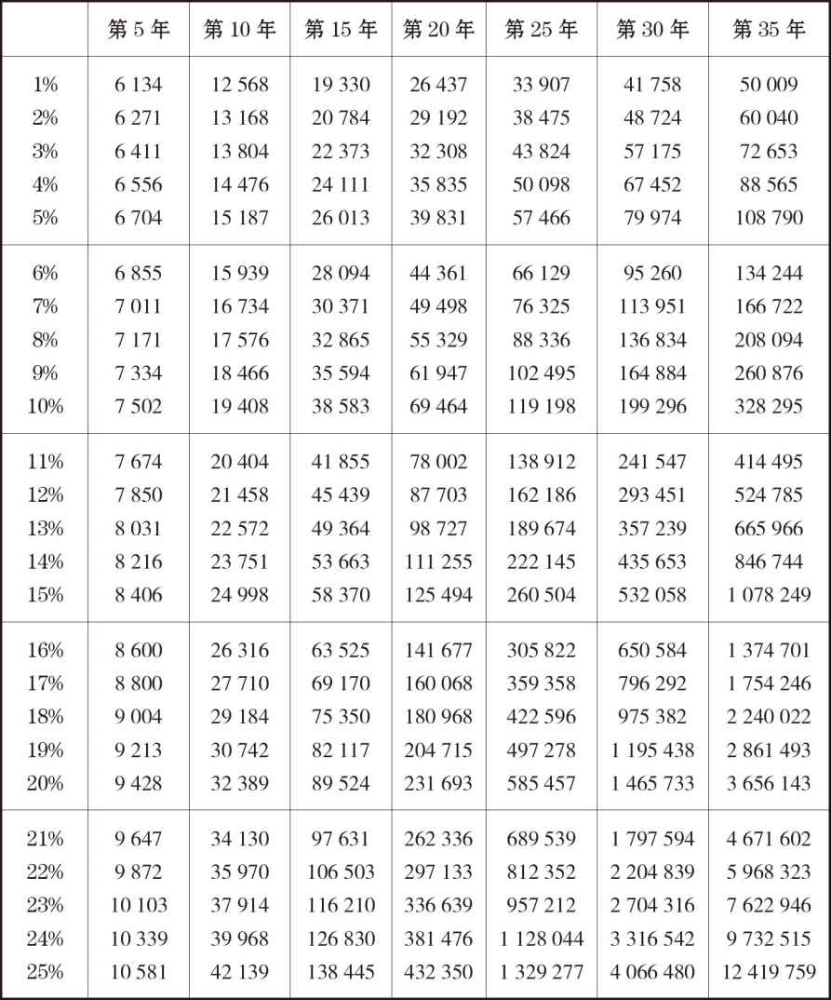

1000欧元的增长形势是什么样的——即使你不再往里投入更多的钱！

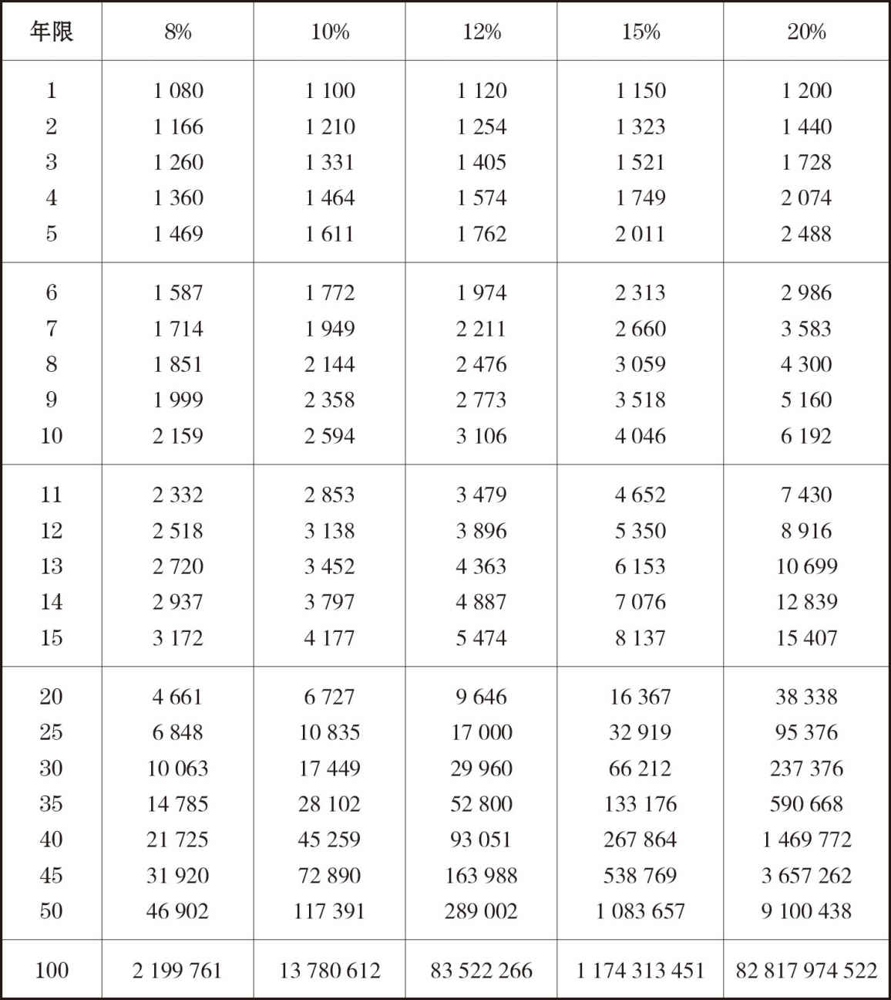

##### 你如何轻松在脑子里计算出复利

为了使你不用一直去看表格，我想教给你一个公式。

用72除以利率，你就能得到投入资本翻倍的年限。

72÷利率＝投资翻倍所需的年限

假设你每年的利润率是12％，将10000欧元翻倍需要的时间为：

72÷12＝6（年）。

照这么说，在利润率为12％的情况下，你的钱每6年能翻一倍。在利率仅有5％的情况下：

72÷5＝14（年）。

你看到了，5％的利润率更像一件冗长乏味的事情，因为你必须花14年的时间才能等到你的资金翻倍。之后再等14年，你的金钱才能再次翻倍。30年之后，你才能使原有的10000欧元涨成微薄的45000欧元。

在利率为12％的情况下，你的金钱可以在6年时间内翻倍。

在12年之后（又一个6年）你的金钱又重新翻了一倍。在30年之后，你会使你的10000欧元变成令人难以置信的大约300000欧元。如果利率为20％，就差不多是240万欧元了。

结论：利润率很重要。非常重要，所以你必须通读第十章和第十一章，了解发现高利润率的方法。如果你想要积累财富，而你拥有的时间越来越少（或者说你想花费的时间越短），你就越需要高利润率。

##  你的金钱可以用来干什么

上述内容引出了两个问题：

1．你想让你的金钱多久翻倍一次？（利润率！）

2．你想用多少钱来翻倍？（储蓄！）

如果你的乘数是零，那么再高的利润率都没有任何用处。今天50000欧元不算巨额资金了，你用它只能买一辆好车。

这样看来，50000欧元并不是一个值得特别去追求的目标。但是如果你将50000欧元用于投资，那么在20年后，这笔钱就会变成50万欧元（年收益率12％的情况下）。基于此原因，聪明人才去储蓄：他们看到的不是眼前的50000欧元，而是未来的500000欧元。

##  没有资本的资本主义意味着金融石器时代

资本主义为每个人打开了通往财富和富裕的通道。不计其数的百万富翁甚至亿万富翁，随着这一经济先决条件——通过投资来增加资本——应运而生。资本主义第一次使复利发挥决定性作用。

资本投资对投资者来说也有好处，因为他能获得收益。他可以分享企业股份，却不用成为企业家。

资本投资对企业家也有好处。他可以借助O.P.M.来更快速地建立并扩展自己的企业。没有O.P.M.，企业就不可能快速增长。新时代所有的大型企业帝国就建立在借用资金之上。

以山姆·沃尔顿的故事为例。他在美国一座小镇购买了一家小商店。这笔钱还是从他的岳父手中借来的。

他创造了折扣店的概念。山姆·沃尔顿向顾客保证：同样的商品，如果你在任何地方发现比我店里更便宜，我马上把钱退给你。在最初的挫折之后，山姆并没有放弃，他反而又一次借钱买了新的店铺。

他的第二个天才想法，是在那些竞争对手认为销售潜力不足的地方——小城市，去开设大量的折扣店。

山姆·沃尔顿为他的国家带来的益处是非同寻常的：他为成千上万的人创造了工作岗位，数以百万的人能够买到物美价廉的商品。这难道还不足以使山姆·沃尔顿家财万贯吗？当时，他甚至成为美国首富。然而，他生活得极为朴素。他还是住在他的第一栋房子里，开着一辆老旧的皮卡。向他人借钱对他来说是一场祝福。他实现了自己的梦想。

我们再来看看1975年投钱给山姆·沃尔顿的沃尔玛的投资者都获得了什么。一名投资者于1975年投入了90000欧元，10年后获得了320万欧元。如果他没有去动这笔钱，那他在1995年7月31日时就会获得26630000欧元。20年的时间将90000欧元变成26000000欧元，这便是投资复利的力量。而沃尔玛的故事也只是这众多故事中的一个。

记住：资本主义这个词中还藏着资本一词。如果你不让资本和投资为你服务，那么整个资本主义都会悄悄地与你擦肩而过。而你在经济上就好比是还生活在石器时代。

不管我们喜不喜欢，我们的制度在很多方面就是使强者更强，弱者更弱。这看起来就是人类进化中的固有规律。

其实我们的税收体制应该创造一种机会均等。但是众所周知，我们的税收体制只对精英和专业人士有利。同样地，资本主义也只对那些善于理财的人有所帮助。而其他的人，它只会采取摧毁的方式来对待。就连古巴比伦人也有过相关的警句：“金钱只留给那些了解并遵守资本法则的人。”

有钱的人可以花钱雇用了解法律漏洞的顾问。一般情况下，只有当一个人有了一笔存款之后，他才会开始对高利润率感兴趣。在这之前，复利的力量只能与你擦肩而过。

##  为什么金钱能带来更多的金钱

聘请好的顾问需要花钱。找到合法的纳税方案需要花钱。聘用好的税收会计师需要花钱。但是，他们能为你节约出你付给他们的报酬许多倍的金钱。一个既有钱又有优秀顾问的人，能靠自己的金钱获得12％～30％的年收益率，通常还免税，还是合法的！

没有钱，不熟悉法则的人，每年能得到2％～7.5％的收益率。他们那微薄的收益还要被税务局和通货膨胀分割。

在一生之中，你都必须当一台赚钱机器，除非你决定自己创造一台赚钱机器，为自己创造一只会下金蛋的“鹅”。你现在也已经看到了，这样一只鹅长得有多快。但是，鹅绝不愿意去那些会马上屠宰它的人身边。

##  开明很重要

在我们这里，只有当一个人为许多人带来收益时，他才会变得富有。当一个人想要变得富有，他就要为其他人创造出他们想要获得的工作岗位、产品或服务。今天的机会远比以前任何时候都要多，这也是受资本主义的影响。

尽管如此，资本主义还是远不能使我们满足。对所有人来说，它绝不是一次直接的“祝福”。它创造了一个新的阶级社会。

在这一方面，我不喜欢资本主义发展的内在动力。是时候让“少数人的资本主义”成为人人共享的资本主义了。
股票为普通人创造了成为股东的机会，这是一个重要的步骤。投资基金使得更为广泛的阶层能够以较低风险参股各种不同的企业。

缺少的只是一种开明的资本主义
。信息政策不仅仅由利益集团来驱动，而是由信息本来的目的来驱动。这一种目的就是使得这个星球上人类的存在更加有意义。在他们的生活中，资本起着支撑性的力量。

我想借用此书献出绵薄之力。你也可以对此做出贡献，通过获得私人财富，成为一个榜样。

------------------------------------------------------------------------

### 本章要点

- 在金钱方面，责任原则同样适用。使自己的资本增值的人，会成为一个富有的人。而无视资本增值法则的人，会再次失去他的金钱。
- 了解复利的力量，却不使用这份力量使自己实现财务自由的行为，是一种缺乏责任心的愚昧无知。
- 对于复利来说，只有三个重要因素：时间、利润率和投入。
- 你开始得越早，你就能越轻松地实现它。
- 如果利润率提高3倍，那么你最后得到的金钱总额几乎能达到30倍！
- 如果你不让资本和投资为你服务，整个资本主义都会悄悄地与你擦肩而过。
- 金钱只留给那些了解并遵守资本准则的人。
- 资本主义使富人更加强大，会拿走那些无视其法则的人手上现有的东西。
- 是时候让“少数人的资本主义”成为人人共享的资本主义了。你也可以对此做出贡献，通过获得私人财富，成为一个榜样。

------------------------------------------------------------------------

# 第十章　你为什么必须饲养金钱

德国人在储蓄方面是世界冠军。而在真正高收益的金钱投资方面，他们却排在后面。

——弗朗茨·拉普夫《论股票》

我的教练喜欢给我讲述《圣经》里的故事。他利用这些故事来教育我。他经常讲述的是著名的法老梦。

法老做了一个使他十分不安的梦。他看见7头漂亮、健康的奶牛从尼罗河中爬起来，身后有7头丑陋的奶牛浮出水面，它们十分干枯瘦弱，身上的骨头都能数得清。突然，干瘦的奶牛猛然扑向肥美的奶牛，并将它们吃掉了。尽管如此，它们看起来仍然那么干枯瘦弱。

约瑟夫被引到了法老面前，他被誉为析梦人。他说：“7头肥美的奶牛指的是7年的时间里粮食富足，每个国民都能吃饱饭。7头瘦弱的奶牛预示着随后而来的7年饥荒。”

法老带着严肃的神情问道：“我们不能做些什么吗？”约瑟夫回答道：“你虽然无法改变它，但你可以做好准备。委任一名财务部长，负责将所有人在富庶年间收获的粮食的1/5收集在谷仓里。这样一来，我们在饥荒年间便会有充足的粮食储备，也就不用再饿肚子了。”

这一计划得以贯彻执行。7年时间里，埃及人有了充裕的粮食。将粮食的1/5交出去，不会使任何人感到痛苦。

##### 荒年

我的教练说过：“大多数人生活的方式都好像自己永远也不会出现收入微薄的情况。但这种情况肯定会出现的。”

他是第一个意识到体制将被迫发生改变的人之一。人们早年如果有工作且工资丰厚，可以生活体面。退休时，公司和国家会照顾他们。

养老金由所谓的“代际合同”保障。这一合同规定：在职的年轻人赡养老一代退休的人。等年青一代老了，新一代的年轻人支付他们的养老金。

今天我们知道，这一合同在将来没法再正常运作。从2020年起，养老金领取者将大大多过赡养他们的在职年轻人。今天我们必须清楚的是：曾经，有一个小男人对全国人民说，你们的养老金是有保障的。曾经……这是童话故事的惯常开头。虚构的故事。人们都喜欢听谎言，但它终究只是谎言。在这种情况下，也有一个童话故事。

埃及人使用一种简单的方法在荒年里保护自己——财务部长将所有粮食的20％收集起来。我们今天也有财务部长，他从大多数薪资阶层人员身上收集起来的钱财远多于20％。但两者是有区别的：今天的财务部长收集金钱，之后又马上把金钱花出去，根本没有为饥荒之年留下什么，什么都没有。

你别无选择，除了成为自己的财务部长，并至少将收入的10％存下来。更好的做法是你完全效仿古埃及人的做法，将20％的金钱存下来。

##### 不要被愚弄

现在睿智的你，看到几个领取养老金也过得很好的人，也许觉得我的描述过度消极，但是你千万不要被愚弄。大约从2020年起，我们将经历完全不同于现在的时代。任何人都能通过几个简单的计算清晰地看到——你不能再继续依赖我们国家的养老金。

养老金计划将无法承担到期支付的养老金。人们的寿命越来越长，医疗保险越来越贵——这应该由谁来支付呢？

没有突然之间打开巨大的谷仓供应一切的约瑟夫，世界上也不存在这样的谷仓。我们由工业时代进入信息时代。这带来的一个影响，很少人意识到我们必须自己为自己支付养老金。20年后或更晚退休的人，现在就需要提前计划，不要使退休年变成荒年。这一点应该早就清楚，人们应该早就被告知，但指责现在对我们而言帮助不大。我们必须建立自己的谷仓，并成为自己的财务部长。我们必须自己承担责任。

##### 赢家和输家

你是不是也觉得这世上的不公是难以忍受的？我们总是轻易地陷入思考，并提出我们最爱的“为什么”这一问题。就像第二章中写到的一样，提问“为什么”对你并不总是有帮助的。它喜欢寻求辩解。而辩解又往往被当作借口。因此，思考“为什么”往往会阻碍你采取行动。

巨大的变化总是区分赢家和输家。总是产生巨大的不公。但就此陷入思考徒劳无益，思考并不会改变我们的境况。

在当今信息时代，输家指的是那些继续依赖国家和他们的雇主的人，赢家指的是自己承担责任的人。这是受害者社会和责任者社会。那些将自己看作受害者的人，还继续依赖过去的承诺，而这些承诺在今天是永远不可能实现的了。但他们仍然依赖国家和他们的雇主。

那些承担责任的人无法容忍自身命运取决于别人是否遵守承诺。他们将歌德的箴言放在心中：只有一件事是你可以期待的：意料之外的事。他们将自我准备看作自己的责任。

##### 困境通常远在退休之前开始

我们将更快地开始体验关系改变造成的另一个影响：当今几乎已经没有一辈子的铁饭碗了。今天，许多人都在退休之前很多年就开始经历自己的“7个荒年”了。因为他们没有在丰年存下20％。

为什么会发生这样的情况呢？我们所有人倾向于陷入两个错觉。

第一个错觉，我们认为，如果经济繁荣，它必将永远
如此繁荣下去。如果一直收入丰厚，我们会预计自己很快收入更多。但是正如我的教练总是强调的那样：干瘦的奶牛往往比预想的出现得更快。

第二个错觉，我们往往无法识别出丰年
。只有当荒年出现时，我们才意识到，我们之前过得有多好。有多少人误以为丰年还在后面，而推迟储蓄和投资的计划？

##### 现实

大多数人存的钱都太少。他们住在光鲜亮丽的房子或公寓里，开着好车，拥有最新款的电视机或音响。他们除了一份贷款协议、一份小小的人寿保险和一个脆弱的储蓄账户，就一无所有了。他们已经成为两个错觉的牺牲品。而那些只储蓄而不投资的人，也不是真正的理财者。许多人将自己的金钱投入某一个理财项目之后就不闻不问了，在这种情况下，金钱是不可能获得正确增长的。还有一些人混淆了投机和投资
两个概念，两者之间存在巨大的区别。详细内容我将在第十一章中进行描述。

这种区别有着至关重要的意义。投机者无法保证“鹅”饲养的绝对安全，他无法定期获得金蛋，也就是说，投机者根本不会获得被动的收入。他们只有在出售自己的资产时，才会赚到钱。

想要饲养金钱的人，首先必须是一个投资者，而非一个投机者。储蓄并进行资本投入的人，还并不一定是一个投资者。我的教练曾经说过：“一位投资者会在买入的时候获得利润，而非在卖出的时候
。”可惜我之前没有遵循这一忠告，因此我也付出了许多金钱代价。想要在卖出时获得收益的人，不是在投资，而是在投机。投机者的运气有好有坏。而且投机者对自己的投资和预测的影响非常有限。

##### 2000年、2001年和2002年

许多人在2000年、2001年和2002年间在股票市场亏损了许多钱。主要原因是：他们更多是在进行投机，而非投资。

在第十一章中，我们还会再讲到第二个重要的区别：投资和债务
之间的区别。也许你会说：“这其中的区别我是再清晰不过了。”但是你会发现，其实很多人在此都犯了一个大错误，一个致命的错误。比如，许多人都将自己的私人住宅看作一笔投资，于是他们误以为自己是投资者，而实际上他们只是在往外花钱。

我的教练总是说：“投资应该使金钱流入你的口袋。”而一笔债务使金钱流出你的口袋。资金流动的方向就表明了这是一笔投资还是一笔债务。

致命之处就在于：许多人认为自己进行的是投资，而实际上却是欠下了一笔债务。他们不会变得富有，而是越来越贫穷。他们将金钱花出去，而非纳入囊中。他们的金钱逐月减少，虽然他们认为自己一切都做对了。遗憾的是，我们所有人做的事情，往往并不正确。就算所有人都说，置办住宅是一笔明智的投资，但这还是错的。私人住宅是一项奢侈品。生活在属于自己的四面墙壁中确实是一件很棒的事情，我自己也是这样做的，但这并不是投资，它不会为我们带来收益，它不会为我们的荒年做出准备。

##### 我们还会再经历一次大萧条吗

自第二次世界大战以来，出现了几个小的股市泡沫。回想起来，这些都不是严重的崩溃，市场总是迅速地复苏。我们可以说，这些轻微的波动，就犹如白天和黑夜的交替
。

这些并不是像夏天和冬天更迭
那样的大周期。几乎没有人认为还会再出现一次像1929年至1932年那样的金融危机。

多年来，我一直指出，周期并不会简单地消失。尽管如此，当市场重新繁荣，打开报纸还是经常读到：这一次不同于以往，全球金融危机不可能再卷土重来。但是约翰·邓普顿爵士，这位基金业务的伟大导师对此说过：“资本投资业务中最危险的一句话就是：这一次不同于以往。”

不久前，我看到一家人在沙滩上堆砌沙堡。所有人都斗志昂扬。一座了不起的沙堡拔地而起。但不幸的是，潮水越涨越高。一家人开始在沙堡之前建立护堤，他们飞快地铲着泥沙，但海浪还在不断地向前逼近。海浪最终还是冲走了护堤，越过护堤开始往护堤另一面侵袭。一旦潮水来临，是没法阻拦的。

一次大崩溃可能会，也将会再次发生。白天和黑夜的交替不是唯一的自然更迭，还有季节的更迭。悠长的夏季结束后，紧随而来的是冬季。正如存在小的变化起伏一样，也会存在长期的变化起伏。向来如此，也将会一直如此。自然界中是这样的，经济世界中也是这样的。潮水还会再来。

只要有一方面受贪欲驱使，另一方面又受恐惧影响的人存在，此类危机就将一直存在。当年，许多人认为这种“基础”动机是没法影响经济的，结果，他们的想法被新经济、互联网泡沫和新市场完全颠覆了。

我可以列举出许多新的崩溃再度发生的原因，但最重要的是：这样的大崩溃会发生，因为之前发生过多次这样的大崩溃，而人并没有改变自己。

许多投资者在2000年、2001年和2002年，连续三年在股票市场中遭遇了极大的亏损。自第二次世界大战结束以来，这是唯一的一次。几乎没有人认为会出现这样的情况——就连我也这样以为。我预计的转折点、巨大的崩溃都在2010年之后。突然之间，人们又再度开始考虑经济和市场动荡大周期的可能性了。

崩溃的糟糕之处在于：原本计划荒年使用的储备金会被毁掉，尤其是许多已经退休的老人会遭受重创；当然也有许多年轻人之前坚持储蓄，自认为明智地进行了投资，现在他们也面临失业和缺钱的双重打击。这种情况太糟糕了。重要的是知道如何投资，不要将债务、投机与投资混淆起来。

我认为，一次大萧条还会再次来临，只是不一定来得特别快而已。

但是，谁会声称自己能够预知未来呢？我尝试过很多次，偶尔成功过，其他时候都失败了。我同其他在这领域上进行尝试的人情况相同：如果预测得到应验，我们就会自我感觉十分良好；如果预测失误，我们就会提醒自己，没有人能够预知未来。基于这一情况，预测未来永远都不可能不受欢迎。

重要的是，作为投资者，我们必须把出现全球金融危机的可能性考虑在内，我们不应该因为这一可能性存在就垂头丧气。一位聪明的投资者是可以做到在任何周期更迭下喂肥自己的“鹅”并获得良好回报的。但是，为了做到这一点，他也必须清楚几个重要的事实。事实是，投资者恰巧是在危机当中才能获得高额的利润。纯粹的投机者会在危机中成为受害者，而投资者会成为受益者。

##### 坚定不移地进行准备

你知道诺亚的故事吗？他居住在一个自人类有记忆以来就从来没有下过雨的地方。突然他得到了一项来自上帝的任务——造一艘大船，一艘能够让他在大洪水中得救的大船。

你能想象当诺亚在一个近乎于沙漠之地开始建造方舟时，周围人是怎么想、怎么说诺亚的吗？那里还从来没有出现过甚至一艘小船，而诺亚现在开始建造的是一艘巨大的方舟。他的朋友和熟人尝试劝服他，说他的整个行为没有任何意义。我完全能够想象出来他们是如何对他说的：“你为什么要把自己的时间浪费在这项毫无意义的大工程上面呢？人一生只活一次。”

诺亚完全不为所动，他的朋友就不再与他来往了。那些智者详细地解释过，为什么根本不可能会出现大洪水。从此以后，他便被众人看作一个固执的、爱胡思乱想的傻瓜。要坚持一个所有人都认为发疯的计划并不容易。但是这个故事的发展表明，诺亚的坚持是正确的：大洪水真的来了。

我不知道你什么时候会读到这本书。最主要的是，我不知道在你读这本书时的经济形势和市场状态会是怎样。也许那时候正好经济形势一片大好，那时候就肯定不太“流行”去警示人们注意可能出现的经济萧条。尽管如此，在这种情况下记住诺亚也是十分有益的。

此外，也许你读这本书时，整个经济社会恰好笼罩着一些阴郁昏暗的气息，似乎会不太相信美好的投资回报。在经济衰退期间，许多人认为根本不可能积累财富。这时，我号召大家去投资，就好像号召住在沙漠里的人去建一艘方舟一样。

然而，至关重要的是，不要因为极端情况而动摇自己。只要我们还没有遇上真正
的全球金融危机，你就可以一直储蓄
。相信我。一场像1929年那样的全球金融危机远比人们能想象出来的要糟糕得多。就连最消极的人所能想象出来的最差的结果也会被事实超越。请做好准备。

丰年将会一直存在，荒年也会一直存在。不要让自己丧失勇气，但也不要让自己盲目相信安全感。尽可能多地去挖掘出自己的经济洞察力，为自己做出重要的决定
。同时关注下一章中提到的重要原则。这不会让你所有的决定绝对万无一失，但你将会看到这不是目的。一个好的投资者，即便在受周期更迭影响的情况下，仍然可以使自己的财富增加。只要他坚持某些原则，即使他偶尔做出错误的选择，仍然能使自己的财富增加。

##### 不要找借口

我的教练经常说：“借口是那些失败者说给我们听的话。”他想知道我的目标是什么。针对我的回答，他又说道：“你将会获得多少，这并不重要。重要的是，你会成为一个什么样的人物。”在他看来，一位真正的人物应该是一名诚实对待自己的人。

你还能记起第二章的内容吗？你给予谁责任，你同时给予了他权力。“经济衰退才是问题所在；我太年轻了或是太年迈了；这是政府的错；我的父母……”这样说对我们毫无益处。在你拒绝承担责任的情况下，财富是不可能产生的；如果我们不能诚实地对待自己，把精力用在寻找借口，而非寻找解决方法上，我们也不可能积累财富。

借口是我们讲给自己听的谎言
。我们应该自己对自己越来越诚实，承担越来越多的责任。许多人声称：“我没有时间去学习正确的投资方法。”是这样吗？这是真的吗？或者说这些人还可以对自己更诚实吗？“我还没有准备好为此投入更多的时间”，这样说会不会显得更诚实？一位真正的人物不会将生活中的机会滥用在道歉和寻找借口上。借口使我们贫穷
。

##### 我们心中的两个声音

我们每个人身上都潜藏着不同的天性。有财务失败者的声音，也有财务成功者的声音；有受害者的声音，也有勇于承担责任之人的声音。我们体内的一部分力量想要寻找借口，另一部分力量又想要做出结果。这是两股完全对抗的力量。我们体内存在这两股力量的原因就在于，我们受到许多不同的印象以及人的影响。

我们能否实现财务自由，对此起决定性作用的是，我们听从的是两个声音中的哪一个：受害者的声音还是勇于承担责任者的声音。

永远不要让你内心中那个弱小的人战胜强大的那个人。

本章中关于“预测”的最后几句。我不相信这世界上真的存在这样的预言家——当他消极的预测真正被证实了他会感到高兴。我也是这样的。我关心的事情并不是，你是否处处考虑我的预测能否实现；我关心的是，如果我的预测真被证实了，你是否提前做好了准备。重要的并不是预测，而是准备预防措施
。假如枯瘦的奶牛突然出现了，而你已经武装好自己了。更重要的是：如果发生一场全球金融危机，你拥有金钱储备，这时的你将会获得意想不到的机遇。相反，如果枯瘦的奶牛不出现，你肯定会成为一名优秀的投资者，你也不用为此遗憾。

全世界最富有的投资者沃伦·巴菲特说过：“毕竟，只有当潮水退去时，你才知道谁在裸泳。”

------------------------------------------------------------------------

### 本章要点

- 你必须为自己的未来主动承担责任。成为自己的财务部长，至少将收入的10％存下来，并尽可能地存下收入的20％。
- 想要饲养金钱的人，就必须投资金钱并获得收益。
- 市场波动一直都是周期性的。重要的是将危机纳入我们的考虑范围中。
- 纯粹的投机者会成为危机的受害者，而投资者会成为受益者。
- 不要因为极端情况而动摇自己。也不要去追随大多数人的做法。坚持你自己的计划。
- 坚持固有的原则，做出相应的决定。
- 借口是我们讲给自己听的谎言。借口使我们贫穷。
- 我们每个人身上都有两个声音，财务失败者的声音和财务受益者的声音。我们能否实现财务自由，对此起决定性作用的是，我们听从的是两个声音中的哪一个。

------------------------------------------------------------------------

# 第十一章　投资者和股民应遵从的原则

简单来说，资本体系和其他经济的区别在于：一块大蛋糕，以不平均方式进行切分；一块小蛋糕，以平均方式进行切分。结果是，被均分的小蛋糕，其每一块比大蛋糕中最小的那一块还要小得多。

——安德烈·科斯托拉尼

国内外很多记者称我为金钱大师。这确实是谬赞。真正的金钱大师是不会犯错误的，但我犯过不少，以后也不可避免会再犯。我更有兴趣帮助他人改善生活品质，使他人生活得更有尊严。这就需要拥有一定数量的财富。

在本章中，你会了解到，你应该如何饲养“鹅”，如何从中获取高收益。要实现这一目的，你就必须遵循本章阐述的原则，并且做好准备做出一些重要的决定。

本章节第一部分讲的是，想成为一名成功的投资者须遵循哪些原则。第二部分讲的是，你必须做出的一些重要决定。

##  第一部分：原则

一般来说，以下讲到的这些原则具有普遍适用性。本书的目的并不是给你一些具体的投资建议。因为这样不仅缺乏远见，还相当危险。在如今快节奏的时代，产品和机遇都瞬息万变。因此，我接下来要讲的内容只着眼于基本原则和最重要的决定。

尽管如此，我还是想要尽可能多地分享一些时事信息给你。得益于现今发达的网络，www.reintgen.de网站中有很多投资资讯，我和专家团队都推荐这些资讯。这些资讯可以免费获取，符合当前的市场情况。

伯尔尼·莱特根是我的一个工作搭档，在我看来，他是最好的投资顾问之一。在该网站上，你会注意到有一些不太知名的投资产品，以及一些最新的投资组合。

##### 学会区分

你有过食物中毒的经历吗？几年前，我在墨西哥吃了一种用鸡蛋烹调的食物，里面“富含”昆虫毒素。后来证实是厨师将这种毒素误用作面粉，和在了面团里。要不是当时有医生在场，我可能就命丧于此了。

自然界中的每个地方都充满着各种各样的生物，一部分无害且有益，另一部分对我们很危险，甚至有一些具有致命的危害。比如有些蘑菇味道鲜美，而另一些却有毒。

生命健康遭遇的这种情形，你的金钱同样也会经历。有些投资让你收益丰厚，有些却使你血本无归。不会进行正确区分的人，将会很危险。但是，通常有益和有害又很难区分，就如同昆虫毒素和面粉看起来那么相似。

为了生存，我们必须学习。为了实现财务自由，我们必须学习。更甚至为了保持财务自由，我们还是必须学习
。学习是为了学会区分
。一旦能够
识别差异，你就可以做出明智的决定。对此，统一出让大家易于牢记的标准，很有必要。

接下来提出几个重点的区别。你应该对这几条区别进行思考、消化，并转化成你自身的理财能力。因为你知道什么才是适合自己的计划，所以你可以快速且正确地做出决定。

关键的区别在于：

1．投资和投机的区别；

2．负债和投资的区别；

3．三种投资类型的区别；

4．普通投资者和投资家的区别。

##### 原则一：识别什么时候投资，什么时候投机

这是当今最受忽视的一条原则。人们把积攒下来的钱存到银行，就把自己看作投资者。实际上他们只是储户，或者投机者而已。他们并不是
投资者。

第一点显而易见：将钱存到储蓄账户里的人，不能称自己为投资者。他是一名储蓄者，把钱存入储蓄账户，便没有了下一步动作。这就是称为储蓄账户而不是投资账户的原因。等谈到第三个原则时，你会看到这没有什么错。恰恰相反，会存钱的人比不存钱的人更好。但是，只有投资者会使自己的金钱显著增加
。

对于投机，大家存在着更多的误解。就连我之前也不明白投资与投机最基本的区别是什么。这也不足为奇，因为我是在一个中产阶级家庭中长大的。这样的家庭普遍把一切都看作投资。我们的房子被称作投资，修葺房屋使其保值，也被看作必要的投资。珠宝，汽车……几乎所有一切都被当作“投资”。

几年前我买了一块很漂亮的手表。我确信这块手表具有很大的增值空间，几年之后卖掉它，我将会获得一笔可观的收益。当然，我认为自己做了一笔明智的投资，并引以为傲地告诉了我的教练。

教练的反应让我大吃一惊。他告诉我，购买这块手表是一种投机行为，并不是投资行为。他说：“投资者是从购买投资产品起就开始获得收益，而并不是要等到卖掉产品时。”

一笔投资是从最初开始就会定期获得收益的。只要没有获得收益，那么你就只是投入了金钱，但并不是进行了投资。我的教练说：“投资者能从投资项目中定期获得收益。谁要是在转卖时才获得收益，那么他就不是投资者，而是投机者。”

大部分的人积蓄太少。而储蓄的人，又常常只是投入金钱，却丝毫没获得收益回报。

##### 投机

投机本身没有什么错。安德烈·科斯托拉尼就是一位投机家，而且做得非常成功。他通过投机取得了巨大的财富。投机不仅是他的事业，还是他一生的热情所在。

安德烈·科斯托拉尼告诫说：“人类不能指望投机让自己定期赚取收益
。一个人可能会在股市赢得很多钱或输掉很多钱，却不能通过股市赚钱
。”

我们也可以说，投资者赚钱，投机者赢钱
。再强调一次：投机不一定是坏事。坏的是，你实际上做着投机的行为，却认为自己在进行投资
。你必须清楚，你究竟把钱投到了哪里，你不应该期待并不可能的定期收益。

投机可以让你获得成功，或是失败。多数时候，成功还是失败并不是你能左右的。在大多数情况下你将无法影响结果。几次小盈利通常足以让你增加财富。我从事投机活动很多年了，它不仅让我觉得很有趣，也给我带来了一大笔财富。但是我不会期待从中获得定期的收益，因为这点在投机活动中是不可能存在的。

##### 股票和股票基金

请允许我再重申一次，在投机活动中，你不应该期望去获得定期的收益。你可能会遇到糟糕的意外情况。很多人在股票和股票基金上都有过这样的遭遇。他们原本期盼着从自己的股票和基金中定期获得收益，却忽视了购买股票也是一种投机行为。

为了防止出现误会，我声明，我并不是反对股票和股票基金。相反，我认为股票几乎是大家都避开不了的。甚至可以说，股票是我们整个经济体系的基础，所有一切都围绕着它。

要是没有投资者提供可供支配的资金，让公司可以招聘新的劳动力和从事投资活动，并将公司发展壮大，那么这个我们所认识的世界，就将会分崩离析。大多数岗位将不复存在，整个世界也将无法运转。

我购买股票基金很多年了。尽管我犯了很多错误，但还是实现了资产增值。在过去几年里，购买股票基金被视为让财富翻倍的最佳途径。但是购买股票和股票基金依旧还是投机，并不是投资。

从股票方面来说，除了股息之外，你只有在卖掉股票时才能挣到钱。同时你可能盈利，也可能亏本。

##### 做什么

出于这一原因，你只能将积蓄的一部分用作投机。大部分情况下，一半的积蓄足够了。因为没有人能保证之后的情况会怎样。只要持有股票不卖，都无法从这项投机中获得收益。准确地说，没到卖的那一刻，你都一无所有。

关于投机，这里还有一个重要的限制条件：如果你购买股息稳妥的股票和基金，那么你可以排除掉大部分的偶然因素。股息，就是定期获得的资金支付，也就是收入。以获取股息为目的而持有股票则属于投资。

此外，有两种经典类型的行为属于投资：投资不动产和创办公司。你选中一处不错的不动产，在投资初始就定期获得收益。同样，运作良好的公司会持续带给你回报。重要的是，要准确知道你在这两种情况下做的事情。想要学会如何巧妙地投资，必须付出时间和精力。而不愿为此付出时间的人，投资基金是唯一的选择。但这样的话，你又需要保持足够的现金储备。

##### 投机者也是商人

严格来说，投机者和商人一样。许多把自己看作投资者的人，实际上是商人。投资者为了持有金钱而购入产品，从一开始就能获得收益。而商人以尽可能低的价格购入产品，希望能够高价卖出。你买入一只母鸡也许是出于两个原因：希望母鸡生蛋，或者希望高价卖给肉贩。

两者都需要拥有相关知识。商人必须知道买入和卖出的最佳时机。这不一定和买入产品的实际价值有关，只要能以高出买入价格的售价卖出就足够了
。换句话说，商人必须正确地评估市场。相反，投资者就必须对不动产或公司进行评估，并预估可能产生的利润率。

现在结论已经很明显了。掌握两点知识很重要：清楚买入卖出的最佳时机，能够正确估算价值和利润率。一位优秀的投资者应当掌握这两点。

因此，优秀的投资者也得会投机。因为这有助于投资。学会正确分析市场和趋势是十分有益的。同时选择一些稳定的投资组合，这会降低风险，而且不需要你额外花费很多时间。

##### 原则二：区分债务和投资

前面我已经概述了债务和投资的区别。接下来，这个关键的问题会使这一区别更加清晰：金钱流向何处？流向你还是远离你？如果金钱远离你，这就是一种负债。如果金钱流向你，那这便是投资。

许多人在财务上都没有什么积累。不是因为他们挣得太少，而是因为他们花得太多，投资太少。负债越多，我们的投资就越少。教练让我饲养一只“鹅”。“鹅”代表的是投资项目。他以一辆昂贵的汽车来代表债务。债务情况如下图所示：

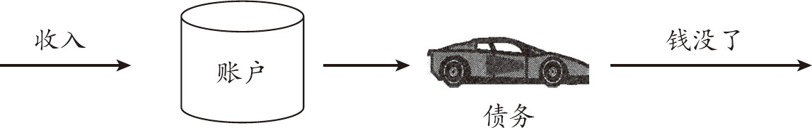

而投资的图示情况则完全不同：

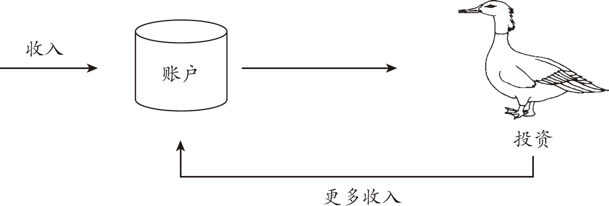

现金的流向说明一切。负债使金钱最终离你而去，投资则增加你的收入。

##### 自住房又是什么情况

还记得我说过我父母把房子看作投资吗？一处用于自己居住的房子或者公寓其实并不是投资，而是债务。

我相信你也许听到过完全不同的说法。很多人不是说“住房是最好的投资”吗？然而你想想，都是谁在这样说。谁在散布这个谣言？大部分都是信贷机构和银行。当我在讲座上向学员解释这个问题时，一位年迈的女士问我：“但为什么银行要声称自住房是一种投资呢？”我的回答让她大吃一惊：“因为事实本身如此。”

她很疑惑：“你刚才不是说，自住房是债务而并非投资吗？现在你又说自住房是投资。哪个是正确的呢？”

我解释说：“两个说法都正确。关键的问题在于：对谁
来讲算是投资？投资使你定期获得收益，债务使金钱从你的口袋中流走。当你贷款买房后，你需要每月支付利息。金钱就从你的口袋中流走了，因此，对你而言，你的房子不算是投资，而是债务。”

女士点头道：“这样我就明白了。”我接着说：“这部分从你口袋中流走的利息，就流到了银行的口袋里。对银行来讲，这是个超级划算的买卖。你从银行借钱，每月偿还利息，除此以外，还要将你的房子和所有资产作为担保。银行说房子是种投资当然是正确的了。只不过没有说清楚对谁
来讲算是投资——也就是说，投资不是针对你而言的。购买房子对于你是一种负债行为，但对于银行就是一种投资行为。从一开始你就要偿还利息，只要贷款尚未还清，房子就是属于银行的。”

##### 当你还清房贷时，情况又如何

我之所以强调这个区别，是因为我有意识地想让我们也像银行一样去进行投资。对别人而言，我们的支出则是他们的收入。我们的债务于对方而言则是一种投资。

这位女士还问了我一个问题：“但是房贷总有一天会被还清，那个时候房子就属于我一个人了。那时候算是投资吗？”

我答道：“当教练第一次向我阐述这一区别时，我也问过同样的问题。他对我说：对大多数人而言，还清房贷都需要25年至30年的时间。然而即使还清了贷款，也不会从房子中获取收益，只有卖掉房子时才会。”

女士又问道：“好了，我懂了。但是我的房子如果不是一种投资，那算作什么呢？”

我回答道：“就算你还清了房贷，你的房子还是一种债务。因为你需要不停地缴一些费用：税费，保险费，维修费，装饰费，置物费。最好不要把房子看作投资资产，而应看作奢侈资产。把房子看作投资资产让你安心，而奢侈资产是很费钱的。”

##### 首先进行投资

我不反对买房。恰恰相反，我认为一套房子或者公寓能为我们提供一定的生活质量。房子是一种奢侈品，却是一种有意义的奢侈品。关键在于什么时候买房
。是先投资，还是先负债。

如果你在投资之前就先买房，你也许就没有足够的余钱来投资了。相反，如果你选择先投资，你也许会因此获得额外收益，从而轻松购买一套房。

教练当初对我说，许多家庭之所以不能过上富足的生活，是因为他们不遵循这一顺序。很多人竭尽全力购买一套昂贵的房子，之后便没有可以用作投资的资本。教练把这类人称作“房奴”。他们虽然工作很努力，也挣了很多钱，但大部分是在为银行打工。虽然他们认为自己是在为房子而辛苦，但实际上是在为银行拼命工作。他们支付的利息就是银行的收入来源。

最糟糕的是，人们根本认识不到债务和投资的区别。正如上面所说，他们购买自己的住房作为投资，认为自己没有做错。但是无法理解，为什么自己的财务状况会越变越差。

##### 原则三：确定你的资产类型

你必须确认你有哪些可供选择的资产类型。这是根据基本原则进行投资的唯一途径。财务投资只有三个主要类别：

1．货币资产；

2．有形资产；

3．赌博。

货币资产投资即以钱投钱。缺点在于：通货膨胀和税费占去了大部分本就微薄的收益。优点在于：这项投资相对比较安全。你当然不应该放弃它们。

在有形资产投资中，你将资金转换为固定资产——比如不动产，投入企业投资份额、股票及股票基金等重大资产。有形资产风险较高，对相关知识要求程度更高。但也会带来高回报。

赌博是你在玩你的钱。我的教练说过：“赌博只能作为娱乐。绝对不能把赌博和投资混淆。”我的建议是：远离赌博，直到你真正清楚自己在做什么。

为什么需要做此区分呢？答案很简单：为了建立起投资的系统性。你绝对不能随意地进行投资或花钱。

你需要确定的是，你希望将多少钱投入货币资产中，多少钱投入有形资产中。问题不在于
哪一种资产更好。

真正的问题在于：我要怎样分配手中的资金
。

关于这个问题，我无法给出简单的答案。这取决于至少4种因素：

1．你的目标是什么？（下一章将讨论设定你的财务目标。）

2．目前你手上有多少资金可以投资？

3．你准备承担多大风险？

4．你的年龄？或者，你什么时候需要支配多少钱？

为了确定在货币资产投资和有形资产投资上分别该投入多少资金，你必须做出几个重要决定。这个问题我们将在本章结尾进行讨论。

##### 原则四：有形资产完胜货币资产

长期以来，有形资产投资一直都胜过货币资产投资。主要原因是通货膨胀。当你投入一部分金钱在货币上，这笔货币的价值会随着通货膨胀而贬值。同样多的一笔钱，今天能买到的东西和10年前就完全不同，因为所有东西都涨价了。

也就是说，把钱存入储蓄账户的人，越存越穷。假设：你的储蓄账户上有1000欧元。一方面，在平均通货膨胀率为3％时，经过一年，你的资金只剩下970欧元。另一方面，你将从银行得到2％的利息，20欧元。你获得的利息还不够弥补由于通货膨胀而亏损的部分。

通货膨胀吞噬了你的钱，因为所有东西都变贵了。当物品涨价，你的有形资产也跟着涨价。要是你投资了不动产，它的价值便会升高。股票也是如此。如果所有的物品都涨价，那么你的有形资产也会涨价。

我们常听说，每年的通货膨胀率（货币贬值）平均为3％。这个说法如果正确，且假定之后也一直保持在这个水平线上，这就意味着，若干年后，你的1000欧元还剩余如下：

•10年后：737.40欧元

•20年后：543.80欧元

•24年后：481.40欧元

##### 真正的通货膨胀率

让人失望的是，实际情况更加糟糕。3％的通货膨胀率其实与事实并不相符。你想想引入的欧元，许多人称为“贵元”。统计数据太容易误导民众了。引入欧元后，几乎所有的东西都变贵了。这一点我们大家都有亲身体会。但是统计数据企图让我们相信，通货膨胀率会一直保持在1％的水平上。而实际上，这一数字早已达到了4％～5％。

你回忆一下，1965年时一个面包卖多少钱？只卖10芬尼（＝5欧分）。一张邮票呢？只卖20芬尼（＝10欧分）。一张德国报纸10芬尼一份，也就是5欧分。男士剪个头发花费3.8马克，还不到2欧元。那时候，一辆奔驰200D的价格换算成欧元，为4300欧元。

这些例子说明，物品的价格实际上每年提高了4％～5％。大约每18年就会翻一番。这表明，你的钱最多每过18年就会贬值一半。但同时也意味着，平均每18年你的有形资产投资的价值就会翻一番。

根据下面的公式，你可以较为容易地计算出通货膨胀对你的影响：

72÷通货膨胀率＝货币资产对半贬值所需的年数

比如，当通货膨胀率为4％，那么用72除以4，结果为18。也就是说，18年后你的钱就会贬值一半。当通货膨胀率达到9％，货币对半贬值的时间则只需要8年。关于这些通货膨胀的数据，我们都是有目共睹的。

##### 通货膨胀是你的朋友

总之，我们可以说，通货膨胀是你金钱方面的敌人，也是你有形资产方面的朋友。好消息是：在这种相互关联的影响下，你的存款如何贬值，有形资产也将会如何升值。

简单来说，在货币资产上被称作通货膨胀的情况，在有形资产中被称为升值
。你要是投资有形资产，则不必担心会出现通货膨胀。因为同样是通货膨胀，让你的金钱贬值，也让有形资产升值。

##### 原则五：你必须承担风险

你想要实现财务自由吗？或者你更愿意追求最大限度的安全？许多人在回答这个问题时都说：“我两个都想要。”很遗憾，鱼和熊掌不可兼得。没有人能够既追求财务自由又保证绝对安全。

原因很简单：自由和安全是互相排斥的。就如同两条反向延伸的道路。当我们选择其中一个方向后，就会离另一个目标越来越远。

许多人虽然梦想拥有财务自由，并且也往这个方向走了一段路，但同时他们又认为安全是非常重要且不可或缺的。于是又走上了安全之路的方向。形象地说，就是他们往一个方向走一步，接着又往另一个方向走一步。结果是他们始终还在原地。就如同一只仓鼠，奔跑在它的小转轮上。虽然一直不停地跑啊跑，但一直都在原地踏步。

自由和安全是相互矛盾的。追求自由的人和看重安全的人完全就是两种人。后者愿意牺牲自由来换取更多的安全。追求的财务安全程度越高，他们失去的财务自由也就越多。

##### 安全不是绝对保障，自由不是无拘无束

追求安全的人，首先是想保证不亏损。他们对于亏损的恐惧感远远高于想要赚钱的欲望。相反，追求自由的人则想要赚钱。这类人赚钱的欲望就远远超过对亏损的担忧。我的教练常说：“投资不是为了不亏钱，投资就是为了赚钱。”换句话说就是，投资你的存储资金来增值，而不是越存越穷。

对安全的担忧，对人们是个很大的劣势。追求绝对安全的人往往会恐惧。追求安全的这类人正是最胆怯的这些人。他们的世界总是黑暗且充满危险的。过分沉迷于安全的人，世界观总是消极的。他们总是会发现新的危险。

仔细想想，其实安全从来不是绝对的保障。因为如果你只将金钱用于稳定的储蓄，可以肯定的一点是：通货膨胀和税费将会蚕食你的钱。一个只选择“安全”储蓄的人，多年后，和愿意冒险的投资者相比，他可以支配的金钱肯定会少得多。

但是自由也并非无拘无束。自由是要付出代价的：勇气、毅力以及时刻准备着犯错。自由的代价绝不只是一点点：不时出现的恐惧，怀疑，很少得到他人的理解……但是只要你鼓足勇气，敢于去做，拥有面对错误的意志力，并且学会直面失败，那么你将能够获得只有少数人能体会到的自由。

##### 失败

胆敢冒风险的人，也一定要准备好经受挫折。如果有人说：“这对我来讲风险太大了。”那么他其实同时也在表达这一层意思：“我不想犯任何错误。”“我觉得犯错没有任何好处。”

真正的投资者清楚：损失也属于盈利的一部分。正如没有心碎过的人，不懂如何真正地去爱。也没有哪一位富有的投资者没有经历过亏损。但我却认识很多穷人在投资上从未亏损过……

想要彻底规避风险是一件危险的事情。因为这样你会失去很多金钱，远比你能挣到的还要多。只有敢于尝试新事物，才能长期盈利。敢于尝试新事物的人，肯定会犯错。在这一点上，犯错是很重要的：它让我们提高注意力，并且保持谦虚。谦虚的人能比自以为无所不知的人学到更多东西。

关键在于我们如何看待自己犯下的错误。我们将其看作一种罪责？还是看作未来的负担？还是看作对未来的一项投资？

##### 结论

这有什么实践意义？你应该把一部分资金用于货币资产，包括定期存款账户、货币基金和债券。但是，另外一半的资金要用于有形资产投资。如果你没有时间投资股票，那么你可以选择股票基金。如果你想努力成为一名投资者，就还需要投资不动产和公司。

##### 原则六：分散投资

这条原则是重中之重。不论你想选择一条快捷的路，还是缓慢的路，你都应该：分散投资。

没有人能预知未来。因为不能，所以几年后我们才能回头看到哪一些投资是最成功的。因此，除了分散投资，没有其他更好的办法了。

我们不知道接下来10年将会面临的是通货膨胀还是通货紧缩，经济繁荣还是经济衰退，或者甚至是大萧条。因为无法预知，所以一部分钱应该用来投资货币资产，另一部分投资有形资产。在货币资产投资中再分散资金。我们也不知道哪些有形资产走势最好。因此，在这上面也要进行分散投资。购买在全球范围内运作的基金。同时也应该购买不动产（股票）。如果你没有这么多资金，就把一半的钱用来购买货币基金，剩下的一半分散购买几个大型的股票基金。

##### 原则七：投资家和普通投资者是有区别的

普通投资者关心的是平均水平。比如，他们通常会问：“这些产品在过去5年、10年或20年的平均收益情况如何？”平均水平的产品针对的就是普通投资者
。平均水平的产品完全符合一条缓慢的理财道路。但如果你想快速致富，那你就必须比普通投资者技高一筹。

普通投资者大多只有在牛市时才能盈利。熊市时他们就只有一个选择：等待市场好转。投资家在不景气的时段里并不会无所事事地等待，他会继续进行交易。这需要很多的时间以及专业知识来支撑。

他的交易不可能总是一帆风顺，但他能从错误中汲取经验教训，永远不会因此而气馁。投资家把犯错看成是成功的必要部分。普通投资者则不喜欢犯错，他们将其看作个人的失败。

普通投资者一味地相信，起起落落的股市中，平均行情总是会上涨的。在某种意义上，他们把驾驶的飞机调到自动驾驶状态，静观其变。过去的50年间，事实数据显示，上涨幅度大于12％——根据长期数据算出的平均水平。尽管经历了很多危机，崩盘和一些战争，平均涨幅还是不错的
。普通投资者追求平均水平，就是如此。这只不过是一个选择问题。

我们总是要为自己的选择付出代价：如果你是一名普通投资者，在行情低迷期几乎只有无能为力地任其宰割。你能做的仅仅是抛售股票，但赚不到利润。或者你选择继续持有股票，期待行情能有所好转。但是在这之前，你也赚不到利润。当然，你确实有一个巨大的优势，你几乎不需要耗费时间在投资上。不过，如果过去的趋势继续下去，你将有超过12％的平均收益。

但如果你想成为一名真正的投资家，你就必须不断学习，并花费很多时间在投资上。

##### 对冲基金

正如我们之前说过的，真正的投资家不满足于像普通投资者一样，只在行情上涨时取得收益。因此，富有的投资家通常都持有对冲基金。就如同栅栏把羊群圈住，防止它们跑开一样，对冲基金（栅栏）能防止投资遭受巨大损失。对冲基金能够在行情低迷期借助期权使自身得到保障。对冲就像是一份保险，一份针对损失的安全保护。

在普通投资者面临亏损，资金无法受到保障时，对冲基金会尽力地保障自身。在暴跌的投资市场中，对冲基金也能创造收益，甚至是巨大的收益。

当然，也不存在完全的安全保证——即使人们一直认为对冲基金是最明智的选择。实际上，由于复杂的杠杆作用，投资风险甚至会上升。普通投资者认为期权具有非常高的风险。事实也确是如此。但是真正的投资家认为：“不为投资行为加以防护措施，风险更大。”

此处讨论的并非什么是“正确的”。任何事物都有两面性。此处的重点只有一个，那就是真正的投资家坚持的原则：不要只是等待，而应该更多地主动出击；不要只是满足现状，而要去寻找新的道路。

##### 两条道路……

在人生以及本书中，我们一直都面临着在两条道路之间进行选择：一条缓慢的路和一条快速的路。你如果满足于在20年时间达到财务自由，那么可以选择走一条缓慢的道路，一条处于平均水平的道路。这并没有什么不对。这只是你自己的人生规划、价值观以及优先考虑的事。这是你自己的选择，你自己感觉舒服就好。

反之，如果你选择走一条快速的路，那你必须比一般水平的人更优秀。你要么比别人赚得多很多，要么创办一家公司，或者你作为投资家并取得非一般的成就。这三种情况中的任意一种，都需要你投入大量的时间，学习，学习，再学习。记住：有教练带领你学习，会事半功倍。

下面，我们就一起来看看你必须面临的一些重要决定。

##  第二部分：重要的决定

你读完了投资原则，现在是时候做一些重要的决定了。决定的本质在于，你无法同时兼得鱼和熊掌。你必须从两个可能性中做出一个决定。

既然你已经读到了这里，那么我断定你不是只满足于存钱的人。因此，你也不会选择只投资货币基金。

问题一：什么时候才是负债的最佳时机？

哪一个对你而言更重要：尽快拥有一处富丽堂皇的住所，还是先达到一定的财务目标。请你在阅读第十二章之后，再来回答这个问题。想要快速致富，那么你必须在达到财务安全之后，才能选择负债。最富有的人甚至在实现财务自由之前都不会选择负债。

问题二：你想投资还是投机？

正如之前所说的，无论如何，你应当投入一部分钱购买股票或股票基金。即使你决定做一名投资者，我也推荐这些资产。最终还是得按照这条最重要的投资原则：进行分散投资。

所以真正的问题是：你仅仅只想做一名投机者，还是想同时也做投资者？思考以下几个问题：你愿意在这里花费多少时间？你愿意承担作为投资者的责任吗？你仅仅只想达到平均水准，还是从一开始就想从投资中获得收益？

让我再给你一个理由说明为什么作为投资者这条路最为快捷：当你想买一处不动产用作投资时，你可以从银行申请到贷款。但是，你不可能从一名理智的银行家那里申请到贷款购买股票。

怎样操作更快？自己存50万欧元用作投机项目，或者存10万欧元，再贷款40万，购买一处50万元的不动产？

但不要忘了，这需要你拥有很多专业知识和经验。你要是想学习投资，一定要继续阅读相关书籍，参加讲座，向成功人士学习。

问题三：你打算独自投资，还是和顾问一起行动？

如果每个人都集中全力做自己擅长的事情，就能使自己的生活质量得到巨大提升，一直以来都是如此。别的领域则委托其他擅长的人来做。在我认识到这一点后，我便为自己找了一位优秀的值得信任的顾问。这是一个十分正确的决定。

现在就做出决定吧：你是想靠自己成为一名投资者，自己挑选和管理股票，还是想委托一位懂行的顾问？要找到顶级顾问的最佳方法，便是向富有的朋友打听。

问题四：你打算如何分配货币资产投资和有形资产投资的份额？

正如之前所说，这个问题和你的目标是紧密相连的。相关的知识你会在下一章中读到，同时也包括投资分配的建议。

你的风险承受能力也很重要。这一点很难评估，因为根据不同的个人处境和市场条件，评价方式也不同。如果你想要精确地评估自己的风险承受能力，我建议你做一个测试。可以参考www.reintgen.de上面的内容。

然后，资金分配也取决于你拥有多少资金储备。在你完成刚才推荐的测试之后，系统会自动根据你目前的可用资本为你提出分配建议。

最后，你必须考虑自己的年龄。下面这个公式可以起到很好的指示作用：

100－年龄＝股票和股票基金的最高份额。

问题五：你应当选择哪些产品？

你可以通过多种途径去发现适合的产品：咨询一位优秀的顾问或者阅读当前的财经杂志，你也可以登录网站www.reintgen.de了解我和我的专家团队发布的实时评估。正如之前所说，上面推荐的所有股票基金和产品，都经过了我们的仔细评定，并且你可以免费获取这些信息。

比如说，以前的你知道通过人寿保险也能获得12％的平均利润率吗？

##### 童话和幻想

在下一章中，我将请你做出三个财务计划。规划你的未来是一件困难的事情。我们想象的未来永远不会发生。事情总是与我们预期的不同，或大相径庭，或部分不同。比想象中好或坏，但总归有区别。我们想象中的未来犹如童话，根本不可能成为现实。

我们所说的任何关于未来的事，实际上都是一个童话或者一种幻想。未来是无法预知的。如此一来，其实任何形式的计划都值得怀疑。如果我们都不知道未来将会发生什么，那计划又有什么意义呢？

其实不然。相反，不管怎样，我们都应当有所计划。因为一切的所想、所说，我们都会设法去实现它们。我们为自己编织的童话或者幻想，也会在很大程度上成为现实。

##### 塑造未来

未来也几乎总是被计划好的。如果你自己不做计划，会有别人替你计划。要么你勾画自己的人生草图，要么别人替你来做。按照计划行动，就是在塑造未来，一步一步地实现自己的梦想。

我们无法预言未来的样子，但可以塑造它。不过这不仅针对积极的想法和话语，也适用消极的一面。悲观消极的想法也会呈现出成为现实的趋势。许多人认为生活中发生了太多不好的事情。危险的是，这些想法成了现实。

你可以尝试和那些整天不开心的人，那些几乎没有成功过和满足过的人交流一下。通常这些人对于自身未来的展望都是消极的。他们常说：“我永远不会富有。”“财务自由对我而言只是一个童话故事。”“我的未来一片昏暗。”

就连这些也都是童话、幻想、不切实际的想法，但是它们恰巧也有着促使想法成为现实的力量。

为了肯定自己的想法，这些人会和那些同样认为未来黑暗的人一起诉说交流。悲观者吸引来的也只是消极者。

一个始终消极看待未来的人，最终会真正过上黑暗的生活。那时他们就会说：“看吧，我说对了吧。那些盲目积极的人是迟早会失望的。”

这群悲观者并不是提前预测
了未来，实际上，他们是一步步地塑造
了自己未来的生活。

##### 一种巨大的可能性

因此关于未来的所有预想，虽然一方面只是童话和幻想，但另一方面也有着可能成为现实的趋势。这不仅适用于消极的想象，也适用于美好的梦想。

如果这样的话，那我们为什么不给自己勾画一个更为满意的蓝图呢？为什么不选择一种更美好的未来生活？为什么我们要抛开世界上所有积极的可能性，而为自己选择一种自己不喜欢的生活呢？

聚会以惊人的方式证实了这一点。不久前，我参加了30周年聚会，见到了很多老朋友和老同事。我还记得他们多年前说过的一些话。比如一位朋友以前总是说他以后一定会发财。他给自己描绘了一个丰富多彩的未来。有趣的是——他现在真的很富有。

还有一位同学曾经说过：“我想要开一家自己的公司。但是我不太会理账。”在校期间，他就开始卖一些小香肠和糖果。后来他还在学校申请到了小摊位。聚会时他告诉我，他之前原本有一家店，生意很好。但因为他不会理账，被合伙人骗了。

每个人都曾为自己的未来设想了不同的童话故事。他们都无法准确地预测未来，但是都梦想成真。

##### 但如果我只相信失败的未来，怎么办

道理肯定每个人都明白。但还是有一些学员在讲座之前对我说：“我没办法摆脱自己的消极想法，我知道这样想很不明智，但我就是没办法改变。”

这是一个很严肃的问题。对此，我想说两点。我自己也曾有过这个问题。接下来我会大致讲一下，我的教练当初是如何帮助我的。由于篇幅限制，详细的过程就不在本书中进行描述了。

我开设了一门讲座，我们会详细讨论这些问题。

##### 人生低谷时说的话

在人生低谷期，你会对自己说什么？你会对自己和他人述说一个怎样的未来故事？什么样的未来对你来说是可能出现的？

26岁那年，我破产了。那时的我真是糟糕透了。母亲对我说：“看吧，就是因为你不好好完成大学学业，没有选一份正经的工作。”

那个时候我整天沉浸在悲伤之中，只想躲在被窝里沉睡。我那时连现在的一丝勇气都没有。勇气，只有在逆境中才能成长。

但是，我不愿意承认母亲的话是对的。我说：“总有一天我会变得富有，我和你打赌。我保证，你将来肯定会以我为荣。”

然后我陷入了进退两难的境地。我向母亲承诺我一定会变富。我还和教练一起做了很多财务计划，这也是你在下一章中要学到的。除此以外，我还向教练承诺：我会振作起来，不会轻言放弃。我甚至告诉我的朋友和一些同事：我一定会获得成功。我不愿意违背自己的诺言，但又不断地怀疑自己。

人在顺境的时候，很容易积极地展望未来。但在逆境的时候呢？和教练一起的那段期间，我真的经历了很多困境。他总是鼓励我：“现在正是时机，再把你的目标提高一些。”我反驳他：“以现在的情况，这样做并不现实。”

教练接着说：“所有你给自己或向他人描述的未来，都只是一个童话故事。因此，你最好给自己编织一个美好的童话。这样，当你的童话故事成为现实时，你才会生活在美梦里，而不是生活在噩梦里。”

有时候他会很突然地问我：“你关于未来的设想是什么样的？”他不允许我有消极的态度，所以我总是给他描绘一些很美好的愿景，美好得有时候连我自己都不相信。我也向他讲述自己的疑虑。

他说：“有疑虑是很正常的，其实这就是对未来存在的消极想法。有两件事很重要：第一，除了我之外，你不能告诉任何人你对未来的疑虑；第二，每当你内心产生怀疑时，最好马上给我打电话。这样我们就可以马上谈论一些关于未来的美好愿景。”

我照着教练的话做了。我的怀疑随着时间渐渐减少了，积极的愿景在心中不断增强。

因此，再强调一遍本书第一部分给出的建议：多和积极向上的人，以及那些喜欢听到美好梦想而非噩梦的人交往。

##### 谁害怕妖怪……

你小时候玩过“谁害怕妖怪”这个游戏吗？我曾经很长一段时间害怕妖怪。那时我必须检查床下和柜子里是否有人。天黑以后我绝对不敢去地下室。

许多人在成年后很长时间都害怕妖怪。妖怪意味着：邪恶的老板、税务官员、竞争对手……如此一来，他们夜不能寐，又为自己描绘出幽森可怕的情景，这简直就是噩梦。

许多人的反应和儿童游戏一样：妖怪来时，大家四散逃跑。然而，逃避未来的人，避开的不仅仅是可能发生的不幸，也有他的幸运。他们就这样逃离了自己原本应有的未来。逃跑成为他们的计划，替代积极有益的财务计划。

设想一下，我们身体里住着两个小人：一个代表财务失败者，他觉得未来一片灰暗；另一个代表财务成功者，他觉得前途一片光明。两者都描绘了一个关于未来的童话故事，而且两个故事都是可能实现的。

听从美好的声音，不要听信充满怀疑和消极的那些话语。要相信美好的愿景，为自己编写一个你希望其成为现实的童话故事。接下来参照下一章的内容来做好计划。

按照计划，一步一步地执行，梦想就会成为现实。

------------------------------------------------------------------------

### 本章要点

- 学会如何区分投资、投机和负债项目。
- 投资者在购买投资产品时就能取得收益，而不是等到卖掉产品时。
- 不要太早地选择负债。在买自住房之前，你应该要拥有一定量的积蓄。
- 你自己居住的房子不属于投资产品，它属于奢侈品。
- 投资者赚钱，投机者赢钱。
- 有形资产胜过货币资产。
- 如果想要实现财务自由，就要敢于冒险。
- 分散投资：一部分资金用于货币资产投资，一部分用于有形资产投资。
- 作为一名投资者，要不断地学习，充实自己。
- 做出决定：你想花15年至25年的时间来实现财务自由，还是想走一条更快捷的路？你想做一名投机者，还是想成为一名投资者？
- 我们无法预测未来，但是我们能塑造自己的未来。
- 跟随心中积极向上的声音。梦想是可能成真的。

------------------------------------------------------------------------

# 第十二章　财务保障、财务安全和财务自由

有两条通向幸福的道路：降低要求或者增加财富……聪明的人，会同时给自己创造两条路。

——本杰明·富兰克林

每个人都有权利去实现自己的财富梦想，你也不例外。但为了让梦想成为现实，首先，你必须对目标要有一个准确的认识。

你如何才算拥有财务保障、财务安全和财务自由？它们的定义和区别是什么？你需要多少资金、多长时间才能达成目标？

##  第一步计划：财务保障

也许你已经听说过很多关于目标确立的建议了，那么你是否想过，将这股力量用于改善你的财务状况呢？

请回答一个问题：假设你突然断了经济来源，欠你钱的人无法还钱；或者公司破产，你被解雇了；或者你生病了——这样的情况下，你能支撑多长时间？

这正是我们要谈到的财务保障。尽管遭遇突如其来的经济变故，你还是能依靠积蓄继续保障自己的生活。

我们先来算一下，紧急状况下，你每个月会有多少支出。请写上你的固定花销，也包括你偶尔生病时需要的费用。如果你是一名雇员，只需要填写“个人花销”这部分。如果你是个体经营者，还要另外填写“业务支出”这部分。

个人花销：

|  |  |
|----|----|
| 房屋抵押贷款/房租： | \_\_\_\_\_\_\_\_\_\_欧元 |
| 伙食/日常家务开销： | \_\_\_\_\_\_\_\_\_\_欧元 |
| 汽车： | \_\_\_\_\_\_\_\_\_\_欧元 |
| 保险： | \_\_\_\_\_\_\_\_\_\_欧元 |
| 预付税款： | \_\_\_\_\_\_\_\_\_\_欧元 |
| 家务费用： | \_\_\_\_\_\_\_\_\_\_欧元 |
| 通信费： | \_\_\_\_\_\_\_\_\_\_欧元 |
| 信用贷款： | \_\_\_\_\_\_\_\_\_\_欧元 |
| 其他： | \_\_\_\_\_\_\_\_\_\_欧元 |
|  | \_\_\_\_\_\_\_\_\_\_欧元 |
| 每月开支合计： | \_\_\_\_\_\_\_\_\_\_欧元 |

业务支出：

|  |  |
|----|----|
| 房租抵押贷款/房租： | \_\_\_\_\_\_\_\_\_\_欧元 |
| 办公费用： | \_\_\_\_\_\_\_\_\_\_欧元 |
| 发放薪水： | \_\_\_\_\_\_\_\_\_\_欧元 |
| 通信费： | \_\_\_\_\_\_\_\_\_\_欧元 |
| 代理机构花费： | \_\_\_\_\_\_\_\_\_\_欧元 |
| 信用贷款： | \_\_\_\_\_\_\_\_\_\_欧元 |
| 其他： | \_\_\_\_\_\_\_\_\_\_欧元 |
|  | \_\_\_\_\_\_\_\_\_\_欧元 |
| 每月开支合计： | \_\_\_\_\_\_\_\_\_\_欧元 |

根据上面的数字，你达到财务保障，每月需要收入多少呢？

|                                                 |                          |
|-------------------------------------------------|--------------------------|
| 个人花销： | \_\_\_\_\_\_\_\_\_\_欧元 |
| 业务支出： | \_\_\_\_\_\_\_\_\_\_欧元 |

##  你需要多长时间的财务保障

需要多少个月的财务保障，取决于你的保障需求和你的乐观程度。

让我们假设你生病了，丢了工作。在你病愈且找到满意的新工作之前，这种情况会持续多久？为了感觉有保障，大部分人需要6～12个月的储备金。

你认为多长时间后你必须重新开始工作？

\_\_\_\_\_\_\_\_月。

现在用财务保障所需的每月收入乘以需要的月数：

\_\_\_\_\_\_\_\_欧元×\_\_\_\_\_\_\_\_月＝\_\_\_\_\_\_\_\_欧元。

你刚刚算出来的这个数字，便是你财务保障需要的绝对最低数。要对你自己、你的健康、你的幸福感，以及对你的家庭负责，你必须拥有这个数额。

有了上述这笔金额，你才可以安心地花时间去寻找满意的工作。只有如此，你才能放心前行。即使一直以来都没有什么意外发生，你还是应该坚持。因为有了这笔储备金，你才拥有安全感。安全感是每个人都需要的。当你面临困境时，有支持你的后盾，你才可以更好地解决困难，财务保障便是我们所说的后盾。

没人能保证自己在意外和不幸来临时不受伤害。但是我们可以未雨绸缪，让我们在意外发生时，能够从容面对。如果意外来临时，我们还要面临财务危机，或者是因为财务问题而妥协，那才是真正的不幸。

##  为你的企业做好财务保障

在德国，80％的公司都会在前5年内破产。破产的主要原因是缺乏资金。

超过2/3的受访企业主证实，另一个同样重要的原因是客户付款信用不良。坏账和延迟付款就是最大的问题。

因此，财务保障不只是你的个人需要，它对于你的企业也同样重要。你想想，如果你的公司突然断了收入，你需要多长时间的财务保障呢？有的客户不按时付款，有的要等收到你的律师催款函才去付款，有的甚至要被起诉后才付款，那么这笔钱就需要由你先垫付。有时候由于一些意料之外的情况，你还有可能输掉诉讼。或者你赢了这场官司，但是由于对方没有偿还能力，钱还是收不回来。

要给你的企业准备足够的财务保障，不到万不得已，不去碰这笔资金。

##  但我想投资……

在企业发展初期和上升期，你不能将所有资金都用于公司建设，这也许会伤害你的企业家精神。但是请你不要忘了那些不可预测的情况。在计算资金时，永远不要将墨菲定律抛到一边。投资好，但抓准时机投资会更好
。

经济运行是周期性的。下一次经济衰退会不可避免地发生。假设你面前是个经济低谷，也许你的公司会淹没在这个低谷中，如果这时你刚好有足够的资金，就去抓住机会。没有哪个时期比经济衰退期更适合投资。但手上有资金才行。若把所有因缺少财务保障而破产的公司，以及在经济危机时期因为拥有资金而获飞跃发展的公司列一个清单，恐怕一千本书的篇幅都不够。

因此，如果你真的具有一颗做好企业的心，请一定做好企业的财务保障。选择一项合适的理财方式，在取得不错收益的同时，保障你的公司在危机时期免遭破产，并提供积累财富的机会。

##  实现财务保障需要多长时间

这里有一个简单的规则：目标越小，实现的速度越快
。这和第四章中讲过的内容并不矛盾。第四章中讲的是长远目标。长远目标越高，越“现实”。

财务保障是短期目标：这应当是你下一个目标，一个必须尽快完成的目标（如果你还没有实现）。

三个理由可以说明为什么一个小的初期目标是有益处的。我们先来看一个例子。

“败家子”保罗的净收入是2500欧元，支出为2375欧元。他每个月只能存125欧元。为了获得安全感，他想有10个月的财务保障，因此一共需要23750欧元。要用每月结余的125欧元实现这笔财务保障，他需要花15年零10个月的时间（不算利息）。因为财务保障涉及的是第一个最低计划，“败家子”保罗很快就会失去兴趣，选择放弃。这时，墨菲定律已经埋伏在下一个街角了。

“守财奴”海蒂每月的净收入也是2500欧元。她也希望有10个月的财务保障。但是她每个月1750欧元便够用了，因此她的目标较小，她只需要17500欧元。另外，她每个月结余较多，可以更快地实现这个小目标：她只需2年时间便可实现！

3个理由说明小的财务保障目标更有利：

1．第一个目标较小时，你能更快地实现。

2．你每月开支越少，结余越多，越能更快地实现自己的财务保障计划。

3．你能坚持下去，是因为第一个目标让你感觉触手可及。

##  预算计划

我不太喜欢严格遵循预算计划。但是每个人都应当定期算一算，好让自己清楚每个月到底有多少开销，看看把钱都花到了哪些地方。只要你还没有实现财务保障，你就必须得考虑对预算进行计划。

只要你认真做这件事，你定会大吃一惊。在下面你可以找到一张空白的预算计划表。首先列出你所有的收入和开支。

单单这份表肯定不足以做成一份计划。但你可以从中获得很多有用信息，认识到你在缴税、汽车、电话这几栏花费了太多的钱。

当然，预算要以这份清单为基础。在你列出所有开支后，才能开展计划。你有两种选择：

1．在每一栏后写下你的理想花费，不用考虑是否现实，也不用考虑你需要如何紧衣缩食。有些计划一开始看似不可能，但总能找到出路。

2．先写下你计划的月支出最大额。然后看看，为避免超出预算，在哪些项目上可以削减开支。

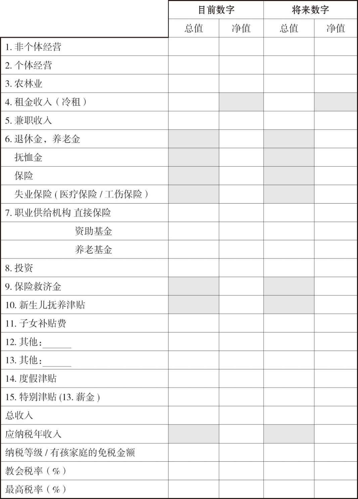

|                                                      |          |          |
|------------------------------------------------------|----------|----------|
|                                                      | 目前数字 | 将来数字 |
| 交通费           |          |          |
| 1．机动车辆税                                        |          |          |
| 2．机动车燃油费                                      |          |          |
| 3．维修费                                            |          |          |
| 4．机动车保险                                        |          |          |
| 5．飞机票                                            |          |          |
| 6．公交，地铁，出租                                  |          |          |
| 7．租赁费用，贷款                                    |          |          |
| 通信费           |          |          |
| 8．固定电话                                          |          |          |
| 9．手机                                              |          |          |
| 10．传真                                             |          |          |
| 11．电脑：邮件                                       |          |          |
| 休闲娱乐费用     |          |          |
| 12．有线电视                                         |          |          |
| 13．社团，俱乐部                                     |          |          |
| 14．兴趣爱好                                         |          |          |
| 15．体育运动                                         |          |          |
| 生活费用         |          |          |
| 16．幼儿园                                           |          |          |
| 17．宠物                                             |          |          |
| 18．烟草                                             |          |          |
| 19．饮食                                             |          |          |
| 20．所有家务开支                                     |          |          |
| 21．服装                                             |          |          |
| 22．娱乐                                             |          |          |
| 23．旅游度假                                         |          |          |
| 24．采买                                             |          |          |
| 25．餐馆                                             |          |          |
| 26．理发，美容                                       |          |          |
| 27．零花钱                                           |          |          |
| 28．进修，讲座                                       |          |          |
| 29．报刊书籍                                         |          |          |
| 居住费用         |          |          |
| 30．租金及附加费用                                   |          |          |
| 31．利息，债务                                       |          |          |
| 32．维修费                                           |          |          |
| 33．上涨租金                                         |          |          |
| 34．不动产税费                                       |          |          |
| 办公费用         |          |          |
| 35．房租                                             |          |          |
| 36．附加费用                                         |          |          |
| 37．办公用品                                         |          |          |
| 38．邮费                                             |          |          |
| 39．办公设备                                         |          |          |
| 40．员工费用                                         |          |          |
| 储蓄，信贷，保险 |          |          |
| 41．慈善捐款                                         |          |          |
| 42．储蓄合同一                                       |          |          |
| 43．储蓄合同二                                       |          |          |
| 44．储蓄合同三                                       |          |          |
| 45．税费                                             |          |          |
| 46．信用贷款一                                       |          |          |
| 47．信用贷款二                                       |          |          |
| 48．信用贷款三                                       |          |          |
| 49．个人医保                                         |          |          |
| 50．个人意外伤害保险                                 |          |          |
| 51．个人养老保险一                                   |          |          |
| 52．个人养老保险二                                   |          |          |
| 53．个人养老保险三                                   |          |          |
| 54．个人养老保险四                                   |          |          |
| 55．个人养老保险五                                   |          |          |
| 56．个人养老保险六                                   |          |          |
| 57．赔偿保证金                                       |          |          |
| 58．法律诉讼保险                                     |          |          |
| 59．家庭财产保险                                     |          |          |
| 其他             |          |          |
| 60．固定支出一                                       |          |          |
| 61．固定支出二                                       |          |          |
| 62．固定支出三                                       |          |          |
| 63．固定支出四                                       |          |          |
| 64．固定支出五                                       |          |          |
| 合计             |          |          |

##  如果预算计划不是你的强项

在制订预算计划方面有一个公认的说法：为你的强项找一位教练，给你的弱项找一个解决方案
。对很多人而言，做预算计划都是弱项。如果你也如此，那么你需要一个解决方案。

如果到目前为止，你都没有处理好这件事，那这也许永远不会成为你的强项。你现在可以从将之前每月买10个冰激凌减少为3个、以冰棍代替雪糕开始做起。如果预算是你的强项，这样的行为就有意义。但如果这不是你的强项，那你就需要一个解决方案。

这是一个很好的建议：不要在一些不重要的事情上成为专家，或者做事情不要本末倒置
。为预算经费中的关键项目找到解决办法才是正确的做法，我认为关键项目是税费、汽车、电话这三项。要是做预算是你的强项，那么你一定可以将这三项调整到最佳状态，并实现真正的奇迹……

##### 1．税费

在德国，处于平均收入水平的人，半年时间是为自己而工作，剩下半年工作赚的钱都是要上缴给国家的（其中一大部分用于偿还欠款利息）。缴的税越来越高，我们剩下的则越来越少。其他发达国家也是如此。

你一生中的大部分开支便是缴税。如果你工作一辈子挣了125万欧元，其中有超过50万欧元是要上缴给国家的。

在我们国家，不乏收入很高但缴税很少的人。一部分是通过账面亏损，一部分是通过合法的海外公司结构。

如果在德国境内获得一笔高收入，我认为你应该在德国缴税，当然要在合理范围内利用税收法和专家的建议。当然，世界上有许多可以赚钱的地方。

因此我建议你找一位优秀的顾问。我不是指让你找一位只会帮你整理账务资料的“税务顾问”，而是一位可以真正帮你省下税务开支的人。通常年收入12.5万欧元以上的人就应该聘用一位这样的税务顾问，年收入15万欧元以上的人，税务顾问便是不可或缺的。或者正如亚里士多德·奥纳西斯所说：“我乐于重复过去的一切，但有一个例外，我会早点找到更优秀的顾问。”

##### 2．汽车

大部分德国人在汽车上花销很大。汽车不是一项投资，它只属于消耗品。

如果你认真查看复利表，我想你会重新审视你的汽车。如果你接下来10年开的车比你目前的车便宜一半，那么也许你25年后会额外多出50万～100万欧元。因为每年在购置费、汽油费、保险费、税费、维修费、养护费等方面节约下来的5000欧元，通过利滚利，20年后会翻好几倍（根据12％的利润率，20年后5000欧元会增长成50000欧元）。就像教练当初对我说的，买车的钱一定不能超过两个月工资。

也许你马上会联想：“其他人是什么想法呢？”对于他们的想法，我很确定的是：这对你的业务不会有太大影响，但对你个人生活的影响却相当大。

最后还得说，中档车和高档车的区别并没有大到值得你去损失这50万～100万欧元。至少在你挣到你人生的第一个50万～100万欧元之前，这就是不值得的。

##### 3．电话

我们在电话上浪费了很多时间和很多金钱。几年前，我养成了一个习惯，这一习惯也使我的电话费减少了一半：每次给别人打电话之前，我都会简短地写下打电话的事由：不说废话，直奔主题；事情讲完后迅速结束通话。

确定出你生活中支出最大的前3项。除了上述开支，你还可以接着补充：旅行、服装、运动、爱好……

##### 计划，从现在开始

你现在知道，要实现财务保障需要多少资金。你也知道自己能从何处获得这笔资金。但还是希望你在实现第一个财务目标前制订一份预算计划。

现在你需要一份计划。确定要实现财务保障，你想要存多少钱：

我想每月存\_\_\_\_\_\_\_\_\_\_欧元；

因此我将于\_\_\_\_\_\_\_\_\_\_月内实现财务保障。

能量贴士

尽可能快地实现财务保障。

•世界上不可能有人从来都没有实现过自己的最低目标。

•你对自己，对你的健康，你的家人和你的自我价值观是负有责任的。

•随之而来的是：你在财务上会获得安全感。

•把这笔钱存放在安全且容易支取的地方。

•你以此奠定了富裕生活的基石。

•由此你已经达到了真正自由的最低限度。

##  要么开源，要么节流

你更愿意开源还是节流呢？事实上，除了这两个选项，你还有一种选择。本杰明·富兰克林有一个很恰当的描述：

“有两条通向幸福的道路：降低要求或者增加财富。两者导向的目标是相同的。不同的只是每个人会根据自身习惯选择出最适合自己的捷径。”

“在你生病或者生活穷苦潦倒时——你立马就会体会到，降低要求会有多艰难，更不易的是，增加资本。”

“如果你积极、富有、健康、年轻且能力超群，可能增加财富比降低要求要容易一些。但如果你足够聪明，你会同时两者兼顾，无论你年轻或年老，富裕或贫穷，疾病或健康；如果你再聪明一些，你会用同一种方式去兼顾两者——为社会幸福做贡献。”

去走你感觉相对容易的那条路，最好能两者兼顾，至少坚持到你拥有财务保障。到那时你就已经走完超过一半的路程了。之后的路程相对来说会轻松一些。万事开头难，你必须改掉自己之前的信念和习惯。

开始阶段简单的事情以后会变得困难，开始阶段困难的事情以后也会变得简单。
储蓄并不难，但由于这对你而言是一项全新的开始，所以在开始阶段你应该会感到十分陌生。

用储蓄明智地投资不是一件易事，但你会觉得相对简单，因为有很多容易上手的投资形式，因为你有投资顾问、内行的朋友和其他可供参考的例子。

##  你要用这笔资金为实现财务保障做些什么

你需要一个计划和相应的思想来管理你的资金。在本章末，在你完成两项财务计划之后，你将确定你最终的投资哲学。

我们再来列一下基础要点。请你回忆下我们第六章中讲到的关于债务的内容。你需要一笔大约25000欧元的资金，而且不能让别人知道这笔资金的存在。此外，这笔资金中至少有一部分是可以迅速支取的。这笔用于财务保障的资金，你可以将一部分存入银行，另一部分用于能快速提现的理财方式。

无论如何，你应当为这笔钱选择一个安全稳固的投资方式。当然，你承担的风险小，从中获得的收益也不多。但是这笔资金的首要作用是保障。因此除非发生紧急情况，你万万不可动用这笔钱，更不可以把它用作投机项目。

投资旨在每年都获得收益。投机的性质则完全不同，你购买一种产品，期望将来卖出时能获得收益。在这期间，这项投机产品则无法为你带来收益。因此，个人住房或一块昂贵的手表不能算作投资，而是投机。

##  可口可乐的故事

在古代，无力偿还金钱属于犯罪行为。在古巴比伦，债权人甚至可以把债务人当作奴隶进行贩卖，这也就是当时所谓的债务监狱。

但是直至今天，我们也时常看到，没有财务保障的人如何受到生活惩罚。可口可乐诞生的故事也清楚地展现了这一点。

约翰·斯蒂斯·潘伯顿医生创造了一种由糖、水、古柯叶、坚果和咖啡因组合而成的全新混合饮料。他声称这种饮料可以治愈所有神经性疾病，包括头痛、神经质和抑郁症。最特别的是，它能将饮用者带入极其美妙的状态。

销售宣传的第一年，潘伯顿医生花费了73.96美元做广告，只卖出了50美元的产品。接下来的5年，这种状况没有取得太大改善。由于资金缺乏，潘伯顿医生把配方以2300美元的价格卖给了亚特兰大的一位药剂师。

药剂师凯德勒有足够的资金让产品合理地打入市场。11年后，他以2500万美元的价格把可口可乐公司和配方卖给了欧尼斯·伍德瑞夫。伍德瑞夫是一位银行家，他把这家公司转变成了股份制公司。第一年他就卖出了价值4000万美元的股票。除去收回投资，他获得了1500万美元的可观收益。

1929年至1937年爆发了全球最大的经济危机。尽管如此，还是有一些人在进行投资。谁要是在1932年以单价20美元买入可口可乐股票，1937年则可以以160美元卖出。每个人都认为世界末日来临了，却有人在5年内就让自己的钱翻了8倍！

这样的区别是如何产生的呢？那就是对资金的持有！不要让你的金钱从指缝中化为乌有。至少牢牢抓住其中一部分。那么不只是在财务上，你将在各方面都取得回报。

也许对你来说，立刻去实现财务保障比较困难。但相信我，你如果没有财务保障，肯定会更加艰难。

有了财务保障，你就已经创造了实现宏伟财务目标的前提。比如你需要75000欧元财务经济保障，把这笔钱以年收益率15％去投资，20年后你大约会得到120万欧元。根据上一章的内容，这样的收益率是存在的。

如果20年间每个月额外结余750欧元，以年收益率12％投资，你还能再获得650000欧元。总共你能得到185万欧元——一笔非常可观的金额。

问题在于，你觉得够不够。这能够满足你的梦想吗？财务自由对你而言，意味着什么，对此你需要多少资金？搞清楚这个问题之前，要实现财务安全。

##  第二步计划：财务安全

第一项计划财务保障能给你带来很多的益处：你可以安全地渡过一次危机，你会感到有安全感，可以时刻准备好面对一些未知的意外。但是财务保障有一个很大的缺点：一旦意外情况发生，你会花光所有的积蓄。虽然你在财务上安然无恙地渡过了一次危机，但是你的积蓄都没了。真正保险的办法是，你需要积累足够的资金，使你可以靠利息生活。

首先，请再次列出你必要的支出项目。这一步的重点不在于你要实现多大的飞跃。对于你的梦想，我们之后还会针对财务自由制订一个计划。这一步我们只需要让自己达到一个安全稳固的状态。很简单，你可以拥有舒适的生活，且不必考虑钱从哪里来。也就是说，你有了一个自己的赚钱机器，养了一只可以下金蛋的“鹅”。

列出每月必要的支出和花费：

|  |  |
|----|----|
| 1．抵押/ 租金： | \_\_\_\_\_\_\_\_\_\_\_\_\_\_\_\_ |
| 2．伙食费/日常开销： | \_\_\_\_\_\_\_\_\_\_\_\_\_\_\_\_ |
| 3．汽车： | \_\_\_\_\_\_\_\_\_\_\_\_\_\_\_\_ |
| 4．保险： | \_\_\_\_\_\_\_\_\_\_\_\_\_\_\_\_ |
| 5．税费： | \_\_\_\_\_\_\_\_\_\_\_\_\_\_\_\_ |
| 6．赡养费/抚养费： | \_\_\_\_\_\_\_\_\_\_\_\_\_\_\_\_ |
| 7．电话： | \_\_\_\_\_\_\_\_\_\_\_\_\_\_\_\_ |
| 8．贷款： | \_\_\_\_\_\_\_\_\_\_\_\_\_\_\_\_ |
| 9．其他： | \_\_\_\_\_\_\_\_\_\_\_\_\_\_\_\_ |
| 10．积蓄（度假，置办大件物品）： | \_\_\_\_\_\_\_\_\_\_\_\_\_\_\_\_ |
| 11．培训： | \_\_\_\_\_\_\_\_\_\_\_\_\_\_\_\_ |
| 12．捐款： | \_\_\_\_\_\_\_\_\_\_\_\_\_\_\_\_ |
|  | \_\_\_\_\_\_\_\_\_\_\_\_\_\_\_\_ |
| 总计： | \_\_\_\_\_\_\_\_\_\_\_\_\_\_\_\_ |

##  你需要多少资金

现在你计算出了保障每月生活所需的最低金额。也就是说，你知道每个月需要的这颗金蛋有多大。由此也能算出要养一只多大的“鹅”。

换句话说，你需要足够的资金，并且合理地投资理财，让这笔资金每个月给你带来足够的利息收益，来保障你上面列出的那些开支。问题是，以何种利润率进行投资。谨慎起见，我们“只”假设8％的纯收益，毕竟这一步重点在于财务安全。公式很简单：

每月所需金额×150＝资金总额

举个例子：假设“守财奴”海蒂每个月需要2000欧元来保障生活开支，那么根据公式可以算出：

2000欧元×150＝300000欧元。

因此，“守财奴”海蒂总共只需要300000欧元，就能获得每月生活所需的2000欧元。她不能动用自己的“鹅”资金，这300000欧元会自己生金蛋，她在任何时候都不必去动用这里面的一分钱。如此，她可以轻轻松松付清所有账单，还能积攒一笔钱用来购物和度假。因此，300000欧元使她实现了财务保障，她可以仅靠这笔资产生活，理论上讲，她也不再需要继续工作。

现在请计算一下，你需要多少金钱才能实现财务安全。

每月所需金额\_\_\_\_\_\_\_\_\_\_×150＝\_\_\_\_\_\_\_\_\_\_欧元。

请思考一下，如果你现在已经拥有这么一笔资产了，你会做些什么事情。为了让你更轻松地回答出这个问题，我在这里给你一个小提示：

假设你只能再活6个月了，你还想做哪些事情呢？你想去哪些地方？你想和哪些人在一起？想做哪些事情生存下去？

也许你远远不止活6个月，但你不可能永生。如果不是金钱，那又是什么在阻碍你去做这些对你而言十分重要的事情
？你看，不给予金钱恰当的关注度是多么危险的一件事情。你应该让自己享受美好的生活。

你刚才写下的数字会让生活产生重大变化。问一问自己：这笔钱会对你的日常生活产生何种程度的改变？你还会再继续从事你当前的这份工作吗？

一天，亚西西的圣方济各在割草，一位修士问他：“如果你在一个小时后死去，你还想做哪些事？”圣方济各回答：“继续割草。”这是他的全部回答。他会继续割草，因为正在做的事给予他最大的快乐。还需要注意的是，他不是回答“快点割草”或者“把草割完”，而仅仅是一句简单的“继续割草”。

如果你没有选择修道院高墙的保障，那么为了你的财务安全，你就应该认真考虑一下，尽可能快地积累这笔必要的金钱。

##  你欠自己一份财富

7年后，你要么就根本没有改变你的财务状况，要么就至少部分实现了你的财务安全。7年之后开始的未来，正是你今天所准备的未来。

有的人不去从事自己感兴趣的职业，主要原因就是缺钱。这令人感到惋惜，也是一种才能的浪费。这之所以尤其可悲，是因为我们只有在做自己喜爱的事情时才会真正感到幸福
。一个从来没有长期做过使自己快乐的有意义的事情的人，从来不会知道，自身究竟蕴藏着多少潜力。

如果有人无法走出关键性的一步，不能做自己感兴趣的工作，那么原因往往都在于金钱。

能量贴士

尽快去实现你的财务安全。

•一旦实现自己的财务保障，你就应该将所有可用资金用来投资，以实现财务安全。

•当你实现了财务安全之后，你就不应该再去动用自己的本金了。

•你住你想住的地方，做你喜欢的事情，仍然可以把所有的账单付清。

•除此之外，你还可以致力于自己感兴趣的、与你的才能相符的事情。

•你应该将克莱门特·斯通的名言作为自己的信条：“一个存不下钱的人，没有资格被称作一个聪明、理性的人。”

•你有两种选择：

1．让时间为你工作，在20年内逐步轻松实现自己的目标。

2．你可以按照第七章中的方法来努力，使你的收入进行多次翻倍。在7年内实现自己的目标。

在接下来的表格中，你一眼就可以看出，在年利率为8％（月利率0.67％）的情况下，你需要多少资产才能满足你每月的支出。而所有这些数据都得以“你及时开始存钱”为前提。

<table class="kindle-cn-table-body" data-cellspacing="0">
<colgroup>
<col style="width: 50%" />
<col style="width: 50%" />
</colgroup>
<tbody>
<tr class="calibre17">
<td class="kindle-cn-table-th" width="50%">资产</td>
<td class="kindle-cn-table-th" width="50%">月收入</td>
</tr>
<tr class="calibre17">
<td class="kindle-cn-table-dg1">62500欧元 
125000欧元 
250000欧元 
375000欧元 
500000欧元 
625000欧元 
750000欧元 
875000欧元 
1000000欧元 
1250000欧元 
1500000欧元 
1750000欧元 
2000000欧元 
2500000欧元 
3000000欧元 
3500000欧元 
4000000欧元 
4500000欧元 
5000000欧元 
6000000欧元 
7000000欧元 
8000000欧元 
10000000欧元 
15000000欧元 
20000000欧元 
25000000欧元 
50000000欧元 
100000000欧元</td>
<td class="kindle-cn-table-dg1">416欧元 
833欧元 
1667欧元 
2500欧元 
3333欧元 
4167欧元 
5000欧元 
5833欧元 
6667欧元 
8333欧元 
10000欧元 
11667欧元 
13333欧元 
16667欧元 
20000欧元 
23333欧元 
26667欧元 
30000欧元 
33333欧元 
40000欧元 
46667欧元 
53333欧元 
66667欧元 
100000欧元 
133333欧元 
166667欧元 
333333欧元 
666667欧元</td>
</tr>
</tbody>
</table>

在第五章中你已经知道了，策略有专业和业余之分。业余策略只注重短期收益，而专业策略旨在实现长期收益。正如你已经了解的情况，财务状况往往也会对其他的生活领域产生影响。

业余人士往往着眼当前，忽略未来。他们一辈子为一些同样的问题而烦恼。因为他们不会明智地储蓄，没有为自己创造一种不再有经济烦恼的生活。

专业的处理方式就完全不同了。他们活在当下，同时也为未来做准备
。因此他们首先支付自己。你也会变成一名理财专家！

既然已经读到这里，你也应该知道了，生活是没有借口的。你应该做的就是负责。你掌握自身的生活。你可以随时改变你的信仰。你可以接受新的观点。那么，现在谈谈梦想。

##  第三步计划：财务自由

也许你的最高目标仅仅是实现财务安全。也许你想得到更多，想获得财务自由。对于这种情况，我们使用的也是同样的方式来为你制订计划。接下来，我们来探讨一下你的梦想。

你是否知道大多数人之所以实现不了自己的梦想，就是因为他们从来没有考虑过他们应该为此做些什么。他们不知道，他们需要为自己的梦想付出多少
。而我们接下来探讨的正是此议题。

##  绝不动用你的本金

首先，我们必须澄清一条重要的原则：你永远不能杀你的“鹅”。你也不能将它切割成小块。绝不能动用你的本金。你所有的梦想，能借助金蛋来满足。这也意味着，你的金蛋必须大到足以承担你的梦想。

举个例子，你想买一栋房子。如果你已经实现财务自由，那么你无疑可以使用你的资产进行支付。但这样一来，你的资产就会缩水，这当然是你不想看到的。所以，你应该采取分期付款的方式来置办所有的大件，因为你每月的利息就完完全全足够支付了。

##  如何计算梦想所需的花费

1．首先，将你所有的愿望列出来
。先不要想这些愿望到底现不现实。我们只是想了解一下你都有什么愿望，你的愿望需要花费多少金钱。

2．逐条列完之后，再在每一条后面写上大概的置办费用
。

3．但是请记住，永远都不能动用你的“鹅”资金。因此，你必须采取分期付款的方式来置办所有的大件。现在计算一下，每件置办物的月付额是多少
。为了简单起见，我建议你将不动产分为120期来偿还，其他的置办物分为50期。

你想买一栋价值130万欧元的房子。你将这笔总金额分成120份，月供额为10833欧元，包括4％～6％的利息。

此外，你还想买一艘价值240000欧元的船。按照50期来偿还，那么加上利息，月供额为4800欧元，5年之内还清。

假设你热爱旅游，每年都想进行好几次旅游，总花费金额为35000欧元。你将35000欧元划分为12期，那么你每月需要2916欧元来满足旅行的需求。

4．将你实现财务自由之后仍然存在的所有日常支出列出来
。针对这笔支出，你应该使用你的利息进行支付。参考财务保障计划所列的支出项。但同时要考虑到，在更高的生活水平上，你的支出也能相应地提升。

现在请将你的一切愿望都列出来。接下来将数据加在一起，计算要支付所有这些，你需要多高的利息收入。

|                    |        |        |
|--------------------|--------|--------|
| 为梦想而进行的支出 | 总价值 | 月供额 |
| 1．房子            |        |        |
| 2．二套房          |        |        |
| 3．                |        |        |
| 4．车子            |        |        |
| 5．                |        |        |
| 6．                |        |        |
| 7．                |        |        |
| 8．                |        |        |

为梦想而支付的月供额为：\_\_\_\_\_\_\_\_\_\_欧元

接下来计算日常月支出额：

|                            |                          |
|----------------------------|--------------------------|
| 1．伙食/家用支出：         | \_\_\_\_\_\_\_\_\_\_欧元 |
| 2．雇佣他人：              | \_\_\_\_\_\_\_\_\_\_欧元 |
| 3．汽车：                  | \_\_\_\_\_\_\_\_\_\_欧元 |
| 4．保险：                  | \_\_\_\_\_\_\_\_\_\_欧元 |
| 5．税费：                  | \_\_\_\_\_\_\_\_\_\_欧元 |
| 6．通信：                  | \_\_\_\_\_\_\_\_\_\_欧元 |
| 7．度假：                  | \_\_\_\_\_\_\_\_\_\_欧元 |
| 8．小型购置：              | \_\_\_\_\_\_\_\_\_\_欧元 |
| 9．娱乐消遣：              | \_\_\_\_\_\_\_\_\_\_欧元 |
| 10．礼物：                 | \_\_\_\_\_\_\_\_\_\_欧元 |
| 11．学习深造：             | \_\_\_\_\_\_\_\_\_\_欧元 |
| 12．捐赠和帮助有需要的人： | \_\_\_\_\_\_\_\_\_\_欧元 |
| 13．其他：                 | \_\_\_\_\_\_\_\_\_\_欧元 |
|                            | \_\_\_\_\_\_\_\_\_\_欧元 |
| 日常支出总额：             | \_\_\_\_\_\_\_\_\_\_欧元 |
| 为梦想而支付的月成本总额： | \_\_\_\_\_\_\_\_\_\_欧元 |
| 财务自由的月成本总额：     | \_\_\_\_\_\_\_\_\_\_欧元 |

现在你清楚要过上优质的生活需要多少金钱了。你也知道要满足你梦想的生活方式你的金蛋必须多大。接下来我们必须弄清楚“鹅”的大小。你需要存储足够的资本，让它每月为你带来你所需的足以支付你所列各项的收益。我们还是以每年净收益率8％（也就是月利率0.67％）来计算吧。用你每月需要拥有的金额乘以150：

\_\_\_\_\_\_\_\_\_\_欧元×150＝\_\_\_\_\_\_\_\_\_\_欧元。

现在你清楚要满足你所有愿望所需的金额了。接下来你必须思考一下，你如何才能以最优方式投资你的金钱，以实现你的目标。

##  你的投资策略

你现在有3个不同的、相互关联的财务计划。针对每一个计划，你都需要一个专门的投资策略。

##### 实现财务保障不要去冒险

最重要的标准便是金钱的可支配性。你必须每天都有金钱收入。因此，你最好将你的金钱放进保险箱或是投入现金基金当中。在你实现财务保障之前，你都不应该去冒险。因此，你应该选择低风险的投资项目。但就算是这样，你还是要注意管控可能出现的风险。永远不要将你所有的金钱全都投进一个投资项目中，即使“你全部的资金”加起来只有1000欧元。记住，对风险的管控就意味着盈利机会的增加
。

在实现财务保障之前，请保持让财务安全处于中心位置。你应该容忍低利润率，将一部分现金存放在银行储蓄账户中。如果你仍想要投资基金，那么我向你推荐一个存款计划。

##### 40∶40∶20原则保证财务安全

要实现财务安全，你就必须改变金钱的投放比例。虽然其中的大部分金钱还是得用在低风险的投资项目上，但是你可以将40％投入风险适度的投资项目中。如果你长期坚持不动用这笔钱，在“平均成本收益”的作用下，风险会得以极大降低。剩下的20％你可以投入风险较高的项目中，这就涉及一些冒险型的基金，比如新兴市场基金或国家基金，以及所有的特殊基金和企业参与型基金。这种基金的风险也能在时间和“平均成本收益”的作用下减小。而在另一方面，你获利的概率也是极大的。

重要的一点是：你千万不能将用于保证你财务安全的金钱投进高风险或是投机性质的项目。
你千万不要动用这笔钱。你进行的投资必须保证你的财务安全永远不会受到影响。

##### 50％中风险，50％高风险，实现财务自由

实现财务安全之后，你就应该抽取一部分金钱以实现财务自由。也就是说，你也得冒较大的风险。你需要去寻找收益率远高于12％的投资项目，这样一来，即使你其中一个或两个投资亏损了，你也能通过高收益投资项目获得补偿。针对此类情况，有一些历史悠久且知名的基金，其平均年收益率远远超过12％。请注意：你想获得越多的资金增值，就必须越费心去管理你的投资项目。

即使一切都跟你作对，你也只用了那部分你不需要用来实现财务安全的资本来冒险。

我们可以用3个水壶来进行概括：

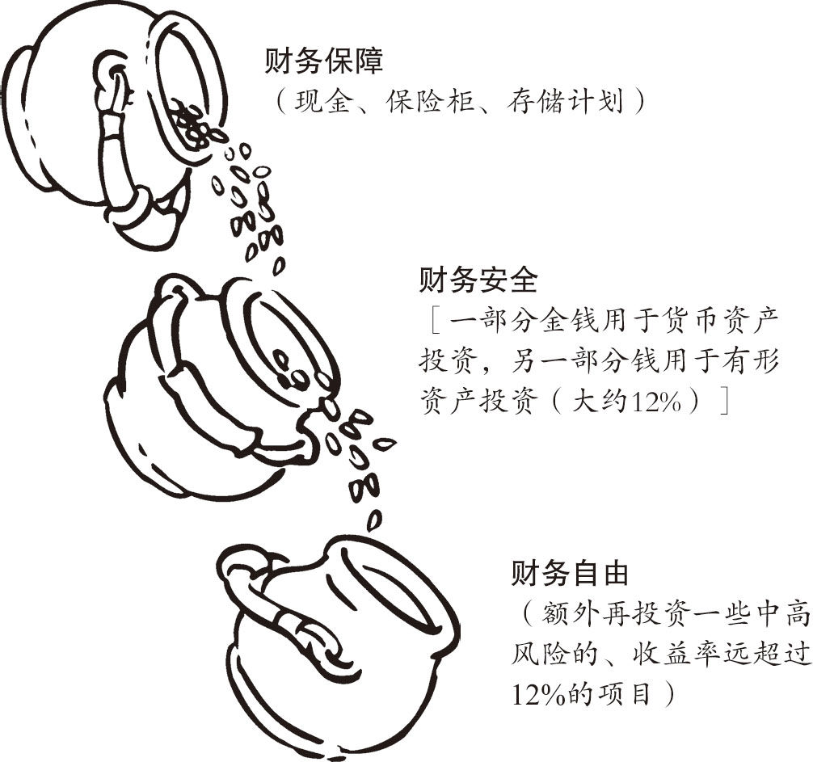

注意：
只有当第一个水壶被注满之后，你才能加注第二个水壶。你只能使用第二个水壶中盈余的部分（你不需要用来实现财务安全的金钱）来对第三个水壶进行加注。这样，你的财务安全就永远不会承担风险。

如果你遵循这一投资哲学的话，就不会存在失败了。你会永远处于安全之地，而且有机会实现你所有的梦想。

##  定好目标，你成功了一半

现在需要走出决定性的一步：你必须做出一个明确的决定。你真的想要实现财务自由吗？你愿意承担与此相关的责任吗？

你准备好持续跟踪并更新你所列出的清单，一直到它成为你生活中不可或缺的一部分了吗？

在你做出明确的决定之前，请不要继续再读下去。这个决定应该包含你实际做的你所了解的必要之事。你知道，你首先必须着手改变信仰。你必须将巨大的痛苦与目标无法实现联系在一起，将巨大的快乐与目标得以实现联系在一起。

你应该意识到为什么你一定要这样生活。记住：你必须每天提升自己，全力以赴。你必须不断地学习和成长。你必须付出110％的努力。你必须全力以赴，成为最好的自己。

你真的想要这样吗？你真的愿意为了财富和幸福去付出每个人都必须付出的代价吗？如果你决定好了这样做（我也想鼓励你这样做），你就负有责任了：你应该向自己承诺，不到最好，永不满足
。

多年前，第一次听到这一理念时，我几乎不敢相信。但它确确实实是正确的。当你为自己定好一个目标，制订出书面的计划，你就已经成功50％了。以下也有4个足以证明这一点的重要原因：

##### 1．目标拓宽你的机会意识

当你做下这个承诺，你会换一种角度去观察出现在你生活中的每一个人。每一种处境对你来说都有其存在的意义。不断地问自己：它能对我实现目标有什么帮助？我怎样才可以马上将它运用起来？

你对目标的定义越清晰，你的承诺越有效，你就能越多地利用这两个起决定作用的问题：这如何与我的情况相符呢？我应该如何马上采取行动呢？

##### 2．目标为你指出解决问题的方向

大多数人都将自己的时间浪费在长时间思考问题上。目标清晰的人没有时间这样做。他们想要更接近自己的目标，因此不断地寻找解决方法和解决途径。他们将精力集中于目标之上。一旦一个人将自己的视线聚焦于一个目标，那么恐惧就打不倒他。

##### 3．目标使你为了“赢”而去比赛

我们参加比赛是为了不输，还是为了赢，两者之间有着天壤之别。
你结识某个人，马上就能感觉出来他是一个不想输的人，还是一个想要赢的人。你能从他的眼神、行为、话语判断这一点。

远大的目标不允许我们只是苟且地存活着。你必须全力以赴。你必须为了“赢”而活着。

##### 4．你有了一个目标，一切都变得很重要

无目标之人的生活座右铭都是：只是一点点不好的东西并不会对我造成伤害。而对于有目标的人来说，一切东西、任何一个小细节都十分重要。

以一名自行车运动员为例吧。你认为他会说“超重1千克没有任何影响”吗？自行车职业运动员永远不会这样想，因为他们知道，在骑车登山时他们会因为超重1千克而慢关键性的一分钟。

从你拥有目标的这一刻起，一切都会变得重要起来。你所做的一切不是在使你接近目标，就是在使你远离目标。不存在中间状态。

正如之前所说的：一个明智的决定是成功的前提。如果一个人说“我可以过一会儿再做决定”，那么他就是在欺骗自己。因为如果你（现在）不做决定，就意味着你已经做好了决定
。你决定让一切照旧，不去做任何改变。你决定继续远离自己的目标。所以，现在就做出决定吧！

##  财务自由很难实现吗

我认为你应该知道答案的。是的，很难。但是，不去实现财务自由，会更难。继续提升自己很困难。但是，慢慢地死去更苦。生活在这个世界上，不知道自己有多大能力，这是很不好的。只有全力以赴之后，我们才能感觉出来，生命真正的意义是什么。之后我们才能完成自己的使命，之后我们的生活才有了意义。

正如之前提到的，我不会声称这一切会顺其自然地发生。但是我坚持认为，如果想过一种充实的生活，那我们别无选择。

海因茨·科纳在《约翰尼斯》中写道：“每个人在其内心深处都会有这种希望：离开沼泽，生活在阳光之下。然而，对阳光、对自由，以及对自由的恐惧，使得我们坚守在自己习以为常的环境中。这个环境使得我们觉得，恶臭熏天、死气沉沉、暗无天日和颓废堕落都是可以接受的。同时，每个人都在一天天地往沼泽里下沉。在沼泽中度过的每一天，都会使我们更难离开沼泽地。是的，每个人都在忙着如何更好地消除恶臭，如何更好地忍耐黏稠肮脏的泥浆，如何以最舒服的方式度过这段逐渐下沉的时间。然而，每一个知道答案的人，都能够自己承担起责任，并寻找到通往阳光的最佳道路。”

区分人和人并最终造成差距的东西，是满足和惰性。我们永远不能安于现状。

如果每个人都只是空有梦想，更美好的世界是不可能出现的。只有当每个人都开始在自己能力范围内采取行动，所有人都梦想的世界才会真正出现。我的意思不是说我们应该去尝试或者去希望发生一些什么事情。我的意思是你应该为自己的才华和能力承担责任，真正地将自己的梦想付诸实践。

我们的使命不是去谈论或梦想这样一个没有沼泽的世界，而是去实现它。
我们需要高尚的人，需要说什么就做什么的人，需要实现自身梦想的人。

##  不应该让恐惧左右你的决定

你知道阻碍大多数人去过自己梦想生活的东西是什么吗？是恐惧，恐惧犯错，恐惧失败，恐惧丢脸，恐惧使自己和他人失望，恐惧做出错误的决定。

恐惧永远不应该左右你的决定。因为世界上不存在失败。是的，你没有看错：世界上不存在失败。美国脱口秀大师奥普拉·温弗瑞曾经说过：“我不相信失败。因为如果你享受了过程中的乐趣，那这就不是失败。”

世界上不存在失败，只存在结果。在我做的咨询活动中，恐惧失败对至少70％的人来说都是最大的心理障碍。不过，我们可以毫不怀疑地说，这个世界上几乎所有巨大的成功都是在失败之后才产生的。

是时候改变我们对待失败和错误的态度了。因为许多人被其阻碍而不能以胜利者的身份去闯荡天下。

##  错误是有益的

我们必须采取行动，不要害怕犯错误。我们不应该成为从不犯错的人，而应该成为永不放弃的人。

IBM创始人老沃森曾经被问，一个人必须做些什么，才能在公司里做出成绩。他回答道：“犯双倍的错误。”

如果你去研究成功人士的成功故事，总会发现他们犯过很多次错误。

众所周知，托马斯·爱迪生发明了灯泡。在他进行了大约9000次失败的尝试之后，朋友们问他：“你真的准备失败1万次吗？”爱迪生回答：“我没有失败。我只是又知道了一种不能造出灯泡的新方法。每一次试验都使我更接近成功。”

盖德·穆勒是国家队中进球次数比任何人都多的球员。然而，他还保有另外一项纪录：国家队中没有任何人比他射偏球门的次数更多。

对于放弃了的人，人们回想起来，只会认为他是一个失败者，而对于那些坚持不懈的人，人们脑海中只记得他是一个优秀的人物。这里讲的并不是要去避免错误，而是说不要让任何事或任何人阻碍你去走自己的路。他人可以短暂地阻止你，但只有你自己才可以永远地使自己停下来
。

##  你真的想实现财务自由吗

在回答这个问题之前，我们先来看看成为百万富翁的概率有多大。在德国，百万富翁按下面的比例分布：

•74％是企业家；

•10％是高级管理人员（尤其是董事会层级）；

•10％是从业者（主要是医生、建筑师和律师）；

•5％是销售人员；

•1％是其他人员。

从中你能看出两种情况：首先，如果你不是企业家、不是董事会层级人员，你几乎没有可能成为百万富翁。

其次，如果你是企业家，那么你有最大的机会去变得富有。也许会存在许多阻碍的缺点和风险，但是4个百万富翁中有3个是企业家。

因此，保罗·盖蒂——当时的世界首富，曾经说过：“除开一些例外的情况，一个人要积累真正的财富只有一条道路：必须建立起自己的企业。”

针对这一点，有一些不同意见。你必须做的不仅仅是储蓄和投资。仅仅是走向正确的方向还不够，你必须在正确的道路上做出一个巨大的飞跃。

同时，你对错误和风险的恐惧，永远不应该促使你按照最低要求去生活。因为只有全力付出时，我们才会真正感到满足。

##  什么都不做的人才不会犯错

我的最后一位导师说过：“如果你不经常犯错，表明你冒的风险不够，没有付出最大的努力。”

导师们能激发出我们身上最大的潜力。他们会要求我们去冒险。他们会告诉我们一些这样的道理：一个不去冒险的人，只是一个一事无成、一无所有的无名小卒。导师们能用自己的话语打动我们。我们也应该为自己的想法能被打动感到高兴。因为这恰好体现出我们的活力。

通向成功的道路上布满荆棘。只有一路前行，不惧怕错误，生活才会将五彩缤纷展示在我们面前。之后我们才会知道，这一切就是命运的安排。我们所经历的一切也都有其意义。我们所有的经验和经历都会化成一股力量，汇入我们正要完成的使命中。一切都有其意义。我们只需要识别出这些意义。我们所犯过的每一个错误，都会对我们有所帮助。每一个我们过去认识过的人，都会指引我们去认识新的人，获得新的机会。但是要识别出这其中的关联，主要还是在于我们自己。这一切都有一个前提：我们必须克服各种类型的恐惧，持续学习和成长。

这样一个态度带给你的回报，会超越你所有的期待。

能量贴士

请现在就做出决定，你是否想实现财务自由。

•不到最好，永不满足。

•你应该提升你对机会的感知能力。

•你参加比赛是为了赢得比赛。

•每一件小事都有其对你有利的意义。一切都十分重要。

•你的生活准则应该是：成为最好的自己。

•你不应该害怕犯错误。

•想要变得十分富有，你就必须建立自己的企业。

在你做出决定之后，我想在下一章的内容中向你展示，你如何才能保证自己不被“吓倒”。你会发现，你能为自己创造出一种有助于自己，能以最佳方式支持你的境况。

------------------------------------------------------------------------

### 本章要点

- 你唯一可以期待的一点便是：意料之外的情况。
- 你对自己、对你的健康、你的情感、你的家人是负有责任的，你有义务尽可能快地去实现财务保障。
- 财务保障使你处于强者地位。
- 没人能对意外和厄运进行预测，但你可以做的是提前做好应对准备。
- 只要你还没有实现财务保障，你就必须考虑制订预算计划。
- 奥纳西斯说过：“我乐于重复过去的一切，但有一个例外，我会早点找到更优秀的顾问。”
- 有两条通向幸福的道路：降低要求或者增加财富……聪明的人，会同时给自己创造两条路。
- 只有资本多到让你能够仅靠利息就能满足支出时，你才算实现了财务安全。
- 只有做自己喜欢的事情时，我们才是真正快乐的。
- 一个从来没有长期做过使自己快乐的、有意义的事情的人，从来不会知道，他的身体内究竟蕴藏着多少潜力。
- 将自己看作一名理财专家：活在当下，同时也为未来做准备。
- 要实现财务保障，你应该尽量选择低风险的投资项目。要实现财务安全，你就应该去寻找安全稳定的投资项目，长期平均收益率为12％的投资项目。要实现财务自由，你就应该将那一部分不需要用来实现财务安全的资本拿来冒险，一部分投入中度风险投资项目，另一部分投入高风险投资项目。
- 实现财务自由最重要的第一步工作是明智地做出决定。如果你（现在）不做决定，就意味着你已经做好了决定。你决定一切照旧，不做任何改变。
- 当你为自己定好一个目标，并制订出书面计划，你就已经成功了50％，因为：

1．目标拓宽你的机会意识；

2．目标为你指出解决问题的方向；

3．目标使你为了“赢”而去比赛；

4．你有了一个目标，一切都变得很重要。

- 我们绝不能屈服于满足感。
- 我们不应该成为从不犯错的人，而应该成为永不放弃的人。
- 他人可以短暂地阻止你，但只有你自己才可以永远地使自己停下来。
- 如果你不经常犯错，就表明你冒的风险不够，没有付出最大的努力。

------------------------------------------------------------------------

# 第十三章　教练和专家网络

成千上万的人自甘贫困。如果你被贫穷的人包围，你同样会变得贫穷。之后你会以抱怨生活的方式度过余生。

——理查·狄维士

仅仅读这本书并不能使你富有。你必须采取行动，还要尽可能快地采取行动。然而最重要的是：你必须为自己创造出一种能促使你成功的环境
。

问题意味着一次成长的机会。知道这一点是一回事，当问题真正出现，那又是另一回事了。大多情况下，问题都出现在不合时宜的时间，向着让我们受挫的方向发展。当问题成堆时，我们通常就忘记了自己最高尚的计划。

##  个人环境会对你产生影响

你需要的是一个总是能提醒你记起你的高尚计划的环境。你已经意识到了，你想要的这个环境不一定由你周围现有的人组成。

你知道这句古老的谚语：近朱者赤，近墨者黑。我们都倾向于高估自己。我们认为自己已经强大到不会被熟人影响。但是我们从小就通过模仿来进行学习。大多情况下这是一种无意识的行为。我们的熟人和朋友对我们的影响远比我们所认为的要深，而且我们还意识不到。

你站上桌子，然后请一位比你瘦弱的朋友站到桌子前面，和你一起进行力量较量。你试着将他拽上桌子，而他试着将你拉下桌子。谁会赢呢？

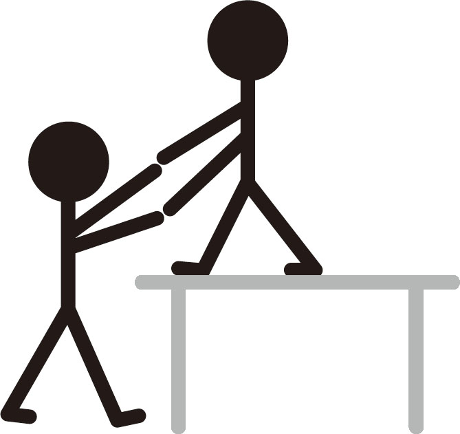

物理学原理是：将某人向下拉比将他往上拽会更容易。长时间比下去，你肯定赢不了。对手只需要“保持不动”，一直等到你筋疲力尽，他就赢了。

与此同理的是：如果你身边都是比你贫穷的人，那么你就会停滞不前。如果你身边都是比你富有的人，那么你也会变得富有。

我们的生活总是能为别人提供借鉴作用。我们或者被他们当作榜样，或者被他们当作警示。你更喜欢当哪一个？

##  能给你最大帮助的三种人

你需要榜样人物，观察、分析和模仿他们的成功。在每一个成功人士身上你都会发现，他们也有自己的榜样人物。他们使用过的“复制”成功的技巧，被称作对卓越的模仿
——一个来自体育运动领域的概念。你可以轻易地找到榜样人物。看看谁是你所在领域中最优秀的人。获取与此人相关的所有信息，诸如书籍和报纸。找出他的电话号码，同他预约一次会面。这也许比你预想的要简单一些。

你至少需要一名教练或导师
。99％的杰出成功人士都有一名教练。在这一章中，我会向你讲述，一名教练如何改变你的人生。我的最后一位教练是亿万富翁。跟着这样的人学习6个月，你学到的东西比你正常学习10年的东西还要多。关于教练的作用，我已经在第四章中做过详细描述了。在这一章中，你将会了解到，你如何与他，或者说他如何与你进行配合学习。

你需要一个专家
环境，一群你能够紧紧跟随的人，一群了解责任的概念、并且在自身所在领域属于大师级的人。你需要一个专家网络。本章讲的正是这一内容。你会学到如何建立一个这样的专家网络。

##  只追随那些比你成功的人

你的周围环境应该由一名教练、一些榜样以及专家网络构成。那对于周围环境中的其他人，你应该怎么办呢？

我认为，你永远不应该被那些不如你成功的人影响。否则，你被自身目标阻碍的风险就会特别大。这些人对你的计划及想法提出的反对意见，你也应该无视。

成功人士牢记以下箴言：

•那些没有亲身经历过的人没有权利给建议，你也绝对没有理由去听从他们的建议。

•如果你周围都是成功人士，想要成功很容易。

•想变得富有，你首先必须习惯坦然面对财富。最简单的方法就是，去结交成功人士。

•“判断一名君主是否才智兼备的最佳方法，就是观察他周围的臣子。”（尼科洛·马基雅维里）

•早在需要顾问之前，你就应该去为自己寻找优秀的顾问。

•当别人说的话对你来说完全无所谓时，便没有任何东西能阻挡你了。

•只向那些你想成为的人进行咨询。

也许你会反问自己，以上的这些观点会不会太极端了。同那些需要帮助的人相比，你的家庭和你的责任处于一种什么样的情况呢？

当然也有一些人需要你的帮助，依赖于你。你理所当然有责任去照顾他们，帮助他们。

如果你认为帮助别人和与成功人士打交道这两者互为对立面的话，那么你就对了：的确存在这一对立面。自然界中也存在这样的对立面：白天和黑夜，夏天和冬天，雨水和太阳。但是所有这一切在一起才组成了整个自然界。对立面之间不应该互相排斥，而应该互为补充。

记住：你将自己的生活驾驭得越成功，能帮助别人的面就越广。没有比与别人分享你获得的成功和财富更能给予你满足感的事情了。但是你不要把角色弄混了。你帮助别人时，就不应该听从那些获得你帮助的人给出的建议。

##  我的教练——那位亿万富翁

我有一次休息了一年多。这段时间，我把精力放在日常事务中少有时间思考的问题上。我越思考，就越强烈地渴望获得能够满足我激情的使命。

这样的使命我最终找到了，那就是使他人更加了解金钱。我现在必须找出最好的方法来尽可能高效地传播我的思想。换句话说，我必须成长，以达到一个更高的层次。于是我开始为自己寻找一位教练。

对我来说，认识优秀人物的最好方法还是参加讲座。有一天，我参加了一场位于伦敦的活动，一名美国的亿万富翁在此进行演讲。他用不到1000美元的自有资本建立起了一家石油公司。仅仅8年，他就使这家石油公司的市值达到了8亿美元。

他向在场的英国企业家讲到应该如何借助他人和他人的金钱使自己的每一个想法变强变大。有段时间，一桶油的价格由40美元降到了8美元以下，他自己在这段时间为他的石油公司申请到了10亿美元的贷款。从那时起，他的运营体系得以在不同领域以几十倍的速率得以贯彻。

我听他演讲时，就下定决心争取让他当我的教练。午休时，我同他一起去吃饭，最终获得了一次电话会谈的机会。我到了约定的时间给他打电话，电话并没有转接到他那里去。我又尝试了几次，都只能联系上他的秘书或管家。直到第七次拨通电话，我才得以成功与他本人进行交谈。他邀请我前往苏格兰他的城堡里住上两天，约定到达时间为星期天晚6时。

到达城堡时，他的私人秘书首先接待了我，并将我领到了我的房间。两个小时后，我终于获得了他本人的亲自问候。他当时心情不太好，也并没有尝试以某种方式隐藏自己的情绪。我得到的不是友好的欢迎，而是听到他说：“我为什么要将我的星期天浪费在你身上？”

我的第一反应是我应该马上离开。但我是出于一个十分坚定的理由才来到这里的：我想要学习。于是，我试着开始探究为什么他会如此表现。也许他只是想考验我。也许他想看看我的忍受能力有多强。

而我也真的需要更多的忍受能力和坚强的外表。他向我提了许多伤人的问题，并且羞辱了好几个小时。他想通过此种方式了解为什么我在过去那些年间浪费了自己的生命。

最终他向我讲述了他自己生活中的一些情况。大约在凌晨2点半时，他突然用食指指着我说：“好了，博多，现在用简短的话语向我说明，你能为我做些什么，你想从我这里得到些什么。你只有10分钟时间。如果你说服了我，那很好。如果不能，那你今天可以在这儿休息，但是明天黎明时你必须悄悄地离开我的城堡。”

我最终说服了他，我们两人一起建立了一家公司。但如果我之前不清楚自己想要达成什么目标，那我肯定无法成功。我将我的目标写下来并加以形象化。接下来的6个月中，我学到的高级金融知识，比之前学到的总和还要多。之后我们便各走各的路了，因为我要专注于我的使命。

我学到的关于金钱的大多数知识，都要归功于教导过我的几位成功人士。我的第一位教练为我奠定了基石，他引导我储蓄，教给我成功的法则。认识他之前，我的年收入不到50000欧元。用了两年半的时间，我才在他的带领下第一次实现了月收入超过50000欧元。我诚挚地感激他们所有人。

##  如何找到一名导师，如何与导师正确相处

99％的成功人士都有自己的导师。以我的最后一位导师为例吧。你知道他在之前对石油完全不了解的情况下，是如何在8年之内使一家石油公司达到8亿资本价值并将公司卖掉的吗？你一定已经猜出来了。他拥有优秀的导师。他向康斯坦丁·格拉索斯学习，这位是亚里士多德·奥纳西斯多年的好友，同时也是奥纳西斯航运公司的董事长。

如果你想在短短几年时间内掌握一个人或多个人生活中的成功和经验，你就需要一个能够教导你的人。

接下来我将给你17个小建议，它们能帮助你更加轻松地找到导师，能使你和导师的相处变得更加容易。

财务自由

你想采取下一步行动？你认为教练对你会大有帮助？

那么我这里恰好有一个适合你的课程：我研发出的课程——“财务自由7年课程”。

用一句话概括：这是一个远程课程，针对那些想快速变富的群体。这项课程正如一个车载导航仪，安全、简便地引导你实现自己的财务自由。

关于该课程项目以及我的更多信息，详情请登录：www.7jahreskurs.de。

##### 1．写下你需要导师的原因

认真地寻找你的导师。你需要的是一个比你本人成功得多的人，或者是一个能力完善的人。认真地寻找这个人。问一问自己，你是否相信这个人，你能不能与此人紧密合作。

接受训练就意味着百分之百地信任你的教练，而这并不容易。但请你记住：如果不去冒险，你也不可能获得任何东西。只有具有独创性并且坚持不懈，你才能成功与你的教练合作。

记住，最优秀的教练拥有最有才能的学生。也就是说，最棒的学生能得到最棒的教练。如果你没有马上得到所在领域的世界上最好的导师，也绝不要放弃。要得到一位绝对顶尖级的导师，你还必须得提升自己。你需要几个能拿得出手的成就，或是令人信服的风度，最好是两者兼有。当你自己变得更好，你也会获得更好的导师
。

##### 2．想一想，你能为你的教练做什么

为这两个重要的问题寻找答案：你如何为你的导师带来价值？你能为你的导师做什么？
此处考察的是你的创造力。我们每一个人都有长处，也有机会运用自己的长处造福他人。但是，你必须意识到自己的长处。最佳方式便是，每天记录成功日记。

##### 3．你需要充分的理由和激情

此外，你还需要带着满满的激情呈现你的想法。你说什么其实并不那么重要。反正在导师的影响下，你打算实现自己的目标的方式会大变样。也正是因此，你需要导师。导师知道你想从他那里学到的是——你如何才能以最佳方式来贯彻自己的想法。

但是，你的导师想看到你的决心。他想了解你为什么想要做这件事。他想确信你的想法很好，你也不会放弃。他想看到你愿意做所有必要之事的决心。一些精神曾经使他取得巨大的成功，他想在你身上看到这种精神。你能否使他信服就在于你如何
说服他。

##### 4．展现出你的毅力

真正赢得导师的心可能会需要你花费数月的时间。有时你甚至在争取第一次会面上就需要花费这么长的时间。但如果你不放弃，并且以一种独创的、令人产生好感的方式继续打电话和写邮件（甚至寄送礼物过去），你便能赢得导师的心。

##### 5．高资质的导师首先会对你进行测试

你还记得我在苏格兰城堡里时得到的“问候”吧。所有那些都只是一个测试。你也许会认为是导师无礼冷酷。但是，如果他不知道你是否值得他投入时间，他又为什么要把自己宝贵的时间用在你身上呢？他不能等到第一次危机出现时才来后悔啊。

在训练开始之前，导师想确定你的资质如何。于是，他会将你置于人为的压力氛围之下。因为当一个人处于压力之下时，才是你了解他的最佳时机。

如果你拥有高远的目标（只有这时，顶尖级教练才会对你感兴趣），你就需要忍耐力、激情和自信。你必须准备好去做所有必要之事。这也正是教练想确信的一点。因此他会对你进行测试。

##### 6．教练的作用是发挥你的长处，而不是解决你的问题

不要让你的问题使你和导师之间的关系紧张。努力做到让你们之间的关系使他感到快乐。你可以更好地利用和他在一起的时间，一起发展并增强你的长处。

他知道你有问题，因为问题是每一个想达成非凡目标的人生活中不可分割的一部分。要让他相信，你有能力独立解决个人问题
。

最重要的是，永远不要展示出你对自身努力的怀疑。如果你透露出不自信，你的导师就会觉得你不适合共事。如果你想同他谈论你的项目存在的问题，你应该提出几个解决方案。然后向他请教哪一个才是最佳解决方案。

##### 7．与你的导师保持定期联系

给你的导师提供你公司的部分所有权。这意味着你必须将公司的部分股份移交给导师，这对你来说肯定不太容易。不过，也许这一认知能够对你有所帮助：占有1000万欧元的50％比占有5万欧元的100％要好得多。

同样地，不管你平时能和导师如何友好相处，加强生意伙伴关系也能使你们之间的关系更进一步。

同一位有名的人物建立生意伙伴关系，还有另外一个好处。通过你和导师的这层伙伴关系，你的身价会马上得到增值。公司信头响亮的名字能够奇迹般地为你打开方便之门，比如与银行的联系。这种情况自动地就使你的可信度提高，因为你成功地赢得那位名人的信任。

##### 8．尊重导师的时间

导师的时间比你的时间更宝贵。因此，在每一次谈话开始之前，你都应该考虑现在是不是跟导师谈话的最佳时机。请提前告知他你需要多长时间。对会议的持续时间进行清晰安排，并严格遵守此时间计划。

尽可能频繁地感谢他为你付出时间。也许他比你的时间感更强。请记住，他的时间远比你的时间更宝贵。

##### 9．考虑清楚你想问的是什么

每次都先问问自己，你自己是否能为你的问题找出答案。然后再问自己，你的导师可能会怎么回答你。大多时候，问题就这样迎刃而解了，你也就不再需要去咨询导师了。在这个过程中，你就成为自己的导师了。这也是你所追求的最终结果。你要学会习惯为每一个问题找出3种解决方案。

##### 10．表露你的开放心态

在聆听他人时展现一种开放的心态，同时不要怀疑他人。信任你的导师以及导师的意见。失去信任，整个训练就无法正常进行。教练的想法和训练方式对你来说，也许完全陌生，不合逻辑。但是你不要忘了，他正是以他现在这种思维方式取得了远胜于你的成就。

因此，利用好每一次机会使其发挥最大成效，包括学习导师的思维方式。你学习得越快，你也就能越快地将师生关系转化成真正的合作伙伴关系。

##### 11．赢得导师的心

尽可能频繁地给导师送礼物。给导师写卡片和发传真表示感谢，告诉他和他的谈话对你来说多么有价值。你能否赢得导师的好感，这完全取决于你自己。你有责任做到这一点。

你应该花心思让你们之间的关系向着你需要的关系发展。比如，你们一起外出吃饭时，你应该总是付账的那一个。许多人都不这样做，因为他们认为导师比他们有钱。然而，如果你这样做，你恰好是在向导师表明你有多么重视他的时间。

送礼物方面应该保持你的独创性。注意观察导师的喜好，悄悄研究他喜欢什么东西。找出一些特别的东西。你的导师虽然很有钱，但他往往没有时间去搜寻那些特别的东西。

##### 12．马上回复教练的信息

你是否经常在别人的电话应答机上留下某条重要信息，却不知道对方有没有收到你的信息。发传真时，你也不知道收件人是否读到了信息。因此，你每次都应尽快地回复对方。让你的导师惊讶于你回他电话的速度有多快
。

即使没有什么可交流的信息，你也应该回复他。比如你提议星期一上午10点去他办公室与他会谈。他回复传真说10点钟完全可以，他很期待这次会谈。这时，你应该对他的答复做出回复。感谢他确认这次预约。

##### 13．给你的导师反馈

你的导师当然想知道，他给你的建议对你发挥了什么作用。因此，你应该定期向他汇报事情发展的最新状态，尽可能多地给他反馈，以此来激励他对你进行更多的帮助。当事情发展不顺利时，也请反馈给他。他需要确信你真的执行了他给出的所有建议。

同时，你也应该时不时地告诉教练，你还坚信你的目标。经常向他展示出你的热情。向他表明他没有看错人。

##### 14．以你的成功来感激你的导师

表达感激的最佳方式始终是：超越教练对你的所有期望，取得令人震惊的成功。努力让你的教练和你自己钵满盆盈。

向你的教练表明，你能更快取得成功，并且比他预想的更成功，以此给他惊喜。

##### 15．模仿你的教练，同时保持真实的自己

学习也意味着尽力模仿你的教练。保持你的专注力，同时放松自己。向海绵一样吸收所有的知识，同时也要使你的教练心情愉悦。让他觉得和你之间的合作使他快乐。记住：教练之所以富有，正是因为他喜欢自己的事业。

尽可能多地夸奖你的教练，但千万不要去阿谀奉承他。你对他的夸奖应该是发自内心的。千万不要因为觉得你的教练反正知道自己很优秀，就吝于夸奖他。相信我，他总是乐于听到真诚夸奖的。

模仿你的教练。当你发现自己像教练一样走路、说话、着装，那就很棒了。因为这会帮助你像他一样去思考，去感知。一个人如果使用另一个人的惯用语和肢体语言，他也能站在另一个人的角度去思考。他会获得和另一个人一样的感受。情感源于举动。

只有通过现在的模仿，你才能学会独立。但不要忘了保持真实的自己。

##### 16．不要寻找弱点

没有人说过教练必须完美。许多师生关系的失败，就在于学员对教练的期望过高。不要去期望完美。你也找不到完美。对于一个人，你应该期望的是错误与优点并存。

你应该注重教练的长处，而非短处。毕竟你想要从他那里学到东西，而非想要推倒他的权威。而且最关键的是——他能够扩展你的长处。

许多成功人士都喜欢朝着对自己有利的方向来认定事实。但是请记住，你只是想要向他学习东西，并不想要向他证明你是对的。

大多数成功人士改变其观点的速度也会使你大吃一惊。他们昨天还在说A方案最佳，今天就声称B方案才是最佳。同大多数人相比，一名好的导师很少会拘泥于一个并不会成功的方案。没有效果的方案会被马上改变。这种情况并不叫作“食言”，而是成功思维和灵活变通。此外，成功人士长期坚持那些已被证实能取得成功的体系，坚持的时间也比一般人要长。你必须在当中找出符合你自身情况的方式。毕竟，最终只有你自己能对你的生活负责。

##### 17．回报

你不需要等到自己非常成功，接近完美时，才像你的导师帮助你一样去帮助别人。最优秀的学员通常也能成为最优秀的导师。

如果导师的原则使你取得了成功，那么不要忘了你的成功应该归功于谁。通过教导他人来回报吧。

##  一次训练应该持续多长时间

随着时间的推移，你会发现，师生关系会逐渐向伙伴关系过渡。也许在某一时刻，你也希望自己能成为与教练关系平等的伙伴。无论如何，只要你和教练之间的这一层关系还在，你还是应该尽可能多地学习。这也是最佳的学习方法。

你的教练会在某一时刻要求你独立。这时，你就应该用一个专家网络来代替你的教练了。

##  如何建立一个专家网络

我每个月都去结识一名成功人士，几年来已成为我的习惯。我也成功与其中大多数成功人士保持着联系。每一个都是其所在领域的专家。有时我很快就能获得合作会谈的机会，有时仅仅是一次有建设性和激励性的会谈。

你如何才能在生活中保持此种关系呢？这里有一个非常简单的建议：每一次会面之前你都应该思考一下，你如何让他人受益
。设身处地为对方着想。也就是说，你如果处在他的位置上会怎么做？你的哪些机会或人脉圈子能够给予他帮助？如果对方也这样做，那么你们的会谈就会十分高效。

你首先
记住的永远都应该是如何让他人受益。当然，你只会维护与那些懂得互利的人的关系。所有的成功人士都掌握了与志同道合者建立专家网络的艺术。

能量贴士

通过每月结识一名新的成功人士来建立起你的专家网络。

•首先请求你认识的成功人士为你介绍他们所熟悉的成功人士。

•请求别人给你推荐，并约定一次见面会谈。

•首先记住你自己能为别人提供什么好处。

•几乎没有什么比得上与专家保持联系，更能促使你每天进步。他们不接受借口，只有成功才作数。

•通过这些人你又能结识其他的成功人士。

•问一问自己：你能为一个专家网络做些什么？做一切能提高自身素质的事情。

##  与渴望成功的人结交

前一段时间，我参加了一个成功的建筑企业家举办的聚会。据我观察，所有受邀的客人都是独立经营者，在自身领域非常成功。我们中的一些人互相认识多年。

我和几个人站成一圈聊着天，这时，一位老熟人加入了我们。令人无法忽视的是，他现在变得很胖。我们感到特别奇怪，因为他在数年前是一名健康主义者，当时他试图让周围圈子里的每一个人都崇尚健康。我们当中有人就他的体重问题问他。

他回答说他自己也无能为力，因为他的妻子总是做极为可口的饭菜。最初他还进行阻止，并且请求她做一些素食。但不记得什么时候他放弃了抵抗。他说我们应该为自己的妻子是明智的感到高兴。

在许多类似的对话中，大家都不好再多说什么。而这一次，他却得到了一次应得的反驳。我们中有人说道：“我不想听到这些胡说。你不是认真的吧，你说你的妻子能够操控你的生活？跟我们说你又重新找回对食物的兴趣好了。但是不要把责任推给别人。我对你的期望比这要高很多。”

我们需要周围有这种对我们有高期望的人。我们需要这样的人来敦促我们对自己保持真实，敦促我们变得更好。

##  对卓越的模仿

在你模仿某个人之前，你必须对他进行全方位、多角度的调查和分析。你必须从多方面考察你的榜样。这当然有助于你在人格方面去接近你的榜样。但这并非绝对必要的。你可以将电视采访录下来并进行分析。你可以分析他的肢体语言、说话方式、语言模式、修辞、思维模式、感情，以及起主导作用的信念和价值观，以便你今后采用它们。

大多数情况下，我们的学习都是通过一种无意识的模仿来实现的。我们像周围人一样说话、动作。我们接收到他们的价值观和信念。我们接受了他们的说话方式、饮食习惯、呼吸方法以及其他方面。

真正改变你的生活，意味着你得有意识地去处理这一切，以便你为未来的改变承担全责。

成长意味着自己控制整个过程。你自己决定受谁影响、向谁学习、学习什么：只模仿那些比你成功的人
。但你必须有意识和有选择地去做。

了解你的榜样有哪些与金钱相关的信念和价值观。他怎么看待金钱和财富？他如何安排自己的一天？想要获得高收入，他会做什么？他有哪些朋友？他有什么样的工作习惯？

千万不要认为你无法像其他人一样成功。大多数人认为自己永远无法获得高收入，因为他们从未靠近过一位高收入者，没有观察过他是如何做到的。

艾拉·威廉姆斯于1993年被评为美国“年度女企业家”，她那句话不无道理：“你愈加接近你的老板，就愈加认识到你也能做他的工作。”

能量贴士

至少为自己找到一个你能模仿的榜样。

•尽量设法了解此人，尽可能多方位地观察此人。

•将你的观察记录下来，以书面形式确定你的模仿策略。

•尝试找出你的榜样在生活的5个领域——健康、关系、财务、人生意义和情感——是如何行动的。

•分别为生活的每一个重要领域找到一个榜样。

•对卓越的模仿意味着，从此以后你要有意识地控制你的学习过程。你会成为你自身未来的设计师。

##  本章是实践应用的关键

开头几章你已经了解了致富的必要因素。在第五章中，重新评估自己的信念之后，你便可以开始实现财务自由了。通过自律，你形成了新的态度，养成了新的习惯。你使这样的态度持续下去。

习惯使你可以自动地、毫不费力地去做那些重要的、正确的事。而促使你养成习惯的关键就在于那些你周围的人。教练、榜样以及专家网络是三个决定的因素，能为你养成良好习惯和自律提供一臂之力。

一个能够掌控自己的人，其力量是无与伦比的。或者正如古人所说：“谁战胜别人，就是强大的。谁战胜自己，就是聪明的。”

------------------------------------------------------------------------

### 本章要点

- 你必须创造出一个强制自己成功的环境。
- 你自己决定受谁影响、向谁学习、学习什么：只模仿那些比你成功的人。
- 如果你周围都是成功人士，那么成功对你来说就很容易。
- 想要建立专家网络，你就应该经常思考，你能为别人提供什么好处。
- 我们需要专家网络来帮助我们成为最好的自己。

------------------------------------------------------------------------

# 第十四章　你可以播种金钱

从富足生活中滋生出的满足感，是无法在简单的金钱占有或挥霍中找到的，而是在明智的使用中才能找到。

——米格尔·德·塞万提斯《堂吉诃德》

你想知道如何才能尽情享受自己的金钱吗？我们生活中的一切终究还是围绕着成功和幸福而转动的。你现在已经知道，想要创造财富，你该如何改变你的金钱观，该运用什么策略了。

成功意味着获得你所爱的东西，而幸福意味着享受你获得的东西。

你的目标是积累财富的同时获得幸福。下述策略的出发点可能会使你感到吃惊，其结果甚至会使你目瞪口呆。

##  你挣到的钱不仅仅属于你个人

研究那些生活幸福的成功人士的人生故事就会发现，他们总是与他人分享自己的财富。这些人对自己达成的一切有着深深的感激之情，也意识到了自己的责任。

这里需要注意的是，我并不是宣称所有富人都带着责任感在与金钱打交道。我宣称的是，所有富有且幸福的人在与金钱打交道时都具备责任意识。

一个有机会、有能力挣到许多钱的人，也有义务去关照那些挣钱少的人。著名的钢铁大王安德鲁·卡内基便抓住了重点：“富有是神灵的财富委托行为，其持有者有义务倾其一生来造福社会。”

许多人都乐意去帮助那些比自己贫穷的人。但在此之前他们还是想先让自己富有起来。他们首先想帮助的是自己。但这样是行不通的。没有播种，就不可能会有收获。

曾经，有一名吝啬的农夫，他购买了一块新的耕地。继续投入之前，他想确定他的投入是会获得回报的。

于是，他坐到地头观察这块耕地。他自言自语道：“如果这块耕地在秋天能够为我带来好收成，那我打算明年买一些谷种来播种。但是首先，耕地必须自己证明它值得我投入这么多。”农夫最后自然是十分失望的。

在农业领域有一条著名的准则：先播种，然后才能收获。但这并非一直如此。收获之前必须播种，这一认知使人类完成狩猎到定居的转变。

每个人在自己的成长过程中都经历过类似的选择：是将金钱全部花光还是存起来。他可以花光所有钱，用光自己的谷种，或者是拿出一部分钱来进行播种。

同样地，不管你处在什么样的境况，对世界上大多数人来说，你还是富有的。世界人口的2/3会马上愿意与你交换的。

##  如何播种金钱

拿破仑·希尔历时25年研究巨富的生活。对于他在金钱方面给出的建议，我们应该洗耳恭听：“幸福属于那些学会以最安全的方法来获取金钱的人，那便是先付出。”

你会发现，富有且幸福的人不仅仅是捐赠金钱，而且很早就开始了捐赠金钱。他们在自己生命的某一时刻就已经开始了，早在他们还不具备此能力时。凯洛斯、卡内基、沃尔顿、洛克菲勒、邓普顿——如果你与这些人打交道，你会注意到他们很早就已经对一切事物怀着感激之情。出于这一感激之情，他们开始捐赠。颇有意思的是，早在他们几乎一无所有的时候，他们就已经怀有这份感激之情了。

##  收入的1/10

在《旧约全书》时代，以色列人有一个习惯，那便是捐出收入的1/10。在农业中，人们习惯将收成的1/10重新埋入土地，以免损耗过多的土地。此外，还有大约1/10的收成被保存起来，作为下一次收成的种子。

这也成为成功人士的一个习惯，他们用1/10的收入来资助那些收入较低的人。你通常会发现，成功人士们在工作中都是十分冷酷的谈判伙伴，而另一方面他们在面对需要帮助的人时又有一颗“柔软的心”。

金钱的捐赠无疑都是出于纯利己的动机。可能也有这种人，他们公开捐赠金钱，只是为了达到一种宣传效应。但是，一个人做所有事情最终不都是利己的吗？他帮助别人，难道不会有部分原因是他想获得快乐的感觉吗？

然而，关于这个话题的讨论，对需要帮助者来说是无关紧要的。只要他获得帮助，捐赠并非一定要贴上一个“高尚的捐助”的标签。

##  付出金钱的人拥有更多的金钱

令人惊讶的是，那些将收入的1/10捐赠出去的人从来都没有金钱问题。这并不是因为他们在金钱方面比我们幸运，而是因为他们真的比我们富有。

我经常问自己和他人，为什么会这样。为什么一个定期将收入的10％赠送出去的人会比保留100％金钱的人还要富有？90％怎么会比100％多？

无疑这种现象目前还没有科学的解释。我不确定这在逻辑上是否说得通。但是为了能够更好地理解这一奇迹，我想传递给你几个想法。

##### 付出给人一种美好的感觉

同自己得到某物相比，赠送某物往往会带给人更多的快乐。一个只关心自己的人，会变得孤独、沮丧、抑郁。只关注自己会使人孤独。这最终导致许多人只有在面对自己的宠物时才能表露出真情实感。

“治愈”无意义之感的最好方法就是去关心他人。
一个悲伤抑郁的人，通常都过多关注自己。一个人致力于帮助他人，他就能使自己脱离悲伤。帮助他人，往往也因此帮助了自己。

一个人用自己的船将他人送到彼岸，那他自己也到达了彼岸。

##### 付出是妥善地运用金钱

你现在可以证明你能够使用金钱做好事。你可以证明金钱为善。你可以加深自己内心的这一想法，如果你的金钱使别人生活得更容易、更美好。

通过这种方式你自己就证明了，你可以富有责任感地处理金钱，你可以妥善地运用金钱，因为你使用它来做了好事。

##### 付出是一种富足的信号

如果你付出，你就在向全宇宙传递出一种信号：“谢谢，我拥有的比我需要的多。因此我可以付出。”这种对富足的想法，可以帮助你获得更加自然的金钱关系。你可以更加享受金钱，因为你并不把金钱看得太重。

你更加意识到，金钱是一种流过你的生命的能量。一个仅牢牢抓住金钱的人，是在阻碍这一自然能量的流动。你付出得越多，就会有越多的能量在你的生活中流动。你会愈加相信：越来越多的金钱会流入你的生活中。

捐赠金钱这一行为是你对自身、对宇宙能量流动的信任的证明。通过这种方法来加深你对自己和宇宙的信任，期待更多的金钱流入你的生活。你期望财富，通过这种方式，财富对你而言也变成了理所当然。记住：我们的期望决定我们实际能获得什么。

##### 帮助他人的人，清楚我们生活在一个相互关联的世界

一个人生活得好像全世界只有他一个人，这样的生活方式绝对不是智慧的象征。这样一种态度对个人及全体人类肯定也少有益处。

为了将最好的自己挖掘出来，我们需要其他人的帮助。其他人也需要我们的帮助。从中也产生了两个简单但深刻的认识：第一，我们一起合作能创造更多金钱；第二，当全体人类生活得更好时，其中每一个人会生活得更好。

我们不能孤立地观察自己个人的成功，也不能忽略周围人的生活状况。全体人类的幸福对我们的影响比当今科学证明的结果还要强烈得多。但不可否认的是，我们能影响他人，他人的状态也能影响我们。

众所周知：我们付出什么，就会获得相应的回报。这条道理也适用于简单的小事，比如一个微笑、一份善意。爱这个世界的人，也会被世界以爱相待。这也适用于金钱。给予这个世界金钱的人，世界将会以金钱回报他。

##### 只有付出的人承担了真正的责任

责任意味着做出反应的能力。作为负责任的人，我们不可能眼睁睁看着许多人受苦受难，坐视不理，而自己却生活安逸。

世界因苦难而变得暗淡。分配不公威胁着幸福与和平。就连通往正义分配的道路也都处于黑暗中，并引发争执。因此，每一个短暂亮起的路标都显得弥足珍贵。我们的世界需要这样能充当路标的人。出于这一原因，也许世界会给予这些人更多的金钱，以便他们能够发出更加明亮的光。

##### 付出的人会感觉自己充满生气

世界上很少有比付出更能给予人更多生气和能量之感的事情了。因此，想要感觉良好，几乎没有其他更好的方式了：或是充满感激和充满责任感地付出，或者是出于对生命和人类的爱而付出。

幸福是以享受现有的一切为前提的。实现幸福的最佳方式便是带着责任感去处理事情，去做出反应，去付出。我们可以通过捐助他人来播种幸福。我们也可以播种金钱。责任理念使得这一奇迹——我们最终获得的比付出的多——成为现实。

当然这一切都只是浅显地触碰到这一奇迹的本质。但是，正如其他所有的奇迹一样，我们不必特别清楚它为何会发生。见到这样的结果，我们就应该感到满足了。而如果你将收入的10％用于捐助他人，这便是结果：你会变得富有且幸福；你会获得你想要的东西，并且享受它。

因此，我建议你不妨一试。你是知道的：“当一些人在采摘果实时，还有许多人在寻找果实的来源。”也许你永远也找不出奇迹发生的根源。但是如果你采取行动，将10％的金钱用于捐助他人，你将会收获果实。

能量贴士

固定将收入的一部分用于捐助他人。

•你会确信金钱是好东西，而且妥善地运用金钱。

•如果你决定好要这样做，就写下你的决定和你这样做的理由。

•为自己制订一个计划，以便负责任地使用你的金钱。保证你的金钱真正地发挥作用。

•坚持帮助他人。

•在你还无法胜任时就开始帮助他人吧。

##  金钱使人快乐

金钱可以使人快乐。从快乐这一个词的本义上来说，它能丰富你的生活。但是，只有当你采取行动时，这一切才会发生。你必须采取一些行动。

如果你只是通读了一遍本书，并没有做练习，你就应该再回到前面，从头开始。请相信，金钱使人快乐。

------------------------------------------------------------------------

### 本章要点

- 成功意味着获得你所爱的东西，而幸福意味着享受你获得的东西。
- 富有是神灵的财富委托行为，其持有者有义务倾其一生来造福社会。
- “治愈”无意义之感的最好的方法就是去关心他人。
- 通过捐赠金钱的方式你证明了，你可以富有责任感地处理金钱，你可以妥善地运用金钱。
- 捐赠金钱这一行为证明你的自信。
- 捐助他人意味着期望财富。而我们的期望决定了我们实际能获得什么。
- 爱这个世界的人，也会被世界以爱相待。给予这个世界金钱的人，世界将会以金钱回报他。
- 付出给人一种生气和能量之感。
- 富有而不承担责任的人是不快乐的。

------------------------------------------------------------------------

# 展望：未来会如何发展

知识能扫除积累财富的两个敌人：风险和恐惧。

——查里斯·基文斯《无风险致富》

你现在已经了解了什么样的技巧和策略能改变你自身的生活和你周围人的生活。当你放下这本书，你就有了两种选择：你会获得一种自己学到了很棒的东西的感觉，于是你会这样坚持下去。你也可以集中精力去改善你的经济和生活，你可以运用这些理念来实现奇迹，为自己设计一场全新的人生。

##  西塞罗或德摩斯梯尼

古代有两位杰出的雄辩家：西塞罗和德摩斯梯尼。每当西塞罗结束演讲时，人们会站起来鼓掌并高亢地呼喊：“多么精彩的演讲啊。”然而，每当德摩斯梯尼结束他的演讲时，人们会呼喊：“让我们采取行动吧！让我们马上就开始吧！”他们也的确会这样做。

如果你阅读这本书，仅仅是对自己说“多么棒的一本书啊——非常有趣的观点和技巧”，却不去进行任何一点实践，那么你和我都只是在浪费彼此的时间。

吉米·罗恩曾经说过：“世界上有两种人。两者都从书中了解到苹果是很好的东西。两者都清楚这一谚语：‘一天一个苹果，病痛远离我。’其中一种人说：我需要更多的背景信息。另一种人马上去了最近的水果店买苹果。”

“知识就是力量”这句格言实际上是错误的。正确的表述应该是：“知识运用起来才是力量。”所以想一想，哪一个目标是你想要马上实现的。

现在就开始一场新的无与伦比的旅行吧，一场也许会使你曾经有过的最大胆的梦想都黯然失色的旅行。正是如此，当我的导师走进我的生命时，我开始以本书中所写的原则为导向来生活。努力使你的生活成为一个杰作吧。

能量贴士

去使自己变得富有吧。去做一切对于你变得富有有帮助的必要之事。因为金钱使人快乐。也正因为金钱使人快乐，所以变得富有就应该是你的目标。

•当你捐赠金钱时，你会使别人和自己感到快乐。

•当你拥有金钱时，你会获得一种安全感。

•随着你所拥有的金钱的增长，你能发现自身人格的成长。

•金钱使你拥有自由的生活。你可以做自己感兴趣的事情，你可以做符合自己天赋的事情，你可以做对别人有帮助的事情。

•借助金钱，你可以使自己及他人的才能获得更好的发展。

•只有拥有金钱，你才能阻止金钱成为生活中太过重要的事物。因为你拥有金钱做保障。

•金钱的作用是帮助你，而不是成为你的主要目标。

•你可以集中精力于那些对你而言很重要的事情。

•金钱能使你内心好的一面更多地显露，能让你拥有更广阔的思维。

•有钱才可能平衡生活。拥有金钱，你才能静下心来处理生活的其他方面。

•金钱使你的生活丰富多彩。你可以住在你想住的地方，结识你喜欢的人。

•有了金钱，你可以自由分配自己的时间。你不必因为某些事情再受到别人的安排，你可以追求自己的人生价值。

•金钱就是力量，因此，有了金钱你便也有了更多的机会去发挥出你良好的作用，促进他人的发展。

•有了金钱，你便可以更轻易地接近那些不允许你知足常乐，而是会鞭策你实现最优状态的人。

想象一下以下的场景：

7年之后会有某个人出现在你的生活中。他会使用你的钥匙进入你的房子，使用你所有的物品，那些你辛苦得来的，好似心头肉一样的物品。

这个人会步步紧跟你。他会在你工作期间观察你，查看你的银行账单。他会阅读你的计划，看你今天做了些什么，还会监督你是否执行了计划，是否超额完成计划。当你对着镜子检讨自我时，这个人会望进你的眼睛里。

这个人就是你，就是你为自己塑造的人格。问题是：这究竟是一个什么样的人？他相信什么，做什么，他有什么样的信仰？这个人的周围都是些什么样的朋友，有谁爱他？他住在哪里，使他引以为傲的事情是什么？

你目前在向着哪个方向发展？在本书开头，你问过自己这个问题：如果我不去做任何改变，7年之后我会变成什么样？如果你不改变这一方向，你难道真的想要任自己的生活随意发展吗？

约翰·奈斯比特曾说过：“预言未来的最佳方式就是清楚知道当前的情况。”因此你应该对自己保持诚实。读完本书之后，建议你抽出一点时间来思考一下未来的方向。

你想要走“不断学习和成长”这条道路吗？如果本书能够在这方面对你有所帮助，那么我表示十分感激。写信告诉我吧，我也会为你的成长感到高兴。也许未来某一天，我也会在书中写下你的成功故事。说不定我们会在某时某刻某地相遇，这样的概率还是很大的。那些引发奇迹的人也许是少数，但由于他们发展得如此之快，所以无处不在。

##  建立一个团队，使自己持续走在富有之路上

做完决定，你就应该去结交那些你们当中最优秀的人。去结交那些能引发奇迹的人，因为你应该去做对于实现目标有帮助的所有必要之事。去结交那些能实现成果，每天成长且能够帮助你的人。去结交那些从不允许你知足常乐，而是会不断鞭策你达到最好状态的人。仅仅接近这些人，你都会不断地感受到他们对你的促进力，使你继续发展，不断成长。能够接近这些人便是你想要获得的最大礼物。

接近这些人也使你快乐。如果你问人们生命中最美好的经历是什么，那么你一定经常听到这样的回答：他作为团队一员所做之事。成为团队中的一员，能促使你进步和成长。团队形成的竞争和合作环境是你个人无法营造的。

##  请将本书的理念传递下去

我还有最后一次挑战要给你：请将本书的理念传递下去。请让每一个人都知道富有是人生而就有的权利。

这样做有两个合理的理由。首先，我们教给别人的恰恰正是我们自己大多情况下必须学习的东西。我们坐在一起，与别人分享自己的想法。通过这种方式，我们会不断地想起对我们真正重要的东西。其次，去帮助他人，使他人的生活发生一次真正重要的、积极的改变，这一切将会给予你不可思议的财富和幸福感。

你现在已经知道你必须做什么，应该怎么做。接下来就是最关键的一步了：采取行动。尽可能快地采取行动。为了自己，也为了他人去采取行动吧。在每一次行动时都超出别人的期望吧。这样一来，你便会成为最好的自己。

我坚信，我们所有人都有自己的使命，我们的生命是有意义的。你现在处于什么样的状态，这并不重要，重要的是，你在向着哪个方向发展。

财富是你与生俱来的权利——永远不要忘记这一点！阳光之下有你的一席之地。让你的生活不同凡响吧！向自己和他人证明，从现在开始，你在7年内能变得富有！

##  我个人对你的祝福

现在我得跟你道别了，同时将我的祝福送给你：

祝你去行使你与生俱来的权利；

祝你在物质和精神上都能收获成功和财富；

祝你身体健康、生活美满，与他人相处和睦；

祝你实现人生价值，做感兴趣的事，发挥能力去做有益于他人的事；

祝你能够充分开发自己的天赋，为自己创造一片天地；

祝你不断地学习和成长，成为最好的自己；

祝你同他人分享你的快乐和财富，并从中获得满足感；

祝你行使自己与生俱来的权利，使自己的生活不同凡响。

# 致谢

非凡的成就往往都是多人良好合作的结果。

我有幸向那些极为优秀的人进行了学习。遗憾的是在此我无法一一列出各位的名字，但我将我最诚挚的谢意致以你们。然而，我还是想提名感谢几位对我影响颇深的人：神职人员温弗里德·诺阿克博士；皮特·惠威尔曼，我的第一位教练，他教给我关于成功的基础原则，使我享受充满信任的关系的美好；沙米·狄龙，沟通大师；以及亿万富翁丹尼尔·S.佩纳，引导我进入世界顶尖金融世界的亿万富翁。

本书是在上述人物对我的影响下，以及坎帕斯出版社编辑奎尔富特女士和希克灵先生建设性的帮助下完成的。他们任何一个人对我的帮助都非同小可，当然，他们的帮助对一个人的发展也是有积极影响的。

最后，同样重要的是，我尤其要感谢参加我讲座的学生，他们给了我无数的创意。

# 附录：值得一读的同主题好书

Bandler, Richard/Grinder, John:
Reframing-ein ökologischer Ansatz in der
Psychotherapie (NLP) . Paderborn: Jungfermann, 1984

Barnhart, Tod: Die fünf Schritte zum
Reichtum . Berlin: Ullstein, 2001

Beike, Rolf/Schlütz, Johannes:
Finanznachrichten
lesen-verstehen-nutzen .

Stuttgart: Schäffer Poeschel, 2001

Chilton, David: The Wealthy Barber.
Everyone's Commonsense Guide to Becoming Financially Independent
. Rocklin (California): Prima, 1996

Chopra, Deepak: Die Körperzeit-Mit
Ayurveda jung werden, ein Leben lang . Bergisch-Gladbach: Lübbe,
1994

Clason, George S.: The Richest Man in
Babylon . New American Library, 1997．Deutschsprachige Ausgabe:
Der reichste Mann von Babylon .
München: Goldmann, 2002

Csikszentmihalyi, Mihaly: Flow: Das
Geheimnis des Glücks . Stuttgart: Klett-Cotta, 1999

Cutler, Peter: How to Increase Your
Personal Wealth . London: Thorsons, 1992

Dominquez, Joe/Robin, Vicki: Your Money
or your Life . Transforming Your
Relationship With Money and Achieving Financial Independence .
Penguin, 1992

Erhenbach, Erich/Gotta, Frank: So
funktioniert die Börse . Frankfurt a.M.: So-cietäts-Verlag, 1997

Fehrenbach, Peter/Kapferer, Helmut: An
Investmentfonds verdienen . Feiburg i. Br.: Haufe, 2001

Fisher, Mark: Das innere Geheimnis des
Reichtums . Freiburg: Verlag Hermann Bauer, 2000

Friedman, Milton: Kapitalismus und
Freiheit . Frankfurt a. M.: Eichborn, 2002

Garner, Robert J., u. a.: Ernst & Young's
Total Financial Planner . New York: Wiley, 1996

Givens, Charles: Financial Self-Defence.
How to Win the Fight for Financial Freedom . Pocket Books, 1995

Givens, Charles: Wealth without Risk for
Canadians . Stoddart, 1995

Handy, Charles: Die Fortschrittsfalle.
Der Zukunft neuen Sinn geben . München: Goldmann, 1998

Jeske, Jürgen/Barbier, Hans D.: So nutzt
man den Wirtschafts-und Finanzteil einer Tageszeitung . Frankfurt
a. M.: Societäts-Verlag, 2000

Levinson, Jay/Godin, Seth: Das Guerilla
Marketing Handbuch. Werbung und Verkauf von A bis Z . Frankfurt
a. M.: Campus, 1996

Lynch, Peter/Rothchild, John: Lynch III:
Der Weg zum Börsenerfolg .
Kulmbach: Börsenmedien-Verlag, 1996

Machtig, Brett: Wealth in a Decade
. Irwin, 1997

Pilzer, Paul Zane: God Wants You to Be
Rich . New York: Simon & Schuster, 1995

Riles, Al/Trout, Jack: Positioning. The
Battle for Your Mind . New York: Warner Books, 1993

Schramm, Petra: Geldgeschäfte und
Kapitalanlagen in alter Zeit . Edition Rarissima, 1988

Smith, Adam: Der Wohlstand der
Nationen . München: dtv, 1999

Stanley, Thomas J./Danko, William D.: The
Millionaire Next Door . The
Surprising Secrets of America's Wealthy . Longstreet Press, 1997

Trout, Jack/Rivkin, Steve: New
Positioning . Düsseldorf: Econ, 1996

Umhauer, Gerd: Im Club der
Millionäre-Erfolgsstories der Mega-Reichen . Landsberg: Moderne
Industrie, 1992

<svg xmlns="http://www.w3.org/2000/svg" xmlns:xlink="http://www.w3.org/1999/xlink" height="100%" preserveaspectratio="xMidYMid meet" version="1.1" viewbox="0 0 665 1000" width="100%">

<image height="1000" width="665" xlink:href="Image00062.jpg"></image>
</svg>

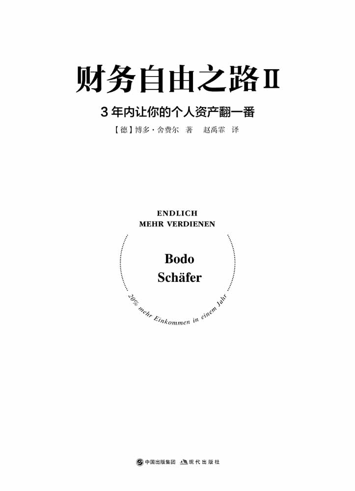

图书在版编目（CIP）数据

财务自由之路Ⅱ，3年内让你的个人资产翻一番／（德）博多·舍费尔著；赵禹霏译．—北京：现代出版社，2018.10

ISBN 978-7-5143-7287-8

Ⅰ．①财…　Ⅱ．①博…②赵…　Ⅲ．①私人投资－基本知识　Ⅳ．①F830.59

中国版本图书馆CIP数据核字（2018）第190638号

COPYRIGHT: THE RIGHTS COMPANY，The Netherlands

The simplified Chinese translation rights arranged through Rightol Media

（本书中文简体版权经由锐拓传媒取得Email：copyright@rightol.com）

财务自由之路Ⅱ，3年内让你的个人资产翻一番

------------------------------------------------------------------------

作　　者： （德）博多·舍费尔

译　　者： 赵禹霏

责任编辑： 姚冬霞　张　霆

出版发行： 现代出版社

通信地址： 北京市安定门外安华里504号

邮政编码： 100011

电　　话：
010-64267325　64245264（传真）

网　　址： www.1980xd.com

电子邮箱： xiandai@vip.sina.com

印　　刷： 三河市宏盛印务有限公司

字　　数： 240千字

开　　本： 710mm×1000mm　1/16

印　　张： 17.25

版　　次： 2018年10月第1版

印　　次： 2018年10月第1次印刷

书　　号： ISBN 978-7-5143-7287-8

------------------------------------------------------------------------

版权所有，翻印必究；未经许可，不得转载

# 前言

当您听说有人比您赚得多时，您有什么感觉？许多人会说：“金钱不是一切。”这的确有道理。关于成功我们可能有不同的定义。而我们的工作当然也存在许多重要的因素：安全感、乐趣、高收入、名望、足够的业余时间以及意义。这其中最重要的是什么呢？答案就是：一切都重要，而且我们有能力拥有这一切。

可是，但凡按照从学校学到的规则去生活，我们就明白这是不可能的。根据老规则，安全感是最重要的。人们必须在学校努力学习，得到好成绩，才能找到一份稳定的职业。兴趣和意义相较于责任感，都是次要的。满足感不如安全感重要，高收入亦不如名望重要。如果一个人想赚得更多，那么他必须长久而努力地工作。

这种情况下，如果我们了解了新规则，实现这一切就变得容易了。我们已经从工业时代迈向信息时代。与此同时，不管是受雇职员还是自由职业者，工作中关于成功的概念均有所改变。

这其中很大程度上存在
危险：
若按照老规则生活，许多人不可避免地失败。他们失败的并不常常指立即丢掉工作，他们失去的仅仅是不能够赚得本可以得到的，并且本应该得到的东西。因为他们并没有得到本可以得到的认可，工作对他们来说毫无乐趣可言。

然而如果他们赚得“很好”，那么就必须以牺牲健康和业余时间为代价。总体来说，因为没有达到应有的适合自己的生活水平，他们就是失败的。但是如果您依照新的规则生活，那么这个崭新的时代就为您带来了一次得天独厚的良机：
在人类历史上，人们第一次可以在工作中找到一切的一切：安全感、乐趣、名望、充分的自由时间、工作的意义以及乐观的收入。您真真正正可以做到在未来几个月内将收入提高20%，在3年内翻一番。也就是说，这一切并不需要长久而努力地工作。

创造源于您生活的杰作吧，一份高收入对您来说大有裨益。您的收入也一直是测量您特定思想状态的标杆。金钱并不会毫无缘由地来到我们生活中。收入是能量的一种体现形式。您投入生命中重要方面的能量越多，获得的收入就越多。这样一来，整体上您的生活质量就大大得到了改善。

本书就是关于上述内容的——您可以通过书中包含的建议显著提高收入；然而实际上，这是一本使您获得更多乐趣、更多意义，提高生活质量的书。而客观的收入在其中扮演了重要的角色。

本书并非要改变既有的系统，并非使您对目前的职业产生怀疑。我更多的是想给予您个人指导。

您将确定自己最大乐趣之所在。我会向您展示如何鼓起勇气实现这种乐趣。您将学习到如何显著提高您的收入——这并不需要延长工作时间或者增加工作强度。

您也许马上会听到一些异议，“这样是行不通的”，“这简直就是乌托邦式的梦”，“在我的公司或者我的行业，这样是不可能的”。对此，我建议您思考一下，什么样的人会这样说。

从一个成功的、幸福的人口中，您永远听不到这样的话语。谁讲出这样的话，就证明了他自己在工作中既没有乐趣，也没有可观的高收入，还没有业余时间。请不要让随便哪个人夺走了你的勇气。

一位虔诚信教的高官曾拜访东佛里西亚的一个村子。为向他致敬，村子里举行了一场射鸭仪式。人们把鸭子抛向空中，由一名猎人射击，鸭子被击中，落到了池塘中央。一位村民毫不犹豫地走到池塘边，到了水边，他还一直前进。他走在水面上，一直走到鸭子旁边，将其从水中捡起，然后拿了回来。村民的脚居然没有被水打湿。这给高官留下了深刻的印象。

同样的过程又重复了两遍，高官做了个决定：“我也能做到。下一只鸭子由我来取吧！”可是当试图在水面上行走时，他一下子就陷了进去。当他从冰冷的水中爬上来，一旁的村民向另一个人悄声讲道：“他是有信仰的，但他并不知道石头在哪里啊……”

高收入对于许多人来说是一个奇迹，就像在水面上行走一样。我想通过这个故事向您指出两点。一方面，这本书并非像歌曲中唱的那样：“你能做到一切！”我认为那是一种错误的、危险的想法。

另一方面我想向您展示那些“石头”，踏着这些石头您可以稳稳地得到一份更高的收入。如果您选择顺着这条路走下去，那么在其他人眼里，您就像奇迹一样。然而实际上，您只是了解并且实践了一些关键的规则和策略。正是这些规则和策略使您实现了自己的价值。

我坚定地相信您！虽然我并不认识您，但是为何我能够这么讲呢？我认为，我们并不是找寻特定的书，而是书找到我们。如果您是作为礼物收到这本书的，也是这个道理。您还会知道，有这样的人，他确实在为您着想。

是否存在一个您刚好在此时此刻阅读这本书的理由呢？我相信是有的。这其中的缘由在于，您想利用此时此刻，并且您并不满足于现状。让我们共同开启进步的征程吧！

您忠诚的博多·舍费尔

# 自我分析：您的收入状况

1.
可否用一句话描述，您擅长哪些领域？

\_\_\_\_\_\_\_\_\_\_\_\_\_\_\_\_\_\_\_\_\_\_\_\_\_\_\_\_\_\_\_\_\_\_\_\_\_

\_\_\_\_\_\_\_\_\_\_\_\_\_\_\_\_\_\_\_\_\_\_\_\_\_\_\_\_\_\_\_\_\_\_\_\_\_

2.
您有哪些不同于其他人的优点？用一句话进行描述。

\_\_\_\_\_\_\_\_\_\_\_\_\_\_\_\_\_\_\_\_\_\_\_\_\_\_\_\_\_\_\_\_\_\_\_\_\_

\_\_\_\_\_\_\_\_\_\_\_\_\_\_\_\_\_\_\_\_\_\_\_\_\_\_\_\_\_\_\_\_\_\_\_\_\_

3.
您如何评价自己的收入？您的所得与您的价值相符吗？

|  |  |
|----|----|
| □非常好 | □够用 |
| □很好 | □糟糕 |
| □好 | □十分糟糕 |
| □基本满意 |  |

4.
大多数人只有在工作时才赚钱。您是否已经找到一份一劳永逸的工作来赚钱呢？

|  |  |
|----|----|
| □有 | □没有 |

5.
您的收入达到怎样的比例可以使您不必工作？

|  |  |
|----|----|
| □0% | □低于50% |
| □低于10% | □低于75% |
| □低于25% | □超过75% |

6. 您依靠自己的想法赚钱吗？

|  |  |
|----|----|
| □是的 | □不是 |

7.
您的专业化水平有多高？培训一名您所在岗位的新人需要多长时间？

|  |  |
|----|----|
| □1天 | □1星期 |
| □30天 | □至少90天 |
| □至少120天 |  |

8.
您的钱能生钱吗？您收入的回报率是多少？

\_\_\_\_\_\_\_\_\_\_\_\_\_\_\_\_\_\_\_\_%

9. 您是否已经找到了合法避税的方式？

□从来没有考虑过

□应该多考虑一下

□已经找到很好的解决方法

10.
您的工作是您的保障吗？您是否有多种收入来源呢？您有多少种收入渠道呢？

|  |  |
|----|----|
| 第一种收入来源\_\_\_\_\_% | 第二种收入来源\_\_\_\_\_% |
| 第三种收入来源\_\_\_\_\_% | 第四种收入来源\_\_\_\_\_% |
| 第五种收入来源\_\_\_\_\_% |  |

11.
您上一次在职场上面临危机是什么时候？面临风险您做了怎样的思想准备？

|  |  |
|----|----|
| □几乎从未经历过 | □小风险 |
| □较高风险 | □高风险 |

12. 您每天用来学习的时间有多长？

\_\_\_\_\_\_\_\_\_\_小时

13. 您是否有一位促进职业发展的教练？

|  |  |
|----|----|
| □有 | □没有 |

14.
关于如何实现收入增加20%甚至100%，您是否有明确的计划？

|  |  |
|----|----|
| □没有计划 | □大致的想法 |
| □清楚的想法 | □详细的计划 |

15. 您在工作中是否做到了最好？

|  |  |
|----|----|
| □0%～50% | □最多95% |
| □50%～75% | □100% |
| □最多85% | □超过100% |

16.
您的工作是否占据了至少80%的乐趣？

|  |  |
|----|----|
| □是的 | □不是 |

17. 您了解自己的强项和弱项吗？

|  |  |
|----|----|
| □是的 | □不是 |

18.
您所工作的领域是否可以使您发挥优势，又避免弱势呢？

|  |  |
|----|----|
| □是的 | □不是 |

19.
您的工作时间有多少投入带来收入的活动？

\_\_\_\_\_\_\_\_\_\_%

20.
您是否相信收入的高低是十分重要的？

|  |  |
|----|----|
| □相信 | □不相信 |

21.
如果您的收入是目前的两倍，这将对您的生活产生怎样的影响？

\_\_\_\_\_\_\_\_\_\_\_\_\_\_\_\_\_\_\_\_\_\_\_\_\_\_\_\_\_\_\_\_\_\_\_\_\_

\_\_\_\_\_\_\_\_\_\_\_\_\_\_\_\_\_\_\_\_\_\_\_\_\_\_\_\_\_\_\_\_\_\_\_\_\_

22.
您是否每天至少用一个小时定位自己？

|  |  |
|----|----|
| □是的 | □不是 |

为自由职业者设置的额外问题

23.
有哪些问题贵公司可以比任何一家其他的公司解决得更好？为什么客户要购买您的服务？

\_\_\_\_\_\_\_\_\_\_\_\_\_\_\_\_\_\_\_\_\_\_\_\_\_\_\_\_\_\_\_\_\_\_\_\_\_

\_\_\_\_\_\_\_\_\_\_\_\_\_\_\_\_\_\_\_\_\_\_\_\_\_\_\_\_\_\_\_\_\_\_\_\_\_

24. 您的目标人群是哪些人？

\_\_\_\_\_\_\_\_\_\_\_\_\_\_\_\_\_\_\_\_\_\_\_\_\_\_\_\_\_\_\_\_\_\_\_\_\_

\_\_\_\_\_\_\_\_\_\_\_\_\_\_\_\_\_\_\_\_\_\_\_\_\_\_\_\_\_\_\_\_\_\_\_\_\_

25. 您的任务宣言及机构标志是什么？

\_\_\_\_\_\_\_\_\_\_\_\_\_\_\_\_\_\_\_\_\_\_\_\_\_\_\_\_\_\_\_\_\_\_\_\_\_

\_\_\_\_\_\_\_\_\_\_\_\_\_\_\_\_\_\_\_\_\_\_\_\_\_\_\_\_\_\_\_\_\_\_\_\_\_

26.
贵公司可以提供的最优便利有哪些？您的客户是否知晓？

\_\_\_\_\_\_\_\_\_\_\_\_\_\_\_\_\_\_\_\_\_\_\_\_\_\_\_\_\_\_\_\_\_\_\_\_\_

\_\_\_\_\_\_\_\_\_\_\_\_\_\_\_\_\_\_\_\_\_\_\_\_\_\_\_\_\_\_\_\_\_\_\_\_\_

27. 您是否拥有一位业内骨干？

\_\_\_\_\_\_\_\_\_\_\_\_\_\_\_\_\_\_\_\_\_\_\_\_\_\_\_\_\_\_\_\_\_\_\_\_\_

\_\_\_\_\_\_\_\_\_\_\_\_\_\_\_\_\_\_\_\_\_\_\_\_\_\_\_\_\_\_\_\_\_\_\_\_\_

28.
如果您因故停止工作，贵公司是否能够正常运转？可以运转多久？

\_\_\_\_\_\_\_\_\_\_个月

我想将哪些想法付诸实践？

\_\_\_\_\_\_\_\_\_\_\_\_\_\_\_\_\_\_\_\_\_\_\_\_\_\_\_\_\_\_\_\_\_\_\_\_\_

\_\_\_\_\_\_\_\_\_\_\_\_\_\_\_\_\_\_\_\_\_\_\_\_\_\_\_\_\_\_\_\_\_\_\_\_\_

\_\_\_\_\_\_\_\_\_\_\_\_\_\_\_\_\_\_\_\_\_\_\_\_\_\_\_\_\_\_\_\_\_\_\_\_\_

\_\_\_\_\_\_\_\_\_\_\_\_\_\_\_\_\_\_\_\_\_\_\_\_\_\_\_\_\_\_\_\_\_\_\_\_\_

\_\_\_\_\_\_\_\_\_\_\_\_\_\_\_\_\_\_\_\_\_\_\_\_\_\_\_\_\_\_\_\_\_\_\_\_\_

其中，首先我要做到：

1.\_\_\_\_\_\_\_\_\_\_\_\_\_\_\_\_\_\_\_\_\_\_\_\_\_\_\_\_\_\_\_\_\_\_\_\_\_

2.\_\_\_\_\_\_\_\_\_\_\_\_\_\_\_\_\_\_\_\_\_\_\_\_\_\_\_\_\_\_\_\_\_\_\_\_\_

3.\_\_\_\_\_\_\_\_\_\_\_\_\_\_\_\_\_\_\_\_\_\_\_\_\_\_\_\_\_\_\_\_\_\_\_\_\_

# 目录

<a href="#text00030.html_chapter" class="calibre12">前言</a>

<a href="#text00031.html_calibre_pb_0"
class="calibre12">自我分析：您的收入状况</a>

<a href="#text00033.html_chapter"
class="calibre12">第一部分　理论基础</a>

<a href="#text00034.html_calibre_pb_0"
class="calibre12">第一章　仓鼠之轮</a>

<a href="#text00034.html_hh2-1" class="calibre12">赚钱的五种方式</a>

<a href="#text00034.html_hh2-2" class="calibre12">赚得更多的三种方式</a>

<a href="#text00034.html_hh2-3" class="calibre12">仓鼠之轮</a>

<a href="#text00034.html_hh2-4" class="calibre12">梦想的收入</a>

<a href="#text00034.html_hh2-5" class="calibre12">概要</a>

<a href="#text00035.html_calibre_pb_0"
class="calibre12">第二章　书本知识与社会实践</a>

<a href="#text00035.html_hh2-6" class="calibre12">您的思考方式</a>

<a href="#text00035.html_hh2-7" class="calibre12">不同的思维方式</a>

<a href="#text00036.html_calibre_pb_0"
class="calibre12">第三章　新规则</a>

<a href="#text00036.html_hh2-8" class="calibre12">警惕公平的陷阱</a>

<a href="#text00036.html_hh2-9" class="calibre12">信息时代</a>

<a href="#text00036.html_hh2-10"
class="calibre12">规则一：并非一次，而是多次</a>

<a href="#text00036.html_hh2-11" class="calibre12">规则二：能够出售</a>

<a href="#text00036.html_hh2-12"
class="calibre12">规则三：寻找顺应时代的榜样</a>

<a href="#text00036.html_hh2-13"
class="calibre12">规则四：关心自己的安全感</a>

<a href="#text00036.html_hh2-14"
class="calibre12">规则五：为盈利参与竞争，经历冒险</a>

<a href="#text00036.html_hh2-15"
class="calibre12">规则六：错误是好事</a>

<a href="#text00036.html_hh2-16"
class="calibre12">规则七：不断学习，不断成长</a>

<a href="#text00036.html_hh2-17"
class="calibre12">规则八：重新开创自己的职业</a>

<a href="#text00036.html_hh2-18"
class="calibre12">规则九：赚钱是一项游戏</a>

<a href="#text00036.html_hh2-19" class="calibre12">规则十：发展强项</a>

<a href="#text00036.html_hh2-20"
class="calibre12">规则十一：找到解决弱点的办法或者将其转化为强项</a>

<a href="#text00036.html_hh2-21"
class="calibre12">规则十二：工作、学习和定位是一体的</a>

<a href="#text00036.html_hh2-22" class="calibre12">我们有一切机会</a>

<a href="#text00037.html_calibre_pb_0"
class="calibre12">第四章　选择适合自己的领域</a>

<a href="#text00037.html_hh2-23"
class="calibre12">您到底是怎样看待金钱和收入的</a>

<a href="#text00037.html_hh2-24"
class="calibre12">解决办法：开辟多种收入渠道</a>

<a href="#text00037.html_hh2-25"
class="calibre12">三个阶层的思维方式</a>

<a href="#text00038.html_calibre_pb_0"
class="calibre12">第五章　强烈的兴趣+天赋=心流</a>

<a href="#text00038.html_hh2-26" class="calibre12">工作上真正的成功</a>

<a href="#text00038.html_hh2-27"
class="calibre12">产生心流状态的七个原因</a>

<a href="#text00038.html_hh2-28" class="calibre12">有什么意义</a>

<a href="#text00039.html_chapter" class="calibre12">第二部分　实践篇</a>

<a href="#text00040.html_calibre_pb_0"
class="calibre12">第六章　如何找到适合自己的工作</a>

<a href="#text00040.html_hh2-29"
class="calibre12">您想要什么样的工作</a>

<a href="#text00040.html_hh2-30" class="calibre12">失业者择业四部曲</a>

<a href="#text00040.html_hh2-31"
class="calibre12">第一步：您想要做什么</a>

<a href="#text00040.html_hh2-32"
class="calibre12">第二步：确定一份合适的工作</a>

<a href="#text00040.html_hh2-33"
class="calibre12">第三步：这样为自己找一份合适的工作</a>

<a href="#text00041.html_calibre_pb_0"
class="calibre12">第七章　增长最终收益</a>

<a href="#text00041.html_hh2-34" class="calibre12">思想基础</a>

<a href="#text00041.html_hh2-35" class="calibre12">加薪的15条规则</a>

<a href="#text00041.html_hh2-36"
class="calibre12">规则一：请您做到最好</a>

<a href="#text00041.html_hh2-37"
class="calibre12">规则二：请您从事能够创造收入的活动</a>

<a href="#text00041.html_hh2-38"
class="calibre12">规则三：乐于助人，传播快乐</a>

<a href="#text00041.html_hh2-39"
class="calibre12">规则四：热爱自己所做的一切</a>

<a href="#text00041.html_hh2-40"
class="calibre12">规则五：请您学习，并且不断成长</a>

<a href="#text00041.html_hh2-41"
class="calibre12">规则六：请您把自己看作游戏的一部分</a>

<a href="#text00041.html_hh2-42"
class="calibre12">规则七：加强您的优势</a>

<a href="#text00041.html_hh2-43"
class="calibre12">规则八：请您提高自信力</a>

<a href="#text00041.html_hh2-44" class="calibre12">如何才能建立自信</a>

<a href="#text00041.html_hh2-45"
class="calibre12">规则九：真正做到全神贯注</a>

<a href="#text00041.html_hh2-46"
class="calibre12">规则十：要有高度的紧迫感</a>

<a href="#text00041.html_hh2-47"
class="calibre12">规则十一：公开场合不要进行反对</a>

<a href="#text00041.html_hh2-48"
class="calibre12">规则十二：请您心胸开阔</a>

<a href="#text00041.html_hh2-49"
class="calibre12">规则十三：请您承担全部责任</a>

<a href="#text00041.html_hh2-50"
class="calibre12">规则十四：不要怀疑，而是要展示优势</a>

<a href="#text00041.html_hh2-51"
class="calibre12">规则十五：要求加薪</a>

<a href="#text00042.html_calibre_pb_0"
class="calibre12">第八章　投资者——创造一台自己的印钞机</a>

<a href="#text00042.html_hh2-52" class="calibre12">节约+增值=投资者</a>

<a href="#text00042.html_hh2-53" class="calibre12">堵住孔洞</a>

<a href="#text00042.html_hh2-54" class="calibre12">如何使您的钱增值</a>

<a href="#text00043.html_calibre_pb_0"
class="calibre12">第九章　将自己定义成专家</a>

<a href="#text00043.html_hh2-55" class="calibre12">专家</a>

<a href="#text00043.html_hh2-56"
class="calibre12">成功定位的基本原则</a>

<a href="#text00044.html_calibre_pb_0"
class="calibre12">第十章　做企业家，不做接管者</a>

<a href="#text00044.html_hh2-57"
class="calibre12">您到底处于这个五角星的哪一部分呢</a>

<a href="#text00044.html_hh2-58" class="calibre12">自由职业者</a>

<a href="#text00044.html_hh2-59" class="calibre12">企业家的特质</a>

<a href="#text00044.html_hh2-60" class="calibre12">如何获得这些基础</a>

<a href="#text00044.html_hh2-61" class="calibre12">企业家的任务</a>

<a href="#text00044.html_hh2-62" class="calibre12">财富</a>

<a href="#text00045.html_calibre_pb_0"
class="calibre12">第十一章　先服务　后收益</a>

<a href="#text00045.html_hh2-63"
class="calibre12">第一个领域：帮助同事和顾客</a>

<a href="#text00045.html_hh2-64"
class="calibre12">第二个领域：从属于一项任务</a>

<a href="#text00045.html_hh2-65"
class="calibre12">第三个领域：支持您的家人和朋友</a>

<a href="#text00045.html_hh2-66"
class="calibre12">第四个领域：给穷人提供帮助</a>

<a href="#text00045.html_hh2-67"
class="calibre12">第五个领域：改善您的机制</a>

<a href="#text00046.html_calibre_pb_0"
class="calibre12">第十二章　业余时间</a>

<a href="#text00046.html_hh2-68" class="calibre12">工作狂</a>

<a href="#text00046.html_hh2-69"
class="calibre12">最佳分配时间的几个步骤</a>

<a href="#text00046.html_hh2-70" class="calibre12">工作和业余时间</a>

<a href="#text00046.html_hh2-71" class="calibre12">两种方式</a>

<a href="#text00046.html_hh2-72" class="calibre12">绝不妥协</a>

<a href="#text00047.html_chapter" class="calibre12">致谢</a>

<a href="#text00048.html_calibre_pb_0" class="calibre12">附录</a>

第一部分\
理论基础
=========

第一章\
仓鼠之轮
===========================================

富裕是指不费多大力气就能事半功倍；\
贫穷是指下很大功夫却事倍功半。\
——乔治·大卫（Georg David）

首先，有这样一个好消息：赚钱是一项游戏。
人人都能参与其中并且获利。您可以在12个月内比现在多赚20%，并且在3年内将总收入翻一番。

然而，还有一个坏消息：大部分人并不了解游戏规则。
他们因循守旧，墨守成规，所以哪怕付出再多的努力，也只是原地踏步而已。殊不知只有熟悉了规则，才能有所收获。

无论您收入高低，对自己的收入是否满意，总会有人比您的收入高出许多，有的人赚的钱是您的2倍，甚至有一些人的收入是您的10倍、20倍……怎么会这样呢？难道这些人比您聪明10倍、20倍？难道他们工作比您努力10倍、20倍？当然没有。他们只是知道该如何玩这场关于收入的游戏，他们了解游戏规则。

本书就是一本关于这些规则的书。了解了这些新规则，您便可以参与到这场收入游戏中并且取胜。我不敢断言每个人都能够赚到多得令人难以置信的钱。但是，如果您遵守本书中的规则，我向您保证：其结果一定会比不这么做要好得多！

## 赚钱的五种方式

其实您能够赚钱的方式只有五种。对您来说，确定您所在的领域可能很容易：

1\. 雇员或者工人（A）

2\. 自由职业者（F）

3\. 投资者（I）

4\. 企业家（U）

5\. 专家（E）
<a href="#text00034.html_fn_1" id="text00034.html_ft1">[1]</a>

在五角星中表示如下：

五个收入领域

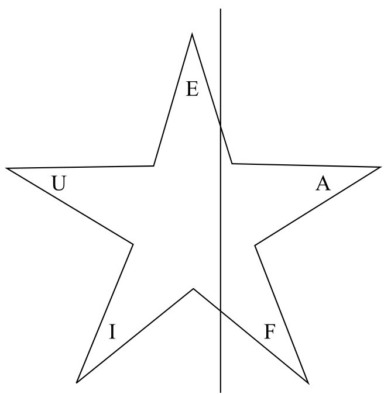

如您所见，这个五角星可以分为两部分：两个领域位于右半部分，三个在左半部分。对此，我希望您注意以下两方面。

首先，学校几乎就是为位于右半部分的领域而准备的。
我们学习如何成为一名好的职员或者自由职业者。但是我们丝毫不了解如何成为一位成功的投资者、企业家或者专家。

其次，位于左半部分领域使人赚更多的钱。
拿企业家举例，他们每月可支配的资金平均是雇员或者工人的5倍。投资者可利用自己的钱利滚利；专家由于其特殊的地位享有巨大的声望，他们更容易感到满足，而其收入也远远高于那些不知道自己精通哪方面的人。

五角星的两方面

并不存在哪个“最佳领域”。每个领域都有其优势，同时也存在弊端。
最终选择了哪一领域，取决于您的强项和弱项，取决于您对风险的准备，取决于您的性格和目标。

同样道理，您处在哪一领域，在哪个领域举足轻重，您就可以由此获得满足和可观的收入。任何一个村落、城市，任何一个民族都需要五角星图中左右两边的领域。在学校我们学到如何成为优秀的雇员或自由职业者。我们为从事警察、医生、消防员、机械工程师、会计、厨师、护士、教师等那些创造乐趣并且具有意义的职业而努力，我们的学校为传承文化做出了重大贡献。

但是，重要的是，您下意识地
对五角星图中的一个领域进行选择。不是说您仅仅因为“大家都是这么做的”，就终生致力于某个对您来说并非最佳选择的领域。在第二章您将明确哪些是与您个性相适合的领域。

收益更大的领域在五角星图的左侧

在工业化国家，每个投资者、企业家以及专家背后都存在着至少12名雇员或者自由职业者。如果五角星图两边的人们赚同样多的钱，那么雇员和自由职业者的钱总共就会是投资者、企业家和专家的12倍之多。而实际上并非如此。德国联邦政府近期发表的研究显示，德国半数家庭的收入仅占总货币供应量的4.5%。

而贫富差异日益增加。经济学家估计，5年后就职于企业核心部门的人仅剩目前的一半，而他们赚得的是其他人的两倍并且创造了其他人3倍的价值（1/2×2×3=P）。

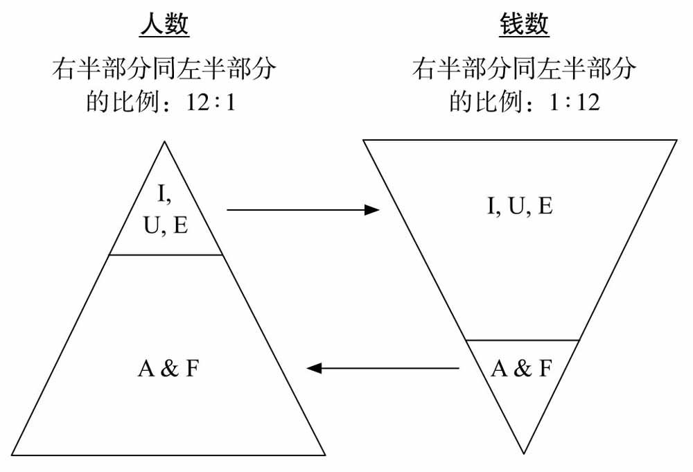

那么随即而来的一个问题便是，为什么一小部分人赚得的远多于其他人呢？答案就是他们有着完全不同的想法，并且遵从完全不同的游戏规则进行游戏。

## 赚得更多的三种方式

本书的核心内容在于如何使您赚得更多。为此我们需要首先定义收入。我建议将其直接定义为：所有的进项都是收入。

至关重要的是，您每个月可支配的收入有多少。这与您通过本职工作赚钱，还是兼职，抑或是自主创业赚钱没有区别。您也可以不工作但照样赚钱，比如做个投资者。所以，美国人不说赚钱，而是说造钱（to
make money）。

有三种方式可以使您实现更高的收入。本书中对这三点均有详细的描述。

1. 如何能够在一个领域提高收入。
对此您可以得到很多相关建议。凭借我培训班的经验，如果遵循“能量贴士”，您就可以在一年之内将收入至少提高20%。

2.
如何就职于一个特定领域，同时又从另外一个领域获取额外收益。
不是每个人都愿意或者都有能力离开五角星图右半部分的领域。但是除了作为职员或者自由职业者得到的收入，每个人都能学着作为投资者取得额外收益。特别是职员和自由职业者可以学习如何将自己定位为专家。因为专家赚得更多。

3. 如何实现飞跃（并且转换领域）。
一个领域的完全转换自然能够带来最佳收益。但是为此我们也得付出最大的代价。为此重要的是去了解通往五角星左半部分领域所涉及的原则。

如果已经是企业家或者独立经营者，尽管不必转换领域，您也可以实现跨越，并借助本书为自己的职业做出巨大调整。

上述三种方式没有任何一种可以在学校学到。尽管学校的书本知识十分重要，但是若想多赚钱，就需要额外的社会经验。现在，社会经验不属于任何学科，也不是仅仅依靠逻辑而形成的。

当然了，投资者、企业家以及专家有其固定的准则。而这些准则常常不受重视。如此一来，许多投资者和企业家只能忍受其所在领域的弊端，而不能享受其中的乐趣。
我们会明确指出哪些是您必须注意的准则。

此外，在欧洲的人们几乎不了解关于专家的定位。当我就关于定位的话题向众人发问时，大家给出了各种匪夷所思的答案。这时，专家的优势就凸显出来了。本书的重点正是向您展示，如何成为专家。您会了解到，作为专家，您的收入会增加一倍、两倍甚至更多。
而如何定位为专家也是有其明确指导原则的。

## 仓鼠之轮

首先看一下我们国家大多数人的真实生活。成百上千的人因为对其财政状况的担忧而夜不能寐，早上睁眼起来，就去上班。他们怀抱希望，自己马上就能赚到可以付清账单的钱。而当他们收入提高时，开支又梦魇般地同步增多。这些问题常常变得越来越严重。

唯一的解决办法就是，继续努力工作。您希望着通过多赚钱，最终变得节俭。但是生活水平同收入平行增长。负债日益增加。这些人就必须越来越努力而长时间地工作才能保持生活水平，以偿付债务和账单。这些人让我们想起仓鼠的轮子：尽管他们使尽全力，却没有进步。同理，一些人不管多努力地工作，只要处在仓鼠之轮中，他就是在原地踏步。

赚得越多，带走越多

越努力工作的人越容易受到国家的惩罚。因为赚得越多，国家以税收和社会保障的形式带走的钱就越多。公民每年为国家工作的平均时间超过了200天，也就是说每年到了7月末才开始为自己赚钱。

仓鼠之轮中的职员和自由职业者

处在仓鼠之轮中的许多人都是职员。他们印象中从来不为自己工作，而是为他人工作。作为雇员，他们工作是为了使老板更富裕；作为纳税人，他们使国家更富有；作为借贷人，他们使银行盈利；作为消费者，他们又使其他企业家更加富裕。

而自由职业者同样处在相同的仓鼠之轮中。除此之外，还有一些因素使他们常感觉更加不自由：一切的一切都和他们紧密联系在一起，他们是不可或缺的人。
如果一名医生、律师或者建筑师有几周没在岗，通常情况下不会有什么机制能够填补他们的空缺。患者、顾客、委托人经常固定联系某个特定的人，而自由职业者就是这样一种机制。

这样一来，自由职业者很容易成为工作的俘虏。其中的矛盾在于：一个人越是努力工作、取得越大的成功，这个机制就越大，由于他本人处在机制中，所以他的压力也就越来越大。

投资者的仓鼠之轮

同样地，投资者也难逃仓鼠之轮。尽管许多人声称他们进行投资，而事实看起来确实这是这样的：他们中的大多数承担的债务（欠债和抵押贷款）往往超过他们所拥有的财产。他们要为债务支付6%～10%的利息，通过财产他们仅盈利2%～5%，而这些微薄的利润还要被财政局分去一部分。

有时候，这些投资者也会到股票交易所闲逛，结果却常常不令人满意。因为他们并不知道应该买什么，何时买入，何时卖出。他们就这样重新回到自己“安全的”规划中。

而这里就是所谓的仓鼠之轮：税收和通货膨胀吞噬着微薄的利润，投资者只能原地踏步。然而，假设还有一些债务，那么他为这些债务支付的利息要超过他通过财产所获得的利润，最终他的总利润仍然为负。

这样的人很快就会感觉虽然自己想向上方跑，却处于下行电梯上。这种系统在与他作对，因为他不了解规则。

企业家的仓鼠之轮

许多企业家也存在类似的情况。尽管他们自称为企业家，行事起来却并未如此。大多数人在公司工作，与其说他们是企业家，倒不如说他们更像是职员。
虽然他们为自己工作，却常常对自己的要求严于其他老板。他们工作时间更长，也工作得更努力。

当然，效力于自己的公司完全是正常的。但是抛开创业阶段不谈，一名企业家不应该被日常业务吞没。他们应该创造一种机制。

如此一来，我们就说到了第二点，也是从根本上更有意义的一点：许多企业家会忽视去创立一个机制，一种离开他本人也可以正常运转的机制。只要公司没有这样一种机制，他就没有自由可言。谁没有能力建立这样的机制，
他就只能用自身劳动力进行弥补。

许多家族企业缺乏的正是这种机制。他们想来去自如的时候却没有这种自由。他们完完全全和业务拴在了一起。如果一名职员不在岗而没有人能够替代，那么他就需要做两个人的工作。这和我关于工作乐趣的想法完全不相符。

对于每个会做饭的人来说，是同样的道理。他们都有能力烹制出比麦当劳“套餐”更加可口的美味，还更健康。但是谁能够像麦当劳一样建立一种机制呢？在第十章我们就来谈谈如何建立机制。

最后我想说的是，大多数企业家都没有确立一种“退出战略”。
或者说这些企业大多是不可售的，也就是说他们不能待价而沽。一个不能出售的公司不是资产，而资产是属于这个公司的。

多赚一倍的钱……

在五角星图的所有领域中赚得更多的秘诀在于把自己定位成专家。
谁不了解并且应用这个规律，那么他就被生活的实际意义忽略了。这样的人只能收获到实际属于他的一小部分果实。他常常挣扎在最低生活保障线的边缘，而不是过着本属于他的富裕的生活。

在第九章您可以得到关于如何将自己定位为专家的指导，以及从事哪个领域的工作。多年来，我在研讨班上多次谈到这个话题。您应该了解一下那些应用了我的基本原则的学员的经历。经常有人实现了两年之内将收入增加两倍，
而在这之前这些人也曾在仓鼠之轮上原地踏步。

具有批判性格的记者有时会心生疑虑地发问：“舍费尔先生，一切真的如您所讲吗？”我很高兴邀请他们在我演讲之后给书签名的时候在我身边待上一会儿。这总是令人激动的时刻：许多读者会对我讲他们是如何利用我的想法和策略工作的。有时候我会听到一些很棒的经历。促使我前进的一大部分动力都来源于这些读者的反馈。那些记者如果听到了这些，就不会有其他问题了。

您在哪里跑步

您还记得机场的传送带吗？不需要太大的努力您就能轻松超过传送带以外的行人。那么您目前是在以双倍速将您带向目的地的传送带上，还是在仓鼠之轮上呢？

问题在于，处在仓鼠之轮上的人，经常忙得意识不到自己的处境。局外人可以通过训练有素的眼光很快了解情况。但是仓鼠只是自顾自地跑着，跑着……

我们需要时间来分析我们的处境，然后采取重要的行动。我们反思得越多，我们能够赚的钱就越多。正如洛克菲勒所言：整天工作的人，没有时间赚钱。

仓鼠之轮的描述是否有一部分也在说你？欢迎加入我们。我自己有几年也是这样度过的。26岁我曾患胃病，感觉十分不幸福。我的自信一点一点消失殆尽，我看不见希望。但是在这种情况下我很荣幸结识了我的第一位教练。他带我看到了通往高收入、通往成功和满足的路。

时至今日，我完全过着一种同那种不自由状态完全不同的生活：夏天我住在马略卡岛
<a href="#text00034.html_fn_2" id="text00034.html_ft2">[2]</a>
，阅读写作。其他的时间我游历四方，从事我的第二爱好：做演讲。除此之外，我还被那些幸运的成功的人吸引——我同许多这样的人会面，我们相谈甚欢。

目前，我所拥有以及参股的8家公司没有夺走我的自由，反而给予我自由。我至少有五六种不同的收入来源，每一种都能够使我生活（顾问收入，投资分红，稿酬，演讲收入，不同公司的分红……）。

我是如何做到这些的？我首先认识到我处于仓鼠之轮中。先诊断，再开药方。我花了一些时间在教练的帮助下改变我的思考模式：财富属于那些和别人想法不同的人。
我了解了新规则，并且按规则行事。我寻求榜样，目睹了他们都是按照新规则生活的。我也学到了使我们收入显著提高的技能和策略。但开始是很艰难的。

## 梦想的收入

三年后，你打算每个月赚多少钱——纯收入？当几年前我的教练向我提出这个问题时，我没有任何想法。我当时26岁，身无分文。我关心更多的是，我在接下来的一周
能赚多少钱。但是，这是我第一次同我的教练对话。我不仅仅要回答他的问题，还必须说服他，让他觉得孺子可教。

我回答道：“20000马克。”这么多钱是我根本无法想象的，并且我也不知道，如何每月赚到这么多钱。但是我想给我的教练留下深刻的印象。这完全失算了。因为他回答道：“我不想给一个鼠目寸光的人做教练；我再给您一个机会来回答这个问题：您想在3年后赚到多少钱？”

我感觉自己像走进了一场不真实的电影。20000马克对我来说是终极目标，却被说成了“鼠目寸光”。但是我相信这个人——远超过相信我自己。我的大脑飞速运转思考着，一个人每个月到底可以赚多少。我想到的是35000马克到45000马克。我的教练笑着建议道：“那我们就定在50000马克吧，这是个整数。”我把这个数字记了下来。

您的梦想收入是什么样的

我想向您提出同样的问题：3年后，您想每个月赚多少钱？您有两种选择来回答这个问题。第一您可以回顾一下自己：回顾您所接受的教育，您拥有的能力，您目前的状况。然后您可以想一下，根据您的分析，哪些是可以实现的。然后，根据自己的情况来确定这个目标。
我们的学校教我们这样做计划。这样的做事方法带来的危险是可能不会有太多改变，一切一如既往。

非常成功的人对此的做法完全不同。他们的注意力完全不在自己，而是在一个特定的幻想。他们描绘出自己想要追求到的事物，然后思考变成怎样的人才能够使这番幻想成为现实。

成功的人不将其目标依赖于目前状况。
他们知道，如果我们的目标是以我们自己为导向的——那么我们就停滞不前。如果我们以目标为导向——那么我们就注定要成长。

两条路

本书中我想向您展示这两条路：现实之路——如何在一年之内将收入提升20%以上。
但我还想展示给您一条通往高收入的快速量变
之路——它能使您的收入翻一番。

当了解了这两条路并且知道要付出哪些代价时，您才能做出正确的选择。但首先请您抛开本书初步做一个决定，请回答这个问题：3年后，您想每个月赚多少钱——纯收入？

\_\_\_\_\_\_\_\_\_\_欧元

衷心地祝贺您，您刚刚做了一个完全疯狂的举动。而这里的疯狂指的是一些不同寻常、超凡脱俗的事情。您知道，做大家都在做的事，只能得到大家都得到的东西。

您已经记下一个数字了，对吧？请您在写下上面这个问题的答案之前不要往下看。您会惊叹于这本书怎样改变了您对于收入和目标的想象。将来，如果您回顾一下最初关于梦想收入的想法，那就再好不过了。

量的飞跃

当我写下50000马克之后，教练要求我画掉这个数字然后乘以2。我只好写下“我将在3年后每月纯收入至少达到100000马克”。我的手一直在颤抖。教练恭喜道：“衷心祝福你，现在您有了一个目标。”

我并没有感觉到自己刚刚写下了我的目标。面对这个目标，我甚至感觉到很不舒服。我试着改变那个数字，说道：“我并不需要这么多钱；这么多也许对我来说并不好。”

教练回答道：“您现在根本不知道您需要多少钱。”他接着说道，“这和100000马克并没有什么关系。这个数字仅仅是一个检测您是否真正达到了目标的标尺。这其中更多关乎您的个性；重要的是，在这个过程中您会变成怎样的人。”

他的这番话深深地触动了我：我想变成一个有个性的人，我想变得钢铁一般坚强。之后他又说了一些至今仍然在激励我的话：“生命短暂，不应该碌碌无为。”

我的教练说到这些的时候并没有涉及引申的意义：在其他人看来，什么有意义可能是不一样的；他关心更多的是我做的对我（本身）重要的事情，完成这些事情，并在这个过程中不断学习。

他经常说：“这无关有没有100万，而是要成为百万富翁。这其中存在着理财的智慧。钱财来了又去，但是如果拥有理财的智慧，如果知道金钱和收入是如何运作的，那么我们就会在很短一段时间内重新赚得财富。”

那时候，我想都不敢想月收入达到100000马克。那对我来说像一个奇迹。实际上，到我实现这个目标时为止，我的收入翻了五番。这用了两年半的时间。回首那时，我不再觉得那像是一个奇迹了。我为此努力工作过，并且知道我做了什么。

## 概要

一开始就讲技巧，并没有多大意义。重要的并不是您收入的高低，而是您感觉到幸福和满足。为此，我们首先应该澄清一些基本的问题。

首先您应该确定的是，自己是否选择了正确的领域。许多人处在仓鼠之轮的一个根本原因在于他们思考的方式：是更注重书本知识，还是社会实践？第二章就是关于这些内容的。

第二个原因则是按照旧规则生活。在第三章您可以找到一些让人耳目一新的顶级收入新规则。

接下来在第四章中我们将探索每个职业领域的优点和缺点。我们将能够准确判断，哪个领域对您来讲是最好的。

在第五章中您将看到工作中的乐趣是多么重要。您应该经常处于一种通畅的状态，即保持您的目标、远望、感觉和能力之间的协调。在这种通畅的状态下您能感受到满满的幸福感，并且能够创造非同寻常的成就。

接下来，我们就可以探讨那个决定性问题：您是否已经找到生命中所热爱的事物？如果还没有，第六章将会指引你如何去找到它。虽然那时您可能还没有赚到更多的钱，但是您的感觉会比原来好得多。这样就为本书实践部分建立了基础。然后，我们就可以得到一些技术上的诀窍、策略以及明确的指导。至此，收入才能源源不断地流向我们。

第七章向您提出了在您思考后选择的领域中提高收入的多种可能。在这里您将得到关于如何提高收入的明确指导。

第八章展示了作为投资者如何获取额外收益的途径。

最后，在第九章您将获取关于如何把自己定位为专家的指导——这其中包含许多实例。当您使用书中的“能量贴士”时，您的收入将会有一个量的飞跃。您将惊奇地发现，一切皆有可能。当然了，这是与您的反思和工作本身联系在一起的。总之好消息就是：一切皆有可能。

第十章讲述了为建立一家高效、盈利的企业，企业家所需遵守的准则。您会了解到，如果您第一次从五角星图中更加“安稳”的右半部分领域转移到左半部分领域，必须注意的事项。

所有的成功中，您都不应忘记其他人。在第十一章中，我们将给予五角星图另外一个意义。我们不再总是去思考如何赚得
更多，而是去思考我们如何付出
更多。不要忘记：赚钱与“服务”是紧密结合在一起的。

假如想使您的收入增加一倍，无论如何不要以失去自由为代价。这不是真正意义上的成功。为此您将在第十二章读到，如何达到自由时间和工作两者间的平衡，而不必舍其中一方而取另一方。高收入和充裕的时间是可以同时兼得的。

一个重要的请求

请注意，如果这本书一直躺在您的书架里，您的收入将不会翻倍。仅仅去读这本书同样也不能带来所期望的改变。您必须实际操作。仅仅知道怎么
做是不够的。人必须实践——就像运动员、音乐家一样，他们必须不断练习才能清楚地把理论付诸实践。读一本书就希望改变生活，就好比吃一次饭就想着永远不会饥饿一样。我的建议是：在阅读的同时请您经常问自己两个问题：

●对我来说什么是好的？

●我怎么才能立即行动起来？

亚里士多德说过：“有一些事情，只有学会了才能做，而且在做的过程中不断学习它。”

不要等待“正确时刻”的到来。现在就是最好的时刻。请马上开始阅读这本书。最好手边备一支笔，标记文中语句并在空白处写下备注。这样这本书才能变成您的
书。知道了什么是正确的却不为此行动，是懦弱的表现。

开始行动吧！关于收入这个主题的美好之处就在于，您可以时刻测量您的成功。最后，只有一个原因可能使您放弃自己的梦想：您内心中的小我战胜了大我。
请您不要这样做。

------------------------------------------------------------------------

<a href="#text00034.html_ft1" id="text00034.html_fn_1">[1]</a>
德文原文分别为：Angestellter oder
Arbeiter、Freiberufler、Investor、Unternehmer、Experte。（译者注）

<a href="#text00034.html_ft2" id="text00034.html_fn_2">[2]</a>
位于西班牙东部，巴利阿里群岛中的最大岛。（译者注）

第二章\
书本知识与社会实践
===========================================

必须彻底改革教育，\
因为唯有通过彻底改变人们的学习方式及对于学习的思维方式，\
才能改变人们的思维方式。\
——汤姆·彼得斯（Tom Peters）

在第一章，您已经写下了自己3年后每个月想赚多少钱。现在我们思考一下，您是否已经准备好为此付出必要的代价。大多数人只求回报，不想付出代价。所以，尽管许多人渴求最大限度的自由，却忽视了这一点：自由固然是无约束的，却不是免费的。只有那些愿意为之付出代价的人才会拥有自由。

您所记录下的数额越大，付出的代价就会越大。我们将从两方面详细讨论这种代价，即：

1\. 您所经历的风险；

2\. 您所需要的知识。

总体来看，这两点就是处于五角星图中左半部分和右半部分中的大部分人关键性的差异：敢于冒险和从终生实践中学习。

不去经历冒险，那么您在左半部分领域不会赚到钱。没有真知，专家就像小丑，企业家会处在破产边缘，而投资者则只是业余的赌徒。因此，我想明确的一点是：如果真的想赚许多钱，您就需要做好准备经历风险，并下定决心不断学习，不断成长（K.L.U.W.）。

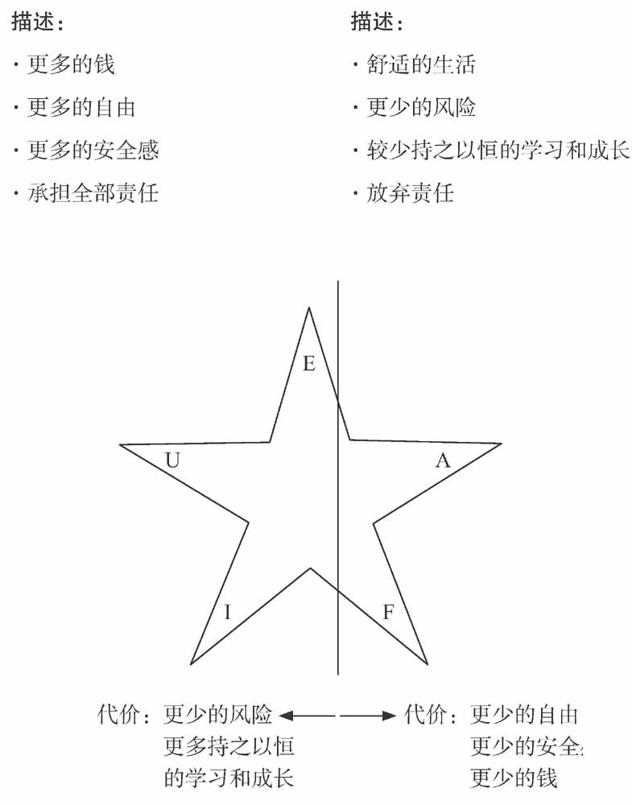

## 您的思考方式

当您开始在工作中应用这本书，您将跟随它开启通往梦想收入的路程，它甚至会给您带来超出预期的收入。我们将在第二部分中讲解技巧、策略和诀窍，但在这之前，我想邀请您走两条“弯路”。弯路有时候可以节省时间——
这里说的就是这个道理。这两条弯路不仅可以带您更快达到目标，而且只有通过它们，才有可能得到更高的收入。

如果不去思考您从事的事情——以及如何完成它——是否同您的个性相符，那么尽可能快地去多赚钱根本毫无意义。而且您有可能只是更快地向错误的目标冲去。
我们首先思考一下为得到高收入需要满足的两个重要条件。

1\.
您的思考方式是怎样的？这种思考方式是否符合您目前所在的领域。在您的工作中是否可以体现出您的价值？可否实现您的梦想和目标？

2\.
您对所从事的工作是否有热情？您做的事情是您所热爱的吗？是否有更加能激发您热情的事物？

现在，如果已经清楚这两点，那么您已经奠定了通往成功的坚实基础。收入就像一个高层建筑：建筑越高，地基就要建得越深。也就是说，要想有更多的思考，就要对思考方式和感兴趣的事物做些什么。

当我的教练说到这种看法的时候，我是很没有耐心的。我更想知道的是，我怎样才能把收入翻一番。但是我的教练用他的教导奠定了关键基础。

任何事情都要以人作为出发点和中心点。
对我们每个人来说，成功、幸福和满足都有着不同的意义。

这样就出现了一个重要的悖论：这本书主要是讲收入的，却把收入放在一个次要
的位置。因为幸福和金钱会自动追随那些改变了思维方法并且从事心中所爱之事的人。下面这个寓言能形象地说明这一点。

两只猫相遇了。一只猫说：“我曾上过猫类哲学学校；我学到了幸福对我们来说是最重要的，而幸福就藏在我们的尾巴里。每当我追逐自己的尾巴时，我离幸福就很近。”

第二只猫回答道：“我不像你那样睿智，也没去过哲学学校。但是有一点是对的，那就是幸福对我们来说是最重要的，而且幸福就藏在我们的尾巴里。但是生活教给我另外一些事物：当我做我热爱的事情时，藏在尾巴中的幸福就自动追随着我。”

您热爱您的工作吗

正如之前提到过的，我自己也经历过糟糕的仓鼠之轮时期。因此我找了一个教练。我希望从他那里得到帮助，但是我希望这种帮助是以我的
方式进行。本来我只是想学如何跑得更快，但是我的教练不太配合。

他经常说道：“正是您习惯了的思考方式使您变成了今天这样。同样的思考方式不会使您变成您想成为的样子。”

在我们第一次谈话中，我的教练给我提出了两个问题：“舍费尔先生，您热爱您的工作吗？”

那是，我还是个学生，但已经拥有了两家商店，只是生意不算太好。所以我又额外找了一份有“更加稳定”的基本工资的工作——在一家保险代理机构工作。对这份工作我没有特别的感觉，更不可能算作“热爱”。我很诚实地回答道：“不喜欢。”

他问我：“为什么您要从事一份自己不热爱的工作呢？”我回答道：“因为我必须赚钱。”

我的教练充满肯定地对我说：“这个理由不充分。您应该只做您所热爱的工作。请您辞职吧，立刻！”

我感到膝盖发软。我不可能把我最后的安全感放弃掉。我必须先给自己赚出足够的储蓄金。于是我说道：“如果我现在就辞职，我都不知道下个月怎么付租金。”

我的教练铿锵有力地说道：“我不和那些问我建议又不按我建议行事的人讨论。我给您30分钟时间。您到我办公室外坐下，写一份辞职信，而且我们必须马上把这封信传真过去——防止您再改变主意。要是您不辞掉这份工作，您就去找其他教练吧。”

我在外面坐下，每个毛孔都在不住地冒汗。我一定要向那个人学到什么。但是在当时的情况下辞掉工作，我感觉自己很疯狂。出于一种我无法名状的原因，我在半小时中的最后两分钟迅速写好了辞职信，交给了我的教练。他将辞职信传真给了那家保险代理机构。

开始并不容易……

这并非一个成功故事的开端。刚开始，我只是有了更多麻烦。最初的两三个月是我一生财务上最为艰难的时期。那时候我过得糟糕极了。

对此，这之后我有几次想过重新去找工作。但是我没有这么做。这期间我明白了，五角星图是有两个方面的。我属于左半部分。而且我也明白一开始会很艰难。无论如何我都不想再回到右半部分的领域了。我的生活中不应该再出现老板。目前的窘境与未来终生的自由和欢乐相比，并不重要。与其把我的时间浪费在一份工作上，还不如给自己设定一个最低限度，然后抓紧时间去学习。

这听起来很容易，事实却并非如此。两年来我常常陷入怀疑，怀疑自己是否做出了正确的决定。每一次经历失败，我就觉得命运愈加艰难。我必须努力学习以对抗麻烦和挫折。而且有一个不断教我赢家生活法则的教练在身边是件好事。
<a href="#text00035.html_fn_1" id="text00035.html_ft1">[1]</a>

没有人会理解

我的家人不会理解这一切的。如果一个人穷尽其一生寻求安稳，那么他一定觉得我是个十足的疯子。

我当时太软弱，以至于没有和我的母亲进行持续的讨论。我向她提议，3年中不要和我谈论相关话题。之后我们会看到我是否做得正确。除了极少数例外，她也坚持做到了这点。在约定时间以前，我的月收入就已经超过了100000马克。现在，讨论就不再有意义了。

我不想宣传这种处理方式。我甚至想为此提醒您：这样的方式不适合所有人。在下一章您将会确定您属于哪种类型。就自身来说，这样刚好适合我自己，而这也是我职业生涯做出的最重要的决定。

帮助不一定真正起作用

那个时候我常常问自己：“为什么我的教练不帮助我？为什么他没助我一臂之力？”尽管他给我建议，却又说，“我可以给你指路，但是路要你自己走。”

如果他帮助了我，那么今天的我就不会有这么多自信。正是这样，我学到了终生受用的一课，从那时起我就明白了：我走过了无数深渊，又从中走了出来。如果我有一个目标，就有了一个对自己的约束，然后我就总会找到一条路。

如果跌倒了，我就重新站起来。有错误没关系，我从中学习，然后原谅自己。即使有几次教练咒骂我，冲我吼，但是我很感激教练的处理方式。我们只有驾驭得了艰难的时刻，才能够确定自信心和自我实力。

有些人像日晷一样——只有有太阳的时候才有用处。
但是并不是总有晴天，有时也有雨天。有时候还会有强烈的暴雨。然而重要的一点是我们明白：我们终会挺过去。

我对您讲述这些是想鼓励您：不要逃避艰难时刻。请您不要放弃，永远都不要。这段时间是您为将来打下的基础。

是什么——做什么——有什么

大多数处于贫困阶层和中等收入阶层的人都希望拥有富人拥有
的东西。他们想开豪车，潇洒地去旅行。他们想有漂亮的家具和大把的自由时间——许多人甚至想培养些奢侈的爱好，比如打网球和高尔夫球。但他们不想成为
富人那样，也不愿意做
富人付出的事情。本杰明·富兰克林曾说过：“穷人想要竭力模仿富人的衣食起居的念头是荒唐可笑的，正如青蛙为了和公牛比肚子的大小从而最终胀破了肚皮一样。”

同样道理，贫困阶层及中产阶层的大多数人为了能够负担得起同样的东西，都只认得两条路：更加努力地工作——如果这样还不够，那就接受贷款。社会、政府以及媒体之间这种不专业的行为树立了不好的榜样，创造了新的欲望。人们越来越想变得像富人一样，但是选择了完全错误的方式来实现这个目标：人们想拥有一些事物，以成为某些人。

这样一来，越来越多的人陷入我所描述的仓鼠之轮当中。再引述一下本杰明·富兰克林说过的话：“任何一个自由的人都不应为任何其他人的羞耻或者恐惧感到厌恶。但是贫穷攫取了一个人的脊梁。空袋子不能直立。”

正确的处理方式应该是这样的：首先通过克制自己去学习成为怎样的一个人。如果我们已经是特定的某种人，并且拥有了某种固定的价值观和性格特点，那么我们就可以去做
正确的事情。这样我们就将拥有我们梦寐以求的事物。

但是这样的方式对于大多数人来说并不容易。他们不愿付出这样的代价。

我们努力学习数学——但是没有接触到金钱这个更加实际的主题。尽管如此，大多数家长声称学生是为了自己的一生而学习，并非为了学习而学习。学校让我们的孩子准备好为了赚钱而工作，在别人身上寻找安全感——却不向他们解释如何同金钱打交道，指导他们从自身寻找安全感。

## 不同的思维方式

我有一个颇具吸引力的发现：在五角星图中某一个特定领域工作的人们同其他领域的人有着不同的思考方式。他们对于风险、教育、安全感、满足、自由、收入和责任有着完全不同的态度。

特别是在五角星图左半部分和右半部分工作的人们之间，这种差别更加明显。他们的想法完全不同，以至于几乎不能理解另一方。每一方都有自己的现实情况和哲学。通常情况下，一方对另一方的“现实情况”置若罔闻，从而引起意见分歧及争吵。

这本书并不是要去探讨哪种思考方式是正确的。重要的是您自己清楚，哪种思维方式对自己有所帮助。
关键的问题是：哪种哲学能使我更加容易地达到目标？
当您一旦选择了一种思考方式，所有其他的事情就会自动地显现出来。

在随后的一部分，您将会对不同的思维方式有一个“初步印象”。在第三章和第四章中我们将详细讲述每一领域的优势和劣势。在阅读之后几页书时，请您检验一下自己是如何进行思考的：您的思考方式是更适合于五角星图右半部分，还是左半部分？您在思考时，更像职员/自由职业者——还是更像投资者/企业家/专家？更进一步说：您如果保持您的思考方式，会达到您的生活目标吗？

我的父母和我的教练

投资者、企业家以及专家的思考方式与学校教授的思考方式大相径庭。但是，如果这些人没有在求学之路中学到他们的思考方式，那会是在哪里呢？答案就是：在实现目标的路上，
某种程度上说就是在实践过程中。
从榜样身上学习，在尝试和实验中学，最重要的是从错误中学习，向私人教练学习。投资者、企业家和专家都是实践中的智者。

金钱和收入首先取决于思考的方式。
我的父母坚定认为书本出真知，而我的教练却认为实践出真知。我的教练没有大学文凭，也没有任何值得一提的教育背景。如果说一开始我很难听从教练的想法，那是因为我受父母和学校的影响之大超过了我的想象。

在我13岁的时候，我的父亲去世了。但我的母亲把父亲和她的处世哲学语录总结起来，比如：

●“在学校你得勤奋学习，这样你才能找到好工作。”

●“你不能犯错。”

●“不要去冒险。”

●“在一份安稳的工作中寻找安全感，这样你才能过得好。”

相反，我的教练这样说：

●“向那些你想成为的人们去学习。”

●“犯错是好事。我们不会从成功中学习，通过错误却能学到不少。”

●“谁不去冒险，就一事无成，一无所有，一文不值。”

●“本没有什么安全感——除非找机会利用我们的能力。”

权利还是义务

我的教练问我有多少钱。我回答他，我什么也没有，是个穷人。他反驳道：“您是破产
了，不是穷人！”然后他向我解释了破产和贫穷的区别：破产是一种暂时的状态，而贫穷是持续的。这对我来说千差万别，因为我已经心甘情愿做一个经济上的失败者了。

当开始向教练系统进行学习时，我必须马上做出决定。他所讲的同我母亲和亲戚讲的差异巨大。我的母亲会说：“我买不起。”我的教练却教我发问：
“我怎样才能买得起？”

我的家人寻求的是“他们的权利”，我的教练说的却是首先要看到义务。

我的家人相信我们这个福利国家的成就。他们深信：“我们应当有权利，因为我们为之努力工作过。”而我的教练则坚决反对“我有权利得到某物”这种想法。他认为，这样会造成经济上的依赖感，人也会变得软弱。他相信责任原则。他所考虑的是如何才能帮助他人，而不是考虑谁能够帮助他。

关于金钱的不同思考方式

我的家人认为金钱不重要。我的教练却说：“金钱是选择的可能性以及自由。”当还是个孩子的时候，我常常听到人们说：“金钱是万恶之源。”我的教练认为：“想有钱但是没有钱，这才是最糟糕的。”

大多数人从父母那里学到了如何对待金钱。然而，如果父母自己在金钱上存在忧虑，他们能对孩子们说什么呢？他们干脆一遍又一遍重复深入人心的建议：“努力学习，这样才能拿好成绩，然后你才能找到一份好工作。”

我的教练不相信一份工作带来的安全感。他说：“你要去培养经济头脑，学着创造工作。”真是耳目一新的想法：我本来前不久还想拥有一份安稳的工作，而我的教练说，我应该去创造工作。这完全改变了我的想法。

当然了，当我的家人注意到我的变化时，他们充满了疑虑。我的妈妈问我：“你父亲是位有法学博士学位的律师。你的教练有什么呢？”

我略微思考了一下，回答道：“他有钱，有乐趣，有许多自由时间。”

我们的教育体制所做的一切，好像只是为了过去
而教育孩子——而不是为了未来。
学校应该少一些训练，多一些培养。没有天良的知识几乎没有价值。我们的孩子不应该成为单纯的数据载体，不应该再这样下去了。

学生就像一个硬盘，不知道能用满腹经纶作何之用。尽管如此，我们的学校还是在不断为他们灌输那些没有人知道还有何用处的信息，并且声称：“你不是为了学校而学习，你为了生活而学习。”

应该教育我们的孩子培养自己的优势，为一份能够满足自己的工作去做准备。他们应该了解五角星图左半部分的领域。然而令人感到害怕的是，面对这种糟糕的情况，改善措施已来不及，而要害部门只是进行了“正字法改革”，没有做任何更为重要的事情。而“正字法改革”的实用性也令人生疑。

如何摆脱仓鼠之轮

许多人觉得自己的处境毫无希望。从某种角度来说他们的确有道理：我们都参与了一项大型游戏。假如我们不了解游戏的规则，我们如何能在游戏中获胜呢？

相反，那些了解游戏规则并且遵守规则的人，长远看来就会一直保持获利，而他的收入也会持续增长。

我们早就不处于工业时代，而生活在信息时代。这个系统完全不同了。新系统就存在新规则。这里面有机遇，
也有危险。

在新的系统中，旧规则不再受用。
但是学校和大部分家长仍旧遵从旧规则来教育他们的孩子。他们本意是好的，却常常给孩子帮倒忙。那些想依照旧法则生活的人，并不能适应现如今这个时代。

下一章，我们关注一下新规则。也许在您生活中已经涉及其中的一条或者几条，而其他一些对您来说也许是完全陌生的。

------------------------------------------------------------------------

<a href="#text00035.html_ft1" id="text00035.html_fn_1">[1]</a>
在《赢家法则》中（Die
Gesetze der Gewinner ），我对于一些关键的教导进行了总结。

第三章\
新规则
===========================================

在我们生活的这个时代中，\
那些曾经认为理所当然的东西已经不再起作用了。\
——查理斯·汉迪（Charles Handy）

科学家把老鼠放在一个有着许多管道的密闭空间中。其中只有一条管道投放了食物。饥饿的老鼠在里面没待多久，就开始在管子里面搜寻食物。它们搜寻了好久，才找到存放食物的那个管道。

如果过了几天重新把这些老鼠放置在上述空间中，它们就会迅速钻进那个曾经有食物的管子里。过了几天，科学家把食物投放在另外一条管道中，老鼠还会和往常一样，向之前那个管道跑去。您觉得，当它们跑过去发现一无所有时，会做什么呢？是生气地坐在管子中抱怨境况改变，还是立即继续寻找？当然了，它们会继续找下去。

人类比老鼠聪明得多……还是稍逊色于老鼠呢？您认识中的多少人，在他们的管子里一无所获就感觉自己被欺骗了，然后就什么也不做呢？可惜的是，大部分人忽视了改变，只是抱有希望一切会过去。但是事实并非如此，改变几乎永远不会消失。其他人则在为一些没有意义的事情浪费时间，比如写大量求职信或者去劳动局谋职。这两种做法都很辛苦，却没有成功的希望。

开辟新的道路，寻找一些新的可能，这样做会不会更聪明一些呢？去找一些新时代里通往成功的道路不好吗？接下来，本书将给您一些实用建议。这些建议会告诉您如何既能找到新工作，同时又能拥有乐趣。

## 警惕公平的陷阱

几十年前，在一些管子中还有充足的食物——而现如今只有一点点配额。也许有的人因为不能在习惯的领域中赚得一份好收入而感到“不公平”，但他们最终还是会尽可能坚持去做曾经使自己成功的事情：“努力学习，努力工作。”

但是时代变了——改变是世间万物的固有属性，这也是自然法则：万物皆在变化中。这并非错误或者不公平。生活就是这么简单。

世界很少是公平的。那些追求公平的人会经常感觉失望。狗追猫，猫捕鸟，鸟吃虫，虫子只能坐以待毙，哪里有公平可言呢？我们必须注意，防止不知不觉走进这种“公平的陷阱”，因为这样一来，人们会辩解道，正是不公平带来的不幸。他们遵循着这样的格言：“只要不公平存在，我就没办法获得幸福。”

有这样的策略是不幸的。因为没过多久，就会出现下一桩不公平的事。许多人情愿不公平的事扰乱他们全部生活。然后仍旧感觉自己是牺牲品。生活中最重要的一课就是：进化论中不存在公平和不公平。
自然界中也不存在公平与不公平之说。

只能说，存在着这样一些事情，对于它们，我们可以按照自己的价值观进行解释。当一件不公平的事情在生活中发生，我们既可以自我怜悯蜷缩在角落中，也可以顺势而为期待一个新的开始。不公平的事情并不重要，重要的是我们如何应对。

## 信息时代

在两三百年以前，超过90%的家庭都是独立的。每个人都尽可能地只考虑自己。在工业时代，这种状况发生了巨变。公司和国家通过固定职业提供了安全感。就此，我们的祖先从院落和小作坊，搬进了工厂，放弃了自由，换得了一份“安稳的职业”。他们失去了自己身上企业家的品质。

一开始，工人不受任何限制，也没有什么权利。请试想一下纺织工人：一些只有5岁的孩子就被吞噬进“魔鬼的工厂”，每周工作70小时。许多孩子因体力不支而死去。

为了维护工人的权益，工会成立了，这是十分重要的。如此一来，就必须要有规章制度，使得人们在新的环境中有所导向。

但是从前几年以来，这种状况又发生了根本性的变化
——和工业化时代的开始如出一辙，但是这种变化很难让人有所察觉。在新的系统里，几乎所有人仍然愿意遵循旧规则；当他们确定这样行不通时，就会感觉到无助，感到不公平。但是我们不能把时钟调回到过去。那些因为公司“精简开支”而被解雇的人，他们很清楚我在说什么。

责任不能再委托给别人了，我们必须重新展示对自己生活的责任。这种责任必须脱离于公司和集团，重新回到每个个体身上。

正如工业时代存在着某些特定的规则，在信息时代同样存在着新的规则。但是还没有人了解这些规则。我们大多数人都尝试着在这个新系统中按照旧规则来生活。这样行不通。

每当一个新的时代开始，总是存在胜利者和失败者。
那些很快了解新规则并且遵照新规则生活的人，就会是胜利者。失败者依旧相信旧规则——他们中的大多数人还没有意识到一个新的时代已经到来。这就好像游戏已经开始，却还在沿用旧的游戏规则。他们是不可能获胜的。

能量贴士

请您编制一本以“收入日志”为题的备忘录。

●把您需要的每项规则都单独设立一章。

●思考每一项规则有哪些可能。

●记下您头脑中闪现过的所有想法。

●同有创意的人说出您的想法（最好是之前读过这本书的人）。

●记录总结最重要的规则，将其写在您的备忘录中。那些看起来可能是没有意义的工作才是重要的：中立的规则将成为您的思想财富。

可惜的是，那些古老又传统的真理包含的传统因素太多，而智慧因素太少。

如果注重新的规则，我们将自然而然地获得更高的收入。我们现在一项一项地看。

## 规则一：并非一次，而是多次

我的教练问我：“您多久收到一次工资？”这个问题之后，隐藏着一个重要的新规则：您应该使自己的工作不仅仅得到一次性的工资。但是在五角星图的右半部分几乎都是这种情况。作为职员，您收计时工资：工作了一小时，为此收到一份工资；继续工作几小时，再收到后面几小时的工资。大多数自由职业者从事的工作也是如此：他们通过自己的劳动得到一次性的报酬。如果您不工作，就不会有收入。这样的工作形式不是最理想的。现如今，工作已经不是指代一个固定前往的地方（“我去上班了”），也并非一种填补时间的方式。众所周知，如果真是这样，效率将会有多么低。与之相符的是帕金森定理（Parkinson-Gesetz）：为了把时间填满，工作可以像橡胶一样被延展。

对于投资者、企业家和专家，他们的情况则完全不同。他们在工作中得到多次报酬，经常因为生活中一次完成的工作而得到报酬——甚至连他们的继承人都可以从中受益。

当我写第一本书的时候，我花了很长时间，而这之前我没有为此收获分文。接着我又用了几乎半年的时间寻找出版社。这本书被差不多50家出版社拒绝了。没有人为我的时间和努力买单。在这几个月里，随便哪个服务生都会比我写书和寻找出版社赚得多。

我经历了冒险，并且把全部时间用在学习上——后来，我对写作和出版业的了解几乎达到了无所不知的程度。然后，这本书的销量就在4年中达到了300多万册，我自己也赚到了几百万。即使在今天，我依然可以从卖出的每本书中赚到钱。

这种多次收入的机制存在于许多领域中。下面我列举其中的一部分：

●投资者从1欧元都可以重复赚钱

●作曲家、曲作者、歌唱家、音乐人按版权计算收入

●市场咨询从销售额提成中获取收入

●不动产所有者收取地租得到收入

●有联系人邮箱资源的人，可以靠出租名单获得租金

●依靠被动收入的销售员

●拥有专利发明权的发明家

●参与投资分红的演员

●获取报酬的游戏发明者

●企业家获取盈利

●特许经营发牌者收取特许经营商的费用

●按一定比例分成的计算机编程人员。

在信息时代，您不必用时间来换钱；您可以用想法来换取金钱并且一直赚下去，而不必投入新的时间。

旧规则：
人们工作一次赚一次钱。有的人找一份尽可能高收入的工作，并且努力工作，他们就会收入可观。

新规则：
您可以利用一份工作获得多次盈利。请您富有创造力，敢于冒险，并且为了尽可能久地从一份工作获得收益而勇敢寻路。

能量贴士

请您思考一下，如何能够多次赚钱。

●请您一定将这条规则作为独立的一章写进您的“收入日志”。

●请列出您喜欢并力所能及的事情：其中什么事可以使您多次赚钱？

●请您分析一下某一领域的成功人士：您在哪方面有相同的能力？这些人是在哪方面多次赚钱的？您可以借鉴什么？（我们同一些明星的差距往往在于是否努力工作，是否保有必胜的信心）

●请您再读一遍上面列出的能够多次赚钱的工作：其中有哪些您可以做呢？

●请您下定决心，每年做一些能够多次赚钱的事情。

## 规则二：能够出售

我的教练有时候会眨眨眼睛问道：“如果您把工作进行出售的话，您能够卖出多少钱？”通常情况下他得到的是我惘然地耸耸肩。但是在这个问题背后有一个很重要的思考：一份工作既不能遗传，也不能出售。如果不再工作了，那么您的工作就一文不值了。

但是从另一个角度说，如果您公司老板想卖掉公司，他是可以这样做的。在下一章您将了解到自己未来打算主要待在哪个领域。即使您决定做一名职员，您还是需要思考一下，自己是否要在工作之外建立一些自己可以出售的东西：房子、专利、精神财富……从这方面看，这条规则和第一条极为相似。

旧规则：
最重要的商品是生产力。人们必须尽可能好地去出售生产力。

新规则：
在信息时代，想法是最重要的财富。请您思考一下，如何可以做到出售自己的好想法。

## 规则三：寻找顺应时代的榜样

我们的榜样变了。
这一点是任何一种教育和学校完全忽视的。一生拥有一份安稳的工作已经不再是大多数年轻人的梦想；同样地，成为医生或者律师也不再吸引他们。医疗改革使得医生职业的吸引力锐减。法律新规则给自由职业者带来了艰难的处境。在下一章我们将详细分析一下产生这些现象的原因。50年前人们所向往的那些职业，今天需要我们认真重新审视。

现如今的孩子把谁视为自己的榜样呢？像珍妮·杰克逊（Janet
Jackson）或者布兰妮·斯皮尔斯（Britney
Spears）那样的歌星？像迈克尔·舒马赫（Michael
Schumacher）或者安德烈·阿加西（Andre
Agassi）那样的顶级运动员？像布拉德·皮特（Brad
Pitt）或者茱莉亚·罗伯茨（Julia
Roberts）那样的演员，还是像理查德·布兰松（Richard
Branson）那样的企业家？

诚然，50年前也有这样的明星。但是，首先那个时候没有像今天这么多人；其次他们不能像今天这样通过媒体拉近与我们之间的距离；第三点是具有决定意义的，今天的年轻人更能从这些明星身上找到一种认同感。
越来越多的年轻人感觉到自己也许同样可以与众不同；他们也想发展自己的强项，做一些超乎寻常的事情；他们想从自己的爱好中成就出一番事业；他们想做那些既能带来乐趣，又符合自己能力的事情。

然而，他们并没有得到鼓励，而是经常听到人们说：“好好学习，找一份安稳的工作。”各种机构为他们创造“未来的工作机会”，而这些工作能够保证他们拥有一份稳定的收入。除此之外，现在的学校都在用同一种体制塑造孩子，使他们为将来的工作和自由职业做准备。

您还记得两只猫的寓言吗？工作的意义并不在于根据一份报酬高低来找一份活计。一份工作必须先符合自己的能力和热情，这一点尤为重要。如果我们做一些自己喜欢并且与自己能力相符的工作，那么收入会滚滚而来。当然，我们也必须知道，为了使收入翻倍，怎样才能将自己定义为专家。但是如果我们做的事情不能够使我们得到极大的满足，那么一切技巧都不会对我们的成功起到什么作用。

旧规则：
找一个实际的榜样——拥有更加稳定“职位”的人，或者成为医生或律师。勤奋可以使人做到这一切。

新规则：
向那些拥有一份工作并且以此为乐的人看齐。思考一下您的能力和爱好之所在，然后以此来发展自己的事业。

## 规则四：关心自己的安全感

在信息时代，公司发生了改变，公司不再有能力也不愿再为员工承担责任——至少不是像过去那样。今天人们知道，只有客户满意才能保证公司的持续生存。对此，公司不能再保证对职员的终生雇佣。在工业时代，努力工作的人可以期待着企业为他提供终身的照顾。而现如今，一个成功的企业必须能够破旧立新。为了创新，企业必须考虑废除旧制度，虽然这些旧制度仍然会带来成功。只有这样，企业才会参与到未来的竞争当中。一家企业如果不突破自己，别人就会这么做。而每一次的自我突破都会伴随着工作岗位的流失。

由于缴纳社会保险与领取养老金人数之比的改变，国家也不可能像之前那样照顾到所有人。

而且，就算国家有这个能力，我们也清楚，国家的福利从来就没有白送的。您觉得，国家会用谁的钱来“照顾所有人”呢？荷尔德林（Hölderlin）曾经说过：“你们想把国家变成自己的天堂，他就会变成你们的地狱。”或者换种说法就是“天下没有免费的午餐”。

如果没有一份终身的工作给您保障，怎样才能得到最大程度上的稳定呢？答案就是：去做一切能够培养自己能力的事情，以保证自己有能力获得一份终身的工作。
也许可以这样讲：您必须在别人抢了您的饭碗之前首先打碎自己的饭碗。您的保障就蕴藏在准备学习的过程中，蕴藏在成长中；简单说来，就是蕴藏在转变中。

我们必须对自己负责：对我们的事业，我们的生活以及我们的金钱。

如果将房子看成投资，并且尽可能快地付清房款在旧规则看来是明智的，那么现如今我们居住的房子根本不是投资。这是一种奢侈，但是不会带来我们可以以此生活的红利。当然，家徒四壁也是一种可以追求的状况。但是，使我们财务自由的投资方式并不是房产。尽可能快地还清房款也不是明智的。在本书后面的部分我会对原因进行解释。

旧规则：
公司和国家关心我们。我们应该把钱投放在安全的地方，我们最重要的投资就是我们的房产。

新规则：
我们必须关心我们自己。我们不能再把责任委托给他人。我们要自己追求富裕，同时经历冒险。我们的房子不是投资，而是奢侈。

## 规则五：为盈利参与竞争，经历冒险

在工业时代，人们对于风险持怀疑态度。人们曾有这种顾虑：为什么要经历冒险呢？现如今是这样的：那些经历冒险的人，无论如何都会得到更多的回报。
那些带着风险进行投资的投资者常常获得12%甚至更加可观的回报。带有冒险精神的企业家能够发财。

但是这其中存在着一个悖论。我认识的最棒的企业家和投资者对此持有完全不同的看法：他们认为这是完全冒失的行为。他们只做显而易见的，看起来明显是正确的事情。

他们很清楚自己必须成功。诚然，这些人清楚他们的稳定是什么：他们清楚明白变化中的事物是怎么回事。变化对于那些不理解并因此不做改变的人来说总是有风险的、危险的。

您是怎样的呢？您在最近5年有没有经历过大冒险？大多数人回避风险。只有少数人赚到本来能够赚得的东西的主要原因在于，人们缺乏继续接受教育的准备，回避风险。

现如今，我们必须抉择，自己想要自由还是稳定。两者不可兼得。那些寻求稳定的人找到的是恐惧。
塞万提斯提醒道：“恐惧扭曲了事物本来的意义，使我们感知异常。”从稳定的角度看，世界是狭隘的、一成不变的。有时候我们能从媒体中读到某些巨头倒闭的消息。原因在于他作茧自缚，而一切在他自己的生存哲学中得到证实。这使我想起了一句谚语：

巨人常常会绊倒，而爬虫不会，因为它们所做的一切只有深挖和爬行。

实际上没有什么是免费的。安稳也并非如此。为了得到稳定，我们放弃的是生活质量。许多人用充满奇遇和美好的令人羡慕的生活换取稳定的幻象，即充满恐惧和不安的生活。而这其中的担忧在于，人们偏偏吸引那些令自己害怕的东西。

最后，关于承担风险还有重要的一点说明：我们有能力慎重地走好每一小步完成很多事情，甚至一切事情。但是，我们需要勇气迈出一大步来实现成功。我们不能在小悬崖峭壁之间来回跨越。

我们不能一味努力成为一个“将要怎样”的人，这样是行不通的。我们应该学习掌握能力，去克服逆境。我不了解您经历了什么。但是，在我生命中经历具有意义的里程碑以及经历成功之前，我都必须经历风险。在我生活中所有方面都是这样的。

旧规则：
躲避风险。风险带来的只有不必要的危险。人们参与竞争就应该不输。

新规则：
竞争是为了获利。去经历风险吧。

## 规则六：错误是好事

错误和失败是经商的一部分。我经历了太多的失败，以至于每当失败看到我，都会发出那种熟悉的幸灾乐祸的笑。但是这种态度是我努力学来的。在我26岁和我的教练相识那年，我遭遇了最棘手的麻烦——我破产了。在财务方面我犯了许多错误。对我的家人来说这是一笔巨大的损失。而相反的是，我的教练把每次错误都看成一个魔力。他说：“我们先是犯错，然后从中找教训。每次犯错之后，我们的世界不是变大一点就是变小一点。这完全取决于我们自己。”

我不了解您处于怎样的财务状态。但是这无关紧要。重要的是您对这本书作何反应，还有您正向哪个方向行进。事实上，我们可以选择自己的财务状态，选择我们对于错误进行怎样的反应。

您还能想起上次犯的错误吗？从根本上看，您可能会有6种不同反应。

有些人会……

●说谎。
您是否认识一些人，他们会否认自己的行为。“我没做。”

●否认。
有些人会逃避现实，说道：“一切都在掌控之中，一切都会变好。”

●辩解。 “我不能改变什么。”

●推卸责任。
这是别人的责任：基因问题（“我生来如此”），教育问题（“别人就是这么教我的”），他人问题（“别人这么起的头”）。然而，我们把错误推卸给了谁，就把权利给了谁。

●放弃。
“这太困难了；没有丝毫乐趣；我根本不需要这一切。”

●学习。
问一问您自己：“我能学到什么，我应该怎样做，避免在今后出现此类错误？我怎么解决这个问题？我怎样从中获得乐趣？”每种经历都是一座向我们指明道路的灯塔，而不是一个可以让人歇息的滞留地。

在我们学校体制和学术界中，犯错误被视为愚笨的，被看作不重视的产物。这是工业时代的残留物。时至今日，学校中学生的分数还是由犯了多少错误来确定，犯的错误越少越好。然而，早就应该使用新规则了。在实践出真知的世界里我们知道了：只要我们活着，就会一直犯错误。
那些有意避免错误的人，他们的世界毋庸置疑将变得越来越小。丘吉尔（Churchill）说过：“成功是能够热情不怠地从一个失败走向另一个失败的能力。”

假如将美国和日本进行比较，我们就会清晰地看到对于错误看法的不同。在日本，破产被视为令人厌恶的。责任人经常以此自杀。在美国，人们对于破产的看法完全不同：人们可以从责任人看出企业的素质，人们乐意给他一次机会。而这两个国家的财务状况也发人深思。

没有什么比成功更失败的了——因为人们从中什么也学不到。
错误给我们生活带来刺激和进步。正是在错误中我们有所学习，而不是通过成功进行学习。学习和成长的道路常常要经过错误。如果人们要学习，就必须有所经历，并且允许他们犯错。

五角星图右侧中的一些职业所面临的困境在于，这些从业人员应该做到尽善尽美，不允许出现差错（比如会计和医生）。这样一来，就自然而然地产生了与新规则相悖的矛盾，而这些规则可以使人提高收入。我们将在本书后面部分探讨这些问题。

只有极少数情况属于例外：错误影响到了未来。到底把错误看成债务还是投资，取决于我们自己。
如果错误被当成债务的话，那么一旦我们遇到危险情况，就会缩回自己的“龟壳”里，停滞不前。

如果有人说“我再也不这样做了”，我就知道这个人停止了学习。挫败感牵制了他。事实上富人人数很少的原因在于大多数人因错误而停滞。他们不去学习如何面对挫败感，而是想在未来如何避免错误。

成功人士把他们的错误看成未来的投资。
如果在年轻时犯错，他们会感到很高兴。错误对他们来说就是思想上的财富。
他们从错误中学习，并且试图使这笔投资带来巨大的收益。

旧规则：
错误是不好的，是愚蠢的象征，是未来的包袱。

新规则：
规则是一个人生活的证明，是对未来的投资。成功之路总是要经历错误。

## 规则七：不断学习，不断成长

当我还是小孩子的时候，午饭过后首先要去写作业。原因就是：“先完成任务，然后再玩！”现在回想起来还是很有意思的，以今天的眼光看，为什么作业不能是一种游戏呢？

我清楚地记得这样一个场景：我正在做地理作业，看到了教材中一幅有趣的照片。我忍不住笑出了声。几秒钟之后门开了，母亲厉声问道：“博多，你怎么在笑？我以为你在做作业呢？！”

大多数人在孩提时代都会接受到类似的信息：

1\. 学习是一项艰巨的任务，是不可能有乐趣的。

2\.
除此之外，人们学的好多知识都是过不了多久就会被人遗忘的没用的知识——这其中缺少与真实生活的联系。

3\. 学习是在学校进行的。人们毕业离开学校，就不会再去学习。学习枯燥无味。

终身学习对于许多人来说像是一个冷笑话：还要继续上学吗？头脑中马上浮现出一个曾经折磨过我们的面色阴沉的教书先生的样子。

但是，这里所说的“不断学习，不断成长”，主要不是指在学校里继续学习，而是在实践中学习，是给人带来欢乐的学习。不管对孩子还是对成年人来说，额外再有个指导人是很有必要的，就像我们现在这样，拥有好的教练和培训班导员，他们训练我们并给我们上课，使我们寓学于乐；还有一些优秀的演讲者，他们不仅向我们大脑中的另外一部分空间灌输有用的信息，还促使我们采取行动。只有我们采取行动，才会发生改变。而实践中的真知是通过行动在寓学于乐的方式中获得的。

成功人士都是终身学习者。他们不断成长，不断学习。学校那种教科书式的学习只是终身学习的一部分。他们用实践中的知识来填补学校中理论知识的空白。他们学习使自己成功，使自己幸福的事情。他们学习关于健康、金钱、关系、自己和他人的事物，学习价值观、动力、目标……他们通过观察成功人士来学习，就像滑雪运动员克里斯塔·金斯霍夫（Christa
Kinshofer）说过的那样，“通过观察而学习”。

在工业时代，存在着两大阶级：穷人和富人。现如今，最大的两大阶级是信息掌握者和无知者。未来的文盲不再是不能阅读的人，而是那些不会学习的人。在4～5年之后，我们今天所做的事情和所知道的事情有四分之一将会过时。我们永远都不能终止学习：您在“无所不知”之后再学到的东西都是有用的。
学习是信息时代的中心主题（与风险意识相提并论）。工作与学习已经融合成为不可分离的整体。现如今，没有不断的学习，就不会有工作上的成功。
在获得高收入之前，我们必须拥有丰富的知识。带着乐趣学到的东西越多，我们就越成功。

我们要形成关于学习的另一种看法：能够学习是一种恩赐，如果我们对此感兴趣，那么它可以为我们带来意想不到的快乐。我们必须从学校开始学习。每个学校最主要的专业人员应该是研究如何正确用脑学习的专家。
他们需要注意的是，把学习变成一种欢乐而友好的体验。现如今已经有了这方面的知识，但是可惜的是还没有推广到学校中去。

最终，我们需要在学校开设“金钱”这门专业课程。课程由那些自愿上课的有钱人来教授，他们可以从生活中抽出半年时间，每周在学校上两小时课。这并不会使每个人变得富裕。如果得到这种结论就太愚蠢了。最终每个人都能自由地确定，希望拥有多少钱以及愿意为此付出怎样的代价。

但是，我们将有些其他收获，没有人会说：“我不知道自己怎么才能变得富有。”
因为我们的孩子知道了这条路。我们永远都不会使每个孩子都有相同的机会，但是这样一来，每个孩子都有了更好的机会。

旧规则：
学习主要在学校、在进修期间进行；学习是件苦差事，毫无乐趣可言；学习之后就是工作生涯。

新规则：
我们应该穷尽一生不断学习，不断进步。即便离开了学校，学习的过程也没有停止。我们必须从实践中学习，从正在从事的工作中学习。

能量贴士

不断学习，不断成长（K.L.U.W）应该成为您生命中固定的组成部分。最好做到以下几点：

1.（多）读通俗类专业书籍。

2. 记录日志。

3. 每年参加三至四次研讨会。

4. 寻找身边的榜样。

●买一本关于速读的书。这样您就可以相对轻松地将阅读速度提高一倍。

●阅读两三本关于如何正确用脑学习的书。如果清楚地知道该如何去学习，学习就会变得非常轻松，连我们自己都会为之惊讶。

●浏览我们的网站（www.bodoschaefer-akademie.de），以获取最新的有阅读价值的书目名单以及建议。

●根据需要编写多个日志：成功日志、收入日志、认知日志、想法日志、关系日志……我们应该对自己足够重视，应该记录下我们对自己所了解的一切。

●为自己找几个在未来12个月中想参加的研讨班（www.bodoschaefer-akademie.de）。

●你想向哪些人学习？列出这些人的名单。如果其中有些人你不认识，思考一下如何才能认识他们。

## 规则八：重新开创自己的职业

根据旧规则，人们读小学，读大学，接受进修，然后就进入了职业生涯。那些没有持续提高自己的人，很快就不再会有机会了。在规则七中提到，必须要持续不断地进行终身学习。我们必须不断提高自己。

规则八需要强调的是，即便这些都做到，还是不够的。提高自己不再够用了。那些自我完善的人，大多数情况下也只是得到更多过去的东西。您时不时完全删去过去经历，才能从根本上在新的时代变得更加成功。

下面这个事实就是对于该论断最好的证明：老员工的收入在过去10年来大大缩减了，而且缩减的速度越来越快。他们所接受教育程度越低，工资缩减的程度就越明显。然而，一些具有资质的员工的收入也大大缩减了。经验已经失去了价值。

老职员具有的是经验和技能，而年轻的员工拥有的是其他新型知识。在许多工作中都存在着这样的更新换代：不久将来一位新人，然后旧的策略就过时了。然后新雇员就会把最好的工作从老雇员手中抢走。

任何从业者都不可轻视这一点，否则他会很快失业的。您不仅要承认不了解许多事情，还要清楚地知道，自己对很多东西的理解其实是错误的。
拿着一张旧地图，您无论如何都找不到新的国家；即便上面的路您画得再清晰。

尽管第七条规则是十分重要的，但是那些只遵守规则七的人，他们要么将新的思想注入现有的思想大厦中，但仍不起作用，要么就会干脆拒绝接受这些新思想。

不幸的是：变化发生前是没有预兆的。相反，一切“运行良好”，人们也是“成功”的。当人们开始思考一切如此井然有序的时候，未来已经产生了新事物。因此您也要重新规划自己的未来，这是十分重要的。您必须做那个比其他人更快想出新策略的人。

您应该在一切顺利的时候改变策略。请您不时地问问自己：“在新的领域中，我的能力还像在原来那个领域时有价值吗？我必须在哪方面进行改变呢？”

旧规则：
连续性是好的；永远不要把赢了比赛的马换给别人。

新规则：
自我提高是不够的。有时候您必须完全舍弃过去，重新给工作定位。

## 规则九：赚钱是一项游戏

对很多人来说，赚钱是一项艰巨的工作。别人这样教育您，您也机械地认为：工作是不会带来乐趣的，那些努力工作的人是好人。“你应该在自己的汗水中收获粮食。”

孩子们从小学到：你必须承担责任。毫无疑问这是正确的。但是责任就一定由毫无乐趣可言的事情组成吗？诚然，这种形式的教育和学校体制为工业时代产生的许多岗位提供了很好的支持。人们很难接受这样的职业是有乐趣的：30年来仅仅负责转换和弦时的4个螺丝！如果谁学着在工作中把这当成游戏，那么他一定不能长久工作。

我从没学过拧螺丝。但当还是学生的时候，我做过类似的事情：每天早上我会收到一堆索引卡片，我必须把卡片分类放在一个长13.5米、高2.3米的注册台中。一堆索引卡片有一人高。有人对我说，我在打工期间替代的那个女生在6个小时之内能完成这项任务。一开始我需要14个小时，后来大约11个小时。唯一让我感到满意的就是我越做越快。

有一天我想到了一个大胆的问题：我想知道这个索引系统有什么好——因为我还从没见过人们使用它。没有人能回答我这个问题，所以我去问部门领导还有主管领导，当他们也不能给我一个解释时，我辞掉了那份工作。

前不久，我刚好遇到了当时同部门的一位同事。他后来一直在那里工作。然而，他一直觉得过得不幸福。自始至终他对工作都不太满意。由于电脑系统的出现，检索卡片系统变得多余而被替代了；而尽管那位女士能够将所有的卡片在6个小时之内整理好（相信我，这样的效率是很了不起的），她还是被辞退了。

您知道是什么引起了这种差别吗？我在那里工作了一段时间，这和我所接受的教育有很大的关系：我一直被灌输这样的理念，工作一定是辛苦的。在美国的时候我学到了一些让我深思的新规则。时至今日仍然在那里工作的那个同事遵循着他自己的规则，也就是：“那些致力于艰苦工作的人，他们是勤奋的，是好人。”根据他的规则来看，他是成功的，而我是一个逃兵。对他来说，我的生活方式就是“做不了什么正确的事情”；他怀疑我的生活方式。

也许我并不该说：现在的我一分钟都不愿意在那里工作，因为我有自己的规则。工作必须是有乐趣的，是一项游戏。对此我想说：只有做了一些真正想做的事，一些激发我们热情的事，我们才会实实在在地感觉到好。我们对工作的乐趣一定要像我们对最喜欢的游戏或者爱好那样多。

生命太短，我们不应把工作时间浪费在从心底不喜欢的事情上。请您从来都不要为了赚钱而工作。首先，您无法赚到您能够赚到的钱；其次，这同您本来应该拥有的生活质量不相符。

有些人读到这样的想法，会立刻变得很拘束。这是因为他们完全依照旧规则去感知，去生活。他们常常觉得我的想法是对他们关于工作的神圣观点的一种侵犯。我理解这些人，如果我的新规则有道理呢？那么他们每天从事的那些令人失望的工作的基础又在哪里呢？

我们的生活质量是我们生活中遵循的规则的一种合理结果。正如拉尔夫·瓦尔多·爱默生（Ralph
Waldo
Emerson）所言：“那些坚守传统的人将一成不变，那些将传统搁置一旁的人将拥有世界。”

旧规则：
赚钱是辛苦的，毫无乐趣可言的。正直的人和受尊敬的人努力而勤奋地工作。

新规则：
做您所热爱的事情。找一份对您来说好像一场游戏的工作。只有这样您才会感觉很好，才会赚许多钱，才会有生活质量。

## 规则十：发展强项

没有人会因为发展弱点而变得富裕。只有那些做出卓越贡献的人才会得到高收入——而不是那些比如能够毫无错误地掌握正字法的人。平凡的能力只能得到一般水平的收入，非同寻常的人才会得到不一般的收入。

有些人仅仅摆脱了自己的弱点却疏忽了发展自己的优势，而那些优势能够使自己拿到最好成绩。这些人通常只能达到一般水平。没有人对这样的人感兴趣。您只能做一些所有人都做的事情，这就像沙漠里的沙子一样没有多大价值。

遗憾的是，太多人专注于摆脱自己的弱点，却不关注自己的强项。经常有人问我：“舍费尔先生，我觉得我根本没有特别的强项。我怎么确定我有没有强项呢？”

我能清楚地想起当年我自己提出这个问题的时候。我赢得了一项全国比赛，并且受邀去日本参加总决赛。在那里我被要求展示自己的一项才艺。我思考良久得出了结论：我生活中没有什么值得去展示的才能。这真是个让人悲伤的结论。我情急之下想到了几个小魔术，出乎意料的是竟然因此获得了二等奖。

我们的强项不会引起我们的注意。我们认为简单的事情，我们会视为理所应当，因此无法正确认识它。然而当事情不能正常进行的时候，我们马上就会意识到这些，也就是说，错误和弱点很容易铭记于心。

悲剧就这样产生了：大多数人注意的是自己的弱点——并且他们还试图克服这些弱点，而使他们富裕的是他们的强项——然而他们不注意。了解自己的强项是十分重要的。当我们谈论您生活的过往和热情之所在时，您将给自己找到一个清晰的答案——如果你还没有这样做的话。

但是有一点是能肯定的：正如爱因斯坦（Einstein）所言，我相信“每个孩子都可能是天才”。我们中的每个人，您和我至少在某方面有着特殊的天赋，而我们应该把这些天赋发挥到极致。

女作家沙拉·班·布瑞斯纳（Sarah Ban
Breathnach）曾经说过：“大多数人都觉得把自己看作艺术家不自在。然而我们中的每个人都是艺术家……我们日复一日做出的选择，都是在做一件件唯一的艺术品。这些艺术品是其他人无法创造出来的。”

在第六章中我们将谈论您的强项。只要没有认识到强项，我们对于自己弱点的恐惧就会强于对自己强项的自信。所以我们没有去做一些使自己满意的事情，而只是去弥补弱点的漏洞。

旧规则：
链条在最弱的环节断掉，因此要克服弱点。

新规则：
通往顶级收入的道路是——发展强项。

## 规则十一：找到解决弱点的办法或者将其转化为强项

我们中的许多人十分关注自己的弱点。他们看起来习惯了我们的弱点像野兽潜伏在黑暗中一样，埋藏在我们性格深处。因此我们着手研究我们的弱点是有意义的——为了在弱点前不恐惧。

首先我们必须给弱点下定义。按照百科全书的定义，把弱点看成“我们能力所缺的”一个领域是没有意义的。如果这个定义有道理，那我们每个人都有许多弱点了。

我更喜欢下面这个定义：弱点是指一切阻碍我们实现目标的事物。比如说，我不得不承认我不能唱歌。我有能力不通过唱歌而实现我的目标，因此我可以忽视唱歌本身；它只是我所不具备的一个优点，而不是弱点。

如果您的某一性格妨碍您实现目标，那么您就需要严肃地对待它。

那么问题来了：对于弱点，我们能够做什么？当然了，您不应该忽视弱点真正危害您，使您感到困扰的方面，因为这些弱点可能会吞噬您。首先，我们应该充分地认识到我们的弱点；然后我们可以从下面两种处理弱点的可能性中选择一种：

●找到解决弱点的办法；

●或者您选择一份工作，在工作中弱点无足轻重，甚至可以带来积极效果。

给第一种可能性举个例子。如果开销太大，您可以剪碎自己的信用卡并且/或者每个月给自己规定固定的零花钱。

第二个解决办法也举个例子。临摹出这样一个小男孩儿的形象：他不能够接受失败；他会一直顽强地奋斗下去。尽管如此，当他再次失败时，他还是会恼羞成怒。我不久前问自己，如果我发觉这个男孩儿是我孩子中的一个，我会作何反应？

也许在几年前我会对他说：“你要学着去失败，胜利并不重要，重在参与……”然而那个年轻男孩儿就是现在世界上最棒的守门员，奥利弗·卡恩（Oliver
Kahn）。我前不久与他结识。我只能说，他找了一份如此棒的工作，在这份工作中，那些所谓的弱点不但没有阻碍他，反而帮助了他。

迪帕克·乔普拉（Deepak
Chopra）医生是另一个让人着迷的活生生的例子：他能使自己的弱点变为强项。在一次饭局上他向我讲到，他作为一名印度人，生活在美国是何等不易。美国白人不愿意到他的诊所看病。那时，他找到了一条路，将这一窘况转变为他的优势。

他回到了印度，不仅学习了阿育吠陀治疗方法，还学习了古老的印度智慧以及精神治疗法。然后，他在美国将自己定义为将现代医药和古印度医术相结合的智慧印度人。现在，他再也不是“外国人”，而是专家。

他写的书成为全球畅销书，他作报告，办培训班；他成立诊所和一家专营印度保健产品的全球邮购部，许多顾客争相购买这些健康产品。乔普拉医生也许是今天世界上赚钱最多的医生了。

对于弱点，您应该找到解决的办法，或者把弱点转化为强项。

能量贴士

专注于您的强项；找到解决弱点的办法，或者将其转变为强项。

●找一个可以训练您的强项的教练。需要注意的是，请您至少发展一项特别的才能。

●如果您不清楚自己的才能所在，请您仔细研究一下第五章（以及第六章）——请一定要用笔记录下来。

●请阅读关于生活意义的书，参加相关的研讨课。

●将所有您能成功做到的事情写进一本成功日志。时不时地问自己：为了能够取得成功，自己需要必备哪些能力？

●分析您的缺点，并为此找到一个解决办法，或者，一种更好的做法是：找到一条将弱点转化为强项的路。请您想一想奥利弗·卡恩和迪帕克·乔普拉医生。

●最重要的自我价值感来源于这样一种认知，即自己是独一无二的。为什么您是独一无二的呢？

您可以忽视掉许多弱点，然而也有一些弱点会对我们的成功产生极大的影响。您是不是忽然想到最有能力的人也常常有许多严重的弱点呢？评论家为此进行了一次道德上的莱克姆斯测试（Lackmus
Test），然后将他们的弱点当成玩笑大肆宣传；这种形式的大曝光是非常态的，不值得这般大肆宣传。

我认为这种讲述明星或者天才某一方面无能或者出错的故事是很无聊的。大人物通常在某方面能力有限，这早已尽人皆知。他们通常情况下只能把一件事情做得非同寻常地好。他们经常会有些奇怪的特质，从传统意义上来看不太适应生活。但是谁会对此感兴趣呢？事实是，在无与伦比的强项面前，弱点微不足道。

当我聆听大师的音乐——贝多芬或者莫扎特——我会沉浸在音乐声中而不会去想这些作曲家的缺点。天才将才华赠予世界，这是通过他们的才能实现的。他们的弱点丝毫不会减少我听音乐的乐趣。

如果您想获得巨大的成就，您就必须认清楚自己的强项并且毫不妥协地专注于此，甚至要忍受很多很严重的缺点。尽管如此，如果想获得生活中的幸福，您就应该找到解决真正阻碍您的弱点的办法，使它们转变为强项。

旧规则：
十全十美的个性使人十分愉悦，是令人成功的。

新规则：
为困扰您的缺点找一个解决办法，或者将其转变为强项。请您接受这样的现实：有能力的人大多有许多缺点。

## 规则十二：工作、学习和定位是一体的

从前，人们曾按小时计酬。我觉得这已经过时了。这促使人们只做最必要的事情，其他的什么都不做。人们严格按照规定睡觉，因为人们试图围着工作转，直到时间“走完了”。人们并没有利用工作唯一一次的机遇。许多工人遵循的信条是：“尽可能多地去赚钱，尽可能少地去卖力。”

在新时代，我们在最理想的情况下是这样分配时间的：

1\. 分配给每天日常工作的时间，

2\. 分配给学习的时间，

3\. 为了使自己定位成专家的时间。

值得注意的是，我这里所说的时间是工作时间，而不是业余时间。

每当在演讲中介绍到这样一种日常工作模式的时候，我总能感觉到许多人恍然大悟。当然，我们不能把工作仅仅定义为“糊口”的方式。工作还应该包含学习的因素、未来的因素。

那些不为未来做准备的人，不积极规划未来的人，会一直生活在过去。
那样的人自身不会得到发展。他们满足于目前的水平和日常工作安排，想到未来的每一天同样如此就笑出了声。
仓鼠之轮就暗藏其中。

然而总有一些听众抱有这样的想法：“我做不到。我的工作已经占据了整个大脑。我怎样才有时间来学习，来给自己定位呢？”这种疑虑是有道理的。我给不了一个全面的解决方案。只是我们工作情况不尽相同。

但是我坚信，如果觉得这真的很重要，您会找到一种解决办法的。如果您放弃这个机会，那么什么都不会发生。您必须这样计划，进行这样的分配：拿出固定的一段时间用于学习和成长以及您每天进行的定位练习（
请见第九章）。

也许这意味着收入方面暂时的缩减，而且您也必须控制自己。但是我向您保证，这一切都是暂时的。因为过不了多久，您的定位和您的收入将达到一个意想不到的高度。

我们不应该为了达到一种无法企及的生活状态而只忙于赚钱，却腾不出时间来设计我们的未来。我们的生活就好像一场宏大的戏剧。我们要么扮演着其他人或者既定的场景，要么就书写自己的角色。

也许在短时间内接受一个既定场景的角色是舒适的。但是从长远看来，这意味着去忍受一种令人不满意的，受外力控制的生活。我们永远都不要接受用适用于短期的方法去解决长期的问题。

旧规则：
工作时间只是为了赚得口粮糊口。重点在于此时此地。

新规则：
应该将工作时间分为三部分：日常工作、学习以及将自己定义为专家。至少要拿出10%工作时间用于学习，20%时间用于定位自己；70%的时间用于日常工作。一种理想的分配方式是1/3:1/3:1/3。

## 我们有一切机会

有一点必须向您坦白：这些规则中，有一些根本不是新规则。其实那只不过是更健康一些的理性。但是，现如今，在人类历史上第一次实现了每个人可以获取很多收益。这是新的，而且棒极了。

在我们生活的时代存在着这样的特权：我们可以发现一些祖先禁止的事情。马克·奥雷尔曾经说过：“真正的发现之旅并不是人们看到了别样的风景，而是用新的眼光去看。”我们，您和我，可以一起开启这场发现之旅。这是一种奇妙的感觉。我们能按照新规则去生活——这很简单，因为我们下定决心去这样做。

在我们这个时代，在我们这个国家，还有些东西是新的：在我们的生活中有许多事情都比其他时代简单很多。
当然我们必须学习如何对待这种自由，我们要去证明自己配得上这种自由。请您思考一下：没有人敢肆意砍下我们的头颅，也没有人会把我们放在柴堆上烧死，因为我们在这里谈论的是新规则，在过去十年中，我们这里再也没有发生过大的战争和饥荒。

任何类似的艰难困苦都没能分散我们的注意力，所有的机会都为我们敞开大门——我们可以得到关于任何话题的信息……实现自我从来没有像现在这样容易。
但是关键的问题在于：我们从中能够做出什么呢？我们有没有利用我们的机会？还是说尽管如此，我们仍旧按照旧规则生活？

穷人、中产阶级和富人只是具有某种特定思维方式的人群集合。那些在特定领域工作的人，会按照特定的模式去思考。谁要是改变了他的思维，那么他所处的阶级和领域就会自然而然地改变。这的确是一个莫大的安慰。我们将在下一章专门讨论这个话题。

第四章\
选择适合自己的领域
===========================================

我们必须时刻准备着，为了未来的自己而放弃现在的自己。\
——查理斯·杜博斯（Charles Dubais）

人们有着不尽相同的思考方式，而不同的思考方式决定了各自命运的不同。这早已不是秘密。然而，很多人都会惊讶地发现，那些处于最低生活水平的人都有着一致的想法。同理，那些所谓的中产阶级也是这种情况；而有钱人也是在某一方面想法类似的人群。

同样的道理适用于那些在五角星图中在某一领域赚钱的人：他们的想法是十分相似的。或者更准确地说，他们相较于其他一些人，在其所从事的领域中比其他人想得更清楚。

在本章中，您首先可以确定，自己在思考方式上最接近于哪一领域，因此您应该在哪方面继续保持。接下来您可以弄清楚，自己在思想方面处于哪个阶层，是处于最低生活水平的阶层，还是处于中产阶级，或者是富裕阶层。

首先有四点需要解释：

1\.
我们所谈论的思考方式没有对错之分。没有人应该对此妄加评论。但是去审视我们的思考方式是十分重要的——为了之后去进行思考：我们可否凭借这种思考方式来实现我们的梦想和目标？

2\.
我并不相信贫穷、中产阶层以及富裕就是最终命运。我相信人类有着无限潜能。我还相信我们中大多数人在发展的道路上一直前行，直到每个人得到满足。

拿向日葵举例。如果我们在土地中埋下一粒种子，种子慢慢长成一株植物，我们不会斥责它说：“这个品种发育得这么不好。”当这株植物继续生长最终绽放出花蕾，我们会感到惊异。最终，我们惊叹于向日葵开出花朵。然后我们就知道了：向日葵自身自始至终都充满了潜力。经历了每一个生长阶段，它才完成了生长——就像它这样。而我们精神发展也是如此。成功深藏在我们自身当中，等待着被发现。

3\.
当我们的想法没有最终确定，就存在着一个极大的安慰：我们能够学着改变思考方式，并以此改变我们的命运。我们能够通过一种新的思考方式来实现一种全新的、完美的生活状态。

4\.
在分析我们思考方式的时候存在着一个难点：大多数人并不明确根据哪些价值标准去真实生活，进行真正的思考。许多人已经在一些特定领域形成了关于生活的谎言。让我们就从揭破这些谎言开始吧。

## 您到底是怎样看待金钱和收入的

当我们着手研究我们的思考方式究竟有怎样的不同时，您会对一些或者另一些想法马上产生吸引或者抗拒，
就像在之前的篇章中探讨新规则时那样。

两者反应完全讲得通。
这事关您自己：您必须弄清楚，长期来看，您觉得五角星图中哪一边是正确的。

这其中，您理清楚自己价值之所在是十分有意义的。您拥有许多钱，或者说拿到了在第一章中写下来的梦想中的收入，对您来说到底有多重要？

您是否确定，您的愿望真的同您的价值相符？大多数情况下，我们会随随便便接受家庭和周围环境的价值观。而且我们也常常只是认为自己有一定的价值观，但是完全不按照这些价值观的要求去生活。
正是关于金钱和收入这个主题，我一遍又一遍地感受到了。

金钱方面的生活谎言

当一个人的行为与他的价值体系经常不符的时候，我们就能看出一个生活的谎言。还记得仓鼠之轮吗？在轮子里的人受金钱支配。出于恐惧，他们夜不能寐；清晨起来，然后开车去上班，以便得到可以保障生存的那份收入。然而对此他们坚决否认一个事实：他们不管白天还是黑夜都在为金钱这个主题而忙碌，金钱操控着他们的生活。

我们经常听到这些人说：“金钱不会使人幸福。”但是他们仍然尽全力去工作，以赚取足够的收入。那些认为“金钱并不重要”的人，为什么每天都工作8～10小时，而且还是在一份他并不认为适合自己的工作上？不仅如此，许多这样的人每天在上下班的路上还总是遇到堵车。为什么一切会是这样呢？

答案在于：出于恐惧。总是害怕自己不被社会接受，害怕别人把自己看成没有用处的人。

正是同样的恐惧驱使着这些人，这样去教育他们的孩子：“去学校，努力学习然后找一份安稳的工作。”因为没有好的（学术）教育的那些人在社会上会被某些群体鄙视。这样的“失败”从某种程度上讲也要归咎于父母。他们害怕这样，于是更加严厉要求孩子：“努力学习，拿个好成绩回家。”恐惧并不是好的指导。

恐惧使我们相信安全感的假象：我们愿意相信自己有一份稳定的职位。这份固定的职业就像一种良药一样治愈我们的恐惧。实际上如果学着如何对待恐惧，现实中我们也许能得到更好的建议。任何一种来自外界的“安全感”都仅仅是一种假象。
正因为它不受我们的控制，外界的力量才能随时重新将它夺走。安全感必须由我们掌握在自己手中。没有人会赠予我们安全感——我们只能变得更加依赖别人，感觉更加不安全、更加恐惧。

不久前，我在电视上看到一位女士，她的丈夫全心全意为公司奉献了19年，之后被悄无声息地辞退了。她眼中充满泪水，说道：“19年来，我们一直为我们的安全感工作着，现在我们只能流落街头，这实在不公平。”当时我特别想跳进电视机中对她说，19年来她有的只是安全感的假象。为了别人去工作并不意味着安全感，这一切只是安全感的假象。

面对真相的勇气

当我彼时必须写下自己在3年后想赚多少钱的时候——每个月100000马克，也就是50000欧元——我说道：“我不需要这么多钱。我也不相信这么多钱对我来说是好的。”

此番对话之后不久，我的教练就带我参加一场聚会。聚会上，他把我介绍给了商业界的一位朋友。很显然，这位朋友对我的不同意见产生了兴趣。他是一位让人印象深刻的富有的人，所以当他邀请我去他的办公室进行一次长谈时，我备感荣幸。但是我所听到的话，伤害了我。

他说道：“我观察了你。你其实希望有很多钱。如果你认为自己没有多少钱也会知足，那么这就是一句谎言。事实上你并不相信自己有朝一日能够赚到如此之多的钱。”
随后，他中肯地说了一些我永远都不会忘记的话：“你永远都不要自欺欺人。不要认为一旦开始，就完成了事情。”

工作的本质

一名雇员“拥有”一份工作，一名企业家拥有一家公司。一名雇员是他为之工作的系统的一分子，因此他并不是机动灵活的——他必须经常保住一份饭碗。实际上拥有一份工作并没有什么实际价值：这位职员不能卖掉他的工作。如果他被解雇，他就会发现那份“稳定的工作”原来只是幻想。

在马略卡和其他一些岛屿上，到处都是曾经当过企业家的人——他们卖掉了自己的公司，现在靠变卖公司的收益生活。但是那些至少也对公司出售起过作用的职员，情况如何呢？大多数情况下，他们一无所获，那么他们就会十分悲伤或者愤怒，就会掉进公正的陷阱，抱怨道：“这不公平……”

但是公司的所有者并没有义务使他的职员变得富裕。他的任务是支付一份稳定的工作——只要这种工作关系还存在。
变得富裕是我们自己的任务，且只是我们的任务。工作的本质是工资，而不是变得富裕。

直到今天，职员这个职位在很多人看起来好像只有弊端，而我丝毫不敢苟同这一观点。事实上，受雇于人是有一些好处的。

工作的真正好处

1\.
其中一方面的好处在于一份工作可以使缺乏纪律性的人保护好自己。一个人在自律方面有问题，那么他处在职员的位置还是一种不错的选择。

2\.
一名职员可以完全将注意力集中于唯一的一项工作中。他不需要像企业家一样，为其他多得数不清的事情陷入繁忙。这一点可以说是有研究人员有力的论据支撑的。

3\.
固定的工作时间，特别是较短的工作时间为有规律的下班时间和假期创造了一种可能。那些想在生活中其他方面（比如家庭、朋友、爱好、运动……）投入时间的人，会觉得这样轻松一些。一名企业家在创业初期需要格外辛苦、格外长时间地工作。

4\.
对于健康上和心理上比较脆弱的人来说，一家有着固定组织结构的公司是一种十足的帮助。这样的人也许在完成工作方面有着足够的精力和心理承受力，但是对于自主创业感到十分困难。

5\.
检查是否成功是别人的事情。许多人十分重视别人的反馈。有些独立经营者有时候过了若干年才会得到认可，才会产生效益。

6\.
发展的道路很大程度上是事先预设好的。在企业家看来，有一些个人的想法并没有必要性。

7\.
对于独立经营者来说，完美是出于天性的，因而对于重要的条件要求很高。他们能够接受错误，宁可带着错误开始工作，也不能为了达到完美而踌躇不前。面对完美主义者要求的一项工作，他们（职员）就经常要放弃他们的天性。

8\. 许多人擅长完成任务，而不擅长分派任务。

我认识的许多人都是优秀的职员。他们做着一份令人羡慕的工作，生活幸福。他们找到了生活中自己的位置：他们将自己的强项和偏好放在了正确的地方。如果没有这些人的存在，任何一家公司，或者任何一个点子都不复存在。

我在许多管理类书籍中读到，这些人是一家公司最重要的“财富”。即便这本意是在夸赞他们，我也不能苟同。我知道，这些精神原本就等同于公司的精神。

我本人有幸同一些这种受人欢迎并且值得尊重的人一起共事。我们互相欣赏：每个人都是重要的，每个人都有他特别的强项。我们一起建立了一支优秀的队伍。

没有什么比在一个错误的领域工作更糟糕的了。也几乎没有什么比选择了正确的领域更让人满足的了。

自由职业的本质

许多自由职业者的想法其实在很多方面与职员的想法都是相同的。因此这两个领域都处在五角星图中相同的一边。自由职业者几乎永远都不仅仅是系统里的一部分，他们同时也是系统本身。但是除此之外，还有两点需要特别引起注意。

1. 这是最艰难的一个领域。
在任何其他领域都没有这个领域破产率高。

2\.
对于一名自由职业者来说，成功有时候比破产更糟糕。对于许多人来说，只要他成功了，就必须更长时间、更加努力地工作。

一个自由职业者经常一个人完成许多人的事情：接电话、记账、算账，制订销售、公关和广告的计划，照顾客户或者病人，同时他还是人事部门的领导，还要替生病的职员工作，准备纳税申报书……

也许正是这个原因才使得医生和律师的寿命是最短的：他们一般平均寿命不超过60岁，而一般的其他人的平均寿命达到了74岁。

究其原因，主要是他们没有派人做事的习惯。“没有人能做得比我好。”“等我把别人教会了怎么做这件事，我自己都能做三遍了。”持有这样的信条，自然就会接连不断地持续加班。

五角星图的左半部分

关于企业家和投资者还真的有一些恐怖的故事。他们经常被描述成贪婪、唯利是图、毫无廉耻之心的人。有一句话这样讲：“这种人的心脏很适合遗体捐献，因为它还从未被利用过呢！”

实际上在五角星图的每个领域都存在着好人和坏人。有价值的人哪里都有。每一领域的差别在于各自不同的思考方式。处在各个领域的人们都有自己固有的占主导地位的性格。比如处于五角星图左半部分的人们常常觉得下列事物
十分重要。

1\. 他们热爱自由。

2\. 他们愿意进行规划，承担责任。

3\. 问题和挑战是一项受欢迎的游戏。

4\. 经历冒险对他们来说是理所当然、合情合理的。

5\. 他们愿意行使权利并产生影响。

6\. 他们想赚更多的钱——他们希望坐享其成。

7\. 他们很乐意创造事物。

8\. 他们不愿意（也不能够）将自由时间和工作时间分离。

9\. 工作处于绝对优先的地位。

10\. 大多数情况下，他们喜欢和他人沟通，并且能够领导别人。

11\. 对于到底怎样去做事情，他们有自己的想法（这一点不适合做职员）。

12\. 他们不断分析，不断学习。

13\. 他们自信，从自身寻求安全感。

他们能够使自己注意力集中，坚定不移地追随自己的目标（这在别人看来也许会感觉到自私自利）。

直接的比较

为了更好地理解各个领域中不尽相同的占主导地位的思维方式，现在我把他们进行两两比较。

●投资者和企业家。
银行家也许会这样想：“企业家根本不知道金钱的价值：谁拥有了金钱，谁就拥有了权利。他们还从来没有表示过感谢呢。”而企业家这样想：“这么多烦琐复杂的材料只换来这么可怜的一点点贷款。他们不该如此行事，他们还依靠我的利息过活呢。”投资者很可能在困难来临之前就已经放弃，而企业家则恰恰是在困难的时候进行斗争；投资者进行投资，为的是尽可能快地收回他们的资本，而企业家希望进行一些长期的项目；当外部环境有利可图时，投资者借出金钱，而企业家则完全是全天候的类型。

●自由职业者和企业家。
税务顾问为他的委托人节省了一大笔税金，当他向委托人索要报酬时，企业家会这么想：“他可能把打高尔夫球的时间都算上了，而大部分工作都已经由女会计做好了。我付给他的钱，都够用来买一家新商店了。”税务顾问想道：“他可能在默默感谢我。没有我来替他做这些事情，他要是想把那些材料整理清楚的话，那他就不用做别的事情了。”自由职业者讨厌出错和杂乱无章；企业家讨厌官僚主义和完美主义。两者通过各自的优势完美地实现了互补。

●职员和企业家。
企业家首先想看到更多的成绩和结果，职员想看到更多的收益工资。职员将企业盈利视为赚到的钱，想看到它被支付到自己手上，而企业家则想将这笔盈利再次用于投资，或者用于为投资降低风险。职员得到的钱是由企业家支付的。这种关系长久以来始终十分棘手，必须找到折中的办法使双方都感到满意。如果双方都明白，他们能够一同创造成功，这样也许就更好了。在艰难时刻，职员应该对公司和老板给予更多理解；同时企业家也应该在辉煌时期让员工分享盈利。

●企业家和专家。
企业家想要金钱和权利，但同时也喜欢居于幕后，而专家则想得到承认并且出名；企业家想变得更好，而专家想要的是与众不同。还有一点更大的区别在于：顾客追着给专家致电预约时间，而企业家则必须去招揽顾客。如果专家能够完美地支配自己的时间，他就能将大部分工作时间用于学习和定位自己，这样他们未来的价值就会得到提升。而如果专家和企业家学会尊重对方的强项，那么他们之间的互补也将是十分完美的。

总结

“工作”对于职员、自由职业者、投资者、企业家和专家来说有着不同的意义。如果想有更多的钱，他们会从事完全不同的事情。对于日常事务，他们也常常有着不同的分配时间方式：一部分时间用来学习，一部分时间用来自我定位。下面这个总结性的表格虽然过于概括，但这种高度概括的一览表能使人过目不忘。

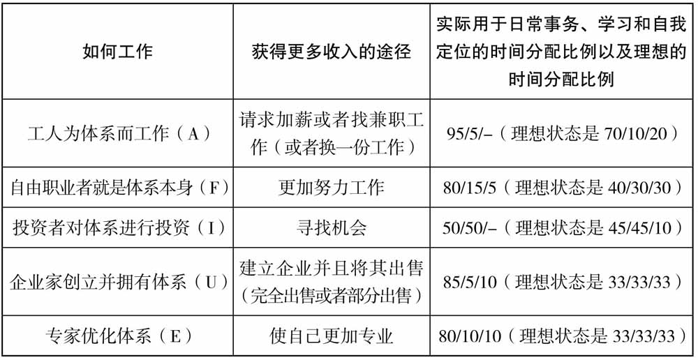

下面列出的“能量贴士”，就算不是最重要的，也是整本书中最重要的法则之一。没人喜欢做笔头练习，但是如果想让这本书对您发挥作用，无论如何您都要想清楚，在五角星图中的哪一领域对您来说是正确的领域。后面所有实用技巧都基于您在这里所做的决定。请您在花时间动笔思考这些问题之前不要继续读下去。

能量贴士

在我们的职业生涯中，找到属于我们自己的“位置”对于我们自己一生的幸福有着重要的意义。请您反思一下，自己是否处在一个对自己来说十分理想的领域。请向自己提出下面5个问题，并且将答案写在纸上（写在您的收入日志中）：

●我的生活目标是什么？我能否在五角星图中我目前所在的领域中实现它？

●我追求怎样的收入？在我的领域中可以实现吗？

●我的领域同我的天性相符吗？我可否在此充分享受自己？我感到幸福吗？为什么幸福，又为什么不幸福呢？

●我是怎么开始从事目前所在领域的工作的？还是出于当初的原因吗？

●充分考虑了我自身的个性偏好以及性格特点，我目前所在的领域对我来说有哪些优点和缺点？请您一定至少写下10
点。

●我们的目标一直在改变。请您确定一个时间点再重新回顾这些问题。

## 解决办法：开辟多种收入渠道

我的教练经常对职员说：“你们经常为了多赚钱而加班，却从来不再找一份工作做。”
其中的原因很简单：人们还是会选择五角星图右半部分的领域。

我的教练建议道：“请您学着去投资。开辟一种新的收入渠道，一种源源不竭的渠道。学着去出售。买一辆旧车，然后修理它——或者买一所老房子。建立一家小公司。在您在自由时间里拿计时工资工作之前，您应该学习怎样多渠道赚钱。”

请您不断学习新规则。用两条腿走路要好于单腿走路——请您寻找第二条支柱。请学习投资的法规。请将自己定位为专家。为此，您不必放弃您的工作。请您永远不要在五角星图右半部分的领域中找第二职业。
请您留心，在通过一份职业赚取额外收入的同时，从中能够学到什么。并且这份工作要适用于新的规则。

能量贴士

请您建立第二条支柱，开辟其他的收入渠道。如果您想建立一些其他的收入渠道，下面是一些最重要的建议：

●请您确定一份第二收入来源。如果您的兼职同主要收入来源相同，那么这就不算一份第二收入。

●找一份能够使您学到很多，得到发展，实现自我成长的职业。请您学习第七章中关于收入游戏的规则，这样实践经验就会得到发展。这样，在学习的同时得到实践方面的经验，还能额外赚到钱。

●请您学会销售：销售自己，销售一种服务，销售想法、产品、知识、信息……

●请您勇于冒险。不要惧怕犯错。如果兼职失败了，也不会对生存产生威胁。您还有主业在。把这些当成一个绝妙的机会，去锻炼自己可以面临更大的风险。

●不要白白浪费时间。保持对未来的探索，伺机寻找多样化
的赚钱机会。创造一些您可以进行出售的东西。

●请试着找一份给您带来乐趣并且与您的能力相符的职业。问一问自己：我怎样才能凭借自己的爱好赚钱呢？

●请您不断思考，如何才能将自己定位成专家。比如说我相信，许多人头脑中其实都有一本好书的素材。

●无论您做什么，都应该额外使自己成为投资家。让自己成为一台印钞机
。

您是否已经想清楚自己目前属于哪种思考方式？在本章后面的部分涉及以下问题：我们作为公民共分为三个阶层，而每一阶层中占主导地位的思维方式是怎样的呢？

如果您想弄清楚自己现在的位置以及想向哪里发展，那么下面的思考对您来说大有裨益。请您记住，我们外部的情况只是自己思想的影像而已。

## 三个阶层的思维方式

联邦政府在2001年贫困与富裕报道中证实，在德国存在三个阶层：贫困阶层、中产阶层以及富裕阶层。联邦政府的研究明确了人们在财产状况和收入状况方面存在的差异。

在我看来这是不够的，因此也不是完全正确的。因为人们可以暂时处于一种与其本质和思考方式不相符的财务状态。比如说一个企业家破产了，但是很快又重整旗鼓。或者一个中了彩票的人，他会在很短时间内就把收入花光。因此更重要的是，要根据思维方式的相似性来进行判断。

您一定会惊讶于处于同一阶层的人们在思考上和处理问题时有着怎样相似的某种习惯，以及处于三个不同阶层之间的人们有着怎样不同的思考方式和行事方式。

也许您一想到三个阶层，就会马上想到一些不同点。在有些人看来，这也许是陈词滥调，但是这确实是相当接近本质的。我从下面几个方面对一些重要的不同点进行了总结：

●金钱和收入，

●成绩和工作，

●对待新旧规则的不同方式，

●对于生活的期待，包括所有梦想和目标。

对我来说，在研讨课以及演讲之后同成百上千的人进行交谈是十分有帮助的。

我的教练的教导

事情还要从我的教练提醒我注意那些重要的区别开始说起。

他问道：“您在财务上的目标是什么？”我回答道：“一份好的收入。”他解释道：“贫困阶层期望短期拿到尽可能高的时薪；中产阶级希望得到一份好的收入；富人知道，更重要的是创造财富。您只有通过您现有的钱来创造财富。”

我问他：“中产阶层是怎样一个阶层呢？”他回答道：“如果没有工作过活，中产阶级就不算富裕。但是他们的收入足够定期进行储蓄。”拿保险举例：富人投资保险，穷人为自己保险，而中产阶级在这两种形式中都有所参与。

有一天，他对我说：“请您卖掉您的汽车。一辆车最多应该值两个月的收入。许多中产阶层的人几乎将一年的收入花在一辆车上。而且他们因为自己负担不起，就租车用。这样一来，汽车就变得更贵了。”

有一天，我的洗衣机坏掉了。我开车到市里想买一台新的。我一共对6家商店的价格进行了对比。5小时后我买了一个很棒的洗衣机，大约节省了35欧元。我的教练吃惊地说道：“只有穷人和中产阶层的人才把时间用在省钱上面。富裕的人都把钱用在节省时间上。
时间比金钱的价值要高得多。有5个小时您可以赚到比省掉的35欧元更多的钱。”

我的教练说道：“穷人为了赚钱而工作，中产阶层为了赚钱更加努力地工作，而富裕的人让金钱为他们而工作。”我思忖：“他说得真好。”他向我解释，我目前的想法为未来奠定了基础。他说道：“穷人常常不知道自己想要何物。因此常常一无所得。中产阶级说：这些我负担不起，因此大多数情况下也得不到什么。那些想在明天变得富裕的人常常在今天就发问：我怎样才能付得起？”

我问道：“在所有的领域中，真的存在这些不同的思考方式吗？”他说道：“在几乎所有领域都是存在的。比如如何对待风险。富裕的人经历风险，他们把握着可控的不确定性。贫穷的人把风险看成一种可能产生损失的危险，富裕的人则把风险看成一次盈利的机会，而中产阶层的人则把风险看成机遇和危险的并存。在他们看来，出现哪种情况是偶然事件。当整体的大环境好的时候，他们购买股票，而当环境不尽如人意的时候，他们就去买保险。‘贫穷’（Armut）这个词说到底来源于‘缺乏勇气’（arm
an Mut）。”

研究表格并不是每个人的专长。尽管如此，我还是想请您认真研究下面这个表格，这样您就会对三个阶层的区别有更加清晰的了解。请您反问自己：今天处于什么位置？我是怎样思考，怎样处理问题的？在符合自己实际情况的描述下做记录，应该是个不错的想法。这样做的重要性至少在于，您能够让自己清楚，想何去何从，以及自己应该接受哪些思维和行为方式。

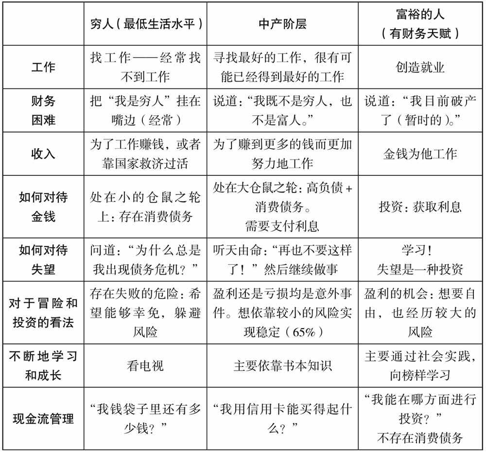

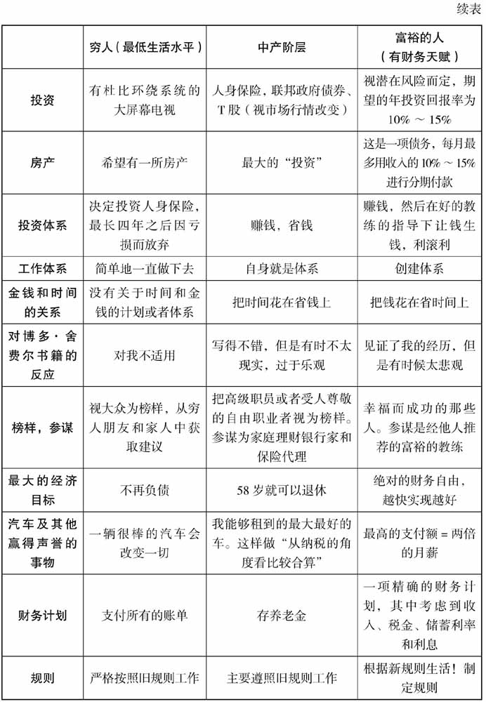

您有没有在表格中看到自己呢？在所描述的三个阶层中，您主要的行事和思维方式有没有符合其中的某一个呢？

我们的思考方式决定着我们如何做事情。我们怎样做决定则决定着我们养成怎样的习惯，而我们的这些习惯又对我们的命运有着决定性意义。

请记录下您从表格中或者整章书中得到的认识：

\_\_\_\_\_\_\_\_\_\_\_\_\_\_\_\_\_\_\_\_\_\_\_\_\_\_\_\_\_\_\_\_\_\_\_\_\_\_\_

\_\_\_\_\_\_\_\_\_\_\_\_\_\_\_\_\_\_\_\_\_\_\_\_\_\_\_\_\_\_\_\_\_\_\_\_\_\_\_

\_\_\_\_\_\_\_\_\_\_\_\_\_\_\_\_\_\_\_\_\_\_\_\_\_\_\_\_\_\_\_\_\_\_\_\_\_\_\_

\_\_\_\_\_\_\_\_\_\_\_\_\_\_\_\_\_\_\_\_\_\_\_\_\_\_\_\_\_\_\_\_\_\_\_\_\_\_\_

\_\_\_\_\_\_\_\_\_\_\_\_\_\_\_\_\_\_\_\_\_\_\_\_\_\_\_\_\_\_\_\_\_\_\_\_\_\_\_

\_\_\_\_\_\_\_\_\_\_\_\_\_\_\_\_\_\_\_\_\_\_\_\_\_\_\_\_\_\_\_\_\_\_\_\_\_\_\_

在本章中，您还缺少最后一块重要的基石：关于生活热情的问题。您怎样做才能经常处于一种“心平气顺”的状态呢？什么能使您有极大的快感呢？我们将在接下来的两章中解答这些问题。然后我们可以利用一些实用技巧来赚更多的钱。

然而，假如您的立足点是错误的，那么就算收入呈直线上涨也是没有任何意义的。那样的话您只会更快地冲向错误的目标。幸福感和满足就会停滞不前，也许会损害健康。最重要的是，您永远都不会得知，假如自己做了给自己带来快乐并和自己能力相符的事情，自己会有多么优秀。那么我们现在就来找到它……

第五章\
强烈的兴趣+天赋=心流 <a href="#text00038.html_en_1" id="text00038.html_et1"
class="calibre13">(1)</a>
===========================================================================

只要您寻觅的在这个世界上可以找到，\
您就必须先从自身发掘它。

我们75%清醒的时间都用来工作或者为工作做准备（穿衣，开车去上班，考虑工作，为了全身心地投入工作而休息……）。一大部分我们称之为业余时间的时间，我们同样在工作：打扫卫生、购物、整理花园、修理东西、洗洗涮涮、整理房间、熨烫衣服、处理私人信件材料……我觉得，在这一点上我们很容易达成一致：我们大部分生活是由工作构成的。

既然为工作付出了这么多，我们就不会只是为了赚钱。生命的确太珍贵了，我们不能碌碌无为虚度光阴，直到退休。我们可以提出更高的要求——甚至高得多的要求。
如果我们要工作，就应该乐在其中——这还不够，我们对工作应该有强烈的兴趣。而且我们还应该充分地发挥自己的天赋，因为只有这样才有可能保有强烈的兴趣。我们应该不断追求并且经历这种被研究人员称为“心流”的境界。

## 工作上真正的成功

工作上真正的成功是怎样的？成功意味着可以完全按照自己的计划去生活。
如果仅仅因为某项工作带来金钱收益而去努力工作，那么这是与成功背道而驰的。现如今，越来越多的人都感受到了这一点。

我们的收入远远不是衡量我们是否成功的唯一标准。收入应该使我们的生活有尊严并且充满意义。除了金钱，我们还需要各种各样情感上的满足，比如幸福、获得感以及和谐融洽等。而只有当我们的行为有更高层级的意义时，这些感觉才会产生。我们可以用多种方式来命名：生活的热情，忘我的境界，生活的意义，对任务的全身心投入，强烈的乐趣……这些都表达了一个相同的意义：为了叙述直观，我们就称之为流畅和意义。

哈里勒·纪伯伦（Khalil
Gibran）曾经说过：“工作是一种直观的爱。当您不能够带着爱，而只有反感去工作，那么你还不如放弃这份工作，坐在寺院的大门旁，去接受那些乐于工作的人对你的施舍。”

## 产生心流状态的七个原因

为什么人们要从事一项能够带来心理流畅体验而且有意义的工作？理由有很多。我想在这里简要介绍其中几个最重要的原因。

第一，是度过困难时期的动力。
如果我们遭受了命运的打击，保留勇气是很重要的。但是，当我们清楚知道从事一些事情的原因，我们就能更好地处理问题，然后才能获得克服这些麻烦的信心和力量。我们从事的事情越有意义，就有更强的动力去解决各个问题。

第二，那些不去解决生命中基本问题的人，只能过着受约束的生活。
对自己和自身价值了解得越少，我们就越不自由。如果我们清楚了解自己的目标、希望、感受以及天赋，并且将其同自己的经验相协调，这些阻隔就不复存在了。
当超越了这种阻隔，我们就会获得更全面的自我认识，就会得到内心深处的平和以及幸福。

我们能够并且应该理清所有的事情，我们享有追求幸福的价值和权利。

第三，通过一份给我们带来欢乐并且与我们能力相符的职业，我们可以得到最佳的发展。那些长久停留在同一层面的人，会感觉到无聊或者意志消沉。
进化论的中心原则就是：人应该比原来越来越强大。不断提升自己的目标是我们天生的需求，这并不是贪得无厌，这是同我们天性相符的。

第四，那些在工作中没有领略过流畅忘我的“心流”状态的人们，常常在电视中寻找这种状态——却常常错过自我经历这种状态的机会。
如果我们的工作不要求自己如此，我们就不再需要全神贯注。于是，就会出现思维上的混乱状况。

然而我们不能忍受这种状况。于是我们就转移注意力，通过每日的娱乐进行消遣，比如看电视（可能还有其他毫无意义的活动，甚至吸毒）。我们看到电视中的演员，他们表演得就像他们也这么生活一样。现实生活就这样被肆意地模仿了。当然了，空虚就以这样的方式暂时被填满。而电视的作用在于逃避那个明显不值得去面对的现实。

就这样，我们虚度了生命。一个人在电视前度过一小时，他亲身经历生活的时间就缩短了。电视机同其他替代品偷走了你的能量，却不能给予你能量。

第五，我们需要一幅宏观蓝图。
一只趴在电视机屏幕上的苍蝇能看到什么呢？许多个黑点，而毫无宏观框架可言。许多人有同样的感受：他们的日常生活由许多部分构成，这其中却没有明显的联系。与此相反，一个宏大的目标却是由生活的所有部分构建而成，这样，一切行为就会突然间有了意义。

第六，四个大写的“L”使我们的生活得到了满足。
这四个L分别是生活、爱、学习以及终生事业。
<a href="#text00038.html_fn_1" id="text00038.html_ft1">[1]</a>
也许不是所有人能够有所建树，但是每个人都可以用自己的爱或者激情去做一些小事。前三件事中，每件事都能给人带来幸福：好好生活、深深去爱、奋发学习。但是我们还有对第四个“L”的渴望，也就是开拓终生事业，名留青史。

迄今为止，我还从没有遇见过一个真正有追求的人不想在身后留下什么的：也许是一项基金、一本书、一家公司、孩子们、一座花园、一幅艺术作品……

第七，许多人都在寻找更深层次的意义。
我所遇到的最幸福的人都是那些在自己生活中找到更高层次意义的那些人。他们感觉自己所做的事情比自己本身还要重要。

什么是心流状态

我们能够在工作中达到的最美好、最平和的状态就是心流的状态。

米哈里·契克森米哈赖（Mihaly
Csikszentmihalyi）教授是“心流状态”最重要的研究者之一。他曾经向来自不同国家的100000人就“心流状态”的体验进行了访谈，并进行了如下整理：

●是内心和谐的最佳状态

●一种“我打造了自己的生活”的感觉

●是最深邃的沉思，是最高尚的义务

●感触最深的幸福和喜悦

●生活中最美的一瞥

●心醉神迷和自我满足：其他任何事都变得不重要了

登山者在爬山的时候感受到心流，音乐家在演奏乐曲时感受到心流；电脑专家也会突然感觉到“好像成了电脑的一部分”……对我来说，当我写作或者作报告的时候，会感觉到“心流状态”。

心流状态的条件

然而，心流状态并不随意识而发生，而是要满足一些条件才能发生。

1. 明确的目标：
我们需要的是一个方向、一个路标、一个原因或者一个动机。

2. 控制力：
我们感觉到自身有着强大的力量，并且发现自己能将美好的事物化为现实。

3. 发挥某种能力：
我们的能力必须适应挑战。我们认识到，为什么必须要学习。这就说到了重要的一点：您的能力发展得越强，就能够更多地体验到“心流状态”。

4. 精神的完全集中：
其他的顾虑和问题都消除了。无论成功还是失败——关于自我的担忧也不复存在。我们生活在当下。

5. 跨越自身的极限：
我们经历着，就好像自己是一个更强大的物体的一部分。登山者成为山崖的一部分，外科医生小组成为器官的一部分。从这个角度看，工作几乎成为一种神奇的心灵行为。

6. 反馈：
我们会马上感觉到自己是怎样地成功。我们会感觉到在正确的地方、正确的时机做正确的事情。

7. 改变了时间观念：
时间如白驹过隙，分分秒秒；以小时而记的时间压缩成了每一分钟。我们感受到惠特尼·休斯顿（Whitney
Houston）在歌中唱到的那种“一瞬间”的感觉：感觉到了永恒。时间改变了，溶解了。

8. 实现自我的体验（ Autotelisches
Erlebnis）：“Auto”是“自己”的意思，“telos”是目的的意思。我们经常做一些与此相反的事情，因为迫不得已，或者因为期待其中的利益。这些情况下，我们就没有生活在当下。

心流状态的好处

您是否有过浪费生命的这种感觉？总是徘徊在生活周围，却从未真正生活过。或者说，您是否有过这种体验，长时间以来想要达成的目标，突然间没有了足够的动力，不再有了努力的意义？

我坚定地相信，富裕和幸福是我们生来的权利。每个人都有这种权利。但是我们必须为了这种权利有所付出，这样才会在生命中体现出这种权利。这样一来，这种权利就和努力有了关系。如果首先对“心流状态”有了些许了解，之后我们就会沉溺于寻找它积极方面的意义。我们不想简单了事，得到不尽如人意的结果。我们总会愈加强烈地去要求我们生来的权利。

“心流状态”体验带来的可知好处

●我们脑部生理的改变。
我们在每次经历了“心流状态”体验之后都会有细微的变化。我们会更加清楚自己是谁。

●我们将有更大的学习和成长的动力。
我们会变得更加好奇，有更强烈的研究欲以及战胜挑战的愿望。

●头脑清晰。
那些不成体系，使人郁闷的事物会越来越少地出现在我们意识中。“心流状态”将挑战混乱，也就是头脑中的杂念。

●成绩的提高。
我们的创造力和生产力提高。由于我们不能够在同一个层面长时间体验到“心流状态”，如果还想有类似的体验，就必须有所提升。

●更强的自我认知。
每一次“心流状态”的体验都随着我们对自我的认知而增长。

●我们将明显变得更加健康。
我们将不再感觉到压力是一种负担。流畅体验有助于我们克服压力。

●平和。
我们与生活完全融为一体。心流状态使我们浑然忘我。那些追求成绩的人寻找的是一个结果；在心流状态中我们寻找的是一种体验。

综上所述，我们得出结论，心流体验对我们将来获取类似的经验会有所帮助，由一种心流状态又会产生新的心流状态。

尤其是那些充实的人能成功地将它们的一生变成一种单纯的心流状态。它们生命中各个部分紧紧连接到了一起，所有活动都有了意义。

## 有什么意义

实现财务自由的时候，我还十分年轻。我所有梦想的目标都实现了；但是不久我就惊奇地发现，我并不幸福。发生了什么？可能是因为我在一段已知的时间中一直在追求富裕，从而把自己生活中的空虚和无意义掩盖了。很快，我的旧目标就不再能够激励我了。我开始了追求更加深刻的意义。

如果清楚了解我们的任务，那么一切都有了意义。我们会感觉到自由。心理学家维克多·法兰克（Victor
Frankl）曾经说过：“一个人不晓得自己生存的原因，就没有能力承受每一种情况。”

如果有了世界上所有的金钱和时间，您会做什么？如果一遍又一遍地问自己这个问题，那么总有什么时候您会找到答案。那时您就会明确，您恰恰就拥有当时所需要的金钱和时间。迪帕克·乔普拉这样说过：“我们每个人都有别人不曾有的一些东西。总有一些除了您以外再没有其他人会完成的事情。如果从事的工作适合于您，那么您在工作中将立于不败之地。”

这些有没有过于美化

如果有读者在这里感到生气，我完全能够理解。假设一个人刚刚失了业，不知道怎样支付下个月的房租，或者有别的麻烦困扰着他。另一个人也许和上司有着很大的矛盾。还有一个人因负债累累喘不过气来。

然后这时候我来宣传一种有着“心流状态”的生活。这对那些正处于艰难时期的人来说无疑是一个嘲讽。

然而，我想从另外一个角度看待这些指责。我认为，每个
人或早或晚都会经历艰难的境况，没有人能够幸免。那些想着“我比大多数人都不幸”的人常常在自欺欺人。重要的是，我们不要把牵绊我们的困难当成自己的借口。成功人士并不是因为没有经历过困难就理所当然过着体面而有意义的生活，他们也曾经历过逆境，但是他们仍然过得十分幸福。

26岁的时候，我破产了，还得了两种慢性病。如果我们找不到理由相信一切会变好，病痛和破产会让人感觉十分糟糕。这两次，人们都弃我而去了。我知道，生命并不是一首由光明而美好的音符组成的交响曲。生命中还有黑暗，有时甚至是极其黑暗的一段时间。

每个人必须学习到，我们在各种境况下所作所为，以及从中学到的东西，都取决于我们自己。灾难包含着两方面的意思：旧事物的结束和新事物的诞生。
我们同样能够从灾难中寻找机遇。我们越早开始找寻它，就会越早找到它。这对失业者如此，对面对危机的人们亦然。

危机

人们很难逃过埋伏在生活中的所有危机，所以我们最好学着如何应对危机。

早在公元1300年前后，但丁就在他的《神曲》中探讨过精神危机的问题。在他人生之旅中期，他陷入了危机之中，走错了路，被困在森林中。有三只野兽不声不响地跟在他后面，使他感到非常害怕。有一头狮子、一只豹子和一匹母狼，分别象征着野心、淫欲和贪婪。

他想逃到山上去，似乎山上的孤寂是一种解脱。然而事实上，三只野兽却离他越来越近。这时候，他请求维吉尔
<a href="#text00038.html_fn_2" id="text00038.html_ft2">[2]</a>
给他一个建议。维吉尔说道，他有一个好消息和一个坏消息要告诉他。好消息是：森林中总有一条出路。坏消息是：那条路必须经过地狱。

尽管我对这首史诗十分着迷，我还是反对维吉尔给出的第二条消息。我并不认为我们的路一定要经过地狱。我相信每个人都可以较早地思考生命的意义这个问题，每个人也都会考虑，怎样能使那种浑然忘我的“心流”状态变成自己生活中的一个固有部分。但是遗憾的是，大多数人都是在万丈深渊面前才会这样做。

长者遇到年轻人

假设，您已经比现在年老25岁，这个长者遇到了您。您会赞同长者说的话吗？您会为他感到自豪吗？25年可是段很长的时间：他有没有把握机会呢？在别人看来他是否成功？他是否过着体面的、充满意义的生活呢？

从此时此刻的角度看，25年是很久的一段时间。可是回首往事，25年很快就流失了。您觉得，年长25岁的长者会对您说什么？他会给您怎样的建议？
什么才是本质上您注意力之所在呢？25年瞬息万变，从这个角度看，您会想要哪些改变——而且是赶快改变？

也许您已经知道了：这个年长25岁的长者就在我们自身中。
一直以来他都和我们在一起。他想同我们交谈；我们要学着倾听。他想给我们叙述的事情超越了日常生活中所遇到的问题，他给我们讲述生命的意义，讲述给予，讲述我们是整体的一部分，他也会给我们讲述死亡……死亡是生命的一部分。可惜的是，他并不出现在我们的社会当中——他应该以一种尽可能轻声、不引人注意的方式发生在医院的无菌死亡间里。

如果老人能够在临终前和家庭成员在一起，那就再好不过了。对老人、对我们自己都是这样的。我们会再次经历死亡——我们会放慢脚步，更多地思考人生的意义，思考那些真正使人幸福的东西。这样，当我们和25年后的自己相遇时，会感到轻松许多……

把握现在

在罗宾·威廉姆斯出演的那部感人至深的电影《死亡诗社》中提到了这一点。一位老师接管了一个新的班级。学生们都很好奇老师会最先和他们说什么。令他们吃惊的是，他对他们说，请他们起立，跟他走。他领着同学们从教室经过走廊，最后到了一块大黑板前面。在这块黑板上挂着一幅所有在这所小学上过学的班级同学照片。

因为所有的学生都穿着校服，在照片上看起来很相似。但是老师想向他们吐露一个秘密，那就是怎么才能发现自身的特别之处，也就是一些使自己独一无二的东西。

他说道：“照片上的学生想对你们说些什么。如果你们走近，就能听到他们在说话。”学生们靠近黑板，却什么都没有听到。老师让他们再靠近一些。

一切变得紧张起来。当学生们屏住呼吸，安静地感受黑板的声响时，老师用看起来像从照片中发出的声音轻声耳语道：“Carpe
diem（把握现在）。”

一个不变的真理是：今天这一天是一次机会，一次性的礼物。无论现在是阳光照耀还是雨水滴落，每天都包含着一个新开始的奇迹。您要怎样利用这一天，才能做一些有意义的、体面的事情从而享受“心流”体验呢？

我想向您提出一个具有决定性意义的问题：您在每天的工作中有没有机会做您最擅长的工作？

如果答案是肯定的，您每天的工作中有多少机会可以使您投入最好的天赋和能力？通常是，如果您做了太多与您的优势不相符的工作，就不会以最佳的方式利用那一天……

生命中真正的悲剧并不是每个个体不够强大，而是我们当中有许多人的优势没有发挥出来。

甜甜圈还是内核？

在美国有甜甜圈，是和柏林人
<a href="#text00038.html_fn_3" id="text00038.html_ft3">[3]</a>
很像的一种甜品，或者说柏林人是圆圈中间微高的甜甜圈。而在柏林人蘸着果酱的地方，在甜甜圈中只有空气。

很多人都遵循“甜甜圈法则”：他们建立一份事业而不建立内核，中间只有空气。这是没有支撑的事业，是没有意义的。在拥有了第一步之前，是不能迈出第二步的。请您用些时间思考一下下一章的问题。请您找到答案，并研究一下您的内核何在。请您以这个内核为基础建立一份事业。请您老老实实做自己，找出您真正热爱的事物，而不是因为您认为好就特别想成为那样。

为此，我们开始了本书的实践部分的主题：如何找到“心流”状态以及意义？请您不要惊异于为何在下一章中大篇幅讲述关于“失业者和非失业者是这样找到与自己相适合的工作”。这一章并不仅仅针对失业者。

我从许多失业了的人那里了解到，失去一份工作有着两种意义：一场可怕的灾难，或者一次机会，一次找到更加有意义、更加让人满意的工作的机会。

我建议，把失业看成一次机会。看成一次对自己提出重要问题的机会，一次认识自己的机会，一次弄清楚我们生活中热情何在的机会，以及我们如何能够达到“心流”状态的机会。

为了显得更长一些就去缩短折尺，是毫无意义的。如果我们需要寻找满足感，就不能忽视某些中心问题；而如果我们想在生活中取得真正的成功，也就不能回避那些重要的问题。这些问题给我们指出通向幸福和满足的道路，同时，这条路也通往我们那份梦寐以求的收入。

现在，让我们开始实践部分……

------------------------------------------------------------------------

<a href="#text00038.html_et1" id="text00038.html_en_1">(1)</a>
在心理学中，Flow（心流）描述了一种人们在专注进行某行为时所表现的忘我的心理状态。（译者注）

<a href="#text00038.html_ft1" id="text00038.html_fn_1">[1]</a>
德语原文为Leben（生活），Lieben（爱），Lernen（学习），Lebenswerk（终生事业）。

<a href="#text00038.html_ft2" id="text00038.html_fn_2">[2]</a>
维吉尔：古罗马时代伟大的诗人。在《神曲》中，但丁称其为“老师”，虚构他解救了自己。（译者注）

<a href="#text00038.html_ft3" id="text00038.html_fn_3">[3]</a>
柏林人甜点（Berliner），18世纪由腓特烈二世军队的一位糕点师发明。这种甜点是类似甜甜圈的油炸面包，内填果酱，上半部分撒着细雪般的白色糖粉。（译者注）

# 第二部分　实践篇

第六章\
如何找到适合自己的工作
===========================================

不知道自己从哪里来，就不知道自己要去向何方。\
——中国谚语

在其他人身上适用的道理同样也适用于失业者：我们绝不应该仅仅出于对金钱的考虑而工作。您也不应该为了再赚钱而去找工作，如果那样，您会遭遇本章即将描述到的最糟糕的情况，同时也会过得不体面。

在理想的情况下，我们应该从事一种有意义并且能够给我们带来流畅忘我的“心流体验”的工作。然而只要我们在工作，我们就会被日常生活牵制，没有时间去考虑生活中那些重要的问题，也常常缺乏勇气去探索。

我想鼓励您的是，无论如何您都要彻底地研究一下这一章——无论您目前有没有工作。

## 您想要什么样的工作

根据调查显示，只有28%的人在自己的工作中能找到乐趣。对于大多
数人来说，薪水其实是给自己的赔偿费。
<a href="#text00040.html_fn_1" id="text00040.html_ft1">[1]</a>
太多人将注意力放在劳务市场上。他们关注着哪些职位可做。最终结果就是，自身的能力和兴趣被忽略了。就这样，劳务市场凭借职位供应的手段决定了许多人的命运。我问您：谁才是决定我们应该从事什么工作的“劳务市场”？难道不是我们的内心吗？
我的建议是：忽略经济形势吧，找一份您真正想从事的工作。
太多的人不清楚自己想要什么，却因得不到它而感到生气。

本章将指导您找到使您满意的工作。遵循这样的建议是不负责任的体现吗？我相信，没有人能比一个发现自己生命意义，并且追随内心的人表现出更多的责任感。
对待生命负责意味着发现和利用自身潜力。我们有责任找到一份有价值、有意义的工作。只有那样我们才会真的幸福，只有那样，我们才能真的帮助别人。

在接下来的几页中有许多需要时间的实践练习。我的建议是，请您回答那些此时此刻与您最相关的问题。请设置一个时间点，在那个时候你想花更多的时间专注于对你重要的事情。

可能存在的异议

我知道针对我上面提出的论断，可能会有三种异议。“如果所有人都这样做，会怎样呢？”
我的回答是：很可惜，从来都不会每个人都这样做。事情就是这样。因为不会所有人都这样做，您就有了一个非常大的机会。

第二种异议是：“怎样的政治环境才能使这一切发生呢？”
答案就是：我并不是政治家，因此对政治环境没有责任。政治家的任务在于，为健康的经济和稳定的市场创造前提。我的任务是，在现有的条件下，为每一个
个体，也就是您，找到自身职业发展之路，而这番事业会为您带来许多金钱收益
。

最后，第三种异议是：“并不是所有人都会把您的建议当成一回事。”我的回答是：没错。如果是这样的话，情况也很糟糕。我们每个人都有权利去做那些自己认为是正确的事，我们有幸享受着这种莫大的自由。而有些人根本不想取得成功，或者获得高收入。对于他们来说，我的书并不起什么作用。（之所以这样，是因为他们根本不读这本书……）但是对于那些愿意花钱买书的人来讲，这本书会起作用的。
这是我在上千名研讨班学员身上深深体会到的。

有些人过得不错，而且从自身的情况出发说道：“想在工作中找到乐趣是不可能的。”我对这样的人充满怀疑。那些自以为是地去评判别人生活不够充实的人是怎样的人呢？要知道，工作本身远远比养家糊口复杂得多。

我们的看法决定了一切

并不是事情本身有所区别，而是我们对于事情的诠释不同。禅宗中有一句话这样讲：一位漂亮的女子对于求爱者来说是一种快乐，对于苦行僧来说是一种打扰，会使他分心，而对于一匹饿狼来说则是一顿美餐。

对于我们的工作同样如此，我们的命运并不是由我们所经历的事情构成，而是由我们如何感知自己所经历的事情而构成。

我认识一些人，他们丢了工作，说道：“要是我没有失去原先的工作，还像以前那样继续的话，那才是更糟糕的灾难。发生在我身上最好的事情莫过于被解雇了。”

当然了，这样的反应只符合极少数人的真实情况。大部分人会感觉自己好像掉进了一个巨大的黑洞中。这样也不算糟糕，但是请您尝试不要在这个黑洞中停留过久。尤其请您不要寻求他人的怜悯，也不要自怨自艾。

我被“解雇”了

我很清楚，假如您刚刚被解雇，想要让您有如此积极的态度是很难的。我自己从来没有经历过传统意义上的失业，但是我有着与此类似的经历。

当我同我的第二个教练共同成立一家公司时，我热情十足。在此之前我跟他学过一段时间，而现在我可以将知识运用到实践中了。这可能是一番大事业，因此我全力以赴。我日夜地工作着，取得了一些成功。公司成立了7个月时，资金链转入正轨，他却突然把我解雇了——没有预先通知，也没有合理的理由。

因为我是生意上的合伙人，所以他根本没有权利“解雇”我。如果起诉，我也是胜券在握。但是我不想这样，因为我曾向他学了许多东西，真的很多。我不想将自己生活中最深受启发的这段时间被讨厌的官司覆盖。

但是请您相信我，我知道黑洞是怎样的感受。在被解雇前不久，我曾在他寓所度过了很长的时间，我们促膝长谈，他还向其他合伙人深深地表扬了我。三天之后，我通过传真收到了解雇通知。之后，他连续几周拒绝和我交谈。我必须警惕着不陷入公平陷阱之中。（这听起来很不“公平”，但是我有什么办法呢？）更糟糕的是，我同教练曾经亲密如父子（遗憾的是我13岁时，我亲生父亲就去世了），所以我伤得很深。

除此之外，由于我如此全身心地投入那个项目之中，以至于现在对任何“新事物”都不感兴趣。我像瘫痪了一样坐了几天，闷闷不乐、自怨自艾。我差不多有3个月的时间几乎什么都没做。

然后我开始写书，我要从这次经历中吸取教训。

顺便提一下，大概在我被解雇6个星期之后，我的教练还是给我打了通电话，简短地说：“你不再需要我了。去做你自己的事情吧。”

那之后我真的就做了一些事情。我写了一本书——《财务自由之路》。现在这本书销量已经超过250万册，并且居畅销书榜长达110个星期之久。要不是被解雇，谁知道我什么时候会去写这本书呢？也许这本书根本不会存在。这本书的成功使我备受鼓舞，我又继续撰写了一些书，这些书都成了畅销书。我获得了前所未有的满足。我开设了研讨班，以便给更多的人提供帮助——自己也有不菲的收入。但是这一切都是从那次解雇开始的。

这一切使我认识到，我们对同一件事情的看法和评价会有多大的不同。子夜同时也是白天的开始。

时间机器也许会有帮助

如果我们可以利用时间机器到未来旅行几年，那么一切将变得容易许多。我们就能够确信我们所做决定的结果，确定结局圆满了。

我有个好消息要告诉您：时间机器确实存在，
它就是我们的想象力。当我们倾听内心声音的时候，我们就看到了未来。未来已经在我们内心之中。如果我们仔细地看，就会发觉，在我们内心深埋着能绽放出巨大花果的种子；我们就会看到，将来自己会变得怎样。爱因斯坦曾经说过：“想象力概括着世界上的一切，是对生活中即将发生的事情的预知。”如果我们没有想象力，那么就没有了努力进步的动力。

除此之外，我们应该使周围的人相信我们，相信我们的未来。因为我们一直拥有去设计自己未来的期待，我们就可能会突然间认识到新的路途和机遇。这个自我实现的预言就将变成现实。

## 失业者择业四部曲

如果失业了，您应该按照下面四个步骤向前走——而第二步至第四步适用于所有人。

第一步：请您选择一个有帮助意义的态度。
刚刚得知自己被解雇的人一开始一定十分震惊。但是过一会儿，您应该对自己说：“回头看看，这次解雇到底是一次灾难，还是一次新机会的开始，是完全取决于我自己的。”所以，第一步是要对于失业抱有积极有益的态度。但是要小心：充满信心是很难的，而保持悲观是很容易的。

您要避开公平的陷阱。不要寻求怜悯，也不要同情自己。请您为自己感到自豪：有谁失去一份工作会像我这样乐观呢？！

第二步也许会使您震惊：请您不要马上找新的工作。
请您拿出1～3周时间回答一些基本问题。您要明确，什么才是一份有意义的工作，什么才有可能带给您流畅忘我的“心流体验”。在本章中您将得到一份详尽的指导。

请您在一开始的20天中无论如何都不要找一份简单的工作，一份仅仅为了赚钱的工作。

请您弄清楚，什么能给您带来极大的欢乐。但是这不应该被误解成为满足懒惰的要求。而如果您在20天之内没有想到令人满意的答案，当然还是应该去找份工作的。
生存有了问题，就不能找到深刻的好答案。但是，即使有了一份新工作，也请您不要停止去寻找答案。

第三步也许同样会使您震惊：请您像本来就没有失业一样去做事情。请您早晨8:30开始工作直到晚上6:00。
对于有些人来说，也许还会比原来工作更久一些。请您早晨起来穿衣，就像要去上班一样。理想的情况是，请您离开住所，找一个可以不受打扰、安静工作的地方。

也许您可以在朋友去公司上班的时候使用他的公寓。

展现出您的纪律性。您目前可能需要警惕的最糟糕的敌人就是：任凭自己意志消沉下去。自觉将使您在这个敌人面前免遭损失。但您还是要表现出：没有人会阻止您去工作。您也许只是失去了一份工作，但是从来都不是没有事情做。只有您自己决定，您要什么时候工作，工作多长时间。任何人都不
会从您手中夺走这些 。

您知道失业者平均每周花多少个小时去找一份新工作吗？让人觉得好笑的是，仅仅只有5个小时。这些人不仅没有找到工作，也没有任何事情去做。

在本章，我要告诉您在这段时间应该做些什么。您会看到，我是经过深思熟虑才选择“工作”这一概念的。

第四步：为下一个100天制订一个计划。
您要花10～20天时间考虑这个问题：什么事情能够真正给您带来欢乐（意义，以及流畅忘我的“心流体验”）；接下来的80～90天当中，请您遵照本章第二部分针对“您怎样找份工作”而提出的建议行事。

我向您保证：
如果您像下面描述的样子行事，那么在接下来的100天中，您找到的不仅仅是一份随便的工作，而是一份给您带来快乐的工作！

由此，我们了解一下本章其余部分的主要内容，您将获知：

1\. 如何确定，什么才是对您有意义并且使您流畅忘我的“心流体验”；

2\.
如何去分辨一份合适的工作，这份工作既可以让您发挥自己的才能，又能给您带来欢乐，还能够给您带来流畅的体验；

3\. 如何得到这份合适的工作：行动方式以及面试谈话。

能量贴士

请您编制一份认知日志并且回答下面所有的问题，进行所有的练习——而且必须要写下来。

●请您拿出10～20天时间。如果目前没有时间，那么请您立刻
确定下来什么时候可以定下时间。

●找到一个不受打扰的环境。您需要安静和灵感。如果您有积蓄，您可以去山里，或者去海边（您失业了，还开车去“度假”，想想就蛮有趣的）。但是无论如何请您保证既定的工作时间。

●您通过记录下自己的想法而得到了一个整体框架。我的认知日志就是一本使我受教颇多的书。

●写下自己的认知，由此您的真实意义通过文字得到了延伸。否则，我们常常无可挽回地忘记自己最好的认知。

●当失去勇气的时候，请您翻阅这本日志。您将惊喜地发现：“我曾经有这样的感觉——也许是更糟糕的感觉——然而一切都有所好转。”

●我们可以犯错误——但是不要重复犯已经发生的错误。如果我们不把错误和教训记录下来，那么再次发生的可能性十分大。

●如果我们仔细回顾过去，那么从某一点开始，您脑中的所有事情会慢慢模糊，这时候出现了一种思维中断。这是一个点，在这里大多数思维往往都不能进行下去。实际上，达到这种状态意味着距离开创性认识已经不远了。然而，只有当您不使自己的思维过程重新再来一遍，而是借助您的记录使它从中断的地方继续进行下去时，您才会获得认识上的突破。

## 第一步：您想要做什么

请您从第一点开始。我想给您指几条路，这样您可以发现，什么事情会给您带来真正的欢乐，并且与您的才能相符。

接下来您将看到一系列问题，如果您把答案写在自己的认知备忘录中，这些问题可能会对您有所帮助。当然，您不必回答所有的问题。请您找那些看起来感兴趣并且能够使您更清楚自己内心想法的问题来回答。

1\. 如果没有失败，您会做什么呢？（假设您可以做任何您真正想做的事情）

2\.
想想世界上的所有人，哪份工作是您最热爱的呢？这些人做了什么？他们哪里特别吸引您？

3\.
什么能给您带来乐趣？（您喜欢怎样的场合？您喜欢做什么？喜欢读什么？您喜欢谈论哪方面的事情？如果您要写一本书，那么会是关于哪方面的呢？）请您至少记录下50件给您带来乐趣的事情。写这些的时候，请不要去想这些和工作有什么关系，否则您的思路会受到局限。

4\.
您擅长什么事情？您有哪些天赋（与生俱来的），有哪些能力（随着生活锻炼出来的）。请您最好记录下50～100件。（在我们的网站上您可以找到一个关于您可能存在的天赋和强项的辅助清单。请您浏览网页www.wahrerwohlstand7.de，点击“Mut
zum Glucklichsein”-“Talent”
<a href="#text00040.html_fn_2" id="text00040.html_ft2">[2]</a> ）

5\.
您有哪些聪明才智？（其实，确定学生的才能类型并进行开发，这本来应该是学校的首要任务）至少有11种不同类型：

（1）音乐才能

（2）语言才能

（3）掌握实际知识的才能（灵活的百科全书）

（4）分析才能

（5）空间才能

（6）实践才能

（7）体育才能

（8）社会才能

（9）感知才能

（10）管理才能

（11）表演才能

6\.
请您详细记录下自己10次最重要的成功。然后问自己，为了取得成功，自己用到了哪些天赋和才能。有没有哪些能力是自己在多次成功中都用到的呢？

7\. 假设还有6个月时间活着，那么从今天起，您想做什么？

8\.
您什么时候激发自己的超长能力？在什么样的场合、何种条件下您会变得特别积极？您可以计划出那样的场合吗？是否有这样一份工作可以使您经常处于那样的场合？

9\.
您已经弄清楚自己的乐趣何在，能力何在。请您现在把两个列表并排放置，写下两边列表都有的东西。这个新的列表十分重要，它是您的黄金清单。

10\. 拿着您的黄金清单思考一下，怎样才能把这些单一要素结合起来。

11\.
请您在一个圆圈的周围按照时间顺序把您生活中所有有意义的事件记录下来，请您从出生之后最重要的事情开始。请您问问自己：我在做这些决定的时候是受他人左右（外部决定）还是自己决定的（自我决定）呢？在哪种情况下我会更成功一些？

12\.
当您把生活中所有的事件记录下来以后，请您将这些事件缩减至5至10条最重要的里程碑。请您记录下生活中所有最重要的事件，问自己，您的生活在各个阶段经历了怎样的发展过程。请您尝试去领会，一个里程碑是怎样向下一个里程碑过渡的。（当我16岁那年“移居”美国时，我想拥有自由并且体验冒险。在以后经历的变化中，这两个需求都起着决定性作用）

13\.
当回顾这些里程碑的时候，您是否看到贯穿生活的一条线索？如果主题有所改变，已知的需求是否一直跟着改变？

14\.
请您想想一切遇到的糟糕的事情：什么有可能是有利的一面？有哪些您已经经历的，在今天会对别人有所帮助？（因为26岁的时候破产了，我找了一位教练。要不是当时状况窘迫，我可能根本不会这么做。而今天的我能够谈论金钱并且撰写关于金钱的书——比如这本书——是因为这两方面我都经历过）

15\.
请您考虑一下，在将来的生活中，您想摒弃哪些价值观，或者您想获得哪些价值观。这样做的前提是，您把价值看成信条，并且明白自己可以随时改变某个信条。（请参见《财务自由之路》第五章）

如果您想深入了解这个话题，下面四点会帮到您

本书附录中，您可以找到更多相关深入的问题。

为此，我制作了一个CD-程序，“驾驭时间的艺术”，它可能会对您有所帮助。这是帮助您把认识实实在在融入日常生活的一种辅助。

有些人还喜欢研讨班的氛围。在这里我向您推荐研讨班课程“走向幸福的勇气”。

## 第二步：确定一份合适的工作

也许刚刚看到标题，有些人就会心生怀疑。让他们生疑的是“合适”这个词。因为他们的信条是，能找到一份工作已经实属不易，想找到一份合适的工作更是难上加难。

正是这样错误的想法！事实上是这样的：您愈加详细地了解您的需求，就会愈加轻松而迅速地找到一份工作。

没有人愿意和不知道自己需求的人打交道。而且人们也不愿意帮助这样的人，因为大家不知道如何帮助他。如果要别人来考虑我们可能会做什么，那么这个要求就太过分了。

但是，如果我们清楚地知道自己真正想要的是什么，别人也能够更容易地去衡量我们的需要与他们所能提供的帮助有多大可能。一条基本的原则是：帮助那些想帮助你的人。
请您尽量为那些想帮助你的人提供方便。

交集

假如您已经完成了以上练习，也为此付出了足够的时间，那么您现在就知道了什么会给您带来乐趣，什么与您的能力相符并且能够给您带来流畅忘我的“心流体验”。现在我们思考一下，怎样以此赚钱，也就是说，什么样的工作适合您。

现在，请您首先想出三件最能给您带来乐趣的事情，然后将其写在下面的圆圈中：

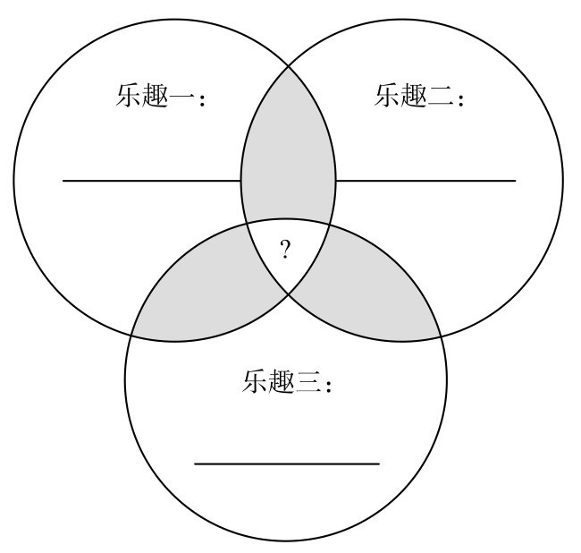

现在请您思考一下，这三个圆圈是否有一个共同的交集，也就是在三个圆圈中都存在的东西。

在下一幅插图中您将会看到给我带来最大乐趣的三件事是如何相互融合在一起的。

1\. 我喜欢旅行。

2\. 我喜欢富有创造力的工作并且热爱写作。

3\. 我喜欢授课。

答案（交集）也就是，当我进行演讲的时候，我需要旅行，需要授课，并且从事富有创造性的工作（起草我的报告）。作为一名作者，我也经常去旅行（为了进行书籍作品宣传，我甚至要去新加坡和澳大利亚），在写书的同时，我教课的欲望也得到了满足。

图示如下：

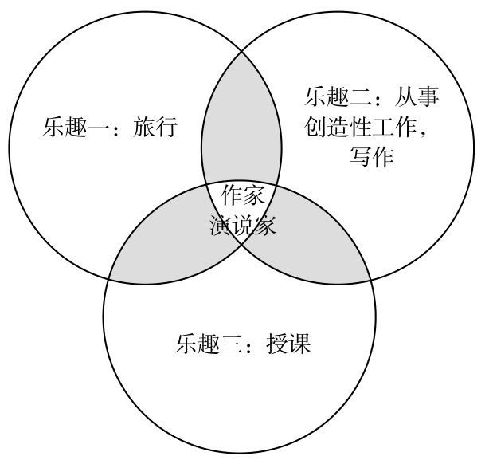

您的天赋和才能

天赋是与生俱来的，而能力是后天开发的。请您不要错误地将天赋和天才混淆。我经常听到人们说：“我没有什么天赋。”

这是错误的。我们每个人都有天赋。我建议对天赋进行如下定义：天赋是一再体现您思维方式、行为方式和情感模式的自然方式。您的自发反应清楚地展现了您天赋的蛛丝马迹。

人们为什么没有发现自身的天赋，这其中有两个原因。首先，您错误地将天赋定义为惊人的、巧妙的天资。这不仅仅是错误的，还带走了每一次的动力。即便您不能像莫扎特一样擅长作曲，或者像贝克汉姆一样善于踢足球，也请您不要沮丧。这些是极少数的特例现象。许多有着“平常”天赋的人也成就了许多杰出的事情。

现在，请找出您三项突出天赋或者能力的交集。有哪些工作可以将您的能力或者天赋结合起来，相互间形成完美的补充？

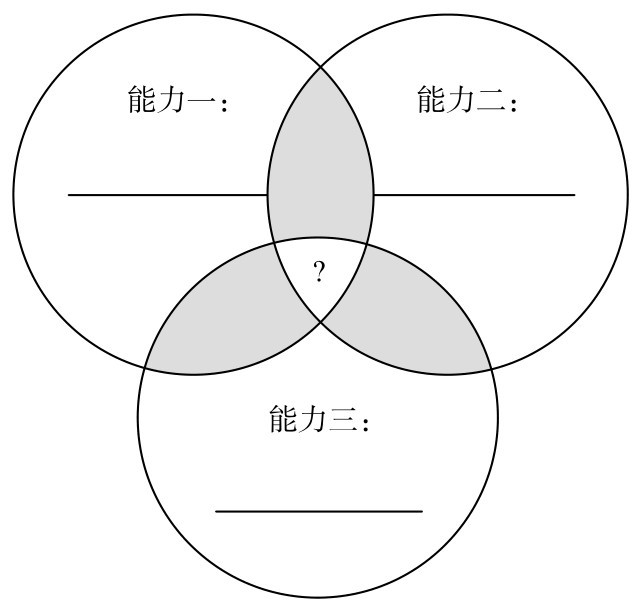

很长时间以来，我认为自己没有任何特别的天赋。

几年之后，我认识到自己的一些能力：

1\. 我有很好的表达能力，能够激励人们。

2\. 我能够把难以理解的事情理出结构，使事情清晰易懂。

3\. 我有很好的忍耐力，能够把愿景变成现实。

如此一来，一种可能的交集出现在：作家和演说家。

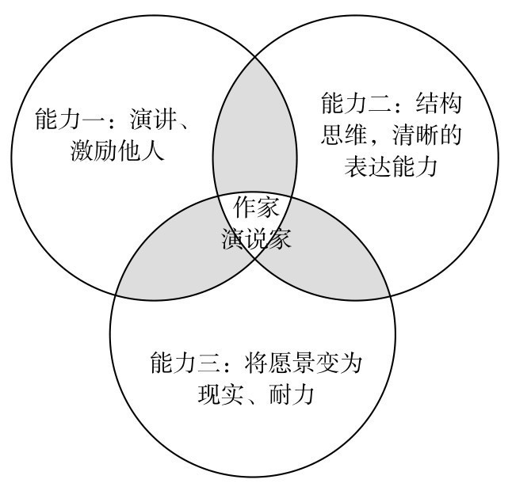

那么问题来了：您是否已经找到了两个交集的重叠项？是否有一种职业既可以给您带来乐趣，又能够使您同时利用到三种最佳能力？

乐趣方面，我的重叠项是：

\_\_\_\_\_\_\_\_\_\_\_\_\_\_\_\_\_\_\_\_\_\_\_\_\_\_\_\_\_\_\_\_\_\_\_\_\_

能力方面，我的重叠项是：

\_\_\_\_\_\_\_\_\_\_\_\_\_\_\_\_\_\_\_\_\_\_\_\_\_\_\_\_\_\_\_\_\_\_\_\_\_

当然了，如果三项都能够融合在一起，乐趣和能力能够达到统一，就再理想不过了。拿我自己举例，看起来就是这个样子的：

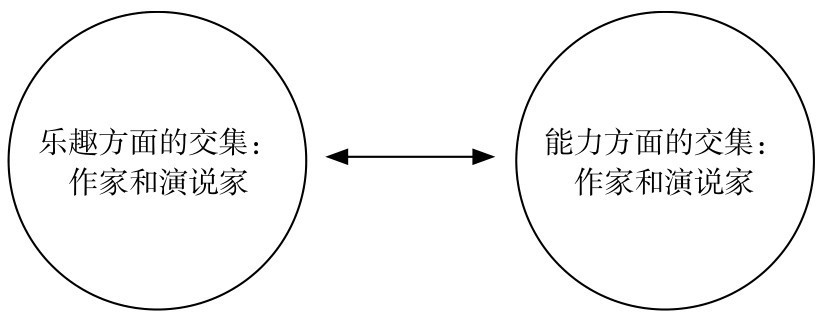

小小的交集，足矣

如果没有马上得到一个理想的组合，请您也不要失望。您也没有必要必须把自己的乐趣和能力相结合。通常情况下，如果三个乐趣圆圈中的一个圆圈同能力圆圈的交集相配，那么对于一个充实的生活来说已经是足够好了。

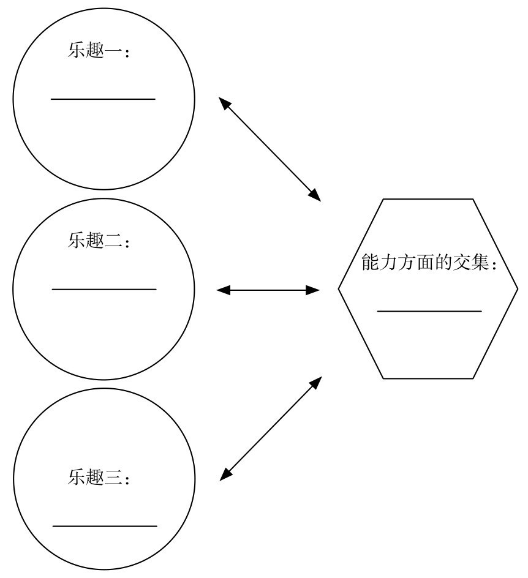

甚至，只有一个乐趣方面的圆圈与一个能力方面的圆圈相匹配，也就足够了。

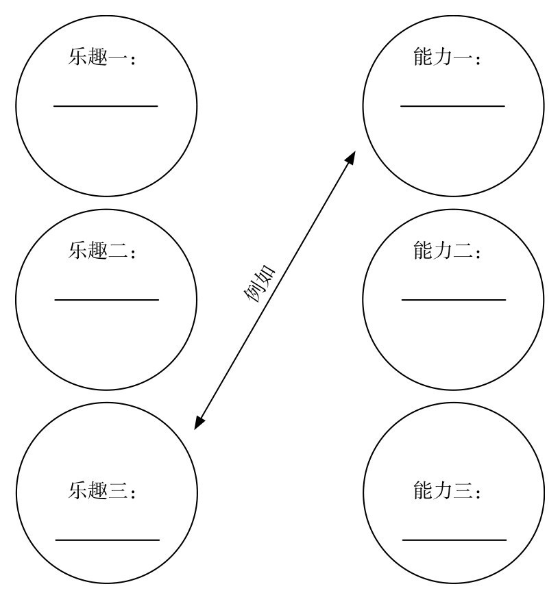

请注意：您应该下意识地将自己的乐趣和某一项能力搭配起来。首先，
您要具有这项能力。只是喜欢做某件事是不够的。爱因斯坦也曾热爱音乐，第二热爱的才是物理。他演奏小提琴时充满热情，然而琴艺只是中间水平。请您想象一下，如果他首先考虑的是演奏小提琴时的乐趣，那么……

因此，请首先考虑您的能力所在，然后再寻找能够给您带来乐趣的事情。

向他人求助

在我们的研讨班上，我一再有过这样的经历：有一些人能马上找到答案，而其他人则坐在那里苦思冥想。于是我要求后者在中间休息时和其他人聊一聊。同时，这也是我想给您的建议：请您向尽可能多的人展示您的6个圆圈，并向其询问，哪个工作可以包含这些圈中的某几条。

请您也不要害怕去面对那些拥有一份您“梦寐以求”的工作的专家。请您问问他：“我想用11分钟时间了解一下您的工作，请问该付您多少费用呢？”您还可以说，您想在从事一份工作前就能确定，以后这份工作是否会和自己最初的想象完全不同。而大多数人只有拥有了一份工作时，才会真正地认识这份工作。

## 第三步：这样为自己找一份合适的工作

现在，您已经了解到您想从事的工作的大致情况。现在还需要一份适合您的工作。失业者一般情况下有4种方法找工作：

1\. 他们通过网络求职。

2\. 他们盲目地发求职信。

3\. 他们回复收到的招聘广告。

4\. 他们向劳动局（或者其他职业中介机构）寻求帮助。

这其中的坏消息就是：这些都是他们能选择的最不靠谱的方法，没有比这些更能使人失败的了！
请您还是不要这么做为好。

许多失业者也都知道，上述办法并不能带来成功——最迟当他们花了几个月时间投寄求职信仍然一无所获时，他们也会知道。那么，他们为什么不尝试其他办法呢？也许是因为他们并不知道其他的办法，但更有可能是他们不去利用其他可能的机会，仅仅因为害怕得到直截了当的拒绝。

为了不听到一句口头上直接的拒绝，很难想象人们会做什么，或者放弃了什么。

工作机会是足够的

首先重要的一点是：工作机会总是足够多的。总是有适合您的工作——100天之内，它就会属于您。请您看看这些数字：在德国，每年有超过400万个新职位
<a href="#text00040.html_fn_3" id="text00040.html_ft3">[3]</a>
。一些新的职位产生了，有些人晋升了，有些人退休了，另外一些人出于搬家等原因离职，还有些空闲的职位因为人们患病或者死亡而产生。

这其中最好的职位永远不会出现在任何一则招聘广告中，或者劳动局那里！您是否有所耳闻呢？大多数情况下，那些最好的工作是不会拿来招聘的。总体看来，仅仅有1%～2%的工作职位是通过招聘广告得来的！
100个里面也只有一个或者两个。因此，在这种情况下，通过写求职信是无法保证您得到职位的。

我现在要向您展示在100天之内找到工作的途径。更确切地说，是找到一份给您带来乐趣的工作。但是对此我必须向您保证，一定要克服害怕遭到拒绝的那种与生俱来的恐惧感。这条途径通常情况下充满了恐惧，而在找工作过程中也同样如此。

雇主的视角

您认为，雇主希望得到什么呢？一份漂亮的、富有新意、毫无错误的求职信吗？大错特错！如果我面前摆着60封求职信，那么我首先想要的就是：尽可能快地从中找出3～4封，再进行下一步挑选。而直到那时，我将至少花掉1～2个小时（或者委托我的助理做）。

但是无论如何我都不想盲目行事。我想在签订合同之前了解那位员工。我想确认他的能力。那么什么能够帮助我呢？华丽的辞藻？当然不是。行动最有说服力。如果雇主能够在求职者应聘过程中看到求职者的事业心、他坚定的目标，以及创新能力，那么这对于雇主来说是莫大的帮助。

雇主喜欢的是下面这则美国故事中的主人公那样的人。一个男子到一家餐馆求职。尽管他已经预约了时间，但是要等到老板抽出空来还要两个小时。他就充分利用了这两个小时：他发现，客人使用的厕所很脏，于是他开始打扫厕所。他找到了一把小刷子，连缝隙都清理得干干净净。厕所看起来明亮如新，就好像多年来未曾被使用过一样。

当老板最终出现时，求职者先向他展示了厕所。行动胜于雄辩。这位年轻人展示出，他并不为某些工作而感觉羞耻。他利用了自己的时间。他是真的希望得到那份工作。他清楚这条自然法则：只有付出，才有回报。当然，他得到了那份工作。

您要让自己引人注目。您要证明自己与那些适合做这件事的其他人不一样。您真的还认为，找到工作最好的途径是用一个特别漂亮的文件夹装着申请材料吗？或许还用彩色回形针做点缀，以表现出自己无与伦比的创造力？

雇主真正感兴趣的一些重要问题在求职信中是找不到答案的。他想知道的是：

1\. 为什么这个人想在这里工作而不是其他地方？

2\. 他是什么类型的人，他能做什么？他和其他候选人区别在哪里？

3\. 我能否雇得起他——他想要多少钱？

如果你选择了一个途径，使雇主能够得到这三个问题的答案从而使他感到满意，那么会怎样？这样的途径是有的，还节省时间。但是因为您害怕被拒绝，所以您必须战胜自己。战胜自己吧，这是值得的！

找到工作的最佳办法

首先，问问您的朋友和熟人。
如果让所有认识的人都知道您在找工作，那么您就有很好的机会了。而且您把自己希望从事的工作领域描述得越详细，他们帮助您就越容易，也越有成效。

请您和熟人达成一致，在找工作期间定期和他们通电话，以便随时向他们报告情况。您可以问道：“你认不认识什么人有职位空缺？”这个方法会使您在100天内找到工作的概率至少达到40%。

其次，请给您感兴趣的公司打电话。
这里我们就说到了找工作时最重要的一条规律：相比于一家发布广告招工的企业相比，在一个没有发布招聘启事的公司里，你找到工作的概率更大。

向朋友们打听可能对您的条件感兴趣的公司。您可以在谷歌上搜索与您想象相符合的行业和公司。

然后您就直接给他们打电话，和他们人事部门的领导取得联系——如果是一家较小的公司，就和企业负责人取得联系。请您用简明的几句话说出您想做什么，以及您有能力做什么，并且告诉他，您觉得这些东西可能对他的公司极为有用。请他给您机会进行一次最长不超过4分钟的简短面试。

雇主很怕浪费其时间的人。因此请您保证，在四分钟之后抛出这个问题：“我是否现在应该走了？或者您有没有兴趣让我再待一会儿？”

当然，您要遵守自己的承诺。现在轮到雇主来决定他的时间。这样的做法会给很多人留下深刻的印象。

这样做会不会使您有所恐惧？我可是警告过您的：最好的途径都是和恐惧并存的。请您相信我，真正有困难的只有前面10通电话，之后就会相对容易了。当您已经给200家公司打过电话，那么您找到想要的工作的概率大概会有70%。

最后，请您直接到公司去。
请您列出可能合适您的公司名单，然后做一个计划。请您每天至少拜访4家公司，也就是每周20家。有一些您已经打过电话，约定了见面，其他的请您不必预约直接去拜访吧。这两种方法请您都尝试一下。

请您准备一个简短的4分钟的自我介绍，其中要包含下面几点：

“有两三样事是我十分擅长，并且能给我带来乐趣的。我相信，鉴于以下几个原因，我能对您的公司有用……现在到4分钟了，您认为有可能吗？您还想和我继续聊下去吗？”

如果您给别人留下了很好的印象，并且能为公司解决问题，而且金钱方面也没有异议，那么您就有很大的机会了。

如果这时公司没办法录用您，而谈话进行得很顺利，那么您可以问他，能不能给您推荐其他公司：“您是否知道哪家公司需要像我这样的人？您可以帮忙引荐一下吗？”
征求别人的推荐是您这100天里很重要的一部分。请您常常问自己：

“有谁认识那个我不认识的人或者公司？”

如果已经拜访了200家公司，那么您就有工作了。一定是这样的，我敢保证。但是请您注意，我说的不是23家或者47家，我说的是200家！

能量贴士

如果您在找工作，请不要按照通常的办法行事。做大家都做的事情，得到的也是大家都会得到的结果。对于找工作这件事，如果采用通常的方式，就等于常年失业。

●请您问问熟人和朋友：“是否认识什么人有职位空缺的？”或者：“是否认识什么人，而这个人……”

●直接给公司打电话。

●本人亲自去公司。

●向每家公司询问是否有推荐的机会。

●提议不收取报酬地在公司工作几天。

面试谈话中的自我介绍

如果4分钟过去了，老板还想继续和您谈下去（或者另约了时间见面），那么您的好机会就要来了。然而想要顺利地进行谈话，就必须遵循以下几条重要的规则。

●请您不要过多地谈论自己。
请您回答公司提出的问题，但是不要像长篇史诗一样讲述自己的过去。注意观察您的谈话对象：只要他静静地、饶有兴趣地听您讲话，那么就说明他想更多地了解这一点；如果他开始坐立不安或者摆弄自己的手指，说明他更想进行下一点。

●谈话的内容要涉及未来。
您对未来合作情况的事情谈得越多，胜算的机会就越大。您可以通过自己提问来赢得最好的成功：“谁会是我的领导？我可能会在什么领域工作？我将向谁进行报告？我有什么样的责任？在这之前谁负责这项工作——您喜欢他哪里，不喜欢他哪里？”

●不要过早谈论您的权利
——在第一次谈话中说到这些显然过早。您要想，老板是不会不“验货”就下单的。只要他还没有做出决定，就根本不会和您谈论您的权利。您要谈论自己可以为公司做什么，而不是公司可以为你做什么。

●展示出您的求知欲。
请您问自己：“我可以学到什么？您的公司在5年之后会达到怎样的水平？有哪些能力和优势会受欢迎？我将和您公司的哪些优秀的同事共事——我可以从他们那里学到什么？”

●发出请求，请求无偿工作几天。
您这样做不仅仅是为了让老板了解您，而是使您有机会接触公司、老板以及同事，有机会体验一下公司的工作和工作氛围。

●如果谈到报酬，请您不要先提出具体金额。
关于如何才能成功地进行关于工资的谈判，您会在下一章中读到。如果老板执意让您说出一个数目，那么您就给出一个可以回旋的范围，您可以回答说：“根据工作任务不同，我们可以定在2200欧元到2900欧元之间。”

●绝对不要在谈话时递交您的申请材料。
您可以说没有带在身边，但是明天您会把材料送过来。这样做的好处在于：您可以把在这次谈话中得到的信息加到求职信中，这样您就可以较好地参照这次谈话，还能切入重点。您也可以问一下：“在您看来，我的求职材料中应着重介绍哪些内容呢？”

●在每次面试谈话之后，寄一封简短的感谢信。

如果您不是失业者，我也建议您这样做。当然时间可能会长一些，因为很“可惜”的是，您不像失业者那样有那么多时间可以支配。您应该利用一个假期，以弄清楚一些本质问题，想明白您实现了什么（乐趣，能力，收获）。如果您以后要找一份适合自己的工作，就可以将本章介绍到的许多办法付诸实践。

对于失业者来说，如果遵循这个办法行事，那么您最迟在100天之后肯定会找到一份工作。如果您能来信告诉我您的经历，我会感到非常高兴。

最重要的并不是您现在有了一份工作，而是您回答了职业生涯中的一些基本问题，您会惊奇地发现，自己的自信心有了多么大的增长。

想赚更多的钱，自信心是最重要的前提条件。下一章我们将讨论，如何依靠自己的工作或者在自己的领域中，一年内多赚至少20%，而这些，您很可能在3个月后就会实现……

------------------------------------------------------------------------

<a href="#text00040.html_ft1" id="text00040.html_fn_1">[1]</a>
参见理查德·尼尔森·博尔斯（Richard Nelson
Bolles）《开启梦想的工作》（Durchstarten
zum Traumjob
），一本写给新入职者、换工作者、辞职者的手册。2002年法兰克福校园出版社出版。

<a href="#text00040.html_ft2" id="text00040.html_fn_2">[2]</a>
网页标题中文意思为：通往幸福的勇气——天赋。（译者注）

<a href="#text00040.html_ft3" id="text00040.html_fn_3">[3]</a>
参见理查德·尼尔森·博尔斯《开启梦想的工作》，一本写给新入职者、换工作者、辞职者的手册。2002年法兰克福校园出版社出版。

第七章\
增长最终收益
===========================================

当您成功时，生活的大门为您敞开。虽然在通向胜利的道路上，\
您将会常常看到地狱，然而生活就是如此。但是，如果您坚持梦想，\
就不会被打倒。您将得到想得到的一切，还有很多很多其他的东西。\
——弗莱明思（J.Flemmings）

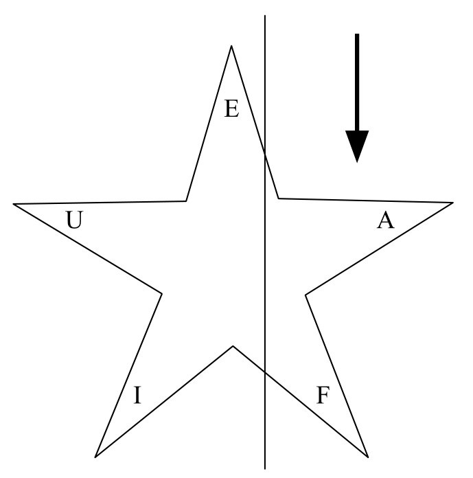

如果想有许多钱，那么您会怎样做？许多人只想到了两件事：他们尝试着接受贷款，如果这样不成，就捂住钱袋省钱。我的建议是：赚更多的钱怎么样？其实您的收入高低完全取决于您自己。

或许您可以想象到，当我提出这个建议时，常常会听到怎样的回应：“根本不会如此简单；我们有固定的工资组成，人们不会轻易涨薪。”那么什么才是对的呢？谁说的有道理呢？

当然，只有您自己可以决定。如果您想赚到更多的钱，从根本上来看，您可以在以下5种可能中进行选择：

●您可以换一份工作；

●您可以自主创业；

●您可以利用业余时间赚取额外收入；

●您可以将自己定义为专家；

●您还可以在自己的工作中得到更多的收入。

至于如何开辟赚钱渠道以及怎样将自己定义为专家，我们将在下一章讲到。本章中，我们只关注最后一条：作为职员，您怎样才能在自己的工作中提高收入。

如果您现在是职员，那么对您来说，了解到取得高收入的游戏规则是十分重要的。如果您是独立经营者，请您大致浏览本章，思考一下把这些信息提供给您的职员有多大意义。我向您透露一个公开的秘密：您的职员也许也想得到更多薪金，而且，如果通过给他们涨工资增加了您的总收入，那么您可能也愿意付给他们更高的薪金。

## 思想基础

在本章，您不仅能够得到提高收入的15条规则，
还能得到一份详细的加薪指南。
为此，我们需要建立一项基础，那就是为了拿到一份更高的薪水所需要的最重要的思想方面的前提。一共有5条定理：

定理一：每个人都是独立的。
没有人会“为了老板”而工作——每个人都是为了自己而工作。您工作，是因为您想赚钱，想找到工作中的乐趣，或者是为了看到其中的意义，等等。但是，您绝对不是为了老板而工作的。您最好把自己看成公司，您的能力就是您出售的产品，您的雇主就是您的顾客。但是您要始终把自己看成一家独立运营的公司。如果这么想，那么您在思想上就自由了许多，而且更加有魄力了。

定理二：您得到的总是您赚到的东西。
尽管许多人声称自己比所得到的更有价值。但是这并不切合实际。正确的是，如果您想“赚”得更多，那么您就应该拥有更多。您愈加依赖别人，就愈倾向成为受害者的角色，您自己能够决定的事情就愈少，然后“赚到”的就愈少。

定理三：只有当您了解了游戏规则，您才能在收入的游戏中取得胜利。
游戏的规则造就了市场，它对于一切都是平等的。没有人受到任何偏爱，也没有人受到亏待。因此市场是平等的。那些不了解游戏规则的人，由此具有很大的劣势。

定理四：最重要的游戏规则就是，对于您的收入，没有任何规则。
请您永远都不要轻信有什么一成不变的规则。所有的规则都是人为的，因此人们可以改变规则——您也同样可以。

没有任何客观的标准来衡量您工作的价值。您的价值总是主观的。也就是说，在评价一个劳动力的时候，没有任何客观的“道理”——您的老板没有，您也没有。当没有任何统一的标准存在时，通常有以下三点准则来衡量您的薪水：

1\. 根据您的老板
是如何评估您的价值的；

2\. 根据您自己
是如何评估自己的价值的；

3\. 根据您的谈判技巧。

定理五：并不是您得到了加薪，而是您赚到一份加薪。
这其中有一个问题是：您能为公司服务多少以及您是怎样不可或缺的。您讨价还价的能力越强，您的知识和能力相对于所相应的需求就稀缺。

由于没有客观的规章来衡量上述的标准，这里就适用定理四。您的任务是使老板了解您的价值。而您是如何看待自己和自己的价值，也取决于您自己。同样地，您的谈判技巧有多棒同样取决于您自己。

这五条定理构成了更深层次思考的基础。您由此建立了成功最重要的三项前提：自信心、承担责任以及实践。

## 加薪的15条规则

在“加薪”（Gehaltserhöhung）这个单词中，每个字母都代表了一条准则、一条定理。就好像成功是某种程度上事情水到渠成的一种结果，加薪也是遵循15条规则之后的结果。从根本上来说，这15条规则是和一份更高的收入紧密相连的。下面是15条规则一览：

●Geben Sie Ihr Bestes（请您做到最好）

●Einkommen produzierende Aktivitäten（请您从事能够创造收入的活动）

●Helfen und Freude bereiten（乐于助人，传播快乐）

●Alles lieben，was Sie tun（热爱自己所做的一切）

●Lernen und wachsen Sie konstant（请您学习，并且不断成长）

●Teil eines Spiels（请您把自己看作游戏的一部分）

●Stärken ausbauen（加强您的优势）

●Erhöhen Sie Ihr Selbstbewusstsein（请您提高自信力）

●Richtig konzentrieren（真正做到全神贯注）

●Hohe Dringlichkeit（要有高度的紧迫感）

●Öffentlich nicht widersprechen（公开场合不要进行反对）

●Haben Sie Größe（请您心胸开阔）

●Uebernehmen Sie volle Verantwortung（请您承担全部责任）

●Nicht Zweifel，sondern Stärke zeigen（不要怀疑，而是要展示优势）

●Gehaltserhöhung fordern（要求加薪）

## 规则一：请您做到最好

请您身体力行，总是做到最好。我想给您一条未来开创事业的建议：请您在完成下一项任务时，就好像公司全体领导在旁边观看您一样，而且想象着您日后的晋升全凭自己这次表现。

从来就没有不重要的任务。所有需要做的事情，只要人们好好完成，都是有价值的。那些把工作分成“重要”任务和“不重要”任务的人永远不会做出最好的努力。人们会冷漠地去对待那些人们认为“不重要”的任务，并且往往完成得不尽如人意。

请您坚持一贯做到最好。下面两则真实事件会清楚地告诉您这一规则的重要性。

苏布拉马尼扬·钱德拉塞卡（Subrahmanyan
Chandrasekhar）在威廉姆斯湾的天文观测台工作。除此之外，他还在130公里以外的芝加哥大学教授一门研讨课——高级天体物理学。只有两名学生报名了这门课程。每个人都想，他可能会取消课程。而他本身也是有十足的理由：这样上课太浪费了，不经济。但是他会怎样做决定呢？他会不会在冬日里沿着崎岖的路只为了给两名学生一周上两次课呢——往返的话就是260公里？

钱德拉塞卡教授还是坚持上完了一学期的课。尽管课程并没有受到许多人欢迎，但是他看到了其中的机会：如此这样，他可以更加聚精会神地关注这两位学生。

结果是怎样的呢？几年之后，两名学生先后获得了世界物理学界最高奖项：诺贝尔奖。1983年，钱德拉塞卡教授自己也获得了该项殊荣。

第二个故事则关于“小小的”酒店服务员乔治·C.博尔特。一天晚上，一对老夫妇站在他面前，请求得到一间房。那天晚上，全城的酒店都预定光了，这家酒店亦是如此。他要告诉他们，这家酒店也没有位置了。

他望着两人和善却充满沮丧的面庞，想到了一个办法：“您可以住在我的私人房间里。反正我要到明早才下班。这没什么特别的，但是您就会有床睡了。”

夫妇二人本想拒绝，但是乔治坚持着。他如此尽心为二人考虑，夫妇俩充满感激地接受了他的提议。第二天早晨，他们真诚地道了别。这之后乔治没有听到任何关于夫妇二人的只言片语。这段时间里，他尽自己所能学到了酒店管理相关的所有知识。

两年之后，他突然收到了夫妻二人请他去纽约的邀请。信中还附带了一张车票。那位先生在火车站接到他，立即带他去了位于纽约第五大道34号的一幢大楼前。他说道：“请您看看这幢大楼。这是我为您而建的一家酒店。我希望由您来进行管理。”

那位老先生就是威廉·华尔道夫·阿斯特（William Waldorf
Astor）。乔治·C.博尔特（George C.Bolt）成为第一家华尔道夫酒店的总经理。

如果一名女秘书在电话中说“这是某某的办公室，早上好”，那么这几个字就传达了许多内容。比如：“我心情不好；您在打扰我；我不喜欢这里……”但是一种积极的情况是下面这种信息传达的方式：“我喜欢您；我很高兴您打来电话；您是十分重要的；我喜欢我的工作、我的公司以及我的上司……”

这其中的策略在于：请您在“小事情”上尽力做到最好，这样您才能为大事做好准备。成功人士并不是把不寻常的事情做好，他们只是把简单的事情做得特别好。

如果人们能够看到未来并且了解到一切是怎样构成的，他们就会更加努力。也许现在情况不允许我们看到未来，但是我们能够做比这重要得多的事情：我们能够打造自己的未来。

您今天付出多少，决定了您明天能够赚多少。
请您坚持一贯做到最好——从现在开始。马丁·路德·金曾经说过：“如果一个人靠当清洁工赚钱，那么他应该像米开朗琪罗作画、像贝多芬作曲、像莎士比亚写剧本那样仔细打扫街道。”

## 规则二：请您从事能够创造收入的活动

意大利经济学家维弗雷多·帕累托（Vilfredo
Pareto，1848—1923）早就得出结论，我们80%的收入是通过我们20%的活动产生的。这一定律广为人知，但是只有极少数人能够从中吸取教训。

结合您的收入来讲，也就是说您80%的工作时间被浪费掉了，或者说至少没有得到最大化利用。这80%是一切不会直接影响到您的营业额和收入的生产活动之总和。举例说来，是这样的一些事情：整理东西，建立档案系统，致力于建立和谐的企业工作氛围，购买鲜花，打电话，阅读某些文件和大批的信件……

也许会有人提出异议：“但是这些事情也是要做的呀！”您说得完全有道理。长期来看，没有哪个公司忽视了这些事情还能够成功的。但是一个关键的问题是：您什么时候做这80%的工作呢？

在每份工作中都有一些为数不多的几个关键性任务，正是这些任务最终决定了收入的高低，也就是创造收入的工作。您应该首先
关注的正是这些工作。

请您学会把事情往后推

成功人士会马上解决20%的工作，然后把80%的事情往后推。拿破仑每一个月才查收一次信件。为什么呢？如果这些信件在一个月之后还会使他感兴趣，他才会回信。大部分信件在一个月后都已经过时了，那么他就可以把它们丢掉了。

为什么大多数人会首先完成这80%的任务呢？答案就是：这些事情会为他们带来乐趣，而且看起来更简单，最重要的是因为这些事不像剩下的20%那样需要集中精力全力以赴去解决。最后一点也许才是最重要的：当您在全神贯注地做一件事情的时候，可能会犯一些小错误，但是大多数人害怕出错和失败。

能量贴士

请您马上着手去做给您创造收入的工作。

●如果已经完成了20%的工作，您可以静下来想一想剩下的时间可以用来做些什么：您可以学习，可以用来自我定位，也可以做出决定去从事其他创造收入的工作。

●如果首先完成20%的工作，那么请您不要着急。您可以确保这些具有决定性意义的工作取得了尽可能好的结果
。

●请您制定一个待办事宜清单，然后问自己，哪些是20%的事情，哪些属于80%的事情。

●无论何时，请您尽可能自己把这80%的工作委托给他人完成
。如果有些事情出了差错，损失也是微乎其微的。但是请您牢记，交代别人完成的事情您要加以监督。

●请您首先完成让您有恐惧的事情。请您问问自己：如果我很确定地知道事情不会失败，那么我会怎样做？

●这之后请您完成不喜欢的事情。

●请您尽量一次性处理完所有事情。

## 规则三：乐于助人，传播快乐

领导很快就能看出您的情绪是高涨还是低落。愉快的情绪有助于提高工作成效。无论何时，只要您有能力，就请去帮助别人。

请您帮助每一个客户，帮助您的老板，帮助您的同事，使自己成为受人欢迎的人。请您提高领导的能力。80%的晋升都是通过别人把你“从基层”推举上去的，而只有20%的情况是被上级提拔的。
受人欢迎的人会比其他人更容易受到推举！

老板是不会选择不能领导一个部门的人去做部门领导的。而他也很关注同事传出怎样的信号。

对此，有3个重要的提示。第一，请您只说别人的好话。
也请不要让别人在您面前说别人的坏话。假设尽管如此对方还是要说，那您就这样说：“您能否听我一句，先问问我对您刚刚讲的是否感兴趣呢？”有些人说了不在场人的坏话，他还会转身对其他人说在场人的坏话的。

第二，请您手写下几条与人相处适用的基本原则。在我的作品《赢家法则》一书中提到的24条黄金定律也许会对您有所启发。您最好每周都浏览几次这些定律。您要保证尽可能如人所需那样对待每个人。

第三，请您在每次和别人沟通的时候都保证对方在如下几方面感觉良好：1.
他自己；2. 您的公司；3.
您自己。多年来我一直在电话旁贴着一张小字条，上面写着：“好感：您——公司——我”。请您练习使别人变得更有价值。

## 规则四：热爱自己所做的一切

“等一等！”——看到标题，您可能会大叫起来：“您不是刚刚讲过，去做自己热爱的事情吗？现在又是怎么回事？我应该做我热爱的，还是我应该热爱我所做的一切呢？”

答案是：两者都对。当然，在第五章和第六章中我进行过陈述：我们应该找一份我们热爱的工作。

但是，这是一种理想情况。实际上总会有一些我们并不是很喜欢的事情
——更谈不上热爱了。另外一种情况就是，目前您可能不想或者不能够离开一份并不是十分理想的工作。

可是，如果有一份并没有马上激起您兴趣的工作，对您来说也不是最糟糕的情况。

有时候，我们有着比自己所承担的更多的权利。起决定作用的并不是工作本身，而是我们自己。我们总是能够选择如何看待我们的工作。

这其中有一个很简单的技巧，可以让您每次都爱上任何一项工作。

您可以把一件事搞砸——或者你也可以庆祝事情完满。热爱每一项工作的简单诀窍是：尽您所能做到最好。加强自己。不要做简单的工作，而是要完成一项杰作。

耶胡迪·梅纽因（Yehudi
Menuhin）是一位伟大的提琴演奏家。一次，有人问他，连续几周晚上演奏同一首曲子会不会感觉到无聊。他的回答是：“如果人们真的
每天晚上都在努力，就永远不会感觉到无聊。”如果您必须完成一件任务，就请您做到最好。您会看到，这个过程并没有很长，而且您会陶醉其中。
这种现象中有三个原因。

1\. 当真的在努力的时候，您就必须精神专注。这样事情就有趣很多。

2\. 您会更加高效，这是令人愉快的事情。

3\. 在这个过程中，您将提升自己的自信力。

请您变成一位炼金士，您可以点石成金，化腐朽为神奇，将痛苦的工作变成金色的瞬间。

最后一点，关于如何将任何状况提升为一个令人满意的水平。请您在加薪的十五条规则中找到一条（或者几条），并根据实际情况进行实践。这样，您会为自己“简单的任务”赋予更多的价值和意义。

## 规则五：请您学习，并且不断成长

这一规则同第三章中的第八条规则如出一辙。您还记得吧，我们身处信息时代。如果不坚持学习，我们不会取得工作上的成功。工作和学习已经融合成为不可分割的一个整体。

在这一点上可以看出第六章有多么重要！这在其他规则中亦能有所体现。如果您都不知道为了什么而学习，为什么还要坚持学习呢？我不相信会有没有任何抱负的懒人，但是我相信有许多人没有目标和意义。只有当您知道您的宏伟蓝图是怎样的，您才能够激励自己去学习。

许多人同样不知道自己应该学什么。我的想法是，什么都要学！在每个领域内你都需要进行深造。当在专业方面有所提高时，您会赚得更多，但是当在人格方面有所提升时，您将变得富有。
打比方说，您可以学习肢体语言——学学专业的握手方式；学习口才——学着做一个小报告；学习市场的基本知识，学习销售……

在学习过程中挖掘的乐趣越多，您就会觉得学习越简单。请您学着圆滑一些。

您通过向自己的未来投资足以向自己证明您对自己的未来有信心。

一个人生活中成功的秘密在于，准备好机遇的到来。您并不知道有什么事情在等着您去做，但是我肯定那一定会很棒！请您尽可能充分地做好准备吧！成为公司里最大的海绵，吸收一切有用的东西。请您坚持学习，坚持成长。

## 规则六：请您把自己看作游戏的一部分

把工作视为游戏的人，会抱着游戏的心态去轻松对待工作，游刃有余。相反，那些对什么都较真的人，既束缚了自己，又让自己难堪。

既认真又负责，却保持一定距离地去参与到游戏当中是一门艺术。要争取胜利，但是不要作茧自缚。
请您不要忘记：工作的确很重要，但它首先应该成为一个很好的爱好，一个能给你带来乐趣的爱好。
工作能够带来金钱，但是如果我们严肃又不失风趣地对待它，那么我们赚到的不只这些。

人们会逐渐了解到，胜负乃兵家常事。遇到失败，可能会有三种做法：1.
原地不动；2. 虽然很吃力地站了起来，却隐匿在芸芸众生之中；3.
您会去学习，去寻找失败中的教训，然后上升一个新台阶。成功人士能够从每次打击中学到积极的事物。
他们之所以能够做到如此，是因为他们把自己看作游戏的一部分。

请发展自己的能力，坚持学习，训练自己，设立一个远大的目标，然后您才能够顺风顺水，达到流畅忘我的“心流体验”。凭借纪律，我们能够达到一定的水平，而杰出的成就往往出现在我们全力以赴而又无法继续前进的时候。

## 规则七：加强您的优势

这一条规则其实您已经在第三章有所了解。问题在于，您如何才能让老板意识到这一点。

实际上，想把所有规则付诸实践并不容易。因为许多公司有既定的模式，不会因“改革”而灵活变通。但是通常情况下，您能够做到的远比您相信的要多。无论如何，您都要为此全力以赴。

首先，您的成绩应该具有足够的说服力，这样人们才愿意为您提供额外自由发挥的一片天地。另外，人们之所以愿意这样做，是因为这样一来您会提高效率。

这里有一点重要的提醒：请您不要死干蛮干。
经常会出现这样的情况：您必须长时间做提不起兴趣，同时也和您的能力不相符的事情。请您尝试着接受另一项工作。您要弄清楚，假如真的没法满足您的愿望，在万不得已时就要下决心换公司了。

读过了第六章，您就知道了找一份新工作最多只需要100天。但是如果您已经证明了自己的价值所在，别人又怎么会愿意让你走呢？然而如果没有人认识到您的价值，您又为什么要继续留在那里呢？

## 规则八：请您提高自信力

我们个人的成功很大程度上取决于我们的自信力。而您的收入和您的自信也有着直接的关系。

●您认为自己的成绩有多大价值，这完全取决于您自己。如果您认为自己值得获得加薪，那么您就要去寻找有利于自己的良机。为了找到良机，抓住良机，您必须有自信力。您的收入并不完全取决于您的价值，而是取决于您想让自己具有怎样的价值。
汤姆·克鲁斯（Tom
Cruise）就践行了这条格言。当别人和他聊起他那高得令人难以置信的收入时，他说道：“如果我没什么价值，那么人们不会付钱给我。而我一旦不再具有这样的价值了，也就不会有人再付给我这个数目的薪金了。”

●手中的机会是足够多的。但是如果没有自信力，我们就不会有所发觉。

缺少自信会导致您生活得不得体。行为专家发现，口袋中没有钱的人在商店橱窗边驻足观看商品的时候，如果感觉到有人过来，会让到一旁。他们不想挡住潜在顾客的视线。

同样，这些人在生活中也会让到一边——在加薪的时候，在升职的时候，在特殊机会降临的时候……他们相信，这不是“赢得”的，没有价值。这是一个悲剧，也完全是没有必要的。

## 如何才能建立自信

苏格·雷·罗宾森（Sugar Ray Robinson）
<a href="#text00041.html_fn_1" id="text00041.html_ft1">[1]</a>
曾经说过：“如果你想成为冠军，就必须要相信自己，即便其他人都不相信你。”好在自信力是可以学到的。
每个人都可以学到。天生的自信力是不存在的。如果能够学会自信，那么您就还要知道，怎么学。

自信力是一种自我相信的能力。首先最重要的是我们要认识自己。
您不会信任您不认识的人。因此，第六章中的练习就尤为重要，附录中的一些练习也同样重要。这些练习都能够帮助你真正认识自己。

您是否能够真正做到自信，很大程度上取决于您是否能在自己的过往中找到合适的证据。

我们都取得过成功。起决定性作用的是那些我们清楚感知并且记得的那些成功。

也许把自己的成功留在记忆中的最好形式就是把它们写下来。为此，我们可以有选择地写——只记下我们的成功，也就是说我们确定，未来将再次加强自身经历中的哪些部分。对于成功的反思会助力新的成功。

成功日志

我们需要一种建立自信的手段。因此，我发明了成功日志
这个概念。您可以这样进行编辑：在一个空的日志本上，每天记下您成功完成的5件事。这样日积月累，您会发现自己具备哪些取得这些成功的能力。
<a href="#text00041.html_fn_2" id="text00041.html_ft2">[2]</a>

当我第一次听说这个练习的时候，从很大程度上看，我是低估了它的。我就是不能看到每天记录5项成功事件的意义。另外，我当时正处于“低谷”中，感觉不到任何值得记录下来的成功。但是成功日志最根本的意义在于，您可以借此反思自己可以记录些什么，这样您的注意力会慢慢地也是必然地发生改变。您会学习到，像一位成功人士那样去体会。

实际上，这里涉及的是一个已为实践所证实的妙方：任何时候的成功男士和女士都有记日记的习惯，并以此记录他们的目标和成就。请您也把记日志当成一件足够重要的事情，以便记录下您自己的成功！值得去经历的生活同样也值得记录下来。

有这样一种说法，即一个人对于自己的看法，任何时候都会展现在他的面容里，反映在他的行为上。请您将认为值得的人和事投入您的生活里。切记。

当然您的收入也不例外。您赚取您认为与自己价值相应的收入。如果您依照本章内容去做，您将在12个月内多赚20%。我向您保证。

因此，我强烈请求您这样做：请您每天写下5项成功的事。
尽管您并不相信这样会帮助您，也请您这样做。您将会收获惊喜的。许多人这样做仅仅为了证明在他们身上不起作用，但是总是有成效的。

能量贴士

请您通过记录成功日志，不断建立自己的自信力。

●您的自信力决定了您是否会去冒险。

●当您记录这本日志的时候，您会学着关注自己的优点。

●请您记录下生活中方方面面的成功。

●即便是很小的成功也请您记录下来。小成功的模式和大方面的成功是十分相似的。

●一段时间之后，您会在白天就发现：这是一项我能够注意到的成功。

●您的自信力决定了您的收入。

●我们经常认为，自己是为了安逸不去迈向下一步的。正确的解释是：安逸只是托词。实际上我们只是不相信自己能够成功。

●我们的期待值决定了我们的所得。我们的自信力决定了我们期望值的高低。

## 规则九：真正做到全神贯注

如果您想做到最好（规则一），那么这只有在同一时间只集中精力做一件
事请的情况下才能做到。有人认为，如果我们同一时间做许多事情会更加有效率。这其实是一个谬论。

我们应该从中发掘乐趣，全神贯注投入手头正在做的事情当中，与之融为一体。只要一个人没有完全投入他正在进行的工作当中，他就不可能取得太多的成功。

当您没有感知到其他事情的时候，运动员称这种状态为“管道视角”。那种绝对的全神贯注当然是一种理想的境界，但是只要我们努力，就可以不断接近这种理想的境界。

只有当您没有按照这条规则去做的时候，才会感觉压力如影随形。全神贯注的代价就是，您需要耗费很多精力。

休息可以提高全神贯注的能力

对于刚刚提到的规则，有一项重要的补充，即：我们是需要定期休息的。
许多人没有好好照顾自己的精力，而是将力气用错了地方。我们的身体构造不允许我们接连不断为自己创造成就。它更像一级方程式的跑车，在短时间内可以创造令人难以置信的成绩，但是随后需要休息。
要是不间断地使用一部跑车，那么它的系统慢慢就会失灵。

我自己就曾经有几年超过身体负荷地利用自己的身体。我不停歇地工作，还忽视了一切警告信号。因为活得很健康，而且热爱自己的工作，所以我陷入了这样一种错觉之中，认为自己能够这样不间断地继续下去。结果就是，我自己首先不能够专心致志，最终病倒了，崩溃了。

从中我吸取了教训。我今天工作了两个小时——集中全部精力。然后我休息20分钟。然后我再工作两个小时，然后再进行20分钟的休息。在这20分钟的时间里，我让自己得到完全的放松，使体力得到恢复。结果就是，在这两个小时的工作时间里，我的注意力是完全集中的，并且在工作一天结束的时候，我并没有感觉到筋疲力尽。
<a href="#text00041.html_fn_3" id="text00041.html_ft3">[3]</a>

对于大多数人来说，这种必要的休息都是无意间进行的。思绪飘走了，他们就去买个饮料或者闲聊一会儿。而有意识地去计划休息，让身体和精神得到本来需要的完全放松，这才是聪明人的做法。

总的来看，您就能确定，和您不停息地去工作相比，这种方式可以使您完成更多的工作。而且您不仅仅完成了更多的工作，您的工作质量也会得到大大的提高，并且您会从中获得更多的乐趣。

## 规则十：要有高度的紧迫感

尽可能快地完成一切工作。在我的公司，每个人都知道“sswim”这个缩写，它的含义是：尽一切可能地快。您知道，工作就像橡胶一样，很快就可以填满您能够支配的时间。所以不给自己确定的时间限制往往会更好一些。对于最后期限的最好安排就是“sswim”。

请您做事情时保有紧迫感，使自己获得对什么事情都能尽快解决的好名声。这些人是这个时代的一股清流，这个人人都在大谈特谈时间紧迫，而实际上只停留在口头的时代。

准时上班当然也包含在这个紧迫性当中。几乎没有什么比总迟到给人留下的印象更坏了。这样的人通过总迟到展现出他生活的全部悲哀：他不能够控制自己，别人不能够信任他，他自己也不信任自己，他连那些最基本的事情都无法出色地完成，他就是个值得同情的、可怜的人。

我为什么用如此刻薄的词来描述这样的人呢？为了让您意识到，如果迟到的话，您就给自己帮了个倒忙：正是您自己决定了一整个工作日从第一分钟开始的工作质量（而您还没有到达）。因为不准时的人会得到别人的同情，但是绝不会得到提升的机会，也不会得到更高的工资，倒是很有可能被解雇——哪怕他在其他方面都很好，结果也是一样的。

有一个十分简单的诀窍！

请您总是计划着比要求的时间早到20分钟。这20分钟会给人留下好印象。您可以轻松平静地投入工作当中，也能够安安静静地完成您的工作。

请您不要因时间紧迫就牺牲质量，有些事情就是要花些时间去处理。重要的是，您要学着把一件事和另一件事区分开。请您尽一切可能快地开始，但是不要在整个工作中都这样紧赶时间。

## 规则十一：公开场合不要进行反对

您是否遇到过这样的情况：您的老板指责您——而且是完全没有道理地指责？请您注意，这种时候不是探讨公平的时候。请您扪心自问：“我是想要公正呢，还是要成功？”

在这里我并不是想建议您对别人言听计从，恰恰相反。但是您应该采取更聪明的办法。您的老板可能完全因为其他事情而恼火。如果此时此刻您和他争论，那么您就是在引火烧身。这时候，沉默才是更聪明的做法，至少此时此刻。您绝对不能当着别人的面反驳您的老板，即便没有第三者在场，而采用下面这个方法也会更有效：您过几个小时再去找他，并给他指出这件事并不是您的过错。要用事实说话，不要感情用事。

这样您会达到两个目的：您的老板能够认识到您不是个感情冲动的人，而且他也看到了，自己下次应该更加注意。相比于马上和他对着干，这样做对于您在他眼中的地位更加有利。另外，这条规则不仅仅适用于处理和老板的关系……

## 规则十二：请您心胸开阔

请您牢记，永远不要因为小事动怒。您也不要忘记，任何事都是小事。
一个人心胸是否开阔，可以通过那些惹他生气的事情看出来。如果有人因为早上没有人“得体地”问候他而动怒一整天，这样的人会得到发展吗？

大度的人不容易感觉到受到欺负，他往往平和对待，而忽略那些微不足道的小插曲。请您问问自己：“当前这些惹人气愤的事情在5年之后还能剩下什么呢？”
或者：“我是把精力用到实现自己的目标上，还是偏偏把它浪费在完全不重要并且毫无意义的事情上呢？”

使自己心胸开阔的一个很好的办法就是，不要把自己看得太重要。地球并不是围着我们转，我们的存在对于整个宇宙来说就如微风拂过，在历史的长河中就如昙花一现。请您不要忘记：您思想的高度决定着您收入的高度。

## 规则十三：请您承担全部责任

在工作中，我喜欢用鸭子和雄鹰进行比较。雄鹰承担全部责任，而鸭子则不然。如果雄鹰接受了一项工作，那么这项工作可以视为已完成。
如果鸭子接受了什么事情，那您大抵可以开始祈祷了。

雄鹰遵循着这样的基本原则：“就算我没有能力完成，我也必须完成！”
或者：“在我的字典里没有‘不能’的字眼！”为此，他们会说：“我来做！”鸭子则不像这般确信。他们更喜欢说：“我想试试……”那些仅仅会“尝试”做某事的人害怕中间会出现意外；他们期待的是失败而不是成功。
否则的话，他们会干脆说道：“让我来做！”

鸭子喜欢在鸭子的池塘里聚集，为了互相通告一些消极的经历。这样一来，就更加使他们坚信自己生活在他人的独断专行中而被遗弃放逐。雄鹰则知道，他们为自己的生活负责任，他们更喜欢说起成功的事情。

鸭子很快陷入公平陷阱。他们时常感到受伤，感觉自己被误解，受到不公平对待。然后他们就会觉得，正是因为有“不公平”的存在，他们才没有机会改变自己。

同时，他们还是“一切应该平等对待”这种理论的坚定支持者。但是怎么才能这样呢？雄鹰类型的人和鸭子类型的人是不一样的，做事方式也不尽相同，他们对于公司也有着不同的价值，为什么会得到同等对待呢？鸭子想得到和雄鹰一样的待遇。雄鹰却知道，只有付出相同的人，得到的才是一样的。

鸭子的关注点在问题上，还嘎嘎叫个不停。雄鹰的关注点在解决问题上，并且用实际行动处理问题。鸭子则会常年记得失败和自己遭受过的“不公”的待遇。这样，他们的消极思想和经历的影响就延长了。雄鹰则记录下自己的成功，并且由此系统地建立起自己的自信力。

鸭子是这样想的：公司会为我做什么呢？雄鹰则扪心自问：“我可以为公司做什么？”如果一个工作范围不明确的问题出现了，鸭子就会嘎嘎叫着一溜烟跑掉，而雄鹰则会自告奋勇申请去解决问题。

鸭子整天都在嘎嘎叫——这种叫声代表着借口和申辩。这种叫声取代了成果和成绩。熟能生“巧”，鸭子在找借口方面练就了非凡的能力。

但是请您不要被迷惑：一个借口的意义在于分散别人对他本人或者他所犯错误的关注。
您的注意力应该投向其他事情或者其他人。这其中存在着一种错误的观念，那就是拒绝承担责任或者把责任推向别人或者别的事情上去。您把过失推给谁，您就把权力给了谁。
如果您继续把所有的权力都推给别人，那么这些人也就决定了您的生活以及您的收入。

雄鹰渴望责任和权力。他们知道：“如果我‘证明’了错误的责任在其他人身上，我什么也得不到。我只是抓住机会，让自己变得更优秀。”
为此，他们不需要任何借口——尽管他们经历了让人不愉快的事情。他们更愿意这么想：“尽管出现了这种意料之外的事件，我能做什么呢？”他们知道：我们并不是为发生的一切而负责，我们只是负责解释它以及如何做出反应。

鸭子的世界仅仅是一个小池塘。相反，雄鹰能够触及最高收入的巅峰。他们为此做好了准备，离开自己的舒适区。他们学着超越自己的界限，并且把问题看作拓展控制范围的机会。

对鸭子类型人们的警告！

在我的办公室里摆着一个巨大的鸭子玩具，每位员工都知道这其中的意义。每当有人开始喃喃着找借口，我就向鸭子玩具看一眼，那位员工就会马上明白，自己正在陷入鸭子的境况……

鸭子类型的员工或早或晚都会被解雇；雄鹰类型的员工会得到发展，因为他们比工作需要的要求做得还多。
为此，请您接受工作中本来交给您的责任。

有这样一个好的练习：请您做一项“特殊调查”，那就是请您花一周时间观察您公司里典型的鸭子类型员工和雄鹰类型员工。请您下意识地去辨别，这两种人中，谁过得更加幸福，谁在未来会受到影响。对此，我不想说：请您同鸭子类型的员工保持距离。这是我直观的想法。当雄鹰高飞的时候，鸭子是很难与其齐头并进的。

如果想创造自己的事业，那么您就要自己决定，在每种情况下都做到像老鹰一样。请您想象自己是一位十分成功的人士，然后问自己：“这样的人在这种情况下会怎么做？”

工作的质量并不完全取决于工作本身给您带来了什么，而是您在工作中做出了怎样的贡献。
您并没有因为工作做出牺牲。而从您自身情况做出什么，也是完全取决于您的。请您永远都不要找托词。请为自己赚得这样的名声：“如果委托我做什么事情，那就大可视为事情可以得到圆满解决！”

## 规则十四：不要怀疑，而是要展示优势

每家公司和每位老板在日常工作中都会遇到形形色色的问题。因此，如果您能够展示自己的强项，那么这对于包括管理层领导在内的所有员工来说，都是令人十分愉快的。您应该想着让自己成为人们能够信赖的一个人。请您成为您公司的“银行”，其他人可以依靠您。

为此，您永远都不要把对公司、对产品，或者对领导层的怀疑表达出来。您要相信我：您“秘密地”告诉他人的疑虑以及消极的评价会被广为流传的，而这些总能够损伤到您和公司的利益。

谈论疑虑，就好比把肥料浇在杂草上。大多数情况是，您会早就忘记了疑虑的事情。但是，说者无意，听者有意，在听到这些话的人的心中，疑虑是会继续滋生的。这样，您就创造了一个怪物。

这里要注意的一点是，要进行重点区分：对于问题，
您应该，也可以对合适的人讲。因为这样做您能够得到建议。但是永远不要表达出您对解决问题存有疑虑。

当然，有时候您是可以有疑虑的。这是人之本性。但是您应该找到快速战胜这些的一种方式。而这段时间内，您不应该和任何人说起这些。

一方面，不要展示出怀疑。另一方面，积极展现出自己的优势。请您仔细研究您的公司，和对您公司满意的客户进行沟通，从中发现公司实现的成就有多重要。
找一些让您为自己公司骄傲的理由吧。

当您对自己的公司产生了这种积极的感情时，您就会抓住每个机会，给其他同事提供更大的安全感。您要代表企业的利益。即使可能会有一些“鸭子”生气地疏远你，因为如果你也和他们一起嘎嘎乱叫，他们也许会感到舒服一些。但是请你这样想：没有人会因为嘎嘎乱叫而赚得更多。

即使没有人注意您，您也要坚持自己的立场。因为一方面您得到别人的关注远远比您自己想象的多，另一方面，这也是一项很好的训练。

## 规则十五：要求加薪

迄今为止，所有的规则只会在少数情况下才能自动使您获得应得的加薪，即便这样，也请您不要感觉失望或者恼火。只有那些小人物才会掉进公平的陷阱。请您这样想：老板是不会主动背着钱袋子来给您涨工资的，您必须主动去争取。

想要得到更多的工资也并非易事。同生命中其他有价值的事物一样，想要大幅度提高工资，我们必须为之奋斗。但是如果您已经取得了很好的成绩，并且总是让自己在公司中处于不可或缺的位置，就会有人同您讨论您提出的问题，就会有人认真对待您。

但是——让我再重复一遍——别人是不会轻易给您加薪的。企业家本人也必须为一切而奋斗，老板也必须为自己的前程而努力奋斗，所以他一般不会主动提出给您加薪的，您必须为自己争取。当然，也有一些极少数特例，但是这些毕竟不是定律。

您要防止自己去评价这些。请把将要发生的事情看作一场比赛，
一场您不会输的比赛。只不过问题是，您到底能赢多少。
这一切又取决于您对规则的了解以及您的技法如何。

如果遵守下列规则，那么您会确定，您的老板也参与其中。这样您就已经赢得了一些重要的东西：在“加薪”这样一个敏感的话题上并不存在什么尖锐的矛盾。

加薪指南

也许您有顾虑，怕丢掉工作。但是我想和您说的是：如果您是一位有价值的员工，那么老板有着更大的恐惧怕失去您。

在信息时代，工作变得越来越有价值。原因在于：人力资源和智力资源越来越成为最受重视的资源。高水平的职员变得越来越宝贵，也越来越难以达到他们薪金要求。

在农业时代，人的价值常常比牲口高不了多少。在工业时代，一个人的价值常常根据他作为机器的一部分所起的作用来评定。在现在这个信息时代，一个劳动力的价值在于他的知识和天赋体现在相关需求中的价值。

也就是说，您胜券在握，但是还必须把牌打出来。
您还记得我们讲过的帕累托二八定律吗？也就是说，您应该确定那20%真正给你创收的工作吗？现在更进一步了。在这20%部分，又存在着二八开分配。最后，也只有很少的工作对我们大部分的收入起着决定性作用。

在您遵照上述15条规则并证明了您对公司是有价值的之后，您认为，哪些才是最重要的活动呢？唯一一件决定了您收入高低的事情是什么呢？当然是关于您加薪的谈判。

在日本，一名大型企业的女职员发明了“电子鸡”——这是为公司而发明的。这种电子宠物在世界范围内取得了巨大的成功，为公司带来了上百万收益。而这位女职员从来没有涨过一分钱……不公平吗？是，也不是。这位女士从来没有要求过涨薪——因为她相信，自己只是做了自己分内的事情。请您这样想，提高自己的工资是您的事，而不是您公司的事。

12个月计划

●请您记录成功日志。
每天记录您成功完成的5件事——来自生活中方方面面的事。每个月都仔细研究一次所有的记录，并从中找出您用到了哪些能力，才取得了这一次次的成功。

●用上述15条规则去工作。
每天从中找出一条规则，并按照规则去工作。在办公室随便哪个地方记录下关键词以便提醒自己记得这条规则。第二天再进行下一条规则。这样，您会在3周之内把所有的规则“练习”一遍。然后再重新开始。这是用一种游戏的形式进行学习。通过这样的重复练习，您会变得越来越好。

●制订计划。
请详细写下来，您会用加薪的工资做些什么。我的建议是，从中拿出50%攒起来，用剩下的50%来犒劳自己。目前有个目标是很重要的。

●为您的要求说出理由。
请您最早在3个月之后，而最晚也要在12个月之后制作出一份清单：请您至少记录下自己为何值得加薪的15条原因。也许目前来说列一个这样的清单很难，但是当记录过一段时间成功备忘录之后，您就可以做到了。

●请您制作第二份清单。
请您写下为公司所做的一切。您在哪里为公司省了费用，又在哪方面为公司赚了钱？原因在于，关键人物通常对您的实际贡献根本不了解。您的任务就是想办法让他们知道这些成绩。那么首先您就需要清楚了解自己的成绩。

●现在，请您制作第三份清单。
未来，您可以为公司做什么？制作第三份清单的原因在于，对于您过去所做的贡献，没有哪个明智的经理或者企业家除了一句“谢谢”以外，会给您更多的钱。您得到更多的收入，是因为他们估计您在未来会很有价值。但是，只有当您在过去已经为公司有所贡献（第二份清单），这个第三份清单才会看起来令人信服。

●检测您的市场价值。
当利用这种方法赢得了自信力之后，请您将目光投向市场。您还能在哪里工作？工作条件会是怎样的？您的工作对于另外一位雇主来说有怎样的价值？通过检测市场价值，您也能够在向雇主提出加薪要求时获得确信。您因为了解了自己并没有依赖现阶段这份工作，所以赢得了优势地位。

●与您公司的决策人约定时间会谈。
您这样说：“我很想谈谈我对企业所做出的价值。”您可以在真正谈话之前，先同一位熟人或者在镜子面前练习一下。

谈话

根据惯例，谈话应该包含以下4点。

1\. 您要解释一下自己为什么喜欢为公司以及您的老板工作。要表达出感谢。

2\. 问一下您的老板是如何评价您的工作的。对于表扬，要表达谢意。

3\.
如果老板没有提及您突出的优点和能力，您应该对此进行补充。您要展示出自己的自信力，而不是盲目自大。必要的话，您要提出自己对公司做出的最重要的贡献。紧接着您要指出，除此之外您在未来还能为公司做什么。

4\.
请您将话题引到希望加薪上面来。请老板给一个建议。注意：永远不要第一个提出一个具体的数目。
因为一方面，您想知道老板对您的价值做何评价；另一方面，谁首先提出建议，那么谁就将处于不利地位。尽管如此，请您尽可能使自己工资的涨幅不低于20%。

谈判

有些情况下，领导会提出一个自己认为满意的数额。但是通常并不一定会这样。那么如果您的老板没有准备好给您加薪20%，您能做些什么呢？首先，您应该进行谈判。这其中有一个重要的规则您要遵守：绝对不要首先提出妥协的建议。因为，谁首先提出了妥协，谁就输了。

让我举个例子来解释一下吧。假设您目前的收入是2500欧元。您的老板提出以后给您加薪10%，也就是您未来的工资为2750欧元。您是本想至少加薪20%的。为了实现这个目标，您要至少提出更多：也就是25%。

然后您就等着老板进行妥协。如果他保持沉默，您就强烈要求他答应您的要求。我们假设，他将工资提高了15%，那么您就马上将他的建议当作固定的数目接受，说：“那好吧，您提出15%，而我希望的是25%。而我今后还想继续在这里工作，那么我建议，我们取一个中间值20%吧。”

这样做的好处在于：现在您的老板已经打算给您增长15%的工资了，此时离20%这个数目已经不那么远了。

如果您不知道这其中的奥妙而首先提出妥协的建议，那么谈判则会向着另一个方向发展：您希望加薪20%，老板提出10%。那么您又会提出折中，统一到增长15%，而领导则会提出相反意见，也就是12%～13%这样的数目。那么现在您就没有什么好辩论的了——您最终只能接受妥协。

最重要的是您要避免一点：绝对不要提出您需要
某个数目。尽管这听起来很残酷：没有人关心您需要什么。您的价值才是对公司来说重要的。所以您要一直讲自己能赢得什么，而绝不能谈自己需要什么。

如果这样不起作用

当然了，就算是最佳方案也有可能失败。如果不起作用的话，您能做些什么呢？

您可以请求老板用一天的时间思考一下这次谈话的结果。这样您就赢得了时间。现在最重要的是进行分析。是什么导致了失败？这其中只有三种可能：错误在您自己，在于制度，还是这个职位对您来说本来就是不合适的。

如果问题出在您自己，
那么您就应该记下错误，从中学习。三个月之后再去找一次老板。

也许问题根本不在您：您尽了一切努力，但自己的价值还是没有被认识到。这种情况下您应该尽快换一份工作。不要廉价出卖了自己的价值！

但是注意：
也许您的价值得到了认可，而且人们也愿意为您支付更多的薪水——但是他们做不到。有的时候就是没有足够的钱。这种情况下，您就应该斟酌权衡：继续在公司工作对我来说有多重要？目前的财务困境是不是暂时的？公司为我带来了怎样其他的好处——除了金钱之外？比如说，我能够从中学到很多吗？

如果您还想继续在那里工作，对于这种情况，有一个简单的办法可以使您得到与自身价值相符的报酬：您可以建议，以后还是拿相同的工资，但是每天只工作7个小时，而不是8个小时。

您可以利用这些自由的时间从其他途径获得更多的钱。您可以顺带做投资人，像企业家那样工作，或者您可以充分利用这些时间将自己定位成专家。谁知道这其中会得到怎样的发展呢……也许此刻对您来说，拥有更多的时间比赚更多的钱更加有利可图呢。

对于这三种可能性，即投资、像企业家一样去工作以及定位成专家，在下面的三章中您会得到很多实用的好建议。

------------------------------------------------------------------------

<a href="#text00041.html_ft1" id="text00041.html_fn_1">[1]</a>
苏格·雷·罗宾森：美国拳击手，世界中量级、轻中量级及轻量级拳击冠军。（译者注）

<a href="#text00041.html_ft2" id="text00041.html_fn_2">[2]</a>
我把记录日志视为对每一种成功来说都是最重要的一种手段。因此我创建了成功日志。其中我大约用50页解释了自信力对我们自己的意义，后面备有特殊的训练，在日志的最后是每日的笔记。

<a href="#text00041.html_ft3" id="text00041.html_fn_3">[3]</a>
这个想法最先受一本十分值得一读的图书的启发，即埃尔耐斯特·罗西（Ernest
L. Rossi）和大卫·尼蒙斯（David
Nimmons）所著的《休息20分钟》（20 Minuten
Pause ）。

第八章\
投资者——创造一台自己的印钞机
===========================================

想象着金钱是增值的，并且可以一直变得越来越多。\
钱生钱，由此收入无穷匮也。

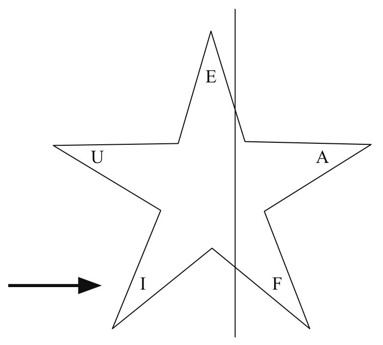

成为投资者是十分重要的，这样说还因为您根本没有其他选择。
您可以决定自己是否想成为职员或者自由职业者，您也可以成为企业家或者专家，但是您不能选择自己是否想成为投资者。只有作为投资者，您才能将资金转化为财富。如果想变得富裕，您就必须成为投资者。这样说有两个原因。

首先，如果您不是投资者，加薪对您来说没有任何用处。
凭借加薪，您可以收入翻一番。但是如果不会投资，您赚到的收入还是不会够的。只要还不是投资者，那么您的花销和生活水平同您的收入是并行提高的。

这就好比一个带有孔洞的木桶一样。不管您向里面倒了多少水，什么都留不住。只要您的财务之桶上面有窟窿，那么您都处在仓鼠之轮上原地踏步。您必须把洞补上——为此您需要的是一个机制。通过建立这样一个机制，您就已经成为半个投资人了。

其次，我们每个人都有对安稳感的需求，其中也包括对财务方面稳定的需求。
第一步是经济上的保障：您攒了许多钱，尽管不再有收入进账，也可以生活几个月。但是，只有当能够依靠利息生活的时候，您才会感到完全有保障。

也就是说，您必须攒钱，而且必须用攒下来的钱做点儿什么。
您应该使钱变得更多，而且是越多越好。这就是一个投资者必须掌握的另外一半。

## 节约+增值=投资者

本章主要围绕节约和增值这两个主题进行阐释。当掌握了这两方面，那么您就是一名成功的投资者了。尽管金钱并不会使人幸福，但是有钱时您的境况要比没有钱的时候幸福得多。

首先我们来研究一下怎样才能省钱，
也就是补上漏洞。因此，您有必要首先了解一下投资
和负债
的区别。也许您认为这很简单。但是对于大多数人来说并非如此。比如说，对于大多数人来说，房产是一种投资。但是一名真正的投资者懂得：实际上，他的房子是一种负债。

如果您节俭，并且懂得投资和负债的区别，并采取相应的行动，您就是半个投资者了。您将比我们国家99%的人都富有。现在，您需要的是买入正确的投资项目，这其中也包括无形资产（股票、基金、股权）。

当我写下这些的时候，股票交易所正处于低谷，确切地说很长时间以来它一直处于低谷状态。许多人已经感到失望，离开股市了。感性占了上风：首先是贪欲，现在是恐惧和害怕。就这样，您背弃了您财务的未来！因此，阅读本章对您来说是十分重要的。您会了解关键的3个问题的答案，而这3个问题必须由您来回答：

●您应该进行哪方面的投资？

●您应该什么时候买入？

●您应该什么时候卖出？

如果知道了这3个问题的答案，那么对您来说，成为一名成功的投资者就很容易。但是您需要的是金钱。那么，让我们从如何节约开始讲起。

## 堵住孔洞

无论现在有多少钱，在未来的7年您还会有更多的钱。您的入账和出账将保持着某种特定的关系。如果拿出7年的资产负债表看一看，那么您总会得到下面3个结论中的一种：

●您的支出多于 收入

●您的支出同收入持平

●您的支出少于 收入

对于大多数人来说，将这样的结果画出来会便于他们更好地理解：

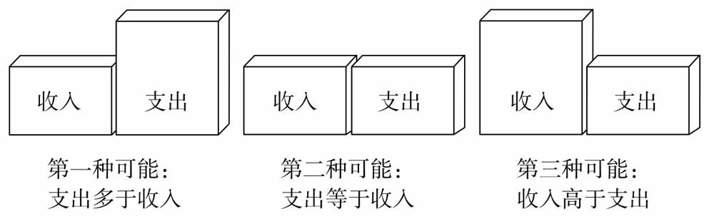

3个图表中的一种描绘了您对收入的使用情况。不需要任何道歉和解释，只有结果才是最重要的。这与您赚了多少无关。您属于3种结果中的哪种，仅仅取决于您是否把您桶中多出来
的孔洞堵上了。

但是大多数人会怎样做？他们还没有多赚多少钱，就买了更大的汽车，更好的家具。他们搬到更大的屋子或者买一栋别墅……如果我们还是拿木桶进行比喻的话，那就是：几乎还没有再往木桶中倒水（收入），那么又出现了新的孔洞，而且旧的孔也变得越来越大。这太傻了。但是这完全符合人的本性。
正是因为这完全出于“人性”，所以我们需要一种机制使我们既能够攒钱，又能够乐在其中。并且我们需要一项财务目标。正是这样的目标使我们生活中的其他方面能够提高到一个新的水平。在我的第一本书《财务自由之路》中，为了表明值得追求的目标，我引用了伊索的一则寓言。

目标是有一台印钞机

有一天，一位贫穷的农民在他的鹅窝里发现了一枚金蛋。他拿着这枚蛋去金匠那里鉴定，确定了蛋是纯金的。从那天开始，他每天早上都会在鹅窝里发现一枚蛋。由此他变得富裕了。尽管一开始他还对自己的幸运感到喜出望外，但是很快他就不满足于每天只有一只蛋了。他跑进鹅窝，杀死了鹅。这则故事的寓意就是：不要杀死你的鹅。

鹅象征着资产，金蛋象征着利息和盈利。没有资产就没有盈利。大部分人都会花光自己所有的钱，所以他们从来都不会养一只鹅。他们在鹅还没有长大产出金蛋时就把他们杀掉了。只要您还不曾拥有
鹅或者印钞机，您自己
就得成为印钞机。

这些金蛋，这些红利成为您收入的最佳形式。您的资产持续增加，您的收入也直线上涨。但是，就像其他所有形式的收入一样，您必须为此做些什么！

首先您必须愿意去攒钱。您必须知道，怎样才能增值。这些在学校都学不到。但是人们期待您突然间成为出色的投资者。他们想不付出代价就获得收益。他们想得到较高红利，却不去开发经济头脑。但是如果您不利用经济智慧来支配得到的钱，您的钱很快就会花光。
对于投资者同样适用的道理就是：我们最大的财富就是我们的知识；我们最大的风险就是我们一无所知的事情。

假设您想学着演奏吉他。然后，您就耐着性子练习了许多年。没有人会期待着自己简单地把小提琴在手里一握，马上就能演奏美妙绝伦的曲子。每一种形式的艺术或者高超的技能都是需要练习的。对于投资，也是同样的道理。想要投资成功，您就要准备好投入大量时间做准备。您可能会出错，但是您要从错误中吸取教训，学习经验。这里的关键词是学习。
学习要从认清投资和负债的区别开始。

投资还是负债

正如每一名投资者一样，我也曾艰难地学习投资和负债的区别。26岁的时候我个人破产了。我对我的教练说：“我感觉自己坠入了一个又大又黑的深洞。”他回复道：“您要走的第一步就是怎样从这个洞中走出来，不要越陷越深。对此您必须首先认清那个您所执行的计划。”

我回应道：“我根本没有什么计划。”但是我的教练说道：“您有一个计划——尽管您并没有意识到，那就是一个贫穷的计划。”这不是什么说辞，事实证明他是正确的。我一再犯同样的错误，这跟我在进行一个不幸的计划没有什么区别。那时候我在财务上有这样的厄运，简单来说有3个原因。

第一，我觉得，如果我能多赚一些的话，一切就会自动变好。
错了。我们必须首先学习正确对待今天所拥有的钱，否则提高的收入只会给我们带来更大的麻烦。

第二，我混淆了“需要”和“想要”。
我们所购买的大多数东西，实际上并非我们真正需要的。我们是想要它们。为了向我们自己和其他人解释，我们才声称自己需要某些东西。所以我们要诚实面对自己，这是十分重要的。

第三，我混淆了负债和投资。
我以前认为，比如我的汽车和家具都是必要的投资。我的教练十分中肯地向我解释了其中的区别。他说道：“一项投资会使钱流入您的钱袋，而负债正相反，它会使钱流出
您的钱袋。”

为什么这么多人处在财务的仓鼠之轮上？答案就是：并非他们赚得不够多，而是因为他们花费太多，并且投资太少。关键问题就是：钱是朝着哪个方向流动的？

当时的我非常想要一辆“豪华”的轿车。那时候我认为这对我生意上的活动来说非常重要。我的教练曾指导我，让我拥有经济头脑。他认为鹅象征着投资，而豪华汽车象征着负债。关于负债的简图如下所示：

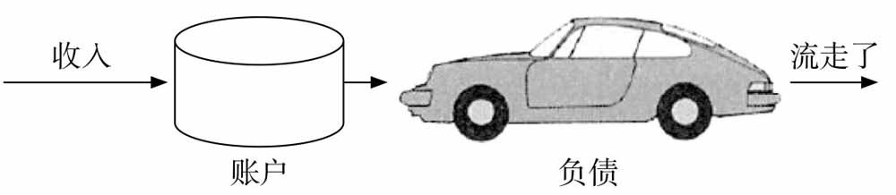

如您所见，现金流的路径讲述了整个故事。
关于投资的简图展示了另一种完全不同的现金流：

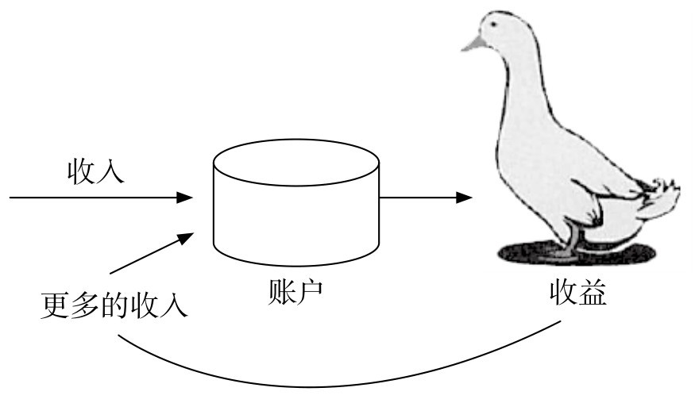

您的房子是一项负债

当时我是理解这幅简图的。所以我不再继续建立负债，我的旧账也慢慢地还清了。与此同时，我开始攒钱，还学着进行投资。

但是，当我从那段最糟糕的阴霾中走出之后，我又想买一所房子。我的教练丝毫没有感到兴奋，他说：“在您建立新的债务之前，应该更多地进行投资。”在那时，已经有很多人认为他们的私人住宅就是一种投资。

但是我的教练只是指了一下简图，问道：“如果您买一幢房子，那么钱流到哪里去了呢？是流进了您的口袋，还是别人口袋呢？”他还说道，“我们的花销就是别人的收入，我们的负债就是别人的投资。”

我反驳道：“但是房子总有一天会属于我的。”他说道：“对于大多数人来说，这个时间是25年至30年之后。而且只要您不卖出，到时候也不会有钱流进您的钱袋。”

即使您已经付清房款，它也并非属于您的投资财产，而是一种奢侈的财产。这种奢侈的财产消耗您的金钱，而投资财产会为您带来金钱。

您所居住的房子一直都是一种负债。对于银行来说却是一种投资：银行借钱给您，并借此收取不错的利息，除此之外，还有您的房子作为抵押。所以如果银行家说：“您的房子是一项投资。”尽管他们并不经常说，这是对谁而言的投资——也就是对银行来说才是投资。

我的教练并不反对购置房产。但是他希望我了解到一幢房子是一种负债，而非投资。并且，他希望我首先
进行投资。他的原则是：“当您攒够一定数量的资金之后，再购置房产。而且，房子的价值不应超出年净收入的4倍，并且您每月分期付款不应超过月收入的25%。”

他向我解释道，许多家庭正是因为硬撑着他们的房子，所以过着并不体面的生活。他称这些人为“房奴”。这些人努力工作，但是很大程度上只是为了银行。

我想信守教练的准则，审视市场。尽管发现了一些凭借我那时候4倍的年收入就可以买下的房子，但是我不打算住在里面。所以我就等待着，并且期间进行投资。就这样，我的金鹅慢慢成长起来了。

请您想一想仓鼠之轮

大多数人不能够利用机会，因为这样一来，他们的安全感就可能会被游戏替代。他们没有经济基础，所以必须依附自己的工作。那些有少量金钱的人就几乎不敢涉足投资，因为那样是“冒险的”。他们不会先去研究一下这样的投资，而且从来不学习怎样才能真正地去评价其中的风险。

请您回想一下第四章结尾处的概览：贫穷的人身背债务；有钱人买入有形资产，使金钱增加；中产阶级接受负债并且相信这是投资。摆脱仓鼠之轮的方法就是：先进行投资，如果真的可以承担得起，再接受负债。

节约还是攒钱

假设您需要买一件冬大衣，于是去购物。您计划花费300欧元，并且找到了一件您喜欢的却只需要200欧元的大衣。现在，您是不是就攒下了100欧元呢？

当然不是了。您只是省下
了这100欧元。也许您现在想用这省下的钱买一双鞋子。这样，尽管您从大衣那里节省
了100欧元，却没有攒下 任何钱。

尽管您有着钢铁般的毅力坚持预算，节省每一分钱，但是这离攒钱还远，而且也并没有饲养金鹅。

许多人很擅长节约，他们热爱找到特价商品并且把握机会，讨厌为了一件商品花费太多金钱，但是他们并不是好的存款人，而是可怕的投资者。

富裕的人们从两方面进行学习。他们喜欢省钱，而且将省下的钱进行投资。

我的建议是：每当您省下一些钱，请您将省下的钱从钱包中全部拿出，放在一个储蓄信封里。
只要您攒够了100欧元，就请您把钱带到银行存起来。

您必须学着去攒钱。攒钱是一种折中办法：您从今天拿走一些东西，为了使明天变得更好。折中从根本上促进进步。但是您不应该仅仅出于偶然或者自我管束来攒钱。您攒下的一部分钱可以（也应该）出自您节省的钱，而另外一大部分应该是机制操作的结果。因此，您应该建立一个储蓄的机制。

账户模式

您是否曾经尝试着按照老旧的、不合适的模式进行攒钱？“坚持不懈”地攒下月终剩下的钱？也许有时候真的有结余，但是通常情况下是一分不剩。这可不是大家所谓的机制。

此外，每一欧元在某种程度上都会有一个“利益冲突”。一方面您可以将其花掉，这样您就不算为一个更好的未来攒钱了。另一方面您可以将这一欧元存起来，但是您可以花销的钱就少了，随之而来也少了几分乐趣。您需要的是一个削弱您自身规则的机制，一个您建立后就自动运行的机制。

也许您已经听说过
我的账户模式。但是您还没有真正建立
起来？如果您还没有这样做，那么请您马上和您银行的服务顾问约个时间。就是现在。请不要再读下去了！拿起您的电话，约一个时间见面。您不能让自己再等下去了。只有通过这个账户模式，您才能比这个国家其他99%的人更加富有。

当读到这行字的时候，您已经
约好了时间见面——对不对？很好。

这个模式看起来是这样的：除了转账账户以外，请您再另外开设一个账户，或者是再设立一个存折，签订定期转账协议，在每个月月初就把收入的10%转存到这个新的账户上。每当储蓄账户达到一定数目之后，请您将这笔钱进行投资。您不会注意到少了10%的收入，依靠其余的90%您这个月会过得和从前一样好（或者一样糟糕）。在一定程度上，这10%是花给您自己的。

当然，您活着并非仅仅为了攒钱。因此您还要设立您的欢乐账户。
在这个账户上您也要定期转入您收入的5%至10%。每当您想给自己或者为其他人做点儿好事，就看看这个欢乐账户吧。如果里面有足够的钱来满足您的愿望，那就去实现它吧；如果钱还不够，那就等一等吧。

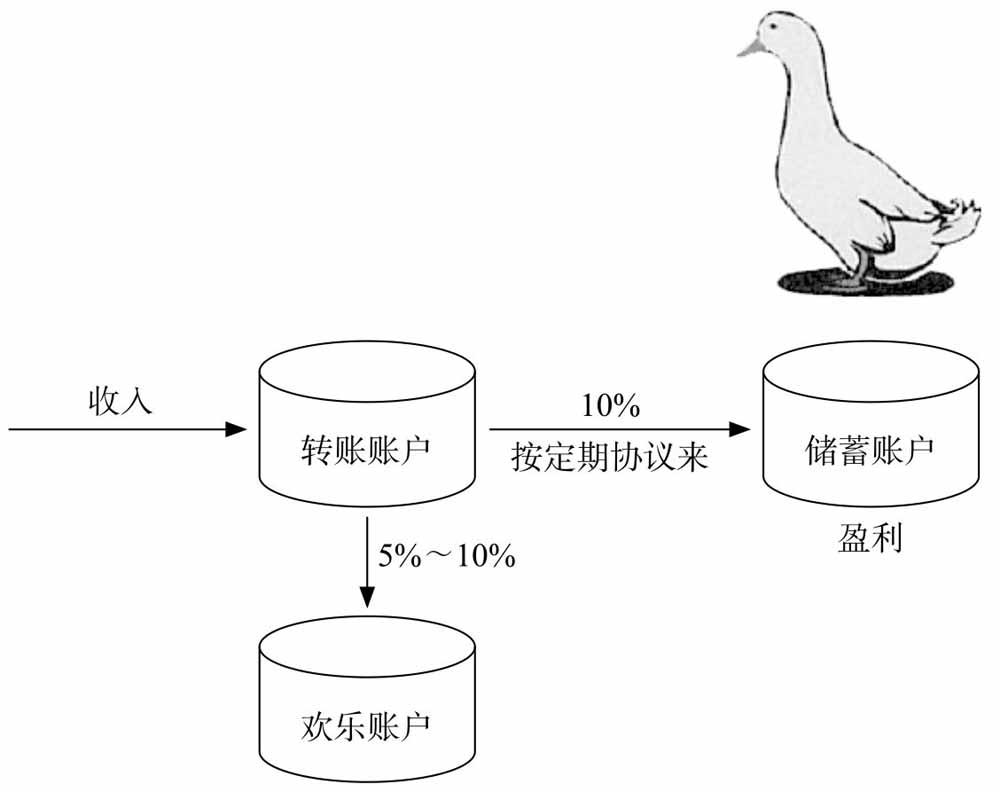

现在就确定您每月个人存款率

对此有两点说明。首先，10%只是一个例子，您也可以存得更多。但是不要比这更少了。
您要找到一个合适的平衡点。不要支出太多，这些都是未来的花销，但是也不要攒得太多，因为这会影响到您的现在。

一个充满智慧的人如果连10%都不能定期攒下来，那就简直太让人尴尬，太不体面了。您现在要做的就是立刻同您的顾问约定一个时间，建立起一个机制。

此外，如果一个人过于吝啬，以至于从来都不享受，那么这也是一种悲哀。有人进行过计算：如果一个人打开肥皂的包装，放置在新鲜空气中任其风干两个月，那么在人们使用它之前，它会多出8%。一年中如果使用30块肥皂，那么就会节省出大约1欧元。这对于我来说可提不起任何兴趣……

永远不要欠下消费债务

第二个说明就是：请您永远都不要欠下消费债。
俗话说，借债生愁。您可以毫无顾虑地从您的欢乐账户中消费。但是永远都不要去借钱来消费，永远都不要。因为实际上，拿人家手短，吃人家嘴软，也贬低了自己的价值。
这样的人会感觉到自己生活在谎言当中：他用那些看似属于他的东西向这个世界展示自己，他想通过这种方式得到别人对他的肯定，他将自己藏在那些他根本不具备的外表特征后面。

当年的我借钱买了一辆车。我的教练说：“不要放纵自己继续这样下去，原因就是，您的财务发展已经停滞不前了。”他向我解释道，借债消费是缺乏目标的行为。
因为从某种程度上看，“不去想未来”的人才会愿意为了目前的一点点奢侈而做出牺牲。

因此，第五章和第六章才显得尤为重要：有目标会使对待金钱持有更加负责的态度。因为没有什么像消费债这样更耽误您实现财务目标了。债务将您束缚于过去。投资则敞开了美好明天的大门。

提高工资

在工作生涯刚开始的时候，您所能胜任的工作是不是比现如今要少呢？如果您的收入有所增加，您的花销是不是像通过一双施了魔法的手一样而有所增加呢？我们中的大多数人都有过如此经历。很早以前的巴比伦人就知道了：“您的花销会随着收入水平水涨船高。”

请您想一下，一个更高的收入并不一定意味着更高的生活质量。通常只是麻烦更多了。因此我想建议您将增加的收入分为三部分。

1\.
请您将每次提高的薪水中的50%存入银行。
每月转账到您储蓄账户的金额也要相应地提高。

2\. 将25%的钱汇入您的欢乐账户。
您可以明显感到更多的享受。

3. 最后的25%是用于每天生活的花销。
因此，您的生活标准只是得到了很小程度上的提升。

如果按照本书介绍的方法去工作，您会在未来中经常得到加薪，那么您的支出也将比现在大大增加。因此，如果您建立一个机制，情况就会好许多。如果遵循上面描述的分类，那么对您来说有以下几点好处。

第一，
您可以毫无痛苦地攒下更多的钱，因为对于更高的生活标准，您还没有完全适应。您完全不必为过度消费的螺旋继续上升而添柴加火。

第二，
您拥有了更多的钱来有目的地为自己和他人创造欢乐。

第三，
您为自己感到骄傲，您向自己证明了，您可以很好地处理与金钱的关系。

第四，
随着每一次收入的提高，您就向自己的财务目标迈出了可喜的一步。

第五，
因为现在有了钱，您就可以承担更多的风险。您可以把这些钱的一部分投资到有更大风险的领域，而不必担心会对您的财务目标造成威胁。

## 如何使您的钱增值

一旦开始了系统地
进行储蓄，那么您就可以开始下一步了：如何利用机制
进行投资。其实您已经读到了使钱升值的最重要规则：需要建立一个机制。

也许从来都没有一个“完美”的系统。当然了，您的机制也会随着时间的推移慢慢得到改善。但是没有机制您就没有机会了。那些只追随自己感觉的人，只是一个赌徒，或早或晚会输。在做投资决定的时候，您必须抛开感情，否则您的感情会把您和钱分开。

您需要一个从自身情况出发量身考虑的机制：

●您的目标，

●您的投资性格（冒险精神），

●您的财富状况，

●以及您的投资视野。

至于您如何确定和评价这些，在我和贝恩德·莱特根（Bernd
Reintgen）共同创作的《轻松拥抱富裕》（Wohlstand
ohne Stress
）这本书中有介绍。以我的看法，当攒下双倍年薪，或者至少攒了50000欧元时，您再去读那本书，并且将书中的措施付诸实践。

原因就是：您的开销应该尽可能同可能出现的结果保持一种健康的关系。
由于我并不知道您的财产状况如何，所以我建议您可以做出这样的决定：您如果拥有比上面提到更多的钱，那么赶快读一读《轻松拥抱富裕》这本书。您如果没有那么多钱，那么就跟着我现在描述的步骤走。我从参加我研讨班的学员经常提出的几个问题入手。

问题一：我应该选择怎样的风险等级

您可以将一切理财产品分成6个风险等级：第一级根本不存在风险，第二级在短期看来有很少的风险，这样一直到第六级，而这一级就充满了风险了。除此之外，首先您要知道，没有哪一等级是特别好或者特别不好的。
这就好像足球队一样，在球队中需要不同角色的球员：守门员、后卫、中场和前锋。

大多数人都倾向于根据当前交易行情随意选出他们的“投资队伍”。如果行情甚好，那么他们就想得到尽可能多的前锋，也就是能够得到高利润的投资；如果行情疲软，他们就根本不想知道关于交易所的任何情况，而是把钱放在储蓄账户中，或者采用其他类似方式将其封存起来。

从长远的角度看，您根本不可能获利。这就和一个只有前锋的球队一样，也许偶尔能射进几个球，但是最终肯定会输掉比赛。如果只安排后卫，也同样无法取胜，因为这样，您也许能够阻止失败，但是不可能获得胜利。您如果完全从钱数的安全性出发考虑，永远都不会养一只金鹅——充其量只是养一只微不足道的小麻雀。

您需要一个可以使您平均收益率达到12%或者更多的机制——无论此刻行情是走高还是下跌，结果都应如此。
对此，您必须知道应该如何以一种最理想的方式分配您的钱。

问题二：我应该如何分配我的钱

这个问题并不是指：“哪种投资方式最好？”不，正确的提问方式应该
是：“我应该怎么分配我的钱？”
答案就是：只要还没有攒到足够的财富，您就应该将40%至50%的钱投入货币产品当中，具体选择哪一种，要看您的冒险精神。货币产品是指储蓄存折、现金基金和养老基金，定期存款、债券以及其他类似的一些产品。您也可以将不动产算在这一组。尽管不动产涉及的是有形资产，但是可获利润比较低，这也符合这一组的特点。请注意：在划分您的投资财产时，请先将自己使用的那部分不动产排除在外。您自己居住的房子不是什么投资财产，而是用于享用的奢侈财产。您的投资财产为您带来盈利，而您的房子要花掉您的钱。

您应该把另外的40%至50%的钱投资到大型国际股票基金，以及那些能赚取大致相同的利润但是具有相当高安全性的产品中（例如英国的生活保险）。至于最后剩下的10%至20%，您可以将它们用于风险较高的领域。

金钱的分类应如下所示。

|                                  |          |
|----------------------------------|----------|
| 货币产品（安全）：               | 40%～50% |
| 中等风险（长期投资）：           | 40%～50% |
| 高风险（以更渊博的知识为前提）： | 10%～20% |

问题三：哪些货币产品最好

对于这一问题没有普遍适用的答案。我只能提几个最好的产品类型。对于私人投资来讲，最好、最理想的选择是：货币市场基金以及与之相类似的基金、国际养老基金以及生活保险。依靠这些产品，您可以为自己打造一个稳固的基础——您的“后卫”。

但是，在每一种产品形式中，最好的产品和供应商都是在不断变化的，因此在这里进行举例也没有什么意义。但是我想向您推荐私立金融学院公司（Privat-Institut
für Finanzen Rl
GmbH）的网站。在这个网址（www.pifrl.de）中，您可以找到最新产品推荐。贝恩德·莱特根只向拥有百万欧元以上的有钱人提供咨询，但是他将自己的知识在网上提供给每一个人。

正如我所承诺的那样，现在我来回答这三个对于任何一项有形资产投资都是最重要的问题。

●您应该购买哪些股票以及股票基金？

●您应该什么时候买入？

●您应该什么时候卖出？

问题四：您应该购买哪些股票以及股票基金

首先声明的一点是：股票基金是你不可或缺的一项。那些有钱人把他们的钱变成“富裕之钱”，其实就是把钱变成有形资产，他们用钱买一些东西，比如说不动产或者公司股权，也就是股票或者股票基金。中产阶级通常把自己大部分的钱视为“贫瘠的钱”，也就是只购买一些货币产品。而穷人则常常用自己的钱制造金融技术领域的“垃圾”。美国人如是说：“他们把钱变成了垃圾。”
<a href="#text00042.html_fn_1" id="text00042.html_ft1">[1]</a>
现在您应该知道了，这两者您都需要：既要货币产品，同时也要有形资产。股票基金是最佳的有形资产。现在的问题并不是“要不要买”，而是更深一层：“要买哪些？”

您知道古代的魔法师和预言家是如何试着预言未来吗？他们把骨头扔在地上，从中看出未来的幻想；他们从鸟类飞行的轨迹中会意，并且从动物的内脏中解读未来。从今天的角度看，这一切简直太不可思议了——您不这样认为吗？

那么，您认为几百年之后的人们会怎样看待现今时代的“巫师”呢？那些今天被我们奉为图表专家和分析师的人？我完全能想象到，两者之间并没有太大的不同。也许未来的人们会说：“你知道吗？那个时候，人们是通过观察动物内脏、通过对已经发生的行情的解读预测未来行情。”不管用不用电脑，股市的未来没有人会知道。

只有两种类型的分析家：那些什么都不知道的，还有那些不知道自己什么都不知道的。所有的学说不能够说明任何事，实际上仅仅是些意外巧合罢了。这就好像一只表即使不走了，每天也能有两次准确地显示时间。

但是尽管如此，我们还是会不断回首过去，因为过去是我们所拥有的一切。也会不断有预言出现，若是被它言中，那么我们就欣然接受结果。若是未被言中，那么我们马上就会想：没有人能够预知未来。

实际上，几乎没有人能够长期
获得比交易所（指数）最高值更好的成绩，原因就在于：没人能预测未来。而如果你仔细研究那些在这方面取得成功的人，你就会得出一个有趣的结论：他们很少寄希望于未来，但是他们积极地设计着未来，谈论着公司的发展。

拿沃伦·巴菲特这个世界上最成功的投资家来说，他取得那么大的成绩也并非因为能够预知未来。确切地说，他是利用了保险公司，才能够熟练地操纵股票交易。也就是说，他给自己每美元又额外借了5美元或6美元，然后把这笔钱全部用于投资。这样做风险很大，因为如果涉及的股票急剧下跌，那么不仅仅他的钱没有了，借来的钱同样没有了。但是相反地，这样做的盈利也会高出好多倍。为了抓住对自己有利的机会，巴菲特经常参与他所购股票公司的管理。他对未来的安排要多于预测。

当然，作为个人投资者是绝对没有机会参与管理的，那么您可以做些什么呢？答案相当简单：如果不清楚未来哪只股票或者基金特别赚钱，那么您就把整个市场买下来。
尽您所能买入各种基金，尽可能地广撒网，而每一种买入的量要尽可能少。

怎么才能买下“整个市场”呢？这里有四加一种可能。

第一种方式：要买股票期货（
Index-Zertifikate），并且要覆盖大部分世界市场。这种方式有一个缺点，那就是您必须相当密切地关注您的投资项目。这种股票有一定的期限，所以过一段时间您就要重新组合一次。

第二种方式：您可以购买一些大型国际股票基金。
但是这种方式的前提是您持续关注您的投资项目，还要具备较好的基础知识。您应该能够区分成长型股票和价值型股票，以及对周期基金和反周期基金进行选择。最重要的是您要清楚这些讲的是什么。请您读一本关于基金的书。

第三种方式：给自己找一个靠谱的咨询师。
请您不要轻信许诺，最好是遵从有钱的朋友们的建议。在第一次对话中，您要提出一些批判性的问题。例如：“您收入中有多少是来自您的投资？”这样做就好像您准备攀登珠穆朗玛峰一样。您要选择一位有经验的登山者，而不是仅仅学习过登山理论一样。

第四种可能：您可以投资资金基金（Dachfonds）
<a href="#text00042.html_fn_2" id="text00042.html_ft2">[2]</a>
。这样的基金由许多单独的基金构成。这样，基金经理就像财富咨询师一样引领着您，他从众多基金中选出最好的，然后将其进行组合。

这样，您就节省了花销（经理可以从根本上用更低的成本进行调换），也节省了时间，而且您不必缴纳投资税（只要您持有基金超过一年，那么资金基金内的调换不受投资期限所限）。并且，通过这种方式，您可以参与同一风险级别下20种不同基金（只有上百万欧元的投资者可以做到）。从资金基金中，您可以用最少的费用实现最大化的分配。

其他可行方式：
购买基金，您应该明确风险和机遇的关系以及收益和保障的关系。虽然也有收益相近但是安全性更高的产品。英国保险和爱尔兰生活保险（近30年的年平均收益率达到12%）以及企业分红这两种投资方式就属于这种情况。

那么，“您应该购买哪些产品”这个问题的答案总结
起来说就是：长期来看，没有人比市场表现更好。由于您不知道未来花落谁家，最好就是把
整个市场买下来。
对于个人投资者，第三、第四种方式以及其他可行方式比较切合实际：找一位优秀的投资咨询师，请他为您把几只优秀的国际股票资金进行组合。选择一只优秀的资金基金，认购那些安全性高，并且高收益计划的产品。

问题五：您应该何时买入投资

这个问题的答案同样可以从上面说过的话中得出：由于您不能远观未来，所以您应该尽早进入。
进入得越早，您的资金为您工作的时间就越久。

下面这个例子就告诉我们，坐等投资机会的到来是怎样的一种不幸。假设您现在40岁，想在60岁的时候拥有更多的财富。所以您每个月投资200欧元。我们姑且假设您每年从中获得20%的红利，这样到60岁时您就拥有了632000欧元了。这很不赖。现在我们想象一下，您并不是今年开始投资，而是在下一年。那么您的钱增值就不是20年而只有19年了。

如果从今天开始计算，20年之后收入只有516000欧元，这比你马上
开始投资所能获得的红利整整少了116000欧元。这就意味着，如果“仅仅”等待一年，那么您就花费了116000欧元！在您365天没必要的等待中，您就是每天失去了超过310欧元（116000÷365=317.81），也就是说每小时13欧元。

如果您将这个例子变成30年，那么结果就更清楚了。在您还在犹豫的这一年里，您就花费了842803欧元，也就是每天2000欧元，每小时差不多是100欧元。在您没有进行投资的每一天里，您简直就是在毁掉未来可能有的收益。

请您不要想，什么时候才是最佳切入点，因为没有人能够看到未来。最佳的切入点就是现在。
如果您利用成本平均机制（Cost-Average-System），就会特别清楚了：您只要每个月存入等量的数目就可以了。

请看下面两幅图表，您更倾向购买哪只基金呢？

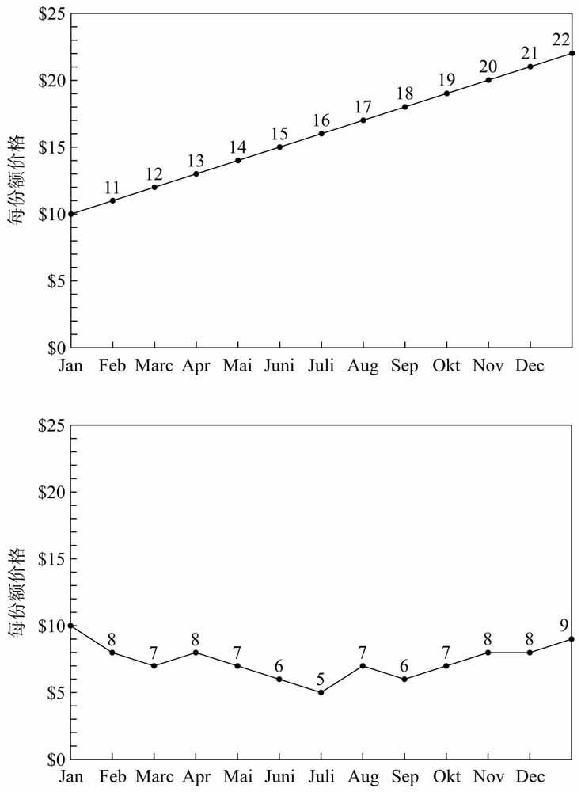

成本平均效应

对于每个月都进行储蓄的投资者来说，从根本上来看，二号基金会取得更好的收益。尽管它在年终时的价格甚至还低于年初时的水平，但是二号基金的结果更好一些。您也许会对这一结果感到吃惊。

而一号基金的红利仅为18.83%，相比之下二号基金却达到了26.81%。原因在于：如果每份额基金价格下跌，投资者就能够用每月相同的存储比率买到更多的份额。投资者在一号基金中能够买到71.3股，而在二号基金中却能买到160.09股。但是请注意：成本平均效应只有在您进行定期投资时才起作用——特别是在行情走低时。在行情低迷时候没有投资的人就失去了其最佳的盈利机会。

依我来看，如果您每个月都定期投资，有以下好处：您不必为选择正确的时机而费神。
只要您投资大型国际基金，并且找到了其中很好的资金基金，您不必为了低迷的行情感到悲伤。但是，每位投资者都应该注意最重要的一条原则：要分散投资。比如说，假如您每个月储蓄300欧元，那么就把它分为3份：100欧元用于资金基金储蓄计划，100欧元购买一份英国或者爱尔兰的生活保险，而另外100欧元投入一支租赁股份中（或者一项德国生活保险——如果您对安全具有较高的要求）。

顺便说一下，上述原则对于一次性的投资也同样适用。
您要尽可能早地投资到这些产品中。对于这些中等风险的产品，如果您为了“合适”投入而一直等待直到它们暴跌，那么您得到的也绝对不会比这更多。相反，您等待赚到钱的时间比这还要长。

因此，“您应该何时买入”这个问题的答案总结
说来就是：您要尽可能快地开始每个月进行投资。

问题六：您应该何时卖出

为了回答这个问题，我们回顾一下过去。不需要什么魔力我们就能发现，从1950年到2000年，标准普尔综合股票价格指数S&P500（美国最具说服力的股票价格指数）仅仅有12年出现亏损，而其余的38年都有盈利。

假设比例保持不变，那么我们的机会看起来就是这样：赢三次，亏一次。您觉得这样好吗？我的回答是：这样视情况而看。对于短期
投资（1～3年），我认为这样的风险太高了！因为这样看，短期投资的风险比为1:3。

基于这种盈利和风险的比例关系，您永远不要把您第二部分40%的收入投进来。您要记得，应该把40%～50%投入货币产品中，有了这笔钱您就有了后卫；而剩下的第二个40%～50%，您应该投入相应保险的股票基金中去——这些是您的中场队员。

也许您现在要问：“如果亏损的风险如此之高，您为什么还向我推荐国际股票基金呢？”这个问题正切中了“何时该卖出”这个问题的核心。因为您的风险不是永远那么高。
您投资的时间越长，风险就越小。如果您持有投资10年，那么这个风险就会下降到1/20，当时间长达25年或者更久，那么风险就几乎为零了。

很明显，对于“应该何时卖出”这个问题的回答就是：最好不要卖。您持有的投资越久，您的风险就越小。
您应该只抽出您此时真正需要的钱，让剩下的那些钱继续为您工作。

问题七：我真的应该把10%至20%的钱进行高风险投资吗

用您一小部分钱去冒冒险。只想着规避风险是危险的，因为这样的话，您会和很多本来应该得到的钱失之交臂。
我还从来不认识什么没有亏损过的有钱人。但是我认识许多穷人，他们在投资时从来没有亏损过。

从来没有伤心过的人就不曾真正恋爱过。同样地，没有什么人没经历过亏损就变得富有。许多人在投资游戏中不会取胜，就是因为他对于亏损的恐惧超过了变得富有的喜悦。为此，我的教练说过：“每个人都想上天堂，但是没有人愿意死亡。”

大部分人根本不进行投资。他们只是进行储蓄，接受既有的利息。投资者属于五角星图左半部分。他们同仅仅停留在五角星图右半部分的人在两方面有区别：愿意去冒险，以及极尽一生在实践中学习灵活的处世之道。

承担风险跟赌博并没有什么关系。许多人想快速赚钱，我祝他们好运，因为他们的确需要运气。相反，一位更加聪明的投资家控制着自己的钱，那么他会用一部分的钱去冒险。在这种情况下，他并不是依赖运气，恰恰相反，他只是在冒着进行考虑过的风险。

您应该学着去评估风险，这就需要您具有一定的知识了。以前，人们驱赶女巫，杀死她们，是为了给天花、鼠疫以及霍乱之类的瘟疫找替罪羊。现如今，人们用类似的方式驱赶着分析家、银行和公司，人们想把许多私人投资者的亏损归咎于他们。他们当然有缺点，但是主要还是在于投资者自己。他们对于风险连最基本的常识都没有，就贪婪地跳进去了——当然会为此受到惩罚了。

所以您要开发自己的经济头脑：读一读日报的经济板块，读一些金融书籍、经济杂志，和比您的资产多10倍的人多进行交谈。找一个教练。教练是行家，业余选手不是。

在实践中，您要对崛起中的发展国家进行投资，也要投资小公司、小行业。但是您事先要清楚规则。

1\. 只对您某种程度上了解的市场进行投资。

2\.
您要尽可能在那个市场里选一只基金，因为和您相比，投资经理也许能够更好地进行评价。

3\. 只对至少下跌50%的市场进行投资。

4\.
在进行首次投资时，最多投入您计划投入市场50%的资金。如果行情转好，再将其余的投进去。

5\. 写下您的收益目标，坚持自己的计划。

还有一个您应该对小公司进行投资的原因。有的时候股市常年低迷，也就是说几年来几乎没有增长。没有人明白这又是怎么回事。但是我们知道，尽管处于这样的时间，小公司仍然强劲发展着。在1932年至1946年以及1958年至1982年的两次长期下跌中，小公司以6:1的比例跑赢大公司。

您现在怎样做才是正确的呢？请浏览贝恩德·莱特根的网页吧：www.pifrl.de。在这里，您能发现一些较高风险等级的基金，这些基金的前景都是不错的。

您还有另外一种投资可能：从资金基金中选择一只风险较高的基金。这样您会参与到许多“热门”市场和领域中，并且还有专业人士接替了您的工作。

您有责任在身

许多人认为，自己无须对投资者的领域负责。但是我们不能再依靠我们的福利国家了。今天，投资对于您来说就好像一本封印的书。但是几年之内，你既可以成为一个精明的投资者，也可以在这期间找到一些非常优秀的咨询师。

最后，我想给您一个建议。您可能马上就想摆脱这个建议。您可能会想：“我绝对做不到。”但是我想请求您的是：请您不要低估自己的力量。
每个人的潜力都比我们想象的大很多。

给您一个提示：您要在直接参与投资的企业中保持观察。
初创企业有时候需要的资金并不多。您要省钱，然后留意去寻找直接对公司进行投资的机会。

这其中，您要与最大的风险保持距离——这样您同最大的机遇也拉开了距离。如果您已经投资的公司成功了，那么事实就是：没有哪里会像这样如此轻松赚到这么多钱了。如果您明智地这样做了，那么这样的赚钱方式还很避税。

请您马上开始阅读下一章。它会使您更加关注一个好机会：如果一位企业家明智地对自己进行定位，那么这就是一个标志着潜在巨大利润的信号。

------------------------------------------------------------------------

<a href="#text00042.html_ft1" id="text00042.html_fn_1">[1]</a>
原文此句为英文：They turn cash into
trash.（译者注）

<a href="#text00042.html_ft2" id="text00042.html_fn_2">[2]</a>
资金基金指以其他投资公司为投资目标的基金。（译者注）

第九章\
将自己定义成专家
===========================================

在过去的一个世纪，我们认为必须具备专业知识……\
还有一个专门“从事这项工作”的职位……今天，\
在这个瞬息万变的现代世界中，我们认识到，每个人都必须成为专家。\
——汤姆·彼得斯

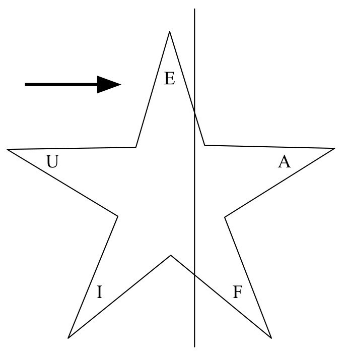

请您想象一下，有人在您面前将两张500欧元纸币和20张5欧元的纸币扔到地上。那么现在怎样做才是最有效果的呢？您会怎样做呢？您当然会首先捡起两张面值最大的纸币。特别是，如果还有其他人在场，而且他们也想从中得到一部分，这时候先捡起大面值钞票就显得尤为重要。

在本章，我们关注的就是钞票。如果您作为职员按照第七章列出的15条准则去做，那么您大概能够在一年内多赚20%，也许更多。但是大多数情况不会更多了。为了使您的收入翻一番，您就要完全达到新的要求。

回到我们前面提到的例子，即使您把20张5欧元的钞票全部捡起来，也还没有达到地上所有金额的10%。而且相较于您只捡起那两张500欧元的纸币，您更努力地“为之奋斗”了。所以说，不仅仅努力工作就能赚到大钱。如果您真的想多赚钱，就必须将精力集中在500欧元的大钞上。

## 专家

通往高收入的途径是将自己定义成专家。尽管对于每个人来说，专家的定义不尽相同。为此，我们要统一一个定义。如果您回想一下刚才钞票的例子，那么我们能够得出结论：将精力专注于界限明确的小领域（500欧元钞票）。

您要抵抗住想把那些5欧元钞票捡起来的尝试。
更好的办法是寻找新的500欧元钞票，而通过这种方法得到更多的钱。

您应该争做第一人。
第一人能够挑选他想要的事物。其他人就只能拿剩下的东西了。

您要学习从专家的身份里取得经济上的成功。
有一些专家，尽管他们满腹经纶，却钱袋空空。他们好像与世隔绝一样。但我所说的“专家”指的是兼具专业知识和经济头脑的专家。
那些按照本章提供的准则行事的专家将获得比一般“专家”多好几倍的收入。

本章将改变您的一生！首先，您的收入会因此提升到一个新高度，一个也许您今天望尘莫及的高度。您的收入会在3年之内翻一番——也许还会更多……

当然，这样的高收入不会凭空而降！您必须为此付出代价。首先，很有可能需要您转变思想，甚至有好多东西需要彻底改变。为此，许多人还没有做好准备，这对他们来说太冒险了。其次，您必须每天花上一个小时用来定位您自己。
这本书会为您指明道路——但路还是必须您自己走。

如果您对上述两点已经做好了思想准备，那么就和我们一起加入这场令人兴奋的旅行，学习如何将自己定位成专家。

最重要的前提条件

30年来，定位已在美国成为一种概念。杰克·特劳特（Jack
Trout）和艾尔·赖兹（AI
Ries）可能已经将这个有史以来最成功的策略进行了推广。在德国，定位仍然不为人知。为此，沃尔夫冈·麦维斯（Wolfgang
Mewes）提出了瓶颈策略（EKS，Engpass konzentrierte Strategie）。

两种模式都独具创造性，每家公司都应该加以学习。出于本书的观点，还需为此补充两点。

一方面，两种模式首先都是针对公司发展而来。
特别是定位理论主要针对的仅为大型集团。我们在这里更加侧重的是，作为个人，您能怎样定位自己，
怎样将自己定义成为专家。

另一方面，上述两种模式关注的并非利润。
金钱在我看来并不是什么不好的东西。恰恰相反。但是在我们工作中不可能戴着利润的眼镜行事。首选要考虑人——而非收入。
把自己定位到一个与自己热爱的事物不相符的领域，相当于更快地驶向错误的终点。

坦率地说，如果您能获得更多的收入，却没有从中感到幸福和满足，那么我也不会有满足感。这并非我创作本书的初衷。

因此，第五章和第六章是定义成专家的前提。首先需要确定您的工作与您的天赋相符。其次，您应该在工作中享受乐趣。最后，您应该解决其他人的问题。然后您就可以聪明地采取行动，去赚大钱。

许多人都不清楚自己到底是谁。因此他们通过自己获得的知识来定义自己，或者通过自己取得的成绩来定义自己。他们极不情愿抛开自己已经获得的宝贵的专业知识和成绩，丢开这些东西就好像要丢掉自己的身份一样。

主要能力决定主要事业

在这方面，上述顺序具有举足轻重的作用。您不应该一开始就考虑：“我的主要事业在哪里？”这样您就本末倒置了。您要首先问自己：“我的主要才能是什么？”

许多人仅仅从经济角度来考虑他们的主要事业。他们遵循这样的信条：“什么能赚钱，什么就是我的主要事业。”依我看，这是个完全错误的开端。这样想，您就只能把自己的潜能限制住。相反，如果首先考虑您的主要能力，那么您就会自由地施展您的才能。如果理查德·布朗森（Richard
Branson）（英国维珍集团）当年只考虑主要事业，那么他永远都不会达到今天的成就，而现在遍布各地的分公司系统为他带来了极大的成功。布朗森清楚地知道自己的主要能力：当市场的领先者变得涣散，给顾客提供的服务不值他们支付的钱，他能够从中看到扩大和增长的机会。因此他今天坐拥220多家公司。他的成功史与定位原则并不冲突，而是更加印证了这些原则。关于公司定位、专家定位以及企业家定位的区别，我们将在下一章进行阐述。

您总是要首先考虑什么是与您的天赋相符的，什么能够给您带来欢乐。

只有在这个基础上，将自己进行定位来赚取高收入才是有意义的。另一方面，如果您已经建立了这样的基础，那么就没有理由不去捡起大额钞票了。

在本章您将了解到如何赚得更多。您需要确定的是，事先就清楚了解您想做什么。

您的地位

请想想两三个知名人士。你和这些人有什么联系？我打赌你会立刻想到一个他们每个人各自代表的领域。比尔·盖茨代表软件。没有软件，几乎什么都不能做了。史蒂文·斯皮尔伯格（Steven
Spielberg）则是依靠他的电影与特效。而安妮塔·罗德瑞克（Anita
Rodderick）则是因为其标榜自然化妆品的美体小铺（The Body Shop）。

那么现在有一个问题给您：您擅长哪一领域呢？是否有一个您“属于”的领域呢？在哪方面你能够成为最好的那一个人？但是俗话说得好：想成为一切的人终将一事无成。
这其中的艺术在于，在一个尽可能小的领域中成为最著名的专家。没有人会把能兼容任何事情的万金油当一回事。

举一个例子。假设您每小时超速行驶57千米，警察要吊销您的驾照一年，那么您应该向谁求助？向一位对于田地、森林、草坪都了解的律师吗，还是一位在交通法方面的专家？假设，您从一位朋友那里听说，有这样一位交通方面的律师，叫施密茨，他能打赢97.5%行驶超速的案子。为此人人叫他“让人无罪释放的小施密茨”。我的哥哥曾经每小时超速80千米，但是施密茨让法院撤回了起诉。他有自己的一套本事。那么您该倾向于谁就显而易见了。

再举一个例子。一次滑雪时您受伤了，骨折得很厉害。您会不会去找一个附近的医生，而这个医生对您说：“我7年前接诊过一个类似的病例。我马上找一下资料，看看我当时是怎么做的……”您会在这里看病吗？如果去找德国这方面最好的专家，
而这个专家每天会治疗7～12位类似骨折的患者而不做其他的事情，您会不会感觉更好一些呢？

真是个蠢问题。您肯定会这样说。没错，答案再明显不过了。现在，我要问一个尖锐的问题：如果您自己
都想尽可能地向一位真正的专家求助，而且您也知道，专家比“普通”人收入高出好多……

●您有没有从中为您的工作得到符合逻辑的结论？

●您有没有明确地专注于什么事呢？

为什么有专长的人如此之少

当我在研讨课中提出这个问题，“谁能用几句话描述自己的定位”，大部分人都沉默了。在私下闲聊中也几乎没人能够回答我这个问题。我仔细研究了一下，有以下几个原因。

第一，定位原则尚且属于新事物，几乎还不为人们所了解。
大约100年前，全能人士在许多方面还有其用武之地。时至今日，还有人对那些“知识渊博”的人青睐有加，而看不起那些具有某方面专长的“专业白痴”。他们的判断很大程度上是错误的——事实往往就是这样的。因为，如果你看一看那些“专业白痴”的钱袋，就会发现，在这里有着一张又一张的500欧元大钞。

第二，人们只精通一方面，只从事相同的事情，看起来是很无聊的。
这种观点当然只有非专业人士才会有。专家知道，事实恰恰相反。如果您不专攻某一领域，那么您只会停留在原有水平上不会有进步，而且您的生活也会一成不变。您就总得把那些刺激的工作让给专家。

尽管专家只能在很微小的领域，但是在许多领域，知识每三年就会翻一番。他们终生都在保持着一种速度坚持不懈地学习。正是由于专家限制在一个相对窄的领域，才有可能做到这一点。因此，他们每天活动的“轨迹”是在变化的，然而最重要的是专家的水平越来越高。

第三，许多人认为专家是毫无兴趣可言的人，谈起话来枯燥乏味。
这样的假设同事实是不相符的。您在某一领域越专，就越有重量级的人物来听取您的意见。

或者，您觉得，我们的联邦总理会去请一位上知天文下知地理但无一精通的人给她出谋划策吗？一定不会。她肯定会接受该领域最专业的专家的意见。因此，您在一个领域通晓得越多，就越能结识更多有趣的人。

为何定位为专家的人如此之少的第四个原因，在于单纯的害怕。
害怕没有足够的客户，害怕找不到工作，害怕客户流失。所以很多人想方设法向他们的顾客提供尽可能多的东西。他们想用这种办法抓住客户，把生意做好。

如果说50年前在很多领域存在这种担心还情有可原，那么现如今，通过现代化的媒介，信息可以通过各种不可思议的方式进行传播。而且凭借今天的交通技术，距离远近也已不再是问题。为了解决某个特殊问题而穿越几百公里的路程对我们来说已非难事。

现如今适用的道理是：您越专业，就会拥有越多的客户。
您自己试试：在哪里更难约到时间？是在一个“全能”的人那里，还是一位知名专家？现如今，那些不够专业的人才应该感觉担忧。

第五个原因：许多人不会说不。他们不想或者不能够抵制沿途各种美好事物的诱惑。
就像童话故事中的小红帽一样，不知不觉被吸引着走向森林深处。他们为了眼前的利益而放弃了既定目标。一名专家不仅仅要知道他想要什么，还必须明白他不
想要什么。掌握了这种能力，方能取其精华，去其糟粕。

## 成功定位的基本原则

有这样一则故事。一位年轻女士在森林中迷了路。她遇到了一位老人，于是向他问路。老人想了一下，然后说道：“您沿着这条小路一直往前走，大约走了500米会看到一棵高大的被雷电击倒的橡树，从那里您往左拐，然后……不对，这样行不通。您最好还是走回去，然后沿着小溪往右走，一直走到一个旧磨坊那里，然后再向左拐……不对，还是行不通。”

老人又想了一会儿，然后说道：“您知道吗？从这里您根本出不去的！”

这个故事是不是让您想到您工作方面的状态？也许您正在死胡同，也许您必须另选一条路走，也许还是一条完全陌生的路。我想跟您鼓劲儿：这样做是值得的。要想把这些成功的定位原则付诸实践，您需要进行一切必要的改变，甚至如果有必要，您也应该对目前的工作提出质疑。

许多人都不愿意这样做。他们认为自己不会有什么“更大的”成功，或者他们遵循那些陈腐的格言谚语。这些格言谚语倒是很传统，但算不上至理名言。

您知道这条谚语吗——“宁可要手上的麻雀，也不要房顶上的鸽子”？请您赶快忘了这句话吧。将其引用到我们前面说过的钞票的例子就是这样的：“宁可要手里5欧元的钞票，也不去捡地上的那张500欧元大钞。”要真是这样想就太糟糕了。

现在我们看看6条使人成功定位的原则。您会马上知道，其中没有一条是难以理解的，但是要在实践中加以应用就需要勇气了。也许您要做出许多改变。

每条原则首选是针对独立经营者进行解释的，然后才是应用到各行各业中去。

第一条定位原则：不求更好，但求不同

当我向研讨班同学提出这个问题，“我为什么要到您这里买东西，或者到您这里来呢”，我常常听到的答案是：“因为我是最好的。”由此，我发现了一个人们在职业生涯中犯的最严重的错误。

不要误会：当然了，我也认同质量很重要。做不好工作，就会被淘汰出局。但是质量并不是仅仅拿来做广告的。原因主要有以下两方面。

首先，现在几乎所有公司都声称自己是最好的。
大多数都是在说谎。一名新的顾客并不能分辨出您是不是讲了真话。因此，他更喜欢那个把“不求更好，但求不同”奉为基本原则的供应商。

其次，宣称自己是最好并不能引人瞩目。
相反，这样的宣传太平淡无奇了。质量是前提。客户想知道的是您和其他供应商有着怎样的区别。
在这里，具有决定性的问题就是：什么是只有你这里有，而在别人那里买不到的东西？

您认为一家宣传自己烹饪最好的食物的餐馆怎样呢？您是不是更想知道，在某某餐馆我能吃到印度菜，这里有些菜品真够辣的。如果您喜欢这种味道，那么您就会光临那里。

这条准则对于各行各业都适用：您要找到一条与众不同的路。如果您做的和大家都一样，那么您的价值就像大漠中的一粒沙子一样了。
这时，就算您有“最好”的沙子，那么对您也不会有太大的帮助。

在这里，第六章会给您很大帮助。您还记得那些交集吗？那些给您带来极大乐趣的事情和您的最佳才能的交集才是使您“与众不同”的指路牌。如果以这些交集为基础，那么您很有可能做出一些与和您工作类似的人“不尽相同”的事情。

在这种关系中，我有一个孩子般天真的信念：为什么我们具备不同的能力，而且给我们带来欢乐的事情也不尽相同，这其中一定有它的道理。就好像我们做拼图游戏一样，每个人拼出的图画跟别人的都不一样。因此，实现第一条原则的诀窍就在于找出您与众不同的特点。

第二条定位原则：光做到卓越还不够，还要做到非凡

您还记得上学的时候吗？当时取得不错的分数，对于我们很多人来说都是极为正常的事情。另外，很多人将大众作为参照物，这样是很糟糕的。很多年轻人不想引人注目，所以他们穿着差不多的衣服，就连兴趣也都十分相近。长大成人以后他们也继续遵循这样的准则。真是不幸啊。因为大家做什么你就做什么，那么大家得到什么你就会得到什么。

再给您举一个其他的例子：运动。您是否还记得2000年悉尼奥运会上百米赛跑项目中获得金牌的是哪位男选手？您有可能记得，他叫莫里·斯格林（Maurice
Greene）。

您还记得，谁拿了第二、第三、第四、第五名吗？不记得啦？为什么不记得啦？如果您在奥运会上取得世界前五名的成绩，这难道不够出色吗？但是：没有人关心您是不是卓越。我们只关心谁是不寻常的。
赢者是不 相信“重在参与”的。

为什么是这样呢？因为我们被各种各样的信息包围着。平均一个家庭每天会通过电视看到大约750000张图片，我们每天会看到547个广告，每年就超过了200000个广告。在一家超市您平均会对12000件商品进行选择……

现在，请您想一想一年中举办的各种体育盛事：奥林匹克运动会、世界杯、冠军杯、F1方程式赛车、欧洲锦标赛、德国甲级联赛、网球赛、高尔夫球赛……我们的大脑必须学会筛选掉那些一般的、不重要的事情，然后全部忘掉那些并非真正轰动的事件——否则真的会让人疯掉。
我们只能专注于那些不寻常的事情。

中等水平甚至仅仅很好的成绩并不能代表非凡。只有非凡的人才能成为赢者，才能获得一切。那些陷入公平陷阱的人会问道：“赢者真的可以得到一切吗？”答案就是：“是的！”因为太多中等水平的人都没法代替给自己正确定位的赢者。

有谁只想成为乔治·克鲁尼（George
Clooney）或者帕瓦罗蒂（Pavarotti）一半好的人呢？就算是二流明星免费为您工作，您的经济效益也会比花高薪请来的顶级明星逊色许多。顶级明星的报酬从个人角度看是一笔巨款，但是平均到每笔消费上就微乎其微了。如果您想引人注目，那么就必须做到超凡脱俗。这并不是说您必须赢回来一枚金牌，但是您必须找到一条能够超越同行者的途径。而这比您此刻脑中想象的要容易得多，只是您必须将下一条原则付诸实践。

第三条定位原则：争做第一人

也许您是一位明星。衷心祝福您：你比许多其他人都要成功，而且超群出众。但是假如您不是明星，您也可以脱颖而出：要做到这一点，您不需要比别人优秀，而只需要成为您所在领域的第一人。

您还记得第一位坐飞机横跨大西洋的人吗？查尔斯·林德伯格（Charles
Lindbergh）。那么第二位是谁呢？博特·海克勒（Bert
Hickler）——他只比林德伯格晚飞了一个星期，还比他少用了3个小时，这当然比前者更好！但是没有人对此感兴趣（除了在澳大利亚那个他出生的小城市里面的市民）。那么又是谁第一个登上了珠穆朗玛峰呢？是希拉里爵士。那第二个是谁呢？几乎没有人知道。

谁是登上月球的第一人呢？尼尔·阿姆斯特朗（Neil
Armstrong）。然而第二位就鲜为人知了，尽管他是阿波罗11号的司令。这再一次证实了：谁做得更好或者谁是司令并不重要。顺便提一下：在整个飞行过程中还有一个第三人，但是他根本没有踏足月球，因为他必须待在火箭里面。您认识他吗？有喜剧演员因此开玩笑说道：“他和待在家里没什么两样嘛……”

您想一想，您能在所属行业的哪个小领域成为第一人呢？这时下面这个原则就起到了作用：小领域越小，就越容易成为第一人。
尤里乌斯·凯撒（Julius
Caesar）那时就懂得：“宁做鸡头，不做凤尾。”通俗地讲，就是：与其成为整个行业芸芸众生中的一员，不如当某一小领域的排头兵。安德鲁·卡内基（Andrew
Carnegie）说过：“第一个人得到珍珠，第二个人就只能得到贝壳了。”但是，假如您所在行业的全部领域都已经有人在做了，您能干什么呢？您怎样才能成为第一人呢？这个时候，您需要运用第四条原则。

第四条定位原则：如果您不能成为第一名，那就创造新的定位类型

还记得第一次横跨大西洋的飞行吗？几乎没有人知道谁是第二位横跨的吧？然而有趣的是，第三个人又重新为人所知：艾米丽·艾尔哈特（Emely
Earheart）。因为她正是第一位成功飞越大西洋的女性。也就是说，她在这个类别中是第一个。

同样情况的还有莱因霍尔德·梅斯纳尔（Reinhold
Messner）。他并不是第一位登上珠穆朗玛峰的人——前十名也算不上。但是他开辟了一种新的分类：他是第一位不带供氧设备登上最高峰的人，也是第一个完全登上8000米的人，而且他是第一个向经理解释自己从登山中能够学到什么的人。（您看看，如果人们有那么一次坚守内心意志的话……）

我们不得不承认：把第一个原则投入实践从根本上说比实践第三个和第四个容易许多。您很可能要花上大量时间进行考虑，才能找到一个领域，成为这个领域的第一人。但是一旦成功了，那么您将每年赚上好几百万。

我的建议是，您首先考虑一下，如何利用自己的特性、能力以及给您带来欢乐的事物使您变得与众不同。
但是不要就此满足——接着思考一下：您怎样才能开辟一项新的领域分类呢？大多数人苦思冥想几个钟头后就宣告放弃了。因此我认为，能够成功开辟小领域的人之所以少之又少，并不是因为很难，而是几乎没有人愿意长年累月地为此绞尽脑汁、苦思冥想。

假如养成习惯，每天拿出15分钟来思考在哪方面您能成为第一人，并且将想法记录下来，那么您很有可能找到答案。总之，我是想到了几十个目前在德国还无人涉足的领域分类，全部蕴藏着巨大的商机。

第五条定位原则：宁可精细，不要宽泛

杜塞尔多夫 <a href="#text00043.html_fn_1" id="text00043.html_ft1">[1]</a>
机场发生火灾时，发生了下面这件事。几十人被围困在一层的一间屋子里，为了逃出去，他们曾尝试打碎一扇大玻璃的窗户。几名身强力壮的男子合力抬起一张大桌子，用桌面不断撞击玻璃，但是玻璃一直没有被撞碎。人们开始惊慌起来。

这时候，一名男子驾车经过玻璃窗，他了解情况后停了下来，从后备厢中抽出扳手跑向玻璃，然后抡起扳手。当尖锐处碰到玻璃墙的时候，玻璃立刻碎成了成百上千块。

这个教训就是：不要试着宽泛地打入市场。您宣传的东西范围越大，就越难吸引人们的注意力。
太多太多的公司用大量商品招徕生意，他们的供货面太宽，结果给顾客带来许多不必要的麻烦。您想象一下，您从跳板上跳进水里，那么“平趴式”入水绝对不是最优美的动作，也不是最优雅的方式。

您以越精尖的方式出现，一切就越好。您越是精细地定义经营范围，那么您的市场份额增长得越快。
相反地，您越是广泛地进行展示，那么您能企及的地方也就越少。因此蛮力在很少情况下才有用。尽管从根本上看石头具有更强的穿透力，但是钉子比厚重的石头更容易击中木板。

把您的市场策略放在第一位

如果可能，请您只通过一种产品或者单一的功能来吸引大家的注意力。如果您首先有了一位顾客，您可以再提供其他的。转化为营销术语，这意味着：应用冷市场的间断（人们不了解的领域），再为您的暖市场（您的客户群）
提供一切适合您定位的东西 。

我对许多专家提过这样的问题：“您知不知道哪家公司提供各种各样的商品还迅速发展了呢？”没有人能够说出个例子来。一般情况都是只提供一种产品，或者最多情况下一种能够迅速发展起来的单一产品类别。然后，当公司成长起来以后，再进行分类。那样做是否明智，还有待考量。但是无论如何，增速通常会放缓。

但是，具有决定性的一点是，您如果很“小”并且想迅速成长起来，那么必须钻研市场精尖领域——否则您根本无法涉足。

一点建议：大多数情况下，暖市场对于您保持尖端状态是有利的。因为对于顾客来说有着这样的原则：人们不会接受一个在许多领域都是专家的人。
您愈是保持精尖的状态，就愈加值得信赖。您愈加值得信赖，也就更加成功。

那些会太多东西的人一定不靠谱

在您的工作中是怎样一回事呢？回答是：请您把所有的语言都针对一种能力，让自己只有一种天赋引人注目。为此，您不会错过任何东西。相反地，您会赢得许多东西。没有人会认为您能够在众多领域都表现优秀的，尽管您自己是可以做到的。

拥有许多方面能力的人在这里会感觉有难度。他们必须选择一项天赋。请您想一想迈克尔·舒马赫（Michael
Schumacher）：他打乒乓球很好，在足球方面和其他体育运动中都表现优异。如果没有专于一个精尖的领域，他现在会在哪里呢？他也许会在许多学科成绩优异，但是他永远不会变成今天的样子：杰出的世界冠军以及迄今收入最多的德国运动员。

我们假设一下，您会唱歌，会跳舞，会操作电脑，您懂得动物的语言，您会画画，会潜水，能进行徒手攀登，能够创作鸿篇巨制，会正字法，从来不会忘记别人名字……那么很多人会认为您很神奇（比如说我——因为上述哪项我都不会）。但是如果您想将所有的能力展示出来，那么这就不是精专了。那些不认识您的人会认为您是个狂妄自大的人。

您需要勇气来放弃一些。少即是多。如果真的想开拓事业，那么您必须选择一个特殊的领域。瞄准比分散要好多了。

第六条定位原则：选择基本需求，不要特殊套路

假设您在20年前专注于黑胶唱片，您知道关于黑胶唱片的一切：如何存放、打理，怎么修理唱片机……那么您今天会有什么用？什么用都没有。黑胶唱片过时了。假如有想听音乐的需求，那么您就是顺应时代。另外一个例子就是德国的新兴市场。那些专门研究德国新兴市场的人，破产之后很少有人能笑得出来。相反，那些关注基本需求来赚钱的人，仍在做生意。

我们一直都在经历着整个行业的过时。大量的人失业了。不仅仅没读过书的工人遇到此番窘境，就连专家也会遇上这种情况。

这其中的教训就是：一定要专业，但是并非在某一特殊方式上专业，而是基于基本需求。您选择一下，想在哪方面成为专家，然后就动用一切可使用的技术使其变成可能。

因此，不要让您的客户觉得您只想卖某种特定的商品，而是要尽可能满足他的需求。那些专注于基本需求的专家，会独立行事，不依靠任何人。

专家最大的好处就是：他会让客户觉得，他代表了客户的利益。与此相反，卖家大多数情况下都在维护其公司的利益。
专家是独立的，为客户寻找合适的产品或者切合实际的解决方案。当然，这样的话，专家是主动的：客户致电专家，企业必须赢得客户。那么这样说来，一个企业越像专家，就越会吸引顾客纷至沓来。

第七条定位原则：选择一个属于我的目标群体

万宝路是至今以来最成功的香烟品牌。这首先和生产厂家菲利普·莫里斯公司（Philip
Morris） <a href="#text00043.html_fn_2" id="text00043.html_ft2">[2]</a>
的广告宣传有关。据我记得，广告的题目从未发生过改变。您认得其中的亮点。那么请回答这个问题：这则广告是面向哪些人的呢？

答案就是：面向牛仔们！
为此您应该进行思考。因为：在欧洲您认识多少牛仔呢？这已经是一个相当小的“目标群体”了。但是牛仔并不是目标人群，大量的吸烟者才是。实际上，对自由和冒险经历的渴望是合乎每个人的口味的。

大多数人想让所有人满意。但是众口难调，那些试图让所有人都满意的人，最终往往谁都不满意。
所以现在的趋势是：抓牢您的客户。这一点当然十分重要。许多公司下了很大力气使客户满意。但在做这一切之前，他们应该提出一个关键问题：您到底想不想要客户？因为您只会为那些长期尊重您并且真正看中您的客户提供优质服务。

针对这条原则的一个关键规则就是：不要围绕您既有的客户开展业务，但是要吸引那些想要盈利的客户，并以此建立业务。

现在的客户比任何时候都能够找到进行采购的地方。但是这种自由有时候作用相反：公司同样能够选择希望谁来作为客户。
我向一位企业家提问：“您希望谁来作为客户呢？”我经常听到的答案是：“能够付款给我的每个人。”恕我直言：这既不是精细的目标人群，也不是准确定义了的目标群体。

在谈到“确定目标群体”的时候，几乎没有人感觉有什么特别。那些将顾客视为奶牛的人认为，越能挤出牛奶，就“越好”。他们不会真正满足奶牛的需求。您建立公司并不是为了给所有人做一切事情，而是为了给一部分人
出色地完成一些 事情。

为什么要精细地、精准地明确目标人群，主要有以下两方面关键原因。

首先，客户都有自己的特点，他们希望自己的特殊需求和期望能够得到重视。“统一处理”的方式就让人觉得不够重视，而会受到拒绝。但是如果了解客户的特殊点，那么您就能创造出一款极具特色且独一无二的产品。

其次，如果您还不是特别了解您的目标群体，就根本没法赢得客户，这就好比对着窗口撒钱。假如您对他们有些许了解，也还是不够的。您必须尽可能多地去了解您的顾客：年龄、职业、家庭状况、爱好、观看的电视节目、阅读的杂志、花钱的项目，他们心中的偶像和英雄、接受教育情况，兴趣……越详尽越好。

第八条定位原则：为他人解决一个问题

请向自己发问：我的目标群体有什么最紧急的问题吗？
您怎样才能解决这个问题？怎样才能以最佳方式找到目标群体亟待解决的问题呢？方式就是和他们保持联系。要经常和您最重要的客户进行交谈。要找出来他在忙着做什么，需要什么，以便为其提供解决方案。

假设您必须进行心脏手术：您会找您的家庭医生来进行手术吗？您当然会选择最好的心脏专家。您的问题越大，您想找到一位真正的专家的期望就越强烈。
而您也就更愿意出高价。这样说来，以专家的身份给人解决问题是很值得的。

请您允许别人来做您为别人做的事情，也就是说，请允许别人来解决您自己的问题。您可以这样：找一位合适的合作伙伴。通常情况下，如果在别的方面出了问题，让别人来解决往往比您自己来解决要简单许多，而且更加划算。
为什么呢？因为别人对此更加在行。

时不时地问问自己：我棘手的问题是什么呢？我有怎样的瓶颈问题？还有，谁能帮我解决这个棘手的问题呢？如果您试图与此背道而驰，所有的一切都扛下来自己做，那么这将消耗您对自己的定位。因为那样的话，您也许会在许多领域表现优异，但是没有一个领域是超乎寻常的。因此，由定位策略得出的一个合乎逻辑的结论就是：把某些工作委托给其他公司，并且寻求合作伙伴。

在寻找合作伙伴的时候，不要找那些和您有着同样能力的人。如果您的合作伙伴有着和您相同的才能，您就几乎发挥不上协同的作用，所以，要寻找一位和您才能相互补的合作伙伴。在与合作伙伴确定长期合作关系之前，一定要与其商定一段时间的试验期。

第九条定位原则：把您做的事情说出来

您是否品尝过鸭蛋呢？也许没有。鸭蛋比鸡蛋更大、更美味，而且营养价值更高，但是为什么我们经常吃比鸭蛋小的鸡蛋呢？因为母鸡会更好地“推销”它们的蛋：母鸡往往还没下出鸡蛋就开始咯咯地叫，以此来使自己的“产品”受到关注。

如果您只是成功地实践了前8条原则，那还不够。您还应该使自己受到关注。
即便您是登上火星的第一人，要是没有人知道这件事，那对您来说也还是毫无用处的。

为此，我们必须对第三、第四个原则进行补充。您不应该满足于做某件事的第一人，还应该让公众知道您是做这件事的第一人。想一想北欧海盗维京人，他们早在哥伦布之前就登陆了美洲。尽管如此，哥伦布还是作为美洲大陆的发现者而得到了世人的关注。

你并不需要特意做什么，只需要在公共场合像专家那样就可以了。比如说，您可以做一些非同凡响的事情，或者您也可以写一本书（别忘了，“作者”和“权威”有着相同的词根
<a href="#text00043.html_fn_3" id="text00043.html_ft3">[3]</a>
）。您可以撰写专业文章，也可以参与电视节目，您还可以作报告或者获得一些奖项，但是这一切都必须面向大众公开。

您要避免那种只想在其他专家圈子里出名的想法，为什么呢？首先，这是一条漫长而坚定的路——因为其他专家是不会希望别人取得成功的。其次，从另一方面看，其他专家也并非衡量您水平的尺标。

关键取决于大众的反应情况。只有您的名气才能决定您定位的经济价值。
所谓的专业人士说了什么就无足轻重了。即便他通过发表言论或者撰写文章反对您这位知名专家，说一些对您产生不利影响的坏话，这些也仅仅有助于提高您的名气……您甚至还会因此赚到更多的钱。

顺便说一句，谈论您的专长并不等同于精神上的过度展示。有许多引人注意的方法，因此您既不用装扮小丑哗众取宠，也不必公开您的私人生活来制造轰动效应。在这一点上，您可以想一想罗兰·贝格（Roland
Berger） <a href="#text00043.html_fn_4" id="text00043.html_ft4">[4]</a>
——德国排行第一的咨询顾问。每个人都认识他，尽管他只是每隔几个星期才发表对其专业领域的意见。

第十条定位原则：您来确定价格

如果您的公司与众不同，而且有着客户在其他地方买不到您销售的产品的优势，那么您就能够进行定价。如果您并非与众不同，那么竞争就会来决定价格。这一点在职员身上同样适用：如果您掌握了一些其他人不具备的能力，那么您就能够决定您的收入。如果大家都具备同样的能力，那么是公司来决定薪水。

换种方式说就是：要么您通过自己的与众不同来同其他人进行区分，要么您就必须参与到无情的价格竞争当中去。如果对于客户的竞争体现在竞相压低价格，那么对方是不会从中赢得利润的。他们必须以低于价值的价格出售产品和劳动力。而专家就不同了：人们简直就是在求着给他们付钱。

对于这些原则您会做些什么呢

读完了上面这10条定位原则，您会做何反应呢？当然，您可能会说：“从我的情况看，我做不到的。”这就太可惜了。因为我打赌，在这个世界上总有人曾经和您情况相似，也具有和您相似的能力……但是那个人现在已经成了富有的专家。

这其中的区别并不体现在各自情况的不同。区别在于在您的情况下，您会怎么做。世界上很多事情我们无法改变，但是我们可以随时改变我们的生活——于您于我都是如此。为此，这些定位的原则就是很好的指路标。

把船上的漏洞补好，远比抽干湖水要聪明得多。也就是说：请专注于那些您力所能及的事情，
不要抱怨麻烦。假如您是一位医生，那么就别等着修改法律，而是干脆把自己定位成专家。

我们之中只有少数人能够在市场上翻云覆雨、叱咤风云。因此我的建议是：您千万别在一开始就想着说服别人或者改变他人。这样是需要大量精力和时间的，也就是说，您就如同堂吉诃德对抗风车那样，在做无谓的斗争。请您只专注于能力范围之内的事情。关注那些恰恰需要您所能够提供的东西的人们吧，而不要试图去改变别人，改变世界，您还是改变自己的状况和营销方式比较好。

人人都能做到，但是……

上述的原则每个人都能做到。每个人！但是……也许在一个人身上花的时间要比在其他人身上长，也许这个人花费的力气比另外一个人要多，而且，也不是说所有人都能得到相同的结果。但是这么做对每个人来说都是值得的。您要开始行动，而不是一味等待更好的机会。用生命给您的颜色为生命上色。但是要好好画！

从来没有两个人有着相同的条件。但是凭借时间和耐力，我们通常情况下能够做到其他人所做的。但是，一项长期的实验证明了以下结论：如果人们在3年后对考试不及格的同学重新进行测验，那么通过率是100%。
在那些极难的，之前只有少数好学生通过的考试同样如此。

这只是时间的问题。有些人因这样那样的因素，有能力比其他人较早地去做某些事情。这并不是坏事。因为3年在人的一生中算什么呢？如果这个人失去勇气，还让自己相信永远都不会成功，这才是糟糕的。
一句话送给我们中所有正在等待机会的人：所有明天的专家，在今天都还是无名的。

您需要的只是耐心和勇气。每个人都具有某种天赋。然而，很少有人有勇气将这些天赋带到它引导我们所至的黑暗地带。通常情况下，说出例如“我没有天赋”这样的话也许比经历风险，面临艰难抉择，培养天赋更加轻松。

因此，顶尖运动员每天都会进行4～6小时的训练和练习。这样他们变得越来越好，赚得很多也就不足奇怪了。这并非不公平，而是完全符合新规则的。请您问问自己：您每天进行几小时的训练呢？但要注意的是，我并没有问您花多长的时间从事
您的工作，而是您为了您的工作进行了多长时间的训练。

职员可以怎样做来进行自我定位呢

您应该从哪儿开始呢？如果没有任何想法进行自我定位，那么您会做些什么呢？首先，您可以从两个机会中间进行选择：您想继续受雇于人做职员，还是想独立进行创业呢？

假设您决定继续保持受雇佣的状态。那么您是可以，也应该对自己进行定位的。请您思考一下，您怎样做才能与众不同——而不是怎样做才能干得更好。您怎样做才能变得卓越？可以不断提高自己的专业水平，同时提高、拓展您的能力和才能。
您可以考虑一下，在这个过程中您是否能够满足某种基本需求。请注意，您应该到一个巧妙定位自己的公司去工作。这个公司的目标群体不是很大，它为这个目标群体解决其急需解决的问题，而且这个公司肯定在某一领域占据第一把交椅。在这样一个运作良好的公司里，您更容易得到升职，并且能够学到很多东西。

您要让自己专注于解决公司内的某个特定问题。您要学着让自己引人注目，而不是显得骄傲自大或者自以为是，比如，您可以在公司的报纸上定期发表文章。

独立经营者的策略：不要等待完美策略的出现

如果您是独立经营者，或者想独自创业，那么您需要一个思想火花。您知道一套策略和一项技术之间的区别吗？技术是一定的行动方式，策略是幕后的计划，是一幅宏伟的蓝图。每个人都可以快速掌握技术，把技术投入使用，但策略是很难发现的。

您认为，什么是更重要的呢：是一套好的策略，还是一项优秀的技术呢？大多数人的回答是：策略更重要。我的回答是：没错，但是……我们中只有极少数人从一开始就有一套赢家的策略。谁要是过于迷信策略，那么为了成功地实施这套策略，他就会在试用新技术上落后于别人。但是这套策略很可能根本没有什么用。然后呢？您就会耽误很多时间，就必须从头开始。反之，如果不是彻底地
确定并且依赖于一套策略，您就会更加灵活，能更容易地改变想法。

一些最优秀的策略的产生，要么是因为他对改变不怎么成功的策略早有准备，要么就是因为他一开始从简单入手，而且尝试了很多项技术——直到最终找到了一套必胜的策略。下面就是对于上述两种情况都具有启发意义的例子。

●一个年轻人听说，大批人前往加利福尼亚淘金。他想，这些人也许会需要很多帐篷。因此他花光积蓄购买帐篷，然后驱车驶向了几百公里以外的加利福尼亚。

到达了以后他发现，有人已经有了同样的想法。整个地区支起了好些帐篷。怎么办呢？他想到了一个新策略，于是他就观察这些淘金者。很快他注意到，这些人总是用膝盖跪着工作，这样来回摩擦，很容易把裤子磨破。布料太薄了，于是他就想到了用买来做帐篷的帆布来给这些淘金者做裤子。李维斯（Levis）牌的牛仔裤就这样诞生了，后面的事情就是尽人皆知的历史了。

●一个人有这样的想法：把世界文学中所有伟大作家的作品汇总在一本书中，他给这本书命名为“经典全集”。这是个很棒的点子。只是没有人想从他这里买书。这个人损失了一大笔钱。

一段时间之后，另外一个人也有了同样的想法，他把这个汇总用一种全新的框架呈现了出来：《美国洗手间巨制》。他花很少的钱从第一个人那里买下了这本书的内容，结果赚了好几百万。

●沃尔特·迪斯尼刚刚输了官司：漫画形象“兔子奥斯华”的所有权判给了一位竞争对手，这个人因为这只兔子发生过争执。当他在回家的路上看到一只老鼠的时候，就产生了一个想法：将同样的内容用另外一种动物形象表现出来，于是米老鼠就诞生了。如果迪斯尼久久不能摆脱悲伤，为命运怨天尤人，那么会发生什么呢？

●一位女士凭借《关于女人，男人都知道什么》这本书赚了数百万美元。实际上该书已经被几十名妇女用手撕了。其想法的特别之处在于，这本书只有96页——而书里面一个字都没有。

●一家制药公司研制一种治疗流感的万能良药，能够让人们即使身患感冒也能正常工作。最终人们得到了这样一种混合药剂：服用后不发烧了，也不咳嗽了，鼻塞也通了，头疼、四肢酸痛的症状也消失了。但是这种药有一个“小小的”副作用：人们如果用了药，就会昏昏欲睡，让人睡得又沉又香。对此的解决办法当然是一个新的策略：公司推出了一种夜间服用的药，这样，这款“为安眠”便成了畅销品。据说万艾可就是这样问世的。研究人员在试验一种治疗心肌梗死的药时，却发现了很有意思的副作用……

●3M实验室本来想研制一种万能胶，却产生了一种不干胶，原来的目的并没有达到。后来，一个想象力丰富的男子改变了策略：他将这种胶涂在小纸片上，这样就发明出了黄色的便利贴。

您也许会说，故事不错。但是我们能够从中学到什么呢？回答就是：您要学会想出新点子。在您还没有成为专家之前，您必须首先学习成为有创意的专家。

想法是怎样产生的

很多人觉得，自己就是没法想出什么漂亮的点子。我相信您只是缺乏练习。如果我们中有人天生就能持续想出天才的想法，那么这绝对是个神话。实际上，要想想到好主意只需要费点儿精力。很多人为了省事，就直接说：“我想不出来什么绝妙的想法……”就这样，他们有了不去努力的借口。

要想发现一个主意，通常情况下您必须经历4个阶段——只有在极少数情况下才有可能缩短。这些阶段甚至常常持续相当长的一段时间。想要创造一个开拓性的发明，即便是最具创意的发明家也常常需要花上好几年的时间，他们需要千百次的尝试，需要长时间的研究琢磨，而绝非一个“灵光乍现”就一蹴而就了。这4个阶段就是：

1. 准备阶段。
您提出想解决的一个问题。对此您竭尽所能地多收集信息，记录数据，向他人请教。您的大脑开始积极地紧锣密鼓地工作，以期找到解决方案。

2. 对比阶段。
请您思考一下，别人有怎样的主意您可以拿来借用。保罗·西蒙（Paul
Simon）曾透露他是怎样获得灵感，创作了那首著名的歌曲“Bridge over Troubled
Water” <a href="#text00043.html_fn_5" id="text00043.html_ft5">[5]</a>
的：“在我头脑中产生了两组旋律，一个是巴赫（Bach）的赞美诗，另一个是司万·希尔沃托尼斯（Swan
Silvertones）的四福音书——我把它们结合成了一个整体。”戴尔·卡耐基（Dale
Carnegie）谈到他的《如何赢得朋友》这本书的由来：“这本书中的方法并不是我自己想到的，而是我从苏格拉底（Sokrates）、柴斯特菲尔德（Chesterfield）和耶稣那里‘偷窃’来的，只不过将它们综合整理到一本书中而已。”这本书大约卖出了4000万本。

3. 酝酿阶段。
无论白天还是晚上，您的大脑都在思考着这个问题。您酝酿着答案，比较着不同的解决方法，将不同方法中的部分内容进行替换，得出部分结论并将其记录下来。慢慢地，您开始逐渐勾勒出一幅画面。

4. 恍然大悟阶段。
突然间冒出了一个想法——就好像凭空出现的一样。这在散步或者打盹儿时都有可能发生。您要是在出点子方面是行家，那么您应该总是随身带着纸，以便记录随时可能出现的灵感。

微小的改变

通常情况下，您只是需要对既有的东西加以补充即可。有时候只是一些不太重要的变化——但是这些可能产生极大的影响。比如说，莱特兄弟发明的飞机基本上是从别的发明家那里“引用”过来的。那些发明家设计的飞机最初是不可以飞行的。莱特兄弟弄清了问题出在机翼上，最终，他们只是在机翼末端安装了特殊造型的活动板，飞机就飞起来了。莱特兄弟也因此而载入史册（而且也极为富有）。

您作为一名有主意的人，同发明家是一样的：您要弄清楚，哪些事物众所周知，然后下一步就钻研这些。
请不要把时间浪费在发明一些既有的事物上，不要去寻找那些已经被发现的道路。一项由威廉·布鲁德（William
J.Broad）进行的调查显示：73%的专利权是基于大家所熟知的知识。

早在亚历山大·格莱姆·贝尔（Alexander Graham
Bell）“发明”电话之前，有一位名叫约翰·菲利浦·莱斯（Johann Philipp
Reis）的人发现了怎样通过电流将音乐声传送到接收器上，但是他并没有成功实现话语的传播。贝尔利用了莱斯的发现，并最终弄清，只需要把一个螺丝拧紧四分之一圈，就可以从交流电变为直流电。贝尔依靠他的发明闻名于世——并且极为富有。

莱斯先生感觉“自己的”发明被窃取了，于是告上了法庭。除了一个仅仅稍微拧紧一点的螺丝之外，其他的全部都是他的设计。但法院还是驳回了莱斯的起诉。判决中给出的原因有一段很有意思：“这两个系统的区别仅仅在于成功和失败的区别。如果莱斯没有放弃，也许他已经找到了成功的道路。但是他放弃了，就失败了。贝尔接过他的工作，并且最终成功完成了这项发明。”

拿破仑·希尔（Napoleon
Hill）一直致力于采访世界上最有钱的人，并且把他们的成功原则总结成一本书《思考致富》。他写道：“一个一无所有的人就是相信自己的想法是适合自己的最好的主意。”美国曾经最富有的人塞姆·华尔顿（Sam
Walton）声称：“我所有的想法都是从我的竞争对手那里偷来的，然后我将他们适应进我的系统。”

米开朗琪罗曾经说过：“如果人们知道我为了杰出的成绩付出了多么长时间的努力，那么大家就不会觉得奇怪了。”

能量贴士：要想成为创意方面的专家

●记录下您想找到答案的一个问题。

●养成习惯，注意使用别人成功的、崭新的、有趣的主意。

●解决问题最简单的方式是：借鉴别人的主意并对其稍加改动。

●请您成为创意的收集者。记录一本创意日志。

●请您到您所在领域最优秀的人那里去，去看一看他们的想法：您如果是一位证券经纪人，就去华尔街；是冲浪者就去夏威夷；是表匠就去瑞士。您需要在那些已经很懂行的人那里找份工作来进行学习。

●您思考一下，下面哪种方式能够应用到现有的主意上面来：

1.
您能否将几个主意的几部分进行交换或者进行替代？

2.
您能否把一些事情组合在一起（比如说两个想法）？

3. 您能否改变什么或者适应其他事物？

4.
您可否将一个想法转用到其他领域呢？

5. 您是否具有转换思维？

●请您养成习惯，入睡前思考一下您的问题。这样您或多或少会下意识地思考解决方案——在梦里。

●不要忘了随身带一张纸。

在本章的最后，为您介绍4个不同行业的例子。

伊莎贝尔

自打我在马略卡岛购置房产之后，我就遇到了一个麻烦：我讨厌买家具。要是等到整个房子最终可以住人，需要浪费几个月的时间。想想真恐怖！幸好有一位专家可以为我解忧：伊莎贝尔。

她是这样向我介绍她的工作的：“您的时间很紧，房子的室内装修会使您心烦，而且您可能也没有得力的助手帮您布置家居……（完全正确）我会为您打理一切。您只需要拿出一天的时间，我们看着手里的目录和您商量一下究竟想要怎样的布置：从第一把椅子到窗帘甚至最后的毛巾。而且这些东西在我这儿买比您在商店买要便宜，我的服务是免费的。”

我当时感到很好奇。她的营销策略很正确：她可以列出许多优秀顾客，这些人可以证明她的服务的确分文不取而且很棒。我还亲自去看了一套她布置的房子：真的很赞！

她遵守着承诺。我只花了一天时间，而且买东西的花销确实比在相应的商店要便宜10%左右，她把我房子中很多地方也进行了翻修——所有的一切在10个星期内完成了。而且，对于她的工作，我没付一分钱。

她做得怎么样呢？非常非常棒。以前她怀孕的时候不得不放弃家具商店的工作。于是乎她有了个想法：她为客户购置家具。由于她是直接从厂家买入家具，所以她只按照进价购买，然后再把商品以低于市场10%的价格卖给顾客。她靠着赚取差价生活得很滋润，而她要做的，就是为客户安排好一切。

她做的正是她所热爱的——布置和采购。她可以自己分配时间，并且照看孩子们。这是多么奇妙的一个方案啊。请您将她的经营想法和上述关于良好定位的10条原则相比较，您就会发现，所有这些原则都在她身上得到了应用。

伊莎贝尔几乎没有任何成本，不需要人力，并且每个月收入几万欧元。她可是一位带着两个小孩儿的年轻姑娘啊！请您计算一下：人们很容易为装修房子花掉10万欧元甚至更多，然而伊莎贝尔从中赚了将近一半……

宝娃

第二个例子：您认识李宝娃（Lil Bow
Wow）吗？也许不认识，因为您也许并不属于他的目标人群。宝娃17岁，收入上百万元（他的首张个人专辑的销售量超过200万张）。为什么呢？他做一切他所热爱的事情。他具有令人难以置信的自信心，他从他所在领域的顶级专家那里得到了教诲，他还是一个具有天赋的定位专家。您看看，他是怎么讲述他自己的：

“最重要的就是：你需要自信。作为一个男人，你必须相信自己。而且你必须找到可以表达自己的东西。对我来说就是说唱（Rap），我6岁的时候就找到了。

“当斯诺普·道格（Snoopy Doggy
Dog）在我的家乡登台演出时，我什么也没想跳上去就帮着演出。随后我又多次随他登台表演，我说唱的内容都是关于和我一样大的孩子的感觉，你明白吗？也就是游戏、学校、和父母的矛盾，等等，斯诺普喜欢这样的。他说：我们得把你的名字改一改。从现在开始，你就叫Bow
Wow……这么酷的名字能让你更容易受到歌迷的喜爱。

“吹牛皮对表演行业很有帮助。只有一次我词穷了，也就是当我第一次遇到我的偶像——迈克尔·乔丹（Michale
Jordan）的时候。但是几年来我一直和超级明星在一起，所以后来也就不怎么拘谨了。我们现在甚至想一起拍一部电影。”

您看看，总是相同的模式：

1\. 找到我们热爱的一些事物，

2\. 建立自信，

3\. 找机会接近榜样并向他们学习，

4\. 然后对自己进行定位……

无论有意还是无意这样做，都会使人成功，并且获得高收入的。

将自己定位成消防队员？

倒数第二个例子：我想从一个问题开始。您相信自己也会成为消防队员吗？也许很难是不是？

假设，您的地产下有一个油田，如果油田着火了，您会找谁来灭火呢？当我在一个演讲中提出这个问题，许多人都会回答：“雷德·阿达（Red
Adair） <a href="#text00043.html_fn_6" id="text00043.html_ft6">[6]</a>
！”您还记得伊拉克战争吗？就在萨达姆·侯赛因的军队撤离科威特之前，他们把无数油田点燃。人们打电话给处理油田火灾最有名的专家，也就是雷德·阿达。

这个人赚得不错。他也值得赚得那么多。原因在于：

1\. 他和其他的消防队员与众不同。

2\. 他是无与伦比
的——他很突出（能做到如此，是因为他全凭自己，而且追随了自己的兴趣爱好）。

3\.
尽管他并不是第一位消防队员，但是他是处理“石油起火”的第一人，
而这也是他建立的分类。

4\.
他的领域十分精尖——人们需要很大的勇气才敢说：“我不负责处理一般的火灾，我只处理石油起火。”在这里，风险越高，就可能获得更大的盈利。

5\. 他满足了基本需求，
分别选择了最好的途径。技术一直在发展，雷德·阿达能够一直将有效的方式投入实际应用。

6. 他的目标受众很小（
拥有油田，并且油田着火了）。这样的目标群体流动性很强。

7\. 他解决的是真正的问题。
如果油起火了，那么没有什么比这更紧急的了。

8\. 您可以在电视上
看到他绝妙的表现。他根本就不需要为自己说话，别人为他做了。

9\. 当然了，他是自己进行定价
的。然后他的客户会很快接受他的报价……（就算是小型火灾也能瞬间烧毁财富，因此人们都愿意付给专家很多钱。而且人们也不会花很长时间进行讨价还价）

您要向很好地定位了自己的人学习。找到他们的策略。请您分析一下报纸上经常报道的成功企业家、媒体明星以及专家。

请您找一些能够让您确定自己的榜样——然后再用他们的思路为您助力……

保险专家

当然了，想把10条定位准则转为自己的东西，在一开始的时候会很难。很多行业看起来就是不合适。但是请您不要气馁：道路总是有的。
这同样适用于保险行业，也就是我们最后一个例子的来源。

您是不是马上想起来，有多少自称“保险专家”的人实际上并不算什么专家？他们不应该一味地去展示营销策略，而是应该好好想想他们的定位。您要这么想：卖家必须有所获得，他们会给专家打电话。

一位定位专家同一位保险行业的销售员攀谈。销售员声称自己没有任何特别的兴趣或者天赋。他说道：“我是个很一般的人，并没有什么过人之处。”这并不能让人们给他定位变得更简单。

专家和他一起浏览了一个智力方面的清单。特别的成就？没有。经历过严重的灾难？没经历过。对于生活的特定想象？没有。超群的爱好？没有。特殊的朋友或者家人？没有。所有认识他的人都很普通？是的。突然，他说道：“除了我婶婶，她是盲人。”说这话的时候，他是充满感情的。很明显，他和婶婶关系很近。

专家由此打开了一扇感性的大门。销售员生动地讲起了一个盲人日常生活中遇到的担心和麻烦。说到激动处，他提道：盲人进行保险时必须比那些视力正常的人多付好多钱。这样的保险就是对风险的加价。因为数据上清晰地证明了，盲人发生事故的概率要比其他人小很多。真是不公平。

就这样，一个想法诞生了。卖家应该帮助盲人，尽可能公平公正地进行保险。他进行了调查研究，找到了少量的保险公司，这些公司不仅不对盲人收取更高的风险金，甚至还提供优惠。除此之外，他还对盲人的特殊需要以及困难有了更深入的了解。

就这样，他想好了对自己的定位。但是仅仅这样，他还是不能被称为专家。您要记得：专家知道从自己的专长中获取经济利益。他必须对自己的定位进行宣传，必须使自己引人注目。
只有在公众中的知名度才是决定着定位的经济效益。

这个销售员应该怎样引起盲人的注意呢？有什么能比求助盲人媒体更有效的呢？当他询问编辑的时候，他惊奇地发现，那里急需一位作家。在这本主题相符的杂志上获得一个专栏并非难事，于是，他就成了一位专门为盲人提供服务的保险专家。几年之后，在他的领域内就有超过两万名盲人进行投保。

他获得成功，其原因并不难理解：如果您是一位盲人，您难道不想找一个了解您的困难，并且最大程度上为您排忧解难的人进行投保吗？而且他的价格还远比行业内其他人公道得多。他自然由于这样一个完美的定位而获得很高的收入。有史以来第一次，他感觉到自己在做一件有意义的事情。他的工作给他带来了极大的欢乐和极大的满足感。

定位方面的入门

当然，我们中的每个人都不尽相同，生活状况也有所不同。但是，如果我们想要取得更丰厚的收入，想获得成就感，上述所有的原则和游戏规则对我们来说都是适用的。

1\.
您要找到自己乐趣之所在，您有做什么的天赋，以及你能把什么做得既“别样”又“与众不同”。

2\.
您要认识到什么事情能够调动您的积极性。如果可能的话，要建立对生活的憧憬。

3\.
如果您是一位雇员，那么请您思考一下：您是想把自己定位成一个雇员，还是想独自创业？两者皆有可能。但是您要做一个决定。（为此，每隔几年您就需要考虑一次）

4\.
请您重视那些新规则（第三章）以及关于更高收入的15条规则（第七章）。您要找到一个不断复习这些规则的途径，并且越来越多地把他们变成与您生活息息相关的组成部分。

5\. 每天拿出一些时间进行定位。定位的时候要参照本章的10条定位原则。

6\. 如果您已经有了良好的自我定位，那么就请每天至少为此拿出一个小时练习。

能量贴士

每天您都需要对自己的定位进行练习。

●请您拿出一定的时间，在这段时间里只考虑关于您定位的问题。

●如果真的认真进行思考，那么您每天至少需要一个小时。正是这一个小时将会是3～5年内为您获得大部分收入的一小时。

●请读一些营销方面的书籍。至少一个月一本。您可以在我们的网站下找到我推荐的营销书籍：www.bodoschaefer-akademie.de。

●给自己列一个富有成效的营销学检查清单。

●阅读成功人士的传记，研究生活中的知名人士。分析这些人的定位策略，并且考虑一下，您从中能够借鉴什么。

●每天都要对本章所提到的10条定位原则中的一条进行思考。

●列一个问题目录，这个问题能够帮助您进行思考，而且通过提问能够给您很多新的灵感。

●一年中要常常使自己空闲几天，以便对自己的定位问题进行思考。

●拜访营销学和定位方面的专家。

不专业的工人是可以换掉的，他们和专家有着天壤之别，公司会对他们说：“这有一份给你的工作，就这么多钱，你要不要做，不做就算了。”

反之，如果您是一位专家，那么您做这份工作的报酬就是您说了算。在信息时代里，专业化具有决定性作用。您要是想享受我们所处时代的好处，就不要错过成为专家的机会。

下一章中，您将阅读到专家的一种特殊形式：企业家。您会了解到企业家所处的地位和他绝对不应该做的事情。当然了，即使不进行自我定位，每个人也有可能成为企业家——但是，恐怕不会那么有效力……

------------------------------------------------------------------------

<a href="#text00043.html_ft1" id="text00043.html_fn_1">[1]</a>
德国北莱茵-威斯特法伦州首府。（译者注）

<a href="#text00043.html_ft2" id="text00043.html_fn_2">[2]</a>
菲利普·莫里斯公司是世界上最大的包装食品公司和最大的卷烟生产公司，世界第二大啤酒生产企业，美国最大的食品生产公司。（译者注）

<a href="#text00043.html_ft3" id="text00043.html_fn_3">[3]</a>
在德语中，“作者”一词为“Autor”，“权威”一词为“Autorität”。（译者注）

<a href="#text00043.html_ft4" id="text00043.html_fn_4">[4]</a>
罗兰·贝格管理咨询公司成立于1967年，是全球顶级战略管理咨询公司中唯一一家源于德国的公司。

<a href="#text00043.html_ft5" id="text00043.html_fn_5">[5]</a>
歌曲中文译名：忧郁河上的金桥。（译者注）

<a href="#text00043.html_ft6" id="text00043.html_fn_6">[6]</a>
雷德·阿达，美国著名消防员。（译者注）

第十章\
做企业家，不做接管者
===========================================

小格局的失败就是被大格局征服所付出的代价。\
——佚名

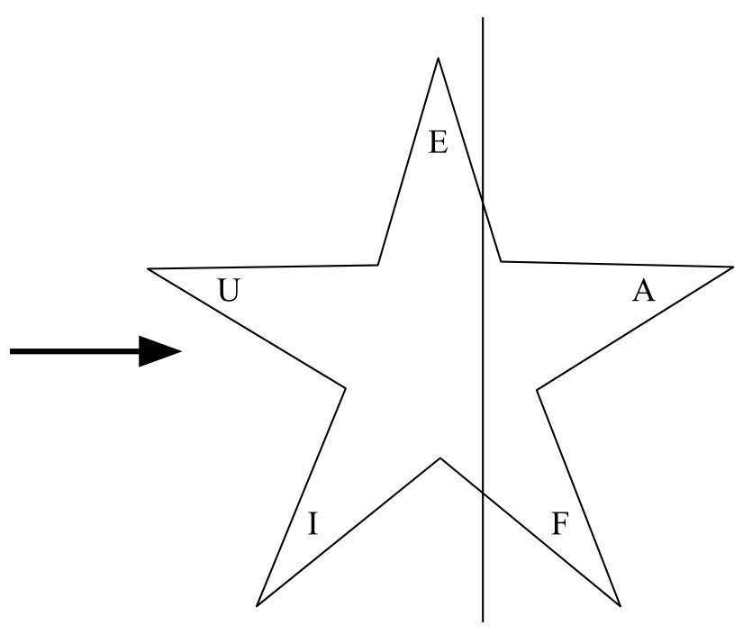

在许多人看来，企业家是中了头等彩票的那类人。他们有着绝对优势。除了他们，没有人有着类似的权力和影响力来随心所欲地安排自己的生活。但是，对于这一点，我要提出两点保留意见。

第一点：并不是每个人都能够成为成功的企业家。
尽管那些有着“积极想法”的人经常提出：“每个人都能够学习一切事物，能够达到一切目标。”但是我的经历教会我，事实并非如此：有很多人虽然是企业家，但是他们并不幸福，而且过得也不怎么成功。

因为作为企业家，您必须具备一定的特质。
我们马上就会谈到这些特质。接下来，您会得到一些建议，即企业家应该完成哪些任务。
您可以学到如何成功地去完成这些任务，但前提是，您至少已经具备一部分性格方面的前提。

我的建议是：如果您已经是一位企业家或者是一位独立经营者，或者您有自主创业的想法，那么请您特别仔细地阅读本章。不过，即便您是企业中的雇员，阅读本章对您进行个人目标的思考也是大有裨益的。

第二点的限制在于：只有当您像一位成功的企业家那样做了，您才能够享受到企业家的优势。
而恰恰是这一点，有99%的企业家做不到。

许多自称是企业家的人所说的话根本就不是事实。他们做事倒是更像雇员、自由职业者或者专家。我认识一位男士，他声称：“我是自主经营的。就像人们字面上听到的这样，自营者就应该坚持自己给自己工作。”真是没有道理啊。他根本想不到这样一种态度会产生怎样糟糕的后果。

不过，这个事实我也是费了好大力气才学到的。当我第一家公司创立的时候，我认为自己应该对自己负责，因此我比那里的任何人都努力工作。毕竟那个公司是我的。但是我必须首先意识到一位企业家和一位受雇的企业家
的区别。学习就意味着能够把他们区别开来。

在自己的公司工作的人，就是一位受雇的企业家。尽管他是为了自己的公司工作，但同时也是在为一个他所能遇到的最严厉的雇主工作：也就是他自己。也只有这样才能够解释清楚，为什么大多数独立经营者反而比雇员工作的时间都长，而且更加辛苦。

## 您到底处于这个五角星的哪一部分呢

您必须做一个重要的决定：您真的想成为企业家吗，还是雇员呢？想一想我们的五角星图：企业家位于左半部分，职员位于右半部分。

您究竟在哪个部分工作呢？

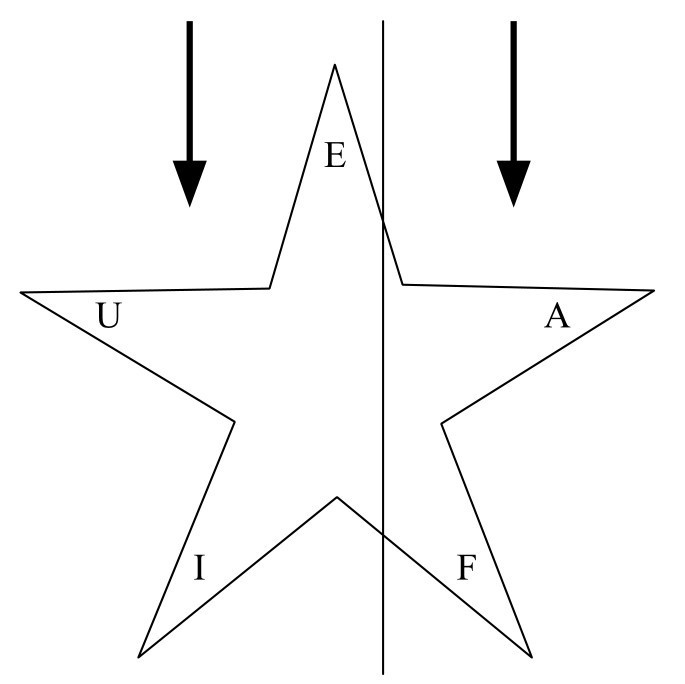

大多数“企业家”实际上更像是一些试图同时兼顾雇主身份的雇员。但是要同时兼顾难度很大，因为企业家和雇员之间千差万别：他们所面临要解决的任务、
对结果的期待，尤其是思考问题的方式。
第四章我们就得出的结论表明：您不可能，也不应该想要两者兼顾。您应该从中选择其一。

通读完本章之后，您就能够做出一个靠谱的决定。但是在此之前请允许我给您提个醒：如果您下定决心一个人既当雇主，又当雇员，那么您很有可能面临三种情况。

第一，两边的任务您都不会很好地完成。第二，受雇的企业家面临着年复一年没有假期的生活和加班加点的周末。第三，您很有可能不能够取得本可以取得的成功。所以，很多公司所创造的效益仅仅能够维持公司生存：您只是在仓鼠之轮上做着无用功。

作为雇主，您不应该在企业里面工作，而是应该凌驾企业之上
管理企业。只要您在公司里面工作，您就不可能像管理您的公司那样，成功经营公司，也不可能赚那么多钱，也从来不会取得高质量的生活。

## 自由职业者

自由职业者总是处于一个恶性循环的仓鼠之轮中：他们自负盈亏，他们就是机制本身，而且无可替代。他们越是成功，这个机制就会发展得越强大。然而，正是因为他们本身就是那个机制，所以工作压力也就越来越大。

解决方案很简单：创造一个机制。变身成为企业家。
雇用专家。成功的企业家都持有一张王牌：自我复制的能力。意思就是，他们创造一种机制，在机制中其他人也能够取得优异的成绩。此外，他们要么可以腾出精力开设分支机构，要么成为拥有特许经营权的人。一旦复制了成功，他们就解放了自己。
那么您就可以自由做那些您最擅长、最喜欢做的事。这里还得补充一句：如果您最擅长、最喜欢的事情对您的公司并没有什么实质性的帮助，那么说明您并没有选对行业。

我们再回到创建机制。一个真正成功的机制即便没有您也可以做到正常运行。您也许马上会说：“以我的情况看行不通！”我的想法是：这也许很难，但并不是不可能。在自由职业者中有大量成功的例子，比如医生、律师、建筑师……他们都成功地成了企业家。

那么现在我们回顾一下五角星图，这对我们有所帮助。几乎所有自由职业者都在他们自己的公司工作，并且在公司里完成4个领域的任务：他们集雇员、自由职业者、专家、企业家于一身。我们可以称呼他们为“受雇的自由职业者兼专家兼多功能雇主兼劳动力”。如此看来，自由职业者的平均寿命较其他领域的人们短好多也就不足为奇了。

“受雇的自由职业者兼专家兼多功能雇主兼劳动力”

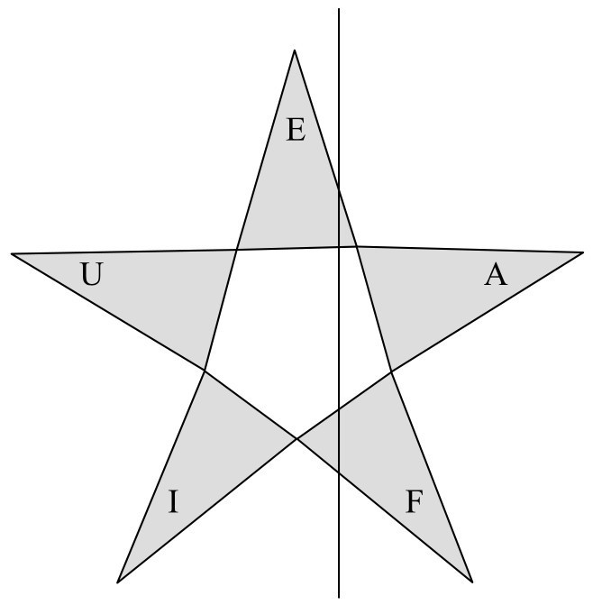

请您思考一下：只要您的公司还没有机制，没有您就不行，那么您就没有了自由。
因为那些没有建立起这样机制的人，就必须用自己的劳动力来进行弥补。这样的机制在我看来根本就没意思。如果您是独立经营的自由职业者，那么您应该认真考虑一下，是否自己做了企业家之后就放弃了生活质量。又或者如果您更喜欢自己解决问题，那么您应该考虑一下，是否去做专家而受雇
于人。本章将帮助您做出决定。

## 企业家的特质

并不是每个人都是一位好的企业家。人们可以学习如何认识到最重要的任务并且以正确的方式解决他们，但是您应该具备一定的特质。当然，您可以培养其中的一些特质，但是另外一些是不能够学到的，或者只有极其努力才能够得到。要想对某些东西进行训练，前提是这些东西必须存在。

然而更加重要的一点是，我们努力去学的一些东西大多数情况下都是无聊的，与我们天性不相符的，而且我们没法乐在其中的。所以，下面列出企业家必须具备的10条性格条件，请您认真对号入座。

1. 企业家具有冒险精神

从事五角星图左半部分工作的人尤其具备这样一种性格：喜欢冒险。

有意思的是，他们根本不把这个视为冒险，在他们看来，他们只是在做着触手可及的事情。

您和我，我们都曾经经历过4岁的时候。那时候我们觉得冒险、学习和研究是再正常不过的事。我们沉迷于这些事情中，我们感觉到快乐，我们从不放弃。然而企业家就保持了这种状态，把这一切看成他生活中的正常状态。请您问问您自己，对您来说，冒险是一件累赘的事情呢，还是您生活中相当正常的一个组成部分呢？

害怕面对风险的人应该扪心自问，到底想不想成为企业家。如果想，那么他就必须做好准备，克服时常会出现的不适感。企业家必须具备对风险进行抉择的能力。您可以小心翼翼地、深思熟虑地去完成任何事情。但只是小心翼翼和深思熟虑，您无法建立企业，也不可能做出巨大的改变。要做到这些，您需要勇气勇于飞跃。在五角星的其他领域和企业家之间存在着一条相当大的鸿沟——靠着小步伐的前进您是无法越过这条鸿沟的。

关于抉择力，汤姆·沃尔夫（Tom Wolfe）
<a href="#text00044.html_fn_1" id="text00044.html_ft1">[1]</a>
描述了两种个性，其中一种性格的人的格言是：“注意，开火，瞄准。”而另外一种人的格言是：“注意，瞄准，瞄准，瞄准，瞄准，瞄准，瞄准，瞄准，瞄准……”

但是，从根本上说，我只能建议：您应该一步一步地去体验冒险的乐趣。
普布里乌斯·克奈里乌斯·塔西佗（Publius Cornelius Tacitus）
<a href="#text00044.html_fn_2" id="text00044.html_ft2">[2]</a>
在他所在的年代就知道：“每个德高望重的大企业都与稳定的需求背道而驰。”害怕输掉就不要参与游戏，来玩就是为了赢。对这两种完全不同的方法的选择决定了贫穷和财富之间的区别，决定了充满冒险和美好的生活，还是充满恐惧、没有安全感的最低水平线上的生活。

大多数人都在寻觅着安全感，却不知道如何找到安全感。只有那些学会判断风险的人、那些学会处理风险的人，才能最终找到安全感。

那些逃避危险来获得安全感的人，能够得到的只是担心和恐惧。
这样的人，其格局会越来越小，直到最后，就连一个最最微不足道的问题，在他看来都像灾难即将来临似的。

前不久，我和一位上了年纪的女士聊天。在我看来，她的日子实在是无聊。“无聊？”她叫道，“那您一定要了解一下我的苦衷和恐惧啊！”那时我才知道，对于那些在生活中逃避风险的人而言，竞争是一件特别艰巨的事情。让自己操心好像是聪明的伎俩，这样做就好像能给人们枯燥乏味的生活带来些许刺激和变化。但是，人们正是这样自欺欺人。

实际上，我们的担忧和失败恰恰使我们面对我们所害怕面对的事物。要是人们不总是沉浸在失望中，就会出现更多成功的企业家。歌德说过：“胆量创造天才、权力和魔力。”

一位企业家需要的安全感越少，就能获得越大的成功。

2. 企业家能经受住失望

作为企业家，您不应该对拒绝、失败和失望过于敏感，您必须顺其自然地应付这些事情。

企业家懂得，拒绝一定是他生活中不可分离的一部分。否则，他们会因为害怕听到“不”而放弃多种尝试，放弃那些可能使他们偶尔获得惊人结果的尝试。为了避免遭遇拒绝，为了“自己不丢脸面”，人们所想到的事情都是难以置信的。成功对于企业家来说必须比表面的“自尊”更重要。

作为一名企业家，您还要能够原谅自己的错误，即便是面对严重的错误，您也要做到这一点。比如说在我们这里，破产就是一件影响声誉的事情；而相反，在美国却流传着这样一句名言：“没有任何令人尊敬的企业家在他的前半生没有经历过破产。”在那里，破产被视为获得成功经验的证明，被视为额外学习的一种方式。

作为独立经营者，如果没有这种态度，您将过得很艰难。不管怎么说，初创公司在5年之内破产的10个中有9个。即便那些度过了前5年的公司，之后还有9/10的可能会破产。那么现在有一个重要的问题：您把失败看成您将来必须背负的沉重负担，还是把它视为一项投资——一种为将来做更充分准备的经验？

您绝对不要因为一次错误而用一生来作为代价，不要失败之后就躲进自己的蜗居。恰恰相反，您学到了一些东西，而且现在您可以更加成功地前进了。如果有人说道，“我再也不进行尝试了”，那么我就知道了，这个人停止了学习。失望已经抓住了他。请您不要忘记，只有我们自己承认失败的时候，那才算作真正的失败。

也许您会有疑问：“我就不能失望是吗？”当然了，遇到不好的结果人人都会感觉到失望。但是其中的关键区别在于：这种失望的状态会持续多久？成功的企业家有能力缩短这段时间。他们很快就会把失望看成自己未来的投资。

为什么说这种性格如此重要，这里有一个决定性的原因：意志。那些不会正确处理失望的人，很快就会放弃。但是谁学会了这个，那么他就会为实现自己的目标而全力奋斗，直到目标达成为止。

3. 企业家喜欢麻烦

如果我说企业家都喜欢麻烦，您也许会认为这太夸张了。但是事实的确如此，因为建立一家公司本身就是一连串的麻烦。问问您自己：麻烦对于您来说是否是一种受人欢迎的游戏？
那些更喜欢生活中没有麻烦的人就根本不应该成立或者领导一个公司。

如果下次电话铃声响起，您又接到一个棘手的麻烦，请您这样说：“太棒了！我现在能学习并且证明我自己了。终于有了刺激，终于有了一个充分的机会来大大改善公司了。”麻烦是我们生活中的调味品。

4. 企业家渴望权力

有些人就是不喜欢承担责任。他们更喜欢去完成任务而不愿意去分派任务。而企业家则恰恰相反。他们寻求权力，想要实施自己的想法。其中的道理很简单：有一部分人是买入场券然后参与游戏，而另一部分则是设计游戏，制定游戏规则并出售入场券。不是自己主宰人生，就是别人来主宰，您想要哪一种？企业家并不是“人们应该怎样做”那种类型的人，更关注的是他们想要成为怎样的人。他们不必也不打算使自己周围的人绝对满意，正是这一点，让他们表现得十分强势。

企业家因为能够成功吸引住别人而获得权力。逻辑不会让人心跳加速，战争中不会有人追随着弱者应战，正是那些能使自己的想法得到别人认同的人才能获得权力。或许正是出于这个原因，汤姆·彼得斯才说道：“要多读小说，少读经济学书籍。最重要的还是人与人之间的关系。”

5. 企业家更需要自信力

自信力是可以学到的。但是想要学习自信，就必须要自律：比如每天在您的成功日志里写下5件您成功完成的事情。而作为一位企业家，您必须在实践中完全信任自己。

我有过很多次这样的经历，每当我给一位企业家出了一个主意，他随后就会说：“我不认为自己能够做到这样……”很可惜，我的主意一开始就失去效力了。因为这种人作为顶尖人才需要的并不是新的策略，而首先应该是对他自己能力的信任。

6. 企业家必须成为榜样

在您的公司，没有什么比您自己这个活榜样更能够代表您的企业了。对于一位经理来说，如果他出色地完成了他的任务，或许这就已经足够了。然而对于企业家来说还是不够的：如果您是这样的，您的公司也会这样。
您的企业永远不会以您的意志为转移，不是说您想让它成为什么样子，它就会成为什么样子，您的企业永远只会和您一样。

原因很容易理解：您吸引着那些您认同的人。那些不能认同您的人会很快离开公司。就这样，您的企业渐渐发展成为您自身的一种映象。

成功的企业家不仅仅做许多与众不同的事情，他们本身就是与众不同的。最终的结果就是：只有与众不同的人才能创立与众不同的企业。大企业家往往都是大人物。所以，在能够改变您的公司之前，您必须首先改造您自己。问一问自己：如果在公司中体现出这样的性格，是好还是坏呢？

7. 企业家善于同钱打交道

我有一个强烈的建议：但凡还没有学会怎样和金钱打交道，您就千万别成立公司。您的个人经济状况将很快体现在您的企业中。

一些大企业的建立者是出了名的小气，但同时也是绝对大方的企业家。但是有一点是相同的，他们懂得积累个人财富，从来不会把自己的全部财产长时间投入公司。

8. 企业家好胜

乔治·萧伯纳（George Bernard Shaw）
<a href="#text00044.html_fn_3" id="text00044.html_ft3">[3]</a>
说过：“正常人使自己适应世界，疯子则坚持让世界去适应他。所以，一切进步都取决于疯狂的那些人。”

企业家有好胜心：他们想赢得市场份额、金钱和权力。他们从不怕斗争。他们想把自己的世界盖上自己的名章，而且坚定不移地认为：只有这样，一切才会变得更好。所有的一切对他们来说就是一场他们想获胜的大型游戏。

一旦您开始有了发展，其他人以及其他公司就会同您竞争——无论您是否想参与其中。您不用理会这些“其他人和其他公司”，但是作为一名企业家，有一点您必须做到，那就是取得胜利。

9. 企业家有求知欲

很多行业都有培训，牙医、税务咨询师、法官、教师等，但是为什么就没有给企业家的培训呢？不仅没有这样一个特定的大学专业，也根本没有一本普遍适用的企业家所应该完成任务的练习册。因此好奇心和求知欲是企业家不可或缺的品质。

如今没有企业能够保证永远成功——除非您愿意每天学习。谁都希望自己有社会阅历，您也希望自己与知识靠拢。所有您需要的信息都是既有的，但是知识需要您主动去获取，您不能等着必要的信息走到您跟前。

信息时代的规则是简单的：只要您学习，就会取得成功。企业家对于学习怀有满腔的热情，他们不是出于迫不得已才学习的。生活对他们而言就等于学习。

10. 企业家有经营的直觉

有这样一些人，他们十分聪慧，能够出色地完成任务，但是他们当企业家却无法胜任，因为他们缺少
一些关键的东西：一种对机会和危险的辨别力。表面看来，您可能会说，他们就是不够幸运。但这里更重要的是一种能力，一种特殊的天赋：经营的直觉。
在所有的成功企业家身上您都能看到：他们能够直接觉察到好的机会。

保罗·盖迪（J.Paul Getty）
<a href="#text00044.html_fn_4" id="text00044.html_ft4">[4]</a>
曾经说过：“早点起床，努力工作，您就会找到石油。”这里的石油代表着幸运，更确切地说，是代表着一种直觉。

成功的企业家已经学会相信自己的“嗅觉”。所以对于那些大多还无法解释清楚的事情，他们没有试图去解释清楚，而是会迅速采取行动。

能量贴士

现在请审视一下自己，在多大程度上您具有了企业家所具备的最重要的性格前提。请您给自己的每个特质打个分数，分别从0（不具有）到10（十分强烈）。

1. 您冒险吗？

2. 您经受得住失望吗？

3. 您喜欢麻烦吗？

4. 您渴望权力吗？

5. 您是否十分相信自己？

6. 您是否是一个好榜样？

7. 您能和金钱打交道吗？

8. 您渴望成功吗？

9. 您渴望知识吗？

10. 您是否具有经营直觉？

请您将分数加在一起：

\_\_\_\_\_\_\_\_\_\_\_\_\_\_\_\_\_\_\_\_\_\_\_\_\_\_\_\_\_\_\_\_\_\_\_\_\_

最理想是90～100分，不应该少于70分。当然，您可以发展您的有些特质——当然您也应该这样做，但是这一切最好在创立公司之前做。

## 如何获得这些基础

想建立这些特质有两种适用的办法。第一种，您可以给自己找一个教练，即一个完全具有上述特质的成功企业家。对您来说没什么比同这样的人打交道更有影响力了。

第二种，您也许可以考虑在销售业进行兼职，很多企业家最初的经验都是这样积攒起来的。我在大学读书期间也曾在一个金融销售部工作过很长一段时间。这份极其艰苦的工作使我不仅学到了自律、意志力以及工作方法等方面的东西，还学会了以下6项特别的东西：

●和金钱打交道

●推销

●领导同事

●建立自信

●正确对待失望、拒绝和麻烦

●不受别人观点的影响

正如之前谈到的：我坚信，锻炼这10种品格绝对是值得的，否则您怎么知道自己能胜任什么呢？关于这个话题有一个给人印象颇深的古老故事。

一个妇女在路边发现了一只蛋，她带着蛋回去并把它放到了鸭子窝里。当它出壳的时候，最初看起来和小鸭子十分相像。但随着它渐渐长大，区别越来越明显：这只小动物其实是一只雄鹰——但是它并不知道。所以它吸收了周围鸭子的全部习性，过着一只鸭子的生活。

多年之后，它已经老去，向天空中飞翔着的强壮雄鹰远远望去。“我也想和它一样啊，”它叹息着说道，“这样一只健壮的鸟儿过着的该是怎样的生活啊！但是可惜了，我却不能拥有这样的生活。”这只鹰像鸭子一样活着，又像鸭子一样死去。它其实从来都不知道，自己是一只雄鹰。

## 企业家的任务

您是企业家吗？如果是的话，您知道对于企业家来说最重要的6项任务
吗？
我与之交谈的大多数企业家都回答不上来这个问题。然而，这个问题的答案对每个企业的成功具有重要意义。我的教练对我说过：“如果您还根本不知道有什么任务，那么解决它又从何谈起呢？”

决定成功与失败的任务一共有6项。如果您能够游刃有余地处理这6个方面的任务，那么您就会有巨大的飞跃，这并不仅仅指收入方面的飞跃，还有生活品质方面的提升。

这6项任务极具挑战，即便是成功的企业家也常常不能十分完美地完成。但是如果您不断加以学习，自我成长，那么您会变得越来越优秀。即便您有了失误，也应该将这个失误看成对未来的投资。

我们再来复习一下一开始说到的那些无论如何都不
应该做的事情：请您注意，不要变成机制，不要像雇员
那样在公司工作。当然，在公司，您也不要像专家一样工作。

倘若您在公司中像职员、自由职业者或者专家那样工作，您就没有时间来完成企业家应该完成的任务。
一个公司需要雇员、自由职业者以及专家，但是也需要一名企业家——而您必须自己来做企业家。

理由很简单：您可以雇用别人来做雇员、自由职业者以及专家，或者您也可以自己承担一切。但是企业家的任务只能由您来承担。除了您以外，没有任何人能够成为企业的心脏。

企业家的6项基本任务概要：

1\. 寻找优秀的同事与合伙人。

2\. 监督盈利以及创建机制。

3\. 对您的公司进行创新。

4\. 从一切多余的事务中解脱出来。

5\. 保持您的宏伟蓝图及其意义永远充满活力。

6\. 想出一条退出的策略。

能量贴士

请您做一个明确的决定，您是否愿意从日常的繁忙工作中完全隐退出来。如果能把企业家的这6项任务完成，作为企业家的您将会对企业有更大的好处。如果您接下来致力于完成这些任务，那么以下4点很快就显而易见了。

●第一，如果这6项没有得到保障，没有一个企业能够做到真正的成功。

●第二，这些任务的鲜明特征应该是全职工作，这样的任务你没有办法可以“顺手”完成，绝对没有可能。

●第三，如果您过于加班加点辛苦工作，您将没有办法出色地完成这些任务。只有当您得到充分的休息了，才能有真知灼见以及最棒的认知。

●第四，这些任务只有您自己来完成。任何事情，如果您不去做，就会无法完成。

第一项任务：寻找优秀的同事与合伙人

我的第二任教练在8年之内创建了一家价值上亿美元的公司。他是怎么做到的呢？他说：“我之所以成功，是因为我从来不做那些不该我做的事。我主要只负责两件事：OP和OPM。”

OP指的是“Other
People”，即其他人，也就是指同事和合作伙伴。一位企业家必须具备吸引他人的能力，也能激起别人对他项目的兴趣。如果找不到合适的其他人，就要您亲自上阵了。
如果您愿意这样，那当然没问题。但您并不是传统意义上的那种企业家，如果您执意接手工作，就可能有劳累过度的危险。

美国在线（AOL）创始人史蒂夫·凯斯（Steve
Gase）说道：“创建一家知名企业的唯一一条途径就是，您应该达到这样一种境界，您是领导工作，而不是您自己去做这个工作。这是一个关键因素：从单纯的企业家向企业领导的过渡。”我如果听到有问题，就会问道：“这真的是必须我亲自投入注意力的事情吗？”几乎每次的回答都是：不是。

请您给自己提出两个重要的问题：

●您是在建一条输油管道呢，还是在费力地拖着油桶？

●您每天的工作能给您带来什么？

您要想到，我们已不再生活在那个体力劳动很值钱的工业时代。如今，我们处于信息时代，工作要靠我们的想法。作为企业家，您更应该有大量的想法。
为了使您的想法流畅地发展，您就必须找到能够很好实施它的人。

您能想象到我会听到多少次这样的不同意见：“是啊，要是真这样容易就好了。我几乎要花全部时间
去找个合适的同事。”我的回答通常是：“您在自欺欺人，您根本就没有在用全部时间去找合适的人。您花全部时间来代替
那些人工作，在工作的同时
您才捎带着偶尔找找人。这当然完全不一样了。”

想找到优秀的员工很难。如果“捎带着”去找，那么您也有可能会有所发现——如果您极其幸运。但是，通常情况下那些合适的人都会被真正的企业家抢走，这些企业家常常花大量的时间来寻找OP。

同寻找OP紧密相连的就是寻找OPM——Other People's
Money，也就是别人的钱。特别是那些决定要通过他人渠道融资而得到快速发展的企业家，他们要花大量的时间去找这些资金。当然，无论何种形式的融资都会有很大的弊端。您要想清楚，是否确定想吸收外来资金。还有，您是否准备好了承担后果。如果最终这样决定，您就必须投入大量的时间来寻找这些资金。

请您先找一位管理业务的人

您总是要从找一位合适的经理开始，这里强调的是“合适的”。这个职位太重要了，几乎可以和您相提并论。我自己也是经历了痛苦才意识到这一点的。您当然也可以用其他人，教他如何管理，将他带上路。但是作为一位经理，必须事前就已经证明他具备这些合适的能力。斐济岛有这样一句格言：“不要去尝试教猪学会唱歌，您只是在浪费时间，还会把猪激怒。”

但是有一点十分重要：您根本不应该自己当业务的管理者，而是应该由雇用的经理担当。如果您本身是经理，您就是典型的“受雇的企业家”。这样您就会被经理应完成的任务牵制，以至于没时间去做一个企业家应该做的事情。经理要关心的是电话设备、房租合同、邮政信箱、劳动合同、坏了的复印机（几乎总坏）、对于工作人员的监督……这一切都与企业家的创造性背道而驰。

我之所以对此一清二楚，是因为曾经有几次我也自己做过经理。但是我从这些错误中吸取了教训。如今，倘若尚未找到一位合适的经理，我是不会再创立什么企业了。您知道原因的，我不想受雇于别人，给别人当雇员和我的能力不相符。

我认识一些经理，他们以极高的热情从事着这些事务，而且他们对此极富天赋，他们当然会比我更能胜任这些工作。这些人可能不会成为好的企业家——但他们是出色的经理和雇员。假如他们和我一起工作，我会对这种合作关系感到十分高兴，因为我们能够很好地互补。每个人都做着和他能力及兴趣相符的事情，我为他们感到十分骄傲。

但是我把自己确定在这个五角星的其他领域中：我想写书，想作报告，也想当企业家，这些和我热爱的事情相符——希望也符合我的天赋。眼下，我参与投资了8家企业，要是我整天还忙于处理这些企业里的日常事务，我怎么才能做到上述这一切呢？

现在，因为经理的任务和我没有任何关系，我每天都能很开心地做我的事情。早先，我早晨的时候都会问自己：“我不太喜欢什么？”——以便首先把这件事情应付过去。
这是一个不错的方法。现在我会问自己同样的问题——以便把这件事情交给他人去完成。
这个办法从根本上看比前者高明得多。

如果我不在公司内
工作，我就有足够的时间去发现新的优秀员工。如果有人今天问我，怎样才能拥有那么多时间，我认为最重要的前提就是：我不从事琐碎的劳动。

我是怎样找到优秀的合作伙伴和职员的呢？非常简单：我有很广的朋友圈、同事以及专家网，我和他们交谈，几乎每次谈话我都会有所收获——我能通过这个谈话找到我刚好需要的某个同事。我自己现在认识到，我经常是“有心栽花花不开，无心插柳柳成荫”。比如说，我常常思考完全不相关的事情时，突然就会想到一个使我的公司能够更好发展的好主意。

首先，找一个经理会带来很多好处，比如他可以去寻找其他大部分的同事。他还可以从事经理最重要的两件任务：赚钱以及建立机制。然后，企业家只需要监督结果就可以了，但是这个任务必须由他独自完成——由此我们讲到了第二项任务。

第二项任务：监督盈利以及创建机制

“监督”这个词又向我们揭示了如果经理和企业家不是同一个人会有多大的好处。因为如果二者兼于一身，还有谁来起监督的作用呢？答案是：没有人。而如果缺少监督，在发生紧急事情的时候，往往就会忽略重要的事情。

很多事情都可以证明，您应该任用一位经理。但是您也必须对他进行监督。
谁不进行监督，谁就为敷衍了事、办事不力
甚至有时还滥用职权
而敞开了大门。主祷文中说：“不要来诱惑我们……”

而我认为，还有另外一点也能说明监督的好处：如果您不去监督，就无法从您的职员和合作伙伴身上获取最理想的成绩。您通过向他们提出要求，
来使他们取得最大的成绩。这就是说，不去监督，就别去索取。

人们并不做我们期望的事，而是我们监督的事。拉尔夫·瓦尔多·爱默生（Ralph
Waldo
Emerson）这样说过：“很多人的不幸在于没有督促其突破自身界限的人。”如果以一种令人愉快的方式进行监督，您的监督就会被视为受欢迎、有帮助的。赢家希望得到监督。

但是您不应该把自己变成一个监督机器的奴隶，您只需要定期监督那两项最重要的任务，对其他的一切只需要偶尔抽查一下即可。
从我的经验中得知，如果没有人监督，特别是这两项最重要的任务是不会或者不会很出色地得到完成的。为了能够有所收益，您就必须监督您的收益，您还必须监督机制建立情况，否则您的公司就不会创造任何价值。现在我们分别来研究一下这两点。

第一点：对于盈利的关心不够。
我们不要忘记，每一个企业都有一个目标，一个经营企业最重要的目标就是盈利。

只要盈利不是目的本身而是达到目的的手段，那么这在道义上也是完全说得通的。这中间有一个重要的区别：需求并非目的。
为了存活，我们要进食。但是如果为了吃饭而去生活，我们就在好多方面把自己曲解了。盈利只是一个手段，是为了实现其他目的。

我们当然要把注意力集中在企业、企业的员工、企业的客户上。但是，如果没有盈利，也就没法进行投资。没有盈利的企业早晚要倒闭。因此收益并非目的本身，而是保障一个企业健康运营的一项手段。

但是，只有极少企业能够获得足够的收益，有以下7个原因。

●首先是“吊儿郎当”：总有这种类型的商人，并不真正了解自己的数目。尤其当公司运转很不尽如人意
的时候，才不情愿地去看看书。很多人认为，有些事实不去想就能逃避开。每个企业都应该有人有效地进行检查，看看是盈利还是亏损。

●营业额和盈利常常被弄混。人们只把注意力集中在不断增加新的营业额
而不去考虑怎样进行节省。那些只盯着营业额的人一定会坠入深渊。纯粹追求营业额会导致混乱的产品种类，会出现无足轻重的顾客，错综复杂的事情会明显地增加。

●节省下来的1欧元往往同刚进账的10欧元价值相等。但是一个经理只有当他被“严格要求完成”一个既定的计划指标时，才会极力去节省。因为他整天忙于日常琐事，所以很容易就认为一切都“很有必要”。企业家只是在一定条件下才关心必要的东西；他主要想知道实现的盈利额。

●不能够深入理解，复杂化并不一定是件好事。成功的企业家往往避免复杂化而喜欢单一化。在一个多元、复杂得难以看清的公司架构中，其成本费用比任何其他地方都要高。

●可获得的边际利润太低了。让顾客得到有价值的东西固然很重要，但是顾客为此所支付的价格必须比成本高出一定的百分比例。这些简单的事实往往被忽略，结果盈利太少。这很危险，因为您需要的钱总是比您想象中的多，总是这样并且根本就是这样！所以您需要一定的边际利润，而这个边际利润不能算得太小。我知道有必要积攒储蓄，聘请优秀的顾问，进行一项新的投资，支付丰厚的工资以及建立分红机制等，所以如果没有至少百分之百的边际利润，我是不会投身某项生意当中的。

●没有制订预算计划，而这又和两个原因有关。第一个原因，总有一些经理认为自己不是“和数字打交道的人”。对此我的教练说：“见鬼，如果不关注数字，那么他们认为自己的任务到底是什么呢？”我的想法是：谁能了解到一个好的预算计划的力量和作用，他就会爱
上数字。第二个原因，很多人根本就不了解预算计划的重要性。它是您在公司中能够使用到的最有效的计划目标手段，
最好的监督手段
和最好的交际手段。

●经营模式越类似，获取高额利润的机会就越小。只有极少数模式能真正与竞争对手的模式有明显区别，这是因为定位原则
并没有引起人们的足够重视：如果您与其他供销商相比不能十分突出，就总会有价格战；只有当您与众不同
时，您才能决定价格。就像约翰·洛克菲勒（John D.
Rockefeller）曾经说过：“好多人喜欢将大量时间和金钱投入相互竞争愈加激烈的公司上，这恐怕是取得进步和通往幸运道路上的最大障碍。”

作为一名企业家，您要注意有所收益。在这方面您不应该妥协。如果不监督收益情况，您将不会有什么收益。紧接着您还应该进行检查，经理是否完成他那两项最重要任务中的第二项。

第二点：对于建立机制的关心不够。
我经常问自己：为什么会是这样？我认为主要有4个原因。

第一个原因在于，经理认为自己很重要而不可替代，他们认为如果自己不去操心，一切就无法进行。
许多人抱怨，身边尽是些“无用之人”，离开他们将一事无成，然而他们忽略了，自己的任务恰恰就在于找到合适的职员。事实也表明，这些经理尽管有种种抱怨，但是为了维持这种混乱的状态，他们还是去做一些工作。

第二个原因在于，无法建立机制，因为只有那些简单的想法和进程才能被系统地形成机制。
复杂的结构在这里并不适用，只有那些简单的东西才能够做到标准化。很多经理并不是坚持不懈地寻找通往简单的道路，而在这里，企业家的第四项和第六项任务具有十分重要的意义。

第三个原因在于，没有使工作程序系统化。只要这一点没有实现，新的员工就很难融入。对于相关任务进行清晰的描述几乎是不可能的，因此监督也不能正常进行。机制之所以没有建成，通常是因为有其他更加紧迫的事——
然后又有别的事情——等等。我们中每个人都经历过自己的日程安排往往被意想不到、毫无预料的事情左右。但这绝不应该成为常态。特别是作为经理，一定要学会善于安排自己的时间（参见第五项任务）。

第四个原因在于，机制没有建立，是因为没有意识到其必要性。
当然，您不是必须
要建立一个机制，但是如果您不这样做，您还是不能取得真正意义上的企业成功。

您有意做出决定是很重要的：您想得到经营方面的成功吗？如果回答是，那么您就必须清楚，经营方面的成功由哪几方面构成。您可以把它简单地理解为一个方程：

对于短期的小成功，
您必须对盈利
加以监管。对于长期的伟大成功，
您必须想办法建立机制。

只有建立了机制，您才能够增进优秀想法的产生。也只有想法成倍增长了，您的想法中才能产生经营方面的成功。这个方程相当简单：您的想法相乘得越多，您企业的成功就越大。

您应该现在就开始进行复制。

许多人有很好的想法。但是如果您没有成功使得公司中的每个人清晰理解这些想法，这些想法就相对缺乏意义。因此您必须从基本的元素开始建立一个机制。只有这样您才能够做乘法。在您公司理解这个机制的人越多，对您的依赖就越少。

这其中的原理是：机制对您的依赖越少，就越优秀——因此您的公司也就越有价值。
机制就是一切。如果不能够建立任何机制，您就必须从您的劳动力方面进行补偿——您就永远卖不出去东西。

以下是一个您可以，在大多数情况下也应该建立的机制清单：

●产品开发

●库存

●每日办公室日常、工作时间、原料、电子数据处理

●接受订单、处理订单

●客户维护、数据维护

●受理投诉、诉讼争议

●记账，处理账单、催款通知

●市场营销、公共关系、广告宣传

●人事计划及安排、培训、合同

●合作、BtoB <a href="#text00044.html_fn_5" id="text00044.html_ft5">[5]</a>

●成本控制与管理

您要设法坚持不懈地打造一套SOP机制，也就是标准操作流程手册，其中要细致入微地列出所有工作流程，即已经建立的机制，并对其进行描述。这样，这本标准操作流程手册就是所有已建立的机制的书面形式。

这样的一本标准操作流程手册具备许多益处。这里只提几点：这样会极大简化新员工入职培训；
这使得开设新的分支机构变得相对省力；
这是对员工进行管控以及评价的基础。

建立一个这样的标准操作流程手册是您经理的任务。您作为企业家的任务是，控制这些是否真实存在。因此您就要打通一条输油管道，而其他人来拖油桶。

第三项任务：对您的公司进行创新

假设您已经具备一套成功的机制。但是没过多久，您就被竞争的同行包围了。不久，他们中的一家打造了一项更好的策略，然后使得您的策略过时。就这样，您的竞争者会把客户从您那里抢走。在这一切发生之前，您作为企业家就要奋起直追。您要比竞争者更快地打造一项新的机制。

任何企业家都不能忽视这一点。不然，他会比自己预想的更快被淘汰出局。今天的愿景很快就成了明天的知识束缚。创建新机制的愿望必须要比为过去辩护的愿望还要强烈。比尔·盖茨曾经说过：“微软总是同失败相差两年时间。”

您作为企业家关心这些十分重要。经理对此并没有足够的能力，因为如果您的注意力总是集中在一些陈旧的事情上，开发新的模式就成了不可能的事。经理必须关注机制如何运营，他怎么可能同时再去开发一个全新的机制呢？而且他不可避免地会用老眼光去看待每一种新情况。但是未来不能仅仅是过去的量的变化。

值得注意的是：我这里提到的并不是改善，也不是坚持学习或者Kaizen
<a href="#text00044.html_fn_6" id="text00044.html_ft6">[6]</a>
（指不断改进提高，是一种日本企业哲学）。这些当然更加重要，但这是属于您的经理职责范围的事，必须由他来完成，而且他也应该能够解决，因为他每天从事日常事务，所以他甚至比您更能胜任这些事情。然而作为企业家，您的第三项任务并不是一步一步地改进，而是彻底的变化、改革以及创新，
因此您不能从过去寻找未来。

改善和创新这两个概念之间有着天壤之别：

●改善是在现有基础上进行，而创新是面向未来的。

●改善是以事实和经验为基础，而创新则以假设和幻想为前提。

●改善是现实的，有基础的，而创新可以有梦想，可以是脱离现实的。

●改善通常只是指对同一件事物的稍加完善——而创新则包含未来的一切可能和机会。

在一些人眼里，目前的方案已经很棒了，如果还要修改，一定是疯了。但是，变革正是应该在这个时期进行，在业绩出现下降之前。在许多行业，您必须每过两三年就更新一次您的策略，您可以把这看成个标准。当然，您必须加以权衡：你不能过晚地放弃您成功的策略，但是也不能放弃得太早。
因为说到底您顺利进行改革的资金来源于您的旧的成功策略。

成功的企业家必须提防任何扬扬自得的想法。因为当我们看到自己正在成功的大路上时，就往往容易不再那么专心，就会变得懒惰，变得粗心。您应该把成绩当成跳板，而不是演讲台。

成功的企业家总会不断去寻找新的事物并且付诸实践，尽管这些新事物对他自己以前的成功策略构成竞争。但是他们清楚，他们去做这些，总比等着竞争对手去做要好得多。企业家就是创新者。

创新者的4个角色

作为创新者，您不单单肩负构想新机制的任务，这并不够，因为什么事情都还没有发生。创新者要扮演4个角色。我们将这4个角色概述如下。

1. 探索者。
正是作为这个角色，您寻找能够酝酿新的想法的材料。在这里，您一定要偏离大家都走过的老路去寻找，这一点尤为重要。要敢于向陌生的领域进军。

2. 发明者。
您接下来的工作就是，从您身为探索者收集起来的材料中提炼出独具匠心的想法。这里就需要创造性和想象力。为此您可以颠覆一些想法，您可以剔除一些东西，对某些东西进行比较，对某些东西进行改造使之适应新事物，把不同的因素相互结合，将其改变，进行转化……（在第九章我们已经就怎样能够更加富有创造性提出了十分详细的建议，这些建议同改革家这前两个角色在本质上是相符的）

3. 决策者。
现在您必须对这一切做整体上合理的考虑，看看您是否想运用您的创造力，还是想改变它或者抛弃它。您要对事实因素和时机进行考察。要把风险和机会结合起来进行权衡考虑。然后再做出一个基础牢固的决定。

4. 实施者。
最后，为了使您的想法付诸实践，您需要行动，这通常也是十分必要的。这时候您必须能够克服您自己公司内部的阻力，因为您的想法很可能与既有策略和习惯发生冲突。因此您极有可能要自己推动实现一个新的想法，甚至为了实现它而进行斗争。

在这里，很重要的一点是您不能单单扮演其中一个角色。
您必须按顺序担任这4个角色。比如说，如果只是探索者，您就根本没有时间把这么多材料组合成一个新的策略（只是个理论家）；如果一直当发明家，您就会不断改变而不能自拔（成为了完美主义者）；您若是主要扮演决策者的角色，您的探索者身份就会受到挑战，因为您过早地、过多地想到了与这个想法相悖的一面，您的创造力就会停滞不前（悲观主义者）；相反，如果总是作为实施者，您就有可能考虑得不充分，您就会很容易开始实施很多没有经过充分考虑的事情（到处插手的万金油）；若您只保留前三个角色，就算您能想出绝妙的主意，但是都不会得以实施；等等。

定期对自己提出下面几个问题，应该会对您大有益处：

●我们的策略在最近两年是否有所改变？

●我们是否掌握了新的才能？

●我们有没有赢得新的市场？

●我们的顾客组成是否发生变化？

●我们是否以另一种方式向其他人提供我们的成果？

●有什么事情我们绝对不应该再做了？

●我们公司的作用链是怎样的？

●我们曾经拒绝过哪些在当时并不合适，而现在看来很有意思的建议呢？

●我们是在基本需求方面做得专业，还是在行事方法方面专业？

●我们的注意力是集中在我们的核心能力上，还是同时也集中在我们的重点事业上呢？

●目前进行的哪些改革也能够决定我们企业的未来？

●我们还研究了生意之外的多少种机会？

如果总是沿着自己的路走下去，您就会错过通向未来的路。我的建议是：做一个和现存事物唱反调的人，变成一个见异思迁的人，这样您就能完成您作为企业家的第三项重要任务，并且能够从中获得乐趣。改革的想法最容易出现在当您以游戏的轻松态度经营企业的时候。在日常事务中几乎不可能出现。不要忘记：所有一切皆为游戏。

第四项任务：从一切多余的事务中解脱出来

我们都是收藏家，很可惜我们也收藏多余的东西：您积攒这些东西越多，用于重要事情的时间就越少。对于您的企业来讲也是同样的道理：人们倾向于将一切都背在身上——多余的工作程序和报告程序、没有能力的职员、没有效益的分公司……直到把自己压倒。

经济学家彼得·德鲁克（Peter
Drucker）这样说：“机体中有排放机体废物这样的系统……没有系统地、不断地进行排毒，机体是无法存活的。把自己同垃圾划清界限。”但是一个企业却没有这样一个自动清除垃圾的组织，那么这项任务就必须由您——企业家来完成。您不应该只想着可以做何改进，您还应该考虑，我根本不应该再做什么？

苏族印第安人早就知道：“如果马死掉了，那么就下来。”如果一个策略不起什么作用了，那么就必须换掉它；雇用一位新的骑马者，或者看看其他的死马，说道：这些马也不见得怎么好，就没有任何用处了。

有的企业家对完成这项任务感到有困难，我一再和他们讨论，因为他们感到自己有传承一定传统的义务。我的答案是：传统并不意味着要保留灰烬，而是保持生活中的火花。

对于这项任务，我有两点具体的建议。第一点，每年都问问自己：有哪些事情如果当初没有开始，我今天就不会再去开始？
然后寻找摆脱它的途径。

第二点，您可以遵照阿迪（Aldi）
<a href="#text00044.html_fn_7" id="text00044.html_ft7">[7]</a>
的例子：一旦有新的产品列入供货品种，就有另一种产品从采购清单中被淘汰。在卓越的音乐家身上，我们也能看到这样一点，他们在保留节目单中添加了一个新曲目之前，总会同时删掉一个旧曲目。他们之所以这样做，是因为他们知道：没有人能极其优秀地掌握很多东西。虽说人们通常可以演奏许多曲目，但是只有极少数具有高水平。

第四项任务基于两个背景：其一，只有当您摆脱了垃圾，您才能继续存活；其二，您有必要全神贯注于本质的东西。要想知道哪些是您应该清除的，哪些是应该保留的，您就必须不断问自己一个关键问题：我到底为什么做这件事呢？

借着这个问题，我们开始探讨第五项任务。

第五项任务：保持您的宏伟蓝图及其意义永远充满活力

没有什么比日常烦琐的问题更能吞噬掉我们对于主要目的的洞察力了。当您忙碌于日常琐事的时候，重要的事情就淹没在无关紧要的事情当中了。如果人们处在这个环境下，要看到这个主要蓝图是很困难的。正是出于这个原因，作为企业家的您就不能为日常的琐事所困。您的第五项任务是，将您的企业不时引领回到主航线上来。然而，只有身在局外才能看到航线的偏离。

在我们主题为“幸福的勇气”的研讨班上，我一再清晰地体会到了这其中的区别。我请参与者记下他们在生活方面5个领域（健康、关系、财务、情感/精神、工作/生活意义）的年度目标。

当我看了一下“工作/生活意义”这一板块时，我立刻就能够看出，哪些人是在企业工作，哪些人是真正的企业家。经理们记下了许多目标——纸面常常不够用。企业家很快就写完了，他们只写下一两条目标。而这些恰恰是具有关键意义的。

为了不忘记具有决定性意义的愿景以及伟大的宏图，最重要的是下面这三件事情：集中、简单以及距离。

1. 集中。
成功的企业不仅仅很集中，他们还做好准备为此做出牺牲。为了长期的目标，他们愿意放弃短期的利益。成功的人一定知道自己想要什么，但是他还要知道，自己不
想要什么。对此，咨询公司麦肯锡曾经说过：“几乎所有的企业都有太多的用户和太多的产品。”

集中意味着放弃。一家企业需要勇气进行放弃。帕累托就使我们明白了：我们80%的总资产来源于20%的客户。为此，您是不是应该减少顾客数量？您难道不想关注一下自己如何赢得“理想的顾客”？谁凌驾胜者之上，自己才会成为胜者。某种程度上说，注意力使人们的想法从“这可能是什么”
转化为“以后会是什么样”。

对于您的产品同样如此：20%造就了您80%的总资产。这一点再一次涉及了第四项任务：从一切多余的事务中解脱出来。彼得·德鲁克曾经说过：“成功的、富有的经理先做最重要的事情——根本不会去做不重要的事。”正是决断力最终将小麦与谷壳分开。

2. 简单。
归根结底，对于成功的专注才能够做到绝对简单。只有那些真正认清自己目标的人才能够避免昂贵的、危险的复杂情况。只有那些反思的人，才能够清晰地构建框架，打造简便的机制。您不要忘了，只有简单才能使您进行乘法运算，而您相乘得越多，您企业的成功也就越大。

对此，简单性有两个关键好处。首先是简单性使您能够建立机制——并且由此使您的企业升值。其次，一个简单的机制减少了您的成本，这样您的收益就会提高。这样企业价值也会有所提升，盈利会升高，也会取得经营的成功。

在一个优秀的想法和一项巨大的成功之间，存在着简单性。

3. 距离：
即使不在日常业务中，您也会发现公司任务很快就会成为主人，而不是为您服务。你必须要小心，不要介入。只有一种明智的方法来拉开距离：为自己设置免打扰时间。

请您“闭关”半天或者一天，以便作为企业家来安静推进您的任务。您要为自己拉开距离，以便一览无遗地审视宏伟蓝图。

于我来说，我是这样做的。我每周有3天下午在办公室。人们可以同我讨论事情。每年有3个月我住在马略卡岛，在那里，我每天上午写作，每周有3天下午的两个小时我不接听任何电话。因此我有计划地进行“闭关”，这样我才有足够的时间，不受打扰地完成我业务上的任务。

这里的重点在于“不受打扰地”。虽然绝大多数脑力工作者在日常工作中都会受到各种打扰，但您必须创造一些时间不受干扰。我知道这并不容易，对我来说也时常不理想。但您有什么其他选择？如果不拉开距离，您如何看到宏伟蓝图？如果手机不断响铃，您怎么思考有意义的问题？

而且我并不相信，我们能够长期想到什么具有意义的问题。我们相信世界会变得更好。我们梦想着经济核心。对我们来说，进行相应的组织是具有关键意义的。

第六项任务：想出一条退出的策略

您能够在一年之内卖掉您的公司吗？您能否与此同时得到令自己认为值得的价格？有99%的公司业主都做不到。并不是他拥有着公司，而是他的公司占有了他。
不能够卖出去就意味着没有其他选择，那些别无选择的人，是不自由的。

退出的意思就是指找到出路。您的退出策略应该明确指出，您怎样才能摆脱您的公司。退出的选择是很有限的：您可以把它全部卖出，或者卖出一部分，或者您也可以去交易所，然后自己退出，或者将它传给别人。假设您有一套用于10年之后退出的策略。这并不意味着您当时必须和企业真正脱离，指的是到了那时候您可以退出——重要的是您有这个自由。所以，这个第六项任务主要涉及的是，您首先要建立脱离的可能性。您认为什么时候应该开始做退出的计划呢？这个时间是在企业开始运营之前，这样您才能最好地确定发展的方向。不过这个建议只是被极少数有经验的企业家铭记于心。还有一个“第二最佳”的时间：现在。请您马上着手制订退出计划。至于您应该做些什么，企业家任务的第一至第五项已经告诉您了，但是我们在这里还是补充一个充满智慧的财富计划。一套退出策略由以下6点构成（其中前4点我们只是一带而过，因为之前我们已经进行过讨论）。

1\. 请您使企业不要依赖于您。

2\. 关心收益。

3\. 保持流程简单，创建可以复制的机制。

4\. 远离一切有损于这个简单机制的东西。

5\. 创造资本价值。

6\. 积累个人财富。

创造资本价值：
使您的公司在机制方面更加有价值，这需要注意两件事。第一，定期向自己发问：在我的企业中有什么是真正值钱的？我能够从中销售什么？为了使它更值钱，我能够做些什么？

第二，问一下自己：如果想在年末把我的公司卖掉，它能够值多少呢？接着要做的就是：让这个价格每年增长。

有一套简单的策略可以使您系统地提高企业价值：您需要找到本行业里价值至少是您自己企业价值3～10倍的某家企业，看看它当初是以什么价格卖出的。然后就仔细研究这家企业，看它是如何取得如此宏大的成绩。他们做了什么特别的事情吗？您能够从中得到哪些借鉴？什么事情您也许会做得更好呢？

也许无论如何您应该尝试一下——您可以把这家公司曾经的所有人聘用为自己的教练或者顾问，反正他现在已经出售了公司，和您不存在竞争关系。

积累个人财富：
当我和企业家谈论这一话题的时候，就会遇到简直过于天真的逻辑，许多人都是依照这个“计划”去思考和行动的：首先我使企业获得成功，于是我也有钱了。这样的话，有一点被忽略了：一笔雄厚的个人财富不仅仅对于退出策略具有很重要的意义，对于企业的成功同样具有很大的影响。

如果拥有个人财富，您就能够更容易，特别是以更好的价格出售您的企业。也就是说，您并不依赖于它，单凭这一点，您就会有一个不可低估的职位。作为一位拥有个人财富的企业家，您有以下三大优势。

首先，您可以自主定价。买家很快就能感觉出，您是出于资金紧缺的状态还是拥有雄厚的资金。

其次，您并不是出于无奈出售企业。即便出于某种原因，您不愿或者不能继续管理企业，您还能够依靠个人财富的利息保持一贯的生活标准。这一点极其重要。

再次，您能够更容易将企业脱手。您不必为达成一致的分红或者真正变现而担心。如果不依赖于出售价格，您就能够更加容易地达成协议，保障公司继续存在。也许您生命的成果就会这样保留下去。

一定要注意积累您的个人财富，这一点再怎么强调也不过分。拥有两条腿您可以站立得更稳、更安全，所以请您为自己创造“一条私人的腿”。这些钱应该是独立于您的企业的。比如退休金就不是，这笔钱不是独立的，如果企业破产，这笔钱也就失去了保障。

我不止一次地听到这样的反对意见：“您一再强调集中的价值，难道我把我的钱留在公司不是更好吗？”这个问题的答案包括了您作为企业家必须了解的最重要的区别之一：您必须把企业的本质和企业家的本质分开来看。

1. 企业层面：
任何一家企业都在和其他企业竞争，长久看来，只有最好的能够存活。但是如果想成为这最好的企业中的一员，您就不能过于分散精力。对于一家企业来讲，资金分散绝对是错误的，绝不能放弃集中。当然，集中本身也带有较大的风险，但是从企业的角度来看，如果想建立一家成功的公司，除了冒这个险以外，您别无选择。

2. 企业家层面：
站在您的角度，您应该对这个风险进行限定。在这里，您应该分散开来。作为投资者，您不存在企业层面上的竞争，因此为您的风险划定一个界限就显得十分重要。您越是聪明地分散您的财产，您的财产也就越安全。因此，作为企业家，我们建议您把财产分放在三口大锅里，您必须将它们严格区分开来：

1\. 您的公司；

2\. 您个人的投资财产；

3您个人享受的财产（比如您所居住的房产）。

您用于个人享受的财产不会为您带来红利，而是在消耗着您的金钱。因此这第三口锅也很有意义。只有用于个人投资的那部分财产可以使您直接获得经济上的自由，只有在这个地方，您是处于投资者的位置，并能不断取得红利。

总而言之：对于您的企业而言，成功的关键在于集中；而作为企业家的您来说，成功的关键是分散。

## 财富

如果在企业家的领域里做事，您就能比在其他领域更早地积累起巨大的财富。但是要做到这一点，您必须遵守一定的规律。一个企业家最重要的任务我们已经谈过了，最后我想说一下税法。

确立这项法律，是为了给那些穷人和中产阶级提供帮助。尽管如此，事实上它只是有助于那些在行的人。因此，我在这里再次向您发出紧急呼吁：为自己找个出色的税务顾问。一方面，有钱人交的税比谁都多，但是另一方面，企业家获得正当的免税特权的机会也比其他任何人都多。

这就是说，有义务交税的人也有权利省税。于我而言，这并不是耍什么花招或者钻法律的空子，很简单，只需遵循一个原则：中产阶级赚钱，从他们的收入中交税，再从净收入中拿出钱来进行投资。相反，聪明的企业家赚了钱，然后投资，最后再从余下那部分中交税。

|  |  |
|----|----|
| 富有的企业家 | 中产阶级 |
| 1\. 赚钱 | 1\. 赚钱 |
| 2\. 投资 | 2\. 纳税 |
| 3\. 纳税 | 3\. 投资 |

所以最大的区别就在于：只有企业家才能从他们的净收入中省下很大一笔金额来进行投资。

正如本章开头说的那样：作为企业家，您要付出一定的代价。而并非每个人都适合并且愿意成为企业家，因此我也不敢断言每个人都能成为顶级的企业家。但是，您如果遵循本章给出的规律，会比不这样做取得更好的成绩。

我认为，您不要陷入一个使您不幸福的境况，这是很重要的。因此请您彻底审视一下自己，您到底具备多少企业家必须具备的特质。不要仅仅盯着您能获得多大的物质上的成功，您应该首先关注的是，在您选择的五角星图中的领域内，您是否感到真正的幸福与成功。

------------------------------------------------------------------------

<a href="#text00044.html_ft1" id="text00044.html_fn_1">[1]</a>
汤姆·沃尔夫，美国记者、作家。（译者注）

<a href="#text00044.html_ft2" id="text00044.html_fn_2">[2]</a>
普布里乌斯·克奈里乌斯·塔西佗，古罗马伟大的历史学家。（译者注）

<a href="#text00044.html_ft3" id="text00044.html_fn_3">[3]</a>
乔治·萧伯纳，爱尔兰剧作家。1925年因作品具有理想主义和人道主义而获诺贝尔文学奖。（译者注）

<a href="#text00044.html_ft4" id="text00044.html_fn_4">[4]</a>
保罗·盖迪，美国石油商人，1930年其父去世时给了他50万美元，此后20年间他在股市和石油界不断拼搏，扩大自己的势力。1953年因在科威特边境打井成功，不到3年就积蓄10亿美元，成为美国首富。他在这之后20年间保持了这种地位，直到阿拉伯国家石油被收归国有。（译者注）

<a href="#text00044.html_ft5" id="text00044.html_fn_5">[5]</a>
BtoB，企业之间的一种销售模式。（译者注）

<a href="#text00044.html_ft6" id="text00044.html_fn_6">[6]</a>
日语，意思是“改善”。（译者注）

<a href="#text00044.html_ft7" id="text00044.html_fn_7">[7]</a>
Aldi是德国一家以经营食品为主的连锁超市。（译者注）

第十一章\
先服务　后收益
=============================================

伟人并不是为自己活着，而是为大家而活。\
——鲁道夫·迪塞尔（Rudolf Diesel）

有一个古老而为人熟知的格言这样说道：如果想取得高收益，您就必须做好为别人服务的准备。我想特别明确地说：只有那些学会了为别人服务的人，才能在生活中得到真正的酬劳。

很多人都想先赚钱，然后再提供服务。但是这样行不通，无论是从本质上说还是从其中的关系上讲，都是不可行的。我们必须首先播种，然后才会有收成。我们不能坐在一个空空的炉子边说：“这样吧，先给我烧热一点，然后我再加柴火。”

我们可以从5个方面来理解服务：帮助同事和顾客，从属于某一事物，资助家庭和朋友，改善机制，为穷人和病人提供援助。

这一章我们再利用一下之前的五角星图。但是现在我们赋予它另外一个意义。现在不再指您在哪里能够赚钱，
而是指您应该为谁提供一切服务。如果只把注意力集中在“索取”上，我们就不会得到幸福和满足。我们还需要五角星的另一面：付出和服务。即下面这5个方面要点：

1\. 家庭和朋友

2\. 同事和顾客

3\. 任务

4\. 机制

5\. 穷人和病人

在五角星图中看起来是这样的：

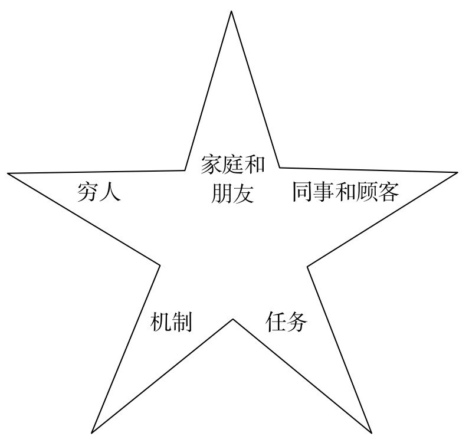

## 第一个领域：帮助同事和顾客

首先，您应该有能力在工作中帮助其他人：您的顾客、您的同事和职员以及整个公司。这里的服务不是指有失身份和自尊地去做一切别人不屑一顾的“低等”工作，这里的服务说的是帮助。

帮助别人，并不是说机械地去做别人希望您去做的事情。有时候以一种令别人觉得舒服的方式去帮助别人也是很重要的，帮助并非意味着去帮别人做他们自己能够做也是本应该做的事情。

重要的是，我们绝不能不屑于去
帮助别人。如果有必要，我们也可以收拾一次餐具，搬一下家具，值一次夜班。没有什么工作是不重要的，这个想法是很有用，而一切值得去做的事情也都值得去做好。只有那些低智商的人脑子里才有无关紧要的渺小的事情。

您需要一种动力去满足顾客，使顾客开心。为别人服务并不会成为别人的仆人，而会成为国王。

您的收入其实是别人对您的感谢。如果很多人对您说谢谢，您就会赚到很多。
他们之所以对您表示感谢，是因为您用某种方式为他们提供了优质的服务。让很多人对您表示感谢，这是您应当关注的事情。

## 第二个领域：从属于一项任务

其次，我们应该准备好为一件事情服务：一个项目、一项任务、一种想法。如果有谁没有学会在时间上把任务放在高于自己以及自己需求的地位，他就忽略了一些基础的东西：尤其是当我们做一件比我们自己还要重大的事情的时候，我们才能够得到发展。
特别是当我们把自己撇开，我们在性格上才得以继续发展。当人们在一个小组中为了和大家共同实现一个目标时，如果能暂时抛开自己，把自己抽出来一段时间，人们将会得到最好的结果。

我们经常看到那些以自我为中心的人，他们不能，也不打算像上面说的那样去做。有些人似乎认为，整个世界和世界上所有人都是在围绕着他们转。这种人如果看到地球仪，就会在那上面寻找他们自己。这是一个特别局限的观察世界的视角。

把自己看得太重的人不会为别人服务。我们如果能够明白，自己只是一场大型游戏的一部分，就会变得顺从——而顺从就是去为别人服务的一个最佳前提。我们是自己生活中的主角，同时也是一部更宏伟的舞台剧中的配角。

## 第三个领域：支持您的家人和朋友

那些爱着家人和朋友的人，会支持自己的家人和朋友。
您会怎样更有效地显示出一个人对您来说十分重要？您接受其独立并且也相信其潜力？

我们的家人和朋友用“ZEIT（时间）”这个单词来拼写出“Liebe（爱）”。当然，这里主要指的是优质时间，有用的时间。如果您的可支配时间太少了，那么这些时间您不可能没完没了地分给很多人。可是如果您还是这样尝试，最终没有人会对您满意。这也是我们不能同时拥有很多真正朋友的一个原因，但是您可以非常明确地来支持一定数量的人。

给他们送去能够开阔眼界的礼物，和他们分享您的知识，与他们谈论高质量的话题，比如和您的朋友和熟人谈论如何能够“最终获得更多收益”。您也不要老是顺着那些您爱的人，支持并不总是那么令人愉快——无论是对支持者来说，还是对被支持者来讲，都是这样的。

## 第四个领域：给穷人提供帮助

法国大革命的口号是：“自由与平等！”到后来才又有了第三个概念：博爱。为什么呢？自由和平等是一对反义词，众所周知，它们互相排斥。人们越是自由，平等就越少；越是“贯彻”平等，个人的自由就越少。

一个国家无法克服这对矛盾，那么它所能做的只是一再达成妥协：一会儿牺牲一下自由，过一会儿又牺牲一下平等，没有一个机制能够解决这一矛盾。然而这样也好，因为这样的话，个人就会很受欢迎。博爱对于克服这样一对矛盾很有必要。
我们的世界在不自由和不平等之间摇摆，只有当我们关注彼此，世界才变得有生机。那些关注周围同胞的人不会生活得不体面。贫穷并非穷人关心的问题，那是我们的事情！

您的家人和朋友也许并不是极其贫穷。我们大多数人生活在虫茧中而得到保护。而真正的贫穷我们接触得还很少。

重要的是我们不能忽视贫穷。世界上有太多的人深陷贫困了，对此我们只能说：“这不会发生在我身上。”那些拒绝帮助穷人的人失去了日常生活中对事件的审视感。这样一来，衡量标准就在慢慢发生变化。

举一个例子。您有没有度假坐飞机的时候丢失过行李？那是不是一次灾难？那些让您看起来光鲜亮丽的衣服——所有都没有了。然而保险费又少得可怜。又有谁赔偿您重新买所有东西的时间呢？而且假期又被毁掉了……

您觉得有多少饱受战争之苦的人会很愿意马上和您交换？难道我们的问题不像是一种嘲讽吗？行李箱是什么？（又是在假期！）相对于逃跑，没有食物，又可能是在冬天？饥饿的人听到超重是“文明”世界的主要问题之一时，又会怎么想？

我们生活在这样一个世界中：在装备方面我们每分钟
花费2500万美元，每分钟
就有40名儿童死于饥饿。任何富有但是只考虑其自身安全的人，就像爬上梯子然后把梯子扔到自己身后的人一样。
不要只是隐藏贫困。比如，想一想您是否就是不能捐出10%的收入。我向你保证：你所拥有的一定不会少。您会因此变得更加富有：在运气方面，同时也在物质方面。这个我也没法解释，但它总是如此。请您试一试。

请做与您相符的事情：帮助穷人，照顾病人，陪伴生命垂危的人。去帮助那些需要帮助的人，您也将会有很大的改变。

## 第五个领域：改善您的机制

也许您会问道：“我应该怎样改善机制呢？我作为一个个体会达到怎样的效果呢？”您很有可能会感到无能为力。

从前，有一个叫祖亚的拉比（Rabbi）
<a href="#text00045.html_fn_1" id="text00045.html_ft1">[1]</a>
。他一生都在抱怨自己没有摩西那样有才干、有魅力。有一天，上帝对他说：“在天堂里，我们不会问你为什么不是摩西，而是问你为什么不是祖亚。”

如何进行改变的奥秘就在于，不要把注意力放在你不能做的事情上，而是应该放在您能做的事情上。孔子曾经说过：“与其抱怨黑暗，不如点燃蜡烛。”

即使是通过您的努力看起来也不会有太大改变，您也永远都不要让自己气馁。首先是因为当您改善别人的生活时，您总能感觉到一些高尚的东西。有谁打算去为幸福的瞬间估算价值呢？

其次，我们对单一行为的真正后果还是知道得太少。但是我们越来越意识到，一切都是相互之间紧密联系的。系统是由许多小的部分组成。而这些小部分又是怎样构成整体的我们尚且无法解释。我们能数清楚一只苹果的种子，但是谁又能知道一粒种子中蕴含多少只苹果呢？

如果您将两把吉他并排放着，在一把吉他上拨动其中的一条E弦，那么另外一把吉他的E弦也开始振动，人们把这称为“共振”。将您的好意送给别人，一个微笑、和蔼、赞赏、鼓励、希望、信任，都会产生一定影响。如果您的话语和行动是发自内心的，那么对方的心就会产生反应。

您能够从哪些方面改善您的机制呢？您可以为环境做些事，为动物、为学校体制、为机会平等、为更多的友爱和爱心，您可以给失业者以辅导，与他们讨论这本书……能做的事情有很多，无穷无尽。听听您的心声：您内心真正关切的是什么事情？什么使您充满激情？您觉得自己的责任在哪里呢？

正如上文所述，您可以做许多事情来帮助他人。

能量贴士

请您帮助他人，以改善我们的世界。

●请您不要分心，而是目标明确地去进行一个项目。

●即使做事是出于良好的愿望，您也必须采取聪明的措施并且集中精神。即使您想帮助他人，也有必要确定目标，制订计划，安排好时间表，组织志同道合的联盟，委托他人，进行组织等，所有这些都是很重要的。

●将您的帮扶计划看成一个企业，像企业家那样工作。

●本书所描述的一切均适用于社会事业管理——只有一件事除外，那就是这里不是您赚钱给自己，而是为他人。

●一个人拥有财富并不糟糕，糟糕的是财富的所有者被财富支配。如果想把自己拥有的一部分财富转交给他人，您就绝对不能沉溺其中。

公平

公平并非意味着所有人应该得到相同的东西，因为所有人并非需要相同的东西，大家赚取的也是各有差异。但是，公平意味着所有人都具有同等的教育机会。所有的孩子都应该有发展个体优势的平等机会。

公平要求对所有人在教育方面进行投资；我们必须承认，有些人会比其他人更好地利用这项投资。在法律的管控下，所有儿童都有权接受特定的教育。

如前文所述：孩子是我们最大的财富，也是我们的未来。让我们为他们提供一个平等的机会吧。让我们给予他们今天的知识，而不是明天的施舍。如果我们生活的目的不是积极地影响我们周围人的生活——那我们又为什么而活呢？

------------------------------------------------------------------------

<a href="#text00045.html_ft1" id="text00045.html_fn_1">[1]</a>
在希伯来文中，Rabbi意为师傅或教师，指受尊敬的宗教知识分子。他们教导犹太人学习律法、遵行律法外，还对律法进行诠释、评注。（译者注）

第十二章\
业余时间
=============================================

你以前希望自己怎样生活，现在还可以那样去生活。\
——马克·奥瑞尔（Mark Aurel）

请想象一下，假如您遇到了一个仙女，她可以帮您实现任何三个愿望，您会许下什么愿望呢？在童话故事中，大多数人都是先许下两个愚蠢的愿望，结果很糟糕，然后用第三个愿望来进行弥补。

现实生活中不是也经常如此吗？您是否曾经为某件事情付出努力，而以后才发觉，这件事根本不能使您幸福？有时候我们必须竭尽全力地去改变我们已经完成的事情。难道有了高收入就不会这样了吗？

## 工作狂

许多人对现在不抱任何希望，却把一切希望寄托于未来。他们完全把自己埋头于工作中，以至于几乎没有时间去享受一下业余时间的新鲜空气。在20世纪80年代，长时间努力地工作还被视为英雄的做法，是正确的，还被看作一个人走向成功的标志。

然而今天，有越来越多的人意识到工作并非一切。工作狂现在成为人们所同情的对象。因为今天，人们明白了：重要的是在工作热情和工作能力之间找到平衡，去享受多姿多彩的生活。工作和积累财富只是生活的一半。家人、朋友、文化、读书和学习、开心、休息、体育和放松，这些都是不可忽视的。

在一幅漫画中，一位经理带着他的小女儿走在沙滩上散步。他打电话的时候，孩子为了引起他的注意，拉住他外套的袖子。经理恼火地说：“现在不要这样！爸爸在工作！”

真正的工作狂喜欢工作超过任何其他消遣——从长远来看，这是一个悲惨的状态。这是一种瘾，就像对酒精、毒品、药物等的过度滥用一样。当一个人逃避某些事情时，总会出现成瘾的状态；这常常隐藏在能力不足中，即无法形成富有成效的关系背后。

请您为工作投入宽裕的时间，但是不要浪费时间。请您为自己留出足够的时间，不要使自己构成生活成功的基本部分被剥夺。工作属于深层次的幸福，但是乐趣是在工作之外的。不能够牺牲一方面来达到另一方面的最大化。
只有成功地协调工作和私人生活，您才会得到真正的成功。

自由时间和工作——两者都有自身的价值，都应该占有您生活的一席之地。两者都属于真正的幸福：工作上的满足，与一份良好的收入相关，同时也与自由时间和个人能力有联系，这些都是要充分享受的。幸福感和对自由时间的满足甚至能够支持
事业上的成功，同时您的自由时间也会支持着您的收入达到更高水平。

过劳死

工作狂认为自己很有效率。这是一个昂贵的错误。由于他们常常以冲刺状态在工作，因此他们的公司实际上为此付出了十分严重的代价。
负面的压力使人犯错误。
这会使他们忘记最重要的事情。
负面压力使其吞没在细节中而忽视了大局。

努力工作会给人带来适中的结果。伟大的成就需要以快乐为前提。只有那些在活动中找到满足感的人才能获得非凡的成就。

在日本，过劳死——过度工作导致的死亡——已成为第二大死亡原因。在我们国家，这个数字尚不可知，但是数值也很高。我从我父亲那里就经历到了：他本来就总在工作，他生病时比往常更加努力地工作。他去世的时候才48岁。

本来我是应该以此为戒的，但是实际上几年前我踏入了同样的境地。当我决定要成为演讲家时，我在起步阶段十分努力，每天赚取1000欧元。一年之后，我演讲的出场费涨到了10000欧元一天，几个月之后变成了15000欧元，不久又变成了20000欧元。那时候我没有掌握的很重要的练习之一就是：说不。

我对自己在新领域的成功着了迷，我接受了一切。谁知道，这意味着在很多人面前花一整天时间——之后又是连续很多天——同时又要管理公司，写书……可以想象这需要多少力气做成本。

但是我之前生活得很健康，我做很多运动，充满精力，并且相信，能够为我的听众带来一些好的影响。那时候，我每天工作16个小时，只有3～4个小时睡眠。在得了肺炎的时候，我才必须刹车。但是我半年之后的日程已经排满了，我不想让参加我演讲的听众失望。我没有放弃的勇气。随之而来的崩溃及其后果让人非常不适。

之后又过了几个月，我才重获健康。我想在此提醒您：工作狂，疲倦以及过度压力都是无意义的，它们都是我们之前工业时代的产物。即使是高收入者也不会用现在来抵押对未来的想象。

在这期间，也算是为了保护我自己，我给自己定了一种简单的哲学，那就是：过于拼命工作的人不会善待自己，这样的人失去了对他自己的兴趣。就这么简单。您要学会善待自己，犒劳自己。

在这里，我并不是想单单指出，您应警惕过度工作导致疾病，我还想提醒您，有很多真正重要的财富是无法从工作中得到的。

## 最佳分配时间的几个步骤

有谁要是为了赚得更多的钱而加班加点、更加卖力地去工作，他就不会真正变得更加富有。被牺牲掉的业余时间的价值必须从其更高收入中扣除，而且被牺牲掉的这部分的价值通常比财务上得到的要高很多。

为了赚更多的钱而牺牲掉您的业余时间，靠这种方法您不可能实现真正的富有。真正的富有是指具有由少变多的本事，而并非必须为此做出同样程度的牺牲。本书不是教您去延长您的工作时间，而更主要是去提高您的工作效率。
真正的成功意味着：您能够获得更高的收入，但您的工作时间并没有增加，甚至还减少了。

真正的自由不是指摆脱
了工作的自由，而是指在工作中的自由，也就是说，有足够的时间去思考，去谈话。

信息时代里，最大的奥秘之一就是：人们怎样避开过度工作导致的筋疲力尽。如果您不具备在生活中保持平衡的能力，本书中所有的建议都将毫无意义。

因此我强烈要求您：请您确定多大的工作量以及多长的工作时间对您来说是舒适的。您也必须确定您的业余时间，并像计划工作那样安排好您的业余时间。我已经为自己找到了最佳分配时间的方法，我所采用的最重要的步骤对您也许会有所帮助。

1. 像罗盘一样有意义的问题：
我清楚自己想要什么。那些您在第六章看到的练习是我们研讨班“幸福的勇气”的一部分。我举办这个研讨班，目的是让自己每年做一次那些练习，借此我就能知道，哪些事情对我来说是正确的事情（有效性），而大多数人只是关注正确地做好这些事（功效）。重要的是我们要了解我们内心的罗盘，只有这样，我们才能知道自己想走哪个方向；只有清楚了我们适合去做哪些事情，我们更加努力地工作才是有意义的。

2. 优秀的计划：
我总是花很多天来做我一年的计划（在度假的时候）；也会用45分钟左右的时间来计划我一周的事情。因为我只想在一定的时间里工作，所以我始终会最先安排那些最重要的活动。除此之外，我每天还会给突发事件留有一定的时间。但我还是首先计划我的业余时间，也就是说，业余时间永远处于第一位。

3. 委托：
我的周围都是极其出色的合作伙伴和工作人员，这一点我做得十分成功。每个人都做着给他们带来乐趣并且与其天赋相符合的事情。我只注意收益并关心机制的建立，我完成自己作为企业家的任务（见第十章）。我从来不让自己参与日常琐事。请您尽可能委托一位能和您一样出色地胜任这项工作，甚至比您做得更好的人。

4. 绝对集中：
我学会了把注意力完全集中在手头的工作上，我的思想也不会为了一件小事而开小差，所以我才能够取得如此多的成绩。有两件事对此起到了主要作用：一方面，我每天都会进行冥想，这有助于提高绝对集中精力的能力；另一方面，我每工作2个小时就会休息20分钟，在这段时间中我可以使自己在身体上、精神上和心灵上都得到充分的休息。诀窍在于，要在您感觉到疲劳、筋疲力尽或者过度紧张之前进行休息。我强力推荐您试试这个方法（参见第十章）。

5. 帕累托二八定律：
这条定律称，您在工作中所获得的80%是通过您所消耗时间的20%实现的。如果把注意力集中在我们取得成绩的这20%工作中，那么我们将不会感觉到时间紧张了。据此，我们就可以把工作时间分配开来，用于很多不重要的事情和少数重要的活动
上。只有当我们没有把精力集中在重要的事情上，才不会出现过多的麻烦。

在内心还没有完全认同帕累托定律之前，我总是觉得自己时间似乎太少了。现在我明白了，以前我并不是缺少时间，而是在管理方面出现了严重混
乱。
我们活动的一大部分只能有一点点用处，而我们极少部分的时间甚至比剩下的全部时间还要更有用。

那些真正掌握了帕累托定律的人才会明白：仅仅做小小的改变是不够的，我们必须进行时间的改革，必须不断地对整体时间安排提出质疑。

您可以从下列问题出发：其他人还会做什么？我今天最后一次自己做的事情是什么？给我带来80%成绩的20%的工作在哪里？

帕累托定律的精彩之处在于：在具有决定意义的20%工作中，您还能按照80/20这样再次进行划分，以此类推，一直到至善至美为止。许多人担心由于委托了他人，由于帕累托定律，自己就会成为多余的。但是成功的人却想把自己变成多余的。
他们知道，自己总是能够找到一些推动他们企业前进的事情去做。为了把创造力用于企业发展上，他们总能找到办法解放自己。

## 工作和业余时间

这部分所涉及的当然不是为了宣传懒惰。恰恰相反，这应该能有助于提高您的工作效率，特别是提高您工作的成效，同时也应该帮助您在生活中保持应有的平衡。

所以您不应该让自己的工作把业余时间吞没，也不能让业余时间破坏到您的工作日。您需要坚持，需要自觉。

接受业余时间这个建议的人也应该具有较强的工作纪律性。
比如说，我每天早上就会在特定的时间坐在书桌前进行写作。每周5天，天天早晨如此。人们只能一页一页地写作，没有比在每天的同一时间写东西更成功的途径了。

您必须知道，什么时候应该进行休息；您也必须明白，什么时候应该集中精力去工作。两者都需要您有计划，并且遵守这个计划的纪律。如果您是独立经营者，您需要的就不只是纪律，您甚至必须要有铁一般的自律。
但是现在和纪律相关的却有这样一件事情：事实上，我只是在一定的条件下才相信纪律，我相信更多的是热情。

如果找到了让您充满激情去做的事情，您就会不断为这件事出现的新情况而感觉到高兴。您就不需要再去强迫自己，而通常您都会充满期待地投入工作中。这种情况能保持较长时间，就如同您得到了充分的休息一样。我所从事的99%的事情都能给我带来极大的乐趣。而且我相信，对于每个人都是如此。

当然，想这样控制生活并不是简单的一步。对此，具有基础的决定是十分必要的。然而只有当您找到那些重要问题的答案之后才能做出决定。上述思考的基础，我们在本书的第一部分已经谈过：您真正想要的是什么？

那么您就已经对您的强项和兴趣有所了解（第六章）。

## 两种方式

到目前为止，我们已经探讨过五角星图中的所有领域了：今后您希望从事哪些领域工作？为此，我们可以回顾一下本书开始部分提到的两种方式。

我说的并不是每个人都能成为一名高收入者。这其中最重要的原因在于，并不是每个人都做好准备为此付出代价。如果下意识对下面两种方式进行抉择，并且遵守本书提到的准则，您就会从根本上取得比不这么做更好的结果。我向您保证。

当您读到这里，您面前有两种方式可以进行选择：您想仅仅多赚20%——还是想多赚100%呢？

如果只想多赚20%，
您需要做的并不是很多，但有些事情是您必须
要做的。从今天起，请您每天都要撰写成功日志，在那里记录下自己所有的成功。您想继续做职员，就有目的地朝着加薪的方向努力，就像第七章中写到的那样。

如果基于您公司的结构这样做不可行，那么就请在下一周找一份兼职——您已经知道了：在另外一个领域。如果您另外将第九章牢记于心，也就是关于您自身定位的想法，并且将本书中提到的这样那样的提示进行应用，那么您将真正实现多赚20%——在一年之内。在另外一个领域也同样适用。

无论如何，您都要将每一次外快的50%储存起来。这样您会慢慢地，但是毫无疑问地变成投资者。

如果想多赚100%，
您就需要从根本上进行更加强势的改变。您必须建立自信力，并且尽可能多地记录成功日志。

如果您是雇员，您必须除此之外抱有明确的目的像专家那样进行定位，或者您就必须向五角星图另一半边转移。尽管已经习惯于在五角星图左半部分工作，您也必须像我在本书中描写过的那样，进行彻底的改变。

小小的改变不可能获得惊人的收入，您必须在您的生活中进行改革。
小的改变带来小的成就，只有巨变才能带来巨大的成就！

完成上述步骤需要勇气，还要求真正改变些什么。对此，我有时会听到下面这些不同的意见：

●我并不相信一切这么简单。

●我的合伙人可能不会这样合作。

●我不敢冒这个险。

●我没有这方面的能力。

●这样做事情我可能需要许多钱。

简单归纳这些反对意见可以总结为：“尽管我想得到报酬，但是不想付出与之相当的代价；虽然我想取得更多的收入，但是其实我已经很满意了——所以，就这样吧。”

请您好好考虑清楚：改革毕竟是改革。它有风险，而且会有不适感，并不是每个人都准备好这样去做。您必须敢于冒险并且涉足新的领域。帕累托定律最后的结果意味着：我们80%的幸福仅仅是来自我们20%的时间。这不正是一种绝对需要改变的状态吗？

为一些零零碎碎的问题而伤脑筋，或者只是对时间进行有成效的安排，并没有什么太大的意义。我们如果仅仅投入20%的时间，就必须做很大的改变：实际上几乎是全部改变。只要我们还没有遵照新的规则生活，就是在浪费时间。因为艰苦的工作并不能带来成功，对重要规则的实施才可以带来成功。一切从有意识的决定开始，只要您还没有做出这个决定，就不会改变什么。

在您做决定之前，必须问自己一个基本问题：我想从生活中得到什么？

能量贴士

为自己抽出一些时间，去思考一下，您真正希望从生活中得到什么。为此，您需要在一个安静的地方潜心研究第六章的练习，另外也请您再回答以下几个问题：

●我是否拥有眼下所需要的一切？

●我的生活方式对于我的家庭来说是否合适？

●我是否生活在合适的地方并且和正确的人生活在一起？

●我是否经常旅行？

●我是否找到了自己的最佳工作节奏？

●我是不是随时都能做运动，放松，进行冥想呢？

●我是否一直都感觉到很放松、很舒适呢？

●我的工作日程是否有利于我进行创意以及挖掘我的潜力呢？

●我从事的事情是否给我带来极大的乐趣，并且同我的能力相符呢？

●我有没有足以让我生活无忧的一笔钱呢？

●如果我愿意，我是否能够使别人的生活变得充实呢？

●我是否同足够多对我真正重要的人见过面呢？

您要注意，不要使自己重蹈覆辙。也许您可以抽出一点时间，记下一切使您在生活中真正感觉到幸福的事情，将其称为幸福之岛，
然后您也可以写下所有不理想的事情，然后称之为痛苦之岛。
但是问题不仅仅在于这些“痛苦之岛”。除此之外，大多数人都有一个中等满意的无人区。

不要给无人区空间。请您有目的地增加您的“幸福之岛”。您这样做也是为了其他人：当您感觉到幸福的时候，您会让幸福也包围着您身边的人。
所以，这是您的责任，去做一切使您感觉到幸福的事情。给自己打造您真正想要的生活，为此，即使选择的道路崎岖坎坷，即便需要冒险，也是值得的。

三件事情

如果您选择了第二条路，也就是您想赚得更多的钱，那么下面三点是十分必要的，您必须做到：

●提高自我要求

●接受全新理念

●使用新的策略

您已经在这本书中找到了这些策略。而当您周围都是一些“高收入人群”的时候，新的理念也就很容易建立起来了。这些人每天都在学习、提高，对那些本应该做得很出色的事情，他们不会满足于做得差强人意。去接近这些人是您应该送给自己的最大礼物。

当然不是每个人都希望看到您成功。“小心眼儿”的人天生感到不安和胆怯。他们认为成功具有危险。因此就会有这样的人，他们劝您别去改变自己。虽然这些人口口声声说不相信您有改变的能力，但事实上是他们对自己在这方面的能力没有自信。您无论如何也不能被这些人牵绊，您要自己做出您生活中的重要决定，并且将这些决定加以实施。

您应该鼓励别人，给予他人帮助。您应该使您周围的人也注意到，能够按照新的规则去生活，并且通过这种方式使他们在自己的工作中有更大的满足感。

至于您为什么应该这样做，有三个理由：第一，您周围按照本书中的原则生活的人越多，对您来说就更容易；第二，通过向他人传授这些规则，您自己会不断去思考什么对您来说最重要；第三，当您帮助别人执行他们生活中重要的事情、积极地进行改变的时候，您从中得到的乐趣是不可想象的。

## 绝不妥协

我希望这本书有助于您仔细思考您应该对生活提出怎样的要求。您要追求职业上绝对的满足感。
对于工作，您不应该有丝毫妥协。如果工作使您心灰意懒，那么用您业余活动来弥补也是无济于事。就如同您把一只手放在热水中，而另一只手放在冰水中，那么平均看来您也不会觉得舒服。

那些不关心工作是否完成的人，和自身本来可以取得的成绩渐行渐远。

您是怎样利用机会的呢？迄今为止，您真正利用了您所有可能性的百分比有多少呢？25%，还是47%？您真的想到达那个境界吗？那个如果您不改变方向就必然会到达的地方？
请您坦然面对自己。不管您是否真的愿意，即将到来的一切事情都将从您现在所处的这个地方开始。

生活是一段旅途，如果您对生活的种种可能都持开放态度，生活就会将您引向您从未想过的路线，您也会发现很多超出您梦想的东西。

不会总是那么轻松

您的收入很有可能不会直线上升，相反，在这条道路上您将会经历沮丧、怀疑和挫折，您会在最不合适的时刻遇到若干困难，您可能会放弃自己的方向，因为您从未料到会遇到如此多的麻烦；您可能触及自己的痛处。这很正常，因为生活不是舒适的软靠垫。

这些挫折不是贯穿于您一生的诅咒，每个人都要经历这些。您只需要把它们看成您生活大厦中固有的门和窗。当您穿过了这些出口，就会到达更高的一层。通向我们想要的生活之路似乎需要经过这些挫折。

有的时候，您可能没有任何前进，您认为是停滞不前了，什么都不干了，时间好像从您身边悄然流逝。但是这样的阶段也是完全正常的，并且还属于“机制”的一部分。就像上楼梯一样，您会不断上到一个层面，又上到另一个层面。即使在收入方面您没有感觉到明显提高，但是您的内心正在趋于成熟。这种内心深处的成长阶段十分重要，您应该充分利用它，去学习，去为迎接新的挑战而做准备。有了这种看法之后，您就能学会喜欢这种停滞不前的平台阶段。

金牌

请您想象一下，您遇到了一位金牌得主，他向您提问：“您生命中的金牌在哪里呢？”请您不要忘记，生命太短暂，请不要碌碌无为地度过。您可以拥有一切：安全感、欢乐、高收入、名望以及足够的业余时间和意义。只要您想，这都不是童话。

您还始终认为这是不可能吗？其实对于远大目标来说几乎总是这样的：首先我们认为达到这些目标是绝对不可能的；随着时间的推移，我们认识到这并非不可能，只不过实现的可能性比较小，原因在于我们的经验、我们目前的情况……看起来好多事情都是那样消极；直到最后我们才清楚，实现这些目标其实是必然的——自始至终都是这样，因为它们其实一直存在我们心中……

这一切始于您找工作的时候，找一份您所热爱并且与您的能力相符的工作。我希望您对工作保持一种持久的热情。如果找到了真正使您充满热情的事情，您就给您的工作镀了金，这样，您就会拥有永远不会被其他人抢走的金牌。

请您清醒地认识到自己与其他人相比所具有的优势。您心中的火焰，您的热情能够最强烈地展示出您的优势。如果您的一只脚已经迈进了天堂，从人性上来说，您是不会再撤回去了。

我祝福您能终生热爱您的工作。

# 致谢

一丝光亮，只有在黑暗中才显得尤为重要，才是有助于人的。然而事实上，当我们极其需要它们的时候，有些光却暗淡了，从我们的生命中消失了。有的人愿意使我们适应眼下的这一片黑暗，而另一些人则在风暴来临之际马上离开黑暗。

我经历过这些风暴时期，从中得到的好处就是：我能够认识到，当我在某个时期时运不济的时候，哪些光是不会消失的。如果回望过去，我的一生都离不开这些人给予我的信任和友谊。

我想在这里特别感谢：

彼得·赫福尔曼（Peter Hövelmann），沃尔特·穆比乌斯教授（Professor Walter
Möbius），格雷塔·安德雷亚斯（Greta
Andreas），贝恩德·莱特根以及菲里茨·莱特根（Filiz
Reintgen），克里斯蒂安·费舍尔（Christian Fischer），努诺·阿西斯（Nuno
Assis）以及莫妮卡·蕾溏（Monika Letang）。

另外，我还要感谢非常专业并且鼓舞人心的dtv团队，特别是我的编辑卡特琳娜·樊斯特（Katharina
Festner），她有耐心，振奋人心，同时又兼具批判与鼓励于一身。

# 附录

其他一些帮助您找到满足感的更深入的问题。

1\.
当您还是孩子的时候，您曾经想变成怎样的人呢？这种职业能够满足您哪些需求呢？（比如我曾经想成为印第安人，在这背后隐藏着我对于冒险和追求自由的需求。）

2\. 请您思考一下，有哪些人不具备您拥有的能力？

3\.
有哪些只有您自己经历过的事情？是什么使您很特别？一项单一的能力就像是一连串电话号码中的一个数字，这个数字在世界上会出现上百万次，但组合在一起是独一无二的。您是怎样组合起来的呢？

4\.
您常常惊异于他人的哪些事情？歌德曾经说过：“那些我们在别人身上注意到的特征和能力都留有我们自己的烙印。”那些我们在其他人身上注意到的东西向我们展示着我们自身还蕴藏着哪些东西，还有哪些能力我们也许想要发展。

5\. 您每天都做好几次有着好结局的梦，梦醒后请您记录下您梦到的一切。

6\.
请您问问自己：在我的生活中什么时候是最满意的时刻？什么时候最不满意，最不快乐？研究一下为什么会这样。

7\.
当我们感觉到舒适的时候，是因为我们的需求得到了满足。认真思考真正使您感觉到舒适的三个场景。思考一下：为什么会感觉到如此舒适呢？如何来满足您6个方面的需求呢？这6个方面的需求是：对安全和舒适的需求；对改变和历险的需求；对独特性和重要性的需求；对爱和联系的需求；对成长和学习的需求；对给予和区别的需求。

8\.
7年之后，在理想情况下，您有哪些独特的日程安排（工作以及业余时间）？请您尽可能详细地记录下来。

9\.
您对工作的设想是怎样的？工作应该为您带来什么：金钱、自信、联系、社会价值、学习和成长的可能性、挑战、安全感、乐趣、自由、意义、帮助他人的可能性、实现自我、挖掘潜能、合作精神……

10\. 您一生之中一定要实现的5件事有哪些？

11\.
请列出您生活中所扮演的全部角色（父亲、母亲、朋友、孩子、姐妹、兄弟、生意伙伴、顾问、邻居……），哪些角色对您来说最重要？

12\.
您身边都是什么样的人？这些人对您有何期望？您有没有受这些人以及他们的期望影响？

13\.
如果您意识到，要是没有您所经历的这些经验，今天的您就不会是今天的您。请您重新思考一下：什么才能使自己独一无二呢？

14\. 和您最好的朋友以及熟人坐在一起，问问他们：你们认为我怎样做才好？

15\.
请您清楚了解自己的价值，记录下5位定期同您联系的人的姓名，问问自己：这些人怎么看待我？在他们眼中我的价值体现在哪里呢？

16\.
您喜欢和谁一同工作？为什么？您不愿意和谁工作？为什么？您觉得哪些重要的价值受到这些人的重视或者忽视呢？

17\.
想要确定什么对您真正重要，请您给自己写一则死亡讣告。上面应该写哪些内容呢？

18\.
请您记录下对您真正重要的价值。接下来我们附了一个价值列表，请您试着从中确定生命中最重要的10到15个价值——并且试着按照对您的重要性进行排列。

价值举例（建议）

|          |                |
|----------|----------------|
| 信任     | 提供利益       |
| 理解     | 感激           |
| 真诚     | 谦逊           |
| 尊重     | 恭顺           |
| 热情     | 健康           |
| 开朗     | 助人为乐       |
| 诚实     | 精力充沛       |
| 爱情     | 幸福和喜悦     |
| 温暖     | 和平           |
| 娱乐     | 不断学习和成长 |
| 乐趣     | 自律           |
| 安全     | 坚韧           |
| 发展     | 镇定           |
| 支持     | 耐心           |
| 挑战     | 历险           |
| 创新力   | 成功           |
| 美丽     | 智慧           |
| 魅力     | 专注力         |
| 精神     | 责任感         |
| 自由     | 财运           |
| 财富     | 自信力         |
| 满意     | 进行变化       |
| 反应     | 活力           |
| 注意     | 放松           |
| 富裕自足 | 正直/秩序      |
| 融合力   | 影响和权利     |
| 家人     |                |

19\. 您有没有想到一个事业的领域，在这里您可以凭借您的价值生存？

20\.
下面的练习需要您拿出整整一个小时的时间。我向您保证：这是值得的。如果在这一个小时中进行投资，您会得到比往常更多的收益。（我自己每年都重新进行这样的练习）我向您保证，您会感觉到内心的平静……

请您想象一下，您远远地经历着自己的葬礼。许多人都来参加，为了向您致以最后的敬意，也为您的生活表达他们的爱、认可以及对您的尊重。（注意：如果您在举行葬礼时极其难过，那么您可以改变一下场景，想象一下，这是您85岁或者95岁生日，您在一大群人中庆祝）节目结束后，会有4位发言者进行发言，他们想谈谈您生命中的某个方面：

第一位发言者是您的一位家人：您作为他的伴侣，父亲/母亲、兄弟/姐妹，他会怎样描述您？

第二位发言者是您最亲密的朋友：您作为朋友和个人，他会怎样说？

第三位发言者来自工作场合：您在工作中是怎样对待同事的？您达到了怎样的目标？

第四位发言者来自社会领域：您为此付出过哪些努力？您给予过别人什么东西？您在哪里做过好事？

21\.
歌德曾经说过：“愿望是我们能力的禁区。”因此，您能够发现自己真正想要的事物十分重要。请您写下，您在5年之内：a.
想成为怎样的人；b. 希望做什么事情；c.
想要拥有什么。请您思考一下，这一切是否真实可行。至少你的想法和笔记应该超出所有限制。谁又知道呢……

当认真地尝试找出生活中达到的境界，发现自己到底是谁，自己想做什么，人们就会变得非常虔诚，而且非常自由。

<svg xmlns="http://www.w3.org/2000/svg" xmlns:xlink="http://www.w3.org/1999/xlink" height="100%" preserveaspectratio="xMidYMid meet" version="1.1" viewbox="0 0 951 1348" width="100%">

<image height="1348" width="951" xlink:href="Image00029.jpg"></image>
</svg>

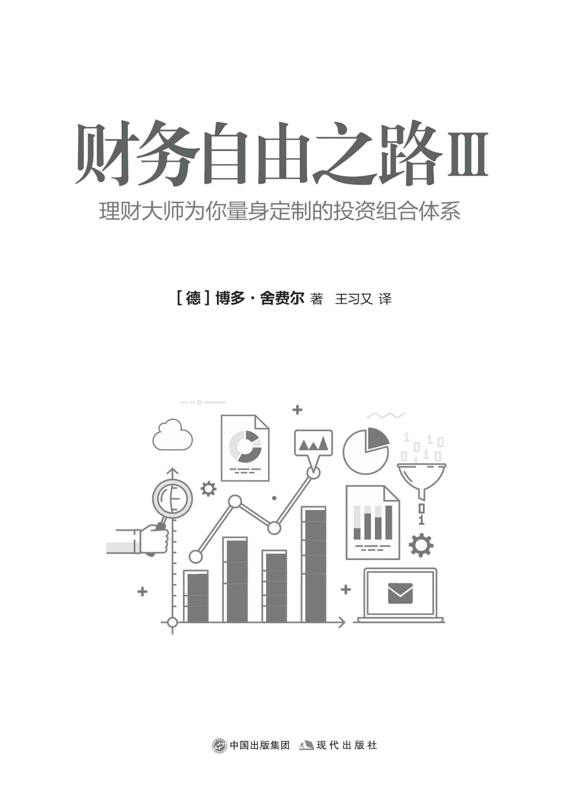

版权登记号：01-2018-9109

图书在版编目（CIP）数据

财务自由之路．Ⅲ/（德）博多·舍费尔著；王习又译．—北京：现代出版社，2019.3

ISBN 978-7-5143-7610-4

Ⅰ．①财…　Ⅱ．①博…②王…　Ⅲ．①私人投资—基本知识　Ⅳ．①F830.59

中国版本图书馆CIP数据核字（2018）第289708号

COPYRIGHT：THE RIGHTS COMPANY，The Netherlands

The simplified Chinese translation rights arranged through Rightol Media

（本书中文简体版权经由锐拓传媒取得Email：copyright@rightol.com）

财务自由之路．Ⅲ

------------------------------------------------------------------------

作　　者：（德）博多·舍费尔

译　　者：王习又

责任编辑：姚冬霞

出版发行：现代出版社

通信地址：北京市安定门外安华里504号

邮政编码：100011

电　　话：010-64267325　64245264（传真）

网　　址：www.1980xd.com

电子邮箱：xiandai@vip.sina.com

印　　刷：三河市宏盛印务有限公司

字　　数：240千字

开　　本：710mm×1000mm　1/16

印　　张：17.5

版　　次：2019年3月第1版

印　　次：2019年3月第1次印刷

书　　号：ISBN 978-7-5143-7610-4

------------------------------------------------------------------------

版权所有，翻印必究；未经许可，不得转载

你是否正确投资了你的钱？你的收益是否少得可怜？你是否冒了不必要的风险？在这本书中，你将学到关于投资的一切。博多·舍费尔和贝恩德·莱特根简明扼要地、令人信服地传授了理财基础知识，展示如何在尽可能少的时间内，且在最高的安全性保证下，创造财富，让财富翻番。借助这本书，你可以根据你的私人投资个性，重新审查、优化你的整个投资状况。其结果是：尽可能根据投资项目的安全性、收益率、透明度和资产可用性来综合考虑投资，让你在没有压力的情况下实现财务自由。

# 致谢

本书能顺利出版，离不开各位专业人士的鼎力支持和热心帮助。在此，我要特别感谢沃尔特·麦比乌斯教授。此外，努诺·阿西斯、葛丽泰·安德烈亚斯、莫尼卡·勒唐和克利斯蒂安·菲舍尔，也给予了我无私的支持。

特别感谢本书的合著者，我的好朋友贝恩德·莱特根，我俩在本书的写作和修订过程中，合作得非常愉快，并且在共同的项目和经营中，共度了许多美好的时光。

感谢贝恩德·莱特根的夫人菲利兹·莱特根，她为本书的出版投入了巨大的心血。也要感谢莱特根＆舍费尔投资所的同人，感谢凯姆普斯出版社的工作人员，特别是布莱塔·克罗克，感谢德国袖珍书出版社的工作人员，特别是卡塔琳娜·菲斯特，以及感谢“自愿编辑”汉斯-于尔根·布莱茨克、撒宁·荣格和阿希姆·布莱克。

感谢我的读者和我培训班的学员，给予了我撰写此书的灵感。当然，我还要感谢你。尤其是你们投资成功，让我备感快乐。

# 说明

每一种有价证券理财方式，都存在着一定的风险，投资者须自行承担。由于遵照书中的推荐和提示所造成的损失，本书作者和出版社不承担任何责任。

# 前言

成功者从不靠偶然的机遇。

——弗里德里西·尼采

自从1998年秋我的《财务自由之路》一书出版后，我收到了成千上万的读者来信。来信中常提到的是：“我已经在比我想象的要短得多的时间内，提高了自身收入，取得财务投资上的初步成功。但接下来的理财之路怎样才能走得更远一些？我如何正确地进行投资呢？
”

本书将告诉你如何让你现有的资金增值——每年平均增值8％～12％，甚至更多
。实现这一目标，不要求你拥有几十万欧元可支配资产。恰好相反，在你手上资产较少时，我建议你读一读本书。因为现有资产越少，就越要避免走不必要的弯路。

此外，本书还将论述如何才能没有压力地进行投资理财，也就是说，你每个月在投资上花费的时间不超过两个小时，而且你还觉得这对你来说很容易上手。因为对于大部分人而言，最大的困难不在于没有好的投资决策。相反，问题更多在于，由于内心担忧花费时间太多或者觉得投资太难，所以一再拖延这些重要的事情。

如前所述，我们的目标是：每年8％～12％的收益。对此很多人会持怀疑态度。正如金融研发机构Dalbar针对1984年到1995年这段时间基金表现的研究显示，这样的态度也在情理之中。根据研究，美国基金投资者平均每年的收益为6％（在此期间资产增值达98％）。在德国，平均每年的收益甚至低于3.8％。但与此同时，标准普尔500指数整个上涨了461％（甚至那些定息债券投资者，也获得了131％的资产增长）。如你所见，汇率的大幅上涨和经济指数的持续增长，只是投资市场中积极的一面。而另一面，是几乎没有个人投资者真正地从中获利。

因此，可以消除三个偏见。

第一个偏见：股票优于定息有价证券。这点虽没错，但显然不适用于大多数投资者。至少不适用于那些不遵循规则的投资者。人们常常只关注某支基金或股票在一特定时间段内的发展，而忽视了几乎没人能长期持有这些有价证券。所以，我们将看到一些相应的规则，也包括一些我们不太熟悉的规则。

第二个偏见：投资基金总不会出错。这点是不对的，投资基金也会出错。所有投资者的平均结果清楚地表明了这一点。事实上，人们只用通过简单持有收益处于平均水平的基金或指数投资，这一时期获得的收益就远不止6％。大多数人在投资基金时毫无计划，只是盲目地“玩玩”而已。作为目标明确的投资者，不能没有计划。我们会在学习本书内容时，结合你的所有个人情况，如你的目标、你的资产状况、你的投资个性和投资年限等，一起来制订一份详细的投资计划。

第三个偏见是最有决定性的偏见：基金对所有人而言都是最佳投资形式，通过买基金，大部分个人投资者最终都能获得像大玩家一样的高额利润。这个观点也是错误的。大部分的利润最终只落到仅占0.5％的投资者手中。我们不允许这个状况长久地持续下去，相同的利润在期待着你，就像期待那0.5％的投资者一样。你也有能力在几年内让自己的金钱翻一番。如何操作？我将会在本书中给大家做出详尽的阐述。

## 轻松实现财务自由

本书的重点内容是：把你手上的金钱变得富足。读完此书，你将有能力获得8％～12％的年平均收益率，也就是说，至少每6年到9年，你手上的钱就能翻番，而且你操作起来完全游刃有余，让自己心满意足。追求一个什么样的回报，完全取决于你自己。6年实现200％的资产增长是完全可以实现的（每年大约增长20％），你将能够变10万欧元为30万欧元。

但我还要说明，这样的收益率并不是每一个投资者的必然追求。因为人们必然要为这样的结果付出相应的代价。因此，你也会从本书了解，你属于哪一种投资者类型，应该追求什么样的收益回报。

对此，我们的目标是：你要弄清楚，在8％～20％之间，你想要获得多高的收益。然后，我们在本书中详述实现之道。

## 本书的诞生故事

本书是贝恩德·莱特根和我合作完成的。出于很多原因：莱特根先生不仅是我认识的最优秀的投资顾问，他还管理着我的投资项目。他具备三条我对投资顾问所期待的品质。第一，绝对忠诚，始终维护客户的利益，且言而有信。第二，他的消息非常灵通，且保持不断地学习充电。第三，他很成功。他非常出色地替顾客照管着上百万的资产，并给他们提出建议。

我们在金钱和投资上的理念完美地契合。作为商业合作伙伴，尽管我们常常因为对某种投资形式有分歧而讨论到深夜，但我们从未失去对投资的兴趣。天长日久，我们成了朋友。

本书中介绍的投资组合体系，是由我们两人共同开发完成的，此外，莱特根先生提供了许多强而有力的建议，他逐字逐句，反复推敲内容，而且积极地参与到各个章节的写作中。因此，在本书中，他被称为合著作者，确实是实至名归。

## 投资新手和投资高手的阅读指南

由于不了解各位的知识储备，我不知道该从哪儿给大家讲起。可能至今为止你很少和金融投资方面的事情打交道。因此，本书的开始部分，先介绍一些金融投资的基础知识。尽管你可能已经熟练掌握了有关知识部分，但我还是建议你读一读前四章节的内容。因为我们要从这儿开始铺好基石，唤醒你对最佳投资策略的领悟。

从第五章开始我们会逐个讲解投资策略，帮助大家一步步获得更高的收益。

作为一名热情满满的作者和拥有坚定信念的理财导师，我坚信所有人都应当具备达到财务自由的先决条件。我的第一本著作《财务自由之路》获得了超乎想象的积极反馈，读者和培训班成员有趣的提问和评论，对我写作本书的帮助极大。本书是关于财务自由思想的延续。真正开始之前，请你先看看本书总结的来自《财务自由之路》一书的最重要的核心思想。

## 单单金钱不能让人幸福

本书不仅围绕如何最大限度地增长你的财富，还更多地涉及一种你真正想要实现的生活方式。比如，为了创业的可能性，为了获得想住在哪里就住在哪里，想怎样生活就怎样生活的机会，为了找到一条能很好地规划生活和时间的道路，让自己有更多时间和爱的人相处，去更好地专注于喜爱的事情。

这些问题具有更大的意义，我们需要赋予投资活动更好的理由。因为当真正重视某事时，我们就只需要朝着最好的成绩努力。只需明白：好的投资让我们能够按自己想要的方式去塑造我们的生活。
谁看清了自己的梦想，谁就有动力去实现财务上的成功和实现富裕生活。

本书讲了一个成效卓越的投资体系。这个体系真的很管用，几千名培训班的成员都已通过实践取得了成功。我和贝恩德·莱特根会通过此书，担任你们的私人教练。就让我们开始进入正题吧。

# 通往财务自由道路上至关重要的驿站

1．确定目标。明确你应追求的生活水准，为此你需要多少钱。你需要自己来承担责任，是否能达成目标，完全取决于你自己。

2．确定在金钱方面你应该遵循什么样的信条，把所有阻碍发展的信条替换掉，只坚持那些认同富裕的信条，你才能把金钱“魔术般”地吸引过来。

3．“训练”自己与金钱打交道的能力。保持随身携带500欧元，或者把现金放到你的保险柜里，时不时打开，你就会心情愉悦。

4．通过建立自信心及要求获取与个人成就相对应的报酬，提高自身收入。做一本成功备忘录，在里面记录下自己所有的成就。如果想进展更迅速，你还得把自身定位成专家，给自己找一名教练。只有当你的收入基于这两个前提爆发式增长，你才能实现7年内赚到你的第一个100万欧元。

5．避免任何形式的消费负债。如果你已经负有此类债务，可以遵循“五五法则”：每月收入除开日常生活开销，最多可以使用其结余的50％来还债。尽量选择最低的还款率。

6．至少省下净收入的10％（若要快速实现财务上的成功，则至少存25％）。再额外开立一个储蓄账户，用三账户模式建成一个体系，以此“强迫”自己省钱，同时不失乐趣。每次加薪后，再将涨薪部分的50％存入此账户中。

7．把你的钱分配到本书介绍的6个风险等级中，分配时结合你的目标、财务状况、投资个性以及投资年限来综合考虑。把用于增值的那部分钱投入有价资产（不动产、股票、股票基金和其他企业入股）。

8．有计划性地开展投资。借助此书，制订一个投资计划，然后严格按照计划执行。把你自己的情感分离出来，或者把你的金钱和情感分开。你也可以为自己寻找一名优秀的投资顾问。

9．拿出一定量的钱，定期做慈善捐赠。个人资产增长的同时，也要担负起更多的社会责任。如此你才能学会更好地享受金钱。

# 目录

<a href="#text00053.html_calibre_pb_0" class="calibre12">致谢</a>

<a href="#text00054.html_calibre_pb_0" class="calibre12">说明</a>

<a href="#text00055.html_calibre_pb_0" class="calibre12">前言</a>

<a href="#text00056.html_calibre_pb_0"
class="calibre12">通往财务自由道路上至关重要的驿站</a>

<a href="#text00058.html_calibre_pb_0"
class="calibre12">第一部分　财务自由的前提条件</a>

<a href="#text00059.html_calibre_pb_0"
class="calibre12">第一章　目标：至少8％～12％的理财收益</a>

<a href="#text00059.html_sec001" class="calibre12">财富是一个体系</a>

<a href="#text00059.html_sec002" class="calibre12">抓住机遇</a>

<a href="#text00059.html_sec003" class="calibre12">“我不是这一类型”</a>

<a href="#text00059.html_sec004" class="calibre12">理财头脑</a>

<a href="#text00059.html_sec005"
class="calibre12">Ⅰ．只有有形资产能让你富有</a>

<a href="#text00059.html_sec006"
class="calibre12">Ⅱ．识别出什么时候是投资，什么时候是投机</a>

<a href="#text00059.html_sec007" class="calibre12">Ⅲ．区分债务和投资</a>

<a href="#text00060.html_calibre_pb_0"
class="calibre12">第二章　德国人为什么在理财方面一塌糊涂</a>

<a href="#text00060.html_sec001" class="calibre12">美国人的资产分配</a>

<a href="#text00060.html_sec002"
class="calibre12">德国人2006年的资产分配情况</a>

<a href="#text00060.html_sec003" class="calibre12">你的资产分配情况</a>

<a href="#text00060.html_sec004"
class="calibre12">我们邻国朋友的做法截然不同</a>

<a href="#text00060.html_sec005"
class="calibre12">德国人的投资行为产生的3个原因</a>

<a href="#text00060.html_sec006" class="calibre12">风险的含义</a>

<a href="#text00060.html_sec007" class="calibre12">税收和通货膨胀</a>

<a href="#text00060.html_sec008" class="calibre12">重点关注的问题</a>

<a href="#text00061.html_calibre_pb_0"
class="calibre12">第三章　获利方</a>

<a href="#text00061.html_sec001" class="calibre12">复利的奇迹</a>

<a href="#text00061.html_sec002" class="calibre12">8年内超过200％</a>

<a href="#text00061.html_sec003"
class="calibre12">风险比重和收益率之间的关系</a>

<a href="#text00061.html_sec004" class="calibre12">乐观心态助力成功</a>

<a href="#text00062.html_calibre_pb_0"
class="calibre12">第四章　灵活收益来源的三大基石：股票、股票市场和投资基金</a>

<a href="#text00062.html_sec001" class="calibre12">股票的价值</a>

<a href="#text00062.html_sec002" class="calibre12">经济和股市</a>

<a href="#text00062.html_sec003" class="calibre12">股市反应迅速</a>

<a href="#text00062.html_sec004"
class="calibre12">直接投资股票的前提条件</a>

<a href="#text00062.html_sec005"
class="calibre12">盈利公式：花最少的时间获得最高的收益</a>

<a href="#text00062.html_sec006" class="calibre12">基金究竟是什么</a>

<a href="#text00062.html_sec007"
class="calibre12">投资基金是如何产生的</a>

<a href="#text00062.html_sec008"
class="calibre12">基金的观念禁得住考验</a>

<a href="#text00062.html_sec009" class="calibre12">千足虫</a>

<a href="#text00062.html_sec010"
class="calibre12">分散投资能提高“命中率”</a>

<a href="#text00062.html_sec011" class="calibre12">拓宽自身眼界</a>

<a href="#text00062.html_sec012" class="calibre12">申购基金的方式</a>

<a href="#text00062.html_sec013"
class="calibre12">投资基金的可靠程度</a>

<a href="#text00062.html_sec014" class="calibre12">基金份额</a>

<a href="#text00062.html_sec015"
class="calibre12">如何确定基金份额的价值</a>

<a href="#text00062.html_sec016" class="calibre12">如何处理收益</a>

<a href="#text00062.html_sec017" class="calibre12">资金提现即时快捷</a>

<a href="#text00062.html_sec018"
class="calibre12">投资基金满足5个投资标准</a>

<a href="#text00062.html_sec019" class="calibre12">如何利用投资基金</a>

<a href="#text00062.html_sec020" class="calibre12">特别说明</a>

<a href="#text00063.html_calibre_pb_0"
class="calibre12">第五章　从蜗牛到老虎：一览投资的丛林</a>

<a href="#text00063.html_sec001" class="calibre12">分散风险的秘密</a>

<a href="#text00063.html_sec002" class="calibre12">波动性</a>

<a href="#text00063.html_sec003"
class="calibre12">真正有益的划分方式</a>

<a href="#text00063.html_sec004" class="calibre12">蜗牛</a>

<a href="#text00063.html_sec005" class="calibre12">乌龟</a>

<a href="#text00063.html_sec006" class="calibre12">骡子</a>

<a href="#text00063.html_sec007" class="calibre12">大象</a>

<a href="#text00063.html_sec008" class="calibre12">马</a>

<a href="#text00063.html_sec009" class="calibre12">老虎</a>

<a href="#text00063.html_sec010" class="calibre12">小结</a>

<a href="#text00064.html_calibre_pb_0"
class="calibre12">第六章　各类投资形式的优缺点</a>

<a href="#text00064.html_sec001" class="calibre12">风险等级一</a>

<a href="#text00064.html_sec002" class="calibre12">风险等级二</a>

<a href="#text00064.html_sec003" class="calibre12">风险等级三</a>

<a href="#text00064.html_sec004"
class="calibre12">风险等级四、五、六</a>

<a href="#text00064.html_sec005"
class="calibre12">另一种选择：屋顶基金</a>

<a href="#text00065.html_calibre_pb_0"
class="calibre12">第二部分　发展量身定制且收益可观的投资组合</a>

<a href="#text00066.html_calibre_pb_0"
class="calibre12">第七章　你个人的投资组合和足球策略</a>

<a href="#text00066.html_sec001" class="calibre12">实践操作</a>

<a href="#text00066.html_sec002" class="calibre12">四个关键问题</a>

<a href="#text00066.html_sec003" class="calibre12">三大优点</a>

<a href="#text00066.html_sec004"
class="calibre12">致富准则一：你的目标</a>

<a href="#text00066.html_sec005"
class="calibre12">致富准则二：你的财务状况</a>

<a href="#text00066.html_sec006"
class="calibre12">致富准则三：你的投资个性</a>

<a href="#text00066.html_sec007"
class="calibre12">致富准则四：你的投资年限</a>

<a href="#text00066.html_sec008" class="calibre12">个人投资策略之路</a>

<a href="#text00066.html_sec009"
class="calibre12">一个粗略的投资推荐</a>

<a href="#text00066.html_sec010" class="calibre12">如何分配你的资金</a>

<a href="#text00066.html_sec011"
class="calibre12">针对投资组合做必要的调整</a>

<a href="#text00066.html_sec012" class="calibre12">足球策略</a>

<a href="#text00067.html_calibre_pb_0"
class="calibre12">第八章　不要拒绝良好的建议</a>

<a href="#text00067.html_sec001"
class="calibre12">投资咨询：要或者不要</a>

<a href="#text00067.html_sec002" class="calibre12">善用你的时间</a>

<a href="#text00067.html_sec003"
class="calibre12">有的顾问并非真正的顾问</a>

<a href="#text00067.html_sec004"
class="calibre12">如何找到自己的领航员</a>

<a href="#text00067.html_sec005" class="calibre12">征询口碑</a>

<a href="#text00067.html_sec006" class="calibre12">与顾问的首次面谈</a>

<a href="#text00067.html_sec007"
class="calibre12">如果你不想聘用一名顾问</a>

<a href="#text00068.html_calibre_pb_0"
class="calibre12">第九章　基金和其他产品投资成功的11条准则</a>

<a href="#text00068.html_sec001"
class="calibre12">准则一　股市总是好坏行情交替变化，存在着小循环和大趋势</a>

<a href="#text00068.html_sec002"
class="calibre12">准则二　为了取得高额收益，你必须做好准备，要至少5年，或最好10年把资金放在股市中</a>

<a href="#text00068.html_sec003"
class="calibre12">准则三　股市危机也有好的一面。它可以提供机会让你买到超低价的股票</a>

<a href="#text00068.html_sec004"
class="calibre12">准则四　保持现金储备</a>

<a href="#text00068.html_sec005"
class="calibre12">准则五　买进和卖出都宜早不宜迟</a>

<a href="#text00068.html_sec006"
class="calibre12">准则六　不要盲目从众，频繁转换</a>

<a href="#text00068.html_sec007"
class="calibre12">准则七　永远不要直接投资你无法判断的市场</a>

<a href="#text00068.html_sec008" class="calibre12">准则八　分散投资</a>

<a href="#text00068.html_sec009"
class="calibre12">准则九　未来的市场可以赚到巨大的收益</a>

<a href="#text00068.html_sec010"
class="calibre12">准则十　正确的资产配置比投资比较更重要</a>

<a href="#text00068.html_sec011"
class="calibre12">准则十一　投资组合要混合依赖股市发展和独立于股市外的产品</a>

<a href="#text00069.html_calibre_pb_0"
class="calibre12">第十章　怎样发掘出最优投资项目</a>

<a href="#text00069.html_sec001"
class="calibre12">首先最重要的是：资产配置的意义</a>

<a href="#text00069.html_sec002"
class="calibre12">在行业和区域内选择投资（例如基金）的原则</a>

<a href="#text00069.html_sec003"
class="calibre12">根据技术标准选择基金</a>

<a href="#text00069.html_sec004"
class="calibre12">技术标准和排序表的评价原则</a>

<a href="#text00069.html_sec005" class="calibre12">标准普尔星级评鉴</a>

<a href="#text00069.html_sec006" class="calibre12">如何阐释评级表</a>

<a href="#text00069.html_sec007" class="calibre12">评级的缺点</a>

<a href="#text00069.html_sec008" class="calibre12">我们的特别服务</a>

<a href="#text00070.html_calibre_pb_0"
class="calibre12">第十一章　投资的成本</a>

<a href="#text00070.html_sec001" class="calibre12">税费</a>

<a href="#text00070.html_sec002"
class="calibre12">投资基金的费用和支出</a>

<a href="#text00070.html_sec003"
class="calibre12">你每年的实际收益有多少</a>

<a href="#text00070.html_sec004"
class="calibre12">不收取申购费的基金</a>

<a href="#text00070.html_sec005"
class="calibre12">通过贴现经纪人购买基金</a>

<a href="#text00070.html_sec006" class="calibre12">银行的保管费</a>

<a href="#text00070.html_sec007"
class="calibre12">基金平台，服务费和咨询费</a>

<a href="#text00070.html_sec008" class="calibre12">顾问费有多少</a>

<a href="#text00071.html_calibre_pb_0"
class="calibre12">第十二章　轻松投资：何时买进，何时卖出</a>

<a href="#text00071.html_sec001"
class="calibre12">什么时候是投资的最佳时机</a>

<a href="#text00071.html_sec002"
class="calibre12">股市下跌时该怎么办</a>

<a href="#text00071.html_sec003"
class="calibre12">加购风险等级五和六中的投资产品</a>

<a href="#text00071.html_sec004"
class="calibre12">风险等级五和六蕴藏着最丰厚的利润</a>

<a href="#text00071.html_sec005"
class="calibre12">行情下跌和收益机会之间的关系</a>

<a href="#text00071.html_sec006"
class="calibre12">许多投资者常犯的错误</a>

<a href="#text00071.html_sec007"
class="calibre12">我们不应该高估自己</a>

<a href="#text00071.html_sec008"
class="calibre12">1998年9月1日的样板基金组合</a>

<a href="#text00071.html_sec009"
class="calibre12">从何得知，我什么时候应该卖出呢</a>

<a href="#text00071.html_sec010" class="calibre12">新技术的优势</a>

<a href="#text00071.html_sec011"
class="calibre12">尽管行情低迷，收益依然可观</a>

<a href="#text00072.html_calibre_pb_0"
class="calibre12">第十三章　如何管理投资</a>

<a href="#text00072.html_sec001"
class="calibre12">在哪些时期应该管控投资</a>

<a href="#text00072.html_sec002" class="calibre12">平均成本法</a>

<a href="#text00072.html_sec003" class="calibre12">记录最重要的数据</a>

<a href="#text00072.html_sec004" class="calibre12">书面记录的原则</a>

<a href="#text00072.html_sec005"
class="calibre12">产金蛋的鹅：依靠利息逍遥度日</a>

<a href="#text00072.html_sec006" class="calibre12">每年的财务日</a>

<a href="#text00073.html_calibre_pb_0"
class="calibre12">第十四章　献给冒险热衷者的两个风暴点子</a>

<a href="#text00073.html_sec001"
class="calibre12">将不动产贷款的期限缩短50％</a>

<a href="#text00073.html_sec002"
class="calibre12">杠杆作用——每年多获得100％的收益率</a>

<a href="#text00073.html_sec003"
class="calibre12">冒险不只丰富你的物质生活</a>

<a href="#text00074.html_calibre_pb_0"
class="calibre12">结语　将金钱视为通往幸福的道路</a>

<a href="#text00074.html_sec001"
class="calibre12">500欧元纸币上的标志</a>

<a href="#text00074.html_sec002"
class="calibre12">吝啬和贪婪是不自由的表现形式</a>

<a href="#text00074.html_sec003" class="calibre12">古代硬币的标志</a>

<a href="#text00074.html_sec004" class="calibre12">结束语</a>

第一部分\
财务自由的前提条件
==================

第一章\
目标：至少8％～12％的理财收益
=============================

5％的人掌控世上90％的财富，也许是亘古不变的事实。\
但是有一点已被改变：\
如今，跻身那5％的圈子，变得相对容易。

——博多·舍费尔

------------------------------------------------------------------------

##  财富是一个体系

当股市行情急剧上涨时，你知道是谁获利最大吗？答案是：富豪。大部分金钱流入人数只占5％的群体，超级富豪得到的越来越多。是因为这些富豪更幸运，他们拥有大部分人不具备的某些条件吗？或者说，财富是一个体系，一个每个人都能够通过学习获取的体系？

众所周知，获取财富的机会留给时刻有准备、敢于冒险的人。敢于承担更高风险，也就能在各方面获得更高的收益回报。大家都听说过，股票比固定利息的有价证券风险更高，因此从股票中获得更高收益的机会也更大。冒更高的风险理所应当能相应拥有更接近财富的机会，这一点毋庸置疑。但有一点矛盾的是：我认识一些最杰出的投资家和企业家，他们和我的看法却完全相反。他们从不做冒险的事，只单单投资明显能赚钱及显然正确的项目。
他们执着地认定，他们经手的投资和经营必定会成功！

安全保障不是偶然获得的，更多的在于，成功人士对变化的本质和根本趋势有着清晰的认识。如此一来，他们便理解持续不断变化的必要性及变化的本质属性。变化只会给不了解变化本身的人带来风险和危机感，因为这些人固守于传统和已知。

身处牛市还是熊市并不重要。每个阶段都充满许多机会，可以让我们尽情采取正确的投资策略。

##  抓住机遇

一谈到我看到的未来巨大的利润回报，通常会立刻招致大部分人的反对：“不现实”，“我们已经错过最好的年景”，“不可能永远持续下去”，“不严肃”，“都不是我们的”，“风险太大了，我更多是个保守型”，“这只适合赌徒”。

这些回报现实与否，我请你先看完本书再下定论。事实上，8％～20％的收益率比6％更为可信。我将会给你解释明白，不过先针对上述几点反对意见说几句。你们常常是暗自推卸责任，将责任推给他人或者其他状况。我们不能忘记这一点：我们把责任推给了谁，同时就把自己的权力给了谁。
这一点同样适用于我们的财务状况。

我们不可以把自己财务独立的责任推给别人。不能推给国家，这点如今大多数人都相信。但也不能推给银行。

包括“船到桥头自然直”这样的想法，也意味着在推脱责任。他们寄希望于，某个上级机构或者幸运之神会摆平一切。持有如此消极的想法，我们这辈子都没办法从我们的生活中获得最理想的收益，这样的人获得的利润最少，永远得不到生活给我们准备好的礼物。

现代版本的金融童话可能如下。

一名非常虔诚的信徒陷入了财务危机。因此，他决定更加刻苦工作并延长工作时间。一天晚上，他碰到了一位远方的熟人，此人是一名有名望的投资顾问。投资顾问了解到该男子工作时间很长，提出向他提供一些不错的投资项目。虔诚的男子摇头拒绝。他认为，只要自己继续刻苦工作，上帝会帮助他安排好其他事情。

后来，他从一位远亲处获得了一大笔遗产。他用这笔钱偿还了债务，并付首付买了一套房子。他的姐姐通过股票投资，每4年都能把手上的钱翻一番。她指出就这样花掉这一大笔遗产，是错误的，并要求弟弟也要学会最终让钱替自己工作。但是，虔诚的男子确信，上帝定会保佑自己。

几年后，男子失业了。他再也还不起房贷，房子也就这样没了。虽然他最终不至于流落街头，但丧失了独立和有尊严的生活。这和他设想的上帝帮助完全不同。接着，他不得不一直看报纸，关注如何赶上下一次股市顶峰。他在报纸上读到股票每年有15％的收益率，某些年份甚至达到30％～40％。但是如今他手上的这一点点钱，根本不值得加入进来。再说，现在也太迟了，他也没有理财的必备知识。最终，他在愤恨中死去。

##  “我不是这一类型”

每当涉及金钱，就如同面临人生中其他的重要情形，为了逃避自己作为或者不作为的责任，常常会用到以下三点借口：

- 基因
  （“我生来如此，没办法改变”），
- 父母 （“我受到他们的影响”）以及
- 所处环境或面临的情况
  （“目前的情况恰好不允许……”）。

涉及财务时，这三点借口有不计其数的演变方式，以下只是一部分。

“我就不是个对数字敏感的人，相比之下，我更爱好文艺。我也不爱赌，因此我对股票不感兴趣。加之我是个保守派，只追求安心的生活。”都是基因的错。

“我的父母、成长教育、学校、社会及一切影响我的事物，都有责任。这些导致我没能被养成投资思维。如今，那些幸运小孩儿具有的优势，我再也不可能赶超上来。加上父母什么都没留给我。”因此都是父母的责任。

“我根本没有时间和精力来做这些冒险的投资。此外，我手上可支配的钱也不够。更主要的是，我有其他的事儿操心。我已经54岁了，这个年龄已经不允许我再犯错了。”或者是“我才26岁，我要先考虑其他的事情”。都是环境特别是当下处境的错。

##  理财头脑

你知道，按照当前平均1.5％的利率，要多长时间才能让存折上的钱翻一番吗？48年！举个例子，要48年才能把1万欧元变成2万欧元。但在每年的3％通货膨胀率下，这2万欧元只等同于今天2500欧元的购买力。

因此，存折简直就是金钱吞噬机器。就如同香烟盒上加上警示语，此处应标注：“财政部长提醒：这份产品会损减您的财产。”所以，我们需要理财头脑。

尽管如此，你是否仍旧青睐储蓄存折，或是把钱改投进收益可观的项目上，只是在某种程度上归因于你的个人特性。我们不能以自己“根本不是这种类型”为借口。

这个问题更多在于你的理财头脑。
这份智慧是能够不断增长的。缺乏理财头脑常被错误地解读，被认为是聪明——理智和谨慎的聪明。就是说，这人不是“没头脑的贪心鬼”。

如果把无知和智慧混为一谈，就再也无法促进人类的发展，再也没有留给学习和成长的空间。因为这种人自满于已有的小聪明，只会停滞不前。那他的财务状况也只有如此。如今谁还认为8％～12％或更高的收益率不可能，或甚至将其视作赌博，只能证明这人极其不了解外部世界。

一位有名的周刊记者利用世纪更替之机去描写德国人的投资行为。一则关于1999年的新闻如此写道：“这是赚快钱的年份，德国人变身为赌徒，把存折里的钱改为投到股票交易所。”

摆在这个记者面前的似乎只有两个选择：储蓄或赌博。本书想要清除这种广为流传的偏见，向你展示，获取8％～12％或是更高的投资利率和冒险、贪婪的赌博完全不是一回事儿。这些投资更多的是展现一个人健全的理智和理财头脑。

几乎在整个工业化进程中，8％～12％的目标收益率早已成为所应达到的最低利润限度。
我们只需多看看咱们的欧洲邻国。我在荷兰、比利时、英国或者法国培训讲课时，学员都期待我能谈谈高于8％～12％收益率的可能性。他们想要听我讲高于20％甚至更高的收益率。因为多年前他们就已经实现了8％～12％的收益率。他们都是非常普通的投资人，并不是什么赌徒。

正如同每一类智慧，理财头脑也要求一种重要的能力：能够做出取舍。接下来我会用三点重要的准则来进行阐述，你会遇到哪些重要的选择。

如果能注意到这些要点，你必然将积累可观的财富。

三点准则：

Ⅰ．只有有形资产能让你富有。

Ⅱ．识别出什么时候是投资，什么时候是投机。

Ⅲ．区分负债和投资。

##  Ⅰ．只有有形资产能让你富有

当然，这样的收益率多数只能在交易所获取。还没把这条众所周知的事实大声说出来，许多德国听众内心就开始打退堂鼓：“交易所？太危险了。”虽然交易所和赌场完全是两样。它是我们整个经济体系的基础。如果没有交易所，一切都将土崩瓦解。股票是经济的命脉。
如果人们花一点点时间去了解交易所和股票，就能消除这份担忧。

1982年以来，我们历经了10％～12％及更高的年平均收益率，未来这也不会是空想。我弄错了吗？下个章节读完后，你自己评判评判。最终时间会证明一切。我建议你看完本书基础部分后，赶紧至少拿出一部分钱来进行投资。因为如果10年、15年或者20年后得知8％～12％的收益率是可行的，但是自己没有参与在内，你会怎么样？

原则上只分为三大类别，便可以囊括所有的投资类型：

1．货币资产

2．有形资产

3．赌博

#### 货币资产投资

如同这个名字，货币资产投资即以钱投资钱。这里涉及储蓄、固定利息的有价证券、定期存款、保险或建房储蓄合同。这所有的投资方式都有一个共同点：以这种方式投资，钱不能充分增值。因为通货膨胀和税收通常完全蚕食掉了极其微薄的收益。

这一点准则中，只存在少部分例外。需要强调的是，我并不是声称，这些产品不具有合理性。
我自己也投资了一些。往后我会解释，为什么我们需要一些此类型的产品。不过，你绝不可能在平常年代靠此创造财富。

#### 有形资产投资

有形资产投资即将钱投入有形资产，这包括不动产和企业股权，还有股票和股票基金。从税收的角度来看，有形资产投资也很吸引人。即使股权收益和利息收益一样被征税，但其税前收益明显更高，税后也依旧保持更高的纯收益。

除此之外，有形资产还不受通货膨胀的侵蚀。在货币贬值的同时，有形资产反而能同等增值。
针对这一区别，我还将进行深入的分析，因为通货膨胀是一项很重要的因素。

我们现在坚信一点，只有借助有形资产才能在短时间内让你资产翻番。
如果想通过收益变得富有，除了专注于有形资产投资外，你没有别的选择。

#### 赌博

赌博时，你是用资金做筹码。典型的变种有：期货交易、商品期货交易，以及逛赌场。我并不是说，这些方法不能赚到钱。也许你已听说过一些传奇的收益机遇。这些报道往往通过短时间内获取高额收益的故事来加以粉饰。

那些“当冲客”（当天冲销的交易员）常来我这走动，想说服我，以他们的方法，几小时或者仅几分钟内，买进卖出股票，绝对可以实现每月30％的收益。我的回答始终是：“那你一定相当有钱。假定你3年前只有5万欧元的启动资金——资金再少，你就无法分散理财——那在每月30％的收益下，现在你将拥有6.32亿欧元。即使只有5000欧元的初始资金，你现在也有0.632亿欧元。你只用给我展示100万欧元，我就会相信你的策略。”

谈话越来越短，可以说是相当短。我终于“借”钱给其中一位专家买了回程的票。之所以这样做，是因为他已经把全部“资产”投进去了。

我的建议是：如果你不是非常清晰地知道自己在做什么，那么请不要染指赌博。
业内人士自身常经历巨大的意外情况。你完全不需要去赌博。你会看到，在安全又理智的高效率方法下，你同样能拥有可观的资产，且是在短时间内。

这个板块里唯一的例外是所谓的对冲基金。这个我们在第六章中会进一步讲到。

总结：把你要拿出来真正创收的资金部分，投到有形资产。
这点知识我们没能好好地传播，因为德国人一直把自己的大部分资金投到货币资产中。

##  Ⅱ．识别出什么时候是投资，什么时候是投机 <a href="#text00059.html_ch1" id="text00059.html_ch1-back"
class="calibre13">(1)</a>

当今社会，该准则比任何其他准则都更被忽视。人们节省金钱并且把金钱存储起来。他们将自己看作投资者。实际上他们只是储蓄者或投机者，并非投资者。

第一件事清晰明了：崇尚节俭并且将资金放入存折的人，真的不能自称为投资者。他只是一个储蓄者。他仅仅是节省金钱，将金钱存入储蓄账户，然后什么也不管了。因此，这样的账户叫作储蓄账户，并非投资账户。从第一个准则中你已经知道了，货币资产并没什么不好。相反，存钱的人比不存钱的人要好很多。但是，只有投资者能够使自己的金钱有效地增长。

就投机而言，还存在许多较大的误解。早些时候，就连我也识别不出投资和投机的根本区别。多年前我买了一块漂亮的手表。我确信，这块手表的价值会极大上升，我可以在几年后卖掉它，获得一笔可观的收益。我理所当然地认为我当时进行了一笔聪明的投资。我自豪地告诉了我的理财教练。

教练的反应完全出乎我的意料。他告诉我，我买这块手表是投机行为，并非投资行为。他说：“投资者在买入的时候获得收益，并非在卖出的时候。投机者一直到他成功卖出之前，都无法获得收益。”

一段时间之后，我才明白：投资从一开始就能获得定期回报。如果没有获得收益，那么你也许只是进行了资金存储，但是并没有进行投资。投资者定期从投资行为中获取收益。只有在卖出时才获得收益的人，不是投资者，只是投机者。

大多数人很少存钱。那些存钱的人却经常将钱投在无法获益的地方。

#### 投机

投机当然不是坏事。安德烈·科斯托拉尼就是一名投机者，而且是一名成功的投机者。他的投机行为使他变得非常富有。他不仅因此成名，这也是他一生的热情所在。

但是科斯托拉尼告诫大家：“人们不应该认为投机能使自己定期获得收益。人们可以在股市上赢得
很多，也可能损失
很多，但在股市上赚钱 是行不通的。”

所以我们也可以这样说：投资者赚钱
，投机者可能赢钱
。再重申一遍：投机并非坏事。但如果你认为你进行了投资，而实际上你进行的是投机，那就是坏事了。
你必须知道，你的钱真正投到了什么地方，你不应该期待根本无法获得的定期收益。

投机行为可能使你成功，但也可能使你失败。在大多数人身上，前者和后者都得到了应验，你并不能对其施加影响。在大多数情况下，你将无法影响结果。你并不总是会赢，但事情也不会持续变糟。在大多数情况下，几次良好的盈利通常足以让你变得富有。我自己也从事投机好多年了。这不仅仅让我觉得有趣，也为我带来了不错的收益。但我并不期望从中获得定期收益，因为这不是投机能够给予的。

#### 股票和股票型基金

请允许我再重复一遍，有件事你绝不能寄希望于投机，那就是定期收益。不然你只会受到惊吓。许多人在股票和股票基金方面都有过这种糟糕的经历。他们期望从股票和股票基金中获得定期收益。他们忽略了，购买股票也是投机行为。

为了避免发生误解，我想强调一下，我在这里并不是反对股票和股票基金。恰恰相反，你根本不可能绕开股票。更确切地说：股票是我们整个经济体系的基础，一切都建立在股票之上。

投资者的资金可以帮助企业招聘新的劳力，帮助企业进行投资，帮助企业发展壮大，如果没有这样的投资者，那么我们所认知的整个世界都将坍塌，大多数工作岗位都会消失，一切都无法正常运转。

我自己购买股票基金已经好多年了。尽管犯了很多错误，我最终还是实现了股票增值。在过去几十年里，股票基金一直是使财富翻倍的绝佳方式。但购买股票和股票基金仍然是投机，并非投资。

除开股息，你要从股票上赚到钱，只能是在将它卖出的时候。这时候你可能赢钱，但也可能输钱。

大多数的投资者都在2000年至2003年的股市危机中了解到这一点。

#### 怎么做

出于这一原因，你应该只将金钱的一部分用于投机。大多时候一半就足够了。因为没有人能说得清楚未来会怎么样。只要没有卖出，你就不能从投机行为中获得收益。只要没有卖出，你什么都得不到。

本质上来说，只有三种经典的投资模式：购入能获得投资回报的不动产、创建公司、购入利率较高且利率固定的有价证券或定息债券基金。如果选择一个好的对象，你在一开始就获得了定期收益。收购或加入一家运行良好的公司，都会为你带来定期收益。定息债券基金的固定利息收益与此类似，虽然与前两者相比，定息债券基金的利息收益一般少一些，但你必须清楚地知道，你应该怎么做。想要学会如何巧妙地投资，必须付出时间和精力。对时间成本感到畏惧的人，投资基金是唯一的选择。这种情况下，你就应该持有充足的现金储备。

##  Ⅲ．区分债务和投资

这是第三条重要法则。它看似简单，实际上99％的投资者都没有理解它。如果你提出以下问题，那么债务和投资的区别就非常明确了：金钱流入哪个方向？金钱流入你的口袋还是流出你的口袋？如果金钱流出你的口袋，这就是负债；如果金钱流入你的口袋，这就是投资。许多人的财务状况都处于前者这一状态。并非由于他们挣钱太少，而是因为他们花得多，投得少。我们背负的债务越多，能够用来投资的金钱就越少。我的教练让我饲养一只金鹅。鹅象征着投资行为。另外，他以一辆昂贵的汽车作为债务的象征。负债行为的图表展示如下：

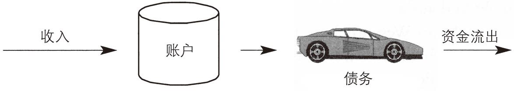

反之，投资行为的图表展示就截然不同：

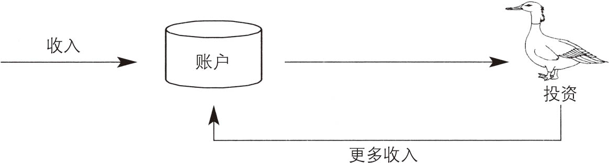

资金流的路径完整地阐释了债务和投资的区别。如果金钱最终流出你的口袋，这就是负债行为；反之，投资行为让你获得更多收益。

#### 自住房又是什么情况

目前一切都简单明了，但是现在棘手的问题来了。我的父母将他们的房子看作一笔投资。其实，我们自住的房子或者公寓，并非投资，而是债务。

我相信你也许听到过完全不同的说法。很多人不是说“住房是最好的投资”吗？然而你想想，都是谁在这样说。谁在散布这个谣言？大部分都是信贷机构和银行。当我在讲座上向学员解释这个问题时，一位年迈的女士问我：“但为什么银行要声称自住房是一种投资呢？”我的回答让她大吃一惊：“因为事实本身如此。”

她很疑惑：“你刚才不是说，自住房是债务而并非投资吗？现在你又说自住房是投资。哪个是正确的呢？”

我解释说：“两个说法都正确。关键的问题在于：对谁来讲算是投资？
投资使你定期获得收益，负债使金钱从你的口袋中流走。当你贷款买房后，你需要每月支付利息。金钱就从你的口袋中流走了，因此，对你而言，你的房子不算是投资，而是负债。”

女士点头道：“这样我就明白了。”我接着说：“这部分从你口袋中流走的利息，就流到了银行的口袋里。对银行来讲，这是个超级划算的买卖。你从银行借钱，每月偿还利息，除此之外，还要将你的房子和所有资产作为担保。银行说房子是种投资当然是正确的了。只不过没有说清楚对谁来讲算是投资——也就是说，投资是针对银行而言的。从一开始你就要偿还利息，只要贷款尚未还清，房子就是属于银行的。”

#### 当你还清房贷时，情况又如何

我之所以强调这个区别，是因为我有意识地想让我们也像银行一样去进行投资。对别人而言，我们的支出则是他们的收入。我们的债务于对方而言则是一种投资。

这位女士还问了我一个问题：“但是房贷总有一天会被还清，那个时候房子就属于我一个人了。那时候算是投资吗？”

我答道：“当教练第一次向我阐述这一区别时，我也问过同样的问题。他对我说：对大多数人而言，总有一天
意味着需要25～30年的时间。然而即使还清了贷款，也不会从房子中获取收益，只有卖掉房子时才会。”

女士又问道：“好了，我懂了。但是我的房子如果不是一种投资，那算作什么呢？”

我回答道：“就算你还清了房贷，你的房子还是一种负债。因为你需要不停地缴一些费用：税费、保险费、维修费、装饰费、置物费。最好不要把房子看作投资资产，而应看作奢侈资产。把房子看作投资资产让你安心，而奢侈资产是很费钱的。”

当然会有人反驳：“但我省下了租金啊，如果我不买房，还必须付房租。”

我的回答是：这当然没错。但是，大多数买房业主在税费、保险费、保养费、维修费、装饰费、置物费上的支出，不会低于以往的房租支出。即使房租涨价，也没人会存下这部分差额。如此一来，付清全款的房子仍旧属于奢侈品。

#### 首先进行投资

我不反对买房。恰恰相反，我认为一套房子或者公寓能为我们提供一定的生活质量。房子是一种奢侈品，却是一种有意义的奢侈品。关键在于什么时候买房
。是先投资，还是先负债。

如果在投资之前就先买房，你也许就没有足够的余钱来投资了。相反，如果选择先投资，你也许会因此获得额外收益，从而轻松购买一套房。

教练当初对我说，许多家庭之所以不能过上富足的生活，是因为他们不遵循这一顺序。很多人竭尽全力购买一套昂贵的房子，之后便没有可以用作投资的资本了。教练把这类人称作“房奴”。他们虽然工作很努力，也挣了很多钱，但大部分是在为银行打工。虽然他们认为自己是在为房子而辛苦，但实际上是在为银行拼命工作。他们支付的利息就是银行的收入来源。

最糟糕的是，人们根本认识不到债务和投资的区别。正如上面所说，他们购买自己的住房作为投资，认为自己没有做错，但是无法理解为什么自己的财务状况会越变越差。

理财头脑是获得8％～12％甚至更高年收益率的前提条件。它要求你了解这3条重要的准则：第一，你必须将只有有形资产能让你变富有这一点内化于心；第二，你必须清楚什么时候是投资，什么时候是投机；第三，你应该在负债前先开展投资。

其实这并不难。但为什么大多数德国人平均只达到3.8％的年收益率？你又发现了什么问题？

请看下一章。

------------------------------------------------------------------------

致富能量贴士

- 通往富裕的关键在于，要去冒险。从各方面来看，承担风险越高的人，收到的回报也就越多。
- 最优秀的投资者和企业家完全不觉得是在承担风险。他们只单单投资明显能赚钱及显然正确的项目。
- 将责任推给了谁，同时也是将权力交给了谁。
- 要求至少8％～12％的收益率，是一个人有健全的理智和理财头脑的标志。
- 所有的投资都可以划分为三类：货币资产、有形资产和赌博。只有靠有形资产投资才能在短时间内让财富翻番。
- 你应当把握好该投资还是投机。这样可以避免不必要的受挫。但两者对投资成功都至关重要！
- 区分投资和债务。负债是一种支出。

------------------------------------------------------------------------

------------------------------------------------------------------------

<a href="#text00059.html_ch1-back" id="text00059.html_ch1">(1)</a>
 后续准则收录在我的书籍《财务自由之路》里面。此处作为重要内容的回顾，并且是每一次成功投资的前提。

第二章\
德国人为什么在理财方面一塌糊涂
==============================

正如已经提到的，我需要证明，我对收益率的设想是严谨的。但在别的国家完全无须此举。对我们欧洲邻国而言，两位数的收益率并不招致怀疑，相反，这正是大家十分期待的，并且他们也实现了。但在德语地区截然相反。我们拼命地为钱工作，辛辛苦苦地存钱。但我们从不考虑，让钱替我们拼命地工作
。

##  美国人的资产分配

很遗憾，对于富裕家庭和贫困家庭的资产如何分配，只有美国才有这方面的具体数据。这些数据非常具有说服力。为简单起见，且把美国人分为三组：1％的富人（一组），第二层次9％（二组），以及余下的90％（三组），让我们一起来看看这些家庭如何进行投资：

<table class="kindle-cn-table-body" data-cellspacing="0">
<colgroup>
<col style="width: 25%" />
<col style="width: 25%" />
<col style="width: 25%" />
<col style="width: 25%" />
</colgroup>
<tbody>
<tr class="calibre17">
<td colspan="4" class="kindle-cn-table-th">总计100％，分为三个组</td>
</tr>
<tr class="calibre17">
<td class="kindle-cn-table-dg"></td>
<td class="kindle-cn-table-dg">美国人申购股票/基金所占资产的比例</td>
<td class="kindle-cn-table-dg">美国人拥有不动产所占资产的比例</td>
<td class="kindle-cn-table-dg">美国人负担债务所占资产的比例</td>
</tr>
<tr class="calibre17">
<td class="kindle-cn-table-dg">一组（富人1％）</td>
<td class="kindle-cn-table-dg">51.40％</td>
<td class="kindle-cn-table-dg">7.10％</td>
<td class="kindle-cn-table-dg">9.40％</td>
</tr>
<tr class="calibre17">
<td class="kindle-cn-table-dg">二组（第二层次9％）</td>
<td class="kindle-cn-table-dg">37％</td>
<td class="kindle-cn-table-dg">24.60％</td>
<td class="kindle-cn-table-dg">18.90％</td>
</tr>
<tr class="calibre17">
<td class="kindle-cn-table-dg">三组（余下的90％）</td>
<td class="kindle-cn-table-dg">11.60％</td>
<td class="kindle-cn-table-dg">68.30％</td>
<td class="kindle-cn-table-dg">71.70％</td>
</tr>
</tbody>
</table>

富人获取
利息的同时，穷人宁肯支付利息——用于消费贷款。对此，我们筛选出了3点原因，用来解释为什么富人越富，穷人越穷：

1．有钱人在有形资产上投资力度大；

2．有钱人的不动产（自己使用的不动产）比重比穷人低得多；

3．有钱人很少产生消费债务。

##  德国人2006年的资产分配情况

让我们来看看下列的一览表（图表2.1），了解德国人2006年的投资状况。

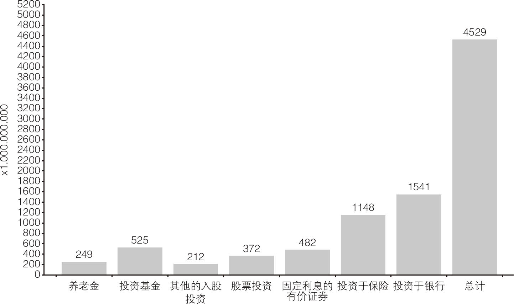

图表2.1　私人家庭的金融资产（单位：10亿欧元）\
投资于银行部分包括在国内外银行的活期存款、定期存款等。投资于保险部分包括养老基金、专业保险和补充保险。\
\*包括公司债券\
来源：德意志联邦银行

可以确定：德国人45290亿欧元的资产中，的的确确有70％（31710亿）用于货币资产投资（其中11480亿欧元用于投资保险；15410亿欧元用于储蓄存款、定期存款以及转账账户。固定利息的有价证券投资了4820亿欧元）。

资金最大的部分用在了对资产增长毫无用处的地方！至少对投资者的资产增长而言如此。对银行来说从始至终都是最棒的生意。因为这些机构捞取了原本投资者要获取的这部分收益。但也不该抱怨银行，因为我们的资金流向以及投资方式，决定了最终要我们自己为此负责。

31710亿欧元的货币资产投资，仅11090亿欧元投入有形资产
（其中5250亿投资基金，3720亿投入股票）。如此一来，货币资产投资和有形资产投资的比例大约为3∶1。德国人分配在股票和基金上的资金份额太少了。

##  你的资产分配情况

我们不要总是躲在平均数据的背后。这是和你切身相关的问题。
你的资产如何分配？多少资金投到了收益低得吓人的货币资产中？请你粗略地算一下你有形资产投资和货币资产投资间的比例。
记住把你的自住房抛开不计。我们已经解释过，为什么不应把它算作投资。请在此处记一下你资金的投资状况。把你所有的资金直接分成10份，算算你投了十分之几到货币资产中，又有十分之几投到了有形资产中。

货币资产投资：\_\_\_\_\_\_/10　有形资产投资：\_\_\_\_\_\_/10

它们之间的比例为：\_\_\_\_\_\_比\_\_\_\_\_\_

我大多数学员得出的结论是：他们的投资类型比例恰好应该反过来才对，应该把70％～95％的货币资产投资换成70％的有形资产投资。即便那些把大部分钱投入有形资产的人（绝大多数是较富有的人），明显个人自用的不动产比重也太高了。虽然不动产也算是有形资产，但大多不能带来定期收入。相反，它们会消耗金钱。

##  我们邻国朋友的做法截然不同

法国人和瑞士人在股票上的人均投资是德国人的3倍多；英国人、瑞典人和西班牙人是德国人的2倍，北美人均股票投资额则是德国人的7倍多。想要迎头赶上，我们还需要花一定的时间，要不断加强宣讲——对此本书应做出贡献。

特别是那些收入较低的群体，拥有巨大的赶超需求。每月收入低于1250欧元的人群，只持有7.2％的股票份额，而收入高于2500欧元的群体持有36.2％。显然低收入人群投资股票时首要考虑的是必须确保安全。
这完全错误，这样的一个“策略”怎么能改变当前的财务状况呢？

##  德国人的投资行为产生的3个原因

为什么德国投资者都这么保守？我的德语区培训班中各个收入等级的学员填写了几千份调查问卷，从中我提取了3个原因：完美主义，恐惧和对国家养老金盲目的信任。

当然，在其他国家也存在对一份完美产品的期望，内心的担忧和对国家养老金天真的信任，但不像在我们身上影响那么强烈。

#### 完美主义

人对一切事物最初都抱有完美的憧憬。你是完美主义者吗？——我曾是这样的一个人。你认为完美主义好吗？对此我的教练曾经说过：“追求完美等同于自我麻痹
。”

我感觉这句话有些冒犯。它处于我个人理念的对立面。如果我的教练不是亿万富翁，我会断然否定这句说辞。但我也试图去理解，他或许想传输某种有趣的观点，便认真听他讲述。他陈述的理由如下：“一个完美主义者会花费大概80％的时间去反复打磨自己3％的产品或工作。但问题是：99％的人都看不出其间的区别。”

完美主义不是在任何方面都无用武之地。当我不得不接受手术治疗时，我会非常庆幸外科医生是名完美主义者。如果他开场就说“一点点误差是在所难免的”，我肯定会感到很不舒服。但是在理财投资上，企图达到完美是徒劳的。因此，最好一开始就给大家说清楚：不存在完美的投资产品。

回顾过去，仔细想来，完美的投资产品当然也存在。如果你在1990年买入了AOL公司的股票，到1999年底，6000欧元就会增长成480万欧元。相当于79900％的增长率。这就很完美。但几家欢喜几家愁，没能赶上这波大增长的人肯定会相当生气。

只不过问题在于，没人能准确地预测，AOL未来的发展究竟是什么样。就连我也没有所谓的“百分之百可靠的秘诀”。理财投资上不存在任何完美主义。你也不用浪费时间去寻找心目中的完美产品，没有用的。

在我“能力”范围内达到过的完美投资是：1998年11月，我根据一个建议购买了CD-NOW的股票。走势一直不错，而且我认为唱片肯定会持续流行。我以每股15欧元的价格买入了30000股。紧接着，所有投资者都拥有的梦想成真了：第二天，股票飞速上涨了65％。一天的盈利就远远超过了300000欧元——如果售出的话。但是接下来怎样了呢？用一句话来概括：“贪欲使人愚蠢！”我当然希望股市能继续强势发展。的确也是如此——但可惜是往相反的方向。虽然我卖出时还保持了小小的盈利，但这当然没法和我原本可以赚到的300000欧元相提并论。

一份绝对稳当、收益惊人且让你一夜之间就能变身百万富翁的单项产品是不存在的。意外常有可能
。短期有效的预测常伴有不确定性。但长远的预测则会考虑更多安全稳定的因素。

所有我们能确定的是，完美的短期有效的预测和完美的产品都不存在。当然，还是存在完美的投资策略
。这方面我们会进行详细的阐述。你会学到，如何最佳地规避风险，并且符合个人的爱好、财务状况以及投资个性。

所以，不要再去等待完美产品的出现，从现在就开始行动，朝着收益目标进行理财。开始时犯些小失误总好过一味完美地犹豫
。

#### 恐惧

德国人投资情况糟糕的第二个原因是他们内心的恐惧——总担心会有损失。恐惧往往与对投资市场缺乏信任紧密结合在一起。

我们不能忘了，任何能想象到的灾难实际上都发生过，股市也都一次次挺了过来。尽管遭遇这些灾难洗劫，也还是有大的基金在此期间获得了平均超过12％的收益。尽管发生了通货膨胀，尽管经历了经济危机、战争和灾难——以后可能还会遇到更多。

在此，我想从另一个角度和你一起审视这种恐惧。如果我说了什么带挑衅色彩的话语，请不要被吓到，我会解释清楚。

我的观点是：“越早经历一次满盘皆损越好。”温斯顿·丘吉尔曾如此解释过：“及早地犯错对人有很大的好处，可以教会我们预见下一次错误。”能让我学习成长的，是我曾犯过的错，而不是我的成功。错误能给我们的生活带来危机感。因为某种因素，大多数人主要从错误中学到经验教训。如果我们不犯错，生活将缺失一种魔力。从不犯错的人生将毫无生气和意义。在教育系统和学术世界中，错误往往被视作愚蠢。我的教练却带给了我截然相反的观点，错误是人类发展过程中非常重要的组成部分。

很多年前，我在打电话中获取了一条“内幕”。当时的我对股市和股票还一无所知。打电话给我的这个朋友也不懂，我们都没有过成功的尝试。然而，他神秘十足地低声说道：“买香港-上海花旗银行的股票，它现在下跌了。”光是这个名字就非常吸引我，听上去就像是成功和迅速致富的代名词。这是我第一次打算买国外的股票。我投资了一笔对我当时而言相对较多的钱在这支股票上。

同时，我开始通过一份跨区域的日报关注股市行情。我每天吃早饭的时候都读它。这是一个错误做法，因为这支股票极为波动，从此我便食不知味，并且这对我毫无益处。德语波动性（Volatilität）这个概念来源于意大利语“volare”（飞驰），意思和好动、易变差不多。我的股票就像一只喝醉了的小鸟，时上时下。结果是，我的紧张情绪与日俱增。我打电话给那个朋友，告诉他我的困境。他答道：“你完全做错了，你买了这支股票后，5个星期内都不要去关注它。当你之后再去买报纸看时，你会发现，一切都好好的。”

我朋友也许有什么地方理解错了。买了股票后，几年不要去关注它，这个建议出自老前辈科斯托拉尼。如果我们几年后醒过来，一切都将很好。如果我们偶然经历一次“崩溃”，还可以服用“一小瓶安眠药”。

无论如何，5个星期不去关注自己的香港-上海花旗银行股票，的确很考验自我控制能力。毕竟那是我当时唯一拥有的股票。5个星期后，我迫不及待地买来一份报纸，很不幸，也是在吃早饭时查看最新的股市行情。

现在的股票都是按照字母顺序排序，以方便人们查询。不过也不是说人们总能找到它。因为如果一家公司不在了，那它的股票也不会再被列入表中。也就是这样：我发现，我的股票已经不在原来所在的位置上了。我慌忙打电话给我朋友，他马上证实说：“这是个很糟糕的信号。”

这是我第一次投资，以全部亏损告终。从中我得出两点有趣的论断，这两点对于我今后的投资行动非常重要。第一点是，全部亏损并没有要我的命。之前我一直坚信，我绝对无法承受损失这么多的钱。幸运的是我还活着，并且有机会以一笔今天来看相对较少的钱经历了这次失败，从中收获颇多。如此一来，以后从事较大数额的投资时，我再也不会犯类似的错误。

我学到的第二点是：“我的钱没有损失，它只是被另一个人拥有。”我承认，在当时的情况下，这对我绝对不是一种安慰。但这背后肯定隐藏着个人的处世哲学，也是我的人生观。我坚信，只要我们怀着一颗向善的心进行投资，即使有损失，某一天也终会“还复来”。从右手中失去的，终将还会回到左手——地球是圆的。我们人类都具有非常相似的情绪。如何对待这些情绪，决定着我们做什么，拥有什么。发生的事情并不能起决定作用。更重要的是，我们给这些事情赋予什么样的意义。负债会让大多数人感到很沮丧。成功的人会把沮丧转化为思想上的平衡。沮丧不应该让我们停滞不前。去回避沮丧，还不如学会容忍沮丧，并将其转为心态平衡。

之后我的教练在我的投资生涯上给了我一句箴言，这句话让作为投资者的我铭刻在心：

“不要为了不输而去参与，而要为了赢去参与！”

这两种情况看上去只有很细微的区别。但实际上，对于两者截然不同的选择却决定着是贫穷还是富有，是最小收益还是最佳收益。它决定着是拥有充满品质、奇遇和美好的生活，还是只有最低保障、充满忧虑和不安的生活。

短短的一句话勾勒出所有的区别。
原本教练的这句话是用于企业家身上，但是它同样适用于投资，适用于我们这些投资者的行为。

这不是让我们对全盘皆输不假思索地表示赞同。更多的在于，不要因为害怕损失，而一味保守地投资，让自己每年的收益率远远低于12％的平均水平。
此外，重要的是，你最终得到了多少。

当然，也存在另一种极端：贪婪
。投资者被他人或自己的成功事迹蒙蔽了双眼。1996年以前，你可能对12％的收益率感到心满意足，但从1999年起，如果无法保持清醒的头脑，你会想要40％、50％或100％，甚至更多的收益。华尔街称这种人为“greedy
little pigs
”（贪婪的小猪）。众所周知，“牛和熊能赚到钱，但贪婪的小猪最终会被送进屠宰厂”。恐惧者过于不信任股票市场，贪婪者却高估了自己和市场。两者都害人不浅。

重要的是要获得不错的收益，同时感觉到心情舒畅。你只有遵循自身的投资个性进行投资，才能实现这一目标。

请严肃地问一问自己，迄今为止，你以何种目标来理财投资：为了避免损失，还是为了获得收益？你是将钱存入存折或是让它“静静地躺在”养老保险里，还是投入有形资产中呢？

这两种情况下，你都能达成目标。
如果首先追求安全，你非常可能实现了你的目标——绝对安全。你不会遭受金钱损失，但也没有机会获得巨大的收益。反之，如果为了赚钱去投资，你很有可能在10年内获得了至少12％的年收益。

不经历风险，怎能获收益。追求绝对保险的人，只会更加恐惧。

过度的恐惧对于投资者而言如同糟糕的指路人。我绝不是赞同轻率鲁莽。但是请你好好考虑自己对于风险所持的态度。请你想一想，一个不敢冒任何风险的人，他绝对没法获得成功
。我们生活的地方没有绝对的安全，只存在机遇。我们要允许自己犯一些小错误。

如果只把钱投在货币资产上，我们肯定不会犯任何小错，但实际上犯下了大错：堵住了资产本该增长的通道。因此，我们是借自己工作的成果欺骗自己。

请你不要忽略，目前的道路继续走下去，也存在同样的风险。这条路不会因为我们已经熟悉而更加保险、可靠。我们的偶像海伦·凯勒说过：“生活要么是一场伟大的冒险，要么一无是处。
”在投资方面，这意味着：我们要么把钱投在有一定风险的地方，要么别想获得巨额的收益。通过和风险打交道，我们能收获美好时光和生活品质。

如果害怕失败，你永远也没办法成功。因此，我会在本书中非常清楚地展示赢得收益的可能性，当然也包括附带的各种风险。同时，我将教会你如何最大限度地降低风险。

我们做不到完全消除风险，剩余的风险还是需要你个人去承担。但是，你将获得两位数的收益率作为回报。

#### 对国家养老金盲目的信任

德语区国家投资行为糟糕的第三个原因，是民众从小根深蒂固的幼稚观念，即国家养老金很有保障。然而，实际上至少到目前为止，它都是缺乏保障的。

指望国家养老金的人，终会被抛弃。

养老金模式对现如今40多岁的在职人员而言，不是困境，而是它已经失败了。它的计算依据根本是错误的。一些国家比我们更早认清这一点，继而做出一系列反应。解决这个问题的关键在于，每个人都要承担自己的养老金。大部分德国政客也深知这一点。然而，还存在一个问题是，以何种过渡制度来公平地对待现如今已经退休的这部分群体。

他们一生都在为别人考虑，因而不会也不能为自己打算——至少不在国家预设的框架里。现在是时候建立过渡模式了。如果我们继续推诿，不解决这个问题，危害就像滚雪球一样，越来越大。况且其他国家已经先行一步，证明过渡模式是能解决问题的。

设想一下，你从一开始就用150欧元的儿童福利金为第一个或者第二个孩子进行投资理财，且获得平均收益率12％的回报。那么，从孩子19岁时起，你不用再继续投入，但以前投入的钱依旧持续做投资理财。你的孩子在40岁时，就将拥有129万欧元，50岁时将达到400万欧元，60岁时将达到1250万欧元左右。

你的儿女可以在他们60岁时每月拿到83000欧元的养老金（此处我们假定仅以8％的收益率来计算，因为对养老金我们要采用特别安全的投资方式）。你的孩子甚至在40岁时就可以退休了，因为那时每月的“养老金”也有8600欧元了。

如果你给自己的孩子买了专门的教育保险，每年的收益率为6％，则达不到刚才所说的财富程度。你的孩子40岁时，只拥有20.7万欧元（而非129万欧元），50岁时只有37万欧元（而非400万欧元），60岁时只有66.3万欧元（而非1250万欧元）。当然，每月的“养老金”也就会相应减少，在你的孩子60岁以后，大约从83000欧元减为3319欧元。

你一方面见识了复利的影响（此处忽略不计通货膨胀因素）。由于复利的作用，货币投资一定不是以直线的形式（“平均”）增长，而是呈指数级增长的走势（曲线“爆炸”式快速上升）。你另一方面认识到，6％和12％的年利率所带来的最终结果有天壤之别。前面所描述的第一种情况下，你不得不承担的风险可以说是微乎其微（你投资的时限越久，投资的范围越广，承担的风险则会越小）。但从举例可见，其回报利润是后面这种情况的19倍！只冒这么小的额外风险，就会让你变得富有
。

最后，我们再次强调：追求完美的产品、内心的恐惧和对国家养老金的盲目信任，都是糟糕的投资顾问。这三个因素阻碍了我们去获取本应得到的收益。

##  风险的含义

我们已经好几次涉及“风险”这个概念，但它究竟是什么意思呢？我想给你一个非常简单却确切的定义。对于作为投资者的你来讲，风险不是别的，而更多的是一种可能性，即当你有需要时无法把一笔（预期的）钱拿出来支配
。从这个定义及之前所述的内容出发，可得出4个评价风险的原则：

1．风险越大，获得收益回报的机会则更大。
这不是说为了获得可观的收益而不计代价地去冒一些无谓的险。确切地说，是通过以下的原则可以大大地限制风险。

2．投资的时间越长，风险就会越小。
因为你等待的时间越久，在未来某一个时间点，你实现所期待的收益的可能性就越大。

3．从中得出相反的结论：你对钱的需要越紧迫，就应当投资更保险的项目。
如果在这种情况下仍冒着风险去投资，很大的概率是你无法等到能获得期望收益的那一天。

4．投资分散面越广，越有可能通过投资组合获取你期望的平均收益。
因为通过分散投资领域，你能够完全消除所有非系统的影响因素（企业独有的特殊性）。通过分散投资都无法消除的系统影响因素，在总的风险中，约只占比35％。

#### 保持分散风险

我们还得详细说说投入资本的风险分散和风险分担这两个问题。我们从现在起就要牢记，必须学会分散风险的两个主要原因：

1．避免全盘皆输；

2．提高命中“大奖”的概率。

正如一再强调的，没有人能准确地知道哪些股票会是未来的微软、AOL、戴尔和沃尔玛。但如果把投资分散得越广，我们获得这些成功的机会就会越大。如果主要投资在货币产品上，你就是放弃了丰厚的收益，甚至可能毁了自己的资产。

#### 没有什么比“无风险的”投资更不理智

为了易于理解，我给大家举两个例子。设想一下，你将10000欧元用于固定利率为7％的产品投资，投资时限为30年。如果能找到这样的产品，30年后，你最终仅仅获得76122欧元。很显然，这不是什么惊人的结果。

反之，如果遵照最重要的投资规则
，你就会采用不同的方式。这条规则是：我们应当牢记分散风险——即使数额较小
。因此，你不会把10000欧元只做单一的投资，而是会等分为4组，每组2500欧元，分别投到4种不同的产品上。

假设你选择4支不同的股票基金，它们都在近3～5年内达到平均每年16％以上的收益，那么，你现在处于一个高风险等级。

考虑到绝对的悲观主义者，我们假定前3份投资通通遭遇全盘沦陷。迄今为止，全球还没有哪一家注册基金失去它的全部资产。此处只是假设。那将意味着，3份2500欧元的投资都将血本无归。只有第四组2500欧元的投资达到了每年16％的收益目标。

现在关键的问题在于：哪一种策略能让你30年后获得更多的收益呢？
是30年内将10000欧元全投在收益率7％的产品上的利润高，还是只需要投入2500欧元而收益率为16％的利润高呢？

你或许已经猜到，第二种策略带给你的收益多得多。但你能想到它们之间的差距有3倍吗？每年16％的收益率，2500欧元在30年后将变为214624欧元。

##  税收和通货膨胀

如果投资货币资产，你的钱会越存越少。仅有的一点点收益中，税收要啃掉一部分，通货膨胀又会拿走一部分。我给大家讲讲第二个例子。

假设你投资100000欧元，固定利率为4.5％。16年后，这笔钱会翻倍成200000欧元。如此微弱的增长竟需要那么长的时间。你也许会说：“至少我的投资很稳定，有保障。”那就大错特错。实际上，16年后，你真正得到的还没现有的多！因为在免税额度已用光的情况下，你要缴纳约28％的源头税（从2009年开始），你个人必须从本就微薄的收益中拿出28000多欧元缴纳给税务局。

16年里，当然还不可避免有通货膨胀。所以你最终得到的钱，它的实际价值明显低于你刚投资那个时候。

假设接下来的16年，平均通货膨胀率为2％～3％，这个数值完全不高。从1949年起，平均通货膨胀率甚至远高于4％。

16年3％的通货膨胀率意味着，你将损失38.58％的购买能力。那个时候的钱，价值只相当于目前的61.42％。用刚才的例子来讲：你投资的100000欧元根本没有翻番，而是只等同于现在的105642欧元
。因为200000欧元中，要刨开缴纳给税务局的28000欧元。剩下的172000欧元因为通货膨胀又折损了66358欧元。结果证明，16年后，你压根儿没有任何收益。这种方式让你的钱越存越少，你的投资没有取得令人激动的结果。

也许你会反驳，未来几年利率可能会提高，这样这笔投资的钱就会更快实现增长翻番。未来几年，利率的确可能提高。但只要银行利率提高，通货膨胀率就会相应增长。
最终的结果还是一样。

我迫不及待地想给大家展示一项很有趣的研究结果。有人为此调查和计算了1900年到2003年期间全球股票和固定利息的有价证券的平均真实收益（扣除了当时货币的通货膨胀率）。全球股票的平均收益率为每年7.1％，固定利息的有价证券平均收益率只有每年2.1％。仔细想想，此处展示了真实的平均值。这个结果很是令人震惊，它清楚地显示了高通胀率对不同投资形式的影响。税收在这个过程中还没有被考虑在内。货币投资有它存在的理由，下一章中会详细地说到。比如说，可以利用货币投资保有充足的现金储备量。但是，如果从增长财富这一角度来谈，就并不合适。对投资项目而言，如果它提供的收益无法明显高于在通货膨胀和税收中损失的部分，就应该早早地被排除。

#### 如何预测通货膨胀的影响

有一个简单的经验公式，借此你可以轻易地计算出，3％、5％或者7％的通货膨胀率究竟会导致什么结果：

72÷通货膨胀率＝货币贬值一半所需年数

按3％的通货膨胀率计算，那么72除以3得出24。这意味着，你的钱在24年后将贬值一半。换个说法是：那时你需要2倍的钱，才能达到和现在同样的购买力。1982年，整个欧洲的平均通货膨胀率达到了12％。在通货膨胀率如此高的情况下，只需要6年，你的钱就贬值了一半。

#### 你未来真正需要多少钱

让我就通货膨胀的影响最后再举一个例子。假设你今年40岁，而且知道自己在65岁时计划每月用3000欧元来作为生活开支。正如可预见的情形，你必须考虑到，因为通货膨胀，那个时候你需要更多的钱，才能有等同于目前3000欧元的购买力。

假设我们在接下来的25年内要面临3％的平均通货膨胀率。你知道25年后，为了维持像今天3000欧元一样的生活水平，你所需的实际金额是多少吗？这一数额将达6098.38欧元。

我们的计算到此为止。但你不可能说到这个年龄就不活了。当你75岁的时候，会是怎样呢？那时你将需要8195欧元。如果能活到85岁——人类的寿命正在不断地延长——你那时需要的金额将高达11014欧元，才能达到今天3000欧元的购买力。

#### 通货膨胀支持有形资产

为了能让资产在可接受的时间段内实现翻番，我们需要投资有形资产。因为通货膨胀不会使有形资产贬值，情况恰恰相反。或者说，你曾听过有人抱怨他的房子因为通货膨胀而贬值了？事实是，“房子变得价值更高，变得更贵了”。因此，在货币资产领域出现的通货膨胀，到了有形资产领域里，被称作价值上升。通货膨胀折损你的货币资产的价值的同时，使你的有形资产的价值以相应的比例上升。
如果投资有形资产，你便可以把通货膨胀视作你的好朋友。如此看来，金钱有两种形式：增值的钱（有形资产）和贬值的钱（货币资产）。

正如你所认识到的，除了第一时间投资有形资产，然后选择收益高的投资外，别无他法。如果你的梦想是获得令人瞩目的财富，那么从一开始就应该淘汰任何收益率低于8％～12％的投资产品。

##  重点关注的问题

近年来，我在讲座或培训班上，收到了数千个提问。通过对所有问题进行分析，最后得出结论：无论怎样的投资者，他关心的问题最终都可以归结为共通的10点或15点。我在本书中对这些问题进行了详细的梳理，结果如下：

1．应当投资股票还是投资基金？

2．投资基金究竟是什么？投资这样的基金有多少保障？

3．基金有多少种类型，以及如何判定哪一种最适合自己？全世界投资基金超过55000支，如何才能更好地去选择？（光是在德国注册的投资基金就超过5000支）

4．我应该如何在各种投资上分配资金？怎样才能为自己量身打造一套最优的风险分散方案（结合自身目标、财力、投资个性和投资年限）？

5．我该如何打理自己已有的投资？

6．如果投资基金，需要承担哪些费用？

7．其他还有哪些盈利不错的投资方式，有哪些注意事项？

8．我应当直接买入，还是最好先咨询投资顾问？以及哪里能寻到优秀的顾问？

9．如何开始第一步，以及接下来有什么步骤？

10．该如何保持对投资的全局掌控，如何管理投资？

11．股市持续下跌时，应当怎么办？

12．我属于追求安全的类型，哪一种投资抗风险能力最强？

13．我如何在一组可比较的投资产品中选出最佳的投资基金？怎样比较不同的投资产品？

14．对于未来，我可以有什么期待？

15．我怎样才能进一步提高投资收益？我怎样才能大大缩短不动产贷款的期限？

正如前文承诺的：我们会逐个回答所有的问题。你会收获一本内容全面的投资入门指南。请再仔细地看一遍这些问题，以及本书的目录，把自己最感兴趣的部分着重标注出来。

让我们现在开启金钱翻番之旅！根据不同的风险类型，需要的时间为6年到10年不等，或许还会更快。

------------------------------------------------------------------------

致富能量贴士

- 越是收入低的人群，越是认为投资必须要首先保障安全。
- 不存在完美的投资产品，但是有完美的投资策略。宁肯一开始犯些小错误，也不要因追求完美而犹豫不决。
- 不要为了不输而去参与，而要为了赢去参与。不要因为害怕损失而去进行年收益率远低于12％的投资。
- 生活要么是一场伟大的冒险，要么一无是处。如果你害怕失败，最终将一无所获。
- 通货膨胀折损你货币资产价值的同时，使你的有形资产价值以相应的比例上升。

------------------------------------------------------------------------

第三章\
获利方
=======

金钱曾许下神圣的誓言，\
不爱它的人，永远无法拥有它。

——爱尔兰谚语

------------------------------------------------------------------------

一个人要拥有多少财富，才算是真正达到经济上的“富有”呢？答案完全因人而异。只要投资产生的收益足够生活，那我们就是富有的。在《财务自由之路》这本书中，我借助了伊索寓言来阐释财富。这里简单说一下这个故事。

一天，农民在鹅巢里捡到一个金蛋。经过金匠鉴定，这颗金蛋是纯金的。于是，他把这个蛋卖了一大笔钱。但幸运并没有就此终结，这只鹅每天都下一个新的金蛋。但农民是一个贪婪的人。他想，为什么这只鹅每天就只下一个金蛋呢？他想一次就拿到很多的金蛋，因此，他磨好砍刀冲向鹅巢，将鹅砍成了两半。鹅死了，它再也不能下金蛋了。这个故事告诉我们的道理是：千万不要杀死你的金鹅。

鹅就好比资本，金蛋就是利息。没有了资本，就无法产生利息。但有再多的资本，也不代表一定可以获得丰厚的利息。至少，如果让钱“禁锢”在货币资产里，就肯定无法产生高收益。能否获得高收益取决于是否选对了投资产品。

无论如何，这里先对财富总结一条实用的定义：富有，就是你的鹅（资本）足够大，让你完全可以靠金蛋（利息）来生活。只要还没有拥有这只金鹅，你就只能是一台赚钱的机器。所以，你只有两种选择：要么拥有一台赚钱机器，要么你必须为了生活而不停地赚钱。

##  复利的奇迹

具体要让自己的钱增加多少个百分点，完全取决于你自己，取决于你学习本书后做出怎样的决定。这些决定将符合你的目标、投资个性、资产状况和你的投资年限。

让我们一起先来看看，100000欧元在不同的投资类型下是如何变化的：

图表3.1

<table class="kindle-cn-table-body" data-cellspacing="0">
<colgroup>
<col style="width: 30%" />
<col style="width: 23%" />
<col style="width: 23%" />
<col style="width: 24%" />
</colgroup>
<tbody>
<tr class="calibre17">
<td rowspan="2" class="kindle-cn-table-th">投资类型</td>
<td rowspan="2" class="kindle-cn-table-th">年收益率</td>
<td colspan="2" class="kindle-cn-table-th">最终资产（欧元）</td>
</tr>
<tr class="calibre17">
<td class="kindle-cn-table-th">7年后</td>
<td class="kindle-cn-table-th">20年后</td>
</tr>
<tr class="calibre17">
<td class="kindle-cn-table-dg">储蓄存款</td>
<td class="kindle-cn-table-dg">3％</td>
<td class="kindle-cn-table-dg">122987</td>
<td class="kindle-cn-table-dg">180611</td>
</tr>
<tr class="calibre17">
<td class="kindle-cn-table-dg">德国的人寿保险</td>
<td class="kindle-cn-table-dg">6％</td>
<td class="kindle-cn-table-dg">150363</td>
<td class="kindle-cn-table-dg">320713</td>
</tr>
<tr class="calibre17">
<td class="kindle-cn-table-dg">国际定息债券基金</td>
<td class="kindle-cn-table-dg">8％</td>
<td class="kindle-cn-table-dg">171382</td>
<td class="kindle-cn-table-dg">466095</td>
</tr>
<tr class="calibre17">
<td class="kindle-cn-table-dg">投资型不动产</td>
<td class="kindle-cn-table-dg">8％</td>
<td class="kindle-cn-table-dg">171382</td>
<td class="kindle-cn-table-dg">466095</td>
</tr>
<tr class="calibre17">
<td class="kindle-cn-table-dg">英国的人寿保险</td>
<td class="kindle-cn-table-dg">10％</td>
<td class="kindle-cn-table-dg">194871</td>
<td class="kindle-cn-table-dg">672749</td>
</tr>
<tr class="calibre17">
<td class="kindle-cn-table-dg">国际股票基金</td>
<td class="kindle-cn-table-dg">12％</td>
<td class="kindle-cn-table-dg">221068</td>
<td class="kindle-cn-table-dg">964629</td>
</tr>
<tr class="calibre17">
<td class="kindle-cn-table-dg">大型行业＆地区基金</td>
<td class="kindle-cn-table-dg">15％</td>
<td class="kindle-cn-table-dg">266001</td>
<td class="kindle-cn-table-dg">1636653</td>
</tr>
<tr class="calibre17">
<td class="kindle-cn-table-dg">小型行业＆地区基金</td>
<td class="kindle-cn-table-dg">20％</td>
<td class="kindle-cn-table-dg">358318</td>
<td class="kindle-cn-table-dg">3833759</td>
</tr>
</tbody>
</table>

因此，你可以发现，为什么我在《财务自由之路》里断言，每个人都能拥有100万欧元。谁如果有10万欧元，通过每年12％的收益率，21年后，他就能获得100万欧元。
你如果到了现在这个时候，还不认为这样的收益率具有可行性，那请你看看，1979年7月31日到1999年7月31日期间，股票基金平均每年是如何变化的：

德国股票基金　12.29％

欧洲股票基金　11.75％

北美股票基金　13.42％

全球股票基金　12.45％

1984年2月28日到2004年2月28日的发展情况如下：

德国股票基金　8.63％

欧洲股票基金　7.93％

北美股票基金　8.05％

全球股票基金　7.26％

这些不同的观察时间是我特意挑选出来的。因为本书首次出版时，股市普遍达到高位，到了2004年2月28日仍处于自1929年以来最严峻的股市动荡和经济危机时期。这意味着在2004年2月28日，某些股票价格在2000年初高点的基础上仍达到了50％的增长率。然而，在接下来的几年，平均收益率又朝着12％的方向发展。股市由于多年来受到不同程度的波动，因此选好观察时间段非常重要。

请注意，此处涉及的都是平均数字。如果选择了5～10支优质基金，你几乎不可能只获得低于12％的收益。尤其是当你有规划、有对策地投资理财，并且在股票的某个升值阶段懂得及时抛出。

##  8年内超过200％

我在前言部分强调过，6年内获得200％的收益是有可能的，但这并不适用于所有的风险类型。
因为如果想要获得200％的收益，肯定要比满足于100％的收益承担更多的风险。

因此，目前更为实际的是，认清8年内要获得超过200％的收益有哪些必备条件：为了实现这个目标，接下来的8年你必须每年达到15％的平均收益率。

这个收益率有点高，但并非无法企及。当然，我只能谈谈我和我的合作者贝恩德·莱特根的亲身经历和所取得的成就。事实上，在过去的16年中，我们每年的平均收益率确实都超过了15％。这归功于我们广泛的分散投资、大量的资金储备和相对较少的时间支出。

##  风险比重和收益率之间的关系

想要实现每年约15％的平均收益率，根本不必去承担非常大的风险。事实上，你只需划拨相对较少的一部分钱投资高风险项目。举例来讲，假设你暂且认为12％收益率的投资产品属于相对安全的选择（我将在本书中说明原因）。如果你并不只是将全部资金投资此类产品，而是从中拿出10％的资金投资到年收益率为50％的产品上，收益结果会大不相同。你的总收益率将达到15.8％。

图表3.2显示，当你不断增长投资组合中收益率为50％的产品比重时，总收益率的变化情况。这只是高度简化的例子，因为其前提是假设能实现理想的收益率。但实际情况错综复杂得多。股价可能会跌破谷底，也可能按预期出牌，还可能在一年内增长100％。你也看到了，仅仅加入20％这类高收益产品，就可以获得20％的总收益率。

图表3.2　增加风险比重对投资组合中总收益率的影响

<table class="kindle-cn-table-body" data-cellspacing="0">
<colgroup>
<col style="width: 33%" />
<col style="width: 33%" />
<col style="width: 33%" />
</colgroup>
<tbody>
<tr class="calibre17">
<td class="kindle-cn-table-th" width="30%">较安全的产品占比 
（年收益率12％）</td>
<td class="kindle-cn-table-th" width="40%">风险产品占比</td>
<td class="kindle-cn-table-th" width="30%">每年总收益率</td>
</tr>
<tr class="calibre17">
<td class="kindle-cn-table-dg">100％</td>
<td class="kindle-cn-table-dg">0％</td>
<td class="kindle-cn-table-dg">12.0％</td>
</tr>
<tr class="calibre17">
<td class="kindle-cn-table-dg">90％</td>
<td class="kindle-cn-table-dg">10％</td>
<td class="kindle-cn-table-dg">15.8％</td>
</tr>
<tr class="calibre17">
<td class="kindle-cn-table-dg">80％</td>
<td class="kindle-cn-table-dg">20％</td>
<td class="kindle-cn-table-dg">19.6％</td>
</tr>
<tr class="calibre17">
<td class="kindle-cn-table-dg">70％</td>
<td class="kindle-cn-table-dg">30％</td>
<td class="kindle-cn-table-dg">23.4％</td>
</tr>
<tr class="calibre17">
<td class="kindle-cn-table-dg">600％</td>
<td class="kindle-cn-table-dg">40％</td>
<td class="kindle-cn-table-dg">27.2％</td>
</tr>
<tr class="calibre17">
<td class="kindle-cn-table-dg">50％</td>
<td class="kindle-cn-table-dg">50％</td>
<td class="kindle-cn-table-dg">31.0％</td>
</tr>
</tbody>
</table>

之后我们会更详细地讲解，获得50％及更高收益率的投资机会。

很多人常问我：“究竟如何才能找到相对安全的投资项目，持续实现15％的收益率呢？”追求稳定高收益的心情是可以理解的。但这个问题犯了原则性的错误。我举个例子，给大家解释一下。

多年前，我生活在墨西哥，居住的房子旁边是一个漂亮的公园，常常开满鲜花。公园里一整年都是花香满园。但并不是每一种植物都会一直开花。确切地说，大多数的灌木和植物的花期都很短，但都尽情地生长。
公园的设计非常巧妙，会规划不同的地点都有鲜花绽放，或是这儿，或是那儿，让公园总能呈现出美好的画面。

我的岳父是个非常睿智的人。有一次，我们一起在公园散步，他拉着我的手臂，指出了这个现象。他教导我，种花要多种些品种。这样一来，就算有意外情况发生，也不会那么糟糕。

懂得了这个道理，生活中遇到的一些挫折才不至于把我完全打倒在地。而这些困难也是你们可能遇到的。我当然也犯过错。我从未要求自己从不出任何差错。

因为，只有无所事事的人才不会犯错。

我想做许多事情，想取得许多成就，所以我必须经历很多的失败。这句话你已经非常熟悉了：不要为了不输而去参与，而要为了赢去参与
。

我的岳父——我的导师之一——将这些知识运用到了投资领域中。

请大家记住：不是每一次投资都必须保持15％以上的收益率。只要通过理智的分散投资，保持投资组合中部分产品达到超水平的收益率，便足够了。
时而让这些投资产品“绽放”，时而让那些投资产品“盛开”。对此，你必须要有预见，哪些行业和市场近期会迎来大发展，你还要摸清其发展规律。

如果你出于贪欲，去追求和自身性格不相符的高风险投资，压力在所难免。
因此，借助本书，你将确定如何按照个人风险承受类型来轻松地优化投资，依照投资个性安心地开展理财，学会无论如何都能笃定地做出决定，并获得成功。

##  乐观心态助力成功

在一次脱口秀节目中，一位嘉宾称我是“极其乐观主义者”。我认为，“极其乐观主义者”和“极其悲观主义者”两者是水火不容的。乐观主义者总是高估自己，认为这个世界很简单。悲观主义者却总是低估自己，常常因此错失机会。这两者都太不现实。不过，一项研究显示，对于同一件事情，悲观主义者想到的80％都是消极的，而乐观主义者想到的80％都是积极的。因此，乐观主义者当然能活得更开心。

乐观主义者还善于从失败中寻找机遇。我们来看个真实的例子。

纽约市议员曾计划在布鲁克林和曼哈顿之间修一条隧道，收到了很多份不同的投标方案。大部分知名隧道建筑公司提出的方案都大同小异，但一家叫科恩的公司提出的报价只有其他公司的一半。

纽约市议员和这家公司老板谈话时，问他为什么能报一个如此低的价格。科恩兄弟回答道：“我们目前只是一家规模很小的公司，拥有的机械设备和员工都很少。因此，公司的运营成本很低。我哥哥从布鲁克林一端开挖，我从曼哈顿一端开挖。我们两人在中间会合时，您需要的隧道就完成了。”

一名市议员怀疑地问道：“如果你们挖的隧道路线没能成功在中间会合呢？”两兄弟答道：“那样你们花一份钱就能得到两条隧道！”

通过这个故事，我想表达一点：我或许能够给大家论证，遵循投资法则，8％～12％甚至更高的收益率完全具有可操作性，并且没有什么风险。但是有一点我无法做到，那就是消除你心中固执的疑虑。

这就是你自己要想办法解决的问题了。如果你还没有买任何基金和股票，并且对这些投资产品依旧有所顾虑，那我建议你：至少尝试用小额资金去投资，亲身体验钱发生的变化。你会发现书中的说法都是可行的。在这个过程中，要学会积累自身经验，同时，不要盲目听从外行的建议。你会切身感受到，自己的想法在慢慢地发生转变
。

可预估的风险将成为你生活中的一部分。根据风险类型的不同，所需的转变时间也不同。给自己一次这样的机会吧。

当然，我们不能只靠乐观的心态，也必须了解自己投资的产品，特别是当你期待收益率在8％以上的时候。如果对8％的收益率就感到满足，你可以看看前文引用过的科斯托拉尼的一条建议：“投资几项产品后，可以吃几颗安眠药，好好地睡上几年。”

等哪天醒来，你会发现，或许你已经赚到了8％～10％的平均收益。但如果你明确想要赚得更多，就不得不时刻跟随高风险产品的市场和行情变化。也就是说，要保持持续关注。

接下来的章节，我将教会大家如何区分投资，掌握买进、卖出的最佳时机。

下一章我将给大家介绍可以获得8％～12％甚至更高收益率的投资类型。

------------------------------------------------------------------------

致富能量贴士

- 个人投资者只有两种选择：要么拥有一台赚钱机器，要么你必须为了生活而不停地赚钱。
- 谁今天拥有10万欧元，通过每年12％的收益率，21年后就能收获100万欧元。
- 富裕就是，可以通过资产的收益来生活。
- 风险和收益，二者通常以相同的比例增长。
- 不是每一次投资都必须保持15％以上的收益率。只要通过理智的分散投资，保持投资组合中部分产品达到超水平的收益率，便足够了。
- 如果世界末日来临，不管你是将钱存入银行，还是用于投资高收益的产品，结果都将一样。但如果灾难不曾出现，那么投资收益好的产品能让你的钱更好地增值。

------------------------------------------------------------------------

第四章\
灵活收益来源的三大基石：股票、股票市场和投资基金
================================================

我不工作。我只醉心于爱好和保持不断地学习。\
生活中唯一在工作的，是我的钱。

——博多·舍费尔

------------------------------------------------------------------------

过去长期保持12％或更高年收益率的投资形式是股票。毋庸置疑的是，未来几年股票将同样获得类似的平均收益率。20世纪杰出的股票战略家、亿万富豪，同时也是“坦普顿成长基金”的创始人约翰·坦普顿爵士曾说过，股票市场上代价最高的一句话是，“这次情况完全不同”。

这意味着大多数投资者赔钱都是因为，在股市出现危机时不相信下一波多头行情即将到来，而在股市繁荣期又不相信紧接着必将到来的股市萧条。股市收益往往都伴随着一轮又一轮的股价上下浮动，在这个过程中，其间的平均值便是我们收益的来源。我们没有理由去认为，以后的情况会有所改变。

但是股票究竟是什么？投资股票有哪些值得注意的规律呢？或许大家都以为自己略知一二，但并非所有人都有足够的了解。因此，我简短地给各位讲讲何为股票。

每一家企业都有一个既定的价值，即别人为了买下这家企业愿意付出的价钱。假设，BB这家企业的价值为100万欧元。为什么BB公司要转为股份公司呢？通常最主要是为了增资。具体运作流程是，比如BB公司发行2万股（股份持有证明）单股面值50欧元的股票，其中，公司自己占股60％，即1.2万股，剩下的40％也就是8000股用于出售。如果8000股全部卖出，公司会注入高达40万欧元的新鲜资金。借此，公司可以顺利地开展投资计划。股票持有者也明显能够获得相应的利益：他们分得股份，并有权参与企业收益和价值增值部分的分红。

因此，股票持有者不是借钱给公司的债权人。

股票持有者也是企业的参与者，因为他们拥有企业的部分资产。

如果这家企业在几年后明显增值，比如增值1000万，那每一股的价值也会相应增长为原来的10倍，即从50欧元增长为500欧元。

我们不要忘了，股票不是彩券，而是公司股份。作为投资者，你几乎可以选择任一发展前景好的公司进行投资。以下几个例子，是在你读下面这几行字之前的24小时内发生的事情：

- 6亿人使用过高露洁口腔护理产品。
- 可口可乐公司卖出10亿多瓶饮料。
- 迪斯尼世界又给1.5亿人带去了欢乐。
- 共计有5.5亿个吉列牌剃须刀片被使用。

你看到了，这就是要认真经营股票的原因。

##  股票的价值

股票的市价都尽可能地反映了企业的实时总值。该总值不仅仅涵盖了企业的固定资产，如机械设备和不动产，还包括了很多无形的资产价值：固定客户、目前订单状况、产品创意、销售和预期收益以及未来的市场机遇。这些无形的价值计算起来当然更困难，因为大多数都只能依靠预测来判断。

除了有形和无形的价值以外，还有一项更难估算的因素：市场的需求。某一行业或某一支股票目前的受欢迎程度如何？有价证券在投资市场上的实时吸引力怎么样？“落伍”的行业或者企业，其股票出售的价格要明显低于实际价值。包括对某地区某一行业或某一公司发展的负面传闻，也可能造成股票市值下跌。此外，还有两项会影响整个股市的因素：资金数量和投资者的心理。

在股票投资中流通的资金数量和利率有着密切关系。简单来说，利率越高，相对“安全”的投资类型就越受投资者青睐。但是，这通常是个错误估计。这一点我稍后会加以说明。如此一来，可投资在股市上的资金减少，导致股价下跌。反之，利率较低时，由于缺少可替代的投资产品，大量资金涌入股市，股价便随之上涨。除了资金数量，如果投资者对股市有积极的预判（投资者的心理），那么股市将会更朝着有益的方向发展。

##  经济和股市

股票价格总是受情绪因素影响，这可能引发短期内股价的大幅波动。
因此，股票应被看作长期的价值投资。

你应该至少5年或最好10年内，不要动这笔投资在股票中的钱。在这段时间内，几乎所有的短期影响都将不值一提。

股票交易的前辈安德烈·科斯托拉尼曾以非常形象生动的比喻，描述过股票市场（包括经济领域中的全部股票）和经济之间的关系。这是一个关于主人和他的狗的故事。在这里，主人代表经济，狗代表股市。养狗的人或许都经历过，当男主人或者女主人穿上外套准备出门散步时，狗狗马上兴奋地上蹿下跳，摇着尾巴高兴地叫个不停。主人一打开门，狗狗会立刻飞奔出去，着急地跑在主人前面，时不时地又跑回来，在主人身边绕几圈。如果主人决定往另一个方向走，狗狗会立马掉头回来，超过主人，朝着新的方向跑去。散步结束，主人可能走了2公里路程，但狗狗来来回回跑了10公里。

有些时候，一些正面或者负面的信号可能会让股市朝着某一确定的方向发展（如同狗狗去追赶主人扔出去的小木棍）。

这个故事告诉我们：

股市的反应通常比经济体系更迅速。

##  股市反应迅速

一些关于经济发展持续向好的传闻，足以引起股价上涨。反之亦然，经济增长减缓的消息也会导致股价下跌。通过上面这个故事，你可以较为直观地认识到经济和股市之间的相互作用。狗狗比它的主人多跑4～5倍的路程，经济增长和股市走势的平均百分比之间的比例也差不多如此。当全年经济增长率为2％时，平均股市行情大约会随之上涨10％。

公式：
经济增长率×5＝股价的平均增长率

当然，某些行业或公司发展行情会明显高于平均水平，有些又会拉整体的后腿。

我们无法确定，主人和狗狗散步要走多远，但有一点很清楚：散步这个行为会反复发生。一家企业可能会暂时出现亏损，但是为了存活，它接下来必须扭亏为盈。毕竟创办企业的初衷，是获得发展和盈利。

当然也有遭遇破产的企业。此时，股票持有者投资在这家企业的钱便会血本无归。没人会愿意再买这家企业的股票。但是，投资者不必承担企业其他的任何债务。与此相反，当企业升值时，投资者可以参与一切分红。

股票是一种最理想的投资方式，它让投资者在享受企业股份优势的同时，不必承担企业的全部风险。

由此可见，股票是一种非常有趣的投资工具。如果打算通过直接投资股票获益，你必须具备下列几点前提条件。

##  直接投资股票的前提条件

常常有人问：我最好是直接投资股票，还是投资股票基金？答案是：你完全可以两者皆投。不过，你必须评估自己是否具有成功投资股票的必备条件，即：时间、资金、知识、自制力和乐趣。

1．时间：
根据不同的投资策略，你每天需要花费3分钟到2个小时不等的时间。我至今还没听说过不花时间就能从股票中赚到钱的人。

2．资金：
为了合理地分散风险，你应当拥有一大笔可支配的资金。当然，你可以只拿几千欧元到股市投机，但如此一来，收支比例会不太理想。千万不要忘了，你只能拿一部分资金投资在股票上，而这一部分资金得足够支撑你买入10～30支不同的股票。同时，你还应当至少保留25％～35％（最好是50％）的资金，用于股票的后续买入。

3．知识：
对自己投资的股市、经济及其发展周期，以及行业发展和投资国家的一些专业知识，都必须要有全面的了解。此外，对于自己想要投资的公司，了解得越多越好。对此不是让你研读该公司的资产负债表，而是要考察它是否具有健康的发展体制。

4．自制力：
你必须要有足够掌控自我情绪的能力，并保持自己的投资原则。想象一下，股市和你持有的股票瞬间下跌了40个点，同时媒体报道称可能即将爆发经济危机，理财专家和你的经理人都建议赶紧退出股市，那你能顶住压力，不但继续持有现有股票，甚至还持续买进吗？

5．乐趣：
扪心自问，你是否已经准备好长期观察股市发展的规律。读到报纸上财经版块的内容时，你是否心跳加速？股票走势图是否会让你兴奋得热血沸腾？

如果具备这些前提条件，并且遵守基本的投资原则，你就能从股市中获得不错的收益。但并不是每个人都天生具备这些“特质”，更多的在于，我们在投资过程中要不断地发展完善。

如果你对自己要求更高，想要获得更好的收益，这将会有一定的难度。对此，你必须承担更大的风险，并且对你选择的股票有非常全面的分析和了解。

##  盈利公式：花最少的时间获得最高的收益

如果投资者具备上述条件，并期望取得12％以上的收益率，那么股票投资是一种非常出色的投资方式。但本书的宗旨是，让投资者花最少的时间获得尽可能高的报酬。

为了实现这一宗旨，我想首先向各位推荐的投资工具是基金。懂得打理好基金的人，不仅可以最大限度地规避风险，而且每个月只需花费2个小时，便可以取得显著的成绩。盈利公式如下：

成果＝成绩/时间

光看成绩不能说明一切。你必须把时间花费也计算在内。几年内让资金翻一番，的确是不错的投资成绩，但如果每个月只花2个小时去打理投资，真的就更完美了。只有基金，可以让你投入的每一分钟都取得最理想的收益成绩。

不可否认，股票是让人通往致富之路的直升机。但是，你不必自己驾驶飞机，可以聘请一名飞行员，也就是基金经理人。

##  基金究竟是什么

虽然大家对基金这个概念都不陌生，但仍有很多投资者，甚至是基金的持有者，都不是完全了解基金以及基金的运作方式。其实，想要弄懂基金，非常简单。基金背后的巧思可以说是非常有创造性的。我认为，作为投资组合的一部分，未来10年，基金会成为喂饱你的金鹅的最佳方式。

“投资”的概念是从拉丁语中衍生而来，金融上的意思是说，“不要把钱散乱地放在不安全或缺乏保护的地方”。英语中，“Investment”则有资本和投资的意思。而“基金”这一名称，意为：为达成某一特定目的而储备的资金。

投资基金就如同“聚宝盆”，里面装的钱应当用来实现更多的收益。

##  投资基金是如何产生的

19世纪中叶，急剧扩张中的企业为了购买设备、新建厂房，迫切需要大量的资金。但当时银行贷款利率又实在很高，而且由于缺乏安全资质，一些企业无法申请银行贷款。为了获得资金，越来越多的公司采取发行股票的形式出售股份。

这一举措恰好迎合了当时市场的迫切需求。许多民众已经储蓄了足够的资金，正想用来投资获取收益。而把钱存银行，他们只能得到大约3％的年利率（直到今天依旧如此）。所以，许多投资者正迫切地寻找投资机会，让自己的血汗钱赚到更高的收益。

虽然只投资某一家公司，收益也会很有吸引力，但是如果缺乏必备的专业知识，投资风险会很大。因为如果碰上一家效益不好的企业，你投资的钱可能就血本无归了。但如果想要同时投资多家企业，甚至从事跨国投资来获取增值和收益，那么大多数个人投资者既没有这个经济实力，也缺乏相应的专业知识。
那个时候，这些能力都仅仅掌控在银行和少数专业投资家手中。所以有人想出了一个主意：为何不把众多储户的资金募集起来，聘请一位投资专家进行管理呢？基金便由此诞生了。把投资者的资金分散在各个不同的企业和市场，通过这种方式，大大降低了其中某些企业经营失败给投资人造成的损失。

这种方式让“小户投资者”也有机会分享全球企业的成功果实。基金的基本思路就是：

基金让小户投资者也能像大投资家一样投资理财。

##  基金的观念禁得住考验

不管是经历金融危机还是战争，基金都通通经受住了考验。以先锋基金（Pioneer
Fonds）为例，它发行于1928年，尽管局势多次沉浮，其平均年收益始终保持在12％左右，并且已历经75年之久。可惜，许多个人投资者根本没听说过这支基金的成绩。这与第二章中提出的3点原因有关：完美主义，对亏损的恐惧和对国家养老金盲目的信任。

此外，许多人忽视了一点：与银行和保险公司不同，投资基金和投资者之间是一种双赢的关系。我在《财务自由之路》一书中详细讲述过投资者与银行产生冲突的经典案例。简单来说就是，当银行赚得多时，投资者便赚得少，反过来同理。这就无法实现双赢。因此，经验缺乏的投资者往往处于劣势。基金的运作方式则完全不同。基金经理只有吸引更多的投资者购买基金，才能够提高收入。同时，基金只有取得不错的收益，才能吸引投资者购买。

和直接投资股票相比，投资股票基金意味着：你正在通往富裕的大路上前进，但你不必自己掌控方向盘，可以让别人替你开车。这尤其适合你不太熟悉的投资领域。

虽然我每天都在关注股票市场的发展，但有些领域我依然掌握不够，比如在西欧和北美之外某特定的领域选出最具价值的股票。至少，我无法做到像当地的基金经理那样有经验。况且，就算在欧洲境内，股市也常常千变万化。因此，每天以研究股市行情为主业的基金经理，当然会比个人投资者获利更高。

##  千足虫

即使你采取分散风险的方式买进5支不同的股票，同样还是会存在较高的风险。假设，你把10000欧元平均分成5等份，分别买入5支不同的股票。如果其中一支股票下跌40％，就等同于损失了800欧元。这也意味着，总投资项目折损了8％，投资资金只剩下9200欧元。这样的情况是投资者最怕遇到的。

反之，如果你把这10000欧元用于投资一支标的分布广泛的国际股票基金，结果将会截然不同。这类股票基金一般包含200～500支不同的股票。就算其中一支股票下跌了40％，其产生的影响对基金整体而言，不值一提。你遭受的损失可能不会超过0.3％。

因此，你可以把股票基金比作千足虫。它许多的腿代表基金中不同的股票。如果其中一条腿受伤了，完全不会引起什么大问题。因为一支国际股票基金的“腿”几乎遍布所有的市场，最大限度地考虑了投资的安全性、稳定性。即使其中某一市场整体下滑，只要同时另外有市场在上涨，基金就不会受到太大的影响。全球的市场发展也总是如此。

只有出现全球经济危机时，如1929年到1933年，或者发生如2000年2月至2003年3月的经济过热危机时，基金投资的收益才会出现例外。

##  分散投资能提高“命中率”

你是否会感到很失落：当看到某支股票或某块市场行情一路飙升，而你无法分得一杯羹；或者是你的同事和朋友总是向你吹嘘投资佳绩。再比如说，当你知道有人1999年初买进了日本股票，那一年许多国际股票基金的收益率都高达50％～80％，有的甚至更高。虽然出于安全稳健的考虑，它们的投资分散，但收益率依旧十分可观。纯粹的日本基金收益率甚至高达100％～200％。更有甚者，有些专门针对日本市场小型股定制的基金，其收益惊人地飙升到了400％～450％。而且仅仅在一年之内！

利用投资基金，可以提高你赢得“超级大奖”的机会。

面对全球成千上万的股票和风云变幻的市场，想最大限度地提高获利的可能性，最好是把全球收益佳、效益好的股票都囊括进基金的“聚宝盆”内。虽然收益回报比不上像投中单支上涨股票一样丰厚，但我向你保证，你会更常感受到投资的快乐。

你想想，只花2000欧元投资一支股票基金，你就能成为全球超200家企业的合伙人，如可口可乐、微软、麦当劳、戴姆勒-克莱斯勒、曼内斯曼、安联保险、德意志银行、荷兰皇家航空等许多企业。有机会和大股东一样分享企业同等的收益率和增值率，这种感觉是不是很棒？每当微软卖出一套软件，你就能跟着赚钱。

##  拓宽自身眼界

投资一支股票或基金，你能收获非常有趣的经验。通过细致地研究投资行业和市场，你可以像玩耍一样轻松地拓宽个人知识面。你得到的不仅是物质上的财富，还有丰富的人生经验和行业知识。因为一旦涉及个人钱财，你会更主动地去了解相关的经济知识。通过收集到的各个公司的资料，你可以及时了解新的行业趋势、新的周期规律、新产品和新技术等。你会更加关心各个国家和地区的经济局势。

结论：
如果你具备直接投资股票的5个前提条件，无论如何，要把股票作为你投资组合的一部分。如果你不具备这些条件，或者不完全具备，那基金就是你更好的选择。总的来说：只要是我们不熟悉的投资市场和领域，基金都是更安全的投资方式
。

##  申购基金的方式

假设你对某支基金感兴趣，在了解了相关的购买须知后觉得很适合自己，你可以填写一张申购单，提交给基金公司（或是提交给投资顾问或银行）。接着你会收到一个客户编码和账户，便可以按照自己想投资的额度完成缴款手续。缴款成功后，基金公司会寄给你一张申购证明，上面标示了你申购的份额和买进当日的挂牌价。更为详细的申购流程和中间可能出现的问题，我会在之后的章节中阐述。

在这里，我想先提醒一点：这样就等同于和基金公司（也叫作资本投资公司）签订了合同。

但你投资的资金是由托管银行来保存和管理的。之前已经介绍过基金的安全性和稳定性。其中，首要的安全机制是：基金经理绝不可能直接经手你的资金。托管银行会对基金经理进行监管，确保他们遵守相关法规和投资章程。此外，这部分资金绝不会归入托管银行的资产内。即便托管银行陷入财务危机，这笔资金也绝对不会遭受任何损失。比如，赫斯塔特银行（Herstadt
Bank）在1974年遭遇经济危机时，由它保管的格尔林基金（Gerling-Fonds）始终不受影响。再比如，当英国巴林银行（Baring-Bank）1995年陷入财务困境时，他们管理的高达300亿英镑的巴林基金（Baring-Fonds）也未受影响。

##  投资基金的可靠程度

如刚才所讲，基金最具保障的一个机制是，基金经理无法私自操作你的资金。托管银行具有非常完备的监管手段。此外，还有许多法律条令来保护你的投资。

德国投资法中包含的条款，在某种程度上也可以说是操作规则，是所有投资公司都必须遵守的。但重要的是，这些规定只针对在德国注册的基金有效。请务必谨记，千万不要投资没有注册的基金。
德国的投资法比绝大部分其他国家都要严格，只有美国的法令比德国还要严格。因为对美国投资法的遵守受到世界上最严格的监督机构——美国证券交易委员会（SEC）的监督。

德国金融法（KWG）和德国投资公司法（KAGG）构建了德国金融业的法律框架。基金公司受到的监督比银行还要严格
，因为基金公司的运作还要符合极其严苛的投资公司法。位于柏林的德国联邦金融监理局监督上述法律的执行。此外，外国的投资公司还要遵守外国投资法（AUSlInvestmG）。

重要的是，托管银行起到监督的作用。也就是说，它监督基金资产是否按照法律法规来管理（KAGG，第三章，第三百一十二条）。如果查阅投资公司法，你就可以确定，我下面的话并无夸大成分：

根据德国投资法，在资金侵占方面或者面临企业破产时，基金投资的安全性是其他任何投资形式都无法比拟的。

除了法律的保障，还有所谓的具体条款上的安全保障。也就是说，保证基金经理必须按照基金说明书中承诺的那样进行投资
。因此，一支中国基金不能突然向希腊进行投资。此外，还存在一定的投资限制
，以此来确保有足够的风险分散。因此，对某一家企业的投资最多不能超出基金资产的5％。特殊情况下，可以增长到10％。但是，这类投资总共不能超过基金资产的40％。此外，对一家公司的投资最多不能超过该公司股票的10％。

##  基金份额

因为投资基金的资产不是放入银行保险柜，而是用于购买上市公司的股票，所以它的数量和构成上会一直发生变化。为了可以随时计算每一位投资者拥有的资产，根据他们在该基金中投资的金额多少，每位投资者都会获得一定数量的基金份额。

如果要建立一支新的基金，基金经营者要先设定该基金的份额大小，以此来确定总资产中多少欧元匹配一个份额。假设，一支基金在它的定额中有500万欧元的资本，基金经营者确定100欧元为一个基金单位，那么你支付100欧元便可以购买一份基金。因此，500万欧元除以100欧元，可以得出基金总共分成50000份。如果你个人认购5000欧元的基金股份，便可以获得总资产的50份额（5000欧元÷100欧元＝50份额）。

如果基金经理将这500万欧元都用于投资，增值了10％，也就是有了550万欧元，那么基金每一份额的价值也会随之升值10％（100欧元即增长为110欧元）。如果你现在把手中的50份额全部卖掉，你将能收回5500欧元（50份额×110欧元＝5500欧元）。这种机制确保了每一位投资者都享有平等的权益，而不必考虑他购买的金额大小。在基金中投入金额越高的人，只是获得的份额更多
。

##  如何确定基金份额的价值

在实践中，当然每一份额价格的计算稍微有些复杂。首先，要先确定基金资产中包含的所有有价证券的价值。这要以当前的股市行情为基础。如果一支基金除了股票，还包括了银行存款，那就应当将其连同增长的利息计算在内。之所以会包括存款，要么是因为基金经理想保持一定的现金储备，要么因为他刚好抛售了部分股票，抽出的资金还未来得及进行新的投资。

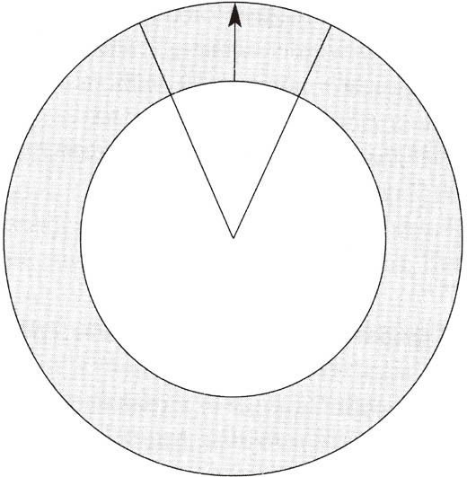

图表4.1　基金资产的价值增值和你的持有份额

你可以把基金资金想象成一块做蛋糕的生面团。投资的起初，面团会被放入烤箱中（也就是内圈），你持有的份额（面团块）还相对较小。如果投资成功（面团膨胀），并且基金资产增值，比如每一支股票得到升值（也就是外圈），那么你持有的份额（分得的蛋糕）也会增值。

总金额将通过发售的份额进行等分，以此便可以核算出回购的价格。这一点告诉你，当你哪天想要出售持有的份额时，每一份额能卖到多少钱。回购价格每日由托管银行在交易所收盘后核算得出。

发行价格，也就是你购买份额的价格，通常情况下都会有所升高。因为在回购价格的基础上又加上了发行升水。基金投资的各种费用我们会在第十一章进行详细介绍。

重要的是：如果有新的投资者加入，或者以前的投资者又加投资金到这支基金中，单位基金的价格不会改变。这些新发售的份额增加了基金资产，但并不会影响单位基金的价格。因此，在一定程度上，可以说这部分是无价值的。回到我们刚才500万欧元基金资产的例子中。现在假设又有200万欧元要投入这支基金，基金资产将增长为700万欧元，单位基金的价值依旧为100欧元，那么事实上只有基金份额增多了：从50000份（5000000欧元÷100）增长为70000份（7000000欧元÷100）。

##  如何处理收益

基金当然应当有所收益。这些收益可以通过汇兑利润、租金收入、股息或者利息收入的形式来实现。对这些收益，有两种处理方式：要么直接又投进基金，这被称作积累
；要么作为基金分红取出。如果你打算养好一只金鹅，请务必优先选择基金积累的方式
。只有如此，你才能感受到复利的神奇效力。此外，你还可以省下提取收益再次投资所产生的一系列不必要的花销。

为了避免混乱，基金管理者有两种方式将积累的收益记入你的账下。一种是你直接获得额外的份额。
通过这种方式，单位基金的价值不会因为收益的增加而改变。另一种是，根据收益来提高单位基金的价值。
第二种方式的运用更为普遍。同时，这种方式可以让非专业的投资者更加容易地观察基金收益的发展变化。

举个例子，假设目前700万欧元的基金在一年时间内增长了37.63％，那么基金资产增长为9634100欧元。现在把这份基金资产平均分摊到现有的70000份额上，单位基金的价值则相应地从100欧元增加为137.63欧元。如果现在打算卖掉手上的50份额，你将得到6881.5欧元。也就是说，你在一年时间内获得了1881.5欧元的收益。

##  资金提现即时快捷

在投资基金时，你可以享受到一点非常重要的安全保障，即托管银行必须随时按照实时行情回购你的份额。

几天之内，你就可以抽回你投入的资金。
这意味着，你可以随时支配投入基金中的资金
。对此，德国投资公司法（KAGG）第二章第十一条指出：“每位持股者都有权利在交还股票的前提下，要求将其参与到特别投资中的股份偿付回来……”

客户不用遵循任何通知解约期限，便可任意支配自己的股票。这种随意的支配性正好也明确指出投资基金的优越性。

我们不愿意也不应该把自己大部分的资金常年束缚在资本投资上。因此，请最多把个人资本的1/3用于长期投资（比如，入股企业）。

再举一个例子，假设你去面包店想买一个面包。面包师说：“非常欢迎您来本店买面包，但是您必须承诺，从今天起一直都要来这儿买，并且坚持25年。”你会怎么想？可能你会慌忙离开，去重新寻找一家。同样，我们也没必要拿我们的资金去承担这样一份长期的责任。

生活中，总会出现一些急需资金的临时情况。
也可能你会突然发现一个收益更丰厚的投资机会。因此，非常重要的一点是，可以随时抛售个人基金份额，同时不会遭受损失，甚至不用忍痛放弃更好的收益。

但请记住：投资的基金虽然每天都可以申请提现，但是股票基金依旧属于一种长期性的投资方式。因为它归根结底还是由股票构成的。

股票投资是一种长期性投资。所以，投资进股票基金中的这笔钱，最好10年不去动用。

原因不仅是可能爆发经济危机，还有买进时需支付一些投资费用（发行升水）。这些费用必须通过行情上涨或取得收益才能弥补回来。不过也有一些适合短期投资的基金产品，我们将在下一章中给大家介绍。

##  投资基金满足5个投资标准

1．安全：
只需要用较少的资金，便能至少入股16家甚至经常是上百家不同的企业。因此，风险和机遇都最大限度地得到了分散。

2．舒适：
职业专家团队为你服务。这些专家长期致力于研究他们投资领域的企业，收集了大量的信息，并从中提取出有价值的部分，理智地运用到投资决策中。此外，他们还拥有最新的技术手段辅助分析。所有的这一切，和你亲自来做这些分析相比，并不需要花费多少钱，但是你能节省出大量的时间。你唯一需要做的，就是填好一张申请表。

3．可支配性：
你可以在任一交易日随时卖掉你手中的基金份额（之后会根据当前的行情退给你所占份额的资金）。你不需要遵循任何合同有效期。除去发行升水（0％～6％），你可以收回你的所有资金，以及截至那时产生的所有收益。

4．收益率：
在过去的50年中，许多股票基金的收益率在10％～12％之间。这里不是指在小型股票和行业中投机的基金，而是指那些传统的、投资面足够分散以及投资项目保守的大型股票基金。当然，获得的收益也取决于你愿意承担的风险。基金种类非常多，可以满足任何安全需求和投资时期。
有些基金的安全程度就如同存银行存折，有些基金像固定利息的有价证券一样能回馈更好的收益，也有些基金风险很高，同时收益率也非常诱人。

5．缴税：
遗憾的是，近年来，税法越变越复杂。之所以出现这样的情况，是因为政府尝试用“劫富济贫”的方式，提高富人阶层的征税比例来照顾更广泛的选民阶层。只有依靠不断出台新的法律和特殊法规，这种冒险才能实现。由于它的复杂性和易变性，这部分内容请各位向纳税顾问请教。但不管法律怎么改变，保持不变的是，股票和股票基金都属于纳税较少的投资方式。

基金公司每年会发给你一份全年缴税明细，列清你需缴税的基金份额。你从中不仅可以了解每年必须缴纳多少金额，还可以得到一份证明，你直接将这份证明交到税务局即可。投资基金确实可以为你省去很多的麻烦事。

##  如何利用投资基金

任何一种生活状况、任何一类投资个性和任何一段投资时期，都可以匹配到合适的基金。我们来看几种情况。

##### 1．一次性投资

你可以一次性投资一定数量的金额，之后可以随意加投资金。但是，不管是对于首次投资也好，还是后续加投也好，都有最低金额的限制。这种限制大多情况都是出于费用的原因，但有时候也会让一些投资者望而却步。

##### 2．储蓄计划

储蓄计划可以让你定期地每月、每个季度或者每年向基金中投资一定数量的金额，就如同买人寿保险一样。它们的不同点在于，基金不会要求你签订一系列难以解除的合同。此外，还有一点最大的优势，你可以随时中止付款，而且不会产生任何损失
。

对此，你只需要拿一份申请在你选定的基金公司开设一个储蓄计划账户。通过授权，基金公司每月在你的账户上划走设定的储蓄金额（但是，由于有些基金公司还没有提款系统，你必须办理长期委托）。你不仅可以随时中止你的储蓄计划，还可以任意提高储蓄金额或者把额度减少到最小值。

##### 3．依靠金蛋生活

但是，如果你想依靠储蓄来生活，或者说不得不依靠储蓄生活，那会怎么样呢？那么，你可以事先确定好，每月或者每年固定抽出一部分投资资产。人们称之为提取计划，而想要实行这一计划，通常要有10000欧元到25000欧元以上的资产。但是，对于那些想依靠金蛋生活的人，还有更完美的方案（请参看第十三章）。

##### 4．资本公积金

此外，你还可以投资资本公积金中的基金产品。这种投资方式要求你必须连续储蓄6年的时间，并且持有基金份额满1年。为此，你必须遵守这一法定期限，才能得到国家的全额奖励。达到一定的收入限额后，你便可以得到国家发放的储蓄补贴（每年的补贴金额有设定最高额度）。我认为这种方式非常可取。国家可以借此从经济上支持并推动股票基金储蓄的发展
。

##### 5．借助投资基金融资

我会在第十四章向大家展示，怎样最大限度地缩短融资时间
，而且是在同样的投入情况下。此时，投资基金和选择合适的银行便起到了决定性的作用。

##  特别说明

原则上，几乎没有哪一种投资形式不能用基金的形式来呈现。基金几乎总是优于单一投资。
因为正如介绍过的，基金就是由许许多多单个投资组合而成的巨大资产，并且这份资产会全权由该领域的专家团队来投资运作。从长期来看，这些专家团队投资获得的收益率总是远高于个体业余投资者。

而本章阐述的内容只适用于德国和欧洲投资法标准下的投资基金。

还有不计其数名为基金的投资产品，实际上是一种企业入股，不适用于本章讲述内容。它们之所以用基金的名字，是因为作为资本聚集盆，它们为不同企业的项目服务。有一个很大的区别在于，投资基金只用开一个投资户头，或选一个托管银行，然后申购相应的份额即可。而企业入股大多数时候会要求签署一份加入声明，并必须同时由信托资产管理人联署。这类产品我会在第六章做进一步讲解。

然而阻碍很多人投资基金的一点在于，基金种类实在是太多了。我们完全可以把众多的基金看作热带丛林，人们难以看穿其中。但是有一个相当容易的方法可以让你一览其况。我们将在下一章中探讨如何操作。利用这些方法，你可以迅速地识别，哪些基金类型值得你入手，而哪些基金则不必考虑。

------------------------------------------------------------------------

致富能量贴士

- 股票是一种非常理想的手段，可以让你尽享企业股票增值带来的利益，却不用承担企业的全部风险。
- 股票行情是由企业的当前价值、无形资产价值和市场需求决定的，其中也有情感因素的作用。
- 整体而言，交易所基本上受到两种因素的影响，即资金的数量和投资者的心理。而资金的数量很大程度上取决于利率的高低。不过投资者的心理缺乏固定的规律性。
- 直接投资股票的前提条件是时间、资金、知识、自制力和乐趣。
- 通过基金，你可以达到最佳的收益回报和时间投入比。
- 基金具备一条很简单但十分重要的要点，即投资专家可以取得比我们大多数人都更丰厚的收益回报。
- 基金让小户投资者也能像大投资家一样投资理财。
- 基金就如同千足虫，即使其中一条腿受伤，整体也不会受到影响。
- 在投资陌生市场和行业领域时，投资基金比投资单个的股票更有优势。
- 根据德国投资法的规定，基金的安全性是任何其他投资形式都无法比拟的。这点主要针对资金被侵占和面临企业破产的情况。
- 投资到股票基金中的资金最好10年不去动用。
- 股票基金满足5个重要的投资原则：高安全性、高舒适性、当天可支配性、长期收益率保持12％和缴税优势。
- 基金的种类足以适合各种投资个性、不同的风险认知和不同的投资年限。
- 原则上，几乎没有哪一种投资形式不能用基金的形式来呈现。基金也几乎总是优于单一投资。

------------------------------------------------------------------------

第五章\
从蜗牛到老虎：一览投资的丛林
============================

唉，所有认为金钱一无是处的人啊，他们都误入了歧途。\
因为食不果腹和衣不蔽体的人哪有心思去谈论理想和抱负。

——贝尔托·布莱希特（Bertolt Brecht）

------------------------------------------------------------------------

基金是你投资组合的一部分，正如我们所见，对于任何一个没有财产压力的人来说，这是最佳的投资方式。然而，许多投资者仍然对基金丰富多样的投资方式置若罔闻。除了第二章中说到的原因——完美主义、恐惧以及对国家养老金盲目的信任，还有两个其他原因。其一是全球有超过55000支基金，其中仅仅在德国就有5000多支。光是这一数字就吓退了很多投资者。

其二是针对不同的产品、领域和地区有不计其数的其他投资方式。比如纯货币市场基金、只投资固定利率证券的定息债券基金、开放型和封闭型不动产基金、投资型不动产、房地产投资信托基金、混合基金、股票基金、特定行业投资基金、国家基金、不同形式的企业分红以及许多其他方式。要了解这样一个庞大的产品丛林的全貌非常困难。更加困难的是——至少乍一看是如此——把自己的资产根据合理的系统进行不同投资方式的分配。

##  分散风险的秘密

我们已经确定了，分散风险对每一位投资者来说都是最重要的原则。

现在有人可能会说：“好吧，如果把金钱投到一支基金中，我就满足这一条件了，而且已经做了充分的分散。毕竟一支国际化的股票基金往往都被同时投到好几百家公司里。”

这一观点乍看没什么问题，实际上你也必须将资金分配到不同的基金和其他投资产品中去。我想以足球队的例子来说明。一支足球队需要的是完全不同的球员。也许你最喜欢中锋，他负责射门。在某些情况下，你也许最想将他克隆，然后将11个他放到球场上。然而，你的球队会输得十分惨烈。因为一支优秀的足球队还需要优秀的后卫、守门员和中场队员。你必须预先考虑到每一种情况。

对于你的金钱来说，情况也是类似的。将所有的金钱投到一个你十分看好的产品中，就好比用11名中锋组成一支球队。也就是说，你的金钱不仅仅会遇到美好的夏天，也会遭遇股市的冬天。大多数情况下，冬天只是短暂的，但偶尔也有漫长的时候。为此，你必须做好准备。

此外，如果你的投资仅仅立足于安全，就好比用11名后卫组成一支足球队。
甚至有的“投资者”只用11名守门员组成一支球队。你也许永远不会输，但也永远不会赢。

对于每一种情况来说，都有最佳的投资方式。有些产品如储蓄存折一样安全，其他一些产品则由固定利息的有价证券（守门员和后卫）构成，此外还有收益率常年固定保持8％～12％的产品（中场球员），以及那些风险高但收益高的产品（中锋）。

一个好的投资组合应包含防守队员（和守门员）、中场队员及前锋。

聪明投资者的投资方法是这样的：分散投资。问题不应该是：哪种投资方式最好？而应该是：我应该如何分配我的资金？每一种产品我应该投入多少钱？
不要问：哪一种风险等级最适合我？而应该问：我应该将资金如何分配到每个风险等级中？

为了合理地分配金钱，也为了使自己感觉舒服，你有两点需要注意。一方面，要了解清楚你的投资个性和个人情况，包括你的年龄、资产状况、投资经验、金钱安全需求度以及其他重要内容。这一话题，我们将在第七章中详细探讨。另一方面，我们必须在巨大的丛林中开辟出一条道路，来挑选出正确的投资形式和投资产品。

##  波动性

因为资金安全是我们投资时的重要标准之一，所以在踏入投资产品的丛林之前，我想再阐述一个概念：波动性。这一参数可以评判投资时资金的安全程度。

在第二章中，我们简要地提到过“波动性”这一概念：它起源于意大利语“volare”（飞驰），意思类似于浮动易变。遗憾的是，“波动性”远远不如人们所想象的那样具有说服力。尽管如此，它还是为我们提供了一个方向。下面我会对这一概念进行简单介绍，并指出其所具备的效力范围。

没有一个投资产品能做到永远平稳发展。波动随时都会发生——或小或大。跟踪一个投资产品的每日行情，你便会看到它在不断起伏。这样的波动是可以测量的，同时也可以借此来评价产品的风险性。因此我们可以说：波动性描述的是一段时间内的相对波动幅度
。

问题是：收益率发展的实际过程偏离了什么？如何对其进行衡量？我们需要一条线，并以此作为衡量的标准。这条线就是收益发展过程中的平均值。这样一来，人们只要能简单地测量出收益率与其平均值偏离多远即可。在此举个例子：

假设一支基金在一年时间内增长了12％，那么这12％就相当于这个过程中的平均值。

现在来算一下，基金行情在这一年内会偏离平均值多远。此处会考虑95％的行情因素。进一步假设，以平均值为基准，波动介于+8％和-4％之间。这一波动表明：基金可能只达到8％的收益（12-4），但也可能实现20％的收益（12+8）。这两个极限值——8％和20％——构成了所谓的趋势波段。

为了能够简单地理解如何计算波动性，我们现在把两个以平均值为基准的偏差值（4％和8％）相加，再除2，得出波动性就是6％。

我们可以将这一切看作一条道路。道路中间线对应的就是平均值的增长（在我们的例子中是12％）。左右行车道的边界对应的是趋势波段。根据趋势波段，我们可以清晰地看出行情的波动范围。波动性向我们展示出了达到目标的过程中波动的强度。在我们的例子中，偏差刚好是6％。

遗憾的是，这种测算方式不尽如人意。因为偏差是负向和正向
计算的。负向偏差就是一个重要的预警，意味着存在收益不如预期的风险情况。那么正向偏差呢？在收益高于预期时，我们很难察觉遇到了一个令人不快的风险。

恰恰这一点就是这种测量方式的不理想之处：一支基金在一段时期内达到了比中间收益值高很多的收益，就被自动归类为高风险基金，因为其波动性较大。更具说服力的测算方式是：将正向波动和负向波动分开测算。

以平均线为基准点是否是正确的，我现在还持怀疑态度。我认为更有意义的计算方式是从对比指数的过程平均值出发。
这才具备真正的说服力。

因此，仅仅依靠波动性是不够的。虽然它能够在我们购买基金时给我们有用的风险提示，但这还不够，尤其是我们还没有从另一个重要角度进行观察：如同收益一样，波动性也只能通过过往数据进行测算。这就意味着，这一数据在未来也可能与当前的测算结果大相径庭。

因此，更好的建议是：如果我们不仅关注波动性，同时也关注交易行情周期
，尤其是基金的风险分散
，会更有参考价值。总而言之：

基金这只千足虫的活动空间越小，风险就越大。

也许这一风险在近几年来没有通过波动性表现出来，但它确实是存在的。

此外，人们对基金喜欢测量其3年波动性，而对股票只测算其1年波动性。在本章末尾，你会看到根据3年波动性进行的一个粗略的风险层级划分。大多数情况下，1年波动性更高，因为时间相对较短，波动产生的影响就相对较大。

遗憾的是，这一参数只适用于投资基金和股票。其他投资产品需要进行单独的风险评估。但此处也适用黄金法则：

对投资分散的范围越小，其风险就越高！

##  真正有益的划分方式

现在是时候了：让我们拨开投资的丛林吧。虽然人们一直以来都在尝试对投资产品进行合理的划分，但我所了解的大多数投资者，依靠那些划分方式很明显无法应付投资需求。现有的划分方式不是太粗略，就是太复杂。

因此，我们想采用一种能满足我们高要求的划分方式：这种划分方式应该易于理解
，而且足够精准
，还应该充满乐趣 。

我不想以对每个选择标准划分星级的方式来烦扰我的读者（但是，有经验的投资者可以了解一下我们的基金投资标准：根据标准普尔分级统计前3年的波动性，这是对负向波动的评级，根据投资、行业和投资区域、风险和风险分散进行投资组合，由获得收益的大小及夏普比率确定，短期领域和长期领域在危机中与危机后的表现，基金经理的个人投资成果以及个人评价）。将这些鉴定标准详细地展示出来，既没有意义，又难以理解，既毫无头绪，又十分耗时。

因此，我将所有的投资产品分为6个风险等级。每一个风险等级用一种动物来象征。
所有这些标准都尽可能清晰地通过以下动物表示出来：

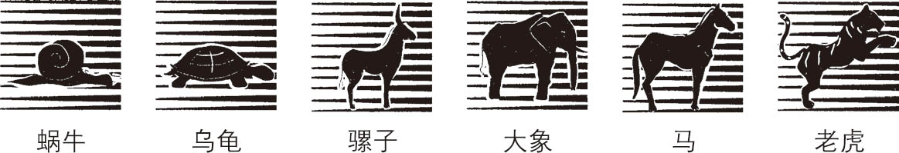

借助这些象征，你可以轻易地重组你的“投资组合”。

现在我邀请你和我一起追随蜗牛、大象、老虎以及其他动物的足迹，来更好地认识这些角色。

##  蜗牛

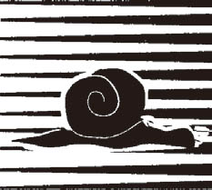

蜗牛是风险等级一的标志。什么都无法撼动它。当某处刮起一场较强的股市风暴时，它就会钻进自己的蜗牛壳里。那里不仅仅是绝对安全
，它也不会受到外界的干扰。

它也在有规律地运动。
蜗牛的波动性非常小。你一定还记得：波动性展示的是收益的规律性。在波动较小时，几乎不会出现行情波动。在你观察货币市场基金的行情变化时，完全可以静静地闭目养神。

毫无疑问，这样的基金产品是存在的。但是，追求安全也是要付出代价的：因为蜗牛只会非常缓慢且有规律地运动。风险等级一的产品的收益也是这样发展的：非常、非常、非常缓慢。
但是十分有规律。

蜗牛代表的是最大的安全性，非常低的收益，很小的波动性。

用数字来表达则是：收益预期介于2％～4％之间。包括的产品为货币市场基金及与之接近的基金，也包含储蓄存折和定期存款。与后者相比，基金可以让你不受损失地支配自己的资金。

蜗牛型基金指的是货币市场基金及与之接近的欧元基金，也就是纯货币价值产品。我们在前面就评价过这些产品了。十分安全！但是这并不适用于积累财富。

因此，这类货币市场基金没有前锋的品质，也就是说，它们无法使我们富有，但它们却是优秀的守门员和后卫
。这里一切平静，你可以放心地持有它们。只有拥有如此坚固的防守，才能无所畏惧地往前冲锋
。

你可以将那些打算在12个月内投入长期高收益产品的资金，暂存在这些产品中，也可以将后续的购买储备金存在这里。例如，也许你为了保障收益，打算卖掉走势良好的股票基金的部分份额。在决定接下来如何利用这笔钱进行投资之前，你可以将这部分资金“保存”在这里。同样你也可以将计划中的大笔支出暂存在这里，以便未来某个时候能随时支取。

小贴士

如果你已经购买了某基金公司的股票基金，或是正打算继续购买，那么请你购买这家基金公司的货币市场基金，这样不仅省时，而且省钱。因为在同一家基金公司内部仓位转换往往只需支付很少的费用，甚至免费。这样的仓位转换被称为“换仓
”。同一家基金公司内的换仓费用在0％～1％之间。如果将资金投进股票基金，之后再换仓成货币市场基金，再换成股票基金，你并不需要再次支付全额的申购费。

采购储备金或税务储备金应存入银行的储蓄账户中。获得的利率比存折或投资账户高很多，而且可以随时支取。

##  乌龟

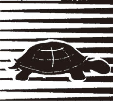

风险等级二
的标志是乌龟。它代表的同样是高安全性和低波动性。虽然它比蜗牛运动快一些，但它仍然属于与蜗牛类似的享乐派，并且很难干扰到它。如果利率提升或货币波动引发强烈的股市风暴，乌龟就会快速地缩回自己厚厚的龟壳里，以此避开资本市场的攻击。

极少情况下，乌龟会脱离正轨，短期内走入错误的方向，因此会短期内行情小幅下跌。但你不必惊慌，因为乌龟总是能很快重返正道。如果你的基金持有时间超过2～3年，那什么都撼动不了它了。所有的损失，都能在这段时期内收回。

乌龟较快的运动速度意味着收益率还算不错：根据不同的风险程度，收益率介于4％～8％，有时甚至更高。在这里，你会发现有攻击能力的后卫。

安全性在风险等级二中一直都是绝对重要的主题。尽管如此，还是能获得相当可观的收益。

这一风险等级典型的投资行为包括国际货币市场基金和与之相近的基金，中长期国际和欧洲定息债券基金。保本型基金、开放型不动产基金、德国和英国人寿保险及年金保险也属于此类。此类风险等级中，极为有趣的是两种特殊的带有不动产投资的企业入股投资方式——不动产交易基金和不动产投资基金。我将在后续章节中详细介绍。

上述的定息债券基金主要适用于短期或中期投资（2～5年），有助于保证资金安全，为投资组合打造一个稳固且保守的基础。你也可以将安全储备金的一部分存入此处。如果你靠金蛋（利息）生活，那么乌龟同样能发挥至关重要的作用。根据你对收益率及高安全性的组合要求，乌龟也极为适合个人的支取计划（参看第十三章）。

但是请注意：乌龟的大小和种类各不相同，因此其特点及运行速度也大相径庭。更多固定利率有价证券与股票之间安全性对比的细节，我将在后续章节中详述。

此风险等级侧重于你的投资行为的短期和长期安全性。虽然从长远来看，你获得的收益少于预期，但根据人为预测，你绝不会亏本。在别人向你提出担保时，请注意，对方在紧急情况下，是否有足够的资本实力实现他的担保。

一家注册资本为25000欧元的有限责任公司，绝对不适合遵守租赁担保。

##  骡子

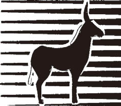

骡子代表的是风险等级三
。它们很难驾驭，但有时候跑得飞快。其实骡子是风险等级二的乌龟和风险等级四的大象的交叉点。大多数“骡子”都是混合产品，由定息债券和股票组成。因此这种类型很难评估。这是一种非常奇特的组合物，能给投资者带来一些意外——可能是积极的，也可能是消极的。

我们也可以把所谓的房地产投资信托基金归入此类。这类股票和不动产的混合产品，不容易被一下子看穿，但也不能完全拒绝它。毕竟这类投资主要关注的是有形资产：投资不动产的股份公司。此外，投资分散的国际高利率定息债券基金、工业国和发展中国家的债权组合，也属于此类风险等级。

风险等级三的产品的重点在于低、中级风险，但它完全可能出现短期的强烈波动。

收益预期绝大部分取决于各个投资产品的组合比例。如果定息债券占大部分，那么收益就偏向于8％，如果股票占大部分，那么收益可以达到12％。经典的混合型基金由于组合比例不同，可能属于乌龟一类，也可能属于大象一类
。

除了个别情况，我并不太喜欢这一风险等级的产品，尤其是混合型基金。因为它们总是由两个毫不相干的类型混合而成。在风险等级三中，你无法获得风险等级四的收益，因为其中混入了风险等级二的因素。你也无法保障资金的安全性，因为混入了风险等级四的因素。乌龟和大象从来都不是一对好搭档。通常情况下，你无法判断清楚大象和乌龟的当前比例关系。即使你今天知道它们的比例关系，但它们可能第二天又发生了变化。

我对“混合型产品”的建议是：最好将资金投入定义相对清晰的风险等级二和风险等级四的产品中。这样一来，你会更加清楚自己的方向。同时，你应该进行长期的风险分散。

##  大象

大象是风险等级四
的标志。没有什么能立刻撼动此类厚皮动物。虽然大象需要相当长的时间才能真正起跑，但一旦它全力以赴，便没什么东西能很快阻止它。

在大象这一风险等级中，我们终于告别了货币价值产品，现在只涉及股票，也就是纯实物资产价值。这意味着：

收益概率增长了，但同时风险也增加了。

为了使风险等级四的产品具有安全性，就需要进行广泛的分散。也就是说，要从不同行业和区域去购买股票。或者我们可以从世界两大经济强区——美国和欧元区——购买股票。

广泛分散的国际股票基金构成了这一等级的典型产品——当然，如果是蓝筹股（大型且稳定的企业），也包括充分混合的个股投资，也就是说至少30家不同领域和不同国家的企业合成的个股。大多情况下，这一风险等级的产品都将资金投进国际化的、欧洲的或美国的稳定的标准股。这些基金不会轻易地脱离轨道。虽然股票市场的大火可能使大象在短期内偏移道路，沿着错误的方向走上一段弯路，但从长期来看，大象能带来良好稳定的12％甚至更高的收益率。

因此，一支大型国际股票基金持续的行情下跌，一般情况下不会超过1年——最多的一次是2年（例外情况是3年的主要股市崩盘）。但大象仍然在之后的1～5年重新拿回收益。

从理论上来说，这些产品可能让你亏钱。但实际上，如果投资者至少5年，最好是10年不动用这笔钱，也就不存在亏钱的可能性了。过去的事例表明，损失仅仅发生于你在行情下跌后把产品抛售了。
反之，如果在遭遇行情下跌后，仍然耐心等待5年，你不仅能回本，还能盈利。

在买入风险等级四的产品之后，你就可以安心睡觉，10年之内对它置之不理了。当你再次醒来，你的资金很可能已经以每年12％的利率增加了。

这些产品组成了你投资组合团队中广泛的中场。即使是对于非常小心谨慎、极为注重安全性的投资者来说，大象级产品也是“必备”的选择
。在任何其他的投资产品中，你都找不到比大象型产品更加实用的“安全收益比”。在这里，你能真正地找到使你的财富健康发展的最适合的产品。

##  马

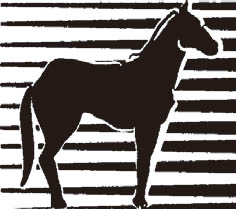

风险等级五
的标志是马。基本上，马可以跑得很快，这就意味着可以获得可观的收益。说不定它还能撞入牛市。也就是说，它通常能获得比大盘指数高得多的收益。但是，马也很容易受到惊吓。它们受到熊市（股市崩盘）的惊吓时，可能会完全崩溃，朝着完全错误的方向落荒而逃。

马代表了高收益预期，但也代表了风险和极其危险的波动性。

在这一风险等级中，既有相对温顺的马，也有非常野性的马。在这里，你会看到以世界股票市场中的大型细分市场、行业和各欧元区国家（德国也属于此列）为投资重点的大型股票基金。此外，还有国际和欧洲的增长基金及创业板股票基金。

也许你会问：为什么这些基金比大象级基金的风险更大？答案是：你的资金分散不足。你还记得我们把基金比作千足虫吧？现在，一头大象，也就是一支大型的国际股票基金，几乎涉足了所有的行业、区域和市场。当一个经济区域陷入困境，另一个区域崛起的概率就很大。这对于你的资金来说，就意味着：什么都不会发生。因为一个区域的收益，弥补了另一个区域的亏损。

千足虫的比喻同样适用于风险等级五的基金及投资产品。千足虫将它的脚伸入许多企业，但这些企业要么都属于一个行业（比如技术类），要么都属于一个区域（比如东南亚）。现在，如果技术类股票出现问题，或者整个东南亚区域陷入危机，马就没有选择的余地了。这样一来，行情下跌的损失就很难通过其他地方的行情上涨来弥补，因为此类基金只停留在其投资的行业或区域内部。

这类基金的管理者的操作范围更小。他们必须重点关注某一个较小的市场。这就增大了风险，但同时也提高了收益概率。
因为大多数情况下，这些管理者对自身领域的掌握情况，比其他人更内行。作为圈内人，他们可以更轻易地成为真正的“赢家”。他们就在当地，所以可以闪电般做出反应。

也许你现在会说：“这对我来说不算什么！”或许你是对的，但可能并不全对。假如你是注重安全性的人，你当然不应该把大部分资金投入风险等级五的产品中，但小部分投入还是需要的，哪怕只是极小的一部分。每一种类型你都应该有所参与。在第七章中，我们将会详细地介绍如何进行资金分配。

如果你已经准备好了，用一部分资金购买马这一等级的产品，那么你所承担的风险极有可能会为你带来回报。从这一类产品中，你每年可以获得15％甚至更多的收益。因为当某个行业或区域突然迅猛发展，而你的基金又刚好投资在该处，那么你很快就可以尽情庆祝了。

而且长期来看，风险也并不会居高不下。因为时间一长，这类基金中的大部分长线投资都会使你站在赢家的一方。但是，你可能需要等待10年之久。这条准则也适用于此类情况：只有当你在出现危机时卖出，你才会亏钱。

还有一点也十分清晰：如果只在各个风险等级中分配资金，这是远远不够的。你还应该在同一风险等级内对不同的产品进行分散投资。
风险等级越高，这一点就越重要。至少从风险等级四开始，这一点是绝对有必要的
。想一想我们足球队的例子：我们永远不能只让一个角色上场比赛。每个队员可能都会有体能较低或受伤的时候，这就需要其他的球员上场临时替补。适用于整个足球团队的准则，同样也适用于球队的某一部分
。寄希望于3名前锋，而不要只依靠其中一名。

##  老虎

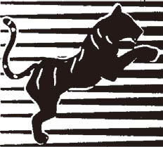

“帝王级”——风险等级六
的标志是老虎，其风险程度最高，但收益率也最高。投资这一类产品，你可以真正感受最狂野、最刺激的冒险，因为老虎同时象征着危险和强大。老虎是捉摸不透的。你无法清楚地知道，它什么时候开始捕猎。你只知道，它必然会在某个时候出动。一旦开始，它便会疯狂地奔跑、跳跃。在一番猎逐后，你便能获得“突如其来的”惊人收益。

投资老虎级的产品，你拥有最大的概率在1年内使资金翻倍，甚至更多。

但是，老虎也可能为你带来巨大的痛苦。因为在这一风险等级中，你可能长期遭受高额亏损。我选择老虎作为这一风险等级的象征，并不是没有理由的。因为老虎完全有能力一口吃掉你的金鹅。因此，投资这一风险等级的产品，必须十分小心谨慎。

你必须仔细观察它们。然后你可能会有一些奇特的感觉：你的心脏在怦怦跳动，肚子在隆隆作响，浑身冷热交替。你的小老虎可能今天把你吓得半死，明天又让你喜不自禁。这种感觉就像是陷入初恋一样。有些人会感受到在“普通生活”中已经好久没有经历过的情绪。换句话说，这才是真正的生活。

如果说风险等级四中的基金还会横向涉足很大一块区域，甚至分布到全球，那么风险等级五的产品分布的区域就缩小了很多，因此风险也高了很多。在风险等级六中，这一区域再一次缩小。现在，这一区域仅限于某一国家或特定的主题和行业。例如，在一个国家内部，只对细分市场进行投资，比如德国的科技股、美国的纳斯达克，或者更加特殊的亚洲网络类基金产品。

对冲基金、风险投资、期权证、期货、垃圾债券和垃圾股票，还有那些无法评估而只能根据别人的评价来购买的股票产品，以及无保障的企业股份和灰色资本市场上的许多产品，都归为这一类。

让我明确地提出一点警告。也许大多数投资者的投资并不合理，因为他们关注的重点只是不亏本。但是也存在另一个极端：投机者，也就是那些只喜欢投资老虎级产品的人。注意！老虎级产品就好似胡椒。没有胡椒这一调味品，有的菜就黯然失色了，但过多的胡椒又会毁掉菜原本的风味，甚至还会败坏你的胃口。于是，这里又说到了正确的搭配比例。

同时，正确的策略也很重要。因为老虎级产品也遵循特定的周期，这一点，我们后面还会详细探讨。这些周期比工业大国的标准股票的周期要短很多，根据标准股只能计算出平均周期。但是，老虎级产品的周期就精确多了，它能够告诉我们何时买入，何时卖出。如果某位投资者掌握了周期规律，那么老虎级产品的风险对他来说，就是可以预见的，即每个投资者都能够承担的风险。但是，投入此类基金的份额多少却因人而异，因为你要能与你的小老虎和谐相处，这一点非常重要。

##  小结

随着本书的深入，你会越来越熟悉这些动物象征，也希望对你越来越实用。因为从现在开始，我们会从不同角度对各个风险等级进行多次观察。

在图表5.1中，你会看到6个风险等级的概况，包括收益预期、波动性、满足不同投资目的产品、产品描述、建议的最短投资时间及需要的劳动投入。

图表5.1　6个风险等级一览表

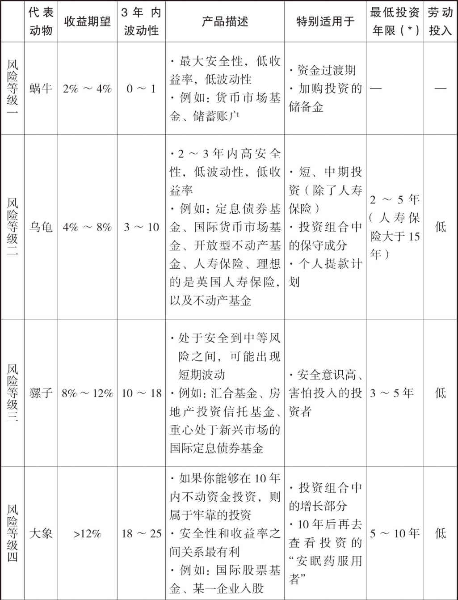
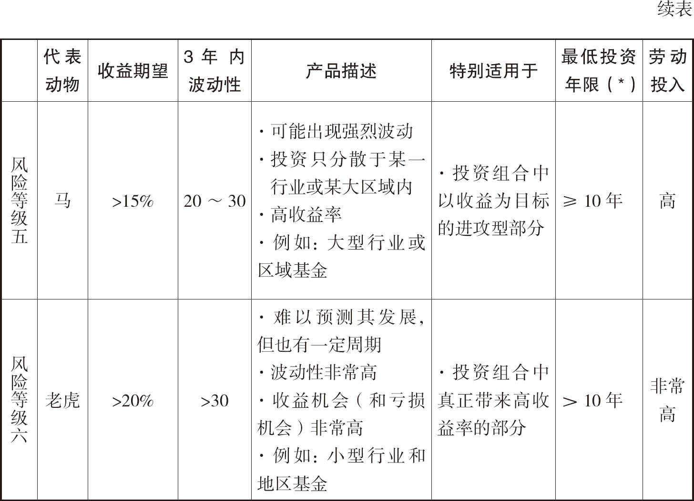

\*应当把资金放在这一领域的最短时间。

接下来，我们将在后续章节中，从安全性、优缺点方面对重点的投资产品进行分析。

我们一起来权衡，每个风险等级中最适合你的是哪些产品。

第六章\
各类投资形式的优缺点
====================

不认真对待金钱的人，\
终将被金钱支配。

——沃尔夫冈·克鲁格（Wolfgang Krüger）

------------------------------------------------------------------------

正如你在各类风险等级说明中了解的那样，每一个等级都不只包含一项产品类型。为了以后能组建一支成功的投资组合，我们应当更深入地了解各类投资产品。

之后几页中，我将对各种产品进行概述，可能理解起来有些吃力。因此我建议：放松心情，只阅读那些你真正感兴趣的投资产品内容
。为什么呢？因为就目前来讲，过多的理论知识对你毫无用处，只会加重你的负担。并且，关键不在于你是否熟练掌握书中的全部内容，而更多在于你是否能变得富有，是否能让资产尽快地翻一番！

为了便于理解，我对每个风险等级中极具优势的投资产品做了特别标注。
在本章结尾处有个一览表，从中你能够一目了然地看懂各类投资产品的优点和缺点。图表的最后一栏标注了推荐等级，它指明了该产品与同等风险级别的产品相比，推荐度有多高。也许你应当先浏览一下这个图表，然后只阅读你感兴趣的内容。

可能单看这个结果，你就已经觉得足够了。

因此，我将后续的详细内容做一个概括，让你一目了然。如果你想把资产分散到各个风险等级中，那我建议你特别关注各等级中的以下产品：

|  |  |
|----|----|
| 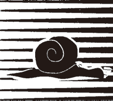 | 以欧元为基础的货币市场基金、直销银行储蓄账户。 |
|  | 欧洲定息债券基金（利率低但周期短）和国际定息债券基金、英国年金保险和人寿保险、投资型不动产。 |
| 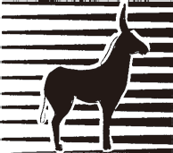 | 含有企业债券和新兴工业国家债券的高息定息债券基金。 |
| 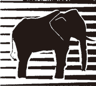 | 大型欧洲、北美和国际股票基金、国际屋顶基金和分散广的企业入股。 |
| 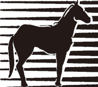 | 大型行业基金和大型区域基金，经过挑选且你能判断的蓝筹股个股组合、行业和市场中的屋顶基金、指定企业入股。 |
|  | 对冲基金、专项基金，如小型行业基金、国家和区域基金、新兴市场基金、新兴工业国家的指数股、小型资本公司的个股。 |

本章中会列出全方位的参考资料，供大家参考。如果以后在投资基金和其他产品时，遇到不熟悉的内容，你也许可以来本章中找到对应的说明。

现在，让我们一起来看看各个投资类型。我们还是以前面的风险等级为基础，先从“蜗牛”级开始吧。

##  风险等级一

#### 国内货币市场基金

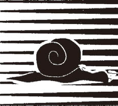

蜗牛级产品之间，几乎没有什么区别。产品组合的自由度不高。因此，这个领域中，投资者不太容易出错。

这一等级中值得推荐的产品为货币市场基金和直销银行储蓄账户。

货币市场基金几乎和储蓄存折一样安全。因为它们通常百分之百由银行存款和货币市场证券组成。我们来看看货币市场和资本市场的区别。货币市场
指12个月内即将到期的短期证券。到期日长，也就是说资金赎回的时间较长的证券，则被称为资本市场
。

这些证券（公司债券、存款凭证、国库券）由拥有一流信用的出票人开具。这些证券有专业的评估等级，最高级别为3A或AAA（参看图表6.2）。大部分货币市场证券正是属于这一等级。与货币市场基金非常相似的就是所谓的类货币市场基金
。它把至少51％的资本投资于短期债券，余下的部分则投资在定期存款和货币市场证券。

由于资产额相当大，基金在交易上拥有一定的特殊条件，这些条件通常只有大型投资机构如银行或保险公司才具备。因此，基金可以获得比储蓄存折或短期定存相对更高的利息，而安全性一样高
。

风险等级一中的货币市场基金只涉及用欧元开价的产品。因为外国货币一旦参与进来，收益机会会提高——但同时面临汇率风险。
反之，如果只投资国内货币，风险差不多会降为零。不过，如此高的安全性当然是以低收益为代价的。虽然曾有一段时期（1990—1992年），货币市场基金的收益率超过了10％，但在利率低谷时期，收益率通常为可怜的2％～4％。

##### 优点

和储蓄存折相比，它的优点在于：没有取款通知期限，收益率也相对高一些。与定期存款相比，其优点为：没有投资期限的限制。此外，货币市场基金还能够迅速地适应利率上涨（或者下降）。你可以随时支取你投入的全部或部分资金。同时，货币市场基金的申购费用很低，几乎为零，并且不受价格波动的影响。

直销银行储蓄账户也同样如此。通常情况下，这项投资产品可以给你提供当日的最高利率。

##### 缺点

货币市场基金的收益完全来源于利息收入，因此你的每笔收益都必须支付所得税。此外，这些收益少得可怜。所以，这些产品都不是用于增长财富的主要选项，而更多作为资金的暂时存放点。这些产品最适合资金的暂时存放。

##  风险等级二

在风险等级二中，有国际货币市场基金、定息基金和开放型不动产基金、投资型不动产、德国和英国年金保险和人寿保险，以及众多的保本基金和证券。
因为这些产品完全不同，我们分别进行讲解。

#### 国际货币市场基金

货币市场基金几乎不会产生什么价格波动。但是，如果你选择了以外国货币为投资对象的基金，那就完全不一样了。在这种情况下，风险等级就会上升为二级。

举个例子。假设，你投资一支美元货币市场基金。那么，欧元和美元之间的汇率波动将会影响你投资的基金的价格发展。

从短期来看，有时会导致极大的收益差别。在图表6.1中，你可以看出，1994年末买进的一支欧元货币市场基金，在没有货币汇率波动的情况下，与以美元开价的货币市场基金相比，其发展情况如何。你可以清楚地看出，就短、中期来看，货币汇率波动会对基金的价格发展产生相当巨大的影响。
同时，你也能看出，有2～3年的时间区间内，如在某些时间点上卖掉美元货币基金，获得的收益就如同那些没有汇率风险的基金一样。不过，就长期而言，有汇率风险的基金能够带来的收益明显高得多。

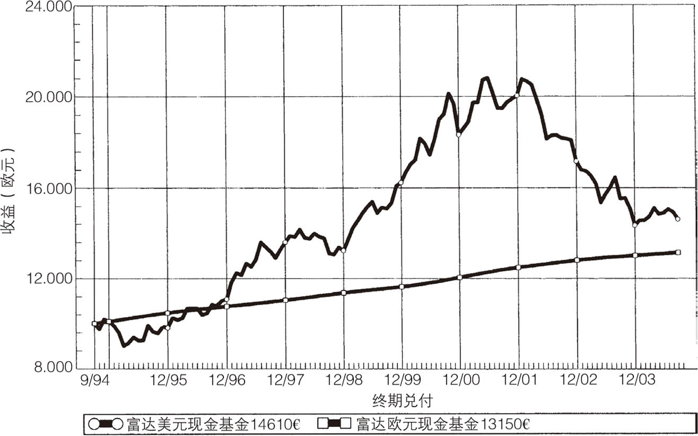

图表6.1　10000欧元投资每月累积的价格发展（收益分配后循环再投资）\
\*数据源于2004年9月30日

更高的收益机会以及更高的风险也表现在税收问题上：通常，获得的利息要被收取利息税，但12个月后的汇差所得却能免于缴税。

如果行情不错，美元相对欧元升值了10％，汇率升值带来的这部分收益是不必缴税的。反之，如果你投资美元，而它贬值了10％，那么对你而言这意味着双重损失。因为这种情况下，美元存款的利息收益还不足以抵销汇率损失。
比如，美元存款的利息收益为4％，而遭受的汇率损失为10％，总的来讲，你不只要承担6％的损失，还必须为4％的利息收益缴纳利息税。

因此，投资到国际货币市场基金中的资金最好能够在2～3年内都不去动用。在这段时期内，汇率波动的因素相对会有一定的局限性。

此外，你应当要学会对各类货币投资做风险估算。如果你达不到这方面的能力，那我建议你请一位内行的顾问来做指导。

小贴士

绝对不要因为某一支国际货币市场基金上一年行情走势很好，就选择投资这一基金。也许，它上一年的大部分收益来源于汇率价差，而今年的发展形势或许会刚好相反。

#### 定息债券基金

我们在此将定息债券定义为固定利息的有价证券的总称。固定利息的有价证券由多个不同的机构发行。债务人的偿还能力可能大不相同，这也决定着债券利率的高低不一。也就是说，债务人偿还能力越强，支付的利息则越低。反之同理。

因此，固定利息的有价证券有着不同的风险等级。接下来，我们将学习各种定息债券之间的区别，以及与之相对应的风险等级。

买股票代表着你购买了某家企业的股份。定息债券则不同：买债券就意味着你是把钱借给了某家企业或某个国家，并由此获得定期的固定收益（息金）。
因为你是将钱借给别人，所以也可以称之为借款
、债务
或者债券
（这种票据规定了发行人的债务）。

通常，这类有价证券都会被冠以“安全投资”的头衔。投资者总会听说，定息债券投资基金比股票基金安全多了。或许正因为如此，德国在过去所募集的基金中，大约有50％都投到了定息债券基金中（不过，这个趋势目前终于有所转变）。

的确，很多定息债券基金很安全。但和股票一样，不同的固定利息的有价证券之间的差异也很大，有些产品的风险也很高。尤其是，这些证券还会隐藏着投资者难以发现的风险。下面列举固定利息的有价证券的几种类型：

- 联邦债券/国库券：债务人为国家
- 银行债券：债务人为银行和储蓄银行
- 抵押债券：债务人为抵押银行
- 地方政府债券：你把钱借给地方政府
- 工业债券：债务人只是某家企业
- 国际工业债券：你把钱借给了国外
  某家企业
- 新兴国家的高息债券：你把钱借给某发展中国家
- 垃圾债券：你把钱借给安全性不高的企业；投资风险很高

在《女子理财从入门到精通》（Geld tut Frauen
richtig gut ）一书中，我和卡罗拉·费斯特尔（Carola
Ferstl）对最重要的有价证券做了详细的概括。在这里，我们重点研究一些规则，看看固定利息的有价证券是如何运作的。

通过购买这些有价证券，你把钱借给了某债务人。为此，你可以获得利息，通常是每年支付一次。债券到期后，你可以拿回你的本金。

为了让你有一份“白纸黑字”的协议，你会得到一份债券。债务人（债券发行人
）把债券发给债权人。债券上载明了债务的金额（债券面值），明确了偿还的日期（债券到期日
）和承诺的利息
。你可以买新发行的债券，那么从购买到赎回本金的这段时间就称作债券的发行年限
。不过你也可以买已在市面上流通的债券，那么到期日之前的这段时间就叫作剩余期限
。

#### 定息债券的安全性有多高

你能够收回全额本金并且如约获得利息的安全系数有多高？当然，这两项都是有所保证的。但是这份保证的安全程度要取决于发行人的支付能力（信誉度）
。你把钱借给谁，其安全性是有一定区别的。你可以把钱借给国家，借给大企业或者小公司，甚至可以借给你的邻居。但很多人必定称借钱给邻居的做法为“折旧”。所以，有价证券的安全性很大程度上取决于发行人的支付能力。

同时，债券利息的高低也受不同因素的影响。最主要的当然还是根据当前各国资本市场所计算出来的利率。和其他利率一样，证券利息的高低也根据投资期限长短有所不同。多数情况下，投资期限越短，利率越低。
至于当前的利率水平，你可以根据90天的定期存款和十年期限的联邦债券利率来估算。这方面的数据可以在各大报纸的经济版面去查询。

现在，除了市场利息，还有市场红利。它是由发行机构的支付能力决定的。因为发行机构的支付能力越不稳定，越需支付更多的利息来吸引投资者。
因此，你一定要了解独立评估机构对这些证券的信誉评级如何。图表6.2中，你会看到不同的评级一览表：从代表最强支付能力的3A（AAA）到表示一家企业濒临破产的D级。

图表6.2　信誉度等级评估

<table class="kindle-cn-table-body" data-cellspacing="0">
<colgroup>
<col style="width: 33%" />
<col style="width: 33%" />
<col style="width: 33%" />
</colgroup>
<tbody>
<tr class="calibre17">
<td class="kindle-cn-table-th" width="20%">穆迪（Moody's）</td>
<td class="kindle-cn-table-th" width="20%">标准普尔（S＆P's）</td>
<td class="kindle-cn-table-th" width="60%">评价</td>
</tr>
<tr class="calibre17">
<td class="kindle-cn-table-dg">Aaa</td>
<td class="kindle-cn-table-dg">AAA</td>
<td
class="kindle-cn-table-dg">属最好和资信最高的等级。这类评级的债券信用最高，风险最小</td>
</tr>
<tr class="calibre17">
<td class="kindle-cn-table-dg">Aa1</td>
<td class="kindle-cn-table-dg">AA+</td>
<td
class="kindle-cn-table-dg">两个“A”依然代表高于平均水平的资信，信用危机非常低</td>
</tr>
<tr class="calibre17">
<td class="kindle-cn-table-dg">Aa2</td>
<td class="kindle-cn-table-dg">AA</td>
<td class="kindle-cn-table-dg">资信依然高，但稍有一些风险</td>
</tr>
<tr class="calibre17">
<td class="kindle-cn-table-dg">Aa3</td>
<td class="kindle-cn-table-dg">AA-</td>
<td class="kindle-cn-table-dg">资信依然高，但风险增大</td>
</tr>
<tr class="calibre17">
<td class="kindle-cn-table-dg">A1 
A2 
A3</td>
<td class="kindle-cn-table-dg">A+ 
A 
A-</td>
<td
class="kindle-cn-table-dg">只有一个“A”的企业受外界影响很大，因此风险很大。属中上等级资信</td>
</tr>
<tr class="calibre17">
<td class="kindle-cn-table-dg">Baa1 
Baa2 
Baa3</td>
<td class="kindle-cn-table-dg">BBB+ 
BBB 
BBB-</td>
<td
class="kindle-cn-table-dg">这一等级的发行机构属于中等的利息支付者，偿还能力保障水平一般，但受经济情况和发展趋势的影响很大。中等资信</td>
</tr>
<tr class="calibre17">
<td class="kindle-cn-table-dg">Ba1 
Ba2 
Ba3</td>
<td class="kindle-cn-table-dg">BB+ 
BB 
BB-</td>
<td
class="kindle-cn-table-dg">从这一等级起的债券已属于投机范畴。利息的支付和偿还能力已不足100％</td>
</tr>
<tr class="calibre17">
<td class="kindle-cn-table-dg">B1 
B2 
B3</td>
<td class="kindle-cn-table-dg">B+ 
B 
B-</td>
<td class="kindle-cn-table-dg">长期支付利息的安全性非常低</td>
</tr>
<tr class="calibre17">
<td class="kindle-cn-table-dg">Caa 
Ca 
C</td>
<td class="kindle-cn-table-dg">CCC 
CC 
C</td>
<td
class="kindle-cn-table-dg">对归为“C”等级的证券务必小心谨慎。大多数情况下，发行机构会出现拖延支付利息或者偿还本金的情况。这就可以称作垃圾债券</td>
</tr>
<tr class="calibre17">
<td class="kindle-cn-table-dg">D</td>
<td class="kindle-cn-table-dg"></td>
<td
class="kindle-cn-table-dg">“D”等级债券的债务人已经破产或濒临破产</td>
</tr>
<tr class="calibre17">
<td class="kindle-cn-table-dg">NR</td>
<td class="kindle-cn-table-dg"></td>
<td
class="kindle-cn-table-dg">“没有评级”的意思是这一债券还未进行等级评定</td>
</tr>
</tbody>
</table>

我们无法对定息债券的收益率做出统一的判断。因为其收益率的高低会根据期限长短、各资本市场的当前利率以及发行者的支付能力而有所不同。

总的来说，投资定息债券时应该考虑到以下5种重要风险：

1．信誉度：
必须在收益率和发行机构信誉度之间仔细权衡。

2．通货膨胀：
因为投资定息债券会涉及货币价值产品，所以通货膨胀会使收益减少。

3．再投资风险：
如果想利用复利的魔力，你就必须把利息转入再投资。此时，市场利率可能会降低，致使你获得的利息收入减少。另外，你可能也不愿意把这笔资金长期地束缚在某一种产品上。

4．以外币发行的证券的汇率风险：
如果外币对本国货币出现贬值，就会遭遇价值损失。此时，你收回的资金可能比你原来投入的还要少。同时，你必须注意国际货币市场产品特殊的缴税规定：你不能把利息收益和汇率损失混为一谈。也就是说，你可能在遭受汇率损失后，还必须缴纳利息收益的所得税。

5．利率变动的风险：
这是影响最大的风险。无论哪一种债券，都存在这一风险——即使你购买的是最具安全性的联邦债券，也不例外。

对于最后这个风险，我们还得进一步加以说明。通常情况下，当你把钱长期出借后，才能获得较高的利息收益。虽然，你可以像持有股票一样，每天在交易所卖出债券。但是，如果想在到期之前把债券卖出，那你得到的资金可能比投入时要少得多。如果在此期间利息上升，肯定会出现这种情况。

举个例子。你投资10000欧元购买债券，期限为十年，利息为每年6％。第二年，市场利息上升为8％。投资者如果此时买进债券，则会选择收益更高的产品。所以，你之前购买的债券对他而言没有吸引力了。然而，为了找到买主，你必须降价出售，而且价格要低到能弥补买主的利息损失。

简而言之，假设你持有的债券的剩余期限为六年，买方每年的利息损失为2％，6年总共损失12％。为了平衡对方的损失，你必须降低12％的售价。所以你能得到的资金就不再是10000欧元，而是8800欧元。

当然，反过来，如果市场利率降低，债券的价格就会升高。剩余期限越长，卖出的价格就会越高。简单的公式如下：

资本市场利率越高，流通的债券价格则越低。资本市场利率越低，则债券价格就越高。

小贴士

在市场利率很低时，千万不要买进长期债券。反之，在市场利率很高时，则应尽可能多地买进长期债券。至于当前的市场利率水平属于高档或低档，你可以从报纸财经版面相应的评论文章中获得。

#### 较高收益机会总是以安全性为代价

衡量获利机会和风险的主要原则，同样也适用于固定利息的有价证券：为了获取较高收益，你的投资年限必须加长。由此，风险也就随之增加。图表6.3显示了一支平均剩余期限至多三年的欧洲定息债券基金（Oppenheim
Bond Euro K）和一支平均剩余期限约十年的长期基金（Oppenheim Bond Euro
L）之间的比较。

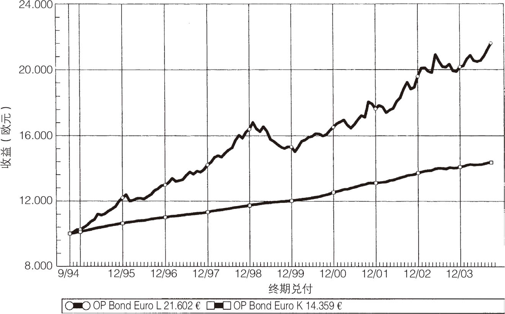

图表6.3　10000欧元投资每月累积的价格发展（收益分配后循环再投资）\
\*数据源于2004年9月30日

如你所见，仅仅是不同的投资年限就已经给收益造成了巨大的差别。但这还不是唯一的变量。如果把所有不同的因素都交错权衡，如投资期限、货币种类、信誉度和与之相关的风险红利、经济体的稳定性以及资本市场利率的走势等，那么对个人投资者而言，选出合适的单个债券就相当困难。尤其是，很难再进行广泛的风险分散。

为了实现收益的最大化，你必须分散投资在各个不同的国家。
只有这样，你才能充分利用各国不同的利率水平。所以，你必须要具备这个领域丰富的专业知识。此外，还要投入很多的时间。因此，在种类繁多、千变万化的国际定息债券里，你最好还是通过债券基金来投资。
基金经理和分析师在其专业领域中，能有更大的机会以低风险来获取高收益。他们可以通过广泛的分散投资来降低风险，而个人投资者很难做到。

#### 权衡风险与机会

事实上，持有一支债券基金3年以上，就很少会遭受损失。因此，债券基金很适合保障投资组合的安全，同时为股票投资建立长期的续购准备金，或者是为定期赎回计划建立安全储备金。

小贴士

只要欧洲的利率水平尚低，那么通过购买混合了新兴国家债券（比如东欧邻国）的国际定息债券基金或者欧洲定息债券基金，会带来明显高得多的收益。而且，其附带的风险（汇率风险）微乎其微。然而，如果利率水平上升，那么欧洲定息债券基金的吸引力就会增加。

我们再次回忆一下足球队的情景。风险等级二的基金产品就等同于足球队后卫。因此，这个位置的选手不仅要有进攻性，还要有较强的防御能力。这样，在投资组合中持有欧洲和国际定息债券基金才有意义。

#### 开放型不动产基金

开放型不动产基金是一个矛盾的综合体。一方面，不动产属于长期投资；另一方面，投资者又可以随时赎回自己持有的基金份额。
因此，基金公司必须建立完善的机制，它们有责任依照投资者的意愿，随时准备好回购其持有的基金份额。因此，基金公司不能把资金全数投入不动产，而是必须保持基金份额中有1/3的定息债券。如果利率水平低，收益率的压力当然会很大。

开放型不动产基金的优缺点总结如下：

##### 优点

●其价格走势不受股市的影响，适合作为股票基金的平衡力量（但是只有当利率水平还不错的情况下，这类投资才有意义。如果利率太低，就不是这么回事儿了）。

●因为不动产投资属于有形资产投资，所以不受通货膨胀的影响。

●波动性很小。

●基金中投资的每一项不动产都有独立的专家团队来进行评估。因此，基金份额的价格和市场价格的关联较小（这也可以看作一种缺点）。

●部分收益免于缴税。

##### 缺点

●如果太多投资者同时想要赎回基金份额，基金公司有权将赎回要求延后一年。

●投入定息债券的份额很高，所以这种基金无法像其名称类别那样，只投资不动产。

●由于投入定息债券的比例很高，当市场利率水平较低时，该基金的收益率毫无吸引力。

●与收益率相较，不动产基金的申购手续费很高。大概介于5％～5.5％之间。第一年（通常会超过一年）的全部收益才刚好能摊平原始的投资总额。想要真正实现收益，耗时太长。

●如果同时有太多投资者涌入，基金经理可能会遇到大麻烦，难以迅速找到合适的不动产项目。在这期间，资金便会被存放在利率很低的定期账户中。这当然又会影响整体的收益率。

我的建议是：在风险等级二中，国际定息债券基金是非常具有吸引力的投资工具。至少在利率水平很低或正在下降时是这样。此外，在多数情况下，我不建议投资封闭型不动产基金。其原因已多次在各个报刊上讨论过（破产、亏损、高升水等）。如果你已经持有或者说青睐此类产品，一定要注意该不动产的风险等级、成本结构和买入价格。

无论如何，你一定要把不动产纳入投资考虑当中。因为不动产是我们聚宝盆中很重要的组成部分，它和风险等级二中的其他产品一起筑建了投资根基。但同时，这也取决于你目前的资产状况。我的理念是：只要你尚未达到财务保障阶段，就还不应该去投资不动产。理想的情况是，当你达到了财务安全，才去涉猎不动产领域。当你拥有的资本够多时，投资组合中不动产的比重可以占到10％～50％。

至于你是把这一部分投资单项不动产还是投资不动产基金，那纯属个人喜好。此处不再赘述。因为它对你的资产积累影响不大。再次重申一遍，风险等级二中的投资产品，其意义在于安全性。想要获得更高的收益，则要投资风险等级四到六中的产品。不过，也有例外情况，比如投资型不动产、英国人寿保险和年金保险。

#### 投资型不动产

大多数情况下，当你在专业报刊书籍中看到不动产买卖的注意事项以及不动产带来的价值时，你会发现，地点是最重要的、要选好地点等。

当然，地点很重要。但是如果仅仅关注地点，虽然你可能买到一些几年后升值的理想房产，但是这不属于“投资型不动产”。基于未来房产升值而购买的不动产，只能算作投机。因为只有当你卖出不动产时，才能获得收益。

投资型不动产是一种投资，从你买进不动产的那一刻起便可以获得收益。投资型不动产中最重要的因素是，每年净租金与购买总价的比值。通过这一比值，你可以很容易算出真正的租金收益率。优质的投资型不动产可以至少带来8％的年收益率（扣减税收优惠后）。

把每年的净租金除以购买总价，再乘以100，便可以得到不动产的租金收益率。如果买进该不动产时间已经很久了，你可以用当前的不动产市价来计算。

举例来讲。一项不动产总值为100万欧元。当前，每年的净租金收益（不算水电气等附加费用）为4万欧元。根据计算公式：用4万除以100万，等于0.04，再乘以100，得到结果为4。也就是说，该不动产带来的纯收益率为4％。购买总价等于是25年的租金收益（100万除以4万，等于25）。

事实上，例子中的收益率符合目前大多数不动产的实际情况，年收益率介于4％～6％之间。如果再把管理成本和维修成本计算在内，税前收益也就所剩无几了。

不过，这还是表明投资者从买进不动产的一刻，就已经开始有所收益。下列的一览表可以帮助你快速评估，一项不动产是否真的属于投资型不动产，还是只属于一种投机，甚至完全只是“赔钱货”。在下列图表中可以看到，年租金同样为4万欧元的条件下，以不同购买价格计算出来的收益率：

|                  |                 |          |
|------------------|-----------------|----------|
| 购买价格（欧元） | 年租金收益的X倍 | 年收益率 |
| 1000000          | 25.00           | 4％      |
| 666000           | 16.67           | 6％      |
| 500000           | 12.50           | 8％      |
| 400000           | 10.00           | 10％     |
| 333333           | 8.33            | 12％     |
| 200000           | 5.00            | 20％     |

最简单的衡量标准是，不动产购买价格不能超过租金的12.5倍。如举例所示，在年租金为4万欧元的前提下，作为优质的投资型不动产，其购买价格不能超过50万欧元。

你可能会摇头表示怀疑，怎么可能有这样好的价格。的确，找到这样的“宝藏”非常不易，但它们是真实存在的。只要认真花时间去寻找，你甚至可能找到年收益率为20％的不动产。不过，搜寻这类优质的不动产很费精力，通常可能都是强制拍卖。

之前提到过的封闭型不动产基金中，好些不动产的收益率都只有5％（甚至更低）。聪明的卖家提供的大多数不动产都只剩下税收优势。他们会着重强调，缴税后，你每月只需支付很低的额外费用（差额），30年后整个房产就完全属于你了。而真实的税前租金收益从不提及。

但假如收不到租金，利率又上升，以及税收政策改变，那该怎么办呢？那样，你只能以低价售出房产。由于你急着脱售，买方便可收获一项真正的投资型不动产。而你呢，只剩下债务。

小贴士

不要用期待价值上涨的投机心态来购买不动产。更多的是要通过租金收入，关注真正的收益率。只有这样，才算是投资。

#### 英国或盎格鲁-撒克逊的人寿保险和年金保险

所谓的英国或盎格鲁-撒克逊的人寿保险和年金保险，是一种非常有意思的投资形式。20世纪90年代中期开始，这种投资产品在德国也可以买到。这种投资形式的第一项产品在20世纪中叶就已经引入英国，可以说历史非常悠久。其投资的目的在于为特定人群，比如医生，提供一项安全且收益不错的投资选择。由于这类投资承诺提供尽可能高的长期收益，其投资的重点当然是放在股票上。那个时候，人们就已经知道了，长期持有股票比持有定息债券可获得更多的收益。

该投资项目的运作体系和德国的类似，通过储蓄计划和一次性投资募集资金，然后由大型基金公司管理，并进行投资。因为基金公司需长期（超过10年）支配这部分资金，该公司可以通过精密的计算向投资者提供一定的承诺。这些承诺可以通过储蓄总基金（该公司股本）来加以保障。也就是说，虽然基金公司把投资者的钱用于股票投资（部分或者全部），但投资者的这部分资金不会遭遇损失。

此外，该公司发展了一种平顺的增值方式。简言之：因为股票市场多多少少都会有所波动，所以投资者在股市行情好的时期建立储备金，以便在行情走低的时候，也能获得像样的收益。大家可以想象一下“平均结构”。确切的计算过程很复杂，但重要的是结果。在过去30年里，它每年给投资者带来了8％～12％的平均收益。在这期限内，投资者能得到多种奖金的混合礼包（长期投资的增值收益），但这部分不完全等同基金资产的实际增值所得。投资者想要取得该基金投资的实际增值收益，要等到投资合同到期后才能实现。所以，直到投资期满，你可能每年只有4％～7％的收益率。投资期满后，投资者才可获得基金实际增值的差额部分。如果该基金每年能创造12％的收益率，投资合同上也会如此写明。而不同基金公司之间承诺给予的收益和返利机制，都大不相同。

不过，该类投资的所有产品都会提供的一点承诺是：你的钱不会遭受任何损失，并且能获得每年8％～12％的长期收益。
这类归为风险等级二的理财产品，其收益率能等同于风险等级四中的产品。所以，它们非常适合作为你的每月储蓄计划（风险等级二的股票）的补充部分，并且在未来某个时候（55～65岁）成为你养老的一部分经济保障。

只有以全局和长远的眼光来看这类理财产品，才能看出它们的投资价值。因此，你最多只能把每月储蓄金额的1/3投入该类产品。但如果你每个月只有300欧元的存款，也可以投进去一半（150欧元固定投资）。剩余部分则应投入自由度高、可随时支取的基金储蓄计划和现金储备金。

你可能会考虑选择没有额外保障的年金保险。比如像针对丧失劳动能力或者死亡一类的风险情况，直接参保要划算得多。

每种组合产品（储蓄和保险组合）都比单个的产品要贵，但其实最终都没什么差别。最后，再提出一点关于英国人寿保险的建议：推荐选择有保障的产品和资产能力较雄厚的公司（信誉度至少为A级），因为基金公司能给出的承诺总是和其资本能力相匹配的。

##### 优点

高收益，低风险。非常适合作为长期储蓄计划，为自己提供养老保障。

##### 缺点

起始费用相对较高，不过在利润预测中已经加以考虑。

投资绑定期长，其间无法任意取用。

##  风险等级三

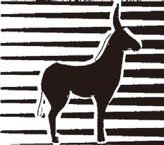

风险等级三中的投资类型几乎都是混合型产品。人们一方面期望保有风险等级二的安全，另一方面又希望达到风险等级四的收益率。这带来的问题是，我们如何通过单个产品描述，把它们识别出来。风险等级三中典型的产品有：混合型基金、房地产投资信托基金、保本基金、以可转换债券为主的国际定息债券基金、投资新兴国家债券的高息债券基金。

#### 混合型基金

正如上一章内容提到的，混合型基金中绑在一起的两种产品实际上完全不相干：定息债券和股票。此外，你完全无法得知，实际的混合比例是怎样的。这样就很难制订出缴税计划。因为利息和红利收益是必须要纳税的，而汇率收益则是免税的。这一点以后可能会发生改变。

另外，你无法对投资组合进行准确的风险分散。此外，各个混合基金之间几乎无法进行比较。因为该基金中的组合常常大不相同，所以，比较起来毫无意义。如果产品的清晰度对你很重要，我建议你最好直接投资股票基金和定息债券基金。

以足球队的比喻来看，混合基金的意义就如同全能的中场队员。他既要像后卫一样严防死守，又要具备强劲的进攻能力，最好还是球技高超的守门王。但是，每个球迷都知道，世界顶级球星的行列里，没有哪位球员可以成为全能王。和那些仅精于某一位置的球员相比，全能手总是会略逊一筹。他无法做到在防守的同时，还能实现多次射门。

#### 房地产投资信托基金（REITs）

REITs是Real Estate Investment
Trusts的缩写。这类基金不仅直接投资房地产，还主要投资股市交易中的房地产公司股票。美国人投资这类基金有一个好处，他们可以成为工商业不动产的所有者，但不必缴纳企业所得税。即REITs将应税和收益净值的95％以红利的形式派发下来，而其自身没有资本利得税。

REITs提供了除开放式不动产投资外，另一种不错的投资选择。因为它们的收益率长期保持在两位数以上。不过一定要将汇率风险考虑进去。此外，不要忘了，对欧洲的投资者来说，纳税政策是不同的，在欧洲必须缴纳资本利得税。

#### 保本基金

光听到“保本基金”这一名字，就已经让很多投资者为之兴奋了。他们认为，终于可以既享受高额收益，又不必冒任何风险。但可惜，这一美好愿望要落空了。

因为事实上，任何投资都要遵循一个法则，那就是高收益总是和高风险相伴而行的。我们应该先看看该基金提供的保证到底如何。它们有以下几种不同的形式：

●保证在投资到期后，投资者至少可以赎回全部资金（扣除相关费用）。

●保证在投资期限内，投资者可能遇到的损失绝对不会超过资本总量的某个百分比。也就是说，投资者无论如何可以赎回至少90％的原始资本。

●保证提供一定的收益率。

●保证最低分红。不过，这点简直毫无意义，因为这本身就是投资者自己投入的资本衍生出来的。

作为投资者，你必须得清楚，这些保证都不是白送的
。只有陷阱里才会提供白送的肉。你当然得自己为这些保证买单。你投入的资金中，有一部分就是单纯用来构建这种保障的。这部分钱不仅无法为你工作，而且完全是有去无回。

为了履行保证，实际操作中，保本基金的经理常使用两种简单的策略：要么购买持有股票的卖出期权，要么用约3/4的资金购买风险较低的固定利息债券。通过复利效应，在债券到期之前达到要保证的金额。余下的1/4投到股票市场，即使这部分资金全部亏损，所保证的那个数额也不会受到减损。

小贴士

可以自己构建“保本基金”。为了上述的“保本手段”，你需要缴纳高额的手续费，这没有必要。你自己可以做得更好：把一部分资金投到风险等级二的产品中，另一部分则投到风险等级四到六的产品中。这样的投资效果会更好，而且在手续费上也更划算。

但是，保本基金更令人诟病的问题在于：保证的范围越广，你能获得的收益反而越低。
因为大多数的保本基金只让你享有50％～60％的实际收益。每一项保证都是以损失一定业绩为代价的
。

另外，只有当你持有的份额直到投资到期后，这些保证才有效。一旦你提前退出，一切保证便效力全无。顺便提一个有意思的事情，德国的基金公司不允许发行任何保本基金。所有在德国上市的这类基金都来自卢森堡。所以，不管听起来多么有吸引力，保本基金都不是值得推荐的产品。

#### 高息债券基金

这类基金包含来自新兴国家债券和其他资信度较低的定息债券。

这里的高收益主要来源于新兴国家债券的高利率。但是也要注意，该类投资的变数很大，高收益的背后往往就是高风险。此外，收益机会还产生于债券利率的降低和该国家支付能力的上升。如同普通定息债券基金那样，这两种情况都会带来汇率收益。但利益和风险并存，这也可能会导致汇率损失。

因此，在投资这类基金时，一定要准确了解基金中包含哪些债券。在这里，分散投资和基金经理的指导尤为重要。

##  风险等级四、五、六

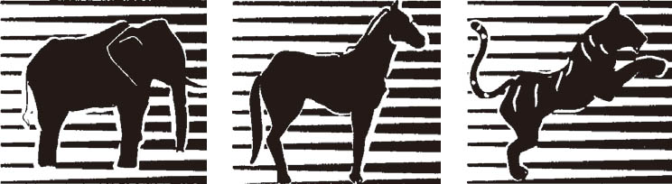

我们已经在第五章中提过这三种风险等级里最重要的基金。主要涉及单一证券投资组合、对冲基金、企业入股、指数股和股票基金。

但是由于这三个等级中提供的产品种类纷繁复杂，我们必须专门拿出一章的篇幅来介绍。因此，在第十章中，你将了解如何选到最合适的投资标的。在讨论其他基金之前，我们先简要地回顾一下大象、马、老虎级基金的特质。

大象级基金
是指大型的国际基金，其分散广，风险相对较低。它们可以作为投资组合的基础项目。如果你投资分散广泛，同时持有多支风险等级四中的国际股票基金，持有时间超过10年，你肯定可以获得12％以上的年平均收益率。你不必理会这期间出现的波动，想想科斯托拉尼先生的建议，安心地“睡上一觉”吧。

风险等级五中的马级基金
则需要多些照顾。这类基金只投资国际基金市场的某一领域或某个大型行业。其风险和收益机会都相应提高。这些产品构成了投资组合中有一定冲劲的部分。

最后是老虎级基金
。这是以小型产业或小区域为投资标的的基金。收益率非常丰厚，但同时也暗藏巨大的风险。如果想在短期内就实现资产翻番，你一定不能错过这类基金。

对这三种等级的基金而言，你必须拿出部分资金投到这三类产品中，否则你会错过很多获利机会。尤其是股票和以股票或企业股份为基础的投资标的都没有其他替代选择。每一种投资组合都应该包含这类产品。但是，你能够以及应当投资多少资金比例，这完全取决于你个人的标准。
至于每一种风险等级应占投资组合的比重多少，将会在下一章中做进一步讲解。

#### 基金还是指数股

我们经常听到这样一种说法：基金的绩效几乎永远不会像可以比较的指数股一样好。那为什么不干脆仿照指数股呢？所以，最好的方法就是直接购买指数股。指数是有价证券的一种组合，用来衡量特定市场的价格波动情形。我们可以把指数想象成一个市场的情绪晴雨表。

在德国最有名的指数有德国股票指数达克斯（DAX）、Tec
Dax（包含了新兴市场的最大股票）、道琼斯指数（Dow
Jones，由美国最大的30支股票构成）以及标准普尔500指数（S＆P
500，包括500支美国的大型股票）。大部分指数都是用该市场资本所包含股票和上市公司的市场总值加权计算所得。

我们要学会区分业绩指数和纯粹的股票价格指数。前者是指将各股票的股息立即转入再投资（例如达克斯和标准普尔500指数），后者则只是反映股价的变动情况（例如道琼斯指数和德国FAZ指数）。

事实上，股票基金的价格和这些指数有关。指数在一定程度上可以成为衡量成功的基准。如果想确定某支基金的投资绩效，除了把它和投资策略相近的基金比较外，你更应该尽可能地找出相关的指数，然后把该基金的成果和相关的指数基准做比较。

首先，我们来看看2003年一些基金的投资成果（前几年的平均成果也大致相同）。

·以达克斯指数来衡量，2003年，德国基金中有62种的绩效逊于相关指数，32种要优于指数。

·以欧洲斯托克50指数做基准，欧洲股票基金中有210种的绩效比指数差，137种的绩效比指数好。

·在美国，以标准普尔500指数为基准，比不上指数的基金有116种，优于指数的基金有61种。

由此可见，还是有很多基金的绩效好过相对应的指数。这些便是值得投资的产品。而业绩明显比指数差的基金就没什么吸引力了。因此，我们最好遵循指数的指向。

我们有3种选择：指数基金、类指数基金和指数股。

#### 指数基金

指数基金的经理大多认为，他对个股走势的判断不会比市场更为准确。因此，他不必耗费金钱去研究或者不断地买进卖出。另外还有一个优点是，对于投资者来讲，指数基金的走势比其他基金更具有透明度和可预见性。以前，指数基金都只存在于美国。直到2003年新投资法颁布后，在德国也可以申购这类产品。比起指数股，指数基金的手续费要高一些。因此，只在某些条件下，这类产品才有投资价值。

#### 类指数基金

第二种选择：类指数基金。在这里，指数可以在法律允许的范围内复制。根据2004年前的法律，基金经理投资一支股票的金额不能超过总资本的10％。此外，超过基金资本5％的各投资总计不能超过投资总额的40％。如此一来，便不可能准确地复制达克斯指数。因为光是那四家德国大公司的总和就已经占达克斯的40％以上。因此，类指数基金会用部分资金投资期权，而不全是股票。结果与投资真正的指数基金相比，就需要更大的费用投入。Fidelity
Euro Stoxx 50就是一支类指数基金。

#### 指数股

第三种选择是指数股。你买进在交易所开价的有价证券，能够使你直接参与到交易指数的上升趋势中。只要指数上升10％，股票的价格也会相应上涨。投资到期后，就可以按照当日的股价指数结算收支。不过，通常指数股没有分红或配息。因此，最多5年，指数股必定会丧失其费用优势（无申购费）。此外，它还有以下缺点：

第一，大多数情况下，指数股有投资期限限制。到期后你必须重新投资。这样，你又要承担一定的再投资风险。

第二，按照我的观点，这第二个缺点影响最大。一旦遭遇股市危机，指数股和积极管理的基金相比，前者带来的损失明显要大得多。因为基金经理的应变策略往往更灵活。特别是，他可以在股市崩盘前及时抛售有危险的股票，然后等到股价跌到最低，再适时出手低价回购。

当然，以上描述的是理想状况，即使是专业人士都不能完全保证。但是，基金经理对时机的把握通常是成功的。就如2000年3月新兴市场股价崩盘时，这一领域优质基金的损失比大盘指数要少10％～20％。

第三，这个缺点起决定性的作用。在某些地区，基金经理的业绩比相应的指数更高。比如说在亚洲，尤其是日本。1999年，你可以在日本投资刚从亚洲金融风暴中迅速回温的股票。这些股票上涨迅猛，就连交易所的“晴雨表”都跟不上它们的速度。日本的日经指数（Nikkei）受到的经济危机冲击还是很强。一些企业尽管有所恢复，但仍陷于严重的赤字之中。这种停滞不前或发展滑落，当然会严重地阻碍指数的增值。

同样的现象也存在于当时德国新兴市场基金中。因为，在这里，新市场的指数（Nemax
All Shares和Nemax
50）只能歪曲地反映新市场的真实情况。比如，2000年初，大约20种规模最大、增长最快的股票完全没有包含在Nemax
50中。尽管Nemax
50原本应当体现在高技术行业股中市场资本占有量最大的50种股票。而恰恰在这些市场中，基金经理能够轻易地战胜指数。

不过，症结在于是否能正确地选取指数。因此，最好又回到优质的国际股票基金上，并且认真听取专家的建议。

结论：指数股有一些缺点，不过影响并不是很严重。我认为，投资那些优于指数的基金比投资指数股要好。但是，如果指数行情高涨或者该市场没相对应的基金，那么你完全可以考虑投资指数股。

#### 契约证券

契约证券是近年来新发展起来的产品趋势，并且热度在持续攀升。正如投资基金那样，它也有很多不同的种类。有以上提到的指数股、各种股票、定息债券或商品和原材料。同时，之前讨论过的那些证券会以一种组合的方式呈现，比如，全球十大股份公司或20种股息最优的股票。契约证券的种类超过18000种。它给公众的印象是，不仅比投资基金费用更优惠，而且透明度更高。但请不要被迷惑了，因为其发行者是银行，当然不可能白白工作。从安全性上你应该想到，契约证券是银行发行的一种债券，而不是投资基金中的特种基金。这意味着，一旦银行破产，这些证券就将一文不值。此外，由于买进卖出和复杂的计算程序，实际产生的费用常常很不清楚。只有指数股例外，但它的份额只约占证券市场的5％。可能是在这个产品类别，尤其是一些产品设计上，除了银行，其他的自由经理人不能也不可以提供。如此，才能保证银行的垄断地位。

小贴士

请一定弄清楚，该证券都是什么种类，以及你是否真正了解其运作方式。

#### 对冲基金

真正的投资家绝不会像普通的投资者那样，仅满足于在行情上升时取得收益。因此，他们常常投资对冲基金。就如同篱笆能拦住羊群，不让它们到处乱跑，对冲基金也能防止投资遭遇过多的损失。在市场低迷时期，它会尝试通过期权来保障资产。对冲意味着一种保险，保护投资不受损失。一般的投资者无法做到这一点，而对冲基金可以在市场下滑时也保持获利，甚至是一笔不菲的收益。

当然，尽管对冲基金的设置很巧妙，但它也不可能提供百分之百的保证。实际上，一系列复杂的杠杆交易会导致对冲基金的风险升高。普通的投资者会认为这样的选择太冒险了。但真正的投资家不这么认为，他们觉得，“风险更高的是无法保障自己的资产”。这两种看法都无关对错。因为事物总是有两面性。我认为，更重要的是真正投资家所应该保持的原则，即不要一味地等待，而要积极地采取行动。不要满足于现状，而要勇于寻找新的出路。

对冲基金最初产生是为了保障投资不因汇差遭受损失，其目标在于，每年都要取得一些积极的成绩，因此已不断探索出各种不同的策略。

有些基金既可以在低迷（股价不涨不跌）的市场中获利，也可以在行情上涨期获益。有些人利用股票或债券在不同股市中的价差来获利，这叫作套利交易。假设X公司的股票在纽约华尔街股市的交易价格是10美元，而同样这支股票在法兰克福股市的价格是9.5美元，你可以在法兰克福买进这支股票，然后在华尔街卖出赚取收益（简化版举例）。套利交易可以算作最安全的策略。

因为对冲基金大部分是投资期货市场上的期权和期货（广义上意味着与时间打赌），所以其收益发展和股市行情走势无关。对股市（或两种投资产品之间）所表现出来的相关性有一种专门的度量值。相关性“1”表示两种投资形式发展趋势一致，相关性“-1”表示两者发展趋势正好相反，相关性“0”则表示两者完全无关。

不同于之前介绍的投资基金，目前还没有针对对冲基金的相关法律规定。同时，在德国也没有批准公开发行，除了屋顶型对冲基金。

由于对单个对冲基金没有法律约束和特别的监督机制，其信任度受到很大的质疑，特别是基金经理的能力和经验。因为这种投资形式在美国的发展时间最长，所以美国拥有该领域经验最丰富的投资经理。该类基金在2000年到2003年的股市危机期间，取得了令人瞩目的收益，之后才在德国流行起来。

对冲基金是投资组合中很重要的一部分。但是投资份额一定要适量，因为通常这类基金投资风险最大，当之无愧地被归于风险等级六中。

因此，你应当确切地知道你投资的到底是什么。因为这类基金的更新变化很快，难度也相对较高，你可以通过我们的网站实时了解最新的资讯和建议。

##  另一种选择：屋顶基金

在同一风险等级中，可供选择的投资产品就十分庞大。即使给大家标注出该等级里“最理想的”产品，能选择的范围依旧很广。所以，投资者最终只有3种做法。

第一，自己啃这只“酸苹果”，再详细地研究其内容。这虽然很值得一试，但会耗费大量的时间，而且这个方法并非适合每一个人。不过，如果你很感兴趣，这毫无疑问是一种不错的推荐。

第二，找一位优秀的顾问。虽然，你个人的理财计划和投资策略（比如风险分散）应当由你自己确定，但是在确定好之后，每种风险等级分配多少资金，以及优先选择哪些产品类型，可以让投资顾问来帮忙。对于如何来寻找顾问并和他合作，第八章中还会给出详细的介绍。

第三，或者也可以按照自己选定的风险等级来专门投资屋顶基金。下面我会给大家展示，屋顶基金有什么好处。

屋顶基金由多个单独的基金组成。基金经理就好比是资产管理者，他们从大量的基金中选出最优质的基金，然后把它们组合在一起。如果基金经理的工作出色，可以给投资者节省大量的时间和精力，而且收益会源源不断。

但是，请注意：不要把屋顶基金和伞式基金搞混淆了。所谓的伞式基金，是指同一家基金公司的所有产品归到一把大伞下，投资者可以在其中选择，并且能够低成本地自由转换组合同组内的基金。这一点优势虽然和屋顶基金有些类似，但有一个致命的缺点，即基金公司想把所有产品都推荐给客户，那其中也就包括相对较次的产品。因为没有哪一家基金公司可以在各领域都做到顶尖。此外，伞式基金中还混合了多个风险等级的产品。因此，建议你最好投资屋顶基金。这类基金不受公司限制，能给你提供最好的机会，让你真正地去发现所有基金公司中最好的产品。

这真的是很富有创造性的点子。德国从1998年4月1日起才允许发行屋顶基金。此后一直热度不减，成绩斐然。下面，我们来看看这类基金的优点和缺点。

##### 优点

●基金经理在该基金内部进行重组时，所需费用比个人投资者要少。因为通常金融机构申购基金单位时，不需要手续费。

●基金经理就像基金的收集者。他的主要工作就是观察和评估各种基金。因此，比起个人投资者，他有更多的机会挑选出更好的基金。

●从上面一点可以看出第三个优点：投资者无须事必躬亲，专家能给你搞定一切。这会为你节省很多时间。

●在申购屋顶基金时，你只需填写一张表。这就可以避免你在申购和管理基金的过程中，同海量的文件“作战”。而且，你也不必分类整理你定期收到的各种账目表。

●花很少的资金就可以在每种风险等级中投资15～20种不同的基金。否则，想做到这一点，一种风险等级里都要投资好几百万才行。

●然而，经济上最大的优点是：在屋顶基金内部进行重新组合不用支付税收（自2009年）。
这给投资基金带来很大的优势。想象一下，TecDax在4个月内猛涨了65％，然后专家预计每天都会发生逆转。那你该怎么办？抛售基金，你就必须缴纳收益税。继续跟进，但股市随时会崩盘，比起税费，你可能会损失更多的资金。这种两难的境地在屋顶基金那里从不会发生。基金经理可以随时为你提取收益，而且不必缴税。

##### 缺点

●由于屋顶基金等同于资产管理，那么它们的结构也应该相似。这表示各风险等级被混在一起。
追求安全的投资者，应该选择主要投资于定息债券而股票基金份额低的屋顶基金。而追求收益的投资者，应该选择以股票基金为主要标的的屋顶基金。

●选择屋顶基金要放弃可比性。
你想怎样衡量屋顶基金？你想如何评估其成果？而这正是屋顶基金的危险之处：费用模糊不清，缺少可比性以及毫不相关的产品混合在一起。

●有时费用也会相对过高。因此，投资者要注意每年管理费不能超过2％。此外，对于要求分红的基金，你应该严格审查。

小贴士

有少数屋顶基金没有上述的缺点。其每年的管理费用保持在2％以下，而且只投资单一风险等级的产品。这部分基金具备屋顶基金应有的所有优点，完全无可挑剔。你可以把资金投到适合自身投资个性的风险等级中。这种情况下投资屋顶基金，让你只花少量的时间，就可以收获最理想的分散效果。

#### 企业入股

除了买进股票和股票基金，还有一种参股企业的方式。在这里，我只着重介绍这其中专门给个人投资者设计的企业入股种类。要阐述直接个人投资入股成为参股人（比如有限责任公司），需要跳出之前的框架。

市面上提供的大多数企业入股都和一个项目或者不动产有关，并且有时间限定，而且经常会提供税收优惠政策。因此，大多数都作为所谓的节税模式被熟知，然后出现在很多投资组合里。但遗憾的是，鲜有成功的例子。

对此提一个建议：绝对不要因为税收优势去投资企业入股！不管针对哪种投资方式，都要抛开税收因素去做更全面的估算。接受这点建议，会让你少遇到很多不愉快的事情。

因为通常情况下，一个人常常只入股一家企业，所以这项投资大部分被归类成风险等级五或六。这种投资方式和投资基金的区别，仅从是否开通投资账户就可以看出。在这里，你无须开通投资账户，就可以购买股份。大多数情况下，参股企业需要签署一份成为合伙人的加入申明，同时由信托管理人联署。

##### 大部分企业入股是如何运作的呢

通常，没有在证券交易所挂牌上市进行股票交易的公司不会受到股市行情的影响。这从股市某些时段来看，可算作一点不可小觑的优势。

这些企业期望成长，并且急需为企业项目融资。为实现这一目的，会通过营销人员（通常是代办机构）从有限公司、两合公司、无限公司、股份公司的股票中，或者不同企业形式混合的股票中建立股票基金。然后这些基金会或多或少分享企业的成果。你可以很方便地购得该企业的股份。这其中，比较普遍的是入股两合公司，即有限责任股东和无限责任股东所组成的公司。你入股成为有限责任合伙人，享有一定的权利和义务。无限责任股东享有公司的直接经营管理权。

最重要的基本准则如下：

你可能按照持有股份获得利润分成，但如果企业亏损，你也会以投资额为限对公司债务负有限清偿责任。

可惜，合同中总会规定所谓的支付份额外追加款项的义务，这点已经害得很多投资者破产。所以，无论如何请留意，除了投资总额，一定不能再有额外追加款项的义务。

举个例子。在封闭不动产基金中就可能存在额外追加款项的义务。为了新建一个大项目（比如像购物中心这样的建筑），发起人会先成立一家公司（通常为两合公司）。一部分资金通过投资者募集，一部分从银行贷款。开支和收益状况会先基于对利率、租金水平、建筑的利用率和一些额外费用的预测来计算。如果实际情况中的生产成本、租金、利用率与预测情况有差异，当预测情况过于乐观时，你可能每个月还必须补钱进去。因为开支超过了收入。

在这种情况下，会采用租金担保的方式。这原则上是好的，但还要取决于担保人。如果担保方是一家大型银行，就比一家资产为25000欧元的有限责任公司保险得多。后者可能完全不会履行其义务。还有一点风险是租金担保的时限。担保可能某个时候就到期了，但是通常你的投资期限会久得多。

我不想给大家造成一种印象，认为企业入股尤其是封闭不动产基金很不好，或是觉得其风险很大。实际上，还是有一些非常不错的企业入股机会。我只是想给大家指出，不要听到什么就相信什么，要善于仔细核实和究根问底，了解存在的风险点。因为确实也存在很多低劣且可靠度低的项目。

同样，风险分散也适用这个类型：

投资的对象数量越多，风险就会越低。

因为入股一家企业所存在的风险总是高于投资股票基金，所以要弄清楚应该投资哪些项目，以及投入的资金要负担哪些费用。

下面是几点在企业入股时应当注意的事项：

1．你应当能够弄懂这类投资，并且首先要了解其盈利机制。

如果觉得太复杂，弄不明白，请你一定不要涉足其中。一项投资会有多种因素导致其情况错综复杂，但你可能往往不擅长。

2．开支和预估的收益应该有一定比例。在一项不动产投资存在30％可变支出（请参见第三点），而且满使用率时租金收益为6％的情况下，你可能就没什么利润了。如果投资了多个收益率为30％甚至更高的项目，一切又会大不一样。请一定保持清醒的头脑，好好地计算清楚。

3．可变支出（固定开支为营销、经营和管理，不受投资成果影响）越低越好，你在紧急情况下损失的钱就越少。

4．要先抛开税收优势。因为你开始投资后，它只能是锦上添花的补充，并且没有保障。

5．因为这涉及一项长期的投资，所以请选择自己相信且懂得评判的市场入股。不要被收益预测的假象蒙蔽了双眼。

你可以登录我们的官网（www.rsi24.de）查看所有投资领域的推荐产品。

图表6.4　一些常见的理财产品

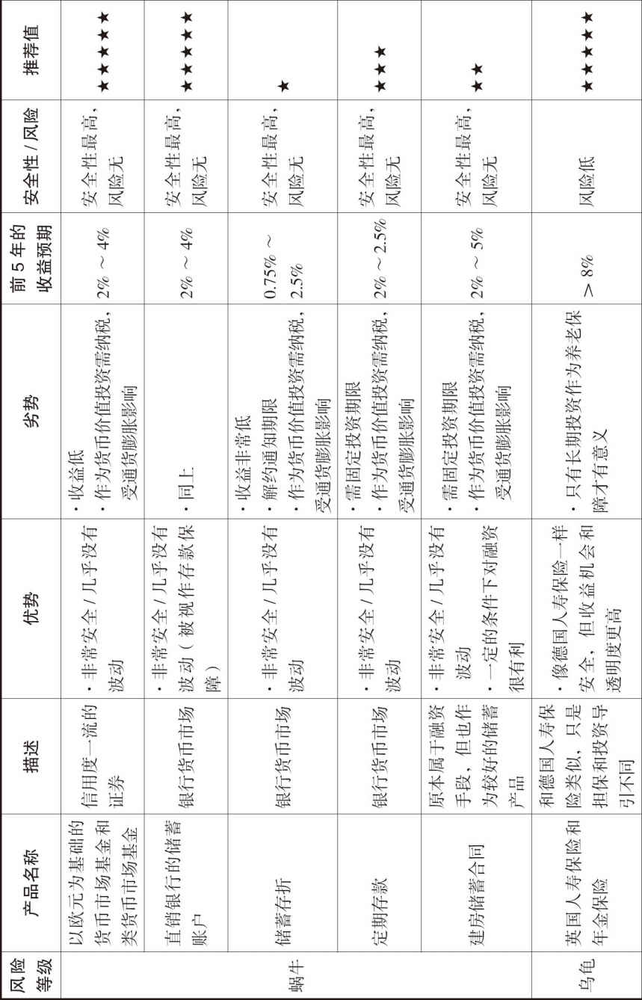
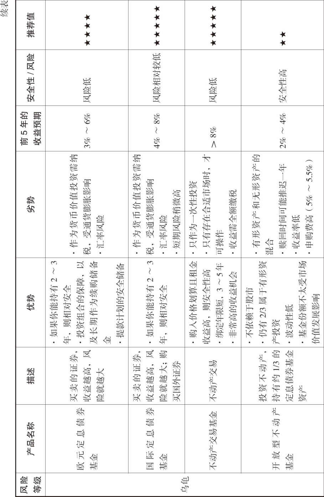
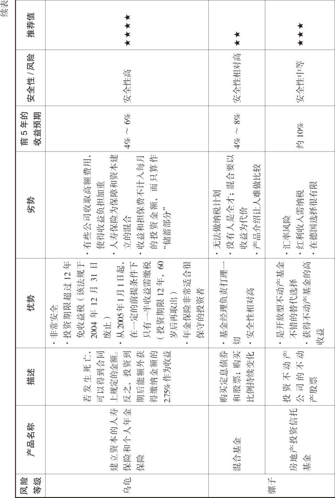
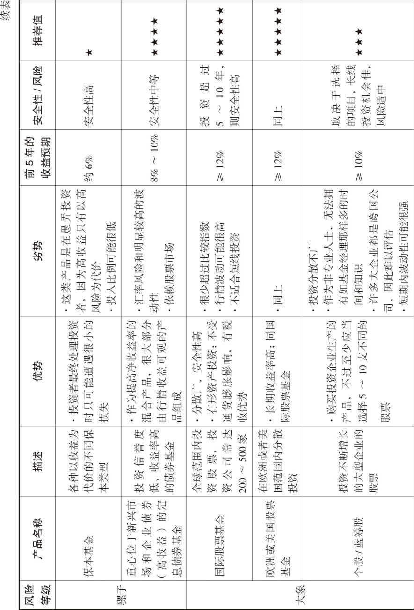
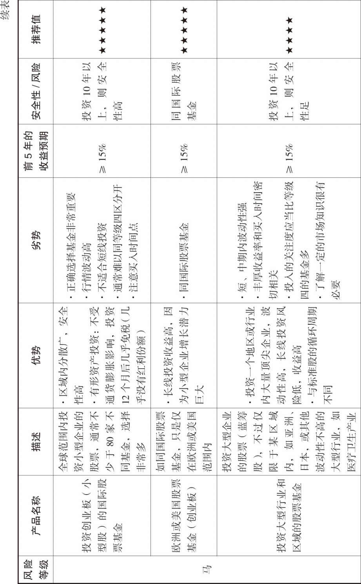
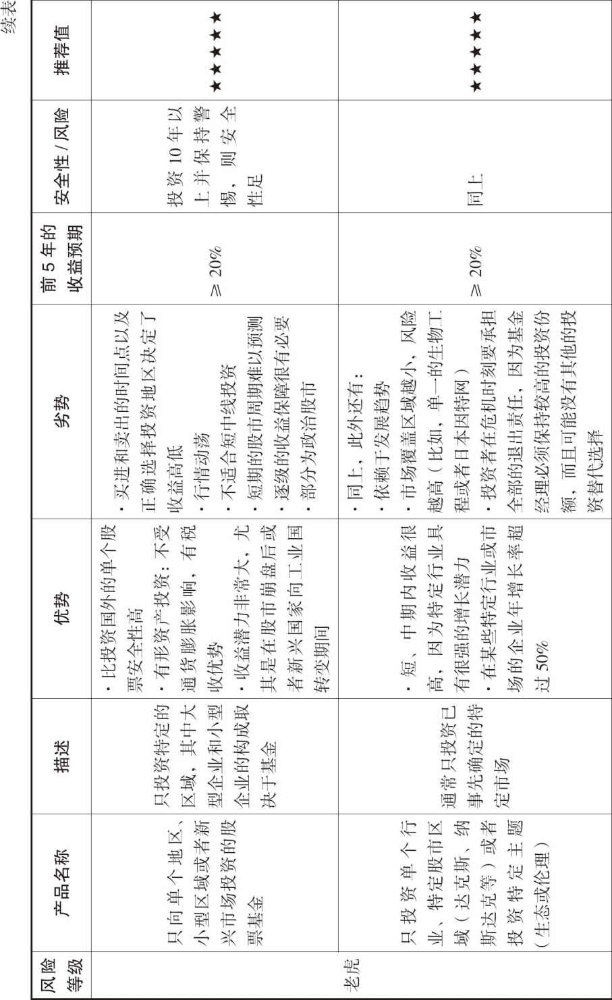
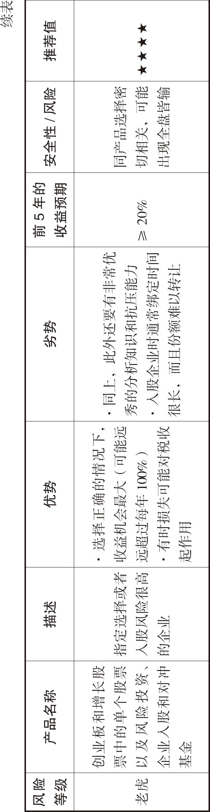

这些推荐都是依据2004年的市场情况而定。推荐度都是与同一风险等级内其他投资相对而言。\
★★★★★　　该风险等级内的最佳选项\
★★★★　　　非常好\
★★★　　　　不错，但有其他更好的代替选项\
★★　　　　　一般\
★　　　　　　不推荐

第二部分\
发展量身定制且收益可观的投资组合
================================

第七章\
你个人的投资组合和足球策略
==========================

年轻的时候可以经受住贫穷，\
但是年老后不能没有钱。

——田纳西·威廉斯（Tennessee Williams）

------------------------------------------------------------------------

本书第一部分里，我们共同探讨了成功投资的必要基础：对金融市场和前景的了解。除了学会正确评估各项投资的优缺点，你还知道了如何才能从中获利。

为了让大家能在投资的丛林中顺利地开辟一条道路，我们把所有的投资产品划分成6个风险等级，并确定了每一种风险等级中哪些产品是最理想的选项。通过“理论”基础的铺垫，我们才能够成功地进行投资实践操作。

##  实践操作

现在，是时候一起转战到实践操作阶段了。究竟怎样才能真正地实现8％、12％或者更高的收益率呢？毫无疑问，你的收益高低取决于你所做的投资决策。在投资时，你要进行系统性的操作。关键的问题在于：你应该怎样将资金分配到不同的产品上？

你也许已经知道了，没有对所有投资者都有效的“万能秘方”。更多时候，需要考虑许多不同的标准。然而，这对很多投资者甚至是投资顾问而言，都属于过高的要求。

在我看来，目前还没有一套容易理解且应用简单的体系，可以给每一个投资者的投资选择都提供依据。这里说的“依据”是指，可以把所有基本的个性特征都考虑在内。

##  四个关键问题

本书力求对以上情况有所改变。它给投资者和投资顾问提供同样的入门指南，让他们都能成功地实现投资目标。因为把对投资者最重要的个人准则囊括在较小的范围内，实际上并不困难。主要阐明以下4个问题便足矣。

1．你的目标有哪些？
（为了实现这些目标，你需要多少资金？何时得动用这些资金？）

2．你已有多少钱？
（能达到财务保障、财务安全或者财务自由吗？）

3．你属于哪一类投资个性？
（你属于哪一种风险投资类型？你的风险承受能力如何？）

4．你今年多大？
（你的投资年限有多长？）

本章将告诉你，怎样才能以最理想的方式把资金分配到各个风险等级中。为了尽可能准确地介绍这些内容，我们会把上述4个问题都考虑进去。我向大家承诺，你肯定会乐在其中。因为这可能是你第一次准确地了解你个人的投资个性。

##  三大优点

通过这样的方式，虽然无法保障你超出现实的巨额收益，但可以向你确认的是：只要你把以上4点都考虑进去，在5～10年内，你肯定能达成自己预定的收益目标。

这意味着，你将占有三大优势：

第一，你可以做好充分的计划
，并确定务实的目标。

第二，借助本书，实现这些目标 。

第三，你可以感受到舒适的心理状态
。因为你知道，财务的成功不是依靠偶然，而是因为遵循了周密严谨的体系。

现在，让我们依次来探讨这4条影响投资行为的准则：你的目标、资产状况、投资个性和投资年限。

##  致富准则一：你的目标

任何投资者都不可能脱离自身的现状和目标。这种情况下，你应该扪心自问：我的梦想和目标是什么，为实现梦想和目标我需要多少资金？

我在演讲时经常听到这样的回答：“我要缴纳养老金，用以保障自己老年生活无忧。”对此，请允许我做几点说明。

第一，比起祖父母和父母，我们退休后的时间可能要长得多。
20世纪，人类的平均寿命延长了30岁，并且还在延长：目前，平均每过10年，寿命会延长一年半。这意味着，你现在越年轻，理论上能达到的寿命便越长。

第二，今天，我们不只是寿命变长，连生活品质和健康状况都得到了大幅提升。
退休生活不再意味着无所事事。更多的是，这段人生作为一段生命的延展，可以让我们做很多真正想做的事情。这是一段自由的时间，让我们终于可以尽情地享受生活，弥补一直未实现的心愿。

当然，在我们拥有一定财力之前，处处节省不失为一种理智的行为。但是，当我们可以依靠资金的利息生活时，节省倒不如说是吝啬。吝啬的人从来无法实现真正的自由，与其说他支配金钱，毋宁说是他被金钱掌控。所以我们一定要好好规划一种有尊严地生活的生活方式。
钱应该成为我们生活中的一种支持力量，而不是限制力量。

第三，首要的问题不在于让自己平顺地度过退休和死亡之间的这段时期。更多的是，我们应当去思考能赋予我们意义和满足感的生活和工作
。我们应当有一方自己的小天地，把兴趣爱好变成职业，找到自己通往成功和幸福的道路。如果大多数人都去从事自己喜爱并且擅长的事情，那么我们自身和整个社会都能从中获益。不过，想要更加自然地去考虑这些事情，则需要人们达到财务自由，即能依靠资金的利息收益生活。

第四，我们只有在解决了生存问题之后，才有心思去探寻有意义的事情。大多数人都必须等到自身衣食无忧，才会去关心他人的困苦。在这个自我实现的阶段里，物质的目标已经失去了意义。我们更多的是要思索，什么才能给自己带来真正的满足。我们想要把事情变得更完美，想要回馈社会。
我们的视野变得越加宽阔。需要强调的是，当我们获得财务自由时，这一切都将变得更加容易。

第五，这一生活阶段不一定非得在退休后才开启
。为什么我们不将这样的生活提早10年或者20年呢？

从《财务自由之路》这本书的反响来看，达到财务自由对大多数人而言，都是值得追求的目标。当然，财务自由对每个人的意义会有所不同。不过达成此目标的体系是一样的，这一点我在《财务自由之路》中已有详细描述。

不管怎么说，这些目标激发了很多创造力，让我们更多地去思考生活的本质。我所定义的财务自由是指，你能够依靠投资资金的利息收益生活。下面简单地概括一下如何计算财务自由。

#### 如何计算财务自由的门槛

我们一定要对实现财务自由有所规划。经济生活中，也要遵循这个原则，那就是在生活中一定要力求完美。

1．首先，列出你所有的愿望清单。

2．在每一个愿望后写出实现该愿望需要的费用。

3．计算出每个愿望所需费用按月摊付的款项是多少。

4．列出你当前的所有开销，并计算出按月摊付的款项。

5．把这个总数乘以150，就可以得出“金鹅”的大小。

6．如果把通过这种方式得出的数额用以投资，以年收益率8％进行计算，你每月得到的利息收益就是你达到财务自由所需的费用。

##  致富准则二：你的财务状况

在清楚你的个人目标及知道你需要的资金之后，我们应当来检验你目前的财务状况。对此，我们无法简单地确定一个数值，以此界定是否达到富裕标准。因为，你的资金总是与你的愿望以及生活水平密切相关。

也许拥有40万欧元对一部分人而言已经算得上是富有，但对另一些人来讲，可能还不够“塞牙缝”。我们的欲望和生活水平是唯一的评判标准。通过这两个标准，我们要来评估，何时能感受到有保障、安全和自由。因此，我在《财务自由之路》中给积累财富定义了三个不同的阶段：财务保障、财务安全和财务自由。富裕程度要以时间阶段来衡量，而不是以金钱来计算。

请确认自己目前处于哪个财务阶段。阶段不同，所采取的投资策略也会大不一样。

#### 第一阶段：财务保障

先计算一下，假设你突然断了收入来源，你每月至少需要多少开支。然后再用这个数乘以6。通过这个方式，你可以计算出，在1欧元都不再多挣的情况下，只靠资本来维持半年生活，你需要多少钱。每个人都必须迅速拥有这份最低保障。我们必须要为我们的健康和家庭负责任。

公式：每月所需费用×6＝财务保障所需资金

这笔钱你应当投资在尽可能安全且随时能提取的地方，以备不时之需。我认识很多人，他们把这笔钱以现金的形式存在保险箱中。那里既安全，又保密，还能随时取用。此外，你还可以时不时地打开保险箱，欣赏欣赏。

你可能会提出反对意见，认为正是在手头资金较少时，为了更快地扩大资本，更应该投资风险等级六中的产品。但我坚决反对这一想法。因为一方面，投资在风险等级六中的钱，要长期甚至是数年保持不动。一旦出现财务危机，你可能无法尽快地提取这部分钱来维持生活。另一方面，在这一风险等级中的投资，有可能遭遇血本无归。你不能以这种方式来处理财务保障的这部分资金，那样你将会摧毁自己生活的基础。因此，我建议你保守地对待这笔资金。这一点我会在本章后面再加以介绍。

#### 第二阶段：财务安全

实现财务保障有许多好处：在非常时刻有足够的钱维持几个月的生活，你无须为生计担心。因此，你不必非得依靠某个上司或者客户生存。你会感觉到一股安全感，并且对不可预知的未来也做好了充分的准备。

不过也存在不足的一面：如果真的发生了“万一”，你必须即刻动用这笔钱。你虽然可以渡过危机，但也因此丧失了所有资本。因此，除了财务保障，你还需要实现财务安全。只有当你积累了足够的资本，能够靠利息生活时，你才算是达到了真正的安全。

在财务保障小节中，你已经计算出了维持每月正常生活的最低费用。请把这个数额乘以150，用计算得出的资金数额进行适当的投资，每月就能给你带来足够的利息收益，保障你的生活水平。在这里，假设年利率为8％。我们要尽可能地降低风险，毕竟这里涉及的是个人的财务安全。

公式：每月所需费用×150＝财务安全所需资金

举个例子。假设你每月需要3000欧元来维持你所希望的最低生活水平，那么，3000欧元×150＝450000欧元。如果你把这笔资金用于投资，年收益率为8％，那么一年的利息收益总额为36000欧元，平分到每月，则有3000欧元。这恰好是你维持最低生活保障所需的金额。理论上讲，你完全可以不用工作了。

#### 第三阶段：财务自由

很多人也许对达到财务安全就已经非常满意了。然而，你可能想要更进一步达到真正的自由，实现自己的梦想。如果计算出实现财务自由需要的“金鹅”大小，你就知道实现梦想需要的成本。你知道吗？大部分人之所以无法实现自己的梦想，是因为他们从来没有考虑过，为了实现梦想他们该付出多少努力，以及圆梦的成本需要多少。

你千万不要也碌碌一生。请现在就赶紧行动起来，算算实现你所有愿望的费用。将这个数目除以50（如果是不动产，除以120），就可以算出每个月应负担的费用。把这笔费用加上每月生活的开销，得出的数字就是实现真正的自由每月所需的金额（在《财务自由之路》的第十二章中，这部分内容有更详尽的描述）。现在来算一算实现财务自由所需的金额：

公式：达到真正自由每月所需费用×150＝实现财务自由所需资金

请总结一下实现各个阶段所需的金额：

阶段一：财务保障：\_\_\_\_\_\_欧元

阶段二：财务安全：\_\_\_\_\_\_欧元（资本额）

阶段三：财务自由：\_\_\_\_\_\_欧元（资本额）

现在，请明确你处于哪一阶段。每一个阶段都对应你要为之努力的目标。

假设，你需要50万欧元来实现财务安全，现在已有23万欧元。那么根据我们的计算方法，你正处于第二阶段。因为你已经达到了财务保障，现在正在为财务安全而努力。请在这里记录下你所处的阶段。注意：自己住的房产不计算在内。我们在前文讲过，自己使用的不动产属于奢侈品。你拥有一份这样的房产很好，但不应该把它归为投资资产，因为它完全无法给你带来任何收益（第一章有相关内容）。

我处于阶段\_\_\_\_\_\_。

我正在为实现财务\_\_\_\_\_\_努力。

##  致富准则三：你的投资个性

理想的投资策略不仅和你的目标和资产状况有关，而且很大程度取决于你的风险承受能力。这一点上，很多投资顾问考虑得都不是很充分。大多数时候，他们只是询问客户：倾向于安全型还是冒险型的投资组合。客户如果决定不了，就会被推荐一个中等风险等级的投资组合。这显然太随意了。尤其是他们还很少确切地弄明白，究竟安全型、冒险型和中等风险投资的界定是什么。

因此，我设计了下面这个风险测试。通过这个测试，你可以真正精确地评估自己的风险承受能力。只有基于这样的测试结果，我们才可以确定出有信服力的投资策略。这项测试不会耗费多少时间，我真心地希望你能抽出时间来完成。否则，你的投资选择也许真的太随意了。而“随意”必然会损害你的最终目标。

#### 风险测试

回答下列问题，选出最接近你的观点和行为的答案。

1．对我而言，最糟糕的事情莫过于损失钱。因此安全对我是最重要的。

完全同意：□4\
基本同意：□3\
既不同意也不反对：□2\
不太同意：□1\
完全不同意：□0

2．我认为高收益是最重要的，为此我愿意承担高风险。

完全不同意：□4\
不太同意：□3\
既不同意也不反对：□2\
基本同意：□1\
完全同意：□0

3．我的年龄为：

30岁以下：□0\
31～40岁：□1\
41～50岁：□2\
51～60岁：□3\
60岁以上：□4

4．我认为，年龄越增长，人们越应该投资安全性高的产品。因为我们更需要用钱，在股市下跌期间，我们没有太多的时间等待股市再次回升。

完全同意：□4\
基本同意：□3\
既不同意也不反对：□2\
不太同意：□1\
完全不同意：□0

5．如果一种投资产品承诺带来高收益，即使完全不了解它，我也会购买。

完全不同意：□4\
不太同意：□3\
既不同意也不反对：□2\
基本同意：□1\
完全同意：□0

6．我会借钱来投资一个回报率很高的项目。

完全不同意：□4\
不太同意：□3\
既不同意也不反对：□2\
基本同意：□1\
完全同意：□0

7．我觉得长线投资很无聊。我宁愿冒高风险去投资高收益的短线产品。

完全不同意：□4\
不太同意：□3\
既不同意也不反对：□2\
基本同意：□1\
完全同意：□0

8．我并非孤身一人。在投资时，我必须考虑自己的家庭，因此我操作时会更谨慎。

完全同意：□4\
基本同意：□3\
既不同意也不反对：□2\
不太同意：□1\
完全不同意：□0

9．出现亏损完全不会击垮我。我会依旧准备好去承担高风险。

完全不同意：□4\
不太同意：□3\
既不同意也不反对：□2\
基本同意：□1\
完全同意：□0

10．我的座右铭是：贫穷源于缺乏勇气。因此敢于冒险是我的天性。

完全不同意：□4\
不太同意：□3\
既不同意也不反对：□2\
基本同意：□1\
完全同意：□0

11．如果我的投资出现行情下跌，我会寝食难安。

完全同意：□4\
基本同意：□3\
既不同意也不反对：□2\
不太同意：□1\
完全不同意：□0

12．对于我来说，高风险就如同放到汤里的盐。它让生活不再单调乏味，变得紧张、刺激。

完全不同意：□4\
不太同意：□3\
既不同意也不反对：□2\
基本同意：□1\
完全同意：□0

13．我会一直保持做比较。为了获得高收益，这一点很有必要。因为市场总是处于持续不断的变化中。

完全不同意：□4\
不太同意：□3\
既不同意也不反对：□2\
基本同意：□1\
完全同意：□0

14．如果我投资的一部分资金出现全数亏损，但只要剩下的部分持续保持高于平均水平的收益，就不会对我产生特别的影响。这恰恰就是游戏的一部分。

完全不同意：□4\
不太同意：□3\
既不同意也不反对：□2\
基本同意：□1\
完全同意：□0

15．和钱打交道时，我总是比较轻率。

完全不同意：□4\
不太同意：□3\
既不同意也不反对：□2\
基本同意：□1\
完全同意：□0

16．不愿意付出，就没有收获。因此，我准备将一半的资金用于高风险类的投资。

完全不同意：□4\
不太同意：□3\
既不同意也不反对：□2\
基本同意：□1\
完全同意：□0

17．我只通过不懈地存钱来获得自己希望的财富。冒风险对我来讲是多余的。

完全同意：□4\
基本同意：□3\
既不同意也不反对：□2\
不太同意：□1\
完全不同意：□0

18．波动的市场行情和危险的投资状况会让我整天心神不宁。我会时刻提心吊胆，寝食难安。

完全同意：□4\
基本同意：□3\
既不同意也不反对：□2\
不太同意：□1\
完全不同意：□0

19．我认为股市非常恐怖。那里就像一个超级膨胀的投机泡沫，随时会随着一声巨响爆炸。

完全同意：□4\
基本同意：□3\
既不同意也不反对：□2\
不太同意：□1\
完全不同意：□0

20．我满足于现状。人不能太贪心。傲慢和贪婪会让人失去理性，这必然遭到惩罚。

完全同意：□4\
基本同意：□3\
既不同意也不反对：□2\
不太同意：□1\
完全不同意：□0

21．我认为，把大部分的钱存入存折或者投资固定利息的有价证券是非常不理智的行为。因为通货膨胀和税收会蚕食本就微薄的收益。

完全不同意：□4\
不太同意：□3\
既不同意也不反对：□2\
基本同意：□1\
完全同意：□0

22．我非常害怕损失，所以我能接受银行拿我的钱去发财。重要的是，我可以得到内心的安稳。

完全同意：□4\
基本同意：□3\
既不同意也不反对：□2\
不太同意：□1\
完全不同意：□0

23．我完全没有财运。如果冒险进行投资，可能我会损失得更多。

完全同意：□4\
基本同意：□3\
既不同意也不反对：□2\
不太同意：□1\
完全不同意：□0

24．股票和股票基金就像赌博。虽然可能会有赚钱的时候，但对我来讲太没把握了。

完全同意：□4\
基本同意：□3\
既不同意也不反对：□2\
不太同意：□1\
完全不同意：□0

25．我的人生哲学可以用下面的话来总结：“我唯一真正后悔的事情，就是那些我没有去做的事。”因此，我也会拿钱去冒可以估算的风险。

完全不同意：□4\
不太同意：□3\
既不同意也不反对：□2\
基本同意：□1\
完全同意：□0

26．一个在投资中不愿冒险的人，只能和资本主义的优惠政策擦身而过。

完全不同意：□4\
不太同意：□3\
既不同意也不反对：□2\
基本同意：□1\
完全同意：□0

27．只要风险足够分散，就不会发生什么事情。因此，我可以安心地用一部分资金去从事高风险投资。

完全不同意：□4\
不太同意：□3\
既不同意也不反对：□2\
基本同意：□1\
完全同意：□0

28．我的意志不像其他人那样强大。因此我宁愿首选安全。

完全同意：□4\
基本同意：□3\
既不同意也不反对：□2\
不太同意：□1\
完全不同意：□0

29．我喜欢让生活和所有的事情都处于自己的掌控之中。我的钱也不例外。

完全同意：□4\
基本同意：□3\
既不同意也不反对：□2\
不太同意：□1\
完全不同意：□0

30．我只会投资不会造成损失的产品。

完全同意：□4\
基本同意：□3\
既不同意也不反对：□2\
不太同意：□1\
完全不同意：□0

31．我不喜欢变化。我宁愿一切都按部就班。这会让我感到安全和安心。

完全同意：□4\
基本同意：□3\
既不同意也不反对：□2\
不太同意：□1\
完全不同意：□0

32．我已经不记得上一次冒高风险是什么时候了。

完全同意：□4\
基本同意：□3\
既不同意也不反对：□2\
不太同意：□1\
完全不同意：□0

33．不愿意冒险的人，终将一事无成。他自己也只有碌碌无为，一无是处。这点也适合投资上的风险承受度。

完全不同意：□4\
不太同意：□3\
既不同意也不反对：□2\
基本同意：□1\
完全同意：□0

34．我不担心周期性的行市调整。让我感到害怕的是，再一次爆发像1929—1934年那样的世界经济危机。因此，投资股票时仍会有一些不安。

完全同意：□4\
基本同意：□3\
既不同意也不反对：□2\
不太同意：□1\
完全不同意：□0

35．关于世界经济危机即将到来以及投资泡沫即将破灭的新闻报道完全不会影响到我。

完全不同意：□4\
不太同意：□3\
既不同意也不反对：□2\
基本同意：□1\
完全同意：□0

36．我认为金融崩溃是一次很好的投资机会。即使媒体到处传播世界经济整体下滑，我也能镇定地开展投资。

完全不同意：□4\
不太同意：□3\
既不同意也不反对：□2\
基本同意：□1\
完全同意：□0

##### 评分

每一个方框后有对应的分数。请将你勾选的方框后的分数加在一起。

我的得分为：\_\_\_\_\_\_\_\_\_\_\_\_\_\_

原则上，得分越高，你越应该投资风险等级较低的产品。
反之，得分越低，你就越能选择风险等级较高的产品。分析如下：

##### 132～99分：投资个性A

你有非常强烈的安全需求。
你的谨慎也许让你免遭许多危险和轻率导致的错误。作为一名投资者，你也同样首先考虑安全因素。

未来，你想保持的投资方式是：把安全永远放在第一位。这有一个好处，就是你几乎不会遭受损失。但这同时也隐藏了两个危机。

第一，安全意识强的人往往不喜欢变通。
他们最喜欢持续投资那些已经了解多年的产品。同时，他们一直咨询同一位银行顾问。但是在这期间，金融市场却在持续发展。现在，有一些产品不仅安全，还能带来更高的收益。比如，购进以新兴国家债券为主的定息债券基金或较小比例的国际股票基金也算不得轻率。

第二，容易偏离你的投资目标。
你可能无法积累足够的资金，这个风险与拥有动态的资产组合体系而遭遇一些小的股市回落相比，影响甚至更大。

可能解决的办法是：拿一小部分钱进行风险稍高一些的投资。这样一来，你还是能感觉到安全，但同时能获得更好的收益。

##### 98～66分：投资个性B

基本上，你属于相当保守的人和投资者。你倾向于避开风险。
你不喜欢草率行事，投资的重点多为保守的产品，如储蓄存折、人寿保险、建房储金契约和定息债券。

但是，你愿意用一小部分资金去购买相对安全的股票和股票基金。至少，你没有完全排斥这些产品。你的安全观无疑会让你避免犯下粗心的错误。但是，你可能也不会去关注那些风险不高，收益却还不错的产品。

因为你的投资主要在于货币价值产品。
请再想想，你是否打算更加均衡地分配投到货币资产投资和有形资产投资上的资金。你可以放心地把40％的资本用于活跃的有形资产投资，比如股票、股票基金和企业入股。为此，你承担的高风险微乎其微，但你的收益至少能提高50％。

##### 65～32分：投资个性C

冒险是你生活的一部分，但你不必做什么轻率的行为。
作为投资者，你可以选择保守和活跃结合得很好的投资组合。

对你而言，在有形资产投资和货币资产投资之间进行适当的分配是很有必要的。
你在投资产品的选择上非常灵活，并且对新产品的态度也很开放。不过你应该注意，只能选择那些你喜欢并且真正了解的产品。

作为一名宁愿承担风险期待也不会逃避的投资者，比起保守的同时代者，你将能继续获得更为可观的收益。但是你应该明确一点，不要太过冒险。以下两个观点会对你有所帮助。

第一，你应该确保，随时有足够的现金储备可供使用。这样你就能有足够的流动资金，购买资本市场上的“特价产品”，而且，这也能给你的投资组合提供安全保障。

第二，你应该征询专家的建议，以确保你坚决执行已经确立的投资计划。

##### 31～0分：投资个性D

你酷爱冒险。
极限运动、高风险的职场生活和高度活跃的投资方式都是你生活的一部分。对你来讲，没有绝对的安全，有的只是机会。你从不感到担心。对你来讲，生活要么是一场刺激的冒险，要么毫无价值。作为投资者，你想获得尽可能高的收益。为此，你也会有意识地承担风险。大多数情况下，你也将获得超高的收益回报。

许多人会惊叹你面对风险时毫不在意的态度。你可能倾向于把大部分资金都投资在高风险的领域，有时候甚至是你全部的资金。敢于冒险有多么重要，在冒险时失去理智就有多么危险。
如果你总是轻率地做决定，那么长期来看，你不会得到好的发展机会。赌博可能给你带来一时的胜利，但长此以往，意气用事的玩家只会失败。

如果你处于这种危险境地，以下3点会对你有所帮助。

第一，你最多只能把40％的资产用于高活跃度的投资。剩下部分中，至少20％投资不动产，10％投资定息债券。
切记不要借钱来扩张投资。

第二，你应该把投资目标以书面的形式写下来。
一旦实现目标，就该把它们抛售出去。千万不要被贪欲麻痹了大脑。

第三，对你来讲，有一名固定的投资顾问非常重要。
你可以和他约定，在紧急情况下，他会给你提供保护。

此外，我建议你定期重复做一下风险测试。我们的风险意识是不断变化的。由此，我们在各个风险等级中的资金分配也要相应地改变。

##  致富准则四：你的投资年限

除了投资目标、资产状况和你的风险接受度以外，你的投资年限也对资产的分配有很大的影响。你能够或者说愿意多长时间不去动用这笔资金？在你需要这笔资金之前，它能为你工作多长时间？
你的年龄可能是衡量你投资年限的一个很好的指标。如果已经知道你想要实现财务自由的准确时间，或者说你打算从什么时候开始依靠投资收益生活，你就可以得出关于投资年限的准确答案。

假如你想以年龄为基准，那请你在风险测试分数的基础上，相应地加减。

0～30岁：-10分

30～55岁：±0分

55岁以上：+10分

举个例子，假设风险测试中你的得分为63分，那么你的投资个性属于C类。如果你年龄超过了55岁，必须在63分的基础上加上10分，得出总分为73分。那么，现在你的投资个性就变成B类，你的资产分配也应该有所改变。

#### 年龄不是唯一的决定性因素

也许你的年龄并不能（或不足以）确定你的投资年限。通常存在的情况是，你打算或者必须迅速回笼资金，或者是你能够特别长时间不去动用这笔资金，与年龄没有直接关系。

显然，我们可以得到这样的结论：

你打算或者必须回笼资金的时间越早，你所投资产品的风险等级应该越低。反之，你越是能够长时间不去动用这笔资金，就可以选择风险等级越高的产品。

你再考虑一下，你打算什么时候提取这笔资金。然后用这一点取代年龄因素，在风险测试分数的基础上进行加减。

你预期需要资金的时间为：

最多两年后：+25分

3～5年后：+15分

6～7年后：+5分

8～9年后：±0分

10～14年后：-5分

15～24年后：-15分

25年后或更长：-25分

顺便提醒一下，如果你有一笔钱，最多在2年或3年后就要用以进行大型采买（比如汽车），或者用以特别支出（比如税收），这笔钱就不应该算进你的投资资产中。举个例子，你一共有40万欧元的资产，一年内其中5万欧元要用来纳税，那么你的实际总资本只有35万欧元！

这个投资年限的测定方法比之前的年龄计算法更准确。它也比那个众人皆知却毫无意义的旧规则更精准，即“100减去年龄等于应该在股票或者股票基金上的投资百分比”。之所以说更准确，是因为以前的规则没有考虑到投资者的投资个性，并且个人的目标也没有被纳入计划当中。

当你知道你什么时候打算或者必须用到这笔资金，那么你的投资年限就不能根据年龄来确定，而是要按照上述的测定方法。（注意：要么基于你的年龄，要么基于你的用钱计划，在风险测试分数的基础上进行加减。一定不要进行重复的加或减！）

现在，请写下进行相应加减后的最后结果：

你风险测试的分数为：\_\_\_\_\_\_\_\_\_\_\_\_\_\_\_\_

加或减的分数为：　　\_\_\_\_\_\_\_\_\_\_\_\_\_\_\_\_

最终的总分为：　　　\_\_\_\_\_\_\_\_\_\_\_\_\_\_\_\_

你的投资个性属于哪一类？

·投资个性A（132～99分）

·投资个性B（98～66分）

·投资个性C（65～32分）

·投资个性D（31～0分）

##  个人投资策略之路

针对策略的选择，我们已经提出4条至关重要的准则。下面来总结一下。

1．你已对自己的目标有了定位。至少你现在已经清楚你是否想要达到（或者你已经达到）财务自由。你还确定了实现目标究竟需要多少钱。

2．你已明确自己的财务状况，知道自己处于财富积累的哪一阶段（财务保障、财务安全、财务自由）。

3．你已认识了自己的投资个性。

4．你已知道根据自己的年龄和投资期限，应该怎样加减分数。

请在下方填入你的结果：

1．你希望实现财务自由吗？　　　　　　\_\_\_\_\_

2．你处于阶段一、阶段二，还是阶段三？\_\_\_\_\_

3．你的投资个性属于哪一类？　　　　　\_\_\_\_\_

##  一个粗略的投资推荐

你已经清楚决定个人投资策略的4条准则。在此基础上，我们可以确定如何才能以理想的方式把资产分配到6个风险等级中。

请先记录下你目前的资产分配情况。

你的投资资产总额为：\_\_\_\_欧元

其中不动产份额为：\_\_\_\_欧元＝占资本总额的\_\_\_\_％（自己使用的不动产不计入内）

你的货币资产（投资资产总额扣除不动产份额）为：\_\_\_\_欧元，现在把这部分看作100％的整体。

关于投资资产总额
，需要说明如下几点。

1．投资资产总额：应该用来通过投资或者投机方式“钱生钱”的总金额。其中包括出租的投资型不动产。

2．营业资产：如果你是某一家公司的老板或者合伙人，你应当把这部分资产与个人投资的资产升值部分区分开。

3．奢侈资产：包括珠宝、汽车、艺术品、自己使用的房产等。

你的货币资产（按照100％计算）如何分配到每一个风险等级中？

为此，请先在下列图表中列出你所有的投资。在后面标注你目前的资产并结合第五章的内容确定每项投资所属的风险等级。此外，计算出每项投资占货币资产的比例。

假设，你的货币资产为40万欧元，请在下列图表中填入这笔资产投资的不同去向。举个例子，人寿保险（产品），8万欧元（当前价值），二（风险等级），20％（占货币资产总额的比例）。

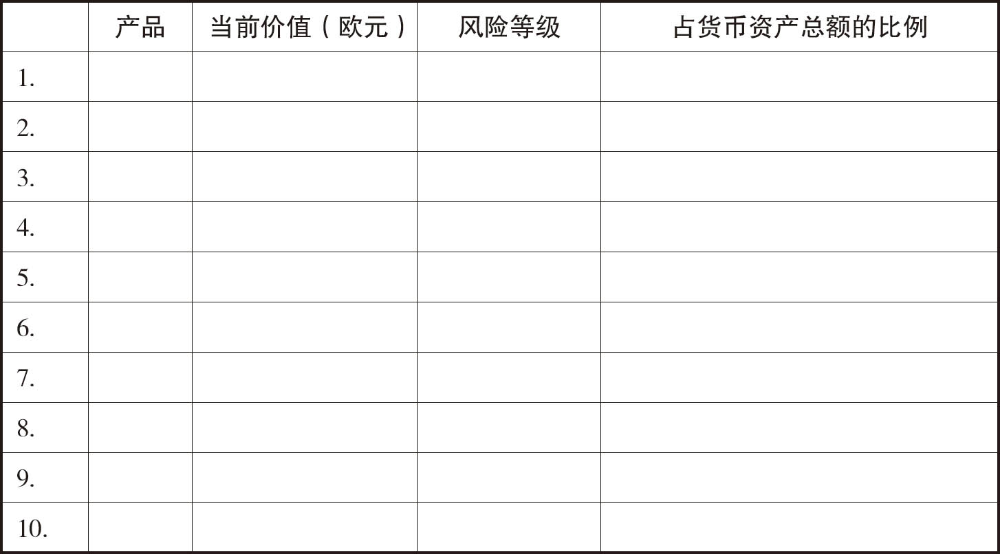

说明：人寿保险的回购价值为8万欧元，占货币资产40万欧元的20％。所以，人寿保险属于风险等级二中的产品。

请将你的资产分配情况归纳如下：

出租的不动产份额：\_\_\_\_\_\_

风险等级一＆二　　\_\_\_\_\_\_

风险等级三＆四　　\_\_\_\_\_\_

风险等级五＆六　　\_\_\_\_\_\_

现在我们来看看，按照4条致富准则计算出来的理想的风险分配情况。在这里，我们也把出租的不动产考虑在内。从下列的图表中，你将知道不动产应该在你的投资资产总额中占多少比例。

##  如何分配你的资金

在资金的分配上，我们要参考投资个性分类。首先，要做一点重要提示
。为了操作简单，我做了以下区分：不动产份额是以投资资产总额来计算的，在减去不动产份额后，把余下的货币资产分配到各个风险等级中。但是，此时余下的这部分货币资产又被看作一个100％的整体。这种操作方式是为了让计算简单化。不动产占的百分比有很多种，无法迅速地调整成最优的情况。因此，你可以先从货币资产的分配开始，简单地把不动产的份额扣除。

举个例子，假设沃利·沃尔哈本特的投资个性为C，目前处于第二阶段（正在创造财务自由），现有资产为60万欧元。

下列对应的图表显示为：沃利·沃尔哈本特的不动产份额应当在25％～40％之间。因此，匹配的资产则是在15万欧元～24万欧元这个区间内。假设沃尔哈本特先生有一处出租的不动产，价值为20万欧元。那么，余下的40万欧元可以按如下的方式分配到6个风险等级中（现在这40万欧元视为100％来计算）。

40％（＝16万欧元）分配到风险等级一和二中，另外的40％（＝16万欧元）分配到风险等级三和四中，最后，剩余的20％（＝8万欧元）分配到风险等级五和六中。

#### 投资个性A（132～99分）

类型A的投资者有明显的安全需求。这类型的资产分配情况如下：

<table class="kindle-cn-table-body" data-cellspacing="0">
<colgroup>
<col style="width: 25%" />
<col style="width: 25%" />
<col style="width: 25%" />
<col style="width: 25%" />
</colgroup>
<tbody>
<tr class="calibre17">
<td rowspan="2" class="kindle-cn-table-th">投资类型</td>
<td colspan="3" class="kindle-cn-table-th">资产状况</td>
</tr>
<tr class="calibre17">
<td class="kindle-cn-table-th">财务保障（阶段1）</td>
<td class="kindle-cn-table-th">财务安全（阶段2）</td>
<td class="kindle-cn-table-th">财务安全（阶段2）</td>
</tr>
<tr class="calibre17">
<td class="kindle-cn-table-dg1">最大不动产比例</td>
<td class="kindle-cn-table-dg1">0％</td>
<td class="kindle-cn-table-dg1">35％～60％</td>
<td class="kindle-cn-table-dg1">40％～60％</td>
</tr>
<tr class="calibre17">
<td class="kindle-cn-table-dg1">风险等级一＆二</td>
<td class="kindle-cn-table-dg1">70％</td>
<td class="kindle-cn-table-dg1">50％</td>
<td class="kindle-cn-table-dg1">50％</td>
</tr>
<tr class="calibre17">
<td class="kindle-cn-table-dg1">风险等级三＆四</td>
<td class="kindle-cn-table-dg1">30％</td>
<td class="kindle-cn-table-dg1">50％</td>
<td class="kindle-cn-table-dg1">40％</td>
</tr>
<tr class="calibre17">
<td class="kindle-cn-table-dg1">风险等级五＆六</td>
<td class="kindle-cn-table-dg1">0％</td>
<td class="kindle-cn-table-dg1">0％</td>
<td class="kindle-cn-table-dg1">10％</td>
</tr>
</tbody>
</table>

#### 投资个性B（98～66分）

B类型的投资者同样对安全也有较强的需求。但是，他们基本上准备好承担经过仔细考虑和权衡的小风险。这类型的资产分配情况如下：

<table class="kindle-cn-table-body" data-cellspacing="0">
<colgroup>
<col style="width: 25%" />
<col style="width: 25%" />
<col style="width: 25%" />
<col style="width: 25%" />
</colgroup>
<tbody>
<tr class="calibre17">
<td rowspan="2" class="kindle-cn-table-th">投资类型</td>
<td colspan="3" class="kindle-cn-table-th">资产状况</td>
</tr>
<tr class="calibre17">
<td class="kindle-cn-table-th">财务保障（阶段1）</td>
<td class="kindle-cn-table-th">财务安全（阶段2）</td>
<td class="kindle-cn-table-th">财务安全（阶段2）</td>
</tr>
<tr class="calibre17">
<td class="kindle-cn-table-dg1">最大不动产比例</td>
<td class="kindle-cn-table-dg1">0％</td>
<td class="kindle-cn-table-dg1">30％～50％</td>
<td class="kindle-cn-table-dg1">40％～50％</td>
</tr>
<tr class="calibre17">
<td class="kindle-cn-table-dg1">风险等级一＆二</td>
<td class="kindle-cn-table-dg1">60％</td>
<td class="kindle-cn-table-dg1">50％</td>
<td class="kindle-cn-table-dg1">40％</td>
</tr>
<tr class="calibre17">
<td class="kindle-cn-table-dg1">风险等级三＆四</td>
<td class="kindle-cn-table-dg1">40％</td>
<td class="kindle-cn-table-dg1">40％</td>
<td class="kindle-cn-table-dg1">40％</td>
</tr>
<tr class="calibre17">
<td class="kindle-cn-table-dg1">风险等级五＆六</td>
<td class="kindle-cn-table-dg1">0％</td>
<td class="kindle-cn-table-dg1">10％</td>
<td class="kindle-cn-table-dg1">20％</td>
</tr>
</tbody>
</table>

#### 投资个性C（65～32分）

对于C类型的投资者，他们的投资完全是保守和活跃产品的混合体，也就是由货币资产和有形资产构成的投资。这类型的资产分配情况如下：

<table class="kindle-cn-table-body" data-cellspacing="0">
<colgroup>
<col style="width: 25%" />
<col style="width: 25%" />
<col style="width: 25%" />
<col style="width: 25%" />
</colgroup>
<tbody>
<tr class="calibre17">
<td rowspan="2" class="kindle-cn-table-th">投资类型</td>
<td colspan="3" class="kindle-cn-table-th">资产状况</td>
</tr>
<tr class="calibre17">
<td class="kindle-cn-table-th">财务保障（阶段1）</td>
<td class="kindle-cn-table-th">财务安全（阶段2）</td>
<td class="kindle-cn-table-th">财务安全（阶段2）</td>
</tr>
<tr class="calibre17">
<td class="kindle-cn-table-dg1">最大不动产比例</td>
<td class="kindle-cn-table-dg1">0％</td>
<td class="kindle-cn-table-dg1">25％～40％</td>
<td class="kindle-cn-table-dg1">30％～35％</td>
</tr>
<tr class="calibre17">
<td class="kindle-cn-table-dg1">风险等级一＆二</td>
<td class="kindle-cn-table-dg1">55％</td>
<td class="kindle-cn-table-dg1">40％</td>
<td class="kindle-cn-table-dg1">30％</td>
</tr>
<tr class="calibre17">
<td class="kindle-cn-table-dg1">风险等级三＆四</td>
<td class="kindle-cn-table-dg1">35％</td>
<td class="kindle-cn-table-dg1">40％</td>
<td class="kindle-cn-table-dg1">35％</td>
</tr>
<tr class="calibre17">
<td class="kindle-cn-table-dg1">风险等级五＆六</td>
<td class="kindle-cn-table-dg1">10％</td>
<td class="kindle-cn-table-dg1">20％</td>
<td class="kindle-cn-table-dg1">35％</td>
</tr>
</tbody>
</table>

#### 投资个性D（31～0分）

D类型的投资者对风险无所畏惧。不过他们有时候会有些草率地去冒险。因此，他们最多只能把40％的资产投到活跃度高的产品上，并严格遵照确定好的投资目标，而且尽可能和操作谨慎的投资顾问合作。他们的资产分配情况如下：

<table class="kindle-cn-table-body" data-cellspacing="0">
<colgroup>
<col style="width: 25%" />
<col style="width: 25%" />
<col style="width: 25%" />
<col style="width: 25%" />
</colgroup>
<tbody>
<tr class="calibre17">
<td rowspan="2" class="kindle-cn-table-th">投资类型</td>
<td colspan="3" class="kindle-cn-table-th">资产状况</td>
</tr>
<tr class="calibre17">
<td class="kindle-cn-table-th">财务保障（阶段1）</td>
<td class="kindle-cn-table-th">财务安全（阶段2）</td>
<td class="kindle-cn-table-th">财务安全（阶段2）</td>
</tr>
<tr class="calibre17">
<td class="kindle-cn-table-dg1">最大不动产比例</td>
<td class="kindle-cn-table-dg1">0％</td>
<td class="kindle-cn-table-dg1">25％～30％</td>
<td class="kindle-cn-table-dg1">20％～30％</td>
</tr>
<tr class="calibre17">
<td class="kindle-cn-table-dg1">风险等级一＆二</td>
<td class="kindle-cn-table-dg1">50％</td>
<td class="kindle-cn-table-dg1">40％</td>
<td class="kindle-cn-table-dg1">20％</td>
</tr>
<tr class="calibre17">
<td class="kindle-cn-table-dg1">风险等级三＆四</td>
<td class="kindle-cn-table-dg1">35％</td>
<td class="kindle-cn-table-dg1">30％</td>
<td class="kindle-cn-table-dg1">30％</td>
</tr>
<tr class="calibre17">
<td class="kindle-cn-table-dg1">风险等级五＆六</td>
<td class="kindle-cn-table-dg1">15％</td>
<td class="kindle-cn-table-dg1">30％</td>
<td class="kindle-cn-table-dg1">50％</td>
</tr>
</tbody>
</table>

#### 请比较一下

在前面的空图表中，你已经列出自己投资的产品，并且把它们归类到相应的风险等级中。然而，你真正做到了吗？请不要只把本书看作一本理论教材。

请让这本书成为引领你理财致富的教练。

你已经知道致富不是什么难事。正如哲学家西尼加的一句哲言：“不要因为困难，就不去做它。事情之所以难，是因为我们没有去做。”你必须先有一个大概的了解。

如果还没有做过了解，请回到前面的图表那里，记录下你的投资情况。

现在，你可以比较实际的投资情况和理想情况了。有不一致的地方吗？你想改变目前在各风险等级中的投资分配来优化你的投资组合吗？

##  针对投资组合做必要的调整

大部分自己主动进行的调整都相对比较容易开展。不过你还是应该好好权衡，并且先咨询一位优秀的顾问。怎样才能找到优秀的顾问，以及在哪里才能找到，我会在下一章给大家做介绍。

但很麻烦的一点是，你不动产的比例太高了。这一点是德国人普遍犯的错误。一家商业银行的调查显示，在投资组合中，不动产的平均占比高达71％！这的确是太高了。

请你想象一下，大多数情况下，你绝不可能把房产卖掉来调整投资的比例。
通常情况下，人们不愿意这样做，也不可能在短期内卖得好价钱。

但是，你还可以选择抵押贷款。
你可以考虑接受新的或者高额度的抵押贷款。如此一来，你不必卖掉房产，在保有房产的同时，还可以拿自己的钱去从事投资，取得定期的收益，而不是让钱绑死在不动产上无法流动。这一方法尤其适合自用住宅，也就是闲置的奢侈资产。

我在和卡罗拉·费斯特尔合著的《女子理财从入门到精通》一书中，已经详细地描述，尽可能少地把个人资本投到自用房产和外租房产上是明智的行为。在第十四章中，我还会再次对此加以阐述，并且说明怎样以基金为基础进行清偿贷款。

我们可以确定，只有很少的情况会阻止你积极地投资，会阻止你调整投资组合以获得更好的收益。决定权在你自己。请想一想，你在依照4条致富准则（目标、资产状况、投资个性和投资年限）进行投资组合分配后，可以享有的3个好处：

第一
，你可以做好充足的计划，并且确定出深思熟虑后的目标。

第二
，借助这本书，你将实现你的目标。

第三
，你会拥有非常棒的感受。因为你知道，你之所以理财成功，不是因为偶然的运气，而是遵循了一套精密设计的体系。

为了能让你更容易入门，我想再一次运用足球队这个例子。通过这个例子，可以非常直观地展现策略是多么重要。这个例子很适合用在日常的投资实践中，同时易于理解。

##  足球策略

我在第五章已把投资组合和足球队做了简要的比较。接下来我将进一步深入介绍。首先给不熟悉足球的读者简单讲解一下这项运动的规则。

一支足球队上场有11名正式球员，外加至少4名替补队员。他们分别担任守门员、后卫、前卫和前锋。两个球队在足球场上对抗，并想办法把足球尽可能多地踢进对方球门。由于两队的目的相同，但足球只有一个，由此发展出了很有趣的游戏策略。

最简单的布阵是1-3-4-3阵形：1名守门员、3名后卫、4名前卫和3名前锋。守门员镇守己方球门，必须阻挡对方进球。后卫负责防守，防止对方前锋射门进攻。前卫是进攻的组织者，负责为进攻做准备，并提前破坏对手的攻击步骤。前锋则应该越过对方防守，为射门而战。

球赛给所有参与者带来的首先应该是乐趣。球员可以为了取胜而努力，或者抱着力求不败的心态。但更好的是，要为了取得胜利去拼搏。

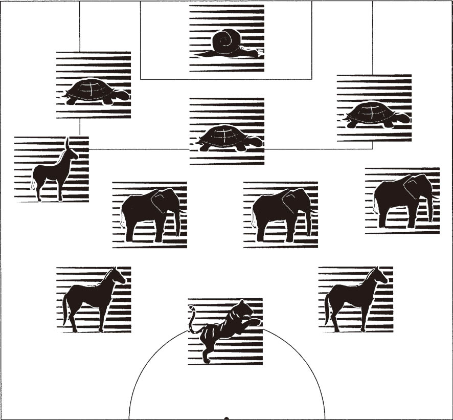

做你自己的财务主席。

现在来比较一下你的投资组合。你是足球团队（自己的财务）的主席，整支足球队（投资组合）属于你。你可以根据自己的目标和需求选择球员（风险等级一至六中的产品），同时确定策略和目标。当然，你也可以聘请一位私人教练（投资顾问）做指导。

这些策略中有短期的（每一次比赛）、中期的（一个季度或一年），还包括长期的策略（5～10年）。每一次的目标当然和你比赛的级别有关。从地区性比赛，到县市比赛，再到全国比赛，比赛的等级也会和财务来源密切相关。在达到财务保障前，只能参与地区性比赛。当你达到财务安全，便可以晋级到县市比赛。最后，只有当你真正达到财务自由或打算达到财务自由时，才能打进全国赛。你的财务水平越高，组建的团队（教练和球员）就越专业。

也就是说，你要明确自己想不断提升参赛层次还是只想保持当前水平。

正如之前提过的，你组合的球队还有一个竞争对手，由贪婪、无知、恐惧、急躁、愚昧等组成。也就是说，我们能否在资产市场上屹立不倒，很大程度上在于我们是否能控制住自己的情绪。

在这期间，我们必须面临风云突变的股市状况、利率条件和经济发展。对此，你需要有优秀的球员和灵活善变的教练。如果他们无法胜任提升的要求，就必须适时更换掉。不过，首先你要控制住自己的情绪。

##### 6种球员类型

球员就相当于风险等级一到六中的投资产品：蜗牛是守门员，乌龟是后卫，骡子和大象组成前卫，马和老虎就相当于前锋。分配的百分比要取决于你的投资个性，因为你要让自己在比赛中感到愉快和有趣。你参与的比赛等级要通过你目前的资产状况和所处的财务阶段来决定。你还可以决定是否要聘请教练（投资顾问）来指导。

现在，你只需要再确认这11名球员和替补队员应该具备哪些特质。对风险分散普遍适用的原则在这里也很关键，那就是：混合。你可以增加前锋人数，或是增加防守队员，采取保守策略。

选择守门员
非常简单。他只需要做好防守就行了。起初，简单地利用银行储蓄账户就足够了，之后慢慢地投资有税收优势，同时又很安全的货币市场产品。

选择后卫
就有了一定的困难。除了防御型的后卫，如投资型不动产、欧洲定息债券、个人年金保险，还有进攻型的具有攻击力的后卫，比如英国年金保险、不动产基金和新兴国家的定息债券。在这一类型中，把受股市影响（债券基金）和不受股市影响（不动产）的产品相互混合就非常重要。因为这里有你很重要的储备金，其中一大部分资金应该能够随用随取，并且不会产生损失。

前卫
是对整场比赛影响最大的部分。因此，这部分要尽可能灵活地设置。除了相对保守的球员，如投资基金坦普顿成长基金和先锋基金（或者其他国际股票基金）或者风险分散广泛的企业入股，你还应该搭配国际股票基金这种进攻型的选手，如有对冲性质的基金，这可以让你在股市低迷或下跌时期仍然可以获利。

前锋
应该要根据自己的偏好来选择。你必须要喜欢马级和老虎级产品，相信并且理解它们。否则你可能非常容易失望。因为在这一层次，首先要求的就是耐心和信任。想象一下，你如果买了一支基金，该基金只投资俄罗斯市场。在接到第一条坏消息时（这种情况在新兴国家经常出现），你就认为肯定会下跌，惊慌失措地抛售出去。但一段时间后，这支基金开始大幅上涨，你错失了良机。所以，非常重要的一点是，你要在投资时至少保持中性或者良性的感觉。一名前锋可能在比赛结束前才会有所表现，但对比赛起到了决定性的作用。优秀的前锋可能常常射偏球，但可能在关键时刻临门一脚。除了国家、地区和行业的特殊基金，你也可以选择对冲基金或者各种企业入股。让自己跟着内心的感觉来做就行了。

##### 11+4

顺便说一下，11名球员加4名替补队员组成一支球队，并不是偶然的组合。你的投资也不应该涉及太多不同的产品。

能否实现目标首先取决于这11名球员的质量。正确的策略和不同球员的有效组合也同样重要。正确的策略搭配水平中等的球员，远比糟糕的策略搭配世界上最好的球员更容易成功。

投资和足球两者都属于团体赛，其中每一个组成部分，如队员、教练和主席，也就是投资产品、顾问和投资者，都必须好好地互相配合。

##### 教练

因此，你应该好好考虑，哪一个人该负责什么工作。从某个比赛或者从某一个资产状况开始，聘请优秀的教练就意义重大，即使这要花费一些钱。你不可能在取得事业成功的同时兼顾投资优化管理，除非你是一名专业的投资顾问。主席的任务是筹集资金，监测目标的实现。教练则必须通过签约、组合球员，优化队伍，调换不合格队员，同时及早发现和善用优秀球员的潜能，来实现主席布置的任务。

如果感到目前的教练无法胜任工作，你必须要重新更换一名。但不要忘了，即便是最优秀的教练（顾问）也不可能每场比赛都赢。就投资理财来说，长期的成功（10年）才是最重要的。你只有遵循这点原则，特别是在极端的经济状况下，才有可能实现你的目标。达成目标可能会需要2～3年，这并不可怕。整个生命就是起起伏伏的循环过程，不可能长期处于上升期。

#### 总结：足球策略

如果满足以下几点，那么在资本市场上，你便可以实现目标：

1．确定你的目标，并以书面形式写下来；

2．不要低估你的对手（情绪）；

3．找到优秀的教练（请见下一章内容）；

4．在教练的指导下，确定一套安全的投资策略；

5．根据个人的目标、资产状况和策略分配你的资金（守门员、后卫、前卫和前锋）；

6．通过教练，选出每一个风险等级（球队部分）中最理想的产品（球员）；

7．最重要的是，不要逃避身为财务主席的责任。

这些策略复杂吗？如果你投入精力去做，就不复杂。你可以学会多思考，考虑一些可能性。考虑到大多数读者属于投资个性C类，我选择这一类举个例子。假设你拥有10万欧元货币资产，已经实现了财务第一阶段，也就意味着你正在为财务安全努力，那么你可以这样布局：

|  |  |  |  |
|----|----|----|----|
| 球员类型 | 风险等级 | 所占投资组合的百分比 | 欧元 |
| 守门员 | 一 | 15 | 15000 |
| 后卫 | 二 | 40 | 40000 |
| 前卫 | 三和四 | 35 | 35000 |
| 前锋 | 五和六 | 10 | 10000 |

请理解，本书无法直接推荐投资产品，因为资本市场处于不断地变化中。但你可以随时访问我们的网站（www.rsi24.de）获取最新的投资推荐。

现在你可以通过这套简单的体系来构建和优化你的投资。下一章我会接着提供一些有益的建议，来帮助你选择适合自己的投资顾问。

------------------------------------------------------------------------

致富能量贴士

- 在确定理想的投资策略时，应该要考虑到个人的4条准则：

1．目标

2．财务状况

3．投资个性

4．投资年限

- 依照确定的体系进行投资的人，能够完善地进行计划，实现投资目标，并且在这期间保持良好的心态。
- 追求生活意义和实现梦想的生活，不必等到退休后才开始。
- 根据不同的投资个性类型和投资者所处的财务阶段（财务保障、财务安全、财务自由），应该有差异性地开展投资。对此，请参考下列针对不同投资个性提供的投资建议一览表。

投资个性A类的投资风险分配情况

<table class="kindle-cn-table-body" data-cellspacing="0">
<colgroup>
<col style="width: 25%" />
<col style="width: 25%" />
<col style="width: 25%" />
<col style="width: 25%" />
</colgroup>
<tbody>
<tr class="calibre17">
<td rowspan="2" class="kindle-cn-table-th">投资类型</td>
<td colspan="3" class="kindle-cn-table-th">资产状况</td>
</tr>
<tr class="calibre17">
<td class="kindle-cn-table-th">财务保障（阶段1）</td>
<td class="kindle-cn-table-th">财务安全（阶段2）</td>
<td class="kindle-cn-table-th">财务安全（阶段2）</td>
</tr>
<tr class="calibre17">
<td class="kindle-cn-table-dg1">最大不动产比例</td>
<td class="kindle-cn-table-dg1">0％</td>
<td class="kindle-cn-table-dg1">35％～60％</td>
<td class="kindle-cn-table-dg1">40％～60％</td>
</tr>
<tr class="calibre17">
<td class="kindle-cn-table-dg1">风险等级一＆二</td>
<td class="kindle-cn-table-dg1">70％</td>
<td class="kindle-cn-table-dg1">50％</td>
<td class="kindle-cn-table-dg1">50％</td>
</tr>
<tr class="calibre17">
<td class="kindle-cn-table-dg1">风险等级三＆四</td>
<td class="kindle-cn-table-dg1">30％</td>
<td class="kindle-cn-table-dg1">50％</td>
<td class="kindle-cn-table-dg1">40％</td>
</tr>
<tr class="calibre17">
<td class="kindle-cn-table-dg1">风险等级五＆六</td>
<td class="kindle-cn-table-dg1">0％</td>
<td class="kindle-cn-table-dg1">0％</td>
<td class="kindle-cn-table-dg1">10％</td>
</tr>
</tbody>
</table>

投资个性B类的投资风险分配情况

<table class="kindle-cn-table-body" data-cellspacing="0">
<colgroup>
<col style="width: 25%" />
<col style="width: 25%" />
<col style="width: 25%" />
<col style="width: 25%" />
</colgroup>
<tbody>
<tr class="calibre17">
<td rowspan="2" class="kindle-cn-table-th">投资类型</td>
<td colspan="3" class="kindle-cn-table-th">资产状况</td>
</tr>
<tr class="calibre17">
<td class="kindle-cn-table-th">财务保障（阶段1）</td>
<td class="kindle-cn-table-th">财务安全（阶段2）</td>
<td class="kindle-cn-table-th">财务安全（阶段2）</td>
</tr>
<tr class="calibre17">
<td class="kindle-cn-table-dg1">最大不动产比例</td>
<td class="kindle-cn-table-dg1">0％</td>
<td class="kindle-cn-table-dg1">30％～50％</td>
<td class="kindle-cn-table-dg1">40％～50％</td>
</tr>
<tr class="calibre17">
<td class="kindle-cn-table-dg1">风险等级一＆二</td>
<td class="kindle-cn-table-dg1">60％</td>
<td class="kindle-cn-table-dg1">50％</td>
<td class="kindle-cn-table-dg1">40％</td>
</tr>
<tr class="calibre17">
<td class="kindle-cn-table-dg1">风险等级三＆四</td>
<td class="kindle-cn-table-dg1">40％</td>
<td class="kindle-cn-table-dg1">40％</td>
<td class="kindle-cn-table-dg1">40％</td>
</tr>
<tr class="calibre17">
<td class="kindle-cn-table-dg1">风险等级五＆六</td>
<td class="kindle-cn-table-dg1">0％</td>
<td class="kindle-cn-table-dg1">10％</td>
<td class="kindle-cn-table-dg1">20％</td>
</tr>
</tbody>
</table>

投资个性C类的投资风险分配情况

<table class="kindle-cn-table-body" data-cellspacing="0">
<colgroup>
<col style="width: 25%" />
<col style="width: 25%" />
<col style="width: 25%" />
<col style="width: 25%" />
</colgroup>
<tbody>
<tr class="calibre17">
<td rowspan="2" class="kindle-cn-table-th">投资类型</td>
<td colspan="3" class="kindle-cn-table-th">资产状况</td>
</tr>
<tr class="calibre17">
<td class="kindle-cn-table-th">财务保障（阶段1）</td>
<td class="kindle-cn-table-th">财务安全（阶段2）</td>
<td class="kindle-cn-table-th">财务安全（阶段2）</td>
</tr>
<tr class="calibre17">
<td class="kindle-cn-table-dg1">最大不动产比例</td>
<td class="kindle-cn-table-dg1">0％</td>
<td class="kindle-cn-table-dg1">25％～40％</td>
<td class="kindle-cn-table-dg1">30％～35％</td>
</tr>
<tr class="calibre17">
<td class="kindle-cn-table-dg1">风险等级一＆二</td>
<td class="kindle-cn-table-dg1">55％</td>
<td class="kindle-cn-table-dg1">40％</td>
<td class="kindle-cn-table-dg1">30％</td>
</tr>
<tr class="calibre17">
<td class="kindle-cn-table-dg1">风险等级三＆四</td>
<td class="kindle-cn-table-dg1">35％</td>
<td class="kindle-cn-table-dg1">40％</td>
<td class="kindle-cn-table-dg1">35％</td>
</tr>
<tr class="calibre17">
<td class="kindle-cn-table-dg1">风险等级五＆六</td>
<td class="kindle-cn-table-dg1">10％</td>
<td class="kindle-cn-table-dg1">20％</td>
<td class="kindle-cn-table-dg1">35％</td>
</tr>
</tbody>
</table>

投资个性D类的投资风险分配情况

<table class="kindle-cn-table-body" data-cellspacing="0">
<tbody>
<tr class="calibre17">
<td rowspan="2" class="kindle-cn-table-th">投资类型</td>
<td colspan="3" class="kindle-cn-table-th">资产状况</td>
</tr>
<tr class="calibre17">
<td class="kindle-cn-table-th">财务保障（阶段1）</td>
<td class="kindle-cn-table-th">财务安全（阶段2）</td>
<td class="kindle-cn-table-th">财务安全（阶段2）</td>
</tr>
<tr class="calibre17">
<td class="kindle-cn-table-dg1">最大不动产比例</td>
<td class="kindle-cn-table-dg1">0％</td>
<td class="kindle-cn-table-dg1">25％～30％</td>
<td class="kindle-cn-table-dg1">20％～30％</td>
</tr>
<tr class="calibre17">
<td class="kindle-cn-table-dg1">风险等级一＆二</td>
<td class="kindle-cn-table-dg1">50％</td>
<td class="kindle-cn-table-dg1">40％</td>
<td class="kindle-cn-table-dg1">20％</td>
</tr>
<tr class="calibre17">
<td class="kindle-cn-table-dg1">风险等级三＆四</td>
<td class="kindle-cn-table-dg1">35％</td>
<td class="kindle-cn-table-dg1">30％</td>
<td class="kindle-cn-table-dg1">30％</td>
</tr>
<tr class="calibre17">
<td class="kindle-cn-table-dg1">风险等级五＆六</td>
<td class="kindle-cn-table-dg1">15％</td>
<td class="kindle-cn-table-dg1">30％</td>
<td class="kindle-cn-table-dg1">50％</td>
</tr>
</tbody>
</table>

------------------------------------------------------------------------

第八章\
不要拒绝良好的建议
==================

“时间就是金钱”这句话如果是正确的，\
那么“金钱就是时间”同样有道理。

——博多·舍费尔

------------------------------------------------------------------------

你现在知道应该如何将资金分散投资到各个风险等级了。在第六章中，我们已经了解各风险等级内的最优产品类型。但究竟谁可以从每个风险等级中选出最好的产品呢？你应该为自己聘请一位专家，还是自己做出选择？

##  投资咨询：要或者不要

理所当然，你必须自己确定投资策略的基础。没有任何人能代替你给自己确定目标、投资个性以及其他一些个人实际情况。但是，专家往往具备普通投资者难以掌握的专业的产品知识。

尽管如此，还是有许多投资者提出这样一个问题：他们应该亲自操刀还是聘请一位投资顾问呢？我的建议是——你应该自己找出这个问题的答案。接下来，我会提出一些有助于你做出决定的问题。你的真实答案将会揭示出你是否需要一名投资顾问。

●你清楚成功投资的基本准则吗？你相信自己能够以轻松而严肃的态度去遵守这些准则吗？

●你确定自己能在股市崩溃时保持冷静吗？你知道这种情况下应该做什么，而且你是否真的会这样做吗？（你有没有充分了解1998年9月和10月发生的那次股灾？1997年至1998年亚洲金融危机期间，2000年2月至2003年3月的股市危机期间，你都是如何应对的？）

●如果你在那段时间还没有进行相应的投资，那么想象一下，你的资金可能会在短短数周之内贬值40％。专家在媒体上提醒大家注意下一次世界经济危机，并且与1929年经济危机的发展情况进行对比。对此，你会做何反应？你会加仓吗？还是继续观望？2003年初你是如何操作的，提高仓位还是降低仓位？

●你知道基本利率提高或降低对不同的定息债券基金有什么影响吗？

●你能清楚区分购入指数型基金和特种基金的最佳时机吗？

●你有足够的时间去持续观察基金的运行状态吗？你有兴趣吗？与你的金钱投入相比，你的时间投入值得吗？

●也许最重要的问题在于：在过去5～10年，你的投资组合是否打败过摩根-士丹利资本国际指数？

这些问题的答案其实很简单：如果你的投资组合真的打败过比较指数（摩根-士丹利资本国际指数），如果你具备全面的投资知识，时间充裕且对此兴趣浓厚，那么，就请你听从本书的建议继续前行。否则，你还是应该为自己找一位好的投资顾问。

你当然可以运用本书中的信息获得可观的收益。但是，一名优秀的投资顾问可以使你的收益更高。

##  善用你的时间

请允许我偏题说一下如何与时间打交道，关键取决于我们对于合理利用时间的理解。许多人将忙碌视为成功的标志，由此带来的结果就是——你的时间越来越昂贵、越来越紧张。压力、不满和疾病就是这种生活方式带来的结果。越来越多的人都有这样的感觉：他们还来不及做真正有意义的事情，生命就这样流逝了。他们越来越感到不自由。没有时间去找到真正的快乐和满足感。但实际上他们并没有浪费时间，浪费的只是那些有意义的时间
。

许多从事时间管理的咨询师会提出这样的问题：“在一天当中，我如何才能安排更多的事情？”其实，他们也忽略了最本质的东西。我们首先应该提出一个截然不同的问题：“我打算将哪些事情列入一天的计划中，哪些不列入
？”基于这一考虑，我在几年前就养成了一个习惯——（尽可能每天）问自己两个问题：

●别人哪些事情比我做得更好？

●我今天做的最后一件事是什么？

这背后隐藏着一个深刻的认知。在人类历史中，我们专攻自己擅长的领域，将自身不擅长的领域委托给其他专业人士，由此来不断改善自己的生活质量。也许你会提出两点反对意见。第一点：但是我得付给专家酬劳啊，这肯定没错。但更重要的是，你最终能得到什么。另外，以下说法也可以供你参考：

大多数人为了省钱而花费时间。\
成功人士为了省时间而宁愿花钱。

你可能提出的第二点反驳是：不同投资顾问之间，他们的建议不一致。这句话完全在理。我认为的专家并非传统意义上的专家，更多的是投资咨询师。我想先介绍一下这一区别，然后再回到这个问题上：如何找到一位真正优秀的投资顾问，你如何“测试”他，你们之间如何进行合作？

##  有的顾问并非真正的顾问

如果有寻找顶级顾问的诀窍，那就再好不过了。但是，非常遗憾，至少一眼看上去并没有发现任何明确的“指导说明书”。在德国，那些自称投资顾问的人是一个非常大的群体。目前还没有针对这一职业的专业测试。尽管如此，了解以下7组群体的划分还是会对你很有帮助。

第一类群体是投资奸商，指的是那些受过良好的销售技巧和心理战术培训的销售人员，虽然他们通常并没有真正的投资知识。他们使用巨大的利润去引诱客户，并利用潜在客户身上的人性贪婪。当然，以这种方式“投资”的金钱再也不会回来了。我甚至提都不想提起这一类群体。

第二类群体指的是那些主要
只售卖一种产品的销售组织
。这些销售组织往往与大型保险公司相关。出于个人经验，我非常了解这类组织的弊端。一方面，他们的销售能力远超过他们的专业产品知识（即使他们只销售单个或少数几个产品）。另一方面，这些公司中的销售人员大多都是兼职人员，也就是培训不到位的员工。你可能不会去缺乏培训的兼职实习医生那里看病。但这些组织中的其中几个正进行改革：真正的专业培训要有更广泛的基础。

第三类群体是固定聘用的投资顾问，他们属于银行或保险公司，一般情况下他们都受过良好的培训。他们中越来越多的人也在认真努力地去了解和考虑客户的需求。但公司要求顾问尽可能多地销售公司的产品，这也可能对投资者产生不利的影响。并不是说这些人本质上不好，相反，他们中许多人都很好。但有一点不容辩驳的事实：单单一家公司不可能拥有所有行业中最好的产品。理想的产品搭配只能通过你自己从多家公司的产品中进行选择。

请验证一下，你的银行顾问在多大程度上是你真正的顾问。他代表的是你的利益，还是他所在公司的利益？

此外，一部分银行还有几个值得批判的方法。首先，对有价证券的保管需要支付托管费，虽然这根本说不过去。因为银行唯一能保管的就是各有价证券的购买证明，而这些购买证明你应该尽可能自己保存。其次，这些定期交付的保管清单实际上并不清晰，要理解它，需要反复仔细研究。一些所谓的“清单”完全不知所云，以至人们会问这些清单是否具备必要的透明度。

第四类群体是独立的投资顾问和基金商店
。此处涉及的主要是那些不依附于基金公司的、专门研究投资产品的专家。这类投资顾问一般情况下是值得推荐的。他们大多受过良好的专业培训，对不同基金公司的大量产品驾轻就熟。你的金钱并不由他们管理，也就是说，投资顾问只是将各个基金公司推荐给你。如果这些顾问认真对待他们的职业（大多情况下他们确实如此），那么，他们就值得被推荐。

第五类群体是传统的资产管理者
。他们对于投资资金有直接的管理权限，也可以独立地对基金进行调仓。当然，他这样做的前提是投资者对他的高度信任和明确的基金购买协议。因为资产管理者通常能够为你购入“低价位的基金”，这无疑是一个很好的策略，这也为你节省了巨大的管理费用。但请你仔细考验一下你的资产管理者。好的资产管理者有自己的投资基金，请关注这些基金的发展趋势，因为毕竟是你要将自己的资金交由他管理。大多数情况下，可靠的资产管理者只接25万欧元起的投资业务。

第六类群体是注册财务规划师。他们一般是受过良好培训的顾问。他们的知识范围涵盖的产品广泛，具备的能力远远超过实际的投资领域（从保险领域到遗产分析领域）。他们的工作往往按时间计费。他们会非常系统地分析你的状况，并给你提出相应的投资修正建议。但并不是每一个顾问都会管理你的投资，生成的分析通常都十分表面化和理论化，不容易让人理解。这样的分析通常页数很多，而且人们不得不接受。我个人倾向于简洁明了、易于理解的总结性分析，最重要的是：切实可用、有指导意义的分析。

最后一类群体比较少见，主要指投资组合顾问
（投资组合：
对于那些真正想获得财务自由的人，这样的投入才是值得的。顾问：如同咨询一名设计师，设计师应客户需求做出草案）。其实，投资组合顾问属于独立顾问的一个分支，其差别在于：投资组合顾问自身非常富有，只为高级别的客户提供咨询服务。
用运动来类比就是：教练有很多，但顶尖的教练很少，他们只为最好的运动员提供培训指导。投资组合顾问相当于国家级和世界级的教练。

例如，他们清楚“普通”顾问并不能提供给你稳固且收益巨大的资金增值方法。投资组合顾问清楚那些对于大多数顾问和投资者来说难以发现的“秘密”——明显提升收益的特殊理财结构、特殊产品或特定杠杆。你也将获悉那些银行有意或无意对你缄默的信息。

如果拥有5万欧元的资产就可以享受这样的服务，那无疑很好。但是，这恐怕不符合成本效益原则。而且，如果你还在为财务安全而努力，那么此时去聘请一位顶级顾问也是没有必要的。你这样做并非利人利己，因为顶级顾问的专长在于大笔资金的运作，也只有在这种情况下，他们才能充分调动所有可能性。不过，也许你也能找到一支由投资组合顾问建议或管理的投资基金，借助他的能力在小笔资金的情况下盈利。

遗憾的是，识别这些优秀投资组合顾问的标准还不够清晰明了。至少他们接受的培训与普通顾问的培训一样，不够规范。当然，投资组合顾问会不断深造，并且拥有优秀的专家网络体系。但是，对于他们的理论知识掌握程度却没有客观可量化的证明。这一点虽然应该批判，但它实际上并不像第一眼看上去那么糟糕。因为对于你——投资者来说，终究只有两个有意义的客观标准：顾问自身是否富有？他是否具有多年从业经验？
真正作数的是一个人擅长与金钱打交道的实际证据，而非理论培训。假如打算明年攀登珠穆朗玛峰，那么你一定会向经验丰富的登山者寻求建议，最好是一名已经攀登过珠穆朗玛峰的人。我可以向你保证，如果你有一位投资组合顾问，你一定能清晰地感知到理论家与实践家的区别。在你首次打算咨询投资组合顾问时，完全有可能的是，你必须先主动上门拜访，因为这类顾问一般很少主动来找你（你的律师一般也不会主动来找你）。你可能觉得投资组合顾问收费甚高，也许确实很高。但我确信，你付出的努力和金钱都是值得的。

更多关于顾问费用的内容可以参考第十一章。

好的建议通常很贵，但是坏的建议会更贵！

##  如何找到自己的领航员

如果目前无法对顾问进行标准化的评价，并且最终也无法有这样的标准，要找到一位优秀的顾问可能就相当困难了。实际上，任何广告、任何标准的对照都无法给你更多的帮助。尽管如此，还是有一个可行的方法，与你找到优秀的律师、优秀的医生及各类其他专家的方法是一样的，那就是：向你的熟人和朋友打听。

找到顶级专家最好的途径就是“经人推荐”。

这里的推荐是指，一位满意的客户同时又是你信赖的人推荐的顾问。问一问你亲朋好友中那些非常富有的人，他们中极有可能有人认识优秀的投资组合顾问，他自己的资金也已交由这个顾问成功地进行了长期打理。

在这里，你再一次认识到，结识成功人士是多么重要。他们总是拥有广泛的专家网络，可以介绍你认识优秀的顾问。如果不认识这类人，也许你的税务顾问、律师、医生或协会主席能为你推荐一名优秀的顾问。

##  征询口碑

如果找到了顾问，但并非通过你信赖的人推荐，那你得向他现有的客户打听一些情况。
一个专业的顾问通常都乐于提供5～10位客户名单给你。作为聪明的投资者，你应该联系这些人，这样一来，你可以快速地对这名顾问的资历有一个印象。你可以向这些客户提出以下问题（当然这些问题同样也可以用来问向你推荐顾问的亲朋好友）：

1．你认识这位顾问多久啦？

2．你最喜欢他身上的哪一点？

3．你最不喜欢他身上的哪一点？

4．根据你目前了解的情况，你还会再次选择同一名顾问吗？（为什么？）

5．你对你目前的投资感觉满意吗？

6．他是否将你的目标、财产状况、投资个性、投资年限纳入考虑？

7．他遵守自己的承诺了吗？

8．他的服务如何？你是否能随时联系上他？

9．在你们合作期间是否发生过证券危机？他是如何应对的？

##  与顾问的首次面谈

请尽管将第一次面谈看作一次求职，对于双方来说都是。你们之间的化学反应得正确
，因为你们最终要打算进行多年的合作。你与顾问的每一次交谈都应该是快乐的。金钱是一个非常美好的主题，所以千万不要放弃这一快乐因素。你们双方都应该对此怀着良好的感觉，互相建立信任。

与顾问谈话的前提是——你得做好系统的准备
。因此，你应该仔细研究本书第七章。在此基础之上，你对于你的顾问来说，才是一位有能力的交谈对象。他也会在和你的谈话中获得更多的乐趣，会更认真地对待你，付出更多的努力。以下问题清单，可作为第一次面谈时的指导手册。

1．你的职业发展过程是什么样的？你从事这一行多久啦？（让你的顾问自己介绍一些他的信息）

2．你有多少客户？他们中是否有人与我情况类似？

3．你是如何收取报酬的？如果我更换顾问会怎么样？

4．你的投资哲学是什么？你的专长是什么？

5．你如何评估风险？你是否根据顾客不同的目标、财产状况、投资个性、投资年限确定不同的投资组合？

6．你提供的客户服务是什么样的？我多久能获得一次总结清单？我们多久进行一次单独会面？

7．我是否能随时联系上你？你当前为多少客户提供咨询？

8．你投资最糟糕的年份是哪一年？你从中学到了什么？你犯过的最大的错误是什么？

9．你能对我的投资做出一个5年预测吗？

10．你能为我的投资组合确定一个最大损失的极限值吗？如果真的达到这一极限值会发生什么？你会及时止损吗？

在理想状态下，投资组合顾问的选择是一个涉及一生的决定。因此，请慎重选择。

请与你的顾问进行多次谈话。只有在问题得到了满意的回答，你自身感觉良好，你对顾问产生了信任之后，你才可以涉足这段“顾问—客户关系”。向顾问提很多问题是好事，但是如果你的顾问严肃认真对待他的任务，他也会向你提出很多问题，你应该尽可能真诚地回答。

##  如果你不想聘用一名顾问

如果你决定自己挑选和认购投资产品，那么成本意识就是一个非常重要的出发角度。网络是当今社会一个非常重要的媒介，让人方便快速地获取产品和信息。你可以通过搜索引擎找到资本或基金相关的所有内容。

如果你打算认购一款产品，最实用的就是贴现经纪人和/或直接投资银行，它们针对许多基金的申购费都有25％～100％的优惠。关于基金投资及其他投资产品的费用，在第十一章中有详细介绍。

------------------------------------------------------------------------

致富能量贴士

- 浪费的不是时间，而是那些有意义的时间。请反复问自己两个问题：别人什么事情比我做得更好？
- 我今天自己做的最后一件事是什么？
- 大多数人为了省钱而花费时间，而成功人士为了省时间宁愿花钱。
- 我们专攻自己擅长的领域，并将自身不擅长的领域委托给其他专业人士，由此来不断改善自己的生活质量。
- 请验证一下，你的顾问是否是你真正的顾问，还是说他更多地代表银行的利益或其他机构的利益。
- 找到顶级专家（投资组合顾问）最好的途径就是“经人推荐”。
- 在理想状态下，投资组合顾问的选择是一个涉及一生的决定。因此，请投入时间慎重选择。
- 好的建议通常很贵，但坏的建议会更贵。

------------------------------------------------------------------------

第九章\
基金和其他产品投资成功的11条准则
================================

想要赚钱，我们需要的不是钱，\
我们需要的是信息。

——博多·舍费尔

------------------------------------------------------------------------

在开始投资选择的探险之旅前，我想给你提供关于行进路上须注意的一些重要准则，一些能够让你无压力铺平通往财富之路的准则。我建议你以后时不时地回顾一下这些准则，它们能给你提供成功投资的前提条件。

##  准则一　股市总是好坏行情交替变化，存在着小循环和大趋势

就如同日夜交替，交易所也会经常出现小震荡，就像过去70年里常发生的那样。这样的“黑夜”总是很快会被“黎明”替代，也就是会接着出现行情上升。

此外，还存在夏季和冬季之分。冬季就代表着股市中爆发的大型世界经济危机，而夏天则代表长期持续的繁荣时期。

我们很难确定小的循环周期，因为它们受到一些难以预估的因素影响。尽管如此，还是有一定的规律可循：对于大型指数来讲，它们通常每46个月平均增长102％，然后大约每12个月平均下跌约26％。

而新兴市场则是另一套循环法则：它们平均每36个月增长350％，接下来18个月会平均下跌50％。这些观察结果对我们的投资行为非常重要。因为从中当然就得出了完全不同的投资准则：一方面是针对大型工业国家和标准指数，另一方面是针对新兴市场和小盘股。重要的是：在股市中，黑夜和寒冬不会长待不走，但股市同样也不可能永远都是白天和盛夏。每一次股市下跌，必然会迎来股市上涨。这是再简单不过的道理了，却总是被人遗忘。

在2000年初股市过热时期，除了少数职业悲观主义者，几乎没有专家预言新一轮的股市寒冬会降临，也就是一次长达数年的经济危机。他们甚至干脆否认像1929年那样的经济大萧条会再度爆发。他们认为，如今的交易所已经具备一定措施来防范这种危机。多么危险的愚昧想法。粉饰太平和愚昧无知只会浪费精力。因为反对或者不愿承认股市的冬天是很不明智的。下一个冬天肯定会来临。曾经如此，将来也不会发生改变。与其一味地逃避，还不如想想如何在冬天来临时更好地御寒。这才是明智的行为。

回想一下我们在第四章中提出的一句哲言，约翰·坦普顿爵士曾说过，股票市场上代价最高的一句话是“这次情况会完全不同”。

##  准则二　为了取得高额收益，你必须做好准备，要至少5年，或最好10年把资金放在股市中

所以说，你绝不能把短期内需要用到的钱投到股票或者股票基金中。因为当你需要用钱的时候，你的股票正好处于低谷，那只会给你造成损失。进行这类投资时，你一定要有足够的时间可以等到股市回升。

因此，请最好根据第七章的建议，自己确定好基本的投资策略。并且要照此执行。人们总是喜欢高估短期的、眼前的成绩，很容易对长期的计划持怀疑态度，进而产生恐慌。明智的投资者可以避免这些错误。不要让自己被危机吓倒。

但是，5～10年内不应该动用这笔投资资金，不只是因为可能出现经济危机，还因为很有可能这期间什么都不会发生，股市不升不降，只是小幅度地上下游走。这样的时期之前时有出现，今后也不可避免。这对投资者而言，虽然不是什么好消息，但你必须经受住这样的时期。

尽管如此，还是有值得安慰的事情。因为（特别是）对于成长中的市场来讲，如果本质上活跃的市场长时间无任何起色，那么该市场紧接着急速上涨的可能性就会增加
。

在图表9.1中，投资基金Gartmore Continental
Europe几乎5年（1990年1月—1994年12月）里没有任何进展。但紧接着，它明显突破了历史高位，然后在接下来的5年（1995年1月—1999年12月）里增长了约500％。急需用钱或是顶不住压力的投资者一般在第三年就放弃了，不仅错过了丰厚的收益率，还可能造成高达35％的损失（如果他们在1992年时将其抛售）。因此，你至少要保持5年把钱放在股市不动，最好是10年。

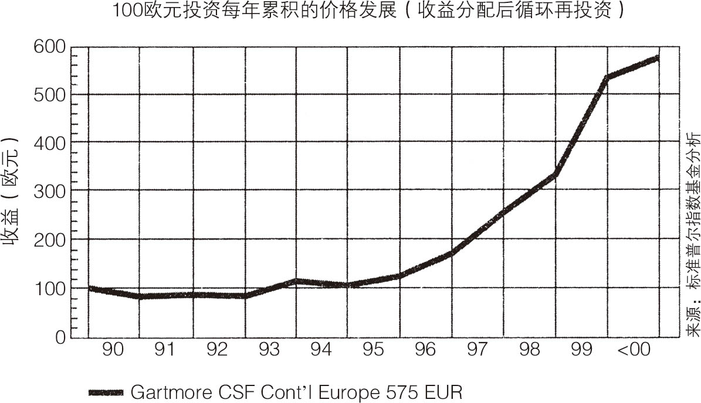

图表9.1　Gartmore Continental
Europe基金的行情走势图（1990年—2000年10月）\
★数据源于2000年10月31日

##  准则三　股市危机也有好的一面。它可以提供机会让你买到超低价的股票

当然，在经济危机期间申购股票需要有强大的抗压能力。但是，你也能因此得到回报。只管立刻买进，因为行情常常会迅速且不易察觉地开始回升。只有在你惊慌失措地抛售股票时，股市危机才会产生消极的影响。下一轮的行情上涨是肯定会来临的，你只需要牢牢守住自己的股票，长期下来肯定能够获利。

另外，只要你利用好时机低价买进证券，股市危机也能让人为之振奋。要达到这一点，你必须牢牢把握好准则四。

##  准则四　保持现金储备

对此，很清楚的一点：为了持续加仓，你需要资金。因此，不要将用以购买股票的资金立刻全投进去。一旦行情下滑或者甚至出现股市崩盘，为了能持续买进，你手上要常保留一定的现金。保守的投资者应当至少要把投资股票和股票基金的资本保留1/3，作为现金储备。即使是激进型的投资者也应当至少保留25％的资金，作为手上的底牌。

这里重点强调“至少”二字。在风险等级五和六的高风险投资中，你甚至应该保留更高的比例。最好是50％！
为了证明这条建议的意义，我想邀请你来一起完成下面的模拟游戏。

假设你投资了10万欧元在价格为100欧元的基金上。又假设1年内行情下跌了60％。如果你现在打算再买进5万欧元的份额，只需按照现价40欧元计算。继续假设，行情持续急速下跌，3个月后跌到20欧元。

如果打算现在抛售，那么你第一次购进的份额将损失80％，第二次的将损失50％。按照投入的15万欧元计算，最终只价值4.5万欧元。有些人可能会说：“真倒霉。”但事实并不是这样。如果操作明智，其实可以运转得非常不错（如同走势图展现的那样）。因为，现在正是再买进5万欧元的时机，而且这次的买进价格仅为20欧元（参看准则三）。

我们继续假设，这支基金在接下来的3年内又上涨为每份额100欧元。你知道现在抛售基金可以得到多少钱吗？（回想一下，你总共投资了20万欧元）答案很惊人：你将总共得到47.5万欧元。换算成收益率则是137.5％，仅仅在4年多的时间里。尽管最开始还遭遇了行情大幅下跌。

如果这一切能成真，是不是太美好了？以上假设绝不是臆造的事例，而是真正发生在富达韩国基金（Fidelity
Korea Fonds）上的真实情况。正如图表9.2所示。

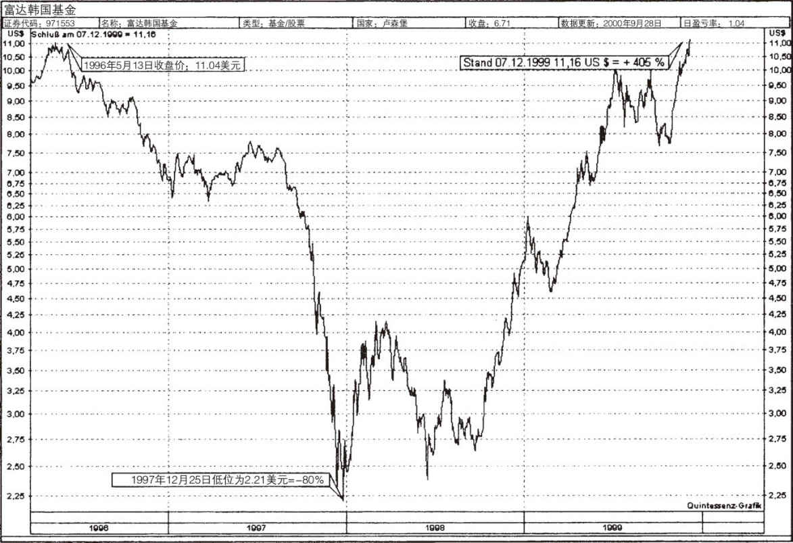

图表9.2　富达韩国基金（Fidelity Korea
Fonds）1996—1999年的行情发展

##  准则五　买进和卖出都宜早不宜迟

本条准则尤其适合购买单支股票和股票基金，以及在风险等级五和六中的投资！

究竟买进的最佳时机是什么时候？当然是跌到最低的时候。最佳抛售时机又是什么时候呢？当然是位于最高点时。郁闷的是：我们并不能每次都抓准最低位和最高位。该怎么办？

先从买进说起。如果抓不准低位，只有两种可能：在最低位之前买进或在最低位之后买进。我认为，在最低位之前买进更明智。但是，这意味着我们在下降过程中买进，也就是说太早了点。如果我们能再等等，就能够以更低的价格购进股票。

而在行情上升阶段买进是很困难的。因为我们怎么能知道，行情结束下跌，股票要开始长期上涨了呢？多数时候，只有当我们回头看时才能发现。当一支股票某个时候真正开始上涨时，通常都十分迅速。这种情况下，等我们发现的时候很可能都太迟了。基于这个原因，我认为更明智的是，留一定的余地，也就是预先确定好下跌多少百分比的时候开始买进。

对于卖出，也是同样的道理。最有利的卖出时机当然是在最高位时，但同样这一时间点也难以抓准。所以，我们可以在高位之前或者之后抛售。同样，我们也只能在回望时才能发现股市的下跌节点。以下例子可以清楚地说明这一点：当一支股票下跌8％时，这意味着该股票会长期继续下跌，还是不久后就会回升达到新的高位呢？

你无法准确提前知晓发展情况，因此，一旦股票达到设定的目标，就应当立即抛售出去。哪怕行情可能会继续上涨，存在过早抛售的风险。图表9.3表明，太迟买进或者卖出，都没有好处。

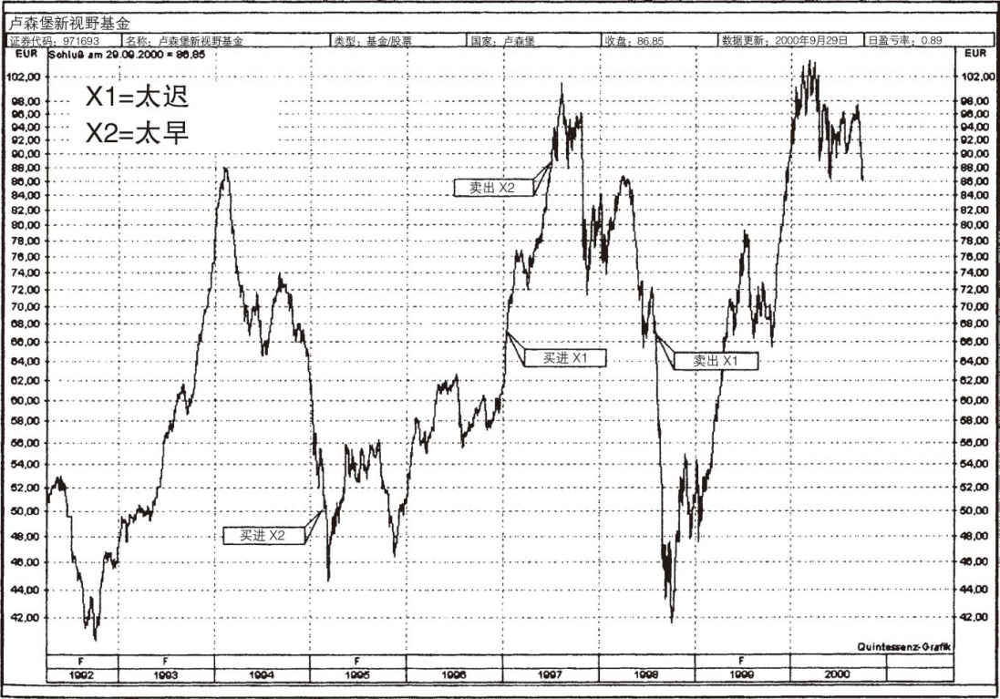

图表9.3　提前行动很有效

##  准则六　不要盲目从众，频繁转换

当你在报纸中看到一则关于股票的消息，通常这个信息早已在股市中反映出来了。如果你现在买进，可能会买到高价。

随大溜行动得到的回报也和大家一样。趋势并非你的朋友。越多的人提出应当赶紧跳上这趟股市列车，你越应该肯定现在为时已晚。股市的大幅攀升已经开始了。在股市中，人们常说，牛市引来牛市（通过更多人买进，行情会继续上涨，这又会引来更多人购买），相应地，熊市也接着熊市。你绝对不要在大众买进时一起买，也不要随大众一起抛售。巴菲特曾说：“传统的智慧可能包含了许多传统，但缺少智慧。”

大多数投资者都喜欢的一个习惯：频繁转换投资。而专家对此早就说过：“换来换去，钱包空空。”这针对风险等级四的投资者尤其适用。恰恰在这里，频繁地转换最没意义。为什么投资者常忽视这点准则呢？主要有3点原因：

1．心理因素。许多投资者都高估自己。此外，他们觉得“买进—持有”的投资策略，什么都不做，缺乏乐趣。

2．投资者经常换股，对金融机构的生存有好处。因此，这些机构常提供单方面的信息政策。

3．金融媒体如果经常提供“热门建议”，对它们的生存同样有利。“买进—持有”策略不具备亮点，不利于自我销售。

只有当你持有的基金没有合理的原因（例如：特定的投资策略）却长时间走势很差，并且没有好转的迹象时，更换才有意义。

再次强调：不要盲目从众，投资时尽量少更换，最好长期持有。在买进风险等级四的产品时，记住沃伦·巴菲特的名言：“我最信奉的时间观是：永远。”

##  准则七　永远不要直接投资你无法判断的市场

由于20世纪末股市急剧升温，许多人买进了他们根本不了解的公司股票。此类行为在股市乐观时期都有发生。这完全不是什么明智的投资，而是赌博行为。因为牛市接着牛市，所以一段时间内行情表现还会不错。但是，这也是很危险的。千万不要听信那些对此事一知半解的朋友或熟人。一直以来，大多数投资者常常在牛市失败，正是他们的亏损，让少数人得利。

这并不是说，你不可以投资那些你喜欢但不能准确判断的市场和企业。因为你不必亲自驾驶你的投资飞机，大可聘请一名飞行员。所以，尽管选择一支特殊基金，涵盖你期望的行业、国家和区域。

虽然这并不能百分百地保证收益，但大多数情况下，当地常驻的基金经理可以比个人投资者更好地评估行情的发展。

尽管如此，你还是应该去了解该行业或区域的大体情况。你必须知晓是否可以信任某一行业或地区。因为如果某一行业或区域遭遇整体崩盘，那再好的“精细工艺”也无计可施。不过，此时一只管理良好的屋顶基金倒是一个不错的替代选择。

##  准则八　分散投资

为了分散风险，从风险等级四开始，每种风险等级内你至少要选择3种不同的投资产品。当然，一支基金就如同一个小的资产管理，常常由几百种不同的股票组成，其本身就已经属于分散投资。但你只需要关注各个基金取得的不同结果即可。从中也可以看出，在基金的投资中也要遵循分散投资的准则。要多样化地选择不同的行业，并尽可能分散到不同国家。最开始至少购买3种不同的产品，但最多不要超过10种，不然会失去对全局的掌控。

你如果觉得这样太麻烦了，那屋顶基金是个不错的替代选择（参看第六章）。

##  准则九　未来的市场可以赚到巨大的收益

市场在不断地变化。因此，不要只着眼于过去的市场，而是要看向未来。当下最著名的冰球运动员韦恩·格雷茨基有一次被问到，为什么他能比别人优秀那么多。他答道：“我不知道自己是否比别人优秀。不过我知道一点：别人都是滑向冰球现在的位置，而我滑向冰球将会到达的地方。”

最近10年的大赢家，在10年前还没诞生，或者还处于成长时期。由此可以得出，未来也是如此。当然，这类的新兴成长型市场没有保障，但也正是这些领域，巨大的机遇正在向你挥手。因此，请有意识地去承担风险。这并不是轻率的举动，而是我们深思熟虑后去承担的风险。此时，只需要投资相对较少的一部分资金即可（如第七章所述）。

##  准则十　正确的资产配置比投资比较更重要

投资学者布林森（Brinson）、辛格（Singer）和比鲍尔（Beebower）的一项研究表明，投资组合中91.5％的收益率受到资产配置的影响（就是指你是否预感到“正确”的行业和地区，并且把资金进行了相应的投资）。只有4.5％取决于产品的选择，1.7％取决于市场时机，另外2.2％取决于其他因素。

确定正确的市场比在一个市场中去搜寻最好的投资产品要重要得多。因此，准则十就是对准则九的进一步补充。

那么，怎样才能确认，是否真正地预感准了“正确”的市场呢？很可惜，没有办法做到。没有人能准确地把握好。不过我们可以把钱分配到不同的市场中，以此提高机会命中下一年的赢家。

如果遵循了这些准则，你的投资长期来看都能获利，甚至年收益还可能高于12％。第七章中，我们了解了应当如何把资金分配到各个风险等级中。第六章中指明了每种风险等级里最理想的产品类型。但是，在一个产品类型里，当前最畅销的产品又是哪些呢？下一章我们将在这些准则的基础上，详细地研究基金的选择。

##  准则十一　投资组合要混合依赖股市发展和独立于股市外的产品

有一点很重要的是，不要把投资都集中在依赖股市发展的产品上，比如股票、股票基金和定息债券基金。因为当整个世界范围内股市都陷入大危机时，而你的投资组合中一部分还能保值，那岂不是很棒？不动产和优质的未上市企业入股以及对冲基金产品可以在一些时期内作为不错的稳定剂。由于大多数不依赖股市发展的产品都涉及长线投资，所以除开投资型不动产份额，你在这些领域的投资资金最多不得超过1/3。同时，企业入股应当选择和股市发展没有直接关系的领域。租赁市场是个不错的例子。未来的市场，在欣欣向荣的股市中，在经济危机中，都会显露出增长潜力。

------------------------------------------------------------------------

致富能量贴士

- 股市总是好坏行情交替变化，存在着小循环和大趋势。
- 为了提高收益，投资者必须准备好，至少5年，最好10年把钱投入股市。
- 股市危机也有好的一面。投资者可以借此时机买到低价股票。
- 保持一定的现金储备。
- 买进和卖出都宜早不宜迟。
- 不要盲目从众，频繁转换。
- 永远不要直接投资你无法判断的市场。
- 学会分散投资。
- 未来的市场可以赚到巨大的收益。
- 正确的资产配置比投资比较更重要。
- 投资组合要混合依赖股市发展和独立于股市外的产品。

------------------------------------------------------------------------

第十章\
怎样发掘出最优投资项目
======================

预言家有两类：一类是一无所知者，\
另一类不知道自己一无所知。

——约翰·肯尼思·加尔布雷斯（John Kenneth Galbraith）

------------------------------------------------------------------------

##  首先最重要的是：资产配置的意义

你还记得吗？成功投资的11条准则中倒数第二条说道：正确的资产配置比投资比较更重要。
在同一类别中选择最好的产品，远不如选择正确的行业、区域和市场重要（资产配置）。举个例子，全球范围内取得最好成绩的基金是1999年日本创业板股票基金。即使你只买了其中排名第十的基金，你也能获得超过250％的收益率——远胜于其他任何行业或区域中的最优成绩。

我们来回忆一下第九章提过的：投资成功的因素只有4.6％取决于选择正确的产品，但有91.5％取决于对正确行业、区域和正确市场的感知。为什么产品的选择那么无关轻重呢？主要原因在于：同一配置等级中的企业和金融产品受到的影响因素都大致相同（正因为如此，它们才属于同一配置等级）。各个股票、股票基金和企业之间联系都非常密切。因此，你要把重点放在预测能力的提高上，学会判断哪些行业和区域未来会爆发增长。要时刻关注自己投资领域的发展趋势。例如，健康产业是个值得关注的领域。随着人口老龄化的发展，需要越来越多的新药品和相关服务。这方面的增长潜力趋势非常明显。

因为我们毕竟还不具备准确预测未来的能力，所以我们必须广泛地分散投资。

基本可以说，一项投资组合要分散到5种不同的配置等级中，否则就不具备多样性（也就是分散得不够广）。

##  在行业和区域内选择投资（例如基金）的原则

完成资产配置后，你应该从哪些角度来选择基金呢？在这里，首先给大家提几点重要的普遍性原则。

原则一：投资总额的大部分投入大公司的基金中。

这样推荐，其一是因为大公司的基金产品种类很丰富。你可以用最划算的费用在不同基金之间进行转换。另一个原因在于通常大公司的研究部门更好。大部分大公司都有一个研究团队，确保基金的选择不受个人因素左右。

原则二：不要仅依赖效益（收益率）来做选择。

请用我们本章中提出的所有原则来检验基金。此外，还要注意客户服务方面。你是否能随时联系上基金公司的业务员，还是说每次都要等半天？作为一名客户，你是否感受到友好礼貌的服务呢？你提出的问题是否有收到完整的回答？基金公司必须让你感觉满意舒心。毕竟他们还要靠你的资金生存呢。

原则三：根据基金的内容而不是它的货币来选择基金。

有一个长久以来的误解，人们总是以为自己在投资基金的计价货币。基金货币无非就是一项转换尺度。唯一起作用的只是基金中货币的价值。基金是以美元计价还是以欧元计价，对你而言没有任何作用。但美元升值会对美国股票的价值产生较大影响，而你购买的基金可能包含这类股票。假设，欧元对美元的汇率下降了10％。如果你的基金包含了50％的美国股票，你的基金就会升值5％。

原则四：注意基金的规模大小。

通常，一支基金规模至少要有5000万欧元，否则光是成本就会大大缩减收益。同样，对于基金的上限也要注意。一支属于风险等级四的全球化基金规模达到了200亿欧元，如果该基金公司经过严密的分析，就没什么不利影响。
但如果一支基金属于风险等级五或六，投资的市场较小，那它的规模就不能过大。它规模越大，就越难以投资到足够好的股票。一个小市场并不会无限提供好的购买机会。一旦过多资本涌入，基金经理就必须投资一些前景不太看好的股票。一支基金如果基于不错的业绩吸引了更多的资本，那想要延续辉煌的成绩则越来越难。
对此，一名非常成功的基金经理曾说过：“起初我只购买自己看好的股票。当基金规模增大，我只能购买自己需要的股票。当基金规模越来越大时，我就必须购买我不讨厌的股票。”

原则五：不要盲目地追随去年的大赢家。

他们只有很小的概率在下一年也成为赢家。这条不仅适合单个基金的选择，在很多情况下也适合资产配置。投资大市场（风险等级四）要更多去选择持续取得不错业绩的基金。而在小市场（风险等级五或六）中的投资，主要选择前一年历经暴跌的区域。

以泰国为例，从1997年到1998年秋天，该市场暴跌了90％。这样的一个市场不可能继续下跌90％。但是，如果它想达到曾经的高位，就必须增长900％。事实证明，该市场的行情的确在1年内回升了100多个百分点。当然，就像泰国后来的行情发展显示的，也不能保证是这样一个过程。

原则六：不要忘记，自己感觉惬意很重要。

某个市场发展再好，基金收益再高，如果不能让你信赖，让你喜欢，那就没什么作用。举个例子，如果一支特别基金下跌30％，你如果看好这个领域，就会把这看作购入的好机会。反之，如果你一开始就不喜欢这支基金，那当遇到基金下跌的情况时，你就很可能只会失望地抛售，那样就只会遭受损失。因此，你购买的基金所投资的市场，一定要自己有好感，并且你看好它的发展前景。或者说，对于投资的市场你至少能保持中立的态度。

原则七：在你的投资组合中，一定要有一至两种你最爱的基金。

也就是说，这些基金所投资的股票是你特别喜欢的企业或领域。请先仔细研究该基金的报告，看看它具体都投资了哪些股票。查看一下，这些企业的产品是否是你每天都在使用的东西。成为这家企业的股东，从某种意义上讲，你购买的是自己公司的产品，这将会很有趣，还能让你的财富增值。

你可以时不时地设立一个“基金日”，在这一整天里，有意识地去吃、喝以及购买你基金所投资企业的产品。那样你会感受到，这给你带来多大的乐趣。此外，这样还能极大地增强你对自己投资和经济的理解和信任。你完全还可以让你的孩子们也加入“基金日”的活动中来。

##  根据技术标准选择基金

不要忘了：最重要的是你的资产配置。可惜此处并没有科学的公式可供参考。有限的预测让我们如履薄冰。就连前面提到过的牛市和熊市的平均周期和影响范围也只能作为小小的支撑。不过，如果把一部分资金在可能飙升的市场和行业之间进行明智的分配，我们还是能处于相对安全的位置
，命中下一年大赢家的概率相对来讲也会比较高。

那么，首先我们应当从资产配置等级内挑出最好的基金。此时我们要运用一些技术标准，也就是排序表和数学分析。同时，我们要开始具备一些常规思维，来帮助我们更好地对技术标准进行分类。

##  技术标准和排序表的评价原则

原则一：过去的投资发展状况对于它的未来毫无意义。

但它是我们拥有的一切。弗里德里希·尼采就曾说过：“对市场今天的评价对于未来毫无意义，它只能说明过去。”也就是说，目前非常普及的数学运算和技术分析图只是说明已发生的过去。关于未来，这些基本上不能表明任何事情，因为一切都将重新洗牌。

但是如果接受这个观点，我们就将完全没有了预测未来的可能性。这样又将毫无乐趣。尽管如此，我们还是要研究过去，并在此基础上计算和预测未来。这能提高我们的注意力，也可以使我们参与感更足。如果预测有幸成真，我们可以欣然接受桂冠。如果没有预测中，那请记住，没有人能真正地预知未来。采用这种方式，预知未来就永远都不会过时。

原则二：评估的时期越短，评估的说服力就越弱。

关于某一投资效益的所有报告都与过去的某一时期和某一日期有关。有价值的评估至少要研究3年，最好是5年或更长的时间。所以类似于“本周基金排行榜”或者“本年度基金效益”一览表就没什么可参考意义。

原则三：仅从效益来评鉴基金，说服力不够。

一份优质且充分的评鉴不仅可以让人从中获悉基金3年或更长时间的效益和认识该投资区域，还能看出基金的规模、发行日期和3年内的波动性。这里尤其值得推荐的是标准普尔基金评鉴（Standard＆Poors-Micropal，针对个体投资人）和菲力信托评级（Feri
Trust，更适合专业人士）。标普基金评鉴图表在很多专业出版物中可以找到，比如《基金图集》（Fondsatlas
）和《基金目录》（Fondskatalog
）。菲力信托评级在《资本》（Capital
）和年度刊物《基金向导》（Fondsguide
）中都能找到。

原则四：可运用德国投资公司协会（BVI）方法来确定基金效益。

这种方法的前提是，配息以赎回价格转入再投资。这一点很重要，因为仅仅通过比较基金份额价格你无法算出一支基金的收益。一支基金的价格几年来几乎固定保持100欧元不变，而它的价值每年增长了10％，这是完全有可能的。这种情况下，该基金的增值部分每年都被计算成配息。然后基金份额价格就接近保持不变，但投资者获得了额外的份额。

原则五：比较基金的效益时，请注意不要拿苹果和梨做比较。

请避免比较两种完全不同的投资对象和投资策略。这肯定会导向明显的错误。因此请注意，比较的两支基金应属于同一风险等级中，对此可以使用第五章中讲过的划分方法。此外，风险等级六中的国际股票基金的收益可能远远高于风险等级四中的基金。这当然就会让人产生误解。有些排名表没有用这种区分方法，因此，这也说明不能仅把排名表作为决定的评判依据。

原则六：请注意，投资基金的效益受多种不同因素的影响。

首先是基金建立之初确定的主要投资策略。其次是基金管理的目标，同时也和风险预期有关。当然，资本市场的发展也发挥着重要作用。当整个市场都处于下滑时期，就算基金管理再好，其绩效也无法同充满竞争性的繁荣市场相比。

原则七：把比较指数也作为评估基准。

比较基金时，不应只把它与同一风险等级、区域和行业中的相似基金做比较。作为一名投资者，年收益率超过27％就肯定很高兴了。但实际上，这27％并没有说明该基金的质量。也许同一时期的比较指数绩效会明显好得多。在这种情况下，你还不如申购指数证券。请注意，比较指数是一种绩效指数，比如达克斯指数（DAX）。而法兰克福汇报指数（FAZ）是一种没有股息再投资的纯粹的行情指数。因此，法兰克福汇报指数不太适合作为评估基准。

原则八：请仔细阅读基金说明书。

基金说明书当然应当吸引投资者去投资相应的基金。因此不可以采取不公平的手段。遗憾的是也会存在一些“老鼠屎”（好在只有小部分！）：一些基金说明故意把基金进行错误的归类，目的在于让投资者完全被引入错误的排名表。这可以让比较结果看上去更有吸引力。

遗憾的是，在现实情况中，用完全错误的比较指数来作为评估基准的事情也很常见。这样做的目的同样是让基金看上去更好。因此，请结合分类标准和提到的评估基准来核查基金的说明书。

2004年新投资法颁布后，基金公司的投资自由更大程度地被放宽。因此深入详细地了解投资方针变得更为重要。借此你可以获知自己究竟涉足了哪些风险。好在大部分基金经理都会遵守这一准则。

原则九：一支基金不必总得战胜它对应的指数。

如果基金只是和指数持平或者略低2％，就已经算是非常不错了。因为指数总是“满额投资”，也就是100％都由股票价值构成，而通常基金并非如此。此外，指数不用承担任何经营成本，而基金则需要承担这类开支。不要忘了，如果你想复制指数或申购指数股，却必须支付这笔费用，虽然这笔费用比向积极管理的基金支付的要低。关于这点，请比较第六章的各项说明。顺便提一下，在一些特定的区域和行业，基金经理很容易战胜指数。

##  标准普尔星级评鉴

正如已经提到过的，我认为标准普尔星级评鉴是目前投资者穿越基金丛林最好的指路牌。星级可以提供简明易懂的指引：五星优于一星，就这么简单。在选择基金时，把风险和收益完全分离来研究并不可取。因为分别观测有可能导致一支基金处于某一领域排名很靠前，但其风险远高于此领域的平均水平。为了弥补分开研究的不足，同时为了分析基金的获利和风险之间的关系，就由此产生了标准普尔星级评鉴。

组成该评鉴机制的因素有以下几点：

1．基金的平均价值增长
（绩效）减去竞争基金的平均价值增长（＝相对价值增长）。举个简单的例子。一支基金在一个月内升值了6％，在此期间，该领域的平均增值为4％，那么得出该基金的相对价值增长为2％。

2．平均相对波动性
。在计算某基金波动性时，标准普尔要依据36个月的相对收益，评测这支基金和其竞争基金相比占优势或劣势的持续时间。基金的波动性越高，和竞争对手相比取得价值增长的稳定性就越低。波动性越高，基金波动就会越强烈，短期内亏损的风险性也就越高。

3．基金的平均相对价值增长和相对波动性的关系
。用前者除以后者，得出的关系数值
就确定了该基金在其领域的排序。

收益率相同的基金，但波动性不同，也就会得出不同的关系数值。假设，A基金收益率为50％，波动性为5。那么关系数值为10（50÷5＝10）。如果B基金的收益率同样显示为50％，但其波动性为6，那么其关系数值为8.3（50÷6≈8.3）。因此，A基金评级将会高于B基金。在下列图表中无法读出这个关系数值，但它同样可以在星级评定中显示出来。

4．按照过去3年的效益百分比来给每个领域评定星级
。前提条件是，至少要显示其中5支基金超过3年的价值增值。在一个领域内（一个投资行业或者投资区域），前10％的基金被评为五星，接下来的20％得四星，另外的20％获得三星。剩下的50％只能得到两星或者一星。

##  如何阐释评级表

图表10.1摘录于标准普尔星级评鉴中2004年6月30日的数据。其中有2004年6月30日被评为五星的38种国际股票基金和屋顶基金，这也只能代表对其近3年的评价。可以根据过去股市的情形（熊市或者牛市），通过不同的基金策略（比如价值和增值）在基金质量上进行纠偏。

图表10.1　获得标准普尔星级评鉴五星的国际股票基金和屋顶基金，时间：2004年6月30日

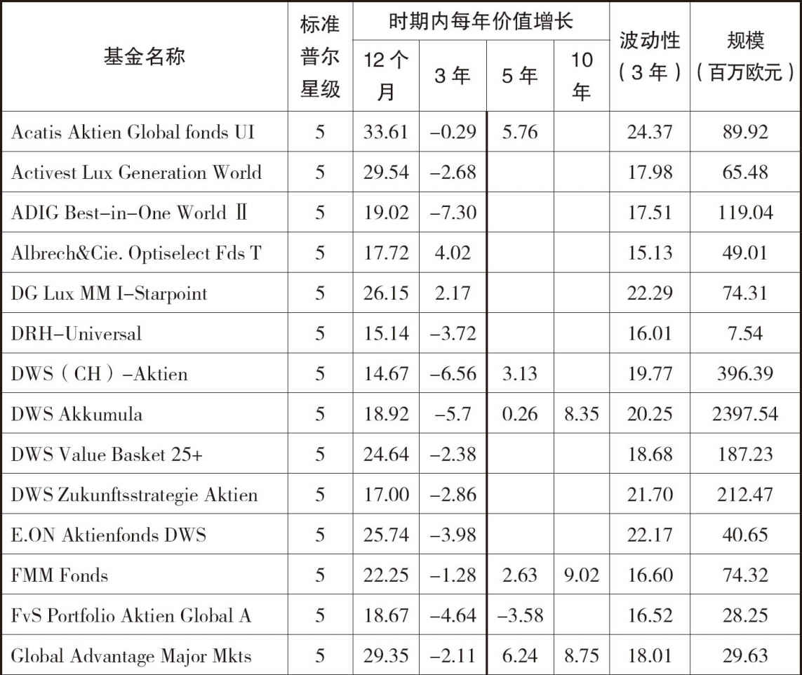
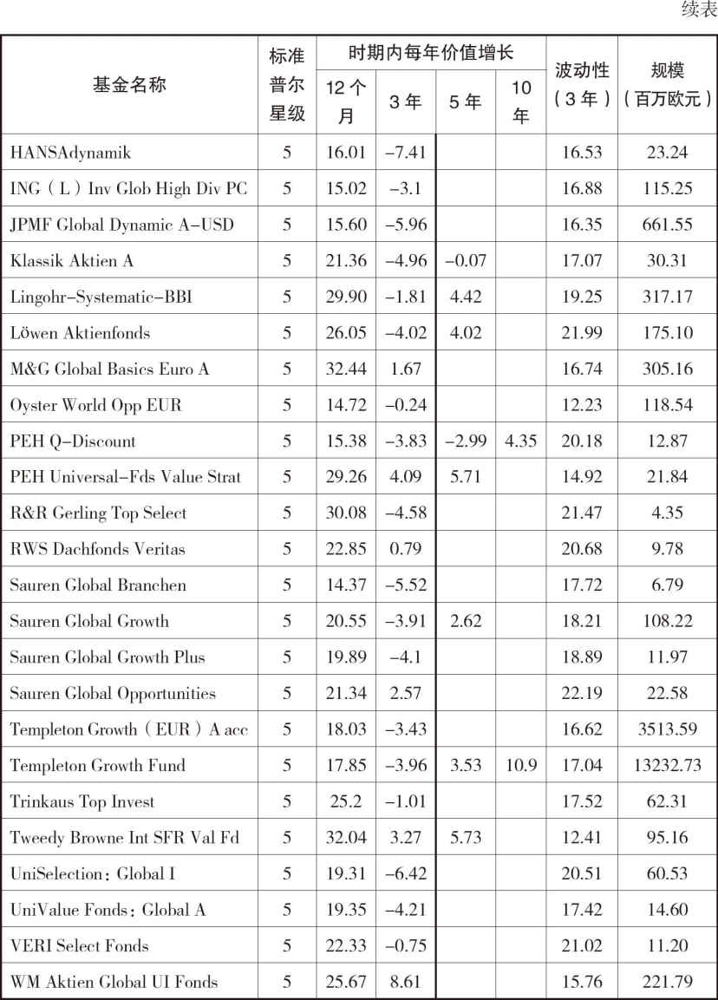

数据来源于标准普尔基金分析家

比如，我引用坦普顿成长基金的例子给大家讲讲。该基金多年来成绩都很好，但2000年初只被评为两星，因为这支基金当时采取了激进的投资策略，因此近3年的价值增值没能跟上其他的国际股票基金。但到了2001年，这支基金又重获五星评定。这个例子就是告诉我们，不要过度高估评级的作用，只应把它作为大致参考。如果你的基金只有三星或者四星，也就不能凭此说明这支基金不好。

有趣的是图表中部分基金的价值增长，尤其是稳定性有明显的差异。在评级排名表中，要注意只有相同投资领域的基金才能相互之间做比较。

提示：此图表并不是用作基金购买推荐，而只是用来做阐述说明的！一项多年的研究显示：一支基金在前3年取得了最好的效益后，只有极小的可能性在接下来的3年也能保持最好的成绩。

##  评级的缺点

所有的分析都是以过去的数据作为基础，所以，最多只能在选择同一类别的基金时提供大致的参考。通常评级也只是让我们关注到那些一直被忽略的基金产品。我们通过比较去注意到一些相类似的基金，然后可以把投资风险进行分散。然而，对于感兴趣的基金，我们仍然需要自己去研究，并且长期跟进观察。评级表无法替我们省掉这部分的工作。

排名只是一种标准，不要过度期待，也不要因此失望。本质上来讲，要记得更重要的是资产配置。此外，正如我们所看到的那样，要注意公司的大小和基金规模，同时还要注重客户服务品质和个人的感受。你也应该想到，持有一两支自己最喜欢的基金是多么有意义。你看，这还是需要自己付出努力并且/或者要聘请一名顾问。

原则上评级是有帮助的。风险只是在于把评级绝对化。比如，仅一味地关注五星基金，并没有多少意义。很可能这支基金刚好第二年就降为一星，这样的事情并不少见。更值得推荐的做法是，寻找一支连续几年来成绩都非常优秀但最近从五星“降级”为四星的基金。可能这支基金刚好度过了一场危机，正在全力以赴地重夺五星。当然，这样的事情也无法百分之百地保证。

不过，你也要考虑到，借助标准普尔评级来严格挑选将会使你错过一些新发行的基金
，尤其是一些小型行业和区域的基金。这些基金发行时间也许不足3年，但可能会提供绝佳的机会。当这些基金最终出现在评级表上时，大把好机会也许早就流失了。

评级的最后一个不可忽视的缺点是，对波动性的评价是绝对的，没有对正向波动和负向波动进行区分。由此导致的缺点，我们已经讨论过。我最想看到的是，所有的基金可以像第五章那样划分成6个风险等级。那样人们就可以根据区域和行业把同一风险等级中的基金进行归类。我认为只有这样，评级才清晰明了，才能有所帮助和意义。但目前据我所知，还没有这样的服务。这点还需要自行采取办法来解决。

##  我们的特别服务

当然你也可以简化这种方法。因为市场处于不断的变化中，我们在本书中也无法提供你需要的所有最新信息。但是有很多的网站，在上面你可以找到最新的评级信息。我们也同样建立了一个网站（www.reintgen.de），你可以随时在里面调出每月的最新资讯。

1．关于每类风险等级的最新推荐。

2．四个投资组合模板，分别按照投资个性A到D进行产品推荐。

我们推荐的内容考虑到了所有谈过的准则。
当然这些推荐并不能保证你一定能获得高额回报。你自己要承担相应的责任，我们只是提供部分辅助。不过过去提供的这些帮助可以作为很好的依据。

我们也乐于给大家提供相应的投资组合模板。你需要提供自己的投资个性（A、B、C或D），以及你是否实现了财务保障、财务安全或财务自由。

下一章我们将转向第二个问题，也就是你在申购基金时必须考虑的事情：费用。这对你最后的投资成果非常重要。为了能计算投资的纯收益，我们必须分析各种费用。

------------------------------------------------------------------------

致富能量贴士

- 投资成功只有4.6％取决于正确的产品选择，但有91.5％取决于我们是否选对了行业、区域或市场。
- 具体投资的选择扮演着相对次要的角色，因为同一市场中的各个股票和企业相互之间联系非常紧密。
- 因为我们不具备准确预知未来的能力，所以我们必须分散投资。
- 在同一行业和市场中，选择基金应遵循的最重要的原则是：\
  　-把大部分的投资资金用来购买大公司的基金。\
  　-不要仅依靠效益（收益率）来做选择。\
  　-选择基金要根据它的内容，而不是它的货币。\
  　-要注意基金的规模。\
  　-不要盲目地去追随去年的大赢家。\
  　-不要忘记了，个人感觉惬意是多么重要。\
  　-在你的投资组合中，要保持持有一到两支你最喜欢的基金。
- 评价技术标准和排序表的准则：\
  　-过去的投资发展状况对未来毫无意义。\
  　-评估的时间越短，评估的说服力就越弱。\
  　-仅从效益来评鉴基金，说服力不够。\
  　-可运用德国投资公司协会（BVI）方法来确定基金效益。\
  　-比较基金的效益时，请注意不要拿苹果和梨做比较。\
  　-请注意，投资基金的效益受多种不同因素的影响。\
  　-把比较指数也作为评估基准。\
  　-请仔细阅读基金说明书。\
  　-一支基金不必总得战胜它对应的指数。
- 评级很有帮助，但绝不应当作为唯一的决定标准。

------------------------------------------------------------------------

第十一章\
投资的成本
==========

当我们管理好自己的金钱事务，\
我们才会有更多的时间来生活。

——雅各布·尼德曼（Jacob Needleman）

------------------------------------------------------------------------

目前为止，我们始终还没有涉及这个话题：你的净收入中有多少要用来支付税费、申购费、管理费以及其他类似支出。当然，清楚你究竟还剩多少钱，这对于你的规划来说是十分重要的。因此在这一章节中，我们来谈论一下这些烦琐的数字。

##  税费

请允许我先解释一下，为什么税务条款这么特殊且复杂。

节约税费的愿望在我们德国人身上表现得尤为强烈。一些人声称，这种愿望比性欲还要强烈。不言而喻，这来源于对高税务负担的愤怒。如果你辛苦挣来的收入中高达50％要流入税务局，这肯定会使你不满，尤其是如果你使用大部分市政设施——如街道、医院和学校——的机会并不像其他市民那样频繁。

“纯粹”市场经济将财富分配给富人，而社会市场经济将财富分配给穷人。这种平衡基本上获得赞同。只是有两个弊端貌似在不断加强。首先，较高收入者越来越多地受到亏待（中等收入的选民当然会推选那个能减轻他们自己负担的党派，也因此导致富有的少数派身上的负担就越来越重）。其次，国家不断颁发新的法律法规使富人不得不掏更多的钱出来。富人为了保护自己的利益，只能聘请又好又贵的顾问去钻法律的空子。最终，法律条款越来越多，整个体系也越来越混乱，就连专家也无法掌控全局。因此，要求简化税法、统一法规的呼声越来越高。他们是否能成功还不得而知，因为富人友好型的税务法遇到的阻力非常之大。

作为一名富有的个人投资者，如果想避免这些弊端，那你除了仔细审视以下2条原则，就别无其他选择了。即使税务法转瞬即变，这2条原则在未来也同样适用。

原则一：忘记节省赋税模式。

上述迫切需求导致许多较高收入者去认购节省赋税模式。固然这类模式在第一眼看来极具吸引力，但实际上，如果你直接缴纳税费，然后再好好投资你的净资产，情况会更好
。

如果你的投资能为你带来缴税优势，就再好不过了（大多数时候只是将交税时间推迟而已）。但这并不是买入的唯一标准。首先这类优势随时都可能被税务局剥夺（出于某些原因），其次你必须在不考虑任何缴税优势的前提下去计算你的投资。在这一点上，无一例外！

原则二：避免重税不利的投资方式。

例如，某些投资基金或未获得销售许可的基金结构则属于此类情况。德国和外国的基金收益都是同等征税的。但前提是，这些基金要在德国获得出售的许可。对于不具备此类许可的基金，人们可将其区分为两类。第一类是未完全注册的境外基金
，对于此类基金，红利收益、利息收益和行情收益都需要额外交税。第二类是未注册的境外基金
，每年增值总额的90％需要纳税，同时，至少要拿投资价值的10％作为基础，无论基金在那年是盈利还是亏损，都得纳税。在卖出份额时要交出20％的卖出收入。
在那些你没有盈利或盈利微小的年份里，这一规则会让你尤其痛苦。

因此，你应该远离所有未在德国完全注册的境外基金。www.bakred.de这个网站公布了获得德国联邦监督局许可的基金清单。

有足够多优秀且经过注册的基金可以让你实现可观的收益，在买入时你还不必承受重税这一弊端。

因为税收条件变化迅速，本书所描写的税收优劣势可能不久后也会失效，所以请向你的投资顾问和税收顾问咨询你感兴趣的投资产品。

##  投资基金的费用和支出

原则上，我们可以将支出划分为两类：直接支出和间接支出。直接支出
是基金层面的支出，也就是说这笔钱会直接体现在基金财产上，你无法左右它。第二类是你完全可以左右的间接支出
。接下来你将看到这两种支出类别中最常见的支出形式，之后我们再讨论最重要的支出形式。

#### 直接支出（产品层面）

- 托管银行的管理费
- 基金经理的管理费
- 基金公司的管理费
- 基金经理的利润分红
- 有价证券基金买入和卖出时的交易费
- 基金宣传册和基金报表的打印费
- 负责年度报告的审计师费用
- 在监管局缴纳的注册费，法务咨询费，顾问和鉴定人的开支
- 绩效费或收益分红
- 企业入股方面的费用

如果所有费用加起来每年大约占基金财产总额的1％～3％，你就完全可以接受。
不同基金种类间差别很大：货币市场基金收取直接支出的0.2％～0.75％；定息债券基金0.5％～1％；股票基金1％～3％；对冲基金完全可能达到5％甚至更多。

与大多企业入股相比，平均1％～3％是非常低的。取得好的成绩当然应该获得好的回报，但前提是必须真的取得了好成绩。对于我们投资者来说，双赢的局面是非常重要的。

对于基金来说，这就意味着：好的成绩对基金尤其重要，因为只有当一支基金掌握很多资本时，这支基金才有利可图。
也只有当这支基金可以证明自己能获得可观收益时，才会有更多的资金流向这只基金。

总体来说，1％～3％的费用并不多，因为基金经理不仅要从中支付所有的支出，还要从支出份额中为基金公司收取利润。很多投资者根本察觉不到这些支出，因为它们并不会在账单中特殊标明。这些费用大多都被基金公司直接从收益中扣除了
。如果你在一份报纸中读到，XY基金在过去20年间达到了12％的平均收益，那么费用是已经扣除了的。

在基金公司的宣传册和年度报告中，你可以看到确切的费用。但如果想知道费用明细，你就得去看基金公司的工作报告了。用你的所有的费用支出除以所有基金财产，得到的结果就是总成本率。

同时请注意两点。第一，一支新成立的基金会扣除其成本费，长达5年之久。较早的基金已经扣过这笔费用了。第二，微小基金的费用占比可能会很高。因为一些费用是固定的，不取决于基金财产额的多少。基金越小，固定费用的占比就越大。

总体来说，投资基金是最划算、最公平的财产投资方式之一。无论如何，你所申购的基金份额与专业财产管理者并没有什么区别。

另一种支出形式就是所谓的绩效费或基金分红，正变得日趋重要。这笔费用在一些基金中额外征收，直接在基金财产中扣除。总体来说，在效益可观的情况下，恰当比例的收益分红并非坏事。但是，如果对某支年收益6％以上的股票基金收益收取25％的额外收益分红，我就认为太多了。

请注意，分红只会从一个恰当的比例算起，在超过这一系数的情况下才会计算收益分红。但最终分红金额是由支出决定的，使用德国投资公司协会（BVI）的方法计算，收益分红一般已经扣除，在与其他基金做对比时，应考虑到这一点。

相较而言，企业入股完全不一样。大多数投资形式中都有一个所谓的“软费用”。这笔费用用于支付基金销售、市场营销、基金管理，当然还有基金开发和基金发行。与基金是否盈利无关，这笔费用在你购入基金时就会直接扣除，其比例可能接近投资总额的30％。在利润率明显高于12％的情况下，根据不同的入股形式，尤其是不同的企业目标，软费用达到20％也是合理的。在封闭型不动产基金或船舶基金方面，基金发行者要在剩余总投资额80％或更少的情况下，获得可观收益，是很成问题的。

费用越少，收益机会越大。

#### 间接支出（基金产品之外的层面）

- 个人缴纳的税费
- 基金申购费和升水
- 你的银行的托管费
- 基金份额买入和卖出的费用
- 赎回费
- 基金平台费、服务费和顾问费

你可以控制这些费用，关于税费的内容我们在前面已经讨论过了，现在我们来看一看申购费。

##### 申购费

如果你购入10000欧元的基金份额，大多情况下你还要支付所谓的申购费。不同类型的基金，其申购费也大不相同。货币市场基金的申购费在0％～1.5％之间，定息债券基金的申购费在1.5％～5％之间，股票基金的申购费在2.5％～6％之间。

在许多报纸中可以随时看到一些大型基金的申购价格和赎回价格。这两个费用之间的差价就是申购费。另外，正如之前所说，网络上还有大量的网页可以提供你所需的信息。

准确地说，申购费与你投入的净资产相关，许多国外基金公司却以毛资产为基础。这之间的差别并不小，因为净资产的5％相当于毛资产的4.762％。因此，一家以毛资产为基础的基金公司收取的申购费也更高，也就是净资产的5.263％（投资额的5％作为申购费被扣除，剩下的95％才会拿来投资）。所以一定要在基金销售说明书中看清楚，这家基金公司到底是按毛资产还是净资产计算申购费。

小贴士

在一些基金名称的后面还跟着一个字母（A、B或C）。比如B代表的就是B股。B股一般不收取申购费，但是需要收取销售费和赎回费，占1％～1.5％，这一部分费用直接支付给销售处。因此请你考虑一下，你是否愿意将金钱投到带字母B的基金身上。

大多情况下，在首次投资企业入股时需要计算升水。这一笔附加费占你投资总额的3％～6％，并将额外地扣除。基金销售的手续费（至少一部分手续费）也从中扣除。但在大多数收益计算中并没有考虑这一费用（就如申购费一样）。

##  你每年的实际收益有多少

遗憾的是，在你收到的基金销售说明书中，大量的基金公司并不写明其基金的平均年收益率，而仅仅写下基金发行至今总增长值的百分比。对于普通投资者来说，要判断出一支基金的实际年度收益率并不容易。此外，你还得清楚，申购费会对你的净收益产生多大的影响。在图表11.1中，你可以轻松地看到这两个信息。

如果不必支付申购费，5年后100％的收益率就意味着14.87％的平均年收益率（而不是每年20％！）。在5％申购费的情况下，年平均收益率会降到13.75％。在申购费为5％的情况下，如果你的投资期限为5年，那么你必须从年收益率中减掉1％左右，如果投资期限为10年，大约减掉0.5％。

图表11.1　不同申购费情况下将基金总增长值换算为实际年收益率

（德国投资公司协会绩效，BVI绩效）\
a．投资期限：5年

<table class="kindle-cn-table-body" data-cellspacing="0">
<colgroup>
<col style="width: 30%" />
<col style="width: 23%" />
<col style="width: 23%" />
<col style="width: 24%" />
</colgroup>
<tbody>
<tr class="calibre17">
<td rowspan="2"
class="kindle-cn-table-th">基金总增长率（％）（BVI绩效）</td>
<td colspan="3"
class="kindle-cn-table-th">不同申购费下的实际年收益率（％）</td>
</tr>
<tr class="calibre17">
<td class="kindle-cn-table-th">0％</td>
<td class="kindle-cn-table-th">3％</td>
<td class="kindle-cn-table-th">5％</td>
</tr>
<tr class="calibre17">
<td class="kindle-cn-table-dg1">10</td>
<td class="kindle-cn-table-dg1">1.92</td>
<td class="kindle-cn-table-dg1">1.32</td>
<td class="kindle-cn-table-dg1">0.93</td>
</tr>
<tr class="calibre17">
<td class="kindle-cn-table-dg1">20</td>
<td class="kindle-cn-table-dg1">3.71</td>
<td class="kindle-cn-table-dg1">3.10</td>
<td class="kindle-cn-table-dg1">2.71</td>
</tr>
<tr class="calibre17">
<td class="kindle-cn-table-dg1">30</td>
<td class="kindle-cn-table-dg1">5.39</td>
<td class="kindle-cn-table-dg1">4.77</td>
<td class="kindle-cn-table-dg1">4.36</td>
</tr>
<tr class="calibre17">
<td class="kindle-cn-table-dg1">40</td>
<td class="kindle-cn-table-dg1">6.96</td>
<td class="kindle-cn-table-dg1">6.33</td>
<td class="kindle-cn-table-dg1">5.92</td>
</tr>
<tr class="calibre17">
<td class="kindle-cn-table-dg1">50</td>
<td class="kindle-cn-table-dg1">8.45</td>
<td class="kindle-cn-table-dg1">7.81</td>
<td class="kindle-cn-table-dg1">7.39</td>
</tr>
<tr class="calibre17">
<td class="kindle-cn-table-dg1">60</td>
<td class="kindle-cn-table-dg1">9.86</td>
<td class="kindle-cn-table-dg1">9.21</td>
<td class="kindle-cn-table-dg1">8.79</td>
</tr>
<tr class="calibre17">
<td class="kindle-cn-table-dg1">70</td>
<td class="kindle-cn-table-dg1">11.20</td>
<td class="kindle-cn-table-dg1">10.54</td>
<td class="kindle-cn-table-dg1">10.12</td>
</tr>
<tr class="calibre17">
<td class="kindle-cn-table-dg1">80</td>
<td class="kindle-cn-table-dg1">12.47</td>
<td class="kindle-cn-table-dg1">11.81</td>
<td class="kindle-cn-table-dg1">11.38</td>
</tr>
<tr class="calibre17">
<td class="kindle-cn-table-dg1">90</td>
<td class="kindle-cn-table-dg1">13.70</td>
<td class="kindle-cn-table-dg1">13.03</td>
<td class="kindle-cn-table-dg1">12.59</td>
</tr>
<tr class="calibre17">
<td class="kindle-cn-table-dg1">100</td>
<td class="kindle-cn-table-dg1">14.87</td>
<td class="kindle-cn-table-dg1">14.19</td>
<td class="kindle-cn-table-dg1">13.75</td>
</tr>
<tr class="calibre17">
<td class="kindle-cn-table-dg1">110</td>
<td class="kindle-cn-table-dg1">16.00</td>
<td class="kindle-cn-table-dg1">15.31</td>
<td class="kindle-cn-table-dg1">14.87</td>
</tr>
<tr class="calibre17">
<td class="kindle-cn-table-dg1">120</td>
<td class="kindle-cn-table-dg1">17.08</td>
<td class="kindle-cn-table-dg1">16.39</td>
<td class="kindle-cn-table-dg1">15.94</td>
</tr>
<tr class="calibre17">
<td class="kindle-cn-table-dg1">130</td>
<td class="kindle-cn-table-dg1">18.13</td>
<td class="kindle-cn-table-dg1">17.43</td>
<td class="kindle-cn-table-dg1">16.98</td>
</tr>
<tr class="calibre17">
<td class="kindle-cn-table-dg1">140</td>
<td class="kindle-cn-table-dg1">19.14</td>
<td class="kindle-cn-table-dg1">18.43</td>
<td class="kindle-cn-table-dg1">17.98</td>
</tr>
<tr class="calibre17">
<td class="kindle-cn-table-dg1">150</td>
<td class="kindle-cn-table-dg1">20.11</td>
<td class="kindle-cn-table-dg1">19.40</td>
<td class="kindle-cn-table-dg1">18.95</td>
</tr>
<tr class="calibre17">
<td class="kindle-cn-table-dg1">160</td>
<td class="kindle-cn-table-dg1">21.06</td>
<td class="kindle-cn-table-dg1">20.34</td>
<td class="kindle-cn-table-dg1">19.88</td>
</tr>
<tr class="calibre17">
<td class="kindle-cn-table-dg1">170</td>
<td class="kindle-cn-table-dg1">21.98</td>
<td class="kindle-cn-table-dg1">21.26</td>
<td class="kindle-cn-table-dg1">20.73</td>
</tr>
<tr class="calibre17">
<td class="kindle-cn-table-dg1">180</td>
<td class="kindle-cn-table-dg1">22.87</td>
<td class="kindle-cn-table-dg1">22.14</td>
<td class="kindle-cn-table-dg1">21.67</td>
</tr>
<tr class="calibre17">
<td class="kindle-cn-table-dg1">190</td>
<td class="kindle-cn-table-dg1">23.73</td>
<td class="kindle-cn-table-dg1">23.00</td>
<td class="kindle-cn-table-dg1">22.53</td>
</tr>
<tr class="calibre17">
<td class="kindle-cn-table-dg1">200</td>
<td class="kindle-cn-table-dg1">24.57</td>
<td class="kindle-cn-table-dg1">23.84</td>
<td class="kindle-cn-table-dg1">23.36</td>
</tr>
<tr class="calibre17">
<td class="kindle-cn-table-dg1">210</td>
<td class="kindle-cn-table-dg1">25.39</td>
<td class="kindle-cn-table-dg1">24.65</td>
<td class="kindle-cn-table-dg1">24.18</td>
</tr>
<tr class="calibre17">
<td class="kindle-cn-table-dg1">220</td>
<td class="kindle-cn-table-dg1">26.19</td>
<td class="kindle-cn-table-dg1">25.45</td>
<td class="kindle-cn-table-dg1">24.97</td>
</tr>
</tbody>
</table>

图表11.1　不同申购费情况下将基金总增长值换算为实际年收益率

（德国投资公司协会绩效，BVI绩效）\
b．投资期限：10年

<table class="kindle-cn-table-body" data-cellspacing="0">
<colgroup>
<col style="width: 30%" />
<col style="width: 23%" />
<col style="width: 23%" />
<col style="width: 24%" />
</colgroup>
<tbody>
<tr class="calibre17">
<td rowspan="2"
class="kindle-cn-table-th">基金总增长率（％）（BVI绩效）</td>
<td colspan="3"
class="kindle-cn-table-th">不同申购费下的实际年收益率（％）</td>
</tr>
<tr class="calibre17">
<td class="kindle-cn-table-th">0％</td>
<td class="kindle-cn-table-th">3％</td>
<td class="kindle-cn-table-th">5％</td>
</tr>
<tr class="calibre17">
<td class="kindle-cn-table-dg1">10</td>
<td class="kindle-cn-table-dg1">0.96</td>
<td class="kindle-cn-table-dg1">0.66</td>
<td class="kindle-cn-table-dg1">0.47</td>
</tr>
<tr class="calibre17">
<td class="kindle-cn-table-dg1">20</td>
<td class="kindle-cn-table-dg1">1.84</td>
<td class="kindle-cn-table-dg1">1.54</td>
<td class="kindle-cn-table-dg1">1.34</td>
</tr>
<tr class="calibre17">
<td class="kindle-cn-table-dg1">30</td>
<td class="kindle-cn-table-dg1">2.66</td>
<td class="kindle-cn-table-dg1">2.36</td>
<td class="kindle-cn-table-dg1">2.16</td>
</tr>
<tr class="calibre17">
<td class="kindle-cn-table-dg1">40</td>
<td class="kindle-cn-table-dg1">3.42</td>
<td class="kindle-cn-table-dg1">3.12</td>
<td class="kindle-cn-table-dg1">2.92</td>
</tr>
<tr class="calibre17">
<td class="kindle-cn-table-dg1">50</td>
<td class="kindle-cn-table-dg1">4.14</td>
<td class="kindle-cn-table-dg1">3.83</td>
<td class="kindle-cn-table-dg1">3.63</td>
</tr>
<tr class="calibre17">
<td class="kindle-cn-table-dg1">60</td>
<td class="kindle-cn-table-dg1">4.81</td>
<td class="kindle-cn-table-dg1">4.50</td>
<td class="kindle-cn-table-dg1">4.30</td>
</tr>
<tr class="calibre17">
<td class="kindle-cn-table-dg1">70</td>
<td class="kindle-cn-table-dg1">5.45</td>
<td class="kindle-cn-table-dg1">5.14</td>
<td class="kindle-cn-table-dg1">4.94</td>
</tr>
<tr class="calibre17">
<td class="kindle-cn-table-dg1">80</td>
<td class="kindle-cn-table-dg1">6.05</td>
<td class="kindle-cn-table-dg1">5.74</td>
<td class="kindle-cn-table-dg1">5.54</td>
</tr>
<tr class="calibre17">
<td class="kindle-cn-table-dg1">90</td>
<td class="kindle-cn-table-dg1">6.63</td>
<td class="kindle-cn-table-dg1">6.31</td>
<td class="kindle-cn-table-dg1">6.11</td>
</tr>
<tr class="calibre17">
<td class="kindle-cn-table-dg1">100</td>
<td class="kindle-cn-table-dg1">7.18</td>
<td class="kindle-cn-table-dg1">6.86</td>
<td class="kindle-cn-table-dg1">6.66</td>
</tr>
<tr class="calibre17">
<td class="kindle-cn-table-dg1">110</td>
<td class="kindle-cn-table-dg1">7.70</td>
<td class="kindle-cn-table-dg1">7.38</td>
<td class="kindle-cn-table-dg1">7.18</td>
</tr>
<tr class="calibre17">
<td class="kindle-cn-table-dg1">120</td>
<td class="kindle-cn-table-dg1">8.20</td>
<td class="kindle-cn-table-dg1">7.88</td>
<td class="kindle-cn-table-dg1">7.68</td>
</tr>
<tr class="calibre17">
<td class="kindle-cn-table-dg1">130</td>
<td class="kindle-cn-table-dg1">8.69</td>
<td class="kindle-cn-table-dg1">8.37</td>
<td class="kindle-cn-table-dg1">8.16</td>
</tr>
<tr class="calibre17">
<td class="kindle-cn-table-dg1">140</td>
<td class="kindle-cn-table-dg1">9.15</td>
<td class="kindle-cn-table-dg1">8.83</td>
<td class="kindle-cn-table-dg1">8.62</td>
</tr>
<tr class="calibre17">
<td class="kindle-cn-table-dg1">150</td>
<td class="kindle-cn-table-dg1">9.60</td>
<td class="kindle-cn-table-dg1">9.27</td>
<td class="kindle-cn-table-dg1">9.06</td>
</tr>
<tr class="calibre17">
<td class="kindle-cn-table-dg1">160</td>
<td class="kindle-cn-table-dg1">10.03</td>
<td class="kindle-cn-table-dg1">9.70</td>
<td class="kindle-cn-table-dg1">9.49</td>
</tr>
<tr class="calibre17">
<td class="kindle-cn-table-dg1">170</td>
<td class="kindle-cn-table-dg1">10.44</td>
<td class="kindle-cn-table-dg1">10.12</td>
<td class="kindle-cn-table-dg1">9.90</td>
</tr>
<tr class="calibre17">
<td class="kindle-cn-table-dg1">180</td>
<td class="kindle-cn-table-dg1">10.84</td>
<td class="kindle-cn-table-dg1">10.52</td>
<td class="kindle-cn-table-dg1">10.31</td>
</tr>
<tr class="calibre17">
<td class="kindle-cn-table-dg1">190</td>
<td class="kindle-cn-table-dg1">11.23</td>
<td class="kindle-cn-table-dg1">10.91</td>
<td class="kindle-cn-table-dg1">10.69</td>
</tr>
<tr class="calibre17">
<td class="kindle-cn-table-dg1">200</td>
<td class="kindle-cn-table-dg1">11.61</td>
<td class="kindle-cn-table-dg1">11.28</td>
<td class="kindle-cn-table-dg1">11.07</td>
</tr>
<tr class="calibre17">
<td class="kindle-cn-table-dg1">210</td>
<td class="kindle-cn-table-dg1">11.98</td>
<td class="kindle-cn-table-dg1">11.65</td>
<td class="kindle-cn-table-dg1">11.43</td>
</tr>
<tr class="calibre17">
<td class="kindle-cn-table-dg1">220</td>
<td class="kindle-cn-table-dg1">12.33</td>
<td class="kindle-cn-table-dg1">12.00</td>
<td class="kindle-cn-table-dg1">11.79</td>
</tr>
<tr class="calibre17">
<td class="kindle-cn-table-dg1">230</td>
<td class="kindle-cn-table-dg1">12.68</td>
<td class="kindle-cn-table-dg1">12.35</td>
<td class="kindle-cn-table-dg1">12.13</td>
</tr>
<tr class="calibre17">
<td class="kindle-cn-table-dg1">240</td>
<td class="kindle-cn-table-dg1">13.02</td>
<td class="kindle-cn-table-dg1">12.68</td>
<td class="kindle-cn-table-dg1">12.47</td>
</tr>
<tr class="calibre17">
<td class="kindle-cn-table-dg1">250</td>
<td class="kindle-cn-table-dg1">13.35</td>
<td class="kindle-cn-table-dg1">13.01</td>
<td class="kindle-cn-table-dg1">12.79</td>
</tr>
<tr class="calibre17">
<td class="kindle-cn-table-dg1">260</td>
<td class="kindle-cn-table-dg1">13.67</td>
<td class="kindle-cn-table-dg1">13.33</td>
<td class="kindle-cn-table-dg1">13.11</td>
</tr>
<tr class="calibre17">
<td class="kindle-cn-table-dg1">270</td>
<td class="kindle-cn-table-dg1">13.98</td>
<td class="kindle-cn-table-dg1">13.64</td>
<td class="kindle-cn-table-dg1">13.42</td>
</tr>
<tr class="calibre17">
<td class="kindle-cn-table-dg1">280</td>
<td class="kindle-cn-table-dg1">14.28</td>
<td class="kindle-cn-table-dg1">13.94</td>
<td class="kindle-cn-table-dg1">13.73</td>
</tr>
<tr class="calibre17">
<td class="kindle-cn-table-dg1">290</td>
<td class="kindle-cn-table-dg1">14.58</td>
<td class="kindle-cn-table-dg1">14.24</td>
<td class="kindle-cn-table-dg1">14.02</td>
</tr>
<tr class="calibre17">
<td class="kindle-cn-table-dg1">300</td>
<td class="kindle-cn-table-dg1">14.87</td>
<td class="kindle-cn-table-dg1">14.53</td>
<td class="kindle-cn-table-dg1">14.31</td>
</tr>
<tr class="calibre17">
<td class="kindle-cn-table-dg1">310</td>
<td class="kindle-cn-table-dg1">15.15</td>
<td class="kindle-cn-table-dg1">14.81</td>
<td class="kindle-cn-table-dg1">14.59</td>
</tr>
<tr class="calibre17">
<td class="kindle-cn-table-dg1">320</td>
<td class="kindle-cn-table-dg1">15.43</td>
<td class="kindle-cn-table-dg1">15.09</td>
<td class="kindle-cn-table-dg1">14.87</td>
</tr>
<tr class="calibre17">
<td class="kindle-cn-table-dg1">330</td>
<td class="kindle-cn-table-dg1">15.70</td>
<td class="kindle-cn-table-dg1">15.36</td>
<td class="kindle-cn-table-dg1">15.14</td>
</tr>
<tr class="calibre17">
<td class="kindle-cn-table-dg1">340</td>
<td class="kindle-cn-table-dg1">15.97</td>
<td class="kindle-cn-table-dg1">15.63</td>
<td class="kindle-cn-table-dg1">15.41</td>
</tr>
<tr class="calibre17">
<td class="kindle-cn-table-dg1">350</td>
<td class="kindle-cn-table-dg1">16.23</td>
<td class="kindle-cn-table-dg1">15.89</td>
<td class="kindle-cn-table-dg1">15.67</td>
</tr>
<tr class="calibre17">
<td class="kindle-cn-table-dg1">360</td>
<td class="kindle-cn-table-dg1">16.49</td>
<td class="kindle-cn-table-dg1">16.14</td>
<td class="kindle-cn-table-dg1">15.92</td>
</tr>
<tr class="calibre17">
<td class="kindle-cn-table-dg1">370</td>
<td class="kindle-cn-table-dg1">16.74</td>
<td class="kindle-cn-table-dg1">16.39</td>
<td class="kindle-cn-table-dg1">16.17</td>
</tr>
<tr class="calibre17">
<td class="kindle-cn-table-dg1">380</td>
<td class="kindle-cn-table-dg1">16.98</td>
<td class="kindle-cn-table-dg1">16.64</td>
<td class="kindle-cn-table-dg1">16.41</td>
</tr>
<tr class="calibre17">
<td class="kindle-cn-table-dg1">390</td>
<td class="kindle-cn-table-dg1">17.22</td>
<td class="kindle-cn-table-dg1">16.88</td>
<td class="kindle-cn-table-dg1">16.65</td>
</tr>
<tr class="calibre17">
<td class="kindle-cn-table-dg1">400</td>
<td class="kindle-cn-table-dg1">17.46</td>
<td class="kindle-cn-table-dg1">17.12</td>
<td class="kindle-cn-table-dg1">16.89</td>
</tr>
<tr class="calibre17">
<td class="kindle-cn-table-dg1">410</td>
<td class="kindle-cn-table-dg1">17.69</td>
<td class="kindle-cn-table-dg1">17.35</td>
<td class="kindle-cn-table-dg1">17.12</td>
</tr>
<tr class="calibre17">
<td class="kindle-cn-table-dg1">420</td>
<td class="kindle-cn-table-dg1">17.92</td>
<td class="kindle-cn-table-dg1">17.58</td>
<td class="kindle-cn-table-dg1">17.35</td>
</tr>
<tr class="calibre17">
<td class="kindle-cn-table-dg1">430</td>
<td class="kindle-cn-table-dg1">18.15</td>
<td class="kindle-cn-table-dg1">17.80</td>
<td class="kindle-cn-table-dg1">17.57</td>
</tr>
<tr class="calibre17">
<td class="kindle-cn-table-dg1">440</td>
<td class="kindle-cn-table-dg1">18.37</td>
<td class="kindle-cn-table-dg1">18.02</td>
<td class="kindle-cn-table-dg1">17.79</td>
</tr>
<tr class="calibre17">
<td class="kindle-cn-table-dg1">450</td>
<td class="kindle-cn-table-dg1">18.59</td>
<td class="kindle-cn-table-dg1">18.24</td>
<td class="kindle-cn-table-dg1">18.01</td>
</tr>
<tr class="calibre17">
<td class="kindle-cn-table-dg1">460</td>
<td class="kindle-cn-table-dg1">18.80</td>
<td class="kindle-cn-table-dg1">18.45</td>
<td class="kindle-cn-table-dg1">18.22</td>
</tr>
<tr class="calibre17">
<td class="kindle-cn-table-dg1">470</td>
<td class="kindle-cn-table-dg1">19.01</td>
<td class="kindle-cn-table-dg1">18.66</td>
<td class="kindle-cn-table-dg1">18.43</td>
</tr>
<tr class="calibre17">
<td class="kindle-cn-table-dg1">480</td>
<td class="kindle-cn-table-dg1">19.22</td>
<td class="kindle-cn-table-dg1">18.87</td>
<td class="kindle-cn-table-dg1">18.64</td>
</tr>
<tr class="calibre17">
<td class="kindle-cn-table-dg1">490</td>
<td class="kindle-cn-table-dg1">19.42</td>
<td class="kindle-cn-table-dg1">19.07</td>
<td class="kindle-cn-table-dg1">18.84</td>
</tr>
<tr class="calibre17">
<td class="kindle-cn-table-dg1">500</td>
<td class="kindle-cn-table-dg1">19.52</td>
<td class="kindle-cn-table-dg1">19.27</td>
<td class="kindle-cn-table-dg1">19.04</td>
</tr>
</tbody>
</table>

##  不收取申购费的基金

在购入基金时要清楚费用支出情况，这一认知在基金投资领域中已经非常普遍。因此，越来越多精明的基金公司，尤其是美国的基金公司，为投资者提供了不收取申购费的基金。这些所谓的免佣基金或营运基金就吸引了那些被高申购费吓跑的投资者。

当然，凡事都有两面性，世上没有免费的午餐。当某一笔费用降低了，另一笔费用就会升高，大多情况下内部管理费会相应地增多。如果你持有免佣基金的时间超过3～5年，那么你支付的费用比同价值的收取申购费的基金还多。
这类基金大多只适用于短期投资者，他们买入基金份额只是为了在短期内再次卖出。

通常情况下，在5年封闭期内赎回此类基金都需要支付不同金额的赎回费（英语：Backend-Load或End-Load）。如果你在超过封闭期一年后才赎回基金份额，基金公司有可能在原先份额的基础上再扣除4％。

小贴士

请仔细注意基金销售说明书上的隐藏费用。也许你可以让你的顾问为你手写一份“无其他费用”的证明。

##  通过贴现经纪人购买基金

通过放弃全面的服务来节省费用，这一要求起源于美国。当今，许多投资者都找贴现经纪人购买基金份额。折扣是一个充满吸引力的词语。但还是有几点需要注意：

第一，贴现经纪人无法给你提供专业的建议。

第二，节省的费用起不到决定性作用，真正关键的是剩下的投资金额。如果优质的咨询建议可以为你带来高收益，那么支付申购费是完全值得的。

第三，在贴现经纪人处购买基金，通常隐藏费用较高，如托管费、换购费以及其他的买卖支出。通过其他形式购买，附加费用都很低甚至免费，而通过贴现经纪人购买，你需要支付申购费。如果你经常换仓，那么通过贴现经纪人购买基金比你向基金公司直接购买或是通过顾问购买更贵。而后者能让你获得顾问给出的建议。

请考虑一下：如果必须接受一场大型手术，你会去找一位提供折扣的外科医生吗？还是说，你会相信那句格言“人贵自立”，然后随手拿起一本许诺你《三分钟完美盲肠手术》的书？掌握有用的基础知识，对我们来说非常重要，但这些知识代替不了专家。

##  银行的保管费

银行收取所谓的有价证券保管费。大多数情况下，当你购买银行自有产品时不需要支付此费用。但如果你通过银行申购其他基金公司的产品，就需要支付该费用。而实际在大多数情况下，你的基金份额由基金公司的托管银行进行管理，基金公司也已经向托管银行支付过这笔费用了。此外，大多基金公司还需要支付一笔0.2％～0.5％的储存保管佣金给托管银行。这一部分费用已经包含在基金管理费中了。

银行并不会对你的有价证券进行保管或管理，从根本上来说，银行“保管”的只是基金份额的购买证明，而非有价证券。

在投资金额较小的情况下，你应该尤其小心。比如每年15欧元的最低费用也会使你的投资金额减少3％。因此你需要确认，你需要银行对你的投资基金提供什么样的帮助。一般情况下，你可以直接向基金公司或投资顾问求助。

##  基金平台，服务费和咨询费

除普通的托管银行之外，还有一些基金管理平台，在这里你可以购买和托管不同基金公司的投资基金。其优点在于，你能获得一个你所有基金份额的总览表，即使你的基金分属于各个完全不同的基金公司。基金销售公司和顾问经常使用这些平台，它们使投资者及顾问的日常工作开展更加轻松。尤其是你可以直接在不同公司的基金之间进行转换，不必再将资金汇入转账账户中。

你需要注意的是，托管和管理的年度费用应该在合理的限度范围内（每年最多200欧元，越少越好）。然而，经纪人和基金公司将一些恶习带到了这一舒适的基金管理平台上。他们每年收取占基金总额0.5％～2％的服务费，这笔费用不是别的，它就是一笔顾问酬金。基本上，投资者并不会反对年度顾问费，但关键在于投资者要能真正得到建议和帮助，同时，收取费用的高低也得提前告知投资者。

##  顾问费有多少

现在我们来探讨最后一个点：顾问费。不同的顾问，其顾问费可能天差地别，可靠的顾问会与投资者开诚布公地探讨并清晰地确定该费用。

顾问从哪里赚钱？这个问题不好答，因为他们有不同的赚钱途径，大多情况下都与售出的基金产品有很大关系。

#### 从产品公司获得资金

在投资基金时，经纪人会从申购费和相较而言非常低的储存保管费中收取固定的佣金份额。针对人寿保险和长期定期定额投资，一般都只会在签订合同时收取一次性佣金，各公司的费用介于总额的2％～5％之间。企业入股需要更强的指导，其佣金差异非常巨大，以至并没有明确的佣金额度。这笔佣金费可能介于投资金额5％～10％之间（可靠的基金公司），甚至可能多达20％（不可靠的基金公司）。你无法从升水的高低（确切地说，软费用的多少）看出佣金的多少。很遗憾，有些时候经纪人大多推荐自身有利可图的产品，而不是从客户的利益出发（虽然后者更有助于经纪人和客户之间建立长久稳固的关系）。

#### 客户支付的酬金

顾问费的第二个来源是投资者直接支付的酬金。这笔费用用于投资组合分析、投资建议或年度托管。收费方式可能是打包整体计费、按小时计费或者是从投资金额或所分析的资产中提取固定比例作为酬劳。当然也有混合形式的计费方式（一部分顾问费由客户直接支付，一部分由基金公司支付）。

优秀的财产管理者和投资组合顾问每年能获得1％～2％的托管费外加合理的收益分红。此后的换仓费也明显比首次投资时低很多。

也许你觉得这看起来很多，但关键问题始终在于：能给你剩下什么？这才是每一位顾问需要衡量的东西。当然客户获得的服务内容和服务质量也与付出的价格有关。重点是，你需要全面弄清楚基金的费用和绩效。

遗憾的是，很多投资者还是没有理解，好的咨询服务是不能免费获得的。

正如之前在第八章所说：好的建议可能很贵，但是坏的建议会让你付出更大的代价。

------------------------------------------------------------------------

致富能量贴士

- “纯粹”市场经济将财富分配给富人，而社会市场经济将财富分配给穷人。税法总体上是在进行自上而下的再次分配。
- 忘记节省赋税模式。如果你直接缴纳税费，然后再好好投资你的净资产，你的状况会更好。
- 你必须在不考虑任何税务优势的前提下计算你的投资。
- 请远离那些未在德国完全注册的境外基金。
- 直接支出（基金层面）每年占1％～3％。这笔费用已经从基金公司证明能获得的收益中扣除了。
- 你完全可以左右基金投资的间接支出。一定要在基金销售说明书中看清楚，这家基金公司到底是按毛资产还是净资产计算申购费。
- 如果你持有免佣基金的时间超过3～5年，那么你支付的费用比同价值的收取申购费的基金还多。
- 当你购买银行自有产品时，不需要支付保管费。
- 最重要的是，在扣除所有费用之后的收益以及你所获得的服务。

------------------------------------------------------------------------

第十二章\
轻松投资：何时买进，何时卖出
============================

想要吃得好，就买股票。\
想要睡得香，就买定息债券和不动产。\
要想吃得好又睡得香，就按照足球策略来进行投资。

——博多·舍费尔

------------------------------------------------------------------------

我们已经了解了应该如何分配资金，也认识了投资的一些基本原则，并且探讨了选择具体产品的标准。那么，投资成功就离我们不远了，不是吗？

也许你还在犹豫，迟迟未迈出关键的一步。因为你总认为，现在时机尚未成熟。如果这样，请你务必好好阅读接下来讲的内容。你将再一次认识到，把个人的财务命运掌握在自己手中并非难事。相反，这还能给你带来无穷的乐趣。

本章将涉及以下几个问题：

- 申购一项新投资的最佳时机是什么时候？
- 行情下滑时应该怎么办？
- 如何得知，应该在什么时候卖出哪些投资？
- 当股市长期低迷时，该怎样获利？

##  什么时候是投资的最佳时机

关于进入投资的最理想时间，看似很容易回答：肯定是在行情滑落后，股价处于相对低位的时候。

但是，这种说法很容易产生误导，至少对风险等级四中的大型国际或欧洲和北美的基金如此。为了理解这一点，我们假设以下的情景，2005年1月1日你向XY基金投资了1万欧元，并在接下来的4年里，获得收益如下：

2005：-10％

2006：+20％

2007：+10％

2008：+30％

我们继续假设，从2009年到2019年，这支基金保持同样的规律继续发展：

2009：-10％

2010：+20％

2011：+10％

2012：+30％

2013：-10％

2014：+20％

2015：+10％

2016：+30％

2017：-10％

2018：+20％

2019：+10％

我们之前提过了，风险等级四的产品大部分以4年为一个循环周期。因此，上述的结果完全具有可代表性。

假定打算持有XY基金12年，那么你认为，什么时候是最佳投资时机呢？你也许会回答是2006年初或者2008年。而最糟糕的时机似乎是2005年初，因为这一年行情一下子跌落了10％。

#### 投资风险等级四的最佳时机

答案肯定会让你大吃一惊：在以上的举例中，如果你的投资年限为12年，不管你从2005年、2006年、2007年还是2008年开始投资，对最终总额不会起任何作用。最后的总额都是36836欧元。2005年初可作为投资的最佳时机，因为那样你在2017年便可以再次动用这笔资金。

由此我们可以确定：投资时间点对于风险等级四中产品的最终总额几乎没有任何影响。因此，投资得越早越好，这样才不会浪费宝贵的时间。

#### 投资风险等级五和六的最佳时机

对于风险等级五和六的产品，情况则有所不同。这个部分要注意的是，许多新兴市场在超过36个月的时间里平均增长率高达350％，然后会在超过18个月的时间里跌落约50％。面对如此强烈的波动，我们只能在股市暴跌后再买进，这样操作不只有很多好处，甚至在许多情况下是唯一有用的策略。
无论如何，这一点肯定适用于一次性购买。如果我们能在行情下跌后针对风险进一步权衡，这条准则的意义就会更加明显。让我们来看看，在经历股市下跌时应该如何操作。从中可以发现在投资高风险领域时，选择投资时机的最佳策略。

##  股市下跌时该怎么办

首先提一下处于第二位的重要准则：行情下跌（或者更确切地称作“股价回档”）还不属于亏损。这更多的是一个不断循环往复的过程。短期内5％～15％的股价回档还不会形成危机或者崩盘。请回忆下之前讲过的人和狗的例子，人代表经济，狗代表股市。回档只是意味着狗往前跑太远了，现在又跑回来了。问题在于：专家认为必须研究为什么狗会这样做。他们倒不如说：“这是狗的天性。”因此，请不要被一些专家研究的悲观言论影响。

通常在经历了强势上涨后会迎来回档，因为现在一些大投资家要拿走他们的利润。正如我们讲过的那样，如果你的投资刚好碰到了回档前的这一时间，这肯定不是什么多糟糕的事情。

不过这毕竟是理论。在实际操作中，如果遇到股市下跌，你肯定会被吓到，还常常会感到沮丧。特别是一些投资新手，更是如此。这并不是说明你就不适合从事这类型的投资。我更多的是想让大家确信，这是所有人都会面临的问题。当股市下跌，你感觉很糟心的时候，你只有硬挺过去，这是所有投资者都要经历的过程，就算是成功者也不例外。我还可以向大家保证的是：下一轮股市下跌肯定还会到来，你肯定又会感到不那么舒心。但是行情肯定会再次上涨。就像我们之前所说的那样，白天和黑夜总是交替出现。

最重要的准则是：请在行情下跌时加购，为此，你需要有现金储备。

也许你属于热衷风险的投资者，对我的建议表示不满，即：保持50％的钱作为储备资金（现金储备或者进行风险等级一至三中的货币资产投资）。但是当你第一次尝试了能够以超低价买进股票或基金后（因为你有足够多可支配的资金），你会开始爱上这点建议。

对于风险等级四中的产品，你可以在行情回落20％时加购。但请不要把全部的储备资金都投进去。也许不久后还会出现更有利的购买时机。

##  加购风险等级五和六中的投资产品

对于高风险等级的产品又是一套完全不同的准则。适用于个别行业和新兴市场大部分领域的是：在行情出现暴跌时，才考虑加购或者开始进入投资。
你没必要采取其他的措施，因为总会出现新的选择。市场上下跌50％，部分甚至暴跌90％的购买机会，相对还算比较常见。

也许你会感到震惊，这样的下跌概率对你来讲风险太大了。也许这部分市场还会又一次跌落50％～90％。事实上，这样的可能性的确存在。即使这样的可能性非常小，至少当某市场已经下跌85％后，就更不太可能出现这样的情况。

当然，风险还是存在的。但我想再一次把风险和巨大的机会进行对比：假设你投资了10万欧元购买收益为6％的定息债券。20年后，你将获得320713欧元，其中还必须缴税。相应地，如果你每年能获得20％的纯收益，20年后这笔钱将会达到3833759欧元，差不多是原来的12倍。

如果你将这笔资金分配到10支基金上，其中6支遭遇血本无归（这几乎不可能），那么剩余的4支基金保持20％的收益，你仍旧可以获得150多万欧元。即使以这样极端的方式计算，你获得的收益都比“保险的”投资多出4倍。为此，承担一定的风险还是非常值得的。你又一次认识到了，投资成功的秘诀在于：分散投资，同时有智谋地承担风险。

##  风险等级五和六蕴藏着最丰厚的利润

许多新兴市场丰厚的收益率要归功于相应区域里杰出的经济增长率，经济增长平均处于约7％的水平。在《财务自由之路》中，我讲过这意味着什么：经济增速乘以3～5就得出该市场平均的收益率。
所以，股市收益达到21％～35％是完全有可能的。

当然，许多没有经验的投资者了解到这样巨大的收益机会，也会受到吸引而来。这就是行情即将下跌的前兆。比如1996年和1997年初在亚洲就曾出现过这样的情况。对于有经验的投资者而言，眼下的投资泡沫就是即将崩盘的信号。因此在1996年第一季度我就撤回了在亚洲的所有投资（宜早不宜晚）。当时还处于一路高歌猛进的时期。事实上也的确提早了一点，原本我还能多赚几个百分点。但是我已经达到了之前书面定下的200％的目标，并且不想成为贪婪的牺牲品。在崩盘过后的15个月，我又开始投资。虽然稍早了一些，但紧接着获得的利润是丰厚的。

##  行情下跌和收益机会之间的关系

请尽可能只关注那些下跌50％或者更多的新兴市场。从跌落50％开始，风险和机会的关系就将变得越有利。超过60％的下跌就更有趣了，因为要达到之前的高位，行情必须上涨150％才行。

从中，我们得出以下内容。原则上，一个市场总会回升。行情上涨总会到来，除非存在特别的危险因素，即这个国家从世界经济版图上消失（由于隔离、独裁、经济封锁或者长期持续的战争等）。因此，非常重要的一点是，要时刻关注我们想要投资的市场。

#### 在新兴国家投资的4条准则

·只投资你有一定了解的市场
。仔细观察该地区一段时间以来政治和经济的发展。

·然后你应当选择投资基金
，而不要尝试购买单支股票。因为有了基金经理，你就拥有了一个当地的行家。

·在相应市场进行首次投资
时，最多投入计划向该市场投资资金的50％
。之后可能会出现更有利的购买机会。

·将投资目标书面确定下来
（最好应当是在100％～200％之间），并且定期观察行情的发展。当你达到收益目标后，至少要从中抽出部分资金
。比如，你可以把原始投资的份额再加上20％变为现金。然后继续密切关注该市场走势。自最低谷起算，最多增长到200％～300％，就必须完全退出（宜早不宜迟）。

如果你认真遵守了这些准则，投资新兴市场将会成为最吸引你的一项趣事。

#### 风险和机会的关系

在接下来的图表12.1中，你会了解到行情下跌和收益机会的关系。会让你认识到，在行情下跌30％前并不值得做出反应。那样该股市只需要增长42.9％，就可以把损失弥补回来。但是当行情跌破60％，回升的潜能就非常巨大。

当股价暴跌达到90％，回升的潜力确实能达900％。比如，在20世纪90年代中期，俄罗斯股市暴跌了90％。不要忘了，我们要有钢铁般的意志来投资指数股刚回落了90％的市场。也许你还记得当时关于俄罗斯新闻内容的关键词，“黑手党接受统治”“俄罗斯即将出局”“俄罗斯无力偿还债券”“俄罗斯濒临破产”等。如果能无视这些报道，仍旧买进，你将能获得难以想象的丰厚收益。

请有意识地牢记以下内容：你最多可能损失投资资金的100％，但可能获得500％或更多的收益
。最美好的是：你不需要经常或者使每一次投资都获得如此高的收益，就足够实现富裕的生活。

图表12.1　行情下跌和收益机会之间的关系

|                |                                                      |
|----------------|------------------------------------------------------|
| 行情下跌（％） | 为了达到初始水平，行情再次回升（％）（＝可能的收益） |
| 5              | 5.3                                                  |
| 10             | 11.1                                                 |
| 15             | 17.6                                                 |
| 20             | 25                                                   |
| 25             | 33.3                                                 |
| 30             | 42.9                                                 |
| 35             | 53.8                                                 |
| 40             | 66.7                                                 |
| 45             | 81.8                                                 |
| 50             | 100                                                  |
| 60             | 150                                                  |
| 70             | 233                                                  |
| 80             | 400                                                  |
| 90             | 900                                                  |

##  许多投资者常犯的错误

很可惜，很多投资者不愿（或者说不能）等待这样的购买良机。相反，他们会等到该市场行情连续上涨一段时间，通常是好几个月以后，才开始投资。这样的结果才能让他们对市场充满信任，并给人造成假象，感觉这个市场永不落败似的。因此，越来越多的个人投资者涌进来。那样，贪欲就占据了上风。投资者非但不选择尽快卖出，或者至少把部分收益提出来，反而不断地加购买进。科斯托拉尼称这些人为“颤抖者”。

有时候，这种“疯狂”在一段时间内甚至能取得不错的成绩。每当这时，这群颤抖者都将此看作对他们“策略”的肯定。因此，他们更加斗志昂扬，并且对即将来临的金融危机毫无感知。但是这一切又必然会来临。当股市开始发生崩盘，另一种消极情绪又会加重这场灾难：恐惧。投资者纷纷恐慌地进行抛售。这种操作方式即使是出现在发展最好的市场里，损失也不可避免。

还有一条常被忽视的原则是“宜早不宜晚”。许多投资者认为自己机智过人，有能力踩准撤出的最佳时机（贪欲使人自大）。但可惜的是，在实际操作中无法做到这点，正如我们在狮子和羚羊的例子中认识到的。投资者就好比羚羊，有时候整个羊群会完全跑走，因为它们怀疑草丛中有狮子（崩盘）。有时候它们跑走，只是因为看到其他羚羊在跑。有时候由于风吹草动，误以为草丛中有狮子出没，它们也会跑走。事实上，不管是羚羊还是投资者，就算无法判断危险的真实性，迅速跑走都要好过就地观望。因为谁最后跑，谁就很容易成为狮子的口中餐或者遭受经济损失。

##  我们不应该高估自己

对此，我有一句个人感言：

即便是再聪明，我们也不应该忘了，如果市场没有如此迅速地增长，再聪明也无济于事。

股市一旦下跌，任何的聪明才智也无处施展。顶多可以减少一点损失。因此，我们应该防止把上涨市场看作我们（唯一）的获利。否则，我们会很容易狂妄自大，最让人担心的是会不加考虑就采取行动。

一个好的投资者都需要幸运之神眷顾。我甚至觉得，我们的成功有绝大部分因素都归功于运气，比大多数成功人士所认可的还要多。我还觉得，承认自己的幸运是非常有意义的。因为这样我们就不会（如此轻易地）狂妄自大，就会保持谦恭的姿态，并且学会感恩。

但是，至关重要的是，当幸运之神降临我们身边时，我们要如何对待它：我们是否做好了充分的准备，我们是否能利用好，是否能从中获利。我们必须真正认识幸运。否则，幸运只会和我们擦身而过，去寻找真正尊敬它的人。

##  1998年9月1日的样板基金组合

我们从一个实际的例子来看看可以如何利用股价回档。根据“宜早不宜晚”的这句哲言，我和贝恩德·莱特根在1998年9月1日投资了两支样板基金组合，每支投入20万马克（约10.2万欧元）。很多人认为当时的时间点投资风险很大，因为没有人知道行情是否还会继续下跌。事实上，的确是时机“过早”，因为股价在10月份时又遭遇了一次暴跌。专家和媒体的观点都极其悲观。

我们用两个非常简单的方案来做对比实验：一个是保守的投资组合（30％的资金投资于风险等级一和二），另一个是激进的投资组合，只短期保留了15％的现金储备。两个组合都保持充分投资，其间只做部分调整。直到2000年3月达到股市高位，价值已经翻番，但在接下来3年的股市危机中股价又纷纷下跌。尽管遭遇来自1929年以来最强劲的经济危机，到2004年夏天，两个投资组合都达到了8％的平均年收益。我们每个月都会把最新的汇总和收益情况放到网站www.reintgen.de上。

我从一开始就把这个样板基金组合在我们的培训班上提了出来，并且通过新闻简报发给了超4万的客户。按照样板操作的投资者，肯定能收获巨大的喜悦。

借助我们的两个屋顶基金RPC 4 International OP和RPC 6 Branchen＆Märkte
OP，可以相对于原始投资削减基金的数量，简化基金组合，便于个人投资者仿照。

##  从何得知，我什么时候应该卖出呢

假设，你遵照了我们的样板基金组合——不管投入的钱多钱少，那么你现在肯定会为不错的收益感到高兴。但马上又出现一个问题：我应该什么时候卖出呢？

答案还是取决于我们处于哪一个风险等级。对于风险等级一、二、三的投资，其间几乎不必采取任何行动。同样，对于风险等级四的大象级投资也是如此。也许随着时间的推移，市场上会出现此类风险中更有“钱”途的新产品。但问题是卖掉手上已有的可靠的投资是否值得。虽然如此，你还是可以时不时地去浏览我们的网站。我们在网站上给大家提供了许多利润可观的最新投资机会。

对于风险等级五或六，之前讲过的原则也同样适合卖出的情况。概括来讲就是：记录下你的收益目标，并且遵照本书中提出的基金投资建议（收益率在100％～200％之间）。在达到目标后，至少要卖掉部分份额。

小贴士

如果你想收起自己的贪欲，请你有意识地按照如下操作：也许已经极速增长的投资市场还会继续上涨一段时间，不过这种情况下，请对比市场刚经历暴跌后的机会和风险，你就会发现，后者的发展前景更有利，可获得的收益也会高得多。

如果你想区分得更详细，每种方式究竟能带来什么，那么请注意，尤其是这类风险等级中的一些行业基金长年都显示出很好的潜力。从一些行业可以得出，它们的发展周期和许多新兴市场区域的不同。一些行业的上升势头可以保持10年之久。可以长期确保上涨的行业是健康、金融和技术领域。但是请注意，尤其是投资技术领域的基金中，存在很多特殊产品。这些基金里有一些专门适合长线投资，另一些则适合期限相对较短的投资。

##  新技术的优势

看了下面这个例子，你就会立即认识到新技术的优势。书籍好处多多，但无法呈现最新的市场发展状况。互联网刚好能弥补这个缺点。因此，互联网不是对传统书籍的威胁，而更多的是进行有意义的补充，使得书籍变得更有价值。

所以，不久前在报纸上看到德国政府计划让每一名中小学生都能免费拥有一台笔记本电脑时，我感到非常高兴。如果这项计划真能得以实现，我们将会经历无法想象的巨大变化。请注意，不要让这些改变从你身边溜走。如果你还没有用电脑或者还不会上网，那抓紧时间越早解决越好，最好从今天就搞定，或者无论如何不能超过72个小时（你也知道，一鼓作气，再而衰，三而竭）。

##  尽管行情低迷，收益依然可观

还有一个至今尚未回答的问题：如果股市确实是长时间处于低迷状态（也就是说，股市常年几乎完全没有增长），那究竟怎样才能实现可观的平均收益呢？

我们以风险等级四中最优质的基金之一“先锋基金”为例。它每年的平均增值超过12％，而且保持了75年。而且它发行于一个非常不被看好的时期，即1928年，有史以来最严重的全球经济危机爆发的前一年。

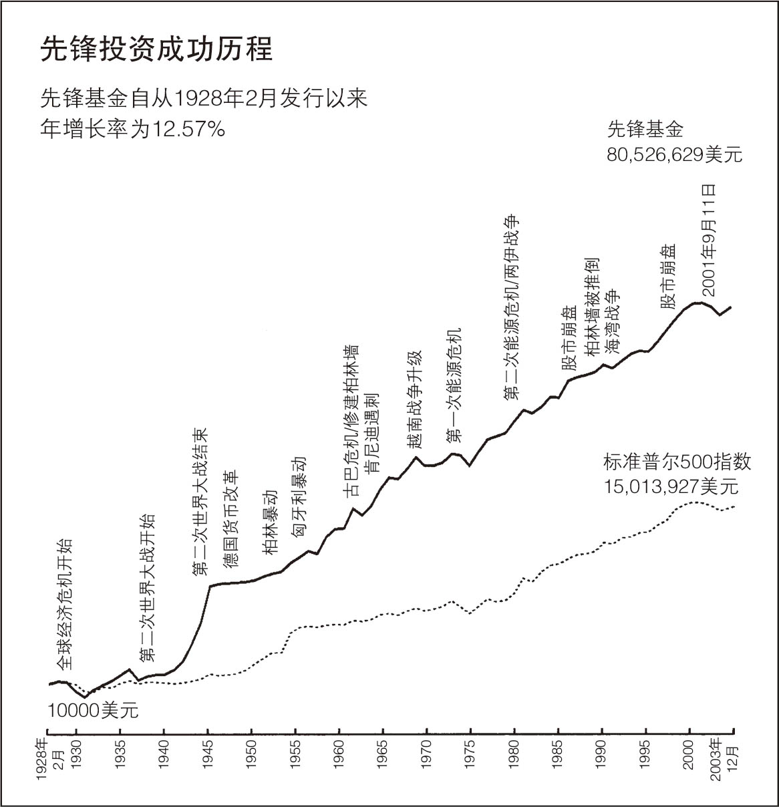

回想当时，道琼斯指数那个时候下滑了90％（！）。它要耗费26年，才能再次达到曾经的高位。而先锋基金为此只需要7年时间。

在这75年里，先锋基金经历了各种各样艰难的时期，包括第二次世界大战、石油危机和上面提到的低迷时期。尽管遭遇了各种危机，这支基金从1928年2月到2003年12月都在持续上涨，如同以上图表中显示的那样。它甚至远远超过了对应的标准普尔指数。

显然，比起大多数个人投资者，许多基金能够更好地在逆境中谋发展。

让我们再次回到市场低迷这个问题。你可能了解1958年到1982年的股市发展情况。达克斯指数（当时还不存在，但我们可以假定计算出这段期间的走势情况）在这期间几乎没有增长。那么，如何能指望其他的基金经理取得12％的收益率呢？

答案是：在经济不景气时期后，紧接着必然是革新时期。在萧条时期，构成达克斯指数的企业，发展起来可谓是困难重重。但是一些小公司发展得如日中天。1958年到1982年这段时间，大型标准股和小型股（小公司）的增长比例为1∶6。也就是说，投资小型股可以获得高出5倍的收益率。顺便提一下，1932年到1946年，小型股的涨幅也是大公司的6倍（1941％︰324％）。

所以，每一段时期，都有业绩表现优异的股票。在大型指数走势低迷时期，小公司却不断地极速发展。
但这些小公司对股市下跌也十分敏感。因此，最好在股市停止下跌后，再将其购入。直到股市止住下跌，才出现真正的购买良机，对于新兴市场也同样适合这样的规律。在此之前，请多一些耐心，等待真正适合的时机出现，让风险和机会达到最优比例。

另外，据统计数据显示，尤其是在极其繁荣时期的后半段，大公司所取得的成绩要远远优于小公司的平均收益。

还有一个在低迷时期取得收益的简单办法是：加入价值投资的基金，比如坦普顿成长基金（欧元计价）。早在1954年，该基金就已被创立，最初是以美元计价。它一直以来秉承的策略是：只买进低于价值的项目，持有几年，待达到了一定价值后再将其卖掉。这样操作可以保持每年约12％的收益率。

多年来，该基金的管理极少发生变动，始终严格遵守基金创始人约翰·坦普顿爵士设定的投资原则。在某市场仍旧繁荣时，该基金早早跳出，让自己能重新投资新的发展潜力巨大的市场。但这支基金也因此总是招致一些批评，因为它没有在市场繁荣时继续跟进，没有跟上大众的发展趋势。不久，这支基金持续上涨，批评的声音又转为一片赞赏，夸赞它极具稳定性。

这支基金属于国际股票基金中少有的保守党，并且投资策略非常固定。因此，它始终是风险等级四中最牢靠的基础投资。

一定的风险接受度在新一代的股票基金中非常有必要。相应地，它们也能在不同的股市阶段提供更高的收益机会。投资标的全球化的股票基金就属于这一类型，通过对冲策略（对冲基金的一种方式），比如做空，卖出期权和其他产品等，可以在市场低迷或者上涨时都取得收益。不过这些基金出现的时间还不长，因此还有好多年后才能书写出自己的成功故事。

此外，可以直接买进对冲基金，以保持在低迷时期获利。不过，请把这些基金的高风险考虑进去，这类型基金在投资组合中的比重不要超出10％～20％，并且务必认真研究产品说明。

------------------------------------------------------------------------

致富能量贴士

- 对于风险等级四的投资产品来讲，购入时机对最终结果几乎没有影响。
- 许多新兴市场在超过36个月的时间里平均增长率高达350％，然后在超过18个月的时间里会跌落约50％。面对如此强烈的波动，最有效甚至在许多情况下唯一有用的策略是，在股市大跌后再买进。
- 行情下跌（或者更确切地称作“股价回档”）还不是亏损。
- 最重要的原则是：请在行情下跌时加购，为此，你需要有现金储备。
- 适用于个别行业和新兴市场大部分领域的是：在行情出现暴跌时，才考虑加购或者开始进入投资。
- 经济增速乘以3～5就得出该市场平均的收益率。
- 在新兴市场投资的4条重要准则是：\
  　-只投资你有一定了解的市场。\
  　-投资时，始终选择购买基金。\
  　-在相应市场进行首次投资时，最多投入计划向该市场投资资金的50％。之后可能会出现更有利的购买机会。\
  　-将投资目标书面确定下来。当你达到收益目标后，至少要从中抽出部分资金。
- 当股价下跌60％后，后续就拥有巨大的回升潜力。
- 如果股价下跌90％，那么回升潜力确实能达到900％。
- 即便是再聪明，我们也不应该忘了，如果市场没有如此迅速地增长，再聪明也无济于事。
- 优秀的投资者少不了运气的辅助。
- 对于风险等级一、二、三的投资，在这期间几乎不必采取任何行动。同样，对于风险等级四的大象级投资也是如此。
- 也许已经极速增长的投资市场还会继续上涨一段时间，不过这种情况下，请你对比市场刚经历暴跌后的机会和风险，你就会发现，后者的发展前景更有利。
- 1958年到1982年这段时间，大型标准股和小型股的增长比例为1∶6。所以，每一段时期，都有业绩表现优异的股票。在大型指数走势低迷时期，小公司却不断地极速发展。
- 在投资组合中加入各种不同投资策略的产品，是非常不错的方式。这不仅可以让投资长期保持成功，还能尝试新发行的投资基金。

------------------------------------------------------------------------

第十三章\
如何管理投资
============

基本上来讲，经济萧条时期，\
人们必须尽可能沉着、耐心地去应对。

——约翰·梅纳德·凯恩斯（John Maynard Keynes）

------------------------------------------------------------------------

在你开始投资（但愿如此）且取得一定投资成果后，本章中我们打算共同研究如何管控成果。此外，我们要看看，如果你有一天想靠金鹅的金蛋生活，要怎样以最灵活的方式来操作投资。

我们会在本章中探讨以下问题：

- 在哪些时期应该管控投资？
- 怎样才能在最短的时间内（每月最多2个小时）记录下最重要的数据？
- 如果每月需要靠资金收益生活，怎样确保每月能有一定的进账？
- 需要时不时地更换投资吗？

##  在哪些时期应该管控投资

最开始，每隔1～3个月查看并记录一下基金的最新行情状况便足够了。
当然，你如果经常去查看也不会有什么影响，不过也起不到什么积极的作用。尽管你可能会非常好奇，恨不得天天都去查看几次。那么，不要忘了计算成果的公式：

成果＝绩效/时间

如果你差不多每隔1～3个月定期记录自己投资的状况，刚好能达到最理想的投入时间和成果比。并且，就算你投入更多时间去关注，投资成果也不可能有太大的提升。企业入股和英国年金保险储蓄计划通常每年关注一次就可以了，查看得太频繁了，也没有意义。

此外，你每年需要抽出半天至两天的时间，根据资产状况和投资个性来考虑你的投资策略。

##  平均成本法

如果你决定好了定期定额投资，原则上，甚至一年更新一次持仓就足够了。同时，你应当借此机会适时调整策略，使之适应生活水平和股市行情的变化。

关于定期定额投资和与之关联的所谓的平均成本法在每本投资书籍里都有涉及，并且在经济类杂志中也能读到部分内容。简单来说，它的优点是：由于平均成本法，你才能按照始终固定的每月定投额度购买尽量多的份额。在基金单价跌到谷底时，你因此能自动多购入份额。这些优点我已经在《财务自由之路》中提到过。

但是，运用平均成本法在一定的情况下也有其缺点。虽然这些缺点没有决定性影响，不至于让你必须放弃每月定投。但至少你应当要对这些缺点有所了解。总结起来有以下3点：

1．固定的每月存储利率会降低你投资的透明度。获得的收益率很难去计算。为了精确地获知收益，你必须把每月的款项分开来看，再进行计算。在实际的投资中，估计没人会这样做。这是最主要的一个缺点。此外，还有两个无关大局的小缺点。

2．你投入一支基金的金额越多，在行情下跌时，定期定额投资的优势就越少。虽然你可以在股价下跌时期以有利的价格购进，但股价下跌同时也会影响你已经购进的基金，投入总值会跟着贬值。

3．长期来看，虽然通过平均成本法可以取得不错的收益，但无法利用购入价格低于价值的好时机。

小贴士

因此，我建议同时进行两项不同的投资：一项是进行单笔投资，另一项则是做定期定额投资。请放弃计算单笔投资的实际收益走势，这对你来讲会很困难。如果把投资交给专业人士打理，那你每半年或者每个季度查看下投资的状况就够了。只有当你的投资资产至少达到了100万欧元，才值得每月都要了解行情报告。一份专业的投资报表，应该按照风险等级把投资产品进行分类，同时清晰地展现每一项产品从购买当日起的收益情况。当然，从中还要看出总收益的增值和自投资起的年收益情况。更理想的情况是还能把投资组合与对应的指数做比较。比如，MSCI
World（世界股票指数）。最重要的是，报表须一目了然、简明易懂，能够让人一眼就看出发展情况。

##  记录最重要的数据

幸运的是，现在可以用很多技术手段去管理投资。只要拥有一台联网的计算机，通过在银行开通一个账户，便可以通过最简单、最经济的方式来管理。在一些直接投资银行，你可以开通个人免费的基金账户，输入基金的数据（姓名、购买价格和份额），然后可以通过网络获取投资项目每日更新的信息。

此外，还有无数的计算机软件，对你管理投资账户会有所帮助。请注意，只买那些你真正需要的软件，否则，不但会花掉很多冤枉钱，而且对你的目标达成也没有意义。

一份优秀的跨区域日报对你能大有帮助。你可以从报纸中找出某一日期的最新回购行情，并且记录下来。

软件和直接投资银行的地址和网站可以直接通过网络搜索查找。

##  书面记录的原则

你还记得我说过，把所有和投资策略相关的重要信息都书面确定下来吗？这尤其适用于促使你去申购某一投资的原因，同时也能让你清醒地瞄准投资目标。有时候，我们都无可避免地会成为情绪的牺牲品。担忧和贪欲很容易让我们和财富失之交臂。所以，最好还是能通过书面记录时刻提醒自己预期的目标。

通过图表13.1我想向你们介绍我自己使用的一个一览表。几年前我就向培训班的学员展示过。到目前为止，有上千投资者使用了这个图表。同时，有很多使用者向我证明了，这份图表对他们来讲是多么重要。填写说明如下：

图表13.1　投资组合一览表和行情监控

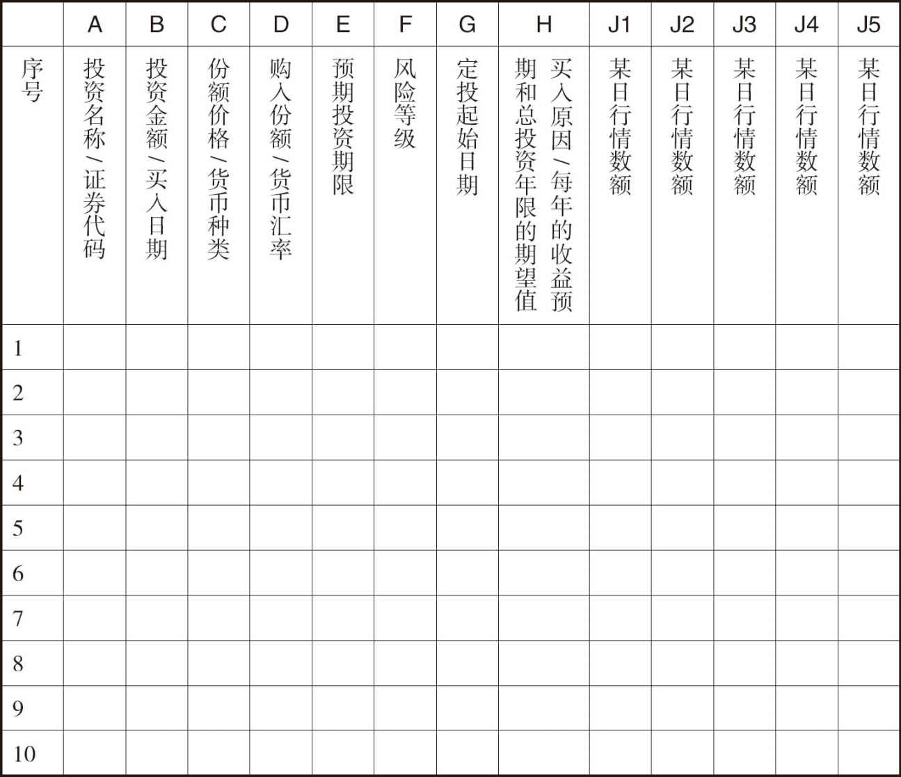

A：这一栏填写投资的名称以及证券代码。这样你就不必多花时间去查找这些信息。

B：记录下投资的金额和购买日期。

C：记录下每股份额的价格和货币种类。

D：你持有多少份额和准确的汇率。

E：你打算持有这些份额多长时间？在此请注意该类投资等级的最低投资年限（[参阅此处](#text00063.html_sec100)
）。

F：记录下该投资所属的风险等级（参看第五章和第六章）。

G：如果有定期定额投资，记录下起始时间。可能的话，单独编制一个类似的图表，在上面记录你每月基金份额的购买行情。

H：这一栏尤其重要。用关键词记录下你购买的原因。同时写下你每年的收益预期和预计投资期限内的总收益。

J1，J2，J3……：按照一定的周期记录下投资的最新价值。每隔1～3个月确定一个日期去查看就完全足够了。

一览表形式最大的优点是：你可以对所有重要的信息一目了然。而且你每月最多只需花上1～2个小时的时间。通常你也不需要（而且也不应该）经常变动。当你在一览表的基础上得出，想要买进或者卖出一项投资，可以通过电话、传真或者网络很快就能办妥。这种投资组合的管理方式由于耗时少，同时考虑缜密，所以效率非常高。

我的建议是：把这份图表复印下来，立马就开始用起来。把你已经持有的投资项目对应着填进去。不过请一定遵守在第七章中确定的投资分散原则。并按照第七章内容，把个人的投资个性和财富状况考虑进去。

所以，你要尽快地采取必要的行动来改变。如果你像许多德国投资者那样，在风险等级一和二中的投资比重太多，那么请马上开始调整投资的比例：选择风险等级四到六中的产品做投资计划
。把更多可支配的资金用于投资高风险等级的产品，直到你达到了第七章中介绍的理想的资产分配状况。

##  产金蛋的鹅：依靠利息逍遥度日

也许，在阅读本书期间，你已经拥有了一只能给你产金蛋的金鹅，也就是你可以靠资金的收益生活。那我要首先向你表示祝贺。这种感觉一定非常美妙。财务自由就是大多数人梦寐以求的目标。但现在面临的一个重要问题是：你如何确认，你每个月有一定的款项可供支配呢？

#### 赎回计划

大多数基金公司都会从达到一定的投资金额开始，和投资者约定一定的投资赎回计划（大多数是在5000欧元～25000欧元之间）。

然后你可以自己任意确定时间间隔赎回资金的一定比例或者固定的额度。有两种不同的基本模式。一种是，你可以约定只赎回收益或者比收益稍低一些的金额。人们称这种方式为资本收益支付
。另一种方式是，可以慢慢地赎回本金。如果采取这种方式，你就要考虑清楚，预计还有多少年需要用钱。在约定时期最后，这笔资金就会被赎回完毕（资本消耗支付
）。

就我个人而言，第二种方式不太保险。因为你可能会比预测的时间活得更久。那么，等资本完全赎回，你又将怎样维持之后的生活？

不过这两种方式都有个不可避免的缺点：成本平均法在股票基金的赎回计划中，起到的作用刚好相反。
意思是，有些情况下，你可能会为定期赎回付出很高的代价，特别是当行情下跌时。因为这种情况下，为了保证固定的赎回金额，你就必须卖出更多的份额。因此，最好是只选择投资组合中涨幅较大的基金进行资金赎回。

#### 赎回账户

投资公司可以提供的这些服务，你自己稍微多花一些时间（或者是通过顾问的帮助）也可以实现。

构建适合你自己的、组织优良的赎回账户。

这样一来，你可以比较有保障，并且可以让资金保持较高的机动性和灵活性。

接下来我介绍的方法，也许不是让人最舒服的，但肯定是获利最多的。有以下三个步骤：

步骤1：
把你第一年需要动用的资金放入利息较高的储蓄账户中（通过直销银行）或者投资欧洲货币市场基金。

从中，你可以每月按需提取资金。定息债券基金不适合这个目的，因为短期内赎回，申购费占的比重非常高。

步骤2：
另一部分资本投资风险等级二的混合产品组合。这部分是你的安全保障。

在这个账户中，你可以从第二年开始每月领取额外的年金。投资在这个账户中的额度多少取决于你的投资个性：如果按照第七章的测试，你属于A类型风险投资者，那么你应该在这个账户里投入尽可能多的资金，可以足够你10年的生活。这样，每年大概能获得6％的收益。对于其他风险投资者类型：如果你属于B类型，在此账户内投资的资金应该保证5～10年的生活（根据安全需求而定）；对于C类型，保证4～5年；对于D类型，3～4年。安全备用金不应当低于3年。

步骤3：剩余的资金投入风险等级三到六中。这个部分是让资本增长的最大动力，收益率可以达到12％甚至更高，是你的增长账户。在这个部分请结合第七章中为你确定的策略来操作。

#### 定期调整投资结构

每当高风险部分取得了好收益或者达到了收益目标，就请将其卖出。将这部分变现的资金填充安全保障账户。

通过这种方式，只在行情好的时候卖出投资，然后在安全保障账户中仍旧持有需要的安全储备金。超出平均部分的收益还可以用来奖励自己，比如享受一次旅行。

这里有一个计算案例，可以向你展现，没有资本消耗的赎回账户如何发展。从以下几个假设出发。

●安全保障账户中投资的资金每年有6％的利息，然后每5年用完这笔资金。申购费为3％。

●增长账户每年的平均涨幅为12％。申购费为5％。

●每年赎回比例为8％，而且每月提款（理想的情况是，前几年每年只赎回6％）。

●投资总额为50万欧元。得出每月赎回金额为3333欧元。

●为了构建安全保障账户，在每年6％的利息并且每月都有提款的情况下，让资本在5年内消耗完，你需要178000欧元。这笔资金约占总投资额的35.6％。

●这样，增长账户就还有322000欧元。假设按照每年12％的收益计算，5年后将增长为约54万欧元。

●第一个5年后，按照8％的赎回率提取54万欧元。也就是说，每月获得的“退休金”提高了。现在在安全保障账户中应当投资187000欧元（占最新资金总额的35.5％），这笔资金将从增长账户中转入。这笔钱又将在接下来的5年内赎回完毕。同时，增长账户中余下的352000欧元在5年内将增长为62万欧元。

●接下来的发展趋势如下所示：第十一年，总资金为62万欧元，每个月的赎回资金可增长为4133欧元。第十六年，总资金为70.3万欧元，每月可赎回4686欧元。第二十一年，总资金为79.8万欧元，每月可赎回5320欧元。（每5年的每月赎回金额增长率达到了13％！）

这样的账户发展真的能实现吗？关于这个问题，我可以肯定回答你：“可以。”当你觉得每年8％的赎回比例过高，保险起见，你还是可以每年提取6％。这样比起传统的个人年金保险收益还是要高。此外，灵活性也明显高得多，你可以随时支取个人资金。

有些时候，账户发展的状况还会更好。

这里还有一个计算的例子。假设，除了前面所说的50万欧元，你还有15万欧元可供使用。后面这笔钱你还没有做分配。如果做这样的一个游戏：把这15万欧元投到风险等级五和六的产品上，获得的收益率将为20％，如果你一直不去碰这笔资金，那么11年后将增加1486016欧元，16年后为3697684欧元，21年后将多出9201022欧元可供使用。

这样一来，你可以自己构造实现财务自由的账户结构。

#### 这一切不会耗费特别多的时间吗

只要你熟悉了这套工作方法，那你就会看到，实际上必须付出的时间非常少（对于赖以维持生活的债券基金账户，可能会稍微多花些时间，但下面确定的时间对它也同样适用）。我们已经讨论过了，应当如何管理投资，也看到了应该什么时候买进、卖出以及调整投资。这一系列操作每月所需要的时间不会超过1～2个小时
。

此外，每年应该抽出一次半天到两天的时间，来更新你的投资组合。不要忘了，如果你能找到一名值得信赖的投资组合顾问，每年需要的这部分时间还能大大缩短。那样，你每年只需要花1个小时坐下来向他了解情况即可。

尽管如此，仍旧适用的一点是：

你最好现在就确定一个财务日。

请你给自己约定一个日期，并且应当把这个日子看成和朋友的约会日一样重要。

如果你和伴侣生活在一起，那么请注意，你的伴侣也要和你共度财务
日这一天。

也许，你的伴侣对“枯燥无味的理财事务”毫无兴趣，但是他/她是否能燃起兴趣，和你有很大的关系。请相信我，一起度过这一天会更加有趣，而且你们一起也许还能实现更高的收益（在《女子理财从入门到精通》中，有更多这方面的内容。书中提到的内容对女性和男性都同样适用）。

你现在正放下书，准备在日程安排表中确定每年的财务日，是吗？请不要让本书的内容仅停留在灰色的理论阶段。实现富足的生活不是依靠这本书，而是只有靠你亲自去操作！所以，快把日程安排表拿出来，就趁现在。

##  每年的财务日

有几项重要的任务你应当在个人财务日这一天完成。首先，查看上一年财务的发展情况，然后制订下一年的财务计划。

1．检查自己的目标。计算一下，实现这个目标的财务费用是多少。

2．计算一下，你的资产在上一年的时间中发生了什么改变。推断一下，如果按照同样的方式继续发展，10年、15年和20年后，你将处于什么位置。

3．重新审视你在金钱方面的信条。你的金钱观有何改变？

4．检查你提升收入的策略。请记录下，你的收入增加了多少。你有定期记录下成功历程吗？请把自己上一年里最大的成就列出来，同时也把上一年所吸取的最主要的教训列成清单。有什么可以改进的办法？你在做自己喜爱的事吗？怎样才能在工作中获得更多的乐趣？你有充分地委托他人办事吗？

5．请重新制订一份预算计划，把每月以及定期产生的费用列出来。同时，自己审视哪些费用是多余的，如何才能既减少开支，又能保持同样的生活品质。

6．检查你的账户模式，并在必要情况下进行改变。

7．请结合个人的投资个性（参阅第七章）、资产状况和投资年限来审查你的投资组合。请务必每年重新做一遍风险等级测试——你的风险意识正在发生改变！最好是你能每年重新过一遍第七章的内容，然后做一些必要的调整。也许你在风险等级五和六中的投资大大增加，那么你在高风险领域的资金就会比起初预定的要多。
你需要从风险等级五和六的投资中提取资金，用以再投到风险等级一到四的产品中，直到达到你最初设定（或者现在希望）的风险分配比例。

8．请和投资顾问进行一次长时间的电话交流或面对面谈话。和他讨论你在财务日梳理出的结果。如果已经开始进行赎回计划，那么请你也对此计划进行审查，以及为下一年进行调整。

9．检视你的知识和时间投资：你去年阅读了多少本与理财相关的书籍和专业杂志？看书占用了你多少时间？与人交往也属于新获得的实践知识：过去的一年里，你新认识了多少专家和成功人士？和他们中的多少人还在保持联系？

10．你享受你的财富吗？你是否心怀感激？请把你在上一年里所感激的事情列成清单。你一共捐了多少款呢？

11．现在请计划对下一年财务的优化方案。到明年年末，你应该交出一份什么样的财务成绩单呢？请学会掌控自己的人生。通过有目标地把计划转化成行动，你的自信心会得到极大的提升。

第二点详见《财务自由之路》的第十二章。

第三点详见《财务自由之路》的第五章和《女子理财从入门到精通》的第三章。

第四点详见《财务自由之路》的第七章和《女子理财从入门到精通》的第六章。

第五点详见《财务自由之路》的第十二章和《女子理财从入门到精通》的第五章。

最后，第六点详见《财务自由之路》的第八章和《女子理财从入门到精通》的第五章。

#### 成功人士首先处理重要的事情

你觉得上述的列表太小题大做了吗？如果你打算认真对待这些问题，大概需要8～20个小时。资产达到100万欧元以上，需要的时间也许还要长一些。但是请相信我：这样做非常值得。还有一点：如果你不设立财务日，也许在财务上投入的时间还会更长。那时你可能只是忙于减少损失，而不是奠定财务自由的基础条件。请及时按照优先级整理财务中重要的问题，防止由于疏忽而使得事情变得被动。你要让财务成为你生活中的支柱力量。为此，不需要耗费太多的时间。

有一些事情是不可避免的。当羚羊被狮子追赶时，它就必须得跑。当狮子想要吃掉羚羊，狮子也必须要跑。同样的道理，不管你是狮子或者羚羊：如果不跑，肯定就会有麻烦。不管拥有的财富是多是少，你都必须做点什么。

有时候，你给自己计划假期时花费的时间更多。那什么不能在一年时间里留一天给投资呢？当你第一次试行财务日后，就会形成一套再也不想忘记的经验。我向你们保证，这肯定能给你带来乐趣。你想想，富裕是你与生俱来的权利。对此，你只需做小部分的事情，但这小部分是你必须完成的。

------------------------------------------------------------------------

致富能量贴士

- 最开始，每隔1～3个月查看并记录一下基金的最新行情状况便足够了。
- 你需要每年抽出半天至两天的时间，根据资产状况和投资个性来考虑你的投资策略。
- 固定的每月存储利率会降低你投资的透明度。获得的收益很难去计算。因此，建议进行两项不同的投资：一项是进行单笔投资，另一项则是做定期定额投资。
- 有时候，我们都无可避免地会成为情绪的牺牲品。所以，还是通过记录时刻提醒自己我们的目标。
- 构建适合你自己的、组织优良的年金或资金赎回账户。投资公司可以提供的这些服务，你自己稍微多花一些时间也可以实现。
- 如果你和伴侣生活在一起，那么请注意，你的伴侣也要和你一起共度每年的财务日。
- 请及时按照优先级整理财务中重要的问题，防止由于疏忽而使得事情变得被动。

------------------------------------------------------------------------

第十四章\
献给冒险热衷者的两个风暴点子
============================

不愿承担风险的人，\
只会一事无成，一无所有，一无是处。

——丹·培纳（Dan Pena）

------------------------------------------------------------------------

从我的培训班和讲座的学员、听众身上，我认识了投资者的两个愿望：

- 把不动产贷款的期限减半
- 让每年的收益翻番。

好消息是：两者皆有可能。
但是这其中也存在不利的一面，那就是你必须为此付出一定的代价。这个代价你并不陌生：必须为此承担更高的风险。

任何成功的代价都是我们必须为之承担风险。

这一点就像一根红线一样，贯穿于整本书之中。不过想必你肯定还记得我的一个观点：个人的感觉舒适是最重要的。如果你由于忧心焦虑而寝食难安，那么收益再高对你来讲都微不足道。因此，我建议，如果你在第七章测试中被归于风险承受等级C或是D组，再继续阅读本章内容以及采纳本章中的推荐。反之，如果你属于风险承受等级A组，那请你自动和下文的建议保持距离。同样，对风险承受等级B组的人，对下面的建议我也不做推荐。除非你还很年轻，想要改变你的投资个性。

##  将不动产贷款的期限缩短50％

在德国，不动产的贷款仍旧首选传统的分期偿还方式。不动产的所有者在这方面尤其注重去获取尽可能低的利率。为此，常常会讨价还价到利率小数点后第二位。然而，偿还形式，也就是如何偿还贷款，却比约定利率更为关键。

如果分期偿还采用直接还款的方式，那么从一开始就要贷款，而且只计算剩余贷款的利息。还有另外一种方式是：采用到期一次性偿还
的方式，一开始不用偿还本金，只向贷款机构支付利息。需偿还的份额（通常为贷款总额的1％～2％）将以一种投资形式来存入。最开始大部分是进入形成资本的人寿保险账户，之后才会用投资账户对贷款进行一次性全额偿还或者分次摊还。

因为人寿保险的收益并不是非常高，所以大多数只有出租和商用的不动产出于税收原因（2005年1月1日后，取消了这条税收优惠）才会采取这种偿贷方式。当然，在还款期限内，采取这种方式需支付的利息总额要高于分期还款方式。

但是，如果你选择把偿还的资金用于投资基金，情况又会大不相同。采用基金定投方式偿还也适用于自用的不动产。因为一般来讲，定投的收益率会明显较高，你可以由此将普遍的还款期限缩短50％。

但是，关于这种还款形式还存在一定的争议。许多银行和融资顾问还总是拒绝采用这种方式，提醒称风险太高。而且，虽然立法机关在此期间甚至明确了投资基金为个人养老保障的组成部分，情况依旧如此。拒绝背后真正的原因首先是这些机构出于自身的利益考虑，以及投资顾问缺乏相关专业知识。在这方面，其他国家比德国发展超前了很多。

#### 通过定期定额投资基金来偿贷

我们来看看，这种投资基金的偿贷方式到底怎么样。首先，我们必须说明的是，应当约定多长的期限。选择5％～7％的低利率水平时，最低期限是10年，如果可能，最好选择15年
（因为反正10年期满后，你拥有特殊的解约权）。时间尽可能长一些的利息协定可以提高安全性，这一点优势你不应该舍去。

这种协定对你来讲有两点优势。

一是意味着在实践操作中，你可以任意选择在第十一年到第十五年间分期偿还贷款，而且不必支付提前还款费用。通过这种方式，你可以为后续偿贷保证有利的利率水平。
因为如果我向你指明15年后怎样偿还贷款，对你而言不见得是最好的办法。

二是在最后5年内，自由选择偿还时间点可以带来更高程度的安全性，让你免受股票市场波动带来的负面影响。

具体的卖出时间单单取决于你持仓的发展情况，那样，你就不必在某一个规定日卖出基金份额——比如当遭遇股市崩盘时。当面临长时间的行情下滑时，你可以安心地等待，直到有利于出售的行情到来。

#### 比较两种偿贷方式

我们来比较一下分期偿还方式和定投基金的偿贷方式。在下面的例子中，我们假设，将10年期的利息确定为每年6.5％。假设从第十一年开始，利率为8％（这个利率符合长期抵押贷款的平均利率水平。大多数情况下，对偿贷期间可能出现的利率上涨情况不做考虑。出于简化需要，整个时期内按照固定的利率来计算。这在低利率时期可能会很危险，因为后续偿还过程中如果利率升高，会导致每月负担加重，偿贷者有可能会无力承担）。

在我们的举例中，资本需求为50万欧元，个人资本有15万欧元，贷款额为35万欧元。偿还份额为贷款额的1％。从中可以得出每月定投基金的金额，定投基金每年的平均增长率为12％（即使年增长率只有8％，最后还是会有盈余）。为了能更好地比较，两种贷款的总期限设定为30年。在此对税收不予考虑。

在图表14.1中可以看到，通过定投基金的方式偿贷获得了约55万的明显盈余——只需要从第十一年起每月稍多支付一点。拥有了这55万欧元，你可以让每月的养老金增加3663欧元（每年赎回总额的8％）。

图表14.1　分期偿贷和定投基金方式偿贷的比较

<table class="kindle-cn-table-body" data-cellspacing="0">
<colgroup>
<col style="width: 33%" />
<col style="width: 33%" />
<col style="width: 33%" />
</colgroup>
<tbody>
<tr class="calibre17">
<td class="kindle-cn-table-th" width="40%"></td>
<td class="kindle-cn-table-th" width="30%">分期偿贷</td>
<td class="kindle-cn-table-th" width="30%">采用定投方式偿还</td>
</tr>
<tr class="calibre17">
<td class="kindle-cn-table-dg">资本需求 
个人资本 
贷款总额</td>
<td class="kindle-cn-table-dg">500000欧元 
150000欧元 
350000欧元</td>
<td class="kindle-cn-table-dg">500000欧元 
150000欧元 
350000欧元</td>
</tr>
<tr class="calibre17">
<td class="kindle-cn-table-dg">每月支付金额 
第一至第十年 
第十一年至第三十年</td>
<td class="kindle-cn-table-dg">2187.5欧元 
2563.6欧元</td>
<td class="kindle-cn-table-dg">2187.5欧元 
2625.0欧元</td>
</tr>
<tr class="calibre17">
<td class="kindle-cn-table-dg">支付总额</td>
<td class="kindle-cn-table-dg">850997欧元</td>
<td class="kindle-cn-table-dg">892500欧元</td>
</tr>
<tr class="calibre17">
<td class="kindle-cn-table-dg">剩余贷款金额</td>
<td class="kindle-cn-table-dg">0欧元</td>
<td class="kindle-cn-table-dg">350000欧元</td>
</tr>
<tr class="calibre17">
<td class="kindle-cn-table-dg">基金资产</td>
<td class="kindle-cn-table-dg">0欧元</td>
<td class="kindle-cn-table-dg">899567欧元</td>
</tr>
<tr class="calibre17">
<td class="kindle-cn-table-dg">纯盈余（基金资产减去贷款）</td>
<td class="kindle-cn-table-dg">0欧元</td>
<td class="kindle-cn-table-dg">549567欧元</td>
</tr>
</tbody>
</table>

通过定投股票基金，在年收益率为12％的情况下，可以在22年后将贷款全部偿还。然而，提早还清贷款的做法并不一定明智。虽然我指明了这种可能性，但是在大部分情况下这种方式并不可取。毕竟你在任何其他地方都不可能获得像抵押贷款那样便宜的资金。

通过定投基金来偿贷，你可获得如同最初的贷款额那样高的盈余资金。

#### 个人资本

在贷款时，我们应该特别关注个人资本这个话题。按照传统的模式，个人资本占购买价的比例通常为20％～30％。理由是：这种方式让购买价中贷款比例尽可能低，使得每月的负担不会那么高。

事实上，这种规定主要是极大地降低了银行的风险。
因为一旦你陷入还款困境，银行会通过拍卖重新获得这部分资金。而你就会失去房产以及你已投入的资金。请一定避免出现这种“因房致穷”的情况。

小贴士

贷款时，尽量筹集100％或至少90％的资金。这样做有两大好处。一是如果贷款人只用购买价的10％来投资基金，而不是减少贷款额，那么将可以避免出现拍卖的情况。因为通过这种方式，他们就拥有了安全的经济后盾，至少可以承担两年的利息支付。二是基金账户可以随时用来提前偿还贷款。

#### 100％贷款

你也许会马上反驳：“这种做法能够理解，但是哪里能拿到100％或者至少90％的贷款呢？”事实上，在德国银行很难做到这一点。这方面我们可以好好向欧洲邻国多学习学习。比如，在荷兰，不动产贷款总额可以达到其市场价值的125％。但是，只有个别德国的银行认识到了这一趋势。

如果有兴趣了解能给在德国的不动产做90％～100％贷款的银行，但没有找到合适的，那你可以来咨询我们。我们非常乐意向你分享最新的机会。但是请你务必注意，良好的信用和足够的资产理所当然是这类贷款成功的前提条件。

再一起来看看图表14.1的举例。对其做一项关键的变动：你的个人资本不是15万欧元，而是只有5万欧元，然后贷款金额则为45万欧元。省下的10万欧元根据你的风险承受度（见第七章）来进行投资。必要情况下，你甚至可以出于安全考虑把这笔钱放在银行。

如果这笔钱按照平均每年12％的幅度增长，那么你可以在15年后完全偿清债务——甚至还将获得约9.7万欧元的盈余。

当然，每月付款额在第一至第十年期间将为2437欧元，第十一年至第十五年期间提高到每月3000欧元（由于贷款额增高了）。因此，这种方式只适合每月有能力承担更高费用的投资者。对此，我的看法是：只有真正能够负担买房的人，才应该去买房。如果过早去买进不动产，势必会大大地降低个人生活品质。如果成为“房奴”，那就太不值得了。房子只应当用来提升生活品质，而不是降低生活质量。而“因房致穷”的现象还在不断地蔓延。

如上文所述，许多银行仍旧拒绝这种贷款方式——提醒称“风险过高”。但也有越来越多的银行转变看法，认为从长期来看，股票基金能够提供可靠且丰厚的收益。寻找这样的银行是值得去做的。

#### 以已经完全清偿的不动产做抵押贷款

与之相关的还有另一种有趣的运用投资账户的可能性。假设你拥有一份价值30万欧元的不动产，而且贷款已经完全清偿完毕。你可能会感到“无债一身轻”的喜悦。至少从我培训班和讲座中获取的情况来看，许多德国人内心怀有的愿望是，尽可能迅速地把不动产贷款偿还完毕。

继续假设，你目前每月定投金额为583欧元。那么，按照12％的平均年收益计算，10年后你将获得约12.4万欧元的资本。这是个相当不错的成绩，但还拥有上升的空间。因为你还可以多获得7.1万欧元——而且不需要增加投入
。你只需要简单地按照以下方式操作。

不采取定投的方式，而是抵押不动产获得10万欧元，贷款期限为10年，而且在这期间内不用偿还。如此一来，每月的利息支出约为583欧元（10万欧元×7％＝7000欧元，除以12个月＝583欧元）。这一数额正好等于你之前定投的金额。我们把这贷款的10万欧元，用来投资分散广泛的投资组合。你的钱不再进行定投，而是用来偿还抵押房产的贷款利息
。

同样按照12％的年利率计算，10年后，这笔资金将会从10万欧元增长为295000欧元。从中扣除还贷的10万欧元，还有19.5万欧元可供使用，而定投的方式“只有”12.4万欧元。也就是说，你能多获得7.1万欧元的收益
。这完全是一个值得权衡考虑的选择方案。在这两种方式中，假设手续费都为5％，而且已经将其扣除了。

#### 前提条件

在《女子理财从入门到精通》一书中，我和卡罗拉·费斯特尔详细地描述了为什么要把房子做抵押，而且应当尽量不要提早偿还。我们有意地在书中明确表达：“房产是最愚蠢的保存资金的地方。”（无法称其为投资，因为和房产绑定的个人资产无法带来任何收益）通过上下文，我们要认识到：一处全部或者部分清偿的房产能给我们开启通往资本市场的全新机会。因此，比起已知的资产部分，你可能还会多出好些资金可供投资
。不过，以下几点仍要提醒大家注意。

1．利用这种抵押贷款方式，利息最多不能超过8％。

2．有一个上限：每月支付的贷款利息不应超过原来每月的定投金额。

3．约定的贷款期限至少是10年，可能的话，最好是15年。请把这笔钱进行相对保守、分散较广的投资。最多只能将这笔资金的10％～20％投资到风险等级五和六的产品中。否则可能会变成“老虎侵吞金鹅和房子”。

4．宁可“过分谨慎”地对待资产配置和产品选择。请确保始终拥有一定的现金储备和/或定息债券投资基金。这样，无论如何，你都能够支付利息。

重要提示：
请不要把这种形式和“借钱投资”搞混淆。我个人非常不赞同用一般的借款去进行投资的策略。

从原则上来讲，只应当利用属于你个人的资金来进行投资。

这个观点在我们上述例子中是能够得以保证的。你把你的资金（之前投入房产的资金）从不动产中抽出——因为在那里无法获得收益——然后用来投资基金。你通过不动产来贷款是十分合理的，因为不动产拥有相应的价值。

##  杠杆作用——每年多获得100％的收益率

我在前文提过，你将有可能把每年的收益率提高大约100％。而前提条件你已经知道了：伴随着收益增长的是风险增加。因为要增长差不多100％的巨额收益，风险当然也就会随之增加。你接受外币形式的证券抵押贷款，就如同使用一个杠杆。

举个例子。假设你有10万欧元可供使用，你不只希望用它来稍做投机，还想拿它做点冒险游戏。在严肃的投资中，用一小部分钱来找点乐趣，并且做点稍微“疯狂的”行为，也未尝不是件好事（这部分资金可以作为投资组合中的“调味剂”）。你把这笔钱放入一家瑞士银行进行投资基金托管，这是很流行的做法，而且操作很灵活。然后，你可以在这类银行中获得同样金额的有价证券抵押贷款，这样，你就又获得10万欧元，同样也用来投资基金。两笔金额加起来就是20万欧元，出于安全考虑，你把这笔钱转进银行进行托管。按理说，这和你运用初始资金的投资方式相同。只不过你通过抵押贷款贷将可使用的金额翻了一番，最初的10万欧元便起到了杠杆作用
。

最终，你所做的和银行每天所做的没什么不同：利用利息差赚钱，利用较低利息作为收益助推器。就这一点，证券抵押贷款和房产抵押贷款没什么两样。

贷款期限通常为一年，到期之后每次可延长一年。通过这种方式，你不仅可以比较灵活操作，还能利用短期贷款的利率优势。你可以接受任意货币的贷款。我的建议是：请你选择稳定性高且利率较低的货币
。或许目前最应考虑的是瑞士法郎。虽然目前日元的利率非常低，但是它近几年的波动性太大了。

你可以从图表14.2中看出，从1987年3月16日到2000年11月22日期间，瑞士法郎的行情波动只有21％，而日元高达104％。虽然高牌价的日元中也许蕴藏着不错的机会，但是对于短期贷款来说，风险还是太高了。

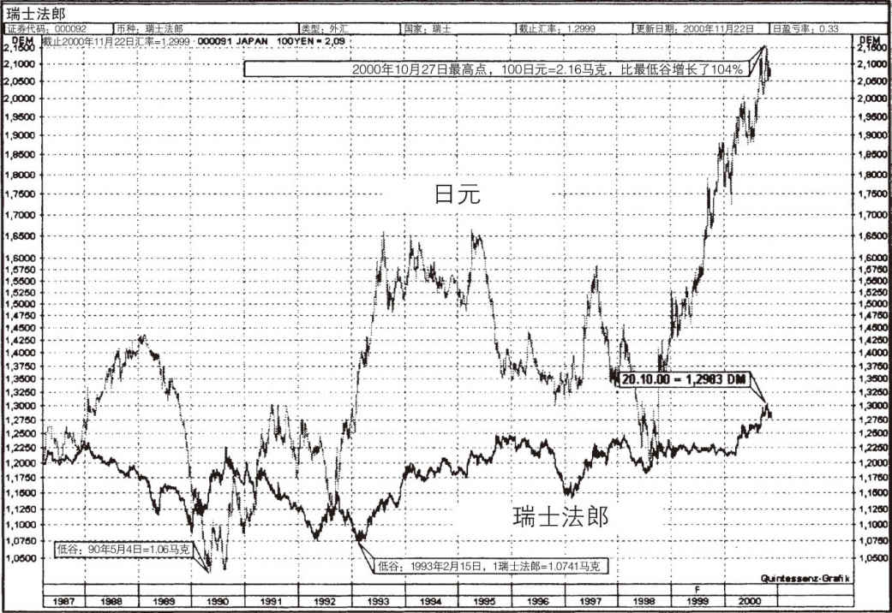

图表14.2　1987年～2000年，瑞士法郎和日元对德国马克的走势

#### 一个进攻性的例子

例如，以瑞士法郎为基础的贷款计算如下：贷款年利率为5％，一年后到期。同样，银行会收取账户资产的1％作为管理费。

假设，一年后可以得到32％的收益（不考虑申购费），那么计算如下：

|                                      |              |
|--------------------------------------|--------------|
| 200000欧元+32％收益                  | ＝264000欧元 |
| -5％的贷款利息（贷款额：100000欧元） | ＝5000欧元   |
| -1％的管理费（投资金额约230000欧元） | ＝2300欧元   |
| -贷款金额                            | ＝100000欧元 |
| 一年后的总资产                       | ＝156700欧元 |

这就意味着，通过投资10万欧元，你获得的收益率不是32％（对应为32000欧元），而是通过杠杆作用，达到税前56.7％。也就是说，一年的收益率越高，多得的收益所占比例就会越高，因为成本所占百分比会减少。当然，你不可能每年都获得这样的利润，市场不会一直提供这样的机会。但是，即使你每隔4年迎来一次这样的“大丰收年”，也足以让你非常开心。

#### 一个适中的例子

假如你对上述例子的高增长率感到头晕目眩，那我重新给你介绍一个比较适中的例子。

基础的前提条件保持不变。也就是说，还是投入10万欧元，然后通过杠杆作用获得10万欧元的贷款。但是，不同的是，我们现在要以最小的收益目标12％为出发点。

那么，计算过程如下：

|                                      |              |
|--------------------------------------|--------------|
| 200000欧元+12％的收益                | ＝224000欧元 |
| -5％的贷款利息（贷款额：100000欧元） | ＝5000欧元   |
| -1％的管理费（投资金额约210000欧元） | ＝2100欧元   |
| -贷款金额                            | ＝100000欧元 |
| 一年后的总资产                       | ＝116900欧元 |

这就意味着，你的投资形式没变，但你获得的收益率会从12％增加为16.9％。这看上去不算什么了不起的成绩。只是一年的收益率增加了4.9个百分点。但是，这4.9个百分点实际上等同于40.83％的收益增长率。

而且如果这样的增长趋势不只维持1年，而是可以维持20年之久，那情况又会是什么样呢？如果在这期间，每年能达到16.9％的收益率，那么你的10万欧元的的确确能够增值为2271381欧元（在12％的收益率下，“只有”964629欧元）。通过杠杆原理，你的收益明显提高了100％以上。这不起眼的4.9个百分点却惊人地带来了130万欧元。

记住：绝不要小瞧“微小的”收益率差别。4.9％虽然不起眼，却能带来难以置信的丰厚收益。

#### 风险的提升

如上所述，这种投资方式存在很高的风险。但高风险无法保证最终一定能获得成功。如果你听到这样的保证，那显然就是无稽之谈。每一种保证都是要以金钱为代价的，那样就会影响到收益。总的来说，在运用杠杆作用时，要辨别以下三点风险：

首先是汇率风险。
如果外汇增值，那你需要偿还的贷款就高于最初贷款价值。因此，我再次重申我的建议：选择稳定的货币，比如瑞士法郎。

其次，一旦遭遇行情暴跌，就可能遭遇高于双倍的损失。
假如在上述例子中，行情没有上涨，而是下降了15％，那么你遭受的损失就不会只是15％了，而会高达38.1％。因此，你只能将手边“多余”的资金用来实施杠杆作用。不过，如果以长远的眼光来运作投资，股票市场的风险就会具有一定的局限性。这一点对杠杆作用也同样适用：长远考虑。只要你不急着卖出，就“什么事情都不会发生”。下一年，杠杆作用也许就能让你双倍受益。

最后一点风险是支付份额外追加款的义务
，这一点在不同的银行间会有所不同。比如，如果你的账户资金损失了16％以上，你就必须追加资金。也就是说，你必须补充资金，以满足银行预先规定的数值（通常抵押证券的价值不得低于贷款金额的60％）。

小贴士

在你运用杠杆作用之前，请先对此进行详细的咨询了解。请不要仅仅依靠那些从瑞士银行得来的信息。应该要多参考德国顾问的意见，他们才能真正代表你的利益。

##  冒险不只丰富你的物质生活

尽管本章的建议包含了许多风险提示，但请你不要一下子就被吓住了。至少当你将自己归入风险承受等级C或D组时，你不应该踌躇不前。因为你所承担的每一种风险，不仅会增加你的收益机会，还能拓展你的投资视野。

我们常说，通往成功和财富的关键钥匙，就是勇于承担风险。不仅如此，生活本身就是一场冒险。你承担的风险越多，经历就会更丰富。你经历的每一场新的冒险，都会在你生命中留下痕迹。
生活要么是一场壮丽的冒险之旅，要么只能一无是处。拒绝正常的风险，只会让你与个人发展道路背道而驰。

我们回想下之前提到过的成功者的态度。他们认为自己从来不会承担任何风险，他们只去从事眼前明显正确的事情。他们参与的目的就是赚钱，为此，他们能允许发生小小的错误。

他们非常自信，认为平均来说总是可以获得超乎寻常的收益和成绩。这份自信并非天生得来，而是要通过努力才能获得。

你也有能力拥有这份自信，就像很多人那样。先把这本书作为基础，然后按照书中的要求一步步地去做。只要不断摸索着向前探索，勇于迈出下一步，你人生的视野将会越发开阔，生活会更加多姿多彩。

请你继续想想这本书的主题：金钱和投资。你了解得越多，就越能感觉到安全，也就越能理解改变的必要性。

只有当你不理解新的投资形式，并因此总是拘泥于传统和已知事物时，新的投资方式才会带来风险。借用西尼加（Seneca）的名言来说则是：“不是因为有风险，我们才不去做，而是因为我们不去做，才觉得有风险。”

我希望你也不要把风险看成是危险境地，而要把它看作机会，看作理所应当的事情。我希望你能获得像成功者那样的自信。这种自信来自行动。

------------------------------------------------------------------------

致富能量贴士

- 任何成功的代价都是我们必须为之承担风险。
- 偿还形式，也就是如何偿还贷款要比约定的利率更为关键。
- 采用基金定投方式偿还也适用于自用的不动产。因为一般来讲，定投的收益率会明显较高，你可以将普遍的还款期限缩短50％。
- 选择5％～7％的低利率水平时，最低期限是10年，如果可能，最好是15年。
- 通过定投基金来偿贷，你可获得如同最初的贷款额那样高的盈余资金。
- 贷款时，尽量筹集100％或至少90％的资金。
- 一处全部或者部分清偿的房产能给我们开启通往资本市场的全新机会。
- 原则上来讲，只应当利用属于你个人的资金来进行投资。
- 杠杆作用：你接受外币形式的证券抵押贷款，然后如同运用初始资金进行投资那样进行投资操作。只不过你通过借贷将可使用的金额翻了一番。
- 请你选择稳定性高且利率较低的货币。
- 记住：绝不要小瞧“微小的”收益率差别。4.9％虽然不起眼，却能带来难以置信的丰厚收益。
- 生活本身就是一场冒险。你承担的风险越多，经历就会更为丰富。你经历的每一场新的冒险，都会在你生命中留下痕迹。
- 不是因为有风险，我们才不去做，而是因为我们不去做，才觉得有风险。

------------------------------------------------------------------------

结语\
将金钱视为通往幸福的道路
========================

我选择行至一条人迹罕至的路。\
这就是最大的不同。

——罗伯特·弗罗斯特（Robert Frost）

------------------------------------------------------------------------

轻松致富的意义不仅仅在于去获取尽可能高的收益率，虽然这点内容是本书的重点，但还有一个问题：“当我们越来越富有，这也意味着我们越来越幸福吗？”答案很明确：“不是。”

金钱不能直接和幸福相提并论。

相反，金钱越多，可能压力越大。

我们来研究研究“富足”一词。按照我个人的理解，富足应该是让我们能够获得幸福的基础。实现财务自由，可以让我们有能力“舒服地”享受人生中真正重要的事情，不多不少，恰到好处。这样看来，财务自由就是通往智慧财富的桥梁。

金钱本身是没有感情偏向的，属于中立的事物。我们怎样去利用金钱，让它发挥什么作用，完全取决于我们自己。“金钱最大的魔力在于，它能让卑鄙小人走向毁灭，也能让高尚的人更为强健和高贵。”（乔治·萧伯纳）不过有一点能肯定的是：我们必须正确地理解金钱（按照我的理解，这是道德层面的行为），同时，在实现真正的财务自由的道路上，我们必须严肃对待金钱和滥用金钱的危险。如果只停留在投资技巧的谈论上，就太流于表面了，就如同青春期的年轻人在谈论“性”的话题上只会谈论“性技巧”。而更重要的在于，我们必须清楚，金钱对我们的“外在生活”即物质生活有什么意义，同样，也要探究金钱对我们的“内在生活”即精神生活的意义何在。对于物质和精神这双倍的分量，我想借助500欧元纸币和古代硬币上的标志来加以说明。

##  500欧元纸币上的标志

当你观察500欧元纸币时，你会发现纸币的正面印有窗户，而背面印有桥梁。根据我的理解，这不仅是表示国家和民族之间的连接，也代表人与人之间的关系。金钱是形成秩序的前提，也是社会进步和交际的前提。窗户则代表逃离僵化的思想束缚，去实现更多愿望的机会。同时，窗户也是自由的象征。桥梁将我们通往的目标和愿望相连，也让我们和其他人联系在一起。

因此，按照我的解释，金钱有多个意义。一方面，金钱意味着自由，让我们可以有更多的选择机会和能随心所欲地打造自己的生活。有了金钱，我们可以决定自己更多的事情。另一方面，金钱还代表一定的权力。有了金钱，我们还可以影响他人。

权力在这里也代表一种着可能，那就是去帮助别人。这样看来，金钱可以给我们自己和其他人带来极大的幸福。

但是自由也具有欺骗性。

尽管一个人可能表面上实现了物质上的财务自由，但他的内心可能还非常禁锢。他可能变成金钱的奴隶。这里有两个普遍的极端现象：吝啬和贪婪（强迫自己必须不断地累积新的物质财富）。

##  吝啬和贪婪是不自由的表现形式

#### 吝啬

赚钱后就马上花出去，是无法变得富有的，把钱拿去投资收益可观的产品，才能变得富有。因此，节省是一种很好且很有意义的行为。但是现在有一些不理智且近乎病态的节省行为——特别是发生在许多富人身上。极端的节省就被称为吝啬。节省的人能为他们的行为找到有意义的理由：他想未来拥有“更好的生活”。而“吝啬鬼”的行为没有任何理由，他们为了吝啬而吝啬。吝啬的人常常是不幸的，因为他们用守财禁锢了自己，由此破坏了他们自然的生命长河。同时，也违背了给予和索取的自然法则。

为金钱而着魔的人，定将成为非自由之身。

吝啬的人只会成为金钱的奴隶，而不是让金钱隶属他。因为自由不是源于金钱的数量，而在于和金钱打交道的方式。跟金钱打交道也如同反映我们情感的一面镜子。当一个人面对金钱吝啬，那么他对个人感情及感情表达方面也会十分吝啬
。到头来，吝啬就会成为他的生活态度。吝啬的人对所有人和事都很抠门。吝啬的人还常常缺乏爱人的能力，没有能力“正常地”处理人际关系，这对他们来讲太复杂了。缺乏人际交往和爱，他们就只有通过物质来弥补自己。因为金钱不会和他们过不去，金钱并不复杂。随着吝啬的人逃避人与人之间的交往，他们的内心会越发感到空虚。拥有的金钱越多，他们就会越感到寂寞。富足对吝啬的人来讲，只会是负担。

#### 两种治愈吝啬的疗法

没有谁必须忍受吝啬带来的折磨。对此，有两种特别简单的“治愈疗法”。第一个方法是，吝啬的人必须承认，极端的吝啬意味着对人际交往的逃避，并且他必须努力去建立和他人的关系。人际交往让我们的生活更为充实，这是金钱无法比拟的。当生命的时间所剩不多时，我们会更加深刻地体会到这一点。那个时候，我们就不会再一味地积蓄更多的财富，而会更多地去关心自己的人际交往。

第二个方法是，吝啬的人应该定期捐出部分积攒的钱。通过这种做法，传递盈余的信号。他以此“自我证明”，他拥有的比需求的多。既然拥有的比需求的多，那就不必吝啬了。如果他学会了捐助，那么对他而言，金钱就新增了一层意义。他感受到金钱不只会让人忧虑，还能传播幸福。将幸福传递给需要我们帮助的人，同时也是将快乐留给我们自己。一个人，只要学会付出，那么富裕就不再是一种负担。

这听起来有点像用捐钱来进行自我治愈，动机是利己的。这可能会让我们大吃一惊，不过事实的确如此。至少，有一部分事实如此。我认为这不应该受到谴责。当然，我们不应该完全出于利己主义去进行捐赠（即使这完全不会减弱受助者的热情）。不过正常的“利己主义”是必然存在的，也是无可厚非的。虽然基督教教义崇尚无私奉献。但是这一点是否真的能实现，还值得怀疑。因为我们还是会常常给自己赠予——至少赠予自己一种舒适的感觉。划船渡人，不也就是渡己吗？

不帮助自己，我们就不可能去帮助别人。

此刻你也许会问，节省和吝啬的界限究竟在哪里？关于这个问题，肯定不存在明确的答案。一个人身上的节省，换到另外的人身上就可能是吝啬。因此，这之间的界限因人而异，需要自己衡量。不过有一点确定的是：当我们定期去资助有需要的人，那我们肯定能感受到无与伦比的自由。这是我们能够赠予自己的最美好的礼物之一。此外，我们还能附赠自己多少东西，取决于我们的生活态度和我们的自我价值观。

#### 作为整体中的部分

定期的捐赠最终会促进人与人之间交往的增强。我们能更深入地认识到：在这个世界上，不只有我们自己。有好多事情我们都需要感谢他人。感谢我们的先人，感谢生活在当下的人们。没有他们，我们不可能走到今天的位置。我们之所以能看得远，那是因为我们站在巨人的肩膀上。

我们能从别人的智慧、知识传授、发明创造和成就中受益良多。谁敢宣称“所有的事情他都靠一己之力完成，没有靠别人帮助”，那么他应该扪心自问，如果真正只算自己个人成绩，那他今天会身在何处。

我们永远不要忘了这一点，要长存感激之心。我们要认识到，承认他人成就是我们的责任，我们不是一个人，在一项伟大的工程中，我们只是完成其中一项任务。
要记住，我们是网状世界中的一部分。我们需要别人，就如同别人也需要我们一样。

金钱只有流通起来，才具有价值。我们手中的不论是硬币还是纸币，之前都经过了别人之手，只有通过其他人，货币才获得价值。因此，钱就成了联结因素。

#### 贪婪

和吝啬密切相连的就是贪婪，它同样有魔力限制人的自由，让财富变成我们的负担。谁如果只关注自身利益并且只着眼于自己物质的增长，那么他就极易变得贪婪。对于增长的基本需求就会促使他往贪婪的方向发展，继而贪婪又带来压力。那么我们的需求就会发展成恶性循环。著名经济学家约翰·肯尼思·加尔布雷斯（John
Kenneth
Galbraith）对此说过：“如果同一产品又唤起新的需求，就算它满足了现存需求，人们也不能拿这一理由来为之辩解……该产品只是填补了由它自己造成的空缺。”

#### 两种治愈贪婪的疗法

有两种简单却十分有效的方法来对付贪婪。第一种还是所谓的万能药方：将我们的金钱（和我们的时间）分一些给有需求的人。第二种对付贪婪的方法是：感恩。驱使人们变得贪婪的背后力量正是无法满足于已有的物质财富。而贪婪让人不断逃避着对于享受生活的无能。
但我们不要忘了：“人如果不满足于已经拥有的，也就不会对过去想拥有的感到满足。”\[贝特霍尔德·奥尔巴赫（Berthold
Auerbach）\]

新的目标会使人分心。相反，谁学会了为当下获得的馈赠感到高兴，就不必逃避了。尼采（Nietzsche）说过：“人们必须像孩童一样去亲近花、草、蝴蝶……谁如果想分享所有的美好，就必须懂得，人类有时候是多么渺小。”

做一个简单的练习：你想出10种自己目前非常感激的事物。比如，健康的身体、能够被爱与爱人、能吃、能跑、能看、能听。所有的这些，都只有不再拥有时，才会让我们倍加珍惜。每天早上，我都会做这样一个练习，无一例外。因为这个简单的练习可以增强人贪婪的“对立面”：感恩和谦恭。

##  古代硬币的标志

最初的硬币有两面：一面是皇帝（或者国王）的标志，另一面是上帝（或者其他神灵）的标志。这两个面就代表着现世和神界的权力。

那么金钱就是满足人类本性中这两方面需求的手段：物质层面以及精神层面
。

如果只注重物质层面的富裕，那么富裕就会变成一种负担。

因为真正的意义只有从我们自身中去寻找。一个劲儿地到外部世界去寻找意义和价值，就如同画饼充饥。

为了避免误解，我需要说明：在我眼中，物质主义本质上并不坏。然而它误导我们将只能从内心去寻找的东西强行转移到外部世界中去。安托万·德·圣-埃克苏佩里（Antoine
de
Saint-Exupéry）说过：“如果只为了金钱和利益工作，那我们就是在画地为牢。”

同理，吝啬和贪婪在本质上也并不坏。它们是我们生活的一部分。而坏的是，我们忽视了生活的其他部分，忽视了精神需求。那个时候，吝啬和贪婪就会控制我们整个身心。

由此看来，500欧元纸币上的标志也就表示：金钱创造自由。但它也同样表示，如果吝啬和贪婪决定了我们同金钱之间的关系，那么财务自由最终又会导致不自由。

#### 物质财富和精神财富相互补充

很多宗教领袖很早以前就意识到了这种两难的选择，然后得出的解决办法就是劝诫众生放弃物质的东西。性和物质欲望要遭受谴责，它们是人类最原始的兽性的部分。一种清心寡欲的清教徒式的生活态度才是最理想的。

但是，物质世界和人类“兽性”的一面并不是“邪恶的”。它们只不过是人类的一部分而已。
谴责自己的某一部分就意味着谴责整个自己，结果就会导致缺少满足感和自我价值感。我们应该更多地学会接受和肯定自身的两面性。

金钱本身并不是像人们误解的那样是万恶之源，而对金钱的热爱才是导致万恶的祸因。只有把金钱视作一切，它对我们来讲才是邪恶的。
另外，在我们的文化圈子中，这个现象在穷人身上比在富人身上出现得更为频繁。钱越少的人往往越容易被金钱控制。

我们需要物质和精神两个方面。单有物质世界是远远不够的。而另一方面，生活光有精神世界也无法维持，没有人能只靠内心世界生活，就连天使也无法做到，众所周知，他们都各有各的工作。

我们中常有一种趋势，就是去羡慕那些在某一领域远远赶超我们的人：羡慕富有的人，只因为他们有无法比拟的财富，羡慕超凡脱俗者，因为我们把他们视作尤其“珍稀”的智慧的人。去参观一位富人的别墅，就像和一位佛教高僧促膝长谈那般让人着迷。

物质和精神，单靠某一方面都无法让人满足，两者分别是事物（硬币）的两面。因为一个逃离物质世界的人不可能“完整”。奥古斯丁（Augustinus）说过：“上帝创造了风，那人类就必须安装风帆。”

谁如果忽视了物质层面，就无法变得更好，只会越来越穷苦，继而就会变成他人的包袱。即使是伟大的思想家，如果同时能达到财务自由，肯定会更加豁达无忧。

涵盖外部需求的物质世界和追求内心价值的精神世界，从表面上看是两个无法逾越的对立面。但实际上，它们相互补充，如同白昼和黑夜。而且，两者更是相辅相成。

物质和精神构成了一个整体，共同构成了我们。金钱可以作为连接这两个部分的桥梁
。它可以调节和满足我们的外部需求，同时也可以唤起我们的内心需求。因此，金钱对我们来讲，也就（再次）成为精神需求的象征。我们要记住，富足不是我们的目标，我们要追求没有负担的富足。我们同时关注自己的内心世界，才能够对我们的富足感到满足，才能真正地去享受富足生活。

##  结束语

在此，我想提出一个愿望：如果谈起这本书，请你将书中的知识传播给别人。和你的朋友和熟人多多交流，共同讨论书中讲过的策略，以起到互相促进的作用。毕竟富足是实现幸福生活的基础条件。我们周围的人越来越富有，我们也会跟着提升。我们给予了世界什么，就会得到同样的回报。

本书就要接近尾声了。不过，虽然本书到了结尾，但你的未来才刚刚开始。最后，我真诚地希望你能够通过本书的学习赢得胜利——在物质和精神两个方面。

在物质方面
，我祝愿你取得丰厚的收益。希望你能够遵守原则，做好迎接风险的准备，明智地进行投资，并能从中获得快乐。

但愿富足能让你无忧无虑地生活。

但愿富足还能带你体会从未奢望过的经历。

但愿你的钱袋鼓鼓。

在精神方面
，我祝愿你获得更多的满足感。我希望，金钱能让你铭记，你是属于整体的一部分。我希望你能在付出中获得幸福。

但愿你在探索（生活的）意义中收获满足。

但愿金钱能助你建立新的交际以及加深老关系。

但愿你能找寻到内心和灵魂的富足。

真正 的富足是你与生俱来的权利。

没有人知道，你是多么富有……\
当然我所说的财富，\
并非证券、豪车、钢琴或别墅，\
以及其他昂贵之物。\
\
我在这儿要介绍的，\
不是看得见摸得着的财富，\
有一些价值，即便你寻根溯源，\
也无法对其衡量。\
这样的财富就连小偷也无法盗走。\
\
耐心便是这样的一件宝物，\
或者幽默，抑或善良，\
以及你全部的情感宝库。\
因为你的内心是多么辽阔，\
就如同神奇的百宝箱。\
\
贫穷，是因为你忘记了，\
感情是多么宝贵的财富。\
没有人看穿你的面孔，\
没有人知道，你是多么富有……\
（就连你自己也浑然不知。）

——埃里希·凯斯特纳（Erich Kästner）
