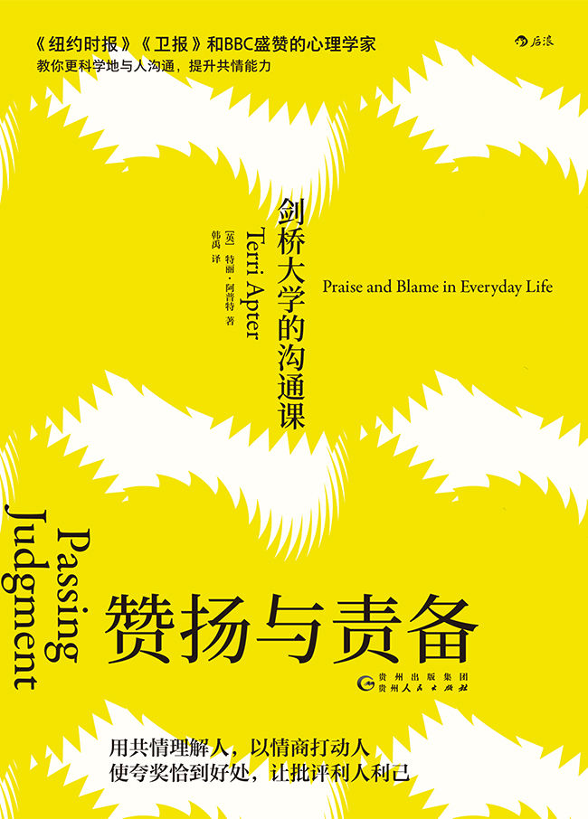

赞扬与责备

剑桥大学的沟通课

\[英\]特丽·阿普特　著\
\
韩禹　译

> 版权信息

> 书名：赞扬与责备：剑桥大学的沟通课

> 作者：\[英\]特丽·阿普特

> 译者：韩禹

> 书号：978-7-221-15717-1

> 版权：后浪出版咨询（北京）有限责任公司

目录

1.  [引
    言](#text00000.html_filepos0000003408)

2.  [第1章
    人类评判的起源](#text00000.html_filepos0000021953)

3.  [第2章
    赞扬的化学、心理学及贸易学内涵](#text00000.html_filepos0000047326)

4.  [第3章
    责备：内疚与羞耻的必要性及摧毁性](#text00000.html_filepos0000083644)

5.  [第4章
    家庭评判与家庭制度](#text00000.html_filepos0000128972)

6.  [第5章
    君子之交：朋友间的评判](#text00000.html_filepos0000175339)

7.  [第6章
    最亲密的评判：伴侣间的赞扬与责备](#text00000.html_filepos0000228130)

8.  [第7章
    工会会费：工作场合中的赞扬与责备](#text00001.html_filepos0000279303)

9.  [第8章
    社交媒体：评判力面临的新挑战](#text00001.html_filepos0000341598)

10. [第9章
    贯穿一生的评判](#text00001.html_filepos0000383643)

11. [致
    谢](#text00001.html_filepos0000408006)

引　言

人与人之间的交流（无论是亲子之间的、夫妻之间的，还是朋友和同事之间的）充溢着赞扬与责备。赞扬可能比食物更滋补。而责备会伤害和羞辱我们，剥夺我们的尊严、骄傲和快乐。我们对赞扬和责备的接受途径可不仅限于公开表达的夸奖或抱怨，我们还会根据别人的表情、眼神、短促的感叹词、肢体动作，感悟出其中带有的赞同或反对，正面或负面的态度。总体来说，我们会下意识地把赞扬与责备的态度带入每一次与他人的交流之中。

在最初接触一件事物的一刹那，我们不但已经自动处理了事物本身包含的信息，同时也会形成对它喜欢或厌恶的观点。我们更有意识的思想也许正在别处打转——明天的计划，或是即将展开的工作。可是，在意识的背后存在着一张自动运转的评判表。它是自古以来保证人类生存的重要工具，让我们对面前的人做出反应：是应该接近，还是退避三舍？“他们是敌是友？”“我能否信任这个人，他和蔼的外表是否只是伪装出来的？”这种反应是如此重要，以至于一位神经学家曾这样说：“我们经历的一切情感，至少在某种程度上，都属于这两者之一……对接近或退避的选择，是一个有机体针对它的生存环境所做出的基本心理决定。”

随着时间的推移，社会变得越来越复杂，人类大脑也进化出了更细腻、深邃、变化万千的评估。我们仍有兴趣推断一个人是危险的还是可信的，但是，我们也会从更复杂的社会层面考虑：这个人是否会理解我们面对的问题及困难；我们是否与他们心有灵犀；我们是否愿意与他们一同进餐、说笑、争论；他们对我们的回应是否积极。在这里，评判的两套系统（接近和退避，赞同和反对）能塑造我们的思想、感情和行为。

每天早上一醒来，我们就开始记录周围人的好与坏了。我丈夫会悄悄地爬上楼梯，一声不响地递给我一杯热气腾腾的咖啡。我本来正在考虑一早上要开的会议、当天的天气、需要穿戴的雨具，但这些念头会在那一刻烟消云散，让位给一句突如其来的赞扬。“他真好，”我会想。而对我这句未出声的评判，他会回报一个笑容。被我抱在手中的温热杯子，对第一口提神醒脑的咖啡的期待，对丈夫的爱，以及他对我忙碌的工作和咖啡嗜好的理解都让我感到的温暖……这一切带来的一系列反应，都可以被解读为赞扬。可是，当他伸手把收音机音量开得太大时，我却立刻烦躁了起来。我心里马上充满了抱怨：“他应该知道我多讨厌这么大声的。”在那一刻，我全身紧张起来，一句怨言——“他也太不体谅人了！”开始在我的意识边缘打转。这一反应显然在我的嘴角眉梢显露出来了，因为他扬了扬眉毛，一句带着幽默与自卫的无声询问——“我又犯了什么错啦？”闪现在他脸上。然后，在抿了一会儿嘴唇之后，他关小了声音。我的烦躁感也消失了。

我下楼走到厨房，立刻摇身一变，成了处在青春期的两位女儿的舍监。看到那两个女孩，我由衷地感到欣慰。“她们真是好孩子。”我想着，可惜，那些围绕在我熟悉的脸、身体、动作和气息上的光环，很快就被其他反应代替了。看着厨房桌子，我想：“她们总是粗心大意，乱七八糟。”那上面堆着书本、背包、撒了的麦片、开着盖子的果酱，同时还有一道黏糊糊的果汁正蜿蜒地渗进我的论文稿里。没等我开口抱怨，我13岁的小女儿就把饭碗放进水槽里，转移了我的注意力。我开始担心她是否真吃了饭。我们的眼神相遇，我意识到她正为什么事情紧张得厉害。“怎么了？”我问。我努力表现得无动于衷，我知道哪怕多表达一丁点儿母性的关怀也会触犯她。她的声音尖细，像个小童发飙，立刻就冒出一大堆我跟不上的话，不过大概的意思是她处于矛盾之中，她的朋友对她要求过多，可她害怕拒绝之后会被朋友指责“不够义气”。我尝试减少她对这样一种负面判断的担心——“那怎么可能呢！谁能说你不够义气？”可她掉过头来埋怨我：“你根本不想理解我。”然而她又立刻把眉头皱成打褶的丝巾，抽泣一声扑过来拥抱我，因为她后悔自己做出了如此冷酷的评判，担心这会让我认为她“是个坏孩子”。而我那16岁的大女儿则一副事不关己的样子，把这一切看在眼里。“真是个小娃娃。”她评判道，满脸闪耀着优越感。在我们准备出门时，她磨磨蹭蹭地找鞋子，然后让我签一份我之前连看都没看过的带着污迹的长文件。我责备她实在太“吊儿郎当”了，同时在心里担心她是不是有什么更卑鄙的企图（莫非文件里有什么不可告人的秘密，她希望我没时间细读？）。在那一瞬间，争执的气氛笼罩了我们两人，直到我们互相交换了一个充满关爱的目光（那是我们每个人都熟知的最原始的赞扬方式），这场交锋才算告一段落。

在过去的30多年间，让我一直感兴趣的，是人类对赞扬和责备的强烈追求，以及它在人际关系中的核心作用。这份兴趣源自我在做初级研究助理时参与过的一个记录母婴交流的项目。我曾一连几小时研究新生儿，观察他们的四肢是如何不协调地挥舞，蜘蛛一样的手指是如何抓伸不停，还有头与口是如何做出寻找动作的。我会记录母亲的视线，留意她在抱孩子时手臂做出的反应：抱紧、抬起、放松、降低。我记下她在谈话（哪怕是与访客朋友谈及宝宝）时会出现的语音改变。3个月之后，在研究项目的第二阶段，婴儿锐利的目光中会充满了期待。他们的需求已经不限于食物和温暖，甚至已经不仅是爱了——他们需要一种能传达出“你是多么讨人喜欢，多么让人欣赏”的信息的爱。当婴儿无法得到这样的钟爱时，他们的反应会极为激烈。他们的号哭代表了一种原始的恐惧，那孩子即使正安安稳稳地被家长抱在怀里，也会感到自己仿佛被抛弃了，正陷入危险之中。

这种原始的、对他人的赞同与反对的关注，会随着孩子对因果关系产生更深刻的理解而逐渐变得更为复杂。等到了3岁，孩子已经产生了自我意识。这让“我自己做”这件事变得既刺激又有趣，而当他们因此得到赞扬时，他们也同时见识了可怕的另一面：做了“坏事”的后果是受到责备。当我的科研工作拓展开来，开始研究孩子接下来的10年（5～15岁）的成长之后，我了解到孩子们会花费大量精力去留意并试图控制别人对他们的评判。随着孩子开始接受家长和老师的日常管教，他们每天都会担心自己因某件事受到责备。即使随着他们理解力的提高，他们明白了“坏事”其实也分轻重，比如打坏一件东西与伤害一个人是有区别的，即伤害有很多不同的严重程度。即便如此，因某事遭受责备，哪怕仅仅因为说话声音太大或是“烦人”，也会影响他们的心情与自尊。当别人哪怕仅仅因为他们安静地坐好了或是吃完了碗里的饭，就说他们“做得好”或“很乖”时，也会让他们真心实意地露出笑容，兴高采烈。

在这个年纪，我自己的孩子们也经历了从童年末期到青春期之间种种百转千回和进一步退两步的转变。我们共同体验了家庭中永远充满动态的赞扬与责备系统。前一分钟，他们是全世界最好的小孩，下一分钟，我便开始唠叨了，而且往往用的是责备的词句：“你本该更专心一点的！”“你就不能表示一下关心吗？”“你怎么这么不懂事！”

跟许多其他家长一样，在镇定的时候，我能分清“坏行为”与“坏孩子”的区别，可是，一到了气头上，它们就被抛到九霄云外了。通过我的家人以及我自己的科研工作，我明白了一个被责骂的孩子是如何突然间脱离了与周围环境的紧密联系，进入一个冻结的孤独地带的。他们会抿起嘴唇，大口地咽下喉咙间难受的哽咽，双臂紧紧贴在身体两侧，直到决堤一般的感情洪流渐渐平息。“我不是坏孩子。”我听过自己和他人的孩子顽固地如是说，说的时候，他们会密切观察家长，看他们是承认还是诋毁这一勇敢的声明。作为一名家长，当我正为来自各方面的压力而忙得焦头烂额、耐性有限时，就曾被孩子责怪过“不公平”，甚至是“讨厌”。我曾经多次为自己不够耐心、过于苛刻、不够体谅或太自私，而深深地自责。只有当孩子们用笑容、拥抱和自信证明给我看时，我的自尊才会恢复，认可自己仍是称职的母亲。

在研究青春期少年的过程中，赞扬和责备的影响力再一次一马当先，成为焦点。对进入青春期的孩子来说，朋友的评判力才能肯定及塑造他们。家长的评判只会遭到孩子无休无止、不留情面的挑战。“我才不在乎你怎么想”是我们能对另一个人说出的最轻蔑的话，而在几百次目睹家长与青少年交流时，这句话我听过无数遍。评判的受重视程度，往往是鉴别谁受尊敬、谁有影响力的关键。家长们往往会说：“没有什么比他拒绝我的评判更让我害怕的了。”“没有什么比他不在乎我的想法更让我感觉孤立无援的了。”

然而，随着我不断解码这些青春期少年与家长之间的频繁争吵，我意识到，这些看似目中无人的少男少女，其实自始至终都极为重视父母的评判。青春期少年把“被评判”列在“最憎恨事物名单”之首，因为他们希望能摆脱自己对家长褒贬的深切关注。把自己的评判同家长的分离开来，青少年才得以发现并打造自己的个性。然而他们也渴望家长欣赏他们这一崭新且与众不同的具有评判力的自我。这个关乎家长的赞同与反对的矛盾，塑造了青少年与家长的关系。

在面对朋友、同事、伴侣时，我们都会因获得赞扬而高兴，因遭到责备而气恼。“无条件的爱”这一概念之所以会如此让人迷恋（也如此让人迷惑），不过是因为它是在一个游离于评判世界之外的美丽天堂。只不过，即便在我们最亲密、最恒久的感情中，即便爱本身毫无条件，即便依恋感能持续永远，评判仍会带来重要的影响。一个牙牙学语的婴儿备受我们宠爱，但我们无法保证他在被人说是“坏孩子”时不感到羞耻，在受到高声责骂时不感到害怕，或在希望被关注却遭到漠视时不感到伤心。相爱的两个人也许会立下山盟海誓，为被对方彻底接受而欣喜，然而在婚姻中，双方都会经历各种各样的评判，那关乎对方的关心程度、关注程度、公平程度，甚至是爱的质量。

人们常说，变老的最大好处就是不会再关心别人的看法了。不过，据我观察，想要实现这样的平和与自信仍需大量的努力。在研究所谓的“中年危机”时，我发现成年人成长这一关键步骤的支点，不外乎一个格外强烈的欲望——靠控制自己对他人褒贬的敏感度，加强对自己评判的信任，从而夺回自己对生活的控制。

虽然我向来对理智评判力感兴趣，但我对这方面知识的形成，则基于科学家在研究人脑评判方面取得的突破性新发现。大约150年来，我们对人脑的研究主要集中于它是如何处理实质信息、解决问题、识别并使用模式、探索环境并在其中生存的。我们曾认为，人脑是为了专门掌握这些实际能力才进化出如此大的容量。但是，30年前，一个别出心裁的假说为人类巨大的脑容量提供了一个新解释。

从进化学的角度来看，拥有一个巨大的脑是要付出高昂代价的。这一巨大器官耗费了我们能量摄入总量的20%。而且，婴儿出生时，巨大的头颅需要穿过狭窄的产道，这增加了母婴双方的危险。而为了降低这个危险，婴儿在大脑尚未发育成熟、仍十分脆弱时便被娩出。幸好，未成熟的大脑也造就了长时间的依赖生活。在进化学中，我们发现这一特性往往能带来好处：长期的依赖生活能制造更紧密的人际关系，同时增加大脑的可塑性，即适应不同环境的能力。

每个人都需要适应人类环境的多变性，但其中不变的一点是我们需要有能力与他人共同生活。现在我们明白，人脑的巨大容量与我们对依赖感、协作性、交流能力和评判力的需求是息息相关的，而这些都是我们社交能力的基础。换言之，我们巨大的脑容量来自我们基本的社交要求。

对于能支持这一“社会脑假说”（social brain
hypothesis）的证据，我们还能从其他物种上观察到：脑容量的相对大小在一定程度上取决于该物种是喜欢独居还是群居。比如，成群飞行的鸟类的脑容量，要比独来独往的鸟类的大得多。进一步说，在从独居转为群居时，任何动物（连蝗虫也包括在内）的大脑都会产生变化：当它加入群体后，它会开始关注其他动物的行为，脑中负责学习和记忆的部分会增长1/3。在所有物种之中，从鸟类，到蝗虫，再到人类，脑容量越大，社交能力就越强。

另一个支持社会脑假说的论据，来自对脑的质量发展及功能的研究。新生儿大脑的重量是成人大脑的1/4，但其几乎已经拥有一套完整的神经元，即脑细胞。我们在出生时并不具有、却能随着与他人交流而飞速增长的，是一套复杂的神经元通信网络。正是这套可观的通信网络（大多用来处理社交知识），让脑重量增加了3倍之多。牛津大学的进化生物学教授罗宾·邓巴（Robin
Dunbar）认为，大脑的通信网络是提供“在庞大、复杂的社会中生存的计算需求”的关键。我们需要计算其他人的可信度、慷慨度及善良度。我们需要计算他们的企图。我们需要计算他们对我们的反应：他们是否认为我们是可信的、慷慨的？他们想做我们的朋友吗？我们是否得到了足够的赞同，能够融入他们的圈子？

我们讲到人类从根本上是评判的动物，他人的评判会给我们造成深刻的影响，一些读者初读这里，也许会因这个观点感到不安，或是觉得难以相信。一些人的人生哲学就是：我们不应该评判他人。评判一词通常被用来表示批评，常常与负面评判画等号。很多俗语名言都警告我们不要评判别人。我的老师总会告诫：“如果你的话不是好话，就不要开口。”而《圣经·新约》里威力最强的指令就是：“你们不要论断人，就不被论断。”这类格言强调的是人类的评判力很容易因偏见影响而扭曲，同时指出我们也经历着别人的负面评判。尽管如此，我们仍无时无刻不做着评判，无论是正面的还是负面的，因为这是人类进化的结果。

还有一种看法是：“别人对我的看法根本不重要。”重要的是，无论别人怎么看我，只要“我懂自己”就行了。我会在后文中探讨，自我评估是一件至关重要的事情，可是，他人的评判仍会影响我们对自己的看法。自信心与自我信赖产生于很多种人际关系，其中一些很私密，而另一些则是公开的、社会性的。一个人对自己的满意度与受欣赏程度之间的关系并不简单，不过，人类的大脑已经进化到能留意他人的评判，并在我们受到赞扬时感到骄傲、欢快、舒服，在受到责备时感到伤心、气愤、难过的程度。我们得到的赞扬和责备甚至能影响我们的寿命。

学习驾驭我们心中那张复杂而混乱的评判表，是我们一生都要用心去做的事情。赞扬与责备本身也是两套极复杂的评判制度。从本质上来说，它们并不具备好处或坏处，也不会带来安慰或伤害。两者都是必要的，而且，在我看来，也都是不可避免的。我希望这本书能帮助你理解我们的评判力（尤其是那些能被广泛定义为赞扬或责备的评判是如何在我们心中形成，并影响一切人际关系的），无论它们是最亲密、最持久的，还是最短暂、最随便的。在生活中，我们的评判无时不在——有意的、无意的、正面的、负面的……而且，我们也无时不在监视着他人的评判，尤其是那些针对我们的。对这一点的意识，能极大地帮助我们控制自己的偏见，包容他人的观点，理解我们对自己及他人产生的强烈却莫名其妙的反应。

第1章　\
\
人类评判的起源

人类对赞扬与责备的强烈关注，在出生后不久就开始了。完全依赖他人，本能地与那些照顾我们的人建立亲情，让我们迅速懂得了他人赞扬的价值。与此同时，我们也懂得了畏惧责备所带来的可怕后果。

懂得这些知识的基础是心智直观（mindsight），即客观地理解他人世界与我们自己的世界极为相似但有明显区别的能力。心智直观能让人通过他人的行为判断他们的目的和意图，推测他们的感受、目标和心愿。它帮助我们评判他人，并理解他们对我们的评判。美国心理学先锋威廉·詹姆斯（William
James）相信，这类评判是人类生存的必要元素。“假如我不懂得敏锐地分辨身边人脸上显露的赞同或反对的表情，”他反思说，“我根本没可能存活。”的确，我们对他人评判的了解，很多都来自那卓越非凡的通讯器——人类的面孔。

在子宫里时，婴儿虽然还无法看到东西，眼睛却已经开始做吸收信息的准备了：视网膜细胞会将无意识的信号传送给大脑，让眼中出现一波又一波的活动。当新生儿第一次张开眼睛时，他们的大脑已经准备好识别人脸，并做出反应了。婴儿会条件反射地转头去看抱他们的人，并对那些看他们的人感到格外好奇。他们本能地愿意对照顾他们的人做出反应。家长与宝宝会长久地互相凝视，为对方的脸所吸引，深深地陶醉。\[最新电子书免费分享社群，群主V信
1107308023 添加备注电子书\]

这种互望有时被称作“眼中之爱”，因为这类眼神中注满了钟爱，穿越了言语，承载着丰富的浪漫情怀。眼中之爱能给婴儿带来大量的激素（与激发性爱高潮的激素是同一种）。心理学家丹尼尔·斯特恩（Daniel
Stern）解释，通过这种威力强大的化学交换，我们会初次体验到两件极为重要的事：他人所看到的事物及他人如何看待我们。

很快，婴儿就能熟练地掌握破解从额头到下巴之间那一组非同凡响、表达丰富的肌肉网络的技能。在普通或良好的环境中，他们会期待直接出现在自己视线之中的一张脸上露出关爱的神色。而到了两个月时，他们能对朝着他们微笑的人报以笑脸。这远不止是模仿：虽然还不会说话、行走甚至是爬，婴儿已经会期待在看到一张微笑的嘴的同时，被眯起的眼睛、欢快的说话声和喜爱的态度所包围。很快，一个孩子就能在40毫秒之内处理一张脸的信息，并在100毫秒之间做出判断——究竟这个人友善还是讨厌，可爱还是可恶，能干还是笨拙，可信还是靠不住，是朋友还是敌人。

等婴儿长到6个月大时，肢体动作，尤其是手臂和手的动作，也加入了他们的心智直观词库之中。大脑有一套丰富的镜像系统。神经元，也就是脑细胞，会把别人的动作当作我们自身的动作记录。镜像系统让我们直觉地领悟动作的含义。当看到一个人在椅子上扭来扭去，或是咬嘴唇、压紧肩膀、朝后畏缩时，我就会明白他正不耐烦，或是紧张、生气。我不必通过自己的亲身经历来推断他的心态。我的大脑会自动自觉地做这件事，因为由看到他而触发的神经活动，与我自己经历这些状态时触发的神经活动是相似的。这就好像大脑会把我们观察到的动作模仿表演出来。

我们见到一个人之后，不可能不做出判断。就一张脸而言，也许嘴唇的形状让你觉得可以信赖，眼里似乎闪动着友善的光芒。当我们被别人吸引时，我们也许会忽略危险信号。不过，随着时间流逝，如果一个人让我们失望、伤心，或背叛了我们，他在我们心中的脸也会变样。笑容会显得邪恶，曾经温柔的眼睛现在也让人惊恐。同样地，一张原本让我们不安的脸孔，也许会因不同环境下的相处（其间，我们会发现他的幽默感，意识到他为人可靠而且可信），而变得越来越好看了。我们的经历会塑造我们的评判，而且会不断地巩固或修改它们。

儿童评判他人的机制会随着发育而变得越来越复杂，在习得这些技能的同时，他们也会意识到自己面临着来自别人的评判。假如有人怀疑小孩无法从社交层面理解他人的评判，那一定是因为没见过脸红的两三岁孩子。他们的脸会完全不由自主、不受控制地，在一瞬间涨得通红，仿佛是被掴了一掌或打了一拳。那小人儿会紧张地想：“我惹了什么祸？”或“他们在笑/瞪/看什么？”他们会如坐针毡，宁愿消失或钻进地缝里也不愿继续经受这番让他们想不通的审视。查尔斯·达尔文（Charles
Darwin）称脸红是“最奇怪，也最有人性特点的表情”，是随着我们关心他人评判而一起进化出来的特性。只有能想象出自己在别人眼中的样子，并认为他人观点与自己有利害关系的孩子，才会脸红。不过，在这难堪的窘迫背后其实隐藏着一种社交作用。脸红能削弱对方的谴责，因为它传达了这样一条信息：“我在乎你如何评判我；违反你的规矩让我感到不安；我希望你能接纳并认可我。”

被看见：共同关注的重要性

眼睛有时被称作心灵的窗口。的确，它们能吐露丰富的主观信息。瞳孔的大小能表达感情——它们会因爱而放大，因恨而缩小。检验一个笑容是否真心实意不是看嘴唇，而是看眼睛周围的肌肉：它们只会为真心的笑容泛起皱纹。直视对方双眼是一个强烈而亲昵的行为，因为我们的眼神能传达那么多信息。

当一个孩子哭喊“看着我！”时，他表达的是一种人类基本需求——对正面注意力的需求。不被注意的孩子即被忽视的孩子。孩子能发现是什么吸走了别人对他们的注意，并为此感到嫉妒。别人都在看谁，他们的目光代表的是赞同还是反对？这个问题对生存至关重要，而婴儿会极快地掌握这一点。一个10个月大的婴儿已经会本能地去看别人看的东西。

婴儿喜欢看与被看这一特性，也体现在他们最早玩过的一个游戏上——躲猫猫。大人挡住宝宝的眼睛或是自己的脸，然后撒手，同时叫一声“猫儿！”等宝宝习惯了这个游戏，他们就会快活地嘻嘻哈哈笑个不停。宝宝会扬起眉毛，嘟起嘴模仿大人说“猫儿”口型，虽然还不会说话，但他们已经在用自己的方式说：“再来！再来！”

儿童游戏能让孩子消化有趣或可怕的经历。躲猫猫模拟了大人“消失”或是离开房间，然后又回来的经历。“现在你看得到我”和“现在你看不到我”两种情形反复交替，让孩子体会家长不在时的紧张和家长的注意力重现时的欣喜。消失与重现对婴儿来说是一个趣味无穷的谜。8个月以前的婴儿不理解一件事物（包括人）即使离开了自己视线，也还是存在的。人们会毫无道理地出现，消失，然后再出现。躲猫猫的魅力在于让孩子拥有了一部分控制出现与消失的力量，而且能够不断地重复体验被深切关注的快乐。

等孩子再大一些，到了两三岁时，躲猫猫会演变成一个类似捉迷藏但要更滑稽的游戏，宝宝躲藏的方式是捂住自己的眼睛，或是紧闭起眼睛。这个游戏的奇怪之处就在于，这个年纪的孩子已经完全理解别人仍能看到自己看不到的事物。即便是沉浸在游戏制造的幻想中时，孩子也会承认大人能看到他的脚、他的胳膊，甚至是他的头，可他仍会坚信自己已经藏得好好的了。

这其中的矛盾——“我知道你能看到我的身体，但我确定你看不到我”，会让很多人觉得既可爱又有趣，不过，心理学家詹姆斯·罗素（James
Russell）不仅觉得有趣，还对此十分好奇。由于深信儿童对可见度的“混乱”定义背后是隐藏了某种原因的，罗素和他在剑桥大学实验心理学系的同事设计了一系列观察实验。首先，罗素得出结论：两三岁的孩子的确相信，捂住或闭上自己的眼睛是完全合理的躲藏方式。事实上，他们相信别人捂住或闭上眼睛也能藏起来。很多孩子认为即使睁开眼睛，只要不接触别人的目光，他们就仍然看不见自己。这其中隐藏的信念就是：“只要你不看我的眼睛，不看到我在看你，你就不能看到我。”

在罗素一丝不苟地排列好证据之后，他发现了“互见”的重要性。两岁的孩子会想：“我闭上眼睛就能躲开你，因为我闭上眼睛，或捂住眼睛，我就不再看你是不是在看我。我能藏起来，是因为你虽然能看到我的身体，但看不到我。重要的是我究竟有没有看到你在看我。”

最终，我们对他人视线的敏感度会变得极为精炼而准确，以至于在熙熙攘攘的人群之中，我们总能最快地注意到那张看我们的脸。他们的眼神里也许充满了熟人相认的温暖和欣赏，而我们的情绪也会随之高涨；又或者那里面带着怀疑、指责或厌恶。眼神里能承载许多评判，我们会快速地注意到其中的变化与含义。当望着我们的目光凝聚起来，而且长时间不动时，我们脑中的情感中枢也会随之激荡。我们对不同类型的凝视会有截然不同的反应。比如，当目光阴沉而稳定时，一股原始力量会从我们心中跳出来提问：“你是在掂量我的斤两，好吃掉我吗？”“你是不是把我当敌人瞄准了？”再比如，当对方目光中包含着温柔时，它的信息“我能把你一口吞下”就充满了迥然不同的含义：渴望吞吃的冲动暗示了保护、安全和欣赏。

视线之外：评判的话语

对大部分人来说，视觉是评判他人的重要工具，不过，视觉世界并非通向心智直观的唯一路径。父母的语音能强烈地唤起婴儿的注意。在母亲讲话时，婴儿几乎会100%地把头转向她。父亲的脸的吸引力则排在第二位，婴儿有85%的概率把头转向父亲说话的方向。因此，失明的孩子也一样能快速地融入人际世界中。假以时日，他们对他人评判的敏感程度，也会与正常孩子相同。\[最新电子书免费分享社群，群主V信
1107308023 添加备注电子书\]

人类的语音婉转多变而且表达丰富，带有明显的音调和声响范围、复杂的创意性，还有极为丰富多彩的表达方式。认知科学家菲利普·利伯曼（Philip
Lieberman）从事这项工作已经40余年，他的研究证明，人类语音进化与大脑对他人的理解力和评判力之间有着非凡的联系。我们与黑猩猩共有的基本器官（嘴唇、喉头、嗓子和肺）的功能远远超过其他灵长类动物。10万年前，随着人类口腔的缩小和不再突出，舌头也开始变得更加柔软。在接下来的5万年间，人类的颈部变得充分地长，口部变得充分地短，这让我们得以练习利伯曼所谓的“人类每日例行的声音体操”。这些变化的结果就是，声道不再仅仅能发出问候或警告的哼喝，而能做到“唱歌剧或通过电话聊天”。

然而，这些能力是有代价的。口部为了交谈而产生变化，它的新结构改变了鼻腔的器官，降低了嗅觉能力。站在进化学的角度来看，这类交换得以成立的唯一条件就是物种将因此获得可观的收益，而这一交换的可观收益就是语言。语言提供了机会，让我们建立超出家庭关系的、更加复杂微妙的人际关系；它也能让信息交流超越世代流传，深嵌入文化之中。语言在我们心中那张评判表中制造出大量的细微差别，并确保我们有能力与他人分享我们的评判结果。

人类极为擅长处理和制造语言及句法，以至于任何一个处在大脑发育关键期的孩子在接触到一种语言之后，都能自然而然地学会它。而且，大脑的语言能力不仅体现在理解言语的意思上。人类有一种十分古怪的能力：分辨并制造一系列能激发情感反应的音调和声响。我们从语音中分析出的语言范畴之外的内容（几乎）是不可思议的。我们能通过语音分辨出说话人的年龄、性别和特征，并且分析说话人的企图、愿望与恐惧。通过声音中纷繁而且微妙的变化，我们会对他人做出评判。

即便是熟睡中的婴儿，也能处理并对包含情感的语音做出反应。俄勒冈社会学习中心（Oregon
Social Learning
Center）在研究人际关系时取得了许多开天辟地的新成果。爱丽丝·格雷厄姆（Alice
Graham），菲利普·费希尔（Philip Fisher）和詹妮弗·普法伊费尔（Jennifer
Pfeifer）进行了一项实验——在为熟睡的婴儿播放语音录音的同时做脑部扫描。播放的录音其实是无意义的语音，但其中的感情从极度愤怒到一般愤怒，从平淡到欢快不等。他们的研究结果有一个引人注目的标题：“熟睡的宝宝听见了什么？”文章显示，即便在熟睡时，年仅6个月的婴儿也会对语音中的情感效价
[ <u>①</u> ](#text00000.html_filepos0000046986)
做出反应。自生命最初的几个月起，我们就已经开始学习从周围人的语音中寻找线索，判断他们是在表示赞同还是反对了。

婴儿的评判

人们曾认为幼童并不真正懂得评判他人，他们只会表示喜欢或不喜欢而已。人们也曾认为孩子对好坏的理解来自自我中心：“给了我我现在想要的”或是“没给我我现在想要的”。于是“在我肚饿时喂我饭的人”就是“好的”，而“在我需要安慰时不肯抱我的人”就是“坏的”。然而，最新研究表明，早在1岁之前，一个孩子已经会评判他人，而这些评判既意义深远，又难以捉摸。

大约到了11个月大时，婴儿喜欢爱好与他们相似的人。心理学家内哈·马哈詹（Neha
Mahajan）和凯伦·温（Karen
Wynn）研究过在这些尚不会说话的孩子身上逐渐形成的评判力。她们让这些婴儿选择木偶。当一个木偶对宝宝喜欢的食物发出“嗯嗯”的声音表示喜欢时，80%的宝宝都会选择与这个木偶一起玩耍，而不会选那个“讨厌”他们喜欢的食物的木偶。不过，婴儿的评判力不仅限于此——他们会被那些能为社交生活提供进一步指导的人所吸引。

一种透露我们喜好的方式，是将视线久久停留在对方的脸上或身上。当注意家人之外的人时，年幼的儿童会花更多时间观察其他孩子，而不是大人，他们似乎对比他们大一点点的孩子尤其有特殊兴趣。一个小女孩更有可能会注意其他女孩子，而一个小男孩更有可能会注意其他男孩子。他们会注意那些更可能将他们接纳进自己社交圈子的人。

然而婴儿的选择不仅仅与实用价值有关，这其中还有深刻的道德原则。当一个孩子（哪怕只有6个月大）看到一个木偶捡起其他木偶掉了的球，并交还给它，而另一个木偶捡起球并抱着球跑开之后，这个孩子更有可能会选择与那个助人为乐的木偶玩耍。在1岁大的孩子观看了同样的木偶戏之后，研究人员让他们把好吃的分配给木偶。那个助人为乐的木偶每次都会得到最多食物，而那个不肯帮助人的木偶总是败下阵来——有时甚至连已得到的都被拿走了。

进化人类学家迈克尔·托马塞洛（Michael
Tomasello）被认为是“研究是什么让人成为人”的国际权威专家之一。他认为，我们的某一位类人猿祖先（也许是我们与大猿类的最后一个共同祖先）的基因中已经记录下了对助人为乐及共同协作的喜爱，以及对相反作风的强烈憎恶。助人为乐和共同协作的特质，是回答我们提出的“接近这个人是否安全？”这一问题的基础，我们会由此做出被心理学家称为“利益权衡比”（welfare
trade-off ratio）的瞬间评判。

我们很早就懂得每个人都有好坏两面。我们明白自己会在与对方的共处中得到很多利益，虽然这也带有潜在威胁。那么，想评估一个人，我们就要计算自己处理这些潜在威胁的能力。我，拥有我独特的强项及弱点，能否一边处理这个人带来的危险，一边从他身上得到益处？当我们在自动地，也许是下意识地计算其中的得失时，感受到的是从心底传达出来的赞同或反对，这让我们做出关键性的决定——到底要与对方接触、融合、互动，还是要躲避、排斥他们。

分辨出“哪些人是我们喜爱并希望接触的，哪些是我们讨厌并希望避开的”是如此重要，以至于对它们的处理分别归属于大脑的两个不同半球。理查德·戴维森（Richard
Davidson）是情感神经科学（研究情绪的神经机制的一门学科）的权威科学家。他是这样解释的：“当我们必须逃避有危害或有威胁的刺激物时，绝对不能有任何事阻挡我们逃离迫在眉睫的岩崩或黑熊。为了保证这一点，人类进化似乎把这两种极端反应——接近和躲避分放在了大脑两侧。这就是说，大脑几乎没有可能失误，甚至做出错误的判断。”这种神经学上的“肯定性”和我们心中的评判表，都很容易因个人偏好、过于简化或不明情理而出错，掌握这两者之间的平衡——如我们接下来会了解到的，将是我们在人际关系生活中最为重要的一项工作。

日常评判的常见问题

一些哲学家和心理学家相信，评判不过是我们因喜恶做出选择，然后添油加醋地加上诸多解释与理由。被我们称为评判的反应难道真是简单而主观的喜或恶吗？他们究竟是预置的、不变的，还是有理有据的评估？它们在婴儿期就显露的雏形，是否证明它们印刻在我们基因之中、是不可改变的？

评判既是主观的，也是可评估的，而且充满了感情和概念上的意义。当我们赞扬或责备时，当我们欣赏或谴责时，我们记录的情感对我们来说意义重大，远不是下一餐要选择椒盐卷饼还是甜甜圈，室内设计要自然派还是前卫派，假期是睡大觉还是进行刺激挑战等小事可比。我们的评判所表达的是我们心中根深蒂固的、从儿时就开始记录的关于爱与接纳、信任与焦虑、恐惧与被拒绝的经历。当有人反对我们，认为我们讨厌或可怕时，我们也许会努力安慰自己，说这个看法不过是他们的个人喜恶，然而，尤其当我们在乎对方时，他们的评判会让我们觉得自己因不够好而受了责备。来自他人的评判，无论多么歪曲或过分，都会塑造我们的人际关系网。

关于评判的情绪及直觉本性，纽约大学斯特恩商学院（Stern Business
School）的道德领导学教授乔纳森·海特（Jonathan
Haidt）有个十分有趣的观点。很多人认为海特是我们这一代的世界级思想家。他说，人类思想是由一套“道德机器”（moral
machinery）建造的。正如我们的思想能与生俱来地“制造语言、性欲、音乐及许多其他事”，它也与生俱来地带有评判性。我们制造的评判是直觉性的，而不是理性的。通过我们对人际关系与社区的依赖，它也随着社会大脑一起进化。

为了解释我们评判的直觉和情绪性，海特用骑象人进行比喻：骑在大象身上的人以为自己完全控制了大象的行动。不过，大象远比骑手的力气更大，而骑手（除非他小心并持续地保持他的控制力）其实没有太多力量来干涉这只动物非理性、充满直觉而且力大无穷的行动。在骑手指引大象做花样表演时，他会错误地以为自己能全权控制它。在普通的评判范畴之中，海特认为，人们总以为自己的评判是有理有据的，而事实上，我们的信念其实会被浅薄而且往往带有偏见的直觉所左右。我们如果认为自己的评判是基于理性的，那就跟以为控制了大象的骑手一样自欺欺人。毕竟，有研究表明，两个人在看到相同的证据时，会依据各自的直觉判断来分析这些证据。证据无论多么强，总强不过我们的感受。

太多时候，由于我们在判断中暴露出情感，我们会以为做决定时应该避免情绪化。然而，日常评判的感情本质并不会让我们的评判非理性化，也不会让它们永远地脱离那些仔细用理性论证过的看法。这些能探测“好”或“坏”的“情感（或情绪）回应”，无论是正面的还是负面的，都能表达我们内心深处的价值观，并引导人际关系的走向。我们的评判历史悠久，贯穿了我们全部的情感历史，从最依恋父母时就开始感受的欲望与恐惧、未满足的需求、最惨痛的损失，一直到我们曾感受过的内疚与缺陷、因希望或失望而塑造的预期值。它们记录了我们最个人的兴趣、激情和眼界。它们正是我们熟悉、了解他人，并与它们建立亲和力的工具。

与此同时，它们也极容易受到偏见和歪曲的影响，虽然我们渴望公正与平衡，我们的评判却可能是严酷、粗鲁、盲目的。很多人都清楚地了解自己的这一弱点，因此他们在学习做人的同时，也学习如何反问、测试并修正自己的评判。我们会通过询问家人、朋友及同事的观点来拓宽自己的理解，检查并修改我们最初施予的赞扬或评判。当我们读小说、看舞台剧或电视剧时，当我们听政客辩论或看电视新闻时，都会反复修改自己的评判。我们得出结论的时候，智慧程度时多时少，体谅程度时多时少，偏见程度时多时少，但正如本书所述，不论怎样，我们大多数人仍会持续不断地“制造评判”——无论是集中分析道德问题，还是广义地评估，我们每天每时每分每秒都会不停地思考。也正是这个原因，理解我们心中那张评判表是如何工作的，以及我们能如何通过努力，让评判去定义而非挑战我们的价值观，是一件至关重要的事情。

注释

   

> [ <u>①  </u>
> ](#text00000.html_filepos0000036819)
> 效价，某一物质引起生物反应的功效单位，可用理化方法检测，也可用生物检测方法测定。——译者注

第2章　\
\
赞扬的化学、心理学及贸易学内涵

我们在人际世界中经历的第一次评判，很可能是来自父母的好奇、欣喜和惊叹。赞扬远远不仅是特定的表扬句子或正式评估。《牛津词典》（*Oxford
Dictionary*
）里对赞扬的第一条解释是：动词，“表达友善的赞同或欣赏”；名词，“赞同或欣赏的表示”。赞扬传递了“我们是快乐的源泉”这一信息。因此，远在我们理解“做得好！”或“你真棒！”之前，赞扬就已经是我们世界的重要部分了。

赞扬和社交化学物质的释放

赞扬对大脑的健康发育十分重要。相互连接的神经元是大脑通信系统的基本组成部分，大脑的成长就在于神经元会不断建立新网络。一些激素能提供建立新回路所需的养料。在大脑发育早期，最重要的激素就是催产素（oxytocin）和内啡肽（endorphin）。催产素有时被称作“亲密激素”，因为它对制造两人之间的亲和力有重要作用。而内啡肽会释放人体自然产生的鸦片剂（opiate），让我们享受欣快感（与使用海洛因而达到的欣快感不无相似）。当父母的脸上流露出赞扬，传递着“我想看看你是谁，我欣赏你”的信息时，婴儿的大脑中会涌入大量的催产素和内啡肽。这些令人愉快的激素能鼓励他们友好而坚定地凝视，从而促进父母与子女的亲密感与理解，提供更多的大脑养料。这些激素也促使我们在见到我们喜爱的人时感到舒服，或是在受惊时冲动地抓住别人的手。一个我们熟悉的人现身，不仅会让人情绪放松，似乎还能降低身体上的疼痛，极好地解释了“亲一亲伤口就不疼了”这一效果。\[最新电子书免费分享社群，群主V信
1107308023 添加备注电子书\]

作为神经调质（neuromodulator）——即能影响大脑运作的化学物质，催产素能影响我们的评判。当大量催产素在我们大脑中流动时，我们更可能信任他人，也更容易应付失望与背叛。此外，经常受到赞扬的孩子在3岁时能掌握更多技能，之后在10岁时也是如此。反之，日常生活中缺乏赞扬的孩子的大脑网络反应则显得迟钝，尤其在学习和积极性方面。赞扬是健康大脑不可缺少的奠基石，而我们无论年龄多大，都不会消减对它们的需要。

模仿与赞扬：宝宝如何赞扬父母

赞扬几乎从不是单向的。儿童——就连婴儿，也有许多赞扬大人的方式。在宝宝还不会笑（一种有效回馈赞扬的方式）之前，他们就已经有一整套让周围大人们爽心悦目的武器了。婴儿的气味，尤其是婴儿头顶腺体分泌的气味，能引起化学反应，制造欣快感。不过，更重要的是，宝宝会通过模仿家长来强烈地表达对父母的喜爱。

模仿是学习的基础，也是了解人类社交习性的基础。它运用镜像神经元
[ <u>①</u> ](#text00000.html_filepos0000083082)
（mirror
neuron）组成的复杂网络，而后者在执行我们自己的行为或观察他人同一行为时都会引发神经冲动。因此，通过模仿，婴儿不仅学会了其他人的行为，也开始体会其他人的感受。在刚出生的几小时之内，婴儿那些尚未发育的肌肉已经会开始模仿他们视线中的成人的脸部表情。这种强烈的专注也会让照顾孩子的大人觉得自己既重要，又有趣。

我女儿8个月时，有一天忽然张开小嘴，一边有节奏地点头，一边朝自己手里握着的一小块鸡蛋发出“突突”的声音，我至今仍记得当时感到的狂喜，因为我意识到她是在模仿我给她鸡蛋之前做出的吹凉的动作。一个平凡的动作在那一瞬间充满了深刻的意义。我变成了模仿对象，我的一举一动都变得意味深长。带孩子的辛苦，顿时因为女儿对我的敬佩而消失得无影无踪了。

模仿能显示信任和对权威的恭维。它向模仿对象表达的是对他们的意图与智慧的信服。当一个人模仿你时，他表示的是对你的欣赏，他渴望变得更像你。观察两个交谈中的人，通过模仿的程度这一指标就可以检验他们对对方的欣赏程度。一个人是否会跟随另一个人的动作移动自己的手？一个人是否会随着另一个人改变姿势？当一个人朝前探身时，另一个人是否也这样做，抑或他的反应是朝后退——哪怕是难以觉察地后退。一个人的声音是否会与另一个人的音量和音调保持一致，还是会拒绝受对方影响？这种被称作“变色龙效应”（chameleon
effect）的下意识模仿，正是制造和谐的因素。

甚至我们都能敏锐地感受到模仿的细微差别：轻微转变一下哪个字的重音，就能把赞扬变成讥讽；稍微地夸张一点，矫揉造作一点，其中暗示的评判就不再是赞扬，而变成了挑衅和嘲弄。我们之所以能把其中的区别分辨得如此精准，是因为他人的评判对我们的社交生存能力极为重要。

赞扬：家长的有力工具

赞扬在育儿史、品格塑造史及教育心理学史上占有重要地位，它贯穿了不断变化着的、多种多样的教育方法与臆说。

海姆·吉诺特（Haim
Ginott）是20世纪60年代的先锋教师及儿童心理学家。他发现，总体来说，赞扬对行为的正面影响远比任何责备或惩罚要大很多。不过，他并没有陷入“赞扬就是简单或直接的表扬”的误区。“赞扬，”他写道，“跟青霉素一样，必须谨慎地作为处方。使用特效药有很多规则和注意事项——规定用药频率及药量，以及注意可能造成的过敏反应。情感的药剂也需要遵循相似的法规。”

赞扬能改变我们对自己的看法。它能鼓励和振奋我们，也能提醒我们期待值的所在。但它也会带来迷惑和恼怒，让说话人显得不够真诚或自以为是。在吉诺特提出赞扬的威力并对它可能造成的危险提出警告的30年后，一个新发现震撼了整个心理学界：某些赞扬其实会伤害孩子的自信心，降低他们的积极性。

新老赞扬理论

远在25年前，在我刚开始做儿童发展方面的研究时，当时流行的理论是：无论多少赞扬都不算多，也不必计较赞扬的原因。孩子做的每一件事，无论多简单、多无关紧要，都应该受到赞扬。任何努力，无论多么细微、多么心不在焉，都应该受到赞扬。孩子只要出席，就应该受到赞扬。一些学校在每日集合时，会引导孩子给自己一个拥抱，赞扬自己是聪明、美丽、十全十美的。

这种沉浸式赞扬理论（praise immersion
theory）的基础，是相信孩子会基于别人对他们的看法建造自我概念。如果家长与老师表扬孩子聪明伶俐、才华横溢、善良体贴、优秀出众，那么孩子们也会内化这些标签。他们会努力达成自己和他人制造的期待。

人们曾相信，数量足够的赞扬就像疫苗，能抵抗一切来自社交的伤害。人们认为，当一个孩子带有自尊疫苗时，他就不会受毒品和烟酒的诱惑，也不会搅入危险的性行为中。据人们推断，每日吃赞扬大餐，天天被告知自己的所作所为又美又棒的孩子会认为自己是成功者。他们会拥有很多成功者所拥有的自信，从而让自己走向成功。

一些证据的确能证明，孩子会践行他人的期待并取得成功（或是失败）。研究人员曾交给老师们两张名单，一张上都是所谓的聪明孩子，另一张上则是所谓的不聪明孩子，在一个学期之后，那些“聪明孩子”的学习成绩明显比那些“不聪明孩子”高。这个实验，即使在学生们未经过事先审核，被随机分配到“聪明”与“不聪明”名单里时也同样有效。教师对学生才能的信任度，而非学生本身的才能，也许能解释他们的学习成绩为什么会产生变化。

这种变化被称为“皮格马利翁效应”（Pygmalion
effect）。这个名字取自一位希腊传说中的雕塑家，他爱上了自己雕刻的一尊象牙美女雕像。后来，经过不断祈祷和供奉，他的一个吻让雕像变成了活人。萧伯纳（George
Bernard
Shaw）的剧本《皮格马利翁》（又译作《卖花女》），后因被改编成音乐剧《窈窕淑女》（*My
Fair Lady*
）而名声大噪。它讲述了一个类似的故事：教育家亨利·希金斯（Henry
Higgins）决定训练一位没受过教育、举止粗鲁的女人，让她变成一位贵族淑女。《皮格马利翁》的故事体现了一个永恒不变的真理，那就是在我们与别人对我们的评判之间，有一种难以捉摸的神秘联系。可惜，沉浸式赞扬理论最终造成了一系列不良后果。

赞扬的渐衰回归

曾经让婴儿和幼童感到无比快乐和骄傲的赞扬，在大一点的孩子身上会引起截然不同的反应，尤其在课堂上。社会心理学家罗伊·鲍迈斯特（Roy
Baumeister）对赞扬的效果做过研究。他发现，在学龄儿童身上，赞扬制造的焦虑要多于快乐。习惯了家常便饭型赞扬的孩子，似乎没有赞扬就无法开始做任何事。一个习惯了在课堂上得到赞扬的孩子，不会把精力用在做功课上，而是会不断地停下来，等待老师的评语。赞扬似乎也会分散孩子的注意力。本来全神贯注做事（常被称作“处于流畅气场中”）的孩子，似乎会因为被提醒别人在观察他们而分神。当他们唱歌、演奏乐器、游泳、打球，或是做任何需要下意识地运用熟练技巧的动作时，他们的表现都会明显地因为赞扬而变差。\[最新电子书免费分享社群，群主V信
1107308023 添加备注电子书\]

在研究儿童不断变化中的自信期间，我曾为此采访过一些教师，他们都讲到类似的故事。“有些孩子不听到表扬的话就什么都不肯做，”3年级教师萨米·维克斯（Sammi
Vickers）告诉我，“他们会开始做一件事，然后就一动不动地等着你说他们做得好。”对我来说，最切中要害的例子发生在一次观察一群8岁大的孩子时，他们的声音会在充斥赞扬的环境中改变。8岁孩子的语音中天然带着一种引人入胜的旋律，那似乎是直接从他们悸动的思想里流淌出来的。但当他们听到持续不断的赞扬时，这个旋律就会彻底消失。取而代之的是一种明显带有自我意识的、期待夸奖的音调。

赞扬会在课堂上导致平庸的结果。这一发现在当时是如此让人费解、如此违反直觉，以至于很多心理学家干脆地拒绝接受它。最后，由心理学家卡罗尔·德韦克（Carol
Dweck）主导的一系列科研改变了（而且恐怕是永远地改变了）赞扬的范式。

为了测验赞扬扭曲思想的能力，德韦克研究了两组学龄儿童。两组孩子的学习成绩都不是很好，并似乎为此气馁，态度消极。他们交给第一组孩子一系列十分简单的功课，每当孩子做对之后，就会被夸赞十分聪明。根据沉浸式赞扬理论，这些孩子会让自己的水平配得上这些赞扬。他们会相信自己是聪明的，他们会让自己的行为与聪明孩子一致，他们会发挥自己，接受挑战，不断取得进步。

在一开始，这个方法似乎效果很好。当孩子们开始做那些简单的功课，并在做对时受到表扬之后，他们变得情绪高涨，在着手下一部分功课时也十分积极，焦虑和迟疑似乎都烟消云散了。可惜，这些赞扬只在功课简单的情况下才能维持这些孩子的情绪。功课的复杂程度一旦加剧，孩子们就失掉了积极性，又变得兴致索然。很快，这些“过度赞扬”小组里的孩子们又恢复到了实验前的状态。

第二组学生也同样因为学习成绩不好而缺乏积极性，他们也需要做难度渐深的功课。答对了较难的问题时，他们不会被夸赞聪明，相反地，研究人员会让他们注意自己的努力与成绩之间的联系，他们因努力而被夸赞。这些因坚持不懈和努力用功而受赞扬的孩子，哪怕在十分困难的情况下，也更可能会维持积极性与努力态度，因为他们意识到自己能培养能力，这让他们备受鼓舞。

每一天，孩子们都能通过他们可以做到的事情来考量他们还不会做的。我们赞扬孩子的方法能塑造他们对自身潜力的理解，而在对自信心的鼓励上，他们对自身潜力看法的重要程度不亚于他们对自己现在力所能及的事情的。

赞扬新理论之外的难题

这一科研结果（强调“关注努力，而非天生能力”）让人茅塞顿开。它不但在教育心理学界引起了极大的反响，也改变了课堂上培育儿童的方法。这一信息的精髓是：你如果希望孩子成功、愿意接纳挑战，就要赞扬他们的努力、刻苦和坚持不懈，而不是他们的智商、天赋或能力。要在人生路上成功，孩子需要怀有信心，但这并非自己与生俱来的能力，而是“天道酬勤”这个规律带来的结果。

不过，日常生活中的赞扬则更加难以定义，因为它们的意义源自错综复杂、因人而异的人际关系。人们最早接触的赞扬（对孩子由衷的喜爱，以及对孩子的个性感到强烈好奇）会贯穿他们的一生，无论何时何地都如同久旱逢甘霖一般温暖和滋润心灵。“你是全世界最可爱的孩子！”和“你最棒了！”之类的话虽然与赞扬新理论相悖，却是建立自尊的重要基石。判断哪些赞扬有正面效果，哪些有反面效果，其实是一项复杂而艰巨的任务。

在观察儿童如何与家长、手足、朋友建立感情期间，最让我惊讶的，莫过于看到来自我们所爱之人的赞扬在某些情况下反而显得格外让人难以接受。在我的一项研究中，5岁的梅芙听到祖母在看到她的作业本后说“做得真好！”时忽然号啕大哭；而7岁的斯蒂夫在母亲夸奖他新捏的泥人“真漂亮”之后一拳打扁了泥人。

祖母过于明显的热忱让梅芙觉得不解，甚至烦躁。“奶奶看出了什么我不知道的东西吗？”她想，然后是：“我根本看不出它好在哪里，那么，下回要怎么做才能再得到夸奖呢？”斯蒂夫想听的不是一句泛泛的赞美，而是母亲更具针对性的评价。他能看出他的泥人有好的地方，但总体来说并不满意。他母亲的赞扬更适合应付一个初次尝试捏泥人的小小孩，而不适用于他带有目的性的需求。母亲夸奖中的温柔与宠溺，反而诋毁了他的志气。

青春期少年对赞扬的反应就更令人迷惑了。曾让他们赖以为生的、来自父母的无条件宠爱，到了今天，在他们眼里却忽然变得过时了。家长相信在那个乖戾阴沉少年心中的某处，还存在着那个当年曾与他们互相交换赞扬的可爱孩子，然而那少年更希望让自己的崭新自我站在舞台中央。“你根本不了解我！”他们会如此回应父母的赞扬，此外还有，“你不配评判我！”

青少年们强烈的针锋相对往往会让家长觉得莫名其妙。我曾经观察并记录过家长与青春期子女的交流。在研究对话记录时，我惊讶地发现，无数次争吵的起因往往是一句赞扬。当帕米娜对她14岁的女儿爱莎说“你打扮得真漂亮”时，爱莎厉声回答：“你真蠢！”她的母亲显然十分难过。在她离开了房间之后，爱莎一边深呼吸，一边忍不住掉下眼泪来。等她的情绪稍微稳定之后，我问她是否愿意谈谈。（爱莎明白，我在观察家长与青春期子女的交流之后，会分别与他们单独谈话。）于是爱莎和我坐在一起，拼凑起她散碎的情绪。她解释说：“她根本都不了解我，怎么能来夸奖我呢？”顿了一下之后，她补充说：“况且，要是她觉得我看起来很好，那么我肯定有地方做错了。我一定是看起来太小、太可爱了，这根本不是我希望的样子。”

青少年的工作（在他们自己眼里）就是摇醒他们的父母，不让他们继续以为自己家的少男少女还是他们从前认识的那个小孩。为了证明父母不认识自己，他们也许会换新的发型、新的朋友、新的爱好，好不让家长再夸奖他们“可爱”。他们相当了解家长赞扬的威力，但同时也对此十分矛盾。虽然他们延续了从孩童时期就开始的对恰当赞扬的需求——应该说渴望，可是，随着时间流逝，他们也开始讨厌自己对它们的依赖。

即使青春期的狂风骤雨已经过去，我们对家长评判的焦虑仍会长久地困扰我们。当赞扬缺乏热情或真诚，或是不得要领时，这些让我们觉得不对劲的赞扬所传递的信息就是：“你不是真的了解我。”

“我女儿27岁了，”玛丽安说，“可我要是胆敢评论她一句，哪怕是赞赏，也总免不了一场唇枪舌剑。”

“哈，这里面有个故事，”玛丽安的女儿莱斯利笑着说，“我小时候，我妈总夸我‘干净又整洁’，我会在每天晚上上床之前，把屋里收拾得干干净净，只因为我害怕得不到夸奖。然后她说我可真会照顾弟弟呀，结果我变成了个两面派：即便在恨不得踢那熊孩子一脚时，我也会装出一副乖孩子的样子来。从根本上说，她的表扬是一种控制我的方式。因此，我听到她夸赞时也不觉得高兴，这还有什么可惊讶的吗？她的赞扬让我极不舒服，就好像是那种既让你感觉有点舒服但又恨之入骨的抚摸。”

我们会不断地检验赞扬中的诚意、幅度和关注点。我们也会推测它的意图——母亲赞扬里的潜在用意才是最让莱斯利气恼的地方。在伴侣之间，这种对赞扬意图的敏感会变得尤其重要。在2015—2016年，我有机会在一些伴侣身上做了类似的研究。我会尽量做个透明人，与他们在他们的家里共度一段时间（通常为两周）。虽然没人真的能如墙上的苍蝇一样对他们完全不产生影响，但这种观察研究的手段，是力图与家中的小狗一样保持中立的。我的观察结果很让人震惊：赞扬往往会引发不满。35岁的萨拉十分欣赏丈夫斯蒂夫的工作，她称之为“真正出色的事业”。因为34岁的斯蒂夫常常与年纪更大、更有成就的学者一同被邀请去做主讲嘉宾。“他可体贴啦，”萨拉告诉我，“每当他得到赞扬时总会立即感谢我。”只不过，她脸上露出的表情却不快乐。她停了一下，咬住嘴唇，似乎在心里挣扎了一下，然后才说：“好吧，他的确很体贴。”现在她的声音里带了一丝前所未有的僵硬。“他总说我出席他的会议对他有多么大的帮助。可是，那些会议磨光了我的时间和精力。我总是‘到场’，却无法融入他们的交谈。我感觉特别尴尬——又枯燥！而每当我试图解释给他听时，他只会老生常谈地说：‘你给了我很大帮助。你最好了！’这样的赞扬也许很动听，可根本就是愚弄人的花言巧语，我总会感觉怒气好像蚯蚓一样蠕动着爬升，啊，那真是让人难以忍受的愤怒。可我想不出要怎么应付。那句赞扬让我感觉糟透了——也内疚透了。”

弗朗西斯和她丈夫盖理都还不到30岁。他们住在英国东部的乡村东盎格利亚地区，与萨拉和斯蒂夫在大城市里的学者生活方式大相径庭。但分辨赞扬背后的意图对这两人的感情也有同样重要的意义。他们结婚才6个月，如盖理解释，他们仍“处在共同生活的磨合期”。弗朗西斯听后愉快地哼了一声表示赞同。盖理点头说：“我们不仅要适应做夫妻，也要适应做‘我们’。”他们两人似乎相当和谐一致，直到弗朗西斯用严厉的语气打破了这份和谐：“你对我说，‘你做的三明治世界第一棒’。”随着她的声音哽咽，盖理惊讶地瞪大了眼睛：“那是坏话吗？我觉得你做的三明治好吃还成坏话了？”“是的！”她坚持说，不等盖理轻蔑地做完一个“我放弃”的动作，她立刻解释道：“我当然很高兴。可那不仅与做三明治或打点你的午饭有关。那代表了你控制我，让我在每天早上忙得团团转时还要多加一份工作。当然了，我希望你赞扬我。可我讨厌受欺骗的感觉。那种赞扬实在是你哄我多做事的手段。咱们一开始就约定过不会那样互相对待，而你的话把我推到那种角色里去了。”

我的亲身经历也不无相似之处：当面对一句似乎企图把你困在一个角色中的赞扬时，那种怒气冲天的感觉实在让人难以忍受。我的婆婆有一次曾赞扬说我“把老公的衬衫熨烫得好极了”，那让我感觉像是一只铁手腕，把我固定在传统的家庭妇女角色中。注意到我紧皱的眉头和急喘的粗气，她还以为我是在不好意思，但事实远非如此。我吞下的是怒火而不是欢喜，因为她夸赞的事情对我来说没有丝毫价值。这句赞扬是一个工具，企图把我扭曲成一个我不愿做的人。

萨拉和弗朗西斯的丈夫，以及我的婆婆，很可能根本没想到他们的赞扬会被理解为操纵、蔑视或对积极性的消磨。他们每个人都会抗议说他们的心意是好的。毕竟，一句赞扬的话怎么可能含有相反的含义呢？他们会谴责那位不懂礼貌的接受人太敏感或有意抵触。然而，正如莱斯利说的，面对赞扬时我们都可能会过于敏感或抵触，赞扬可能会让我们如坐针毡，它们看似出于好意，却暗藏着一种不可见的力量，企图压制我们自己的评判。

让人意难平的赞扬就像不顺畅的性行为：那些言语满载着快活与刺激的期望，但不知为什么就是让你失望到极点。与之相反，一句恰到好处的赞扬，会让你心跳加快，让希望被填满，让尊严得到慰藉。

尊严的潜在贸易

我们对赞扬的需求以及它们为我们带来的尊严感的意义非常重大，以至于一些哲学家相信赞扬是一股贯穿了我们私人及公众生活中的一切的驱动力。哲学家杰弗里·布雷南（Geoffrey
Brennan）和菲利普·佩蒂特（Philip
Pettit）描述了一种潜在于我们外露动机及目标之下的、流动的、“尊严的潜在贸易”。在市场贸易中，人们重视金钱，并愿意通过工作换取它，主要是由于它能购买货物及服务。在尊严的贸易之中，其他人的好评即是让你心甘情愿地做一位与他人愉快合作的工人、发明家、业主、政客、好邻居的内在激励。它就像墨西哥湾中的海水，看似平静，但由激流与暗流组成的内部湾流仿佛江河网络一样分布细密、清晰可辨，同样地，我们对尊严的渴望，也潜在于我们深邃而宽广的感情生活中，它让我们的动机变得复杂，甚至往往能引导我们的目的与行为。我们的兴趣、消遣与目标都是范围宽广而且多种多样的，但它们往往会由于我们对他人评判的重视而扭转、变形。

每一天，我们在他人的生活中产生对其所作所为的认识，然后把这些都记录在自己心中的评判表里。我们都担心别人会在某方面误解我们，哪怕他们的行为或言语根本不曾有类似的表示。即使他们没有明确地付诸行为或言语，但认为我们的言行好或不好时，态度往往是清晰可辨的。同样重要的是，人们也许会揣测我们接下来的行为。于是，我们即便没有被评判，想到未来可能会遇到的评判，自身行为也会受到影响。

“尊严”经常被称为“骄傲”或“正面自我看待”，是让我们走在人群中时得以昂首挺胸的情感。我们每个人都重视尊严，即来自他人的欣赏和友善赞同。同样地，我们也会畏惧他人的轻视（disesteem）——布雷南和佩蒂特用这个词来形容缺乏尊严，它的程度可轻可重，从忽视、谴责到嘲笑不等。布雷南和佩蒂特认为，我们会时刻留意来自他人的评判，这是我们生活中一股实际存在的力量，提醒我们轻视可能带来的痛苦与尊严可能带来的愉快。他人的评判在我们心中根深蒂固，也时刻准备着刺激并调整我们的行为。

我们的思想如何转弯抹角地寻求赞扬

当一件事对我们来说与赞扬同样重要，与遭受任何形式的责备（包括不满与轻视）同样痛苦时，我们会竭尽全力去寻求前者，并躲避后者。人的思想会坚持不懈，而且创意无穷地牢牢捕捉自我赞扬，这个特性让今日的心理学家格外感兴趣。在过去的30年间，他们制作了一份详细的目录，记载每一天中我们的思想为了保护自尊而表演的各种高难度动作。

在大学一年级的心理学课上，学生的第一项作业大多是研究人类最常见的偏见——相信我们优于其他人。这个项目的标准提问有：“你觉得你的驾驶技术是处于普通水平、低于普通水平，还是高于普通水平？”在美国的抽样调查中，93%的人认为自己的驾驶技术高于普通人，88%的人认为自己的安全度高于普通人。考虑到普通的含义（按字典解释，大部分人应该算作“普通人”），被调查的人显然都高估了自己的能力。在学术界，人们受到的训练就是理性地评估一种学说的内涵，然而在这群人中，自我想象的优越感理论也同样盛行着：68%的学者相信他们的教学能力排在前25%，而87%的斯坦福大学MBA学生认为自己的学习成绩优于班里平均成绩。

人们在比较能力、努力、成就，甚至健康程度和与别人感情的好坏时，都更可能将自己摆在高于平均值的位置。这一普遍现象有时被称为乌比冈湖
[ <u>②</u> ](#text00000.html_filepos0000083394)
效应（Lake Wobegone Effect）。这个名字来自加里森·凯勒（Garrison
Keillor）小说中的小镇，在那里“所有的孩子都高于平均水平”。不过，心理学家将之称为虚幻优越感（superiority
illusion）。在虚幻优越感的影响下，我们相信自己比别人更应该得到赞扬。而且，在某些时候，我们越是不可能得到赞扬（比如当我们做得不够好时），就越相信自己应该得到赞扬——这也许是因为，在这类情况下，我们需要更多自我保护。

我们对各种事件的看法，连同它们的原因及背景，都会因一个目的而一次又一次地被我们自己扭曲：这套陈述究竟是保护了我们的尊严，还是让我们暴露在轻视之中？虚幻优越感不仅仅是多种自利偏差（self-serving
bias）之一。在一次研究中，随机分成小组的人们被告知他们很善于处理某件事情（这与他们的实际水平完全无关）：比如做拼图、玩游戏或与陌生人搭讪，这时，他们就会明显地制造出新的自利偏差。当他们被问及成功秘诀时，他们更可能认为那是来自他们的能力或努力。“我很会做拼图”“我向来喜欢全力以赴”——他们更可能会这样回答。相似地，当另一伙被随机分成一组的人在不了解实情的情况下，听说自己很不善于做某项事情时，他们更可能会将之归咎于外部因素（烦人的噪音、昨晚没睡好、说明书不够清楚）。或者，如果事情需要他们与别人合作，他们更可能会抱怨其他人的失败（“我们小组太不齐心了”或“他不听我的忠告”）。

当我的一位同事忽视了我是如何帮助她为一个教师职位筹措资金，在事成之后只提到她自己努力时；或是当一位同事因我俩共同完成的工作而受到赞扬时，我能立即从他们身上看出自利偏差的影子。然而，很可能发生的情况是，我的两位同事都没有刻意疏漏给我的赞扬。他们的记忆很可能更愿意保护他们的尊严，而不会在乎我的。让人惭愧的是，当我试图回想自己身上的自利偏差实例时，虽然能清晰地记起，在工作的同时确实有别人在背后帮助我，却连一个例子都找不出来。也许我真正做到了一丝不苟地公平做事，因而完全没有实例。然而，更可能的情况是，与大多数人一样，我能更轻易地观测到别人的偏差，却让自己不免俗地落入了偏差的盲点——保护自身的尊严，虽然那也许会损害我们评判的公平程度。

在研究人与人之间亲密感情的过程中，我经常会看到自利偏差的例子。我首先会观察人们相互交流的过程——大多是两个人一组，有时人也会更多。然后我会邀请每个人单独与我谈话，描述他们的人际关系。我会询问他们之间的感激与埋怨、相处得愉快和不愉快的经历。加布里埃尔是一位47岁的女性，她清晰地记得母亲曾用一把刷子的侧面打她，拉扯她头发，把她推到门框上。而当我采访加布里埃尔的母亲，请她回忆在女儿童年期的激烈母女冲突时，她说：“加布里埃尔向来脾气倔强。我知道她抱怨我，可她从来都不是个懂得感恩的人。但是我绝对从没动过我女儿一根手指头。”

当母女两人按照之前约定，阅读对方的采访记录时，女儿质疑了母亲的说法，她叫起来：“哦，妈，你可得了吧！”而她母亲则怒气冲冲地反驳：“我从没那么做过！你怎么敢那么说？那都是你编出来的！”我们也许能忽视一件稍微刺伤我们尊严的小事，但在面对大幅度的伤害时，自利偏差就会迅速跳出来应对了。正如心理学家科迪莉亚·法恩（Cordelia
Fine）所说：“潜在的威胁越大，我们那虚荣的大脑就会越强烈地保护自己。”

18世纪的苏格兰哲学家亚当·斯密（Adam
Smith）曾写道：“当大自然塑造了人类社会时，她赐给人们对取悦他人的原始欲望，以及对伤害他人的原始躲避。她教导人类在面对欣赏时感到快乐，在面对不满时感到痛苦。她让人们为了自身的利益而赞同那些最奉承人及最可爱的评价，同时也反对那些最可怕及最伤人的评价。”这里的“对取悦他人的原始欲望”并不是为了满足他人的愿望而做出的阿谀奉承或是迎合巴结。它是我们作为社交动物进化出来的一个特征。

亚当·斯密谈及取悦他人这一原始欲望时，想象了一位“公平的旁观者”，它的水准与我们能表现出的最佳判断力齐平，并能体现我们的价值观，有点类似但并不局限于我们的道德良心。公平的旁观者代表了我们所尊敬的人的看法，从而将我们自己内心的判断和他人的观点连接起来。通过这道桥梁，我们根据自己的需要和价值观蒸馏、提炼别人给我们的赞扬。这是我们心中那张评判表的最重要活动之一。

海姆·吉诺特将赞扬描述成一种特效情绪药剂，一定要按规则和注意事项使用，“小心用药频率及药量，注意可能造成的过敏反应”，这个观点在今天仍十分科学。赞扬发生于临床心理学家朱瑟琳·乔塞尔森（Ruthellen
Josselson）所称的“人们之间的空隙”之中，也就是亲子、伴侣、朋友及同事之间的联系网络。它们都是颇具动态性、变化多端的人际关系，我们也往往会对它们抱有很高的期望。而期望名单上最顶端的一条就是：因我们希望被赞扬的事而得到赞扬；在我们受到轻视或责备时得到保护。

注释

   

> [ <u>①  </u>
> ](#text00000.html_filepos0000050849)
> 指动物在执行某个行为以及观察其他个体执行同一行为时都会发放冲动的神经元。——编者注

   

> [ <u>②  </u>
> ](#text00000.html_filepos0000076819)
> 直译是无忧湖的意思。——译者注

第3章　\
\
责备：内疚与羞耻的必要性及摧毁性

赞扬有点像胶水。它能激发亲密激素的产生，增进信任，并让我们更愿意与对方协作。而责备则是赞扬的对立面，它激发的是被排斥与被驱逐的恐惧。

在童年时期，我们无法区分内疚（我们做错一件事后感到的懊悔）与羞耻（来自我们自身的特点）。在我们一生中，责备造成的感情负担把内疚与羞耻这两种并不相同的概念紧密地结合在了一起。责备能引起内疚感。即便我们相信自己是无辜的，责备仍传递了这样的信息：“我不赞成你的作为”，或是更强烈些的“我不赞成你”。责备也会轻易地下滑至更严重的地方，变成一条让我们感到羞耻的信息：“你有毛病，你有缺陷，你不够好。”

正因为责备能引发如此痛苦的感受，我们往往会选择保护自己，而顽强地否认自己的错误，把责任推脱给别人、指责别人或修改我们的记忆，让它变成一个更容易接受的版本。然而，在负面评判系统里寻找出路的过程中，对我们来说最重要的事情莫过于宽容大度地接受责备，从内疚中吸取教训，避免羞耻感的侵袭。

教训的必要性

一个不需要责备的社会是无法想象的。责备是孩子最早接触到的一种社会及道德教育工具。“我自己能做！”也许是一句满载骄傲与胜任感的兴奋宣言，可这句话的另一面便是：你也要为自己的行为及其后果负责。责任所传达的信息是“你应该对此感到难过”。而它引发的问题是：是否应该惩罚被责备方，如何惩罚，以及是否应将被责备方推出温暖的感情圈子。

将一般意义的不满，尤其是道德范畴之外的不满也称为责备，这看似有些过分，然而，我们经历的责备与被责备，远远超过了人类共通的道德原则。我们会因他人的感受、态度、琐碎的恼人习惯而责备他们：“我以为你会更有同情心”“你应该表现得更谦卑一些”“你真烦人”“你怎么就不肯伸手帮我一把？”我们会责备别人没能倾听我们的诉说，没能提供支持或安慰，不够关心我们重视的事情。我们会责备别人不肯对我们吐露他们的思想，或是不愿倾诉他们的感受。我们平日责备的人往往毫无错处，也没犯什么法规，可我们却认为他们应该感到内疚——而他们也的确会有这样的感受，因为责备传递的潜在信息就是：“我对你不满意。”这个态度，在两个感情亲密的人之间的意思就是：“你没有达到我认为你应该达到的标准。”

不满与责备之间的联系——也就是冒犯了与自己感情亲密的人与做了错事之间的联系，是在我们最早经历的、充满极度依赖性的人际关系中锻造出来的。一句气话、一顿训斥或一句抢白，也会改变儿童的整个世界：那原本充满了歌声与欢笑的身体，突然之间就变得畏缩、紧张、一蹶不振。原本神采奕奕、热情激动的脸上覆盖了阴霾。闪闪发亮的眼神黯淡了，恍惚地看着家长的脸，等待暴风骤雨慢慢归于沉寂。与此同时，他们的肩膀塌下了，嘴角也落下了，全身一动不动——这是一种变相的面对极度危险状况的装死行为。

责备、排斥与人类进化

当听到有人宣称：“这全都是你的错！”“你真没用！”或“你让我失望透顶！”时，我们脑子里的警报器就会立刻呜呜响起，这个警报器对我们大多数人来说都不陌生——这并不见得是因为我们经常感受到它，而是因为我们对此类感受的印象过于深刻。责备能在大脑杏仁核中激起原始的颤抖。记忆和情感交融的大脑感情中枢，也是我们迅速给所见事物贴上正面或负面标签的地方，杏仁核位于它的中心，是它小而古老的心脏。律师、检察官、法官、陪审团和哲学家们也许会用清晰而冷静的逻辑来分析责备在法律及道德范畴内的意义，但在日常生活中受到责备时，我们更可能会完全漠视公平与比重，而做出更原始的反应——本能地恐惧来自他人的不满。不满与排斥造成的痛苦不比被切破、烧伤或拳打更轻，正如在碰到滚烫的炉子之后，我们还没感到灼痛时就会抽回手，同样地，当我们受到责备的威胁时，我们那敏锐的头脑也会立即做出反应。受责备时我们会感到痛苦，而这并非毫无原因：它在警告我们有被拒绝的危险。

排斥与独处是两个截然不同的概念。很多人喜欢独处，他们独自坐着，看看书，听听音乐，天马行空地想想事。在独处的时候，一个人自在地制定时间表，只需打理自己的需求，其实是件无比快乐的事。就连那些重视密友、亲人和伴侣的人也往往会欣赏独处带来的丰富情绪及自由畅想。事实上，很多人需要独处来平衡他们经历过亢奋的社交活动的心灵。不过，独处的快乐是建立在人类关系网之上的，不同于强制隔离。

我们的人类祖先生活在社会群体中，依赖同伴提供信息、食物和保护。被自己的群体排斥无异于死亡。这也正是为什么经历过单独监禁的人，会将之描述为极端的、具毁灭性的惩罚。沙恩·鲍尔（Shane
Bauer）在2009年度假时曾因爬山游玩误入伊朗，而被囚禁于伊朗监狱长达两年。他回忆说：“这段经历里我最恐惧的，不是担心我什么时候会被释放，也不是听到别的囚犯被拷打时的哭嚎，而是我被单独监禁的4个月……我当时想跟人接触都快想疯了，每天早上醒来都梦想着能被拉出去审讯。”南非领袖纳尔逊·曼德拉（Nelson
Mandela）也有相似的经历，他曾在南非的种族隔离制度下度过了27年铁窗生涯，他说过：“没有什么处罚，比阻断一个人与他人交往更没人性。”

就连普通的社交隔离也会损害我们的精神与身体健康。我们感到孤独时，会格外容易受病毒侵害，包括常见的感冒和流感。被孤立或独来独往时，我们患心理疾病的危险也会升高。孤独的负面影响甚至被编码进了我们的基因中。2007年，加利福尼亚大学洛杉矶分校（UCLA）的研究人员发现，长期感到孤独的人的免疫细胞里有一个清晰可辨的遗传模式。这个模式不是与生俱来的。与身体上受的伤一样，孤独能影响人们的基因。正如身体受伤后会激活那些驱动发炎并降低免疫反应的基因，孤独会让我们更容易患病毒性疾病、心脏病以及癌症。“孤独，”科研人员下结论说，“让我们渴望社交联系，与饥饿时渴望食物不无相似之处。”接下来，在2013年的研究发现，深处社交孤岛中的人死亡率会增加26%。人类的进化会让我们在被群体排斥时产生强烈的反应，因此我们也进化出害怕责备的特质，因为它警告我们自己可能被排斥。

责备、痛苦及共情

责备的力量也有另一个来源：共情
[ <u>①</u> ](#text00000.html_filepos0000127816)
（empathy）。人类天生有共情能力。事实上，作为社会性动物，受他人情绪影响是我们进化的一个至关重要的条件。这一敏感性自人出生起就诞生了。在医院婴儿房里会响起此起彼伏的哭声，并不是因为所有的宝宝在同一时间感到饥饿，而是婴儿听到其他婴儿的哭声而做出了反应。

科学家在研究8～16个月大的婴儿的共情能力期间，观察到了认知和情感两方面的反应。也就是说，婴儿不但能对痛苦的哭声有感情反应，也能表现出对究竟是什么制造了痛苦以及如何减轻痛苦的理解。当婴儿看到他们的母亲（假装）用锤子砸了手指或撞了膝盖，哪怕最小的宝宝也垂下嘴角，皱起眉头，表现出自己的难过。再大一些（16个月大，已经能自己走动）的婴儿会走到母亲身边，轻拍她或发出呵护的轻柔声音。

共情或许起始于我们最亲近的人，但它并不终于此。1岁大的孩子会因为看到另一个孩子在游乐园摔跤而感到紧张。那个1岁大的孩子能够对他人的痛苦感同身受，并靠吮自己手指和抓自己头发来镇定自己。

当那个孩子的1岁生日过了大约1个月之后，他会上前轻拍或抚摸那个摔倒的孩子。他也许会提供自己最喜欢的玩具，试图安慰或抚慰对方，尤其当另一个孩子放声啼哭时。如果是自己的兄弟姐妹，他会有更多的招数：发出滑稽声音来分散他的注意力，摇晃着把自己的脸凑到他眼前，做个好笑的鬼脸，或是做一些以前曾让对方尖叫或发笑的小把戏。只有当他自己是对方悲伤的原因时，他才会退行到更小的孩子特有的、被动地僵硬不动的共情反应。

等到了2岁，他会对他人的情绪更加敏感，从而分析更复杂的线索。他的朋友不必靠摔倒或啼哭来激发他的共鸣。他能从说话声音、脸部表情或肢体动作看出对方不开心。因为共情让情绪有传染性，他自己的情绪也会随之改变。等到了5岁，他不靠线索也能明白他的朋友会因为妈妈出门而不高兴，他的哥哥会因为打碎了东西而感到内疚。等到了7岁，他会理解某些事情，比如被驱离家园或家乡被轰炸，能给人造成长久的痛苦。现在，共情与想象力融合在一起，将孩子推上了人际联系的新层次。到了这个阶段，一个孩子会对一整个群体产生共情，他也许会希望为改善他们的状况尽一分力量，哪怕这会让他不那么舒服。

共情造成痛苦

我们如果能观察一个产生共情的孩子的大脑内部，就会发现那时的镜像神经元和那些从出生起就负责识别情感表达的神经元，会被同时激发。能为别人感到难过，首先需要自己感到难过。我们在想象他人的感受，但更重要的是，我们的大脑会用记录我们本身痛苦的同一条通道来记录他人的疾苦。在脑的世界里，我们的确能对别人的痛苦感同身受。

比如，我们想象看到一位路人被车撞到了。我们能体会到被撞的人感到的恶心感及震撼。我们会希望自己能预先阻止此事发生，因此，我们为不曾做到这一点而感到焦虑，这让我们更加难过。我们甚至会（哪怕是毫无道理可言地）产生类似内疚的感觉。我们会想：“受伤的人可能是我啊。”这个念头固然十分可怕，可是，另一件事也会让我们从截然不同的角度感到不安。从生理角度来说，看到别人痛苦时的神经中枢活动，与我们给别人造成痛苦时的神经中枢活动之间有古怪的相似性。因此，看到别人受伤，会让我们莫名其妙地觉得自己应当受到责备，从而更加惊恐。

对他人疾苦的直觉反应及强烈联系，是我们心中评判表的奠基石：我们会一边估量自己的行为，一边自问：“我是令人受伤害了，还是令人愉快了？”我们在评价他人时，也会问：“他（她）是令人受伤害了，还是令人愉快了？”共情和感受他人疾苦，奠定了人们对正确与错误的认识，也为获取社交能力、关心他人的健康、经常避免误伤他人而铺平了道路。然而，内疚和共情如痛苦一样，能刺激我们躲避痛苦，而这个行为会在我们的人际关系中兴风作浪。

躲避责备

责备能制造痛苦，因此它才是位有效的老师。可有时候，我们反而会因躲避责备而造成更大的伤害。当一个孩子从兄弟姐妹手里抢来一个玩具，而他的兄弟姐妹愤怒大哭并向父母告状，他为自己争辩“是我先拿的”时，我们也许会知情地暗自笑笑。当一个孩子说“我没有重重打他啊，我其实没伤到他”时，我们对他的谎话心知肚明，而厌倦地耸耸肩膀。我们明白这类下意识的抵抗手法太单薄，让我们一眼就看穿了。然而，成年人也同样会陷入相似的评判误区。我们会利用一切感情策略和想象力来逃离责备。讽刺的是，对我们的人际关系来说，抵抗战其实要比最初所犯错误的摧毁性来得更大——这也是能说明掩饰罪行比犯罪本身更糟糕的一个例子。可惜，面对责备时我们太容易惊慌失措。我们往往不花时间想清楚事情的前因后果，就牢牢地紧抓住手边的防御措施——无论它是多么荒唐无稽，无论它在未来将造成多大损失。

威胁僵化

正如人脑会以自利的方式拉抬自尊，它也学会了许多抵抗责备的方法。我们因自己的错误而受到威胁时，往往会立即跳起来反驳那个做负面评判的人：“你是什么人，也跑来说我？”或“谁在乎你怎么想？”

如果责怪我们的人继续抱怨，我们会挖掘出更多防御武器来抵挡。只要能抵挡责备的攻击，我们愿意扭曲过去的行为，给老故事改头换面，把责备推给别人。“你是说这都是我的错吗？”“你在推卸责任！”都是评判地雷区里司空见惯的战术。

即便错得再明显不过，我们也有办法一边承认错误，一边拉上其他原因和外部责任，好撇清：“是你告诉我这么做，我才这么做的。”有时我们也会修改历史：“当初支持那个策略的人是你，我赞同不过是因为你说这事已经定下来了。”有时候我们会修改原因及后果，把别人眼中我们的错误，变成是他人行为的结果：“都是因为你我才旧瘾复发。”这些花招背后的目的很简单，都是为了否认——“我没做错事”“不应该怪我”“你夸大了我造成的损失”，甚至是：“产生我应该受责备的想法，是你的错误。”

否认我们应该受责备、把责备推给别人，或许能减轻我们的痛苦，但那很可能是短期的，更可能的情况是带来极坏的后果。在抵抗状态中，我们的大脑会拒绝接受他人的观点。我们不再听他人说话，因为我们太忙于编造能证明自己无辜的理由。这种僵化固执的状态来自人类先天对责备的恐惧，因此被命名为“威胁僵化”
[ <u>②</u> ](#text00000.html_filepos0000128122)
（threat-rigidity）。

在这个状态中，我们很难从错误中吸取教训。我们的能量都用来进行自我防御（self-defense）了，我们怒不可遏，忙于筹备反击战。僵硬的下巴和瞪大的双眼都在提醒对方：继续责备下去的话你可没好果子吃。但即使在威胁僵化的控制下，我们思想中仍有一小部分在注意着自己的坏行为，而这会让事情变得更糟。我们已经准备好要保卫自己的尊严，于是我们会更愿意相信自己的坏行为证明了他人的行为是更坏的。我们也许需要放大他们的错误，才能让我们的行为合情合理。

我认为，我们大多数人每天都会经历类似的感情波澜。我收到一封信，责怪我还没给一名学生写介绍信，责备的震撼让我的脑海里立刻跳出一个念头：“这是我分内的责任，我对不起那位学生！”可承认了这一点，就会与我对自己的信念（我是一个可信而且有责任心的人）相矛盾。

这种不一致性，即同时保持两种截然相悖的信念，叫作“认知失调”（cognitive
dissonance）。不和谐的信念能保护我们的自尊不受负面评判影响。它们能支持我们的自以为是及自我开脱。它们让我们认可一件哪怕明知是不正确的事情。于是，我会坚持：“没人告诉我介绍信还有截止日期。”或者也许我的脑海里会跳出一个模糊的、类似记忆的印象：“我肯定早就写好了，是秘书忘了发出去吧？”简而言之，我也许承认这件事中有错，但犯错的人不是我。我如果坚持这个思路，也许能摆脱责备，保护自己不感受犯错带来的内心煎熬，但也很可能会因此制造一个负面交流的恶性循环。

即便在没有别人可责备的情况下，靠责备他人来为自己开脱的冲动也一样存在。要是一脚踢到床架上，我立即会对那个可恶的铁床架大发脾气。虽然很荒谬，然而我们大多数人，至少在某些时候，仍会花费过量的精力去逃避认错，并以为可笑地扭曲事实是完全合理的做法。最困难的事，莫过于跟一位正忙着移嫁责备的人争执。如社会心理学家卡罗尔·塔夫里斯（Carol
Tavris）和艾略特·阿伦森（Elliot
Aronson）在详细地研究了自我防御之后得出结论：“侵略行为会导致自我开脱，而自我开脱会导致更多侵略行为。”

嫁祸于人

嫁祸于人是儿童能快速学会的另一种躲避法，通常在3岁前就能学会。在进行手足关系的研究时，我会寻找那些观察儿童的特殊机会（通常不到5分钟）——当家长需要去做饭、上厕所或休息几分钟，孩子自己在屋里待着时。有一次，3岁的利娅和4岁的杰瑞德两人互相连踢带打，不可开交。等家长回来之后，两个人都立即坚持：“是他（她）起的头！”他们甚至还会责备他人，利娅指着还不会走路的妹妹说：“宝宝弄洒了我的果汁。”

对于一个刚刚开始理解其他人会根据他们的个人经历组建观点（而且这一观点很可能与自己的不同）的孩子来说，嫁祸于人并非易事。不过，责怪他人的冲动实在过于根深蒂固，我们甚至能在其他灵长类动物身上观察到。动物心理学家弗朗辛·派特森（Francine
Patterson）曾教会一只名叫可可的西部低地大猩猩使用手语，她报告说，当可可被问到为什么一只猫咪玩具被弄坏了时，虽然的确是可可弄坏了玩具，她却用手语回答：“是夜间管理员做的。”

“的确有人犯了错误，但那不是我。”卡罗尔·塔夫里斯和艾略特·阿伦森写道，“这是用来转移责备这一恐怖力量的常见手段。”我们往往会利用因果关系的复杂性来保护自己不受责备。人的行为，它们的前因以及后果，并非像一条简单链子上的一个个环扣那么单纯。因此，它们也更容易被扭曲和修改。

即便是一个直截了当的问题，比如“谁起头的？”也能让人吵个不休。究竟是打了妹妹的哥哥，还是故意嘲笑哥哥、促使他动手打人的妹妹？是大孩子从小孩子手里夺走了玩具，还是那个小孩子拿走了大孩子本来正在玩的玩具？是孩子粗心大意弄洒了果汁，还是那张桌子摇晃不平？关于疏忽、过失、品格问题和缺陷、动机、企图、责任的激烈争吵早在我们童年期就开始了，之后则会持续贯穿我们的一生。只要有机会利用复杂的事件原因来躲避责备，我们大家就都是精明的投机者。

自利记忆

通常来说，记忆似乎应该是历史的客观记录。由于记忆，我们往往会回想那些我们宁愿忘记的事件：旧伤处仍会像新创口一样撕心裂肺。我们会因为曾经说的话而后悔和焦虑——每想起来，我们都会紧闭起双眼，仿佛它正在我们眼前发生。然而，俗语谚语也提醒我们，一段记忆，尤其是痛苦的记忆，是多么容易被遗忘。那句警告世人战争之可怕的名言：“永矢弗谖”（永不忘记那些死去的人，永不忘记人们能给他人造成何等伤害）也说明，我们对暴行的普遍理解就是：它太容易被忘记。

虽然我们努力铭记历史，避免忘记那些充斥于史书中的灾难与悲剧，与此同时，我们也能轻易地忘记自己犯的错误。如科迪莉亚·法恩写的：“记忆是我们自我意识的最强大的同盟军之一……我们自身的优点往往能在脑细胞里牢牢地扎根，而缺点……则会习惯性地被丢开、放走。”

我曾任职于许多委员会，一件让我屡次感到意外的事情是，申请者们往往要花很长时间才能回答“你在上一份工作中犯的最大错误是什么？”但被问及“上一份工作中最让你骄傲的成绩是什么？”时总能对答如流。在这里，关于成就的记忆大步跃到最前方，而且有大量的例子可选用；但犯错的记忆似乎都被忘得一干二净。即便他们会真心实意地寻找例子，也常常一个也想不出来。他们也许并非刻意对委员会隐瞒——那不过是他们自利的思想不肯合作而已。

有一段时间，人们曾把记忆视作记录仪器，当我们需要回忆某个事件时，它就会像录像机一样：我们按下播放键，过去的事件便会重现，与我们当初经历时一模一样。然而，一些心理学家在研究了记忆的复杂处理系统之后发现，我们会把零碎的印象加上我们自己赋予的含义，之后再存档记录为记忆，而当我们提取记忆（即“回想”某些事件）时，我们会重塑过去经历的精髓，让它更符合我们的世界观。我们的思想在其中付出了大量努力，利用我们对时间、物理和概率的广泛理解，填补逻辑空白，建立起连贯性。记忆并非重播，而是重建：我们每回想一段往事时，都会修改它，把记忆碎片重塑成一套更适当的组合。

与我们过往有关的故事威力强大。它们为我们的生活赋予意义及连贯性。当我们与别人对共同经历和往事的印象出现分歧时，我们会觉得自身受到了威胁。我的多项研究都涉及与有亲密关系的人打交道——亲子、手足、朋友、伴侣。在此期间，我见识过不同的记忆，尤其是那些涉及责备的，它们往往会变成一触即发的导火索。

在发表研究报告之前，我总会给参与人机会，让他们阅读我采访时记下的发言记录，以及其他家庭成员的评论。这个过程揭露了我们对人际关系的记忆会出现多大的偏差。当加布里埃尔的母亲在翻阅她女儿对她们母女之间暴风骤雨般的关系的描述时，她坚持说：“你怎么能这么说！我根本没动过你一根手指头！”安娜贝拉读到她妹妹利娅写下的，安娜贝拉如何把利娅锁在门外的故事时，立即抗议起来：“不是这样子的！”妮娜看了妹妹史黛丝回忆的“她们小时候闯过的一次祸”后，抗议说：“我没打碎妈妈最喜欢的花瓶，我是替你顶罪来着！现在你居然来颠倒黑白。”哪怕面对的是最近发生的事件，伴侣们也会发现它们变得模糊，而且为了袒护自尊将其改头换面：“忘了买汽车保险的人不是我，是你。”他们都没有说谎，然而当他们互相责备时，谁也无法记得真相。

我们建立的记忆和我们删除的记忆，都是在责备带来狂风骤雨之后得以让它烟消云散的重要环节。然而，我们越是企图躲避责备，就越变得刚愎自用。其中一些自卫手段对我们的心理健康至关重要，因为它们的操作前提是，即便我们有缺陷、犯了错误，从根本上来说我们仍是好的、可爱的。自利记忆让我们相信自己是值得赞扬的，这个信念让我们在责备的震撼过后仍能恢复镇定。因此，适当使用一些自我幻想能增强我们的抵抗力。可是，对责备的自卫反应也能带来严重的危害，让我们无法从过失中学到教训，反而故步自封，甚至与我们爱的人为敌。

责备与自责

虽然很多人都会下意识地躲避责备，但是也有人会过于迅速地接受它。那会深深地扎进他们心里，永远地、血淋淋地存在着。自责是压抑身心的重担，它能大幅度地提高患心理疾病的概率。作为心理问题的预警器，它比遗传因素、社会环境或个人危机（比如亲友去世、离婚或失业）都要更加灵敏。

在研究期间，我曾与很多心理咨询师交流。他们告诉我患者最常见的症状是：自责中包含的内疚感情远比正常人更扩散化。人会为某一特定行为感到内疚，比如一次考试作弊，或对好朋友说谎。甚至一个不经意的动作也会让我们内疚：也许我们笨手笨脚，打碎了花瓶，或是粗心大意，伤害了一个人，或是不负责任，丢了一件东西。但在扩散化的自责中，内疚不再仅仅围绕某个特定的行为或某次疏忽。当我们被自责的情绪牢牢控制住时，我们会让自己相信，我们关心的人没有我们的话会过得更好。

精神分析学家爱丽丝·米勒（Alice
Miller）观察道：“无论什么样的论据都无法说服这些内疚感情，因为它们从人生的最早期就开始了，并从那里获得威力。”没有论据能说服这类感受，因为它们的源头并非我们的行为，而是我们的待遇。

自责与羞耻

詹姆斯·吉利根（James
Gilligan）是一位心理学家，他充分地理解极度自责（或羞耻）能给人带来的悲哀。通过研究监狱及精神病院内暴力犯的失常思想，吉利根了解到，很多犯人和病人在他们的整个童年时期都饱受语言、情感、身体上的虐待。一些人曾被性侵犯，一些曾被忽视到生命遭到威胁的程度：父母抛弃了他们，或根本不关心他们的死活。吉利根意识到，他们其实是生活在一种持续的羞耻状态之中。

为什么他人的行为会让我羞耻？为什么当一个孩子挨打，或被性虐待时会感到自己一无是处？吉利根解释道，来自家长的虐待，是“以最清楚的方式告诉孩子，父母不爱他（她）”。在病人努力理清自己凌乱思绪的过程中，他经常会听到病人们重复使用这些词：“空虚”“麻痹”“僵尸”“机器人”。他们觉得自己的个性在他们犯罪之前就早已死亡。因攻击或杀人而受到惩罚，这一威胁并没有意义，因为对他们来说，他们早已经失去了一切。

吉利根用心理学的比喻说：“如身体没有氧气会死亡一样，当内心不被爱时——无论这份爱来自本人或别人，它就会死亡。”对神经系统科学家来说，这句话十分正确：羞耻能在大脑和神经系统中制造实质性的伤害。羞耻能让我们更容易染上疾病，或加深已有的疾病。它能增加皮质醇
[ <u>③</u> ](#text00000.html_filepos0000128404)
（cortisol）的制造，而大量的皮质醇能抑制免疫系统和促炎系统，后者是帮助身体恢复健康的检验及平衡系统。

重复、经常地感到羞耻，能改变大脑的生理结构，降低抵抗力及自我控制。羞耻也能影响我们的基因，能通过激活所谓的“战士基因”（通过研究一个有很多暴力成员的家庭而识别出来的基因）而诱发侵略性。最初，我们以为这几种基因（MAOA和CDH13）本身来自暴力行为。之后的研究表明，很多完全没有暴力倾向的人也携带这些基因。事实上，只有当携带了战士基因的人在童年遭受虐待、感到羞耻之后，它们才会被激活。

等羞耻根深蒂固并改变了大脑之后，最轻微的一句话也能激发毁灭性的防卫战。对大多数人来说，在火车上被挤了一下，于争执中损失一点小钱，被经过的路人嘲笑一句，或是被别的司机超车并比了个粗鲁的手势，不过是一点小烦恼而已。它们也许会让人感到一股愤怒，或一阵耻辱，但作为一个感情被重视、意见被听取、能合理得到尊严的人，你会迅速恢复到正常状态。但一个过久沉浸在羞耻中的人则没有处理耻辱的缓冲区。最细微的一个表情、音调或手势也能被理解为人身攻击，并需要以饿虎扑食般的手段解决。

神经生物学家安东尼奥·达马西奥（Antonio
Damasio）的研究成果，对理解感情与生理的联系有极为重要的意义。他解释说：“大脑在不断重复了这样的感情训练之后，会对这些方面格外敏感，于是，无论何时，类似的情况一旦发生，大脑用来监控这些身体变化的部分就会开始做出反应。”因此，羞耻有时被称为“丑陋”感情也不足为奇，因为它能让我们感到丑陋，而且，在某些情况下，它也会让我们的行为变得丑陋不堪。

羞耻、暴力与自我伤害

吉利根的暴力病人所感受到的极度羞耻，也许远不是我们普通人的经历所能比拟的，然而，当我们的缺点或错误被揭露，当我们被看作低人一等，或当我们没能得到他人尊敬而被轻视时，大多数人都能体会到那种“无地自容”的感觉。“无地自容”的羞耻感，英文是mortification，它来自拉丁文mortis（即“死亡”）和facere（即“制造”）。这个词体现的是一种内心的摧毁，并希望死掉或消失。强烈及重复的“无地自容”感就是羞耻，而羞耻即是尊严的死亡，吉利根将之比作内心的死亡。

任何一个面对内心死亡的人，都会做一些哪怕是糊涂笨拙、不计后果的努力，来试图让自我恢复一些骄傲的模样。吉利根发现，那些长年被羞耻压倒，不被爱、不被重视、不被赞扬的人，会宁可抛弃一切（包括生命与自由）去挽救他们的尊严。只可惜除了恐吓别人（比如用枪指着别人或拳打脚踢）之外，他们不懂得其他拉抬自己的方法。羞耻能把一个孩子对注意力的天真需要，转变成蛮横而残暴地要求别人“尊敬”——虽然这其实可能仅仅是需要被注意而已。

“无地自容”感对我们的影响会随着时间改变，但它不会永远地消失。童年时期，我们不会质疑别人对我们的非议：假如我们爱的人不喜欢我们，我们就会相信那是因为我们不值得喜欢。在青春期，似乎没有什么比朋友圈及被朋友接纳更重要了。少男少女们那稚嫩的自我意识对他人的嘲笑无比敏感。被别人欺辱能毁掉青少年的尊严，让内心命悬一线。社会排斥往往是欺辱的一种表现，是青少年自杀的高危因素，而青少年自杀本身也是青少年死亡的主要原因。我们从新闻上看到，15岁的刘易斯，因在更衣室被推搡、嘲笑而放弃了打橄榄球，后于2013年饮弹自尽。他留下遗书解释说他自杀是因为饱受欺辱。还有17岁的格雷戈里·施普林（Gregory
Spring），多年来因为患有抽动秽语综合征（Tourette’s
syndrome）饱受无情的嘲笑，他在与女友（唯一一层保护他不遭受社会排斥的人际关系）分手之后，也结束了自己的生命。

成人在“丢面子”（即看到自己的社会身份被毁掉）之后，有时也会认为自杀是唯一能脱离羞耻的途径。没有尊严的生活似乎根本不可能，因为尊严塑造了他们的身份，失去它的话他们将一无所有，一无是处。伊泽贝尔·巴奈特夫人（Lady
Isobel
Barnett）曾经活跃于英国广播电台，报告身为贵妇人的日常生活点滴。很多人都认为她体现出了“英国式的庄重、正直与魅力”。当她在1980年因从附近商店盗取两件很小的物品（一只吞拿鱼罐头和一盒奶油）之后，她的社会地位即刻一落千丈。4天之后，她被发现衣着齐整地死在自家的浴缸里，与她一同泡在水里的还有一只电暖炉。1998年，杰里米·布尔达上将（Admiral
Jeremy Boorda）因《新闻周刊》（*Newsweek*
）的记者质疑他的两枚奖章的来源，在约定的采访开始前饮弹自尽。

他们都不曾经历肉体上的折磨（甚至没吃过什么苦），然而羞耻让他们失去了估量轻重的能力，失去了希望，也失去了自我。如吉利根所观察的，内心的死亡或彻底的尊严丧尽，“远比肉体消亡更加痛苦”。

只有社会性动物才能感到羞耻。它源自渴望他人给予尊严却遭受挫败，并被社会的心脏部位排斥。当大街上的行人以为我们很危险或是很讨厌，以至于在我们经过时被吓得一动不动时；当他们因我们不重要而忽视我们时；当我们的呼声被人当作“骗子”“危险”或“无足轻重”而被漠视、不予关心时，我们会为了得到认可而选择战斗或逃离。发展心理学家布鲁斯·胡德（Bruce
Hood）反思说：“人们愿意被社会接纳并不足为奇，但让我们惊讶的，是一些人会如何绞尽脑汁地希望加入一群人——而当他们不被接纳之后又会以何等恐怖的方式报复。”

无耻的异常人

我们无法想象一个不靠赞扬和责备来塑造行为的人类社会。然而，一小部分人的确能置身事外，对内疚与羞耻无动于衷。这些情感外星人会带着冷淡的好奇去看待他人的痛苦。他们与别人培养感情不是为了得到赞扬，而是为了控制对方。

这一群令人烦恼而且异于常人的人，并非看不懂感情及社交信号。因此，他们与阿斯伯格综合征
[ <u>④</u> ](#text00000.html_filepos0000128665)
（Asperger’s
syndrome）患者完全不同。阿斯伯格综合征患者不懂得凭直觉解读复杂的社交信号，但他们却可能彻底体会共情、同情与真心喜爱。另一方面，这些局外人是极优秀的思想阅读家，却无法对他人感同身受。他们能迅速地注意到别人脸部、声音和姿势的改变，他们能捕捉对方脸上一闪而过的需求感，他们也很善于赢得别人的信任。对他们来说，心智直观的意义就在于学习如何操控别人。\
\
据估计，这些“无耻的异常人”占总人口的1%。他们常被称为“精神变态者”。精神变态者能制造极度痛苦或实施性侵犯，并可能毫无良心和懊悔地杀人。虽然他们往往被认为是犯罪者，而且很多犯罪者的确被认为是精神变态者，但是，这两组人的交叠区其实并不大。事实上，精神变态者（冷酷、冲动、追求刺激的人）在监狱犯人中只占25%。詹姆斯·吉利根所描述的那些内心羞耻的病人并非精神变态者。他们的暴力行为并非起源于对别人的评判的漠视，而是因为他们觉得自己饱受被评判的煎熬，却又不懂得赢得尊严的正确方法。

正如犯罪者并不都是精神变态者，精神变态者也不都是罪犯。我们中间其实有很多高功能精神变态者，他们毫不起眼，遵纪守法，而且是成功人士。精神变态者魅力超群，善于达到自己的目的，而且会灵活运用可利用的人并在用完之后随即抛开。他们往往对权势趋之若鹜，尤其是那类会把冲动的投机行为当作勇气和想象力而进行嘉奖的位置。精神变态者也往往是演技精湛的演员，或许唯有脑扫描才能揭露其本心。他们的脑扫描会显示，让大多数人产生强烈反面感情的词语（比如杀人或强奸）不会在他们的神经中掀起任何波澜。对精神变态者来说，这些表达暴力与痛苦的词语，跟椅子、大树之类的中性词毫无二致。即便让他们想象自己濒临绝境，他们也会同样无动于衷。

大多数人的心中都有一张活跃的评判表，他们会认为精神变态者的思维方式难以想象。无论是真正地把人命握在手中的外科医生、照顾儿童的人，还是作为邻居、朋友、伴侣，我们都会经常地扪心自问：“我是否好好地照顾了他人？”“我是公平的吗？”“我是否表现了足够的体谅、关心和帮助？”对大多数人来说，渴望被正面地看待是一件重如泰山的事情，而这就需要他们对周围的人造成正面影响。

羞耻被称作“必要”的感情是因为它能够帮忙调节人们的社交及协作行为，它是大多数人内心中的力量，提醒他们应该做什么，以及哪些行为是可接受的。但是，在所有的社会以及其中的社会性动物之中，总是会有例外。那些弄虚作假、投机取巧的人（精神变态者）能利用和谐社会的规范为自己谋利，却不会遵循它们。因此，假如对羞耻有免疫力的人稍微多一些，那么整个社会和谐的根基就会瓦解塌陷。

人类羞耻的起源

责备、内疚与羞耻之间的关系，远在心理学专家开始研究人性之前就存在了。《圣经·创世纪》就体现了造成不满之后的可怕后果：由于上帝的不满，亚当和夏娃被赶出了家园，并第一次感受到了羞耻。

这个原始的故事提醒我们，生活含有不满、内疚与羞耻的风险，而人类的一项核心工作就是处理这些风险。我们会尽量避免使我们喜爱及尊敬的人不满，但我们永远也无法彻底做到。有时候是因为我们无法忍受错误评判的诱惑，有时候则因为他人受错误或偏见的影响，进而不公平地评判我们。没人能生活于完全没有责备的天堂，但我们可以学会处理我们给予及接受的责备。

更深入地研究不同人际关系（亲子、朋友、伴侣、同事）中的责备之后，我发现虽然人们都懂得如何更有效地处理负面评判，但可惜的是，自我防卫仍会不断跳出来惹是生非。当受到别人责备时，保持开明的心态似乎跟让手心停留在燃烧的火苗上一样难之又难。可是，如果我们能维持接纳他人的视角，就能把一条负面的评判（“都是你的错”）转变成一件正面的事（“以后这样做，我就能避免你的责备和我的内疚，从而赢得来自他人及我自己的赞同了”）。

靠接纳责备来减少受责备的风险，听起来也许有悖直觉，但是我们有强有力的证据支持。心理学家乔治·范伦特（George
Vaillant）调查了一组哈佛大学毕业生60多年里的状况。他发现，因自己的不幸而责备他人的人，往往更难应付生活中不可避免的改变。

很多其他研究（其中有77%都基于这个主题）都显示出，在责备别人时，我们自己的情感和身体状况都会变得更差。责备以及无法宽恕他人，能造成神经紧张，进而威胁健康。责备他人也许能暂时带来宽慰，但它隐含的意思是：发生的事情不受我们控制。如果我们的境遇是别人犯错造成的，那就表示我们受他人左右，而不再有控制权。

万幸的是，我们也懂得道歉的技巧。连小孩子都懂得低下头——这蕴含着万分难过及惭愧的动作表现了后悔，他们为做了错事而感到难受。很快他们就能学会道歉的力量。一句“对不起”能安慰别人：我们承认自己的错误，明白自己应该受到责备，并希望他们帮助我们放下内疚感。不过，远比后悔更重要的是，我们在道歉时提供了一个保证：我们重视这位被我们的行为冒犯的人。这也能解释为什么每一个社会、每一种人际关系，都能得益于类似赎罪、忏悔、告罪的行为——这些礼仪都是为了处理责备引发的恐惧，让我们从所爱及所依赖之人那里重新得到赞赏。

注释

   

> [ <u>①  </u>
> ](#text00000.html_filepos0000091794)
> 也翻译为同理或神入，是一个心理学名词，指与别人的共鸣感，或感同身受。——译者注

   

> [ <u>②  </u>
> ](#text00000.html_filepos0000099939)
> 指面对威胁时思维变得僵化，不再拥有通融及弹性的反应。——译者注

   

> [ <u>③  </u>
> ](#text00000.html_filepos0000113577)
> 亦译作可的松，是一种肾上腺分泌的激素。——译者注

   

> [ <u>④  </u>
> ](#text00000.html_filepos0000121048)
> 神经发展障碍的一种，普遍被认为是“没有智能障碍的自闭症”。——译者注

第4章　\
\
家庭评判与家庭制度

每一个家庭在表达赞扬时都有其独特的习惯及规定。在一个家庭中，赞扬可能会持续很久，如同含在嘴里的特大号糖球，甜蜜而实在。在另一个家庭中，赞扬的甜度停留时间极短，很快就了无踪影，让人不得一丝舒心。也许一个人会因为赞扬而立刻情绪高涨，另一个人则可能如坐针毡，反问：“他们是真心的吗？”“他们现在还满意吗？”这很可能都是因为他们的家庭在表达时使用了不同的方式。

每个家庭对责备也有独特的技巧及规定。在一些人家里，责备的存活期很短，很快就会被赞扬淹没。而在另一个人家里，责备会被永远铭刻在家庭记录里，不断地被翻出来，提醒家庭成员他们有卑鄙的品质。一个人也许会把责备当作优点，满不在乎：“这样的错谁都会犯的呀。”另一个人也许会跳起来分辩：“那不是我的错！”或“我才不在乎你的看法。”而第三个人则可能会立即被自责吞噬：“是的，全是我的错。我总是这样，一切都是我的错。”这些截然不同的反应，都关乎家庭对责备的给予和表达，它们能从婴儿期一直延续到中年时期。

制度区别

一个家庭，并不仅仅是几个人凑在一起住同一间房子。家庭成员间的交流方式有清晰可辨的模式，而它受一张潜移默化、仔细监测的家庭评判表控制。一位母亲注意到当弟弟因优秀的学习成绩而得到夸赞时，哥哥感到有些被冷落，于是她走近哥哥身边说：“我看到了你屋里搭的火车模型，它好极了。你做得真棒！”在这里，她遵循的是所有人都应该得到表扬的潜规则。在另一个场景中，孩子眼看着父母吵得天翻地覆，一个说：“你从来不听我说话。”另一个说：“那是因为你从来不跟我说话，你只会喋喋不休地唠叨些没用的。”这个孩子会打翻自己的饮料或打他妹妹，好转移父母的注意力，使他们停止争吵。那个孩子已经明白，要想结束他父母的责备与反责备，唯一的办法就是提供一个新的机会：让他们一起责备自己。

心理学家把家庭评判制度中的敏感反馈回路比作中央供暖系统：当屋里气温低于一个预设值时，它会发信号启动锅炉，直到气温恢复正常。一个家庭做出的相辅相成的反应以及反馈回路，通常都是为了确保所有家庭成员能舒适生活。然而，有时候这个系统会以极端不舒适的模式运转，这些模式被称作“不正常”。一个家庭评判制度正常与否，主要取决于它是严格的还是通融的，是回应式的还是侵入式的。

评判制度：严格还是通融？

每个家庭的评判制度都需要一定程度上的严格性。“你也许觉得这件事没错，可我不这么认为！”一个家长对一个骚扰妹妹的3岁孩子说这样的话，是完全合情合理的。给予赞扬或责备，是家长必须运用的权力。

随着孩子了解围绕家庭制度而产生的赞扬与责备，他们会探索并测试它们的范围：“我拿了她的玩具，你为什么骂我？”还有“你应该骂她啊，谁让她霸占玩具了”。在回应式的评判制度中，这类挑衅是可以接受的（即便大家无法达成共识），而且，家长需要为此提供解释。在严格的家庭制度中，这类问题则被归为无理取闹。“因为我说了算！”就足够了结一场纠纷。假如孩子还想追问，只会招来更多责备：“你得听话！”或“别再烦我了！”

孩子会运用这些家庭制度中的赞扬与责备为自己谋取福利。生存在回应式的家庭评判制度中，他们会为达到目的而模仿并修改家长的解释。他们会为得到赞扬而大声宣告：“我把我的玩具给他玩了！我懂得分享了。”“我把晚饭吃光光了！”他们也会为自己的行为开脱以躲避责备：“我是逗他玩呢，没欺负他。”或者他们会指责别人：“是他先起的头！”还有“是他先欺负我的”。在通融的家庭制度中，孩子更有机会为自己辩解，即便家长会质疑孩子的描述。相比之下，在严格的制度中，一个声称自己“只是逗他玩儿”（而不是“欺负”）的孩子会被责骂为“撒谎”或“狡辩”。家长的潜在态度就是：“我才是真正能做评判的人，你的评判毫无意义。”

对于青春期的孩子来说，这其中通融的“度”格外重要，也格外艰难。青春期的少年对他们刚获得的批判性思维能力兴奋不已，并会借此磨炼属于他们自己的、个性化的评判。青少年会不断利用他们自己的评判力去挑战家长，并通过这个过程，挑战已有的平衡、公平和理性。

青少年如何挑战家庭评判制度

在近30年间，我参加过许多项关于父母与青春期子女的研究，其中包括全天在家、商场和上学放学路上的观察。在这些工作中，我记录并研究过许许多多次争吵。常见的冲突点包括追究谁评判了谁，谁是正确的，谁对对方表示过尊重。哪怕是最小心地保持公正的家庭评判制度，也很可能因为少男少女的强词夺理而难以维持。

13岁的吉娜家住马里兰州，她家里还有10岁的弟弟何塞和母亲罗伯塔。我记录了她们母女间关于女儿日常生活时间表的一场小吵是如何演变成关于她的态度及行为的综合性大吵的：罗伯塔提醒吉娜那天她有游泳课，吉娜大吼：“我现在不想游泳！”罗伯塔因女儿的态度不好而吼回去（“你就不能有点礼貌吗”），然后提醒吉娜是她自己报名上的游泳课，结论是她女儿没能把自己安排好，不会管理时间。吉娜为自己辩护，坚持称她妈妈的责备是不公平的：“我已经把一切都安排好了！”可惜的是，当责备的车轮转起来之后，每个人就只顾着防卫自己。罗伯塔点明了女儿潜在的品格缺点——缺乏礼貌、无责任感，而吉娜也坚决地反击，抱怨母亲侵犯隐私，而且不信任她：“你以为要不是你盯着我的一举一动，我就什么都做不了。”她们为了争取对方的正面评价而开战，然而结果是两边都认为对方成见太深。

在华盛顿市，一家人（14岁的亚历克斯、姐姐杰丝、母亲佩格和父亲克里斯）本来打算好好地出门玩一个晚上的，却演变成一场关于道德的激烈争执。看到亚历克斯从房间走出来，头发卷成亮闪闪的小卷，脸上浓妆艳抹，穿着派对裙子，所有配饰一件不落，佩格犹豫了一下。“你不喜欢！”亚历克斯注意到母亲的犹豫，立刻嘲弄地推测原因。这句指责似乎让佩格感到有自我防卫的必要，她于是解释：“我只是担心你这样打扮会给人留下坏印象。”“什么坏印象？”亚历克斯追问。佩格耸耸肩，“有点放荡吧？”她建议说。她父亲克里斯刚好走进屋来，只听到最后一句对话，他既想对妻子表示支持，又希望改进她的措辞：“看到你的衣服，也许别人会觉得你的价值观有点肤浅。”亚历克斯涨红了脸争辩：“所有人都这样穿衣服啊。而且你们以貌取人的做法其实很蠢。”亚历克斯顿了一下，为自己的怒气火上浇油：“你们总是这么落伍！”她大叫：“而且你们实在太太太伤人了。”

第二天我与亚历克斯单独谈了谈。（这是正常的程序：争吵之后的简单采访，对研究每位参与人的感受十分重要。）亚历克斯仍十分气恼，但已经不再怒火中烧，她抱怨说自己被家人“紧紧约束其中，又牢牢拒之门外”。她被紧紧约束在他们刻板而严厉的评判之中，而当她希望能影响他们的评判时又被牢牢地拒之门外。“你永远没法让他们理解你的想法。”她抱怨说。后来，当我与她母亲单独谈话时，佩格认为是亚历克斯阻断了真心交谈的可能：“我只要对什么事情表现出一丝丝不满，她马上就火冒三丈。”

青少年会过快、过于激动地评判他人，他们要花很长时间才能慢慢恢复到镇定、自省的正常状态。充满了责备与反责备的争吵会让人心力交瘁，但这是青少年与家长关系中不可避免的部分。冷静地决定、镇定地观察、自我控制、长远计划，对青少年来说都非易事，而这是有生理原因的。虽然很多人都认为青少年的激烈争吵是激素引起的，但这里面的罪魁祸首其实是他们的大脑。青春期大脑在飞速地发育，有能力思考抽象概念及复杂逻辑。作为智慧动力器，它的能力不逊成人大脑。然而，青春期的社交大脑（关于如何接受并回应他人）还远远不够成熟。

人们曾经认为人脑是在青春期达到成熟的，但最新的医学影像技术表明，青春期大脑与成人大脑有两个重要的区别。青春期大脑中的连接会发生大量改变，这就是说，比起儿童或成人大脑，它要更努力才能处理社交信息。在青春期，心智直观（我们对他人的意图、感情和评判做出的推论）会更倾向于激动和负面的诠释。一个会被成人看作不安或恐惧的脸部表情，在青少年眼里，就更可能被解释为愤怒——一个激动的反对态度。因此，当亚历克斯的母亲对她女儿的衣服表示忧虑时，亚历克斯会将之视作愤怒。于是，她的反应是自我防卫，同时自己也发起火来。

不仅青少年会误解多种来自家长的感情：焦虑、怀疑、恐惧、不安，青春期的前额叶皮质也会引出更多麻烦。这一部分大脑的工作被我们称为执行官：比如冲动控制、长远计划以及情绪调节。随着大脑灰质高度生长，新的神经连接日益增加，青春期的大脑就好像一片未修剪的灌木丛，浓密而且堵塞。直到24岁，大脑的线路才会剔除多余的连接，让前额叶皮质得以高效运转。现在，它就像一张过热的电路板。更有甚者，当青少年的前额叶皮质需要送给杏仁核一条万分重要、能传递镇定的信息——“没关系，你并没真的身陷险境”时，它的速度反而太慢。在这一根最强烈的分叉被修剪掉（通常会在成年初期发生）之前，青少年会过快地跳起来防御任何被他们视为责备的行为。

应对青少年评判时，家长的处理

对于很多家长来说，被青少年谴责是一件恐怖的事。那不仅跟所有的责备一样让人伤心，还会威胁父母的控制力及影响力，而它们从本质来说是为了保护孩子的。米拉是位单身妈妈，她描述15岁的女儿凯莉是“一个温和的孩子，但总像一根过激的尖刺，深深扎伤我”。她志愿加入我对青少年及家长的研究，就是为了让我“看看她要应付怎样的状况”。米拉因女儿没完没了的责备而觉得疲惫不堪：“我听了一个谴责又一个谴责，周而复始，天天不断。这孩子一股劲地跟我对着干，她不明白的是，我最大的恐惧是她会受到伤害。她认为这是权力的斗争，想证明她比我坚强。要是她真能证明这一点，我就是全世界最快乐的妈妈了。让我最害怕的是，她的那群狐朋狗友有朝一日会害了她。”

拒绝家长的评判，责怪家长主观臆断，都是在质疑家长此生或许进行过的最大投资——养育子女。亲身成为父母是一件充满风险的事情。对家长说：“你的评判一无是处，你的赞扬和责备对我毫无影响。”无异于声称：“我们之间没有真正的感情。”

然而，无论吼得多凶，青少年其实十分重视家长的回应。他们挑战家庭评判制度，寻找它的弱点，挑战家长的耐心与理解的极限，因为他们想让家长明白，他们已不再是家长一度非常熟悉的、曾完全依赖家长认可的孩子了，他们早已脱胎换骨，拥有自己日渐成熟的评判表，并希望家长会因此认可他们。

青春期的躲避责备法

当家庭争执太过剧烈，甚至连青少年自己都觉得痛苦难当，或是当青少年觉得来自朋友、未来计划、自身价值观的反对态度持续不断，令他们气恼或感到受伤时，他们也许会选择逃离这场评判大战，而露出顺从的外表。在对青少年及家庭进行研究的过程中，我惊悚地发现，一些青少年竟然能那么快地学会撒谎。詹妮是15岁的珊卡的母亲，她说：“她觉得天底下只有她一个人知道什么是对的，谁应该被责备，唯一能应付这种青少年大放厥词的办法就是铁腕手段。”詹妮认为她与珊卡的争吵“实在太可怕了……我怀疑那会杀死我们两个。除了紧紧控制一切之外我别无选择”。随着母亲变得越来越严厉，越来越独裁，珊卡形容自己变成了两面派，一张脸是真的，一张是假的。“每次我想干什么事，要求她同意时，为了避免听她从头到尾把我的毛病数落一遍，干脆假装自己会照她的要求做……这个谎言给我一张面具，好不让妈妈总是责怪我。”

家人间的争执通常从对话开始——无论里面包含多少唇枪舌剑，每个人确实都在回应对方的观点。当对话被禁止时（“不许你再说一个字！”），青少年就需要面对两个差强人意的选择：要么承认家长是对的，自己是错的；要么与家长冷战。在这个时候，双方的关系被愤怒、反抗、欺骗扭曲得变了形，于是，在后种情况下，少年会隐藏起自己的反对态度，收起真正的自己，假装采纳家庭的评判表，而掩饰自己心中的评判表。

这种僵局很可能让双方都感到内疚。因为我们是与其他人紧密相连的物种，所以，最让我们自责的痛苦，莫过于伤害了一份重要的人际关系。但我们不愿承担这个责任，相反地，我们会否认伤害来自我们的喊叫责骂和冷酷争吵。“谁都会大喊大叫的呀，”洛伊斯坚持说，在那之前，她17岁的女儿玛戈特对我讲述了她时时背负的恐惧，她害怕来自母亲的狂轰滥炸，她觉得那会“把她的头切成两半”。而另一方面，家长也会坚信全部的错处都在儿女。“我别无选择啊，”逐渐变成独裁家长的詹妮说：“是她让我变成了这样一个坏人。”青少年也许会摆出强悍的敌对态度坚决表示他们不在乎家长的评判，但是，青少年与家长之间的不和，很可能会制造不舒服感，而这种感觉与内疚不无相似。这种不舒服感很可能会使得双方相互责备。

心理学家发现，一个被广泛使用的、为不良行为开脱及躲避自责的方法是，放大受害者本身的错误。于是，吉娜争辩的其实就是：“我不过是忘了游泳课而已，可你的态度太坏了。”罗伯塔为了自我防卫，放大了吉娜的错处，指责她总是丢三落四。在互相倾听后，吉娜和罗伯塔很快就恢复了有条理的对话。然而，在极端的例子中，处于焦虑、生气、忧郁或失望之下时，家长有可能会更倾尽全力为自己的责备辩护。如此强烈的谴责在激战之中看似合情合理，却会让争执的后果更加严重。

赞扬与责备：标签还是指南？

每个家庭都会以独特的方式使用积极和消极的词语。在一些家庭里，它们像是标签，给一个人做出决定性评判，贴在人身上。而在另一些家庭里，它们则是指南和向导，让人能更积极地面对未来。

当4岁的费恩从小朋友手里抢夺玩具之后，他父亲说：“你要学习分享。”而当5岁的斯特拉从弟弟手里拿走小火车之后，她父亲说：“你是个自私的孩子。”当13岁的艾拉在吃晚饭时迟到，她母亲说：“你让我们等了好久，太不替别人着想了。”而当13岁的维托迟到时，他母亲说：“你真没有礼貌。你一点儿都不懂事，只为自己考虑。”对14岁的柯丝蒂来说，回家晚了就是世界末日：“从今以后再没人会相信你，”她母亲预言说，“你以后将一事无成。”当柯丝蒂解释了回来晚的特殊原因时，柯丝蒂的母亲则以列数她过去的错误来回应：“就好像上次，我出于好意想带你逛商场，结果你让我等了半个小时。”“还有上次你居然‘忘了’我要去学校接你。”

在一些人家里，责备描述的是一个行为，而在另一些人家里，它却能定义一个人的品质。当责备指明了改正方向时（“吸取教训，努力改进”），它就是正面的教训。那甚至可能给人赞扬的感觉，因为它传递了“你可以做得更好”这一信息。当责备定义了品格上的缺陷（“你太自私/不可信”）时，它传递的信息则完全是负面的。

用一条负面评判作窥视镜来看整个人的行为，被称为笼统化（globalizing）。由于一句责备可能是特定的、有范围的或笼统的，我们对它的反应也截然不同。当我们因一个特定的错误受到责备时，最初的震撼会迅速消退——尤其在我们得到建议、解释，知道以后能如何避免类似的责备之后。而在受到笼统的责备时，我们的怒火只会越蹿越高。

让人意外的是，那位发起责备的人其实也会受到同样影响。我们制造笼统的责备之后，要比制造特定责备更加愤怒。这不仅仅因为我们在发起笼统责备时更可能会怒气冲天，而在不那么生气时更可能会责备一件特定的事；这其实是由于笼统化能对心理造成影响：强化愤怒，混淆感知。

在这种剑拔弩张的状态中，我们的大脑会过快地处理错误及威胁信息，却又不善于分析证据。怒火先充斥了杏仁核，而后才传送到皮层（在大脑中负责思考、衡量评判的部分），让它得以控制我们的思想。虽然人们常说发泄愤怒是好事，就像烧水壶喷出蒸汽，释放了火气也可以减些压力，但愤怒其实会进行自我强化。情绪往往能引导我们的思想。在愤怒状态中，我们会搜索出让我们的感受合情合理的理由。我们会记起那个被我们责备的人所犯的一切错处。我们记起他们令我们失望的时候，却忘记他（她）可信、体贴的时候，因为那类记忆不符合我们的情绪。我们越是激烈地责备一个人，就越是让自己坚信他（她）应该受到责备。

13岁的劳拉描述了她经历过的愈演愈烈的责备风暴：“开端都是小事：我放学回家路上忘了买菜，或是吃完零食忘了收拾。突然之间，我就被责骂丢三落四、不懂礼貌，然后就是一大堆别的事，她早就罗列好了一大串我的罪行——过去的、现在的、未来的。我母亲生起气来就像一场龙卷风，所到之处片甲不留……我自己也会怒气冲天，想冲她大喊大叫。”

对于家长来说，负面地评判自己的儿女是一把双刃剑。他们希望能迎头一棒，让孩子吃透教训，但孩子们的悲伤又会引发他们共情，反而伤害自己。更何况，他们会焦虑地意识到孩子的行为受了自己的影响。“是不是全因为我他才变这样子的？”他们会自问：“要是不改正错误，他这一辈子不就全完了吗？”家长希望看到孩子的缺点，好帮助他们改正，然而他们也希望他们是好孩子，给予他们赞扬，并得以享受在相互赞扬的状态中蓬勃生长的爱。这其中的困难之处在于如何把责备正面化，让它针对一件小而特定的行为，从而让一个兴趣与愿望高度个性化的孩子，走向一个让他（她）骄傲的未来。

赞扬的数量：慷慨还是吝啬？

在一些人家里，赞扬是一种慷慨给予的资源：每个人都理应得到一些赞扬，表示一句赞扬并非难事，因为本来它也到处存在着。然而，在另一些人家里，赞扬就要贫乏得多。“你姐姐真逗/漂亮/聪明/爱帮助人。”在第一种家庭里，这句话代表了一个温暖和包容的信息：“咱们大家都挺好的。”而在第二种家庭中，对一位家庭成员的赞扬暗示了对其他成员的贬低，它的潜在含义是：“你姐姐值得赞扬，可你不配。”

一个谨慎而吝于给予赞扬的家庭，往往会自我解释为“我们高标准严要求”。要得到赞扬，你必须做得比别人好才行。对狼爸虎妈们（那些坚信孩子的天职就是得奖状和当冠军的家长）来说，赞扬是一件需要你争我夺的事情，而失败则能撕毁家长与子女的感情。家长表达的信息就是：“我需要你比别人得到更多赞扬，你做不到就是我的失败。你要为如此伤害我而感到羞耻。”在这样的评判制度中，赞扬反而会让孩子如履薄冰。

我在一所大学工作过多年，那里的学生高中时通常都是“尖子生”。当我赞扬琳达的每周作文时，她完全无法理解，而且用这样的问题回应我：“这篇文章在班里排名第几？”我告诉她得分高于平均分。“那就是说我跟他们没什么区别。”她满眼泪水地抗议说。她认为我的赞扬是对她的轻蔑，任何不是因排在“第一名”而发出的赞扬都是毫无意义的。

艾薇在大一时告诉我她不想再选数学课了，因为她的成绩平平，而她在高中时，向来都是“第一名”。现在她觉得“很灰心，很丧气，因为那么多学生都比她厉害”。如果赞扬只应该给那些最好的孩子，艾薇推理说，那么最安全的办法就是不要把摊子铺得太开，避免面临陌生挑战。

逼迫自己做到最好，会引发排山倒海般的焦虑。看到别人得到赞扬，担心其他人的优异会改变自己在赞扬排名表上的名次，的确让人焦头烂额。渴望维持自己第一名的位置，却又无法控制别人的好坏，也会让人如坐针毡。这也许会让人嫉妒他人的成功，因为在一个需要争夺赞扬的评判制度中，家长与孩子都会觉得他人得到荣誉是对自己的威胁。

当赞扬贫乏到需要在兄弟姐妹之间定量供给时，每个孩子都会面临被排除的危险。被单独挑出来做“全家的好孩子”或许能带来暂时的解脱，可是，它带来的危险却会令全家孩子胆战心惊。“什么时候会轮到我做坏孩子？”每个孩子都会想。每个人都会为那个被集中责备的孩子而感到抱歉，也为自己似乎收集了有限数量的赞扬而感到内疚。

29岁的加文回忆起自己做“最好的儿子”的经历。“我总会觉得弟弟被惩罚是我的错。”斯坦比加文小3岁，总是“惹”他的母亲。他屡屡在学校被罚留堂，因此被认为没什么前途。“每次妈妈对斯坦大吼，我都吓得一动也不敢动。她会骂他，告诉他他比我差太多。我总是很难接受赞扬，于是会尽我所能躲避。每次斯坦犯了错误，我就知道那又要靠我解决。弟弟挨骂都是因为自己，一想到那种感觉实在难受。”

人们总以为最受宠爱的孩子会觉得格外荣幸，像天之骄子，带着王子般的光环受万人膜拜。但心理学家已经用大量的文献证明这个观点是错误的：很多“妈妈最喜欢”的孩子都有极为清晰的自毁（self-sabotage）症状。最受宠的孩子会靠暗中破坏自己的成就来减轻内疚与焦虑。最受宠的孩子爱那个被排斥的孩子，但会与之产生距离。对加文来说，即使在成年之后，赞扬仍是一件让他难以接受的事情，他也继续为他弟弟的错误而责备自己。在不断变化的错乱评判中，赞扬反而让他感到羞耻。

评判情感

每个家庭都会评判情感。在侵入式评判制度中，一些情感被认为是不好的，当孩子表达这类情感时，他们会得到类似“你有这样的感觉，就应该被责备”的回应。在回应式评判制度中，一些情感能揭示问题所在，并引发疑问：“你为什么会有这样的感受？”

与对方的感情也可能是评判的焦点。一个人对家庭，尤其是对家长的爱与尊敬，是正常的情感。对家人的侮辱、厌恶、鄙夷通常都被认为是不可接受的——但这并不是说它们不会发生，而是当它们发生时就会引发责备。家庭也会关注成员对邻居、老师、同事及朋友的感情。愤怒、嫉妒与憎恨在许多（但绝对不是所有）家庭中都被认为是不可接受的，家长会提醒孩子耐心、公平、和气及自制力的重要性。虽然如此，我们中的大多数人仍会偶尔感受到这类“不可接受的”情感。其他人的反应［究竟是充满谴责或排斥的责备，还是有赞扬成分的好奇与兴趣（虽然我们并不会因这些情感而真的得到赞扬）］能决定这究竟会让我们感到羞耻，还是解放自己的感受。

在进行家长与青少年的研究工作时，有一天，贝蒂解释说她与13岁的女儿罗宾得提前结束我们的采访，因为罗宾要去看望她刚做完化疗、正在恢复中的表姐。“我不愿意跟你去！我讨厌那样的探望！”罗宾抗议说。她母亲大吃一惊：“这不像你啊。你从来都对她那么好，耐心又体贴。”

家长口中的“这不像是你会说的话”和“我无法相信你会想那么做”，都表示出孩子阴沉、愤怒、反抗的一面是不可接受的，家长需要她只感受正面的情感。母亲的赞扬提醒了罗宾她应该感受到的情感。无论如何措辞，这其中暗藏的信息（“你应该愿意陪你表姐，她刚刚遭了那么多罪”），就是说她应该为自己的真实情感感到羞愧。

在一些家庭中，但凡不快乐的情感都是不可接受的。萨姆曾参加过我对中年人的研究，她说她母亲“每当我情绪低落时就会发射一股股焦虑。她不肯看我，而会用哼歌来填充我们之间的寂静。我为此觉得气恼、羞耻”。任何一位家长在孩子用负面语言形容自己生活时（“我觉得自己很没用”、“我觉得好像要落进地洞里”或“我不知道该怎么活下去”）都会感到心烦意乱。孩子说的一些事情会让听者难过，而另一些事会揭露问题。然而，拒绝倾听孩子的感受，坚持说：“你不会真那么想吧！”或“你怎么能这么说啊？”只会传达责备的信息。

在其他家庭中，正面的情感也可能招致责备。对那些无法体会快乐的家庭成员来说，激动或欢快的情感会被认为是无理取闹。佩格·斯特里普（Peg
Streep）在她的书《恶母》（*Mean Mothers*
）中描述过她家的评判制度，在那里，快乐是被禁止的。斯特里普的母亲会因女儿的快乐而感到愤怒、气恼。她的理论是：“假如我觉得烦恼、失望，那么别人不应该认为生活是可爱的。”无独有偶，卡洛斯是全家第一个大学生，他本以为他的父母，鲍勃和玛丽亚会因他得到奖学金而为他高兴，可惜玛丽亚却说：“卡洛斯一切都来得太容易，于是他就以为这全都是他自己做的。他根本不感激我们为他付出的心血。”鲍勃说：“他等不及要逃离我们了。”通过谴责卡洛斯的快乐，鲍勃和玛丽亚宽恕了自身的焦虑与嫉妒。鲍勃说：“他根本不知道那会是什么样的。他不应该那么激动。”玛丽亚下结论说：“他总是这么不替别人着想。他应该多想想你在上班时受了多少气，而不是跑过来在你面前显摆。”对鲍勃和玛丽亚来说，卡洛斯的成功威胁了他们与儿子之间的亲密，因此他们感觉卡洛斯的兴奋隐藏了他对他们的排斥、批评与责备。

控制一个侵入式评判制度

“你不应当有这样的感受”或“你有那种感觉是错的”会造成子女的相关性矛盾。当一个孩子因这类情感而受到责备时，他（她）能怎么想？英国著名喜剧演员约翰·克里斯（John
Cleese）和心理学家罗宾·斯金纳（Robin
Skynner）合著的《家庭及幸存方式》（*Families and How to Survive Them*
）是一本生动有趣而且见解独到的书。书中说：“我们对爱的依赖，为我们提供了一个看待自身情感与思想的道德态度……如果家人认为（或以行动表示）愤怒是有伤害性的、致命的，那么从道德角度你就会为此感到伤心，因为它假设你的感受会伤害他人，令他们失望。”于是，一个孩子只有两个选择：要么闭上嘴，压抑这种情感，要么遭受责备。

然而情感能帮助我们发掘自我，了解我们的需求。如哲学家玛莎·纳斯鲍姆（Martha
Nussbaum）在她权威且有启发性的书《思想突变：感情的智能》（*Upheavals of
Thought: The Intelligence of the Emotions*
）中所述，感情是将我们固定在世上的锚，它们是我们爱与恨的参照物。因此，家长在塑造孩子时，会如监控其行为一样地仔细监控情感，根据对方的感情给予赞扬或责备，也就不足为奇了。

当我们因自己的感情（无论是正面还是负面的）而受到责备时，我们就要面对矛盾，这在心理学家卡罗尔·吉利根（Carol
Gilligan）的书《欢愉源泉》（*The Birth of Pleasure*
）里有绝佳的描述。当你因自己的感情而受到责备时，唯一能维护与对方关系的方式，就是从真正的人际关系中脱离出来，让它变成一个“披着外衣”的人际关系。你为了被对方接受，而宁愿抛弃真情实感。你伪装了起来，好让外表取得对方的赞同。你也许甚至会觉得内疚，因为你相信自己的感情伤害了你的家人、你爱的人、你依赖的人。然后你也许会封闭自己的感情：“他们如果了解我的心愿和我的欲望，就会评判我，认为我一无是处，令我羞愧难当。”

由于我们太渴望从我们依赖并爱的人那里得到赞同，以至于我们最深刻的感情与欲望如果不被他们尊重，就会与我们心中那张极为个人的评判表产生冲突，形成被儿童医生及精神分析专家唐纳德·温尼科特（Donald
Winnicott）称为“虚假自体”（false
self）的现象：“其他人对我们的期望会变得无与伦比地重要，从而压倒或抵触我们最原始的那个深深扎根于心底的自我。”

监视之眼

理解我们的家庭评判制度对了解我们的内心世界十分重要。我们的心里都有一位评判官，暗中监测我们得到的尊重与冷遇，自我赞扬和自我责备。它是我们从小培养的评判系统以及我们每天都会使用及磨炼的内心评判表综合起来的产物。一些评判态度已经深深扎根于我们的本性，一些评判声音已经深深地烙印于我们的思想。当这两个层面的评判观点产生强烈矛盾时，就会极大地歪曲我们对赞扬和责备的估量。

每一位内心评判官都有自己的个性。我们可以把它们想象成菲利普·普尔曼（Philip
Pullman）在他的书《黑暗元素》（*His Dark Materials*
）中描述的个人精灵。它是一个人内心灵魂的实体存在，但它也是复杂且不稳定的：既能表达自己的想法，又能代表其他人的强烈影响。

大多数人的尊严感有自我恢复力，它被长期得到的正面反馈以及一定程度的自利偏差稳妥地保护着。他们的内心评判官更喜欢赞扬，也能缓和责备带来的冲击。它既和蔼又仁慈，愿意温和地看待我们的行为、言语和动机，并且会帮助我们，比如当我们需要做公开演讲时，它会悄悄鼓励：“真棒！你做得很好。”然而，对有些人来说，内心评判官则会散布冷酷的质疑，一刻不停地诋毁我们的言语和行为，它会冲我们毫不留情地大吼：“你怎么就不能利索地说话？”“你干吗提那么愚蠢的问题？”在其他环境中——比如，当我们不得不提前向一位身处不幸之中的朋友告辞时，它会厉声责备：“你怎么能这么自私呢？”

这位居住在负面评判系统中的内心评判官只会注意每一次不足，放大每一个错误。它忙于贬低我们，却不肯指点未来的方向。它沉重的声音会压抑柔弱的自爱，以及我们听从自己直觉去评判的能力。它有瓦解赞扬的能力。由于那些容易内疚的人对脸部表情及其他微妙的反对态度格外敏感，所以其负面的内心评判官会自我强化：我们会透过它那苛刻的视角来分析他人的回应。

心理学家黛娜·克劳雷·杰克（Dana Crowley
Jack）将这类内心评判官称为“监视之眼”（over-eye）。监视之眼具体表现在我们自己敏感的、探索性的评判表被家长或文化标准所取代，内心也因此被遏制。黛娜·克劳雷·杰克使用的这个字眼极具启发性，它表现了由赞扬与责备组成的紧张内心对话是如何贯穿人的一生的。

当我在研究女性是如何驾驭从青年期到中年期的多种变化时，我的众多采访对象都提到了这个存在于责备的阴影及耳语中的内心对话，以及人性对追求尊严的渴望。在很多情况下，责备的阴影来自童年的家庭动态，在那个时期，他人对孩子的态度可以轻易地塑造孩子对自己的看法。多拉在我的研究对象中是十分特别的一位。她是一位50多岁的妇女，在个人生活和职场生涯中都取得了大量的成就，然而她似乎被一种“总是在意识表层跳跃着的、分散的内疚感”所控制。她明白这种内疚感来自内心，仿佛一位腹语者，不断地向她传达她母亲对她的不悦：“它不曾成为我衡量自己的标准，却是时刻存在的评判。我会努力与它争辩，赶它出去，可我从来没法摆脱它。”

从2岁开始，多拉就被认为是个“坏孩子”。这个还在蹒跚学步的孩子因为玩别的孩子的玩具，“所以是个坏孩子”。她是个“被惯坏了”“任性”“倔脾气”的孩子。磨破了鞋子，瞪着人看，想吃东西，早上起床太慢，都是她品格有缺陷的证据。在整个童年期间，多拉总在努力避免受责备，取悦她的母亲，可惜她从小到大都没能做到，虽然她在职场表现出色，可信可靠，正直公正。

多拉对于赞扬反应迟钝，对责备则高度敏感，这很可能来自其家庭评判制度为她制造的神经通路。理查德·戴维森30多年来一直致力于研究情感神经科学——情绪生活对大脑机制的影响。他和他的研究小组发现，当接受诸如赞扬的正面经历时，神经敏感度在人与人之间会相差3000%之多，而在接受诸如责备的负面经历时，人们的敏感度差异也同样大。对一个能轻易撇开责备的人和一个对赞扬无动于衷的人来说，大脑中快乐与痛苦中枢的动态是截然不同的。不过，戴维森随后发现，这其中有更复杂的奥妙：大脑如何记录正面或负面的经历并不重要，重要的是在大脑内部发生的对话。

人一出生，大脑就开始为这套独特的对话建立神经通路。通过家长的关注与照料，婴儿不断地经历从害怕到镇定的过程，这就提供了一个控制情感的模型。在正常情况下，大脑中负责对赞扬和责备初始反应进行记录的原始部位（尤其是杏仁核），会受更善于反思的大脑部分（左前额叶皮质）影响。当我们还没意识到自己的感受时，大脑的这两个部分就开始了对话：面对责备时，前额叶皮质“知道”我们应该得到尊重，它会发出“别怕，镇定一下”的信号。可是，当一个孩子持续不断地接受各种形式的不满时（包括被忽视及虐待），应激激素皮质醇就会大量增加，妨碍这些传递镇定信息的对话。当我们的前额叶皮质认为责备是自然而然或正常的时，它就不会再缓解来自杏仁核的恐慌了。

在整个童年中，我们会建立并修整我们人际关系的模型：那里面包含赞扬与责备的数量，以及如何应付它们。早期经历对塑造这个模型格外重要，因为婴儿及儿童时期的大脑发育极快，但是，大脑终生都保持着自我改变的能力，尤其在我们弄清自己希望改变的事情之后。那只带有惩罚性的“监视之眼”虽然顽固，却不必永远做我们的内心评判官。

审视家庭评判及自我评判的效果

我们可以自己评估、审视一下我们的内心评判官与正确的评判是否过于失和，这可以由鉴定自己的家庭评判制度开始。

　

严格 vs
通融。赞扬和责备是否如圣旨降临？你是否有机会为自己解释，跟家长协商出更融通的评判结果，还是企图表达自己的观点只是火上浇油？

　

笼统 vs
特定。你的家庭评判系统是否会把责备笼统化？一句话或一个动作是不是会牵扯出过去的错误，并定性为你的品格缺陷？你做了错事时，是否有人会说出可怕的预言（“以后永远不会有人喜欢、信任、欣赏你”）？

通过上述动态我们可以看出，与那种更明显地描述过失“你今天晚饭迟到了”，而不是“你总是不懂得体谅，自私又懒惰”的家庭评判相比，这种家庭评判赋予了日常责备完全不同的力量。前者的责备十分实际，而后者对孩子来说，则能引起极大恐慌。

你如果体验过严格的家庭评判制度，尤其在负面评判比较笼统化时，就更可能对责备有过激反应。这也许是因为你相信，无论你说什么话来自卫，都不会有人听，或者，更糟糕的是，任何自卫的尝试都将引发更多的责备。更有甚者，你还可能会预期，责备将从一件特定的小事扩展到对你整个人格的笼统定义。

　

定义 vs
引导。你的家庭评判是否会定义“好”和“坏”的成员，还是他们仅仅会注意一个人的行为是可接受或不可接受的？

假如你的家庭评判系统以“好”或“坏”来定义一个人的品格，那么你也许会发现自己很难分辨“意见”与“责备”之间的区别。你也许会发现自己过于焦虑，而无法集中处理一条特定的意见。相反地，当一个人对你的工作提出一点负面意见时，你会把它视作彻底毁灭性的攻击。

同时，你也许会将意见看成永远延续而且绝不会改变的。你无法引导自己去考虑如何改正或疏忽不足，你的注意力被冻结在意见的负面含义中，无法自拔。

　

慷慨 vs
吝啬。是否总需要你争我夺才能赢得赞扬，给他人一句赞扬就意味着你被排除在外吗？是不是每次只有一个人值得受到赞扬？

如果你的家庭评判制度属于这种模式，那么当别人被单挑出来接受赞扬时，你就会感到不安。缠绕于你心中的感觉会被人称作“嫉妒”，但那其实只是一种恐惧——担心对别人的表扬意味着对你自身缺陷的责怪。

接受赞扬时，恐怕你也会觉得不安，因为你认为那句赞扬会转瞬即逝，或很快落到一个与之更匹配的人身上。

　

回应 vs
侵入。你内心生活中丰富的主观性是否得到了尊敬，抑或你的情感会被不信任地检查并审核？

假如你在家庭中经历过侵入式评判制度，你的内心评判官也许会过度活跃。一件事只要出了一丁点错（无论多么小），你就会责骂自己太蠢或太没用。你也许会因为自己的感受而觉得羞耻，担心因为自己无法产生充分的感受而让他人失望。你也许会不断地自问“我不该有这样的感觉”“我应该/不该想这样做”。这都显示了一只负面的“监视之眼”在控制着你心中的评判表。

正如英国著名精神分析学家温尼科特所说，在“发自‘一个人最根本的内心’的需要”与“赢得赞扬”这两件事中取得平衡，是我们需要努力终生的艰巨工作。我们无法改变过去的经历，但心理学的研究表明，学会分析自身的感受，能让我们获得修补伤痕的力量，并朝正面的方向前进。理解自身的情感历史，以及它们是如何塑造我们的日常反应的［常被心理学家称为“反思功能”（reflective
functioning）］，不但能让我们从中解放出来，还能镇定并强化我们的神经活动，拓展出一个思维空间，让我们分析自己的思想及愿望。不过，能影响我们驾驭（无论是轻松还是艰难地）评判能力的不仅是我们的家人，在更宽广的社交世界，尤其是在我们的朋友中间，我们也会体会到赞扬与责备的庞大控制力。

第5章　\
\
君子之交：朋友间的评判

我们在家庭中学会的赞扬与责备经验，不过是我们在更广阔的社交世界里畅游之前的试水。我们对他人的评判制度，及对独特的赞扬与责备分布方式的好奇感，通过友谊得到了满足。在童年和青少年期，朋友既是镜子，也是榜样。我们经由亲密而深厚的友谊来表达自我，通过朋友的眼睛看清自己。每个人都希望“真正的自己”会得到欣赏，但我们也学到暴露自己是有风险的：我们也许会被评判为不够好的人，被排斥在温暖的友谊怀抱之外。

这种排斥的代价很高。一个缺乏朋友的孩子更容易被伙伴们孤立，并成为被欺负的对象。没有亲密朋友的青少年更可能患抑郁症、自杀、对学习失去兴趣、未成年怀孕、吸毒、加入黑帮。在我们的一生中，友谊能持续提供明确的健康效益（包括身体及精神两方面的）。友谊不仅是字面上的“心之慰藉”，它的确对心脏有益处。然而，与朋友的人际关系正如我们与家长、爱人和同事的关系一样，都是苦乐参半的。我们需要学习驾驭别人的评判制度，那里也许不能为我们提供恭维或慰藉。在这个过程中，我们锻炼、测验，并建立自己心中那张评判表。我们也会学到如何才能赢得赞扬、避免责备。这包括了解忠诚的意义、友谊的理念和可接受的性别表达方式，即什么是合格的男性朋友或女性朋友。

赞扬、责备与性别

童年时期，赞扬是友谊的通行货币，而且要求人们遵循严格的规则。一句表扬通常会在说出来的2分钟之内得到反馈。谢莉把两人紧扣在一起的手抬起来碰碰弗兰的脸之后，对她说：“你的皮肤真柔软。”而弗兰对谢莉说：“你拥有全世界最漂亮的眼睛。”这类交换是归属的基本标志：我夸奖你的同时也相信我会得到你的夸奖。友谊中最重要的一条规则就是我们相信朋友不会互相谴责或取笑。\[最新电子书免费分享社群，群主V信
1107308023 添加备注电子书\]

虽然男孩子们不大可能像女孩子那样手挽手一起走路，或是抚摸对方的头发，但他们仍会互相赞扬，哪怕是在看似你争我夺的游戏之中。他们欣赏对方幽默感的方式，是在听到对方讲笑话之后很快地发笑，并带着明显的愉悦不断重复它。他们会互相赞扬对方的技能：“你从那么远的地方把球打过去，居然一下子就中了！”或是当球没投中时交换一个惊讶及同情的目光。即便是玩耍摔跤或打架时，男孩子也往往对友谊赛手的技能表示认可，“哎哟，好疼啊！”更可能是一句赞扬，而不是责备。很多人认为男孩子不喜欢八卦，事实上他们对名声十分重视，因为那能影响到尊敬或自尊。

女孩与男孩会经历不同的评判文化，因为从童年中期到青春期初期，他们的朋友群组往往是明显分开的。女孩和女孩一起玩，男孩和男孩一起玩。男孩如果跑去和一群女孩玩，通常是为了调皮捣蛋。一个女孩如果试图加入一个男孩的圈子，则更可能会被拒绝。

性别隔离似乎是儿童友谊的普遍现象，在各种文化和阶级中都存在着。成人往往喜欢鼓励男孩和女孩一起玩，反而是孩子们自己只愿意留在他们的小圈子里。这也许是因为儿童从一出生起，就对其他的同性儿童感兴趣，又或者是因为男孩与女孩拥有不同的游戏及交流风格。男孩和女孩喜欢玩的东西也不相同。男孩喜欢肢体上的打打闹闹，更愿意直接地与对方竞争（此类游戏在男孩游戏中占50%，而在女孩游戏中只占1%）。人们总以为女孩间有更多协作精神，而男孩间则有更多竞争精神，但是，这不过是游戏风格的差异使然，而非实质。女孩之间的矛盾常常被掩藏得很好，比如，当一个女孩霸占了她想要的东西时，她会安抚玩伴，建议她们轮流玩，或是宣称她是为了另一个人：“是玛丽叫我现在拿着它的。”男孩之间的协作精神其实十分常见，他们的友谊中也一样充满了丰富的情感交流，但那通常会用玩笑话掩饰，或被深深地隐藏在心底。

这些区别中似乎有一些是天生的。剑桥大学人类性别发育学家梅丽莎·海因斯（Melissa
Hines）收集了一些关于公母猕猴的有趣资料。海因斯的实验显示，幼年猕猴在选择玩具的喜好上与人类儿童极为相似：公猕猴会选择汽车和火车，而母猕猴则会选择洋娃娃和玩具饭锅。这些特性虽然仅在猕猴身上体现了出来，但显示了这种喜好是深层的、与进化有关的。然而，在女孩和男孩身上，重要性别差异往往远不止那些与生俱来的特性。身为女性与男性的意义，有很大一部分是通过赞扬与责备传授给孩子的，而来自朋友的评判就是最高效的老师。

儿童在身边的一切中都能看到性别差异。每一件玩具、每一个游戏、每一个故事都会被设定性别。很少有真正性别中立的东西。不过，玩具的性别并非固定不变的。为男孩子设计的动感人物模型，会变成女孩子手里需要被照顾的洋娃娃；而戴着粉红蝴蝶结的玩具熊，也可能成为男孩子手里的宇航员。孩子仍会认为一些活动是“适合”女孩的，或“适合”男孩的。虽然老师和家长也许会监督电影和电视节目，避免其中出现带有性别刻板印象的内容，然而，我们往往容易忽视了孩子会通过评判对其他孩子施加影响力。

女孩的友谊及赞扬的脆弱性

当一个女孩子说另一个女孩子是自己的好朋友时，她很可能是指她的朋友理解她。也就是说，她的朋友对她的容貌、思想、感觉和行为持赞许的态度。在朋友之间，理解也包括赞扬。

朱瑟琳·乔塞尔森曾跟我一起对未成年少女及成年女性的友谊做过研究，我们发现女孩子，尤其是童年末期和青春期的女孩子，会以朋友为镜子，表现出一个可令人喜爱的自我。当女孩子互相打电话，一起逛商店，或是凑在一起聊天时，她们会通过不断地互相赞扬来巩固与对方的联系。16岁的加布里埃拉向她的好朋友谢莉保证她的皮肤“没什么问题，挺好的”，而另一个女孩则带着虚假的同情表示：“啊，真倒霉，我看你又要出痘痘了。”这两个人的态度显示出截然不同的感情关系。青少年还不确定自己的个性，也不知道自己的模样，于是他们会借由朋友拼凑起一个让自己显得不错的形象，可是，在他们错综复杂混乱交战的社交生活中，那个形象也可能会被轻易地打得粉碎。加布里埃拉说：“当有人提到我那恶心透顶的痘痘时，我觉得自己好像会碎成一片片，直到有朋友跟我说我其实没那么恶心时，我才会觉得自己又变回一个完整的人。”

凯莉也是一位参加我们研究的16岁少女，她说当她谈及家里的状况时，她的好朋友会“提上百个问题”。“她对此感兴趣已经让我觉得高兴，可更让我高兴的是，当我担心我做错了事时，她会说，‘不，不，你做得很对。我搞不懂你妈为什么说你不懂事。你是我认识的人里最体贴的一个。’”她的朋友是用了“叙述赞美法”（通过叙述她的优秀事迹来表达赞扬）帮助她消减来自父母的责备。

我们会期待朋友帮助我们处理责备。他（她）会揭露你“真正”的名声，向你汇报别人对你的真实看法，并会支持你——听到别人讲你的负面八卦时会站出来为你辩护。无论生活有多乱七八糟，他（她）都能帮你把它修改成一个体面而好听的故事。

朋友能看出我们企图掩藏的评判

了解谁受我们吸引，谁受他人吸引，是驾驭社交生活的重要技能。儿童的心智直观与友谊同时发育，他们会通过哪怕极微小的交流来解码其中的评判态度：她的笑容是在对我说什么？他转过头去是想躲避什么？我是不是很讨人喜欢？哪一群人欢迎我，哪一群人拒绝我？在我的小伙伴中，有人赞扬我吗？如果是的话，我会因为什么而受到赞扬？

这些社交教育自童年开始，却不止于那里。它们贯穿我们一生，通过各种各样的人际交流，让我们能分辨出谁得到了别人的赞同，谁没有。这一高超而微妙的技能涉及跟踪——谁在看谁，是否交换了视线，互看的目光是否同步。它需要注意一个人是否与另一个人对视，以及双方是否对这一行为感到尴尬。它也需要搜索那些人们自认为隐藏得很好的评判。

隐藏我们的评判是一种必要的社交技能，这被称为“礼貌”。礼貌的规则要求我们把负面的评判掩饰起来，才不至于损伤别人的自尊。但我们人际关系生活中最有意思的一面，就是我们的掩饰是有缺陷的，它们往往可以被推测出来。即便别人不说出他们的想法，我们也能猜出谁是真心认同我们，谁觉得我们不值一提。而且，我们常常忘记自己也会把真正的态度泄露给他人。

社会学家欧文·戈夫曼（Erving
Goffman）将自我表现这一概念（我们如何有意识地改变自己在他人眼中的面貌）普及给了大众。这个概念强调的是人们有个不成文的规定：我们不会揭露他人企图掩藏的事情。当别人边说话边喷出食物、擦鼻子、挠裤裆时，我们会转开视线，或假装没有看到。

遵循礼貌的规则，我们也要假装无法察觉另一个人希望隐藏的情感。看到虚情假意的笑容时，我们通常会把它当作真心的笑容来接受。当有人控制不住感情，大发脾气，之后再道歉时，我们会说“忘了吧”或“过去的事就让它过去吧”，即使我们对这个人的看法已经变得相当糟糕。当一个人滔滔不绝地夸耀他本人和他的成就时，我们会觉得无聊而厌恶，但我们会说：“做得好！”“真棒！”“厉害！”而当有人对我们说诸如“我怎么这么笨”或“真对不起打搅你”时，礼貌规则要求我们让他们恢复信心，于是我们说“怎么会呢”“没关系”，哪怕我们心里觉得他们既愚蠢又讨厌。

礼貌规则并不会削弱评判的力量与动态。对方的假笑在我心里仍会被记录为不开心、不真诚或冷淡。那位冲我乱发脾气的人，会被记录为不配做受我喜爱的好友的人。假如在晚宴中我身边坐了一位躲也躲不开的自大狂，我很可能会对他的成就和奖项表示热衷，但同时也会小心地藏好我对他的评判：“真是个自以为是的讨厌鬼。”也许我会把这件事记下来，等遇到一位我尊敬的人时再翻出来听取意见。“你觉得杰夫怎么样？”我会问，以此来验证我自己的评估。

正面评判也会受到我们的社交探针影响。当面对一张美丽的面孔时，我们会戴上无动于衷的面具，以压抑我们心中的激动与兴趣。当别人恳求赞扬的时候，我们也会夸大热情的程度。当一个朋友告诉我他升职的喜讯时，我会说：“那太好了！”而我心里虽然觉得还不错，却不见得激动至此，而且几分钟后我就会去处理我的日常工作和日常想法，或是为我自己生活中的失望而感到忧郁。我的热情洋溢并非虚伪，但它反映的更多是我认为她理应得到的快乐，而不是我真正感到的高兴。夸张是一种可接受的社交仪式，当然了，夸张的快乐有时候也会隐藏强烈的负面情感，比如嫉妒。

有时候我们会为自己的评判而深深自责。我们会展开复杂的内心交谈，探讨实际感受与应有感受的差别。在对于女孩及成人女性的友谊的研究中，朱瑟琳·乔塞尔森和我亲眼见过很多人会花费极大精力，只因为她们希望公平对待朋友，避免伤人，做出“从朋友的视角看仍然合情合理”的评判。我曾在剑桥城外的学校里采访过14岁的艾米，她不知道自己的评判是否与做一名好朋友抵触：“露西是我的好朋友，她在一个大规模的作文比赛里得了冠军。她的家长、我的家长都忙不迭地这么夸她、那么夸她，我虽然满脸堆笑堆得脸都疼了，可心里感觉好像被插了好多小刀子。唉！唉！我没为她感到高兴，我算不算坏人？”

32岁的琳达也是我们在友谊方面的研究对象，她的经历说明这些平衡朋友间赞扬与责备的工作，在成人友谊中仍会继续存在。“我明白我应该站在克莱尔一边，”琳达思索着说，“可是，当她无休无止地数落她的前夫对她说的那些坏话时，我虽然嘴里会说，‘噢，那真不公平’，可脑子里想的完全不是那么回事。他说跟她一起的生活枯燥无味；她是个悲观主义者；她总是担心这个担心那个；她把日子过得乱七八糟，还什么都要管。于是我会在心里暗想，‘其实，他把克莱尔说得很准。’所以你看，我居然责备起那个我本该支持的朋友了。”

对于男女友谊间区别的传统偏见，最近一项研究有了新的发现，我受到启发，展开了对男性友谊的研究。22岁的马丁对我回忆说：“杰德是我的老朋友了。我是说，我们是多年的老朋友了。我们一直相处融洽。我们总是一起玩、聊天或闲逛。可最近，我也不知道为什么，也许是因为他新工作很出风头吧，他开始跟我讲他女朋友的事，还有其他女孩子的，我会想‘这家伙真恶心’。我真不知道该怎么做，当——你知道，当我心里想着‘你这混蛋，你这大混蛋’的时候，我都不知道眼睛该看哪里。我估计他还以为我很佩服他。我不得不站起来四下走动，或是忙着看手机。我拼命地想摆脱这个古怪的感觉：我在心里数落他的坏处，而他就坐在那里，骄傲又快活，想着我一定觉得他好厉害。”

我们为自己的评判而忍受内心的煎熬，不知道我们给他人的赞扬和责备应该让我们得到赞扬还是责备。当我们责备一位朋友时，我们会试图控制自己的评判。“每个人都有让你失望的时候。”我们也许会说，或者暗自训斥自己：“别那么快地跳起来责怪他呀。”又或者会寻根究底：“我生气是因为我累了，而且今天一整天都不顺。”当我听一位朋友倾吐他的遭遇时，我也许不会产生同情心，而是渴望逃开，但我会提醒自己我们的友谊是多么重要，而表达我的真实感受就会破坏它。我会探身去拿一块巧克力，耸耸肩膀，在椅子上换个姿势，企图消除我的烦躁。而在这期间，我始终遵循社交规则，边听边点头，显示出兴趣及同情。然而，我隐藏不满情绪的能力真如自己想象的那么好吗？

我们以为掩藏得很好的评判，很可能会从我们那难以自抑的好社交的脸上流露出来。希尔万·汤姆金斯（Silvan
Tomkins）推出过一些关于情感及自我表现的基本理论，他曾不无挑衅及幽默地宣称，人类的脸孔与阴茎不无相似。他的意思是，阴茎的表现与人实际的亢奋情况是一致的，它不会假装。从这个角度来说，它的确与人脸惊人地相似。

心理学家保罗·艾克曼（Paul
Ekman）受汤姆金斯以及自身人文学家的工作的启发，整合出了一整套“微表情”（microexpression）辞典。这些在脸上转瞬即逝的动作，往往仅会持续1/15～1/25秒，却能表达一个人有意或无意掩藏着的感情。微表情的产生，是因为我们企图对自己或他人隐藏我们的真实反应。它们与刻意表现出来的虚假表情不同，是极为短暂的蔑视、恶心、愤怒、恐惧或欲望。微表情能暴露一个人企图靠不真诚或虚伪的表情来隐藏的评判。有时候，它们表达的评判是我们企图瞒天过海或潜伏在意识表层之下的感受。

人们会解读这些微表情，通常甚至没意识到我们是如何穿透一个人的言语，看穿他（她）心中的评判表的。我们随即也会暴露更多我们本不愿暴露的真实评判：嘴唇的僵硬显示了愤怒或不屑，放大的瞳孔或瞪大的眼睛表示亢奋。我们的脸能背叛我们的评判，由此也会影响他人对我们的评判。这些被部分记录的真相会让我们警惕评判（来自我们本人及他人的赞扬与责备），哪怕根据礼貌规则，我们应该假装它们不存在。

八卦、友谊、尊严的贸易

礼貌之外，还有八卦（gossip），即闲言碎语，对他人评头论足。通过八卦，我们满足了对他人如何真心地给予赞扬与责备的好奇。在这个环境中，我们学到了什么是可接受的，什么是不可接受的。通过与他人交谈，我们对其他人的行为、性格、技能、动机甚至是外表做出评判，并分享我们的评判。八卦里强调的情绪［激动、愤怒、快乐（“什么！真的？她没真那么做吧！”）］能衡量一件事究竟有多么不可接受。八卦有能力撕下人们骄傲的面具，把他们从高台上揪下来，放在恰当的位置，而且能震慑他们，让他们不敢再继续虚张声势。一个参加丰收庆祝会却从没播过种、锄过草的人，一个“态度恶劣”“耍滑头”“不能守住秘密”或“抢走好友男朋友”的人，都会在八卦的力量下因他们的虚伪、谎言或是不肯合作的态度而受到羞辱。通过八卦，我们学到了应该和谁做朋友，应该对谁退避三舍。

即便矛头不指向我们，八卦描绘出的社交评判地图也能控制我们的行为。通过听人们对他人的评价，我们学会了什么样的行为会被看作目中无人或放荡无耻，什么会让一个女孩子显得善良、可爱或完美。通过八卦，朋友得以分享及传播赞扬与责备，从而监视并惩罚他人。

“八卦”这个词在如今带有贬义——这既是指它的内容（人们认为八卦通常承载着负面评判），也是指这一行为（人们认为一个“讲八卦的人”是心存恶意的，而且通常是喜欢传播负面态度的女人，即“八婆”）本身。不过，“八卦”一词的本意不过是指人们与他们的教会中兄弟姐妹（god-sib）或亲密好友聚会而已。而一群好友聚会时最常见的活动就是聊天，即讨论其他人。

发展心理学家罗宾·邓巴研究过人们如何使用业余时间。他分析了全世界很多文化中的时间分配情况，然后发现，人们会把20%的时间用在社交上，而其中65%的社交时间集中用来交换社交信息，即八卦。令人意外的是，与人们的成见相反，邓巴在不同年龄及不同性别群体中观察到的八卦时间并无太大区别。

女孩与男孩、男人与女人、年轻人与长者都会八卦。邓巴善于从进化角度分析人类行为，他认为这样一种古老的、本质性的、耗时间的活动很可能有一个重要目的，即帮助塑造我们。八卦的确声名狼藉，麻烦不断。因为它既不正规也非正式，其内容的真实性难以检验，传递的信息也十分不可靠。它会轻易地被不可告人的动机利用。八卦的主角很可能并不知道传闻的内容，也无法为自己据理力争。虽然如此，虽然它满身缺点，邓巴仍相信八卦（无论在现在还是在过去）扮演着一个重要的角色，它让我们扩大生活范围，留心他人行为，学习社交常识，体会造成他人不满时可能带来的损失。邓巴下结论说，八卦“让当今的人类社会得以存在”。

八卦在潜在的尊严贸易中拥有极大的力量，在这里，大多数人不仅在乎他人已说出口的评论，还在乎他人可能对我们的潜在行为产生的构想。“他可真糟糕”和“从那事儿就能看出他其实是个什么样的人”并不仅仅是一句背着人的评论。它们都是给我们的警告，提醒我们从圈内被排挤出去有多容易。因此，当听到别人的负面八卦时，我们会害怕也被人如此评论，因此行为受到了它的影响。

和大多令人类物种得以繁衍的关键行为（比如性）一样，八卦也会令人愉快。新发现本身就能带给人兴奋，何况人们还会因身处知情者圈子中感到激动。在我们交换那些对我们重要的人的信息（无论是因为我们本人认识他们，还是因为他们是知名人士，或是在我们潜在的或想象的生活中有重要意义的人）时，我们的表现都与非人类的灵长类动物互相梳理毛发的动作相似，后者往往包含了好几小时的互相抚摸、清理、释放内啡肽（能制造良好感觉及社交亲和力的天然化合物）。了解了他人在做什么之后，我在自己的社交环境中会更加放松，因为我了解其中的来龙去脉。当一个人提供了一些非正式的消息时，我会对他（她）有格外的亲近感，因为向他人提供重要八卦代表了信任。

真心赞美及自我暴露的风险

走出充满朋友赞扬的安全地带会给我们带来风险，我们会想：“他如果知道我做了什么，会不会像讨厌别人一样地讨厌我啊？”可是，不冒险就无法获得友谊。朋友之间的赞扬，如家人之间的一样，只有在出于真心实意时才最令人惬意。女孩间的友谊中有时会出现严格的评判制度，这时，显露个性，不拘小节，或揭发你以前做过的坏事、产生过的恶劣念头，就需要很大的勇气。朱瑟琳和我发现女孩子之所以会培养这份勇气，是因为她们希望得到友谊所能提供的最大收益。

随着年龄增长，她们获得了清晰表达及自我反思的新能力，自我暴露也就变成了友谊中的重要活动。女孩子期待朋友倾听并欣赏自己对自我表述的探索。不过，女性朋友的世界中有一个不切实际而且会混淆视听的理想，那就是被无条件地赞同，因此，暴露出自己的真实自我，仍会有被朋友反对的风险。一个女孩会小心翼翼地试探朋友对自己的理解与赞成程度。她会通过我们所有人都熟悉的信号来分析对方的接纳度：点头、发出表示“我听懂了你的话”的“嗯”的声音、同情而专注的目光、拥抱。

与朱瑟琳·乔塞尔森一起，我观察到了理解是如何表现出与赞扬类似的功能的。14岁的凯伦向我们描述了她从好朋友杰西卡那里得到的信任。“我们聊了聊，我意识到杰西卡懂得人有时候会忽然大发脾气，那不能说明他们不好，或是疯了，我意识到她不会被一些事情吓到，你知道，比如……嗯，哪怕比如，你知道，有时候，我真想杀了我妈妈。大多数人会说，‘哦，你怎么能那么说呢？你不是那个意思吧。’可你确实就是那个意思，因为你会感到愤怒堆积得像山那么高，你感觉就是想要，你知道的，杀人。而杰西卡会倾听，她理解。她不会笑我，或是看不起我。那真是好极了。”

在另一位朋友那里，凯伦明白了她的其他想法和愿望也会被接纳。她注意到安娜讲到她姐姐——她钦佩姐姐的“远大理想和勇气”。凯伦听明白了其中的含义，她明白可以与安娜谈自己的理想，而不会让她“像其他朋友一样觉得枯燥或是愚蠢”。于是，通过八卦，女孩们能找到自我表述和躲避成见的避风港。八卦有能力点亮绿灯，表示“去那里是可以的，那些想法和感受不会让你被视作坏人”。

与弗吉尼亚州的凯伦隔着两千里的艾米，希望能从好朋友乔茜那里得到类似的安慰，她告诉了乔茜一些“愚蠢的事，极私人的隐私”：她与一个男孩发生性关系，而那个男孩是个所谓的“废物”；她母亲的酗酒越来越难以控制；她为她姐姐担心。她渴望“一次好好的长谈”，因为她的朋友能“帮我看明白，虽然一切都乱糟糟的，但我其实过得还不错，我其实还是个坚强的人”。艾米说：“与乔茜谈话好极了，我觉得自己不再是个外强中干的草包，我其实比外表看起来要好得多。”

然而，几个月后，艾米和乔茜的友谊变质了。“乔茜跟柯丝蒂在一起的时间比跟我的多得多。还有一次，一个女孩拿我妈开玩笑，她把手放在嘴边，比画着一个人拿着酒瓶灌酒的样子。我差点呕吐出来。我知道那是乔茜说出去的，而她曾保证过她永远不会说的。所有那些什么‘我其实是个好人’‘我其实很坚强’，都是假的。我刚一转身，就不是那个值得尊敬、忍辱负重的坚强女孩了。我是个来自混乱家庭的可怜荡妇，或者，我是把自己家庭搅得一团糟的荡妇。事情在你对朋友讲时是一个样子，可在你朋友背着你把它传播出去之后，它就变得根本没法入耳。”

女孩间的友谊（尤其在青春期初期）往往反复无常，这就是说，对保密的承诺常常被打破。在私下里交谈时被认为可敬的行为，被当作八卦揭露时就会变成嘲笑。对这些友谊的过高（往往也不现实的）期待正是让它们变脆弱的原因。友谊（尤其是女孩间的）之中，本该是没有责备话语的，而这样的完美理想会造成矛盾，因为女孩和所有人一样，都是评判的动物。当朱瑟琳跟我与女孩们谈起她们的朋友，并观察她们在一起的交流之后，我们意识到没有其他形式的人际关系对“和谐”有如此之高的期待。

我们都料到母亲与孩子会互相批评，情场中的伴侣会分分合合。但女孩子之间发生决裂时会让人惊慌失措、难以应对。妮娜对朱瑟琳说，只要一想想可能要与朋友产生冲突，她就觉得害怕极了。妮娜解释说：“无论什么时候，我宁可跟我男朋友或我妈吵架，也不会同女性朋友吵……我基本上是个诚实的、开诚布公的人，可只要能避免跟女性朋友争辩，我什么话都肯说。我会改写整个故事。我会说我‘只是开玩笑’或告诉她别介意。”冲突就等于承认两人之间存在区别与不满，而不满会威胁那个完美的、充满赞扬的友谊理想。

在大多数女孩子看来，好朋友永远不会评判自己，永远不会说自己坏话。这一难以维持的理想会建立起雷区。女孩子的评判本性一旦卷入谈话之中，就会遭到朋友攻击：“你不是真正的朋友。”希望在友谊中找到避风港（一个只有赞扬没有责备的地方）的愿望是无法长久实现的，因为它没有考虑到人性。女性友谊中的挑战性难题，就是我们首先要接受的。我们自己以及我们的好友心中都拥有一张极为活跃的评判表。

男孩的友谊及男人准则

男孩间的友谊通常比反复无常的女孩友谊要稳定得多。他们的友谊规则能兼顾到竞争与冲突，因此没有女孩那些麻烦而脆弱的理想。女孩们善用的战术（因目中无人或与小组成员看不起的女孩子交朋友，而在玩耍时排斥她并散布关于她的负面八卦）很少会被男孩们采用。然而男孩的友谊也同样会因赞扬与责备而被加固或瓦解。男孩间的典型对话往往会强硬地提醒他们男孩应有的特性：“那真蠢，男孩不玩洋娃娃！”“你真傻，那都是给女孩子准备的。”

心理学家威廉·波拉克（William
Pollack）在倾听了他所谓的“真实的男孩声音”之后，写道：“男孩们告诉我，在每天的生活中，他们都会收到隐秘的信息，说他们不够好，然而他们觉得必须掩饰自己因自尊跌落而感到的悲哀与疑惑。”他们会花时间交谈，与女孩们一样，他们的谈话内容也包含大量八卦。交换信息让他们感到被接纳，而能提供让他人感兴趣的信息也让他们十分兴奋。与女孩一样，他们会小心地密切关注自己的名誉，通过留心别人如何评价他们以及人们对他们说话的态度，估量出谁在社交中得到了肯定，谁没有。

小男孩与女孩一样，是十分敏锐的性别侦探，时刻准备好给那些偏离了男孩准则的人实施社交制裁——有时被称作“嘲笑的压力”。不过，在童年及青春期初期，男孩可以舒适地容纳他们温暖及热情的内心生活与男孩准则之间的矛盾。男孩与女孩经历的感情同样复杂，他们也会向朋友表达来自内心深处的思想与感情。他们的友谊语言与女孩一样饱含了爱、热情与需求，也带有相似的浪漫元素。跟同龄的女孩一样，他们也会互相赞扬。他们似乎既善于公开地表示爱与需求，又能对硬汉作风表示赞赏。

不过，在青春期末期，男性标准被收紧了，存在于男性童年友谊的温柔往往会被否定。心理学家尼俄珀·韦（Niobe
Way）在她对男孩友谊的出色研究中，揭露了男性朋友之间的亲密感是如何渐渐分崩离析的。随着性征逐渐明显，随着他们越来越成熟，“男人准则”也打乱了友谊的亲密感。年幼的男孩会宣称没有人陪他聊天的话，他会“发疯”，但到了青春期，他会宣称他不需要“跟别人说事儿”，他完全可以消化自己的感受。十八九岁的男孩在描述他们与朋友间的依恋感时，会因担心自己的感情被评判而显露焦虑。尼俄珀·韦发现，在谈起朋友间的依恋感，和对友谊的需求时，他们会不断地打断自己，强调他们的亲密感中绝对没有性爱的成分。“不是同性恋哦！”韦往往会被告知，仿佛担心她会歪曲或嘲笑他们的意思，因他们爱自己的朋友而谴责他们。

尼俄珀·韦也观察到，青春期的男孩与朋友之间的感情交流会出现停滞。当一个人开始讲述他对朋友的依恋时，他的朋友会提醒他“雌性激素太高了吧”。很快，对温柔感情的开明表述就被远远抛开了。那个之前曾赞扬朋友“很体贴”的人，现在会赞扬另一个男孩是独立自主、毫无畏惧的硬汉。正是由于害怕不能达到他们心目中他人用来评判自己的男性标准，青春期男孩甘愿尝试冒险行为，引起家长的恐慌，也因此比其他任何年龄段的人更容易发生意外。

在青春期末期，男孩身上原本更优于女孩的、能更直接地处理冲突的能力消失了。当他们的朋友不尊重友谊（比如爽约或口出恶声）时，他们不再开诚布公地处理他们的脆弱与痛苦，而是表现出愤怒。女孩友谊的复杂化是由于她们相信冲突是不可接受的，同样地，年轻男性的友谊中极度缺乏亲密感，因为他们害怕自己因温柔与脆弱而受谴责。

由羞耻引发的沉默，会让他们对负面评判更加敏感。在事情变糟时，没有亲密朋友帮助他们控制责备，并提供一个具有赞扬性质的说法，男孩会变得格外脆弱。友谊有时被青少年称为“友谊盔甲”，因为失去这套盔甲，其他人会显得更加有威胁性，更加苛刻。不过，事情总有例外，一些人，无论男女，总能找到远离“嘲笑压力”的安全地带。16岁的约珥小心地试探了一位朋友深埋心底的思想，发现对方与自己一样感到郁闷。“我就是不明白那些人为什么嘲笑我，说我‘太软’。我不认为是我改变了，其实是他们变得面目全非了。不过麦克和我还会一起玩，而那样好极了。当我们一起做什么事时，我能看到那些人脸上不安的笑容——他们会互相挤眉弄眼地取笑我们。可那只是，嗯，那些对我来说实在太假了，你明白吗？”友谊能提供力量巩固赞扬与责备的严格规则，但它也能提供力量让这些规则发生变革。

小集团作为尊严堡垒

亲密感、爱，还有自我探索都是友谊的坚定基石，而朋友关系会模仿其他诸如远房亲属或族人的人际关系。一族人往往有自己的评判体系，友谊也是如此。小集团（清晰可辨的朋友小圈子，女孩大约在9岁之后开始建立，男孩大约在11岁）则因赞扬与责备而得到巩固。什么样的外表是合适的，什么样的声音是合适的，谁是正确的……这些知识都属于小集团，然后被用来评判谁应该在集团之中，谁应该被排除在外。要想留在集团之中，成员需要明白一个人需要有什么模样，做什么事，这些他们都是在长时间的互相梳理中学到的：无论男性还是女性，朋友们都会一起逛商店，共用一间盥洗室，然后在晚会出门前一起准备。他们听同样的音乐，看同样的节目，从同一种文化里引经据典。俚语新词、服装、指甲、体环以及其他饰物都是小集团成员的标志。

被接纳进小组织后，年轻人需要用功才能确保不被排斥。他们会小心地注意学会并延续受到赞同的规矩。他们对暗示极为警惕，一个隐晦的信息即暗示着不可接受的行为模式：“你以后绝对不能穿那样的衣服”“你发什么昏，去跟那怪家伙谈话？”或更为直接的教导“那太蠢了！”“别那么娘娘腔”。别人会因被看作错误或愚蠢之人而受到攻击，那也是给所有人的警告：假如敢挑衅我们的社交规则，你也会被嘲笑、被轻视。当家长试图干涉代表了归属的标志时（“不能穿鼻环”或“别把头发剪成那样”），就会引发激烈而漫长的争执，因为年少气盛的青少年觉得他们是在为了挽救自己的社交生活而战。

被一个小集团接纳的过程，远比被家庭接纳要更加动荡不安，女孩与男孩都会警惕地注意自己的位置。由于年龄及性别不同，接纳的表现也各有不同。一个女孩会思考：“我会跟别人同时听到重要消息吗，还是我被她们忘记了？”“她们计划一件事时，是会来问我那时是否有空，还是根本不在乎我能否加入她们？”“体育课之后她们会等我一起走去食堂，还是自己先跑开？她们是不是想排挤我？”而一个男孩则更可能会考虑：“他们在嘲笑我讲的笑话吗？”“他们会向我请教吗？”“他们会去我建议的地方玩，或是玩我建议的那种游戏或运动吗？”

最能万无一失地确保被小集团接纳的方法，莫过于做一位制定正面或负面评判规则的人，扮演类似一家之主的角色。当一个人有权力宣布：“你是我们中的一员，而她不是”“我们同意你，但不同意他”时，在那个时刻，也只有在那个时刻，他（她）会彻底地感觉自己是小集团的一部分。在朱瑟琳·乔塞尔森和我探索友谊小集团中的纷繁动态时，我们目睹了女孩们会如何义无反顾地争夺赞扬与责备的控制权。她们会凭空捏造出不可思议或莫名其妙的标准来区分谁在圈中，谁被排除在外。规则会凭空出现、模糊而且匪夷所思：“你要是跟她说话，就不能跟我们一起玩。”“谁也不许穿那个颜色的衣服。”男孩子们的规则也同样模糊：“他的游戏没意思，你的主意更好。”“你是个好朋友，他是个笨蛋。”

伙伴评判

变成了小集团的一员之后，儿童或青少年会快速地吸收群组的评判制度。很多儿童和青少年会认为他们找到了“跟我一模一样”的、拥有相似的待人接物准则的朋友，不过，寻找灵魂伴侣或双生灵魂的过程远比这要复杂得多。他们的喜好与观点会通过朋友间的谈话不断地被处理并修改。儿童和青少年会根据朋友的评判来塑造自己的评判。他们也许会挑战小集团的观点（尤其是那些刚刚体验到辩论带来的刺激感的青春期少年），但他们也同样愿意修改自己的观点，好让它与朋友的一致。事实上，一些心理学家相信，年轻的群体之所以聚在一起讨论、争辩或八卦，都是因为“相似度”，即维持与他人依恋感的渴望。因此，假如一个人想推测另一个人的信念（无论是关于诗歌的还是政治的），他就应该去弄清楚这个人的朋友都相信什么。

这并不是说我们要盲目地拷贝我们朋友的言行，而是说无论年轻或年长，人都是社交变色龙。我们甚至会下意识地模仿交谈对象的姿势、习惯和脸部表情，尤其在我们喜欢对方时。一个人对另一个人模仿得越多，他表达的喜爱也就越多。模仿，如我们在家长与婴儿身上看到的，是一种微妙而含蓄的赞扬方式。

这也正是伙伴庞大法力的来源。师长们会告诫我们：“不要只因为你的朋友做了某件事你就跟着做”“别让他人逼你做任何事，你得用自己的评判力。”可惜，此类成人智慧忽略了青少年与朋友建立奖惩制度的方式。“我儿子通常都很有理性，”英尼斯回忆道，但她补充说，“可跟他那伙朋友一起玩时，他就变成了全世界最蠢的小子。所有常识都被他丢到九霄云外，他的头脑似乎被最笨的家伙给控制住了。”

英尼斯观察到的，正是我们最熟悉不过的伙伴影响力现象。她14岁的儿子罗伯并不是真的被别人洗脑了，但交友目标的深度及黏性有最高优先权。别人也许把它称作伙伴压力，但那其实更接近潜在尊严贸易的表现方式。在他的朋友面前，最重要的事是被接纳及避免损伤自尊。

帮派：进来避寒？

无论是5岁时第一天上学前班，家长放开我们的手、转身离开的那一刻，还是8岁课间休息没有玩伴的时候，我们大多数人都经历过清醒地意识到自己被孤立了的痛苦。我们一生也不会彻底改变这种所谓的“童年反应”。我们不过是学会了如何更好地处理它们，而这通常靠提醒自己：被排斥的状态只是暂时的。我们从其他方面（来自家人、社区、工作）得到的自尊能形成一套盔甲，保护我们抵挡社交生活的反复无常。可是，对于一些儿童和青少年来说，在社交中被排斥已经成了家常便饭。他们企图走入的每一扇门都在他们面前关闭。他们被告知：“你不属于我们。”“这不是你该来的地方。”在社交世界中闯荡时，他们收到的评判都是负面的：别人害怕他们，拒绝他们，连看也不愿看他们。当有人欺负他们、打他们或是偷他们的东西时，没人站起来反对。受害者反而遭到责备。

这些无家可归的年轻人会寻觅一个可归属的地方，他们也许会找到一群能让排斥变成奖章进而炫耀的人，那就是帮派（gang）。帮派总是让家长胆战心惊，但它们其实与人人羡慕的大学联谊会不无相似之处：正式的会员身份、仪式众多的聚会、历史感、让人以加入为荣。被一个有名望的群体接纳所需满足的条件（合适的家庭、社会地位、上流的口音、出色的衣装）或许不尽相同，但它们的目的都是一样的：保护自尊和避免损失自尊。

自尊心不足往往是加入帮派的动机之一。最初加入帮派时，年轻人的自尊心会疯狂地高涨。即便在帮派最冷酷、最凶残的核心地带，它的成员也会因被接纳、被赞同、让所有人看到他们有归属的群体，而拾回自尊。被帮派包容暗示了“我们觉得各自都很好。那些侮辱我们的人是错的，我们要靠恐吓他们换取我们的自尊”。

然而这份尊严是脆弱的。加入帮派之后，他们会受到压力，必须不断地证明自己——通常以残暴或强硬的方式，这会导致更严重的抑郁症，有时甚至是不断滋生的自杀念头。犯罪学家克里斯·梅尔德（Chris
Melde）曾在过去的10年间研究青年帮派。他发现，年轻人加入帮派是一种因应机制（coping
mechanism），他们在与抑郁症（甚至是自杀念头）搏斗时极为渴望得到自尊。只可惜，这一张会员证也带着属于它自己的凶恶评判制度，很难让人得到它允诺的慰藉。

帮派准则通常规定，赢取自尊的核心手段是暴力行为。当你无法得到基本层次的赞扬时，只要能得到别人的注意，哪怕是负面的、令人恐惧的注意，也可以拿来滥竽充数。这正是耶鲁大学社会学家以利亚·安德森（Elijah
Anderson）在费城贫民区进行研究时得到的结果。街头混混的常见守则（包括服饰、问候、姿势和步法的规范）之所以成立，都是因为他们在迫切地寻找尊敬，好能统治公共社会关系尤其是暴力行动。安德森注意到：“这套守则的核心是尊敬，这可以大略地定义为被‘正确地’对待，或是给一个人……他应得的东西，或是应得的尊重……‘尊敬’几乎被视作一个身外的实体，一个需要艰苦争夺而来、却可能轻易丢失，因此必须时刻保卫的东西。”

美国学校发生的大规模枪击事件（从1764年宾夕法尼亚州格林卡斯尔市的案件，到2016年俄亥俄州哥伦布市的案件）都被公正地定性为“毫无人性”的。这些事件的起因都是犯罪分子企图把施加在自己身上的轻蔑转变为自尊，哪怕这份自尊来自恐怖行为。事实上，恐怖组织往往会利用那些觉得自己被忽视、被抛弃的人们，因为这些人似乎根本不介意给别人带去无妄之灾。焦哈尔·察尔纳耶夫（Dzhokhar
Tsarnaev）和塔梅尔兰·察尔纳耶夫（Tamerlan
Tsarnaev）兄弟经审理被判定为波士顿马拉松爆炸案的罪魁祸首，他们两人因被孤立而产生摧毁性的愤怒，因被反对而产生攻击性的可怕行径。在媒体的报道和评论中，哥哥说他没有“一个美国人朋友”，而且他不“理解他们”。而弟弟在社交媒体上说他不喜欢别人问他“不必要的问题”，比如他为什么悲伤。他讨厌被看作脆弱可怜的人：“我看起来像个多愁善感的废物吗？这群野狗不明白他们是在冲一只狮子狂吠。”“我不会跑，我会把你们都打死。”被赞同的需求是猛烈的。很少有人能平和而安静地接受社交上的排斥。当尊敬或自尊落败，而企图赢回它们的努力也付诸东流之后，正如心理学家布鲁斯·胡德发现的：“一种更加邪恶、黑暗的行为模式就会产生。”到那时，一个人对侮辱的反抗，就会演变成全社会的悲剧。

帮派：自尊与抵抗

15岁的安尼塔有一双黑钻石般的眼睛，她冷酷的脸色、阴沉的表情似乎在说：“别招惹我。”我曾在她就读的伦敦西南部的中学做过一次演讲，并在她的班上邀请学生们分享他们的友谊故事。在那之后，她跟随我走到门口，用一句厉声的喝问：“喂，你！”叫住了我。当我转头看她时，她却紧紧封闭起来。仿佛怕冷似地紧缩起肩膀，腿也僵直不动，然而我能看到连她套着紧身裤的膝盖骨都是紧张的。她整整一分钟都没开口，我感觉她是希望能以此震慑我。我明白她在等我不好意思地笑，或是做出别的什么表现，好证明她的挑衅目光给我造成了慌乱。最终，她说：“那些独往独来的人呢？那些不想要朋友的人呢？你的研究不打算把我包括在内吗？”

当然，有些人天性喜欢独处，在自己的思绪中娱乐，沉浸于独自的活动中。但安尼塔并不是那一类人。她说自己的“态度总是令人不快”，而且她不肯宽容那些“对我嗤之以鼻的家伙”。她对她那杂乱无章家庭的描述，是我迄今见过的最精准的一个：“我总是把事情搞砸，别人说是因为我不懂规矩。哼，我懂的已经比我爸妈多了。我妈就只会哭，我爸以为他多聪明，可现在又一次因为诈骗被送进监狱里。我身边没人能教我什么是规矩，而我自己已经摸索得不错了。”

等我在一年之后再次访问那里时，安尼塔已经不再缺乏朋友了。她走路时带着一种耸肩膀的前卫新动作，身边包围了一群“朋友”。她们跟安尼塔一样，都像穿制服似的戴着一身的体环，头皮上1/4的部位被剃成Z字形的花纹。安尼塔现在是帮派的一员了。“改变不小吧？”她骄傲地笑着走到我跟前来，张开手示意她身边的4位朋友。

安尼塔解释说她有生以来还从未像现在这样自信过，即便在独自走路时，她也能感到来自“她的帮派”的保护。虽然她的帮派与一个男孩帮派有关系，两帮的领土有交叠，还有一些金钱来往。但是，按她的话说，她们已经“受够了他们的气”，因为男孩帮派对“他们的”女人有不合理的期待。“我们才不尊敬任何人，更不会因为他们是男人就对他们另眼相看。我们不会听任何人的话，尤其是自以为比我们更懂得‘女性准则’的家伙。”

“抵抗”是帮派里一种意外却常见的优势。进化心理学家、英国杜伦大学（Durham
University）教授安妮·坎贝尔（Anne
Campbell）在研究了纽约市的女孩帮派之后，发现被她研究的女孩帮派普遍讨厌那些被更体面的女性团体视为带有包容性的形容词。受坎贝尔采访的贫民区少数族群的女孩帮派成员，似乎都认为“女朋友”“好女孩”“性感女人”这类的词汇，只体现了女性不同程度的殉难而已。为了避免被男性控制与虐待，这些女孩子团结了力量，她们可以与男人一样凶猛好斗、尖锐前卫。在帮派之内，她们开拓了一片游离于性别规范之外的新空间，由自己掌管赞扬与责备的分配。

在我们一生中，朋友能提供联系感、团结心以及自我价值。在成人友谊中，我们会继续尝试吐露自我的极限，也时而会面对矛盾：是应该说实话，寻找对方真心的回应，还是为了被赞同而掩藏起真实情感，制造一个虚伪的假象？

友谊最美好之处，就在于它能在个人评判与社会评判之间提供一个空间，于此增强聆听赞扬的能力，并通过理解与共情来控制责备。我们指望通过朋友的评价，检验我们在工作、爱情与育儿方面所做的选择是否合理。无论我们经历的是生活中还是职场上的挫折，都能从朋友那里得到鼓励：他们会告诉我们这类遗憾并不会降低我们自身的价值。遇到与伴侣或子女有关的困难时，我们会讲给朋友听，他们也许能提供忠告，但更重要的是，他们能鼓励我们，让我们知道自己仍是好人，没有做错事。

在我们持续探索哪些行为是正确的、可接受的和令人满意的过程中，朋友是我们的同盟军。随着结交新朋友，我们也拓宽了“我的同类”的范围。我们会发现，归根结底，我们与那些原以为完全陌生、彻底不同的人们仍有大量的相似之处。调教我们心中那张评判表的工作是（也理所应当地是）持续不断的。与好的朋友在一起，评判会变成共同协作，正如一宗好的婚姻一样，我将在下一章详细讨论后者。

第6章　\
\
最亲密的评判：伴侣间的赞扬与责备

婚礼上常用的祝词里往往会提到两个人是如何“愉快而温柔地”走到一起，并“快乐地承诺”的。其实，只有在赞扬被延续着，责备被小心控制的情况下，这份愉悦与快乐才得以“从今往后，直至地老天荒”。缺乏相互赞扬的婚姻不过是一张苦涩、讨厌的契约而已。

“我在寻找爱情，对我来说，它指的是被彻底地接受。”罗杰解释说，而雷切尔戏谑地逗他说：“我的爱人必须认为我无论什么时候都是最好的——哪怕我其实不是，哪怕当我认为他没有那么好的时候。”罗杰挽起雷切尔的手，吻着她的手指说：“你从来都是最好的，我也一样。”罗杰和雷切尔的年纪都是三十五六岁，他们和其他11对新婚伴侣一起接受了我们为期18个月、关于日常评判节奏的研究。与很多伴侣一样，他们在感情的核心地带打造了一个充满了赞扬与欣赏、完全没有责备的天堂。

雷切尔和罗杰结婚不到3年，他们虽然互相取笑对方的高期待值，可都有温暖的信心，明白这些期待会被满足。不过，很多造访婚姻心理咨询师的伴侣却会埋藏他们的正面期待，维系他们感情的东西似乎仅剩相互责备了。当一对伴侣找心理咨询师寻求帮助时，咨询师往往会请他们在初次会谈中分别描述他们相遇的故事，还有他们最初受对方吸引的地方。这能转移他们进门前脑海里最顶层的，只集中于抱怨与反抱怨的注意力。在大多数情况下，这个步骤能让他们回忆起对伴侣的温馨感情。它也能告诉咨询师两个人曾欣赏对方的哪些方面，以及后来失望的原因。

在我涉及伴侣关系的科研项目（不包括心理咨询）中，请他们讲述相识过程这一方法也能起到相似的效果。“他是真的理解我，你明白。我向来是那个最理智的人，全家人都依赖我。英却能看到我心里的另一面，我也喜欢疯玩，而且我仍有需要成长的地方——虽然我10年来一直装出大人的模样。”而英认为索菲“跟我是天造地设的一对。每次我们会面，光是她看我的眼神，就能把我一天工作里所有的困扰和抱怨都洗刷得一干二净”。英和索菲靠近对方，两人脸上的笑容交相辉映，肩膀的动作和笑声都和谐一致。他们似乎找到了最完美的灵魂伴侣，然而他们的故事的真正含义，是他们由此制造出两个全新的自我。他们之所以变成了“珠联璧合的一对”，是因为通过欣赏与赞扬，他们从自身发掘了之前未察觉的个性。

索菲的母亲在她15岁时去世了，她要照顾她的妹妹，教育她努力学习，就她在生活中遇到的朋友及男友的难题进行引导。英是一位移民律师，每天处理的工作，如他自己描述，都是“心碎、欺诈及虐待”。两个人都通过对方的赞扬发现了一个全新的、朝气蓬勃的自己。

58岁的瓦莱丽和62岁的朱利安正在筹备他们俩新婚一周年的盛大宴会。瓦莱丽的过去可以说是“一波三折”。她回忆说：“我才22岁就变成了拖着3个孩子的寡妇，我的生意和我的生活都像过山车，充满连绵不断的大起大落。我以为我这辈子就这样了。当然了，我已经五十多岁，孩子们都已长大成人，生意也终于稳定，我现在总算能喘口气了，可我似乎已经到达了某种终点。一辈子就那样了，该做的都做完了。我从没想到一个像朱利安那么出色的男人会注意我这么一个人。可我们就真的成了！”朱利安鳏居不久，对他来说，这份新感情是“圆满至极”的。他解释道：“我的第一次婚姻是一场长得无边无际的挑错活动。我的前妻是个好人，可她实在太爱挑错，我从来没法‘读完’她的错误清单。瓦莱丽看到的则是一个彻底、可爱的我。每一天她都会发现一些让她欣赏的新东西。”带着微微一点自嘲，他总结说：“而且她很善于说服人。”

39岁的贝斯与37岁的道格拉斯新婚不久，贝斯说：“他是我认识的最脚踏实地的人。”而道格拉斯说：“我都数不清有多少个女人告诉过我说我很枯燥。贝斯了解我的真正价值。这是天赐的幸福。”

每对伴侣、每对伴侣中的每个人，都会赞扬对方与众不同的优点，但这其中有一个共同的主题：通过赞扬，一个人激发了另一个人全新或以前被忽视的、值得尊敬的自我。这类赞扬往往是含蓄的。被配偶的幽默逗得哈哈大笑，是在赞扬他（她）对世界的独特视角。“你真善解人意”赞美的是对方能敏锐地了解自己的内心思想，是位好伙伴。“没有你我可怎么办啊？”能提供持续加固感情的赞扬。

和睦婚姻的最大威胁，不是渐渐消失的性吸引，而是必要赞扬的脆弱性。因为，与其他情况一样，夫妻都会自动将每一次与别人的沟通做一个正面或负面的评估。每个人都会带着一些问题来观察他人的行为、感情与评判：你欣赏我的真实个性吗？你尊重我及我们的感情吗？你是那个我期待的人吗？我是否还欣赏你？如果不是的话，我们的爱是不是已经被失望与责备毁掉了？

赞扬如何被延续，责备如何被控制，是婚姻成功与否的重要变量。

赞扬与责备操纵婚姻的重要发现

以前，我们对婚姻中的赞扬与责备了解得很少，这种状况一直持续到几位心理学家意识到他们陷入了僵局：他们一方面掌握了大量的调查报告及统计数字，但另一方面，又只掌握了很少量的临床病例。唯一能帮助他们理解婚姻深层动态的办法，就是动手做一件费时、费钱（对科研来说）又杂乱无章的工作：观察伴侣在日常生活中的交谈及争吵。

约翰·戈特曼（John
Gottman）就是其中一位心理学家，他开始这些“杂乱无章”、代价高昂（却趣味无穷）的研究至今已经有40年了。他密切观察了3000对伴侣的交流模式，其中很多都是他跟踪研究了数年的。他建立了一座婚姻实验室，里面有一间家具齐全的公寓，伴侣们可以在里面讨论中立的话题，以及被他们视为“有争议”的话题。这个舒适自然、像家一样的环境里安置了完备的监控系统，可以观察每一个交流的细节：摄像机和录音机记录视频和声音信息，包括姿势、紧张程度、视线变化以及是否用脚尖点地。还有仪器记录生理及心理信息，包括心跳，汗液、肾上腺素分泌，连从心脏到耳垂和手指的血流量都会被测量记录。这间婚姻实验室从70年代开始提供数据。对这些数据的分析，在很大程度上帮助我们揭开了“维系或摧毁婚姻的无形力量”之谜。

在婚姻实验室中的交流被谨慎地观察并精确地定义，然后与这对伴侣的婚姻存活率（关乎他们是继续在一起还是分手了）比较。在收集并对比了这些数据之后，戈特曼接下来对它的结果做了测试，看婚姻实验室的材料能否推测哪些夫妇会白头到老，哪些会以离婚告终。在之后的几十年里，戈特曼坚持不懈地收集数据，他向我们展示了一个能很好地预测两个人是会离婚还是继续维持婚姻的变量。这个关键的变量并不是他们是否争吵、有共同爱好或能保续性吸引力，而是赞扬与责备在他们的感情中扮演的角色。

一些伴侣对情绪化的感情纠纷有一定的容忍度，这种感情甚至包括喜爱。他们经常争吵，其中不乏大喊大叫、哭喊和重重拍上门。但这些伴侣也可能会表现出很多关爱、尊重和幽默感。他们在一起时的欢笑远多于吼叫。他们往往会用克制不住的笑声打断争吵。他们激烈的争执能转变成激动的讨论。他们会挑战并探查对方的观点。但无论是争吵的数量、音量，还是热烈程度都不是离婚的预兆。

还有另一些天生安静的伴侣，虽然他们互相表达的欣赏并不多，但他们表达批评、不满或任何形式的责备也同样很少。他们会小心地对待对方，敏感于对方的敏感性。外人也许会觉得这样的感情很枯燥或空虚，但由此推测这对伴侣有可能会离婚也是错误的。

这其中的关键并非两个人是否争吵，而是赞扬相对于责备的数量。责备对人的影响比赞扬更大，能引发更强烈的情感，并更深地扎入记忆，因此，要想让赞扬抵御责备造成的伤害，就需要更大的比例。根据戈特曼对数据的整理，在一对伴侣的交流中，当赞扬与责备的比例超过5∶1时，他们的婚姻就更可能茁壮成长。这个数字现在被称为“魔法比例”，它显示了一对伴侣能维持婚姻的概率。

赞扬：必要，却并非一定是正面的

浪漫爱情之中的化学反应，与父母和孩子形成亲密感的过程极为相似，两者都会激发被看见、被理解、被欣赏时欣喜若狂的情感。赞扬在婚姻中，同它在父母跟子女间一样至关重要，而当数量足够多时，它也能变成中和责备的秘方。这一法力强大的工具可以用来让我们的伴侣明白他（她）是被爱、被赞同的，他（她）就是我们最合适的另一半和一生的挚爱。

然而，正如家长赞扬子女既是必要的，也是复杂而微妙的一样，婚姻中的赞扬能引发的问题也常常与它能消灭的一样多。与家人一样，一对情侣会使用各种各样的赞扬，而其中一些可能会抵触对方的目标和价值观。说好听的话来赞美一个人，使用诸如“最好”“很棒”“好看”或“漂亮”之类的修饰词很可能会太过泛泛。有效的赞扬需要能恰当地打动对方心里那张评判表。

赞扬的功能很多。它可以用来施展权力、赋予角色或侵占别人的评判表。当赞扬关闭了它的聆听功能，不再依照他人的愿望与需求改变时，它就变成了独裁主义式赞扬——霸道、专制，有时甚至是恐怖的。我研究对象中的3对伴侣，詹妮和吉尔、亚历克斯和格拉哈姆、贝斯和道格拉斯都经历过独裁主义式赞扬带来的疑惑与紧张。

吉尔出差前，詹妮交给他她从干洗店取回的衣服，吉尔说：“你太周到了！我把这件事全忘了。你总是那么体贴。没有你我就麻烦大啦。”他表达了赞赏，并对婚姻赞扬中非常重要的细微举动表达了热烈而坚定的感激。但与此同时，他描述的是一个他希望她扮演的角色：他注意到詹妮是体贴入微而且助人为乐的人，能使他免于陷入杂乱无章的窘境。这样的分工或许合理，但当他一遍又一遍地重复“你实在很体贴”时，就变成在提醒詹妮他希望她扮演什么样的角色，需要她变成什么样的人。于是，在吉尔下次出差的前一天，詹妮对吉尔说：“你打包之前记得去干洗店拿回干净的衣服。”吉尔回答：“你能不能去拿回来？你总是那么体贴。”令他措手不及的是，詹妮立刻火冒三丈，她叫道：“我讨厌你总那么说！”因为，在她看来，赞扬已经不再是感激，而变成了压力。

当亚历克斯向她的伴侣格拉哈姆建议，他们应该给3岁的儿子找个全职保姆时，她提供了充分的理由。她计算了如果她延长工作时间的话，收入会增加多少，而且，如果有人帮忙做晚饭的话，她每天晚上就不会那么紧张疲惫了。格拉哈姆听完，看了看数字，想了很久，然后说：“可你是个那么好的母亲，我想不出有人能比得上你。你才是照顾孩子的最佳人选。”这是对一项极重要的优点提出的高度赞扬。谁被夸奖自己是照顾孩子的最佳人选时不会觉得高兴呢？然而这句赞扬也践踏了亚历克斯的观点。格拉哈姆的赞扬摧毁了亚历克斯准备好的成本收益分析表，因为他抬出了孩子健康成长的感性理由，以及与母性角色有关的所有错综复杂的文化暗示。

婚姻中赞扬与责备的威力，往往与文化基准相辅相成。两个人已经相互熟悉到只要用一个词就能激发对方的“监视之眼”了。监视之眼里充满了我们应该遵守的各种各样的规矩，它们会谴责我们，直到我们顺从对方的意愿。监视之眼常常是婚姻评判中的“第三者”。比如，吉尔赞扬詹妮体贴周到，格拉哈姆赞扬亚历克斯是个好母亲，都来自常见的两性分工。

对于文化基准，每对伴侣都会用自己的独特方法协商哪些地方应该依顺、哪些地方应该拒绝。苏和马克关于子女教育问题也有过类似的讨论，他们更注重实用性。马克的评判“你是全世界最好的妈妈，孩子们会损失很多”被苏强烈的感情“可我每天都烦得要命，我觉得我被世界抛弃了”平衡了。因为在这两人的婚姻中，苏的感受是他们做决定的关键参考，她丈夫一开始企图利用赞扬压制她，可这个举动到底还是失效了，双方达成了共识。

另一种独裁主义式赞扬是，把婚姻契约暗示的内容引导到一个危险的方向去。贝斯告诉道格拉斯：“你真会照顾我。我无论什么时候都能依靠你。”当道格拉斯丢了工作，觉得萎靡不振、心情抑郁时，贝斯先是提醒他：“你是坚强的。你从来都是坚强的。我知道我能依靠你把一切都弄妥当。”几个月后，道格拉斯的抑郁症变得更严重，他不再努力找工作。贝斯没有正面埋怨。她没有说：“你让我失望，我没法依靠你了。”而只是单纯地重申了她的理想：“你是坚强的。你会没事的。你从来都把咱们两个照顾得好好的。”随着这句赞扬，她那句呼之欲出的话就是：“你没有成为我需要你成为的人。”

独裁主义式赞扬给人带来的内疚感，绝不亚于直截了当地责备。它胁迫一个人顺从另一个人的理想。在长期相处中，人们和他们的需求都会随着时间转变，这个理想也许已经不再合适（它或许从来未曾合适过）。道格拉斯也许需要一点让自己做弱者的时间，可贝斯用那句僵硬不变的赞扬，表示她无法容忍他的脆弱。这让道格拉斯必须面对一个矛盾：我是应该冒让她失望的险，打碎她对我的憧憬呢，还是该漠视自己的需求，打肿脸充胖子？他如果选择开诚布公地谈话，就要冒一个很大的危险：我如果让她失望或否定她，就是在伤害我们的婚姻。一句不配合对方需求、愿望和目标的赞扬，只能制造不安、内疚和不协调。

赞扬的权力

一个人究竟会决定顺从独裁主义式赞扬中传达的内容，还是抗拒（或试图改变）伴侣的期待，在很大程度上要看婚姻中的权力分布。许多人都从不同的角度研究过婚姻中的权力分布。一些人相信赚钱更多，或是更有钱的人，权力也更大。一些人认为是婚姻之外的社会因素决定了两个人的地位：比如两个人的家庭社会地位、职业身份，或者在他们的文化里，普遍认为某一性别的人是夫妻中的决策人。

所有这些因素都能塑造一对伴侣的关系，如果要给婚姻中的权力下精辟的定义，那便是一个人的情绪影响伴侣情绪的能力。一个衡量它的方法，就是检验谁的赞扬和责备更有效果。

一句淡淡的赞美是会让对方一整天都笼罩在温暖之中，还是被漠视甚至受到蔑视和嘲笑？（“谁在乎你怎么想呀？”“你就没法忍住不开口，是不是？”）一个人会不会害怕来自伴侣的责备，并经常焦虑地检查伴侣是否产生了负面反应？他们的每一次交流是不是都如履薄冰，一句话或一个动作也能引发排山倒海般的责备？一个人对伴侣的强烈发泄是否无动于衷？

如一切人际关系中的权力分配，两个人在婚姻中的相对权力是通过在日常生活中协商兑现的。我们已经谈到赞扬是如何被用来行使权力的了，而拥有5倍力量的责备则更加难以制衡，也能制造更严重的伤害。

危险的笼统化责备

责备的常见误区（笼统化、相互指责、严格化以及为自利编造情节）在婚姻中都格外有杀伤力。这不仅因为它们会给伴侣带来痛苦，也来自它们在意见发生分歧时产生的影响。

对一些伴侣来说，讨论买哪一台洗衣机、去哪里吃饭、穿什么衣服、什么时间去赴晚宴时产生的分歧几乎不算负面经历。它们不过是两人共同生活时难免遇到的实际问题。然而，对另一些伴侣来说，小矛盾往往会迅速转变为大冲突。这其中的区别并非双方对被讨论问题的关心程度，而是要看他们是否关注谁应该被责备。

当一个独立的问题或争执变成一根钉子，用来悬挂远比这件事更宽泛的埋怨时，我们就认为责备被笼统化了。在这种情况下，一方的错误或疏忽会被看作严重的品格缺陷。关于笼统化责备的摧毁性，人们在最早期一次对婚姻的研究中就有过发现，那时一对伴侣在讨论要看哪个电视节目，突然，那位妻子毫无征兆地展开了全面彻底的进攻。“该死，”她大叫起来，“你从来都只看你想看的节目。你就只知道喝啤酒、看橄榄球。别的一切对你来说都不重要，尤其是我的愿望。”

人们常说愤怒会让人失去理智。不过，我发现，人们在盛怒下反而会有极为敏锐的观察力。几秒钟之内，我们就理解了言语攻击中埋藏的曲折意义，并感受到每个字的含义。在这里，凌厉的开篇（“该死”）表达了长期的不满，它的信息是：很久以来我都觉得自己无法再忍受你了。它的抱怨是笼统化的：他总是为所欲为，他自私，他是个寄生虫，他不为婚姻做任何贡献，他放纵、懒惰、无聊——“只知道喝啤酒、看橄榄球”。在不到30秒钟的讲话中，一方已经把另一方谴责得体无完肤。

笼统化责备有感染性。被攻击的一方往往会用同样的手段还击：“你总是对我冷嘲热讽。你总是抱怨个没完。”有时候，在所爱之人身上施加夸张的责备之后，我们会惊讶于自己的不公平，并回过神来，恢复道德理念。一些伴侣达到这个状态后，会错愕、惊讶地瞪着对方，有时甚至会为一场争吵居然走到这个荒唐的境地而感到滑稽。双方都会找个方式说：“我不是那个意思，你也不是那个意思。”而争吵也会在一瞬间烟消云散。但我们对责备的自动防卫系统也可能会压制理性，反而让我们更相信自己的愤怒就是证据，我们的伴侣理应被责备。在这些剑拔弩张的时刻，当口中冒出恶毒的字眼时，我们会拒绝承认自己是不公平的，我们相信自己不过是因伴侣的总体不公而做出了反应而已。

弗里茨·海德（Fritz
Heider）是最早深入研究婚姻中的责备的心理学家，他把这种模式称为“基本归因错误”（fundamental
attribution
error），不过它更常见的名字是“行动者与观察者偏差”（actor-observer
bias）。在该偏差的操控下，我们会把一个人的恶劣行为归咎于他（她）的自身品格，而认为我们自己的恶劣行为是某种外部因素导致的。比如，鲁斯告诉她丈夫：“你总是责备我。这只会显出你是个凶恶、忘恩负义的人。”可回想自己的冷酷话语时她会想：“我说那些过分的话是因为我又累又饿，一天都过得很不顺心。”她责备伴侣伤害她是因为他的品性有缺陷，而她却只有在被暂时的、外来的影响控制时才会伤害别人。

当我们身为归因错误的接受方时，全身没有任何地方能被保全，不受攻击，不被轻视。我们不是因一个特定的错误、失误，或一时糊涂而被责备。我们是因自己的个性而受责备。那要我们如何补偿？如何修补？当我必须变成另一个人才能让我的伴侣尊敬我时，怎么还有可能改善情况？当我们因自己的个性而不是行为或言辞被批评时，我们会感到排山倒海般的无助感。而随着这令人困惑的无助感而来的还有羞愧：“假如我因自己的个性而被责备，那么，我唯一能逃避责备的做法就是躲藏，或者，更进一步的，让自己消失。”

忙于指责及为自利编造情节

另一种危险地运用责备的方法是忙于指责。一对伴侣遇到了问题，却没有集中去寻找解决方法，通常是因为一方指责另一方（或者，很多情况下，双方会互相指责）。这个现象太过常见，以至于我的研究小组中的每对伴侣都能立刻回想起最近某次争吵时，至少有一方曾经忙于指责。当朱家的汽车引擎冒出几团烟，就此报废了之后，索菲和英才发现他们的美国汽车协会
[ <u>①</u> ](#text00001.html_filepos0000278984)
（AAA）会员证过期了。英立刻责备索菲“太糊涂了，不可靠”。当赫施家的水管断裂，引发了大水时，雷切尔责备罗杰放弃了他们本来计划好的装修工作，而选择只修理明显出问题的部分：“你总是想省钱！难怪会发大水。”当门肯家投资亏损时，两个人互相抱怨：朱利安责备瓦莱丽“没好好看仔细”，而瓦莱丽责备朱利安“信任那个愚蠢的投资顾问”。

忙于指责有时不过是一次短暂的发泄。“安排所有这些事实在是很麻烦的，咱们应该建立一个自动付账系统。”在关于美国汽车协会续约的争吵结束之后，英说。而瓦莱丽一边把投资总结报告收起来，一边说：“谢天谢地这不过是钱而已。”他们收回了指责，并很快地将之忘却了。

不过，忙于指责会很容易使问题升级，演变成一场争论谁应该受指责的残酷大战。我们与一个人越亲密，就越容易冒犯对方，或是制造内疚。一方会出于自卫，把最初的责难原封不动地还给起头的人：“你说我糊涂，也不看看你自己！”“你是说我是这件事里的坏人？”“你怎么敢这么说我！也不想想我为你做了那么多事！”在这里，每个人都把自己看作是对方的受害者。

这其中隐藏的模式是这样的：“我明白我责备你是在伤害你，可这都是因为你太可恶了，我不得不这样做。你让我失望，你侮辱我，你不够关心我的感受。我不是个残忍的人，所以如果不是因为你真的做错了事，我也不会伤害你。你的负面性格让我变得像个混蛋（或泼妇）。”在基本归因错误的影响下，我们认为自己令人讨厌的行为是暂时的，而伴侣的问题则是一成不变的。

当冲突达到这个程度时，自利记忆就会跳起来帮助我们，哪怕这会损害两人的感情。我们的恶劣情绪为自利记忆煽风点火，让它们加强我们的信念，认为错处在伴侣身上。我们记起自己体贴、大方、提供帮助的所有时刻，我们也记起伴侣强势、自私或对我们的需求漠不关心的所有时刻。关于伴侣的善良、体贴、提供帮助和大方的记忆被深深埋藏起来，而他们那些让我们跟现在同样气愤的行为，却能一个个鱼跃而出。

读心术

婚姻中一种格外令人迷惑的责备方式是读心术：一方会猜度另一方的思想和动机。它是理解的阴暗面。这并不是让人镇定下来的一句“我了解你的感受”，而是利用了对伴侣的熟悉，使它变成指责的利刃：“我还不了解你吗！”“你脑子里想什么我全知道。”一方认为自己在宣布另一方的真实动机：“你这是想让我当恶人！”“你这是想换取我的同情。”读心者以为自己对另一方了如指掌，当对方抗议并企图校正这一丑陋的视角时，他们也不予理会。被读心的伴侣变成了一页无声且无助的文字，完全无法控制读者在上面看到的东西是否属实。

随着争执升温，双方都会面对被拒绝的恐惧，以及被从感情中排斥的羞愧。羞愧，如我们之前讨论的，会让人鲁莽行事，哪怕那样做能摧毁那些我们依赖的人。社会心理学家琼·坦尼（June
Tangney）观察到，一位感到羞愧的伴侣更可能会用酸溜溜的指责还击：“是你让我产生了这样的感受。”“你希望我感觉这么糟，你是个坏蛋。”

当一对伴侣走到这一阶段，他们争吵的原因就已经改变了。现在两个人不再为他们面临的困难寻找解决方案。他们的目的变成了“伤害、侮辱、获胜！”两人各自酝酿着狂风骤雨般的责备，准备施加给对方。双方都会做自我解释：“我是个好人，我不会伤害我身边的人，除非我有充足的理由这样做。要是我（一个公平的好人）在伤害我的伴侣，那一定是因为他（她）应该受到这样的惩罚。”前文曾提到过，大多数朋友、家长和伴侣会为我们提供“叙述赞美法”——也就是通过复杂的经历及有价值的努力来赞扬一个人的生活和品格，而在这里它则会变成“叙述责备法”，即用类似的方法将自己描述成另一方的受害者。

这样的相互责备能摧毁婚姻。当一对伴侣的观点从“你伤害我了”转变为“你是个能伤害人的人”时，第一把火就点燃了。当一个人指责另一个人：“毛病出在你身上，为什么我要对你妥协，或跟你讨价还价？”又一道火苗会亮起。而第三把火点燃，是当一个人要面对令他（她）痛彻心扉的矛盾时：要么接受对你个性的责备，继续跟我生活，并让我继续惩罚你；要么走开，因为你已经完全令我无法接受。因此，这种越闹越大的责备能摧毁婚姻。

因害怕责备而产生的反作用：石墙化

正如相爱的伴侣需要熟悉对方的身体、需要和习惯一样，他们也要学习当两人争吵时哪些路径能让对方回心转意。在一些婚姻中，争吵会在伴侣的交流方式中刻下深深的模式花样。每一次对话都会陷入这些纹理之中，然后沿着一个已挖好的曲线发展。一些伴侣学会了在每次对话发起、不同意见出现、问题被讨论时，都预期自己会被责备。

争论还没开始，他们就已经进入了胶着状态。无论讨论的是孩子的照料与学习成绩问题、房屋贷款、厨房装修或暑假出游计划，他们都会面对那个让人最不愿面对的可能：不知出于什么原因，自己在伴侣眼中全是错处。当他们面对这些日常生活中不可避免的实际摩擦时，他们的对手是那个一成不变的反应：“都是你的错！”对一些人来说，婚姻中的责备的最讨厌之处，就是在受到责备后自己慌乱与恐惧的反应。

汤姆和爱莎参加了我的伴侣研究，他们承认在他们的感情中，存在着“很多干燥的木柴”。“跟爱莎争吵是没用的，”汤姆说，而爱莎反驳：“跟你争吵才没用呢。”

汤姆说当他妻子开始“像狗咬住骨头似的狠抓住他不放时”，他会觉得好像“脑子里有一只当当地响个不停的大钟”。他解释说：“她是个聪明的女人，所以我猜想她是有道理的，可我只能听到巨大的噪音。我明白她是在说我有哪些缺陷，可我不明白自己应该怎么做。我讨厌她生气，可最糟糕的是我会因此变得怒气冲天。那才是最糟糕的……也是我没法应付的。”然而爱莎说汤姆似乎“在我生气时无动于衷”。她继续说：“我从他那儿得不到一丝反应。他就傻愣在那里，好像我根本不存在。这是我第一次听他说，在我生气时他心里很难受。”

婚姻中争吵带来的激烈情感，往往会让伴侣的一方石墙化（stonewall）——在无法描述也无法控制的感情攻击之下，关闭接收器，让自己的身体和思想都变成一堵石墙。石墙化是对洪水状态（flooding）或分散性生理唤醒（diffuse
physiological
arousal）的反应。我们的心跳加快，肾上腺素分泌激增，血压升高，整个生理机制都在大喊：“你在面对极为恐怖的危险！”在这个状态中，我们无法处理自己的经历。我们听觉减弱，视线收缩，无法思考，因为我们身体里的血液没有涌入大脑，而是跑去保护那些以为受到威胁，并促使肌肉做出“战斗或逃跑”准备的器官。我们要优先考虑的事是处理自己的混乱，而不是理解或同情伴侣。我们不再表示常见的跟随言语（“嗯”“啊”）或动作（点头、摇头和目光交流），我们似乎对另一个人的情感无动于衷，因为我们忙于抵御那些洪水般冲击着我们全身的刺激物。

进入石墙化状态的人里，大约85%为男性。有些人以为女人比男人更难接受批评，比如，她们更容易哭，或是比男人反应得更“情绪化”。不过，总体来说，女人在处理激烈感情及人际关系冲突方面要比男人更有韧性。在婚姻中出现争吵时，男人比女人更快紧张起来。因此，男人更有可能陷入情绪洪水状态。由于每个人应付情绪汹涌冲击的能力不同，那个女人指摘男方的老生常谈——“他变得冷淡，像个石头人，不再和我吵了；他拒绝交流或讨论个人问题；他‘消失’了”……也就产生了。换句话说，他变成了一堵石墙。从男性角度看，这种封闭手段是为了自我保护，避免遭受冲突带来的情绪及生理上的暴风骤雨。

石墙化的目的不是挑衅，而是自我防卫。但对伴侣来说，石墙化表达的是不满，冰冷地疏远，甚至是置身事外地嘲讽。在亲密的人际关系中，不肯倾听，不肯理解也是极大的侮辱，这一行为所表达的意思就变成了“我不愿意再跟你谈”“你对我来说太荒唐、太不重要，我不要再注意你了”“我不关心你的感受”。

这其中的讽刺性悲剧是，当一个女人的伴侣石墙化时，她更可能在经历情绪洪水状态。她眼见到伴侣的情绪封闭，经历了那个男人希望靠封闭来躲避的生理上的冲击——心跳加快、流汗，面对危险时大量分泌肾上腺素。在她看来，拒绝倾听或不肯表示同情的反应，让她感到被遗弃、被孤立。于是两个人互相为自己汹涌的痛苦感觉而责备对方。

外遇给人的感觉和责备差不多：背景资料

能摧毁婚姻的不仅是一对伴侣如何赞扬和责备对方，也可能是因为他们赞扬婚姻之外的人。当性亲密这一原始赞扬的接受者不仅限于伴侣时，婚姻的赞扬脚手架也会分崩离析。

我们对外遇的强烈反应有坚实的进化根据。性行为从来都不仅仅是性行为，无论人们在为自我开脱时会用多么微不足道的词汇形容它，人类性行为的功能都远远不仅限于繁衍。它的一个功能就是在伴侣间制造亲和力，而这一效果相当卓著。在发生性关系时，人们会进入一种无论在神经上还是在肉体上都极为特别的状态。大脑中负责掌管欢愉及奖励的部分会变得格外活跃，分泌的物质不但有“亲密激素”催产素，还有能如毒品一般带给人欣快感的、自体内产生的类鸦片剂；同时，负责理性评估的前额叶皮质部分会停止运转。我们的脉搏、呼吸都会加快，血压也会升高。随着血流量增加，整个髋骨部分似乎都因内部组织肿胀而增大了。我们本来厌恶的肢体进犯现在变得刺激而舒服。我们的这种经历，被耶鲁大学婚姻关系专家麦琪·斯卡夫（Maggie
Scarf）称为“仿佛婴儿早期那种被安全感和亲密感环抱的原始的狂喜感觉”。

无论两个人多么随便地走到一起，他们的脑化学反应都会与相爱时的脑化学反应相似。性行为中出现的抚摸、触碰和气味都与心灵相通和相爱时毫无二致。当一个人抱紧另一个人时，双方都能体会到对方的亲密感受；双方都会记录对方的肌肉收缩、出汗程度和心跳速度；双方都能听到对方发出的轻微的、半私密的声音并对此做出回应。我们会把性行为带来的铺天盖地的感官刺激与性伴侣联系起来。当这些联系被烙印在记忆中时，它们能制造类似赞扬带来的感激、信任和欣赏感。它们也会制造对未来行为的期待。这份亲和力让我们觉得充满希望。亲密关系既让人感觉安全又会带来私密感。

在4000多种哺乳动物里，一夫一妻制并不常见，一些科学家得出结论认为人类的一夫一妻制其实是“不自然的”。然而在大多人类社会中，性忠诚度在婚姻关系中扮演着极为重要的角色。虽然衡量忠诚度的方式并非与生俱来，其更由文化决定，但是，忠诚性仍然塑造了我们的期待与感情。基本上，我们期待自己是伴侣渴求的唯一性伙伴，或是说，伴侣会认为我们的亲密关系是高于转瞬即逝的性吸引力的。

能用来推测一个人是否会有外遇的最可靠指标，就是看他（她）是否会负面地将自己的伴侣与其他人比较。“我本能找到更好的”“她更能理解我”或“我跟另一个人在一起时感觉更快乐、放松、有趣、美丽”之类的句子都会在婚姻心理治疗师心里亮起红灯。这些话暗示了侮辱性的责备，揭露了说话人缺乏承诺。它们会变成背叛的理由。一个有外遇的人往往会想“我的配偶对我的看法不够积极”“他（她）不明白我的价值”，因此，“他（她）不配得到我的承诺”。

为什么外遇给人的感觉和责备差不多：三条信息

我们信任伴侣不会将我们负面地与他人比较。然而，已婚人士在外遇之后最常找的理由就是“我想找一个让我自我感觉良好的人”“我希望感觉自己仍有吸引力”“我需要一个不视我如透明人的人”或“我情不自禁地欣赏并渴望另一个人”。正是在这种条件下，外遇输送了第一条责备的信息：“你不能满足我”“你不如别人好”，甚至是“你从根本来说不够格”。

绝对会伴随外遇而来的欺骗，提供了第二条责备的信息。虽然不忠的一方经常会自我辩解，说他们说谎是为了保护伴侣或婚姻，可是，欺骗会摧毁夫妻交谈之中的欣赏与倾听。一方听另一方讲话，不是出于喜欢的感情及心理上的亲密感，而是为了检测或控制对方的思想。不忠的一方通过说谎（或删除重要信息）扭曲了对方对现实的理解，而不是使之变得完整或让对方愉快。

我研究的12对伴侣中，有2对因外遇而走到婚姻尽头。38岁的卡伦注意到她丈夫托尼“总是心不在焉”。她解释说：“他回家特别晚。他说‘工作忙得一塌糊涂’，而我就相信他了。完全彻底地相信他了。当他不做家事，我提醒他时，他会冲我大叫，说我不理解他遭受的压力。等我尝试着跟他谈这件事，以及它对我的意义时，他说是我不理解他，当我告诉他我实在很担心他的时候，他说我是在‘胡思乱想’。于是，那么多个月来，我相信了他编出的故事，我以为被责备的应该是我。我是那个损害了我们感情的人。是我喋喋不休、太蠢、太笨，没法理解他。当我发现了事情真相时……唉，‘愤怒’都没法形容我的感受。我居然被他骗到以为错的是我。”

撒谎很快就会变成一种回避的策略。它变成不忠方企图将责备转到被欺骗方身上的手段。“都是你胡思乱想”发出的信息就是：“是你的这一行为损害了咱们的感情，不是我。”一方的谎言能制造“煤气灯效应”（gaslight
effect）。这个名称来自1944年乔治·库克（George
Cukor）制作的著名电影《煤气灯下》（*Gaslight*
）。在故事里，富有的妻子在结婚后总会看到房中的煤气灯忽明忽暗，还伴有奇怪的声音，丈夫使她相信那是她精神病发作的结果，直到侦探调查之后，她才发现一切都是丈夫为侵占财产而假装出来的。煤气灯效应指的就是一方扭曲另一方的现实，企图误导对方承担责备的行为。

我们与一个人的感情越深，就越相信他（她），当我们感到遭背叛时，施加的责备也就越强烈。治疗过遭伴侣背叛的人的心理治疗师都会说，最显著也最棘手的问题都是关于责备与内疚的。卡伦说：“有时候我真想杀了他，可我同时也希望他活下去——这样才有机会听他承认他自己的错误，并为此饱受煎熬。”托尼坚信这其中至少有部分错误在卡伦身上：“她应该受责备的程度不亚于我。是她冰冷的态度赶走了我。”托尼那些带有保护性的说辞让卡伦觉得自己被背叛了，而当托尼意识到自己打碎了卡伦对他的欣赏，所有正面感情似乎都从两人的关系中流失得一干二净。他们的婚姻变成了一场无休无止而且苦涩难堪的争执：到底谁应该受责备。

外遇暗示了责备的第三个原因，是因为它破坏了一对伴侣的隐私。伴侣生活在一个十分私密的世界里。他们的亲密感建立于共同的参照、回应，相近的兴趣，与孩子们、经济状况及房屋事务等有关的家事。两人都期待对方会保护自己不受到来自外部的、更严厉的评判，无论那是来自朋友、邻居，还是其他亲戚的。当道格拉斯得知贝斯与前男友共度了一个周末之后，让他感到难过的是他们谈话中的亲密感——“最糟糕的是她给那个人讲了好多关于我们的事。她向他抱怨我，你知道，跟他解释为什么对我不忠是合理的。让我最痛心的是她假装尊重我，却跟人抖落我的私事。”曾经允许自我暴露及相互独享的亲密感现在被打得七零八落了。

被拒绝能加强责备

无论在婚姻中遇到了什么样的难题，我们都期待伴侣对我们的看法与赞扬的脚手架牢牢维系在一起。这就是说，我们相信伴侣能帮我们把我们的过往、动机、品格交织在一起，反映出一个正面的形象。离婚会打碎那座脚手架。那是排斥伴侣的最极端形式、责备的最极端形式，也是终极决裂。很多伴侣无法互相维持任何正面感情。连他们的亲朋好友都会惊讶于他们对对方的恶毒态度：这两个原本懂事、有头脑的人怎么会变得如此愤怒、小气和凶恶？离婚能在双方的内心评判表里制造龙卷风般的怨恨。

很少有离婚的伴侣能在冷静思考后说：“我俩就是不合”，或“我们逐渐地陌生了”。他们往往会忙于保护自己的尊严而负面地评判另一方：“我们会分手都是他（她）的错”，或“既然我离开了他（她），那么一定是他（她）配不上我”。这个过程有时被称作“失谐消减”（dissonance
reduction），即一种消减不和谐的信念（比如“我的行为太坏了”和“我是个好人”）所造成的压力的方式。责备我们的伴侣能让我们避免因婚姻破裂而责备自己：“我要抛弃你，我要伤害你，我要瓦解我们的家庭，因此，你一定是个坏人。我们会分手都是你的错，你什么都不配。”

在“一切都是我前任的错”这一基础上，离婚的两个人便也为争夺每一件物品（从盘子碗筷到度假屋，再到孩子的监护权）而打得你死我活。在离婚协议上的每一个条款都变成了一个指责对方的新机会。每个人都以为伤害对方就能缓解被抛弃的痛苦。

所有伴侣在交涉各自的（往往与对方构成矛盾的）目标和愿望时，既会相互赞扬，也会相互责备。很多人的婚姻会搁浅并不是因为“选错了人”，而是因为责备的势头过强，把赞扬排挤得无影无踪。成功的婚姻不仅仅是要找到那个“对的人”，它需要两个人有积极性，愿意与对方共同努力，找到那个能维护赞扬脚手架的交流模式。

控制赞扬与责备的比例

婚姻成功的一个前提就是，哪怕在夫妻双方觉得一方惹另一方生气或冒犯对方时，它从根本上来说仍是好的，是值得欣赏的。它体现的是承诺，让两个人能轻易地修补创口，提供谅解。当伴侣真的很坏（不体谅人、不负责任、自私），我们感到很失望时，婚姻就有了一个失败的前提。当人们认为深层的品格缺陷是问题的根源时，和解就变得极为困难。道歉只会造成歪曲和破坏，并引发更多的埋怨“对不起，可你实在让我很难做”“对不起，可我需要一个更理解我的人”。双方都埋怨对方的动机邪恶。每一次交流只会引发更多的愤怒与冲突。

婚姻破裂是一场灾难性的经历。失去一段重要的人际关系能改变一个人的大脑回路，让感情及奖励部分失去活力，降低血液中的含氧量。它们在未来都会引发严重问题，包括抑郁症、心血管疾病甚至癌症。简单来说，失去一段亲密关系会极大地损害人的健康。

理解赞扬与责备的角色，能帮助我们维持婚姻吗？答案是肯定的。我们一旦识别了抵御责备的常见方法，就不会顽固、偏执地坚持自己的指责。我们一旦理解了否定他人品格可能带来的可怕影响，考虑到了危险的后果，就更可能会谨慎开口。

不过，接下来的问题是：得知了赞扬和责备的魔法比例是否足以拯救一段婚姻？答案是否定的。人都不善于处理责备，我们都会被自己的优越偏差（即认为自己应得的赞扬比实际更多）所迷惑，因此，让一对伴侣记录自己的赞扬和责备比例是极其困难的。

首先，在没有伴侣反馈的情况下，我们很难确认自己是否真的赞扬了他们（而不是独裁式赞扬或自以为是）。赞扬是相对的，谁也不是自己发布的赞扬或责备数量的最终仲裁者。

其次，衡量评判（来自我们自己和他人的）需要抵抗自利记忆这一常见的偏差。每个人都更可能记得自己做过的正面努力，并会尽量忽略自己施加给伴侣的负面评论。虽然两人在婚姻中的所得总是有多有少，但是，关于谁应该得到多少赞扬的谈话，更可能会转变成争吵。只有陷入不快乐婚姻中的人才会计较一分一毫的得失。

人们如果把注意力集中在谁做了更多、谁给予更多、谁妥协更多，反而能制造更多的不满。认为自己的贡献比伴侣大，暗示的是责备：“你给予的不够。”也会让争吵接踵而至“我做的比你多！”“我为你做了那么多，你为我做这个也是公平的”。两人都可能会抬出一个看不见的法官（而这位法官还总是更偏向自己），并得出结论说对方没尽到本分，因而应该受责备。

最后，我们如何评判对方则取决于我们观察到的东西。我们让自己相信伴侣应该受责备之后，就更不可能留意他们提供的赞扬或其他正面的表示。事实上，研究发现，互持成见的两个人注意到伴侣试图和解的次数，只有独立观察者注意到的一半。

理解婚姻中赞扬与责备的最好方式，就是尊敬它的威力。在婚姻中，赞扬包括对伴侣的感受、目标和价值观的欣赏与兴趣，同时也会避免将伴侣与潜在伴侣做负面比较。当婚姻中的评判态度转向负面时，挽救伤害的途径是重新建造对方的自尊。这是一个艰难的步骤，需要两个人放下自己对责备的防御，为自己制造的伤害承担起责任；还需要两个人解除对方的羞愧与难堪，并为对方所做的和解努力表示赞扬。

也许这时他们需要一张修改过的关系合同。“我们将无条件地爱对方”需要被修改，变成一个更现实的句子：“我知道我们会评判对方，但我们会尽最大的努力，不去忽视对方身上的优点，也不去扩大缺点。当我们的生活充斥着负面评判时，我们将尽量与对方商讨，寻找办法以避免在对方身上施加持续的、侮辱性的责备。当我们中的一个人真的做错了事，我们将对彼此提供安慰、同情与支持。我们将确保负面评判只集中于特定的事情，而正面评判集中于深层的品格特点。我们明白有时我们会被很多保护自尊却威胁感情的偏差所左右，那是我们必须正视的事情，因为我们毕竟都是常人。”当然，我们不仅需要在婚姻中应付赞扬和责备之间难以捉摸的平衡点，正如我们将在下一章看到的，我们心中的评判表也会影响我们在工作场合的人际关系。

注释

   

> [ <u>①  </u>
> ](#text00001.html_filepos0000252007)
> 美国汽车协会能随时帮助会员修理汽车，并解决汽车在路上时遇到的困难。——译者注

第7章　\
\
工会会费：工作场合中的赞扬与责备

在走上工作岗位的那一刻，我们也许能放下与家人及好友之间的亲密关系，却放不下心中那张评判表。在会议中，我们听同事发言，然后回应他们的谈话内容，但我们仍会估量他们的品格及动机。“我能理解她为什么能升职。她讲话十分有效率，而且她似乎真的关心这件事。”我会想，并注意到在我那位高效同事讲话时其他人会点头附和。我能看出其他人的评估与我的相似，我为有如此出色的同事而骄傲。当另一位同事喋喋不休地讲个没完时我会想：“他也太陶醉于自己的声音了。”我会介入谈话，企图推动话题发展。我看到有人在摆弄自己的戒指，然后环视四周。我暗自担心自己的话是不是让她感到枯燥。10分钟后，桌子对面的一个人开口加入谈话。我留意到他在言语间为自己邀功，于是想道：“这又不是什么新闻，我5分钟前刚刚说过同样的话，现在他倒跑来捡便宜。”我与另一位同事交换了一个心照不宣的眼神，我俩因共同的评判而感到团结一致。

（我们对他人及他人对我们的）评判对于我们的工作满意程度有重要影响。在各种机构工作了十几年后，心理学家本·达特纳（Ben
Dattner）认为，工资与升职的重要性更在于它们体现了尊重或轻视，而不是所带来的物质利益。至于对工作的不满，其核心大多都涉及“因未被公平地赞扬或被不公平地责备而产生的恼怒”。可惜的是，这类不公平在工作场合并不鲜见。佛罗里达州立大学商学院的韦恩·哈奇瓦特（Wayne
Hochwarter）和他的同事调查了1200人，询问他们对直属上司的意见，31%的人回答说他们的老板会夸大自己的成就和业绩，27%的人回答他们的老板会为了得到赞扬而向其他人自夸。

觉得自己在公司里不被重视，是辞职的最常见原因。一次调查显示，37%的人辞职是因为他们的上司没能提供他们认为自己应得的赞誉，而23%的人辞职是因为老板为了掩饰自己的错误而把责备推卸给他人。在一个不懂得适当赞扬员工或经常不适当地责备员工的机构里，那些留下来的人往往会承受很大压力，而且士气低落。由于压力和低落士气是能传染的，因此，理解赞扬与责备在工作场合的运作，对每位员工及每个工作机构都有重要的意义。

关于工作场合评判的个人意见

学术界往往被称作“象牙塔”——引自《圣经》中对纯洁贵族的描述。这个词暗示那些将自己奉献给知识的人不应受个人虚荣心（比如赞扬和责备）的污染。15年来，我是大学学院的学监，管理学生及教学人员，不过，我的科研工作带我走入各种各样的工作场合的核心部位：一所医院、两间学校、一个律师事务所和一家大型制造企业。在归纳了自身发现，并反思相关经历之后，我得出结论，学术界并非游离于常规评判之外的安全岛，它其实很适合用来研究工作场合的赞扬与责备动态。

学术界人士绝没有脱离他们内心的评判表，相反地，他们往往为之格外痴迷。学术工作场合中充满了心理学家奥利弗·詹姆斯（Oliver
James）所谓的“办公室政治”。本·达特纳将之称为“责备的游戏”，即人们会将自己安置在接受赞扬、避免责备的位置，而且会过于频繁又不惜一切地阻止其他同事得到赞扬。

让学术界人士引以为傲的是他们的评判既细致入微，又饱含丰富的知识背景（当然这一评价是恰如其分的）。他们会评估他人研究报告的质量，疯狂地注意他人的聪明程度排名，分析他人对自己学术领域的贡献，小心地监视同事们的地位。当其中的差别既变化多端又微乎其微，而且奖赏往往无关痛痒时，这项工作就会变得难上加难。对普通人来说微不足道的差别，在象牙塔的住客们眼里会变得无穷大。它遵循的是塞尔定律（Sayre’s
law）：关心度与奖励量成反比。华莱士·斯坦利·塞尔（Wallace Stanley
Sayre）是美国政治学家，他曾说过：“学术界的政治是所有政治里最凶残和最尖刻的一种，因为其中的利益少得可怜。”

身为学监，倾听是我的任务之一。我会密切地与大学教师（既有职称较高的，也有职称较低的）保持交流，谈论他们的事业曲线。令我和其他职称较高的学校教职员同样惊讶的是，这些善于独立思考的人们，居然会因为他人对他们的个性、价值以及工作的评判而苦思冥想、郁闷不已。这种郁闷为士气笼罩了一层深深的阴影，以至于我们迫不得已决定重新审核教师们在工作场合的快乐程度。在审核中，我记下了教师们与我交谈的要点以及我们花了多少时间讨论地位及自尊引发的焦虑。教师们来见我时，我会说明自己将做记录，然后学院院长和副院长一起研究员工在哪些工作方面觉得不满意。这项工作持续了一整个学年，而它的结果显示，关系到赞扬与责备的内容在谈话时间中的占比约为55%。

詹玛见我时提出了减少授课时间的希望，但在这个实际的要求背后，掩藏的是赞扬与责备的烦恼。她已经快50岁，她认为过多的授课时间阻碍了她的科研工作，而她为授课付出的贡献又没有得到重视：“我觉得很灰心，我在课堂上做了大量优秀的工作，可在学校进行评估时却一点都反映不出来。当下的风气是你必须得炫耀科研成果才能得到好评。”詹玛不但没有因为授课方面的出色表现而得到应得的赞扬，反而因科研成果不多而受到不适当的责备。

阿拉斯泰尔来找我，希望我能做他评高级职称的推荐人，然而在我们的会谈中，他把大部分时间都用来抱怨自己在系里得不到赞扬：“我参加了那么多高档次的会议，他们都想听我发表意见。我在海外论坛会上公布论文时总是座无虚席。那是真的座无虚席啊，很多人都只能站着听。可在这里，同事们觉得我受欢迎是因为我虚荣。他们刻薄地认为我不过是哗众取宠。哦，你明白那是什么意思。除非那个摇着孔雀尾巴显摆的人是他们自己，否则什么都是粗浅、俗气的。我明白要想在这里混，你就得炫耀自己，把隔壁办公室那家伙比下去，并拼命踩他，可干这事儿已经让我心力交瘁，我要是不能尽快升职，就准备辞职了。”

奇亚拉来见我，希望能提高秘书补助额度，但这其中隐藏的问题是，尊严与工作量的多少同样重要：“我做的绝大部分辛苦工作都是没人看见的，而跟人合用秘书对此并没有什么帮助。我不介意别人叫我做这个、做那个，我很乐意帮忙。可我介意的是，他们找我做是因为他们觉得我低于他们。”

我常听人说，我们应该因了解自己的价值而感到满足。只要我们重视自己，他人的评判还有什么所谓呢？然而，它们的确很重要。我们也许深深地尊重我们内心的评判官，我们也许会格外重视来自我们（在生活或工作中）尊敬的人的评判，可是，我们很少真能对其他人的评判无动于衷。

在研究了人类思想的进化之后，心理学家布鲁斯·胡德意识到我们都有一个对他人意见极度敏感的“被驯服的大脑”。事实上，胡德的结论是：“人类是如此社会化的动物，他人对我们的看法，霸占了我们的全部心神。难怪名誉是使我们骄傲的高峰。人们重视迫使我们与他人保持一致的社会压力，因为大多数人的‘成功’，归根结底是被他人的看法定义的。”

这不等于说我们要被动地采纳别人对我们的看法。詹玛、阿拉斯泰尔和奇亚拉都在试图控制自己对他人意见的敏感度。他们也会与自己内心的那台评估器协商，采用他们最个人化的方法衡量赞扬与责备。抵抗、商讨、定义赞扬与责备的分配方式，是工作场合中一直存在的行为，即便离开办公室已经很久了，它们也仍会在我们脑海中翻转，或被拿来与伴侣或朋友讨论。

工作场合评判的分布

工作场合像一个大舞台，我们既是这出日常评判剧的观众，也是演员。现代化办公把本来不见得会互相理睬的人凑到一起，我们也许觉得同事跟我们不是同类人，也不是我们愿意在社交场合中联络的人。我们经常需要寻找共通点，听从他们的指示，或是在争论时委曲求全。此时一个难题显现了出来：我们需要审视并评估那些我们难以读懂的人。

当我们需要解读或评估那些在我们看来像谜团的人时，当不知道能信任谁时，以及无法与难以相处的人共事会让我们面临失业的危险时，我们也许会向那些看似拥有相似内心评判表的人求助。我们会问：“你看约珥工作得怎么样？”“你跟艾米莉沟通有问题吗？”“加思总这样吗，还是今天他心情不好？”这一行为是如此常见，难怪奥利弗·詹姆斯在他对工作场合的研究中发现：“几乎每一天，同事们都会或直白或隐晦地互相寻问对个性与能力的意见。”

这些非正式的交流或八卦行为能制造同盟。与我们有类似评判的人似乎能与我们心有灵犀。当我们询问一个人对同事的意见却接到无礼或警惕的回应时，我们就会意识到自己错误地分析了这个人对我们的评判。我们会记下：“啊，我能看出他不愿意对我开诚布公。”日后也不会再与这个人讨论八卦。但如果回应我们的是一次长长的交谈，当我们听到“是啊，他总是那样，要是他被分到你们小组里的话，你最好小心点”之后，我们不但得到了一条重要的信息，还因共同的评判而争取到了一位盟友。

工作场合中的个人评判能对工作产生重要影响。一位经理寻求同事领导能力的反馈时，如果听到的是：“她做报告时总是乱七八糟的。”那么原本尚未形成的评判就会被蒙上负面的色彩，而如果听到的是：“刚才的报告真有意思！我喜欢她不总是照本宣科。”就能一扫所有对她报告中不足之处的怀疑。同样地，一位竞争对手为诋毁同事的工作，可能会试图提供错误的信息，让他们曲解同事的报告内容。即使是漫不经心的一句“别相信他的预测，他常常自信满满，可结果总是出错”，也能在其他人心里制造怀疑。在技术高超的行家手里，办公室八卦可以变成敏捷有效、威力庞大的赞扬及责备媒介。

这类评判被套上貌似权威的光环，一而再再而三地重复之后，就能被当作事实，从而深深地烙进人们脑海里，到那时，它们就变得根深蒂固，再难动摇了。那位被形容为“总是出错”的同事也许会抗议：“我的预测通常都是正确的。没有哪个人的预测能百发百中。”然而假如他根本不知道别人如何评论他，假如他不知道别人事前被提醒要留意他的失误，那么他也没法做好准备，为自己据理力争。

我们也许听不见负面的八卦，但能感觉到它们。有时那能对我们的工作造成正面影响：知道其他同事会八卦我们，能提高我们协作及合作的积极性。然而，更常见的结果是，我们在侃侃而谈时捕捉到同事脸上一闪即逝的微表情，或是看到他们互相交换目光，我们的工作场合在一瞬间就变成了一个危险地带，充满了闲言碎语、无影无踪的谴责。神经学家理查德·戴维森发现：“假如你做不到在那些残酷的竞争对手互相交换无声信息时仍与他们保持正常交流，那么你显然没法心无旁骛地以最佳状态工作。”原本毫无根据的八卦就会变成事实：我们丧失了注意力和自信，工作能力因此受到削弱，反而证明了那些负面评判是正确的。

竞争与赞扬短缺

人才管理培训提倡经理在进行负面批评时使用“三明治法”。首先，你赞扬员工：“你工作努力，团结同事，你上个星期还帮助杰理做报告。”然后你传递负面评判：“你给客户做的报告还不够好。客户明显不满，但你没有仔细听取他们的意见，只忙着重复你的最初想法。”然后，为了减轻这句话的冲击力，你把注意力集中到未来：“这是一个很好的教训，你应该利用团队合作的长处，在为客户做报告之前先给其他人展示一遍。我们会找个能帮你提供客户深层信息的人，好让你准备得更充分。”把注意力集中到未来能让批评保持正面性，因为它打造了一个日后赢得赞扬的方式。

三明治法依照的原理是，赞扬是随处可见而且极为有用的资源，批评不应当是责备，它应该是有建设性和着眼于未来的。然而，当利润下降，客户数量缩减，人们觉得自己的工作、地位和价值都受到威胁时，赞扬就会变成被所有人虎视眈眈的紧俏物资，而批评也摇身一变成了责备。

多年前我曾在一家中型律师事务所和一间工厂做过关于工作与生活平衡的调查，这两间公司都正在进行人员重组。我很快就发现，所有人关注的不是公司能提供什么，而是他们在公司里如何被评判。29岁的格伦告诉我：“公司制定的关于健康、工作与生活平衡的那些政策其实没什么用。关键是，同事们是一有问题就会来找你，还是有你没你都无所谓。你得让所有人看到其他人觉得你特别棒，实际来讲，就是你要显得特别忙。一些人会假装抱怨，‘哦，我真希望我能有空休假啊。可我有那么多活儿要做。’他们会罗列出长长一串要做的事情，可我的收文栏
[ <u>①</u> ](#text00001.html_filepos0000340490)
（intray）里的东西却总是寥寥无几。”

24岁的阿吉特说：“你绝对想不到，能在这间公司供职（哪怕只是最底层的职位），是何种难于登天的事。在法学院时我们花过无数小时锻炼自我表现能力。他们告诉我们，‘你一定要在面试时表现优秀，得让他们看出你的内涵，你才能拿到聘书。’现在我在这儿了，我进门槛了，可里头的争斗却是一样的惨不忍睹。每一天都像一场鲜血淋漓的面试。说服事务所合伙人，让他们相信你是优秀的，远比你做的一切实际工作都重要。”

对32岁的凯莉来说，每天最重要的事，就是在这个更可能仔细监视她的环境中躲避责备——因为在目前的情况下，责备对公司有利。“我知道他们想裁员。任何微小的过失也能给他们借口警告你。错过一个截止日期、丢失一位客户、开会时不够出色，都会让经理们觉得可以将你扫地出门。”

凯莉公司的每一级、每一个部门里的每一位员工都受到责备的威胁，因而也更加踊跃地将责备推卸给别人。凯莉的经理亚当抱怨：“我做得都很好，可全被会计给弄砸了，他的重复计算使我的目标变得一文不值。”跟凯莉同组的阿伦则解释：“我们设计了一件精彩的产品，可推销部根本不给力。”被卷入责备漩涡的同事们把精力全用来寻找替罪羊，并说服别人不应该责备他们。不过，凯莉意识到真正有控制权的评判来自经理们。这又一次地证明了权力会通过评判表现出来：哪些人的赞扬和责备有意义，哪些人的无足轻重。

自恋及篡改赞扬

在日常用语中，自恋是指一个人过于自负。然而，在心理学中，自恋者是指一个人的自我意识太脆弱，而狂妄只是假象，他们会难以抑制地依赖别人的欣赏以抬高自尊。这样的行为在工作场合中会造成摧毁性的影响。自恋者喜欢能吸引赞扬的行动（比如高风险投资），但它们能对公司造成巨大损失。自恋者会强烈地排斥批评，欺负那些持不同意见的人。他们的夸耀和虚张声势的自信，往往会让他们在职场上获得不小的成功。据一些心理学家估计，大约4%的CEO是自恋、缺乏共情、渴望操纵他人的人；而另一些科学家认为多达21%的CEO拥有这一可怕的性格组合（一些人会将之称为精神变态），这一比例大约与监狱犯人相当。

自恋者是坏同事的原因有很多。自恋者会不惜伤害他人以夸大自己的重要性。他们不断地夸耀自己，并收集赞扬。他们强求对方的欣赏，得不到时就火冒三丈。批评无论表达得多么恰如其分或正面积极都会让他们产生恶劣反应。更有甚者会损害工作环境，将它转变成充满了赞扬与责备的地方。每一次会面都变成让他们收割赞扬、贬低他人的机会。他们从不考虑自己对其他人造成的后果，因为最重要的是自己是否出类拔萃。

萨拉与一位资深外科医生共事，这个人，据萨拉说：“要是给她一件让她觉得降低身份的工作，她就会抱怨个没完没了。假如开会时她的意见得不到重视，她会批评整个团队，批评决策方法，并以辞职要挟。她会开始罗列她所做的工作中一切功劳没归在她名下的部分。这让我们大家都疲惫不堪，不得不想办法安抚她。这让整个团队都士气低落。”

42岁的米歇尔是一间律师事务所的律师。她说，在身边同事们都争先恐后地挤在朝金字塔顶尖爬的路上，她见过许许多多的自恋者：“我能看到一些人在他人喋喋不休地自夸之后，也开始摩拳擦掌，准备与之争锋。只要一个人开始自我吹嘘，大门似乎就敞开了，其他人也跃跃欲试，跳出来做同样的事。那会影响每一次交谈的气氛。可我在这种情况下却只会紧紧将自我封闭起来。我觉得那很荒谬。我讨厌这种掠夺赞扬的手段。可那实在让人很难熟视无睹。你明白，假如你不花心血去推销自己的话，就一定会被排挤出局。”

自恋者的自我评估或许是可笑的夸诞，但这种自信心是极容易培养的。在看到自恋风格的神奇效果之后，其他人也许会开始模仿那种嚣张跋扈和咄咄逼人的态度。据估计，在1979年至2006年，由于职场文化普遍奖励那些夸大自己能力的行为，自恋者的比例增加了30%。一些人相信，以下因素最能威胁公司的正常运作并更可能导致失败——自恋者会拒绝自我反思和修正评判，而且对他人的评判心怀敌意，因为他们会束缚回应式的、反思性的、能顺应变通的评判。

度量与目标：赞扬与责备的人造测量手法

许多机构都意识到那些善于得到不属于自己的赞扬、转移责备、明明对公司没什么贡献却仍做出一副没有他公司就无法运转的姿态的人，会给公司带来危害。很多机构也意识到低落的士气来自不公平的赞扬与责备分布。为了解决这些问题，一些公司采用了更加客观的，能越过自我夸耀这一陷阱的评估方法及衡量工作效率的方法。但他们真的能做到公平地进行赞扬与责备吗？

在后生产主义时代，我们已经失去了清晰的、可衡量的生产力（比如制作了多少台小电器，灌满了多少根管子，或制造了几台汽车）的方式，正如奥利弗·詹姆斯所说，我们只剩下了“很多种缺乏客观度量标准的工作”。假设我在服务业工作，比如技术支持部，我接应的大量电话也许能说明我工作出色，但那也可能是因为我的指示没有解决顾客的问题，他们不得不重复打电话给我。如果我在一份月刊的编辑部工作，要如何将我的意见与他人的意见区分开来？重要的究竟是我想出了好主意，还是我能完美地实现别人的建议？

在一些公司里，赞扬和责备被收藏在缥缈的第四维空间里——虽然存在，却高深莫测。汉娜·塞里格逊（Hannah
Seligson）在她的著作《新来的女职员：来自战壕里的忠告》（*New Girl On the
Job: Advice from the Trenches*
）中就描述过作为办公室新成员的困惑。态度友善究竟算件好事，还是会让你显得无足轻重？为什么完成或完不成一件工作远比超额完成或搞砸另一件工作更重要？为什么招聘广告上的工作描述总跟实际工作内容大相径庭？为什么公司公示的组织结构图与实际权力分布完全不同？为什么就算我做得比同事们多，别人仍会觉得我们表现不好？

一个让职员难以回答“人们觉得我做得怎么样？”和“为什么他们觉得我做得好或是差？”的公司是不正常的。为了避免这个问题，很多机构会设定一些赞扬与责备的“度量标准”。这其中的假设是，如果他们能表达可度量（能够被清晰地测量）的评判，那么，他们就能展示这些评判是客观而且公平的。更重要的是，可度量的评判可以让职员相互比较——在这些测量表中得分越高就表示工作成绩越好。

然而，一些品质是很难测量的。比如团队精神要如何度量？还有创造力？还有细微的差别（比如鼓励性、倾听的能力以及协助别人发挥创造力的能力）又要如何测量？当测量被视为最重要的事，其他难以度量的品质就会从评估中消失。即便所有品质都被测量了，测量结果本身也是极为主观的。经理们可以紧紧盯着这些数字不放，但这些分数仍是评判的结果，而评判仍会因经理的个人好恶产生偏差——这可能关乎职员取悦别人的能力或自我表现的技术。

公司可以靠设定目标来纠正有偏差的测量数据，不过，由于工作场合的类型大相径庭，工作目标也需要因地制宜。有时候，这一工作的唯一目的就是制定赞扬与责备的规则。

39岁的格雷格已经在一间咨询公司做了3年了。他说他的工作日结构“跟我5岁女儿乖乖听话时会得到贴纸的模式不无相似之处，只不过更职业化而已。我觉得我真正的工作、我担负的职责，反而从中消失了。这里有大量的赞扬和责备，却没有实际的评论”。

萨拉是英国一间大型医院的外科医生，她觉得工作指标与她的工作内容格格不入。“一个工作指标是手术后并发症的数量。可病人手术后能否免于并发症往往要看病人手术前的身体状况。为了能符合指标，一些医院管理人员会把疑难病例转到其他医院去，只为了让我们达到低并发症的指标。”

为一个机构及其员工设定工作目标，让他们得到赞扬或发现自身不足，能改变整个机构的文化。这不但会增强人们追逐赞扬及避免责备的冲动，也无法提供格雷格在上文提到的实际的评论——因为我们渴望尊重他人的评判依据，并从中得到鼓励。

这里还有另一个问题。服务于一间工作目标与我们自己内心评判表相悖的公司，会让人极其心灰意冷。原本为了通过公平评估提升士气、增强积极性而设定了工作目标，结果却适得其反。于是，公司会添加另一道程序——鉴定，让职员得以表达他们自己的评判，这既包括对他们本人的，也包括对同事和老板的。

鉴定：评判及权力

“鉴定之前我好几天都睡不着觉，”特萨解释说，“那天我太激动了，因为好不容易才有机会让上面的人注意到我，可我也紧张得要命，还有一点气愤：要命，他们根本没法理解我的工作，那他们又怎么能评判我？我准备好了我的业绩清单、我应得的功劳，可惜我没法控制谈话方向。结果并不坏，可那些‘需改进方面’让我气不打一处来。他们是从哪儿搜集来的？我的功绩是怎么消失的？我觉得他们是在跟另一个人说话。我被告知我做的事情和我实际做的工作完全没有关系。”

鉴定（正式并明文记录的评估）满足了我们对评判的痴迷。从理论上来说，它们是为了研究职员的评判系统而生的，然而在实际工作中，它们会提醒职员来自他人的评价。这包括评估工作量（无论测量标准有多么不切实际）、领导力和协作能力［有时被称作“组织公民”（organizational
citizenship）］。

在一般的鉴定中，职员会有机会阐述对自己的评估：你在哪方面出色？你在哪些地方需要更多帮助？但这个360度原则（即鉴定是一项需要多方面合作的工作，每位参与人的评判都会得到倾听）忽略了权力的平衡。在工作场合中，某些人的评判明显远比另一些人重要。正规鉴定也许会影响被鉴定人的工资及职务升迁，却不会影响鉴定人的。

正如在亲人、朋友和伴侣之间，权力会引发一个问题：谁的评判更重要？特萨回想说：“我猜想我在鉴定之前花了那么多精力准备，就是因为我早知道没人会听我说话。我的评估怎么能跟管理人员的抗衡？根本不能，也从来都不能。”

鉴定：他的和她的

邓肯28岁，是食品店的采购员。在跟部门经理莱斯利做了两天鉴定工作之后，他断定：“不超过6个星期，我这份工作就保不住了。我的麻烦是我比直属上司聪明，而他特别缺乏安全感。他是那种什么时候都在脸上堆起笑容的人——你能想象那么贵的西装穿在身上还显得满身俗气吗？哈，他就能。你知道，我很聪明，我不会有事的。我只不过需要一家周围人能理解我那些好主意的价值的公司而已。”

30岁的莎伦是一家设计公司的顾问，最近也刚刚做了鉴定。她说她当时能“清楚地看到不祥之兆”，但她承认在事前对这些问题一无所知：“那实在是突如其来的横祸。我一直在想，我怎么之前一点也不知情呢？要不然我早就可以离开了，至少是可以准备离开，好避免这个——他们根本就是把我骂得狗血喷头。可就是现在，在事后细想，我还是连一点点能暗示这些问题的蛛丝马迹都想不出来：没有任何信号，没有一句批评。归根结底，这是因为从长远角度看我不是他们想要的人、他们以为他们想要的人，或他们以为我会成为的人。这类公司总会不断地筛除大量职员。他们的业绩起落很大，而当业绩差时，你知道，这样的事情就会发生。那些有势力的人把责备推到那些没力量自卫的人身上，因为他们根本不能参与重要的讨论。上面的人决定谁得好处，谁被开除。于是，唯一让我没法不觉得自己很蠢的事，就是我没能与那些合伙人一样看清事情的实质——我跟他们合不来，不过这一点我是可以接受的。我把它归咎于经验。毕竟他们付给我工资了——虽然跟我付出的大量时间相比远远不够，不过至少，我的负债没有增加。我现在不过是需要集中精力，好好思考我有哪些长项，哪些地方能适合我。”

邓肯和莎伦两人都花费了大量精力来降低不协调感：他们希望用自己的信念（他们应得到赞扬而不是责备）来抵消他们在工作场合得到的负面评价。经历（任何形式的责备所制造的）痛苦时，我们会努力扭转它，软化它的锋利棱角，消除它的刺痛，好让我们将之吸收并继续前行。这件事往往需要我们把经历在脑海中一遍又一遍地重复播放。我们也许会与伴侣或朋友（更可能肯定我们的观点并赞同我们自利偏差的人）谈论这件事。邓肯把“他们觉得我不够好”这一信息重塑，这样一来，它不再是对他的评判，而变成了鉴定人毫无价值的证据。这是当一个人受到对自尊的冲击时，采用的经典自卫方式（包括对评判者的品格、评判、动机甚至是外貌进行攻击）。

邓肯对莱斯利的谴责也许能给他安慰，但这种自卫方式会限制他从经验中吸取教训的能力。邓肯不记得自己在哪方面业绩差强人意。当我追问他时，他只是说：“他们说我做成的交易不够好，其他采购员能拿到更高的利润幅度，可那都是胡说八道。真的，他根本不懂自己在说什么。”

莎伦也做了降低不协调感的工作，但她的方式截然不同。她没有将鉴定人演变成洪水猛兽。她接受了这种公司的经理们会做这样的事。她不责怪经理挑她的错。她不声称他有什么错处（如邓肯会称他的经理“缺乏安全感”），而是去观察公司雇佣及解雇人的模式，并追问自己（为什么我事前没看出来？）。她注意到其中的正面结果（他们付给她足够的工资，她没有增加负债）。然后她把目标转向前方，寻找新机会。

这两个人的反应，自然是因人而异的。不过邓肯和莎伦显示了男性与女性反应的常见区别。人们常认为鉴定对女人的影响比男人更大，女人更在乎赞扬，也对责备格外敏感。然而，在我采访的职员中，女人在处理负面鉴定时远比男人镇定得多。

一些人争辩说，造成这其中区别的原因是女人有低估自己能力的倾向，而男人则更容易高估自己的能力。两者反应的区别，很可能是由于女人较男人更经常得到中性或负面的鉴定。当莎伦追问直属上司，让他解释为什么她的贡献得到了“极低”的评估时，他解释说他不能把吸收新客户的功劳算在她头上。莎伦十分惊讶，因为有两家大客户之所以来他们公司，就是因为她和一位同事为他们做了解释设计思路的报告。她的经理把这份功劳算给了她的男性同事，并将莎伦的贡献描述为“辅助工作”。但是莎伦看不出此举的合理性，她的结论是：“我实在认为这与事实相去甚远。我也许有一点愤怒，但总的来说这让我觉得自己比他们高尚。”

我发现在分辨暗含贬义的赞扬上，女人比男人更敏感。一个智囊团的首席营运官对费莉希蒂的工作表示赞赏，说她报告中的每个细节都有详尽的数据支持，但其实这些数据是客户明确提出要查看的，她为此火冒三丈：“难道她现在才注意到我能做好这件事，而且是经常做？我从来都会做好数据支持！”凯西的院长告诉她：“你对那个学生的处理方式非常好。那让我意识到‘这才是个名副其实的辅导老师呢！’”这令凯西惊讶得无语：“那就让他惊讶了？那是我处理过的最简单的案子！跟我平时的工作比起来简直是九牛一毛。难道在他眼里这就是我的最大贡献吗？”

据露西·凯拉韦（Lucy
Kellaway）观察，工作场合中的赞扬“想要恰到好处，难如登天”。凯拉韦的一位朋友抱怨说，她的上司对她做的一项简单工作发表了赞扬，然后夸她努力。这类赞扬简直是“一个在她脸上爆炸的爱的炸弹，只会让她觉得伤痕累累”。这其中暗藏的让她觉得“灰心丧气”的信息是，她在简单工作上的好成绩不被看作是理所应当的，而她的长处是努力，却不是有动力、有能力或总体来说表现出色。在工作中，与在我们更亲密的人际关系中一样，赞扬都是极为复杂的。当一句赞扬与我们的目标、价值观及我们的自尊相抵触时，它就会跟责备一样伤人。

性别偏见与评判

那位惊讶于费莉希蒂准备之充分的经理，或忽略了莎伦在工作中的贡献的经理，都不见得认为自己带有偏见。他们永远不会说：“我认为一个女人的业绩不如男人。”但他们那不由自主的偏见仍会悄悄地溜出来。

一种捕捉深藏偏见的方法，是采用一系列的内隐联想测验（Implicit Association
Test，简称为IAT）。这个测验测量的内容是，我们会多迅速地把一些正面或负面的品质与某些类型的人联系在一起。这个测试的结果屡试不爽，常常让接受测试的人惊讶地发现他们对一组人的偏好及对另一组人的歧视——比如，偏好男人，歧视女人；偏好白种人，歧视黑种人；偏好黄种人，歧视白种人；偏好漂亮的人，歧视相貌普通的人。

IAT中最常见的用途就是分辨工作场合中的性别歧视。它们测量的是人们会多快地将性别与某些职位及能力联系起来。结果显示，大多数人（其中男女都有）仍会将女性与协助、培育型职位紧密地联系在一起，而男人则被紧密地与事业、领导、权力联系在一起。哪怕我们带着最真诚的善意试图努力克服这些偏见，它往往也已在我们心里根深蒂固（在潜意识中活跃着）。

女性在工作中遇到更多困难并非因为她们对批评更加敏感，也不是因为老板（无论男女）有意识地评判女人不如男人，更不是因为女性缺乏抱负或勇气。更常见的情况是，女人和男人都更难理解女性业绩中的优势与它造成的影响。这是因为在太多情况下，女人和男人心中暗藏的偏见会扭曲他们对他人能力及潜力的评判。雇主更可能会忽略女性在团队工作中的贡献，认为她的工作是辅助性的，进而轻视她提出的意见。这当然也会影响雇主的赞扬与责备。

为什么人们难以消除带偏见的评判？

偏见之所以会在我们的评判之中根深蒂固，原因之一就是它霸占了一种根本而且通常有效的学习机制。我们的头脑通过图式（schema，一种有效地组织及处理经验的模式）来吸收知识。思想图式记录的是事物或事情的“骨架”，由此让我们预测以后同类事情发生时可能遇到的情况。没有图式，我们在认知普通事物（比如桌椅或铅笔）时，效率就会大大降低。图式也能帮助我们与别人交流，我们能从大脑的存储库中找到对人言谈举止的预测及反应。即便如此，当图式帮助我们驾驭社交世界时，它里面承载的观念集合可能扭曲我们的评判。

心理学家科迪莉亚·法恩将心理图式比喻为一群乱糟糟、暖乎乎地躺成一堆熟睡的小狗仔。当一只小狗醒来时，其他的小狗也会开始不安地挪动。长时间积累起来的观念集合也跟这个情形类似——来自我们自己的经验，来自他人的观点，来自文章、电影、书籍中的文化渲染，都会一起醒来。只要提起某一特定群体（无论那是女人、亚裔人种、同性恋者、基督教徒、犹太人还是回教徒），你以往收集的所有关于这个群体的信息都会被唤醒。即便我们自以为会公正、不带偏见地看待每一个人，可一些带有成见的观念集合（无论是正面还是负面的）都可能在大脑忙于处理理解及评判他人这一复杂工作时忽然冒出来。

我们往往认为（通常是别人脑子里才有的）偏见是一成不变且不可动摇的。然而，极为微小的提示也能在一个本来比较公正的头脑中激发暂时性的偏见。比如，当看到美丽模特的相片时，我们更可能会留意女人的外貌；当看到把女人描绘为脑袋空空的傻瓜的广告时，我们会降低对女人智商的期望值。同样地，在见到女性领导人的相片之后，我们更容易将女人与领袖品质联系起来。捕捉这类偏见并暴露它，是一件格外困难的事情，因为偏见会不断发生变化。然而无论以什么形态出现，它都会以正面或负面的方式影响我们的评判。

工作中暗藏的偏见及评判

49岁的米歇尔申请成为一间工程咨询公司的合作伙伴。她亲身经历了偏见及有偏差的评判是如何兴风作浪的——刚刚还是寂静平和的人，转瞬就会变成咆哮大物。她解释说：“大多数合作伙伴和客户都对我表示欢迎和支持。有时候女工程师这一‘稀有动物’的身份，会对我有利：我在做本职工作时总会惹人注目，而结果是我会表现得更出色，因为我能完成那些工作——这件事本身就已经足够让他们大跌眼镜了。可其他的事就实在让人很厌倦。一些老派的男人觉得他们必须保持绅士精神。我第一次去面试时，一位老古董微笑着帮我拉椅子，并告诉我我是他们一周里面试过的对象中最漂亮的一个。类似这样的话——哪怕是女同事简单地夸奖一句我的鞋子，也会让周围的气氛忽然变得毒辣难忍。”

很多女性都觉得工作场所中暗藏的偏见令她们筋疲力尽。当有人因工作外的原因赞扬同事或申请者（如米歇尔因容貌在入职面试时被赞扬）时，会唤起在场所有人带偏见的观念。不过，在文化的影响下，我们变得更了解自身偏见，我们的大脑也会更努力地拒绝接受已有的模式。当有人责问我们时，我们也许会更愿意理智地自省。米歇尔反思说：“还有一个翻天覆地的变化，就是当你作为一个女人而受到轻视或鄙夷时，你知道别人也会警惕起来。你能捕捉到在那一瞬间，那个发表愚蠢言论的人搬起石头砸了自己的脚。我只想说，那实在很让人舒畅，因为被嘲笑的不是我，而变成了那个说话的人。这是近20年来发生的一个巨大变化。”

可惜，这一巨大变化仍不足以消除一切偏见。我们大多数人仍会因一些人所属的群体而觉得他们更应该得到赞扬。最近的一次调查表明，甚至连学者、科学家们在评判申请表时，都暴露出了根深蒂固的性别偏见。

在全世界任何一间杰出大学的理科学院里，聘任委员会的大多数成员都希望挑选最优秀的人来担任某项工作。最优秀的人是指那些发表的文章能为学校增光、已显露出未来发展前途、能积极融入现有学者团队的人。聘任委员会的成员有男有女，而且他们本身都是科学家。他们善于思考，致力于排除偏见并恰当地给予赞扬。这类委员会中的教职人员都同意男女间的数学及理科能力只有很小的（或根本不存在）差异。虽然如此，一位名叫“约翰”的申请人仍比名叫“詹妮弗”的申请人更可能得到职位。

在一次研究中，127位来自知名大学的教职员工（而且都来自研究型理科学院）评估了几位理科专业的申请人：申请人的工作能力如何？他们的科研历史有什么价值？他们的潜力如何？几位申请人的起始工资大约在什么位置？当他们认为申请人是男性时，申请人的评估分数高于那些履历相同、不过被换上了女性名字的申请人。男性申请人的起始工资也高于完全相同的“女性”申请人。被研究的男女学者，只因自身对申请人的性别的看法，就对内容相同的申请表做出了不同的评判。

这些差异并非源自他们有意识地歧视女人的能力或刻意想排斥女性。在这里，一向协助我们评判的有效处理信息的手段，反而让它更容易被无意的、隐藏的，而且是极不公平的偏见所影响。

成见与监视之眼

当其他人对我们的个性及我们将要做的事提出毫无根据的假设时，他们就是在利用成见攻击我们。当我们有力地反驳了他人的成见时，我们也许会被当作个别案例来看待。女首相会被评判为“尖声咋呼”，而同样的行为放在男首相身上就会被评判为“自信坚强”。在偏见的有色眼镜之下，普通的女人是孤弱无力的，但普通的男人是刚强有力的。

成见也会攻击我们的自我评判。成见能鼓励监视之眼——那个来自我们内心，告诉我们什么是社交及文化的主流，提醒我们他人对我们有何种期望值的声音。而更常见的情况是，这些评判阻挡了我们更具个性化、更复杂及更微妙的自我评判。这些带偏见的评判的最可怕之处，就是它们可能被我们周围环境中极细微的小事激发。

依照传统成见，女人天生数学不好。很多女性都信心十足地推翻了这一成见，然而它仍在她们身上造成了可测量的效果。在一次令人担忧的研究中，女性被要求在数字测验一开始就写明性别，这个行为本身就足以激发成见，影响她们的测试水平：她们的成绩与在测验开始时不必标明“男”或“女”的情况下相比要差得多。当参加测试的人中女性比例较低时，她们的成绩也会更差，因为作为少数者，她们被提醒“女人学不好数学”。当她们看了女性被描述得像脑袋空空的傻瓜的广告之后，或是当她们刚刚试穿泳装，而不是毛衣之后，她们的成绩也不如那些在更中立的条件下做测验的女性。从泳装到毛衣的转变不会影响男人的数学测验，因为强调他们的性别不会激发他们对数学能力的负面观念。

来自我们自身的评判与来自他人的评判之间，有极高的渗透性。我们也许感觉自己能抵抗负面成见，却仍会吸收它们。于是，一位聪明的少女会认定自己不适合读理科，而一位女职员会认定自己做得不够好，不配升职。就连那些曾不断打破成见的人也会突然陷入它的魔沼。也许玛格丽特·撒切尔
[ <u>②</u> ](#text00001.html_filepos0000340829)
（Margaret
Thatcher）也陷入过同样的危机：她曾接受发声训练，试图修改她“尖声咋呼”的声音，而当她坚称自己“走到这一步不是因为我是个爱瞎咋呼的女性，我从不喜欢瞎咋呼的女性”时，她也变成了一位会妄加论断的盲从者。当她使用“女人”的方式演讲时，很可能被认为缺乏能力、信心不足；而当她坚定地、充满信心地演讲时，她又可能被诽谤说不像女人。被植入成见之中的根深蒂固的偏见，能扭曲人们心中的评判表。无论被划入成见模式里的人如何行动，都会被牢牢锁在负面评判之中。

有可能避免评判中的偏见吗？

我们对他人的最初反应来自原始的生存法则，它告诉我们应该接近还是退避——接近这个人是安全的吗，还是我应该退避？进行这种评估，是为了在面临迫在眉睫的危险时提高生存机会，因此需要迅速完成。于是，在遇到一位从未谋面的陌生人时，我们能在7秒钟之内就从对方的相貌、声音和姿势分析出我们是否喜欢这个人、是否信任他（她）、是否觉得这个人有能力，以及他（她）凶恶还是善良。

在过去的30年间，产生了一个全新的科研领域，专门研究这些高速评判。这些研究的基本法则就是：这种能力在人类进化或个人历史中的某个时期曾帮助过我们，但现在它往往会将我们引入歧途，让我们难以公正地给予赞扬与责备。比如，当我参加新工作的面试时，我的能力、魅力、与这份工作的适合度都会在我进门之后的几秒钟内被估量完毕。在面试中我无论说什么或做什么都不会对这一快速建立起来的评判造成很大影响。这其中的观念集合似乎能被周围环境激发，而且令人匪夷所思的是，它甚至会与我们语言中的比喻有关：当我们端着热咖啡时，更可能将陌生人评判为“温暖”的；我们如果拿的是冷饮，似乎更可能评判一个人是“冷酷”的。

在20世纪的大部分时间里，人的潜意识被描述成一只熔炉，盛满了被我们的意识驱赶出来的欲望与感情。这些被隐藏的力量引导我们做出怪异的强迫行为：或是祸从口出，或是制造鲜明而恐怖的梦境。不过，过去的30年来，我们更经常把人类的潜意识描述成一个能塑造评判的、反应迅速的引擎。大脑会利用它强大的记忆及观念集合来帮助我们应付复杂的社交环境，只可惜，让我们得以生存的天才机制也正是让评判被偏见影响的罪魁祸首。

工作中的赞扬与责备究竟有多大威力？

繁忙的一天结束时，我们很多人都会通过与朋友聊天、与伴侣共进晚餐、看电视、浏览杂志、商店或网页来释放工作评判带来的压力。我们渴望能从每日不断的监控及对评判（包括别人的和我们自己的）修正的折磨之中得到暂时的解脱。记录、反思、修改这些评判是让人心力交瘁的工作。在我们进入舒适的私人社交空间中时，心中的评判表会安静下来，仿佛一只即将入睡的小猫。在这种状态下，我们连想都不愿想那些在白天收到的细微评判，我们更愿意放任自流。毕竟，它们并非真实的自我，不是吗？

渴望被周围的人积极对待并被他人正面评判，与我们对性的渴望同样强烈。我们是否在工作中得到了应得的赞扬，能影响我们的健康状况与寿命。事实上，我们在工作中对来自他人的评判的敏感程度，在80年代的一次对等级制机构员工的心脏病因的研究中被清晰地提炼了出来。当时，人们以为位于机构顶端的人工作压力大，健康会格外受到影响。然而，研究结果却恰恰相反。

迈克尔·马默特（Michael
Marmot）爵士是伦敦大学流行病学和公共卫生系的教授，他主导的研究项目是调查英国公务员的心脏病及他们的总体健康与寿命状况。马默特发现，承受压力且健康因此受损的并非权力金字塔尖上的人。那些高级领导的确需要担当更大的责任，做事时也更要分秒必争，然而，似乎有什么东西保护了他们免于患上压力导致的疾病。反而是那些被夹在中间或是压在最底层的人风险更大。

马默特发现，中低层公务员会有更大压力，因为他们的权力更少。威胁他们健康的不是权力太重，而是权力缺乏。权力越少就表示地位越低、荣誉越少，所以贡献被承认的机会也越少。我们曾以为那些高高在上的人会因责任过多而受更大威胁，但其实他们才是赞扬与责备这一权力架构的受益者。接受更多赞扬（即与其他人相比得到更多的尊敬与崇拜）能保护一个人不受疾病侵害。

这次研究的结果让马默特震惊万分，他决定再到更多的机构和社团去检验他的发现。他研究了来自美国、澳大利亚、俄罗斯、日本和印度南部的数据。一次又一次地，他发现了当生存的最低需要被满足之后，人们在社交等级中的位置最能决定他们的健康状况。我们的地位越高，就越不容易受病魔侵袭；反之，我们的地位越低，得病的风险就越高，寿命也越短。

人们发现，得奖，尤其是诸如诺贝尔奖那类受大众瞩目的奖项，能给人增加大约4年寿命。而反过来说，马默特的结论是低微的地位有“毒性”。它让一个人的社交环境充满恼怒、失望、轻蔑，而且还可能会制造“尖角效应”
[ <u>③</u> ](#text00001.html_filepos0000341172)
（horn
effect），也就是说你低微的地位掩盖了你所有的优秀品质，别人会用负面眼镜看你，认为你一无是处。这些毒性会危害人的健康。\
\
其他威胁健康的元素，比如吸烟、饮酒、久坐或超重的概率也会因低微地位的毒性环境而提升。吸烟和暴饮暴食都能提供慰藉，并在人得不到尊严或地位时提供安慰。当我们因地位低微而情绪低落时，也不太会有积极性或精神去锻炼身体。我们每天经历的赞扬和责备能或好或坏地影响我们的行为。如马默特发现的：“一个地位低微的人选择吸烟的可能性远高于地位高高在上的人。”

马默特最早的研究是针对男性的，因为他们的地位与工作之间关联更紧密。其后的研究发现，女性也同样会受地位影响，只不过她们对地位的理解略有不同。女人更可能会留意她们的总体社会地位，而不会在意她们在工作及公众世界中的位置。

我认为对大多数人来说，无论男人女人，地位基本上都不会来自某件大事，也不会像奖章一样给予一次之后就受益终身。地位，或尊严，是我们日常生活中所有琐碎的赞扬与责备日积月累的结果：我们走进公司时如何被问候，人们如何与我们谈话，开会时我们的意见是否被重视；当我们检查自己的社交环境时能否找到被尊重的迹象；我们努力之后的工作成果是否被承认及被肯定；当我们制定工作目标时，是否有表示支持的人际网（而且他们都极为期待我们的成功）；还有，我们的评判对他人是否重要。

人们往往以为地位来自财富或名誉，但它其实不过是指赞扬的相对数量，以及在他人评判我们时是否朝好处想我们。人们更容易承认地位高的人的努力及成果。他们更有机会参与社团活动并因此更受人器重。他们即使做得不够出色（甚至搞砸了时），也仍会得益于“晕轮效应”，也就是说，无论他们做得如何，我们仍会下意识地修改对他们的评判，这是因为，即便我们不愿承认，但当我们敬佩一个人的某一种品质时，也会觉得他（她）的其他品质值得敬佩。被别人善意解读，让好品质赶走缺点带来的阴影，是每个人都需要的重要福利。

地位，或相对尊严，只有当财富代表赞扬时才会与财富有关。作家及哲学家阿兰·德波顿（Alain
de
Botton）的结论是，地位不过是充满赞扬的爱的代替品。它让我们知道自己是群体中的重要成员，依赖我们的人会因我们的出现而感到欣喜。而地位低微会让人感到被忽视、排斥、孤独无助、一无是处，这才是我们感到悲伤和受侮辱的真正原因。

适当的赞扬与责备对你及机构都有益处

哈佛大学心理学家乔治·范伦特在过去的50年里研究了人们应对困难及茁壮成长的长远策略。他相信，虽然对我们来说得到赞扬是至关重要的，但接受适当的责备也是同样重要的。没有容忍责备的能力，我们的内心评判表就无法正常运转。“没有什么，”他分析说，“比跟企图推卸责任的人据理力争更困难。”

然而接受责备的行为在公司中已经日渐鲜见。管理学家罗莎贝斯·莫斯·坎特（Rosabeth
Moss
Kanter）认为这会给公司带来损失，因为职员们会互相责备，而不去考虑如何改变公司机制。当人们因销售额下降而责备宣传人员，或因收支赤字而责备会计人员时，整个公司都不能后退一步，拓宽视角来分析问题的真正源头。面对批评及种种失败的证据，合伙人、业主、各层职员往往会调动全部才智来否认或消解业绩衰退的证据及改革的必要性。

即便是在那些最优秀的人才和那些被认为最可能尊重实际证据的人身上，也会出现同样的问题。学者埃德加·沙因（Edgar
Schein）说过，让人接受改变的情况只有一种，那就是“生存焦虑”大于“学习焦虑”的时候。我们（无论是作为个体还是机构一员）得以生存的关键就在于如何应付责备的威胁，但我们不应忽略的是，人们也会抗拒从中学习和吸取教训的机会，哪怕这样做对他们最有益处。

应付工作中的赞扬及责备并生存下来

对于在工作场合生存来说，做好本职工作其实只是其中的一部分。为了生存，每个人都需要理清来自他人的评判，寻找方法左右它们，或避免被它们打击得灰心丧气。高管教练（那些训练管理人员，让他们更有效地管理团队的人）常用的一种训练就是集中学习接纳具有不同个性类型的职员，以及他们解决问题、处理信息、划分事务轻重缓急的不同方式。格雷格重视负面结果，而阿吉特重视正面结果，于是格雷格说阿吉特胡思乱想、拒绝接受现实，而阿吉特却认为是格雷格不愿承认公司的成果。米歇尔把精力集中在10年来的统计数字结果，加文却愿意凭靠直觉，两个人都认为对方盲目糊涂或异想天开。因此，教练们给领导者的忠告就是将这些区别带来的利益最大化，考虑能力组合与互补视角。这是为了让我们的反应有包容性，赞扬那些我们也许原本打算责备的品质。但这只是我们需要处理的众多工作之一，因为我们对同事的评判远远不仅限于对他们实际工作的意见。

与每个家庭一样，工作场合也情况各异，虽然如此，凡是与他人共事过的人仍能从中辨认出一些广泛的主题，比如偏袒、替罪羊、哗众取宠、排挤他人、接纳或排斥成员。我们在工作中经历的评判来自各种各样被隐藏的偏见：哪些人恰巧觉得我们好看或有魅力？哪些人恰巧觉得我们的容貌与他们讨厌的一位表亲相似？谁只因记得学前班时一位和气的老师也有相似的笑容，便认为我们的笑容可信或可靠？谁觉得我们说话声刺耳，谁会一听到我们的声音就高兴得瞳孔放大？谁欣赏我们对电视节目、书籍或政治的见解，谁又对我们的评判不屑一顾？这些特点都与我们做本职工作的能力毫无关系，但它们都能在很大程度上影响我们因工作而得到的赞扬或责备。

能否与其他人合作愉快，在很大程度上取决于我们理解及应对别人的能力。我们的成功也来自我们监控自己日常评判的能力，即明白什么时候应该听从，什么时候应该怀疑。总的来说，我们更善于发现别人评判中的缺陷和弱点，而不是自己的。我们需要保持谦卑的态度及自我约束，只有这样，才能扪心自问：我们是否公正地对待他人，哪些偏见或盲点扭曲了我们的视线，我们是否变得与被我们谴责的人一样刚愎自用。理解了人类评判大脑的运作机制，我们也就能让它更好地运作——这既包括在工作场合里的，也包括我们将在下一章讲到的，在社交媒体那格外复杂的环境之中的。

注释

   

> [ <u>①  </u>
> ](#text00001.html_filepos0000295048)
> 一种扁平、敞口的容器。人们将送来的信件和其他文件暂时性地放到收文栏中，直到有时间处理它们。——编者注

   

> [ <u>②  </u>
> ](#text00001.html_filepos0000326091)
> 1979—1990年的英国首相，是英国第一位女首相，也是20世纪英国连任时间最长的首相，被称为“铁娘子”。——译者注

   

> [ <u>③  </u>
> ](#text00001.html_filepos0000332452)
> 这里的尖角是魔鬼头顶的角，指一个人在做坏一件事之后，别人就总会先入为主地以负面态度看待他。它的反义词是形容天使的“晕轮效应”（halo
> effect）。——译者注

第8章　\
\
社交媒体：评判力面临的新挑战

微量信息和专家评判员

许多职业都需要利用极少的信息评估他人。警察、海关关员和律师都需要经常与说谎的人打交道，而他们在职场的业绩取决于他们评估人品的能力。即便如此，他们评判的可靠性仍是有很大差距的。

卡罗琳是一位家庭律师，她需要估量别人提供的信息（关于财产、子女需求、婚姻关系的）是否属实。她必须警惕自我赞扬和推卸责备之中的矛盾之处，比如，有人会声称“我不是那种会打妻子的人”，然后紧接着说，“我只打了她一次”或“我没有对妻子隐瞒财务状况”，接下来却说“不过我有个私人款项，但那是专门为特殊支出准备的”。她注意到，那些颠覆性的信息往往是不经意地溜出来的——“我最近一直控制得极好，过去一年里我只吸过一次可卡因”。她知道激烈的情绪并不会抹掉证据：当邻居发现大哭的婴儿是被独自留在家里的之后，家长与邻居展开了自以为是的争辩：“我不是那种会丢下孩子不管的人！”

在工作了30年之后，卡罗琳以自己的敏锐评判为傲。不过，她承认自己偶尔也会错误地相信别人的谎话，或是怀疑说真话的人。这些错误让她努力增强自己的观察能力。首先她会仔细聆听人的话音：稳定性、音质以及发声部位——它是来自胸腔深处，随着说话人的个人感情而震动，还是来自嘴前方（人在信口胡诌时更常用的部位）？她也会考虑人的姿势：它表现出愿意与人接触，还是充满自卫、紧张、敌意或过度控制？然后她会留意眼神动作。卡罗琳不赞成常见的说法，即平稳而直接的凝视表示人在说真话。她相信一个直视她双眼的人也可能在刻意假装真诚。相反地，她会捕捉眼神的变化，当一个人思索问题，在心里考虑真实的答复时，她期待他们的目光会转向下面，或侧边。据她解释，这其中最重要的一点就是，她将自己的评判视为一种可能性，而不是确凿无疑的，她时刻准备着用更多的证据来修改之前的评判。

我们大多数人在一开始，都会凭借手中数量极少的信息做出评判。我们细心进化的潜意识评判表会迅速地处理大量的信息：容貌、声音、肢体动作。其中有一些是可靠的，另一些则不是。不过，我们都明白偏见与自卫（比如威胁僵化，或害怕自己将受到责备）能阻碍可靠的评判，因此我们基本上同意，最初印象需要被小心地处理，我们应准备好在得到更多信息时再做出评估。整体来说，人类都有非凡的能力，能在新证据出现之后改正和扭转之前做出的评判。

然而，我们的环境中出现了一股新力量，它能扭曲我们心中的评判表。它提高了我们评判的速度，与此同时却降低了可靠性。微量信息是它疯狂成长的乐土。它让复杂及正确的信息变得格外难以处理，并消减我们收集新证据的可能性。这个新力量，就是社交媒体。

社交媒体、错误评判及新青春期

脸书（Facebook）带给人归属感，并让人有机会吸引他人注意。它作为一间大学的社交网站从2004年起步，到现在已经对所有13岁以上的人士开放了。每个月，该网站都活跃着16.5亿用户。用户会在上面公布个人信息，比如订婚，找到新工作、新伴侣，等等。它让我们在密切关注朋友们的新动向的同时，免于花大量时间打电话或写信。通过社交媒体，用户甚至能给朋友们展示自己在假期、聚会、出游时做的事情，因为他们可以在上面发布相片和视频。

人类天生是难以抑制的交流者，大家都渴望告诉别人我们在做的事。我们寻求他们的注意与赞同。脸书对这一需求十分了解，它允许用户对帖子“点赞”并发表留言。与任何时候一样，当我们征求评判时，就一定有可能得到负面关注。虽然脸书上没有“反对”的按钮，但用户仍能通过发表情和留言来表达不满。而对一些用户来说，无法得到高数量的“赞”与被排斥一样令人失望。

交际网站——脸书，照片分享（Instagram）、色拉布（Snapchat）、推特（Twitter）是当今人气最旺的几个例子，不过每个月都有许多新网站如雨后春笋般成立。这已经变成很多人生活的重要部分了，但受它们影响最大的是青少年。这些网站提供了青少年社交知识的养料。通过这些网站，青少年会感到自己是知情者或发表的意见很到位，进而感到安慰；通过这些网站，青少年与他们的朋友沟通，并享受被包容的温暖；通过这些网站，他们也可能冒犯其他用户心中的评判表，从而让自己感到无所遁形。

改变着的评判表

大约30年前，我曾做过一次对青春期少女及她们母亲的研究。现在，那些少女中有很多自己也做了青春期女孩的母亲，而我有幸联系到了我最早研究的36位少女中的14位，让我得以研究她们对青春期的看法有何转变。

能重新回去采访那些当年在来自父母和朋友的巨大影响下艰难地磨炼出自身评判力的年轻女孩们，是令人激动的。我与现已人到中年的她们一起重读了我们在80年代末，当她们还是少女时记下的所有采访记录。当我们回忆她们过去的经历，以及最近她们与青春期女儿的相处经历时，这14位女性都强调了社交媒体在社会及心理上引发的翻天覆地的转变。这些母亲相信，社交媒体带来了一股新危险——一种侵入式的、歪曲事实的评判。

艾米现在43岁，她女儿14岁，比艾米本人参加我的早期研究时小1岁。在15岁时，艾米曾罗列了长长一串她认为自己身体难看的地方：她觉得鼻子“太厚”，皮肤“有斑”而且“过于苍白”，每当站起来或走进一间房间时，她都会感到格外害羞：“我挺着这么一个又厚又重的身体，而……别人看我的话，我会浑身出汗……被人注视着时，我感觉自己像被一团可怕的云雾紧紧包围，怎么都打不破。”当我念到这里时艾米吃惊地倒吸一口凉气，她说：“这让我回想起来了，天啊！我那时候脸皮也太薄了。那是正常的吗？我猜想那也是玛莎的感受吧，一定是的。可对我来说——嗯，我那时候只要关上自己房间的门，就没人看得到我了。我能逃避开。玛莎却不能，因为在她看来，社交媒体是无处不在的。即便她不登录社交媒体，她关心的人也都会登录，而他们总是在评判她——她的留言、她的相片、她的新闻。她最近一段时间过得很困难。听到你念出我自己的话，唉，还真是让我茅塞顿开，我为我那可怜的女儿心碎。”

当我与玛莎交谈时，她解释了她母亲为什么说她过得很困难。她的朋友都是照片分享网站的忠实用户，而照片分享在很多方面都凝聚了脸书最让人不安的功能。用户贴出的照片都显示出他们快乐、有趣，以及让玛莎觉得“特别特别漂亮，特别酷，而且是每个女孩应有的样子”。她也发布了自己的照片，是她自己拍摄，而且是在小心准备并参考朋友意见之后精挑细选出来的。“我瞪着它看过那么久，感觉它都开始变样了。于是我想，就去做吧。一瞬间，我接到好朋友发来的善意消息，让我觉得满意又快乐。可然后那些狠毒的留言就突然之间不知从哪儿冒了出来。”玛莎的声音颤抖了。她看了手机一眼，然后哆嗦一下，把手机递给我。“你自己看吧。”她说。

我查看了那些留言，我觉得它们表达出的更多是不屑，而并非刻意恶毒——“这小妞多大？我看不出她是10岁还是35岁”“她脑袋上是面墙还是刘海啊？”最糟的一条是，“连她的影子都丑得要命”。这些留言与某些青少年经历的网络欺凌相比已经温和得多了，但阅读关于自己的负面评论从来都不是易事。事实上，针对个人的评论越负面，我们就越难以摆脱——哪怕我们根本没有理由重视那些评判。如玛莎所说，那些都来自“你不认识、却自以为可以随意诋毁你的人。而有时候他们是你认识的人，甚至觉得残忍是件好玩的事”。

我第一次采访尤恩和戴安娜的母亲琳达时，她只有13岁。少女时期的琳达描述了她对那种人见人爱、美丽出众的女孩子毫不掩饰的羡慕。琳达大声读了她在多年前对我说过的话，然后又给尤恩和戴安娜读了一遍。“我梦想我自己能变得美丽，”她曾说过，“那将会是一个坚实的地基……一件让我感觉可靠的东西……有了它我就能去任何地方，做任何事，并总会觉得安全。”13岁的琳达想象的安全感，其实就是被赞同及包容。要保护自己不受负面评价、轻视及排斥的侵袭，都得靠她获取完美容貌的能力。可惜在曝光范围更广的网络中，没人能找到躲避负面评判的安全港。在13到17岁的青少年中，89%都曾受过嘲笑、诋毁或威胁自己的消息的影响。在这些青少年中，54%的人感到愤怒、屈辱、灰心丧气。

对琳达13岁的儿子尤恩来说，脸书已经变得“几乎像梦魇”一样了。他母亲问他：“你不理会它不就得了？放一边去就好了。”他解释说：“不理它们的话只会更糟糕，我宁可阅读那些笑我是‘胆小鬼’‘孬种’或其他嘲弄象棋俱乐部成员的词，或是其他什么让人们讨厌我的原因。”他15岁的姐姐戴安娜则坚持认为她经历的远比弟弟更痛苦：“每当我贴一张相片，得到‘真美’‘哇哦！’和‘还有更多吗？’之类的评论时我都会乐翻天。可当你贴出一张自己觉得很漂亮的照片，结果不但没得到赞，反而被嘲笑讽刺时，那简直好像被人打耳光一样。”

戴安娜继续盯着手机，翻阅其中的一个网站。“你在脸书和照片分享上净看到那些完美无缺的人，”她说，“你看那些名人——你知道的，那些有大把关注者的人，他们做点什么事都惊天动地的。他们的一切都满意极了。我有些朋友眼看就快在脸书上成名了。我不过是想试探一下，你知道，看看能否成功，看看人们是不是也觉得我很好。”尤恩补充说：“而你想洗干净那些坏东西。或是待在上面回复所有坏话。”戴安娜表示同意。不理会那些网站不是办法，毕竟，“如果你不活跃在社交媒体上，你就活得像个透明人一样”。

在我准备离开他们家时，琳达递给我她的手机，她的照片分享上有一张她领教师奖的照片。我对她表示祝贺，她又看了手机一眼，欢悦从脸上消失了。“我刚刚开始用照片分享，”她解释说，“事实上，这是我发的第一个帖。”琳达再次停顿了一下，显然在回想刚才与她子女的对话。“我理解他们面对的难题。我开始翻看照片分享，所有那些快乐的照片，每个人似乎都是那么漂亮、有趣，而且生气勃勃。甚至连我认识的人，比如我表兄弟姐妹还有他们的孩子，都是那么让人羡慕。我想，看看这些人都在做这么多事情。我是不是做得不够？那让我变得特别……不安。说实话，其实还要更糟糕，我感觉自己很渺小。”

琳达的话让我感到震惊。她事业有成，每天受到难以计数的赞扬，然而她却因其他社交媒体用户精心打造、专门用来吸引赞扬的个人页面而感到卑微。看起来，即便是成人，也会在别人展示看似完美的生活时感到气馁。

扭曲的比较也会扭曲我们心中的评判表

虽然琳达的话让我吃惊，然而的确有大量证据显示她的反应并非个案。我们的内心评判官对心理学家所谓的“社会比较”（social
comparison）极为敏感。在20世纪50年代，心理学家利昂·费斯汀格（Leo
Festinger）意识到社会比较是自我评估的一个重要组成部分。我们会问自己：我们跟周围的人比起来怎么样？看到别人，我会对自己有何种期望？

在我的大学同学会上，我见到了许多光彩照人、功成名就的老同学。一些人在政府的核心部门工作，一些人在法庭里独占鳌头，一些人的内心成功也焕发到了外表上，哪怕他们并没有直白地声明其中的原因。虽然我也对这些举足轻重的人感到兴奋，虽然我也为他们光芒耀眼的快乐与成就感到高兴，可是，我仍会与琳达一样，对这些闪闪发亮的奖杯、称号和名牌感到不舒服。这类同学会中充斥了大量的社会比较问题：当我将自己与他人比较时，我的自尊心怎样了？那次同学会结束时，大家分道扬镳，重返自己的平淡生活，重拾我们在社交场合进行自我表现时常会掩饰的起起落落。在这里，让我们真正感兴趣的事物让我们着迷，社会比较的压力会逐渐减轻，我们的自我意识也随之稳定了。可是，对于那些每天都在社交媒体上度过大段时间的人来说，强烈的社交比较会变成他们日常生活的固定组成部分。

在我们每次查看脸书、照片分享或色拉布时（这是青少年最常用的三个网站），我们总会面对那些看似完美的面孔和完美的生活。好事的用户会每天检查这些网站好几遍，揭露这些人的完美状态其实并非事实真相，只不过是一些用户刻意显露的部分。如果面对面地检验，那些画面就不可能存在。当我们与他人交流时，当我们交换观点，一起做事时（无论是做饭，决定看哪部电影，还是商讨团队报告如何编辑），我们从他们身上了解到的东西，远远超过了我们能从社交媒体的帖子上所看到的一切。即便是一次非正式的接触，也能给我们探测的机会。我们会想：他们的主意好吗？他们听我们说话吗？他们有趣吗？他们热情吗？他们的视角是独特或清新的吗？的确，我们的评判偶尔会有出错的时候，可是，如果我们收到的信息被修剪、美化、虚伪地扭曲过，那么，我们的评判就不仅仅是错误的，甚至根本就是一文不值的。

在人与人的交流中，我们会在别人对我们做出反应时捕捉他们的面部表情：扩大的瞳孔显示出兴趣；猛吸一口气表现的是不满或同情；还有因我们的出现而浮现的，代表了轻松或不安的、温和或害羞的笑容。我们感应到更多他人的主观世界，我们开始在一段鲜活的人际关系中评估那个人，而不是通过被一个小心包装的、抽象的、经不起仔细琢磨的，被社会学家雪莉·特克尔（Sherry
Turkle）称为“星星点点”的自我表述。社交媒体用户以他们希望被看到的形象表现自己。那就好像他们的生活被粉饰过，擦掉了粗糙的棱角，抹平了一切缺陷，完全不会露出一丝自我怀疑的痕迹。

当我们通过扭曲的、被美化的镜片观看别人时，相比之下，就会觉得自己复杂的内心世界有不足之处。这一崭新的评判文化被小说家玛丽安·凯耶斯（Marian
Keyes）精辟地描写为“无时无刻不在将我自己的内部与其他所有人的外部相比较，并总觉得自己不够好”。我们即便能分辨并精确概括这其中的问题——“比较我自己的内部与其他所有人的外部”会造成失真，也难以逃脱它的魔爪。毕竟，整体来说，作为社交媒体最大受害者的青少年（虽然受影响的人绝对不仅仅是青少年）也能够精确概括其中的问题。在知名杂志编辑南希·乔·瑟尔思（Nancy
Jo
Sales）对青春期少女的采访中，一位名叫卡里的女孩思索着说：“在不知实情的情况下，对社交媒体上的人，你会就许多细节进行猜测，而那些错误的信息会让你冒出很多疯狂的想法。”另一位接受了瑟尔思采访的少女达拉则说：“你会拿自己跟他们比。我觉得，那让我变得更爱评头论足。”青少年提到他们必须“早上醒来，戴上面具，假装成另一个人”，可惜他们虽然认识到社交媒体会制造肤浅的评判，却无法抗拒它的威力。

评判别人（无论正面或负面）是人类的基本活动，然而社交媒体却让它降低档次，并变成一种强迫症。正面的反馈能让人沉浸在关注与赞扬之中，在短时间内带来大量多巴胺（dopamine），并引发强烈的快乐。可惜，这种快乐十分短暂。很多用户以为他们需要更多的关注者、更多的赞，以及更多的阅览次数。然而，由于这些结果主要基于有限的、做作的自我表现，我们感到不满足其实并非因为赞扬不够多，而是因为它们的质量不够好。

赞扬、责备及社交媒体评判的不足之处

关于网络使用与自我不满之间联系的研究成果，最早发表在1998年——远在社交媒体流行之前。社会心理学家罗伯特·克劳特（Robert
Kraut）和他的研究小组跟随73个家庭中的169人，观察了他们上网活动的第一年。他们的论文名为《互联网之矛盾：降低社交接触及心理健康的社交工具？》（*Internet
Paradox: A Social Technology that Reduces Social Involvement and
Psychological WellBeing?*
），它显示出，在研究期间这些上网用户的抑郁感及孤独感都升高了。而在那个年代，互联网其实更像电话而不是电视，它的主要功能就是提供人际交流。尽管如此，互联网的使用非但没有增加社交活动，反而取代了它。人们变得更为与世隔绝，而且，也不肯靠与别人面对面接触来排解孤独，相反地，他们把更多的时间花费在了虚拟接触上。之后的研究也证实，过度使用脸书能造成不快乐和不稳定的自我感知。不过，在社交媒体带来的问题中，与世隔离只是一部分，更严重的是被扭曲了的评判。

我们追求的评判（清晰而集中的赞同与赞扬）在社交媒体中极为罕见。赞扬只有在活跃的、有反应的人际关系中才有意义。在面对面的交流中，我们能充分地感受到评判后面有一位真实的人（哪怕是通过电话交谈，我们也能从呼吸和声音中听出对方的微妙反应）。当我们的相片或帖子得到很多赞时，我们能感到一股突如其来的欢悦，但那不过是因为我们期待着这一人与人之间的赞扬。期待时，中脑的神经细胞会释放多巴胺——一种负责提供欢悦的神经递质（neurotransmitter）。可惜，我们期待的满足感并没有随之而来。我们如果持续地把注意力集中在社交媒体上，便会进入一个恶性循环：期待欢悦，却得不到令人满足的欢悦，再通过同样无效的方法继续寻求奖励。

一般来说，当一个人因我做的某事而发出赞扬时，我会为取得这个结果感到高兴。我也为拥有这一充满赞赏的人际关系而感到高兴和慰藉。我会因为在别人的生活中造成正面影响而感到快乐。可是，如果我不过是贴了一张精心造型的相片，那其他用户的热衷对我来说究竟有什么真正意义呢？被欣赏的人是谁？为什么？赞扬拥有极大威力，但它也是极为敏感的：我们重视什么，我们认为自己应得到什么，谁的评判是我们重视的？

看到别人不断地检查他们的社交媒体网站时，我们往往会下结论说他们是上了瘾了。一个更精确的解释是，他们正在被愿望（希望找到能带来满足感的反馈）驱使着。社交媒体唯一能提供的，不过是一份虚假的保证。通信时越少露脸（比如发短信和即时信息），不满足感也就越深。无论我们能以此收集到多少个赞，社交媒体都不会（哪怕只是一丁点地）满足我们对赞扬的渴求。

负性偏向

社交媒体上的负面留言与正面留言有相同的特点，它们模糊、分散，带着一些让我们无论如何都想不通的、回答不了的问题。比如：他们的回应为什么如此负面？人们为什么对我如此不满？是什么让他们这样愤怒？尤恩总忙着看他的手机，想搞明白为什么他的帖子总会吸引负面评论。他解释说：“我想理解他们为什么觉得我不好。”在社交媒体上经历失败之后，人们似乎理应就此躲得远远的，然而事情远非如此。相反地，别人对我们的评论更会令我们上钩，这跟当别人议论我们的负面新闻，或诋毁我们时的反应如出一辙。由于我们太关心评判，所以当面对负面评判时，想要不起争执、不纠正他人、不采取报复地转身离开，是一件极为困难的事。

恶意留言能吸引我们的注意力，是因为“负性偏向”（negativity
bias）。对这一偏见的认识早在20世纪30年代就存在了。它是由苏联心理学家布尔玛·蔡格尼克（Bluma
Zeigarnik）的一个发现引起的。蔡格尼克年轻时曾在柏林求学，她的教授提到，饭店的侍者似乎总会更记得那些未付的账单，而不是已付的账单。她决定仔细研究这个关于记忆的怪现象。她研究了梦的内容，以及那些令人觉得不安、分神的烦恼思绪。她发现，人们更可能梦到或感到烦恼的对象往往是未完成的经历。蔡格尼克的同事玛丽亚·奥夫相基娜（Maria
Ovsiankina）将之更进一步发展，承认“未完成的事情”能制造持续性的、侵略性的思想。在这些未完成的经历中，一个十分常见的主题就与我们的负面评判有关。

我们需要很长时间来消化责备——主要是因为它能制造焦虑。当我们无法理解自己犯了什么错误或暴露了什么缺点时，便会在脑海中不断地播放那句坏话，企图将之消除。可惜更经常发生的事情是，我们的烦恼反而会反复“磨尖”这些负面思想，让它变成“鞋里的小石子”——持续地让人烦躁，持续地带来疼痛，无法让人忽视。

穿越整部进化史，人们会发现对恶劣环境敏感的生物更可能生存下来。进化心理学家认为，忽略正面结果也许会令人感到遗憾，与好机会失之交臂；但这些损失远远不及忽略危险造成的后果严重。假如我的一位祖先放弃了与一群聪明而有趣的早期人类交往的机会，那的确是件可惜的事。然而，假如早期人类忽视了他人品质中的凶恶与危险，那么，他们就没机会把这样的基因遗传给我们了。于是，从进化角度来说，负性偏向是适者生存的体现，遗憾的是它在社交媒体中起了极为恶劣的作用：把好处带给坏人，却让受害者全无招架之力。

恶人效应

“你就快点自杀吧！”一位来自ask.fm
[ <u>①</u> ](#text00001.html_filepos0000383363)
的用户对16岁的杰西卡·莱尼（Jessica
Laney）这样说。另一个用户骂她是“小娼妇”，还有人叫她“他妈的荡妇”。随着这些负面留言逐步升级，杰西卡的全部世界似乎都被它们填满了。她认为与其承受铺天盖地的责备，不如结束自己的生命。

这起所谓的“网络欺凌”事件带来的悲剧结局，已经受到了广泛关注。它也是家长、教师和立法者极为关注的问题。然而，制造这些伤害的犯罪者却让人无法理解——他们在一开始行动时就打算惹是生非吗，还是只不过想找个地方发泄？他们贴出来的评判与他们的实际信仰有什么关系？他们是不是有精神病？他们是不是太刻薄了？他们都是谁？

那些在社交媒体上攻击他人的人往往在其他环境中表现出同情心、自我控制力，甚至是宽宏大量等品质。他们的人际行为是敏感而热情的，让人完全看不出来他们是社交媒体上的恶霸。他们在社交媒体上拥有截然不同的品格并非因他们平日掩藏了真正黑暗的内心，而是因为他们内心的评判表已经不把网络言谈看作人际行为。相反地，他们的反应模式更像是在与电子游戏里的虚拟人物交流。

此外，社交媒体世界的最佳养料就是快速、强烈却肤浅的评判（尤其是负面的）。正如在社交生活中礼貌而有条理的言语往往不如无礼的话使人印象深刻，无礼的留言在社交媒体中也更能吸引关注者。当用户们竞相争夺大众的注意时，勃然大怒便成了一种娱乐节目。这种竞争（同时，使用愤怒和负面视角看问题是能传染的）能巩固侮辱的态度并使之升级。尤其在社交媒体中，人们在表达不满之后不会立即得到反馈，于是，恶劣行为（还有随之而来的多巴胺高潮）变得更加春风得意，无遮无拦。越是对人身进行攻击，越是用词卑劣，网站的其他用户奋起加入的可能性也就越大。这种连环传染性被称为“恶人效应”。

能轻易地浏览其他用户的评判，会让人觉得刺激有趣，这与权力一样能腐败人心。人们施加咒骂与虐待，却不曾将目标看作真正的活人，没有意识到他们和亲朋好友会被深深伤害，他们的生活会被掀个底朝天。毕竟，在当今世界，每个用户都被压缩成了“用户简介”里的只言片语，照片不过只承载了一个人的星星点点，而漠不关心总是比同情更常见。我们看不到对方清晰明显的痛苦表情，没有哽咽的声音，没有含泪的眼睛或下垂的嘴角。在不经意的残忍态度发生时，没有人表示不满，没有人用眼神的紧张和嘴角的抽搐表达“这是不公平的”“这样的做法不会有好结果”。于是，当人们通过转帖、关注和点赞来表达对此类侮辱行为的恶意赞扬时，他们奖励的是恶人效应，而不是正直的评判。负面评判能像瘟疫一样扩散。

虽然很多人会说社交媒体能让人增长见识、开阔视野，然而更可能的情况是，我们只会受与自己想法相近的帖子吸引。这其中的部分原因来自我们评判人们是否值得信任的习惯：我们会倾向于认为来自朋友的评判远比来自陌生人的评判更可靠。当受我们喜欢和爱戴的人做出一些与我们相悖的评判时，我们更可能愿意去了解他们的视角，哪怕只是为了挑战他们——“你为什么这么想？”“你怎么能相信那个政客呢？”但在社交媒体中，我们只见到用户简介和帖子，因此我们没必要了解那些与我们持不同意见的人。

事实上，社交媒体用户更可能会对那些与他们评判不一致的人取消关注。我们不再关注持不同意见者，并只看那些肯定自己意见的帖子，这就可能让我们产生一个错误的印象，觉得我们读到的东西肯定了我们的评判。更糟糕的是，一些网站会通过分析用户已经浏览过的网页来计算如何吸引他们的注意，从而更提高他们看到具有相似价值观的文章的概率。这就造成了回声室效应（echo
effect）：一个人发表意见，其他人的反应都是完全同意，正如在一个封闭的空间中，我们只能听见自己说话的回声。回声室效应降低了我们主动自省及反思评判的冲动。研究发现，它能让我们的视角僵化，甚至会强烈抗拒不同的视角。这样一来，我们不但会使偏见加深，而且对恶人效应造成的伤害无动于衷。

不经意的评判

2012年，林赛·斯通（Lindsey
Stone）的朋友在脸书上贴了一张照片。照片里，林赛正弯着腰大喊大叫，同时用手比画了一个粗鲁的手势。假如这张照片没有背景的话，它不过是照下了一个平日谨慎周到的女人偶做蠢事的样子。然而，在这张照片里，在林赛弯着的腰旁边，是美国阿灵顿国家公墓（Arlington
National Cemetery）的无名战士之墓，一边还有“请保持肃静和尊重”的牌子。

在林赛摆姿势照相那一刻，她和她的朋友觉得她们不过是想开一个愚蠢、简单的玩笑，就比如站在“禁烟”的牌子前面照自己吸烟的照片。炫耀幽默感的诱惑，正面反馈的吸引力，再加上缺乏参照感，都是社交媒体的常见病，也往往被称作“网络去抑制效应”（online
disinhibition effect）。

通过数字设备交流时，我们无法感受到人类观众特有的复杂性。在准备接受关注者的掌声时，我们的思想似乎退化到了童年时代那种“看看我！”的模样。也许我们是因自己有影响力而激动不已：“大家对我的评判做出反应了！”也许我们是在脑海里想象着吸引关注者的精彩画面——虽然我们会误以为他们是“欣赏者”。所有这些激励我们的东西，再加上没有真人在旁边提供微妙的线索，提醒我们自身的行为可能有其他的理解方式，会将我们包围在一个自以为是的气泡之中，与理智反思远远地分隔开来。

林赛·斯通的帖子没能得到赞扬。似乎没人觉得她挑衅那个牌子的做法有多么精彩。不过，最初她得到的责备都比较温和。一位身为退伍军人的脸书朋友留言说：“这有点不礼貌……太没品位了。”在之后的几星期里，这张照片仍被看作是那些社交媒体上常见的愚蠢、没品位的滥帖之一。可是，突然之间，评判的风向变了。也许是由于林赛的相片与她的职业形象过于不符——她的工作是照顾弱势成人，“解雇林赛·斯通”的留言一下子收集了12
000个赞。负面评价不断升级，宣称她“憎恨军人”，而且“让美国蒙羞”。正是那些公开宣扬谴责的帖子得到大量关注与欣赏者，于是林赛的生活被恶人效应彻底掀了个底朝天。

类似的例子还有很多，都来自平日评判力正常、可惜偶尔失误的人。贾斯汀·萨科（Justine
Sacco）在非洲度假时，发了涉及“怪里怪气的德国男人”和非洲艾滋病的推文。当时，贾斯汀是一间媒体与网络公司的传媒高级总监。在工作中，她善于敏捷地分析字词中的联想含义，避免引起反感，并保护她本人及雇主的尊严。然而，数字设备提供的貌似隐秘的状态制造出了一种封闭的幼稚心态，在它的影响下，（在当时，对她自己来说）她的评论似乎是可爱、活泼，甚至是俏皮的。然而，不到几小时，她就被上万条愤怒的回复攻击了。“大家就等着看这娼妇被解雇吧！”一位照片分享用户得意扬扬地宣布。贾斯汀在公关行业的职业生涯就此结束了。

这些在社交媒体中评判失误的著名案例并非个别情况，它们都是社交媒体摧毁评判力的症状。在这种冲动、不加反思的过程中，人的评判力极可能制造数量惊人的疏忽。它无法考虑环境及视角。军人的死亡、他们为国捐躯的悲壮以及家属的悲痛都被忽视了。发一条信息是如此简单而快速，却唤醒了本来能避免的成见：比如不经意地将非洲和艾滋病或将白人和特权保护联系在一起。好像盲眼的蝙蝠凭借微弱的反馈效应寻找道路，我们从他人那里取得的反馈也能提炼、修正我们内心的评判表。当我们手上只有数字设备和未经他人质疑过的想法时，当我们有宣布评判的权力却没有自省的机会，当帖子越过分就越能让我们得到关注时，我们心中那张评判表就会变得过度活跃，并失调走样。

社交媒体会抽走评判中的共情

社交媒体的总体效应，最早曾被宣传为能增进与他人的联系，但结果却出现了被雪莉·特克尔称作“共情危机”的现象。共情能力是让人类得以拥有令人叹为观止的心智直观能力、理解力、团结力和构建宽容社区的奠基石。然而在最近对大学生的研究中，科学家们发现，平均来讲几乎75%的大学生的共情度都比30年前的大学生低。这一数值在近10年间（恰好是社交媒体的发展期）跌得最厉害。正如我们在婴儿期和童年早期观察到的，共情是人类的本能，但当心智直观被限制时，它也会被抑制。社交媒体会使人性的层次变少——其他人变成了用户、关注者或虚拟朋友，因此我们反而把对真人的共情抛到了一边。

另一种对评判力的攻击来自社交媒体中被过于简化的评判，及由此引发的极端化评判。在采访那些发表极端、无礼观点的人时，这一效果会格外显著。杰米·巴特利特（Jamie
Bartlett）是社交媒体研究中心（Center for the Analysis of Social
Media）的总监，他注意到搅和行为（即制造大量带评判性的回应）往往遵循着特定的模式。这一可怕步骤的导火索是一条极具负面性的信息被公布，随之被攻击。为了回应攻击，负面评判被重复并放大。这场游戏的规则于是被这样设定了：每一位加入者必须决定自己是正方还是反方。每一轮评判都会加深极端程度。评判变得根深蒂固，并被无限简化。妥协、调节、自我反思都变得越来越不重要。

作为其中的典型案例，巴特利特讲述了保罗的故事。保罗是一个脸书小组的管理员，“他开始在其他脸书网页上攻击穆斯林教徒，而他们反击他，双方都开始将对方构想得更极端化和激进化。于是，保罗居住在了一个只有黑白两种颜色的世界里——非友即敌、非善即恶，而他是当中的主角一号。”它造成了极为僵化的心态，人被分成“他们”和“我们”，那些属于“他们”的人即使遭受痛苦也不会得到同情。

基于“他们”和“我们”的扭曲评判，偏袒我们所在群体而歧视另一群体，并非社交媒体独有的事物。可是，不理解这一心态会如此迅速地造成影响，就无法真正明白社交媒体对我们自身评判系统的损害。神经科学的迅速成长为这一工作提供了关键基础。

大脑的每个部位有高度特定的脑活动。当我们想到一级情绪（protoemotion），比如痛苦和恐惧时，会激发大脑的某些部位，而想到二级情绪（secondary
emotion）时，包括信仰、需求、背景，则会激发另一些。疼痛矩阵（pain
matrix）会记录一级情绪，比如愤怒、恐惧、快乐和悲伤，而心智化矩阵（mentalizing
matrix）则记录更为复杂的二级情绪，比如骄傲、思念、好奇、怀疑和紧张。当我们考虑并评判他人时，这两个大脑网络都会被激活。

第一个网络使用与记录自身痛苦相同的一套神经设备来记录他人的痛苦与快乐。当我们看到别人烧伤了手，被汽车撞倒或被捅了一刀时，确实能对他们的痛苦“感同身受”：共情神经疼痛矩阵的活动，与我们记录自身痛苦时的神经活动并无二致。我们观察到的疼痛的严重程度也会影响神经活动：当我们看到人被灼烧时会有强烈的反应；而当我们看到人被踩到脚趾时产生的反应则要和缓得多。自身痛苦与他人痛苦之间的神经联系，为共情铺垫了基础。当共情被激发时，我们会连忙跑过去救援、捐款、无偿地做出奉献。

共情能触发一种被乔纳森·海特称为“蜂巢开关”（the hive
switch）的东西，开启群体的合作精神。当蜂巢开关处于开启状态时，其他人会变得“像我们”，他们的困难让我们感到道义上的紧迫感，我们为了共同的目标工作，仿佛同一个蜂巢里的蜜蜂。但这个能制造群体内部（“我们”）协作精神的蜂巢开关也能制造与其他群体（“他们”）的竞争与冲突，并关闭了我们对他们的共情。当我们将别人看作属于我们的蜂巢或群体之外的个体时，我们就会关闭共情，漠视他们遭受的痛苦，甚至幸灾乐祸。

共情有两个层面——痛苦与洞察。当我们感受共情时，我们不但能体会他人的痛苦，也能理解他们的思想、愿望和感受。我们理解他们做选择和决定时的背景缘由。这正是第二套神经系统，心智化矩阵的杰作。当我们推测别人的心意，思考如何解释他人的行为，预测他们未来的行动时，心智化矩阵就会被激活。不过，有时因为恐惧、偏见、冲突或强烈的生理原因，心智化矩阵会脱离痛苦矩阵而运转。有时这是因为“他们”缺乏真人的特征——正如社交媒体的“用户”或“关注者”。在这种情况下，我们能想象其他人的痛苦和羞愧，但感觉无关痛痒，甚至可能幸灾乐祸。因此，社交媒体的使用诱发了人们的评判力危机。

计算机、平板电脑或手机屏幕都不能代替一个人脸上的复杂信号或声音中的重音变化和寻找适当词句时的迟疑。这些设备也无法代替交谈中的动态：大家一起想主意，欢迎和期待不同的声音，分享不同视角也被视为正常。这些设备会巩固而不是挑战成见，在捏造的“他们”与“我们”之间强行划线分隔，因为它们删掉了丰富的背景细节，而那才是让我们真实人际生活中深刻而细腻的内心评判表得以运转的燃料。

注释

   

> [ <u>①  </u>
> ](#text00001.html_filepos0000367395)
> 一个让用户提出问题和回答问题的社交网站。——译者注

第9章　\
\
贯穿一生的评判

确凿的证据指出，总体来说，在过去的1
000年间，人类的内心评判表中共情、细节、深度等方面都有所加强。普林斯顿大学的哲学家彼得·辛格（Peter
Singer）点明了人类评判表从史前文化到有史以来的进展：在一段时间中，含共情的评判只限于对待我们的近亲，后来，共情就包含了更广泛的社区群体，然后扩展到国家，之后，是整个物种。这一现象被辛格称为“共情圈的扩大化”，它得益于语言的产生、思想的交流以及与不同群体的接触。

这一进展中不乏起落，并非一帆风顺，其中的下落和暴跌与我们股市指数的历史数据曲线极为相似，但是，也正如股市指数，它的长期趋势无疑仍是上升的。认知科学家斯蒂芬·平克（Steven
Pinker）收集了有力的证据，说明在过去的几千年间，暴力行为（包括凶杀、军事冲突、种族灭绝、拷打和虐待儿童）的数量一直在不断下降。当然，恐惧和党派偏见仍会严重影响我们的评判力，不过就总体来说，随着时间流逝，我们的行为、宽容度、理性思维的方式都因“人性中的善良天使”
[ <u>①</u> ](#text00001.html_filepos0000407385)
（共情、自控、道德与理智）而提高了。这些“人性中的善良天使”的能源，正是那些被我们内心评判表驱动，并为之服务的活动。我们都是社会性动物，因而迫切地希望引发他人的评判，并由此测验自己的评判。由于天生喜欢冒险，我们得以见到许多各式各样的人，以及他们多种多样的评判。但我们有理智思考的能力，所以或许最终能够修改和提炼这些评判。

不过，本书集中考虑的不是人类评判力的广义历史，而是我们内心评判表中深厚的个人历史。孩子渴望取悦他们爱的人，这奠定了他们这辈子与他人评判打交道的方式的基础。它们虽始于婴儿时期，却并非婴儿秉性，而是作为社会性动物的我们，格外注重他人赞扬及责备的反映。我们持续不断地监视他人对我们的回应。每天我们都会反复思考：我刚说的话是否冒犯了他（她）？我是否让父亲失望了？我做了什么事惹得伴侣火冒三丈？我的朋友为什么认为我背叛了他（她）？我的同事会不会觉得我很无能？他（她）的不满是暂时的吗，或者他（她）的态度已经发生了根本性的转变？我在他们眼中丧失了尊严吗，还是恰恰相反？我在这份人际关系中的地位仍然舒适安全吗？

无论我们与我们爱的人有多么亲密，来自他们的赞扬或责备对我们来说仍是举足轻重的。我们不但关心他们与我们之间的亲和力强度，也关心他们是否会提供安慰与温暖，我们的关系是充满了赞同还是不满。

平衡他人评价与自我尊严，是我们此生最重要、最艰巨的任务。对于一个孩童来说，离开充满家长赞扬的温暖圈子，或对家长的责备无动于衷，都是绝对难以想象的。他们恐怕宁可选择被放逐到荒郊野岭，面对恐怖的大自然。

青春期之所以充满狂风骤雨，是因为青少年忙于将自己的评判与家长的区分开来。与此同时，正如他们在婴儿时期就做过的一样，他们还努力想让父母欣赏他们刚刚萌生出的自我意识。在那些常见的青少年与父母的争吵中，青少年针对的其实不仅仅是面前的父母，还有他们头脑中的父母，那包含了童年积累的赞扬与责备，还有持续不断的来自父母的评判。青少年会转向他们的朋友，让他们帮忙把自己的评判一点一滴地从父母的评判中分离出来。然而，在这个过程中，青少年的评判也会与同伴的评判交织在一起。这也标志了我们终生的工作，即将那些能鼓励及支持我们自身评判的影响力，与那些企图压抑、限制或扭曲它们的影响力区分开来。

建立自己的评判系统并为之辩护，与渴望直立行走和开口说话一样，是人类发育的根本特征。为了它，我们鼓起勇气挑战自己，将自己推到舒适地带之外，我们会做批评性的自我评估，观察他人，探测他们的评判。

每天从早到晚，我们的思想都会积极地监测我们的评判表：“我是否公正？”“她对我的反对是否有合理原因？”“我的朋友/伴侣/家长会如何看待这件事？”感到他人责备引发的刺痛时，我们会跳起来自卫，然而我们心中的怀疑会持续更久，并激发反思：“这是不是我的错？”“我是不是太粗心大意，或思虑不周？”通过交谈、阅读、辩论以及个人反思，我们证明自己会督促自己做出更好的评判。

日复一日，大多数人都会持之以恒地测试他们的评判力：他们与伴侣交谈，与朋友八卦，读读书本，听听新闻广播，或是在做睡前准备时回想一天中的人际交流状况。磨炼与检验我们的评判对我们心理的重要性不亚于为自我保护制造的偏见。

人类对测验及提炼评判的基本追求是随处可见的。从公开辩论的受欢迎程度就可见一斑。能挑战我们评判的精妙论点会让人兴奋不已。当我们练习为自己的评判辩护，或享受因改正它们而得到的满足感时，就像锻炼身体时一样振奋。在政治、国家政策、道德、宗教中，辩论会刺激我们识别并表达自己的评判，探索赞扬与责备的错综复杂关系，并分辨每一条应属于谁，以及为什么。有时，我们也甘愿做辩论的观赏者，安全地避开攻击与防御的血雨腥风。

我们对拓宽视野的追求也体现在我们对讲故事的迷恋上。小说家伊恩·麦克尤恩（Ian
McEwan）称人类是“文学的动物”，我们愿意细细品味那些包含重要问题的故事：谁应该被信任、赞扬，谁应该受谴责，我们应该如何对待那些我们不赞成的人，我们要如何应付来自他人的责备以及我们受伤的自尊。故事会提供想象出来的经历，让我们的内心评判表有机会得以练习。

优秀小说既能通过讲故事的方式评判微小的弱点和严重的道德错误，也能带领我们进入自利偏差造成的喜剧和狭隘保守酿成的悲剧之中。许多小说之所以能流芳百世，正因为它们将显著的评判设计或人际关系背后的驱动力。简·奥斯汀（Jane
Austen）的《傲慢与偏见》（*Pride and Prejudice*
）描述了好几个强烈而鲜明的人物，他们错误地相信自己的聪明才智能保护自己免于判断失误，而且只与那些有相似偏见的人一起八卦，忽视了能挑战自己观点的证据。在最终面对自己的傲慢与偏见时，他们为自身评判中的弱点而感到自惭形秽，甚至是羞愧难当。但这些沉痛的教训是任何具有皆大欢喜式结局的亲密感情故事的必要元素。作为读者，我们能学习人类评判表中的弱点，而不必亲自感受羞愧。这些故事也能提醒我们，有时人们确实会忽略自身评判表深处传来的低沉忠告。

剧院之所以有经久不衰的吸引力，是因为我们渴望观察人们的困境、选择和危机，而且，戏剧里的时间是经过浓缩的，在几小时之内我们就能看到好坏评判造成的后果。如我们所知，戏剧正起源于责备与赞扬这个谜题，以古希腊悲剧诗人索福克勒斯（Sophocles）撰写的家族世仇故事为开端。中世纪流行的宣传宗教的神秘剧提供了一个样板，教导人如何从罪孽（即责备）走向接受（即赞扬）。观众的视角既特别又享有特权，这使我们得以欣赏一场虚拟的经历，并拓宽视野。

赞扬、责备、羞愧的力量和我们与他人互相评判所造成的改变人生的影响，是人们天天观赏的电影及电视剧的固定主题。那里面充满了难堪、耻辱、责备（既有公平的也有妄加之罪）、偏见、冲突与自我发现。虽然有时情节和人物都被草草地公式化，而且包含着对简单化评判的推崇，但人们仍对那些能引起广泛共鸣的故事百看不厌。故事能让我们突破自身经历的局限性：它们或是向我们展示充满异域风情的全新可能性，或是通过精致而细微的观察，提供给我们一个凭一己之力难以获得的更高级视角。故事无论是基于人物传记和历史的，还是纯属虚构的，都能提供新的参照物，让我们评估自己的情绪，因为所有能真正让人满足的故事都包含着大量令人惊讶与令人满足的微妙情节。

然后，详细评判过的细节、背景、人物和叙述就变成了我们反应记录库的一部分。无论是针对他人还是针对我们的成见，都会随着高质量信息的不断加入而被一点一滴地分解消化。在震撼人心及充满智慧的故事中，一开始时应被责备的人物也许会转变成一个值得赞扬的人物（或反之）。我们探索那些我们本觉得与自己格格不入的人的内心世界，发现他们其实与我们没什么不同。这些拓宽思想及花费时间的活动之所以具有普遍的吸引力，就是因为它们能提供极为有益的帮助。

伴随着我们评价他人并接受他人对我们的评价，一个深刻的问题也会出现，即我们如何评价自己。我们对良好自我感觉的需求对日常行为及长远目标来说都是一种强大的驱动力。尊严的潜在贸易就像能推动天气变化的墨西哥湾暖流一样引导我们，但那只能部分满足我们的愿望——渴望在他人眼中获得尊严。没有正面的自我评估，我们就不可能自我感觉良好。我们往往会寻求更高层面的评判官，忍受被“称量后发现亏欠”
[ <u>②</u> ](#text00001.html_filepos0000407681)
的恐惧，同时也心怀侥幸地希望理应让我们受责备的事情会被洗刷掉，让我们重返被称赞的状态。我们生活中的每个转折点，都提供了一个让我们重新检验评判的机会。为人父母之后，我们会回头去看童年和青少年时对自己父母做过的评判。有时我们会想，我居然责备过父母过于保护我？现在我能理解他们的感受了，因为我明白我对自己孩子的感情。犯了错误之后，我们也许会想，我当初为什么对他人那么苛刻，那么迫不及待地羞辱他们呢？我难道没意识到一个好人也有犯错误的时候吗？当我们遭遇不幸时，我们也许会意识到自己曾经责备过那些像我们一样需要帮助的人，我们会思考当初为什么如此肯定他们应受责备。

中年时期也会迎来很多新机会，以更宽的眼界回顾一个人做过的评判。有时，被称为“中年危机”的事情，其实就是强烈的新挑战，挑战那个代表他人态度却遮挡我们内心评判的监视之眼。改变习惯，开始新冒险，做出看似不符合个性的行为，都来自对逃离他人评判的渴望。我们会考虑：我追求这份事业，继续做这份工作，或接受这位伴侣，是不是只因为我希望得到赞扬，只因我想避免来自他人的不满？我在衡量自身评判与他人评判的力量时能否公平？

我们的评判包括道德评判，但它们远远不止于此。一些哲学家把这些更广泛的评判定性为个人选择，因为它们属于个人意见，而不总是遵循普遍规则。然而当我们给予赞扬或责备时，会激起强烈的信仰与深烙于心的情感。它们巩固、指引我们。我们的内心评判表（那个让我们难以自控地评判他人，以及为自己的评判辩护并将之传播的事物）是塑造我们人际生活状态的庞大评判机器的组成部分。

我们的评判历史悠久，一直能追溯到最早期的爱、需求与恐惧。随着它们逐渐变得属于我们自己，我们的评判也能提供一些线索，洞察到对我们来说什么算是好的生活，何谓成功，及人生的意义是什么。它们是我们个性的关键。

事实上，评判与个性的关系，甚至比记忆与个性的关系更为紧密。一个被广泛认可的说法是，脑受伤后一个人的性格会发生改变：比如，患痴呆症的人有时被认为已经不再是原来那个人了。然而，我们判断一个人是否仍是“之前那个人”时，更多依据的是评判塑造的人际交流中的反应与选择，而不是他们是否保存了记忆。这恐怕才是最能定义一个人是否算一位成功的家长、朋友、伴侣、同事或好公民的特征，然而，这一元素（我们的内心评判表）的重要性往往被认为是我们应该压抑并掩藏的东西。

如果我们压抑了它会怎么样？如果我们不赞扬或责备、批评或勾结，或因相似的评判观而结成同盟，会怎么样？如果我们生活在一种无评判的状态中，人类的生活会不会变得更好？

将人从永不停歇的评判表中释放出来，是一件十分诱人的事情。与大脑和身体担负的所有工作一样，稍事休息总是有益处的。锻炼和放松身体，观赏电影，与朋友聚会，品尝美食以及艺术创作都能提供一些空间，让我们的评判感到置身其中很安全，不会遭到挑衅，也不会造成麻烦。一些常见的躲避方式（比如酗酒，通宵看剧，玩游戏）带来的益处就要少一点。此外还有一些更复杂、更正式的技巧，比如冥想与正念（mindfulness）。

正念始自佛教打坐的古老功课，从20世纪70年代起，它被开发成一套脱离宗教的技巧，使我们能剥离评判，记录自身思想和感受。很多人在修习正念之后，都认为自己从令人牵肠挂肚、筋疲力尽的日常评判之中得到了少许休息。他们会减少反应与自卫，更好地调理与自身感受有关的、正面或负面的强烈情感。因此，他们会觉得更放松、更平和。自我怀疑、自我追问、愤怒地谴责和自以为是带来的疲倦都得到了平息。很多人的专注力有所提升。在某些情况下，它甚至减轻了慢性疼痛。

脑成像研究以实验证明，冥想能改变脑活动。冥想似乎能在一段时间内减少大脑恐惧及疼痛中枢的活动。即便如此，正念仍带有不小的危险，而后者往往会被人忽视。

由于正念鼓励人不做评判，开明地接受我们的一切想法，即我们的正面反应也会随着负面反应一起被抹杀。在清除所有评判的同时，我们也失去了欢乐、快活和鼓舞。

正念令我们压抑对思想、信仰和记忆的重要评估，而心理学家发现，缺少了这一步，我们就更容易接受来自他人的建议，甚至愿意接受虚假的记忆。我们内心评判表的一个功能就是记录正面或负面的意见。但我们的评判表也会评估我们的最初反应。我们合上了评判表之后，也封闭了更高层次的评估及识别力。

冥想修习（包括正念）提供了让思想休息和更新的空间，但如果把它们当作生活方式，就会让人显著地失去个人热情。更有甚者，由于来自我们和他人的情感与它们引发的评判是我们个性中如此重要的部分，以至于一些修习冥想的人会觉得他们的自我意识变得支离破碎，反而在生活中感到更焦虑和迷惑。

我相信，评判是我们充满动态及激情的人际关系的关键。因此，我希望强调的是，要去理解和反思它们，而不是压抑——哪怕它们经常带来麻烦。

我们观察到自己把多少精力、时间和感情用在了评判上，并意识到总体来说，大多数人都希望自己的评判公正而合理，之后便会明白自己的评判是多么容易被偏见和简化所影响。我们既要信任自己极为个人化的评判的深度，又要避免错误判断的陷阱，那么，该如何做好这一需要持之以恒的工作呢？

首先，我们必须对探索及挑战我们的评判感兴趣。兴趣的基础往往是自我接受：当我们接受自己是评判的动物、自己内心的评判表是社交生活的关键时，留意并承认自身评判时的焦躁不安就能减少许多。常见的句子，比如“我不是评判你”就会显得太虚伪，以及太令人迷惑。取而代之的问题是：“我的评判是什么？”“它是否公正？”

这一步骤也能带领我们进入下一步，即分析我们的评判。它能施加压力，促使我们核查事实：我对别人或自己做出的评判是否真正符合我对他们的了解？我有没有制造假设，或使用陈旧、不适当的反应模式？为我们的评判命名（或仅仅看到它们在我们的人际关系中扮演的角色），也能帮助我们分清良莠。

从心理学最早被当作“谈心疗法”开始，我们已经发现，为我们的思想和情绪命名，能显著地减轻我们对它们的反应。今天这一现象被称作“情绪标签化”（affect
labeling），指我们思想中的情绪成分被命名之后，就能弱化杏仁核（大脑中焦虑、恐惧和自卫发生的地方）的活动，并加强前额叶皮质（控制反思和冲动的部位）的反应。当我们学会分辨常见的自卫及偏见带来的情绪力量（既包括那些用来保护我们自尊的部分，也包括那些缩减他人自尊的部分）时，我们也得到了评估它们的工具。

最后，我们可以通过一系列反思来集中考虑评判为我们自身生活带来的影响：

　

我的评判会帮助我还是诋毁我？这是说，我欣赏那些能满足我的需求、追求、价值观及兴趣的人吗？还是我会接近并依附于那些带领我进入歧途和死胡同的人，让我付出大量的感情能量却得不到一丝满足、快乐或意义？

　

我的评判是有弹性和回应式的吗？我会从人们身上吸收新信息吗？随着我重新评估自己对他人的看法，我的情绪是否会发生急剧的起落？我能否对一个人的某些方面进行负面回应，而不摧毁自己投入过感情的东西，比如与对方的亲密感及在他（她）心中的地位？我们能否在感情稳定性和感情强度之间找到灵活的平衡点，让我既可以保持忠诚，又不会自欺欺人？当我的评判是负面的时，它们是否仍能被大幅修改？

　

我的评判只是简单地反映了我的自身利益吗？我能否将一个错误的严重程度，与它对我个人造成的影响分辨开来？比方说，我能否意识到别人犯的错误其实是一件无关痛痒的小事，只不过对我造成了巨大麻烦或冒犯？

　

我愿意与他人讨论他们的评判吗？如果这样做，我愿意改变自己的观点吗？当我面对能佐证一个我反对的观点的证据，或当证据来自一个我不喜欢的人时，我能意识到内心的反抗力吗？我能否挑战这股反抗力，约束它的影响，而采信面前的证据？我能否理解，一个完全不同的视角也可能是合情合理的？

　

当自己通过一个人的外貌、宗教信仰、种族、性别或政治倾向而制造毫无根据的假设时，我能否提醒并更正自己？没有什么比一个人毫不犹豫地宣布自己没有任何偏见，能更清楚地显示他（她）最容易受偏见影响了。我们的很多反应中都包含潜意识里的观念集合。其中一些能引导我们追寻深层的价值观，我们也可以把它们当作自己的罗盘，指引我们走向正途。然而，其他的潜意识中的观念集合，则会造成对他人和我们自己的不公。承认和测试它们，必须成为我们每日必行的功课。并且，这项工作应该让人感受到正能量——因为我们内心评判表的弱点不应该让我们怀疑自己的反应。

　

我能否信任那些充满感情的评判？这是一个无法用一句话回答的大问题，这是一个需要我们在使用内心评判表时每天都铭记在心的问题。它要求我们从包围我们环境的感情中，分辨出哪些能带给我们启发。

　

从一出生，我们就准备好察看并评判我们遇见的每一件事；从一出生，我们就经历了他人对我们本人及对我们共处的世界的评判。我们驾驭每天收到的赞扬与责备的方式（即如何持续不断地将它们分配给他人），会塑造我们的个性、行为及人际关系。这些评判来自我们极为个人化的兴趣与追求。我们每个人有一份极为基本却贯穿一生的工作，那就是倾听我们自己的评判表，并从中学习，同时也挑战、修改它。持续不断地测试和提炼我们的评判，也许会让人疲倦，而且自觉谦卑，但这项工作也是收益丰厚、振奋人心的。何况，它也是让我们与我们爱的人、我们需要的人、共享这个世界的人友好共处的最佳方式。

注释

   

> [ <u>①  </u>
> ](#text00001.html_filepos0000385083)  *The
> Better Angels of Our Nature* 
> ，斯蒂芬·平克的著作。——译者注

   

> [ <u>②  </u>
> ](#text00001.html_filepos0000394570)
> 这句话来自《但以理书》：“提客勒，就是你被称在天平里，显出你的亏欠。”——译者注

致　谢

本书涉及的大部分资料都是本人过去几十年间的科研成果。剑桥大学卡莱尔学堂（Clare
Hall）的课题组对我在青少年与家长关系及中年模式转变的研究提供了至关重要的支持。剑桥大学纽纳姆学院（Newnham
College）对青少年与家长、兄弟姐妹的关系，以及家庭体制的总体研究提供了科研支持。利华休姆信托基金会（Leverhulme
Trust）通过两项极为慷慨的奖项及利华休姆荣誉奖学金（Leverhulme Emeritus
Fellowship）支持了我的研究。这些款项让我得以造访科研数据及分析工具丰富的戈特曼研究所（Gottman
Institute）。这类研究的成功，与参与人可贵的合作精神分不开，对此我永远感激不尽。他们的忠诚、耐心和始终如一的关注，对我来说是一种无与伦比的奖励，那也无时无刻不在提醒我，不要辜负了他们的付出。

许多同事以各种形式做出了贡献：朱瑟琳·乔塞尔森不但参加了研究，还为对于友谊苦乐的探索引导了方向；罗尔·吉利根的影响来自很多方面——从她著作的启发力，到她电光火石般敏捷地与我的工作衔接，引导心理学的发展，将之转变成一个我们都认同的形象；詹姆斯·吉利根对羞愧和巩固赞扬的日常需求的研究，为本书提供了关键的奠基石；简尼特·瑞波斯坦（Janet
Reibstein）为我对伴侣关系的总体理解提供了重要的贡献，她的科研报告为我理解婚姻破碎带来的影响提供了巨大的帮助；在我借鉴哲学概念时，瑞·兰顿（Rae
Langton）为我参谋；哲学家罗宾·张（Robin
Zhang）向我介绍了一些材料，这些材料阐明了哲学界对超越严格道德范畴的判断有着日益增长的兴趣；感谢美国诺顿出版社（W.
W. Norton & Company,
Inc.）来自伦敦和纽约的两个团队，正是他们的积极和对这个试探性的主意的鼓励，使它最终得以变成一本书。最后，如果没有美国诺顿出版社的编辑吉尔·比罗斯基（Jill
Bialosky）的热忱与指引，本书就不可能拥有现在的生机与内涵。从构思到完成，她充分提供了想法和表述方面的指导。

 **Table of Contents** 

[引 言](#text00000.html_filepos0000003408)

[第1章 人类评判的起源](#text00000.html_filepos0000021953)

[第2章
赞扬的化学、心理学及贸易学内涵](#text00000.html_filepos0000047326)

[第3章
责备：内疚与羞耻的必要性及摧毁性](#text00000.html_filepos0000083644)

[第4章 家庭评判与家庭制度](#text00000.html_filepos0000128972)

[第5章 君子之交：朋友间的评判](#text00000.html_filepos0000175339)

[第6章
最亲密的评判：伴侣间的赞扬与责备](#text00000.html_filepos0000228130)

[第7章
工会会费：工作场合中的赞扬与责备](#text00001.html_filepos0000279303)

[第8章 社交媒体：评判力面临的新挑战](#text00001.html_filepos0000341598)

[第9章 贯穿一生的评判](#text00001.html_filepos0000383643)

[致 谢](#text00001.html_filepos0000408006)
