

01- **迎刃自信方法论**

 

迎刃 『迎刃自信』系统创始人

自信沟通教练/勇气鼓励师/心理按摩师/冷幽默段子手

 

微信公众号：yingrendao 

微博/知乎：迎刃

简书/豆瓣/百度签约作者，LinkedIn专栏作者

 

研究领域：自信、人际交往、情感

 

讲道理偶尔政治不正确；讲逻辑偶尔不严谨；

非常靠谱没节操；闷骚小写直男癌。

扫一扫，改变从此开始（左：公众号
右：新浪微博）

 

目录

<a href="#index_split_002.html_id_Toc479173172" class="calibre8">什么叫做内心强大？怎样变成一个内心强大的人？</a>

<a href="#index_split_003.html_id_Toc479173173" class="calibre8">得失心太重，患得患失，容易焦虑怎么办？</a>

<a href="#index_split_004.html_id_Toc479173174" class="calibre8">内心足够强大，世界都会为你让路</a>

<a href="#index_split_005.html_id_Toc479173175" class="calibre8">过分善良就是懦弱的代名词</a>

<a href="#index_split_006.html_id_Toc479173176" class="calibre8">滚蛋吧，玻璃心</a>

<a href="#index_split_007.html_id_Toc479173177" class="calibre8">如何摆脱童年阴影造成的不自信</a>

<a href="#index_split_008.html_id_Toc479173178" class="calibre8">3分钟自信程度评测</a>

<a href="#index_split_009.html_id_Toc479173179" class="calibre8">如何提升自信，走出心理阴影</a>

<a href="#index_split_010.html_id_Toc479173180" class="calibre8">你还在自卑？我告诉你靠谱方法！</a>

<a href="#index_split_011.html_id_Toc479173181" class="calibre8">有钱就不自卑了？别天真了！</a>

<a href="#index_split_012.html_id_Toc479173182" class="calibre8">这三点，帮助你消除过分在意他人看法</a>

<a href="#index_split_013.html_id_Toc479173183" class="calibre8">其实，你天生就很优秀</a>

<a href="#index_split_014.html_id_Toc479173184" class="calibre8">其实，你只是暂时优秀得不明显</a>

<a href="#index_split_015.html_id_Toc479173185" class="calibre8">为什么成功学鸡汤解决不了自卑？</a>

<a href="#index_split_016.html_id_Toc479173186" class="calibre8">知道这4点，你才能变得更自信</a>

<a href="#index_split_017.html_id_Toc479173187" class="calibre8">不要让缺乏安全感，阻挡你对他人的信任</a>

<a href="#index_split_018.html_id_Toc479173188" class="calibre8">女生主动不是轻浮，而是大写的自信</a>

<a href="#index_split_019.html_id_Toc479173189" class="calibre8">时而自信，时而自卑，如何改变这种双重人生？</a>

<a href="#index_split_020.html_id_Toc479173190" class="calibre8">如何打破「行动困难症」对你的束缚</a>

<a href="#index_split_021.html_id_Toc479173191" class="calibre8">是什么阻碍了你行动，改变自己？</a>

<a href="#index_split_022.html_id_Toc479173192" class="calibre8">知道这3点，打造你强壮的自信</a>

<a href="#index_split_023.html_id_Toc479173193" class="calibre8">性格不强势，总被牵着走怎么办？|如何扭转弱势性格，你需要知道这些点</a>

 

 

 

# <a href="http://www.jianshu.com/p/234529e795cc" class="text_4"
target="_blank">什么叫做内心强大？怎样变成一个内心强大的人？</a>

2015.02.22 迎刃

 

内心强大的人，可以被打倒，却不会被打败！

 

1，

依稀记得，小学2年级，有节课，老师让全班的同学，每人上台讲一个故事。

 

其他同学，都顺利完成，轮到我时，却脑子一片空白，说了个开头，就开始混乱，最后，已结巴到前言不搭后语，无法讲完，被老师奚落之后，蒙头逃窜回了座位上。

 

此时，画面黑白，老师的声音形成回声，在我心中回荡。

『连个故事都讲不好！』

『连个故事都讲不好！』

『连个故事都讲不好！』

。。。。。。

 

老师当时的这个批评，成了我童年的一个阴影。

 

而这个影响，至少延续了20多年。

 

这应该，是我能想到，有生以来第一次，感到非常打击自信心的时刻，也让我从此恐惧当众演讲。

 

 

每当看到好莱坞电影里的主角，关键时刻，就会进行一段慷慨激昂的讲演，激励低迷的士气，团结一起可以团结的力量，最终获得胜利，我也感同身受，主角就是牛逼，就是懂得如何激励他人，那种充满自信的话语和肢体语言，让你真真切切感受到，这样的厉害的人物，内心真是强大。

 

激发了我也想成为那样人的愿望。

 

如何才能做到像他们那样呢？

 

我尝试过，模仿他们的说话语气，姿势动作，但总感觉有点画虎不像反类犬，学不来。

 

我陷入了迷茫。

 

2，

后来，我看到了《肖生克的救赎》里的安迪，他是个被陷害入狱的阶下囚，却没有自暴自弃，而是凭借自身强大的内心、永不放弃自由的希望、以及凭借自身区别一般囚犯的金融专业技能，最终帮助他脱离苦海，奔向自由的国度。

 

再后来，我看到《蝙蝠侠黑暗骑士三部曲》，蝙蝠侠在被打到，囚禁在一个深井式地牢里，忍受着背叛、伤痛、绝望等折磨，他从一个亿万富豪沦为毫无斗志的囚徒。这种落差，换到普通人早已崩溃。

 

 

而剧情的反转，是他在地牢里，受到一位长者的教导、以及想要拯救哥谭人民和好友，于是开始积极恢复身体，并尝试爬出深井地牢。

 

屡次尝试后，再次受到长者的鼓舞和启发，要想逃出地牢，不能依赖绳索的保护，要用豁出去的精神，才能成功跳跃到可逃离的平台。

 

最终布鲁斯韦恩凭借自身的强大意志，逃出升天，回归为拯救人民于水火的蝙蝠侠。

 

这让我深刻理解到，一个人内心的强大，就是源自内心的坚强意志，遇到挫折永不言败，他可以被打倒，却不会被打败。

 

它不轻易受到外界的影响，它是一种真正的自信。

 

就像布鲁斯韦恩的父亲对他说的：跌倒，是为了让我们学会站起来。

 

3，

那什么叫做内心强大？

我的理念：内心强大=核心自信

内心强大就是拥有核心自信，不是自负，也不是自恋。

 

核心自信，是比一般意义上的『自信』，更加强大的状态。

 

核心自信，不是伪装出来的自信，也不是根据外在条件而有的自信，而是发自内心，散发出来的强大能量状态。

 

核心自信，是不依赖于外在条件的自信，不受外界的影响。

 

并且因为内心强大，而拥有能转变因果关系的能力，拥有逆袭的作用。（这里卖个关子，篇幅有限，以后再讲）

 

什么是外在的条件自信？

 

最常见的例子：

我长得太矮，我喜欢的人都比我高，很没自信，如果我长得高一些就好了。

我长得丑，没人喜欢我，我只有整容变好看了，才自信。

我穷，让我很自卑，我变得有钱，才自信。

我现在条件一般，我要让自己变得更好了，才能找到自己喜欢的对象。

我觉得有车有房，才能娶到老婆。

 

 

那如何做到，不依赖『外在条件』而建立自信呢？

 

与核心自信，相对应的是『条件自信』，需要一定的前提才能自信。

 

『条件自信』主要分为4种，分别是大众价值观、裙带关系、特殊技能、角色扮演。

 

4，

当我20岁出头，意识到我需要让自己，变得自信起来的时候，最先想到，就是如何改变自身外在形象，扮相帅一点，会让我自信。

 

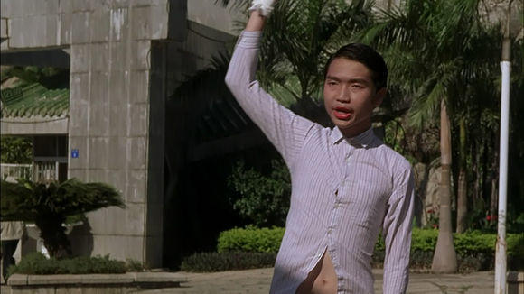

 

于是，在资讯匮乏的年代，我把当时，能找到的男性时尚杂志，买了个遍，学着里面的造型，买了相对低廉的搭配，没办法刚毕业，没什么钱，一切只能讲究性价比。

 

在镜子面前，一站，猛然发现，比自己之前技术IT宅男的形象，做了361度的反转，我成了当时IT型男（这么不要脸的话，我都要吐了。）

 

总之，自我意识要让自己变得更好，更有魅力，至少做到了第一步，先让自己看起来更帅气一点点。

 

当时最喜欢的搭配就是，修身牛仔裤+休闲衬衣+休闲西服上衣，请自行脑补。。。。。

 

我发现自己，比同是搞技术的同事，更有型了一些，优越感油然而生。

 

可直到，遇见一见钟情的女生时，我被打回了原形，在她面前，莫名的紧张，大脑里，不断的自我过滤要说出来的话，可越筛选，就越说不出来，患得患失，想赢怕输，别人给了机会，却让自己搞砸，悔恨，遗憾，纠结。

 

我这时，才意识到，我的自信，非常脆弱，像一只光滑的蛋壳，一敲就碎。

 

直到后来，我知道了『大众价值观』这个概念，才明白我的脆弱自信来自于哪。

 

『大众价值观』的 自信，是否符合大众价值观的标准，来决定认为自己的自信是高是低。

 

比如说，你今天买了一件新的衬衣，觉得非常好看，你的自信是不是会变高一点？

 

又比如，今天你买了一辆车，你会不会自信更高一点。

 

再比如，你今天买了一套房子，自信更高了，当然有几十年房贷压力的另算。

 

因为，大众价值观说，有车有房是好事情，是高价值的表现，穿好看的衣服是自信的表现。

 

如果，你满足了这套要求，你就符合了大众价值观的标准，自信就变高了。

 

这就是，我们经常看到，各种明星代言的广告，潜台词都是想告诉你，用了我的产品，你就自信了，你就牛逼，快来买吧。

 

几年前，陈冠希代言的某种男士香氛，类似于去除体味的产品。广告卖点，只要用了我的香氛，可立刻变成万人迷型男，这种香味可以瞬间吸引美女。

 

但实际上，大家都知道，这是不可能的，如果真有这样的产品，绝对会像伟哥一样畅销。

这种自信能持续多久？

 

一件新衬衣的新鲜感的自信，大概也就能持续几天到一星期左右。

一辆车，一套房时间会更长一些。

一般来，说价值低，时间短，价值高，时间稍长一些。

 

5，

第二种条件自信，裙带关系

 

现在的中国社会是人情社会，是关系社会，如果你有关系，可以走后门，节约时间、成本，加快效率。

 

人在这样的大环境下，也就慢慢习惯于依赖群体才行动。

 

我以前参加社交活动，如果没有和朋友一起去，就会感到没有安全感，害怕一个人势单力薄，万一发生什么事，没有人照应，久而久之，独立性就慢慢退化了。

 

到了陌生人多的场合，我发现，只要当时状态不好，就很容易躲在角落里，默默的玩手机，不敢和别人打招呼，不懂如何融入一个新环境，时间一长，就会越来越觉得没意思，索性就在家里宅着。

 

而如果，有人主动热情找我聊天，也会慢慢的放开自己，能聊一会，但也仅限于，周围的几个人。

 

如果，有自己朋友在场，尤其是那种比较放得开，能量气场很足的人，我就会容易被带动起来，但下次没有这个朋友在，就又会变回原形。

 

这让我意识到，在社交时的状态，很依赖于周围人的反应和带动，所以，裙带关系也是提升自信的一种方法。

 

就连『你瞅啥，瞅你咋地』这样的行为，都会涉及裙带关系。

你一个人很怂，不敢瞅，但你有一帮人帮你瞅，你是不是就瞬间自信了。

 

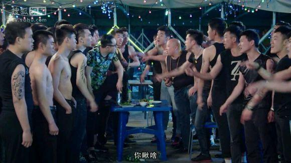

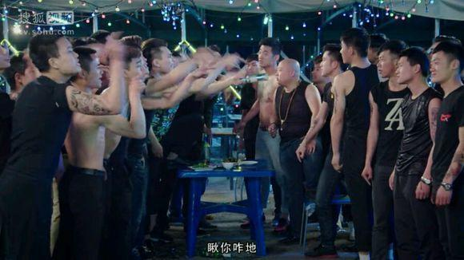

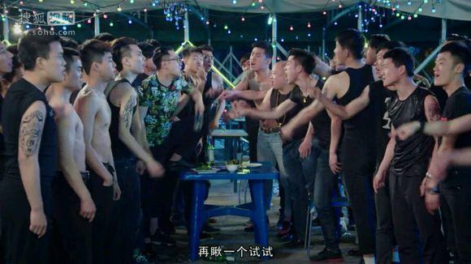

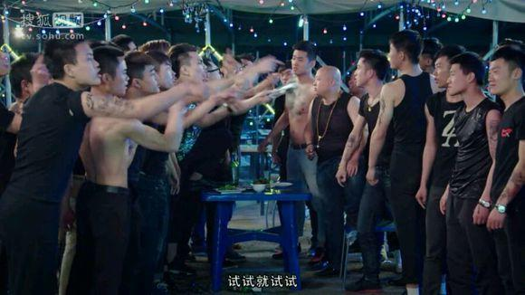

 

6，

第三种条件自信，特殊技能

 

 

我相信每个人，都或多或少都拥有某个技能，或在某方面，相对擅长和有经验，你在使用这个技能时，会感到有自信。

 

有一次，我们一群朋友聚餐，其中一个人，是朋友的朋友，连名字叫什么，我都不记得，因为很没有存在感，吃饭时都没说话，很内向。

 

饭后节目是K歌，在进入包厢后，我发现，这位朋友，立马变身麦霸，踊跃的点歌和唱一些比较豪迈、激昂、高难度的歌曲。

 

我能感受到，KTV变成了他的主场，唱歌是让他展现自身价值的特殊场合，几曲之后，他也明显话多起来。

 

后来，再次遇见时，发现他日常，就是一副内向，不爱说话的状态。

 

可能会有人说，内向的人，做自己喜欢的事情，就会很有热情，平常都是处于安静的状态，这和自信心有什么关系。

 

我写过一篇文章《内向者到底要不要变得外向？》，可在公众号（ID：yingrendao）后台，回复关键词『内向』查看。

 

我的观点是，内向者如何更好的社交和改变自己，需要先确定一个前提，你到底是真内向、还是假内向？

 

如果你是真内向，你可以爱怎么样就怎么样，可以发挥自己真内向的优势，就是深度思考，做一个安安静静的研究者和美男子。

 

如果你是假内向，同时内心有强烈交友和改变的意愿，那你其实可以有另一种生活方式。

据我接触的内向者，大部分其实是假内向，可通过有效的训练方法，让自己变得更容易与他人社交。

 

由于，假内向通常伴随，不会聊天、不会社交、不懂得如何自如的与心仪异性交流，久而久之，容易造成挫折感、失败感，进而会造成自信心的降低，恶性循环。

 

另外，在某论坛上，有人发了一个积累与异性聊天惯例的帖子，有几十页的回帖。

 

帖子主旨，希望大家能把自己碰到异性刁钻问题，以及应对『标准答案』发上来，共大家学习背诵，以备不时之需。

 

虽然真能让不懂聊天的人，至少能说出话了，但这是在背台词，而不是真实的情感交流。

因为这是，理性思维错误的套在，本应该是感性思维的沟通交流上，这种错位导致的结果，会让人，变成冷冰冰的聊天机器人，像siri。

 

你发出一个含有某个关键词的问句，对方会自动在大脑里，搜索背过的可能匹配的答案，然后输出给你。

 

殊不知，这只能骗骗，不谙世事的小女生，而稍微有些社会阅历、社交直觉、第6感很准的女生，一眼就会看穿你的把戏。

 

能感觉到你的不正常，就像siri虽然已经很智能了，但你还是能感觉到，它不过是个冷冰冰的机器人，而不是有真实感情色彩的人。

 

更不用说那些“天资愚钝”的人，根本背不了海量的惯例库，因为人是活的，说话内容千变万化，不太可能每次都会有所谓的标准答案，而应该是掌握聊天的本质，灵活应对。

 

像类似的特殊技能，是可以临时性的提高自信状态，却有副作用。

7,

第四种条件自信，角色扮演

 

有人发现，如果用一些装逼，装高价值人士的方法，可以比较快速的吸引到一些异性的注意。

比如，只是个普通白领，通过服饰造型打扮成了高富帅或社会精英的样子。

 

去到酒吧，就把在淘宝上，买的仿真法拉利车钥匙，丢在桌子上显摆。

通过这些方法，的确是可以骗到，一些涉世未深的小姑娘，这也正好证明，他是缺乏自信，没有安全感，

 

这并非是真正的自信，而是在伪装成另一个人，才能有自信去做一些事情。

是伪装就会有揭穿的一天，并且无法搞定质量与层次，都比自己高的异性。

 

不真实的身份，一旦回到现实生活状态，就会又变得不自信。

由于在扮演角色和真实的自己，来回徘徊，久而久之，人格也会变得分裂，分不清到底哪个是自己。

 

如果你是女生，被人搭讪，在一般休闲场合，却穿着一本正经的西服三件套，口插袋巾，油头粉面，说的话都像是提前背诵过的，你能通过他的言行，感到明显有生疏感和不自然。你能感觉到外在的精英形象和他内在是不匹配的。

 

那基本可以确定，这个人应该是刚参加过PUA课程，还不熟练的状态，现在正在拿你做练习呢。

你在公司里是个管理层，很多人都要听命于你，你在他们面前很自信，因为你有权力。如果你碰到老板时，你面对下属时的自信还有吗？

 

思考题：

你是否处于什么角色时，有自信；处于什么角色时，就自信全无？

你曾经，是否有为了让自己显得自信，而刻意装逼的时候？

这个装逼成功了吗？

这个装逼被识破了吗？

这个装逼让你感到真正自信了吗？

 

8，

大众价值观、裙带关系、特殊技能、角色扮演，这4样基本上都是可以用钱来解决，问题是有钱还好，那没钱怎么办？

 

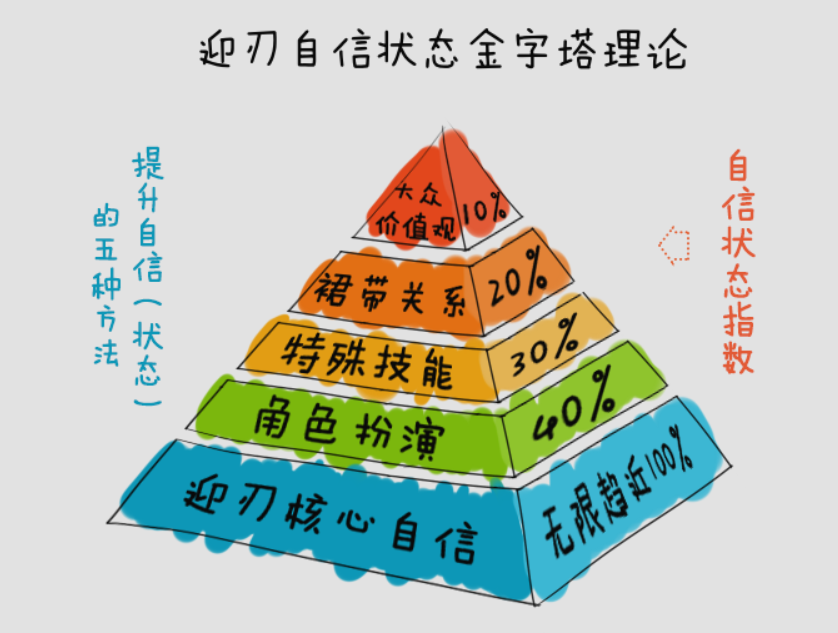

 

这些都是无法长久、无法自我掌控、无法提升自己的内在价值。

 

我们做到真正提升自己，让你的核心自信增强，不用再担心内心的脆弱，而过度的依赖条件自信。

 

怎样变成一个内心强大的人？

 

首先需要提升核心自信，提升核心自信有3个入门基本步骤。

 

1）扭转思维模式

需要先认知，前面提到的条件自信是什么，以及对你构建，真正内心强大的自信，有什么影响。

 

调整此类社会规范、认知对自己的束缚。

 

当你循序渐进，摆脱这些条件自信的影响，减少自己对它们的依赖，是建立强大内心的前提。

 

2）调整精神状态

 

这涉及到精神、能量、气场的话题。

如果，你是一个因为工作生活不规律导致精神萎靡、身体健康不佳、同时又缺乏运动与活力。

那你的整体精神力量，就会非常的薄弱，当你遇到困难挫折时，没有足够的精神力量作为内在的支撑，那也是无法拥有强大内心的。

调整精神状态，先从每天的睡眠、饮食、运动、健康着手。

 

3）突破舒适区，不断提升自己

 

如果一个人只有主观上的自信，那不是真正的内心强大，而是自负。

自负，就是过高地估计自己。人的自我意识，主要包括三个方面：自我认知、自我意志和自我情感体验。

人评价自己，要靠自我认知，有的人过高地评价自己，就表现为自负；有的人过低地评价自己，就表现为自卑。

 

自负，往往以语言、行动等方式表现出来。

自负，实质是无知的表现。

俗话说：“人贵有自知之明”。无知有两种表现，一是盲从，二是狂妄。

自负，有时表现为狂妄。大家最熟知的例子，莫过于芙蓉姐姐和凤姐了，当然，这可能是他们故意制造出来的标签形象，并不一定是他们真实的样子。

 

心理学家班杜拉提出，在社会学习理论中的自我效能感 (self-efficacy)的概念。

自我效能感，指个体对自身成功应付特定情境的能力的估价。

自我效能感，关心的不是某人具有什么技能，而是个体用其拥有的技能，能够做些什么。

人在主观上进行自我暗示、思维方式的改变，同时也需要通过实际的大量行动，进行失败、成功等经验的累积。

 

客观的结果，都会增加你的实力，会反过来，促进主观上的思维变化。

尤其是，你获得成功经验的时，你的大脑有一个“奖赏机制”会对你进行奖赏。

在心理学中，当人作出某一决策后，如果被证实正确，并产生了好的正向结果，大脑会向负责决策的区域，发送“奖赏”信号，这会促进，人的认知能力，进一步提升，形成良性循环，这被称作“奖赏效应”。

 

例如，当你成功通过，一项较难技能的考试，比如汽车驾驶，你会感到，自己原来水平还不错，尤其是看到一起学习的同学，有人多次都未通过，你会有优越感。

以上3个步骤，只是入门，更深入系统的提升核心自信方法，请关注我的微信公众号：yingrendao，后台回复『如何学习核心自信』

 

9，

小时候恐惧演讲的我，通过近几年，逼自己学习和训练，现在至少可以在YY语音，随便和几百人侃侃而谈1、2个小时。

虽然还达不到乔布斯、雷布斯、罗布斯的大神级别，但至少已经拥有了，认可自己的一群铁杆簇拥。

每当有粉丝赞许和打赏，都在不断让我感到，原来我真的可以做到，原来我可以帮助到很多人，原来我是个有价值的人。

 

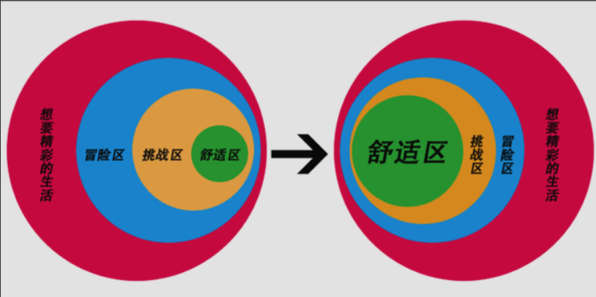

 

这一次次的训练提高、被肯定，都在不断的强化我的自信心和自身感。

 

小时候因为当众说话的恐惧感，已经离我远去，我已不再害怕演讲，甚至享受演讲。

 

所以，每次突破舒适区，挑战自己，提升自己的过程，就是一个训练强大内心的过程。

 

核心自信（强大内心），就是不断地提升与超越自己，产生一种来源于内心深处的最强大力量的过程。

 

这种强大的力量感，在你的大脑里产生时，你就觉得拥有了一种『超能力』，一种超强的精神力量，它可以扭转一切，帮助你有勇气和底气，去解决遇到的各种难题。

 

所以，我对内心强大的定义，内心强大就是拥有核心自信。

 

核心自信，源自正确思维观念的建立，与大量成功经验的实力积累。

-------------------

 

 

# <a href="http://www.jianshu.com/p/923e26158cbb" class="text_4"
target="_blank">得失心太重，患得患失，容易焦虑怎么办？</a>

2015.02.22 迎刃

 

得失心太重，容易焦虑怎么办？

 

要想减少得失心，减少患得患失感。需要先了解得失心是如何在大脑里工作的。

 

知道了原理，然后扭转错误思维方式和行为模式，并且根据一些实际操作才能一定程度上降低得失心。

 

从我的实际训练和体验中感觉，人是情感的动物，只要你有情感波动，就无法100%的去掉得失心，但至少可以帮助你减少到很低的程度，至少能帮助你比其他人心态更好。

 

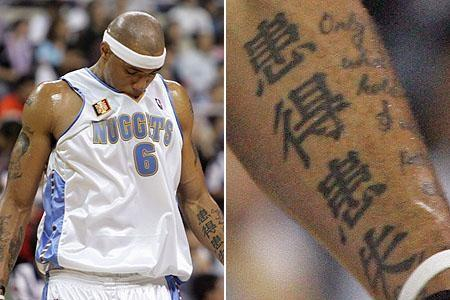

 

人为什么有时候会得失心重，有患得患失的感觉？

 

并且这种感觉让人百爪挠心，纠结无比，此心态会直接影响人的行为模式？

 

我先说说我的切身体验，我有一次打德州扑克大输（实际上没多少，说多了会不会。。。出事。。。），当时的感受是我觉得我好像心态失衡了，但又好像刻意做了控制，所以没有在情绪上表现出来。

 

我相信很多打过德州扑克的朋友都有过类似体会（或者其他竞技性运动，比如其他“博弈类”扑克牌游戏，麻将，或者是一般的运动，比如羽毛球、乒乓球、网球等），因为一些BAD
BEAT（德州扑克术语，意指一手好牌被别人在关键时刻以一张运气牌打败。）、或是自己的策略操作失误、或是太轻敌等等原因，情绪心态受到了影响，并且会影响整个游戏的后面阶段，最后输得一塌糊涂。除非你离桌，让自己清醒一下，但绝大部分人没有这种悟性、心态、自控力。

 

于是想起朋友给我推荐过一本书——《网球的内心游戏》，并告诉我此书对竞技性的心态提升有非常大的帮助。

 

于是花了两天时间看完，并针对重要内容反复揣摩，刹那间有种顿悟之感。有时候一本好书在你身边时，你没光顾它，只是时机未到，一旦在恰当的时机阅读，会比你平常随便翻翻或惯例性的捡书来看获得的价值和感悟要多很多，《网球的内心游戏》就是这样一本好书。

 

在后来的无数次德州扑克游戏中，我自然而然的运用了这个心态，竟然发现的确有很大不同。不同的地方就在于，无论是我暂时落后还是赢了很多，我都能保持一个平常心态，不会像以前那么容易受到情绪波动，内心有种说不出的平静。

 

让我又有了一种世人皆醉，唯我独醒的感觉，尤其是看到有人被BAD
BEAT就变得非常愤怒，甚至要掀桌子，我心中就会窃喜，他们做不到“放下成败得失，全心享受过程”，就永远只有输的份。高手更多会在乎自己是否做了正确的判断和最优价值化的决策，因为运气不能自己控制，不会把坏情绪带到下一把牌里。

 

书里提到一个概念，每个参与竞技的人的心里都有两个“我”，一个“我”是发出指令的，称之为“我1”，另一个“我”是执行指令的，称之为“我2”，然后给出指令的“我1”还会给这次执行指令的“我2”做出评价。

 

如果“我1”不断给“我2”做评价，“我2”就会受到影响，就会容易失误，并且影响后面的发挥，并陷入恶性循环。这种心态在网球、足球、篮球，以及任何涉及到与对手竞争的项目中普遍存在。

 

那知道原理后，如何降低得失心呢？

 

第一步，先将自我评价抛开，即对自己做的事情、操作、结果等不作任何的判断，无论是好的，还是坏的。

 

这样才能使自我意识和身体感觉（即我1和我2）和睦相处。只有“我1”停止对“我2”及其行为进行评价，“我2”才会不受过多的影响，正常发挥本应该有的实力。

 

第二步，将你想要的结果视觉化形象化。

 

不要使用命令。邀请“我2”用执行期望方式来达到预期的结果。把你想要的结果用想象的方式呈现给自己（我2）。

 

第三步：让它自然发生，相信“我2”

 

邀请你的身体来做一个行为，给它自由来做。身体是被信任的，不需要头脑有意识的控制。

 

比如我已经打过几万手牌（德州扑克的局数），绝大部分的各种牌型、出牌的顺序、各种类型选手等，我都积累了一定量的“数据库”，大脑是有记忆的，相信“我2”有成功、失败的经验积累，所以再遇到类似情景时，“我2”会顺其自然的做出相应最优化的操作。

 

第四部，不做评判，冷静的观察结果，观察过程，直到行为成为自然习惯。

 

刚开始刻意让自己不做判断，但还是不自觉的会做判断，但时间一长，这种不做评价任其自由发挥的感觉体验到过很多次后，你感受到了那种平常心带来的好处，你就会慢慢习惯成自然。在实践中体验到心态平和没有受到影响而带来的愉悦感与优越感的暗爽。

 

简言之，请大家在每次要遇到挑战、或不对称性信息的博弈竞技时，对自己内心默念这句心法口诀：放下成败得失，全心享受过程。这句话的含义就是，先不要过于计较结果，先享受过程，先放下未来不确定的可能，先做你能做的事情。

 

有时候事情就是这么奇妙，越不先考虑结果，反而结果对你越有利。原因就是，当你本身就具备一定实力经验是足以应付此事的，心态越放松，你的实力经验就越容易发挥，甚至是超水平发挥，那好的结果就是顺其自然的。

 

就像很多足球或网球运动员，他们平常的训练和比赛已经使他们的技艺非常娴熟。在赶上重要比赛时，心态的好坏就决定了他们是否能在面对强敌时，不会慌张，不会发挥失常。

 

有意思的是，当我反过来找告诉我朋友说，这本书实在是太棒了，对我的心态提升至少提升了好几个档次。他们的反应是，这当然是本好书，不过好像没你说那么夸张吧。可能是由于每个人感悟深度和理解程度不同，也或者是由于是我在遇到了一个具体困难时，碰巧它给我指出了一条光明的方向，让我走出来困境，所以印象更深刻。

 

后来又看到一本书——《思考，快与慢》，里面提到一个概念——系统1，系统2，我感觉刚好和前面提到的“我1”、“我2”有异曲同工之妙。

 

书里提到，系统1和系统2广泛应用于心理学。

 

系统1的运行是无意识、快速、感性、直觉，消耗能量少，处于本能，是自主反应。

 

系统2
注意力是有意识、慢速、理性、推理，消耗能量多，擅长计算、逻辑思维，相当于自控力。

 

系统1无法关闭，且一直默认后台运行，会本能规避风险。

 

系统2不费力放松状态，运作需要消耗大量能量和注意力，

 

这两个系统在某些情况下会发生冲突，就会出现矛盾，互相打架，互相影响，致使你的大脑思维也变慢，甚至出现纠结。

 

问题补充里提到“我来补充，貌似题主和我一样的情况，举例来说好比在游戏里面爆到一件极品装备，结果没roll到自己，又比如因为操作失误错花了很多点卷金币元宝之类的情况下，就会浑身感到难受不舒服。”

 

这就是两个系统发生了冲突，互相干扰的结果。

 

系统2告诉你，只是游戏而已，没得到极品装备又没有什么损失。

 

系统1告诉你，虽然是游戏，但你付出了时间精力，现在却什么也没得到，不甘心，哼。

 

系统2告诉你，只是游戏而已，只是多花了一些虚拟钱币而已，又不是真钱。

 

系统1告诉你，虽然是游戏，但那些虚拟币也是花时间精力打出来的，你竟然SB操作失误，太浪费了，你真是猪头。

 

好了。得失心的原因、道理、解决方法都告诉你了。

 

你现在还纠结么！？你现在感觉好点了么？！

 

 

 

 

# <a href="http://www.jianshu.com/p/6493de364bcf" class="text_4"
target="_blank">内心足够强大，世界都会为你让路</a>

2015.06.17 迎刃

 

大家好，最近一直忙着新书修订和发布、课程更新升级和学员跟踪回访(绝大部分学员反馈良好，只要是认真学习做笔记并每周实践，基本上都会有明显提升和改变)，所以暂时有段时间没更新。

 

我的新书《内心足够强大，世界都会为你让路》终于上线啦！

 

书名、校对是出版社的责编协助处理的，为了照顾广大受众需求，走了一点点鸡汤的赶脚，书籍主要内容是我的一些文章合集（关于自信、如何与异性社交沟通）并重新做了修订。

 

现在暂时只上线了亚马逊的版本，之后1，2个星期会在其他电子书平台上线。白菜价4.8元/本，手机用户可以安装kindle客户端，购买下载阅读，喜欢就支持吧（亚马逊支持支付宝和网银支付）。想看免费的就持续关注本微信公众号，但内容较散，需要自己归纳总结。

 

书籍内容简介：

面对不熟悉的一切，你总是畏首畏尾，不知所措。

聚会party，看着别人如鱼得水，而你总是默默坐在角落，暗自神伤。

你遇到心仪的TA，却不敢上前，也不知如何和TA展开话题……

这一切，都源自你内心不够强大。你内向，不自信，而这种情绪，也不断压迫你，导致越来越糟糕。其实，你也可以变得更好！

 

书籍作者简介：

迎刃，非著名情感砖家、自信恋爱学创始人、自信情感咨询师、自媒体人，百度、网易、新浪、搜狐等多家网站签约作者。

多年来帮助众多在成长过程中丧失了恋爱、社交、沟通等能力的朋友重获自信，为大家解析在两性关系中如何用正确的心态与异性沟通，深度剖析缺乏自信的真相，解码自信为何是成功恋爱的首要核心，以及通过一套独有的训练方法帮助大家提升个人魅力。

 

基本信息

版本： Kindle电子书

文件大小： 2320 KB

纸书页数： 54

出版社: 杭州蓝狮子文化创意有限公司; 1 (2015年6月1日)

语种： 简体中文

ASIN: B00ZFAVE5U

品牌: 杭州蓝狮子文化创意有限公司

 

想看免费的就去关注我的微信公众号：yingrendao。

购买链接<a href="http://url.cn/bUWg1i" class="text_5">http://url.cn/bUWg1i</a>

 

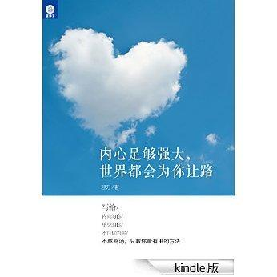

 

# <a href="http://www.jianshu.com/p/b2149297b2d3" class="text_4"
target="_blank">过分善良就是懦弱的代名词</a>

2015.11.03 迎刃

 

近日接到一些咨询者的反馈，他们日常生活中由于自身的不自信，容易不自觉的体现出一种『弱者姿态』或形象，由于自己的过分善良和退让，进而容易遭到他人欺负。

 

你日常的『弱者姿态』，让对方觉得你是个好欺负的对象，方便你拿你取乐，老被拿来开玩笑，发表意见容易被对方打断，经常被使唤，被普遍认为是老好人，老实人等等。

就像我们每次说到不如我大天朝的弱国，就容易产生下意识的认知偏差，说到印度，就是阿三哥们挤火车、开挂、吃咖喱、脏乱差、到处是强奸犯，当然还有很多朋友喜欢吃的印度飞饼。大家对印度人的印象也是觉得综合国力没有我们强，好欺负，但如果换成欧美白人，印象标签就立刻变成另一番景象。

人一旦处于不自信的状态，就容易趋于保守，胆小怕事，这也是基因在保护你，避免你在不自信的情况下还去做一些危险的事情。

善良是不是美德？美国心理学家莱斯·巴巴内尔有新理解：善良的人害怕敌意，用不拒绝来获得他人的认可。

很多人是性格脾气比较好，或者叫做不容易记仇，说的好听点就是——善良。只要对方不要太过分，是无所谓的，是不计较的，就是因为性格脾气好，会给人感觉好相处，但也会让人感觉是老好人。遇到冲突事情，就出于多一事不如少一事的想法，就没有反抗，做出了退让，但没想到对方会变本加厉。对方心情好就戏耍逗你玩，心情不好就拿你出气。

初入宫时的甄嬛温婉善良、天真、至情至性，但后宫的权力争斗不会因为她的与世无争而能自保。后来甄嬛遭受诸多打击之后变的心灰意冷、善于借力、也慢慢学会如何保护自己，面对敌手也变得心狠手辣，最后权势朝野。当然我不是要大家变得如此极端，但学会保护自己是必要的，不要让你的善良变成懦弱就好。

有部分朋友很害怕处理这种矛盾关系，也真的从来没有害人之心。要是与别人发生矛盾，心情会容易受影响。所以，害怕矛盾冲突的性格，会让这样的朋友选择了委曲求全的策略，希望不要矛盾升级，是想息事宁人。

还有部分朋友被开玩笑了，又不懂得如何反击，感觉被羞辱，一天心情都不好。想幽默反击，口才又达不到，想直接来硬的，又让别人觉得很难听，让他们觉得你开不起玩笑，很矛盾苦恼。

欺凌者，就是专门喜欢欺负比自己弱小的群体，原因是他们曾经也胆小懦弱，经常被欺负，有过屈辱的经历，最终积压了很多不满情绪，当发现有比自己还懦弱、更好欺负的人时，他们就会本能的把这些积压已久的情绪施加在无辜的人身上。

以上的情况也符合心理学上有一种**”踢猫效应“，**是指对弱于自己或者等级低于自己的对象发泄不满情绪，从而产生的连锁反应。

一父亲在公司受到了老板的批评，回到家就把沙发上跳来跳去的孩子臭骂了一顿。孩子心里窝火，狠狠去踹身边打滚的猫。猫逃到街上，正好一辆卡车开过来，司机赶紧避让，却把路边的老板撞伤了。

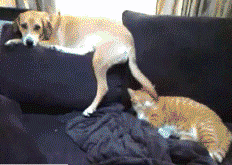

这个循环段子说明人的不满情绪和糟糕心情，会由沿着社会关系链条从高到底依次传递。就像金字塔一样，从顶层一直扩散到最底层，底层受害者最终也会影响金字塔的根基，形成一个死循环。

并且喜欢欺凌者还有如下几个心态：

1，认可弱肉强食的森林生存法则，强权是一种普遍的社会现象，且越凶就越不会被人欺负。表现很强势，不考虑别人感受的人，反而挺占优势。比如，插队者被别人指出，不但不羞愧，还恶语相向，自认为有理，用强势态度压迫对方屈服，而其他排队者大多数时候都是沉默的大多数的老实人。

2，对暴力强权的认知偏差：拥有暴力强权说明比别人强，被欺负了就一定要打回去，绝不能被人骑在头上。暴力是最简单直接有效解决问题的手段，讲道理浪费时间。

3，通过暴力强权容易掌控他人，使弱者顺从，甚至尊重自己，最终受其摆布。

怎么做才能更好应对这样的情况？

欺凌者也是欺软怕硬的主，要想治本治根，你要做的就是由弱者变成强者，让对方忌惮你的实力，从而不敢造次。人应该要点脾气，过分的善良会让你丢失自己的尊严，过分善良和忍让是一种『取悦病』。你要想不再被欺负，就需要调整自己的自信状态和实力。让对方知道你不害怕他，并且你被他欺负了，是不会有好果子吃的，一旦形成了这样的态势，对方自然不敢招惹你。

欺负你的人也分两种情况，1，是偏玩笑戏耍你居多；2，是真欺负，人善被人欺。

第1种情况，其实相对好应付，更多是身边朋友的一种『亏你』、『水你』的玩笑而已，只是由于你嘴笨，不懂如何反唇相讥、用一些同样的『水话』作为反击的武器，从而化解掉你被『攻击』的困境。学习和提升自己的幽默感和语言反击能力是很有必要的。

请参考《九品芝麻官》，周星驰一开始也和你一样只会吃哑巴亏，有苦说不出，无力申辩。以为可以通过祖传秘籍可以变超人，但造化弄人，秘籍被毁，精神严重受挫，变成了白痴，直到后来机缘巧合受到两个青楼老鸨嘴炮大战的启发，开始暗暗学习苑琼丹的嘴炮方法，猛练口才，最后变得伶牙俐齿，美好大团圆结局。

虽然剧情有夸张成分，但苦练口才是唯一解决办法。至于怎么练口才，不在本文的讨论范围，大家可以自信搜索，或者下次再开文讲解。

如是第2种情况，对方是有意针对你，要么远离他，要么就要坚决捍卫自己的尊严，和他死磕到底。

你容易被欺负，除了你的气质外，是没有想清楚自己的底线是什么，你无数次的被别人践踏过尊严时，没有反击，没有表明你的『神圣领土不可侵犯』的态度，别人就会觉得你的底线很低，都这样欺负你了，你还没有什么意见，越低就会越喜欢欺负你。

正所谓，弱国无外交，弱逼无逆袭。

不过反击也是需要一些实力的，这背后是自信、前面提到的口才、以及自身的专业（别人质疑你能力时）的体现，『你弱你有理』的逻辑遇到强势者时，就只有碰壁，狮子是不会过分在意绵羊的感受。

你的口才反击能力是直接与对方短兵相接的，即使你没硬实力，嘴上功夫过得去，至少从气势上你不会输，你如能通过幽默和高情商的方式来反击对方的攻击，则可以实现四两拨千斤的效果。这样不用太伤和气，又可以挽回你的颜面是最好的。如不会外交辞令式的机智辩才，采用鱼死网破的死命抵抗，虽然不一定输，但关系可能就僵化了，甚至解下梁子。如你们是抬头不见低头见的室友、同学、同事，往后就不好相处了。提升幽默感和情商则是处理这类问题的最好武器和润滑剂。

最后分享两则黄渤高情商幽默临场应对的例子给大家学习一下。

黄渤近日被某媒体采访时被问了一个挑战性的问题——『是否能取代葛优？』

黄渤的回答展现出超高情商。他说：『这个时代不会阻止你自己闪耀，但你也覆盖不了任何人的光辉。我们只是继续前行的一些晚辈，不敢造次。』

黄渤人生阅历丰富，怎么可能不知道记者在下套，于是采用了四两拨千斤的妙句给化解了。

 

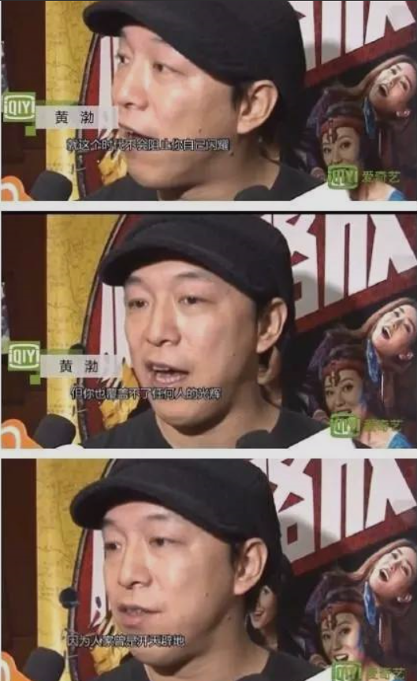

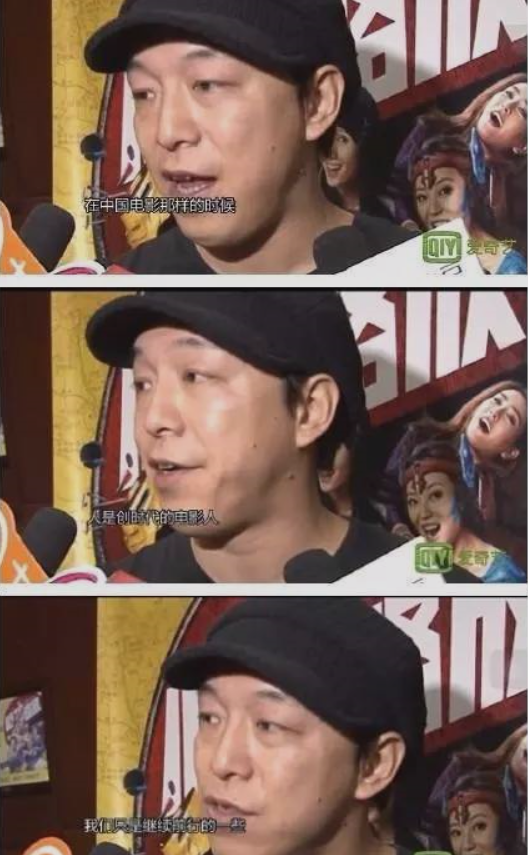

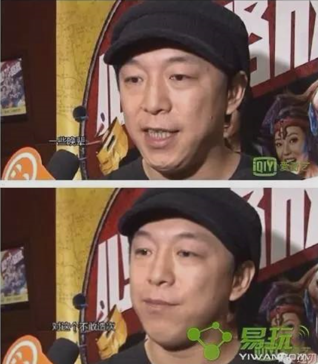

 

第50届金马奖颁奖典礼，黄渤和郑裕玲一起做颁奖嘉宾，当时郑裕玲就先奚落黄渤的衣服很随便不庄重，黄渤回复：『说金马就像家，年年都在，就像在自己家迎客一样，回家所以穿舒服点。』

蔡康永还语带讽刺地说『这里是我家，不是你家』，言下之意不便明说，懂的自然懂。

黄渤的回复实在淡定机智：『你也不是一个人在战斗，还有一匹马，跟你一起，这么久了，只看到人骑马，还没看到马骑人。』

 

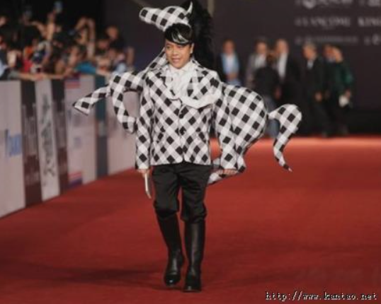

 

这句是黄渤在看到蔡康永走红地毯时肩上放着一只装饰马，借此『反唇相讥』，最终让一向口才了得的蔡康永只能以『哈哈哈，拍电影嘛！』敷衍过去，在场的观众和明星们都乐不可支。

 

<a
href="http://v.youku.com/v_show/id_XNjM5NDc4OTM2.html?from=s1.8-1-1.2"
class="calibre8">131125金马蔡康永马骑人造型遭爆抄袭国外设计师</a>

 

<a
href="http://v.youku.com/v_show/id_XMTM3MDU1NjA0MA==.html?from=s1.8-1-1.2"
class="calibre8">黄渤金马奖妙语连珠
机智调侃蔡康永—在线播放—优酷网，视频高清在线观看</a>

 

真是情智双高的低颜值男神。

 

# <a href="http://www.jianshu.com/p/93eda456728f" class="text_4"
target="_blank">滚蛋吧，玻璃心</a>

2015.11.05 迎刃

 

因玻璃心造成的负面情绪波动不是事情本身，而是你对事情的看法。

 

在我们的成长经历中到底发生了什么，才导致了我们变得玻璃心？

 

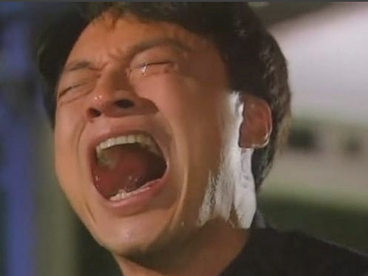

 

玻璃心的人一般都比较敏感，很脆弱，易被人影响，也时时不够自信，别人对他开玩笑或表示不满时，容易纠结与焦虑。

与人当面沟通或信息沟通（微信QQ），会羁绊很久，不知该如何说，担心对方误解。并且还会胡乱揣摩对方言行，深怕自己得罪了对方。

当别人说到自身敏感在意的事情时，容易心里情绪跌宕起伏，要么会逃避，直接岔开话题，要么就是会生气，是否会表现出来也看各人性格。

聊天讨论的时候觉得某事某话梗到自己了，为了面子上过得去，还迎合大家，给自己心里添堵。

种种的玻璃心表现，让这些朋友在生活工作非常苦恼。

虽然大家也知道玻璃心态很容易影响自己的言行，影响人际关系，影响感情，但就是想压抑也压不住，无法逃脱精神上的折磨，这样的心态要想控制，就像大禹治水，只能疏不能堵。

玻璃心是怎么产生的呢？

这里引用一则鸡汤小故事：一天，老和尚带着小和尚下山去化斋，走到一条河边，看见一个女子因为无法过河而在哭泣。这个老和尚就走过去说：“我背你过河吧！”然后这个老和尚就把这位女子背过了河，小和尚吓呆了，但也不敢问。他们师徒两人又走了二十多里路，小和尚实在忍不住就问了师父：“我们是和尚，怎么可以背那个女子呢？”师父说：“你看，我只把她背过了河就放下了，可你却背了二十多里路，还没有放下。”

玻璃心的朋友就像这位小和尚一样，迟迟放不下已经过去的事情。事情本身不伤害人，而你的想法会伤害你。小和尚就被自己的固有观念所影响，惴惴不安。

一般人对自己玩笑否定打压，可以相视而笑，而同样的话是出自亲近的人的口中，就心理变得不舒服了，更在乎亲近人对自己的看法。这说明造成心理情绪波动不是事情本身，而是你对事情的看法。

根据心理学家埃利斯的**情绪ABC理论**，下面的描述有点拗口，认为激发事件A(Activating
event）只是引发情绪和行为后果C(Consequence）的间接原因，而引起C的直接原因则是个体对激发事件A的认知和评价而产生的信念B(Belief），即人的消极情绪和行为障碍结果(C)，不是由于某一激发事件（A)直接引发的，而是由于经受这一事件的个体对它不正确的认知和评价所产生的错误信念（B)所直接引起。错误信念也称为非理性信念。

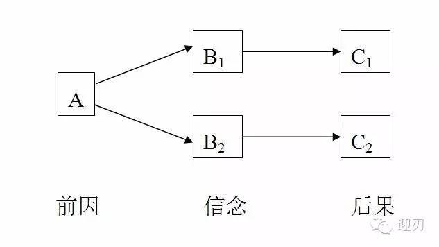

 

从事情的起因A，到结果C，中间有一座桥梁B，B就是你对事情本身的预期评价或思维模式，由于不同的人有不同的思维方式、性格、境遇、自信状态等等，所以才会出现一件事出现不同的观点。

比如有人在你背后推了一下，由于你经常被欺负，所以你会本能的以为又有人在玩你了。而如果你是一个朋友人缘极好的社交达人，你会下意识的想，是不是又被朋友给在大街上认出来了。

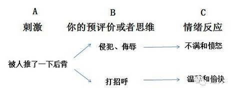

 

正是由于我们常有的一些不合理的信念，才使我们产生情绪困扰，如果这些不合理的信念日积月累，还会引起情绪障碍，渐渐变成了所谓的玻璃心，同时这些负面情绪也会影响到自身的自信状态。

在我的自信提升体系里，真正内心强大的人是不过分依赖于外在的条件自信，不容易受外界评价的影响。玻璃心就是一种容易受到外界评价影响的结果。

这个问题怎么解决？

要想改变不合理的信念、情绪困扰不是改变事件，而是应该先改变认知，通过改变认知，进而改变情绪。只有改变了不合理信念，才能减轻或消除玻璃心。

所以你现在要改变的认知，就是与人相处时的自信心态、社交态度。你需要先明白一点，你无法做到让所有人都喜欢你，就算是喜剧之王的周星驰也会有人黑。但你可以让喜欢你的人更喜欢你，不喜欢你的人，就随便他们好了。

你无法不让别人对你做评价，有句俗话说得好，谁人面前不说人，谁人背后不被说。这是人性，你无法改变，你能改变的是别人对你评价时，你对自己的看法。

如果你的确有缺点被别人说了，那就接纳这一点。自我接纳是人对自身现有现状的一种积极的态度，不以物喜，不以己悲。现在很多明星被黑后，化被动为主动，开始自嘲自黑，当然这也是一种公关策略啦，大家可以借鉴。

比如上了TED演讲的袁珊珊，一开场就自称自己365天被一群素未谋面的陌生人谩骂，只因她出演的角色为到达观众们的预期。

甚至有网友发起“袁姗姗滚出娱乐圈”的话题：长相不出众却是绝对的女一号，演什么毁什么。

这要是放在阮玲玉身上那得自杀十几回了吧。袁珊珊没有成为阮玲玉，而成了一个自黑的逗比，她在微博上传了一组“滚”的动作照片，并幽默的称：“今天又是各种求滚，谁小时候没滚过，重温儿时游戏，下面开始，第一套广播体操：翻滚吧，小袁!”，袁姗姗在地上尽情的做出一系列翻滚的动作，由此开始她的公众形象开始改观。

这样的自黑自嘲，可以幽默有效化解绝大部分的恶意攻击或评价，不过要想做到这点，首先还是有颗强大的内心。

大家可以查看我的专辑里的其他文章，可帮助你提升自信心态。

其次，日常可以多看多模仿一些幽默大师的段子语录来增加幽默感，如果你是个很严肃或是缺乏幽默感的人，是很难使用出这样的太极高端招式。

自信和幽默感的提升是需要训练和时间积累，切不可急于求成，如果你今天能从本文获得收获，能先从思维上扭转错误的观念，那你离消除玻璃心已经不远了。

请给自己多一些信心，请跟我念：滚蛋吧，玻璃心。 fuck off  bo li xin。

【完了】

 

 

 

 

 

 

# <a href="http://www.jianshu.com/p/b057f83c9256" class="text_4"
target="_blank">如何摆脱童年阴影造成的不自信</a>

2015.11.07 迎刃

 

你现在的不自信大多来自童年成长阴影的影响。

 

在微信里做了一个小调查，认为自己有童年阴影的请给我发信息帮助分析。觉得自己受童年成长经历的影响，随着年纪的增长，由原来开朗自信慢慢变得内向、自卑，进而影响了自身人际关系处理能力的人非常多。

列出几种典型情况，简直就是童年成长阴影血泪史。

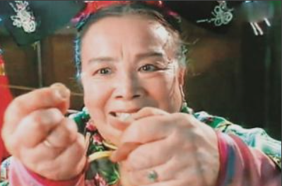

 

1，小时候成绩不好，经常被父母打骂。在学校经常被同学欺负，说话结巴，容易招致嘲笑，导致长大了很没有安全感。

2，童年被父母经常关在家里，不让外出，于是我就哭，邻居家的孩子跑来找我玩，但会被邻居家长告状，然后父母就会打我，造成的结果就是一直不敢说话，很内向，后来自己努力改了一些，现在不敢在人多场合讲话，一直没有自信，很怕事，害怕气场强的人。

3，从小就没了父亲，学校同学又欺负我 ，在双重影响下，我童年变得非常自卑。

4，上小学时被老师打过几次，学习也不好，从此性格变得内向孤僻自卑，不怎么爱与人交流，导致现在谈恋爱社交也出现很多障碍。

5，小时候经常被父亲骂，感觉很害怕他，总以为他不爱我，所以每次放假回去都希望他不在家。另外每次主动跟他说话的时候，他都沉默，不答应我，弄得现在都不敢主动跟人聊天，不敢主动问别人问题，害怕别人不回应自己。

6，小时候爸爸太严厉，学习不好就叫我笨蛋，打牌输了就发脾气或者打我，害怕别人不喜欢我，也会不自信怕别人背后说我不好的。

7，别人家的孩子总是比你学习好、听话、孝顺、长得好，总之别人家的孩子就是好，你就是不行，不断的否定，与缺乏正面积极的鼓励。

8，初中时期开始暗恋一个女孩，直到上大学，最后无果，这也是一个对异性的阴影。不喜欢的无所谓，表现的比较正常，面对喜欢的却不能正常表达，很木讷。

还有很多各种各样阴影。。。。。。

总结上面情况，造成的影响主要是父母老师管教严厉、甚至打骂；父母不和吵架离异、缺乏关爱；受到同学、他人欺负；生理缺陷造成的自卑，例如青春痘、口才、升高、长相等；年纪轻时，情窦初开，最终未成功，造成了恋爱上的不自信状况。这些心理与生理上的双重伤害是形成阴影的直接原因。

这些情况挺符合精神分析大师弗洛伊德的“童年阴影”理论，认为人的创伤经历，特别是童年的创伤经历对人的一生都有重要影响。

布鲁斯韦恩在童年时掉入枯井，被蝙蝠吓到，失去安全感，之后经历亲眼目睹双亲被杀，这样的阴影，产生了为父母报仇的信念，差点被忍者大师利诱走向邪恶复仇组织的深渊，幸好遇到女主积极引导，才走出阴影，成为了后来伸张正义的蝙蝠侠。

我就记得我读幼儿园的时候，由于父母忙于上班，无法带我，又担心我出去玩会出事，周末两天就把我反锁在家里，我家住6楼，我只能自己看电视，看小人书，乱涂乱画消磨时间，无法和邻居的小朋友玩，这种情况印象中持续了大半年，这段时期感觉到非常的孤独，所以印象深刻到现在还记得，也让我性格变得内向卖下了一颗种子。

人的意识和潜意识类似于泰坦尼克号在海上遇到的冰山。意识部分相当于冰山露出海平面上的一角，自由漂浮的冰山约有90%体积沉在海水表面下，相当于人的潜意识。因此根据浮在海面上的样貌，无法猜出海平面以下的形状。这也是为何有“冰山一角”来形容严重的问题只显露出表面的一小部分。潜意识虽不为人知，但很多时候在不知不觉地支配着人的行为。而这些创伤，因为人的自我保护机制，大多被压抑到潜意识区域。

我们长大后，这些伤害经历虽然离我们远去，感觉它已经不存在了，但一不小心被某事触动，它还会跳出来，让你痛不欲生，甚至情绪失控、行为失控。

常见的情况则是直接影响一个人的自信心态，遇事遇人都容易患得患失，有部分人会由活泼（小时候，受创伤前）变得内向不爱说话。这一点产生的后果是直接影响你的社交、沟通、恋爱等人际交往问题。

也有一部分朋友意识到这个问题对自己影响很大，也尝试过一些方法，比如看一些心理书籍，学习成功学，灵修等，然后对自己进行心理暗示，不过这些都只能治标不能治本，都只能是鼓舞振奋持续一段时间，就又变回原形了。又变回以前一样，容易焦虑、患得患失、不自信的状态。

如何从童年阴影的影响中走出来呢？

走出阴影的过程，就是重建自信的过程。去做没自信事情，做成功了，你的自信就会慢慢增加了。

越害怕什么就越需要做什么。

害怕当众说话，就找训练口才的活动去训练自己。害怕社交，就拉上小伙伴一起去找自己感兴趣活动，物以类聚，人以群分，找到同好，你更容易融入新环境，认识新朋友。越害怕异性不喜欢你，那就越需要认识更多的异性，因为你无法让你喜欢的人都喜欢你，你只能让喜欢你的人喜欢你就行了。

不断的积累成功经验。

当你去做害怕的事情中，一旦体验过成功，有过收获，而且是此前从来没做到过的，你的大脑会告诉你，你是可以的。

在心理学中，当人作出某一决策后如果被证实正确并产生了好的结果，你的大脑会向负责决策的区域发送“奖赏”信号，这会促进人的认知能力进一步提升，形成良性循环，这被称作“奖赏效应”。假设你每天都能明显感觉到自己在进步，在成长，在获得奖赏激励，都有及时的反馈信息，这会让你信心逐步增强。这个奖赏效应其实就多巴胺产生的结果，是人类所有内在动力的根本来源。人性追求快乐，逃避痛苦，人所喜欢做的任何事情，无论是吃美食穿新衣住大房子开好车子，都是通过奖赏效应的机制来让人感到愉悦。

以上是从客观角度去构建自信的方式，人在主观上进行自我暗示、思维方式的改变的同时也需要通过实际的大量行动，进行失败、成功等经验的累积，这些客观的结果都会增加你的实力，会反过来促进主观上的思维的变化。

在我的理念体系里，一个人真正变得内心强大需要拥有核心自信，核心自信包括客观自信与主观自信，两者互为影响。核心自信是不过分依赖于外在条件的自信，不容易受到外界的影响。

所以
，现在你需要一套新的自信思维模式来替换你从童年到现在的固有的不自信的思维模式。最后推荐大家阅读我的电子书《天生好手》，这是我自信提升体系的免费入门教材，关注微信公众号：yingrendao
(搜索：迎刃)，回复数字『 1
』即可下载。大家看完后，请给我微信留言或直接公众号发表评论，说说你的感受。

最后还是提醒一下，大家不要指望看完本文，你就能马上摆脱影响了你十几年，甚至是二三十年的童年阴影的影响，自信提升是一个长期过程，任重而道远，需要学习正确的方法与辅导，需要知行合一和循序渐进，忌讳急于求成与浅尝则止。

 

在自信之路，恋商之道上，与你同行，迎刃而上。

走出阴影，扭转自信，只需一点点勇气，请从今天开始。

【完了】

 

# <a href="http://www.jianshu.com/p/323ffc30bbd8" class="calibre8"
target="_blank">3分钟自信程度评测</a>

2015.12.05 迎刃

 

扫描下面二维码，或点击链接<a href="http://www.wenjuan.com/s/Qn673a/" class="text_8"
target="_blank">http://www.wenjuan.com/s/Qn673a/</a>

3分钟即可测出你现在的自信程度，请把分数记录截屏。

然后，可阅读我的精华文章和电子书（<a
href="http://mp.weixin.qq.com/s?__biz=MzA4MzA3MDMzMQ==&amp;mid=400532102&amp;idx=1&amp;sn=a122e8852e7ba9c463c61416eed40ee4&amp;scene=21"
class="text_8" target="_blank">点击查看</a>），并按照内容实践1-4个星期后，再做一次评测，进行对比。

如根据我的建议进行有效训练和解决疑难问题，你的分数比现在会有所提高，对此，我百分之百的肯定与自信。因为我们运作3年下来，已帮助超过10万人受益，超过2000名学员获得改变。

Just do it!

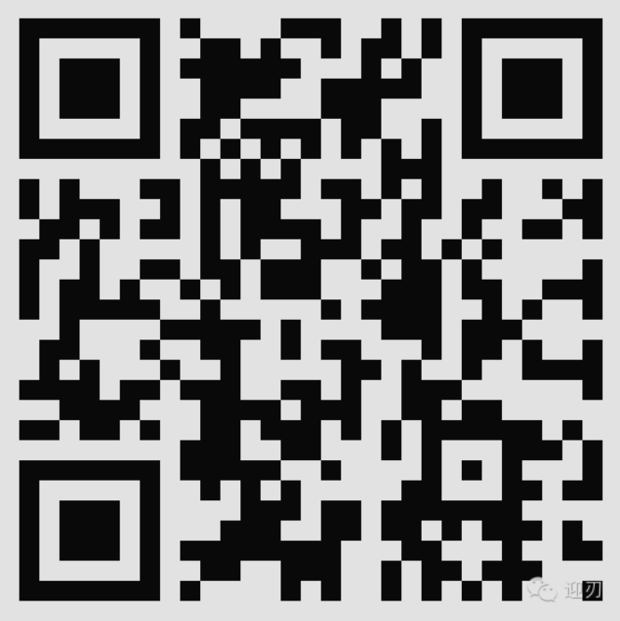

 

# <a href="http://www.jianshu.com/p/d0fb2559f26e" class="text_4"
target="_blank">如何提升自信，走出心理阴影</a>

2016.07.20 迎刃

 

本文是我核心自信提升理念的精华浓缩总结，有助于你学习如何提升自信，但有半广告性质，不喜可关闭，如果你是一个想要改变自己的朋友，请仔细阅读，这将帮助你终身受益。

你有这些不自信的症状吗？

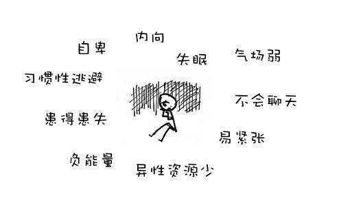

你为什么会没有自信？

根据精神分析大师弗洛伊德提出将人的主观『意识』部分比喻为冰山露在水面上的一角，而**『潜意识』**却是冰山在水面以下的巨大部分。潜意识潜移默化支配着人的行为。

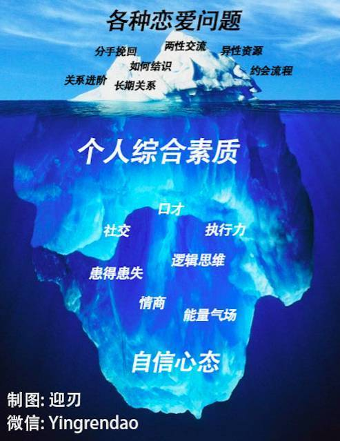

**弗洛伊德还提出『童年阴影理论』**，你在幼年、青少年时期，遭受的挫折、打击、或其他负面影响，如果没有及时引导，会产生心理创伤，因为人的自我保护机制，大多被压抑到潜意识区域，而一旦被触发容易引发情绪或行为失控。

进而会在你成年后，影响你的人际交往、沟通、恋爱等问题。

例如：

1）面对喜欢的异性，放不开，不自觉紧张、患得患失。

2）在职场、社交场合，即使对方反应很好，而自己还是因为紧张而表现不好，错失各种机会。

这些挫折打击引发自卑，变得内向，不爱说话，焦虑、失眠、亚健康、能量低，进而引发更多的挫折打击，恶性循环。这也就是为什么，你主观意识想自信，却没有作用，或效果有限，就是因为潜意识是影响你自信的根源之一。

看下图，你要想改变自己，就需要解决以下相关问题，才能彻底提升自信。

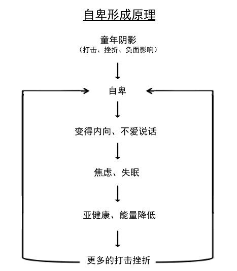

只有先找到问题根源，才能解决问题。

因为这些影响已经产生，并印在了你的潜意识里，潜意识是不容易被改变的，这也就是为什么，我们有时候希望通过『自我暗示』、或是别人暗示，例如看本书，听别人的建议，可以稍微改变一点，但待续时间不长。原因就是潜意识无法被主观意识直接控制。

不打破恶性循环，就只有继续自卑下去。

 

 

自信是什么？

心理学家班杜拉提出，在社会学习理论中的自我效能感 (self-efficacy)的概念。

自我效能感，指个体对自身成功应付特定情境的能力的估价。

如果不提升自信会有什么后果？

不自信的人，会不自觉的产生各种消极想法，比如：

我不行；

我总是失败；

其他人不会喜欢我；

我又犯了一个错误；

会给自己贴各种负面的标签，笨，懒，没有吸引力等等。

这些给自己带来消极负面压力的思想，在心理学上称之为『认知曲解』，这样的认知错误，如果不从你的大脑里踢出去，那你一辈子都会受此煎熬。

接触到的案例，有一些学员受自卑影响有超过15年以上，每次想改变，都是有一股强大的力量（自我保护的潜意识）阻碍着他，让其无法行动，所以每次都是浅尝则止，很快放弃，于是继续加重打击，恶性循环。

如果他早一点意识到这个问题并尽早找到解决办法，**也就不会情况恶化**。这样的朋友来参加我的课程学习，就要比问题没那么严重的学员，要付出更多的努力、代价和时间。

这有点像牙疼或得了个小病，刚开始你不以为然，或因为有拖延习惯，就不宜重视，直到问题非常严重，必须要进行深度治疗时，你就需要花更多时间，金钱，以及承受更大病痛和精神煎熬。

 

很多人既想改变，但又害怕改变。想改变是人的趋利避害的本能，害怕改变也是如此。

他们担心改变要付出巨大的努力，可能还是失败，与其这样，比如保守一点，以后再说吧。

而这也是为什么有些人缺乏自信的人，困扰痛苦十几年的原因，每次都要和自己内心做挣扎。

人的大脑有2个我，一个是想改变的自己，一个是为了避免意外专门保护的自己。

《思考，快与慢》里面提到一个概念——系统1，系统2，这个系统12分别对应两个你。

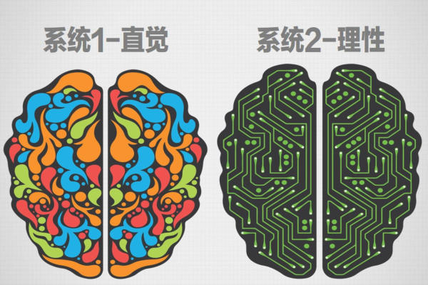

书里提到，系统1和系统2广泛应用于心理学。

系统1的运行是无意识、快速、感性、直觉，消耗能量少，处于本能，是自主反应。

系统2
注意力是有意识、慢速、理性、推理，消耗能量多，擅长计算、逻辑思维，相当于自控力。

系统1无法关闭，且一直默认后台运行，会本能规避风险。

系统2不费力放松状态，运作需要消耗大量能量和注意力。

这2个系统在某些情况下会发生冲突，就会出现矛盾，互相打架，互相影响，致使你的大脑思维也变慢，甚至出现纠结。

举例：

系统2告诉你，我不能再这样下去了，不然就一辈子没法和别人正常交流，工作生活都受到影响，也会影响与喜欢的人在一起。

系统1告诉你，你要改变需要付出一定的代价，时间，精力，金钱，万一自己放弃了，不是白白投入了吗？还是保守一点比较好，我考虑考虑，我再想想。

一般这个想一想，就会形成拖延，大家都知道拖延症有什么坏处，不言自明，这也是为什么很多人的不自信状况会延续10多年的原因，因为每次想改变时，都已经被另一个自我保护的自己给打败了。

如果你甘愿一辈子就这样下去，那没人可以帮你，你要想改变，首先需要自救，豁出去，人生有几个10年，就应该痛痛快快，开开心心的活，而不是天天在内心纠结。

怕，你就会输一辈子。

我在10年前也和你一样，自卑、内向、不善言辞，人际交往，恋爱问题失败。

但我为什么现在可以反过来教大家解决这个问题？

因为，大概5年前，因为机缘巧合，开始这方面学习和研究时间。我为了解决如何提升自信、人际交往、恋爱这3大问题，以及他们之间的关系和影响，付出了至少5年时间，接触过的个体案例超过3000以上，没有大量的理论学习、经验积累，你是不会看到现在这些深入浅出的解说。

我相信你也应该第一次接触到这样解释自卑的概念，和解决方法，是吗？

想让自己更快的改变，就是借助前人的经验，可以相对快速学习提高，减少摸索试错的成本，毕竟时间成本才是最贵的。

曾经接触过一些来咨询的朋友，他们虽然受到自卑问题的影响困扰很久了，虽然我帮助他们做了很多深入的分析和提供建议，也认可我能帮助到他们，但是一涉及到具体解决问题上，就开始退缩，想自己解决，美其名曰，我得靠自己，如果他们真能自己解决，也不会因为这个问题困扰十几年了。

那如何真正有效提升自信呢？

有两点贯穿始终。

1，改变认知

2，实践行动

1，『迎刃核心自信』系统，帮助你深入了解自卑与自信产生的根源，扭转错误思维模式，打破自我否定，提升自身能量气场，有底气有勇气的面对各种困难与挑战。

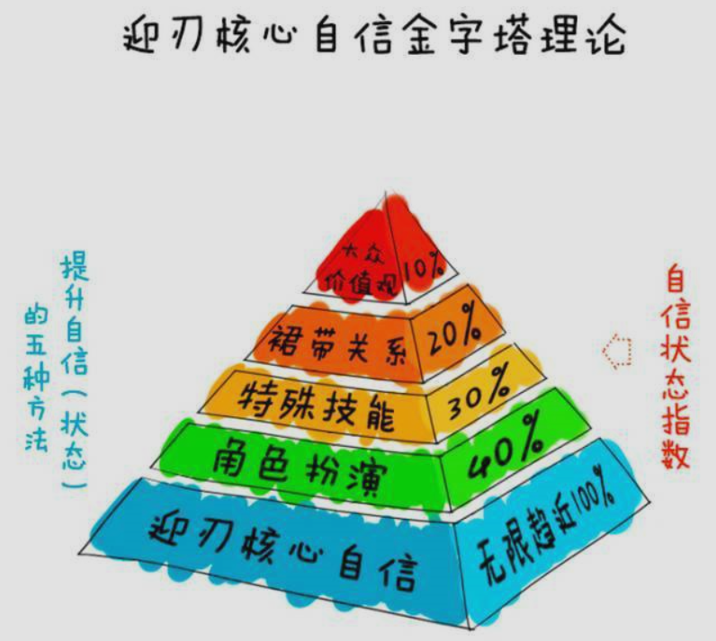

『迎刃核心自信金字塔理论』简称『自信金字塔』，是由非著名非典型情感砖家迎刃的研究成果，它用金字塔层级与数字形式，视觉化显示采用不同的提升自信方式，对自信状态产生多少的改变。

迎刃核心自信，并非传统意义上的唯心自信，或者鸡汤鸡血自信，而是同时包含『主观自信』与『客观自信』两个重要组成部分，并且搭载了一系列辅助提升自信的功能模块。

『主观自信』就是改变认知，『客观自信』就是通过实践行动积累成功经验，然后反哺『主观自信』，一个唯心一个唯物，两者互相作用，就像太极。

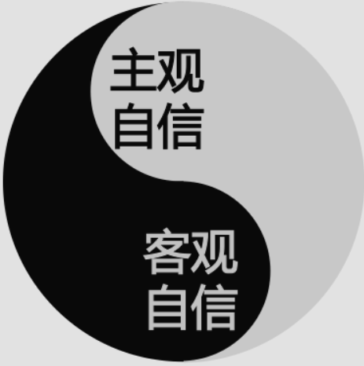

2，实践行动，对应客观自信。提升自信的过程和锻炼肌肉很类似。

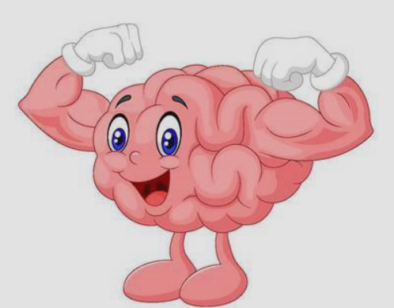

人在主观上进行自我暗示、思维方式的改变，同时也需要通过实际的大量行动，进行失败、成功等经验的累积。

客观的结果，都会增加你的实力，会反过来，促进主观上的思维变化。

尤其是，你获得成功经验的时，你的大脑有一个“奖赏机制”会对你进行奖赏，会鼓励你不断继续获得成功，这就是马太效应，强者愈强。

『迎刃核心自信』系统，是目前为止市场唯一一套，既有完整理论体系，又有实战指导作用的自信提升系统，且经历超过3年3000用户验证有效，并易学习复制，在微博、知乎、豆瓣、简书等各大平台广受认可。

以上提升自信方法为**启发思维入门教程**，**仅为完整内容的10%都不到**，且内容会不断根据用户需求更新迭代。

提升自信会带来什么样的好处？

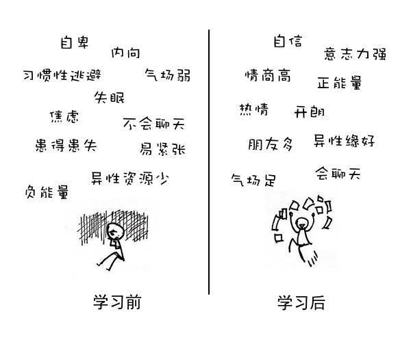

女生案例1

小t，211大学毕业，上海世界五百强工作经历

学习前：

家人对我从小严格要求，很少鼓励教育，大多都是批评和不满意，要求我做到更好，以致于渐渐自我认可度比较低，因为长期生活在一个否定挑剔的环境里，整个人的感觉越来越差，越否定就越没信心，越落后就越没勇气往前走，整个人都脆弱敏感。

一直感情不顺，遇不到合适的人选，很少遇见符合自己心意的人选，身边朋友很多结婚，亲戚催婚，更是倍感压力。

学习后：

我突然转换了思维，我想，为什么我要陷入这种怪圈，凭什么别人以这些判定人就让自己不自信了，我有我自己的判断系统和标准，何况自己无论外在，内在各方面条件都不差。如果陷入别人的思维，那就是阻碍了自己的发展和进步，无条件的自信，才是不败的宝典。

女生案例2

G童鞋，金融行业

学习前：

第一次接触到迎刃的文章，是在我大概失恋10天的时候。那时候整个人的状态都不好，完全提不起自信，还总是在失恋的痛苦中常常质疑自己。恋爱中很容易变得没有自我，不仅惯坏了男友，到最后对方还觉得我价值低，在对方心中压根就不重要，所以和他的恋爱浓度低的可想而知。

学习后：

学习自信课程，其实是对思维、心理的调整过程，这个过程会比较慢，而且最初学习时会出现一些思维和心理的循环往复过程，而这都是很正常的现象。但是只要坚持对心智的这种实践训练，你就会发现，你自信的时期越来越延长，不自信的时期会越来越缩短，直到你慢慢变成一个有强者思维的自信者。身边的朋友，都发觉我突然变化很大，觉得一定有高人指点，给人很有自信与气场。

男生案例1

小D

学习前：

我面对异性（包括一些高价值的同性）的时候，总是会感觉一种莫名的紧张，我甚至不知道，这种紧张感是从哪里来的，就算别人对我示好，我都会不断的慌张，都不知道该跟别人怎么说话，连一些基本的礼貌用语都会说的语无伦次的。

学习后：

我发现这是我自己的分别心在做祟，总是感觉别人的价值比我高，我就矮人一等的心态，就是这种原因导致了我紧张，我在学习课程的几个月里，我不断的从课程里领悟出一些自己应该有的心态，和一些应该怎么去做事情，当我再次面对异性，我会觉得，你有你的骄傲，我有我的荣耀，我们都是在同一条平行线上，我不会觉得你的价值就比我高，如果我跟你单纯、友好、真诚的说话，你却连基本的礼貌都不懂，那这就已经不是我的沟通有问题了，而是别人的教养和人品的问题。同时我也知道了，只有科学性、有系统性、有组织性的学习，才能最快、最有效的把知识变为力量！

这是一种润物细无声的力量，我甚至不知道我是从什么时候产生的这种感觉，这种力量却一直引导着我去说出一些有感情、有感觉、有色彩的话语！

男生案例2

小B:

学习前：

遇到陌生人，特别是女生不敢上前搭讪，不敢多说话。 后来根据课程作业实践，努力去搭讪，去参加社交活动，鼓起勇气去说去训练。

学习后：

现在可以一个人大方的出入各种社交场合，不会觉得害羞自卑。

一开始看到女生还是会怂，后来就看视频课程，看电子书给自己打鸡血，鼓励自己。有一次我就终于鼓起勇气和陌生女生说话，当第一次开口之后，起初有些紧张，但是坚持有一搭没一搭的聊，聊完之后心里终于感觉轻松，回想刚才的过程，突然内心觉得满足，很爽，其实自己也能和美女搭讪。

互联网上的资料浩如烟海，很多朋友没有能力甄别找到的知识的正确性或完整性。如能找到好导师，得高人指点迷津，会比自己慢慢摸索钻研，要进步快得多。

网络资料存在各种不确定性因素和噪音，会耗费你大量的时间精力进行分辨与试错，如你的自学一直没有获得改变与进步，耐心会被慢慢消磨殆尽。迎刃老师的课程帮助我减少了大量钻研试错的时间与成本，让我3个月就产生了改变，半年质的飞跃。

 

过去3年多来，已有超过3000的学员不同程度获得改变，变得更自信，更会人际交往，很多也找了心仪的男女朋友。

网络发行过电子书《内心足够强大,全世界都为你让路》、《天生好手》，我的首部实体新书正在筹备中。

我希望未来3年内，能写出300篇帮助大家自我提升的文章，再出2本新的实体书，以及帮助10000人改变自己，变得更自信。

 

最后总结：

要想变得自信，不再焦虑负能量，过上积极正能量的生活，你需要知道：

1，了解自卑的根源——童年阴影理论。

2，自信产生的原理——自我效能感概念。

3，如何有效提升自信的方法——迎刃核心自信金字塔理论，主观自信，客观自信。

强大内心就是不断地提升与超越自己，产生一种来源于内心深处的最强大力量的过程。

这种强大的力量感，在你的大脑里产生时，你就觉得拥有了一种『超能力』，一种彪悍的精神力量，它可以扭转一切，帮助你有勇气和底气，去解决遇到的各种难题。

内心强大就是拥有核心自信。核心自信，源自正确思维观念的建立，与大量成功经验的实力积累。

END

 

 

# <a href="http://www.jianshu.com/p/3a7c0e2f21da" class="text_4"
target="_blank">你还在自卑？我告诉你靠谱方法！</a>

2016.08.04 迎刃

 

原文标题：为什么『迎刃核心自信』能解决你的自卑问题？

 

要解决问题，需要先了解问题根源。

你是否存以下自信、沟通、社交问题？

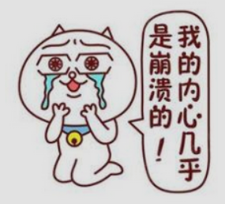

你是否，在成长经历中受过挫折或负面情绪影响？例如：父母老师管教严厉或忽视；父母吵架离异；同学欺负；生理缺陷等。

你是否，在成长经历中受过挫折或负面情绪影响？例如：父母老师管教严厉或忽视；父母吵架离异；同学欺负；生理缺陷等。

你是否，无法控制，自我否定、自责，容易情绪低落？

你是否，是否容易紧张、患得患失？

你是否，容易多疑敏感，在意他人看法，不敢对视，一旦遭到否定、质疑、不耐烦，就会苦恼？

你是否，用假装高冷/逗逼，来掩盖自己的自卑？

你是否，经常不自觉产生焦虑感？

你是否，感到缺乏能量气场？

你是否，内向、不爱说话、自我封闭？

你是否，有社交恐惧，不善表达？

你是否，习惯性宅？

你是否，聊得来的朋友非常少？

你是否，在熟人面前随便聊，陌生人面前就懵逼？

你是否，手机微信通讯录里，可联系发展的异性很少？

你是否，参加社交活动时，放不开自己，难以融入陌生环境？

你是否，在饭局上不太敢或不懂，如何与坐在你身边的人展开话题？

你是否，与上级或高价值人士接触，内心感到价值不对等，紧张，放不开？

你是否，在社交场合遇到比自己优秀的人，容易自惭形秽？

 

如果你超过4条以上，那说明你的自信、沟通、社交上有待学习提高。

自信心态的好坏，直接决定你在人际交往所有阶段的表现。

人际交往的核心是沟通，沟通的核心就是自信。

自卑根源

根据精神分析大师弗洛伊德提出将人的主观『意识』部分比喻为冰山露在水面上的一角，而『潜意识』却是冰山在水面以下的巨大部分。潜意识潜移默化支配着人的行为。

弗洛伊德还提出『童年阴影理论』，你在幼年、青少年时期，遭受的挫折、打击、或其他负面影响，如果没有及时引导，会产生心理创伤，因为人的自我保护机制，大多被压抑到潜意识区域，而一旦被触发容易引发情绪或行为失控。

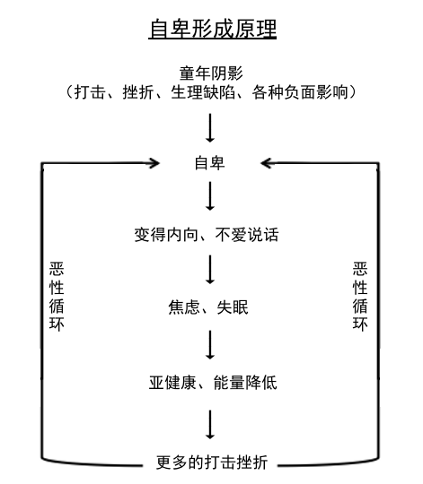

需要先认识到引发自卑的根源，你的大脑明白了这个起因，才利于你重新开始。

就好比，你心里一直有一种压着块石头的感觉，但又不知为什么，而找到自卑根源，才能帮助你搬走石头。

如果不提升自信，不断拖延会有什么后果？

不自信的人，会不自觉的产生各种消极想法，比如：

容易紧张，患得患失心态；

我不行，我做不到；

我总是失败；

很在意他人对自己的看法；

其他人不会喜欢我；

我又犯了一个错误；

会给自己贴各种负面的标签，笨，懒，没有吸引力等等。

这些给自己带来消极负面压力的思想，在心理学上称之为『认知曲解』，这样的认知错误，如果不从你的大脑里踢出去，那你一辈子都会受此煎熬。

我接触到的案例，有些咨询者，受自卑影响，超过10年以上，每次想改变，都是有一股强大的力量阻碍着他，

其实，就自我保护的潜意识，让其无法行动，所以每次都是浅尝则止，很快放弃，又增加了一次失败经历，继续恶性循环。

如果他早一点意识到这个问题并尽早找到解决办法，也就不会情况恶化。

你是否看过很多相关书籍，道理你都懂，但就是不懂怎么做，或坚持不了？

你是否看过心理医生，花了钱与时间，也没有解决你的自信问题？

你是否也参加过一些课程，例如演讲，沟通等，虽然学到了一些技能，但始终内心没有达到期望的那样强大？

你是否，因为自卑问题而困扰你的心理状态、生活、工作多年，因此错失了很多职业发展、朋友关系、恋爱等良好机会？

怎么办？

如果你的众多尝试都效果有限，你可以体验一下迎刃核心自信，它是目前为止心态成长领域唯一一套，既有完整理论体系，又有实战指导作用的自信与人际交往提升系统。

『迎刃核心自信』与『迎刃人际交往』系统。

两者相辅相成，一个辅助心态建设，一个提升沟通社交能力，双管齐下，帮助你面对陌生人、心仪异性时都能放松应对，并运用学来的沟通技巧，展开深度交往。

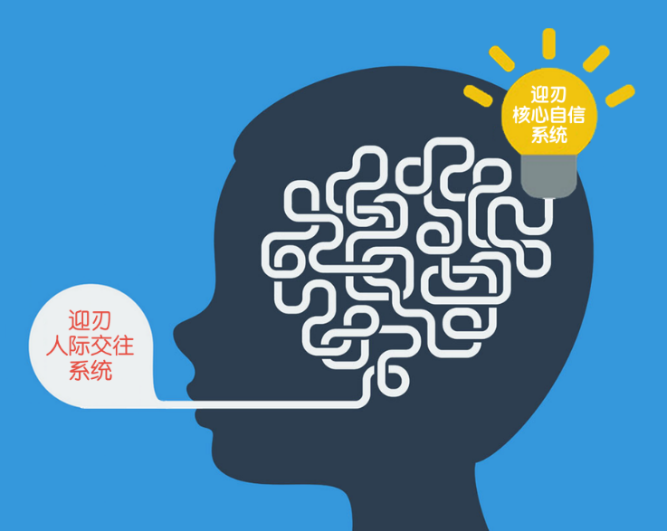

 

『迎刃核心自信』系统，解决什么问题？

 

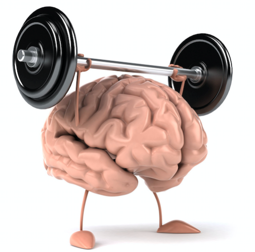

『迎刃核心自信』系统，简单来说就是一套升级你自信心态的思维方式，通过纠错和锻炼思维，实现自信成长。

1）首先帮助你深入了解自卑的根源与自信产生的方法；2）升级你的自信思维，打破患得患失、自我否定、过分在意他人看法、自己不够优秀等错误的思维认知；

3）教你如何消除焦虑感，积极正面过好每一天。

4）提升你的说话能量气场，增强你的情绪感染力。

5）学会发现并发挥自身天赋优势，成为一个具备独特价值的人。

6）学会有底气有勇气的面对各种困难与挑战。

那『迎刃核心自信』是如何解决你的自卑问题的呢？

自卑，会让你的思维模式产生『曲解』，比如控制不了紧张、患得患失、过分在意他人看法、自我否定等情绪。

而自信的人，一般不会有这样的负面认知。

要改变自卑，就需要先改变已被扭曲的思维模式。

思维模式要想改变，需要先改变思维的认知，改变认知是需要通过外在行为的处理和结果。

比如，练肌肉或减肥，当你练到一定程度，发现有效果，就会激发你坚持下去。

这时，我们需要引入心理学上中常见的解决方法『认知行为疗法』。

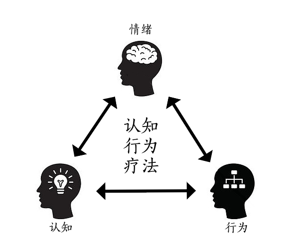

从本质上讲，它就是一个简单的、消除消极意识的方法。它不仅对抑郁症很有疗效，还对自信心缺乏也特别有效。

大脑是一个可塑结构，当你感知到了什么或者你想到了什么的时候，大脑会做出生理上的反应作为回应。

『自卑的大脑』和『自信的大脑』在生理上是不一样的，改变需要时间，需要学习和训练，就像练肌肉，你本来很胖或很瘦，但经过科学的训练，练出腹肌，而此时的你对自己认知就会发生改变，觉得原来自己也可以。

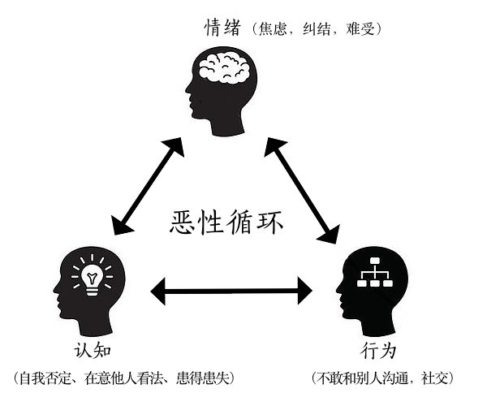

我们的课程体系的实践训练部分，就是借用了『认知行为疗法』这个理念。

其核心在于，认知是情绪和行为的基础；情绪和行为反过来影响认知。

情绪无法直接改变，只有通过改变认知或改变行为，才能改变情绪。

所谓『情绪』就是你因为自卑产生的焦虑，纠结，难受等反应。这些情绪容易影响你的认知。

所谓『认知』就是你的自卑心理的表现，3大常见现象，自我否定、在意他人看法、患得患失。

当情绪和认知都处于负面时，自然会影响你的行为。

例如，不敢和别人沟通，社交，也担心别人看不起自己。

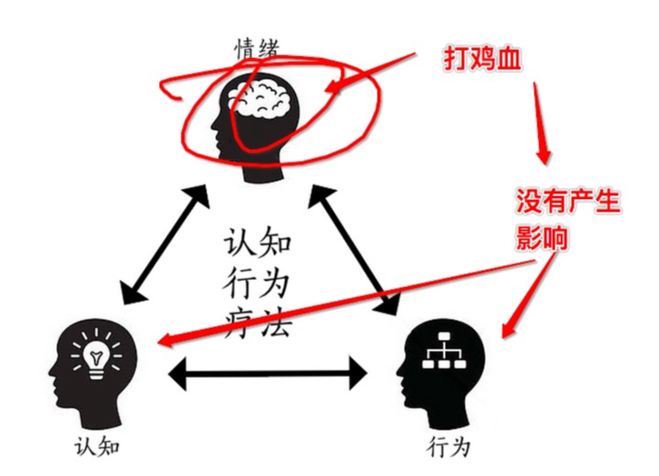

这时就需要借助『外力』，对情绪，认知，行为产生正向的影响，来终止恶性循环。

为什么要引入『外力』？因为你自身内在理论很薄弱，不然你自己早就已经解决这个问题，而不是来咨询。

比如，很多人想减肥，也知道道理，但就是做不到，这就需要借助『外力』来解决，比如去健身房找私教给你量身定做一个减肥的计划，辅助你的训练。

比如，有些朋友看过一些提升自信的方法，例如，自我暗示，打鸡血。

自我暗示，就是成天对自己说，你是最棒，你本来就很厉害之类的自我打气。其实就是某种程度的给自己打鸡血。

那有没有效果呢？答案是有，但不持久。这种打鸡血是用来影响你的『情绪』，人的情绪容易受到外界影响，但时效性也短。

同时这种打鸡血，对你的认知和行为的影响有限，这也是不持久的原因。

这个外力，就是我的迎刃核心自信系统，和人际交往系统。

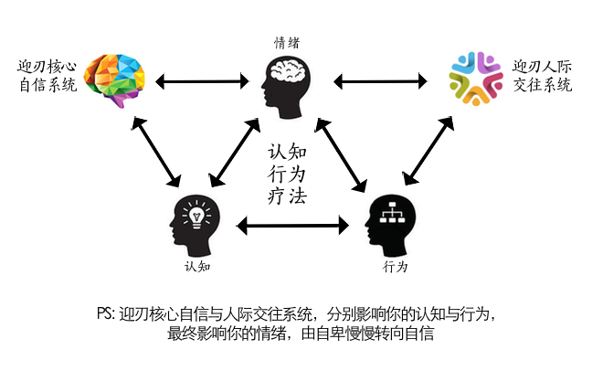

迎刃核心自信系统，会先帮助你扭转错误的思维模式，从而影响你的认知。

迎刃人际交往系统，会帮助你突破沟通社交时的恐惧、困难，从而改变你的行为模式。

当你的认知和行为都获得影响，改变时，你的负面的自卑情绪也会因此被扭转，渐渐变得自信起来。

举例：你是否经历过这样一种情况？

你在人生中某个时刻
，突然很开心，很兴奋，很嗨。不自觉的和朋友说了很多话。这时的你，是不是感觉很自信？

如果答案是肯定的。

那这种自信，嗨的状态，你能控制吗？

一般来说都不能。

设想一下，如果你掌握了控制这种状态的能力，是不是就会慢慢变得自信起来？

我相信你的答案是肯定的。

其实就是前面提到的『认知行为疗法』在起作用。

那问题的关键就是，如何学会控制这种自信状态？

我们的课程内容，迎刃核心自信、人际交往系统，就有方法教你学会如何控制这种『自信状态』。

大致就是，先升级你的思维（改变认知），并教你如何行动训练的方法，进而影响你的情绪（自信）的改变。

改变自信，涉及我的两个核心概念。

一，迎刃自信状态金字塔理论。

『迎刃自信状态金字塔理论』简称『自信金字塔』，是由非著名非典型情感砖家迎刃的研究成果，它用金字塔层级与数字形式，视觉化显示采用不同的提升自信方式，对自信的『状态』产生多少的改变。

大众价值观、裙带关系、特殊技能、角色扮演，这4样都属于『条件自信』，需要具备一定的前提才能变得自信。

1，大众价值观，是否符合大众价值观的标准，来决定认为自己的自信是高是低。

比如说，我有钱了，我就自信了。

你今天买了一件新的衬衣，觉得非常好看，你的自信会变高？但这个自信能持续多久？

2，裙带关系，参加聚会，一个人很怂，有个朋友陪伴，就安全感提升。那你是否永远要朋友陪伴，你才能参加聚会？

3，特殊技能，你拥有某个技能，或在某方面相对擅长和有经验，你在使用这个技能时，会感到有自信。那假设你没机会使用，你就会变得没自信。

4，角色扮演，当你采用装逼的形式，来太高自身价值时，会感到自信，而被别人戳穿，或没法扮演角色时，你就自信降低。

『条件自信』虽然能短暂变得自信，但无法长久、无法自我掌控、无法提升自己的内在价值。

过度的依赖『条件自信』，会让你的自信更脆弱。

通过核心自信的训练，可有效改变你的『自信状态』。

第二个核心概念，迎刃核心自信铁三角理论

迎刃核心自信，并非传统意义上的唯心自信，或者鸡汤鸡血自信，而是同时包含『生理状态』、『主观自信』、『客观自信』3部分。

『迎刃核心自信铁三角理论』

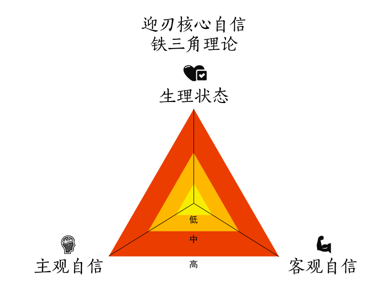

『生理状态』直接决定了你是否有足够的能量应对沟通社交，焦虑情绪，精神萎靡容易让你在面对困难时自动投降。

『主观自信』改变你的思维认知，扭转你以往的错误思维，例如自我否定，过分在意他人看法，患得患失等。

『客观自信』通过实践行动积累成功经验， 然后反哺『主观自信』。

这三个维度都不同程度的影响你的情绪、认知、行为。

三个维度的高低，形成的面积大小，决定了你整体自信程度的高低。

客观自信对应迎刃人际交往系统。

『迎刃人际交往』系统，解决什么问题？

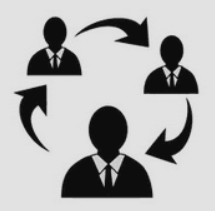

打破因为自卑造成的假内向，不爱说话等问题。

1）提供一套沟通、社交朋友圈拓展的学习与训练方法论。

2）帮助你打破宅的惯性，走出家门，认识新朋友。

3）帮助你和任何人都聊得来，无限话题沟通。

4）学会拓展社交圈，轻松融入模式社交环境。

5）学会与心仪的对象、高价值人生相处，轻松自然，不卑不亢。

6）提高你在沟通时的情商，不再因为说错话而搞砸人际关系。

6）自信提升配合社交训练，成功经验积累，会反哺主观自信的提升。

 

如何确保改变与实践训练的效果？

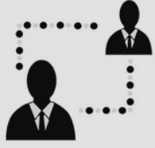

我们的理念，设置了一套反馈系统。

1，根据课件，学习理论+训练方法，然后进行实践。

2，通过多种途径反馈训练结果、疑问。（微信、YY、QQ、邮件）

3，老师进行针对性解答。

4，返回第一步周而复始。

5，每周总结和对比上周的训练情况，看是否有改进。

 

核心自信理论和行为认知疗法关系图

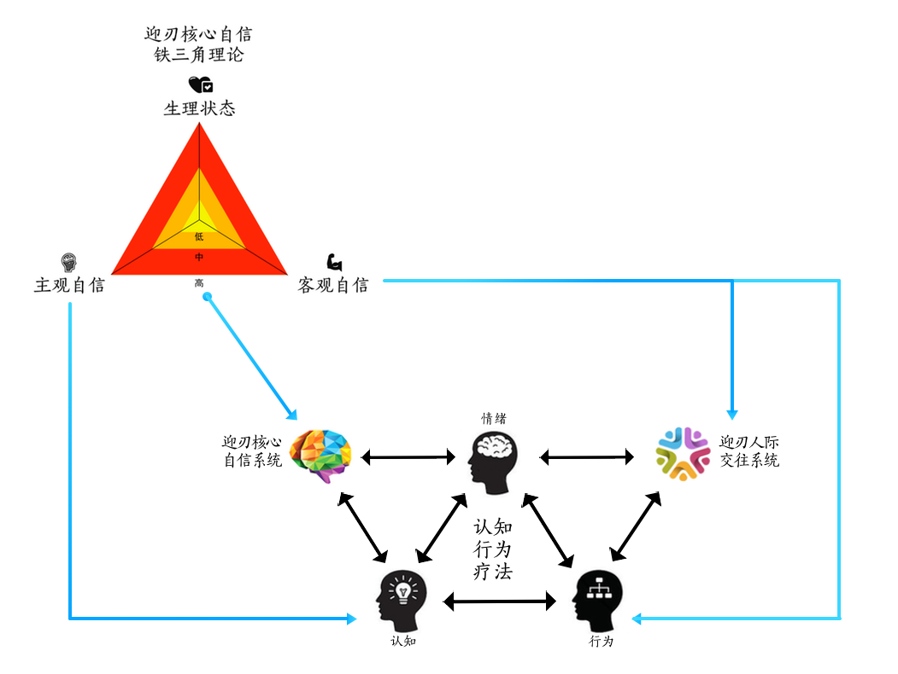

这就是一个完整解决自信问题的逻辑思路。

简单一句话说明，迎刃核心自信如何解决自信问题。

借用心理学有效的治疗理念，结合迎刃研发的核心自信的思维升级方法，加上独特的沟通社交训练方法，理论与实践相结合，循序渐进的帮助你提升自信心程度。

【这套理念能给你带来什么好处】

1，成为自信的人

可帮助你不再自我否定、过分在意他人看法，更有底气和勇气去面对各种生活、工作、人际关系的难题。

2，成为优秀的人

可帮助你从由内到外获得改变，外形、沟通、社交、时间效率管理等。

3，成为受欢迎的人

做更受欢迎的人，有前面两方面的提升，你绝对会变成一个有魅力的人，原本对你爱理不理的人也会扭转态度，让你喜欢的人也喜欢你。

同时，会给你带来的改变：

1，重拾自信，精神振奋，积极正能量。

2，不再轻易自责，学会尊重自己。

3，不再容易情绪低落，充满快乐的能量与气场。

4，内心安全感大大增强，不再患得患失，

5，不再选择逃避，而是积极面对与解决问题。

6，学会自我情绪调整、免受负面影响。

7，不再自认价值低，懂得利用自身优势。

8，掌握和任何人都聊得来的沟通能力。

9，懂得如何与陌生人沟通交流，成为朋友。

10，突破社交恐惧、拓展社交圈、获得更多优秀朋友。

11，职场人际关系如鱼得水，成为办公室受欢迎的人。

12，面对领导、高价值人士，能做到不卑不亢。

 

过去3年多来，已有超过3000的学员不同程度获得改变，变得更自信，更会人际交往，很多也找了心仪的男女朋友。

网络发行过电子书《内心足够强大,全世界都为你让路》、《天生好手》，我的首部实体新书正在筹备中。

我希望未来3年内，能写出300篇帮助大家自我提升的文章，再出2本新的实体书，以及帮助10000人改变自己，变得更自信。

 

强大内心就是不断地提升与超越自己，产生一种来源于内心深处的最强大力量的过程。

这种强大的力量感，在你的大脑里产生时，你就觉得拥有了一种『超能力』，一种彪悍的精神力量，它可以扭转一切，帮助你有勇气和底气，去解决遇到的各种难题。

内心强大就是拥有核心自信。核心自信，源自正确思维观念的建立，与大量成功经验的实力积累。

END

 

 

 

 

# <a href="http://www.jianshu.com/p/774762077dcc" class="text_4"
target="_blank">有钱就不自卑了？别天真了！</a>

2016.09.05 迎刃

 

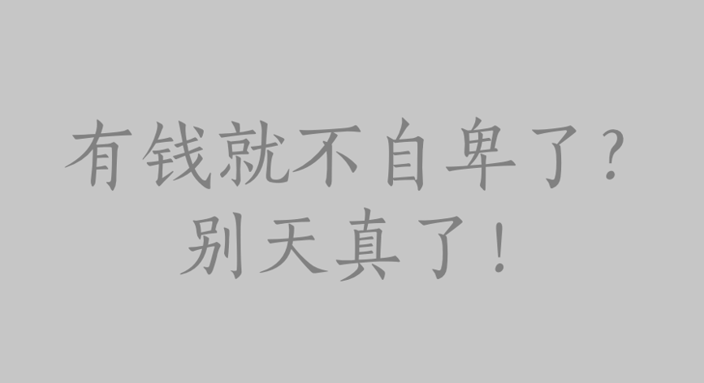

1，

"我要是有钱了，我就不自卑了。"

"我的自信只能维持一段时间，就会消退，我感觉只能变得有钱，才会持久。"

"我现在月薪2W港币左右，但感觉还是很缺钱，我是金钱自信症患者吧。"

可能有人会问，这难道不对吗？这个到处讲钱的社会，难道不是有钱就可以自信吗？

这个大众普遍的认识，在我看来，既对，也不对。

最近一星期，连续更新了我的自信提升入门教学视频，收到很多感同身受的朋友，来咨询具体的解决办法。

但同时，也收到了前面三个来访者的反馈。他们的思维观念里，已经把钱和自信划上了等号，而事实，并非如此。

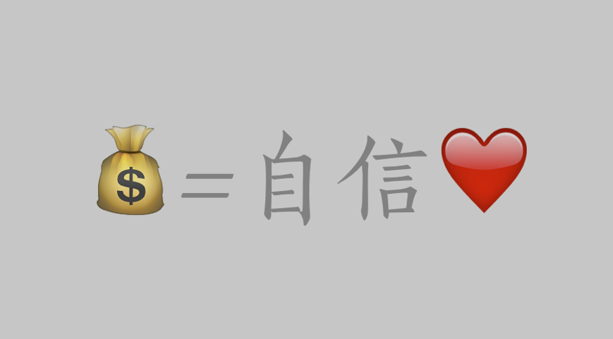

我先说几个小故事。以下信息都经过隐私处理，不会给当事人带来不便。

 

2，

去年有个粉丝咨询。

是个家庭环境，经济、自身条件都不错的男生，金融行业，开宝马3系，过去一直都很内向，开始做销售相关工作才慢慢开朗起来，感情历史简单，简称『金融男』，这是前提。

在认识了一个女生后，发现对方对自己态度也不错，就开始主动发动攻势，希望通过送各种贵重礼物，甚至打算送宝马，来快速确定两人关系，但对方也是经济条件不错的女生，也并不贪慕虚荣，没有轻易接收。

由于一厢情愿的认为，对方太适合自己，害怕没把握好，就会遗憾终生。

而这种越想表现自己，就越容易搞砸的言行，在互动过程中，慢慢不自觉开始低姿态的讨好，反而引起女生的逆反心理。

女生越拒绝，男生就越急于想得到，渐渐面对女生，他已陷入进退两难的境地，对别人主动示好，担心对方嫌烦，不主动，他又担心关系会慢慢冷淡。

这是我碰到的众多，有钱却不一定自信的真实例子之一。

 

3，

前几天，我助理接待了一个咨询。

这位朋友老被其他人说气场太弱，不够男人。

据对方反馈，由于小时候家里条件不好，一直处于比较资源匮乏的状况，再加上成长过程中，遭受过诸多负面影响和打击，整个人一直都比较自卑。

后来在一个三线城市工作，虽然通过自己的努力，管理职位，收入过万，且已婚，但他内心始终有个声音，在告诉自己，你是个很没底气的人，外强中干，虽然经济条件已经改善，但始终觉得自己还是很缺钱。

你如果也和这位『努力男』一样，没有解决自卑根源，即使努力或运气的改善了外在的经济条件，你依然会感到不自信。

 

4，

再说一个，我自己的故事。

以前有段时间，因为进行连续创业都波折不断，亏了很多钱，同时每天又要花很多钱，原来积累的资金在一天天消耗。

最后账户上只剩下不到3万块，当时在上海的生活成本，每个月最少也要5000。

当时，**我最大的状况，就是焦虑，**会担心如果做不了这个事情，把钱都亏完，会如何如何，总之当人处于焦虑情绪而无法排解时，时间一长会影响你的精神、睡眠、工作效率、降低幸福指数，如果想不开，就容易形成抑郁症。

幸运的是，我之前已经掌握了核心自信的理念，而这种焦虑只是让我感到难受，却没有打击我的自信心。

因为我清晰的知道，人的自信并不完全来自于外在、不来自于钱，而是根植于你的内心。

我的处理方式，创业不成功，就要找到问题根源，从而解决它。

并不会让不成功的事情，焦虑的情形来影响自己的内心，同时通过积极的排解焦虑，让自己放松。

最常用，也最有效的，就是跑步、到公园河边散步、做一些自己喜欢又轻松的事情。

因为运动可有效排解掉，因为焦虑产生在肌肉里的压力激素，做轻松喜欢的事情，可以让大脑产生多巴胺。

当然要想彻底解除焦虑感，还是要解决赚钱问题。

最后，我发现要想创业成功，除了要能力够，就是要天时地利人和都具备，那一切就顺其自然的成了。

 

5，

没钱当然会影响你的情绪，但有钱并不一定会让你自信。

通过这几个小故事，我想说，把有钱等同于自信的人，你即使赚到钱了，也不是就真正的自信，而是『条件自信』。

所谓条件自信，就是只有满足这个前提条件，你才能让自己具备自信的状态。

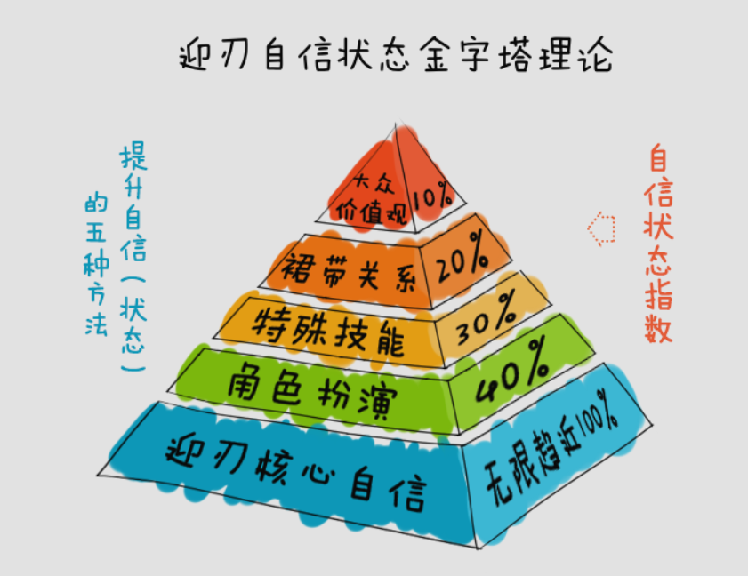

『迎刃自信状态金字塔理论』简称『自信金字塔』，是由迎刃的研究成果，它用金字塔层级与数字形式，视觉化显示采用不同的提升自信方式，对自信的『状态』产生多少的改变。大众价值观、裙带关系、特殊技能、角色扮演都属于『条件自信』，需要具备一定的前提才能变得自信，并且自信持续不持久。

推荐阅读我另一篇文章《<a href="http://www.jianshu.com/p/52cc5f62ee71" class="text_10"
target="_blank">如何让自己变得内心强大？</a>》 

就好比，你每次必须按一下开关，你才自信，如果你没办法按快关，那你就没自信了。

如果你坚信有钱才自信，那假设，你幸运的赚到钱，并开始有『自信』了，但如果突然有一天你又破产了，那你的『自信』是不是就又消失了呢？

你的自信如果只依附于外在的金钱之上，会非常的脆弱。

而人真正的自信来自于内心的强大，而这种强大，不是传统意义上的鸡血鸡汤的唯心自信。

而是基于积极正面的自信思维，同时加上大量客观成功经验的积累综合而成的核心自信。

核心自信由『生理状态』、『主观自信』、『客观自信』三部分组成。

『生理状态』直接决定了你是否有足够的能量应对沟通社交，焦虑情绪，精神萎靡容易让你在面对困难时自动投降。

『主观自信』即积极正面的自信思维。改变你的思维认知，扭转你以往的错误思维，例如自我否定，过分在意他人看法，患得患失等。

『客观自信』通过实践行动积累成功经验， 然后反哺『主观自信』。

这三个维度都有影响你的自信程度。

三个维度的高低，形成的面积大小，决定了你整体自信程度的高低。

很多人认为有钱了就自信，其实只是部分满足了『客观成功经验积累』，即『客观自信』维度，如果你只解决这方面问题，那某种程度上就是前面说的『条件自信』。

不过，我不是说条件自信不能用，而是应该『不依赖』。

当你还不够真正内心强大的时候，是需要先用『条件自信』来慢慢积累一些成功经验。

就好比，你父母对你再好，再宠爱，你在还未成年经济独立之前，是需要他们的帮助，但你不可能依赖于他们照顾你一辈子，你需要『独立』，而『不依赖』条件自信，就是独立的表现。

那什么是积极正面的自信思维呢？

比如，自我否定、患得患失、在意他人看法，是三大常见自卑负面消极思维。

如何消除呢？

需要一套扭转你消极意识的自信思维模式，但你光知道，不一定能做到，需要配合『客观成功经验积累』，也就是理论结合实践。

做个类比，你要减肥或练肌肉，你知道了相应的方法理论，但你不去执行控制饮食和科学训练等行动，那你的计划肯定是落空的。

核心自信的好处，就在于，当他不断的修炼积累后，你的自我评价和自我认可都在增强，你的自信心不容易再受到外界的影响，也不再容易遭受别人的打击，你会变得更独立。

 

6，

1）你有了钱，可能就会想要更有钱，想要更多认同，更多权力，人的欲望是无穷的。收入的增加，当超过一定的温饱线后，幸福指数不会随着金额的增高也大幅度增高。

自信也一样，你能多赚钱，说明你有了更好的生存手段，但如果你没有去修炼你的内心，不懂如何调节和应对比你强势的人、你喜欢的人、对你有恶意的人等情况，你的内心依然不堪一击。

2）金融男，各种物质条件再好，也都是身外物，而内心的强大，却是别人抢不走的。

3）努力男，是因自卑思维形成的消极想法，而这个想法和现实是明显不大一样，他夸大了事情变坏的可能性，对自己能力没有信心，或低估自身能力。这些不理性，负面，扭曲了现实的想法，在心理学上称之为『认知扭曲』。如果他改变这种思维模式，他赚再多钱，还是不自信。

所以，我想说的是，有钱就不自卑了？别天真了！

想要真正的核心自信，请在赚钱的同时，提升你的自信思维，答应我，请别再被『金钱自信论』所迷惑，内外兼修，才能让你内心强大。

END

 

 

 

 

 

# <a href="http://www.jianshu.com/p/55c13687ac4e" class="text_4"
target="_blank">这三点，帮助你消除过分在意他人看法</a>

2016.10.02 迎刃

 

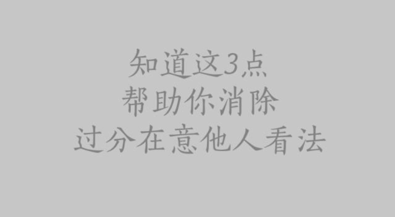

据我发现，不自信的朋友，有三大常见负面消极思维：

1，过分在意他人看法

2，患得患失

3，自我否定

今天先讲——过分在意他人看法。

如果你也有类似的问题，可在评论区留言，说说你情况。

最近我的一个学员咨询，在学习我的课程后，已经可以适当放得开了。

他说，某次聚会上，自己和朋友聊得很开心，正放得开之时，却被一旁的女生误解道：你们是不是爱情公寓里提到的泡妞僚机呀。感觉被误解，很不爽，是不是方得太开也不好？

我回答说：你这个情况有3点。

1，你还没把握好放得开的『度』。

2，你过分在意了对方的看法。

3，你不懂如何有效的化解『尴尬』？

1，所谓社交场合的放得开，就是自然、大方、好单纯，好不做作。。。其实没那么夸张。

放得开就是从容不迫，略带点兴奋、开心。

就像在家里一样放松。

在不影响其他人的情况下，你会在家里的肆意吃喝玩乐的时候，难道会在意邻居对你说三道四？

但如果你太吵太闹，影响了邻居，他们自然会有意见。

放得开也是一样，可以很开心，但不要过分兴奋得大吵大闹就行。

但我估计你不是方得太开的问题。而是下面第2点。

2，过分在意了别人的看法。

从对方的反应来看，我感觉对方只是一个『中性』的评价，没有任何的褒贬，只是他的一个脱口而出。

但由于你可能在意别人说你是搞泡妞的，所以会把别人的言行，过分解读为对自己不利的内容。

但其实可能只是中性，你积极的态度就会换来积极的回应。

学员还说：自己有阴影，有次一帮人出去玩，有个女生说对我说，不要顾及，放开自己，大声笑，于是我就大笑了，但对面3个女生就有点嘲笑的意思，对我指指点点，我觉得很尴尬。

你这是又把一个可能是『中性』的行为或话语，解读为了对你的负面信息。

从描述来看对方，可能真的觉得你的行为很幽默搞笑，自然笑出声，不一定是嘲笑。

人有两个评价系统，一个是自我评价，一个是他人评价。

由于很多不自信的朋友，在成长过程中，自信受到过不同程度的打击和负面影响，所以对自己的评价系统比较弱，就需要过度依赖他人的评价反馈。

一旦对方对你的评价或言行稍微是负面的，你就容易感到不适，渐渐你也会变得敏感多疑。

这里在普及几个相关概念。

1，心声

2，现实情况

3，负面情绪

心声就是你大脑中是一个声音，是你自己对自己说的话。

心声会在你遇到要做决策时，自动浮现的一种类似与另一个自己做出的评论。

有时候会鼓励你，有时候会否定你，当你处于心智不稳时，就容易感觉到『脑子很乱』。

不自信的朋友，心声就容易对自己做负面评价。

但内心的负面想法和现实情况并不一定相符。

就先前面举例，女生『笑』这个男生，也许对方并不是嘲笑，而就是觉得好笑，或者即使是有点点嘲笑，但自卑的人就容易把非常小的负面或不是负面的信息给放大。

所以，很多时候，心声和现实是截然相反的，只是你内心中的另一个你，对这件事情所做出的负面评价。

负面情绪是你心声做出的负面评价后，身体产生的一种应急反应。当人处于负面情绪时，就容易感到焦虑。

当人长期处于这样的焦虑状态，就会容易形成条件反射，思维就会越来越消极和在意了别人的看法。

3，如何化解在意他人看法这个问题呢？

以第一个例子为例。

你完全可以借力打力，把对方的话夸大和故意曲解意思，用来达到幽默的效果，当人和气氛都变得开心了，就不会感到尴尬。

你可以这样说。对呀，我们就是专门学爱情公寓的，我扮演XXX，我朋友扮演XXX，你要不要来扮演XXX。

用角色扮演的方式，把大家都套进去，他说你像谁，那你也说对方像谁，即使对方不像，也可以硬扯，反正是开玩笑。

其实像你刚才说的，对方说你，是不是爱情公寓里的僚机，你完全可以避实就虚的说，打太极的方式打回给她，这个事情就过去了。

当你用正面积极的思维去应对，事情就会朝积极的方向发展。

如果你当成负面信息来看待，你就会变得消极。

第二个例子。这些女生一起笑你，你也依然可以用幽默的方式回应，来化解尴尬。

我可能会说：你们笑这么开心，你们难道不知道，笑我是要收钱的，一个人100元，但怕你们给不起可以请我吃饭代替。

我是随便扯的，不要生搬硬套，要根据现场环境氛围灵活应对，当然这个是要经过大量的社交训练，才会形成的条件反射。

总结：

过分在意他人看法，一种因为自卑而产生的自动化消极思维，你可能暂时无法控制。

虽然你看完本文，还无法马上就解决掉这个问题，知易行难，消除消极思维还需要配合实践与训练。

但你开始思考和了解了这个消极思维背后的原理，当你知道问题根源的一瞬间，其实因此而产生的焦虑也会降低很多。

因为抽象的负面思维变成了具体的问题，而问题是有解决办法的，这是你开始改变的第一步。

过分在意他人看法，不可怕；可怕的是，你对自己放弃治疗。

END

PS：

如果你身边朋友也有这个问题，可以转发给他，帮助他一起解决这个问题。

后面几天我会陆续更新关于，焦虑、忧虑、偏执想法、强迫症等负面思维的相关文章，喜欢就请在评论区给我留言，提供素材，方便帮助更多的朋友。

今天是国庆，忙着玩，所以是比较匆忙的更新，排版配图什么的，就凑合吧，我以后都会采用，先发粗略版，后面根据大反馈进行升级更新，让文章更系统更完整。

 

 

 

# <a href="http://www.jianshu.com/p/f07480127762" class="text_4"
target="_blank">其实，你天生就很优秀</a>

2016.10.14 迎刃

 

我大量接触自卑的朋友，发现他们有个共同点，就是不认可自己，经常自我否定，尤其是遇到比自己优秀的人时，就会显得不自在。

他们觉得，自信不是就是靠自己的能力支撑的吗？在优秀的人面前人人都会自卑。

他们说得既对，又不对。

当你变得有能力了，当然会自信，可是如果你完全只依赖于这些。

你通过努力，超过了你之前认为优秀的人，但如果你又遇到另一个比你厉害10倍的人，再在下次遇到100倍优秀的人，你怎么办？

其实，你天生就很优秀，你只是掉入了错误思维里的坑。

1，其实，每个人都会有自卑感。

自卑感，最主要和我们从小的成长经历很有关系。

父母、老师、同学、朋友、长辈对我们的态度，有直接的影响。

中国的教育环境，大部分家庭都是要么管教严厉，要么就是忽视、缺乏关爱。

这两种教育，都容易让你自信心受挫，打击你的价值感，这就是很多朋友形成自卑感的来源。

过分严厉，容易导致你自己过于追求完美，过于苛责自己，过分在意他人看法。

被忽视，容易导致自我否，患得患失。

只有比较小的比例是开明鼓励性的教育。

有些朋友，随着年纪增加，成长环境的变化，自卑感也会随之受影响。

比如，到大学，或到国外留学后，就减少了管束，完全放开了。

欧美的教育方式，提倡个性，鼓励创造性，而中国的教育模式，要听父母老师的话，压抑个性。

有个笑话：

某国际学校的老师出了一道开放性问题：“你对其他国家的食物短缺有什么自己的看法？”

非洲学生问：什么叫食物？

欧洲学生问：什么叫短缺？

美国学生问：什么叫其他国家？

中国学生问：什么叫自己的看法？

在你眼里也许优秀的人也会有自卑感，比如在他不擅长的方面。

你可能只看到了对方最优秀的一面。

所以，你不必为自己有自卑感，而变得自我埋怨自己没用。

有自卑感不要紧，重要的是学会，通过高效学习，自我提升，进行『补偿心理』和找到自己的天生优势，来增加自己的优越感，抵消掉自卑感。

2，其实，每个人都有天生优势

有本书叫《现在,发现你的优势》,是讲一套识别个人天生优势，并将其发挥为才干的方案。最终目的是将才干变为优秀的工作表现。

这套方案的核心，有 34 个主导“主题” 及其成千上万的组合。

读者通过测试、讲解，来了解如何最有效地，将自己的优势和才干，转化为个人和事业的成功。

后来，我陆续发现，要想更准确的了解自己的优势特点，还可以做MBTI、DISC、大五人格理论、多元智能理论等多种性格与能力测试。

这些测试，都可以作为一个参考，来了解自己的天赋、优于别人的地方在哪里。

至于，最终怎么走你自己的路，需要自己去选择与实践，践行到一定程度，你才会明白自己到底适合做什么，而且手到擒来。

又有个笑话可以作为例子。

有人说，刘翔为什么跨栏这么厉害，因为他比跑步的会跨栏，比跨栏的会跑步。

如果单独每一项和别人比，他就不行了。

虽然是个玩笑，也可以从中看出，发挥自己的天赋优势，并进行多维度能力整合，是你超越别人的杀手锏。

3，其实，不用和他人比较

而是应该和自己的昨天作比较。

你只看到，或放大了别人的优点，却缩小了自己的天生优势。

就是一种思维误区。

我在公众号里有句口号：每天和昨天的自己优秀1%。

意在鼓励大家，通过学习和训练，为了自己而提高学习，而不是为了和别人比较，因为你可能永远，无法用自己的短处比过别人的长处。

而一旦你陷入偏执，又无法实现目的，就会感到压力，产生退缩年头，最终半途而废，实在可惜。

4，小结

其实，你天生就很优秀。

你只是在成长过程中，受到了负面影响，却不知如何调整，你有天赋，却不懂如何发掘和发挥。

解决这一切，你只需要把自卑感转化为动力，知耻而后勇。

通过提升能力，带来的优越感成就感，来抵消因为自卑而带来消极负面思维。

但光提高能力是不够的，今天时间有限，我希望在评论区收到你的看法、故事。

END

------------------------------------------------------------------------

我是迎刃

 

 

# <a href="http://www.jianshu.com/p/c28e3c8d195c" class="text_4"
target="_blank">其实，你只是暂时优秀得不明显</a>

2016.10.16 迎刃

 

 

 

本文为《其实，你天生就很优秀》升级版。

我的原创文章开始尝试，采用互联网产品，快速迭代更新升级的方式进行写作。

------------------------------------------------------------------------

我大量接触自卑的朋友，发现他们有个共同点，就是不认可自己，经常自我否定，尤其是遇到比自己优秀的人时，就会显得不自在。

他们觉得，自信不是就是靠自己的能力支撑的吗？在优秀的人面前人人都会自卑。

他们说得既对，又不对。

当你变得有能力了，当然会自信，可是如果你完全只依赖于这些。

你通过努力，超过了你之前认为优秀的人，但如果你又遇到另一个比你厉害10倍的人，再在下次遇到100倍优秀的人，你怎么办？

其实，你天生就很优秀，你只是掉入了错误思维里的坑。

1，其实，每个人都会有自卑感。

自卑感，最主要和我们从小的成长经历很有关系。

父母、老师、同学、朋友、长辈对我们的态度，有直接的影响。

中国的教育环境，大部分家庭都是要么管教严厉，要么就是忽视、缺乏关爱。

这两种教育，都容易让你自信心受挫，打击你的价值感，这就是很多朋友形成自卑感的来源。

过分严厉，容易导致你自己过于追求完美，过于苛责自己，过分在意他人看法

被忽视，容易导致自我否，患得患失。

只有比较小的比例是开明鼓励性的教育。

有些朋友，随着年纪增加，成长环境的变化，自卑感也会随之受影响。

比如，到大学，或到国外留学后，就减少了管束，完全放开了。

欧美的教育方式，提倡个性，鼓励创造性，而中国的教育模式，要听父母老师的话，压抑个性。

有个笑话：

某国际学校的老师出了一道开放性问题：“你对其他国家的食物短缺有什么自己的看法？”

非洲学生问：什么叫食物？

欧洲学生问：什么叫短缺？

美国学生问：什么叫其他国家？

中国学生问：什么叫自己的看法？

在你眼里也许优秀的人也会有自卑感，比如在他不擅长的方面。

你可能只看到了对方最优秀的一面。

所以，你不必为自己有自卑感，而变得自我埋怨自己没用。

有自卑感不要紧，重要的是学会，通过高效学习，自我提升，进行『补偿心理』和找到自己的天生优势，来增加自己的优越感，抵消掉自卑感。

2，其实，每个人都有天生优势

有本书叫《现在,发现你的优势》,是讲一套识别个人天生优势，并将其发挥为才干的方案。最终目的是将才干变为优秀的工作表现。

这套方案的核心，有 34 个主导“主题” 及其成千上万的组合。

读者通过测试、讲解，来了解如何最有效地，将自己的优势和才干，转化为个人和事业的成功。

后来，我陆续发现，要想更准确的了解自己的优势特点，还可以做MBTI、DISC、大五人格理论、多元智能理论等多种性格与能力测试。

这些测试，都可以作为一个参考，来了解自己的天赋、优于别人的地方在哪里。

至于，最终怎么走你自己的路，需要自己去选择与实践，践行到一定程度，你才会明白自己到底适合做什么，而且手到擒来。

又有个笑话可以作为例子。

有人说，刘翔为什么跨栏这么厉害，因为他比跑步的会跨栏，比跨栏的会跑步。

如果单独每一项和别人比，他就不行了。

虽然是个玩笑，也可以从中看出，发挥自己的天赋优势，并进行多维度能力整合，更容易脱颖而出。

什么是多维度能力？

当你在某一项能力还不错的基础上，学习一些新的强技能或辅助技能，这些会附带增强你的主力技能。

比如，你是学IT的，你代码写得不错，但你不擅长与人沟通，不会高效的传递你的想法，致使团队工作效率低下。

沟通表达技能就是你需要加强的。

例如，我要教别人如何变得更自信，变得会沟通社交。但我不擅长写作，就无法把自己的理念通过文章或书籍传播出去，让更多人知道。如果我不学习演讲分享，就无法深入浅出的给大家讲解内容。

为了让学员能学到更多内容，我不得不学习更多知识，但如果不会高效阅读、整合知识体系，就无法把输入转化为他们能通熟易懂的课件。

你在拥有某些特殊技能，同时通过文章、音频、视频等媒介传递出你的价值，并最终吸引到认可你的粉丝，你就变成了一个知识型网红，这也就是最近斜杠青年流行的原因。

找到你的天赋，并加以修炼成为你的标签，同时掌握一些辅助技能，让自己能力多维度化，你就不再羡慕别人多优秀，多牛逼，因为你知道你有超越别人的杀手锏。

3，其实，不用和他人比较

而是应该和自己的昨天作比较。

你只看到，或放大了别人的优点，却缩小了自己的天生优势。

就是一种思维误区。

我在公众号里有句口号：每天比昨天的自己优秀1%。

意在鼓励大家，通过学习和训练，为了自己而提高学习，而不是为了和别人比较，因为你可能永远，无法用自己的短处比过别人的长处，或者比较是永远比不完的，甚至会是一个陷阱，让你一直觉得自己不够，容易形成不必要的焦虑感。

而一旦你陷入偏执，又无法实现目的，就会感到压力，产生退缩念头，最终半途而废，实在可惜。

我就在差不多3年前，在丽江旅游时，许下心愿，希望自己也能变成一个会写会说的人，因为不擅长写作、演讲，是我一直惧怕的，也因此错过很多机会，所以才希望通过学习训练，来增强自身能力。

现在看来，这两项能力的投资，给我带来了巨大的改变。

通过在简书写作，成了官方第25位签约作者，我知道信息晚了，不然可能还早几位，让我不再一个默默无闻。

时不时有文章获得大号认可，要来授权转载，我的多篇文章估计累积转载阅读量超过百万了。

我的第一本实体书也是在简书网上被图书编辑挖掘签约。

后面陆续又有超过4家出版社的编辑找上门来，但我已应接不暇。

我是从来没想过可以出书，现在多了一个作家的身份，同时也收获了不少粉丝。

不断的写作、分享的过程，也是一个不断提升思考能力的过程，思考的多了，就会容易把你以往学习的知识进行串联，形成新的知识，也就是把别人的信息经过收集、解码、加工、重构、整合，形成了自己的知识体系。这也是增强自身竞争优势的方法之一。

比如，我就发现自信的提升，和健身减肥练肌肉很类似，你光看理论资料，不行动，是不会减肥练肌肉成功的，自信也是。

人从『自卑的大脑』变成『自信的大脑』的过程，就是"减脂"（消除负面消极思维）"增肌"（增强自信思维、社交沟通能力）的过程。

这样，就容易让想提升自信，却不容易明白深奥的心理学知识的朋友，能快速理解。

先给自己设定个可实现的小目标，自己和自己比，就容易看到成长，就容易体验到成就感，这也容易让你对成功，改变自己上瘾。

就像喜欢健身的朋友，为什么练习惯后，如果有某天因故不能去，就反而不舒服。

4，One More Thing，再多说一点。

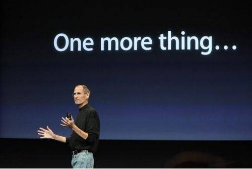

通过提升能力，带来的优越感成就感，是可以抵消自卑感。

但从我的实践和教学经验来看，只提升能力，是不够的，部分自卑的朋友，因为长期的处于负面消极思维情绪中，已经形成了惯性。

形成了类似于肌肉记忆、条件反射、本能反应的状况。

消极负面思维，其实是一种从远古时期进化而来的自我保护机制，是为了避免你陷入不必要的危险。

原始社会，洪水猛兽较多，但随着时间的推移，来到了现代，已经不存在这样的危险，可保护机制还印刻在我们的基因里。

但这种保护机制，现在来看是过头了，阻碍了你去结交更优秀的朋友、你喜欢的异性、改变自己等等。

你在电视里看到蛇，即使没有任何的危险，你的大脑还是会突然警觉起来，这是一种自动化思维。

自我保护机制也是一种自动化的思维模式。

自卑的朋友，容易出现条件反射性的紧张、患得患失、在意他人看法。

这时光提升能力就无法解决自卑了。

在我的自信理论里，真正的自信需要3方面互相配合——生理状态、主观自信、客观自信。

 

长期处于焦虑情绪的朋友，容易失眠、精神状态差，会直接影响你的工作、学习效率。

客观自信对应能力提升、成功经验积累。

主观自信就是如何消除负面思维，养成积极正面思考的能力，由于篇幅有限，以后其他文章再展开将解决。

三者形成的面积决定了你的整体自信的高低。

 

5，

总结

其实，你天生就很优秀。

你只是在成长过程中，受到了负面影响，却不知如何调整，你有天赋，却不懂如何发掘和发挥。

解决这一切，你只需要把自卑感转化为动力，知耻而后勇。

你只是暂时优秀得不明显而已。

 

 

# <a href="http://www.jianshu.com/p/e8e43ee041f8" class="text_4"
target="_blank">为什么成功学鸡汤解决不了自卑？</a>

2016.10.22 迎刃

 

一，

丑话说在前头，我没有任何攻击成功学和鸡汤文的意思，大家都是同行，我肯定会文人相轻的。

不是说他们不好，只是，他们不能从根本上解决，影响了你多年的自卑问题。

我印象中，好像是随着互联网的普及，大家获取信息越来越容易，被用来圈钱的成功学、鸡汤文，被无数精英扒了皮，尤以知乎为甚。

甚至，会出现矫枉过正之感。

很多人开始以反成功学、反鸡汤，来标榜自己。

我也受此影响，也口头上，反过几次。

同时人又是一个矛盾体。

由于，我也是一个写作新人，为了让文章更有传播力，也不小心沾染了一些坏毛病，学写了一些鸡汤的套路，可是水平有限，效果差强人意。

后来，看到很多写干货的牛人也火了，就此觉悟，老子，天生不是鸡\~\~\~\~~汤，或传统鸡\~\~\~~汤，何必要逼自己成为别人眼中的励志作家。

再重申一下，我不鄙视任何写鸡汤的作者，我甚至很佩服他们，是如此的会通过故事来和读者沟通。

不过，很多写干货的牛人，也被一些矫枉过正的门夹过的人攻击说，你丫写的也是鸡汤，你是包裹了干货科学外表的鸡汤。

实在不好意思，我也被这样攻击过，感觉和牛人享受了一样的待遇，还是挺爽爽哒。

这种喜欢肆意攻击的喷子，有个特点，喜欢或习惯性的，在不看完、断章取义、甚至只看个标题，就以自己狭隘的知识结构，开始攻击，真为他们的智商捉急。

每次看到这样的人，攻击我，我就很着急，你可以说我写的文笔差、啰嗦、论证不严谨等等（好像我把自己的毛病都说出来了。）

喷子们的大脑都有一个特别厉害的技能，我一直学不会，那就是选择性失明。

明明我的观点是A，他却认为我的观点是B，被强暴式的指鹿为马。

我回复他，麻烦请注意看我的观点到底是什么，要么被拉黑，要么不回应，或默默打脸，删掉自己的留言。

二、

停，让我们回到正题。

为什么成功学鸡汤解决不了自卑？

我初步估计有3个原因，如果还会有新原因，那就是我文章升级的时候。

1，每个人都有逆袭的内心想法。

估计，这是归因于人类两大基因本能——生存与繁衍。

我们现在能活在这个世界上，就是我们的祖先都遵循这个原则，不然我们就不会出生。

这个基因，就像写好的编码程序，每天都在自动后台运行。

你可能感知不到它，但它却影响着你的一言一行。

无论你现在生活在哪个阶层，农民也好，富二代也罢，你还是希望自己变得更好。

农二代可能就想到城市读书工作，安定下来。

即使是纨绔的富二代，也会想着能赚更多钱，结交更多人脉，有更多女人，你们懂的。

而身为大众的你，多少不会甘心自己就是一个普通人，希望赚更多，生活更好，甚至财务自由，时间自由。

只不过，一部分人，会积极应对；而有一部分，遇到困难，自己不会学习，又自卑，承受不了内心煎熬，于是选择了退缩，破罐子破摔。

2，市场有需求，就会有人来提供。

没有买卖，就没有伤害。

没有市场需求，就不会有人来供应。

聪明人看到了商机，我们来满足大家的需求吧。

于是，名人传记，名人出书，也许就是最早的成功学鸡汤。

后来就有知音，读者之类。

现在，还记得高中时，看《读者》后那种被激励的兴奋感。

一度中二的认为，我差点错过了人生中最好的读物。

过来人都知道，鸡汤喝多了也会腻味。

也幸好没让我继续中毒下去。

成功学鸡汤，特别容易在三观还未形成的年轻人群普及传播。

也许是教育制度，或是读书环境的影响，年轻人在迷茫期，大部分的父母老师长辈都无法给予正确的指导。

他们只能转向，还算有指导意义的鸡汤。

就像我们青春期里，没有性教育，只能通过岛国片自学，误导就这样产生了。

听罗永浩的一次演讲，大意是这样，读初中的他特别的叛逆，有一次看课外书被请家长，父亲就很『配合』的给老师训话。事后，他问罗是什么书，罗回到『罗马兴衰史』，自此他父亲就非常鼓励他自由发展。

罗永浩还提到，他以前为了进入新东方，把自己关起来苦读英语，为了能让自己坚持，就买了100斤左右的成功学鸡汤，今天颓了，就随手抄起一本鸡血一下，明天又不行了，就再换一本。

3，成功学、鸡汤符合畅销书畅销的关键。

成功学鸡汤满足人想要成功的一切元素。

通过各种特例性故事的包裹，一文不名的屌丝，通过不屑努力，获得了逆袭，成为人生赢家。

好像很多穿越文、霸道总裁文都是这种套路。

李叫兽的一篇文章里提到一个理论，大脑情绪表现有两个重要特征。

（1）想象体验和真实体验是相似的——你幻想自己努力后成功啦，和自己实际这样做，在大脑情绪体验上，是分辨不出来的。

（2）他人体验和自己体验是相似的——因为镜像神经的存在，我们看到一个与我们相似的逆袭，和自己逆袭，情绪体验也是一样的。

普通人，都有代入感，觉得别人可以，为什么自己不行。

总之，就是看的过程中，很容易产生阅读快感，这种快感让自己赶紧自己也可以做到。

来个类比，看AV不是真正的性爱，但通过AV来LOL，可以产生类似于的快感。

三、

最后，来个happ ending 吧。

大家看完成功学、鸡汤后的普遍感受是什么？

我总结了一下：

1，看完感觉很爽，说到心坎里了。

2，让我明白，应该调整自己。

3，然后？然后就没有然后了。

我后来看到一个观点总结的非常到位，
它认为，鸡汤让他你觉得很受用，是让你产生了『认同感』，并说出了你内心想说，却不会说不懂说的话，让你宣泄了感情，同时还帮他做了传播（转发朋友圈）。

最终鸡汤然并卵，是由于他并没有从根本上改变你的思维，而只是改变了你当时的情绪，请注意只是当时，所以持续时间不会长。

改变思维，则是持久性的 。

例如，我告诉你一个新的观念，很多内向者并非是天生内向，而是后天被负面影响而成，既然可以被影响坏，也可以被影响好，那你就有了改变的的基础，而不会以为我这辈子就这样完了。

而当你知道了一个新的观念，并认可他，那你就打开了一个新的思路，你会有原来世界是这样的感叹。

我认为， 鸡血打多了伤身，但人在迷茫时总需要一丝鼓励。咖啡红牛多喝不宜，但当你困乏时，来一点，可给你瞬间能量满满。

每当，你感到无法坚持时，给自己来一首不伤身的兴奋剂，帮助我们渡过难捱的黎明前黑暗。

最后福利，我的网易云音乐歌单《每天一首兴奋剂》http://music.163.com/#/m/playlist?id=389260360

END

 

 

# <a href="http://www.jianshu.com/p/218dd883eb40" class="calibre8"
target="_blank">知道这4点，你才能变得更自信</a>

2016.10.27 迎刃

 

自卑或自信，是一个看不见，摸不着，但你心里、和别人都能切实感受到。

我以前在很多文章里都讲过自卑的成因，我这里进行综合性的汇总一下。

从心理学的角度，我对自卑的了解，主要是根据弗洛伊德和阿德勒的理论为基础。

根据精神分析大师弗洛伊德提出将人的主观『意识』部分比喻为冰山露在水面上的一角，而『潜意识』却是冰山在水面以下的巨大部分。潜意识潜移默化支配着人的行为。

弗洛伊德还提出『童年阴影理论』，你在幼年、青少年时期，遭受的挫折、打击、或其他负面影响，如果没有及时引导，会产生心理创伤，因人的自我保护机制，大多被压抑到潜意识区域，而一旦被触发容易引发情绪或行为失控。

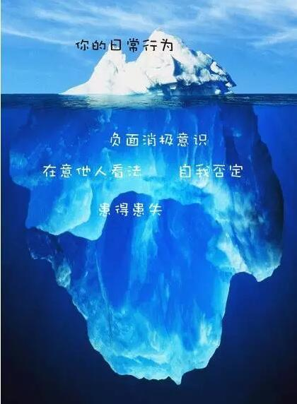

阿德勒是和弗洛伊德同时代的另一位伟大心理学家。

他认为人自卑有三个最主要的来源：身体缺陷、娇纵和忽略。

阿德勒认为，一个人在五岁之前，其生活经验已经决定了他，成年后解释自身遭遇和回应的方式，对于“对这个世界和自己应该期待些什么”有了基本的答案。

我看到现在很多心理学专家，都在贬弗洛伊德，褒阿德勒。

以我粗浅的对这两位的认识，我感觉是都有可取之处。

从社会学的角度，人在逐步成长的过程中，同时受到更多来自于其他的影响。

大概有三点。

1，中国的教育方式（家庭、学校）

欧美的教育是鼓励个性发展，不打骂，不打压，讲究沟通。

刚出生或几岁大的小孩都是天性开朗，想笑就笑，想哭就哭。但随着成长的环境，社会化的影响，家庭父母的教育、学校的教育都被教育你要怎么怎么样才能开心，你要什么样的前提才能开心，最后让人的负担越来越重。

并且中国的教育环境（家庭、学校）大部分是压抑个性的，比如从小就被要求不能调皮捣蛋，要做一个听话的孩子，不能随便吵闹，一吵闹就会被训斥或被打，刚开始还是会继续吵，但随着时间推移，年纪变大，吃到的苦头够多（断零钱、体罚打骂等），慢慢也就被驯服了，就像动物园里被拔了牙的老虎被大妈骑着拍照一样无奈。

还有就是从小学、初中、高中，我们都被要求带红领巾，不带就要被记过，被要求穿难看的校服、要求剪统一难看的平头发型。这一切都是在无形中压抑了绝大部分人的个性，渐渐的失去了自娱自乐的能力。

同时还有一些因为父母对孩子的不重视，或工作原因，和孩子接触较少，这种忽略也会造成孩子缺乏关爱和自信肯定的培养。

2，他人对你的评价（你在别人眼中的形象）

年幼的你，三观还未成熟，父母，老师对你评价，会直接影响你的价值感。

典型例子，父母要求严厉，即使你考到98分好成绩，他们也不会夸奖你，鼓励你，而是告诉你，不要骄傲，要思考那2分是怎么丢的。他们这样的行为，也可能是他们的父母也是这样教育的。

这种过于苛责的行为，日积月累会让你成为，过分追求完美的人，大家都知道这世界是没有完美的，除了处女座以外（这里是玩笑，不要当真，我不是处女座黑）。

太过刻意追求，自然会有压力，当你承受不了时，焦虑感会影响你的身心健康。

貌似，这似乎就是中国从古至今的教育方式，也让我们渐渐本来是天性开朗，也变得谦虚谨慎起来。

从小到大，在这样的环境下长大，你也渐渐的习惯了，需要对方的评价，认同，你才能确认自己的价值感。

如果对方对你是负面评价，对你及打击，又让你很在意，如果你自尊心强，还会和对方争辩。

人有两套评价系统，一套是自我评价系统，另一套是他人评价系统。

未成年时，更多地依赖他人评价；心理成熟后，更加相信自我评价。

过于在意别人想法和评价的人，自我评价系统弱小，就会显得不够自信，或者自信都来源于外界。

这种对追求外在条件认可的自信，也并非真正的自信，一旦条件消失或不具备，你就完全手足无措。

条件自信是相对我的核心自信而言。

『条件自信』主要分为4种，分别是大众价值观、裙带关系、特殊技能、角色扮演。需要具备一定的前提才能变得自信。

1）大众价值观，是否符合大众价值观的标准，来决定认为自己的自信是高是低。

比如说，我有钱了，我就自信了。

你今天买了一件新的衬衣，觉得非常好看，你的自信会变高？但这个自信能持续多久？

2）裙带关系，参加聚会，一个人很怂，有个朋友陪伴，就安全感提升。那你是否永远要朋友陪伴，你才能参加聚会？

3）特殊技能，你拥有某个技能，或在某方面相对擅长和有经验，你在使用这个技能时，会感到有自信。那假设你没机会使用，你就会变得没自信。

4）角色扮演，当你采用装逼的形式，来太高自身价值时，会感到自信，而被别人戳穿，或没法扮演角色时，你就自信降低。

『条件自信』虽然能短暂变得自信，但无法长久、无法自我掌控、无法提升自己的内在价值。

过度的依赖『条件自信』，会让你的自信更脆弱。

很多朋友的自信都是基于条件的自信，所以即使通过一些自认为有效的方法，来增长自信，但效果都不持久。

3，生活中的各种挫折（学习、事业、爱情等）

有了前面的铺垫，你现在自信心非常脆弱，俗称玻璃心。

你对各种困难对你产生的挫折感的抵抗力是很弱的。

类似于，在你已经千穿百孔的小心脏上，又多插几剑。

最常见的就爱情上的挫折，自信缺乏的朋友，在异性面前，不容易放得开。

你本来只是想表现的更好，却会适得其反。

学习、工作是你天天都在使用练习的，即使你再不擅长，时间一长，你怎么也会熟练，即使做砸了，大不了换个工作，工作相对容易找。

而恋爱则不然，由于前面提到的自卑的朋友，很需要外界认可，而你缺乏自信，某种程度就是缺乏魅力和吸引力。

对方对这样的人，自然不会有太多兴趣，那你失败的可能性就非常高。

总结一下：

影响自信的主要因素：

1，童年相对负面的成长经历，父母、老师管教严厉、苛责、忽视、缺乏关爱。

2，生理缺陷或影响：青春痘、身高、体型、听力、视力、口吃，或其他残疾。

3，学校、社会上各种人对你的负面评价。

4，生活中各种挫折。

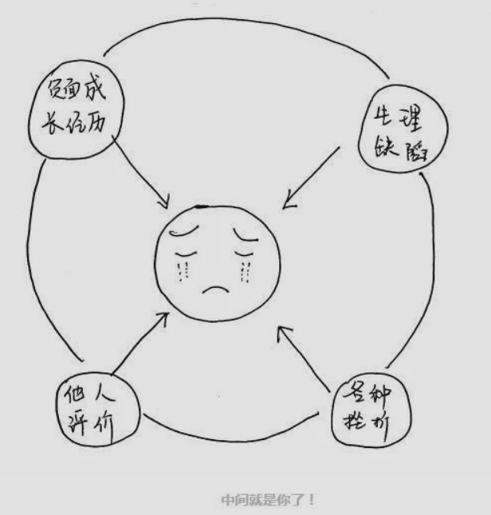

到了最后，你肯定又要问，知道了原理，怎么解决呀？

别急，一步步来，解决自卑，不像治疗感冒那么简单，吃片药睡个觉就好了。

我发现提升自信和健身非常类似。

知道问题的根源，是帮助你改变的起点，就像你感冒了，如果不由分说就胡乱吃药，不但好不了，还会加重。因为感冒分很多种，病毒性感冒、风寒感、风热感冒等等。

有次我感冒，普通的感冒最后变成的咳嗽3个星期，最后发现，原来是不知道要忌口，生病时乱吃加重病情的食物，例如牛肉，酸辣等。

所以要想提升自信，也要先系统的知道的问题的根源。

自卑的朋友，要改变自己，最大障碍就是难以控制的负面消极思维，例如典型三大症状：自我否定、患得患失、在意他人看法。

所以，提升自信的关键就是如何有效且彻底消除负面消极思维。

人从『自卑的大脑』变成『自信的大脑』的过程中，就和胖子变成瘦子，从没肌肉变成有肌肉的过程非常类似。

提升自信就像练肌肉，强壮的身体可以免收疾病侵扰，强壮的大脑免受消极思维的影响。

提升自信的过程就是"减脂"（消除负面消极思维）"增肌"（增强自信思维、社交沟通能力）的过程。

所以，在我看来提升真正的自信，没有捷径，没有捷径，没有捷径。

如果真的有，那也是附带条件的自信，变得有钱就会感到自信，也某种程度是这样的思路，但貌似赚钱也好像对大众来说不那么容易。

而学一些技巧性的包装却是容易的，这也是我们经常在新闻里听到，某个骗子伪装了什么什么身份，获得了什么什么好处，但最终身份败露。

很多时候，技巧并非无用，但很多使用者如果自信心态不够强大，你学了技巧也只是治标不治本，虽然很容易学，但然并卵。

而且很多朋友，也明明知道自己因为自卑，而影响了自己的生活工作，但要么纠结、要么退缩，要么破罐子破摔、要么自我欺骗，用忙碌来转移自己是注意力。

其实这都是他们，受到了一个阻力，一种既难受又不敢行动的负面思维。

在接下来的几天，我都会陆续和大家讨论，为大家开拓思路，找到相应解决问题的思路与方向，我始终认为，给大家提供解决问题的心法，远比技巧要更有价值，要学快速技巧直接百度就好了，不用看我的文章。

我已采用互联网产品快速迭代方式，进行文章写作。

所以本文很有可能只是一个雏形，此时，你看到的可能并非是我完整的想法。

请评论区留言，我想知道您的真实想法！

后续升级，会加入大家意见，与更多我的思考。

有您参与，文章会更好！

主卖干货，偶尔励志！

 

 

# <a href="http://www.jianshu.com/p/a802d0484e0f" class="text_4"
target="_blank">不要让缺乏安全感，阻挡你对他人的信任</a>

2016.10.28 迎刃

 

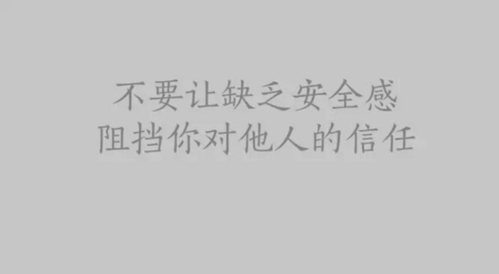

 

「我怎么知道你们会不会收了钱，就不理人了？」

「如何确保我的权益？」

来咨询提升课程的朋友里，总会有一小部分人，带着既想解决问题，又担心我是骗子的矛盾心态。

他们不放心的原因，我大致反思总结，有如下3点:

1，提升自信是一个相对比较「虚」的概念。我教的又是多以心法+训练的方式，很多人还太不了解。

2，我的网络知名度还不够高，一个18线知识型网红。

3，没有一个专业资质作为背书，例如心理咨询师，我已经在考。我的提升自信理念，不是纯心理学方法，而是含有大量沟通社交、情感方面的内容。一般心理咨询师，则不具备的这样的综合能力和经验。

所以，我在3个方面都在不段进行强化，来增强大家的信任感。

不过，大部分人来咨询还是比较认可的，他们都是看过我的文章、视频、音频、分享平台的微课等方式来了解我，都是认同我的理念，才来咨询。

而那些担心我是骗子的朋友的心理状态是怎么样的呢？

经过我的研究和总结，有2个原因（可能以后会增加更多）：

1，自己有受骗经历。

因此产生了心理创伤，形成强烈条件反射。比如你在网络上买东西被骗，并且经常听到类似的新闻。

当你在遇到类似场景时，会自动变得警觉。

一朝被蛇咬，十年怕井绳。

恰好，一部分自卑的朋友因为成长经历的心理创伤，也容易缺乏安全感，无法信任他人。

此时你都是应急感性情绪在做反应。

说个自己的小故事。

我曾经有一次在火车站，要退票，不想被扣手续费，就碰到车站周边的票贩子。

他说可以帮转让，虽然会有些小担心，但为了节省费用，还是跟着他去了一个人少的口楼梯，等待交易。

此时，他和前来的一个带着眼镜，像学生模样的人，拿着一张票说帮转让，他拿到后，对我说「你等会，我先帮他处理。」

他拿了票跑到地下一层，过了大概3，5分钟后就给了对方钱，然后问我们要票说，让我等会。

我于是下意识的就把票递给了对方，这个过程速度非常快。

结果，大家都应该猜到，他再也没回来，过了10分钟，20分钟的时候我才回过神，自己是不是被骗了？

事实是这样，骗子利用托的掩护，让我放松警惕，拿了票就消失了。

当时，我有种又羞愧，又愤怒，又无奈的复杂心情。

最后连警都没报，就黯然回家了。

从此，我对这种火车站上的票贩子特别警觉，不想重蹈覆辙，损失钱财事小，感觉智商被碾压事大——其实是利用人性弱点。

现在的车牌都实名制，他们也应该没法这样行骗。

不过，最近一次广州出差，由于进站口和售票厅非常远，票贩子就利用这个空隙，说可以帮1分钟取票，当然是拿着你的身份证去取。

当时我很赶时间，犹豫1秒钟，不过我心有余悸，不放心，万一身份证被骗走了，非常麻烦。

于是还是自己往死里跑，辛亏当时人流不大，不然肯定错过班车。

所以我能感同身受，大家被骗过，神经很脆弱很敏感，不想再受到伤害，所以会自然的做出一些试探性的反应。

但其实，这样的问题是有方法论来解决的。

万事都可以通过思辨来找到问题的答案，当然你是经过学习和训练过的。

2，缺乏对事物的判断标准。

即对一个事物，如何进行分析和找到答案的能力。

不要让缺乏安全感，阻挡你对他人的信任，此时借助理性、逻辑思维能力来做判断标准，可既保护自己，又能分辨是非。

很多朋友缺乏这方面的能力和经验，我谁不是也要写相关的文章来给大家学习一下？需要的请评论区留言。

缺乏安全感的朋友，一个常见思维模式——怕被骗，现在社会骗子太多了，只要有一点点的让我感到不安心，我就觉得有问题。

这种思维只起到了保护性的防御，缺乏实质性解决对方到底是不是骗子的手段。

那我现在就教给大家一个判断，我到底是不是骗子的简单方法。

对我进行信息综合搜索和对比，和利用常识来做判断。

大部分人都是通过我的微信公众号的原创文章、教学视频、音频、微课堂等形式，认识到我。

那如果我不天天苦逼的写文章，做视频，录音频，就没法看到我的价值输出，也就没法让简书网、豆瓣、百度阅读、喜马拉雅等知名网站进认证。

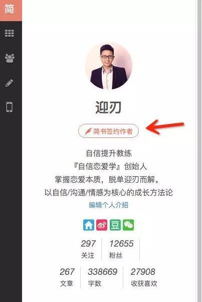

也没法让很多知名的微信大号，来找我索要文章授权进行转账、学习平台邀请我去做分享。

 

你们试想一下，如果一个骗子要为了骗你1，2千元。

这需要我先把这些平台、网站都骗了。

然后，如果我真骗了你，你还是可以通过各个网络平台找到我的，直接举报就好了。

但你想想，我要为了骗这一点点钱，这个成本得有多高？

这个成本核算其实很简单，你心中默想一下，就\~\~~肯定算不出来。

因为没法算，这是付出了不知道多少个日日夜夜，才有了100+原创文章、几万粉丝积累的结果。

你们也可以去简书、微博、豆瓣、喜马拉雅、百度阅读等等网站上去查验我的认证信息。

由此推到出，我是骗子的可能性就降低了非常多。

现在的骗子都很懒的，你指望他们通过写原创文章，并且还要让你们找到共鸣？想都别想。

他们最喜欢的方法就是，海底捞战术，用看上去非常愚蠢的短信群发，来筛选出进入那个套的人，就像我被票贩子利用了贪便宜的心态。

小结一下：

大家缺乏安全感的原因有2点。

1，自己有受骗经历，引发自动防御系统。

2，缺乏对事物的判断标准。

让自己具备警惕性是没错，但需要同时配合有效的方法来进行判断，不然会让你错过一些可能会让你变得更好的事物。

不要让缺乏安全感，阻挡你对他人的信任。

同时，大家需要多看一些逻辑思维的书籍，来增强自己的判断力，这里推荐一本**《批判性思维》**，晚安。

你有什么样的被骗经历，或与骗子斗智斗勇的故事与我们分享？请评论区留言。

------------------------------------------------------------------------

我已采用互联网产品快速迭代方式，进行文章写作。

所以本文很有可能只是一个雏形，此时，你看到的可能并非是我完整的想法。

请评论区留言，我想知道您的真实想法！

后续升级，会加入大家意见，与更多我的思考。

有您参与，文章会更好！

主卖干货，偶尔励志！

 

# <a href="http://www.jianshu.com/p/2787010565a6" class="text_4"
target="_blank">女生主动不是轻浮，而是大写的自信</a>

2016.10.29 迎刃

 

今天，在微信群里，和一群女生讨论了，很多女生会碰到的与男生交往的问题。

有个女生提问：在社交场合，主动搭讪男生，会不会被人觉得很轻浮？

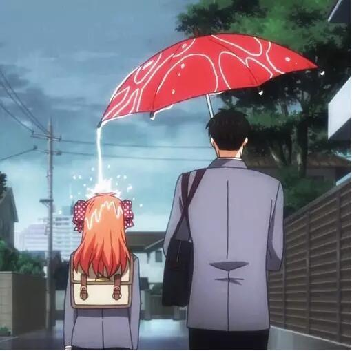

 

我的看法，这是一种负面思维，不是主动说话是轻浮，而是你搭话时的目的、后果、语言、语气、神态、肢体语言、性格等等的综合起来是轻浮的，那才轻浮。

你的主动也可以是自信，热情的表现。

你狭隘的把『主动』=『轻浮』，但这中间隔着无数条鸿沟。

同时，这也可能是你长期受到的教育，所形成的惯性思维，很多女生从小被教育要矜持，要自爱。

说白了，就是陈旧的思维观念约束着你。

中国古代，要求女人三从四德，贞节牌坊。

虽然是现代社会了，但中国的传统文化里的含蓄，依然有沿袭和影响着我们。

这其实都是男权社会下，男人为了保护自己利益，制定的一种思想禁锢。

最终目的是避免女人出轨，让自己戴绿帽以及亲子不确定性，即不小心让自己抚养了别人的孩子，而没有延续自己的基因。

2，

另一个女生问：

有个男生我一起玩的，总是想带我去夜场玩，还想给我叫鸭子。

他说：体验一下嘛 一排男人站你面前随便挑的感觉。

女生说说：那有什么意思，婊子无情啊，面对小白脸，有钱当然随便挑了。

这个男生到底是什么意思？

这其实涉及到一个人价值观的问题。

在他看来，体验一下，是他的价值观，可能他觉得一个人，可以通过体验很多新事物来获得快乐。

他可能只不过是通过帮你叫鸭子来传递他的价值观，分享他的快乐。

你的价值观可能是
——那有什么意思，婊子无情啊，面对小白脸，有钱当然随便挑了。

实际上，叫鸭子这个事情，抛开社会道德，从客观理性的角度上分析，它就是一个经济行为，你愿意买，他愿意卖，虽然这个行为好像是违法的。

但大家都知道，在中国很多事情，明明是法律禁止的生意，却堂而皇之很多年。

再次抛开道德、法律层面，很多人的价值取向，就是希望追求天性的快乐，所以他愿意冒点小险。

因为道德不是我们的天性，有时候反而是用来约束我们的天性。

这是个人自由意志的选择。

其实我说的这些，只是提供一个思考问题问题的方式。

有时候，有些事，没有绝对的对与错，不需要道德绑架。

道德，这个东西都是人为了约束别人而发明出来的，但有人就不想被约束。

例如，我们被社会道德教育，要廉洁，正直。但你们发现，贪官不光贪钱，还有很多女人。

上层阶级用道德约束大众，然后自己放纵。

但我说的这些不是愤青言论，而是一种看待社会问题的思维方式。

如果大家有机会接触，在国外出生，或生活很长时间的华裔青年，他们就没有这样的思想束缚。

我说这些，其实最终目的，是为了帮助大家，打破某些陈旧的社会道德对自己的约束。

比如前面说的，
女生主动和男生说话，是不是被认为轻浮？这个就是道德约束下的行为。

合理的公序良俗，我们要自觉遵守，

如果某些约束，本来就是不合理的，那你为什么要一定遵守呢？

3，

实际上，你们也可以看到很多大胆或有自信的女生，和男生主动说话，也没被人认为是轻浮，反而你可能还很羡慕，觉得她很勇敢。

而且如果，在一个社会场合，大多数女生都很沉默，你却鹤立鸡群的，能主动和男生搭话，那就是大写的自信，你可能就是旁边女生心目中的榜样。

 

还有一种情况，某些女生都会对看不惯的女生，表现出鄙视或嫉妒的心理，有句俗话，只有女人才知道，谁是真正的碧池。

于是她用来攻击敌人太主动太轻浮，借此影响对方的名声，达到打击报复的目的。

又有个女生问，有时候会尝试放开自己，结果就是让我不矜持的时候，都不知道该怎么做，稍微一放开就不知所措了。

这位女生其实是缺乏方法和经验的问题，不是『刻意放开自己』的错。

在多种影响下，女生们都不得不，下意识的做出『矜持』的表现。

群里几个女生也同时表示，因为要刻意『矜持』，被错认为是高冷、清高，而错过了很多缘分，也很可惜，把握不好分寸。

有时候有些男生认为女生的矜持=矫情 ，不是没有道理。

注意啦，敲黑板，划重点。

这里给男生提个醒，对方如果在你面前，矜持、高冷，很有可能不一定是拒绝你，她只是不知道如何与你相处。

那如何解决这个问题呢？卖个关子，下次有机会和大家说。

最后几个女生也感到，最最核心的问题，还是因为自卑，不想自己，不能肯定自己的魅力，所以不敢表现自己。

其中一个女生比较自信，她说，想明白自己想做什么人，然后去做就好了，只要没侵犯其他人的合理利益，这就是我的唯一准则。

她还说到：『讲真，我的经验，一般姑娘，只要别太丑，主动和男人说话，10个里面8个都会理你。』

4，

 

欢乐的时光特别快，又到时候说拜拜：

打破社会道德约束，解放天性，是你提升自信的一个突破口。

你主动和男生搭话不是轻浮，反而是自信的表现。

勇于尝试主动和异性搭话，是锻炼你自信的好方法。

如果你是女生，你是否也有害怕被人认为轻浮的情况？

如果你是男生，你是否也遇到过这样的『矜持』女生？

让我们在评论区交流一下。😍

------------------------------------------------------------------------

我已采用互联网产品快速迭代方式，进行文章写作。

所以本文很有可能只是一个雏形，此时，你看到的可能并非是我完整的想法。

请评论区留言，我想知道您的真实想法！

后续升级，会加入大家意见，与更多我的思考。

有您参与，文章会更好！

主卖干货，偶尔励志！

 

 

 

# <a href="http://www.jianshu.com/p/422567e6bbab" class="text_4"
target="_blank">时而自信，时而自卑，如何改变这种双重人生？</a>

2016.10.30 迎刃

 

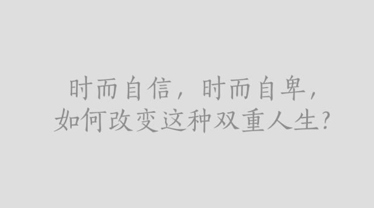

我接待过的一部分咨询者里，有个特点，就是他并非完全没自信，是看不同场合，不同情况。

例如，工作时，很自信；人际交往时就很弱；做自己擅长的事，自信；不擅长就垮了。

如何改变，我们来交流一下。

1，

讲自信自卑话题之前，我先说一个我朋友的故事。

他是理工科出身，却最后发现自己还是喜欢艺术，最后选择做表演编剧工作，现在是某大型综艺节目里的一个喜剧单元的编剧和制片。

他同时还是一个舞台表演和演讲的高手。

以前有和他合作过几次线下的演讲，每次观众都反应热烈，笑声、掌声不断。

而每次结束，他都会告诉我，这次状态不太好，只发挥了我5层功力，有时是7层。

我很奇怪的问，怎么回？我觉得讲的挺好的，大家也听着很嗨。

他说，那是因为我的『基础能力值高』（当时他好像说的是另一个词，这个是我总结的）。

意思就是说，我做过无数次演讲，每次演讲前都做比较充分的准备，但演讲也好，舞台表演也好，这种需要即时面对大量现场观众的表现，如何让自己能在充满压力和挑战的情况下，依然发挥正常。

但事实上是没法做到每次都完美，不过如果你的基础牢固，即使发挥5层功力，听众也看不出来你没发挥好。

通过这个故事，我是想告诉你，自信的状态与人的能量高低的，你的自信基础值高，即使状态不好时，也足以应付各种困难。

2，

这里讲个接待案例。

她自我介绍说：

我是一个主持人，工作能力还不错，身材气质也不错，在台上非常自信，很有亲和力。

一到台下，整个人就完全不一样了，没有人相信台上和台下是同一个我，我很在意别人对我的看法，一个动作，一个眼神，我都认为是针对我，甚至背后有诽谤我说我坏话的，我知道后都会难过好几天，甚至是不敢面对她们，这个问题一直在困扰我，生活工作都不开心，总觉得一切都没有意思，除了在台上，台下的我就是行尸走肉一般。

关于意他人看法，参考我的文章《这三点，帮助你消除过分在意他人看法》，公众号后台回复关键词『
在意 』。

为什么她台上台下判若两人呢？

我先和她分析了这种思维形成的原因：

这一负面成见，一般都是在童年时期形成。

比如你父母老师，对你的教育方式对你比较严厉，同时又缺乏肯定。是这样吗？

她回复到：您说对了，小父母离异，爷爷奶奶对我不好，没怎么见过父母，还总被小朋友欺负，十一岁母亲把我要回身边，教育方式就是打和骂，我妈就非常自卑，疑心很重，乱发脾气，无论我做什么，都会遭到母亲的反对和看不起。十八岁我出走了，从此就是一个人。

我没有朋友，关系都处理不好，我除本职工作之外很糟糕的，老板让我干中层，监督管理员工，结果和下属关系弄的很僵。

说明你至少是一个有反叛和独立思考能力的人，你不会像绝大部分自卑者逆来顺受，或害怕父母的威胁。

我就认识一个朋友的朋友，从小被父亲严厉教育，母亲只会哭。等她长大了，想过要独立和远离这种让他痛苦的家庭，但又害怕父母身体不好，母亲又拿死来作威胁，绑架他，由于懦弱，只能妥协。

一个人的童年成长经历会影响一个人的身心健康。

台上自信，在外人看来是很成功很自信的角色，是你专业能力好，同时在主持时，你可以『扮演』另外一个人，你所以不用害怕别人看到你自卑的一面，但其实你是在专业技能的基础上，通过角色扮演的条件自信来支撑自己。

而台下，你无法发挥专业优势时，就会原形毕露。

所以，你才会有反差。

听说，梁朝伟也是一个很内向的人。

但他扮演的角色却非常张扬，各种类型的角色都试过，通过表演你是看不出他内向的。

当演员可以用不同的角色，来替换自己的本来性格，不用害怕受到伤害。

而银幕下的他则是内敛，阴郁。

你可能都听过，他孤独的一个人飞去伦敦喂鸽子的梗吧。

以上，是形成这种不自信的原因的一个大致的分析。

3，

她还表示：认为改变自信太不容易了。找了个心理医生，花了不少钱，成效不大。

一课时400元，长期的300元，就是聊天，然后学习一本书。没有解决她根本的问题，换过一个心理医生，这是第二个。

我的方法和纯心理咨询的不同之处，就是，除了给你一些开导和问题分析外，最主要是通过各种实践社交训练帮助你，彻底消除负面消极思维，同时植入积极正面观念，且需要不断坚持重复训练。

你可以理解为，人从『自卑的大脑』变成『自信的大脑』的过程中，就和虚弱状态变成健康状态，从没肌肉变成有肌肉的过程非常类似。

提升自信就像练肌肉，强壮的身体可以免收疾病侵扰，强壮的大脑免受消极思维的影响。

提升自信的过程就是"减脂"（消除负面消极思维）"增肌"（增强自信思维、社交沟通能力）的过程。

那如何训练？主要是通过社交训练。

1）人的不自信大部分都集中在人际交往时。**根据认知行为疗法的理念，你越害怕什么就越要做什么，才能突破恐惧。**

2）自信的建立光靠思维升级不够，需要同时配合行动的结果（能认识跟多朋友，异性，训练聊天能力）来影响。

3）通过参加聚会，可以认识更多优质朋友、异性资源，为你的生活、工作、恋爱垫底人脉基础。

我问她：你现在最大的问题，是不是在和人交往的时候，控制不住自动化的负面思维？

她说：是的，有时候不想接触人，感觉大家都不喜欢我，我又没话说心烦意乱，做什么都没心思，不能活在当下。

当你不会有负面想法时，就是真实做自己的时候，就是进入了一种放开自己的状态。

这种状态其实和你演讲，讲嗨了状态很像，你是否有在主持的时候，进入一种非常嗨的状态？
 她回答有。

而如果你不是做主持人工作，我相信你在整个人生中，总有那么几次体验过，思想被解放，自由放开自己，能和别人顺畅沟通的时刻。

当然你多次体验到，你在人际交往时不会负面思维，同时又很『嗨』，就会慢慢消除负面思维，植入积极思维。

但这需要时间系统学习和训练，这和健身非常像，当人健身养成习惯后，会在此过程中获得快感。

因为人的大脑里有一个叫做奖赏效应的机制。

**意思就是说，当你做出某个行为，最终确认是正确或获得良好的结果，你的大脑就会给你发出奖赏信号，**这种生理激素是可以帮助你感到快乐，成就感的来源。

当你多次在人际交往时体验到了我教的心法，你也会多次感受到这种奖赏激励，会鼓励你不断的坚持，自然性的变成习惯。

4，

总结又来了。

**如果你也是时而自信，而是不自信的朋友，**希望我的这篇文章，能解释你的一些疑问，以及帮你找到了解决问题的方向。

我这种方法本质上是通过心理学的原理，分析你的自卑根源。

然后用心理学里，专门用来治疗抑郁症的『认知行为疗法』原理（通过社交训练，练习积极思维）。

很多心理咨询师主要通过谈话分析、心理疏导的方式来改善你的情绪和行为。

我是直接通过行为（社交训练）来矫正你的情绪（负面情绪），进而改变你的心理状态（积极自信思维），但你千万不要以为，训练几次就可以了，还是我前面说的，提升自信和健身很像，健身减肥和练肌肉。

**最后，**我再次\~\~~强烈提醒\~\~~哪些希望看完一篇文章就能马上改变的人，你这是痴人说梦，是**懒人的想法**。

今天刚好在公众号后台收到一条信息，给大家看看。如果你没看懂，get到笑点，请评论区问问，懂得也可以留言。

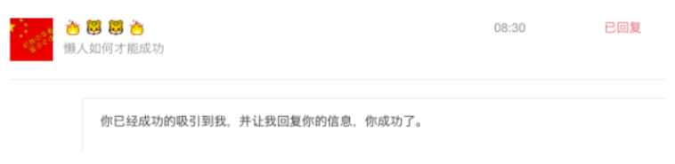

END

 

# <a href="http://www.jianshu.com/p/919b015cec1f" class="text_4"
target="_blank">如何打破「行动困难症」对你的束缚</a>

2016.10.31 迎刃

 

有自卑经历的朋友，会有个深刻的感受，负面消极的思想，会自动在大脑中产生，挥之不去。

一般是自我否定、在意他人看法、需要他人认同、患得患失、过度自我苛责的完美主义。

比较严重的会自寻烦恼，缺乏安全感，不信任任何人，害怕和别人交际，不知道怎么和别人善意相处，容易迎合对方，担心别人忽略、讨厌自己。

而比这更糟糕的是，理性的自己明明知道这些不好，需要改变，才能让自己更快乐，但就是无法行动。

因为，你自卑产生的负面情绪、认知，会阻碍你表达自己，进而变成一种「行动困难症」，内心想动想改变，却又迈不开腿。

不行动，意味着你可以保持现状，你会自以为不会变得更糟，但实际情况上，你拖延只会让你深陷其中，无法自拔。

例如，大家可能都得过一些小病小灾，因为拖延，而变得更严严重。

不行动容易产生，失败的恶性循环。

大家应该都听过陈奕迅的「幸福摩天轮」，而我把失败的恶性循环，称之为「痛苦摩天轮」。

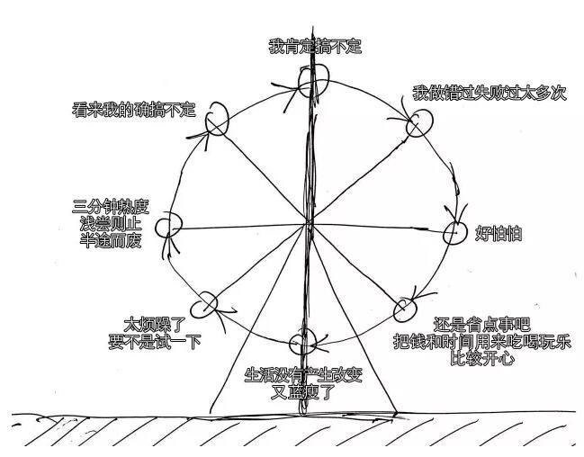

大致这样一个死循环：

1，预设我肯定搞不定。

2，我做错过失败过太多次了，打击成了马蜂窝。

3，真的怕了。

4，还是什么都不做，至少不会再受伤。

5，生活不但没有变好，反而更糟，好蓝瘦。

6，受不了了，要不试一下，做点什么。

7，三分钟热度，就半途而废了。

8，看来我的确是废物。

9，继续加深，我肯定搞不定的想法。

为什么有些人最后还是行动了？大致有3种情况。

1，遇到重大挫折，产生了严重结果，实在受不了自己，被逼到悬崖边。

2，受到家人、朋友的鼓励。

3，找到了合适、靠谱方法。

而一旦你触到地面，跌无可跌，就是触底反弹的时候。

看过我相关文章的朋友都知道，自卑一般是在童年时期，遭受的负面影响所形成，并非是天生，**从心理学的角度，自卑是后天环境影响形成，也可以通过后天环境的改变而改变。**

你一旦有被逼到绝境，想通了，加上有鼓励，有方法，你于是就开始行动起来。

于是就开始慢慢打破恶性循环，走向「幸福摩天轮」。

图来不及画了☺，下次更新文章的时候，再加上，以及加上更多解读分析，和解决思路。

有能给你激励、关爱、安全感的密友、长辈、老师，心灵上得到滋润，像干涸的土地，遇到一场春风化雨，由此变得湿润温和。

你脆弱的玻璃心也开始温暖与变得坚强。

END

 

 

# <a href="http://www.jianshu.com/p/66ccc23c3024" class="text_4"
target="_blank">是什么阻碍了你行动，改变自己？</a>

2016.11.04 迎刃

 

本文为《如何打破「行动困难症」对你的束缚》2.0升级版。

1\.

时不时有粉丝或学员问我，以前是不是也很自卑，以及我是怎么走过来的？

每次被问及，我都有如处在电影闪回画面中，一个转身过场，我看到了以前的我。

我和大多数朋友一样，在年纪较小时，没有受到足够积极的关爱，和鼓励性的教育，也有打骂，遇到了严厉的老师。

自信心自然就不那么充足，在加上学习成绩下降，也就进入了一个恶性循环。

成绩不好，不受老师待见，父母又责备，面对成绩好的同学又轻蔑我，就开始了厌学情绪。

这种状态也带到了大学里，一开始还信誓旦旦的要好好学习，但又进入了学不进，没心思学，成绩下降，索性放弃，天天打游戏的地步。

颓废到一定程度，也开始厌烦了这种状态，也知道这样下去不行。可学习又没心思，直到我发现了她，我才发生了改变······

 

2\.

有自卑经历的朋友，会有个深刻的感受，负面消极的思想，会自动在大脑中产生，挥之不去。

一般是自我否定、在意他人看法、需要他人认同、患得患失、过度自我苛责的完美主义。

比较严重的会自寻烦恼，缺乏安全感，不信任任何人，害怕和别人交际，不知道怎么和别人善意相处，容易迎合对方，担心别人忽略、讨厌自己。

而比这更糟糕的是，理性的自己明明知道这些不好，需要改变，才能让自己更快乐，但就是无法行动。

因为，你自卑产生的负面情绪、认知，会阻碍你表达自己，进而变成一种「行动困难症」，内心想动想改变，却又迈不开腿。

不行动，意味着你可以保持现状，你会自以为不会变得更糟，但实际情况上，你拖延只会让你深陷其中，无法自拔。

例如，大家可能都得过一些小病小灾，因为拖延，而变得更严严重。

不行动容易产生，失败的恶性循环。

大家应该都听过陈奕迅的「幸福摩天轮」，而我把失败的恶性循环，称之为「痛苦摩天轮」。

大致是这样一个死循环：

1，预设我肯定搞不定。

2，我做错过失败过太多次了，打击成了马蜂窝。

3，真的怕了。

4，还是什么都不做，至少不会再受伤。

5，生活不但没有变好，反而更糟，好蓝瘦。

6，受不了了，要不试一下，做点什么。

7，三分钟热度，就半途而废了。

8，看来我的确是废物。

9，继续加深，我肯定搞不定的想法。

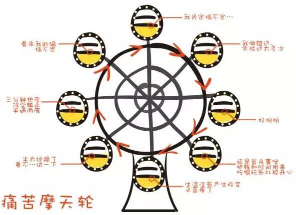

这个过程带来的3个连锁反应：

1）负面情绪缠身

因为行动困难，会加重焦虑感，容易让人垂头丧气，心情也极度低落，整个人都不好了，就像行尸走肉。

2）习得性无助

习得性无助感，是指一个人经历了多次挫折和失败后，面对问题时产生的无能为力、自暴自弃的心理状态。

这种现象是由心理学家塞利格曼，通过在狗的身上实验发现又在人身上得到证实。

3）拒绝送上门的机会

处于这样的状态时，你特别容易加重逃避心态，与其这样难受不如干脆什么都不做好了，即使别人介绍了好机会，例如给你介绍男女朋友，工作，挑战等，你都担心做不好，怕搞砸，让自己难堪，索性拒绝。

3\.

为什么有些人最后还是行动了，改变了？大致有3种情况。

1，遇到重大挫折，产生了严重结果，实在受不了自己，被逼到悬崖边。

2，受到家人、朋友的鼓励。

3，找到了合适、靠谱方法。

而一旦你跌无可跌，就是触底反弹的时候。

看过我相关文章的朋友都知道，自卑一般是在童年时期，遭受的负面影响所形成，并非是天生，从心理学的角度，自卑是后天环境影响形成，也可以通过后天环境的改变而改变。

你一旦有被逼到绝境，想通了，加上有鼓励，有方法，你于是就开始行动起来。

我前面说到了，自己无法忍受颓废，寻求改变方法，但我也不是一蹴而就，马上变自信，也是走了很多弯路。

我大学时是偶然间发现了她——网页制作三剑客软件套装，当时99年是中国互联网刚刚开始普及的时候。

我也天天上网，那时开始兴起个人网站，当我万念俱灰之际，我找到了我的兴趣点，虽然对课业没有帮助，至少让我不再浪费时间打游戏，而做了点有意义有价值的事情。

通过自学，做了自己第一个个人网站，后面还学了flash，最后通过自己的作品和介绍加入了学校的一个创新组织，为全校师生做校内网里的网站。

虽然没有钱赚，但通过自学一门技能，改变自己的生活状态，最后赢得了别人的尊重和认可，这无形之中慢慢增加了我的自我效能感，让我感觉自己还是很有能力的。

至于后来，我是如何通过长期的学习蜕变的，以后的相关文章会提到。

所以，要打破打破恶性循环，走向「幸福摩天轮」，需要先找到一个小小的突破口。

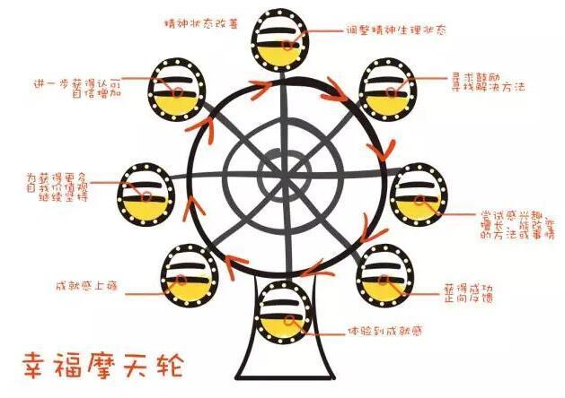

例如，去做你擅长、或喜欢的事情，即使不能马上彻底改变自卑，但却是一个良好的开端。

其实还有更高阶的正向良性循环训练方法，以后再说。

也刚好符合「大脑奖赏效应」理论，当你做出的某个行为，最终获得了正向的结果，你的大脑会对你释放奖赏信号，就是愉悦感、成就感。这种心理感受容易上瘾，会鼓励你不断地做下去。

当你做的事情越来越好，越来越成功，就会帮助你慢慢脱离失败的恶心循环，走向成功的良性循环。

建立起一个成功循环后，再建立更多的成功训练，可以一步步的帮助你增添「客观自信」，「客观自信」会反哺你的「主观自信」即积极的自信思维。

同志们，我最后再多说两句。

放心，是真的只说两句，不会拖堂的。

1，理解阻碍你行动的心理层面原因。

2，要终止恶性循环，需要先找到自己擅长或喜欢的事情，获得成就感，一点点的建立自信的基础。

3，有能给你激励、关爱、安全感的密友、长辈、老师，心灵上得到滋润，像干涸的土地，遇到一场春风化雨，由此变得湿润温和。你脆弱的玻璃心也开始温暖与变得坚强。

通过以上的理念，希望能帮助你，打破失败的恶性循环，建立属于自己的「幸福摩天轮」。

END

我已采用互联网产品快速迭代方式，进行文章写作。

所以本文很有可能只是一个雏形，此时，你看到的可能并非是我完整的想法。

请评论区留言，我想知道您的真实想法！

后续升级，会加入大家意见，与更多我的思考。

有您参与，文章会更好！

主卖干货，偶尔励志！

 

 

 

# <a href="http://www.jianshu.com/p/62ca536b5594" class="calibre8"
target="_blank">知道这3点，打造你强壮的自信</a>

2016.11.28 迎刃

 

很多来咨询的朋友，普遍反映，改变自己很难，改变自己自卑的心理更难。

我在很多年以前，也和你有同样的状况，每天精神萎靡，各种负面消极思维控制不住地冒出来，影响情绪，整个人生活很不开心。

就容易导致焦虑，焦虑过度就影响睡眠，睡眠质量差，继而导致白天精神差，恶性循环。

所以，老实说，每次我想改变，却有种无力感，然后就会越来越绝望。

后来，我是怎么解决的呢？

经历了大量的学习，和无数次的训练总结，直到突破。

其中最难的部分就是坚持和刻意练习的部分。直到我后来把这几样事情进行了联系，终于在意识上先产生了突破。

有个情况很有意思，每当你想通一件事情的时候，即使你还没做成，但你在思维上已经产生了变化，你就会有种很强的把握感，认为自己已经解决了一半，剩下的一半就交给身体去执行。这里我说说我是怎么想通的。

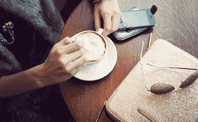

1

大脑记忆

《让大脑自由》一书提到：短期记忆取决于最初的几秒钟，长期记忆靠有规律的重复。

有规律的重复，也就是刻意练习，可以让相关的大脑神经元进行连接，并逐步变粗，形成潜意识回路，这样就会让你不同的知识或相关知识产生链接。

比如：

以前在演讲现场，有人随机提到一个和我内容相关的问题，我是没办法很快就能大脑组织内容和语言进行回答。

直到我开始开放我的个人微信，让粉丝可以随便加，随便提问题开始。每当有人提问时，我的回答，其实也是一个训练。

训练自己的语言组织能力，训练快速根据对方情况作出分析，归纳和总结。

微信好友上限是5000人，2、3年下来，我应该有超过5000人次的聊天问答。

后来，开始尝试在线语音课即时回答问题，我发现只要不是超出我知识范畴的内容，我都可以给出一个分析和解答。

而就是在大量的输出与输入，加上思考的环节，我整个人的知识储备都可以即时地调用。

所以，通过锻炼科学的记忆方法，你不会再发生看了就忘的情况。

 

2

肌肉记忆

肌肉记忆和大脑记忆很类似。人体的肌肉是具有记忆效应的，同一种动作重复多次后，肌肉就会形成反射条件。人体肌肉获得记忆的速度十分缓慢，但一旦获得，其遗忘的速度也十分缓慢。

这也就是为什么，乒乓球，羽毛球，或其他任何竞技体育的运动员，都需要把在比赛中用到的某个技术环节，单独进行练习。比如，贝克汉姆的非常刁钻角度的任意球，就是每次在他训练结束后，再加练的结果。

这也就是为什么，如果你不擅长聊天说话，那你也需要通过系统的学习和训练，才能让自己变得不嘴笨的原因。可能是你有过挫败经验，有过长期孤独不用太说话的环境，内向等原因，你的说话能力慢慢退化，变得迟钝。

说话的内容和你的大脑是相连，说话的语气、语调、声音高低起伏、语速等都是你嘴部肌肉产生。比如你要模仿另一个人的声音，其实就是训练某几块嘴部肌肉组合运动，是和那个人的嘴部肌肉运动类似。

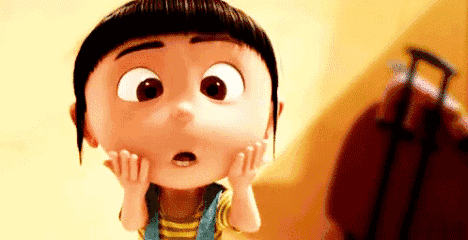

3

自信肌肉记忆

人从『自卑的大脑』变成『自信的大脑』的过程中，就和胖子变成瘦子，从没肌肉变成有肌肉的过程非常类似。

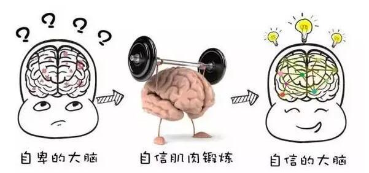

自信心的强弱和身体的强弱类似。

**身体素质差**，就容易生病，无法应对外界的各种危险、困难挑战。

**心理素质差**，相当于自卑，脆弱，有个俗称叫玻璃心，在遭受打击后，容易产生心理焦虑、纠结等负面情绪，类似于身体受到袭击，抵抗不了，或一蹶不振。

**身体素质好**，就精神焕发，注意力意志力强，能抵御一定的外界攻击，压力等。

**心理素质好**，相当于自信，不容易受到外界评价的影响，有自己独立思考与判断，对自我价值非常肯定。

即使是碰到自己不擅长的事情，也不会因此而感到自卑，而是采用积极正面的思维，会去想如何学习与训练，可以解决这个问题。

思维模式的正面或负面与否直接决定了你接下来的行为模式。

也就是所谓的，思想决定行为，行为决定命运。

提升自信就像练肌肉，强壮的身体可以免收疾病侵扰，强壮的大脑免受消极思维的影响。

提升自信的过程就是"减脂"（消除负面消极思维）"增肌"（增强自信思维、社交沟通能力）的过程。

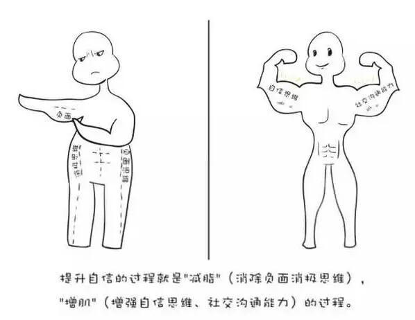

例如，恐高症治疗方法，最常见的就是暴露疗法。鼓励患者在处于安全的情况下，直接接触产生恐惧的高处，并让他坚持，直到紧张感觉逐渐消失的方法。在反复的恐惧刺激下，患者想象最担心的可怕结果，并没有发生，恐惧也就自然消退。所以问题的关键，就是要让自己，与想象出来的恐怖结果做斗争。

就像明明恐怖片、鬼片其实是假的，但你一个人看的时候就是莫名的恐惧，无法控制，而如果是一群人和你一起看，你的安全感就上升，如果只看画面，关掉声音，同时播放一些搞笑的音乐或音效，你的恐惧感也随之消失。而如果你是一个长期，看过各种恐怖片的朋友，你可能都已经习惯了类型片的套路，也不觉得有多可怕。

自卑的朋友，要改变自己，最大的障碍就是难以控制，自动产生的负面消极思维，例如典型三大症状：自我否定、患得患失、在意他人的看法。

所以，提升自信的关键，就是如何有效、且彻底地消除负面消极思维，同时植入积极正面观念，且需要不断坚持重复训练。让你的思维习惯性的积极思维，即所谓的自信肌肉记忆，

以上三点，其实是在掌握人体运行法则的情况下，进行有规律的刻意训练（重复）。

自信不会在一天内就建立，要循序渐进的培养，真正需要的不是要多牛逼的方法，而是耐心。

\#特别说明#

肯定有朋友文章看到这里，就会问，说了那么多，没说具体解决办法呀。原因很简单，提升自信，改变自卑，是一个相对复杂的心理调节过程，不太可能一篇文章就能把需要一本书甚至是一个课程来解决的事情就讲清楚。

所以请看我的其他相关文章，进行拓展阅读

END

我已采用互联网产品快速迭代方式，进行文章写作。

所以本文很有可能只是一个雏形，此时，你看到的可能并非是我完整的想法。

请评论区留言，我想知道您的真实想法！

后续升级，会加入大家意见，与更多我的思考。

有您参与，文章会更好！

主卖干货，偶尔励志！

你身边有这样的朋友、亲人、老师陪伴你改变与成长吗？评论区我想看到你的故事。

 

 

 

# <a href="http://www.jianshu.com/p/edddbb370d45" class="calibre8"
target="_blank">性格不强势，总被牵着走怎么办？|如何扭转弱势性格，你需要知道这些点</a>

2017-03.23 迎刃

 

我大概从初中开始，性格越来越温和，也变得开始内向，不喜欢与人冲突，一旦遇到矛盾，都希望是息事宁人，不想把事情搞大，即使不是我的错，而且与人争执，由于嘴笨，争不过对方，容易感到心虚，害怕事情影响自己后续学习生活。但每次事后又感到后悔，为什么当时不那样说，就可与反驳了，总之就是非常被动，总是被强势的人牵着鼻子走。

强势的人，不会浪费时间在没有用的事情上，比如说，当别人无视他的时候，他根本不会多想；强势的人，他们的字典里没有“退让”二字，只有迎难而上；他们很自信，有一套自己的价值观，你不能轻易影响到他们……

在人前，他们总能滔滔不绝地阐述自己的观点，并相信自己的观点比别人的更胜一筹。这类人，容易凭自身的魄力，得到别人的信任和尊敬。但是，他们也在一定程度上抢去了别人的“风头”，也使得弱势的人，不得不退而求其次。

是什么造成这种退而求其次的性格？

现在，我们不断生活在所谓“规范”的社会压力之下。从我们的童年开始，家长的影响，老师的影响，都使我们程序化地接受一些特定的观念，不断地以大人所希望的方式去思考，做事。随着时间的推移，我们渐渐地失去了自我的认同，变成一个社会认为是“正常”的人，所以，“做自己”虽然是简单的三个字，但却没有多少人能够做到。

**归根到底还是不自信。**不自信的人相对敏感，容易比别人承受更多的压力，在别人面前，更容易被“牵着走”。为什么？

1）对生活没有主见。

或许你从未考虑过你的理想生活是什么样子：你的生活发生了什么变化，你的目标，你想要在有生之年做什么有意义的事……那么你可能就没有一个非常强的性格。因为强者有很明确的目标，并且知道怎样去实现这么目标，在行动之前，他们总能做出周全的计划，为自己找准方向。

2）你眼巴巴地看着别人让你失望，却没有行动。

其实这不是一种尊重内心的表现，如果你不能勇敢地站起来为自己辩护，那么你只能是一个弱者了。

3）自我限制。

总是给自己设定界限：我缺乏能力，这件事情我做不好，我不能像谁谁一样取得成功，我也不像谁谁那样开心快乐……

4）总觉得自己不如别人。

其实这是一种习惯性的低自尊，低自信，低自我依赖。总爱和别人相比，别人似乎总是擅长做所有的事情，而自己却总是把事情搞砸。

5）不尊重自己。

自尊即是：自我价值/自豪感，是你对自己的看法，是自我形象的一部分。假如你一直认为自己很渺小，没有价值，那么这样的消极态度是很难摆脱的。当你缺乏自尊的时候，每一个小小的错误都会被无限放大，放大，再放大，你始终认为自己是一个失败者，不断摧残你的自信心。

我不想再被别人牵着走了，我要改变自己！

1）勇敢起来。

不要畏惧那些强势的人，那只是他们的作风，不一定是针对你，因此不要给自己施加额外的压力。你要看清事实，勇敢捍卫自己的想法---发言的权利人人都有，或许你“不那么强势“的说话方式更讨人喜欢呢？

2）提高自我价值感。

理解这样一个观点：其实你的存在，你的性格，不止对自己，对其他人亦是同样重要。有一句话说得好：存在的即是合理的。既然你能来到这个世界，必然会有一个适合你的角色---你可能在某些方面没有别人做得好，但是你的优势也是别人没有的东西，天生我材必有用嘛。

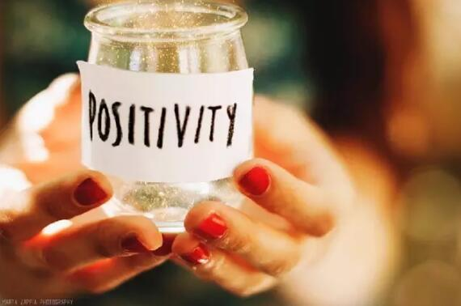

3）管理自己的情感，给自己一些积极的心理暗示。

试着对自己重复这句话：其实，这件事情，我也可以做到！试着放大自己的优点，而不是缺点。当你把某些任务做好之后，请不要吝啬对自己的奖励，这个奖励可以在一定程度上起到鼓励的作用。

4）多多体验生活，勤思考。

花点时间静下来想一想，你的人生规划是否太久没有更新了？如果是，请根据具体情况，制定出一个可行的计划，并一步一步地践行。你眼中那些强势的人，就是这么做的，为何不学习他们的这一面呢？

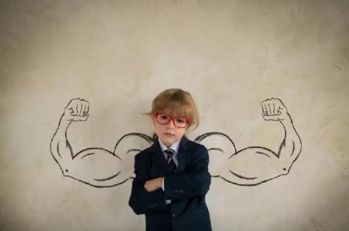

 

 

 

迎刃 『迎刃自信』系统创始人

自信沟通教练/勇气鼓励师/心理按摩师/冷幽默段子手

 

微信公众号：yingrendao 

微博/知乎：迎刃

简书/豆瓣/百度签约作者，LinkedIn专栏作者

 

研究领域：自信、人际交往、情感

 

讲道理偶尔政治不正确；讲逻辑偶尔不严谨；

非常靠谱没节操；闷骚小写直男癌。

扫一扫，改变从此开始（左：公众号
右：新浪微博）
