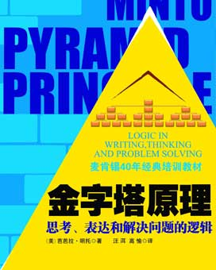

<svg xmlns="http://www.w3.org/2000/svg" xmlns:xlink="http://www.w3.org/1999/xlink" version="1.1" width="100%" height="100%" viewbox="0 0 272 340" preserveaspectratio="none">

<image width="272" height="340" xlink:href="cover.jpeg"></image>
</svg>

\

目录

[作者简介:](#part0001_split_000.html_UGI0-3340bb6b14e14d3684ab32a633de31ef)

[译者简介:](#part0001_split_002.html_sigil_toc_id_1)

[内容简介：](#part0001_split_003.html_sigil_toc_id_2)

[中文版序](#part0001_split_004.html_sigil_toc_id_3)

[为什么要学习金字塔原理](#part0001_split_004.html_sigil_toc_id_4)

[金字塔原理的基本概念](#part0001_split_004.html_sigil_toc_id_5)

[金字塔原理能够帮助你解决哪些问题](#part0001_split_004.html_sigil_toc_id_6)

[本书适合的读者对象](#part0001_split_004.html_sigil_toc_id_7)

[前言](#part0001_split_005.html_sigil_toc_id_8)

[作者未组织的思想](#part0001_split_005.html_sigil_toc_id_9)

[用金字塔结构组织的思想](#part0001_split_005.html_sigil_toc_id_10)

[本书的结构](#part0001_split_005.html_sigil_toc_id_11)

[第1篇 表达的逻辑](#part0001_split_006.html_sigil_toc_id_12)

[第1章为什么要用金字塔结构](#part0002.html_1T140-3340bb6b14e14d3684ab32a633de31ef)

[归类分组，将思想组织成金字塔](#part0002.html_sigil_toc_id_13)

[自上而下表达，结论先行](#part0002.html_sigil_toc_id_14)

[自下而上思考，总结概括](#part0002.html_sigil_toc_id_15)

[第2章金字塔内部的结构](#part0003.html_2RHM0-3340bb6b14e14d3684ab32a633de31ef)

[纵向关系](#part0003.html_sigil_toc_id_16)

[横向关系](#part0003.html_sigil_toc_id_17)

[序言的结构](#part0003.html_sigil_toc_id_18)

[第3章如何构建金字塔](#part0004.html_3Q280-3340bb6b14e14d3684ab32a633de31ef)

[自上而下法](#part0004.html_sigil_toc_id_19)

[自下而上法](#part0004.html_sigil_toc_id_20)

[初学者注意事项](#part0004.html_sigil_toc_id_21)

[第4章序言的具体写法](#part0005.html_4OIQ0-3340bb6b14e14d3684ab32a633de31ef)

[序言的讲故事结构](#part0005.html_sigil_toc_id_22)

[序言的常见模式](#part0005.html_sigil_toc_id_23)

[序言的常见模式——以咨询为例](#part0005.html_sigil_toc_id_24)

[第5章演绎推理与归纳推理](#part0006_split_000.html_5N3C0-3340bb6b14e14d3684ab32a633de31ef)

[演绎推理](#part0006_split_000.html_sigil_toc_id_25)

[归纳推理](#part0006_split_000.html_sigil_toc_id_26)

[演绎推理与归纳推理的区别](#part0006_split_000.html_sigil_toc_id_27)

[第2篇 思考的逻辑](#part0006_split_001.html_sigil_toc_id_28)

[第6章应用逻辑顺序](#part0007.html_6LJU0-3340bb6b14e14d3684ab32a633de31ef)

[时间顺序](#part0007.html_sigil_toc_id_29)

[结构顺序](#part0007.html_sigil_toc_id_30)

[程度顺序](#part0007.html_sigil_toc_id_31)

[第7章概括各组思想](#part0008_split_000.html_7K4G0-3340bb6b14e14d3684ab32a633de31ef)

[总结句避免使用“缺乏思想”的句子](#part0008_split_000.html_sigil_toc_id_32)

[总结句要说明行动产生的结果/目标](#part0008_split_000.html_sigil_toc_id_33)

[找出各结论之间的共性](#part0008_split_000.html_sigil_toc_id_34)

[第3篇 解决问题的逻辑](#part0008_split_000.html_sigil_toc_id_35)

[第8章界定问题](#part0009.html_8IL20-3340bb6b14e14d3684ab32a633de31ef)

[界定问题的框架](#part0009.html_sigil_toc_id_36)

[展开问题的各要素](#part0009.html_sigil_toc_id_37)

[发掘读者的疑问](#part0009.html_sigil_toc_id_38)

[开始写序言](#part0009.html_sigil_toc_id_39)

[实战案例](#part0009.html_sigil_toc_id_40)

[第9章结构化分析问题](#part0010_split_000.html_9H5K0-3340bb6b14e14d3684ab32a633de31ef)

[从信息资料入手](#part0010_split_000.html_sigil_toc_id_41)

[使用诊断框架](#part0010_split_000.html_sigil_toc_id_42)

[建立逻辑树](#part0010_split_000.html_sigil_toc_id_43)

[是非问题分析](#part0010_split_000.html_sigil_toc_id_44)

[第4篇 演示的逻辑](#part0010_split_000.html_sigil_toc_id_45)

[第10章在书面上呈现金字塔](#part0011.html_AFM60-3340bb6b14e14d3684ab32a633de31ef)

[突出显示文章的框架结构](#part0011.html_sigil_toc_id_46)

[上下文之间要有过渡](#part0011.html_sigil_toc_id_47)

[第11章在PPT演示文稿中呈现金字塔](#part0012.html_BE6O0-3340bb6b14e14d3684ab32a633de31ef)

[设计文字PPT幻灯片](#part0012.html_sigil_toc_id_48)

[设计图表PPT幻灯片](#part0012.html_sigil_toc_id_49)

[故事梗概](#part0012.html_sigil_toc_id_50)

[第12章在字里行间呈现金字塔](#part0013.html_CCNA0-3340bb6b14e14d3684ab32a633de31ef)

[画脑图（在大脑中画图像)](#part0013.html_sigil_toc_id_51)

[把图像复制成文字](#part0013.html_sigil_toc_id_52)

[附录1在无结构情况下
解决问题的方法](#part0014_split_000.html_DB7S0-3340bb6b14e14d3684ab32a633de31ef)

[分析性外展推理](#part0014_split_001.html_sigil_toc_id_53)

[科学性外展推理](#part0014_split_002.html_sigil_toc_id_54)

[提出假设](#part0014_split_003.html_sigil_toc_id_55)

[设计实验](#part0014_split_004.html_sigil_toc_id_56)

[附录2序言结构范例](#part0015_split_000.html_E9OE0-3340bb6b14e14d3684ab32a633de31ef)

[序言的常见形式](#part0015_split_001.html_sigil_toc_id_57)

[序言的复杂形式](#part0015_split_002.html_sigil_toc_id_58)

[介绍流程的改进](#part0015_split_003.html_sigil_toc_id_59)

[附录3
本书要点汇总](#part0016.html_F8900-3340bb6b14e14d3684ab32a633de31ef)

[第1章为什么要用金字塔结构](#part0016.html_sigil_toc_id_60)

[第2章金字塔内部的结构](#part0016.html_sigil_toc_id_61)

[第3章如何构建金字塔](#part0016.html_sigil_toc_id_62)

[第6章应用逻辑顺序](#part0016.html_sigil_toc_id_63)

[第7章概括各组思想](#part0016.html_sigil_toc_id_64)

[第8章界定问题](#part0016.html_sigil_toc_id_65)

[第9章结构化分析问题](#part0016.html_sigil_toc_id_66)

[第10章在书面上呈现金字塔](#part0016.html_sigil_toc_id_67)

[第11章在PPT演示文稿中呈现金 字塔](#part0016.html_sigil_toc_id_68)

[第12章在字里行间呈现金字塔](#part0016.html_sigil_toc_id_69)

LOGIC IN WRITING,THINKING AND PROBLEM SLOVING

麦肯锡40年经典培训教材

金字塔原理

思考、表达和解决问题的逻辑

(美〕芭芭拉•明托◎著  汪洱 高愉◎译

\

## 作者简介:

 芭芭拉•明托

毕业于哈佛大学，麦肯锡公司第一位女咨询顾问。
传授金字塔原理近40年，帮助政府、企业、高校等 各界人士写作商务文章、复杂报告和演示文稿，曾为美 国、欧洲和亚洲众多企业及哈佛大学、斯坦福大学等讲 授金字塔原理。

《金字塔原理》畅销40年不衰，广受欢迎，被译成
多种文字，数次再版，常年名列各国畅销书排行榜。 

## 译者简介: 

汪洱\

•15年企业中高管，7年人力资源总监，注册管理咨询师。

•16年管理咨询和培训经验，〈金字塔原理：逻辑思维与
表达呈现》、《公文写作\>
及《培训演讲技能》专业培 训师，培训300多场10万人，客户有中国银行、中国移 动、中国电信、中海油、中航工业、松下电器、LG等。

•中央电视台《东方时空》节目顾问。

•参与出版著作、译著、录像专辑32部，600万字。

•联系方式：13301281248 <wanger222@yahoo.com.cn> wanger8@l 26.com 

博客、讲课视频：<http://blog.sina.com.crvWanger2>

高愉  

•毕业于中国人民大学，曾任职于美国科闻100公关咨询
公司、友邦保险、松下电器、中信证券、LG电子，曾在 欧洲、加拿大学习和工作。

•《金字塔原理：逻辑思维与表达呈现》、《公文写作》
及〈培训演讲技能〉专业培训师。

•参与出版〈金字塔原理〉《服务型领导》《人力资源管
理人员职业发展指南》《21种领导人》 等译著、著作 5部。

•联系方式：1381 1886550  yugaol <30@yahoo.com.cn> <gaoyu62@gmail.com>

## 内容简介：

金字塔原理楚一种重点突出、逻辑淸
晰、主次分明的逻辑思路、表达方式和 规范动作。

•金字塔的基本结构是：中心思想明确，结论先行，以上统下，归类分组，逻辑
递进；先重要后次要，先全局后细节， 先结论后原因，先结果后过程。

•金字塔训练表达者：关注、挖掘受众的意图、需求、利益点、关注点、兴趣点
和兴奋点，想清内容说什么、怎么说， 掌握表达的标准结构、规范动作。

•金字塔帮助达到沟通的效果：重点突出，思路清晰，主次分明，让受众有兴趣、能
理解、能接受、记得住。

•搭建金字塔的具体做法是：自上而下表达，自下而上思考；纵向疑问回答/总
结概括，横向归类分组/演绎归纳；序言讲故事，标题提炼思想精华。

没有什么比一套好理论更有用了。

——库尔特•勒温

### 

## 中文版序

“想清楚，说明白，知道说什么、怎么说”，是我们希望达到的境界。当
我们与人沟通时，需要想清楚3件事：谁是我的听众？他们想听什么？他们 想怎样听？

《金字塔原理》介绍了一种能清晰地展现思路的有效方法。掌握了金字
塔原理，就能重点突出，逻辑清晰。不管是在政界、商界、学界，还是在企 事业单位，所有高、中、基层职场人士，只要你需要思考和沟通，就会从金 字塔原理受益。金字塔结构思考力是领导力的必要素质，本书是训练思考、 使表达呈现逻辑性的实用宝典。

### 为什么要学习金字塔原理

我们都希望在思考、沟通交流、管理下属和解决问题时，重点突出，思
路清晰，层次分明。我们评价人时，有一个标准是逻辑思维能力，而逻辑思 维能力的标准又是什么？我们指导别人“要逻辑清晰、条理分明”，可怎样 才能做到“逻辑清晰”？怎样才能提高思考能力，养成良好的思维习惯？

我们希望在表达（写作、讲话和培训）时，能说到点子上，正面回答受
众（读者、听众和学员）的问题。那么你知道如何搭建框架结构、组织语句 的顺序，用最短时间讲清观点，让受众有兴趣、能理解、记得住？

我们还希望，组织中的全体成员能用统一的逻辑、结构和方式交流，快速产生共鸣，达成共识，那么是否有规范可寻?
答案就是一使用逻辑清晰的金字塔结构!

### 金字塔原理的基本概念

•金字塔原理是一种重点突出、逻辑清晰、层次分明、简单易懂的思考
方式、沟通方式、规范动作。

•金字塔原理的基本结构是:结论先行，以上统下，归类分组，逻辑递进。
先重要后次要，先总结后具体，先框架后细节，先结论后原因，先结 果后过程，先论点后论据。

•金字塔原理训练表达者：关注、挖掘受众的意图、需求点、利益点、
关注点和兴趣点，想清说什么（内容），怎么说（思路、结构），掌握 沟通的标准结构、规范动作。

•金字塔能够达到的沟通效果：观点鲜明、重点突出、思路清晰、层次分明、简单易懂，让受众有兴趣，能理解，记得住。

•搭建金字塔结构的具体做法是：自上而下表达，自下而上思考，纵向
总结概括，横向归类分组，序言讲故事，标题提炼思想精华。

### 金字塔原理能够帮助你解决哪些问题

学习金字塔原理课程，会使用金字塔结构思考、表达、管理下属和解决
问题，提髙逻辑性、条理性，准确高效阐述思想。掌握规范动作，组织中所 有人用相同思路和表达方式交流，沟通效果好、效率高。

•思考:学会用右脑、左脑思维，提高结构化思维能力，思考全、准、快。

•书面表达、公文写作:会挖掘读者的关注点、兴趣点、需求点、利益点，
能使用金字塔的4个原则，搭建逻辑清晰的常用公文框架结构（通知、 请示、工作计划、工作总结、会议纪要、报道)，掌握写序言的四要素、 归类分组的MECE原则，能够重点突出、逻辑清晰、简明扼要，让人 看得懂、愿意看、记得住。快速写文章，缩短写作时间，减少修改次数。

•口头表达：说话、演讲、讲课，能够使用金字塔的基本原则，回答听
众最常有的4类疑问：“是什么？为什么？如何做？好不好？”表达时 重点突出、条理清晰，让人愿意听、听得懂、记得住，成为思路清晰、言简意赅的人。

•管理下属：能够运用金字塔原理，考虑全面、周到、严谨，分配任务、
设计流程不重叠无遗漏。

•培训师开发课程和讲课：会使用金字塔搭建框架结构、组织素材、重点
突出、逻辑清晰、通俗易懂。

### 本书适合的读者对象

所有希望提高思考、讲话、写作、讲课、管理下属及解决问题逻辑性、
条理性、效果和效率的人。

高愉 汪洱

2010年6月于北京

## 前言

我曾出版过一套关于“金字塔原理”（The Pyramid Principle)的书，
全套共6册，介绍了一种可以解决写作思路不清晰问题的有效方法。我在书 中提到，条理清晰的文章一眼就能够看出来，因为这种文章都具有清晰的金 字塔结构（pyramidal
structure),而条理不清晰的文章则肯定没有金字塔 结构。

在金字塔结构中，各种思想之间只有非常少的几种逻辑关系（向上、向
下或横向联系），这种简单性使我们有可能找到这些逻辑关系的通用规则。 —个人要想写出条理清晰的文章，关键是在开始写作前，先将自己的思想组 织成金字塔结构，并按照逻辑关系的规则检査和修改。

以上观点是我在麦肯锡国际管理咨询公司（McKinsey & Company)
的克利夫兰和伦敦分公司工作时总结出来的。麦肯锡公司从哈佛商学院招收 的8名女学员中，聘请我作为该公司的第一位女咨询顾问。不久，麦肯锡公 司就认定我在写作方面是一把好手。于是派我去伦敦，帮助那些需要用英语 写报告的欧洲人。

有意思的是，当开始研究写作方面的资料时，我发现，虽然有很多关于
如何写句子和段落的书，却几乎没有关于如何组织思想的书，而思想才是句 子和段落要表达的内容！仅有的几本涉及逻辑思路的书，泛泛地谈到了“要 有逻辑性”、“要有一个有逻辑性的提纲”之类的东西。看完这些资料，我还 是不知道究竟如何才能将“有逻辑性”的提纲和“没有逻辑性”的提纲区别 开来，于是我便开始自己寻找实用的方法。我发现了金字塔原理。

金字塔原理适用于任何需要构建清晰逻辑的文章。下面举一个很简单的
例子，来看看按金字塔结构组织的思想和未经过组织的思想，在表达效果上 会产生多大的差异。

### 作者未组织的思想

约翰•科林斯来电话说他不能参加下午3点会议了。哈尔•约翰逊说他
不介意晚一点开会，明天开也可以，但明天10:30以前不行。唐克利福德的 秘书说，唐克利福德明天晚些时候才能从法兰克福赶回来。会议室明天已经 有人预订了，但星期四还没有人预订。会议时间定在星期四上午11点似乎比 较合适。您看行吗？

\

### 用金字塔结构组织的思想 

今天的会议可以改在星期四上午11点开吗？因为这样对科林斯和约翰逊 都更方便，唐克利福德也能参加，并且本周只有这一天会议室还没有被预订。

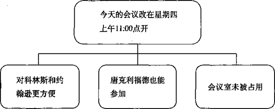

1967年还很少有人接受我的理论，但是麦肯锡公司的一些智者却慷慨地
指出了我的理论中存在的问题，帮助我改进。现在，金字塔原理已经成为麦 肯锡公司的标准，并被麦肯锡看做是其公司理念和规范的重要组成部分。

后来，我离开了麦肯锡，开始向各行各业的人宣传我的理论。截至目
前，我已向全世界约1万人讲授过金字塔原理，他们中既有来自管理咨询公 司的人，也有社会各界人士。我曾在1981年和1987年出版了本书的两个较早 版本，录制了一套录像教程，开发了一套计算机教学课件，后来我还推出了 新版的录像教程。

我高兴地看到，由于我的努力，金字塔原理已经成为咨询业的实际行业
标准，其中的一些基本规则，也被社会各界的许多课程吸纳，并广为传授。

在不断的教学过程中，包括在修订新版录像教程的过程中，我又有了新
的发现，这有助于我进一步充实和完善原理论的各个部分。我还发现，金字 塔原理除了能够帮助人们以书面形式组织和表达思想外，还具有更广泛的用 途。从具体的方面说，金字塔原理可用于界定问题、分析问题；从更广泛的 方面说，金字塔原理可以用来指导组织和管理整个写作过程。

本书是金字塔原理的最新版本，收录了我从1987年至今获得和发现的所
有关于思维表达方面的体会和技巧。与旧版本相比，本书增加了一些新的章 节，如介绍如何界定问题和分析问题，以及如何从呈现的角度出发，在书面 上和演示文稿中呈现金字塔结构。

### 本书的结构

本书分为4个部分。

**第1篇表达的逻辑**
与以前的版本区别不大，介绍了金字塔原理的基本概念，以及如何利用这一原理构建基本的金字塔结构。本篇的内容足以使你 理解和应用简单的公文写作技巧。

**第2篇思考的逻辑** 介绍了如何深人细致地把握思维的细节，以保证你
使用的语句真实、明确地呈现你希望表达的思想。本篇举了许多案例，突出 了迫使自己进行“冷静思考”对明确阐述思想的重要性。

**第3篇解决问题的逻辑**
读者对象是需要写研究报告的人，以及需要分析复杂问题、提出结论以作出决策的人。本篇介绍了如何在解决问题过程
的不同阶段，使用多种框架组织分析过程，使你的思路实际上进行了预先组 织，从而可以更方便地应用金字塔原理。

**第4篇演示的逻辑** 介绍了设计PowerPoint演示幻灯片的技巧，可以帮
助你在用演示文稿呈现具有金字塔结构的思想时，使读者或观众感受到金字 塔结构。

本书还有3个附录。

附录1 介绍了分析法和科学法在解决问题过程中的应用和区别；

附录2 介绍了序言中的各种常用模式；

附录3 详细总结概括了本书的要点，高度概括了金字塔原理的主要概念
和思维技巧，方便读者快速査阅。

实际应用金字塔原理需要相当的毅力。但是，如果你有意地以书中介绍
的方法强迫自己“先想后写”，你的写作能力肯定能够得到惊人的改善，使 你能够：

1\. 缩短完成最终一稿通常所需的时间；

2\. 提高文章的条理性；

3\.
缩短文章的长度。最终的结果是，使你能够在最短的时间内写出简明 扼要、思路清晰的文章。

芭芭拉•明托 

1996年于伦敦

# 第1篇 表达的逻辑

我们在工作中遇到的最不爽的事情可能就是写东西，或做长篇演讲。几
乎所有人都认为写东西是令人头痛的事，大家都希望自己能够更“善于写”。 许多人还得到忠告：如果他希望事业发展更快，就必须提高沟通和表达的能 力，包括口头沟通能力一培训讲课能力、演讲能力，和书面沟通能力一 写作能力。

很多人难以提高写作能力和讲话能力的原因，是他们认为“写得更清楚
一些”意味着使用更简单、更直接的句子。事实上，人们在写文章时的确会 经常使用过长的句子，句子结构也过于繁琐，使用的语言经常过于学术化， 过于抽象，段落中的句子顺序有时也很混乱。

以上这些问题都属于写作风格的范畴。对于一个成年人来说，改变写作
风格的难度太大了。这不是因为大家无法改变写作风格，而是因为改变写作 风格就像学习打字，需要大量的重复练习，而多数正在企业和政府工作的人 根本没有那么多时间。因此，他们还会不断地受到“写得再清楚一点”之类 的忠告。

但是，文章条理不清还有一个比上面提到的原因更常见、但也更容易改
进的原因，即文章的结构（structure)——也就是句子的组织顺序（不管句 子本身写得是好是坏)。如果读者认为你的文章条理不清，很可能是因为你 表达思想的顺序与读者的理解力发生了矛盾。

对受众（包括读者、听众、观众或学员）来说，最容易理解的顺序是：
先了解主要的、抽象的思想，然后了解次要的、为主要思想提供支持的思 想。因为主要思想总是从次要思想概括总结得出，文章中所有思想的理想组 织结构也必定是一个金字塔结构——由一个总的思想统领多组思想。在这种 金字塔结构中，思想之间的联系方式可以是纵向的（vertically)——即任 何一个层次上的思想都是对其下面一个层次上思想的总结；也可以是横向的 (horizontally)——即多个思想因共同组成同一个逻辑推理过程，而被并列 排在一起。

你可以很容易地使受众理解用金字塔结构组织的思想：先从金字塔的最
顶端开始，沿各个分支向下展开。首先表达的主要思想，使受众对表达者的 观点产生某种疑问，而主要思想（金字塔结构中的）下一层次上的思想将回 答这些疑问。通过不断进行疑问/回答式的对话，受众就可以了解文章中的 全部思想。

对文章阐述的思想作出疑问/回答式反应是人类的一种自然反应，没有
国籍和民族的区别。人类还有一个共同的特点，即只有用某种方式将思想表 达出来一说出来或者写下来，我们才能够准确地把握自己的思想。人类弄 清自己思想所需要用的结构也是金字塔结构。因此，作者或讲话者在强制自 己将思想组织成金字塔结构后会发现，准确把握自己的思想，有助于自己写 出条理清晰、意义明确的文章。

本篇解释了为什么受众最容易理解和记住金字塔结构，以及组成金字塔
的子结构之间如何互相关联；介绍了如何利用金字塔结构梳理需要写入文章 的思想，如何为这些思想确定清晰的相互关系；详细分析了序言的逻辑，并 澄清了演绎推理和归纳推理这两个容易让人混淆的概念。

本篇将帮助你了解如何将要表达的思想组织成金字塔结构，说明了使用
金字塔原理能够检查你的思想的有效性、一致性和完整性，还能够让你发现 遗漏的思想，并帮助你创造性地拓展自己的思路。

## 第1章为什么要用金字塔结构

如果受众希望通过阅读你的文章、听你的演讲或培训，来了解你对某一
问题的观点，那么他将面临一项复杂的任务。因为即使你的文章篇幅很短， 比如只有两页纸，文章中也会包括大约100个句子。读者必须阅读、理解每 一句话，并且寻找每句话之间的联系，前前后后反复思考。如果你的文章结 构呈金字塔形，文章的思路自金字塔顶部开始逐渐向下展开，那么读者肯定 会觉得你的文章比较容易读懂。这一现象体现了人类思维的基本规律：

•大脑自动将信息归纳到金字塔结构的各组中，以便于理解和记忆。 

•预先归纳到金字塔结构中的沟通内容，都更容易被人理解和记忆。 

•你应有意地将沟通内容组织成金字塔结构，包括口头表达和书面 表达一说话、培训、演讲、报告、述职和写文章、总结、申请、 方案、计划等。

下文具体介绍如何将思想组织成金字塔结构。

### 归类分组，将思想组织成金字塔

人类很早以前就认识到，大脑会自动将发现的所有事物以某种秩序组织
起来。基本上，大脑会认为同时发生的任何事物之间都存在某种关联，并且 会将这些事物按某种逻辑模式组织起来。举个例子，古希腊人眺望星空时， 看到的是由星星组成的各种图案，而不是散乱的星星。这个例子证明人脑具 有对事物进行归类组织的特点。

大脑会将其认为具有“共性”的任何事物组织在一起。“共性”指的是
具有某种相似的共同点或所处的位置相近。再看图1-1的一个例子：

图1-1  “共性”的一个例子

无论是谁，一看到上面的6个黑点，都会认为共有两组黑点，每组3个。
造成这种印象的原因主要是，有些黑点间的距离比另一些黑点间的距离大。

将事物组成逻辑单元无疑具有很大的作用。为了说明这一点，请看下面
几组彼此之间并无关联的词：

|      |     |        |
|------|-----|--------|
| 湖泊 | I   | 糖     |
| 靴子 | I   | 盘子   |
| 女孩 | I   | 袋鼠   |
| 铅笔 | I   | 汽油   |
| 宫殿 | I   | 自行车 |
| 铁路 | I   | 大象   |
| 书本 | I   | 牙骨   |

现在，你试着设想一个可能使每两个词发生联系的情景，联想并将其“组
织”在一起，譬如：糖在湖水中溶解，或靴子立在盘子上，等等。然后将右 边的一列词盖住，只看左边一列词。你是否还能够记起右边对应的词？大多 数人都可以毫不费力地做到这一点。

当你听别人讲话或看文章时，也会发生类似的组织思想的现象。你会将
同时出现的或位置相邻的几个思想相联系，努力用某种逻辑模式组织它们。 这种逻辑模式必定是金字塔结构，因为只有金字塔结构才能够满足大脑的两 个需求：

•一次记忆不超过7个思想、概念或项目。

•找出逻辑关系。

**奇妙的数字“7”**

人一次能够理解的思想或概念的数量是有限的。举个例子，假设你决定
离开温暖舒适的家，出去买一份报纸。

“我想去买份报纸，你有什么要我带的东西吗？”

妻子在你走向衣架拿外衣时说：

“太好了，看到电视上那么多葡萄的广告，我现在特想吃葡萄，也
许你可以再买袋牛奶。”

你从衣架上拿下外衣，妻子则走进了厨房。

“我看看咱们家的土豆够不够。对了，我想起来了，咱们已经没有
鸡蛋了。我看看，对，是该买一些土豆了。”

你穿上外衣向门口走去。

“再买些胡萝卜，也可以买些橘子。”

你打开房门。

“还有咸鸭蛋。”

你开始按电梯。

“苹果。”

你走进电梯。

“再买点儿酸奶。”

“还有吗？”

“没有了，就这些了。”

如果不重新读一遍上面的文字，现在你还能记住妻子让你买的9样东西
吗？大多数男人回家时可能只买了报纸和葡萄。

出现这种情况的主要原因是你遇到了 “奇妙的数字7”。这个术语是由 乔治• A
•米勒在他的论文《奇妙的数字7
±2》中提.出的。米勒认为，大脑 的短期记忆无法一次容纳约7个以上的记忆项目。有的人可能一次能记住9个 项目，而有的人则只能记住5个。大脑比较容易记住的是3个项目，当然最容 易记住的是1个项目。

这就意味着，当大脑发现需要处理的项目超过4个或5个时，就会开始将
其归类到不同的逻辑范畴中，以便于记忆。在上面的例子中，大脑很可能会 将需要购买的物品按超级市场的不同区域归类。

**归类分组搭建金字塔**

为了说明这种方法的作用，请看以下采购清单。每看到一种食品时，就
按以上方法将其归类。这样就很可能够记住所有的9种食品：

|        |        |
|--------|--------|
| 葡萄   | 橘子   |
| 牛奶   | 咸鸭蛋 |
| 土豆   | 苹果   |
| 鸡蛋   | 酸奶   |
| 胡萝卜 |        |

如果你试着想象一下这个过程，就会发现，你已经建立了几个在各项目
之间有逻辑关系的金字塔结构，如图1-2所示：

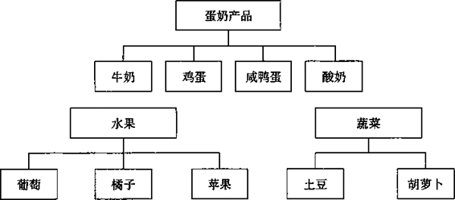

图1-2在各项目之间有逻辑关系的金字塔结构

**找出逻辑关系，抽象概括**

仅以逻辑方法将思想或概念分组是不够的，还必须找出其逻辑关系。分
类的作用不只是为了将一组9个概念，分成每组各有4个、3个和2个概念的3 组概念，因为这样合起来还是9个概念。你所要做的是提高一个抽象层次， 将大脑需要处理的9个项目变成3个项目。

这样做以后，你无须再记忆9个概念中的每一个概念，而仅需要记忆9个
概念分别所属的3个组。这样，你的思维的抽象程度就提高了一层。由于处 于较高层次上的思想总是能够提示其下面一个层次的思想，而且这种关系不 像前面的例子中编造的湖泊与糖的关系那样牵强，因而也更容易记住。

所有的思维过程（如：思考、记忆、解决问题）显然都在使用这种分组
和概括的方法，以将大脑中的信息组成一个由互相关联的金字塔组成的巨大 的金字塔群。如果你需要与习惯用这种思维方式的人交流，你要做的就是确 保你所说的内容符合其金字塔体系中的某一部分。

现在谈一谈实际的表达呈现问题。如果你清楚地“了解”这些思想或概
念组，那么，将这些思想或概念组与别人交流，要使对方同样“了解”这些 思想或概念组。正如前面买东西的例子一样，你只能一项一项地提出各个概 念。但是，研究发现，最有效的表达方法是:先提出总的概念，再列出具体项目， 即要自上而下地表达思想。

### 自上而下表达，结论先行

理清表达思想的顺序，是写出条理清晰文章的最重要方式，而清晰的顺
序，就是先提出总结性思想，再提出被总结的具体思想。先总结后具体的表 达顺序，你必须牢记。

受众的大脑只能逐句理解作者（演讲者、培训讲师）表达的思想。他们
会假定一同出现的思想在逻辑上存在某种关系。如果你不预先告诉他们这种 逻辑关系，而只是一句一句地表达你的思想，读者就会自动从中寻找共同点， 将你所表达的思想归类组合，以便了解各个组合的意义。

由于受众的知识背景和理解力千差万别，他们很难对你所表达的思想组
作出与你完全一样的解读。事实上，如果你不预先告诉读者某一组思想之间 的逻辑关系，他们很有可能会认为某一组中的思想之间根本没有任何关系。 退一步说，即使受众能够作出与你完全一样的解读，你也增加了他们阅读的 难度，因为他们必须自己找出这种你没有提前说明的逻辑关系。

下面我举例说明，除自上而下的顺序外，任何其他顺序都可能造成误解。
假设我和你正在酒吧喝酒，突然我对你说：

“上个星期我去了趟苏黎世。你知道,苏黎世是一个比较保守的城市。
我们到一家露天餐馆吃饭，你知道吗？在15分钟里我至少见到了
15个 留长胡子的人。”

我说这番话是向你传递了一个信息，但是我并没有意识到，你会主动地
推测我向你传递这个信息的原因。也就是说，你会将我说的这番话看做是一 组还未表达出的思想的一部分，你会假设某种可能的原因，并据此调整你的 思路，准备接着听后面的话。这种预期性的准备能够减轻大脑分析信息的负 担，因为你没必要分析随后接收的每一个信息的所有特征，而只需寻找与前 面信息相同的特征即可。

于是，你可能会认为，“她在谈论苏黎世已经变得不再保守”，或“她准
备把苏黎世与其他城市作比较”，甚至“她很喜欢男人的长胡子”。无论你有 什么反应，你的大脑都在等待以上话题进一步的信息，而不管后续实际的信 息如何。我看到你一脸茫然，就接着说：

“而且，如果你在纽约的任何一座写字楼周围转一转，你会发现几乎没有不留长胡子或长头发的人。”

现在我想表达什么意思呢？我似乎并不是在比较城市，倒像是在比较城
市中的职场白领们；而且我想表达的似乎也不只是胡子，还包括各种面部毛 发。这时你也许会认为，“也许她不喜欢男人留长胡子；也许她想比较不同 职场白领留胡子的方式；也许她对正规机构如此容忍员工留胡子感到奇怪”。 不管怎样，你含混地嘟哝了几句，箅是对我说的话的反应，于是我不得不接 着说下去：

“当然，留长胡子在多年以前就已经是伦敦街头的一景了。”

“噢，”你想，“我终于明白她想说什么了。她想说伦敦在这方面比其他
城市更开放。”于是你把你理解的意思告诉了我。你的理解在逻辑上完全合理， 但根本不是我想表达的意思。实际上，我想表达的意思是：

你知道吗？我简直难以相信，在商业界，男人留长胡子或长头发已经这样普遍，这样被广泛接受：

在苏黎世……

在纽约……

还有，在伦敦……

看，一旦告诉你判断每句话之间关系的框架，你就可以很容易地用我希
望你采取的方式理解我表达的这组思想。读者在接受信息时，总是在寻找一 种能够将所摄入信息联系起来的结构。为了保证读者找到的结构就是你希望 他釆纳的结构，你必须提前把这种结构告诉他一这样他就知道要寻找哪个 共同点。否则，读者很可能会发现某些并非你希望的逻辑关系，甚至可能根 本发现不了任何逻辑关系，这样既是在浪费你的时间，也是在浪费读者的时 间。

请看下面这篇关于男女同工同酬文章的开头。这个例子就是一个读者找
不到逻辑关系的例证：

即使女员工能与男员工一样得到同工同酬待遇，女员工的处境也可
能比以前差——与现在相比，女员工和男员工的平均收入的差距将不会 缩小，反而会加大。

对雇主来说，同工同酬指的是，为相同的岗位或相同的工作价值支
付相同的报酬。

采用任何一种解释都意味着：驱使雇主为自身利益采取行动；或者
通过多雇用男员工抵制限制性措施。

虽然这段文字的作者自认为是“自上而下”表达的，但这段文字向你提
供的5种思想之间并无清晰的逻辑关系。你是不是为了试图找到各种思想之 间的联系而绞尽脑汁，最后仍不得不因为实在找不到相互联系而愤然放弃？ 这种繁重的思考负担是常人难以承受的。

无论读者的智商有多高，他们可利用的思维能力都是很有限的。一部分
思维能力用于识别和解读读到的词语，另一部分用于找出各种思想之间的关 系，剩下的思维能力则用于理解所表述思想的含义。

你可以通过有效的方法表达你的思想，减少读者用在前两项活动上的时
间，从而使读者能够用最少的脑力理解你表达的思想。相反，如果读者必须 不断地在上下文中寻找某种联系，那么这种呈现思想的顺序就是不适当的， 大多数读者也会对不断寻找句子之间的逻辑关系感到厌烦。

。。。。。。。。。。。。。。。。。。。。。。。。。。。。。。。。。。。。

**提示**

读者会将读到的思想进行归类分组和总结概括，以便记住。

如果作者传达给读者的思想已经事先进行了归类和概括，并且按自上而
下的顺序呈现，读者就能更容易理解作者表达的思想。以上说明，条理清晰 的文章应当具有金字塔结构，并且不断“自上而下”地向读者传递信息（虽 然在开始写作时作者的思路是“自下而上”的）。

。。。。。。。。。。。。。。。。。。。。。。。。。。。。。。。。。。。。\

### 自下而上思考，总结概括

如果你将所有的信息进行归类分组、抽象概括，并以自上而下的方式表
达出来，那么你的文章结构会如图1-3所示。每个方框代表你希望表达的一 个思想。    .

中心思想

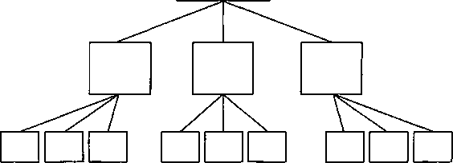

图1-3文章中的思想应组成单一思想统领下的金字塔结构 

你的思维从最底部的层次开始，将句子按照某种逻辑顺序组成段落，然后将段落组成章节，最后将章节组成完整的文章，而代表整篇文章的则是金
字塔最顶端的一个思想（中心思想、核心观点)。

如果仔细想一想你在写作时的实际思考过程就会发现，你在总结主要思
想时的确使用了这种自下而上的方式。在金字塔结构的最底层，你将包含单 个思想或概念的句子组织成段落。

假设你要将6个句子组织成一个段落。为什么你要将这6个句子组织在一
起，而不包括其他句子？原因很明显，就是你认为这6个句子之间具有某种 逻辑关系，而这种逻辑关系总是要求所有6个句子共同解释或支持由其组成 的段落所表达的单一思想（即对这6个句子的准确概括）。举个例子，你不 能将5个关于金融的句子和1个关于网球的句子组织在一起，因为它们之间的 关系难以用一个概括性的句子表达。

得出这个概括性的句子后，你思维的抽象程度就提高了一个层次，可以
将得出概括性句子的段落看做只包含一个思想，而不是6个思想。通过这种 有效的方法，你可以接着将3个段落（每个段落都包含一个抽象程度比单个 句子高一个层次的单一思想）组织成一个章节。

你将这3个段落而不是其他段落组织在一起，也是因为你认为这3个段落
之间存在某种逻辑关系，而这种逻辑关系总是要求所有这3个段落共同解释 或支持由其组成的章节所表述的单一思想（即对这3个段落的概括）。

将章节组织成文章也完全按照以上思路进行。你将3个章节（每个章节
都由一组段落组成，而每个段落也都由一组句子组成）组织在一起，因为所 有这3个章节必须共同支持由其组成的文章所表述的单一思想（即对这3个章 节的概括）。

因为你总是要不断地对思想进行归类和概括，直到没有可与之关联的思
想可以继续概括，因此，你写的每一篇文章的结构必定只支持一个思想，即 概括了所有各组思想的单一思想。这一思想应当就是你希望表达的思想，而 所有在其之下的思想则越往下越具体、越详细（如果你正确构建了文章的结 构)，并且都对你希望表达的主题思想起着解释和支撑的作用。

你可以通过检查你的思想是否用金字塔结构相互关联，从而确定你是否正确地构建了文章的结构。

。。。。。。。。。。。。。。。。。。。。。。。。。。。。。。。。。。。。

**提示**

金字塔中的思想以3种方式互相关联——向上、向下和横向。位于一组
思想的上一个层次的思想是对这一组思想的概括，这一组思想则是对其上一 层次思想的解释和支持。

文章中的思想必须符合以下规则：

!.纵向：文章中任一层次上的思想必须是其下一层次思想的概括。

2\. 横向：每组中的思想必须属于同一逻辑范畴。

3\. 横向：每组中的思想必须按逻辑顺序组织。

。。。。。。。。。。。。。。。。。。。。。。。。。。。。。。。。。。。。\

下面解释一下文章中的思想为什么“必须”符合这些规则。

1\. 文章中任一层次上的思想必须是对其下一层次思想的总结概括

这一条规则说明，你在思维和写作中的主要活动，就是将较具体的思想
概括抽象为新的思想。正如上文提到的，段落的主题就是对段落中各个句子 的概括，章节的主题也是对章节中各个段落的概括，依此类推。

但是，如果你准备从一组句子或段落中概括出一个主题，那么首先这些
句子组或段落组必须经过适当组织。这就要求有第二条和第三条规则。

2\. 每组中的思想必须属于同一逻辑范畴

如果你希望将某一组思想的抽象程度提高一个层次，那么这一组中的思
想必须在逻辑上具有共同点。例如，你可以符合逻辑地将苹果和梨归类概括 为水果，也可以将桌子和椅子归类概括为家具。但是怎样才能将苹果和椅子 放在同一组中呢？仅仅提高一个抽象层次是不够的，因为上一个抽象层次是 水果和家具的范畴。因此，你必须提高到更高的层次，将其概括为“物品” 或“无生命物体”，但是这样的概括过于宽泛，难以说明该组思想之间的逻辑关系。

在写作中，你希望表达的思想就是每组思想的逻辑关系直接蕴涵的思想，
也就是说，每组中的思想都必须属于同一逻辑范畴。因此，如果某组思想中 的第一个思想是做某件事的一个原因，那么该组中的其他思想也必须是做同 样一件事的其他原因。如果某组中的第一个思想是某项过程的一个步骤，那 么该组中的其他思想也必须是同一过程中的其他步骤。如果某组中的第一个 思想是某公司面临的一个问题，那么该组中的其他思想也必须是与之相关的 问题。依此类推。

检查你将思想分组的一个简便方法，就是你是否能够用单一名词表示该
组的所有思想。根据这一方法，该组中的所有思想都可以被冠以“建议”、“原 因”，或“问题”、“需作出的改变”等名词。思想的种类没有限制，但每一 组中的思想都必须属于同一范畴，都必须能够用单一名词表示。本书第2篇 的第6章和第7章将进一步阐述如何确保将相同范畴的思想组织在一起。

3.每组中的思想必须按照逻辑顺序组织

必须有明确的理由说明为什么把第二个思想放在第二位，而不是放在第
一位或第三位。本书第6章将详细介绍如何确定适当的逻辑顺序。

。。。。。。。。。。。。。。。。。。。。。。。。。。。。。。。。。。。。。

提示

组织思想基本上只可能有4种逻辑顺序：

•演绎顺序：大前提、小前提、结论 

•时间（步骤）顺序：第一、第二、第三 

•结构（空间）顺序：波士顿、纽约、华盛顿 

•程度（重要性）顺序：最重要、次重要，等等

你选择的逻辑顺序展现了你在组织思想时的分析过程。如果思想的组织
方式是演绎推理，那么这些思想的逻辑顺序就是演绎顺序；如果思想按因 果关系组织，那么其逻辑顺序就是时间顺序；如果是对某种现有结构进行评 论，那么其逻辑顺序就是结构顺序；如果按类别组织思想，那么其逻辑顺序 就是程度顺序(重要性顺序）。因为演绎推理、发现因果关系、化整为零和 归纳总结是大脑可进行的仅有的4种分析活动，这4种顺序也是大脑可用于组 织思想的仅有的4种顺序。

因此，写出条理清晰文章的关键，就是在你开始写作之前，先将你的思
想放入金字塔结构中，并根据以上规则进行检验。如果不能符合以上任何规 则，就说明你的思路存在问题，或去你的思想还没有得到充分完善，或者你 组织思想的方式不能立刻让读者理解你表达的信息。这时，你应该调整自己 的思路，以使其符合金字塔原理的规则，从而免去反复改写文章的麻烦。

## 第2章金字塔内部的结构

如第1章所述，条理清晰的文章所表达的各思想之间都具有明确的逻辑
关系，组成总体上的金字塔结构，如图2-1所示。

中心思想

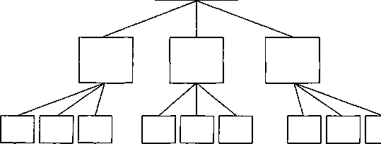

图2-1 文章中的思想应组成单一.思想统领下的金字塔结构

这样的文章总是自金字塔的顶端开始，自上而下地沿着各个分支将作者
的思想一层一层呈现给读者。

由于金字塔结构的规则非常明确，如果在开始写作之前，你就已经完全
清楚你想表达的思想，你就可以容易地将要表达的思想组织成规范的金字塔

结构。但是，大多数人在刚坐下来开始写作时，可能对自己想表达的思想还
只有模糊的想法，甚至根本不知道从哪里下笔。在你不得不用词汇或句子将 思想呈现出来之前，你很可能难以准确地把握自己的思想。甚至连你认为已 经构思好的第一个思想，写出来时可能都不很准确。

因此，不要幻想一坐下来就开始将思想组织成金字塔。首先你必须梳理
你想要表达的思想。

。。。。。。。。。。。。。。。。。。。。。。。。。。。。。。。。。。。。。

提示

金字塔中的子结构，能够加快你梳理思想的过程：

•主题与子主题之间的纵向关系 •各子主题之间的横向关系

•序言的叙述方式    .

。。。。。。。。。。。。。。。。。。。。。。。。。。。。。。。。。。。。。

下面将详细解释这些逻辑关系。在第3章，我还将介绍如何利用这些逻
辑关系发现、分类和梳理思想，以便你自己和你的读者、听众或学员都能清 楚地理解你的思想。

### 纵向关系

有些很明显的事实可能也需要经过很长时间才能被人们所认识。一个典
型的例子就是阅读的过程。一般的文章都是一维的（one-dimensional):
— 个句子接着一个句子，在纸面上基本呈现出纵向向下的结构。但是这种文字 的纵向延伸却掩盖了一个事实，即思想是位于不同的抽象层次上的。根据这 一事实，大主题下的任何思想都同时与文章中的其他思想发生着纵向及横向 的联系。

纵向联系能够很好地吸引读者的注意力。通过纵向联系，你可以引导一
种疑问/回答式的对话，从而使读者带着极大兴趣了解你的思路进展。为什 么可以肯定读者会感兴趣？因为这种纵向联系会迫使读者按照你的思路产生 符合逻辑的反应。

你放在金字塔结构每一个方框中的就是一个“思想”。在本书中，我将“思
想”定义为“向受众发出新信息并引发受众疑问的语句”。（人一般不会阅读 自己已经了解的内容，因此，也可以说，表达思想的主要目的就是向受众传 递新的信息。）

为了向受众传递新的信息而作的表述，必然会使对方就其逻辑性产生疑
问，例如，“为什么会这样”、“怎样才能这样”，或者“为什么你这样说”。 作为文章的作者，你必须在该表述的下一个层次上横向地回答读者的疑问。 但是，你的回答仍然是向读者传递他不知道的新信息，这又使读者产生新的 疑问，于是你又在再下一个层次回答读者新的疑问。

你将不断地按照“引起读者疑问并回答疑问”的方式继续写作，直到你
认为读者不会再对你的新表述提出任何疑问为止。（读者不一定会同意作者 从第一个表述到最后一个表述的思维进展方式，但至少能够明确了解作者的 思路，而这是所有作者期望的最好效果。）至此，作者就可以离开金字塔结 构的第一个分支，返回关键句（key
line)层次，继续回答由金字塔最顶端 方框中思想引发的初始疑问。

因此，要想吸引读者的全部注意力，作者就必须在做好回答问题的准备
之前，避免引起读者的疑问；也必须在引起读者疑问之前，避免先给出对该 问题的答案。例如，只要你发现某篇文章在提出主要观点之前先写出了题为 “我们的假设”的章节，你就可以肯定，作者根本没有给读者提出疑问的机会， 就先给出了对疑问的答案。这样，在作者与读者对话的相应阶段，就不得不 重复传递（或重复阅读）以上信息。

金字塔结构具有一种神奇的力量，它能使你只在读者需要的时候才提供
相应的信息。下面让我们看几个例子。图2-2是从G.K.切斯特顿所写的文章 中摘出的一个幽默故事。我选择这个例子的原因是，它能够使你了解纵向的 疑问/回答式对话怎样吸引读者的注意力，同时又能使作者无需考虑所阐述 内容的横向逻辑关系。

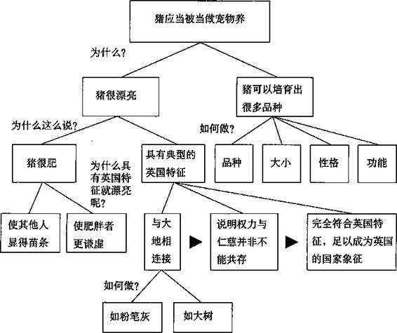

图2-2金字塔结构引导疑问/回答式对话

切斯特顿说，猪应当被当做宠物养，读者当然会问“为什么这么说”。切
斯特顿说：“有两个原因：首先，猪很漂亮；其次，猪可以培育出很多品种。”

读者：“为什么说猪很漂亮？”

切斯特顿：“猪很漂亮，因为猪很肥，而且具有典型的英国特征。” 

读者：“肥胖有什么漂亮的？”

切斯特顿:“肥胖能够使其他人显得苗条，也能够使肥胖者更谦虚（因为有人比他还胖）。”

至此，虽然你显然不会同意切斯特顿的论述，但至少你可以了解他的论
述过程。你能够清楚地了解切斯特顿为什么作出如上表述，也显然不需要再 提出疑问以进一步了解其推理过程。于是，切斯特顿可以继续他的另一部分 论述，即猪漂亮是因为它们具有典型的英国特征。

读者：“为什么具有典型的英国特征就漂亮呢？”

切斯特顿：“猪与大地是互相连接的；这种连接说明权力与仁慈并非不能共存；这种态度是很符合英国特点的，也非常美好，足以成为英国的国家象征。”

同样，你可能会对这种观点持不同意见，但是你能够很清楚地了解切斯
特顿这样表述的原因。这种表述之所以清晰，是因为其思想的组织一直紧紧 围绕着回答由主题引发的读者的疑问。最后一部分关于猪的品种的论述，也 可以同样清楚地被读者理解。

如图2-3所示，你还可以在商务报告中发现作者使用了同样的技巧。这
是一份20页的商业备忘录的结构。这份备忘录的主题是建议购买英国莱兰公 司（Leyland)的特许经营权（当然是在多年以前)。建议购买特许经营权 有3个原因，在每个原因的下一层次，都对读者可能提出的疑问给予了回答。 由于文章的论述过程非常清晰，读者要做的只是决定自己是否同意作者的观 点，并提出相关的逻辑问题。

综上所述，金字塔结构的巨大价值就在于它迫使你在理清思路时，从视
觉上使纵向的疑问/回答式对话关系清晰化。你的每一个表述都应当引发读 者的疑问，而你也必须在这一表述下的横向结构层次上逐个回答读者的疑问。

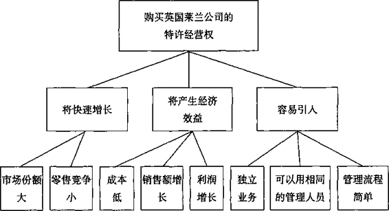

图2-3所有文章都应当具有疑问/回答式对话结构

### 横向关系

当考虑在下一结构层次上如何表述时，必须保证你的表述能回答在其上
一个层次上的表述引起的疑问，同时还必须保证表述符合逻辑。也就是说， 表述必须具有明确的归纳或演绎关系，但不可同时既具有归纳关系，又具有 演绎关系。在组织思想时，归纳和演绎是仅有的两种可能的逻辑关系。

演绎性思想组合是由几个承前启后的论述组成的。第一个思想是对当今
世界上的某种现象的表述；第二个思想是对该句子的主语或谓语所作的表述; 第三个思想则说明了以上两种表述同时在世界上存在时所具有的隐含意义。 因此，演绎性思想组合具有以下形式：

•所有的人都会死。

•苏格拉底是一个人。

•因此苏格拉底会死。

你需要概括演绎性思想组中的论述，以提高一个抽象层次。你的概括主要基于最后一个表述：“因为苏格拉底是一个人，所以苏格拉底会死。”

归纳性思想组合中的思想互相关联，你可以用同一个名词表示组中所有
思想，如支持的原因、反对的原因、步骤、问题，等等。归纳性论述的形式是:

•法国坦克已抵达波兰边境。

•德国坦克已抵达波兰边境。

•俄国坦克已抵达波兰边境。

为了提高一个抽象层次，你需要识别以上句子的共同点（即：都是针对
波兰的战争行为），并得出一个推论。你的推论可能是“波兰将受到坦克入侵” 或类似的思想。

如果你选择以演绎法回答由某个思想引起的疑问，你就必须进行3段论
式的论述。其中，第二个思想是对第一个思想的主语或谓语作出的表述，而 第三个思想则从以上两个思想中得出推论。如果你选择以归纳法回答由某个 思想引起的疑问，你就必须保证该组思想在逻辑上具有共同点，并且可以用 同一个名词表示。

了解了以上知识后，现在你已经可以随时从某一思想开始构建你的金字
塔结构，并在需要时加人其他思想（向上、向下或横向）。但是，在你着手 构建自己的金字塔结构之前，还需要了解一件事，即你的文章需要回答的初 始问题（即读者将提出的第一个疑问)。你可以通过讲故事式的序言（前言、 引言）确定初始问题。

### 序言的结构

我们已经了解，金字塔结构可以使你与读者不断地进行疑问/回答式对
话。但是，除非引发这种疑问/回答式对话的话语与读者有相关性，否则这 种疑问/回答式对话也很难吸引读者的注意力。保证出现相关性的唯一办法， 就是使这个句子直接回答你所发现的读者头脑中已存在的某一疑问。

虽然写作的主要目的是告诉别人他们所不知道的信息。但是，读者只有
在需要了解问题的答案时才会去找答案；如果读者没有这种需要，就不会提 出任何疑问；反之亦然。

因此，为了保证你的文章能够吸引读者的注意，你必须使文章回答读者
头脑中已有的问题，或者能回答读者对周围发生的事情短暂思考后可能会提 出的问题。文章的序言可以通过追溯问题的起源和发展来确定这一问题。

问题的起源和发展必然以叙述的形式出现，因此也应当按照典型的叙
述模式发展。序言的开头应向读者说明“背景”（situation)的时间和地点。 在这一背景中应当发生了某件事情，可称为“冲突”（complication)，使 读者提出（或将使读者提出）你的文章将要“回答”（answer)的“疑问” (question)。

这种典型的讲故事式的呈现——背景、冲突、疑问、回答一能够使你
确保在引导读者了解你的思维过程之前，你和读者是“站在同一位置上”。 这种形式还能保证你将思想的重点一定放在文章的最前面。这也是判断你是 否以最直接方式传递正确信息的方法。

为了说明以上观点，请看下面这段商业报告中常见的序言：

本备忘录的目的是进一步思考和讨论以下问题，并征集建议：

1\. 董事会的组成及最合适的人数；

2\. 董事会和执行委员会的日常角色、具体职责及相互关系；

3\. 使独立董事成为有效的参与者；

4\. 董事会成员的选举和任期的有关规定；

5\. 董事会和执行委员会的运作可采取的各种可能方式。

请注意，当作者用讲故事形式写备忘录的序言时，读者理解该备忘录的
目的和信息会变得相对容易：

10月份新设立的机构，将获得管理该机构两个部门所有日常事务的全部权力和责任，这些责权以前都由两个部门的经理负责。这一举措将使董事会从日常琐事中解脱出来，全力处理董事会独有的决策和规划等
全局性事务。

但是，因为董事会长期深陷于处理短期运营问题的状态，现在无法
有效地将工作重心转移到长期战略发展上。因此，董事会必须考虑实现 工作重心转移所需要进行的变革。具体来说，我们认为董事会应当考虑 如下变革：

•将日常运营事务交由执行委员会处理；

•增加董事会编制，吸纳独立董事参与；

•制定规范内部运作的政策和流程。

总之，序言以讲故事的形式告诉读者，你已经了解或将要了解你正在讨
论主题的一些信息，从而使读者想起他本人的疑问，这也是本篇文章将要回 答的问题。叙述式的序言说明了发生“冲突”的“背景”，以及“冲突”引 发的“疑问”，而这个“疑问”正是你的文章将要“回答”的。一旦你提出 了对该“疑问”的“回答”（即位于文章金字塔顶端的思想），就会使读者产 生新的疑问，于是你就要在文章结构的下一层次上回答这些新的疑问。

这3种子结构（即纵向的疑问/回答式对话、横向的演绎或归纳推理、
讲故事式的序言）能够帮助你找到构建金字塔所需的思想。了解了纵向关 系，你就可以确定某一层次上的思想组必须表达哪种信息（g卩：必须回答针 对上一层次的思想读者所提出的新疑问）。了解了横向关系，你就可以判 断，你组织在一起的思想是否用符合逻辑的方式表达了信息（即：是否是正 确的归纳或演绎论述）。更重要的是，了解读者最早提出的疑问，将确保你 组织和呈现的思想与读者有关联（即：文章中的思想有助于回答读者的初始 问题）。

现在你一定期待用一步一练的方式实际应用以上规则。第3章将告诉你 如何做。

## 第3章如何构建金字塔

当你坐下来开始写作时，常会遇到这样的情形：你只是大致知道要写什
么，但并不清楚你具体想表达什么，以及如何表达。即使你知道你最终呈现 的思想必定会组成一个金字塔结构，你仍然会有这种不确定感。

实际上，你对将要完成的“成品”已经了解了很多。首先，你知道在你
文章的金字塔结构的顶端将有一个包括主语和谓语的句子，其次，你知道这 个句子的主语就是文章的主题。

你还知道，这个句子是对读者头脑中业已存在的某个疑问的回答。当在
(读者了解的）某个“背景”中发生了（读者了解的）某种“冲突”，就会引 发读者的“疑问”，而回答这个“疑问”就是你写作的动机。你可能还大致 知道将要表达的一些要点。

这些对你来说已经不少了。你可以利用你知道的这些知识，自上而下或
自下而上地构建文章的金字塔结构。自上而下的方法通常比自下而上的方法 更容易，因此，你应当首先尝试用自上而下的方法。

### 自上而下法

自上而下地构建金字塔结构通常容易一些，因为你开始思考的是你最容易确定的事情，即文章的主题，以及读者对该主题的了解情况（你将在文章的序言中引导读者重温其了解的情况)。

但是，你还不能现在就坐下来开始写序言。你应当先利用序言的结构，
将头脑中的观点、论点、想法逐个梳理出来。为了做到这点，建议你遵循图3-1介绍的流程。

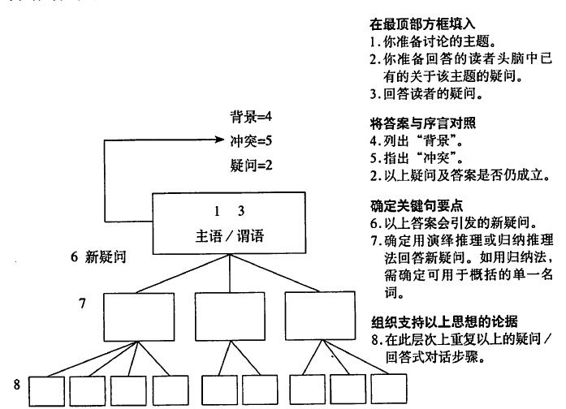\

图3-1金字塔结构中互相关联的各要素

自上而下法构建金字塔步骤如下：

**1. 画出主题方框**

这个方框就是你文章的金字塔结构最顼部的方框。在方框中填人你要讨
论的主题，当然前提是你知道要讨论什么主题，否则请跳到步骤2。

**2. 设想主要疑问**

确定文章的读者。你的文章将面对哪些对象？你希望文章能回答读者头脑中关于该主题的哪些疑问？如果你能确定读者的主要疑问，请写出来，否
则跳到步骤4。

**3. 写出对该疑问的回答**

如果你还不清楚答案，请注明你有能力回答该疑问。

**4. 说明“背景”**

你需要证明，现阶段你能够清晰论述该主要的疑问和答案。具体做法是:
把要讨论的主题与“背景”相结合，作出关于该主题的第一个不会引起争议 的表述。首先，关于该主题的哪些表述肯定不会引起读者的疑问呢？（因为 读者知道这一表述，或者根据以往经验很容易判断该表述的正确性。）

**5. 指出“冲突"**

现在你已经开始与读者进行疑问/回答式对话了。想象一下，读者表示
同意，点着头说：“对，我知道这个情况，有什么问题吗？
”此时，你就应当 考虑“背景”中发生了哪些能使读者产生疑问的“冲突”,例如发生了某种意外， 出现了某个问题，或出现了明显的不应当出现的变化。“背景”中发生了哪 些“冲突”，以致引发了读者的“疑问”昵？

**6. 检查“主要疑问"和“答案"**

对“背景”中“冲突”的介绍，应当直接导致读者提出主要疑问（已在
步骤2中列出）。否则，应重新介绍“背景”中的“冲突”，使之可以直接 导致读者提出主要疑问。可能有时“背景”中的“冲突”与主要疑问对不上 号，这就需要你重新构思。

进行以上步骤的目的，是确保你了解自己将要回答哪些疑问。一旦确定
了主要“疑问”，其他要素都很容易在金字塔结构中各就各位。

。。。。。。。。。。。。。。。。。。。。。。。。。。。。。。。。。。。。

提示

自上而下法构建金字塔的步骤：

1\. 提出主题思想。

2\. 设想受众的主要疑问。

3\. 写序言：背景一冲突一疑问一回答。

4\. 与受众进行疑问/回答式对话。

5\. 对受众的新疑问，重复进行疑问/回答式对话。

。。。。。。。。。。。。。。。。。。。。。。。。。。。。。。。。。。。。

下面举例说明用以上方法时人的思维的发展过程。下面是美国某大型饮
料公司财务部主管写的一份备忘录，我们将试着用以上方法改写该备忘录。

处理交货单一►发送账单一►接收支票一►处理收款

饮料公司的送货员将产品交付给客户后，客户应向财务部发回一张交货
单，列明产品代码、交货日期和交货数量。公司的记账系统要处理这些交货单， 处理流程如下：

—家卖汉堡包的公司是该公司的大客户，长期从该公司采购大量饮料，
我们称其为“大客户”。大客户出于自身数据统计的需要，希望跟踪每天的 账单情况。大客户想知道自己是否可以留存每次的交货单，将有关信息及计 算出的总数输入计算机，然后每月将数据盘和支票送至饮料公司总部。也就 是说，大客户建议财务系统釆用以下运作方式：

接收数据盘和支票一►处理收款

饮料公司的财务部主管需要审核和答复该方案的可行性。于是，财务部
主管提交了一份备忘录，但其回答的内容仅仅是：“我们对该方案的运作方 式有以下发现”，而并未直接回答该问题，如表3-1所示。

如果你是这位财务部主管，并用表3-1中的方法组织你的思路，你的思

表3-1答非所问的例子

收件人：罗伯特•赛尔蒙先生

主题：大客户

我们按照要求对大客户（公司编号8306)提出的用数据盘将交货单信息发至我
们全国财务系统的建议进行了可行性研究。将由大客户和我们基于预付款方式共同 完成对信息的处理。经研究，我们对该方案的运作方式有以下发现：

1\.
我们对接收任何来自外部的全国财务数据的主要要求，是这些数据必须是按 规定格式发送的：

A. 公司编号

B. 销售点编号

C. 交货单编号

D. 交货单金额

E. 交货时间

如果大客户没有公司编号或销售点编号，我们可以根据我们的客户管理系统向
其提供相关信息。大客户将这些信息录入其系统后，将为我们今后处理交货单数据 提供很大便利。

2\.
大客户将开发一个信息提取程序，从其系统中提取所有现有的交货单数据， 并录人数据文件。该文件的格式可适用于全国财务系统的现金收据子系统（参见数 据格式），然后大客户将此数据导出至数据盘，并送至我公司用于结箅。同时，大 客户还将把支票和数据盘的详细清单（参见报告格式一）送至我公司的全国财务系 统银行保管。

我公司数据处理部门收到数据盘后，将根据规定程序进行结算，最终结箅的结
果是，大客户提交的支票金额与数据盘的数据必须为“零差额” （0.00)。

3\.
结箅完成后，我们将通过全国财务系统对数据进行处理，将交货单编号与更 新的历史报表对照，并制作全国财务报表。

约翰•杰克逊 

日期：

维过程将大致如下：

1\. 首先画一个方框，并问自己：“我将讨论什么主题？
”（大客户提出的 改变记账方式的建议。）

2\.
我将回答读者头脑中业已存在的关于该主题的哪些疑问？（这个建 议可行吗？）

3\. 我的答案是什么？（可行。）

4\.
然后与序言相对照，检查该疑问和该答案是否仍然相对应。将要讨 论的主题与背景相结合，作出第一个不会引起争议的表述。首先作出的关于该主题的哪些表述肯定不会引起读者的疑问呢？即读者肯定会当做事实接
受，且不会提出任何疑问的表述。（大客户建议改变记账方式。）

5\.
现在假定读者说：“是的，我知道这回事，有什么问题吗？”你就可 以直接指出冲突。（你们问我该建议是否可行？）

你之前作出的关于疑问的表述现在将跃人读者的大脑。（该建议是否可
行？）读者想到的疑问与你之前提出的疑问基本一致，因此你可以说，读者 的疑问和你的回答相匹配，你讨论的主题对读者是有意义的。

6\.
作出该建议确实可行这样的表述后，你将沿金字塔结构继续向下思考， 以确定读者在看到这样的表述后会产生哪些新的疑问。（为什么这么说？）

7\.
针对“为什么”之类问句的回答必须是“原因”，因此，你在关键句 要点这一层次上提供的所有要点必须都是“原因”（可以用单一名词概括)。 你的原因有哪些呢？

•该建议将提供给我们所需的信息。

•该建议将增加我们的现金流。

•该建议将减少我们的工作量。

8\.
在确定了以上要点都是正确且符合逻辑之后，下一步就是继续沿金 字塔结构向下思考，提供能够支持以上观点的思想。但是，在篇幅较短的文 章中，也许无需进一步构建金字塔结构，就可以开始写正文了。也许你在写 到每一具体部分时很容易从脑海中找到支持以上观点的思想。

从以上步骤可以看出，这种方法迫使作者在写作构思时仅从头脑中获取
与读者的疑问有关的信息。但是在具体操作中，这种方法能够迫使作者全 面地考虑该疑问，而不是像表3-1中的例子那样只考虑了疑问的一部分。而 且，如果作者在写作时能够遵循这种自上而下的思想组织方式，读者就能非 常容易地理解作者的全部思想，如图3-2所示。

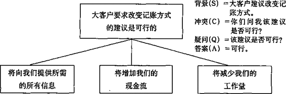

图3-2紧扣读者疑问的回答

### 自下而上法

很多时候你会发现你还没想清楚，无法构建金字塔结构的顶部。譬如，
有时你无法准确确定要讨论的主题，有时尚不清楚读者头脑中的疑问，有时 则无法确定读者了解什么、不了解什么。遇到这些情况时，可向下移动一个 层次，从关键句层次上着手。

如果你能够确定任何关键句要点，那很好；但多数情况下你可能无法确
定。别着急，你可以按照以下“三步走”的步骤自下而上地组织你的思想。

。。。。。。。。。。。。。。。。。。。。。。。。。。。。。。。。。。。。。

提示

自下而上思考：

1\. 列出你想表达的所有思想要点。

2\. 找出各要点之间的逻辑关系。

3\. 得出结论。

。。。。。。。。。。。。。。。。。。。。。。。。。。。。。。。。。。。。。

还是让我们以一篇需要重写的文章（如表3-2所示）为例，说明此方法
的作用。这是一位年轻的咨询顾问在参加工作两周后，呈送给上级经理的一

表3-2思路混乱的例子

收件人：

主题：TTW

以下是本人近两周工作成果的总结。

我们都知道，排版成本是所有新书成本中最重要的部分，约占精装书成本的
40%和简装书的50% ~55%。

排版成本主要包括：

设备排版    30%〜50%

校对    17%-25%

初校样及校)?才10%-16%

编排    10%~20%

整版及布版    10%~15%

将TTW公司的排版成本与平均水平比较后可以发现，TTW在排版工艺上的效率
相对较低。目前，排版评估人员正在研究我向他们提供的一些典型案例。

TTW公司对每一项排版工作基本都要重复相同的步骤，以保证较髙的质量。这
也是其在简单业务的排版上缺乏竞争优势的原因之一。

爱斯伯雷公司对TTW公司排版成本较高的原因非常感兴趣。我已经与罗伊•沃尔
特、布赖恩•汤普森和乔治•肯尼迪谈过此事，肯尼迪愿意进行一项实验，以发现： (1)该企业的排版工序是否有可以简化的步骤，尤其是针对某些排版任务，（2) 其效率较低的原因，即为什么低于平均水平。

TTW公司目前的排版任务已经超负荷了。排版部门的大部分工作都无法按时完
成。目前这种生产能力低下的现象在手工排版工序上尤为突出。TTW公司支付的工 资比该地区其他印刷厂都低，因而越来越难以吸引和保留排版人员。

现在，TTW公司正面临工会提出的一项新要求。有两名排版人员已经辞职。

该企业排版部门的员工目前少于编制，而员工的加班工作量超过50%。

结论：

1\. 降低排版成本似乎可以采用以下办法：

(1)简化价格较低排版任务的工序。

(2)改变工作方法，提高生产效率。

2\.
为了简化某些项目的工序，必须进行一些实验，对整个工序进行全程跟踪， 控制因改变校对次数和时间而对排版质i造成的边际效应，并观察客户的反应。此 举节约的费用可以达到排版总成本的10%。

我认为，第二种降低排版成本的方法需要进行细致的研究。TTW目前在手工排
版上的效率低于平均水平20%~50%。该企业应当能够有所改善。

3\.
如果我们将TTW与贝德尔公司、波耐尔公司等进行比较，也许可以有一些发 现。乔治•肯尼迪和罗伊•沃尔特乎有兴趣进行这项对比研究。但是，我已经告诉 过他们，也许他们不会有很多发现。

4\.
爱斯伯雷对TTW公司的排版成本也有不同的看法。卡尔认为TTW公司的排 版成本肯定过高，乔治•肯尼迪则认为尚没有确凿证据显示其排版成本过高，而罗 伊•沃尔特则认为他还无法对此下结论。他们似乎都非常愿意对此进行调查研究。

发件人：

日期

篇备忘录。客户是英国的一家印刷厂TTW公司。

除了备忘录中所述的内容，我对有关情况或主题一无所知。因此，我们
所做的一切都只能根据这篇文章提供的信息进行，对这名咨询顾问建议的正 确性也不妄加评论。我们要做的只是使文章的思路更加清晰。

**步骤1:列出所有要点**

我们首先看看表3-3中的解决方案。因为确定行动性思想（即介绍需要
釆取的行动）的有效性，比确定描述性思想（即说明背景，或介绍信息）的 有效性更容易一些（参见第7章“概括各组思想”）。简化工序与改变工作 方法之间存在什么逻辑关系呢？答案是没有任何关系，这两者说的都是同一 件事。因此，这一步分析没有什么收获。

表3-3列出所有要点

<table class="calibre18" data-border="1">
<colgroup>
<col style="width: 50%" />
<col style="width: 50%" />
</colgroup>
<tbody>
<tr class="calibre15">
<td class="calibre17">
问题
</td>
<td class="calibre17">
解决方案
</td>
</tr>
<tr class="calibre15">
<td class="calibre16">
1. 排版工作效率低。

2. 每项排版任务均使用相同的工序。

3. 对简单任务的报价没有竞争优势。

4. 无法按时完成。 ‘

5. 工资偏低。

6. 员工短缺。

7. 加班过多。

8. 在排字和手工排版上的效率低于平均水平。
</td>
<td class="calibre16">
1. 简化价格便宜的排版任务的工序。

2. 改变工作方法，提髙生产效率。
</td>
</tr>
</tbody>
</table>

然后来看看间题。我们能很快看出来，其中显然隐含着一些因果关系。
我们应尽可能清楚地将其结构画出来。

**步骤2:找出逻辑关系(因果关系）**

对因果关系的分析(如图3-3所示)揭示出两条单独的思路(如图3-4所示)。
当然也有可能某些应当列出的要点并未被列出。现在你可以得出一些结论: 那名咨询顾问或者想说，因为该企业的生产效率低、加班过多，导致其成本 过髙；或者想说，为了降低成本，必须简化工作方法、提高员工工资。

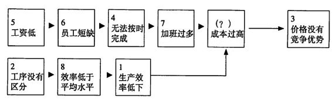\

图3-3 找出逻辑关系

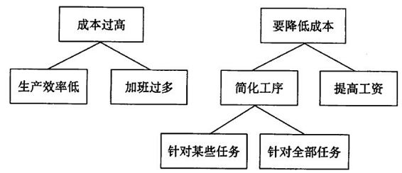\

图3-4 两条单独的思路

**步骤3:得出结论**

那名咨询顾问想说明的究竟是哪一个呢？你可以结合序言部分进行思
考。原备忘录暗示读者已经了解的情况是什么？显然，读者知道成本是一项 重要因素，知道TTW公司在报价上不具竞争力，可能还知道在TTW公司 没有人知道其成本是否过高。这样，你的思路应当如下表所示：

1.主题 =排版成本。

2.疑问（1）= 排版成本是否过高？

3\. 答案⑴ = 是的。

4\. 背景 = 排版成本是总成本中最重要的一部分。

5\. 冲突 =不知道排版成本占总成本的比重是否过高，但
竞争优势较低的事实说明可能如此。

疑问（2) =排版成本可以被降低吗？

答案（2）= 可以。

6\. 新的疑问=如何实现？

7\.
关键句要点=省略排版过程中不必要的步骤，并且将员工工资提高到具有竞争力的水平。

表3-4的例子，是包括以上思想但更容易被接受的一种写法。你可能不
同意这位年轻咨询顾问的思路，但至少这样可以将其思路清楚地表达出来，

表3-4结论清晰的例子

收件人：

主题：TTW

我过去两周在爱斯伯雷公司研究排版的成本。我们知道，排版成本占精装书成
本的40%，占简装书成本的50%~55%,
TTW公司并不知道其排版成本是否过高， 但是大家认为该公司在简单排版任务方面缺乏竞争优势。

经过初步调査，我们认为该公司可能能够通过以下方法大幅降低其排版成本：

1\. 省略排版过程中不必要的步骤。

2\. 将员工工资提髙到具有竞争优势的水平。

省略步骤

TTW公司在手工排版方面的工作效率比平均水平低20%~50%。观察其排版方
法可以发现，该公司对每一项排版任务，不管是圣经还是恐怖小说，基本都采用相 同的步骤，以保证质量。这是该公司缺乏竞争优势的部分原因。

我就这一发现与罗伊•沃尔特、布赖恩•汤普森和乔治•肯尼迪讨论过。肯尼迪愿
意进行一项实验，以找出：1.该企业的排版工序中是否有可以简化的步骤，尤其是 针对某些排版任务而言，2.其效率低于平均水平的原因。

下周我们将全程跟踪几项简单的排版任务，控制因改变校对次数和时间而对排
版质量造成的边际效应。此举节约费用可能达到排版总成本的10%。我们还将进行 一项细致的方法研究，以尽贵缩小该公司与平均水平的差距。

提高工资

TTW公司支付给员工的工资比该地区其他印刷厂的低，因此难以吸引和保留
排版人员。有两名排版人员刚刚辞职，使该公司排版部门的员工人数低于编制。因 此，大多数排版任务都无法按时完成，员工的加班工作蛩也超过了
50%。

该公司目前正面临着工会提出的一项新的要求，可能会被迫增加员工工资。如
果这样，该公司应该能够招聘到合适的人选，降低加班费用。

发件人：

日期：

读者也才能够决定是同意他的观点，还是找出可质疑之处。

我将该备忘录完整地重写了一遍，因为我想说明一点，总的序言可以包
括关于关键句要点的表述，读者就可以在开始阅读的最初30秒内了解你的全 部思路。由于文章的其余部分都是为了解释或支持你已提出的观点，读者在 之后的阅读过程中肯定不会遇到会使其大吃一惊的重要思想。这样，如果读 者的时间有限，他就可以简单地浏览一下文章。实际上，如果读者在阅读的 最初30秒内还不能清楚了解你的全部思路，你就应该重写这篇文章。

此外，标题及小标题能够突出文章结构中的重要部分，以便读者迅速找
到关于某一个问题的详细论述。如果文章篇幅较长，加小标题的做法尤其有 效。为了达到较好的效果，你还应当注意标题的用词（参见第10章），即标 题应呈现某种思想、观点或论点，而不是只说明要讨论问题的类别。例如， 不要用“我们的发现”或“结论”这类的标题，因为对于读者快速了解文章 的主要内容和观点没有太大帮助。

最后，我简单说说写作风格。你可以发现，TTW备忘录原文及改写后
的备忘录在语言的使用及句子的措辞上几乎没有区别。这说明，改写后的文 章的清晰思路来自于金字塔结构，而不是写作风格的变化。

### 初学者注意事项

金字塔原理的规则能够使你从金字塔结构中任何一个位置上的思想着
手，发现其他所有相关的思想。但是，你必须釆用自上而下法或者自下而上法。 我已经尽力使你了解常规的思维方法，但是在具体应用时会仍遇到各种可能， 出现问题在所难免。以下是我对金字塔原理的初学者常问问题的回答：

**1.一定先搭结构，先尝试自上而下法**

—旦你着手将思想变成文字，它就似乎戴上了最美丽的光环，令你感觉
“字字珠玑”，甚至不愿意进行必要的修改。因此，不要试图一下子就把整篇文章 都写出来，因为你稍后就可能很容易地想出文章的结构。一旦你的思想变成 了文字，你就可能会觉得写得不错，而根本不管你的思路实际上是不连贯的。

**2. 序言先写背景，将背景作为序言的起点**

一旦你知道自己想在序言的主体部分说什么——背景、冲突、疑问和回
答，你就可以根据你希望产生的效果，按任何顺序写出这些内容。选择不同 的顺序会影响文章的文风，当然你肯定想运用不同的文风写不同的文章。但 是，一定要从“背景”开始构思，因为按照这个顺序，你更容易准确地找到“冲 突”和“疑问”。

**3. 先多花时间思考序言，不要省略**

先想好序言，避免开始论证时还在想背景或冲突。当你坐下来开始写作
时，经常头脑中已经有了一个完整的主要思想。这样，触发主要思想的“疑问” 也很明显。这时，你就很容易直接跳到关键句层次，开始回答由主要思想引 起的新的疑问。我劝你不要这样做。因为多数情况下，你会发现自己还在思 考和组织属于“背景”或“冲突”的信息，这样会使你自己陷入复杂、混乱 的论证中。你应当先整理出序言的信息，然后把注意力完全集中在金字塔结 构中较低层次的思想上。

**4. 将历史背景放在序言中**

你不应该在文章的正文部分才告诉读者过去发生的事情。正文部分应当
只包括思想（即：因能够为读者提供新思维而引起读者疑问的表述），思想只 能以逻辑方式互相联系。也就是说，只有在描述一些通过分析发现的因果关 系时，你才可以在正文部分列举读者已知的信息。简单的历史事件不是逻辑 思考的结果，因而也不能算作思想。

**5.序言仅涉及读者不会对其真实性提出质疑的内容**

序言的目的只是告诉读者一些他们已经知道的信息。当然，有时你并不
知道读者是否确实知道某些信息；有时你则可以肯定读者不知道某些信息。 如果所表达的信息能够很容易地由客观的第三方进行检验和证实，那就可以 假定你的读者“知道”该信息，因为读者不会对其真实性提出质疑。

同时，注意不要在序言中涉及任何读者不知道的信息，因为这样的信息
可能导致读者提出非你所愿的“疑问”。反之亦然，不要在金字塔结构中涉 及任何读者已经知道的信息。如果你利用读者已经知道的信息，回答金字塔 结构中较低层次上的问题，就说明你在序言中遗漏了重要的信息。如果在序 言中提供该信息的话，也许读者会提出不同的疑问。

**6.在关键句层次上，更宜选择归纳推理法而非演绎论证法**

这一点在第5章“演绎推理与归纳推理”中有更详尽的说明。在关键句
层次上使用归纳推理比使用演绎推理更容易使读者接受，因为归纳法更容易 被人理解。人们的倾向是按照思维发展的顺序表达自己的思想，而思维发展 的顺序通常都是演绎的顺序。但是，以演绎的顺序发展的思想并不一定要以 演绎的顺序表达出来。在大多数情况下，你都可以将以演绎法发展的思想用 归纳法的形式表达出来。

假设你建议某人购买一座库房，你根据以下的演绎推论支持对方购买库房
(如图3-5所示)。

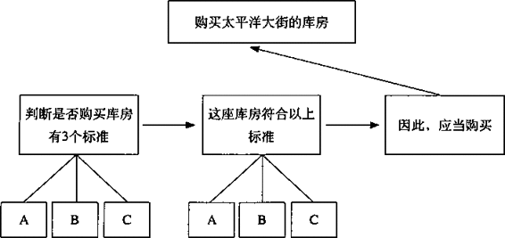

图3-5支持对方购买库房的演绎推理

这个结构中的第三个要点不能引起读者的疑问。假设你的写作顺序是先
表达金字塔顶端的核心观点，然后表达关键句要点，那么你根本不需要第三 个要点再表达一遍核心观点。这个论证结构过于复杂，而采用归纳法则能够 更有效表达你的观点(如图3-6所示)。

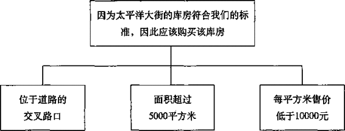

图3-6支持对方购买库房的归纳法则

## 第4章序言的具体写法

文章的序言（前言、引言、导言）概述读者已知的信息，并将这些信息
与文章将要回答的疑问建立联系，然后作者就可以将全部精力放在提供回答 疑问的答案上。如果是写文章，就是“序言“；如果是演讲，就是“开场白”。

文章的序言必须用讲故事的形式，也就是说，序言必须先介绍读者熟悉
的某些“背景”，说明发生的“冲突”，并由此引发读者的“疑问”，然后针 对该“疑问”给出“答案”。这种讲故事的形式对于组织读者已知的信息非 常有用。你一旦掌握了这种方法，就能够迅速构思出较短文章的结构。文章 的序言通常只有很少的几种模式。

### 序言的讲故事结构

如图4-1所示，文章开头的序言可以用位于金字塔顶端、文章思想结构
以外的一个圆圈来表示。序言总是向读者说明其已知的信息，其意义是：序 言说明某种“背景”，这种“背景”中发生了某种“冲突”，从而引发了某 种“疑问”，而整篇文章的目的就是回答该“疑问”。你也许会问：“为什 么序言必须是讲故事，又为什么必须是读者已知的信息？”

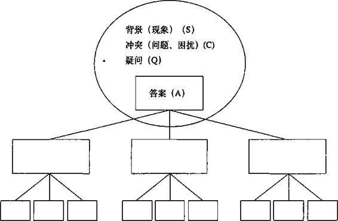

图4-1序言必须用讲故事形式

**为什么要用讲故事的形式.**

如果你认真想一想，也许会同意以下说法：任何人读你写的文章，都不
会像读一篇所有人都说既香艳热辣又扣人心弦的小说一样感兴趣。读者头脑 中已经存在许多杂乱、零散的思想，其中绝大多数都与你文章讨论的主题不 相关，但却是读者关心和感兴趣的。如果读者事先并不确信会对你的文章感 兴趣，那么要想将所有其他思想抛开，专注于你提供的信息，对读者而言将 是一件非常困难的事情。读者只有在感受到强烈的吸引力时，才会愿意暂时 放弃其他思想，专注于你提供的信息。

但是，即使读者非常想了解文章的内容，相信文章对他们很有意义，他
们也必须付出努力才能抛开其他思想，专注于你文章的内容。相信大家都有 过这种经历：读完了某篇文章的一页半内容，却忽然发现自己其实一个字也 没看进去，这就是因为我们并没有拋开自己头脑中原有的其他思想。

因此，你必须想办法使读者轻易地抛开其他思想，专注于文章的内容。
为达到这一目的，有一种非常简单的方法，即利用未讲完的故事所产生的悬 念效果。举个例子，假如我对你说：

“深夜，两个爱尔兰人在一座古怪的城堡中相遇……”

不论你在读这句话之前在想什么，读完这句话后，你的注意力就会紧紧
地被我吸引住。我已经将你的思想带到了特定的时间和空间，并且通过叙述 这两个爱尔兰人的言行牢牢地控制了你的思想，直到故事的高潮过后。

这就是你在文章的序言要做到的。你应当通过向读者讲述一个与主题有
关的“故事”，引起读者对该主题的兴趣。每一个好的故事都有开头、中间 和结尾，相当于引人某种“背景”、说明发生的“冲突”，并提出解决方案。 由于你写文章的目的，或者为了解决读者头脑中的一个问题，或者为了回答 读者头脑中的一个疑问，因此，这里所谓的解决方案，就是你在文章中要表 达的主要思想。

当然，序言还应当是一篇针对读者的“好故事”。如果你有孩子，你就
会知道，世界上最好的故事实际上就是孩子们已经听过的故事。因此，如果 你确实想给读者讲一个“好故事”，你就应该给他们讲一个他们已经知道的“故 事”，或者是他们应当知道的“故事”（如果读者具有这方面的背景知识)。

这种方法能够使你在向读者表述他们可能不同意的观点之前，先向他们
传递一些他们肯定会认可的信息。从心理学角度看，先向读者传递简单易懂、 容易接受的信息，比让他们在混乱的思想中摸索，更容易使读者接受全篇的 思想。

。。。。。。。。。。。。。。。。。。。。。。。。。。。。。。。。。。。。。

提示

序言要用讲故事形式，是为了让读者抛开复杂的思想，专注于你的话题。
激发读者兴趣，吸引注意力：新奇、悬念、与读者本人相关。

。。。。。。。。。。。。。。。。。。。。。。。。。。。。。。。。。。。。。

**何时引入“背景”**

开始引入“背景”时，应先谈与文章主题有关，且读者肯定会同意的内容，
应当是读者已经认可或者将会认可的内容。如果你发现自己在文章开头没有 说明与文章主题有关的背景，就说明你或者选错了主题，或者开始讨论主题 的时机不对。

如果你完全清楚文章的具体读者是谁，甚至知道他们的名字，醫如在写
信或备忘录时，那么何时引入“背景”就很简单。引入“背景”的时机，就 是你能够作出关于文章主题独立的、无争议的表述的时候。表述的独立性是 指，在此表述之前无须用其他表述以论述其准确含义；无争议性是指，你预 计读者肯定能够理解并接受该表述。

但是，如果你要写的文章针对的读者面很广，比如是准备发表在杂志上
或者出版图书，那么你的任务更多的就是“培养”读者产生某种疑问，而不 是“提醒”读者想起已有的某种疑问。在这种条件下引人“背景”相对困难 一些。但是，你可以假设你的读者在文章主题方面具有通常的背景知识，然 后解释该主题的具有普遍性的疑问。

如果你提供的信息曾经在《商业周刊》或《财富》杂志上出现过，你就可
以假定你的读者群能够接受该表述。当读者看到以讲故事形式组织的素材， 并且素材的组织方式是他们以前从未考虑过的，他们就容易提出你将在正文 部分回答的疑问。

所有引出“背景”的句子都具有一个重要特征，即能够将你“锁定”在特定的时间和空间，从而为讲故事做好准备。以下是几个典型的起始句：

能源投资公司正在考虑将采矿厂的铁矿石出口到捷克斯洛伐克的可行性。（备忘录）

任何大型医疗服务体系都受到资源日益1乏的困扰，民营医疗服务体系也不例外。（报告）

根据考古发现，在人类历史最早的250万年中，人类唯一使用的人造工具都是实用性的：石器。（杂志文章）

与其他人一样，当今商业社会中的经理人也是其自身文化的产品。 (图书）

读者对以上这些表述的通常反应是点头表示同意，并且说：“是的，我认
为是这样，那又怎么样？”如果客气一点，就会说你为什么要告诉我这些？” 读者的这些反应使你能够提出“背景”的“冲突”。

**什么是“冲突”**

文章序言中的“冲突”虽然经常指的是某种不利的变化，但并不总是具
有“不利的变化”的含义。这里的“冲突”类似于讲故事时推动情节发展的 因素，能够促使读者提出“疑问”。

用描述文章主题的公认事实开始讲“故事”，“冲突”就是推动“故事”
情节发展的因素，并且必须引发读者的“疑问”。读者的“疑问”可能有多 种形式，但通常相当于询问“接下来怎么样”，如表4-1所示。

表4-1多数文章回答以下4种疑问之一

<table class="calibre18" data-border="1">
<colgroup>
<col style="width: 33%" />
<col style="width: 33%" />
<col style="width: 33%" />
</colgroup>
<tbody>
<tr class="calibre15">
<td class="calibre17">
背景
</td>
<td class="calibre17">
冲突
</td>
<td class="calibre17">
读者的疑问
</td>
</tr>
<tr class="calibre15">
<td class="calibre16">
(关于文章主题的公认事实）
</td>
<td
class="calibre16">
(推动情节发展并引发读者提出疑问的因素）
</td>
<td class="calibre16"></td>
</tr>
<tr class="calibre15">
<td class="calibre16"> 
</td>
<td class="calibre16"> 
</td>
<td class="calibre16"></td>
</tr>
<tr class="calibre15">
<td class="calibre21">
需要完成某项任务
</td>
<td class="calibre21">
发生了妨碍完成该任务的事情
</td>
<td class="calibre21">
我们应该怎么做？
</td>
</tr>
<tr class="calibre15">
<td class="calibre21">
存在某个问题
</td>
<td class="calibre21">
知道解决问题的方案
</td>
<td class="calibre21">
如何实施解决方案？
</td>
</tr>
<tr class="calibre15">
<td class="calibre21">
存在某个问题
</td>
<td class="calibre21">
有人提出了一个解决方案
</td>
<td class="calibre21">
该方案是否正确？
</td>
</tr>
<tr class="calibre15">
<td class="calibre21">
采取了某项行动
</td>
<td class="calibre21">
行动未达到预期效果
</td>
<td class="calibre21">
为什么没达到预期效果？
</td>
</tr>
</tbody>
</table>

表4-2为上述每种形式列举了一个具体的例子。所有4个例子都摘自亨
利•斯特拉格编著的《管理中的里程碑》一书（这本书在过去30年中为人们 塑造管理思想起了很大的作用）。读到这些例子的时候，你会注意到，人们 在实际应用“背景一冲突一疑问”
（S—C—Q)的框架性结构时，可能会根据实际情况使用多种不同风格的写法，如表4-2所示。

表4-2具有讲故事结构的序言

<table class="calibre18" data-border="1">
<colgroup>
<col style="width: 50%" />
<col style="width: 50%" />
</colgroup>
<tbody>
<tr class="calibre15">
<td class="calibre17">
<strong>资本投资的风险分析</strong>

企业经营者必须作出很多决策，其中最具有
挑战性也最受人关注的，就是从多种资本投资方 案中选择风险小的方案。当然，这种选择的难度 并不在于在某种特定假设条件下进行投资回报的 规划，而在于各种假设条件及其影响。

每一种假设条件都存在不同程度的不确定
性。如果将多种假设条件综合考虑，不确定性就会相互费加，可能使总的不确定性达到危险的程
度，这就是风险因素发生作用的时候。但企业经
营者却很难从现有的工具和方法中获得风险评估方面的帮助。

有一种方法可以通过向企业经营者提供对相
关风险的实际衡量，帮助其作出重要的资本投资决策。有了这种可以在任何投资回报层次上进行
风险评估的工具，企业经营者就可以根据企业目
标更有效地评估各种行动方案。

戴维•赫兹 

《哈佛商业评论》 

</td>
<td class="calibre17">
背录=需要从多种资本投资方案
中选择风险最小的方案。

冲突=不知道如何评估不确定性 风险。 

疑问=是否有可以计算相关风险 的实用方法？ 

答案=有。 

</td>
</tr>
<tr class="calibre15">
<td class="calibre17"></td>
<td class="calibre21"> 
</td>
</tr>
</tbody>
</table>

<table class="calibre18" data-border="1">
<colgroup>
<col style="width: 50%" />
<col style="width: 50%" />
</colgroup>
<tbody>
<tr class="calibre15">
<td class="calibre17">
如何激励员工

人们曾经无数次地在文章、著作、发言和会议
中痛苦地提出：“我怎样才能让员工按照我的期望 工作？”

有关激励员工的心理学非常复杂，在此问题上
比较可靠的发现还较少。但是，虽然目前的激励方 案科学性较低而猜测性较高，还是不断有新的骗人招式涌人市场，其中许多还附带有学术鉴定。

毫无疑问，本文不可能对骗人招式的市场产生什么不利影响，但我已经将本文中的观点在多家企
业和组织机构中进行检验。我希望这篇文章能够为纠正上述不平衡比例起到一定的作用。

佛雷德里克•赫尔茨伯格 

《哈佛商业评论》 

</td>
<td class="calibre17">
背景=希望员工釆取期望的行 为。

冲突=需要应用激励心理学。

疑问=如何做到？

答案=应用本文的观点。 

</td>
</tr>
<tr class="calibre15">
<td class="calibre17"></td>
<td class="calibre16"></td>
</tr>
</tbody>
</table>

\

<table class="calibre18" data-border="1">
<colgroup>
<col style="width: 50%" />
<col style="width: 50%" />
</colgroup>
<tbody>
<tr class="calibre15">
<td class="calibre17">
<strong>市场短视</strong>

任何一个主要产业都曾经属于成长型产业。有
些现在非常繁荣的产业已经笼罩着衰退的阴影，而 有些被认为是老牌的产业则已经停止发展。

在任何情况下，产业的发展减缓、停止或受到
威胁的原因，都不是因为市场饱和，而是因为存在 管理失误。

西奥多•莱维特 

《哈佛商业评论》 

</td>
<td
class="calibre21">
背景=许多主要产业已经停止发展或受到衰退的威胁。

冲突=有人认为产业发展受到 威胁是由于市场饱和。 

疑问==这种看法正确吗？ 

答案=不正确，真正原因是由 于管理失误。 

</td>
</tr>
<tr class="calibre15">
<td class="calibre16"></td>
<td class="calibre16"> 
</td>
</tr>
</tbody>
</table>

。。。。。。。。。。。。。。。。。。。。。。。。。。。。。。。。。。。。。

提示

什么是“冲突”：

”冲突”是推动故事情节发展，并引发读者提出疑问的因素。

。。。。。。。。。。。。。。。。。。。。。。。。。。。。。。。。。。。。。\

**为什么要用这种顺序**

序言必须采取“背景一冲突一疑问一解决方案”的结构，但是，各部分
的顺序可以有所变化，以创造不同的文章风格。以下是一个序言的基本结构 和分别用4种顺序写出来的例子。注意体会用每一种顺序后文章风格的变化。

**基本结构**

背景（S)=业务多元化研究服务在过去5年中增长了40%。

冲突（C)=无法证明我们的工作对客户有明显益处。

疑问（Q)=如何确保多元化研究确实对客户有明显益处？

回答（A)=实施“公司发展项目”，以研究该问题。

**标准式：背景一冲突一答案**

近几年来，本公司已经因为提供多元化研究服务而向许多客户收取了大
量费用。但是至今伦敦办事处也没有一个员工能够证明，某客户的某项收购 案或并购案与本公司的工作密不可分。该办事处为庆贺第一个能够作出此项 证明的员工而准备的香槟酒也一直无人开启。然而，本公司的多元化研究服 务在过去5年中增长了40%。因此，现在应该实施一项“公司发展项目”， 以研究我们如何确保多元化研究确实能够为客户带来显著的利益。

本备忘录列举了该项目实施过程中应当解决和进行试验的主要问题及假 设。

**开门见山式：答案一背景一冲突**

我们实施“公司发展项目”的首要目标，是提高我们帮助客户实施业务

多元化的能力。仅在伦敦办事处，我们帮助客户寻找收购或并购对象的服务
在5年中增长了
40%，但是我们不能证明任何一项收购案或并购案是与我们 的工作密不可分的。

**突出忧虑式：冲突一背景一答案**

据我了解，目前伦敦办事处还没有一个员工可以说，他为客户所做的多
元化研究，已经为客户带来了客户自身无法达到的明显效益。这种情况令人 吃惊，因为我们在多元化研究领域的服务在过去5年中已经增长了
40%。从 良心上讲，我们不能继续为无法取得显著收益的工作收取客户的报酬，这样 做也难以维持我们的良好声誉。因此，我建议实施一项“公司发展项目”， 研究如何使我们的业务多元化研究服务真正为客户带来显著的利益。

**突出信心式：疑问一背景一冲突一答案**

我们如何确保业务多元化研究继续成为我们的重要服务项目？此项服务
目前已占我们公司总营业额的40%,但是我们难以举出几个我们为客户提供 了必不可少帮助的例子。如果不釆取措施提高我们工作的价值，我们就会面 临失去在该领域发展优势的实际风险。

为此，我建议立即实施一项“公司发展项目”，以研究如何改善我们在
该领域的服务能力，使该项服务能够不断为客户带来显著利益。

**什么是“关键句要点”**

关键句要点(或称要点、核心观点、一级结论、一级论点、重要结论），
不仅要回答由文章主题思想弓丨起的受众的新疑问，还要呈现文章的框架结构。 因此，如果文章篇幅较长，就应该列出关键句的要点，如图4-2所示，然后 为第一个要点起一个小标题，由此开始写作（参见第10章)。

列出关键句要点可以让读者在开始阅读的最初30秒内就能了解你的全部
思路。由于随后的内容只是解释或支持这些要点，你就非常得体地将读者请 到了一个适当的位置上，由读者自行决定是继续读下去，还是就此接受你的 结论。不管读者如何选择，他们都可以预计，接下来的文章内容不会有令人

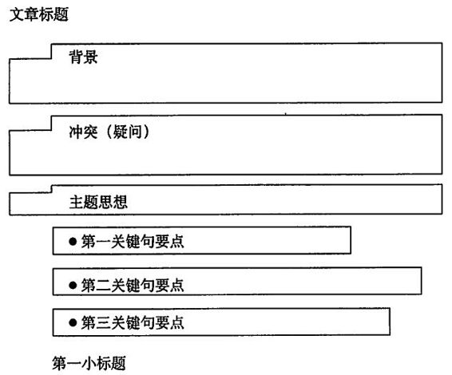

图4-2首先列出关键句要点

意想不到的内容，因而他们在继续阅读时会感到更加容易接受和理解。

如果文章篇幅较短，臂如每一部分只有一两段的支持素材，当然就不用
先列出要点，然后在小标题中重复一遍了。在较短的文章中，可以将关键句 要点作为段落的主题句，并在这些主题句下划一条下划线（或加粗），使读 者在阅读时容易注意到。

要记住，关键句要点必须表达文章的思想。举个反例，像下面这样写序
言是不对的：

本备忘录主要说明项目组制定和实施能显著提高盈利指标的方法。
全文分为以下6个部分：

•背景

•项目组的方法原则 

•项目工作内容 

•如何组织计划

•具体收益和效果

•成功的前提条件

用这种方式列出的文章要点无助于向读者传达文章的信息，而只是向读
者硬塞了一系列他们根本无法准确理解的词汇，除了浪费读者的时间，耽误 读者对文章的理解之外，没有任何用处。

根据我的经验，你最好永远不要用“背景”或“介绍”作为某一章节的
标题，因为这种标题所含的信息与其他标题所含的信息肯定不在同一个抽象 层次上，或者说抽象的程度不同。而且，仅列出主语而不列出完整的思想， 可能会存在一种危险，即关于该主语的思想无法形成明确的归纳或演绎逻辑 论证关系。

上面例举文章的组织结构中，各章节中的思想可能还存在混乱的关系。
譬如，“具体收益和效果”一章似乎应放在“项目组的方法原则”
一章中讨论， 而“成功的前提条件”一章似乎应并到“如何组织计划”一章中讨论。因此， 不要仅仅将名词作为关键句要点的要点，关键句要点应当是完整的思想，完 整的句子。

**序言应当写多长**

序言的长度应当是多少？人腿的长度又应当是多少？（答案是足以站在
地面上。）序言的长度应当确保在你引导读者按照你的思路思考之前，读者 和你“站在同一位置上”。

—般情况下，序言需要2〜3段，其结构如前面的图4-2所示。说明“背
景”和“冲突”的文字可以长达3~4段，但是不能再长了。（你还需要多少 字来提醒读者他已经知道的信息？）事实上，如果你发现自己在序言中就开 始到处使用图表，那你肯定过分强调了已知事实。

序言也可以短到只有一句话：“你在1月15日发给我的信中问我……”你
与文章的对象（读者）平时的关系越近，序言的篇幅就可以越短。但是，再 短的序言也必须能够提醒读者其持有的疑问。

以上例子表明，序言的长度与正文部分的长度不一定成正比，而是根据
读者的需要而定。为了使读者充分理解你的主要思想、结论，并且愿意了解 你得出该结论的思路，读者必须了解哪些信息呢？

也许你现在会想，写一个好的序言也不是件容易的事。事实确实如此。
在一篇文章中，序言是最不容易写好的部分。不过，多读几个例子，你也许 就能够感觉出哪些序言写得较好，并且举一反三，把自己的序言也写好。

**信函**

詹姆斯•司梯巴在其文章《日本商人：日元强于剑》中称赞日本索
尼公司率先发现了晶体管的商业用途，并且说晶体管的发明者贝尔实验 室“根本不知其有何用，只得将其卖给美国国防部”。

他的话既不是描述事实也不是客观的比喻。贝尔实验室早在晶体管
发明出来之前就已经知道其用途。

**报纸社论**

尼克松政府对美国电视网络进行了一次假进攻，而电视网络也进行
了一次假反击。这给不明就里的人们造成的印象是：美国人的自由权利 正遭到严重破坏。

事实上，这是一个我们希望通过电视将社会变成什么样的社会的问
题，即：我们希望要一个无政府主义倾向的、自我纵容的社会，还是要 一个带有精英文化色彩的、具有较强普遍约束力的社会。

**杂志文章**

产品经理已经因为许多杰出公司的成功案例而备受尊敬。他们因为
在当前竞争激烈的市场上成功地推出了许多知名产品并获得了较大市场 份额和高利润率而受到赞赏（当然，他们也应当受到赞赏）。在许多生 产多种产品的复杂的大型企业中，产品经理可以根据产品获得领导权； 而在较小的、组织结构较紧密的企业中，最高管理人员则将领导权交给 其最主要的产品生产线经理。

最近所作的一项调查显示，参加调查的企业中有3/4正在应用产品
经理这一组织概念，这并不令人感到惊奇。令人感到惊奇的是目前出现 了
一股对产品经理和产品经理概念运作方式不满的声浪。

这股正在增强的反对声浪是否说明产品经理概念本身不实用呢？当
然不是。在许多仍在应用这一概念的企业中，有证据显示，产品经理概 念不仅是一个可行的概念，而且在很多时候还是一个必不可少的梃念。 这一概念在如此多的企业中得以应用正是由于其合理性。然而，在这一 概念运作失败的企业中，问题几乎总是出在管理层如何（错误地）应用 这一本质上完全合理的管理工具。

**备忘录**

如您所知，流程部一直坚持认为，工作流程手册应当将那些操作不
符合规定、可能对企业造成损害的行为包括进来。这些工作流程需要经 常更新，因为有时会出现新的工作流程，有时旧的工作流程会被修改。 为了保证工作流程的兼容性，我们在修改工作流程手册时都应当遵循以 下方法。

**报告**

大陆人寿公司很早就被公认为人寿保险行业的领导者之一。该公司
的资产在所有的股份公司中排名第五。在日益激烈的竞争压力下，该公 司仍在过去丨0年中维持了保费收入持续增长的势头。但是，该公司的 传统市场环境正在发生重大变化，必将对其地位产生较大冲击：投保人 的兴趣正从工业险转向普通险，付费方式正在从托收转向繳费通知，竞 争也更加激烈而广泛。

大陆人寿公司管理层清醒地认识到，菲尔德分公司在运作中遇到了
难以克服的困难，阻碍了其提高绩效。大陆人寿公司还认识到，菲尔德 分公司及总公司管理层中出现了问题，使菲尔德分公司未能获得处理其 问题所需的领导和指导。因此，大陆人寿公司也正确地认识到，要解决 菲尔德分公司面临的问题，必须先改进总公司的组织结构和管理流程。

本报告将说明如何实现这一目标。

**散文**

世界尚未敏锐地认识到我们的生活已被笼罩在现代历史上最大的一
次经济灾难的阴影下，但是普通人已经意识到正在发生的事情。他们不 知道为什么突然怀有极度的恐惧（虽然这种恐惧可能有点过度），而以 前第一次出现经济灾难时，他们恰恰缺少了合理的忧虑。

他们开始怀疑未来。他们现在是正要从美梦中醒来面对残酷的事
实？还是正要陷入噩梦等待醒来？他们不用怀疑。过去的不是梦，而现 在面临的正是一场噩梦，只有等待黎明的到来，噩梦才会过去。

因为自然资源仍然与以前一样充足，人的劳动也仍然和以前一样富
有创造力，所以我们在解决生活物质问题方面的进步也仍然与以前一样 快速。我们与以前一样能够使每一个人享受高质量的生活（我指的是与 20年前相比），并且\>(艮快将使他们享受更高质量的生活。

我们以前没有受过欺騙，但是今天我们却陷入了一个巨大的泥潭，
并触动了一件精妙仪器的控制钮，然而我们却不了解它的工作原理。其 结果就是：我们获得财富的机会可能会暂时白白浪费——也可能会是很 长时间。

**图书**

公元2世纪，罗马帝国的狻域覆盖了地球最富饶的土地，其臣民包
括世界上最文明的人类。这个巨大帝国的边境由自古闻名、纪律严明的 勇士们保卫着。

法律和行为规范的温和而强大的影响力逐渐加强了各省之间的团
结。和平的臣民们尽情享受着财富和奢华。自由宪法被尊贵地敬奉着。 元老院表面上掌握着最高权力，但已将政府的所有行政权力都交给了罗 马皇帝。

在80多年的欢乐时光中，帝国的公共亊务统治权分别由内尔瓦皇帝、
图拉真皇帝、哈德良皇帝和两个安东尼皇帝行使。本章以及之后的两章将介绍罗马帝国的繁荣景象；随后还将从马可斯.安东尼皇帝之死谈到
罗马帝国衰亡的最重要条件：一次将永远被铭记、并仍在被世界各国所 感知的革命。

**长期印刷项目**

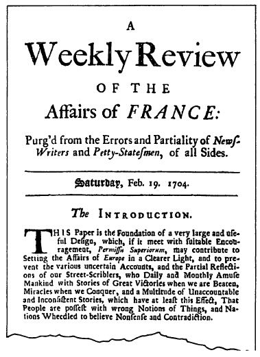\

图4-3长期印刷项目的一个例子

**关键句要点是否需要用引言**

关键句的每一个要点，都应该按照与全文的序言相似（但简单得多）的背景一冲突一疑问结构逐个引出。也就是说，当读者对任何一个关键句要点
提出疑问时，你应当告诉读者一个简单的“故事”，以保证读者与你站在同 一位置上。

为了阐明这一点，请看图4-4。该图是一篇关于管理工具论文的结构。

背景=全面质量管理是20世纪80年代流行的管理工具，
用于降低成本，提高产品或服务质量，从而获得 竞争优势和更多利润。

冲突=大多数主流企业现在都釆用了某种形式的全面质
量管理工具，但并非所有的企业都能获得预期的 利益，优秀企业仍占据或获得市场份额，并获得 较高利润。

疑问=为什么？优秀企业采取了哪些更好的措施？

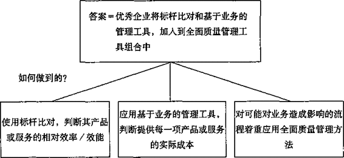

图4-4关键句要点也需要引言

文章的序言具有以下结构：

背景(S)=人们相信使用X工具将获得Y。

冲突(C)=确实在使用X,但是只有其他人获得丫。

疑问(Q)=为什么其他人获得丫？

回答(A)=使用A+B+X。

这一回答直接引出了新的疑问：“使用这些工具如何获得Y (竞争优势、
更多利润)”，并继而引出了关键句要点：

•使用标杆比对①，以判断其产品或务的相对效率/效能；

•应用基于业务的管理工具，以判断提供各种产品或服务的实际成本； 

•对可能对业务造成影响的流程，着重应用全面质量管理方法。

针对每个关键句要点的疑问都是“它是怎样起作用的”，用一个单一名
词概括这些关键句要点就是“步骤”。但是，并不是列出各个要点，然后提 供支持性的论据就可以了。你应当用一个能够概括各要点本质的标题突出该 要点所在位置，然后引入该要点。例如，不应该这样说：

**标杆比对**

管理者们使用标杆比对，判断其提供产品或服务流程的相对效率和
效能。为达到这一目的，他们需要：

•测试关键流程的效率。

•与竞争者的效率进行对比。

•找出产生差距的根本原因。

你应当用一个能够更清楚概括要点本质的标题，还应当通过回顾读者已
知的关于该主题（标杆比对）的知识，以及该要点将要回答的疑问，逐渐切 人正题，提出关键句要点。例如：

**对流程的效率进行标杆比对**

背景（S)=假设你已经使用全面质豐管理，并将处理贷款申请的
时间从两天缩短到2小时。

冲突（C)=可以假定如此高的提高效率足以获得竞争优势。

疑问（Q)=是否足以获得竞争优势？

答案（A)=只有与竞争者对比后才能知道。

引出其他关键句要点也应使用同一方法。 

①或称标杆对比(bench
marking),是指瞄准某一目标、领先者或竞争对手，比较和学习，争取赶 超。——译者注

**确定实际成本**

背景（S)=假设你的企业现在已经通过标杆比对，成为最优秀的
企业，所以其他企业都必须与你的企业进行对比。

冲突（C)=完全有理由感到自豪，但前提是提供产品或服务所获
得的实际回报，超过生产/供应该产品或服务的实际 成本。

疑问（Q)=如何确定你是最优秀的，所获得的回报大于成本呢？

回答（A)=根据行为而非功能进行成本分析（基于行为的管理)。

**调整全面质量管理办法**

背景（S)=已经通过了标杆比对，应用了基于行为的管理方法，
并且知道你企业的哪些流程与竞争者相比还处于劣 势，知道哪些产品或服务成本过高、哪些有很高的利 润。

冲突（C)=应该开始改进这些流程。

疑问（Q)=这是我们进行全面质量管理的时候吗？

回答（A)=是的，但此时进行的全面质量管理主要针对那些对业
务有重要影响的流程。

文章开头的序言与关键句要点的引言的区别，在于读者阅读这两种序言
时其思维所处的位置。在全文的序言部分，你的目的是提示读者有关文章主 题（当前管理方法）的信息。在第一个关键句要点的引言，你的目的是提示 读者这一主题为什么与全文的主题相关。在其他关键句要点的引言，你的目 的是向读者说明将要讨论的主题与前面已讨论的主题相关。

换句话说，在写关键句要点的引言时，你使自己意识到刚才已经将哪些
信息输入了读者的大脑，以及（从读者的角度考虑）读者还需要获得哪些信 息才能提出你的下一个要点将要回答的疑问。

想写出好的序言，必须遵循以下原则：

**1. 序言的目的是“提示”读者而不是"告诉"读者某些信息**

序言中不应含有读者需要证明后才能接受的信息，例如，不应当含有图 表。

**2. 序言必须包含讲故事的3个要素，即"背景”、“冲突”和"答案”**

在较长的文章中，你还应当对接下来要讨论的内容给予解释。“背
景”、“冲突”和“答案”这3个要素不一定要按标准的叙述顺序排列，但 是这3个要素必须齐全，缺一不可，还应当组织成故事结构。

**3. 序言的长度取决于读者和主题的需要**

序言可包括读者充分理解所必需的任何信息，如：问题的背景与渊源、
你与该问题的关联、你或他人之前对该问题所做的研究及发现、术语的定义 等，但所有的信息都可以也应当用讲故事形式。

通过以上例子可以看出，全篇文章的中心都依赖于读者提出的第一个疑
问，或称初始疑问。这种疑问全篇只能有一个。如果存在两个初始疑问，这 两个疑问肯定是互相关联的，如：“我们是否应当进入市场？如果是，应当如 何进人？”这两个疑问实际上只相当于一个疑问，即“我们应当如何进入市 场”。因为如果对第一问的答案是否定的，就不存在第二问，而如果对第一问 的答案是肯定的，那么这个回答就成为金字塔结构的顶端思想，而由之引起 的疑问“如何进人市场”将引出关键句要点对其回答。

有时，你难以仅凭对序言部分的思考确定初始疑问。这时你可以看看你
打算放在正文中的素材。任何时候你打算说明一些思想，是因为你认为读者 应该知道这些思想。那么为什么读者应该知道这些思想呢？肯定是因为这些 思想能够回答某个问题。这样，通过倒推法，你也能够想出一个合理的序言， 并引出你要回答的疑问。

### 序言的常见模式

随着时间的推移，你构思过各种文章的序言。你也许发现，文章的序言
具有某些共同的模式，你也可能发现，你写文章的目的通常是回答以下4类 问题之一：

1\. 我们应该做什么？

2\. 我们应该如何做（将如何做/是如何做的）？

3\. 我们是否应该这样做？

4\. 为什么会发生这种情况？

多数文章的目的是告诉人们在某种情况下应采取什么行为。更多人关注
将采取哪些行为，而很少有人想知道为什么发生了某种情况，除非这是一篇 关于研究报告的最初发现的文章。

当然，你常用的文章模式取决于你工作的内容。下面我将逐个介绍在商
务文章中最常见的4种模式：

1\. 发出指示式（针对“我们应该做什么”或“我们应该如何做”等问句）

2\. 请求支持式（针对“我们是否应该这样做”等问句）

3\. 解释做法式（针对“我们应该如何做”等问句）

4\. 比较选择式（针对“我们应该做什么”等问句）

**发出指示式**

“指示”是所有商业备忘录中最常见的一种，其目的是要求或告诉某人
做某事。作者通常不是要提醒读者想起某个问题，而是要告诉他们某个问题。

举个例子，假设你准备召集销售人员开会，教给他们一种在连锁商店中
.管理货架的新方法。但是，为了收到更好的效果，你需要每一个销售人员， 提供其所在地区一家存在问题的连锁店的有关信息。你该如何组织你的开场 白呢？基本上是以这种方式开场：

背景（S)=我们打算在销售人员会议上教会你们管理货架的新方法。

冲突（C)=为了收到效果，需要你们提供你们所在地区一家存在
问题的连锁店的有关信息。

疑问（Q)=我们如何向你提供信息？

也可以更简单地以这种方式呈现：

背景（S)=我们打算做X。

冲突（C)=需要你们做Y。

疑问（Q)=我们如何做Y?

在本例中，读者的疑问可能不会挑明，而是隐含的，因为按照作者的思路，
并不一定要明确提出该疑问。但是，你在写出开场白前，必须为自己明确提 出该疑问；否则，你就有可能无法确定文章将要回答的问题。

在本例中，读者的疑问是“如何提供信息”，而针对疑问词为“如何”
的问句，回答必然是有关“步骤”。因此，你的文章结构会类似图4-5所示。 还要注意的是:本例中的“冲突”和“答案”基本上是相互配对、正好相反的， “冲突”是引出“疑问”的前提，“答案”则是釆取措施后的效果，而这些措 施必然能够解决以上“疑问”。

再举一个例子。假设你的企业有一个工作流程手册，各个部门都可以对
其进行更新或增删，你希望确保各部门都以相同的方式更新手册：

背景（S)=我们有一个工作流程手册，任何违反工作流程手册的行
为都可能损害公司利益。工作流程手册需要持续更新。

冲突（C)=为确保手册的兼容性，更新手册时必须遵循同一方式。

疑问（Q)=这个方式是什么？

在此例中，读者的疑问仍然是隐含的，而不是明确提出的。以上模式还
可用更简单的方式表示：

背景（S)=你做X。

冲突（c)=必须按Y方式进行。 

疑问（Q)=什么是Y方式？

                                               
                                                                     
 背景=我们想教你一种商品展

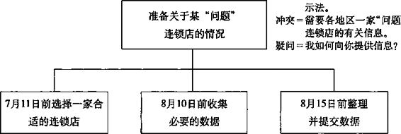

图4-5将疑问强加给读者的发出指示式文章

**请求支持式**

另一类常见的备忘录是要求批准经费的申请。在此类备忘录中，读者的
疑问必定是“我应该批准这一申请吗”，此类疑问通常也是隐含的。

要求批准经费的备忘录通常具有以下结构：

背景（S)=我们遇到了一个问题。

冲突（C)=我们的解决方案需要\_\_\_\_\_\_美元经费。

疑问（Q)=我应该批准吗？

如果更详细一点，也可以这样表示：

背景（S)=正如您所知道的，在过去4年中，我们部门的业绩每
年都增长了20%。但是，根据总部的规定，我们部门 的员工编制一直为14人。这造成了员工必须超时工作、 周末加班，但工作仍不断积压。

冲突（C)=目前我们部门积压的工作盤已经达到22周，这对任
何机构来说都无法承受，我们已没有再增加工作时间 的余地。通过研究，我们认为，购买一台价格为\_\_\_美元的BM\_\_\_既可以减少积压的工作量，又可以减少超时工作的次数。

疑问（Q)=我应该同意吗？

回答（M =我们请您尽快批准此申请。

为了使请求经费的申请得到支持，通常有3个（有时有4个）标准的理由：

您应当批准此申请，因为：

•解决该问题刻不容缓；

•此方案能够解决该问题（或者是：此方案是多种解决该问题方案
中最好的一种）；

•采用该方案后节约的成本（或其他合理的财务方式）将超过此方 案支出的成本；

•我们还可以得到其他好处。

以上第一要点详细说明了存在的问题，第二要点详细说明了解决方案。
第三要点是通常的财务分析。第四要点有时可表示成“此方案还将创造新的 业务机会”，但这一要点并不总是成立。不过，如果成立，就应该将这一要 点包括在内。换句话说，你并不是要出于这一原因而釆用该方案，但在准备 方案时，还是应当指出这一额外的好处。

图4-6是该文章基本的金字塔结构。

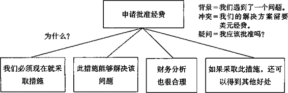

图4-6请求支持式文章的基本金字塔结构

**解释做法式**

经常地，尤其是在提供咨询时，你写作的目的是因为某人遇到了问题而
你要告诉他如何解决这个问题，即向读者解释解决问题的方法。解释方法式 文章的关键，要点结构是有关“步骤”，如图4-7所示：

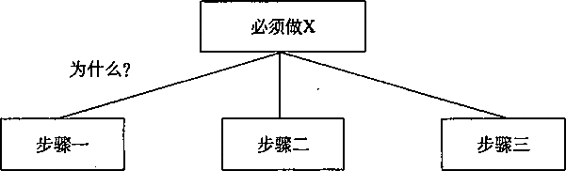

图4-7解释做法式文章到关键句要点结构

根据你告诉读者的是如何做他们以前没有做过的事，还是如何正确地做
他们正在做的事，文章序言的结构会略有不同。本书第2章列举的关于董事 会作用的备忘录就是第一类的例子：

背景（S)=必须做X。

冲突（C)=还未做好做X的准备。

疑问（Q)=如何做好准备？

假设有一家企业的市场预测系统作出了错误的预测，他们希望你告诉他
们如何使该系统作出正确的预测。那么其结构必然是：

背景（s)=你们目前的系统是X。

冲突（c)=该系统不能正常工作。

疑问（Q)=如何改进，使其正常工作？

在此例中，你的思路应当是首先列出该企业目前釆用的流程，如图4-8
所示，然后列出你认为正确的流程。两个流程之间的差异就能够告诉你文章 的关键句要点应该怎么写。

我想强调一下，在你开始写作之前，在纸上列出两个流程进行对比是非
常重要的。也许你认为，你都已经在这方面工作了很长时间，完全了解问题 出在哪儿，但是，如果你不将这两个流程列出来进行比较，那么你遗漏某个 重要因素的可能性就很大。

正因为我在这一类文章中发现过许多考虑不周全的例子，所以我才要特
别强调。我在本书的附录2中对此还有更详细的说明。事实上，我们在第3章 中提到的关于饮料公司大客户的备忘录就是一个典型的考虑不周全的例子。

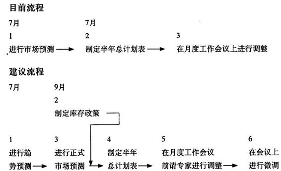\

建议结构

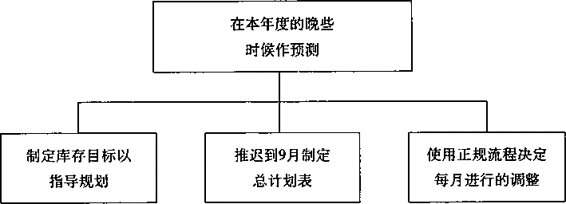

图4-8两个流程间的差异决定了关键句的要点

**比较选择式**

管理者们经常会要求下属就某一问题进行分析并提出解决方案，他们还
经常加上一句：“再提出几个替代方案。”严格地说，如果你对问题作出了 正确的界定，那么就根本没有什么替代方案。你建议的方案要么能够解决该 问题，要么不能解决该问题。从这个意义上说，没有什么替代方案。在第8 章我们将详细讨论问题的界定。

因此，管理人员的意思实际上是要求你“如果不能提出能够彻底解决我
们所界定问题的方案，那么就对我们可以尝试的一些方案提出建议”。也就 是说，在要求你写真正关于替代方案的备忘录之前，备忘录的读者肯定已经 了解这些替代方案，可能这些替代方案还在企业内讨论过。在这种情况下， 文章的序言就很容易写了：

背景（S)=我们希望做X。

冲突（C)=我们有各种不同的做X的方案。

疑问（Q)=哪一种方案最合理？

如果更详细些，也可以这样表示：

背景（S)=正如您所知，最近的一项评估认为，5-105马力发动机
在低温下采油的效率最高，我们最大的客户因此提出要 放弃我们的10马力发动机，改用其他公司的7\*(3/4)马力发 动机。

冲突（C)=我们有3种可能采取的措施：

一将我们的马力发动机的价格降至7\*(1/2)马力发动机 的价格

—改进7\*(1/2)马力发动机，使之达到7\*(3/4)马力发动机的 效能

一专门设计5-105马力发动机 \

疑问（Q)=哪一种方案最合理？

—旦你选择了某种方案，你通常可以用两种方法组织关键句要点，回
答“为什么此方案优于其他方案”这个疑问。具体釆用哪种方法取决于你的 分析结果。最好也最简单的方法是围绕评估的标准写关键句要点(如图4-9所 示）：

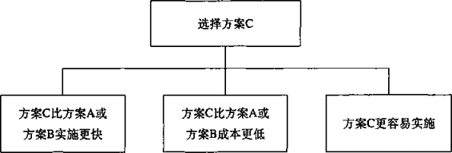

图4-9围绕评估的标准写关键句要点

但是，问题在于方案C并不一定在所有3个标准上都优于方案A或方案B。
这时，你只能通过说明所有可能的方案提出你的观点(如图4-10所示）：

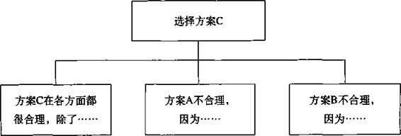

图4-10通过说明所有可能的方案提出观点

也就是说，你需要说明选择方案C的主要原因，以及放弃方案A和方案B
的主要原因。

如果任何一种方案都无法达到你的目标，或者在事先没有可选方案的情
况下，你无法提出能够达到所有目标的建议，那么这时的“疑问”要么是“哪 一个”，要么是“我们应该做什么”，而对此的回答则应为(如图4-11所示）：

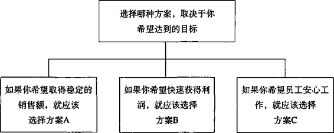

图4-11 对“疑问”的回答

注意，即使在这种情况下，你的文章也不是围绕解决问题的“替代方案
写作的，而是围绕“替代目标”写作的，这两者之间有很大的区别。

### 序言的常见模式——以咨询为例

咨询性质的文章与通常的商务性公文不同。咨询性质的文章通常较长，
而且其写作目的主要是推动读者釆取某种措施。因此，无论咨询性质的文 章是备忘录、报告、PPT演示文稿，或项目建议书，其作者（也就是咨询顾 问）通常都只回答表4-1中列出的4类问题的前3类。本书第8章和第9章将详 细介绍如何构思咨询性质的文章。下面只是简单地说明两种最常见的咨询性 文章：

•项目建议书

•项目进度小结

**项目建议书**

项目建议书是咨询公司的生命线，因此，多年来，各咨询公司为此类文
章付出了大量的心血。大多数咨询公司都遵循以下方式：

背景（S)=你遇到一个问题（用1〜2句话描述该问题)。

冲突（C)=你已决定请第三方帮助解决此问题。

疑问（Q)=你是我们应该聘请来解决该问题的第三方吗？

当然，对括号中隐含的读者“疑问”的回答永远都是肯定的。接下来的
关键句结构通常由4部分组成：

1\. 我们理解该问题。

2\. 我们有解决该问题的合理方法。

3.我们在应用此方法上有丰富的经验。

4.我们的项目安排非常合理。

在实际写序言时，你可能会倾向于将“冲突”和“疑问”不直接写出来，
这样序言读起来就可能像下面这样：

我们很高兴和您见面，并讨论了因公司内部持有不同意见而难以确定如何处理汽车后续市场的问题。本文提出了我们的建议，希望有助于您从多种方案中挑选出合适方案，并制定能够使您在短期内取得较大市场份额的战略。

这种项目建议书结构通常用于新客户，因为咨询顾问希望将主要的精力
放在分析问题上，从而使读者了解其在该领域的突出专长。如果客户是知名 企业，或者该建议书纯粹只是形式，那么可以将对问题的描述放在序言中， 这样可能会使文章结构更清晰。第8章中还有对此更详细的介绍。

背景（S)=你遇到了一个问题（用3〜4段进行说明）。

冲突（C)=你希望通过咨询解决该问题。

疑问（Q)=你将如何帮助我们解决我们的问题？

在本例中，文章的其余部分都会围绕咨询顾问解决该问题的方法展开，
其思路是：客户将因为这种方法而决定聘请该顾问。（虽然情况并非总是如 此。）这种文章结构，将促使作者把能够证明其经验的例证，与如何釆取及 为什么要釆取其所提出的具体方法相结合。咨询顾问的项目安排通常会在附 信中说明。

**项目进度小结**

项目进度小结通常是某顾问在某个项目的每个阶段结束时与客户或自己
的上级进行交流的正式文件，一般可在此基础上形成最终报告。除了第一份 项目进度小结，其他项目进度小结都具有相同的结构。

第一份项目进度小结可能具有如下结构：

背景（S)=我们一直在处理x问题。

冲突（C)=我们告诉过你，分析的第一步是确定Y是否成立。我
们现在已经完成了这一步。

疑问（Q)=你们发现了什么？

提交了这份项目进度小结后，读者将产生某种反应。也许他会要求你对
项目进度中发现的不正常现象进行调査，也许他对你的工作表示满意并要求 你继续进行第二步。

第二份项目进度小结则可能为如下模式：

背景（S)=我们在上一份项目进度小结中已经告诉过你，你们的
生产能力存在问题。

冲突（C)=你说你们认为这不会是一个长期的问题，因为你们认
为你们所面临的竞争很快会结束。你要求我们调查情 况是否确实如此。现在我们已经完成了调查。

疑问（Q)=你们发现了什么？

回答（A)=我们发现你们仍然存在生产能力问题，而且情况比以 前更严重。

如果用更简洁的方式表示，则为：

背景（S)=我们告诉过你X。

冲突（C)=你要求我们调查丫，我们已经完成该调查。

疑问（Q)=你们发现了什么？

(在本书附录2中，你可以看到一些实际的咨询类文章的序言。）

我希望对文章序言的讨论能够使你认识到序i部分的重要性，明白需要
花费大量的精力思考，以保证写出完美的序言。正如你从以上例子中了解的 那样，好的序言所起的作用不仅仅是吸引并保持读者的注意力，还能够影响 读者对文章的理解。

序言中的故事，能够使读者就作者对“背景”的独特解读具有真实感，
而实际上这种解读的本质，就是对相关事实进行有倾向性的选择。但是，这 种真实感限制了读者对“背景”进行不同的解读，就像律师的开场白总是希 望将陪审团的思维限制在某个框架内，从而使陪审团只能在这个思维框架内 评判律师提出的证据。

讲故事还能够使读者感到作者得出结论的逻辑必然是正确的，从而减少
读者对文章随后的思路提出反对意见。此外，讲故事还能够使读者感受到作 者对读者的关心——希望读者能够清楚地理解“背景”，能够透过叙述性的“故 事”看到其代表的事实。

。。。。。。。。。。。。。。。。。。。。。。。。。。。。。。。。。。。。。

提示

序言应当介绍4要素：

|            |                                                |
|------------|------------------------------------------------|
| 1.介绍背景 | '(S，Situation) |
| 2.指出冲突 | (C, Complication)                              |
| 3.引发疑问 | (Q, Question)                                  |
| 4.给出答案 | (A, Answer)                                    |

。。。。。。。。。。。。。。。。。。。。。。。。。。。。。。。。。。。。。

## 第5章演绎推理与归纳推理

前面已经谈到，条理清晰的文章，必须能够准确、清晰地表现同一主题
思想下的思想组之间的逻辑关系。以正确的方式组织起来的思想必然会形成 —个金字塔结构，这些思想分别位于不同的抽象层次上，但互相关联，并且 由一个单一的主题思想统领。

金字塔中的思想以3种方式互相关联——向上、向下和横向。位于一组
思想的上一个层次的思想是对这一组思想的概括，这一组思想则是对其上一 层次思想的解释和支持。同一组中的思想之间存在着逻辑顺序，具体的顺序 取决于该组思想之间的逻辑关系是演绎推理关系，还是归纳推理关系。

这两种逻辑推理方式是建立思想逻辑关系仅有的两种模式。因此，为了
理清自己的思路，条理清晰地表达自己的思想，有必要了解演绎推理和归纳 推理这两种逻辑推理方式的区别和应用。

图5-1简要说明了演绎和归纳的区别。演绎是一种线性的推理方式，最
终是为了得出一个由逻辑词“因此”引出的结论。在金字塔结构中，位于演 绎论证过程上一层次的思想是对演绎过程的概括，重点是在演绎推理过程的 最后一步，即由逻辑词“因此”引出的结论。归纳推理是将一组具有共同点 的事实、思想或观点归类分组，并概括其共同性（或论点)。在演绎过程中， 每个思想均由前一个思想导出；而在归纳过程中则不存在这种关系。

**演绎推理**

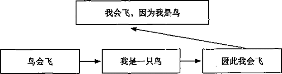

**归纳推理**

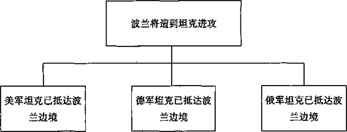

图5-1演绎推理与归纳推理的区别

演绎与归纳的区别非常明显，接下来的两节将进一步阐述它们之间的区
别。一旦你真正理解了演绎与归纳的区别，你就能够毫不费力地识别和分辨 这两种推理方式，并根据需要表达的思想正确地选择用演绎或归纳方式。

。。。。。。。。。。。。。。。。。。。。。。。。。。。。。。。。。。。。。

**提示**

演绎推理与归纳推理：

在金字塔横向结构中，同一组中的思想之间存在着逻辑顺序，具体的顺
序取决于该组思想之间的逻辑关系是演绎推理关系，还是归纳推理关系。

位于演绎推理过程上一层次的思想是对演绎过程的概括，重点是在演绎
推理过程的最后一步，即由“因此”引出的结论。归纳推理是将具有共同点 的事实、思想或观点归类分组，并概括其共同性（或论点）。

。。。。。。。。。。。。。。。。。。。。。。。。。。。。。。。。。。。。。

### 演绎推理

因为演绎推理比归纳推理更容易实现，人们在思维时会更多地使用演绎
推理。演绎推理法还是人们在思考如何解决问题时通常采用的方法，因此也 是人们在呈现自己的思想时愿意采用的方法。虽然演绎推理是一种有效的思 维方法，但在用于写作时却显得比较笨拙、繁琐。下面我将尽力说明这一点。

**演绎推理的步骤**

•首先，先了解一下什么是演绎推理。人们通常将演绎法解释为具有三段
论的形式——即由一个大前提和一个小前提推导出一个结论的论述形式。但 是，使用这种术语解释写作中的演绎推理过程反而容易使人迷惑，因此，我 将不使用三段论的术语。

我将演绎推理过程看做需要完成以下3个步骤：

•阐述世界上已存在的某种情况。

•阐述世界上同时存在的相关情况。如果第二个表述是针对第一个
表述的主语或谓语的，则说明这两个表述相关。

•说明这两种情况同时存在时隐含的意义。

演绎推理也可以是以下3个步骤：

•出现的问题或存在的现象。

•产生问题的根源、原因。

•解决问题的方案。

图5-2列举了几个演绎推理的例子，每一个例子都可看做是完成了前面
说的3个步骤。而且，在每一个例子中，在推理过程的上一个层次的思想必 须是对该组思想的概括，且重点放在推理过程的最后一个步骤上。因此，以

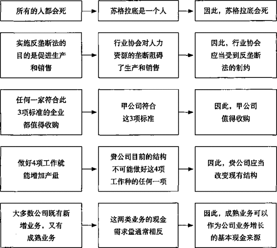

图5-2 线性演泽推理步驟

上例子的上一个层次的思想应分别为：“因为苏格拉底是一个人，所以他会
死”，“如果你想增加产量，就必须改变现有公司结构”，等等。

以上这些演泽推理的例子包括了所有的推理步骤，但是，有时在把超过
两个演绎过程连接起来时，你可能会希望略去一个推理步骤，因为对所有的 推理步骤一一进行说明，可能会使推理过程显得冗长而呆板。如果你的读者 能够理解并同意略去步骤，这种连环式的演绎推理是完全可以接受的。

图5-3的例子就是一个连环式演绎推理过程，其完整的推理步骤类似于 以下过程：

一我们的旧报纸供应足以满足我们自身的需要。

一但是我们已经将旧报纸卖给了其他国家。

一因此我们面临旧报纸短缺。

一旧报纸短缺会导致新闻纸短缺。

一我们面临旧报纸短缺。

一因此我们面临新闻纸短缺。

可以看出，如果将演绎推理的所有步骤都列举出来，推理过程显得非常

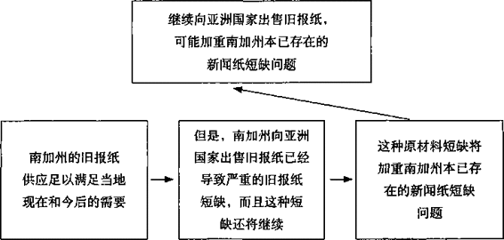

图5-3连环式演绎推理

琐碎。这也是我不赞成在写作中过多使用演绎推理的主要原因。演绎推理过
程繁琐，主要是因为演绎推理必须从简单明了的思想推导出复杂的思想。

**演绎推理的应用**

由于演绎推理非常繁琐，我建议在关键句层次上尽量避免使用演绎法论
述，尽量用归纳法取而代之。为什么？因为归纳法更便于读者阅读和理解。

下面我举例说明读者在阅读用演绎法组织的文章时，被迫进行的思考过
程。假设你想告诉某人必须以某种方式进行改革，你的论述的基本推理过程 如图5-4所示：

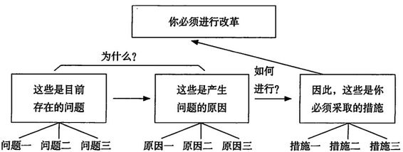\

图5-4论述的基本推理过程

为了理解你的思维过程，读者必须首先理解和接受“目前存在的问题”（问
题一、问题二、问题三)。做到这一点并不难。但是，随后你要求读者将第 —个存在的问题“问题一”带到“产生问题的原因”这一组思想中，与产生 第一个问题的原因“原因一”联系起来，然后将这种联系保存在大脑中，再 依此类推，将“问题二”与“原因二”，以及“问题三”与“原因三”联系 起来。然后，读者还必须再次重复以上过程:将“存在的问题”中的“问题一”， 与“产生问题的原因”中的“原因一”相联系，共同与“应釆取的措施”中 的“措施一”相联系。问题二、原因二、措施二以及问题三、原因三、措施 三也需要同样处理。

这种方法，不仅使读者必须费尽周折才能知道要釆取什么措施，而且使
读者在获得“回报”（了解要釆取的措施）前，必须重复作者解决问题的思 维过程。这就相当于对读者说：“我费了很大的劲儿才找出解决方案，我必须 让你知道我付出的辛苦劳动。”但是，用归纳法表达同样的思想，可以使作 者和读者都省去不少工夫，如图5-5所示：

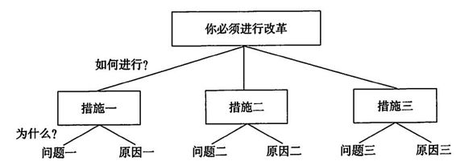

图5-5用归纳法论述更清晰、更简洁

在图5-5中可以看到，我们将提出“为什么”和“如何做到”这两个疑
问的顺序颠倒了一下，先提出“如何做到”，再提出“为什么”。虽然在金 字塔结构的最底层仍然使用了演绎推理法，但直接回答了读者的主要疑问， 而且思路非常清晰：所有关于同一主题的信息都集中在一起，不同主题之间 的思维界限非常明确。

人们经常问我：“但是，演绎法不是比归纳法更严密、更有说服力吗？”
根本就不存在这个问题。在以上两例中，我们思考时采用的推理方式是完全 相同的，只是在写作时呈现思想的顺序不同而已。

我们换一种方法再解释一遍。在完成解决问题的思维过程后，你可以将
各种思想分类列入一个“工作表”中，如表5-1所示。该表将你收集的“调 研结果”、由调查结果得出的“结论”，以及根据结论提出的“建议”分类列出， 看得更清楚。

虽然“调研结果”、“结论”和“建议”这些词汇被人们广泛使用，但严

表5-1必须使用演泽推理分析问题的步骤

|                  |                  |                  |
|------------------|------------------|------------------|
| 调研结果         | 分析结论         | 建议             |
| 目前存在的问题： | 产生问题的原因： | 必须采取的措施： |
| -问题一          | -原因一          | -措施一          |
| -问题二          | -原因二          | -措施二          |
| -问题三          | -原因三          | -措施三          |

格地说，这种用词并不太准确。“调研结果”和“结论”其实并没有什么区别，
只是被人们随意地用于表示不同的抽象程度。我们知道，对一组调研结果的 概括就是一个结论。因此，文章中必定有一组调研结果和结论是支持“存在 的问题”的，也必定有一组调研结果和结论是支持“产生问题的原因”的。

为了得出这些结论，人们必须使用归纳、演绎和不明推论（abduction)
这3种推理方法中的一种。我们此前已经了解了归纳法和演绎法。不明推论 指的是先提出一个假设，然后寻找支持该假设的信息。一旦获得了支持假设 的信息，这种推理过程就又变成了归纳法。附录1中对不明推论还有进一步 说明。

上表中列出的思想已经足以构成完整的推理过程，剩下唯一要做的就是
用什么方法将其呈现出来。如果你希望用演绎的方法表达你的思想，就要依 次将表中的每一类思想列出来（先问题一、原因一、措施一，后问题二、原 因二、措施二h如果想用归纳法，你可以简单地将整个表逆时针旋转90度， 将“建议”这一列思想放在关键句层次上，将对应的调研结果或结论依次置 于关键句思想的下一层次上（问题一、原因一、对应措施一;问题二、原因二、 对应措施二)。

本例中存在的问题是：应该先告诉读者为什么要进行改革，然后告诉读
者要釆取的措施；还是应该先告诉读者必须进行改革，然后告诉读者为什么 要进行这样的改革。根据我的经验，最好先说明行动，后说明原因，因为要 釆取哪些行动才是读者最关心的。当然在极少数情况下，读者也可能更关心采取行动的原因。

在什么情况下，采取行动的原因比釆取行动本身对读者更重要呢？当你
在金字塔顶端表达的思想，与读者期望的或预想的不一样时会出现这种情况。 例如，我们想象一下以下两种情况：

情况一：

某人：告诉我如何降低成本。

你：降低成本是一件很容易的事。

某人：如何做到？

你：只需做到A、B和C即可。

显然，读者更关心“如何做”（how)，在这种情况下，我们将得到一个
使用归纳法的标准的金字塔结构，如图5-6所示：

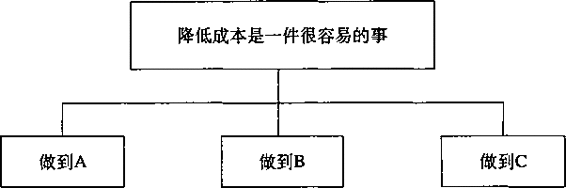

图5-6 —个使用归纳法的标准的金字塔结构

情况二：

某人：告诉我如何降低成本。

你：别想着降低成本了，还是考虑考虑把公司卖了吧。

某人：为什么？怎么卖？你肯定要这样做吗？天哪！

读者不理解，而更关心“为什么”（wshy)，在这种情况下，你需要用 演绎法表达。

还有一种需要在关键句层次上使用演绎推理的情况是：如果不首先给予
解释，读者就无法理解需要釆取的行动。第4章列举的戴维\*•赫兹写的关于 如何进行风险分析的例子就属于这种情况。在该例中，读者必须先了解分析 方法的思路，才能理解根据分析方法需采取的实际措施，如图5-7所示。

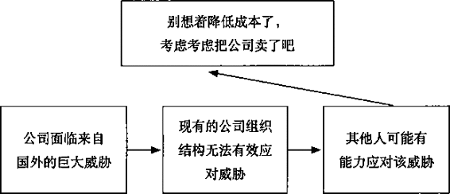

图5-7先了解分析方法的思路，然后理解需采取的实际措施

商务文章的读者很少属于以上两种情况。因此，你通常需要将金字塔结
构的关键句层次用归纳法组织。注意：我所说的尽量使用归纳法，只是针对 关键句层次，而不包括关键句层次以下的层次。如果演绎推理非常简单直接， 人们就很容易理解，如：

鸟会飞 ——►我是一只鸟 ——►因此我会飞

但是，如果读者必须读完十几页，才能找到演绎推理的第一步和第二步
之间的关系，又必须再读十几页才能找到第二步和第三步之间的关系，那么 读者就无法快速理解这次演绎推理。因此，你应该尽量将演绎推理放在金字 塔结构中较低的层次上，尽可能减少在演绎推理过程中插入其他干扰信息。 在某个段落中使用演绎法是合适的，读者也很容易理解。但是，在较高的层 次上，归纳法总是比演绎法更容易理解。

如果你准备在金字塔结构的较低层次上使用演泽推理，可以参考以下几
种将基本的三段论式演绎推理，连接压缩而成的连环演绎推理，如图5-8所示。

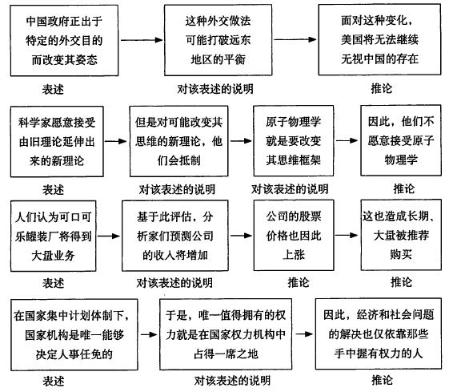\

图5-8连环式演绎推理

在连接演绎推理时，需要记住的是:1.演绎推理的过程不要超过4个步骤;

2.推导出的结论不要超过两个。事实上，如果你想将4个以上的推理步骤或
两个以上的推导结论连接起来，也是可以做到的（法国的哲学家们一直这样 做)，但是这样做将使该组思想过于复杂，难以有效概括。因此，为了适当概括， 应当将推理过程控制在4步以内。

。。。。。。。。。。。。。。。。。。。。。。。。。。。。。。。。。。。。。

提示

**演绎推理需要完成3个步骤：**

•阐述世界上已存在的某种情况。

•阐述世界上同时存在的相关情况。如果第二个表述是针对第一个表述
的主语或谓语的，则说明这两个表述相关。

•说明这两种情况同时存在时隐含的意义。

**演绎推理也可以是以下3个步骤：**

•出现的问题或存在的现象。

•产生问题的根源、原因。

•解决问题的方案。

。。。。。。。。。。。。。。。。。。。。。。。。。。。。。。。。。。。。。

### 归纳推理

归纳推理比演绎推理难得多，因为归纳推理更需要创造性的思维。在归
纳推理时，大脑首先注意到若干不同的事物（思想、事件、事实）具有共性、 共同点，然后将其归类到同一个组中，并说明其共性。

图5-1列举的波兰与坦克的例子中，所有的事件都被定义为“针对波兰
的军事行动”，因此，我们可以得出“波兰将遭到攻击”这样的推论。但是， 如果要把这些事件定义为“波兰的盟国在为进攻其他欧洲国家做准备”，那 么就会得出完全不同的推论。

在用归纳法进行创造性思维时，我们必须具备以下两项主要技能：

•正确定义该组思想。

•准确识别并剔除该组思想中与其他思想不相称的思想。

第6章对如何做到以上两点作了详细说明。目前，你只需要理解归纳推
理的基本原理，以区分归纳推理与演绎推理。

**归纳推理的步骤**

如图5-9所示，在进行归纳推理时，最重要的是找到一个能够表示该组
所有思想的名词。这个词必须是一个单一名词，因为：1.所有表示一类事物

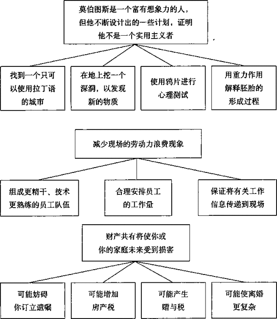

图5-9    归纳推理——将具有共同点的思想组织在一起

的词都是名词；2.该组思想中必定有两个以上（含两个）该类思想。在波兰
的例子中，“军事行动”就是这样一个名词，“进攻准备”同样也是一个符合 条件的名词。

请看图5-9中归纳性思想组合的例子。你很快会发现，每一组思想都可
以用一个单一名词概括说明：“计划”、“步骤”、“损害方式”等。并且 在每一组思想中，你都找不出一个与该名词不相配（不一致）的思想，即每 一个思想都符合该名词的定义（诠释、描述）。

接下来，你一定要通过自下而上提问的方式来检查你的推理。例如，如
果你看到一个人，这个人想找到一个只能使用拉丁语的城市，想在地球中心 挖一个深洞，等等，你可以推断他是一个有想象力的人但不是一个实用主义 者吗？答案是可以作这样的推断。

再看图5-10中的两个例子。如果管理人员不面对现实、不接受批评，你
可以由此推断，他们的管理不善是因为他们就愿意这样做吗？当然不能。这 样的推断显然过于草率。

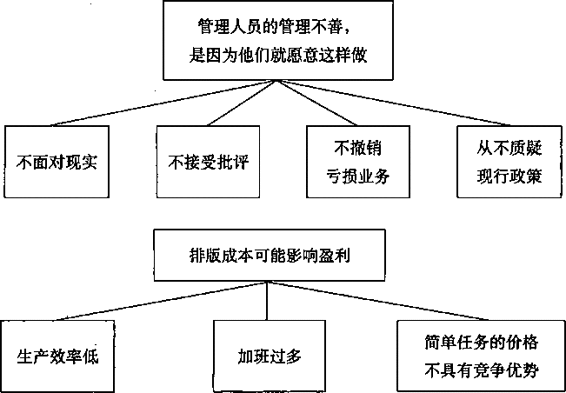

图5-10推理得出的结论不可超越本组思想

第二个例子又怎么样呢？如果某部门的生产效率低且价格无竞争力，你
可以推断出该部门拥有提高盈利的机会吗？也许可以，但是我还可以想出 三四个也可以被称为提高盈利机会的因素。如果这样，你就知道，你的主题 思想与其下面3个思想之间的抽象层次过多，也就是说，主题思想的抽象程 度过高，因为这一主题思想并非专门且只针对这3个思想。

事实上，你可能还记得，我们在第3章谈过，这是一个看似属于归纳推理，
而实为演绎推理的例子。生产效率低造成加班过多，而加班过多造成价格无 竞争优势。（无论何时你得到了支持某观点的论据，都必须用演绎法进行处 理。）因此，该金字塔结构顶端的隐含思想应当是“我们的价格偏髙是因为 我们的生产效率低”。

。。。。。。。。。。。。。。。。。。。。。。。。。。。。。。。。。。。。。

提示

用归纳法时，必须具有以下两项主要技能：

•正确定义该组思想。找到一个能够表示该组所有思想共同点的名词。 

•识别并剔除该组思想中与其他思想不相称（不属同类、不具有共同点） 的思想。

。。。。。。。。。。。。。。。。。。。。。。。。。。。。。。。。。。。。。

### 演绎推理与归纳推理的区别

现在你已经知道归纳推理与演绎推理之间有明显区别，也能够很容易地
说明这种区别。记住：当你进行演绎推理时，推理过程的第二个思想必须是 对第一个思想的主语或谓语的评述。如果不具有这一特点，就不是演绎推理 而是归纳推理，你就应当能够用一个单一的名词概括这两个思想，以检验你 归的类、分的组是否恰当。

举个例子。最近我在一本讲逻辑的书中看到了两个关于演绎推理的谬论:

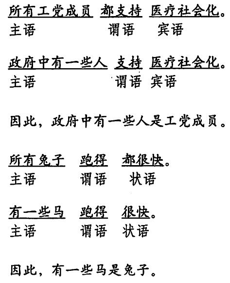\

你很快会发现，这两个例子中的第二个思想都没有评论第一个思想的主
语或谓语，所以这些思想之间不存在演泽关系。两个例子中的第二个思想， 实际上是向第一个思想建立的范畴（一个单一名词）中增加了一个组成成分。 将不同的思想放入同一个范畴中，就相当于要用一个单一名词概括其定义， 我们都知道，这种方法叫做归纳。

再举一个例子。假设我对你说：

“日本商人正在增加对中国市场的投资。”

你能看出下面的两个句子中，哪一个与上句具有归纳关系，哪一个与上
句具有演绎关系吗？

美国商人将艮快进入中国市场，必将进一步促进日商的行动。

美国商人正在增加对中国市场的投资。

显然，第一句与前一句具有演绎关系，第二句与前一句之间是归纳关系。
注意：在归纳过程中，你通常需要保持主语不变，改变谓语；或者保持谓语不变、改变主语。例如，你可以这样归纳：

日本商人正在增加对中国市场的投资。

美国商人正在增加对中国市场的投资。

德国商人正在增加对中国市场的投资。

归纳：投资商们正在对中国投资。

或者可以这样归纳：

日本商人正在增加对中国市场的投资。

日本商人正在增加对印尼市场的投资。

归纳：日本商人正在大力开拓东南亚市场。

再看一个例子：

日本商人正在增加对中国市场的投资。

日本商人正在增加对冰岛市场的投资。

日本商人正在增加对秘鲁市场的投资。

除了 “日本商人正在进入3国市场”之外，中国、冰岛、秘鲁3国之间有
什么共同点呢？没有。这些事实之间没有联系，因此也无法根据这些事实得 出更具概括性的观点。写出这些句子纯粹是为了传递新闻，而在一篇旨在表 达作者思想的文章中是没有新闻的立足之地的。

弄清新闻与思想之间的区别非常重要。“新闻”的真实性使有些作者认
为有理由将其写人文章中。但是，再想想我们在第1章中曾经谈到的：将一个 思想与其他思想一起写入某篇文章中的唯一理由，就是这个思想有助于对一 个更高层次上的思想提供解释或支持。只有当某一组中的思想用归纳法（具 有类似的主语或谓语)，或演绎法（第二点是对第一点的评述）适当关联时， 才能合理地从中概括出较高层次上的思想。

总而言之，演绎关系的建立，要求推理过程中的第二步对第一步作出评述，并推导出一个结论。归纳关系则基于句子的结构。作者必须发现各个句
子主语或谓语之间的相同点，并根据这一相同点得出结论。如果句子之间没 有相同点，就无法得出结论，这些句子也就根本不属于这篇文章。

还要注意的是：不论你将几个句子组织在一起，是为了进行归纳推理，
还是为了进行演绎推理，你的思维都会主动预期某个归纳式结论或演绎式结 论的出现。大脑对归纳论述和演绎论述的完整性有一种预期，读者的这种预 期，使读者将思维“投射”到前方，预测作者的下一个句子。如果读者预期 的结果与作者实际的表述不同，读者就可能感到困惑、不解、烦躁。因此， 你应当在呈现归纳或演绎过程之前，先告诉读者你的主题思想，以使读者能 够容易地跟上你的思路。

。。。。。。。。。。。。。。。。。。。。。。。。。。。。。。。。。。。。。

提示

演绎推理与归纳推理的区别：

演绎推理，第二点是对第一点主语或谓语的论述。

归纳推理，同组中的思想具有类似的主语或谓语。 

。。。。。。。。。。。。。。。。。。。。。。。。。。。。。。。。。。。。。

# 第2篇 思考的逻辑

在将金字塔原理具体应用于公文写作时，你只需要稍加练习，就可以简
单、轻松、快速地搭建好文章的总体框架结构。通常情况下，你可以很快确 定文章的主题和读者可能提出的疑问，想好序言（前言、开场白、引言）中 的“背景”和“冲突”，提出文章的中心思想和关键句要点。然后，你就可 以使用疑问/回答式的对话方式，在每一个关键句要点之下的层次上展开论 述或说明。

当你对文章结构的思，已深入到关键句层次的下一个层次时，你就应该
开始写作了。更低层次上的思想不要在构思阶段完成，而应放在实际的写作 过程中完成。当你写完全篇文章时，还必须仔细检查一下全文的结构，因为 你可能发现自己犯了以下两种常见错误之一：

•仅仅因为可以用同一个名词概括，而将关联性很小的思想排列在
一起（如“10个步骤”或“5个问题”等），实际上这些思想之间 不存在逻辑关系。

•金字塔结构顶端的中心思想，使用的是“缺乏思想”的句子（如“该
公司存在5个问题”），而非具有揭示性的观点。

罗列似乎已经成为一种普遍的倾向。实际上，罗列不失为一种将作者的
思想排列出来并审视的好方法。但我们不能就此止步，而应当进一步思考， 以保证每组中的各个思想之间确实存在某种内在的逻辑关系，然后明确说明 这种逻辑关系的隐含意义“。

认真研究各个组的思想是思考过程的重心，但也是一项艰难的工作，正因为艰难，而使这一过程经常被忽略。忽略这一步骤，意味着你无法将自己
的思想清晰、明白地呈现给读者，更糟的是，你可能根本就没有把握好自己 思想的核心。这不仅是在浪费时间和资源，还说明你没有通过思考，发现所‘ 有应该发现的思想和观点。

例如，列举某公司存在的问题有以下两种方法。你可以想一想，第一种
方法会使管理者们多花多少时间，才能找出解决问题的措施？

原文：

客户对销售报告和库存报告不满意。

1.提交报告的周期不恰当。

2\. 库存数据不可靠。

3\. 获得库存数据的时间太迟。

4\. 库存数据与销售数据不吻合。

5\. 客户希望改进报告的格式。

6\. 客户希望删除无意义的数据。

7\. 客户希望突出说明特殊情况。

8\. 客户希望减少手工计算。

修改后：

销售系统和库存系统生成的月度报告存在问题。

1\. 报告中含有不可靠的数据；

2\. 报告的格式混乱；

3\. 生成报告的时间太晚，无法采取有效措施。

如何才能从原文罗列的信息，整理出修改后罗列的结论呢？本篇将讨论
有关的实用技巧。首先，要找出将这些思想联系起来的逻辑框架，并确定其 逻辑顺序（见第6章“应用逻辑顺序”），然后概括总结出各组思想的隐含意 义——即所谓的归纳跃进（inductive
leap)(见第7章“概括各组思想”）。

这一过程称为冷静思考（Hard-Headed Thinking)。学习和应用这一步
骤都有一定的难度；但是，如果你确实想了解自己的思维，就必须掌握冷静 思考的技巧。因此，希望你多花一点时间，了解和掌握思考的技巧。

## 第6章应用逻辑顺序

金字塔原理的第二条规则规定：所有列入同一组中的思想必须具有某种
逻辑顺序。这条规则可以保证你列人同一组中的思想确实属于这一组，还可 以防止你遗漏任何相关的思想，即你已经将一些思想归集在一起，并用“步 骤”之类的名词描述它们的共性，但是，你还必须将这些思想按照第一、第二、 第三的顺序排列，否则就不能确定这些思想确实属于同一过程，也不能保证 这些思想是该过程的全部步骤。

在演绎性的思想组中，你可以毫不费力地找出该组思想的逻辑顺序：即
演绎推理的顺序。但在归纳性的思想组中，你却可以“选择”一种逻辑顺序。 因此，你必须掌握选择逻辑顺序的方法，以及判断你的选择是否正确的方法。

有一点你必须理解：从理论上说，你组织在一起的思想绝不是随意堆放
在一起的，而是因为你看到了其中的某种逻辑关系，才将其“挑选”出来并 组织在一起的。例如，请看以下分组：

•解决问题的3个步骤。

•某公司成功的3个关键因素。

•某公司存在的3个问题。

为了发现以上3组思想的逻辑关系，你的大脑必须进行逻辑分析，而你选择的逻辑顺序应当展现大脑在分组时所进行的分析活动。大脑的归纳分组
分析活动只有以下3种，如图6-1所示。

1.确定前因后果关系                                                      
                         时间（步骤）顺序

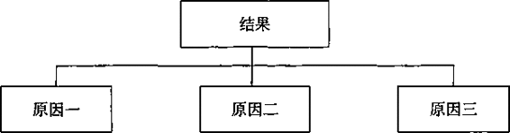

2.将整体分割为部分.或将部分组成整体                                    
          结构（空间）顺序

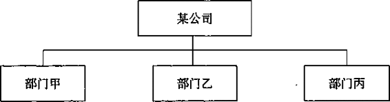

3.将类似事务按重要性归为一组                                            
           程度（重要性）顺序

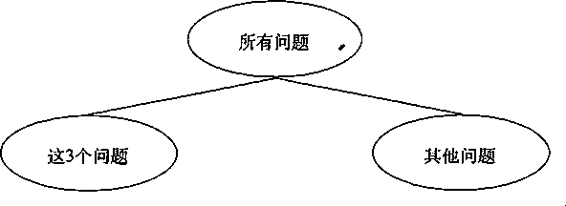

图6-1将思想分组的3种归纳组合顺序

**1.确定前因后果关系**

当你在文章中告诉读者釆取某种行动时（如：辞退销售经理、将盈利指标分解到各个销售分区），你必定认为通过这种行动会产生某种预想的特定
效果。你首先要确定希望取得的结果或效果，然后指出为取得这一效果必须 釆取的行动。

当必须釆取多种行动（如：解决问题的3个步骤），以取得该结果时，这
些行动就构成了一个过程、流程或者一个系统，即共同产生某结果的原因的 集合。完成该过程或系统需采取的行动只能按时间顺序依次进行。因此，代 表一个过程或系统的一组行为，必定是按时间顺序排列，而对该组行为的概 括，必定是采取这些行为要取得的结果或达到的目标。

**2. 将整体分割为部分，或将部分组成整体**

在绘制组织结构图或行业结构图时，通常需要将整体分割为部分，或将
部分组成整体。例如，如果你需要找出“在该行业成功的关键要素”，首先 你必须画出该行业的结构图，然后确定在各个部分成功的必需要素。这些必 需要素之间的逻辑关系，与此前画出的行业结构图中各部分之间的关系互相 ——对应，这种逻辑顺序就是结构顺序。

**3. 将类似事务按重要性归为一组**

当你说某公司“存在3个问题”时，严格地说，并不十分准确。该公司
肯定存在许多问题。你从所有的问题中挑出了
3个与其他问题相比更值得重 视的问题。问题与问题之间具有某种共同特性，使你能够将其列为某一特定 种类的问题，如：每个问题都是因为不愿意授权而造成的结果。

这3个问题的共同性在于，每个问题都具有以上这一共性，而区别则在
于每个问题所具有的共性的程度各不相同。（如果这3个问题具有的共性的程 度相同，你就不可能从这方面区分出这3个问题。）因为存在这种差异性，你 可以根据这些问题具有某种共性的不同程度，按照“重要性”或“程度”从 高至低，即从重要到次重要，或从大至小的顺序排列，这就是程度顺序，也 称为比较顺序或重要性顺序。

以上3种逻辑顺序既可以单独使用，也可以结合使用，但是每一组思想中都必须至少存在一种逻辑顺序。换句话说，如果任何一组思想是通过以上
3种分析框架中的一种得出，那么该组思想就必须按照上述之一的逻辑顺序 组织。因此，在写作时，你必须有意检查每一组思想中是否存在某种逻辑顺序。 如果该组思想不存在任何一种逻辑顺序，那么显然这一分组有问题，你应运 用逻辑分析框架的知识找出问题所在。

下面进一步介绍逻辑顺序的知识，以及如何运用这些知识检查你的思路。

### **时间顺序**

时间顺序可能是最容易理解的一种逻辑顺序，因为这种顺序是将思想分
组时使用最广泛的。在按照时间顺序组织的思想组中，你要按照采取行动的 顺序（第一步、第二步、第三步……）依次表述达到某一结果必须釆取的行 动。该组中的思想可以是实际的行动步骤或行动性的思想(如:建议、目标等)， 也可以是大脑中隐含的思维过程得出的结论。在这两种情况下都有可能出现 逻辑不清的现象：前一种情况是由于人们在罗列思想时难以区分原因和结果; 后一种情况是由于人们没有认识到其思维中实际上已包含了某种逻辑过程。

**根据结果寻找原因**

写作时常见的问题之一就是无法区分原因和结果。前面说过，同一组行
动只是为了达到同一个特定的结果。但是，如果某个过程或流程较长，且包 括许多步骤，那么就会存在多个层次的原因和结果。为了说明这一点，请看 下面的例子，这是一名咨询顾问建议某公司应釆取的提高生产效率的措施：

在第一阶段应采取以下措施：

1\. 与主要管理人员及监管人员谈话。

2\. 跟踪并记录交易行为和工作流程。

3\. 确定所有关键业务环节。

4\. 分析组织结构。

5\. 理解服务和绩效措施。

6\. 评估业务职能的绩效水平。

7\. 找出问题和原因。

8\. 发现提高生产效率的潜在机会。

首先，这个过程步骤太多，读者难以掌握。你回想一下前面的关于奇妙
的数字“7”的内容，人一次性最多记忆7个项目，凡超过7个，就应当归类 分组。

(事实上，我建议每组思想最好不要超过4个或5个。如果某一组思想超
过5个，那么其中某些思想之间便可能缺乏紧密的联系。如果你不指明思想 之间的逻辑关系，你的部分思想就会变得模糊不清。例如，如果说明“十诫” 中一部分是“对上帝之罪”，另一部分是“对人之罪”，将比逐条列出“十诫” 更容易使人理解。）

此外，虽然以上列出的8个步骤确实应该按照以上顺序进行，但是，这
些步骤并不处于同一个抽象层次上。其中一些步骤是为了实现另一些步骤， 也就是说，在总的过程中存在一些具有完整结构的子过程。如果不将这些子 过程剔分出来，将使作者实际想表达的思想模糊混乱。在上面的例子中，咨 询顾问实际想表达的思想基本应该如下所述：

在第一阶段，我们将确定提高生产效率的可能领域：

1.确定企业的关键业务环节（3)。

-与主要人员谈话（1）。

-跟踪并记录交易行为和工作流程（2)。

2\. 找出在开展业务时存在的弱点（7)。

-调整组织结构（4)。

-制定及实施务和绩效管理措施（5)。

-评估绩效水平（6)。

3\. 提出实用可行的改革建议（8)。

经过这样组织，作者就能够检查该过程中包括的步骤是否适当、是否有
遗漏。例如，这3个步骤是否是为了确定提高生产效率的可能领域而采取的 全部可能的步骤？如果我与主要人员谈过话，并且跟踪和记录了交易行为和 工作流程，是否就足以确定企业的关键业务环节呢？

避免出现因果关系错误的方法是假设自己釆取了文中提到的每一项行
动，并想象一下釆取每项行动之后产生的结果，就可以判断你必须釆取的某 项行动，是为了在时间上先于另一项行动，还是为了实现另一项行动。

想象自己亲自釆取行动，并想象结果，可以大大缩短考虑思想分组是否
合理的时间。看下面这个例子：

制定战略规划时必须了解循环周期：

1\.  了解需求。

2\. 制定能提供相应产品或服务的战略。

3\. 实施该战略。

4\. 市场接受期、快速增长期。

5\. 缓慢增长期、进入成熟期。

6\. 高现金增值期。

7\. 衰退期。

检查该组思想的第一步是看你是否理解所描述的过程。假设你自己就是
行动者，并开始行动：“首先.我了解市场需求；然后，我制定战略；再然后， 我实施该战略；再然后，我……”你会发现，这里出现了问题。

上面例子的作者似乎将3项由企业采取的行动，与4项由这些行动产生的
结果放在一个组里了。仔细看看这些行动产生的结果，你会发现，这些结果 反映的是正常的产品生命周期曲线，如图6-2所示。

该作者第四步的意思应该相当于“评估市场反应”，而图6-2中的几个时
期就是市场反应的各个阶段。（我们似乎漏掉了一点：高现金增值期。但是， 这一点通常属于进入成熟期的一个特点，根本不属于战略规划周期的一个阶 段。）原文可以按以下方式改写：

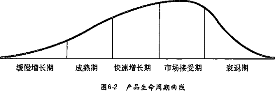

制定战略规划时必须了解规划周期：

1\. 了解需求。

2\. 制定能提供相应产品或服务的战略。

3\. 实施该战略。

4\. 评估市场反应。

5\. 调整战略以适应市场反应。

**揭示隐含的逻辑思路**

你得出的结论可能是基于某个隐含的逻辑过程，认识到这一点，对明确
表达你的真实思想很有帮助。很多时候，人们列举的结论只是含糊地提到， 并没有明确说明其真实思想，如下面这个例子：

经营的定义：

1\. 主要依赖创造性过程 

-按需求细分 

-按供给细分

2\. 随时间变化

-生命周期的早期和晚期 

-竞争动态

3\. 在某行业中不必独一无二

4\. 受自身优势和市场竞争的影响

虽然在该组思想的顶端并没有明确给出该组思想的概括性思想，但我们
不难假设这组思想在传达一些信息。因为这组思想中的语言合适，并且列出 的4个思想中的每一个都具有意义。如果你试图按照以上顺序检查作者的思 路（首先进行细分、然后对变化作出反应，然后评估自己的位置)，你会发现， 作者想传达的信息与如何确定经营的性质有关。你可以用更清晰的方式表达:

确定你所在企业的性质，需要认真分析：

1\. 对市场进行细分。

2\. 评估企业在各细分市场中的竞争地位。

3\. 长期跟踪竞争地位的变化。

然后作者可以检查是否忽略了确定经营性质所需的任何步骤，并作出合
理判断。在本例中，所需的步骤还是完整的，但是这种强迫自己重新考虑整 个过程的做法，能够使你知道如何通过提问检查其他人的思路。举个例子， 假设你的一位员工对你说：“这是我打算明天在会上说的，你看行吗？”

传统的投资评估的重点——比较未来的收益和可能的成本：

1.通常在技术上不可靠。

2\. 基于简单化的概念。

3\. 结果可能造成误导。

检查一下其逻辑顺序，你会发现，时间顺序可能才是其思想的根本顺序，
而第三点思想应列为主题思想，因为这一点是其他两项行动的结果：

传统的投资评估的重点可能造成误导：

1\. 基于简单化的概念。

2\. 通常在技术上不可靠。

此外，在检査从第一点到第二点的逻辑顺序时，你还应当想一下作为该
组思想分组基础的逻辑过程，例如：

提出适当的概念——►基于该概念开发一种技术——►应用该技术

我们看到，原文作者评述了该逻辑推理过程的第一个步骤和第二个步骤，
但是没有提到第三个步骤。作者没有评述第三个步骤的原因可能是：1.因为 人们应用该技术的方法没有什么问题；2.因为作者遗漏。我们认为作者遗漏 的可能性较大。在检查作者思路时，如果逆向追溯到作者思路的源头，你就 应该问一句：“人们应用该技术的方法是否有问题？”

有时你会发现某一现有的结构化思想组合釆用时间顺序。这时，该组思
想的结构本身将决定步骤的数量和顺序。关于这一点，请继续阅读结构顺序 的内容。

。。。。。。。。。。。。。。。。。。。。。。。。。。。。。。。。。。。。。

**提示**

时间顺序：

在按照时间顺序组织的思想组中，你要按照采取行动的顺序（第一步、
第二步、第三步）依次表述达到某一结果必须采取的行动。

。。。。。。。。。。。。。。。。。。。。。。。。。。。。。。。。。。。。。

### **结构顺序**

什么是结构顺序？结构顺序就是当你使用示意图、地图、图画或照片想
象某事务时的顺序。你想象的“某事物”既可以是真实的，也可以是概念性的; 既可以是一个物体，也可以是一个过程。但是，这个“某事务”必须被合理 地划分入不同的部分（不同的组)。

**创建逻辑结构**

在将某个整体（不论是客观存在的还是概念性的整体）划分为不同的部
分时，你必须保证划分后的各部分符合以下要求：

•各部分之间相互独立（mutually exclusive),没有重叠，有排他性。 

•所有部分完全穷尽（collectively exhaustive)，没有遗漏。

这两个要求简称为分组的MECE原则。当你绘制组织结构图时，如图6-3
所示，你肯定会不自觉地使用这一概念。

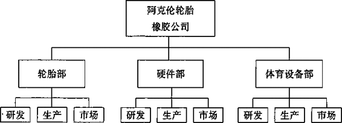

图6-3具有“相互独立，完全穷尽”性的组织结构图

相互排斥说明轮胎部的组成与硬件部不同，而体育设备部的组成与其他
两个部都不同，即各部分之间没有重叠。完全穷尽指的是所有3个部门加起 来就是阿克伦轮胎橡胶公司的全部组成，即没有遗漏任何部分。

如果你在将整体划分为部分时应用了这两条原则，划分出来的结构肯定
包括所有需要说明的部分。最简单的结构顺序，就是指按图6-3各部分出现 的顺序，对各部分进行说明。

应当以怎样的顺序将各部分放入示意图呢？当人们绘制组织结构图时经
常会问这个问题。你在图中填写各部分的顺序反映了你使用的划分原则。

通常有3种划分组织活动的方式：根据活动本身（如：研发、生产、市场
营销）；根据活动发生的地点(如：国家东部、国家中西部、国家西部)；根据 针对特定产品、市场或客户活动的集合（如:各事业部、各业务单元，轮胎部、 硬件部、体育设备部)。

•如果划分时强调活动本身，那么各部分展现的是一个逻辑过程（流
程），因此应采用时间顺序。

•如果划分时强调地点，那么各部分呈现的是地理状况，应采用结 构顺序。

•如果划分时强调与某一产品或市场有关的活动，那么划分就是一
种归类。各部分思想应采用重要性顺序，判断重要性的标准可以 是任何排序标准（如：销量、投资额等）。

假设在重组市政府的过程中，你成立了负责以下各方面工作的部门：

1\. 住房

2\. 交通

3\. 教育

4\. 娱乐

5\. 个人医疗

6\. 环境卫生

你认为这些都是市政府应当负责的领域，其顺序是假设该市所有建设都
从零开始时市政府对其关注的程度。在创建新的组织机构时，强迫自己用结 构顺序，可以使你检查各部分的总和对于你的目的来说是否完整。

但是，在划分组织结构以外的事务时，目的通常是分析各部分的功能，
因此，你应当按照功能划分。各部分的顺序按其预期可起到的作用排列。 例如，如果你准备讨论雷达装置，你就应当以雷达装置各部分的功能组织思 想的顺序：

1.调制解调器.

2\. 射频振荡器

3\. 带扫描装置的天线

4\. 接收器

5\. 指示器

调制解调器的功能是吸收能量，而射频振荡器能够发射能量。天线的功
能是将能量聚集在天线杆上，接收器的功能是接收天线扫描装置传回的信号， 而指示器的功能是显示数据。

。。。。。。。。。。。。。。。。。。。。。。。。。。。。。。。。。。。。。

提示

分组的MECE原则，保证划分后的各部分符合以下要求：

•各部分之间相互独立（muUially exclusive),相互排斥，没有重叠。

•所有部分完全穷尽（collectively exhaustive),没有遗漏。

。。。。。。。。。。。。。。。。。。。。。。。。。。。。。。。。。。。。。

**描述逻辑结构**

一旦建立起逻辑结构，就可以按照自上而下、自左而右的顺序依次描述
各个部分。在上例中，对雷达装置进行技术性的描述应当釆取这一顺序，对 其他任何机械装置进行技术性描述也应当遵循这一顺序。

但是，在描述各部分时，有时也可采用过程顺序（时间顺序)。举个例子，
如图6-4所示，是一张西奈沙漠的地图。下面的文字是对地图中各位置的描述:

在任何一张中东地区的地图上，西奈半岛都位于正中间。西奈半岛
几乎是一个倒置的等腰三角形，像一个锋利的楔子插入非洲与西亚之间。 出于不同的地缘政治考虑，对西奈半岛有多种说法：有人说，西奈半岛 是埃及东部领土的延伸，是神圣的埃及领土，只是在一个多世纪以前因 开凿苏伊士运河而将其和本土割离；有人说，西奈半岛是以色列南部领 土的自然、合理的延伸，是内盖夫沙漠的主体；有人说，西奈半岛是沙 特阿拉伯北部的附属地区，与其本土之间仅有狭窄的阿卡巴海湾一水之 隔；还有人说，西奈半岛自古以来就是连接东西部的大陆桥，是商队通 行和军队入侵别国时的便捷通道。

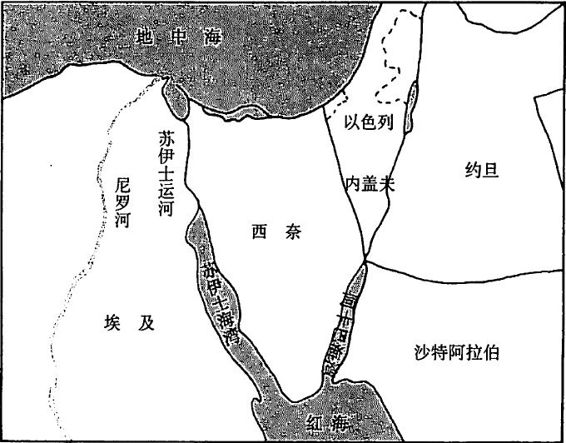\

图6-4 西奈沙漠地图

人们从不同的地缘政治角度看待西奈半岛，其顺序就是人的眼睛看地图
时的顺序：从左上角开始，沿顺时针方向进行。首先，人们看到的是西奈半 岛与埃及之间的运河，然后是以色列南部，然后是沙特阿拉伯北面，最后再 反转方向，自东向西。这说明，原文作者在写作时想象到了读者看地图时的 顺序，在描述地图时也采用了这一顺序。

**修改逻辑结构**

人们在处理逻辑结构时经常会想象与之相关的逻辑过程，尤其是在对已
有结构提出修改建议时。例如，假设图6-5是一个市政府的组织结构图，其 中包括25个部门，分别向23个委员会汇报。

你建议用由6个部门分别向6个委员会汇报，加上一个行政管理分支的结
构替代以上结构，如图6-6所示。

从第一个结构转变为第二个结构需要进行4个方面的改革。在写报告时，
你应当用什么顺序提出你的改革建议呢？这些改革同等重要，因此不能按重

23个委员会

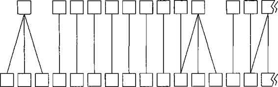

25个部门

图6-5原市政府组织结构图

要性顺序排列。理论上，这些改革也必须同时进行，因此也不能用时间顺序。

在此类情况下，最适合的顺序就是当你在白纸上依次画出各个部分，
向读者呈现时使用的顺序。在本例中，第一步是将众多委员会合并为政策 与财政委员会下属的6个委员会（如图6-6左侧所示）。第二步是将各部门合 并，并分别与6个委员会一一对应。第三步是成立两个为政策和财政委员会 提供支持的委员会。最后一步是成立由行政长官领导的管理团队，以管理行

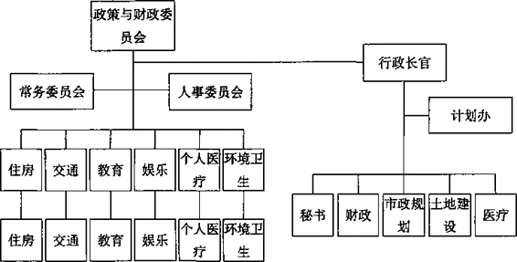

图6-6修改后的市政府组织结构图

政工作。

报告中具体的措词可如下：

为了完善市政管理体制，提高其完成重要工作的效率，市议会应当
采取如下措施：

1.将为群众提供服务的职责赋予政策与财政委员会下辖的6个委 员会。

2\.
将原有各部门组成6个项目管理部门，分别由一名项目负责人领 导，并分别对6个委员会负责。

3\. 组成行政及其他内部事务管理机构。

-成立常务委员会。

-赋予人事委员会更积极的作用，以激励市政工作者。

4\. 任命一名行政长官，以管理市政府在编人员。

**用结构顺序概念检查思路**

与时间顺序概念的作用一样，你也可以用结构顺序的概念，检查在分组
过程中是否有逻辑错误。假设你是某大城市的交通局局长，现在有一份文件 等你审批：

我们认为，此项工作的目标包括：

1.评估和分析维修区域及建筑区域的现场施工情况。

2\.
   了解现场工程师是否具有足够的组织和管理灵活性，以便对公 众提出的日常使用问题和要求作出适当的反应。

3\.
评估和分析初期工程、道路和桥梁设计、环保问题、用地许可 和交通管理等方面的问题。

4\. 评估和分析交通局的组织结构。

5\. 找出在每一研究领域的优势和劣势。

这些思想的顺序是什么？这些思想是从哪里来的？你可以很容易看出，第五点与其他几点不同，因为第五点是针对前面所有4点的。我们可以将第
五点剔除出去，暂不考虑。然后来看作者其他4点的主题：

1\. 维修及建造

2\. 日常运营

3\. 初期工程

-道路和桥梁设计 

-环保问题

-用地许可 

-交通管理

4\. 组织结构

如果从道路建设等过程的角度看，可以假定以上思想包括以下4个步骤:

1.设计

2\. 建造

3\. 运营

4\. 维护

因此，原文作者的意思也许是这样：

该项工作的目的是检查交通局的组织结构和管理是否适应履行其职
责。其职责包括4个方面：设计、建造、运营、维护。

下面再举一个例子。这个例子比较难，因为其罗列的思想之间的联系非
常随意。其实，作者在写作之前确实构思过文章的结构，但是，因为作者对 这种结构了解不清楚，也就无法利用其指导自己的思维。

这个例子是一家饮料生产企业的工作人员写的。这家饮料企业已经决定
将其产品的包装由玻璃瓶改为塑料瓶。但是，在产品包装的来源上，企业面 临两种选择：一种是从外部购买塑料瓶；另一种是自行开发塑料瓶生产能力。 该作者的立场是反对自行生产塑料瓶。

投资生产塑料瓶将面临一系列内部及外部的风险和限制：

1.技术风险——不成熟的设计问题。

2\. 环保风险——法律可能禁止生产不可回收塑料制品。

3\. 优惠风险——在通货膨胀期顾客不一定欢迎优惠包装。

4\.
非独家经销：（1)外部销售将降低营销作用；（2)因所有权问題 难以向其他企业销售。

5\. 投资多——投资回收期过长。

6\. 对每股收益造成负面影响（因杠杆作用而加大）。

7\. 近期研发费用。

8\. 公司现金流问题——现有业务发展需要资金。

9\. 玻璃制造商们大幅降低产品价格，而塑料制品的通胀率比玻璃 制品低。

10\.
在我们进入塑料制造行业时，其他塑料制造商可能会大幅降低 产品价格，因为其投资利润率偏低（多数处于7%~
10%的范 围内）。

11\.
容器行业的典型特征是低利润，进军该行业的关键是低成本生 产。进入该行业可能导致我们的股价收益率下降。

你是不是看得有点头晕？但是，对这段文字的检查过程与检查其他文字
一样。首先，依次检查作者的每一条反对意见，了解其反对的原因。为什么 作者认为这些问题是不利因素呢？我们将作者反对的原因逐条列在下面，希 望你能够看出一些线索。

1.高成本

2\. 法律限制

3\. 被迫降低销售量或价格

4\. 低销售额

5\. 高投资、低投资回报率

6\. 每股收益率下降

7\. 尚成本

8\. 必须贷款

9\. 被迫降低价格

10.被迫降低价格

11.毛利低、股价收益率下降

商界人士在谈论成本、销售额、价格、投资和投资回报率时，都假定对
方了解这些因素之间的关系，如图6-7所示。如果你按照此树形图将相关因 素一一对号入座，你就能够比较容易了解作者的思想：此项目将对投资回报 率造成负面影响。

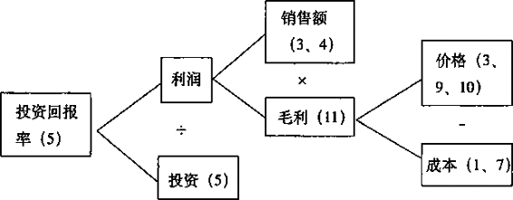

图6-7标准的投资回报率树形图

关于每股收益和股价收益率的两点涉及另一个树形图，如图6-8所示，
传达了另一个信息：此项目将对每股收益造成负面影响。

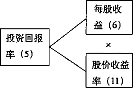

图6-8股价树形图

我们还剩下两点没有处理，即“我们必须贷款”和“如果法律禁止生产
不可回收的塑料制品，我们就可能无法销售塑料瓶装饮料”。其实，如果我 在“利润”这一因素下增加“税额和利息”的因素，“贷款”这一项就可以 纳入以上的树形图中了。我前面没有列人这一项，是为了使树形图更容易理 解。

我们试着将所有因素组织在一起，可以看出，原作者的意图是想表达：

我们在进入塑料容器生产行业之前应该慎重考虑：

如果法律禁止生产不可回收产品，我们可能根本没办法上马该项目。

即使该法律未能出台，该项目也将降低我们的盈利能力。

从近期看，降低每股收益。

从远期看，降低投资回报率。

了解了作者的思想后，你就可以仔细考虑其每个观点是否站得住脚。我
想，肯定有的观点站不住脚，因为我知道这家饮料公司不但进人了塑料容器 生产行业，还取得了巨大的成功。显然，原文作者没有考虑到的一个因素， 是评估塑料容器可能对产品销售产生的有利影响。

我重申一点：写作时，必须首先构思文章的结构，否则你可能根本不知
道自己已经写得一塌糊涂。按照结构写作，能够使你及时发现错误和遗漏。

。。。。。。。。。。。。。。。。。。。。。。。。。。。。。。。。。。。。

提示

结构顺序：

结构顺序就是当你使用示意图、地图、图画或照片想象某事务时的顺序，
如组织结构图、关键成功要素示意图等。

。。。。。。。。。。。。。。。。。。。。。。。。。。。。。。。。。。。。

### **程度顺序**

最后，来看看程度顺序，也称重要性顺序。是你对一组因为具有某种共
同特点而被聚集在一起的事务所釆用的顺序，如：3个问题、4个原因、5个因 素等。表达者将思想简单罗列出来而缺乏深人思考的现象尤为严重。

**创建适当的分组**

在为事物分组时，你可能会说：“这家公司存在3个问题。”这时，你
的大脑自动将这3个问题与该公司可能存在的其他问题分隔开，形成如图6-9 所示的分支结构。从名称上看，这两个组完全穷尽，按照分组的意图，它们 也应当相互排斥。

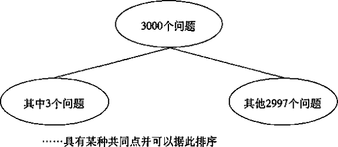

图6-9通过分组将思维集中于某个范围内

为了证明这两个组具有相互排斥性，你必须明确指明每组中的所有问
题具有共同特性，然后根据你的知识，确保将所有具有该特性的问题列人该 组。然后，在每组中，根据各个问题具有该特性的程度高低排序——最具有 该特性的问题排在第一位，即先强后弱，先重要后次要。

很多人曾问我，在确定了各要点的相对重要性（具有某特点的相对程度)
后，是否必须将最重要的列在第一位。他们指出，如果将最不重要的放在第 一位，依次增加重要性，将最重要的思想放在最后，会更具有戏剧性效果。

的确，这样会更具有戏剧性效罘，但是戏剧性是出于情绪的考虑，而不是出
于逻辑性的考虑，因此这是一个写作风格的问题。有时，你完全可以按先弱 后强的顺序，以产生更大的对情绪的冲击力。

但是，多数情况下，你应该将最重要的思想放在第一位。举个例子，假
设你列出以下要点：

设计电信计费系统时，应当注意让其适用性更加广泛：

1.能够满足外部客户的需求。

2.能够符合内部管理的要求。

3.能够符合国家法律法规。

虽然电信计费系统必须满足所有这3种功能性的要求，但是以上顺序表
明，满足客户的需求比符合国家法律法规更重要。作出这种评价是基于以下 分组，如图6-10所示。

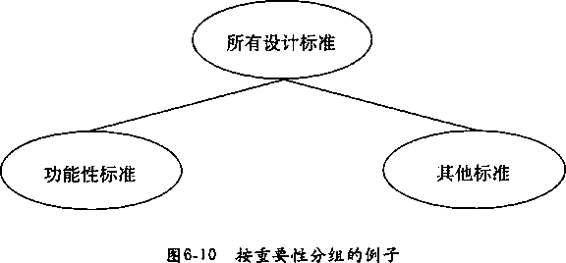

在商务公文的写作中，这种基于重要性顺序的分组远比时间顺序或结构
顺序用得少。但这并不是说分组行为很少。分组行为是人类普遍的习惯。人 们看到任何事物时，都会为其命名或说出其名称，这就是一种分组。但是，人们并不局限于根据思想具有的某个共同属性而将其分组，还会考虑这些思 想是否源自同一个过程，或来自同一个结构，并据此将相似的思想分组。

如果你清楚了解了分组的原则，就完全可以按照过程或结构顺序组织思想。例如，以下是支持某一观点的3个“理由”：

你们不应该采取用仓库空间换取销售商专营权的策略：

1\. 你们的仓库既不宽敞，位置也不好。

2\. 即使仓库符合以上条件，该方法会造成双重管理。

3\. 即使你们能够接受双重管理，在周转方面可能节约的成本也很 有限。

但是，这种顺序又说明，这些思想属于某种已存在的结构（有仓库，在
仓库中采用该方法，通过该方法计算节约的成本)。

。。。。。。。。。。。。。。。。。。。。。。。。。。。。。。。。。。。。

提示

重要性顺序：

明确指明每组中的项目（思想、观点、问题等）具有共同特性，确保将
所有具有该特性的项目（思想、观点、问题等）列入该组。在每组中，根据 各个问题具有该特性的程度高低排序——最具有该特性的问题排在第一位， 即先强后弱，先重要后次要。

。。。。。。。。。。。。。。。。。。。。。。。。。。。。。。。。。。。。

**识别、调整不适当的分组**

找出某假定分组的正确的分组基础，可以帮助你更清晰地表达自己真实
的思想。假设你看到以下这段话：

传统投资评估的财务重点误导了企业的行为：

1\. 企业应当在所有的收益可能超过资金成本的领域投资。

2\.
对未来不确定性因素及风险进行完善的量化处理，是更有效进 行资源分配的关键。

3\. 计划和资本预算编制是两个单独的过程。

-资本预算编制是一种财务行为。

4.最高决策层的作用是根据数据而不是思路作出决定。

似乎这4种“误导”呈现的是很多公司都相信的“经验法则”。真的是
这样吗？如果你根据其产生的结果为以上思想重新措词，并简化一下，我们 将看到：

财务重点将：

1\. 鼓励公司投资。

2\. 强调对不确定因素进行量化。

3\. 区分开计划和资本预算。

4\. 使最高决策层关注数据。

除了第三点，其他3点都可以看做是决策过程的一个步骤。决策过程要
求用时间顺序。用时间顺序能够使主题思想更明确：

传统的投资评估的财务重点可能导致错误的资源分配决策，因为其：

1\. 强调对未来不确定性因素及风险进行量化处理，是选择项目的 关键。

2\. 使最高决策层只看重数据，不看重思路。

3\. 鼓励在所有的收益可能超过资金成本的领域投资，而忽略了其 他因素。

这个例子中的思路比较容易理顺，因为只需要多读一遍，你可以很容易
地找出你需要处理的思想种类（决策过程)。但是，在很多情况下，你可能 会遇到一大串都被列为“原因”或“向题”的思想，难以看出这些原因或问 题还可以归结为一些小的类别。让我们回顾一下本篇引言中提到的例子：

客户对销售报告和库存报告不满意：

1\. 提交报告的周期不恰当。

2\. 库存数据不可靠。

3\. 获得库存数据的时间太迟。

4\. 库存数据与销售数据不吻合。

5\. 客户希望能改进报告的格式。

6\. 客户希望去除无意义的数据。

7\. 客户希望突出说明特殊情况。

8\. 客户希望减少手工计算。

对这个例子用的办法，是先将其整理出大致的类别，再仔细检查作者的
思路。你可以根据每一点所涉及的问题的类别，先归纳出几类问题。如，“提 交报告的周期不恰当”属于“时机不好”，依此类推，如表6-1所示。

表6-1 正确归类分组的例子

<table class="calibre18" data-border="1">
<colgroup>
<col style="width: 50%" />
<col style="width: 50%" />
</colgroup>
<tbody>
<tr class="calibre15">
<td class="calibre17">
客户的意见
</td>
<td class="calibre17">
问题所属的类别
</td>
</tr>
<tr class="calibre15">
<td class="calibre16">
1.提交报告的周期不恰当 

3.获得库存数据的时间太迟
</td>
<td class="calibre16">
—、时机不好
</td>
</tr>
<tr class="calibre15">
<td class="calibre16">
2.库存数据不可靠

4.库存数据与销售数据不吻合 

6.客户希望去除无意义的数据
</td>
<td class="calibre16">
二、数据不符合要求
</td>
</tr>
<tr class="calibre15">
<td class="calibre16">
5.客户希望能改进报告的格式
</td>
<td class="calibre16">
三、格式不对
</td>
</tr>
<tr class="calibre15">
<td class="calibre16">
7.客户希望突出说明特殊情况
</td>
<td class="calibre16">三、格式不对</td>
</tr>
<tr class="calibre15">
<td class="calibre16">
8.客户希望减少手工计其
</td>
<td class="calibre16">三、格式不对</td>
</tr>
</tbody>
</table>

经过这样分类后，你可以看到，原作者的销售和库存报告存在3类问
题：时机、数据和格式。那么这3类问题应当按什么顺序排序呢？这取决于 你讨论的是编制报告的过程，阅读报告的过程，还是解决问题的过程。换句 话说，逻辑顺序呈现的是一个过程，而过程取决于需要回答的问题，如表6-2所示:

表6-2 需要回答的问題

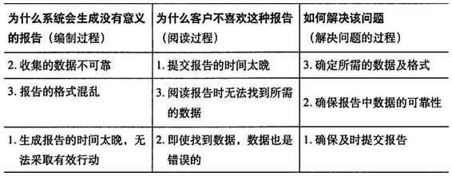\

这个例子说明，想了解某一组思想真正想表达的思想观点，只有经过以 下过程：

1\. 确定该组思想的类型（类别）。

2\. 将同一类型的思想归类、分组。

3\. 找出各类别思想之间的顺序。

为了说明这一过程的具体应用，再举一个例子：

纽约衰退的原因非常复杂，其中包括：

1\. 工资高于美国其他地区的平均工资水平。

2\. 能源、房租和土地成本高。

3\. 交通拥堵使运输成本增加。

4\. 缺少建立现代化工厂的空间。

5\. 税率高。

6\. 技术的变化。

7\. 美国西南部和西部地区与之竞争经济中心的地位。

8\. 美国经济和社会生活的重心向郊区转移。

这又是一个简单罗列要点而缺乏思考的例子。我们可以采用归类、分组
的方法了解作者的真实思想。首先，找出这些要点之间的相似之处，如表6-3所示。然后，找出逻辑顺序和作者的真实思想。在本例中，逻辑顺序应当是
重要性顺序：

我们很容易找出纽约衰退的原因：

1.成本过高。

2\. 工作条件差。

3\. 来自其他城市的竞争。

表6-3找出各要点之间的相似之处

\

综上所述，我想用前面这些例子说明一点：检查逻辑顺序是检查某一分
组是否恰当的重要手段。当你遇到任何一组归纳性思想，需要找出其真实意 义时，一定要先快速浏览一遍该组中的所有思想。你能否发现某种逻辑顺序 (时间顺序、结构顺序、重要性顺序）？如果不能，你能否发现这种分组的 基础（过程、流程、结构、类别），并釆用某种逻辑顺序？如果某组中所列 的思想很多，你能否发现它们具有某些共同特点，并根据这些共同特点将思 想归纳、分组，然后使用逻辑顺序？

如果你确认某一组思想的划分既合理,又完整，你就可以推导出一个逻
辑结论。具体细节请见第7章“概括各组思想”。

## 第7章概括各组思想

下面我们讨论金字塔原理的每一条规则：位于金字塔结构每一个层次上
的思想，都必须是对其下面一个层次思想的提炼、概括。因为，上一个层次 的思想实际上都是从下一个层次的思想衍生、提炼、总结出来的。

如果某一组思想表达的是一个演绎推理得出的结论，你只需以该组思想
的最后结论为主体作总结、概括，就可以得出其上一个层次的思想了。如果 某一组思想的分组方法是归纳性的，即该組由具有紧密联系的一些思想组成， 那么上一层次的思想必须说明该组思想之间的关系所代表的意义。概括各组 思想的行为实际上就是完成思考的行为。

很多作者只是简单地将一些思想组合在一起，并没有完成思考。我们在
前面看到，很多人将一些只具有一般性关系，而不具有明确关系的思想罗列 在一起，由于这些思想实际上并非真正属于同一组，因而也无法总结概括。 不过，即使某组中的思想确实属于同一组，找到能够完成这一段思路的概括 性思想也绝非易事。人们通常不愿意费这个脑筋，而是用一些“缺乏思想” 的句子应付了事。例如：

该公司应当确立3个目标。

该公司存在2个问题。

我们建议进行5项改革。

这些句子被称为“缺乏思想”的句子，是因为这些句子实际上并没有概
括其下一层次思想的精华，而只是说明了将要讨论的思想属于哪一类思想。 因此，这种句子对读者和作者来说都是枯燥乏味、缺乏吸引力的。

。。。。。。。。。。。。。。。。。。。。。。。。。。。。。。。。。。。。。

提示

概括各组思想：

确保思想属于同一组，应抽象、提炼、概括思想精华。

。。。。。。。。。。。。。。。。。。。。。。。。。。。。。。。。。。。。。

### **总结句避免使用“缺乏思想”的句子**

“缺乏思想”的句子对读者而言是枯燥无味的，因为这种句子难以吸引
和保持读者的注意力，不能激发读者继续往下读，还可能使读者根本无法了 解你表达的思想。举个例子，以下是我曾从收音机中听到的一段对话：

甲：约翰.韦恩说他是最适合写塞繆尔•约翰逊传记的人，他有3
个理由：

他们都来自贫困的斯塔福德县；

他们都在牛津大学学习过；

他们都有类似的文学爱好。

乙：我不同意。斯塔福德县根本没有人说真话。

听到这里，听众都笑起来，然后甲和乙又开始说别的事情。我当时就想:
“我好像没听懂。”现在我们来分析一下。你坐在那儿，等待别人向你表达某 种思想，但是你听到的只是一个“缺乏思想”的句子（“有3个理由”），而没有从对方获得任何思想。然后你听到对方说:“都来自贫困的斯塔福德县……”
你就会假定这就是对方的主要思想，于是对随后的两个要点都听不进去。如 果你需要回答的话，你就只能回答你听到的第一点。

但是，如果甲当时这样说：

“约翰•韦恩说他是最适合写塞繆尔•约翰逊传记的人，因为他和约翰逊属于同二类人。”

虽然你还必须再听甲说一些支持此观点的论据，但是你的回答肯定更及
时，更有针对性。但是在前一个例子中，甲和乙的对话完全没有重点，没有 提炼。

这个例子说明了总结性思想的重要性。当你听到“他这样做是因为他们
属于同一类人”时，你的思维肯定比听到“他这样做是有3个原因”时更有准备， 更容易理解随后听到的信息。“有3个原因”这样的话听起来索然无味，实际 上也确实没有什么内容。如果一篇文章充斥着这种“缺乏思想”的句子，可 以想象读者读起来会感到多么枯燥乏味。

避免使用“缺乏思想”的句子还有更重要的理由。这种句子会掩盖思考
不完整的事实，使你错失了一个进行有逻辑性和创造性思考的绝好机会。对 一组思想进行严谨的提炼、概括、总结，必然能够推动思维的发展。如果你 已经得出了一个概括性的思想，你就可以在该思想的基础上用以下两种方式 延续你的思路：

•对其作进一步评论(演绎法)。

•找出与之类似的思想（归纳法）。

但是在用这一过程产生新的概括性思想之前，你必须保证，原有的概括
性思想，是根据一个适当的思想组，合理概括出来的，如图'1所示。

举个例子，我的一位同事曾这样写道：“该公司存在两个组织问题。”然
后列举这两个问题。这个句子就是一个“缺乏思想”的句子，所以他必须重 写这句话。如果这句话下面列举的两个问题：1.都是组织问题；2.存在某种

       对其作进一步评论（演泽法）                                
找出与之类似的思想（归纳法)

图7-1抽象提炼、总结概括，推动思维发展

逻辑顺序，那么重写这句话是很容易的。但是，他似乎没有发现这两个问题
之间存在任何逻辑顺序。

于是，他被迫思.考这两个问题的根源以及两个问题的相似性。他发现，
实际上他不是在泛泛地讨论什么“组织问题”，而是在具体地讨论“公司中 需要更多授权的领域”。看到这一点后，他又很快发现，并非只有两个所谓 的问题领域，而是有4个。此前他只看到了其中的一个问题领域。于是，他 重新提炼总结了对这些问题领域的概括性结论：该公司的主要组织问题是没 有进行授权，如图7-2所示。明确指出了公司存在的问题后，他就可以将思

                   未提炼概括                                          
                   提炼概括

图7-2 “缺乏思想”的句子掩盖了思考不完全的事实

维的重点转移到找出解决的方案上。

因此，多花一些精力从思想组提炼出正确的概括性思想非常重要。那么，
应该怎样进行正确的概括呢？首先，如上一章所述，你必须检查该组思想的 分组基础，保证其相互独立，完全穷尽（即：其逻辑顺序呈现的是一个有效 的过程、结构或分类)。然后，你需要确定准备得出的概括性思想的语句类型。

思想的表达方式与其分组基础无关，可以是行动性语句，即告诉读者要
做什么事；也可以是描述性语句，即告诉读者关于某些事的情况。

•概括行动性思想（介绍采取的行动、行为、动作、步驟、流程）时，
应说明采取行动后取得的结果（效果、达到的目标）。

•概括描述性思想（介绍背景、信息）时，应说明这些思想具有的
共同点的含义（共同点的意义）。

如图7-3所示，在概括归纳性的思想组时，应指出釆取行动后产生的结果，
或从其共性中得出某种结论。

\

图7-3论证的形式决定概括的过程

。。。。。。。。。。。。。。。。。。。。。。。。。。。。。。。。。。。。。

提示

概括各组思想：

思想的表达方式可以是行动性语句，即告诉读者做什么事；也可以是描
述性语句，即告诉读者关于某些事的情况。

•概括行动性思想（介绍采取的行动、行为、步骤、流程）时，应说明
采取行动后取得的“结果”（效果、达到的目标)。

•概括描述性思想（介绍背景、信息）时，应说明这些思想具有的“共
同点的含义”（共同点的意义)。

。。。。。。。。。。。。。。。。。。。。。。。。。。。。。。。。。。。。。

### 总结句要说明行动产生的结果/目标

商务公文中的很多思想都是行动性语句，即可以用“步骤”、“措施”、“流
程”、“建议”、“目标”或“改革”之类的名词表示的语句。在编制操作手册、 制订行动计划、介绍系统功能，或说明解决问题的方案时，都会用到行动性 语句。但是，对行动性思想进行介绍、建立联系和总结概括，以说明釆取某 项行动的方式或某事运作的方式，是我所知道的最艰难的思维过程。世界上 难以读懂的操作手册不胜枚举，以管理目标为手段进行管理而失败的例子更 是数不胜数。

难点在于行动性思想之间的联系方式。我们知道，由于釆取行动总是要
达到某种目的，因此，对一系列行动的概括也必定是实施这些行动所产生的 结果。.任何一组相互独立、完全穷尽的行动性思想，加上其产生的结果，就 能够形成一个独特的封闭体系。也就是说，如果某人釆取了一系列具体的行 动，就肯定能够产生此前已经说明的特定结果。由很多行动性思想组成的过 程，可能包括一系列在不同层次上的独特的封闭体系，如图7-4所示。

原因

图7-4根据行动性思想产生的结果分组

到这一步还没有什么难处。问题在于：任何一组中的行动性思想，除了
共同导致特定结果外，没有任何明显的关联。换句话说，虽然某些行动性思 想可能分属不同层次上的原因或结果，但是所有的行动性语句看起来都相似， 都可以用“你应该……”或“我们将……”之类的词开头，然后接上一个动词。 因此，你无法从单独的句子看出行动性思想之间的联系，而必须根据你希望 达到的结果作出判断。

也就是说，当你罗列出了一些你认为实现某一目标应当采取的行动时，
你必须先指出这些行动应当达到的结果，然后才能判断自己是否遗漏了任何 行动。但是，行动可能达到的结果又取决于共同实施的具体行动。这种行动 与结果的相互依赖性使你难以理顺自己的思路，尤其是当你准备说明一个包 括许多步骤和阶段的流程时更是如此。

别着急，还有一些能够帮助你理顺思路、轻松表达的技巧：

•在将各行动（步骤、流程等）联系起来之前，先用明确的语句描
述各行动（步骤、流程等）。

•找出明显的因果关系组合，尽量将每一组中的行动、步骤控制在 5个以下。

•直接从这些行动、步骤、流程，总结、概括行动的结果、目标。

**总结句要使用明确的词汇/语句**

在一个由因果关系组成的多层级结构中，你可以说，“我做最下面这些
事情是为了达到上一层的这个结果，我做上面这一组事情是为了达到更上一 层的结果”，等等，依此类推。每一个思想都必须与其同组的另一个思想相 互排斥（即没有重叠），而且每组中的思想对于上一层概括它们的思想而言， 都必须是完全穷尽（即没有遗漏)。

在判断某组思想是否完全穷尽时，我们必须非常明确地指出期望这组行
动能实现的结果或达到的目标，明确到就像手中拿着成品一样。举个例子， 你不能含糊地说：“我做这3件事是为了提高利润。”因为利润提高10个百分点 和提髙2个百分点都是提高，但是为此而釆取的措施肯定不同。

为了使读者理解得更清楚，也为了便于自己检查思路，你可以这样表
达：“我做这3件事是为了在明年1月15日以前将利润提髙10个百分点。”这 种明确的措辞有助于判断你罗列的措施是否确实能够实现该结果。

当然，你想要达到的结果不一定总是可以用数字表达的目标，但是必定
有某种明确的方式可以判断是否实现了这一结果。你可以采取一种有效的方 法，就是想象一个真实的人确实釆取了这些行动，以便了解他所能取得的结 果，然后根据这一结果修改行动性思想的措辞。根据上面的判断标准，下面 这个句子简直就是胡言乱语：

我们必须培养一种全球意识，使每一个人都认识到自己是全世界社会中的一员。

这句话想让我们做什么？我们怎样才能知道自己已经达到了这一目标？
你能将一个已经‘‘培养了全球意识”的人，与一个还没有做到这一点的人区 分开吗？如果不能，就说明你根本无法了解作者的实际意图。更糟的是，你也没有办法想出为实现这一目标所必须釆取的措施，即你无法回答“如何做
到”这个问题，无法填写图7-5中的方框。从这个意义上说，上面这句话没 有任何意义。当然，也可能有人认为这句话还是有情感价值的。

图7-5无法回答“如何做到”

如果你用模糊的措辞表达一系列行动步骤，问题就更严重了，因为人们
不可能理解你究竟想让他们做什么。例如：

为了就事论事，进行健康有益的辩论，尽可能降低将矛盾演化为冲
突，特别工作组必须做到以下几点：

•处理好各种个人态度问题。

•与公司员工建立良好关系。

•培养良好的谈话技巧。

•有效安排和进行谈话。

•学会求同存异。

特别工作组究竟要做到什么，才能保证进行健康有益的辩论呢？如果他
们做到了这5件事情，将会达到什么结果呢？我们无法想象最终的结果，也 就无法明确判断我们实现的结果就是这些步骤应当产生的结果。而且，由于 不知道最终的目标究竟是什么，没有衡量成功的标准，我们也无法判断这5 个步骤确实能够实现这一目标。

唯一能够避免出现这种问题的方法，就是强迫自己找到一个明确的最终结果、’目标或里程碑，使你能够据此判断某步骤已经完成，然后根据这一结
果修改各行动步骤的措辞。表7-1列举了一个典型的措辞含糊的例子，并根 据作者的真实意图作了适当修改。

表7-1说明行动的措辞必须明确

|                    |                                |
|--------------------|--------------------------------|
| 原表达方式：       | 原来的含义：                   |
| 1.加强地区作用     | 1.赋予各地区制订计划的权力     |
| 2.减少应收账款     | 2.建立应收账款追收机制         |
| 3.评估管理流程     | 3.研究管理流程是否需要调整     |
| 4.改进财务报告     | 4.建立能够预测变化的系统       |
| 5.处理战略问题     | 5.制定明确的长期战略           |
| 6.重新配置人力资源 | 6.根据员工的能力安排合适的岗位 |

你可以看到，修改后的句子比修改前容易理解了，因为修改后的句子能
够使大脑产生某种形象。在阅读的过程中，如果读者能够“看到”某种形象， 读者将对文章产生更大的兴趣。这种将结果明确化的方法对作者具有更重要 的意义，因为能够促使作者进一步深入思考。

例如，在表7-1中的例子中，当我假定我已经将制订计划的权力授予各
地区后，我可以想象到各地区在制定年度计划。这会促使我进一步思考：除 了这些计划，是否还需要做什么以达到更高的目标？譬如：

•我怎样才能知道各地区制定的计划是否正确？

•年度计划提交给我以后，我该怎么办？

也许除了授权，我还应当建立一个审核年度计划目标的体系；也许我还
需要成立一个计划评估小组，管理整个计划编制过程。

但是，对于“加强地区作用”，我能够想象到什么？地区作用应当是怎
样的一种意象？这种不明确性无法促进下一步思考。

在前面的图7-4中，你可能已经注意到：在多级结构中，一项行动可能既
是原因又是结果。因此，不论处于哪一个层次，每一个步骤（行动）的措辞都必须非常明确。如果某一项结果的表述不明确，你就无法判断你是否已经
列出了达到这一结果的所有步骤。

例如，以下是另一作者建议釆取的一系列行动步骤：

统计和追收逾期应收账款：

1\. 定期统计大额和中等金额应收账款的遗期时间。

2\. 根据欠账金额和遗期时间发出催款通知。

3\. 追收逾期账款。

4\. 长期遗期应收账款由公司董事解决。

5\. 必要时使用收账公司。

该作者认为，如果公司釆取了这些行动步骤，就能实现最上面列出的目
标。但是，这些目标本身就不明确（究竟如何“追收”逾期应收账款），而 且多数步骤也不明确。听到我提出的质疑后，该作者说：“这很容易”，并画 了表
7-2。

表7-2  逾期账款时间表

|                 |       |       |       |       |       |       |
|-----------------|-------|-------|-------|-------|-------|-------|
| 逾期时间\\ 金额 | 1个月 | 2个月 | 3个月 | 4个月 | 5个月 | 6个月 |
| 10万美元以上    |       |       |       |       |       |       |
| 1万~10万美元    |       |       |       |       |       |       |
| 10万美元以下    |       |       |       |       |       |       |

他说，应收账款的逾期时间在1〜6个月之间，金额在100美元到10万美
元之间，他会这样做：

1\. 逾期1个月的账款，不要采取任何行动，只让财务部门按正常途 径寄出账单。

2\. 逾期2个月的账款，由财务部门寄出催款通知。

3\.  逾期3个月的账款，由销售人员上门催收。

4\. 逾期4个月的账款，由公司董事催收。

5\. 逾期超过4个月的账款，交由收账公司办理。

他忽然说：“啊，我知道我应该怎么说了。”他在纸上写下了这样的文章 结构：

减少应收账款：

1\. 将逾期账款按遗期时间和金额分类。

2\. 根据逾期账款的严重性分别按以下方式催收：

-财务部门    -销售人员

-公司董事    -追账公司

这样的思路显然更清晰，但是文章的主题思想仍然有问题。只有在收到
账款后，才能减少应收账款。但是，以上任何步骤都无法直接导致收到账款。 因此，如果该公司采取这两个步骤，将得到什么结果呢？也许是追收逾期账 款的机制。

这时，我们可以看到明确的语言对指导思维的实际意义。一旦你明白你
希望公司达到的明确的目标，是建立一个追收逾期应收账款的机制，你就可 以回过头来再仔细想一想，这两个步骤是否足以建立这样的机制。我想，至 少你还应当加上某种后续的步骤，也许是“要求销售部门不再向长期未付款 的客户发货”。

使用明确的语言表达最终结果的必要性，无论怎样强调也不过分。除非
你使用的语言达到了这一要求，否则你根本无法客观判断你列出的行动、步 骤，是否包括了所有应当包括的步骤。

有人认为，他们可以通过使用疑问句绕过必须使用明确的语言这个要求。
他们认为，对问题的回答将引出明确的结果。但是，这种方法实际上只能使 你的思路更复杂，因为你避免不了要想象最终的结果，并确定这一结果是否 正是你想要的。

请看下面的例子：

为了使内部和外部股东都能够看到战略联盟带来的广泛利益，并提
供支持（股东同意），必须回答以下问题：

1\. 相关的股东是否相信此结盟行动符合其利益？

2\. 此举将对公司的声誉产生哪些影响？市场将作出什么反应？

3\.
主要高层管理人员是否愿意结成联盟（意识到此举不会对其权 力和位置构成威胁）？

4\.
如果联盟可能对公司的任何个人或群体构成威胁，如何说服他 们继续努力工作，以便在形成联盟后取得成功？

5\. 客户、供应商、现有的合作伙伴、金融机构和竞争者将如何反应？

判断这种提问方式是否有意义的最简单的方法，就是想象你派出5名亲
信为你收集有关信息。他们每一个人回来后都会向你提供一份答案。你会得 到5类不同的信息，这些信息之间也未必存在关联，如表7-3所示。

表7-3 5类不同的信息

<table class="calibre18" data-border="1">
<colgroup>
<col style="width: 20%" />
<col style="width: 20%" />
<col style="width: 20%" />
<col style="width: 20%" />
<col style="width: 20%" />
</colgroup>
<tbody>
<tr class="calibre15">
<td class="calibre17">
1
</td>
<td class="calibre17">
2
</td>
<td class="calibre21">
3
</td>
<td class="calibre21">
4
</td>
<td class="calibre21">
5
</td>
</tr>
<tr class="calibre15">
<td class="calibre16">
股东们的看 法
</td>
<td class="calibre16">
市场的反应
</td>
<td class="calibre16">
主要管理人员 的反应
</td>
<td class="calibre16">
使所有利益相关者
为联盟成功而努力 的方法
</td>
<td class="calibre16">
反应来自于：

-客户 -供应商 -现有合作伙伴 -金融机构 -竞争者
</td>
</tr>
</tbody>
</table>

你也可以想象，只有一名不很精干的同事为你提供帮助，时间非常有限，
并且没有任何预算。什么方法能够最有效地指导该同事合理利用时间，最终 使你得到一份让使股东们看到战略联盟的好处的计划？你可以这样做，如表 7-4所示：

表7-4 合理利用时间的有效方法

\

这样，所有的人都能够理解这一过程，而且这一过程的第一步（第一列)
已经完成了。你现在只需派出一名同事完成第二步（第二列），完成第二步 之后你进行第三步（第三列）。

再重复一遍，在讲述行动、步骤、流程等时，理顺自己思路最简单的方法，
就是想象自己确实采取了这些行动，然后根据完成这些行动将产生的明确结 果，修改各行动步骤的措辞，使之更明确、更具体。

。。。。。。。。。。。。。。。。。。。。。。。。。。。。。。。。。。。。

提示

总结句要说明行动产生的结果：

•在将各行动联系起来前，先用明确的语句描述各行动、步骤、流程等。 

•找出明显的因果关系，将每组中的行动、步骤控制在5个以下。

•直接从这些行动、步骤、流程，总结、概括行动的结果、目标。 

。。。。。。。。。。。。。。。。。。。。。。。。。。。。。。。。。。。。

**区分行动步骤的层次**

多数人在说明一系列行动步骤时，都倾向于使用他们希望读者也使用的
顺序，但是这样做会使他们把原因和结果都放在同一个层次上。

因此，你还需要掌握一种方法，即看到不同的行动、步骤、流程时，要
有意地区分其层次，以便将每一个层次上的行动步骤控制在5个以内。这样 可以使你更容易看清某一过程的总体结构，也可以使你在总结概括“结果（目 标)”时，考虑釆用较少的行动步骤。

区分行动、步骤的层次比较容易：如果你希望读者在采取下一项行动之
前先采取某一项行动，那么这两项行动就属于同一层次；如果你希望读者釆 取前一项行动以便产生后一项行动，那么前一项行动就是后一项行动的下一 个层次。看下面这个例子：

如果一家公司希望了解其电信方面存在的问题，可以用以下方案：

1\. 分析现有设备和使用情况。

2\. 确定需要更多（更少）电信支持的主要业务。

3\. 制定电信服务的目标。

4\. 组织研究人员进行评估。

5\. 检查与电信服务商的关系。

6\. 确定主要的技术选项。

7\. 控制内部通信成本。

8\. 研究设备服务政策。

9\. 检查现有的通信联系。

10\. 决定组织的方式。

人们很容易认为这个步骤表不需要再作什么处理了，因为如果一家公司
需要获得能够提供良好支持的电信系统，就必须采取以上的所有行动步骤。 但是，如果你将不同层次的行动区分开，你会得到这样的一张表：

1.制定电信服务的目标。（3)

-分析现有的设备和使用情况。（1）

-确定需要电信支持的主要业务。（2)

-检查现有的通信联系。（9)

2\. 成立项目纽，选择适当的设备。（4)

-确定主要的技术选项。（6)

-研究设备服务政策。（8)

-检查与电信服务商的关系。（5)

3\. 建立公司管理框架。（10)

-任命电信中心经理。（？）

-建立成本控制系统。（7)

经过这样的组织，你不仅能够迅速理解该方案的内容，还能够对是否有
遗漏作出客观的判断。例如，我们怎样确定需要电信支持的主要业务呢？又 怎样建立公司管理框架呢？还有，也许公司应该有一位电信中心经理。

虽然你肯定应该区分行动的层次，但是不应该过度使用分类的方法。实
际上，过度分类的情况很容易发生，原因也是因为人类有为事物分类的倾向。 —些人，尤其是一些咨询公司的人，很喜欢将一个项目划分为“任务”、“目标” 和“利益”，如图7-6所示：

图7-6将项目划分为“任务”、“目标”和“利益”

这种分类，实际上假设分别被列为“任务”、“目标”和“利益”的行动
步骤之间有清晰的界线。你要先完成“任务”，然后实现“目标”，再然后获 得“利益”。这一顺序确实没错，但是其结构图应该如图7-7所示：

图7-7更清晰的结构图

你可以看到，我们现在将“利益”、“目标”和“任务”分别放在金字塔
结构纵向的3个层次上，而不是放在同一个层次上，因为只有完成了
“任务” 才能实现“目标”，实现了“目标”才能获得“利益”。它们之间应该是因果关系。 但是，这样划分对理顺思路没有什么作用。也许我们可以说，标明不同的抽 象层次可以使我们了解各个层次上的行动步骤的类别。即，当我们看到这个 结构图时，就能知道某个具体行动是属于“任务”、“目标”，还是“利益”。

实际上，这样做根本没有意义。我们知道，行动、步骤、流程等是无法
分类的；某些行动被归于一组，完全是因为它们能够共同产生某一特定结果。 对行动、步骤等分类必定会造成重复，因为“任务”、“目标”和“利益”之 间并没有本质的区分。组织各种行动、步骤等唯一合理的方法，就是根据其 产生的结果归类分组。

举个例子，一家咨询公司受聘为一家企业培训其员工的战略规划能力。
这家咨询公司把建议采取的行动分了类。该咨询公司建议执行6项任务，这6 项任务又要求公司制定5个目标，实现这5个目标以后，可以取得三大利益。 各行动步骤简化如下，如表7-5所示：

表7-5 简化后的行动步骤

\

有一个好方法可以理顺这样的一系列思想，即尽量砍去其修饰成分，只
留下最本质的核心内容，然后找出其中的重复部分。如果我们对以上思想采 用这个方法，会得到什么呢，请看表7-6:

表7-6修改后的行动步驟

\

现在，重复的部分和不同的抽象层次都比较容易看出来。你可以根据行
动产生的结果重新建立一个金字塔结构，如图7-8所示。

图7-8根据行动产生的结果建立金字塔 

然后，只要稍加思考，你就可以得出下面的思路：

我们将迅速使贵公司掌握战略规划知识。（2、7、13)

1.对两个产品咨询小组，进行有关战略规划方法和概念的培训。（1、 12)

2\. 根据贵公司现有的规划机制调整教学内容。（4、5、8、9)

3\.
在下一个规划周期中，与贵公司员工一起应用所学概念。（3、6、10、11、14)

至此，你已经根据行动的结果、目标，而非行动的类别，正确组织、理
顺了行动。

**直接概括行动的结果**

将某一系列行动的所有步骤都理顺后，你将遇到处理行动、步骤等最艰
难的一关——总结概括其结果（效果)。对于这一关，我没有简便易行的好 办法，只能说：

•该组行动、步骤之间必须相互独立不重叠，完全穷尽无遗漏。 

•总结概括性语句，必须说明完成各行动步骤后导致的直接结果， 且措辞必须明确、具体。

你可以用这两条规则衡量你的每一步思路。在前一个例子中，如果该公
司拥有训练有素的人员、合适的规划机制和战略规划知识手册，显然就具有 了制定正确战略的能力，但这并不等同于该公司能制定出正确的战略。同样， 我提出的这两条规则也不能保证你肯定能完成正确的概括。

我只能介绍一些我修改过的例子，并告诉你我的想法。下面这个例子使
用的语言比较模糊。

为了提高在伦敦市场上的股票销售量，我们应当：

•按地区、按客户的收入潜力，将客户排序。

•确定希望在各地区达到的市场占有率。

•相应调整销售力量的分配。

—看到这一组行动步骤，我就想：“做这些事情的目标不明确，因为即使
我只多卖了一份股票，也算是提高了销售量。”然后，我又提出疑问：“如果 我对客户收入排了序，确定了市场占有率，也重新分配了销售力量，将会达 到什么结果呢？或者说，如果我不这样做，会有什么结果呢？
”然后我就想 到这样修改其总结概括性语句：

为了提高伦敦市场上的股票销售量，我们需要将资源重点集中在潜力大的客户身上。

(怎样做到这一点呢？）

这个概括性的句子读起来显然比原来的句子更有意义，因为这个句子提
出了一个观点，而原来的句子只是一个“缺乏思想”的句子。这个句子迫使 读者提出“怎样做到”的疑问，因而使读者更容易理解作者随后提出的观点。 作为作者，你自己也可以检查所列的步骤是否能够达到这一结果。

再举一个语言模糊的例子：

为了改善蓝领阶层的培训状况：

•应向企业决策层表明，政府非常重视对劳动者的培训。

•应设计一个培训课程的总体框架，让培训讲师准备。

•应通过劳动者向上施压。

在本例中，因为每一个句子都比较复杂，可以先找出每一个句子的核心
内容，然后继续下一步。首先，找出每一个句子的真正主题：

•企业决策层 

•培训者 

•劳动者

然后，问问自己：为什么我们只讨论这3个主题，而不包括其他的？这些
主题之间有什么共同之处？答案是：这3个主题似乎都是培训体制中的参与主 体。

接下来看看每个句子是怎样对各自的参与主体釆取行动的：

•向其表明重要性 

•为其设计总体框架 

•通过其施加压力

这3种行动有什么共同之处？答案是：它们都是某种推动因素。现在，我
们可以比较肯定地将上面的例子概括如下：

为了改善蓝领阶层的培训状况，我们必须提供一些推动因素，促使
培训体制中各参与主体支持培训。

(我们应当怎样做？）

同样，这种概括也比原来的概括更有意义，既能引导读者按你的思路去
理解，也能使你检查行动步骤是否完整、全面。

最后，再举一个语言模糊的例子，是关于一家公司的产品开发问题。

产品开发面临的问题包括：

1.如何将公司和市场希望该产品应具有的功能，融入产品开发过程？

2\. 如何针对不同项目安排和分配公司的资源？

3\. 如何缩短产品开发时间，同时考虑到营销人员的需求？

4\. 如何组织和管理公司的研发资源，以满足投产时间的要求？

5\. 如何使公司内、外了解有关信息，以尽量提高产品上市的力度？

6\. 如何促进研发人员和管理人员在产品开发方面的合作？

按照我们一贯的步骤，首先应将各个句子尽量简化，以便于思考：

1\. 开发适当的产品

2\. 合理分配资源

3\. 高效完成

4\. 及时完成

5\. 有效营销

6\. 研发/管理人员合作

然后，我们再将其划分为一些小组：

1.确定满足市场需求的产品 

-包含所需的功能（1)

-满足营销人员的需要（3b)

2.尽量在最短时间内完成开发（3a)

-合理分配资源（2)

-使研发时间符合投产要求（4)

-加强研发人员及管理人员的合作（6)

3.以最有力有效的方式将产品推向市场（5)

接下来，需要概括出主题思想。如果我们完成了这3个步骤，将得到什么
结果？显然，我们将抢在别人之前推出市场所需的产品，并达到最髙的销量。

在作出概括之前，我们还应当回过头来，想想一般人对产品开发问题都
了解些什么。我们知道，最先推出某种产品的企业能够抢占市场先机，而且产品更新换代的速度也越来越快，因此，对企业来说，缩短产品研发周期是
首要任务。具有这些背景知识后，我们可以合理假定，该作者希望表达的思 想应当如下：

产品开发面临的主要问题，是我们能否比竞争对手更有效地应对市场需求。

(我们如何迅速有效地应对市场需求？）

1\. 我们能否发现市场需要的适当的产品？

2\. 我们能否缩短产品上市前不必要的时间延误？

3\. 我们能否进行有效的营销，以最大限度地提高销售量？

相信现在你已经知道，条理清晰地表达行动性思想绝不是一件容易的事。
这是一项艰难的脑力劳动，但是，如果不这样做，就会给读者造成极大的阅 读困难。因此，你应当按照我们曾经讨论的步骤，努力完成这一艰难的过程: 先用明确的词汇、语句表域各行动、步骤、流程等，然后区分不同的抽象层次， 再直接从各行动、步骤、流程等总结概括出行动的结果。

从一系列结论中得出一个推论，也需要进行一个类似的过程，但是这一
过程会更轻松一些。在这一过程中，你要做的不是努力想象一系列行动可能 导致的结果，而是尽力从一系列相似的语句中发现其隐含的思想、概念、意义。

。。。。。。。。。。。。。。。。。。。。。。。。。。。。。。。。。。。。。

提示

直接总结行动产生的结果：

•该组行动、步骤之间必须相互独立不重叠，完全穷尽无遗漏。

•总结概括的语句，必须说明完成各行动步骤后导致的直接结果，且措
辞必须明确、具体。

•先用明确的语句表述各行动、步骤、流程等，然后区分不同的抽象层次，
再直接从各行动、步骤、流程等总结概括出行动的结果。

。。。。。。。。。。。。。。。。。。。。。。。。。。。。。。。。。。。。。

### **找出各结论之间的共性**

我们在前面提到过，写作中表达的思想或者是行动性思想，或者是描述
性思想，这些思想或者是告诉读者做某事，或者是告诉读者关于某事的情况。 描述性思想通常可以用“原因”、“问题”或“结论”之类的单一名词表示。 将此类思想分类的基础，是这些思想具有某种共性。

我们先回顾一下第6章“确定逻辑顺序”中介绍的关于分类的知识。当
你说“该公司存在3个组织问题”之类的话时，实际上你是从该公司所有可 能的组织问题中分出了
一部分，如图7-9所示：

图7-9根据某一共同特点分类

因此，将这3个组织问题作为一类，本身并没有太大的意义。这只是思
维过程中的第一步，列出一些可能值得思考的思想。我们要做的第二步，是 通过找出这些思想之间的共同点，证明这些思想确实属于同一类，因而有理 由将其与其他思想区分开。我们要做的第三步，是明确说明这些思想之间的 共同点所具有的普遍意义，即要提出一个新的思想。至此，我们才能说完成 了自己的思维过程。

许多商务公文的作者都止步于第一步，这也许是因为他们没有认识到第二步和第三步的重要性，但更有可能是因为从一系列思想中得出推论是一项
艰难的工作。你必须做到以下几点：

•找出将这些思想联系在一起的结构上的共性。

•寻找这些思想间更密切的联系。

•完成归纳跃进，概括出主题思想。

**找出结构上的共性**

如果某些思想具有某种共同的特点，这些思想就可以联系在一起。我们
在第5章“演绎论证与归纳推理”中已经了解到，表达思想的语句必定有一 个由主语和谓语组成的结构。因此，如果这些语句符合以下要求，就说明这 —组思想具有某种共性：

•针对同一类主语。

•针对同一类谓语（动作或对象)。

•具有同一类隐含的思想。

这里所说的“同一类”不是指完全相同，而是指属于同一范畴，或能够
用同一个单一名词表示。

如果这组句子的主语完全相同，你就要找出谓语之间的共性；如果谓语
的动作或对象完全相同，你就要找出主语之间的共性，如果主语和谓语都不 相同，你就要找出其隐含的意义之间的共性。

找出语句之间的共性，尤其是当语句的用词比较正规时，可能比你想象
的难得多，因为句子所用的语言可能妨碍你进行细致的思考。譬如，我们都 看过关于“5个因素”、“7个主题”、“4个要点”、“7个习惯”之类的文章，可 能很少对其这种说法提出疑问。实际上，我们应当透过语言的掩饰，看到其 思想的本质结构。

例如，下面这篇文章的结构是我们经常看到的：

新的计划与控制体系具有4个特点:

这两组思想实际上是对原有思想又进行了一次分类。那么，为什么只有
这两类问题，而不包括其他问题呢？这两组问题之间有什么共同点，从而使 作者认为应当将其列在一起呢？也许是因为，这些问题都表明，该系统产生 的信息对计划目的没有帮助。因此，作者应当得出的概括性思想应为：

目前建立的计划体系所产生的信息，对计划目的没有帮助。（为什么？）

•或者所需信息不存在；

•或者所需信息存在，但不充分。

确定了概括性思想之后，你就可以应用逻辑顺序的概念，检查该信息系
统是否还有什么问题被作者遗漏了。譬如，此例中的作者也许可以再检查一 下是否存在“所需信息存在，也很充分，但提交的格式不适当”之类的问题。

找到适当的概括性语句的主要价值，是可以帮助你发现自己的真实思想。
概括性语句还可以提前把作者的思路告诉读者，使读者做好准备，以便更快 地理解作者的思想，更有把握信任作者的思路。当然，如果你说明的问题没 有遗漏之处，读者也不太可能质疑你的思路。总之，适当的概括性语句能够 减少文章的枯燥感，增加阅读者的兴趣。

下面这段文字就比较枯燥乏味：    -

如您所知，我们的信息系统评估结果显示：

1\.
您要求信息系统项目经理提供有关到期日期的信息，以不延误 战略性业务项目。

2\. 有些项目经理缺乏经验。

3\. 信息系统允许错过预定日期，而不是用创造性的方法满足预定 日期的要求。

4\. 现有的系统开发方法、工具和技术不统一。

5\. 项目经理们没有安装过如此大型、复杂的重要系统。

6\. 项目经理接受的脱产或在职项目管理培训较少，实践经验有限。

7\.
您的重要项目（如：集团及个人项目）的预算、时间和计划的 要求都很高——在您的时间期限内完成工作可能有一定风险。

8\.
现有的系统开发周期不支持快速应用开发、联合应用开发及原 型开发等客户端或服务器端的开发技术。

按照我们的检查流程，可以很容易找出最核心的内容：

1\. 需要到期日期信息

2\. 项目经理经验不足

3\. 有错过日期的危险

4\. 工具的使用不统一

5\. 未做过如此大型的项目

6\. 经验有限

7\. 担心误期

8\. 没有适用的工具

然后，无论你是否了解这一主题，你都可以将以上思想组织得更清楚、
更有意义。

我们对贵公司信息系统部门的评估显示，贵公司的项目经理们有可
能无法按预定日期完成工作。（3、7)

•他们在此类项目上的经验有限。（2、6)

•他们未安装过如此大型、复杂的系统。（5)

•他们缺乏对所需方法、工具和技术的应用能力。（4、8)

在上面这些例子中，找到能够总结其下一个层次思想的概括性思想相对
比较容易。但是，有时一些具有共性的句子所隐含的意义却难以被揭示出来。 这时，就需要进行所谓的归纳跃进（inductive
leap)，以便将其隐含的意义 明确呈现出来。而想象该组思想之间关系的来源，则是为归纳跃进准备的 “跳板”。

**完成提炼总结概括的完整思考过程**

以下是一名咨询顾问在一次说明会上，就是否应当进入汽车配件市场（火
花塞、轮胎等)，提交给客户的说明材料的要点。

我们的结论：

1\. 市场巨大，且正以较高的速度增长。

2\. 配件市场有利可图。

3\. 市场的主要特征显示，进入该市场有较大的障碍。

4\. 总体趋势可喜，但由于一些不确定性，部分细分市场的前景尚 不明确。

5\. 总体上看，该市场有吸引力，但是也高度分散。

这些思想实际上可以分为两组：

•有利因素：市场巨大、正在增长、有吸引力、有利可图、形势可喜。
(1、2、4、5)

•不利因素：进入市场的障碍较大、存在不确定性、市场分散。（3、4、5)

我们可以立刻总结出有利条件。显然，如果市场巨大、正在增长、且有
利可图，那么肯定有吸引力。此外，形势可喜也说明该市场具有吸引力。我 们先将这一有吸引力的市场想象成一个圆圈，如图7-10所示：

图7-10有吸引力的市场

不利因素概括起来就不太容易了。市场分散说明这个圆圈中必须分成若
干部分。但是不确定性却使其中一些部分的前景不太明确，也就是说，有一 些部分看上去必须与其他部分不同'，如下图所示。最后，由于还存在进入市 场的障碍，我们在圆圈的前面画了一条线表示障碍。

现在，来看看图中的两个句子之间是否存在归纳性的关联。通过以上这
种想象，我们能够得出什么结论呢？

•只有部分细分市场具有吸引力。

•这些细分市场将难以进入。

这两个句子之间是否存在归纳性的关系呢？ “具有吸引力”和“难以进
入”之间有没有共性？答案是没有。因此，如果这两个句子之间存在逻辑关系， 这种逻辑关系只能是演绎性关系：

只有部分细分市场——►这些市场将——►因此，……

   有吸引力                            难以进入

因此什么？这次推理无法得出结论。因此就算了？因此花大本钱也要
进？还是因此要请我们制定一个谨慎的战略？这个例子再次说明，人们在难 以得出明确结论的时候，很容易写一句“缺乏思想”的句子应付了事（如本 例），而不是努力完成自己的思路。

有时你会遇到一些看上去像描述性，但实际上是行动性的思想。这时，
你可以先认为它们具有某种共性而分为一组，然后，如果你能够想象出这些 思想可以共同产生的结果，再将其转变为行动性语句。例如彳假设你读到下 面这些句子：

在资源分配过程中有4个需要管理的变量：

•活动的顺序和时机 

•定义负责人的任务 

•定义对信息的需求（内容和形式）

•决策过程

为什么只有这4个变量，而没有其他变量？这4个变量之间有哪些共同点，
使作者把它们列在一起？如果你试图用更明确的语言表达这些思想，以找出 其中的逻辑顺序，你就会发现原作者实际上谈论的是4个步骤，他的本意应 该是这样：

在资源分配过程中的主要管理任务，就是使适当的人员及时、充分
地参与工作。（如何做到？）

•说明项目计划活动的顺序和时机。（1）

•确定需要作出决策的问题。（2)

•配置参与工作的人选。（4)

•确定所需的信息。（3)

这并不是说描述性思想不能釆用时间顺序。例如，下面是关于某家企业
销售方案的一些语句，我们可以用时间顺序重新整理：

我们的销售方案可以通过改善以下方面，向客户展现全新的形象：

1\. 进行更有效的机会分析，以保证我们充分利用资源。

2\.
协调各种方案，包括设计一个关于方案编制的单一质量工序、 制订方案内容和形式的标准，以及建立一个连续提高质量的系 统。

3\. 尽量再利用方案信息。

4\. 与整个企业及整个行业一起分享制订方案过程中的经验教训。

5\. 使方案的准备更具成本效率。

6\. 进一步缩短反应时间。

7\.
将制订方案的过程作为关注客户需求的销售工具（而不是传递 技术信息的机制）。

如果按照我们的标准检查过程（找出共同点、得出结论），我们可以将以上句子合并为3个句子，并按各个句子的行为发生的顺序排列。

我们的方案不是有效的销售工具：

1.我们没有提供有说服力的信息。(1、4、7)

2\. 我们没有使销售方案看上去很优秀。（2)

3\. 我们制订方案的过程过长。（3、5、6)

在你准备费尽心思地概括出一句总结性的思想之前，我想先说明一点：
你没有必要在通篇写作中，每次都非常严格地执行这一步骤。这并不是因为 这样做没有用，而是因为你没有必要每次都使用非常精确的语言——读者都 有一种将所获信息纳人其已有知识体系，进而理解和预测的倾向。因此，如 果你确定你的推理过程是有效的，你也可以使用一个不是很精确的概括性 语句。

如果我们做到下面几点，我们的销售方案就能够向客户展现我们全 新的形象：

1\. 提供更有说服力的信息。

2\. 使方案看上去优秀。

3\. 迅速完成方案。

从本章的讨论中，你可以了解到：不能简单地把一系列思想堆放在一起，
并假定读者能够看出其中的意义。每一组思想都隐含着一个总结性的思想， 这个思想能够呈现该组思想之间关系的本质。你应当首先使自己明确了解各 组思想之间的关系，然后向读者指明这种关系。

进行任何一次分组时，都要问自己一个问题：“为什么我只列出了这些思
想，而不列出其他思想？”对此的答案应当是：

•这些思想都具有某种共性，而且是以这种方式相互关联的仅有的 一些思想。

-在这种情况下，该组的概括性思想，应当是该组思想的共性所隐含的意义。

•这些思想都是为实现某一结果而必须同时采取的行动。

-在这种情况下，该组的概括性思想，应当表明采取以上行动后 产生的直接结果。

如果你按照这种方法，强迫自己认真思考和检查每一组思想，那么你向
读者表达的思想将会非常清晰、明确、具体，而且你还有可能发现一些在此 之前没有想到的有意义的思想。

# 第3篇 解决问题的逻辑

经过一段时间，当你坐下来写一篇短文时，你会不自觉地套用在序言写
作中用到的‘背景一冲突一疑问”模式。通过问答法，以及第6章和第7章介 绍的进行排序和总结的原则，就能使自己的思想更有条理。

然而对比较长的文章来说，比如研究报告和PPT演示文稿（通常用来给
出解决问题的方案），或者项目计划书和咨询建议（通常用来说明你如何着 手解决问题），写作过程就不会那么顺利了。也许会有一个长时间收集资料 的过程，也许会涉及好几位作者，也许不得不延长几天（甚至几星期）。你 经常发现自己被淹没在大量需要分类和考虑的事实、数据、信息和想法中， 却无法决定哪些是你希望与人交流的信息。

本书的这一部分对需要写这类文章的各类人士，包括政府公务员、管理
咨询顾问、战略分析师、市场研究人员和MBA学生等很有用。虽然涵盖的 内容冗长且复杂（正是这一主题的特点)，但介绍的方法是经过实践检验的， 全球的咨询顾问和分析师们每天都在使用。如果在你的工作和学习中有写文 章的任务时，需要先界定和分析问题，再将解决方案写出来与人交流，你会 发现本篇值得一读。

这类文章通常需要回答以下3个最常见问题之一。回答哪个问题，取决
于读者事先是否已经知道：

•我们应该做什么？（如果不知道解决方案）

•我们应该做吗？（如果已经给出了解决方案）

•我们应该怎么做？你会怎么做？（如果已经知道且接受解决方案)

这时序言的作用是对问题定性，金字塔则用来说明，分析问题和寻找解
决方案的“步骤”或“理由”（有时是演绎推理的结果)。这些步骤或理由确 定后，还需要经过长时间的思考，才能得出可供交流的思想观点。以下是一 个理想的流程：

界定问题——►结构化——►分析/找到——►组成金字塔 

                          分析问题           解决方案          
 与他人交流

提高写咨询报告效率的秘诀是：

1.界定问题

2.有条理地搜集和分析数据，转换为金字塔的形式

换句话说，如果在流程的前两个阶段组织好方法，就能很容易地进入第
三或第四阶段。前两个阶段实际上是在预先搭建你的金字塔。

但是界定问题和结构化分析是非常复杂的工作，问题的起因经常是模棱
两可和令人困惑的，甚至被错误地表述。问题的方方面面都存在大量的数据, 为了确认问题，你不得不“事必躬亲”，而且会有多种可能的“解决方案”。

幸运的是，许多现成的分析框架可以帮助你最大限度地减少困扰，使你
工作更富效率。

第8章推荐了界定问题的框架，可用于做好分析问题的准备，在写序言
时，还可以用做确定“背景一冲突一疑问”结构的模板。

第9章介绍了其他实用的框架，帮助你全面思考和实际分析问题，还可
以用于检验解决方案的有效性。

## 第8章界定问题

判断问题是否存在，通常要看经过努力得到的结果（现状），与希望得
到的结果（目标）之间是否有差距。由某一特定背景导致的某一特定结果， 称为非期望结果（R1，即现状，Undesired
Result)。

“问题”是指你不喜欢某一结果（比如销售额降低)，想得到其他结果（比
如销售额增长)，称为期望结果（R2，即目标，Desired
Result)。解决方案 则是指如何从现状R1到目标R2,如图8-1所示：

\

图8-1界定问题的连续分析方法

以上界定问题的方法称为连续分析（统计学上称为序列分析），是一种
有效地解决问题的技巧，可以帮助你为以下按逻辑顺序排列的问题寻找答案:

1.是否有/是否可能有问题（或机会）？

2\. 问题在哪里？

3\. 为什么存在（产生问题的根源、原因）？

4\. 我们能做什么？

5\. 我们应该做什么？

回答问题1和问题2是为了界定问题，问题3是寻找产生问题的原因，间
题4和问题5是寻找解决问题（或抓住机遇）的最佳方案，如表8-1所示：

表8-1      5个问题的归类

<table class="calibre18" data-border="1">
<colgroup>
<col style="width: 50%" />
<col style="width: 50%" />
</colgroup>
<tbody>
<tr class="calibre15">
<td class="calibre17">
问题
</td>
<td class="calibre17">
归类
</td>
</tr>
<tr class="calibre15">
<td class="calibre21">
1.有没有/是否可能有问题（或机会）？

2.问题在哪里？ 

</td>
<td class="calibre21">
界定问题
</td>
</tr>
<tr class="calibre15">
<td class="calibre17">
3.为什么存在？ 

</td>
<td class="calibre16">结构化分析原因</td>
</tr>
<tr class="calibre15">
<td class="calibre17">
4.我们能做什么？

5.我们应该做什么？
</td>
<td class="calibre17">
寻找解决方案 

</td>
</tr>
<tr class="calibre15">
<td class="calibre21"></td>
<td class="calibre16"> 
</td>
</tr>
</tbody>
</table>

在介绍分析结果的时候，问题1和问题2的答案就是文章的序言，问题
3〜5的答案是金字塔结构中的思想、观点、论点、看法。

### 界定问题的框架

如前所述，问题是指你已有的（现状）与你想要的（目标）之间存在的
差距，这种差距不是凭空产生的，而是来自某一背景，并在一系列特定的条 件下产生的。条件可能很简单，也可能是很复杂的因果关系。无论是哪种情况， 了解其发展历史，是确定差距之性质和把握其重要性最基本的过程。

**展开说明框架中的各要素**

下面举一个简单的例子，解释界定问题框架的构成要素。假如你有一家
公司，30年来一直用一种屡试不爽的方法销售有巨大需求的工业不动产，即 先由销售人员列出潜在客户的名单，写好针对潜在客户的推销信，然后邮寄 给所有的潜在客户。

公司一直做得很出色，销售额每年增长约10%。但到了今年第四季度，
种种迹象表明销售将减少10%，而不是增加10%。面对这突如其来的消息， 公司希望尽快釆取措施，使销售恢复正常。

假设问题是由背景产生的，如图8-2所示。背景由切入点或序幕组成，
包括现有的结构和流程（即常规的销售方法)。该流程导致或者可能导致期 望结果（目标，R2)，B卩保持10%的增长率。但是背景中发生了某些事件或 采取了某一行动（即预测销售额)，有可能导致非期望结果（现状，R1)，即 销售增长低于预期。

\

图8-2问题源于现有背景

寄信后的结果与期望的结果之间存在差距，这种差距就是问题。为了解
决问题，必须找出出现差距的原因以及缩小差距的措施。原因通常可以从序 幕所描述的活动中找到。因此，界定问题的框架需要你回答以下3个问题：

•发生了什么事情？\[背景(切入点/序幕+困扰/困惑)\]

•我们不喜欢它什么？（非期望结果R1)

•我们想要什么？（期望结果R2）

回答上述问题后，就界定了需要解决的问题。由此人手，你可以确定读
者的问题是什么，并寻找解决方案。解决方案通常从改变现有结构和流程, 即分析切人点/序幕这里入手。在上述案例中，销售额降低的原因可能有：

•潜在客户名单已经过期，和/或 

•推销信没有说服力，和/或 

•邮寄效率低

现在可以对问题进行结构化分析。为此需要建立诊断框架和逻辑树，对
各个方面进行彻底分类，以寻找销售额降低的原因。解决方案的措施将来源 于这些框架，可能包括更新名单，以及/或者推销信，以及/或者邮寄方式。 (第9章“结构化分析问题”将解释如何建立分析问题的诊断框架。）

**把“界定的问题”写成序言**

界定问题框架的最大好处是，如果你准备把解决方案写成文字，可以很
容易地把界定的问题转换成序言。只需遵循从左到右再往下的原则，把读者 最后了解的事实作为序言的冲突部分，并在此基础上提出问题。本例如图8-3 所示：

背聚（S) = 30年来一直釆用屡试不爽的
方法销售产品，每年增长 10%。（切人点）

图8-3把界定的问題转换成序言

当然，这是一个高度简化的例子。问题是“如何从现状R1到目标R2”，如
图8-4所示：

背景（S)=我们喜欢现有的流程。（背景） 

冲突（C） =它没有带给我们想要的。（R1， R2)

疑问（Q)=我们应该做什么？\

\

图8-4如何从R1到R2

大多数实际问题都复杂得多。例如，一家企业可能已经发现了问题所在，
并且有了解决方案。在这种情况下，问题要么是“该方案是否正确”，要么是“如 何实施该方案”。解决方案本身可能就成了引发问题的“冲突”，如图8-5所示:

背景（S)=我们存在问题。（背景，Rl, R2) 

冲突（C)=我们提出了解决方案。（解决方案） 

疑问（Q)=该方案是否正确？或“如何实施该 方案？”

图8-5解决方案本身成了引发问题的“冲突”

或者一家企业存在问题，也有了解决方案，但发现解决方案不可行或没
效果。这时的问题又变成了 “我们该做什么？”，如图8-6所示：

\

图8-6解决方案不可行或没效果

还可以是一个3个层级（层级一、二、三）的问题，其中第二个层级的
解决方案行不通。举例说明如下：

层级一假设你是一家大型包装食品的生产商，这时超级市场尚处于新
兴阶段。尽管已经作了大量的新产品实验，你还是希望，即将推出的产品在全面上市之前，在超市的货架上进行为期一周左右的试销。你向超市说明了
你的想法，但他们不同意，害怕你的产品会打乱现有的秩序。但当你同意支 付一定的试销费用时，他们接受了你的请求。

层级二一段时间后，超市已经发展成为连锁超市，试销费用也上涨到
每周2万美元。你认为这是难以容忍的数额，于是组织了委员会调査这个问题, 但除了拒绝付款外，你没有想出其他办法。

层级三超市也同样拒绝了为你公司产品进行为期一周的试验性销售。
我们面临的问题的结构，如图8-7所示：

\

图8-7问題可以扩展为3个层级

虽然故事很复杂，但只要将其一一展开并逐条分析，就可以很容易地在
序言中用寥寥数句描述清楚（比如在向行业协会的会员演讲时)。技巧仍然 是从左到右再往下，把读者了解的最后事实作为冲突。

背景(S)=为让超市同意我司新产品在其货架上进行约一周的试销,
我司在过去几年里一直向其支付新产品试销费用。该费 用每年都在增长，目前是2万美元，作为一周的货架使 用费来说有点儿高。为了不让超市得寸进尺，我们决定拒绝支付该费用。（背景，层级一
R1,层级一 R2,层级 一解决方案；层级二R1,层级二R2,层级二解决方案） 

冲突(C)=遗憾的是，超市也拒绝了让我们的新产品作试销。（层 级三R1)

疑问(Q)=我们应该如何应对面临的问题？

界定问题的框架是解决问题的第一步，也是建立思想的金字塔结构、交
流解决方案的第一步。该框架也是您审阅文章时，分析和修改解决方案的辅 助手段，是有价值的工具。你可以遵循以下步骤：

•展开问题的基本部分，如图8-7所示；

•你的解决方案处于哪一阶段（已经提出了，还是已经被接受了）； 

•提出适当的疑问；

•检查序言是否呈现了界定的问题；

•检查金字塔是否回答了疑问。

我会一直引导大家完成整个过程，本章结束时，还会举一个现实工作和
生活中的例子。第9章将讲述如何把界定问题扩展到对问题进行结构化分析， 以及得出可能的解决方案。

### 展开问题的各要素

在前面的部分已经看到，需要确定4个要素后才能界定问题，并由此寻
找解决方案。这4个要素分别是：

•切入点 /序幕（Starting Point/Opening Scene) 

•困扰/ 困惑（Disturbing Event)

\*现状，非期望结果（R1，Undesired Result) 

•目标，期望结果（R2, Desired Result)

4个要素一起讲述了问题是如何被展开的戏剧性的故事，你可以把这些
要素当做戏剧的术语来理解。    

**切入点/序幕**\

设想自己静静地坐在一个黑暗的剧场里。大幕拉开，舞台布景描绘的是
某一特定时刻的某一特定地点，这就是切入点或序幕。某一事件的发生使剧 情得以展开，这就是困扰/困惑。

同样的流程适用于界定问题。只不过大幕开启后，在时空的某一个特定
点，你看到的是自己或客户所在的企业或行业问题出在了哪里。不难想象， 序幕是由结构或流程组成的，如表8-2所示。

表8-2典型的序幕结构和流程

|                  |                 |
|------------------|-----------------|
| 典型的序幕结构   | 典型的序幕流程  |
| •组织机构图      | •销售或营销活动 |
| •计算机配置      | •信息系统       |
| •工厂/办公室地点 | •管理流程       |
| •各地区的市场    | •物流系统       |
|                  | •生产流程       |

假设看你文章的人是《财富》或《商业周刊》的读者，或者你准备告诉朋友
问题的经过，你会先勾画出要讨论内容的大概情况，以便他或她能明白你在 说什么。比如你说：“以前有一家公司从3个仓库向全国配送家庭用品……”， 读者自然而然地就得到了
3个仓库配送商品的印象，如图8-8。

你也可以这么说：“我们公司由许多独立经营的业务部门组成，每一项业
务都与图像处理的新技术有关。”读者可能得出如图8-9的印象。

在序幕阶段，尽量作简单的设想和简短的描述，等到写序言时再展开。

图8-8读者对“从3个仓库配送商品”的印象

图8-9读者对“公司多部门”和“图像处理”的印象

**困扰/困惑**

某些事件的发生困扰了结构或流程的正常运行。困扰/困惑是指现在发
生、即将发生或未来将发生的事件，它对序幕中介绍的相对稳定的背景构成 威胁，并因此引发了非期望结果（现状，R1)。在前面的例子中，新技术的 出现就是困扰/困惑。

困扰/困惑产生的原因有：

外部原因  结构或流程所在环境以外的地方发生的变化，如出现新的竞
争对手、改用新技术、政府或消费政策发生变化等。

内部原因  公司内部的变化，如增加业务流程、安装新的计算机系统、
进军新市场、调整产品线等。

近期认识到的其他原因  
自己认识到或有证据表明肯定或可能发生变化，如产品/流程的性能落后、运营水平低于平均水平、市场研究显示消费
者态度可能发生改变等。

有时候，尤其是写咨询项目建议书时，由于信息不充分，你无法确定是
什么使你认识到存在问题，但你能够找到客户（即你的读者）对现有结构或 流程不满意的地方。

**R1(现状，非期望结果）**

R1是指读者需要设法解决或有可能面临的问题，或者是有可能抓住的机
会。通常是由于困扰/困惑引起的（有外部原因、内部原因以及最近才被认 识到的其他原因）。在咨询业，非期望结果是客户前来咨询的主要动因，虽 然在某些情况下，客户可能并不清楚导致R1的真正原因。

困扰/困惑也许会带来目前尚未发现或出现的机会，但它更有可能：

•对公司结构或流程产生负面影响。

•扰乱某一特定方面的工作。

•引发（或应该会引发）对业务、产品、流程的重新考虑。

•挑战（或应该会挑战）有关客户、市场、竞争、核心竞争力、流
程或技术的基本假设。

困扰带来的非期望结果（R1)可能不止一个，可以在示意图里用尽可能
简短的文字加以说明，比如该公司无法向市场提供服务，或市场份额正在降低: 有可能导致销量下降，利润减少或财务状况恶化;预计无法抓住市场机会，等等。

**R2 (目标，期望结果）**

读者希望其现有的结构或流程产生期望结果（R2)，而不是非期望结果。
(如果R1是机会，则希望利用它。）只有对R2进行尽可能具体和定量的描述， 才能判别你取得的结果是否是期望结果。如果没有对期望结果的全面准确的 描述，你就很难在思考过程中选择各种解决方案。

对R2准确到位的描述，可以用具体的数字，也可以用具体的最终结果， 比如：

•实现全年增长目标。

•将产品上市时间缩短1/3。

•让超市收取的试销费用合理。

•调整系统以保证正常运行。

•有足够的生产能力满足预测的需求。

有时你可能无法具体描述R2的最终结果，或者根本不能描述，这种情
况下，只需在R2部分写下，如果问题得到解决，你希望达到的状态。接下来， 解决问题的第一步就是确定具体的R2。

展开问题的各个部分，目的是搭建一个粗略但清晰的框架，以帮助找出
你在理解问题上的差距，并围绕这些差距写序言。

看第9章你会发现，对序言、困扰/困惑、R1和R2的界定，可能会在解
决问题的过程中发生变化。比如当你开始收集资料的时候，发现自己对外部 变化有更明确的认识，因此需要对R1和R2的本质进行重新提炼和重新描述。 但是，不管框架各部分如何变化，各要素之间的相互关系始终是占主导地位的。

### 发掘读者的疑问

展开问题的基本内容后，下一步就是寻找读者的疑问。读者在你阐述问
题的不同阶段会有不同的疑问。他只是想知道如何从现状(R1)到目标(R2)， 还是已经决定了怎么做？情况不一样，疑问也不一样。

—些作者犯的严重错误，就是在写文章时，不能确定读者是否已经釆取
了措施。其实，如果知道读者釆取措施的时间，以及该措施是如何影响文章 要回答的疑问的，将大大简化序言的写作以及以后的推理过程。

以界定问题的框架为准绳，根据寻找解决方案的初衷不同，读者通常会
希望解决下列7种问题之一，而这7种问题的构成要素如何转换成序言，如图8-10所示：

\

\

图8-10 确定读者究竟想找到那些问题的解决方案

**最常见的问题**

1\. 不知道如何从R1 (现状）到R2 (目标)。

2\. 知道如何从R1到R2,但不敢肯定是否正确。

3\. 知道从R1到R2的正确方案，但不知道如何实施。

**最常见问题的变形**

4\. 知道从R1到R2的解决方案，并且已经实施，但由于某种原因行不通。

5\. 确定了好几个解决方案，但不知道选哪一个。

**可能但不常见的情形**

6\. 知道R1，但不能具体描述R2,所以无法找到解决方案。

7\. 知道R2,但不清楚自己是否处在R1 (这是典型的标杆比对)。

### 开始写序言

界定问题框架按照逻辑顺序介绍了绝大部分问题的构成要素，因此很容
易把这些要素用于序言中。只要遵循从左到右、再往下的原则，读者最后看 到的通常是冲突部分。

下面举例说明在如图8-10所示的7种情况下，应该如何写序言和构建“金
字塔”，如图8-11到8-17所示。为了突出结构的脉络，所举的例子比较抽象， 不过你可以在附录2
“序言结构范例”中，读到每种序言的全文。

**我们应该做什么（1)**

背景（S)=现釆用X方法销售。 

冲突（C)=希望更髙的增长率，

图8-11 应该做什么

这种结构是所有分析和写作的最简单的一种。背景描述的是正在发生的
事情，冲突是指读者处在R1，希望到达R2。这种结构也可以用来讲述如何 调整和升级正在使用的系统。在这种情况下：

背景(S)=系统目前的工作情况。

冲突(C)=它不做它该做的工作。

疑问(Q)=如何让它做它该做的工作？

上例中的关键词是“变革”。它与你准备告诉某人如何做某事的结构稍
有不同，那种情况下的关键词是“步骤”：

背景(S)=这是我们准备开展的活动。

冲突(C)=我们没能力开展该活动。

疑问(Q)=我们如何有能力开展该活动？

**我们是否应该做我们想做的事（2）**

背景（S） =我们可能遇到困难，原因 是本行业正在实验一种新

图8-12应该做想做的事

这种结构还有几种有意思的变形：

背景(S)=我们存在问题。

冲突(C)=我们计划采取行动。 

疑问(Q)=该行动是否正确？ 

背景(S)=我们计划采取X行动。

冲突(C)=除非出现丫情况，否则我们不希望采取X行动 

疑问(Q) = 丫情况会出现吗？

**我们应该如何做我们想做的事（3)**

图8-13 如何做想做的亊

该结构也适用于向某人解释如何完成某事：

背景(S)=我们曾经存在问题。

冲突(C)=通过X行动我们解决了问题。

疑问(Q)=你是如何进行x行动的？

\

背景(S)=我们有（过去有）一个目标。

冲突(C)=我们正在安装一套系统或流程来实现该目标。

 疑问(Q)=该系统或流程是如何运行的？

**解决方案行不通，我们应该做什么（4)**

图8-14 解决方案行不通该怎么办

该结构是第一种结构的延伸，问题都是我们应该做什么。唯一的区别在
于针对该问题已经釆取过两次或三次措施，需要追溯其过去的历史才能发现 真正的问题。

**我们应该选择哪种方案（5)**

图8-15应该选择哪种方案

备选方案一般归在冲突项下。不要一一列出所有的备选方案，除非读者
事先已经知道，否则读者会误把它们当做选择某种解决方案的原因。尤其要 避免把备选方案罗列出来，然后否定。例如，“我们有3种方法可以解决该问 题”，关键句要点为：

A方法不好——► B方法不好——►因此采用 

是因为                        是因为               C方法

采用C方法的原因其实并不是A和B不好，而是C方法行之有效。（附录
2对备选方案的产生和讨论有更详细的介绍。）

**我们应该采用哪些战略（6)**

有时候，管理咨询的客户面临问题或机会，觉得应该采取行动，但由于
不熟悉情况或者知识水平有限，不知道应该怎么制定明确的目标以及实现目 标的措施。例如，客户可能处在一个技术和市场变化很快的行业，客户认为 目前多变的局面，正是他从不景气行业脱身进人成长性行业的机会，但他并 不知道他进入后会变成什么样。

在这种情况下，客户请咨询顾问对其所在行业进行分析，确定哪些是成

背景（S)=我们目前是大市场中 的小企业。

图8-16应该采用哪些战略

功的关键因素，自己在哪些方面有优势，以及参与竞争的成功率和盈利能力，
并制定最明智的战略。

因此，战略是文章的主要思想，关键句要点则描述制定战略的步骤，或
者如上图所示，可以釆用归纳法解释战略，上面的方框是结论，下面的3个 方框是步骤。

**我们存在问题吗（7)**

背景（S)=新的市场划分带来很大变化。

图8-17是否存在问题

文章关注的是处于变化中的行业。使用该结构最典型的情况，是当客户
希望瞄准同行业竞争对手，或其他行业中釆取同样措施的企业时。

### 实战案例

为了让你对界定问题的各构成要素是如何转换成序言有一个感性认识，
下面举一个现实中家庭用品零售商的例子，从界定问题开始一直到构建最后 的“金字塔”。构成问题的要素如下：

某公司有3个配送中心，分别位于伍斯特、伊凡斯维尔和拉斯韦加斯，
另外还从DMSI公司租场地做配送中心。3个仓库的设计能力可以供应490家 商店，但事实上，4个中心供应现有的438家商店有时候都很紧张。如果供货 量年增长率为4%
~5%，加上到明年年底前计划开张的198家新店，预计两 年后公司的仓储能力将不够用。

公司为提供必要的仓储能力，确定可釆取的解决方案包括:扩建现有仓库;
新建一到两个仓库；改进商品处理流程；继续依赖第三方。不同的方案对投资 回报率（ROI)的影响不同。公司希望选择一种战略，既保证最低的投资和运 营成本，又不改变现有的处理速度和全品种战略。问题的展开如图8-18所示：

\

图8-18 结构化分析问题

序言的结构是图8-10中第五种情形的变型。

背景（S)=我们存在问题。

冲突（C)=我们有不同的解决方案。 

疑问（Q)=选择哪个方案？

序言和金字塔结构如图8-19所示：

背景（S) = 3个配送中心的设计能力可以供应
490家商店，但实际上只能供应438家, 而且必须使用租用的场地。供货蛩每 年增长4%
~
5%，加上明年年底前 新增198家商店，两年后仓储能力将 不够用。希望及时釆取措施保证足够 能力。方法很多，可以扩建一个或多 个中心，可以新建第四个或第五个仓

图8-19从问題到金字塔

界定问题框架的概念对初读者而言，接受和理解起来会有困难。但无论
口头还是书面解释问题，它都是特别有用的工具，可以指导你怎样写文章的 序言和提出解决问题的方案。

当然，从界定问题到找到解决方案，还要经过对问题的实际分析一分
析问题产生的原因，并评估解决问题的各种方案。界定问题框架的价值，就在于它能指导你在寻找有效解决方案时，提高找到问题原因和进行结构化分
析的效率。通过学习第9章“结构化分析问题”，你会发现这一点。

## 第9章结构化分析问题

分析问题的标准流程是：

收集信息—►描述发现—►得出结论—►提出方案

为了有效地找到结论和行动方案，分析人员必须有意识、有条理地去收
集事实，得出符合逻辑的发现。但多数情况不是这样。一般人很可能会收集 该领域一切可以找到的资料，等到所有的事实和资料齐备时才正式开始分析。

当然，每个人都可以这样做，但肯定要付出额外的辛苦。比较好的方法
是建立诊断框架和逻辑树指导，来分析和引导思维，不仅能提高解决问题的 效率，而且简化了把结果构建成金宇塔的工作。

由于一般人的习惯都是先找资料，所以下面我将追溯这种方法流行的原
因，然后解释我的新方法。

### 从信息资料入手

从信息资料人手的方法由来已久，可以追溯到咨询业的早期发展阶段。
当时咨询还是一个新兴的职业，咨询公司尚未大量积累各个企业和行业的知 识。因此，那时的普遍做法是，不论客户存在什么问题，都从全公司或全行业分析人手：

1\.
发现在该行业取得成功的关键因素，研究市场特点、“价格一成 本一投资”特点、技术需求、产业结构和盈利能力；

2\.
根据销售与市场地位、技术地位、经济结构、财务和成本决算， 评估客户的优势和劣势；

3\. 将客户的表现与成功的关键因素进行对比；

4\. 提出抓住机遇和解决问题的具体建议。

结果是事实堆积如山，却很难从中得出有意义的结论。一家大咨询公司
曾经估计过，在收集资料和分析的工作中高达60%是无用功。咨询顾问们堆 砌了不计其数的“有意思”的事实和表格，但和客户的问题真正有关的却寥 寥无几。很多情况下，由于信息不完整，很少或根本没有数据来支持主要的 建议，迫使咨询顾问们在最后一刻还在寻找更多的数据，真是劳民伤财的一 个过程。

即使有了完整的数据，要组织好自己的观点，并在最终报告里清楚地表
达观点还需要大量的努力。最原始的方法是把事实按运营、营销、增长预 测和主要问题等标题进行分组。但我们已经从第7章“概括各组思想”知道， 要从这样的分类中得出清晰的结论是非常困难的。

为了给读者一些条理性，很多咨询公司按照收集的时间顺序提供信息，
用发现、结论或建议之类的字眼作为章节的标题，但和信手拈来的标题一样， 并没有多大的实质性帮助，只不过是写作者用来强迫自己思考的手段而已。 总之，咨询顾问花费了大量时间，写出的却是长而乏味的文章，不能很好地 展现他们工作的真正价值。

由于费用增加，结果却差强人意，咨询公司开始正视这一问题，最终发
现行之有效的方法，是在收集数据之前对问题进行结构化分析，现在已被很 多优秀的咨询公司采用。在某种程度上，这种方法是重复传统的科学方法：

•提出各种假设。 

•设计一项或几项重要的实验，根据产生的结果排除一个或多个假设。 

•通过实验得出明确结论。

•相应地采取补救措施。

换句话说，就是强迫自己思考产生问题的各种可能原因（这种技巧叫做
外展推理，附录1对此有讨论)，之后的重点就是收集资料，以证明是这些原 因或不是这些原因。只有假设自己已经找到产生问题的原因，才能更好地提 出创造性解决问题的方案。

那么你会问，应该如何去找出产生问题的可能原因呢？又不能凭空捏造。
当然不能，你必须认真研究问题所在领域的结构，即界定问题框架中的序幕 或切入点。为了深入进去，你需要釆用合适的诊断框架。

有很多诊断框架可以用来帮你分析，也有许多非诊断性的逻辑树可以用
来帮你提建议。人们常忽视这两种辅助手段的区别，并把它们一并排列在“分 析技巧”或“立论分析”的标题下。你必须注意它们的区别，有助于你在正 确的地方使用正确的方法。

**设计诊断框架**

使用诊断框架帮助你设想客户产生问题的领域的状况。这种设想最终会
揭示出你的分析应该关注的要素或活动。举个简单的例子，比如你头痛但不 知道原因，所以无法医治，如图9-1所示。你第一步应该设想一下造成头痛 的可能原因：

釆用“相互独立，完全穷尽”的分类方法后，头痛的原因要么是身体上
的，要么是精神上的。如果是身体上的原因，要么来自外部，要么来自内部。 如果是外部的原因，要么是撞伤，要么是过敏，要么是对天气的反应，等等。

通过逐项展开，就可以按排除的难易程度对所有可能的原因进行筛选。
换句话说，如果你的头痛是天气原因造成，就没有必要检査脑瘤。

我们从第6章“应用逻辑顺序”已经了解到，结构化分析的方法只有3种：

\

图9-1使用诊断框架的一个简单例子

呈现有形结构、寻找因果关系和归类分组。为了找出产生问题的原因，可以
用其中的一种或几种方法建立诊断框架。

**呈现有形的结构**

任何一家企业或行业的具体领域都应该有清晰的结构，即包括由不同单
位组成的系统，各自完成某项特定的功能。画一幅系统的现况或理想状况的 图，帮助你决定是否要回答这些问题，并找到和分析产生问题的原因。

如图9-2所示，零售商可以使用一些销售和营销要素，影响消费者的购
买行为。你需要作出判断的就是市场份额下降（现状，R1)的原因，是消费 者对产品了解不够，还是零售商不能说服消费者购买，等等。

调研初期的另一种典型分析，是了解行业的业务流程和主要趋势，以此
为基础确定危险领域。可以对行业进行细分，如图9-3所示，确定每个细分 市场的容量和竞争者I也可以发现在哪里可以使价值增值，成本如何控制， 利润的来源，哪些利润容易受影响以及资产的使用等。然后寻找平衡点，根 据收集到的数据，确定哪些业务比较脆弱。

图9-2零售商经营结构示意图

图9-3行业结构示意图

**寻找因果关系**

诊断问题的第二种方法是寻找具有因果关系的要素、行为或任务，得出
最终诊断结果。

1.财务结构

为了找出投资回报率低的原因，可以画出企业的财务结构示意图，如图9-4所示：

\

图9-4企业財务结构示意图

将数据填人表中，很快就能判断问题的产生是由于销售比去年少，还是
由于成本太高，还是二者兼有。相应地，可以对每个要素进行细分，找出它们主要受哪些因素影响，并进一步确定每个影响因素的构成（比如销售项下,
产量是由质量、设i十和产品适用范围决定的)。完成结构图后，接下来要决 定的是问题出在产量上，还是价格上，并分析各种资料、数据，以便对每个 问题作出是或否的回答。

2\. 任务结构

树状示意图是一种更深入、更明确的方法，用来表示企业必须组织实施
的重要任务，如图9-5所示。从每股收益（EPS)入手，按企业的财务结构划 分树状图，把每个要素都标明为一项独立的管理任务。然后，把损益表和资 产负债表加进去，同样每个项目都标明为一项任务。这种方法的优势在于， 发现问题所在后，可以立即确定釆取何种行动方案。

例如，一家烟草公司的贡献毛益' 等于收人减去明细成本（烟叶、包
装材料、税金、直接人工成本)、广告和销售费用。这些项目变成各项任务（增 加净销售额、减少烟叶成本等）后，就知道哪些是公司的关键任务，并能通 过分析树状图中有关数据（趋势、敏感性、行业比较和竞争），决定应该优 先完成哪些任务，以增加每股收益。

3\. 活动（行动、措施）结构

有时为了产生某种不希望得到的最终结果，比如髙成本或超长的安装时
间，可以用树状图寻找必须釆取的行动，如图9-5所示。诀窍在于设想所有 可能造成该种结果的原因，并按适当的层次分别联系起来。

例如，电话交换设备的安装工作，一部分在承包商的工厂完成，一部分
由自己的工人在现场完成。现场由安装工人、安装设施、需要安装的设备， 设备测试人员以及客户组成。客户每隔一段时间对安装程序进行审查。

从图9-6可以看出，在树状图的起点是安装时间超过预期。接下来是根
据“相互独立，完全穷尽”的原则假设得出的原因：减少每班的工人人数， 增加每人每班的工作时间，减少每周的工作时间。 

①贡献毛益=收人-可变成本。——译者注

对以上原因进一步分解：什么原因可能增加每人每班的工作时间？要么
工人工作缓慢，要么工作本身耗时，要么出现意外的延误。针对每种可能性，

\

图9-5企业重要任务示意图

\

图9-6 产生非期望结果的行动示意图

继续寻找产生的原因。最后得到一张完整的表，收集并分析了事实。你的经
验将告诉你从何处着手。

**将产生问题的可能原因分类 **

第三种方法是把所有可能的原因按相似性分类，前提是这种预先的分 类有助于综合分析各种事实。如图9-7所示，销量下降的原因有半固定因素，

图9-7产生问题的可能原因示意图

也有可变因素。假设两种因素都有，这时需要决定收集哪些信息，以证明:

1.该品种的市场衰退导致销量下降；

2.现有商店无法覆盖整个市场；

3.商店 规模影响销量等。

诀窍在于，在上一层的分支进行“相互独立，完全穷尽”的分类，并按
此线索，进一步找出可能的原因。然后，通过回答“是”与“否”，确认或 排除其中一些原因。

另一种分类的办法是选择结构。其树状图，与用来寻找消极结果原因的
行动结构相关，但每次只是进行简单的是非题选择，二选一，一直进行到能 准确了解可能的原因时为止。

如图9-8所示，销售支持效率低的原因，可能是零售商的支持效率低，
或公司总部的支持效率低。如果是零售商支持效率低，要么选对了被支持的 商店，要么选错了被支持的商店；如果选错了商店，问题就找到了。如果选

图9-8在各阶段做是非（二选一）选择的示意图

对了商店，要么上门服务的次数合适，要么上门服务的次数不够多。如果上
门服务的次数合适，要么开展的是正确的活动，要么开展的是错误的活动等。

选择示意图的秘诀，在于把与销售有关的流程形象地呈现在各个分叉点
上。首先选择商店，然后上门服务，最后开展活动，要么正确，要么不正确。 对结果进行分析后，就能找到解决问题的办法。

如图9-9所示的营销流程结构，是选择结构的更复杂的一种。该结构的
好处在于它的完整性，并且每个要素按照分析的先后顺序排列。

例如，经过分析，你发现你的营销计划不够周全，表现为包装不当、广
告没有针对性、推销活动一团糟以及购买者不常使用该产品。在这些不足之 处中，排在前面的必须先于排在后面的得到改进。因此，在把推销部门安排 得井井有条之前，没有必要去说服人们更经常地使用产品：同样，如果广告 针对的是错误的人群，就没有必要花钱去推销。

一旦建立了诊断框架，你就可以运用这一神奇的解释性工具与客户交流，
从事实上和概念上向他说明公司的现状：

•该结构/系统导致们。它的现状如何？（即公司的现状。）

•该结构/系统导致们。从逻辑上分析，它在过去是什么样？（即

\

图9-9决策的总流程示意图

你过去一直做的。）

•理想中的结构/系统导致预期的R2。它应该是什么样？（即为了
实现目标你需要做的。）

在第一种和第二种情况下，可以通过与理想状态的比较，论证变革的必
要性。在第三种情况，可以通过与理想状态的比较，揭示现实的不足之处。

关于诊断框架，需要特别提醒你注意的是：是与否问题的重要性，它们
起着“决定性实验”的作用。是与否问题的答案除可以清楚地确认或排除对 问题起作用的因素外，还能提前告诉你何时可以结束调研。

诊断框架与决策树和项目评估检査技术图（PERT图）之间是有区别的，
前者用来提出问题，而后两者用来阐述釆取某种行动的必要性，如图9-10所 示，不要相互混淆。

### 使用诊断框架

在解释诊断框架时，经常有人问我：“我怎么知道应该在什么时候建立哪
种框架？我怎么知道是深人研究框架的全部还是一部分？
”当然，答案取决 于你对所要分析的目标领域了解多少。好的解决方案不是抽象得来的，首先 要求你对所在领域——制造、营销、信息系统等有全面的了解。大量深入的 关于目标领域的知识是必不可少的。

我曾说过，解决问题的诊断框架通常隐含在界定问题的序幕中。例如，
图9-11显示的是，咨询顾问为解决巴罗斯（Barrows)公司信息系统部的问题， 釆用的界定问题的方法以及采取的步骤。

**客户面临的问题**

信息系统部是一个新设立的部门，它给巴罗斯公司带来的问题是：业务
增长速度高于预期，这是其他企业几乎从未提出过的。尽管采用了新的生产 计划和控制系统，还是有很多订单不能得到满足，公司面临错失增长机会的

\

\

图9-10
决策树和PERT图仅说明行动的必要性

\

图9-11 问题：信息系统部（ISD）不能应对增长机会

危险。

公司怀疑信息系统部的用户小组并不了解新系统，而且知道支持小组远
没有以最大生产能力生产。因此，公司希望咨询顾问回答，如何使生产能力 得到最有效的利用，同时提高支持小组的生产率。

由于现在的问题是工厂基层效率低和生产率低，其原因必然存在于工厂
基层的作业和流程中。所以需要建立的第一个诊断框架应该是对这些作业和 流程的总的描绘。咨询顾问当然希望收集有关资料，但只是有目的有针对性地去收集，而不是釆用以往面面俱到的方式。他会在项目建议书中提出他所 要收集和分析的资料：

•增长预測

•部门管理目标

•商业信息和管理需求

•现有系统和流程

•效率低的领域，生产率低的原因

•控制差的原因

•确保库存准确的措施，账簿-库存不相符的记录 

•现有资源，如何利用

如果咨询顾问沿用过去标准的收集资料的方法，就所有这些方面去采访
巴罗斯公司的人员，他可能得到的是大量需要整理、综合和分析的资料，不 仅不能完全理解和吸收，而且很难客观地说出哪些相关、哪些不相关。

如果咨询顾问一开始只收集那些建立诊断框架必需的资料，以揭示目前
经营活动的构成和相互关系，他就可以提出自己的见解，并对问题的产生原 因提出一些很好的猜想（假设)。接下来，他只需要去收集那些能证明或推 翻他猜想的资料和信息。

**分析的方法**

图9-12是咨询顾问绘制的系统流程图的一部分，是有效收集信息资料的 基础。

咨询顾问以图9-12作为参照点，可以设想公司哪些地方存在不足；如果
存在不足，自己希望发现什么，并相应地形成需要收集资料的问题。举例如下:

1\.
订货和交货时间——是否承诺的交货时间没有竞争力？是否按 承诺的时间交货？

2\. 采购物品——采购原材料、零部件和辅料有无延误或成本过高 的情况？

3\. 库存物品供给——是否因为短缺而影响销售？是否因为外部存 放而增加成本？

4\. 现有生产能力——生产能力能否满足预测的需求？

5\.
系统成本——局部的管理控制有没有造成整个系统的失衡并增 加其他部分的成本？

6\. 管理报-汀单状态和劳动效率报告能否起到必要的控制作用？

图9-12在了解企业的基础上收集信息

咨询顾问现在可以开始计划收集资料了。他会问自己：“为了回答上述问
题，我必须寻找什么？”当然，他非常希望得到前面罗列的信息（除“现有 系统和流程”以及“现有资源，如何使用”外，它们已被用做绘制图9-11的 基础）。但他事先应该知道他收集的其他资料与分析的相关性，以及是否需 要进一步收集以前没有想到的资料。

按照管理的观点，在开始工作前，咨询顾问可以先确定每件资料的来源,
分派收集任务，制定时间表并估计收集的费用。这样有助于快速高效地找到 问题的起因，提出适用的、甚至是创造性地解决问题的建议。

当然，如前所述，只有那些对所在领域有很深造诣的人才能提出创造性
的解决方案。渊博的知识有助于获得真知灼见，发现只有超出逻辑推理的范 畴方能发现的备选方案。对那些没有敏锐洞察力的人，则可以使用逻辑树找 到解决问题的可能方案。

### 建立逻辑树

使用逻辑树可以得出解决问题的各种方案。我们前边曾提到序列分析法，
有以下步骤：

1.是否有问题？

2\. 问题在哪里？

3\. 为什么存在？

4\. 我们能做什么？

5\. 我们应该做什么？

在步骤2和步骤3,可使用具体的流程图和因果结构，表示有关公司经营
的要素、作业或任务之间的系统关系，建立“背景”的模型。在步骤4和步 骤5,使用逻辑树得出可能的解决方案，以及实施这些方案对公司可能产生 的影响。文章写完后，也可以用逻辑树找出各个组的观点的缺陷。

**寻找解决方案**

使用逻辑树可以从逻辑上找出解决问题的可能的方案。例如，在如图9-4
所示的任务结构中，其中一项过高的成本是直接人工成本。

为了作出客户应如何削减直接人工成本的决策，咨询顾问使用逻辑树，
根据“相互独立，完全穷尽”的原则，对各种可能性作一个系统的逻辑的细分。 如图9-13所示，该图展示的是逻辑树的一部分：

\

图9-13削减成本的方法示意图

下面是对图9-13的解释：

•把直接成本细分为：

初始准备过程 

香烟生产部门 

包装部门 其他

•把每根香烟的成本细分为单位小时成本和每生产百万根香烟的小 时数，因为：

成本/小时X小时/香烟=成本/香烟 

•削减每小时成本的方法有：

尽量减少加班时间 

使用廉价劳动力 

尽量减少工资支出

•削减每百万根香烟生产时间的方法有：

减少每台机器的工人数 

提高机器运转速度

提高机器效率 

继续进行到下一层次

将各种可能性从逻辑上加以展开后，咨询顾问就可以计算相关收益和评
估每种行动方案的风险，以便确定一套最终行动方案。

同样，可以用逻辑树的方法对战略性机会进行展开分析。图9-14探讨了
在某个欧洲小国业务增长的战略性机会，以及应采取的相应措施。分析时还 是应尽可能遵循“完全穷尽”的原则。

\

图9-14战略性机会示意图

**寻找各组思想的缺陷**

用逻辑树展示各组活动的组与组之间的相互关系的方法，也可以用来对
已经写完的文章进行逻辑分析。下面的例子摘自于针对得克萨斯州一家公司 的项目建议书，如表9-1所示。

该公司的业务是向全美国的建筑工地分销管材和接头。它把从供应商购
买的产品存放在中心仓库，通过中心仓库向全国各地的十几家小仓库供货。 公司不久前被并购，新“东家”认为中心仓库2700万美元的存货成本太高。 另外，由于中心仓库的一些产品经常缺货，各地的仓库也直接向供应商订货， 进一步增加了存货成本。

表9-1 一家公司的项目建议书

关键问题经过讨论，我们提出以下几个重点问题，因为对这些问题的答案将
影响公司哪些地方需要改进，甚至未来的经营战略。这些只是初步 提出的问题，还可能出现其他问题。

1\.
现有的存货管理系统是否适合业务的所有组成部分？我们知道公司使用 的是“IMPACT”型计箅机系统。我们熟悉这种类型的系统，它对需要 处理成千上万个相对稳定的货品的非制造性仓储业务非常有用。但是，如 果用来同时管理中心和地方两级的库存数量和订单，可能不是特别有效。

2\.
在现行系统、流程和组织关系下，满足客户服务目标的必要的存货投资 是多少？必须按现有流程，向现有市场提供现有产品对所需的投资进行 决策。它是决定哪些地方需要改进的基础。这种改进是通过变革，而不 是通过使用现有系统和技术，加强控制或规则实现的。

3\.
中心仓库能否有效降低存货成本？管道部有两个中心库，用来储存管 材、接头和阀门。这些仓库是在业务规模小、营运资本极为有限的时候 建立的。当初建立中心库的目的是减少存货，降低成本和提供更好的服 务，尤其是针对大型建设项目；管理层对这项政策提出质疑。

4\.
目前的过期存货和滞销存货是什么水平？该环节如果存在问题，往往会 导致存货过剩。分析的关键部分应该集中在对现有过剩存货的决策。尤 其重要的是，只有找到其中的根源，才能提出防止同样情况再次发生的 建议。

5\.
改变存货政策.组织结构和系统，能在存货方面有多大的改进？这是一个关键问题，可能影响长期的经营战略。管理层有意改变现有的运作流
程，条件是这种改变能缓解运营资金的紧张状况。

摆在我们面前的又是一段冗长平庸的关于商业信息的文字。它的晦涩难
懂，源于作者对需要交流的内容缺乏清晰的认识，是由解决问题的方法混乱 造成的。

我们需要问自己的第一个问题是，上表中包括的是不是“是非问题”？
它们和我们的界定问题有什么关系？严格地说，是非问题是指措辞上需要回 答是与否的问题。通过是与否的回答，我们就能把我们的分析总结为具体的 最终结果，从而证明或否定我们对问题起因的理解。

因此，类似于“必要的存货投资水平是多少”这样的问题就不是是非问
题。正确的表述应该是“现有的存货水平是否太高”或者“我们是否需要现 在这么多的存货”。如果理解了第8章解决问题的流程，就能明白后者表述 的是为了判定问题是否已经得到解决。

现在的问题是管理层认为2700万美元的存货成本太高（现状，R1)，应
该是其他数字（目标，R2)。接下来要做的第一件事就是确定这个数字是多少， 这样才能判断目前的水平是不是太高。

\

图9-15问題：管理层认为存货成本太高

假设该数字确实太高，我们可以用树状图找出存货太髙的原因。哪些做
法会增加存货？可能发生的情况如图9-16所示：

\

图9-16存货成本高的原因

现在我们可以根据“关键问题”中的第二和第四个问题设计合适的是非 问题：

•中心管理系统是否正确下达订单？

•过期存货和滞销存货水平是否太高？

综上所述，首先，我们要讨论的不是“是非问题”本身，而是咨询顾问
为解决客户的问题所采用的方法。其次，存在的问题是中心系统的存货占压 了太多的运营资金。正确的表述方法应该如图9-17所示：

图9-1 7正确的表述方法

总之，我认为写文章，尤其是写咨询项目建议书时，没有必要专门辟出
-部分来写“是非问题”。即使有论点，也是来源于解决问题的分析过程。所以， 论点、流程和研究的最终结果实际上都是一回事。

我发现按照“是非问题”进行思考往往收效甚微。下面我再举一个例子，
进一步证明使用逻辑树揭示相互关系的价值。我们看到的是比前文中更复杂 的“是非问题”，如表9-2所示。提出这些问题是为一家工厂减少能源消耗 寻找可行办法。

表9-2 更复杂的一个“是非问题”

**关键问题**

1.通过在每个分厂改进操作方法和实施简单的低成本工程项目，我们能降
低多少能耗？

2.假如通过改进操作流程能大量降低能耗，与竞争对手相比，我们的成本
优势或劣势有多大？是否可持续？

3\. —个不很宽裕的资金支出计划，对降低能源成本可以带来多大的领先优 势？

4\. 为显著改进我们的竞争地位，正确的能源发展计划是什么？

5\.
为了短期和长期都能控制成本、保证供应，最佳的燃料组合和釆购安排 组合是什么？

6\.
我们的资金计划评价和批准流程能否迅速制定并实施最佳能源计划，使 所有分厂获得最大收益？

7\. 为了最有效地对政府融资、税收和监管行动施加影响，需要采取什么计 划？

8\.
为了有效地管理必要的能源任务——如组织、职责、技能、资源等，需 要哪些人力资源？

9\.
按产品或分厂分派任务，因为能源，在何种程度上会造成竞争性的不良 后果？

10\. 公司的能源战略和相应的经营计划是什么？

减少能源消耗的方法如图9-18所示，最右边的数字是上表中关键问题的
编号，分别对应左边的选项。

你会发现问题7、8、9与主题无关。问题1、2和6与修理现有设备以减
少使用BTU有关，问题3和4与采用新设备、减少使用BTU有关，问题5与 在现有设备上使用低成本燃料有关，问题3与增加新设备使用低成本燃料有 关。问题10则与总体缩减能源开支有关。

记住，所有各个组的思想最初都产生于头脑的分析活动。在你试图解决

\

图9-18削减能源开支示意图

某个问题的时候，你的分组思想可能来源于指导你的分析的某种结构。把你
的思想和这些结构相对照，可以帮助你证实它们在逻辑上是有效的。

### 是非问题分析

建立诊断框架的过程有时候被称为“是非问题分析”（issue analysis)。
但是“是非问题分析”一词广义上指几乎所有的逻辑树，很不精确，造成不 少人对使用诊断框架还是其他的逻辑树感到困惑。为此，我将对大家的困惑 给以准确的解释。

首先解释“issue”这个词。严格地说，它是指措辞上需要用“是”或“否”
回答的问题。最早起源于法律名词“at
issue”，意思是双方就某一论点进行 辩论，其中一方将获胜。因此“我们应该如何改组”不是一个“issue”，因为 其中不含任何争辩。而“我们应不应该进行机构改组”是一个“issue”，它有 经过深思熟虑后进行决策的含义。

我们知道，是非问题对困难的解决至关重要，因为它们能给出直截了当的回答。能不能设计出鲜明的是非问题，决定着解决困难的努力能不能取得
成效。所!至少为了避免语言上的混乱，如果你只是罗列出客户担心的问题， 我建议使用“concerns”
一词，而把“issues” 一词留在提出是非问题时使用。

**是非问题分析之历史发展**

“是非问题分析”一词最早是由麦肯锡公司的研究报告里提出的。是非
问题分析是他们发明的一种在复杂情况下进行决策分析的方法，采用了当时 美国国防部使用的一些进行系统分析的复杂原则，目的是帮助城市的管理者 们在遇到下列情况的时候，清楚自己的选择，并树立对其决策之合理性的自 信：

•需要作出紧急决策（如市政府应为中等收入家庭提供多少有补贴 的住房）。

•不止一个方案有优点。

•存在很多变数，需要考虑的目标也很多。

•衡量结果的标准各不相同，还经常冲突。

•行动的最终结果可能对其他方面的决策产生显著影响。

例如，可供纽约市选择向中等收人家庭提供住房的方法很多（如集中在‘
一个地方，分散在若干地方），但采取其中任何一种方法都可能与其他政策 领域（如废物处理、空气污染）的既定目标相冲突。是非问题分析可以用来 对如何平衡这些目标进行决策。

是非问题分析过程中的关键步骤是按先后顺序画出该政策领域的图解，
标明每个阶段的主要决策变量（MVD)，包括影响每项活动的环境、经济、 管理和社会因素。然后，对这些主要决策变量如何影响目标的实现提出假设， 并根据对目标实现有重要影响的主要决策变量，决定应该作出哪些决策，如 图9-19所示。

中等收入家庭住房计划

开发商鼓励措施

►主要决策变量

图9-19实际系统决策图

仅以主要决策变量中的选择租房人的政策为例，它将直接影响住房申请
的数量，并最终影响市政府考虑建设的单元的数量。因此，选择租房人政策 是一项关系到中等收入家庭住房问题的关键决策，必须按下列标准格式进行 可行性方案评估，如图9-20所示。

虽然这是一种好方法，但由于过于复杂，一般人很难掌握，最终遭到弃用。
不过，图解实际系统和进行假设的思想已经深入人心，以至于几乎所有的分 析框架都贴上了“是非问题分析”的标签，声称自己是“解决问题必不可少 的工具”和“迅速有效、始终如一的团队工作的重要工具”。随着越来越多 的咨询顾问从一个公司跳到另一个公司，他们对如何分析问题有各自不同的 解释。这是导致目前混乱局面的根本原因之一。

\

图9-20对关键决策进行可行性方案评估

**是非问题分析的错误概念**

也许一些咨询公司在解决问题的过程中找到了有效使用是非问题分析的
方法，本人对此缺乏了解。但我知道一些人的方法有些混乱。下面我以对一 家英国零售银行面临的问题进行结构化分析为例来说明这一点，如图9-21 所示：

\

图9-21问题：面临新的竞争

下面是某咨询公司要求其员工进行“立论分析”时应遵循的步骤：

1.从客户的问题入手（即我们在欧洲的战略是什么）。

2\. 提出主要论点和次要论点（即必须回答是或否的问题）。

3\. 提出假设（即对是非问题的可能答案）。

4\. 确定回答这些问题需要的资料。

5\. 分派任务等。

6\. 得出结论，提出建议。

7\. 检查结论和建议的有效性。

以上方法和我们前面肯定过的是非问题分析很类似，但其中有几处误解，
会使年轻的咨询顾问在照搬立论分析法时遭遇挫折，尤其是在他们职业生涯 的早期。

首先第一步，“是非问题”不应该来自客户的问题，而应该来自导致R1
的背景（本例中为客户的业务性质和与欧洲零售银行体系的相容性)。客户 的问题通常是对R2的反应，本例中即是。

其次，从“客户的问题”到“主要是非问题和次要是非问题”有一个思
维跳跃，我不知道主要是非问题和次要是非问题来自哪里，也不知道如何判断我的是非问题列表是否完全穷尽。

另外，论点和假设之间也存在混乱。没有必要特意把“假设”列为第三步，
因为不论是该假设或不是该假设，对分析来说没有任何差别。如果有区别的 话，论点来自假设，因为你的前提是问题存在于你建立的分析框架中。但是， 这种区别也没有任何意义。用主要是非问题和次要是非问题的方法思考相对 容易一些，因为它们都产生于或隐藏于同一逻辑树。

最后，一些咨询公司把用来形成可供客户选择的解决方案，和描绘行动
的可能结果的逻辑树，也称为是非问题分析。我们知道用逻辑树来形成备选 解决方案是很常用的方法，但是把它称为是非问题分析，就可能引起不必要 的混乱，因为是非问题分析所使用的逻辑树和诊断框架使用的逻辑树是完全 不同的两种类型。

你会发现，第三篇探讨的所有方法，包括界定问题、诊断框架和逻辑树，
都有双重功能。一方面，使解决问题的系统性工作变得更加容易，使你能专 注于客户的真正问题，找出产生问题的所有原因以及相对应的解决办法。另 一方面，大大减少了在最终报告里组织和交流思想的工作量。它们釆用的逻 辑结构是构成结论和建议的基础，可以轻而易举地转换成金字塔的形式。

许多咨询报告花费了大量人力，条理却不清晰，多半是因为在写作的过
程中，没有及早地考虑如何使条理更为清晰。

# 第4篇 演示的逻辑

一旦找出了金字塔的逻辑关系，准备与他人交流时，不论你选择用书面
的形式，还是用幻灯片在屏幕上演示的形式，你肯定都希望组织好自己的思 想，以便受众能一目了然地抓住构成金字塔思想的不同层级。

当然，过去所有的商业文件都是以备忘录或报告的书面形式提交。但随
着印刷和制作图表技术的发展，“视觉演示”已越来越普遍。现在，你可以 用电脑制作PPT演示文稿，用投影仪演示全动感真彩图像的幻灯片。

采取何种演示形式，取决于内容的长短和针对的人数。

•如果信息短，而且只对一个或几个人，你可能采取书面备忘录或
报告的形式，并直接发给收件人，让其自行阅读。

•如果信息短但针对很多人，你也许会采用“要点备忘录”或“视
觉资料文件”的形式，以便坐在一起讨论。

•如果信息长且针对很多人，你可能会采用幻灯片的形式，用投影
仪或电脑放映图像。

在纸面上或屏幕上展示你的思想时，无论采取何种形式，在视觉上，你
都需要确保能加强组成金字塔的思想之间的逻辑性和它们之间的相互关系。 读者或观众总是先看到逻辑关系的存在，然后才能理解它。因此你要用读者 眼睛所看到的来强化他们的头脑所接收的。

让逻辑关系更一目了然的技巧各不相同，取决于读者只是从纸上读取你
的思想，还是他们看着屏幕上的演示的同时，听着你的讲解。不管在哪种情 况下，技巧的运用都要遵循规则。本篇将介绍，无论是以书面的形式还是演 示的形式，都能确保你的思想一目了然的规则。结尾部分还有一些提示，以 确保你的书面语或口头语能把意思尽可能清楚地传达给你的受众。

## 第10章在书面上呈现金字塔

在实际写作中，文章多以书面的形式呈现给读者。文章无论长短，都应
该让读者能从字面上迅速理解和吸收其主要思想（观点、论点、建议等）。 理想的文章，应该让读者在30秒内理解作者的整体思维构架，包括序言、中 心思想和关键句要点。此外，读者还应当能了解整体构架下，各组思想观点 之间的相互关系。

写作长篇文章时，在页面上呈现金字塔层级的方法很多，最常见的有：

•多级标题法 

•下划线法 

•数字编号法 

•行首缩进法 

•项目符号法

前3种方法中，哪一种是最好的格式尚无定论。我个人倾向于使用多级
标题法，下面将着重讨论这一方法，但同时也会兼顾其他几种方法的优点。

无论釆用哪种格式，目的都是便于读者理解文章的主要观点，以及所有
各种类型的支持性观点，尤其是当文章篇幅很长的时候。采用的格式必须符 合你的论述层次，如图10-1所示，需要从一组观点转换到另一组观点时，一 定要写过渡性的语句，以免读者感觉太突兀。

图10-1标題应呈现金字塔中思想的分组

### 突出显示文章的框架结构

如果文章很短，比如，支持每一关键句要点的段落少于两个，读者很容
易明白文中的要点及其相互之间的关系。给这些要点加上下划线，它们就会 吸引读者的眼球，如表10-1所示。

表10-1 突出显示“要点”，吸引眼球

————————————————————————————————————

收件人：    日期：

发件人：    主题：超级决战有奖竞猜

————————————————————————————————————

我们已经收到有奖竞猜规则和对电视观众的规则的草案。请审阅并告知能否
按计划实行。我关注以下3方面：

1.
观众如何了解规则？按我的理解，观众通过收看电视广告就能参加竞 猜，意味着他们对正式规则无法直接了解。如果不使用彩票，只能通过在“3
x 5”大小的白纸上手写结果并注明“全明星”字样进行投票。由于规则只在报纸上 刊登，观众就得购买报纸，还可能产生抽奖的问题。

2.
是否有必要竞猜？规则草案中说奖项是通过随机抽取决定的，但并没有 提及只有竞猜正确者才参加抽奖，代理商也是这么说的。如果是这样的话，还有 必要进行竞猜吗？

3.
广告是否明白无误？我也向代理商提过，有奖竞猜的结果应该明白无误 地告诉观众。沿用上季度广告釆用的髙速技术，可能会造成一些麻烦。

期待您的答复。多谢。

————————————————————————————————————

如果文章篇幅较长，支持每一关键句要点的段落多于两个，可以如表10-2所示，通过“标题”介绍和阐述你的论点。

表10-2系统排列关键句要点

————————————————————————————————————

收件人：    日期：

发件人：    主题：8月25日现场销售会

————————————————————————————————————

在8月25日举行的现场销售会上，我们计划讲授如何为超市连锁店设计具有潜
在盈利能力的饮料销售区，并将设计提交连锁店管理层。为了进行练习，我们需 要每个区域各一家存在问题连锁店的概况。也就是说，我们的要求是：

•在7月11日前选出一家符合我们要求的连锁店 

•在8月10日前收集所需数据 

•在8月15日前整理并返回数据 

如何选择连锁店

为满足我们的目的，你选择的连锁店应该是……

————————————————————————————————————

**多级标题法**

使用多级标题的基本方法是：不同层次的思想（观点、论点、论据、建
议)，用不同的标记区分；层次越低的思想离页面的右端越近；同一层次的思 想釆用同一表现形式，如表10-3所示。

表10-3 标題应对应思想的层次

**1.这是每章的标题**

每章的标题应该编号，居中排列，并总结提炼每章的主要思想。紧接标题
(或题目）的段落，应该清楚表达主要概念，并提供给读者需要的一切信息， 以保证在提出论点以及论证方法之前，你和读者“处于同样位置”。接下来其 他章的标题也应釆用同样的格式。

思想的不同侧面，可以用段落标记或其他明显标记加以区分，如：

•第一主要思想 

•第二主要思想

**这是每节的标题**

每节的标题也要呈现每节的思想，第一节标题和其他各节标题也应采取
同样的格式。每节可以进一步划分为若干小节或编号段落（如果论点不长的 话）。必须介绍每一小节的主要思想，不同思想可以用段落标记加以区分：

•第一次要思想 

•第二次要思想

**这是小节的标题**

同样，小节标题也应呈现小节的主要思想，所有小节标题应采取同样的格
式，可以用段落标记区分小节内的不同思想。

1.这是编号段落。可以在首句或第一个词组下划线，以强调所有编号观点
具有相似性。说明一个观点可能需要不止一个段落，但最好不要超过3个。

-这是项目符号（线符号）段落，用以区分编号段落的不同思想 

•这是项目符号（点符号）段落，一般很少把一个思想细分到这么多级

除了以上划分思想的方法外，还可以使用星号和段落标记“（）”。

3个星号居中排成一行，说明下面是一节的总结性评论（见上文）。

使用段落标记排列：当包括的项目少于5个时（例如上面所列的每节标
题），或某一段落里含有要强调的要点，需引起特别注意时使用，如：

**这些段落应使用粗体字.并尽量简短**

因此，主要思想可以釆用每节标题左端顶格对齐的格式；次要思想可以
釆用小节标题的格式;次次要思想可以釆用编号段落的格式，依此类推。当然， 标题的选择不一定要墨守成规，但不论釆取何种格式，一种标题应该代表一 个思想层次。

使用标题应注意以下几点：

**1. 每一层级的标题不可能只有一个**

标题呈现的是金字塔里不同层级的思想，每一层级不可能只有一项内容。
因此，文章里不可能只有一个章标题、一个节标题、一个小节标题、一个编 号段落或一个项目符号段落。说得更清楚一些，就是不要像报纸杂志那样， 仅仅为了使版面好看，而用一个标题把上下文分开。标题的目的是吸引读者 的注意，一个标题代表的思想是一组思想中的一个，一组中所有思想共同解 释或支持该组的整体思想。

**2. 相同的思想（观点、论点、建议等）应使用相同的句型**

每一组思想都是同一类的思想，为了强调这种一致性，一组中的所有标
题应该采用同样的句子顺序，即对仗。所以，如果一章中，第一节的标题中 第一个词是动词，该组其他各节标题的第一个词也应该是动词；如果第一小 节的标题中第一个词是名词，其他各小节标题的第一个词也应该是名词，举 例如下：

任命一位全职的总经理 

-协调各项活动；

-实施各项改革。

建立明确的职权范围

-根据支持的需要将饭店重新分组；

-安排专人负责海外业务；

-从指挥链中撤销所有委员会。

从上例中可以看到，第一组中各小节标题的第一个词是动词，并不意味
第二组中各小节标题的第一个词也必须是动词。记住，在主要章节的组与组 之间的思想之间有一堵看不见的墙。因此，要强调的是同一组中各小节思想 之间、而不是不同组的各小节之间的一致性。

**3. 标题用词应提炼思想的精髓**

标题的作用是提示，而不是统领下文，因此应该尽量简明扼要。例如，
在前面的例子中，第一节的标题如果写成“任命一位全职的总经理，实行明 晰的中央集权”，就太累赘了。

**4. 标题与正文应分开考虑**

标题更多的是为眼球而写，而不是为头脑而写。因此，很少有人仔细阅
读标题，不能靠标题作为正文的一部分传递信息。比如，不要这样写：

任命一位全职的总经理

这一行动将进一步明确日常的职责……

相反，紧接标题的第一句话应该表明你在转向一个新的话题。整篇文章
要做到即使没有标题，读起来也很顺畅。但是这一原则不适用于编号段落。 编号段落是正文的必要组成部分。

**5. 每组标题应提前集中介绍**

这样做是为了说明该组标题将解释或讨论的主要论点，以及将要提出的
思想观点。如略去这段介绍，读者可能一头雾水，只有读到文章的结尾才弄 明白你在本节中想要证明的论点，而这时他可能已记不起文章的开头部分了。 因此，千万不要紧接着文章题目写每一章的标题；也不要紧接着每一章的标 题写每一节的标题，在大标题下应有一段话，集中介绍下面标题的主要内容。

**6. 不要滥用标题**

这是所有规则中最重要的一条。只有当标题有助于说清楚你想传达的信
息，有助于读者领会你思想的细节时才使用。通常情况下，没有必要在每一节标题下再设分支。

标题如果提炼得恰当，可以作为所写报告的目录、摘要，是另一个对读
者有用的工具，使读者与作者的思维保持一致。从上文注意事项2的例子， 可以了解标题对于沟通的价值。当然，只有把真实的思想放在金字塔的方框 里，这一方法才能奏效。如果目录中的标题与下面例子中的一样，就失去了 与读者沟通的价值，如图10-2所示：

目录

|      |     |
|------|-----|
| 序言 | 1   |
| 背景 | 2   |
| 发现 | 3   |
| 结论 | 15  |
| 建议 | 23  |

图10-2失去价值的目录

通常情况下，切忌在报告中使用诸如“序言”和“背景”之类的标题。
上例中，序言和背景有重复的部分，这些部分都包含介绍性的信息；另外也 没有必要。标题是用来表示思想的不同层次的，而在上例中，“思想”直到“发 现”这一关键句层次才算理论上的开始。

**下划线法**

另一种表示思想层次的常用方法，是用下划线标出关键句层次下的所有
支持性论点，如表10-4所示。更低层次的支持性论点也全部用下划线标出， 但在字体和行首缩进上有区别①。

①英文用大小写区别，而中文用字体、字号、斜体或加粗区别。——译者注

表10-4行首缩进和下划线也可以表现层次

题目总结提炼中心思想

关于背景，写一个自然段左右。XXXXXXXXXXXXXXXXXXXXXXXXXXXXXXXX

XXXXXXXXXXXXXXXXXXXXXXXXXXXXXXXXXXXXXXXXXXXXXXXXXXXX

关于冲突和疑问，写一个自然段左右。有时候疑问是隐含的。

说明中心思想。

如果文章长度超过7个自然段，用关键句要点说明思想：

•第一关键句要点 

•第二关键句要点 

•第三关键句要点 写上对应第一关键句要点的标题

写一段简短的介绍，引出并重申第一关键句要点。如果一节的长度超过7个自然
段，在下面各行中说明支持性论点，并居中排列，然后：

1.紧靠页边给支持性论点加编号；大写：加下划线。    ，

(1)行首向右缩进至下一层次：编号带括号：加下划线；大小写混用。

1.如果文f很长，编号不带括号，行首缩进至下一层次，加下划线，大小写 混用。

•行首缩进至下一层次，左侧加圆点，只有首字大写。

-行首缩进至下一层次，左侧加短线；只有首字大写。

这种排版格式非常难看。现在，很多人把主要思想用粗体字表示，而把
低层次的支持性思想用下划线表示，这样做起码能使版面更有吸引力：

**1.紧靠左侧页边给支持性论点编号；大写；加下划线。**

(1）行首向右缩进至下一层次；编号带括号；加下划线；大小写混用。
如果文章很长，编号不带括号；行首缩进至下一层次;加下划线； 大小写混用。

无论釆用哪种格式，下划线法都是为了阅读方便和提高阅读速度。对读
者来说，只需浏览一遍中心思想、各下划线的句子，就能轻松理解整篇文章， 但对作者来说有点难度，因为要遵循许多苛刻的原则：

**1. 必须严格使用疑问/回答结构**

下一层次的各个论点，必须而且只需直接回答上一层次论点提出的问题。
这种格式不允许用优美的语言或详细描述，因为会破坏对逻辑清晰明确的呈 现。如果确有必要，可以在每一节的引言或结束段落里详细介绍背景资料。

**2. 必须注意论点的措辞，说明论点的信息越少越好**

如果读者必须费力看完30个单词后才能抓住论点，就很难理解文章的逻
辑关系。所以当你发现自己的论点超过12个单词，或者包含不止一个主语和 谓语时，就应该简化论点的措辞。

**3. 必须坚决把论点限制在演绎推理和归纳推理的框架内**

很多人无视这一要求，只是简单地罗列观点，而忽略了演绎和归纳的细
节。在演绎推理的链条中，永远不会有4个以上的论点，在归纳推理的链条中， 则不会超过5个。如果发现自己的论点超过以上数字，你很可能没有对自己 的论点进行分组。这时，你应该重新考虑归类和分组。

**数字编号法**

许多企业以及大多数政府机构，都喜欢用数字而不喜欢用标题强调文章
的细分部分，有的甚至给每一个段落编上号。这种方法的优点在于，任何一 个话题或建议都能被方便准确地查找到。

但是，频繁使用索引编号，容易分散读者对文章整体或整节内容的关注。
另一个明显的缺点是，如果修改文章时删去一个或几个段落，就需要为所有 后续的段落重新编号，文字的处理也是件令人讨厌的事情。

虽然数字编号法方便查找，但最好和多级标题法配合使用。多级标题的
优点是帮助读者迅速找到思想的要点。如果读者在若干天后需要重读文章， 多级标题可以起到恢复记忆的作用。

此外，作为搜索的参考，你会发现“第4章第1节有关生产利润……”的
说法，比只说“第4章第1节……”更清楚。看到前一种说法，读者在查找具 体章节时头脑中已经有了大概的了解，而在后一种说法的情况下，读者必须 找到该章节后才能开始思考文章的大意。

表10-5中的文字，是从安东尼•杰伊的《有效的演示》一书第5章开头
部分摘录的，用来说明使用标题/编号法后文章的最后版面：

表10-5 编号应配合思想的层次

5.表达和语言的使用

XXXXXXXXXXXXXXXXXXXXXXXXXXXXXXXXXX

XXXXXXXXXXXXXXXXXXXXXXXXXXXXXXXX

5.1脱稿演示的问题

XXXXXXXXXXXXXXXXXXXXXXXXXXXXXXXXXX

XXXXXXXXXXXXXXXXXXXXXXXXXXXXXXXX

5.1.1.可视资料

XXXXXXXXXXXXXXXXXXXXXXXXXXXXXXXXXX

XXXXXXXXXXXXXXXXXXXXXXXXXXXXXXXX

5.1.2. 时间安排

XXXXXXXXXXXXXXXXXXXXXXXXXXXXXXXXXX

5.1.3. 最佳方法

XXXXXXXXXXXXXXXXXXXXXXXXXXXXXXXXXX

XXXXXXXXXXXXXXXXXXXXXXXXXXXXXXXX

5.2不要当做报纸阅读

XXXXXXXXXXXXXXXXXXXXXXXXXXXXXXXXXX

XXXXXXXXXXXXXXXXXXXXXXXXXXXXXXXX

应该使用什么样的编号体系呢？下面是常见的一种：

1.没有任何其他动物能像狗一样为主人不惜牺牲生命 

1.1其他动物在危险来临时会跑开 

1.1.1狗会留下来

1.1.1.1即使留下来意味着死亡

下面这种使用起来更简单：

I.没有任何其他动物能像狗一样为主人不惜牺牲生命 

1.其他动物在危险来临时会跑开 

a.狗会留下来

i.即使留下来意味着死亡

任何一种编号体系都应该呈现文章中思想的实际层次。序言、总结性概
括、连接性评论或次要论点的引言所在的段落，不必编号。

**行首缩进法**

有时你的文章很短，不适合用标题或编号呈现思想的层次。然而你仍然
要处理不同组别的思想，并希望用某种方式突出这些观点。

支持或解释中心思想、主要观点的论点，如果能归类分组，将更容易为
读者吸收。请看下面两个备忘录的不同版本：

我已经把和弗兰克.格里菲思及其他工程师的“创造性思维”会议
安排在9月份的第二周，把和艾尔.比姆及其人员的会议安排在9月份的 第三周。

我认为，需要用一些幻灯片作为对序言的补充，附录中有供参考的
概念。我们还需要有关“积极强化用语实例”的幻灯片，作为演示结束 时的总结。这些用语应该打印出来作为资料散发。

演示我们已有的改革成果的幻灯片，例如你所做的关于乐器的幻灯
片，对9月份第二周与弗兰克的会议非常重要，对第三周与艾尔•比姆 的会议则是必不可少的。

我们购买了影片《人类为什么要创造》，作为该计划的一部分。“改
革环境特点汇总表” 一节也需要幻灯片。

该版本虽然条理清晰，但相比之下，下面版本使用的方法，更能够让论
点吸引读者的眼球：

我已经把和弗兰克.格里菲思及其他工程师的“创造性思维”会议
安排在9月份的第二周，把和艾尔.比姆及其人员的会议安排在9月份的 第三周。为了这两次会议，我需要以下内容的幻灯片：

1\. 序言中提出的主要论点。附录中有供参考的概念。

2\.
积极强化用语实例。这些幻灯片将作为演示结束时的总结。用 语也应该打印出来作为资料散发。

3\.
我们已有的改革成果，例如你所做的关于乐器的幻灯片。这些 幻灯片对与弗兰克的会议非常重要，对与艾尔•比姆的会议则 是必不可少的。

4\. 创造改革环境需要采取的措施。

一般情况下，当你采用行首缩进法划分思想（观点、建议、论点）时，
需要记住一条重要规则：要用相同的句型表达观点。这样做不仅能节省用词， 使你的思想易于理解，还能帮助你检查是否说清楚了自己想说的内容。比如 从上面的备忘录不难看出，作者在第四点中没有交代清楚他具体需要什么样 的幻灯片。

无论备忘录长短，通过表现格式区分不同组别的思想观点，将有助于理
解这些思想观点。但是，写英文文章时，与多级标题一样，每篇备忘录只能 有一组观点用行首缩进法，否则视觉效果会受影响。

**项目符号法**

项目符号法是行首缩进法的变型。咨询公司常使用这种方法写项目进度
小结。项目进度小结的读者对象一般是咨询公司客户的高级主管，几个人围 坐在桌子旁，一页一页地仔细研究。

与多级标题一样，也是层次越低的思想观点离页面的左侧越远，如表 10-6所示：

表10-6项目符号法下的层次

**项目进度小结的格式**

1\.
写项目进度小结时，在主要内容不变的前提下，以不同的方式提出你的思 想观点

a\. 你这么做是因为客户阅读文章时你在场 

-而且你希望就提出的思想观点进行讨论

•你能得到他对你的发现的直接反馈 •并能按照希望的方向继续工作

b\. 因此，你以有助于客户阅读的方式把你的思想观点写在纸面上 

-你希望他能迅速地理解中心论点

-你希望他能轻松地找到观点之间的关系 -你希望他能清楚地区分次要论点

2\. 为了取得良好的视觉效果，你必须遵守某些规则

a\. 每一层次的陈述简短直接 

-省略文雅的注释 

-省略连接句

b\. 每一层次只有一个陈述句

c\. 如果可能，同一层次的思想观点使用相同的句子结构

d\. 确保每一层次的思想观点直接与上一层次相联系 

-要么解释它

-要么支持它

3\. 除非你有意遵守规则，否则不必使用这种格式

所有以上介绍的方法都可用做在视觉上辅助读者，让读者能看清楚自己
正在苦苦思索的逻辑关系，并帮助他更快地加以理解。必须承认，这些方法 只能节省读者很少的时间，但是如果他每天都有大量文件需要处理的话，累 积的价值是很可观的。

### 上下文之间要有过渡

写完序言后，就进入了文章的正文部分。这时需要写一段简短的文字，
介绍每一关键句要点。在一些篇幅较长的文章中，也应该在每一组主要思想 观点开始或结束的地方稍作铺垫，让读者知道已经论述的和下一步计划论述

的内容，同时保证论点和论点之间的连接流畅且不机械。因此不应该像下面
这样写：

本章探讨了优先考虑某些事项的必要性，下一章将探讨如何决定优
先考虑的事项。

不要把两个章节在做什么连接在一起，而应该把它们说的内容，即主要
思想观点连接在一起。就好像同时看两个方向——回头看已说过的内容，向 前看将要说的内容。在每一章或节的开始，可以采用讲故事或承上启下的方 法作铺垫。如果章、节比较长，也可以在结尾处作一总结，然后继续往下进行。

**讲故事**

一种把读者带人关键句要点的好方法是向他讲述背景一冲突一疑问三部
曲，自然而然地引出关键句要点作为故事的答案。这是我们在第4章已经探

背景（S)=全面质量管理（TQM)
是20世纪80年代热门 的管理工具，被用于 削减提供合格产品或 服务的成本，从而使 企业获得竞争优势和 更大利润。

冲突（C)=多数大企业已经釆用 某种形式的全面质量

图10-3用关键句要点作为故事的答案

讨过的方法，如图10-3所示。

为引导听众到每一个新论点，下面是演讲者可能使用的标题和介绍性故 事：

**标杆比对**

首先介绍标杆比对。比方说，你是一家银行，已经实行了非常有效
的全面质量管理，假设你的贷款申请时间已经从2天减为2小时。你可能 认为这么大的降幅足以确保竞争优势。遗憾的是，不把自己与竞争对手 作比较，就无法知道事实上是否如此。这就是正式的标杆比对必不可少 的步骤。

**行为管理**

不错，你已经通过了正式的标杆比较评估，结果表明你是全行业最
好的，其他所有人都在比照你衡量他们自己。现在，当然，你有权为你 的公司骄傲。事实上你也可以这么做，条件是你从提供产品和服务中得 到的实际收入足以弥补提供它们的实际成本。要决定什么是你最擅长的 又最值得做的，唯一方法就是按行动，而不是按作用分析这些成本。这 就是行为管理发挥作用的地方。

**全面质量管理**

好吧，你已经作了标杆比对，也采纳了行为管理，甚至可能取得了
竞争优势。现在你能松口气吗？你对目前公司的经营方式有自信吗？如 果你还在使用我们一开始说的老的全面质量管理流程的话，答案是“不”。 因为现在的问题是，你能保持住你的竞争优势吗？答案很可能是不，除 非全面质量管理流程符合^在使用的方法。这意味着你将进行哪些改 革？

不论以上哪种情况，我们都遵循了文章序言的背景一冲突一疑问形式，
但在范围上缩小了，主要考虑到一个新故事开始时读者所处的位置。不管介

绍性故事位于文章中的哪一部分，它都应该只包括读者已经知道或与你一样
也认为是真实的信息。

**承上启下**

承上启下的方法很简单：从金字塔结构的前一部分中挑选一个词、一句
短语或总结其中心思想，把它用在下一部分的起始句中。你应该对段落之间 过渡的方法不陌生。例如：

没有一位主管专职负责指挥集团事务。对高级业务和职能主管缺乏
必要的领导和协调，导致……（问题列表）

这些由于缺乏专职领导产生的问题与交叉重叠的职责分工混合在一 起……

在开始新的一节、一小节或一组支持性论点时，你可以采取完全一样的
方法。假设你刚写完了一节，内容是1兹-赖恩饭店连锁集团没有充分利用 其对许多宾馆、饭店和餐饮业务的共同所有权。你现在准备开始写下一节， 概述集团存在哪些结构性不足妨碍它釆取应该采取的行动。金字塔结构如图 10-4所示。

承上启下的连接段落可以这么写：

1\. 两“节”之间

现有的最高主管和委员会机构存在两个严重问题，严重限制了里
兹一赖恩饭店利用其联合资源。

2\. 两“小节”之间

除任命一位董亊总经理外，里兹-赖恩饭店还应该大力改革主管机
构，以建立明确的职权范围。

3\. 两“支持论点”之间

正如只有设置一个专职的总经理职位，才能有效地协调各业务和各
职能，只有专职的总经理，才能坚定地施加强大无情的压力，从而带来

图10-4节与节之间应该用词句承上启下 整个组织的改进。

我相信你现在明白了这种方法。关键是从上一节挑选关键词或短语，并
把它用在下一节的起始句，让两节之间的过渡既清晰又自然，当然，还必须 和下一节的主要论点相结合。由于上一节引言的“解释”部分已经对下一节 主要论点作了简单介绍，读者应该得到了理解论点所需的足够信息，因此没 有必要和以前一样，再用讲故事的形式把下一节主要论点引出来。但是，每 —节中各种思想观点如何分组，还是有必要介绍一下，并解释它们是如何支 持主要论点的。

**总结各部分内容**

有时遇到一个章节特别长或特别复杂，你希望停下来作一个完整的总结
后再继续往下写。第4章第1节的结尾处就是这样一个例子，对如何写序言作 了总结性阐述。

下面是我们刚讨论过的里兹_赖恩饭店一章结尾处的总结：

总之，本章建议的最高主管机构包括里兹-赖恩董事会和主席，一
位集团董事总经理和3位向他汇报的关键高管，3人各负责一个集团的主 要业务。这些职位和汇报关系为整个集团业务的长期领导和控制建立了 强力的框架。只有通过机构改组提高控制和承担责任的程度，集团才能 实现本报告其他部分提出的改进。

这类结论性的总结并不难写，只要记住其目的是尽量凝练地复述前文的
主要论点和基调。你的金字塔结构里已经有了这些东西，你要做的只是为读 者提炼和汇总。

**得出完整结论**

理论上，如果你是按照金字塔原理写序言和构思文章正文的，就没必要
再写结论性的文字，因为你已经在文章开头清楚地说明了读者的问题，并按 无懈可击的逻辑关系给予了完整的回答。但是，你会感到一种心理需要，应 该优雅地结束，而不是简单地停笔。就像人们在备忘录的最后往往写上“如 果您有任何问题，请随时来电话”，表达的就是这种心理需要。

比较醒目（也许过于醒目）的办法，是在文章正文的最后用一行星号，
有时被称为“日落”（sunset)，表示正文结束，然后写最后一个自然段。可 以使用“结论是……”这样的字眼，提醒读者你的主要论点，但要避免简单 地重复已经说得很清楚的内容，比如：

这份报告提出了有关公司重组的建议，并阐明了每个部门应采取的具体措施。

应该使用具有说服力的语言，不但要为读者总结文章的内容，而且要让
读者产生一种恰到好处的情感。这是亚里士多德关于如何下结论的忠告：

读者是否要在一篇商业文章的结尾产生“恰到好处的情感”，可以进
行商榷，但我认为作者应该让读者感觉到有一种采取行动的需求和愿望。 因此应该给读者一些提示，他在读完文章获得新的知识后要思考什么或 能够做什么。

这种提示可以釆取哲学观点的形式，也可以采取立即行动建议的形式。
亚伯拉罕•林肯在他的第二次总统就职演说中就同时使用了这两种方法：

对任何事不怀恶意，对所有人心存宽厚，对正义坚信不疑，因为上帝
使我们看到了正义。让我们继续努力完成正在从事的事业，包扎好国家的 创伤，关心那些肩负战争重任的人，照顾好他们的遗孀孤儿，去做能在 我们自己中间和与一切国家之间缔造并保持公正持久和平的一切事情。

当然，如果你希望根据主题或读者的要求保持敏感和克制，可以对不同
的文章釆用不同的结尾。比如，一篇措辞激烈、敦促釆纳新计划系统的陈述 报告很可能会触怒一位航空公司的总裁；但如果换个他有切身感受的话题， 如航空业的重新管制，他肯定愿意听到强烈的呼吁。

总之，如果你坚持在文章的最后加上结论，应写一些能阐明所传达信-息
重要性的内容。下面是一篇报告的结论性段落，报告要传达的信息是，建立 一个全欧洲的、快速的技术文献计算机查询系统，在技术上是可行的：

如果能成功推出该系统，不仅可以使工商业、专业或学术界的用户
能更快地获取科技资讯，而且可以创造一个信息共同市场，向所有用户， 而不只是国家收藏机构，提供现有全部资源。不仅可以引发标准化和一 体化方面的进步，还可能促进全新标准的开发。我们认为前景是激动人 心的，也非常愿意和您一起推出试验计划。

**说明下一步行动**

你可能从我的语气中感觉到，我不鼓励大家写结论性段落，原因是不容
易写好。一个简单实用的原则就是写不好还不如不写。但是，有一种情况下， 必须写结论性的章节，就是当你希望读者在最近的将来采取行动时。

如果你的文章是建议读者采取一系列你认为他有可能釆取的行动，而且
篇幅较长，就有必要说明下一步措施。因为如果他决定釆取该行动步骤，有 些事情他必须在第二天晚上就做。为了说明这些行动，你必须专门写一节， 题目就叫“下一步措施”。写作的唯一原则是读者不会质疑你写入该节的内容， 也就是说，要釆取的行动必须是逻辑上理所当然的。

比如，为了建议客户收购一家公司，你写了 30页精彩的分析文章，解释
你为什么认为它是个好主意，而且你相信他会这么做。这时，你会取一个标 题叫做“下一步措施”，并写下下面这段文字：

如果你认为收购该公司是个好主意，你应该：

1.打电话给该公司老板，邀请他共进午餐；

2\. 打电话给银行，确认当你因收购需要用钱的时候，可以随时得到；

3\. 再次召集收购委员会处理管理上的细节。

显然，你的读者不会问你“为什么我要邀请他共进午餐而不是晚餐？”
这些都是不言而喻的论点，读者毫不迟疑就会接受。但是，从另一方面来说, 如果读者对这些论点有疑问，你应该把这些论点放进文章的正文，看看它们 在横向上和纵向上能否和你说的其他内容相吻合。

介绍以上各种方法，目的是方便读者思考，毕竟读者中接受过分析和思
考培训的很少，根本比不上你对主题的理解，哪怕主题就是他自己的公司。 在诠释你对主题的思考方面，他和你不在同一条起跑线上。

因此，当你写完长长的一组论点，准备接着写下一组时，你不能期望读
者对某一点的理解和你要求的一样精确。可以说，各种不同的过渡方法都是 为了抓住读者的思想，把它拉回到它应该属于的地方，让读者理解你想说的 内容。可以把写过渡性文字当做礼仪练习，当需要的时候以优雅的方式写。

## 第11章在PPT演示文稿中呈现金字塔

如果可以选择，大多数人都愿意通过口头而不是书面表达组成金字塔的
思想观点。在他们的想象中，视觉演示只不过是以PPT演示文稿的形式作报 告。因此，他们把这项工作看成是把金字塔结构转换成文字幻灯片①，需要 的话再加上一些图表，然后站起来作一番解释。

如果事情真这么简单就好了。问题在于视觉演示是面向现场观众的。周
围环境往往极不舒适，有时糟糕到你甚至希望换个地方。观众的反应不仅不 可预测，而且注意力很不集中。因此，你的大部分工作是预测观众可能的反 应，时时努力让他们集中注意力，激起他们接受你的信息的热情。换句话说， 你必须取悦观众。商业演示和其他任何娱乐形式一样，也需要艺术性。

你必须会“作秀”。“作秀”需要明星、剧本、故事情节和技术上出类拔
萃的视觉元素，另外还要考虑一些无形的因素，如时机、节奏和悬念等。这 —整套技巧远不是“以幻灯片的形式作报告”那么简单。

如图11-1所示的是一个典型的商业演示幻灯片：

①即只有文字无图表的PPT。——译者注

指导原则

职业健康护理部门供应链的愿景是根据以下指导原则设计的：

1\. 新的供应链设计应在部门成本允许的前提下使最终用户的满意度最大化；

2\.
供应链重组工作应面向未来……任何新愿景和/或供应链流程的设计都必须考 虑健康护理政策和供应方/付款方的反应；

3\. 供应链设计需要体现专业部门的产品特性；

4\. 流程必须向各利益方提供可说明的财务报表和可衡量的服务；

5\.
管理供应链活动的各项任务和职责应合理安排给供应链的各参与方，以保证 它们能得到最迅速有效地执行，

6\.
对那些共同的和跨部门的无差别活动，如果整合能在保证服务质量的同时带 来显著的成本杠杆效应，应加以整合；

7\.
对那些特殊的和在公司之间存在差别的活动，如果分权能在保证服务质量的同时带来成本杠杆效应，应由各独立的公司继续经营。

图11-1商业演示幻灯片

不难看出，这只是一份项目清单，而不是对一系列相互联系的思想观点
的深入透彻的概括。7条原则已经不算少了，但如果演示者手里拿着50或60 张类似的幻灯片，每张幻灯片都逐字逐句地念给听众听，听众可能会觉得乏 味至极。更糟糕的是，演示者演讲时的遺词造句和屏幕上显示的往往不一样， 结果是听众一片困惑。

幻灯片制作大师基恩•泽拉兹尼把这种演示方法称为“视觉朗诵”（visual
recitation)，而不是视觉演示。但某些幻灯片作者辩解说，“采用这种方法可 以避免遗漏”，以及“我们在演示结束后会发讲义”等。

为了掌握取悦听众的演示技巧，除了需要付出艰苦的努力外，还应接受
关于如何公开演讲以及如何调动听众积极性的正规训练。许多咨询公司都向 员工提供这方面的课程。为了吸引受众的注意力，下面是设计PPT演示文稿 的人必须了解和掌握的最基本规则：

•文字幻灯片应只包含最重要的、经过适当分组和总结的思想（观
点、论据、建议等），叙述时应尽量简洁；

•演示文稿应图文并茂，使用各种图表（图、表或示意图）相配合；

•演示文稿应呈现经过深思熟虑后的故事梗概和剧本。

演示文稿包括两类幻灯片一文字和图表（图、表或示意图），理想的
比例是图表占90%，文字占10%，其各自的作用是：

1\. 说明演示文稿的框架结构（文字幻灯片）。

2\.
强调重要的思想、观点、结论、论点、建议或要采取的措施等（文 字幻灯片）。

3\. 阐明单用文字难以说清楚的数据、关系（图表)。

本章中，我不会对如何制作幻灯片和如何演示作太多、太细的解释。本
章会介绍一些制作文字和图表幻灯片的原则，并解释在制作演示文稿的幻灯 片时，是如何从金字塔结构转换成故事梗概/剧本（讲稿）的。

### 设计文字PPT幻灯片

制作现场演示用的文字幻灯片时，需要强调的是，只有你，演示者，才
是表演的明星。房间里所有听众最感兴趣的不是幻灯片，而是你。幻灯片只 不过是视觉上的辅助手段，其作用主要是让演示更加生动。因此，你所说的 和你在屏幕上演示的应该有明显的区别。

**清楚你要说的内容**

下面举例说明实际讲稿（讲义）和文字幻抒片的差别，如图11-2所示。
实际讲稿如下：

**现状**

杰克逊食品公司的未交订货的数量一直非常高。在PMG业务领域，
不能完全按订单供货，将不可避免地导致市场份额下降。

•生产问题是造成目前状况的原因之一。

•供应链流程不连贯和管理不善，使生产问题更加复杂。

•供应链和生产流程缺乏紧密配合，难以解决未交订货问题，也不能集中保证重点客户和重点产品。

文字幻灯片如下：

\

图11-2文字幻灯片

好的幻灯片总是尽可能直接简单地传递信息，不把文字（或幻灯片）浪
费在那些可以通过口头表达的转折性或介绍性语言上。当然，这就意味着, 对未参加会议者来说，发给他们幻灯片，不如讲义那么清楚易懂。为了解决 这个问题，一些人把幻灯片和讲稿糅合在一起——这是一种一石二鸟的有效 方法。但是，在这种情况下，讲稿应该写成大纲的形式，并略去许多过渡性 的语句。

另外，文字幻灯片最好只用于强调金字塔中的主要论点，如图11-3所示。 

**清楚你要演示的内容**

决定一张幻灯片的内容，应牢记以下指导性原则：

**1.每次只演示和说明一个论点**

除非你想先列出摘要或列表中的一组论点，其他论点在接下来的幻灯片
中再完全展开。

用PPT演示文稿呈现金字塔结构:

\

图11-3用幻灯片呈现金字塔中的主要思想（论点）

\
**2. 论点应使用完整的陈述句，而不是标题性语言**\

你可以用一两个词或一个简短的陈述句提出观点，例如：

销售前景VS销售前景看好

显然后一种说法不会让听众误解你的论点。

**3. 文字应尽量简短**

每张幻灯片最好不要超过6行或约30个单词。如果一张幻灯片难以说清
楚一个思想观点，可以使用多张幻灯片。

**4. 使用简单的词汇和数字**

使用一长串单词、技术术语或者复杂的词组，会分散受众的注意力。数
字也是越简单越好，比如490万美元就比4876987美元更容易让人记住。

**5. 字号应足够大**

32是个非常有用的数字。用最远一位观众到屏幕的距离（英尺）除以
32,得到的就是可以看清楚的最小字号（英寸）。所以，如果从16英尺①远的地方看屏幕，屏幕上的字号必须是1/2英寸（16 +
32
=0.5)。同样道 理，如果已知屏幕显示文字的字号（英寸），乘上32,就得到可以看清楚屏 幕上文字的最远距离。所以，如果站在24英尺以外，就无法看清楚字号为 3/4英寸的文字（0.75x32=24)。唯一一种不让观众看清楚幻灯片文字的 情况，是演示者为了说明某一状况的复杂性。这时，演示者可以向听众承认 自己是故意这么做的。基恩先生不同意我的观点，他说：

我不愿意向听众承认自己故意使幻灯片文字看不清楚，我觉得那么做是在逃避。有必要在屏幕上演示的内容，就有必要让观众看清楚。而且把复杂性与幻灯片无法辨认等同起来，不是高明的说明复杂性的方法。如果幻灯片文字清楚，则成功的可能性是98%。剩下2%可能因为你不应该使用视觉演示。

**6. 注意幻灯片的趣味性**

趣味性取决于布局、字号的选择和颜色的运用。基恩先生最有意思的方
法之一是“让幻灯片动起来”。由于幻灯片在外观上雷同，堆放在一起难免 令人乏味。但如果把文字幻灯片看成是文字的展示，而不是数据或图表的展 示，就能通过显示思想之间的相互关系，制作出更加美观、赏心悦目的幻灯片。 如图11-4所示是对基恩先生方法的说明。

**7. 用逐级展开呈现，提高趣味性**

提高趣味性和降低复杂性的另一种方法，是让幻灯片的各个部分逐一显

①1英尺=30.48厘米,1英寸=2.54厘米。——编者注

**提高设备效率的途径主要有3个:**

图11-4制作吸引人的幻灯片

示，这样可以边演示边解释，整张幻灯片不至于显得主次不分。图11-4也可
以用来说明这种方法，可以先只显示最左侧的圆圈，然后显示中间的3个圆圈, 最后显示右侧的方框。

### 设计图表PPT幻灯片

文宇幻灯片使用的是熟悉的交流工具——文字。但图表幻灯片（简图、
曲线图、表格和示意图）釆取的是不同的交流手段——视觉关系，可以用来向观众介绍大量的数据和单凭文字无法传达的复杂关系。

图表幻灯片传递的信息应该尽量简单易懂，因为观众没有机会对它们仔
细研究并找出各个部分的含义。如果图表过于复杂、过于详细，或过于分散， 就会把大量宝贵的时间浪费在解释上，而不是用在讨论上。当然，也不排除 有时非常复杂的图表会随着演讲者展开观点而变得简单。但一份演示文稿最 好不要有超过一个或两个这样复杂的图表。

图表幻灯片通常用饼图、条形图、柱状图、曲线图或散点图，表示某一
结构或流程的组成部分，或形象地显示数据。图表回答的问题一般分为5类, 如图11-5至图11-9所示。

\

制作图表幻灯片的诀窍是：确定你想用图表回答的问题，把答案作为图
表的标题，然后选择最适合表现论点的图表样式。

图表的标题一定要直接传递信息，要么用一个完整的句子，要么用一个
含有动词的短语，才能保证图表给观众的视觉印象和所要传达的信息一致。

地区性组织代表的组成相对简单                    
杰克逊食品公司有一条标准的供应链

                 组织                                                  
                                                流程

图11 -5有哪些组成部分

\

图11-6数量之间如何比较

\

图11-7 有何变化/如何变化

\

图11-8各项如何分布

\

图11-9各项之间的相关性

比如，“各地区利润份额”所包含的信息，要比“西部地区约占利润的一半”
少得多。

图表标题标明论点，还能最大限度地减少混淆，因为不同的观众有不同
的观点、背景和兴趣，关注问题的角度也不同。好的图表标题能立刻让观众 的注意力集中在你希望强调的数据方面。

### 故事梗概

了解文字和图表幻灯片的要求后，就可以开始制作整个演示文稿了。从
金字塔结构到演示文稿，我通常采用以下方法：

1\.
序言尽量写得详细，把每个你想说的词汇按照你希望的顺序写下来。 这样做不仅可以保证没有遗漏，还可以再次检査你回答的问题是否仍然是受 众想问的。

2\.
用写故事梗概的形式。每张幻灯片写作的顺序，从上往下依次为序 言各要素、关键句要点和关键句下一层次的论点。

3\.
初步决定你准备采用的呈现方法。这时你可能还没有准确的数据， 但只要知道数据的类型和想要表现何种关系即可。

4\. 准备好每张幻灯片的讲稿，确保整个演示像讲故事一样流畅。

5\. 完成幻灯片的设计和绘图。

6\. 排练，排练，再排练！

可以用一张白纸写最简单的故事梗概，把它分成若千个区域，每个区域
代表一张空白幻灯片，写上你想要阐述的要点，并说明哪些需要用文字幻灯 片，哪些需要用图表幻灯片。

图11-10展示的是一个典型的金字塔结构，图11-11是根据金字塔结构，
用故事梗概的形式制作的幻灯片。记住，在每张幻灯片的上部写一句话或一 个短语，传达幻灯片将阐述的观点，可以在你演示时和听众听讲时起提示的 作用，尤其是当幻灯片在屏幕上停留时间很短的时候。

\

图11-10从金字塔入手

\

\

\

图11-11 用故事梗概的形式写序言、关键句要点和下一层次要点

本章只讨论了把金字塔中的思想转换成演示幻灯片的常用方法，还远未
涉及如何进行详细的计划和分析，使演示能充分调动听众并取得满意的效 果。我推荐安东尼•杰伊的书《有效演示.•借助语言和视觉辅助手段表达思想》 (Effective
Presentation： The Communication of Ideas by Words and Visuai
Aids),由管理出版有限公司（Management Publications
Ltd.)于 1970在伦敦出版。（在美国出版时书名为《新演讲术》。）

该书详尽说明了如何考虑听众、会场布置、演示技巧和排练等，充满各
种深邃的见解。我最喜欢的一条是“演示是参会者给予演讲者的一种恩惠”， 确实值得铭记在心。

。。。。。。。。。。。。。。。。。。。。。。。。。。。。。。。。。。。。

提示

设计PPT演示文稿应掌握以下基本规则：

•文字幻灯片只包含最重要的、经过分组和总结的思想（观点、论据、
建议等），叙述时应简洁。

•演示文稿应图文并茂，使用各种图、表、示意图，更形象更直观，更 有冲击力。

•演示文稿应呈现经过深思熟虑的故事梗概和剧本。

演示文稿中，图表幻灯片占90%,文字幻灯片占10%:

•说明演示文稿的框架结构（文字幻灯片）。

•强调重要的思想、观点、结论、论点、建议等（文字幻灯片）。

•阐明单用文字难以说清楚的数据、关系（图表幻灯片）。

。。。。。。。。。。。。。。。。。。。。。。。。。。。。。。。。。。。。

## 第12章在字里行间呈现金字塔

做到条理清晰需要经过两个步骤：首先决定要说明的思想或要证明的论
点，然后用文字表现。构建金字塔结构，并重新检查各组的思想观点之后， 你就确切知道了自己想要说明的思想或论点，以及说明思想、论点的顺序。 所有这些工作都是为了用文字把它们呈现出来。

从理论上说，这应该是比较容易完成的任务。即使是普通的商务公文的
作者，也能把自己的金字塔论点转换成一系列简洁优雅的语句和段落，清楚 生动地传达信息并抓住读者的兴趣。但事实并非如此。目前文章中的语句普 遍太长，还使用大量专业术语，导致段落晦涩难懂，内容乏味透顶。请看下 面的例子：

•可能进行改进的一个主要领域，是提高现场销售人员配置（和组
织）的成本效益，以便在商店和间接的层次上，反映由交易环境 变化导致的重新定义销售任务的需要。

•可以从集团提交的可供选择的初始计划中进行预先计划好的调
整，并采用应变计划和按优先顺序排列的，对特殊方案及其他可 支配支出进行调整的指导原则的大纲。

•当前对现金流进行准确分析的需求，向现有系统提出了很高标准；
现有系统还无法满足有关准确性的苛刻要求。可以结合预测时尚未充分考虑的信息进行改进。

这些段落都是一些头脑灵活、能言善辩、具有很强解决问题能力的人写
的。口头上，他们当中的任何一人都能清楚无误地解释自己的思想观点。但 是写作时，他们似乎认为，内容越枯燥，术语越专业，就越能获得尊重。

其实这是谬论。好的思想观点不应该用不好的文章来装扮。一部技术专
著也可以是一部文艺作品，威廉•詹姆斯、弗洛伊德、怀特黑德、卢梭和布 洛诺夫斯基等人已经证明了这一点。当然，针对专业人士的技术交流必须使 用技术性语言。但是堆砌行话、晦涩难懂的文体，很大程度上只是一种时尚， 而不是一种必需。

文章不仅应该做到能清楚地表达你的思想观点，而且能让读者在接受你
的观点的过程中感到愉悦。当然，任何一本关于写作的书都会这么建议，如 果真是这么容易，每个人都会去做。尽管做起来不容易，但有一种方法能提 供帮助，就是主观臆想那些当初用来得出思想观点的图像①。

我们是通过图像而不是文字来进行理性思维的，因为这样效率更高。图
像能把大量的事实综合成简单抽象的概念。鉴于一个人不能同时思考7个或8 个以上的问题，用这种方法把整个世界浓缩就能带来极大的方便，否则只能 在一些低层次的事实基础上作出决策。

把7个或8个这样的抽象概念放在一起，虽然面临的是大量繁杂的细节，
但在思想上却能应付自如。从下面的例子中不难看出，通过图像比通过文字， 能更快地掌握3条横杠之间的相互关系，如图12-1所示：

\

①画脑图，或称思维导图。一一译者注\

遣词造句要做到条理清晰，必须从“看见”你要说的内容开始。有了图
像后，只需简单地把它复制成文字。读者反过来也能从你的文字中重新在大 脑中画图像，这样不仅理解了你的思想，而且过程本身也是一种享受。

下面我将说明这种方法。首先向大家展示在读一篇好文章时，图像是如
何自然而然地出现的，然后给出提示，如何从写得不好的文章中找出潜藏的 图像，以便对其进行修改。

### 画脑图（在大脑中画图像)

下面是梭罗的《瓦尔登湖》中的一段。阅读时，尽量记住头脑中发生的 一切：

1845年3月底时，我借了一把斧子，走进瓦尔登湖畔的森林中准备
盖房子的地方，开始欲伐一些如箭矢一般高耸入云的小白松，用来做我的木料......我的工作地点在一个令人愉悦的山坡，透过坡上茂密的松林，能看见湖水，还有林中的一小块开阔地，小松树和山核桃树郁郁葱葱。
湖水凝结成的冰面虽然开了几个窟窿，但还没有完全融化，全被染成了 黑色，而且往外渗着水。

在理解每个字词的时候，你的头脑中应该逐步描绘出一幅思想图画。当
你理解一个又一个的短语和句子时，图画的细节变得更加丰富。你所描绘的 图像不是摄影意义上的图像，而是作者所说的“记忆图像”，随着文章的进 展而逐渐清晰起来。

如果你阅读上文的过程和我一样，首先看到的应该是1845年3月，也许
你会有种感觉，好像回到了过去某个灰暗的日子。然后你看见一个人从另一 个人那里借了把斧子，你看见他走向森林，手里拿着斧子。这时树变成了白 松，你看见梭罗正在砍伐。下一句是对山坡的介绍，突然间，山上都是树。你看见梭罗站起身来，远眺湖水、开阔地和湖里结的冰。

你的体验也许和我的完全一样，也许不太一样。重要的是，你在一边阅
读一边构思段落。记忆图像是这一构思活动的结果，是对所提供信息的总结。 作为理解过程的一部分，在大脑中画图像，能帮助你记住读过的东西。

如果你把书放下，回忆阅读过的内容，很可能会发现自己无法一字不差
地复述。但如果你回忆通过看书读到的图像，复述几乎会和原来的一模一样。

有关记忆的研究已经证明图像能帮助增加记忆，但同时也表明，忘记和
添加哪些细节取决于人们的感情偏好。尽管如此，记忆图像确实能在阅读过 程中，帮助你逐字逐句记忆段落和从中提取的信息。

为了理解和记忆，每次阅读时必须在大脑中画图像。如果遇到一些难以
想象的段落，而且提出的思想观点非常抽象，可以用骨架结构代替图像来说 明。但是无论如何，必须把段落想象成某种形式，读者也必须能“看见”所 说的内容，否则不能认为读者已经理解了该段落。

为了具体说明，下面给出一段讨论国际重建与发展银行是否应该从固定
贷款利率改为浮动贷款利率的文章：

如果贷款利率差带来的折价风险太高，银行的收入可以在以后的一
段时期里通过调低贷款利率整体回流到借款人手中。因此，只有当银行 近乎永久地通过系统性高估风险来赚取“超额”收入时，固定贷款利率 才会整体给借款人带来额外的费用。目前看来，这种可能性不大。

尽管文中讨论的概念相当抽象，但是“利差”、“超额”和“调低”等字
眼使你能清楚地想象其中的关系。如果画成图的话，只需4条线和两个箭头， 如图12-2所示（我加上了文字，你自己没有必要这么做)：

\

图12-2用图像说明抽象概念

骨架图需要特别加以说明。当不需要完整详细的像照片一样的再现，而
只需要所讨论关系的大致结构时，可以使用骨架图。通常包括一种或几种几 何图形（如圆形、直线、椭圆形、长方形等），以程式化或草图的形式编排， 再加上箭头之类的东西表明方向和相互关系。

这看起来也许有些孩子气，但自爱因斯坦以后，历史上所有伟大的“视
觉思想家”都强调了在大脑中画图像所具有的模糊性、朦胧性和抽象性。

### 把图像复制成文字

使用以上在大脑中画图像的基本方法，能对文章的改写带来很大的帮助。
还是用本章开头例子中的第一段来说明。由于阅读时文字的谋篇布局不能在 头脑中产生图像，你的思想寻找不到任何可以掌握在手的具体东西。我们再 看一遍第一句的前半部分：

可能进行改进的一个主要领域，是提高现场销售人员配置（和组织）
的成本效益。等你看到现场销售人员的时候，其他部分已经从你的头脑中消失了。可
是句子还没有完：

以便在商店和间接的层次上，反映由交易环境变化导致的重新定义
销售任务的需要。

那么，我们必须掌握的比较具体的名词有哪些呢？可能有销售人员、商
店和变化了的交易环境。如何通过图画来表现它们之间的相互关系呢，如图 12-3所示：

上图似乎说明要讨论的主要是销售人员和商店的关系。也许作者的意思 是说：

我们必须重新部署销售人员以适应新的交易环境。

可以看出，这一方法的诀窍是找出名词以及它们之间的关系，同时把它
们看成视觉图像。现在我们把这一技巧运用在本章开头的两段例子上：

可以从集团提交的可供选择的初始计划中，进行预先计划好的调整，
并采用应变计划和按优先顺序排列的，对特殊方案及其他可支配费用进 行调整的指导原则的大纲。

同样，名词似乎应该是“预先计划好的调整”，“可供选择的初始计划”
和“应变计划和按优先顺序排列指导原则大纲”（不管它的意思是什么)。作 者准备怎样把它们联系在一起呢，如图12-4所示：

图12-4用图像表示3个名词的联系

显然作者想从读者得到的是某种应变计划。他希望表达的信息可能是:

如果计划需要作调整，应该列出需要削减活动的大致顺序。

再看另一段：

当前对现金流进行准确分析的需求，向现有系统提出了特殊的要求；
现有系统还无法满足有关准确性的苛刻要求。可以结合预测时尚未充分 考虑的信息对其进行改进。

当然，我们一眼就能看出，现有的系统还无法满足有关准确性的苛刻要
求。但还是可以运用我们的方法。名词应该是“不准确的现金流量分析”、“系 统”、“改进”和“信息”。它们之间的可能关系如图12-5所示：

图12-5  4个名词之间的关系

显然，从上面图像中获得的关键结论是：输人正确的信息会产生准确的
分析。或许可以这么表述：

如果输入某种信息，系统能得出准确的现金流分析。

(因未见到作者，我们很难判断“预测时尚未充分考虑的信息”的含义。)
总之，做到条理清晰的有效方法就是，强迫自己想象各种思想观点之间 的内在关系。头脑里有了清晰的图像后，就能立刻把它转换成清楚的句子， 读者也能马上理解和吸收，并在记忆中以图像的形式储存知识。

以图像形式储存知识非常重要，因为阅读是一个逐字逐句进行的过程，
而且我们的头脑只能容纳有限的词汇。通过从文字恢复图像的方法，读者不 仅能大量传递知识，使头脑更加有效地处理，而且能用清晰的图像传递信息,便于回忆。

威廉•明托教授，生活在一个更安逸的年代。下面引用他的一段话：

写作时，你好像一位司令官，指挥着千军万马，排队通过一个每次
只能通过一个人的狭隘关口；而你的读者则在另一边迎接，将部队进行 重新编队和重新组织。无论主题多么大或多么复杂，你只能以这种方式 表达。

最终你会发现，这就是我们在顺序和编排上对读者应尽的义务，以
及为什么修辞学者们除了强调措辞得体和别出心裁外，还把顺序和编排 当做对那些给予自己厚爱的人的应尽职责。

朋友们，按他说的话做吧!

。。。。。。。。。。。。。。。。。。。。。。。。。。。。。。。。。。。。

提示

文章要让读者在阅读时感到愉悦。简单的方法就是：主观臆想那些当初
用来得出思想（观点、论点、措施）的图像。

。。。。。。。。。。。。。。。。。。。。。。。。。。。。。。。。。。。。

# 附录1在无结构情况下 解决问题的方法

第8章“界定问题”把解决问题描绘为一个不断进行逻辑分析的过程，
目的是发现并展示导致非期望结果的内在结构。我们的结论是，如果问题是 我们不喜欢该结构造成的结果，问题的解决方案就在于对该结构进行调整。

但是存在另一种情况，问题不是我们不喜欢该结果，而是无法解释它。
无法解释的原因有3个：

•结构根本不存在——比如当你想发明一件新东西，如电话或水底 隧道时。

•结构是无形的——比如存在于大脑或DNA中，你只能分析其结果。 

•结构不能解释结果——如亚里士多德对力的定义不能解释炮弹的 运动轨迹，或者不管你怎么防护，工具都会神秘地生锈。

在解决问题的时候，你有可能会遇到以上无结构的情况。尽管需要比我
们前面讨论的更高层次的视觉思维方法，但是使用的推理过程是很相似的。

这种方法只不过是外展推理的一种形式。“外展”（abduction)这个词
是由查尔斯•桑德斯•皮尔斯于1890年创造的，用来描述解决问题的方法。

之所以叫外展推理，是为了强调它与演绎推理及归纳推理在解决问题思维方
面的相似性。下面我将解释外展推理的两种形式之间的区别，并介绍如何使 用第二种形式。

## 分析性外展推理

皮尔斯认为，在任何推理过程中，都要涉及以下3个实体：

1.规则（关于世界组成方式的看法）

2\. 情况（世界上存在的已知事实）

3\. 结果（如果把规则用于该情况，预期将发生的事情）

何时采取何种推理方法，取决于推理过程的起点和已知的其他事实。下
面是3种推理方法的区别：

<table class="calibre18" data-border="1">
<colgroup>
<col style="width: 33%" />
<col style="width: 33%" />
<col style="width: 33%" />
</colgroup>
<tbody>
<tr class="calibre15">
<td colspan="3" class="calibre16">
演绎推理
</td>
</tr>
<tr class="calibre15">
<td class="calibre16">
规则
</td>
<td class="calibre16">
如果价格定得太高，销售将下降
</td>
<td class="calibre16">
如果A则B
</td>
</tr>
<tr class="calibre15">
<td class="calibre16">
情况
</td>
<td class="calibre16">
价格定得太高
</td>
<td class="calibre16">
A
</td>
</tr>
<tr class="calibre15">
<td class="calibre16">
结果
</td>
<td class="calibre16">
所以销售将下降
</td>
<td class="calibre16">
必然B
</td>
</tr>
<tr class="calibre15">
<td colspan="3" class="calibre17">
归纳推理
</td>
</tr>
<tr class="calibre15">
<td class="calibre16">
情况
</td>
<td class="calibre16">
提高价格
</td>
<td class="calibre16">
A
</td>
</tr>
<tr class="calibre15">
<td class="calibre16">
结果
</td>
<td class="calibre16">
销售下降
</td>
<td class="calibre16">
B
</td>
</tr>
<tr class="calibre15">
<td class="calibre16">
规则
</td>
<td class="calibre16">
销售下降的原因可能是价格太高
</td>
<td class="calibre16">
如果A很可能B
</td>
</tr>
<tr class="calibre15">
<td colspan="3" class="calibre17">
外展推理
</td>
</tr>
<tr class="calibre15">
<td class="calibre16">
结果
</td>
<td class="calibre16">
销售下降
</td>
<td class="calibre16">
B
</td>
</tr>
<tr class="calibre15">
<td class="calibre17">
规则

情况
</td>
<td class="calibre17">
销售下降通常由于价格太高

检查价格是否确实太高
</td>
<td class="calibre17">
如果A那么B

可能A
</td>
</tr>
</tbody>
</table>

我们一直在说，分析解决问题的方法包括关注现状（非期望结果），通
过了解背景，寻找非期望结果（现状）产生的原因（规则），并检验是否已 经找到（情况)。这和上面的外展推理过程有异曲同工之妙。

尽管外展推理有别于归纳和演绎，有必要注意之间的区别，但三者之
间有紧密的联系。因此，遇到解决复杂问题的情况，可能会交替使用以上3 种推理形式。使用何种形式和得到何种结果，取决于推理过程的起点，如图 附录1-1所示。

演绎推理

图附录1-1推理过程的起点决定使用的思维形式

## 科学性外展推理

第8章讨论的分析解决问题方法和这里讨论的创造性或科学性解决问题
方法的主要区别，是我们知道导致结果的结构而科学家不知道，即我们有了 两个基本要素，并能由此推理出第三个要素，而他必须创造第二个要素，才 能推理出第三个要素。

在推理第三个要素的过程中，科学家一般釆用以下传统的科学方法：

•假设一个能解释结果的结构。

•设计一项能证实或排除假设的实验。

•进行实验以得出明确的是或否的答案。

•循环进行这一流程，作分支假设或后续假设，以界定其他可能性，
如此循环往复。

科学方法的特点是构造假设和设计实验。两项活动都要求高水平的进行
视觉思维的能力。

## 提出假设

科学的假设不是凭空得来的，而是通过仔细研究产生问题背景的构成要
素后直接提出的。举个例子，如果你的问题是想要找到一种让人们不用喊叫 也能长距离沟通的方法，那么你会想到改变声音或增加听力的各种具体方法， 你的假设将呈现你设想的各种可能性。

遗憾的是，如何设想可能性并没有什么诀窍。它通常需要天资，让你能
发现所了解问题和所了解世界之间的相似之处。贝尔发明电话就是最好的例 证：

让我吃惊的是，与操纵它们的细薄耳膜相比，人类的耳骨其实非常
粗大。于是产生一种想法，如果这么纤细的耳膜都能振动这么粗大的耳 骨，为什么一片更粗更厚的薄膜不能振动一块铁片呢？

人类目前所掌握的知识只是冰山一角，比如说没有人知道为什么猿类似
人而不是其他东西。因此，要想彻底了解问题产生的背景，作出所有有关假 设并重新检验几乎是不可能的。但我们确实从描写过该方法的人那里知道， 他们最后得到的真知灼见总是以视觉图像的形式出现。

## 设计实验

提出假设后，下一步就是设计肯定或否定假设的实验。这时同样需要进
行视觉思维：“如果该结构是有效的，接下来什么事情必然发生呢？我要设计 实验来证明它确实会发生。”用外展推理的方法表述就是：

结果    我观察到非期望事实A。

规则    A的发生可能因为B。

情况    如果B，那么C必然发生。检查接下来是否发生了    C。

通过伽利略和炮弹的故事，我们可以更清楚了解这种方法：

结果
   亚里士多德认为力量产生速度。由此可以得出，当力量停止作用于物体时，物体将停止运动。但是大炮发射炮弹时，即使力
量已经停止作用，炮弹仍然继续运动。就其与运动的关系而言， 亚里士多德关于力量的概念一定是错误的。

规则
   我只要扔下手中的球，就能观察到运动与力量之间的关系。与此同时，我注意到背景包括3个构成要素：

球的重量 球下落的距离 球下落的时间 可以提出3种不同的假设：

1\. 力量与其作用物体的重量成正比

2\. 力量与其作用时物体通过的距离成正比

3\. 力量与其作用的时间成正比

情况 如果假设3是对的，那么通过的距离将与时间的平方成正比。这
就意味着如果物体在单位时间内通过单位距离，那么它在2个单 位时间内将通过4个单位距离，在3个单位时间内将通过9个单 位距离，依此类推。

从斜面的一侧往下滚球，以便有足够的时间测量在不同单位时
间内通过的距离，并由此判定距离和时间的关系是否就是我的 假设所提出的关系。

新规则结果完全一样。因此力量导致了速度的变化。

设计实验的诀窍在于，通过实验得到的一定是明确的“是”或“不是”的
答案。改变背景中的某一个条件，还不足以使你“看清楚发生了什么”，而 实验的结果让你明确地肯定或者否定所作的假设。

过去80年来，人类在自然科学领域取得的最伟大进步都严格遵守了这一
要求。引用达尔文的一句话：

所有的观察结果，如果要起作用的话，必须支持或反对某一观点。
奇怪的是，竟然有人看不到这一点。

作为讨论的结束，下面对比外展推理的两种形式，如表附录1-1所示：

表附录1-1分析性和科学性解决问题方法采用相同的模式

<table class="calibre18" data-border="1">
<colgroup>
<col style="width: 33%" />
<col style="width: 33%" />
<col style="width: 33%" />
</colgroup>
<tbody>
<tr class="calibre15">
<td class="calibre16">
基本流程
</td>
<td class="calibre16">
分析性解决问题方法
</td>
<td class="calibre16">
科学性解决问题方法
</td>
</tr>
<tr class="calibre15">
<td class="calibre16">
1.问题是什么？
</td>
<td
class="calibre16">
想象你现在得到的结果与你想要的结果之间的差距
</td>
<td
class="calibre16">
界定你得到的结果和按常规理论你应该得到的结果之间的差别
</td>
</tr>
<tr class="calibre15">
<td class="calibre16">2.问题在哪里？</td>
<td class="calibre16">
想象目前背景中可能导致该结果的各种要素 

</td>
<td class="calibre16">
说明传统的可能导致差别的理论假设 

</td>
</tr>
<tr class="calibre15">
<td class="calibre16">3.存在问题的原因？ 
</td>
<td class="calibre16">分析每个要索是否以及为什么导致该结果 
</td>
<td class="calibre16">假设可以消除差别和解释结果的可能结构</td>
</tr>
<tr class="calibre15">
<td class="calibre16">
4.我们能做什么？ 

</td>
<td class="calibre16">
提出符合逻辑的改变结构并产生期望结果的备
选方案 

</td>
<td class="calibre16">
设计实验，排除一个或多个假设 

</td>
</tr>
<tr class="calibre15">
<td class="calibre16">5.我们应该做什么？</td>
<td class="calibre16">
建立体现这些改变和产生最满意结果的新结构 

</td>
<td class="calibre16">
在实验结果的基础上重新提出理论 

</td>
</tr>
<tr class="calibre15">
<td class="calibre16"></td>
<td class="calibre16"> 
</td>
<td class="calibre16"> 
</td>
</tr>
</tbody>
</table>

可以看出，两者有着相同的模式。这种模式的巨大价值在于能帮助你迅
速找到思考和解决问题的突破口，以严谨的方式推动你的思维前进，尽量减 少中间步骤，而且不会为一些不相关因素所羁绊或耽搁。

每一步都要求一个文字上能“看见”的最终结果；每一幅图像都指明以
后进行分析的方向。当问题得到解决的时候，这些图像将成为指导你的讨论 过程和斟酌字句的依据。

赫伯•西蒙说，解决问题只不过是通过对问题的表述使解决方案不言自
明。我一直在努力使你了解最有效使用这种表述的方法。我们所有人的思维 很可能比曾经尝试过的更有创造性和更有效。更清楚地了解各种方法，也许 会鼓励我们作新的尝试。

# 附录2序言结构范例

序言的写作是最重要的思维过程。一旦熟悉了这一过程，你会发现很多
序言都釆用同样的形式，通常回答下面前3个问题中的一个，有时也回答第 四个问题：

1\. 我们应该做什么？

2\. 我们是否应该按计划做？

3\. 我们应该如何做？

4\. 它发生的原因是什么？

表附录2-1展示的是每个问题项下最常见的结构。你可能希望看到这些
结构实际扩展成文章时的模样。我列出了第8章“界定问题”中列举的一些 序言的全文。

在这些文章之后，我将详细解释使用时容易造成混淆的两种序言结构（项
目建议书正文的写作和应对备选方案)，还将解释改变流程的方法。

表附录2-1大多数序言回答上面4个问题中的一个

<table class="calibre18" data-border="1">
<colgroup>
<col style="width: 33%" />
<col style="width: 33%" />
<col style="width: 33%" />
</colgroup>
<tbody>
<tr class="calibre15">
<td colspan="3" class="calibre17">
我们应该做什么？
</td>
</tr>
<tr class="calibre15">
<td class="calibre16">
1.如何解决问题？

背景 做了或想做X/有愦况 冲突
行不通或不能做/有问题 

疑问 怎么办？
</td>
<td class="calibre16">
2.如何得到满意的行动方案？ 

背景 有问题 

冲突 想要X解决方案 

疑问 如何得到该解决方案
</td>
<td class="calibre16">
3.备选方案 

背景 想做X 

冲突 有不同方案可供选择

疑问 选哪一种？
</td>
</tr>
<tr class="calibre15">
<td class="calibre16">
4.探讨

背景 按照目前流程得到X 

冲突 对是否需要改变进行了 探讨

疑问 是否需要改变？
</td>
<td class="calibre17">
5.建议改变读者并未提出疑问 的某一做法

背景 我们准备进行X活动 冲突
我们有两种选择 

-与过去一样 

-作某些改变

疑问 哪种是更明智的选择？
</td>
<td class="calibre16"></td>
</tr>
<tr class="calibre15">
<td colspan="3" class="calibre17">
我们是否应该按计划做？
</td>
</tr>
<tr class="calibre15">
<td class="calibre16">
1.该行动方案是否正确？ 

背景 有情况/问题 

冲突 策划了行动方案 

疑问 该行动方案是否正确？
</td>
<td class="calibre16">
2.是否会有问题？

背景 有问题，也有解决方案 

冲突 担心实施时会遇到问题 

疑问 是否会有问题？
</td>
<td class="calibre16">
3.解决方案行得通吗？ 

背景 有问题，也有解 决方案

冲突 测试解决方案 

疑问 行得通吗？
</td>
</tr>
<tr class="calibre15">
<td class="calibre17">
4.解决方案能否实现目标？ 背景 策划行动方案 

冲突 除非能实现Y,否则不 打算实施

疑问 该方案能否实现Y?
</td>
<td class="calibre17">
5.项目建议书（B）

背景 有问题

冲突 希望通过咨询解决问题 

疑问 你是不是我们要聘请的咨 询顾问？
</td>
<td class="calibre16"></td>
</tr>
<tr class="calibre15">
<td colspan="3"
class="calibre16">
我们应该如何做（如何做的）？
</td>
</tr>
<tr class="calibre15">
<td class="calibre16">
1.如何做必须做的事情 

背景 为了解决问题，必须做X 

冲突 要做X必须先做Y 

疑问 如何做Y?
</td>
<td class="calibre16">
2.如何实施解决方案？

背景 有问题

冲突 有解决方案，不知道如何 实施

疑问 如何实施解决方案？
</td>
<td class="calibre16">
3.你是如何做某事的？ 

背景 过去有问题 

冲突通过做X得以解决 

疑问 你是如何做X?
</td>
</tr>
<tr class="calibre15">
<td class="calibre17">
4.讲述如何做新事情 背景 必须做X 

冲突 不知道怎么做？

疑问 我们应该怎么做？
</td>
<td class="calibre17">
5.讲述如何正确做某事 

背景 目前有系统X 

冲突 不能正确工作 

疑问 如何使它正确工作？
</td>
<td class="calibre17">
6.发出指示 

背最 我们想做X 

冲突 我们需要你做Y 

疑问 我如何做Y?
</td>
</tr>
<tr class="calibre15">
<td class="calibre16">
7.讲述它如何运行 

背景 有目标

冲突 安装系统/流程，以实现 目标

疑问 它如何运行？
</td>
<td class="calibre16">
8.项目建议书（A)

背景 有问题

冲突 希望通过咨询解决问题 

疑问 你如何帮助我们解决问 题？
</td>
<td class="calibre16"></td>
</tr>
</tbody>
</table>

续表

<table class="calibre18" data-border="1">
<colgroup>
<col style="width: 33%" />
<col style="width: 33%" />
<col style="width: 33%" />
</colgroup>
<tbody>
<tr class="calibre15">
<td colspan="3" class="calibre17">
它发生的原因是什么？
</td>
</tr>
<tr class="calibre15">
<td class="calibre16">
1.第1号项目进度小结 

背景 项目建议书说，为解决 问题我们应该做X 

冲突 已经做X 

疑问 你发现什么结果？
</td>
<td class="calibre16">
2.之后的项目进度小结 

背景 在上次项目进度小结时我 们告诉你X，你说我们下一步应该做Y 

冲突 已经做Y 

疑问 你发现什么结果？
</td>
<td class="calibre16"></td>
</tr>
</tbody>
</table>

## 序言的常见形式

我们应该做什么

S&S公司

背景(S)=现在使用A方法销售产品。

冲突(C)=希望更高的增长率，面临其他问题，担心X方法不能继 续发挥作用。

疑问(Q)=如何改变？

S&S公司目前在3个相互独立的市场销售3种产品：薄膜、分析测试仪和
普通滤纸。公司雇用了少量销售人员针对分子生物市场，还与一些经销商 合作（占销售额的23%)。它在NC膜销售方面的出色业绩，部分归功于销 售人员的高素质。相比之下，在非分子生物产品/市场方面就做得不是那么 好。

预计分子生物市场对NC膜的需求将在3年内翻一番，其他市场也将迅速
增长。S&S公司担心现有的少量销售人员无法应付薄膜市场的增长，更不要 说从其他市场搜取份额。你不想增加经销商，因为必须支付高达30%的佣金。 你也注意到，经销商已经开始针对分子生物市场销售一种人造NC产品与你 竞争。

(S&S公司应如何保护其分子生物/薄膜市场，同时在其他市场获得最
大利润并保持增长？）

我们认为S&S公司应采取在每个市场建立单独分销渠道的方法。

我们是否应该做我们想做的事

衍射物理公司

背景(S)=也许存在问题。

冲突(C)=如果存在问题，必须改变。

疑问(Q)=是否必须改变？

作为公司EPOS系统的扫描仪供应商，衍射物理公司在欧洲扫描仪
市场占据着最大的份额。由于公司产品技术含量高，所以价格也相对较高。

但是，NCR/ICL公司开始以低得多的价格向市场供应分别定价的扫描
仪。如果这种做法成为今后发展的必然趋势，可能导致所有OEM厂商退出 市场，以及价格的大幅下降。

我们作了市场调查，以决定公司地位受威胁的程度，以及有无必要进行 直销。

我们的结论是，衍射物理公司应开始大力推行分别定价，以顺应行业的
长期发展趋势。

我们应该如何做我们想做的事

圣塞巴斯蒂亚诺市

背景(S)=存在问题。

冲突(C)=知道解决方案，但很难实施。

疑问(Q)=如何实施该方案？

圣塞巴斯蒂亚诺市的担心是，由于南得克萨斯地区的经济恢复缓慢、国
防部削减预算带来的负面影响，以及其他限制就业增加的因素，而无法为日 益增加的劳动力创造就业机会。市政府意识到有必要促进经济发展以避免高 失业率。

尽管市政府有不少有利条件和竞争优势，但是基础设施上的很多不足难
以吸引企业搬到该市。你要求我们分析现状，决定市政府应该釆取何种措施 克服困难和促进经济发展。

我们认为，市政府应该从改进当地基础设施入手。

我们存在问题吗

阿尼尔斯基航空公司

背景(S)=变化正在发生。

冲突(C)=希望减轻可能带来的负面影响。

疑问(Q)=负面影响是什么？

欧洲已经开始取消对运输体制的管制。相应地，大大放宽了针对外国公
司的准入限制，废除保护国有铁路和航空公司免于竞争的规定，减少对运输 单据的要求，简化边境检查手续，在某些情况下甚至取消检査。但是，对取 消管制的步伐和范围以及如何减轻其带来的影响一直存在着激烈争论。

(到底将带来什么影响？）

我们认为，取消管制不会造成问题，相反将成为创造一个真正的共同市
场的关键促进因素。

我们应该选择哪种方案

科尔法克斯超市

背景(S)=计划做X。

冲突(C)=有人建议丫可能更好。 

疑问(Q)=选哪个？

科尔法克斯超市新采用的以销售为基础的补充存货系统（SABRE)最
初是按中央控制系统设计的。

但是，考虑到所有的数据录入和系统的大部分使用都在分店这一级，就
产生了一个问题，如果当初把该系统设计成以分店为基础，系统是否会更实 用、更灵活、更具成本效益？为此，你设立了一个委员会来决定哪种结构更 适合科尔法克斯。

我们完成了分析工作，得出的结论是：以分店为基础的系统比中央控制
系统能更好地为超市服务。

解决方案行不通，我们应该做什么

杰克逊食品公司

背景(S)=过去存在问题，实施了解决方案。

冲突(C)=解决方案行不通。

疑问(Q)=我们应该做什么？

杰克逊食品公司供应链每年的经营费用是1200万美元，占净销售收人的
14%。高于其他竞争对手。不仅如此，整个系统的效率也极低。因此一直处 于供不应求的局面，造成不能及时交货和未完成订单，还有大量的退货和借 款。在PMG业务领域，不能完全满足订单将不可避免地导致市场份额下降。

杰克逊食品公司已釆取措施改变交易条件，以增加单笔订单金额，减少
在不同地点交货的次数。但这一行动并没有对供应链的费用或效率带来多大 改变。而且，如果继续以高水平成本提供低水平服务，肯定将^•公司的财务 状况造成显著影响。

如果公司想现在和将来都保持良好的财务状况，必须把供应链看做竞争
优势的来源，把改进成本和服务作为一项长期的努力，争取成为行业内效率 最高的供应商。

## 序言的复杂形式

尽管所有序言的简单结构都是背景一冲突一疑问，但有些序言还是比其
他的复杂。我选了两种最常见的复杂序言作进一步的解释：

•提出解决问题的步骤，比如在咨询项目建议书和项目计划书中。

•面对可供选择的解决方案。

提出解决问题的步骤

大多数商务公文是在其讨论的问题已经解决后才动笔的。但有一些文件
是事先告诉读者，如何一步一步寻找解决问题方案的。咨询项目建议书和项 目计划书就属于这一类。

两者都需要在序言中界定问题，一般都围绕分析的步骤进行构思，都向
潜在客户（或有这方面需求的经理）阐述问题是什么及如何解决问题的思路。 如果咨询项目建议书和项目计划书得到客户的认同，你会对问题的产生原因 进行分析，然后写一份报告，提出你的结论和建议。

在写咨询项目建议书的时候，你通常还会起草一份合同，告诉客户购买
的是什么，价格是多少，何时能完成，以及谁来具体实施等。为确保这些条 款被列入文件，大多数咨询公司的咨询项目藏书都釆用以下标准的标题格式:

序言

背景

目标和范围

问題

技术方法

工作计划和提交材料

效益

公司资质和相关经验

时间、人员和费用

围绕这些标题写作的缺点是，作者往往在每一标题项下用列表的方法提
出自己的观点，表中的观点容易交叉重叠，导致思维的混乱。

例如，序言、背景以及目标和范围项下的内容应该论述“怎样界定问题”，
而问题、技术方法以及工作计划和提交材料项下的内容则应该论述“怎样解 决问题”。但我不清楚为什么还要单独把效益作为一节列出来，因为如果效 益就是指解决客户的问题的话，我认为这是文章的首要目标，应该列在目标 和范围项下。

因此，我向大家推荐我在第4章“序言的具体写法”中曾提到的一种文
章结构，如图附录2-1所示。序言部分解释问题，正文部分则围绕分析方法 进行构思。当然，正文部分也可以围绕客户为什么应该聘用你进行构思，如 图附录2-2所示。（项目计划书通常围绕流程进行构思。）

\

图附录2-1围绕“步驟”构思咨询项目建议书

图附录2-2围绕“理由”构思咨询项目建议书

咨询建议书还应该包括咨询公司的资质以及有关时间、人员和费用的信
息，但这些都在思想金字塔结构的考虑范围之外。

按照分析流程的步骤，还是按照雇用你的理由进行构思，通常取决于建
议书的性质。如果是以前合作过的老客户，建议书只是确认这次的工作内容， 我建议围绕分析流程的步骤构思。但如果存在其他咨询公司的竞争，最好围 绕客户应该聘用你的理由构思，如图附录2-2所示。

两种构思方法的主要区别是，如果使用后一种方法，咨询建议书的开头
段落应该釆用和下面这个例子类似的写法：

我们很高兴能与您见面，并探讨贵公司向发展中国家销售软件的计划。

本文旨在提出我们的建议，以帮助您制订正确的营销战略。内容包括： 

-我们对贵公司存在的市场机会的理解；

-为帮助您制定充分利用上述机会的战略，我们将采取的方法； 

-我们过去完成类似任务的经验；

-我们的工作安排。

接下来的第一节应该详细地对问题进行解释，使用“背景一R1-R2”结
构，并且一定要提及客户的决策者最关心的或已列人其议事日程的事情，因 为他（她）将是决定挑选哪家咨询公司的关键人物。第二节应该说清楚将要 使用的方法，而第三节则应该强调你在解决问题方面的专长或特长。

为了增加对以上方法的感性认识，图附录2-3和图附录2-4表现的是一家
美国电话公司的界定问题和金字塔结构。这家公司希望向发展中国家销售软 件。具体情况如下：

该公司多年来一直致力于开发自己的商业和管理软件。前些年开发
的一些软件现在虽然已经过时，但发展中国家或第三世界国家可能有需 求。因此，公司决定设立合资企业，开发独具特色的系列软件产品，销 往具有吸引力的细分市场。

但是，公司从来没有向这些市场销售过，根本不知道什么是细分市
场，更不用说哪些是具有吸引力的市场。因此，公司决定聘请一家咨询

公司，帮助判断哪些是对其软件产品有吸引力的市场。
以上事实可以用界定问题框架展开，如图附录2-3所示:

\

图附录2-3界定美国电话公司的问題

然后，从左往右读，可以把它们转化成下面的金字塔结构，如图附录2-4 所示。

涉及多个可选方案的序言

图附录2-1第一个问题项下的第三种结构讲述的是备选方案。本书第4章
提到，严格地说一个问题并没有可供选择的解决方案。你所推荐的方案要么 能使读者从现状（R1)到目标（R2)，要么不能。从这个意义上说，并不 存在备选方案。只不过当你不能清楚地描述R2时，你无法判断自己是否已 经找到解决方案，所谓的备选方案就是在这种情况下出现的。

当R2只能模糊地描述时，人们往往任选3个或4个行动方案，比较它们
之间的优劣或对错。备选方案之间的相互比较意义不大，真正重要的是它们

背景（S)=世界通信产业市场中增长最快的
部分是发展中国家电话公司对软 件的使用。这些公司过去自主开 发或从销售商处购买软件，现在 愿意从其他电话公司购买。

图附录2-4美国电话公司咨询项目的金字塔结构

如何与R2比较。但是由于没有明确的R2,人们所做的其实是在想方设法地
界定它应该是什么。

所以最好一开始就界定R2。（事实上，解决问题的第一步通常就是界
定R2)。当然也可以在最后才确定R2,但是这很不容易，尤其是要对每一 种备选方案的优点和缺点进行平衡。大多数人都觉得必须在文章中列出所有 的优点和缺点，而不愿意去总结分组观点，把它们综合成金字塔结构。

严格说来，只有当读者事先知道各种备选方案时，才在文章中对这些方
案进行讨论。在这种情况下，他的问题是选哪个。否则，如果读者事先不知 道这些备选方案，你就处于非常尴尬的境地。比如，你的关键句推理可能是：

•解决这个问题有3种可能的方法：A、B、C 

方法A不好，因为……

方法B不好，因为……

因此，采用方法C。

事实上，采用C方法的理由并不是因为A和B不好，而是因为C能解决问
题，根本没有必要提及A和B。你也许会说，是读者要求我告诉他怎样解决 问题以及有哪些解决方案的。读者之所以会提出这种要求，是因为他的问题 没有被清晰地界定，即R2是模糊不清的。

在这种情况下，读者真正想要的并不是所有可选的解决方案，而是可
供选择的R2。在尽可能清楚地表达思想的前提下，可以围绕可供选择的R2 构思文章。如果最终你发现没有一种解决方案，能同时满足读者期望的所有 R2,就说明你的文章构思是正确的，比如：

•做X，如果你期望稳定的收益。

•做Y，如果你期望快速的增长。

•做Z，如果你期望工人不罢工。

对应每一个明确描述的R2,都有一个明确的解决方案。这时，如果读
者仍然坚持要备选解决方案，你有两个办法：要么在序言部分给出，但有 可能文字上不好驾驭；要么干脆列在附录部分。如果把备选解决方案列在附 录部分，有效的方法是用图表表示：把备选方案列在下面把评判标准列在上 面，然后在符合标准的备选方案前画勾，在不符合标准的备选方案前画叉。

## 介绍流程的改进

大多数情况下，在你写一份改变某一流程的项目建议报告时，你的读者
对流程和它存在的问题都已经很熟悉。因此，序言部分只需对这些问题作简 单的描述，文章可以围绕这些改变进行构思：

背景(S)=现在有X流程。

冲突(C)=不起作用。

疑问(Q)=如何改进？

我们在第4章“序言的具体写法”中知道，写这类序言的诀窍是，想象
改变前和改变后流程中的每一个步骤，从而确定这些改变就是你想要的。还 有其他两种情况，也需要通过这种前后对比分析，使所写的序言简明扼要：

•读者对不满意的旧流程和期望的新流程都了解。他的问题是：怎
样实施新流程或者是否应该实施新流程。

•读者不了解流程是怎么工作的，更不知道问题所在。他的问题是：
准备怎么改变以及为什么要改变。

在写这些序言的时候，对流程既不要笼统描述，也不要过分描述。下面
将通过两个例子，来解释如何运用前后对比分析的方法，对写得不好的文章 进行重新组织：

当读者对新、旧流程都了解

表附录2-2中“DDT:文件数字化和远程传送系统”一文的阅读对象，
是那些想知道现有流程能否以某种特定方式改变的人。序言的大致内容是：

背景(S)=我们以前做过如何保存和传送文件的研究。研究院也对
通过欧洲互联网/欧洲信息直接入网络（Euronet/DIANE) 传送文件产生的问题进行了研究。你建议作更多的研究。 

冲突(C)=我们正在考虑把文件转换成数字形式，进行电子传送 所存在的技术、经济和管理上的问题。原因是技术的 飞速发展使电子传送文件成为可能。

疑问(Q) = ?

回答(A)=就欧洲这个范围来说，在技术上是可行的，成本也是 合理的。

-我们设想在DIANE网络上建立一个叫DDT的系统；

-市场对这样的系统还不能马上认可，需要一个示范项目； 

-还需要作进一步的技术研究；

-必须解决重要的非技术性问题。

表附录2-2未描述流程

DDT:文件数字化和远程传送系统

**我们进行研究的原因**

应您的要求，8月份我们进行了题为
“文件数字化和远程传送系统”的研究。 我们要确定和分析的机制必须：

完成向数字保存和传送技术的过渡， 保证文件传送的成本效益。

去年，研究院提出的一份技术报告 已经讨论了
“Eurwiet用户在文件传送中 遇到的问题”。用户现在能够通过在线 检索科技信息（STI)服务，方便快捷 地从大量文献中找到自己想要的参考目 录，但由于需要的是相关文章的全文， 所以必须提供一种快捷、全面和经济的 文件传送服务。研究院咨询顾问提出的 研究计划书淸楚地说明了通过Euronet/ DIANE网络进行文件订阅和传送的要 求、问题和解决方案。

DIANE是“欧洲信息直接接人网络” (Direct Information Access Network
for Europe)的缩写，现在已投入使用。它 涵盖了目前通过Euronet通信网络可提 供的所有信息服务。Euronet本身只是数 据传送设施，而非一项信息服务。

DIANE为欧洲主要的Euronet主服务
商提供了一个框架。这些主服务商通常 是保存有文献目录数据库的计箅机服务 部门。DIANE通过提供标准命令语言、 推荐服务和用户指南等具有共同特点的 工具，使用户更加清楚地认识到通过网 络获得大量信息服务的优势。

欧共体下属的科技信息与文件委员
会（CIDST)听取了研究院的报告和其 他研究者的评论与建议后，建议再做更 多的专门研究。

我们已经完成了其中的两项，探讨了将文件转换成数字形式进行电子传送
存在的技术、经济和管理问题。进行这 一研究的背景是，计算机和通信技术的 迅猛发展，已经或在不久的将来，使电 子文件传送成为可能。目前文件执行中 心向读者提供纸张的做法有可能被废除 或在用S上大幅削减。

**结论**

我们的研究确认，将文件转换成数
字形式保存在计箅机数据库内，并通过 数字通信传送到希望阅读文件者附近的 打印机，在技术上是可行的。

数字化和远程传送的成本持续下降。
但昂贵的设备是必不可少的，还必须加 大文件的处理量来降低单位成本。拟议 中覆盖全欧洲的业务将实现文件的隔夜 传送，每页文件的边际成本与目前执行 中心复印和邮寄文件的费用不相上下。

我们设想建立一个叫DDT的系统，
以一种新方式使用现有技术，同时考虑 建立欧洲范围业务涉及的组织、管理、 法律和监管问题。DDT将总结DIANE 获得的经验并加以补充。这将是一项快 捷、全面和经济的文件传送服务，通过 文献参考目录接受查询请求并从数字化 文件数据库进行远程传送。

但是，我们认为市场对这一系统还
不会马上认可。要满足快速查询全文的 要求，必须建立一个示范项目。

DDT必须发展成为一个开放的系统，
让所有的信息供应商都可以通过该系统 向所有用户传送文件，因此一定要建立 在国际标准的基础上。

如何将现有技术运用于DDT,需要 作进一步的技术性研究。

要使DDT得到更大发展，必须解决 一些重要的非技术性问题。

除标题取得不好外，本文的作者对自己应该说什么也不清楚，所以造成
内容非常含糊。他没有弄明白，负责该项目的委员会所关心的问题或想从 他那儿得到什么。“考虑把文件转换成数字形式进行电子传送所存在的技术、 经济和管理上的问题”这句话作为一种目的描述，没有太大到启发作用。

但是，如果用界定问题框架作指导，任何人都可以轻松地使整篇文章做
到条理清晰，同时语言也更加准确。接下来要做的第一步是大致描述现有的 流程，以及委员会准备怎么去改变它。

如果仔细地阅读这篇文章，你会发现目前的流程是先通过屏幕浏览目录，
查找文件，然后打电话给图书馆，图书馆找到文件复印并邮寄，整个过程需 要7~
10天，如表附录2-2所示。

未来的系统能将书面文件转换成数字形式并在中心计算机进行储存，用
户浏览目录找到文件后，只需打一个电话，一个小时之内就能在自己的屏幕 上看到文件，如图附录2-5所示。

\

图附录2-5

通过这种方式展开问题，很容易看出读者了解存在的问题，并且有解决
方案。因此读者提出的应该是“这是个好方案吗”之类的问题，或者更具体一点：“我们能开发出电子传送文件的低成本系统吗？”

作者有了以上的理解，应该能写出类似下文的序言和结构：

背景（S)=目前通过Euronet获取科技文件的效率不高，已经引起
欧共体科技信息与文件委员会（CIDST)的关注。用户 虽然可以轻松地通过在线检索服务找到文件来源，但 必须等7〜10天才能收到邮寄的文件复印件。

冲突（C)=更好的方法是把文件转换成数字形式，进行中心储存,
然后通过Euronet/DIANE网络电子传送。需调查开发低 成本系统是否可行。

疑问（Q)=(开发低成本的电子文件传输系统是否可行？）

回答（A)=可行，但目前不现实。

-系统必须在全欧洲范围使用才能降低单位成本，

-要覆盖全欧洲存在不少障碍，

-最好的方法是推出示范产品，通过创造足够需求来 消除障碍。

**当读者了解很少或完全不了解**

在上面DDT文件的例子中，读者既了解问题，也知道解决方案。但是
在很多情况下，读者并不了解问题，这时如果写文章要求批准某一解决方案， 你一定会对问题进行详细的解释。你希望描绘系统的工作现状，以及采纳你 的建议以前发生的所有错误。

有关序言的原则告诉我们，不要在序言部分说读者不知道或认为不真实
的事情。但是你可以尽量让读者“看”到：问题可能存在，你的解决方案似 乎有理。要做到这一点，自己首先要“看”清楚问题。

请看图附录2-6中的期间图表账，及表附录2-3的备忘录。图表详细描绘
了期间图表账制作系统存在的问题。期间图表显示的是该公司5个子公司的 月度销售额、成本和利润业绩，用来作为向最高管理层演示汇报的基础。

图附录2-6期间图表账

你会注意到，文章并没有给出解决方案，只是说系统需要进行“合理化”
改造。根据以往的经验，你不希望提出问题，却不给出答案。其实在任何情 况下，如果能对问题进行恰当的描述，就会发现解决方案隐含其中。应遵循 的步骤如下：

•画一幅现有的流程图；

•说明各个流程存在的问题；

•画一幅用来消除问题的系统图；

•说明从旧系统到新系统需要进行哪些改变；

•在序言部分简明扼要地解释问题。

期间图表账备忘录，如表附录2-3所示。

图附录2-7是新、老系统的示意图，一个通过人工录入数据进行计算，
一个直接从计算机下载数据。在第一个系统中，人工收集和录入数据容易出 错，数据常常不及时和不完整，而且计算机返回的图表太慢，来不及找出其 中的错误。即使列入期间图表账的图表是正确的，演示者为了更清楚地展现 发展趋势或使发展趋势符合预期，可以随意对图表进行改动。这种情况下， 他往往不通知其他人。

虽然PBG系统的分析师通过科室的计算机收集数据，但还是需要再录人
到公司PGB系统计算机以及彩色制图计算机。导致的结果是不同时期和不同

表 附录2-3期间图表账备忘录

————————————————————————————————————

收件人：

发件人：

主题：期间图表账

您知道从第五期开始，公司财务分 析部从公司计划部接手了
4本期间图表 账的制作工作。这份备忘录将对由于交 接产生的一些问题作简要说明。

制作

为了更清楚地说明这些问题，我先
大致描述一下现有的制作过程。具体包 括如下内容：

收集数据——基础数据源包括外部
报告（如“P”表）、科室内部文件以 及科室通过电话口头提供的信息。

生成具体的数据点——通过人工或
电脑计算（只有PBG通过电脑计箅）。 例如，滚动收入、成本和百分比（如 A&M占净销售额的百分比）

把数据点改录到输入表格——约
翰•布伦南负责提供年度累计数据点的 计箅机打印结果，分析师把它更新为最 近一期的数据。每张图表占一页计算机 页面。通常每张图表需要两个新的数据 点——实际的和滚动13的。输人表格填 完后应返回，以便更新彩色制图数据 库。

问题

主要问题是从获得科室信息到实际
生成图表如何进行总体控制。将4本账 转到公司分析部后，由于流程中增加了 一个人，进一步降低了系统的效率，使 控制变得更为困难。

为了说明这一点，我将简单描述一
下PBG监控账的流程和一些相关问题。 由于每个地区要生成13张图表，需要进 行大量的运算，所以PBG监控账的大部 分计算都是通过专门设计的公司系统完 成的。

输入到PBG公司系统的数据主要来
源于科室内部文件。科室计箅机系统的 输出结果输人到公司PBG系统，计算用 于图表的滚动、年度累计、单位以及百 分比数据点。公司计算机的输出结果为 彩色制图的输入表格提供数据。彩色制 图部把这些数据点输入他们的数据库并 生成图表。

如上所述，该流程涉及科室人员，
还有计划、财务分析和系统3个公司部 门。每一期的数据要以不同形式输入计 算机系统不少于3次。因此，系统的效 率很低，另外由于涉及的人员太多、分 工太细，出错的可能性也在增加。

在已经完成的7期中遇到的一些问 题有：

-不同期和不同地区的数据输人不 一致。

-由于原始计算机程序设计存在问 题，可变成本的计箅有误。

-对以前正确的数据点进行无端的 改变。

-数据库未对上期信息进行更新， 上期信息必须重新粘贴在计箅机 的输入表中。

总体评价

大部分问题是由于流程本身效率低
下造成的。制作流程的分工导致没有人 负责数据控制，形成职责不明确的“灰 色区域”。出错的可能性在增加。

无论是单一账本，还是执行科室所
有一般运算的基本计箅机系统，整个制 作流程都需要进行合理化改造。但在现 有人员条件下，我们无法实施制作流程 的合理化改造以及对图表账的控制。

如果您方便的话，我们能否一起讨 论如何最好地对流程进行合理化改造？

————————————————————————————————————

\

图附录2-7新、老系统示意图

地区数据不一致，以及以前正确的数据点被无端地改变。

将上述两个系统展开，并确定每个系统存在的问题后，很容易看出主要
问题是发生错误，导致系统生成的图表不可靠。错误通常发生在录人数据、 计算数据点以及演示者改动图表3种情况下。

该备忘录的作者原本希望通过把所有工作集中在一台计算机上完成，来
消除前两种情况的问题，再通过严格约束演示者来消除第三种情况的问题。

其实，只要设想改变前的流程、改变后的流程以及它们之间的差别，就能很
轻松地确定要进行的改变有：

•建立数据连接，将数据直接传输到公司计算机；

•建立可靠的通过计算机生成图表数据点的日常工作流程; 

•要求演示者所作的改动，必须在使用前得到重新批准。

以上改变将构成金字塔的关键句要点，并回答读者提出的“你建议作什
么改变”的问题。只需釆用倒推的办法(如图附录2-8所示），就能决定序言 部分应该提供哪些信息，诱发读者提出“你建议作什么改变”这一问题。

背景（S)=您知道从第五期开始，公司财
务分析部从公司计划部接手了 4本图表账的制作工作。这些图 表账用来作为向最髙管理层演 示汇报的基础。继续用PBG系 统制作第五本图表账。

冲突（C)=尽管数字是由计弊机算出来的， 但我们还是发现在很多情况下

图附录2-8采用倒推方法

每个关键句要点提出的问题应该是“为什么”。在每个关键句要点之下，
可以对现有系统不合理的地方，以及该方案如何解决问题进行详细的解释。 但是，你不用解释系统的每一个步骤，只需解释存在问题的地方，这样可以 大大精简备忘录中的文字。

# 附录3 本书要点汇总

### 第1章为什么要用金字塔结构

**关键概念**

金字塔原理的4个基本原则

•结论先行：每篇文章只有一个 中心思想，并放在文章的最前 面。

•以上统下：每一层次上的思想 必须是对下一层次思想的总结 概括。

•归类分组：每一组中的思想必 须属于同一逻辑范畴。

•逻辑递进：每一组中的思想必 须按照逻辑顺序排列。

1\.
为了交流方便，必须将思想 (观点、结论、要点、论点、论据、 建议、行动、步骤等）归类分组。

2\. 将分组后的思想，按照不同 层次，进行抽象提炼、总结概括， 搭建金字塔。

3\.
向读者介绍（传递、阐述、 论证）思想最有效的途径，是结论 先行，自上而下表达。

4\. 金字塔中的思想，应遵守4 个基本原则。

5\.
条理清晰的关键，是把你的 思想组织成金字塔结构，并在写作 前用金字塔原理检查。

### 第2章金字塔内部的结构

关键概念

金字塔结构中的逻辑关系

•各种思想纵向相关（疑问/回 答式对话）

•各种思想横向相关（演绎/归 纳，MECE原则）

•金字塔顶端思想回答的疑问， 来自读者已知的事实 

•序言引出读者最初的疑问

1\. 金字塔结构的各个层级上包 括各种思想;思想使受众（包括读者、
听众、观众或学员）产生疑问。

2\. 在纵向方向上，各分支、各 层级上的思想，与读者进行疑问/回 答式对话。

3\. 在横向方向上，各种思想以 演绎推理或归纳推理方式回答读者
的疑问，但两种方式不可同时使用。

4\. 序言的讲故事形式是为了提 醒读者，文章将回答的读者最初的 疑问。

5\. 序言包括背景、冲突、读者 的疑问和作者的回答。冲突因背景
而产生，背景和冲突都是读者已知 的事实。

6\. 冲突导致读者提出疑问，而 文章将回答读者的疑问。

### 第3章如何构建金字塔

关键概念

\

构建金字塔

\

•确定主题 

•设想疑问 

•给出答案

\

•检奄背景和冲突是否引发读者 提出疑问 •

证实答案 

•填写关键句要点

\

1.自上而下法

-确定作者想论述的主题

-设想读者的疑问

-给出答案

-检查背景和冲突是否引发读 者提出疑问

-证实答案

-填写关键句要点

2.自下而上法

-列出所有作者想表达的要点

-找出各要点之间的关系

-得出结论

-倒推出序言

### 第4章序言的具体写法

关键概念

\

写序言

\

•说明背景 

•指出冲突

•冲突引发读者提出疑问 

•作者的文章给出答案

1\. 序言的目的是提示读者已知 的信息，而不是提供新信息。

2\. 序言通常包括背景、冲突、 读者的疑问和作者的答案。

3\. 序言的长短，取决于读者的 需要和主题的要求。

4\. 为每个关键句要点写一段引言。

### 第5章演绎推理与归纳推理

关键概念

\

逻辑推理

\

•演绎推理，是一系列线性推理 过程。

\

•归纳推理，是把相似的、具有 共同点的思想或相关的行动归 类分组。

\

•在关键句要点层次，使用归纳 推理，比演绎推理更利于读者 理解。

1\.
演绎推理是一种论证，其中 第二个论点对第一个论点加以评论， 第三个论点说明前两个论点同时存 在时的含义。

2\. 对演绎推理的概括，就是把 最后一个论点作为主体，概括整个 推理过程。

3\.
归纳推理是把具有相似性的 思想归类分组，根据各要点具有的 共同性得出结论。

4.在关键句层次，使用归纳推 理比演绎推理更方便读者理解。

### 第6章应用逻辑顺序

关键概念

\

归纳组合逻辑顺序共有3种

\

•时间顺序：通过设想某一流程 得出的思想。

\

•结构顺序：通过评论某一结构 得出的思想。

\

•程度顺序：通过按程度或重要 性的不同分组，得出的思想。

1\.  逻辑顺存可以确保不会:

-把新闻条目当做思想列入

-遗漏某一组中重要的思想

2\. 任一组思想的逻辑顺序都呈 现了该组思想的分组基础。

-时间顺序：通过设想某一流 程，得出的思想。

-结构顺序：通过评论某一结 构，得出的思想。

-程度顺序：通过按程度或重要 性不同分组，得出的思想。

3\.
如果你在某一组思想中找不 到以上顺序，说明这些思想之间不 存在逻辑关系，或者你的思考还不 周全。

4\. 为了检查一组思想的逻辑顺 序，你可以：

-先把每一个句子改写成能说
明其实质的短句（即只保留主语、 谓语、宾语，删除定语、状语和补 语，只保留动词、名词，删除形容词、 副词)。

-再把相匹配或具有共同点的 句子合并同类项，组织在一起。

-最后选择使用适当的顺序。

5\.
如果思想属于行动性思想(即 说明行动、活动、行为、动作、步骤、 流程等）

-明确说明每一行动产生的最 终结果（效果、目标)。

-把能产生同样最终结果的行 动（行为、步骤等）归类分组。

-确定该组思想的分组基础（类 别），并依此排序。

-检查是否遗漏了任何步骤。

6\. 如果思想属于描述性思想(即 介绍观点、情况、信息等）

-把说明类似事务，或具有共 同点的思想归类分组。

-确定该组思想的分组基础（找 出相似之处、共同点)。

-把所有思想转换成完整的句 子，并决定其顺序。

-检查是否遗漏了任何步骤。

### 第7章概括各组思想

1\. 避免使用“缺乏思想”的句 子（比如“存在3个问题……”等)。

2\. 分组应遵守“相互独立不重 叠，完全穷尽无遗漏”（MECE)原则。

3\.
行动总是按时间顺序进行， 通过说明行动产生的直接结果，概括行动性思想。

4\. 把描述性思想归类分组，是 因为该應想辟共同特性，它们都:

-针对同一类主语 -针对同一类谓语（动作或对象) 

-包含同一类判断

5\. 将行动性思想分组时，要求: 

-发掘每一个行动的本质

-区分不同的抽象层次（比如，
釆取一项行动，是必须在另一行动开 始之前，还是为了完成另一行动？） -明确说明行动产生的最终结果 -直接由行动概括出结果

6\. 将描述性思想分组时，要求: 

-找出句中结构的共同点

-确定包括这些思想的最小范畴 

-说明共同点隐含的意义

### 第8章界定问题

1.展开“问题”的各要素

-切入点/序幕（产生问题的具 体领域、方面）

-困扰/困惑（它的发生打乱 了该领域的稳定）

-现状R1 (你不喜欢该方面正 在产生的结果）

-目标R2 (你希望在该方面得 到的结果）

-答案（到目前为止，针对问 题已经釆取的措施，如果釆取了的 话)。

-疑问（为了解决问题，必须 做什么）

2.把界定的问題转换成序言
-从左往右再往下 -读者最后知道的事实就是冲突

### 第9章结构化分析问题

关键概念

\

界定问题

\

•设想问题产生的领域 •说明什么事情的发生打乱了该 领域的稳定（困扰/困惑）

\

•确定非期望结果（现状，R1)

\

•确定期望结果（目标，R2)

\

•确定是否已经采取了解决问题 的行动

\

•确定分析所要回答的疑问

\

关键概念

\

结构化分析问题 

•界定问题

\

•使用诊断框架，呈现存在问题 领域的详细结构 

•假设产生问题的可能原因 

•收集信息，以证明或排除所作 假设

1\.
使用诊断框架，呈现存在问 题领域的详细结构，展示一个系统 内的各个单位是如何相互影响的。

-査找具有因果关系的活动 

-将产生问题的可能原因进行分类

2.
收集资料，以证明或排除结 构中导致问题产生的部分

3\. 使用逻辑树

-产生和检验解决方案 

-揭示思想一览表的内在关系

### 第10章在书面上呈现金字塔

用多级标题、行首缩进、下划 线和数字编号的方法，突出显示文 章的整体结构

1.表现金字塔结构中主要组合 之间的过渡

2.表现金字塔结构中主要思想 组之间的过渡。

### 第11章在PPT演示文稿中呈现金 字塔

1\. 制作文字幻灯片，应尽量简 明扼要。

2\.
制作图表幻灯片，使传达的 信息更简单易懂；在幻灯片的上部说 明要传达的信息。

3\. 使用故事梗概，简要说明整 体结构。

4\. 排练，排练，再排练！

### 第12章在字里行间呈现金字塔

1\. 画脑图（在大脑中画图像， 或画思维导图）

2\. 把图像复制成文字

参考文献

1\.    Adler, Mortimer J. & Van Doren, Charles. How to Read A Book. New
York: Simon and Schuster, 1972.

2\.    Alexander, Christopher. Notes on the Synthesis of Form. London:
Oxford University Press, 1964.

3\.    Allport, Floyd H. Theories of Perception and the Concept of
Structure. New York: John Wiley, 1955.

4\.    Aristotle, Logic (Organon), In Great Books of the Western Word.
Chicago: Encyclopaedia Britannica, 1952.

5\.    Aristotle, Rhetoric (Rhetorica). In Great Books of the Western
Word, Chicago: Encyclopaedia Britannica, 1952.

6\.    Amheim, Rudolf. Visual Thinking. Berkeley and Los Angeles: Univ.
of California Press, 1969.

7\.    Boole, George. An Investigation of the Laws of Thought on Which
are Founded the Mathematical Theories of Logic and Probability. New
York: Dover, 1958.

8\.    Bronowski, Jacob. A Sense of the Future. Cambridge: MIT Press,
1977.

9\.    Bronowski, Jacob. The Common Sense of Science. Cambridge: Harvard
Univ. Press, 1978.

10\.    Brooks, Cleanth and Warren, Robert Penn. Fundamentals of Good
Writing. New York: Harcourt Brace, 1950.

11\.    Brown, G. Spencer, Laws of Form. New York: Julian Press, 1972.

12\.    Bruner, Jerome S. and Goodnow, Jacqueline J. and Austin, George
A. A Study of Thinking. New York: John Wiley, 1956.

13\.    Bruner, Jerome S. et al. Studies in Cognitive Growth. New York:
John Wiley, 1966.

14\.    Butterfield, H. The Origins of Modem science. New York: Free
Press, 1965.

15\.    Cassirer, Ernst. The Philosophy of Symbolic Forms. New Haven:
Yale University Press,

1955\.    •

16\.    Chomsky, Noam. Cartesian Linguistics: A Chapter in the History
of Rationalist

Thought. New York: Harper & Row, 1966.

17\.    Cohen, L. J. The Implications of Induction. London: Methuen,
1970.

18\.    Cooper, Leon N. Source and Limits of Human Intellect. In
Daedalus, Spring, 1980.

19\.    Copi, Irving M. Introduction to Logic. New York: MacMillan,
1969.

20\.    Dewey, J. Logic: The Theory of Inquiry. New York. H. Holt &
Company, 1936.

21\.    Ellis, Willis D. A Source Book of Gestalt Psychology. London:
Routledge & Kegan Paul, 1969.

22\.    Emery, F. E., editor Systems Thinking. Harmondsworth, Middlesex:
Penguin, 1969.

23\.    Febvre, Lucien and Martin, Henri-Jean. The Coming of the Book:
The Impact of Printingl450-1800. London: NLB, 1976.

24\.    Fodor, J. A. The Language of Thought. New York: Crowell, 1966.

25\.    Ghiselin, Brewster, The Creative Process: A Symposium. Berkeley
and Los Angeles: Univ. of California Press, 1952.

26\.    Gordon, William J. J. Synectics. New York: Harper & Row, 1961.

27\.    Guilford, J. P. The Nature of Human Intelligence. New York:
McGraw-Hill, 1967.

28\.    Hanson, N. R. Patterns of Discovery. Cambridge: Harvard
University Press, 1958.

29\.    Hayakawa, S. I. Language in Thought and Action. New York:
Harcourt Brace, 1949.

30\.    Hazlitt, Henry. Thinking as a Science. Los Angeles: Nash
Publishing, 1969.

31\.    Holland, B. Robert. Sequential Analysis. McKinsey & Company,
Inc. London, 1972.

32\.    Holton, Gerald. Conveying Science by Visual Presentation. In
Kepes, Gyorgy. Education of Vision, Volume 1, pp. 50-77. New York:
George Braziller, 1965.

33\.    Hovland, Carl IM et al. The Order of Presentation in
Persuasion. New Haven, Yale Univ. OPress, 1957.

34\.    Johnson, Wendell. People in Quandaries. New York: Harper & Row,
1946.

35\.    Knight, Thomas S., Charles Peirce. New York: Twayne Publishers,
1965.

36\.    Koestler, Arthur. The Act of Creation. London Pan Books, 1966.

37\.    Koestler, Arthur. The Sleepwalkers. Middlesex Penguin Books,
1964.

38\.    Korzybski, Alfred. Science and Sanity: An Introduction to
Non-Aristotelian Systems and General Semantics. Clinton, Conn.: Colonial
press, 1958.

39\.    Kuhn, Thomas. The Structure of Scientific Revolutions. Chicago:
Univ. of Chicago press, 1962.

40\.    Langer, Susanne K. Philosophy in a New Key. New York: Mentor
Books, 1942.

41\.    Lemer, Daniel, editor. Parts & Wholes: The Hayden Colloquium on
Scientific Method and Concept. New York: Free Press of Glencoe, 1963.

42\.    Martin, Harold C. The Lx\>gic & Rhetoric of Exposition. New
York: Rinehart, 1959.

43\.    Miller, George A. Language and Communication. New York:
McGraw-Hill, 1963.

44\.    Miller, George A. The psychology of Communication: Seven Essays.
New York: Basic

Books, 1967.

45\.    Miller, G. A., and Johnson-Laird, P. N. Language and Perception.
Cambridge: Harvard University Press, 1976.

46\.    Morris, Charles. Signs, Language and Behavior. New York: George
Brazlller, 1946.

47\.    Northrop, F. S. C. The Logic of the Sciences and the Humanities.
New York: World Publishing, 1959.

48\.    Ogden, C. K. Bentham’s Theory of Fictions. London: Routledge &
Kegan Paul, 1932.

49\.    Ogden, C. K. and Richards, I. A. The Meaning of Meaning. New
York: Harcourt Brace, 1923.

50\.    Ortony, Andrew, editor. Metaphor and Thought. Cambridge;
Cambridge University Press, 1979.

51\.    Peirce, Charles S. Collected Papers. Cambridge: Belknap Press,
1978.

52\.    Percy, Walker. The Message in the Bottle, How Queer Man Is, How
Queer Language Is, and What One Has to Do with the Other. New York:
Farrar Straus, 1975.

53\.    Piaget, Jean and Inhelder, Barbel. The Growth of Logical
Thinking from Childhood to

Adolescence: An Essay on the Construction of Formal Operational
Structures. London:

Routledge & Kegan Paul, 1958.

54\.    Piaget, Jean. Logic and Psychology. Manchester: University
Press, 1953.

55\.    Piaget, Jean. The Mechanisms of Perception. New York: Basic
Books, 1969.

56\.    Piaget, Jean. The Psychology of Intelligence. London: Routledge
& Kegan Paul, 1967.

57\.    Piaget, Jean. Structuralism. London: Routledge & Kegan Paul,
1971.

58\.    Pirsig, Robert M. Zen and the Art of Motorcycle Maintenance.
London: Bodley Head, 1974.

59\.    Platt, John R. The Step to Man. New York: John WILEY &Sons,
1966.

60\.    Polya, G. How to Solve It: A New Aspect of Mathematical Method.
Princeton: University Press 1945.

61\.    Popper, Karl R. The Logic of Scientific Discovery. London:
Hutchinson, 1972.

62\.    Popper, Karl R. Objective Knowledge: An Evolutionary Approach.
Oxford, Clarendon Press, 1972.

63\.    Pribran, Karl H. The role of Analogy in Transcending Limits in
the Brain Sciences, in Daedalus, Spring 1980.

64\.    Quiller-Couch, Sir Arthur. On the Art of Writing. Cambridge;
Cambridge University Press, 1916.

65\.    Reilly, Francis E. Charles Peirce's Theory of Scientific Method.
New York: Fordham University Press, 1970.

66\.    Richards, I. A. The Philosophy of Rhetoric. New York: Oxford
University Press, 1956.

67\.    Russell, B. Logic and Knowledge. Edited by R. C. Marsh. London:
Allen Unwin, 1956.

68\.    Shannon, Claude E., and Weaver, Warren. The Mathematical Theory
of Communication. Urbana: Univ. of Illinois Press, 1949.

69\.    Simon, Herbert A. The Sciences of the Artifical. Cambridge: MIT
Press, 1969.

70\.    Skinner, B. F. Verbal Behavior. New York:
Appleton-Century-Crofts, 1957.

71\.    Stebbing, L. Susan. Thinking to Some Purpose. London:
Whitefriars Press, 1948.

72\.    Thomson, Robert. The Psychology of Thinking. Harmondsworth,
Middlesex: Penguin, 1959.

73\.    Upton, Albert. Design for Thinking: A First Book in Semantics.
Stanford: Stanford University Press, 1961.

74\.    Vygotsky, L. S. Thought and Language. Cambridge: MIT Press,
1962.

75\.    Waddington, C. H. Tools for Thought. London: Jonathan Cape,
1977.

76\.    Wertheimer, Max. Productive Thinking. London: Tavistock, 1961.

77\.    Williams, B. O. B. Tack Analysis. McKinsey & Company, Inc.
London, 1972.

78\.    Wittgenstein, L. Philosophical Investigations. New York:
Macmillan, 1953.

图书在版编目（CIP)数据

金字塔原理/〔美〕明托（Mimo.B.)著：汪洱.

高愉译.-海口：南海出版公司.2〇〗〇.8 ISBN 978-7-5442-4817-4

I .①金…II.①明…②汪…③高…III.①企业管 理 IV.①F270

中国版本图书馆CIP数据核字(2010)第1〇7987号

著作权合同登记号图字：30-2009-239

THE MINTO PYRAMID PRINCIPLE: LOGIC IN WRITING .THINKING AND PROBLEM
SOLVING by BARBARA MINTO Copyright © 2007 by Barbara Minto

This edition arranged with KNIGHT FEATURES (Peter Knight Agency) through
Big Apple Tuttle-Mori Agency, Inc.，Labuan，Malaysia-

Simplified Chinese edition copyright © 2010 THINK 丨 NGDOM MEDIA GROUP
LIMITED All rights reserved.

金宇塔原理

〔美〕芭芭拉•明托著

汪洱 高愉译

-海口：南海出版公司（0898)66568511

海口市海秀中路51号星华大®五楼邮编570206
品北京读书人文化艺术有限公司[www.readers.com.cn](http://www.readers.com.cn) 行新经典文化有限公司

电话(010)68423599 邮箱 <editor@readinglife.com> 销新华书店

责任编辑 魏玲 特遨编辑彭展 装帧设计水玉银文化 内文制作 杨兴艳

印刷 三河市同力印刷装订厂 

开本 700毫米x 990毫米 1/16 

印张：19.5

字数：290千

2010年8月第1版 

2011年10月第9次印刷 

ISBN 978-7-5442-4817-4 38.00元

版权所有.未经书面许可.不得转载.复制.翻印.违者必究。
