

<svg xmlns="http://www.w3.org/2000/svg" xmlns:xlink="http://www.w3.org/1999/xlink" version="1.1" width="100%" height="100%" viewbox="0 0 889 1186" preserveaspectratio="none">

<image width="889" height="1186" xlink:href="images/calibre_cover.jpg"></image>
</svg>

目录

[魔鬼经济学1：揭示隐藏在表象之下的真实世界](#index_split_001.html_filepos1087)

[魔鬼经济学2：拥有清晰思维的艺术](#index_split_019.html_filepos507141)

[魔鬼经济学3：用反常思维解决问题](#index_split_073.html_filepos1016710)

[魔鬼经济学4：用“有色眼镜”看清世界](#index_split_089.html_filepos1330398)

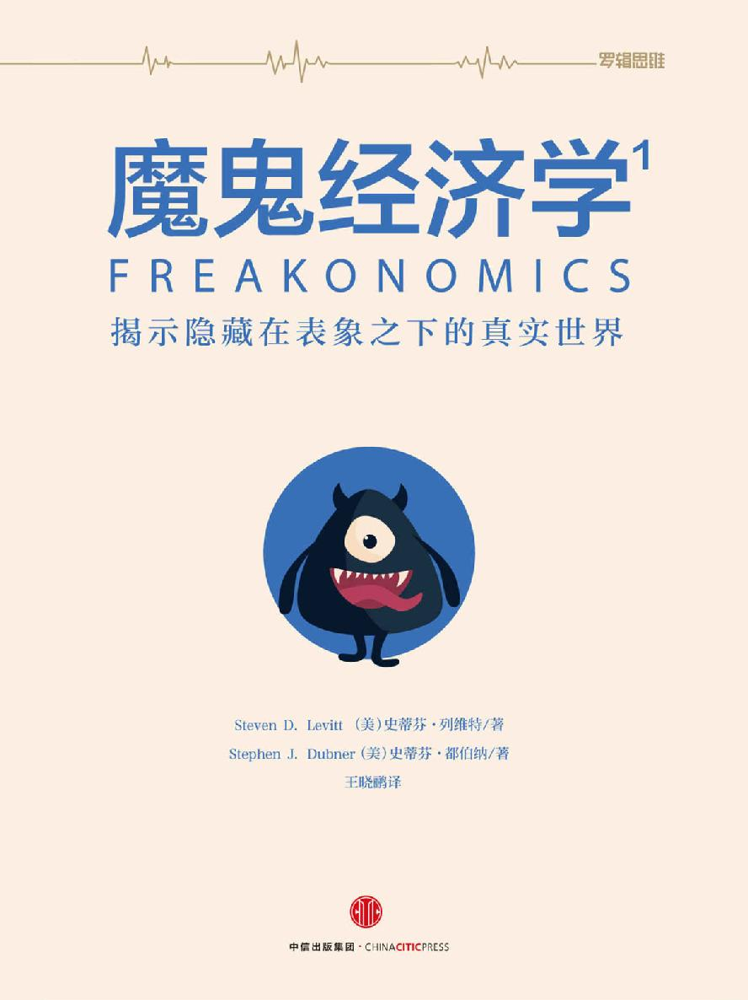 

> 魔鬼经济学
> 1：揭示隐藏在表象之下的真实世界

 

\[美\]史蒂芬·列维特; \[美\]史蒂芬·都伯纳
著

王晓鹂 译

中信出版社

目录

[《魔鬼经济学》所获赞誉](#index_split_004.html_filepos4441)

[本书的由来](#index_split_005.html_filepos23182)

[前言
万事万物的隐秘一面](#index_split_006.html_filepos28791)

[第一章
教师与相扑力士有何共同点？](#index_split_007.html_filepos58658)

[第二章
为何三K党和房地产中介是一路货色？](#index_split_008.html_filepos127045)

[第三章
为何毒贩还在与母亲同住？](#index_split_009.html_filepos190952)

[第四章
罪犯都去哪儿了？](#index_split_010.html_filepos246424)

[第五章
怎样才算完美父母？](#index_split_011.html_filepos299008)

[第六章
完美父母续章](#index_split_012.html_filepos358081)

[后记
通往哈佛的两条道路](#index_split_013.html_filepos403847)

[附录](#index_split_014.html_filepos407716)

> 
> [房地产中介欺骗你的概率](#index_split_014.html_filepos407716)
> 

> 
> [《纽约时报杂志》“魔鬼经济学”专栏文选](#index_split_015.html_filepos441763)
> 

> 
> [作者问答](#index_split_016.html_filepos492176)
> 

[版权页](#index_split_017.html_filepos504648)

《魔鬼经济学》所获赞誉

> 被《纽约时报书评》评为优秀读物

> 被《经济学人》、《纽约时报杂志》、亚马逊和巴诺书店评为年度佳作

> “图书感觉”奖年度非小说类图书

> 获鹅毛笔奖年度商业图书

> 入围《金融时报》/高盛集团年度商业图书

列维特与都伯纳巧妙地连类比物，通过对比乍看起来毫无关联的话题，挖掘富于启发性的真理，这让《魔鬼经济学》读起来妙趣横生。《魔鬼经济学》是一部优秀的著作，旁征博引了大量难以置信却又引人入胜的历史资料，这让作者有别于通俗社会学家之流。

——《纽约时报》

假如经济学界也有“夺宝奇兵”，那一定会是史蒂芬·列维特，他是一个特立独行的寻宝猎人，凭着自己的智慧、胆识和离经叛道获得了成功……《魔鬼经济学》读起来就像一部侦探小说……经济学家生怕手中资本贬值，往往吝于褒奖。因此，我费尽心思地想从这本书里挑刺儿，但我还是放弃了。抨击《魔鬼经济学》就像抨击热巧克力圣代……圣代上的樱桃就是列维特的合著者史蒂芬·都伯纳。身为记者，他显然了解自己所写的内容，娓娓道来的文风让你时而忍俊不禁，时而瞠目结舌。都伯纳先生是最难得一见的珍宝，列维特先生能找到他，是我们的幸事。

——《华尔街日报》

愉快的阅读体验……实际上，本书展示了平淡无奇、陈旧迂腐的经济学在刨根问底、深谙其道的经济学家手中可以起到什么作用……材料引人入胜……本书总能找到本身趣味无穷又能对更广泛的议题富有启发意义的问题，进而用别出心裁的方式做出解答。

——《经济学人》

引人关注且始终富于趣味性的作品，提出了很多真知灼见，充满了惊喜……《魔鬼经济学》中的有趣观点层出不穷。

——《华盛顿邮报图书世界》

我们自以为了解世界的运转方式，但实则不然……《魔鬼经济学》利用经济学和翔实的数据质疑我们对万事万物的先入为主之见……读罢之后，你不仅知道了几则可在聚会上讲的趣闻逸事，还会以更加批判的眼光看待许多所谓的真相。

——《哈佛商业评论》

发人深省、引人入胜……光是那些冷知识就能值回标价了……史蒂芬·列维特自称是无所不能的知识界侦探，但凡是引起他兴趣的人类行为之谜，他都可以揭开。这么说或许有些大言不惭，但《魔鬼经济学》证明，这么说是有底气的。

——《纽约时报书评》

请设想一个有着天马行空思维、绝顶聪明的经济学家，再设想他只有9岁，想了解一切，这就是史蒂芬·列维特的基本形象……每一章都是一次发人深省的实地考察，就像马尔科姆·格拉德维尔在《引爆点》和《眨眼之间》两部书中对人性的探索一样。

——《时代周刊》

史蒂芬·列维特拥有全美国最有意思的头脑，而《魔鬼经济学》读起来就像在阳光灿烂的夏日同他一起悠闲地散步，他举起手摇了摇手指，便颠覆了一切你所理解的真理。做好为之叹服的准备。

——马尔科姆·格拉德维尔

列维特使用了简洁巧妙的统计工具，他直击问题要害，选取引人入胜的话题。所有社会学家都应扪心自问，他们所研究的课题在趣味性或重要性方面是否比得上这一佳作。

——《洛杉矶时报书评》

这部史上最独特的统计方法研究著作出自世界知名经济学家之手……列维特（与合著者都伯纳）从人类行为的混乱数据中寻找逻辑。他的结论常常令人大开眼界，有时甚至目瞪口呆（他的一条理论是，高堕胎率有助于减少犯罪。这想必会让他在短期内自绝于白宫）……读起来很有意思。

——《娱乐周刊》

大批经济学家前赴后继、不辞辛劳地破解货币政策等错综复杂的议题，而史蒂芬·列维特却在用经济学模型解答更有意思的问题，并因此名声大噪。

——《旧金山纪事报》

特立独行的经济学家史蒂芬·列维特解释了为何很多有关金钱的道理你自以为了解，却并不正确……他从经济学角度重新审视日常话题。

——《金钱》

这本有趣的读物将经济学原理用于审视日常生活。

——《人物》（好书介绍）

《魔鬼经济学》的展开不像典型的晦涩难懂的经济学论文，倒像是那种会让你熬夜去看的侦探小说……扣人心弦。

——《芝加哥论坛报》

《魔鬼经济学》以通俗易懂、去学术化的口吻介绍了列维特的发现。本书是一部引人关注且始终富于趣味性的作品，提出了很多真知灼见，又充满了惊喜……其中的有趣观点层出不穷。

——《休斯敦纪事报》

请设想列维特最优秀的研究成果，竟由一名杰出的记者用通俗易懂的语言写出来。说到当代经济学研究的普及读物，本书是个里程碑。

——泰勒·考恩发表于“边际革命”网站

经济学这门学科晦涩难懂，鲜有未接受过经济学教育的人会愿意读经济学家写的书。但芝加哥大学经济学家史蒂芬·列维特似乎做到了这点。

——《芝加哥太阳时报》

一本为怪咖和书虫而写的巨著……列维特抱着解谜者的心态，手握统计经济学工具，寻找各种不同的答疑解惑渠道……在他手中，经济学从一门乏味的学科摇身一变，成为求知者的工具。

——《财富》

有趣，有深度……它用引人入胜的方式讲述各种古怪离奇的问题。

——《底特律自由报》

一部引人入胜、别出心裁的合著作品。近年来，没有哪部经济学著作能像这部作品一样抓住普罗大众的心。本书的突出成就之一就是将似无关联的情况分析结合起来，并通过灌输一个简单的事实予以解释，那就是人们会或多或少地出于理性考量，受经济利益驱使。

——《华盛顿时报》

本书足以证明，应当对列维特与众不同的观点予以仔细分析，他总是能从堆积如山的数据中，总结出中左翼观点，所提出的思路能让我们恍然大悟，并重新反思我们一直深以为然的观念。列维特以不偏不倚的姿态分析手中的材料，他用一种摒弃政治立场的方式，展示了鲜为人知的常识和非常识。

——《Time Out纽约》

《魔鬼经济学》展示了列维特最优秀的一面，他提出了他人未曾想过的问题，找到的答案有时也超乎想象。

——《亚特兰大宪法报》

如果你以为经济学家都是担心利率波动、脾气暴躁的教授，那就摒弃这种成见吧，作者列维特关注的，恰是与人们息息相关的现实议题，而构成他所有研究课题基础的，是只要找准角度就可以理解复杂现象的信条。列维特善于将这一原则应用于日常生活，本书注定会大受欢迎。

——《出版者周刊》（星级书评）

这个年代，充斥着主观、基于信仰、或左或右的传统观念，太多的学术研究陷入了先入为主的意识形态窠臼。《魔鬼经济学》反其道而行，以一种巧妙、深刻、严谨、开明及冒险忘危的态度揭示出令人吃惊的真相。这是一本让人振奋又耳目一新的佳作。

——库尔特·安德森

本书展示了列维特对多个不同话题的有趣研究，读起来确实很有意思。

——沙龙网

《魔鬼经济学》是一部令人欲罢不能、爱不释手的经济学通俗应用速成教材，在分析枯燥数据并借此写出一部小说——有关世界运作方式的精彩理论——方面，列维特天赋异禀。而都伯纳也用生动、诙谐、通俗的语言传达出了列维特的思想与理论，二人可谓相得益彰。

——《洋葱报》

引人入胜、妙趣横生又出人意料，我想没有哪个成年人会不为之倾倒。

——《旧金山周报》

以全新、精彩的思维论点去看待这个世界，尽管《魔鬼经济学》肯定会引发争议，但列维特的作品依然充满令人叹服的真知灼见，称其为天才也并无不妥。书中的许多观点虽然令人费解、复杂难懂，却从头到尾都很精彩，列维特以令人惊叹的独特构思和过人胆识，描写了所谓“现实世界”的方方面面。我们的社会对这些事实会作何反应虽然不得而知，但列维特和都伯纳已经完成了自己的职责，他们写出了这10年里最睿智、最具话题性的作品。

——《旗帜日报》（英）

《魔鬼经济学》充满了令人惊叹的数据分析，这些分析颠覆了传统观念，让你禁不住隔着屋子对配偶喊：“喂，听听这个……”

——《多伦多明星报》

《魔鬼经济学》可能是第一部可当作休闲读物来读的数据分析书，它对社会敏感问题——犯罪、堕胎、考试作弊、阶级意识、育儿——提出了一系列颇具争议但令人信服、表述清晰的观点，文中穿插的趣闻逸事和用一本正经口吻讲出来的俏皮话也别有一番滋味。

——《明尼阿波利斯星坛报》

《魔鬼经济学》用毫不拖沓的文风，阐释了世界的真实运转方式，让经济学这门学科显得通俗易读，同时始终让读者沉浸在惊讶于作者聪明才智的思绪之中，总之妙趣横生。

——《纽约观察者报》

可以说列维特和都伯纳的这部著作几十年内都会让人持续铭记，而不被人遗忘，这是一部分析精彩、逻辑严谨的佳作，说它精彩绝伦，毫不为过。这本书在思维拓展方面的勇敢无畏不仅值得鼓励，还值得珍视。

——《橙县纪事报》

列维特将自己出众的头脑用于揭示日常生活之谜，就像经济学界的福尔摩斯。《魔鬼经济学》将不断带给你超乎常理的乐趣。

——《旗帜晚报》（英）

《魔鬼经济学》讲述的是非传统观念，它以别出心裁的方式运用原始的经济学数据提出妙趣横生的问题。列维特在提出古怪问题方面颇有天赋，让人如梦如幻、为之着迷，非常精彩。

——《观察家报》（英）

生动、易懂又令人信服，列维特试图让自己成为我们的向导，从而带领我们以不同的视角观察世界及世界运行机制，他显然是个聪明的经济学家。

——《堪培拉时报》（澳大利亚）

一部极富思想，又带着争议的作品。

——《法制时报》

《魔鬼经济学》就人类动机和当代生活提出了颇具争议和深度的问题，得出了难以置信的结论，从而以全新的视角向你展示了你所熟知的世界。列维特提出的理论在你读罢之后，还会久久萦绕在你脑海中。

——《商报》（南非）

对解答五花八门的问题感兴趣的人应该读一读这本《魔鬼经济学》，这是你能读到的最富于智慧，也最引人入胜的经济学著作之一。都伯纳手法高明，就算是用两页纸解释回归分析法的定义，你读起来也不会不耐烦，甚至还觉得津津有味。

——《雅加达邮报》（印度尼西亚）

《魔鬼经济学》将经济学原理、福尔摩斯推理与信不信由你博物馆
[\[1\]](#index_split_004.html_filepos22907)
合三为一。

——《开拓者日报》（不列颠哥伦比亚省维多利亚市）

这本书对动机进行了精彩绝伦、颇具争议的研究：动机为何物、如何改变以及对人类行为有何影响。本书表面看来是一本通俗易懂的读物：文风轻松，笔触明快诙谐，让读者难以发现其观点猛烈抨击了我们对人类生活方式和社会运转方式所抱有的先入为主之见……对于这本书，再怎么推荐都不为过。无论你在哪里读这本书——海滩、家里、火车上还是办公室里——你都会得到鼓舞、激励和乐趣。

——《周日电讯报》（英）

它披露了很多有意思的真相。

——《塔尔萨世界报》

列维特有着强烈感染力的求知欲，他从未丢弃儿时那爱问为什么的劲头儿。他鼓励我们勇于发问，不懈地寻找答案，去探究以前没想到的领域……这是一部引人入胜的经济理论作品，也是前人以为无法做到的事。

——《水牛城新闻》

我无法想象，有谁读这本书时不会停下来嘀咕两句：“哇，这推翻了我长久以来所相信的一切。”本书内容引人入胜，我要强烈推荐。

——《绿湾新闻公告》

这部妙趣横生、引人入胜的著作，用经济学来解答当今一些很有意思的问题……它津津有味，又发人深省。列维特用数据分析解答稀奇古怪的问题，这或许能帮助企业高管找到分析问题的新途径。

——《得州律师报》

列维特的趣味在于它能马上吸引那些非专业人士的关注，而他和都伯纳用平实的口吻娓娓道来的行文方式，对于并不熟悉经济学家思维方式的读者来说，《魔鬼经济学》既有启发性，又有娱乐性。

——《新政治家周刊》（英）

《魔鬼经济学》是一部不可思议、妙不可言的著作，书中充满了让你目瞪口呆的真知灼见，史蒂芬·列维特也可说是最具独创性的思想家之一。

——《商业世界》

一本眼界开阔、趣味十足，又贴合现实的书。

——《科克斯书评》

[\[1\]](#index_split_004.html_filepos19875)
信不信由你博物馆，又称不可思议博物馆，馆内以趣味横生的方式陈列从世界各地搜集到的各式各样稀奇古怪的收藏品。——译者注

本书的由来

2003年夏，《纽约时报杂志》派作家兼记者史蒂芬·都伯纳为史蒂芬·列维特撰写一篇简介。列维特是芝加哥大学的经济学家，虽年纪轻轻，却已声名大噪。

都伯纳彼时正在研究一部关于货币心理学的著作，在那段时间里采访了不少经济学家。他发现他们往往口齿不清，仿佛英语是他们的第四或第五语言。而列维特刚刚荣获约翰·贝茨·克拉克奖（可比作青年版诺贝尔奖，用以表彰青年经济学家），在那段时间接受过不少记者的采访。他发现他们的思维方式，用经济学家的话来说，可谓是不太健全。

但列维特看出都伯纳并非彻头彻尾的白痴，而都伯纳也发现列维特并非单纯的人体计算尺，这位经济学家标新立异的研究和讲解的口才都令作家为之折服。虽师出名门（哈佛大学学士、麻省理工学院博士，获奖无数），列维特却以剑走偏锋的方式研究经济学，他看待世界的方式并不像一个学究，倒像一个机敏好奇的探险家——纪录片导演、法医调查员，抑或体育圈、犯罪、流行文化无一不插手的赌徒。他坦承，对于大众一提及经济学就会想到的货币话题，他兴趣寥寥。

实际上，他滔滔不绝地将自己贬低了一番。

“对于经济学领域，我所知甚少，”某次，他将遮眼的刘海一撩，对都伯纳说道，“我对数学不在行，对计量经济学不甚了解，也不知道如何做理论研究。如果你问我股市是涨是跌，经济是兴是衰，通货紧缩是喜是忧，或是税务问题，我是说，我要是敢说自己对这些话题中的任意一个有半点了解，我就是完全在骗你。”

列维特所感兴趣的，是日常生活中的种种谜团，对于那些想要探究世界运行方式之奥秘的人来说，他的研究能让他们如愿以偿。在采访结束之后都伯纳所写的文章中，他的怪异态度得到了解释。

> 如列维特所见，经济学这门学科，拥有各种寻找答案的有效工具，但耐人寻味的问题却寥寥无几。而他的一大专长就是提出这样的问题，如：如果说毒贩子能大发其财，为何他们还和自己的母亲住在一起？枪和游泳池，哪个危险系数更高？在过去的10年里，造成犯罪率骤降的真正原因是什么？房地产中介是否真的把为客户谋求最佳利益放在了心上？为何黑人父母喜欢给孩子取有碍其职业前途的名字？教师是否会为了达标，在高风险性的测验中作弊？相扑是否是一项腐败的运动？

> 许多人——包括他的不少同行——或许并不承认列维特的研究和经济学沾边。但他所做的，仅仅是将这门所谓死气沉沉的学科去繁就简，提炼至其最根本的宗旨：阐明人们如何才能如愿以偿。有别于多数学者的是，他并不避讳使用个人的观察结果和兴趣所向，也不避讳秘闻野史和趣闻逸事（但他对微积分却是避之而唯恐不及）。他是直觉主义者，他翻阅大量数据，去寻找前人未曾发现的故事。他推测出的测评方式，可以测评资深经济学家口中的不可测效应。不过，最让他乐此不疲的话题——虽然他声称自己从未染指过这些勾当——是诈骗、腐败和犯罪。

列维特炽热的求知欲也感染了数以千计的《纽约时报》读者。各式各样的问题、征询、谜语和请求纷至沓来——提问者既有通用汽车公司、纽约扬基棒球队、美国参议员，也有正在服刑人员、为人父母者和一位20年来一直在一毫不差地记录自己生意数据的百吉饼买卖人。一位前环法自行车赛冠军打电话给列维特，请他帮忙证明如今的环法比赛已经滥用兴奋剂成灾。中情局请教列维特如何利用数据追捕洗钱者和恐怖分子。

令大家趋之若鹜的，是列维特的根本信条：现代世界尽管充斥着种种迷雾、乱象和罪恶昭彰的骗局，却并非无法参透或深不可测；只要提出恰到好处的问题，它甚至比我们所想的更加趣味横生。所需的仅仅是一种新的观察方式。

在纽约，出版商告诉列维特，他应该写一本书。

“写一本书？”他说，“我不想写书。”

待解之谜已经堆积如山，他几辈子也解决不完，而且他也不认为自己适合作家这个角色。

“我没什么兴趣——除非，”他提议道，“我和都伯纳合著。”

并非人人都适合合作，但他们两人——以下改称我们两人——决定聊聊，看合著出书是否行得通。我们认为行得通，希望各位也能予以认可。

前言　万事万物的隐秘一面

生活在20世纪90年代初的美国人，但凡稍微瞥一眼晚间新闻或日报，就会心生毛骨悚然之感。

这完全不必大惊小怪。

罪魁祸首就是犯罪。犯罪率不断攀升——几十年间，美国任何城市的犯罪率曲线图都呈直线上升的态势。而按照当时的趋势，如今正是我们所知的这个世界行将终结之时：故意或过失枪杀案司空见惯；劫车、贩毒、抢劫、强奸同样屡见不鲜；暴力犯罪成了人们生活中挥之不去的恐怖阴影。

“情况大有恶化之势。”

“未来会更加糟糕。”

权威专家无一不如是预测道。

恐慌的制造者就是所谓的超级猎手
[\[1\]](#index_split_006.html_filepos54903)
：这个形象曾一度随处可见，他在各大新闻周刊的封面上怒目圆睁，几十厘米厚的政府报告中遍是他堂而皇之的身影；他是一个骨瘦如柴、浪荡在大城市的小子，手握廉价枪支，内心无所忌惮、残忍无情。

我们被告知，这样的人数以千计，嗜血杀戮的一代将把这个国家拖入无尽的深渊。

1995年，犯罪学家詹姆斯·艾伦·福克斯为美国司法部长撰写了一篇报告，称青少年杀人案将急剧上升。他认为：乐观的话，青少年杀人案在10年内会上升15%；悲观的话，则会翻一番以上。

“下一轮犯罪高峰期将来势汹汹，”他说，“相比之下，连1995年都会变成美好的往昔。”

其他犯罪学家、政治学家及同样博学多识的预测专家都对未来做出了同样惨淡的预测，连克林顿总统也不例外。

“我们知道，我们要在6年内扭转局势，治理青少年犯罪，”克林顿称，“否则将国无宁日。而我的继任者将无暇再对全球经济的良好机遇高谈阔论，而是得忙于保护城市街道上人们的身家性命。”

犯罪的蔓延似乎在所难免。

然而接下来，犯罪率并没有继续攀升，反而开始下降，持续不断地下降。

犯罪率的下降有点不寻常：这是一次全面的下降，全美各地各种类别的犯罪都在减少；这是一次持续的下降，下降幅度逐年加大；这还是一次全然出乎意料的下降——对于那些做出相反预测的专家来说，尤其如此。

这次形势逆转之迅猛令人震惊。青少年杀人案发率并没有像詹姆斯·艾伦·福克斯所警示的那样翻番，甚至也没有增长15%，反而在5年内下降了50%。至2000年，美国的总体凶杀案发率已经降至35年来最低。斗殴、汽车盗窃等几乎各类犯罪的案发率同样如此。

虽然各类专家没能料到犯罪率下降（而早在他们做出耸人听闻的预测时，犯罪率已经出现了下降的苗头），但此时他们却开始争先恐后地对这种现象做出解释。

他们提出的理论多数听起来头头是道：一说是因为90年代欣欣向荣的经济形势；一说是因为《枪支管制法》的普及；还有一说是因为纽约市所施行的新型治安策略。（1990年，纽约发生了2262起凶杀案，而2005年只有540起。）

这些理论不仅头头是道，还很振奋人心，因为根据这些理论，犯罪率的下降得益于具体且短期的人为措施。如果枪支管制、巧妙的治安策略和提高工作报酬能够降低犯罪率，那即是说刬恶锄奸的能力原来唾手可得。那么，等下一次犯罪猖獗——但愿不要——的时候，我们便有经验可循了。

这些理论似乎顺畅无阻地从专家口中，传到了记者耳中，然后又进入大众的思维，并迅速上升为传统观念。

但有一个问题：这些理论并不正确。

还有另一大早已发生的因素导致了90年代犯罪率的骤降。这一因素早在20多年前便初见端倪，它涉及一位名叫诺尔马·麦科维的年轻女子。

正如众所周知的“蝴蝶效应”，一只蝴蝶在一个大陆扇动一下翅膀，最终导致另一个大陆发生一场飓风。诺尔马·麦科维也在无意中猛然扭转了历史进程，而她的初衷只是想堕胎而已。

1970年，她年仅21岁，是一个穷困潦倒、目不识丁、一无所长、酗酒吸毒的女子。此前她已经把自己的两个孩子送给了别人收养，但这时她发现，自己又怀孕了。然而，得克萨斯州和当时美国的多数州一样，规定堕胎是违法的，最终麦科维得到了地位远超于她的权势人物的关照，他们为实现堕胎合法化，让她作为主要原告，发起了一场集体诉讼，被告则是达拉斯郡检察官亨利·韦德，这件案子最终上诉到了美国最高法院，而此时麦科维已经化名为简·罗。

1973年1月22日，法庭判罗女士胜诉，允许美国全境进行合法堕胎。然而，这对麦科维/罗女士来说为时已晚，她已经把孩子生了下来，并开始寻找领养家庭。（多年后，她放弃了自己支持堕胎合法化的立场，摇身一变成为了反堕胎活动家。）

那么，“罗诉韦德案”如何在历经一代人之后，导致了有史以来最大幅度的犯罪率下跌呢？

仅就犯罪而言，并非人人生而平等，甚至可以说是天差地别。几十年来的研究表明，出生于不幸家庭的儿童走上犯罪道路的概率要远高于其他儿童。而在“罗诉韦德案”之后，很可能有数百万女性选择了堕胎，这些穷困潦倒、未婚先孕、承担不起非法堕胎或没有门路的未成年妈妈常常是不幸的代名词。正是这些母亲腹中的孩子，一旦降生，走上犯罪之路的概率会远高于平均水平，但由于“罗诉韦德案”，这些孩子并未出世。

这一颇具影响力的事件随后产生了一个巨大而深远的影响：多年后，这些未出世的孩子本应步入壮年，在犯罪界大展拳脚的时候，犯罪率开始骤降。

所以，美国犯罪高峰没有如期到来，并非得益于枪支管制、经济繁荣或新型的治安策略，而是因为潜在罪犯的数目大幅减少，以及其他一些因素。

那么，那些犯罪率下降论专家（曾经的犯罪灭国论者）在媒体上信口开河，其中又有多少次提到了堕胎合法化也是原因之一呢？

一次也没有。

关于商业合作和志同道合兼而有之的典型例子，就是雇房地产中介帮你卖房子。

房产中介估算房子的价值，拍几张照片，给房子定价，写上一则吸引眼球的广告，卖力地推销，讨价还价，然后坚守岗位到交易完成。

这自然需要花费很多心力，但她也能赚得不少回扣。假如房子售价为30万美元，中介费通常为6%，即18000美元，你心里会想，这可是很大一笔钱，但你也会想，单凭自己，房子绝对卖不到30万美元，但中介知道，她知道如何让自己的房子物尽所值，让自己拿到最高价。

也就是说，她对自己行当的了解程度远胜于外行人，知道自己代表的是谁的立场。关于房子的价值、房市现状，甚至买家的心态，她掌握着更加丰富的信息，你要靠她来了解这些信息，而人们雇用专家的原因不外乎如此。

当今世界，专业分工的细化催生了无数类似的专家，医生、律师、承包商、股票经纪人、汽车修理工、抵押经纪人、理财规划师……他们手握巨大的信息资源，利用这一优势，帮助身为雇主的你以最优惠的价格获得你想要的东西。

能这么想自然不错，但专家也是人，受利益驱使。因此，任何专家如何待你，取决于其动机如何。

有时，它有利于你。例如：一项有关加利福尼亚州汽车修理工的研究发现，汽车修理工常常宁愿放弃一小笔修理费，也会让不达标的车辆通过废气排放检测，其背后的原因，是网开一面的修理工能赢得回头客。

但也有对你不利的时候。一项医学研究发现，在生育率下降的地区，产科医师选择进行剖腹产的概率要远高于生育率处于上升趋势的地区。这表明，生意不景气时，医生会多做昂贵的手术，从中牟利。

凭空猜忌专家的渎职行为是一回事，要加以证明就是另一回事了。所以，最佳的证明方式就是对比专家提供给你的服务与他为自己提供的同类服务。可惜，外科医师不能给自己做手术，其医疗档案也不会公开，而汽车修理工的私车修理记录同样也不会公开。

然而，房地产销售记录却是公开的资料，而房地产中介也确实常常经手自己的房子，最近的一组数据统计了芝加哥郊区近10万处房产的交易记录，其中有3000处的卖家就为房地产中介本人。

在研究数据之前，首先需要提一个问题：在推销自己的房产时，房产中介的动机是什么？答案很简单：做最划算的交易。这也是你出售房子时所追求的，你和房产中介似乎志同道合，毕竟她的佣金是和售价挂钩的。

如此一来，佣金背后的复杂性就显露无遗了。首先，6%的房地产中介佣金通常要由买卖双方的中介平分，每一方还需要从自己分得的份额中返还一半给中介公司。也就是说，只有售价的1.5%是直接落入你方中介手中的。

这样一来，假如你的房子售价为30万美元，佣金则为18000美元，但她的个人所得只有4500美元。

“仍然不少了。”你会这样想。

但假如房子的实际价值不止30万美元呢？假如她只需多做一点功课、多一点耐心、多发几则广告，就可以卖到31万美元呢？扣除佣金，你能多赚9400美元，但中介的佣金却只增加了区区150美元——高出的1万美元的1.5%。

你能多赚9400美元，而她只能多赚150美元，你们或许并不能算是志同道合。（而且她还需要自掏腰包打广告、负责跑腿。）那么，中介是否愿意为了区区150美元而投入额外的时间、金钱和精力呢？

只有一种方法可以找到答案：对比房地产中介私有房产及其客户房产的销售数据，计算差额。以10万处芝加哥房产的销售数据计算，控制所有变量——地理位置、房龄、房屋质量、外观、是否为投资性房产等，最终得到的结果是，房地产中介的私有房产在市场上挂牌出售的平均时间要多出10天，售价则高出3%，即市价30万美元的房子，其售价要高出1万美元。中介出售私有房产时，会坚持等到最高价，而经手你的房产时，只要有过得去的报价，就会劝你接受。正如股票经纪人为了赚取佣金会进行挤油交易
[\[2\]](#index_split_006.html_filepos55338)
，中介也希望更多更快地交易。何乐而不为呢？毕竟苦等最高价也只能多赚区区150美元，这利益太微不足道了，不值得她这么做。

关于政治的真理不一而足，其中最为人信奉的一条，是金钱可以收买选举。阿诺德·施瓦辛格、迈克尔·布隆伯格
[\[3\]](#index_split_006.html_filepos55628)
、乔恩·科尔津
[\[4\]](#index_split_006.html_filepos55866)
——这只是几个近期出现、引人关注且能佐证这一真理的例子。（暂且不论史蒂夫·福布斯
[\[5\]](#index_split_006.html_filepos56180)
、迈克尔·赫芬顿
[\[6\]](#index_split_006.html_filepos56571)
，尤其是托马斯·格里萨诺
[\[7\]](#index_split_006.html_filepos57066)
这样的反面例子。格里萨诺三次竞选纽约州州长，自掏腰包共花费9300万美元，但三次分别只获得了4%、8%和14%的选票。）多数人都认为，金钱对选举结果产生了不正当的影响，过多的资金挥霍在了政治竞选中。

诚然，选举统计数据显示，在竞选中投入手笔更大的候选人常常会胜出，但金钱是否真的是他们获胜的原因呢？

这么想似乎顺理成章，那说90年代的经济繁荣导致了犯罪率的下降，似乎也顺理成章。然而，二者存在相关关系，并不等同于一者导致了另一者。相关关系仅表示，两个因素——姑且称之为X和Y——之间存在某种关系，但你无从判断孰因孰果。有可能是X导致了Y，有可能是Y导致了X，也有可能是X和Y均由另一个因素Z导致。

请对如下相关关系进行思考：凶杀案频发的城市，往往警力也非常充足。以两个真实城市中警力与凶杀案之间的相关关系为例，假设这两个城市为丹佛市与华盛顿市，二者人口相当，但华盛顿的警力是丹佛的近3倍，其凶杀案发数则是后者的8倍。然而，在不了解详情的情况下，孰因孰果很难说。可能某些一知半解的人，对这些数据略作思考，就妄下结论，认为是警力过多导致了华盛顿凶杀案频发。这种望文生义的思维方式，古已有之，而且常常会导致人们采取自以为是的应对措施。正如那则民间传说所言，一位沙皇得知其帝国内疾病肆虐最严重的省份也是医生数量最多的省份，于是，他的解决方案是，当即下令处死所有医生。

现在回到竞选开支的话题上，为分析金钱与选举结果之间的关系，我们需要思考影响竞选经费的因素。假设你手上有1000美元，想要捐献给某位候选人，你可能会在两种情况下选择捐献这笔钱：其一，在难分伯仲的情况下，你认为金钱会左右最终的结果；其二，某位候选人一骑绝尘，你想沾一点光，抑或想在将来获得某些实际的关照。你肯定不会把钱捐给必败无疑的候选人。（这点你可以去问那些在艾奥瓦州和新罕布什尔州
[\[8\]](#index_split_006.html_filepos57433)
遭到重创的总统候选人。）因此，大选领跑者和竞选连任者所筹得的资金远超过不成气候的候选人。那么竞选开支呢？竞选连任者和大选领跑者显然拥有更多资金，但只有在确实有落选可能的情况下，他们才会一掷千金。必胜无疑的话，他们何必动用这笔竞选资金呢？毕竟这些资金在以后遭遇强敌时，能派上更大的用场。

现在假设有两位候选人，一位天生富于魅力，另一位则非如此。讨喜的候选人筹集到了更多的资金，轻而易举地胜出。不过，到底是金钱为他赢得了选票，还是他的个人魅力让他选票与金钱双收？

这是一个至关重要的问题，却很难解答。毕竟，选民吸引力不易量化，那有什么办法能衡量选民吸引力呢？

基本没有办法——只有一个例外。唯一的办法就是对比两次竞选中的同一位候选人。即，候选人A与2~4年后的自己很可能相差无几。对于候选人B，同样也可以做此假设。假如候选人A与候选人B在连续两次竞选中对垒，但两次的开支不同，那么鉴于二者的个人魅力值变化无几，我们便可衡量金钱在其中所起的作用。

我们发现，同两位竞选人在多次竞选中连续对垒，这样的情况时有发生——实际上，自1972年以来，有近千次国会竞选都出现了这种状况。那么这些案例的数据说明了什么呢？

结果出乎意料：候选人的竞选开支影响甚微。有冠军相的候选人即便将开支减半，也只会丢掉1%的选票，而没有冠军相的候选人，即便开支翻倍，也只能为自己多拉拢1%的选票。对于政治候选人来说，开支多少并不重要，重要的是其个人品质。（这也适用于父母——第五章会提及这点。）有的政客天生讨选民喜欢，有的则不然，花多少钱也无法弥补这一点。（福布斯、赫芬顿和格里萨诺几位大鳄想必有所体会。）

那么这条选举真理的下半句呢？耗费在竞选活动上的资金多到令人发指？一个选举周期通常包括总统大选和参众两院选举，其间每年的竞选开支约为10亿美元——这听起来是一笔巨款，除非你将这笔钱同某项重要性显然不及民主选举的开支做一下对比。

例如，美国人每年花在口香糖上的开支也是10亿美元。

本书所要探讨的，并非口香糖开支与竞选开支的对比，或欺瞒客户的房地产中介，也不是堕胎合法化对犯罪率的影响，书中自然会对此类情况做出分析，同时还会涉及不少其他话题，包括育儿之道、欺诈技巧、贩毒团伙的内部运作方式及《智者为王》
[\[9\]](#index_split_006.html_filepos57828)
中的种族歧视。本书的真正目的是拨开蒙在现代生活之上的迷雾，探究内在的真相。我们会提出很多疑问，有的无关痛痒，有的则是生死攸关的大事。答案可能常常听起来怪诞不经，但经事实分析后，会变得显而易见。我们会从数据中寻找答案——所谓的数据可能是学生的测验分数，可能是纽约的犯罪统计数字，也可能是毒贩的收支记录。我们常常会利用数据中偶然呈现出来的规律，这些规律就如同飞机掠过高空留下的飞行轨迹。就某个话题抒发己见或著书立说自然可以，人类对此乐此不疲，但若能撇开道德立场，沉下心来钻研数据，结果常常会得出有悖传统、出乎意料的发现。

可以说，道德代表着在人类心目中，这个世界应该如何运转，而经济学代表着其实际的运转方式。经济学首先是一门有关测评的学科，它包含一系列行之有效、用途广泛的工具，可以对大量信息如就业、房地产、金融和投资进行确切的评估，以确定任意因素的影响，乃至所有影响，这才是“经济”的根本要义。但经济学的工具也完全可以用于分析其他话题，而且这些话题可以说，更有意思。

本书将从一个非常明确的世界观出发，立足于以下几个根本观点，来表达我们自己的思想：

诱因是现代生活的根基。理解或常常仅仅是寻找到这些因素即是解决几乎任何谜团的关键，从暴力犯罪到假球案，再到网恋，无一例外。

传统观念常常是错的。20世纪90年代的犯罪率并未一路蹿升，仅仅一掷千金换不来选举胜利，而且出乎意料的是，没有任何证据证明一天喝八杯水有益健康。传统观念常常漏洞百出，同时又极难看穿，但戳穿这些观点并非不可能。

轰动性事件常常起因于风马牛不相及甚至微不足道的事情。谜团的答案不会总是一目了然。诺尔马·麦科维对犯罪率的影响，远远超过了枪支管理、经济繁荣和新型治安策略三种措施的共同影响。与她类似的，还有后文会提到的奥斯卡·丹尼洛·布兰登，绰号“快克界的苹果籽约翰尼”
[\[10\]](#index_split_006.html_filepos58377)
。

专家——包括犯罪学家和房地产中介——利用手中的信息资源优势谋一己私利。不过，在他们面前班门弄斧也可以成功。面对互联网的普及，他们的信息优势在日益缩减——佐证就是棺材价格和人寿保险费用的下跌，等等。

知道什么值得测评以及如何测评，有助于理清这个纷繁复杂的世界。如果你学会以正确的方式观察数据，某些以其他方式无法解答的谜团就会迎刃而解，因为要击碎混淆视听和自相矛盾的谎言，数据的力量就无可比拟。

因此，本书旨在探究万事万物的隐秘一面，或许这偶尔会徒劳一场，或许有时感觉是在以管窥天，或者感觉眼前之景光怪陆离，但其目的就是以前所未有的方式观察并审视许多不同的情形。从某些方面来讲，这对于本书来说是奇怪的切入点，因为多数书会选择提出一个统一的主题，且三言两语即可表达清楚，然后再围绕这个主题娓娓而谈。本书并没有这样一个统一的主题，虽然我们确曾考虑了6分钟，以是否让本书围绕一个主题展开，如应用宏观经济学理论与实践，但有人感兴趣吗？所以，最终还是选择了类似寻宝游戏的架构。诚然，这一架构会采用经济学中最优秀的分析工具，但也会让我们得以循着自己突发奇想的思路探究下去。因此，我们虚构了一门学科：魔鬼经济学。本书中出现的故事甚少能进入经济学课本，但这种情况或许也会改变。鉴于经济学从根本而言由一系列工具构成，而非形而上的学科，因此无论多么稀奇古怪的话题，应该都没有超出其范畴。

值得一提的是，古典经济学的鼻祖亚当·斯密首先是一名哲学家，他本一心想成为道德家，不料却因此成了经济学家。1759年，他出版了《道德情操论》，彼时现代资本主义方兴未艾，这股新生力量带来的巨变，令亚当·斯密为之着迷。但他所感兴趣的并非数字，而是其对人的影响。经济的力量大大改变了人们在某些情况下的思想和行为，是什么驱使一个人犯下欺盗之罪，而另一些人却无此劣行？一个人看似平淡无奇、或好或坏的选择如何对许多人造成翻天覆地的影响？在亚当·斯密的时代，因果之间的联系日益走向深化，动机的作用被成倍放大，如同我们今天所面临的现代生活变革，这些变化摧枯拉朽，对彼时的人们造成了巨大冲击。

亚当·斯密真正的研究主题是个人欲望与社会规范之间的矛盾。经济历史学家罗伯特·海尔布隆纳在其著作《经济学统治世界》中，探讨了亚当·斯密如何将生性自私的人类行为和人类所构建的、更加高尚的道德水准区分开来。

“亚当·斯密认为，答案在于我们有能力将自己置于第三者的地位，成为公正的观察者，”海尔布隆纳写道，“以此形成对某件事的客观……价值评价。”

那么请设想，你在一位或者两位第三者的陪伴下，迫不及待地想探究某些有趣案例的客观价值。但是，在踏上探索之旅前，我们通常要先提一个异常简单却无人提过的问题，比如：教师与相扑力士有何共同点？

[\[1\]](#index_split_006.html_filepos29920)
超级猎手（Superpredator），青少年犯罪者。该词由普林斯顿大学教授约翰·迪卢利奥（John
Dilulio）在1995年杜撰，用以指代当时那些“不尊重生命、不顾及未来”，以及“没有父亲、不信上帝的失业青年”。——译者注

[\[2\]](#index_split_006.html_filepos41925)
挤油交易，即反复买卖，是指证券经纪人通过为客户进行过多买卖而增加佣金的不道德行为。——译者注

[\[3\]](#index_split_006.html_filepos42357)
迈克尔·布隆伯格，彭博新闻社创始人，纽约市市长。——译者注

[\[4\]](#index_split_006.html_filepos42442)
乔恩·科尔津，2001——2006年任美国参议员，2006——2010年任美国新泽西州州长。他同时还是高盛集团的前总裁。——译者注

[\[5\]](#index_split_006.html_filepos42626)
史蒂夫·福布斯，美国福布斯集团总裁兼首席执行官以及《福布斯》杂志总编辑，曾于1996年和2000年两次争取共和党的提名竞选总统，并投入6700万美元，但均以失败告终。——译者注

[\[6\]](#index_split_006.html_filepos42714)
迈克尔·赫芬顿，罗伊·M.赫芬顿天然气公司创始人之子，《赫芬顿邮报》网站创始人阿里安娜·赫芬顿的前夫，曾任美国众议员。1994年，他花费2800万美元，竞选美国参议院席位，但最终落败。他的竞选投入在当时创造了美国非总统竞选投入的新高。——译者注

[\[7\]](#index_split_006.html_filepos42814)
托马斯·格里萨诺，美国薪酬管理公司沛齐公司创始人，美国冰球联盟水牛城军刀队的前任共同所有人，曾三次以独立候选人的身份竞选纽约州州长。——译者注009

[\[8\]](#index_split_006.html_filepos45313)
艾奥瓦州是美国总统大选中最早举行党团会议的州，而新罕布什尔州则是最早进行初选的州，两个州均领先于其他州开出初选结果，因此被称为“美国总统大选的前哨站”。——译者注

[\[9\]](#index_split_006.html_filepos48508)
《智者为王》（The Weakest
Link），源自英国的电视游戏节目，世界多处地方均有制作当地版本。游戏节目中，各个参赛者要一个接一个连续正确地解答问题，才能获得最高奖金，情况犹如锁链中一环扣一环。每回合参赛者会互相投票选出该回合的“最弱一环”，他会被主持人驱逐出局离场。——译者注

[\[10\]](#index_split_006.html_filepos51082)
快克指强效可卡因；苹果籽约翰尼，原名约翰尼·查普曼，美国早期历史上的一位传奇人物，将苹果引入了美国西北部地区。——译者注

第一章　教师与相扑力士有何共同点？

> 本章探讨动机的优点及阴暗面——作弊。

> 谁会作弊？几乎人人都会……作弊者如何作弊以及如何纠查作弊者……一家以色列托儿所的故事……700万美国儿童的突然失踪……芝加哥的作弊教师……为何放水输球比作弊赢球更加恶劣……身为日本国技的相扑是否存在腐败行为？……百吉饼商人的所见所闻：人类的诚实程度超出我们的意料。

假设你是一家托儿所的所长，托儿所明文规定，托管儿童下午4点之前必须被接走，但家长经常迟到，每天下班时，总有几个惶惶不安的孩子还没走，至少得有一名教师留下来等待姗姗来迟的家长，怎么办？

两位经济学家听说了这一非常常见的难题，于是提出了解决方案——对迟到的家长进行罚款。毕竟，托儿所没有必要白白照顾这些儿童。

经济学家决定以以色列海法市的10家托儿所为样本进行调查，以验证这一解决方案是否有效。调查为期20周，但罚款措施并未立即实施，在前4周的时间里，经济学家仅仅将家长迟到的次数记录在案，且每家托儿所每周平均有8位家长迟到。到第5周，罚款措施开始实施，托儿所宣布，迟到10分钟以上的家长，每名儿童每次罚款3美元，罚款会计入其每月的托管费中，基本托管费约为每月380美元。

罚款措施实施以后，家长迟到次数立即增加了，没过多久，每周迟到的家长便增加到了20人次，较原先翻了一倍以上。

这项惩罚性措施显然适得其反。

经济学，从根本而言，是一门研究动机的学科：人如何得偿所愿或满足所需，尤其是在其他人欲求相同的情况下。经济学家对动机甚是热衷，他们凭空创造出假设，并把它束缚在一个框框内，对其进行研究，将其玩弄于股掌之上。经济学家常常认为，只要能不受约束地制定对症下药的相应方案，天底下就没有他们解决不了的问题。其解决方案或许有时并不温和（可能涉及高压统治、横征暴敛或侵犯公民自由），但最初的问题，尽管放心，一定能迎刃而解。它是一剂强心针，是一种施压手段，是秘诀所在：常常看似微不足道，却拥有扭转局势的惊人力量。

自呱呱坠地开始，我们便要学习在或积极或消极的动机驱使下行动。在蹒跚学步的年纪，如果你溜开去摸火炉，手指会被烫伤；而如果你拿着满分成绩单放学回家，你会得到一辆新单车。如果你在课堂上被逮到挖鼻孔，你会成为笑柄；而如果你入选篮球队，你会出人头地。如果你夜不归宿，你会被父母禁足；而如果你高考拿了高分，你就能去名校读大学。如果你从法学院辍学，你就只能在父亲的保险公司上班；而如果你业绩出色，引得对手公司打电话来挖墙脚，你就能得到副总裁之位，而且再也不用在你父亲手下干活了。如果你因为做了副总裁就得意忘形，开车回家的路上冲到了80英里，你会被警察勒令停车，得到100美元的罚单；但如果你完成了销售目标，拿到了年终奖金，你不仅不用担心这100美元的罚单，还可以买下你梦寐以求的维京厨具。

动机只是驱使人避恶行善的一种手段，但多数动机并非天然形成的，必须有人——经济学家、政客或家长——去凭空创造。你的三岁小孩连续一周都好好吃饭了吗？她可以去玩具店挑奖品了；某家大型炼钢厂的废气排放严重超标？对于超过法定排放上限的污染物，每公吨征收一定罚款；太多美国人没有缴纳个人所得税？经济学家米尔顿·弗里德曼给出了对策：从员工薪水中自动扣除所得税。

动机分三大类：经济动机、社会动机和道德动机。一套动机方案常常三种皆有。以近几年的禁烟运动为例，每包烟多收3美元的“罪孽税”
[\[1\]](#index_split_007.html_filepos122979)
，这是能有效减少烟草销售的经济动机；餐馆、酒吧等场所禁烟是有效的社会动机；而美国政府声称恐怖分子通过贩卖黑市香烟筹集资金，这是能有效唤醒良知的道德动机。

人类将迄今为止所发明的最行之有效的某些动机用于预防犯罪。有鉴于此，一个常见的问题或许值得一问——现代社会为何犯罪猖獗？然后再反过来问：为何没有变得更加猖獗？

毕竟，人人都有犯下伤人、盗窃和欺诈之罪的可能，却没有让这些“可能”转化为现实。锒铛入狱并因此承担丢掉工作、被没收房子、失去自由的风险自然是很有效的因素，这些从本质而言都是经济处罚。但就犯罪而言，防止人们越界的还有道德因素（不愿做自认为不对的事）和社会因素（不愿成为他人眼中的作恶之人）。对于某些不端行为，社会因素起到了令人生畏的恫吓作用，《红字》中海斯特·白兰的遭遇在现实中得到了印证。如今有许多美国城市以“揭丑”的方式打击卖淫业，嫖客和妓女一旦罪名成立，照片会由网站或本地电视台发布。哪种措施更有威慑力？因招妓被罚款500美元，还是让他的亲朋好友在www.HookersAndJohns.com上看到他的照片？

因此，通过一张错综复杂、扑朔迷离、不断调整且经济、社会和道德因素交织的网络，现代社会不遗余力地阻止犯罪蔓延。有人会说，效果并不理想，但从长期来看，事实显然并非如此。以历史上（排除战争时期）凶杀案案发率的变化趋势为例，凶杀案是数据统计最精确的犯罪类型，也是最能反映社会总体犯罪率的晴雨表。以下数据由犯罪学家曼纽尔·艾斯纳编纂，记录了欧洲五大地区的历史凶杀案案发率。

表1–1　欧洲五大地区凶杀案数据

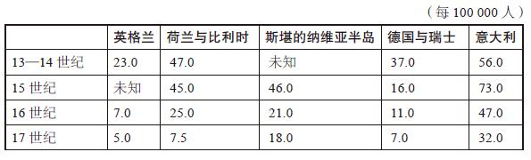

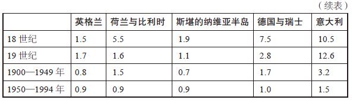

这些数据在几百年间呈直线下降表明，对于人类最大的担忧之一——被杀，我们齐心协力制定出来的扼制政策越来越有效。

那么以色列托儿所采纳的罚款措施错在哪里？

你想必已经猜到，3美元的罚款太微不足道了。按照这个价钱，独生子女父母每天都迟到，每月也只需多花60美元——仅为基本托管费的1/6。就幼儿托管费而言，这个价钱相当划算。假如罚款是100美元，而非区区3美元呢？这样大概能完全杜绝家长迟到，但也会引起许多人的反感，因为罚款从本质上讲是一种权衡措施，所以必须平衡利弊。

但托儿所的罚款还有另一个问题，这一措施用经济手段（3美元罚款）取代了道德手段（家长迟到时理应产生的内疚感），他们每天只需多花几美元就可以消除内疚感。而且，罚款数额太低，让家长认为接孩子迟到不是什么大不了的问题。假如一名家长迟到只对托儿所造成3美元的损失，那还何必提前结束一场网球赛呢？果不其然，经济学家在调查的第7周取消了罚款，家长迟到的次数并无变化。现在他们可以放心迟到了，不用交罚款，也毫无愧疚感。

调控的本质就是如此奇特，而又影响深远，一点微小的调整便可能造成极端彻底且常常出乎意料的后果。托马斯·杰斐逊早已认识到了这一点，他认为是一点蝇头小利引发了波士顿倾茶事件，进而又掀起美国独立战争：“这个世界上的因果循环神秘莫测，对一部分扣押茶叶不当征收的两便士茶叶税，就改变了整个大陆居民的境况。”

20世纪70年代，研究人员展开了一场调查，与以色列托儿所调查类似，此次调查也将道德因素和经济因素对立起来进行比较。这一次，他们想了解献血活动背后的动机，其发现如下：如果献血者收获的不仅仅是对其无私行为的赞扬，还可以拿到一小笔补贴，献血量会下降。原因在于，这笔补贴将一件高尚的善举变成了一种为挣几美元而吃苦受罪的行为，而且这点蝇头小利完全不值得。

假如献血者可以拿到50美元、500美元或5000美元的奖励呢？当然，献血者会因此趋之若鹜。

但与此同时，其他方面也会发生显著变化，因为所有动机都有其弊端。如果一品脱血液一夜之间上涨到了5000美元，无疑会有许多人心生歹意，他们可能会动手持刀抢血，可能会用猪血鱼目混珠，可能会用假身份证来钻献血次数限制的空子。无论是何动机，无论情势如何，狡猾之徒总会不择手段地谋取私利。

换言之，正如W.C.菲尔兹
[\[2\]](#index_split_007.html_filepos123272)
所言：值得拥有的东西就是值得为之欺骗作弊的东西。

那么，都有谁会作弊呢？

实际上，几乎人人都会，只要赌注正中下怀。你可能会对自己说，不管为了什么，我都不会作弊，然后你就会想起，你有次打桌游的时候作弊了，而且就在上周；或者打高尔夫球的时候，你把球从球位不佳的位置上悄悄推开了；又或者是某次你很想从办公休息室里拿一块百吉饼，而你得在咖啡罐里丢一块钱才能拿走，但你却没带零钱，不过还是顺走了一块百吉饼，还在心里暗暗地说，下次放双倍的钱就行了，但你后来也没放。

既然有聪明人费心设计出了行为框架，就有成千上万聪明或不聪明的人会花费更大的心思去钻空子。作弊是否是人之天性尚未可知，但确实是人类试图为之的一个突出特征。作弊是一种原始的经济行为——不劳而获。因此，会作弊的不仅仅是那些名头响亮的大人物——进行内幕交易的总裁、服用兴奋剂的棒球选手和挪用公款的政客，也包括私吞小费而没有上交老板的女招待，以及在电脑上修改员工工时以提高自己业绩排名的经理，甚至是担心留级所以在考试中抄同桌答案的三年级小学生。

有些作弊行为仅仅留下一些蛛丝马迹，但有些作弊行为却昭然若揭。比如1987年春一个深夜所发生的奇事：700万美国儿童人间蒸发了。有史以来最大的绑架案？不可能。事情发生在4月15日晚，美国国家税务局修改了一条规定，此前纳税人只需为每名受其监护的儿童上报姓名即可，现在则需提供社保号码。突然之间，700万儿童——前一年由监护人为申请免税而在1040张上报表中捏造的幽灵儿童——人间蒸发了，那可是美国所有受监护儿童的1/10。

这些作弊的纳税人受何动机驱使，显而易见，他们同上文的女招待、经理和三年级小学生如出一辙。那么，三年级小学生的老师呢？是否有动机驱使她去作弊呢？如果有的话，她会如何瞒天过海？

抛开前文以色列海法市托儿所的例子，现在假设你负责管理芝加哥公立学校，该学区每年覆盖40万名学生。

目前在美国学校管理者、教师、家长和学生中间，讨论最为激烈的话题是“高标准”的成绩测验。之所以说高标准，是因为这些测验不仅意在测试学生的学业水平，其测验成绩也开始越来越多地考察到学校头上。

联邦政府将这些高标准的成绩测验强制列入了布什总统2002年签署的《有教无类法案》
[\[3\]](#index_split_007.html_filepos123528)
。但早在该法案实施之前，多数州就已经开始组织中小学学生年度统一测验了，20个州对成绩优异或进步明显的学校实施了奖励，32个州对表现不佳的学校实施了处罚。

芝加哥公立学校系统于1996年采纳了高标准的测验方式。新政实施后，测验分数过低的学校将被停课整顿，面临被关闭的风险，教职员工则会遭到解雇或调任。该系统还废除了自动升学机制，此前，只有成绩一塌糊涂或完全不思进取的学生才会遭到留级处罚。而现在，所有三年级、六年级和八年级学生均需参加名为艾奥瓦基本技能测试的选择题考试，并须达到分数线才能升级。

这种高标准测验的支持者认为，测验提高了学业水平，督促学生更加刻苦地学习。另外，测验使得一无是处的差等生无法升级，他们因此不会占用高年级名额，拖优等生的后腿。而同时，反对者则担心某些学生会因为测验发挥失常而遭到不公正的惩罚，教师上课会以考试内容为纲，从而忽视了更重要的课程内容。

自然，自考试诞生以来，就存在驱使学生去作弊的因素，但高标准测验从根本上改变了教师所面对的现实，让他们也有理由作弊了：在高标准测验制度下，如果学生的测验成绩不佳，教师就需接受审核，或被取消加薪或升职资格；如果学校整体成绩不佳，联邦政府则会扣留拨款；如果学校遭到停课整顿，教师则有被解雇之虞。高标准测验机制也为教师创造了一些正面的效应：如果学生成绩优异，教师则可能获得嘉奖、升职或加薪，加利福尼亚州就曾有一段时间为高分考生的老师设立了25000美元的奖金。

而假如某位教师对这种新的测评机制做了一番研究之后，动了替学生拉高分数的念头，那就是还有最后一个因由或许能帮她壮胆：教师作弊鲜有人追查，很难被发现，也几乎从未受到过处分。

教师如何作弊？方法不胜枚举，或明目张胆，或巧施伎俩。近日，奥克兰市有一名五年级小学生放学回家后，兴高采烈地告诉妈妈，她的老师非常体恤学生，把州内统考的答案抄在了黑板上。这样的例子当然非常罕见，因为再不称职的老师，也不会冒险在众目睽睽之下如此作弊，把命运交由30名不更事的儿童决定（这名奥克兰的教师当即遭到解雇）。拉高学生分数还有很多更加巧妙的伎俩，比如老师只要延长考试时间即可。如果她提前——以不法手段——拿到了考卷，她大可以帮学生预习考题。若以广义的作弊概念论，她还可以进行“应试教育”，根据前几届的考试内容进行备课，尽管这不会被视为作弊，但也与测验宗旨完全背道而驰。由于测验内容均为选择题，选错答案不会扣分，教师大可以让学生在时间不够的情况下，随机勾选未答题目，可以一律选B，或B、C两项交替勾选。她甚至可能会等学生退场之后，替他们填上空白项。

假如教师真想作弊，且不想白忙一场，她可能会收起学生的答卷，在交由电子扫描仪扫描读卷之前的一个小时左右的时间里，擦掉错误的答案，填上正确的答案（而你还一直以为用HB铅笔是为了让学生修改答案）。假如真有用此类方式作弊的教师，又如何才能查出来？

要想揪出作弊者，需要换位思考。假如你想擦掉学生的错误答案，填上正确答案，你应该不会改掉太多题目，那样显然会露出马脚。你应该也不会将每个学生的考卷都改一遍，这也会露出马脚，而且你多半也来不及，因为考试结束之后，答卷很快就得上交。因此，你的做法可能是挑选8~10道连续的题目，在一半或2/3的考卷上填上正确答案，因为一短串答案很容易记，更换这短短几道题目的答案，要比把所有考卷挨个翻一遍快得多。你或许还会选择试卷末尾的题目，因为后边的题目通常比前边的题目难度大，这样一来，需要改答案的概率是最高的。

如果说经济学主要是研究动机的学科，这门学科——万幸的是——还有统计工具，可以考察人面对动机作何反应。

万事俱备，只欠数据。

在该例中，芝加哥公立学校系统补上了这一空缺。该系统公布的数据库中包含1993——2000年学区内每名三至七年级学生的测验答案。芝加哥公立学校每年每年级的学生约3万名，答卷70万份，题目将近1亿道。这份数据按考场编排，包含每名学生阅读及数学测试的逐题答案序列。（原答卷并不包含在内，因为测试结束后要按惯例销毁。）数据还包含每名教师的部分信息、全部学生人数的统计信息及其既往和此后的考分，这在追查教师作弊行为的过程中起到了关键作用。

接下来要做的就是设计算法，从海量的数据中得出某些结论，确定作弊教师会出现在什么样的考场里？

要搜寻的第一个线索是同一考场内出现的异常答题规律：如不同考卷连续出现雷同答案，尤其是难度较大的题目。假如10名优等生（以既往及此后考分判断）考试前5道题（通常为难度最低的题目）全部答对，这类雷同答案不应算作疑点。但如果是10名差等生考试后5道题（难度最高的题目）全部答对，这就值得一查了。另一个疑点则是任一考生考卷上出现的异常规律——比如答对了难题却答错了简单的题目——尤其是有别于同一考试其他考场数千份同分考卷的地方。此外，这则算法还会查出单次考试中单个考场是否存在过多考生成绩大幅优于既往考试却远低于其后一次考试的情况。若仅仅是某年成绩突然上涨，这或许是教师的功劳，但如果其后一次考试成绩又突然大幅下跌，此前的进步就很有可能是人为作弊了。

以芝加哥同一场数学测验中两个六年级考场的考卷为例。每一行即是一名学生的答案。字母a、b、c、d表示正确答案，而数字则表示错误答案，1代表a，2代表b，以此类推，0表示该题目未作答。几乎可以确定两个考场中一名教师有作弊行为，一名没有。试着找出区别——不过，需要提醒的是，用肉眼是很难看出来的。

考场A

112a4a342cb214d0001acd24a3a12dadbcb4a0000000

d4a2341cacbddad3142a2344a2ac23421c00adb4b3cb

1b2a34d4ac42d23b141acd24a3a12dadbcb4a2134141

dbaab3dcacb1dadbc42ac2cc31012dadbcb4adb40000

d12443d43232d32323c213c22d2c23234c332db4b300

db2abad1acbdda212b1acd24a3a12dadbcb400000000

d4aab2124cbddadbcb1a42cca3412dadbcb423134bc1

1b33b4d4a2b1dadbc3ca22c000000000000000000000

d43a3a24acb1d32b412acd24a3a12dadbcb422143bc0

313a3ad1ac3d2a23431223c000012dadbcb400000000

db2a33dcacbd32d313c21142323cc300000000000000

d43ab4d1ac3dd43421240d24a3a12dadbcb400000000

db223a24acb11a3b24cacd12a241cdadbcb4adb4b300

db4abadcacb1dad3141ac212a3a1c3a144ba2db41b43

1142340c2cbddadb4b1acd24a3a12dadbcb43d133bc4

214ab4dc4cbdd31b1b2213c4ad412dadbcb4adb00000

1423b4d4a23d24131413234123a243a2413a21441343

3b3ab4d14c3d2ad4cbcac1c003a12dadbcb4adb40000

dba2ba21ac3d2ad3c4c4cd40a3a12dadbcb400000000

d122ba2cacbd1a13211a2d02a2412d0dbcb4adb4b3c0

144a3adc4cbddadbcbc2c2cc43a12dadbcb4211ab343

d43aba3cacbddadbcbca42c2a3212dadbcb42344b3cb

考场B

db3a431422bd131b4413cd422a1acda332342d3ab4c4

d1aa1a11acb2d3dbc1ca22c23242c3a142b3adb243c1

d42a12d2a4b1d32b21ca2312a3411d00000000000000

3b2a34344c32d21b1123cdc000000000000000000000

34aabad12cbdd3d4c1ca112cad2ccd00000000000000

d33a3431a2b2d2d44b2acd2cad2c2223b40000000000

23aa32d2a1bd2431141342c13d212d233c34a3b3b000

d32234d4a1bdd23b242a22c2a1a1cda2b1baa33a0000

d3aab23c4cbddadb23c322c2a222223232b443b24bc3

d13a14313c31d42b14c421c42332cd2242b3433a3343

d13a3ad122b1da2b11242dc1a3a12100000000000000

d12a3ad1a13d23d3cb2a21ccada24d2131b440000000

314a133c4cbd142141ca424cad34c122413223ba4b40

d42a3adcacbddadbc42ac2c2ada2cda341baa3b24321

db1134dc2cb2dadb24c412c1ada2c3a341ba20000000

d1341431acbddad3c4c213412da22d3d1132a1344b1b

1ba41a21a1b2dadb24ca22c1ada2cd32413200000000

dbaa33d2a2bddadbcbca11c2a2accda1b2ba20000000

如果你猜的是考场A作弊了，那么恭喜你答对了。电脑应用作弊识别算法，找出可疑序列后，将考场A的答案序列重排如下。

考场A

1　112a4a342cb214d0001acd24a3a12dadbcb4a0000000

2　1b2a34d4ac42d23b141acd24a3a12dadbcb4a2134141

3　db2abad1acbdda212b1acd24a3a12dadbcb400000000

4　d43a3a24acb1d32b412acd24a3a12dadbcb422143bc0

5　1142340c2cbddadb4b1acd24a3a12dadbcb43d133bc4

6　d43ab4d1ac3dd43421240d24a3a12dadbcb400000000

7　dba2ba21ac3d2ad3c4c4cd40a3a12dadbcb400000000

8　144a3adc4cbddadbcbc2c2cc43a12dadbcb4211ab343

9　3b3ab4d14c3d2ad4cbcac1c003a12dadbcb4adb40000

10　d43aba3cacbddadbcbca42c2a3212dadbcb42344b3cb

11　214ab4dc4cbdd31b1b2213c4ad412dadbcb4adb00000

12　313a3ad1ac3d2a23431223c000012dadbcb400000000

13　d4aab2124cbddadbcb1a42cca3412dadbcb423134bc1

14　dbaab3dcacb1dadbc42ac2cc31012dadbcb4adb40000

15　db223a24acb11a3b24cacd12a241cdadbcb4adb4b300

16　d122ba2cacbd1a13211a2d02a2412d0dbcb4adb4b3c0

17　1423b4d4a23d24131413234123a243a2413a21441343

18　db4abadcacb1dad3141ac212a3a1c3a144ba2db41b43

19　db2a33dcacbd32d313c21142323cc300000000000000

20　1b33b4d4a2b1dadbc3ca22c000000000000000000000

21　d12443d43232d32323c213c22d2c23234c332db4b300

22　d4a2341cacbddad3142a2344a2ac23421c00adb4b3cb

请看加粗标出的答案，22名学生中，有15名连续6道相同题目全部答对（d-a-d-b-c-b序列），他们仅仅是不谋而合吗？

至少有四点原因可以说明这不可能是巧合：其一，这几道题目位于试卷临近末尾处，难度高于前边的题目；其二，首先这几名学生水平欠佳，其中没几个能在考卷其他地方连续答对6道题，因此更加不可能同时答对相同6道难度较大的题目；其三，在考卷这部分题目之前，15名学生的答案几乎没有雷同之处；其四，3名学生（1号、9号和12号）在可疑序列之前有数道题目未予作答，试卷最后几道题目也未予作答。这表明，考卷原本留下了连续数道空白题目，在中间几道填上答案的并非学生，而是老师。

该可疑答案序列还有一点奇怪之处，在15份可疑考卷中，有9份考卷除了6道正确答案雷同，之前还有4道题目答案雷同：3-a-1-2。4题3错。在所有15份答卷中，6道雷同的正确答案之后，还有1道雷同的错误答案：4。这名作弊的教师究竟为何要费事擦掉学生的答案，填上错误的答案呢？

也许这只是她留的后招。万一被逮到，拖进校长办公室，她可以指出错误的答案，证明自己没有作弊。抑或这种说法有些不近人情，但也确有可能，因为她自己也不知道正确答案。（在标准化考试中，通常教师手中也没有参考答案。）若果真如此，那么我们完全可以想见为何她的学生需要用作弊来拉高分数：因为他们有个能力欠佳的老师。

证明考场A的教师存在作弊行为的另一个迹象，是该班级的整体成绩。六年级学生要在当学年的第八个月参加测验，且须达到6.8的平均分才算符合全国标准。（五年级学生在当学年第八个月参加测验，达标分数为5.8分，七年级学生为7.8分，以此类推。）考场A的学生在六年级测验中拿到了5.8的平均分，仅相当于五年级的水平，未达标。因此，这些学生显然属于差等生。但一年之前，他们的成绩更差，五年级测验的平均分只有4.1。从五年级升入六年级，预期成绩涨幅应为1分，但实际涨幅为1.7分，相当于将近两个年级的预期涨幅。但这种不可思议的进步昙花一现，这些六年级学生升入七年级后，测试平均分为5.5分——低于五年级达标水平，甚至也低于其六年级的成绩。以下为考场A三名学生的学年分数，变化很不规则：

表1–2　考场A三名学生的学年分数

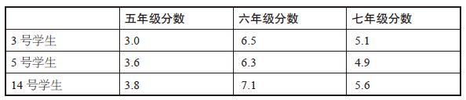

与之相比，考场B的学生三个学年的分数也很低，但至少说明他们凭的是实力：4.2分、5.1分和6.0分。因此，整个考场A的学生在一年之间突然开了窍，第二年却立即才智枯竭了。或者更有可能的是，他们的六年级老师拿铅笔大显神通了。

关于考场A的学生，有两点值得注意，这两点同作弊本身并无太大关联：首先，他们学习成绩差，因此拉高他们的成绩效果最为明显；其次，这些学生（及其父母）在升入七年级后，会遭受巨大的打击。他们以为自己能升学是因为成绩达标了，因为在分数上动手脚的并非他们本人。他们大概满怀憧憬，以为自己能在七年级表现优异——然后便遭到了当头棒喝，这或许是高标准测验机制造成的最残酷的幻灭。作弊的教师或许会自欺欺人地认为自己是在帮学生，但事实是，她看起来对帮自己更加上心。

对芝加哥所有数据进行分析后发现，有证据表明平均每年有200多个考场的教师存在作弊行为，即总数的5%。这只是保守估计，因为该算法只能识别出情形最恶劣的作弊行为——教师蓄意修改学生答案——而无法查出很多更加隐蔽的教师作弊行为。在近日一项针对北卡罗来纳州教师的调查中，约有35%的受访者称曾目击到同事有某种作弊行为，包括延长考试时间、暗示正确答案或亲手修改学生答案。

作弊教师有何特征？芝加哥的数据表明，男女教师的作弊比例相等。作弊教师通常年龄较轻，资历较浅，在动机发生变化之后，作弊比例也随之攀升。由于芝加哥的数据为1993——2000年的数据，其中涵盖了引入高水平测验的1996年。果不其然，1996年的作弊比例陡然升高。作弊现象也不是随机发生的，班级成绩倒数的教师最有可能作弊。另外，值得一提的一点是，为加利福尼亚州教师设立的25000美元奖金最终遭到了撤销，原因之一就是有人怀疑很大一部分奖金落到了作弊教师的手上。

并非芝加哥作弊行为分析得出的每一个结果都如此令人心寒，因为除了查出作弊者，这个算法还可以识别出该学区表现优异的教师。优秀教师带来的效果几乎同作弊教师露出的马脚一样显露无疑，他们所教出来的学生在试卷上答对的题目并不是随机的，而是此前在简单题部分丢分的现象有了长足改善，表明他们确实学到了知识，而且优秀教师教出来的学生能够在升学后延续优异表现。

多数此类学术分析都会被束之高阁，无人问津。但2002年初，芝加哥公立学校系统的执行总裁阿恩·邓肯却联系了研究的作者，他并不是想抗议或隐瞒他们的发现，而是想确认其算法识别的作弊教师确有作弊情形，然后有所行动。

邓肯的履历并不适合这样一个位高权重的职位，接受任命时，他年仅36岁，曾入选过哈佛大学的全美明星队阵容，后曾在澳大利亚闯荡过职业篮球联赛。上任执行总裁之前，他在芝加哥公立学校系统的工作经验只有短短3年，且职位级别均较低，连秘书都没有。邓肯在芝加哥长大，这一点有利无弊，他的父亲在芝加哥大学教授心理学，母亲则在某贫困社区无偿开办了40年的课外项目。邓肯年幼时，放学后的玩伴就是母亲照料的贫困儿童，因此接管公立学校系统后，他所考虑的更多是学生及其家庭的福祉，而非教师和教师工会。

邓肯决定，开除作弊教师的最佳方式，是重新组织一场标准化考试。然而，他手上的财力有限，只能组织120个考场进行重考。因此，他请求作弊识别算法的发明者协助他筛选需要重考的考场。

如何让这120场重考物尽其用？只让教师有作弊嫌疑的考场进行重考，这似乎是合乎情理的做法。但这样的话，即便重考分数有所下降，教师也可以谎称，学生表现退步仅仅是因为他们事先得知重考分数不会记入正式档案——参加重考的所有考生确实会被提前告知这一点。为了使重考结果令人信服，一些未作弊的考场需要作为对照组参加重考。最合适的对照组？即根据算法拥有最优秀教师的课室，这些考场的学生凭借真才实学拿到了高分。假如这些考场再次拿了高分，而有作弊嫌疑的考场成绩却一落千丈，作弊教师说学生表现退步是因为成绩不作数的说法就站不住脚了。

不同组别的重考考场就这样敲定了，120个重考考场中有一半以上的教师有作弊嫌疑。其余考场有的据推测是教师能力出众（拿到了高分且答卷无可疑之处）；有的则是补充对照组，即成绩平平且答卷无可疑之处的考场。

重考在初考几周后举行，重考原因并未向考生透露，教师也不知情。但宣布监考为芝加哥公立学校系统官员，而非教师本人时，他们或许已经心里有数了。教师须同学生一起留在考场，但不得接触考卷。

和作弊识别算法做出的预测一样，结果昭然若揭。选入对照组、无作弊嫌疑的考场，成绩与初考不相上下，甚至有所上升。而相比之下，被认定有作弊情形的教师，其学生成绩一落千丈，平均分低于五年级水平。

结果，芝加哥公立学校系统开始解雇作弊的教师。只有十几名教师作弊证据确凿，遭到了开除，但另有多名作弊教师收到了相应的警告。这项芝加哥研究的最终结果进一步证明了动机的力量：第二年，教师作弊比例下降了30%以上。

你或许会以为学级越高，教师的作弊手段越高明，但佐治亚大学2001年秋的一场考试推翻了这种说法。课程名称为篮球训练原则及策略，期末成绩则由单场考试的分数确定。考试分20道题目，其中包括：

一场大学篮球赛分几节进行？

a.1b.2c.3d.4

篮球比赛中，投中三分球可得几分？

a.1b.2c.3d.4

佐治亚州所有高中毕业班学生必须参加的测试名称是什么？

a.视力测试

b.面粉味道测试

c.昆虫治理测试

d.佐治亚州中学毕业测试

在你看来，谁是美国最优秀的甲组
[\[4\]](#index_split_007.html_filepos123897)
助教？

a.罗恩·吉尔萨

b.约翰·佩尔弗雷

c.小吉姆·哈里克

d.史蒂夫·沃伊切乔夫斯基

如果你被最后一题难住了，一条提示或许能让你豁然开朗：这门篮球训练原则及策略课程就是小吉姆·哈里克教的，他同时还是该大学篮球队的助教。另一条或许有用的内幕是，老吉姆·哈里克就是该篮球队的主教练。不足为奇的是，篮球训练原则及策略成了哈里克父子手下弟子最追捧的一门课，选这门课的学生都拿到了A。其后不久，哈里克父子便被双双解除了教练职务。

如果你觉得芝加哥中小学教师和佐治亚大学教授的舞弊行为已经是颜面扫地的事了——教师的天职毕竟是传道授业解惑，那么相扑力士的作弊行为想必也会对你造成深深的困扰。

在日本，相扑不仅是国技，更是该国宗教、军国和历史情结的寄托。相扑包含驱魔仪式，且是源于皇族的运动，其神圣地位远非美国的体育项目所能比拟。实际上，相扑被称为荣誉重于胜负的运动。

诚然，体育比赛与作弊如影随形，这是因为，相较于模棱两可的动机，得失界线清晰（如胜负之差）的动机所诱发的作弊行为更加常见，如奥运会短跑和举重选手、环法自行车选手、橄榄球线卫及棒球强击手。有证据表明，只要能在比赛中占据上风，他们愿意服用任何药片或药粉。不仅仅是参赛者有作弊行径，也有偷奸耍滑的棒球主教练企图偷取对手的暗号
[\[5\]](#index_split_007.html_filepos124269)
。在2002年冬奥会的花样滑冰比赛中，一名法国裁判和一名俄罗斯裁判被发现串谋进行选票交易，以确保各自国家的选手能登上领奖台。（而根据指控，这起选票交易的幕后黑手为俄罗斯黑手党头目阿里木赞·托克塔霍诺夫，他同时还涉嫌操纵莫斯科选美比赛。）

运动员一旦被抓到有作弊行径，常常会成为众矢之的，但球迷多数会认为，至少其动机是情有可原的：获胜心切，才会去钻规则的空子。正如棒球运动员马克·格雷斯所言，“没有作弊，就意味着没有努力。”相比之下，通过作弊故意输掉比赛的运动员则会被打入体育圈的十八层地狱。在1919年的世界大赛
[\[6\]](#index_split_007.html_filepos124673)
上，芝加哥白袜队与赌球分子串谋打假球，并因此至今仍被讽刺为“黑袜队”。即便是在看球只为消遣的棒球球迷中间，白袜队也成了遗臭万年的球队。拥有冠军头衔的纽约市立学院篮球队，曾因机智聪明、富于攻击性的打法而备受爱戴，却因1951年有几名球员被爆出收受黑道贿赂进行诈分——故意投偏以帮助赌球分子赢得盘口——而遭遇了顷刻的倒戈。还记得《码头风云》中马龙·白兰度扮演的那位郁郁寡欢的退役拳击手特里·马洛伊吗？在马洛伊看来，他的所有麻烦都根源于他假摔的那场比赛。假如没有那场比赛，他完全可以成为有头有脸的人物，有望争夺冠军。

如果说，故意输掉比赛是体育界的头号大忌，而相扑又是一个伟大民族的第一运动，那么相扑运动中绝不可能存在故意输掉比赛的现象，对吧？

数据再次点出了其中的蹊跷。与芝加哥学校测验相同的是，可供参考的数据异常庞大：1989年1月至2000年1月日本顶尖相扑力士之间几乎每场正式比赛的赛果，总计281名力士，32000场比赛。

左右相扑比赛的利益机制错综复杂，效果惊人。每名相扑力士都有排名，而排名影响着其生活的方方面面：收入水平、随从数量、一日三餐、睡眠时间等大小事务。日本排名最高的66名力士组成幕内和十两两个组别，他们即是相扑界的上层集团
[\[7\]](#index_split_007.html_filepos125156)
。位于这一上层集团金字塔顶端的相扑力士年入数百万，享受王公贵族的待遇；排名前40的力士年收入在170000美元以上；而相比之下，在日本排名第70的力士年收入则只有区区15000美元。上层集团外的力士生活并不光鲜，排名较低的力士必须服侍高排名力士，为他们准备饮食、打扫寝室，甚至擦洗本人够不到的身体部位。因此，排名决定一切。

相扑力士的排名是按照相扑大会中的成绩计算的，相扑大会每年举行六届。每届大会，每名力士须参加15场比赛，连续15天每天1场。如果大会结束后胜多负少（8次胜利以上），该力士的排名便会上升；如果负多胜少，排名则会下降。排名下滑到一定程度，该力士就会完全退出上层集团。因此，第8场胜利至关重要，决定着排名的升降，其对排名的重要性约为普通比赛的4倍。

因此，到大会收官日，最后一场比赛对于此前记录为7胜7负的力士来说事关重大，但对于8胜6负的力士，却成了鸡肋。

那么，8胜6负的力士是否有可能放水输给7胜7负的力士？相扑比赛是综合力量、速度和平衡感的瞬间角力，常常几秒之间就能决出胜负，故意被放倒并非难事。我们姑且假设，相扑比赛确实被操纵了，那么如何对数据进行测量进而加以验证呢？

第一步是筛选出有嫌疑的比赛：在比赛收官日，名次岌岌可危的力士对阵已经拿下第8场胜利的力士。（大赛落幕后，通常有半数以上的力士胜率为7场、8场或9场，因此有数百场比赛符合条件。）在比赛收官日两位7胜7负的力士之间的对决不太可能被操纵，因为双方的求胜心同样强烈。已经豪取10场以上胜利的力士想必也不可能将比赛拱手相让，因为他们也有强烈的动机去力求一场胜利：大赛总冠军的100000美元奖金以及为“技能奖”“敢斗奖”等分项设立的20000美元奖金。

现在以以下数据为例，该数据涵盖了比赛收官日由7胜7负的力士与8胜6负的力士对决的数百场比赛。图1–1左栏列出了7胜7负力士的预测胜率，该胜率根据当日两名对决力士的过往交锋历史计算得出，右栏则是7胜7负力士的实际胜率。

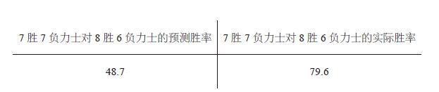

图1–1　7胜7负力士对8胜6负力士的预测胜率及实际胜率

因此，根据交锋记录，7胜7负力士的预测胜率不到50%。这有一定道理，他们在当届大赛中的胜负记录确实说明8胜6负的力士实力略胜一筹。但实际上，名次岌岌可危的力士对阵8胜6负的力士，胜率接近80%。他们对阵9胜5负的力士，表现也异常神勇：

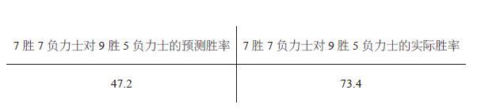

图1–2　7胜7负力士对9胜5负力士的预测胜率及实际胜率

虽然看起来疑点颇多，但仅仅是胜率过高并不足以证明比赛被操纵了，既然第8场胜利对一名力士来说关系重大，那他确实应该在这样一场关键战中展现出更加高昂的斗志。不过，数据中或许还有一些蛛丝马迹能证明双方确有串谋操纵比赛的行为。

让一名力士故意输掉比赛的诱因，值得探究一番：或许是拿人钱财，替人消灾（这显然不会记录在案）；或许双方力士另有约定。请注意，顶尖相扑力士这一群体，组织异常严密：66名顶尖力士均须每隔两个月参加一次相扑大会，与15名对手一较高低。此外，每名力士均隶属于一个部屋
[\[8\]](#index_split_007.html_filepos125422)
，部屋通常由前相扑冠军掌管。因此，即便是互为对手的部屋之间也存在密切的关系。（同一部屋的力士不会相互对阵。）

现在让我们来看看7胜7负的力士与8胜6负的力士在其后一次对阵中的胜负比率。在这一次对阵中，双方均无排名下降之忧，在此情况下，比赛双方理应压力不大。因此，你或以为，在此前比赛中7胜7负的力士对阵同一对手的胜率应恢复到双方此前交锋时的水平，即大致势均力敌，你想必不会以为他们能保持80%的胜率。

实际结果是，数据表明，7胜7负的力士在二次交锋中的胜率仅为40%。前一场比赛的胜率高达80%，下一场就跌到了40%？这要如何理解？

最合情合理的解释是，双方力士达成了以赛偿赛的约定：在我急需胜利的时候，你送个人情给我，下次我会还你。（此类约定并不能排除现金贿赂的存在。）尤其有意思的一点是，双方力士第三次交手时，会再次恢复到势均力敌的正常情况，表明其串谋只涉及两场比赛。

记录可疑的不仅仅是相扑力士个人，各个相扑部屋的总记录也存在类似的异常现象。如果某个部屋的力士在事关排名的比赛中，赢了另一部屋的力士，他们再次在比赛中碰到该部屋力士处于同样处境时，表现会尤其失常。这表明，在代表相扑最高水平的赛场上，某些比赛可能遭到了合谋操纵——类似奥运会花样滑冰裁判的选票交易。

迄今为止，尚无日本相扑力士因操纵比赛而遭到纪律处分，日本相扑协会官员驳回了所有此类指控，斥之为满腹怨气的退役力士捏造出来的无稽之谈。实际上，只要是将“相扑”和“操纵”二词放在一个句子里说出口，就会造成日本举国震怒。质疑一项国技的名声，常常会激起民众的抵触情绪。

尽管如此，在日本，指责操纵比赛之声仍然会偶尔见诸报端。时而掀起的舆论风波为我们提供了另一种渠道，去估量相扑可能存在的腐败现象。毕竟，媒体监督催生了一种十分强大的现象：假如两名相扑力士或其部屋一直存在操纵比赛的情形，面对蜂拥而上的记者和电视镜头，他们可能会在继续这种勾当的时候有所忌惮。

那么这种情况会造成什么变化呢？数据显示，一旦有操纵比赛的指控出现，在相扑大会收官日，7胜7负的力士对阵8胜6负的力士，胜率仅为50%，而非这种情况下通常会出现的80%。无论如何，对数据进行取样，结果最终都难免指出一点：很难说相扑比赛没有被操纵。

几年前，两名退役力士挺身而出，提出大量指控，包括操纵比赛等多项罪名。他们指出，除了串通比赛，相扑界还充斥着服用违禁药物、乱交、贿赂、偷税漏税的事件，同日本黑帮势力也有着千丝万缕的联系。二人随后开始接到恐吓电话，其中一人曾向友人透露，他担心自己会被黑帮杀人灭口。尽管如此，他们仍然打算继续按计划在东京的外国记者俱乐部召开新闻发布会。但发布会召开前不久，二人在同一间医院死于类似的呼吸道疾病——死亡时间仅相隔数小时。警方宣布二人之死没有他杀嫌疑，但并未展开调查。

“二人在同一天死于同一所医院，这看起来确实很蹊跷，”相扑杂志编辑三宅充称，“但并没有人目击到有人投毒，因此该种揣测无从证实。”

无论二人之死是否有预谋，他们都做到了相扑业内人此前从未做到的事：指名道姓。在上文所援引数据涉及的281名力士中，他们指认了29名力士有串通情形，11名是清白的。

若将检举人所提供的证据纳入比赛数据分析中，会得出什么结果？在双方力士均涉嫌腐败的比赛中，排名岌岌可危的力士获胜概率约为80%。而与之相对，在事关排名升降的比赛中，如果对手是据称清白的力士，排名岌岌可危的力士胜率则不会超过双方以往的交锋记录。此外，如果涉嫌腐败的力士对阵未遭检举人指认的力士，结果同两名腐败力士之间的赛果一样呈一边倒的态势——这表明，多数未遭指认的力士也存在腐败行为。

那么，如果说相扑力士、学校教师和托儿所儿童的家长都存在作弊行为，我们是否可以假设腐败是人类的普遍天性？果真如此的话，人类究竟有多腐败？

答案或许就在百吉饼中，以保罗·费尔德曼的故事为例。

费尔德曼曾是个有着鸿鹄之志的人，由于早年接受过农业经济学方面的教育，他曾立志解决全世界的饥饿问题。但事与愿违，他最终在华盛顿找到一份为美国海军分析武器开支的工作，彼时是1962年。其后20多年里，他一直在华盛顿从事分析工作。他职位很高，收入颇丰，但他受到认可却不一定是因为其兢兢业业的工作。在办公室的圣诞派对上，同事在向妻子介绍他时，对他的称呼不是“公共研究组组长”（这确实是他当时的职位），而是“带百吉饼来的人”。

送百吉饼最初只是偶一为之的奖励措施：员工拉到研究合同就会得到老板的犒赏。接着，这成了他的习惯，每周五他都会带百吉饼、一把锯齿刀和奶油乳酪到单位。上下楼的同事听说了百吉饼的事后，也纷纷表示想要。到最后，他每周要带上15打百吉饼，为收回成本，他摆了一个投币篮，贴了一张价签。结果，其成本回收率约为95%，他认为，没给钱的人是因为一时疏忽，而非有意占他便宜。

1984年，他就职的研究机构经历了管理层更迭，费尔德曼对未来做了一番斟酌之后，觉得前景堪忧，他决定辞职卖百吉饼。他的经济学家朋友觉得他丧失了理智，但他的妻子却支持他。毕竟，他们最年幼的三个孩子即将大学毕业，而且房贷也供完了。

他开车挨个绕遍环绕华盛顿的办公园区，用极其简单的推销手段拉拢客户：每天一早，他会将百吉饼和一个投币篮放在各家公司的餐室，然后中午再回来收走钱和剩余的百吉饼。这是一种全凭自觉的生意方式，而且确实行得通，仅仅几年间，费尔德曼的周送货量就达到了8400块百吉饼，业务遍及140家公司，收入恢复到了他做研究分析员时的水平。他摆脱了方寸隔间的拘束生活，可以活得逍遥自在了。

他同时还——在无意之中——设计了一场巧妙的经济学实验，费尔德曼从一开始就在一丝不苟地记录百吉饼生意的数据。因此，通过对比回收所得与百吉饼缺失数量，他发现他可以衡量客户的诚信度，且精确到分。他们是否占了他的便宜？如果存在此种行为，好占便宜的公司相比不占便宜的公司有何特点？什么情况会助长人们小偷小摸的行为？什么又会减少此类行为？

费尔德曼这次并非有意为之的研究恰好让我们得以窥见一种欺诈形式的奥秘，这种欺诈形式一直是学术界难以攻克的难题：白领犯罪
[\[9\]](#index_split_007.html_filepos125907)
。（没错，尽管只是一点蝇头小利，从百吉饼老板身上占便宜仍然属于白领犯罪。）通过一名百吉饼生意人的经历探究白领犯罪这种关系重大却又无从解决的问题，听起来似乎是小题大做，但渺小而简单的问题常常是攻克重大难题的突破口。

尽管安然公司这样的流氓企业成了举世瞩目的话题，学术界对白领犯罪的案例却知之甚少，原因何在？因为缺乏有效数据。白领犯罪的关键一点是，白领犯罪者何其多，我们所听说的骗局被拆穿的案例只是沧海一粟。多数侵占公款之徒不为人知，理论上仍然过着逍遥自在的生活，因为盗用公司财产的员工很少被发现。

与之相反，街头犯罪却非如此，因为无论罪犯是否归案，行凶抢劫、入室盗窃、谋杀通常都会被记录在案，且街头犯罪有着明确的受害者，而受害者通常会向警方报案，数据随即生成，进而又会有犯罪学家、社会学家和经济学家据此发表不计其数的学术论文。但白领犯罪并无明显的受害者，比如安然公司管理层究竟盗窃了谁的财产？既然不知道犯罪对象、案发率或损失程度，罪行又如何定量呢？

然而，保罗·费尔德曼的百吉饼生意则不同，因为整件事确有一名受害者，就是他自己保罗·费尔德曼。

刚开始这门生意的时候，根据他在自己办公室的经验，他所期待的付款率为95%。但正如有警车停靠的街区犯罪率偏低，这一95%的付款率也属于虚高：费尔德曼本人在场，起到了制止偷窃的作用。不仅如此，这些百吉饼食客均认识老板其人，也和他有（理应不错的）交情。大量的心理学及经济学研究表明，对同一种商品，若出售者不同，人们愿意支付的价格也有所差异。经济学家理查德·塞勒在其1985年的研究《沙滩上的啤酒》中证明，同样一瓶啤酒，若是在度假酒店内出售，口渴的日光浴游客愿意支付2.65美元，而若是在一家破破烂烂的杂货店出售，他们只愿意支付1.50美元。

面对现实情况，费尔德曼勉强接受了不到95%的付款率，他逐渐总结出，付款率只要超过90%就算是“诚实守信”的公司了：80%~90%的付款率“可气但还过得去”；如果一家公司的付款率长期低于80%，费尔德曼则会张贴一张警告标语，如：

> 今年以来，百吉饼成本大幅上涨。遗憾的是，也有越来越多的百吉饼无故消失却无人付款。切勿继续此种行为，我猜想，你不会教自己的孩子行偷窃之事，那为何自己却明知故犯呢？

最初，费尔德曼留下一个无盖的篮子用来收钱，但钱却经常不翼而飞，然后他换成了一个塑料盖上嵌有投币孔的咖啡罐，但事实证明，这也容易让人心生非分之想。最终，他不得不自制顶部有切口的夹板箱。木箱效果很好，他每年送7000次钱箱到各个公司，平均只被偷过一次。这是一项很耐人寻味的数据：同一群人，每天偷走他10%的百吉饼，却几乎从未堕落到偷钱箱的地步——这恰好体现出社会对偷窃这一行为有着种种不尽相同的认识。从费尔德曼的立场来看，一名办公室职员不付钱白吃他的百吉饼，就是犯罪，但这名职员大概意见相左。诚然，涉及的钱款数目很小（费尔德曼的百吉饼每个售价1美元，奶油乳酪也包含在内），但差别的根源或许并不在此，而是在于“犯罪”的情景。这名吃百吉饼却不付钱的办公室职员，在自助餐厅大吃大喝的时候或许也会猛灌苏打水，却不见得会吃霸王餐。

那么百吉饼的数据究竟说明了什么？近几年，总体付款率经历了两次值得注意的变化。其一是1992年起出现的长期而缓慢的下降。至2001年夏，总体付款率已经下滑到了87%左右。但当年的“9·11”事件发生之后，付款率立即上涨了整整2%，且此后再未出现明显回落。（假如付款率上涨2%听起来不算多，那换个角度想：未付率从13%下降到了11%，即盗窃数量下滑了15%。）由于费尔德曼的不少客户均在国安部门工作，这种“9·11”效应或许有些许爱国主义色彩，这也有可能表明公众的同情心有了普遍的提高。

数据还显示，小办公室比大办公室更守信用。只有几十名员工的办公室付款率要比几百人的办公室高出3%~5%，这似乎有违常识。在大办公室，百吉饼桌旁理应常有许多人在场，众目睽睽之下，你不得不投币进钱箱。但大小办公室的对比说明，百吉饼盗窃与街头犯罪类似。农村地区的人均街头犯罪率远低于城市，主要原因是农村地区的罪犯被发现（进而被抓获）的概率更高。此外，在规模较小的社群，预防犯罪的社会因素更加强大，其中一大因素就是羞耻心。

百吉饼的数据还反映出个人情绪对守信程度的影响。例如，天气就是一大影响因素：反常的好天气能提高人们的付款率；而与之相对，遇到反常的寒冷天气，则会出现大量未付款的现象。暴雨或强风天气也有同样的影响，影响最恶劣的是节假日：在圣诞周，付款率会下降2%，即盗窃数量上升15%，这与“9·11”造成的影响程度相同，但效果相反；感恩节半斤八两；情人节当周也非常糟糕；4月15日
[\[10\]](#index_split_007.html_filepos126507)
所在周也不外乎如是。但也有好的节日：7月4日、劳动节和哥伦布纪念日所在周
[\[11\]](#index_split_007.html_filepos126726)
。两种节日差别何在？欺诈率较低的节日仅仅是放假一天而已，别无他意，而欺诈率较高的节日则充满了各种各样的烦心事和来自亲人的种种期许。

关于守信，费尔德曼有他自己的看法，这些看法多是从生活经验总结而来，而非数据。他逐渐相信，工作士气是一大因素——如员工爱戴自己的老板、热爱本职工作，这样的办公室更加守信。他同时还相信，在公司内地位较高的员工欺诈率要高于底层员工。他多年来一直在为一家办公室占用了三层楼的公司送百吉饼，从中得出了这一观点——该公司顶层为主管办公室，较低的两层为销售、服务和行政员工的办公室。费尔德曼猜测，这些主管有欺诈行为是因为特权思想膨胀。他所没有考虑的因素是，欺诈或许原本就是他们坐上主管之位的手段。

如果说道德代表着在人类心目中，这个世界应该如何运转，而经济学代表着其实际的运转方式，那么费尔德曼的百吉饼生意则恰好处于二者相交的范畴。没错，很多人占他的便宜，但绝大多数人，即便是无人在场的情况下，也没有越界。这一结果或许出乎某些人的意料，包括费尔德曼的经济学家朋友，他们在20年前劝阻他，说他这种全凭自觉的生意方式完全行不通，但这却没有出乎亚当·斯密的意料。实际上，亚当·斯密第一部著作《道德情操论》的主旨就是人类生性诚实。

“无论人类被描写得有多么自私，”亚当·斯密写道，“其本性之中显然有某些原则，令其关注他人的命运，让他人的幸福成为对其来说不可缺少的东西，尽管除了眼见此种情景所获得的满足之外，他从中一无所得。”

费尔德曼有时会向自己的经济学家朋友讲述《裘格斯戒指》的故事，故事出自柏拉图的《理想国》：

在苏格拉底的一堂课上，一位名叫格劳孔的学生讲述了这个故事。苏格拉底同亚当·斯密一样，认为即使没有外力强制，人类一般而言也是生性善良的。格劳孔则同费尔德曼的经济学家朋友一样，不以为然，他讲述道，一位名叫裘格斯的牧羊人偶然间在一处隐蔽的山洞里发现了一具尸体，尸体上带着一枚戒指，裘格斯将戒指戴在自己手上后，发现戒指令他隐身了。在无人监控其所作所为的情况下，裘格斯干尽了坏事——引诱王后、弑杀国王，等等。

格劳孔的故事提出了一个道德问题：如明知自己的所作所为无人目睹，会有人能抵制住诱惑，不去作恶吗？格劳孔似乎认为答案是否定的，但保罗·费尔德曼则和苏格拉底及亚当·斯密同属一个阵营，因为他知道，在至少87%的情况下，答案是肯定的。

[\[1\]](#index_split_007.html_filepos63392)
“罪孽税”，指美国对酒、香烟、赛马场、赌博以及被认为是罪恶的其他项目或活动所征的税。——译者注

[\[2\]](#index_split_007.html_filepos69039)
W.C.菲尔兹，原名威廉·克劳德·达肯菲尔德，美国喜剧演员兼作家。——译者注

[\[3\]](#index_split_007.html_filepos72185)
《有教无类法案》，简称NCLB，是2002年1月8日签署的一项美国联邦法律，旨在能解决美国贫困地区学生和黑人男生的受教育问题，该法案引起了广泛影响。——译者注

[\[4\]](#index_split_007.html_filepos96169)
甲组，在此意为全美大学体育协会（NCAA）篮球甲组。参加NCAA的学校，根据运动队的规模和水平，可分为三个组别，即甲、乙、丙组（Division
I，II and III）。——译者注

[\[5\]](#index_split_007.html_filepos98187)
棒球比赛中的暗号，指接球手为向投球手暗示投球方向而做出的手势。对方击球手由于背对接球手，而无法看到其手势，因此每队的暗号每场比赛都会有所更改，以防被对手看破。——译者注

[\[6\]](#index_split_007.html_filepos99047)
世界大赛，美国职棒大联盟每年10月举行的总冠军赛，是美国以及加拿大职业棒球最高等级的赛事。由美国联盟冠军和国家联盟冠军，进行7战4胜制的总冠军赛，（1903年、1919年、1920年和1921年采用9战5胜制），获胜的一方获得世界大赛奖杯。——译者注

[\[7\]](#index_split_007.html_filepos100763)
相扑组别：从低到高分别为序口、序二段、三段目、幕下、十两以及幕内。——译者注

[\[8\]](#index_split_007.html_filepos105103)
部屋，日本培训相扑力士的组织，概念类似一些武术流派的道场，依文脉可简称为“部屋”。日文中，“部屋”指的是房间，每个相扑力士都要有一个所属的相扑部屋，否则不能正式出场比赛，相扑力士在相扑部屋中过团体生活及接受训练。——译者注

[\[9\]](#index_split_007.html_filepos113386)
白领犯罪，指白领人员所实施的犯罪，又称绅士犯罪、斯文犯罪。它是美国犯罪学家萨瑟兰在其1949年出版的《白领犯罪》一书中首先提出的概念。白领犯罪者大多拥有较高的社会和经济地位，通常利用职务进行犯罪，如买空卖空、假报资产负债表、操纵股票市场、贪污、诈骗、诈取、受贿、偷漏个人所得税、出卖经济情报等。——译者注

[\[10\]](#index_split_007.html_filepos119506)
4月15日是美国个人所得税申报截止日。——译者注

[\[11\]](#index_split_007.html_filepos119676)
7月4日为美国国庆日；美国劳动节为每年9月的第一个星期一；哥伦布纪念日为每年10月12日或10月的第二个星期一，以纪念哥伦布1492年首次登上美国大陆。——译者注

第二章　为何三K党和房地产中介是一路货色？

> 本章论证了信息的力量无可比拟，这种力量一旦遭到滥用，则更显露无疑。

> 揭露三K党的机密……为何各种专家可以为所欲为地占你便宜……解决滥用信息的良方：互联网……为何新车一旦有主，价值就会暴跌……破解房地产中介的暗号：“保养良好”的实际含义……特伦特·洛特的种族主义倾向是否比一般的《智者为王》选手更严重？……网上交友者会谎报哪些信息？

三K党的历史可谓起伏跌宕。

美国南北战争结束后不久，6名退伍的联邦老兵在田纳西州普拉斯基创立了三K党，这6名年轻人中，有4人是初露头角的律师，他们当时仅仅是相互视为志同道合的朋友。因此，他们所选择的名称“kuklux”
[\[1\]](#index_split_008.html_filepos187317)
，为希腊语“kuklos”的变体，意为“圈子”。

据传，他们最初的活动只是一些无伤大雅的深夜恶作剧——如身披白色床单、头戴枕套改成的头罩，骑马穿过乡村。但不久之后，三K党便发展成了州际恐怖组织，其宗旨就是恐吓和残杀获得自由的奴隶。三K党的地区领袖包括5名退伍的联邦军队将军，最坚定的拥护者则是种植园主群体，因为对他们来说，战后重建是经济和政治上的双重噩梦。

1872年，尤利塞斯·S.格兰特总统向众议院解释了三K党的真实意图：“依靠武力和恐吓，阻止一切与其成员政见不符的政治行动，剥夺有色公民携带武器的权利和自由投票权，打击接收有色儿童的学校，并让有色人种沦落到与被奴役无异的境地。”

早期三K党所采用的手段包括散发宣传册、私用绞刑、枪杀、纵火、宫刑、枪柄袭击等上千种恐吓方式，袭击目标为获得自由的奴隶及所有支持黑人获得投票权、购买土地权或受教育权的人士。但在仅仅不到10年的时间里，三K党便被一网打尽，这主要归功于华盛顿方面的立法及出军干预。

虽然三K党遭到了挫败，但《吉姆·克劳法》的颁布却助其实现了大部分目标。国会在战后重建时期雷厉风行地制定措施，保障黑人的法律、社会和经济自由，此时却又忙不迭地一一收回。联邦政府同意撤回南方驻军，允许恢复白人统治。在普莱西诉弗格森案
[\[2\]](#index_split_008.html_filepos187592)
中，美国最高法院批准了种族隔离制度的全面推行。

三K党沉寂了一段时间，直到1915年才再度抬头。当年，D.W.格里菲思的电影《一个国家的诞生》（原名《帮派之人》）成了其东山再起的导火索。格里菲思将三K党描述为捍卫白人文明的斗士和美国历史上最崇高的力量之一，电影引用了某知名历史学家的著作《美国人史》中的一句名言：“为保护美国南方，伟大的三K党，一个名副其实的南方帝国，终于诞生了。”这位历史学家就是美国前总统伍德罗·威尔逊。他是学者出身，还担任过普林斯顿大学校长。

至20世纪20年代，死灰复燃的三K党已经拥有了800万名门徒。这一次，其势力不再仅限于南方，而是遍及全国。这一次，其所打击的对象也不再仅仅是黑人，还包括天主教徒、犹太人、共产主义者、工会成员、移民、煽动分子等破坏现有秩序的人。1933年，希特勒在德国上台，威尔·罗杰斯
[\[3\]](#index_split_008.html_filepos188243)
率先点出了新三K党与威胁欧洲的这股新势力之间的联系：“报纸上都说希特勒是在效仿墨索里尼，依我看，他效仿的倒是三K党。”

“二战”的爆发和连番爆出的内部丑闻再次让三K党元气大伤。舆论倒戈，一致反对三K党，因为战火让美国举国上下团结一心，三K党的分裂主义论调旋即失势。

但仅仅几年后，便出现了三K党卷土重来的迹象。随着战事结束，战后的动荡年代来临，三K党的队伍骤然壮大。对日作战胜利日过去还不到两个月，三K党便在亚特兰大石头山上，在罗伯特·E.李
[\[4\]](#index_split_008.html_filepos188481)
的著名石像前，燃烧了一具高达300英尺的十字架。一名三K党成员事后声称，这次燃烧十字架的出格行为意在“告诉黑鬼，战争已经结束，三K党要重整旗鼓了”。

亚特兰大此时已经成了三K党的大本营。据说，三K党控制了佐治亚州政坛的关键人物，不少警员和治安官副手都是佐治亚州分部的党羽。没错，三K党是秘密帮会，喜用密令暗号和间谍手段，但其真正的力量却来自其在民众中间悉心营造的恐慌情绪。而三K党同执法机构狼狈为奸的这种公开的秘密则是这一点的例证。

亚特兰大——用三K党的黑话来说，就是三K党隐形帝国的皇城——同时也是史丹森·肯尼迪的家乡。肯尼迪时年30岁，同一名三K党成员有亲缘关系，但秉性却与之背道而驰。他出身于南方家庭，家世不错，据说祖上的名人包括两名《独立宣言》的签署者、一名联邦军队军官和约翰·B.史丹森。约翰·B.史丹森即是以他命名的制帽公司的创始人，而史丹森大学也是以他命名的。

史丹森·肯尼迪成长于佛罗里达州杰克逊维尔市一座14室的豪宅，父母育有五个子女，他年纪最小。他的叔父布雷迪是三K党成员，但肯尼迪最终却成了自封的“自由异议分子”，写了不计其数的文章和数部著作，抨击种族偏见。他最初以民俗学者的身份，周游佛罗里达州，收集本地传说和歌谣。几年后，他就职于美国最大的黑人报纸《匹兹堡信使报》，成了该报少数几名白人记者之一，并以门什老爹——黑人民间故事中的一位英雄人物，传说比治安官猎枪的枪子儿跑得还快——为笔名写作。

激励肯尼迪笔耕不辍的，是对思维狭隘、蒙昧无知、蓄意阻挠和恐吓威胁的仇恨——而在他看来，三K党以得意的姿态将这些特点揽于一身，没有哪个组织可与之相比。肯尼迪认为，三K党是白人当权派的恐怖主义分支，他发现这是一个难以解决的痼疾，原因多种多样。三K党与政界、商界和执法部门领袖狼狈为奸，民众谈虎色变，无力对抗三K党。当时存在的少数几个反种族仇视组织缺乏影响力，甚至对三K党所知甚少。

“几乎所有针对这一话题的文章都是社论，鲜有爆料文章，”肯尼迪后来解释道，“作者反对三K党，这没错，但他们对三K党的内情却所知甚少。”

于是肯尼迪开始搜集情报，在长达数年的时间里，他采访三K党头目和拥趸，有时会利用自己的家世和血统，谎称自己和他们同属一个阵营，他还参加过三K党的公共活动。他事后曾写道，他甚至打算打入三K党亚特兰大支部的内部。

肯尼迪将勇闯三K党内部的经历写成了回忆录《揭秘三K党》。这部书实际上是一部有戏说成分的小说，而非平铺直叙的纪实作品。骨子里仍有着民俗学者情怀的肯尼迪显然想以最跌宕起伏的方式将这个故事展现出来，因此书中不仅有他自己对抗三K党的活动，也有另一人的经历，此人化名为约翰·布朗。布朗是一名工会工人，曾在三K党内担任过头目，但后来洗心革面，主动提出承担打入三K党内部的任务。《揭秘三K党》所呈现的最刺激惊险的情节中，有不少显然都是约翰·布朗所为——亲自参加三K党在亚特兰大的会议和其他重大集会，但由于该书最终出自史丹森·肯尼迪之手，他将布朗的事迹写到了自己名下。

无论如何，布朗与肯尼迪的联手合作贡献了大量情报。布朗揭发了他在三K党每周集会上的所见所闻：三K党地方和大区头目的身份、近期计划以及三K党的通用仪式、暗号和内部用语。例如，三K党习惯将许多单词的词头改为Kl。（因此，两名三K党成员在当地支部里进行了交谈。
[\[5\]](#index_split_008.html_filepos188849)
）三K党的秘密握手方式为，左手相握，手腕下垂，像鱼儿一样左右摆动。假如外出旅行的三K党成员想在外乡结识同党，他会问起“阿亚克先生”——阿亚克（Ayak），即“你是三K党成员吗？”（Are
You a
Klansman？）的暗号。他所期望得到的回答是：“是的，我还知道阿凯先生（Mr.Akai）。”——“我是三K党成员”（A
Klansman Am I）的暗号。

不久之后，约翰·布朗便被邀请加入K骑士团，即三K党的秘密警察和“鞭刑小分队”。对于卧底来说，这提出了一个令其左右为难的问题：被要求参加施暴行为的时候，该怎么办？

但实际上，在三K党——及多数恐怖主义组织——内生存的一个核心信条就是，多数武力威胁从来不会超出威胁这一步。

以绞刑为例，这是三K党标志性的暴力手段。以下为美国被私刑绞死的黑人数目，以10年为单位，编纂者为塔斯克基学院。

表2–1　美国被私刑致死的黑人数目

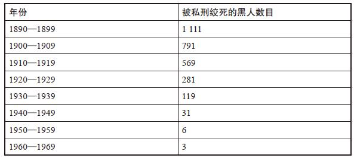

请记住，这些数据所统计的不仅仅是死在三K党手下的人数，而是所有记录在案的被私刑绞死的总人数。这些数据揭示了至少三点值得注意的事实：其一，遭私刑绞死的人数在此期间出现了显著下降；其二，私处绞刑的数量与三K党成员规模之间毫无关联——实际上，1900——1909年是三K党的沉寂时期，但在此期间遭私刑绞死的黑人数量却超过了三K党拥有数百万羽翼的20年代——这表明遭三K党私刑绞死的人数远低于人们的普遍印象；其三，相对于黑人人口总数，遭私刑绞死的人其实非常罕见。

诚然，即便只有一人遭此厄运也不可罔顾，但到20世纪初，与如今流传下来的民众回忆相左的是，私处绞刑早已算不上是司空见惯的现象了。20年代只有281人遭私刑绞死，相比之下，来看看同时期死于营养不良、肺炎、痢疾等疾病的黑人婴儿数量：1920年，每100名黑人婴儿中，有13名夭折，即每年有20000名黑人婴儿夭折——相比之下，每年只有28人遭私刑绞死，直到1940年，每年仍有10000名黑人婴儿夭折。

这些有关私处绞刑的数据揭示了什么更为重大的真相？私处绞刑相对来说并不多见，且尽管三K党规模急剧扩张，私处绞刑的数量却在此期间陡然下降，这说明了什么？

最令人信服的解释是，早期的私处绞刑起到了杀鸡儆猴的作用。白人种族主义者——无论是否属于三K党——通过实际行动和巧言令色采取了一系列强有力、清晰无误、极具震慑作用的措施，如有黑人触犯公认的行为准则，无论是同公交司机顶嘴还是胆敢行使投票权，他必然知道自己很可能会遭到惩罚，甚至有性命之虞。

因此，或许到20世纪40年代中期，即史丹森·肯尼迪企图捣毁三K党的时候，三K党已经无须使用过多武力了，许多黑人常年被教导要安守二等公民的本分——否则后果自负——于是就选择了逆来顺受。即便是在庞大的族群内，一两起私处绞刑事件也可以起到培养安顺良民的巨大作用，因为人们面临强烈的刺激会做出强烈反应，对无端暴行的恐惧作为安分守纪的奉行，更是有着无可比拟的强大作用，这其实也是恐怖主义能大行其道的原因。

但如果说20世纪40年代的三K党并非暴戾无度，那这又到底是个什么样的组织？史丹森·肯尼迪笔下的三K党只是一群自怨自艾的男人构成的兄弟会组织，成员多胸无点墨、前途堪忧，目的不过是找个地方宣泄不满，以及偶尔找个借口夜不归宿。这样一个兄弟会组织会参加有宗教性质的唱诵、宣誓和高呼和撒那
[\[6\]](#index_split_008.html_filepos189323)
的活动，且所有活动均为绝对机密，这为其平添了不少吸引力。

肯尼迪还发现，三K党还是一门狡猾的敛财生意，至少机构内的上层人员是可以坐收渔利的。三K党头目有着滚滚财源：数千名缴纳会费的普通成员、雇用三K党吓退工会或缴纳保护费的企业老板、募集巨额捐款的三K党集会，甚至还有偶一为之的军火走私和私酒贩运生意。此外，还有三K党死亡抚恤金协会这样的诈骗勾当，这些协会向三K党成员推销保险，且只接受现金和开具给“大龙头”
[\[7\]](#index_split_008.html_filepos189523)
本人的支票。

尽管三K党并非人们普遍以为的那样残杀无辜，但它仍是一个相当暴力的组织，而且或许更糟糕的是，它对政界影响力还有更大的图谋。因此，肯尼迪要不择手段地捣毁三K党，刻不容缓。他听说三K党企图破坏工会集会的计划后，便把这条情报透露给了一个工会的朋友。他向佐治亚州司法部长助理输送有关三K党的情报，因为他是公认的三K党克星。研究过三K党的注册执照后，肯尼迪致信佐治亚州州长，陈述了应吊销其执照的理由：三K党名义上是非营利、非政治机构，但肯尼迪有证据表明其目的明显包括营利和参政。

问题在于，肯尼迪的多数行动效果都不尽人意。三K党根深蒂固，有着广泛的基础，肯尼迪自己也觉得是在以卵击石：即便他能设法摧毁亚特兰大的三K党势力，然而遍布全国的数百个支部仍会毫发无伤。

肯尼迪沮丧至极，但沮丧之余，他想出了新的对策。某日，他留意到一群小孩在玩某种间谍游戏，在游戏中，他们在互相对傻里傻气的暗号。这让他想起了三K党，他于是想，何不将三K党的暗号和其他所有机密信息交到全国各地的儿童及其父母手中？将所有机密信息公之于众，难道不是瓦解秘密协会的最佳方式吗？与其徒劳地对三K党进行外部攻坚，何不想方设法将约翰·布朗从三K党每周例会搜集的机密内幕全部公之于众？有布朗搜集到的内部情报和他本人调查得来的各路消息，肯尼迪掌握的三K党秘密之多，很可能连普通的三K党成员都望尘莫及。

于是，肯尼迪选择了彼时最具影响力的大众媒体——广播。他开始向记者德鲁·皮尔森——皮尔森的节目《华盛顿旋转木马》每日有数百万的成年听众——提供有关三K党的情报，得到他情报的还有《超人历险》节目的制作人，每晚有数百万儿童收听该档节目。他向他们解释了阿亚克先生和阿凯先生，把三K党圣经中的过激段落交给他们过目。三K党的圣经叫作《K兰经》
[\[8\]](#index_split_008.html_filepos189738)
。（肯尼迪永远也想不通，一个白人基督徒至上主义组织的圣经所取的名称为何要模仿伊斯兰教的经典。）他解释了所有三K党地区支部官员的职责：K里发（副主席）
[\[9\]](#index_split_008.html_filepos189984)
、K洛卡（讲师）、K路德（牧师）、K里格拉普（秘书）、K拉比（司库）、K拉德（售票员）、K拉洛戈（内部警卫）、K莱克斯特（外部警卫）、K洛坎（五人组成的调查委员会）和K骑士团（K骑士团头目被称为撕屁长官）。他详细解说了三K党从地方到国家的等级制度：高贵的独眼巨人及其十二恐怖护卫、伟大巨人及其十二狂怒护卫、大龙头及其九大九头蛇护卫、皇家巫师及其五大魔仆。约翰·布朗在三K党主要支部——佐治亚王国亚特兰大市的内森·贝德福德·福里斯特
[\[10\]](#index_split_008.html_filepos190203)
一号支部——卧底期间搜集到的情报和流言，均被肯尼迪传了出去。

战争期间，《超人历险》节目讲述了主人公战胜希特勒、墨索里尼和裕仁天皇的故事。但此时，这个节目需要新的反派出现，三K党恰好是个完美的打击对象，《超人历险》于是将矛头对准了他们。德鲁·皮尔森曾公开宣称自己对三K党恨之入骨，此时则开始在广播节目里定期播报有关三K党的新闻，然后又根据约翰·布朗挖掘的内幕消息，进行跟进报道，描述此前的爆料如何惹得三K党头目火冒三丈。皮尔森的报道起到了令三K党惶然处危的效果，这似乎让“大龙头”塞缪尔·格林气急败坏。

以下是1948年11月17日来自皮尔森的广播报道：

> 大选结束后一周，“大龙头”在佐治亚州亚特兰大市的一号支部发表讲话。他紧握双手，再次告诫党内成员当心泄密事件。

> “这种会议上，我必须开诚布公，”他说，“但我还不如会前给德鲁·皮尔森打个电话，主动把情报泄露给他，因为到了第二天，他会把这些消息播得全美国人尽皆知，以至于到第二天早上我还在吃早餐的时候，就会接到美联社和合众社的电话。”

> ……

> “大龙头”谈到了12月10日在佐治亚州梅肯市举行一场大规模十字架焚烧活动的计划。他称，此次活动的规模将是三K党的历史之最，希望届时有10000名成员身披白袍到场……

> 他还补充道，K骑士团——三K党的鞭刑部门——现在已经开始履职，且在亚特兰大警界有不少朋友。

随着皮尔森和《超人历险》广播节目继续播出，史丹森·肯尼迪将约翰·布朗挖到的三K党机密源源不断地爆料给其他广播和报纸媒体，怪事发生了：参加三K党会议的人数开始下降，申请加入三K党的新会员人数也开始减少。肯尼迪为了对抗种族偏见，煞费苦心，在这一次的出击中显然获得了绝妙的效果。他将三K党的机密信息公之于众，令其身陷重围，此前为人珍视的机要信息也成为了供人讥讽的笑料。

此前思想倾向于反对三K党的美国人，也由于现在手上有了充足的详细信息，更是加大火力，猛烈抨击三K党，舆论风向开始转变。此前思想倾向于支持三K党的美国人，也遭到各方警告，切勿一错再错。虽然三K党永远不可能销声匿迹，尤其是在南方地区——来自路易斯安那州、能言善道的三K党头目戴维·杜克竞选美国参议员等职位时拉拢到了大量选票——但肯尼迪大肆爆料三K党内幕，已使其遭到重创，至少在短期内元气大伤。虽然肯尼迪的活动对三K党究竟有何影响难有定论，但许多人还是将顺应民心摧毁这一组织的大部分功劳记在了他的头上。

这一切能成真并非得益于史丹森·肯尼迪的英勇无畏、果敢行动或临危不乱，虽然这确实都是他的优点，但这一切能成功却是因为他洞悉信息所蕴含的强大力量。因为三K党——同政客、房地产中介或股票经纪人一样——这样的组织，权力主要源自信息的积累。一旦这些信息落入敌方之手，其优势便会丧失殆尽。

20世纪90年代末，定期人寿保险价格骤降，一时成为不解之谜，因为这次降价没有明显的起因，而且医疗保险、汽车保险和房屋保险等其他险种的价格均未见下降迹象，保险公司、保险中介和定期人寿保险的购买者也没有出现重大变化。

原因何在？

是基于互联网的出现。1996年春，Quotesmith.com问世，成为同类网站中的第一家网络供应商。有了它，客户可以在短短数秒内，横向对比数十家公司提供的定期人寿保险价格。对于该类网站，定期人寿保险是再合适不过的产品，因为与其他险种——尤其是终身人寿保险这种复杂得多的险种——不同，定期人寿保险大同小异：任何30年期、有担保、保额为100万美元的保单均相差无几。因此，选择的关键便在于价格。如果一一询问保险公司，去打听最便宜的报价，整个过程将极为繁琐，现在却因为网络的出现而变得易如反掌。由于客户眨眼间便能找到价格最低的保险产品，定价较高的公司将不得不下调报价。如此一来，客户每年支付的定期人寿保险费就减少了10亿美元。

值得注意的是，这些网站仅仅是将报价罗列了出来，并未参与保险的销售。因此，它们所经手的并非保险，和史丹森·肯尼迪一样，它们所经手的是信息。假如肯尼迪抨击三K党的年代有互联网，他大概会在博客上一吐为快。诚然，揭发三K党和揭发漫天要价的保险公司还是有区别的：三K党以秘密情报牟利，以故弄玄虚的方式制造恐慌；保险费则算不上是秘密信息，而是一系列零碎信息，由于分布散乱，所以相互之间难以横向对比。但在两个案例中，信息的传播均起到了削弱权力的作用。最高法院大法官路易斯·D.布兰代斯曾写道：“据说阳光是最好的杀菌剂。”

信息可以是指路明灯，可以是制胜武器，可以化干戈为玉帛，可以威慑天下，全看信息掌握在何人手里以及作何用场。由于信息拥有巨大的威力，即便是在某种信息实际并不存在的情况下，误以为掌握了这种信息也会造成不容乐观的影响。以车龄一天的汽车为例，新车有主的当天是这辆车一生中最糟糕的一天，因为它在顷刻间贬值了1/4。这乍听起来似乎有些离谱，但我们知道事实却是如此。售价20000美元的新车，转手价或许不会超过15000美元，为什么？因为一辆车刚入手就想卖掉，唯一可能的合理原因就是车主发现这辆车是次品。因此，即使这辆车并非次品，潜在买家也会误以为是，他会以为，这辆车有什么信息是卖家心知肚明而他作为买家却蒙在鼓里的，所以卖家则因该种假定信息的存在而吃亏受损。

假如这辆车确实是次品呢？卖家可以等上一年再出手。届时，对汽车质量的怀疑会变得无关紧要，到时会有人选择出手自己品相完美、车龄一年的汽车，而次品则可以鱼目混珠，最终售价很可能会超过其实际价值。

交易双方中一方掌握的信息多于另一方，这是常有之事，用经济学家的话来说，这种现象叫作信息不对称。我们认为，有人（通常是专家）懂得多，有人（通常是消费者）懂得少，这是资本主义世界的一大真理。但实际上，各行各业的信息不对称现象都因为互联网的出现而大为减少。

信息就是互联网的货币。作为一种媒介，互联网行之有效地将信息从占有方转移到需求方。通常，一如定期人寿保险费的例子，信息以极端零碎的方式存在。在此情况之下，互联网就像一块巨大的马蹄形磁铁，将沉入大海的绣花针一根一根收集起来。互联网有一项成就，就连最热心积极的消费者保护团体也望尘莫及：它大幅缩小了专家与公众之间的信息差。

面对面的专家咨询有时反而会加剧信息不对称现象，专家利用自己手中的信息资源优势，让我们觉得自己愚不可及、贸然行事、一毛不拔或行为可鄙。事实证明，对于此种情况，互联网是尤其有效的解决办法。假设这样一个场景：你的爱人刚刚去世，殡仪员（深知你对他这一行几乎一无所知，而且还承受着感情上的压力）向你推销8000美元的桃木棺材；或者假设在汽车经销商那里，导购费尽心机地向你介绍林林总总的附加装置和促销方案，对底价却绝口不提。然而，等到事后，回到家中，头脑冷静下来以后，可以上网查经销商从厂商那里拿到这辆车究竟用了多少钱；或者你可以登录www.TributeDirect.com，自己花3595美元买一口同款桃木棺材，享受次日送达的消费体验。除非你的决定是花2300美元买“最后一洞”（高尔夫球主题的棺材）、“狩猎记忆”（饰有大块头的雄鹿或其他猎物），或是殡仪员提都懒得提的其他便宜款式。

互联网尽管有着摧枯拉朽的力量，却难以根除信息不对称的现象。以21世纪初的企业丑闻为例，安然公司的罪名包括隐瞒合伙人、隐瞒债务和操纵能源市场。美林证券的亨利·布洛杰特和所罗门美邦公司的杰克·格鲁伯曼在调查报告中将明知是垃圾股的公司吹得天花乱坠。萨姆·瓦克萨尔提前听到风声，得知美国食品药品监督管理局将公布一份令英克隆名誉扫地的报告，于是将手中的英克隆股票全部抛售。他的朋友马莎·斯图尔特也抛售了手中的股份，还谎称是有其他原因。世通公司和环球电讯为了抬高股价，谎报了数十亿美元的收入。有的共同基金公司为部分优先客户提供优惠价，有的则被控隐瞒管理费。

虽然形式各异，但这些罪行都有一个共同点：均为信息罪。信息罪多数都会牵涉到一名或多名专家，他们或是鼓吹虚假信息，或是隐瞒真实信息。无论何种情况，这些专家都在费尽心机地拉大双方之间的信息不对称现象。

从事这种勾当的人，尤其是在高额信贷领域，难免都会这样为自己开脱：“大家都这么干。”一般而言，或许事实确实如此，信息罪的一大特点，就是最终落网的人屈指可数。有别于街头犯罪，信息罪不会留下尸体或打碎窗子留下相关物证这样的线索；有别于百吉饼小偷——偷吃保罗·费尔德曼的百吉饼却不给钱的人——通常不会有人像费尔德曼一样对信息罪犯造成的损失分毫必较。要让信息罪大白于天下，必须有惊天动地的事发生，一旦有这样的事发生，结果常常昭然若揭。毕竟，这些罪犯想不到他们的秘密勾当会有大白于天下的一天。以“安然公司录音带”为例，安然员工之间的谈话被秘密录制了下来，安然公司破产之后，这些录音带被公之于众。在2000年8月5日的一次电话交谈中，两名交易员聊起了安然公司如何借加州大火之机抬高电价，“今日的魔咒，”一名交易员说，“就是‘烧吧，宝贝儿，烧吧’。”几个月后，两名安然交易员，分别名叫凯文和鲍勃，聊起了加州官员想让安然退还其哄抬电价所得的事。

> 凯文：他妈的他们想把钱从你们手里要回去？你们从加州那些可怜老太婆手中骗来的钱？

> 鲍勃：是啊，是那些老太婆，哥们儿。

> 凯文：好吧，你们把250美元一千度的电塞给她们，现在他妈的她们倒想要回去了。

如果你以为许多专家利用手中的信息加害于你，那么你想得没错：专家手中有你所不知的信息，这是他们赖以为生的东西；或者他们的行当太过高深，你一头雾水，就算有这些信息也无所适从；或者你钦佩他们的学识，不敢妄加质疑。假如医生建议你做血管成形手术——尽管目前已有研究表明血管成形手术对预防心脏病发毫无帮助——你想必不会以为他是在利用自己手中的信息资源优势，为自己或同行捞上几千美金的收入。但达拉斯市得克萨斯大学西南医学中心的介入性心脏病学家戴维·希尔斯向《纽约时报》透露，医生和汽车导购、殡仪员或共同基金经理一样，也有假公济私的企图：“假设你是一名心脏病科医师，当地的内科医师乔·史密斯把病人转诊给你，如果你告诉这些病人他们不需要做手术，过不了多久，乔·史密斯就不会把病人转给你了。”

有信息在手，专家就掌握了一个影响巨大却心照不宣的把柄：你内心的恐惧。你害怕要是不做血管成形手术，你的子女就会发现你心脏病发死在浴室地板上；你害怕便宜的棺材会让你的奶奶地下有知，不得安息；你害怕25000美元的车碰到车祸会像玩具一样被撞得粉碎，而50000美元的车则固若金汤，能保护所爱之人性命无虞。做生意的专家所制造的恐惧，或许难与三K党这类恐怖分子制造的恐慌相匹敌，但道理是相通的。

以一种表面看来不会引起太多恐惧的交易为例，比如卖房子。卖房子有什么好害怕的呢？卖房子通常是你一辈子最大的一笔买卖，你在房地产行业大概毫无经验，而且你或许还对房子有着很深厚的感情。除了这三点之外，至少还有两点让你心有所忌：最终售价远远低于房子的实际价值，以及房子卖不出去。

由于第一点，你害怕房子定价太低；由于第二点，你害怕定价太高。当然，找出最合理的价位是房地产中介的职责。她才是消息灵通的人：同类房产目录、近期销售走势、房贷市场的波动，她甚至可能认识某个有意的买家。在这门千头万绪的生意里，能有这样一名神通广大的专家为你出谋划策，你自然觉得万分庆幸。

可惜她不这么看，房地产中介的目的可能并不是为你出谋划策，而是为自己增加业绩。请回想一下本书开头所引用的调查，该调查对比了中介私有房产及其客户房产的销售差价。调查发现，为等待更高的报价，中介私有房产在市场上挂牌销售的时间比客户房产平均多出10天，售价则高出3%以上，即市价300000美元的房子，其售价要高出10000美元。这10000美元进了她的腰包，却没有进你的腰包。她凭着对信息的操纵和对行情的洞悉，巧妙地赚了一笔。问题就在于，即便你的房子售价高出10000美元，中介个人也只能多赚150美元，得不偿失。因此，她的工作就是劝你，300000美元的报价已经不低了，甚至算得上是相当丰厚了，白痴才会拒绝。

这其中显然需要一点诀窍，中介不可能直接地骂你白痴，所以只是间接地指出这一点，她或许会告诉你同一街区有座房子更大、更漂亮，年头也没这么久，但6个月都没卖出去，这就是中介的主要武器：化信息为恐惧。

以一件真人真事为例，事件讲述者为2001年在斯坦福大学教书的法学教授约翰·多诺霍：

“我当时想在斯坦福的校园内买一栋房子，”他回忆道，“卖方中介不厌其烦地跟我说，这笔买卖多么划算，因为房价马上就要大涨了。我刚签了购房合同，他就问我卖斯坦福的旧房子要不要中介，我告诉他，我准备不请中介自己卖，他回答说：‘约翰，这在正常情况下或许行得通，但现在房市不景气，你肯定需要中介帮忙。’”

然而不到5分钟，房价大涨就变成了房市不景气。你看，为了招揽生意，中介是可以多么得信口雌黄。

再举一个有关房地产中介操纵信息的真实例子，这个故事的主人公是本书作者之一的朋友K，他看上了一栋标价469000美元的房子，准备报价450000美元，他先给卖方中介打了个电话，问她觉得房主能接受的最低价是多少，中介立即责备了他：

“你真该为自己害臊，”她说，“这显然有违房地产行业的职业道德。”

K道了歉，转而开始和她拉家常。过了10分钟，眼看聊天行将结束，中介告诉K：

“我最后跟你说件事吧，我客户的心理底价比你所期盼的要低得多。”

有了这次交谈作参考，K对这栋房子报价425000美元，而非原计划的450000美元。最终，卖方接受了430000美元的价格。由于己方中介的干预，卖方损失了至少20000美元。而与之相对，中介只损失了300美元——为尽快顺利地敲定这笔买卖，她付出了一笔小小的代价，同时从这笔买卖中净赚了6450美元的佣金。

这么看来，房地产中介的主要工作就是一面劝房主调低心理底价，一面告诉有意向的买家报价可以低于房子标价。当然，这话可以用很委婉迂回的方式说出来，而不一定要直言不讳，指使买家报低价。前文引述的房地产中介调查中也有数据统计了他们如何通过编写不同广告词来传达信息。例如，“保养良好”这样的词对于中介来说，就像“阿亚克先生”对于三K党成员一样，是含义丰富的暗语。该词意指，这栋房子年头已久，但还没到摇摇欲坠的程度，懂行的买家一看便知（不懂行的看到房子也能明白），但对于卖房子的65岁退休老人来说，“保养良好”听起来倒像是恭维，而这正是中介的意图所在。

对房地产广告用语的分析表明，某些词同房子的最终售价息息相关。这并不一定说明，说某个房子“保养良好”会直接导致其售价低于同类房子。然而，这确实表明，房地产中介若是称某栋房子“保养良好”，她有可能是在拐弯抹角地怂恿买家报低价。

以下列表为10个房地产广告常用语，其中5个同最终售价呈现高度正相关，另5个则是高度负相关，你不妨猜一猜孰正孰负。

10个房地产广告常用语

> 棒极了

> 花岗石

> 宽敞

> 顶尖

> ！

> 可丽耐
> [\[11\]](#index_split_008.html_filepos190490)

> 迷人

> 枫木

> 小区

> 环境

> 优美

> 精致

“棒极了”的房子肯定能棒到卖个好价钱，对吧？那么“迷人”“宽敞”且“小区环境优美”，这样的房子呢？肯定也能卖出好价钱，对吧？错错错！以下才是正确的划分。

5个与高售价相关的用语

> 花岗石

> 顶尖

> 可丽耐

> 枫木

> 精致

5个与低售价相关的用语

> 棒极了

> 宽敞

> ！

> 迷人

> 小区环境优美

与高售价相关的5个用语中，有3个是对房子本身的实际描述：花岗石、可丽耐和枫木。就其所传达的信息而言，这类用语言之有物、简单明了，因此是有用信息。假如你喜欢花岗石，你可能就会喜欢这栋房子。但即便你不喜欢，“花岗石”也肯定不会让人觉得这栋房子年久失修。“精致”和“顶尖”同样如此，二者似乎都让买家觉得，这栋房子在某种层面上确实很棒。

与之相反，“棒极了”却是一个需要提防、模棱两可的形容词，“迷人”同样如此，二者似乎都是房地产中介的暗号，用以描述那些乏善可陈的房子；“宽敞”的房子通常要么年久失修，要么不实用；“小区环境优美”即是在告诉买家，这栋房子其实不怎么样，但周围的房子可能不错；房地产广告里的感叹号无疑是危险信号，是用佯装的激动来掩盖实际缺陷的伎俩。

相较而言，假如你观察房地产中介私有房产的广告用语，你会发现她确实着重使用了描述性词汇（尤其是“新”“花岗石”“枫木”和“入住条件”），而避用空洞的花哨词汇（包括“漂亮”“完美”和暴露实情的“！”），然后她会耐着性子等最高价出现。她可能会告诉买家，附近有栋房子比这栋房子的标价高了25000美元都有人买，或者有栋房子成了人们争相抢购的对象……总之，她审慎地利用着信息不对称来给她带来种种优势。

这是否说明她心地很坏？这难有定论，至少凭我们是很难下定论的。此处的重点不是证明房地产中介心地很坏，而是说，他们不过是凡人而已，而凡人皆受利益驱使。目前房地产行业所设定的利益显然在驱使某些中介违背客户的最佳利益行事。

但同殡仪员、汽车导购和人寿保险公司一样，房地产中介的信息优势也随着互联网的出现日渐消减。毕竟，任何卖房子的人如今都可以上网搜集有关销售走势、房产目录和房贷利率的信息。信息已经变得公开化，近期的销售数据便说明了结果。房地产中介私有房产的售价仍然高于客户所有的同类房产，但由于房地产网站的不断涌现，二者之间的差价缩减了1/3。

若是单单以为人类只有处于专家或生意中介的位置上才会操纵信息，那就太天真了。毕竟，中介和专家也是凡人——这说明我们在日常生活中也有可能会操纵信息，或是隐瞒真实信息，或是把说出口的信息润色一番。房地产中介夸某栋房子“保养良好”时或许对其中的意思心照不宣，但我们人人都会耍类似的把戏。

想想你在面试工作时的自我介绍和初次约会时的自我介绍。（更有意思的是，对比一下初次约会时的交谈和结婚十年后与同一人的交谈。）或者设想你初次上国家电视台会有何表现？你想展现出什么样的形象？或许你想表现出自己聪明睿智、心地善良或漂亮帅气的一面，你想必不希望表现得冷酷无情、心怀偏见。在三K党如日中天的年代，但凡不是保守派白人基督徒的人，其成员都会加以公然地歧视，并以此为荣。但此后，公开的歧视行为遭到了严厉打击。如今，再委婉的歧视言论，一旦公之于众，都会酿成严重后果。2002年，时任美国参议院多数党领袖特伦特·洛特便在这方面栽了跟头。在其参议员同事和南方同乡斯特罗姆·瑟蒙德的百岁寿宴上，他在致祝酒词时，谈到了瑟蒙德1948年的总统竞选。他当时的竞选纲领是种族隔离制度。有四个州支持瑟蒙德，密西西比州——洛特的家乡——是其中之一。

“我们以此为荣，”洛特对寿宴宾客说，“假如当初全国都能追随我们的脚步，这些年来我们就不会问题频出了。”

洛特言下之意暗示了自己支持种族隔离的倾向，因而犯了众怒，最终被迫辞去了参议院领袖的职位。

即使你只是一介平民，想必你也不希望在大庭广众之下暴露自己的偏见。那有没有方法可以测试公共场合下的那些歧视行为？

听起来像是有些无稽之谈，但电视竞猜节目《智者为王》确实提供了研究歧视行为的独特试验场。《智者为王》起源于英国，曾在美国红极一时，比赛中，有8名选手（后期的日间档为6名选手），每名选手均须回答有关冷知识的问题，最终只有一名选手能获得现金大奖。在此过程中，答对问题最多的选手不一定能晋级，每轮过后，所有选手均须投票淘汰一名选手，选手的答题能力想必应该是唯一需要考虑的因素，而种族、性别和年龄似乎无关紧要。但事实又是否如此呢？将选手的实际投票选择同对其最有利的投票选择进行对比，或许可以揭示其中是否有歧视心理在作祟。

随着比赛的进行，投票策略会有所变化。在前几轮，由于答对题目才可以增加奖金，所以淘汰表现差的选手是合理的做法。但在后几轮，驱使选手做出策略选择的心理发生了反转，增加奖金的意义此时不及每名选手的求胜心。所以，淘汰掉优秀选手，获胜机会更大。因此，大体而言，选手一般会在前几轮投票淘汰表现较差的选手，而在后几轮淘汰表现较好的选手。

分析《智者为王》投票数据的关键，在于区别选手答题能力及其种族、性别和年龄的关联性。假如一名年轻的黑人男性答对多题，却早早遭到淘汰，或许确实有歧视心理在作祟。与之相反，假如一名年长的白人女性一道题都没有答对，却连续晋级，其中或许有某种不公平的优待心理在作祟。

此外，请记住这一切都发生在镜头前。选手知道有亲朋好友和同僚——以及几百万陌生人——在观看节目。那么，假如《智者为王》中真有人遭到了歧视，又究竟是哪些人呢？

结果证明，被歧视的并非黑人。对160多集的节目分析表明，无论是比赛前几轮还是后几轮，黑人的淘汰率均与其答题能力相符，女性选手也是如此。从某方面来看，这两个发现都算不上出人意料，近50年最声势浩大的两场社会运动，一是民权运动
[\[12\]](#index_split_008.html_filepos190718)
，一是女权运动，二者分别妖魔化了黑人歧视和女性歧视。

你心怀希望地认为，或许歧视确实已经在20世纪被根除了，就像小儿麻痹症一样。或者更有可能的是，对某些人群的歧视已经变得非常不合时宜。因此，若非完全对此不屑一顾，人们都会煞费苦心地至少在公共场合摆出开明公允的样子，但这也很难说明歧视本身已经销声匿迹——只是人们碍于情面不敢表现出来而已。那么，鲜有歧视黑人和女性的现象发生，究竟是因为歧视心理真的消失了还是只是装装样子，这如何判断呢？要寻找答案，可以观察社会中未受同等保护的其他人群。实际上，《智者为王》的投票数据确实显示出，有两类选手长期遭到歧视：老年人和拉丁裔。

经济学家对歧视提出了两种主流理论，有意思的是，《智者为王》中的老年选手和拉丁裔选手似乎分别对应了这两种歧视：第一种叫作品味型歧视，意即某人仅因不喜欢与某种人打交道而歧视这种人；第二种叫作信息型歧视，意即某人认为某种人能力低下，因此低看这种人。

在《智者为王》中，拉丁裔选手遭受的是信息型歧视。其他选手似乎认为拉丁裔选手水平低下，但实际情况并不一定如此。在这种观念的影响下，拉丁裔选手即便表现出色也会在前几轮遭到淘汰，而到后几轮却能顺利晋级，是因为其他选手认为留着他们能减少竞争。

而与之相对，老年选手却是品味型歧视的受害者：无论是前几轮还是后几轮，他们的淘汰率均和能力水平严重不成比例。似乎其他选手——该节目观众的平均年龄为34岁——仅仅是不想与老年选手为伍而已。

《智者为王》的选手很可能自己都没有意识到自己对拉丁裔和老年人有歧视行为（或者有刻意避免对歧视黑人和女性的行为）。毕竟，在这样一种节奏紧凑的比赛中，面对着灼人的电视镁光灯，选手免不了会处于紧张、兴奋的状态。这自然又提出另一个问题：同样一个人，在自家的私人环境中又会如何表达自己的喜好，以及如何透露个人信息？

在美国，每年有约4000万人同素未相识的陌生人互换个人隐私信息，这一切均发生在交友网站上。有的网站，如Match.com、eHarmony.com和Yahoo！Personals，受众很广。有的网站则面向有特殊需求的受众：单身基督徒网、犹太人约会网、拉丁裔交友网、单身黑人交友网、西部单身网、美国单身军人网、胖人约会网和同性恋网，而婚恋网站是互联网上最成功的付费生意。

虽然每个网站的运营方式均有所不同，但程序都大致如下：你为自己发布一则个人广告，广告包括一张照片、三围、收入范围、教育水平、好恶，等等。如果这则广告对了某人的胃口，此人会发邮件给你，甚至有可能安排约会。在许多网站，你还要指定交往要求：“长期恋爱”“一夜情”或“随便看看”。

因此，此处有两组海量的数据需要注意：人们列入广告的信息和各种广告所收到的回复数量。两组数据均可以各自回答一个问题，以便从广告信息判断，人们在分享个人信息时的坦率（和诚实）度如何，或者从回复数量判断，个人广告中的哪些信息最受（和最不受）欢迎。

近日，两名经济学家冈特·J.希契、阿里·霍达斯库同一名心理学家丹·艾瑞里联手研究了这两个问题，他们分析了一家主流婚恋网站的数据，着重研究了2万多名活跃用户，这2万多名用户现半数居波士顿市，半数居圣迭戈市，其中56%的用户为男性，所有用户的年龄中位数范围为21~35岁。尽管他们的种族构成非常多元，足以形成某些有关种族的定论，但主要群体还是白人。

这些用户的收入、身高、身材和样貌均优于常人，至少他们的自我陈述里是这么写的。超过4%的婚恋网站用户自称年薪超过200000美元，但实际上，普通互联网用户中，只有1%的年薪可以达到这个水平，这说明4个高收入者中有3个是在夸大其词。而在身高方面，男女用户所报身高的平均数均比全国平均身高高一英寸。至于体重，男性的数据与全国平均水平相符，女性所报的体重则要比全国平均水平轻20磅左右。最引人注目的一点是，高达72%的女性自称相貌属于“中等以上”，其中有24%自诩“容貌姣好”。男性用户同样是自我感觉良好：68%的男性自称相貌属于“中等以上”，其中有19%自诩“仪表堂堂”。这样一来，只剩下32%的用户属于“相貌平平”了，其中只有区区1%自觉“其貌不扬”。这说明，普通婚恋网站的用户要么是谎话连篇，要么是自恋成痴，要么就是对“相貌平平”的概念避之唯恐不及。（或许他们也可能只是在自我标榜罢了，就像任何房地产经纪人都懂得，一般的房子既不“迷人”也不“棒极了”，但不这么说的话，根本就不会有人愿意看上一眼。）28%的女性用户自称是金发，这一比例远远超过了全国平均水平。这说明，其中有很多人要么就是染了发，要么就是在撒谎，要么二者皆有。

相比之下，某些用户则极其坦诚。7%的男性用户坦承自己已婚，其中极少数人自称“婚姻美满”。但他们的坦诚，却并非不计后果，样本中有243名“婚姻美满”的男士，仅有12名公布了自己的照片。所以，勾搭情妇的好处比起被老婆发现求偶广告的风险显然安好很多。

“你在那个网站上做什么？”丈夫可能会遭受指责，但肯定相安无事。

在婚恋网站上无人问津的原因多种多样，但不公布照片或许是最确凿无疑的一个。照片不一定是本人的，也可以是某个相貌更加出众的陌生人，但这种骗局最终显然会取得适得其反的效果。不公布照片的男性用户所收到的电子邮件数量，仅为公布照片的男性的60%，而不公布照片的女性收到的电子邮件数量则只有24%。即便是收入微薄、目不识丁、工作不理想、其貌不扬、体型微胖的秃头男，只要公布了照片，收到邮件回复的概率就会超过自称年薪200000美元且一表人才却没有公布照片的人。不公布照片的原因多种多样，或是电脑水平不佳，或是不想被朋友发现，或是其貌不扬，但道理正如新入手便被挂牌出售的汽车，潜在客户会误以为车有严重的内部故障而鲜有问津。

想要佳人有约确实是一桩难事。发布广告的男性用户中，有56%的人从未收到过电子邮件，女性则有21%无人问津。与此同时，对于哪些特点能获得大量回复，但凡是对性事懂些皮毛的人，都会觉得不为难事。实际上，婚恋网站用户表达的喜好完全符合最常见的男女传统形象。

例如，自称寻找长期伴侣的男性比寻找一夜情的男性更受欢迎，但寻找一夜情的女性却更受欢迎。对男人来说，女人的相貌至关重要。对女人来说，男人的收入至关重要。越有钱的男人收到的电子邮件越多。但女人在收入方面的吸引力则呈倒U形变化：男人不喜欢和

低收入的女性约会，但女人若是收入过高，男人也会敬而远之。女人喜欢的约会对象有军人、警察和消防员（和保罗·费尔德曼的百吉饼付款率升高一样，这可能是“9·11”事件造成的影响），同时还有律师和医生，她们所避讳的约会对象是从事制造业工作的男性。对于男人来说，身高太矮是一大劣势，想必就是因为这点，才会有那么多男人谎报身高，但体重则关系不大。对于女人来说，身材过胖则是致命劣势，想必就是因为这点，她们才会谎报体重。对男人来说，红头发或卷发是减分项，头发半秃同样如此，但剃光头却可以接受。对女人来说，杂灰色头发是减分项，而金发则不出所料的是加分项。

除了有关收入、教育和相貌的信息，婚恋网站的男女用户还需注明种族，他们还须指明对潜在约会对象的种族有何偏好。两个选项分别为“和我一样”及“无所谓”。和《智者为王》的选手一样，网站用户在此要做的是公开宣布自己对异族人士的看法，直到在下一步同约会对象的私密邮件中，他们才会透露自己的真实喜好。

网站中约有半数的白人女性用户和80%的白人男性用户声称自己不介意种族，但回复数据却显示事实并非如此。声称不介意种族的白人男性，有90%的询问邮件都发给了白人女性；而声称不介意种族的白人女性，有97%的询问邮件都发给了白人男性。意即，同是仪表堂堂、收入颇丰、高学历，亚裔男性所收到的白人女性发来的邮件数量还不及白人男性的25%，而黑人和拉丁裔男性所收到的白人女性发来的邮件数量则要比同等条件的白人男性少一半左右。

是否有可能这些白人男女确实不介意种族，只是从来没有遇到中意的非白人约会对象？或者更有可能的是，他们声称不介意种族是否只是为了在人前——尤其是在同种族的潜在约会对象面前——展示出开明的形象？

往往，我们公开宣称的信息和我们心知肚明的真实信息之间有着巨大的鸿沟，或者以更通俗的方式来讲，就是言行不一。这种现象在私人关系、生意往来——自然还有政坛——中屡见不鲜。

如今，对政客在公开场合的心口不一，我们早已司空见惯，但选民也会撒谎。假设一场选举在一名黑人候选人和一名白人候选人之间展开，白人选民是否会为了隐瞒自己的种族倾向而对民意调查者谎称会投票给黑人候选人？显然如此。1989年的纽约市市长选举在戴维·丁金斯（黑人候选人）和鲁道夫·朱利亚尼（白人候选人）之间展开，最终丁金斯以区区几个百分点险胜。虽然丁金斯顺利当选纽约市首位黑人市长，但他微弱的领先优势却出人意料，因为选举前的民意调查显示，丁金斯领先近15%。1990年，白人至上主义者戴维·杜克参加了美国参议院选举，最终得票数比选举前的民意调查高出了将近20%，说明路易斯安那州有数千选民偏爱有种族主义倾向的候选人，但却不愿承认。

杜克虽然从未如愿以偿地在政界谋得高位，但它证明了自己确实是操纵信息的好手。担任三K党骑士团大巫师时，他编写了一份涵盖数千名普通成员和其他支持者信息的通讯录，他们后来成了他在政界发展的基础。然而他不甘心只把这份通讯录留作私用，于是以150000美元的高价卖给了路易斯安那州州长。多年后，这份通讯录再次为杜克派上了用场，他告诉他的支持者，他手头拮据，需要捐款。就这样，杜克以继续弘扬白人至上主义事业为名，募集到了数十万美元的捐款。他在一封信中对自己的支持者解释道，他已经一穷二白，银行甚至要收回他的房子。

实际上，杜克早已卖掉了房子，还狠赚了一笔。（他有没有雇用房地产中介就不得而知了。）他从支持者手中募集的捐款多数并未用于弘扬白人至上主义事业，而是被嗜赌成性的他挥霍在了赌场上。他巧使计谋，瞒天过海，但最终仍然在得克萨斯州大斯普林市被捕入狱。

[\[1\]](#index_split_008.html_filepos128203)
三K党英文名称为Ku Klux
Klan，kuklux在文中有解释，而klan为clan变体，意为“帮派”。——译者注

[\[2\]](#index_split_008.html_filepos130015)
普莱西诉弗格森案，简称“普莱西案”，是美国历史上一个标志性案件，对此案的裁决标志着“隔离但平等”原则的确立。案件起源是，1892年，混血黑人普莱西故意登上一辆专为白人服务的列车，因而遭到逮捕，普莱西随后将路易斯安那州政府告上法庭。案件最终上诉到了美国最高法院，但最高法院以“隔离但平等”并不意味着对黑人的歧视为由，判普莱西败诉。——译者注

[\[3\]](#index_split_008.html_filepos131223)
威尔·罗杰斯，美国二三十年代红极一时的喜剧演员。——译者注

[\[4\]](#index_split_008.html_filepos132020)
罗伯特·E.李，美国南北战争时期联邦军队的著名将领，三K党成员。他曾是三K党首任党魁的最佳候选人，但因个人健康和政治立场原因拒绝了这一职位。——译者注

[\[5\]](#index_split_008.html_filepos136467)
两名三K党成员在当地支部里进行了交谈，这句话中原文有三个单词有变形，分别为三K党成员（clansmen变为Klansmen）、支部（cavern变为Klavern）、交谈（conversation变为Klonversation），与之类似的还有下文的K骑士团（cavaliers变为Klavaliers）。——译者注

[\[6\]](#index_split_008.html_filepos141000)
和撒那，赞美上帝之语。——译者注

[\[7\]](#index_split_008.html_filepos141707)
大龙头，三K党的头目塞缪尔·格林。——译者注

[\[8\]](#index_split_008.html_filepos144147)
《K兰经》，原文为Kloran，为《古兰经》（the
Koran）的变体。——译者注

[\[9\]](#index_split_008.html_filepos144430)
K里发，伊斯兰领袖称号哈里发的变体。——译者注

[\[10\]](#index_split_008.html_filepos145113)
内森·贝德福德·福里斯特，美国南北战争时期南方联邦军队的将领，战后三K党的创始人。——译者注

[\[11\]](#index_split_008.html_filepos165369)
可丽耐，美国杜邦化工研发的实心面板材料。——译者注

[\[12\]](#index_split_008.html_filepos174231)
民权运动，第二次世界大战后美国黑人反对种族隔离与歧视，争取民主权利的群众运动。——译者注

第三章　为何毒贩还在与母亲同住？

> 本章发现传统观念往往是由捏造信息、自身利益和方便之词共同构成的。

> 为何专家经常捏造数据；长期口腔异味这一术语的发明……如何提出好问题……素德·文卡特斯长年卧底毒贩据点的离奇经历……为何卖淫者的收入要高于建筑师……强效可卡因的发明与尼龙丝袜的发明有何相似之处……强效可卡因是否是继《吉姆·克劳法》之后对美国黑人打击最严重的事件？

前两章分别探讨了两个确实有些稀奇古怪的问题：教师与相扑力士有何共同点以及为何三K党和房地产中介是一路货色。但如果你提的问题比较多，即使初看起来这些问题怪诞不经，但最终都能让你学有所获。

提问题的第一个诀窍，是判断你所提的问题好坏与否，并非只要是没人提过的问题都是好问题。千百年来，一直不乏智者在提出各式各样的问题。因此，许多前人未提的问题难免会得出索然无味的答案。

但假如你提的是和人们息息相关的问题，且得出了出乎意料的答案——推翻了传统观念，你或许会有所收获。

发明“传统观念”一词的是学识渊博的经济学先哲约翰·肯尼思·加尔布雷思
[\[1\]](#index_split_009.html_filepos243115)
，然而，他并不认为这是个褒义词。

“我们对真理的认识以一己方便为准，”他写道，“认准最符合一己私利和个人福祉的真理，抑或避免那些费力不讨好或扰乱生活的说法。当然，那些最取悦于我们自尊心的观念，确实很容易为我们所认同。”

“经济和社会行为，”加尔布雷思继续写道，“非常复杂，要想参透其特征，着实劳心费神。因此，我们要像抓住救命稻草一样，固守着那些在我们理解范围之内的观念。”

因此，在加尔布雷思看来，传统观念平白浅显、便于理解、说辞悦耳、抚慰人心，却不一定合乎事实。说传统观念无一是真，自然十分荒唐，但找出传统观念的错误之处——抑或找出草率马虎或狭隘自私的思维所留下的痕迹——是提问题的一个良好出发点。

以美国近年来的无家可归问题为例，20世纪80年代初，一位名叫米奇·斯奈德的无家可归者权益保护分子宣称，美国约有300万无家可归者，立时引来人们的广泛关注。

不到100人就有1人无家可归？自然这比例听起来太高了，但专家之言总能引发巨大的波澜，让人不可不信，因此这一此前无人问津的问题突然之间成了举国瞩目的话题，斯奈德甚至在国会发言也证实了这一问题的严重性。据说，他还在某所大学做演讲称每秒钟就有45名无家可归者死亡——每年有多达14亿无家可归者死亡。（彼时的美国人口约为2.25亿。）即便斯奈德的本意是每45秒钟就有一名无家可归者死亡，犯了口误或被误读，那合计每年也有701000名无家可归者死亡，相当于美国死亡人口总数的1/3左右。最后，斯奈德迫于压力解释了其所谓300万无家可归者的数据，承认自己这是信口胡说。但记者对他仍是纠缠不休，逼他给出一个确切数字，他说，他不想让他们空手而归。

作为专家，斯奈德为一己私利欺骗公众，这一点固然可悲可恨，却不足为奇。因此，单凭他们自己是做不到欺骗公众这一点的，所谓记者急需专家，正如专家急需记者，每天的报纸版面和电视新闻总要有内容可写，而危言耸听的专家常常受到欢迎。于是，记者和专家志同道合，便成了许多传统观念的始作俑者。

此外，广告也是塑造传统观念的绝佳手段。例如，李施德林诞生于19世纪，最初只是一种强效的外科消毒剂。随后，经蒸馏提取后，又作为地板清洁剂和淋病药剂向市面出售。但直到20世纪20年代，它被打造成一款治疗“长期口腔异味”——这在当时还只是口臭的医学用语，鲜为人知——的产品，才一炮而红。李施德林的新广告以绝望无助的青年男女为主角，他们迫不及待地想要步入婚姻殿堂，却因为伴侣的口臭问题望而却步。在那之前，口臭一般算不上是大问题，但李施德林改变了这一点。正如广告学学者詹姆斯·B.特威切尔所写的：“李施德林的卖点不是漱口水，而是消除口腔异味。”在短短7年间，公司收入从115000美元一跃涨至800万美元。

无论传统观念如何形成，对它而言都难以撼动。2004年初，小布什总统的连任竞选活动刚刚开始，《纽约时报》专栏作家、坚定的反小布什者和经济学家保罗·克鲁格曼就哀叹道：“关于布什先生，公认的说法是他是个心直口快、耿直坦诚、直言不讳的人，只有符合这一形象的传闻逸事才会被报道出来。但假如传统观念觉得他是个虚情假意的富家子弟，将自己包装成了牛仔的形象，那记者就会有许多料可写。”

在2003年美国入侵伊拉克之前的几个月里，专家们唇枪舌战，对伊拉克的大规模杀伤性武器做出了截然相反的预测。又如，妇女权益保护者夸大了性侵犯的发生概率，声称每3名美国妇女就有1位在其有生之年成为了强奸或强奸未遂的受害者。（实际数据接近1/8，但妇女权益保护者知道，只有铁石心肠的人才会公开反驳他们的言论。）就连为治愈各种不幸疾病而挣扎的人士常常也会采取类似手段。干吗不这么做呢？夸大其词一点可以为这些问题博取眼球、激起人们的正义感，还能——或许最重要的是——拉拢资金和政治资本。

所以，无论是女性健康倡导者、政治顾问，还是广告经理，专家追求的利益动机自然与你我等人不同。然而，时过境迁，专家的思想也可能会发生180度的大转变。

以警察为例，最近一次审计发现，自20世纪90年代初起，亚特兰大市的警察瞒报了大量刑事案件。这种行为始于亚特兰大申报1996年奥运会之时，当时这座城市迫切需要摆脱其暴力肆虐的形象，越快越好。因此，每年数千起的犯罪报告，要么是从暴力犯罪降格到非暴力犯罪，要么就被弃置一旁。（尽管这种行为长期存在——单是2002年就有22000份警方报告下落不明，至今亚特兰大仍然长期被评为美国最暴力城市。）

与之相反，20世纪20年代其他城市的警察却捏造了另一套说辞，强效可卡因的来势汹汹让举国上下的警局捉襟见肘，他们对外宣称，这并非一场公平的较量：毒贩拥有顶尖的武器和用之不尽的资金。最终，警局对取之不尽的非法资金的强调成了制胜的一招，因为毒贩要是一跃成为百万富翁，必然会令遵纪守法的平民义愤填膺。与此同时，媒体也踊跃地渲染这样的义愤，将毒品交易描述成美国最有利可图的行当。

但如果你在毒品交易泛滥的贫民区转一转，就会注意到：多数毒贩不仅还住在贫民区，而且还和自己母亲同住，你可能会百思不得其解地说：“为什么会这样？”

想要找到答案，首先要找到合适的数据，而寻找合适数据的秘诀则常常在于找到合适的人选，这说易行难。鲜有毒贩接受过经济学教育，而经济学家又很少和毒贩打交道。因此，解答这一问题的第一步是找到曾与毒贩同住、了解这一行当的秘密且全身而退的人。

素德·文卡特斯——他的儿时伙伴叫他席德，但他后来又改回了原名素德——生于印度，成长于纽约上州
[\[2\]](#index_split_009.html_filepos243402)
和南加州，毕业于加利福尼亚大学圣迭戈分校，并获得了该校颁发的数学学位。1989年，他进入芝加哥大学攻读社会学博士学位，研究意向是了解年轻人如何形成自己的个性。为此，他用三个月的时间跟随“感恩而死”
[\[3\]](#index_split_009.html_filepos243653)
乐队进行全国巡演，而对于社会学研究中常见的繁重实地调查，他却兴趣寥寥。

但他的研究生导师、声名卓著的贫困问题学者威廉·朱利叶斯·威尔逊却将他派去进行实地调查，任务是带着写字板和一份包含70道选择题的调查问卷，查访芝加哥最贫困的黑人小区。

调查问卷的第一道问题是：

你对身为一名贫困的黑人有何感受？

a.非常糟糕

b.糟糕

c.不好不坏

d.还行

e.非常好

某日，文卡特斯徒步前往一处贫民区——此地位于密歇根湖畔，与芝加哥大学相隔20个街区——进行问卷调查，贫民区内有三栋16层高的黄灰色砖石建筑。文卡特斯很快发现，他拿到的姓名和住址已经严重过期，这几栋楼年久失修，基本被废弃，有几户人家住在较低的楼层，靠偷水电度日，但电梯已经报废，楼梯间的灯也坏了。彼时正是初冬的傍晚，屋外已近入夜。

他上到六层，想找人填写问卷。到楼梯口的时候，他看到了一群掷骰子的青少年，他们是盘踞在这栋楼里的一帮底层毒贩。显然，他们并不乐意见到他。

“我是芝加哥大学的学生，”文卡特斯结结巴巴地念起了准备好的调查开场白，“我想进行——”

“去你妈的，黑鬼，你在这儿干什么？”

彼时，芝加哥正处于黑帮火拼时期，局势愈演愈烈，几乎每天都有枪击事件发生。他们这一帮派是“黑色帮匪门徒之国”的一个分支，尽管当时气氛紧张，但他们却不知该如何处置文卡特斯，因为他看起来不像敌对帮派的成员。也许有可能是某种间谍，但显然不是警察。他不是黑人，也不是白人，也没什么威胁性——全身上下只带着一块写字板，但看上去也不像全然无害。由于此前三个月他都在追“感恩而死”乐队的巡演，他看起来仍然“像个十足的怪胎，头发都长到屁股上了”，按他事后的说法。

这些黑帮分子开始争论如何处置他。放他走？但他要是真的把楼梯口的这个据点透露给敌对帮派，他们很容易遭到偷袭。一个沉不住气的家伙手里拿着一个东西晃来晃去——就着昏暗的灯光，文卡特斯终于看清那是一把枪——嘴里念叨着：“让我干掉他，让我干掉他。”这让文卡特斯惶恐不已。

人越聚越多，吵嚷声也越来越大。随后，一名年纪较大的帮派成员出现了，他从文卡特斯的手中一把夺过写字板，发现那是张手写的问卷后，他一脸茫然。

“这鬼玩意儿我一个字也看不懂。”他说。

“那是因为你不识字。”一名青少年说，大家顿时发出一阵哄笑。

他让文卡特斯开始调查，从问卷上挑个问题问他，文卡特斯开口便问：“你对身为一名贫困的黑人有何感受？”这一问题引起了哄堂大笑，有人还被惹火了。

文卡特斯事后告诉大学同事，他发现那些选择题从a到e的选项并不够用。实际上，他这时才发现，选项应设置如下：

a.非常糟糕

b.糟糕

c.不好不坏

d.还行

e.非常好

f.去你妈的

就在局面对文卡特斯极为不利的时候，又一个人出现了，他是帮派头目J.T.。J.T.问出了什么事，然后让文卡特斯把问题念给他听，他听后说无法回答，因为他不是黑人。

“那好吧，”文卡特斯说，“你对身为一名贫困的非裔美国人有何感受？”

“我也不是非裔美国人，白痴！我是黑鬼。”J.T.随后绘声绘色又不失友好地就“黑鬼”“非裔美国人”和“黑人”之间的区别上了一课。他说完，众人陷入了一阵尴尬的沉默，因为似乎还是没有人知道该如何处置文卡特斯。年届30的J.T.让大家冷静下来，但他似乎也不想直接干涉他们对所抓之人的处置。

夜幕降临，J.T.离开了。

“来了这里就不能活着出去，”那名沉不住气的持枪少年对他说，“这你知道，对吧？”

夜深之后，所有人松懈了下来，他们给了文卡特斯一瓶啤酒，然后一瓶接着一瓶。他内急的时候，去了他们解决的地方——高一层的楼梯口。夜里，J.T.路过了几次，但几乎没说什么。

天亮了，接着又到了中午，文卡特斯几次想提起调查的事，但少年毒贩只是一笑了之，告诉他那些问题非常荒唐。最终，在文卡特斯不幸被他们抓到近24小时后，他们把他放了。

他回家洗了个澡，总算放下心来，却也心生好奇，他忽然间意识到，多数人，包括他自己，甚少关心贫民区罪犯的日常生活。

他现在迫切想了解“黑色门徒”自上而下的运行方式。

几小时后，他决定重回那处贫民区。此时，他脑海中已经有了更好的问题。

文卡特斯从亲身经历中得知搜集数据的传统手段在这一案例中毫无用武之地，于是决定丢掉问卷，亲自打入帮派内部。他打听到了J.T.的行踪，并向他大致描述了他的提议。J.T.觉得文卡特斯简直是疯了——区区一介大学生想混入贩毒团伙？但他也不由得钦佩文卡特斯的追求。巧的是，J.T.以前也是大学生，主修商科专业。毕业后，他在卢普区
[\[4\]](#index_split_009.html_filepos243984)
一家办公设备销售公司的销售部门谋得过一个职位，但他觉得自己格格不入——他总说，就像在“非裔光泽”
[\[5\]](#index_split_009.html_filepos244304)
总部上班的白人一样，所以他辞职了。尽管如此，他一直没有忘记自己在那里的所学所得，他懂得了收集数据和寻找新市场的重要性，总是在管理策略方面精益求精。换言之，J.T.能成为贩毒团伙的一帮之首绝非偶然，他生而具有领袖风范。

经过一番争论，J.T.答应给予文卡特斯自由查阅帮派活动资料的权利，前提是所要公布的信息只要有可能伤及帮派利益，J.T.就有否决权。

文卡特斯初次查访后不久，那栋湖畔的黄灰色建筑便被拆除了，随之帮派转移到了芝加哥南区一处更加隐蔽的贫民区。在其后6年的时间里，文卡特斯算是住在了那里。在J.T.的保护下，他近距离地观察了帮派成员的贩毒买卖和私生活，他问长问短，有时，这些黑帮成员会对他的刨根问底很不耐烦，但多数时候他们都会在他这个愿意倾听的人面前一吐为快。

“外面可是开打了，哥们儿，”一名毒贩告诉他，“我是说，人们天天想着法儿保命，所以你知道，我们也只能这么干。我们没有别的法子，要是为了这个丢了小命，那也去他的，这儿的黑鬼要养家糊口就得豁出去。”

文卡特斯在不同人家之间搬来搬去，替他们洗盘子，晚上睡地板，给他们的孩子买玩具。他曾眼睁睁看着一名少年毒贩在自己面前被开枪打死，一名女子用自己小孩的围嘴擦干他的血迹。偏安于芝大校园的威廉·朱利叶斯·威尔逊经常为文卡特斯担惊受怕。

多年来，该帮派历经了数次血腥火拼，最终迎来了联邦政府的一纸诉状。地位仅次于J.T.的帮派成员布提找文卡特斯爆料，当时，布提因招来了这纸诉状成了整个帮派的众矢之的。他告诉文卡特斯，因为这个，他估计自己很快会被灭口。（他猜对了。）但布提想在死前略尽绵力为自己赎罪，尽管黑帮分子常说贩毒毫无害处——他们甚至夸口说贩毒让黑人的钱留在黑人手中——但布提还是于心不安，他想在身后留下一些能造福子孙后代的东西。他交给文卡特斯一沓年代已久的圈线本——蓝黑相间，这是代表其帮派的颜色。这些圈线本完整记录了该帮派4年来的财务交易。在J.T.的授意下，有人一丝不苟地记录下了这些账目：销售额、工资、会费，甚至还有付给被杀成员亲属的抚恤金。

最初，文卡特斯根本不想要这些账本，要是政府发现他手里有这些东西怎么办？他可能也会遭到起诉？此外，他要如何处理这些数据？他虽然有数学学位，但早就放弃了对数字的钻研。

完成芝加哥大学的研究生学业后，文卡特斯荣获了哈佛研究员学会
[\[6\]](#index_split_009.html_filepos244565)
的三年会员资格。学会重思辨、友善的氛围——奥利弗·温德尔·霍姆斯
[\[7\]](#index_split_009.html_filepos244894)
生前所有的胡桃木镶板和雪利酒推车——让文卡特斯乐在其中，他甚至成了学会的酒侍。但他还是经常离开剑桥市
[\[8\]](#index_split_009.html_filepos245310)
，回到芝加哥的贩毒团伙中，这项基层研究让文卡特斯多少成了异类，其他年纪轻轻的研究员多数都是彻头彻尾的知识分子，喜欢用希腊语讲俏皮话。

该学会的宗旨之一就是让各个领域的学者齐聚一堂，给他们相识的机会。文卡特斯不久便遇到了这群年轻研究员中的另一个异类：他与同学会会员的典型形象大相径庭，而他恰巧是经济学家，他不喜欢研究上得了台面的宏观思想，反而喜欢研究自己那些稀奇古怪、微不足道的兴趣点，而他最乐此不疲的爱好就是研究犯罪。因此，见面不到10分钟，素德·文卡特斯便向史蒂芬·列维特提起了他从芝加哥拿到的圈线本，他们决定合作写一篇论文。这种珍贵的财务数据首次落到了经济学家的手里，一个此前没有官方记录的犯罪商业帝国因此得到了解构分析。

那么该帮派是如何运作的？实际上，它和多数美国企业大同小异，但与之最为雷同的当属麦当劳。实际上，如果将麦当劳和“黑色门徒”的组织结构图并排放在一起，你根本很难区别开来。

文卡特斯打入的帮派只是一个分支，隶属于“黑色门徒”，该组织共有约100个分支——实质相当于连锁店。有大学学历、身为一店之长的J.T.要向中央领导层汇报，该领导层由约20人组成，名字就叫董事会——这不带任何揶揄之意。（一方面身为白人的郊区居民
[\[9\]](#index_split_009.html_filepos245549)
挖空心思地效仿黑人饶舌歌手的贫民区文化，另一方面黑人贫民区的罪犯却在千方百计地效仿郊区居民父辈的企业思维。）J.T.须将近两成收入上交给董事会，以获得在指定的12个街区贩卖毒品的许可，剩余的收入则由他自由支配。

J.T.手下有3名直接下属：司令官（负责保护帮派成员安全）、司库（负责掌管帮派的流动资产）和走私官（负责同供货方接洽，运输大量的毒品和资金）。3名长官的手下则是被称为步兵的街头业务员，步兵的目标就是有朝一日能晋升为长官。J.T.手下随时都有25~75名步兵领取薪俸，具体人数则要依时节（秋季是贩毒的旺季，夏季和圣诞节期间则是淡季）和帮派地盘的大小（“黑色门徒”对敌对帮派的一块地盘策划了一次恶意收购，J.T.的地盘因此扩大了一倍）而定。位于J.T.团伙最底层的是200名普通成员，他们并非帮派的在职人员，却要向帮派支付会费——有的是为了谋求庇护，免得被敌对帮派袭击，有的则是为了争取晋升为步兵的机会。

帮派账本所记录的4年恰逢毒品交易的繁荣期，生意非常红火。J.T.的连锁店收入在此期间翻了两番。头一年，其平均月收入为18500美元，到最后一年，月收入已经涨到了68400美元。以下是第三年的月收入构成：

> 毒品销售：24800美元

> 会费：5100美元

> 强制征税：2100美元

> 当月总收入：32000美元

“毒品销售”仅包含强效可卡因买卖的收入，该帮派确实允许普通成员在地盘内卖海洛因，且无须上交利润分成，但要征收定额许可费。（这部分收入不计入账本，直接进入J.T.的口袋，他大概还瞒报了其他一些收入来源。）5100美元的会费全部来自普通成员，因为帮派的正式成员无须缴纳会费。强制征税则来自帮派地盘内的其他买卖，包括杂货店、出租车、皮条客、在街头贩卖盗窃赃物的人和汽车修理工。

接下来是J.T.赚取这32000美元月收入所耗费的成本（不包括工资支出）：

> 毒品批发成本：5000美元

> 上交董事会费用：5000美元

> 雇用打手：1300美元

> 军火费：300美元

> 杂费：2400美元

> 当月非工资总成本：14000美元

雇用打手是帮派为抢夺地盘而签短约雇用的帮外人员。此处的军火费很少，是因为“黑色门徒”同当地的军火贩有约在先，可以通过帮他们巡视小区，来抵偿全部或大部分枪支费用。杂费支出包括律师费、聚会开销、贿赂和帮派主办的“社区活动”费用，（“黑色门徒”努力将自己塑造为贫民区社会的中流砥柱，避免被视作毒瘤。）杂费还包括帮派成员被杀的相关费用，帮派不仅负责葬礼费用，还会向死者家属发放一笔相当于其三年工资的津贴。文卡特斯曾问过为什么帮派在这方面如此慷慨。

“这问题太他妈傻了，”对方对他说，“你跟我们待了这么久，还是不懂他们的亲人就是我们的亲人，我们不能不管他们。这些人都是我们认识了一辈子的人、哥们儿，所以他们伤心，我们也跟着伤心，你得尊重家属。”

这些抚恤金还有另一个目的：帮派忌惮于社区的反目（这显然是残民害物的组织），认为时而施舍几百美元，能收买人心。

帮派的剩余净收入则流向各级成员之手，J.T.拿大头。帮派预算中，以下这一项让J.T.成了最大的受益者：

> 当月净收入中的首领所得：8500美元

J.T.月收入8500美元，合计年收入就是100000美元左右——当然无须纳税，还不包括他中饱私囊的各种账外收入。相比于他在卢普区那份干了没多久的办公室工作，这笔收入可谓高出不少。而J.T.这一等级的头目，在“黑色门徒”的帮派网络内共有100名左右。因此，确实有某些毒贩可以过上锦衣玉食的生活——若是帮派董事会的成员，则是穷奢极欲的生活。这20名顶层头目年收入约为500000美元。（但通常情况下，其中总有1/3会锒铛入狱，这是在非法行当里身居要位的一大缺点。）

因此，位于“黑色门徒”金字塔塔尖的这120人收入颇丰，但位于其下的是一座异常庞大的金字塔。按J.T.的连锁店——3名长官和约50名步兵——计算，这120名头目约有5300名手下为他们卖命。除此之外，还有20000名无偿效劳的普通成员，其中不少人只为了有朝一日能晋升步兵，而别无他求，他们甚至愿意向帮派支付会费来争取这样的机会。

那么这一理想职位的工资有多少呢？以下是J.T.付给帮派各级成员的月薪总额：

> 3名长官的月薪总支出：2100美元

> 所有步兵的月薪总支出：7400美元

> 帮派月薪总支出（不包括首领）：9500美元

因此，J.T.付给手下的月薪总额为9500美元，仅比他本人的账面收入高了1000美元。J.T.的时薪为66美元，而他的3名长官月薪分别为700美元，折合时薪为7美元。步兵的时薪为3.30美元，还不及法定底薪标准。因此，回到最初的问题，假如毒贩收入颇丰，为何他们还与自己母亲同住？答案就是，除了帮派大佬，毒贩的收入并不高，他们别无选择，只能跟自己母亲同住。每名高收入头目手下都有数百人只能勉强糊口，“黑色门徒”的120名头目只占帮派正式成员总人数的2.2%，却拿走了帮派半数以上的收入。

换言之，贩毒团伙的运作方式与普通的资本主义企业大同小异：只有位于金字塔顶层的人才能拿到高薪。虽然那些头目头头是道地说帮派亲如一家，但其工资分布却和美国企业一样极度不均衡，步兵和麦当劳里做汉堡的小时工或沃尔玛的摆货员有不少共同点。实际上，J.T.手下的步兵多数都在合法行业里有底薪兼职，以弥补他们微薄的非法收入。另一个贩毒团伙的头目告诉文卡特斯，以他的收入，给手下步兵涨工资绰绰有余，但这么做却并不明智。

“你手下这些黑鬼个个都想抢你的位子，懂吗？”他说，“所以你要知道，你要给他们甜头，但也得让他们明白你才是老大。什么好处你都得是头一个，否则你就没了老大的架子，你要是认亏，他们会觉得你软弱无能。”

除了工资微薄之外，步兵还面临着恶劣的工作条件。首先，他们必须一天到晚站在街头同瘾君子打交道。（帮派成员本人严禁使用毒品，必要时，该禁令会用棍棒强制执行。）步兵还面临着被捕之虞，以及更加引人担忧的暴力威胁。有了帮派的财物资料和文卡特斯的其他调查结果，我们得以计算出J.T.帮派在这4年间的不良事件指数。结果非常不乐观，假如这4年里，你也是J.T.帮派的一员，在此期间你会有如下遭遇：

> 被捕次数5.9

> 非致命伤或受伤次数2.4

（不包括因违规行为被帮派惩罚而导致的受伤）

> 被杀概率1/4

1/4的被杀概率！且将这一概率同伐木工的死亡率对比一下：美国劳工统计局认为伐木工是美国最高危的职业，一名伐木工在4年间的死亡率仅为1/200；或者将毒贩的被杀率与得克萨斯州死囚的死亡率做一下比较：该州是美国死刑执行数量最高的州，2003年，得克萨斯州处死了24名死囚——而当时该州共有近500名在押死囚，死刑执行率仅为5%。也就是说，芝加哥贫民区贩毒被杀的概率要高过得克萨斯州死囚区服刑人员的死亡率。

那么，如果说贩毒是美国最高危的职业，而且时薪只有区区3.30美元，究竟为什么还有人愿意从事这个行当？

实际上，和威斯康星州有几分姿色的农场女闯荡好莱坞的理由一样，和高中的橄榄球四分卫每天凌晨5点就起床练举重的理由一样。他们都削尖脑袋想在竞争激烈的行业里出人头地，一旦脱颖而出，他们便能一夜暴富（姑且不说随之而来的荣誉和权力）。

对于在芝加哥南区贫民区长大的儿童来说，贩毒似乎是一个光鲜的职业，在他们多数人看来，帮派首领这个位子——名利双收——多半就是他们所能企及的最好工作。假如成长环境不同，他们或许也会想成为经济学家或作家，但在J.T.帮派盘踞的小区，想谋得体面的合法工作，几乎毫无门路。小区内56%的儿童生活在贫困线以下（与之相比，全国的平均比例仅为18）%，78%的儿童来自单亲家庭。小区内仅有不到5%的成年人拥有大学学位，仅有1/3的成年人有工作。小区的年收入中位数为15000美元左右，不及美国全国平均数的一半。在文卡特斯混迹于J.T.帮派的几年间，步兵经常托他帮忙找一份他们眼中的“理想工作”：在芝加哥大学做看门人。

贩毒行当和其他光鲜职业有着同一个问题：千军万马过独木桥。在贩毒团伙挣到大钱的概率比威斯康辛州农场女成为电影明星或高中橄榄球四分卫加入美国橄榄球大联盟的概率高不了多少。但罪犯也像芸芸众生一样，受利益的驱使。因此，只要回报足够高，他们就会成为茫茫人海中的一员，盼着出头的那天。在芝加哥南区，盼着入贩毒这一行的人太多，可供贩毒的街角已经远远不够。

一条永恒不变的劳动规律横亘在这些初出茅庐的毒枭面前：某项工作若有太多人愿意做且能够胜任，这项工作的酬劳通常不会太高。这是决定工资多少的四个重要因素之一，另三个分别是该工作所需的专业技能、该工作的不适程度和该工作所提供服务的需求量。

这四大因素的微妙平衡解释了为何妓女常常比建筑师挣得多等问题。这个现象乍看之下似乎并不正常，建筑师行业对技术（按该词的常用义解）和教育水平（同样按该词的常用义解）的要求更高，但没有哪个小姑娘会梦想着长大成为妓女，所以妓女苗子的供应量相对较少。虽然她们的技术算不上“专业”技能，但从业环境却极其专业化。这个行当的从业舒适度极低，条件恶劣，这至少体现在两大方面：暴力威胁和无缘稳定的家庭生活。至于需求量，姑且可以说，建筑师招妓的可能性要大于妓女聘请建筑师的可能性。

但光鲜职业——电影、体育、音乐、时尚——的驱动机制却并非如此。即便是在出版业、广告业和传媒等二线的光鲜行业，也有前赴后继的青年才俊投身于薪酬微薄、需要任劳任怨的下等工作。在曼哈顿出版社只挣22000美元年薪的编辑助理、不计酬劳的高中生四分卫和时薪只有3.30美元的少年毒贩，加入的都是同一性质的竞争。对这种竞争最恰当的比喻就是锦标赛。

锦标赛的规则简单明了，就是你必须从最低级别开始打拼，才有希望晋升到最高级别。（正如棒球大联盟的游击手很可能出身于少年棒球联盟，三K党的大龙头最初也只是一介小卒，大毒枭常常也是从在街头贩毒开始打拼的。）你要心甘情愿地拿着微薄的薪酬，没日没夜地奋斗。为了在锦标赛中晋级，仅仅能力出众是不够的，你要证明自己超群绝伦。（当然，想要脱颖而出，具体方式各行有各行的不同。虽然J.T.肯定有监控手下步兵的销售业绩，但真正重要的却是他们的人格号召力——这一点对他们比对棒球游击手要重要。）最后一点，一旦你不幸发现自己永远不可能出人头地，你会退出锦标赛。（有些人——如年华将逝却仍在纽约餐馆做招待的“演员”——坚持的时间比较久，但多半都很快就能醒悟过来。）

J.T.手下的多数步兵一旦明白他们没有晋升机会，很快便不会再甘心卖命了。在相对平静的几年后，J.T.帮派同邻帮卷入了一场地盘争夺战，驾车枪击成了家常便饭。对于步兵——驻扎街头的帮派人员——来说，这种形势尤其危险。由于贩毒买卖的性质使然，他们需要保证顾客能轻而易举地找到他们，如果他们因为其他帮派躲了起来，毒品就卖不出去了。

帮派火拼之前，J.T.手下的步兵为了争取晋升的机会，甘愿忍受这种高风险、低报酬的工作。但一名步兵告诉文卡特斯，由于风险增加了，他现在想要一些补偿：“现在这个烂摊子，你会愿意在这儿站着吗？你也不愿意，对吧？所以，想让我出来卖命，要拿钱出来啊，哥们儿。多给点钱，因为现在他们开打了，这点钱不值得我成天在这儿站着。”

J.T.并不想开战。首先，由于风险增加，他不得不给步兵涨工资。更加严重的是，帮派火拼会影响生意。如果汉堡王和麦当劳为了争夺市场份额打起了价格战，他们可以通过薄利多销来弥补部分降价损失。（而且也不会有人遭到枪杀。）但一旦有帮派火拼，毒品销量就会暴跌，因为顾客会忌惮于暴力威胁，不愿出门在大庭广众之下买毒品。从各方面来讲，开战都会让J.T.付出高昂代价。

那他为何还要开战呢？实际上，挑起战争的并不是他，而是他手下的步兵。事实证明，贩毒团伙头目对手下的控制力并不尽人意，这是因为他们受不同的利益驱使。

对于J.T.来说，暴力事件影响手头的生意，他倒是希望自己的手下一枪不发。但对于步兵来说，暴力却有其用处：步兵脱颖而出——并在这种锦标赛上晋级——的少数几种途径之一就是证明其能拼能杀的气概。杀手会令人肃然起敬，成为人人谈论的焦点人物，步兵追求的目标就是为自己打响名头，而J.T.的目标实际上却是阻止他们的这种行为。

“我们想告诉这些小孩儿，他们加入的是个正经的组织，”他曾对文卡特斯说，“不能整天打打杀杀的，他们看了那些电影还有别的乱七八糟的东西，以为黑帮就是到处惹事，但不是这样的。你得学着按组织规矩来，不能整天打来打去，这影响生意。”

最终，J.T.打赢了这一仗。在他手下，帮派扩大了地盘，迎来了繁荣昌盛、相对和平的新时代。J.T.有成功人士的气质，他之所以能拿到巨额收入，是因为鲜有人能胜任他的位置。他身材高大、仪表堂堂、足智多谋、性格强悍，知道如何调动手下的积极性。此外，他处事机敏，身上从不带枪或现金，以免招来牢狱之灾。帮派其他人还和自己母亲过着一贫如洗的生活，J.T.却有多处房产、多名情妇和多辆私车。当然，他还接受过商学教育，他无时无刻不在努力扩大自己的优势。正因为如此，他才下令学公司记账，而这些账目最终流入了素德·文卡特斯之手。其他帮派连锁店的头目都没有实施过这种措施，J.T.曾将账本拿给董事会过目，以证明自己高超的生意头脑，但这其实已经无须证明。

这一招奏效了，领导地区帮派6年之后，J.T.被提拔进了董事会，他此时年仅34岁，他已经在这场锦标赛中夺魁。但这项锦标赛有个隐患是出版业、职业体育乃至好莱坞都没有的，贩毒毕竟是非法勾当，他晋升董事会后不久，“黑色门徒”便被联邦政府的一纸诉状——让布提将账本交给文卡特斯的那纸诉状——取缔了，J.T.也因此锒铛入狱。

接下来是另一个匪夷所思的问题：强效可卡因与尼龙丝袜有何共同点？

1939年，杜邦公司首次推出尼龙材料，难以数计的美国妇女觉得这简直是天降奇迹。在此之前，丝袜均为丝制，而丝线易断、成本高且产量日渐减少。至1941年，尼龙丝袜的销量已经达到了约6400万双——超过了美国的成年女性人口。并且尼龙袜质优价廉，用起来简直会上瘾。

杜邦完成了一件所有商人都梦寐以求的壮举：在普罗大众中将高端产品普及开来。在这方面，尼龙丝袜的问世与强效可卡因的问世可谓异曲同工。

20世纪70年代，假如你是瘾君子，可卡因就是无可比拟的上等货。可卡因深受摇滚明星、影星、球员乃至某些政客的追捧，是一种药效强劲、风靡一时的毒品，这种毒品干净、洁白、漂亮。而海洛因会让人萎靡不振，大麻抽起来烟雾缭绕，但可卡因却能让人达到飘然欲仙的状态。

可惜，可卡因价格高昂，药效也不持久。因此，吸食可卡因的人想方设法增加其药效，他们采取的主要手段是精炼可卡因——将氨和乙醚加入可卡因盐酸盐或粉状可卡因，然后加热以释放可卡因“生物碱”。但这个过程存在危险，不少被烧伤的瘾君子可以证明，化学实验最好还是交给化学家去做。

与此同时，全美国——或许还有加勒比地区和南美洲——的可卡因毒贩和瘾君子都在研究更安全的精炼可卡因技术。他们发现，将粉状可卡因放入锅中与碳酸氢钠和水混合，加热蒸发可以形成可抽吸的小块固体可卡因。因其与碳酸氢钠加热时发出的劈啪声，这种毒品被称作“快克”，此后很快又出现了许多爱称：石块、氪石、奇博比
[\[10\]](#index_split_009.html_filepos245854)
、拼字游戏和爱之药。至20世纪80年代初，这种上等毒品已经可以推而广之了。此时，想让快克在市场上大卖，还欠缺两个条件：大量的未加工可卡因和将新产品推向大众市场的门路。

可卡因原料不难获得，因为快克问世之际恰逢哥伦比亚可卡因供应过剩之时。20世纪70年代末，美国的可卡因尽管纯度有所提高，批发价却骤然下跌。有一人——流亡美国的尼加拉瓜人奥斯卡·丹尼洛·布兰登——涉嫌向美国走私了大量哥伦比亚产可卡因，数量为所有人之首。布兰登与洛杉矶中南区初出茅庐的毒贩有密切的生意来往，因此得名“快克界的苹果籽约翰尼”。布兰登后来声称，他贩卖可卡因是为了给祖国尼加拉瓜的反政府游击队筹款，而该游击队受中情局资助。他常说，是中情局替他在美国撑腰，让他得以自由贩卖可卡因而不受惩罚。直至今日，这一说法仍然让许多人，尤其是城市里的黑人，相信中情局本身才是美国快克买卖猖獗的罪魁祸首。

证明这一说法是真是伪并不在本书的讨论范围之内，可以确定为事实的是，奥斯卡·丹尼洛·布兰登帮助两股势力——哥伦比亚的可卡因走私集团和美国市中心贫民区的毒贩——接了头，这改变了美国历史。布兰登之辈将大量的可卡因交予街头帮派之手，让快克势如破竹地横扫美国。“黑色帮匪门徒之国”这样的黑帮再度有了赖以为生的手段。

自城市诞生以来，各种形式的黑帮便相伴而生。在美国，黑帮向来是新入境移民的中转站。20世纪20年代，仅芝加哥一地就有1300多个街头帮派，面向各种道德、政治和犯罪取向的人群。一般而言，这些帮派更擅长生事，而不是生财。某些帮派自诩为商业企业，其中为数不多的几家——尤其是黑手党——确实生财有方（至少对帮派高层确实如此）。但老话说得没错，多数黑帮成员都是蹩脚货色。

在芝加哥，黑人街头帮派尤其如鱼得水。至20世纪70年代，其成员已达数十万，他们无论是小喽啰还是大佬，都是榨干城市油水的罪魁祸首。问题之一就在于，这些罪犯似乎从来不进监狱。如今回想起来，在美国多数城市，二十世纪六七十年代是犯罪的黄金时期，被绳之以法的概率非常低——这是自由司法系统和罪犯权益运动的鼎盛时期——导致犯罪不用付出太多代价。

然而，到了80年代，法庭开始反其道行之，罪犯权益受到限制，更加严格的判刑标准付诸实施，被联邦政府绳之以法的芝加哥黑人帮派成员与日俱增。巧的是，他们的狱友中有同哥伦比亚毒贩有密切联系的墨西哥黑帮成员。过去，黑人帮派拿货要通过身为中间人的黑手党——而恰在此时，联邦政府出台了新的反诈骗法，黑手党遭受了连番的打击。但到快克流入芝加哥之时，黑人帮派已经打通了门路，可以直接从哥伦比亚毒贩手中购买可卡因了。

可卡因在贫民区一直销路不畅：太贵，但这是快克问世之前的事了。这种新型毒品是收入微薄的街头客户的理想选择。因为配制快克仅需微量的纯可卡因，一剂快克只卖区区几美元。它药效强劲，几秒之内便可到达脑部——而且药效很短，让吸食者意犹未尽。自一开始，快克就注定要大获成功。

要说卖快克，还有谁能比“黑色帮匪门徒之国”这类街头帮派门下成千上万的初级成员更合适呢？贫民区本来就是这些帮派的地盘——房地产其实才是他们的核心业务。而且它们有着相当的威慑力，顾客根本不敢动占便宜的念头。忽然之间，城市里的街头帮派从问题少年俱乐部摇身一变，成了真正的商业企业。

帮派还提供了长期就业的机会，在快克问世之前，想在街头帮派里赚钱谋生几乎是天方夜谭。帮派成员一到了成家立业的年纪，就得退出帮派。到了而立之年还在混黑帮，这在从前是没有的事：要么是改邪归正找正经活干，要么已经一命呜呼，要么就是在监狱服刑。但快克一出现，贩毒就成了可以挣大钱的行当，再也没有老一辈会改邪归正，给年轻人让位，他们开始贪恋原位不肯放手。彼时，传统的终身职业——尤其是工厂职位——越来越少，过去在芝加哥，只要是有点手艺的黑人就可以进工厂工作，且工资尚可。这条路子走不通了，贩毒就成了更好的选择。能有多难呢？这种药用起来上瘾，白痴都卖得出去。

谁关心贩毒是否像锦标赛一样，只有少数佼佼者能脱颖而出？谁关心这个行当是否危险——站在街头，像麦当劳卖汉堡一样匆匆忙忙、隐姓埋名地贩卖毒品，全然不知你的顾客为何人，担心随时会有人来抓你、抢你钱财或夺你性命？谁关心你的产品是否会让下至12岁的小孩、上至奶奶辈的人无法自拔，除了一次次地嗑药其他一概不顾？谁关心毒品是否会葬送整个小区？

对于美国黑人来说，在“二战”结束后、快克泛滥之前的40年间，生活一直在稳步改善，甚至常常是突飞猛进。尤其在20世纪60年代中期的民权法案确立之后，美国黑人社区终于出现了长久、稳定、明显的社会进步迹象。黑人与白人之间的收入差距日渐缩小，黑人儿童与白人儿童的考试分数之差也在缩小。或许最振奋人心的进步当属婴儿死亡率的下降，直到1964年，黑人婴儿死亡率仍高达白人婴儿死亡率的2倍，而且死因常常是腹泻或肺炎等普通疾病。由于医院实行种族隔离制度，许多黑人患者享受到的医疗服务仅相当于第三世界水平，但由于联邦政府下令取消了医院的种族隔离制度，这一情形发生了改变：仅仅7年间，黑人婴儿死亡率便降低了一半。至20世纪80年代，美国黑人生活的几乎方方面面都在改善，进步的势头毫无终止的苗头。

接着便出现了强效可卡因。

虽然吸食快克并非黑人独有的行为，但快克对黑人社区造成的打击却远超于其他群体，对上述社会进步指标进行评估，便能看出端倪。黑人婴儿死亡率在连续下降数十年后，自20世纪80年代起再度开始攀升，低体重儿和弃婴率也开始上升，黑人与白人学生之间的分数差距开始拉大，入狱的黑人数目增加了2倍。快克有着祸国殃民的力量，假如将其所造成的影响平摊到每一名美国黑人——不仅仅是快克吸食者及其家人——头上，得出的结果是，整个群体在战后的进步势头不仅戛然而止，还倒退了10年。继《吉姆·克劳法》之后，强效可卡因对美国黑人造成了又一次无可比拟的巨大打击。

此外还有犯罪的猖獗。仅仅5年间，城市黑人青年的杀人率便翻了两番。忽然之间，芝加哥、圣路易斯或洛杉矶某些地区的生活危险系数赶上了波哥大。
[\[11\]](#index_split_009.html_filepos246223)

伴随快克泛滥而来的暴力活动不一而足，且屡禁不止。此时正值美国一波范围更广的犯罪高峰期，这波高峰酝酿了已有20年之久。虽然这波犯罪高峰的爆发远早于快克的问世，快克却起到了推波助澜的作用。犯罪学家因此言之凿凿地预测世界将不可救药。詹姆斯·艾伦·福克斯或许算得上是主流媒体引用最多的犯罪专家，他警告国人，青少年犯罪的猖獗将掀起一场“血雨腥风”。

但福克斯等传统观念传播者却大错特错，所谓的生灵涂炭并未发生。实际上，犯罪率不升反降——其下降之势出人意料、突如其来，且全面彻底，以至几年后的如今，我们几乎无法记起那些犯罪猖獗、人心惶惶的日子。

犯罪率为何会下降？

原因有几个，但其中之一最为不可思议。绰号“快克界的苹果籽约翰尼”的奥斯卡·丹尼洛·布兰德或许是引发一系列连锁效应的罪魁祸首，他以一己之力，在无意间造成了民不聊生的局面。但鲜为人知的是，另一种势不可当的连锁效应——效果与前者恰恰相反——此时刚刚开始抬头。

[\[1\]](#index_split_009.html_filepos192671)
约翰·肯尼思·加尔布雷思（1908——2006年），美国经济学家，新制度学派的主要代表人物。——译者注

[\[2\]](#index_split_009.html_filepos199960)
纽约上州，在美国口语中指纽约州除纽约市及长岛以外的地区。——译者注

[\[3\]](#index_split_009.html_filepos200311)
“感恩而死”，1964年组建的美国乐队，风格常在迷幻摇滚和乡村摇滚之间自由切换，是迷幻摇滚开创者之一，解散于1995年。——译者注

[\[4\]](#index_split_009.html_filepos207416)
卢普区，美国第三大城市芝加哥的传统中央商务区所在地，现为美国第二大中央商务区，仅次于纽约曼哈顿中城区。——译者注

[\[5\]](#index_split_009.html_filepos207625)
“非裔光泽”（Afro
Sheen），一款为黑人式爆炸头发型设计的美发产品。——译者注

[\[6\]](#index_split_009.html_filepos210852)
哈佛研究员学会，由哈佛大学主办的机构，成员为事业刚刚起步、有学术潜力的年轻学者，学会会为其提供机会供其成长。——译者注

[\[7\]](#index_split_009.html_filepos211011)
老奥利弗·温德尔·霍姆斯（1809——1894年）为美国诗人、散文家，小奥利弗·温德尔·霍姆斯（1841——1935年）曾任美国最高法院大法官，两人为父子关系。无法判断此处指二者中的哪一位。——译者注

[\[8\]](#index_split_009.html_filepos211226)
剑桥市，指美国马萨诸塞州剑桥市，哈佛大学所在地。——译者注

[\[9\]](#index_split_009.html_filepos212956)
郊区居民在美国是个略带贬义的词，指保守、思维狭隘、品味堪忧、好攀比、喜欢干涉别人生活的庸众。——译者注

[\[10\]](#index_split_009.html_filepos233653)
氪石是美国广播剧《超人历险》中出现的一种石头，是超人母星氪星爆炸后的碎片，是超人的弱点之一。奇博比指手抓食物，也是美国的一个狗粮品牌。——译者注

[\[11\]](#index_split_009.html_filepos241607)
圣路易斯，美国密苏里州的一个城市。波哥大，哥伦比亚首都。——译者注

第四章　罪犯都去哪儿了？

> 本章分析了有关犯罪的说法哪些是真，哪些是假。

> 尼古拉·齐奥塞斯库——付出了惨重代价——学到的有关堕胎的教训……为何20世纪60年代是罪犯的黄金年代……你认为90年代的经济繁荣有抑制犯罪的作用？再想想看……为何死刑起不到震慑罪犯的作用……警察究竟是否能降低犯罪率？……监狱，到处都是监狱……识破纽约市的警界“奇迹”……枪究竟为何物？……为何早期毒贩堪比微软公司的百万富翁，而后期的毒贩却只能比作Pets.com……超级猎手与老年人……犯罪终结者简·罗：堕胎合法化如何颠覆一切。

1966年，尼古拉·齐奥塞斯库在就任罗马尼亚共产党总书记一年后，宣布堕胎违法。

“胎儿是全社会的财产，”他宣布，“逃避生育者都是弃国家存亡大业而不顾的叛徒。”

这种华而不实的言论在齐奥塞斯库执政期间司空见惯，因为他的总体计划——建设无愧于社会主义新人的国家——就是一场追求华而不实的运动。他为自己兴建宫殿，残酷地剥削自己的人民，对其疾苦视而不见。他弃农重工，强迫大批的农村居民搬入没有供暖的公寓楼。他任人唯亲，为40名亲属安排政府职务，包括其妻埃列娜。她要求得到行宫40座以及数量相当的毛皮和珠宝。齐奥塞斯库夫人虽被正式封号为“罗马尼亚所能拥有的最伟大母亲”，却不能母仪天下。

“这些寄生虫贪得无厌，给他们多少食物都不满足。”面对由于其夫执政不力而导致的罗马尼亚食物短缺，民怨四起，她居然对自己的人民说出这样的话。她甚至派人监听自己的子女，以保证他们忠贞不二。

齐奥塞斯库想通过下达堕胎禁令实现他的宏伟目标之一：通过促进人口增长，迅速增强罗马尼亚的实力。1966年之前，罗马尼亚是全世界堕胎政策最宽松的国家之一。实际上，堕胎曾是该国的主要节育手段，堕胎与婴儿出生比例为4∶1。此时，堕胎几乎是在一夜之间遭到了禁止，唯一的例外是已经育有4个子女的母亲或在政府身居要位的女性。与此同时，所有的避孕措施和性教育均遭取缔。被戏称为“经期警察”的政府特工定期到各个工作场所将女工集合起来，进行验孕，如屡次被检测为未受孕，则要被迫支付高额的“独身税”。

齐奥塞斯库的行政措施取得了预期的效果，堕胎禁令出台后不到一年，罗马尼亚的生育率便翻了一番。然而这个国家已经民不聊生，这些新生儿童也沦落到了更加不堪的境地。在各个可测指标上，堕胎禁令生效后的这一代罗马尼亚儿童均落后于前一年降生的儿童：他们的学习成绩更差，日后在劳工市场上获得的机会更少，走上犯罪道路的概率也更高。

直到齐奥塞斯库下台，堕胎禁令才得到终止。1989年12月16日，数千名群众涌上蒂米什瓦拉街头，抗议腐败的政权，其中许多抗议者都是青少年和大学生，其间警察打死了数十名抗议者。

一名反对派领袖，同时也是一位41岁的教授，事后曾说，是他13岁的女儿央求他克服恐惧参加抗议活动的。

“最发人深省的一点是，我们从孩子身上，学会了克服恐惧，”他说，“他们多数年仅13~20岁。”

蒂米什瓦拉大屠杀过去几天后，齐奥塞斯库在布加勒斯特，面对着十万名群众发表演说，然而年轻人再次出动，他们齐声高吼：

“蒂米什瓦拉！”

“打倒杀人犯！”

喊声淹没了齐奥塞斯库的声音。

他大限已至，他和埃列娜企图携带10亿美元潜逃国外，却遭到逮捕，经简单审判，他们在当年圣诞节被刑决。

在苏联解体前后的几年中，许多共产党领袖纷纷被推翻，而尼古拉·齐奥塞斯库是唯一一个落得惨死下场的人。但请注意，让他突然垮台的主力军是罗马尼亚的年轻人——若非他颁布了堕胎禁令，这些年轻人有不少根本没机会降生。

用罗马尼亚堕胎史作为开头，讲述美国20世纪90年代的犯罪史，这似乎有些驴唇不对马嘴，但二者却存在着某种内在的关联性。就某个重要方面而言，这段罗马尼亚堕胎史与美国犯罪史恰好犹如硬币的正反面，二者的重合点就是1989年圣诞节。尼古拉·齐奥塞斯库在那一天付出了惨重代价——遭到枪毙——才明白，他的堕胎禁令有着远远超乎其意料的深刻影响。

在那一天，美国的犯罪率达到了峰值。而在此前的15年间，暴力犯罪率上升了80%，犯罪成了晚间新闻和全国街谈巷议的焦点。

20世纪90年代初，犯罪率才开始下降，其下降速度之快、之突然，出乎所有人的意料。但是，有的专家对犯罪率继续攀升之势仍然深信不疑，直到多年后，他们才肯承认它确有下降。实际上，犯罪率由升转降多年后，还有专家在固执地预测前景会更加暗淡，但下降的迹象已经确凿无疑：犯罪率长期暴涨的戛然而止，转而开始持续下降，最后一路跌落到了40年前的水平。

此时，专家才开始忙不迭地为自己的错误预测开脱。犯罪学家詹姆斯·艾伦·福克斯解释称，他预言会有一场“血雨腥风”，这是他有意在夸大其词。

“我从未说过会血流成河，”他说，“但我用‘血雨腥风’这种语气强烈的措辞，是为了引起人们的关注，而且这确实起到了效果。我不会为自己用了警世之词而道歉。”

如果说福克斯是在强词夺理——说“血雨腥风”与“血流成河”不同——我们应该记住，专家即便是在为自己打圆场的时候，他们也不会忘记照顾自己的一己私利。

随着人们打心底里宽下心来，脑子里想着无须因犯罪猖獗而担心受怕的日子里如何生活，但一个自然而然的问题由此产生——罪犯究竟去哪儿了？

从某个层面看，答案似乎令人百思不得其解。毕竟，犯罪学家、警察、经济学家、政客等以研究此类问题为职业的专家都无一人预见到犯罪率的下降，他们又怎能忽然之间找出原因所在呢？

但这群来自各行各业的专家，此时又提出了层出不穷的假说，以解释犯罪率的下降问题。报纸上刊登了大量有关此话题的文章，其结论常常取自于哪名专家最近接受了哪名记者的采访，请看表4–1。

表4–1　1991——2001年10家发行量最大的报纸引用的犯罪率下降原因

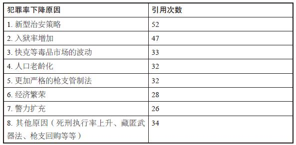

> 数据来源：律商联讯
> [\[1\]](#index_split_010.html_filepos298085)

如果你喜欢猜谜，接下来你可能会思考以上哪些原因有道理，哪些纯属无稽之谈。表中的7个主要原因，只有3个经证明对犯罪率的下降确有影响，其他多为某些人异想天开、谋取私利或一厢情愿的说辞。而且，造成犯罪率下降的几大可测因素中，有一条根本不在上表之中，因为报纸上从未提及。

首先来看争议较少的一点：经济繁荣。20世纪90年代初，犯罪率下滑的同时，美国经济也开始腾飞，失业率显著下降。似乎可以依此推断，经济发展是预防犯罪的一把利器。但仔细观察，就会发现这一说法不攻自破。诚然，就业市场的好转或许会减少部分犯罪发生的概率，但这仅限于那些出于物质诱惑的犯罪——盗窃、抢劫等，谋杀等暴力犯罪则不然。此外，研究表明，失业率下降1%，非暴力犯罪同样下降1%。20世纪90年代，失业率下降了2%，同期非暴力犯罪率却下降了约40%。但经济繁荣理论依然存在着大漏洞，而且这一漏洞与暴力犯罪有关。90年代，凶杀案发率的下降速度位居各类犯罪之首，而大量的可靠研究表明，经济繁荣与暴力犯罪之间几乎毫无关联，而回顾近代另一时期——60年代——的数据，你会发现这种牵强附会的关联更显得毫无根据。60年代，美国经济经历了井喷式的增长，但暴力犯罪率也陡然上涨。因此，虽然乍看起来，90年代的经济繁荣似乎构成了犯罪率下降的一大因素，但实际上，其对犯罪行为的影响微乎其微。

现在来看导致犯罪率下降的另一因素：入狱率增加。有关犯罪的问题，先反过来问或许会有所帮助，先不要想犯罪率因何下降，而是思考为何犯罪率当初会大幅上涨？

20世纪上半叶，美国多数地区的暴力犯罪案发率相对稳定，但自60年代初，暴力犯罪率开始攀升。如今回想起来，助长这一势头的一大因素就是相对宽松的司法体系。60年代，判刑率出现下降，判处罪犯的刑期也较短，这一情况的推动因素之一就是被告权利的改善——有人说，这种改善措施姗姗来迟。（也有人说，这些改善措施太过冒进。）与此同时，政客对待犯罪的态度日渐温和。

“唯恐自己被曲解为种族主义者，”正如经济学家加里·贝克尔所写，“因为重罪犯中，非裔美国人和拉丁裔美国人的比例过高。”

因此，假如你是当时那些企图犯罪的人，种种因素都对你十分有利：遭判刑的概率相对较低；即便被判刑，刑期也较短。由于罪犯也和普罗大众一样易受利益驱使，结果就是犯罪率的激增。

随后相当长的一段时期，经过多次的政治风波，这些现象终于受到了扼制，原先逍遥法外的罪犯——尤其是涉毒和假释撤销的罪犯——此后被收押。1980——2000年，因贩毒入狱的人数上涨了15倍，刑期也延长了。至2000年，入狱人数超过了200万人，约为1972年的4倍，这其中，有一半是在90年代实现的。

有充足的证据证明，入狱率上涨与犯罪率下降确有关联，严苛的监禁判罚既能对流窜街头的企图犯罪者起到震慑作用，又能对已经关押在刑、有再犯企图之人起到预防作用。这听起来顺理成章，但仍有犯罪学家表示反对。1977年，一项名为“支持停建监狱”的研究发现，入狱率偏高的时候，犯罪率也偏高。研究者因此推断，假如入狱率降低，犯罪率也会下降。（所幸监狱并未立即大赦天下，坐等犯罪率自行下降。政治学家小约翰·J.迪卢利奥后来评论道：“显然，将危险罪犯关进监狱可以降低犯罪率这种说法，只有犯罪学博士才会怀疑。”）

这种“停建”的观点源于对相关关系和因果关系的根本混淆。以一个类似的观点为例，某市市长看到该市棒球队在世界大赛中夺魁，举市欢庆，然而其中的关联令他心生好奇。但就像“停建”观点的作者一样，他没能看出二者在这种关联中孰先孰后，因此在第二年，市长下令让市民在世界大赛开球前就开始庆祝——经他逻辑不清的思维推断，这种行为能确保胜利。

当然，也有反对提高入狱率的，原因很多，并非所有人都乐于见到为数不少的美国人——尤其是美国黑人——过着铁窗生涯，监狱也不是根治犯罪之策，犯罪的根源形形色色、错综复杂。重要的，监狱这种解决方案耗资不菲：监禁一人每年的花费约为25000美元。但如果说此处的目的仅为解释90年代犯罪率下降原因的话，入狱率上升无疑是重要原因之一，因为犯罪率的下降约有1/3可归功于这一因素。

犯罪率下降的另一个原因常与入狱率一同提及：死刑执行率的上升。二十世纪八九十年代，美国死刑数量翻了两番，不少人因此推断——在就此问题数十年争执不下的背景下——死刑有助于减少犯罪。然而，这场争论忽视了两个重要事实。

首先，由于美国实际执行的死刑案例非常罕见，且候刑时间很长，但凡有点头脑的罪犯都不会因为害怕被处死刑而收手。尽管死刑数量在10年内翻了两番，但90年代全美国的死刑数量也仅有478例，他们都明白真正惩前毖后的措施与吓唬人的空话之间是有区别的。例如，自1995年恢复死刑至笔者写这本书的时候，纽约州从未执行过1例死刑。即便是在死刑犯中，每年遭到处决的也仅有2%——而与之相比，“黑色帮匪门徒之国”每年有7%的成员被杀。如果等待处决甚至比混迹街头安全，很难相信死刑会为罪犯所忌惮，进而成为让他们有所收敛的理由。和以色列海法市托儿所对迟到家长征收的3美元罚款措施同理，死刑的负向作用也不足以让罪犯改邪归正。

其次，姑且假设死刑确实能起到威慑作用，试问这种威慑作用对减少犯罪有多少实际影响？1975年，经济学家艾萨克·埃利希发表过一篇引用率颇高的论文，提出了公认的相对乐观的估计：每处死1名罪犯，可以防止7起类似凶杀案。接下来我们来计算一下，1991年，美国共执行死刑14例，2001年为66例，根据埃利希的计算，2001年死刑增加了52例，可减少364起杀人案——这样的下降幅度自然不小，但仅占当年凶杀案实际降幅的不到4%。因此，即便按死刑支持者所估计的最乐观情况计算，死刑对90年代凶杀案发率下降所起到的作用也仅为1/25。而除了凶杀案，因其他罪名被判处死刑的案例非常罕见，所以死刑的威慑力对其他暴力犯罪的下降毫无作用。

因此，美国目前实行的死刑制度对犯罪率下降有任何实际影响的可能性微乎其微，就连不少此前支持过死刑的人也得出了这个结论。

“出于道义和理智，我自觉有义务承认，死刑实验业已失败，”曾于1992年投票支持恢复死刑的美国最高法院大法官哈里·A.布莱克门在两年后宣布，“我将退出死刑制度的研究。”

综上分析可知，导致犯罪率下降的并非死刑，也非经济繁荣，但入狱率增加确实与之大有关联。当然，罪犯不会乖乖自首就范，得有人调查案情、抓捕嫌犯、搜集证据，最终确保犯人罪名成立。这自然引出了与此相关的另两个犯罪率下降原因：

新型治安策略

警力扩充

首先来看第二点，20世纪90年代，美国的人均警察数上升了约14%。然而，仅仅扩充警力是否就能起到减少犯罪的作用？答案显然是肯定的，但加以证明却并非易事。这是因为犯罪率一旦上升，民众就会大声疾呼，要求加强保护措施，这必然会导致警方的经费随之增加。因此，假如单看警力与犯罪率之间的相关关系，你会发现，警力增加时，犯罪率也会上涨，当然，这并不是说增加警力导致了犯罪率的上涨。

为了找出孰因孰果，我们需要研究出于和犯罪率上升完全无关的原因而扩充警力的案例。例如，假如有随机选取城市扩充警力而其他城市警力不变的情况，我们便可查出扩充警力的城市是否有犯罪率降低的现象。

事实上，急于拉拢选票的政客常常会造成完全合乎上述条件的情况，在选举前几个月，就算当时的犯罪率并无变化，现任市长也常常会扩充警力，以拉拢对维护法律与秩序予以支持的人们的选票。因此，对比近期有过选举（且因此而扩充了警力）的城市组与近期无选举（且因此未扩充警力）的城市组之间的犯罪率差别，即有可能分析出警力扩充对犯罪率的影响。答案是确有影响，扩充警力大幅降低了犯罪率。

在此重新回顾并分析当初犯罪率剧增的原因或许会有助于理解其中的内在关联。1960——1985年，相较于犯罪数量，警员人数下降了50%以上。人们或认为扩充警力有悖于彼时的自由主义风尚，或仅仅是认为扩充警力耗资不菲。然而，警力缩减了50%，导致罪犯被抓的概率也下降了约50%，加之前文提及的相对宽松的司法体系，警力缩减对罪犯形成了强大的正向激励。

至20世纪90年代，形势发生了变化，随着治安发展趋势发生了逆转，全国各个城市都开始大规模招募警员。新增警力不仅可以起到威慑作用，还可以增加人手，将原本逍遥法外的罪犯逮捕归案，以至于90年代犯罪率的下降有约10%要归功于新增的警力。

但在90年代，发生变化的不仅是警员人数，还有现在看来所有犯罪率下降原因中引用率最高的新型治安策略。

或许，最让人信服的解释就数新型的治安策略可以遏制犯罪这一说法了，它塑造了许多名副其实的英雄，而非仅仅将原因归之为坏蛋的销声匿迹。它迅速为人们所信奉，因为它有两点要素，在约翰·肯尼思·加尔布雷思看来，这两点是导致传统观念形成的最大因素：易于理解以及与个人福祉息息相关。

新型治安策略在纽约市得到了最淋漓尽致的体现，彼时，新上任的市长鲁道夫·朱利亚尼及其亲手提拔的警察局长威廉·布拉顿立誓要解决纽约犯罪猖獗的问题。布拉顿采取了别出心裁的治安策略，一名警局高官后来回忆道，是他将纽约市警察局引入了“雅典时代”。新的思路得到重用，墨守成规的做法遭到废弃。布拉顿没有姑息纵容警区指挥官，而是要求他们各负其责。他没有一味地依陈旧的从警经验行事，而是引入了新科技，如CompStat这种检测犯罪高发地区的计算机技术。

由布拉顿发扬光大的最引人注目的一个新思路来自詹姆斯·Q.威尔逊和乔治·凯林提出的破窗理论。该理论认为，小问题如果放任不管，就会演变成大问题：假如有人打破了一扇窗户，却发现窗户没有立即得到修缮，他会因此认为打碎其他窗户也没什么大不了，甚至还会将整栋楼付之一炬。

因此，在各地凶杀案频发的情况下，比尔·布拉顿
[\[2\]](#index_split_010.html_filepos298333)
手下的警察开始对从前会网开一面的违法行为——翻越地铁闸门、太过火的乞讨行为、随地小便、用脏兮兮的刮板擦汽车的挡风玻璃——进行严管并强制征收一定数额的“捐款”。

这种严打措施本身有其优点，因而在纽约市民中间广受拥护。令他们尤其受用的，是布拉顿和朱利亚尼极力推崇的观念，即打击小偷小摸的行为可以防微杜渐，如同切断了犯罪分子的退路，今日翻越地铁闸门的人很可能就是昨日害人性命的通缉犯，在小巷里随地小便的瘾君子很可能正在去抢劫的路上。

随着暴力犯罪率开始大幅下滑，纽约市民开始欢欣鼓舞地吹捧他们的市长和警察局长。他们一个举止浮夸、成长于布鲁克林区，一个脸型瘦削、说话带有浓重的波士顿口音，但两人都喜欢一意孤行，并不善于分享荣誉。纽约犯罪率的好转让布拉顿——而非朱利亚尼——登上了《时代》杂志的封面。但此后不久，布拉顿便被迫辞职，他担任警察局长一职的时间仅为27个月。

在90年代犯罪率下降时期，纽约市确实实行了标新立异的治安策略，且其犯罪率下降幅度也位居美国各大城市之首。1990——2000年，纽约的凶杀案发率从每100000人30.7起下降到了每100000人8.4起，下降幅度为73.6%。但对事实进行详细分析之后，结果显示新型治安策略很可能对犯罪率的大幅下降毫无影响。

首先，纽约市犯罪率的下降始于1990年，至1993年底，财产犯罪率和暴力犯罪率——包括凶杀案发率——已经下降了近20%。而鲁道夫·朱利亚尼直到1994年初才就任市长并提拔布拉顿，在两人上任之前，犯罪率已经出现了下降之势。在布拉顿黯然下台后，犯罪率仍然长期保持下降态势。

其次，在推行新型治安策略的同时，警力规模经历了更为显著的变化：无度扩张。1991——2001年，纽约市警察局规模扩大了45%，这一增幅是全国平均水平的3倍。正如前文所述，无论是否推行了新型策略，警力扩充对犯罪率下降的作用都已经得到了证明。据保守计算，相较于全国平均水平，纽约市犯罪率的下降有18%可归功于警力的大幅扩充，如将这18%的降幅从纽约市凶杀案发率总降幅中扣除掉，即排除警力扩充的影响，纽约就无法以73.6%的下降幅度在全国遥遥领先了，而是下降到了中游水平。实际上，新增警力多由戴维·丁金斯招募，而他正是被朱利亚尼击败的前任市长。丁金斯一直在千方百计地争取对维护法律与秩序予以支持的拥护者的选票，因为他早已料到对手会是前任联邦检察官朱利亚尼。（两人4年前便交过一次手了。）因此，想将犯罪率下降归功于朱利亚尼的人仍然可以这样做，因为丁金斯之所以扩充警力，正是出于对朱利亚尼维护法律与秩序之名的忌惮。当然，到头来，扩充警力带来了皆大欢喜的结果——但朱利亚尼尝到的甜头显然多于丁金斯。

纽约市的新型治安策略大幅降低了犯罪率，持这种说法的最大漏洞，是一个人们常常视而不见的简单事实：90年代全国各地的犯罪率都有所下降，这种现象不仅限于纽约。其他城市几乎都没有试行过纽约推行的策略，起码没有哪座城市像纽约这样热情高涨，但即便是在洛杉矶这种因治安混乱而臭名昭著的城市，排除掉纽约警力扩充的影响后，其犯罪率下降幅度也与纽约不相上下。

当然，说新型的治安策略一无是处，未免有些过分。比尔·布拉顿让纽约市警局重振雄风，这自然值得一书，但几无证据能证明其策略确实像他本人和媒体宣传的那样是打击犯罪的灵丹妙药。2002年底，布拉顿在洛杉矶就任警察局长，他适当照搬了在纽约推行过的某些标志性的创新策略，却也公开承认，当务之急还是更为基础的措施：筹集资金，扩充警力。

接下来我们探讨另两个常见的犯罪率下降原因：

更加严格的枪支管制法

快克等毒品市场的波动

先说枪支，一旦对此话题展开辩论，很少有人能平心静气。枪支支持者认为枪支管制法过于严格，反对者则认为过于宽松。何以想法如此不同？因为持有枪支引起的后果复杂多变，而这全部取决于一个因素：手握枪支的人是谁。

或许可以退一步思考：枪为何物？枪是可以用于杀人的工具，但更重要的，枪是可以有效扰乱社会秩序的东西。

美国枪支泛滥成灾，以至于你给每名成人发一把枪，最后剩下的，只会是枪，而不是没分到枪的人。美国近2/3的凶杀案都牵涉到枪支，这一比例位居各发达国家之首。美国的凶杀案发率也远高于其他发达国家。因此，可以说美国凶杀案发率居高不下的原因之一，就是枪支唾手可得。而有研究表明，情况也的确如此。

但枪支并非全部原因，在瑞典，每名成年男性都会配发一支突击步枪，以方便其履行民兵义务，且枪支可以留在家里。瑞典的人均枪支数量几乎位居世界各国之首，但瑞典却是全世界最安全的国家之一，换言之，枪支不会造成犯罪。所以，美国为防止确有犯罪行迹之人得到枪支所实行的现行措施，至多只能说是收效甚微，而且由于枪支基本上可以永久保存，即便掐断新枪支流入市场的源头，现有的枪支也用之不尽。

那么，将所有这些因素考虑在内，我们再来看近期各种有关枪支的措施，分析这些措施对90年代的犯罪率究竟有何影响。

最著名的枪支管制法为1993年通过的《布雷迪法案》。该法案规定，任何人购买枪支，均须接受前科调查并等待一段时间。这一方案或许正中政客的下怀，但在经济学家看来，却意义不大。为什么？因为如果某种商品的黑市销售异常繁荣，合法市场的某些规定便注定毫无效果。枪支价格低廉、唾手可得，正常的罪犯根本不必去本地的枪械商店填购枪申请表，然后再等上一个星期。因此，事实证明《布雷迪法案》对犯罪率的下降几乎毫无作用。（一项针对入狱重犯的调查显示，就算是在《布雷迪法案》出台之前，通过特许枪支经销商购买枪支的罪犯也仅有1/5。）而且，各类地方性枪支管制法也以失败告终。早在90年代美国犯罪率开始下降之前，华盛顿特区和芝加哥便实行了手枪禁令，但两座城市的犯罪率下降幅度在全国却排名靠后，而非靠前。有一项措施经证明确实有一定威慑作用，即严格延长持有非法枪支者的刑期，但改进的空间还很大。如果只要持有非法枪支就会被判死刑，且死刑确实会被执行，这种事虽然并无可能成真，但枪击事件一定会大幅减少。

90年代打击犯罪的另一大措施——以及晚间新闻的一大主题——是枪支回购，各位应该还记得那个画面：市长、警察局长和小区里的活动家围着一堆气势骇人、闪闪发光的枪支。这个画面的摆拍构图不错，但和枪支回购本身一样实际意义不大，因为上缴的枪支多为老古董或废旧枪支，而上缴所得——通常为50美元或100美元，加利福尼亚州提供的是3个小时的免费心理治疗——又微不足道，但凡是真有意用枪的人，都不会响应这点诱惑。而且，上缴枪支的数目甚至不及同期流入市场的新枪。以美国的手枪总数和每年的凶杀案总数计算，一把枪每年被用于杀人的概率为1/10000。枪支回购通常收缴不到1000把枪——每次回购预计仅可减少不到1/10起杀人案。也就是说，这并不足以对犯罪率的下降产生一丝一毫的影响。

接下来是与之相反的观点——我们需要更多的枪流入街头，但要落到好人的手中。经济学家小约翰·R.洛特是这一观点的主要支持者，他在《增加枪支，减少犯罪》一书中提出，如奉公守法的公民可携带隐蔽武器，其所在地区的暴力犯罪率则会有所下降。他的理论或许出人意料，但有其道理，假如罪犯认为潜在的受害者可能有枪，他或许会有所忌惮，不敢行凶。枪支反对者称洛特为偏激的枪支支持者，而洛特本人却任由自己陷入枪支论战的旋涡中，他还曾化名为“玛丽·罗什”，在网络论战中为自己的理论辩护，因此引来了更多的麻烦。罗什自称是洛特教过的学生，称赞他学识渊博、一视同仁、魅力非凡。

“我必须要说，他是我遇到过的最好的教授，”他写道，“你听他讲课根本听不出他是‘右翼’理论家……我们有群学生想把他教的课都选了。洛特最后不得不劝我们最好听一听其他教授的课，以接触一下其他的研究生授课方式。”

洛特的麻烦事不止如此，还有人指责他捏造了部分调查数据，以支撑他的“增加枪支，减少犯罪”理论。无论数据是真是假，洛特的假说虽然确实耐人寻味，却似乎并非事实。其他学者曾试图再现其实验结果，却发现携枪权利法对犯罪率的下降并无作用。

现在来看犯罪率下降的下一个原因：快克等毒品市场的波动。强效可卡因药力强劲、容易成瘾，几乎在一夜之间便形成了利润可观的市场。诚然，只有贩毒团伙的头目因此而暴富，但这只会令街头毒贩更加不顾一切地想往上爬，其中不少人甘愿为此杀死竞争对手，甚至不管对手为同一帮派还是另一帮派，还有人会为了争夺有利的贩毒地点而爆发枪战。快克引发的人命案通常是（2~3名）毒贩之间的互相残杀，而非传统观念所设想的案情——某个眼球突出的瘾君子为了区区几块钱而开枪打死了商店老板。结果，暴力犯罪率大幅上升。

一项研究发现，1988年，纽约市25%以上的凶杀案都和快克有关。

1991年左右，与快克有关的暴力活动开始减少，许多人因此认为，快克已经不复存在。但事实并非如此，时至今日，吸食快克的普遍程度仍然会出乎多数人的意料，美国仍有近5%的拘留犯人与可卡因有关（在快克泛滥的黄金期，则有6）%，因吸食快克而被送到急诊室的患者也未见明显减少。

真正不复存在的是卖快克带来的巨额利润。多年来，可卡因的价格一路下滑，快克的逐渐普及，进一步加剧了其价格走低的趋势，而毒贩之间打起的价格战，更是让利润消失殆尽。快克泡沫像纳斯达克泡沫最终的结局一样，顷刻破灭。随着老一辈毒贩莫不落得被杀或入狱的下场，年青一代的毒贩认为贩毒利润微薄，不值得冒这样的风险，为争夺贩毒地盘而谋人性命，甚至豁出命去。

因此，暴力活动日渐减少，1991——2001年，黑人男青年——在快克毒贩群体中占有极高比例——的凶杀案发率下降了48%，而老年黑人男性和老年白人男性的凶杀案发率分别仅下降了30%。（导致凶杀案发率下降的一个次要因素是，部分毒贩选择开枪打伤对手的臀部，而非一枪毙命。这种暴力伤人行为会被认定为羞辱对方，而非谋杀，因此相应的处罚也明显较轻。）综上所述，90年代犯罪率的下降有约15%可归功于快克等毒品市场的波动——这确实构成了一个重要因素，但应当注意的是，在80年代，因快克造成的犯罪率上涨幅度远远不止15%。换言之，两相抵消后，快克对暴力犯罪造成的影响时至今日仍未消除，而且这种毒品本身仍然是许多不幸的根源。

犯罪率下降的最后两个原因和人口统计学的两个趋势有关，其中一点媒体引用率颇高：人口老龄化。

若非犯罪率出现了大幅下降，根本无人会提及这种理论。实际上，提出“血雨腥风”的犯罪学流派原本宣扬的是完全相反的理论——人口中的青少年比例会逐渐增加，大批超级猎手会因此诞生，令整个国家千疮百孔。

“天边阴云密布，狂风暴雨即将袭来，”詹姆斯·Q.威尔逊在1995年写道，“人口将再次开始呈现低龄化趋势……准备迎接吧。”

但总体而言，青少年所占的人口比例并未上升。威尔逊和詹姆斯·艾伦·福克斯严重误读了人口统计数据。90年代人口比例确有增加的实际上是老年群体。这对医疗和社会保障行业来说，或许是骇人的消息，但普通美国人却无须担心日益扩大的老年人群体。老年人的犯罪意图不高，这一点想必不足为奇。65岁老年人的平均被捕率仅为青少年的1/50左右。正因为如此，人口老龄化导致犯罪率下降的理论听起来才如此顺理成章、令人信服：因为人年纪大了，性格便会平和温顺起来，所以老年人越多，就必然会导致犯罪越来越少。

但对数据进行彻底地分析就会发现，美国人口老龄化对90年代

犯罪率的下降毫无影响。人口结构的变化是一个缓慢渐进、不易察觉的过程——你不可能在短短几年间就从乳臭未干的小混混长成老年人，这根本不可能构成犯罪率骤降的原因。

然而，另一个人口结构变化，在多年的酝酿之后，却出其不意地在90年代大大降低了犯罪率。

先简要回顾一下1966年的罗马尼亚，尼古拉·齐奥塞斯库在突然之间毫无预兆地宣布堕胎违法。然而，堕胎禁令生效后出生的儿童比此前出生的儿童更有可能走上犯罪道路。对20世纪30年代至60年代东欧地区和斯堪的纳维亚半岛的调查也显示出了类似趋势。为何会如此呢？在其中多数情况中，堕胎并未遭到彻底禁止，但女性须向法官申请许可才可堕胎。研究人员发现，女性的堕胎申请如果被拒，她们常常会对自己的孩子心生怨恨，无法提供健康的家庭环境。即便排除掉母亲收入、年龄、教育水平和健康状况的影响，研究人员仍然发现，这些儿童走上犯罪道路的概率更高。

与之相反，美国的堕胎史却与欧洲恰恰相反。美国建国之初，“胎动”——初次感觉到胎儿活动，通常在怀孕后6~8周出现——之前的堕胎是允许的，1828年，纽约成了首个限制堕胎的州，至1900年，堕胎已经在美国全境被宣布为非法。20世纪的堕胎手术常常危险性高且要价不菲，因此选择堕胎的贫困女性较少，但她们可用的节育措施也较少，自然而然地，她们有的只能是成群的孩子。

20世纪60年代晚期，部分州开始允许女性在某些极端情况下——强奸、乱伦或生育可能危及母亲——选择堕胎。至1970年，已有5个州实现了堕胎完全合法化及普及，分别是纽约、加利福尼亚、华盛顿、阿拉斯加和夏威夷。1973年1月22日，美国最高法院宣判“罗诉韦德案”结果后，堕胎合法化突然普及至美国全境。如大法官哈里·布莱克门所写的，法庭的多数意见特别提到了准妈妈们的尴尬处境：

> 如果完全剥夺孕妇的堕胎权利，国家强加于她们的伤害是显而易见的……怀孕或多余的子女会令女性被迫过上不幸的生活，面临悲惨的未来。这可能会立即造成精神伤害，心理及身体健康也可能会因照料儿童而受到损害。将所有相关方考虑在内的话，这计划外的儿童也会面临不幸的生活，而且如家庭本身因心理或其他原因本已无力抚养子女，让儿童出生在这样的家庭也是有问题的。

最高法院提出的意见是罗马尼亚和斯堪的纳维亚半岛等地的母亲早已明白的道理，就是一名妇女若是不想要孩子，通常是有充分理由的：她或是未婚先孕；或是婚姻不幸；或是自认手头拮据，无力抚养孩子；或是认为自己生活漂泊不定、郁郁寡欢；或是认为自己的酒瘾或毒瘾会影响婴儿健康；或是认为自己年纪太轻或尚未完成学业，她也可能很想要孩子，但要等几年，而不是现在。总之原因多种多样，而无论是何原因，她可能都是自认无法提供合适的家庭环境，难以培养出身心健康、有所作为的子女。

“罗诉韦德案”宣判后的第一年，美国约有750000名妇女接受了堕胎手术（堕胎与婴儿出生比例为1∶4）。至1980年，堕胎数已达到160万（堕胎与婴儿出生比例为1∶2.25），并从此维持在这一水平上下。美国总人口为2.25亿，每年有160万例堕胎手术——堕胎数与人口比例为1∶140，这一数字或许并不算高。尼古拉·齐奥塞斯库死后第一年，罗马尼亚恢复了堕胎合法化，当年的堕胎数与人口比例为1∶22。但话说回来，美国每年仍有160万人次的怀孕妇女忽然抛弃了腹中的胎儿。

“罗诉韦德案”之前，既有门路又有钱做安全的非法堕胎手术的人多为中产阶级或上层阶级家庭出生的女孩。这之后，堕胎不再是要价高达500美元的非法手术，而是所有妇女都唾手可得的东西，价格通常还不到100美元。

哪些女性最有可能成为“罗诉韦德案”的受益者？她们往往未婚先孕、未成年怀孕或穷困潦倒，有时是三者皆有。她们的孩子可能会有什么样的未来？一项研究表明，堕胎合法化后最初几年里那些未出世儿童如果出生，生活贫困的概率要比平均水平高50%，在单亲家庭长大的概率则要高60%。这两大因素——幼年贫困和单亲家庭——是导致儿童走上犯罪道路的最大诱因。成长于单亲家庭会令儿童的犯罪倾向增加一倍左右，出生时母亲未成年也会造成同样的影响。另一项研究表明，母亲教育水平低下是导致儿童犯罪的最大因素。

换言之，让数百万美国妇女选择堕胎的因素似乎同样也预示着，她们的孩子假如真的出生，会过上不幸的生活，甚至走上犯罪道路。

诚然，美国实现堕胎合法化造成了各种各样的后果：杀婴案大幅减少；奉子成婚以及待收养婴儿的数目也大幅下降（后者导致收养外国婴儿的做法风靡起来）；怀孕率上升了近30%，但生育率却下降了6%。这说明不少妇女将堕胎当作节育手段，这成了一种粗暴而极端的保险措施。

然而，堕胎合法化造成的最大影响或许在多年后才显现出来，即其对犯罪的影响。20世纪90年代初，出生于“罗诉韦德案”后的第一代儿童到了十八九岁的年纪——这正是年轻人违法犯罪的黄金年龄，但犯罪率却开始下降。当然，这一代恰好少了那批最有可能成为罪犯的同辈。随着整一代人步入成年，由于那些母亲不打算要的小孩没有出世，犯罪率持续下降。堕胎合法化减少了意外怀孕的生育率，而意外怀孕生育导致犯罪率居高不下。因此，堕胎合法化导致了犯罪率的下降。

这一理论势必会引起轩然大波，人们或会难以置信，或会嗤之以鼻，甚至同时还会招来一系列的口诛笔伐、闲言碎语或道义谴责。对这一理论的头一个反对意见多半会是最直截了当的一个：这个理论是对是错？或许堕胎和犯罪仅仅是存在相关关系，而不存在因果关系。

报纸上的言论听起来或许更加顺耳——犯罪率的下降要归功于新型的治安策略、灵活的枪支管制和良好的经济形势。我们越来越习惯于从我们触手可及的事物上寻找因果联系，而忽视年代久远、难以理解的现象。我们尤其迷信短期可见的原因，多数时候，这种推断都是正确的，但探讨因果关系时，这种一概而论的思维却常常存在陷阱。

那么，我们如何判断堕胎与犯罪之间究竟是因果关系，还是仅仅是相关关系呢？

测量堕胎对犯罪有何影响的方式之一，是衡量特定五个州的犯罪率数据。这五个州在最高法院宣布美国全境实现堕胎合法化之前便提前实现了堕胎合法化，在纽约、加利福尼亚、华盛顿、阿拉斯加和夏威夷，至少早在“罗诉韦德案”的两年前，妇女便可进行合法的堕胎手术。而在这些提前实现合法化的州，犯罪率的下降确实要早于美国其他45个州和哥伦比亚特区。1988——1994年，在提前实现合法化的州，暴力犯罪率下降幅度要比其他州高出13%。1994——1997年，其凶杀案发率下降幅度要比其他州高出23%。

但说不定这些提前实现合法化的州只是运气好呢？数据里还能找出什么证据证明堕胎和犯罪之间的关系呢？

值得注意的因素之一，是每个州的堕胎率与犯罪率之间的对应关系，不出所料，在20世纪70年代堕胎率最高的几个州，在90年代的犯罪率下降幅度也是最大的，而堕胎率较低的州，犯罪率下降幅度也较小。（即便排除影响犯罪的一系列因素——每个州的入狱率、警力规模及其经济状况，这一关联仍然存在。）自1985年以来，相对于堕胎率较低的州，堕胎率较高的州犯罪率下降幅度为30%左右。（纽约市堕胎率较高且隶属于较早实现堕胎合法化的州之一，这两点进一步驳斥了新型治安策略导致犯罪率下降的说法。）此外，在80年代末——出生于堕胎合法化之后的第一代儿童迈入犯罪黄金期之时——之前，各州的堕胎率和犯罪率之间并无关联，这再次表明“罗诉韦德案”确实是造成犯罪率由升转降的分水岭。

此外还有其他方面存在或正或负的相关关系，可证明堕胎与犯罪之间的关联。在堕胎率较高的州，犯罪减少的现象仅存在于出生于“罗诉韦德案”后的一代人，而此前出生的罪犯并未减少。而且，澳大利亚和加拿大的研究早已证实，堕胎合法化与犯罪率之间存在类似的关系。“罗诉韦德案”后的这一代人不仅缺少了成千上万的年轻男性罪犯，还有成千上万的单身、未成年母亲——因为那些因堕胎而未出世的女婴若长大成人，很可能会重蹈其母亲的覆辙。

堕胎是美国历史上造成犯罪率下降的最大因素之一。自不用说，这一发现会引起诸多龃龉，这与其说是达尔文式的物竞天择，倒不如说是斯威夫特
[\[3\]](#index_split_010.html_filepos298533)
式的人性讽刺。这让人想起了据说出自G.K.切斯特顿
[\[4\]](#index_split_010.html_filepos298816)
的一句讥讽之词：帽子不够分的时候，不能以砍头来解决问题。用经济学家的话来说，犯罪率下降是堕胎合法化带来的“意外益处”。但即便你没有出于道德或宗教原因而反对堕胎，以个人不幸为代价换取大众福祉的想法也会令你不寒而栗。

诚然，很多人认为堕胎本身就是一种暴力犯罪。一名法学家称堕胎合法化（因堕胎多会造成人命损失）比奴隶制度或纳粹大屠杀（因为自“罗诉韦德案”至2004年，美国的堕胎数达到了约3700万例，而在欧洲遭到屠杀的犹太人也只有600万）更加罪孽深重。即便你对堕胎的看法并未偏激至此，这也仍然是个颇具争议的话题。纽约布朗克斯区及明尼阿波利斯市前任警局高官安东尼·V.博萨在1994年竞选明尼苏达州州长时，发现了这一点。几年前，博萨在一部著作中写道，堕胎“可谓是美国自20世纪60年代末以来所实行的唯一一项有效的犯罪预防措施”。在临近选举之时，博萨的这一言论被公之于众，他的选票因此一落千丈，并在选举中败北。

无论人们对堕胎有何看法，脑海中大概都会想起一个问题：我们如何理解增加堕胎以减少犯罪这样的取舍？这种错综复杂的取舍关系可以以数字衡量吗？

实际上，经济学家酷爱以数字衡量复杂的取舍关系。例如，为挽救濒临灭绝的北方斑点鸮所做的投入。一项经济学研究发现，保护约5000只北方斑点鸮的机会成本——伐木业等行业放弃的收入数额——为460亿美元，即每只鸮900多万美元。1989年埃克森瓦尔迪兹号油轮发生漏油事故之后，另一项研究估算了普通美国家庭为避免此类事故再次发生而愿意支付的金额为31美元。经济学家甚至可以为各个身体部位估价，详情请见表4–2。

表4–2　康涅狄格州使用的各部位工伤赔偿表

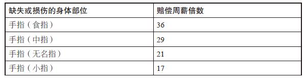

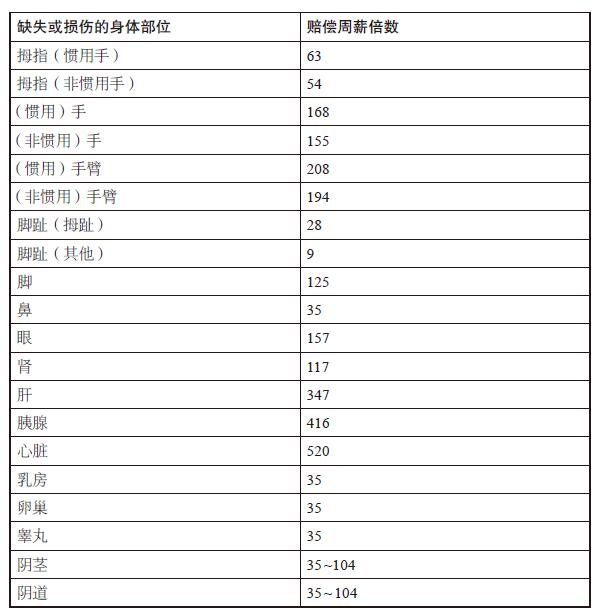

接下来，为论证起见，我们要问一个不人道的问题：胎儿和婴儿的相对价值为多少？假如你也面临着所罗门式的抉择，你会为了多少胎儿而献祭一名新生婴儿？这仅仅是一个空想的问题——显然不存在正确答案——但有助于澄清堕胎对犯罪率的影响。

对于坚决反对堕胎或坚决支持堕胎权利的人来说，这计算起来非常简单。前者认为生命始于受孕，因此很可能会认为胎儿与新生儿的价值是1∶1对等的。后者认为妇女的选择堕胎权高于一切，因此很可能认为多少胎儿也比不上一名婴儿。

但此处需要假设一名中立者，（假如你对上文所述的二者之一有强烈的认同感，那么接下来的练习可能会令你觉得反感，你可以跳过以下两段内容。）这位中立者并不认为胎儿与婴儿的价值是1∶1对等的，也不认为胎儿的相对价值为零。为了论证起见，假设他要被迫给出确定的相对价值，他给出的是，1名婴儿等于100个胎儿。

美国每年约有160万例堕胎手术，对于认为1名婴儿等于100个胎儿的人来说，这160万例堕胎手术相当于——160万除以100——夺去了16000条生命。16000条人命：这恰好约等于美国每年死于凶杀案的人数。而这远高于每年因堕胎合法化而减少的凶杀案数字。因此，根据经济学家的推算，即便假设1个胎儿仅相当于1/100人，增加堕胎以减少犯罪这一取舍抉择也只能说是得不偿失。

但堕胎与犯罪之间的关联能说明一点：如果政府允许一名妇女自行决定是否堕胎，她往往能准确地判断出自己是否有能力将孩子抚养成人。如果自认不能，她常常会选择堕胎。

但假如这名妇女决定生下孩子，随之而来的一大问题是：孩子生下来以后，父母应该怎么做？

[\[1\]](#index_split_010.html_filepos254819)
律商联讯，提供法律、商业信息检索和风险解决服务的公司。——译者注

[\[2\]](#index_split_010.html_filepos267714)
比尔是威廉的昵称形式。——译者注

[\[3\]](#index_split_010.html_filepos293178)
斯威夫特，此处应指英国的讽刺文学大师乔纳森·斯威夫特，代表作为《格列佛游记》。——译者注

[\[4\]](#index_split_010.html_filepos293310)
G.K.切斯特顿，英国推理作家，“布朗神父”系列的作者。——译者注

第五章　怎样才算完美父母？

> 本章从多个角度提出了一个迫切的问题：父母真的重要吗？

> 育儿从艺术向科学的转变……为何育儿专家喜欢把父母吓得半死……枪与游泳池，哪个更危险？……恐惧经济学……养育过度与先天–后天之谜……为何说好学校的作用被你高估了……黑人与白人的成绩之差与“被白人同化”……与提高孩子学习成绩有关的八点和无关的八点。

养儿育女是一门艺术，但世上还有哪门艺术被如此不遗余力地包装成了一门科学？

近几十年，各式各样的育儿专家不断涌现，这些专家之言，即便只想随便听听，可能也听不进去，因为有关育儿的传统观念似乎瞬息万变，有时是不同专家之间莫衷一是，有时则是曝光率最高的几名专家突然异口同声地宣布旧观点是错的，而新观点至少在短时间内，是无可辩驳的真理。例如，先有人说母乳喂养是保证孩子身心健康的唯一方式，后又有人说人工喂养才是；先有人说婴儿应该躺着睡，后又有人说婴儿应该趴着睡；食用肝脏这种行为，有人说会中毒，有人说对大脑发育必不可少；对孩子的教育也是要么丢掉棍棒，放纵孩子，要么揍孩子一顿，然后去坐牢。

在《美式教育：专家、父母和一个世纪以来的育儿经》一书中，安·赫尔伯特记录了育儿专家那些众说纷纭甚至自相矛盾的理论，若非存在混淆视听之处，且多有耸人听闻的效果，他们这些笑谈可能还会博人一笑。在《从0岁开始》系列丛书中，盖瑞·艾卓提倡“望子成龙”的父母采取“婴儿管理策略”，强调早早锻炼婴儿晚上独自睡觉的重要性，艾卓警告称，若不这么做，睡眠不足可能会“对婴儿的中枢神经系统发育造成不良影响”并导致学习障碍。与之相反，支持“父母与孩子同睡”的人则警告称，独自睡觉会不利于婴儿的心理健康，婴儿应该与父母“同床共眠”。那激励手段呢？1983年，T.贝里·布雷泽顿写道，婴儿出生时，“完全有能力了解自己和周遭的世界”，布雷泽顿提倡尽早、积极地激励孩子成长，以培养“善于互动”的儿童。然而，100年前，L.埃米特·霍尔特却告诫道，婴儿不是“任人玩弄的对象”，他认为，在婴儿出生后的前两年，“不应揠苗助长，不应施加压力，不应过度激励”，该阶段的大脑发育非常迅速，过度激励可能会造成“巨大损伤”。他还认为除非因为身体不舒服，否则婴儿啼哭时，绝不应抱起来，每天都应该让婴儿哭上15~30分钟：“这是婴儿的锻炼方式。”

典型的育儿专家同其他领域的专家一样，喜欢做出胸有成竹的样子。专家不喜欢探讨一件事的不同方面，而是喜欢坚定不移地选边站队，因为说话有所保留或措辞微妙的专家常常无法博得公众的关注，要想让自己平淡无奇的理论上升为传统观念，专家必须壮起胆子。为此，成功率最高的方式就是利用公众情绪，因为情绪是理性讨论的敌人，在所有情绪中，一种情绪——恐惧——比其他情绪更具威力。正因如此，超级猎手、伊拉克的大规模杀伤性武器、疯牛病、婴儿猝死综合征，把我们吓得战战兢兢，如此一来我们又怎能不对他们言听计从呢？

最容易被专家耸人听闻的言论所蛊惑的就是父母了，恐惧成为他们育儿过程中的一个主要部分。毕竟，为人父母要照顾另一条生命，而这条生命呱呱坠地之时，几乎要比其他任何物种刚出世时都更加无助，这令许多父母把养儿育女的太多精力浪费在了担惊受怕上。

问题在于，他们多半是在庸人自扰，但这又并非他们的过错，毕竟辨别事实与谣言并非易事，这对忙碌的父母来说尤其如此。专家喋喋不休的言论——姑且不说来自其他父母的压力——铺天盖地，让他们无暇作独立思考，他们能收集到的事实要么被曲解了，要么被夸大了，要么是断章取义，而这都是别有用心的人捏造出来的。

假设一对父母有个8岁的女儿名叫莫利。她有两个好朋友，分别叫埃米和伊曼尼，都住在附近。莫利的父母知道埃米的父母在家里藏了一把枪，所以不准莫利去她家。因此，莫利经常去伊曼尼家玩，而她家后院有个游泳池。莫利的父母认为自己为了保护女儿做出这一决定非常明智，因此感到很欣慰。

但根据数据统计，他们的决定并不明智。美国平均每年每11000个住宅游泳池就会溺死一名儿童。（美国全国有600万个游泳池，即每年约有550名10岁以下儿童溺死。）与之相对，每100多万支枪，也仅会造成一名儿童因枪击致死。（据估算，美国约有2亿支枪，即每年约有175名10岁以下儿童因枪击致死。）在游泳池溺死的概率（1/11000）与因枪击致死的概率（超过1/1000000）相比，差得不是一点半点：莫利在伊曼尼家游泳时溺死的概率远高于在埃米家被枪击致死的概率。

但我们多数人都像莫利的父母一样，非常不善于评估风险。来自新泽西州普林斯顿市的彼得·桑德曼自诩“风险通报顾问”。2004年初，美国因发现一例疯牛病而掀起了反食牛肉热潮，他当时就指出了这一点。

“基本事实是，”桑德曼告诉《纽约时报》，“令人们担惊受怕的风险和真正夺人性命的风险差别很大。”

桑德曼对比了疯牛病（极其可怕却十分罕见）和普通家庭厨房里经食物传染的病原体（极其常见，却不知何故并不可怕）。

“你可以控制的风险不容易令你大惊失色，而你无法控制的风险则不然，”桑德曼说，“就疯牛病而言，我感觉这是我无法控制的事情，我无法分辨我吃的肉里是否有朊病毒，因为看不出来，也闻不出来。但自家厨房里的污垢却是我可以控制的，我可以清洗海绵，可以擦洗地板。”

桑德曼的“控制”原则或许也可以解释为何多数人怕坐飞机，却不怕开车。他们的逻辑是：由于汽车是我控制的，生命掌握在我自己手里；而飞机不是我控制的，我要受各种外部因素的摆布。

那么乘飞机与自驾车，我们究竟应该更怕哪种交通方式？

或许首先应该思考一个较为基本的问题：我们怕的究竟是什么？一定是怕死。但对死亡的恐惧需要缩小范围。当然，人人都知道自己免不了一死，对此我们或许只会偶尔担心一下。但假如有人告诉你，在接下来的一年里，你有10%的死亡概率，你的担心程度恐怕会高出不少，甚至可能会改变生活方式。而假如有人告诉你，你在接下来的一分钟内有10%的死亡概率，你很可能会惊慌失措。因此，引起恐惧的是迫在眉睫的死亡威胁，所以要想衡量对死亡的恐惧，最合理的方式是以小时计。

假如你准备出门旅行，可选择自驾车或乘飞机，你或许要参考一下自驾车与乘飞机的每小时死亡率。诚然，美国每年因车祸死亡的人数（约40000人）远超过因空难死亡的人数（不到1000人）。但多数人乘车时间要比乘飞机时间长得多，这一点也不假。（每年因划船事故死亡的人数也高于空难死亡人数，这一点与游泳池及枪支的对比都说明，水的危险程度远远超过了多数人的认知。）然而，自驾车与乘飞机的每小时死亡率不相上下，这两种交通工具的致死率（实际上也可称为安全率）相差无几。

但当下发生的危险最易滋生恐惧，因此专家才会利用这一点。当今世界，人们对长远的事情越来越缺乏耐心，导致恐惧具有强大而立竿见影的效果。假设你是名政府官员，有两种已被证实会致人死亡的威胁，恐怖袭击和心脏疾病，你需要申请资金，对抗其中一种威胁，你认为国会议员会为哪一项拨款？任何人因恐怖袭击而死亡的概率都远低于因食用高脂肪食物而死于血管阻塞、心脏病发的概率；但恐怖袭击是发生在当下的事情，而死于心脏病发却是一种常见疾病；恐怖主义活动超出了我们的控制范围，而炸薯条导致的心脏病致死则不然。与控制系数同等重要的，是彼得·桑德曼提出的可怕系数，死于恐怖袭击（或疯牛病）被认为是可怕至极，但死于心脏病却并不可怕。

桑德曼是个立场不定的专家，前一日他可能还在帮环保组织揭露某种公共卫生危害，后一日他便会帮助某个快餐企业总裁的客户摆平大肠杆菌暴发造成的影响。桑德曼将自己的专业知识总结为一个简单的公式：风险=危害+愤怒。对于遇到汉堡用肉变质问题的总裁来说，桑德曼要做的是“平息愤怒”，而对于环保组织来说，他要做的则是“激起愤怒”。

要注意，桑德曼处理的是愤怒这一部分，而非危害本身。他承认在他的风险公式中，愤怒与危害的地位并不均等。

“危害性高而愤怒值低，就是人们反应平淡，”他说，“危险性低而愤怒值高，则是人们反应过激。”

那么为何游泳池不及枪恐怖呢？小孩被邻居家的枪射击而死，这样的事情令人不寒而栗，骇人听闻，简而言之，令人愤怒，但游泳池却不会引起愤怒，原因之一在于它为人们所熟悉。多数人乘车时间长于乘飞机时间，与之同理，多数人在游泳池里游泳的时间也长于开枪射击的时间。儿童溺死仅需30秒，且常常悄无声息，仅仅几英寸深的水就可以让婴儿溺死，但与此同时，防止儿童溺水的方法却相当简单：有成人照看，游泳池旁竖起围栏，后门锁好以防幼儿趁大人不注意溜出去。

假如所有家长都能依此行事，每年或许可以挽救400名儿童，这一数字高于近期宣传最广的两项发明：更安全的婴儿床和儿童汽车座椅。数据显示，儿童汽车座椅充其量只是装装样子，让儿童坐在后座自然要比坐在前座被大人抱着安全，因为一旦遭遇车祸，坐在前座的儿童基本会被弹射出去。但此处所指的安全措施是指不能让儿童坐在前座，也不是将他们绑在200美元的儿童座椅上。尽管如此，许多家长仍然会夸大儿童汽车座椅的好处，甚至为了正确安装座椅，不惜跑到警察局或消防站。

儿童安全领域的新技术，多与上市的新产品有关，这也是最令人震惊的一点。（儿童汽车座椅的年销量为近500万套。）这些产品往往意在应对人们越来越严重的恐慌情绪，而引起他们恐慌的事物，用彼得·桑德曼的话来说，就是愤怒值大于危险性。本来只需做好预防措施就可以避免一些悲剧发生的事情，却被一些夸大其辞的广告宣传弄得本末倒置：儿童安全包装（每年约挽救50条生命）、阻燃材质睡衣（每年约挽救10条生命）、让儿童远离汽车安全气囊（自安全气囊问世以来，每年仅有不到5名儿童因此丧命）以及童装安全拉绳（每年约挽救2条生命）。

你可能会说，就算是家长被专家和商人玩弄于股掌之上，这又有什么关系？无论这些措施是微不足道还是控制过度，即便只能保护1名儿童的安全，难道我们不都应该给予支持吗？它们给父母带来了便利，让我们可以腾出更多时间思考如何在培育孩子心智问题上有更多良方，不是吗？

有关育儿的传统观念近来遭到了彻底的颠覆，它起因于一个简单的问题：父母对孩子的智力成长究竟有多大影响？

几十年来，针对这一问题的研究越来越多。已有大量研究——包括对自出生起便分开长大的双胞胎所进行的研究——证明，儿童的性格与能力约有50%是由基因决定的。

那么如果说先天因素决定了孩子一半的命运走向，那另一半由何决定呢？想必应该是后天培养——“小小莫扎特”系列录音带、教会布道、参观博物馆、拥抱，甚至是必要的惩戒，这些正是育儿之道的全部内容。但另有一项著名研究——科罗拉多州领养项目——跟踪了245名被收养儿童的生活，发现儿童的性格特征与养父母之间几乎毫无关联，这该作何解释？还有研究表明，孩子是否上过托儿所、是否是单亲家庭、母亲工作与否对儿童性格并无太大影响，这又要作何解释？

1998年的一本书《教养的假说》探讨了先天与后天的区别，作者是名不见经传的教材作家朱迪思·里奇·哈里斯，该书对父母养育过度的现象进行了抨击，它有两个小标题：“儿童为何会走上不同的成长道路”和“父母的作用比你所知的要小而同龄人的影响更大”。哈里斯用不失温和的措辞提出，父母自以为对子女性格的形成起到了举足轻重的影响，这种看法是错误的，这种信念是一种“文化迷思”。哈里斯认为，父母这种自上而下的影响不及儿童每天与朋友和同学相处所受到的耳濡目染的影响。

哈里斯丢下的这枚重磅炸弹令人难以置信——她既无博士学位，也不属于任何学术机构，只是一名普通的奶奶——这既令人惊讶，又引人愤慨。

“公众又要说‘又来这一套’，这也无可厚非，”一名评论家写道，“上一年我们听到的是家庭纽带是关键，接着就变成了出生顺序。接着呢，又变成了真正的关键在于激励。人生中的头五年是最重要的时期；不对，应该是头三年；不对，一切都取决于第一年。还是算了吧：基因决定一切！”

不过哈里斯的理论也受到了相当多重量级人物的支持，其中之一便是心理学家和畅销书作家史蒂芬·平克。他在自己的著作《空白的石板》中，称哈里斯的观点“惊世骇俗”（没有任何贬义成分）。

“接受传统心理治疗的患者总是要浪费50分钟的时间，回忆童年苦涩，学会将自己的不幸归罪于父母的教育无方，”平克写道，“许多自传对主角成年后的成败功过，总是会从其童年时代寻觅根源。‘育儿专家’令女性觉得自己要是离家去工作或有天晚上没有读《晚安，月亮》
[\[1\]](#index_split_011.html_filepos356942)
，简直就是禽兽般的母亲，这些根深蒂固的观念需要反思。”

确实需要反思吗？你会对自己说，父母肯定有影响。另外，即便同龄人对儿童影响很大，难道不是父母选择了子女的同龄人圈子吗？这难道不就是父母为了选择合适的小区、学校和朋友圈子而殚精竭虑的原因吗？

尽管如此，父母究竟有多重要仍然是个好问题，这一问题也错综复杂。要确定父母的影响，需要衡量儿童的哪一方面呢？性格？学校成绩？品行？创新能力？成年后的工资？显然，影响儿童表现的因素众多：基因、家庭环境、社会经济发展水平、学校、歧视、运气、疾病，等等。那这些因素的权重又该如何划分呢？

为论证起见，假设有两个男孩，一名白人，一名黑人。

白人男孩在芝加哥郊区长大，父母博学多识，经常参与学校改革。他的父亲在制造业工作，待遇不错，经常带他去野外远足，母亲是家庭主妇，打算以后重回大学校园，攻读教育学学士学位。这名男孩生活幸福，在学校也表现不错，老师认为他可能是个真正的数学天才。父母经常给予他鼓励，他跳级升学时，他们倍感骄傲。他还有个手足情深的弟弟，同样天资聪颖。平时，一家人还会在家里办文学沙龙。

黑人男孩出生在佛罗里达州代托纳比奇市，两岁便被母亲遗弃，父亲有份不错的销售工作，但酗酒成性，经常有家庭暴力行为。11岁那年，一天晚上，男孩正在装饰一颗桌面圣诞树，他父亲却在厨房里殴打女朋友，他下手凶狠，她的牙齿被打落，飞到男孩的圣诞树下，男孩心里有数，知道自己不能劝解。在学校，他在各方面都不用功，不久之后，便开始携枪贩毒、抢劫，他总是在父亲喝完酒回家前上床睡觉，然后在父亲起床之前离开家。他父亲最终因强奸罪锒铛入狱，他也不得不在年仅12岁时，便自食其力。

即便是不支持养育过度的人，也知道第二名男孩毫无出头机会，而第一名男孩前程似锦。第二名男孩还要受到种族歧视的影响，他能有多大概率可以在生活中有所作为？而第一名男孩的成功道路已经铺平，又会有多大的概率马失前蹄？两名男孩的命运走向，又有多少取决于其父母呢？

关于怎样才算完美父母这个问题，人们可以提出层出不穷的理论。但本书作者不会这么做，原因有二：一是我们两人都不敢自称是育儿专家（虽然我们两人加起来共有6名5岁以下的子女）；二是相比于育儿理论，我们更相信数据体现出来的规律。

虽然儿童在某些方面的表现——如性格或创造力——不易用数据衡量，但学校成绩却可以。而且，多数家长都认为教育是儿童成长的核心所在，因此研究一组发人深省的学校数据，是合理可行的切入点。

这组数据与择校有关，多数人都对这一问题抱有两极分化的态度，或支持或反对。择校权的忠实支持者认为，他们既然纳了税，就有权让自己的孩子上最好的学校。反对者则担心择校权会让差生留在差学校。不过，似乎所有父母都认为自己的孩子只要能选对学校，就一定能大放异彩，前提是这些学校要有合理的院系设置、课外活动、友好氛围和安全环境。

芝加哥公立学校系统很早便开放了择校权，这是因为芝加哥公立学校系统和多数城市学区一样，少数民族学生比例过高。虽然美国最高法院于1954年对布朗诉托皮卡教育委员会案作出判决，裁定学校应废除种族隔离制度，但芝加哥公立学校系统内的不少黑人学生仍然在几乎全由黑人构成的学校上学。因此，1980年，美国司法部和芝加哥教育委员会决定携手促进芝加哥学校的种族融合，规定入学新生可以申请学区内的几乎任何一所高中。

除了历史悠久这一点，芝加哥公立学校系统的择校项目之所以适合研究，还有几点原因：该系统提供了海量数据——芝加哥拥有全国第三大学校系统，仅次于纽约和洛杉矶——以及大量的可选择学校（60多所高中）和灵活的择校机制；录取率非常高，系统内约半数学生选择不上所在小区的学校；芝加哥公立学校的这一项目——至少对研究来说——最无巧不成书的一点是择校的规则。

可以料到，向芝加哥所有新生开放所有学校可能会引起混乱。成绩优异、毕业率高的学校收到的申请数量会严重超额，因此不可能顺应每个学生的请求。

为公平起见，芝加哥公立学校系统采取抽签制，对于研究者来说，这是一大福音。假设有2名学生各项数据完全相同，且均想申请一所条件更好的新学校，但抽签的结果，一名学生去了新学校，另一名只能继续留在旧学校。现在设想一下，有成千上万的学生都遇到了这种情况，那么统计结果就变成了一场规模庞大的自然实验，这想必并非芝加哥学校官员设计抽签制的初衷。但从这个角度来看，这种抽签制恰好提供了衡量择校权——或好学校——实际能有多大作用的绝佳渠道。

到底数据呈现出了什么样的结果呢？

对于养育过度的父母来说，答案并不令人振奋：在这种情况下，择校权几乎毫无作用。诚然，参加择校抽签的芝加哥学生毕业率高于不参加抽签的学生，这似乎表明择校权确实有一定作用，但这仅仅是假象，证据就是以下的对比数据：中了签、转学去“更好”学校的学生成绩并未高于未中签、留在旧学校的学生。意即，无论是否中签抽到转学到新学校的机会，只要是有意转学离开所在小区学校的学生，毕业率均高出一筹。乍看起来，是转学到新学校让学生占得先机，但这样的先机实际上却与新学校毫无关系，这说明选择转学的学生——和家长——本身便具有更高的智商且在学业方面更有追求。但从统计数据来看，转学对他们的学业并无帮助。

那么留在小区学校的学生是否会因此成绩下滑呢？不会，他们的成绩与计划转学之前不相上下。

不过，芝加哥确实有一批学生的成绩大有改观：上技校或职业学院的学生。这些学生的成绩大幅优于他们在旧有学校环境中的成绩，毕业率也远高于根据其以往成绩做出的预测毕业率。因此，在芝加哥公立学校系统择校项目的帮助下，确实有一小部分原本成绩平平的学生学到了实际技能，为未来事业打下了坚实基础，但似乎并非所有学生都因这一项目而提高了成绩。

择校权真的毫无作用吗？无论是否有养育过度的行为，但凡是有自尊心的父母都不愿相信这点。或许是因为这项芝加哥公立学校系统的调查仅包含高中生；或许到了高中阶段，学生已经定型。

“很多升入高中的学生能力尚不足以完成高中学业，”纽约州教育专员理查德·P.米尔斯最近指出，“升入高中的学生中，有太多人的阅读、写作、数学成绩还停留在小学水平。这一问题必须在低年级解决。”

实际上，有学术研究证实了米尔斯的担忧。在研究成年黑人与白人之间的收入差距——众所周知，黑人收入明显较低——时，学者发现一旦将黑人的八年级分数较低这一因素考虑在内，二者之间的收入差距便被抵消了。换言之，造成黑人与白人之间存在收入差距的一大原因是二者之间的教育差距，而这一差距早在多年前便可见到端倪。

“缩小黑人与白人之间的考试分数差距，”一项研究的作者写道，“对促进种族平等所起到的作用要超过受到政客响应的任何策略。”

那么黑人与白人之间的分数差距有何起因呢？多年来，人们对此提出了许多理论：贫困、基因构成、“暑期倒退”现象（普遍认为，黑人在学校放假期间的成绩退步幅度更大）、考试或教师态度中存在的种族偏见以及黑人对“被白人同化”的抵制。

在一篇名为《“被白人同化”现象的经济学》的论文中，来自哈佛大学、年纪轻轻的黑人经济学家小罗兰·G.弗赖尔提出，某些黑人学生“面临着强大的遏制因素，阻碍他们在某些方面有所付出（如教育、芭蕾等），因为他们可能会因此被看作是想效仿白人行为的黑人（即“出卖自我”）。在某些街区，一旦被冠以此种标签，即有可能遭受种种迫害，如被社会排挤、遭到殴打甚至惨遭杀害”。弗赖尔引用了卡里姆·阿布杜尔–贾巴尔
[\[2\]](#index_split_011.html_filepos357160)
——当时名为卢·艾尔辛多——年轻时的回忆录。他在四年级转学到新学校，发现自己的阅读水平甚至要优于七年级学生：“那些小孩发现这点后，我就成了众矢之的……那是我第一次离家住校，第一次身处全是黑人的环境，而我发现以前学到的正确行为全成了我被迫害的理由。我考试拿了全A，却因此遭到仇视；我讲话规范，却因此被辱骂为流氓。我不得不学会一套新的语言系统，为的只是能回应所收到的恐吓。我举止得体，是个乖孩子，但人身安全却因此受到了威胁。”

弗赖尔也是《理解黑人与白人在入学前两年的考试分数差距》的作者之一，这篇论文引用了一批新的政府数据，这些数据确凿可靠，有助于分析黑人与白人之间的差距。或许更有意思的一点是，这些数据可以很好地回答所有父母——无论是黑人、白人，还是其他人种——都想问的问题：对于儿童在上学初期的表现，哪些因素有影响，哪些没有？

20世纪90年代末期，美国教育部开展了一个意义深远的项目，名为“童年早期的纵向研究”。该项目意在测算2万多名儿童从幼儿园到五年级期间的学业进展，研究对象从全国各地抽取，准确体现了美国小学生的构成结构。

该项目统计了学生的学习成绩，还收集了每名儿童的一般调研信息：种族、性别、家庭结构、社会经济地位、父母的教育水平，等等，但该项研究的调查内容远远不止这些基本信息，还包括对学生家长以及教师和学校行政人员的采访。采访问题很多，且内容比普通的政府采访更为私密：父母是否打孩子、多久打一次；父母是否带孩子去图书馆或博物馆；孩子看电视的时间有多长。

结果，他们得到了一组极其丰富的数据，只要问题能问到点子上，这些数据就能呈现出出人意料的规律。

如何让这样的数据呈现出可信的规律？用经济学家最喜欢的把戏：回归分析法。不，回归分析法并非某种被束之高阁的精神治疗法，而是一种行之有效的工具，可利用统计技术寻找原本无迹可寻的相关关系，但也并非没有局限性。

相关关系仅仅是一个统计学术语，用于表示两个变量是否会共同变动，但假如有上百对变量，难度就增加了。回归分析法这种工具让经济学家得以对海量数据加以梳理，方法就是挑出需重点观察的两个变量，人为地使其他变量保持恒定，然后观察这两个变量如何共同变化。

在理想条件下，经济学家可以像物理学家或生物学家一样进行对照实验：设置两个样本，随机选取其中之一加以控制，然后对效果进行测量，但经济学家很少碰到如此理想的实验条件。（正因为如此，芝加哥的择校抽签制成了一次机缘巧合的事件。）经济学家手中的数据通常包含众多变量，且均为随机生成，有的有关联，有的没有，经济学家必须从这些盘根错节的数据中，分辨出哪些因素存在相关关系，哪些因素没有。

就“童年早期的纵向研究”的数据而言，或许可以对回归分析法的作用做以下比喻：将这2万名学生分别转化为2万块线路板，每个线路板上均有数量相等的开关，每个开关代表该名儿童一个类别的数据：一年级的数学分数、三年级的数学分数、一年级的阅读分数、三年级的阅读分数、母亲的教育水平、父亲的收入水平、家中藏书数量、小区的相对富裕水平，等等。

这样一来，研究者便可以从这套错综复杂的数据中梳理出一些观点，他可以将有相同特点较多的儿童——开关指向相同的线路板——罗列出来，然后找出唯一一个存在差异的特点。这样他便可以排除其他因素，找出这一个开关对整个杂乱无序的线路板造成的真正影响。这样这个开关——乃至所有开关——的影响便可显露无疑。

假设我们想利用“童年早期的纵向研究”的数据回答一个有关育儿和教育的基本问题：家中藏书多是否会让儿童在学校成绩优异？回归分析法无法解答这一问题，但可以解答另一个略有不同的问题：家中藏书多的儿童成绩是否普遍优于家中没有藏书的儿童？第一个问题和第二个问题之间的差别在于，一个（问题一）是因果关系，一个（问题二）是相关关系。回归分析法可以证明相关关系的存在，却无法证明孰因孰果。毕竟，两个变量之间的相关关系可能有多种情况，可能是X导致了Y，可能是Y导致了X，也可能是其他因素同时导致了X和Y的产生。

举例来说，“童年早期的纵向研究”的数据确实表明，家中藏书多的儿童成绩要优于家中没有藏书的儿童。因此，二者存在相关关系。但考试高分也和其他许多因素相关，假如仅仅对比藏书很多的儿童与没有藏书的儿童，这样的答案或许意义不大，或许一名儿童家中的藏书数量仅能说明其父母的收入水平。我们真正要采取的方法是，对比2名仅有一点不同——在此例中，即家中藏书数量——而其他方面均无差别的儿童，观察这一点因素是否会对其学校成绩产生影响。

应该说，回归分析法是一门艺术，而非科学。在这点上，它与育儿本身有着诸多相同之处。但深谙此道的分析者可以以此分析出某种相关关系究竟有多大意义，甚至能分析出这种相关关系是否也存在因果性。

那么对于“童年早期的纵向研究”的数据分析能揭示有关小学生成绩的什么现象呢？首先同黑人与白人之间的考试分数之差有关。

长久以来，人们发现，早在踏入校门之前，黑人儿童的表现便要逊于白人儿童，而且即便控制了诸多变量，黑人儿童的表现也无法达标。（控制变量大致是指排除其影响，原理类似高尔夫球手之间的让杆。在“童年早期的纵向研究”这样的学术研究中，研究人员在将某名学生与平均水平作对比时，可能会控制该名学生身上任意数目的不利因素。）但这组新数据却得出了不同的结论，控制了仅仅几个变量——包括儿童父母的收入和教育水平以及母亲生第一胎时的年龄——之后，黑人与白人儿童在入学时的差距便被抵消了。

从两方面来讲，这是一项振奋人心的发现，这意味着相对于白人儿童，黑人儿童取得了持续的进步，这也意味着这种差距无论是何性质，都与一些易于识别的因素有关。数据显示，黑人儿童在学校的成绩较差，并不是因为他们的黑人基因，而是因为黑人儿童出生在低收入、低学历家庭的概率较高。而且，经济社会背景相同的黑人儿童与白人儿童在初入幼儿园时的数学和阅读水平相等。

好消息，对吗？先不要急于下结论。首先，由于黑人儿童出生于低收入、低学历家庭的平均概率较高，差距确实存在：平均而言，黑人儿童的成绩确实略逊一筹。其次，也更糟糕的是，即便控制了父母收入和教育水平这两个变量，黑人儿童与白人儿童在入学后两年间也会再次拉开差距。至一年级期末，黑人儿童的成绩会落后于统计数据相等的白人儿童，这一差距会在二三年级持续扩大。

为何会有此现象？这是一个难以解答、错综复杂的问题。其中一个原因可能是，普通黑人儿童与普通白人儿童所上的学校并不相同，简而言之，普通黑人儿童所上的学校条件很差。虽然布朗诉托皮卡教育委员会案已经过去了50年之久，但美国许多学校仍然实行着种族隔离的政策。“童年早期的纵向研究”项目调查了约1000所学校，每所学校抽取20名学生作为样本，其中有35%的学校所抽取的样本中，1名黑人儿童都没有。在“童年早期的纵向研究”中，普通白人儿童所上的学校仅有6%的学生为黑人，相反的，普通黑人儿童所上的学校有约60%的学生为黑人。

黑人学校的条件究竟差到什么地步？答案颇耐人寻味，它们在传统的学校指标上均不落下风，就班级规模、教师学历和计算机与学生比率而言，黑人与白人所上学校条件相似。但普通黑人学生所上的学校在某些恶性指标上却远超其他学校，如帮派问题、在校门前流窜的校外人员和家长教师联谊会资金，这些学校的环境确实不利于学习。

因学校差而受影响的并不仅仅是黑人学生，白人儿童也成绩不佳。实际上，同一所条件较差的学校内，一旦控制了学生背景方面的变量，黑人与白人在低年级的考试中就几乎不存在分数之差了。但差学校的所有学生，无论黑人还是白人，成绩均逊于好学校的学生。或许教育家和研究人员不应再执迷于研究黑人与白人之间的考试分数之差，黑人学校与白人学校之差或许才是更为突出的问题。“童年早期的纵向研究”的数据表明，好学校的黑人学生并不逊于同一学校的白人学生，并且要优于差学校的白人学生。

因此，根据这些数据，儿童所上的学校似乎对其学业进展确有显著影响，至少在低年级阶段确实如此。那是否可以说育儿之道也有同样的作用？那些“小小莫扎特”录音带是否有用？长年累月地读《晚安，月亮》呢？搬到郊区住是否值得？父母参加了家长教师联谊会的儿童是否要优于父母从未听说过联谊会的儿童？

“童年早期的纵向研究”的大量数据表明，儿童的个人情况与学校成绩在很多方面都存在令人信服的相关关系。例如，对其他因素进行控制之后，来自农村地区的学生成绩显然低于平均水平。与之相反，郊区学生的成绩处于中游水平，而城市学生的成绩则高于平均水平。（这可能是因为城市人的学历较高，他们所生的子女也更聪明。）平均而言，女生的考试分数要高于男生，亚裔学生的考试分数要高于白人。前文已经证明，来自相似背景和学校的黑人与白人学生分数不相上下。

对回归分析法、传统观念和育儿之道有所了解之后，请看以下列出的16个因素。“童年早期的纵向研究”的数据表明，其中8个因素与考试分数呈现出了——或正或负的——高度相关关系，另8个因素似乎毫无影响。诸位大可以猜一下哪些有影响，哪些没影响。请记住，这些结果仅能反映出儿童的低年级考分情况，虽然这种测量方法行之有效，但涉及范围相当有限。而且，童年早期的成绩较差并不一定就预示着未来会收入微薄、创造力匮乏或生活不幸。

> 父母学历高

> 家庭完整

> 父母拥有较高的社会经济地位

> 父母最近搬入了条件较好的小区

> 母亲在生育第一胎时的年龄为30岁或30岁以上

> 母亲在孩子出生后至上幼儿园之前不工作

> 出生体重低

> 参加过启智计划
> [\[3\]](#index_split_011.html_filepos357521)

> 父母在家讲英语

> 定期随父母去博物馆

> 是被收养儿童

> 经常被打

> 父母参加家长教师联谊会

> 经常看电视

> 家中藏书多

> 几乎每天都听父母读书

> 以下是与考试分数高度相关的8个因素：

> 父母学历高

> 父母拥有较高的社会经济地位

> 母亲在生育第一胎时的年龄为30岁或30岁以上

> 出生体重低

> 父母在家讲英语

> 是被收养儿童

> 父母参加家长教师联谊会

> 家中藏书多

> 以下是无关的8个因素：

> 家庭完整

> 父母最近搬入了条件较好的小区

> 母亲在孩子出生后至上幼儿园之前不工作

> 参加过启智计划

> 定期随父母去博物馆

> 经常被打

> 经常看电视

> 几乎每天都听父母读书

> 接下来我们依次成对分析：

> 有关：父母学历高

> 无关：家庭完整

拥有高学历父母的儿童通常在学校成绩优异，这是意料之中的事。教育水平高的家庭往往很看重教育，或许更为重要的一点是，智商较高的父母往往教育水平也较高，而智商具有高度遗传性。但儿童的家庭是否完整似乎并无影响，前文引用的研究表明，家庭结构对儿童性格并无影响。同理，家庭结构对儿童的学业水平似乎也毫无影响，至少在低年级阶段确实如此。这并不是说好好的家庭应该说散就散，而是说美国约2000万名单亲家庭儿童应该感到些许慰藉。

> 有关：父母拥有较高的社会经济地位

> 无关：父母最近搬入了条件较好的小区

社会经济地位高与考试分数高高度相关，这似乎合情合理。总的来说，社会经济地位是成功的重要表现，这说明此人智商较高且教育水平较高，所以事业有成的父母所养育的子女，获得成功的概率也较高。但搬入条件较好的小区对儿童的学校成绩并无帮助，这可能是因为搬家本身存在负面作用，更有可能是因为，正如换了好鞋不会跳得更高，好房子也无法提高数学或阅读成绩。

> 有关：母亲在生育第一胎时的年龄为30岁或30岁以上

> 无关：母亲在孩子出生后至上幼儿园之前不工作

假如一名妇女30岁之后才要第一个孩子，这个孩子在学校成绩好的概率会较高。这样的母亲往往是想接受高等教育或在事业上有所成就，她们很可能也比未成年妈妈更想要孩子。但这并不是说，只要初为人母时年纪较大，就一定是更加称职的母亲，而是说这样的母亲为母子双方创造了更加优越的条件。（值得注意的是，如果是未成年妈妈，即便等到30岁之后再要第二胎，也不具备这种条件。“童年早期的纵向研究”的数据表明，她们的第二胎并未优于第一胎。）与此同时，母亲在孩子上幼儿园之前都辞职在家，似乎毫无帮助。养育过度的父母或许会觉得二者毫无关联这一点令人泄气，如此一来，那些母子课程还有什么意义？但数据表现出来的规律确实如此。

> 有关：出生体重低

> 无关：参加过启智计划

低体重儿往往在学校成绩不佳。这或是因为早产对儿童的整体健康有害，或是因为出生体重低预示着父母极有可能会养育不当，毕竟怀孕期间抽烟、喝酒或虐待腹中胎儿的母亲，不会因为孩子出生就幡然悔悟。因此，低体重儿成为贫困儿童的概率较高，因而参加启智计划的概率也较高。启智计划，是联邦政府推行的学前教育计划，但“童年早期的纵向研究”的数据表明，启智计划对儿童未来的考试成绩毫无帮助。尽管启智计划广受好评（本书作者之一曾是特许学校
[\[4\]](#index_split_011.html_filepos357854)
的学生），我们也得承认，事实已经一次次地证明，该计划从长期来看，收效甚微，以下是可能的原因之一：一般而言，参加启智计划的儿童白天虽然不用和自己教育水平低、劳累过度的母亲在一起，却得和别的教育水平低、劳累过度的母亲在一起。（还有一屋子同样贫困的儿童。）实际上，启智计划的教师仅有不到30%有学士学位，且这个岗位收入微薄——启智计划的教师年收入约为21000美元，而公立幼儿园教师的年收入则为40000美元——又难以在短期内招到素质更高的教师。

> 有关：父母在家讲英语

> 无关：定期随父母去博物馆

父母讲英语的儿童在学校的成绩要优于父母不讲英语的儿童。这也不足为奇。在“童年早期的纵向研究”中，拉美裔学生的成绩进一步佐证了这一相关关系，拉美裔学生的整体成绩偏低，同时父母不讲英语的比例也较高。（不过，他们往往能在高年级迎头赶上。）那么反面例子又如何？假如父母不仅讲英语，还会在周末带孩子参观博物馆以拓展文化视野，结果会怎样？抱歉。填鸭式的文化教育或许是养育过度的一个基本信条，但“童年早期的纵向研究”的数据表明，参观博物馆与考试成绩并不相关。

> 有关：是被收养儿童

> 无关：经常被打

被收养与学校考试成绩高度负相关。为什么？研究表明，亲生父母的智商对儿童的学业水平造成的影响远高于养父母的智商，而将自己孩子交予他人收养的母亲智商往往明显低于收养者。被收养儿童成绩平平的另一个原因听起来或许令人反感，它与主张人性自私的基本经济学理论有关：想弃养孩子的母亲可能不会像想要孩子的母亲一样认真做产前保健。（区别类似——以下推论可能更加令人反感——你如何对待自家车与租来的过周末的车。）

不过，虽然被收养儿童往往考试成绩不佳，经常被打的儿童则不然。这或许有些出人意料，不是因为打孩子本身难免会造成伤害，而是因为传统观念认为，打孩子是不文明的做法。我们可能会因此认为打孩子的父母在其他方面也不文明，或许事实并非如此，打孩子或许另有内情。请记住，“童年早期的纵向研究”这一调查包含对儿童父母的直接采访，因此父母要同政府调查人员促膝而谈，当面承认自己打孩子。这表明，坦白这种行径的父母要么是不文明，要么本性诚实。或许诚实作为正确育儿方式的一部分，影响要大于打孩子这种不当的育儿方式。

> 有关：父母参加家长教师联谊会

> 无关：经常看电视

父母如果参加家长教师联谊会，孩子往往能在学校取得好成绩，这很可能表明，与教育行业息息相关的父母才会参加家长教师联谊会，但参加联谊会本身并不会提高孩子的成绩。与此同时，“童年早期的纵向研究”的数据表明，儿童的考试成绩与看电视的时间并不相关。这虽与传统观念相悖，但看电视显然不会让儿童的大脑变成一团浆糊。（芬兰的教育系统名列全球最佳，多数芬兰儿童7岁才开始上学，但在上学之前，就已经通过看配有芬兰语字幕的美国电视节目自学了识字。）不过，在家里用电脑也不会让孩子成为爱因斯坦：“童年早期的纵向研究”的数据表明，使用电脑与学校考试成绩并不相关。

> 相关：家中藏书多

> 无关：几乎每天都听父母读书

家中藏书多的儿童确实在学校考试中能取得好成绩，但经常给孩子读书却对童年早期的考试成绩并无影响。

这似乎有些蹊跷，让我们回到最初的问题：父母的作用究竟有多大，以及体现在什么方面？

首先，看存在正相关关系的因素：家中藏书多，考试成绩更好。多数人看到这对相关因素，会以此推断出其中存在显而易见的因果关系。举个例子，男孩艾赛亚家里有很多藏书，他在学校的阅读考试中取得了优异的成绩，这一定是因为他的父母经常读书给他听。艾赛亚的朋友埃米莉家里也有很多藏书，但她几乎连碰都没碰过这些书，她更喜欢打扮她的布拉茨娃娃或看动画片，但她的考试分数与艾赛亚不相上下。相反的，艾赛亚和埃米莉的朋友里基家里一本书都没有，但里基每天都跟妈妈一起去图书馆，可他在学校的考试成绩却不及埃米莉或艾赛亚。

这如何理解？如果读书对童年早期的考试成绩并无影响，那是否仅仅家中有藏书就可以让儿童变聪明？书籍是否对儿童的大脑有某种潜移默化的神奇影响？要真这样，可能会有人打算装上一卡车的书，给所有育有学龄前儿童的家庭发书。

实际上，这正是伊利诺伊州州长的计划。2004年初，罗德·布拉戈耶维奇州长宣布该州计划每月寄一本书给每名已出生，但未到上幼儿园年龄的儿童。该计划每年将耗资2600万美元，因为布拉戈耶维奇认为，伊利诺伊州有40%的三年级学生阅读水平不达标，此举是至关重要的干预措施。

“一旦你有了（书），书籍为你所有，”他说，“变成你生活的一部分，这些都会让你意识到，书籍应该成为你生活中的一部分。”

因此，所有出生在伊利诺伊州的儿童到入学之时，家里都会有约60本藏书。这是否意味着他们的阅读成绩会有所提高？

想必不会。（不过我们或许永远无法证实这点。最后，伊利诺伊州的立法机关驳回了图书计划。）毕竟，“童年早期的纵向研究”的数据无法说明家中藏书导致了考试高分，只能说明二者存在相关关系。

如何解读这种相关关系？以下为可能的理论之一：会买大量童书的父母多数本身便聪明睿智、学历很高。（而且他们将自己的智慧和工作理念传授给了自己的孩子。）抑或他们本身便很注重教育，也关怀子女的总体发展。（他们创造了鼓励学习、学有所获的环境。）这样的父母或许——和伊利诺伊州州长一样笃定不移地——认为所有童书都是开发儿童智力的不二法宝。但他们很可能错了，实际上，书籍并非智力提高的原因，而是智力出众的表现。

那么，这一切又如何解释育儿之道的总体效果呢？再来看一下“童年早期的纵向研究”中与学校考试成绩相关的8个因素：

> 父母学历高

> 父母拥有较高的社会经济地位

> 母亲在生育第一胎时的年龄为30岁或30岁以上

> 出生体重低

> 父母在家讲英语

> 是被收养儿童

> 父母参加家长教师联谊会

> 家中藏书多

> 以及无关的8个因素：

> 家庭完整

> 父母最近搬入了条件较好的小区

> 母亲在孩子出生后至上幼儿园之前不工作

> 参加过启智计划

> 定期随父母去博物馆

> 经常被打

> 经常看电视

> 几乎每天都听父母读书

笼统地讲，前8个因素是对父母特点的描述，后8个因素是对父母行为的描述。高学历、事业有成、身体健康的父母所生育的子女往往能在学校取得优异成绩；但儿童是否去博物馆、是否被打、是否参加启智计划、是否经常听父母读书，或是否坐在电视机前不离身似乎并无影响。

对于喜欢钻研养儿育女之道的父母——和育儿专家——来说，这或许是值得深思的发现。事实上，这些育儿之道似乎被严重高估了。

但这并不是说父母毫无影响，显然，父母对育儿而言关系重大。难点在于，当多数人准备拾起育儿经的时候，为时已晚，因为真正重要的因素——身份、配偶、生活方式——早已注定。如果你天资聪颖、踏实肯干、教育水平高、收入颇丰且配偶也条件相当，那你的孩子就有更大的概率能在生活中有所成就。（正直诚实、体贴周到、富有爱心、对世界充满好奇心想必也不会有害处。）而至于你的所作所为则并无太大影响，重要的是你本身的特质。

在一篇名为《经济成果的先天与后天学说》的论文中，经济学家布鲁斯·萨克多特对后天养育的长期影响进行了量化分析，他引用了三项收养儿童研究，其中两项来自美国，一项来自英国，三项研究均包含有关被收养儿童、养父母和亲生父母的详尽数据。萨克多特发现，收养儿童的父母在智商、学历和收入方面往往优于儿童的亲生父母，但养父母的优点对儿童的学校成绩影响甚微。“童年早期的纵向研究”的数据也表明，被收养儿童的学校成绩相对较差，而养父母施加的任何影响似乎都敌不过基因的力量。但萨克多特也发现，养父母并非永远无能为力，当被收养儿童长大成人时，他们已经摆脱了智商的限制，走上了完全不同的人生道路。与条件相似但未被收养的儿童相比，他们上大学、找到高收入工作、成年后结婚的概率明显更高。

萨克多特断定，扭转这一切的是养父母的影响。

[\[1\]](#index_split_011.html_filepos315518)
《晚安，月亮》，美国睡前儿童读物。——译者注

[\[2\]](#index_split_011.html_filepos325663)
卡里姆·阿布杜尔–贾巴尔，原名卢·艾尔辛多，生于1947年，美国著名篮球运动员。他于1971年加入伊斯兰教，因此改名卡里姆·阿布杜尔–贾巴尔。——译者注

[\[3\]](#index_split_011.html_filepos338715)
启智计划，美国卫生与公共服务部于1965年实行的综合教育项目，旨在为贫困家庭儿童提供早教、卫生、营养和家长参与服务。——译者注

[\[4\]](#index_split_011.html_filepos344939)
特许学校，美国的一种公办民营学校，学费低且教学形式灵活，常与启智计划合作。——译者注

第六章　完美父母续章

> 本章分析了正式为人父母后的第一件事——给孩子起名——究竟有多重要。

> 名叫赢家和输家的一对兄弟……最黑人化和白人化的名字……文化隔离：为何《宋飞正传》从来没有进入过黑人观众的50佳榜单……如果你的名字很难听，你是否应该改名？……上层名字与下层名字（以及名字在不同阶层的演化）……小甜甜布兰妮：是表现，而非原因……阿维娃是否会成为下一个麦迪逊？……父母给你取名的时候想向外界传达什么信息。

无论是否存在过度养育行为，所有父母都宁愿相信自己对子女的成长举足轻重。否则，又何必自讨没趣？

对父母影响的迷信，体现在正式为人父母之后的第一件事上，就是给孩子起名。当今，所有父母都知道，宝宝起名学大行其道，那些大量涌现的相关书籍、网站和起名顾问就是具体表现。不少父母似乎相信，孩子若是没有起对名字，就无法功成名就。人们认为，名字有审美意义，甚至可以昭示未来。

或许正是出于这个原因，一位名叫罗伯特·莱恩的纽约人在1958年决定给自己的儿子起名为“赢家”。莱恩夫妇住在哈莱姆区
[\[1\]](#index_split_012.html_filepos397527)
的贫民区，此前已经育有数名子女，名字都相当普通，只有这名男孩例外——罗伯特·莱恩显然对他别有预感。赢家·莱恩：有这样的名字，怎么可能一事无成？

3年后，莱恩夫妇再次诞下一子，这是他们第七个，也是最后一个孩子。出于今人无法参透的原因，罗伯特决定给这个儿子取名为“输家”。罗伯特似乎并不是对这名刚出世的儿子心怀不满，而仅仅是一时兴起，想试验一下两个名字对相同境遇的男孩所产生的影响。先是“赢家”，后是“输家”，如果说赢家·莱恩被寄予厚望，几无失败可能，那输家·莱恩呢，是否又有可能出人头地？

事实上，输家·莱恩确实出人头地了。他拿到了奖学金，上了预科学校，从宾夕法尼亚州的拉法耶特学院毕业，被招入了纽约市警察局（这是他母亲的夙愿）。他在警局里从警探干起，后晋升为警司。虽然他对自己的名字从不避讳，但许多人却叫不出口。

“所以我有了一大堆名字，”他如今说，“从吉米到詹姆斯，还有蒂米，他们想怎么叫就怎么叫，但他们很少叫我输家。”

他还说，在偶尔的情况下，“他们会加一点法国味儿：‘路西耶。’”
[\[2\]](#index_split_012.html_filepos397843)
对于他的警局同僚来说，他的名字叫“卢”。

而他那位名字万无一失的哥哥，情况又如何呢？现年40多岁的赢家·莱恩最令人瞩目的成就，就是罪行累累的前科记录：30多次因入室盗窃、家暴、非法入侵、拒捕等劣迹而被捕。

如今，输家和赢家几乎已经断了来往，为他们取名的父亲也已不在人世。显然，他的想法——名字昭示命运——倒是没错，但他一定是把两个儿子弄反了。

最近有一宗案子，主角是15岁的女孩“荡妇”，她因行为不良被告上纽约的奥尔巴尼郡家事法庭。长久以来，法官W.丹尼斯·达根见识过犯人所取的一些奇怪名字，如有个少年名叫艾姆彻
[\[3\]](#index_split_012.html_filepos398129)
，这个名字取自其父母踏进医院看到的第一件东西：奥尔巴尼医疗中心医院急诊室的标牌。但达根认为，“荡妇”算是他遇到过的最荒唐的名字。

“我把她遣出审判室，以便问她母亲，为何给自己的女儿取名为荡妇，”法官后来回忆道，“她说她当时在看《考斯比一家》
[\[4\]](#index_split_012.html_filepos398383)
，很喜欢那名年轻的女演员。我告诉她那名女演员的名字应该是坦普赛特·布莱索
[\[5\]](#index_split_012.html_filepos398627)
，她说她后来才发现他们拼错了名字。我问她知不知道‘荡妇’什么意思，她说她也是后来才发现这点的。她的女儿被控行为出格，包括趁母亲上班将男人带回家。我问她母亲是否想过她女儿是人如其名。这些话，她多数都不知所云。”

“荡妇”是否真的如达根法官所言，是“人如其名”？假如她母亲给她取名为“贞洁”，她是否还会麻烦缠身？
[\[6\]](#index_split_012.html_filepos398893)

说“荡妇”的父母没脑子，并不过分。她的母亲不仅想给她取名为“荡妇”，还愚笨到不知道该词为何意。从某种程度上说，名叫艾姆彻的男孩最终会被告上家事法庭，也就不足为奇了。连给孩子起名都懒得下功夫的人，很难算得上是完美父母。

那么你给自己孩子所取的名字是否会影响他的一生？还是说孩子的名字正是你本人生活的写照？无论是何情况，孩子的名字会向世界传达什么信号？以及最重要的，名字真的有影响吗？

巧合的是，输家和赢家、荡妇和艾姆彻都是黑人，这仅仅是怪事一桩，还是说其中蕴含着有关名字与文化的大道理？

似乎每一代都会涌现出一些杰出学者，推动着黑人文化研究的发展，分析过“被白人同化”现象的青年黑人经济学家小罗兰·G.弗赖尔或许就是下一代此类学者之一。他的脱颖而出出人意料，他原本是一名成绩平平、家庭不和的高中生，凭借体育奖学金上了得州大学阿灵顿分校。大学期间，他发现了两件事：他很快发现进入NFL（美国国家橄榄球联盟）或NBA（美国及加拿大职业篮球联盟）打球是他永远无法企及的事情；他人生中头一次认真对待学业，进而发现自己其实在这方面颇有兴趣。在宾夕法尼亚州州立大学和芝加哥大学完成研究生学业后，年仅25岁的他被哈佛大学聘为教授。他对种族问题持公证坦率的观点，这为他赢得了卓著的声誉。

弗赖尔的方向是研究黑人成绩不佳的现象。

“你可以罗列出各种数据，证明黑人成绩并不理想，”他说，“你可以研究黑人与白人在未婚生子率、婴儿死亡率或平均寿命方面的差距，黑人是在学术能力评估测试中成绩最差的族群，黑人收入低于白人。现在，他们的情况仍然不理想，就是这样。我主要想研究黑人究竟错在哪里，并愿意为此奋斗终生。”

除了黑人与白人在经济和社会方面的差异，弗赖尔的研究兴趣还包括文化隔离。黑人与白人观看不同的电视节目，（《周一夜赛》
[\[7\]](#index_split_012.html_filepos399225)
是唯一一个长年同时盘踞二者十佳榜单的节目；《宋飞正传》是有史以来最受欢迎的情景喜剧之一，却从未登上过黑人的50佳榜单。）他们抽不同牌子的香烟，（新港牌香烟在黑人青少年中占据了75%的市场份额，在白人中却仅有12%；白人青少年以万宝路为主。）黑人父母给孩子所取的名字也与白人截然不同。

弗赖尔不禁思索：标新立异的黑人文化究竟是造成黑人与白人之间经济差距的原因，还是这种差距的表现？

和“童年早期的纵向研究”一样，弗赖尔想从海量的数据——1961年来所有出生于加利福尼亚州的儿童的出生证明信息——中寻找答案。这些数据涉及1600万人的出生信息，不仅包括姓名、性别、种族、出生体重和父母的婚姻状况等基本信息，也包括更能说明问题的父母资料：他们的邮政编码（以此可查出其社会经济地位及所住街区的种族构成）、医疗费用支付方式（这也能说明其经济状况）和教育水平。

加州的数据证明了黑人与白人为子女所取的名字存在很大差异。而与之相对，白人与美籍亚裔父母为孩子所取的名字却大同小异；白人与美籍拉丁裔父母之间存在一定差异，但比起黑人与白人，这点差异微不足道。

数据还表明，黑人与白人之间的差异是近年才出现的现象，直到20世纪70年代初，尚有许多名字是黑人与白人通用的。1970年出生于黑人社区的女婴所起的名字在黑人中的普及度仅为白人的2倍。至1980年，黑人女婴所取的名字在黑人中间的普及度已经达到了白人的20倍之多。（男婴的名字也存在同样的趋势，但差异相对较小，这很可能是因为各个种族的父母为儿子所取的名字均不如女儿的名字标新立异。）鉴于这一变化的发生地点——非裔美国人运动盛行、人口密集的市区——和时间，最有可能导致黑人特有名字大量涌现的原因就是“黑人权利”运动。这一运动旨在弘扬非洲文化，驳斥黑人为劣等种族的观点。假如这场取名革命确因“黑人权利”运动而起，那这应该算得上是该运动最持久的残余影响。非洲式发型如今已经非常罕见，达西基
[\[8\]](#index_split_012.html_filepos399458)
则更甚。黑豹党
[\[9\]](#index_split_012.html_filepos399691)
创始人鲍比·西尔如今最著名的成就是推销过一系列烧烤产品。
[\[10\]](#index_split_012.html_filepos399931)

如今有很多黑人名字是黑人独有的。每年出生于加州的黑人女婴中，有40%以上所取的名字在当年出生的白人女婴中的出现概率不到1/100000。更加令人称奇的是，有30%的黑人女婴所取的名字在当年出生在加州的所有女婴中是独一无二的，无论在白人还是黑人中间均无重复。（仅在20世纪90年代，就有228名女婴取名为尤妮克，乌妮克、尤内可和尤妮吉各有一例。
[\[11\]](#index_split_012.html_filepos400194)
）即便是一些司空见惯的黑人名字，也鲜有白人采用。90年代取名为黛佳的女婴共有626名，其中有591名为黑人。取名为普雷舍丝的女婴有454名，其中有431名为黑人。取名为仙妮丝的女婴有318名，其中有310名为黑人。

什么样的父母最有可能给孩子取黑人特有的名字？数据可以给出明确答案：未婚生子，收入微薄，教育水平低、来自黑人街区且本人名字也属黑人特有的未成年妈妈。在弗赖尔看来，给孩子取带有鲜明黑人特色的名字是黑人父母为表示忠于黑人社区所作出的姿态。

“如果我给孩子起名为麦迪逊，”他说，“你可能会想，‘哦，你想住在铁轨对面，是吗？’”
[\[12\]](#index_split_012.html_filepos400473)

如果说黑人儿童学微积分和跳芭蕾会被视作“被白人同化”，弗莱尔说，给自己孩子取名为仙妮丝的母亲就是在“刻意彰显黑人本色”。

加州的数据显示，许多白人父母也表现出了同样强势的姿态，只是背道而驰。白人儿童所取的名字在白人中间的普及度要高出至少4倍，以康纳、科迪、埃米莉和阿比盖尔为例，在最近某10年的时间里，选择其中任意一个名字的加州儿童均至少有2000名，其中仅有不到2%为黑人。

那么“最白人化”和“最黑人化”的名字分别有哪些呢？

表6–1　“最白人化”的20个女名

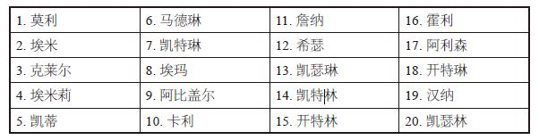

表6–2　“最黑人化”的20个女名

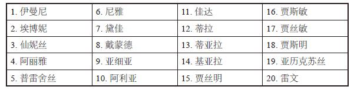

表6–3　“最白人化”的20个男名

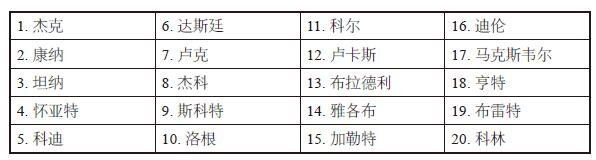

表6–4　“最黑人化”的20个男名

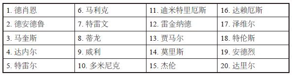

那么名字偏白人化或黑人化会有什么影响？多年来，有一系列“审计研究”试图衡量人们对不同名字的看法。在某项很有代表性的审计研究中，研究人员将两份一模一样的（伪造）简历发给潜在雇主，一份用的是传统的白人名字，一份用的是外来名字或带有少数民族色彩的名字。结果，“白人”的简历总是能收到更多的面试通知。

按照此类研究推断，假如德肖恩·威廉斯与杰克·威廉斯分别发一模一样的简历给同一家公司，杰克·威廉斯收到回复的概率更高。这样的研究虽引人注目，却有着严重的局限性，因其无法解释德肖恩没有收到回复的原因。他的简历被拒是因为公司老板存在种族歧视心理且认定德肖恩·威廉斯一定是黑人，还是因为“德肖恩”听起来像是家境贫寒、父母文化程度低的人？所以公司老板仅仅是认为“德肖恩”这个名字代表着出身贫寒，而出身贫寒的员工并不可靠，才不录用他。

而且，这些有关黑人与白人的审计研究也无法预估出面试的实际情况。假如公司老板确实存在种族歧视心理，却在不知情的情况下同意面试一名起了白人名字的黑人，那么他当面见过这名黑人求职者之后，录用率是否会有所提高？还是说这次面试对这名黑人求职者来说仅仅是一次尴尬难堪、令人气馁、浪费时间的经历。在这些方面，或许生活在黑人社区却取白人名字的黑人会承受经济损失，而在黑人社区取带有鲜明黑人色彩的名字又有什么潜在优势呢？由于无法衡量德肖恩·威廉斯与杰克·威廉斯这两名虚构人物的真实生活境况，所以这些审计研究无法评估出带有鲜明黑人色彩的名字在更加广泛的范围内所具有的影响。

或许德肖恩应该改名。

当然，改名是常有之事，纽约市民事法庭的职员最近汇报称，改名率已达到历史新高。有人改名纯粹是为了满足自己或许有些怪异的审美观，如年轻的纳塔利·杰里米金科和多尔顿·康利夫妇就为自己4岁的儿子改名为友·星·海诺·奥古斯塔斯·艾斯纳·亚历山大·韦泽·纳克尔兹·杰里米金科–康利。有人改名是出于经济考量，2004年初，纽约电车司机迈克尔·戈德堡遭到枪杀，而事后报道称，戈德堡先生其实是生于印度的锡克教教徒，移民到纽约后，以为改成犹太名字会对自己有利。戈德堡的决定或许会令某些演艺界的人大惑不解，因为改掉犹太名字是演艺界古而有之的传统。因此，伊索尔·达尼耶洛维奇改名为柯克·道格拉斯
[\[13\]](#index_split_012.html_filepos400713)
；威廉·莫里斯经纪公司
[\[14\]](#index_split_012.html_filepos401043)
在同名创始人的带领下声名鹊起，但创始人原名却是泽尔曼·摩西。

问题在于，假如泽尔曼·摩西没有改名为威廉·莫里斯，他是否还能获得同样的成功？假如德肖恩·威廉斯自称为杰克·威廉斯或康纳·威廉斯，他的境遇是否会有所改善？人们总是禁不住会有这种想法，正如有人会以为一卡车童书能提高儿童智力。

虽然审计研究无法真正衡量名字的影响，但加州的名字统计数据却可以。

加州的数据不仅包含每名婴儿的人口统计数据，还包括其母亲的教育水平、收入水平以及——最重要的一点——出生日期。通过最后一点，可以查出数十万出生在加州并在加州生育的母亲，然后将她们与本人的出生记录一一对应起来。这样一来，这些数据就会呈现出前所未闻、颇具说服力的规律：可以追查到任意女性的生活境况。这种数据链是研究人员所梦寐以求的，从中可以找出出生情况相似的一组儿童，并查到他们二三十年后的生活境况。在加州数据涉及的这数十万名妇女中，许多人取了带有鲜明黑人色彩的名字，也有许多人取了普通名字。利用回归分析法，控制可能影响人生轨迹的其他因素，即可估量出某一个别因素——在此案例中为妇女的名字——对其教育水平、收入水平和健康状况的影响。

那么名字究竟是否有影响呢？

数据显示，平均而言，取黑人名字的人——无论是名叫伊曼尼的女性，还是名叫德肖恩的男性——生活境况确实不及名叫莫利的女性或名叫杰克的男性。但这并非名字之错，假如两名黑人男孩一个叫杰克·威廉斯，一个叫德肖恩·威廉斯，均生于同一街区，且家庭和经济状况相同，他们长大后可能会有相似的生活境况。但给儿子起名为杰克的父母往往不会和给儿子起名为德肖恩的父母住在同一街区，经济状况也大相径庭。正因如此，名叫杰克的男孩平均收入和教育水平才会高于名叫德肖恩的男孩，取名德肖恩的男孩有较高的比例会因家境贫寒、教育水平低、单亲家庭而吃亏。名字仅仅是其生活境况的反映，而非原因。

假如德肖恩为自己改名为杰克或康纳，他的境况是否会有所改善？但凡是愿意为了在经济上有所成就而改名的人——正如那些参加择校抽签的芝加哥高中新生一样——至少有着很强的上进心，而上进心想必比名字更能预示一个人的成功。

正如“童年早期的纵向研究”所回答的育儿问题远远不止黑人与白人的分数之差，加州的名字统计数据所呈现的现象也远远不止黑人名字这一个。大体而言，这些数据让我们了解了父母对自身的认知，以及更重要的一点，他们对自己的子女有何期望。

首要的一个问题就是，名字究竟起源于何处？这并非指名字的实际起源，多数名字的实际起源显而易见：有的源自《圣经》，有众多传统的英国、德国、意大利和法国名字，有公主皇妃的名字和嬉皮风的名字，有怀旧的名字，还有越来越多的人用名牌的名字（雷克萨斯、阿玛尼、百加得、添柏岚）和所谓的明志之名。加州的数据显示，20世纪90年代生人中有8人取名为哈佛（均为黑人），15人取名为耶鲁（均为白人），18人取名为普林斯顿（均为黑人）。没有人取名为医生，但有3人取名为律师（均为黑人），9人取名为法官（其中有8人为白人），3人取名为参议员（均为白人），2人取名为总统（均为黑人）。此外还有凭空杜撰的名字。小罗兰·G.弗赖尔在某广播节目中探讨其名字研究时，接到一名黑人妇女的来电，她对自己刚出生的侄女所起的名字颇为不满，其发音为沙太德，却拼成了“Shithead”（白痴）。
[\[15\]](#index_split_012.html_filepos401379)

“白痴”虽未在大众中普及开来，但有些名字却能经历由陌生到大众的过程。名字会在民众中间经历怎样的变迁过程？其背后又有何原因？仅仅是时代风尚作祟，还是有某种理性解释？众所周知，名字不断地由盛转衰，又由衰转盛，比如索菲和马克斯一度濒临绝迹，却又再度流行起来。这些变迁是否存在着可识别的规律？

我们可以在加州的数据中寻找答案，而最终的结果也告诉我们，答案是肯定的。

这些数据所揭示的最耐人寻味的现象之一就是婴儿的名字与父母的社会经济地位之间存在相关关系。以下分别是中等收入白人家庭与低收入白人家庭最常用的女名。（以下列表及下文其他列表均为20世纪90年代的数据，以确保样本规模较大且来自近期。）

表6–5　中等收入白人群体最常用的女名

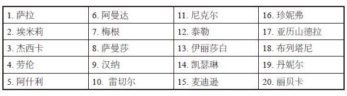

表6–6　低收入白人群体最常用的女名

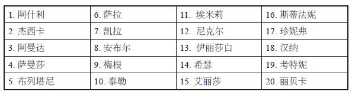

表6–5与表6–6有诸多重复，但这些是所有名字当中最常用的，而且还需将数据的规模考虑在内。在列表中相差一名，可能就代表着数百名乃至数千名儿童的差距。因此，如果布列塔尼在低收入列表中排名第五，而在中等收入列表中排名第十八，你大可以断定布列塔尼显然是个下层名字。其他例子还要更加突出。两个列表中均有5个名字没有排入另一列表的前二十。表6–7至表6–10分别是上层家庭和下层家庭最常用的5个名字，顺序按照每个名字在两个类别中的相对差距排列：

表6–7　最常用的上层白人女名

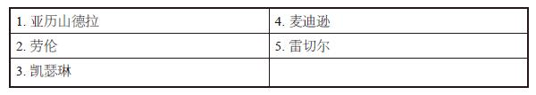

表6–8　最常用的下层白人女名

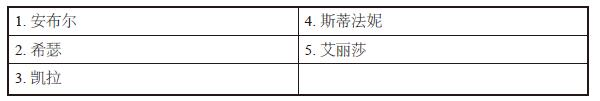

以下是男名：

表6–9　最常用的上层白人男名

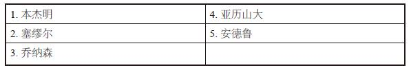

表6–10　最常用的下层白人男名

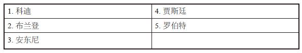

鉴于收入与名字之间存在联系，且收入与教育也高度相关，父母的教育水平与为子女所取的名字之间同样密切相关，这一发现不足为奇。表6–11至表6–14仍然是从白人儿童常用名数据库中抽取的数据，分别为高学历父母与低学历父母选择频率最高的名字：

表6–11　高学历白人父母之女最常用的名字

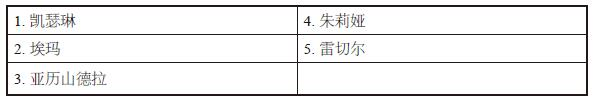

表6–12　低学历白人父母之女最常用的名字

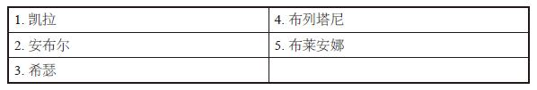

表6–13　高学历白人父母之子最常用的名字

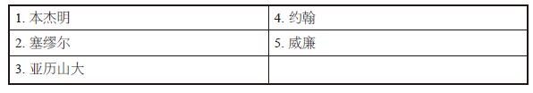

表6–14　低学历白人父母之子最常用的名字

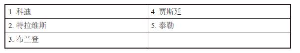

如将样本范围扩大至常用名之外，这一效应甚至更为显著。表6–15数据抽取自全加州的数据库，为与教育水平最低的父母群体相对应的名字。

表6–15　最能体现父母低学历的20个白人女名\*

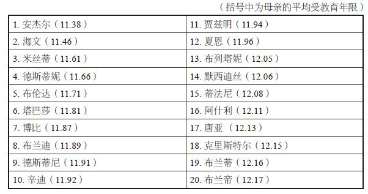

> \*出现频率均不低于100次

假如你本人或所爱之人名叫辛迪或布伦达，年龄在40岁以上，且认为在以前，这两个名字并非低学历家庭的常用名，那你的看法也没错。这两个名字和其他许多名字一样，在近年来经历了迅猛的兴衰变迁。在其他低学历名字中，有的显然是把规范的名字有意无意地拼错了。在多数情况下，这些名字的规范拼法——塔比莎、夏安、蒂法妮、布列塔尼与贾斯明——也表明父母教育水平较低。但单个名字的不同拼法也能体现出巨大的差异：

表6–16　“贾斯明”的各种拼法（按母亲教育水平由低到高排列）

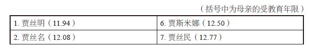

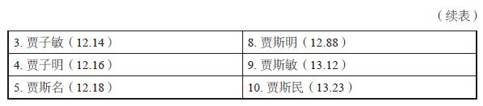

表6–18是低学历白人男名列表，其中包括少数几个拼写错误的形式（麦克尔与台乐
[\[16\]](#index_split_012.html_filepos403141)
），但更常见的还是将昵称用作正式名字的现象。

表6–17　昵称及其对应的正式名字如下：

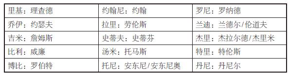

表6–18　最能体现父母低学历的20个白人男名\*

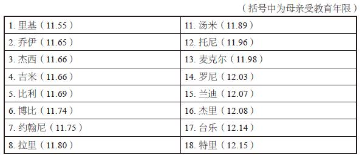

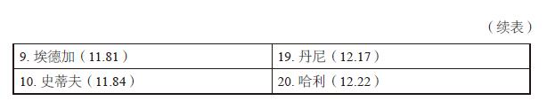

> \*出现频率均不低于100次

表6–19是与教育水平最高的父母群体相对应的名字。无论是发音还是美感，这些名字与低学历名字均无太多共同之处。女名多风格各异，但都有一定的文学或艺术色彩。对于想给孩子起个“聪慧”名字的父母，请记住这样的名字无法让你的孩子变聪慧，却可以让她和其他聪明孩子同名——至少短时期内如此。

表6–19　最能体现父母高学历的20个女名\*

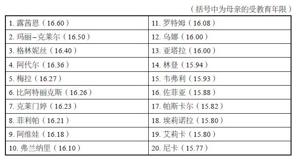

> \*出现频率不低于100次

表6–20是近年来高学历家庭出现的男名。列表中的希伯来名字比重较大，且传统爱尔兰名字显然有增多之势。

表6–20　最能体现父母高学历的20个男名\*

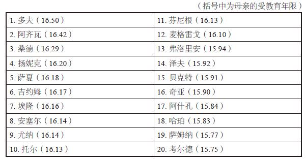

> \*出现频率不低于100次

如果表6–20中有很多名字你不熟悉，不要觉得自卑，即便是向来少于女名的男名，数量也在猛增，言外之意，如今所谓最热门的名字普及度也不如过去的常用名。比如表6–21中，分别于1990年与2000年出生在加州的黑人男婴最常用的10个名字。1990年，共有3375名儿童取了排名前十的名字（在当年出生的儿童中占18.7）%，而在2000年，仅有2115名儿童取了排名前十的名字（在当年出生的儿童中仅占14.6）%。

表6–21　最热门的黑人男名

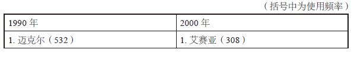

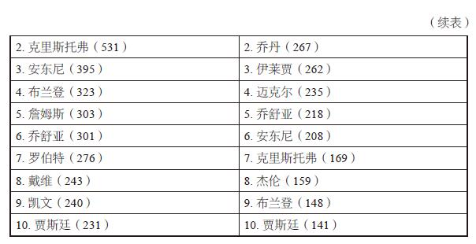

10年间，即便是黑人男孩中最普遍的名字（532人名叫迈克尔），使用频率也出现了大幅下降（308人名叫艾赛亚）。因此，父母显然在取名方面越来越别出心裁。但表6–21中还有另一值得关注的变化：变更频率很高。请注意，1990年的4个名字（詹姆斯、罗伯特、戴维和凯文）掉出了2000年的前十榜单。诚然，这4个名字本来就排在1990年榜单的末位，但取代它们进入2000年榜单的名字却并非排名靠后。实际上，三个新名字——艾赛亚、乔丹和伊莱贾——分列2000年的前三甲。对于名字的兴衰循环，更为突出的例子请看表6–22，分别于1960年和2000年在加州出生的白人女婴最常用的10个名字。

表6–22　最热门的白人女名

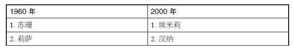

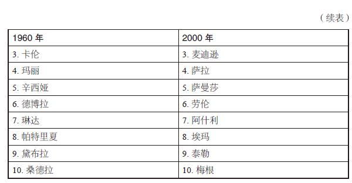

1960年的前10名中，没有一个名字留在前10。但你会说，40年不落伍是很难的事。那么，对比一下如今与仅仅20年前最热门的10个名字，结果会如何呢？

表6–23　最热门的白人女名

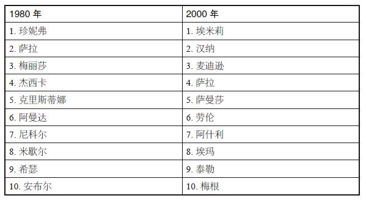

只有一个名字留在了榜单上：萨拉。埃米莉、埃玛和劳伦这些名字起源于何处？麦迪逊这种名字又是从哪里来的？
[\[17\]](#index_split_012.html_filepos403424)
显而易见，新名字的蹿红速度非常快——但原因何在？

让我们再来观察一下前文出现的两个列表。以下是20世纪90年代分别生于低收入家庭与中高收入家庭的女婴最常用的名字。

表6–24　20世纪90年代最常用的“上层”白人女名

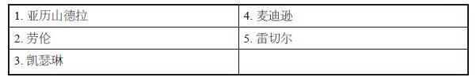

表6–25　20世纪90年代最常用的“下层”白人女名

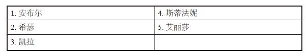

有什么发现吗？或许你想将这些名字与表6–23的“最热门的白人女名”对比一下，表6–23分别列出了1980年与2000年总体排名前十的名字。90年代最热门的两个“上层”女名——劳伦与麦迪逊——排入了2000年的前十。而与之相反，1980年最热门的两个名字——安布尔与希瑟——如今却排进了“下层”名字榜单。

这体现出一条显而易见的规律：一旦某个名字在高收入群体——高学历父母——当中普及开来，这一名字所流行的社会经济阶层就会逐渐下移。安布尔与希瑟最初是上层名字，斯蒂法妮与布列塔尼也是如此。在上层阶级中，每有一名女婴取名为斯蒂法妮或布列塔尼，其后10年内就会有五名来自低收入家庭的女婴也取同样的名字。

那么这些下层家庭所取的名字来自何处呢？不少人以为让人们对某些名字趋之若鹜的是名人效应。但实际上，名人对婴儿起名影响甚微。截至2000年，流行天后麦当娜在全世界的唱片销量已达到1.3亿张，但学她名字的人还不到10个——此处仍指加州的数据。或者想想如今无处不见的布列塔尼、布兰妮、布列塔倪、布列塔妮、布莱妮和布列特尼，你可能会想到小甜甜布兰妮。但实际上，她只是布列塔尼/布兰妮/布列塔倪/布列塔妮/布莱妮/布列特尼风行一时的表现，而非原因。该名最常见的拼法——布列塔妮——在上层家庭中名列第18位，而在下层家庭中名列第5位，所以这股热潮显然气数将尽。几十年前，秀兰·邓波儿也是秀兰这一名字大行其道的一个表现，如今的人们却常常以为她是这股潮流兴起的原因。（值得注意的另外一点是，秀兰、卡罗尔、莱斯利、希拉里、雷内、斯泰西、特雷西等不少女名最初都是男名，却鲜有女名被用作男名。）

因此，引领起名风尚的并非名人，而是几个街区外房子更大、车子更新的那户人家；是那些最先给女儿取名为安布尔或希瑟，如今又换成劳伦或麦迪逊的人家；是那些以前给儿子取名为贾斯廷或布兰登，现在又换成亚历山大或本杰明的人家。父母不愿意用太亲近之人——亲朋好友——的名字，却有许多父母或有意或无意地钟情于那些听起来像是“成功人士”的名字。

但随着某个上层名字为大众所采纳，上层阶级的父母开始弃之不用。最终，它成了烂大街的名字，连下层阶级的父母也看不上眼，这个名字就此被束之高阁。而与此同时，下层阶级的父母则开始寻找下一个上层阶级父母看上的名字。

因此，显而易见：给自己孩子取名为亚历山德拉、劳伦、凯瑟琳、麦迪逊和雷切尔的父母不要指望这些名字还能红多久，它们已经出现了泛滥之势。那么，新的上层名字会来自何处呢？

表6–19和表6–20列有加州“最聪慧”的男女名字，要是其中那些仍然鲜为人知的名字最终成了新的上层名字，一定不足为奇。诚然，其中有些名字——乌娜、格林妮丝、弗洛里安和奇亚——势必会一直鲜有人用。尽管如今有不少主流名字（戴维、乔纳森、塞缪尔、本杰明、雷切尔、汉纳、萨拉、丽贝卡）显然都是来自《圣经》的希伯来名字，多数希伯来名字（罗特姆、佐菲亚、阿齐瓦和泽夫）想必也仍然会小众下去。阿维娃或许会成为唯一一个火起来的现代希伯来名字，因为它朗朗上口、悦耳、活泼且可有一定变体。

以下名字从“聪慧”名字数据库中选取，是目前上层名字的一部分。其中，有些名字乍看起来似无流行起来的可能，却势必会成为未来的主流名字。也许你会嗤之以鼻，但试问，论荒唐程度，以下有哪个名字能比得过10年前的“麦迪逊”？

表6–26　2015年最热门的女名？

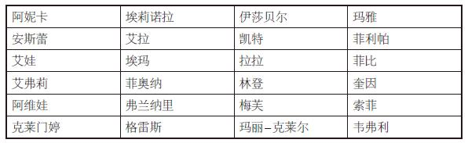

表6–27　2015年最热门的男名？

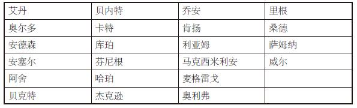

显然，父母为孩子起名时会有各种各样的考虑，他们或想中规中矩，或想不拘一格，或想与众不同，或想追赶潮流，但要说所有父母均——或有意或无意地——想给孩子取一个“聪慧”或“上层”的名字，这就言过其实了。无论他们所取的名字是赢家还是输家，是麦迪逊还是安布尔，是白痴还是桑德，是德肖恩还是杰克，他们均无一例外地想通过取名来表达某些观念。加州的名字数据表明，绝大多数父母会通过取名来表达望子成龙的殷念。尽管名字不会起到一丝一毫的作用，但父母至少可以心安理得地觉得自己从一开始就尽了心力。

[\[1\]](#index_split_012.html_filepos359730)
哈莱姆区，纽约市曼哈顿的一个社区，曾是20世纪美国的黑人文化与商业中心，也是犯罪与贫困人口的集中区域。——译者注

[\[2\]](#index_split_012.html_filepos361297)
输家的原文为“Loser”，此处变形为“Losier”，故译为“路西耶”。下文的卢（Lou）同理。——译者注

[\[3\]](#index_split_012.html_filepos362247)
艾姆彻原文为“Amcher”，是奥尔巴尼医疗中心医院急诊室的缩写。——译者注

[\[4\]](#index_split_012.html_filepos362717)
《考斯比一家》，美国20世纪八九十年代的电视情景喜剧。——译者注

[\[5\]](#index_split_012.html_filepos362889)
“荡妇”英文为temptress，坦普赛特·布莱索英文为Tempestt
Bledsoe，拼法相近。——译者注

[\[6\]](#index_split_012.html_filepos363461)
关于名叫“荡妇”的少女，鉴于取“贞洁”这个名字的母亲受教育程度较低，“荡妇”即便改名为“贞洁”恐怕也无济于事。——作者注

[\[7\]](#index_split_012.html_filepos366070)
《周一夜赛》，每周一期的美国橄榄球转播节目。——译者注

[\[8\]](#index_split_012.html_filepos368677)
达西基，西非男子穿的花哨而宽松的衬衫或套衫。——译者注

[\[9\]](#index_split_012.html_filepos368763)
黑豹党，20世纪60年代活跃在美国的一个黑人左翼政党。——译者注

[\[10\]](#index_split_012.html_filepos368911)
鲍比·西尔曾于1987年写过一部烹饪书，名叫《与鲍比·西尔一起烧烤》。——译者注

[\[11\]](#index_split_012.html_filepos369496)
尤妮克（Unique），意为独一无二，乌妮克、尤内可和尤妮吉均为尤妮克的同音变体。——译者注

[\[12\]](#index_split_012.html_filepos370413)
麦迪逊铁路是美国印第安纳州东南部的一条短线铁路。——译者注

[\[13\]](#index_split_012.html_filepos375156)
柯克·道格拉斯，美国著名男演员，曾于1996年获奥斯卡终身成就奖，代表作有《夺得锦标归》《梵高传》《玉女奇男》等。——译者注

[\[14\]](#index_split_012.html_filepos375254)
威廉·莫里斯经纪公司，美国著名经纪公司，创办于1898年，旗下巨星包括迈克尔·贝、克林特·伊斯特伍德、丹泽尔·华盛顿等。——译者注

[\[15\]](#index_split_012.html_filepos379730)
名叫白痴的女孩：当然，打电话给广播节目告诉罗兰·弗赖尔自己有个侄女叫白痴的妇女可能是自己理解有误，甚至也有可能是信口雌黄。无论如何，觉得某些黑人名字太出格的人不止她一个。2004年5月，在全国有色人种协会举办的布朗诉托皮卡教育委员会案50周年纪念庆典上，比尔·科斯比在演讲中严厉抨击了低收入黑人群体的种种自暴自弃行为，包括取带有“少数族裔”色彩的名字。科斯比旋即遭到了白人和黑人批评者的口诛笔伐。不久之后，加州教育部长理查德·赖尔登——家境殷实且为白人的洛杉矶前任市长——因被指有存在种族歧视色彩的不逊言论，而遭到抨击。赖尔登在访问圣巴巴拉市一座图书馆、推广某阅读项目时，遇到了一个名叫伊希斯的6岁女孩。她告诉赖尔登她的名字意为“埃及公主”。而赖尔登想插科打诨，回答道：“这名字的意思就是笨头笨脑、邋里邋遢的丫头片子。”这引得民愤四起，黑人活动家因此要求赖尔登下台。来自康普顿市、身为黑人的加州众议员默文·迪马利称，伊希斯是个“非裔小女孩，他会这么对待白人女孩吗？”，然而，事实上，伊希斯是白人。某些活动家想让反对赖尔登的抗议活动继续下去，但伊希斯的母亲崔妮蒂却劝众人冷静下来。她解释称，她的女儿并没有把赖尔登的揶揄放在心上。“在我看来，”崔妮蒂说，“她觉得他头脑不太灵光。”——作者注

[\[16\]](#index_split_012.html_filepos386069)
麦克尔与台乐，原文此处为Micheal和Tylor，正确拼法为Michael（迈克尔）和Tayler（泰勒）。——译者注

[\[17\]](#index_split_012.html_filepos391026)
几乎可以肯定，麦迪逊这一名字来自1984年的电影《美人鱼》。达丽尔·汉纳在其中饰演一名美人鱼，她登上纽约市的海滩，以麦迪逊大道的路牌为自己命名。在凡人中，这一原本极其罕见的名字迅速蹿红，常年在前五名中占据一席。——作者注

后记　通往哈佛的两条道路

读到现在，或许你已经看出，正如本书开头所说的，本书确实没有“统一的主题”。

虽然没有统一主题，至少有一条共同的主线贯穿于《魔鬼经济学》在日常生活中的应用，这与理性思考人们在真实世界中的行为方式有关，一切只需全新的观察、辨别和衡量方式。这并不见得是什么难事，也无须复杂缜密的思维。实际上，我们已经分析出了普通黑帮分子或相扑力士自己琢磨出来的东西，只不过我们只能逆向推导。

挖掘这些想法的能力是否能大幅改善你的生活质量？想必不会。或许你会在游泳池旁围上坚固结实的门，或督促你的房地产中介多下点功夫，但实际效果很可能并不会那般显而易见。你或许会对传统观念多几分怀疑，或许会开始寻找事物并非表里如一的蛛丝马迹，或许会找出一些数据进行筛选，权衡自己的理性与感性认识，得出全新的观点。这些新观点有的或许会令你反感，甚至不得人心。堕胎合法化导致犯罪率大幅下降的观点难免会引起强烈的道德谴责，但实际上，魔鬼经济学式的思维并不会将道德考虑在内。正如本书开头部分所言，如果说道德代表理想世界，经济学则代表着现实世界。

读完本书最有可能出现的结果非常简单：你可能会发现自己爱提问题了。尽管许多问题问了也是徒劳，但有些问题会得出耐人寻味甚至出人意料的答案。

数据已经表明，父母在某些方面确实关系重大，因为这些方面的影响多数早在孩子出生之前就已注定，而在其他方面则毫无影响，比如让我们执迷不悟的那些育儿之道。父母望子成龙，满腹期许，甚至绞尽脑法也要给孩子起个上层名字，这无可厚非。

但即便是十全十美的父母，也有可能会因为努力地管教孩子，最终却弄巧成拙，一生的心血付诸东流。相反的，有的父母心地邪恶、行事乖张，孩子却很有成就。

回想一下第五章所讲的两个男孩，一个是白人，一个是黑人，白人男孩成长于芝加哥郊区，父母博学多识，家庭殷实，黑人男孩来自代托纳比奇，自幼被母亲遗弃，经常遭到父亲殴打，十几岁便成了一个老练的帮匪。结果，这两名男孩各自成长为了什么样的人呢？

黑人男孩就是现年28岁、研究黑人成绩不佳现象的哈佛大学经济学家小罗兰·G.弗赖尔。

白人男孩也考入了哈佛大学，但不久，他的情况便急转直下，最终锒铛入狱。他的名字叫作特德·卡辛斯基。
[\[1\]](#index_split_013.html_filepos407203)

[\[1\]](#index_split_013.html_filepos407080)
特德·卡辛斯基，即西奥多·卡辛斯基，16岁便考入哈佛大学，曾任伯克利大学数学系助理教授。他是多起连环爆炸案的主谋、恐怖分子、反科技人士，曾自制炸弹寄给科技研究者、航空公司等，被称为“炸弹怪客”，最终于1998年被判终身监禁。——译者注

附录

房地产中介欺骗你的概率

> ——探索声名大噪的青年经济学家史蒂芬·列维特的奇思妙想

史蒂芬·都伯纳

《纽约时报杂志》

6月，中旬，一个阳光灿烂的日子。

史蒂芬·列维特，美国最杰出的青年经济学家——至少由其前辈组成的评审团是这么认为的——开着一辆年头已久的绿色雪佛兰骑士，在芝加哥南区的一处红灯前停了下来。车的仪表盘上布满尘灰，车窗也关不严实，高速行驶时还会闷声作响。

晌午时分的街道十分静谧。

加油站，还有那嵌着胶合板窗户的砖混建筑，看上去一眼望不到头。

一个流浪汉，穿着一件破破烂烂的夹克衫，戴着一顶脏兮兮的红色棒球帽，走了过来。他手里拿一个牌子，上面写着无家可归，求人施舍点钱财。

经济学家没有锁门，也没有把车往前挪，也没有翻身找零钱，他就瞪眼看着，无动于衷。

过了一会儿，流浪汉走开了。

“他耳机不错，”经济学家一边说，一边透过后视镜，不舍地看着那名流浪汉，“起码比我的好。不过除此之外，看起来他没有多少财产了。”

史蒂芬·列维特看待事物的方式往往与众不同，甚至也与一般的经济学家相左，这无可厚非，全看你对经济学家有何看法。

众所周知，经济学家总是对各类货币话题滔滔不绝。但是，你要问列维特对某些常规经济问题有何看法，他大概会撩开额前的刘海，表示一无所知。

“我早就放弃了不懂装懂的做法，”他说，“对于经济学领域，我所知甚少。我对数学不在行，对计量经济学不甚了解，也不知道如何做理论研究。如果你问我股市是涨是跌，经济是兴是衰，通货紧缩是喜是忧，或是税务问题，我要敢说自己对这些话题中的任意一个有半点了解，那我就是完全在骗你。”

如列维特所见，经济学这门学科，拥有各种寻找答案的有效工具，但耐人寻味的问题却寥寥无几。而他的一大专长，就是提出这样的问题，如：如果说毒贩子能大发其财，为何他们还和自己母亲住在一起？枪和游泳池，哪个危险系数更高？在过去的10年里，造成犯罪率骤降的真正原因是什么？房地产中介是否真的把为客户谋求最佳利益放在了心上？为何黑人父母喜欢给孩子取有碍其职业前途的名字？教师是否会为了达标，在高标准测验中作弊？相扑是否是一项腐败的运动？以及流浪汉为什么买得起50美元的耳机？

许多人——包括他的不少同行——或许并不承认列维特的研究和经济学沾边。但他所做的，却将这门所谓死气沉沉的学科去繁就简，提炼至其最根本的宗旨：阐明人们如何才能如愿以偿，或满足需求。有别于多数学者的是，他并不避讳使用个人的观察结果和兴趣所向，

也不避讳秘闻野史和趣闻逸事，但他对微积分却是避之而唯恐不及。

他是直觉主义者，他翻阅大量数据，去寻找前人未曾发现的故事。

他推测出的测评方式，可以测评资深经济学家口中的不可测效应。

不过，最让他乐此不疲的话题——虽然他声称自己从未染指过这些勾当——是诈骗、腐败和犯罪。

相反的，他对流浪汉的耳机没多久就兴味索然了。

“或许，”他过了一会儿说，“这仅仅是证明了我这人太过散漫，连自己想要的耳机都没买。”

列维特是第一个承认自己的研究课题是些细枝末节的人。但事实证明，他是个才智过人的研究者，也是个眼光独到的思想家，因此才并未在经济学的边缘领域徘徊不前，相反，他向其他经济学家证明了经济学工具可以有效用于分析现实世界。

“列维特被奉为神人，是经济学界乃至整个社会科学界最有才华的人之一，”加州理工学院经济学家科林·卡默勒说道，“他代表着所有经济学研究生初入校园时对自己未来的憧憬，但他们的灵感火花却常常被没完没了的数学作业消耗殆尽，尽管数学也是一种用以分析事物的智力推理方式。”

列维特是个亲民的经济学家，而经济学领域也正处于大众化推广期，以至于名牌学府的经济学系招收了大批本科生。在人们眼中，经济学完美结合了学术声誉（毕竟诺贝尔设有经济学奖）与进入金融行业、飞黄腾达所需的实习训练（除非你像列维特一样，选择留在学术界）。与此同时，由于人们对股市行情的热情不减，对艾伦·格林斯潘的关注度居高不下，因此经济学在现实世界中的曝光度也越来越高。

然而，学术思潮的强弱变化引起了经济学领域的重大变革：微观经济学的风头逐渐赶上了宏观经济学；实证派开始胜过规范派；行为经济学家开始质疑“经济人”这一概念；各式各样的青年经济学家更倾向于研究世俗的课题并借鉴相邻学科——心理学、犯罪学、社会学乃至神经学——以避免让经济学一味地依赖于数学模型。

列维特在任何地方都可以如鱼得水，但无论他在哪里都是个另类。他的思维变幻无常，没有人可以束缚住他——克林顿的经纪团队曾为他提供过一个职位；布什的竞选团队曾联系过他，想邀请他做犯罪顾问——但他依然能获得广泛的赞誉。

“史蒂芬并非名副其实的行为经济学家，但他们却乐于接纳他为他们的一员，”芝加哥大学研究生商学院经济学教师奥斯坦·古尔斯比称，“他并非传统的价格理论家，然而芝加哥的同行却愿意争取他。他并非典型的剑桥人，”——虽然列维特先后上过哈佛大学和麻省理工学院——“但他们欢迎他回归。”

当然，也有人批评他。得克萨斯大学的知名劳动经济学家丹尼尔·哈默梅什为本科生讲过列维特的论文——《堕胎合法化对犯罪的影响》。

“我仔细读过这篇论文的草稿、正式印刷版，我无论如何也看不出其中有什么漏洞，”哈默梅什说，“但话说回来，我却一个字都不信。包括他关于相扑力士的理论——除非你是体重500磅的日本人，否则就没什么意义。”

但年仅36岁的列维特已经成为了芝加哥大学经济学系——全美最负盛名的经济学系——的终身教授。（他入职仅两年便获得了终身教职。）他为经济学领域的主流刊物《政治经济学杂志》担任编辑；美国经济学会也刚刚为他颁发了约翰·贝茨·克拉克奖章（该奖章两年颁发一次，用以表彰美国最杰出的40岁以下的经济学家）。

他是个成果颇丰、涉猎广泛的作家。但那篇论证堕胎率上升与犯罪率下降关系的论文所引发的争议却超过了其他所有论文所引起的争议总和。列维特与来自斯坦福大学法学院的共同作者约翰·多诺霍认为，20世纪90年代初以来犯罪率的暴跌有一半可以归功于“罗诉韦德案”。他们的逻辑是：有证据表明，最有可能选择堕胎的女性——穷困潦倒、未婚先孕的黑人或未成年妈妈——所怀的孩子一旦出世，会成为犯罪概率最高的群体。但由于这些胎儿并未出世，到了他们本应在犯罪界大展拳脚的时候，犯罪率却开始下降。在谈话中，列维特以三段论将这一理论概括如下：“意外怀孕生育导致犯罪率居高不下，而堕胎减少了意外怀孕的生育率，因此，堕胎导致了犯罪率的下降。”

列维特发表过多篇有关犯罪与刑罚的文章，他在研究生时期写过的一篇论文至今仍然经常被引用。他提出的问题看似简单：扩充警力是否能减少犯罪？答案似乎显而易见——可以，但这无从证明，因为警员人数往往会随着犯罪率的上升而增加，警察的效率难以衡量。

列维特需要一种可以排除犯罪率与警力扩充之间关系的途径。最终，他从政界找到了突破口：他发现谋求连任的市长和州长往往会增加警力。通过计算此种情况下的警力扩充对犯罪率的影响，他得以证实增加警力确实可以打击暴力犯罪。

这篇论文后来遭到了质疑，因为另一名研究生发现其中有一处严重的计算错误，但这无碍列维特彰显其聪明才智，他开始被奉为去繁就简、以巧取胜的大师。这宛如一出滑稽剧，他看着所有工程师没头苍蝇一般鼓捣一台坏掉的机器，却发现谁也没想起先把插头插上。

警察有助于打击犯罪的观点没有让列维特树敌，但堕胎减少犯罪的观点就是另一回事了。

在那篇发表于2001年、有关堕胎的论文中，他与多诺霍警告称他们的发现不应被视作“认可堕胎或呼吁国家对女性决定进行干预的言论”。他们提出，“为最有可能走上犯罪道路的儿童提供更好的环境”，或许对打击犯罪有同样有效的作用。

尽管如此，这一话题还是触了众怒：保守派义愤填膺，因为堕胎居然可以被当作是打击犯罪的工具；自由派也大为震惊，因为贫困的黑人妇女受到了区别对待；经济学家质疑称列维特的研究方法并不合理。毕竟，三段论可以指鹿为马：凡猫皆有一死；苏格拉底已死；所以苏格拉底是猫。

“我认为他在诸多领域都聪明绝顶，对反向因果关系尤为关注，”来自纽约市立大学柏鲁克分校、撰文批评这篇堕胎论文的经济学家特德·乔伊斯称，“但这一次，他要么对此弃而不顾，要么就是推理不够完善。”

随着新闻媒体对堕胎与犯罪理论展开铺天盖地的报道，列维特遭到了直接的抨击，他被斥为空想家（保守派和自由派对此口径一致）、优生论者、种族主义者和十恶不赦之人。

在现实中，他似乎和这些形象都不沾边。他对政治兴趣寥寥，更不喜欢道德说教；他是个亲切和善、行事低调、镇定自若、自信却不自大的人；他是一位为人尊敬的教师和同事；他是个备受追捧的合作者；由于涉猎广泛，他常常同经济学领域以外的学者合作——这对经济学家来说，也是罕见的事。

“不知话该不该这样说，但史蒂芬确实是个骗子，这么说毫无恶意，”哥伦比亚大学社会学家素德·文卡特斯说，“他就像莎士比亚戏剧中的小丑，他会让你以为他的创意是你想出来的。”

文卡特斯与列维特合著了《对贩毒团伙财务状况的经济学分析》一文，他们发现普通的街头毒贩仍然与母亲同住，因为他们到手的工资少得可怜。文章以分析企业的方式分析了某贩毒团伙的财务活动，这种事情前人未曾涉足过。

“这一课题缺乏关注度，”列维特在该文章的一个版本中不带感情色彩地写道，“原因之一或许是鲜有经济学家参与过黑帮研究。”

列维特说话有些口齿不清，像个孩子。他外表看起来是个十足的书呆子：领尖有纽扣的方格衬衫、俗不可耐的卡其布裤子、编织皮带、舒适的平底鞋。他的袖珍台历印有美国国家经济研究局的标识。

“真希望他一年里的发型能超过三种，”妻子珍妮特说，“也希望他换掉那副15年前买的眼镜，那副眼镜买的时候就过时了。”

他在高中时还是个高尔夫球高手，但现在身体状况已大不如前。因此，他自嘲是“世上最弱不禁风的人”，甚至会跑遍整个屋子找珍妮特开罐子。

换言之，无论是外表还是举止，都看不出他是个好事者。他会告诉你，他所做的无非夜以继日地伏案研究稀奇古怪、堆积如山的数据。他会告诉你，他愿意无偿做这些研究（据说他的年薪为20多万美元），而且你往往会信他。或许挑拨是非并非他的本意，但他的所作所为最终还是起到了这样的效果。

尤其令他乐此不疲的，是抓坏人。在一篇论文中，他设计了一套算法，可以查出芝加哥公立学校系统内有作弊情形的教师。

“相较于普通考场，作弊考场在很多方面都存在有规律可循的异常之处，”列维特及肯尼迪政府学院的布赖恩·雅各布在二人合著的《抓住作弊教师》一文中写道，“例如，作弊考场的考生在作弊当年的考试成绩会出现过大的进步幅度，但在其后一年，没了作弊带来的优势，他们的成绩仅有小幅提高，甚至可能出现倒退。”

列维特使用的是芝加哥学校的考试成绩数据，这些数据其他研究者也可以用。他发现，教师的作弊方式有很多：脸皮够厚（且智商堪忧）的教师可能会直接向学生公布正确答案，或者他们也可能在考试结束后擦掉学生的错误答案，填上正确答案；狡猾老练的作弊者会注意避免出现太过显眼的雷同答案串，但列维特棋高一着。

“分析可疑答案串的第一步，是估算每名儿童回答每个问题时选择某个选项的概率，”他写道，“估算的方法就是使用多元罗吉特模型，并将学生的往届成绩、人口统计学数据和社会经济特征作为解释变量。”

因此，通过测量任意数量的因素——每道题目的难度、考生答对难题却答错简单题目的次数、某一考场内某些答卷答案的相关程度，列维特查出了在他看来存在作弊情形的教师。（或许同样可贵的一点是，他也识别出了真正的优秀教师。）芝加哥公立学校系统并未质疑列维特的发现，反而邀请他到学校里组织重考。结果，作弊的教师遭到了解雇。

此外还有他即将发表的《了解90年代犯罪率下降的原因：可以解释犯罪率下降的四个因素和七个无关因素》一文。列维特称，这次犯罪率下降完全归功于警力扩充、入狱率增加、快克热潮的衰退和“罗诉韦德案”。

他认为，有一个因素很可能毫无影响，即鲁道夫·朱利亚尼和威廉·布拉顿在纽约所鼓吹的新型治安策略。

“我想，”列维特说，“这么说的人差不多只有我一个。”

他出身于一个明尼阿波利斯的家庭，家中不乏功成名就之人，但他们的成就或许有些不同寻常：他的父亲是医疗研究人员，被誉为肠胃胀气领域的泰斗；（他本人自嘲是“让放屁上了台面、让肠胃气进了课堂的人”。）列维特的一位伯祖父罗伯特·梅创作了《红鼻驯鹿鲁道夫》一书；而他的另一位伯祖父约翰尼·马克斯后来创作了同名歌曲。

在哈佛大学，列维特在毕业论文中写了纯种马养殖，并以优异成绩毕业。（他至今仍对赛马乐此不疲，他说他认为赛马是一项腐败的运动，还设计了一套可以利用这种腐败的下注系统——具体细节他却不愿透露。）他做了两年的管理顾问，后进入麻省理工学院攻读经济学博士学位，该学院的经济学博士班以高强度的数学训练而闻名。列维特在本科时期只修过一门数学课程，而且早已忘得一干二净。他第一次上研究生课程，便向邻座的同学问起了黑板上的一则公式：直上直下的导数符号和曲线形的导数符号有什么区别？

“你麻烦大了。”对方告知他。

“人们不把他放在眼里，”当时和他是同学的芝加哥经济学家奥斯坦·古尔斯比回忆道，“他们会说：‘这人没有前途。’”

列维特为自己设计了独特的课程计划。其他研究生为了取得好成绩，熬夜写作业，他则熬夜做研究、写论文。

“我的观点是，想在这一行出人头地就得写出优秀的论文，”他说，“所以我就开始写了。”

有时他从一个问题开始写起，有时是一组数据引起了他的注意。他曾花了一整个夏天的时间将数年的国会选举结果录入自己的电脑，（如今，互联网上有海量的信息随时可供查阅，列维特抱怨说他根本没法儿让自己的学生去手动录入数据。）起因仅仅是他对现任议员往往能连任的原因隐约感到好奇。

接着他碰巧看到了一部政治学著作，作者宣称金钱可以收买选举，无他。

“他们想解释的是，选举结果是由竞选开支决定的，”他回忆道，

“却完全忽视了一点，捐赠者只会赞助他们认为确有获胜把握的候选人，而现任者只有在面临落选之虞时才会加大开支。他们自欺欺人地以为这就是其中的因果关系，但回想起来，这显然是谬误的。”

至少对列维特来说，显然如此。不到五分钟，他便构思好了自己要写的论文。

“从头到尾，”他说，“我都想好了。”

但问题在于，光凭他手上的数据，无从分辨候选人孰优孰劣。因此，也就难以剔除金钱的影响。和警力/犯罪比率之谜一样，他必须对数据稍加处理。

由于他亲自录入了这些数据，他注意到了一个现象：同样两名候选人常常会多次对垒。列维特只分析此类选举的数据，得出了真实的结果。他的结论是，竞选开支的实际影响仅为公认影响的1/10。

彼时，他只是个默默无闻的研究生，却把这篇论文寄给了《政治经济学杂志》——一名教授告诉他，这么做真是不知天高地厚，但论文最终发表在了这本期刊上。他在三年内完成了博士学业，但据他说，由于他重研究轻学业，学院完全“不知其人”，他是个“真正无足轻重的人”。随后，他便遇到了如今他口中所谓的事业转折点。

他接受了研究员学会的面试。这所久负盛名的哈佛大学知识分子俱乐部旨在资助青年学者完成自己的研究，资助期为三年，不负担任何义务。列维特自觉毫无机会，首先，他并不认为自己是知识分子，在席间负责面试他的可是研究员前辈们，是一批世界闻名的哲学家、科学家和历史学家。他担心自己第一次见面聊不上几句就会冷场。

与之相反，他口若悬河，无论谈起什么话题——大脑、蚂蚁还是哲学，他都能凑巧想起自己读过的某些精辟观点。他才思泉涌，展现出了此前从未有过的最好一面。他告诉他们，有整整两年夏天的时间，他都在明尼苏达州赌马，而他们居然吃了这一套！

最后，其中一人令人不安地说：“我看不出你的研究有什么统一主题，你能解释一下吗？”

列维特懵了。他不知道自己的统一主题是什么，甚至连自己有没有都不知道。

后来荣获诺贝尔奖的经济学家阿马蒂亚·森打了个圆场，巧妙地总结了他对列维特研究主题的看法。

没错，列维特忙不迭地说，这就是我的主题。

另一个人又提出了另一个出题。

你说得对，列维特说，这也是我的主题。

于是他们就像群狗争骨一般你一言我一语，直到哲学家罗伯特·诺齐克打断了他们。如果说有哪位知识分子能被列维特奉为英雄，那他一定是诺齐克。

“史蒂芬，你多大了？”他问道。

“26岁。”

诺齐克对其他同僚说：“他才26岁。为什么一定要有统一的主题呢？没准儿他是那种天赋异禀、无须统一主题的人。他会自由选择问题，然后寻找答案，这没什么关系。”

芝加哥大学经济学系却有个著名的统一主题——自由市场之真理，且其研究倾向偏保守。因此，这里似乎并非最适合列维特的地方。在他看来，芝加哥崇尚理论研究、深层思想和宏观伟略，而他擅长的却是经验主义、另辟蹊径和“哗众取宠却终归不现实的想法”。

但芝加哥也接纳了加里·贝克尔，在列维特看来，贝克尔是近50年来最具影响力的经济学家。贝克尔很早便开始利用微观经济学理论研究稀奇古怪的课题，尤其是家庭和犯罪。其后很久，这种做法才风行起来。多年来，贝克尔一直受到妖魔化的待遇——单单是“儿童的价格”这一说法就会引来铺天盖地的讨伐。

“有人认为我的研究荒唐透顶、无关紧要或者压根不属于经济学范畴，他们对我的事业指指点点。”贝克尔说道。

但芝加哥支持他。他坚持不懈，终于在1992年获得了诺贝尔奖，而且成了史蒂芬·列维特的楷模。

贝克尔告诉列维特，芝加哥能为他提供不错的环境。

“并非所有人都认可你的研究成果，”他说，“但我们都认为你的研究很有意思，而且会支持你研究下去。”

列维特不久就发现，芝加哥给予他的支持不仅限于学术范畴。他受聘后第一年，他的妻子生下了他们的第一个孩子安德鲁，安德鲁满周岁后不久的一天，便发低烧病倒了。医生诊断他为耳部感染，第二天早上，他开始出现呕吐症状，列维特夫妇便送他去了医院。几天后，他便因肺炎球菌性脑膜炎而夭折。

经受了这样的打击和丧子之痛，列维特缺席了自己所教的一门本科课程，替他代课的正是加里·贝克尔——年近古稀的诺贝尔奖得主。另一名同事D.盖尔·约翰逊寄了一份悼念函，其中的内容列维特至今仍记忆犹新。

列维特与年逾花甲的农业经济学家约翰逊开始经常交谈，列维特得知，约翰逊的女儿是最早从中国领养女儿的美国人之一。不久之后，列维特夫妇也领养了一个女儿，为她取名为阿曼达。除了阿曼达，他们此后又育有一女一子，女儿现在快满三岁了。但安德鲁的夭折产生了多方面的影响，他们将安德鲁的肝脏捐给了一个小姑娘，同她的家人结为了挚友。（他们还捐献了他的心脏，但接受移植的婴儿没有活下来。）列维特是个研究实际问题的学者，所以长子之死会影响他的研究，这不足为奇。

他和珍妮特加入了一个为丧子父母设立的互助小组。列维特惊讶地发现，儿童溺死在游泳池里的事件竟然如此之多。报纸上不会刊登这类死亡事件，只会刊登玩枪走火等原因造成的儿童死亡事件。

列维特心生好奇，他去查了能说明问题的数据，并将研究成果写成一篇评论文章，发表在《芝加哥太阳时报》上。文章的一大特色就是以悲伤哀婉的文风讲述有悖常理的现象，如今这已经成了他的一个闻名之处：“假如你家中有一把枪，院子里有一座游泳池，儿童溺死在游泳池的概率几乎要百倍于被枪击致死的概率。”

为了忘却丧子之痛，列维特培养了一个爱好：修缮并出售奥克帕克的老房子。奥克帕克正是他所居住的地方，受到这一经历的启发，他写了另一篇有关房地产市场的论文。作为一篇有关价格理论的轻松小品文，这是他迄今为止最符合芝加哥作风的论文，证明了芝加哥大学留给他的烙印或许不亚于他留给这所学校的烙印。但列维特毕竟是列维特，这篇文章也触及了腐败现象。

在购买老房子、讨价还价的过程中，他发现卖方中介总是在言辞委婉地劝他出低价。这似乎有些反常：难道中介不应该为卖家谋求最佳利益吗？然后他又仔细思考了中介的角色，同其他行业的许多“专家”（他想到的是汽车修理工和股票经纪人）一样，在外人看来，房地产中介对本行的了解程度远高于外行人，最终房主在劝说之下，相信中介所提供的信息。因此，如果中介拿到较低的报价，却说这或许就是房主能等到的最高价了，房主往往会信以为真。但列维特发现，关键在于“即便房子售价高一点，多出来的利润中仅有很小一部分是归中介所有的”。同进行挤油交易赚取佣金的股票经纪人和捞取高额利息的赌马经纪人一样，房地产中介一心只想做成这单买卖，不管价格高低。因此，他会怂恿房主赶快廉价出手。

接下来列维特只需测定这一影响的大小。他再次另辟蹊径，研究了伊利诺伊州库克郡50000多所房屋的销售数据，对比了房地产中介私有房屋的销售数据及其经手的客户房屋的销售数据。他发现，中介的私有房屋在市场上挂牌出售的时间要长10天左右，售价要高出2%。

某年夏天的一个傍晚，列维特回到了自己的办公室，他的办公室位于芝加哥大学一栋哥特式大楼的深处，天花板满是污痕，窗框周围的灰泥已经开始剥落。他刚刚从斯坦福大学休假回来，办公桌上一片狼藉：堆积如山的书籍和期刊、一只绿色奶瓶和一只小小的橙色河马挤压玩具。

当天下午是与学生会面的时间，列维特喝了一瓶激浪，语气温和。有的学生是来领研究作业的，有的则是来征求建议的，有一名学生刚刚完成了自己的本科论文：《经济低潮期应届大学毕业生面临的劳动力市场情况》，列维特告诉她，作为毕业论文，这篇文章算不错了。但她现在想发表这篇文章。

“你的文风太学生气，这就是问题所在，”他说，“关键是，你要自圆其说，要有铺垫，有各种手法，你想让读者顺着特定思路思考，这样他们看到结论的时候，就能理解且相信这些结论。但你同样也需要坦白承认自己的缺点，将缺点表现出来，而不是遮遮掩掩，这样读者反而不会那么严苛。”

坦白承认自己的缺点。还有哪个荣誉加身的学者能像史蒂芬·列维特一样，如此坦然地承认自身的缺点？他自称不懂经济学，也不懂数学，在满是宏才伟略者的学术界，他只是个研究小问题的人。

据他的朋友说，列维特的自谦之词虽是实话，但也是经过算计的。在本就竞争激烈的学术界，经济学家是最剑拔弩张的一群人，而且还常引以为傲。作为一个写论文研究《智者为王》（列维特认为参赛选手歧视拉丁裔和老年对手，而非黑人或女性）和相扑（为了尽量提高比赛排名，相扑力士常常会串谋假摔）的人，他最好还是不要再有傲慢之举了。

也有可能这根本不是自谦，而是自我鞭笞。或许史蒂芬·列维特的真正愿望是不再研究“荒唐”“琐碎”和“肤浅”的课题，让事业更进一步。

他认为他有关黑人名字的新文章会有重大发现，他想知道所取名字带有鲜明的黑人色彩，是否会构成经济上的劣势，他的答案——与近年来的其他研究相左——是否定的。但接下来，他遇到了更为重大的问题：黑人文化是种族不平等的原因，还是后果？对于经济学家乃至列维特本人来说，这是一个全新的领域——他所言的“将文化量化”。他发现这一课题争议颇多、盘根错节，或许难以攻克却又令人跃跃欲试。

当晚他开车回奥克帕克的家，随着那辆雪佛兰骑士隆隆作响地行驶在艾森豪威尔高速公路上，他顺从地谈起了自己的未来。弃文从商加入对冲基金或弃文从政进入政府工作都不是他的兴趣所在（不过他可能会开一家专门查作弊教师的公司作为副业）。据说，他是所有大学经济学系求贤纳士的头号对象。但安德鲁去世时，他和珍妮特种下了一棵树，如今这棵树已经蔚然成荫，无法移植。看得出来，他可能会长留芝加哥了。

他说，他觉得自己已经准备好了去攻克某些重要问题。

比如，“偷税漏税、洗钱，我想设计一套工具，帮助我们逮捕恐怖分子，我是说，这是我的目标。我还不太清楚要怎么下手，但只要有合适的数据，我毫不怀疑我一定能找到答案。”

一名经济学家，却想着抓恐怖分子，这听起来可能很荒唐。但假如你是芝加哥的中学教师，有一天被叫到办公室里得知，不好意思，那个戴高度近视镜的瘦小男子设计的算法发现你作弊了，所以你被解雇了，这听起来一定也很荒唐。史蒂芬·列维特或许并不完全相信自己的能力，却相信一点：教师、罪犯和房地产中介会撒谎，政客乃至中情局分析师也会撒谎，但数字不会。

《纽约时报杂志》“魔鬼经济学”专栏文选

被骗了？

2006年1月8日

在“为何三K党和房地产中介是一路货色？”这一章中，我们想以生动的方式阐释信息不对称这一经济学概念，即交易双方中有一方所掌握的信息多于另一方。房地产中介所掌握的信息通常多于其客户，这大概是有目共睹的事，但三K党的情况或许就不那么显而易见了。我们认为，三K党的讳莫如深——礼仪、自创语言、暗号，等等——形成了信息不对称现象，这有助于实现其恐吓黑人等族群的图谋。

但三K党并非这个故事的主角，主角名叫史丹森·肯尼迪，佛罗里达州白人，来自一个历史悠久的家族，自幼便立志消除种族和社会不公平现象。肯尼迪所参与的斗争领域不胜枚举——工会主义、投票权等，但他最广为人知的事迹却是在20世纪40年代向三K党宣战。在其著作《揭秘三K党》（1954年初版名为《与三K党同行》）中，肯尼迪讲述了自己冒着巨大的人身危险，化名潜入三K党在亚特兰大市的主要支部、被任命为“K骑士”（三K党的暴力制裁者）并亲身参与多次骇人事件的经历。

肯尼迪如何处置他所收集到的信息呢？他发疯似的四处散播这些信息：发给州检察官、人权组织，甚至还发给了德鲁·皮尔森和《超人历险》制作人这样的广播业者，他们在节目中公开播出了三K党此前一直秘而不宣的活动。肯尼迪洞悉了信息不对称的现象，并一手倾覆了这种不对称。这样一来，他对阻止战后三K党在美国死灰复燃起到了举足轻重的作用。

肯尼迪因其积极的活动为人称颂，他的朋友伍迪·格思里
[\[1\]](#index_split_015.html_filepos490374)
为他写过一首歌，佛罗里达州圣约翰斯郡最近宣布了史丹森·肯尼迪日。89岁高龄的肯尼迪仍然住在该郡，大约两年前，我们在这里采访了他。以这些采访、《揭秘三K党》和不少史籍与报刊文章为依据，我们讲述了他精彩的真实经历。

肯尼迪的故事固然精彩，但是真是假？

这一令人不安的问题也曾困扰过另一位佛罗里达州作家本·格林，他于1992年开始撰写一部关于哈里·T.穆尔的著作，穆尔是一名黑人民权倡导者，1951年被杀，史丹森·肯尼迪一度参与过该书的创作。尽管格林对肯尼迪潜入三K党的经历寥有兴趣，他最终还是查看了肯尼迪的大量档案，它们保存在纽约和亚特兰大的图书馆里。

这些文件记录了一个人格外丰富多彩的一生。他做过诗人、民俗学家、爆料记者和工会活动家，等等。但格林却失望地发现，肯尼迪个人资料中所记录的生平似乎与他在《揭秘三K党》中所讲述的故事有很大出入。

在《揭秘三K党》中，肯尼迪伪装成百科全书推销员约翰·S.珀金斯，在一次卧底演习中，拜谒了佐治亚州前任州长——著名三K党支持者。为了讨好他，肯尼迪主动提出帮忙散播仇恨言论。但肯尼迪档案里有一份文件表明，肯尼迪确曾见过这位前州长，但并非以卧底身份见他。相反，他采访他是为了当时所写的一本书，而且这份文件也没有提到任何仇恨言论。

仔细查阅肯尼迪的档案似乎可以反复看出一点：他通过正当渠道对三K党领袖及支持者进行了采访，改过背景和内容后，又写进了《揭秘三K党》一书中。同理，这些档案也证明，肯尼迪以记者的身份报道了三K党的公共活动，却在书中将这些活动改写为卧底行动。肯尼迪还收集了大量有关三K党及其他他所加入的仇恨团体的资料，但他本人的档案表明，其中多数团体他都是通过信函来往参加的。

那么事实是否真的和《揭秘三K党》所讲述的一样，肯尼迪亲自潜入了三K党在亚特兰大的支部呢？

他的档案包含交给反诽谤联盟的一系列备忘录，该联盟是接受肯尼迪汇报的几个民权组织之一。其中有些备忘录是他写的，有些是一个化名为约翰·布朗的人写的。约翰·布朗是一名工会工人，曾在三K党内担任过头目，但后来洗心革面，主动提出承担打入三K党内部的任务。

“这名工人会代我加入三K党，”肯尼迪在1946年初的一份备忘录中写道，“我相信他值得信赖。”

在肯尼迪随后的备忘录——肯尼迪在那个年代所写的数百页各类信函——中，他实事求是地承认了他收集到的信息中，某些影响最大的信息其实来自约翰·布朗：他声称其中有一份备忘录是“我在三K党内的线人对三K党亚特兰大市1号支部8月12日会议及三K党亚特兰大市297号支部8月15日会议的报告”。约翰·布朗将内幕消息泄露给肯尼迪，肯尼迪再将这些情报转发给反诽谤联盟等组织以及检察官和记者。直到几年后，他写了《揭秘三K党》一书，才让自己化身为西力
[\[2\]](#index_split_015.html_filepos490608)
式的人物，成为所有行动的主角。

本·格林虽然耗费数月时间钻研肯尼迪的档案，却无法查出约翰·布朗其人的真实身份。格林倒是采访到了前任州检察官丹·杜克，据《揭秘三K党》叙述，他曾与肯尼迪有过密切合作。杜克承认肯尼迪确实“潜入过（三K党的）某些会议”，但他直言不讳地批评称，肯尼迪对他们之间的关系进行了过度渲染。

“那些都是子虚乌有的事。”他告诉格林。

1999年，格林终于出版了有关哈里·T.穆尔的著作《他的时代之前》，其中有条脚注称《揭秘三K党》为“小说”。

认为肯尼迪歪曲事实的并非只有格林一人，在中佛罗里达大学教授历史课的吉姆·克拉克称，肯尼迪“因为很多子虚乌有的事情而在全国家喻户晓”。佛罗里达大学出版社出版过4部肯尼迪的著作，但其社长梅雷迪思·巴布如今却称肯尼迪是个“有创业精神的民俗学家”。但除了格林的这条脚注，他们均一直三缄其口。直到《魔鬼经济学》重新提起肯尼迪的英勇事迹，再度引起关注，他们才打破沉默。

为什么？

“说出来就像杀死圣诞老人一样，”格林说，“对我来说，此事最悲哀的一点是，他并不满足于自己的作为，一定要去胡编乱造、添油加醋，将并不属于自己的功劳据为己有。”

几周前在佛罗里达州，采访者在他家附近，趁吃午饭的时间，拿出他本人档案中的这些文件给他看，并直截了当地问他《揭秘三K党》是否有“捏造或戏说成分”，肯尼迪回答说没有。

“或许我对某些对话的记忆与事实有所偏差，”他回答道，“但除此之外，一切属实。”

追问之下，肯尼迪承认“有时候他借用了另一人所写的报告和参与的活动，一概叙述为同一人的事迹”。事实上，关于这一点，肯尼迪此前至少已经承认过一次了。1992年，国会图书馆美国民俗中心总监佩吉·巴尔杰撰写了专题论文《史丹森·肯尼迪：应用民俗学与文化宣传》，论文依据之一就是她对研究对象的大量采访。在一条尾注中，巴尔杰写道，“肯尼迪将其本人的卧底经历与约翰·布朗叙述的经历合二为一，创作了1954年的《与三K党同行》。”

我们写进《魔鬼经济学》的故事缺乏可靠依据，对此我们自然并不乐见，而且这本书原本就意在颠覆传统观念，而非助长这些观念的传播，关于史丹森·肯尼迪，最根深蒂固的一个传统观念就是他因潜入三K党而建立起的名声。

还有一点，在我们的研究中，我们主张重数据而轻典故，因为数据的真实性要高于人言。但史丹森·肯尼迪的故事就是各种趣闻逸事——几十年来，无论被引用过多少次，这些逸事都是由同一人出于自私的目的讲述出来的。

或许肯尼迪终其一生为正义而战，这是唯一重要的一点。或许，用佩吉·巴尔杰的话来说，要实现“文化宣传”的目标，需要用到“应用民俗学”，而非史籍或新闻报道常用的平铺直叙风格。有一点不假，那就是肯尼迪无疑是信息不对称现象的大师。

直到数据戳穿了他。

为什么投票？

2005年11月6日

在某些大学的经济学系，流传着一个广为人知但多半是杜撰的逸事，讲的是两位世界知名的经济学家在投票站偶遇的事情。

“你来这里做什么？”一人问道。

“我妻子逼我来的。”另一人回答道。

前一名经济学家赞同地点点头说：“我也是。”

两人尴尬了一会儿后，其中一人想出了对策：“你要是答应我绝不告诉任何人你在这里见过我，我也绝不会告诉任何人我见过你。”

他们握了握手，完成了投票任务后便匆匆逃走了。

为什么经济学家在投票站被人撞见会觉得难为情？因为投票需要付出代价——费时费力且会造成经济损失，但除了隐约觉得自己尽了“公民义务”之外，投票不会带来任何明显回报。经济学家帕特里夏·芬克在最近的一篇论文中写道：“理性的个体应该放弃投票。”

你手中的一票能左右选举结果的概率微乎其微。这一点得到了经济学家凯西·马利根和查尔斯·亨特的证明，他们分析了1898年以来的56000多场国会选举和州立法选举，尽管媒体十分关注胜负难分的选举，但实际上，这种情况极其罕见。国会选举票数差额的中位数为22%，而州立法选举的差额中位数为25%。再势均力敌的选举，也几乎从未出现过一票决定胜负的情况。马利根和亨特所分析的40000多场州立法选举包括近10亿张选票，其中仅有7次选举出现了一票定胜负的情况，另有两次选举打成了平手。在16000多场国会选举中，参与的选民更多，但100年间仅有一次选举——1910年布法罗市的一次选举——出现了一票定胜负的局面。

还有更为重要的一点：选举越是胜负难分，选民能左右结果的概率就越低——最生动的例子当然就是2000年的总统大选。诚然，那次选举的结果最终取决于少数几位选民，但这几位选民却是肯尼迪、奥康纳、伦奎斯特、斯卡利亚和托马斯。而且左右选举结果的是他们身穿法袍所投的票，而非他们在所住选区投出的选票。
[\[3\]](#index_split_015.html_filepos490978)

尽管如此，仍有数百万人前赴后继地去投票，为什么？以下为三种可能的解释：

> 1.或许我们就是脑子不灵光，所以误以为我们的投票会影响选举结果。

> 2.或许我们投票和买彩票的心理是一样的。毕竟，彩票中奖的概率和手中选票左右选举结果的概率基本相等。从理财角度来看，买彩票是不当投资。但买彩票很有意思，成本也较低：花一注彩票的钱，你买到的是幻想如何花掉奖金的权利——和你幻想手中的选票会影响国家政策同理。

> 3.或许我们已经受到了社会的教化，认同了投票是公民义务的概念，相信人人参加投票，虽对个人无益，但对社会有益。因此，我们不投票就会有负罪感。

也许你会不敢苟同，因为假如人人都像经济学家一样看待投票，选举可能就根本不会存在了。毕竟，没有哪个选民去投票的时候，真的以为自己的一张选票会左右选举结果，不是吗？而且说其选票投了也没有意义，是否有些残忍？

这其实是个滑坡谬误
[\[4\]](#index_split_015.html_filepos491619)
——看似毫无意义的个人行为积少成多，就会产生可观的影响。接下来举个相反的类似例子，假设你和你8岁的女儿正在植物园里散步，她突然从一棵树上摘了一朵花。

“你不应该这么做。”你忍不住说道。

“为什么？”她问道。

“这个嘛，”你解释道，“因为要是一人摘一朵，树上就一朵花都不剩了。”

“好吧，但是别人没有摘，”她带着异样的眼神说，“只有我摘了。”

过去有更实际的激励政策鼓励人们投票，各个政党为了让选民投上一票，经常发给他们5美元或10美元的现金奖励。有时，奖励是一桶威士忌或一桶面粉。而在1890年的新罕布什尔州国会选举中，奖励是一头活猪。

如今与以往一样，不少人仍然担心选民参选率过低——仅有略超过一半的合格选民参加了上一届总统大选。但将这个问题换个方式反过来问，或许更值得研究：既然个人的选票几乎从无影响，为什么还有这么多人愿意投票？

瑞士或许可以给出答案，正是在这里，帕特里夏·芬克发现有一场绝佳的天然实验，能让她准确测量选民的行为。

瑞士人喜欢投票，议会选举、全民公决等各类投票均无例外。但近年来，选民参选率开始下滑（或许这里也停止了发活猪的奖励）。因此，瑞士实施了新的投票方式：邮寄选票。美国的所有选民均须登记，但瑞士并非如此，每名符合参选资格的瑞士公民都会自动收到一张邮寄选票，可填完之后寄回。

对社会学家而言，这种邮寄投票方式的设置有其优点：由于这种方式在各州（瑞士共有26个州，与美国州类似）开始实施的年份不同，以缜密复杂的方式测量不同时段的效果就成为了可能。

瑞士选民不必再冒着大雨长途跋涉去投票，因此投票的成本大幅下降，经济学模型会因此预测，选民参选率会大幅上涨。但是，事实果真如此吗？

完全相反！实际上，选民参选率在多数地区不增反降，尤其是较小的州和各州内较小的社区。这一发现对网上投票支持者或许有重大意义——他们一直认为，网上投票可简化投票程序，从而提高参选率。但瑞士模式表明，结果可能恰好相反。

情况何以至此？为什么投票成本降低，投票人数反而减少了呢？

这要归咎于促使选民投票的因素。如果说单个公民的选票不可能对选举结果有影响，那选民何苦还要投票？瑞士和美国情况相似：

“有一条相当有效的社会规范规定良好公民就应该投票参选，”芬克写道，“只要投票处投票是唯一的渠道，就存在动机（或压力）督促选民去投票处投票，为的只是他们投票的行为能被看到。其动机可能是希望通过做出合作者的姿态来获得社会声望，抑或仅仅是为了避免非正式的惩罚。由于在小社区，人与人之间更加熟悉，谁履行了公民职责、谁没有都会被拿来说长道短。所以，在此类社区遵守社会规范带来的好处尤其多。”

换言之，我们投票确实是出于自身利益——这一结论是经济学家所乐见的，但此处的自身利益并非实际的投票选择所体现出来的自身利益。尽管人们对选民“为了经济利益而投票”议论纷纷，但瑞士的研究表明，经济因素对投票选择的影响或许不及社会因素。或许投票带来的最有价值的回报仅仅是去投票处投票的行为能被朋友或同事看到。

当然，除非你是经济学家。

戴尔·厄恩哈特拯救了多少生命？

2006年2月19日

5年前的这个周末，戴尔·厄恩哈特在代托纳500汽车赛最后一圈撞上护墙，当场殒命。作为纳斯卡赛车历史上最成功、最受爱戴、最令人生畏的车手之一，厄恩哈特至今仍然经常有人悼念。（只要看如今的代托纳500汽车赛——纳斯卡赛季首站及最著名的一站，你就能看到赛场到处都挂着他的3号赛车服。）厄恩哈特之死对纳斯卡赛车的影响不亚于“9·11”事件对美国联邦政府的影响：敲响了一记引起安全措施彻底整改的警钟。

“两三年内接连发生了三四起恶性事故，”纳斯卡精英车手马特·肯塞斯说，“纳斯卡一直在努力改进安全措施，但那件事——厄恩哈特之死——加快了进程。”

赛车显然是高危职业，厄恩哈特之死让他成了纳斯卡三大区——工匠卡车系列、布许系列和奈克斯泰尔杯系列——7年内丧生的第七位车手。

那么2001年他去世后，有多少车手命丧赛场？

一个都没有。在累积600多万英里的比赛——及许多许多英里、危险系数极高的练习赛和排位赛——中，纳斯卡三大区没有一名车手殒命。

与之相对，在同期内，约有185000名汽车司机、乘客和摩托车驾驶员在美国公路上丧命。不过，这185000人死于近15万亿英里的驾驶里程中，折合之后为每8100万英里死亡1人。虽然交通事故是美国3~33岁人口的头号死因，但这一死亡率却较低（而且其中还包含摩托车的数据，摩托车的危险系数远高于汽车或卡车）。一个人要驾驶8100万英里需要多久？假设你一年到头一刻不停地除了开车什么也不做，每天开24小时，时速60英里，你一年可开525600英里。要开8100万英里，你需要连轴转开154年的车。换言之，每年有很多人在美国公路上丧命，并不是因为开车非常危险，而是因为开车的人太多，累积里程太长。

因此，纳斯卡虽然创造了5年内600万英里零死亡纪录，但或许这一纪录实际上并不如乍听起来那般了不起。但话说回来，开赛车的危险系数似乎要远高于开车去超市。纳斯卡究竟采取了什么措施才创造了零死亡纪录？

措施很多，早在厄恩哈特遇难之前，每名车手都要戴头盔，穿防火服、防火鞋和系五点式安全带。厄恩哈特遇难数月后，纳斯卡开始要求车手头盔上加戴头颈固定装置，防止车手的头部在撞车中前冲或左右移动；（同许多遇难赛车手一样，厄恩哈特也遇到了颅底骨折。）赛道旁也竖起了更安全的护墙；纳斯卡还开始积极收集撞车数据。事故数据库（纳斯卡婉言拒绝了我们查看该数据库的请求）的数据有两个主要来源：目前每辆赛车上所安装的黑匣子以及新成立的实地调查小组的工作反馈。这些实地调查人员会在每次比赛之前仔细测量每辆赛车的关键参数，如出现撞车事故，再重新测量事故车辆的参数。

“过去，假如有车出现事故，而车手没有受伤，团队就会把车运走，然后回家。”纳斯卡研究与开发中心负责人加里·纳尔逊说，“但现在，他们会在特定区域测量每辆车，而我们会将这些参数记录下来。比如座椅宽度——这似乎很简单，就是靠枕从左至右的宽度而已。但遇到事故，这些东西会产生弯曲，弯曲程度能让我们算出其中的能量。刚开始，我们以为座椅强度足够高了，但后来发现这些东西的弯曲程度超过了我们的预测。因此，我们从头开始，修改了规定。”

这么说虽然有些过于笼统，但纳斯卡车手确实有两大目标：获胜和保命。纳斯卡最近的安全措施似乎大幅降低了死亡概率。那么，车手现在是否更加无所顾忌了呢？既然撞车的代价减少了，经济学家完全有理由认为车手会肆无忌惮地撞车。纳斯卡的安全措施是否在减少死亡率的同时，增加了撞车率？

乍看起来，数据似乎说明答案是肯定的。在去年的奈克斯泰尔杯系列赛中，共有345辆车卷入了撞车事故，达到了历史新高。但正如马特·肯塞斯所言，2005年在北卡罗来纳州夏洛特市附近的劳氏赛道举行的两次杯赛状况尤其惨烈——赛道的新路面导致多辆赛车爆胎，这种反常情况可能拉高了撞车次数。

“在夏洛特，差不多所有人都在两次比赛中撞过车，”他说，“问题在于赛道和轮胎——但如果排除掉这两次比赛，撞车次数很可能没有变化。”

实际上，2004年的撞车次数要少于2003年。厄恩哈特遇难后，总的撞车次数虽略有上升（纳斯卡不肯公布年度撞车数据，但一名官员证实了这一趋势），但上升幅度远远不及经济学家做出的预测。他们的预测依据是纳斯卡的安全措施对车手所追求的目标所产生的影响。

或许还有其他因素在起作用，这些因素或许更加有效。首先，纳斯卡增加了对危险驾驶的处罚措施，不仅会对车手处以罚款，还会扣掉其杯赛冠军积分。其次，对锦标赛本身进行了调整。两年前，纳斯卡在原有的36站常规赛季之外，又增加了季后赛。为了进入季后赛——并有机会赢得600多万美元的冠军奖金，车手必须在常规赛季的26站之后达到积分领先。在这前26站中排在20名开外不一定会葬送其争冠希望（每站有43辆车参赛），但恶性撞车事故却有此可能。

因此，纳斯卡减少了危险因素，却增加了经济因素，从而保持了其原有的微妙平衡：保持一定的撞车频率，以取悦车迷，但撞车频率不可太高，以免葬送掉参加这项运动的希望，以及车手的性命。（纳斯卡车迷对撞车的热爱堪比冰球球迷对打架的热爱，看竞速频道剪辑后的纳斯卡车赛重播片段，会发现情节总是大同小异：绿旗、撞车、撞车、撞车、撞车、撞车、方格旗。）

接下来是有关纳斯卡和车手安全最令人惊讶的一项数据，在近5年中，纳斯卡三大区有3000多辆赛车发生过撞车事故，但死亡人数为0。相比之下，美国公路的撞车死亡率为多少？就州际出行而言，每1000次撞车事故平均有5.2名司机死亡。按照这一比率计算，每3000次纳斯卡撞车事故应至少有15名车手死亡——但实际数据为0。当然，州际驾车出行与纳斯卡赛车相去甚远。州际旅行的司机要对付恶劣的天气、醉驾司机和逆行车辆，而代托纳500汽车赛中的车手常常是在首尾相接的路况中以180迈的时速飙车。

每年有37000名美国人死于交通事故，或许有人觉得纳斯卡的某些安全规则可以在普通司机中推行，但鉴于美国的行车安全状况相对较好，这样做会在金钱和舒适度方面付出过高的代价。你可能愿意佩戴五点式安全带，而不是常规的三点式腰肩安全带，这样做肯定更加安全；但你是否愿意每次开车去超市都戴头盔、穿防火服呢？

礼品卡经济

2007年1月7日

健身房会员卡、处方药和节假日礼品卡有何共同之处？它们都是买了又常常不用的东西。

经济学家斯蒂法诺·德拉维尼亚和乌尔里克·马尔门迪尔在最近发表的《花钱不去健身房》一文中，证明购买健身俱乐部年卡的人所估计的使用时间比实际使用时间要多出70%以上。因此，许多人其实买月卡或日卡更划算。

实证医疗保健研究机构考科蓝合作组织最近发布的一份报告研究了不遵医嘱服药的患者。

“得到医嘱要自行服药的人，”报告开头写道，“实际服用量往往还不到处方剂量的一半。”

虽说这一现象的主要问题在于医疗影响，而非经济损失，但美国人的药柜里有数十亿美元的处方药囤积着不用，这也是事实。

至于礼品卡，我们姑且可以说，零售业内部认为它们是储值产品是颇有道理的：礼品卡的储值效果非常好，而且卡内金额往往永远不会流失。据金融服务研究企业宝塔集团估算，2006年共售出800亿美元的礼品卡，其中约有80亿美元永远不会兑现。

“这对消费者的影响，”宝塔集团指出，“要大于借记卡与信用卡诈骗两者的影响总和。”

营销工作室公司的一项调查发现，仅有30%的人在收到礼品卡的一个月内会用掉礼品卡，而据《消费者报告》估算，2005年收到礼品卡的人中，有19%留着卡没用。

鉴于2006年有2/3的假日消费者打算送别人礼品卡，你多半会在近几周收到一张。或许你属于少数的例外，已经用掉或马上就要用掉这张礼品卡。但统计比率说明，这张礼品卡多半会放在你装袜子的抽屉里积灰。

这是否说明礼品卡不是好礼物？答案取决于你问谁，而且还需要先问另一个问题：送礼的初衷是什么？

经济学家或许会认为，礼物是一种传递信号的途径，让一个人可以告诉另一个人，如她：①挂念他；②关心他；③且想给他一些他会珍惜的东西。

当然，收礼者及其与送礼者的关系也多种多样。送礼给本身没钱或没法自己置办东西的人——如儿童——是很容易的。儿童不能自己开车去玩具反斗城，多半也没钱买玩具，所以你送他玩具就是给了他本来得不到的东西。这种情况下，基本上什么礼物都有意义。

换作大人，情况就略微复杂了一些。成年人可以随心所欲买自己想要的东西，而且想必也了解自己的喜好。因此，理论上，你想送投其所好但对方又不了解的东西，抑或某些对方羞于启齿、自己不愿买的喜好之物。无论如何，你都是想送对方实际意义大于所花金钱的东西，从而创造价值。

但实际上，我们的礼物大多远远低于这一高标准，这造成了大量的无效投入。1993年，经济学家乔尔·沃德弗格撰文研究了这一问题，这篇论文在经济学界的知名度居高不下的一个原因是其锱铢必较的标题：《圣诞节的无谓损失》。由于礼物“可能与收礼者的喜好不相符合”，沃德弗格认为，很可能“送礼还不如让收礼者用同等数目的金钱自己挑选礼物划算”。他推断出，“节假日送礼这一行为导致礼物损失了10%~33%的价值。”

如果送礼的行为导致了大量价值的损失，何不选择最有效的途径，直接送钱？显然确实有人这么做。沃德弗格这篇论文的一个依据是耶鲁大学研究生所做的一个小调查，在此次调查中，（外）祖父母直接给孩子钱的情况占42%，父母直接给孩子钱的情况占10%，但所有学生都没有碰到过另一半直接给钱的情况。显然，对于某些关系，直接给钱是合适的，但多数情况下，社会禁忌粉碎了经济学家推行这种高效交易的美梦。

既然给钱不妥，买礼物又太浪费，那么送礼品卡——虽不如金钱万能，却也完全不像金钱那般冷冰冰——是否是完美的折中方案？

你肯定会这么想。至少对商家来说，礼品卡简直是喜从天降。试想一下：圣诞节前几周，数百万人到你的店里或网站上，花上数十亿美元，就为了换一张塑料欠条，而且这欠条还有可能永远不会兑换。例如，去年，百思买因礼品卡“损毁”——业内将买了却永远不用的礼品卡称为“损毁”礼品卡——坐收1600万美元的收入。此外，还有零售商所谓的“加价消费”现象：用礼品卡的顾客多数会自己添钱买比礼品卡面值贵的商品。

与此同时，礼品卡对送礼者来说是再省事不过的方法了。但多数经济学家会认为，如果礼品卡对送礼者的好处如此显而易见，它对收礼者就一定会造成伤害：礼品卡易于购买这一点会让收礼者觉得，送礼者对这件礼品没有花太多心思。

归根结底，任何礼物的价值高低很大程度上取决于送礼者与收礼者是何关系。经济学家亚历克斯·塔巴罗克最近发表在“边际革命”
[\[5\]](#index_split_015.html_filepos491933)
的一篇文章对此提出了更加精妙的观点，指出我们每人内心都有很多“面”，包括“狂野的一面”，而且“我们希望别人内心狂野的一面能为我们而痴狂”。他的建议是什么呢？“如果你想取悦我内心偏经济学家思维的一面，请给我钱。如果你想取悦我狂野的一面，（你知道你是什么人！）请发挥一下想象力。”

因此，到明年，你要是想送礼给刻板理性的人，可以考虑给钱；你要是想讨好某人狂野的一面，就得发挥想象力了；而你要是想对百思买、盖璞或蒂芙尼的股东额外意思一下，可以考虑礼品卡。

填补税收缺口

2006年4月2日

每年一到这个时候，美国公民都免不了会操心起国家税务局来，也免不了对其恨之入骨。但多数人憎恨国家税务局的出发点都有误，他们以为税务局是不近人情、心狠手辣的机构，但实际上税务局在这两方面远远未达到应有程度。

首先要记住的是，制定税法的并非国家税务局。税务局很快就将矛头指向了真正的罪魁祸首：

“在美国，国会通过税法，纳税人均须服从，”其宗旨说明称，“国家税务局的作用是协助绝大多数自愿守法的纳税人履行税法义务，同时确保少数不愿守法之人缴纳法定税款。”

因此，国家税务局就像街头巡警，或者更确切地说，是世界上规模最大的街头巡警队伍。他们负责执行区区几百人代表数亿人制定的法律，而这数亿人中有不少人认为这些法律太过复杂、所定税率太高、有失公允。

然而，多数美国人都会说纳税光荣。去年，在一项为国税局监督委员会所做的独立调查中，96%的受访者赞同“依法纳税是每个美国人的公民义务”这一说法，同时有93%的人认为“应对偷税漏税者追究责任”。但话说回来，对于哪些因素促使他们决定如实申报税务及纳税这个问题，62%的人回答是因为“害怕审计”，而68%的人回答是因为他们的收入已经由第三方上报给了国税局。虽然公民义务的说法广为流传，但似乎驱使多数人依法纳税的仍然是行之有效的那老一套因素。

这些因素哪些有效，哪些无效？为了找出答案，国税局实施了国家研究计划。这项为期三年的研究随机选取了46000份2001年纳税申报单进行细致审查。（国税局并未详细说明这46000人接受了什么样的审查，但很可能就是那些让国税局背负骂名的刁钻盘问。）研究以此为样本，发现美国存在3450亿美元的税收缺口——应缴税款与实缴税款之差，相当于国税局所收税款的近1/5。这一数额恰好仅比预计的2007年联邦财政赤字少几十亿美元，将男女老幼都计算在内，每名美国人的平均偷税漏税额为1000多美元。

但多数人都没有偷税漏税，仔细观察偷税漏税者和依法纳税者分别为哪些人，你就能看出人们究竟为何纳税。国税局研究的关键数据为“净漏报额百分比”，这项数据统计的是46000份纳税申报单上每一项的漏报税额。例如，在“工资、薪水及补贴”这一类别中，美国人仅漏报了1%的实际收入。而相比之下，“非农业经营收入”——比如餐厅老板或小型施工队的工头等个体户——这一类别则漏报了57%的收入，这一群体漏缴了680亿美元的税款。

为何工薪阶层与餐厅老板之间相差如此之大？很简单，负责将餐厅老板上报给国税局的只有餐厅老板本人；而至于工薪阶层，他们的老板会制作W2表格，将其收入上报给国税局。而且，工薪阶层的所得税会自动从工资单中扣除，但餐厅老板却有一年的时间决定自己是否上税以及上多少税。

这是否说明，一般而言，个体户不如工薪阶层遵纪守法？这倒未必。这仅仅是因为有更多的原因促使他们偷税漏税。他们知道国税局要想查出其实际收支只有一个办法，那就是查他们的账，而只要看看国税局极低的审计率——去年，国税局仅对0.19%的个体纳税人进行了面对面的审计——他们就可以继续高枕无忧地偷税漏税了。

那么人们究竟为何纳税？是因为纳税理所应当，还是因为他们害怕偷税漏税被抓？看起来显然是后者。优秀的科技（雇主自动上报和扣除员工所得税）和失败的逻辑思维（多数依法纳税者严重高估了自己被审计的可能性）共同保证了这一系统的成功。美国人漏缴了近1/5的税款，这听起来着实堪忧，但据税务经济学家乔尔·斯勒姆罗德估算，美国的纳税率在世界上无疑是排名前列的。

尽管如此，除非你本人也偷漏了1/5或以上的税款，否则你就应该对国税局感到愤慨——并不是因为国税局太锱铢必较，而是因为它完全没有做到锱铢必较。既然国税局放任某些人每年漏缴数千亿美元的税款，凭什么你就应该依法纳税？

国税局本身也想改变这种局面，近几年，虽然预算仅有小幅上涨，国税局的所缴税款和审计率却均有大幅上涨。所有国税局局长的主要任务都是向国会和白宫游说，争取资源，虽然让国税局一分不差地征收政府应收税款可以带来显而易见的好处，但对多数政客来说，主张增加国税局活跃度也会带来同样显而易见的坏处。1988年的总统竞选中，迈克尔·杜卡基斯曾做过这种尝试，但并未成功。

国税局要在孤立无援的情况下，在公众中间强制执行税法，一来这税法本就不得民心，二来公众知道他们可以随心所欲地偷税漏税。在此情况下，国税局只能力所能及地进行小修小补，却也能偶尔撞到大运。

20世纪80年代初，华盛顿的国税局研究员约翰·斯奇拉伊看过大量的随机审计结果后，发现有纳税人为了免税而谎报受监护人。这些谎报有的确实是因失误造成的（离婚双方同时将孩子列为受监护人），有的则是荒唐可笑的欺诈行为（斯奇拉伊记得不止一名受监护人的名字为毛毛，这显然是宠物，不是孩子）。

斯奇拉伊认为收拾这个烂摊子的最有效方法就是让纳税人上报受监护人的社保号码。

“最初，这一提议遇到了很大的阻力，”现年66岁、已经退休去佛罗里达州养老的斯奇拉伊说，“我得到的答复是，这太像《1984》了。”

这一提议在国税局内部就遭到了否决。

然而，几年后，国会强烈要求增加税收，斯奇拉伊的提议又重见天日，被仓促地提交了上去，并于1986年立法实施。据斯奇拉伊回忆，次年4月，税收源源不断地增加，他和老板诧异不已：纳税清单上有700万名受监护人突然之间消失不见，这难以计数的假冒受监护人中有的是真实存在的宠物，有的则是幽灵儿童。斯奇拉伊的灵机一动，带来了每年近30亿美元的收入。

斯奇拉伊的顶头上司认为他这次献计应该得到一点奖励，但他们的上级并不买账。所以斯奇拉伊打电话给他所在州的众议员，才让给他的奖励重回议事日程。最终，他的提议立法实施五年后，当时年薪为80000美元的斯奇拉伊得到了一张25000美元的支票。至此，他的提议已经增加了约140亿美元的收入。

这说明国税局理应招人恨的原因至少有一点是成立的：假如当初在斯奇拉伊的奖金这件事上没有百般吝啬，国税局一定可以招到不少如今急需的反偷税人才。

休闲工作

2007年5月6日

19世纪末期，钢琴制造业是纽约市规模最大的产业之一，似乎所有思想开明的美国家庭都想让自己的家里乐声袅袅。自动钢琴——完全无须技艺即可弹奏的作曲机器——的问世让这一产业更加繁荣，至20世纪20年代，美国的钢琴年销量已经达到了300000台，其中约有2/3为自动钢琴。

但由于两项新技术——无线电广播和留声机——的出现，钢琴不久被打入冷宫，且至今仍难翻身。去年，美国的钢琴销量仅为76966台，同期内人口翻番，钢琴销量却下降了75%。人们虽然热爱音乐，却显然多数都没有创作音乐的需求。据人口调查局统计，在近12个月的时间里，仅有7.3%的美国成年人弹奏过乐器。

相比之下，按人口调查局的说法，如今有17.5%的成年人“把做饭当乐趣”。此外，虽然现在仅有1%的美国人住在农场里，这一比例相比1920年下降了30%，却有41%的家庭有花园，25%的家庭种菜，13%的家庭种果树。从偏个人的角度讲，本专栏的作者之一有个姐妹开了家生意不错的纱线店，而另一名作者的妻子是针织爱好者，会买上40美元的纱线，然后花上10个小时的时间织围巾。姑且算她的劳动力价值为每小时20美元，则这条围巾的成本至少为140美元——比机织围巾贵100美元左右。

有这么多美国中年人愿意将大量时间和金钱投入不必要的粗活中，这难道不令人费解吗？正如无线电广播和留声机最终有效地取代了钢琴，科技与资本主义的力量也大大减轻了人类自行解决衣食问题的负担。那么针织、园艺和“把做饭当乐趣”又该作何解呢？为何有的粗活变成了爱好，有的却遭到了废弃？（例如，自洗衣机问世以来，我们想不出有哪个人会“把洗衣当乐趣”。）

数十年来，经济学家一直想计算出人们的休闲时间有多长以及休闲时间做什么，但很少能达成共识，这一是因为究竟什么才算休闲很难定义，二是因为对休闲的测量方式多年来也一直在变。

经济学家通常将我们的日常活动分为三种：市场劳动（带来收入的劳动）、家庭生产（无偿的家务活）和纯休闲活动。那么针织、园艺和烹饪又该如何归类？在家做饭肯定比外出就餐便宜，所以可以算作是家庭生产，那“把做饭当乐趣”的因素又该如何解释？

为了区分这些灰色地带，经济学家瓦莱丽·A.雷米和内维尔·弗朗西斯将家庭活动划分为劳动和休闲两类。在最近的《劳动与休闲的世纪》一文中，他们引用了1985年的一项时间利用情况调查。调查中，人们对各种活动的乐趣进行打分，最低0分，最高10分。针织、园艺和烹饪的得分排在中游，分别为7.7分、7.1分和6.6分。这三项的得分远低于人们最热衷的三项活动——性爱、运动和钓鱼，得分分别为9.3分、9.2分和9.1分，但远高于付账单、打扫房子和洗衣服，得分分别为5.2分、4.9分和4.8分。

但接下来就有些微妙了，雷米和弗朗西斯认为，7.3分或7.3分以上的活动为休闲活动，而7.3分以下的活动为家庭生产。（因此，针织达到了休闲活动的标准，而园艺和烹饪则未达标。）他们因此计算出，如今的人们从事市场劳动的时间少于1900年，但进行家庭生产的时间有所增加。而这一上升趋势主要是男性造成的：1920年，职业男性每周从事家庭生产的平均时间仅有两三个小时，1965年为11个小时，2004年达到了16个小时。

但从事家庭生产的时间有多少其实是休闲时间？这似乎才是真正的问题所在，为什么对于某项活动，有的人觉得是劳动，有的人觉得是休闲？

此处对雷米和弗朗西斯并无不敬之意，但我们或可考虑另一种划分方式：无论有偿还是无偿，别人让你干的活就是劳动，自愿去做的事情就是休闲。假如你是那种有钱请人割草坪却宁愿自己动手的人，试想一下如果邻居提出要按行情花钱雇你割草坪，你会作何反应。你多半不会接受这份工作。

因此，许多人虽然可以请别人干粗活，却宁愿自己动手，到底是为什么？进化生物学家可能会说，自行解决衣食问题和料理周边环境的欲望深植于我们的基因。与之相反，经济学家可能会说，驱使我们行动的原因远远不止经济因素，而且所幸的是，我们可以自由选择哪些事情想亲自动手。

的确，这些选择或许能充分说明我们的本性和出身。例如，我们两人中的一人（住在芝加哥的经济学家）在某中西部城市养尊处优地长大成人，到祖父母的农场短住给他留下了美好的回忆。这名作者最近买了一套室内水培植物种植器，其价格约为150美元，至今只结出了约14颗小番茄——如将种子、电费及名义上的劳工费等成本算进来，每个小番茄的平均价格为20美元左右。

我们中的另一人（住在纽约的记者）自幼在小农场长大，经常干播种、施肥和收割等各类农活。因此，他对自己种菜没什么兴趣，但他倒是愿意花上几小时的时间采购食材，为家人朋友做大餐。姑且只算人工费为每小时10美元，这样一顿大餐的成本也要高于在外边吃一顿等量的大餐。

或许有朝一日，纽约的记者会用芝加哥经济学家种的小番茄做一顿饭。加上隔天即达快运的费用，这或许会是近来最贵的一餐饭。当然，每一分钱都花得很值。

[\[1\]](#index_split_015.html_filepos443930)
伍迪·格思里，活跃于20世纪上半叶的美国民歌手。——译者注

[\[2\]](#index_split_015.html_filepos447713)
西力，伍迪·艾伦的电影《西力传》中的主角。他混迹于各种相去甚远的交际圈中，且能像变色龙一样迅速体现出各个交际圈的特征，甚至产生生理变异。——译者注

[\[3\]](#index_split_015.html_filepos454456)
2000年的总统大选是美国历史上最具争议的总统大选之一。竞选双方是小布什和阿尔·戈尔，争议焦点在于佛罗里达州的选举结果。双方在该州票数接近，点算方式可能会决定选举结果。经过多轮诉讼，最高法院以5票对4票做出终审，决定禁止重新点算选票，小布什获胜。投票同意禁止重点票数的5名法官分别为肯尼迪、奥康纳、伦奎斯特、斯卡利亚和托马斯。——译者注

[\[4\]](#index_split_015.html_filepos455967)
滑坡谬误，是一种非形式谬误，使用连串的因果推论，却夸大了每个环节的因果强度，因此得到不合理的结论。——译者注

[\[5\]](#index_split_015.html_filepos474851)
“边际革命”，乔治梅森大学经济学家亚历克斯·塔巴罗克和泰勒·考恩合作撰写的经济学博客。——译者注

作者问答

> 问：你们是怎么合作的？——瑞安

答：简而言之，一拍即合。我们两人各有所长，列维特是学术研究者，而都伯纳是作家。这并不是说列维特不写东西，他还是会动笔的，而都伯纳也做研究。但假如你守在他们身后观察他们一天的工作（列维特在芝加哥，而都伯纳在纽约），你会发现列维特这一天里多半在往电脑里录入数据，而都伯纳则多半在打字。话虽如此，我们每天的合作是何性质取决于所研究材料是何性质。我们频繁地互通邮件，老是在通电话，气得妻子直翻白眼。总而言之，我们就像棒球队里的投球手和接球手，而非足球队里的右边锋和左边锋。

> 问：能否告诉我们有哪些课题你们研究过了，却因数据没有体现出任何规律或课题本身太具争议等原因而没有写出来？我想听听哪些题材在编辑环节被淘汰掉了。——米基

答：如果你以为我们会因为某些话题太具争议而避之不谈，你显然对我们缺乏了解。或许看了我们的《魔鬼经济学2》，你就会相信这一点，这部书写到了卖淫者、恐怖分子、全球变暖引起的恐慌和唯利是图的肿瘤科医生。确实有不计其数的研究项目，我们找不到对应数据，或研究结果缺乏趣味性。每10个研究思路中，仅有2个能写成学术论文，仅有1个有足够的趣味性，可以写进此类书中。有读者以为我们有问必答，但实际情况并非如此，缺点在于有意思的话题（目前为止）都遭到了淘汰，优点在于读者知道我们所讲的故事有数据的支持，而不仅仅是持一己之见或异想天开的说法。

> 问：我没读过《魔鬼经济学》，是否差人一等？

答：不幸的是，确实如此。独立测试表明，读过《魔鬼经济学》的人口气更香，体态更佳，所怀的梦想更有意思。此外，女性读者分娩时不会感到疼痛，男性读者会发现自己的精子活性更高。

> 问：向普罗大众展示新的世界观与在深谙经济学及其分析手法之人中间引起热议，两者中你们更在意哪个？——克里斯托弗·鲁西

答：实际上，答案显然是“两者都在意”，但如果一定要二选一的话，肯定是前者。解释经济学原理的书籍千千万，读者甚众，多为大学阅读书目，但这些书籍解释了何为经济学，而非如何以经济学家的角度看待世界。虽然后一目标听起来不是什么好事，即便是你的死对头，你也不愿意他遭此厄运，但实际上，只要你所研究的话题是普通读者所热衷的事情，这一目标也还过得去，比如相扑。

> 问：你们觉得本书的成功有多少可以归功于所选书名？

答：列维特的姐姐琳达·吉恩斯想出了这个书名，她是家族里真正才华横溢的天才。这一书名究竟有多重要无从判断，但我们猜想应该是非常重要。话说回来，正如书中所写，给孩子所取的名字对孩子的人生道路并无明显影响，那对书名，我们是否也可以作此推测呢？或许不可以，书和人性质有别。尽管如此，值得注意的是，某些商业项目虽然名字乍听起来有损形象，最终却大获成功。你真的以为《奥普拉脱口秀》的初代制片商轻易接受了这个名字？那ESPN（娱乐与体育节目电视网）呢？

> 问：可否对某些棒球数据进行特定时间段的比对或不同年龄组的比对，证明棒球手有使用类固醇的强烈嫌疑？——约瑟夫·罗洛

答：我们查过相关数据，想寻找使用类固醇的证据，纳特·希尔弗（他更为人所知的身份是FiveThirtyEight.com的所有人）等著名棒球统计学家也曾有此尝试。经证明，很难找到类似教师作弊、相扑力士假摔那样的确凿证据。至此，最有可能的情况是，类固醇对棒球选手的效果并不显著。当然，使用类固醇能让他们变得高大强壮，但很多力量型击球手在初出茅庐时，虽然骨瘦如柴，却也能击出本垒打。

> 问：跟我们讲讲你们守旧派/学术界的同僚对《魔鬼经济学》的批评。——J.普莱恩

答：列维特的学术界同僚往往会有两种反应：多数经济学家是以经济学家的思维看待这件事的：《魔鬼经济学》的成功很可能会促使更多学生选修经济学课程，而由于短期内，经济学教师的数量是固定不变的，学院派经济学家的工资会有所上涨，这让经济学家感到高兴。另有一批经济学家认定，既然列维特写的书都有人看，他们写的书肯定也有人看。因此，经济学家所著的“通俗”书籍虽连番上市，但质量参差不齐。此外，难免还有少数几名经济学家觉得他告诉了外界，经济学家的行当并非难以企及或错综复杂，因而破坏了经济学界的秘密约定，他们永远都不会原谅他了。

> 问：2019年的油价会是每加仑多少钱？这样的油价会对我们的文化有何影响？——迈克·托马斯

答：经济学家和其他行当的人一样，并不善于预测未来。但2019年的油价（经通胀调整后）多半会与2009年的油价相差无几，即便石油资源终会枯竭（事实很可能并非如此），枯竭之日也不会很快来临。由于经济学家认为开车有负外部性，我们一直在主张增加汽油税。或许政府有朝一日能高明远识，实施这一主张。

> 问：主教与职业网球运动员有何共同之处？——斯坦

答：舒适的鞋、与众不同的头饰和广受爱戴。

> 问：在本书所探讨的案例中，哪一个在公众/政界中引起的议论最多？——里克·格罗夫斯

答：堕胎合法化与犯罪率之间的关系引起了诸多议论。有政府援引了街头毒贩工资低是驱使年轻人走上正途的原因这一说法。但在日常生活的层面，本书中带来最大变革的一部分很可能要算是我们对房地产中介的探讨。通行的固定佣金制、全业务中介制正在逐渐瓦解。连白宫也参与进来，出台了《房地产成交程序法》，想以此提高中介与客户之间的透明度。

> 问：在你们看来，既然铸造一美分硬币的成本远高于其面值，美国铸币局为何还在铸造一美分硬币？——达奇

答：别跟我们提这茬儿了！都伯纳现在已经成了著名美分币激进分子，碰到愿意听他一言的人——包括《一小时访谈》
[\[1\]](#index_split_016.html_filepos504448)
——就会告诉他们，美分币是深受喜爱的工艺品，但终究应该让其退出历史舞台，这些硬币的铸造耗费了大量时间与资源，其最坚定的支持者之一就是来自锌产业的游说团体。你们可知道，现代美分币的原料有97.5%都是锌？保持美分币流通的最大原因是人们已经习以为常且对其怀有念旧情绪，但这些理由并不充分。都伯纳劝自己的子女无论如何也不要用美分币，必要的时候可以弃之了事，他因此被称为反美人士。

> 问：经济是一个国家最重要的议题之一，但为什么鲜有经济学家涉足政界？是因为他们更愿意从教、投身私营部门、做顾问或进财政部工作，还是因为他们认为从政有失体面？——尼尔

答：你提的问题很有意思，也很重要。世界上有许多国家都推选过经济学家出身的首脑，但在美国，经济学家却不适合进入政治体系，为什么？一种说法是，他们习惯了理性思考，喜欢讲出数据体现的事实。任何美国政治观察家都知道，理性和不加修饰的数据在竞选中都是禁忌。政客（想必还有选民）更为关注的是以情动人和花言巧语，话虽如此，某几届政府（如奥巴马政府）对经济学家的重视远远胜过其他政府。

> 问：都伯纳和列维特扳手腕，谁能赢？高尔夫呢？网球呢？下棋呢？——凯文

答：扳手腕的话，都伯纳肯定会赢；列维特能赢高尔夫；网球和下棋会难分难解。（他们保龄球都打得不错。）

> 问：有人买书是因为书本身有意思，写得好。有人买书则是因为别人都在读这本书。在你们看来，《魔鬼经济学》的成功有多少可以归功于后者，而非前者？——欧几里得

答：我们也有过同样的疑问。书既为书——所讲的不仅仅是故事和信息，而且是人们喜欢同别人谈论的故事和信息——就有额外的因素会驱使人们去读人人都在读的书。我们的看法是，图书宣传的手法多种多样（广告、评论、访谈，等等），但作用都不及好口碑。

> 问：你们喜欢什么（休闲）读物？——罗柏

答：列维特承认自己的阅读喜好和另类少女相似，尤其喜欢《暮光之城》系列和《哈利·波特》；都伯纳的嗜好是体育和（传统的纸质版）报纸。

> 问：《魔鬼经济学》里的许多故事和结论虽然很有意思，但书里似乎没有清晰易懂的方法或原则可以让追求利润最大化的企业高管用于管理生意。你们有没有考虑过（在保留本意的前提下）将这些经验总结一下，为有意探究商业“隐秘一面”的管理人员写一本手册？——德鲁

答：德鲁，你有没有考虑过做作家代理人？（另外，我们很欣赏你褒贬合一的能力。）事实是这样的，出于不为人知的原因，我们的出版商最初将《魔鬼经济学》定位为商业图书，这勾起了读者的某些期望——当然，一有可信的商人读过此书，这些期望就几乎全部落空了。你说的没错，我们并未设计任何可供盈利的方法。话虽如此，近几年，列维特在商业领域做过不少研究，我们觉得说不定以后确实会写一本好书，来探究商业的“隐秘一面”。

> 问：全中国的茶叶总值多少？——戴夫·F

答：约15亿美元。但试想一下，要是茶叶也像大麻一样成为违禁商品，其价值该有多高。

[\[1\]](#index_split_016.html_filepos500104)
《一小时访谈》，美国哥伦比亚公司制作的一档新闻杂志节目。——译者注

 魔鬼经济学 1：揭示隐藏在表象之下的真实世界

\[美\]史蒂芬·列维特; \[美\]史蒂芬·都伯纳
著

王晓鹂 译

 

电子书编辑：张畅

版权经理：王文嘉

-------------------------------------------------------------------

出 品：中信联合云科技有限公司
www.yuntrust.cn

版 本：电子书

版 次：2016年6月第一版

字 数：200千字

-------------------------------------------------------------------

纸书书号：978-7-5086-5796-7

出版发行：中信出版集团股份有限公司 CITIC
Publishing Group

-------------------------------------------------------------------

版权所有 · 侵权必究

投稿邮箱：tougao@citicpub.com

 

中信出版社官网：[http://www.citicpub.com/](http://www.citicpub.com/)
;

官方微博：[http://weibo.com/citicpub](http://weibo.com/citicpub)
;

更多好书，尽在[大布阅读](http://3.daburead.com/)
;

大布阅读：[App下载地址](http://m.feishu8.com)
（中信电子书直销平台）

微信号：大布阅读\
 

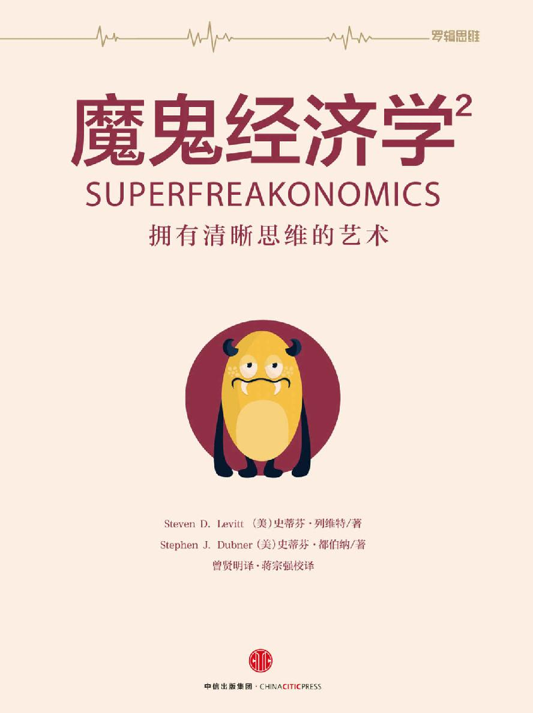 

> 魔鬼经济学 2：拥有清晰思维的艺术

 

\[美\]史蒂芬·列维特 \[美\]史蒂芬·都伯纳 著

曾贤明 蒋宗强 译

中信出版社

目录

[推荐序
趣味横生的魔鬼经济学](#index_split_022.html_filepos514565)

[写在前面](#index_split_023.html_filepos519242)

[导言
魔鬼经济学=荒谬怪诞经济学？](#index_split_024.html_filepos530953)

> [酒后步行比酒后驾车还要危险！](#index_split_025.html_filepos533017)

> [电视把印度女性解救了出来？](#index_split_026.html_filepos537360)

> [马和汽车，谁的危害更大？](#index_split_027.html_filepos548951)

> [还原世界的本来面貌](#index_split_028.html_filepos559651)

> [独树一帜的经济学](#index_split_029.html_filepos569665)

[第一章
遏制气候变暖：火山爆发，用烟囱捅破天，还是架一根18英里长的管子？](#index_split_030.html_filepos572684)

> [全球变暖：经济学家的观点](#index_split_031.html_filepos579530)

> [你开空调时应该想到的事情](#index_split_032.html_filepos586814)

> [外部效应的逻辑：从汽车防盗装置到火山爆发](#index_split_033.html_filepos592989)

> [二氧化碳与全球变暖没有关系！](#index_split_034.html_filepos601508)

> [太阳能电池加剧了全球变暖？](#index_split_035.html_filepos623015)

> [火山爆发与气候变暖](#index_split_036.html_filepos627548)

> [解决气候变暖：用一根18英里长的管子向天空吹二氧化硫](#index_split_037.html_filepos636290)

> [用毯子把地球裹起来](#index_split_038.html_filepos645122)

> [想阻止气候变暖？用烟囱捅破天吧！](#index_split_039.html_filepos652833)

> [医生最容易违规？](#index_split_040.html_filepos661313)

> [如此预防艾滋病：你根本不可能想到](#index_split_041.html_filepos671159)

[第二章
恐怖分子的银行账户有什么特点？](#index_split_042.html_filepos673642)

> [公路交通事故增多：全是“9·11”恐怖袭击惹的祸？](#index_split_043.html_filepos683460)

> [最出色的医生和最差劲的医生有何区别？](#index_split_044.html_filepos693740)

> [想长寿吗？拿个诺贝尔奖吧！](#index_split_045.html_filepos729665)

> [恐怖分子的银行账户有什么特点？](#index_split_046.html_filepos741688)

> [计算一下谁是恐怖分子](#index_split_047.html_filepos757043)

[第三章
难以置信：犯罪率升高是因为电视看多了？](#index_split_048.html_filepos760513)

> [犯罪率升高是因为电视看多了？](#index_split_049.html_filepos767352)

> [为什么有的人总是乐善好施？](#index_split_050.html_filepos778147)

> [交易大厅的欺骗作为](#index_split_051.html_filepos796839)

> [人真的既慷慨大方又冷酷无情？](#index_split_052.html_filepos821860)

[第四章
疫苗、安全带和飓风：不一样的事情，一样的逻辑](#index_split_053.html_filepos840786)

> [《劳动法》也会损害劳动者](#index_split_054.html_filepos852448)

> [硝酸铵养活了整个世界？](#index_split_055.html_filepos858120)

> [从捕鲸到石油开采](#index_split_056.html_filepos860664)

> [没有什么医疗手段比疫苗更简单](#index_split_057.html_filepos863978)

> [安全带有多安全？](#index_split_058.html_filepos870019)

> [儿童座椅的安全效应](#index_split_059.html_filepos880277)

> [由飓风想到的](#index_split_060.html_filepos899713)

[第五章
街头妓女与百货商店圣诞老人有何相似之处？](#index_split_061.html_filepos911303)

> [从中国的缠足习俗到美国的性服务市场](#index_split_062.html_filepos913677)

> [为什么妓女的收入越来越少？](#index_split_063.html_filepos928668)

> [一星期中妓女哪天挣得最多？](#index_split_064.html_filepos941879)

> [皮条客与房地产经纪人](#index_split_065.html_filepos952836)

> [女性工资低是因为女性追求高薪的愿望不够强烈](#index_split_066.html_filepos963426)

> [从妓女的营生中我们看到了什么？](#index_split_067.html_filepos979339)

[结语
猴子也是人](#index_split_068.html_filepos998532)

[致谢](#index_split_069.html_filepos1009525)

[个人致谢](#index_split_070.html_filepos1012478)

[版权页](XXXXXXXXXXXXXXXXXXXXXXXXXXXXXXXXXX)

推荐序 趣味横生的魔鬼经济学

文/微软公司创始人 比尔·盖茨

史蒂芬·列维特和史蒂芬·都伯纳推出的《魔鬼经济学2》，构思新颖，趣味横生，惊喜连连，见解精辟。

我有幸在《魔鬼经济学2》正式出版发行之前拜读了该书的清样。

我真的喜欢《魔鬼经济学2》这本书，而且我认为该书较《魔鬼经济学》更胜一筹。

同样，我也喜欢马尔科姆·格拉德威尔（Malcolm
Gladwell）所写的书，格拉德威尔往往集中阐释为数不多的主题，给出大量实例，进行深度剖析。与他不同的是，史蒂芬·列维特和史蒂芬·都伯纳喜欢同时探讨多个主题。

我将该书推荐给所有喜欢读非小说类书籍的读者。本书构思精巧，鞭辟入里的见解随处可见。

我本人与本书所涉三个案例有一些关联，因此，向读者推荐该书时，可能摆脱不了观点有失偏颇的嫌疑。

论及美国医疗保健问题时，该书两位作者与克雷格、马克·史密斯合作，采用了收集信息的软件系统，而这款软件被微软购买后现在定名为Almaga。这项技术功能强大，令人称奇，据此我们可以了解患者的动态趋势。该书告诉我们，这类数据可用来评测医生医术之高低，分析不同的医学诊治流程。

谈及我们该如何降低飓风的破坏性时，他们提到了内森·梅尔沃德及其领导的高智发明公司，提到了他们的创意定将改变当地天气，即将海洋表层的热水与下层较冷的水混合，减少飓风的破坏性。让人遗憾的是，两位作者没有详述这个计划的经济效应，也没有指出谁将批准这项试验，结果或许是积极效应多，但也不排除某些不利后果。

当他们集中探讨全球变暖问题时，他们又一次提到了高智发明公司，于是，我们见到了洛厄尔·伍德和肯·卡尔代拉。这次谈论的是地球工程学如何可能推迟不利后果的降临，进而为我们赢得额外而必要的几十年时间，使我们在能源生产和使用领域做好相应准备。列维特和都伯纳极其善于介绍此种想法，但没有具体分析此项建议该如何应用的问题。

不少经济学家所开展的很多研究结果都被用作“人做出选择时是理性的”这一论断的理论根据，对此该书作者进行了痛批，这是书中我最喜欢的内容之一。都伯纳和列维特列举了最新的研究项目，其研究结果表明，上述研究得出的结论是错误的。就接受实验的学生而言，我认为研究者所观察到的结果只是社会回报和风险的一种反映，而不是人类经济思维中存在某些基本缺陷。

最近100年来，人类生活在各个方面都有了显著进步，而人们却根本不以为然，该书也就此进行了探讨。两位作者所举的案例是分娩的死亡风险及死亡率的降低。他们也谈及了疾病（尤其是疫苗，比如小儿麻痹症疫苗）和汽车安全问题。过去我知道，汽车安全带是令人称奇的好装备，但让我始料未及的是，汽车安全带广泛使用后，安全气囊和儿童座椅所起的安全作用是如此之小。

该书涉及的内容还有值得商榷的地方：作者认为硝酸铵在提高粮食产量方面居功至伟。瓦茨拉夫·斯米尔（Vaclav
Smil ）所著的《丰富的地球》（Enriching the
Earth）为我们详细而深入地介绍了有关氮肥的令人不可思议的故事。作者在本书中谈及硝酸铵时，似乎认为这是农业进步的万灵药。南美可以开采利用一些硝酸铵，但资源正在快速枯竭。农业不断发展，其真正原因在于我们已掌握了从空气中提取氮气，并将其转化为农作物可以使用的氮化合物。

除了上述提到的内容，你还会发现，书中还有很多极棒的内容。

写在前面

时间已逐渐证明，在我们的首部作品中，我们撒了谎，撒了两次。

第一个谎言出现在《魔鬼经济学》的引言中，因为我们这样写道：“本书并没有主题”。事情原委是这样的，我们的出版商和蔼可亲、精明能干，他们读了初稿后，大惊失色地叫道：“这本书根本就没有主题！”严格地说，初稿内容五花八门，涉及作弊的教师、进行自我交易的房地产经纪人，以及母亲眼中贩卖霹雳可卡因的乖儿子，彼此之间似乎毫无关联。书中引述的诸多素材，没有构建在精彩的理论基础之上，彼此独立，无法形成合力，却神奇地归于所要阐释的主题之下。

面对这部杂乱无章的作品，当我们提议将书名定为《魔鬼经济学》时，可以想见，出版商就更为惶恐不安了。即使在电话中，也能听到对方用手猛拍额头所发出的“啪啪”的声音，他一定在想：这两个家伙交来的初稿不仅没有主题，书名也是生造词汇，简直荒诞不经。

出版商建议我们做出一定的妥协，在引言里说明此书没有主题。为了避免争端再起（也为了拿到预付稿酬），我们同意照做。

然而，事实上，《魔鬼经济学》的确有主题，即使当时主题还不明显，我们自己也没有意识到这一点。如果一定要说出来，或许可以将主题概括为：刺激（在某种动机驱使）之下，人们会做出反应。如果讲得详细点，那么可以这么说：刺激之下，人们会做出反应，尽管反应方式并不一定是能预见到的，或是一目了然的。正因如此，非预期后果法则才成为世界上最具影响力的法则之一。中小学教师、房地产经纪人、毒品贩子、孕妇、相扑运动员、百吉饼销售商及三K党，其行为方式均适用这条法则。

然而，书名问题仍然没有得到解决。随后的几个月中，我们曾提出几十个书名，包括《非传统智慧》（明白吗）、《并非绝对如此》（不怎么样吧）及《E线远景》（放过我吧）。最后，出版商终于决定：或许《魔鬼经济学》终究也糟糕不到哪里去；或者更确切地说，物极必反，既然糟糕若此，反而还有可能一炮走红。

也或许他们已精疲力竭了。

《魔鬼经济学》的副标题表明，作者将在书中揭示隐藏在表象之下的世间万物的真相，这是第二个谎言。我们确信，任何思维健全的人都会把这个说法理解为夸张手法，属于国际玩笑之列。然而，有些读者却照字面意思去理解，为此抱怨说：书中所涉内容，虽然五花八门，覆盖面甚广，但事实上并没有探讨世间万物。所以，尽管我们在确定副标题时本无撒谎的初衷，但的确导致了这种事实上的后果。我们为此道歉。

诚然，我们未能将世间万物纳入《魔鬼经济学》一书中，然而，正因如此，这里就产生了一个非预期后果：需要再写一本书做进一步探讨。不过，在此要立即提请读者朋友注意，即使两部书的内容加在一起，我们仍然无法将世间万物一囊括在内。

如今，我和史蒂芬·都伯纳已合作多年。起初，都伯纳（作家、记者）写了一篇针对我（理论经济学家）的文章。开始时我们视彼此为敌人，尽管只限于口诛笔伐的“个人恩怨”；当好几家出版机构开始以极高的稿酬为诱饵，邀请我们合作出书时，我们终究化敌为友、通力合作。（记住：刺激之下，人们会做出反应。大众一般会这样做，经济学家和记者也是人，也被这一魔咒套牢。）

我们曾一起讨论如何分配稿酬的问题。刚一开始讨论，就陷入僵局，因为我们都坚持要按六四分成。最后，我们才恍然大悟，原来是彼此希望对方分得六成收入，自己拿四成。随后，我们便都深信，与对方合作将会十分愉快，于是决定按五五分成，写书的工作就这样开始了。

撰写《魔鬼经济学》时，没有太大的压力，因为当时我们真的认为没多少人会读我们的书。（我父亲也是这么认为的，还因此说过这样的话：即使只有一分钱的预付稿酬，我们也应该心满意足。）没什么野心，预期极低，这反而让我们摆脱了各种束缚，得以把我们认为值得一写的所有内容都纳入写作素材中来。因此，写书过程充满了乐趣。

《魔鬼经济学》出版后的畅销，既出乎我们的意料，又着实让我们兴奋不已。如果当时我们迅速跟进，接着出版与该书相关的系列书籍，例如《傻瓜的魔鬼经济学》或《魔鬼经济学的心灵鸡汤》之类，那么，或许又能赚个盆满钵满，但我们并没有那么做。我们希望把调研准备工作做充分，积累必要素材，到文思泉涌之时，执笔撰文就是水到渠成的事了。历经4年的准备工作之后，我们终于实现了目标，第二部书（也就是本书）问世，不用说，我们深信本书更精彩。当然，至于我们所言是否属实，你们（而不是我们）说了算；至于本书是否会如第一部书出版时某些人想象得那样糟糕，也是你们说了算。

出版商已对我们彻头彻尾的“三流品位”不做任何指望，干脆不过问书名了：当我们提议将本书的书名定为《SuperFreakonomics》时，他们连眼睛都没眨一下就同意了。

如果本书真的有任何值得一读的地方，那么得感谢读者。在通信成本低、方便快捷的当代，写书的一大益处在于，作者可以直接得到读者反馈，而且反馈信息直截了当、清晰明确、为数众多。良好的反馈信息是不容易获得的，因而颇具价值。我们不仅获得了有关《魔鬼经济学》一书的反馈信息，还获得了有关以后出书所涉论题的诸多建议。一些给我们发送电子邮件提建议的人会发现，你们的想法已在本书中有所反映——感谢你们！

《魔鬼经济学》的成功还导致了一个出人意料的结果：我们不时一起或分别接到邀请，面向各类受众发表演讲。演讲之前，我们往往被邀请方以“专家”的头衔介绍给听众，而所谓“专家”却恰好是我们在《魔鬼经济学》中提请你们需要提防的人——他们不过是占有信息优势，并在某种动机的驱使下对这个优势加以利用罢了。（我们想方设法说服听众：事实上，我们在任何领域都算不上专家。）

出席这类活动也为我们以后的写作提供了不少素材。在加州大学洛杉矶分校演讲时，都伯纳谈到了一种现象：人们上洗手间后洗手的次数远不如他们承认的那么多。随后，有一位男士走近讲台，伸出一只手说，他是泌尿科医生。这种自我介绍的方式固然让人反感，但他所谈的在高危工作环境中（他所在的医院）不洗手的问题，以及医院为了鼓励医生洗手而采取的创意十足的措施，却紧紧抓住了听众的心。在本书中，你将读到医生与手部卫生做斗争的精彩故事。

在另一次对风险投资家所做的演讲中，我分析了我与社会学家苏希尔·温卡什（Sudhir
Venkatesh）正着手开展的一个新调研项目。苏希尔·温卡什不惧危险深入毒品犯罪团伙的故事，已成为《魔鬼经济学》的经典案例之一。这个新调研项目，涉及追踪芝加哥街头妓女的日常活动。凑巧的是，来听演讲的一位风险投资家（约翰），正好与一个每小时收费300美元的妓女（安莉）约好了服务时间——就在那天晚上。在安莉公寓，他发现咖啡桌上放着一本《魔鬼经济学》。

“这本书你从哪里弄来的？”约翰问。

安莉说，这是她的一个也在“从事这个行业”的女性朋友寄给她的。

为了给安莉留下深刻的印象——虽然只是金钱和肉体的交易，男性吸引女性的本能仍然在作怪——约翰告诉安莉，正好在那天，他听了这本书的一位作者发表的演讲，这位作者在演讲中提到正在开展一个有关妓女卖淫的调研项目。而仅此似乎还不能说明这有多凑巧。

几天后，列维特收到了一封电子邮件：

> 从一个我们都认识的熟人那里，我听说你在着手写一篇有关卖淫行业经济收入状况的文章，对吗？我不太确定你开展的是不是严肃项目，也不知道告诉我这消息的人是不是在逗我取乐，我只是想告诉你，我十分乐意助你一臂之力。

> 谢谢你。

> 安莉

还有一个难题有待解决：我得向我的爱人和4个孩子解释，下个星期六的上午，我不会在家，因为届时我要与一位妓女共进早午餐。为了准确评估她的需求曲线的状况，我认为与她面谈对我的调研至关重要。从某种程度上说，我们
[\[1\]](#index_split_023.html_filepos530769)
是为此付费的。

在本书中，你会读到有关安莉的故事。

最终导致与安莉有关的故事进入本书的这一连串事件，或许可归因于经济学家所谓的累积优势（cumulative
advantage）。也就是说，因为我们所出的第一本书极为成功，所以撰写第二本书时，我们获得了一系列的优势，而若换成其他作者，可能就无法拥有这等良机了。因此，我们现在最大的希望便是，我们的确拥有并利用了上述优势。

最后，在写作本书时，我们尽量只在万不得已的情况下使用经济学术语，因为这些术语高深难懂、难以记住。所以，在援引有关安莉的故事时，我们没有将其视为解读累积优势的故事，而是将其称为……怎么说呢，魔鬼经济学故事。

[\[1\]](#index_split_023.html_filepos529687)
如前文所述，我与社会学家苏希尔·温卡什一起开展这个项目。

导言 魔鬼经济学=荒谬怪诞经济学？

> 根本不谈全球金融危机，集中探讨引人入胜的其他话题。

> 有时候，一个人在生活中要想拥有清晰的思维是非常困难的。我们一直被告知，酒后驾车发生事故的概率要比清醒的正常人驾车发生事故的概率高出很多倍。有如此多的人酗酒后仍然要手握方向盘，这是为什么呢？酒后驾车极其危险，可是，难道酒后步行就安全吗？马和汽车，谁的危害更大？如果我们不开车，改成
> 骑马，社会将会怎么样？

生活中的许多决定是很难做出的。该从事什么职业？是否需要将年迈多病的母亲送进养老院？你和妻子已有两个小孩，现在是否该再要一个？

之所以难以决定，是有诸多原因的。首先，做决定要冒很大风险。而且，做决定时还涉及大量的不确定性因素。最为重要的是，你不常面临必须做出这类决策的情形，也就是说，你在这方面的实践经验非常少。你十之八九能从容应付日常生活用品的采购工作，因为你经常买，但是倘若你要购置首套住房，那就完全是另外一码事了。

不过，话说回来，要做出这类决定真的也很简单。

想象一下你去朋友家参加聚会的情景。你们两家仅相距1英里（约合1.6093公里）。或许是因为喝了4杯酒的缘故，你异常兴奋、十分尽兴。现在，聚会接近尾声了。你一边喝光最后一杯酒，一边摸索着找到了车钥匙。突然间，你意识到这是一个愚蠢的想法，以你现在的状态，绝不适合自己开车回家。

酒后步行比酒后驾车还要危险！

最近几十年来，关于酒后驾车的危害，我们受到了极其严厉的教育。酒后驾车发生交通事故的概率，比正常驾车发生交通事故的概率高13倍。尽管如此，还是有很多人酒后驾车。美国所有致命的撞车事故中，有30%涉及至少一位酗酒的司机。在深夜时分这一饮酒高峰期，上述比例竟高达近60%。大体说来，每行驶140英里，就有1英里的路程是醉酒司机驾驶完成的，也就是说，醉酒司机每年驾车行驶210亿英里的路程。

有如此多的人酗酒后仍然要手握方向盘，这是为什么呢？或许，这是因为酒后驾车极少被逮，我们根据到目前为止最保守的统计数据得出这一结论。醉酒司机每行驶27000英里的路程，才会被逮住一次。这就意味着，你可以一边豪饮啤酒，一边驾车横穿整个美国，然后折回，这样往返三次之多，直到你被警察强行拦下，停在路边。与其他后果严重的行为一样，如果我们也能出台强有力的措施，那么也极有可能杜绝酒后驾车行为。比如，随机设置路障，如此一来，醉酒司机就可以被“就地正法”，但是我们的社会很可能不具备采取这种措施的强烈愿望。

现在回到你参加朋友聚会的情景中，你似乎已做出了迄今为止最容易的决定：走回家，不开车，毕竟只有1英里的路程。于是，你找到朋友，感谢他邀请你参加聚会，并告诉他你准备走回家。他认为你的决定十分明智，对你大加赞扬。

然而，他该赞扬你明智吗？众所周知，酒后驾车极其危险，可是酒后步行就安全吗？做出这个决定真的这么容易吗？

我们来看一些数据。每年死于酒后步行引起的交通事故的人数超过1000。他们可能晕晕乎乎地偏离了人行道，踉踉跄跄地步入了机动车道；可能躺倒在乡村的公路上；也可能是在车辆川流不息的公路上横冲直撞。在美国，与每年酒后驾车引起的交通事故致死的总人数（大约13000）相比，酒后步行死于交通事故的人数相对较少。然而，当你从步行或开车两种方案中做出选择时，真正重要的并不是上述的总死亡人数，而是以每英里路程为基础计算，酒后驾车和酒后步行，哪个更危险。

在家或公司，普通美国人每天大约步行半英里。16岁以上（包括16岁）的美国人，总数超过2.37亿；全部算下来，达到驾车年龄的美国人，每年步行的总路程约为430亿英里。如果我们假定，每步行140英里的路程中就包括1英里酒后步行的路程，即和每年酒后驾车行驶路程占驾车行驶总路程的比例相同，那么每年酒后步行的总路程约为3.07亿英里。

只要算一下，你就会发现，以每英里路程而论，醉酒的步行者死于交通事故的概率，比醉酒司机的死亡率高8倍多。

不过还有重要的一点需要说明：除了摔伤自己，酒后步行不太可能弄伤或害死他人。但酒后驾车的情形却不是这样，在与酗酒有关的致命交通事故中，36%的受害者是乘客、行人，或是其他司机。即使我们将这些无辜受害的死亡人数计算在内，酒后步行导致的每英里死亡率，仍然是酒后驾车导致的死亡率的5倍。

因此，当聚会曲终人散时，做什么决定应该是十分明确的：驾车比步行安全。（当然，少喝点酒或叫辆出租车就更安全了。）下次聚会时，如果你很快就灌下4杯酒，那么要回家时，你的选择或许就会有所不同了；或者，你已喝得烂醉如泥，你的朋友会为你做好安排，因为“朋友不会让朋友醉酒后步行”。

电视把印度女性解救了出来？

今天，如果你能选择出生地的话，那么印度可能不是你最明智的选择。印度吹嘘自己为全球经济中的重要角色，经济发展迅速，但总体而论，这个国家仍然极度贫穷，平均寿命和教育普及率极低，环境污染严重，贪污腐败成风。超过2/3的印度人口生活在农村，能用上电的家庭几乎还不到一半，仅有1/4的家庭建有厕所。

如果生为女性，那就尤其不幸了，因为印度人有强烈的“重男轻女”思想。在已有两个儿子的印度家庭中，只有10%的家庭还想要个孩子；而在已有两个女儿的印度家庭中，大约有40%的家庭还想碰碰运气。对印度家庭而言，生下男婴，就像为自己开立了401（k）账户
[\[1\]](#index_split_026.html_filepos547957)
一样养老不愁。男孩长大成人后，可挣钱养家，并在父母年迈体弱时尽赡养义务；而若是女孩，这就意味着父母将不仅无人养老送终，还要在女儿出嫁时赔上嫁妆。长久以来，印度盛行的嫁妆习俗一直遭到社会的讨伐，但新娘父母在新娘出嫁时给新郎或其家庭现金、汽车或地产的现象，仍然十分常见。按照习俗，新娘家庭还应出钱操办婚礼。

美国微笑列车基金会（Smile
Train）是一个慈善组织，在全球各地免费为贫困孩童实施唇腭裂修复手术。前不久，微笑列车工作人员在印度钦奈逗留了一段时间。当他们问及一个本地男人有几个小孩时，他的回答是“1个”。后来他们得知，那个男人的确只有1个儿子，但除此之外，他还有5个女儿。显然，女儿是不值一提的。他们还发现，在钦奈，有的父母会付给助产士2.5美元报酬，让她闷死刚出生的先天性唇腭裂女婴。为了更好地利用经济手段，微笑列车给助产士开出更诱人的激励条件：每把一个先天性唇腭裂女婴送到医院做唇腭裂修复手术，即可得到10美元的奖励。

女孩在印度的地位如此卑微，结果导致印度女性人数竟然比男性人数大约少了3500万。如经济学家阿玛蒂亚·森（Amartya
Sen）所言，男女人口缺口规模中的大多数女性，可被认定已经死亡——要么由于间接原因（或许是因为偏爱儿子，父母限制女儿的营养摄入或就诊看病），要么由于直接伤害（女婴出生后被助产士或父母扼杀），要么死于堕胎（此类情形日益增多）。即使在最小的印度村落里，电力供应时有时断，清洁用水更难找到，孕妇也仍然会付钱请医生做超声波检查，如果扫描出是女婴，那么这个孕妇就会选择流产。近些年来，随着人工流产越来越普遍，印度（以及其他重男轻女的国家，例如中国）男女比例失衡的情形越来越严重。

最后终于有机会长大成人的印度女性，几乎在各方面都面临不平等的待遇：挣的钱比男性少，享受的医疗服务及所受教育比男性差，而且还可能每天遭到丈夫的虐待。在印度一项针对全国国民的医疗调查中，51%的印度男性声称，在某些情况下，比如说，妻子把饭烧糊或未经允许离开家门，殴打妻子是合情合理的；而更不可思议的是，竟然有54%的印度女性认同上述说法。每年被烧死或死于其他类型家庭暴力的印度年轻女性超过10万人，其中很多是“索奁焚妻”（bride
burnings）
[\[2\]](#index_split_026.html_filepos548294)
的牺牲品。

印度女性意外受孕及感染性病的危险也极高，包括艾滋病病毒和艾滋病。其中一个原因便是，印度男性在性生活中使用避孕套时的失败率超过15%。为什么会这么高？印度医学研究理事会声称，依据世界卫生组织确定的规格生产的避孕套，相对于约60%的印度男性的阴茎而言，尺寸太大。这就是调研耗时两年得出的结论。调研过程中，科学家测量了1000多位印度男士的阴茎尺寸，而且还都拍了照片。“那种避孕套，”一位调研人员说，“不适合印度男性。”

面对如此之多的问题，要提高印度女性的生活质量，尤其要提升农村妇女的生活质量，应该采取什么措施呢？

印度政府曾设法禁止索要嫁妆，严禁流产，但是从很大程度上说，没人理睬这些法规。印度政府还出台了从资金方面扶持印度女性的计划，包括“我的女儿，我的骄傲”（Apni
Beti，Apna
Dhan）项目、大规模的小额信贷扶贫项目，此外还有各种国际救援机构所实施的大量慈善项目。在“我的女儿，我的骄傲”项目中，只要农村孕妇不因女婴而流产，便可获得现金奖励；因为小额信贷项目的实施，印度女性可申请小额商业贷款。

印度政府还庄重地承诺，将让印度男性更便宜地获得更小尺寸的避孕套。

不幸的是，结果证明大多数这类项目，实施起来都复杂烦琐、成本高昂，因此有名无实。

与此同时，与上述方法不同的另一种措施却似乎的确发挥了作用。这种措施，就像超声波扫描仪一样，依赖技术手段，但与女人本身几乎毫无关系，更谈不上与女人生孩子有何联系。这种措施既不是由印度政府执行，也不是由国际慈善机构实施。事实上，设计这种措施的目的，根本就不在于帮助任何人，至少不是以我们通常认为的方式帮助他人。这种措施不过是企业早就开发出的一种产品罢了，我们称之为电视。

印度国营的广播电视事业已有几十年的历史了，但信号很差，节目少得可怜，因此印度国民简直没有理由守在电视机旁。然而，近些年来，得益于电视和配送费用的急剧下降，印度一些地区已铺设了有线电视和卫星电视网络。2001——2006年，大约有1.5亿印度人生平第一次看上了有线电视节目，不论接收到的是印度大城市还是国外的电视信号。突然之间，在他们的村落里，处处播放着电视综艺节目、连续剧、新闻以及警匪片，声音此起彼伏，好不热闹。电视让很多印度村民首次真正见识了外部世界的魅力。

然而，并不是每个村落都能收看有线电视节目，有些能看上的也只是能在某些时段接收到信号。这种有线电视的普及状况，正好产生了经济学家热衷于利用的那类数据：趣味横生的自然实验数据。有两位年轻的美国经济学家，依据印度的每个村落是否（以及何时）能收看有线电视节目的数据，评估印度各地村民的生活变化情况，进而梳理出电视对印度女性产生的影响。

他们的分析数据，来自政府针对2700个家庭（其中大部分是农村家庭）展开的一项调研的结果。这项调研的对象是15岁以上（包括15岁）的女性，涉及的问题包括生活方式、个人偏好及家庭关系。调研结果表明，能收看有线电视节目的女性，仍坦然接受丈夫殴打妻子行为的人数比以前少多了，认同“重男轻女”思想的人数也比以前少了，而且她们更有可能自立。从某种程度上说，电视似乎正在让女性获得更多的权利，而这正是政府出台的措施所未能实现的目标。

是什么导致了这些变化呢？通过收看电视节目，目睹世界各地女性的生活之后（她们随心所欲地打扮自己，花自己挣的钱，既不会被男人视为财产，也没有被定义为生育机器），印度农村妇女在生活中更独立了吗？又或者世界各地的电视节目让这些农村妇女感到羞愧难当，因而没有向调研人员如实相告，真实讲述她们所遭受的待遇有多么糟糕？

这是从调研中获取的数据，而我们有充足的理由怀疑这个调研结果。人们的言行非常不一致。
[\[3\]](#index_split_026.html_filepos548701)
而且，当一个无关紧要的谎言不会造成任何损失时，正如印度政府展开的上述调研项目，我们就要考虑到上述结论可能包含了一定程度的失实成分。如果受访对象不过是在迎合调研人员，给出他们中意的答案，那么，或许她们根本就没有意识到自己在撒谎。

然而，如果你能评估受访女性的显示性偏好或实际行为，那么你的工作就取得了不错的进展。奥斯特（Oster）和詹森（Jensen）做到了。他们找到了能够证实印度女性的生活确实发生变化的强有力的数据：拥有有线电视的印度农村家庭，其婴儿出生率开始逐渐低于没有有线电视的家庭。（在印度这样一个国家，较低的婴儿出生率通常就意味着女性会有更大的独立空间，承受更少的生育风险。）拥有有线电视的家庭，送女儿上学的概率也更大，这表明女孩的地位逐渐提高，或者至少值得让人们将她们与男孩一视同仁。（值得注意的是，男孩的入学率却没有发生变化。）这些强有力的数据印证了印度政府公布的调研结果的可靠性。

看来有线电视的确让印度农村妇女获得了更多的权利，其影响之大超乎人们的想象，她们甚至再也无法容忍家庭暴力了。

家庭暴力减少抑或只是因为她们的丈夫忙于观看板球比赛，无暇顾及她们。

[\[1\]](#index_split_026.html_filepos538339)
401k账户是根据美国《国内税收法》新增的第401条k项条款的规定，由雇员、雇主共同缴费建立起来的完全基金式的养老保险账户。——译者注

[\[2\]](#index_split_026.html_filepos541234)
索奁焚妻指发生在印度及其周边国家，例如巴基斯坦、孟加拉国等地的一种家庭谋杀罪行。这类犯罪的共同点是源于嫁妆纠纷，犯罪手法则常常是烧死妻子并伪装成自焚或厨房意外。——译者注

[\[3\]](#index_split_026.html_filepos546260)
用经济学术语来讲，言行这两种行为分别被称为宣称的偏好（declared
preference）和显示性偏好（revealed preference）。

马和汽车，谁的危害更大？

当世界一路跌跌撞撞地踏入现代社会时，世界人口与日俱增，速度极快。人口的大幅增加主要发生在中心城市，例如伦敦、巴黎、纽约和芝加哥。19世纪，美国城市居民人口增长了3000万，而其中一半的人口增长就发生在19世纪的最后20年。

然而，当这庞大的人口及其动产从一个地方迁往另一个地方时，问题就来了。主要的运输工具引发了出人意料的经济学家所谓的严重的“负外部效应”，包括交通大堵塞、保险成本高昂以及为数众多的交通事故导致的死亡。本该出现在家庭正餐桌上的粮食作物，却被用来生产燃料，结果造成食品短缺和食品价格的抬升。此外，作为燃料，消耗过程中还会排放有毒气体，造成空气污染，不仅危害居民健康，还危及生态环境。

我们正在谈论汽车，不是吗？

不，不是这样。我们正在谈论的是马。

从久远的古代开始，马就是人类的得力帮手，发挥着多种作用。在现代化城市不断扩张的进程中，人类也在通过多种方式利用马匹为自己服务：拉车；运送建筑材料；运送从轮船和火车上卸下来的货物；甚至还能用马来拉动生产家具、绳索、啤酒和衣服的机器运转。

如果你的女儿病得很严重，要请医生来家诊治，医生会策马火速赶往你家中。发生火灾时，训练有素的马队拖着消防车疾速穿过街道，赶往火灾地点。19世纪末20世纪初，在纽约市存活并发挥着作用的马，大约有20万匹，也就是说，每17个纽约市民就拥有1匹马。

但是，唉，马给我们的生活也带来了那么多麻烦！

马车造成了严重的交通堵塞，而且，当马不堪劳顿垮掉的时候，往往立刻暴毙，这会导致交通堵塞的进一步恶化。很多马厩拥有者为此还给马匹买了保险。为了防止骗保，保险条文规定应由第三方给（垮掉的）马匹实施无痛苦致死方案。这也就意味着，马匹倒下后应等候警察、兽医或美国防止虐待动物协会（ASPCA）工作人员赶到现场。即使认定马匹死亡，交通堵塞情形仍然不能马上得到缓解。“一旦马匹死亡，因为体积庞大，搬运十分棘手，往往要等到马匹尸体腐烂时，清洁工才开始清理，因为只有这时，马匹更容易被锯成小块，进而用推车运走。”研究交通问题的学者埃里克·莫里斯（Eric
Morris）写道。

马车的车轮和马蹄铁都是用铁制成的，在行进时产生的噪音令人不堪忍受，恐怕很多居民会为此患上神经紊乱症。因此，在医院或其他对噪音很敏感的区域附近，政府甚至禁止马车通行。

而且，更恐怖的是行人极易被马匹或马车撞倒。不论是马匹还是马车，都不像我们在电影中所看到的那样容易控制，在路面光滑、行人拥挤的城市街道上，更难以驾驭。1900年，因马匹造成的交通事故夺走了200个纽约市民的生命，也就是说，每17000个纽约市民中，有1人死于与马匹有关的交通事故。与此相对，2007年，死于汽车交通事故的纽约市民人数为274人，也就是说，每30000个纽约市民中，有1人死于汽车交通事故。这意味着，1900年的纽约市民死于马匹交通事故的概率，大约是如今纽约市民死于汽车交通事故概率的2倍。（遗憾的是，如今我们没有关于当时酒后赶马人的书面资料可查，但可以推测，死亡数字肯定大得吓人。）

但最令人难以忍受的却是马粪。一般而论，一匹马每天排泄的粪便约24磅（1磅约合0.4536千克）。照此计算，20万匹马排泄的粪便，重约500万磅。这只是一天的马粪量。这些马粪去了哪里呢？

几十年前，城市中的马匹还没有这么多时，农民会把马粪买下，然后用车（当然是马车）运到自家地里，马粪市场运转有序。但随着城市马匹数量的爆炸性增长，马粪市场供大于求的情形十分严重。在城市空地上，马粪越堆越高，有的竟高达60英尺（1英尺约合0.3048米）。马粪不断堆积起来，就像成堆的积雪沿城市街道一路排开一样。夏天时，马粪简直就臭气熏天；雨季来临时，经过雨水的冲刷和浸泡，浓稠的马粪随雨水涌向人行道，渗进住户的地下室。今天，当你对纽约市昔日建造的褐砂石建筑及其典雅的比街道高两个台阶的门阶赞赏不已时，请记住，这在当时可是一种迫不得已的建筑方案，只有这样建造才能确保房屋的入口高于马粪横流的街道。

因此，马粪造成了极其严重的公共卫生问题。马粪堆积之地，滋生着不计其数的苍蝇，苍蝇又在人群中传播着大量致命的疾病。老鼠和其他害虫成群结队地涌向堆积如山的马粪，寻找马粪中残留的燕麦谷粒和其他饲料——那些本该被做成食物摆放在餐桌上，但因为要饲养马匹而成为价格更为高昂的粮食作物。当时，没人担心什么全球变暖；但如果他们当时还真担心这个问题的话，那么马匹就会成为“头号公敌”，因为马粪会散发一种后果很严重的温室气体——甲烷。

1898年，纽约市主办了首届国际城市规划会议。其中最重要的议题就是马粪问题，因为全球各地的城市经历着同样的马粪危机，但会议未找出任何解决方案。“他们被难住了，”埃里克·莫里斯这样写道，“城市规划会议宣布，协商工作毫无成果，原计划为期10天的会议，实际上3天后就提前收场了。”

没有马匹，世界大都市可能无法正常运转；而有了马匹，还是无法正常运转。我们生活的世界似乎已发展成这种两难的世界。

后来，这个问题消失了。这既不是政府法规发挥了作用，也不是干预措施达成了目标。同时，也不是因为城市居民在某种倡导利他主义或自我约束的大众运动中逐渐具备了公德心，进而主动放弃马力所能带来的各种益处。实际上，技术革新解决了上述问题。我们创造了一种排泄更少粪便的动物吗？不是这样的。马匹被电车和汽车取代。这两种车不仅干净得多，而且效率也比马车高出许多。养一辆汽车比养一套马车更便宜，汽车被宣扬为“环境的大救星”。全球各地的城市居民，终于可以自由地来个深呼吸——免却了捏住鼻子呼吸的痛苦，接着继续前行。

令人遗憾的是，故事并没有在这里画上句号。拯救20世纪的方案，似乎又让21世纪陷入了危险的境地，因为汽车和电车也都有负外部效应。20世纪，超过10亿辆机动车和成千上万座燃煤发电厂所排放的二氧化碳，已导致气候变暖。正如过去马匹泛滥成灾，大有粗野践踏甚至毁灭人类文明之势，现在人们担心的是，人类活动将同样威胁我们的世界文明。哈佛大学环境经济学家马丁·威茨曼（Martin
Weitzman）认为“全球气温升高，足以毁灭地球这颗行星”，这种概率大约高达5%。其他人（包括媒体）的宿命论思想则更为浓重。

或许，这不令人感到特别意外。面对亟待解决的某个具体问题，如果以我们现有的条件无法给出方案，世人就会很容易地据此认为这个问题根本就无法解决。但历史的发展一次又一次地证明，这种认识是错误的。

这并不是说我们生存的世界是完美的。历史上所有的进步都不是十全十美的。社会财富的广泛分布，就会不可避免地导致某些人的财富损失。这也正是经济学家约瑟夫·熊彼特（Joseph
Schumpeter）将资本主义称为“创造性毁灭”的原因所在。

但是，人类的创造力无穷无尽，那些看上去无法攻克的难题，人类总能因为技术变革而找到适当的解决方案；对于全球变暖问题而言，很有可能也是如此。这不是说全球变暖不会在未来导致极其严重的后果，而是说如果辅以适当的激励，人类的聪明才智一定能被进一步激发，进而攻克难关。让人备受鼓舞的是，技术变革产生的解决方案，较之悲观论者所预测的，往往会更简单，因而成本也更低。事实上，在第一章，我们将碰到一个充满奇思怪想的异类工程师团队。他们不是找到了一个应对全球变暖的方案，而是三个，其中任何一个的成本，都比肯塔基州Keeneland拍卖行拍卖纯血马的全年销售收入低。

顺便提一下，马粪的价值已反弹上升，价值之高，以至于马萨诸塞州的农场主近期向当地警局投诉，要求制止邻居捡拾他们农场中的马粪。而那位邻居则声称这是一场误会，因为这个农场以前的主人允许他这样做。但是，这个农场现在的主人不愿做出让步，决意要求邻居为此支付600美元的费用。

这位热衷于马粪的邻居是谁？不是别人，正是马丁·威茨曼，那位对全球变暖问题持有极端悲观论调的经济学家。

“恭喜你，”当这个事件被媒体曝光后，他的一个同事对他说，“我所认识的大多数经济学家都是马粪的净输出商；而你的行为却似乎表明，你是一个净输入商。”

还原世界的本来面貌

马粪难题的解决，有线电视产生的非预期后果，酒后步行的危险性——以上种种问题，到底与经济学有什么关系呢？

我们最好将之视为“经济分析”案例，而不要把这类事件看成“经济学”问题。这种说法由加里·贝克尔（Gary
Becker）提出，而后广为人知。贝克尔是长期执教于芝加哥大学的经济学家，1992年荣获诺贝尔经济学奖。在诺贝尔奖颁奖典礼的致辞中他这样解释道：“经济分析的理论前提并不在于：个体行为完全是为了谋取私利。经济分析是一种分析方法，并不是有关某种具体动机的假设……个体行为的影响因素包括涵盖范围更广的价值标准和选择偏好。”

职业生涯之初，贝克尔研究的课题与一般意义上的经济学关系不大，因为他研究的领域包括：犯罪与刑罚、毒品滥用、时间的分配、婚姻的利弊、儿童抚养以及离婚问题。类似的课题，他的大多数同人根本不会考虑。“很长一段时间内，”他回忆说，“我从事的这种工作，要么被大多数的主流经济学家忽视，要么遭到他们强烈的厌恶。我被视为异类，因而，或许实际上是算不上经济学家的。”

好吧，如果加里·贝克尔所从事的工作并不能被视为“经济学领域的工作”的话，那么我们现在也想从事这样的工作。如果要我实话实说，那么贝克尔所从事的研究，事实上就属于“魔鬼经济学”的范畴，即通过经济分析来阐释非同寻常、令人好奇、难以预测的现象。只是在那时，“魔鬼经济学”这个词还没有被创造出来罢了。

在诺贝尔颁奖典礼的致辞中，贝克尔提出，经济分析本身并不探讨主题，也不是用来阐释“经济活动”的数学方法。确切地说，经济分析就是以另一种略微不同的方式审视世间万物。经济分析是一种系统的方法，用来描述人们是如何做出决策、改变主意的；描述人们是如何选择恋人及结婚对象的；描述人们为何憎恨某人，甚至不惜干掉某人；描述人们在偶然发现一大笔钱时，是决定偷走一部分，不去动它，还是掏出自己的钱放进那笔钱中；描述人们为什么对一件事充满恐惧，而对另一件略微不同的事情却又如此渴望；描述人们为什么要对一类行为予以惩罚，而对另一类与之相似的行为却予以奖励。

经济学家如何描述人们的行为决策呢？这往往要从积累数据开始，他们需要大量的数据。他们可能会有意或无意地搜寻易于分析的数据。只要有关人类行为的问题提得恰当，再加上可靠的数据，在很大程度上就可以解释人类行为。我们在本书中的任务就是提出这类问题。只要问题提得好，我们就能解释，比如肿瘤学家、恐怖分子或大学生在某个特定情景中的行为方式及其原因。

用概率这种“冷冰冰”的数字去描绘人类反复无常的行为，可能会让有些人反感。我们中又有谁希望自己被描述为“典型的参照对象”呢？举个例子，如果你把地球上所有男性和女性作为一个整体（人类）来考量，你就会发现，成年人平均有一个乳房和一个睾丸
[\[1\]](#index_split_028.html_filepos569451)
——但问题是，又有多少人的体征符合这种描述呢？如果你所爱的人因酒后驾车丧生，那么知道酒后步行比酒后驾车更危险这个事实，又怎么能缓解你的悲痛呢？如果你正是遭受丈夫毒打的那位年轻的印度新娘，那么即使得知有线电视已让众多印度新娘获得更多的权利，你又能从中获得什么慰藉呢？

上述理由有根有据，也是事实。诚然，任何法则总有例外，但了解法则有益无害。在一个错综复杂的世界中，人们都有各自独特的行为方式，因此，找出一个参照对象就具有极为重要的价值。这时，较好的切入点便是考察一般个体的行为特征。以这种方式进行研究，我们就能避免将思维过程——关于我们的日常决策、我们的行为法则、我们的管理——根植于例外或反常情况，相反，而是以常理为基础进行考察。

让我们回顾过去。2001年夏天，美国发生了一起恐怖事件，即后来人所共知的“鲨鱼之夏”事件。媒体报道了一条凶狠的鲨鱼肆意杀戮小孩的令人胆战心惊的事件。最初的报道涉及的是一个名叫杰西·阿博加斯特（Jessie
Arbogast）的8岁男孩。当时，他正在彭萨科拉海湾的浅滩上，嬉戏玩耍，突然冒出一条雄性鲨鱼，咬断了他的右臂，还撕掉了他大腿上的一块肉。《时代周刊》对此次鲨鱼攻击事件进行了封面报道。以下是报道的导语内容：

> 鲨鱼往往悄无声息地接近目标，毫无征兆。它们发动攻击的方式有三种：攻击后逃离、撞击后撕咬，以及出其不意地攻击。攻击后逃离的方式最为常见。鲨鱼可能是看见了游泳者的脚掌，误认为是一条鱼，于是就咬了过去，随后意识到这并不是它平常的目标。

吓着了吗？

任何思维正常的人都可能再也不会到海边去了。但是，你认为2001年到底发生了多少起鲨鱼攻击事件呢？

猜猜看。把猜测的数字除以2，用得到的结果再除以2，如此多反复几次。2001年，全球各地只发生68起鲨鱼攻击事件，其中4起是致命的。

这些数据不仅远远低于媒体大肆渲染所暗示的夸大比例，而且，不论是之前还是之后，也绝不会比现在更高。1995——2005年，全球各地平均每年发生60.3起鲨鱼攻击事件，最高年份79起，最低年份46起。平均每年的鲨鱼攻击致死事件为5.9起，最高年份11起，最低年份3起。换句话说，2001年夏天关于鲨鱼攻击事件的文章标题，或许本可低调地写为“今年鲨鱼攻击次数大体与往年持平”。但如果这样写，杂志十有八九不会热卖。

现在我们暂时忘却可怜的杰西·阿博加斯特及其家人所遭遇的悲惨事故，而是想想以下情形：在全球60多亿人口中，2001年死于鲨鱼攻击事件的仅有4人；而每年被电视新闻采访车轧死的受害者，极有可能比这还多。

不只如此，大象每年也会造成至少200人丧生。但是，我们为什么没有谈之而色变呢？原因极有可能在于，那些受害者并未身处繁华闹市，他们的离世不为众人所知。也有可能与我们受某些电影的影响而形成的固定认知有关。大象性情友善、憨厚可爱，儿童电影（想想《大象家族》中的贝巴和《小飞象》中的丹波）常常反映的就是这类主题；与此相对，鲨鱼则被千篇一律地刻画成反面角色。如果鲨鱼真的具备哪怕是一点法律背景的话，它们一定会提起诉讼，要求影院禁播《大白鲨》（Jaws）。

然而，2001年的那个夏天，媒体渲染的鲨鱼攻击事件，接二连三地见诸报端，情节如此恐怖，以至于公众对鲨鱼的惊恐情绪久久不能平息。直到9月11日，世贸中心和五角大楼遭到恐怖袭击，人们的注意力才得到转移。那天，近3000人死于非命，这可比从16世纪末开始有据可查的所有鲨鱼攻击致死事件多出了2500多人。

当然，尽管以典型参照物作为衡量标准有其缺陷，但这种方式的确也有其优点。因此，在本书中，我们尽可能以累积数据，而不是以奇闻怪事、哗众取宠的异常现象、个人主观看法、失控的情绪或道德偏好为基础，向读者阐释所引述的故事。有些人可能会认为，统计数据可用来证明一切，可用来支持难以站住脚的主张，也可用来撒谎。但是，经济分析所要实现的目标恰好相反：既不利用恐惧心理，也不偏执地探讨具体的问题，而是让数据自己说话，我们客观公正。例如，电视的推广给印度农村妇女带来了极大的帮助，但这并不意味着我们认为电视所发挥的是绝对积极的作用。在第三章你将读到，电视在美国的普及就导致了极具破坏性的社会变化。

我们的初衷不在于以经济分析法去描述任何人希望看到的世界、任何人所担心的悲惨世界，或任何人祈祷和憧憬的世界。确切地说，我们旨在客观地阐释世界的本来面貌。许多人希望能以某种方式保护或改变世界。然而，要改变世界，你首先得了解世界。

[\[1\]](#index_split_028.html_filepos563444)
关于“一个乳房和一个睾丸”的构想，脱帽感谢未来学家沃茨·瓦克尔（Watts
Wacker）。

独树一帜的经济学

截至本书写作之时，始于美国次贷泛滥，并如同传染病一样迅速席卷全球的金融危机，已持续了近一年。相信会有成百上千种有关金融危机的书籍出版。

本书不在此类书籍之列。

为什么呢？主要原因在于，宏观经济及诸多高深莫测的经济领域，根本不在我们的研究范畴之内。经历过近期的种种震荡之后，不知道是否还有人想弄清，宏观经济究竟属不属于经济学家的研究领域。许多知名的经济学家都被称为神奇的预言大师，他们可以确定无疑地告诉你股市、通货膨胀或利率的未来走向，这似乎的确很神奇。但正如我们近期所见证的那样，这种预测大体上毫无作用。经济学家们在解释历史事件时已经面临了诸多难题，更不用说去预测未来情形了。（罗斯福总统实施的政策，到底是缓和还是进一步恶化了经济大萧条，他们至今仍在就这个问题争论不休。）当然，不仅仅经济学家们如此。人们总是盲目相信自己的预测能力，即便事实证明预测很离谱，也会很快忘记教训。这似乎是人性的一部分。

因此，在本书中，我们事实上根本就不会谈及人们所谓的“经济”。我们相信，我们在本书中讨论的主题（纵使论证缺乏深度），虽然与“经济”没有直接关系，但也可以让我们对人类实际行为有更深刻的认识。如果你能理解中小学教师或相扑选手作弊背后的动机，那么你就可以弄清次贷危机产生的原委了。信不信由你！

你将在本书中读到的故事，选自不同的领域，可能来自崇高的学术机构，也可能来自最阴暗的街头角落，凡此种种，不一而足。有些故事是源于我近期开展的学术研究；有些故事来自他人的启发，比如经济学家、工程师、天体物理学家、变态杀人狂、急诊室医生、业余历史学家及变性的神经科学家。大多数事情都属于以下两类中的一种：你一直认为你了解但实际却不了解的事，你原本不知道自己想了解但实际却很想弄清的事。

我们得出的很多结论，或许并没有那么有用，或许甚至还没有最后定论。但这没有关系，我们设法在做的是启动对话与交流，而不是总结陈词，给出最后结论。这意味着，在即将读到的后续章节中，你可能会发现有些内容与你的观点相左。

事实上，如果你没能发现这种内容，我们反倒会感到失望。

第一章
遏制气候变暖：火山爆发，用烟囱捅破天，还是架一根18英里长的管子？

> 清醒、严肃地看待全球变暖问题。

> 全球变暖可能导致的最恐怖的情形，绝对与《圣经》中的描述无异：海面上升，高温炼狱，灾难频发，地球混沌无序。面对全球变暖，我们普通人该怎么办？牛、羊及其他反刍动物，是十恶不赦的环境污染者？全球反刍动物排放的温室气体比所有交通活动产生的多50%
> ！那么，我们别吃牛羊肉了，也别喝牛奶了，改吃袋鼠肉吧。购买本地产的食品，事实上反而增加了温室气体排放量，为什么？世界上规模最大的火山爆发竟然让全球气温降低了，为什么？

报纸的头版头条总是令人悲痛。

“一些专家认为，全球气候日益恶化，而人类似乎还没有做好准备。”《纽约时报》的一篇文章如是写道。文章援引某些气候研究人员的观点，指出“这种气候变化对人类构成了威胁”。

《新闻周刊》的一篇文章，引用美国科学院编制的一份报告中的内容发出警告，气候变化“将导致世界范围内的经济和社会变化”。更为严重的是，“（在这种背景下）政治领导人是否将采取积极的措施来应对环境变化的挑战，抑或哪怕仅仅减小其影响，气象学家对此甚是悲观”。

只要神志清醒，谁又不担心全球变暖呢？

但在过去，这些科学家可不是这么说的。发表于20世纪70年代中期的文章预测的可是全球变冷的趋势。

那时，全球变冷的警钟已经敲响，因为1945——1968年北半球的平均地面温度已下降0.28摄氏度。不仅如此，积雪量一直在增加；1964——1972年，美国接受的温暖阳光减少了1.3%。《新闻周刊》报道说，尽管绝对值相对较小，但温度的下降“已让我们这颗行星在通往冰河时代的路上行进了1/6的路程”。

最令人担心的是，农业系统会随之崩溃。在英国，气候变冷已导致种植季节缩短了两个星期。“由此引发的饥荒将是灾难性的。”《新闻周刊》如是警告。于是，一些科学家提出了某些极端的升温方案，比如“在北极冰帽上燃煤，把冰帽融化掉”。

毫无疑问，如今我们面临的威胁却完全相反。在人们看来，我们的地球不是太冷，而是太暖。当然，煤炭不是在拯救我们，而是被视为气候变暖的罪魁祸首。我们燃烧矿物燃料来加热和制冷，开展经济活动，提供运输动力，让我们的生活充满乐趣，与此同时，我们也在无止境地制造碳排放，任二氧化碳充斥天空。

显而易见，在这个过程中，我们已将脆弱的地球变成了一个温室，用化学气体在天空中编织了一层气幕，吸收了太多的太阳热量，而这些热量无法再度返回太空。非但没有“全球变冷”，数百年来全球平均地面温度已上升0.7摄氏度；而且，近些年来变暖速度还在加快。

“我们现在在虐待地球，”著名环境科学家詹姆斯·洛夫洛克（James
Lovelock）如此写道，“地球温度可能会升高，从而让我们再回到5500万年前的高温时代。如果届时的确如此，那么大多数人都会丧命。”

从根本上说，气候学家业已达成了共识：地球温度一直在上升。越来越多的人也都认同：人类活动在气候变暖过程中扮演了重要的角色。然而，人类活动对于气候的影响似乎又不是那么显著。

一般认为，汽车、卡车和飞机是温室气体排放的主要来源。受这种观点的影响，很多热心公益的人开始购买普锐斯或其他混合动力汽车。但是，当普锐斯车主每次驾车去食品店购物时，她实际上就在抵消选择该车、减少碳排放带来的益处，至少在她光顾肉类食品区时是这样的。

怎么会这样呢？因为牛、羊及其他反刍动物，是十恶不赦的环境污染者。这些动物呼出的气、放出的屁及其粪便，都含有甲烷，以常见的浓度标准衡量，同属温室气体的甲烷，其浓度要比汽车（以及人类）排放的二氧化碳高25倍。全球反刍动物排放的温室气体，比所有交通活动产生的多50%。

即使是倡导人们吃本地食品的“本地食品主义”运动，也没法阻止气候变暖。卡内基–梅隆大学的两位研究人员克里斯托弗·韦伯（Christopher
Weber）和H.斯科特·马修斯（H.Scott
Matthews）近期开展的一项研究发现，购买本地生产的食品，事实上反而增加了温室气体排放量。为什么呢？

与食品有关的80%以上的温室气体排放是在生产过程中产生的，而且大型农场比小型农场的排放效率高得多。交通活动中排放的气体只占了与食品有关的气体排放的11%，从生产商配送到零售商的运输活动则只占到4%。韦伯和马修斯两人提议，解决上述问题的最佳方案在于巧妙地改变日常饮食。“每周改变一天的饮食习惯，不吃红色肉类及奶制品，转向鸡肉、鱼肉、鸡蛋或以蔬菜为主的饮食。这种改变所减少的温室气体排放量，比从本地采购所有食品减少的排放量更多。”他们这样写道。

或许，你也可以放弃牛肉而改吃袋鼠肉，因为出于命运的安排，袋鼠放的屁中并不含甲烷。但想想看，说服美国人吃“袋鼠肉汉堡包”，又要开展多大规模的营销宣传活动呢？再想想那些养牛的大牧场主，他们又会多么拼命地游说美国政府出台禁吃袋鼠肉的法律呢？幸运的是，一组澳大利亚科学家正在设法将袋鼠胃中的消化细菌移植到牛胃中，这算是从另一个方向解决问题。

全球变暖：经济学家的观点

由于多种原因，全球变暖问题十分棘手，难以应对。

首先，气候学家没法做实验。从这点上看，他们更像经济学家，而不像物理学家或生物学家。他们的目标就是根据现有数据搞清楚各因素之间的联系，而没有能力有所作为，例如推动10年禁车（牛）法规的出台。

其次，自然科学研究异常复杂。人类活动的影响取决于诸多因素。例如，假定我们把航班次数增加两倍，首先是对气体排放量产生影响，另外还会对大气对流和云层的形成产生影响。

为了预测全球地面温度，气候学家必须考虑上述情形和其他因素，包括蒸发过程、降水量，没错，还有动物的气体排放量。气候模型再深奥、复杂，也没法准确地描述上述变量，因此，显而易见，预测气候是十分困难的。相比较而言，现代金融机构所采用的风险模型似乎就可靠多了，然而正如近期金融危机所表明的那样，实情往往并非如此。

气象科学固有的不精确性意味着我们无从肯定地预测当前走的这条路会导致气温升高2摄氏度还是10摄氏度。我们也无从确切地知道，即使气温陡然上升，是否真的会给我们的生活带来麻烦，抑或导致“文明末日”的来临。

正是因为这种令人发怵的灾难后果（不论其有多么遥远），才使得全球变暖问题成为公共政策中最亟待解决的议题。如果我们可以确定气候变暖将给我们造成多大的损失，那么这个问题就成了经济问题，归根结底也就相当于简单的成本–收益分析。减少碳排放将带来的益处，是否比为此投入的成本更大？如果等着在未来再减少碳排放，情形是否会更好？抑或，如果我们恣意污染地球，并在全球变暖的进程中学会生存，是否可行呢？

经济学家马丁·威茨曼分析现有的最完善的气候模型后得出结论：未来面临十分糟糕情形的概率为5%，届时温度将升高10摄氏度之多。

当然，由于预测的是不确定性因素，所以结果就更为不确定。那么，在全球将面临重大灾难的概率相对较小的情况下，我们应投入多大的成本来应对它呢？

经济学家尼古拉斯·斯特恩（Nicholas
Stern）曾就全球变暖问题为英国政府撰写了一份百科全书式的报告。他给出的建议是：世界各国每年应将国内生产总值的1.5%拿出来应对这个问题。从现在的情况看，也就是每年要为此投入1.2万亿美元。

然而，大多数经济学家都知道，人们一般都不愿为了应对未来问题而花费大量的钱财，尤其当这种未来问题发生的概率如此之低时。我们也可以静观其变，这样做的理由在于，在将来的某天我们或许有更好的方案，其成本要比现在低很多。

就经济学家而言，其所受训练使之足够冷血，因而能悠闲地坐下来，镇定地讨论有关全球性灾难的利弊权衡问题，相比之下，其他绝大多数人对此就没有那么镇定了。对于未知的情形，大多数人都会做出过度的反应，表现为不同的情绪，例如恐惧、责备、麻木不仁等等。此外，未知情形扰人心烦的一点还在于，会让我们联想到最糟糕的情形。（想想上次那个寂静的夜晚，你听到卧室外面令人恐怖的脚步声。）全球变暖可能导致的最恐怖的情形，绝对与《圣经》中的描述无异：海平面上升，高温炼狱，灾难频发，地球混沌无序。

因此，阻止全球变暖的运动热情已俨然上升到宗教高度，也就容易理解了。这种运动的核心思想是，人类继承了一尘不染的伊甸园，却因为污染了它而罪孽深重，所以为了使人类免于万劫不复的灾难，我们就必须为此受苦受难。詹姆斯·洛夫洛克或许可被视为这种信仰的教皇。他写出来的忏悔文字，就像礼拜仪式中人们吟诵的祷文一样，让人感觉亲切，共鸣感自然也会油然而生：“我们挥霍资源，过度污染地球……要做到可持续发展，现在为时已晚，我们当下要做的就是可持续撤退。”

“可持续撤退”听起来就有点像忏悔一样。尤其当我们用这种说法来批评发达国家时，这就意味着减少消费，减少资源使用量，尽量少开车，还有就是要逐渐减少地球人口——虽然这么说可能很残酷。

如果说现代的环保运动有一个坚定不移的守护神的话，那么毫无疑问，这个神就是阿尔·戈尔，美国前副总统、诺贝尔奖获得者。他导演的纪录片《难以忽视的真相》（An
Inconvenient
Truth）不遗余力地宣传环保，让数百万人了解了过度消费的危害。此后，他创建了气候保护联盟（Alliance
for Climate
Protection），这个组织将自身描述为“史无前例的大众游说项目”。这个组织最引人注目的地方在于，它开展了耗资3亿美元、命名为“我们”的公益宣传活动，以倡导美国人改变挥霍无度的生活方式为宗旨。

同时，任何宗教都有异教徒，当然全球变暖现象也不例外。鲍里斯·约翰逊（Boris
Johnson）是一位接受传统教育的记者，后来顺利当上了伦敦市市长。他读了洛夫洛克的著作后，将之称为“神父一个”，并得出了如下结论：“就像至高无上的宗教一样，对气候的恐惧满足了我们忏悔、赎罪的需求，并符合‘技术进步定要遭到众神惩罚’这种亘古不变的潜意识。正因如此，对气候变化的恐惧与宗教信仰十分相似，因为这一切都是不可知的：你的忏悔或赎罪行为到底是否有效，你根本就无从知道。”

因为我们尘世的伊甸园遭到了玷污，认为这是人类罪孽所致的狂热信徒对此大加哀叹；与此同时，异教徒则指出早在人类出现之前，这个伊甸园的大气中就已经自然地弥漫着充斥甲烷的浓厚烟雾，以至于生命差点儿就此绝迹。当阿尔·戈尔倡导人们放弃使用塑料购物袋、不开空调、尽量减少出行时，不可知论者则在不满地嘟囔：人类活动所排放的二氧化碳量仅占全球总排放量的2%，其余98%都源于自然现象，例如植物腐烂。

你开空调时应该想到的事情

一旦将宗教狂热和科学的复杂性剥离，那么全球变暖问题就变成了一个极其简单的两难困境问题。经济学家亲昵地将之称为外部效应。

什么是外部效应？当某人实施某种行为时，其他人被迫为他的行为付出代价。外部效应，即为经济学中所说的“纳税却没有得到相应权利”。

如果你碰巧住在一家化肥厂的顺风方向，那么铵散发的臭味就是外部效应；如果你的邻居举办一个聚会（毫无礼貌，居然没有邀请你），那么他们的纵情喧嚣就是外部效应；被动吸烟也是。同样，毒品贩子本来是要射杀另一个目标，但流弹却击中了游乐场的一个小孩，这也是外部效应。

被视为全球变暖罪魁祸首的温室气体，都具有外部效应。你在后院点燃一堆篝火时，你就不仅仅是在烧烤了，你也在排放某种气体，虽然其影响微乎其微，但终归也是在给整个地球增温。每次你坐进汽车、吃汉堡包或乘飞机时，你都在制造某些你自己并没有为此承担后果的副产品。

我们设想一下这样的情形。有个家伙叫杰克，有一栋他自己建造的漂亮房子。冒着酷暑下班回到家，他就想放松一下，好好凉快凉快。于是，把空调的温度调到了很低。这么做时，他脑海中闪过一个念头，享受冷风会让他多交几美元电费，但这点小钱不足以让他关掉空调。

他没有想到的是，他的行为将导致发电厂排出滚滚黑烟。因为要发电，首先就要烧煤，水达到沸点后才会变成水蒸气，水蒸气的动力推动涡轮机，进而带动发电机发电，有了电，杰克屋里的空调才能制冷。

他也不会想到与开采煤矿和运输煤炭相关的环境成本及工伤问题。仅以美国而论，过去的一个世纪中，葬身矿井的矿工总数超过10万，后来死于炭肺的工人人数估计在20万左右。现在看来，上述种种都是外部效应。令人欣慰的是，如今美国煤炭行业致死人数已大幅骤降，平均每年的死亡人数大约为36人。

杰克没有认识到这些外部效应，因此我们难以责怪他。现代技术如此先进，因此往往隐藏了与我们的消费活动相关的成本。从表面上看，杰克打开空调，一点儿也没有污染环境。电就那么神奇地来了，就像是从童话世界中降临一般。

如果世界上没有多少像杰克那样的人，抑或有好几百万，谁又会在乎呢？然而，由于全球人口已突破70亿，所有这些外部效应累加起来，就不能小看了。那么，谁应该为此负责呢？

总的说来，这应该不是什么十分棘手的问题。如果我们知道某人使用一桶汽油而使人类付出了多大成本的话，那么我们就可以对司机征收相当的税费。征税不一定能诱导他放弃驾车出行，事实上也不应如此。征税的意义在于，确保司机自己承担因他的行为而造成的全部成本（用经济学术语来讲，就是“使外部效应内部化”）。

接下来，就可以将征税所得在因环境变化而利益受到损害的人们中间分配。比如，如果海平面突然升高，生活在孟加拉国低地的人们的财产将被洪水淹没。只要我们确定合适的税种，征税所得或许就能给当地的受害者提供补偿。

然而，当真的要通过税收来解决气候变化带来的外部效应时，我们能说的只有四个字：祝你好运！因为困难显而易见，例如征税多少以及谁来收税。此外，我们不能忘记这个事实：没人能保证温室气体不跨越国界。大气时刻在运动，没人知道其确切走向，这就意味着你们国家排放的温室气体和我们国家排放的已然混为一体、无法分辨。正是由于这个原因，才会有“全球”变暖。

举个例子，如果澳大利亚突然决定杜绝碳排放，那么除非其他每个国家也都这么干，否则这个格调高雅的国度即使费心费力地实施成本高昂的措施，也无法享受到由此带来的益处。一个国家也没有权力指示另一个国家该如何行动。近些年来，美国时不时会试图减少碳排放量。但当美国对中国或印度施压，要求其减少碳排放量时，这些国家会来上这么一句：“嘿，你们分文未付就一路发展成了工业超级大国，那么我们为什么就不能呢？”在这种情况下，有谁还能指责它们呢？

当我们无法强求人们承担其行为导致的全部成本时，他们也就没有什么动机去改变其行为方式了。过去，当世界大都市的马粪泛滥成灾时，市民转而使用汽车，这可不是因为汽车对社会益处更大；他们之所以这样做，是因为使用汽车最符合他们的经济利益。今天，我们要求人们改变其行为方式时，并没有考虑其个人利益，而是打着大公无私的旗号。阿尔·戈尔所提倡的正是这种方式。然而或许这种方式会让全球变暖问题似乎更加无解，除非人们心甘情愿地将个人利益搁置一旁，投入功德无量的事业中来，即使这意味着个人利益将受到严重损害。阿尔·戈尔正设法唤醒人们利他主义的道德意识，以及憎恨负外部效应的良知天使。

外部效应的逻辑：从汽车防盗装置到火山爆发

请记住，外部效应经常不为人们所察觉。

为了防止自己停在街上的汽车被盗，很多人都用防盗锁锁住汽车方向盘，例如Club防盗锁。这玩意儿体积不小，格外显眼（有的甚至是荧光粉红色）。如果使用的是Club方向盘锁，那么你就是在明确而直接地告诉偷车贼：我的汽车很难被弄走。与此同时，这把锁也就在间接地表明，你旁边的车，也就是没有上Club方向盘锁的车，更容易下手。在这种情况下，没有使用Club方向盘锁的邻车被盗的可能性更大，所以你的Club方向盘锁就带来了负外部效应。从这个意义上说，使用Club方向盘锁堪称反映自我利益的经典案例。

另一种叫作LoJack的装备，不论从哪方面来说，都与Club方向盘锁完全不同。这是一个小型的无线信号传输器，比一副扑克牌的体积大不了多少，被隐藏在汽车里面或下面的某个地方，偷车贼看不到。一旦汽车被盗，警察就可以远程遥控，启动传输器，根据信号找到汽车。

与Club方向盘锁不同的是，LoJack装备不会阻止偷车贼偷走你的汽车。那么为什么要费神装上这个玩意儿呢？

首先，可以帮你找回被盗的汽车，而且可谓神速。涉及盗车事件时，反应速度是非常重要的。如果你的车已失踪很多天，那么一般而言，你也就别指望再找回来了，因为它可能已被残忍地“肢解”。即使你不抱希望了，你的保险公司也会希望找到。因此，安装LoJack的第二个原因就在于，保险公司会给你提供优惠保险费率。然而，安装LoJack的最主要原因或许是：如果安装了LoJack，汽车被盗走后的情形事实上格外有趣。

可以肯定，追踪装有LoJack的汽车是十分刺激的，这就好像你刚刚松开了猎狗的缰绳一般让你兴奋。警察立即行动起来，追踪被盗车辆发出的无线电信号，在偷车贼还没反应过来时就已将其缉拿归案。如果你走运，说不准他甚至刚给汽车加满油。

大多数被盗汽车最终会被开进地下拆车厂，也就是犯罪分子将所盗汽车拆成零件并销售出去的非法秘密小作坊。要彻底扫荡这些非法活动，警察的日子非常不好过，但是一旦使用LoJack防盗装置，情况就大不一样了。现在，警察只要追踪到无线电信号，往往就能找到地下拆车厂。

当然，非法经营拆车厂的那些家伙也不蠢。一旦意识到情况有变，他们就改变工作流程。偷车贼不会直接开着赃车去拆卸，而是先驱车前往某个停车场，在那里放上几天。等他回来再取车时，如果汽车不见了，那么他就知道这车装有LoJack；如果车还在，他就会认为，将车送交拆车厂是安全的。

警察也不笨。当他们发现被盗车辆停在某个停车场时，他们可能会选择不让失主马上认领。相反，他们会继续监视，直到那个偷车贼返回将车开走，在毫不知情的情况下将警察引向地下拆车厂。

那么，LoJack这种装置到底让偷车贼的生活有多难过呢？

任意给定一个城市，装有LoJack的汽车每多1%，该市被盗汽车就会减少20%。偷车贼没法分辨哪些车上装有LoJack，哪些没装，所以也就不会轻易冒险。LoJack装置相对较贵，大约700美元一个，这意味着其普及率并不会那么高，装有这种装置的新车比例还不到2%。即便如此，配备LoJack装置的汽车却扮演了罕见而奇妙的角色：给所有不配备LoJack装置的吝啬司机带来了正外部效应，因为他们的汽车无形中也得到了保护。

没错，并非所有的外部效应都是负面的。出色的公共教育可以带来积极的外部效应，因为公民素质高的社会中，所有人都会从中获益良多。（同时也推高了知识产权的价值。）果农和养蜂人会给彼此带来正外部效应：果树为蜜蜂免费提供花粉，而蜜蜂也免费为果树授粉。养蜂人和果农通常是邻居，原因也在这里。

最不可能被视为具有正外部效应的是自然灾难。

1991年，菲律宾吕宋岛上一座植被苍翠但水土流失严重的大山开始发出轰隆隆的巨响，随后天空中弥漫着散发出硫黄味的火山灰。那就是历史悠久的皮纳图博火山——一座休眠火山。附近的农民和城镇居民不愿疏散，地理学家、地震学家及火山学家及时赶往该地，最终说服大多数居民撤离。

6月15日，皮纳图博火山连续而猛烈地喷发了9个小时。多次巨大的爆炸之后，火山顶部形成了巨大的碗状凹陷，即所谓的火山口，其海拔比火山爆发前低了850英尺。更严重的是，这个地区同时遭遇台风袭击。根据有关此次火山爆发的记述，天空“倾盆大雨，浓烟滚滚，并伴有高尔夫球大小的浮石块”。当时大约有250人死亡，主要是由于房屋坍塌，接下来几天的泥流泛滥造成了更多的人员伤亡。得益于科学家的预警，许多人免于灾祸，这可谓不幸中的万幸。

这次皮纳图博火山爆发是近100年中最猛烈、规模最大的。在最大爆炸发生的两个小时内，喷射出的火山灰直冲云霄，达22英里之高。大爆炸结束之后，皮纳图博火山喷射到平流层的二氧化硫多达2000万吨。这给环境造成了什么影响呢？

结果表明，充斥二氧化硫的平流层就像一层防晒剂，减少了到达地表的太阳光。火山爆发后的两年中，随着二氧化硫的逐渐沉淀，地球温度平均下降了大约0.5摄氏度。过去几百年来，全球温度不断升高，而现在，仅仅一次火山爆发竟然就让温度明显下降，虽然是暂时性下降！

皮纳图博火山爆发还带来了其他正外部效应。世界各地的森林茁壮成长，因为树木更喜欢散射的阳光。因为平流层中的二氧化硫浓度更高，人们观赏到了最蔚为壮观的日落。

当然，科学家关注的可不是这些，他们注意到了此中的全球变冷效应。《科学》（Science）刊载的一篇论文认为，如果每隔几年就来上一次皮纳图博这种规模的火山爆发，那么“这就会在很大程度上抵消预计将于22世纪来临的人为变暖问题的威胁”。

就连詹姆斯·洛夫洛克对此观点也有所认同。“或许我们将被一些偶然事件拯救，例如一系列的火山爆发，其规模、强度极大，浓烟滚滚，遮天蔽日，致使地面温度下降。但是，只有傻帽才会拿如此不靠谱的概率来赌他们未来的生活。”他写道。

没错，只有傻帽或蠢材才会相信，有人能够说服火山向天空喷发具有保护作用的臭气，而且还要以合适的周期来爆发。但是，如果真有蠢材认为皮纳图博火山或许有助于防止全球变暖，这又是什么情形呢？同样，过去认为孕妇不会在生产时死去的那些人，认为全球各地的饥荒并不是注定要发生的那些人，通通都是蠢材，对吗？如果竭尽全力地埋头苦干，他们能找出简单、便宜的解决方案吗？

如果答案是肯定的，那么又能在哪里找到这种蠢材呢？

二氧化碳与全球变暖没有关系！

华盛顿贝尔维尤城（西雅图市郊）一个普通的住宅区，矗立着一排排格外普通的建筑。这里有供暖及空调设备制造厂、造船厂、加工大理石瓷砖的店面，还有一栋建筑，以前是哈雷机车维修店。这栋建筑占地约两万平方英尺，没有窗户，设计普通，贴在其玻璃门上的一张纸上写着“高智发明公司”。

楼里有世界上最非同凡响的实验室。实验室内有车床、模具、3D打印机，当然还有很多功能强大的计算机。不仅如此，还有昆虫饲养室，可以养殖蚊子，然后把它们放到没水的鱼缸中，随后用100英尺开外的激光器把它们干掉。做这个实验的目的，是要战胜疟疾。疟疾只通过雌蚊传播，因为雌蚊更重，比雄蚊振翅的速度慢，所以激光器的追踪系统可以通过蚊子振翅的频率识别出雌蚊，进而杀死它们。

高智发明公司的主营业务是发明创造。实验室内，有精良的设备，人才济济，有各色科学家和勇攀科学高峰的奇才，可谓聪明非凡的精英人才大本营。他们先是创造工艺流程或开发产品，然后申请专利，每年申请的专利都有500多项。这家公司也从外界收购专利，不论是《财富》500强的专利，还是在地下室辛苦鼓捣的单干天才搞出的发明。高智发明公司的运作方式与私募基金颇为相似，募集投资资本，并在获得专利许可时给予回报。该公司目前已掌握了两万多项专利，比世界上几十家大公司加在一起的专利还多。正因为这个，有些人喋喋不休地抱怨高智发明公司是一家“专利魔头”，不断积累专利，然后向其他公司敲诈专利使用费，在必要时不惜对簿公堂，但是这类指控几乎没有确凿的证据。高智发明公司创建了世界上第一个大众化的知识产权市场，这可能是一个较为客观的评价。

这家公司的掌门人是一个叫梅尔沃德的人，以广交朋友为乐，就是我们在前文中提到过的那个梅尔沃德——希望通过在大洋上散置“带裙摆的轮胎”来减弱飓风的强度。没错，那个对付飓风的装置也是这家公司的发明。在公司内部，他们管这个装置叫索尔特沉坠（Salter
Sink），一是因为该装置可以使海表较高温度的海水下沉，二是因为这个装置由史蒂芬·索尔特（Stephen
Salter）发明。索尔特是著名的英国工程师，数十年来一直在设法驯服大海的惊天骇浪。

现在，一切应该十分清楚了：梅尔沃德可不是某个在周末搞搞发明的人。他是内森·梅尔沃德（Nathan
Myhrvold），微软公司前首席技术官。2000年，他与微软前首席软件架构师爱德华·荣格（Edward
Jung）一起创建了高智发明公司。在微软时，梅尔沃德发挥了多重角色：未来策略师、战略家、微软研究院的创始人，以及比尔·盖茨的“首席耳语官”
[\[1\]](#index_split_034.html_filepos621863)
。“在我认识的人中，没有谁比梅尔沃德更聪明。”盖茨曾这样评价他。

现年50岁的梅尔沃德天资过人。他在西雅图长大，14岁高中毕业后，先在加州大学洛杉矶分校学习，后进入普林斯顿大学深造，23岁时他已先后获得一个学士学位、两个硕士学位（地球物理学和空间物理学、数理经济学），还有一个博士学位（数学物理学）。随后他前往剑桥大学，追随史蒂芬·霍金（Stephen
Harking）从事量子宇宙论研究工作。

梅尔沃德在回忆往事时说，小时候他看过英国的科幻电视节目《神秘博士》（Dr.Who）：“那位博士向一个人介绍了自己后，那人问，‘博士？你是某方面的科学家吗？’随后那位博士说，‘先生，各种科学家我都是。’我也是，也许吧，对！我就想成为他那种人：全能科学家！”

他的知识如此渊博，一般博学之才在他面前都会自惭形秽，无地自容。除了在诸多科学领域造诣高深外，他还精于自然摄影和厨艺，喜欢登山，热爱收集绝版书、火箭发动机和古老的科学设备，酷爱收藏恐龙骨：与他人共同主持了一个恐龙骨挖掘项目，挖出的恐龙骨架之多没人可比。他还十分富有，这与他的爱好没什么联系。1999年离开微软时，《福布斯》将其评为最富有的400个美国人之一。

与此同时，他的抠门也是广为人知的，这也是梅尔沃德得以守住财富的原因。参观高智发明公司的实验室时，他介绍了自己最钟爱的工具和装置，显然他最引以为豪的是从eBay或破产拍卖网站买来的那些东西。诚然，梅尔沃德对事物复杂性的理解不逊于别人，但他仍然坚信只要可能，就应找出简单、便宜的解决方案。

目前他们的研发工作包括以下几个项目：效率更高的内燃机；减小飞机飞行的摩擦阻力以提高燃油效率；可大幅提高全球发电量的新型核能发电厂。他们想出的很多点子仍然仅仅停留在创意阶段，但是有些方案已经在挽救生命了。高智发明公司开发了这样一种处理流程：假设一位神经外科医生试图治疗患者的动脉瘤，这位医生可以将患者的大脑扫描数据传给高智发明公司，随后数据被传递至3D打印机，接着与动脉瘤大小一样的塑料模型就被打印出来。模型第二天就会快递到医生手中，所以，在打开患者的头盖骨之前，医生可以制订一个周全而详尽的动脉瘤手术方案。

如果一个由科学家和工程师组成的团队居然认为，只要他们联手工作就能攻克世界上最棘手的难题，那么这的确需要他们足够自负才行。幸运的是，他们恰好就具备这种胆识和傲气。他们已将人造卫星送上了太空，已协助美国防御导弹攻击，而且借助先进的计算技术改变了世界的运转方式。（比尔·盖茨不仅为高智发明公司投资，还偶尔搞搞发明。他热衷于根除疟疾，杀蚊激光器就是因此才被发明出来的。）他们也在很多领域开展了很多具有决定性意义的科学实验研究，其中就包括气象科学研究。

因此，至于他们何时才会开始考虑全球变暖问题，这只是一个时间问题而已。我们拜访高智发明公司的那天，梅尔沃德召集了十几位同事，谈论这个问题及应对策略。他们围坐在一个长长的椭圆形会议桌旁，梅尔沃德坐在会议桌的一端。

这可是一屋子的天才，而且，毫无疑问，梅尔沃德就是他们的“哈利·波特”。接下来大约10个小时内，他喝掉的健怡苏打水之多，令人称奇。或许因为有了能量，他鼓励大家深入讨论，而他自己时而灵感涌现，滔滔不绝，时而耐心倾听，回应尖锐的提问。

会议室里的每个人对全球变暖问题已达成共识，认为它与人类活动有关。但同时也认同：媒体及政界提到全球变暖时所用的语言，往往夸大其词，危言耸听，或过于简略，忽略重点。梅尔沃德说，太多报道（说法）的可靠性因为这类愚顽自负的人而大打折扣，说什么物种将会灭绝之类的。

他自己相信吗？

“很可能不相信。”

当有人提到《难以忽视的真相》这部纪录片时，会议室顿时像炸开了锅似的热闹，嘲讽、轻蔑之词不绝于耳。梅尔沃德认为，这部纪录片的目的在于“把人们吓出屎来”。他说，“从技术角度讲，阿尔·戈尔没有撒谎”，但是戈尔所描述的某些梦魇般的情景，比如海平面上升后，佛罗里达州就会消失，“没有在时间上做出任何合理的预测，没有任何现实依据。没有任何气象模型表明佛罗里达州会消失”。

然而，对此，科学界自身也难辞其咎。当今的气象预测模型，按照洛厄尔·伍德（Lowell
Wood）的说法，“非常粗糙”。伍德是一位天体物理学家，如今已六十好几，能言善辩，见到他，神智健全的伊格内修斯·赖利（Ignatius
Reilly）
[\[2\]](#index_split_034.html_filepos622078)
就浮现在脑海中。很久以前，伍德曾是梅尔沃德的学术导师。（伍德是物理学家爱德华·泰勒的得意门生。）梅尔沃德认为伍德是这个世界上最聪明的人。伍德天生就对很多事物有敏感的认知，学识渊博，知道格陵兰岛冰核的融化速度（每年80立方千米）、2008年中国未经批准就上马的发电厂（大约占总数的20%）以及血液中的转移性癌细胞达到多少时就会转移（100万）。

在科学领域，伍德已为大学、私营企业及美国政府做出了巨大的贡献。正是伍德想出了激光杀蚊的点子。之所以想出这个点子，是因为伍德曾在劳伦斯·利弗莫尔国家实验室（Lawrence
Livermore National
Laboratory）开发过“星球大战”导弹防御系统。他最近已从该机构退休。（从抵御苏联的核弹攻击到灭杀传播疟疾的蚊子，这就是“和平红利”
[\[3\]](#index_split_034.html_filepos622625)
。）

今天，在高智发明公司的头脑风暴会议上，伍德身穿一件五颜六色的扎染短袖衬衣，打着十分得体的领结。

“气象模型在空间模拟方面很粗糙，时间上也同样滞后。”他继续说，“因此，气象模型不能模拟的自然现象还非常多。一场巨大的暴风，比如飓风，就没法模拟。”

梅尔沃德解释说，这是有许多原因的。现在的模型都是用格子来绘制地图，而这些格子太大了，因此模型也就没法对实际天气进行模拟。要把格子弄得更小、更精确，这就要求更好的模拟软件，而这又会要求更强的计算处理能力。“我们设法在20——30年后能做到预测气候变化，”他说，“而等计算机行业能给我们提供足够强大的计算机来做这项工作，似乎也要花同样多的时间。”

尽管如此，当今大多数模型预测的结果往往很相似。这可能会让人有理由得出这样的结论：气候科学家在把握未来方面已做得很不错了。

“并非如此。”伍德说。

“每个人都在粉饰结果”，即调整模型的控制参数和系数，“唯有如此，模型得出的结果才不至于与常见结论相去甚远，否则异类模型在争取经费及融资方面就会困难重重”。换言之，导致大量模型结果雷同的原因，不是各自展开的实验得出了公正结论，而是受争取研究经费的经济现实所迫。伍德说，我不是说应该忽视当前气候模型的作用，而是强调，考虑我们地球的命运时，大家应该清楚地认识到气候模型的预测作用毕竟很有限。

当伍德、梅尔沃德及其他科学家围绕全球变暖问题，谈论各种各样的“常识”时，几乎没人不受“打击”。

强调二氧化碳？

“本末倒置。”伍德说。

为什么？

“因为二氧化碳不是主要的温室气体，水蒸气才是。”当前的气候模型“不知道如何处理水蒸气和各种不同类型的云层变量，而它们才是需要重点考虑的因素。我希望，2020年左右，我们能够获得有关水蒸气的准确数据”。

梅尔沃德引用了近期发表的一篇论文，论文断言二氧化碳与近年来的气候变暖几乎没有关系。相反，过去几十年我们制造的大量污染颗粒物遮挡了阳光，结果似乎还导致了气温的下降。这与20世纪70年代引起科学家关注的全球变冷现象如出一辙。当我们开始清洁空气时，全球变冷趋势就开始逆转。

“因此，我们在过去几十年中所见证的全球变暖趋势，”梅尔沃德说，“或许正好是环保运动所致！”

并不久远的过去，老师给小学生讲，二氧化碳是自然形成的，是植物所不可或缺的，正如我们离不开氧气一样。如今，孩子们则更有可能将二氧化碳视为有毒气体。这是因为，近百年来大气中的二氧化碳浓度已大幅上升，从过去的280ppm（百万分率）上升到现在的380ppm。

然而，高智发明公司的科学家们说，人们所不知道的是：大约8000万年前，也就是我们的哺乳动物祖先还在进化时，二氧化碳浓度至少是1000ppm。事实上，如果你在一个新建的注重能源效率的办公大楼工作，你呼入的二氧化碳，其浓度也正好在那个水平，因为这是负责设定暖通空调系统的工程组织确定的标准。

因此，二氧化碳不仅没毒，而且其浓度的变化不一定与人类活动密切相关，大气中的二氧化碳也不一定就能导致地球升温：有关冰帽的证据表明，过去几十万年来，二氧化碳浓度是在地球温度升高之后上升的，而不是之前。

在梅尔沃德的旁边坐着肯·卡尔代拉（Ken
Caldeira），娃娃脸，卷头发，讲话声音很柔和。他在斯坦福大学为卡内基科学研究所主持生态学实验室。卡尔代拉是全球最受尊敬的气候科学家之一，其研究成果得到最坚定的环保主义者的认可和引用。他和另外一名研究人员提出了海洋酸化（ocean
acidification）的说法。海洋酸化是指海洋吸收了太多的二氧化碳，结果珊瑚虫和其他浅水有机物的生命受到了威胁。此外，他还为政府间气候变化专门委员会贡献了研究成果，该委员会于2007年与阿尔·戈尔一起荣获诺贝尔和平奖。（没错，卡尔代拉拿到了诺贝尔奖证书。）

如果你在一次聚会上碰到卡尔代拉，你可能会把他归为环保阵营的中坚分子。读大学时，他的专业是哲学。在青年时代，他是最积极的环保人士和彻头彻尾的反战派。

卡尔代拉深信，人类活动应对全球变暖负部分责任；在关于未来气候将如何影响人类的问题上，他比梅尔沃德更为悲观。他认为：“现在我们大量排放二氧化碳的行为，简直愚蠢得令人难以置信。”

然而，他的研究让他相信，在这场斗争中，二氧化碳并不是真正的敌人。首先，与一般的温室气体相比，二氧化碳的负面效应并不是特别显著。“即使其浓度翻倍，其吸收地球反射的太阳辐射量也还不到2%。”他说。其次，大气中的二氧化碳的辐射效应也呈边际递减：空气中每增加10亿吨的二氧化碳排放当量，其辐射效应就会比上次增加时更小。

卡尔代拉提到他以前从事的一项研究，即衡量浓度更大的二氧化碳对植物产生的影响。植物从土壤中吸收水分，却需要依靠空气中的二氧化碳来合成自身所需的养料。

“为了吸收二氧化碳，植物付出了十分高昂的代价。”洛厄尔·伍德说，“植物要从空气中吸收一定量的二氧化碳，就得为此先从土壤中吸收100倍的水分。大多数植物，尤其是在成长的旺季，都缺少水分。为了获得二氧化碳，它们做出了极大的牺牲。”

因此，二氧化碳浓度的增加意味着植物成长时需要的水分相对就较少。那么，其生长效率如何呢？

卡尔代拉的研究表明，如果二氧化碳的浓度翻倍，同时保持其他摄入量（水分、养分等）不变，那么植物生产效率将提高70%。毫无疑问，这给农业生产带来了福音。

“大多数采用水栽法的温室，都会额外储备二氧化碳，其原因即在于此。”梅尔沃德说，“而且，温室中的二氧化碳浓度通常都在1400ppm。”

“两万年前，”卡尔代拉说，“二氧化碳的浓度比现在低，海平面也比现在低，因缺少二氧化碳，树木几乎快要窒息。我们今天的二氧化碳浓度、海平面或气温，并没有什么特别不对劲的。给我们带来危害的是，变化速度太快。总的说来，二氧化碳浓度更高，很可能对生物圈还有好处——只是，浓度上升的速度太快了。”

高智发明公司的那些家伙，有许许多多有关全球变暖的常识性错误的例子。

伍德说海平面是在上升，自最后一个冰河时代结束以来的大约12000年间一直在上升。如今，海平面比以前高了近425英尺，但其中大部分升幅是在最初的1000年间发生的。过去一个世纪内，海平面上升的高度不足8英尺。

至于未来呢，伍德说，海平面不会像某些人预计的那样灾难性地上升30英尺，不会上演“永别了，佛罗里达”这一幕。根据这方面最完整、最权威的文献资料，到2100年，海平面大约会上升1.5英尺。这个升幅还不到大多数沿海地区涨潮和退潮的水位落差。“因此，我们就有点难以理解，”他说，“所谓的危机到底在哪里？”

卡尔代拉脸上似乎流露出一种难以名状的痛苦，他提到了一个令人震惊的环境杀手——树。对，就是树。卡尔代拉在斯坦福的办公室，没有用空调，而是用喷雾装置来降温，可以说，他自己是过着绿色生活的。然而，通过研究他却发现，在某些地方种植树木事实上会进一步恶化全球变暖问题，因为比起多草的平原、满是黄沙的荒漠或冰天雪地，深色树叶会吸收更多的阳光。

还有一个有关全球变暖的事实，几乎无人关注：过去几年里，虽然大肆鼓吹“世界末日即将来临”的论调一浪高过一浪，然而这期间的全球平均温度事实上反而下降了。

[\[1\]](#index_split_034.html_filepos604888)
“首席耳语官”指盖茨的心腹幕僚。——译者注

[\[2\]](#index_split_034.html_filepos610760)
伊格内修斯·赖利是作家约翰·肯尼迪·图尔（John Kennedy
Toole）的著作《笨蛋同盟》（A Confederacy of
Dunces）的主人翁。在书中，赖利被刻画成现代版的堂吉诃德形象——行为古怪，热衷于空想，创造性极强，有时竟达到沉迷其中、不可自拔的程度。该书在作者自杀后11年，也就是1980年出版。——译者注

[\[3\]](#index_split_034.html_filepos611806)
“和平红利”这句政治宣传口号是经由美国总统老布什和英国首相撒切尔夫人于20世纪90年代初期提出后而广为人知的，用来描述国防费用削减能带来的经济福利，主要用于有关“大炮还是黄油”理论的探讨。——译者注

太阳能电池加剧了全球变暖？

会议室的灯光暗了下来，梅尔沃德打了个手势，随后，会议室的大屏幕上放映了一张幻灯片，上面概括了高智发明公司对于此前有关全球变暖解决方案的看法：

> ·作用太小

> ·举措太迟

> ·太乐观

太小意味着，常见的环保工作根本就不会发挥很大作用。“如果你认为有问题要解决，”梅尔沃德说，“那么当前的这些方案是不足以解决问题的。风能和大多数替代能源的前景的确诱人，但这些能源的利用规模还太小。截至目前，风电厂基本依靠政府补贴。”那么，人们钟爱的普锐斯和其他低排放机动车又是什么情形呢？“非常了不起，”他说，“不过，问题在于这类汽车在交通领域所占比例还太小。”

而且，煤炭如此便宜，如果不用来发电，那简直就是扼杀经济，对于发展中国家来说尤其如此。梅尔沃德认为，限制二氧化碳排放量的总量管制与交易制度，也帮不了什么大忙，原因在于，这个举措已经太迟了。

大气中的二氧化碳的半衰期大约为100年，部分能在大气中存留达数千年之久。因此，即使人类立即停止燃烧所有矿物燃料，现存的二氧化碳还将在大气中存留好几代人的时间。假定美国（或许还有欧洲）在一夜之间神奇地摇身一变，成为零碳排放的社会；又假定它们说服了中国（或许还有印度）关闭所有燃煤发电厂，杜绝柴油卡车；就大气中的二氧化碳而言，这一切也可能并不具有那么重大的意义。而且，你梦寐以求的零碳排放社会，也的确太乐观了。

“人们认为的很多好事，十之八九还真的不是什么好事。”梅尔沃德说。他以太阳能为例进行说明：“太阳能电池的问题在于不清洁，因为它们是专门用来吸收太阳能的，然而只有大约12%的太阳能转化为电能，其余则再次以热能形式辐射了，这正好加剧了全球变暖问题。”

诚然，如果大家广泛使用太阳能，前景似乎不错，但实际执行起来却十分棘手。要想替代现有的燃煤发电厂和其他发电厂，就需要建造数以千计的新型太阳能发电站，而在这个过程中消耗的能源规模之大，正如梅尔沃德所言，足以导致长期而巨额的“升温负债”。“我们终将拥有无与伦比的无碳能源基础设施，然而，这是在我们制造大量碳排放，全球变暖问题日益恶化，我们最终建成太阳能发电站之后的事情，要等上30——50年。”

这不是说我们应该停止考虑能源问题，相反，这正是高智发明公司及全球各地的发明天才正在全力以赴追寻的圣杯：更便宜、更清洁的能源。

然而，从大气角度看，能源问题或许可以被称为输入困境（input
dilemma）的典型案例。那么，输出困境又是什么情形呢？如果我们已排放的温室气体的确会引发生态环境的灾难呢？

梅尔沃德并没有无视这种可能性的存在。关于此类问题涉及的方方面面，他可能比任何气候悲观主义者考虑得更为深入周全：格陵兰岛或南极洲巨大冰层的崩塌；北极永冻层的融化可能导致巨量甲烷的释放；还有，正如他描述的，“北大西洋热盐环流体系遭破坏，将使墨西哥湾流不复存在”。

如果悲观主义者所言最终证明是正确的，那又会是什么情形呢？如果地球的确每变暖一点，危险就多一点，不论是因为我们过度燃烧矿物燃料，还是自然气候周期使然，又会如何？我们可不想毫无作为，用自己的体液把自己给炖了，不是吗？

火山爆发与气候变暖

1980年，当梅尔沃德还在普林斯顿念研究生的时候，圣海伦火山在他的故乡华盛顿州爆发了。即便在约3000英里之外的普林斯顿，梅尔沃德都能发现窗沿上积聚了一层薄薄的火山灰。他说：“坦白地说，虽然我的房间凌乱不堪，但当大量的火山灰开始落在你的寝室里时，不去想它是很难的。”

孩提时代，梅尔沃德就为地球物理现象而着迷，什么火山啊，太阳黑子等，以及这些现象是如何影响气候的。小冰期激起了他无限的好奇，以至于他坚决要求父母带他去纽芬兰的最北部参观：据说早在1000年前，探险家利夫·埃里克森（Leif
Eriksson）及其率领的北欧维京人就在此安营扎寨过。将火山与气候变化联系起来，不是什么新颖的创意。另一位博学通才本杰明·富兰克林（Benjamin
Franklin）曾就此写过文章，这似乎是将两者联系在一起的最早的科学论文。在1784年发表的有关气象设想和推测的文章中，富兰克林断言，受冰岛近期火山爆发的影响，冬天格外寒冷，夏天出奇凉快，“欧洲全境浓雾持久不散，北美大部分地区亦然”。1815年，印度尼西亚的坦博拉火山罕见大爆发，引发了“没有夏天的一年”，给全球带来了灾难：各地庄稼歉收，饥荒频发，粮食暴动不断，而且美国新英格兰地区还出现了6月飞雪的现象。

按照梅尔沃德的说法，“所有罕见的火山大爆发都会给气候造成影响”。

在全球各地，火山总在爆发，但真正的大爆发极为罕见。如果大爆发频发的话，那就好了，我们十之八九不会坐在这里担心什么全球变暖问题。人类学家斯坦利·安布罗斯（Stanley
Ambrose）认为，7万年前，印度尼西亚苏门答腊多巴湖的火山超级大爆发，当时浓烟遮天蔽日，长久不散，最终导致了冰河期的出现，随后智人几乎灭绝。

火山大爆发的主要特点，不在于喷射了多少物质，而在于这些物质喷往何处。常见的火山爆发将二氧化硫喷向对流层（这是距离地表最近的大气层），这与燃煤发电厂排放的二氧化硫去处差不多。在这两种情况下，二氧化硫只在天空中存留一周左右，随后就会以酸雨的形式返回地表，影响范围一般在火山爆发地点方圆几百里之内。

但是，真正的大爆发发生时，二氧化碳直冲云霄，比上述爆发要高得多，射入同温层。同温层是距离地表6英里以上的大气层，南北极的同温层则距离地表7英里以上。从这个高度往上，各种大气现象就会发生剧烈变化。同温层的二氧化硫，不会很快返回地表，而是吸收同温层中的水蒸气，形成快速流动的气溶胶云，将地球众多地区覆盖起来。二氧化硫在同温层可以留存一年或更长时间，因此将给全球气候造成影响。

1991年，菲律宾的皮纳图博火山大爆发，就属于这种情形。皮纳图博火山喷往同温层的二氧化硫，是一个世纪前喀拉喀托火山大爆发以来规模最大的；与皮纳图博火山相比，圣海伦火山的爆发不过像打了一个嗝。在这两次大爆发期间，人类的科学水平进展非常大。来自全球的以现代技术武装起来的精英科学家，密切关注皮纳图博火山的一举一动，以期捕获每一个可测量的数据。皮纳图博火山爆发对大气造成的影响，是无可否认的：臭氧减少，散射的阳光更多，没错，还有全球温度的稳定下降。

当时，内森·梅尔沃德还在微软工作，但一直关注关于地球物理现象的科学文献。他注意到了皮纳图博火山爆发带来的气候效应，一年后，又读到一份长达900页的报道——美国科学院编撰的《温室效应的政策启示》的报告。该报告中有一章内容专门探讨地球工程学，美国科学院将之定义为：“为了应对或反制大气化学变化的效应而对我们的环境实施的大规模工程实践。”

换言之，如果人类活动正导致地球升温，那么具有非凡创造力的人类又能否为地球降温呢？

人类一直在想方设法控制天气。迄今为止，几乎所有的宗教仪式都有祈求降雨的祷告仪式。然而，最近几十年中，非宗教人士已将这种祷告升级。20世纪40年代末期，通用电气公司的三位科学家在纽约的斯克内克塔迪县工作，成功地用碘化银实施了人工降雨。其中有一位化学家，名为伯纳德·冯内果（Bernard
Vonnegut）；这个项目的公关负责人，则是他的弟弟库尔特（Kurt），此人后来转战文学领域，成为世界级的小说家，因为在斯克内克塔迪县工作时吸取了大量知识，所以他在写作中涉及的异乎寻常的科学知识还真不少。

美国科学院1992年发布的报告，提高了实施地球工程实践的可行性，直到此时，地球工程学在很大程度上被视为古怪狂人及异类政府专属领域的现象才告终结。然而，美国科学院提出的某些构想，即便在库尔特看来也似乎异乎寻常，过于玄乎。比如，“气球屏障”方案，就是向天空投放数以亿计的铝膜气球，进而改变阳光的直射方向；“太空镜”计划，则是将55000个反射帆板发射到太空中，把阳光反射回去，从而挡住阳光照射地球。

同时，这份报告还提到了另一种可能性，即人为地往同温层喷洒二氧化硫。这个点子是白俄罗斯科学家麦克海尔·布迪科（Mikhail
Budyko）首次提出的。毫无疑问，皮纳图博火山爆发后，同温层的二氧化硫导致了地球降温。但是，如果不用靠火山来达到降温的目的，岂不更妙？

令人遗憾的是，将二氧化硫喷洒到同温层中的方案，十分复杂，成本高昂，不切实际。比如，用炮弹将二氧化硫射入天空；或者，出动以高硫燃料为动力的战机，把尾气排放在同温层。“这些点子更适用于科幻片，它们不是科学方法。”梅尔沃德说，“从经济或现实角度看，上述方案没有一个行得通。”

另一个问题在于，很多科学家尤其热衷环保，如肯·卡尔代拉，极为排斥人为干预方法。在大气中排放化学物质，居然是为了减少由于我们在大气中排放其他化学物质而导致的危害。这种“以毒攻毒”的计划，似乎与环保主义的原则背道而驰，愚昧至极。在将全球变暖问题视为宗教议题的那些人看来，没有什么比这种方法更亵渎神明了。

然而，卡尔代拉认为，反对这种提议的最好理由在于，人为干预根本就行不通。

1998年，在美国科罗多拉州阿斯彭举行的有关二氧化硫问题的气候会议上，听了洛厄尔·伍德的演讲后，卡尔代拉得出了上述结论。然而，身为科学家，他不会盲从权威信条，即使他听了伍德的演讲后总结出的环保信条与他的心声更为接近，他还是更愿意相信数据，于是做了一个模拟实验以验证伍德的观点。“我的用意，”他说，“是结束人们对地球工程学的所有讨论。”

他没做到。没错，卡尔代拉很反感人为干预的点子，但他的模拟结果却表明，虽然我们必须面对大气中二氧化硫浓度大幅提升的后果，但地球工程学似乎却可以控制地球温度。这也就是说，模拟结果印证了伍德的观点，随后他就此写过一篇文章。可想而知，卡尔代拉是最不可能成为地球工程师的科学家，现在，他改旗易帜了，或至少可以说，已愿意深入探讨这个方案了。

解决气候变暖：用一根18英里长的管子向天空吹二氧化硫

出乎卡尔代拉意料的是，不仅同温层二氧化硫具有降温潜力，而且工作量之小也是他完全没料到的：大约每分钟向空中喷洒34加仑液态二氧化硫，比耐用型园艺胶管的喷水量多不了多少。

变暖现象主要在两极发生，这意味着气候变化对高纬度的影响是对赤道的4倍。根据高智发明公司的估算，每年喷洒10万吨液态二氧化硫，就能达到为北极地区降温的目的，并减缓北半球大部分地区的升温速度。

听起来这个量可能很大，但相比而言，其实很小。每年，至少有2亿吨的二氧化硫进入大气层，大约25%的量来自火山爆发，25%来自人类活动，例如汽车及燃煤发电厂，其余的则源于其他自然现象，例如海洋飞沫。

因此，要给地球降温，我们只需要把目前二氧化硫排放量的0.05%，送往更高的天空就行。这怎么可能呢？梅尔沃德的回答是：“杠杆作用！”

杠杆作用是物理学区分于其他科学（例如化学）的神秘要素。回忆一下“索尔特沉坠”，就是高智发明公司预防飓风的装置。飓风具有摧毁性，是因为飓风在大洋表面积累了热能，转化成了具有毁灭性的物理能量，体现了杠杆作用。在飓风季节，“索尔特沉坠”利用惊天骇浪的威力，持续地将较高温度的水注入深海，从而打断了飓风发威的进程。

“如果把卡车、公交车或电厂排放到对流层的1千克二氧化硫输送到同温层，就会带来更大的益处。”梅尔沃德说，“因此，对此加以利用的优势是巨大的，这样做简直棒极了。难怪阿基米德会这样说，给我一个支点，我将撬动整个地球。”

因此，一旦摆脱了道德准则和焦虑的束缚，给地球降温的重任也就简化成一个简单的工程学问题了：如何以每分钟34加仑的量向同温层喷洒液态二氧化硫。

答案是：用一根很长的软塑料管。

一根“上天的园艺软塑料管”，这就是高智发明公司对这个项目的叫法；或者，也可称之为“稳定气候的同温层保护盾”，这听来多少有点抽象。鉴于纪念首次提出这个点子的科学家的考虑，以及将地球被包裹在保护层中的情形，或许这个项目应该叫编织“布迪科的毯子”。

对热衷于寻求便宜、简单方案的任何人而言，真正的解决方案是无与伦比的。工作原理是这样的：在地面基站燃烧硫黄，然后将产生的二氧化硫液化。“大家都知道这种技术，”伍德说，“因为早在20世纪时，二氧化硫就是最重要的制冷气体。”

从地面基站延伸至同温层的软塑料管，大约会有18英里长，但非常轻。“直径也就几英寸，不是什么超大的管子，”梅尔沃德说，“实际上，就是一种特制的灭火水龙带。”

水龙带将用大量的高强度铝膜气球支撑悬挂在空中，每隔100——300码的距离就用气球固定一次（按高智发明公司的说法，就是“一串珍珠”），气球的直径随高度的增加而加长，从25英尺到100英尺不等。

沿水龙带往上，每隔100码（1码约合0.9144米）就固定1个水泵，液态二氧化硫就这样通过为数众多的水泵被送往天空。水泵也会相对较轻，每个大约重20千克，“每个都比我家游泳池用的水泵小”，梅尔沃德说。不在地面基站使用巨型水泵而选择很多小水泵，有许多优势：在地表用巨型水泵当然会产生更大的压力，但这也势必要求更粗、更重的软塑料管与之配套；采用小水泵，即使有时出现故障，输送任务仍可继续；而且，采用标准化的小水泵会节约成本。

在软塑料管的末端，无色的液态二氧化硫水雾，会经由一组喷嘴喷洒到同温层。

因为同温层的风速常常达每小时100英里，大概只要10天的时间，二氧化硫水雾就会把地球给包裹起来。造一条“布迪科的毯子”所需的时间就这么长。因为同温层的空气一般会持续向两极运动，而且北极地区更容易受到全球变暖的影响，所以将含硫烟雾喷洒在高纬度地区的同温层就很有意义了——或许可以用一根软塑料管伸入南半球高纬度地区的同温层，另一根伸入北半球的同温层。

在近期的一次旅行中，梅尔沃德碰巧发现了这样一个堪称完美的潜在实验基地。当时，他与比尔·盖茨、沃伦·巴菲特一起，正针对各能源生产厂家，展开一次旋风般的巡回考察，参观了核电厂、风电厂等。其中一个目的地，就是加拿大阿尔伯特省北部的阿萨巴斯卡油砂公司（Athabasca
Oil Sands）。

在那里，有数亿桶石油的储量，但那些原油都在烂泥、砂石中——不是在地壳之下的流质贮油层中，而是像软砂岩沉积一样，与地表的污泥融为一体。在阿萨巴斯卡，你不是在钻探采油，确切地说，你是在挖油：挖掘机挖出巨量的泥土，然后将石油与其他物质分离。

而此中数量最为庞大的物质，就是硫黄。硫的价格如此之低，所以，石油公司就只管往边上堆放。“黄色的硫堆积成山，规模庞大，每座山大概有100米高，直径达1000米！”梅尔沃德说，“一层一层往上堆，就像建造墨西哥金字塔一样。因此，你可以把一台小水泵放在那里，只要一座硫黄山的一个角落，或许就能解决北半球的气候变暖问题。”

如果假定梅尔沃德生于100年前，那又是什么情形呢？这个问题很有趣。因为在那时，纽约和其他城市马粪成灾，严重妨碍交通。当其他所有人看着那一堆堆连绵不绝的像山一样的马粪堆，并视之为灾难时，有人可能会很好奇，梅尔沃德是否也能从中看到某种良机。

总的说来，“布迪科的毯子”方案，构思巧妙，极为简单。鉴于气候科学的总体复杂性及我们认知的有限性，从小工程做起，很可能是比较合理的选择。具体到使用软塑料管喷洒液化二氧化硫的方法，或许可以先喷洒少量的含硫烟雾，监测其效果如何。然后根据效果再决定增加或减少喷洒量，如果必要，也可以停止喷洒。在这个过程中，不存在什么固定不变的或不可逆转的事情。

而且，这种方法的成本之低，令人称奇。高智发明公司预测，“拯救北极”计划只要两年准备时间就能开展，投入成本大约为2000万美元，每年的运营成本大约为1000万美元。如果结果证明仅将两极降温不能产生令人满意的效果，那么高智发明公司已设计出了“拯救地球”版本：在全球部署5个地表基站，而不是2个，每个基站有3条软塑料管指向天空。这个计划向同温层喷洒的液态二氧化硫量是上个计划的3——5倍。即便如此，这个量仍低于全球当前排放量的1%。高智发明公司预测，这个计划大概需要3年准备时间就能投入使用，启动成本为1.5亿美元，每年的运营成本为1亿美元。

因此，总共投入2.5亿美元，“布迪科的毯子”就能有效地降低全球气温。与尼古拉斯·斯特恩提出的每年支出1.2万亿美元相比，高智发明公司攻克这个难题的方案基本上不花钱。与阿尔·戈尔向基金会为增强公众对全球变暖问题的认知而付出的成本相比，高智发明公司阻止全球变暖的计划还少了5000万美元。

用毯子把地球裹起来

我们并不是无视反对“布迪科的毯子”方案的众多潜在呼声。毯子方案首先就面临着可行性问题。

科学实验表明，没有问题。从根本上说，这是一种模拟皮纳图博火山爆发的控制性实验，而火山爆发带来的降温效应已得到详尽的研究，结论至今还没有受到挑战。

或许，支持毯子方案最有力的科学论断，来自保罗·克鲁岑（Paul
Crutzen），他是荷兰的大气物理学家，对环保比卡尔代拉更为热忱。1995年，因在大气臭氧耗竭方面的研究贡献，克鲁岑荣获诺贝尔奖。然而，2006年，他在《气候变化》（Climatic
Change）上发表了一篇论文，认为我们在减少温室气体排放方面的努力“完全不成功”，并对此大加哀叹；同时他认为，向同温层注射含硫物质“是已知可行的唯一选择，唯有如此，才可能迅速降温，抑制其他气候效应”。

克鲁岑坚定地支持地球工程学，而地球工程学则被气候科学界视为异端邪说，结果他的某些同侪就试图封杀其论文。世人所推崇的“臭氧医生”怎么会去支持这样一项计划呢？那不是说环保本身的危害比环保益处更大吗？

事实上不是的。克鲁岑得出的结论是，此计划对臭氧的危害最小。二氧化硫颗粒最终会落在两极地区，但其量相对而言很小，因此不会对臭氧层造成重大的危害。如果确有什么问题的话，那就是含硫物质的喷洒任务“可能会突然被中止……如此一来，大气状况在几年之内又要恢复到以前的样子”。克鲁岑写道。

反对地球工程实践的另一个主要派别，则认为毯子方案是在人为地改变地球的自然状态。梅尔沃德就此给出的简单答复是：“我们已经人为地改变了地球。”

仅在几个世纪之内，我们就已烧掉了大多数的矿物燃料，而这可是3亿年生物积累的产物。与此相比，往同温层喷洒一点二氧化硫似乎就不值一提了。洛厄尔·伍德指出，虽然含硫物质不是保护同温层的最佳化学物质，因为一些危害性不那么强的化学物质，例如外层镀铝的塑料圆珠，也可以用作遮光剂，而且效率更高，但含硫物质是最切实的选择。“因为火山已经为我们证明了含硫物质对于降低地球温度的功效，”伍德说，“而且，事实证明，含硫物质也没有危害性。”

伍德和梅尔沃德的确担心一点：“布迪科的毯子”方案可能成为人们“制造污染的口实”。也就是说，这不仅没能给我们争取到足够的时间，让我们找到新的能源解决方案，反而让人们形成自鸣得意的心态。因此而非难地球工程学，就像是在责备心脏外科医生一样，而他们挽救了吃了大量炸薯条而又缺乏锻炼的患者的生命。梅尔沃德说。

或许，反对用园艺软塑料管向同温层喷洒二氧化硫的最佳理由在于：方案太简单，成本太低。截至本书写作之时，没有任何法规禁止政府、私人机构甚或个人往大气中排放二氧化硫。（如果真有这种法规的话，那么全球各地大约8000家燃煤发电厂大多都会陷入困境。）然而，梅尔沃德坦承，如果有谁敢单方面这么干，“就会让大众惊恐不安”。当然，这因人而异。如果是阿尔·戈尔这么干，那么他可能会再次荣膺诺贝尔和平奖。如果是委内瑞拉总统乌戈·查韦斯这么干，那么他十之八九会立即招来美国战机的“拜访”。

大家也可以想象，诸如谁将控制“布迪科的毯子温度调节开关”的问题，也许会引发战争。依赖高油价的政府，可能希望调高二氧化硫喷洒量，进而使温度越来越低；而其他政府，或许看到种植季节更长会更开心。

洛厄尔·伍德还谈及了他曾发表的一个演讲。他在演讲中提到，同温层保护盾或许也能过滤掉危害人类的紫外线。但有一位听众则表示，紫外线过少会导致更多的人患上佝偻病（俗称软骨病）。

“我的答复是，”伍德说，“医生会给你开维生素D，这样一来，你的总体健康状况不会受影响，而且还会更好。”

听到伍德急中生智的回应，会议室里的所有人——火箭科学家、气候科学家、物理科学家及工程师等都开心地笑了起来。随后，有人问，既然高智发明公司的毯子方案已可随时实施，那么现在是否应专攻佝偻病预防专利呢？笑声更大了。

当然，这并不完全是笑话。与高智发明公司拥有的大多数专利不同的是，“布迪科的毯子”方案没有明确的盈利途径。“如果你是我们公司的一位投资者，”梅尔沃德说，“或许你会说：你为什么要这么干？”事实上，高智发明公司的大多数耗时项目，包括治疗艾滋病和疟疾的多种方案，从很大程度上说，都是公益性研究项目。

“坐在桌子另一端的人，是全球最伟大的慈善家，”伍德笑着说，并向梅尔沃德点了一下头，“不一定完全自愿，但的确是。”

诚然，梅尔沃德对世人关于全球变暖的“共识”不屑一顾，但他旋即又说明，他并不是对全球变暖问题本身不屑一顾。（如果真的无动于衷，他就不会将公司的大多数资源用于寻求解决方案了。）他也不是主张立即实施“布迪科的毯子”方案，确切地说，在他看来，诸如此类的技术，应该反复研究、论证，当最糟糕的气候预测情形真的发生时，我们就可以游刃有余地应对了。

“这就有点像在大楼内安装消防系统。”他说，“一方面，你应采取各种措施，预防火灾发生；另一方面，万一火灾发生，你又拥有灭火设施。”同样重要的是，他说：“步入无碳能源社会之前，你已有了施展拳脚的活动空间。”

同时，他也渴望着推动地球工程学不断发展，因为近些年来关注全球变暖的人越来越多，已经形成了一股潮流。

“他们正在严肃地提出许多实施方案，这可能会对人类生活造成巨大的影响——在我们看来，很可能是负面的。”他们没有通盘考虑清楚，就希望投入巨额资金，立即实施鲁莽的无碳计划。这将严重拖累世界经济，数以亿计的穷人过上第一世界生活的时间将被大大延迟。在美国，无论我们如何挥霍能源和破坏环境，从很大程度上说，我们都能承受其代价，但世界其他地方将为此苦不堪言。

想阻止气候变暖？用烟囱捅破天吧！

某些新创意，不论其用途多大，都会不可避免地引起世人的反感。正如我们在前文提到的人体器官市场即为一例，尽管这个市场每年可能会挽救数千条生命。

随着时间的推移，有些点子也的确能经受住人们的质疑和唾骂，最终变为现实。对贷款征收利息，出售人体精子和卵子，因自己的至爱早年离世而获得保险公司的赔偿（当然，这里讲的是人身险问题）。如今，为了确保家庭无后顾之忧，购买人身险已成为通常做法了。直到19世纪中叶，人身险还被视为“亵渎神灵之举”，正如社会学家维维安娜·泽利泽（Viviana
Zelizer）所写的：“这种做法是将神圣的死亡变成了一种庸俗的商品。”

“布迪科的毯子”方案可能让人无法接受，因此也可能永远不会有机会实施。故意污染？在同温层上做文章？全球气候由来自西雅图的几个傲慢自大的家伙负责？没错，气候科学泰斗（例如保罗·克鲁岑和肯·卡尔代拉）的确是支持这项计划的。但是，他们不过是科学家罢了，这场战斗中的真正高人是阿尔·戈尔这类人。

“说到底，”戈尔说，“我认为那就是扯淡。”

如果指向天空的软塑料管方案没有获得认可，那么高智发明公司还有一个方案，以同样的自然科学为基础，但是引发的反感程度就要略微小点。研究已发现，让地球降温所需的同温层二氧化硫量，只与为数不多的燃煤发电厂已排放的含硫黑烟量相当。第二种方案就是，选择少数几个选址具有战略意义的燃煤发电厂，将其烟囱向天空延伸。因此，烟囱冒出的含硫烟雾就不会仅仅上升几百英尺，而是大约18英里，进入同温层，如此一来，含硫烟雾就会与通过园艺软塑料管向天空喷洒液态二氧化硫一样，具有同样的降温效应。

这个方案十分诱人，因为这的确只是利用现有污染，没有增加污染。长达近18英里的烟囱，听起来可能很难实现，但高智发明公司却已搞清怎么做：在现有燃煤发电厂的烟囱上，固定一个细长的热气球，形成一个向上的通道，让含硫热气利用自身浮力进入同温层。他们给这个项目起的绰号，自然就是“冲向云霄的烟囱”。

如果连这个点子也令人不快的话，那么高智发明公司还有截然不同的、差不多全在天上实施的计划：让天空充满团团白云。

这是约翰·莱瑟姆（John
Latham）想出的点子。莱瑟姆是一位英国气候科学家，如今已近70岁，温文尔雅、声音柔和，还是一位非常严肃的诗人。最近，他也加入了高智发明团队。当年他带着8岁大的儿子迈克登上了北威尔士的一座山峰，远眺日落景色，他的儿子埋怨说那些云太耀眼了，像“雾气腾腾的镜子”。

一语中的。

“总的来说，云层的作用就在于降温。”莱瑟姆说，“如果天空没有云层，那么地球就会比现在热很多。”

即使是人造的云，例如飞机产生的凝结尾迹，也有制冷效果。“9·11”恐怖袭击事件发生后，美国所有商业航班禁飞三天。对全美4000多个气象站的数据进行分析后，科学家发现，凝结尾迹的突然消失，导致了地面温度发生显著变化——上升1.1摄氏度。

云层的形成至少需要三个基本条件：空气的上升运动、水蒸气，以及被称为云凝结核的固体微粒。飞机在飞行时，尾气中的微粒就扮演云凝结核的角色。在接近地面的上空，则由灰尘微粒担任云凝结核。莱瑟姆解释说，但在全球的大洋上空，有利于云层形成的凝结核就少之又少，因此云层中的小微粒也太少，其反射作用也就很有限了。于是，更多的阳光就会到达地表。对于大洋而言，因为色调暗淡，所以尤其能吸收太阳热量。

根据莱瑟姆的计算，只要将大洋上空云层的反射性提高10%~12%，就会产生极大的降温效果，甚至能抵消当前两倍的温室气体总量造成的变暖效应。他的方案就是：利用大洋自身形成更多的云层。

碰巧的是，海水激起的富含盐分的飞沫为云层形成提供了绝佳的凝结核。你只要将那些飞沫弄到高于海平面几码的空气中就行了。在那个高度，飞沫会自然地升高，直到到达适合云层形成的高度。

高智发明公司已研究了实施这个计划的多种方法。截至目前，最受欢迎的一个方法是这样的：由史蒂芬·索尔特设计一批风动的玻璃纤维船只，在船内装上涡轮，这样就能产生足够的向上推力，将飞沫源源不断地往上送。由于不使用电力发动机，所以也就不会制造污染。仅仅需要海水和空气，而且这是免费的。飞沫量（以及直接相关的云层反射量）可以很容易调节。云层也不会接近陆地，在陆地上，阳光对农业是十分重要的。预估成本：第一台原型机问世的成本少于5000万美元，维持一批规模足够大的船队，进而（至少）在2050年之前抵消温室效应，那还要花上几十亿美元。在解决令人苦不堪言的难题的所有方案中，实在难以想出一个比约翰·莱瑟姆的“雾气腾腾的镜子”还要巧妙、简单、便宜的方法：这是地球工程学，也是环保人士所追求的最环保的计划。

尽管点子令人叫绝，但是梅尔沃德担心，即使最好的方案几乎也不会博得某类环保主义阵营的好感。对他而言，这似乎没有道理。

他说：“如果你认为，那些令人恐惧的情节真的会发生，或仅仅认为有这种可能性，那么你也应承认仅仅依靠减少碳排放并不是非常令人满意的出路。”换句话说，深信碳排放将引发全球变暖的毁灭性后果，同时认为只要减少碳排放就能避免此类灾难的发生，是不符合逻辑的。“即使我们竭尽全力减少碳排放，那种可怕的后果还是有可能会发生，正源于此，我们现在的唯一出路就在于——地球工程学。”

与此同时，阿尔·戈尔则在用他自己的逻辑来反击。“我们每天向大气排放的导致全球升温的污染物为7000万吨，如果我们连制止排放的方法也想不出来，我们又怎么能确切地弄清如何来抵消其不利效应呢？”

然而，如果你以冷血的经济学家的思维，而不是像热心的人道主义者那样来考虑问题的话，那么戈尔的推理就不上路了。我们并不是不知道如何阻止环境污染活动，而是不想阻止，或者说不愿为此投入成本。

记住，大多数污染是我们的消费活动产生的负面效应。工程学或物理学固然复杂艰深，但是要让人类改变行为则极有可能难度更大。目前限制消费活动的回报太小，对过度消费活动的惩罚也太轻。戈尔和其他环保斗士积极呼吁人类减少消费，进而减少污染。没错，这是一个崇高的使命。然而，从激励或惩罚角度看，这种呼吁的号召力并不是很强。而且要大众都改变行为，听起来固然令人着迷，然而令人郁闷的是，这难以做到。只要问问塞梅尔维斯就知道了。

医生最容易违规？

早在1847年，塞梅尔维斯就解开了产褥热之谜，被奉为英雄，对吗？

完全相反。没错，他规定医生做完尸体解剖都要洗手后，维也纳总医院产妇的死亡率骤然下降了。然而，其他医院的医生对塞梅尔维斯的发现不屑一顾。他们甚至嘲笑、侮辱他。他们认为，仅仅洗洗手，根本就不可能防止如此灾难性的疾病发生！而且，那个时代的医生可绝不是什么谦虚的家伙，他们是不可能接受自己正是罪魁祸首这一说法的。

塞梅尔维斯心灰意冷，绝望之余，开始吹毛求疵，言语尖酸刻薄。他自封为救世主弥赛亚，给奚落他理论的每个人贴上“孕妇和婴儿谋杀者”的标签。他的言语往往十分荒谬，个人行为也极为古怪，尤为好色。如今看来，我们可以断定，塞梅尔维斯那时已经疯了。47岁时，他被人哄骗住进了疗养院。他曾试图逃离，后又遭到强制性监禁，随后两个星期就死了，毫无美名可言。

但是，这并不意味着他就不对。塞梅尔维斯死后，路易斯·巴斯德（Louis
Pasteur）对细菌理论进行的研究，证明他是对的。此后，治疗患者之前，一丝不苟地把手洗干净已成为医生工作时的惯例。

那么，当代医生遵循了塞梅尔维斯设立的规定了吗？

大量的研究表明，医护人员洗手或消毒的次数之少，甚至达不到规定次数的一半。而且，医生最容易违规，比护士或助手要松懈得多。

这似乎令人难以理解。在现代世界中，我们往往相信，通过教育，我们就能以最合理的方式避免最危险的行为。几乎所有公共宣传都是基于这个理念，从全球变暖到艾滋病预防，再到酒后驾驶，而医生则是医院中受教育最多的群体。

在1999年发布的一份名为《孰能无过》（To Err Is
Human）的报告中，美国医学研究所估计，医院本可避免的错误每年导致44000——98000位美国人死亡，这比交通事故或乳腺癌致死人数还多，其中主要原因就在于伤口感染。那么防止感染的最好方法是什么呢？医生勤洗手。

这份报告出炉后，美国各医院急忙想办法解决问题。就连洛杉矶西达斯–西奈医学中心（Cedars-Sinai
Medical
Center）这样世界一流的医院也发现，医护人员保持手部卫生的比率只有65%，还需要提高。该医院高层管理人员设立了一个委员会，以找出洗手率不高的原因。

首先，他们证实，医生忙得不可开交，在洗手上花多少时间，相应就要损失多少治疗患者的时间。克雷格·费德（那位华盛顿的急诊室改革家）估计，每一次值班，他通常会看100多位病人。“如果按规定办事，每接触一位病人都要跑去洗一次手的话，那么仅洗手就要花掉我近一半的工作时间。”

而且，洗手间的位置通常不合理、不太方便，病房的洗手间尤其如此，有时洗手池还会被设备或家具给挡着。与其他很多医院一样，西达斯–西奈医学中心也有装着普瑞来洗手液的设备，方便手部消毒，但往往没人用。

同时，医生洗手率不高似乎与心理因素有关。第一个心理因素，或许可被宽容地称为认识不足。在一项针对澳大利亚儿童医院重症监护病房为期5个月的研究中，研究人员要求医生自己记录洗手次数。他们自己报告的洗手率为73%——不完美，但也不太糟糕。

然而，这些医生所不知的是，护士在暗中监视他们，而且记录了他们的实际洗手率：9%。可鄙！

保罗·希尔卡（Paul
Silka）是西达斯–西奈医学中心的急诊科医生，同时也担任医院的员工主管。他指出了第二个心理因素：自负。“如果你做医生已好一阵子了，就会有自负心态。”他解释说，“你会说：我不可能携带什么有害的细菌，其他医护人员才可能。”

希尔卡和西达斯–西奈医学中心的其他领导行动了，设法改变医生的行为。他们尝试了各种激励手段：以海报和电子邮件，展开甜言蜜语式的攻心宣传；每天早晨给医生送上一瓶普瑞来洗手液；设立了手部卫生巡查队，让他们在病房四处转悠，如果发现医生按规定勤于洗手，就送上价值10美元的星巴克咖啡卡。或许你会认为，高收入的医生肯定不会为这区区10美元的激励所动。“然而，没有一个人拒绝咖啡卡。”希尔卡说。

几个星期后，西达斯–西奈医学中心的洗手率的确上升了，但还不是十分令人满意。在联席理事会召开的一次午餐会议上，该医院的流行病学家雷克哈·墨西（Rekha
Murthy）公布了上述消息。理事会联席会议大约有20名成员，其中大多数是医院的一流医生。听到报告结果，他们显然很气馁。午餐结束后，墨西给他们每个人分发了一个琼脂平板（agar
plate），也就是消过毒的陪替氏培养皿，附有一层海绵状的细菌培养基。“我很想用你们的手做细菌培养基。”她告诉他们。

他们各自将手掌在平板上按了一下，随后墨西将琼脂平板送往实验室。希尔卡回忆说，实验结果的图像显示，“有大量的细菌菌落，令人恶心，难以置信。”

这可是该医院中最有分量的人物，是他们在告诉其他人要改变行为，然而他们自己的手居然都不干净！（而且，最令人难以接受的是，这竟然就发生在他们的聚餐会上。）

他们不忍发布这个结果。然而，医院管理层最终决定，将其中一张满是细菌的手掌图片设为医院内所有电脑的屏保，让这令人恶心的手掌发挥督促、警示的作用。对于宣誓以救死扶伤为天职的医生而言，这种令人反感的警示比其他任何激励措施都来得有效。西达斯–西奈医学中心的医生洗手率飙升，几乎达100%。

消息传出后，其他医院开始纷纷照搬屏保解决方案。为什么不呢？屏保解决方案成本低、简单、有效。

结局皆大欢喜，对吧？

对，然而……稍微再考虑一下。自塞梅尔维斯时代以来，医生就知道应该勤于消毒、洗手，那么为什么现在说服他们这么做，却要费这么大的劲儿呢？明知按规定办事（洗手）的代价如此之低，而违规办事的潜在代价（人命关天）如此之高，为什么改变他们的行为就这么难呢？

与污染问题一样，答案再一次涉及外部效应。

如果医生没有洗手，那么受到生命威胁的主要受害人并不是医生本人。他将要治疗的病人，也就是那个有开放伤或免疫系统遭破坏的患者，才是主要受害者。病患者被感染，就是医生不洗手行为带来的负面效应，这与环境污染情形无异：开车、经常开空调，或从烟囱排放二氧化碳，都会给其他人带来负面效应。排污者不去制造污染的动机不足，医生洗手的动机也不充分。

改变行为的学问如此之难，原因就在这里。

改变行为如此之难，我们为此愁眉苦脸。如果我们能想出什么工程学、制度设计或激励措施，不用改变人们的行为就能达到目的，那该有多好啊！

面对全球变暖危机，高智发明公司正是这么想的；公共医疗部门最终乐此不疲地实施的也是这种策略，并由此减少了患者在医院感染细菌的现象。其中最佳的方法包括：为看病的患者提供一次性血压袖带；在医疗设备上镀银，形成防菌保护层；严禁医生打领带，因为英国卫生部曾提及领带“几乎从没人洗过”，“在治疗患者方面毫无益处”，而且“已证明容易滋生大量病原体”。

就因为这个，克雷格·费德多年前已改戴蝴蝶领结。在他的推动下，医院还开发出了一种虚拟现实接口，不用接触电脑设备，身穿白大褂和佩戴医用手套的外科医生就可以滚动屏幕，查看X光照片，因为电脑键盘和鼠标往往是病原体的载体，其危险性绝不比医生佩戴的领带小。所以呢，下次当你发现自己置身医院的病房时，如果没有对电视遥控器进行全面的消毒处理，请不要动它。

如此预防艾滋病：你根本不可能想到

或许，当人们的行为改变带来的大多数益处将被其他人享受时，难以让他们做出改变也就不那么奇怪了。然而，可以肯定，当我们的自身利益面临损害时，我们就会改变行为，是这样吗？

令人悲哀的是，并非如此。如果真能改变的话，那么保健食谱就总能发挥效果了（因此，也就再也不需要所谓的保健食谱了）。如果果真如此，大多数烟民早就戒烟了。如果确乎如此，受过性教育的任何人都不会成为意外受孕的当事人了。知行是两码事，截然不同，涉及个人偏好时，情形尤甚。

我们来看非洲的艾滋病病毒和艾滋病的高发率。多年来，全球各地的公共医疗部门一直都在与这种疾病作战。他们已倡导了改变行为的各种方式：使用避孕套、限制性伙伴人数等等。然而，近期有一位名为贝尔特兰·奥沃特（Bertran
Auvert）的法国研究人员在南非主持了一次医学实验，意外地发现了一个令人振奋的结论，以至于他迅速终止了实验，立即呼吁采用这一新的预防措施。

这种神奇的治疗手段是什么呢？

包皮环切手术。研究发现，包皮环切手术可以降低异性性交中男性感染艾滋病病毒的危险性，降幅之高达60%，虽然奥沃特和其他科学家还没完全弄清楚其原因。随后在肯尼亚和乌干达所做的研究，进一步证实了奥沃特的结论。

在非洲所有地区，切除包皮的现象越来越多。“人们习惯于接受针对具体行为采取措施。”南非一位卫生官员说，“但包皮环切手术是手术治疗，手术刀是冰冷、钢硬的。”

毫无疑问，做不做成人包皮环切手术完全是个人选择。我们可不会贸然地去建议任何人做什么选择。然而，对于的确会选择包皮环切手术的那些人，我们有一句简单的忠告：在医生碰到你身体任何部位之前，请确保他们已经洗过手了。

第二章 恐怖分子的银行账户有什么特点？

> 探讨有关生死的不可不知的现象……

> 世界上大部分顶级运动员都出生在1——3月？恐怖分子往往来自受教育程度较高的中产阶层或高收入家庭？“9·11”恐怖袭击发生后的仅仅3个月内，美国发生的交通事故大幅增加，为什么会这样？去医院就医，如何选择医生？医术更高的医生治疗的病人，其死亡率甚至更高，为什么？最出色的医生有什么样的特点？如果你的病情很严重，去医院看病会略微提高你存活下来的概率；但如果病情并不严重，那么去看病就会提高你死亡的概率。

毫不夸张地说，一个人的一生可能因为他出生时的意外事件而受到巨大的影响，无论这种意外事件涉及什么时间、地点，或者是特定的事故。即使是动物，也难逃出生时遭遇“轮盘赌”的宿命。2001年，纯血马之都肯塔基遭遇了一种神秘的疾病袭击，导致500头马死产，大约3000个死胎。2004年，在侥幸存活下来的3岁雄驹“机灵琼斯”（Smarty
Jones）成年后，2/3的三连冠赛事都由它摘得桂冠。机灵琼斯的母畜也是在肯塔基受孕的，但在那场疾病来袭之前，它已经被运回宾夕法尼亚州，算是逃过了一劫。

你可能会认为，这种因生产而引发严重后果的情形是十分罕见的，其实不然。分析过1960——1980年的美国人口普查数据后，道格拉斯·阿尔蒙德发现：某个特定人群的命运非常糟糕，终其一生都没能摆脱厄运的影响。他们饱受疾病的折磨，一生无所积蓄。而比他们早生或迟生几个月的同代人，命运却要好得多。这一群体的状况在人口统计表中十分明显，犹如火山灰层在考古记录中占据的重要位置一样——要知道，夹在两个厚厚的常态层之间的那个薄薄的沉积层，可是一种不祥之兆。

怎么回事呢？

在1918年爆发“西班牙流感”期间，那些命运非常糟糕的人恰好在母亲的子宫里发育。“西班牙流感”是一种令人毛骨悚然的传染病，仅在几个月之内就夺走了50多万美国人的性命——这个死亡人数，正如阿尔蒙德提到的那样，比20世纪美国阵亡的士兵总数还多。

与此同时，还有超过2500万的美国人虽感染了这种流感，但最终活了下来，其中就包括1/3的育龄妇女。在流感肆虐期间被传染流感的孕妇生育的婴儿，因为在不恰当的时间里被孕育，结果面临着终生都难逃厄运的危险。

其他因出生而引发的后果，也会给个人的未来造成重大影响。合作撰写学术论文，然后将作者按姓氏字母顺序排列，这在学术界是常见的做法，经济学家尤其喜欢这么干。如果一个经济学家的名字碰巧是阿尔伯特·齐兹莫尔，而不是阿尔伯特·阿布，上述署名惯例对他意味着什么呢？两位（真实存在的）经济学家探讨这个问题后发现，在其他条件都相同的情况下，阿布博士在一流学府荣获终身教职，荣升计量经济学会院士（棒极了！）的可能性更大，甚至还可能赢得诺贝尔奖。

“事实上，”这两位经济学家总结道，“我们中的一个正在考虑去掉姓氏的首字母。”而亚里夫（Yariv）这个名字会让人反感，正是因为这个原因。

或者认真思考一下这个现象：如果你在年初去世界顶级足球队的更衣室，那么你很有可能会打断那里正在举行的生日庆祝活动，而如果在一年中的晚些时候去，这种可能性就相对较小。例如，英国橄榄球联赛的近期数据表明，足有一半的运动员出生于1——3月，另一半则出生于其他月份。德国球队中，52名顶级运动员出生于1——3月，只有4名运动员出生于10——12月。

为什么出生月份会如此集中呢？

大多数优秀运动员，很小就开始玩他们喜欢的体育运动。由于青年运动赛事是根据年龄来组织的，所以联赛自然要对运动员的出生年月加以限制。欧洲青年足球联赛，跟其他很多运动项目一样，采用12月31日作为出生日的截止日期。

设想一下，你执教一个由7岁男孩组成的球队，现在要评估两位小运动员的潜力。一个叫简，生日是1月1日；另一个叫托马斯，比简晚生364天，生日是12月31日。从理论上说，他们的年龄都是7岁，但实际上简比托马斯大1岁——在幼年时期，仅大1岁就会让简占据足够的优势。简可能个头更大，速度更快，发育更成熟。

诚然，你所观察到的可能是身体发育的程度，而不是与生俱来的能力，但如果你的目标在于为球队选择最佳球员，那么这实际上也没有多大关系。十之八九的情形是，让身体瘦小的小孩上场肯定不符合教练的利益，尽管假以时日，让这个小孩再成长1年，或许就能培养出一个明星。

这种循环就此开始了。日复一日，像简这样大一点的孩子就会被选上，得到教练的鼓励，给予指导和参赛的机会；而像托马斯这样的小孩，逐渐被淘汰。这种“相对年龄效应”（relative-age
effect），正如大家逐渐了解到的，在很多运动中发挥着极为重大的影响，以至于这种相对年龄的优势竟一直持续到职业联赛中。

安德斯·埃里克森（Anders
Ericsson），大胡子，身材魁梧，是个活力四射的瑞典人，也是成员散布于全球各地、研究相对年龄问题的快乐组织的领导人。目前，他在佛罗里达州州立大学执教心理学，运用实证研究方法来探究个体的能力有多少是与生俱来的，又有多少是后天获得的。他的结论是：我们通常所谓的“天资”被严重地夸大了。“很多人认为，他们生来就受到某种限制，”他说，“但令人吃惊的是，几乎没有什么强有力的证据可以证明：任何取得优秀成绩的人不用花费大量的时间去实践、去追求，就能成功。”或者，换种说法，成绩突出的人——不论是球员、钢琴师、医生，还是计算机编程人员——几乎都是后天成长起来的，而不是天生的。

没错，正如你的祖母谆谆教诲你的那样，熟能生巧。但这里所说的练习，并不是指不管自己喜不喜欢都盲目地锻炼。只有通过埃里克森所称的“刻意自觉的练习”，才能臻于精通的水准。这就意味着，刻板地弹100次C小调，或呆板地训练接球（纵使接得胳膊脱臼），也是远远不够的。刻意自觉的练习要具备三个关键要素：设定具体目标；立即获得反馈；既要专心提高技能，又要注重结果。

在某方面取得优秀成绩的人，并不一定是在小时候就显示出“极富天分”的那些人。这就意味着，个人选择未来发展之路时，应该从事自己热爱的事业，因为如果你不喜欢现在所做的事，那么你就不太可能特别努力地去做，所以也就不能做到最好。

一旦开始注意观察，你就会发现生日集中现象随处可见。我们来看看美国职业棒球大联赛的案例。美国大多数青年联赛规定的出生日期截至7月31日。调查结果证明，8月出生的美国小孩比7月出生的更有可能成为联赛球员，概率要大约高出50%。纯粹依据球员的星座，是难以说服大家接受这种结论的（在打出漂亮弧线球的概率上，狮子座的球员比巨蟹座的球员要高50%），除非你对占星术笃信不疑。

出生造成的影响无所不在，但过分夸大这种影响也是错误的。出生日期可能会使某些孩子被边缘化，然而有些因素所造成的影响则远比这要大得多。如果你希望自己的孩子打进美国职业棒球大联赛，你所能做的最重要的事是确保将要出生的婴儿细胞核中没有包含两条X染色体，这比计算好在8月生孩子重要无数倍。如果不是两条X染色体，你就迎来了一个儿子，而不是女儿，那么现在你还需要了解这么一个关键因素，这是使你的儿子比其他任何男孩打进棒球大联赛的概率高出800倍的唯一因素。

什么因素可能发挥如此重大的影响呢？

孩子的父亲是棒球大联赛的球员。因此，如果你的儿子没能被选为棒球大联赛球员，你无法怪罪任何人，除了你自己——当你还是小孩子时，本该勤加锻炼、提高球技。

公路交通事故增多：全是“9·11”恐怖袭击惹的祸？

有些家庭产棒球球员，有些家庭则出恐怖分子。

人们通常认为，恐怖分子出自贫困家庭，受教育程度很低。出生在贫困家庭、受教育程度很低的孩子，长大后比一般人沦为犯罪分子的概率要大很多，因此，恐怖分子不也应该如此吗？

为了探究真相，经济学家艾伦·克鲁格（Alan
Krueger）认真梳理了真主党出版的名为《时代周刊》（Al-Ahd）的时事通讯，编纂了129个殉道者的生平详情。随后，他将这些殉道者与黎巴嫩的普通同龄人进行了比较。结果发现，恐怖分子出自贫困家庭的概率更小（恐怖分子有28%出自贫困家庭，而随机抽取的普通同龄人有33%出自贫困家庭），更有可能接受了高中以上的教育（47%对38%）。

克劳德·白莱比（Claude
Berrebi）对巴勒斯坦自杀式人体炸弹所展开的一项类似分析发现，仅有16%的自杀式人体炸弹出自贫困潦倒的家庭，与此相对，超过30%的巴勒斯坦男性家境贫穷；同时，60%以上的自杀式人体炸弹都上过高中，而巴勒斯坦总人口中仅有15%的人接受过高中教育。

总的说来，克鲁格发现：“恐怖分子往往受教育程度较高，出自中产阶层或高收入家庭。”尽管也有为数不多的例外，例如爱尔兰共和军，或许还可算上斯里兰卡的泰米尔猛虎组织（没有足够的证据可以确认），但前述情形更具有广泛代表性，从拉丁美洲的恐怖主义组织到在美国实施“9·11”恐怖袭击的基地组织。

该怎么解释这种现象呢？

可能是这样的：当肚子还没填饱时，你更多考虑的是填饱肚子，而不是把自己炸上天。也可能是，恐怖主义头目极为看重（执行任务的）能力，因为实施恐怖袭击要求精心策划，这不是一般犯罪活动所能比拟的。

此外，正如克鲁格所指出的，犯罪活动的实施主要受个人利益的驱使；而恐怖主义活动，究其根本具有政治性。根据克鲁格的分析，最有可能成为恐怖分子的那类人，与最有可能在政治选举中投票的那类人较为相似。

熟悉历史的读者都会看出，克鲁格对恐怖分子特征的描述，听起来倒是与典型的革命家有那么几分相似。菲德尔·卡斯特罗、切·格瓦拉、胡志明、莫罕达斯·甘地、列夫·托洛茨基、西蒙·玻利瓦尔、马克西米连·罗伯斯庇尔——这些家伙中，没有哪一个出身社会下层，没有哪一个没接受过良好教育。

但是，革命家与恐怖分子的目标截然不同。革命家希望推翻旧统治并建立新政府。恐怖分子则希望，怎么说呢，其目标我们不是总能弄得很清楚。一位社会学家曾这样说，他们或许希望按照他们自己的反社会的邪恶愿景重塑世界，宗教性恐怖分子则可能希望削弱他们所憎恨的非宗教体制。克鲁格引述了学术界对恐怖主义所做的100多个不同的定义。“在2002年举行的一次会议上，”他写道，“来自50多个伊斯兰国家的外交部部长，一致同意谴责恐怖主义行径，却无法就谴责对象的具体定义达成一致意见。”

恐怖主义活动尤其让人恼火的地方在于，杀戮本身倒并不是其主要目标。确切地说，恐怖主义活动是一种手段，一种把活人吓得屁滚尿流的手段，一种将活人的正常生活搅得鸡犬不宁的方式。正源于此，恐怖主义的威慑效果极大，造成的恐慌是同等级别的非恐怖主义暴力活动所远远无法达到的。

2002年10月，华盛顿特区市郊发生的凶杀案有50起，这是一个比较正常的数字。但其中10起凶杀案的性质却不太一样，不是因家庭争端或帮派火拼造成，而是毫无理由的随机射杀。没有招惹谁的普通人，要么在加油时被杀，要么在离开商店时遭袭，要么在修草坪时遇害。这样无辜的人被射杀后，恐慌情绪开始蔓延。随着被射杀人数的逐渐增多，整个华盛顿特区几乎完全瘫痪。学校关闭，户外活动取消，很多人根本就不敢走出家门半步。

哪个狡猾巨奸、金钱满贯的组织制造了这种恐慌？

结果表明，就两个人：一个41岁的男性及其十多岁的从犯。他们驾驶一辆老款的雪佛兰汽车，用口径为0.223英寸的毒蛇步枪射击，宽敞的后备厢成为天然的狙击掩体。行动如此简单，成本如此之低，后果如此可怕，这就是实施恐怖活动的优势所在。设想一下这样的情形：实施“9·11”恐怖袭击事件的那19位劫机犯，不是费尽心思地劫持航班，再撞进高楼，而是化整为零，分散在美国各地，每人持一支步枪，驾驶一辆汽车，每天开往新的地点，在加油站、学校和饭店随意射杀。如果这19人同步实施行动，那么事实上不啻每天都在全美范围内引爆定时炸弹。你很难成功抓捕他们，纵使其中之一落网，其他18人仍会继续制造屠杀。如此下来，整个美国都会就范，屈服于这伙人的淫威。

恐怖主义之所以具有这样的效应，是因为除了直接受害者，我们每个人都会因之而遭受损失（付出成本）。其中最大的间接成本就在于，我们害怕以后会遭到袭击，虽然从很大程度上说，这有杞人忧天的嫌疑。在一个年度内，一个美国人死于恐怖袭击的概率大约是五百万分之一；相比之下，他自杀的概率要比遭受袭击的概率高575倍。

再思考一下不那么显而易见的损失，例如时间浪费、自由受限。回想一下你上次搭乘飞机的经历。沿机场安检线顺次排队，被迫脱下鞋子，小心挪动套着袜子的双脚，通过金属探测器，随后收起所有行李，步履蹒跚地四处寻找登机口。

对于恐怖分子来说，恐怖主义的“魅力”在于，即便他没能“成仁”，也能“成功”。机场之所以例行检查旅客的鞋子，要“得益于”一位名叫理查德·里德（Richard
Reid）的举止诡异、弄巧成拙的英国人。他虽然没能成功引爆鞋中的炸弹，却也让我们付出了巨大的代价。我们假定，在机场安检线脱鞋、再穿上，平均用时1分钟。仅在美国，这个程序每年要执行约5.6亿次。5.6亿分钟大致相当于1065年，如果用这个数字除以77.8年（美国人的预计平均寿命），结果约等于14，也就是相当于14人累加的总寿命。所以，即使理查德·里德没能炸死一个人，他也向我们征收了一种时间税：我们每年就此浪费的时间相当于14个人的总寿命。

“9·11”恐怖袭击所造成的直接损失是巨大的——近3500人丧命，经济损失高达3000亿美元——这也是美国在阿富汗和伊拉克开战所付出的代价。再来思考一下“9·11”恐怖袭击所引发的间接成本。在恐怖袭击后的三个月内，美国发生的交通致死事故额外增加了1000例。为什么呢？

其中一个原因在于，许多人不再选择乘坐飞机，而是自己开车出行。以每英里的路程而论，驾车比乘坐飞机要危险得多。然而，有趣的是，我们的数据显示，大多数额外增加的交通致死事故并不是发生在州际公路，而是在地方公路，而且大多集中在美国东北地区，毗邻恐怖袭击发生地。而一般情形下，交通致死事故更有可能与酗酒以及疯狂的驾驶行为有关。这些事实再加上诸多对恐怖主义后果展开的心理学研究表明，“9·11”恐怖袭击导致了酗酒现象以及遭袭后心理创伤和焦虑现象的激增，而这在其他因素的综合作用下，就引发了更多的交通致死事故。

此类涓滴效应无穷无尽。“9·11”恐怖袭击发生后，因为新签证限制措施的实施，成千上万的外国大学生和教授被挡在美国大门之外。至少有140家美国公司利用随后股市的下挫，非法倒签股票期权，赚得盆满钵满。在纽约市，大量的警力资源转而部署在反恐一线，结果导致其他部门（例如未结案调查组及打黑调查组）备受冷落。美国各地情形大致相同。本可以用来追踪金融罪犯的资金和人力资源，都悉数部署到追踪恐怖分子的行动中，或许这也是导致或至少恶化近期金融危机的一大原因吧。

“9·11”恐怖袭击的余波并不全是负面的。得益于航班客流量的减少，流感——在飞机上很容易传播——的扩散速度开始下降，也没有以前那么危险。在华盛顿特区，每当国家安全警戒级别上升时，更多警力会部署到该市，该市犯罪率就会下降。而且，当美国加强边境安全保卫时，也给加州的某些种植户带来了一场及时雨：随着从墨西哥和加拿大流入美国的大麻数量的减少，这些种植户转而大面积种植和出售大麻，结果，大麻竟然成了该州最重要的经济作物。

最出色的医生和最差劲的医生有何区别？

当被劫持的4架飞机中的一架撞进五角大楼时，所有重伤员（其中大部分为烧伤患者）都被送往该市最大的医院——华盛顿中心医院救治。其实所要救治的患者为数很少，因为大多已经死去，但即便如此，烧伤科室也几乎人满为患。与其他大多数医院一样，华盛顿中心医院的负荷一般为95%，因此，即便突然送来少量的患者也会导致整个系统不堪负载。更为糟糕的是，华盛顿中心医院的电话线路遭到破坏，而该地区的移动电话网络也失灵了，因此要想打电话，任何人都得跳上车，开到几英里外才行。

总体而言，华盛顿中心医院在抢救工作中的表现可圈可点。但是，对于在那里工作的一位急诊医学专家克雷格·费德而言，这次突发事件进一步加重了他心中最大的忧虑。如果当时的烧伤患者再多一些，就会导致华盛顿中心医院陷入失控的混乱局面，那么在更为可怕的灾难来袭，最需要做急诊治疗时，又会是什么情形呢？

其实，早在“9·11”恐怖袭击发生之前，克雷格就已花了数千个小时专门思考这一令人不寒而栗的问题。他是联邦政府资助的一个命名为“急诊室1号试点项目”的总规划师，该项目的宗旨是确保急诊室与时俱进。

20世纪60年代以前，医院根本不管突发情况。“那时，如果你在晚上把某个病人送到医院，”费德说，“医院的大门是锁着的。你去按门铃，护士会过来问你有什么事。或许她会让你进去，然后打电话给已回家的医生，而那位医生可能过来，也可能不过来。”救护车往往是由当地殡仪馆运营的——竟然让丧葬承办人来负责帮助运送（还活着的）患者，患者不死才怪！这种错位的措施设计之荒唐，已属登峰造极了。

如今，急诊医学成为美国第七大医学专科（共38个专科），自1980年以来从业人数已增加了5倍。急诊医学要求医生掌握多项技能，而且要以闪电般的速度救死扶伤，所以急诊室已逐渐发展成为维系公共健康的不可或缺的关键部门。美国急诊室接待的患者，一年可达1.15亿人次。除了孕妇生产之外，美国医院所接纳的所有患者中，56%是从急诊室转过来的，而在1993年，这一比例是46%。不仅如此，费德说，“我们的医疗计划漏洞太大，大到你能开辆卡车过去。”

“9·11”恐怖袭击后的善后处理，已确定无疑地凸显出急诊室规模太有限，无法安排激增的伤病人员，这让人十分担心。如果华盛顿中心医院突然增加1000例受害者，那么急诊室是否够用呢？

想到这种可怕的情形，费德就极其痛苦。大多数急诊室外都有救护车专用停车位，一次仅能容纳几辆车。卸架平台也建得太高，“因为建造平台的那些人，已经习惯于建造装货平台。”费德说。顶楼的停机坪也存在类似的问题，因为只有一部电梯，时空方面的限制在所难免。为了解决此类瓶颈难题，费德的想法是设计一个更像机场的急诊区域，要有一个占地很大的向四周辐射的人员接纳区，这样就能开进来为数众多的救护车、公交车，甚至直升机。

然而，这类人员接纳问题并不是费德最担心的。如果某种严重的极易传染的病毒——例如非典、炭疽热、埃博拉病毒或致命流感的最新变体病毒——肆虐于医院之内，那么医院本身就会陷于瘫痪。与大多数大楼一样，医院大楼的空气流通可能也不太好，这意味着一个患者就会感染数百人。“去医院治疗脚踝骨折，结果却染上非典，你不会希望这事发生在自己身上。”费德说。

解决这种问题的方案在于，建造设有隔离室及全封闭病房的医院，尤其是这样的急诊室。然而，费德提到，大多数医院不想在这方面花钱，因为不能带来额外收入。“2001年曾建过一些很好的医院，设计一流，如今看来，已完全跟不上时代发展的需求了。那些医院建有开放式的隔间，用帘子分开，但如果4号病床上躺着一个非典病人，那么肯定没有患者或医生愿意去5号病床。”

而且费德发现在自己还没开始为急症病号进行治疗时，有些病人就已经死了，但死因并不是患者就医的病因，而是：诊断错误（粗心大意、自以为是或认知偏见所致）、用药错误（许多是因用药处方字迹潦草所致）、医学用语不精通（例如把X-ray倒过来念）、细菌感染（最致命也最普遍的问题）。

“目前的医疗状况真是糟糕透顶，过去的行为方式没有多少是值得提倡的。”费德说，“医学界没有一个人会承认，但事实就是这样。”

费德在加利福尼亚州的伯克利市长大，正值喧嚣无序的20世纪60年代，对他而言，这种环境简直太好了。他滑着滑板到处跑，偶尔也会加入当地一个名为“感恩而死”的乐队，即兴演奏。在机械方面，他天资聪颖，只要感兴趣的东西，都能将其拆卸，然后再组装复位；而且胆识过人，事业心强：18岁时已经创建了一家小型科技公司。踏入医学领域之前，他专攻生物物理学和数学。他说，后来之所以成为医生，是因为“被神秘的知识魔力吸引”，渴望能像了解机械系统那样充分认识人体。

当然，机械仍是他的最爱。他总是积极地采用最新技术：在急诊室装上传真机，玩电动滑板车，在当时，传真机和电动滑板车还是新鲜玩意儿。他还兴奋地回忆起了35年前的一次讲座，主讲人是计算机科学家艾伦·凯（Alan
Kay），主题是“面向对象编程”。凯的想法是将每个代码转换成逻辑单元，使之与其他任何单元交互作用，这是“流式编程”的奇迹，程序员从此轻松多了，同时还有助于提高计算机的稳定性和灵活性。

1995年，费德的老同事马克·史密斯（Mark
Smith）聘请他到华盛顿中心医院工作，帮助自己解决医院急诊室的诸多难题。（史密斯对技术的优势也笃信不疑。他毕业于斯坦福大学，获计算机硕士学位，硕士论文的导师不是别人，正是艾伦·凯。）没错，华盛顿中心医院的某些科室口碑很好。但是急诊室在华盛顿特区的口碑却一直最差，被公认为拥挤不堪，反应迟缓，秩序混乱；急诊室主任几乎每年一换，而且连急诊室主任自己也称，急诊室是“别人不太想去的地方”。

截至目前，费德和史密斯已联手在不同的急诊室救治过10万多名急症病号。他们发现急诊室的信息总是缺失。患者进入急诊室后——无论知觉尚存还是不省人事，不管合作与否、神志清醒抑或酩酊大醉——医生必须迅速决定采用何种救治方案。但是，他们往往得提出更多问题，因为他们缺乏这方面的信息：病人近期是否在用药？病人有无病史？血细胞计数过低是意味着急性内出血，还是因为慢性贫血？两个小时以前就应该做好的CT扫描，结果在哪里？

“数年来，我救治病人时得到的信息一直很少，仅限于患者告诉我的信息。”费德说，“要拿到其他数据，得等很长时间，因此就不能把这些数据考虑在内。我们通常知道需要什么数据，甚至清楚这些数据在哪里，但就是无法及时获得这些信息。对救治方案起决定性作用的那么一个数据，可能要在两个小时后甚至两个星期后才能拿到。在紧张忙碌的急诊室，两分钟也耽误不起。当40个急症病号需要立刻救治，而其中20人正面临死亡的威胁时，上述情形是完全不能容忍的。”

这个问题痛苦地折磨着费德，最后他竟然把自己打造成了世界上第一个急诊医学信息专家。（这个词是他根据计算机术语在欧洲国家的叫法而创造的。）他认为，改善急诊室临床护理的最佳手段就在于提高信息流动的速度。

早在费德和史密斯接手华盛顿中心医院急诊室前，他们就聘请了一些医学院学生，对急诊室的医生和护士进行跟踪调查，向他们提出为数众多的问题。很像苏希尔·温卡什聘请专人对芝加哥街头妓女进行访谈一样，他们也希望收集到这种靠其他方式难以获得的可靠的一手资料。那些学生问及的问题包括：

> ·正如上次我跟您谈过的，您需要什么信息呢？

> ·您要多久才能得到这些数据？

> ·您从哪里得到数据的？您打过电话吗？是从工具书中查到的，还是和医学图书管理员讨论过？

> ·您是否找到了满意的答案？

> ·您是否根据那个答案做出过治疗决策？

> ·您的决策给病人治疗带来了什么影响？

> ·那个决策对医院产生了什么样的财务影响？

“诊断结果”非常清楚：华盛顿中心医院急诊室存在严重的“数据不足”（datapenia）
[\[1\]](#index_split_044.html_filepos728317)
问题，也就是“数据计数偏低”（low data counts）
[\[2\]](#index_split_044.html_filepos728575)
。医生花在“信息管理”上的时间大约占了60%，而直接用于治疗病人的时间却只占15%。这个比例令人震惊。“急诊医学不是以身体器官，也不是以患者年龄组来定义，而是一个时间决定一切的学科。”史密斯说，“急诊医学就是在救治患者的头60分钟要见成效的学科。”

史密斯和费德发现，医院中300多个数据来源——主机系统、手写便条、扫描影像、化验结果、心血管造影的视频流，以及用Excel电子表格记录在某人计算机中的感染控制跟踪系统——均没有实现交互。“如果负责感染控制跟踪系统的人去度假了，而你正设法追踪突然增多的肺结核病例，那么你只能祈求上苍显灵。”费德说。

为了满足急诊室医生和护士的真正需求，就得从头开始设计一整套计算机系统。这个系统必须囊括各种信息（即使只是缺乏一个关键数据，实际上也没有达到要求）；必须具有强大的功能、惊人的容量（例如，仅一次磁共振成像扫描就需要大量的数据存储空间）；必须兼容性强（如果系统无法将医院所有部门过去、现在或将来的任何数据整合进来，那么这个系统就毫无用处）。

而且，这个系统的处理速度要非常快。不仅仅因为在急诊室决策缓慢意味着病人会因此丧命，而且还因为，正如费德从科学文献中所得知的那样，在使用计算机时，如果点击鼠标后在显示屏上看到新数据的响应时间超过1秒，那么计算机用户就会出现“意识漂移”（cognitive
drift）；而如果响应时间超过10秒，那么这个用户的注意力会完全分散。这就是治疗错误发生的原因。

为了开发这样一种速度超快、功能强大、包罗万象的系统，费德和史密斯开始把目光转向他们昔日为之疯狂的东西：面向对象编程。于是，他们利用一种自己所谓的“数据中心”和“数据单元”的新型架构，启动了这项工作。他们的系统将把每个部门的每条数据加以转换，以一种允许每条数据能与其他任何一条数据，或其他任何10亿条数据交互的方式，存储在系统中。

可是，在华盛顿中心医院，并不是每个人都这样饱含激情。从本质上说，公共机构都是规模庞大但又缺乏灵活性的“野兽”，有些属于自己管辖范围的事务是一定要加以保护的，而有些条条框框也是绝不能被打破的。有些部门视数据为自己专有，是不会拿出来共享的。该医院的采购条例十分严格，因此费德和史密斯也无法采购到他们需要的计算机设备。“有一位高层管理者恨透了我们，”费德回忆说，“因此总是不遗余力地设法抵制我们的请求，阻挠有关人员与我们合作。他曾在晚间进入服务请求系统，将我们的服务请求一一删除。”

费德是这样一个世间少有的怪人：总是反其道而行之，玩电动滑板车，办公室墙上还挂着胡安·米罗的原作；而且，当受到质疑时，他一定要设法取得最后的胜利，要么通过个人魅力，如果有必要，甚至会采用胁迫的方式。就连他对开发出的新计算机系统的命名，也有故弄玄虚、故作高深之嫌——Azyxxi（念作uh-ZICK-see），他告诉其他人，这个名字来源于“能够看到遥远地方（未来）”的腓尼基人，但实际上他笑了笑承认道，“就是我们自己造的。”

最终，费德赢了，或者更确切地说，数据获胜了。在华盛顿中心医院急诊室的唯一一台台式计算机上，Azyxxi投入使用了。费德在电脑上贴了一个标签：“Beta
测试版：请勿使用。”（没有人说过他不聪明。）就像亚当和夏娃那样，医生和护士开始小口小口地吃着那个禁果，随后便发现这套系统堪称奇迹。几秒钟之内，他们就能查到自己需要的任何信息。一周之内，这台台式计算机前就排起了长队。这些人不仅仅是急诊室的医生，他们来自医院的各个部门，专门来查数据的。乍看之下，整个系统就像是超常创造力的产物。然而，费德说，不是这样，它是执着结出的硕果。

不出几年，华盛顿中心医院的急诊室便从垫底的位置，问鼎华盛顿特区首屈一指的医疗科室。Azyxxi计算机系统所存储的专供医生查阅的信息量已增长4倍，医生在“信息管理”上花费的时间已减少了25%，用于直接治疗患者的时间是以前的两倍多。以前，到急诊室就诊的平均等候时间为8小时；现在，60%的急症患者在两小时之内就能得到救治。患者的治疗效果比以前好，医生也更开心（出错概率下降了）。每年接待的患者数量翻倍，从4万增加到8万人，而急诊室的工作人员仅增加了30%。工作效率大为提高，而这给医院的收入也带来了积极的影响。

Azyxxi计算机系统的优势越来越明显，这时其他医院也打来了电话。最终，微软公司也打来了电话，收购了这套系统、克雷格·费德及其他所有相关资产。微软将其重新命名为Amalga，第一年便在14家大医院安装了这套系统，包括约翰·霍普金斯医院、纽约长老会医院及梅奥医学中心。虽然这套系统是在急诊室研发出来的，但是目前90%以上的时间都是其他部门在使用。截至本书写作之时，Amalga系统涵盖了分布在350家治疗中心的大约1000万人的数据；正在家记录赛事得分并统计数据的人听好了，这可是超过150太字节
[\[3\]](#index_split_044.html_filepos728829)
的数据量！

如果说Amalga系统仅改善了患者的治疗效果，提升了医生的工作效率，这已经够了不起了，但还不仅如此，如此庞大的数据库还创造了其他有利的机遇。医生可通过查找生物表征，来确定其他尚未诊断的患者的疾病；可使医院收费的效率更高；使电子医疗记录的梦想即刻成为现实。而且，因为实时从美国各地采集数据，这个系统还可用作预防疾病暴发甚或生化恐怖主义的“远距离早期预警线”（Distant
Early Warning Line）。

基于多种原因，评估医生医术总是十分棘手。

首先是选择性偏差：患者并不是随机分给医生治疗的。两位心脏病专家会对应两组病患者，这两组病患者在很多方面存在差异。医术更高的医生治疗的病人，其死亡率甚至更高。为什么？或许病情更严重的病人会挑选医术最好的心脏病专家，因此，虽然这位医生的医术的确很好，但他的病人也比其他医生负责的病人更容易死亡。

因此，仅仅根据患者的治疗结果评估医生的医术，会让我们不得其门而入。关于医生的“报告卡”大致就是这么干的。是的，这种做法有其道理，但同样也会导致某些我们不希望出现的后果。知道依据病人的治疗结果来打分的医生，为了不让自己的得分受到影响，可能会采取“撇脂”策略，拒绝接手那些最需治疗的高危患者。更确切地说，相关研究已表明，正是因为受某些医生的这种心理影响，医院的报告卡实际上伤害了病患者。

医生医术评估工作之所以棘手，还因为治疗效果可能要在病人被治疗之后很久才能被发现。比如，当医生观看一张乳腺X光照片时，她不能肯定病人是否患了乳腺癌。如果预约做了活检，那么她可能会在几周后确诊，或者，如果没能查出患者的肿瘤，而患者最终因此丧命，那她可能永远无法确诊了。即使医生的诊断无误，得以采取适当的治疗方案，防止病情继续恶化，但也难以确保患者就会遵从医嘱。他是否按所开的处方吃药？是否听从医嘱，改变饮食及锻炼方案？他是否不再吃熏猪皮？

结果证明，克鲁奇·费德团队从华盛顿中心医院急诊室获取的数据，正好是评估医生医术所需要的资料。首先，数据库容量庞大，记录了8年内大约24万名患者的62万多次的就诊资料，还包括治疗这些病人的300多位医生的背景详情。

患者的任何资料都包含在系统中，从她轻松走进，或踉踉跄跄地晃进，或被抬进急诊室的那一刻起，直到离开医院，不论生死，所有资料一应俱全。这些数据包括：个人信息；患者进入急诊室时的症状；治疗了多长时间；患者被诊断和治疗的情况；患者是否住院，住院时间长短；患者是否再次住院；治疗总费用多少；患者是否死亡，死亡时间。（即使两年后死于他处，我们仍然可以将这一数据纳入我们的分析过程，因为该医院的数据与社会保障死亡索引数据是互通的。）

系统数据也会告诉我们哪个医生治疗哪个病人的详情，我们也能据此获得医生的很多情况，包括年龄、性别、就读医学院、实习医院以及从业年限。

一想到急诊室，许多枪击事件的受害者，就会浮现在人们的脑海中。现实生活中，这类具有轰动效应的事件的伤员只占急诊室负荷的一小部分，因为华盛顿中心医院另设有外伤急救中心，所以此类急救病人在我们的急诊室数据中尤为少见。尽管如此，急诊室所接纳的病人，其症状之千奇百怪，也确实令人震惊，从威胁生命的病症到完全超出你想象的情形，无所不有。

平均算下来，每天大约有160名患者到急诊室看病。业务最忙的时候是周一，周末则最清闲。（这也间接反映了一个现象：很多人病情并不是非常严重，否则他们为什么要过完周末才去看医生呢？）急诊室业务高峰期在上午11点左右，最清闲是下午5点，这两个时间段的就诊病人比例可达5∶1。每10个病人中有6个是女性，病人平均年龄为47岁。

病人到达急诊室做的第一件事是告诉分诊护士自己的病症。有些症状是常见的：气短、胸痛、脱水、类似感冒的症状。有些症状却十分罕见：喉咙卡鱼刺了、头被书砸伤了，还有很多被咬的病例，包括被狗咬伤（约300例），或被蜘蛛咬伤（约200例）。有趣的是，被人咬伤的（65例）比被老鼠和猫咬伤的总数（30例）还多，其中还有一例是“在工作时被客户咬伤的”。（可惜的是，患者就诊表中没有从事职业一项。）

到急诊室接受救治的绝大多数患者，是活着离开医院的。出院后的1周内，每250名患者中仅有一人死亡；一个月内，1%的患者死亡；一年内，大约有5%的患者死亡。一种病症是否有致命的危险，并不总是十分明显的（患者本人尤其不知情）。假定你是一名急诊医生，在候诊室有8位病人需要治疗，每个人有下面列出的8种症状中的一种，相对而言，其中4种症状比另外4种症状的致死率要高。你能分辨出哪种症状的致死率更高吗？

症状

四肢麻木 精神病发作

胸痛 气短

发烧 感染

眩晕 血栓

以下是依据患者在12个月内死亡的概率给出的答案
[\[4\]](#index_split_044.html_filepos729091)
：

高危病症 低危病症

血栓 胸痛

发烧 眩晕

感染 四肢麻木

气短 精神病发作

气短是目前最常见的高危病症。（这种症状通常都以“SOB”
[\[5\]](#index_split_044.html_filepos729357)
表示，因此，如果某天你在你的就医记录上看到这个缩略语，不要以为那个医生讨厌你。）对于很多患者而言，气短似乎并没有诸如胸痛的症状来得令人恐惧。我们看看下列数据：

>                   气短   胸痛

> 患者的平均年龄     54.5  51.4

> 占急诊病人病症比例 7.4%  12.1%

> 住院率             51.3% 41.9%

> 1个月内的死亡率    2.9%  1.2%

> 1年内的死亡率      12.9% 5.3%

可以看出，一年之内胸痛患者的死亡率绝不比一般急诊患者的死亡率更高，而气短患者死亡率是胸痛患者死亡率的两倍多。与此类似的是，因血栓、发烧或感染而到急诊室看病的患者，大约有10%的人会在一年内死亡；但如果患者的症状是眩晕、四肢麻木或精神病发作，其死亡率则只有前者的1/3。

既然已经了解这么多，现在我们回到先前提到的一个问题上来：既然我们能弄到所有这些数据，我们如何借此评估每位医生的医术呢？

最显而易见的方法就是，看医生为病人治疗效果的原始数据。事实上，这种方法会反映出医生之间的极大差异。可如果这些结果果真可靠的话，那么在你的一生中，当你出现在医院急诊室时，还有什么因素比碰巧为你看病的那个医生的真实治疗效果的原始数据更重要呢？

然而，基于同样的原因，你不应该把有关医生的报告卡太当一回事，片面地依据报告卡比较医生极易让你进入误区。在同一急诊室工作的两个医生，治疗的可能是两种不同类型的患者。例如，不同时间段接收的患者通常不一样，中午看病的患者，其年龄往往比在深夜来医院的大10岁左右。即使在同一个时间段值班的两位医生，也可能因为技能和兴趣的差异而为完全不同类型的患者看病。将患者合理分配给医生的工作，是由分诊护士负责的。因此，某个医生在值班时被分配的患者，可能全是精神病患者，也可能全是老年病患者。气短的老年患者，比有同样症状的30岁患者的死亡概率大得多，因此，这时我们得谨慎行事，不能妄加评判，或许这个医生医术高明，只是他治疗的病人是老年人罢了。

你真正想做的是一个随机的控制实验：当病人来急诊室时，将他随机地分配给某个医生，而不管这个医生是否还有其他病号要看，是否忙得焦头烂额，也不考虑该医生是否具备治疗某种疾病的医术。

然而，实验中涉及的主体可是一群真实存在的大活人，而他们的工作正是要将另一群真实存在的大活人从死亡边缘救回来。因此，这类实验是不会发生的，而且理由显然充分。

既然我们没法开展严格意义上的随机实验，而仅仅盯住原始数据中病人的治疗效果又会让人误入歧途，那么评估医生医术的最佳手段是什么呢？

因为急诊室的性质，还有一种实际的随机因素存在，这可以帮助我们找到答案。这其中的关键在于，当患者到达急诊室时，当时哪位医生在值班，他们是毫不知情的。因此，10月某个周四下午两三点到医院看病的病人，通常会与下周同一时间段，或下下周同一时间段的病人存在相似之处。但是，在这连续三周的周四的同一时间段内，值班医生十之八九是不同的。因此，如果在第一个周四看病的病人，其治疗效果没有第二周或第三周就诊病人的治疗效果好，那么原因可能就在于，第一个周四的值班医生没有后面两周值班医生的医术高明。（本例所研究的急诊室，每个班次通常有两三位医生值班。）

当然也可能有其他原因，例如运气差、天气不好或大肠杆菌爆发。然而，当你要评估某个医生医术，在查看其数百次值班期间治疗病人的记录后发现，在这些班次接受治疗的患者，其治疗效果明显较差，那么这就比较清楚地反映了一个问题：医生是主要原因。

关于研究方法，最后补充一点：诚然，我们是通过哪些医生在同一个班次上班这一信息来进行分析，我们并未考虑哪个医生治疗了哪个特定患者，为什么呢？因为分诊护士的工作职责在于，把患者合理分配给医生，这种分配不是随机简单处理的。在我们的分析中毫不考虑医生和患者匹配的具体情形，似乎有违常理，甚至有浪费资源的嫌疑。然而，在医患双方选择都是非随机的情况下，要找到问题的真正答案，唯一方法就是舍弃貌似十分重要的信息。

那么，将这种方法应用于克雷格·费德所收集的海量数据集中，我们又能得到有关医生医术的什么结论呢？

或者，我们可以这样说：如果你到急诊室时病情十分危急，那么你存活下来的概率到底在多大程度上取决于值班医生呢？

简短回答就是……关系并不大。原始数据反映出的大多数看似是医生医术的因素，事实上是医生的运气使然，也就是说，这是因为有些医生治疗的病人其病情并没有那么危急罢了。

这不是说，急诊室中最优秀的和最差劲的医生之间毫无差别。一年中，急诊室最出色的医生治疗的病人12个月内的死亡率，大约比同期平均死亡率低10%。这个比例似乎不是很高，但在一个业务繁忙的急诊室，每年治疗的病人多达数千，因此相对于最差劲的医生来说，最优秀的医生每年或许可以多救六七条人命。

有趣的是，在很大程度上治疗效果与治疗费用没多大关系。这意味着最出色的医生在检测费、住院费等方面不会比那些逊色的医生收费更高。现在，大家普遍认为，在医疗保健方面的支出越多，治疗效果就会越理想。而上述事实却与当下人们普遍接受的观念相左，这值得深思。目前在美国，医疗保健支出占国内生产总值的16%以上，与1960年相比上升了5%，预计到2015年将占20%。

那么，最出色的医生有什么特点呢？

从很大程度上说，我们的发现并不是令人非常吃惊。出色的医生从一流医学院毕业的比例之高令人咋舌，或者曾在知名的医院实习。丰富的从业经验也非常重要：工作经验比别人多出10年，也能产生与在顶级医院实习所带来的同样优势。

还有一点，出色的急诊医生往往是女性。当如此多的聪明女性拒绝接受教职工作转而就读医学院时，这可能对美国中小学的适龄孩子极为不利，但是通过分析，我们备感欣慰地发现，在挽救生命方面女医生比男医生略胜一筹。

与一名医生出色与否无关紧要的一个因素似乎是同事的评价——不论评价是高是低。我们要求费德和华盛顿中心医院的其他主任医师列出急诊室最出色的医生。事实证明，他们所选择的出色医生，在降低患者死亡率方面跟一般医生的表现差不多，只不过他们善于减少每位患者的治疗费用。

因此，对于病人来说，在急诊室被分配的那位医生的确非常重要，而纵观全局，其他因素就没有那么要紧了，例如你的病情、性别（在急诊室就诊后1年之内，女性的死亡率比男性低很多）和收入水平（贫穷患者比富裕患者的死亡率要高很多）。

这里有个天大的好消息：急匆匆被送到急诊室，自己认为即将死去的大多数患者，实际上基本都存活了下来，至少不会很快死亡。

事实上，如果他们就待在家，不去医院，情况会更好。现在看看洛杉矶、以色列及哥伦比亚发生的一系列波及范围很广的医生罢工事件，其中的数据可以印证上述观点。结果表明，在这些地方的医生罢工期间，患者死亡率显著下降，幅度为18%~50%不等！

从一定程度上说，我们或许可以这么解释这个结果：罢工期间，患者推迟了非急需外科手术。克雷格·费德读到这类医学文献时，他首先想到的就是这个原因。有一次，当华盛顿特区的很多医生同时去外地参加医学会议时，他有机会观察到了这一现象——患者死亡率全面下降。

“当医生与患者之间的沟通过多时，各种因素都在无形中被放大了。”他说，“病情不足以致命的很多患者开始服用更多药物，采用更多治疗方案，而其中很多药物或方案并没有多大作用，甚至有负面作用。与此同时，真正患有致命疾病的病人却鲜有得到合理治疗的，最终以这种或那种方式死亡。”

[\[1\]](#index_split_044.html_filepos704459)
“数据不足”一词也是费德创造的，从白细胞减少症（leucopenia）截取后缀而得。

[\[2\]](#index_split_044.html_filepos704587)
“数据基计数偏低”是仿“白细胞计数偏低”（low white-blood-cell
counts）而得。

[\[3\]](#index_split_044.html_filepos710810)
太字节是计算机存储容量的单位，1太字节相当于2的40次方或1万亿字节。——译者注

[\[4\]](#index_split_044.html_filepos717326)
这里及本书其他地方提及的死亡率，都是参考年龄和其他症状做出一定调整的死亡率。

[\[5\]](#index_split_044.html_filepos717847)
SOB是son of
bitch的缩略语，意思为“狗娘养的”之类，是主要针对男性的十分粗鲁的骂人语，而在文中，这一缩略语表示“气短”（short
of breath）。——译者注

想长寿吗？拿个诺贝尔奖吧！

因此，情形可能是这样的：如果你的病情很严重，去医院看病会略微提高你存活下来的概率；但如果病情并不严重，那么去看病就会提高你死亡的概率。生活中很多情形之反常、之不可理喻，由此可见一斑。

与此同时，也有一些方式是可以延长你的寿命的，但这与去医院看病毫无关系。比如，你可以拿个诺贝尔奖回来。一项历时50年的调查研究发现，诺贝尔化学奖和物理学奖获得者比那些与奖项失之交臂的提名者活得更长。（好莱坞的名言“能被提名也是莫大荣耀”至此已不再适用。）他们长寿并不是因为领取了不菲的诺贝尔奖奖金。“地位似乎发挥了一种使人健康的神奇魔力。”这项研究的牵头人安德鲁·奥斯瓦尔德（Andrew
Oswald）说，“从斯德哥尔摩的领奖台走过去，大约能让科学家的寿命延长两年。”

被选入棒球名人堂也行。类似的一项研究表明，被选入名人堂的运动员比那些以微弱劣势败北的人活得更长。

但是，既没能在科学领域取得卓越的成绩，也没能成为一流的运动员，我们普通人的情形又如何呢？好吧，你可以去买一份养老保险——确保你退休后每年可以领取固定数额的收入，直至你去世。调查结果表明，购买养老保险的群体，比没买的人活得长久，而这并不是因为购买养老保险的人本身就更健康。有证据表明，养老保险提供的涓涓细流般的稳定收入，使这些老人多了那么一点点动机——要努力活得更久一点。

宗教似乎也能发挥作用。对2800多位老年基督徒和犹太教徒展开的一项研究发现，他们更有可能在各自的重大节日后30天内死亡，而不是在之前的30天内。（有个事实还证实了一个偶然联系：犹太教徒并不介意在基督教节日来临之前的30天内死亡；在很大程度上说，基督教徒也不反感在犹太教节日来临之前的30天内死亡。）与此类似的是，长期以来既是朋友又是对手的托马斯·杰斐逊和约翰·亚当斯，都曾顽强地应对死亡的威胁，见证了具有里程碑意义的大事后，才安然离去。在1826年7月4日，即《独立宣言》的50周年纪念日，他们相继离开人世，仅隔15个小时。

将死亡时间仅推迟一天，有时可挽回数百万美元。来看看遗产税——人死后对其应税财产征收的税。近年来，美国的遗产税税率为45%，200万美元以内免征。然而，2009年，起征点飙升至350万美元——这意味着，如果拥有万贯家财的父亲或母亲在2009年的第一天离世，而不是在2008年的最后一天，那么作为财产继承人的孩子也许能抚平失去亲人的痛苦。为了获得更多遗产，不难想象财产继承人会不惜重金给他们的父亲（母亲）提供最好的治疗，至少要让他（她）度过2008年的最后一天。事实上，两位澳大利亚学者发现，当澳大利亚于1979年废除遗产税时，比例高得惊人的老年人在废除遗产税后的一周内死亡，而不是此前的一周内。

有那么一阵子，美国遗产税看起来会于2010年暂时废止一年。（这是华盛顿两党冲突的产物，截至本书写作之时，两党在这个议题上的争吵似乎已告一段落。）如果遗产税果真暂停征收的话，那么拥有1亿美元财产、死于2010年的父亲或母亲，就能将这1亿美元悉数传给其继承人。但是，由于2011年又要重新征收遗产税，如果他们的父亲或母亲活到2011年离世，那么这些继承人要为此缴纳4000多万美元的遗产税。或许，当争论不休的政客意识到，在2010年的最后几周中，他们可能要为多起协助自杀事件而负责时，他们最终会平息因遗产税而引发的争吵。

大多数人都愿意不计代价地延长生命，全球每年在癌症药物上的支出超过400亿美元。在美国，癌症药物销售额仅次于心脏病药物，位居第二，而且其增长速度是其他药物的两倍，其中主要是化疗支出。化疗在治疗某些癌症上已证明有良好效果，包括白血病、淋巴瘤、何杰金氏病及睾丸癌，如果这些癌症在早期被诊断出，化疗效果更好。

但在其他很多病例中，化疗效果极差。美国和澳大利亚针对癌症治疗展开的一项全面分析表明，所有癌症患者在患病5年之内的存活率大约为63%，而化疗仅仅提高了2%的存活率。化疗后明显没有任何效果的癌症可以列出很多，包括多发性骨髓瘤、软组织肉瘤、皮肤黑素瘤、胰腺癌、子宫癌、前列腺癌、膀胱癌和肾癌。

现在看看肺癌的情形。这是目前最普遍的致命癌症，美国每年死于肺癌的人数超过15万。常见的非小细胞肺癌的化疗费用超过4万美元，但是平均算下来，仅能给患者延长两个月的生命。托马斯·史密斯（Thomas
Smith）是弗吉尼亚州立联邦大学一位备受尊敬的肿瘤研究专家和临床医师，他分析过治疗转移性乳癌的一种新化疗方法后发现，采用这种方法让患者每多活一年，其花费成本为36万美元，当然前提是化疗真的如期发挥疗效。不幸的是，化疗的作用有限：通常情况下，新化疗方法延长患者生命的时间不到两个月。

诸如此类的医疗成本使整个卫生保健系统压力重重，不堪重负。史密斯指出，癌症患者占据联邦医保病例的20%，却花掉了联邦医保40%的药物支出预算。

有些肿瘤学家认为，化疗带来的益处并不一定能在患者死亡率上反映出来。没错，在10个接受化疗的患者中，有9个都没有产生预期效果，但说不定在第10个患者身上就能发生奇迹。然而，鉴于其费用高昂、通常缺乏成效并且有相伴而来的副作用——大约有30%的肺癌患者在接受一个化疗疗程后会停止继续治疗，不愿忍受钻心的痛苦——为什么化疗仍被如此广泛地用非治疗手段呢？

可以肯定，牟利的动机是一个原因，毕竟医生也是人，也会受到利益的诱惑。肿瘤专家是收入最高的一类医生，薪水涨幅比其他任何医生都快，而他们过半的收入都来源于实施化疗和销售化疗药物。化疗手段也能帮助肿瘤医生虚报患者的存活率。将肺癌晚期患者的生命再延长两个月，看起来似乎没有多大的价值，但是在医生的眼里，没做化疗之前，患者或许也就仅能存活4个月。从数据上看，这可是相当了不起的治疗功效：医生将患者的剩余生命延长了50%。

托马斯·史密斯没有怀疑上述两个原因中的任何一个，不仅如此，他还指出了另外两个。

他说，对于肿瘤医生来说，夸大或者说盲目相信化疗效果是有原因的，化疗是很有诱惑力的治疗手段。“如果你的口号是‘我们将赢得癌症之战’，那么媒体就会大力响应，予以大量报道，于是你会获得慷慨的捐款及国会的拨款。”他说，“如果你的口号是‘癌症仍在折磨我们，但已没有以前糟糕’，这就成为一种不受欢迎的宣传方式了。现实情况是，就大多数实体肿瘤——脑瘤、乳瘤、前列腺瘤及肺瘤——患者而言，他们的处境没有那么糟糕，但我们也没有取得长足的进展。”

还有个事实也得说明一下。再说一次，肿瘤医生也是人。肿瘤医生得将实情告诉患者——他们即将死去，而且令人遗憾的是，医生对此也无能为力。“许多医生觉得，要将坏消息原原本本地告诉患者，告诉他们药物有时毫无作用，这是项非常艰难的任务。”史密斯说。

这项任务对医生而言尚且如此艰难，对于政府官员和保险公司高管而言岂不更是如此？毕竟他们要为化疗的广泛应用提供资金支持。尽管化疗有诸多的缺点，但它似乎发挥了某种作用：给癌症患者带来了生存的希望，即史密斯所谓的“活下去的强烈渴望”。然而，我们可以想象一下未来的某一天，或许是50年后，回顾过去，评述我们在21世纪初叶所具备的“尖端”癌症治疗手段：我们给患者提供的到底是什么治疗方案？

半个世纪以来，癌症死亡率大体没变，即每10万人中大约有200人死亡。这还是在30多年前尼克松总统提出“向癌症开战”后的比例，此后癌症治疗资金大幅增长，公众防癌意识逐渐增强。

不论你是否相信，这个稳定的死亡率事实上隐藏了某些好消息。在同期，心血管疾病死亡率大幅下降，从每10万人中大约有600人死亡，下降到300人以下。这意味着什么呢？

对于前几代人而言，本可能死于心脏病的很多人活得更久，结果死于癌症。更确切地说，在新近诊断出的肺癌患者中，大约90%都在55岁以上（包括55岁），其中值年龄为71岁。

稳定的癌症死亡率还让另一个积极的趋势显得模糊不清。对于20岁以下（包括20岁）的年轻人而言，死亡率已下降了超过50%的幅度，20——40岁的人的癌症死亡率则下降了20%。这些成果是真实存在的，也是令人振奋的——而这两组人群的癌症发病率却一直在上升，鉴于此，上述成果就更显不易了。（癌症发病率上升的原因目前还不清楚，但饮食、生活方式及环境因素可能无法推脱责任。）

40岁以下死于癌症的人越来越少，而战争则让更多的年轻人丧命，不是吗？

2002——2008年，美国一直在阿富汗和伊拉克征战，现役军人年均死亡人数为1643人。而20世纪80年代初期的同样时间段内，美国并没有发动大规模战争，现役军人年均死亡人数却超过2100人。怎么会这样呢？

首先，那时军队规模比现在大得多：1988年现役军人为210万，2008年为140万。其次，2008年现役军人的死亡率，甚至比一些和平年份的军人死亡率更低，更高的医疗水平可能是军人死亡率下降的一个原因。但有个事实让人备感意外：20世纪80年代初期美国士兵的意外身亡率，比阿富汗和伊拉克战争中的军人死亡率还高。这似乎说明，训练与真正打仗的危险一样大。

此外，为了看得更透彻，我们不妨考虑以下这个事实：自1982年以来，美国大约有42000名军人在服役期死亡，大致相当于一年中美国死于交通事故的总人数。

恐怖分子的银行账户有什么特点？

如果有人一天吸两包烟，抽了30年，最后死于肺气肿，那么至少你可以这样说，他是咎由自取，不过终其一生一定很享受吸烟的乐趣吧。

对于恐怖袭击受害者，这种安慰就不适用了。你遭遇的不仅仅是意外横死，而且毫无缘由。你是附带的牺牲品；把你杀死的人，既不认识你，也毫不在乎你的生活、你取得的成就和你爱的人。说到底，把你杀死，只是恐怖分子的一种手段而已。

事实上，恐怖分子可选择的袭击手段和对象太多，所以恐怖主义活动可谓防不胜防，这更让人灰心丧气。在列车上安置炸弹，开飞机撞击摩天大楼，用邮件寄送炭疽病毒。美国发生“9·11”恐怖袭击、英国发生“7·7”爆炸案后，两国都把大量的资源部署到反恐领域，用于保护价值最高的目标，可是反恐行动有时是徒劳、见不到成效的。所以，你真正应该做的是不用将恐怖分子可能袭击的目标通通保护起来，而是在恐怖袭击发生前弄清恐怖分子的身份，将他们提前投进监牢。

这里有个好消息：恐怖分子并不多。如果考虑一下实施恐怖袭击相对容易以及此类袭击相对罕见的事实，你自然会得出这种结论。自“9·11”恐怖袭击以来，美国本土几乎就没发生过任何恐怖袭击事件；在英国活动的恐怖分子很有可能相对来说更多，但仍然极为罕见。

也有个坏消息：正因为恐怖分子极为罕见，所以想在恐怖袭击发生前将他们找出来也很困难。传统反恐行动主要有三种方式：搜集情报（难度高，危险大）、监听电子通信（几乎无迹可寻）以及追踪跨国资金走向（鉴于每年经由全球银行快速流转的资金数以万亿美元计，这显然无异于大海捞针）。“9·11”恐怖袭击背后的那19个人，筹集的用于该次袭击的全部资金为303671.62美元，平摊在每个人头上，还不足16000美元。

或许，还有第四种策略可用来找到恐怖分子？

伊恩·霍斯利（Ian Horsley）
[\[1\]](#index_split_046.html_filepos756865)
认为第四种策略是可能的。他不在执法部门工作，不是政府官员，也不是来自军方，而且他的背景或行为举止也没有表明他有哪怕那么一点儿英雄豪杰的气质。他在英格兰中部地区长大，父亲是位电器工程师。如今，霍斯利已步入中年，在一个远离伦敦喧嚣的世外桃源过着开心的生活。他性情和蔼，不苟言笑，算不上外向；用他自己的话来讲，他是“非常普通，别人见后就忘的那种人”。

在成长过程中，他曾想过，或许自己可以做一名会计。当女朋友的父亲帮他找了一份银行出纳员的工作时，他就离开了学校。在为银行效力期间，有机会出现时他也会把握住，坐上新岗位，但没有一个是他特别感兴趣的，或者说没一个岗位的收入是丰厚的。他最终发现计算机编程工作很有意思，因为这份工作可以让他“深入了解那家银行运行所依赖的基础数据库”。

事实表明，霍斯利工作勤奋，热衷于研究人类行为，能辨是非，正义感强。最终，银行安排他追查银行员工的欺诈行为，因为成绩斐然，后来又负责研究消费者诈骗行为（对这家银行构成更大的威胁）。英国每年因此类诈骗而损失的资金大约为15亿美元。近年来，两种情形使诈骗活动更为泛滥：网上银行业务增多以及银行间为了迅速抢占客户而激烈竞争。

有那么一段时间，资金成本如此低，信贷如此宽松，以至于不论就业、国籍、信誉程度如何，只要走进一家英国银行的人的心脏还在跳动，都可以轻易开立一张银行借记卡。（事实上，甚至死活都不足以成为问题：诈骗犯也很乐意使用死人和虚构人的身份。）霍斯利了解不同客户群体的情况。西非移民是支票伪造高手，而东欧人则是最出色的个人身份信息窃贼。这类诈骗犯十分执着，创意非凡：他们会追踪至一家银行的呼叫中心，在外面徘徊直到员工出来，进而展开贿赂，套取客户信息。

霍斯利组建了一个数据分析和特征筛选团队，编写能够搜索银行数据库以识别诈骗行为的计算机程序。这些程序员干得不错。然而，诈骗犯也不差，而且反应迅速，一旦以前的诈骗方法被识破，便立即搞出新花样。如此三番五次地较量之后，霍斯利的思维更敏锐，对诈骗犯的思维方式把握得更深刻。即使在梦中，他仍然想着银行数以亿计的数据，苦苦寻找那些可能间接反映违法行为的群体特征。他的算法也越来越缜密。

大约就在这个时候，我们有幸见到了伊恩·霍斯利，于是我们与他一起开始思考这个问题：如果他的算法能够筛选浩瀚繁复的银行数据，找出诈骗犯，那么同样使用这一算法，能否巧妙地识别出其他坏人，例如潜在的恐怖分子呢？

“9·11”恐怖袭击后的数据分析表明，这种预感具有一定的合理性。那19名恐怖分子的银行业务反映出了他们的某些行为方式，总体而论，与银行一般客户的行为特征有着显著差别：

他们的美元账户上存有现金或现金等价物，平均数额大致为4000美元，通常是在一家大型知名银行的分行开立账户。

他们通常以邮政信箱作为联系地址，地址变化频繁。

其中有些人经常给其他国家电汇，也经常收到来自其他国家的电汇，但电汇数额通常较小，不足以引起银行的注意而予以上报。

他们往往一次性存入大量现金，随后经常取出小额现金。

他们的银行业务没有反映出正常的生活费用。例如，租金、公用事业费用、汽车还款、保险费等等。

每月存钱或取款的时间没有明显的规律可言。

不用储蓄账户或保险箱业务。

支取现金比使用支票的比例明显高出很多。

毫无疑问，事发后总结恐怖分子的银行业务特点，要比事发前弄清楚恐怖分子的银行业务特点容易。而且，这19个人——生活在美国、接受如何劫持航班训练的外国人——的行为特征，不一定就与其他恐怖分子（例如土生土长的伦敦自杀式人体炸弹）的行为特征一致。

此外，我们过去用数据识别违规欺诈行为（例如我们在《魔鬼经济学》中谈到的小学教师舞弊、相扑运动员的欺骗行为）所选取的目标群体中，舞弊、欺诈的比例相对较高。但在本例中，涉及的目标群体规模庞大（仅霍斯利工作的这一家银行就有数百万的客户），而潜在恐怖分子的数量却少之又少。

我们假定，或许你能够开发出一种算法，准确率高达99%，同时假定英国有500个恐怖分子，那么这种算法可以准确地识别出495名恐怖分子（即99%）。然而，在英国，大约有5000万成年人与恐怖主义扯不上任何关系，而且那种算法也会错误识别1%的群体，也就是50万人。最后，这个准确率为99%的了不起的算法，会弄出太多“假阳性”结果——当50万名无辜的英国人因涉嫌从事恐怖活动被安全部门强行带走时，他们完全有理由义愤填膺。

当然，安全部门也没法应对如此庞大的工作量。

卫生保健领域同样存在这个问题。对近期进行的一次癌症筛查结果的分析表明，68000位参加者在进行14次检测后，有50%的人至少会得到一次假阳性检测结果。卫生保健的大力倡导者可能会强烈要求医院全面筛查各类疾病，但现实情况是，如果真的实施，医院就会充斥大量的假阳性患者，而真正的病人将被挤出医院。棒球运动员迈克·洛厄尔（Mike
Lowell）——“世界职业棒球大赛最有价值球员”上榜球员，在谈及检测联赛中每位球员的激素水平的计划时，指出了一个相关的问题。“如果检测结果的准确率高达99%，这就意味着会产生7个假阳性球员。”洛厄尔说，“如果这些假阳性球员中的一个就是卡尔·瑞普肯（Cal
Ripken），怎么办？这会给他的职业生涯涂上污点吗？”

与此类似的是，如果你想要缉拿恐怖分子，那么99%的准确率离令人满意的标准还相差甚远。

如何判断谁是恐怖分子？

2005年7月7日，四个穆斯林自杀式人体炸弹袭击伦敦，一个在拥挤不堪的公交车上爆炸，三个在伦敦地铁里引爆，总共夺去52条人命。“就我个人而言，此番袭击让我悲痛至极。”霍斯利回忆说，“当时，我们才刚开始实施识别恐怖分子的项目，事发后，我就在想，如果早几年就启动这个项目，我们能阻止这次袭击吗？”

“7·7”爆炸案中的自杀式人体炸弹留下了一些银行数据，但不是很多。然而，在接下来的几个月中，大批形迹可疑的人被英国警方逮捕——这为我们开展恐怖分子识别项目帮了一个大忙。无可否认，没有一个人是被证实的恐怖分子，其中大多数人根本就不会以任何罪名被定罪。但是，既然他们与恐怖分子的特征如此吻合，并因此遭到抓捕，那么或许我们可以利用他们的银行业务习惯创建一个实用的算法。碰巧的是，其中有100多名恐怖主义嫌疑人就是霍斯利工作的银行的客户。

这个程序要分两步走。首先，汇总这100多名嫌疑人的所有可用资料，然后根据他们不同于其他普通人的行为特征，创建一个算法。一旦算法得到最佳调整，就可以用来从这家银行的数据库挖掘信息，识别出隐藏的罪犯。

鉴于英国正在打击伊斯兰宗教激进分子，不再针对爱尔兰游击队，所以被捕的嫌疑人中一定有人用穆斯林姓名的。后来证明，穆斯林姓名是这种算法中最明显的人口统计特征。如果一个人既没有穆斯林姓，也没有穆斯林名，那么这个人是恐怖主义嫌疑人的概率仅有五十万分之一。如果仅有穆斯林姓或穆斯林名，那么其概率为三万分之一。然而，如果既有穆斯林姓又有穆斯林名，那么其概率大幅上升为两千分之一。

潜在的恐怖分子绝大多数都是男性，而且年龄多在26——35岁。此外，他们极有可能：

> ·拥有移动电话

> ·是学生

> ·租房，没买房

仅凭这些特征，几乎不能作为逮捕他们的理由。（这些特征描述几乎与我们的许多研究助理的行为特征都吻合，但我们十分肯定他们中没一个是恐怖分子。）但当我们把这些特征与穆斯林姓名放在一起时，那么即使这些特征再普通，也会提高上述算法的威力。

一旦考虑了上述因素，其他几个特征就无关紧要，不能用以识别恐怖分子。这几个特征包括：

> ·就业状况

> ·婚姻状况

> ·住所距清真寺很近

住所毗邻清真寺、没有工作、单身的26岁男性是恐怖分子的概率，绝不会比住所距离清真寺5英里、有工作、已婚的26岁男性是恐怖分子的概率更高。这与一般看法竟然是截然相反的。

还有一些反面特征格外突出。数据表明，潜在的恐怖分子尤其不太可能：

> ·开立储蓄账户

> ·在星期五下午从自动取款机上取钱

> ·投保人身险

穆斯林在每周五的下午要参加集体祷告仪式，因此周五不从自动取款机上取钱似乎是自然的。人身险这一特征则更有趣一些。假定你26岁，已婚，有两个孩子，那么从很大程度上说，投保人身险合情合理——万一你“英年早逝”，那么你的家人还能靠保险补偿金维持生计。然而，如果投保人自杀致死，那么保险公司是不会为此支付补偿金的。因此，一个想到某天可能会把自己炸上天的26岁的家庭户主，很可能不会把钱浪费在人身险上。

所有这些因素都间接表明，如果一个正在成长的恐怖分子希望掩盖自己的可疑形迹，那么他应该去开户银行，把自己账户的姓名改掉，要一点都不像穆斯林姓名的那种（伊恩，或许吧）。而且，买几份人身险也不是坏事。霍斯利工作的那家银行就提供几种人身险，每月缴不了几个钱。

[\[1\]](#index_split_046.html_filepos744276)
伊恩·霍斯利为化名，不过本文所有相关内容均是真实的。

计算一下谁是恐怖分子

所有这些特征综合在一起，就很能说明问题——可借此创建一个理想的算法，对这家银行的整个客户数据库层层筛查，最终锁定数量相对较少的潜在恐怖分子群体。

这是一张很严密的网，但还可以拉得更紧。最终使这个算法表现出色的是最后一个特征，它赋予这个算法无与伦比的威力。基于国家安全的考虑，该银行要求我们不要公开该特征，我们就称之为X变量吧。

是什么使X变量如此特别呢？首先，它是一个行为特征，不是人口统计特征。各地反恐部门梦寐以求的是，能在某天变为一只苍蝇，趴在恐怖分子房间的墙上。如今，对算法略作调整（但意义重大）之后，X变量就让反恐部门的梦想成真了。与这种算法中其他许多特征不同的是，X变量测算的是客户群某种特定的银行业务活动的频率。普通人也会存在这种行为（并不罕见），只是频率较低；但是，在具备恐怖分子其他特征的群体中，出现这种行为的频率要高得多。

正是这个特征赋予了上述算法巨大的预测威力。用这个算法分析覆盖数百万银行客户资料的数据库，霍斯利能生成一个包括嫌疑极大的30个用户的名单。根据他较为保守的估计，在这30个嫌疑人名单中，至少有5人肯定参与了恐怖主义活动。从30个人中找出5个，还并不完美——因为这种算法漏掉了很多恐怖分子，而且错误地识别了不少无辜者——但是，这绝对要比从500495个人中确定495个人的情况好多了。

截至本书写作之时，这份30人名单已被霍斯利传给上司，随后又被其上司递交给相关部门。霍斯利的工作已经完成，现在该他们出场了。考虑到这个问题的性质，霍斯利可能永远无从肯定地得知，他是否做得够好。而且读者朋友也就更不太可能看到他成功与否的直接证据，因为这是不可见的，是只能在并没有发生的恐怖主义袭击中验证的。

然而，或许在不久后的某一天，当你坐在英国的一家酒吧里，不经意地发现离自己近在咫尺的地方，坐着一个陌生人，平和朴实，沉默寡言。你和他喝了一杯，又喝了一杯，随后又喝了第三杯。这时，他开始说上几句了，几乎是局促不安地提到，最近他被授予了爵位，现在叫伊恩·霍斯利爵士。他不能随意谈及与他受封爵位有关的事迹，只能告诉你，这与防止公民社会免遭坏人破坏有关。听到他为社会做出巨大贡献，你为了深表感谢，又请他喝了一杯，随后又是几杯。最终，酒吧打烊关门，你们两人东倒西歪地晃出大门。之后，在他正要朝光线暗淡的小巷中走去的时候，你突然想到了一个微不足道的方式，可略微报答他所做的贡献。于是，你把他又拉了回来，招呼了一辆出租车，把他塞进车里。因为，请记住，朋友不会让朋友醉酒后步行。

第三章
难以置信：犯罪率升高是因为电视看多了？

> 人类的表现并没有想象的那样崇高，但也没有那么邪恶。

> 暴力类电视节目可引发人们的暴力行为？观看大量电视节目的孩子，在他们长大后，从事犯罪活动的概率更大？发生在中国四川的汶川大地震，与横扫美国的卡特里娜飓风有什么不同？慈善家行善仅仅是因为乐善好施吗？

1964年3月，一个周四的深夜，天气寒冷而潮湿，纽约市发生了一件骇人听闻的事——一件暗示着人类是游走于这个星球的最冷血自私的动物的恐怖事件。

28岁的基蒂·吉诺维斯下班后开车回家，像往常一样，将车停在长岛火车站停车场。她住在皇后区秋园，距离曼哈顿大约20分钟的火车车程。这是一个宜人的住宅区，绿树成荫，错落有致的家庭住宅，几幢公寓楼，还有一个小型商业区。

吉诺维斯居住的公寓一层是商店，商店前面是奥斯丁大街。她所住的公寓楼门在后面。下车后，她刚锁上汽车，突然之间，一个男人迅速走近她，朝她的后背捅了一刀，接着就是吉诺维斯的惨叫。袭击发生在奥斯丁大街的人行道上，对面是一幢10层的公寓楼，名为莫布雷公寓。

那个名叫温斯顿·莫斯利（Winston
Moseley）的袭击者，返回他的车中，那辆车停在攻击现场60码外的人行道上，一辆白色的雪佛兰Corvair。然后他挂倒挡，将车沿街区向后倒，消失在人们的视野中。

与此同时，吉诺维斯挣扎着站起来，向她住的公寓楼后面走去。但是莫斯利很快又返回来，接着对她实施强奸，随后又捅了一刀，任其死去。然后，他返回车中，开车回家。与吉诺维斯一样，他也很年轻，29岁，也住在皇后区。他的妻子是一名护士，他们育有两个孩子。回家途中，莫斯利注意到前面的一辆车停在红灯前，司机趴在方向盘上睡着了。于是，莫斯利下车走过去，叫醒那个男人。莫斯利没有伤害他，也没有实施抢劫。第二天早晨，莫斯利照常上班。

没过多久，这起犯罪事件便臭名远扬。这倒不是因为莫斯利是个变态狂——表面上看是个普通的顾家男人，没有任何犯罪记录，但后来证明他有令人发指的千奇百怪的性暴力史；也不是因为吉诺维斯本身的复杂背景：酒类专卖店的经理，女同性恋者，以前因赌博被抓过；更不是因为吉诺维斯是白人，而莫斯利是黑人。

基蒂·吉诺维斯被害一案之所以臭名昭著，源于《纽约时报》头版上所刊发的一篇文章。文章开头是这样写的：

> 在半个多小时内，皇后区38位遵纪守法、人格高尚的居民，眼睁睁地看着一个杀手尾随并用刀子捅死一个女人，共袭击了三次，都在秋园内……整个袭击过程中，没有一个人打电话报警；被袭击的女人死后，才有个目击者报案。

凶杀过程从头到尾大约持续了35分钟。“如果在他首次实施攻击时，有人报警，”一位警察分局局长说，“或许那个女人现在还活着。”

凶杀发生后的第二天上午，当地警察询问了吉诺维斯的邻居，随后《时代周刊》的记者采访了一些邻居。当被问及为什么不阻止或至少打电话报警时，他们给出了各种各样的借口：

“我们当时认为那是情侣在吵架。”

“我们走到窗户边看发生了什么事，但因为卧室灯光很暗，很难看清那条街上的情形。”

“我当时很累，随后就睡了。”

那篇报道并不长，也就1400字，却立即引起了轰动。大家似乎一致认为，秋园那38位目击者的冷血表现，代表了人类文明的新低。政治家、神学家及报社评论员严厉谴责了那些人无动于衷的冷漠行为。有些人甚至要求将那些邻居的住址予以公布，以便伸张正义。

此次事件震惊了美国上下，结果，在后来的20年中，以旁观者冷漠现象为课题进行的学术研究甚至比对那次凶杀事件本身的研究更多。

在该事件30周年纪念日时，比尔·克林顿总统访问了纽约市，谈及这起罪行时说：“该案给我们发出了一个令人不寒而栗的信号，让我们了解了当时社会的真实情况，即我们每个人不仅危险重重，而且从根本上说还是孤立无援的。”

30多年后，这幕惨剧为马尔科姆·格拉德威尔所用，成为他探讨社会行为的开创性著作《引爆点》（The
Tipping Point）
[\[1\]](#index_split_048.html_filepos767170)
的案例：“旁观者效应”（bystander
effect），即悲剧事发时如果有多个目击者，反而会导致他们无动于衷。

今天，40多年以后，基蒂案已成为10种最畅销的社会心理学本科教材的经典案例。有一部教材是这样描述那些目击者的：“在窗边屏住呼吸，着迷地看着那位攻击者实施、完成那令人毛骨悚然的暴行，其间，攻击者分别实施了三次袭击，历时30分钟。”

38个人无动于衷，眼睁睁地看着邻居遭受凌辱和暴力攻击，究竟为什么会这样？没错，经济学家常讲我们人类是多么自私，但是以这种方式来表现自私，事实上是在藐视常理，不是吗？我们人类的冷漠真有如此根深蒂固吗？

[\[1\]](#index_split_048.html_filepos766189)
《引爆点》一书简体中文版已由中信出版社出版。——译者注

犯罪率升高是因为电视看多了？

吉诺维斯被害案件就发生在肯尼迪总统被刺几个月之后，这似乎标志着某种社会灾难的来临。在全美所有城市中，犯罪率开始急剧上升，而且似乎无法阻止。

数十年来，美国暴力和财产犯罪率一直相对较低，表现出稳定的趋势。但在20世纪50年代中期，犯罪率开始上升。到1960年，犯罪率已比1950年高50%；到1970年，已是1950年的4倍。

为什么？

难说。20世纪60年代，美国社会发生了众多如此巨大的变化——人口爆炸性增长，反政府主义思潮逐渐兴起，民权运动如火如荼，大众文化经历深刻变革，因此，难以弄清导致犯罪活动猖獗的原因。

比如，设想一下，你现在希望弄清把更多人投进监狱是否真的会降低犯罪率。这个问题的答案并不像表面看上去那么简单。或许，投入抓捕和监禁罪犯的资源，本可以得到更有效的利用。或许，每当一个恶贯满盈的坏蛋被逮捕时，另一个罪犯便会取而代之。

如果你希望给出的答案能经受某种科学方法的验证，那么你真正想要的就是做一次实验。假定你可以随机选择一组样本州，有权令每个州释放1万名囚犯。与此同时，假定你也可以随机选择另一组样本州，指示他们将1万个罪犯（或许是那些非重罪的犯人，因为按一般情况，他们是不会被投入监牢的）关进监狱。现在要做的就是静静地等上几年，随后评估这两组样本州的犯罪率。多了不起的方法！你刚完成的实验，可是一种随机控制实验：让你确定诸多变量之间关系的实验。

令人遗憾的是，这些被随机选中的样本州的州长，十之八九不会对这样的实验有什么兴趣。在某些样本州中被关进监狱的那些人，以及其他样本州被释放的囚犯的邻居，也不会接受你做这样的实验。因此，实际上你开展这种实验的概率为零。

这就是研究人员通常要依赖人所共知的自然实验（模仿你希望做但基于各种原因无法实施的实验）的原因所在。在本例中，你所希望做的是大幅改变不同样本州的囚犯人数，而做此番改变的原因与所涉样本州的犯罪数量并没有任何关系。

可喜的是，美国公民自由联盟（ACLU）的工作相当出色，正好可以开展这样的实验。最近几十年来，为抗议监狱内人满为患的现状，美国公民自由联盟将为数众多的州告上了法庭。无可否认，他们针对的州说不上是随机的选择。只要哪个州的监狱人满为患，而且他们赢得诉讼的概率最大，他们就把矛头对准谁。但是遭到美国公民自由联盟起诉的州，其犯罪趋势似乎与其他没遭起诉的州的犯罪趋势非常相似。

美国公民自由联盟几乎赢得了所有此类诉讼，法院判定败诉各州释放一定数量的囚犯，以缓解监狱人满为患的现状。在此类判决做出后的三年内，败诉州的监狱囚犯人数与美国其他州相比下降了15%。

这些获释的囚犯都干什么去了呢——从事为数众多的犯罪活动。在美国公民自由联盟赢得诉讼的三年内，败诉各州的暴力犯罪上升了10%，财产犯罪上升了5%。

因此，还要再费些周折才能找出真正原因。我们可以采用类似自然实验的间接方法，帮助我们回顾20世纪60年代犯罪率飙升的情况，进而找出一些合理的解释。

刑事司法系统本身就是一大原因。20世纪60年代，犯罪嫌疑人逮捕率大幅下降，财产犯罪和暴力犯罪嫌疑人逮捕率情形相似。不仅警局抓捕的罪犯数量比以前少，法庭将这些罪犯判刑坐牢的概率也比以前小了。1970年，罪犯在铁窗下服刑的时间大幅缩短，与10年前犯同样的罪行入狱的罪犯相比，其服刑时间可能会少60%（令人震惊）。而20世纪60年代刑罚力度的减轻，使得犯罪活动大约增多了30%。

“二战”后的婴儿潮是另一个原因。1960——1980年，年龄在15——24岁的美国人口比例几乎上升了40%，这个年龄阶段内剧增的人口是最容易卷入犯罪活动的。然而，即使人口比例变化的幅度再大，也只能解释大约10%左右的犯罪增幅。

因此，婴儿潮与罪犯服刑率的下降两个因素加在一起，也只解释了不到当时一半的犯罪活动增幅。虽然为数众多的假说也相继问世，包括非裔美国人从南方农村大量向北方城市迁移、伤痕累累的越战退伍军人回归社会，但通盘考虑所有因素后，我们仍然无法合理解释当时的犯罪激增现象。几十年后，许多犯罪学学者仍然困惑不已。

答案或许就正好在你的眼前，其实就是电视。或许，比弗·克利弗（Beaver
Cleaver）及其画面完美的电视节目受到了时代变革的连累（其主演的影片《天才小麻烦》于1963年被停播，也就是肯尼迪被刺的那一年），但或许，这些电视节目就是问题的症结所在。

长久以来，人们一直先入为主地认为，暴力类电视节目可诱发人们的暴力行为，但这种观点没有得到数据的验证。我们在此提出的见解截然不同。我们认为，在观看大量电视节目（即便是适合家庭的毫无害处的节目）的环境中长大的孩子，在他们成长的过程中从事犯罪活动的概率更大。

验证这个结论并不容易。你根本就没法随机选取一组看了很多电视节目的孩子，拿来与那些没有看大量电视节目的孩子进行比较。除了各自喜欢看的节目不同外，对电视着迷的一组孩子肯定与另一组较少看电视的孩子在很多方面都不同。

更可靠的策略或许是，对较早就能看上电视的城市与那些很晚才能看上电视的城市进行比较。

此前我们曾谈及，有线电视在不同的时期逐渐进入印度不同地区的家庭，这里就存在一个时间先后问题，也正缘于此，我们也才有机会评估电视对印度农村女性产生的影响。电视刚刚在美国普及时很不顺利，这主要是因为其间中断了4年——1948——1952年，美国联邦通信委员会宣布暂停增加新的信号站，以便统一调整电视信号。

美国有些地方，早在20世纪40年代中期就开始接收电视信号，而其他地方则直到10年后才有电视。事实证明，较早看上电视的城市，其犯罪趋势与晚些时候才有电视的城市的犯罪趋势截然不同。在电视普及之前，这两组城市的暴力犯罪比例不相上下。然而，到1970年时，较早看上电视的城市，其暴力犯罪比例是晚些时候看上电视的城市的两倍。较早有电视信号的城市，在20世纪40年代的财产犯罪比例，比晚些时候看上电视的城市低，但后来其财产犯罪比例比后者高出很多。

当然，早期看上电视的城市与晚期看上电视的城市之间，可能存在其他差异。为了排除这种差异可能对我们的研究造成的影响，我们可以选择对同一个城市、年龄不同（例如分别出生于1950年和1955年）的孩子进行比较。因此，在1954年看上电视的城市里，我们是对小孩出生后前4年中没有电视看的年龄段，与出生后4年都有电视看的年龄段进行比较。鉴于电视先后普及的事实，在不同城市中，看着电视长大和小时候没看过电视的人的年龄的两组人，界线具有明显差异。这就有助于我们做出特定的预测，即哪个城市的犯罪率比其他城市上升得更早，以及哪个年龄段的犯罪分子在作案。

因此，电视的普及对特定城市的犯罪率产生了明显的影响，是这样吗？

答案是肯定的，确实如此。我们发现，在样本小孩成长的头15年里，他们在电视节目环境中每多度过一年，在他们长大踏入社会时，财产犯罪事件就会增多4%，暴力犯罪事件增多2%。根据我们的分析，20世纪60年代电视节目对犯罪活动产生的总效应为：导致财产犯罪事件增多50%，暴力犯罪事件增多25%。

为什么电视会产生如此大的影响呢？

我们的数据没能给出确切的答案。如果孩子在4岁之前过多地看电视节目，那么他们所受到的影响最大。然而，由于大多数4岁孩童观看的并不是暴力类电视节目，所以很难得出节目内容是罪魁祸首的结论。

或许，花大量时间看电视的孩子，从来就不知道如何与人相处，或从来就没学会自娱自乐。或许，那些出身贫穷的孩子看了电视节目后，也希望拥有有钱人的东西，即便是偷抢也在所不惜。或许，也可能与小孩看电视毫无关系；或许，当小孩父母发现看电视比照顾小孩要有趣得多时，就懒得去管孩子了。

或许，早期的电视节目在一定程度上助长了犯罪活动。《安迪·格里菲思》连续剧于1960年推出，随后大获成功。这个节目的主角是一位不配枪的治安警官及其反应迟钝的副手。或许，那些潜在的犯罪分子看到电视中这对搭档的表现后认定，警察根本就不值得他们害怕，是这样吗？

为什么有的人总是乐善好施？

在这个社会中，我们已逐渐认同这样的观点：有些坏蛋总是要违法犯罪。但这仍然没有解释基蒂·吉诺维斯那些心地善良的邻居当时为什么不帮她。我们所有人几乎每天都能发现利他主义的各种行为。（甚至我们自己也都乐善好施。）可是，在皇后区的那天晚上，为什么就没有一个人展示利他主义呢？

这样的问题似乎属于经济学领域中要探讨的议题。没错，流动性危机、石油价格甚至债务担保凭证，都属于经济学范畴，但像利他主义这样的社会行为就要另当别论？经济学家真的是这样认为的吗？

过去数百年来，答案一直都是“这不属于经济学范畴”。但在吉诺维斯被害的时代，有那么几个非主流经济学家独辟蹊径，开始饶有兴致地关注起这类问题来。这其中最重要的人物，当推加里·贝克尔，前面我们提到过他。不满足于仅仅评估人们的经济选择行为，贝克尔还想方设法要将人们做出此类选择时的情绪也列为分析对象。

贝克尔开展的某些最有说服力的实验，就涉及利他主义研究。比如，他认为，同一个人，做生意时可能自私至极，但对熟人却可能慷慨大方，乐善好施。十分重要的一点是（贝克尔也是一位经济学家，不要忘了），他还这样预测过，即使在家庭成员之间，利他主义也会具有功利性。多年以后，经济学家道格·波恩海姆（Doug
Bernheim）、安德烈·施莱弗（Andrei Shleifer）及拉里·萨默斯（Larry
Summers）用实证法证明了贝克尔的观点。通过美国在多年里调查出来的人口数据，他们得出了一个结论：已成家立业的孩子如果希望获得一笔不菲的遗产，更有可能回家看望退休的年迈父母。

等等，你的意思是说，富裕家庭的孩子可能会更悉心地照顾他们年迈的父母？

在上述情况下，你自然会认为富裕家庭的独生子女尤其会孝敬父母，但是我们的数据并没有表明，富裕家庭独生子女回家探望父母的次数更多；事实上，至少要有两个孩子才能达到那种效果。这也间接说明，探望父母次数之所以增多，是因为家中子女意在遗产。看上去似乎是家庭成员之间传统的关切、照顾之情，严格说来，或许这是一种预付的遗产税。

有些政府深知此中牵涉的诸多因素，甚至从法律上要求孩子探望或赡养年迈的父母。在新加坡，这种法律被称为《赡养父母法》（Maintenance
of Parents Act）。

然而，人们似乎还是极为乐善好施的，而且不仅仅限于他们自己家庭成员内部。众所周知，美国人尤其慷慨大方，每年给慈善机构大约捐赠3000亿美元，这可相当于美国国内生产总值的2%。只要回想一下上次夺去大量生命的飓风或地震，想想那些乐善好施的好人是如何踊跃地向灾区捐款，如何献出自己宝贵的时间的。

这是为什么呢？

传统经济学家认为，一般人会权衡自己的利益得失后做出理性的决定。在这种情况下，理性经济人为什么会将他辛苦挣来的钱捐赠给他人呢？他不认识这个人，就连他所在的地方的名字也不会念，仅仅就因为能借此感受到一阵温暖而又捉摸不定的幸福感？

基于加里·贝克尔的研究，新一代的经济学家认为，现在是时候去理解更广泛的利他主义了。怎样做？我们怎样才能知道某个行为是乐善好施之举，还是为自己谋利益呢？如果你帮邻居重建仓库，这是因为你乐于助人，还是因为你知道自己的仓库某天也可能遭遇大火而毁掉？当某人给自己的母校捐款数百万美元时，这是因为他十分重视教育事业，还是因为该校的橄榄球场将会以他的名字命名？

要将现实世界中此类问题悉数弄清是极难的。诚然，观察个体行为（在基蒂·吉诺维斯被害案中，确切地说是“无为”）比较容易，但要深入理解行为背后的意图则要难得多。

是否可以采用自然实验，例如美国公民自由联盟有关监狱的案例，对利他主义进行评估？比如，你可能会认为，可就一系列灾情进行比较，以捐赠的多寡予以衡量。但是，由于变量太多，所以很难从每个事件中都挖掘出利他主义因素。中国所遭受的汶川大地震，与非洲严酷的旱灾不是一码事儿，而非洲的旱灾与横扫美国新奥尔良的飓风灾难又各有不同。每种灾难都会要求人们做出相应的反应，而且同样重要的是灾区捐赠情形也受到媒体报道的很大影响。近期开展的一项学术研究发现，媒体每刊出一篇700字的报道，灾区所收到的慈善援助就会激增18%；电视每做一次60秒的报道，捐赠就会激增13%。（负责为第三世界国家发生的灾难募集捐款的任何人，最好希望不可避免的灾难发生在新闻不多的某天。）而且此类灾难从根本上说是异常的事件——尤其是大肆炒作的那些事件，例如鲨鱼袭击，因此十之八九不会对我们理解利他主义带来启示。

最后，这群异类经济学家采用了一种与众不同的方法：既然很难对现实世界中的利他主义进行评估，那么为什么不把现实世界中固有的复杂因素通通剥离，将这个问题带进实验室呢？

人类天生具有利他主义的本性？

毫无疑问，自从伽利略将一个铜球沿着一定长度的直木板槽滚下，以此验证重力加速度以来，实验室实验一直是物理学的重要支柱。伽利略认为——后来被证明是正确的——像他设计的这样一个小装置，可以让人们更好地认识大世界：地球力量、宇宙秩序和人类生命本身的演变方式。

三个多世纪后，物理学家理查德·费曼重申了上述观点的重要性。“验证所有学问的方法就是实验，”他说，“实验是检验科学真理的唯一标准。”生活中用的电，你每天吞下的胆固醇药物，你读到和听到的这些文字的载体——纸张、屏幕、扬声器，通通是历经大量实验后的产物。

然而，一直以来，经济学家却没有像物理学家那样依靠实验。他们长期以来关心的大多数问题——例如，税收增加的效应或通货膨胀的原因——是难以通过实验来解释的。但是，如果通过实验可以揭开诸多的宇宙之谜，那么实验也可能帮助我们弄清楚诸如利他主义等问题。

这种新的实验通常以博弈的方式进行，由大学教授主持，他们的学生参与完成。20世纪50年代，旷世奇才约翰·纳什（John
Nash）和其他经济学家广泛地开展了囚徒困境实验，这就是后来被逐渐视为战略合作标准实验的博弈。（设计这个实验的目的在于，深入洞察美苏核均衡问题。）

20世纪80年代早期，囚徒困境实验直接推动了最后通牒博弈的产生。游戏规则是这样的：两位局中人，均匿名，都有一次机会将一笔钱分掉。给局中人A（安妮卡）20美元，叫她把钱与局中人B（泽尔达）分掉，可给她分20美元以内任何数目。泽尔达必须决定是接受还是拒绝安妮卡的分钱提议。如果泽尔达接受，那么她们俩就按安妮卡的提议分钱；但是，如果泽尔达拒绝，她们俩就都两手空空回家。两位局中人都很熟悉这个博弈游戏的玩法。

对经济学家而言，博弈策略非常明显。哪怕是1分钱也比没有好，那么泽尔达接受低至1分钱的分钱提议也合情合理。因此，安妮卡提出仅给对方1分钱，自己留19.99美元，这也不是没有道理的。

然而，经济学家恐怕要大跌眼镜，因为一般人并不是按上述策略来博弈的。泽尔达通常会拒绝低于3美元的分钱提议。毫无疑问，对方故意把分钱提议压得如此之低，这让她极为不爽，一怒之下，就会拒绝接受。这种极低的分钱提议并不经常发生。平均下来，局中人A给局中人B的分钱提议都超过6美元。鉴于该博弈的玩法，提出分这么多的钱给对方，显然是为了避免遭到对方拒绝。然而，分6美元——几乎占总数的1/3——似乎也是很大方的分钱方案。

这算是利他主义的表现吗？

或许吧，但很可能又不是。最后通牒博弈中提议分钱的局中人，大方地增加分给对方的钱，这是有所图的——避免对方拒绝。正如现实世界中的诸多例子那样，最后通牒博弈中看似慷慨的行为，实则不可避免地与潜在的自私动机紧密地联系在一起。

因此，我们来看最后通牒博弈的又一个设计巧妙的新变体，叫作独裁者博弈。同样，是要在两个人中间分一笔钱。但在这个博弈中，只允许一个人做决定。（这就是该博弈名称的由来：那位独裁者是唯一重要的局中人。）

最初的独裁者博弈是这样玩儿的。给安妮卡20美元，让她与泽尔达分钱，可选择以下两种方案之一：（1）两人平分，每人各拿10美元；（2）安妮卡拿18美元，其余2美元给泽尔达。

独裁者博弈玩法直截了当，设计巧妙。两位匿名的参与者的博弈结果一锤定音，似乎剥离了现实世界中利他主义所牵涉的种种复杂因素。慷慨大方可能无法获得回报，自私行为可能也不会受到处罚，因为局中人B（即不是独裁者的那位局中人）无法惩罚独裁者。同时，因为不知对方姓名，这也就消除了给予方对接受方可能存在的任何个人好恶因素。比如，对于卡特里娜飓风、中国汶川大地震或非洲旱灾而言，普通美国人对这三个灾区的受害者，肯定会怀有各不相同的感受。同理，普通美国人可能对飓风受害者和艾滋病患者的感受也不同。

因此，独裁者博弈似乎直指我们所研究的利他主义的核心。换作你，你会怎么玩儿呢？设想一下，你就是那位独裁者，现在面临两种选择，可以与对方平分那笔钱，也可以只给对方2美元。

可能的情形是——你会平分那笔钱。第一次参加独裁者博弈的人中，3/4的人就是这么选择的。不可思议！

独裁者博弈和最后通牒博弈得出的结果，其说服力如此之强，没过多久，这两种博弈就受到学术界的热烈追捧。经济学家、心理学家、社会学家和人类学家，运用多种方式和不同的情景设置，开展了数百次实验。其中一个影响非凡的研究项目被编撰成书——《人类社会行为的基础》（Foundations
of Human
Sociality）。在这个项目中，一组杰出的学者周游世界，在15个规模较小的社会群体中开展利他主义实验，包括坦桑尼亚原始狩猎族群、巴拉圭的阿契土著部落以及蒙古西部的蒙古族和哈萨克族。

实验结果表明，不论是在蒙古西部做实验，还是在芝加哥南区，结果都大同小异：都表现了给予的倾向（天性）。现在，这个博弈规则做了一定调整，独裁者可给予对方20美元内的任何数目，而不仅限于最初所设定的两种选择（2美元或10美元）。在这种规则下，人们平均大约给出4美元，也就是说，给出了总数的20%。

这传达出的信息再清楚不过了：人类似乎确实具有利他主义的本性。这个结论不仅令人振奋，似乎也表明基蒂·吉诺维斯的邻居不过是一群令人作呕的异类罢了，而且还撼动了传统经济学的深层根基。《人类社会行为的基础》是这样写的：“过去10年来，实验经济学的研究已强有力地宣告，有关经济人的传统阐释是不符合事实的。”

如果有人还想得意地吹嘘经济人观点的经典之处，而他也不是经济学家，或许这是可以原谅的。但是，经济人——这种极为理性的自私动物（自从这一说法被提出后就一直受悲观派热烈追捧），已经死了（如果他以前确实存在的话）。感谢上帝！

如果这种新的称呼——利他主义者（Homo
altruisticus）——对传统经济学家来说是个坏消息的话，那么与此相对，这似乎对其他所有人都是好消息。慈善和赈灾机构尤其有理由额手称庆。但是，不仅如此，还有更广泛的影响。任何人，从政府高官到希望孩子具有公德心的父母，都会从独裁者博弈结果中获得灵感和启发。这是因为，如果人类天生乐善好施，那么我们的社会就应该能依靠利他主义来解决甚至是最让人头疼的问题。

现在来看看器官移植。第一例成功的肾移植手术在1954年完成。当时，对普通人而言，这种手术简直就是奇迹：肯定会死于肾衰竭的人，只要医生把另一个健康的肾精确地移植到他的体内，那么他就能继续活下去了。

那么移植的肾从哪里来呢？最便捷的来源是一个刚刚死去的人，比如交通事故中的丧命者，或死于其他原因但器官健康的人。

一个人的死能够挽救另一个人的生命，这一事实让人更加觉得不可思议。

然而到头来，器官移植反而成了其辉煌光环下的牺牲品。尸体的正常供应满足不了器官移植的需求。在美国，交通事故死亡率在下降，这对于司机来说是天大的好消息，然而对于急需肾维持生命的患者而言却是个糟糕的消息。（但至少摩托车事故死亡人数仍在持续上升，从一定程度上说，这是因为美国很多州允许摩托车驾驶员不戴头盔驾驶，于是一些器官移植外科医生称其为“器官捐赠驾驶员”。）一些欧洲国家通过了“假定同意”的法律，也就是说，在某人遭遇事故的情形下，除非家人明确登记说明不捐献死者器官，否则医生可以假定死者同意捐献而摘取器官。但即便如此，肾源仍然无法满足需求。

幸运的是，尸体并不是唯一的器官来源。我们生来就有两个肾，只要有一个就能正常生活，第二个肾是人类进化的精妙产物。这就意味着，为了挽救某个人的生命，将自己的一个肾捐献出去后仍然可以过正常的生活。谈点利他主义吧！

这样的器官捐献案例非常多，有配偶捐给对方的，有兄弟捐给姐妹的，有成年女性捐给年迈的父亲或母亲的，甚至还有人将肾献给儿时玩伴。但是，如果现在你即将死去却又没有朋友或亲戚愿意给你捐个肾，情形又会如何呢？

伊朗非常担心肾器官的短缺，居然立法通过了一项计划，给那些放弃一个肾的人付费，大约1200美元，肾器官接受者另外再支付一笔费用。

与此同时，美国1983年举行的一次国会听证会上，一个名叫巴里·雅各布（Barry
Jacobs）的敢作敢为的医生，陈述了他设计的器官付费计划。根据他的设想，他要创立一家公司，即国际肾交易有限公司（International
Kidney
Exchange，Ltd.），将把第三世界国家的公民带到美国，移除他们的一个肾，付一些钱，然后将他们送回家。刚刚提出这个想法，雅各布就遭到了猛烈抨击。对他的计划做出最严厉抨击的是一个年轻人——田纳西州国会议员，名叫阿尔·戈尔。戈尔讽刺道，这些肾器官移除者“或许仅仅因为有机会亲眼目睹自由女神像、国会大厦或其他什么，而愿意给你打折”。

美国国会旋即通过了《全国器官移植法》（National Organ Transplant
Act）——“任何人在明知是以牟取暴利为条件，获取、接受或以其他方式转移任何人体器官，以作人体器官移植使用的行为”均属违法。

美国有些才华横溢的学者已科学地论证了一个事实：人类天生就乐善好施。或许，这种利他主义本性是人类长久进化过程中的又一个产物，就像人类的第二个肾一样。至于为什么存在，谁又在乎呢？自豪地依靠我们与生俱来的利他主义本性，获得足够多的被捐献出来的肾，用以挽救每年成千上万条生命，在这方面美国将走在世界前列，给其他国家做榜样。

交易大厅的欺骗作为

最后通牒博弈和独裁者博弈推动了实验经济学的发展，而这又催生了一种被称为“行为经济学”的子学科。行为经济学倾其全力要做的就是将传统经济学和心理学结合起来，彻底弄清难以捉摸、让人困惑不已的人类动机，这也是加里·贝克尔数十年来一直在思考的课题。

行为经济学所进行的实验，对于经济人理论来说可谓釜底抽薪。经济人似乎每天都在变化，越来越没有以前自私。如果你对这个结论存有异议，好吧，只要看看最近有关利他主义、合作及公平的实验结果。

在新生代经济学家中，有那么一位实验经济学家，就此开展的实验最多，此人名为约翰·李斯特，籍贯美国威斯康星州阳光草原。他是偶然成为经济学家的，而且与他的前辈和同人相比，他的学术血统并没有那么纯正。他出生于一个卡车司机家庭。“我的祖父从德国移民过来，是一个农民。”李斯特说，“后来他发现，作为一个农民，种植谷物卖给面粉厂，挣不了多少钱，而卡车司机赚钱更多。于是，他决定卖掉一切，买一辆卡车。”

李斯特家族成员聪明勤劳，体格健壮，学历文凭对他们而言并不是最重要的。李斯特的父亲在12岁时就开始驾驶卡车，而且也希望约翰·李斯特就干这一行。但他拒绝服从父亲的安排，他去上大学了。之所以有机会上大学，是因为他赢得了威斯康星大学史蒂芬分校提供的奖学金。学校放假时，他会帮父亲装卸牛饲料，或帮忙将纸制品运往距本地三个半小时车程的芝加哥。

在史蒂芬分校练习高尔夫球时，李斯特注意到一个现象：一群教授几乎每天下午都来打高尔夫球。他们是教经济学的。自此以后，李斯特决心也要成为一名经济学教授。（他喜欢这门学科，这对他实现目标帮助不小。）

读研究生时，他选择了怀俄明大学。虽然他那个系算不上全国一流，但他仍然感到那里高手如云，难以出头。上课的第一天，同学们自我介绍，当李斯特说他毕业于史蒂芬分校时，他感到教室里的每个人都好奇地盯着他。要知道，他的同学可都是来自哥伦比亚大学或弗吉尼亚大学。他认识到，自己唯一的机会就是要比他们做得更好。接下来的几年内，他比其他任何同学写出了更多的论文，参加了更多的资格考试，而且正如很多年轻的经济学家一样，也开始做实验。

毕业找工作时，李斯特寄出了150份求职信。结果，怎么说呢，犹如石沉大海。最后，他的确搞定了一份工作，在奥兰多的中佛罗里达大学。他的授课工作量非常大，同时还担任男子和女子滑水队教练
[\[1\]](#index_split_051.html_filepos821244)
。他应该是一位蓝领经济学家，如果真有这种称呼。在那里，他仍然一篇接一篇地写论文，同时做许多实验；他执教的滑水运动员，甚至还成功晋级全国滑水锦标赛。

几年后，亚利桑那大学弗农·史密斯（Vernon
Smith）实验室——“教父级”经济学实验室——向他发出了工作邀请函。这份工作的年薪是63000美元，比他在中佛罗里达大学的年薪高很多。出于对该校的忠诚，李斯特让他的系主任看了邀请函，希望中佛罗里达大学至少将他的年薪提高到同样的水准。

他得到的回答是：“63000美元的年薪，我们认为可以找人接替你的工作。”

他在亚利桑那大学待的时间很短，因为不久后，就受聘于马里兰大学。在马里兰大学任教时，他还服务于美国总统经济顾问委员会；在前往印度协助商谈《京都议定书》的42人组成的美国代表团中，李斯特是唯一的经济学家。

现在，实验经济学是前所未有的火爆，他在这一领域已经获得了稳固的地位。2002年，弗农·史密斯和丹尼尔·卡尼曼（Daniel
Kahneman）获得了诺贝尔经济学奖。卡尼曼是一位心理学家，他对决策问题的研究奠定了行为经济学的根基。这个时代的这些大师和其他研究人员已建立了一套新的研究原则，进而从根本上动摇了传统经济学的地位，而现在李斯特正坚定地追随着他们的足迹，不断地开展独裁者博弈和其他行为博弈等诸多实验。

当然，从在史蒂芬分校读书时开始，他就一直在做古怪的现场实验。在实验中，参与者本人并不知道自己是实验对象。他发现，在实验室中得出的结果在现实世界中不一定总能站得住脚。（众所周知，经济学家热衷于理论验证，早就有这种绝妙的讽刺语：没错，实践中可行，但在理论上也能站得住脚吗？）

他做过的最有趣的实验，是在弗吉尼亚棒球球员卡收藏展上进行的。数年来他一直都参加此类球员卡收藏展。作为一名本科在读学生，他靠卖球员卡挣钱补贴生活，甚至会驾车到很远的地方，例如得梅因、芝加哥或明尼阿波利斯，反正哪里市场行情好，就去哪里。

在弗吉尼亚，李斯特在展览交易大厅四处转悠，随机邀请顾客和卖主到后台做一个经济学实验。实验规则是这样的：一个顾客说出他愿意为一张球员卡付多少钱，从李斯特设定的5种价格中选择一种，顾客的报价从最低4美元到最高50美元不等；随后，球员卡卖主给出价顾客一张理应与其出价相当的球员卡；每位顾客和卖主配出5个不同组合，交易5次。

只要顾客首先出价——就像去找芝加哥街头妓女的白种男人一样，那么卖主就绝对有机会舞弊：将较低价值的球员卡卖给顾客。卖主的优势在于他们知道每张卡的实际价值。但是顾客也有优势：如果他们认为卖主会欺骗他，那么他们完全有可能每次压低出价。

那么结果如何呢？平均而论，顾客出价都相对较高，而卖主也都给出了相应价值的球员卡。这间接表明顾客信任卖主，而这份信任也产生了良好的回报。

结果并没有让李斯特感到意外。他证明了在实验室通过大学生参与实验得出的结论，在棒球卡实际交易中同样也适用，至少当参与者知道主持人在认真记录其行为时情形如此。

随后，他在真正的交易大厅中主持了一次不同的实验。同样，也是随机选取顾客。但这次不同的是，他让顾客独自走到球员卡销售商的展位旁，销售商不知道有人在观察他们。

规则很简单，顾客在下面两种出价方式中选择一种即可：给我20美元能买到的弗兰克·托马斯球员卡中最好的卖给我；给我65美元能买到的弗兰克·托马斯球员卡中最好的卖给我。

结果呢？

与在后台表现出的谨慎不同，销售商不断欺骗顾客，给出的球员卡价值总低于顾客的出价。不论出价是20美元还是65美元，结果都一样。李斯特还观察到关于销售商的一个耐人寻味的行为差异：来自其他城市的销售商，比本地销售商欺骗客户的次数更多。合情合理！本地销售商很有可能是出于维护自己的声誉；也可能是担心被耍的顾客回家上网发现上当后，自己会被臭扁一顿，棒球拍打在头上可不好受。

面对交易大厅的欺骗行为，李斯特开始怀疑：或许他在后台所见证的所有“信任”和“公平”，根本就不是实情。如果那只是在实验主持人监督之下的产物，会怎么样呢？如果有关利他主义的实验情形也是如此，真实情形又会如何？

没错，他的前辈和同人已经得到了有关利他主义的太多实验室证据，但是李斯特还是半信半疑。他自己所做的现场实验结论完全不同，正如他的一次个人经历给他的启示一样。19岁时，他到芝加哥送一批纸制品。他的女朋友珍妮弗也搭车跟他一起去。（他们后来结婚，育有5个子女。）他们到达仓库区时，装卸码头有4个男人，坐在一条长椅上。时值盛夏，酷暑难耐。其中有个人说，他们在休息。

李斯特问要休息多久。

“嗯，我们不清楚。”那个男人说，“你为什么不自己卸货呢？”

仓库工人负责从卡车上卸货，或至少帮忙卸货，这是惯例。但是显而易见，现在他们不会帮忙。

“好吧，如果你们不帮忙，没关系，”李斯特说，“把叉车的钥匙给我就行。”

他们大笑，告诉他钥匙不见了。

于是，李斯特与珍妮弗开始从卡车上卸货，一箱又一箱地卸。在那4个工人嘲弄的目光下，他们汗水湿透衣襟，其状极为可怜。终于只剩下最后几个箱子了。这时，有个工人突然说找到了叉车钥匙，并把车开到了李斯特的卡车旁边。

有过这类遭遇之后，李斯特开始认真质疑：利他主义精神是否真的正如独裁者博弈和其他实验所表明的那样是人类的天性？

没错，上述研究已经获得广泛的知名度，某些经济学家还因此获得了诺贝尔奖。但是，李斯特越是思考这个问题，越是怀疑，或许这些结论完全错了。

利他主义的精神哪儿去了？

2005年，李斯特获得了芝加哥大学的终身教职，在世界上最知名的经济学研究中心工作，这主要归功于他开展的现场实验。这其中有些不合常理——如果一个教授在某所大学获得终身教职，那么这所院校在知名度上往往要比他以前任教的学府低，也不会比授予他博士学位的大学名气大。这几乎是学术界一条雷打不动的法则。而李斯特成了例外，他像一条顺流游入大海产卵的三文鱼
[\[2\]](#index_split_051.html_filepos821565)
。而在他的故乡威斯康星，他的家人可没觉得这有什么了不起。“他们很是好奇，为什么我混得如此失败。”他说，“为什么不仍旧待在奥兰多，那里的天气简直太好了，而芝加哥的犯罪活动太猖獗了。”

现在，他对利他主义研究文献的认识跟其他人一样深刻，而且，他对现实世界的理解比他们更深刻一些。“让人困惑不解的是，”他写道，“我、我的家人、我的朋友（以及他们的家人和朋友），从来就没有收到过塞满现金的匿名信。既然全球为数众多的学生都在实验室实验中通过给陌生人匿名寄送现金来展示其乐善好施的偏好，为什么我们就收不到呢？”

因此李斯特开始全身心地投入工作，希望能最终确定利他主义是不是人类的本性。他的理想武器就是独裁者博弈，也就是奠定传统智慧的实验。这意味着他要挑选许多学生志愿者，再进行独裁者博弈的多种延伸实验。

他从标准独裁者博弈开始。给局中人A（我们仍然称之为安妮卡）一些现金，安妮卡得决定是否给泽尔达分钱，以及分多少钱。李斯特发现，70%的局中人A会给泽尔达一些钱，所给的钱平均约占总数的25%。这个结论与典型独裁者博弈的结果完全一致，完全反映了人类利他主义精神的存在。

在第二个实验中，李斯特又给了安妮卡一种选择：她仍然可以给泽尔达分任何数目的钱，但如果她愿意的话，她可以从泽尔达处拿1美元。如果那位独裁者乐善好施，那么这个微小的规则调整应该根本就不会影响博弈的结果，这只会影响那些毫不具有利他主义精神的人。李斯特所做的不过是扩大那位独裁者的选择范围，而这种增加的选项只会对最吝啬自私的人产生影响。

在这个增加了“如果想就拿1美元”选项的版本中，只有35%的局中人A给了泽尔达一些钱，只有最初的独裁者博弈中分钱人数的一半。同时大约有45%的局中人一分钱都不给，剩下的20%则从泽尔达处拿了1美元。

嘿，利他主义精神都哪儿去了？

李斯特没有就此止步。在第三个实验中，李斯特告诉安妮卡，泽尔达也被给了与她一样多的钱，安妮卡可以把泽尔达的钱全部拿走，如果她愿意，她也可以从她自己的钱中分任何数目给泽尔达。

结果呢？现在只有10%的局中人A给泽尔达一些钱，超过60%的局中人A从泽尔达处拿钱，超过40%的局中人A拿走了泽尔达所有的钱。在李斯特调整过的实验中，一群乐善好施的好人，突然之间摇身一变，成为一伙强盗了。

李斯特设计的第四个最终实验，与第三个实验相似——独裁者可以拿走局中人B所有的钱，但有个简单的调整。上述博弈的常见做法是给局中人一定数额的钱玩游戏，现在规则变了：安妮卡和泽尔达得靠自己赚这笔钱。（继续做这个实验，李斯特需要参与者自己工作挣钱，而由于研究经费有限，这种策略可谓一石二鸟。）

参与人通过工作挣到钱后，该做实验了。安妮卡仍可选择拿走泽尔达的所有钱，就正如在上述版本中60%的局中人所做的那样。但在两个局中人靠自己挣钱的情况下，只有28%的局中人A从局中人B处拿钱。至少2/3的局中人A既不给别人，也不拿别人一分钱。

那么，约翰·李斯特到底做了什么，这又意味着什么呢？

李斯特聪明地引入了新元素，使实验室实验与现实世界的情形更为相似。正是以这种方式，他颠覆了有关利他主义的传统观点。如果你在实验室中的唯一选择是给别人分钱，那么你很可能会分。但在现实世界中，这很少会成为你唯一的选择。他做的最后一个实验（涉及局中人自己挣钱的那个）或许是最有说服力的。这个实验表明，如果一个人是靠诚实劳动自己赚钱，而且相信另一个人也正是这样做的，那么她既不会将自己挣来的钱给予他人，也不会拿走本不属于她的钱。

那么，因发现利他主义无所不在而得奖的所有行为经济学家，他们错了吗？

“我认为，很明显，大多数人对其数据的解释都是错误的。”李斯特说，“在我看来，这些实验结果让他们很是尴尬。可以肯定的是，我们所见证的种种，很多都不是利他主义的表现。”

李斯特努力进取，作为一位卡车司机的儿子，不停地奋斗，后来逐渐融入这个学者精英的核心圈子，要知道正是这些精英一直改写着经济行为理论。现在因为坚持自己的科学原则，他不得不背离这个精英圈子。随着他的实验结论逐渐为人所知，突然之间，按他自己的说法，他成了这个圈子“恨之入骨”的人。

十字路口有交警，你会闯红灯吗？

知道自己的结论确定无疑是正确的，这个事实至少可以让李斯特得到某种慰藉。现在，我们来分析一下导致实验室结论不靠谱的几个因素。

第一个因素是选择性偏差。回忆一下有关医生报告卡的棘手问题。最好的心脏病专家诊断的对象，很可能是病情最严重、最危急的患者。所以，如果仅仅依据死亡率给医生打分，那么，即使他的医术最高明，所得评分也可能是不及格。

类似的是，自愿参与独裁者博弈的人比一般人更乐于合作吗？极有可能是的。很久以前，就有学者指出，大学实验室里的行为实验，不过是“一种属于自愿参与实验，并同调研主持人经常保持联络的大二学生的科学”。而且，这类志愿者往往是“科学方面的理想主义者，通常希望得到更大程度上的认可，同时又没有非志愿者那种程度的权威主义倾向”。

也或许，如果你不是幼稚的理想主义者，你根本就不会去参加这类实验。这就是李斯特在其棒球球员卡实验中所观察到的结果。当他在第一轮实验中选择志愿者时，很显然他把这个流程也作为经济学实验内容之一，他记下了拒绝参与实验的销售商。在第二轮实验中，当李斯特让他选择的顾客接近销售商展台，看那些不知情的销售商是否会使诈时，李斯特发现，在第一轮中拒绝参与实验的销售商，平均而论往往是最厚颜无耻的欺诈者。

导致实验室结论失真的另一个因素，是主持人的密切观察行为。当科学家将一块铀矿石、一个虫子，或一个细菌菌落带入实验室时，实验对象并不会因为有个穿着白色大褂的人在密切观察它就出现异常。

然而，人类个体行为会因受到密切观察而产生很大变化。十字路口有交警时，你会闯红灯吗？或者说，你会无视摄像头（如今日益普及）的监视而闯红灯吗？我认为你不会。如果你的老板已在洗手间洗过手，你会去洗手吗？我认为你会。

在更微妙的观察环境下，我们的行为也会随之改变。在英格兰泰恩河畔的纽卡斯尔大学，一位名叫梅丽莎·贝特森（Melissa
Bateson）的心理学教授，她在她那个学院的茶水间暗中做过一次实验。通常情况下，老师喝过咖啡和其他饮料后，都会在“诚信箱”中放钱。每个星期，贝特森都会贴上一个新的价表。上面的价格从来不变，但价格列表上方的小图片会替换。在奇数周，上面是花儿；在偶数周，上面是一双眼睛。有眼睛注视时，贝特森的同事在诚信箱中留下的钱，几乎是一般情况下的3倍。因此，下次当你看到一只鸟被一个傻兮兮的稻草人吓跑的时候，请记住，稻草人的威慑作用对人同样有效。

那么，密切观察行为是如何影响独裁者博弈实验的呢？设想一下，你是一个学生，或许是大二学生，自愿参加这个实验。主持实验的教授可能会待在现场，因为他要记录实验对象所做出的选择。记住，参与实验所涉利益相对较小，就20美元。也请记住，你是到场就得到了20美元，而不是辛苦挣来的。

现在，主持人问你，是否愿意把一些钱分给另一个没得到20美元钱的匿名学生。你确实不怎么想独占这20美元，不是吗？你可能不喜欢这个有点古怪的教授，甚或非常讨厌他，然而没人想在别人面前表现得十分吝啬。你会想：“有什么大不了的，我给你分上一点就是了。”但是，即使是最富有激情的乐观主义者也不会把这称为利他主义行为。

除了密切观察行为和选择性偏差外，还有一个因素值得考虑。人类行为受一组复杂因素的影响，这些因素包括行为动机、社会规范、判断标准以及经验常识，也即特定情景。我们的行为处世如此而非彼，是事出有因的：鉴于特定情境下所能做出的选择及受某种动机的驱使，似乎只有那么做才是最有利的。这也被称为理性选择，经济学家张口就来的就是这些东西。

这不是说独裁者博弈局中人不会在真实情景中做出相应反应，他们也会。然而，实验室情景必然是不真实的。一位学术研究人员在一个多世纪前就曾这么描述过，在实验室里开展的实验，其魔力之大，足可将一个人变为“傻兮兮的机器人”，其外在行为所展示出的，“实际上无不在刻意迎合调研主持人，给出主持人梦寐以求的结果”。心理学家马丁·奥恩（Martin
Orne）曾警告说，实验室助长了一种可能最适合被称为“强迫性配合”的趋势。“在实验中，你能想象出的、由知名的实验主持人提出的任何请求，”他这样写道，“都被一种魔力非凡的说法——‘这是一个实验’——赋予了合法性。”

不可思议的是，奥恩的观点被印证了，至少被两个臭名昭著的实验给印证了。耶鲁大学心理学家斯坦利·米尔格拉姆（Stanley
Milgram）在1961——1962年做了一个实验，其目的在于解释纳粹军官为什么会遵从、执行上级给出的令人发指的命令。米尔格拉姆让实验参与者按照他的指示，执行一系列让人痛苦万分（而且逐渐加大强度）的电击，至少执行者当时认为电击是痛苦的；其实所有电击都是假的，但实验参与者并不知情。1971年，斯坦福大学心理学家菲利普·津巴多（Philip
Zimbardo）曾做过一个有关囚犯的实验，让某些实验参与者扮演监狱看守人的角色，其他参与者则扮演囚犯。后来，看守人越来越像虐待狂，残暴成性，津巴多只得终止了这个实验。

当你仔细思考津巴多和米尔格拉姆要求实验参与者所干的“好事”之后，你就不会对这种说法感到任何意外：做独裁者实验的知名研究学者，纵使只是让一位在读大学生把一些钱分给另一位学生，看似没有什么负面影响，但是正如李斯特所说的那样，这可能会“诱使学生给出他们所渴望得到的任何结果”。

[\[1\]](#index_split_051.html_filepos800141)
滑水是一种借助动力的牵引使人在水面上滑行的水上运动。1922年最早起源于美国，后迅速在欧洲以及澳大利亚流行。——译者注

[\[2\]](#index_split_051.html_filepos808445)
三文鱼，出生于内陆淡水，由鱼卵孵化成小鱼之后，会顺流而下游入大海。在海中生活2——4年后会逆流而上历经艰辛回到出生地产卵。——译者注

人真的既慷慨大方又冷酷无情？

当你以经济学家（例如约翰·李斯特）的角度去审视现实世界时，你就会意识到看上去是利他主义的很多行为，似乎就不再那么无私了。

如果你给当地的广播电台捐赠100美元，这似乎表明你乐善好施，然而作为回报，你在下一年听免费广播时就问心无愧了（如果幸运的话，还能得到一个帆布大提包）。按人均慈善捐助额论，不用说，美国肯定世界第一，但是美国税法对这些捐款的免税幅度也是最大的。

大多数的给予行为，按照经济学家的说法，是不纯的利他主义或温情式利他主义。你行善不仅仅是因为你希望帮助他人，还因为行善让你看上去善良，或让你感觉没错，抑或让你感到不那么糟糕。

我们来考虑一下乞丐的情形。加里·贝克尔曾这样写过，给乞丐钱的大多数人之所以这么做，仅仅是因为“乞丐的样子让人不太舒服，或乞丐的哀求触动了他们，他们感到不自在或内疚”。人们在街上行走时往往会躲开乞丐，极少主动走过去给乞丐送钱，其原因正在于此。

现在再来看看美国的器官捐赠政策。坚信利他主义会让器官需求得到满足，其成果又如何呢？

不怎么样。目前美国需要换肾的等待名单上有80000人，但2009年只能做16000多例肾移植手术。供求缺口每年都在扩大。20年来，等待名单上已死去的人超过50000，还有至少13000多名病人的病情已十分严重，没法接受手术，不再在等待名单之列。

如果利他主义真的是出路所在，那么美国人对肾的需求也本该因捐赠者源源不断的供应而得到满足，但需求并未得到满足。在这种情况下，有些人（包括加里·贝克尔）就开始呼吁在美国设立一个受到良好监管的人体器官市场，通过这个市场，献出器官的人可因此得到补偿，可以是现金、大学奖学金、免税优惠或其他方法。截至目前，这个提议已遭到社会各界的一致讨伐，因此现在看来难以获得政治上的支持。

与此同时，我们回想一下伊朗的情形。伊朗早在30年前就启动了类似上述提议的市场。这个市场虽然有缺陷，然而伊朗需要做肾移植手术的病人，却不必上等待名单，对可移植的肾器官的需求得到了充分满足。普通美国人可能不会将伊朗视为全球最具前瞻性（深谋远虑）的国家，但可以肯定，作为全球唯一一个认识到利他主义的本来面貌——更确切地说，认识到其伪装之下的非利他主义面貌的国家，伊朗功不可没。

如果说约翰·李斯特真的证明了什么的话，那么他所证明的结论就是“利他主义精神是否是人类的天性”这一问题，是一个不适当的问题。人不是“好人”，也不是“坏人”。人就是人，刺激之下，人会做出相应的反应。人几乎总能受到影响或控制，进而变好或变坏，只要你能找到恰当的方法。

因此，人类具有慷慨大方、无私甚至英勇的行为倾向吗？绝对有。他们是否也有冷酷无情的一面呢？绝对是。

说到这里，又想起了眼睁睁看着基蒂·吉诺维斯被残忍凶杀的那38位旁观者。这个案例让人困惑难解的地方在于：哪怕旁观者有那么一点点怜悯之情，从自己家中打个电话报警，结果都会截然不同，但他们没有这么做。这么多年来，人们一直还在问同一个问题：事发时，他们怎么就能如此令人震惊地无动于衷呢？其原因也正在于此。

或许，还可以问一个更好的问题：他们当时的行为果真如此令人震惊吗？

凶杀案的报道属实吗？

有关吉诺维斯被害案，几乎所有的书面或口头评论，都是围绕《纽约时报》在案发两个星期后刊出的那篇引人深思的报道展开的。这篇文章是两个男人在共进午餐时构思的产物。一人是A·M·罗森塔尔（A.M.Rosenthal），《纽约时报》都市版编辑；另一人是迈克尔·约瑟夫·墨菲（Michael
Joseph Murphy），纽约市警察局局长。

杀害吉诺维斯的凶手温斯顿·莫斯利当时已被逮捕，也已认罪。那篇报道不是什么大新闻，在《纽约时报》尤其不算。不过是又一起发生在皇后区的离奇凶杀案，对于拥有顶级销量的报刊来说，这是不值得投入大量版面报道的那类新闻。

奇怪的是，莫斯利当时还承认自己犯下了另一宗凶杀案，可此前警局已经抓捕了另一个被控实施那次凶杀的嫌疑人。

“对皇后区的两起案件的供认情况怎么样？”罗森塔尔吃饭时问墨菲，“到底是怎么回事？”

墨菲没回答他的问题，转移了话题。

“皇后区那起案件非常古怪。”他说。随后，他告诉罗森塔尔，有38位邻居眼睁睁地看着基蒂·吉诺维斯被害，事发时却没有一个人打电话报警。

“38位？”罗森塔尔问。

“对，38位，”墨菲说，“我干这行已经很长时间了，但从没有遇到过这种事。”

罗森塔尔，正如他后来在书中所写的，“认为那个警察局局长在夸大其词。”如果说言词夸张，那么墨菲是出于什么动机呢？很显然，如果如实报道说，针对同一起凶杀案，警方逮捕了两个嫌疑人，那么这很可能会让警方下不了台。而且鉴于基蒂·吉诺维斯被害过程历时较长，罪犯残暴冷血，警局可能对谁将就此负责的问题十分敏感。他们为什么没有阻止凶杀发生？

尽管持怀疑态度，罗森塔尔还是派马丁·甘斯伯格（Martin
Gansberg）——此前长期干文字编辑，刚做记者——去秋园进行了采访。4天后，新闻史上将永远占有一席之地的那段开头语，就出现在了《纽约时报》的头版上。

在半个多小时内，皇后区38位遵纪守法、人格高尚的居民，眼睁睁地看着一个杀手尾随并用刀子捅死一个女人，共袭击了3次，都在秋园内。

对于刚刚做记者的甘斯伯格，以及像罗森塔尔这样有远大抱负的编辑（他就该案写了一本书，《38位目击者》，成为《纽约时报》首屈一指的记者）而言，这篇报道绝对是成功之作。此后数十年，像他们这样两个名不见经传的新闻从业人员，竟然能够对诸如人类冷漠这类引人关注的议题，做出如此重大的报道，进而引发公众舆论一片哗然，这种情形已不多见了。因此，他们肯定有强烈的动机才会这样做。

然而，其报道属实吗？

能回答这个问题的最佳人选，可能是小约瑟夫·德梅（Joseph De May
Jr.），海事律师，现居住在秋园。他60岁，大脸盘，淡褐色眼睛，头发稀少，是个热心人。不久前，在一个空气清新的周日上午，他带我们参观了那个住宅区。

“第一次袭击就发生在这里。”他说，“基蒂·吉诺维斯把车停在那里，就在火车站停车场。”他指向大约35码外的地方。

自上次凶杀案发生后，这个住宅区几乎没有变化。建筑物、街道及停车场还是老样子。石砖搭建的莫布雷公寓维护良好，仍然矗立在那里。

德梅是在1974年搬到这个小区的，即吉诺维斯被害的10年之后。以前，他并没有经常去想这个案件。几年前，身为当地一家历史事件协会的会员，他做了一个网站专门介绍秋园住宅区的发展历史。没过多久，他觉得应在网站上增加有关吉诺维斯凶杀案的相关内容，因为此案是秋园如此知名的原因。

在收集有关此案的照片和新闻剪报的过程中，他逐渐发现有关吉诺维斯案情的官方报道的诸多矛盾之处。他越是集中心思还原当时的凶杀经过，就越是深信，那篇有关那38位冷漠无情的目击者的轰动一时的报道，怎么说呢，太过夸张了。身为律师的德梅在深度剖析了《纽约时报》的这篇报道后，仅在第一段文字中就发现了6处事实错误。

报道称，那38个人“在窗边屏住呼吸”，“着迷地看着一个杀手尾随并捅死一名女子，袭击共发生三次”，但“在袭击期间，没有一个人打电话报警”。

根据德梅的说法，下面的内容更接近真实情形：

第一次袭击大约发生在凌晨3点20分，当时大多数人还在睡梦中。吉诺维斯后背被莫斯利捅了一刀后，尖叫着喊救命。尖叫声惊醒了莫布雷公寓的一些住户，他们立即跑到窗边。

人行道灯光昏暗，因此他们可能很难看清那里发生了什么事。正如莫斯利后来供认的那样，“当时正值深夜时分，我很肯定没人能透过窗户看清这里发生的事。”如果那时真有人能看到什么的话，也可能只是看到地上有个女人，旁边站着个男人。

莫布雷公寓至少有一个人（男的）对着窗外大叫：“放开那个女孩！”莫斯利立即跑回到他的车中，车停在离事发现场不到一个街区的地方。“我看到她又站了起来，没有死。”莫斯利供认。他把车向后倒了一段距离，他说，为了不让别人看清车牌号码。

吉诺维斯挣扎着站起来，缓慢地走向公寓楼后边，也就是朝向她住的公寓门口。但是，她没能走到。在通往她住所的附近公寓的门廊里，她倒下了。

过了大约10分钟，莫斯利又返了回来。很难弄清楚他是如何在黑暗中找到她的，可能是顺着血迹找过去的。在走廊中，他奸杀了吉诺维斯，随后便逃之夭夭。

《纽约时报》的报道，与那个时代其他许多犯罪报道一样，主要是依据警局提供的信息。起初，警局称莫斯利对吉诺维斯实施了三次袭击，《纽约时报》也是这样报道的。但实际上，只发生了两次袭击。（警局最终纠正了他们的说法，然而正如悄悄话游戏一样，报道中出现的错误也是自有其缘由的。）

没错，第一次短暂的袭击是在光线暗淡的人行道上发生的，当时是深夜。第二次攻击是在10分钟后，在门廊里，所以先前目击了第一次袭击的人看不到第二次袭击。

那么，那“38位目击者”又是哪些人呢？

目击者人数是由警局提供的，显然人数本身被严重夸大了。“我们只发现六七个人目击了那场凶杀案，能做证的也就那么多人。”有一位公诉人后来回忆说。根据德梅的说法，其中就包括一个可能的确亲眼目睹了第二次袭击的邻居，但是此人已喝得烂醉，甚至懒得去报警了。

仍然有个问题：即便这不是历时很长、残忍至极、数十个邻居都目睹的凶杀案，也应有人报警，为什么案发时没有任何人打电话报警呢？

在那个轰动一时的报道中，有关报警问题的描述甚至也可能是不真实的。当德梅的网站正式推出后，有个网民发现了这个网站，他的名字是迈克·霍夫曼（Mike
Hoffman）。吉诺维斯被害时，他还没满15岁，当时住在莫布雷公寓的二楼。

霍夫曼回忆说，当时他被街上的一阵喧闹声吵醒，于是打开卧室的窗户，想听个究竟，但最终还是没能听清楚。他估摸着可能是情侣在吵架，与自己没啥关系，反倒很来气，于是“对他们大吼：给老子安静点”。

霍夫曼说他听到其他人也在喊，当他朝窗外望去的时候，他看到一个男的跑了。为了看个究竟，霍夫曼又跑到卧室的另一个窗户边，但是那个男人最终消失在黑暗中。霍夫曼又回到他起初向外望的窗户边，看到人行道上那个女的踉踉跄跄地站了起来。“这时父亲进入我的卧室大声吼我，因为我朝窗外吼叫的时候把他吵醒了。”

霍夫曼把看到的告诉了他父亲。“有个家伙刚刚殴打一位女士，后来就跑了！”霍夫曼和他的父亲看到那个女人挣扎着费力拐到楼后面。随后，一切归于平静。“父亲怕她万一伤得很重，需要治疗，于是就打电话报了警。”霍夫曼说，“在那个时代，没有什么‘9·11’报警号码。我们得先打给接线员，然后等接线员帮我们接通警局的接线员。过了好几分钟，才接通警局的电话，父亲讲了我们的所见所闻，还补充说，她确实已经离开，但似乎晕晕乎乎的。到那时，没有任何动静了，于是我们都回房去睡了。”

直到第二天上午，霍夫曼才弄清发生了什么事。“有几个警察询问过我们，我们才知道，她拐到楼后面时，那个家伙又回来把她给干掉了。”霍夫曼说，“我记得我父亲当时对他们说过事发时也打电话报了警，如果警察在他打电话后就赶过来，那么她极有可能还活着。”

霍夫曼认为警局的反应这么慢，可能是因为他父亲在电话中描述的情形，不像一宗正在发生的凶杀事件，更像一起家庭纠纷，而根据所见情形，纠纷已经解决。袭击者已逃走，受害者已经走开，当时看来确实如此。像这样一个不怎么紧急的报警电话，霍夫曼说，“警员是不会立即放下手中的油炸圈饼的，因为那似乎不是什么有关凶杀案的电话。”

警方证实，走廊中发生第二次袭击后，确实有人打过电话报警，而且他们随后很快就赶到了现场。但霍夫曼认为，警方可能是在他父亲早先打电话后已经开始准备行动了，只是动作很慢。抑或，打电话的不止一个人：小约瑟夫·德梅听布雷德公寓的其他住户讲过，第一次袭击发生后还有人报过警。

霍夫曼对这起事件的回忆可靠性有多高，这很难说。（他的确写过有关这些内容的宣誓证词，还签了字。）德梅对这起案件的记述是否完全准确，也很难说。（值得称赞的是，他指出了这个事实：那天晚上，具体数量无法确定的、亲耳听到情况的证人，没有十分警觉，因而没有伸出援助之手。不过他也不愿把自己视为有关吉诺维斯案所有情况的绝对可靠来源。）

德梅和霍夫曼都想让他们的小区摆脱因吉诺维斯凶杀案而得到的恶名。这固然是在情理之中，但德梅尽最大努力不让自己以辩护者的身份出现，而霍夫曼看上去也是一个可信的目击者——快60岁了，住在佛罗里达州，退休前在纽约市警局干了20年，退休时候的警衔为警督。

现在我们分析了整个案件中不同人物的不同动机，那如下两种说法哪种更可靠呢？德梅叙说的故事与广为流传的说法——当一个男人在实施凶杀时，整个小区的住户都在旁观，拒绝提供帮助——前者还是后者？

回答这个问题之前，先了解一下温斯顿·莫斯利被逮捕时的具体情形。他是在案发几天后被抓的。在皇后区的另一个住宅小区科罗娜，大约下午3点左右，有人看见莫斯利从巴尼斯特家扛着一台电视机出来，然后放进他的车里。

一个邻居走过去，问他在干什么。莫斯利说，正在帮巴尼斯特搬家。于是，那个邻居就回家打电话给另一个邻居，问巴尼斯特是不是真的要搬走。

“绝对不会。”那个邻居说。于是他马上打电话报了警，同时那个邻居又出门，走到莫斯利的车边，将汽车的分电器盖弄松。

莫斯利再次回到车里时，发现无法启动汽车，于是下车逃走了，但没走多远，就被警察逮住了。在审讯时，他很快就主动供认了几天前杀害基蒂·吉诺维斯的事实。

这个结果意味着，这个杀害基蒂的臭名昭著的凶手，因为被害者的诸多邻居无动于衷、不予阻止而顺利实施了凶杀，但到头来，却又因为一个邻居的怀疑而最终落网。

第四章
疫苗、安全带和飓风：不一样的事情，一样的逻辑

> 看来毫无头绪的大难题，其解决方案竟如此令人称奇。

> 相对于农村产妇由接生婆接生，产妇在医院分娩的危险性为什么会更高
> 呢？是硝酸铵养活了整个世界？如果硝酸铵一夜之间便消失得无影无踪，那么大
> 多数人的饮食结构将会再次转向谷物和块茎植物，而肉类和水果仅仅只有富人才
> 能享受！安全带真的能保证你的驾车和乘车安全吗？儿童座椅也照样不安全？

人们总爱抱怨，尤其喜欢拿现在和过去比，认为现在的情形是如何如何糟糕。

他们差不多总是错的。在你能想象到的几乎任何方面，例如战争、犯罪活动、收入、教育、交通、工人安全、卫生，21世纪比以前任何时候都更适宜生存。

我们来看看分娩情形。在工业化国家中，目前婴儿出生死亡率为十万分之九；而在100年前，婴儿出生死亡率则是现在的50多倍。

当时分娩所面临的最严重的威胁，是一种往往导致产妇和婴儿双双死亡的致命疾病，叫产褥热。19世纪40年代，欧洲最好的医院，例如伦敦产科总医院、巴黎产科医院、德累斯顿产科医院，都饱受这种病症的威胁。临产的孕妇到达医院时还是健康的，生产过后不久，就会莫名其妙地染上产褥热，最后死去。

或许，维也纳总医院算得上是当时最好的医院。1841——1846年，医生接生的婴儿超过20000个，大约有2000名产妇死亡，死亡率为1/10。1847年，情形进一步恶化：死于产褥热的产妇比例已达1/6。

就在那一年，匈牙利籍医生塞梅尔维斯成为维也纳总医院院长助理。塞梅尔维斯敏感细腻，对病人体贴入微，对他们所遭受的痛苦总能感同身受。看到产妇生产过后纷纷死去，他陷入深深的苦恼之中，于是便着了魔似的要改变这种情形。

与其他很多过于情绪化的人不同，塞梅尔维斯能够做到把感情搁置一边，集中心思分析事实，不论是已知的还是未知的。

他聪明地得出的第一个结论是，事实上医生对产褥热发生的原因一无所知。那些医生或许会说他们知道，但异常高的死亡率表明他们并不知情。我们来回顾一下过去就会发现，当时医生认为导致产褥热病的诸多“原因”，事实上都是彻头彻尾的瞎猜：

> ·妊娠早期行为不当，比如穿紧身胸衣和衬裙太紧；子宫内的胎儿使排泄物流通不畅，滞留于肠内，而其中已分解腐烂的液体则融入血液之中。

> ·形成乳汁的过程中产生的臭气所致；恶露郁阻；宇宙——地球磁力影响；个人体质欠佳……

> ·产房的空气恶臭。

> ·男医生接生，或许这玷污了产妇的贞洁，进而导致了病变。

> ·受凉；饮食不当；生产之后，急于回归正常作息，从分娩室出来得太早。

耐人寻味的是，产妇死亡的原因总被归因于她们自己。这可能与一个事实有关：当时所有的医生都是男性。如今看来，19世纪的医学似乎仍然很原始，但那时的医生地位非凡，俨然是智慧和权威的化身。然而，产褥热的肆虐却让他们一筹莫展，地位受到严峻挑战：如果是在家由产婆接生（这在当时仍很普遍），那么产妇死于产褥热的概率比在医院生产后死亡的概率小得多，不过是后者的1/60。

当时医生都受过最好的医学训练；而如果在家里生产，产妇往往躺在凹凸不平的床垫上，由农村的产婆接生。那么，产妇在医院分娩的危险性为什么会更高呢？

为了破解这个谜题，塞梅尔维斯开始认真分析数据。在自己效力的医院收集产妇死亡率的数据后，他发现了一个非常奇怪的现象。这家医院有两种产房，其中一种产房由男医生和实习生负责，另一种则由女接生员和实习生负责。而这两种产房中的产妇死亡率非常悬殊：

表4–1 两种产房中产妇的死亡率

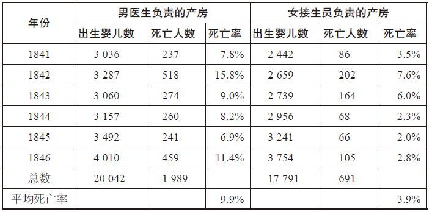

男医生负责的产房的死亡率是女接生员负责的产房的两倍多，这到底是为什么呢？

塞梅尔维斯想弄清楚的是，在男医生负责产房中分娩的孕妇，是否本身有严重的病情，体质更差，或是有其他方面的潜在病因。

不是，不可能是这样。临产孕妇被分配到哪种产房，这取决于她们是在一周中哪一天到达医院的，因为这两种产房以24小时为间隔轮流接纳临产孕妇。鉴于妊娠期是可以计算的，因此孕妇会在产期来临时去医院，而不是在其他方便的日子。这种分配方法虽然算不上是严格的随机，然而就塞梅尔维斯所要探究的问题而言，这的确暗示了一个事实：两种产房死亡率的差别，并不是由两种产房接纳临产孕妇总人数上的差异所导致的。

也许，上面所列出的一种胡乱猜测是事实：在为产妇接生的这种敏感而微妙的任务中，从某种程度上说，正是男性的在场害死了那些产妇？

塞梅尔维斯认定，这也是不太可能的。对两种产房中出生的婴儿死亡率进行分析后，他还发现了这样的事实：男医生负责的产房的婴儿死亡率比女接生员负责的产房高很多，分别为9.9%和3.9%。男婴和女婴的死亡率并没有什么不同。正如塞梅尔维斯所观察到的，新生婴儿“因为男医生接生而死亡”是不太可能的。因此，认为男性在场是那些产妇死亡的原因的推断是站不住脚的。

当时还有一种推测是这样的：男医生负责的产房接纳的临产孕妇，此前听说这里的死亡率很高，所以“惊恐万分，结果导致她们也染上了这种疾病”。塞梅尔维斯也不认同这种解释：“我们可以设想一下，在杀人无数的血腥战争中，士兵也一定惧怕死亡。然而，这些士兵并没有染上产褥热。”

不可能。男医生负责的产房必定有其特殊的地方，那可能是导致产褥热病的原因。

到目前为止，塞梅尔维斯已经确认了几个事实：

> ·即便在大街上分娩，随后才去医院的那些最贫穷的产妇，也没有患产褥热。

> ·子宫颈扩张超过24小时的产妇，“几乎毫无例外地都染上了产褥热”。

> ·医生没有因接触产妇或新生婴儿而染上疾病，因此，几乎可以肯定的是这种病不具有传染性。

然而，他仍然困惑不已。“一切因素都得考虑，一切都难以解释，一切都令人生疑。”他这样写道，“唯有一个事实不容置疑，那就是为数众多的死亡人数。”

一个悲剧发生后，他终于找到了答案。塞梅尔维斯所推崇的一位老教授，在一次不幸的医学事故发生后很快就去世了。当时，老教授带着一个学生做尸体解剖实验，突然那个学生的手术刀滑了一下，伤着了老教授的手指。塞梅尔维斯注意到，老教授死前的诸多症状，例如胸膜炎、心包炎、腹膜炎及脑膜炎，“与数百例患产褥热的产妇死前的症状相似”。

教授的死因不是什么难解之谜。他死于“已进入他血管系统的死尸粒子”（cadaverous
particle），塞梅尔维斯这样写道。那些死去的产妇，是否也有这种死尸粒子进入了血管系统呢？

当然！

那个时期，维也纳总医院和其他一流的医学院，都日益专注于研究解剖学，基本教学手段就是尸体解剖。对于需要了解疾病大致情况的医学院学生而言，有什么比用双手拿起衰竭的器官密切观察，进而在血液、尿液或胆汁中找出蛛丝马迹更好的方法吗？在维也纳总医院，每一个死去的病人，包括死于产褥热的产妇，都被直接送往解剖室。

离开解剖室后，医生和学生往往直接去了产房，至多洗一下手而已。要知道，直到此后10年或20年，医学界才接受细菌理论。后来的细菌理论证实，很多疾病是活着的微生物引起的，而不是动物神灵、陈腐的空气，也不是腹带太紧所致。在当时，塞梅尔维斯弄明白了这其中的缘由。引发产妇产褥热的罪魁祸首正是医生，因为是他们将死尸粒子带给了产妇。

这解释了男医生负责的产房的死亡率比女接生员负责的产房的死亡率高得多的事实。同样，男医生负责的产房的死亡率为什么比在家中甚至在大街上分娩更高？为什么子宫颈扩张时间越长，产妇就越容易患上产褥热？这一切都有了合理的解释。子宫颈扩张时间越长，这个产妇就越是需要医生和学生助产，而伸进（可能伤及）子宫的那只手，因为刚做过解剖实验，还留存有死尸粒子。

“我们中没有一个人知道，”塞梅尔维斯后来懊悔地说，“正是我们自己导致了无数人的死亡。”

得益于他的发现，这场瘟疫终于得到控制。他命令所有医生和学生，做完尸体解剖手术后双手都必须用含氯消毒水消毒。男医生负责的产房的死亡率大幅下降，降至1%。在此后的12个月中，塞梅尔维斯实施的措施，挽救了300位母亲和250个婴儿的生命，这仅仅是一家医院的一个产房所挽救的生命总数。

《劳动法》也会损害劳动者

我们前面提到过，非预期后果法则是影响最大的客观存在的法则之一。举个例子，政府往往会出台相关立法，旨在保护最容易受到伤害的被监护人，但法规的实施却又正好伤害了其保护对象。

我们来看看《美国残疾人法》（Americans with
Disabilities）。这是一部旨在保护残疾工人免受歧视的法律。意图高尚，对吗？绝对是。但是，有关数据充分表明，法律的实施却导致了美国残疾人的就业岗位越来越少。为什么呢？《美国残疾人法》正式实施后，雇主十分担心自己不能约束和管制那些表现不好的残疾工人，也不能随意解雇，所以他们就选择不再雇用残疾人。

《濒危物种法》的实施也产生了类似的副作用。当土地所有者担心他们的地产将成为濒危物种（甚或将来的濒危物种）的理想栖身之所时，他们就会急着砍伐自己土地上的树木，使之不再适于动物栖身。最近几年来，成为土地所有者这种“怪招”受害物种的，就包括赤褐倭鸺鹠和红顶啄木鸟。有些环境经济学家认为：“《濒危物种法》的实施实际上正在危及这些物种，而不是起到了保护作用。”

政治家有时也会以经济学家的方式思考问题，用金钱鼓励人们多做好事。近年来，很多政府开始根据处理的垃圾量收费。他们认为，如果人们要为自己造的每一袋垃圾付钱，那么人们就会少制造垃圾。

但是，这种新的收费方式也会使人们产生另一种动机：将垃圾袋塞得更满（现在人所共知的一种策略），或把垃圾倒进树林里（在弗吉尼亚州的夏洛维茨尔镇，不少人就是这么干的）。在德国，为了避免缴纳垃圾税，有些人就会把剩菜剩饭倒进马桶冲掉，结果导致老鼠大量出没于下水道。爱尔兰开征新的垃圾税后，将垃圾埋在后院的现象开始激增，这不仅导致环境污染，还对公共卫生极为不利：都柏林的圣詹姆斯医院的记录表明，将垃圾埋在后院、结果“危害自身”的病人数量，几乎是原来的3倍。

数千年来，出于好意实施的法律，总在产生有违初衷的结果。记载于《圣经》中的一条犹太法典，要求债权人在每个安息年（也就是第七年）赦免债务人的所有债务。债权人单方面赦免债务，这对债务人产生的强大诱惑力，我们无论怎么形容都不过分，因为如果不赦免债务人的债务，债务人逾期不还钱，会受到极其严厉的惩罚：债权人甚至可以将债务人的孩子作为奴隶带走。

不过呢，如果你就是债权人，那么你所站的立场就会不同了。如果某个鞋匠可以在安息年把借条撕掉，那么为什么要借钱给他呢？

于是，债权人便钻法律的空子，待安息年一结束就往外放贷，并在第五年或第六年捂紧钱口袋，结果造成周期性信贷紧缩危机，借款人为此陷入困境，旨在帮助穷人的法律所起的作用适得其反。

然而，虽然历史上非预期后果比比皆是，但没有几个例子可与塞梅尔维斯的发现相提并论：医生在追求救死扶伤的医学道路上，开展了数千例的解剖实验，结果这些解剖实验却又导致了成千上万的人丧命。

当然，令人欣慰的是，经过出色的数据分析，塞梅尔维斯最终找到了如何结束这场灾难的方法。塞梅尔维斯找到的解决方案即医生洗手时喷洒点含氯消毒剂，这简直是匪夷所思的简单，成本令人惊讶的低廉。在一个物质富足的当今世界，采用简单、成本低廉的解决方法，有时会遭到无端的指责；有鉴于此，我们要在本章中为之辩护。

在分娩领域，我们还有个可能让人啼笑皆非的案例，说服力极强——医用钳子。产妇生产时，如果胎儿足位或臀部先出，那么胎儿卡在子宫颈中的概率是很高的，在这种情况下，胎儿和产妇都会面临极大的生命危险。有了医用钳子，普普通通的金属制成的钳子，医生或助产士就可以让胎儿在子宫内转位，随后熟练地将胎儿从子宫中拉出来——头部先出，就像从炉子里把烤乳猪弄出来一样。

是的，这种钳子用起来十分有效，本该能挽救许多生命，但实际上却没有。据说，医用钳子是17世纪初叶伦敦的一个妇产科医生发明的，他的名字是彼特·钱伯伦（Peter
Chamberlen）。医用钳子非常好用，结果钱伯伦固守这个秘密，不予公开，只在家族事业中使用。直到18世纪中叶，医用钳子才在医学界得到广泛使用。

保守这项技术秘密造成的代价有多大？根据外科医生兼作家阿图尔·葛文德（Atul
Gawande）的说法，“肯定导致了数百万人死亡”。

硝酸铵养活了整个世界？

最令人叫绝的一点就在于，成本低廉的简单方案往往能解决那些看似无解的问题。毫无疑问，新的塞梅尔维斯或塞梅尔维斯团队又会出现，并将引领我们走出许多困境。这样的例子在历史上不胜枚举。

在基督时代的早期，也就是在2000多年前，我们地球上的总人口大约为2亿。到1000年时，总人口仅仅增长到3亿。即使到了1750年，总人口也才为8亿。饥荒是一个社会问题，智者声称这个星球可能无法再承受更大、更快的发展。英格兰的人口一直在减少，有位历史学家是这样写的，“从根本上说，这是因为农业没能同步发展，无法养活不断增多的人口。”

历史的车轮行进到了农业革命时期。各种各样的简单创新，包括发现高产农作物、发明更好用的农具、更有效地使用资金等，都改变了农业耕种的方式，进而改变了地球的面貌。18世纪末叶的美国，“要养活美国全部人口并仍有富余粮食出口的话，那么每20个人中就得有19个人从事农业活动。”经济学家米尔顿·弗里德曼如此写道。而200年以后，虽然美国人口更多，但要养活他们，同时使美国成为“全球最大的粮食出口国”，每20个人中只需1个人从事农业活动就够了。

农业革命解放了数以百万计的劳动力，于是他们得以抽身转战其他领域，随后又推动了工业革命的进程。1850年，全球人口规模已增至13亿；1900年，增至17亿；1950年，已达26亿。此后，人口真的可以说是在爆炸性地增长。此后50年中，全球人口规模已翻一番，远远超过了60亿的关口。如果你一定要找出此番人口激增的原因，那就是硝酸铵。这是一种便宜得惊人却又十分有效的化肥。如果我们说是硝酸铵养活了整个世界，这并不是在夸大其词。农业经济学家韦尔·马斯特斯（Will
Masters）说过，如果硝酸铵一夜之间便消失得无影无踪，“那么，大多数人只能回归吃谷物和块根农作物的年代，而肉类和水果只有富人才能享受得起，而且只有在特殊的日子人们才能尝一尝”。

从捕鲸到石油开采

我们来看看鲸。从远古开始，人类就开始捕鲸，到19世纪，捕鲸收获的经济利益巨大，这让美国成为野心勃勃、干劲十足的强国。鲸遍体都是宝，都可以为人类所用，从这个意义上说，鲸成了满足快速发展的美国需求的“一站式购物广场”，用于生产颜料和清漆、纺织品和皮革、蜡烛和肥皂、衣服，当然还有食物（鲸的舌头尤其是难得的美食）。优雅女士尤其钟爱鲸，因为鲸油和鲸骨等可用来制造紧身衣、项链、遮阳伞、香水、梳子和红布染料（红布染料除了从鲸身上提取外，还来自鲸的排泄物）。来自鲸的所有产品中，鲸油的价值是最高的，不仅可以用作机械设备的润滑油，还能用作灯油。《海中巨兽》（Leviathan）的作者埃里克·杰伊·多林（Eric
Jay Dolin），曾在他的书中写道：“美国鲸油照亮了世界。”

全球各地的捕鲸船只有900艘，游弋在四大洋中寻找目标，其中美国捕鲸船只为735艘。1835——1872年，全球的捕鲸船只捕获了大约30万条鲸，算下来，平均每年收获7700多条。在运气好的年份，捕鲸所得的鲸油和鲸须（像骨头一样的“牙齿”）就能卖得1000多万美元，相当于现在的2亿美元左右。捕鲸是一项极其危险的艰难工作，但这竟然是美国的第五大产业，7万名劳动力从事这一行业。

随后，看似取之不竭的资源——非常快，反思过后，其实也是显而易见的——逐渐枯竭了。鲸已经很少了，而捕鲸船只太多了。要在以前，一艘捕鲸船要满载鲸油而归，只要在海上漂泊一年，而现在则需要辛苦地干上四年。鲸油价格随之猛涨，整个经济受到巨大影响。这一庞大的产业曾被视为那种“越大越不会垮”的产业，然而如今看来，捕鲸业确确实实地垮掉了，并对美国造成了较大的冲击。

也正是这个时候，一位名为埃德温·德雷克（Edwin
Drake）的退休铁路工人，开始采用蒸汽发动机为钻机提供动力，在宾夕法尼亚州泰特斯韦尔深达70英尺的岩页和基岩钻孔。他发现了石油，由此未来一片光明。如今，我们发现美国地下蕴藏着如此丰富的能源，只等我们把它们开采。反观过去，我们要在大海中追逐海洋巨兽，捕杀它们，还要开肠破肚，运气不好会丢胳膊断手，甚至还有可能送命。为什么不放弃捕鲸呢？

石油不仅开采成本低，还与鲸一样具有多种用途。可用作灯油、润滑剂，也可用作汽车和住房供热的燃料；可加工处理后制成塑料，甚至还能成为尼龙袜的原料。新兴的石油产业也为那些从捕鲸业中退下的劳动力提供了大量的工作岗位，而且出人意料的是，这个产业早就起到了《濒危物种法》的作用：可以拯救那些濒临灭绝的鲸。

没有什么医疗手段比疫苗更简单

到20世纪早期，大多数传染性疾病（例如天花、白喉等）已逐渐绝迹。然而，脊髓灰质炎（俗称小儿麻痹症）却拒绝缴械投降。

我们很难弄出一种比脊髓灰质炎更令人恐惧的疾病出来。“这种病无法预防，没法治愈。全世界每个地方的小孩，都可能染上这种病。”因撰写《脊髓灰质炎在美国》（Polio:An
American Story）而荣获普利策奖的作家大卫·M·奥新斯基（David
M.Oshinsky）这样说，“孩子得了这种病意味着，父母会担惊受怕，惶惶不可终日。”

脊髓灰质炎也是一个难解之谜，病例总在夏天激增，原因不明。（有关脊髓灰质炎的染病原因，有个众所周知的误解。有些研究人员怀疑是夏天吃冰激凌太多，从而引发了脊髓灰质炎。）起初，人们认为贫民区的移民小孩，尤其是男孩，容易得这种病，但后来发现女孩也会患这种病，而且生活在绿树成荫、枝叶繁茂的郊区的富人小孩也不例外。就连罗斯福总统竟然也患上了这种病，他住的地方可离贫民窟十分遥远，而且当时已39岁，绝不在什么孩童期了。

脊髓灰质炎每爆发一次，就会引起新一轮的隔离措施及恐慌的蔓延。父母会让他们的孩子远离朋友、游泳池、公园及图书馆。1916年，美国历史上最严重的脊髓灰质炎疫情在纽约爆发。在被报告的8900个病例中，有2400人死亡，其中大多数都是5岁以下的儿童。这种疾病来势汹汹，一路高歌猛进。1952年是迄今为止疫情最严重的一年，美国报告的病例为57000例，其中3000人死亡，21000人终身瘫痪。

从严重脊髓灰质炎病症中捡回性命的，实际上比死亡好不了多少。有些受害者失去了双腿，终其一生活在苦痛中。那些患有呼吸麻痹的受害者，事实上是依靠“铁肺”存活，那是一种替代衰竭胸肌工作的体积庞大的机器。存活的脊髓灰质炎受害者群体，在其成长过程中花费的医护成本之高，令人咋舌。“在那时，拥有医疗保险的美国家庭还不到10%。”奥新斯基写道，“一个脊髓灰质炎患者的护理费用（每年大约900美元），事实上超过了人们的平均年薪（875美元）。”

之后，作为两次世界大战的胜利者，美国成为全球实力最强大的国家，前途一片光明。然而人们有理由担心，仅此一种疾病在未来就会耗费较大比例的医疗护理预算，从而严重拖累这个国家。

随后，一种疫苗，实际上是一系列的疫苗被研发出来了，脊髓灰质炎疫情被有效控制住。

如果我们将脊髓灰质炎疫苗称为一种“简单”的解决方案，这似乎低估了相关人员所做的贡献，他们曾为遏制脊髓灰质炎蔓延不知疲倦地忘我工作：医学研究人员，其中乔纳斯·索尔克、阿尔伯特·萨宾的贡献尤其突出；筹集资金的志愿者奥新斯基写道，出生缺陷基金会是“美国迄今为止最大的慈善军团”。当然，我们也不能忘记为医学献身的其他动物（成千上万只猴子被运送到美国，接受疫苗测试）。

从另一个角度来看，没有什么其他医疗手段比疫苗来得更简单。我们来看看战胜疾病的两种手段。

第一种，疾病一出现便研究出一种治疗手段或发明一项技术，从而达到治疗疾病的目的（例如开胸手术）。这种方式的成本往往非常高昂。

第二种，在疾病大规模爆发之前研制出一种药物，从而达到预防疾病的目的。从长远来看，这种方式的成本往往非常低廉。

医疗护理研究人员估算过，如果当时脊髓灰质炎疫苗没被研制出来，那么目前美国脊髓灰质炎患者将至少达到25万人，每年在这方面的医疗支出至少达300亿美元。而且，这还根本就没有将“病人饱受折磨、死亡及恐惧心理等无形成本”计算在内。

脊髓灰质炎疫苗是既便宜又简单的解决办法，堪称经典案例，然而这类例子之多，不胜枚举。治疗溃疡的新型药物，减少了大约60%的手术治疗；后来研制出的治疗溃疡的更便宜的药物，则每年为溃疡患者节省了大约8亿美元的费用。医学界用锂治疗躁狂抑郁性精神病的头25年，大约就节省了1500亿美元的住院费用。即使只是简单地在自来水中加氟，每年也能减少大约100亿美元的牙齿治疗费用。

我们此前提到过，过去几十年来，心脏病死亡率已大幅下降。可以肯定，移植术、血管成形术及支架术这类昂贵的治疗手段功不可没，对吧？

事实并非如此：这类治疗方案在心脏病死亡率下降中发挥的作用之小，可以说是令人吃惊的。心脏病死亡率下降，一半要归功于高胆固醇和高血压这类危险因素的减少，因为这两者的治疗药物都相对较为便宜。导致心脏病死亡率下降的其他原因，则是某些极其便宜的药品发挥的作用，例如阿司匹林、肝素、血管紧张素转化酶抑制剂及β–受体阻滞剂。

安全带有多安全？

20世纪50年代初期，自驾游在美国极为风行，美国道路上行驶的汽车总数大约为4000万辆。1952年1月，全美汽车经销商协会召开了第35届年度大会。在这次大会上，百路驰轮胎公司的一位副总裁，却发出了舒适驾车的年代即告终结的警告：“如果交通事故死亡率持续上升，那么这将严重影响汽车销量，因为很多人将不再开车。”

1950年，美国死于交通事故的总人数大约为4万。这个数字大约与目前死于车祸的人数差不多，但是这种简单的数字对比极易产生误导作用，因为过去汽车行驶里程比现在要少得多。例如，1950年每英里的死亡率是现在的5倍多。

那么，那时的死亡率为什么这么高呢？原因有很多，例如汽车质量缺陷、公路质量差、司机粗心大意。然而，有关汽车相撞的机械力学问题，人们知道的并不多，汽车行业也从未认真调查过这一问题。

让我们关注一下罗伯特·斯特兰奇·麦克纳马拉。今天，他在人们心目中的形象，就是越战时遭人唾骂的美国国防部长。麦克纳马拉被人妖魔化的一个原因就在于，他往往根据统计分析，而不是情感或政治考量来做决策。换言之，他的行为方式很像经济学家。

这绝非偶然。起先他在加州大学伯克利分校就读，后又继续在哈佛商学院深造，随后留校任教，成为一位年轻的会计学教授。“二战”爆发后，他投笔从戎，因为在统计分析方面才能出众，最终被调进了陆军航空队所属的统计管制处。

他领导的团队以数据为武器来打仗。举个例子，他们发现，从英格兰起飞飞临德国上空执行任务的美国轰炸机，出动架次取消率出奇的高，大约占20%。对于为什么没能飞抵目标上空，轰炸机飞行员给出了各种各样的理由：电子系统故障、电台信号时断时续或身体不适。然而，经过对数据的缜密分析之后，麦克纳马拉认定，他们简直就是在“胡扯”，真正的原因是恐惧。“因为大多数飞行员在执行轰炸任务时都会牺牲，他们知道这点，于是便找借口不飞临空袭目标上空。”

麦克纳马拉将这个发现上报给指挥官，也就是那个众所周知的刚愎自用的柯蒂斯·勒梅（Curtis
LeMay）。对此，他的回应是身先士卒，亲自驾驶轰炸机编队的引航机，带队执行轰炸任务，发誓要将胆敢“掉”头鼠窜的驾驶员送交军事法庭处置。麦克纳马拉说，出动架次取消率“一夜之间急剧下降”。

战争结束后，福特公司邀请麦克纳马拉和他的团队成员加入，希望他们将统计分析绝技应用于汽车行业。麦克纳马拉原想返回哈佛大学任教，但是他和他的妻子两个人都欠下了大量的医疗费，其中就包括治疗脊髓灰质炎的开支。因此，他接受了福特公司的工作邀请。不论从传统的何种意义上说，他都不是一个“汽车人”，然而他在公司却迅速脱颖而出，进入了高层。一位史学家后来写道：“他为一些全新的理念而着迷，例如汽车安全、燃油节省及基本用途。”

麦克纳马拉尤其关注汽车事故致死和伤人问题。于是，他问那些“汽车人”这个问题产生的原因是什么。他得到的回答是，没有什么统计数据可用来分析这个问题。

当时，康奈尔大学有些航空研究人员正设法防止飞机致死问题，于是麦克纳马拉聘请他们调查汽车相撞事故。在康奈尔大学的住宅公寓里，他们将人类的头盖骨用不同的材料包起来，然后沿楼梯井扔下去。实验结果表明，人类头盖骨根本就撞不过汽车内部所用的坚硬材料。“在汽车相撞事故中，司机身体往往都被方向盘给刺穿了。”麦克纳马拉说，“乘客受伤则往往因为撞上了挡风玻璃、横梁或仪表盘。”于是，麦克纳马拉规定，新出厂的福特车型要配备更安全的方向盘，仪表盘也要加装衬垫。

他意识到，最佳的解决方法也是最简单的。发生事故时，既然乘客整个人会被猛烈地掀起来，随后头部就会撞在车上某个部位。如果不让乘客被抛起来，岂不更好？麦克纳马拉想，飞机都配有座椅安全带，汽车为什么不能配呢？

“我估计过佩戴安全带每年可以减少的死亡人数，数字非常大。”他说，“而且，花费很少，佩戴安全带也没有什么不适。”

麦克纳马拉要求，福特出产的所有汽车都配装安全带。“我飞到得克萨斯，去参观一个组装厂。”他回忆说，“当时是组装厂的那位经理在机场接我的。上汽车后，我系好安全带，然后他说：‘怎么回事，对我的技术不放心？’”

事实证明，那位经理的反应折射出了大家对座椅安全带的普遍看法。在麦克纳马拉的老板看来，安全带“用起来不方便，还增加成本，不过是毫无作用的带子”。抱怨归抱怨，他们最终还是支持他的计划，同意在福特新车型中配装安全带。

麦克纳马拉当然是对的：座椅安全带最终挽救了很多条生命。但是，这里的关键词是“最终”。

这位才华横溢的理性主义者遭遇了强大的阻力，因为有关人性的一个重要观点就是改变行为是很难的。他感到心灰意冷。没错，面对一个亟待解决的问题，聪明的工程师、经济学家、政治家或父母，是可能想出成本低廉、简单可行的解决方法的。然而，如果这种方法要求人们改变行为方式，那么它可能就难以奏效了。每天，全球数以亿计的人，都在继续固守某种行为方式，虽然明知那些行为对他们有害，例如吸烟、赌博、骑摩托车不戴头盔。

为什么呢？因为他们就想这么着！他们或许从中获得了乐趣、刺激，或仅仅是从单调的日常生活中解脱出来，放松一下。因此，即使你说得再有道理，跟他们争得面红耳赤，要想让他们改变行为方式也是十分困难的。

座椅安全带的情形正是如此。20世纪60年代中期，美国国会开始制定国家安全标准，但过了15年，汽车座椅安全带的使用率仍然非常低，不过11%。可笑可叹！后来，得益于多种因素的影响，使用率才逐渐上升。例如，不系安全带，司机会收到交通告票；耗资巨大的交通安全意识宣传活动；安全带没扣上，汽车就会发出烦人的警告声，仪表盘上的灯就会不停闪烁。社会逐渐认同了这个事实：扣上安全带并不意味着对司机的侮辱——怀疑其驾驶技术。20世纪80年代中期，汽车座椅安全带的使用率升至21%；1990年，升至49%；20世纪90年代中期，升至61%；如今，使用率已超过80%。

美国汽车交通事故的每英里致死率降幅如此之大，其中一个主要原因正在于此。使用安全带将死亡危险降低了70%；自1975年以来，安全带已挽救了大约25万条生命。今天，交通事故每年夺走的生命仍然高达4万条，但是相对而言，驾车已全然没有过去那么危险了。如今交通致死人数如此之多的原因在于，太多的美国人在汽车上度过了如此之多的时间，每年驾车的里程数大约为3万亿英里。换算一下，即驾车每行驶7500万英里的路程，就会有一人死于车祸，或者也可以用另一种方式来表述：如果一个人每天以每小时30英里的速度驾车，24小时不停歇，那么这样连续开上285年，就会死于一次车祸。在非洲、亚洲和中东的很多国家，安全带的使用还远没有普及，与这些国家的交通事故致死率相比，在美国驾车的危险系数比你坐在沙发上遭遇意外事故的危险系数高不了多少。

而且，大约25美元一个的安全带，是研发出的所有救命装置中性价比最高的一种产品。在某个确定的年份，给美国所有汽车配装安全带大约要花5亿美元，这意味着每挽救一条生命的成本大约是3万美元。我们如何将安全带与其他复杂的安全产品（例如充气气囊）做比较呢？配装充气气囊，每年要花40多亿美元，也就是说每挽救一条生命为此付出的成本为180万美元。

2009年7月，罗伯特·麦克纳马拉与世长辞，享年93岁。在他离世的前不久，他还告诉我们，他仍然希望安全带使用率达到100%。“很多女性往往不用斜跨式安全带，因为她们扣上后觉得不舒服，这种安全带在设计时并没有考虑女性乳房的舒适度。”他说，“其实不用太费心思，就可以设计出使用更舒服的安全带，进而提高使用率。”

他对女性使用安全带的看法，可能对，也可能不对。但是毫无疑问的一点是，安全带在设计上的考虑不周，的确影响了一个群体——儿童。

儿童座椅的安全效应

有时候，年龄小、未成年的身份是占尽优势的。当一个四口之家驾车外出时，小孩通常都被父母安排在汽车后座，而父母则坐正副驾驶座。小孩子不知道的是，他们比父母幸运：如果发生汽车相撞事故，坐后座要比坐前座安全多了。不仅如此，小孩比父母幸运的地方还在于，发生车祸时，如果父母坐在前排，因为更重、体形更大，所以也就更容易在外力的作用下猛烈地撞上某个坚硬的东西。因为小孩是需要保护的未成年人，所以父母把他们安置在后座。可是，当仅有父母两人驾车外出时，如果其中一人坐后排，而把另一个留在前排的“烈士”座位上，这难免有点说不过去。

如今，座椅安全带已经是所有汽车后座的标准配置。然而，安全带是针对成人而不是小孩设计的。如果你设法给你的3岁宝宝系上安全带，那么腰带就非常松，而肩带则会压住小孩的颈部、鼻子或眉心，而没有跨在肩部。

幸运的是，我们生活在一个珍视、保护儿童的世界中，上述问题的解决方案已经找到了：儿童安全座椅，也就我们通常所说的儿童座椅。20世纪60年代投放市场时，起初只有那些最担心孩子安全的父母如遇珍宝般地喜爱这玩意儿。在医生、交通安全专家及儿童座椅制造商的大力倡导下，儿童座椅的普及率逐渐上升，最后政府也加入进来号召人们使用。1978——1985年，美国各州都出台了相关法律，规定小孩坐车时没被固定在通过美国政府撞击测试标准的儿童座椅上的做法，都是违法的。

过去，机动车交通事故是导致美国儿童死亡的主要元凶；如今，情形依然如故，但是儿童死亡率已大幅下滑，这主要是儿童座椅的功劳。

当然，安全不是免费获得的。美国人一年购买了400万个儿童座椅，花掉了3亿多美元。一个小孩，在其成长过程中，往往就会用到三种不同的座椅：婴儿用面朝后座椅；1——3岁孩童用更大一点的面朝前座椅；3岁以上儿童用增高型座椅。此外，如果这个孩子还有兄弟姐妹的话，那么他的父母可能就得购置一辆SUV或轿厢车，因为要同时放几个儿童座椅的话，只有这类车才够宽敞。

儿童座椅方案也没有大多数人想象的那么简单。座椅的零部件（包括带子、绳子、基座）是由数十个厂家生产的，而由其中一家组装，这个座椅必须与汽车已配装的安全带组合好，固定到合适位置。汽车后座的造型本身就因为厂家不同而各有差别，所以座椅配装的安全带也互不相同。此外，汽车安全带的设计初衷是用来“固定”成年人的，而不是捆绑体积这么小的塑料方块。根据美国国家高速公路交通安全管理局的数据，80%以上的儿童座椅安装不当。众多父母不辞辛苦地赶到当地警局或消防站，寻求儿童座椅的安装方法，原因就在这里。同样，美国国家高速公路交通安全管理局为警员提供培训，讲授全国统一的儿童乘客安全课程，为期4天，培训资料厚达345页，教授他们如何正确安装儿童座椅，也正是基于上述原因。

虽然儿童座椅既不简单，成本也不低廉，谁又在乎呢？并不是每种产品都有我们想象中的那样棒。让警员花4天时间，去掌握如何安装如此重要的安全设备，这难道不值得吗？真正重要的是儿童座椅是否有用，能否挽救儿童的生命。根据美国国家高速公路交通安全管理局的资料，儿童座椅的确有效，对于1——4岁的孩子，其致命危险下降了54%，降幅极大。

好奇的父母可能会问：54%的降幅是怎么得出的？

在美国国家高速公路交通安全管理局的网站上，很容易找到答案。这个机构拥有极具价值的官方数据，即死亡事故分析报告系统（Fatality
Analysis Reporting
System），是警局自1975年以来报告的美国所有致死车祸的数据汇编。这个系统记录了你能想象到的所有数据——事故所涉汽车的类型和数量、速度、星期几、乘客所坐的位置，还包括乘客是否使用安全设备。

调查结果发现，使用儿童座椅的孩子比完全没有任何设备保护——根本没用儿童座椅，没扣上安全带，什么措施也没采取——的乘车小孩，在交通事故中致死的概率低54%。这就说得通了，汽车相撞是非常猛烈的，血肉之躯坐在高速行驶的厚重金属物体中，而当这个金属物体刹那间停下来时，可想而知肉体会遭遇多么可怕的撞击。

可以说，复杂、成本高的新方案（儿童座椅）比简单、便宜的旧方案（安全带，设计初衷并不是针对儿童）好，但是到底好多少呢？

对于两岁以下的小孩来说，安全带完全派不上用场。孩子个儿太小了，因此儿童座椅是将他们固定起来的最佳实用方式。那么，其他年龄的儿童又是什么情形呢？美国各州的法律各有不同，但大体来说，六七岁以下的儿童乘车必须使用儿童座椅。儿童座椅给这些儿童到底带来了多大的益处呢？

快速浏览一下30年来的死亡事故分析报告系统的原始数据，你会发现一个令人大跌眼镜的结果。就两岁以上（包括两岁）的儿童而言，在致死的汽车相撞事故中，使用儿童座椅与佩戴安全带的儿童的死亡率几乎一样：

表4–2 使用儿童座椅与佩戴安全带的儿童在事故中的死亡率

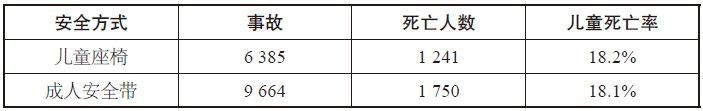

之所以如此，或许是这些数据具有误导性；或许使用儿童座椅的儿童遭遇的车祸更为可怕，或许他们的父母经常夜间开车，或路程更危险，又或者是因为车况不太好。

然而，即使用最缜密的经济计量分析方法分析死亡事故分析报告系统中的数据，我们得到的结果还是一样。不论近期还是更为久远的交通事故，不论是宽敞的还是小型的汽车，不论是单车车祸还是多车相撞事故，均没有证据表明，在挽救两岁以上（包括两岁）的儿童生命方面，儿童座椅的表现比安全带更好。在一些汽车相撞事故中，比如追尾事故，儿童座椅的表现实际上还略微糟糕一点。

因此，问题的症结可能在于，正如美国国家高速公路交通安全管理局所承认的，太多儿童座椅的安装都存在问题。（或许你会认为，适合4岁小孩的安全装置，竟然只有20%的父母会正确安装，那么这种座椅从一开始就不能算是一种极好的安全设备；与儿童座椅的安全性相比，印度人用的避孕套似乎可以说是极为安全而可靠了。）或许，儿童座椅的确是一种神奇的设备，只是我们没有学会如何合理使用罢了，是这样吗？

为了回答这个问题，我们开始用心寻找汽车撞击测试数据，试图对儿童座椅和安全带做一番比较。你或许认为这些数据不难找到。投放市场的每个儿童座椅，都是撞击测试达标后才获准上市的。然而，儿童座椅研发人员几乎没有就儿童体形大小做过事故模拟测试。因此，我们决定自己做。

我们的测试计划很简单，将启动两轮撞击测试。撞击测试模拟速度30迈的汽车正面相撞的情形。第一轮测试中，首先将3岁儿童体形的人体模型固定在儿童座椅上做测试，接着将同样的人体模型扣上安全带（腰带和肩带并用）做测试。第二轮测试中，首先将6岁儿童体形的人体模型固定在增高型儿童座椅上测试，接着将同样的人体模型扣上安全带（腰带和肩带并用）做测试。

找到一家愿意做这个测试的撞击测试实验室，我们可是颇费周折，尽管我们愿意为此支付3000美元。（嘿，进行科学实验也是要付出代价的。）全美只要看起来能做这个实验的机构，通通拒绝与我们合作，但是最后我们终于找到了一家收费机构。然而，这家机构的主任告诉我，不要透露这个实验室的名字，因为儿童座椅是他们实验室的核心课题，他担心儿童座椅生产厂家会终止与他们的业务联系。不过呢，他说自己是“科学实验迷”，因此也期待实验结果。

飞到这个不便透露名字的地方后，我们在玩具反斗城购买了一些新的儿童座椅，随后便驱车前往实验室。然而，当值班工程师听我们讲了要做的实验详情后，他表示拒绝参与。他说：这是一个白痴实验，毫无疑问，儿童座椅的表现会更好；如果用他们实验室价格不菲的仿真人体模型做测试，将之固定在安全带（腰带和肩带并用）中，撞击冲击力十之八九会将模型撕成碎片。

居然有人担心撞击测试会损毁仿真人体模型，这听起来十分搞笑。难道仿真模型不就是用来做撞击测试的吗？然而，当我们表示如果固定在安全带中的模型被损毁，我们会予以补偿，那个工程师就着手干了起来，尽管仍抱怨个不停。

实验室的模拟条件很好，儿童座椅可以在测试中表现出最佳性能。儿童座椅被安全带稳妥地固定在旧式的长椅后座。可以料想在固定座椅方面，经验丰富的撞击测试工程师可要比普通父母娴熟得多。

从头到尾，整个任务烦琐、折磨人，令人不堪忍受。人体仿真模型身着短裤、T恤和运动鞋，在头部和胸部受到的撞击力时，一大堆乱七八糟缠绕在一起的金属线从模型身体里钻出来。

首先做第一组测试，针对3岁儿童大小的模型，一个使用儿童座椅，另一个佩戴汽车标配安全带（腰带和肩带并用）。只听“砰”的一声，风动碰撞滑车瞬时就加速跑了起来。在第一时间，你无法看到什么结果（令我们大松一口气的是，固定在安全带中的仿真模型并没有四分五裂）。然而，当以超慢速回放整个过程时，你看到的是仿真模型的头、双腿及胳膊都向前撞去，手指在空中乱舞，接着头又反弹回来。接着继续做针对6岁儿童大小模型的第二组测试。

没用几分钟，我们就有了结果：成人用安全带通过撞击测试完全达标。根据测试所得的头部及胸部撞击强度数据，不论是使用儿童座椅，还是佩戴标配安全带，小孩都不太可能在这种强度的撞击事故中受伤。

那么，老式安全带的可靠性到底有多大呢？

相对于儿童座椅的各项保护标准，老式安全带都一路领先。我们可以这样设想一下：如果我们把安全带实验结果提交给美国政府，并告诉他们，这份数据来自我们最新、最棒的儿童座椅实验，鉴于儿童座椅与罗伯特·麦克纳马拉在20世纪50年代大力推广使用的尼龙安全带功能一样，可以想见，儿童座椅就能轻松获得政府批准。既然普通的老式安全带就能达到政府就儿童座椅规定的安全标准，或许，反过来看，儿童座椅生产厂家生产的产品没能胜过汽车标配安全带，这就不那么令人吃惊了。让人感叹，但并不奇怪。

大家可以想见，因为我们并不欣赏儿童座椅，这个事实让我们成为绝对少数派。（如果我们两人没有养育6个孩子的话，我们完全可能被贴上“讨厌孩子的主儿”这类标签。）对我们发起强有力挑战的一种观点，被称为“安全带综合征”。一组知名的儿童安全研究人员警告说，撞击测试用人体模型通常没装传感器，所以无法准确测试颈部和腹部的受损强度；而在车祸发生时，安全带会对儿童造成极为严重的伤害，其说法之恐怖类似于急诊室中令人毛骨悚然的案例。这些研究者的数据来自对车祸受伤儿童的访谈，得出的结论是，较之于汽车标配安全带，增高型儿童座椅大大降低了儿童的受伤率，降幅大约为60%。

可以肯定，这些研究者是出于好意，其中很多人还十分关心受伤儿童。但问题是，他们的观点对吗？

基于多种不同的原因，采访父母并不是获得可靠数据的理想方法。因为车祸的缘故，父母可能受到极大的心理创伤，因而可能会记错事发细节。还有个问题就是，父母不一定就是在讲真话，他们是研究人员从保险公司的资料库里找寻的。想想看，如果你承认孩子在车祸事发时没有系安全带，或许你会感到很大的社会压力（或者，你认为保险公司会因此提高保险费率，从而你就会面临财务压力），所以你会说，你的小孩使用了安全设备。警局的事故报告会说明发生车祸的汽车中是否有儿童座椅，所以撒谎就不太容易。但是每个汽车后座都配有安全带，因此即使你的孩子在事发时并没有系安全带，你也可能说他系了，而其他任何人想要证明他没系都很难。

除了通过对父母进行访谈获得数据外，还有没有其他数据来源可供利用，进而帮助我们回答有关儿童受伤方面的重大问题呢？

死亡事故分析报告系统的数据没用，因为该系统只统计致死事故的数据。然而我们的确找到了另外三个数据来源，覆盖了所有汽车相撞事故的数据。一个是全美范围的抽样数据库，其他两个分别来自新泽西州和威斯康星州。这三个数据来源囊括了900多万例交通事故。威斯康星州的数据尤为有用，因为它包括受害者出院情况，这有助于我们更好地评估受害者受伤的程度。

分析这些数据后，我们发现了什么呢？

从预防重伤的情形来看，标配安全带（腰带和肩带并用）与2——6岁儿童用的安全座椅表现同样出色。但是从轻伤的情况看，儿童座椅的表现更好：与使用安全带相比，受伤的概率大约下降了25%。

且慢，现在不要把你的儿童座椅拿出去扔掉。（在美国所有50个州，这都是违法的。）儿童是如此重要的“货物”，因此，即便是只在预防轻伤方面有点儿作用，那么儿童安全座椅也算得上性价比不错的投资。况且，儿童座椅还能带来另外一个好处，这可是无法用价格来衡量的——父母内心的安宁。

我们换个角度来看，或许父母内心的安宁就是儿童座椅的最大成本所在。儿童座椅给父母带来一种错误的安全感，他们深信自己已尽了最大努力保护孩子。这种自鸣得意的心态，正好束缚了我们努力寻求更佳安全方案的尝试，殊不知，还有操作更简单、成本更低廉的方案能挽救更多的生命。

假设现在由你负责从头再来，确保儿童乘车的安全事宜。你真的认为最佳方案在于设计一种最适合成人的装置，然后用来把孩子固定在车里吗？每种汽车的座椅各不相同，你真的会允许这种玩意儿由数十个不同的厂家生产，同时又要在所有汽车中发挥作用吗？

接下来的这种想法比较极端：既然坐在汽车后座的一半乘客是儿童，那么，如果我们从一开始就针对儿童体形来设计安全带，情形又会如何呢？采用业已被证明过的方案，碰巧也是便宜而简单的方案，即改变安全带的设计，不论是设计成可调节安全带，还是嵌入折叠式安全带（的确有这种，虽然还没广泛使用），而不是依赖成本高、使用麻烦而且效果不佳的方案，难道不更合理吗？

然而，现实却不是这样。美国各州州政府没有努力寻求确保儿童乘车安全的更佳方案，反而不断提高儿童从安全座椅“毕业”的年龄。欧盟则走得更远，要求大多数儿童年满12岁前，都得使用增高型儿童座椅。

哎，有什么办法呢？众所周知，政府不喜欢寻求更便宜、更简单的解决方案，相反，往往倾向于选择代价高昂、麻烦棘手的对策。注意以下这个事实：本章前面所举的案例中，没有哪一个方案是由政府官员首先提出的。就连脊髓灰质炎疫苗起先也是由一家民营机构开发的，即美国国家小儿麻痹基金会。罗斯福总统私人为之提供了种子基金，随后该基金会又各方筹集资金，并开展药物试验。即便是在职总统，也选择将如此重大的任务交付民营部门负责，这的确耐人寻味。

给汽车装配安全带的想法也不是政府提出来的，这是罗伯特·麦克纳马拉的功劳。他原想借此让福特公司获得更大的竞争优势。他彻底错了，在营销推广座椅安全带时，福特遭遇了极大的挑战，因为这种措施似乎在提醒客户：从根本上说，驾车是不安全的。正因如此，亨利·福特二世也才会向一位记者抱怨：“麦克纳马拉兜售的是安全理念，而雪佛兰卖的却是汽车。”

由飓风想到的

与此同时，有些问题则似乎什么应对方案都没有，不论简单还是复杂的。想想我们的大自然母亲，她常常慷慨地给我们送来毁灭性的灾难。相比之下，交通致死事故应对起来则要容易得多。

自1900年以来，全球有130多万人死于飓风（有些地方称台风和热带气旋）。在美国，飓风大约夺去了2万条生命，人员伤亡相对较小，但造成的经济损失则极大，平均每年损失100多亿美元。就2004年和2005年的飓风灾难来看，共发生6次飓风（包括卡特里娜飓风），给美国东南部地区造成的总损失高达1530亿美元。

为什么近些年造成的损失如此之大呢？因为更多的人正在迁往容易遭受飓风袭击的地区（生活在大海附近，总归是惬意的），他们中很多人会建起造价高昂的度假别墅（房地产遭受的总损失因此更大）。颇具讽刺意味的是，这些新迁来的住户之所以被吸引到大海附近地区，竟然是因为最近几十年飓风“十分罕见”的缘故，或许还有一个原因：正因为飓风罕见，所以这里的保费也格外低。

从20世纪60年代中期到90年代中期，受以60——80年为周期发生的大西洋数十年振荡（Atlantic
Multidecadal
Oscillation，AMO）的影响，大西洋的气候会逐渐变冷，随后又逐渐升温，在这种背景下飓风活动大为减弱。周期内的温度变化不大，温差只有几度。在气候较冷的时期，这种变化不会形成飓风；而在气温较高的时期，正如我们近年来所看到的那样，飓风则具有强大的破坏力。

从某些方面看，飓风似乎并不是如此难以应对的重大挑战。例如，飓风与癌症难题不同，因为飓风形成的原因已被人们洞察，地点可以预测，甚至飓风形成的时间段也为人们所掌握。大西洋飓风一般在8月15日至11月15日之间形成。随后通过“飓风路径”向西运动。飓风路径是指从非洲西海岸、途经加勒比海直到美国东南部的狭长海平面。当海洋的表层水温逐渐达到某一个临界点（26.7摄氏度）时，海洋上就会形成巨大的暴风，进而成为热机，这就是飓风。经过几个月的太阳照射之后，海面水温逐渐升高，这就是飓风仅在临近夏末时形成的原因所在。

尽管上述因素都是可以预知的，但是飓风之战是人类无法战胜自然的典型案例。一旦飓风形成，人类真的毫无迎战的办法。你所能做的唯一事情，就是逃之夭夭。

西雅图市，有一个酷爱探索未知世界的家伙，名叫梅尔沃德。他和他的朋友相信，他们已找到了应对飓风的方案。梅尔沃德拥有物理学背景，这是关键，因为这意味着他理解飓风的热性能。飓风不仅是一台发电机，还是一台没有“关闭”按钮的发电机。一旦这台发电机开始积聚热能，它就没法被关掉，威力无与伦比，是根本无法用一把大扇子给扇回海里去的。

梅尔沃德和他的朋友，其中大多数跟他一样，在某种程度上算是科学怪人，希望在热能有机会积聚之前使其消减，根源就在这里。换言之，他们希望阻止飓风路径上的海水获得太多的热量，进而掐灭毁灭性飓风形成的源头。军队有时会采用“焦土”作战策略，将那些可能对敌人有任何价值的东西全部焚毁。梅尔沃德和他的朋友希望采用的则是“冷海”策略，旨在防止敌人毁灭我们任何有价值的东西。

然而，或许有人会禁不住发问，这是否意味着迎战大自然母亲呢？

“毫无疑问，就是迎战大自然母亲！”梅尔沃德大笑，“你的意思似乎是说，挑战大自然就是有害的！”

确切地说，如果我们没有挑战大自然母亲，采用硝酸铵施肥，提高农作物产量，那么正在读本书的很多读者，很可能就没有机会来到这个世界。（或者，至少没有时间读什么书，因为他们得花整天的时间去四处寻找吃的来填饱肚子。）遏制脊髓灰质炎也是迎战大自然母亲的一种方式。我们用来阻止飓风洪灾的防洪大堤也不例外，尽管有时它们并不管用，卡特里娜飓风来袭时就是如此。

梅尔沃德所提出的对付飓风的方案非常简单，似乎是孩子也能想出的点子（当然，得是个聪明孩子）。从家得宝买来一些材料，甚或从垃圾堆里捡些，就可做成对付飓风的设备。

“关键在于改变海水的表面温度。”梅尔沃德说，“有趣的是，水温较高的海水表层非常薄，通常不超过100英尺；而表层以下全是非常冷的海水。如果你在这些海域有过潜水经历，你就能感到水温的巨大差异。”

温度较高的海水表层比下面的冷水轻，所以就浮在海表了。“因此，我们要做的就是改变这种状况。”他说。

位于薄薄的海水表层以下的冷水，有多少加仑，肯定是天文数字。然而，就是天文数字加仑的冷水，也无法减弱潜在灾难的破坏力。这是一个似乎能给人点希望，却又无法让我们知道个究竟的难解之谜！

然而，梅尔沃德有对策。大体说来，这种对策就是“充气内胎加裙摆”，也就是用能浮在水面的环形物，直径弄成30——300英尺都行，将一个柔软性很好的柱形容器固定其中。在报废的卡车内胎中间充满泡沫混凝土，然后依次将它们用钢缆牢牢地连接固定呈环形。柱形容器可以用聚乙烯材料（即塑料购物袋的原材料）来做，让它可深入大海600英尺。

“就是这样！”梅尔沃德得意地说。

工作原理呢？想想看，由很多内胎围成的环形物，活像一个巨大的人造水母浮在大海上。当温度较高的海浪攻进环形防御工事时，环形内部的水位就会上升，高于周边海平面。“当内胎内部的水位升高时，”梅尔沃德解释说，“这就形成了液压压头。”

在这种情形下，液压压头是由狂风施加给海浪的能量引发的一种力。在这种力的作用下，海表温度较高的海水会流入很深的柱形塑料容器，最终从容器底部涌出，注入很深的海洋之中。只要海浪不停地、铺天盖地地翻滚而来（情形总是如此），液压压头产生的力就会不断将表层海水注入深海之中，最终这必然会降低海洋表层的水温。仅以一个环形物而论，这种工作流程很环保，但效果不显著，而且过程缓慢：海表热水最终从柱形塑料容器的底部流出去，大约要花上三个小时。

现在设想一下，如果把很多这样的漂浮物集中于几小块飓风发源海域，又会是什么情形呢？根据梅尔沃德的设想，可以在古巴、尤卡坦半岛之间筑起一道篱栅，再在美国东南沿海筑起一道防线。在中国南海及澳大利亚的珊瑚海也可以如法炮制。需要多少这样的漂浮物呢？根据飓风发源海域的大小，数千只漂浮物或许就能阻止加勒比海和墨西哥湾形成飓风。

这种一次性的简单装置，每个大约只需100美元，相对而言，更大的成本则来自运输及固定这些漂浮物。当然，或许也可以把它弄成更结实耐用、更高级的装置，用遥控器控制，将之部署到最需要的海域。这种“智能”设备甚至还可以控制每次进入柱形容器的热水量，进而调节装置冷却海表水温的速度。

梅尔沃德所设想的漂浮物，最高成本为10万美元。即使以这个成本计算，在全球各地投放1万个，总成本也不过10亿美元，这只相当于飓风每年在美国造成的财产损失总额的1/10。正如塞梅尔维斯知道让医生用消毒液洗手的重要性，数以百万计的心脏病患者了解阿司匹林及降胆固醇药物的益处一样，预防比事后治疗要好上百倍。

梅尔沃德仍然不确信漂浮物就能起作用。过去数月来，他一直在紧张地用计算机模拟这种漂浮物在大海中的表现，用不了多久，就能真正放到海中做测试了。然而，所有迹象都表明，梅尔沃德和他的朋友已经研发出了一种飓风克星。

即使飓风克星能够完全根除热带风暴，但这并不一定就是明智之举，因为暴风是自然气候周期变化的产物，能给大地带来不可或缺的降水量。所以，其真正的作用在于降低5级暴风的强度，减弱其破坏力。“或许，你能够利用热带地区的季风降水周期，”梅尔沃德兴奋地说，“解决非洲撒赫勒地区靠天吃饭的情形，进而防止发生饥荒。”

那些漂浮物也可能会改善海洋的生态系统。每年夏天，海洋表层温度上升时，海表的氧气和养分就会逐渐耗尽，这就导致了死亡海域的出现。温度较高的海水排入深海中，会把富含氧气、养分充足的冷水带到海表，而这将大大改善海洋生物的生存环境。（如今，在近海石油钻探平台周边，也可以看到同样的效果。）近年来，海洋表层二氧化碳过多，而漂浮物的出现或许也有助于将更多的二氧化碳排放到深海中去。

毫无疑问，这里还有一个问题：谁将投放这些漂浮物？怎样投放？近来，美国国土安全部开始向许多科学家寻求降低飓风破坏力的建议，他们也找到了梅尔沃德及其朋友。诚然，此类部门很少选择简单而便宜的方案，可以说他们根本就没有这种传统，然而在应对飓风的问题上，或许会有例外发生，因为尝试这种对策没有多大损失，而可能产生的益处却极大。

不用说，飓风的确可怕，然而大自然中还有一种更危险的杀手正在逼近，来势凶猛，似乎要毁灭人类文明，那就是全球变暖。我们知道，梅尔沃德及其朋友，个个聪明非凡，创意十足，不会因为方案简单就不去尝试，现在要是他们也能想出个什么点子，解决全球变暖问题，该多好啊……

第五章
街头妓女与百货商店圣诞老人有何相似之处？

> 全面探讨身为女性而付出的各种代价。

> 男职员和女职员薪水差别如此之大的原因是什么？身体肥胖的女性和牙齿
> 长得难看的女性薪水就低！这是为什么呢？在高中积极参加体育锻炼的女生再进
> 入大学，毕业之后就能找到好工作？教师工作是女性最好的职业选择吗？导致大
> 多数男女薪水差异的主要原因在于：女性追求高薪的愿望不够强烈？

盛夏接近尾声的一天下午，凉风习习，天气格外宜人。芝加哥南区的迪尔伯恩住宅区外面，停放着一辆SUV，车身上坐着一个名叫拉什娜的女人，29岁。她的眼神告诉我，她久经风霜、疲惫不堪，但在其他方面却又充满活力。拉直的下垂头发中间，露出一张漂亮的脸蛋，身穿宽松的黑红相间的运动套装。她从小就穿运动服，那时，父母没钱，很少给她添置新衣裳，因此她就常穿表兄的旧衣服，穿运动套装的习惯也就延续至今了。

拉什娜向温卡什讲述了她的谋生手段，说主要有四种收入来源：“顺手牵羊”“望风”“理发”和“接客”。

她解释说，“顺手牵羊”就是在商店偷东西然后再卖出去。“望风”是指给在街头贩卖毒品的本地犯罪团伙把风。给一个小孩理发，挣8美元；给一个成年人理发，挣12美元。

“这四种工作中，哪种工作你最不愿做？”

“接客。”她毫不迟疑地说。

“为什么？”

“因为我不怎么喜欢男人，我打心底讨厌出卖肉体。”

“如果接客价格翻倍呢？”

“会要我再做一次吗？”她问道。

从中国的缠足习俗到美国的性服务市场

纵观历史，可以发现，做男人总比做女人轻松些。虽然这种说法过于笼统，而且例外情形也的确存在，然而不论以何种重要的标准来衡量，女性总比男性过得艰难。诚然，在过去，大多数的战争、捕猎活动及体力劳作，多是由男性参与并完成的，但女性的平均寿命还是比男性短。而与其他因素相比，导致女性死亡的某些原因更是愚蠢至极。13——19世纪，竟有多达100万的欧洲女性因被指控为“女巫”而被处死，其中大多数贫穷不堪，很多还是寡妇。那时天灾频发，庄稼颗粒无收，于是这些女性便成了对此负责的替罪羊。

女性的平均寿命最终成功赶超男性，主要得益于与分娩相关的医疗技术的进步。然而，在很多国家，即便在21世纪的今天，女性仍然在很多方面遭受歧视。在喀麦隆，年轻女性的乳房会被“熨平”——要么用木杵捶打，要么用滚热的椰壳碾成平胸——从而降低其激发性联想的诱惑力。在中国，女性缠足习俗（实行约1000年后）终于被废除了，然而，与男性相比，女婴遭到抛弃、女性文化程度低以及自杀的可能性仍要大得多。而印度农村妇女，我们已在前文提到过，仍然遭受各方面的歧视。

然而，在世界发达国家中，女性生活质量已大幅提升。21世纪的美国、英国或日本女孩，其生活前景如何？假如生活在一个世纪或两个世纪之前，其命运又会怎么样？这两者之间是没有可比性的。无论你从什么角度去比较，例如教育、法定权利及投票权、职业机遇等，今天的女性都比历史上任何时期的女性更幸福。1872年，是有据可查的最早时期，当时美国大学生中，女学生占21%。如今，这个比例已达58%，而且还在上升。这个比例之高、上升之快，令人难以置信。

不过，女性在经济收入方面仍然受到歧视。就25岁以上（包括25岁）、本科以上学历、全职工作的美国女性而言，其中值收入大约为47000美元。而处于同样年龄段、拥有类似背景的美国男性，其中值收入则超过66000美元，比女性高40%。即便是毕业于美国知名院校的女性，与其男性校友相比，收入差距仍与上述情形无异。经济学家克劳迪亚·戈尔丁（Claudia
Glodin）和劳伦斯·卡兹（Lawrence
Katz）发现：哈佛大学女性毕业生的收入，还不到其男性校友收入的一半。即使上述分析仅考量全职雇员，而且基于所学专业、所从事职业及其他因素做了一定调整，戈尔丁和卡兹还是得出了这样的结论：哈佛女性毕业生所挣收入，比其男性校友大约少了30%。

导致薪资差距如此之大的主要原因是什么呢？

其实，有许多原因。为了照顾家庭，女性更有可能放弃工作或减缓事业发展的步伐。即使从事高薪职业，例如医生和律师，女性也往往选择收入相对较少的专业领域（例如，做家庭医生或机构法律顾问）。即使如此，女性仍然在许多方面遭受歧视。比如，仅仅因为不是男性，其升迁机会便被公然剥夺。当然，还有比这更糟糕的情形。大量的研究已表明，肥胖女性比肥胖男性在工资方面遭受更严重的歧视。同样，牙齿长得难看的女性，其情形也大致类似。

此外，还有某些未知的生理因素在作祟。经济学家安德烈亚·英奇诺（Andrea
Ichino）和恩里科·莫雷蒂（Enrico
Moretti）对一家大型意大利银行的人事数据进行分析后发现，45岁以下的女雇员往往每隔28天就会请假。将这些没上班的天数放在雇员绩效评估背景下加以研究，这两位经济学家得出了这样的结论：这家银行中男女雇员薪酬差额的14%，是由于女性身体不适请假而造成的。

或者，来看看美国于1972年通过的被称为“第九条”
[\[1\]](#index_split_062.html_filepos928050)
的法律。诚然，实施该修正案的宗旨大体上是在教育方面禁止性别歧视，不过“第九条”还要求提高高中和大专院校女学生的体育锻炼标准，达到男学生的同等水平。此后，数以百万计的女学生加入以前只有男同学参与的体育活动中来，而且，正如经济学家贝齐·史蒂芬森（Betsey
Stevenson）所发现的那样，在高中积极参加体育运动的女生更有可能入读大学，进而获得体面工作，尤其是在那些一直由男性主导的高技能领域。以上是“第九条”给女性带来的好消息。

同样也有坏消息。该法案通过时，90%以上的大学女子运动队的主教练都是女性。“第九条”的实施激发了人们对此类工作的更大兴趣。想想看，薪水不断上涨，工作趣味十足，还能抛头露面。然而，就像农夫餐桌上的食物被烹调大师“发现”，突然走红后，旋即从路边的破屋入驻高档餐厅一样，上述工作很快就被男性抢占。如今，不到40%的大学女子运动队的教练职位由女性担任。在所有女性参加的体育运动中，最引人注目的执教岗位，当属WNBA（美国女子篮球联盟）——13年前效仿NBA成立——的篮球教练。截至本书写作之时，WNBA共有13支球队，其中仅有6支球队的教练是女性（比例再次低于50%）。事实上，这比WNBA
10周年赛季时的比例还高，因为当时，总共14名教练中，只有3名是女性。

没错，女性在21世纪的劳动力市场中的地位得到了显著提高，然而，如果其真能变身为男性，那么在劳动力市场会获得更大的优势。

然而，有那么一个市场却总是女性的天下——卖淫市场。

卖淫业务的开展有一个简单的前提：自远古以来，男人总是不满足于免费性爱，他们还要更多。因此，这就必然导致了女性性服务供应市场的形成，只要价格合适，她们就愿意满足男人的这种需求。

如今，卖淫活动在美国是违法的，虽然也存在例外情形以及执法程序上的诸多矛盾之处。在美国成立早期，卖淫活动是为社会所唾弃的，但并没有被视为非法活动。直到“进步时代”（大约从19世纪90年代至20世纪20年代），对待卖淫的这种慈悲宽大之情才告终结。此后，公众开始强烈要求根除这种“白奴制”（White
Slavery）
[\[2\]](#index_split_062.html_filepos928271)
，因为有数以千计的女性被卖淫组织监禁，被迫从事卖淫活动。

结果表明，“白奴制”问题被公众严重夸大，现实情形更让人震惊：女性并不是被迫卖淫，她们是自愿选择这个行当的。20世纪的头10年中，美国司法部曾在26个州的310个城市中展开人口调查，以确定美国妓女总数，“我们得出的保守估计是，从事卖淫的正规军大约为20万人”。

当时，在美国的总人口中，年龄在15——44岁的女性为2200万。如果我们相信美国司法部给出的数据，那么在这个年龄段的女性，每110人中就有1人是妓女。但是，大多数妓女，约占85%，其年龄都是20多岁。若以这个年龄段计算，那么每50个美国女性中，就有1人是妓女。

芝加哥卖淫市场尤其红火，有据可查的妓院就有1000多家。芝加哥市长精心组建了性堕落调查委员会，除了有来自民间、教育、法务及医院的成员外，还有宗教领袖。一旦实际开展工作，这些道德高尚的调查委员就意识到，他们遇到了一个甚至比性堕落问题更让人“堕落”的严重问题——经济学问题。

调查委员会称：“如果女性辛苦劳作，每周只能挣6美元，而此时她得知，市场上存在性服务的需求，男性愿意为此支付高价。在金钱的诱惑下，女性选择出卖肉体，每周挣25美元。这有什么值得大惊小怪的吗？”

如果折算为现今的货币，过去在车间工作每周挣6美元的女性，现在的年收入仅为6500美元；而过去从事卖淫工作每周挣25美元的女性，其年收入则有25000美元之多。此外，性堕落调查委员会证实，25美元的周薪是芝加哥从业妓女的最低收入水平。在“抽佣妓院”（有些老鸨收取的佣金可能较低——50美分，有些则高达5美元或10美元）工作的女性，平均到手的周薪为70美元，折算后，大约相当于现在76000美元的年收入。

在芝加哥南区里维居民区，妓院一个接一个，随处可见。有家名为埃弗雷俱乐部（Everleigh
Club）的妓院，曾经就矗立在这个区域的中心，性堕落调查委员会曾将其描述为“美国最负盛名的高档妓院”。嫖客包括商业巨贾、政客、运动员、演艺明星，甚至还有一些发起反卖淫运动的领袖人物。埃弗雷俱乐部中被称为“蝴蝶女郎”的妓女，不仅光彩照人、身体健康、值得信赖，而且才艺双全，只要嫖客喜欢，能够随口吟诵古诗文。卡伦·阿博特（Karen
Abbott）曾写过一本名为《罪恶之城芝加哥》（Sin in the Second
City）的书，他在书中指出，埃弗雷俱乐部还为嫖客提供其他地方享受不到的上乘“性爱美食”，例如“法式性爱”，即今天所谓的“口交”。

在今天，我们花12美元就能吃上一顿“美食”。而在过去，如换算成现今货币，仅仅为了踏足埃弗雷俱乐部，嫖客就会心甘情愿地花250美元，然后付370美元买一瓶香槟。相对而言，性服务的收费则很低，大约1250美元。

经营这家妓院的两姐妹——埃达·埃弗雷（Ada Everleigh）和明娜·埃弗雷（Minna
Everleigh）——谨慎地管理着她们的人力资产。她们给蝴蝶女郎提供健康的饮食、一流的医疗服务、全面的教育，以及当时最高的薪水——周薪高达400美元，换算成现今货币，每年大抵有43万美元的收入进账。

确定无疑的是，埃弗雷俱乐部蝴蝶女郎所挣的薪水，远高于当时的平均水平。100年前芝加哥的普通妓女，为什么能挣如此之多的钱呢？

答案在于，薪水的多寡在很大程度上是由供求法则决定的，而这个法则往往比立法机构所出台的法律更有效。

尤其在美国这样的国家，政治和经济之间很难协调一致。政治家可能出于各种原因通过名目繁多的法律法规，其初衷或许可赞可嘉，却没有考虑到现实世界人们的真实行为动因。

当美国宣布卖淫为非法活动要予以取缔时，大多数警署都将目标指向妓女，而不是嫖客。这种现象是十分常见的。与其他非法市场一样，想想毒品贩子或黑市枪支交易问题，大多数政府宁愿惩罚那些非法产品和服务的供应商，而放过其客户群体。

当你将供应商赶尽杀绝时，市场上相应产品和服务的供应就会严重不足，这就不可避免地推高了价格，而高价又会吸引更多供应商纷至沓来，进入这个市场。相对而言，美国政府开展的“反毒之战”收效甚微，这完全是美国集中力量打击毒品贩子而非吸毒者造成的。毫无疑问，吸毒者要比毒品贩子多得多，但是，因毒品犯罪而判决的所有刑期之中，毒品贩子的服刑期占了90%。

为什么公众不支持惩罚吸毒者呢？吸毒者往往是禁不住毒瘾的折磨而欲罢不能，因此对这些可怜的人进行惩罚似乎有失公平。相对而言，妖魔化毒品贩子则要容易得多。

如果一国政府的确希望对非法产品和服务重拳出击，那么非法产品和服务的消费群体就应成为该国政府的重点打击对象。举个例子，如果法律规定嫖娼者要被处以阉割的刑罚，那么嫖娼市场就会迅速萎缩。

在大约100年前的芝加哥，妓女几乎要承担因卖淫而被惩罚的全部风险。因为卖淫，妓女被社会唾弃，为世人所不容。或许，妓女所受到的最严厉的惩罚在于，做过妓女的人将永远无法找到如意郎君。综合考虑上述因素，你就可以看出，为了吸引足够多的女性加入这个行业，满足强劲的嫖娼需求，妓院一定得给妓女开出这么高的工资才行。

当然，赚得最多的女人则位于卖淫业的金字塔顶端。埃弗雷俱乐部被关闭之时（芝加哥性堕落调查委员会虽遭遇强大阻力，但最终如愿以偿），埃达和明娜所积累的财富，换算成现今货币，大约达2200万美元之巨。

[\[1\]](#index_split_062.html_filepos918214)
第九条指《美国教育法修正案》第九条。——译者注

[\[2\]](#index_split_062.html_filepos920977)
“白奴制”用来指“性奴隶制”“卖淫的奴隶制”，这种说法与受害者的肤色、种族、五官无关（并不是只有白种人从事卖淫活动），之所以用“白”（white）字样，是为了与美国由来已久的黑人奴隶制加以区分。——译者注

为什么妓女的收入越来越少？

曾经的埃弗雷俱乐部，如今已荡然无存。整个里维街区也已成为历史，在20世纪60年代被夷为平地，取而代之的是高层住宅楼。

不过，在芝加哥城南的这个地区，仍不乏妓女——就像身着红黑相间的运动套装的拉什娜那样，当然，她们没有随口吟诵希腊诗歌的才华。

拉什娜是温卡什近期结识的一位街头妓女。温卡什是执教于哥伦比亚大学的一位社会学家，在芝加哥一所小学接受启蒙教育，现在仍然不时前往芝加哥从事研究活动。

初到芝加哥时，他还是一个小孩，天真无邪，热爱迷幻摇滚风格的感恩而死乐队（The
Grateful
Dead），后在加州轻松、温馨的氛围中长大，渴望切身感受种族歧视（尤其是黑人与白人的种族冲突）。温卡什既不是黑人，也不是白人（他在印度出生），这对他的工作来说极为有利。他利用自己的肤色，不加入学术界（白人一统天下）和芝加哥南区少数种族聚集区（绝大多数是黑人）任何一方的战斗编队，而是在两者之间游走。没过多久，他成功地深入到一个街头犯罪团伙内部。这个团伙实际上控制着那个街区，主要靠贩卖霹雳可卡因赚钱。（没错，《魔鬼经济学》中有关毒品贩子的故事，正是出自温卡什的研究。现在我们要回顾一下相关内容。）在研究这类问题的过程中，温卡什已经逐渐成长为一位研究该街区地下经济活动的权威专家，在对毒品贩子展开的研究告一段落后，他便接着继续研究妓女问题。

当然，与拉什娜这样的妓女仅面谈一两次能得到的信息终究是有限的。如若有人希望确切地了解卖淫市场，那么他就需要再积累一些一手资料。

说起来容易，做起来难。鉴于卖淫活动是非法的，所以常规的数据来源（例如人口普查记录或纳税登记表）就毫无用处了。即便是直接针对妓女展开的调查，也往往是由那些不一定能得出公正结论的机构（例如戒毒康复中心、教堂收容所）来主持的。

此外，早期的研究已表明，当调研内容涉及有伤风化的可耻行为时，受访者往往会视回答问题所承担的风险或调研者的身份，要么轻描淡写，要么夸大其词。

我们来看看墨西哥实施的福利补助计划。补助申请人申请福利补助时，需要逐一列出个人财产和家庭用品。一旦申请得到受理，相关工作人员会前往申请人的家中进行考察，进而确认补助申请人的陈述是否属实。

两位经济学家，塞萨尔·马蒂内利（César Martinelli）和苏珊·W·帕克（Susan
W.Parker）曾对10万名福利补助享受人的资料做过分析，他们发现，福利补助申请人往往都会少报某些财产，包括汽车、卡车、摄像机、有线电视和洗衣机。大家对这种情形都不会感到奇怪，因为补助申请人具有这样的动机：让自己的境况看上去比实际情况更糟糕。然而，正如马蒂内利所发现的那样，补助申请人也会虚报资产，例如室内管道、自来水、燃气炉及水泥地板。补助申请人居然谎称拥有某些其实并不拥有的家庭必需品，这究竟是为什么呢？

马蒂内利和帕克认为，这是羞愧心在作祟。显而易见，即使一个人穷困潦倒，穷到需要申请福利补助的份儿上，他也不想向福利工作人员承认，他家的地板十分肮脏，或没有卫生间。

温卡什知道，对于涉及卖淫活动的这类调研课题而言，传统的调查手段不一定能得出可靠的结论，于是，他设法尝试其他方法：采集现场数据。他请人做追踪调研，让她们在街头游荡，或深入妓院跟妓女直接接触，观察卖淫交易的方方面面，等嫖客一走便立即向妓女询问更多隐私。

他雇的人大多做过妓女，这是一个重要标准，因为她们懂得如何跟妓女套近乎，如何获知实情。当然，温卡什也给接受调研的妓女付费。根据他的判断，如果这些妓女可为挣钱而心甘情愿地提供性服务，出卖肉体，那么可以肯定的一点是，如果有人出钱来听听她们提供有偿性服务的情况，她们是会奉陪到底的。事实的确如此，在为期近两年的追踪调研中，温卡什积累了在芝加哥南区三个不同街区从业的大约160个妓女的资料，记录在册的性交易超过2200次。

他的追踪调研表记录了大量各类数据，包括：

> ·具体性行为是什么及其持续时间

> ·性行为发生地点（车上、室内还是户外）

> ·以现金形式收取的费用

> ·以毒品形式收取的费用

> ·嫖客的种族

> ·嫖客的大致年龄

> ·嫖客的吸引力指数（10=性感，1=恶心）

> ·是否使用避孕套

> ·新嫖客还是回头客

> ·如果可能，确定嫖客是否已婚，是否为黑帮成员，是否来自本街区

> ·该妓女是否从嫖客钱包中偷钱

> ·嫖客是否给妓女制造麻烦（暴力或其他）

> ·性服务是收费的还是免费的

那么这些数据能告诉我们什么呢？

我们从收入情况开始。调研结果表明，芝加哥街头妓女一般每周工作13个小时，提供10次性服务，每小时所得收入大约为27美元。因此，每周到手的收入大约为350美元。调研结果还表明每个妓女平均从其嫖客钱包中偷走20美元，还证实了这样一个事实：有些妓女以毒品形式（通常是霹雳可卡因或海洛因）收取费用，往往还给予一定折扣。在温卡什调研的所有妓女中，吸毒者占83%。

与拉什娜一样，这些妓女中有很多人还从事其他非卖淫类工作，而这类工作也是温卡什追踪调研的内容之一。卖淫所得收入大概是其他非卖淫工作收入的4倍多。尽管卖淫可以拿到那么高的收入，然而，如果考虑一下这种工作的诸多劣势，那么这份收入实际上也并不怎么高。温卡什追踪调研的妓女，每年要遭遇不少于10次的暴力事件。在整个调研期间，接受调研的160个妓女中，至少有三人死于暴力。“嫖客殴打妓女，要么是当时其性欲没有得到完全满足，要么是不能正常勃起，”温卡什说，“嫖客羞愧难当，随后便会抛出这样的话，‘对你而言，我的欲望太强了’（你没能满足我的性欲）或‘你太难看了’（不能激起我的性欲，无法正常勃起）。”可以想见，嫖客会要求退钱，而妓女绝对不屑于与这样一个没有阳刚之气的男人理论。

进一步说，即便与100年前低档次的妓女的收入相比，如今高档次妓女所挣的较高收入也不值一提。与过去的那些妓女相比，如今诸如拉什娜这样的妓女所挣收入可谓九牛一毛。

那么，为什么妓女的收入越来越少呢？

因为供求关系发生了改变。不是性服务的需求下降，这种需求仍然十分强劲，问题是卖淫行业跟其他行业一样，受到市场竞争的影响。

谁对妓女构成最大的竞争威胁？很简单，愿意与男人免费发生性行为的女人。

最近几十年来，性道德观念已发生根本性的变化，这是人所共知的。一个世纪以前，“随意性行为”的说法根本就不存在（更不用说所谓的“互惠朋友”的措辞了）。与当今这个时代相比，过去进行婚外性行为的难度要大得多，而且会遭受极其严厉的惩罚。

想象一下这样的情形：一个年轻人，刚走出大学校门，还没准备过安稳的生活，但又想拥有规律的性生活。若在数十年前，那么他可能会选择嫖娼。嫖娼虽然非法，但卖淫场所随处可见，而且自己被抓的风险极小。从短期来看，嫖娼行为相对而言成本较高，但长期来看却也划算，因为不用承担女性意外怀孕的成本，也没有因承诺结婚而产生的成本。1933——1942年出生的所有美国男性中，有20%的男人都是与妓女发生他们人生中第一次性交行为的。

现在想象一下20年后年轻人的生活情形。性道德观念的转变对年轻人影响很大，对他而言，免费的性交行为供应量比以前要充足得多。他这一代人中，处男之身交付给妓女的男性，仅占这一代男性总数的5%。出现这种现象的原因并不在于他和他同时代的朋友想将“第一次”留待新婚之夜，而是在他们这一代人中，超过70%的男性存在婚前性行为。而此前一代人中，仅有33%的男性有过婚前性行为。

因此，婚前性行为已逐渐成为嫖娼的替代方案。随着付费性服务需求的下降，妓女的收入也随之下滑。

如果卖淫业属于普通行业，那么该行业或许也可以大张旗鼓地对婚前性行为蚕食其市场的现象发起攻击。他们或许能成功推动立法，视婚前性行为为非法，或至少对婚前性行为课以重税。当美国的钢铁和蔗糖生产商开始感到竞争日益白热化之时（来自墨西哥、中国或巴西的产品的价格更低），他们就会游说联邦政府对这些产品提高关税，进而达到保护国内产品的目的。

此类贸易保护主义的趋势绝不是新近才出现的。150多年前，法国经济学家弗雷德里克·巴斯夏（Frédéric
Bastiat）曾写过一篇文章《蜡烛制造工匠的请愿书》（The
Candlemakers’Petition），据说是代表蜡烛、灯芯、灯笼、烛台、街灯、蜡烛罩及烛火熄灭罩、动物油、树脂、酒精及其他与照明有关的任何产品的生产商的利益。

巴斯夏是这样提出控诉的，上述这些产业“正遭遇来自外来竞争对手的毁灭性打击，因为，很显然，在生产照明方面，外来竞争对手的制造条件比法国的生产条件要好得多，外来产品以低得让人难以置信的价格潮水般涌进国内市场”。

这个卑鄙的外来竞争对手是谁？

“不是其他什么人，而是太阳。”巴斯夏写道。他请求法国政府颁布一项法令，禁止法国公民允许太阳光照进房间。（是的，他的请愿书是一纸讽刺。在经济学界，它被视为讽刺作品。）

卖淫行业缺乏诸如巴斯夏这样的激情焕发的代表，没人站出来力挺这个行业，即使以戏谑的口吻来支持的也没有。而且，与制糖和钢铁产业不同的是，卖淫业在华盛顿的权力层面几乎没有发言权——尽管我们也应该提及这个事实：这个行业与很多位高权重的政府官员存在诸多联系。在自由市场风暴的摧残之下，卖淫业的命运遭到无情的打击，其原因正在于此。

一星期中妓女哪天挣得最多？

在地区分布上，卖淫活动比其他犯罪活动更为集中：在芝加哥针对卖淫活动实施的所有抓捕行动中，有一半集中在不到该市千分之三的街区。那么，这些街区有什么共同点呢？靠近火车站及主要路段（妓女的从业地点需要便于嫖客找到），而且穷人非常多，多为单身家庭（这也是大多数贫穷社区的共同特点）。

卖淫活动如此集中，为我们提供了进一步比较的可能和便利，我们可以将温卡什得到的数据与芝加哥警察局记录在案的全市抓捕行动资料整合起来，进而估算芝加哥全市的街头卖淫活动规模。结论是：一周内，芝加哥的街头妓女大约有4400人，一年中接客175000人，提供的性交易达160万次。就妓女人数而论，与100年前大致相当。鉴于此后芝加哥市的城市人口已增长30%，当今街头妓女在总人口中所占比例已大幅下降。没有变化的是，卖淫活动遭受法律制裁的较少，至少嫖娼是如此。调研数据显示，嫖客被抓捕的概率大致为嫖娼1200次才会被抓1次。

温卡什追踪调研的妓女分别在该市三个不同的区域从业：西普尔曼、罗斯兰和华盛顿公园。生活在这些街区的大多数居民，都是非裔美国人，妓女也大都如此。毗邻的西普尔曼和罗斯兰，是芝加哥南区的偏远街区，过去，这里生活的几乎全是白人（西普尔曼是以曾经的普尔曼车厢厂为中心而筹建起来的生活区）。数十年来，华盛顿公园一直都是贫穷黑人的居住区。在这三个街区，有不同阶层、不同种族的嫖客。

对于这些妓女而言，周一晚上是每周生意最淡的时候。周五最忙，但在周六晚上，妓女往往比周五还要多挣20%左右的收入。

为什么在业务最繁忙的晚上收入没有更多呢？因为妓女服务价格的最重要的决定性因素，是看嫖客要求妓女为他提供哪类性服务。不知为何，周六的嫖客一般会选择价格更高的性服务。现在看看这些妓女通常为嫖客提供的4类性服务，每类都标有价格：

表5–1 4类性服务及价格

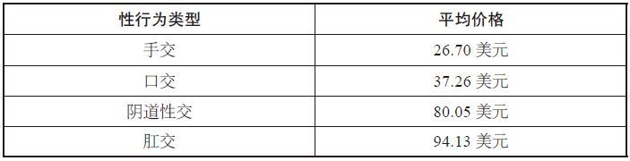

一个值得注意的、耐人寻味的现象是，相对于“传统”性行为，口交服务价格已一落千丈，大不如从前。在埃弗雷俱乐部风光无限的时代，嫖客为了享受口交服务，支付的价格是传统性的两倍或三倍；如今，口交服务价格已不到传统性服务价格的一半。为什么呢？

没错，妓女提供口交服务的成本较低，因为口交杜绝了意外受孕的可能，减少了感染性病的风险。（口交也可以带来一位公共卫生学者所称的“迅速离场”便利，在必要之时可立即走人，逃脱警察的抓捕或可能伤害她的嫖客。）从古至今，口交一直具备便利的特点，那么是什么因素导致前后的价格差异呢？

这个问题的最佳答案是，过去，口交是要被征收一种禁忌税的。当时，口交被视为一种反常的性行为，宗教人士尤其这么认为，因为口交虽满足了人们的肉欲，但没有完成传宗接代的使命。当然，埃弗雷俱乐部十分乐意从这种禁忌中获利。事实上，该俱乐部的皮条客大力提倡口交服务，因为嫖客选择口交服务就意味着俱乐部可以获得更高的利润，而蝴蝶女郎的“耗损”也会更小。

随着社会对口交看法的改变，口交价格的下滑反映了新的社会现状。对于口交的认同并不是仅仅局限于卖淫行业。在美国青少年中，口交性行为日益增多，与此同时，常规性交行为和怀孕比例都在下降。或许有人认为这是一种巧合，但我们认为这是经济学发挥作用的结果。

在卖淫市场中，口交服务价格相对较低，但是口交服务的需求却一直十分旺盛。以下是芝加哥妓女所提供的各类性服务在整个卖淫市场中所占比例：

表5–2 芝加哥妓女各类性服务在卖淫市场中所占比例

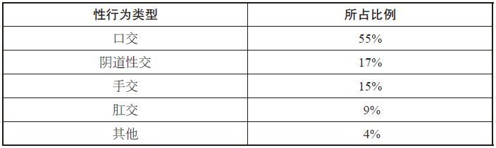

其他性行为包括裸体舞蹈、聊天（极为罕见，在2000多次交易中，也就只有几次而已），以及完全不同于聊天的其他各式各样的性行为——其花样繁多、尺度大胆，纵使你想象力再丰富，可能也无法想到竟然还有这样的性行为。存在非常规性行为（即使男人容易获得免费性行为，卖淫市场的生意仍然十分红火）的原因或许就在于：嫖客花钱，很多就是为了让妓女提供那些匪夷所思的性行为，因为这种性行为是他永远都无法从他的女朋友或妻子那里得到的。（然而，我们要说明的是，我们调研样本中的某些极端反常的性行为主体，事实上还包括家庭成员，你能想象到的各种性别及年龄的组合都有。）

妓女并不是向嫖客统一收费的。例如，黑人嫖客给妓女支付的性交易费用比白人大约少9美元，西班牙裔嫖客支付的费用居于平均水平。经济学家将这种就同样的产品和服务制定不同价格的做法称为价格歧视。

在商界，价格歧视策略并不一定总是可行的。要做到这一点，必须满足两个条件：

> ·某些客户必须具备清晰可辨的、能反映出愿意支付更高价格的特征。（就可辨而言，黑人和白人就很容易分辨。）

> ·销售商必须有能力防止所售产品被转售，进而杜绝任何再售套利机会。（就卖淫业而言，转售情形不可能发生。）

如果能满足上述两个条件，那么大多数企业都能靠实施价格歧视策略而获利甚丰。商旅人士对这种情形再熟悉不过了，因为他们在最后一刻买到的机票，其价格通常是邻座的4倍。经常出入美容美发店的女性对此一点也不陌生，因为同是理发（男女差别不大），她们支付的价格是男性的2倍。或者，来看看伦纳德医生的网上健康护理产品目录——以12.99美元的价格出售神奇剃须刀，而在另一个子目录下，又以7.99美元的价格出售神奇宠物剃毛器。这两种产品从外观上看完全一样，但伦纳德医生似乎是这么认为的：与修剪宠物的毛发相比较，人们会花更多的钱修剪自己的毛发。

那么，芝加哥街头妓女是如何实施价格歧视的呢？正如温卡什所了解的，她们对白人和黑人嫖客实施价格歧视策略。对于黑人嫖客，这些妓女通常会直接报价，不容讨价还价。（温卡什发现，较之白人，黑人更有可能与妓女还价。根据温卡什的推断，这是因为黑人更熟悉当地街区的情况，对卖淫市场行情更为了解。）而与白人嫖客谈生意时，她们会让嫖客报价，以此希望他出手大方。我们的数据显示，黑人和白人所支付的价格是不同的，照此看来，这种价格歧视策略还的确管用。

还有一些其他因素可能导致嫖客给妓女付费较低，具体情况如下所示：

表5–3 嫖客付费较低的三种情况

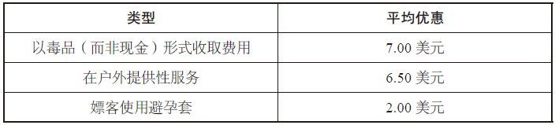

妓女以毒品形式收费而给予嫖客优惠，算不上什么惊人的发现，因为大多数妓女都是瘾君子。提供户外性服务的价格优惠，则在一定程度上是时间方面的优惠，因为在户外提供的性服务往往时间较短。但话说回来，妓女在室内提供服务则要收取更高费用，因为她们租赁服务场所是要花钱的。有些妓女会在某人家中租个卧室，或在地下室铺张床垫；有些妓女则选择在房价较低的汽车旅馆，或已打烊的一元店卖淫。

使用避孕套而享受到的优惠之小，的确出人意料。然而，更让人吃惊的却是性交中极少使用避孕套的事实：即便仅仅考虑阴道性交和肛交行为，嫖客使用避孕套的时间，也不到性交行为总时间的25%。（较之回头客，新嫖客更可能使用避孕套；而相对于其他嫖客，黑人嫖客不使用避孕套的可能性则更大。）芝加哥街头妓女，每人每年可能提供大约300例缺乏安全保护的性交服务。这里有个好消息：根据先前的调研结论，从街头妓女获得性服务的男性，感染艾滋病病毒的比例低得令人吃惊，不到3%。（但如果男性嫖客从男妓获得性服务，情形就截然不同，感染艾滋病病毒的比例超过35%。）

因此，很多因素影响着妓女的服务定价：性行为类型、嫖客特征，甚至卖淫地点。

然而，令人称奇的是，在同一卖淫地点，不同妓女提供性服务的价格几乎都差不多。或许你会认为，更漂亮、更性感的妓女收取的费用，肯定比不那么吸引人的更高，但现实情形极少如此。为什么呢？

唯一合理的解释是，大多数嫖客都将女性视为经济学家所谓的完全替代品，或是可替代性较强的商品。在一家日用品商店购物的顾客的眼中，他要购买的一串香蕉可能和其他商店出售的没什么两样。同理，经常光顾性服务市场的男性，似乎也是这么认为的。

皮条客与房地产经纪人

嫖客得到较大价格优惠的一种绝对有效的方式是，摆脱皮条客，直接找到妓女。倘若如此，那么获得同类的性交服务，他可以少付16美元。

这一数字是我们根据从罗斯兰和西普尔曼的妓女处获得的数据推算出来的。这两个街区毗邻，在许多方面颇为相似。不同的是，西普尔曼的妓女利用皮条客拉生意，而罗斯兰的妓女则不用。西普尔曼比罗斯兰略微更适合居住，西普尔曼社区居民极力想将妓女从自己身边赶走。罗斯兰的街头黑帮也比西普尔曼多。一般说来，即使是芝加哥的黑帮，也不会干拉皮条的生意，但他们不希望其他人不请自来，妨碍他们控制的黑市经济活动。

这两个街区的重要差别，让我们得以评估皮条客对卖淫行业所产生的影响。下文称“皮条客效应”（pimpact）。但是，我们首先要提出一个重要的问题：我们怎么能确定这两个街区的妓女事实上具有可比性呢？或许，与皮条客合作的妓女具备其他妓女所没有的特征。如果果真如此，那么我们就是在评估两个女性群体，而不是皮条客效应了。

碰巧的是，温卡什追踪调研的很多女性，不时游走于这两个街区之间，有时与皮条客合作揽生意，有时单干。正因如此，我们的分析数据才不受皮条客效应的影响。

上文提到，通过皮条客嫖娼，嫖客大约要多付16美元。但是，通过皮条客嫖娼的嫖客，往往也会购买更加昂贵的服务——这些家伙不会要什么手交，而这会进一步提高妓女的收入。因此，即便扣除皮条客通常收取的25%的佣金，妓女仍然可以在性服务次数更少的情况下挣更多的钱。

表5–4 妓女单干与寻求合作的收入差异

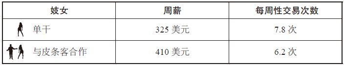

皮条客能发挥重要作用的秘诀在于，他们寻求的是一个特定的嫖客群体，而这个群体往往是街头妓女靠自己无法接触到的。正如温卡什所了解的，西普尔曼的皮条客往往花费大量时间，泡在城市闹区的脱衣舞表演俱乐部，或在附近印第安纳州的游船赌场上转悠，寻找潜在嫖客（大多数是白人）。

数据还表明，皮条客效应远不止于让妓女收入更高。与皮条客合作的妓女，遭嫖客殴打的可能性更小，被迫为黑帮成员提供免费性服务的概率也没有单干大。

因此，对于芝加哥街头妓女来说，利用皮条客招揽生意似乎是首选。事实上，扣除皮条客收取的佣金后，妓女的收入仍然相当可观。要是每一个行业的每一位代理人都能提供这类有价值的服务就好了。

现在看看另外一种销售环境：房地产销售。妓女可以选择是否通过皮条客出卖肉体；与此类似的是，房主也可以选择是否通过房地产经纪人出售房子。诚然，房地产经纪人收取的佣金比例，比皮条客收取的要低得多——前者收5%，后者收25%——但是，一笔买卖下来，房地产经纪人所得的佣金通常高达数万美元。

那么，房地产经纪人值得获得这份收入吗？

三位经济学家近期对威斯康星州麦迪逊市的住房销售情况进行了分析。该市的房主自售（for-sale-by-owner，FSBO）市场非常火爆。房主自售市场以“FSBOMadison.com”网站为基础发展起来，房主在该网站挂牌售房时，需向该网站支付150美元的费用，房产售出后不再支付佣金。在价格、住房、社区、挂牌出售时间及其他方面，将麦迪逊房主自售市场的销售情况与房地产经纪人的销售情形进行比较后，这三位经济学家就可以评估房地产经纪人对房屋销售市场的影响了（为了与“皮条客效应”说法一致，我们姑且称之为“房地产经纪人效应”）。

他们发现了什么情况？

在房主自售网站上售出的住房，其价格往往与通过房地产经纪人出售住房所得的价格一样。这个发现使房地产经纪人的作用看上去就没那么大了。通过房地产经纪人出售标价为40万美元的住房，就意味着要支付2万美元的佣金，而通过房主自售网站出售仅需支付150美元。（同时，近期开展的另一项研究发现，固定收费的房地产经纪人，通常是在接受房主委托挂牌时收取大约500美元的费用，他们几乎能与按比例收取全额佣金的房地产经纪人卖出同样的价格。）

有几点值得说明。你支付5%的佣金后，其他人就会帮你完成交易的各个环节。对于某些售房者而言，经纪人收取这一比例的佣金完全是值得的。而且，从麦迪逊所得的数据是否同样适用于其他城市，这很难说。进一步说，开展这项研究时，房地产市场需求旺盛，而这也极可能帮房主比较轻松地卖掉了房产。此外，选择不用房地产经纪人出售住房的那类人，可能从一开始就具有更灵活的商业头脑。最后，诚然，房主自售市场出售的房产均价，与房地产经纪人出售的差不多，但前者售出住房所用时间比后者多20天。大多数人很可能都会这样认为，在自己的住房中再住上20天，还能多挣2万美元，显然是划算的。

房地产经纪人和卖淫皮条客提供的是同样重要的服务：将你的产品推销给潜在客户。正如上述研究显示的那样，互联网（房地产销售渠道）已被证明可以取代房地产经纪人。然而，如果你正设法要做的是推销卖淫服务，那么在撮合妓女和嫖客达成交易方面，互联网发挥的作用就不怎么样了，至少现在还不成熟。

因此，当你权衡这两类代理人可能为你带来的价值时，显而易见，皮条客提供的服务产生的价值比房地产经纪人为你带来的要大得多。也可以用数学表达式来清晰地说明，即：

> 皮条客效应\>房地产经纪人效应

温卡什调研期间，西普尔曼街区的卖淫活动由6个皮条客控制，温卡什逐一结识了这6个人，他们都是男性。过去，即便在芝加哥最贫穷的街区，卖淫组织通常也是由女性控制的。然而，在高收入的引诱之下，男性最终取代女性，成为卖淫的组织者——在漫长的历史进程中，这是男性进入女性主宰的行业，并最终抢走她们饭碗的又一个实例。

这6个皮条客的年龄，从30岁出头到近50岁不等，“业务”干得很不错，每年大约能赚5万美元。其中几个皮条客还有正经的工作——汽车修理工或店长，而且大多已买了房，没有一个人是吸食毒品的瘾君子。

他们最重要的工作内容是与警察周旋。温卡什了解到，这些皮条客与当地警局维持着良好的关系，尤其与一位名为查尔斯的警员打得火热。起初，查尔斯对当地警察“巡管区域”还不甚熟悉，曾持续“骚扰”并抓捕过这些皮条客。然而，这类行动产生的结果却适得其反。“逮捕这些皮条客后，街头就要有人取而代之，导致发生黑帮混战，”温卡什说，“暴力活动比卖淫活动更糟糕。”

因此，查尔斯尽力与对方做出一定妥协。这些皮条客同意，当小孩在街区公园玩耍时，他们就不去那边招揽生意，而且同意只暗中组织卖淫活动。作为回报，警局任其自行活动，不加干涉，而且更为重要的是，他们也不会抓捕妓女。温卡什追踪调研期间，在这几个皮条客控制的一个地区，仅发生过一次抓捕妓女的正式行动。妓女与皮条客合作所能获得的最大益处便是不会被警察抓捕。

当然，为了不进监狱，也不一定就非得要皮条客“罩”着你。在芝加哥，一般妓女每提供450次性交易才会被抓捕一次，而且平均而论，10次抓捕行动中，只有1次能将妓女定罪送进监狱。

这不是因为警察不知道妓女藏身何处，也不是因为警局局长或本市市长刻意做出这种让卖淫业蓬勃发展的决定。更确切地说，这种情形生动地反映了经济学家所谓的“委托代理问题”。在某项任务中，委托方和代理方似乎有同样的目标，但事实上其动机各不相同。

在本例中，你可以把警局总警监视为委托人。他希望遏制街头卖淫活动。同时，负责街区的警员则是代理人。他可能也希望遏制卖淫活动，至少按理说应该如此，但他没有强烈的抓捕动机——为什么要采取更多的抓捕行动呢？在某些警员看来，那些妓女主动提供的性服务要比再创造一个抓捕纪录更有吸引力。

温卡什的调研十分清楚地反映了这种现象。在他追踪调研的妓女所提供的所有性交易中，大约有3%的性服务是无偿“献给”警员的。

数据不会撒谎：芝加哥街头妓女与警察发生性关系的概率，比被警察抓捕的概率大。

女性工资低是因为女性追求高薪的愿望不够强烈

街头妓女是女性不愿从事的工作，实际上我们怎么强调这个事实都不过分，想想看：伤风败俗，无耻下流，面临感染性病的危险，时常遭受殴打。

没有什么地方比华盛顿公园的情形糟糕。没错，华盛顿公园就是温卡什调研的一个街区，位于罗斯兰和西普尔曼北部大约6英里处，极为贫穷，外来人尤其是白人，很少光顾这里。这里的卖淫活动集中在4个场所：两幢大型公寓楼、延伸5个街区的繁华商业街以及华盛顿公园本身。这个惹眼的公园占地372英亩，是由弗雷德里克·劳·奥姆斯特德（Frederick
Law Olmsted）和卡尔弗特·沃克斯（Calvert
Vaux）于19世纪70年代设计的。在华盛顿公园卖淫的妓女没和皮条客合作，所挣收入是温卡什调研的所有妓女中挣得最少的。

这个事实可能会让你认为这里的女人宁愿干其他任何工作，也不愿意卖淫，但是市场经济的一个特点就是市场上供求关系会自发催生一个合理的价格水平，在这个价格水平下，即便是最不显眼的工作也有人愿意做。没错，这些妓女的生活十分窘迫，但如果没有卖淫收入的支撑，她们的情形似乎会更悲惨。

听起来十分荒唐？

这种供求关系似乎因一个与之无关的因素而得到了加强。这个因素就是美国家庭长久以来非常重视的团聚传统。每年7月4日前后，华盛顿公园热闹非凡、人头攒动，很多家庭在这里举行户外家庭聚餐，也有一些规模较大的组织在这里聚会。对于某些来访亲友而言，一边喝着柠檬水，一边与伯母舅妈唠家常、谈近况，显然有点索然无味。结果证明，每年这时候，对华盛顿公园妓女的性服务需求就会飙升。

而且，这些妓女也与任何出色的企业家没什么两样：她们会将价格提高大约30%，只要精力容许，尽量加班加点地赶工。

有趣的是，需求的猛增还吸引了新成员加入其中——全年其他时候几乎都不卖淫的那些女性，在这个卖淫业务火爆的季节，也暂时将其他工作搁置一边，干起了卖淫的行当。这些兼职妓女大多都有小孩，要照顾家庭，她们也不是吸食毒品的瘾君子。但就像淘金热中的淘金者，或房地产繁荣时期的房地产经纪人一样，她们看到了大赚一笔的良机，因此便迫不及待地加入了进来。

至于本章标题中所提出的问题：街头妓女与百货商店圣诞老人有何相似？答案应该是显而易见的：利用节假日需求猛增所带来的短期工作机遇，大赚外快。

我们也已证实过，如今对妓女的需求已经大不如60年前（当然，节日时性服务需求会猛增），而这在很大程度上可以说是女权运动导致的结果。

如果你竟然认为这令人吃惊，那么再看看因女权运动而产生的另一个看似更不可能的受害者群体——中小学学生。

长期以来，教师以女性居多。100年前，教书育人的工作是少有的几种允许女性从事，而又不涉及做饭、清洁或其他家务的工种之一。（类似的还有护士职业，但教师相对来说人数更多，教师人数为护士人数的6倍。）当时，女性就业市场中，大约有6%的人是教师，仅次于体力劳动者（19%）、佣人（16%）及洗衣工（6.5%）。从很大程度上说，教师是女大学生的理想工作。令人称奇的是，到1940年时，所有大学毕业的女性工作者，在30岁出头的这个年龄段中，55%被聘请为教师。

然而，没过多长时间，聪明女性所面临的工作机遇开始激增。1963年《同酬法》和1964年《民权法》相继实施，社会对女性角色的认识也发生了转变，这些都起到了推波助澜的作用。随着更多女孩进入大学深造，职业女性队伍随之壮大，她们希望进入以前女性受限的那些令人垂涎的高级行业，例如法律、医药、商业、金融等。（在这场革命中，没有受到高歌赞颂的“无名功臣”当属婴儿奶粉：由于婴儿奶粉的广泛使用，哺乳期妈妈能够立即重新投入工作中。）

这些要求极高、竞争白热化的职业，提供的薪水自然极为丰厚，因此这也吸引了具有聪明才智的精英女性。毫无疑问，如果这些精英女性早出生一代，那么她们肯定就步入教育岗位了。

但她们没有早出生，教师队伍开始出现人才外流现象。1960年，大约有40%的女教师，在智商及其他资质测试中的得分都位于最前的20%之列，只有8%的女教师测试得分处于最末的20%。而20年后，得分位于最前20%的女教师还不到原来的一半，与此同时，位于最末20%的却是原来的2倍多。与其他工作相比，教师工资正在大幅下降，而这种状况就更不可能让女教师素质得到提高了。“过去几十年来，教师素质一直在下降，”纽约市公立学校总监在2000年称，“但没有人愿意讨论这个问题。”

这不是说，我们就没有大量的优秀教师。当然有，但这些年来，教师的总体素质在下降，课堂教学质量也随之下降。1967——1980年，美国学生考试成绩大约下降了相当于1.25个等级的水平。教育研究者约翰·毕晓普（John
Bishop）把这种情形称为“前所未有”的下降。他认为，这将严重拖累美国生产效率，其造成的影响将完全有可能持续到21世纪。

但至少进入其他行业的女性境况应该不错，是这样吗？

是的，有那么一点吧。我们在前文提到过，即使是受教育程度最高的女性，所挣工资也比具有相似背景的男性少。在野心勃勃的金融和企业领域，女性从业比例极低，收入尤其悬殊。近年来，女性首席执行官的人数大约增长了8倍，但即便如此，女性首席执行官在所有此类职位中所占的比例仍不到1.5%。在美国排位前1500名的大型公司中，只有大约2.5%的待遇丰厚的高管职位由女性担任。近25年来，美国顶级大学女性MBA毕业生的比例超过30%，鉴于这个事实，上述收入差距悬殊的情形就更让人吃惊了。如今，这一比例又创新高，达43%。

经济学家玛丽安娜·贝特朗（Marianne
Bertrand）、克罗迪亚·戈尔丁和劳伦斯·卡兹试图弄清男女工资差距悬殊的原因所在，于是对芝加哥大学毕业的2000多名男性和女性MBA的职业情况展开了分析。

他们的结论是：诚然，性别歧视可能是造成男女工资差距悬殊的一个原因，但主要原因却在于女性追求高薪的愿望不够强烈，抑或缺乏这种愿望。这些经济学家发现了以下三个原因：

> ·女性课业成绩平均分比男性略低，更重要的是她们选修的金融课程比男性少。在其他条件相同的情形下，职业收入的高低与员工是否具备金融知识密切相关。

> ·在其职业生涯的最初15年，女性的工作时间比男性少——女性平均每周工作52个小时，男性58个小时，每周少工作6个小时，15年累积下来，相当于比男性少工作6个月。

> ·女性职业的中断时间比男性长。参加工作10年以后，获得MBA学位的男性中，中断工作的时间长达6个月或更长的，只占10%，相对而言，具有同样背景的女性中这一比例则占到40%。

而最重要的因素似乎在于这个事实：很多女性，甚至包括拥有MBA学位的女性，都喜欢小孩。一般说来，没有小孩的女性MBA，比一般男性MBA的工作时间仅少3%；而有小孩的女性MBA，则比男性MBA的工作时间少24%。“因为工作时间更少及职业中断情形的影响，女性工资收入减少的幅度是很大的。”这三位经济学家写道，“很多拥有MBA学位的年轻妈妈，尤其是其配偶收入很高的年轻妈妈，在生下第一胎后的几年之内，会决定放缓其职业发展的步伐。”

这种转变耐人寻味。美国很多极为聪颖的精英女性，攻读MBA的初衷在于追求高薪，但结果却出人意料地嫁给了聪明能干的精英男性——也拿着高薪——因此她们不用再拼命工作，这正是求之不得的好事。

这是否意味着女性攻读MBA所投入的时间和金钱不值得呢？可能不是这样。或许，如果没去商学院深造，她们就永远也不会遇上这样优秀的丈夫。

分析男女工资差距时，我们还可以从另一个角度来思考。我们可以不把女性工资更低的情形解释为一种劣势，相反，或许应该视之为一个信号：高工资能够有效地驱使男性努力工作，而对于女性而言，这种动机就没那么强烈了。这或许是因为男人爱财、女人爱小孩的缘故吧。

我们来看近期进行的两项测试。我们请男士和女士各组成一队参加一个类似学术能力测试（scholastic
aptitude
test，SAT）的数学测试，回答20道题。在第一项测试中，我们给每位参与者支付固定费用，到场费为5美元，完成测试再支付15美元。在第二项测试中，我们给每位参与者支付到场费5美元，然后参与者每答对一道题再支付2美元。

他们的表现如何呢？

第一项测试中，男性的表现略好，20道题中，答对的题目比女性多1道。第二项测试中，男性大胜。与第一项测试相比，女性在这项测试中的表现几乎毫无进步，平均算下来，男性又多答对了2道题。

为了探明女性收入比男性少的原因，许多经济学家是想尽一切办法，汇总所有数据，使用高深莫测的统计手段予以分析。然而，他们面临一个最大的难题就是男女各异，表现千差万别。经济学家真正想要的是做一次这样的实验：将一组女性作为样本，以此克隆其男性版本；再取一组男性作为样本，克隆其女性版本；然后观察结果。将两个样本组与其相应的克隆版本组对比，评估其劳动产出，通过这种方式你可能会获得某些更为深刻的认识。

或者，如果克隆还无法实现，你也可以取一组女性作为样本，随机选择一半，将她们神奇地变为男性，而不改变她们的其他特征；然后取一组男性作为样本，重复此前的流程。

令人遗憾的是，现实条件不允许经济学家开展此类实验，至少目前还不行。但如果经济学家有“献身”精神，他们自己可以做到，做变性手术就行了。

如果男人决定通过变性手术和荷尔蒙疗法成为女人（即MTF，也就是男到女的变性），或者女人决定变成男人（即FTM，也就是女到男的变性），那又会是什么情形呢？

斯坦福大学神经生物学教授本·巴雷斯（Ben
Barres），出生时的名字是芭芭拉·巴雷斯（Barbara
Barres），42岁时，也就是1997年，变性成为男人。与大多数数学和理工学科一样，神经生物学领域也是男性一统天下。他说，变性“让我的同事和学生备感意外”，但他们“都认为我的决定简直太了不起了”。的确，他的学术地位似乎比以前更高了。有一次，巴雷斯刚做完一个学术讲座，一位同人与听众中巴雷斯的一位朋友攀谈起来，假心假意地恭维道：“本·巴雷斯的工作比他妹妹做得好多了。”巴雷斯并没有妹妹，这位同人显然不看好巴雷斯的前身（即身为女性的她）。

“从男人到女人的转变，远比从女人到男人的转变困难。”巴雷斯说道。他说，这其中的问题在于，一般认为男性在某些领域（尤其在理工学科和金融领域）具有先天优势，而女性则不太胜任。

现在来看另一种情形。迪尔德丽·麦克洛斯基（Deirdre
McCloskey），芝加哥伊利诺伊大学的知名经济学家。出生时是男性，名为唐纳德（Donald），1995年决定变性为女人，时年53岁。与神经科学一样，经济学也是男性占绝对优势的领域。“我曾准备前往斯波坎，去一家农产品公司做一名秘书。”她说。结果证明没必要去。麦克洛斯基发现，“在某些与经济有关的职业中，我因为自己的反叛行为而受到了惩罚。我估摸着，如果我仍然是当初的唐纳德的话，那么我现在挣的钱会多上那么一点点。”

巴雷斯和麦克洛斯基只是两个数据点而已。有两位研究员，一位是克里斯滕·希尔特（Kristen
Schilt），一位是马修·威斯沃尔（Matthew
Wiswall），希望系统分析变性成年人的工资情形。他们开展的实验与我们上文提及的实验并不相同——要知道，变性人并不一定是严格意义上的随机样本，在变性前后也并不一定是典型的男女群体，但不管怎么说，实验结果仍然耐人寻味。希尔特和威斯沃尔发现：女人变性成为男人之后，其所挣工资比以前略高；而男人变性成为女人后，平均算下来，所挣工资大约比以前少了1/3。

这里要做出几点说明：首先，实验样本数目很小——只研究了14例男到女的和24例女到男的变性个体。而且，他们所研究的样本，主要是从变性研讨会中聘请过来，按照迪尔德丽·麦克洛斯基的说法，这些人属于“跨性别职业工作者”，因而不一定都具备典型性。

“大家会很容易地认为，”她说，“男人无法彻底变性为女人，肯定会念念不忘以前的生活状态，而无法在工作中做到最好。”（虽然他已经改变了自己的性别，但由于此前是经济学家，所以在人们眼中他一直就是经济学家。）

从妓女的营生中我们看到了什么？

现在又回到芝加哥，离那些街头妓女从业场所仅几英里的地方，有一个新建住宅区，住着一位女士，且一直保持女性身份，她挣的钱很多，而这是她以前根本就不敢想象的。

她在得克萨斯长大，家庭成员众多，家庭关系并不和睦，成年后她离开家参了军。她接受的是电子科学方面的教育，从事导航系统的研发工作。7年后退役，再次过回普通人的生活，加入了一家全球排名靠前的大公司，从事计算机编程工作。她拿到的是5位数的丰厚薪酬，后来嫁给一个收入高达6位数之多的抵押贷款经纪人。生活过得很不错，但同时，怎么说呢？日子太过平淡，很无聊。

她离婚了（没生小孩），随后搬回得克萨斯，部分原因是帮忙照顾一个患病的亲戚。她仍然出去工作，职位依旧是计算机编程员，后来再婚，但婚姻再次触礁。

她的职业生涯没取得多大进展。没错，她聪明能干，碰巧还长得漂亮——金发碧眼，皮肤白皙，身体丰满，曲线优美——而且性格温和。在她所在的公司，这种女人总是人们十分欣赏的类型。但问题是，她并不想那么拼命地工作。因此，她辞职，自己创业，每周只需工作10——15个小时，但所挣收入是以前薪水的5倍之多。她叫安莉，从事的是卖淫工作。

她是偶然进入这个行业的，或者可以说是以一种无所顾虑的冒险之旅为开端的。她的家庭成员是南方浸信会
[\[1\]](#index_split_067.html_filepos998296)
的虔诚会员，因此，在成长过程中，“所受的教育极其严格。”她这样说道。成年以后，她仍然受到家长的严格要求。“你知道的，参加郊区每月的最佳家庭后院评选，晚上喝啤酒不能多于两杯，平常晚上7点以后绝不能外出，凡此种种，规矩很多的。”然而，她已离婚，又很年轻，于是开始光顾在线约会网站——她喜欢男人，也喜欢性爱——随后出于好玩儿的心态，她在自我介绍中称自己为“陪同女郎”。“完全是突发奇想，”她回忆说，“当时就是想把这个张贴上去，看看会发生什么。”

随即，她的电脑屏幕被大量跳出的回应窗口淹没。“于是，我就开始疯狂地点击最小化按钮，只有这样，才能保持与他们的沟通进度！”

她与其中一个男人约好会面，时间定在某工作日的下午两点，地点选在一家宾馆，约在那家宾馆停车场的西南角碰头。那个男人开着一辆黑色的奔驰过来，要收他多少钱，安莉心里一点谱都没有。她当时想的是50美元。

他是一名牙医，体形并不威猛高大，已婚，十分友善。他们一进屋，安莉就开始宽衣解带，神情十分紧张。至于那次性事的详情，她已不记得，那次并没有玩什么花样，也没有什么怪癖性行为。

结束之后，那个男人把一些钱放在桌子上。“以前没做过这个，对吧？”他问。

安莉想要轻松地撒个小谎，但明显是在扯谎。

“好吧，”他说，“你需要这么做。”他开始喋喋不休地告诫她——她得更谨慎点，她应该拒绝在停车场见面，她需要提前了解客户的情况。

“他是我首次干这行有幸遇到的完美客户。”安莉说，“直到今天，我对他仍心存感激。”

他一离开房间，安莉就开始数钱：200美元。“这么多年来，与别人做爱都是我自愿的，不谈钱的，所以当有人因此而给我付钱时，哪怕只有一分钱，怎么说呢，给我的震动都相当大。”

于是，她立即想全职卖淫，但她担心家人和朋友会发现。因此，她十分谨慎，主要是在其他城市卖淫。同时，虽然她减少了从事计算机编程的工作时间，但仍然觉得这个工作沉闷无聊。这个时候，她决定前往芝加哥发展。

芝加哥是个大城市，对此安莉深为恐惧；但芝加哥与纽约或洛杉矶又不同，这里的人讲礼貌、懂谦让，是个文明的城市，一个来自南方的女孩，很容易就能适应这里的生活。她做了一个网站（掌握的计算机技能派上了用场），随后，经过不断地摸索尝试，确定了哪类性爱服务网站能帮她招徕最适合的客户，哪些站点只会让她花的广告费打水漂。

自己单干的优势很多，最重要的一点就在于，她所挣的收入不用与其他任何人分享。在过去，安莉极可能会在诸如埃弗雷姐妹的老鸨手下干活。老鸨给手下妓女支付的报酬自然极为优厚，但她还是拿走了大头，自己富得流油。互联网让安莉有机会成为她自己的“鸨母”，并进而为自己积累财富。在旅游、房地产、保险以及股票债券等行业，互联网所具有的“非居间化”——取代中间商或大大减弱中介居间作用——的可怕力量，有关业界已经谈得很多。但大家很难想到的是，没有一个市场比高端卖淫市场更适合互联网发挥这种“非居间化”作用。

自己单干的劣势在于，安莉只能靠自己筛选潜在嫖客，以此确保自己不会遭到嫖客的殴打，或落得一个被骗钱劫色的下场。最终，她想出了一个既聪明又简单的方法。如果新嫖客在线与她联系，她不会马上安排见面，而是要先弄清楚他的真实姓名和工作电话。然后，她会在约好见面的那天上午，打电话给这位新嫖客，假装说只想告诉对方，她期待着与他见面。

但是，这通电话也有另一种含义：她要确保自己能随时联络到他，而且万一有什么情况不对，她也可能会到他的办公室闹个天翻地覆。“没人希望看到婊子发飙的老套情节上演到自己头上。”她微笑着说。到目前为止，这种策略安莉只采用过一次，那是因为一个嫖客给她付了假钞。当安莉造访那个嫖客的办公室时，他二话没说立即掏出了真钱。

她在公寓接待嫖客，多数在白天。大多数嫖客是中年白人，其中80%已婚——他们发现，工作时分溜出去比晚上外出更省事，免去了向妻子解释的麻烦。晚上的时间属于她自己，可以看书，看电影，或者放松休息，这一点是她最喜欢的。她定的服务价格是1个小时300美元——与她同属一个档次的大多数其他同行收取的费用似乎就是这个数。另外还有几种优惠方案：两个小时500美元，或12小时的包夜服务2400美元。她提供的服务类型中，大约有60%都是一个小时的服务。

她的卧室——“我的办公场所”，她大笑着说——几乎全被一张床占了。维多利亚风格的大床奢侈豪华，镂刻的四根红木支柱，缠绕着米黄色丝绸质地的绉绸，支起了幔帐。这绝不是一张轻易就能爬上去的床。当被问及她的客户爬上去是否有难度时，她坦然承认：不久前，一个体形庞大的家伙，竟然把那张床给压垮了。

当时，安莉是怎样处理的呢？

“我告诉他，那个烦人的东西早就坏了，没有早点叫人修好，真对不起。”

她是那种能从每个人身上发现优点的人——她认为，这一点正是她成功创业的原因所在。她真诚地喜欢来找她的那些男人，因此那些男人也都喜欢安莉，即使她与许多人发生过性关系，这也无关紧要。他们往往还带来礼物：可能是面值100美元的亚马逊网站的赠券；可能是一瓶好酒（客人走后她会通过标签在谷歌上搜索，确定其价值）；有一次，还收到一台苹果MacBook电脑。那些男人甜言蜜语，夸她长得漂亮，或对室内的装潢设计大加吹捧。在很多方面，他们对待她的方式，恰好是男人理应对待他们妻子，但实际上他们往往又没有那样做的方式。

与安莉大致属于同一档次的大多数妓女，都称自己为“陪同女郎”。当安莉谈及这个行业的朋友时，她简单地叫她们“女孩”。她并不在称呼上较真儿。“我喜欢‘鸡’的叫法，也不介意别人叫我‘妓女’，称呼无所谓。”她说，“有什么大不了的，我知道我在干什么，因此我不会想方设法去掩饰、去美化。”安莉谈到了她的一个朋友，她收取的费用是每小时500美元。“她认为自己与众不同，完全不能与收取100美元给别人‘吹箫’（指口交）的那些街头妓女相提并论，而我跟她们没什么两样。”

在这点上，或许安莉是错的。她认为自己与街头妓女很相似，但实际上她与街头妓女的共同点还真不多，反倒是与成功男人所拥有的象征地位的娇妻有更多的相似之处。从根本上说，安莉就是男人按小时租用的这种娇妻。她所提供的不是性本身，或至少不仅仅是性。她给男人提供的是这样一个机会：暂时把他们的妻子搁置一旁，付钱租用一个在性爱方面更敢于大胆尝试的临时娇妻。因为是临时租用，所以事实上也就免却了需要与之长相厮守的麻烦和需要投入的长期成本。在被租用的一两个小时内，她代表了一个完美妻子的典型形象：漂亮、殷勤周到、聪明，被你的笑话逗得大笑，而且满足你的肉欲。每次当你出现在她的门前时，她都十分开心。你最爱的音乐已经响起，你最爱喝的饮料也已准备好，她从来都不会要你把垃圾顺便带出去。

关于满足嫖客与众不同的性行为偏好，安莉说她比其他一些妓女“更开放、更大胆一点”。比如，得克萨斯有个家伙，至今仍然会用飞机接她过去，在服务期间，会要求她佩戴某些玩意儿——他开会时随身带在公文包里的东西，大多数人根本不会认为这些东西与性交行为有什么关系。但她也有自己的原则：坚持要求客户使用避孕套，无一例外。

如果嫖客出价100万美元，要求不戴套与她发生性行为，会是什么情形呢？

安莉停下来想了一会儿。随后，她的答案表明，她对经济学家所谓的“逆向选择”（adverse
selection）有着深刻的认识——她明确地说，她仍然不会做，因为如果一个嫖客仅仅因为要进行一个回合的缺乏保护措施的性爱活动，而疯狂地出价100万美元，那么这个嫖客已疯狂到无可救药的地步，因而她无论如何都要拒绝。

当她在芝加哥开始从业时，每小时收费300美元，生意极好，几乎忙不过来。只要精力允许，她尽量接待更多的嫖客，每周大约工作30个小时。这种业务强度，她维持了好一阵子，不过一旦她还清了车贷，还有了一些储蓄后，就减少了工作量，每周工作15个小时。

即便如此，她仍然还在思考一个问题：自己少工作一个小时是否会比再赚300美元更有价值。按现在的情形，每周工作15个小时，一年下来，她能挣到20多万美元。

最终，她将每小时的费用提高至350美元。她想需求或许会就此下降，但事实上没有。因此，几个月后，她将费用提高至400美元。

同样，没有感到明显的需求下降。安莉对自己有那么一点恼怒，显然，此前她收取的费用一直都太低。但至少她现在可以采用价格歧视策略，从而将她实施的弹性费用发挥到极致。对于最好的嫖客，收取的费用不变；但她会告诉自己不喜欢的嫖客，从现在开始，一个小时的价格已涨到400美元——如果嫖客断然拒绝，她就搬出已设计好的借口，从此不与他们交往。嫖客不会减少，只会更多。

没过多久，她再次提高了价格，每小时450美元，过了几个月后，又涨价至500美元。就在短短的几年内，安莉将价格提高了67%，然而她发现需求几乎毫无减弱的迹象。

价格的陡然提高还反映出另一个令人大跌眼镜的情形：她收取的费用越高，她与嫖客真正上床的性交时间就越少。价格每小时300美元时，她的接客时间表上列示的是一长串要求一小时性服务的客户，而这些嫖客也都想把有限的时间更多地投入到性交活动本身中来。然而，每小时收取500美元后，她往往还有饭局和美酒伺候。“有时吃饭4个小时，而真正的性事活动只有20分钟。”她说，“我还是我，跟收费300美元时一样，穿着同样的衣服，跟他们聊的内容也大同小异。”

她估摸着，她的业务之所以这么好，是经济繁荣所致。当时是2006——2007年，正值她的很多客户（银行家、律师及房地产开发商）业务蒸蒸日上、投机致富的美好岁月。但安莉发现了这样一个事实：付钱请她服务的大多数人，用经济学术语说，不具备价格敏感度。相对而言，性需求似乎与整体经济毫无关联。

我们的乐观估计是，在芝加哥从业的像安莉这样的妓女，不论是单干还是与陪同服务机构合作，都不超过1000人。诸如拉什娜这样的街头妓女，从事的工作在美国可能没人想干。但对于安莉这一档次的妓女而言，情形就迥然不同了：高薪，工作时间灵活，几乎没有被实施暴力和抓捕的危险。因此，真正让人困惑的问题并不在于为什么像安莉这样的人会成为妓女，而在于为什么更多的女人没有选择这个行业。

毫无疑问，不是每个女人都适合从事这个行业。首先，要喜欢性交；同时，要心甘情愿为此做出一些牺牲，比如不要丈夫（除非他很宽容，或者贪婪成性）。然而，当每小时的服务价格高达500美元时，这些因素似乎就完全没有必要考虑。事实上，安莉曾向她的一位密友吐露实情，告诉她自己在卖淫，而且讲了她的近况，没过几个星期她的那位朋友也加入了这个行业。

安莉从来没有遭遇来自警局的麻烦，也不希望如此。事实上，如果卖淫活动被合法化，她肯定会气得发狂，因为她目前之所以能挣到如此高的收入，完全基于这样一个事实：她所提供的服务是嫖客无法合法获得的。

安莉已掌握这门业务的经营艺术。她是一个精明能干的创业家：维持低水平的运营开支，做好质量控制，学会实施价格歧视策略，还对市场上供求关系的影响因素了如指掌。此外，还享受到了工作带来的乐趣。

尽管如此，安莉还是开始寻求退出策略。目前，她30岁出头，仍然性感诱人，但她深知，她的“商品”不能长久保鲜，芳容易逝。她同情那些年龄较大的妓女——就像逐渐老去的运动员——竟然不知道适时隐退。（当安莉在美国南部度假的时候，有那么一位后来成功入选美国棒球名人堂的运动员，就曾暧昧地向她发出性邀请，但被安莉委婉地拒绝了，她可不想在度假时还辛苦工作。）

而且，她已经厌倦了这种偷偷摸摸、见不得人的生活。她的家人和朋友不知道她的妓女身份，旷日持久的谎言已让她精疲力竭。她无须提防的只有同行，但这些妓女却又不是她最亲密的朋友。

她是积攒了不少钱，可还没有多到可以过退休的生活。因此，她开始规划接下来的职业生涯。她拿到了房地产从业资格证书。当时，房地产正处于鼎盛时期，对她而言，转行进入房地产行业似乎挺简单，因为这两种行业都允许弹性工作。许多人正好也是这么想的。房地产经纪人的入行门槛如此之低，房地产每繁荣一次，就会不可避免地吸引许多人来做房地产经纪人——过去10年里，美国房地产协会的会员人数已增加75%，这就导致了房地产经纪人中值收入的下降。而当安莉意识到她得将所挣的一半佣金上交雇用她的房产中介时，她着实惊呆了。中介的抽成也太高了，根本就没有哪一个皮条客敢提取这么高的佣金！

最后，安莉发现了自己真正想做的事：重返大学。通过自己创业，她已学到很多，因此她将以此为基础继续深造，如果一切顺利的话，她会把这门新近掌握的学问应用于某个领域，进而帮助她不用依靠自己的体力劳动就能获得令人瞠目结舌的高薪。

那么，她选择的是什么研究领域呢？当然是经济学。

[\[1\]](#index_split_067.html_filepos981258)
浸信会是基督教新教派，认为只有年长至能够理解其含义并信仰基督教的人才能接受浸礼。——译者注

结语 猴子也是人

众所周知，涉及通货膨胀、经济萧条、金融危机这类问题的经济学分支，属于宏观经济学。当经济运行良好时，宏观经济学家就被捧为英雄；当经济运行不良时，就如近期经济一样，他们又会招来一片骂声。无论经济好坏，报纸头条总是留给宏观经济学家的。

我们希望，在读过本书后，你们会意识到另一类经济学家，也就是微观经济学家，就潜藏在幕后。他们设法弄清个体会做出何种选择，不仅希望了解他们买了什么，还要了解其洗手频率，是否会成为恐怖分子。

有些微观经济学家，甚至没有将研究对象局限于人类活动。

基思·陈是华侨移民后裔，33岁，衣着时髦，头发短直，十分健谈。随父母在美国中西部经常搬家的过程中成长，后来就读斯坦福大学，一度被政治学冲昏头脑，后改弦更张，主修经济学。如今，他是经济学副教授，在耶鲁大学任教。

古典经济学的开创者亚当·斯密，很久以前写过的几段话，激发了他的灵感，就此他展开了一项研究。亚当·斯密是这么写的：“没有任何人曾见过两只狗公平而有意识地交换骨头。没有任何人曾见证过，一只动物通过肢体语言和自然的叫声，向另一只传达这种意思：这是我的，那是你的；我愿意用这个换你那个。”

换句话说，斯密肯定，只有人类才具有货币交易的本领。

与生活中的情形一样，在经济学领域，如果你不去主动提出问题，无论问题看上去多么愚蠢，你就永远也不会找到问题的答案。陈的问题就是这个：如果我能教会猴子使用货币，那又会是什么情形呢？

陈选择的理想猴子是僧帽猴，可爱的棕色猴，体形与一岁大的小孩差不多。“僧帽猴的头很小，”陈说，“主要关心食物和交配。”（关于这点，我们认为，僧帽猴与人类没有什么不同，当然，这无关主题。）“就像欲壑难填的饿死鬼，永远也吃不饱，你真的应该这么看待它们。你可以整天给它们棉花糖，它们吃了吐，然后又会回来再要。”

对于经济学家而言，僧帽猴习性如此，自然就成了绝佳的研究对象。

陈与文卡特·拉克什米那拉亚南（Venkat
Lakshminarayanan）去耶鲁–纽黑文医院展开工作。在那里，心理学家劳里·桑托斯（Laurie
Santos）有一个实验室，养着7只僧帽猴。猴子实验室一般都会给猴子取名，这里也不例外，不过，这里的名字都来源于007系列电影中的人物。7只猴有4只雌的，3只雄的。最重要的一只猴子，取了中情局特工的名字——费利克斯。

这些猴子共同生活在一个很大的开放式笼子里。笼子的一侧连着一个小很多的笼子，这就是实验场地，一次可以容纳一只猴子参与实验。陈在直径为1英寸的小银盘中间钻了个眼，这就是货币。“有点像中国古代的铜钱。”他说。

实验第一步，让猴子认识到硬币是有价值的。这费了不少工夫。如果你给僧帽猴一个硬币，他会先嗅一嗅，认定无法吃（也没法与之发生关系）后，就会把硬币扔在一旁。如果你这样反复来上几次，他可能就要向你扔硬币了，力气还很大。

因此，陈和他的同事给某只猴子一个硬币后，就会亮出食物。只要那只猴子将硬币扔给他们，猴子就会得到食物。这样持续了好几个月，猴子终于明白：硬币可用来买食物。

实验证明，猴子对不同食物具有各自强烈的偏好。将12枚硬币放在一个托盘里，这是一只猴子的最大预算，然后给它提供食物，例如一个人卖果冻，另一人卖苹果片。这时，猴子会根据自己的喜好，把硬币送到不同的研究人员手中，随后得到已分好的“好吃的”。

现在，陈在猴子的经济生活中引入了价格冲击和收入冲击。我们假定费利克斯最喜欢的食物是果冻，而且通常情况下，它用一枚硬币就能获得三个。如果一枚硬币突然只能买到两个，它会如何反应呢？

令陈吃惊的是，费利克斯和其他猴子的反应十分理性。某种食物的价格上涨时，猴子们就会少买；价格下降时，就会多买。经济学中最基本的法则不仅适用于人类，而且同样对猴子有效：需求曲线必定向下。

既然已目睹了它们的理性行为，陈此时想观察僧帽猴的非理性行为。于是，他设定了两个赌博游戏。在第一个赌博游戏中，研究人员给猴子亮出一颗葡萄，根据硬币落下后的正反情形，猴子要么仅得到那颗葡萄，要么还可以得到另一颗作为奖励。在第二个赌博游戏中，猴子看到研究人员有两颗葡萄，但是，如果猴子没猜中硬币落地的情形，研究人员就会拿走一颗，猴子只能得到剩下的一颗。

在这两个游戏中，平均而论，猴子得到的葡萄数量都相同。但是，第一个赌博游戏的设计着眼点在于，猴子可能会获得好处；而第二个则是，猴子可能会遭受损失。

那么，僧帽猴的反应如何呢？

鉴于猴子本来就不是很聪明的事实，或许你会认为任何赌博策略都会大大超出它们的智力水平。在这种情况下，你就会想当然地认为，如果研究人员给它们亮出两颗葡萄，而不是一颗时，它们自然会更喜欢。但是，它们的选择完全相反！一旦猴子弄明白，亮出两颗葡萄的研究人员有时会拿走第二颗，而亮出一颗的研究人员有时会额外提供一颗作为奖励时，猴子们就更喜欢拿一颗葡萄的那位研究人员了。理性的猴子才不会这样选择呢，然而这些非理性的猴子却表现出了心理学家所谓的“损失厌恶”（loss
aversion）。它们的表现似乎表明，损失一颗葡萄所带来的痛苦，比获得一颗所得的乐趣更强烈。

到目前为止，猴子们在用钱方面与人类表现得同样理性。但是，这最后一个实验表明，猴子和人之间存在巨大的差异。

是这样吗？

事实上，针对个体（例如，短线股民）进行的类似实验发现，人们做出这种非理性决定的概率与猴子差不多。陈说，僧帽猴的行为数据，“从统计学角度分析，表明猴子与大多数股票投资者几乎难分伯仲”。

因此，人类和这些只对食物和交配来劲的小脑袋猴子很相似的结论，没有受到影响。随后，陈似乎需要更多的证据印证上述观点，这时实验室最奇怪的一幕发生了。

费利克斯疾速跑进实验室，正如他以前无数次跑进去一样，但在这天，陈永远也无法弄懂，猴子没有拾起托盘上的12枚硬币去买食物。相反，它将整盘硬币扔回了它们的公共生活区，接着逃离实验室，冲进公共生活区去找硬币。银行打劫，然后越狱逃跑！

公共生活区多出了12枚硬币，7个猴子争抢个不停，整个大笼里混乱不堪。于是陈和其他研究人员进入笼子，想拿回硬币，猴子拒不交钱。毕竟，它们已经意识到硬币是有价值的。他们只好靠“行贿”要回钱：给猴子提供食物。这给猴子又上了一堂意义非凡的课：犯罪不用付出代价（反而是有利可图的）。

随后，无意中陈看见异乎寻常的情形发生了。其中一只猴子不仅没有将拿到的钱给研究人员，来换取一颗葡萄或一块苹果，反而向一只母猴走去，把钱给了它。陈以前曾做过相关实验，实验结果表明，猴子是具有利他主义精神的。那么，难道他现在恰好就见证了这种自觉的金钱捐赠行为？

抚摸了母猴几秒钟后，那两只僧帽猴竟然发生了关系！

原来，陈所看到的一幕根本就不是什么利他主义行为，而是科学史上的首例猴子卖淫活动。

随后，好像只为了证明已完全领悟了货币概念一样，待性事一结束（大约只持续了8秒，毕竟它们是猴子），拿到硬币的母猴立即将硬币交给陈，买到了几颗葡萄。

这一幕让陈百思不得其解。到目前为止，研究人员一次只针对一只猴子，进行严格限定的货币实验。如果陈在猴子的生活中直接引入货币，结果会怎样呢？研究探讨的可能性是无穷无尽的。

哎，陈将猴子带入资本主义的梦想没有实现。主管猴子实验的机构担心，将货币引入猴子的生活将会危及其社会结构，进而造成无法弥补的后果。

他们很可能是对的。

一旦猴子们手里有了钱，它们就会迫不及待地去“嫖娼”，同样也可以料想，猴子谋杀者、猴子恐怖主义者、引发全球变暖的猴子污染者，以及不洗手的猴子医生，肯定会充斥世界，片刻不得安宁。毫无疑问，下几代的猴子届时就会出场，解决这些问题，替它们的先辈收拾残局。不管怎么说，有待解决的问题总是存在的，比如，猴子会固执地坚持，它们所有的孩子乘车时，无一例外都得固定在儿童座椅上……

致谢

我们两人，首先想感谢让我们在本书中讲述他们故事的所有人。我们在书中每提到一个人的姓名，通常都会有5——10个人以多种方式协助我们。感谢你们所有人。在本书中，我们援引了很多学者和研究人员的著作，对此我们深怀感激之情。

供职于William Morris Endeavor公司的苏珊娜·格卢克（Suzanne
Gluck）是无人能及的经纪人，能和她合作，我们十分幸运。她的很多同事同样给我们留下了深刻的印象，包括特蕾西·费希尔、瑞弗拉·德·安杰利斯、凯瑟瑞·萨默海斯、埃琳·马隆、萨拉·泽格拉斯基、卡罗琳·多诺弗里奥及埃里克·佐恩。他们所有人及William
Morris Endeavor公司的其他人，不论过去还是现在，都给我们提供了很多帮助。

在William
Morrow/HaperCollins，我们与出色的编辑亨利·菲利斯共事十分愉快，迪·迪·德巴尔托洛工作起来永远不知疲倦，而且快乐无比。还要感谢其他人，包括布莱恩·默里、迈克尔·莫里森、里亚特·斯特里克、林恩·格雷迪、彼特·哈伯德、丹尼·戈尔茨坦及弗兰克·阿尔巴内塞，还有那些已经不在这里工作的人，尤其是简·弗里德曼和莉萨·加拉格尔。还要感谢给我们提供茶水、关心我们的威尔·古德拉德，以及英国企鹅出版公司的史蒂芬·麦格拉斯（他创作了优秀的儿童书籍）。

《纽约时报》容许我们在他们的报刊及我们的博客（专设的“魔鬼经济学”博客）上，测试我们的想法并评估读者反应。特别感谢：格里·马扎拉提、保罗·图赫、阿伦·雷迪克、安迪·罗森塔尔、戴维·希普利、萨沙·科伦、贾森·克兰曼、布雷恩·厄恩斯特和杰里米·齐拉。

感谢17号（Number 17）的女士们：多有趣！还会有更多开心的事。

Harry Walker
Agency给我们提供了更多的良机，我们因此见到了以前不曾奢望能见到的、让人不可思议的那些人，与他们共事充满乐趣。感谢唐·沃克、贝丝·加格诺、辛西娅·赖斯、金·尼斯比特、米里加纳·诺克维奇以及在那里工作的其他人。

事实证明，在取绰号方面，向来无人能及琳达·吉尼斯。

尤其感谢与我们互动的所有读者，他们费时费力地给我们提出大量的想法，不论是聪明的、令人着迷的、荒诞不经的，还是令人恼怒不堪的。

个人致谢

我的很多合作撰文作者和同事，他们的观点不时出现在本书中，对此我深表谢意；还有不辞烦劳启发我的所有好心人，他们让我对经济学家和人生的真谛有了更深的理解，衷心感谢！我仍然如此怀念我们的安德鲁。感谢我的妻子珍妮特，我的孩子阿曼达、奥利维亚、尼古拉斯和索菲，他们每天都给我带来无比的快乐。我要感谢我的父母，他们的行为表明，我的与众不同也是可以接受的。最重要的是，我想感谢我的好友、我的合作伙伴史蒂芬·都伯纳，他是个天才作家、创作怪才。

史蒂芬·列维特

苏希尔·温卡什、安莉、克雷格·费德、伊恩·霍斯利、小约瑟夫·德·梅、约翰·李斯特、内森·梅尔沃德和洛厄尔·伍德……他们让我作为作家的每一天都心存感激。他们个个都有着深刻的洞见，总给人惊喜，向他们学习的过程快乐无比。史蒂芬·列维特不仅是难得的合作伙伴，还是出色的经济学教授。很多人为我们提供了非同寻常的研究支持，为此我要感谢瑞拉·坦迪斯恩索恩、雷切尔·费斯利瑟、妮科尔·图特洛特、丹尼尔·霍尔茨，尤其是瑞安·海根，他为本书做出了很大的贡献，相信有一天他会写出难得的好书。感谢我的妻子和名为所罗门和阿尼娅的超级小淘气：你们都太棒了！

史蒂芬·都伯纳

 魔鬼经济学 2：拥有清晰思维的艺术 

\[美\]史蒂芬·列维特
\[美\]史蒂芬·都伯纳　著

曾贤明，蒋宗强 译

 

电子书编辑：张畅

版权经理：王文嘉

-------------------------------------------------------------------

出 品：中信联合云科技有限公司
www.yuntrust.cn

版 本：电子书

版 次：2016年6月第一版

字 数：200千字

-------------------------------------------------------------------

纸书书号：978-7-5086-6093-6

出版发行：中信出版集团股份有限公司 CITIC
Publishing Group

-------------------------------------------------------------------

版权所有 · 侵权必究

投稿邮箱：tougao@citicpub.com

 

中信出版社官网：[http://www.citicpub.com/](http://www.citicpub.com/)
;

官方微博：[http://weibo.com/citicpub](http://weibo.com/citicpub)
;

更多好书，尽在[大布阅读](http://3.daburead.com/)
;

大布阅读：[App下载地址](http://m.feishu8.com)
（中信电子书直销平台）

微信号：大布阅读\
 

 

> 魔鬼经济学 3：用反常思维解决问题

 

\[美\]史蒂芬·列维特 \[美\]史蒂芬·都伯纳 著

汤珑 译

中信出版社

目录

[题记：](#index_split_077.html_filepos1019990)

[第一章
什么是“魔鬼式思考”？](#index_split_077.html_filepos1019990)

[第二章
承认自己不知道](#index_split_078.html_filepos1044946)

[第三章
你的问题是什么？](#index_split_079.html_filepos1088897)

[第四章
真相在问题的根源](#index_split_080.html_filepos1112515)

[第五章
像孩子一样思考](#index_split_081.html_filepos1144829)

[第六章
爱吃糖的孩子](#index_split_082.html_filepos1172371)

[第七章
所罗门王和大卫·李·罗斯有什么共同点？](#index_split_083.html_filepos1216443)

[第八章
如何说服不想被说服的人？](#index_split_084.html_filepos1258185)

[第九章
放弃的好处](#index_split_085.html_filepos1290768)

[致谢](#index_split_086.html_filepos1325827)

[版权页](#index_split_087.html_filepos1327923)

题记：

献给埃伦，她一直支持着我做的每一件事，包括这本书的撰写。

——都伯纳

献给琳达·列维特·翟恩斯，她的创造力天赋使我感到惊讶、有趣，并深受启发。

——列维特

第一章 什么是“魔鬼式思考”？

> 我们想要抹去解决问题的方式有对与错、聪明与愚蠢、红与蓝之分的观念。当今世界需要我们以更有效、更具创造力、更理智的方式来思考。我们要换一种角度、换一系列机制、换一份期待去思考。思考时需要抛却好恶、盲目的乐观或刻薄的怀疑。也就是说，我们要像魔鬼一样思考。

写了《魔鬼经济学》和《魔鬼经济学2》之后，我们从读者那儿收到了各式各样的问题反馈。大学文凭还有价值吗？（答案：有。）把家族企业传给下一代，这个想法好吗？（如果你的目标是关门大吉，那么没错——数据显示最好能吸纳外界管理人员。
[\[1\]](#index_split_077.html_filepos1044649)
）还有人得腕管综合征吗？（记者们摆脱这种病痛困扰之后便不再对其进行报道，但还是有人未能幸免，尤其是蓝领工人。）

有些问题关乎存在感：什么才能使人真正幸福？收入不均衡问题真如看似那般危险吗？富含ω-3脂肪酸的饮食习惯能带来世界和平吗？

人们想知道一些事物的利弊：无人驾驶汽车、母乳喂养、化疗、地产税、水力压裂法、彩票、“药用祷告”、网上相亲、专利法改革、偷猎犀牛、铁杆开球、虚拟货币等等。这一分钟，我们收到电邮请求我们“解决肥胖流行病”；五分钟之后，又有人强烈要求我们“立马扫除饥饿”。

读者似乎认为没有我们猜不出的谜语和解不了的难题，仿佛我们拥有什么专有工具——人们可能会以为我们有魔鬼经济钳之类的东西——可以挖掘一切机体的潜在智慧。

真若如此该多好！

而实际上解决问题并不容易。只要问题存在，你便能断定曾有很多人试图解决它，但都没有成功。解决简单的问题轻而易举，余下的则都是困难的。更何况，为了回答哪怕一个细微的问题，收集、整理并分析数据都是需要大量时间的。

因此我们想，与其试图回答每一个问题（还不一定成功），不如写一本书教教大家如何进行魔鬼式思考。

究竟是什么样的思考方式呢？

想象你是名脚法精湛的足球运动员，并已带领国家队站在了世界杯决赛的赛场上。你现在只需要罚中一枚点球。好运站在你这边：在高级别比赛中，约75%的点球都能罚中。

当你把球置于点球点时，看台上的观众沸腾了。此时距离球门只有12码，球门长8码，高8英尺。

守门员死死盯着你。一旦从球鞋上弹出后，足球会以每小时80英里的速度飞向球门。在这样的速度下，守门员不可能等待球踢出后再做判断。他必须做出预判并朝那个方向移动身体。倘若他的预判是错的，那么你罚中的概率便会上升到约90%。

以足够的力量射向球门死角是最好的方式，即便守门员猜对方向也很难扑中。可是这种方法不允许有丝毫误差：脚下微小的失误，球就会飞离球门。所以你也许不能太苛求角度，瞄准得稍微离球门角远些——尽管这样提高了守门员的扑中概率。

你还要选择是踢向左门角还是右门角。你若和大多数球员一样，是右脚球员，则更擅长踢向左角。这意味着更有力、更精准，当然守门员也知道这一点。所以他们面对来球时，57%的情况下会向左扑，而41%会向右扑。

你站在球场上——观众热情高涨，而你心跳飞快——准备着将会改变人生的一脚。全世界都注视着你，你的国家在为你祈祷。球若进了，你的名字将永远像最受爱戴的神那样被人提及。若没踢进——嗯，最好还是别去想了。

选择在你脑中盘旋。到底是踢向擅长的左角还是不太擅长的右角？是要瞄准球门死角还是该保稳？你面对这个守门员踢过点球吗？要是踢过，你当时朝哪儿踢的？他朝哪儿扑的？与此同时，你还在揣测守门员的心理，甚至还试图猜想他是如何揣测你的心理的。

你知道成为大英雄的概率是75%。还不错。但若能提高概率岂不是更好？还有没有更好的方式来思考这个问题？你若能跳出常理，是否就能打败对手？你知道守门员现在正在挣扎该向左还是向右扑。但是如果……我是说如果……你既不向左也不向右踢，就像想象中愚蠢至极的样子踢向球门正中央，结果又将如何？

球门正中央，就是守门员现在站的位置，但你很确定大脚一起他就会移位。别忘了概率统计数字：守门员面对来球，57%的情况下会向左扑，而41%向右。这就意味着每100次扑球中，守门员只有两次会守在原地不动。当然预备向两边扑球的守门员也有可能扑中踢向中心的球，但那概率才有多大？真希望你能去看看踢向球门中心的点球数据！

好吧，我们这里就有这个数据：踢向球门中心的点球，看似风险很大，却比踢向两边的命中率高出7%。

你是否要冒这个险呢？

假设答案是肯定的。你走到球跟前，左脚扎稳，右脚提起飞射。你瞬间便被震慑到骨子里的呐喊声所包围：“进啦！！！”队友一窝蜂地冲向你，观众陷入狂欢。这一刻将永远被铭记；你的余生都将是个欢乐的大派对；你的孩子们，也会茁壮成长，成为富有又善良的人。恭喜你！

尽管瞄准球门中央的点球成功率明显更高，但实际只有17%的球是踢向中央的。为什么那么少？

其中一个原因是，乍听起来这不是个好主意。就这样直愣愣地往守门员身上踢球？这听着别扭，好像有违常识，但是给体内注射微生物，从而预防由该种微生物引发的疾病不也是违背常识的吗？

另外，主罚点球队员的优势是那份神秘感：守门员不知来球方向。如果他们总是踢向同一个方向，命中概率便会大大降低；如果他们常常踢向球门中心，守门员也会相应调整扑球策略。

这里还有第三个，也是很重要的原因。它解释了为什么在像世界杯这样重大的赛事中球员不愿向球门中央踢点球，不过任何一个正常的球员都不会承认这点：惧怕羞辱。

假设你是那个主罚队员。在这骚乱的时刻，你最真实的动机是什么？答案或许很明显：你想得分，为你的队伍赢得比赛。如果真是这样，数据统计明白地显示应该踢向球门中央。可赢得比赛是你最真实的动机吗？

想象你站在球跟前，准备好向球门中央瞄准。请等一下，如果守门员不扑向两边怎么办？假如不知为何他守在了球门中央而你的球正中其怀，他半步不移就挽救了自己的国家，那可怎么办？你看上去将是多么可悲！现在守门员成了英雄，而你必须携全家逃亡他国以防被谋杀。

所以你又重新考虑了。

你还是选择了传统的射门方向，踢向球门一角。假如守门员猜对了方向并扑出了球——那你也尽力了，尽管还有更好的方式。你没能成为大英雄，不过也不必背井离乡了。

你若听从这种利己动机——避免做出愚蠢举动以保护自己的名声——你便更有可能踢向边角。

你若从集体利益出发——冒着自己出丑的危险为国争光——你就会踢向中间。

有时在人生中，径直走向中心是最英勇的举动。

当被问到集体利益与个人利益的取舍时，大多数人都不愿承认更倾向于个人利益。不过历史清楚地表明，大多数人，不论是先天还是后天因素所致，都会把个人利益摆在最前面。这并不意味着我们是坏人，我们不过是有血有肉的人而已。

不过当你的野心不止于获得一些小恩小惠的话，那些利己行为就会变得碍事。倘若你想缓解贫困问题，改善政府职能，说服公司减少环境污染，或者仅仅是让孩子们停止争吵，你要怎么做才能把各怀私心的人引入同一个方向？

我们写这本书就是为了回答诸如此类的问题。我们惊讶地发现，近年来人们似乎认为解决问题的方式存在对错之分。这不可避免地带来了很多争论，也不幸地留下了很多未解决的问题。这种情况能够得到改善吗？我们希望答案是肯定的。我们想要抹去解决问题的方式有对与错、聪明与愚蠢、红与蓝之分的观念。当今世界需要我们以更有效、更具创造力、更理智的方式来思考。我们要换一种角度、换一系列机制、换一份期待去思考。思考时需要抛却好恶、盲目的乐观或刻薄的怀疑。也就是说，我们要像魔鬼一样思考。

我们的前两本书构建在较为简单的几个概念之上：

动机是现代生活的基础。 了解动机，或者解读动机，是看懂并解决问题的关键。

懂得要衡量什么、如何去衡量，能使复杂的世界变得简单些。
没什么比数据的纯粹力量更能有效地拨开层层迷雾、化解矛盾了，尤其是针对能激发情绪的热点话题。

传统认知常常是错误的。 盲目接纳这些观点会导致粗糙、破败甚至危险的后果。

相关并不等同于因果。
当两者同时出现时，人们很容易猜测二者存在着因果关系。例如，调查显示，已婚人士比单身人士更快乐。但这是否证明婚姻能带来快乐呢？不见得。还有数据显示，快乐的人本就更有可能结婚。一名研究者说得好：“你若脾气暴躁，谁愿意和你结婚呢？”

本书也以这些概念为基础，但又有所不同。我们在前两本书中很少给出建议，大部分篇幅都是在用数据讲有趣的故事，给社会上不常受到关注的角落投去一丝光亮。这本书跳出局限，试图提供对你偶有帮助的建议，不论你是想获得生活小知识还是想进行全球性的改革。

尽管如此，这本书并不是传统意义上的自助书籍。我们很可能并不是你寻求建议的恰当人选，而且我们的一些建议往往会让你陷入麻烦。

我们的思考方式基于经济学分析方法，但这并不意味着我们聚焦于经济——事实恰恰相反。经济学分析方法涵盖范围更广，也更简单。它依赖于数据，而不是灵感或空想，来理解世界运转的方式、动机的效果、资源的分配方式及何种原因阻碍了人们获得实体资源（比如食物和运输）或生活形态资源（比如教育和爱）。

这种思维方式没有任何魔幻之处。它围绕的是常理，并强烈依赖常识。所以我要公布个坏消息：你若等着所谓魔术师揭秘，会大失所望的。不过还有一个好消息：魔鬼式思考非常简单，每个人都能做到。而真正付诸实践的人少之又少，这才是令人费解的地方。

为什么呢？

一个原因是：人们很容易被政治、知识等偏见蒙住双眼。越来越多的调查显示，即便是最聪明的人也习惯于寻找能肯定自己观点的证据，而不是去发现能使其看清事实的新信息。

人们还习惯于从众。即便是面对一天中最重要的决定，我们也通常会采纳朋友、家人和同事的意见。（关于这一点，第六章中会有详细的解读。）从某个层面来讲，这么做也有它的道理：和家人、朋友保持一致比寻找新的家人和朋友要容易多了！不过，从众行为意味着人们会快速接受现状，不愿改变想法，又过于依赖别人思考。

另外一个阻碍魔鬼式思考的障碍是：大多数人都太忙了，以至于无暇重新思考自己的思维方式，甚至连进行任何思考的时间都没有。你上一次抽出一个小时坐下来纯粹地思考是在什么时候？若像大多数人一样，那一定是很久以前的事了。难道这只是快节奏时代才有的现象？或许不是。才华卓绝的萧伯纳是世界一流作家，也是伦敦政治经济学院的创始人，他在多年前便注意到了这种思考贫乏的现象。据报道，萧伯纳曾说：“人们一年最多思考两三次，而我每周思考一两次便享誉国际了。”

我们也试着每周思考一两次（不过我们肯定没有萧伯纳聪明），希望你也这么做。

这并不是说魔鬼式思考就一定是好的，它也带有潜在的负面效应。你会发现自己与主流渐行渐远。你会偶尔说出让旁人别扭的话。比如，你看到一对可爱、尽责的夫妇带着他们的三个孩子时，或许会脱口而出儿童安全座椅是多么费时费钱、毫无用途（至少碰撞测试数据是这样表明的）。抑或节假日时你随新女友到她家共进晚餐，喋喋不休地说起本地食品运动实际反而危害了环境，后来发现她父亲就是坚定的土食者——桌上的一切食材都生长于方圆50英里之内。

你要习惯于别人叫你怪人，义愤填膺地对你大加指责，甚至起身离席。在这些方面，我们可是有亲身经历的。

《魔鬼经济学2》刚出版时，我们在英国参加一个书展，当时我们应邀与后来成为英国首相的戴维·卡梅伦会面。

尽管那种量级的人向我们讨教并不罕见，但这个邀请着实让我们吃了一惊。在《魔鬼经济学2》的开篇，我们就声明我们对宏观经济学——通货膨胀、失业率等政客手中的砝码——几乎一窍不通。

更何况，政客通常会回避有争议的话题，而我们的书当时在英国已经引起了很大的争议。我们在英国的电视台上被声讨，因为书中有一章讨论了我们和一家英国银行共同开发的识别恐怖分子的演算系统。主持人问我们究竟为什么要公开有可能帮助恐怖分子免于被识别的秘密。（我们当时不知该如何作答，不过这次在本书第七章中给出了答案。提示：那次信息披露并非失误。）

我们还因提出全球变暖问题的现有政策不会奏效的观点而饱受指责。其实卡梅伦那锐气、年轻的政策顾问罗翰·席尔瓦在警卫处接我们时，就说起他家附近的书店拒绝售卖《魔鬼经济学2》，因为书店老板对有关地球变暖那一章恨之入骨。

席尔瓦将我们带入一间会议室，里面坐着20余位卡梅伦的顾问。他们的头儿还没到。他们中大多数人都在二三十岁。其中一位绅士，是曾经也是后来的内阁大臣，明显年长于他人。他开始主持大局，告诉我们卡梅伦一旦当选将会竭尽全力与地球变暖问题做斗争。他说，如果他说了算，那么英国将在一夜间变成无碳社会。他认为，“这关乎最高的道德义务”。

我们的耳朵一下子竖了起来。经验告诉我们：当人们，尤其是政治家，开始根据自己的道德观做决定时，首先牺牲的便是真相。我们问这位内阁大臣他所谓的“道德义务”指的是什么。

“若不是因为英格兰，世界不会是今天这个样子。这一切都不会发生。”他指向天花板和屋外。他所谓的“这一切”，指的是这间屋子、这座大楼、伦敦城以及全部文明。

我们当时一定看上去很疑惑，所以他继续解释起来。他说是英国最早发生了工业革命，带着全世界走上了污染、环境恶化和全球变暖的道路。因此英国有义务弥补这些损失。

这时，卡梅伦先生疾步走进会议室，用深沉有力的声音问道：“所以那些聪明人在哪儿？”

他穿着洁白的衬衫，打着他那标志性的紫色领带，浑身散发着无法抵挡的乐观气息，从谈话中瞬间便能看出他为何有望当选为首相。他整个人都闪耀着能干与自信的光芒，完全实现了伊顿公学和牛津大学的导师在接收这个男孩时对他抱有的期待。

卡梅伦说，当选首相面临的最大遗留问题便是严重低迷的经济。英国同世界其他国家一样在萧条的经济中挣扎。退休人员、学生、各界巨头等都闷闷不乐，国债数额巨大却还在不断攀升。卡梅伦说，他当选后将大规模裁减开支。

不过，他补充道，有几项宝贵、不可动摇的权利，他一定会不惜一切代价去捍卫。

比如什么？我们问。

“比如国家医疗服务体系。”他眼中闪耀着自豪的光芒。他这么说也有道理。这个体系为每一个英国人终身提供大部分免费的医疗服务。这个全球最悠久最庞大的医疗系统就像足球和葡萄干布丁一样，是英国不可磨灭的一部分。一位前财政大臣说，国家医疗服务体系是“英国人拥有的最接近宗教的事物”。英国本就存在宗教，于是这话变得加倍有趣。

这里只有一个问题：英国的医保开销在过去10年翻了不止一倍，预计还会继续攀升。

后来我们才知道，卡梅伦对国家医疗服务体系还掺有个人情感。他的大儿子伊万患有罕见的先天性神经疾病——大田原综合征。患者有频繁、强烈的癫痫症状。因此卡梅伦一家对国家医疗服务体系下的医生、护士、急救车和医院都再熟悉不过了。“当你的家人日日夜夜、分分秒秒依赖这个系统时，你便能真正地感受到它的宝贵。”卡梅伦在一次保守党年度会议上说道。伊万于2009年年初去世，离他的7岁生日仅有几个月。

所以毫不意外，连卡梅伦这种拥护财政紧缩政策的党派领袖都把医保体系看作神圣不可侵犯。即便是在经济危机中，对这个体系做手脚的政治意义就如一脚踢飞女王的柯基犬。

但这并不意味着这种做法具有现实意义。虽然终身享受免费、无限的医保的目标值得喝彩，但经济状况却难以捉摸。我们尽可能礼貌地向未来的首相提出了这一点。

人们对医保投入了大量感情，以至于很难把它仅仅看作经济的一个组成部分。而在英国的政府架构里，医保是唯一一个允许每个人都得到免费服务的系统，不论开销是100英镑还是10万英镑。

问题在哪儿呢？人们若不自掏腰包，资源便通常不会得到有效利用。

回想一下你上一次去吃自助餐的情景吧。是否有可能比平时吃得多？医保享用方式若与此类似，便会带来同样的结果：人们会比按单付费消耗更多医疗资源。这意味着怀疑自己得病的人会比真实患病者多，于是每个人等待就医的时间都加长了，而且大量医保费用花在了老人临终前的几个月上，这通常不会带来实际的效益。

倘若医保费用只占国民经济的一小部分，那么这种过度消费还可以容忍。但当医保费用几乎占据了英国GDP（国内生产总值）的10%时——该比例将近是美国的两倍，你就必须认真地重新考虑如何提供医保，如何为其埋单。

我们试图用思维实验来表达我们的观点。我们建议卡梅伦先生想想其他领域类似的政策。设想每个英国人都能终身享受免费、无限的交通设施。也就是说，每个人都能随时随地到车行挑选任一最新型号的车，并能免费把它开回家，那又将是怎样一番情景。

我们期待他说：“没错，这还真是荒谬——你将没有理由保留旧车，每个人的动机都将被扭曲。关于我们一直在进行的免费医保大派送这件事上，我明白你们的意思了。”

然而他没这样说。实际上他什么也没说。微笑依然留在戴维·卡梅伦的脸上，但却从他的眼睛里消失了。或许我们的故事没有得到预期的结果，又或许它奏效了，而这就是问题所在。无论如何，他匆匆与我们握手告辞，去会见不像我们这般荒诞的人了。

你不能怪他。解决医保开销流失问题比决定如何罚点球要难一千倍。（所以就如我们在第五章中讲到的，你要在问题还未扩大时就设法解决。）如果当初我们就懂得如何说服不愿被说服的人，我们也会受益更多（这将在第八章中具体阐释）。

即便如此，我们依然坚信重塑大脑、换个方式思考大

大小小的问题是有极大好处的。在这本书里，我们将与你分享这些年来我们学到的一切，有些比和首相的短暂交谈还要奏效。

你想试一试了吗？非常好！第一步，不要为自己的无知感到害羞……

[\[1\]](#index_split_077.html_filepos1020931)
日本家族企业早有对策：他们会从家族外部物色新的首席执行官，并将其合法纳入家谱。这就是为什么近100%的日本企业继承人都是成年男性的原因。

第二章 承认自己不知道

> 当你纠结于对与错时，不论是水力压裂法、枪支管制还是转基因食物，很容易忽视问题的本质。道德指南针会说服你相信答案显而易见（即便事实并非如此），它会告诉你有明显的对错之分（而通常没有绝对的对与错）。最糟糕的是，它会让你确定自己已懂得关于此话题的一切，于是便不再汲取新知识。

听一个简单的故事并回答几个问题。故事是这样的：

> 一个叫玛丽的小女孩跟着妈妈和哥哥去海边。他们是开着红色的车去的。到海边后他们游泳、吃冰激凌、玩沙子，午餐是三明治。

问题是：

> 1.他们的车子是什么颜色的？

> 2.他们午餐吃的是炸鱼和薯条吗？

> 3.他们在车里听音乐了吗？

> 4.他们午餐喝柠檬汁了吗？

回答得如何？研究人员问了英国一群5~9岁儿童同样的问题，让我们把你和他们的答案做个比较吧。几乎所有孩子都答对了前两题（“红色”和“不是”）。不过后两题答得可不太好。为什么呢？那两道题无解——故事里没有给出足够的信息。然而竟然有76%的孩子还是用“是”与“不是”回答了后两题。

这些试图在回答简单问题时蒙混过关的孩子都有当商人和政治家的潜质，在政商界，几乎没有人承认自己还有不知道的事。人们一直说，英文中最难以启齿的三个字是“I
love you”（“我爱你”）。我们完全不同意！对大多数人而言，最难以启齿的是“I
don’t
know”（“我不知道”）。多么可惜，你若不承认自己不知道，那几乎就不可能学到你所需要的东西。

在我们探究编造答案这一行为的原因前——包括这么做的代价和相应的解决方案，让我们先弄清楚我们口中的“知道”究竟是什么含义。

当然知识也是分不同层面和类别的。在金字塔的最顶端是“已知事实”，即那些可以被科学证实的东西。（就如丹尼尔·帕特里克·莫伊尼汉的名言：“每个人都有权拥有自己的观点，却无权拥有属于自己的事实。”）你若执意认为水的化学式是HO2
而非H2
O，那么早晚会有人证明你是错的。

另外，我们还相信“信仰”，但信仰很难得到证实。这类话题中存在着更多的异议，例如，魔鬼真的存在吗？

我们在一次全球性的问卷调查中提出了这个问题。在参与调查的国家里，下面五个国家相信魔鬼存在的人数最多：

> 1.马耳他（84.5%）

> 2.北爱尔兰（75.6%）

> 3.美国（69.1%）

> 4.爱尔兰（55.3%）

> 5.加拿大（42.9%）

下面五个国家相信魔鬼存在的人数最少：

> 1.拉脱维亚（9.1%）

> 2.保加利亚（9.6%）

> 3.丹麦（10.4%）

> 4.瑞典（12.0%）

> 5.捷克（12.8%）

在如此简单的问题上，答案为何有如此大的分歧？看来马耳他人和拉脱维亚人，有一方根本不知道自认为知道的事。

好吧，或许魔鬼是否存在这个问题太脱离生活了。那让我们看看另外一类介于观念和事实之间的问题吧：

> 据报道，一群阿拉伯人在9月11日那天对美国发动了恐怖袭击。你认为这个陈述正确与否？

对大多数人而言，这个问题很荒谬：当然是正确的了！不过当我们在穆斯林国家问起这个问题时，却得到了不同的答案。只有20%的印尼人、11%的科威特人和4%的巴基斯坦人同意这个陈述。（当问起究竟是谁的责任时，他们通常会说是以色列人、美国政府或“非穆斯林恐怖组织”。）

这么说来，我们自认为“知道”的事可能纯粹是被政治或宗教观念所左右的。这个世界还充斥着经济学家爱德华·格莱泽口中的“谬论开发者”，即那些“为提升经济或政治利益而传输信仰”的政治、宗教及商业领袖。

这本身就够麻烦了，然而我们还习惯性地不懂装懂，使得问题更加棘手。

思考一些政治家和商业领袖每天都要面临的大问题吧。阻止大规模枪击事件最好的办法是什么？水力压裂法的好处能盖过它对环境带来的破坏吗？如果我们允许憎恨我们的中东独裁者当权，又会发生什么？

回答这样的问题不能仅靠罗列事实，它需要判断力、直觉以及对结果的猜测。再者，这都是多层面因果问题，也就是说结果既飘渺又微妙。在复杂问题面前，我们很难精确地指出某种既定结果的成因。对攻击性武器的禁令当真减少了犯罪行为，还是它只是原因之一？经济停滞是因为税率太高，还是因为中国的出口和油价的飙升？

换言之，真正“知道”引发已知问题的原因或解决已知问题的办法是极其困难的——这还是针对已经发生的事。想象一下，预测某因素对未来的影响又将困难多少倍。就如尼尔斯·玻尔常说的那样：“预测是很困难的，尤其是关于未来的预测。”

可是我们常常听到专家说他们知道未来将如何展开。这些专家不光是政治家和商业领袖，还包括体育权威、股票大师，当然还少不了气象学者。他们真的知道自己在说什么，还是像那些英国小朋友一样，只是在虚张声势？

最近几年，学者开始系统地追踪各领域专家做过的预测。其中最引人瞩目的就是宾夕法尼亚大学心理学教授菲利普·泰特洛克的研究。他的研究焦点在政治领域。泰特洛克选择了近300名专家，包括政府官员、政治学学者、国家安全专家以及经济学家，并记录了他们在过去20年间做出的上千个预测。例如：在民主国家中，比如巴西，目前的多数党在下届选举后会保持、削弱还是加强民主建设？或者在非民主国家中，比如叙利亚，基本的政治制度在接下来5年内会发生改变吗？10年呢？如果会改变，又是朝哪个方向呢？

泰特洛克的研究结果有如清醒剂。他说这些专家中的专家——96%的人拥有研究生学历——“知道的并不如他们想象中的多”。他们的预测有多准确呢？“比掷飞镖的猩猩好不了多少。”泰特洛克以他一贯的玩笑口气说道。

“哦，那个掷飞镖的猩猩的对比常常令我不安，”他说，“不过跟我们的控制组——加州大学伯克利分校的本科生来比的话，专家们还是略胜一筹的。但跟外推法演算系统比较，他们处在下风。”

而这“外推法演算系统”不过是一个预测“现状不变”的电脑程序，也就是电脑说“我不知道”。

一家名为“CXO顾问组”的公司进行的类似调查发现，股票专家数年内6000多个预测，准确率只有47.4%。掷飞镖的猩猩估计也能有差不多的成绩。然而当考虑到投资管理费时，猩猩会帮你省下不少钱。

我们问泰特洛克特别不善预测的人有怎样的特征，而他只用了一个词——武断。也就是说，不知道还毫不动摇地相信自己知道。泰特洛克与其他参与研究专家预测的学者发现，这些专家，用泰特洛克的话来说，往往都“极端自负”，即便他们的预测已被证明是彻底错误的。傲慢与谬误，这是致命的组合，尤其在还有更明智的选择存在时：你只需承认未来比想象中难以预测。

可惜，做到的人少之又少。精明人喜欢做能使他们看上去很聪明的预测，不论结果有多荒谬。这种现象在《红鲱鱼》杂志1998年的一篇文章中被描述得淋漓尽致。文章名叫“为何大多数经济学家的预测是错误的”（Why
Most Economists’ Predictions Are
Wrong）。作者保罗·克鲁格曼本身也是经济学家，后来还得了诺贝尔奖
[\[1\]](#index_split_078.html_filepos1088046)
。克鲁格曼指出，太多经济学家预测错误是因为他们高估了未来科技的影响力。继而他自己做了几个预测。其中之一便是：“互联网的发展会大幅放缓，因为梅特卡夫定律，即‘网络的潜在连接量与联网用户数量的平方成正比’，已被证明是错误的。多数人之间没有那么多互动的需要！到2005年时，我们就会看到网络对经济的意义不会大过传真机。”

在我们撰写本书时，仅谷歌、亚马逊和脸谱网三家企业的资本市值已超过7000亿美元，超过了18个国家GDP的总和。如果再算上苹果公司，它虽不是互联网公司，却无法脱离互联网而存在——这个数字就变成了1.2万亿美元，肯定能买不少传真机。

或许我们需要更多像托马斯·萨金特那样的经济学家。他因对宏观经济中因果的实证研究获得了诺贝尔奖。在通货膨胀和利率方面，估计萨金特忘记的比我们大多数人一辈子知道的还多。盟友银行（AllyBank）几年前为带有“利率调高”功能的定期储蓄业务拍摄广告时，邀请萨金特担纲主演。

广告的布景选在一个大礼堂，让人想起大学的俱乐部：华丽的吊灯，整齐的书架，墙上挂着名人的照片。萨金特王者般坐在皮制的俱乐部椅上，等待着主持人的开场白。

> 主持人：今晚，我们的嘉宾是托马斯·萨金特，诺贝尔经济学奖得主，也是世界上论文被引用次数最多的经济学家。萨金特教授，您能告诉我们两年后的定期储蓄利率吗？

> 萨金特：不能。

仅此而已。旁白说道：“他若不能，没有人能”——所以你需要利率可调整的定期储蓄。这广告真是天才之作。为什么？因为萨金特面对这个无解的问题给出了唯一正确的答案，而我们大多数人却做不到，因而显得很荒谬。

我们对外界事物不如我们想象中了解得多，其实我们连自己都不甚了解。大多数人连最简单的评估自己的才能都做得很糟糕。就如两位心理学家最近发表在一份学术期刊上的文章所述：“尽管我们与自己相处的时间最长，但对自身技能的了解却少得惊人。”一个经典的例子是，当被问到自己的驾驶技巧时，约80%的人认为自己优于一般驾驶者。

让我们假设你在某一方面很出色，是某领域真正的大师，就如托马斯·萨金特那样。这意味着你在其他领域也同样出色吗？

大量调查证明，答案是否定的。这里的意味简单而有力：你在某一方面出色并不代表你样样出色。很可惜，这一事实常被（请深呼吸）“习惯对个人知识或本领以外的事物发表意见和提出建议的人”所忽略。

对自身能力不切实际的高估以及不愿承认自己并不了解某些事物，毫无疑问会带来灾难性的后果。小孩为那个海滩问题编造答案并没有引发后果——他们不愿说“我不知道”并不会给任何人造成损失，但现实世界里就不同了，不懂装懂的社会代价可能是巨大的。

思考一下伊拉克战争。它的爆发主要是因为美国宣称萨达姆·侯赛因拥有大规模杀伤性武器，并且与基地组织相互勾结。毋庸置疑，原因远不止于此，还有政治、石油，或许报复性因素，但基地组织和武器是战争爆发的关键。8年、8000亿美元、将近4500个美国人和至少10万伊拉克人死亡，人们不禁要问，如果当初散布言论的人能够承认自己并不“知道”，这一切又将如何发展。

就如温热潮湿的空气是散播致命病毒的导体一样，政界和商界凭借他们古老的架构、复杂的产出、模糊的因果分析，散播着以事实姿态呈现的猜测。这是因为，这些做大胆猜测的人通常不用担负责任！当事情发生，人们意识到那些人不懂装懂时，骗子早已消失得无影无踪。

如果不懂装懂会带来破坏性后果，那为何人们还在继续不懂装懂呢？

这很简单，说“我不知道”的代价通常比出错的代价还要高——至少对说话者本身如此。

回想那个准备罚点球的足球运动员。踢向中央成功率更高，而踢向角落则更易保住名誉。所以他踢向角落。每当我们不懂装懂时，其实都在做同样的事：保护个人名声而非提升整体利益。我们都不愿因承认自己不知道某事而显得愚蠢或至少被人比下去。装懂的诱因太强大了。

这些诱因还解释了为何那么多人喜欢预测未来。巨大的回报等待着每个大胆做出碰巧正确预测的人。如果你成功预测股市在一年内会增加两倍，那么在接下来的数年内你都会在人们的歌颂中度过（还会有人付高价请你继续预测未来）。如果股市大跌而非增加两倍呢？没关系。反正别人早已忘了你的预测。因为没什么人有记录他人预测失误的强烈动机，假装知道未来的代价几乎为零。

2011年，一位年迈的基督教电台传教士哈罗德·康平上了头条——他预测世界末日会在当年5月21日（周六）到来。他警告大家，灾难将至，70亿人口中，除了铁杆信徒都将毁灭。

朋友年幼的儿子看了那条新闻后十分害怕。他爸爸向他保证，康平的预测是没有根据的，但小男孩依然焦虑不安。5月21日将至前的几个夜晚，他都是哭着入睡的；这种经历对于所有人来说，都很糟糕。然而周六的黎明到来了，明亮而清晰——世界没有崩塌。而10岁小孩的逞能使小男孩拒绝承认自己曾经害怕过。

他父亲问他：“就算你没怕过，你觉得现在哈罗德·康平会怎样呢？”

“哦，那很简单，”男孩说，“他们应该把他拉出去枪毙。”

这惩罚好像有些极端，但情绪是可以理解的。糟糕的预测若不被惩罚，又怎能阻止它们的一再出现？罗马尼亚最近推出了一项举措。那个国家盛产“女巫”——靠预知未来谋生的女人。立法者决定女巫应该受到管理、被征税，而最重要的一点是，她们要为每个错误的预测缴纳罚金甚至被监禁。毫不意外，女巫们都很沮丧。一个女巫以她最擅长的方式做出了回应：她威胁要用猫屎和狗尸降咒于这些政客。

还有一个原因解释了为什么大多数人会高估自己的所知。这与我们每个人随身携带的道德指南针有关，尽管我们没有意识到。

每个人在不断成长的过程中都会建起自己的道德指南针（当然有的精确些，有的模糊些）。这在绝大多数情况下是好事。谁想在对错不分的世界里生活呢？

然而当我们试图解决问题时，最好还是先抛开这个道德指南针。

为什么？

当你纠结于对与错时，不论是水力压裂法、枪支管制还是转基因食物，很容易忽视问题的本质。道德指南针会说服你相信答案显而易见（即便事实并非如此），它会告诉你有明显的对错之分（而通常没有绝对的对与错）。最糟糕的是，它会让你确定自己已懂得关于此话题的一切，于是便不再汲取新知识。

几个世纪前，水手们就发现指南针偶尔不稳定，会使他们偏离航线。这是因为船上越来越多的金属制品，比如铁钉、其他工具与硬件，甚至水桶和按钮都会干扰指南针的磁场。逐渐地，水手们懂得要把金属制品放在离指南针尽可能远的地方。提到这种规避措施，我们并非要你彻底丢弃道德指南针，绝不是这样，仅仅是要你暂时把它放在一边，不让它扰乱你的视线。

思考一下类似于自杀的问题。它涉及太多道德顾虑，以至于我们很少在公共场合提及，仿佛我们用一块黑帘子罩住了整个话题。

而这种做法是无效的。全美每年约有38000人自杀，是遭凶杀人数的两倍还多。几乎在每一个年龄层中，自杀都排在死亡原因的前10位。因为讨论自杀触及强烈的道德禁忌，所以这些事实鲜为人知。

在写这本书时，美国的凶杀率降到了50年来的最低。交通事故死亡率也处于历史最低点，比20世纪70年代下降了2/3。整体人口的自杀率则几乎纹丝未动，而15~24岁人口中的自杀率在过去几十年内还增加了两倍。

也许有人会想，在研究了过去大多数自杀案例之后，已经找不到新的自杀缘由了。

新泽西州理查德斯托克顿学院心理学教授戴维·莱斯特在自杀课题上可以说比任何人都更有研究。他研究的时间更长，内容更深入，角度也更多。他研习了2500多份学术资料，探索了自杀与一系列因素之间的关系，包括酒精、愤怒、抗抑郁药、星座、机体组织、血型、体型、抑郁症、药物滥用、枪支管制、幸福感、假期、互联网使用、智商、精神疾病、偏头痛、月相、音乐、国歌歌词、性格类型、性别、吸烟、精神生活、看电视以及开阔空间。

莱斯特从研究中得出了关于自杀的重大、标准的理论结果了吗？还差很远。到目前为止，他提出了一个令人信服的观念。你可以称之为“无处归咎责任”自杀理论。你可能认为生活艰辛的人更有可能自杀，实际上莱斯特和其他人的研究得出了相反的结论：在生活质量较高的人群中，自杀行为更为常见。

“假如你活得不开心，并且有怪罪的对象，比如政府、经济等，这些对象多多少少能防止你自杀，”莱斯特说，“而当你的忧郁并无可归咎的外在对象时，你才更有可能自杀。我一直用这个理论来解释为何非裔美国人的自杀率较低，盲人复明后为何常出现自杀倾向，以及青春期少年的自杀率为何与他们的生活水平成正比。”

尽管如此，莱斯特承认他和其他专家对自杀问题的理解只是冰山一角。我们对很多方面还不甚了解，比如在企图自杀之前寻求或得到帮助的人占比多少。我们对“自杀冲动”也知之甚少——从决定自杀到付诸行动的时间有多长。我们甚至不清楚自杀者中患有精神疾病的人的比例。莱斯特说在这个问题上存在着很大争议，估算数据范围在5%~94%之间。

“人们认为我应该知道‘人为什么自杀’这类问题的答案，”莱斯特说，“而我和朋友们闲暇时常常承认自己真的不知道人为何想要自杀。”

如果连戴维·莱斯特这种专业领域的世界权威都愿意承认自己还有很多需要学习，我们岂不是更应去学习？那么，让我们开始学习吧。

学习的关键是反馈。没有反馈是很难学到任何东西的。

想象自己是史上第一个试图制作面包的人，但你不能通过实际烘焙来检验配方。当然，你可以任意调整配方。可是你若不能实际烘焙并品尝成品，又怎么会知道是否成功呢？面粉与水的比例究竟该是3∶1还是2∶1呢？加入盐、油或酵母，抑或动物粪便，会有怎样的效果呢？烘焙前要醒面吗？醒多久？在什么环境中醒面？需要烘焙多久？烘焙温度是多少？

即便有了很好的反馈，学习也是需要时间的。（想想最初烘焙的一些面包有多糟糕！）但没有反馈，一丁点儿都学不到，你会永远犯同样的错误。

幸亏我们的祖先研究出了烘焙面包的方法，之后我们又学会了做很多事：盖房、开车、编程乃至分析出何种经济、社会政策是选民所偏爱的。选举恐怕是最草率的一种反馈方式，但它依然是反馈。

在简单的情形里很容易得到反馈。学车时，如果你在山路上以每小时80英里的速度急转弯，后果显而易见。（你好，山谷！）然而问题越复杂，便越难捕捉到高质量的反馈。你会获取很多事实，这些事实也许有所帮助，但若想更准确地衡量因果关系，你必须深度剖析这些事实。你或许需要特意通过实验来获取反馈。

不久前，我们见到了某大型跨国零售商的几位高管。他们每年要花数亿美元在美国打广告——大多是电视广告和周日报纸中的宣传页，然而他们并不确定这些广告是否奏效。到目前为止，他们得出了一个结论：从金钱角度来看，电视广告的效益大概是印刷广告的四倍。

我们问他们是如何得出这个结论的。他们立刻打开五颜六色、华丽漂亮的幻灯片图表，上面显示了电视广告与产品营销之间的关系。没错，每次广告播出后，销售量都突飞猛涨。真是有价值的反馈，不是吗？嗯……让我们再想一想。

我们又问这些广告多长时间播出一次。高管们解释道，因为电视广告比印刷广告贵很多，所以他们的电视广告都集中在黑色星期五
[\[2\]](#index_split_078.html_filepos1088664)
、圣诞节和父亲节这三天。也就是说，公司把上亿美元的广告费花在了那几天本就会去消费的上亿人身上。

那他们又怎能知道是电视广告促进了销量增长呢？他们无法确定！这种因果关系或许反之也成立：销量的增长促使公司购买更多电视广告。或许即便公司一分钱广告费都不花，也会达到相同的销量。这个例子中的反馈实际上没有价值。

之后我们又问起印刷广告。多久刊登一次？一位高管骄傲地回答：在过去的20年里，公司在全美250个市场区域每周日都会刊登报纸夹页广告。

他们又怎样得知这些广告是否奏效呢？他们不可能知道。从来没有变化，因而根本无从得知。

我们建议公司做个实验来寻找答案。在科学领域，随机对照实验是千百年来获取知识的黄金准则——如此有趣的事为什么都让科学家做了呢？我们描述了一项可能适合公司来做的实验。他们可以选择全美40个主要市场区域并把它们随机分成两组。在第一组，公司继续购买周日报纸夹页广告。在第二组，他们要彻底放任自流，不买任何广告。三个月后比较两组的销量就能清楚看出印刷广告是否奏效了。

“你疯了吗？”一位市场高管说，“我们不可能对20个市场放任自流。首席执行官会杀了我们的。”

“对呀，”另一个人说，“那就成了匹兹堡的那个小孩了。”

什么匹兹堡？哪个小孩？

他们给我们讲了一个暑期实习生的故事。那个实习生本该打电话购买匹兹堡地区各种报纸的周日广告，但不知出于何种原因，他搞砸了，没有打电话。所以那一整个夏天，公司在匹兹堡多数地区都没能刊登广告。“是呀，”一位高管说，“那次我们差点丢了饭碗。”

所以那个夏天匹兹堡地区的销量发生什么变化了吗？我们问。

他们看看我们，又看看自己人，最后羞怯地承认根本没有想到去查看数据。他们回公司查找并分析数据之后发现了令人震惊的事：在那个没有广告的夏天，销售量丝毫没有受到影响！

这才是有价值的反馈，我们说。公司这几亿美元的广告费很有可能是浪费。而高管们又该怎样确认这一点呢？那40个市场的实验对回答这个问题是很有帮助的。所以我们问道：你们准备好试一试了吗？

“你疯了吗？”市场高管再次说道，“那样我们都会被炒鱿鱼的！”

直到今天，每个星期天、每个市场区域的报纸上依然刊登着这个公司的广告，尽管他们曾获得的唯一真实的反馈表明：广告无效。

我们建议的实验虽然在这些高管看来是歪理邪说，但实际上并不稀奇，只是有些麻烦。它能够巧妙地为公司获取他们所需的反馈。我们不能保证反馈结果是高管们乐于看到的——或许他们需要花更多钱在广告上，或许广告仅在某些市场中奏效——但他们至少了解了什么有效、什么无效。一个好的实验妙就妙在，它能够通过一个改变来排除一切复杂因素影响，呈现出因果关系。

可惜，此类实验在企业、非营利性机构、政府以及其他领域中还很少见。为什么？

其中一个原因是传统。经验告诉我们，很多机构是综合直觉、道德观以及前任决策者的行事习惯来做决定的。

第二个原因是缺乏专业知识，虽然做实验不难，但多数人没有学过如何做实验，所以有惧怕心理。

不过还有第三个，也是更可怕的原因，解释了为何大多数人不情愿去做实验：他们需要先说出“我不知道”。为什么在自认为知道答案的情况下还要自找麻烦地去做实验呢？与其浪费时间，不如直接为项目拍板、投资，或者直接批准某项规章制度，而不必操心那些愚蠢的细节，比如它是否奏效。

但假如你愿意进行魔鬼式思考，并愿意承认自己不知道，你便会发现设计完善的随机实验具有无限神奇的能量。

当然，也不是每种情形都适合做实验，尤其在处理社会问题时。在多数地区，至少是在多数民主社会中，你不能随机选择部分人口，并命令他们生10个孩子而不是生两三个，或者20年里只吃扁豆，抑或每天去教堂。所以如果能仔细观察“自然实验”——某种对系统的冲击，这一系统会产生与随机控制人口行为类似的反馈。

我们在之前几本书中探索过自然实验。为了衡量数千万人入狱的冲击作用，我们抓住了几个民权诉讼案的机会——某些州的监狱过于拥挤，这迫使他们释放了数千名罪犯。州长或市长是不会主动这样做的。在分析堕胎和犯罪的关系时，我们利用各州堕胎合法化的时间差，分别研究这种改变带来的影响。倘若所有地区同时允许堕胎，这样的分析便不那么容易进行下去。

天知道，类似的自然实验很少见，实验室实验是一种替代方法。全世界的社会科学家近来纷纷进行这种实验。他们召集了一大批本科生，分析他们在不同场景中的行为，希望由此了解利他主义、贪婪、犯罪等一切。实验室实验特别利于探索在现实生活中不易捕捉到的行为。结果通常令人惊叹，但并不意味着能获取有用信息。

为什么呢？因为大部分实验无法真实再现现实生活场景，反而像学术界的市场调研小组——一小群被挑选出来的志愿者在人为环境中努力完成被布置的任务。实验室实验在自然科学领域至关重要，部分原因是中微子和单孢体在被观察时不会发生性质改变，而人则不然。

还有一个更好的获取反馈的方式——现场实验，也就是说把实验室搬到现实场景中，而不是在实验室中模拟现实场景。你依然在做实验，但实验对象却不一定知晓。这意味着你将收获不掺杂质的反馈。

在现场实验中，你可以随机设计实验，包含实验室里不可能容纳的人数，观察他们对真实诱因的反应，而非教授走来走去给出鼓励时的反应。现场实验若能做好，就能从根本上提升问题的解决方式。

这样的实验已然存在。在第六章，你会看到两个巧妙的现场实验，一个成功地使加州住户减少了用电量，另一个帮助慈善机构集资数千万美元以帮助贫困儿童。在第九章，我们会为你讲述我们做过的最大胆的实验，我们召集了面临重大人生抉择的人——是否参军、是否辞职、是否结束一段浪漫关系——用掷硬币的方式随机为他们做出了决定。

•••

除了实验的效力以外，还有一个原因会让魔鬼式思考者想要尝试实验：它们很有趣！你一旦拥抱了实验精神，世界便成为供你尝试新主意、提出新问题、挑战旧规则的大沙盘。

你或许曾为酒价的天壤之别而震惊。高价酒当真更好喝吗？几年前，我们的同事专门为此做过一个实验。

实验在哈佛的一个学者学会中进行。博士后在这里做学术研究，且每周要与德高望重的学术前辈共进晚餐（非常正式）。葡萄酒是这些晚宴的重要组成部分，而这个学会有着颇为傲人的藏酒。100美元一瓶的酒在这里很常见。我们的一位年轻学者好奇这样的高价是否合理。几名身为葡萄酒行家的老学者向他保证：昂贵的酒通常要比廉价酒好很多。

这个年轻学者决定举行一次葡萄酒盲品会来验证老学者们的话。他让服务人员从学会的酒窖里拿出两瓶陈年好酒，接着他去酒类专卖店买了瓶用同类葡萄做的最廉价的酒，花了八美元。他把三瓶酒倒入四个醒酒器中——从酒窖里拿出的其中一瓶酒被倒入两个醒酒器中。详见下图：

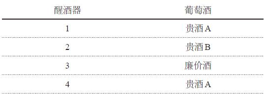

盲品时，老学者们非常合作。他们摇杯、闻香、小口品尝；他们填好了调查卡，标示出对每种酒的评价。他们不知道其中一瓶酒的价钱是其他酒的十分之一。

结果如何？四个醒酒器中的酒得到的平均分是很相近的，也就是说，廉价酒尝起来并不比贵酒差。这还不是最令人惊讶的发现。这名年轻学者还对比了品酒者对这“四种”酒的评价。你能猜到哪两种酒被认为差别最大吗？1号和4号——从同一瓶酒中倒出来的！

这类发现并不会赢得满堂彩。一位老学者——品酒行家——大声宣布他患了伤风，所以影响了味觉，然后愤然离席。

好吧，或许这个实验不太正规——或者说不太科学。要是能看到设计更完善的实验的结果，岂不是很好？

罗宾·戈德斯坦学过神经科学、法律和法式烹饪，也是一位美食、美酒评论家，他决定做这样一个实验。几个月里，他在全美召集了500余人，组织了17次盲品会，这些人中有初级品酒员、侍酒师以及酿酒商。

戈德斯坦选用了523种酒，价格在1.65美元至150美元之间。品酒者和侍酒者都不知道酒的品种和价格。每品完一种酒，品酒者就要回答这个问题：你觉得这酒怎么样？答案包括：“糟糕”（1分）、“还行”（2分）、“好”（3分）和“很棒”（4分）。

结果所有酒的平均得分是2.2，也就是略高于“还行”。那么是较贵的酒得到了更高的分数吗？不是。戈德斯坦发现，实验对象“略微”偏爱廉价酒。他还谨慎地说明，约12%的参与者是内行，他们都接受过某种品酒培训，这些人并没有偏爱廉价酒，但很显然也没有更欣赏贵的酒。

你在挑选葡萄酒时，是否有时会根据标签的漂亮程度做购买决定？罗宾·戈德斯坦的调查结果显示，这个办法并不赖：至少标签是容易区分的，不像瓶里的酒。

注定要成为葡萄酒界“异教徒”的戈德斯坦还要尝试另一项实验。如果昂贵的价签并不意味着更好的口感，那么酒评家给出的分数和奖项还有意义吗？在这个领域最出名的莫过于《葡萄酒观察家》杂志。它对上万种酒做过评论，并把卓越奖章颁发给“拥有上好酒类选择，在价钱和风格上均与之相配的丰富菜品”的餐厅。全世界只有几千家餐厅拥有这个殊荣。

戈德斯坦好奇这奖项是否名副其实。他开了一个虚假餐厅，把它设定在米兰，还为它建了网站和菜单——简单却花哨的意大利菜品的有趣大杂烩。他给餐厅起名为“Osteria
L’Intrepido”，翻译过来就是“无畏餐厅”的意思，这个名字源于他自己出的餐厅指南《无畏评论》。“我们想探索两个问题，”他说，“首先，是否一定要有好酒名单才能获得《葡萄酒观察家》颁发的卓越奖章。其次，为获此殊荣是否真的要有酒单上的酒。”

戈德斯坦精心为这个虚拟餐厅设计了酒单，但设计思路和你想象中的不同。在藏酒单上——通常应列出餐厅里最好、最贵的酒——而他选择了品质特别糟糕的酒，包括《葡萄酒观察家》曾用百分制评过的15瓶酒。在这个百分制中，90分以上表示“出色”，80分以上至少是“够好”，75~79分为“中庸”，任何低于74分的酒都属于“不推荐”的范畴。

戈德斯坦选的15瓶酒的得分如何呢？它们平均下来得到了可怜的71分。其中一瓶被《葡萄酒观察家》形容为“闻起来像谷仓，尝起来像腐蚀物”。关于另一瓶是这样说的：“涂料稀释剂和指甲油的味道有点儿重。”一瓶名叫“I
Fossaretti”的1995年赤霞珠仅得到58分。对于它的评价是这样的：“有点儿问题……尝起来有金属味，很奇怪。”在戈德斯坦的的藏酒单上，这瓶酒卖到120欧元，而这15瓶酒的平均价格是180欧元。

餐厅是假的，酒单上最贵的酒在《葡萄酒观察家》那里得到的评价都很差，戈德斯坦怎会期待他有可能获得卓越奖章呢？

“我猜想，”他说，“那250美元申请费真的是申请过程中很有用的一部分。”

他把支票、申请表和酒单寄了出去。不久后，这家假餐厅接到了《葡萄酒观察家》打来的真电话。他获得了卓越奖章！杂志社还问：“您有没有兴趣在下一期杂志中刊登贵餐厅获奖的广告？”戈德斯坦因此得出结论：整个颁奖设计不过是个广告骗局。

我们问他，这是否意味着我们这两个对开餐厅一无所知的人，也能期待着有朝一日获得《葡萄酒观察家》颁发的卓越奖章？

“没错，”他说，“只要你们的酒够难喝。”

或许你在想，这类“奖项”多少都是营销噱头。你也明白，昂贵的酒不一定更好喝，打广告的钱很多都是浪费。

不过很多浅显的道理只有在事实面前才变得一目了然——这需要有人花时间和精力去研究、去证明。只有当你不再不懂装懂后，才能释放出研究的冲动。不懂装懂的诱惑太大了，你必须变得更勇敢。

还记得那些编造“玛丽去海滩旅行”故事细节的英国儿童吗？研究者们又做了一个后续实验，叫作“帮助儿童在问题无解时坦率地说：‘我不知道’”。研究者再次向儿童提出了一系列问题，但这次不同的是，他们直接告诉孩子们，要是没有答案，就说“我不知道”。好消息是，这一次，孩子们极为成功地适时承认“我不知道”，也没有影响对其他问题的正确回答。

让我们从孩子们的进步中得到些鼓舞吧！下次当你面对不懂的问题时，请直说“我不知道”。当然，还可以加一句——“但或许我可以找到答案。”然后请尽你所能寻找答案。你会惊讶地发现人们是多么欢迎你的坦诚，尤其当你在一天或一周后找到了真正的答案时。

即便进展没有那么顺利——你的老板对你的无知冷嘲热讽，抑或无论怎样尝试都找不到答案——偶尔说“我不知道”依然有另一个更具策略性的好处。假设你已经说过几次“我不知道”，下次当你陷入真实困境、面临无法解答的问题时，直接编造一个答案，每个人都会相信你，因为你是那个疯狂的、常常会承认自己不知道答案的人。

毕竟，坐办公室，并不意味着可以停止思考。

[\[1\]](#index_split_078.html_filepos1055236)
1969年创设的诺贝尔经济学奖并非原始的官方诺贝尔奖项。官方诺贝尔奖从1906年起在物理、化学、生理或医学、文学以及和平领域颁发。诺贝尔经济学奖的官方名称其实是“纪念阿尔弗雷德·诺贝尔的瑞士银行经济学奖”。至于它是否该被叫作“诺贝尔奖”一直都存在争议。我们理解历史学家和语义学家的反对意见，但接受这个大众认可叫法也无大碍。

[\[2\]](#index_split_078.html_filepos1070559)
感恩节之后的星期五。这是美国商家每年打折力度最大的一天，可谓传统的打折购物日。——译者注

第三章 你的问题是什么？

> 不论你想解决的问题是什么，请确定你不是在专攻动静较大、吸引你注意力的环节。在你倾入所有时间和资源之前，恰当地定义问题至关重要，若能“重新定义”问题则更佳。

如果说连承认自己不知道都需要很大勇气，那么请想象一下承认自己连正确的问题都不知道会有多难。但要是你问了错误的问题，那很有可能答案也是错的。

思考一个你非常希望解决的问题。或许是肥胖流行病、气候变化，抑或美国公立学校质量下滑的问题。现在问问自己，你认为其中的问题出在哪儿。十有八九，你的观点是深受大众媒体影响的。

大多数人没有时间，或者也不想深思这些大问题。我们更倾向于听别人怎么说，一旦产生共鸣，便将自己的认知附加在别人身上。此外，我们更关注问题中困扰到自己的部分。或许你不同意“学校质量差”这个说法，因为你的祖母是老师，她对教育付出的心血比现如今的老师多。对你来说，学校质量的下降明显是因为有太多糟糕的老师。

让我们进一步思考一下这个问题。在美国教育改革浪潮中，关于教育关键因素的理论比比皆是：学校规模、课堂大小、行政稳定性、科技投资，以及——没错——师资力量。毋庸置疑，好老师优于坏老师，整体师资力量自我们祖母那个年代后就逐渐下滑也是事实，部分原因是现如今聪明的女人有太多职业选择。还有，在芬兰、新加坡、韩国等国，未来教师是从最优秀的大学生中挑选的，而在美国，未来教师则更有可能出自班级的后进生。所以或许每个关于学校改革的对话都聚焦于师资力量并不是没有道理的。

然而最近，海量证据显示，相较于师资力量，还有另外一系列截然不同的原因对学生表现的影响更显著：孩子从父母那里学到什么，孩子在家学习的用功程度，以及父母是否培养了孩子的求知欲。少了这些家庭投入，学校能做的会非常有限。学生在校时间只有每天的7个小时，一年180天，也就是学生醒着时间的22%。而这段时间也不都是用于学习的，你还要交际、吃饭，上学、放学路上也得花时间。对于很多孩子来说，生命最初的三四年完全是在家里度过的，与学校无关。

可是严肃人士讨论教育改革问题时，很少提及家庭在孩子的发展中扮演的角色。部分原因在于，“教育改革”这个词就预示着一个问题：我们的学校怎么了？而现实中更该问的问题是：为什么美国儿童不如爱沙尼亚或波兰的儿童知道的多？当你变换问题时，寻找答案的方向也将不同。

所以当我们讨论美国儿童为何表现不佳时，我们应该多谈谈父母的影响，而不是学校。

在我们的社会中，想当发型师、搏击手、猎手——或老师——都需要接受训练并得到州立机构颁发的证书。可是做父母却不需要任何资格证。任何有生育能力的人都能“创造”孩子——不必接受考核，也可以用自认为合适的方法带孩子，只要孩子身上没有明显瘀青——然后再把孩子交给学校，期待着教师们能够施展魔法。或许我们对学校要求得太多，而对父母和孩子本身又要求得太少了。

更广义地说：不论你想解决的问题是什么，请确定你不是在专攻动静较大、吸引你注意力的环节。在你倾入所有时间和资源之前，恰当地定义问题至关重要，若能“重新定义”问题则更佳。

一名谦逊的日本大学生在接受我们大多数人都无法想象也不愿面对的挑战时，就是这么做的。

2000年秋，一名年轻人在日本三重县四日市大学研读经济学，后来大家都叫他小尾，他和女友久美住在一起。他们因为交不起电费，就在公寓里点蜡烛度日。他们都不是富裕家庭的孩子——小尾的父亲是一个佛教信徒，在一间寺院里给人讲解寺院的历史。小尾和女友已经交不起房租了。

久美听说有个比赛，胜者能获得5000美元的奖金。她私下寄了张卡片为小尾报名参赛。那是个竞争大胃王的电视节目。

这明显不是个好主意。小尾从不暴饮暴食，他身形瘦削，身高刚够五英尺八英寸，不过的确胃口很好。小时候他就常常扫光自己和姐妹盘子里的食物。他认为身材根本不能说明问题。他儿时心中的英雄之一就是相扑冠军千代富士，人称“狼”，千代身材较为小巧，但超凡的技巧弥补了这个劣势。

小尾勉强答应参赛。他唯一的机会便是从策略上打败对手。他在大学学过博弈论，现在派上用场了。大赛分为四个环节：煮马铃薯、海鲜大碗、蒙古烤羊肉和面条。只有每个环节里最先吃完的人才能晋级。小尾事先研究了之前同类型的大胃王比赛，他觉得大多数参赛者在前几轮里都吃得太猛，以至于即便晋级，也很难在决赛上有出色的表现。他的策略是节省能量和胃容量，只吃足够让他晋级的分量。这并不是什么深奥的道理，不过他的对手也不是深刻的思想家。在决赛中，小尾一定是和儿时偶像产生了感应，狼吞虎咽，吃下了足够的面条，赢得了5000美元。小尾和久美公寓里的灯泡又亮了起来。

从日本各种大胃王比赛中能赚到不少钱，但尝过业余比赛成功的滋味后，小尾迫不及待地想要加入专业行列。他把目光锁定在大胃王比赛中的“超级碗”：内森国际吃热狗大赛。这个比赛已在纽约康尼岛举办了约40年——《纽约时报》和其他媒体曾报道比赛可以追溯到1916年，但比赛的宣传人员已经承认这段历史是捏造的——这个比赛每年能为ESPN（美国娱乐与体育节目电视网）吸引100余万观众。

规则很简单。选手必须要在12分钟内吃下尽可能多的热狗。结束铃声响起时，只要选手能最终咽下去，嘴里的食物也算在总食量内。不过在比赛过程中，选手要是把已放进嘴里的热狗吐了出来——在大胃界被称作“财富的反转”，会被取消参赛资格。参赛者可以自备调味料，但没人费这个事。也可以带饮料，任何种类，不限数量。2001年，当小尾决定参加这个比赛时，最高纪录是令人震惊的12分钟内吃下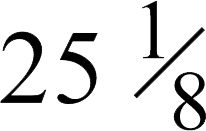
个热狗。

他在日本的家中练习。他很难找到符合比赛标准的热狗，只能用鱼肠代替肉肠，将整条面包切片来代替热狗面包。他默默地训练数月，默默地来到康尼岛。一年前，该项比赛的前三名都是日本人——人称“兔子”的荒井和丰保持着世界纪录。人们也并不觉得今年这个新人具有威胁性。还有人以为他是个高中生，真是那样的话他将不能参赛。一名参赛者嘲笑他说：“你的腿比我的胳膊还细！”

他的成绩如何呢？第一次参加这个比赛的他横扫全场，并创下了新纪录。你猜他吃下了多少个热狗？记住，原先的纪录是
个。合理的猜测在27~28个。这比原纪录要高出10%还多。你若更大胆一些，或许猜他增加了20%，那就是在12分钟内吃下略多于30个热狗。

可是他吃了50个。50个！也就是每分钟吃下4个多热狗，并持续了12分钟。23岁瘦弱的小尾——全名是小林尊——几乎使原纪录翻了一倍。

想想这两个纪录之间的差距吧。或许康尼岛吃热狗大赛的历史意义比不上百米赛跑，不过让我们换个情境来理解一下。我们撰写此书时，百米跑的世界纪录——9.58秒——是由牙买加短跑选手尤塞恩·博尔特保持的。即便是在如此短的赛程中，博尔特依然能和对手拉开几步距离；他被普遍认为是世界上最优秀的短跑运动员。在他之前，世界纪录是9.74秒。也就是他把速度提升了1.6%。若是换成小林尊提升的百分比，那么博尔特的百米跑成绩就会是4.87秒，相当于每小时46英里。这个速度介乎灵缇犬和猎豹之间。

之后，小林尊连续获得五届康尼岛大赛冠军，把纪录提升到了
个热狗。之前的选手最多连赢三界，更别提连续六届了。而他的特殊不仅仅在于胜利或两个纪录间的差距。往常的胜利者看上去好像能把小林尊也吞进肚子里，他们都是在联谊会上以能一口气吞下两大张比萨和半打啤酒而闻名的家伙。而小林尊说话温和、风趣幽默又善于分析。

他成了国际巨星。在日本，一名学生在模仿他的大胃英雄窒息身亡后，全日本对大胃王比赛的热情冷却了。然而小林尊在其他国家参加了不少比赛，刷新了吃汉堡、德国香肠、夹馅面包、龙虾卷、墨西哥鱼肉卷等食物的纪录。他唯一一次失手，是在一个一对一的电视比赛中。约2.5分钟内，他吃了31个热狗肠，而对手吃了50个，这个对手是一头半吨重的科迪亚克棕熊。

最初他在康尼岛的连续称霸令人困惑。有些对手认为他作弊。或许他服用了肌肉松弛剂或是抑制呕吐反射的药物？还有传闻说他曾经吞下石头来把胃撑大。也有闲言碎语说小林尊是日本政府密谋派去羞辱美国人的——这比赛可是在美国独立日举办的！还有人说日本医生为他植入了第二个食道或胃。

但是，这些指责貌似都不对。那么为何小林尊的成绩比对手好那么多呢？

我们曾在不同场合中与他会面，试图回答这个问题。第一次见面是在一个夏天的晚上，我们在纽约上西区低调别致的卢森堡咖啡馆里共进晚餐。小林尊吃得很精细——一小盘蔬菜沙拉、英式早茶、少许不配酱料的鸭胸肉。很难想象这和铃声响起时往嘴里塞了那么多热狗的是同一个人，就好像在看一个笼斗士绣花。他说：“跟美国选手比起来，我平时吃得不多。吃饭太快也是不礼貌的。我做的一切都是违背日本人的礼仪和精神的。”

小林的母亲并不关心他的职业选择。“我从来都不会向她提起我的比赛或训练。”然而2006年，他的母亲因患癌症病危时，仿佛从小林尊的职业中得到了灵感。“她在接受化疗，所以总是想吐。那时她对我说，‘你吃太多时也是在努力克制着别吐出去，所以我觉得我也能试试，也能坚持’。”

他的五官很精致——温和的眼神、高高的颧骨，他看上去很有灵气。他的发型也很时髦，还染了发，一边是红色，一边是黄色，代表番茄酱和黄芥末。他先讲了第一次参加康尼岛大赛前是如何训练的，语气平和而有力。原来那几个月的封闭式训练就是无数回合的实验与改进。

小林尊发现，康尼岛大赛大多数参赛者用的是相同的策略，或者根本称不上策略，也就是一个普通人在后院烧烤时吃热狗的快进版：拿起来，塞进嘴里，从头嚼到尾，再喝口水送下去。小林尊在想，还有没有其他的方式。

哪里也没写着吃热狗必须要从一端吃到另一端。第一个实验很简单：他想知道把热狗掰断后再吃会怎样。他发现这种方法给了咀嚼和传送食物更多的可能性，也让手帮忙做了些嘴巴的工作。这种方法后来被称作“所罗门法”，名字来源于《圣经》中的所罗门王——他威胁着要把婴儿分成两半，来解决两个女人同认一个婴儿为子的纠纷（第七章中会详细讲到）。

小林尊又挑战了另一个传统的吃法：面包和肉肠一起吃。毫不意外，人们都是这样吃的。肉肠舒服地躺在面包里，在悠闲地吃热狗时，软而淡的面包与油滑、鲜美的肉肠是完美的组合。然而小林尊可不是要悠闲地吃热狗。他发现面包和肉肠一起咀嚼时会产生密度矛盾。肉肠是一管经压缩的密实的咸肉，基本上可以直接滑入食道。而蓬松、不那么密实的面包既占空间，又需要多次咀嚼。

于是他开始分开吃面包和肉肠。现在他可以先吃一些被掰成两半的肉肠，然后再吃面包。他就像一人工厂，朝着自亚当·斯密以来就让经济学家热血沸腾的专业化分工而努力。

尽管他现在吞肉肠就像水族馆里被驯服的海豚吞鲱鱼一样，吞面包却依然是个问题。（如果你在酒吧里打赌想获胜，就挑战对方在一分钟内不喝饮料吞下两个热狗面包；这几乎是不可能做到的。）于是小林尊做了不同的尝试。他一手往嘴里塞入已被掰断的肉肠，一手把面包浸入水杯，然后挤出多余水分，再把面包塞入嘴巴里。这貌似有违直觉。在需要空间来装热狗时为何还要摄取多余的液体呢？但浸湿面包有一个隐藏的作用。吃湿面包让小林尊在吃热狗的过程中不会感到口渴，这就节省了喝水的时间。他试过不同水温后，发现温水最适合，能够帮助放松咀嚼肌。他还往水里加入了植物油，以助吞咽。

他进行了无数实验。他用摄像机录下了自己的训练过程，在表格上记录每个数据，试图发现低效环节和每一毫秒的浪费。他还对节奏进行了实验：前四分钟尽快吃、中间四分种放缓、最后四分钟冲刺，还是始终保持均速？（他发现，一开始尽快吃是最佳策略。）他还发现，多睡觉至关重要。负重训练也是：强健的肌肉有助于进食，也能抑制呕吐。进食时跳动并扭动身体也能给他的胃部腾出空间——这种奇怪的舞动后来被称作“小林尊抖动”。

被淘汰的策略和被采纳的同样重要。与其他选手不同，他从来不在自助餐餐馆中进行训练。（“这样我会不知道哪种东西吃了多少。”）他在吃东西时也不听音乐。（“我不想听见任何多余的声音。”）他发现喝几加仑的水能把胃撑大，但后续影响是灾难性的。（“我开始犯各种病，就像癫痫发作。所以那样做是个大错误。”）

小林尊发现结合上述几种方法，身体上的准备能使他进入一种升华的精神状态。“一般情况下，10分钟内要吃那么多，最后的两分钟是最艰难的，你会发愁。但当你无比专注时，那便成了享受。你能感觉到痛苦和折磨，但与此同时，你变得更加兴奋。那便是快感来临的时刻。”

不过等一下，抛开这种种方法上的创新，小林尊会不会只是个生理结构上的怪胎——百年不遇的进食机器？

反对这一观点最有力的证据是：他的竞争者迎头赶上来了。小林尊在康尼岛连续称霸6年后，一名美国选手，人称“大白鲨”的乔伊·切斯特纳，接连获得了7次冠军——截止到本书撰写之时。

他常常是险胜小林尊。他俩连连刷新世界纪录，切斯特纳在10分钟内吞下了令人难以置信的69个热狗（比赛在2008年被缩短到10分钟）。同时，不少对手，包括“深盘”帕特里克·贝尔托莱蒂和“X食客”蒂姆·贾纳斯，也常常打破小林尊最早创造的纪录。女性组纪录保持者、98磅重的“黑寡妇”索尼娅·托马斯也是，她在10分钟内吃下了45个热狗。一些小林尊的对手模仿了他的部分策略。而所有人都从中增长了见识：原本认为是异想天开的12分钟吃40或50个热狗，其实根本不是幻想。

2010年，小林尊与康尼岛大赛的组织者产生了合同纠纷——他宣称大赛限制了他参加其他比赛的自由，却也不让他参加康尼岛的比赛。而他依然兴奋地出现在赛场，跳上舞台。即刻便被拷住逮捕。这个鲁莽的举动与一个如此自律的人的个性并不相符。在监狱的那个晚上，他得到了一个三明治和一杯牛奶。“我很饿，”他说，“我希望监狱里有热狗。”

小林尊如此辉煌的成功，是否可以运用在比快速吃热狗更有意义的事情中呢？我们相信答案是肯定的。如果你进行魔鬼式思考，你会发现我们从中至少能吸取两个广义的经验。

第一个是有关于解决问题的一般方式。小林尊重新定义了问题。他的对手问了什么问题呢？基本都是：我怎样才能吃更多的热狗？小林尊问了一个不同的问题：我怎样才能让热狗更易下咽？这个问题引导他进行实验，不断优化策略。在重新定义问题后，他才发现了一系列新的答案。

小林尊把竞争性进食看作与日常吃饭截然不同的活动。他把它看作一项体育运动——或许对大多数人来说这项运动令人作呕——然而就如任何体育运动一样，它需要有针对性的训练、策略以及身体和精神上的操控。把大胃王比赛看作日常吃饭的衍生版对小林尊来说，就好像把马拉松比赛看作散步的衍生版。当然，我们大多数人都能走不少路，必要的话甚至能走很久。不过完成马拉松相比之下还是要复杂些的。

当然重新定义大胃王比赛的问题，比类似挽救摇摇欲坠的教育系统或解决地方性贫困问题要容易很多。不过即便是面对如此复杂的问题，像小林尊一样敏锐地分析问题核心，仍不啻为一个好的开始。

从小林尊的成功中学到的第二个经验，关乎我们接受或拒绝接受的极限。

跟小林尊在卢森堡咖啡馆吃晚餐时他告诉我，开始训练时，他拒绝承认康尼岛大赛当时
个热狗纪录的合理性。为什么？因为他认为他的早期对手在吃热狗方面一直都没有找到真正的问题所在，所以这个纪录不能代表什么，只是一个虚无的障碍。

所以他参赛时也没有把
这个数字看作某种上限。他训练自己的思维，完全不去理会已经吃了多少热狗，而是彻底聚焦于吃的方法。倘若他在精神上对
的极限有所敬畏，他还能在第一次比赛中取胜吗？或许也能吧，但是使纪录翻番便不可想象了。

在最近的实验中，科学家发现就连顶级运动员都会因被谎告世界纪录而表现更佳。在一个实验中，自行车手被要求以最快速度在健身自行车上蹬出4000米。然后研究人员让他们重复这个任务，同时观看自己上一次蹬车的移动图像。他们有所不知的是，研究人员调快了图像播放速度。然而自行车手都可以跟上这个速度，超越了他们原本认知中的“最快速度”。“大脑才是最关键的器官，而不是心或肺。”著名神经学专家罗杰·班尼斯特说。他也是第一个在四分钟内跑完一英里的人。

我们每个人每天都面对着各种障碍——身体上的、经济上的、时间上的等等。有些无疑是实际存在的。而有些则纯粹是虚无的——对某种系统功能的期待、哪种程度的改变算“适度”，或者哪些行为是可以接受的。下次当你遇到障碍时——由不具备你那样的想象力、动力和创造力的人强加的障碍——请仔细考虑忽视它。解决问题已经够难的了，如果你事先就判定无法做到，那就是难上加难了。

假如你怀疑人为设限的负面力量，那么可以做个简单的测试。假设你很久没有锻炼，想快速恢复体形。你决定做俯卧撑。做几个呢？嗯，好久没做了，你这样告诉自己，那就先做10个吧。于是你开始做了。你什么时候会从精神上和身体上感觉到累呢？大概是在做到第七或第八个时。

想象你给自己定下的目标是20个，而不是10个。你又会做到第几个时开始感觉到累呢？现在就去做，趴到地上试试。估计你在做到十一二个之前都不会想起自己多么缺乏锻炼。

第一年，小林尊就是因为忽视吃热狗纪录才轻松冲过25这个数字的。在每年的康尼岛比赛中，每个选手面前都有一位女士负责翻牌子计数给观众看。那一年，牌子上的数字不够用了。小林尊面前的计数女士不得不举起一张张黄色纸片，上面是手写的歪歪扭扭的数字。比赛结束后，日本记者问小林尊感受如何。他说：“我还可以继续。”

第四章 真相在问题的根源

> 直视本因会令人不安，甚至会引起恐慌。或许这也是为什么我们常常回避本因……不过当直面本因时，你至少知道你在与真正的问题做斗争，而不是在和影子打仗。

面对人们已经研究过的问题并找出新的解决途径，需要思考者真正具有独创精神。

为什么能做到这点的人少之又少？或许因为，我们多数人在寻找答案时都倾向于最接近、最显而易见的原因。很难说这是后天形成的习惯，还是祖先遗留的基因所致。

在穴居人时代，知道某棵灌木上的果子是否能吃攸关性命。最临近的原因通常是最重要的。即便在今天，最临近的原因也常常能够完美地解释问题。如果你三岁大的孩子号啕大哭，而五岁大的孩子带着坏笑站在一旁，手里还握着一把塑料锤子，那么这锤子和哭泣多少有点关系——这会是个不错的猜测。

不过社会关注的大问题——犯罪、疾病、政治机能失调等——要复杂得多。它们的根本原因通常不那么直接、明显或易被感知。于是我们往往投资数百亿资金去治疗症状而不是为问题除根，问题得不到解决时，我们只能望洋兴叹。魔鬼式思考，意味着你要竭力找出问题的根源，并解决它。

当然这说起来容易做起来难。思考一下贫困与饥饿的问题：它们是由什么导致的？一个讨巧的答案是，金钱和食物的匮乏。因此理论上讲，向饱受贫困、饥饿问题困挠的地区空运大量金钱和食物就能解决问题了。

政府和救援组织这么多年来差不多就是这样做的。那么为何这些地方的贫困、饥饿问题还得不到解决呢？

因为贫困只是个症状，根源是缺乏基于可靠政治、社会及法律体制的有效经济体系。即便有一飞机的钞票也很难解决这个问题。类似地，食物匮乏也往往不是饥饿的根本原因。经济学家阿马蒂亚·森在他的要作《贫困与饥荒》一书中指出：“饥饿是人们吃不到足够食物的表现，而不是没有足够食物的表现。”在那些政治和经济体制只为满足腐败的少数人的国家里，最需要食物的人民往往得不到它。与此同时在美国，我们扔掉的食物占已购食物的百分比达到了惊人的40%。

但是，解决腐败问题可比空运食物要难得多。所以即便是找到了问题的根源，你也有可能依然停滞不前。不过你在本章中将看到，偶尔天时地利人和，那时你将得到极大的回报。

在《魔鬼经济学》一书中，我们推究了美国暴力犯罪率浮动的原因。1960年，犯罪率忽然上升。到了1980年，凶杀率已然是过去的两倍，达到了历史最高点。接下来的几年里，犯罪率居高不下。然而从90年代初期起，犯罪率开始持续下降。

究竟发生了什么？有很多种解释，我们在《魔鬼经济学》一书中对数种解

释做了实证审评。下面是两组解释，其中一组对降低犯罪率有着重要的影响，而另一组没有影响，你能对号入座吗？

两组都挺有理，不是吗？没错，不过当你卯足劲儿仔细分析数据后便会发现，几乎不可能找到真正的答案。

数据说明了什么呢？

A组因素尽管看似合乎逻辑，但并没有促使犯罪率下降。或许这会让你大吃一惊。枪杀案减少？你会想，那一定与新的、更严格的枪支管控法有关，直到你分析了数据才发现，那些用枪作案的人几乎完全没有受到枪支管控法的影响。

你或许认为20世纪90年代快速增长的经济起到了一定作用，然而历史数据显示，经济周期与暴力犯罪的关系非常弱。实际上，在2007年经济大衰退开始时，一大批权威人士就警告人们，长期以来令人欣慰的暴力犯罪缓解期即将结束。然而事实并非如此。2007~2010年，经济衰退最严重的几年里，凶杀率下降了16%。难以置信，现如今的凶杀率比1960年时还低。

同时，B组因素——更多的警察、更多人被关进监狱以及可卡因市场的衰落——的确推动了犯罪率下降。不过我们加总这些因素的影响力后发现，它们依然无法充分解释犯罪率的下降。肯定还有其他原因。

让我们再仔细看看B组因素。它们触及犯罪的根本原因了吗？并没有。把这些因素称作“时效因素”似乎更说得通。雇用更多警察，抓更多犯人入狱，固然会降低罪犯的“短期供应”，然而“长期供应”问题怎么解决？

在《魔鬼经济学》一书中，我们指出了一个遗漏因素：20世纪70年代初通过的堕胎合法化法案。这个观点有些刺耳，却很容易理解。堕胎率的上升意味着因意外怀孕而出生的孩子数量会减少，也就是说在犯罪率高的不良环境中成长的孩子减少了。

考虑到美国有关堕胎问题的历史背景——没什么比这个问题在道德和政治角度更令人为难的了——这个观点必然会使堕胎反对者和支持者同样难堪。我们冒着引来口水战的危险坚持这一观点。

有趣的是，我们的观点并没有惹来多少恐吓信。为什么？我们的猜测是，读者足够聪明，能够理解我们只把堕胎看作犯罪率降低的一个因素，而非本因。那么本因是什么呢？很简单：太多儿童在不良环境中成长，最后诱使他们走向犯罪的道路。而随着堕胎合法化后第一代人的逐渐成长，在那种环境中长大的孩子也越来越少。

直视本因会令人不安，甚至会引起恐慌。或许这也是为什么我们常常回避本因。讨论警察、监狱和枪支管控法案，可比讨论如何做合格的父母要容易多了。但你若要就犯罪问题进行有价值的讨论，那么合理的切入点便是慈爱、优秀的父母和家庭环境，他们能给孩子提供安全、充实的生活的机会。

这或许不会是简单的一场讨论。不过当直面本因时，你至少知道你在与真正的问题做斗争，而不是在和影子打仗。

为了了解一个问题的本因而回溯至一代或两代人之前，这种做法或许令人望而生畏。不过在某些情况下，一代不过转瞬之间。

假设你是德国一家工厂的工人。你下班后和朋友坐在啤酒馆里，为各自的经济状况闷闷不乐。国家经济在繁荣增长，然而你和城镇里的其他人好像都在原地踏步。可是其他几个城镇的居民生活状况都有了很大提升。这是为什么？

为了找到答案，必须回到16世纪。1517年，一位名叫马丁·路德的德国年轻教士列出了95条针对罗马天主教会的论纲。他认为其中尤其令人厌恶的便是出售赎罪券——教堂宽恕大额捐赠者犯下的罪恶，以此集聚金钱。（你可以想象路德在今天会谴责对冲基金和私募股权公司享受的税收待遇。）

路德的大胆举动引发了一场宗教改革。那时德国由一千多个独立邦国组成，每个邦国都有自己的王子或公爵。他们其中一些人拥护路德和新教，而另一些人则继续保持着对罗马天主教会的忠诚。这种分裂在接下来的几十年里给欧洲带来了巨大的影响，经常伴随着大规模杀戮。1555年，一个临时的解决方案出台了。《奥格斯堡和约》允许德国所有王子自由选择各自领地范围内的宗教信仰。如果一个天主教家庭住在选择了新教信仰的领地内，此合约允许该家庭自由迁移到天主教地区，反之亦然。

就这样，德国变成了一幅宗教拼凑图。天主教在东南和西北部依然有很多信众，而中部及东北部则成了新教的天下，有些地区则两种信仰杂处。

历史快速翻过460年，今天，一位名叫约尔格·史班库赫的年轻经济学家发现，如果将现代德国地图叠放在16世纪的德国地图上，那些宗教区块依然基本重合。那时的新教地区现在依然以新教为主要教派，那时的天主教地区依然以天主教为主要教派（除了德意志民主共和国曾接受不少无神论影响）。几世纪前王子的选择在今天依然发挥着效应。

或许这还不够令人称奇，毕竟德国是个沐浴在传统中的国家。然而史班库赫在摆弄地图时发现了的确令他惊讶的事。现代德国的宗教区块与有趣的经济区块也有重合：新教地区人民的收入高于天主教地区的。也没高出太多，大约是1%，但这差异很明显。如果当年你所居住地区的王子选择了天主教，那么今天你很有可能比选择新教的地区的人挣钱少。

如何解释这种收入区分呢？当然会有符合现代观念的理由。或许高收入者接受的教育更多，婚姻更美满，抑或住得离大城市近，更有可能获得高薪工作。

不过史班库赫在分析了相关数据后发现，上述因素没能解释收入的差异。只有一个因素可以，那就是宗教。他得出结论：新教地区的居民比天主教地区的收入高，仅仅因为他们是新教徒！

这又是为什么？是否存在宗教上的任人唯亲？信新教的老板把好工作给了新教徒？明显不是。实际上，数据显示新教徒的小时工资并不比天主教徒高，而他们依然有更高的总体收入。那么史班库赫又是如何解释两者之间收入差距的呢？

他指出了三个因素：

> 1.与天主教徒相比，新教徒往往每周工作时间更长。

> 2.与天主教徒相比，新教徒中个体经营者较多。

> 3.与天主教徒相比，拥有全职工作的新教徒女性数量更多。

看来史班库赫找到了新教徒勤奋工作的生动证明。德国社会学家马克斯·韦伯早在20世纪初期就提出过这个理论。他提出，资本主义在欧洲盛行，部分原因是新教徒信奉脚踏实地工作的观念，把勤奋工作当作神圣使命的一部分。

那么这一切对因经济问题而满腹牢骚、借酒浇愁的工厂工人来说有什么意义呢？不幸的是，没有多大意义。对工人来说，大概一切都太晚了，除非他决定振作精神，开始更勤奋地工作。不过至少他可以督促子女向临近城镇的新教徒学习。
[\[1\]](#index_split_080.html_filepos1144593)

一旦你开始用长镜头看世界，你便会发现很多现代行为的根本原因都可追溯至几个世纪前。

例如，为何有些意大利城市会更愿意参与民事和慈善活动？就如一些研究者指出的那样，这是因为在中世纪时期这些城市是自由的城邦，并不在诺曼人的统治之下。显然这种独立的历史背景让人民对民间机构更有信心。

在脱离殖民统治的一些非洲独立国家，有的经历了残酷的战争，腐败问题猖獗，而有的却没有。这是为什么？两位学者找到了原因，这还要追溯到多年以前。当19世纪欧洲列强开始疯狂地争夺非洲时，他们在地图上重新分割了领土。建立新边界时，他们考虑了两个要素：土地和水。居住在那些区域里的非洲人对殖民主义者来讲并不那么重要，因为对他们来说每个非洲人长得都差不多。

在切樱桃派时，这种分割方式还有点儿道理。可是分割一块大陆就复杂多了。这些新的殖民地界常常分割了原本庞大而和谐的种族。忽然间，一些种族成员变成了一个全新国家的居民，而另一些成员经常会与相处不太和谐的种族一齐被划分到另一个国家。种族斗争往往被殖民统治压制，然而当欧洲统治者最终返回欧洲以后，那些不和谐种族被迫混居的国家更有可能发生战争。

殖民主义的伤痕依然困扰着南美。在秘鲁、玻利维亚和哥伦比亚发现金矿和银矿的西班牙征服者，曾奴役当地人开采矿山。这带来了怎样的长期影响呢？就如数位经济学家发现的那样，矿区周围的居民直到今天依然较为贫穷，他们的子女接种疫苗或接受教育的机会也更少。

还有一个情况也颇为奇怪，反映了奴隶制度深远的历史影响。哈佛大学的经济学家罗兰·弗赖尔致力于缩小黑人与白人在教育、收入和健康状况方面的差距。不久前，他试着探索为何白人寿命要比黑人长几年。其中一个因素很明显：心脏病，对白人和黑人来说都是史上最致命的疾病，而黑人中心脏病患者明显较多。这是为什么？

弗赖尔分析了各种数据，但没有发现任何能解释这一差别的明显原因，不论是饮食、吸烟，还是贫穷。

后来他发现了一个可能性。弗莱尔偶然间看见了一幅旧画，名叫“一名英国人品尝一名非洲人的汗水”（An
Englishman Tastes the Sweat of an
African）。它描绘的是非洲西部奴隶贩子舔舐奴隶脸孔的画面。

来源：布朗大学约翰·卡特·布朗图书馆

他为何要这样做？

一种可能是：他在检查奴隶的健康状况，不希望船上贩卖的其他奴隶感染疾病。弗赖尔想，奴隶贩子是不是在尝奴隶的“咸度”？毕竟汗就是咸味的。如果是这样，那又是为什么？而这个问题的答案能为弗赖尔探索的更宏观的问题带来启示吗？

从非洲到美洲的海上航程颇为漫长，令人饱受折磨。很多奴隶死在途中。脱水是主要原因。弗赖尔思考：什么样的人不易脱水呢？对盐高度敏感的人。也就是说，奴隶要是有能力锁住更多盐分，也就能锁住更多的水，死于“中途航程”的可能性也会更小。所以或许画中的奴隶贩子想找尝起来更咸的奴隶，以确保投资回报。

身为黑人的弗赖尔向他的哈佛同事——杰出的白人健康经济学家戴维·卡特勒——讲述了这一理论。卡特勒刚开始认为这想法是“完全疯狂”的，然而进一步探索后发现它不无道理。实际上，早先的一些医学研究也发表过类似的声明，虽然引来了不少争论。

弗赖尔开始拼凑这些理论碎片。“你或许认为那些能在如此漫长的航程中生存下来的人身体都不错，因此寿命也应该更长，”他说，“然而这种奇怪的筛选机制决定了你能够在‘中途航程’生还，却躲不过高血压及相关疾病。而盐敏感性的遗传可能性很大，也就是说你的后代，比如美国黑人，患高血压或心血管疾病的概率相当大。”

弗赖尔进一步寻找能支撑这一理论的证据。美国黑人患高血压的概率比美国白人大了约50%。这也有可能是饮食和收入的差异所导致的。那么其他国家的黑人患高血压的概率又是怎样的呢？弗赖尔发现，加勒比海地区的黑人——也是从非洲掳去做奴隶的人的后代——高血压患病率同样很高。但他发现仍然住在非洲的黑人在患病率上与美国白人并无差别。证据依然不够充分，但弗赖尔坚信，奴隶贸易的筛选机制很有可能就是非洲裔美国人死亡率更高的根本原因。

你可以想象，弗赖尔的理论没有受到大众认可。很多人讲到遗传种族差异时会感觉不自在。“有人发电子邮件对我说：‘你看不到这里存在的滑坡危害吗？！’‘你看不到这种理论的危害吗？’”

新出炉的医学研究可能会证明，盐敏感性理论根本就是错误的。但倘若它是正确的，哪怕就那么一小部分是正确的，潜在的利益也很巨大。“有解决方法了，”弗赖尔说，“一种能帮助身体排盐的利尿剂。一片普通药丸。”

•••

你也许认为，在拥有强大科学及逻辑基础的医学领域，对于根源会有更深刻的理解。

你错了。人体是一个复杂、多变的系统，很大一部分依然未知。1997年，医学史专家罗伊·波特这样说道：“我们生活在科学的年代，但科学并没有消除对健康的幻想；疾病的污名和医药的道德意义依然延续着。”因此，直觉往往被当作偏执，而传统观念则大行其道，即便没有数据可以证明。

思考一下溃疡。它基本上就是在胃里或小肠里长出的一个洞，会引起剧烈疼痛。直到20世纪80年代初期，人们还认为已经完全掌握了导致溃疡的原因：遗传，心理压力，或吃了辛辣食品，后两者都会导致胃酸过度分泌。每个吃过一把墨西哥辣椒的人都会认为这种解释是有道理的。医生可以证明，得了出血性溃疡的人精神上都很紧张。（医生也可以轻易指出被枪击的人会大量出血，但这并不说明出血导致了枪击。）

既然知道了导致溃疡的原因，那么针对它的治疗方案自然也就有了。患者被告知要多休息（减缓心理压力），多喝牛奶（舒缓肠胃），以及服用甲胺呋硫或西咪替丁药片（阻止胃酸形成）。

这种治疗方法效果如何？

客气地说：马马虎虎。这种治疗方式的确减轻了患者的疼痛感，然而症状却没有消失。溃疡也不是仅会带来疼痛的小麻烦。一旦引发腹膜炎（胃壁穿孔）或因流血导致并发症，便很容易致命。有些溃疡还需要动大手术。

虽然溃疡患者在标准治疗方案下恢复得并不理想，但医学的整体发展状况还不错。上千万患者依然需要胃肠病学家和外科医生，制药厂也赚得盆满钵满：甲胺呋硫和西咪替丁成了第一批真正意义上的畅销药，每年盈利10亿美元以上。1994年，全球治疗溃疡药物市场的总市值超过了80亿美元。

有医学研究者曾指出，溃疡及其他胃病，包括胃癌，其根本病因甚至有可能是细菌引发的。但医学界很快指出了这一理论中的明显问题：细菌如何在胃酸里存活？

于是传统溃疡治疗方案继续占领着统治地位。人们没有寻找新疗法的动机——至少那些依赖当时盛行的溃疡治疗方法生存的人没有。

还好世界是多样化的。1981年，一位年轻的澳大利亚驻院医师巴里·马歇尔正在寻找研究项目。他刚刚被轮岗到皇家珀斯医院肠胃科，那里的一位资深病理学家刚好遇到了一个谜题。马歇尔后来形容道：“我们有20位患者的胃中出现了细菌，而通常胃中胃酸过多，是不会有细菌存活的。”那位资深医生罗宾·沃伦正在寻找能帮助他“找出这个谜题答案”的年轻研究员。

那弯曲的细菌很像弯曲杆菌，与鸡群接触的人有可能会感染这种细菌。那么这些人体内的细菌是弯曲杆菌吗？又会导致何种疾病呢？为何这种细菌集中出现在肠胃病人中呢？

其实巴里·马歇尔非常熟悉弯曲杆菌，因为他的父亲曾是鸡肉包装厂的冷藏工程师，而他的母亲是一名护士。“我们一家常常会探讨医学中哪些理论是正确的，”他对知名医学记者诺曼·斯旺说，“我妈妈会依据民间流传说法来理解事物，而我会说，‘这太老套了，根本没有根据’。‘是没有根据，巴里，但是人们几百年来都是这样做的呀。’”

马歇尔对于新接手的谜题很是兴奋。他从沃伦医生的病人身上采样，在实验室里培养这种细菌。数月的努力均告失败。然而在一次意外之后——细菌在培养皿中多放了三天——最终培养成功了。那不是弯曲杆菌，而是之前未曾发现过的一种细菌，后来被叫作幽门螺杆菌。

“后来我们又在很多病人身上采样，培养了这种细菌，”马歇尔回忆道，“于是我们可以说：‘我们知道哪种抗生素可以杀死这些细菌了。’我们发现了它在胃中是如何存活的，还可以在试管中对其任意摆布，做各种有用的实验……我们并不是在寻找导致溃疡的原因，我们只是想知道这些细菌究竟是什么，若能发表这个研究成果会很有趣。”

马歇尔和沃伦继续在胃病患者中寻找这种细菌，不多时便有惊人的发现：13个溃疡患者中，每个人都带有这种弯曲的细菌！有没有可能这种幽门螺杆菌就是导致溃疡的病根呢？

回到实验室里，马歇尔试图让老鼠和猪感染上幽门螺杆菌，看看它们会不会得溃疡。然而它们没有。“于是我说，得在人身上试试。”

马歇尔决定，就在自己身上做实验。他还决定不告诉任何人，包括他的妻子和沃伦医生。首先他为自己做了胃组织切片检查，以确保胃中还没有感染幽门螺杆菌。完全没有。然后他吞下了从一个病人身上培养出的一组细菌。马歇尔觉得会有两种可能性：

> 1.他会患溃疡。“那就‘老天保佑’，猜测被证实。”

> 2.他不会患溃疡。“如果什么也没发生，那之前两年的研究也就付之东流了。”

估计巴里·马歇尔是史上唯一一个决心患溃疡的人。他认为即便患了溃疡，也得几年后才会出现病症。

然而吞下细菌短短5天后，马歇尔就开始阵发呕吐。老天保佑！10天后，他又为自己做了胃组织切片检查，“胃里面长满了幽门螺杆菌”。马歇尔已经患上了胃炎，看上去离得溃疡也不远了。后来他服用了抗生素以杀灭细菌。他和沃伦的研究证明了幽门螺杆菌是溃疡的真正病根——日后进一步的研究显示，它也是胃癌的病根。这一发现令人震惊。

自然，这种理论又经过了大量实验证明，也饱受了医学界的巨大阻力。马歇尔遭受了各式各样的嘲笑和忽视。“我们真的要相信一个声称自己发现了新细菌还将其吞入肚中的澳大利亚呆子找到了溃疡的病根吗？”没有任何一个市值80亿美元的产业在自己存在的意义受到挑战时还能兴高采烈的。这真让他们胃里不舒服！现在，得了溃疡不再需要长期就医、服用甲胺呋硫，或者动手术了；一片廉价的抗生素就解决了一切。

这一理论经过了很多年才彻底站住脚，因为传统观念是很难扫除的。即便是在今天，依然有很多人认为溃疡与压力或辛辣食物有关。幸好现在的医生知识体系更全面了。医学界最终不得不承认，当其他人仅仅在治疗溃疡症状时，巴里·马歇尔和罗宾·沃伦找到了病根。2005年，他们二人获得了诺贝尔医学奖。

溃疡的发现虽惊人，但不过是一场刚刚开始的从对症下药转向去除病根的革命中的一小步。

后来人们发现，幽门螺杆菌并不是躲过人体护卫系统、侵略胃部的独犯。近年来，乐于探索的科学家们在强大的新型电脑的帮助下，通过基因测序认识到，人体消化道中住有上万种微生物。它们有的有益，有的有害，有的性质不稳定，还有很大一部分尚未显露出本性。

我们每个人体内究竟有多少种微生物呢？根据某种估算，人体内微生物细胞的数量是人体细胞的10倍，要以万亿或者千万亿来计算。生物学家乔纳森·艾森称之为“微生物云”。一些科学家认为这些微生物细胞是人体最大的组织，其中可能潜藏着大量人体健康或疾病的根源。

在全球的实验室中，研究人员已经开始探索这一微生物群体中的成员——大多是遗传性的——与癌症、多发性硬化、糖尿病，乃至肥胖症和精神疾病之间的关系。千百年来困扰着人类的疾病，或许只是由某个微生物组织的功能失常导致的，而它一直欢乐地游移在肠道中，这听上去是不是太荒诞了？

或许是吧——不过对于那些治疗溃疡的医生和制药厂老板来说，巴里·马歇尔所说的竟然是真相这件事也同样荒诞。

当然，我们还处于微生物探索的早期。消化系统在很大程度上依然是未知领域，就像大海的底部和火星的表面。不过研究已经有所收获。不少医生已经通过给病人体内输入健康肠道细菌治愈了肠道疾病。

这些健康细菌来自何处，又是怎样输入到病人肠道里的呢？在继续讲解之前，让我们先来看两点注意事项：

> 1.如果你正在吃饭，或许需要先停下一会儿。

> 2.如果你在此书撰写很多年之后才读到它（假设那时人类还存在，而且还会读书），那么下面这个方式或许会显得野蛮、原始。其实我们正希望如此，因为这意味着疗法的价值已被证实，而治疗手段也得到了提升。

那么如何为病人提供所需的健康肠道细菌呢？

澳大利亚胃肠病学家托马斯·波洛狄等医生从巴里·马歇尔的溃疡研究中得到灵感，找到了一个答案：人类的粪便。是的，对于肠道细菌被感染、破坏，或缺乏此类细菌的病人来说，富含微生物的健康人的排泄物或许就是良药。来自“捐献者”的粪便被掺入盐水混合物里，用荷兰一位胃肠病学家的话说——看起来就像一杯巧克力牛奶。然后将这种液体输入患者肠道——通常用灌肠的方式。近年来，医生发现，这种方法是有效的，它能治好抗生素无法抵抗的感染。在一项小的研究中，波洛狄宣布他用这种方法治愈了溃疡性结肠炎——如他所说，这是“先前无法医治的疾病”。

波洛狄的研究不仅仅限于肠道疾病。他声称自己还成功地利用粪便治愈过多发性硬化和帕金森。尽管波洛狄谨慎地说这尚需更多研究，但病根在肠道的疾病真可谓数不胜数。

对于波洛狄和一小部分相信粪便功效的志同道合的同行来说，他们站在了医学新纪元的开端。波洛狄认为粪便疗法的益处“可以媲美抗生素的发现”。但首先，他们要接受很多质疑。

“我们得到的反馈和当时巴里·马歇尔的类似，”波洛狄说，“刚开始时我被排挤。即便是现在，我的同事依然回避这个话题，或是不想在会议中碰见我。虽然一切正在改变。我刚刚收到一系列国内外不错的会议演讲邀请。但负面声音一直存在。如果我们能找到一个听上去不那么像用大便治疗的疗法，情况会好很多。”

没错。你可以想象，患者在听到“粪便植入”，或者学术论文中的叫法“粪便微生物移植”后，会产生抵触心理。一些医生给它起的俗名（“换屎”）也不会让人感觉舒服点儿。不过波洛狄在采用这项疗法多年后，终于想到了一个稍微悦耳点的名字。

“是的，”他说，“我们称之为‘灌溏’。”

[\[1\]](#index_split_080.html_filepos1125098)
不过要为天主教说句话：史班库赫最新的研究显示，新教徒中支持纳粹的人数大约是天主教徒的两倍。

第五章 像孩子一样思考

> 想想孩子们爱问的问题。当然有可能听起来有点儿傻，过分单纯或者不着边际。然而孩子们有百折不挠的好奇心，且相对而言少有偏见。因为他们知道的很少，不会像成人一样戴着有色眼镜，看不见事情的真相。而这在解决问题时是个极大的优势。成见会使我们拒绝很多可能性，只因为它们看似不可能或者不舒心，只因它们感觉不对劲或者从未被尝试过，或者只因它们看上去不够深奥。不过别忘了，最后指出皇帝的新衣并不存在的就是个孩子。

读到这里，你或许会问道：真的吗？粪便的威力？吞食危险细菌的人——上文还提过12分钟里吞了够吃一年的热狗的家伙？你们还能再幼稚些吗？“魔鬼式思考”难道是“儿童式思考”的代号？

不完全是，不过当涉及创意及提问时，8岁儿童的思维方式还是会让你受益匪浅的。

想想孩子们爱问的问题。当然有可能听起来有点儿傻，过分单纯或者不着边际。然而孩子们有百折不挠的好奇心，且相对而言少有偏见。因为他们知道的很少，不会像成人一样戴着有色眼镜，看不见事情的真相。而这在解决问题时是个极大的优势。成见会使我们拒绝很多可能性，只因为它们看似不可能或者不舒心，只因它们感觉不对劲或者从未被尝试过，或者只因它们看上去不够深奥。
[\[1\]](#index_split_081.html_filepos1171466)
不过别忘了，最后指出皇帝的新衣并不存在的就是个孩子。

孩子们不怕分享他们最疯狂的想法。只要你能分辨是非，想出一箩筐的点子，哪怕是天马行空，都会使你受益。在构思时，经济学中“自由支配”的概念是关键。想出了很糟糕的点子？没关系，不去付诸实践就好了。

当然，分辨想法的好坏并不容易。（对我们来说一个有效的窍门就是冷静期。想法刚出炉时看上去几乎都妙不可言，所以在它产生的24小时内千万别行动。很神奇，有时妙点子仅见光一天，回头看时就成了馊主意。）或许到最后你会发现，20个想法中只有一个值得贯彻。但你若从未像孩子那样包容每个闪过大脑的想法，就有可能和那一个好主意失之交臂了。

所以当你试图解决问题时，去感受住在自己心里的那个小孩，真的会有效果。一切都始于浅显的思考。

如果你遇到了一个自封为思维领袖或智者的人，对他的最高评价莫过于：“你真是个深邃的思考者。”去试试，观察他如何骄傲地膨胀。如果他的确如此反应，那么我们几乎可以断定，他对魔鬼式思考不感兴趣。

魔鬼式思考意味着浅显，而非深奥。这是为什么？首先，所有大问题都已经被比我们聪明的无数人思考过了。它依然未被解决，这说明问题太难，得不到完整的解决方案。这种问题棘手、复杂，背后还充斥着顽固而扭曲的动机。当然，这世上的确存在真正聪慧的人，这些人或许应该深刻地思考。对于我们其余的人来说，想得太深意味着你要花很多时间做无用功。

虽然浅显的思考在大思想家面前不会为你加分，但至少有几个值得一提的人倡导这种思考方式，比如牛顿。“解释大自然的全部，对于任何一个人，甚至一个时代来说，都相当困难，”他写道，“与其用推测的方式解释一切，却对每一件事都无法确定，还不如确定一件小事，把其他的问题交给后人解决。”

或许我们二人都有偏见。或许我们相信浅显思考，只是因为我们无法进行深刻的思考。我们没有解决过任何大问题，我们只是在问题的外缘下功夫。不论如何，我们的结论是，问小问题比问大问题要好很多。原因如下：

> 1.小问题因其性质而更少被提出和研究，甚至可能从未被提及。它们还是处女地，等待着被真正了解。

> 2.因为大问题往往由大量错综复杂的小问题构成，所以从大问题中的一个小处着手比揣测宏观答案更能带来进展。

> 3.任何一种改变都是艰难的，但在小问题上带来改变的可能性，比在大问题上要大得多。

> 4.想得太大，从字面上就意味着缺乏精确度，甚至只是猜测。当你问小问题时，或许重要性降低了，但至少你更确定自己在说什么。

理论上听起来不错，但在现实中行得通吗？

经验告诉我们，答案是肯定的。虽然我们在全球范围的灾难——交通事故死亡问题上做得不多，但我们强调过之前被忽视的一种高危行为：醉酒行走。与其解决企业盗用公款这个大问题，我们根据华盛顿一家家庭经营的面包圈递送店的数据，找出了会让人们在工作时产生偷盗行为的原因（例如槽糕的天气和压力大的假期）。尽管我们没有研究如何避免儿童被枪击身亡的悲剧，但我们找出了一个更致命的儿童杀手：后院泳池溺水事故。

这些小小的进展比起其他志同道合的浅显思考者的发现，显得更加微不足道。全球投入到教育改革领域的资金高达上万亿美元，通常集中在系统的某种彻底革新——小班教学、改善课程体系、增加考试等。但就如我们之前指出的那样，教育系统中的“原材料”——学生——往往会被忽略。会不会有小而简单并且廉价的介入方式，可以帮助到千百万学生呢？

我们发现四名儿童里就有一名视力欠佳，而高达60%的“问题学生”都有视力问题。你若看不清楚，便无法正常阅读，这会使学习变得更加困难。即便在美国这样的富裕国家，视力检查也往往不太严格，视力与学习的关系也很少被研究。

三位经济学家，保罗·格鲁维、艾伯特·帕克和赵蒙（音译），在中国碰巧发现了这个问题。他们决定在较为贫穷、偏远的甘肃省进行实践研究。在大约2500名需要戴眼镜的四到六年级学生中，只有59个人戴了眼镜。所以经济学家们进行了一项实验。他们为其中一半学生免费提供眼镜，而另一半则一切照旧。一副眼镜大约15美元，这笔开销由世界银行承担。

新戴上眼镜的学生情况如何？在戴上眼镜的一年之后，参照考试成绩，他们比没戴眼镜的另一半学生多学了25%~50%的知识。感谢15美元一副的眼镜！

我们并不是说给学生配眼镜可以解决所有教育问题，完全不是这样。但当你一心往大处构思时，这种不起眼的小答案恰恰会轻易被你忽视。
[\[2\]](#index_split_081.html_filepos1171901)

另一个儿童式思考的基本原则是：别畏惧明显。

我们二人常常受公司或机构之邀，为其解决某些问题。进入公司之前，我们对他们的工作往往不甚了解。在大多数情况下，如果我们帮上了忙，主意都是在最初的几个小时内产生的——始于零了解，我们会问内行人士永不会屈尊去问的问题。就像大多数人不愿说“我不知道”一样，他们也不愿问简单的问题，或观察藏在醒目之处的问题，因为那样做看上去不够老练。

我们之前提过堕胎与犯罪关系的研究，那个想法就萌发于从《美国统计摘要》（Statistical
Abstract of the
UnitedStates）中看到的一组简单的数据。（经济学家只会把这类书籍当作消遣而草草翻阅。）

那些数据表明什么呢？不过是：美国堕胎数量在10年内从极少，增长到每年约160万例，很大程度上是受罗伊诉韦德一案的影响——最高法院判定了50个州堕胎合法化。

普通的聪明人看到这数字的增长，也许会立马跳到道德或政治的某种立场中。但是假如你依然能找到住在心中的那个孩子，你的第一反应或许是：哇塞！160万可不是个小数字，那么……它一定影响了什么！

你若愿意挑战显而易见的东西，便会问出很多别人想不到的问题。为什么那个谈话时显得很聪明的四年级学生答不出黑板上的任何一道题？没错，酒驾很危险，那醉酒走路呢？如果溃疡是压力和辛辣食物造成的，那为什么压力不大、吃得清淡的人也会长溃疡呢？

就如爱因斯坦常说的那样：一切都应该越简单越好，而不是较简单。这种说法巧妙地指出了困扰着现代社会的矛盾：尽管我们对带来诸多进步和科技发展的复杂程序感激不尽，却同时也被它搞得晕头转向。我们很容易被复杂所迷惑，然而简单中也存有真理。

让我们暂时回到巴里·马歇尔——那个吞食细菌的澳大利亚英雄那里，他最终解开了溃疡的密码。你可记得，他的父亲是位工程师——在鸡肉包装厂、捕鲸船等地方工作。“我们家的车库里总是放着乙炔、氧乙炔、电动装置和机械装置。”他回忆道。他们曾一度住在留有很多军队残留物的废金属大院旁边。马歇尔整天都在里面兴高采烈地寻宝。“你能在那儿找到旧的鱼雷、漂亮的小发动机，还有高射炮——你还能坐在那儿摇它们的手柄。”

在医学院上学时，马歇尔发现他同学的父母大多是公司主管或律师。他说其他同学大多“从没有机会摆弄电动装置、各种管子、压力机等玩意儿”。马歇尔的动手能力在电击青蛙时，特别能够派上用场。

这种差异在马歇尔对人体的理解中也显示出来。医学史自然很长，偶有辉煌的时刻。尽管医学看似完全依赖科学，但其实它多多少少也受神学、诗歌甚至巫术的影响。因此，身体往往被看作一种难以捉摸的容器，被某种人类灵魂赋予了生命。这种观点认为，人体无比复杂，从某种角度讲是无法参透的。而马歇尔更多地把人体看作一个机器——当然是个奇妙的机器——它的运作基于工程学、化学和物理学的基本原则。虽然明显比旧鱼雷要复杂得多，但它依然可以被拆解、被摆弄，而且某些部位还可以被重新组装回去。

马歇尔也没有忽视患者胃里满是细菌这一明显事实。在那时的传统观念中，胃部环境过酸，细菌便无法存活。而事实上细菌的确活着。“看到它们的人总是把这点抛在脑后，直接去研究细菌下面的胃组织，”马歇尔说，“完全忽视布满胃组织表面的细菌。”

于是他问了一个非常简单的问题：“这些见鬼的细菌在那儿干吗？”他接着证明了溃疡并不是垮掉的精神所致，更像是个爆了的轮胎——很容易修补，只要你知道方法。

你或许发现我们讲的故事里有一个共性——不论是解密溃疡病因、吃热狗，还是葡萄酒盲品：那些人在研究的过程中都自得其乐。魔鬼式思考者都喜欢追求乐趣。这也是像孩子一样思考带来的另一大好处。

孩子不怕大声说出自己喜欢的东西。他们想打电动游戏时不会说要去听歌剧。他们要是想站起来跑几圈时，不会假装享受开会。孩子爱那份属于他们自己的大胆肆意，他们为身边的世界而着迷，没什么能阻止他们寻找乐趣的决心。

然而人类发展过程中最奇怪的现象之一便是：大多数人在21岁生日过后，上述特质就神奇地消失了。

在某些领域里，乐趣——哪怕仅仅是看上去在享乐——都是不被允许的。政治领域如此，学术领域也不例外。尽管现如今一些公司已经开始以游戏化方式给工作增添乐趣，但大部分公司依然对乐趣敬而远之。

为什么那么多人一听到享乐就紧蹙眉头？或许他们是怕显得自己不认真。但据我们所知，把一件事做好与严肃的外表没有任何关系。实际上，我们可以论证相反的观点才是正确的。

最近涌现了很多针对“专家绩效”的研究，意在找出工作表现出色的原因。最令人惊讶的一个发现是什么？天生的才能被高估了：那些拥有杰出成就的人——不论是高尔夫球员、外科医生还是钢琴家——早年时往往都不是天才儿童，然而他们通过孜孜不倦的努力成为专家。孜孜不倦地在一件对你来说没有乐趣的事情上努力，这可能吗？或许可能，但你我都做不到。

为什么乐趣那么重要？因为如果你爱你的工作（或是你支持的运动、你的家庭），你就会想要为其付出更多。你在临睡前和醒来后都会想到它，你的大脑会一直处于待命状态。当你如此投入时，你就会把比你更有天赋的人远远甩在后面。根据我们的经验，预测年轻经济学家和记者能否成功的最准确的指标，莫过于他们是否真的热爱所从事之事。如果他们把工作当成——嗯，仅仅是一份工作——便不太可能有多大的建树。但倘若他们认为，进行回归分析、采访从未谋面的人是世上最有意思的事，那他们就有希望成事。

或许最需要被注射一针乐趣的莫过于公共政策领域了。想想决策者通常是如何改变社会的：哄骗、恐吓或施压，为了使人们行为更加规范。潜台词就是说，如果一件事很有趣，比如赌博、吃芝士汉堡、把总统大选当成赌马，那么它一定是有害的。其实大可不必如此。与其否定追求趣味的冲动，为何不吸纳它并让它发挥更大的益处呢？

思考一下这个问题：美国人不爱存钱，这一坏名声早就传开了。目前美国的个人储蓄率只有大约4%。我们都知道要存一部分钱以便急用，也要为教育和养老储备资金。那为什么不把钱存起来呢？因为花钱比把钱锁在银行里要有趣多了！

与此同时，美国人一年花在彩票上的钱接近600亿美元。不可否认，买彩票很有趣。然而很多人把它当成了一项投资。将近40%的低收入成年人把买彩票当成他们最有可能赚大钱的机会。因此，低收入人群买彩票的开支所占工资的比例远大于高收入人群。

不幸的是，买彩票是个不明智的投资。通常回本率只有60%，比任何赌场或赛马场的回本率都低不少。所以你每“投资”100美元，便可“期待”40美元的损失。

我们能否利用买彩票的乐趣来帮助人们存钱呢？这就是抽奖储蓄（prize-linked
savings）背后的构思。它是这样运作的：把本来用于买彩票的100美元存在银行账户里。假设现行存款利率是1%，你必须同意放弃一部分利息，比如0.25%，所有人放弃的那部分资金会被集中在一起。这些钱用来做什么呢？定期发放给随机抽选的中奖者——就像中彩票那样！

抽奖储蓄账户不会一次发放数百万美元的累计奖金，因为奖金来自利息而非本金。而它真正的好处在于：即便你从未中奖，你也不会亏本（还有固定利息）。因此有人称其为“保本彩票”。这种账户帮助了全世界的人存钱，而不是把血汗钱砸在彩票上。在密歇根州，几家信用社联合推出了名叫“存钱赚钱”的抽奖储蓄试点项目。第一位获奖者是86岁的老太太比利·琼·史密斯。她仅存了75美元，却中了10万美元。

尽管美国已经有几个州尝试推出了类似项目，但它并没有真正风靡全美。为什么呢？大多数州禁止成立抽奖储蓄账户，因为它属于彩票性质，而州法通常只允许一个机构出售彩票，那就是州政府。（多成功的垄断，你懂的。）除此之外，联邦法律目前禁止银行运作彩票业务。你也无法指责那些想独自占有每年600亿美元彩票盈利权的政客们。你只需记住，不论你有多喜欢买彩票，州政府从中得到的乐趣只会更大——因为他们稳赚不赔。

现在请思考另一个大挑战：为慈善项目募款。最常见的方式——我们将在第六章中仔细探讨——往往伴有让人揪心的苦难儿童或受虐动物的照片，仿佛募捐的秘密就在于使人产生无法承受的罪恶感。是否还有其他的方法呢？

人们喜欢赌博，尤其是在网上赌博。不过直到撰写此书时，真正拿实钱在网上赌博在美国都是违法的。尽管如此，美国人依然如此爱赌，以至于数千万人花了数十亿美元去玩虚拟老虎机，经营虚拟农场，从中得不到一分钱。即便他们真赢了，钱也会被经营网站的公司吞去。

所以请思考这个问题：如果你愿意付20美元玩虚拟老虎机和虚拟农场，那你是希望这些钱被Facebook（脸谱网）或Zynga社交游戏公司赚去，还是捐给慈善项目呢？如果美国癌症协会推出一款同样吸引人的网络游戏，你是否更愿意把钱付给癌症协会？一边玩游戏一边改善世界，岂不是更加有趣？

这就是我们最近帮忙建立SpinForGood.com网站时的假设。这是个社交游戏网站，玩家互相竞技，赢者把收益捐献给他们喜爱的慈善组织。或许这不如自己留下收益有趣，但总比把钱扔给Facebook或Zynga要好。

寻找乐趣、浅显思考、不惧惯俗——这些都是孩子们惯常的行为，而至少我们认为，成年人若能保留住这些特质，将会受益匪浅。不过我们的证据足够证明这点吗？

让我们思考下述情景，孩子比有更多经验、接受了更多训练、本该更加老练的成人表现得更好。想象你是一名魔术师。如果你一生都是让你在愚弄成人观众还是儿童观众之间做选择，你会怎样选？

显然答案应该是儿童。毕竟成年人懂得更多。然而实际上，孩子更难骗。“每个魔术师都会这样告诉你。”亚历克斯·斯通在其著作《像魔术师一样思考》（Fooling
Houdini）中探索了幻象背后的科学。“当你真正开始观察魔术和里面的门道时——魔术师愚弄观众的每个手法——你便会开始问一些深刻的问题了，”他说，“比如，我们是如何感知现实的？我们感知到的有多少是真实的？我们对记忆的信任能到什么程度？”

斯通拥有物理学博士学位，也当了一辈子魔术师。他第一次表演是在6岁生日派对上。“表演得不好，”他说，“看我表演的人都起哄了。太糟糕了，准备得不够充分。”他不断进步，后来曾为各种观众群体表演过魔术，包括生物、物理等领域的尖端学者。“你会认为科学家很难骗，”他说，“但他们真的还蛮好骗的。”

斯通变的很多魔术中都用到了“双提牌”这个常见手法，也就是魔术师把两张牌当作一张展示。用这种方法，魔术师可以展示“给你看的牌”，然后看似把它洗入牌中，最后让它重新出现在最上端。斯通说：“这是非常有效的手法，简单却有说服力。”斯通表演过上万次双提牌戏法。“在过去10年里，我被成年的外行人揭穿过大约两次，却被孩子揭穿过很多次。”

为什么孩子难骗得多？斯通列出了下述几个原因：

> 1.魔术师不停地控制、牵引着观众的注意力，意在吸

> 引他们的视线去看魔术师想让他们看到的东西。成年人很容易上当，因为他们一生都在接受跟随这些信号的训练。斯通说：“智商和是否易被愚弄之间的关系不是很大。”

> 2.成人的确比孩子更能“集中注意力”，或者说一次只能关注一件事。“这对于完成任务来讲很有帮助，”斯通说，“但也使你更易被误导。”小孩的注意力“比较涣散，因此也更难被骗”。

> 3.小孩对条条框框的东西并不买账。“他们没有对这个世界的设想和期待，”斯通说，“而魔术则完完全全是要颠覆你的设想与期待的。当你假装在洗牌时，孩子根本没有注意到你在洗牌。”

> 4.小孩们的好奇发自内心。根据斯通的经验，大人往往一门心思揭穿魔术，以显示自己比魔术师更厉害（这种人叫作“锤子”）。然而孩子“是真的在琢磨魔术是怎样变的，因为孩子天性如此——想探究这个世界”。

> 5.从某种角度说，孩子就是比成人敏锐。“年纪越大，感知力越迟钝，”斯通说，“我们18岁以后就不太有什么发现了。所以魔术师在用到双提牌时，孩子或许会发现一张牌和两张牌的厚度是不同的。”

> 6.小孩不会把一个魔术想得太复杂。然而成人却总是在寻找不明显的解释。“看看那些人编出来的理论吧！”斯通说，其实大部分魔术都比较简单，“但人们能想出最烦琐、最荒唐的解释。他们会说：‘你把我催眠了！’或者‘当你给我看那张A时，它其实不是A，只是你让我相信它是A，对不对？’他们不明白那只是张你想让他们看到的牌。”

斯通最后指出了一个与思维无关，但能帮助孩子们揭秘的优势：他们的身高。斯通变的大多是近景魔术。“你必须平视或俯视。”然而孩子们都是仰视的。“我喜欢一个让硬币前后跳跃的魔术，实际上你是在用手背控制硬币，但小孩要是太矮，就有可能会看到。”

所以孩子们因为矮小，就可以把一个费力设计的、供人俯视的程序一眼看穿。除非你是魔术师，否则永远无法发现这个优势。这是个展现魔鬼式思维的完美例子，有时换个角度看问题，你便有可能获得解决问题的灵感。

尽管如此，我们并不是建议你以8岁小孩为榜样重塑一切行为习惯。这样做产生的问题肯定比它能解决的多。然而如果我们都能把一部分童年的直觉带到成人世界里，那不是很好吗？那样，我们会说更多忠于自己的话，问更多我们在乎的问题，甚至能够甩掉一部分最危险的成人特质：虚伪。

诺贝尔文学奖得主艾萨克·巴什维斯·辛格著作涉及各种题材，其中包括儿童读物。在一篇名为“我为何为儿童写作”的文章中，他解释了其中的吸引力。“孩子们读的是书，而非书评，”他写道，“他们才不在乎评论家怎么说。”而且，“当一本书内容很无聊时，他们会毫不遮掩地打哈欠，不会觉得羞耻，不会畏惧权威”。最好的——也是每个作家都为之欣慰的——莫过于孩子们“不期待他们心爱的作家能救赎人性”。

所以请你在读完这本书后，把它送给一个小孩。

[\[1\]](#index_split_081.html_filepos1146615)
我们甚至不清楚“深奥”（sophistication）是否有追求的价值。这个词来自希腊语“sophists”，意为“四处游走的哲学和修辞学老师，他们不在乎名声”。一位学者写道，“比起探索真相，他们更在乎赢得一场辩论”。

[\[2\]](#index_split_081.html_filepos1152866)
有趣的是，约30%获得免费眼镜的中国儿童并不想戴眼镜。他们担心儿时戴眼镜，时间长了，最终会伤害眼睛。他们还害怕被嘲笑。“四眼”耻辱在大多数地区已逆转，尤其在美国——明星和顶级运动员会佩戴无度数眼镜，仅作为流行饰品。据估计，数百万美国人长期佩戴平光镜。

第六章 爱吃糖的孩子

> 如果有魔鬼式思考者赖以生存的真言，那就是：人们会对诱因做出反应。尽管这点看似无比明显，但我们还是惊讶地发现人们常常忘记它，而这样也往往会带来后果。了解一个情形中针对每个当事人奏效的诱因，是解决问题的根本。

三岁的阿曼达成功学会了自己上厕所，之后却忘得一干二净。之前常用的诱惑手段——贴纸、表扬等——全都不管用了。

她的母亲很受挫，把这项任务交给了她的父亲——本书作者之一。他无比自信。和大多数经济学家一样，他认为可以通过给予适当的奖励来解决一切问题。而他的目标是个孩子，这就更简单了。

他跪在地上看着阿曼达的眼睛。“如果你自己上厕所，”他说，“这袋M&M巧克力豆就归你了。”

“现在？”她问。

“对，现在。”他知道每本育儿经都不鼓励采用“糖果贿赂”，然而育儿经不是经济学家写的。

阿曼达一路小跑去了厕所，上完飞奔回来要糖吃。胜利！很难讲此刻女儿和爸爸谁更骄傲。

这招在前三天里屡试不爽——没有一次例外。然而在第四天早上，情况发生了变化。7点02分，阿曼达说道：“我要去厕所！”她去了，也得到了她的巧克力豆。

随后，7点08分，她说：“我还要去。”她又去了，时间很短，然后又回来要糖了。

7点11分。“我又要去了。”阿曼达再次往马桶里贡献了少量的存储，又领了一些巧克力豆。她就这样坚持了好长一段时间，长得大家都没兴趣了解到底有多长了。

有效诱因的力量有多强大？短短四天内，一个原先完全不会自己上厕所的小女孩变成了拥有史上控制力最强膀胱的小女孩。她只是发现了在诱惑面前应该怎样做最有效。没有小号字体的注意事项，没有两袋的上限，没有间隔时间的警告。只有一个小女孩，一袋糖，和一个马桶。

如果有魔鬼式思考者赖以生存的真言，那就是：人们会对诱因做出反应。尽管这点看似无比明显，但我们还是惊讶地发现人们常常忘记它，而这样也往往会带来后果。了解一个情形中针对每个当事人奏效的诱因，是解决问题的根本。

诱因并不总是那么容易找到。诱因分很多种：经济、社会、道德、法律等，它们作用于不同的方向，力度也不相同。在某种情形中完美奏效的动因，在另一种情形中或许就会起到反作用。但如果你想进行魔鬼式思考，就必须学着成为诱因大师——好的、坏的以及丑陋的。

让我们从最明显的诱因讲起：金钱。或许现代生活中没有哪个方面是不受经济诱因支配的。金钱甚至会塑造我们的体型。美国成年人的平均体重比几十年前高了约25磅。如果你对25磅没有什么概念，那就找一根绳子，把它绑在三个装满1加仑牛奶的塑料桶上。然后把它套在你的脖子上，余生的每天都戴着它吧。这就是平均下来每个美国人增长的体重。如果有人没有变重，那就意味着另外有人戴了两串牛奶桶项链。

我们怎么会变得如此之胖呢？一个原因是：食物越来越便宜了。1971年时，美国人13.4%的可支配收入都用在食物上，而现在这个比例在6.5%左右。并不是所有东西都便宜了。比如某些新鲜水果和蔬菜，现在的价格就高了很多。而另一些食品，尤其是最可口、最长肉、营养成分最低的，比如曲奇饼、薯片和苏打水，都便宜很多。一项统计显示，只吃高营养食物的花费，是只吃垃圾食品花费的10倍。

所以毋庸置疑，经济诱因非常奏效，即便结果令人不悦。思考一下2011年在中国佛山发生的一起交通事故。一个两岁女孩在户外集市里被一辆面包车撞倒，身体被卷到车身下方。司机停下车来，却没有下车救助。短暂停留后，他把车开走了，再次碾过小孩的身体。小女孩最终离开了这个世界。最后司机还是自首了。后来一段被广泛认为是和司机对话的录音在新闻中播出。“如果她死了，”他解释道，“我只需要花两万元”——约3200美元，“但如果她受伤了，我可能要花几十万元。”

中国没有《善良的撒玛利亚人法》，造成长期伤害需支付的赔偿往往比死亡事故要高。所以当人们希望肇事司机最先想到道德和公民责任时，偏颇的经济诱因或许强大到使其无法忽视。

让我们想想经济诱因在最常见的领域内是如何支配行为的吧：就业。假设（如果需要的话）你绝对热爱自己的工作——工作本身、你的同事、休息间的免费零食。假如老板把你的工资降到一美元，你还会干多久呢？

不论你现在工作中有多大乐趣，不论你听职业运动员发了多少次誓，说他们即便不赚钱也会继续从事这项运动，实际上没什么人愿意毫无报酬地努力工作。世上没有一个首席执行官敢妄想员工能够一分钱不要，每天出勤、努力工作。然而有一个庞大的劳动群体正是被要求这样做的。仅仅在美国，这个群体就有将近6000万人。这庞大、无报酬的群体中究竟都有谁？

他们是：中小学生。当然，有些家长会在孩子取得好成绩时给予金钱奖励，然而教育系统通常极力反对这种行为。理由是，难道学生应该为钱，而不是因为对知识的热爱而学习吗？我们真的要把孩子们变成为了吃到芝士而学会走迷宫的小白鼠吗？对于很多教育者而言，这种针对成绩给予金钱的奖励措施极其令人厌恶。

然而经济学家不会那么轻易厌恶某个事物。他们也很固执，所以一群经济学家最近在上千所美国中小学校里做了一系列实验。他们向两万多名学生提供金钱奖励。在一些情形中，学生完成一项简单的学习任务就能得到几美元。在另一些情形中，学生若能提高测验成绩，将会获得20或50美元的奖励。

这个“成绩换金钱”的实验进展得如何呢？在有些情形中还是有效的，比如达拉斯的二年级学生每读一本书就能得到两美元，他们的确因此读了更多的书。然而提高测验成绩是比较困难的，尤其是在高年级学生中。

这是为什么？研究者提供的奖金可能太少了。想想平时拿C或D的学生要投入多少努力才能拿到A或B？他们需要按时上课，注意听讲；完成所有的功课，花更多时间学习；学着怎样能在考试时有更好的发挥。就仅仅50美元的报酬而言，这些工作太繁重了！相比之下，工资最低的工作还来得更划算些。

如果学生每拿一个A你都给他5000美元会如何？因为还没有如此富有的资助者愿意出钱让我们做这个实验，所以我们也不能确定——不过我们猜测全美成绩光荣榜上将会涌现出一批新的名字。

谈判经济诱因，钱数的多少至关重要。有些事，报酬多人们就愿意做，要是只能赚几块钱，他们一定不会做。如果豆腐说客给世上最爱吃肉的人1000万美元报酬，他很有可能就真的会变成素食主义者。还有一个经济学家在拉斯韦加斯度假的传闻。有一天他在酒吧里发现身边站着一位魅力十足的女子。“给你100万美元，你愿意与我共度良宵吗？”他问她。

她打量了他一番。真没什么好看的，不过，可是有100万呢！她同意跟他走。

“那好吧，”他说，“给你100美元，你还愿意吗？”

“100美元！”她喊道，“你以为我是什么？妓女吗？”

“在这点上我们已经有了定论。现在我们只是在谈价钱。”

金钱诱因存在很多限制和缺陷，它显然并不完美。然而好消息是：非金钱手段也能触发你期待的行为，而且也便宜了很多。

怎样做到呢？

关键是要钻进别人的脑袋中，找到他们最在乎什么。理论上讲，这并不难。我们都想过如何对诱因做出反应。现在只需站到他人角度，就如在好的婚姻关系中那样，去了解对方想得到什么。是的，或许他们想要钱，然而他们也需要被爱，或是不受人憎恨；想要出人头地，或是希望默默无闻。

问题在于，有些诱因是显性的，而有些则不是。仅仅去询问对方想要或需要什么不一定有效。我们要面对事实：人类不是地球上最诚实的动物。我们常常言不由衷——或者更具体地说，我们会说我们认为对方想听的话，而私下却做着自己想做的事。在经济学中，这叫作宣告性偏好和显示性偏好，而两者往往有很大的差别。

当你在试图寻找某个特定情形中的有效诱因时，仔细观察上述差别至关重要。（所以人们常说：别听一个人怎么说，要看他怎么做。）再有，当你极度想知道牵制对方的诱因时，比如在谈判中，左右你们二人的诱因往往是相左的。

如何才能发现真实诱因呢？做实验能帮助你发现。心理学家罗伯特·恰尔迪尼是一位研究社会影响力的专家，他一次又一次地证明了这一点。

有一次，他和其他研究人员想知道如何才能让人在家中节约用电。他们首先进行了电话调查，询问了形形色色的加州居民：下列因素中哪个更会促使你决定节省能源？

> 1.省钱

> 2.保护环境

> 3.造福社会

> 4.很多人都这样做

让我们看看这四个选项：第一个是经济诱因，第二个是道德诱因，第三个是社会诱因，还有一个可以被称作从众心理诱因。你猜猜加州居民对这四个因素的排序结果是怎样的？

下面是他们的答案，作用力由大到小：

> 1.保护环境

> 2.造福社会

> 3.省钱

> 4.很多人都这样做

看上去没什么问题，不是吗？节约能源广泛被看作道德和社会问题，而这两种诱因恰恰是作用力最大的。接下来是经济诱因，最后是从众心理。这样排序也有道理：在节约能源这样重要的问题面前，谁愿意承认自己的决定是因为“很多人都这样做”？

电话调查的结果让恰尔迪尼了解了人们对待节约能源的看法。然而他们的言行一致吗？为了找到答案，研究者接着又做了一个实地实验。他们在加州某个街区每家每户的门把上挂了一张小卡片，鼓励居民在天热的时候多用电扇，少开空调，省电。

不过实验中的卡片内容是不完全相同的，有五个版本。其中一个标题就是“节约能源”，而其余四个版本与电话调查中提到的四种诱因相匹配——道德、社会、经济和从众心理：

> 1.节约能源，保护环境

> 2.从我做起，节约能源，造福后代

> 3.节约能源，为你省钱

> 4.加入邻居的行列开始节能吧

每种卡片上的解释性文字也不同。例如，“保护环境”的卡片上写着：“你一个月能帮助减少高达262磅温室气体的排放。”“加入邻居”那种卡片上写着：“77%的当地居民常用电扇取代空调。”

研究者随机发放这些卡片，而且可以查到每家每户的用电量，这样便可以得知影响最大的是哪个因素。如果电话调查的结果是可信的，那么“保护环境”和“造福后代”卡片应该是最有效的，而其余两种则不会有效果。事实如何？

两次实验结果完全不同。影响最大的是“加入邻居”那张。没错：从众心理的诱因打败了道德、社会和经济诱因。惊讶吗？如果答案是肯定的，那么很不应该。仔细看看这个世界，你会看到证明从众心理效力的压倒性证据。它几乎影响了行为的每个方面——买什么、去哪儿吃饭、如何投票。

你或许不愿听到这些，没有人愿意承认自己就像牧群中的动物。然而在复杂的世界里，从众是有道理的。谁有时间思考每个决定和其背后的所有真相？如果你身边的所有人都认为节能是个好主意——那么，有可能它就是。所以假如你是设计诱因的人，就可以利用从众心理让人们去做正确的事——尽管这不应该成为他们做这些事的理由。

在任何问题面前，找到奏效的诱因极为重要，而不能用你的道德准则来揣测。关键在于少去思考那些假想中的人的理想行为，而多去关心真的人和实际的行为。那些真人的行为更加难以揣测。

让我们来看看罗伯特·恰尔迪尼另一项在亚利桑那州石化森林国家公园进行的实验。公园里出了问题，就如那里的警示牌上写的那样：

> 每天，自然遗产都会遭到破坏，

> 石化木以每年14吨的速度被偷盗，

> 大多是一小块一小块被盗走的。

设牌子是为了引发游客道德上的公愤。恰尔迪尼想知道这个警示牌是否奏效。所以他和同事做了一个实验。他们在公园的几条小路上都撒了石化木碎块，等着被偷。在有的路上，他们设了警示牌，有的路上没设。

结果呢？在设了牌子的路上，石化木被偷数量是没设牌路上的三倍。

怎么可能？

恰尔迪尼得出了结论，公园的警示牌意在传达道德信息，但或许真正传达出的却是：哇，石化木快没了——那我得赶快拿我的那份！或者：一年14吨？我就拿几块肯定不成问题。

事实是，道德诱因远不如想象中有效。恰尔迪尼说：“公共服务信息总是想通过描述人们的不端行为，来促使他们做出有益于社会的举动。很多人酒后驾车——我们必须杜绝这种行为。未成年人怀孕现象在学校中泛滥——我们必须做些什么。税务欺诈过于猖獗——我们要加重惩罚力度。这种做法可以理解，却不明智，因为潜台词是：像你一样，很多人正做着同样的事。这为不良行为找到了借口。”

恰尔迪尼的研究结果是否让你失望？或许它暗示着人性本恶，我们都拼命地抢夺着属于自己的那份食物，甚至更多；我们总是为自己做打算，而不会眼观大局；抑或就如加州节能实验反映的那样，我们都是大骗子。

然而魔鬼式思考者不会这样看待问题。你只会看到，人类是复杂的动物，私下和公开场合的诱因有着微妙的差别，而且人们的行为在很大程度上受具体环境影响。你一旦了解了诱因背后的心理因素，便可以利用自己的聪明才智建起有效的诱因机制——不论是为了自己的利益，还是更多人的利益。

白间龙（Brian
Mullaney）在偶然得出一个慈善史上最激进的想法之前，已经有过好几个激进的想法了。

第一个是在他30岁的时候。那时他过着“典型的雅皮士生活”，就如他自己说的那样，“是个住在麦迪逊大道、穿着阿玛尼西装和古驰皮鞋的广告人。我行头齐全：金色劳力士、全黑保时捷、空中别墅”。

他最大的客户之一是个在纽约派克大道上营业的整形外科医师。那里的客户大多是想使身体的某些部位更苗条、另一些部位更丰满的富婆。白间龙常常坐地铁去访问这个客户。有时他坐地铁时恰巧碰上学生放学，几百个小孩蜂拥进入车厢。他看到很多小孩脸上都有疤痕：伤疤、痣、疹斑，甚至还有畸形。为什么他们不去整形呢？大块头、健谈、脸色红润的白间龙忽然想到一个怪点子：他要成立一个慈善机构，专门为这些纽约公立学校的孩子提供免费矫形手术，他称之为微笑行动。

这个项目刚要运行，白间龙就发现了一个同名的慈善机构。另外那个微笑行动发源地在弗吉尼亚州，规模很大：它派医疗志愿者团队到全世界许多贫穷国家为那里的儿童做矫形手术。白间龙惊叹不已。他终止了自己的微笑行动，加入了这个更大的组织，参加了在中国、加沙地区和越南的慈善行动。

白间龙很快便看到，一个简单的手术能够怎样改变人生。美国的小女孩如果天生唇裂或腭裂，往往会在幼时做矫正手术，只会留下淡淡的疤痕。而这个小女孩倘若出生在印度的贫困家庭，未被矫正的唇裂或腭裂很有可能变成挤作一团的畸形嘴唇、牙龈和牙齿。这个女孩会被排挤，得到好的教育、工作或婚姻的可能性微乎其微。白间龙说，这样一个小小的缺陷，如此容易修复，却能引发“一连串的不幸”。这看似纯粹人道主义的行为却也是经济行为。实际上，当他向态度游移的政府宣传微笑行动时，白间龙有时会把唇裂、腭裂儿童称为“不良资产”。只要给他们做个小手术，他们便能回到主流经济中。

然而对矫形手术的需求超过了微笑行动最大的供应量。因为机构从美国调遣医生和医疗设备，在每一个地区的时间和供应能力都是有限的。“每次行动中，都会有300到400名儿童祈求我们为其治疗，”白间龙回忆道，“然而我们只能帮到100至150名。”

在越南的一个小山村里，有个小孩天天与微笑行动的志愿者踢足球。他们叫他足球男孩。当行动结束，美国人驾车离开时，白间龙看见足球男孩跟在大巴车后面跑，他的兔唇依然未得到治疗。“我们很惊讶，他怎么会没有得到治疗呢？”作为人道主义者，我很伤心；但作为生意人，我很气愤。他问道：“什么样的商店会赶走80%的顾客？”

白间龙帮助微笑行动构建了一个新的运营模式。与其集资数千万美元，把医生和医疗设备在地球上运来运去却只能形成有限的合作，不如用这些钱向当地医生提供设备和技术，供他们全年进行手术。根据白间龙的计算，这样一来每例手术的花费至少会降低75%。

然而微笑行动的管理层不太热衷这个构想。所以白间龙离开了微笑行动，并协助组建了另一个组织，名叫微笑列车。此时他已经卖掉了他的广告公司（以8位数字的价钱，感谢买家），彻底投身于为每一个足球男孩和女孩重塑微笑。他还希望把改变带到整个非营利性产业，用他的话说，“世界上发展最滞后的3000亿美元的产业”。白间龙认为太多慈善家从事着“超级巨富”沃伦·巴菲特之子彼得·巴菲特所说的“洗良心”活动——做慈善是为了让自己感觉良好，而不是为了减轻苦难。白间龙，那个典型的雅皮士，已经变成了追求数据的慈善人士。

微笑列车空前成功地驶向未来。在接下来的15年里，它在将近90个国家里提供了超过100万例手术，全部是由全球不到100名员工完成的。一部由白间龙协助拍摄的纪录片《微笑的Pinki》（Smile
Pinki）还获得了奥斯卡奖。白间龙使这个机构成为总筹资将近10亿美元的神奇组织并不是偶然。广告人的本领在募集资金时派上了用场——选定捐献目标、落实微笑列车精神、恰到好处地兜售怜悯与激情，从而宣传组织的使命。（他还知道如何以远低于市价的价格买下《纽约时报》“剩余”的广告版面。）

从事慈善活动以来，白间龙了解到很多为慈善机构捐款的诱因。这启发他做出了不同寻常的尝试。他说：“很多人以为我们疯了。”

这个主意始于一个简单的问题：人们为什么会捐款给慈善机构？

聪明人不屑于问这种问题。白间龙却为此着迷。大量研究指向两个主要原因：

> 1.人们被帮助他人的愿望所驱，做出真正的利他行为。

> 2.捐款使人们自我感觉良好，经济学家称之为“带给自己温暖光辉的利他主义”。

白间龙并不怀疑这两点，但他认为还有第三个人们没有讲到的因素：

> 3.社会压力是促使人们捐款的重要因素。在此压力下，人们不得不捐款。

白间龙知道第三点是微笑列车成功的关键。这也是为什么他们在寄出的几百万封募款信里都附有需要手术的畸形儿童的照片。没有任何头脑正常的募款者会公开承认自己利用社会压力来操控捐款者，但人们都明白这种诱因的威力。

白间龙思考，假如微笑列车不去隐藏这种施压手段，而是强调它呢？也就是说，如果微笑列车能为潜在捐献者提供一个能缓解这种社会压力并自愿掏腰包的方式呢？

“一次了结”策略就是这样诞生的。微笑列车会这样对潜在捐献者说：现在捐款一次，我们以后永远不会再找你要钱。

据白间龙所知，这种“一次了结”策略之前还从未尝试过。这是有原因的！在募款时，每获得一个新的捐赠者过程都很艰难，花费也不少。几乎每个慈善机构最初都会赔钱。然而人一旦开始捐款，便往往不会停止。成功募款的秘密就在于培养这些重复捐赠人士，所以你最不希望的便是“把上钩的鱼放生”。白间龙说：“要是骚扰是直邮募款成功的主要因素，为什么要答应不再骚扰捐款者呢？”

微笑列车认真地施行过这种骚扰。假如你捐了一次，那么你每年平均会收到18封募款信。一旦捐款，你便与微笑列车建立了长期关系，不论你愿意与否。白间龙怀疑很多人对长期关系并无兴趣，甚至对这种骚扰行为感到反感。他猜测这些人会愿意付钱给微笑列车，只要不再收到他们的信。人们不愿与微笑列车建立长期关系，但或许愿意与它约会一次，只要它保证今后永远不再骚扰自己。

白间龙为了测试这个想法发起了一项直邮实验。他寄出的募款信中，有几十万封是带有“一次了结”信息的。即便是白间龙这个对传统观点从不买账的人，都不确定这是否是个好主意。“一次了结”策略可能会彻底失败。

结果如何？

收到“一次了结”信息的家庭首次捐款的概率是收到普通信件家庭的两倍。以募款的一般标准来看，这种增长幅度是巨大的。他们的平均捐款额为56美元，比普通捐款者的多了6美元。

微笑列车很快便筹集了额外的几百万美元，但他们是否牺牲了长期利益？毕竟每个新的捐款者都有权礼貌地让微笑列车永远消失。含有“一次了结”信息的信件中附有一张回复卡，让捐款者三选一：

> 1.这是我唯一的捐赠。请寄给我一张报税凭据，不要再找我募款。

> 2.我希望微笑列车每年只给我寄两封信。请尊重我限制收信数量的意愿。

> 3.请照常给我寄信，让我知道微笑列车对唇裂、腭裂患者治疗的进展。

你也许认为，所有首次捐款者都会选择第一条，毕竟那是吸引他们捐款的承诺，但他们中只有三分之一的人选择不再接收任何信件！大多数捐款者愿意被微笑列车继续骚扰，最终数据显示，他们也愿意继续捐款。“一次了结”策略使总筹款额增长了惊人的46%。而且因为有人的确选择了不再接收信件，微笑列车还减少了邮寄开支，这也是筹款额增长的一个因素。

“一次了结”策略的唯一不足莫过于它的名字：大多数捐款者捐了不止一次，也不急着和微笑列车做了结。

为什么白间龙的冒险进展得如此顺利？有几种解释：

> 1.新奇。慈善机构或任何公司上次向你保证永不骚扰你是什么时候？仅这一点就足够吸引你的注意力。

> 2.坦诚。你听过一个慈善机构承认收到那些哀求信是件麻烦事吗？在一片混乱不明的信息中，打开天窗说亮话再好不过了。

> 3.控制。微笑列车不再单方面制定交易规则，它赋予捐款者一些权利。谁不希望掌控自己的命运呢？

“一次了结”策略成功还有另外一个原因，这个原因如此重要——明智而有力——以至于我们相信这是能使一切诱因奏效或至少是更有效的秘方。“一次了结”中最具颠覆性的成就便是改变了慈善机构与捐款者的关系框架。

每当你与另一个个体进行互动时，不论是你最好的朋友还是从未打过交道的政府机构，都会进入某种框架。经济框架掌控着我们买、卖和交易的一切。“我们对他们”框架确立了战争、体育，以及——很不幸——大多数政治活动。“喜欢的人”框架中含纳了朋友和家庭（至少是在一切顺利时，否则要留心“我们对他们”框架）。还有合作框架决定了你与同事或业余交响乐团、足球队之间的互动。“权威人物”框架是指有人发出指令而有人要遵从的关系，比如父母、老师、警察、军官和某些老板。

我们大多数人每天都在这些框架中游走，根本不需思考其界限。我们习惯了在不同框架中产生不同的行为，也懂得诱因在不同框架中运作方式也不同。

假设朋友请你参加他在家里办的晚餐派对。那是很棒、很欢乐的一晚，以前怎知道这家伙还是做西班牙烩饭的高手？！临走时你郑重地感谢他，并掏出一张百元大钞。

啊哦。

现在假设你带着约会对象到一家高档餐厅用餐，又一次度过了美好的时光。走出餐厅前，你告诉老板你非常享受这顿饭，并给了他一个大大的、友好的拥抱，就是没去结账。

啊哦，啊哦。

在第二种情形里，你忽视了经济框架的明显规则（还有可能被捕）。在第一种情形里，你用钱玷污了“喜欢的人”框架（还有可能失去一个朋友）。

所以一旦弄乱框架便很容易陷入麻烦。不过若能使一种关系在不同框架中转换，那将会产生极大的效力。不论是通过微妙的暗示还是具体的诱因，很多问题，两个人的或是两亿人的，都能通过转换双方关系的互动框架得到解决。

20世纪70年代早期，中美关系还很紧张，之前数年都没有建立外交关系。中国把美国看作粗鄙的帝国主义者，而美国把中国看作残酷的共产主义者，更是冷战时期苏联的坚实盟国。这两个国家的每次接触几乎都会陷入“我们对他们”框架。

尽管如此，两国也有必要缓和关系，因为政治、经济等各种因素。实际上私下谈判已经开启，但几十年的政治摩擦造成了两国无法直接对话的僵局。太多的骄傲备受威胁，太多的面子需要挽救。

乒乓球队来了。1971年4月6日，中国队参加了在日本举办的世界乒乓球锦标赛。这是20多年来中国运动队首次参加在国外举办的比赛。然而比赛不是他们的全部使命。队伍承载着毛主席的嘱托：邀请美国队到中国来。于是一周后，美国乒乓球队出现在北京人民大会堂，与周恩来总理进行了面对面的交谈。

尼克松总统立马把国务卿基辛格派到北京，进行一次神秘的外交行动。如果中国领导人愿意接见乒乓大使，为什么不能接见真正的大使呢？基辛格的访华带来了两个进展：邀请中国乒乓球队访问美国，以及更重要的——尼克松访华。尼克松后来称之为“改变世界的一周”。若不是乒乓外交隐蔽地转换了“我们对他们”框架，这些还会发生吗？或许会。不过周恩来总理认可了这个举动的有效性：“如此有效地以体育作为国际外交的途径，这是史无前例的。”

即便是在没那么重要的情形中，改变关系框架也能带来翻天覆地的变化。看看下面这条褒奖：

> “你们是最棒的。我把你们的网站介绍给了很多人……你们真的做了正确的事！！千万不要变！谢谢你们！！！”

这是在夸奖谁？一个摇滚乐队？运动队？抑或……一家网络鞋店？

1999年，一个叫作美捷步（Zappos）的公司开始在网上卖鞋，后来又增添了服装。就如很多年轻企业家创建的现代公司一样，美捷步不只被经济诱因驱使，更希望得到客户喜爱。它声明，客户服务是公司发展的核心力量。这不是指一般的客户服务，而是极度殷勤的，随时可致电，没有公司不能为客户做的事。

外人看来，这很奇怪。如果有任何生意是不必对客户卑躬屈膝的，那似乎就是网络鞋店了。然而美捷步有不同的想法。

对于一般的公司来说，顾客就是个活人钱包，要从那里尽量多地掠夺财富。每个人都明白这点，但是没有公司愿意做得过于赤裸裸。所以很多公司使用了极为友好的标志、标语、吉祥物和形象大使。

但美捷步不愿佯装友好，而是想要真正友好地对待客户，至少是为了公司的成功。因此，他们没有把电话号码埋在网页的某个角落，而是贴在了网页的最上方，并在电话服务中心安排了全天候服务，节假日不休（有些通话的长度和亲密度就好像“长时间谈话疗法”，有人这样评价）。这也是为什么美捷步推出了365天的退货期限和邮费全免的服务。也因此，当顾客因为家人去世而未能按要求退鞋时，美捷步还会为他寄去一束花。

为做出这样的框架转换——从传统的经济框架变成朋友框架，美捷步首先需要改变公司本身和其员工之间的框架。

通常电话客服中心的工作并不令人向往，工资也不高。（在美捷步位于拉斯韦加斯的总部，客服代表的薪水是每小时11美元。）那么美捷步如何招聘到更高等级的客服代表呢？

一般的答案是：付更多的钱。然而美捷步没有那么多钱。所以取而代之的是，他们为员工带来了更多的趣味，赋予了更多的权利。他们的员工会议往往开在酒吧里。在公司里走一圈你会以为来到了狂欢节，充满了音乐、游戏和奇装异服。公司鼓励客服与客户尽情唠嗑，多久都没关系（自然也没有事先准备好的台词）；他们有权处理问题，不需请示主管，也可以自己决定赶走找麻烦的顾客。

美捷步电话中心的工作究竟有多受欢迎呢？在最近一次招聘中，他们雇用了250名新员工，而申请人有25000名——只是为了一小时11美元的工作！

这种框架转换最惊人的结果是什么？美捷步远远地抛开了对手，成为公认的全球最大的网络鞋店。据报道，它于2009年被亚马逊以12亿美元的价格收购。值得称赞的是，亚马逊欣赏美捷步的与众不同，在上交证监会的文件中声明会保留美捷步的管理团队以及它那“为客户疯狂的文化”。

我们也不要忘了微笑列车是如何转换与捐赠者之间的关系框架的。即便人们都认为捐款是完全关乎利他主义的，老牌广告人白间龙却有更深刻的认识。他是在卖产品（在微笑列车的例子里，他们卖的是悲情的故事），而捐款者是在购物（一个快乐的结局）。

“一次了结”策略改变了这个模式。微笑列车没有抓住捐款者进行强行推销，它改变了所传达的信息：嗨，我们知道每年收到18封募款信是很烦人的，我们也不希望寄出那么多封。但是我们都是在与疾病做斗争，所以为何不寄给我们几块钱？而我们将从此不再打扰您。

成功！经济框架变成了合作框架，让每一方，尤其是那些足球男孩和足球女孩们，都能受益。

我们并不是说每个问题都能通过转变框架或机智的诱因来解决。找到有效并能持续奏效的诱因异常困难。（还记得爱吃M&M巧克力豆的三岁小女孩是如何戏弄她父亲的吗？）很多诱因都会失败，而有些失败如此具有冲击力，以至于引发了更多你意在阻止的不良行为。

墨西哥城一直饱受交通堵塞之苦。空气污染严重。想准时到达任何地方都很困难。政府无奈之下颁布了限号计划。根据车牌号码，驾驶者每周有一天不能开车。本意是减少上路车辆从而减轻堵塞状况，让更多人利用公共交通，同时也能减少污染。

计划奏效了吗？

限号后，路上车辆更多了，公共交通的使用率并没有增加，而空气质量也没有改善。为什么？因为很多人为了绕开车牌号的限制又买了新车，其中不少都是旧型号的廉价耗油车。

很不幸，起到反作用的奖赏并不罕见。这种现象有时被称作“眼镜蛇效应”。据传说，在殖民统治时期的印度，大英帝国政府觉得德里的眼镜蛇过多，就颁布了以蛇皮换钱的法令。这个诱因奏效了，效果过好，还催生出了一个新产业：眼镜蛇养殖。印度人开始饲养并宰杀眼镜蛇，从而得到奖金。最后奖金制度被废除，于是眼镜蛇养殖者做了件合情合理的事，把蛇放生，而这些蛇就像今天的氢氟碳化合物23一样有害，不被需要。

然而放眼望去，世上依然屡屡出现试图通过悬赏来除害的例子。最近我们就听说佐治亚州试图用这种方法减少野猪的数量，南非也试图这样消灭老鼠。每遇到这种情况，一群人就开始和系统做游戏了。就如马克·吐温写的那样：“使美国狼、澳大利亚兔子以及印度蛇的数量增加的最好方法，莫过于抓动物换赏金，每个爱国者都会因此开始养这些动物。”

为什么有些诱因会起到如此糟糕的反作用，尽管它们是聪明、好心的人设计的？我们能想到至少三个原因：

> 1.没有一个人或政府能比得上群众的集体智慧——想办法钻诱因政策的空子。

> 2.我们很容易想象思维方式相同的人会做出何种行为改变，然而当我们试图改变一个人的行为时，这个人往往和我们的思维方式是不同的，所以不会做出期待中的反应。

> 3.我们倾向于臆断人们当前的行为方式是不会改变的，然而诱因的特性恰恰就说明了：规则改变，人的行为会随之改变，虽然如我们所见，改变的方向不见得在意料之中。

还有一点很明显：没人喜欢被操纵的感觉。太多诱因机制是伪装得不到位的向对方套钱套权的钩子。如果有人产生了抵触心理，你也不该惊讶。魔鬼式思考或许有时听似一个以巧妙的方式实现愿望的练习，这也并没有不妥。但我们一直以来设计、分析诱因的经验告诉我们，最佳的实现愿望的方式便是善待他人。善意几乎可以把任何一种互动推入合作框架。它在最出乎意料的时刻最能显示出威力，比如出现问题时。每个公司中，一些最忠实的客户都是在解决大问题的过程中被善待的。

所以，设计正确的诱因机制固然不易，但这里有一系列简单的法则，通常能把我们指向正确的方向：

> 1.找到人们真正关心什么，而非口头说关心什么。

> 2.选用对对方来讲有价值，而对你来讲开支小的诱因。

> 3.注意人们的反应，如果这反应使你惊讶或沮丧，从中学习并尝试不同的方法。

> 4.尽可能地制造化敌为友的转换框架。

> 5.永远、永远不要臆测人们会因“这样做正确”而去做一件事。

> 6.要知道，总是有人会想尽一切办法和你的系统做游戏，用你无法想象的方式打败你。请你为他们的机智喝彩，而不要咒骂他们的贪婪，哪怕这样想只是为了不让自己疯掉。

好了，这些就是诱因的总结了。挺简单的，不是吗？现在你可以进入高级诱因机制课程了。让我们先问一个问题——据我们所知，世上还没有人问过这个问题。

第七章
所罗门王和大卫·李·罗斯有什么共同点？

> 说谎的人往往会对诱因做出与常人不同的反应。如何利用这点抓住坏蛋呢？这需要理解诱因的基本作用方式，以及了解不同的人对诱因的不同反映。魔鬼智库中的一些工具或许在你的一生中只会起到一两次作用，而这便是此类工具之一。然而它具有力度和某种程度的优雅，能诱惑罪恶者无意间以行为暴露罪行。

所罗门王建立了耶路撒冷第一圣殿，他超凡的智慧为世人所熟知。

大卫·李·罗斯是范·海伦摇滚乐队的主唱，以酷爱耍大牌为世人所知。

这两个男人究竟能有多少共同点？这里列举了几个可能性：

> 1.他们都是犹太人。

> 2.他们都有很多女人。

> 3.他们都是最流行的歌曲的词作者。

> 4.他们都涉足博弈论。

其实上述四条都是事实。下面的内容可以证明。

1.大卫·李·罗斯于1954年出生在印第安纳州布卢明顿市的一个犹太家庭。他的父亲内森是一名眼科医生。（大卫是在准备犹太成年礼期间学会唱歌的。）所罗门王约公元前1000年出生在耶路撒冷的一个犹太家庭。他的父亲大卫也是国王。

2.大卫·李·罗斯“和每个内裤里装了两条腿的漂亮女孩都发生过关系”。他曾说：“我还和一个截肢的女孩睡过。”据《圣经》记载，所罗门王“爱过很多异国女子”，包括“700个妻子、王妃和300个嫔妃”。

3.大卫·李·罗斯为大多数范·海伦乐队的歌曲填词，包括一首排行榜冠军歌曲《跳跃》（Jump）。所罗门王被认为曾撰写圣书《箴言》、《雅歌》和《传道书》的部分或全部。民谣歌手皮特·西格在他的歌曲《变变变》（Turn！Turn！Turn！）中引用了《传道书》的几个段落当作歌词。而这首歌在1965年被飞鸟乐队翻唱后成了排行榜冠军歌曲。
[\[1\]](#index_split_083.html_filepos1257202)

4.关于二人的两个最著名的故事都与一个巧妙的策略思考有关。每个希望掌握魔鬼式思考的人都应该学习。

年轻的所罗门王刚刚继承王位，他迫切地想证明自己的判断力。机会很快就来了。一天两个妓女对簿公堂。她们住在同一栋房子里，并且在几天内先后生下了两个男孩。第一个女人告诉国王：另一个女人的儿子死了，她“半夜起来从我身边偷走了我的儿子，还把死婴放到了我的怀里”。另一个女人辩驳道：“不是这样的！活的就是我的儿子，死的才是她的。”

很显然，其中一个女人在说谎，不过是哪一个呢？所罗门王又将如何判断谁才是活着的孩子的母亲呢？

“拿我的剑来，”国王说，“把这个孩子分成两半，一人拿去一半。”

第一个女人祈求国王不要伤害孩子，并同意让第二个女人把孩子抱走。

然而第二个女人赞同国王的解决方式：“这孩子咱俩谁都别想要，就把他分了吧。”

所罗门王立刻做出了判决：“把完整的孩子还给第一个女人，她才是孩子的母亲。”《圣经》里写道：所有的以色列人都听到了这个判决，看到这个国王拥有上帝的智慧，可以主持公道。

所罗门王是如何做出判断的呢？

他认为一个残忍到赞同分割孩子的女人也能残忍地偷走别人的孩子。而亲生的母亲是宁可把孩子拱手让人也不愿看到他死去的。所罗门王设了一个陷阱，等着罪恶与清白自行呈现出面貌。
[\[2\]](#index_split_083.html_filepos1257447)

相比之下，大卫·李·罗斯也许更聪明。20世纪80年代初期，范·海伦成了史上最著名的摇滚乐团之一。众所周知，他们总是在巡演的途中尽情狂欢。《滚石》杂志写道：“不论他们在哪里落脚，盛大、喧闹的狂欢都会跟随。”

乐队的巡演合同总是带有53页的附文，详细说明了技术、安保的每个细节，还有对食物和饮品的要求。在偶数日里，乐队必须吃烤牛肉、炸鸡或烤宽面，配抱子甘蓝、花椰菜或菠菜。在奇数日里，他们要吃牛排或中餐，配豆角、豌豆或胡萝卜。晚餐绝不能用塑料或纸盘盛装，进餐时也不得使用塑料餐具。

在冗长附文的第40页里是对零食的要求。他们指定了薯片、坚果、蝴蝶饼和M&M豆，旁边还特别声明：绝对不要棕色的。
[\[3\]](#index_split_083.html_filepos1257884)

这到底是为什么？要求吃坚果和薯片并不算挑剔，那么为什么跟棕色M&M豆过不去呢？乐队成员与棕色M&M豆有过不愉快吗？乐队有虐待倾向，喜欢让可怜的供餐公司一颗颗地挑M&M豆吗？

当M&M豆的条款泄露给媒体后，人们普遍认为这是摇滚乐团无度放纵、耍大牌的典型。多年后罗斯说：“人们觉得我们为所欲为，肆意凌虐别人，但事实并非如此。”

范·海伦的演唱会现场总是盛大而华丽：庞大的舞台，震撼的音效，炫目的灯光。所有设备都需要构架和电力等方面的大力支持，但他们演出的很多场地都是落后的。“范·海伦的制作规模庞大、思维超前，而有的场地根本不具备能容纳那些制作道具的通道和装卸平台。”罗斯回忆道。

因此他们才需要制定53页的附文。罗斯说：“大多数摇滚乐团的合同就像一本画册，而我们的像本居民电话簿那么厚。”里面有对每个细节的逐点说明，以保证主办方在每个场地都能提供足够的空间，拥有相应的承重能力和供电能力。范·海伦要确定没人会被倒塌的舞台和短路的灯柱夺去生命。

可是乐团每到一个新城市又要如何确定当地主办方读了附文并做足了安全措施呢？

提示：棕色M&M豆。罗斯到达场地后会立刻去后台检查那碗M&M豆。如果他看到了棕色的巧克力豆，便知道主办方没有认真阅读附文，那么他们就要认真地检查每个重要设备是否安装妥当。

如果看到了棕色M&M豆，他们会把化妆间折腾得乱七八糟。这只会被看作摇滚巨星的荒唐举动，他们设的陷阱便不会暴露。不过我们怀疑他其实也挺享受破坏过程的。

所以说，大卫·李·罗斯和所罗门王都实践了博弈论，也都颇有成效——浅显地说，就是以推测对手下一步棋的方式来打败对手的艺术。

经济学家曾一度认为博弈论会主宰世界，能够帮助勾画或预测重要事件的结果。然而事实证明博弈论远没有预想的那般有效和有趣。在多数情况下，世界过于复杂，博弈论无法施展它的魔法。然而魔鬼式思考意味着简单思考，就如所罗门王和大卫·李·罗斯所展现的简单博弈论实践就能带来奇效。

虽然两件事的背景没有可比性，但二人却面临着相似的问题：无人认罪时，如何分辨罪恶与清白。用经济学家的话来说，此时出现了“混同均衡”——所罗门事件中的两个母亲和范·海伦巡演的主办方——它们需要被打破，形成“分离均衡”。

说谎的人往往会对诱因做出与常人不同的反应。如何利用这点抓住坏蛋呢？这需要理解诱因的基本作用方式（上一章已经讲过），以及了解不同的人对诱因的不同反映（本章会讲到）。魔鬼智库中的一些工具或许在你的一生中只会起到一两次作用，而这便是此类工具之一。然而它具有力度和某种程度的优雅，能诱惑罪恶者无意间以行为暴露罪行。

这招叫什么名字呢？我们翻遍了史书和教科书，想寻找一个恰当的名称，却无功而返。所以就让我们编一个吧。为了向所罗门王致敬，我们就用一个失传已久的谚语吧：教你的花园自除杂草。

•••

想象你被指控犯了罪。警察说你偷东西、打人或者酒驾横穿公园，并压扁了所见的每个人。

可是证据并不确凿。法官也无法确定真相，所以她想出了一个颇具创造力的办法。她下令要你把手臂放入一大缸沸水中，如果能毫发无伤，便是清白的，会马上释放你；如果你的手臂被烫伤了，你便是有罪的，将被关进监狱。

中世纪的欧洲就把这方案执行了几百年。如果法庭无法判定嫌疑人有罪，案子会被转交给天主教神父，而神父会用滚烫的铁块或沸水进行神明裁判。背后的理念是：上帝知道真相，他会奇迹般使清白者免于受伤。

你会如何评价中世纪的这种定罪方式？

> 1.野蛮

> 2.荒谬

> 3.出奇奏效

回答之前，让我们思考一下相关的诱因。想象一个生活在1000年前英国北部的牧羊人，名叫亚当。他是另一个牧羊人拉尔夫的邻居。二人关系不好。亚当怀疑拉尔夫曾经偷过他的几只羊，而拉尔夫到处宣称亚当往羊毛捆中掺了石头以在市场上卖高价。两个人也常常争吵。

一天早晨，拉尔夫的整个羊群都死了，显然是被毒死的。他立刻归罪于亚当。亚当的确有灭掉拉尔夫羊群的动机——对方羊毛产量的减少意味着自己的羊毛可以卖到更高的价钱。不过肯定还有其他可能性。或许羊群死于疾病或自然中毒，或许是另一个对手下的毒，抑或拉尔夫自己投毒以陷害亚当入狱或赔偿。

被交上法庭的证据远不足以定罪。拉尔夫说他看见亚当前一天晚上在死掉的羊群旁鬼鬼祟祟。然而鉴于两个对手恶语相向，法官怀疑拉尔夫也在撒谎。

想象一下如果你是法官，你要如何确定亚当是否有罪？再继续想象一百个这样的案子、一百个亚当站在你面前，每个案子中的证据都不确凿，而你又不想让罪人逍遥法外。你该如何找出清白的人呢？

让你的花园自除杂草吧。

法官给了每个亚当两个选择：认罪或者把自己交给神明裁判。从现代观点来看，很难想象神明裁判是有效的辨别善恶的方式。那么事实呢？让我们看下数据。研究吉十赛法律和海盗经济等课题的经济学家彼得·里森研究了这个数据。匈牙利教堂有一组13世纪的数据，包括308例进入神明裁判环节的案子。其中100例在施行前被撤回，这就剩下了208个人被神父招入教堂，他们爬上神坛并从远处目睹了其他人被迫抓住火红铁块的受刑场面。

那么这208人中有多少人被烧成重伤？全部？别忘了我们是在说火红的铁块。207还是206？

真正的数字是78。这意味着130人，几乎三分之二接受神明裁判的被告，奇迹般地没有受伤，因此被释放。

如果这130个案子不是奇迹的话，那要如何解释呢？

彼得·里森认为他找到了答案：神父的道具。也就是说神父对刑罚器具做了手脚，既让神明裁判看似奏效，又要保证被告不会被烧伤。这并不难，因为神父掌控着全部过程。或许行刑前他把铁块换成了凉的，或者往一坛沸水中倒入了一盆凉水。

为什么神父要这样做？或许他只是动了恻隐之心，抑或他接受了贿赂？

里森看到了另一种解释。让我们回想一下那50个法庭无法定罪的亚当。我们假设其中有些人有罪而有些是清白的。就如之前所述，有罪和无罪的人往往对同样的诱因有着不同的反应。在这个背景下，清白的亚当和罪恶的亚当分别在想些什么呢？

罪恶的亚当想的或许是：上帝知道我有罪，所以如果我接受了神明裁判，就会被烫得很惨。那时我不但会入狱或赔偿，而且余生都将生活在伤痛中。所以或许我应该去自首，从而避免神明裁判。

清白的亚当又会想些什么呢？上帝知道我是无罪的，所以我要接受神明裁判。上帝永远不会让这炙热的诅咒伤害到我。

所以对上帝的信仰在神明裁判中起到了关键性作用。里森写道：“这便形成了一个分离均衡，只有清白的人愿意接受裁判。”这就解释了为什么100例裁判被撤销：这些例子中的被告认罪了，至少在绝大多数情况里，有罪的被告有可能为了避免忍受额外的烧伤之苦而接受定罪。

那么我们的牧羊人亚当呢？让我们假设他没有毒死拉尔夫的羊群，而是被拉尔夫陷害的。亚当的命运又会如何呢？在他站到教堂的沸水锅之前，神父恐怕已经看出了他的清白，所以他会相应地对器具做手脚。

别忘了还有78个人的确被烧伤，付了赔偿金，并入狱。这些人又是怎么回事？

我们能给出的最好的解释是：（1）神父认为这些人有罪；（2）神父至少要在表面上维护神明裁判的威信，否则它就失去了分辨善恶的效应，所以这些人被牺牲了。

我们还要注意，如果被告不相信无所不知、无所不能而又惩恶扬善的上帝，那么这种威胁效应也不会产生。然而历史告诉我们，那个年代的人大多相信上帝的存在。

于是这个奇怪的故事生出了一个最奇怪的枝节：如果中世纪神父的确对神明裁判做了手脚，那么这就使神父成了那时唯一不相信全能上帝的人，即便相信，他也对自己干预神明裁判以维护公正的神权充满信心。

如果你能学着建起自除杂草的花园，那么你也将能够时不时地扮演上帝了。

假设你的公司每年要招聘几百名新员工。招聘费时费钱，尤其是员工流动率很高的行业，比如说零售业每年的员工流动率大约在50%，而在快餐店则达到了100%。

所以毫不意外地，公司会尽量简化申请过程。现在申请者只需20分钟就能在舒适的家中上网填完申请表。好消息，不是吗？

或许不是。如此简单的申请过程可能会吸引对这份工作并不太感兴趣的申请者。他们从纸面上看似不错，但即便被录用也不会干很久。

那么如果雇主故意把申请过程设计得无比烦琐呢？比如需要60~90分钟才能完成申请，以排除浅尝辄止者呢？

我们向几家公司推荐过这种做法，然而没有一家采纳。这是为什么？他们说：“如果我们把申请表弄得过长，申请人就会减少。”而这恰恰就是重点：你能立刻排除很可能面试迟到的人，或是几周后就会辞职的人。

高等院校对折磨申请者却没有丝毫的不安。想想一名高中生若要报考不错的大学需要投入多少精力。工作申请者被录用后会拿到工资，而大学申请者却是要向学校付钱的。想到这点，两者申请过程的差别就显得尤其惊人了。

不过这的确解释了为何大学文凭依旧那么吃香。（在美国，四年制大学文凭持有者的薪水要比只有高中文凭的人高75%。）一张大学文凭对于招聘者来说意味着什么？它说明了这个人有意愿也有能力完成各式各样冗长、复杂的任务，而且作为新员工，他不会一遇到小挫折便逃之夭夭。

如果无法让每个工作申请人像申请大学时一样努力，那么有没有一种快速、机智又廉价的方法能够在第一时间排除不合格的申请者呢？

美捷步就想出了这样的办法。上一章中讲到的网络鞋店美捷步有很多不同寻常的经营方式，他们的客服是成功的关键。所以尽管这只是个时薪11美元的工作，他们依然希望每个员工都能彻底忠于公司的精神。因此公司给出了这样的待遇：每个通过筛选、被录用并接受了几周培训的新员工，都可以选择辞职，更甚，辞职者还能拿到培训期间的工资和额外的相当于一个月工资的2000美元的津贴——只因辞职！他们只需接受离职意见调查，并同意永远放弃在美捷步工作的资格。

这听起来是不是很疯狂？什么样的公司会给辞职的新员工发2000美元？！

聪明的公司。“这就把员工实实在在地放到了这样一个立场中：你是更在乎钱，还是我们的企业文化和企业本身？”公司首席执行官谢家华说道，“如果他们更在乎获取好赚的钱，那或许不适合我们的公司。”

谢家华认为所有拿了那2000美元的员工都是从长远角度考虑会使公司损失超过2000美元的人。业界数据显示，替代一个员工的成本是4000美元，而且最近一项对2500家公司的调查显示：一个不优秀的员工会降低公司的效率和士气，给公司带来超过25000美元的亏损。所以美捷步决定仅预先支付2000美元，让不合格的员工在扎根前自行除名。直到本文撰写之时，接受这2000美元的新员工只占不到1%。

美捷步的淘汰机制与中世纪神父、大卫·李·罗斯和所罗门王有所不同。美捷步的操作是彻底透明的，没有任何欺骗因素，而其他几个例子都以欺骗为手段——使一方在不知自己被操纵的情形下暴露自己。美捷步的故事或许在道德上显得更胜一筹，然而我们必须承认，利用“骗局”乐趣更大。让我们再来看一看以色列的秘密子弹加工工厂。

第二次世界大战后，英国政府宣布放弃对巴勒斯坦的统治。英国被战争折腾得精疲力竭，不愿再为仲裁顽固对峙的阿拉伯人和犹太人耗费心力。

对于在巴勒斯坦居住的犹太人而言，英国一旦撤离，和阿拉伯邻居的战争便在所难免了。于是犹太准军事组织哈加纳开始储备武器。枪支的供应并不短缺，他们可以从欧洲等国走私，而子弹却极缺，因为英国统治时期制造子弹是违法的。所以哈加纳决定在雷霍沃特附近的基布兹山顶农场建造一个秘密子弹加工工厂，距特拉维夫市15英里。工厂代号：阿亚隆研究所。

基布兹有个柑橘园、一个蔬菜园和一个面包房。研究所就建在洗衣店的地下。洗衣店的作用是掩盖生产子弹的噪声，也为员工提供了一个掩护身份：工人每天要去洗衣店报到，然后把一个巨大的洗衣机推到一旁，通过秘密楼梯进入地下工厂。用着从波兰走私来的设备，研究所就这样开始生产斯特恩式轻型机关枪所需的9毫米口径子弹了。

子弹工厂极为神秘，在那里工作的妇女甚至不能对丈夫吐露实情。行动不但要对阿拉伯人保密，还要对英国人保密。在那里驻扎的英国士兵尤其喜欢到基布兹洗衣房洗衣服，这使保密工作更为困难。这些英国士兵还会来此和工人聊天，一些基布兹人作为犹太旅成员在“二战”中曾与英国人并肩作战。

有一次事情差点败露。他们正在往楼下运送造子弹机器时，一位英国军官出现了。“伙计们把他带到了食堂并奉上了啤酒，我们最终才得以安放机器并封住了入口。”当时的一位工厂管理人回忆道。

他们还是被吓坏了。如果英国人抵抗住了啤酒的诱惑，研究所很可能会被迫关闭，而组织者会被抓入大牢。他们必须为下一次的突然造访做好防备。

据说解决的方法在啤酒中。英国军官抱怨基布兹的啤酒不够凉，他们喜欢喝冰镇的。急于讨好他的犹太朋友们建议：下次您过来之前先打个电话，我们会提前为您准备好冰镇啤酒。解决了！冰镇啤酒方法神奇地奏效，至少基布兹的传说中是这么说的，英国军官再也没有突然造访过。后来工厂制造了200多万颗子弹，在以色列的独立战争中派上了用场。基布兹人满足了英国人的小小需求，成就了自己更大的目标。

教花园自除杂草的方式有很多（或者说制造分离均衡的方式）。地下子弹工厂和美捷步都挂出了诱饵——冰镇啤酒和2000美元——以使“杂草”自行消失。神明裁判倚赖的是无所不能之神的威胁。而大卫·李·罗斯和所罗门王则为了得到真相而甘愿牺牲自己的声誉——罗斯扮演着比现实中夸张的摆谱混蛋，而所罗门王佯装成尽快断案而屠杀婴儿的嗜血暴君。

这些诱惑人们自行归类的方式不但用途广泛，还能让你赚一大笔钱。看看下面这封电子邮件吧：

> 敬爱的先生或女士，最高机密：

> 我是尼日利亚拉格斯能源管理协会的官员。我正在寻找一个可靠、诚实、值得信赖的合作者，并从工商业联合会的名录上找到了您的信息。

> 我和我的同事在城市供电承包项目的批准过程中得到了一些无法走账的资金，现在由我们安全保管。

> 但是我们决定把这1030万美元转出尼日利亚，所以我们需要找一位可靠、诚实又不贪婪的国外合作者协助我们转走这笔钱。我们同意拿出总资金的30%作为您的报酬。

> 如果您有能力无误地处理这项事宜，我们便对这笔交易充满信心。请保守这个最高机密，不要向任何渠道提及我们，以免危及我们的职业。

> 若感兴趣请立刻通过当前电子邮箱联系我，以得到更多细节并进行更便利的沟通。

你收到过类似的邮件吗？当然。或许此时此刻正有一封在钻进你收件箱的路上呢，不是来自政府官员就是来自亿万富翁的寡妇。在每个故事中，主人公都拥有需要从官僚或不合作的银行中解冻的千百万美元。

然后你就派上用场了。如果你提供了你的账户信息（或许还要寄去从指定银行拿到的几张印有信头的空白信纸），那个寡妇、王子或政府官员就能在一切处理稳妥前安全地把钱存放在你的账户中了。你有可能还需要去一趟非洲，办理一些敏感手续，或许你还需要预付数千块钱的手续费。当然事后你会得到丰厚的奖赏。

你被诱惑了吗？希望没有。这铁定是个骗局，它的不同版本已流传了几个世纪。先前还有一个西班牙囚犯版本。骗子佯装成被剥夺财产、误判入狱的富翁，丰厚的奖金等待着将为他保释的英雄。过去这些骗局是通过邮政或面对面的途径施展的，而今天大多都存在于网络上。

这类骗局有个总称：预付金诈骗，但更常被叫作尼日利亚信件或419诈骗，名字来源于尼日利亚刑法中的一节内容。尽管很多地方都有预付金诈骗，但尼日利亚好像是“震心”：涉及尼日利亚的此类邮件多于涉及其他地区的邮件总和。这种关联众所周知，以至于当你在搜索引擎中输入“尼日利亚”后，出现的自动加载搜索结果很可能就是“尼日利亚骗局”。

科马克·赫尔利思考了这个问题。赫尔利是微软研究院的计算机科学家，他一直对诈骗分子如何滥用科技深感兴趣。他之前在惠普工作时最大的顾虑之一，便是性能日益强大的台式打印机会被用来打印伪钞。

赫尔利以前并没有关注尼日利亚骗局，不过后来不同角度的评价引起了他的兴趣。一个人提到骗子可以赚千万乃至几十亿美元（具体数据很难找到，不过美国特工处专门为此设置了任务小组，可见骗子的威力；加州有一位受害者被骗走500万美元）。而另外一个人则说这些尼日利亚骗子是多么愚蠢，编出这些荒诞而又漏洞百出的信件。

赫尔利好奇为何这两种事实可以同时存在。如果的确骗子如此愚蠢，信件荒谬得如此明显，为什么他们还能得手呢？他说：“当你看到明显的矛盾时就会开始刨根问底，试图找到能解释这一切的理由。”

他开始从骗子的角度思考骗局。对于任何准备诈骗的人来说，网络真是个神奇的礼物。你能轻而易举地得到大量邮箱地址，瞬间寄出千百万封诱饵信。所以联系潜在受害者的成本是极低的。

不过把潜在受害者转换成实际受害者需要很多时间和精力，通常包括大量的邮件交流，抑或需要电话沟通，最后还需要办理银行手续。

假如每寄出1万封邮件会得到100名上钩者的回复，那些把邮件丢入垃圾桶的9900人并没有浪费你一分钱，而现在你可以“重点培养”那100个人了。而这里每当有人变聪明、因害怕退缩或仅仅是失去兴趣时，你的潜在利润就会降低。

这100个人中最后有几个会真正付钱呢？假设有一个。另外的99个都是统计学中的假阳性错误。美国警方做出反应的95%的防盗警报都属于假阳性错误，相当于每年3600万例，使警方损失近20亿美元。而在医学界，我们则更加重视假阴性错误，比如未被查出的致命疾病，然而假阳性错误也是巨大的问题。一项研究发现，在前列腺、肝脏、结直肠和卵巢癌症的定期检查者中，假阳性错误率高得惊人（男性60%，女性49%）。一个组织甚至呼吁取消健康女性的卵巢常规检查，因为它根本就不怎么奏效，而假阳性错误诊断“让太多的女性接受了没必要的伤害，比如大手术”。

印象中最近一次最具破坏性的假阳性错误就发生在科马克·赫尔利所从事的电脑安全领域。2010年，迈克菲杀毒软件在大多数运行微软的视窗系统中发现了一个恶意文件。它及时地做出反应，根据用户的设置删除或隔离了这个文件。可是有一个问题：这并非恶意文件，而是视窗系统的启动文件。杀毒软件错误地攻击了健康文件，“使千百万台电脑陷入了无止境的重启循环。”赫尔利说。

那么尼日利亚骗子要如何使假阳性错误降到最低呢？

赫尔利用他的数学和电脑知识思考了这个问题。他指出了潜在受害者最有价值的特征：易轻信他人。还有什么人会仅凭一封关于非法财产的古怪邮件就把几千、几万块钱寄给远方的陌生人？

尼日利亚骗子如何仅凭邮件地址来判断什么人容易上当呢？他们不能。容易轻信他人是一种无法被观察到的特征，但是赫尔利发现骗子能够邀请轻信者自动现身。他们是如何做到的呢？

他们寄出如此荒唐的信，里面还包含着出名的“尼日利亚”字眼，只有最易轻信别人的人才会当真。任何有一丁点儿理智和经验的人都会立刻删除这样的邮件。赫尔利说：“骗子想找没听说过这个骗局的人。任何一个看到邮件没笑趴下的人都是他们想找的诈骗对象。”

赫尔利在一篇学术论文中是这样写的：“这种邮件更多是为排除不可骗的人——绝大多数人，而不是吸引可骗的人……不提到‘尼日利亚’字眼、用听上去更可信的语言一定会吸引更多人回复，也会带来更多最终上当的人，但这样会降低骗子的总收入……那些最初相信但后来清醒过来的人和在最后关头放弃的人，恰恰是骗子们最想避免的、最昂贵的假阳性错误。”

如果你的第一反应是：尼日利亚骗子真愚蠢，那么或许你就如赫尔利那样已经被说服，这种愚蠢是我们都希望拥有的。他们发出的荒唐邮件是绝妙的，让庞大的花园自行清除了杂草。

尽管如此，他们依然是小偷和恶棍。你可能会钦佩他们的方式，却不会赞美他们的使命。所以现在我们明白了游戏方式，又能如何以其人之道还治其人之身呢？

赫尔利相信有这样的办法。他赞许地指出，有一个小型“骗子诱饵”网络社区就在忙着给这些尼日利亚骗子发邮件交流，浪费骗子的时间。“他们这样做主要是为了显摆。”赫尔利说。而他希望通过自动化手段来增强这种做法的效力。他说：“我们需要做一个能与人交谈的自动聊天程序。这样的例子是存在的，比如说现在有一个心理治疗自动聊天程序。你需要做一个能拴住骗子的东西，让他上钩。不需要让他回信20个来回，但若每次都能浪费他一点精力就很好了。”

换言之，赫尔利希望看到一个会装笨的聪明程序，以此打败同样以装笨来寻找轻信者（若不是笨蛋）的聪明骗子。

赫尔利的聊天机器人会使骗子的系统假阳性错误泛滥，使他们无从找到真正的受骗者。你可以把这想象成：为骗子的花园播种上亿棵杂草。

我们也认为在坏蛋攻击好人之前先打击一下坏蛋不失为一个好主意。

在2009年出版的《魔鬼经济学》一书中，我们描写了与英国某大型银行的一位防诈骗官员共同创立的一套系统。它可以分析由千百万银行客户产生的数万亿数据点，由此筛出潜在的恐怖分子。系统创立的启发来自美国“9·11”事件中恐怖分子的不规则账户动态。这些关键动态包括：

•他们会先存入一大笔钱然后定时领取，却没有固定的进项。

•他们的账户中没有正常的生活消费，比如房租、水电费、保险费等。

•他们中有些人常打出或收到国际汇款，而金额必然低于申报额。

类似的指向标远远不足以识别恐怖分子或是哪怕一个小小的罪犯。但是有了开始，并不断从英国银行数据中提炼新标尺，我们便能够调紧系统的套索了。

这套索必须设置得很紧。假如我们的系统推断银行客户与恐怖组织的关联的准确度能达到99%，那这或许听起来不错，除非你思考了这类情景中1%假阳性错误的代价。

英国恐怖分子并不多，让我们假设一共500人。具有99%准确度的系统能够正确指认495名恐怖分子，但也会错误地指认数据中总人数的1%。英国总人口中大约有5000万成年人，也就是50万清白的人会被错误地指控与恐怖组织有瓜葛。这会发生什么？你可以尽管去夸耀1%的假阳性错误率有多低，看看尼日利亚骗子们面对的是什么比例！但这无法减少你面前好多气愤的人（还很可能有好多法律诉讼）。

所以系统的准确率必须要接近99.999%才行。我们为此也不断在系统中添加指向标。有的只是人口特征方面的（英国已知的恐怖分子大多是年轻的男性，到目前为止也大多是穆斯林）。还有行为方面的，例如，潜在恐怖分子很少会在周五下午从自动提款机上提款，因为那是穆斯林祷告仪式时间。

其中有一个因素在运算中作用尤其强大，那就是人寿保险。一个“预备恐怖分子”几乎从来不会从自己存取款的银行买保险，即便他已经有了妻子和小孩。为什么呢？我们在那本书里解释过：保险条款中说明，被保人若涉足自杀炸弹等恐怖行为则有可能使保险自动作废，因此他们的钱就浪费了。

经过几年的调整后，这套运算系统在庞大的银行数据库中开始运行。为了不影响正常业务，它每晚在银行的超级计算机上运行。系统表现得不错，生成了相对来讲不算长的一列人名，我们很确定里面至少有五六个恐怖分子嫌疑人。银行交给我们的是蜡封的信封，里面装着名单——由于隐私法的保护，我们看不到人名，然后我们要把这封信转交给英国国家安全部门的管理人。一切都像在拍《007》。

这名单上的人后来发生了什么？我们很想告诉你，但是我们不能，不是为了保守国家机密，而是因为我们也不知道。尽管英国政府看似对我们提供的名单很满意，但并不想带着我们一起敲嫌疑人的大门。

这看似就是故事的结局了，然而一切还没有结束。

在《魔鬼经济学2》中，我们不光描述了这个运算系统的来龙去脉，还提出未来的恐怖分子应该如何避免被识别：去银行买保险。我们指出，与我们合作的银行“提供每月只需付几块钱的新客户保险”。我们还为此策略打了广告：地球变冷、爱国的妓女以及当人肉炸弹的人为何该买人寿保险。

在去英国促销新书之行中，我们发现英国公众并不感激我们对发现潜在恐怖分子的出谋划策。一位报社评论人写道：“我不清楚我们为什么要把秘密告诉恐怖分子。”广播和电视主持人就没那么客气了。他们让我们说清楚，什么样的白痴会花功夫做这样一个陷阱，然后再详细说明避开陷阱的方法？显然我们比尼日利亚骗子还愚蠢，比大卫·李·罗斯还自负，比所罗门王还嗜血。

我们吞吞吐吐，我们支支吾吾，我们百般找借口；有时我们把头低下，深深地埋在忏悔中。不过我们心里在笑。每次因愚蠢被炮轰，我们都会更加高兴。为什么呢？

从项目一开始我们就明白，从几千万人中找出几个坏人是件难事。如果能骗坏人自动现行，我们的成功概率还大些。我们的人寿保险骗局——是的，它一直都是个骗局——就是为了达成这个目的。

你认识的人里会有人从银行买保险吗？没有。我们也没有。很多银行的确销售保险，但大多数客户只用银行处理与钱有关的业务。如果人们想买保险会去找保险经纪人，或者直接找保险公司。

所以当这两个美国傻子在英国媒体中因支招如何发现潜在恐怖分子时，什么样的人会忽然跑去银行买保险呢？想要遮掩自己行踪的人。而我们的系统早已准备就绪，仔细地观察着。我们向此章中描写过的伟大头脑学习，设计了陷阱，等待着罪恶者自投罗网。用所罗门王的话说，这促使他们“中了自己的埋伏”。

[\[1\]](#index_split_083.html_filepos1219140)
所罗门王和大卫还有一个奇怪的共同点：取名都喜欢用单一祈使动词。

[\[2\]](#index_split_083.html_filepos1221220)
认真的读者会想到，大胃王小林尊把热狗掰成两段从而加快进食的方式被人们称作“所罗门法”。而更认真的读者会发现这种叫法是不恰当的。所罗门王只是提出分割婴儿的方法来考验两个女人，并不是真要这样做。

[\[3\]](#index_split_083.html_filepos1222284)
本章与上一章都提到了M&M豆的不寻常用法，这纯属巧合。我们并未向生产M&M豆的玛氏公司收取产品植入或代言费用，虽然现在想来我们有点后悔。

第八章 如何说服不想被说服的人？

> 每个希望进行魔鬼式思考的人都会偶尔发现自己被推到了风口浪尖。或许你提出了令人不适的问题，挑战了传统，或者只是碰到了不该触碰的话题。因此人们开始对你颇有微词。他们指责你勾结巫师或经济学家。你或许面临着一场恶战。接下来会发生什么呢？

每个希望进行魔鬼式思考的人都会偶尔发现自己被推到了风口浪尖。

或许你提出了令人不适的问题，挑战了传统，或者只是碰到了不该触碰的话题。因此人们开始对你颇有微词。他们指责你勾结巫师或经济学家。你或许面临着一场恶战。接下来会发生什么呢？

我们能提供给你的最佳建议其实很简单：微笑并转换话题。用开创式思维思考并解决问题很困难，然而经验告诉我们：说服不想被说服的人，难上加难。

但如果你下定决心说服某人，或者当你身处绝境只能奋力一搏时，又该怎么做呢？虽然我们尽量避免争端，但也被卷入过其中几次，并学到了一些东西。

首先，你先要明白说服一个人是多么困难，以及这背后的原因。

大多数气候学家认为地球正在变暖，部分是人类导致的，而地球变暖伴有严重的危害。然而美国的公众却不那么担心。这是为什么？

有一个名叫“文化认知项目”（the Cultural Cognition
Project，下称CCP）的研究小组试图回答了这个问题。小组主要由法律学者和心理学家构成。

CCP的主要任务是探索公众在枪支法、纳米技术和约会强奸等棘手问题上的观点是如何形成的。在对地球变暖的认知方面，CCP最早的解释是：公众不认为气候学家言之有物。

然而这个解释说不通。2009年皮尤民调显示，科学家在美国很受尊重，84%的人认为科学家对社会的影响“大多是正面的”。既然科学家在地球变暖问题上收集、分析了数据，并苦苦地思考了很长时间，他们应该是知道真相的。

所以或许答案是无知。或许人们不在乎地球变暖问题，只因他们“不够聪明”，就如一位CCP成员指出的那样，“他们没有接受足够的教育，不像科学家那样了解真相”。这个解释看似更有道理。同一份皮尤民调显示，85%的科学家认为“公众不怎么懂科学”，而这是一个“大问题”。

为了确认公众在科学方面的无知可以解释他们的漠不关心，CCP自行做了调查。为了考察受调查者的科学和数学知识，研究者要他们在接受调查前先回答一些问题。

下面是数学例题：

> 1.假设我们掷一个公平的色子（只用一个而不是一副）1000次，你觉得其中多少次会掷出偶数？

> 2.球拍和球总共1.1美元。球拍比球贵1美元。球多少钱？

下面是科学例题：

> 1.请判断对错：地球中心非常热。

> 2.请判断对错：爸爸的基因决定了婴儿是否是男性。

> 3.请判断对错：抗生素可以杀死病毒和细菌。
> [\[1\]](#index_split_084.html_filepos1289418)

答完后还要回答另外一系列问题，包括：

> 你觉得气候变化对人类的健康、安全和繁荣有多大的危害？

猜猜调查结果如何？你是否觉得数学和科学题答得好的人会更在意气候变化带来的危害？

是的，研究人员也是这样猜测的。但事实并非如此。研究人员得出的结论是：“总的来说，对数学和科学知识掌握得最好的人，与对此一窍不通的人相比，反而更加相信气候变化不会带来严重危害。”

这怎么可能呢？继续深入研究的过程中，研究人员在数据中又发现了另一个惊人之处。那些在数学和科学题目中表现不错的人，更有可能对气候变化持极端的观点，认为严重危害被过分渲染了。

这很奇怪，不是吗？那些在数学和科学题目中得分高的人按理说接受了更好的教育，而好的教育塑造的应该是开明、谦虚的人，而非极端主义者，难道不是吗？不尽然。比如恐怖分子，他们往往比周围的非恐怖分子受过明显更好的教育。

根据CCP的调查，气候变化极端分子也是如此。

这又该如何解释呢？

原因可能是聪明人有更多印证自己正确的体验，所以无论在何种情景和立场中，他们对自己的知识都更有信心。然而相信自己正确与真正正确是两码事。回想一下菲利普·泰特洛克对政界权威人士预测能力的研究。他发现糟糕预测者中最显著的特征就是：武断。

还有一种可能，关于气候变化这个话题，人们想得不多也不深。这可以理解。每年的气候变化能够改变长期气候趋势，这改变是在几十年甚至几个世纪中发生的。人们都忙于日常生活，很难去斟酌如此复杂、易变的事。因此，人们根据情感或直觉，或是对很久前得到的一些信息的反应，来决定并坚持自身立场。

当一个人为他的观点投入了很多后，若想改变他的想法必定是困难的。于是你会想，如果一个人对某事没有认真思考过，那么改变他的想法就很容易了。然而我们没有看到支持这一观点的证据。即便是在人们不太在乎的话题上，也很难吸引他们足够长的注意力，从而引发转变。

理查德·泰勒和卡斯·桑斯坦是“助推”运动的先锋。他们看到了这个难题。与其试图说服他人某个目标的价值，不论是节能、健康饮食还是为退休多存款，用巧妙的暗示或新的默认设置来哄骗对方实则更为有效。想要保持公共男厕所的卫生？当然，你可以挂个牌子鼓励人们尿准些，或者，你可以在小便池里印一个苍蝇，然后观察男性因直觉使然做起了命中靶心的练习。

这在试图说服不想被说服的人时意味着什么呢？

第一步是要领会，比起事实和逻辑，对方的观念更多的是基于空想和从众心理。如果你当他的面提出这点，他当然会反驳。他的行为来源于一系列他自己看不到的偏见。行为学大师丹尼尔·卡尼曼写道：“我们看不见明显的事物，也看不见自己的盲目。”很少有人没有这种盲点，不论是对于你还是我们二人来说。因此篮球传奇卡里姆·阿布杜尔－贾巴尔说：“从飞机上跳下来——最好带着降落伞——都比改变我们的观念要容易。”

所以，你要如何才能建立确实能够改变一些观念的论点呢？

与我无关，都是为了你。

每次当你试图说服他人时，请记住，你只是论点的制造者，对方的意见才重要。你的论点或许无可辩驳，逻辑无懈可击，但如果没有给对方带去共鸣则丝毫不具意义。美国国会最近投资了一项让年轻人远离毒品的媒体宣传活动，准备在全美范围内长期施行。宣传活动由声名显赫的广告公司打造，由一流的公关公司发布，耗资将近10亿美元。你认为这个宣传使年轻人的毒品使用减少了多少？10%、20%还是50%？《美国公共卫生》杂志发现，“大多数调查显示，宣传没有起到任何作用”，实际上，“一些证据显示宣传产生了拥护大麻的效果”。

别以为自己的论点是完美的。

若是能让我们看到“完美”的解决方案，我们就给你看宠物独角兽。如果你提出一个承诺各种收益却不用分文成本的论点，对方是不会买账的，也不该买账。万能药是不存在的。如果你掩饰了计划中的缺陷，那就是给了对方怀疑整个计划的理由。

假如有一个你认为即将改变世界的新科技，而你是它狂热的宣传者。你是这样阐述论点的：

> 自动驾驶汽车（也叫无人驾驶汽车）的世纪就要来到了，我们要以最大的热情拥抱它。它将拯救成百上千万的生命，改善社会和经济的方方面面。

你可以无止境地说下去。你可以讲到最严峻的挑战——科技本身——已经大体被克服。世界上几乎所有主要的汽车公司，还有谷歌，都已经成功测试了自动驾驶汽车。车载电脑、全球定位系统、相机、雷达、雷射扫描仪和制动器包揽了所有人类司机能做的事，而且做得更好。既然世界上每年1200万例交通死亡事故中——是的，每年1200万人因此死亡——90%都是驾驶员失误导致的，那么无人驾驶汽车很有可能成为现代最伟大的救命英雄。与人类不同，无人驾驶汽车永远不会疲劳驾驶或酒驾，也不会一边开车一边发短信或是刷睫毛膏；它不会一边往薯条上挤番茄酱一边换档，也不会回头拍打后座里的孩子。

谷歌已经在全美公路上试驾它们的自动驾驶汽车超过50万英里了，没有发生一例事故。
[\[2\]](#index_split_084.html_filepos1289921)
然而安全还不是唯一的好处。老人和残疾人将不用自行开车去医院（或者去海边，如果那是他们心之所向的话）。父母不用担心鲁莽的孩子乱开车。人们晚上消遣时可以无所顾忌地喝酒，这对于酒业、餐馆和酒吧来说是个好消息。因为自动驾驶汽车能够更有效率地穿梭于交通之中，交通堵塞和污染情况也会有所好转。如果自动驾驶汽车能够听从我们的指令，那么停车的需求也减少了，这将释放千百万英亩的黄金地段。在美国的很多城市中，停车场占了市中心30%~40%的面积。

这一切听上去很完美，不是吗？

当然没有完美的新科技，尤其是像自动驾驶汽车这样大的革命。所以如果你想让别人认真对待你的论点，你必须要好好承认潜在的弊端。

首先，尽管这项科技令人惊叹，但它依然处在试验阶段，可能永远达不到预期的样子。没错，车上的传感器可以轻松分辨行人和树木，但要克服的问题还有很多。谷歌的工程师承认：“我们还需征服在被雪覆盖的路面行驶以及应对临时施工记号等很多司机会面临的棘手难题。”

还会有数不尽的法律、责任和实践方面的障碍，包括这样一个事实，人们或许永远也不会放心让电脑驾车载他们挚爱的人。

而且那些以开车为生的人怎么办？美国将近3%的劳动力，也就是约360万人，靠开车养家糊口，不论是出租车、救护车、公交车、运货卡车还是牵引拖车等。倘若这项新的科技剥夺了他们的生计，他们又将何去何从？

一个没有司机的未来还会遇到什么其他问题呢？这很难说。就如之前所述，预测未来几乎是不可能的事。但这不能阻止政策制定者和科技人员继续预测。他们常常让我们假设最新项目会完全按计划运行，不论是新法规还是新软件。事实罕为如此。所以若想让论点真正具有说服力，你不但要承认现有的缺陷，还要提及潜在的意外后果。例如：

驾驶相关的麻烦和开销减少了，我们会不会因为过多使用自动驾驶车辆，造成更严重的交通堵塞和污染呢？

如果不存在酒驾问题了，全球会不会纵酒泛滥？

电脑控制的车会不会被黑客操纵？如果网络恐怖分子操纵了所有车辆，把它们统统往西开到大峡谷，这又该怎么办？

假如在一个春暖花开的日子里，一辆程序错乱的车闯入了儿童游乐场，撞死了一群儿童，又该怎么办？

要肯定对方论点中的合理之处。

在试图说服对方时，究竟为何要承认对方有理呢？

一个原因是，对立的观点几乎总是有价值的。你可以从中学到东西并强化自己的观点。你或许对自己的观点倾注太多而无法相信这一点，但请记住：我们看不见自己的盲目。

再者，如果对方认为自己的观点被忽视，也不太可能用心与你交谈。他或许会对你喊叫，而你可能会和他对着叫，但你若无法与其交谈，又将如何说服他呢？

回想那辆刚刚撞了一群孩子的无人驾驶汽车。假装这件事不可能发生，有何意义呢？我们想象不到任何意义。这些小孩的死亡会使每个听说此事的人毛骨悚然；对于死者父母而言，无人驾驶汽车便成了不共戴天的仇人。

不过让我们想象另外一群父母：他们的孩子遭遇了车祸，正在弥留之际。全世界每年大约有18万名儿童死于车祸，也就是大约一天500名。在富裕国家里，车祸是5~14岁儿童的首要死因，比紧随其后的四个死因（白血病、溺水、暴力和自己造成的伤害）的总和还要多。仅在美国，车祸每年就导致超过1100名14岁以下儿童的死亡，17.1万名儿童受伤。

自动驾驶汽车又能挽救多少条人命呢？这很难说。一些拥护者预测，这项技术从长远角度看能够基本免除车祸造成的死亡。不过让我们假设这种预想太过乐观，实际上只能让车祸死亡数降低20%。这每年会挽救世界上240000个生命，包括36000名儿童。36000对父母会免于悲伤。车祸身亡还只是一个部分。每年因车祸受伤或残疾的人数约为5000万，用于此项的经济开销也着实惊人：年均超过5000亿美元。在此基础上，“仅仅”降低20%是多么美好的一件事。

是的，那些惨死于自动驾驶汽车的孩子的家长的确令人同情，然而我们也要看清自己已经多么习惯车祸每天给千百万人带来的心痛。

怎么会这样呢？或许因为我们接受了车作为生活中极好且必要的部分所产生的代价。抑或因为车祸太过普通——大多数甚至不会上新闻——我们根本不会想到它，不像那些吸引我们注意的罕见、喧闹的事件。

2013年7月，一架从韩国起飞的韩亚航空公司的飞机在旧金山机场失事，造成三人死亡。这起事故被全美各大媒体重点报道。传达的信息很明显：航空旅行有可能致命。不过和汽车比起来呢？在韩亚航空的飞机失事之前，美国已经超过4年没有发生过客机失事致命事故了。在这4年间，死于车祸的美国人有14万。
[\[3\]](#index_split_084.html_filepos1290315)

即便只能挽救其中一部分人的生命，又有什么样的人会反对这种新科技呢？他们一定是反人类的人、穴居人，或者至少也是个纯粹的傻瓜。

把那些辱骂留在自己心里吧。

啊哦，你已经骂过对手不少次“反人类”、“原始”和“愚蠢”了。我们有没有说过，当你试图说服别人时，谩骂是非常糟糕的方法？不用扯太远，就看看美国国会吧。近年来与其说它是立法机构，不如说是被禁锢在无休止的团队比赛中的疯狂夏令营。

人类尽管取得了诸多成就，却依然是脆弱的动物。我们大多数人无法接受批评。最近一大批研究显示，负面信息“在大脑中更被重视”，这是一组研究团队的说法，而另一组则说得更直白，在人类心理活动中，“坏比好感受更强烈”。这意味着负面事件——恶性犯罪、可怕的事故以及各种戏剧性的邪恶——给我们记忆留下了夸大的印象。这或许解释了为什么我们在评估风险方面做得如此糟糕，以及为什么会即刻高估罕见危险带来的危害（就如旧金山机场飞机失事造成三人死亡一事）。这也意味着负面反馈带来的痛苦会抹杀正面反馈带来的喜悦。

最近有一项对德国中小学老师的调查研究。在德国，这些教师比其他公职人员更有可能提前退休，罪魁祸首是他们糟糕的心理健康状况。一组医学研究者试图找到造成这些心理问题的原因，并分析出很多因素：教学工作量，班级规模，以及老师与同事、学生及学生家长的互动。其中一个因素最能预测教师的心理健康状况：他是否被学生辱骂过。

所以如果你想要破坏对手的心理健康状况，就去告诉他：你低级、愚蠢、令人作呕！然而即便你每点都说得绝对正确，也不要妄想能说服对方。辱骂别人只会带给你一个敌人，而非盟友。如果这就是你的目的，那么或许从一开始你就不想说服对方。

为什么你该讲故事？

我们把据我们所知最有力的说服手段放到了最后。当然，承认自己论点中的缺陷并克制住辱骂对方的冲动是很重要的，但如果你真正想说服不想被说服的人，就给他讲一个故事吧。

这里的“故事”不是指逸事，那只是一个片段，全局中一个一维的碎片。它的规模、视角和数据都远远不够。（就如科学家所说：轶事的叠加并不构成数据。）逸事是曾经在你身上或是你叔叔、你叔叔的会计身上发生过的事，往往没有代表性。它只是为了反对真相而用来炫耀的难忘特例。我叔叔的会计总是酒后驾车，他连保险杠都没撞弯过。酒驾能有多危险？逸事是最低级的说服手段。

而故事能描绘出全貌。它利用统计等数据带给对方程度和规模的意识，没有数据我们便不知道故事与大局之间的关系。一个好的故事还包括时间的推移，从而展现事情的恒定性或变化程度；没有时间范围，我们便无从判断面对的是真正有价值的信息还是不规则的暂时现象。而且故事能铺展开一系列相互关联的事件，展现导致某一状态的各种原因以及其所带来的结果。

天知道，并不是所有的故事都是真实的。很多传统智慧都只是基于长久以来别人讲述的故事，而那些人都是为了个人利益，可传统智慧却依旧像真理一样被信奉。所以我们应该经常问问故事的根据及意义。

就拿这个我们都听过多年的故事举例吧：肥胖流行症是因为我们吃了太多高脂肪食物。听起来没什么问题，不是吗？如果肥胖不好，那么摄取脂肪肯定也不好。如果肥肉这种营养成分没有造成超重的状态（肥胖），那人们为何会为二者起同样的名字呢？这个故事成就了低脂肪饮食革命和千百万低脂肪食品，而美国政府往往是领军人物。

但这是事实吗？

这个故事里至少有两个问题：（1）越来越多的证据表明摄取脂肪对健康有益，至少是在适量摄取某些特定种类脂肪的前提下；（2）人们停止摄入脂肪并不表示不吃其他东西，他们开始摄入更多糖分以及会被身体转化为糖分的碳水化合物，而证据表明糖分是肥胖的巨大贡献者。

即便是假的故事也颇具说服力，这证明了讲故事的力量。话虽如此，我们依然希望你在试图说服对方时能尽量多地讲实话。

故事为何那么有价值？

首先因为故事发挥的力量超越了显而易见的真相、事件和背景，它使整体远远大于部分之和。

故事能带来深度的共鸣。故事还能触动人们的自恋情结。随着故事情节的发展，故事人物在一段时间内成长并做着各种抉择，我们不可避免地会把自身带入到故事中。是呀，我也会这样做！不不不，我永远也不会做那样的决定！

或许讲故事的最大好处就是：它能吸引我们的注意力，所以能起到更好的教育作用。假设你有一个定理、概念或是一系列法则想要传达给别人。有的人有能力直接理解复杂的信息——我在说你们，工程师、计算机科学家们——但信息若太过学术或技术化，我们大多数人很快就会走神。

这就是史蒂夫·艾普斯汀面临的问题。那时他是美国国防部的律师。身为行为准则部门的领导，艾普斯汀要为政府各部门做报告，讲述雇员的行为准则。“当然，培训中最大的问题就是保持内容新鲜、实用，”艾普斯汀说，“我们发现为了达到这个目的，首先你需要让这些人觉得有乐趣，从而吸引他们的注意力。”

艾普斯汀发现直接宣读法规法则是无法奏效的，所以他根据真实故事编写了一本书，名叫“道德规范失败大全”，这里包括了联邦雇员所犯的重量级失误。它分为几个有用的章节，包括“滥用职权”、“行贿受贿”、“利益冲突”和“违规政治活动”。这本“百科全书”是美国政府有史以来发布的最具娱乐性的刊物（公平地说，这说明不了什么问题）。从中我们听说了一个“颇具生意头脑的联邦雇员在某个夜晚把小型货运车倒停在办公室门口，运走了所有的电脑设备，隔天在后院试图拍卖”。我们还知道“有个军官为了摆脱婚外情捏造了自己的死亡，因此被惩戒”。还有个国防部雇员曾利用她五角大楼的办公室销售房地产。（被发现后她即刻辞职并全职投入房地产事业。）

至少对于史蒂夫·艾普斯汀和他五角大楼的同事来说，这本“百科全书”证明，法则以故事的形式被呈现后才能带给人更强烈的印象。

世界上读者群最广泛的书——《圣经》也告诉了我们同样的道理。《圣经》究竟是讲什么的？这自然是见仁见智了。但我们都同意，《圣经》里含纳了人类史上最具影响力的一系列准则，也就是十诫。这些准则成了犹太教与基督教，乃至很多种社会的基石。那么我们每个人都能把十诫正着背、倒着背或者从中间开始背，对吗？

好吧，现在请写出十诫。我们给你一分钟时间回忆……

……

……

……

好了，这里是答案：

> 1.我是耶和华你的神，是我带你走出了埃及之地、奴役之所。

> 2.除我之外，你不可有别的神。

> 3.不可妄称耶和华你的神的名。

> 4.当纪念安息日，守为圣日。

> 5.当孝敬父母。

> 6.不可杀人。

> 7.不可奸淫。

> 8.不可偷盗。

> 9.不可作伪证陷害他人。

> 10.不可贪恋他人的房屋、妻子……以及他所拥有的一切。

你回答得如何？或许不太好。不过别担心，大多数人都答得不好。最近一项调查显示只有14%的美国人能够背出全部十条，只有71%的美国人能够说出至少一条。（大家记得最牢固的是第6、8和10条，而记得最不牢固的是第2条。）

你在想，或许这与圣经教条无关，只反映了我们的记忆力有多糟糕。不过请思考如下信息：在同一项调查中，25%的人能说出巨无霸的7种主要材料，35%的人能说出《脱线家族》中6个孩子的名字。

如果我们记不住史上最著名的书籍中最著名的规则，那么我们能记得住《圣经》中的什么呢？

故事。我们记得夏娃给亚当喂了禁果，而他们的儿子该隐，杀死了弟弟亚伯。我们记得摩西分开红海，带领以色列人逃离奴役。我们记得亚伯拉罕在山上献出独子做祭品。我们甚至记得所罗门王威胁把婴儿斩成两段以解决两个母亲的纠纷。这是被人们讲了又讲的故事，哪怕是没有宗教信仰的人都知道。为什么？因为它们让人印象深刻，它们打动了我们；它们说服我们去思考人类经历中的恒定之处与弱点，这是法则所无法做到的。

回想下《圣经》中更多的故事，那些关于大卫王的。他与已婚妇人拔示巴通奸并使其怀孕。为了掩盖罪行，他安排拔示巴的丈夫，一名军人，战死沙场，并娶了拔示巴为妻。

上帝派遣先知拿单告知大卫王他的行为是不可饶恕的，但身份卑微的先知又将如何向以色列的国王转达这样的信息呢？

拿单给他讲了个故事。他向大卫王描述了两个男人，一穷一富。富人拥有一个牧群，而穷人只有一只羊羔，并把羊羔当作家人一样对待。

某天一位过路人造访，富人很乐意招待他，但不愿拿出自家的羊。所以他偷了穷人家唯一的羊，杀死它并款待了客人。

这故事激怒了大卫王。“这样的人应该去死。”大卫王说。

“那个人，”拿单说，“就是你。”

任务完成了。拿单没有用法规去谴责大卫王——嘿，你不可贪恋他人的妻子！嘿，你不可杀人！嘿，不可奸淫！——尽管大卫王触犯了全部规则。他只是讲了个羊羔的故事。很有说服力。

其实我们在本书中真正在做的事就是讲故事——吃热狗比赛冠军的故事，溃疡侦探的故事，希望为全世界的贫困儿童做手术的人的故事。当然每个故事都有无数种讲述方式：叙述与数据的比例，节奏、流程和语气，叙事弧以及你在故事中的“切入点”，如伟大作家和医生契科夫所述。我们讲述这些故事，意在说服你以魔鬼的方式思考。或许我们还没有成功，但你已经读到这里的事实，说明了我们也没有失败。

既然如此，我们邀请你再听一个故事。它与一句经典的忠告有关，每个人在生命中的某个时刻都曾听过这句话，而这正是你必须无视它的原因。

[\[1\]](#index_split_084.html_filepos1262368)
下面是数学问题的答案，括号中是回答正确的比例。（1）500（58%）；（2）5美分（12%）（这个问题比想象中狡猾。如果你做错了，很可能答的是10美分。请重新读题，注意“比球贵1美元”几个字。）科学问题的答案：（1）对（86%）；（2）对（69%）；（3）错（68%）。

[\[2\]](#index_split_084.html_filepos1269410)
在累积的50万英里试驾中，谷歌的自动驾驶汽车的确出过两次事故，但都不是在自动驾驶模式下。有一次谷歌汽车在等红灯时被追尾。还有一次司机在手动驾驶这辆车时撞弯了保险杠。

[\[3\]](#index_split_084.html_filepos1275760)
尽管空难和车祸带来的死亡数量差异巨大，但我们必须指出，两者每行驶1英里造成的死亡数量却没差多少。人们的行车里程比飞行里程多多了。美国每年汽车司机行驶总里程达到3万亿英里（不包括乘客），而飞机乘客飞行的总公里数是5700亿（或者说0.57万亿）英里。

第九章 放弃的好处

> 放弃是魔鬼思考的核心。如果这个词依然令你恐惧，那么让我们用“放下”一词代替吧。放下那些折磨着我们的传统认知，放下束缚着我们的人为限制，放下对承认不知道的恐惧，放下指使我们把球踢向球门一角而非中心的习惯性思维，即便踢向中心的命中率更高。

时光穿梭，而这句话依然响彻世界：“永不放弃，永不放弃，永远、永远、永远不要放弃任何事，不论大或小、广博或琐碎。”

讲话者是英国首相温斯顿·丘吉尔，演讲举办在他年轻时就读的寄宿学校哈罗公学。而这并不是普通的大人物对男孩子们的讲话。那天是1941年10月29日，正值“二战”战火连天时。

希特勒的军队吞噬了欧洲及其他地区的大片土地，英国是它的唯一劲敌。那时的美国还未参战，之后也因此付出了代价。德国的战机连月来不断炮轰英国，杀死了数万名百姓。陆地攻击据说也要开始了。

那时情况已经有所改善，但人们仍旧不确定英国是否能成功反击德国，或者说英国几年后是否还会存在，所以丘吉尔那天在哈罗公学留下的那句“永远、永远、永远不要放弃”表现出事态的急迫和严重，不仅激励了那天在场的男孩们，也启发了无数后来人。

这里传递的信息是明确的：可以失败，但不能放弃。美国的版本是这样说的：“弃者不胜，胜者不弃。”放弃代表着懦弱、退缩、局限的人格，我们就直说了吧，就是人生输家。谁又能反驳这一点？

魔鬼式思考者。他们能。

当然，如果你是濒临沦陷的大国的首相，至死奋战或许的确是最好的选择，然而我们普通人往往不会面临如此严峻的情形。实际上，正确地放弃能带来巨大的益处。我们建议你试一试。

你已经努力了好一阵子，不论是在工作、创业、学术追求、一段关系、慈善事业、军队职业，还是体育运动方面。或许你为梦想中的项目拼搏已久，甚至已经忘了最初为什么那么着迷。在你最诚实的那个瞬间，你一下子就明白事情进展不佳。那么为什么你还没有放弃？

至少有三个原因让我们先入为主地不愿放弃。第一，我们从小到大一直被那些想当丘吉尔的人们告诫：放弃是失败的标志。

第二个原因是有关沉没成本的。它大概是指你在一件事中已经投入的时间、金钱或血汗资本。我们很容易相信，一旦深入投入某事，放弃便是不合理的。这还被称作沉没成本谬误，或者“协和谬误”，名字来源于超音速客机。它的两个出资者——英国和法国政府怀疑研究协和式飞机从经济角度看不划算，但由于已经投资了几十亿便无法叫停项目。在比较简单的年代，这叫作“把好钱扔在糟粕中”，然而金钱还不是人们扔进沉没成本陷阱里的唯一资源。想想你持续投入的那些时间、脑力以及社会或政治资本吧，一切只因你不喜欢放弃这个主意。

第三个原因是人们往往把过多注意力放在了实际成本而不是机会成本上。机会成本是指你在某事上每花一分钱或一个脑细胞时所放弃的利用它们的其他机会。实际成本通常容易计算，而机会成本更难。如果你想重返学校获得一个MBA（工商管理硕士），你知道这会用掉两年时间和八万美元，但倘若不返回学校，你会用这些时间和钱做什么？或者让我们再举个例子：你已参加跑步比赛多年，这是你身份的一部分，但假如在这每周的20个小时里，你没有把一个个脚印留在路面上，你会做些什么？你会做使自己和别人的生活更加充实、高效、精彩的事吗？有可能，如果你不是那么担心沉没成本的话，如果你懂得放弃的话。

让我们说清楚：我们可不是在劝你放弃一切而什么都不做，整天只穿内衣裤坐在沙发上吃玉米片、看电视。

但如果你在行不通的项目、关系或思维方式中停滞不前，同时机会成本大于沉没成本时，就可以考虑放弃了。下面是几个关于放弃的思考。

人们很难放弃，因为放弃被看作失败，而没人喜欢失败，或者说在他人眼里失败。但失败真的有那么糟糕吗？

我们不这么认为。我们每接10项魔鬼经济研究项目，大概在一个月内就要放弃9项。不论何种原因，我们不是那些项目的合适研究者。资源不是无穷无尽的：如果你不放弃今天的废物，就无法解决明天的问题。

失败也不完全是损失。一旦你开始进行魔鬼式思考，开始进行实验，你就会发现失败也能带来有价值的反馈。前纽约市长迈克尔·布隆伯格就明白这点。“在科学中，如果你发现你所走的路是个死胡同，那也的确算是个贡献，因为人们就知道不必再走那条路了，”他说，“舆论却称之为失败，于是人们便不愿创新，不愿在政府中做需要承担风险的事了。”

文明是激进而近乎疯狂的成功编年史。这可以理解，但若少让失败背负些耻辱，一切会不会更好呢？有些人同意这个想法，甚至还会用派对或蛋糕来庆祝失败。

高智发明公司是西雅图附近的一家科技公司，他们所做的事与众不同。高智发明的主要业务是获取并授权高科技专利，但它同时还是个老式的发明铺子。有些是自主发明而有些在世界另一端的某个车库里萌芽。创新各种各样，从新式核反应堆到超级密封的可携式仓库，可用来向撒哈拉以南非洲地区运送易腐疫苗。

说起发明创造，主意永远都不缺。在高智发明公司的一个讨论会上，科学家们可能会提出50个想法。“关于发明的真相就是：大多数想法都行不通，”高智公司测试可行想法的实验室负责人杰夫·迪恩说，“懂得适时放手是永恒的挑战。”

第一轮诊断由公司里的商业、科技和法律分析师团队进行。如果一个想法通过了这一关就会被送入迪恩的实验室——一个5000平方英尺的房间，展览着各式各样的锯、观测镜、镭射枪、车床和设备齐全的电脑，能容纳100余人。

迪恩说，一旦一项发明进入实验室就产生了两种作用力。“第一种是真的想找到最好的发明，而第二种是不希望你花很多钱在不会成功的项目上。其中的关键是：快速地失败、划算地失败——这是从硅谷传出的口号。而我更喜欢说‘完好地失败’或者‘聪明地失败’。”

迪恩是个积极上进、顶着个大光头的男人，有土木工程和流体力学的专业背景。他说，运行实验室最困难的莫过于“让人们懂得风险是工作的一部分，而如果他们能完好地失败，便会被授予可以继续失败的权利。如果在失败上花了1万而非1000亿美元，我们则有机会做更多的尝试”，迪恩说在这种情况下，“失败可以被视为成功”。

他回忆起2009年一项看似前途无量的发明。那是一个“自动除菌表层”，一项利用紫外线消灭危险细菌的科技。仅在美国的医院中，每年就有数万人死于医疗设备、门把、电灯开关、遥控器和家具表面传播的细菌感染。如果这些物品都添加一层自动除菌膜，那不是很好吗？

自动除菌表层利用了两个科学现象——“全内反射”和“倏逝场效应”——把入侵的细菌暴露在紫外线下并消灭。为了测试这个理念，高智公司的科学家们写了白皮书，做了电脑模型，培养了细菌，做出了样品。这个项目让很多人兴奋不已。公司的创始人之一内森·梅尔沃德已经开始在公开场合为其做宣传了。

测试进展如何？自动除菌表层被证明“能够非常有效地消灭细菌”，迪恩说。

这是好消息。而坏消息是：能使这项发明商业化的现有科技太过昂贵，至少在目前没有任何方法可以继续发展这个项目。迪恩说：“我们太超前了。我们只需要等一等，让世界先制造出成本效率更高的发光二极管。”

项目失败的原因多种多样。有时技术有问题，有时政治问题挡了我们的路。在这个例子中，是经济条件不配合。然而迪恩对结果很满意。项目进展得很快，且只花费了公司三万美元。“像这样一个项目，人们很容易一下子投入半年时间，”他说，“这项技术并没有丢失，但项目必须暂停一段时间。”

于是迪恩办了一个老式的悼念仪式。“我们邀请每个人到厨房里来，吃点蛋糕，说点悼词，”他说，“有人做了个棺材。我们把它抬了出去，我们的院子里有个小草坡，还为它竖起了墓碑。”然后他们就进屋继续参加派对了。约50人出席。“一天工作下来，如果你提供免费食物和酒精，人们都愿意出席。”迪恩说。

如果妖魔化了失败，人们就会不惜一切代价避免失败，即便它只意味着暂时的挫折。

一次我们为一家大型零售商做顾问，它们正要在中国开第一家店。公司的高层对按时开业十分坚定。而两个月前他们刚召集了与中国店相关的7个团队的领导，让每个人提供一份具体的进展报告。7个人要各选一个标示——绿灯、黄灯或红灯以表示对按时开业的信心。7个人都选了绿灯。好消息！

同时，这个公司有一套内部预测市场。每个员工都能匿名在公司的一系列动作中下注，其中一项就是赌中国店是否会按时开业。7个团队的领导都给了绿灯，你会认为下注者也会同样看好，但他们没有。预测市场显示中国门店有92%的可能不会按时开业。

猜猜谁赢了？匿名的下注者，还是需要站在大老板面前表态的各团队领导？

中国店没有按时开业。

我们很能理解那些给绿灯的团队领导。一旦大老板进入“前进狂热”的状态，下属则需要莫大的勇气来专注于潜在的失败可能性。机构政治、士气和惯性都在阻拦你。而那种“前进狂热”比中国旗舰店推迟开业带来的后果要可怕多了。

1986年1月28日，美国宇航局准备从坐落在佛罗里达州纳维拉尔角的肯尼迪航天中心向太空发射“挑战者”号航天飞机。发射已推迟多次。这项使命吸引了庞大的公众兴趣，主要是因为宇航员中包括了一名老百姓——来自新罕布什尔的高中教师，名叫克里斯塔·麦考利夫。

准备发射的前一天晚上，美国宇航局与制作挑战者号固体助推器的承包商莫顿·赛奥科公司的工程师进行了长时间的电话会议，其中包括在发射现场的莫顿·赛奥科公司项目主管艾伦·麦克唐纳。那天佛罗里达异常寒冷，气象预报显示当晚最低气温降到了18华氏度（约零下8℃），因此艾伦·麦克唐纳和莫顿·赛奥科的其他工程师们建议再次推迟火箭发射。他们解释道，寒冷的天气可能会毁坏防止燃料从助推器中泄漏的橡胶O型环。助推器从未在低于53华氏度（约12℃）的环境中测试过，而气象预报更是说明隔天早晨的温度会远远低于53华氏度。

在电话会议中，美国宇航局否定了麦克唐纳推迟发射的建议。他很惊讶。“这是美国宇航局第一次面对发射不安全的建议，”他后来写道，“不知何种奇怪的原因，我们反而被迫需要用数据证明发射一定会失败，但我们无法证明。”

麦克唐纳后来回忆道，那时坐落在犹他州的莫顿·赛奥科总部的老板中途离开了电话会议约30分钟，去和其他公司的总裁讨论这种情况。麦克唐纳写道：“当犹他老总回来后，决定不知为何已经反转了。”发射如期进行已成定局。

麦克唐纳脸色铁青，而他的意见已被推翻。美国宇航局让莫顿·赛奥科公司签署同意发射的协议，麦克唐纳拒绝了，然而他的老板却签了。隔天早晨，“挑战者”号如期发射，73秒钟后在空中解体，机上宇航员全部遇难。后来总统调查委员会确定了事故原因是O型环因天气过冷而失效。

知情者已经准确预测到失败原因，这让故事不寻常，也因此格外不幸。你或许认为一组决策者明确地知道某个项目有致命的缺陷这种情况非常罕见。而事实呢？假如有个方法能让你掀开任何项目的一角瞥到它的命运，也就是说你能够不经历失败而看到自己是如何失败的话，那又将如何？这就是心理学家加里·克莱恩的“事前析误”背后的理念。想法很简单。很多机构已经在项目失败后做事后析误了，他们希望找到杀死项目的原因。事前析误是试图在事态无法挽救之前找到可能导致问题的原因。你召集一个项目上的所有人，让他们想象项目推出后可能导致悲惨失败的原因。现在他们每个人都要写下失败的具体原因。克莱恩发现事前析误能帮助扫除项目中的缺陷以及之前没人敢大声说出的怀疑。

这意味着有一种方式能使事前析误更加有效：让人们匿名回答。

“失败不见得是成功的敌人，只要能从失败中学习。”这话听起来有理，但彻底地放弃呢？我们在这里一直鼓吹放弃的好处、宣传机会成本和沉没成本谬误，但有没有确凿的证据说明放弃能带来更好的结果呢？

康考迪亚大学的心理学教授卡斯滕·罗时协助进行了一系列小研究，意在调查人们放弃了难以实现的目标后发生了什么。当然，决定目标是否难以实现就已经占了这场战斗的90%。“是的，”罗时说，“何时努力何时放弃，我认为这就是那个价值连城的问题。”

最后，罗时发现放弃难以实现的目标的人在心理和身体上都得到了好处。“比如，他们显现的抑郁症状较少，经受的长期负面影响也较少，”他说，“他们的皮质醇水平比较低，全身炎症水平也较低，这是免疫功能的一个指标。长期看来，他们的身体健康问题较少。”

罗时的研究很有趣，但坦白地说，这不是会让你立马行动的那种强大证据。放弃是否是值得的，这注定是个很难回答的问题，至少很难通过实验回答。你要如何为回答这样的问题收集数据呢？

你需要找到千百万正处在放弃边缘却无法做出决定的人。然后你挥一挥魔法棒，一半随机抽选的人就选择了放弃，而另一半则继续坚持着。你坐在这一切背后，观察着他们的人生将如何展开。

可惜，这样的魔法棒不存在。（至少我们不知道它的存在。说不定高智公司或者美国宇航局正在研究这个东西。）所以我们退而求其次，创建了一个名叫“魔鬼经济学实验”（Freakonomics
Experiments）的网站。我们请参与者把命运交放到我们手中。首页是这么说的：

> 碰到难题了？

> 有时人生中面临着重大决定，而你彻底不知所措。你已经从每个角度考虑了问题，但不论怎么看都没有看似正确的决定。

> 到最后，不论你怎么抉择都不过是像抛硬币一样碰运气的事。

> 帮助我们做实验，让“魔鬼经济学实验”来替你抛这枚硬币吧。

没错，我们请求人们允许我们用抛硬币的方式帮助他们决定未来。我们让他们匿名，让他们告诉我们为何事举棋不定，然后抛硬币解决。（实际上是个数码硬币，就是一个随机生成数字又保证公平概率的程序。）正面意味着放弃，反面意味着坚持。我们让他们分别在两个月和六个月后回来向我们签到，让我们知晓他们是否更加快乐。我们还会访问第三方，通常是参与者的朋友或家庭成员，从而确认他是否真正遵从了硬币的指示。

虽然看似荒唐，但网站建好后的几个月我们就征集到了足够的参与者，抛了4万多枚硬币。男女分别占60%和40%，平均年龄30岁；约30%已婚，73%居住在美国，其余的人来自世界各地。

我们提供了不同类别的一系列决定：职业、教育、家庭、健康、房屋、人际关系以及“只为好玩”。下面是些最受欢迎的问题：

> 我该辞职吗？

> 我该重返学校吗？

> 我该减肥吗？

> 我该改掉坏习惯吗？

> 我该和男（或女）朋友分手吗？

严格地说，并不是所有决定都是关乎“放弃”的。如果有人无法决定是否文身、是否开始做义工或者尝试网上相亲，我们也会为他们抛硬币。我们也允许他们自由填写问题（虽然我们对软件做了限制，禁止包括“杀人”、“偷盗”、“自杀”等词的问题出现）。请感受一下人们自己填写的一些问题：

> 我该退伍吗？

> 我该戒毒吗？

> 我该和老板谈恋爱吗？

> 我该停止跟踪爱慕的对象吗？

> 我该退出研究生院吗？

> 我该听我丈夫的话生第四个孩子吗？

> 我该退出摩门教吗？

> 我该成为基督徒吗？

> 我该接受冠状动脉搭桥手术还是血管再成形手术？

> 我该去伦敦做投行职员，还是在纽约做私募股权投资公司的职员？我该重组我的投资组合还是任它自生自灭？

> 我该重新装修卫生间还是先完成地下室的装修？

> 我该参加我小妹在北卡罗来纳州的婚礼吗？

> 我该出柜吗？

> 我该放弃当音乐家的梦吗？

> 我该卖掉摩托车吗？

> 我该成为素食主义者吗？

> 我该让很有天赋的女儿放弃弹钢琴吗？

> 我该在社交网络上组织黎巴嫩女权主义运动吗？

看到那么多人愿意把自己的命运交给陌生人的硬币，我们大吃一惊。当然，如果不是已经在考虑改变，他们也不会来到我们的网站。我们也无法强迫他们听从抛硬币的结果。最后大约60%的人听从了硬币，这意味着数千人根据抛硬币的结果做出了选择，而倘若抛硬币结果相反，他们则会做出不同的选择。

可以想象，抛硬币对大问题来讲影响较小，比如辞职，但也的确有人遵从。人们在如下问题上尤其愿意听从硬币的安排：

> 我该提出加薪请求吗？

> 我该改掉坏习惯吗？

> 我该在一件有趣的事情上花一大笔钱吗？

> 我该参加马拉松吗？

> 我该留大胡子还是小胡子？

> 我该和男（或女）朋友分手吗？

在最后一个关于浪漫关系的问题上，我们要为约100对情侣的关系结束而负责。（我们在此对被抛弃的一半说抱歉！）换个角度说，正因为抛硬币举动的性质，我们也保住了另外100对可能因抛硬币结果相反而结束关系的情侣。

实验依然在进行，我们依然收集着结果，但我们已经有足够数据，可以得出最初结论了。

有些决定并没有影响一个人的幸福感。一个例子是：留胡子。（我们一点也不惊讶。）

有些决定使人的幸福感明显降低，比如提出加薪请求、为有趣的事花大钱、加入马拉松。我们的数据无法显示这些选择为何使人不开心。有可能是因为你提出了加薪却未被批准，因此愤愤不平；抑或为跑马拉松而进行的训练只在理论上吸引人。

而有些改变的确让人们更加开心了，包括最重要的两种放弃：分手和辞职。

我们充分证明了分手、辞职、中断项目普遍来讲能让人更加幸福吗？完全没有。但同时也没有任何数据显示放弃会带来不幸。所以我们希望你在面对下一个艰难抉择时能够想到这点。或者就抛硬币吧。没错，或许根据完全随机的事件而改变生活是个古怪的想法，要放弃为自己做主的权利更是古怪。但是把命运交给硬币，哪怕只是为了一个渺小的决定，至少会防止你陷入“放弃是大忌”的思维模式。

就如之前所述，我们都是偏见的奴隶。或许正是因此我们二人才如此容易放弃。我们都是放弃的“惯犯”，对事情后来的发展也颇为欣慰。

我们二人中的一位——列维特，那个经济学家——从9岁起就认定自己会成为职业高尔夫球手。他没在训练的时候都在幻想自己是下一个杰克·尼克劳斯。他的进步是显著的。17岁时，他已经获得了参加明尼苏达州业余锦标赛的资格。然而在资格赛上，他的对手——一个又矮又胖，长得完全不像运动员的14岁男孩——一直以30~40码的距离领先于他，稳稳地获胜。“如果我连这个孩子都比不过，还哪有可能成为职业公开赛的选手？”他这样想。之前的高尔夫梦就这样一下子破碎了。
[\[1\]](#index_split_085.html_filepos1324805)

几年后，他开始攻读经济学博士，不是因为他认为经济学有趣，而是为辞掉那份他无比痛恨的管理咨询工作找掩护。他主攻政治经济学，从公认标准来看，职业进展得不错。只有一个问题：政治经济一点儿都不好玩。是的，这是非常“重要”的领域，但工作本身却非常枯燥。

这时他有三个选择：

> 1.无论如何，坚持。

> 2.彻底放弃经济学，搬到父母家的地下室住。

> 3.在经济学中找到新的、不那么无聊的方向。

第一个选择是最简单的。再发表几篇论文，我们的英雄差不多就能在顶尖大学经济学系拿到终身教授职称了。这个选择运用的是学术人士口中的“维持现状偏见”，也就是维持现状的选择。无疑，这是“放弃”所面对的最强反对力量。第二个选择有着原始的吸引力，他试过一次，但结果不理想，所以放弃了这条。第三个选择在向他招手。但是有什么他喜欢做的事，同时能重振他的学术职业呢？

的确有：看电视上的《美国警察》节目。这是现代第一档电视真人秀。
[\[2\]](#index_split_085.html_filepos1325200)
这节目并不是什么经典，也没有多重大的意义，然而娱乐性却很强，甚至让人上瘾。每周，人们在电视上跟着那些警察去巴尔的摩、坦帕市甚至莫斯科，追捕不守秩序的酒疯子、劫车者、打老婆的人。节目一点儿科学含量都没有，但它的确会让你思考：为什么那么多罪犯和受害者都是醉酒的人？枪支管制真的奏效了吗？毒贩子到底能挣多少钱？更重要的，他们用了多少警力和战术？把很多罪犯关入监狱真的降低了犯罪率，还是鼓励了新的、更疯狂的罪犯顶替他们的位置？

看几十个小时的《美国警察》能引出学者着迷地研究了10年的问题。（或许坐在沙发里看电视吃玉米片也没有那么糟糕！）就这样，新的职业道路铺好了：犯罪经济学。这是个少有人涉及的领域，而且尽管不如政治经济学、宏观经济学或劳动经济学重要，它却可以永久地保证这位经济学家不用搬到父母的地下室去。所以他就放弃了当重要经济学家的念头。

本书的第二位作者既放弃过儿时的梦想，也放弃过梦想中的工作。他从幼年起就玩音乐，在大学时帮忙成立了一个摇滚乐队，名叫“右侧肖像”，名字来自冲撞合唱团的专辑《伦敦呼声》里的一首歌。乐队开始很粗糙，后来逐渐进步了。他们状态最好的时候听起来就像滚石、布鲁斯·斯普林斯汀和无知无畏的乡村朋客的粗劣混合体。几年后，右侧肖像和爱丽丝塔唱片公司签了合约，就要起航了。

一路走到这里是乐趣无限的。爱丽丝塔唱片的经纪人克里夫·戴维斯是在纽约的一家阴暗小酒吧里发现他们的，莱蒙斯、传声头像等乐队都是在这里发迹的。后来戴维斯邀请乐队到纽约中心区的炫酷办公室，还让艾瑞莎·弗兰克林在电话另一端给这几个男孩讲爱丽丝塔唱片公司的长处。我们正在萌芽的摇滚巨星还和斯普林斯汀本人、快速走红的R.E.M.乐队等音乐英雄们进行了更深入的职业探讨。离儿时梦想近在咫尺是多么让人心醉。然而他放弃了。

走在这条路上的某个时刻，他发现尽管背着吉他在舞台上疯狂跳跃是那么激动人心，但摇滚明星的真实生活却不是他所憧憬的。从外表看，追逐名誉和财富是美妙的，但他和真正得到了这些的人接触时间越长，越发现这不是他想要的。这种生活意味着永远活在路上，没什么独处的时间。这是属于舞台的人生。他发现自己更喜欢坐在安静的屋子里，有个风景不错的小窗，写点故事，然后晚上回到有老婆和孩子的家里。所以他决心做这些。

于是他报考了研究生院，几年来只要刊物愿意刊登，他就会写。后来有如神助般地，《纽约时报》为他提供了一份梦想的工作。作为一个小城镇新闻工作者的儿子来说，这真是撞大运了。在《纽约时报》工作的第一年里，他天天都在掐自己大腿。就这样一年变成了5年，5年变成了……他又放弃了。尽管从事新闻工作使他精神抖擞、受益匪浅，但他发现自己更想自己做主，自己写书，比如这本。

我们俩一起写书时得到的乐趣和幸运是之前无法想象的。

这自然引发我们的思考：我们是否该采纳自己的意见，考虑停下来？写了这三本魔鬼经济学相关的书以后，我们还有更多能分享的内容吗？还有人在乎吗？或许我们应该到魔鬼实验网站听听硬币的意见。如果你今后再没有看到我们的书，你就知道硬币是怎么说的了……

现在全书只剩下最后几页，信息已经很明显：放弃是魔鬼思考的核心。如果这个词依然令你恐惧，那么让我们用“放下”一词代替吧。放下那些折磨着我们的传统认知，放下束缚着我们的人为限制，放下对承认不知道的恐惧，放下指使我们把球踢向球门一角而非中心的习惯性思维，即便踢向中心的命中率更高。

我们还要指出，在哈罗公学给出著名建议的丘吉尔也是史上最伟大的放弃者之一。他参政后不久便陆续退出了各种党派，后来干脆退出了政府。他再次回到政府后又一次退出了党派。而在他没有放弃的时候，其他政客却把他踢出了政治圈。他在政治荒野中驻留了多年，谴责英国对纳粹的妥协，直到失败的政策导致全面战争时才恢复了职位。即便是在最无望的时刻，丘吉尔也没有向希特勒妥协过半步，最后成为“英国最伟大的战争领袖”，如史学家约翰·基根所述。或许就是那一系列的放弃造就了丘吉尔的刚毅，使他能在真正需要的时候坚持到底。他已经知道了什么值得放弃、什么值得坚持。

我们已经阐述了我们的观点。你也看到了，并没有什么魔法。我们只是想鼓励你换种方式思考，更彻底、更自由地思考。现在轮到你们了！我们自然希望你能喜欢这本书，但我们更希望它能在哪怕极小的程度上对你有所帮助，使你能够在社会上纠正一些谬误，缓解一些负担，甚至——如果你喜欢的话——多吃一些热狗。祝你好运！告诉我们你做了什么尝试。
[\[3\]](#index_split_085.html_filepos1325670)
读到这里，你也是个魔鬼思考者了。让我们一同努力吧！

[\[1\]](#index_split_085.html_filepos1317043)
检讨过去，列维特或许的确放弃得太早了。那个14岁的小胖子是蒂姆·“小胖”·赫伦。在本书撰写之时，他将马上迎来参加职业高尔夫巡回赛的第20个年头，职业总收入超过1800万美元。

[\[2\]](#index_split_085.html_filepos1318647)
很有趣，这档节目的想法已经酝酿多年却一直未被批准，直到1988年美国编剧协会大罢工。忽然间网络电视对实录拍摄更感兴趣了。“一档没有旁白、没有台词、没有重拍的节目那时对他们很有吸引力。”节目的合伙制作人约翰·兰利回忆道。

[\[3\]](#index_split_085.html_filepos1324607)
请写信给我们：ThinkLikeAFreak@freakonomics.com。

致谢

一如既往，我们最要感谢的是这本书中故事的主角。他们为我们打开了门，也打开了记忆甚至账簿，并允许我们讲他们的故事。

苏珊娜·格鲁克一直是我们的北极星，而亨利·哈里斯是最适合这份工作的人。对你们二人以及WME经济公司和威廉·莫罗出版社的每个人道上100万声感谢。还要感谢亚历克西斯·克什鲍姆以及英国企鹅出版社过去和现在的所有可爱的人。

乔纳森·罗森在我们迫切需要的时候借给了我们一双极具洞察力的慧眼。

布雷·拉姆孜孜不倦地做了背景研究以及一切辅助性工作；劳拉·L·格里芬是最优秀的事实核查员。

嘿，哈里·沃克公司，你们是最棒的！

特别感谢艾琳·罗伯逊以及贝克尔中心和TGG公司的每一个人。还要感谢才华横溢的魔鬼经济学广播小组：克里斯·班农、科林·坎贝尔、格里塔·科恩、安德鲁·加特雷尔、莱恩·哈根、大卫·赫尔曼、戴安娜·胡因、苏西·莱西坦伯格、杰夫·莫森奇斯、克里斯·内亚里、格雷格·罗萨斯基、莫莉·韦伯斯特、凯瑟琳·威尔斯以及WNYC电台的每个人。

来自史蒂芬·列维特：

谢谢每个身边的人为我所做的一切；我何德何能，竟得你们在身边。

来自史蒂芬·都伯纳：

安雅·都伯纳、所罗门·都伯纳和埃伦·都伯纳，你们在我生命中的每一天里为我带来了慰藉和欢乐、蛋卷和肉豆蔻，还有爱的迸发。

 魔鬼经济学 3：用反常思维解决问题 

\[美\]史蒂芬·列维特
\[美\]史蒂芬·都伯纳　著

汤珑 译

 

电子书编辑：张畅

版权经理：王文嘉

-------------------------------------------------------------------

出 品：中信联合云科技有限公司
www.yuntrust.cn

版 本：电子书

版 次：2016年6月第一版

字 数：103千字

-------------------------------------------------------------------

纸书书号：978-7-5086-54010

出版发行：中信出版集团股份有限公司 CITIC
Publishing Group

-------------------------------------------------------------------

版权所有 · 侵权必究

投稿邮箱：tougao@citicpub.com

 

中信出版社官网：[http://www.citicpub.com/](http://www.citicpub.com/)
;

官方微博：[http://weibo.com/citicpub](http://weibo.com/citicpub)
;

更多好书，尽在[大布阅读](http://3.daburead.com/)
;

大布阅读：[App下载地址](http://m.feishu8.com)
（中信电子书直销平台）

微信号：大布阅读\
 

 

> 魔鬼经济学 4：用“有色眼镜”看清世界

 

［美］史蒂芬·列维特 ［美］史蒂芬·都伯纳

中信出版社

目录

[献给](#index_split_093.html_filepos1333975)

[引言](#index_split_093.html_filepos1333975)

[第一章
我们只是想帮忙](#index_split_095.html_filepos1340294)

[第二章
手淫者林伯翰与灾星韦恩](#index_split_107.html_filepos1394344)

[第三章
高油价万岁！](#index_split_114.html_filepos1415520)

[第四章
竞猜](#index_split_132.html_filepos1490189)

[第五章
如何杞人忧天](#index_split_136.html_filepos1503350)

[第六章
没有作弊，就意味着没有努力](#index_split_149.html_filepos1555741)

[第七章
但这是否有益于地球？](#index_split_166.html_filepos1604705)

[第八章
痛失21点](#index_split_175.html_filepos1638768)

[第九章
何日宜抢银行](#index_split_190.html_filepos1707950)

[第十章
性事宜多谈，我们可是经济学家](#index_split_205.html_filepos1758857)

[第十一章
万花筒](#index_split_210.html_filepos1778875)

[第十二章一日火箭……](#index_split_223.html_filepos1827064)

[鸣谢](#index_split_239.html_filepos1900232)

> 谨以此书献给我们的读者

> 你们的活力每每令我们拍案叫绝

> 感谢你们的关注

引言

博客与瓶装水有何共同点？

10年前，在《魔鬼经济学》一书行将出版之时，我们决定创建一个姊妹网站。域名毫无创意，就叫Freakonomics.com，
[\[1\]](#index_split_094.html_filepos1339864)
该网站恰巧有博客功能。

列维特其人总是要落伍几年，博客这种东西他从未耳闻过，更何况是读写。都伯纳解释了这一想法，列维特仍然心存疑虑。

“让我们试试看。”都伯纳说。彼时，我们合作的时日不多，列维特还不明白，我会通过这六个字来劝他做各种各样他从未打算做的事。

所以我们就写博客来试试看，以下是我们写的第一篇帖子。

解放我们的孩子

> 父母都认为自己的孩子是世间最美的。进化似乎塑造了我们的大脑，因而假如我们日复一日地凝视自己孩子的脸，这张脸会越看越顺眼。正如别人的孩子脸上若粘了饭粒，看起来会觉得恶心，但换作自己的孩子，却反觉有几分可爱。

> 说起来，我们也翻来覆去地看了《魔鬼经济学》的手稿，所以现在我们也对这手稿看顺眼了——虽然长了疣子、粘了饭粒，等等。所以我们开始觉得，或许真的会有人想读，而且读过之后，或许还想抒发己见，这个网站便由此而来。我们希望在日后的一段时间，这里能成为一个其乐融融的（或者至少是在其乐融融的气氛中拌嘴斗舌的）家庭。

而这里确实成了一个其乐融融的家庭！

我们所写的博客往往要比写进书里的内容更加随意、私密、观点鲜明。我们不仅给出具体答案，也会提出问题。我们写了思考到一半又后悔放弃的内容，也写了思考通透后仍然悔不当初的内容。但多数情况下，开博客让我们理所当然地对世界保持好奇与开放的心态。

与第一篇博客不同，绝大多数博客条目都是由我们其中一人所写，而非像我们所写的书一样是两人合著。我们有时会邀请朋友（甚至对头）写博客；我们举行过“仲裁会议”（邀请几位智者解答一道难题）和问答活动（邀请过丹尼尔·卡尼曼
[\[2\]](#index_split_094.html_filepos1340082)
这样的人物，也邀请过高级应召女郎安莉）。曾有数年的时间，是《纽约时报》在运营博客，这让博客有些名不副实。但《纽约时报》最终意识到应该放任我们随心所欲，让我们自主运营。

多年来，我们时常扪心自问，究竟为何一直在更新博客，却苦无答案。写博客没有报酬，也没有任何证据表明，博客促进了我们所写书的销量。实际上，博客或许还蚕食掉了书的销量，因为我们每天都在免费发布文章。但久而久之，我们明白了自己为何一直在写博客：我们的读者喜欢读博客，而我们喜欢自己的读者。其好奇、富于创见，尤其是那份童心，正是我们笔耕不辍的原因。在后文中，我们将会为你展现。

偶尔会有读者建议我们将博客结集出书，最初我们觉得这是愚蠢透顶的想法——直到不久前的某日，我们不这么想了。什么原故呢？都伯纳送他的一个孩子去缅因州参加夏令营，在一个十分偏僻的地方（他们遇到了一家大型的“波兰泉”瓶装水工厂），很多人会付高价买一瓶水。都伯纳本人也在偏僻的地区长大，这一直让他觉得很蹊跷，然而事实就是如此，在这里人们每年的总消费额甚至高达1000亿美元左右。

因此，把博客结集出书，承袭“波兰泉”“依云”等水界天才的传统，将可以免费获取的东西装瓶出售，卖给你们听起来就不那么蠢了。

坦白地说，我们不厌其烦地读完了所有博客，从中筛选出了精华内容。（八千篇帖子多数文采平平，但也确实有几篇佳作，发现这点还是很欣慰的。）我们对帖子进行了必要的校订和更新，划分成不同章节，结集成一本像样的书。

例如，《我们只是想帮忙》探讨了终身教职的废除、民主的替代方案和如何像恐怖分子一样思考。《手淫者林伯翰与灾星韦恩》介绍了奇特的名字、恰当的名字和既奇特又恰当的名字。《一日火箭……》证明了一旦你开始具备经济学家的思维，就很难再改弦易辙了，无论话题是婴儿配方奶粉、动画片，还是变质鸡肉。与此同时，你会了解到许多有关我们个人嗜好的知识，如高尔夫、赌博和令人闻风丧胆的一分币，内容之详细超乎你这辈子意欲了解的程度。

多年来，将我们的奇思妙想写成文章带给了我们无尽的乐趣，我们希望诸位会喜欢一窥我们的脑内奇想，透过魔鬼经济学的有色眼镜，观察世界的模样。

[\[1\]](#index_split_093.html_filepos1334284)
《魔鬼经济学》英文原名为Freakonomics。——译者注

[\[2\]](#index_split_094.html_filepos1336821)
丹尼尔·卡尼曼，以色列和美国经济学家，2002年诺贝尔经济学奖获得者。——译者注

第一章 我们只是想帮忙

历史上最杰出的创意有些——实际上，几乎无一不是——乍听起来总是疯疯癫癫的。其实，实际上也很疯癫，那如何判断呢？开博客的一大优点就是，有个地方能让你将自己最疯癫的想法旗帜鲜明地亮出来，然后观察这些想法多久会被鞭挞得体无完肤。在我们写过的所有帖子中，本章的第一篇引来了最立竿见影、声势浩大和义愤填膺的回复。

假如你是恐怖分子，你会如何策划袭击？

列维特

美国运输安全管理局最近宣布，目前仍需执行多数对登机随身行李的禁令，但解除了对打火机的禁令。禁止人们携带牙膏、除臭剂或水过安检，听起来莫名其妙，但禁带打火机听着却并不蹊跷。我想知道打火机生产商游说的时候，是支持还是反对这一规定的变更。一方面，每天有22000支打火机遭到没收，这似乎对生意有益。另一方面，既然不能携带打火机旅行，买打火机的人或许会减少。

得知这些规定后，我开始思考，假如我是恐怖分子，手上资源有限，我会如何最大限度地制造恐慌。

首先，我会思考什么才能真正引起恐慌。不过，令人们惶惶不安的一点，是自己可能会成为袭击受害者的想法。有鉴于此，我想做的事，尽管对个人造成伤害的概率微乎其微，却仍会让所有人都以为自己可能会成为袭击对象。

人类常常拿小概率事件小题大做，所以恐怖主义活动造成的恐慌与实际的风险严重不成比例。

其次，我还想制造有一支恐怖分子队伍存在的假象，为此可以同时执行多项袭击任务，此后不久再制造一波袭击。

再次，除非恐怖分子始终坚持执行自杀任务（我无法想象他们真会如此），如有可能，最好制订计划，防止手下的恐怖分子被杀或被当场抓获。

再次，我认为阻止商业流通是合理手段，因为商业系统崩溃会让人们有更多空闲时间提心吊胆。

最后，若是真想让美国吃苦头，你的行动必须能让政府通过一系列代价高昂的法令，这些法令在达成目的后仍会长期执行（假设其在设立之初确有目的）。

我的总体世界观是，简单为上。我猜想，这一观点也适用于恐怖主义。本着这种精神，我所听过的最佳恐怖袭击计划是由我父亲在2002年华盛顿特区狙击手事件
[\[1\]](#index_split_106.html_filepos1389863)
造成祸患后想出来的。基本思路是，给20名恐怖分子配狙击枪、配车，安排他们到全美各地（大城市、小城市、郊区，等等）在预定时间开始随机开枪射击，并让他们频繁变换位置，以确保下一波袭击的时间和地点无人知晓。由此造成的混乱会达到不可思议的程度，尤其是要考虑到恐怖分子所需的资源少之又少，想缉拿凶手也难于登天。诚然，其危害不如在纽约市引爆核弹严重，但几把枪肯定要比核武器容易获取。

想必许多读者有远胜于此的创意，我洗耳恭听，并试着将在该博客发表这些创意看作是一种公共服务：我推测在该博客的读者中，反对及打击恐怖主义的人要远远多于真正的恐怖分子。因此，将这些创意公布出来，让打击恐怖主义的人有机会预先对这些情况进行思考和谋划。

> 更新：这篇帖子发表于2007年8月8日，即“魔鬼经济学”博客正式入驻《纽约时报》网站的同一天。当天，在《纽约观察家报》的采访中，记者让都伯纳解释为何“魔鬼经济学”会成为《纽约时报》决定发布的首个对外博客。他的回答反映了他曾在该报就职过的经历，以及他对其准则惯例的了若指掌：“他们知道我不会在博客上发表宗教教义类的东西。”结果，列维特征集恐怖袭击创意的博客帖子恰好就被扣上了这样的帽子。文章引来了言辞激愤的回复，几百条评论后，《纽约时报》不得不关闭了评论区。以下是很有代表性的一条评论：“你肯定是在逗我。给恐怖分子献计献策？当自己是在装可爱？抖机灵？你就是个白痴。”

> 于是，第二天，列维特又故技重施。

恐怖主义续篇

列维特

就在我们的博客交由《纽约时报》运营的第一天，我写了一篇帖子，侮辱邮件因此纷至沓来，数量之多达到了堕胎与犯罪率理论首次公布后的近十年间之最。发电子邮件给我的人拿不准我究竟是白痴，是卖国贼，还是二者皆有。姑且让我再献丑一次。

很多气愤的回复让我不禁思索：普通美国人究竟以为恐怖分子每天在忙活什么？我猜想，他们在为恐怖活动阴谋集思广益。而你必须得相信恐怖分子都是彻头彻尾的白痴，才会以为华盛顿特区狙击手射击事件后，他们从没有想到或许狙击手这一计策未尝不可。

关键在于，恐怖分子可用的简单计策几乎数不胜数。距离上次在美国发生大规模恐怖袭击事件，已经过去了六年之久，这一点表明，要么恐怖分子都是酒囊饭袋，要么其目标或许其实并非制造恐慌。（另一无关因素是执法机构与政府的预防恐怖主义措施，这一点会在后文再行探讨。）

我收到的很多愤怒邮件要求我写一篇帖子，解释如何阻止恐怖分子。答案显而易见，却令人失望：假如恐怖分子想从事技术含量低的低端恐怖活动，我们会无能为力。

目前的伊拉克便是这种情况，以色列与之处境相同，但程度较轻。不久前的爱尔兰共和军
[\[2\]](#index_split_106.html_filepos1390392)
多多少少也情况类似。

那么，我们能做什么？与英国人和以色列人的经历相同，若是面对这种情形，美国人也将学会逆来顺受。就人命损失而言，相比于机动车撞车事故、心脏病发、蓄意杀人、自杀等其他死因，这种低端恐怖主义造成的实际损失相对较小，因为恐慌才是其所造成的真正损失。

但正如通胀失控国家的人会相对较快地学会逆来顺受一样，恐怖主义也会遇到相同情形。在以色列，乘公交遭到袭击而死的实际风险非常低——而且正如加里·贝克尔
[\[3\]](#index_split_106.html_filepos1390703)
和尤纳·鲁宾斯坦所示，经常在以色列乘公交的人不会对炸弹威胁有太大反应。同理，以色列公交司机也不享有工资补贴。

除此之外，我认为我们还可以采取几项有前瞻性的措施。如果威胁来自国外，那我们可以仔细排查入境的危险分子，这一点也显而易见。或许不那么显而易见的一点是，我们可以严密跟踪入境后的潜在危险分子。例如，若有人持学生签证入境，却没有入学，此人便应处于严密监控之下。

另一种选择是英国人采取的措施：在各处安装摄像头。这严重背离了美国精神，所以很可能永远不会在美国推行。我也并不确定这笔投资是否划算，但最近的英国恐怖袭击事件表明，这些摄像头至少可在事发之后用于识别凶手。

我在芝加哥大学的同事罗伯特·佩普所做的研究表明，恐怖主义活动最有力的征兆是某个群体的领土遭到了占领。从这一角度来看，美军占领伊拉克想必并不利于减少恐怖主义，虽然这或许满足了其他目的。

不过归根结底，我发现我们目前面对恐怖主义的形势，有两种可能的解读方式。

一种观点是，我们目前没有因恐怖分子而遭到重创的主要原因是政府的反恐措施卓有成效。

另一种是，恐怖袭击风险并不高，而我们对打击恐怖主义——或者至少是虚张声势——的投入严重超支。对多数政府官员来说，在制止恐怖主义方面，促使他们装腔作势的压力要远大于实际行动。若是有架飞机被肩扛导弹击落，美国运输安全管理局局长无可指责，但若是一管牙膏炸弹炸毁了一架飞机，他便会成为众矢之的。因此，尽管牙膏炸弹威胁性很可能小得多，我们却为了防范它大费周章。

同理，若有恐怖袭击发生，中央情报局的某个职员不会陷入麻烦。只有没写过详细分析此类袭击概率报告的人才会有麻烦，而报告的跟进工作是别人的职责，而别人从未跟进过，因为这种报告写了太多。

我猜想，第二种情况——恐怖主义威胁并不大——可能性更大。细想一下，这倒不失为一种乐观的世界观。但这样我很可能还是逃不掉白痴、卖国贼，或二者皆有的帽子。

“税务战争”可否？

都伯纳

戴维·凯·约翰斯顿就职于《纽约时报》，他对美国的税收政策等商务议题做了详尽深入的报道。据他报道，美国国税局计划将征收拖欠税款的工作外包给第三方，即代收欠款公司。“私人欠款收缴项目预计将在十年间带来14亿美元的收入，”他写道，“其中，代收欠款公司将收取3.3亿美元的回扣，折合即1美元扣取22~24美分。”

或许割让的回扣听起来太高，或许人们会担心代收欠款公司可以查看其财务记录。但对我来说，最非同寻常的一点是，国税局知道拖欠税款的人是谁，也知道去哪里追缴欠款，却因人手不足，无力追缴。因此，国税局只得出高价聘请外人去代劳。

国税局承认，聘请外部机构收税的成本远远高于让内部员工收税。前任国税局局长查尔斯·O.罗索蒂曾告诉国会，国税局若能多招一些税务员，“每年可以多征收90亿美元的税款，因此增加的开支却只有2.96亿美元，即每征收1美元的开支约为3美分。”约翰斯顿写道。

即便罗索蒂将数字夸大了5倍，政府多招税务员仍要好过外包给收取22%回扣的第三方。但众所周知，负责核查国税局预算的国会不愿向国税局划拨资源，让其完成本职工作。

我们在《纽约时报》的个人专栏里探讨过这一话题：

> 所有国税局局长的主要任务……都是向国会和白宫乞求资源。虽然让国税局一分不差地征收政府应收税款可以带来显而易见的好处，但对多数政客来说，主张增加国税局活跃度也会带来同样显而易见的坏处。在1988年的总统竞选中，迈克尔·杜卡基斯曾做过这种尝试，但并未成功。

> 国税局要在孤立无援的情况下，在公众中间强制执行税法，一来这税法本就不得民心，二来公众知道他们可以随心所欲地偷税漏税。在此情况下，国税局只能力所能及地进行小修小补。

为何国会会做此反应？或许我们的国会议员是一群历史爱好者，内心充溢着共和精神，对波士顿倾茶事件记忆犹新，害怕他们一旦加强税收力度，会引起民众反抗。但须谨记，此处探讨的是税收执法，而非税法立法。前者是国税局的职责，后者是国会的职责。换言之，国会乐于制定现行的税率，却不愿让外界看到那些必须外出执行收税任务的铁面执法者，经过其批准太过轻而易举地履行职责。

因此，其收缴拖欠税款的措施或许需要换个口号，既然国会为“反恐战争”和“毒品战争”批准了大量的资金，或许如今轮到他们发动“税务战争”了——实际上，应该是“反偷税战争”。假如他们可以着重指出“税收缺口”（应缴税款与实收税款之差）恰好等于联邦赤字的数额，借此将偷税行为妖魔化，情况会如何：这样一来，向国税局划拨资源，供其征收拖欠税款，在政治上是否更加可行？或许他们可以将偷税漏税者的照片印在牛奶盒、邮局传单上，甚至公布在《全美通缉令》
[\[4\]](#index_split_106.html_filepos1390996)
中。这能达到目的吗？管理得当的“反偷税战争”能否解决问题？

眼下，我们只能退而求其次，让国税局将这一工作交由代收欠款公司处理。这些公司会收取回扣，但回扣数额远不如拖欠税款多。也就是说，仍会有巨额资金——从不偷税漏税之人手中收缴的巨额税款——继续付之东流。

假如公立图书馆本不存在，如今还办得起来吗？

都伯纳

讨厌图书馆的人请举手。

没错，我想也没有。谁会讨厌图书馆呢？

有一种人可能会：图书出版商。关于这点，我很可能猜错了，但假如你关心图书行业，就请听我把话说完。

最近，我和几名出版业从业人员吃过饭。其中一位刚刚参加过全美图书馆馆长会议，会议期间，她的任务是将她的系列图书尽量多推销给各位馆长。她说，有两万名图书馆馆长参加会议。她还说，只要能让一个较大的图书馆系统——如芝加哥或纽约的图书馆系统——购进一部图书，就相当于卖出了多达几百本图书，因为许多图书馆分部会每部书收藏多本。

这听起来不错，不是吗？

其实……或许并非如此。作家普遍都有一种怨言，有人在图书签售会上走到你面前说：“嘿，我非常喜欢你的书，我在图书馆读到了，然后还叫我所有的朋友也去图书馆！”作家却心想：“哦，我谢您了，但你们为什么不买书呢？”

当然，图书馆买了书。但姑且假设这本书自始至终会有50个人读，假如图书馆没有这本书，这50个人当然不会人手各买一本。但试想即便只有5个人买了，这位作家和出版商也相当于损失了4本书的销量。

当然，这件事还有另一种观察角度。除了图书馆所购买的几本书，你还可以说，从长期来看，图书馆至少可以通过多个渠道促进书的总体销量：

> 1.图书馆有助于培养年轻人的阅读兴趣，他们上了年纪之后，会自己买书。

> 2.图书馆能让读者接触他们本不会读的作品。读者随后可能会购买同一作者的其他作品，甚至自己买同一本书用以收藏。

> 3.图书馆有助于培养大众阅读文化。否则，总体而言，对图书的讨论、批评和报道都会减少，进而导致图书销量减少。

但我要指出的重点是：假如在当今世界，公立图书馆这种机构并不存在，而有比尔·盖茨这样的人物提出在全美各个城市镇区建立图书馆（类似安德鲁·卡内基
[\[5\]](#index_split_106.html_filepos1391296)
曾经的举动），会发生什么情况？

我猜想，这会遭遇来自图书出版商的巨大阻力。鉴于目前对知识产权争执不下的状况，各位能想象现代出版商会愿意出售一本书，而放任图书所有者将书借给数量不限的陌生人吗？

我看不会。

或许他们会提出签订许可协议：图书本身售价为20美元，自流通第一年起，每年再交2美元。我相信，还有其他多种可行的协议，我也相信，和许多久而久之演化而成的系统一样，图书馆系统若是从今从头建起，与如今的实际面貌会大相径庭。

废除终身教职吧（包括我的）

列维特

即便曾经真的有一段时期，授予经济学教授终身教职有其道理，这样的时代也定然已经过去。其他高校学科可能也是如此，而中小学教师很可能更是如此。

终身教职有何影响？它引人误入歧途，让人们在职业生涯之初面对着强有力的诱因（很可能会因此在初期兢兢业业地工作），在此后却面对非常薄弱的诱因（一般而言，很可能会因此消极怠工）。

你可以想到在某些模式中，这种诱因结构存在合理性。例如，假如一个人需要掌握大量信息才能具备才干，而一旦这些知识了然于心，不会忘却，努力就不是很重要了。这一模式或许准确描述了学骑自行车的过程，但对学术界来说，却很离谱。

从社会的角度来看，授予终身教职后所建立的诱因如此薄弱，似乎并非良策。学校里尽是游手好闲的员工（至少是吃白饷却未尽分内之事的人），尾大不掉。授予终身教职前设立如此强大的诱因想必也不是良策——即便不提供终身教职，青年教师也有很多原因要努力工作，干出一番事业。

说终身教职保护了所做研究在政治上不得人心的学者，我觉得这荒唐至极。我能设想出会有此问题的情形，却很难想到与此有关的实际案例。终身教职在保护游手好闲或成绩不佳的学者方面倒是居功至伟，但经济学界真有什么课题会兼具研究价值和争议性，导致学者被扫地出门吗？即便如此，这正是市场的作用。即便有某个高校主要以政治倾向或研究方法不受赏识为由，开除一名学者，也会有其他学校愿意聘用他。例如，在近年来几个经济学界的案例中，有学者伪造数据、挪用资金等，但事后仍然找到了不错的工作。

终身教职的一个隐藏益处是构成让学院裁汰庸才的承诺机制。在设立终身教职制度的情况下，在终身教职评审中不执行裁汰政策的成本要高于无终身教职的情况。开除员工并非乐事，若无终身教职制度，阻力最小的道路或许就是总在口头上说明年一定会开掉某人，却从不付诸行动。

设想一种你会在意成绩的情形（如职业橄榄球队或外汇交易商），你不会想到要授予终身职位，那为何学术界要这么做？

最理想的情况就是所有学校一致同意同时废除终身教职。或许各个学院会给那些朽木枯枝一两年的时间证明自己值得占有一席之地，再行决定是否予以解雇；某些碌碌无为的人会主动辞职或遭到解雇；其余达到终身教职年龄的经济学家会更加卖力地工作。我猜想，薪金和工作调动不会有太多变化。

既然不可能所有学校都一致废除终身教职，假如只有一所学校选择单方面撤销终身教职，情况会如何？在我看来，该所学校会收到很好的效果。没了终身教职这样的保险福利，该校须为教职工涨薪，才能留住他们。然而，重要的是终身教职的价值反过来也与教师本身的水平有关。如果你本身出类拔萃，即便终身教职遭到废除，你也几乎不会受到任何威胁。因此，有真才实学的人只需幅度很小的涨薪，就可以弥补没有终身教职的劣势，而水平很差、碌碌无为的经济学家在终身教职遭到废除的情况下，却需要高额的补贴才会留校。这对学校会起到妙不可言的效果，因为无能的庸才最终纷纷离校，优秀的人才留校，其他高校的优秀人才又想在无终身教职的学校赚取高薪，所以慕名而来。假如芝加哥大学告诉我，他们打算撤销我的终身教职，但会增加15000美元的薪水，我会求之不得。我相信其他很多人也会如此。大学裁掉一名碌碌无为、原本享受终身教职的教师，节省下来的资金，可以补贴另外十个人。

为何空乘人员不收小费？

都伯纳

想想所有那些有收小费习惯的服务业从业人员：酒店行李员、出租车司机、餐馆男女服务员、在机场整理路边行李的人，有时甚至连星巴克的服务员也收。然而，这没有空乘人员的份。

为何没有？

或许是因为人们认为他们收入不菲、生活富裕，不需要给小费。或许仅仅是因为人们认为他们勉强算是领薪职工，无论如何不应该收小费。或许出于某种原因，他们被勒令禁止收取小费。或许这可以追溯到多数空乘人员为女性、多数乘客为男性的时代——而鉴于商人都是多情种、空姐都是狐狸精这种不可思议（也可能是子虚乌有）的说法，航班结束后进行金钱交易或许会让人不禁起疑，这空姐究竟干了什么值得用小费犒劳的勾当。

尽管如此，这么多服务人员履行类似的职责能收小费，却唯独空乘人员不收，我仍然觉得这很蹊跷。尤其是她们经常要不辞辛苦地为很多人服务，来来回回地端茶递水、拿枕头、取耳机，等等。没错，我知道多数人都对如今的乘机经历非常不满，也知道确实有个别空乘人员脾气乖戾到了不可思议的程度。但就我本人的经历而言，多数空乘人员都服务周到，而且工作条件往往非常艰苦。

我并非在提倡向另一种劳动者付小费，但我最近经常乘飞机，看到空乘人员工作如此辛苦，却没有小费，这让我觉得蹊跷，至少我从未看到有人向空乘人员付小费。在最近五次飞行中，我问过空乘人员是否收到过小费，她们每个人都回答说没有，从未收到过。听到我的问题，她们的反应或是忍俊不禁，或是燃起了希望。

在今天的回程航班上，我想我不会问问题，而是直接塞小费，看看会发生什么情况。结果我吃了闭门羹。“空乘人员不是服务员。”对方告诉我，口气之强硬让我为自己妄图向这位女士手中塞钱而感到羞愧难当。

想解决纽约的空中交通拥堵问题？关掉拉瓜迪亚机场

都伯纳

美国运输部刚刚取消了拍卖纽约市三个机场起降跑道的计划。这一想法是为了利用市场力量减缓拥堵现象，但面对业内的强烈抵制（和法律诉讼威胁），时任运输部长雷·拉胡德叫停了拍卖。

“我们仍将着力解决纽约地区的空中交通拥堵问题，”拉胡德称，“今夏，我将和航空公司、机场、消费者股东及民选官员进行商讨，以研究出最佳方案。”

众所周知，纽约三大机场——肯尼迪机场、纽瓦克自由机场和拉瓜迪亚机场——在拥堵和晚点方面名列前茅。而由于其他多地航班都要经由纽约中转，这里的晚点影响了各地的空中交通。

最近在拉瓜迪亚机场的一次地面延误中，我趁机同一名不当班的飞行员聊了起来。他供职于一家大型航空公司，有关航空公司的问题，但凡是我能想起来的，他有问必答，知根知底。我问他对纽约的空中拥堵现象有何看法，他说解决方法很简单：关掉拉瓜迪亚机场。

据他解释，问题在于三个机场的飞行空间都从其地面位置之上呈圆柱形向上空纵向延伸。由于其地理位置相对较近，这三个圆柱形的飞行空间严重相互干扰。这造成了拥堵，不仅是因为空运流量大，还因为飞行员必须穿针引线一般，穿行错综复杂的航线，才能相互协调。

他说，撤掉拉瓜迪亚机场的圆柱体，纽瓦克自由机场和肯尼迪机场的运转都会顺畅得多——而由于拉瓜迪亚机场的交通流量远少于另两个机场，它显然应该成为被关掉的那一个。

但问题在于，拉瓜迪亚机场是纽约政坛最有权势的人物所青睐的机场，因为从曼哈顿到这里的车程很短。因此，这并无实现可能，至少在近期如此。但我新结交的飞行员朋友坚持认为，一旦成真，纽约的空中交通会从地狱变成天堂。

不得不承认，拉瓜迪亚机场是我最青睐的机场，因为我住在曼哈顿，去那里一般只用时15分钟左右。但与此同时，在其他所有方面，拉瓜迪亚的满意度与舒适度均不如纽瓦克或肯尼迪。

话虽如此，假如关掉拉瓜迪亚机场能起到疏通全纽约空中交通的巨大效应，我会亲自去帮忙拆掉拉瓜迪亚。姑且假设我本人，以及其他所有的纽约旅客，每次在三个机场中的任意一个起飞或降落，平均要浪费30分钟（这么说大概还算客气了），即每次往返总共延误一个小时的时间。如果我每次乘飞机都去纽瓦克自由机场或肯尼迪机场，乘地面交通工具往返机场的时间要略少于一小时——因此，如无延误，我至少是利弊相抵，住处离两个机场更近的人显然受益更多。然后，纽约机场次次延误的问题一旦解决，全美各地所节省的时间和效率成本也可以开始计算在内。

为何恢复兵役制度是下下策

列维特

《时代》杂志刊登的一份长篇报告标题为《恢复兵役制：并非万能之计》。

单是听到兵役制的建议，米尔顿·弗里德曼
[\[6\]](#index_split_106.html_filepos1391648)
也一定会死不瞑目。如果问题是志愿参军赴伊拉克作战的年轻人不够多，就有两种合理的解决方案：

> （1）从伊拉克撤军；

> （2）给足兵饷，吸引他们自愿入伍。

说兵役制是合理的解决方案，这完全是落后时代的想法。首先，这让“不合适”的人入伍——他们要么对军中生活毫无兴趣，要么并无资格参军，要么对其他事业十分看重。从经济角度而言，这些都是不想参军的正当理由。（我明白还有其他角度——如报效国家的愿望或对祖国的责任感——但若有人这样想，这可以算作其对军旅生活的兴趣。）

市场的一大优点就是将人才分予不同的职务，分配的途径即通过薪酬。因此，我们应该向美国士兵支付合理的薪酬，以弥补他们所承担的风险！本质上，服兵役即相当于服役者集中缴纳一笔重税。经济理论告诉我们，这种完成目标的方式效率极其低下。

反对者可能会说，让经济困难的年轻人去伊拉克送死，从根本上说并不公平。鉴于美国确实存在收入差距，有人生来富裕，有人生来贫穷，说这不公平，我并无异议。但你得对应征入伍者的决策能力十分看低，才会说义务兵役制要比志愿兵役制合理。面对摆在面前的选项，参军的男女做此选择，而放弃了其他可选的选项。兵役制对消除不平等现象或许是合理措施，但在这个处处不平等的世界，让人们自由选择道路要好过为他们强行指定一条。这方面的一个绝佳例子是，目前对愿意在报名参军后30天内乘船去参加基础训练的人，陆军会发放20000美元的“快速乘船从军”奖金。（陆军刚刚在近期内首次完成了月度征兵目标，这项奖金很可能是原因之一。）

如果政府须在战时向士兵支付合理薪酬，即军饷由市场决定，且士兵也像其他职业的从业人员一样可以随时自愿选择离开，效果还会更好。若果真如此，政府的成本会大幅上涨，更加准确地反映战争的真实代价，进而促使其对军事行动的利弊得失做出更准确的评估。

反对者还认为，如果有更多富有的白人参军，我们就不会攻打伊拉克了，事实很可能如此，但这并不等同于兵役制是上策。兵役制会严重降低作战效率，理应会减少战争。但也有可能出现作战效率高便值得一战的情况——而换作效率不高的情况，或许作战并不值得。要澄清一下，我并不是说这场特定的战争一定值得一打——只是说，从理论上讲，事实确有可能如此。

一个次要的观点是，当前依靠预备役的体制似乎也并非上策。本质上，在这种体制下，政府在无须作战时支付给预备役士兵的薪金过高，在需要他们作战时支付的薪金又过低。这种设置将全部风险从政府转嫁到了预备役士兵头上。从经济角度来看，这一结果毫无道理，因为个人（理应）不喜欢风险。在理想情况下，你想建立的体制应该是，在和平时期，预备役士兵的薪酬极低，在战时的薪酬较高，这样才能让他们对是否受到征召并不在意。

一项帮助改善英国国家医疗服务体系的魔鬼经济学提议

列维特

在我们所著的《魔鬼经济学3》一书的第一章，我们讲述了我和都伯纳同戴维·卡梅伦那次结局惨淡的沟通，彼时正值他当选英国首相前不久。（简而言之，我们和卡梅伦开玩笑说，他所信奉的医疗保健原则也可适用于汽车。事实证明，你跟首相可开不起玩笑！）

这则故事惹恼了某些人，包括经济学博客的博主诺厄·史密斯。他痛斥我们，以维护国家医疗服务体系。

首先，我要声明，我对英国国家医疗服务体系并无任何特别的异议，也是最不可能捍卫美国医疗体系的人。但凡是听我评论过奥巴马医改计划的人，都知道我并非其拥趸，也从未有过好感。

但即便不是绝顶聪明或迷信市场的人，也能认识到，对不收费的东西（包括医疗），人们会过度消费。我向你保证，假如美国人必须自掏腰包支付医院的天价服务，美国国内生产总值流入医疗行业的份额会少得多。当然，这也适用于英国。

史密斯的檄文以此结尾：

> 但我认为列维特并无自己的模式。他有的只是一则简单的信条（“所有市场都如出一辙”），以及对此信条笃信无疑的先入之见。

史密斯单凭《魔鬼经济学3》的内容判断，恐怕没想到，我们确实为英国国家医疗服务体系构想出了一个模式。而且实际上，在卡梅伦本人离席后，我将这一模式提交给了其团队。

撇开其他特点不论，这一模式可谓简单明了。

每年1月1日，英国政府向每名英国居民邮寄一张1000英镑的支票，他们可以随心所欲地自由支配这笔钱，但谨慎起见，他们可能会将这笔钱留在手中，以备支付自费医疗的成本。在我设想的体系中，2000英镑以下的医疗费用须全部由个人自费支付，2000英镑至8000英镑之间的费用有50%须自费支付，超过8000英镑的费用则由政府全额支付。

从公民的角度来看，最理想的情况是没有任何医疗消费，从而最后净赚1000英镑。超过半数的英国居民每年的最终医疗消费都要少于1000英镑。对个人来说，最坏的情况是其医疗消费额超过了8000英镑，因此最终出现了4000英镑的赤字（其医疗消费额为5000英镑，但要扣掉年初收到的1000英镑补贴）。

若结果证明，消费者对价格很敏感（即经济学最基本的原理适用，且需求曲线下滑），医疗消费总额会有所下降。根据我们在“至善”
[\[7\]](#index_split_106.html_filepos1391938)
进行的模拟演算，预计医疗成本总额或会下降约15%，即消费额减少近200亿英镑。出现下降是因为竞争很可能会导致效率提升，且消费者会放弃低价值的医疗服务，而目前，他们之所以会使用这些服务，仅仅是因为这些服务是免费的。

所有人仍然受到保护，不必自费支付重大伤病的开支。

和任何政府计划一样，几家欢喜几家愁。在我设计的方案中，多数英国人的境遇会有所改善，但那些需要在某一年支付高额医疗开支的人则会境况恶化，这是因为我提出的体系只提供部分保险——保留了驱使消费者慎重选择的诱因。这样一来，医疗体系将会与生活的其他方面无异。电视坏了，我就得买台新的，我的境况要比电视没坏的人差。屋顶需要更换时，更换费用很高，我的境况会比屋顶无须更换的情况差。这其中并无任何违背道德之处，而是世事常有的道理。

毋庸置疑，这一简单的提案还有许多有待完善之处。例如，或许年初发给老年人的现金应多于年轻人，或许发给慢性病患者的现金应该多一些，等等。

我不知道这种计划在政治上是否可行，但我对英国选民做过一些非正式的民意测验。每次在伦敦搭出租车，我都会问司机是否赞成我的提案。或许出租车师傅只是在跟我客气，但其中确实有75%左右的人说我的方案要比现行的体系可取。

于是，或许是时候再次晋见首相大人了……

民主的替代方案？

列维特

美国总统大选临近，政治似乎成了所有人的心头大事。与多数人不同，经济学家往往对投票选举无动于衷。在经济学家看来，个人手中的一票能左右选举结果的概率微乎其微。因此，投票除非有什么乐趣可言，否则无太大意义。除此之外，有众多理论研究成果——最著名的是阿罗不可能定理
[\[8\]](#index_split_106.html_filepos1392189)
——表明很难设计出能够确切计算选民喜好之和的政治体系/投票机制。

通常，这些对民主利弊的理论探讨令我昏昏欲睡。

然而，去年春天，我的同事格伦·韦尔提出了一种理论，所遵循的思路简洁明了，乃至我很诧异以前居然没人想到过。按照格伦的投票机制，每位选民都可以想投多少次，就投多少次。然而，圈套在于每次投票均须付费，付费金额为投票次数的平方函数。因此，每多投一票，你所要支付的费用都要多于前一次。为论证起见，姑且假设第一次投票需花费1美元，第二次投票则需花费4美元，第三次为9美元，第四次为16美元，以此类推，投票第一百次需花费10000美元。因此，最终无论你对某名候选人有多么青睐，你选择的投票次数都是有限的。

该投票方案有何特别之处？人们最终的投票次数与其对选举结果的关心程度呈正比，这一体系不仅体现了你青睐哪位候选人，还体现了你的青睐程度有多强烈。鉴于格伦的假设，这最终形成了帕雷托最优
[\[9\]](#index_split_106.html_filepos1392532)
，即不可能再改善社会中任何人的状况而不损害其他人。

你对这种方案可能提出的第一条批评意见就是偏袒富人。从某个层面来讲，相对于现行体制，这一点确实不假。有个观点或许不受欢迎，但经济学家或许会提出，富人对所有产品的消费量都更多——为何不应增加其对政治影响力的消费？在现行的竞选献金体制中，毋庸置疑，富人的影响力已经远远超过了穷人。因此，限制竞选开支与该投票方案共同实行，或许要比现行体制更加民主。

对格伦的想法可能提出的另一条批评意见是，这会形成强大的诱因，鼓励以收买选票进行选举舞弊。众多漠不关心的公民手中的第一张选票收买起来要比我的第一百张选票便宜得多，一旦将选票的价值以美元计，人们便更有可能会以金融交易的角度来看待选票，愿意买卖选票。

鉴于“一人一票制”实行已久，我认为格伦的想法在重要政治竞选中付诸实施的可能性微乎其微。另两名经济学家雅各布·格尔瑞和张晶晶
[\[10\]](#index_split_106.html_filepos1393202)
一直在研究与格伦的想法相似的一种理论，并在实验室环境中加以验证。该理论不仅效果很好，而且让实验参与者在标准的投票体制和这种投标体制之间二选一时，参与者往往选择了投标体制。

但凡是多人在两种方案中二选一的情形，这种投票方案均适用。例如，一群人要决定是去看电影还是去餐厅吃饭、室友要在两款电视之间买哪款等。在此类情形中，从投票人手中收集的资金池会在平分之后，再度返还给参与者。

我希望你们之中或许会有几人受此启发，尝试一下这种投票方案。若果真如此，我自然愿意听一听结果如何！

为政客加薪是否能吸引更优秀的政客？

都伯纳

无论何时你观察一种政治体制，发现这种体制有所欠缺，你都会禁不住这样想：或许我们聘任了水平欠佳的政客，因为这一职位并未吸引到合适的人才。因此，若为政客大幅加薪，我们会吸引到水平更高的政客。

这一观点并不受欢迎，原因不一而足。其中之一是，政客必须自己进行游说，请求加薪，而且这在政治上并不可行（尤其是在经济贫困的地区）。你能想象报纸的头版标题吗？

但这一想法仍然很有吸引力，不是吗？其思路是，提高民选及其他政府官员的薪金，则会体现该职位的真实重要性；吸引原本可能进入其他高薪领域的合格人才；让政客得以将重心放在手头的工作上，而不必担心自己的收入；让政客可以少受金钱利益的影响。

已有国家在向政府官员支付高薪——如新加坡。以下摘自维基百科：

> 新加坡的部长级官员于2007年得到了60%的加薪，成为世界上薪酬最高的政客。因此，总理李显龙的薪水飙升至310万新加坡元，而美国总统巴拉克·奥巴马的薪水仅为400000美元，是李显龙的1/5。虽曾有民众在短期内抗议，称相较于所治理国家的规模，这一薪酬水平过高，但政府仍然立场坚定地宣称，为确保新加坡“世界级”政府的效率和廉洁状态得以持续，此次加薪必不可少。

新加坡虽在近期大幅削减了政客的薪酬，其薪酬水平仍然相对较高。

但是否有证据表明，为政客加薪确实可以提高执政水平？克劳迪奥·菲拉兹和弗雷德里克·费南的一篇研究论文称，这一点对巴西的市政府确实适用：

> 我们的主要发现表明，（支付）高薪增加了政治竞争，提高了立法者的水平。衡量标准为教育水平、过往职业类型和从政经验。除了这种正向选择之外，我们还发现工资也会影响政客的表现，这符合任公职价值更高所引起的行为表现。

> 由费南、厄内斯托·达尔·波和马丁·罗西所著的另一篇发表较晚的论文发现，加薪之后，公务员的水平也会相应提升。这次是在墨西哥的城市：

> 我们发现，以智商、性格以及对公共部门工作的倾向性衡量，高薪会吸引能力更高的应聘者，即我们未发现对动力产生逆向选择
> [\[11\]](#index_split_106.html_filepos1393397)
> 效应的迹象。高薪招聘也会提高接受率，表明劳动力供给弹性
> [\[12\]](#index_split_106.html_filepos1393733)
> 约为2且有一定程度的买方垄断力
> [\[13\]](#index_split_106.html_filepos1394053)
> 。在较差的城市，偏远的地理位置和较差的城市特征严重降低了接受率，但高薪有助于缩小招聘缺口。

我不想说为美国政府官员加薪一定可以改善我们的政治体制，但正如教师工资少于其他领域能力相当的人，这并非良策。同理，尽管在其他行业薪酬高得多，却仍指望会有数量充足的优秀政客与公务员填补职位空缺，这也并非良策。

许久以来，我一直在思考一种更加激进的想法：若政客在任期间的工作经事实证明确实有益于社会，我们则向其发放巨额现金奖励，以资鼓励，这样会有何结果？

政治的一大问题是，政客的诱因与选民的诱因通常并不吻合。选民希望政客解决见效时间长的难题痼疾：交通、医疗、教育、经济发展、地缘政治事务，等等。而相比之下，政客却在强烈诱因的驱使下按照一己私利行事（谋求当选、筹集资金、巩固势力，等等），其多数回报都是短期的。因此，尽管我们对许多政客的行为方式恨之入骨，但他们仅仅是对体制摆在他们面前的诱因做出反应而已。

对政客的工作支付统一报酬，会鼓励他们以权谋私，做出或会违背集体利益之事。但如果我们废除这种制度，建立鼓励他们办事为公的诱因，情况会如何？

这一想法如何付诸实施？根据政客所提出的法案，向其提供相当于股票期权的回报。假如一名民选或委派官员为一个项目工作多年，而该项目最终在公共卫生、教育或交通领域产生了良好效果，到效果得到证实的5~10年后，我们便可向其开具一张巨额支票。对于下列选项，你会如何选择：无论美国教育部长的工作是否有成效，都向其支付200000美元的标准工资；还是等到10年后，如果其措施确实成功将美国的测试成绩提高了10%，再向他开一张500万美元的支票？

我向多名民选政客解释过这一想法，他们并不认为这完全是异想天开，或许至少只是跟我客气，谎称这并非异想天开。最近，我有机会和参议员约翰·麦凯恩讨论了这一想法。他仔细地听完了——自始至终一直在点头微笑，其专心致志的程度简直难以置信，这怂恿我滔滔不绝、不厌其详。最后，他伸出手来，握了握我的手。

“想法很妙，史蒂芬，”他说，“祝你好运，见鬼去吧！”

他转身走开，仍然面带笑容。我此生还没有哪次被一口回绝后，感觉却如此良好。我想这就是成为一名伟大政治家的必备素质吧。

[\[1\]](#index_split_096.html_filepos1343490)
华盛顿特区狙击手事件，2002年10月发生于美国华盛顿特区、马里兰州以及弗吉尼亚州的连续杀人事件，为期3个星期。在华盛顿都会区至弗吉尼亚州境内的95号州际公路范围内，共有10人惨遭杀害，并且有3人受伤。后经调查，凶手为约翰·艾伦·穆罕默德及李·博伊德·马尔沃。——译者注

[\[2\]](#index_split_097.html_filepos1347328)
爱尔兰共和军，反对英国政府的武装组织，长时间通过暴力活动实现政治诉求，故被许多国家视为恐怖组织。——译者注

[\[3\]](#index_split_097.html_filepos1348094)
加里·贝克尔，美国著名经济学家，以研究微观经济理论而著称，1992年诺贝尔经济学奖获得者。——译者注

[\[4\]](#index_split_098.html_filepos1354722)
《全美通缉令》，美国福克斯电视台的一档节目，以真人秀的方式报道美国的要案，已于2011年停播。——译者注

[\[5\]](#index_split_099.html_filepos1358172)
安德鲁·卡内基（1835——1919年），美国钢铁工业巨头，曾经的美国首富，也是美国著名的慈善家，曾捐资在美国国内外兴建3000多座图书馆。——译者注

[\[6\]](#index_split_103.html_filepos1370163)
米尔顿·弗里德曼，美国经济学家，1976年诺贝尔经济学奖获得者，以主张自由资本主义闻名。——译者注

[\[7\]](#index_split_104.html_filepos1377255)
“至善”，即商业咨询公司TGG集团，该集团由列维特联合创办。——译者注

[\[8\]](#index_split_105.html_filepos1379735)
阿罗不可能定理，由美国经济学家肯尼斯·阿罗提出，指不可能存在一种社会选择机制，使个人偏好通过多数票规则转换为社会偏好。——译者注

[\[9\]](#index_split_105.html_filepos1381085)
帕雷托最优，由意大利经济学家维弗雷多·帕雷托提出，指资源分配的一种理想状态。假设有固定的一群人和可分配的资源，如果从一种分配状态转变到另一种分配状态，在没有使任何人境况变坏的前提下，至少有一个人的状况变得更好，这就是帕雷托改善。帕雷托最优的状态就是不可能再出现帕雷托改善的状态。换言之，即不可能再改善某些人的境况，而不使任何其他人受损。——译者注

[\[10\]](#index_split_105.html_filepos1382427)
张晶晶名字为音译。——译者注

[\[11\]](#index_split_106.html_filepos1386427)
逆向选择，指由于交易双方信息不对称和市场价格下降产生的劣质品驱逐优质品，进而出现市场交易产品平均质量下降的现象。——译者注

[\[12\]](#index_split_106.html_filepos1386574)
供给弹性，指供给量相对价格变化做出的反应程度。供给的价格弹性系数=供给量变动的百分比/价格变动的百分比。——译者注

[\[13\]](#index_split_106.html_filepos1386683)
市场势力具有两种表现形式，卖方垄断力和买方垄断力。买方垄断力是指消费者影响产品价格的能力，也即消费者具有的市场势力。——译者注

第二章 手淫者林伯翰与灾星韦恩

出书之后开博客的一大好处是你可以继续书里开始的对话。书一旦出版，基本上就成了一成不变的东西，但博客可以日日更新，时时更新。更妙的是，你现在有读者队伍为你上天入地，搜寻能佐证（或驳斥）书中所写内容的故事。《魔鬼经济学1》中有一章名为《完美父母续章》，情况就是如此。在这一章中，我们探讨了一个人的名字对其人生境遇的影响。若论对此理论的孜孜以求，没有哪位读者可以敌得过启发我们写出本章第一篇帖子的女士。

下次你的女儿把新男友带回家，一定要问他中间名叫什么

列维特

最近，我的邮箱收到一份很有意思的包裹，寄件人是一位得克萨斯州女士，名叫M.R.斯图尔特。她自称是一位骄傲的母亲，以及四只斗牛犬的奶奶。

斯图尔特女士有个非同寻常的爱好：剪下某一类别的报纸文章。她将自己的最新发现拍成影印件，寄给了我。剪报全部来自其过去数年间的本地报纸，这些文章有两个共同点：

> 1.均为对刑事案件的报道。

> 2.在每个案件中，被控作案者的中间名均为韦恩。

不得不说，案例之多令我震惊。为保护这些有可能清白无辜的人，故将其姓氏隐去：

> 埃里克·韦恩·×××：性犯罪

> 内森·韦恩·×××：绑架与殴打、蓄意杀人

> 罗纳德·韦恩·×××：三起蓄意杀人案

> 戴维·韦恩·×××：无照从事护理工作十年拉里·韦恩·×××：蓄意杀人

> 保罗·韦恩·×××：盗窃

> 迈克尔·韦恩·×××：盗窃

> 杰里米·韦恩·×××：蓄意杀人

> 加里·韦恩·×××：在携带艾滋病病毒并知情的情况下发生无保护措施性行为

> 布鲁斯·韦恩·×××：蓄意杀人

> 乔舒亚·韦恩·×××：袭警

> 比利·韦恩·×××：蓄意杀人

> 比利·韦恩·×××：侵犯人身罪

> 比利·韦恩·×××：谋杀未遂和抢劫

> 肯尼斯·韦恩·×××：性侵犯

> 杰里·韦恩·×××：谋杀未遂

> 托尼·韦恩·×××：在儿童面前严重殴打其祖母、抢劫拉里·韦恩·×××：入室抢劫

> 理查德·韦恩·×××：与警察对峙

> 查尔斯·韦恩·×××：蓄意杀人

或许换作其他的中间名，你也能搜集一份如此可观的名单，但我表示怀疑。当然，所有中间名为韦恩的人都有一个令人闻风丧胆的榜样，即臭名昭著的芝加哥连环杀手小约翰·韦恩·加西。
[\[1\]](#index_split_113.html_filepos1411606)

斯图尔特女士还收集了中间名与韦恩谐音的剪报：有4名蒂韦恩、4名杜恩和两名德韦恩。

认真查看过这一包裹后，我将两名年纪最大的女儿（6岁）拉到一旁，告诉她们永远不许交中间名为韦恩的男朋友。奥利维亚正在暗恋班上一个叫托马斯的男孩，打算明天去查看一下他的中间名。

摩根殿下

都伯纳

由于我们的《魔鬼经济学1》一书有一部分探讨了不同寻常的名字——如荡妇、白痴（发音为沙太德）、柠檬果冻和橙子果冻，经常有读者发邮件，介绍类似的案例。

我认为所有来信都比不上这个，承蒙匹兹堡的戴维·廷克提供，寄了一篇《奥兰多前哨报》的文章，文章介绍了布什内尔市的一名16岁在校运动员，名叫摩根殿下，他有个弟弟叫英俊，有两个表亲分别叫王子和美丽。（不管怎么说，我从小在农场长大，养过一头猪叫英俊。）

殿下的名字经常缩写为YH，有时也叫海尼——对于这样称呼他的朋友家人来说，该词的含义显然不是“屁股”或“臀部”，但在我家却是。
[\[2\]](#index_split_113.html_filepos1411964)

我很喜欢“殿下”这个名字，所以打算让我的孩子暂时这样称呼我。

至于其他怪名趣闻，还有一篇悲情的《圣迭戈论坛报》文章（由弗吉尼亚州夏洛茨维尔市的詹姆斯·沃纳寄给我们），文章介绍了一起帮派凶杀案。被害人的名字为唐培里侬香槟
[\[3\]](#index_split_113.html_filepos1412287)
，他母亲的名字为完美的恩格尔伯格。

此名只应天上有

都伯纳

有哪个孩子没有拿自己名字的拼写开过玩笑——比如琢磨倒着写会怎样念？（我承认我小的时候，曾在某些学校论文上签过“芬蒂史·纳伯都”。）说起来，事到如今，去年似乎至少有4457名父母替孩子代劳了，为他们取名为“堂天”，反着写即为“天堂”。珍妮弗·8·李（她本人也取了个很有福气的名字）在《纽约时报》的报道表明，有个新名字突然蹿红——从1999年的8例飙升至2005年的4457例。

“在最近出生的几代人中，堂天当然是新生儿名字中最引人注目的现象。”美国命名协会主席及内布拉斯加州贝佛大学的心理学教授克利夫兰·肯特·埃文斯称……堂天的蹿红可追溯至一个事件：2000年，基督徒摇滚明星、P.O.D.成员索尼·桑多瓦尔
[\[4\]](#index_split_113.html_filepos1412555)
携女儿堂天在MTV（全球最大的音乐、电视网）登台，“就是天堂倒着写。”他说。

在李的文章中，唯一的古怪之处在于断言称，在美国女婴名字排行榜中排第17位的“堂天”如今要比“萨拉”（Sara）更火——这一点不假，但存在一定的误导性：“萨拉”（Sarah）更普遍的拼法仍然排在第15位。

婴儿起名的叵测性

都伯纳

是否有可能预测出将来哪些名字会蹿红，哪些会被打入冷宫？大众往往会选择先在高学历、高收入父母中间流行起来的名字，根据这一现象，我们确曾预测过某些男女名字可能会在10年后火起来。但是流行潮流——包括起名潮流——的发展套路并不总是一目了然。

但假如你必须要选一个过去几年一定会被弃之不用的名字，你可能会选卡特里娜，谁会用一场几乎将整座城市夷为平地的飓风为自己的孩子命名？

实际上，在卡特里娜飓风过后的12个月时间里，这个名字确实排名下滑了，全美仅出现了850例。这一名字在女名榜单上从第247位下滑到了第382位，下滑幅度确实不小——但为何没有下降更多？

你可能以为这是因为远离受灾地区的父母对飓风及其破坏的关注程度有限，这样想的话，你可就错了。

在遭受卡特里娜飓风侵袭最严重的两个州，飓风过后的12个月内取这一名字的婴儿实际上要多于此前的12个月。在路易斯安那州，这一名字从8例上涨到了15例，在密西西比州则是从7例上涨到了24例。（我猜想，取名卡特里娜的比率上涨幅度还要更大，因为两个州有许多流离失所的人在其他地方产子——或许孩子的名字就叫卡特里娜。）

或许路易斯安那州那些初为父母的人为孩子取名为卡特里娜是为了肯定自己在这场飓风中幸存了下来，是一种以毒攻毒的取名疗法。或许他们为自己的女儿取名为卡特里娜是为了纪念不幸去世或失去家园的亲朋好友。但有一点可以肯定：我没听说过有任何人会预测路易斯安那州和密西西比州在飓风过后会出现更多叫卡特里娜的人。不论是对于去年产子的人，还是对于我们无休无止预测未来的执念，这都有同样的启示作用。

人如其名大比拼

都伯纳

所谓人如其名，即所取名字也可描述其职业。在过去，人如其名并非巧合，名字是人们的职业标签。因此，至今仍有许多人姓坦纳、泰勒
[\[5\]](#index_split_113.html_filepos1412815)
，等等。但在我们的文化中，这种现象相当罕见。

正因如此，昨天我看到一个人如其名的绝佳例子，才会激动不已。翻阅最新一期《优秀》杂志时，我留意了一下刊头。“调查”一栏下列有两人，所谓调查通常即核对事实的杂志行话。其中一人名叫……佩奇·沃西，也就是说，假如某个论据过不了佩奇·沃西这一关，那就不值得占据版面，至少对《优秀》来说如此。
[\[6\]](#index_split_113.html_filepos1413090)

这是诨名吗？我表示怀疑——刊头的其他名字看起来都很正经——而且也衷心希望不是，各位能找到比佩奇·沃西更妙的人如其名例子吗？

在这篇帖子的末尾，我们宣布邀请读者把自己遇到过的最妙的人如其名例子交上来比试一番。提交作品将由一流的起名学专家（即都伯纳和列维特）组成评委团进行评审，获胜者将收到一份魔鬼经济学周边作为奖品。

宣布“人如其名比赛”获奖者

都伯纳

最近，我们发博客写到了一位名叫佩奇·沃西的事实核查员，并请读者将自己遇到的人如其名的例子发给我们，读者反应热烈，发了近300份提交作品。从这份样本判断，牙医、直肠科医师和眼科医师似乎尤其容易出现人如其名的现象。在下文，你会看到提交作品精选。但首先，要稍微多了解一下挑起这一切的人——佩奇·沃西。

没错，确有其人，而且这也是她的真名，她不仅是《优秀》杂志的调查员，还是《兜风》杂志和《国王》杂志的文字编辑。两个杂志主要面向黑人男性读者，前者是汽车杂志，后者是男性杂志，某些地区称其为《布拉克西姆》。“顺便说一下，我是白人女孩。”佩奇插话写道。她住在纽约，原籍堪萨斯城。据她说，在堪萨斯城，“我就职于一家名为《太阳论坛报》的小型社区报社，担任文字编辑和版面设计，所以我的名字在当时有双重的适当性”。

所以，由于她确有其人，而且名字也是人如其名的绝佳例子，佩奇·沃西当然可以获得任何她想要的魔鬼经济学礼品。

其他获奖者：

手淫者林伯翰
[\[7\]](#index_split_113.html_filepos1413465)
 

一位名叫罗比的读者来信讲述了一起有关公共卫生间隔间隐私期待的爱达荷州法院诉讼案件。这和拉里·克雷格
[\[8\]](#index_split_113.html_filepos1413684)
引起的争论有关，以下节选自该爱达荷州案件的案情摘要：

> 被告被警官通过隔间隔墙上的四英寸孔洞目击到在公共卫生间手淫后，因淫秽行为罪名被捕。本院裁决，虽有孔洞存在，林伯翰在卫生间隔间仍然享有合法的隐私期待。

没错，因在公共场所手淫而在卫生间隔间被捕的人名叫林伯翰（软手）。

（“下体”组的荣誉奖得主为写下以下这句话的读者：“我以前编辑过一篇有关阴茎延长技术的医学期刊文章，作者是鲍勃·斯塔布斯博士。最妙的是，他师从一名中国整形外科医师——龙博士
[\[9\]](#index_split_113.html_filepos1414326)
。”）

殡仪馆馆长艾肯伯里

一位名叫保罗·A的读者写道：“在印第安纳州秘鲁市，有一位殡仪馆馆长姓‘艾肯伯里’（与‘我会埋’
[\[10\]](#index_split_113.html_filepos1414560)
谐音）。实际上，他是跟人合伙的，其殡仪馆名为‘艾肯伯里–艾迪’（我会埋，我埋过）
[\[11\]](#index_split_113.html_filepos1414799)
。”

（“黄泉之下”组的荣誉奖得主为写下以下这句话的读者：“在我的家乡得克萨斯州阿马里洛市，有一位殡仪馆馆长叫好盒子兄弟。这个绝了。”）

保险员贾斯廷·凯斯
[\[12\]](#index_split_113.html_filepos1415072)
 

我不确定这个例子是真是伪，但我会假定发来这句话的读者凯尔·S是诚实的人：“我的国营农场保险代理名叫贾斯廷·凯斯（以防万一）……”话不必多说了。

最后，虽然我说过奖项只有三个，但人如其名的牙医实在太多，所以我们只能将获奖者增至四名。

以下是我最喜欢的一个：

打碎银牙

一位名叫斯科特·慕南的读者写道：“我以前的牙医名叫尤金·银牙。从小到大，他的外号一直是‘打碎银牙’。”

（牙医组的荣誉奖得主为一位名叫安舒曼的读者：“很可惜，我从旧金山搬走了，只得离开我的牙医莱斯·普拉克
[\[13\]](#index_split_113.html_filepos1415316)
医生。他简直生来就是干这行的，对吗？”）

[\[1\]](#index_split_108.html_filepos1398629)
小约翰·韦恩·加西，于1972——1978年在芝加哥性侵犯并谋杀了至少33名青少年和青年男性。他曾在慈善活动中扮演小丑，故被称为“杀人小丑”。——译者注

[\[2\]](#index_split_109.html_filepos1400234)
殿下的原文为Yourhighness，故缩写为YH，取后两个音节则谐音为Hiney，故译为海尼。Hiney与heinie同音，后者意为“屁股”。——译者注

[\[3\]](#index_split_109.html_filepos1400718)
唐培里侬香槟，某香槟品牌，由法国修道士唐·皮耶尔·培里侬创建于1668年。——译者注

[\[4\]](#index_split_110.html_filepos1401951)
P.O.D.为美国20世纪90年代的一支金属乐队，索尼·桑多瓦尔为乐队主唱。——译者注

[\[5\]](#index_split_112.html_filepos1405250)
坦纳原文为Tanner，意为制革工人；泰勒原文为Taylor，与tailor谐音，后者意为裁缝。——译者注

[\[6\]](#index_split_112.html_filepos1405847)
佩奇·沃西原文为Paige
Worthy，与page-worthy（值得占据版面）同音。“至少对《优秀》来说如此”，也是一句双关，除译文之意外，还有“至少永远如此”之意。——译者注

[\[7\]](#index_split_113.html_filepos1408165)
林伯翰原文为Limberhand，意为柔软的手。——译者注

[\[8\]](#index_split_113.html_filepos1408475)
拉里·克雷格，原为美国联邦参议员，后因在明尼阿波利斯–圣保罗国际机场的卫生间涉嫌做出“猥亵行为”，当场遭到便衣警察逮捕。他一度认罪辞职，后又反悔，造成许多风波。在此期间，美国公民自由联盟提交的一份案情摘要援引了明尼苏达州最高法院38年前做出的一份判决。判决显示，在公共卫生间内的封闭隔间参与性行为的人享有合理的隐私期待。——译者注

[\[9\]](#index_split_113.html_filepos1409352)
汉语姓氏“龙”按拼音译成英语为“Long”（长）。——译者注

[\[10\]](#index_split_113.html_filepos1409706)
艾肯伯里原文为Eikenberry，与I can bury（我会埋）同音。——译者注

[\[11\]](#index_split_113.html_filepos1409892)
艾肯伯里–艾迪（Eikenberry Eddy）与“I can bury，I
did”（我会埋，我埋过）谐音。——译者注

[\[12\]](#index_split_113.html_filepos1410315)
贾斯廷·凯斯原文为Justin Case，即just in
case（以防万一）。——译者注

[\[13\]](#index_split_113.html_filepos1411422)
莱斯·普拉克原文为Les Plack，谐音为let’s
pluck（让我们拔掉吧）。——译者注

第三章 高油价万岁！

假如有一个领域是经济学家自认无所不知的，那一定是价格。对于经济学家来说，万事万物都可以明码标价，也确有实价。普通人认为价格是商店里令人叫苦不迭的东西，经济学家则认为价格是梳理世界的逻辑。所以多年来，我们自然对此话题有很多话要说。

有人对我的憎恨值5美元

列维特

有一个网站——这个网站实在太蠢，连为其做免费宣传都让我难为情——叫www.WhoToHate.com。网站的经营思路是，你付给他们5美元，写下你讨厌之人的名字，网站便会写信给那些人，告诉他们有人讨厌他们。

今天，我收到了这样一封仇恨信件，意即有人对我恨之入骨，愿意花5美元，只为了让我收到这样一封电子邮件。

从经济角度来看，他们所提供的产品耐人寻味。花5美元的人能从宣布仇恨之情（但完全匿名）的行为中获得益处吗？还是说收件人一方发现他人对自己的憎恨之深所感受到的（或真或假的）痛楚能带来益处？

对于这位主动对我表示憎恨的人士来说，唯有第一种途径才能让其心满意足。收到堆积如山的仇恨信件已经是我的家常便饭了——这些仇恨信件言辞之恶毒远远超过了这封对方花5美元让我收到的可笑邮件。实际上，这位憎恨我的人将我称为来自加利福尼亚州（几年前，我访问斯坦福大学时，在加州只是暂住过）的史蒂芬·列维特，让我忍俊不禁。

这让我不禁思考起来，或许允许怀恨者支付多于5美元的价格能让网站有所受益，比如花50美元来表达仇恨之情，再将这条信息转播给所恨之人，这样才能真正展示仇恨之深。不过，或许怀恨者更愿意分别发送10条5美元的信息，以制造人人喊打的假象，而非只有一人对你恨之入骨。

该网站最令我难过的地方是，其真正能造成伤害的情况是某些因遭同龄人憎恨而被孤立出来的无辜青少年。对于原本一天所收邮件就屈指可数的人来说，收到10~12封邮件说有匿名人士讨厌你，或许确实会令人备受打击。

好消息是，显然并没有太多人对谁有深仇大恨，乃至愿意花5美元表达仇恨之情。目前，最遭人憎恨的十人名单中有几位名人（此处略去我从未听说之人，以防他们真是我提到的无辜青少年）。以下是名单及上榜人物收到仇恨信件的次数：

> 乔治·布什（7）

> 希拉里·克林顿（3）

> 奥普拉·温弗瑞（3）

> 格洛丽亚·斯泰纳姆
> [\[1\]](#index_split_131.html_filepos1483633)
> （3）

> 巴巴拉·博克瑟
> [\[2\]](#index_split_131.html_filepos1483964)
> （2）

因此，即便是乔治·布什这种遭万人唾弃的人，也只有区区7个人愿意支付这5美元！登上前十榜单只需要有两个人憎恨你。这对我来说应该不难，我已经完成一半了。

毒贩若能向沃尔格林取经，一定能大发其财

都伯纳

不久前，我在休斯敦和一名医生聊了聊，他是那种老绅士型的家庭医生，如今已经不多见。他名叫西里尔·沃尔夫，原籍南非，但除此之外，他给我的印象是几十年前那种典型的美国全科医师
[\[3\]](#index_split_131.html_filepos1484172)
。

我问了他各式各样的问题——近年来其行业有何变化、管理式医疗
[\[4\]](#index_split_131.html_filepos1484564)
对其有何影响，等等。问着问着，他突然目露怒火，下巴绷得紧紧的，换上了一种义愤填膺的口气。他开始讲述他这一行一个简单而又严重的问题：许多仿制药
[\[5\]](#index_split_131.html_filepos1484842)
仍然价格高昂，他的病人根本买不起。他解释道，他有很多病人必须自掏腰包买药，但即便是沃尔格林、埃克德和CVS（方便商店）这样的连锁药店，也要价颇高。

于是，沃尔夫便开始四处打听，发现好市多和山姆会员这两家连锁商店的仿制药售价远远低于其他连锁店。即便将在好市多和山姆会员购买会员卡的成本计算在内，其差价也相当可观。（显然，在两家商店的药店购物并不需要成为会员，但会员卡确实可以再打一次折。）以下是沃尔夫在休斯敦药店查到的90片百忧解仿制药售价：

> 沃尔格林：117美元

> 埃克德：115美元

> CVS：115美元

> 山姆会员：15美元

> 好市多：12美元

价格没有打错，同样一瓶药，沃尔格林售价为117美元，而好市多仅为12美元。

我最初也是将信将疑，我问沃尔夫，究竟为何会有人愿意——很可能是每个月——多花100美元在沃尔格林配处方药，而不去好市多呢？

他的答案是，若有某个退休老人习惯在沃尔格林配处方药，他会一直去那里配处方药，还以为各个药店的仿制药售价（或许可以说所有药品的售价）都相差无几。说的就是信息不对称，说的就是价格歧视！

我本打算写文章探讨此事，也收集了几个相关的链接：休斯敦对沃尔夫的发现所作的一段电视新闻报道，底特律市一名电视新闻记者编写的一份范围颇广的价格比较报告，《消费者报告》杂志的一份调查，以及参议员戴安娜·范斯坦对此问题所著的一篇研究报告。

但整件事被我忘得一干二净，直到读到《华尔街日报》的一篇详尽文章，我才想起来。这篇文章仔细计算了各家连锁药店的差价。多数差价不如沃尔夫所举的例子那般严重，但往往仍然不小。

或许最有意思的一句话如下：

> 接到记者的来电后，CVS称其会将辛伐他汀
> [\[6\]](#index_split_131.html_filepos1485210)
> 的售价（从108.99美元）降到79.99美元，作为其“现行价格分析”的一部分。

这么说来，这叫作“现行价格分析”。下一次我答应给孩子买20块钱的玩具，却被抓到在买两块钱的玩具时，我可得记得这个名词。

新车的前戏

列维特

我的车有10年车龄了，所以这周去买了一辆新车。在《魔鬼经济学1》和《魔鬼经济学2》中，我们用很长的篇幅讲述了互联网如何改变存在信息不对称现象的市场。借买新车之机，我恰好可以亲自观察这些力量对新车市场所起的作用。

我没有失望，我已经知道自己想要哪种车，在15分钟内，且不花一分钱，利用“真车”（True
Car）和“埃德蒙兹”（Edmunds）等网站，我不仅详细了解了这款车的合理售价，还通知了几家本地的汽车专卖行我有兴趣听听报价。

仅仅过了几分钟，就有一家汽车专卖行向我报出了比发票价低1300美元的售价。这似乎是个不错的开端，但我还没来得及把孩子叫到一起，把他们拽去这家专卖行，就有另一家专卖行打来了电话。他们听说了第一家专卖行的报价后，再降了几百美元。我回电话给第一家专卖行，却被转接到了语音信箱，所以我们便出发去第二家。我认为我还远远没有敲定最终价，但足不出户就已经有了良好的开端。

上次买车，我学到不少买车窍门——专卖行口中有关发票价的种种谎言，推销员跑去征询经理意见这种荒唐的捉迷藏游戏，等等。上次看车时，我对整个过程深恶痛绝，但这一次，从更加理智的角度思考，我倒巴不得参与到和买新车有关的繁文缛节中了。

或许我愿意费这个口舌是因为我上一次取得了难以置信的胜利。我请人把那辆车的合理估价传真给了我——那时还是前互联网时代。

我傻乎乎地把那张纸落在了家里，但以为自己记得估价。我为了这个价钱不依不饶：来来回回、反反复复地不断以离店相逼，最终把价钱砍到了比我所记价格少几百美元的水平。回到家之后，我发现我记反了两位数，实际上传真上的价格要比我谈拢的价格高2000美元。由于误以为合理的价格要比实际低2000美元，我费尽口舌，讨价还价，最终做了一笔异常划算的买卖。把传真落在家里，却赚回了几千美元。

因此，我去了汽车专卖行，坐下来讲价。推销员向我解释称，他们报出的价格远低于发票价，小心翼翼地给我看盖有“机密”戳印的价格文件，着重指出他们卖这辆车会亏掉多少钱。我回答说，他和我一样心知肚明，他所开的发票价并非专卖行的进货价。我让他直接告诉我最低价，他消失了片刻，佯装去请示老板，但很可能只是去看看棒球比赛谁赢了。

就在他消失的当口，恰好有第三家专卖行发给我一封报价邮件，这次报价要比我当时所在的专卖行给出的最低价还要低1500美元。他回来后说，他最多只能再便宜200美元。我说：“这可没用，因为另一家专卖行刚刚的报价要低1000多美元。”我把手机递给他，让他看那封电子邮件。他对这家专卖行贬损了一番，又去找来了老板。老板向我保证，他们最后给出的报价已经是他们能给出的最低价了——由于各种原因，这个价钱非常划算。

我说：“好吧，但你们不能再优惠的话，我就离开这里，去另一家专卖行。”

据我估计，此时我们的前戏已经做了一半，再有15分钟左右的时间，一番抱怨之后，我们便可按照第三家专卖行的报价买下这辆车。这价钱仍然很有可能给得太高，但我愿意承担这样的后果。

“那么我就准备走了。”我重申道。

“好吧，”经理说道，“要是在那家专卖行没谈拢，你再回来，我们会按先前给出的价格把车卖给你。”

我站起身来，开始把孩子叫到一起。这些都是胶着的谈判过程中的一部分，他们对我坐视不理，仿佛忘记了这些都是前戏的一部分。即便他们忘了自己的台词，我仍然记得自己的台词，“我们都知道，今天我要是离开这里，就再也不回来了。”

对此，对方只是说：“我们愿意冒这个风险。”

于是，我离开了那里。

我震惊不已，这家专卖行在网上发给我报价，只优惠了200美元，然后又微笑着坐视我去别家买车。有鉴于此，我认为新专卖行给出的价格一定算是非常优惠了。我没有精力和新专卖行再来一场前戏，于是二话不说便接受了其报价。

周二，我便拿到了车。

2500万美元没门，但5000万美元可以考虑

列维特

至少对我本人来说，没有多少问题能让我回答“2500万美元没门，但5000万美元可以考虑”。2500万美元已经是巨款了，难以想象这笔钱要怎么花。能得到2500万美元自然不错，但我不确定自己为何需要再拿2500万美元。

美国参议院倒是希望阿富汗或巴基斯坦有人不这么想。由于悬赏2500万美元捉拿奥萨马·本·拉登失败，参议院心有不甘，于是以87票对1票投票决定将赏金增加到5000万美元。（唯一的反对者是来自肯塔基州的共和党议员吉姆·邦宁。）

从某个层面来讲，政府此举让你不由得欢呼喝彩。对一名巴基斯坦农民来说，5000万美元是难以想象的巨款。对美国政府来说，在伊拉克的月开支便高达100亿美元，5000万美元不足挂齿。如果伊拉克战争的主要目标之一就是除掉萨达姆·侯赛因，试想一下，假设向所有人悬赏1000亿美元，只为了不择手段地把他赶下台，这样的成本该有多低。萨达姆本人或许会欣然接受赏金，卸下治国的苦差事，换得1000亿美元养老金和一栋设施齐全的法国庄园。

诚然，我们此前写过提供巨额赏金能鼓励人们攻克难题的优点，无论是救死扶伤，还是改进奈飞公司
[\[7\]](#index_split_131.html_filepos1485410)
的计算程序。

另一方面，如果连我都不觉得2500万美元和5000万美元有何不同，就更难想见提高赌注会让一名犹豫不决的巴基斯坦人偏向于配合美国政府。

更为重要却较难实现的一点是，设法让人相信我们确实会兑现赏金。我相信赏金得主及实分数额的确定会十分慎重。例如，假如我做了一些数据分析，设法将其行踪缩小到了方圆1000码的范围内，然后海豹突击队对该区域进行调查，找到了他，我会得到赏金吗？我并不确定他们会发给我赏金。我猜想，有本·拉登线索的巴基斯坦农民想必和我有同样的疑虑。

> 实际上，这笔赏金最终确实没有兑现。据美国广播公司新闻报道，“（2011年）5月2日在巴基斯坦击毙基地组织头目的突袭行动是电子情报的功劳，而非人类告密者……中情局和军方从未将愿意出卖他的告密者安插为基地组织成员。”

百事愿意花多少钱收买可口可乐的秘方？

列维特

最近，几名心术不正的可口可乐员工企图将企业机密出卖给百事时被当场抓获。百事告发了不法分子，配合完成了突击圈套。

百事高管放弃乘可口可乐之危、赚取暴利的机会，是为了“伸张正义”吗？

昨天，我和朋友兼同事凯文·墨菲一起吃午餐，他提出了一个耐人寻味的观点：知道可口可乐的秘方对百事来说几乎一文不值，其逻辑如下。

假设百事知道了可口可乐的秘方，可以公之于众，让所有人都能生产出和可口可乐味道相同的饮料，这很像处方药专利过期后被仿制药公司挤占市场的情况，由此产生的影响是，可口可乐正品的价格大幅下跌（想必不至于一路跌至假冒可口可乐的价格水平），可口可乐显然会大难临头。百事大概也不会有好下场，既然可口可乐的价格便宜得多，人们不会再喝百事，而会改喝可口可乐，百事的利润也很有可能会下跌。

因此，百事若有可口可乐的秘方，定然不会公之于众。如果百事将秘方据为己有，生产出味道与可口可乐完全相同的饮料呢？如果它真的能让人们相信其饮品与可口可乐完全相同，新的百事出品版可口可乐和正品就会成为经济学家所谓的“完全替代品”。两款商品若是在消费者眼中基本可以相互替代，这往往会导致激烈的价格竞争和微薄的利润。因此，无论是原版可口可乐，还是百事的仿冒品，均无太高利润可图。由于可口可乐的价格更低，消费者不会再喝原版的百事可乐，改喝可口可乐或新的百事出品版即可口可乐仿制品，而后者的利润要远低于原版的百事可乐。

到头来，假如百事有可口可乐的秘方，并采取行动，可口可乐和百事双方的利益都很有可能会受到损害。

因此，百事高管告发涉嫌窃取可口可乐秘方的人或许是为了立身行道。

或许是因为他们只是精明的经济学家。

我们能否立刻取缔美分币？

都伯纳

> 起初不经意的观察却不知何故发展成了一场斗争，而都伯纳则成了废除美分币运动的非官方代言人。在一段有关此话题的《一小时访谈》节目中，他说美国深受“美分币情结”所累，而美分币的用处堪比“手上长出第六根半手指”。

以下为多篇反美分币帖子的节选。

每次拿一美元去找零，我都会让收银员把一美分硬币自己留着。不论是对我、对她，还是对你们，这些硬币都不值得浪费这点时间。有时，收银员会出于便于记账的目的拒绝我。在此情况下，我会客气地接过硬币，然后扔进最近的垃圾桶里。（这是否违法？这要是违法，那我猜扔钱进许愿池的人也都应该抓起来。）

假如我是那种经常每天兜里装满零钱，或把所有零钱都带去银行或超市投币机的人，那或许攒硬币倒也值得。但我并非如此，所以攒硬币也就不值得。由于这几点，加之通货膨胀的现实情况，多年来，我一直盼望着美分币能遭到取缔，或许还有5分镍币。（小时候，我们玩“大富翁”游戏，从来不用一美元钞票，各位用吗？）

取缔一美分硬币的理由不一而足，但或许你唯一需要了解的一个就是，美国政府铸造一枚美分币的成本要远高于一美分。鉴于每铸造一枚美分币都要造成一定损失，而美分币本身又无任何实质用处，取缔一美分硬币似乎是不假思索就可以决定的事。由于通货膨胀，无论是对生产者还是消费者，这都成了下策。

但我也乐于见到丢弃零钱的一个合理替代方案：将美分币的“底值”调整为5美分。该方案来自芝加哥联储的经济学家弗朗索瓦·维尔德。我倒希望掌管美国货币的严肃人士能够重视这一观点，但鉴于我对美分币、政治和无为惯性的了解，我并不会翘首以盼。

为何美国仍在使用一美分硬币？一大原因是说客。最近，我出现在一段名为“铸币有理”的《一小时访谈》节目中。我探讨了保留一美分硬币的荒唐之处，但《一小时访谈》也包含了支持美分币的阵营。

以下为一段节选：

> 马克·韦勒代表“美国人保护美分联盟”发言。该联盟为拥护美分币组织，声称将美分化零为整会让美国人每年损失6亿美元……他称，若无美分币，慈善机构也会受到连累。其理论依据是，人们不太可能再会捐出同等数额的5分币。事实上，由于举国上下的美分币需求，每年可收集数千万美元的捐款，用于医学研究、救助无家可归者、改善教育……

> 但韦勒也坦然承认，他本人在高成本的铸币工业中有经济利益：韦勒是贾登锌产品公司的说客。这所田纳西州企业将空白的小锌盘出售给铸币厂，供其压制成带有林肯头像的美分币。

我想与其浪费时间在这里发声反对美分币，我还不如去收购锌期货。

“美分币大辩论”仍在苟延残喘般地进行着，一亿枚由小学生收集的一美分硬币在洛克菲勒中心展出。与此同时，许多人仍在呼吁废除一美分硬币。

我坚决站在废币主义者一边。对于保留美分币的原因，我能想到的只有惯性使然和念旧情怀，所谓的无谓损失！

近来在所有支持美分币的辩护理由中，我见过的最荒唐的一个，出现在《时代》杂志刊登的一则整版广告中。该广告由维珍移动发布，意在宣传其短信服务收费低廉，以至区区一美分也值得留在手中，其标题为：

新法案将取缔美分币

接下来是什么？小狗崽和彩虹也要取缔吗？

以下是引起我注意的一句话：

> 美国人有何看法？66%的人愿意保留美分币，而79%的人会从地上捡起一枚美分币。

如果你一直读到广告末尾的星标注释，你会有以下发现：

> 来源：第八次年度币星全美货币调查

各位可能有所不知，币星就是在超市放置零钱兑换机的公司。你可以将零钱筒里的零钱倒进兑换机，然后收到一张收据，拿到收银台即可兑换纸币。显然，币星公司提供该服务会收取8.9%的佣金。

虽然币星全美货币调查据称是由独立市场调查机构编制的，可不知怎的，调查既然由一家靠收集硬币赚钱的公司委托进行，得出的结果称2/3的美国人“愿意保留美分币”，也就不足为奇了。

我并非执意要反对美分币，但顺其自然便走到了这一步。如今，但凡有可能，我都会公开大声呼吁废除一美分硬币。

就在我坚信美分币作为货币一无是处的时候，有人终于为美分币找到了用武之地，这让我开始三思自己赶尽杀绝的观点：用美分币来铺地板！

在横跨纽约高线公园
[\[8\]](#index_split_131.html_filepos1485640)
的新标准酒店内，美分币地板便铺设在标准烧烤店里。标准酒店告诉我们，每平方英尺地板用了250枚美分币，总计480000枚美分币。

各位若是有人在考虑家居装修，这样的地板材料每平方英尺仅花费2.5美元。相比玻璃砖（25美元）、抛光大理石（12美元）、瓷砖（4美元），乃至强化胡桃木地板（5美元），这一价位都要划算得多。这倒很能说明美分币作为货币的一无是处，即便被算作真金白银，美分币的价值仍然不如其他任何地板材料。

魔鬼计划生育学！

列维特

长久以来，反堕胎运动一直能洞悉人们会对诱因作何反应。事实证明，诊所外的抗议者作为一种策略，能够行之有效地提高堕胎的社会及道德成本。

如今，费城的一家计划生育诊所想出了一种极其巧妙的反击策略，即所谓的“纠察抵押”。其解释如下：

> 每次有抗议者在我们的蝗虫街医疗中心外聚集，我们的患者都要受到言语攻击，他们看到意在混淆视听、恐吓威胁的配图标语……我们都被辱骂成了杀人犯，被斥责为犯下罪孽的人，还被告知要为我们的行为付出“终极代价”。

> 捐款方案如下：你自己决定愿为每名抗议者捐献多少金额（最低10美分）。有抗议者出现在我们门前的人行道上时，宾夕法尼亚州东南部计划生育委员会会清点和记录每天的人数……我们会在医疗中心门外张贴告示，公布押金数额，让抗议者自知其行为有益于该委员会。为期两个月的活动结束后，我们会将最新的抗议活动消息及捐款金额提醒寄给你。

我的预测是，全美各地的堕胎诊所很快会效而仿之。在我看来，此举的巧妙之处在于，支持堕胎自由者面对抗议者所感到的愤慨之情、满腔怒火和无奈之感，由此转化成了代表支持堕胎自由一方反对抗议者的经济诱因。大致来说，我认为捐款数额会有所上升，因为潜在的捐款者会乐见于抗议者的存在，或者至少不如以往痛心，这很令人振奋。另一方面，假如我是抗议者，所做之事可能会助长计划生育的势头，这是令人生厌的想法，会削弱抗议的作用。

7200亿美元遗失，拾到者请归还失主，现金为宜

列维特

据标准普尔/凯斯–席勒房价指数统计，在2007年全年，美国的房价下跌了6%左右。据我粗略估算，这意味着业主因此损失了约7200亿美元的财富，折合即全美平均每人损失约2400美元，每名业主平均损失18000美元。

然而，相较于股市下跌，每年损失7200亿美元似乎并不算多。美国股市的市值总额与房地产市场的总值同属一个量级（10万亿~20万亿美元）。1987年10月的某一周，美国股市损失了30多个百分点的市值。

7200亿美元这一数字还相当于美国政府最初几年在伊拉克作战的开支。

你若是业主，会有多伤心？想必应该非常伤心。但我猜想，你在以下情景中的伤心程度要远甚之：去年的房价没有下跌，但某日，你从银行取出了18000美元，准备以现金购买一辆新车，但随后有人把你装有18000美元现金的钱包偷走了。这一天结束后，你的财富总值是相等的（均减少了18000美元，要么是因为名下房产贬值，要么是因为现金被偷），但其中一种损失造成的心理伤害要远甚于另一者。

房产等资产亏损带来的伤害有限，有几种可能的原因。其一，这并非有形的资产损失，毕竟房产价值几何，没人能有确切的定论。其二，只要别人的房产也亏损了，伤害程度便会减轻。（我曾经听某富豪说过，他并不在乎自己的绝对财富值，只在乎他在《福布斯》首富排行榜上的排名。）其三，房价下跌怪不到自己头上，但带18000美元现金出门的决定却值得三思。其四，钱落到了小偷手上，这造成的伤害或许要甚于房价下跌等情况中的财产凭空蒸发。或许还有其他原因。

总体而言，经济学家理查德·塞勒首创了心理账户一词，用以描述人们似乎认为不同资产不可互换的思维方式，而在理论上，这些资产似乎理应可以互换。尽管会被经济学家取笑，但我本人肯定也会使用心理账户，对我来说，打牌赢了一美元的意义要远大于因股市上涨而挣得一美元。（同理，打牌输掉一美元的心痛程度也要远甚于后者。）

即便是否认自己受到心理账户影响的人，也往往会深受其害。我有个朋友便属于这类人，他对美国职业橄榄球大联盟的比赛下注，赢了一笔巨额奖金（相较于其惯常的赌球金额来说是巨额，但相较于其总资产来说则微不足道）。第二天，他用所得奖金买了一根高档的新高尔夫长打棒。

这一切对房价有何启示？实际上，即便房价再度回升，装成小包的现金和早报一起丢在你家门外，以这种方式回升带来的乐趣也要远多于房产直接升值。

我想，那些将房屋抵押贷款取现的人早已想通了这一点。

加拿大的艺术流行乐歌手与百吉饼生意人有何共同点？

都伯纳

我们在《魔鬼经济学1》中写过由经济学家转行为百吉饼生意人的保罗·费尔德曼。和他相似，歌手简·希布丽决定通过全凭自觉的支付方案向公众发售其商品。她给了歌迷四种选项：

> 1.免费（由简赠送）

> 2.自定数额（立即付款）

> 3.自定数额（以后付款，以便真正了解之后再做决定）

> 4.标准结算（今日售价为约0.99美元）

随后，她很机智地将截至当日的付款率数据公布了出来：

> 接收简赠送礼物的百分比：17%

> 按定价支付的百分比：37%

> 以后付款的百分比：46%

> 每首歌的均价：1.14美元

> 支付数额低于建议价的百分比：8%

> 支付数额等于建议价的百分比：78%

> 支付数额高于建议价的百分比：14%

更加机智的是，希布丽将每首歌的平均付款率贴在了付款选项的下拉菜单中——再次提醒你，嘿，非常欢迎你盗取这首歌，但看看近期的其他人是怎样做的。

看起来希布丽女士相当纯熟地运用了诱因的力量。这至少产生了两种耐人寻味的效果：人们可以通过听过音乐、判断过歌曲对其的价值后，再决定付款数额（笼统地看，人们通过这一选项购买每首歌的比例最高），这用到了经济学家钟爱的可变定价法，将定价权交予消费者，而非商家。

我认为，唱片公司要经过一番苦口婆心的劝说才会愿意在大范围内试验这一模式。不过会到其网站购买音乐的简·希布丽歌迷想必是有着高度自觉选择性的群体，远比普通下载者忠诚。但即便唱片公司视财如命，将来出现更多此类案例，我也不会意外。

两天后……

简·希布丽的严厉谴责

都伯纳

显然，简·希布丽并不欢迎别人为其网站赚眼球。她的网站允许人们自定价格付费下载希布丽的音乐。我很欣赏这种创意，便就此写了一篇博客。但今天，希布丽在其Myspace（聚友，全球第二大社交网站）日志中写了以下内容：

> 商店的“自定价格”政策再次成了焦点，“魔鬼经济学”写了一篇网络文章，美国广播公司新闻台发来了邮件。我并不想吸引眼球，我想我会把定价政策改为“你想付多少就付多少，但歌我是不会给你听的”。

哎哟，深表歉意，希布丽女士，看起来我们和流行歌手是素来不睦——还有人记得列维特曾经宣布过托马斯·多尔比
[\[9\]](#index_split_131.html_filepos1485879)
要发行新唱片的消息，结果却发现消息是子虚乌有吗？

我想我们对流行歌手还是死心算了，然后一门心思研究毒贩、房地产中介和打牌出老千吧。

运动员愿意缴纳多少税款？

都伯纳

拉弗曲线是一个异想天开的概念，试图说明税率达到一定水平后，税收会下降，因为收入者要么会搬走，要么会决定减少收入（或在我看来，会增加逃税额）。

假如我是一名有意研究此概念的税收学者，我会仔细观察现今顶尖职业体育运动员的行为。拳击尤其耐人寻味，因为拳击比赛选手可以自由选择比赛场地。假如你是职业高尔夫球选手或网球选手，你或许有退出某项赛事以避税的念头，但一般而言，你都得在赛事举办地参加比赛。与之相反，顶尖的拳击手却可以在收入最高的地方比赛。

正因为如此，曼尼·帕奎奥
[\[10\]](#index_split_131.html_filepos1486145)
很可能永远不会在纽约比赛这种消息读来就很耐人寻味了——据筹办人鲍勃·阿卢姆称，这主要是因为他需要缴纳的税款过高。

以下摘自《华尔街日报》：

> 曼尼在加利福尼亚州、田纳西州、得克萨斯州和内华达州战绩赫赫，日本及其祖国菲律宾更不在话下。但本周，借帕奎奥在纽约宣传其下一场比赛——11月在澳门对阵布兰登·里奥斯
> [\[11\]](#index_split_131.html_filepos1486484)
> ——之机，帕奎奥的团队称他不会在巴克莱中心和麦迪逊广场花园
> [\[12\]](#index_split_131.html_filepos1486705)
> 这两个场馆比赛，因为他不仅要向联邦政府缴税，还要向州政府缴税。

> “他疯了才会这样。”帕奎奥的筹办人鲍勃·阿卢姆称。

在一篇《洛杉矶时报》的文章中，阿卢姆称帕奎奥今后或许不会再在美国比赛：

> 如本次对阵里奥斯一样在美国以外的地区比赛，曼尼就不必再向美国纳税——外国运动员的税率高达40%。

> 假如如我们所料，付费观看等政策正式实施，我想帕奎奥今后再也不会在美国比赛了。

除税收之外，当然还有其他因素在作祟——如赌博，这也是澳门成为拳击中心的一大原因。但无论如何看待拉弗曲线，世界各地的税率差也难以忽视，对运动员这种可在短时间内赚取巨额收入的人则更是如此。

1月，高尔夫球运动员菲尔·米克尔森称他“要被迫做出巨大的变动”，以应对联邦政府和加州的税率上涨（其居住地为加州）。

“若是将联邦的各种税率加起来，再看看政府的失职、失业率、社保和加州的情况，我的纳税率会达到62%~63%。”他说。

米克尔森不仅账务遭到了质疑，甚至作为有史以来最受欢迎的高尔夫球运动员之一，也因公开表达对税收政策的不满而广受抨击。因此，上月在苏格兰两场背靠背的比赛（苏格兰公开赛和英国公开赛）中取得连胜后，他缄口不言，但媒体替他发声了。在《福布斯》杂志上，库尔特·拜登豪森写了一篇（非常优秀的）文章，探讨了米克尔森的英国税率表，估算其近220万美元的收入总计要缴纳61%的税。

拜登豪森分析了这一耐人寻味的小问题：

> 但不止于此，他在苏格兰两周时间内的部分代言收入要向英国纳税。他比赛获胜所收到的全部奖金和部分年终排名奖金都要向英国纳税，税率均为45%……

> 英国是少数几个会对在英国比赛的非常住运动员征收代言所得税的国家之一（美国也是其中之一）。由于该规定，田径名将尤赛恩·博尔特自2009年以来从未在大不列颠境内参加过比赛。唯一一次例外是2012年夏季奥运会，因为奥运期间暂停征税是举办奥运会的条件之一。西班牙的拉斐尔·纳达尔也因英国的税收政策而更改了其网球赛程表。

也不要忘记，当代最伟大的耐力型选手米克·贾格尔
[\[13\]](#index_split_131.html_filepos1486906)
多年前便因税务原因逃离了英国（而且英国警察曾多次逮捕他本人及其队友）。

鸡翅定价

列维特

不久前的一天，我顺道进了一家本地炸鸡加盟店——哈罗德炸鸡小屋，为了让各位对这家餐馆的大体环境有所了解，在此说明，员工和顾客之间隔了一面防弹玻璃窗。这里的鸡肉是现点现炸，所以我在上菜前有5~10分钟的时间需要打发。

菜单上有一项是鸡翅套餐，所有套餐均包含分量相等的炸薯条和凉拌菜丝。

双鸡翅套餐价为3.03美元，而三鸡翅套餐为4.5美元。

鉴于两种套餐的唯一区别就是多加一只鸡翅，顾客要为这第三只鸡翅付1.47美元。我认为这很有意思，因为假如前两只鸡翅每只定价为1.47美元，炸薯条和凉拌菜丝的隐含价格则仅为9美分。因此，似乎哈罗德对第三只鸡翅的隐含定价要高于前两只鸡翅。这非同寻常，因为企业往往会实行量大优惠的策略。

我又细读了一下菜单：

> 双鸡翅套餐　3.03美元

> 三鸡翅套餐　4.50美元

> 四鸡翅套餐　5.40美元

> 五鸡翅套餐　5.95美元

四鸡翅套餐和五鸡翅套餐的价格与企业通常的定价策略较为相符。

那么各位猜猜看哈罗德对六鸡翅套餐如何定价？答案如下：

> 六鸡翅套餐　7.00美元

真是古怪极了。

经济学家一旦看到不合常理的事情，就会禁不住设想出某种缘由，对看似古怪的行为进行合理解释。或许哈罗德对六鸡翅套餐定价偏高是因为警惕肥胖症？不见得，因为菜单上的每道菜都是油炸的。第六只鸡翅是否分量特别足或者味道格外鲜美？点六鸡翅者的需求是否缺乏弹性？

或许能从其他菜式的定价中找到一些头绪，炸鲈鱼与炸鸡的贩售方式相似，同样搭配炸薯条和凉拌菜丝出售。

以下为鲈鱼的定价：

> 双份鲈鱼套餐　3.58美元

> 三份鲈鱼套餐　4.69美元

> 四份鲈鱼套餐　6.45美元

因此，你可以以优惠价点到第三份鲈鱼，但点第四份的时候，会被狠宰。这显然表明，按照哈罗德的思维方式，这种定价策略有某种逻辑可循。

但到最后，我猜想选择如此定价的人自己不过也是一头雾水。经过多次和企业共事，我所悟出的一点是，他们与经济学理论中理想化的利润最大化机器形象相去甚远。混沌是企业普遍的弊病，毕竟企业也是由人构成的，而既然多数时候人都对经济学一头雾水，那么这种特点为何不会延续到企业中？

奇异果为什么这么便宜？

都伯纳

近来，我经常吃奇异果。（你们或许有人称其为猕猴桃。）我家住曼哈顿西区，在我家附近的街角食品店里，我花1美元就能买到三只奇异果（奇异果香甜可口）。除非标签有假，这些奇异果产自新西兰，新西兰产奇异果每只33美分，这价钱要低于寄平邮信到曼哈顿东区的价格。（相信我，我认为平信邮资是有史以来最划算的价格。）从种植、采摘、打包，到运输，一只水果漂洋过海的成本究竟何以会低至如此？

令水果的问题愈加复杂的是，我买一根（同样进口的）香蕉和一只奇异果所花的价钱等于一个苹果的价钱，而这个苹果很可能产自纽约上州这种近在咫尺的地方。因此，我致信给塔夫茨大学弗里德曼营养学院的食品经济学家威尔·马斯特斯。

想必各位知道，多数经济学家对此类提问都会以赋诗作答，威尔也不例外：

> 供也骂来需也烦，

> 火腿贵来生猪贱。

> 麦贱面贵为哪般？

> 市场之恶由来远。

> 商者有一引吾厌，

> 恰恰如那美邮局。

> 价廉物美或可赞，

> 胡作非为谁人管？

> 市场屡屡遭劫难，

> 中人掮客惹人怨。

> 海德公园
> [\[14\]](#index_split_131.html_filepos1487170)
> 有计献，

> 另有隐情勿贸然。

> 芝大布斯
> [\[15\]](#index_split_131.html_filepos1487506)
> 今人观，

> 细细把那实情探。

> 因那莱氏与利氏
> [\[16\]](#index_split_131.html_filepos1487722)
> ，

> 魔鬼经济人人谈。

> 无论弗氏
> [\[17\]](#index_split_131.html_filepos1487976)
> 有何言，

> 且看数据如何算。

> 水果蔬菜价高低，

> 市场优势使其然。

> 边际理论释疑诞，

> 原理一如摇尾犬。

> 卖方买方交易员，

> 交流互动生价钱。

> 奇异一只卖几钱，

> 美分只要三十三。

> 全因农场纽约店，

> 入市贩多无人管。

> 苹果价贵却相反，

> 缘由马上来道完。

> 摘采苹果辱身份，

> 招徕移民降成本。

> 香蕉情况则不然，

> 入口无子种者欢。

> 收割运输成本贱，

> 劳无所得谁来管？

> 粮食由来三大关，

> 生产种植装车运。

> 关关应需价格廉，

> 其他成本却翻番。

> 买方选择也有关，

> 高档香波无稽谈。

> 无用之物却不贱，

> 价值高低看价钱。

> 人性如此难改变，

> 也有世事归因难。

> 人生玄妙难看穿，

> 历史习惯或使然。

> 市场竞争定贵贱，

> 加之政客关税拦。

> 奇异美味价高低，

> 全看以上此两点。

妙哉。

彼特·罗斯
[\[18\]](#index_split_131.html_filepos1488287)
 指点基本经济学之道

列维特

不久前，彼特·罗斯在一堆棒球上签了名，棒球上有题词曰：“抱歉我赌球了。”据媒体报道，他将这些棒球送给了朋友，并不曾有过出售赚钱的意向。

但部分签名球得主的产业方决定将其中30只予以拍卖。据推测，其售价将或高达数千美元。

恰在此时，罗斯本人插手干预，亲身示范了一条基本经济学之道：只要有近似替代品出售，真品的价格就不会太高。

罗斯听说有人在拍卖这些棒球时，主动提出在自己的网站上出售有同样题词的棒球，售价仅为299美元，这有效地摧毁了拍卖棒球的市场。诚然，新签的棒球并非完全替代品，因为收藏者仍然可以自称拥有30只原版签名球中的一只。有鉴于此，你不会指望原版签名球的拍卖价会一路直降到299美元。实际上，拍卖遭到了叫停，这些棒球最终的售价为每只1000美元。

（向约翰·利斯特致敬，据我所知，他是唯一一名由棒球纪念品商人转行为经济学家的人。）

但愿上帝也有企业赞助……

都伯纳

……我是指在《创世记》描写的创世之初。他若是将每种动物、矿物和蔬菜的冠名权出售，各位能想象他会多么有钱吗？

如果说上帝在企业赞助问世之前的日子里含辛茹苦是时运不济，芝加哥白袜队
[\[19\]](#index_split_131.html_filepos1488560)
就可谓生逢其时了。该队刚刚宣布此后三个赛季中，其晚间主场比赛的开赛时间将调整为晚上7：11，而非传统的晚上7：05或晚上7：35。为何如此？因为连锁便利店企业7–11为此支付了500000美元赞助费。

近来，我留意到广告出现在了众多不可思议的场合中：如贴在生鸡蛋上、印在飞机呕吐袋上。但不得不承认，将时间本身折合为一定价值，而且还能将这价值为己所用，这确实是别出心裁的想法。

或许我明天会对此话题再做详述。

萨伦伯格机长想说（却碍于情面未说）的话

史蒂夫机长

> 史蒂夫机长是一名经验丰富的国际飞行员，供职于一家大型美国航空公司，也是“魔鬼经济学”之友。（由于所写内容较为敏感，他选择了匿名。）这篇帖子发表于2009年6月24日，即“哈得孙河奇迹”发生六个月后。在那次事件中，切斯利·萨伦伯格机长将一架空客A320–200客机安全迫降于哈得孙河。飞机从纽约拉瓜迪亚机场起飞后不久，因遭飞鸟撞击，两个引擎全部失灵。

读过了萨伦伯格机长各种演讲的一些摘录，尤其是几周前在国家运输安全委员会上的演讲，我想加几句拙见。

萨伦伯格机长一直是行业翘楚，他没有小肚鸡肠，不会装腔作势，也不自私自利。然而，他与我认识的多数机长，或者更进一步说，与我认识的多数飞行员并无二致。为什么？他并不需要有什么特别之处。他以及众多和他一样的男男女女都完成过这样的成就，再有人有此壮举时，我们有什么可吹嘘的？

他暗示称，作为全美航空1549号航班的“机长”，他只是在履行分内的职责。他已经尽其所能地做到了如实相告、实事求是：“请不要夸我，也不要鼓掌，这是我分内的事而已。”但在某几次演讲中，他也暗示称，是多年乃至数十年的经验让他为这次“人生大事”做好了准备，得以安全、顺利地操控飞机迫降在哈得孙河上。

他欲言又止的话如下：

> 我们作为航空飞行员，面临着一场必败无疑的公关之战。你们以为我们收入不菲，享受王公贵胄的待遇，完全是无稽之谈。为何长久以来，我们在这场公关之战中节节败退？很简单，因为我们多数人都像“萨利”
> [\[20\]](#index_split_131.html_filepos1488785)
> 一样，施展我们训练出来的本领，并不需要掌声或吹捧。然而，我们却也明白，我们为了得到这份工作，精益求精，为了保住饭碗，每日严于律己，所以理应得到合理的报酬。飞行员人人喊打的热潮即将到达爆发的临界点。

地方航空公司，如科尔根航空公司飞往水牛城的航班（后坠毁，机上49人全部身亡）
[\[21\]](#index_split_131.html_filepos1488986)
，聘用工资最低的飞行员最终造成巨大的灾难。需要声明的是，对飞行员本人无意冒犯，完全是对事不对人。责任在于体制，在于不惜代价追求金钱与利润。

航空历史101课：直到20世纪80年代中期，惯例仍然是年轻飞行员先由大型航空公司聘用，担任随机工程师，此后还需操纵数年旧型号飞机的系统，在此期间，其本人一直在观摩学习。这些“飞行员”新手坐在随机工程师的位子上，一面履行职责，一面日复一日地观察正牌“飞行员”操纵飞行。

随机工程师从经验丰富的飞行员那里，学习到了如何在真实世界里降落在奥黑尔机场
[\[22\]](#index_split_131.html_filepos1489406)
和拉瓜迪亚机场。他们学习如何决策、如何授权以及得到法律确认的“机长最终决定权”的实际情形。得到晋升机会后，他们会晋升为副驾驶员。副驾驶员的职责是辅佐机长执行飞行任务，但即便是担任新副驾驶员期间，他们仍然可以像随机工程师在一样继续学习。这种三人机组的搭档形式如今在国内市场已成追忆，但在国际上仍是通行做法，被公认为是一道保护防线。

但这种做法已被废弃。如今，国内航线逐渐转由地区航空公司承包，如科尔根、美鹰航空、空美航空、梅萨航空，等等。这些航空公司聘用工资最低、资历最浅的飞行员，让他们在最严酷的环境中飞行。航空管理团队会说这是可行的，而且只是常规飞行，但在我看来，恕难苟同。

就像医生告诉你需要做四重心脏搭桥手术。此时，你上网搜到了市面上的最低价，赶忙预定手术，因为这一价位的手术只有两天能做。

我们之中会有人这样做吗？不会。我们会怎么做？我们会征询第三方意见，询问谁是全城最好的医生。我们会问：“有没有人做这种手术做了20~25年？”我们不会说：“我就用某个刚从医学院毕业、草草结束实习期的医生吧，因为便宜。”

公众购买机票时，为何不用与以上手术情形相同的逻辑？心脏搭桥手术只是常规手术，对吗？有的医生一天做两三次或三四次，那一定很简单。

进一步分析，有多少医生须每九个月重考医学职业资格考试，才能取得执业资格？而航空飞行员必须如此，每九个月参加一次模拟器考察飞行，以证明自己的知识、技术和能力合格。

有多少医生须每六个月由美国医学协会进行一次体检才能工作？没有！航空飞行员却须如此。体检不过，你就完了！有多少医生（或包括政客在内的其他重要职业）须接受随机的药物和酒精检测？没有。

飞越北大西洋是常规飞行，对吗？几十年前可不是。是我们这些飞行员使之常规化了，因为我们有鲜有人具备的技术、经验和培训经历。

天赋异禀？非也，我们之中有天赋的人并不多，但全情投入、精益求精却是一定的！我的孩子从小到大，我一直反复告诉他们一点：“我不指望你们十全十美，但我希望你们精益求精。”我希望你们万事都要竭尽所能，这正是我所认识的所有飞行员所秉持的信条。

从芝加哥的奥黑尔机场飞往丹佛市是常规飞行，对吗？是我们这些飞行员使之如此。但你的生命在飞越美国内陆的时候是否比飞越大西洋的时候轻贱？你若是买了低价地方的航空公司机票，那便显然如此。假如你乘坐的飞机在飞往丹佛的途中引擎着火了，我敢肯定你是在网上买了最便宜的八五折的机票。你遇上了这家地方航空公司能找到的资历最浅、经验最少的机组人员，他们疲惫不堪、饥肠辘辘、年纪轻轻，知道这点你会很开心吗？

我是否说了饥肠辘辘？没错，我说了。各位是否知道，这些地方公司的机组人员每日工作时间长达12~13个小时，飞5~8趟航班，但其航空公司却觉得为他们提供食物并不重要，他们的工资本就不高，现在还得自己找时间在降落后的25分钟内自费补充营养。现状很可悲。记住，你买了最便宜的机票。

高油价万岁！

列维特

这篇帖子发表于2000年6月。当时，美国的普通汽油均价经过前几个月的大幅上涨，达到了每加仑2.80美元，一年后，油价升至每加仑4美元。截至本文成文之时（2015年1月），油价已经一路跌至每加仑2.06美元。即便不经通胀调整，如今的油价也比这篇帖子成文之时便宜了26%。与此同时，联邦燃油税自1993年以来从未上调过。

长久以来，我一致认为美国的油价过低，几乎所有经济学家都这样认为，还认为燃油税因此应该大幅上调。

需要调高燃油税的理由是，我的驾车行为会造成各种各样的代价，这些代价却不用我埋单——有别人埋单，这便是经济学家所谓的“负外部性”
[\[23\]](#index_split_131.html_filepos1489622)
。由于我无须为驾驶行为造成的全部代价埋单，我会过度驾驶。在理想情况下，政府可以征收燃油税，使我个人的驾驶诱因与驾驶产生的社会代价相吻合，从而纠正这一问题。

与驾驶相关的三种潜在外部性效应如下：

> 1.我的驾驶行为增加了拥堵现象，对其他司机造成不便。

> 2.我可能会撞到其他车辆或行人。

> 3.我的驾驶行为助长了全球变暖现象。

若是让各位去猜，以上三种情形中，哪一种最能为上调燃油税正名？答案——至少是根据我能找到的证据所给出的答案——可能会令你大吃一惊。

最易于理解的答案是拥堵。堵车是路上车辆太多的一个直接后果，若能将部分车辆移开，剩余司机的通行速度会大幅提升。

以下摘自有关交通拥堵的维基百科页面：

> 据得克萨斯州交通研究院估算，2000年，75处面积最大的市区经历了总计360亿小时车时的延误，导致57亿美加仑（216亿公升）的汽油遭到浪费，造成了675亿美元的生产力损失，即约全美GDP的0.7%。

就估算燃油税的合理数额而言，该项研究无法为我们提供真正所需的信息。（我们想知道的是，在一种情况中加入一名司机会对生产力的损失造成多大影响。）但这确实说明了一点，对我这样的通勤上班族来说，你今天决定请病假对我比较好。

减少上路司机较不明显的一个好处是减少撞车事故。在我有幸发表在《政治经济学杂志》的一篇论文中，阿伦·埃德林和皮纳尔·曼迪奇令人信服地指出，每增加一位上路司机，其他司机的保险费用便要上涨约2000美元。其要点在于，假如我的车没有上路，从而避免了撞车，撞车或许就永远不会发生。他们得出结论称，适当收税每年将带来2200亿美元的收入。因此，若他们所言非虚，作为征收燃油税的正当理由，减少撞车事故数量要比减缓拥堵重要。我不确定自己是否相信这点，这显然是永远猜不到会成真的结果。

全球变暖又如何？每燃烧一加仑汽油都会向大气中释放碳气体，很可能会加速全球变暖。维基百科有关碳排放税的条目若是可信，向大气中排放1吨碳气体的社会代价约为43美元。（显然这一数字存在极大谬误，但姑且以此进行推论。）假如这一数字确凿无误，抵消全球变暖效应所需的燃油税即为每加仑12美分左右。据美国国家科学院报告称，美国机动车辆每年燃烧约1600亿加仑的汽油和柴油，按每加仑12美分计算，可得全球变暖的外部性相当于200亿美元。因此，相对于减缓拥堵现象和减少撞车事故，抵御全球变暖作为上调燃油税的理由，与前两者相差巨大。（这并非说200亿美元是个小数字，只是凸显了拥堵和事故的代价之高。）

将所有数字综合考虑，加之上调燃油税的其他理由（如道路磨损），似乎可以轻而易举地证明，将燃油税至少上调1美元是合理的。2002年（易于查找数据的一年），平均燃油税率为每加仑42美分，即或许仅为应达到水平的1/3。

高油价的作用与燃油税相似，但油价是暂时性的，且超额的收益会流入石油生产商、炼油厂和经销商的手中，而非上缴政府。

我的观点是，与其对高油价怨声连连，倒不如为之庆幸。而且若有总统候选人站出来支持征收每加仑1美元的燃油税，务必投票给这名候选人。

高油价的一个隐患是，高油价会导致交通事故死亡人数上升，因为驾驶者会选择体积较小的节能车型，并逐渐转向摩托车。《伤害预防》杂志2014年刊登的一项研究发现，仅在加利福尼亚州，每加仑油价上涨30美分便导致9年内的摩托车相关死亡人数增加了800人。

[\[1\]](#index_split_115.html_filepos1419015)
格洛丽亚·斯泰纳姆，美国女权主义者、记者以及社会和政治活动家，是20世纪60年代后期和70年代妇女解放运动的代表人物。——译者注

[\[2\]](#index_split_115.html_filepos1419173)
巴巴拉·博克瑟，美国参议员。——译者注

[\[3\]](#index_split_116.html_filepos1420031)
全科医师，又称家庭医生，即处理常见病、多发病和一般急症的门诊医生。在很多西方国家，患者选择先就诊于全科医师，其后若有需要，再由全科医师转诊至医院专科。——译者注

[\[4\]](#index_split_116.html_filepos1420234)
管理式医疗，即由保险机构直接参与医疗服务机构的管理，是减少开支的一种方法。——译者注

[\[5\]](#index_split_116.html_filepos1420509)
仿制药，指剂量、安全性和效力、质量、作用以及适应症与商品名药相同的一种仿制品。专利药品保护期到期以后，其他国家和制药厂即可生产仿制药。——译者注

[\[6\]](#index_split_116.html_filepos1423287)
辛伐他汀，降血脂药物。——译者注

[\[7\]](#index_split_118.html_filepos1430866)
奈飞公司（Net ix），美国在线影片租赁提供商。——译者注

[\[8\]](#index_split_120.html_filepos1441144)
高线公园，位于纽约曼哈顿中城西侧的线型空中花园。——译者注

[\[9\]](#index_split_124.html_filepos1451513)
托马斯·多尔比，活跃于20世纪80年代的英国歌手，主要风格为合成器流行。——译者注

[\[10\]](#index_split_125.html_filepos1452843)
曼尼·帕奎奥，菲律宾职业拳击运动员，现任国际拳击组织和《拳击》杂志轻中量级拳王，曾夺得8个不同级别的世界拳王金腰带。——译者注

[\[11\]](#index_split_125.html_filepos1453455)
布兰登·里奥斯，美国次中量级拳击手。——译者注

[\[12\]](#index_split_125.html_filepos1453608)
这两个地方均位于纽约。——译者注

[\[13\]](#index_split_125.html_filepos1456771)
米克·贾格尔，英国滚石乐队主唱，于1971年因拖欠巨额税款而逃离英国。——译者注

[\[14\]](#index_split_127.html_filepos1462972)
此处的海德公园应代指芝加哥大学，与英国的海德公园无关，因为芝加哥大学主校区位于芝加哥市南的海德公园和伍德朗街区。——译者注

[\[15\]](#index_split_127.html_filepos1463218)
芝大布斯，芝加哥大学布斯商学院。——译者注

[\[16\]](#index_split_127.html_filepos1463473)
莱氏指莱斯特；利氏指约翰·利斯特，芝加哥大学经济学院院长。——译者注

[\[17\]](#index_split_127.html_filepos1463710)
米尔顿·弗里德曼，美国当代经济学家，货币学派代表人物，认为价格在市场机制中对资源调度起信号作用。——译者注

[\[18\]](#index_split_128.html_filepos1467133)
彼特·罗斯，曾为美国职业棒球大联盟球员及教练，于1989年承认有过赌球情形。——译者注

[\[19\]](#index_split_129.html_filepos1469190)
芝加哥白袜队，美国职业棒球大联盟球队。——译者注

[\[20\]](#index_split_130.html_filepos1472225)
萨利是萨伦伯格的昵称。——译者注

[\[21\]](#index_split_130.html_filepos1472752)
2009年2月12日晚，科尔根航空公司3407号班机在飞往水牛城途中坠毁，共造成50人死亡，包括机上49人以及一名地面居民。经读取失事飞机的黑匣子，调查人员认定两名飞行员对事故负主要责任。——译者注

[\[22\]](#index_split_130.html_filepos1473617)
奥黑尔机场，芝加哥市的主要机场。——译者注

[\[23\]](#index_split_131.html_filepos1478776)
外部性又称为溢出效应、外部影响或外差效应，指一个人或一群人的行为和决策使另一个人或一群人受损或受益的情况。外部性分为正外部性和负外部性，正外部性指某个经济行为个体的活动使他人或社会受益，而受益者无须花费代价；负外部性则是指某个经济行为个体的活动使他人或社会受损，而造成负外部性的人却没有为此承担成本。——译者注

第四章 竞猜

每次出书，出版商都会印一堆周边以作宣传之用，比如T恤、海报，等等。他们会寄给我们几箱，但这些东西却难免会被束之高阁。某日，我们开始琢磨：如何才能将这些东西发给真正想要的人？于是，我们便决定开展首次博客竞猜，获胜者可以得到一份周边奖品。这些竞猜妙趣横生——我们的博客读者别出心裁。因此，我们前后举办了数十次，以下是我们最喜欢的几次。

何为世上最易上瘾之物？

列维特

不久前，我和同事兼朋友加里·贝克尔聊到了成瘾性。贝克尔成就卓著，因此荣获过诺贝尔奖，其中包括他引入的理性成瘾
[\[1\]](#index_split_135.html_filepos1502437)
概念。

他告诉了我他认为什么是最易上瘾之物。听到后，我最初倍感意外，将信将疑，细想之后，我认为他说的没错。

竞猜题目如下：加里·贝克尔认为何为世上最易上瘾之物？

第二天……

600多名读者小试牛刀，对加里·贝克尔眼中的世上最易上瘾之物做出了猜测。

很多人给出了毒品和咖啡因等答案，但各位真以为我们给出的博客竞猜题目会有如此显而易见的答案吗？

黛布的答案虽然不是我所寻找的答案，却有几分诗意：

一次欠伸（打哈欠，伸懒腰），一抹微笑，盐。

揭晓答案之前，需先思考上瘾之物有何含义。至少在我看来，上瘾之物应有如下特征：

> 1.一旦开始使用，便会欲罢不能。

> 2.假以时日，你会对其逐渐产生耐受性，例如使用一定量所获得的愉悦感会下降。

> 3.为追求该物，你会牺牲生活中的其他一切，甚至有可能会为了得到该物而做出荒唐的举动。

> 4.停止使用该物时，你会经历一段戒断期。

毋庸置疑，酒精和强效可卡因非常符合以上描述。然而，在贝克尔看来，有种事物比物品更易上瘾——人。

他最初提出这一点时，我觉得多少有些不可理喻，对人容易上瘾究竟为何意？

细想之后，我认为他说的没错。坠入情网是最极端的成瘾反应，毫无疑问，在心生爱慕的初级阶段，与爱慕对象共度片刻会让你不顾一切地再次相见。陷入热恋会令人茶饭不思，人们会不惜一切地让一段关系开花结果，会孤注一掷，却最终往往会落得丑态百出的下场。

然而，一旦确定关系，男女双方与挚爱共度时光所能带来的用处就会逐渐减少。求爱时期那令人头晕目眩的激情让位给了单调琐碎得多的东西，而即便是并非如此理想的关系，至少也有一方会经历痛苦的戒断期。

我所寻找的准确答案到第343条评论才出现。波波的回答是“其他人”。有不少人的答案很接近：杰夫（第13条答案）说是“社会或人的陪伴”；劳拉（第47条答案）说是“爱情”。

我宣布以上三位均为获胜者。

一次推特竞猜的意外后果

都伯纳

不久前的一天，我们一早醒来发现我们的推特粉丝数即将突破40万大关。因此，我们发布了以下推文，以“魔鬼经济学”周边为奖品进行悬赏：

> @魔鬼经济学

> 我们的推特粉丝数现为399987名，感谢大家！第400000名粉丝将得到一份“魔鬼经济学”周边！

很单纯，不是吗？

但我们恰好中了激励的陷阱。

我们监控推特状态以确定第40万名粉丝。效果立竿见影，因为似乎每秒就有五六名新粉丝加关注。因此，我们经过仔细计算，发现以下就是我们的获胜者：

> @魔鬼经济学

> @emeganboggs你是我们的第400000名推特粉丝！恭喜！比赛结束，谢谢大家！

但随后，我们返回推特主页，却发现粉丝数跌回了40万大关以内，差额还不小。实际上，我们赛后的粉丝数要少于赛前。

所以，究竟是怎么回事呢？

你若是推特资深用户，想必已经明白了原委：我们以周边悬赏的行为形成了让粉丝取消关注再重新关注账号的激励。我们的粉丝恰如其分地立即告诉了我们这一点：

> @GuinevereXandra

> @魔鬼经济学这样一来，我的激励难道不是先取消关注再重新关注，反复操作，直到成为第40万名粉丝吗？

> @Schrodert

> @魔鬼经济学取消关注再重新关注比赛开始！

> @Keyes

> @魔鬼经济学哈哈，你们少了20名粉丝，这就像是推特版的欺诈拍卖。

> @ChaseRoper

> @魔鬼经济学你们刚刚制造了让粉丝为排到第40万名取消关注再重新关注的因由。

我倒是希望自己可以说这是一次巧妙的实验，但实际上，这只是在推特激励上获得的一次不小的教训。因此，我们以为是第40万名粉丝的人@emeganboggs，其实并不是。我们仍然会送她一些周边奖品，但几名贴近40万大关的人也会送。尽管他们确实取消关注过我们，才排到那个名次。感谢大家让我们在推特上度过了欢乐的一天，同时也在意外后果方面好好地上了一课。

竞猜：美国的六字箴言？

都伯纳

最近，我去了一趟伦敦。

有一篇《纽约时报》的文章报道了英国极不情愿地征集国家箴言的行动（建议方案包括“英国人无箴言”和“帝国虽强却旧”）。另外，我还为一本六字箴言集贡献了一条（“第七字，他歇笔”
[\[2\]](#index_split_135.html_filepos1502897)
）。

受此三件事启发，我邀请各位一试身手：为美国创作一条六字箴言。

非常欢迎外国友人参加，请自由地（愿意的话，也可以保守地）在箴言中添加标点，如：“惨？有点。输？滚。冲！”

两周后……

各位对箴言竞猜的反响相当热烈，截至目前已经收到1200多条回复。在这个很有意思的大选年（2008年）里，但凡是想领略一下舆情的人，最好都来浏览一下回复：这些回复相当有启发性，不过还远远称不上乐观。

最初的回复多为偏左倾向。随后，显然由于几个右倾的博客转发了竞猜，大量的修正主义箴言纷至沓来。若有犬儒主义者参与到这场纷争中，或许会为我们的箴言竞猜冠以以下箴言：

hh左怨，右躲，太乱

或者这个：

hh国吹愤青决裂

鉴于该博客至少间或会谈到经济学，有关自由市场的提交作品却不多，这令我很是意外。或许应该有与以下这条类似的箴言……

hh创造破坏之最

最后，优秀出众、深思熟虑、令人捧腹、真心实意、辛辣毒舌的提交作品太多，凭我们一己之力选出一名获胜者显然太难。因此，我们从提交作品中选出了以下5位提名者。请按自己的选择为以下作品投票，48小时内得票最多的箴言会成为获胜者。

> 1.史上最柔帝国

> 2.看看别人更惨

> 3.建国实验至今！

> 4.学加国，培根好
> [\[3\]](#index_split_135.html_filepos1503213)

> 5.责之切，留之久

一周后……

按照承诺，我们记录了各位对美国新六字箴言的投票数，获胜者显而易见：

> 责之切，留之久（194票）

以下为其余选手排名：

> 建国实验至今！（134票）

> 史上最柔帝国（64票）

> 看看别人更惨（38票）

> 学加国，培根好（18票）

我赞成你们选出的获胜者，尤其恭喜该箴言的作者“edholston”。“责之切，留之久”或许并非一条完完全全振奋人心的箴言，却言简意赅地承认了资本主义民主制度所难以避免的悖论：这样的地方往往民怨四起，却也任由你自由地大声表达不满。

为美国写新箴言责任重大，一份“魔鬼经济学”周边这样的奖品似乎过于微薄，但我们能提供的奖品只有这些了。除此之外，还要对edholston及所有参与者表示感谢。

现在，各位有谁能负责让这条箴言得到实际采用？

[\[1\]](#index_split_133.html_filepos1491222)
理性成瘾，认为成瘾行为可以用理性模型来解释，最早由凯文·墨菲与加里·贝克尔于1988年提出。该假说认为，各种成瘾行为，如对海洛因、香烟、宗教或食物等成瘾，事实上可以通过理性选择与现代经济学框架得到解释。——译者注

[\[2\]](#index_split_135.html_filepos1498400)
此处为仿《圣经·创世记》的内容：“到第七日，神造物的工已经完毕，就在第七日歇了他一切的工，安息了。”——译者注

[\[3\]](#index_split_135.html_filepos1500692)
加国即加拿大。——译者注

第五章 如何杞人忧天

在《魔鬼经济学2》中，我们找出了人人都会参与的最高危活动之一——酒后走路。并非玩笑话，数据显示，酒后步行一英里要比酒后驾车一英里危险八倍，但多数人都对我们报以嘲笑和无视。在风险评估方面，人们因为各种各样的原因自欺欺人——从认知偏差到媒体对罕见事件的渲染。多年来，这催生了怯生、石油枯竭和骑马等各式各样的博客热门话题。

吁

都伯纳

最近，马修·布罗德里克
[\[1\]](#index_split_148.html_filepos1550892)
在骑马的时候摔断了锁骨，布罗德里克因此成了我最近几个月听说的第四或第五名骑马受伤的人。这让我不禁思索：骑马究竟有多危险？尤其和骑摩托车之类的活动相比如何？

快速地搜索一下谷歌，可找到一篇1990年的美国疾病控制中心报告：“美国每年约有3000万人骑马。据估算，骑马者每小时骑乘时间的重伤率要高于摩托车手和汽车赛车手。”

有意思的是，骑马受伤的人往往受到了酒精的影响，和驾驶机动车受伤（并伤人）的人一样。

那么我们为何没有听到有人宣传骑马的危险？我有几点猜想：

> 1.很多骑马事故发生在私人领地内，且只牵连到一个人。

> 2.此类事故很可能通常不会被警察记录在案，摩托车或飙车事故却难免会。

> 3.一般会唤起人们关注高危活动的人对骑马的钟爱程度要高于摩托车。

> 4.严重的摩托车事故要比骑马事故更有可能登上晚间新闻——当然，除非骑马事故的受害人是马修·布罗德里克或克里斯托弗·里夫
> [\[2\]](#index_split_148.html_filepos1551100)
> 。

我或许记忆有误，但确实不记得有人借里夫的悲剧事故呼吁过禁止或控制骑马活动——而本·罗斯利斯伯格
[\[3\]](#index_split_148.html_filepos1551402)
因骑摩托车不戴头盔而受伤后，所有人都在议论他行事鲁莽。我并不是说本·罗斯利斯伯格行事不鲁莽，而是说，作为钢人队球迷，我想我很庆幸他没有骑马。

交通部长对本人儿童安全座椅研究的回应

列维特

美国交通部长雷·拉胡德在其官方政府博客上驳斥了我对儿童安全座椅的研究。我的研究发现，对于2~6岁儿童死亡率或重伤率的减少，安全座椅的效果并未优于安全带，研究依据是美国死亡分析通报系统近30年的数据以及我和都伯纳两人委托进行的撞击测试。

在部长大人的全文中，我最喜欢的一句话：

> 既然你想抽取数据，哗众取宠，大可以一试。我既是一名祖父，也是把安全当作首要任务的一部之长，可无福消受这样的乐趣。

读过部长的博文，我惊讶地发现，相较于阿恩·邓肯初次听说我对作弊教师的研究时所做出的反应，他回应质疑的方式大相径庭。邓肯如今已经升任美国教育部长，当时负责管理芝加哥的公立学校。我本以为邓肯会做出和拉胡德一样的反应：驳斥我的发现、一致对外，等等。但邓肯令我大吃一惊，他说他唯一牵挂的事就是确保儿童尽量多掌握真才实学，而教师作弊却与此背道而驰。他邀请我进行对话，我们最终取得了成果。

如果本例的最终目的确实是儿童安全，以下或许才是拉胡德应该发表在博客上的内容：

> 长期以来，我们依靠儿童安全座椅来保护儿童安全。直到近期，现有的学术文献均证实了安全座椅在这一点上行之有效的观点。但在一系列发表在同行评审期刊上的论文中，史蒂芬·列维特等人利用交通部收集的三组不同数据以及其他数据，对这一观点提出了质疑。我并非数据专家，也有管理交通部的职责在身，所以无法亲自分析数据。但我既是一名祖父，安全也是我这个部门的首要任务，所以我要求本部的研究人员执行以下措施：

> 1.仔细审查本部收集的数据，这些数据正是列维特的研究依据。是否真如其所说，这些数据几乎或完全无法证明安全座椅对两岁以上儿童的保护效果要优于成人安全带？我们对安全座椅效果的测试一直以无束缚的儿童为对比基准。或许我们需要对这一方法的继续推行进行三思？

> 2.要求费城儿童医院的医生公布其数据。他们曾多次发现安全座椅效果良好，据我所知，这些医生拒绝与列维特分享数据，但为了查明真相，其他研究人员理应有机会查看他们的研究。

> 3.利用撞击实验假人进行一系列测试，以确定成人安全带是否确实符合所有政府撞击测试要求。在《魔鬼经济学2》中，列维特和都伯纳根据规模很小的测试公布了其发现。对此数据，我们需要的证据远远不止于此。

> 4.要调查清楚为何经过了30年之久，多数安全座椅仍未正确安装。过了这么久，我们真的能怪罪于父母吗？还是说错在别处？

> 5.所有这些问题调查清楚之后，让我们查清真相，并以此引导公共政策的制定。

> 如果拉胡德部长有意执行其中任何一项措施，我都随时准备尽我所能施以援手。

> 更新：拉胡德部长从未接受过我愿出一臂之力的好意。

安全防护过当之换尿布篇

都伯纳

近来，我对安全防护过当的现象做了一点思考，这不仅包括“安全剧场”
[\[4\]](#index_split_148.html_filepos1551798)
的概念，还包括某些人设置的在我本人和我的日常活动之间形成障碍却无明显效果的安全防护屏障。

例如，我的银行一定会宣称其名目繁多的反欺诈措施很有效果，但实际上，这些措施意在保护银行，而非我本人，而且烦琐到了可笑的地步，可笑到我能想见哪笔信用卡扣费会触发银行的白痴计算程序，冻结我的账户，只因为银行不喜欢刷卡地点的邮政编码。

安全防护过当已经渗透到了普通百姓的世界里。在我孩子的学校里，同班学生的家长每学年初会发一份家长通讯录，文件格式是设有密码保护的Excel（电子表格）。请记住，这份通讯录不包含社保号码或银行信息——只有儿童家长的姓名、住址和电话号码。可以想见，到几个月后的某一天，有人真的需要用这份通讯录的时候，却发现自己早已忘记密码，无法打开文件。

在我最近遇到的所有安全防护过当案例中，最令人啼笑皆非的一个，是在费城火车总站30街遇到的。我拍下了我在男士洗手间看到的一样东西，这是一个上了锁的换尿布台。顶端的手写提示为“密码请询问乘务员”。我相信我们肯定能设想出换尿布台不上锁可能会产生的某些恶果，我也可以猜到，和多数安全防护过当案例一样，此事的起因也是令某人大惊失色（或惊动了某人律师）的某个反常事件，但话说回来……

最新的恐怖主义威胁

列维特

据我发现，让安检不那么烦人的最佳方式是假装自己是恐怖分子，然后寻思安检漏洞在哪里，以及如何瞒天过海。我想，在乔治·W.布什执政期间，我已经找到了将枪支或炸药带进白宫的方法。但我只受邀去过白宫一次，所以未能趁回访之机亲自验证这一理论。

最近到爱尔兰旅行时，我了解到了一种新的反恐措施。都柏林的安检人员要求我从随身行李包中拿出的东西不仅有笔记本电脑，还有一样我以前并不知道存在危险的物品——雨伞。无论如何，我也想不出拿一把雨伞能干什么坏事——或者更关键的是，把雨伞从包里拿出来，直接放在传送带上，能阻止我用这把雨伞干什么坏事。我问安检员为何雨伞要直接放在传送带上，但她的口音太重，我听不清她的回答，不过我想我在其中听到了戳这个字。

了解到雨伞的潜在危害后，我的生活便利性大受影响。如今，每次在美国坐飞机，一旦安检对雨伞并不上心，我全程都会担心有一把邪恶的雨伞溜上了飞机。

有一点可以肯定：飞机起飞后，一旦看到有乘客从随身行李中抽出一把雨伞，我会先把她拿下，再问话！

“石油峰值”：欢迎欣赏媒体的新版鲨鱼袭击

列维特

这篇帖子发表于2005年8月21日，当时很难找到有哪个人肯预测10年后，由于石油开采技术的进步，美国会取代沙特阿拉伯成为世界上最大的石油生产国，但事实恰好如此。

最近，《纽约时报杂志》刊登了一篇彼得·马斯的封面报道，文章的主题是“石油峰值”。石油峰值背后的观点是，多年来，世界的石油产量一直在逐步攀升，如今即将到达峰值并进入储量逐渐减少的情况，进而导致一桶石油的油价飙升至三位数，引发前所未有的世界性萧条。而且，如某家油市崩溃网站所言，“我们所知的文明世界行将终结。”

人们或许以为末世论宣扬者会因为其同辈中人不断被证伪的悠久历史而有所收敛：诺查丹玛斯、托马斯·罗伯特·马尔萨斯牧师、保罗·埃尔利希，等等。但显然并非如此。

多数末日预言的错误之处在于经济学的基本概念：人们会受利益驱使。如果某种商品的价格上涨，人们的需求便会减少，生产商品的企业会研究如何增加产量，各方会研究如何生产替代品。此外，还有科技创新的发展（如绿色革命、节育技术，等等）。最终结果是，市场通常能找出解决供需问题的方法。

这恰恰就是石油目前所处的情况。我对世界石油储量了解不多，甚至不必辩驳其现有油田产量下降幅度或世界石油需求上升的论据，但这些供需变化是缓慢而渐进的，每年不过几个百分点。市场有办法应对此类情形，那就是价格小幅上调。这并非灭顶之灾，只是说明某些油价低的时候做起来划算的事，如今不划算了。例如，有人会将SUV（越野车）换成混合动力车型。或许我们会建几家核电厂，或许应该增加房屋顶部安装的太阳能电池板。

这篇《纽约时报》文章一再背离经济学原理，以下是摘自该文的一段示例：

> 实际供应不足的后果不堪设想，即便消耗量仅仅略超过生产量，一桶油的价格也可能飙升至三位数。这进而会导致全球衰退，这是运输燃料及依靠石油化工制品生产的产品——几乎所有市面上的产品——价格过高造成的结果。这对美国人的生活方式会产生深远的影响：汽车无法由房顶风车驱动，城市近郊和远郊的居民原本一家两车以及每日往返上班、上学，沃尔玛的生活方式或许再难负担。如实行汽油配给制，这种生活将不复存在，拼车出行会成为种种不便中最无关紧要的一个，家用暖气的成本会大幅飙升——当然，前提是有温控的居所不会只成为追忆。

假如油价上升，石油消费者的境况会（略有）恶化，但我们所说的是需要将每年的需求量削减仅仅几个百分点。这不代表要在汽车上装风车，只代表要省去几次价值低的出行。这不代表要全民搬离北达科他州
[\[5\]](#index_split_148.html_filepos1552058)
，只代表冬天里要将恒温器调低一两度。

稍后，作者又写道：

> 油价飙升至三位数，似乎对沙特是好事——其石油储量日渐稀少，但带来的利润更高。但对沙特以及石油输出国组织总体的一个普遍误解就是，再高的油价对它们都是有益的。

> 虽然一桶60美元以上的油价尚未引起全球衰退，但这仍有可能发生：高油价的灾难性影响需要时日才会显现出来。油价超过60美元大关后，升得越高，经济衰退的可能性就越大。高油价会引起通货膨胀，增加几乎所有产品的成本——从汽油到喷气燃料，再到塑料和废料。这意味着人们会减少消费和出行次数，也意即经济活动减少。因此，生产商在短期内获取暴利后，随着衰退来临，曾经需求旺盛的经济体发展放缓，减少石油需求，油价会下滑。要知道，油价出现过暴跌，而且就在不久前：1998年，石油输出国组织不合时宜地增加产量，处于金融危机的亚洲却减少了需求，油价于是暴跌至10美元一桶。

哎呀，石油峰值理论泡汤了。价格上涨时，需求下降，于是油价再度下滑。“已知世界行将终结”的论调又是怎么回事？现在我们又回到了10美元一桶的油价。作者无意间援引了基础经济学理论，证明了其文章的所有前提都是站不住脚的！

此外，他还写道：

> 高油价可能会对生产商造成另一种负面影响。原油价格为10美元一桶乃至30美元一桶时，替代燃料却高不可攀。例如，加拿大有大量的焦油砂资源，可转化为重油，但工艺成本却非常之高。然而，一旦现行油价达到40美元或40美元以上，焦油砂及生物乙醇、氢燃料电池和天然气或煤气产生的液体燃料就具备了经济上的可行性，加之消费国政府还有可能选择设立鼓励政策或补贴。因此，即便高油价不会导致经济衰退，沙特的市场份额也会被非原教旨主义的竞争对手蚕食，而美国人也更愿意将能源开支交到后者手上。

如其所述，高油价会驱使人们开发替代能源。正因为如此，我们原本就无须因石油峰值而惊慌失措。

那么，为何我会将石油峰值比作鲨鱼袭击？这是因为鲨鱼袭击的频率大体上是恒定的，但一旦有媒体决定对此进行报道，由此产生的恐慌情绪就会突然弥漫开来。我敢说，如今的石油峰值现象也是同理。预计会有大批跟风的报道相继出现，煽动消费者对石油引发之灾的恐慌，即便近10年的石油前景根本没有任何重大变化。

石油峰值的赌约

列维特

约翰·提尔尼在《纽约时报》上写了一篇精彩的专栏文章，以回应彼得·马斯在《纽约时报》上发表的那篇被我批评过的石油峰值论文章。提尔尼和能源银行家、石油峰值论阵营的核心人物马修·西蒙斯对2010年的油价是高于还是低于200美元一桶（按2005年的美元价值做过通货膨胀调整后的价格）下了5000美元的赌注打赌。

该赌约与朱利安·西蒙和保罗·埃尔利希的著名赌约
[\[6\]](#index_split_148.html_filepos1552291)
一脉相承。埃尔利希声称价格会上涨的五种商品实际价格却大幅下降，身为经济学家的西蒙于是赢了赌注。

我是嗜赌之人，看到2011年12月纽约商品交易所的原油期货价格还不到60美元一桶，200美元以下的价格在我看来非常有利可图！所以我问西蒙斯是否愿意增加赌注。

他很好心地回复了我，原来我并不是头一个向他提出增加赌注的经济学家。他谢绝了我的打赌提议，但坚持己见，认为现行油价过低，而“真正的经济定价法则即将终结近一个世纪以来的虚假价格”。

西蒙斯有一点说得完全没错，即按量计算的话，石油和天然气的价格远低于我们所消费的其他商品。假设有一名优秀的发明家出现，说他发明了一种药片，放一颗到蒸馏水里就能把水变成汽油，你愿意为这样的一颗药片付多少钱？在近50年的多数时间里，答案都是几乎一钱不值，因为一加仑汽油的价格通常与一加仑蒸馏水的价格相差无几。

但在我看来，西蒙斯的逻辑错就错在他似乎认为，打比方说，由于一加仑的汽油相对于人力车夫来说非常宝贵，所以汽油就应该等价于人力车夫。在存在合理竞争的市场，如油气市场，想必还有人力车市场，价格的决定因素为供应该商品的成本为多少，而非消费者愿意支付多少。这是因为，在合理的时间范围内，商品的供应几乎具备完全弹性。假如某个价位有巨额利润可图，企业会展开价格竞争，减少利润。在供应具备完全弹性的情况下，消费者对商品的热衷程度只决定消费量。正因为如此，水、氧气和阳光——都是极为宝贵的产品——对消费者来说相当于是免费的：三者的供应成本很低或为零。正因为如此，按照现行价格，我们消费大量的油气，人力车却不多见。

假如石油供应成本突然上涨，油价自然也会随之上涨，但这多为短期上涨，而非长期居高不下，因为人们会研究出替代油气使用的方法。（人力车多半不会是首选的替代品，至少在美国不是。）我们是否应该担心“石油峰值”可归结为：石油供应的成本是否会上涨；如有上涨，涨幅为多少；以及需求弹性为多大？

> 约翰·提尔尼赢得了赌注：2010年的年平均油价为每桶80美元，或按2005年的美元价值进行通胀调整后为71美元。遗憾的是，马修·西蒙斯已于同年8月去世，享年67岁。“为他处理后事的同事查阅了数据，”提尔尼写道，“宣布西蒙斯先生的5000美元赌注应该授予本人。”

肥胖症是否致命？

都伯纳

今日，人们对肥胖症众说纷纭，导致围绕该话题的说法孰重孰轻难以区分。为掌握事态，我有时会将肥胖症这一话题分为三个问题。

第一个问题：为何美国的肥胖率上涨如此之多？对此问题，答案不一而足，多与饮食结构与生活方式的改变有关（多少也与肥胖的定义有变有关）。经济学家周欣怡、迈克尔·格罗斯曼和亨利·赛弗所著的一篇很有意思的论文整理了多种因素（包括人均餐馆数、食物分量和价格，等等），并不出意料地推断出肥胖率激增主要与廉价美食的普遍供应有关。他们还发现，吸烟行为的广泛减少也助长了肥胖率的上涨。这听起来很有道理，因为尼古丁既是兴奋剂（有助于燃烧卡路里），也是食欲抑制剂。但乔纳森·格鲁伯和迈克尔·弗雷克斯著文对减少吸烟是否确实会导致体重增加表示质疑。

第二个问题：肥胖人群如何停止肥胖？当然，这一问题支撑起了价值数十亿美元的饮食与健身产业。快速浏览亚马逊的50部最畅销图书后，你就会发现人们的减肥欲望有多强烈：有《简易饮食法：有效的革命性计划》《脂肪消灭食谱：你所需要的终极食谱》和《超级新陈代谢法：自动减重的简单计划》。这些图书令我想起有种观点说，人类历史长河中的所有故事，从《圣经》到最新的超人电影，都按照七大戏剧模板之一构建。
[\[7\]](#index_split_148.html_filepos1552886)
（不管怎么说，超人和《圣经》显然出自同一模板：刚出生的超人和摩西获救，免于一死，由孤注一掷的父母送上火箭飞船/放入柳条筐送走，随后由异族家庭抚养成人，却一直铭记着自己族人的生活方式，毕生为正义而战。）七模板理论甚至更加适用于节食图书，它们基本都是围绕同一思想七拼八凑的结果。

第三个问题：肥胖症的危害性有多大？对我来说，这是最难以解答的问题。传统观念认为，肥胖症如同一股滔天巨浪，即将席卷全美，带来无休无止的医学和经济问题，令人疲于应付。但也有越来越多的人认为，肥胖症所引起的恐慌造成的问题严重性不亚于肥胖症本身。埃里克·奥利弗便是这一观点的支持者，他是芝加哥大学的政治经济学家，著有《肥胖政治学：美国肥胖症流行现象背后的真实情况》一书，奥利弗认为，有关肥胖症的争论充斥着欺人之谈和以讹传讹。如其封面所述，该书意在说明：“少数几名医生、政府官僚和医疗研究人员如何利用医药和减肥产业的财政支持，发起活动，将6000多万美国人错划进‘超重人群’，夸大肥胖的健康风险，并宣传肥胖症是致命疾病的思想。对其科学依据进行核查之后，奥利弗表明，并无证据证明肥胖症会引起多种疾病、造成多人死亡，或减重可以改善健康。”

实际上，即便奥利弗所言非虚，且暂且不论前两个问题，肥胖症似乎至少也是造成最近20人死亡的元凶。去年10月，一艘载有47名老年乘客的游船在纽约上州的乔治湖沉没，20人死亡。

据国家运输安全委员会报告分析，此事的起因是该游船严重超重：旅游公司使用已经过时的乘客重量标准，确定该游船可安全承载的乘客人数。乘客人数没有超标，但重量却严重超标，游客涌向游船一侧欣赏美景的时候，灾难发生了。据《纽约时报》报道，旅游公司使用的旧标准规定每名游客的平均体重为140磅，国家运输安全委员会此前已经警告过该标准已经不再适用，而乔治·帕塔基州长如今已经在纽约州推行了新标准，规定新的乘客平均体重为174磅。

法律纠纷已经变得难分难解，人人都想把事故的责任推卸到他人头上。该旅游集团称此次事故为“天灾”，其他人则谴责对游船做过改动的一家公司。如今，要是有人出面起诉麦当劳首先导致了这些乘客无端增重，似乎也不无道理了。

丹尼尔·卡尼曼的问答活动

列维特

最初和丹尼·卡尼曼
[\[8\]](#index_split_148.html_filepos1553286)
的几次见面，有一次是在吃晚餐的时候。当时，《魔鬼经济学2》刚刚出版。

“我喜欢你的新书，”丹尼说，“它会改变世界的未来。”

我得意扬扬地笑了。然而，丹尼的话还没有说完。“它会改变世界的未来——但不是变好。”

虽然我相信很多人对此都有共鸣，但他是第一个当面对我这么说的人！

或许有人还没有听说过他的大名，丹尼尔·卡尼曼不是经济学家，却是有史以来对经济学影响最大的非经济学家。作为心理学家，他凭借其在行为经济学领域的开拓性研究，成为唯一一名获得过诺贝尔经济学奖的非经济学家。我认为，并不夸张地说，他可以位列有史以来影响最深远的50名经济学思想家之列，也是最具影响力的10名在世经济学思想家之一。

那次晚餐后的数年间，我得以和丹尼熟识。每次见他，我都能从他身上有所领教。我认为，他独特的出众之处在于，他能看到本应显而易见的东西。这些东西不到他指出来，人们便会视而不见。

现在，他面向普通大众创作了一部佳作——《思考，快与慢》，这是一部引人入胜的行为经济学浅谈著作——这样的著作会成为人们长期津津乐道的话题。丹尼很慷慨地同意解答“魔鬼经济学”博客读者的问题，问题转述如下，其回答也如下。

> 问：您和该领域的其他人所作的大量研究证明，我们常常会做出非理性决策，但对增加理性程度的方式有何研究？您是否对此也有过尝试？

答：当然试过，很多人都试过。我认为自我改善并无可能成功，不过在高风险的情况下三思后行也不失为良策。（即便是这条建议的价值也遭到过质疑。）改善决策过程在组织内的成功率更高。

> 问：宾州州立大学的管理人员选择掩盖橄榄球教练杰里·桑达斯基
> [\[9\]](#index_split_148.html_filepos1553483)
> 的性犯罪情形，您的研究对他们的这种冒险行为是否有启示？

答：在此类案件中，如今将丑闻公之于众会产生立即见效、易于想见的巨大损失，而拖延的灾难性后果却含混不清、有所滞后。想必很多隐瞒不报的行为便是由此产生，假如人们相信隐瞒不报会对个人造成恶劣后果（如本案所示），未来我们所见到的隐瞒行为或许会减少。从这一角度来看，该大学的董事会采取果断行动很可能会在将来带来有益影响。

> 问：列维特说您认为《魔鬼经济学2》会让世界变坏，您这么说是什么意思？

答：《魔鬼经济学2》探讨了全球变暖问题的技术解决方案，这句评论只是对此的说话而已。我以为，对某些方案做出正面阐释可能会让读者以为既然问题易于解决，便不必过于担心。这并非严重的分歧。

> 问：您的研究和作品如何帮助处于医疗业供需两端的人改善决策？

答：我认为，如不改变从业环境，就不能指望患者和医疗服务供应商的选择会产生变化。按服务收费的诱因非常强大，健康无价的社会规范也深入人心（尤其是在费用由第三方支付的情况下）。行为变化的心理学与行为经济学的推动能够起作用的环节在于对系统改善的规划。必须要提出的问题是“如何让医生和患者易于向预定方向改变”，这又与“为何他们仍然不想改变”密切相关。提出这一问题时，你或许常常会发现，对环境做出某些成本不高的微调会令行为产生显著变化。（例如，我们知道，人们在相信别人也纳税的情况下，更愿意纳税。）

> 问：您是否能谈谈幸福与满足感的关系？

答：可以。（一般而言）在当下感到幸福与事后感到满足不是一回事，人们在和所爱之人相处时最易感到幸福，而在完成获得高收入、维持稳定婚姻等传统目标时最易感到满足。

> 问：在其他方面很聪明的人却不认可科学思想或依据的正当性，对于如何规劝这些人，您是否有任何建议？

答：将思想内容与思考机制区分开来会有所帮助。有的偏见（如先入为主的观念、不科学的信仰、特定的刻板印象）为内容偏见，很可能有文化局限性。有的偏见（如无视数据、无视歧义、我们容易形成刻板印象的普遍事实）是运用一般心理机制难以避免的副作用。

> 问：阻碍女性在以男性为主的领域工作的一大因素，是否有可能是这样的环境要求女性付出额外的心力？

答：形成自我意识劳心劳力，定然不利于发挥。此外，自我意识越强，你就越有可能将他人的态度解读（有时是误读）为性别偏见，这难免会雪上加霜。然而，希望仍然存在：处在稳定的环境中，与熟悉的人交流时，自我意识很可能会减少。趋势似乎是有利的：男性态度日渐改善，多种以男性为主的职业有越来越多的女性从事，所以未来很可能会优于以往。

科技的危害之iPad篇

都伯纳

近来，我用Kindle（电子书阅读器）的应用程序在iPad（苹果平板电脑）上读过不少书。这总的来说算是非常愉悦的体验，消遣性的阅读更是如此。

不久前的一天，和家人度假的时候，我发现了一个隐患。当时，我在读年头已久的橄榄球小说《北达拉斯队》，小说引人入胜——尤其是比赛和嗑药的段落。与此同时，我九岁的女儿蜷在我身边，也在读自己的书——纸质版的《娃娃屋》。她瞟了一眼我读的书，立刻发现了一个脏字。

“喂，”她说，“那可是脏话！”

“是，”我说，“确实是。”

然后，出于某种幼稚的父母本能，我用拇指遮住了脏字。我怕什么呢？我甚至不知道自己有何目的。她已经看到那个字了！我的拇指难道有消除她记忆的魔力吗？即便有，又能有什么益处？

实际上，我的拇指不光把脏字遮住不让她看，还碰到了屏幕上的这个字——这帮了倒忙，弹出了这个字的字典定义：

> 粗俗用语［及物动词］1.与……（某人）性交。\<特殊用法\>［不及物动词］：（两人）发生性关系。

> 2.毁坏或损坏（某物）。

感谢科技，你确实是把双刃剑。我这么怕女儿看到一个脏字，也是活该。

这就是我所谓的规避风险

列维特

不久前的一天，我和经济学家好友约翰·利斯特走进了拉斯维加斯的一家体育博彩店。我们两人都住在芝加哥，孩子也都打棒球，所以自然以为下注给芝加哥白袜队会很有意思。这会让我们有理由去支持白袜队，也让孩子有理由翻开早报去看白袜队是输是赢。

对于白袜队，我们缺乏具体了解，也没有内幕消息，这纯粹是为了消费本身的价值。

如果博彩店开出相当公平的赔率，如相当于掷硬币的五五开机会，我们会下一大笔赌注，因为我们并不怕风险。可以说，我们至少愿意下注10000美元，很可能还不止于此。

但当然，博彩店开出的赔率并不公平，就我们所考虑的下注类型——白袜队在常规赛中能赢多少场——而言，博彩店要收取8%的抽头或佣金。按照这一价格，我们决定下注2500美元，2500美元的8%为200美元，所以基本上，我们愿意向博彩店支付200美元，以获得在这里下注的许可。

于是我们走到投注窗口前，说我们想下注2500美元，赌白袜队今年的获胜场次可达到84.5场以上。

柜台后的女士说我们最高只能下注300美元。

什么？！

我们问她为什么，她叫来了经理，经理告诉了我们原因：赌场“不想在此类投注类型上承担太多风险”。

该赌场隶属于世界最大的博彩公司凯撒娱乐，其年营业收入为近100亿美元。然而，他们却不愿意收200美元，让我们下注2500美元掷一次硬币？

接下来，赌场就该告诉我不能把2500美元放在轮盘赌桌上的“黑格”里了。毕竟，这种赌博行为和我们下注白袜队有着相同的本质——赌场赔率占优的掷硬币。

这似乎是一种荒唐的企业管理方式。尤其出人意料的，还因为凯撒娱乐是少数几家由经济学家掌管的企业之一，加里·洛夫曼
[\[10\]](#index_split_148.html_filepos1553867)
将优秀的经济学理论贯彻到了该公司其他许多方面的运营中。

我若不是经济学家，管理体育博彩店会是一份美差，我想知道，凯撒娱乐还收简历吗？

打击网上扑克为何有错的四点原因

列维特

最近，美国政府关闭了三家面向美国玩家的大型网上扑克网站。此举毫无意义，以下为四点原因：

> 1.侧重于惩治供应方的禁令多半无效，对网上扑克的禁令也不例外。

某种商品或服务存在消费需求时，通过政府对供应方进行惩治，对这一问题予以打击，是极其困难的。非法毒品便是绝佳例证，美国人需要可卡因，在过去40年的“毒品战争”中，我们耗费了大量的资源，将毒贩关进监狱。（与舆论相左的是，对瘾君子的惩治相对有限，据我估计，95%的监狱服刑时间都是由毒贩承担的，而非瘾君子。）尤其是某种商品的需求为缺乏弹性时，阻断供应便更无效果。毕竟，让现有的供应者处境艰难会将迫于填补现有需求的新来者招徕进来。

我怎么知道美国对网上扑克网站的打击毫无效果？我在全速扑克（Full Tilt
Poker）——受此次打击影响的大公司之一——的账户被关后不到30分钟，便在另一家较小的扑克网站上开了新账户，用信用卡顺畅无阻地充了500美元。

> 2.相对于网上扑克产生的消费者剩余
> [\[11\]](#index_split_148.html_filepos1554163)
> ，其所造成的外部性较小，政府干预应侧重于情形相反的情况。

美国人热爱扑克，每年美国人为玩在线扑克要支付数十亿美元。据我估计，有500多万美国人玩在线扑克，我认为这一数字并不夸张，职业扑克玩家家喻户晓，一般的在线扑克玩家和一般的影迷或体育迷一样，对他人并无害处。当然，赌鬼也有，赌鬼会对他人造成损失，但网上扑克随时可以对某段时间内的下载金额设限，本质上，其环境对成瘾行为的管控实际上要远远优于扑克赌场。

> 3.从道德角度来看，政府一方面纵容赌博行为，并从中牟利，另一方面又宣布私营网上扑克服务的供应商违法，这并未做到一视同仁。

若是出于我并不认同的原因，政府对各种各样的赌博行为均采取一致的反对态度，这倒也情有可原，但政府通过发行彩票和合法赌场两个渠道，成了赌博收入的巨大受益者。因此，此问题并无道德制高点，政府想从赌博活动中榨取税收，这我当然表示赞同。然而，对此应采取的正确方法并非下禁令，而是设立监管机制，让政府从中获得一杯羹。对有关各方来说，这种体制都比现行体制有效。

> 4.即便按照政府自己制定的法律，在线扑克的合法性似乎也是毋庸置疑的。

虽然在我个人看来，用以管理在线赌博的《非法网络赌博实施法案》背后的逻辑存在严重缺陷，但这仍然是一国之法。根据该法案，技巧性游戏不受法律管制，而该法案仅适用于运气性游戏。因此，按照法律规定，在线扑克是否合法取决于法庭是否将扑克解读为主要由技巧决定的游戏。各位只要玩过扑克，似乎就会明白，扑克显然是技巧性游戏。若需进一步证明，我最近和芝加哥大学法学院教授汤姆·迈尔斯合著了一篇论文，题为《技巧与运气在扑克中的作用》，该论文利用2010年世界扑克大赛的数据证明了已经显而易见的事实。

怯生的代价

都伯纳

布鲁斯·帕多与阿蒂夫·艾尔凡有何共同点？

为免各位对这两个名字不熟，让我来重新措辞予以说明：

扮成圣诞老人杀死前妻及其家人（后又自杀）的白人，与因涉嫌恐怖主义而被逐出穿越航空航班的穆斯林有何共同点？

答案是，两人的意图都遭到了严重的误解。前者本应为熟人所惧怕，却没有；后者让不熟之人受到了惊吓，实际上却毫无可怕之处。

如下文所示，这是屡见不鲜的现象。但在继续解释之前，先让我简要回顾一下。

帕多经常去教堂，没有人认为他是杀人狂。

“与新闻对他所作所为的介绍和拍摄相比，他本人简直判若两人，”他家的一位朋友说，“我惊呆了，完全惊呆了，我无法相信这其实是同一人所为。”

艾尔凡生于底特律市，是一名税务律师，现与家人居住在弗吉尼亚州亚历山德里亚市。当时，他和几名家人一起从华盛顿飞往佛罗里达，参加宗教静修。据报道，他和兄弟在讨论飞机上哪些座位“最安全”。

“其他人听到他们说话，产生了误解，”一名穿越航空发言人告诉《华盛顿邮报》，“恰巧这些人信仰穆斯林，外貌也像穆斯林。结果，事态恶化，一发不可收拾，所有人都采取了预防措施。”

所谓的“预防措施”包括将艾尔凡一家逐出飞机，叫来联邦调查局进行讯问。经联邦调查局鉴定，他们绝非恐怖分子，当即洗清了嫌疑，但穿越航空仍然拒绝让他们乘坐飞往佛罗里达的航班。

那么以下哪种人对你来说更可怕：是你一无所知的美籍穆斯林家庭，还是你某位刚刚离婚的教友？

我们在此前的文章中写到过，多数人不擅长风险评估，他们总是夸大引人注目的低概率事件，而忽视更加司空见惯、稀松平常（却有着同等危害性）的事件。某人对恐怖袭击和疯牛病的担忧程度可能甚于世间一切，但实际上她多担心心脏病发（并因此保重身体）或担心沙门氏菌（并因此把切菜板彻底清洗干净）反而更有裨益。

为何我们对未知事物的恐惧要多于已知事物？这是个重大的问题，在此无法解答（我本人也无力解答），但这很可能与大脑用以解决问题的启发法
[\[12\]](#index_split_148.html_filepos1554475)
——捷径猜测——有关，而这种启发法所依据的又是已经储存在记忆中的信息。

什么信息会存储下来？异常现象——重大而罕见的“黑天鹅”事件
[\[13\]](#index_split_148.html_filepos1554769)
，这些事件引人注目、难以预测，或可改变世界，因而铭刻在我们的记忆中，让我们误以为它们司空见惯，或至少存在一定的可能性，但实际上却极为罕见。

这让我们回到了布鲁斯·帕多和阿蒂夫·艾尔凡的话题上，对帕多似无惧意的人都是亲朋好友，害怕艾尔凡的人都是陌生人，所有人都搞反了。一般而言，我们对陌生人的恐惧远远超出了应有的程度。

试思考几项可以佐证这一点的证据：

> 1.在美国，认识行凶者的谋杀受害者与死于陌生人之手的受害者比例约为3∶1。

> 2.遭到强奸的妇女中有64%认识袭击者，而恶性伤人案的女性受害者中有61%认识袭击者。（相反，男性遭到陌生人袭击的概率更大。）

> 3.诱拐儿童又如何？这难道不是典型的陌生人犯罪类型吗？《石板》杂志
> [\[14\]](#index_split_148.html_filepos1555048)
> 于2007年刊登的一篇文章解释称，在最近某年的儿童失踪案中，“有203900起为亲属诱拐，58200起为非亲属诱拐，仅有115起为‘典型的绑架案’，而根据某项研究，‘典型绑架案’为‘非亲属诱拐，由交情很浅的人或陌生人犯下，儿童被扣留过夜、运往至少50英里外、囚禁起来索取赎金或劫持目的为永久扣留或谋杀’。”

因此，下次你的脑筋一门心思地要害怕陌生人时，试着劝它冷静一点，这并不是说你一定要坚持让大脑对亲朋好友产生惧意——当然，除非你和伯纳德·麦道夫
[\[15\]](#index_split_148.html_filepos1555348)
这样的人是朋友。

切勿忘记，历史上最大的金融诈骗案主要是在朋友之间犯下的，有友如此，何需外人？

[\[1\]](#index_split_137.html_filepos1504215)
马修·布罗德里克，美国演员。——译者注

[\[2\]](#index_split_137.html_filepos1505776)
克里斯托弗·里夫，美国演员，超人扮演者。1995年，他在一次骑马事故中摔伤了颈椎，导致全身瘫痪。——译者注

[\[3\]](#index_split_137.html_filepos1506041)
本·罗斯利斯伯格，绰号大本，橄榄球四分卫，效力于匹兹堡钢人队，曾率队两次夺得超级碗冠军。2006年9月，他遭遇了一场摩托车车祸，恢复后，曾经历过一段状态低迷期。——译者注

[\[4\]](#index_split_139.html_filepos1510794)
安全剧场，指令人主观感受到安全有所提升却无实际效果的安全措施。——译者注

[\[5\]](#index_split_141.html_filepos1517787)
北达科他州位于美国本土最北部，气候较为寒冷。——译者注

[\[6\]](#index_split_142.html_filepos1521733)
朱利安·西蒙为经济学家，曾于1980年发文称人口快速增长不会带来危机，这引起了生态学家保罗·埃尔利希的不满，后者认为随着人口增长、资源稀缺，商品价格上涨是不可避免的，西蒙于是发起赌注。埃尔利希挑选了他认为未来价格会上涨的五种金属铬、铜、镍、锡、钨，但最终五种金属的价格都下降了，于是西蒙获胜。——译者注

[\[7\]](#index_split_143.html_filepos1526665)
此处应指克里斯托弗·布克在其著作《七种基本情节：我们为什么讲故事》中提出的观点。七种情节分别指斩妖除魔、白手起家、寻宝探险、行而复归、喜剧、悲剧和涅槃重生。——译者注

[\[8\]](#index_split_144.html_filepos1529826)
丹尼为丹尼尔的昵称。——译者注

[\[9\]](#index_split_144.html_filepos1532312)
杰里·桑达斯基，原为宾州州立大学橄榄球队助理教练，退休后创办慈善组织帮助贫困青少年，于2011年被控在1994——2009年性侵犯多名青少年，后被判处30~60年监禁。——译者注

[\[10\]](#index_split_146.html_filepos1540734)
加里·洛夫曼，曾任哈佛大学经济学教授，后被凯撒娱乐的前身哈拉斯娱乐公司聘为首席执行官。——译者注

[\[11\]](#index_split_147.html_filepos1542692)
消费者剩余，指消费者消费一定数量的某种商品愿意支付的最高价格与这些商品的实际市场价格之间的差额。——译者注

[\[12\]](#index_split_148.html_filepos1548286)
启发法，指依据有限的知识（或“不完整的信息”）在短时间内找到问题解决方案的一种技术。——译者注

[\[13\]](#index_split_148.html_filepos1548592)
黑天鹅事件，指难以预测且不寻常的事件，通常会引起市场连锁负面反应甚至颠覆。——译者注

[\[14\]](#index_split_148.html_filepos1549831)
石板》（Slate），美国知名网络杂志，1996年创刊，以政治评论、离奇新闻和艺术特写等内容而闻名。——译者注

[\[15\]](#index_split_148.html_filepos1550582)
伯纳德·麦道夫，前纳斯达克主席，美国历史上最大的诈骗案制造者，其操作的“庞氏骗局”诈骗金额超过600亿美元，许多受害者都是麦道夫本人的朋友。2009年6月29日，麦道夫因诈骗案在纽约被判处150年监禁。——译者注

第六章 没有作弊，就意味着没有努力

“作弊是否是人之天性尚未可知，”我们在《魔鬼经济学1》的第一章中写道，“但确实是人类几乎各种活动的一个突出特征。作弊是一种原始的经济行为——不劳而获。”该章名为《教师与相扑力士有何共同点？》。在其后10年中，我们毫不费力地找到了佐证这一观点的进一步证据。

欺世盗名

都伯纳

我们是否太过愤世嫉俗？

我看非也，但确实有人这样看。我们经常听到有读者说，我们曝光了相扑力士、学校教师、纳税人和网上约会者中间有太多的欺诈、诡计和作弊行为。我也可以反驳称：“喂，我们也曝光了不作弊的人，比如那些投币进‘诚实箱’买百吉饼的办公室员工。”

重点不在于你可以将人分为善恶两类、作弊者与不作弊者，而在于人类的行为取决于某种情况的诱因如何协调。

因此，法哈德·曼朱在《沙龙》杂志上发表的文章读来很有意思。文章写到了“华盛顿鱼缸”
[\[1\]](#index_split_150.html_filepos1557292)
举办的一次竞赛，竞赛意在选出华盛顿最炙手可热的两名媒体人。曼朱虽然同意最终的两名获胜者外貌确实过得去，但也报道称整个竞赛完全遭到了操纵：

> （获胜者）卡普斯和安德鲁斯承认他们之所以能胜出，全因网友——两人均称是在他们没有明确怂恿的情况下——建立软件“僵尸程序”，为两人分别重复投票了数千次。投票开始后一天内，僵尸程序在“拨云开雾”（Unfogged）——在华盛顿人中间很火的一家趣味性技术宅博客和讨论网站——上散布。你只要下载运行该软件，你的机器就会开始为卡普斯和安德鲁斯刷票，速度比为乔治·W.布什操纵选票的迪堡投票机速度还快。
> [\[2\]](#index_split_164.html_filepos1600044)

因此，在我看来：

> 1.涉及利益不必太高，人们也会作弊。

> 2.在作弊不受惩罚的情况下，这种行为非常诱人。

> 3.我们曾有一两次被指责过投伪造票，但（据我所知）其中并不涉及僵尸程序。

> 4.请问有人能给我指出迪堡公司内涉嫌操纵投票机的人在哪个方位吗？跟他们谈谈一定很有意思！

你为何撒谎？自我申报的危害

都伯纳

我们人类撒谎之易、代价之低向来令我惊诧。

打比方说，各位是否跟人谈起过某本书，没看过也忍不住说看过？

我猜答案是肯定的，但为何会有人要费心在这种涉及利益很少的情况下撒谎？

读书的谎言，即所谓的声誉谎言，也就是你所计较的是其他人对你的看法。在人类撒谎的众多原因中，我一直认为——相对于为获益、避祸或脱责等原因撒谎——声誉谎言是最有意思的一种。

塞萨尔·马蒂内利和苏珊·W.帕克的一篇新论文题为《社工项目中的欺诈与谎报》，对声誉谎言提出了一些耐人寻味的洞见。该文利用了墨西哥“机会”福利项目所提供的极为丰富的数据，数据记录了人们在申请该项目时声称自己所拥有的家用品，也记录了受益方申请通过后工作人员在其家中实际找到的家用品。马蒂内利和帕克研究了10万多名申请者的数据，在当年（2002年）接收面试的申请者中占10%。

结果发现，很多人认为某些物品可能会将他们排除出受益者的行列，于是便隐瞒不报。以下列举了漏报物品，其后是受益者拥有此种物品却自称没有的比例：

> 汽车（83%）

> 卡车（82%）

> 录像机（80%）

> 卫星电视（74%）

> 燃气锅炉（73%）

> 电话（73%）

> 洗衣机（53%）

这并不算出乎意料：你或许能猜到人们会为了获得福利救济金而撒谎。但以下才是出人意料的地方，以下列举了多报的家用品——申请者自称拥有实际却没有的物品（其后仍是多报比例）：

> 卫生间（39%）

> 自来水（32%）

> 煤气炉（29%）

> 混凝土地板（25%）

> 冰箱（12%）

所以10名没有卫生间的申请者中有4名自称有卫生间，为什么？

马蒂内利和帕克将原因归结为要面子，仅此而已。一贫如洗的人显然也会竭力避免向福利员工承认自己住在没有卫生间、自来水乃至混凝土地板的地方，这是我所能想象的最令人吃惊的声誉谎言之一。

须注意，为纳入机会项目而撒谎的诱因非常多，因为其现金津贴相当于申请者平均家庭开支的约25%。此外，对漏报行为的处罚并不严重：许多被发现有漏报物品行为的人并未被逐出项目。可以说，相比之下，多报的惩罚却更加严重，因为这可能会导致自己从一开始便被排除出项目——这使得多报的代价更加高昂。

马蒂内利和帕克的论文或许不仅对财产项目，也对数据需自行申报的所有项目种类具有广泛意义。试思考对吸毒、性行为、个人卫生、投票选择、环保行为等现象的典型调查。例如，以下为我们在一篇文章中对医院缺乏手部清洁现象的叙述：

> 在一项澳大利亚医学研究中，医生自行上报的洗手率为73%，但经实际观察，这些医生的实际洗手率仅为9%。

我们也写过网上约会者最有可能撒谎的话题和大选民调的不可靠性——涉及种族问题的情况尤甚。

但虽然我们和其他人对自我申报的危害常有探讨，马蒂内利和帕克的论文算是真正为整个话题建立了可以立足的基石。该文不仅对我们撒谎的原因提出了出人意料的见解，也发人深省地提醒我们要对自我申报的数据保持自然而然的怀疑态度——至少要等到有科学家让我们能够窥探各自的头脑、获知各自实际的想法为止。

如何在孟买火车系统中逃票

都伯纳

博主甘尼许·库卡尼发现，孟买的往返列车每日服务600万名乘客，但系统却未配备逐个查票的设施。库卡尼写道，相反，票务员进行随机查票。这催生了一种美其名曰“无票乘车”的逃票形式。虽然无票乘车被抓并不常见，但一旦被抓，你就要面临高额罚款。库卡尼写道，因此，一名投机取巧的乘客设计了一种保险，以确保被抓的无票乘客可以减少部分开支。

其原理如下，你支付500卢比（折合约11美元），加入无票乘客同胞组织，一旦被抓到无票乘车，你付过罚金后，将收据上交给无票乘客组织，组织便会全额偿付你的罚金。

你难道不希望这个社会人人都像作弊者一样别出心裁吗？

邮局为何会邮递未贴邮票的邮件？

列维特

如果你一周前问我这个问题，我会确定无疑地说，邮局不会邮递未贴邮票的信件。

然而，几天前，我女儿收到了一封送到邮箱的信件。贴邮票的地方未贴邮票，发件人却写了“免邮资：冲击吉尼斯世界纪录”。

信封内只有一页纸，纸上描述了冲击世界传递时间最长连锁信纪录的行动，以及将此信转发给7名朋友的指示。信中说，假如我们打破传递链，一直在监控冲击纪录行动的邮局会知道是我们毁掉了1991年来所有连锁信传递行动参与者的心血！

经过对连锁信的简单计算，便可确定其中一定有人在撒谎。

若一封连锁信的每名收件人都将信转发给另外7个人，很快全世界所有儿童都会参与进来（7的10次方约等于美国人口总数）。然而，发件人肯承认这是连锁信，我确实要予以表扬。

然而，快速地搜索一下谷歌会发现，邮局并没有纵容连锁信。实际上，未付邮资的信件为何能送达，对此的解释对我来说更有意思：显然，自动邮件分拣机未能识别出很多未贴邮票的信件。

细想之下，这确实有其道理——利益最大化要求将某项行为的边际成本设定为等同于其边际效益。假如几乎所有信件都贴有邮票，百分百准确地检查每封信所产生的效益就微乎其微了，所以让未贴邮票的信件通过有其道理。（同理也适用于纠查乘火车逃票的人。）

现在，我想知道邮局究竟有多马虎。我要往邮箱里投递点东西，我可能不会贴邮票——不过无论贴不贴邮票，我都怀疑我的纳税申报单是否能顺利寄到国税局。

从众心理？上公车的魔鬼经济学

都伯纳

每周都有那么几天，我要送女儿去曼哈顿东区的幼儿园，我们住在西区，通常乘公交穿过市区，那是一天的高峰期。在离我们公寓最近的公车站（以下称为A站），经常有四五十人在等车，这主要是因为那里有个地铁站。很多人从住宅区或商业区乘地铁而来，再出站换乘穿越市区的公车。

一般而言，我并不喜欢人群（我知道：那我干吗还住在纽约？），尤其不喜欢带着5岁的女儿和人群扛来扛去挤公交。由于在A站等公交的人太多，我们能挤上靠站第一辆车的概率或许只有30%，而挤上靠站前两辆车的概率大概只有80%，就是这么挤。

至于在车上找座，我们或许只有10%的概率能在A站前两辆车的任意一辆车上有座。穿过市区的路并不算长，大概只需15分钟，但穿着冬装站在拥挤的公交车上，女儿的午饭在背包里被挤成一团，这并非开始新一天的理想方式。A站实在太挤，向东的乘客在A站从后门下车后，会有一群人从后门蜂拥上车，这意味着他们不买票，因为投币箱在前面，而且他们抢占了车内空间，让规规矩矩在人群前面等上车的人无处可站。

因此，不久前我们开始向西走一个街区去所谓的B站乘车。B站位于A站以西约230米处，所以距离我们的目的地也远了230米。但B站没有地铁站，等车队伍要短得多，停靠的公车也没那么挤。在B站，我们有90%的概率可以登上停靠的第一辆车，约有40%的概率可以有座。对我来说，这似乎值得我耗费力气和时间，多走230米。

偶然发现这个方法后，我们再未在A站上过车。我们有座，可以一起听iPod（苹果音乐播放器）我们都喜欢莉莉·艾伦
[\[3\]](#index_split_164.html_filepos1600412)
，我并不是很担心粗俗的部分，因为莉莉有英国口音，安雅几乎听不懂，而且到站后午餐也不会挤成一团。

但我所想不通的是，为何A站的公交乘客很少（甚至没有人）像我们这样做，对于每日清晨在A站等车的任何人来说，条件显然都很差。B站的条件显然较好，因为B站近在咫尺，肉眼可见，而且从B站驶到A站的公交车通常都有空位，但只有在A站排在前一二十名的乘客才能上去。

就个人而言，我倒乐得没有别人从A站转移到B站（否则我就得考虑去C站上车了），但我不明白为何会如此。

以下为几种可能的原因：

> 1.挤公交虽然惨，但路程短，似乎不值得费力多走230米。

> 2.刚下地铁的A站乘客已经精神崩溃，无力再改善自己的上下班体验了。

> 3.或许A站的某些乘客只是从未考虑过B站的存在，或至少没有考虑过其条件。

> 4.A站聚集了一群人。人们或许会说自己不喜欢从众，但在心理层面，他们多少会偏安于从众。他们屈从于“从众心理”，不假思索地随波逐流——因为既然其他人都这么做，这么做就是应该的。

就个人而言，我相信所有四点或许在不同程度上均有影响，无疑除此之外，也可以提出其他原因。但若要我挑选一个显而易见的首要原因，我会说是第四条：从众心理。对社会科学了解越多，我们就越明白人虽然重视独立，实际上却几乎在日常生活的方方面面都会受从众行为驱使。令人欣慰的是，一旦明白了这点，你便可以利用从众心理为自己谋利（如上公交），或造福大众，如利用同伴压力来增加疫苗接种率。

伪自传的实验

都伯纳

世界上为什么有这么多伪自传？最新的一部是玛格丽特·塞尔泽的《爱与因果》
[\[4\]](#index_split_164.html_filepos1600647)
。（我想列出亚马逊页面的链接，但可惜的是，这本书已经没有亚马逊页面了。）

比方说，你写了一部60%为真实经历的自传，你会把它作为自传还是小说出版？假如你是一部自传的编辑，你认为这部自传有90%为真实经历，你会将其作为自传还是小说出版？

或许更好的问法是：将这种书出版为自传，而非小说，有何好处？以下为几个可能的答案：

> 1.真实故事得到的媒体报道要远多于纪实小说。

> 2.一般而言，真实故事可以引起更多的议论，包括潜在的电影票房、演讲机会，等等。

> 3.如果书是自传，而非小说，读者会更加发自肺腑地沉浸其中。

每次有自传被揭露为造假，你便会听到有人说：“好吧，故事既然这么精彩，为何没有出版成小说？”但我认为出于以上三条原因，或许还有其他许多原因，作者、出版商等对自传的青睐要多于小说。

说起第三点，我最近还读到了为何高价糖片安慰剂效果要好于低价糖片安慰剂，于是想到了一个有趣的自传/小说实验。以下为操作方式：

找一份未发表的手稿，以第一人称讲述情节紧张、令人肝肠寸断的故事，类似于《百万碎片》
[\[5\]](#index_split_164.html_filepos1601029)
或《爱与因果》。召集100名志愿者，将他们随机平分为两组。将一份手稿发给其中50人，并附一封说明信，描述他们要读的这部自传。将另一份手稿发给另外50人，并附一封说明信，描述他们要读的这部小说。在两种情况中，均须写下并附上一份涉及面广的调查问卷，调查读者对该书的反响。坐在一旁，让他们读书，然后收集整理调查结果。“自传”是否真能胜过“小说”？

作弊名人堂的新晋入选者

列维特

如果你喜欢作弊，你一定会喜欢英国橄榄球运动员汤姆·威廉斯上周所耍的花招。

显然，英式橄榄球和足球一样有一条规定，即一旦一名球员被替换下场，该名球员则不得返回赛场。该规定的例外情形是“受伤流血”。在此情况下，一名球员可以下场止血之后，再回到赛场。

在最近一场比赛的关键时刻，汤姆·威廉斯恰好受伤流血。我对英式橄榄球并不了解，但他的球队当时落后一分，而他们在场边有一名类似踢落地球专家的球员，此时恰好是换他上场试一脚的最佳时机，进了就能让威廉斯的球队小丑队取得领先。

问题出在威廉斯下场的时候虽然嘴里血流不止，神情却有些过于得意了。你或许觉得他既然是橄榄球运动员，这也属正常，但显然即便是橄榄球运动员被打碎牙齿，也会生气。这引来了调查，最终电视画面显示，威廉斯从袜子里拿出了一粒演戏用的人造血胶囊，咬碎了以制造诈伤。

想法很好，但可惜的是，最终威廉斯不仅遭到了停赛，替换他上场的球员也没能射中，小丑队以一分之差败北。

作弊是否有益于体育？

都伯纳

最近几天，我在读《纽约时报》体育版的时候，总是不禁会问这个问题。我明白，我们现在正处于赛季间歇期。超级碗已经结束，棒球还未开赛，美职篮正在进行漫长而艰苦的冬季赛程，而全美曲棍球联赛——实际上，我对曲棍球并不怎么关心，不好意思。

无论如何，此时显然并非一年中的职业体育高峰期。但尽管如此：多少篇体育文章与比赛本身毫无关联，却报道了笼罩着比赛的作弊行为，这仍然令人惊诧。安迪·佩蒂特
[\[6\]](#index_split_164.html_filepos1601392)
因服用过生长激素而向队友及洋基队球迷道歉，披露称其与罗杰·克莱门斯
[\[7\]](#index_split_164.html_filepos1601726)
的友谊关系紧张……克莱门斯退出了一项ESPN（娱乐与体育节目电视网）的活动，以免“喧宾夺主”……还有与亚历克斯·罗德里格斯、米盖尔·特哈达和埃里克·加涅
[\[8\]](#index_split_164.html_filepos1602086)
有关的药物检测文章。

这还只是棒球！你也能读到比尔·贝利奇克
[\[9\]](#index_split_164.html_filepos1602283)
对私录对手训练行为的否认和层出不穷的自行车手服用兴奋剂传闻。也有几篇有关美职篮（但最近没有有关裁判赌球的报道）和足球（但最近没有有关操纵比赛的报道）的文章。但大体而言，每天早晨收到的体育版面感觉更像是作弊版面。

然而，或许这正是我们所热衷的地方。尽管我们屡屡宣称是热爱比赛本身，但或许作弊也是体育的魅力之一，是体育的自然延伸。人们出于道义予以谴责，暗地里却欣然认可这是体育让人欲罢不能的一部分。尽管总有人说作弊“毁掉了体育的诚信”，但或许事实完全并非如此，或许作弊实际上增加了一种关注点——一种猫鼠游戏、侦探小说的元素——与比赛相得益彰，抑或运动员为了至臻完美而不惜代价求胜，作弊只是这种拼劲的另一个方面。正如那句体育名言所讲：“没有作弊，就意味着没有努力。”

此外，我们对于俯首认罪的作弊者，喜欢报以掌声。例如，佩蒂特讲述了自己服用生长激素的过错后，获得了英雄般的欢迎。而与此同时，克莱门斯一次次地否认，似乎像过街老鼠一样引得人人喊打。正如涅槃复生的理论概念影响深远，正如严冬之后必会迎来暖春，我想是否我们对体育的兴趣之所以能长盛不衰，也并不仅仅是因其可与作弊丑闻并行不悖，反而是得益于这些丑闻？

我们是否应该对服用禁药的环法车手采取放任态度？

都伯纳

既然几乎所有环法自行车手都因服用禁药遭到过禁赛，是否是时候考虑对禁药问题进行彻底地反思了？

是否该列出一张预先批准的体能增强药剂和手术列表，要求车手对这些药剂和手术可能造成的任何长期身体和心理伤害承担完全责任，然后让所有车手在较为公平的条件下参加比赛，而不至于三天两头地让领骑车手禁赛？

既然自行车手已经在服用禁药了，我们为何还要担心他们的健康？既然这项运动已经名誉扫地，我们为何还要假装并非如此？毕竟，禁药在环法比赛中屡见不鲜。据微软全国广播公司网站的一篇文章报道，正是自行车运动在体育界开了服用禁药的先例：

> 在现代史上，服用禁药的行为始于19世纪90年代的自行车热潮和从周一早晨延续到周六晚上的六日比赛。过量的咖啡因、薄荷、可卡因和士的宁
> [\[10\]](#index_split_164.html_filepos1602539)
> 加进了车手的黑咖啡中，茶里加了白兰地。车手在冲刺之后，服用硝酸甘油
> [\[11\]](#index_split_164.html_filepos1602842)
> ，以舒缓呼吸。这是一种危险的做法，因为这些药剂的分发缺乏医疗监督。

如何严肃打击类固醇？

列维特

耶鲁法学院学生阿伦·泽林斯基向美国职棒大联盟提出了一项有趣的三方面反类固醇策略：

> 1.由一家独立实验室保存所有运动员的尿样和血样，并在10年后、20年后、30年后利用最新技术检测血样。

> 2.运动员的薪金每隔30年发放一次。

> 3.一旦药检呈阳性，运动员的剩余工资将全部作废。

对于第二点和第三点我并不确定，但毋庸置疑，对于非法体能增强剂的使用，但凡是严肃的打击行动，第一点都必不可少。体能增强的尖端技术是最优秀的技术，用现有科技无法检测。因此，理论上讲，最老练的服用禁药者会免于被检测出来，除非不走运或出现失误。

检测技术的未来改进所造成的威胁，在这场斗争中是最有力的武器，因为服药者永远无法确切知道他如今所服的禁药在10年后是否会被轻易检测出来。对属于兰斯·阿姆斯特朗的样本进行事后检测表明，他使用了红细胞生成素，这在当时是无法检测的。围绕此次检测的情况有些不明朗（确认样本属于阿姆斯特朗的检测过程是间接的，而且究竟为何会对这些样本进行检测也不清楚），所以这位环法冠军（当时）并未付出代价，但假如赛后定时进行正式检测成为标准政策，他一定会付出代价。

最有可能因为此政策而收手的运动员是那些巨星，长期战绩遭到玷污会对他们造成最为严重的损失，巨星的服药行为想必也是体育迷最关心的话题。

泽林斯基提供了一把丈量尺，我们可以以此看到职棒大联盟或其他运动领域对打击非法体能增强剂的立场有多认真：如果联盟采纳保存血样和尿样已备未来检测的政策，那其立场便是严肃的，否则便是儿戏。

如何才能不作弊

列维特

假如你发现了一盏旧灯，擦亮之后，出现一个精灵，答应满足你一个愿望。你贪心不足、为人狡诈，于是许愿能得到无论何时玩在线扑克，都能看到对手手中所有牌面的能力，精灵满足了你的愿望。

接下来你会怎么做？

如果你笨到家了，你会照搬“绝对扑克”网站上某些作弊者最近的所作所为。他们玩赌注很高的牌局，据说每把牌都像是知道其他玩家的牌面一样。他们在正常玩家不会收牌的情况下，在牌局末尾选择收牌，在不知对手牌面便会以为必输无疑的情况下选择加注，最终却赢了牌局。他们赢钱的速度百倍于优秀玩家的正常预计速度。

他们的玩法太过反常，几天后便被揭穿了。

接下来他们是怎么做的？

显然，他们继续玩了几局，战绩达到了扑克史上最差——换言之，他们是想输点钱，以掩饰事情的可疑性。一份牌局历史记录显示，若在牌局末尾，玩家手中的底牌为2和3，且公共牌中没有对子，此时跟注的话，他们几乎无法击败任何牌面！

我不知道这些作弊指控是真是假，因为我所得到的所有信息都是三手的，和我谈过的扑克玩家都相信这是真的，无论如何，我敢说这些人肯定希望重新来过。假如他们能聪明行事，他们大可以将胜率控制在合理的范围内，无休止地从中牟利。按照他们所下的赌注，他们本可以发财致富，他们的诡计几乎无从察觉。

请注意，我说的是几乎无从察觉，因为虽然这家扑克网站很可能从未查到过他们，我却在和另一家在线扑克网站合作开发一系列纠查作弊者的工具。即便这些人谨慎行事，我们也会抓到他们。

几周后……

绝对扑克作弊丑闻被曝光

列维特

最近，我在博客中写到了对在线扑克网站“绝对扑克”的作弊指控。虽然情况看起来非常可疑，却缺乏确凿的证据，作弊者的作弊手法也不得而知。

几名扑克玩家做了精彩的侦查工作，加之绝对扑克方面意外泄露了一组数据，丑闻才得以曝光。

第一手资料可在2+2扑克论坛上找到，《华盛顿邮报》做了详尽的跟进报道，以下为缩略版。

有对手对某一名玩家的玩法起了疑心，他似乎知道对手的底牌是什么。起疑的玩家举例展示了此类牌局，情况之昭然，几乎所有认真的扑克玩家都相信确实有作弊情形。其中一名被骗过的玩家要求绝对扑克提供比赛的牌局历史（这是在线网站的常规做法）。在本案中，绝对扑克“出于意外”，没有发送惯常的牌局历史，而是发送了一份包含各类私人信息的文档。这种资料扑克网站绝不会主动公开。文档包含每名玩家的底牌、对牌局的观察，甚至还有每名玩家的IP（网络互联协议地址）。（我将“出于意外”加了双引号，是因为一旦了解了后续发展，你就会发现这一失误似乎太过巧合。）我怀疑绝对扑克中有人了解作弊情形和手法，以发送这些数据的方式充当了告密者。果真如此的话，我希望不论是谁“出于意外”发送了这份文档，最终都能得到应有的英雄待遇。

随后，扑克玩家对数据进行了分析——没有分析牌局历史本身，而是分析了文档中包含的其他更加隐秘的信息。这些由玩家化身的侦探发现，从比赛的第三局开始，有一名观察者观看了作弊者其后的每一局比赛。（在线扑克中，任何人都可以随意观察任意一桌牌。当然，观察者看不到任何玩家的底牌。）有意思的是，作弊者在这名观察者出现之前的前两局选择了收牌，在随后20分钟内却没有一次在翻牌前选择收牌，随后在另一名玩家手中底牌为一对K时却在翻牌前选择了收牌！这种作弊行为在整届比赛中一直存在。

所以这些玩家侦探转而开始注意这名观察者，他们通过观察者的IP地址和账户名，追查到了绝对扑克的主机服务器组，显然也追查到了似乎受雇于绝对扑克的某个人！这些信息若均属实，便明确说明了作弊的手法：网站的一名内部人士可以实时查看所有底牌（这种权限的存在算不上难以置信），并将这些信息转发给外部的同谋。

在线扑克是仰仗于信任的游戏——玩家投钱给网站，相信他们会进行公平竞赛，信任网站会返还他们的奖金。即便对此两点中的任意一点有些许怀疑，玩家都毫无理由要在市面上众多相近的同类网站中选择这一家。假如是我负责管理绝对扑克，我会从过去企业文过饰非的行为中吸取教训，牺牲作弊者，建立保护措施，以防再犯。

然而，整件事的真正教训想必在于以下这点：并不聪明之人会想方设法作弊。而只要有一点点运气和合适的数据，远比他们聪明的人总会抓到他们的现行。

更新：据《华盛顿邮报》报道，绝对扑克承认“发现其软件被破解，正在进行调查”。不久之后，公司“告知玩家，哥斯达黎加办事处的一名高级顾问破解了软件，监视了参赛者的牌面……但它做出了令玩家愤慨的举动，拒绝指认作弊者的身份或将其交由当局处置”。随后，绝对扑克遭到了一家博彩委员会的罚款，但可以保留执照。与此同时，据《华盛顿邮报》报道，“绝对扑克的姊妹网站‘终极投注扑克’（UltimateBet.com）被披露了一起新的作弊丑闻”。终极投注扑克随后承认存在内部人士作弊的情形，返还了600多万美元的奖金，受到的处罚是支付罚款却可保留执照。

逃税还是税盲？

都伯纳

汤姆·达施勒
[\[12\]](#index_split_164.html_filepos1603106)
和南希·基利弗
[\[13\]](#index_split_164.html_filepos1603418)
均不会加入奥巴马政府，他们因没有纳税而被取消了提名。与此同时，蒂姆·盖特纳虽然也有漏税情形，最近却被批准成为财政部长。

上帝啊，既然连盖特纳、达施勒和基利弗这样的人都未能正常纳税，这说明美国税法有何问题？

（我说他们“这样的人”，意指才智出众、事业有成的人，他们在事业上履历丰富、经验老到，而且尤其有理由依法纳税。）

在此，我们对此进行一下猜测：

> 1.假如他们三人均是蓄意偷税漏税（且一直逍遥法外，直到接受高层次审查后才败露），那么偷税漏税就太容易了。

> 2.假如他们均为无心之过，那就是税法并不合理。

> 3.假如蓄意偷税和无心之过二者皆有，那便是偷税漏税太过容易，而且税法也并不合理。

我会选第三条，我们以前写过一篇有关偷税漏税的专栏，其中包含该段落：

> 首先要记住的是，制定税法的并非国家税务局。税务局很快就将矛头指向了真正的罪魁祸首：“在美国，国会通过税法，纳税人均须服从。”其宗旨说明称：“国家税务局的作用是协助绝大多数自愿守法的纳税人履行税法义务，同时确保少数不愿守法之人缴纳法定税款。”

> 因此，国家税务局就像街头巡警，或者更确切地说，是世界上规模最大的街头巡警队伍。他们负责执行区区几百人代表数亿人制定的法律，而这数亿人中有不少人认为这些法律太过复杂、所定税率太高、有失公允。

或许这些曝光率高的漏税案件严重有损颜面，至少会促进对税法的规范——如经济学家奥斯坦·古尔斯比提出的“简化报税法”，奥巴马会听取他的意见。

像达施勒这样的人不会填写简化报税表，但这或许能让国税局腾出精力，赶在参议院听证会将他们轰出去之前，破获税收违法案件。

华盛顿的“尖子学校”是否有过作弊情形？

列维特

《今日美国》的一项调查发现，似乎有强有力的证据证明，在华盛顿那些因测试成绩提高而被树立为成功榜样的学校里，有教师存在作弊行为。铁证如山：有很多道题有擦掉重涂的痕迹，答案从错误项改为了正确项。数目之多，看起来确实表明存在大规模的作弊行径。不出意料的是，该学区对调查行动并不热心——尤其是因为这些学校的教师因测试成绩提高而收到了大笔奖金作为嘉奖。不过，周二的时候，华盛顿学区的代理校长卡亚·亨德森确曾要求进行审核。

如《魔鬼经济学1》所述，我和布赖恩·雅各布调查芝加哥学校的作弊教师时，我们没有使用擦痕分析，而是开发了识别异常答案串的新工具。

你或许会问我们为何没有利用擦痕，毕竟这是显而易见的办法。答案是：与华盛顿学校不同，芝加哥的学校没有把测试考试的打分工作外包给第三方。让华盛顿学校陷入麻烦的是，第三方会对擦痕进行例行分析。而在芝加哥负责为考试打分的内部团队并不会对擦痕进行例行分析，只有在个别考场出现可疑迹象时，才会进行分析。

巧合的是，在审阅答题卡的芝加哥仓库，存储空间严重告急。故此，在测试进行后不久，所有实体答题卡只得被销毁丢弃。

华盛顿的某些教师想必希望美国首府的存储空间也出现类似的告急情况。

从道路不文明行为中谋利

列维特

自从搬到离工作地很近的地方，我便很少开车了。因此，每次开车，道路上的不文明现象总是令我惊诧。人们在车里和在其他环境中行为迥异，按喇叭、骂脏话、插队，这还只是我妹妹一人的所为，其他司机远比她更不讲理。

一个明显的原因是，你丝毫不必承担后果。假如你在机场安检的地方插队，你还要在相当长的一段时间内和被你冒犯的人留在相近的地方。在车里，你却可以迅速逃逸。能逃逸也就是说，你不可能被揍一顿，而走过人行道时朝别人竖中指就没这么安全了。

以前我经常开车上下班的时候，会经过一处不文明行为泛滥的交叉路口。下高速有两条道，一条进入另一条高速公路，一条则进入地面街道。很少有人要走地面街道，耐着性子等着走高速的车会排起长达半英里的长龙，而约有20%的司机会先假装要拐进地面街道，然后在最后时刻粗暴地违规插进车流。由于这些作弊者，所有排队的老实人至少都被耽搁了15分钟。

社会学家有时会讲到“身份认同”的概念，意即你对自己属于什么样的人有一定的认知，且一旦做出有悖于此认知的事情，便会自觉不悦。因此，你会做出似乎并不符合你短期最佳利益的行为。在经济学界，乔治·阿克洛夫
[\[14\]](#index_split_164.html_filepos1603698)
和雷切尔·克拉顿
[\[15\]](#index_split_164.html_filepos1604056)
将这一概念推广开来。我读过他们的论文，但总的来说，我的身份认同观念很淡薄，一直也没能明白他们所讲述的理论。让我初次悟出其理论含义的时机是，我意识到自己身份认同的关键一部分就是我并非那种会为了上下班省时间而插队的人，即便这样做易如反掌，即便排队等15分钟听起来很蠢，我也不会插队。但若要我去插队，我必须先彻底反思自己究竟是什么样的人。

我并不介意我搭乘的出租车司机插队（实际上，我还有点巴不得他这样做），这一点想必说明我的完善德行之路还很长。

实际上，以上冗长而不切题的段落只是为引出我的主要观点。不久前的一天，我在纽约市时，我的出租车司机绕过等待转出免费高速公路的一长列车辆，在最后一刻插到了队伍前面。在这起小小的罪行中，我一如既往地乐于做无辜的旁观者和受益者。但接下来发生的事更加满足了我的经济学家本性，一名警官站在路中央，招手让每辆插队的车停到路边，另一名警官则像装配流水线一样发罚单。按照我粗略估计，两名警官每小时可发出30张罚单，每单115美元，每名警官每小时罚款超过1500美元（假设罚单均兑现），这对这座城市来说可是绝佳的吸金项目，而且抓的是该抓的人。超速对他们的伤害并不严重，有也是间接的。因此，在我看来，直接追查插队这种卑劣行为要合理得多。这非常符合纽约市警察局长比尔·布拉顿的“破窗”警务战略。我并不确定这是否能大幅减少在道路上钻空子的人数，因为被抓的概率仍然微乎其微。尽管如此，其好处却在于所有遵纪守法的司机看到违规司机被抓都会感到一阵窃喜，而且这也是惩罚不良行为的有效方式。

因此，我对全美警察局的建议就是，在道路上找到可以帮助他们施行此种警务策略的地点，然后就等着好戏开始吧。

[\[1\]](XXXXXXXXXXXXXXXXXXXXXXXXXXXXXXXXXX)
“华盛顿鱼缸”，美国《广告周刊》开设的一个博客。——译者注

[\[2\]](#index_split_150.html_filepos1558182)
迪堡投票机为美国选举专用投票机，原生产商迪堡公司的前首席执行官曾承认自己是布什的筹款人，据称对布什在俄亥俄州的获胜起了至关重要的作用。——译者注

[\[3\]](#index_split_154.html_filepos1569750)
莉莉·艾伦，英国女歌手，歌词内容较为直白露骨。——译者注

[\[4\]](#index_split_155.html_filepos1572344)
玛格丽特·塞尔泽，为美国年轻女作家。《爱与因果》为其处女座，讲述了塞尔泽作为白人与土著印第安人混血的坎坷人生经历，但后被亲生姐姐揭发为虚构作品。——译者注

[\[5\]](#index_split_155.html_filepos1574129)
《百万碎片》，美国作家詹姆斯·弗雷的作品，讲述了一名23岁酗酒者和瘾君子的康复过程，最初以自传出版，被爆有很多内容为虚构后，改为小说。——译者注

[\[6\]](#index_split_157.html_filepos1577168)
安迪·佩蒂特，曾为美国棒球队纽约洋基队的投球手，现已退役，参加过18个赛季的美国职棒大联盟，获得过5届世界大赛冠军。——译者注

[\[7\]](#index_split_157.html_filepos1577331)
罗杰·克莱门斯，绰号“火箭”，美国职棒大联盟的投球手，曾效力过四支球队，两次获得过世界大赛冠军，与安迪·佩蒂特为密友及扬基队队友。——译者注

[\[8\]](#index_split_157.html_filepos1577613)
三人均为棒球运动员。——译者注

[\[9\]](#index_split_157.html_filepos1577812)
比尔·贝利奇克，美国橄榄球联盟球队新英格兰爱国者队的主教练。——译者注

[\[10\]](#index_split_158.html_filepos1580836)
士的宁，又名番木鳖碱，是由马钱子中提取的一种生物碱，能选择性兴奋脊髓，增强骨骼肌的紧张度。——译者注

[\[11\]](#index_split_158.html_filepos1581001)
硝酸甘油，医药上用作血管扩张剂，其作用机理为扩张小动脉和小静脉。——译者注

[\[12\]](#index_split_162.html_filepos1590898)
汤姆·达施勒，美国民主党成员，曾任美国众议院议员（1979——1987年）和美国参议院议员（1987——2005年）。——译者注

[\[13\]](#index_split_162.html_filepos1590984)
南希·基利弗，曾在麦肯锡公司任职，后于2009年1月被奥巴马任命为白宫首席绩效官。——译者注

[\[14\]](#index_split_164.html_filepos1597357)
乔治·阿克洛夫，美国经济学家，加州大学伯克利分校经济学教授，与迈克尔·斯彭斯、约瑟夫·斯蒂格利茨一起获得了2001年的诺贝尔经济学奖。——译者注

[\[15\]](#index_split_164.html_filepos1597446)
雷切尔·克拉顿，美国经济学家和杜克大学经济学教授。——译者注

第七章 但这是否有益于地球？

如果你支持浪费自然资源、对野生动物赶尽杀绝、摧毁最宜居的星球，请举起手来。如我们所料——举手的人并不多。因此，几乎但凡是意在保护环境的想法，都会被推崇为良策。但数据却常常另有解释。

濒危物种法是否对濒危物种有害？

列维特

我的同事约翰·利斯特是目前最多产、最具影响力的经济学家之一。

他与迈克尔·马戈利斯、丹尼尔·奥斯古德合著了一篇新的研究报告，出人意料地提出旨在帮助濒危物种的《濒危物种法》实际上或有可能对其有害。

为什么？其主要规定为，某一物种被定为濒危物种后，须决定将某块地理区域划为该物种的濒危栖息地。首先划定栖息地的边界，经过公开听证会，最终决定哪片土地会受到保护。与此同时，在辩论进行过程中，有强大的利益驱动促使私人对土地进行开发，因为他们担心这些土地以后可能会因濒危物种的状况而被禁止开发。因此，在短期内，对栖息地的破坏实际上反而有可能愈演愈烈。

根据该理论，利斯特等人分析了赤褐鸺鹠的数据，该物种栖息在美国亚利桑那州图森市附近。不出所料，他们发现，在即将被指定为濒危栖息地的区域，土地开发大大加快了。

经济学家萨姆·佩尔兹曼还发现在列入濒危物种名单的1300个物种中，仅有39个物种被迁移到了栖息地，以上结果再结合这一发现表明，《濒危物种法》的效果难以称之为乐观。

要环保，多开车

列维特

谈到环保问题，情况往往不像乍看起来那般简单明了。

以纸袋与塑料袋之争为例，多年来但凡是在杂货店选择用塑料袋的人，都免不了会被环保主义者嗤之以鼻。如今，对成本进行过更加仔细地计算后，舆论风向似乎反转了。

同样的疑虑也笼罩在一次性纸尿裤和尿布的选择上。

至少某些选择在环保层面上是无可指责的。人们不开车，步行去街角的商店，这显然有益于环境，对吗？

如今，即便是这样一个看似显而易见的结论，也经由约翰·蒂尔尼的《纽约时报》博客遭到了克里斯·古多尔的质疑。古多尔并非极右分子，而是环保主义者和《如何过低碳生活》一书的作者。

蒂尔尼写道：

> 据古多尔先生计算，如果你步行1.5英里，然后喝一杯牛奶以补充丢失的卡路里，与这杯牛奶相关的温室气体排放量（如乳牛场产生的甲烷和运输卡车产生的二氧化碳）约等于普通车辆行驶同等距离的排放量。而如果有两个人要走这段路，开车绝对是更加环保的出行方式。

我们真的需要几十亿土食者
[\[1\]](#index_split_173.html_filepos1635250)
 吗？

都伯纳

上周末，我们在家做了一些冰激凌。不久前，有人送给我一台冰激凌机，我们到现在才有时间用它，并决定做香橙雪酪。过程耗时颇久，成品味道欠佳，但最糟糕的一点还得算是花费之高，我们花了约12美元，购买浓奶油、半脂奶油、橙汁和食用色素——唯一一种已有的配料是糖——只做出一夸脱
[\[2\]](#index_split_173.html_filepos1635480)
的冰激凌。以同样的价格，我们本可买到至少一加仑（四倍于自制量）、味道更好的香橙雪酪。最终，我们扔掉了3/4的自制冰激凌。也就是说，在不计人工费、电费或资本成本（冰激凌机虽然不是我们买的，但也是别人买的）的情况下，我们花费了12美元，只做出了大约三勺难吃的冰激凌。

我们以前写到过，某些事对有的人是苦工，对有的人是娱乐，这是现代生活的一桩奇事。每天都有数百万的人以烹饪、缝纫和务农为生，也有数百万的人（大概在条件较好的厨房里）烹饪、缝纫（或针织、编织）和务农（或做园艺工作），是因为他们热衷于此。这合理吗？假如人们是在自娱自乐，谁又关心他们是不是花了12美元却只种出一只圣女果（或花了12美元却只做出几勺冰激凌）？

我想到这个问题，缘于不久前的一天，一位名叫埃米·柯曼迪的读者给我们发来一封电子邮件：

> 最近，我发电子邮件给迈克尔·波伦
> [\[3\]](#index_split_173.html_filepos1635675)
> ，向他提出了这个问题。他人很好，立即回复说：“问得好，但我并不太清楚。”他建议我问你们这些好心人：

> 我们人人都自己种植自己食用的粮食，相比于付钱给专家去大规模种植粮食再转卖给我们，难道不是前者所耗费的资源更多？因此，从大型的专业生产商手中购买粮食难道不是更具备可持续性吗？

> 波伦教授的某些建议似乎是说，如果我们能提高自给自足的程度（尤其是自己种植粮食），社会情况会有所改善。但我不禁会想，现代的工业化农业所固有的规模经济与劳动分工仍然能带来最大的资源投入效率。只有将成就感、学习、锻炼和日光浴等无法量化的因素计算在内，自己种植食物才会具有额外效益。

我很理解这种土食者本能。本地种植的粮食，甚至是自己种植的粮食，食用起来似乎应该更加美味、更有营养、更加便宜、更加环保。但果真如此吗？

“美味”是主观概念。但显而易见的一点是，没有人能自己种植或生产出所有自己想吃的食物。作为从小在小农场长大的人，我可以告诉你，吃完自己种的玉米、芦笋和覆盆子后，我只想吃巨无霸。

对自家生产的粮食所具有的营养价值，尽可以大吹特吹。但同样，由于一个人所能种植的粮食种类有限，其饮食结构一定会出现有待弥补的营养缺口。

自己种植的粮食是否更加便宜？这并非不可能，但正如我在上文所写的冰激凌故事所示，这样做效率极低。假设上周末做冰激凌的不止我一个人，住在我那栋楼里的一百个人都做了。这样一来，我们总共花费了1200美元，却每人只吃到几勺冰激凌。假设你决定今年为了省钱，要种个大的菜园子，现在将你为此需要购买的所有东西——种子、肥料、发芽杯、麻绳、工具，等等——以及交通成本和机会成本计算在内，你确定自己种西葫芦和玉米真的能省钱吗？假如你有1000名邻居都这样做呢？或者举个与食物无关的例子：自己从头开始造房子与购买成品房。要建造一座普通的房子，你需要花钱购买各种工具和材料，聘请人工，付出运输成本，才能成功，而工人的货车为了给一家人造房子数百次往返于同一路线，也会造成各种不便——而工厂预制房屋却批量雇用劳工、批发材料、进行运输……为大幅提高效率带来了契机。

但自己种植粮食一定有益于环境，对吗？实际上，要记住上文所提的“低效运输”，再来思考“食物里程”
[\[4\]](#index_split_173.html_filepos1635982)
的观点和卡内基·梅隆大学的克里斯托弗·L.韦伯与H.斯科特·马修斯最近在《环境科学与技术》上发表的一篇文章：

> 我们发现，尽管总的来说，食物的运输距离很长（平均为1640公里的运输距离和6760公里的生命周期供应链距离），与食物相关的GHG（温室气体）排放仍以生产阶段为主，该阶段在美国平均每户家庭每年因食物消费而产生的8.1吨二氧化碳当量碳足迹中占83%。总体而言，运输只占生命周期GHG排放量的11%，由生产商到零售商的最后运输环节只占4%。不同的食材类别所产生的GHG排放密度相差巨大，平均而言，红肉的GHG密度约为鸡肉或鱼肉的150%。因此，我们建议要想减少每户家庭与食物相关的平均气候足迹，改变饮食结构是比“购买本地产品”更为有效的方式。将每周不到一天的卡路里摄入源从红肉和乳制品替换为鸡肉、鱼肉、蛋类或蔬菜为主的膳食，这样对减少GHG排放所起到的作用要大于只购买本地食材。

人们认为土食者行为具有环境及经济优势。对此，这是一个相当有力的反击观点——主要是因为韦伯和马修斯发现了此类观点时常忽视的一点：专业化之高效不容置喙。这意味着减少运输、降低价格，以及在多数情况下，大大丰富品种。在我的书中，这又意味着更加可口、更有营养。在我豪掷12美元买冰激凌配料的店里，店主也会欣然卖给我多种口味、营养成分和价位的冰激凌。

而现在，我买的食用色素却有99%都砸在了手里，大概会在橱柜里一直放到我死的那天（希望不会很快）。

以环保促收益

列维特

商人中间最流行的话题之一是如何通过环保来增加利润，要做到这点，方法很多。例如，酒店在住客逗留期间不自动清洗毛巾，既节约成本，又保护环境。在广告宣传中渲染创新的环保技术可以吸引客户。“环保”的另一个潜在益处是，这可以取悦有环保意识的员工，增加他们对企业的忠诚度。

一家柏林的妓院另辟蹊径，利用环保观念为自己谋利：价格歧视。玛丽·迈克菲尔森·莱恩在一篇美联社文章中写道：

> 在德国首都，卖淫是合法的，这家妓院因全球金融危机而生意萧条。顾客变节俭了，来该市出差和参加会议的潜在顾客也少了。

> 但“欲望之屋”自7月开始推出5欧元（折合为7.5美元）的折扣以来，生意开始复苏……

> 若想享受折扣，顾客须向前台出示自行车车锁的钥匙或可证明他们是坐公交而来的证据。举例而言，这可以将开房45分钟的价格由70欧元降低到65欧元。

尽管妓院方面声称打折原因是因为想体现环保意识，但在我看来，这家妓院显然是以环保之名行某种行之有效、由来已久的价格歧视之实。

乘公交或骑自行车来的顾客很可能要比开车来的顾客收入低，对价格也更加介意。果真如此的话，妓院想对此类顾客要价较低，而对有钱的顾客要价较高。难点在于，若无正当理由，有钱的顾客会因妓院想多收钱而动怒。（而且说实话，妓院要如何大致判断谁有钱？）妓院原本早已动了这样的念头，环保观念不过是为其提供了借口。

喝一杯橙汁，拯救一片热带雨林

列维特

今早，我喝了“纯果乐”橙汁，该公司开展了一项巧妙的营销活动，如果你打开其网站，输入纯果乐纸盒上的条码，它们便会以你的名义将100平方英尺的热带雨林划进保护区。

此举巧在何处？

我认为，企业伺机将产品销售与慈善贡献捆绑在一起的措施很可能并未达到应有的程度。对此，我没有定量的证据，只是直觉如此。

不过，一般而言，这种企业捐助是以“我们会向××捐献3%的利润”这样的形式出现。涉及的利润份额往往很少，所以企业在外人看来算不上乐善好施。

这次提出保护热带雨林的妙处在于，100平方英尺听起来很多，细想一下，其实并不算多，但听起来很大。如果你习惯了思考城市的地价，100英尺可是耗资不菲。

据我粗略计算，在我居住的区域，购买100英尺可以建造房屋的土地须花费130美元左右。然而，亚马孙地区的地价却很便宜。一些网站称，只要100美元，它们就会为你在亚马孙留出一英亩
[\[5\]](#index_split_173.html_filepos1636230)
的土地。

因此，纯果乐在亚马孙买下一英亩土地很可能只花了一半的价格，即50美元。按照一英亩的平方英尺数计算，我算出我女儿今早所拯救的亚马孙土地约值11美分。我问女儿她认为这片土地值多少钱，她说20美元。我问一个朋友，他说5美元。但凡有公司送出只值11美分的东西，却能让人们以为这东西值5美元或20美元，它们就算走对路了。

最奇妙的一点是，即便我们算出了我们的捐献额只有11美分，能救下一小片相当于吃早餐房间大小的土地，我们仍然很是得意。

（塑封）苹果如何？

詹姆斯·迈克威廉斯

> 得克萨斯州立大学詹姆斯·迈克威廉斯曾就食品生产、食品政治以及——如以下两篇“魔鬼经济学”网站的帖子所示——食品与环境的交集写过令人印象深刻的文章。

食品包装看似是个简单明了的问题，有着直截了当的解决办法：包装过度，在废物填埋场中堆积如山，应该减少包装。这些观点是环保主义者所秉持的正统观点，其中不少人慷慨激昂地发起运动，力争减少消费品包括食品的塑料、硬纸板和铝箔包装。

但真实情况要比乍看起来复杂一些，须思考我们本来究竟为何要使用包装，除了保护食物不受周围微生物的腐蚀之外，包装还大大延长了保质期，这进而增加了食物实际为人食用的概率。

据黄瓜种植者协会统计，1.5克的塑料包装可将一只小黄瓜的保质期从3天延长到14天，同时保护其免于被“脏手”触摸。另一项研究发现，用收缩包装纸托盘包装的苹果可以减少27%的水果损坏（及丢弃）率。土豆和葡萄也发现了类似的数据。再次说明，有个观点看似简单，不必一再重申，却常常为人所遗忘：食物留存时间越久，被人食用的概率就越大。

诚然，假如人人都自己种植食物、购买本地生产的食品或容忍有损伤或变质的农产品，延长保质期便无关紧要了。但实情截然相反，绝大多数食物要经过全球运输，长期摆在杂货店里，还要在我们的食品储藏室里放置数日、数周乃至数年之久。因此，接受事实，认可包装是全球化食品体系中难以避免的实际情况，则须准备好做出几点基本的区分。（不接受事实的话，大概也就没必要阅读下文了。）

首先，谈及食物垃圾，并非所有材料都能得到一视同仁的对待。心有顾虑的消费者看着包装农产品，对着包装眉头紧蹙，因为最有可能流入废物填埋场的是包装。但若是把包装拿掉，只针对毫无保护的食物本身，你也得明白食物的腐烂速度会远远快过有包装的情况，因此最终会和包装流入同样的归宿地：废物填埋场。腐烂食物会释放甲烷，这种温室气体的效力要比二氧化碳强20多倍，包装——除生物降解包装之外——则不会释放该气体。假如废物填埋场连着甲烷消解器——但多半没有——甲烷则可转化为能源。否则，把包装送入对环境有害的坟墓比丢弃食物更加合理。

其次，论及节约能源和减少温室气体排放，我们在厨房里的行为所产生的环境影响要远甚于产品所使用的任何包装。按磅计，消费者所丢弃的食物远远多于包装——约为6∶1。据一项研究估算，美国消费者丢弃了其所购买的一半食物。在英国，废物与资源行动计划（说来也怪，简称为WRAP
[\[6\]](#index_split_173.html_filepos1636431)
）称，在家庭内不浪费食物可节约的能源相当于“从路上减少1/5的车辆”。据《独立报》报道，丢弃食物制造的二氧化碳量3倍于丢弃的食物包装。

这一切说明，假如你真心想解决食品体系所固有的废物问题，最好先改变自己在家中的习惯——如购物要有计划、减少废物、减少食量——再去声讨看不见摸不着的食品经销商所使用的制度化包装方式。

最后，有些食品的包装可减少家中的垃圾，选择这种食品也能产生影响。这一点与生产环节关联不大，但确实有很多产品的包装意在确保我们能对产品物尽其用。这包括便于使用的功能，如开口留有空间（牛奶）、透明外观（袋装沙拉）、重新封口器（坚果）、倒置功能（番茄酱）和无沟槽以防食物舀不尽的平滑表面设计（酸奶）。听起来虽然稀奇，但确有可能我们刮不净盒底所造成的能源浪费要多于吃完将盒丢弃。鉴于食物浪费造成的高成本，设计问题或许要比需求问题重要。

废物是生产不可避免的后果，作为消费者，我们当然应该将食物包装视为废物，不断寻找负责任的包装解决方案。不过，与此同时，我们绝不可采取头痛医头、脚痛医脚的“减少包装”方法，这样做似乎弊大于利。

食肉不可知论与全球变暖：为何环保主义者对煤炭紧追不放，却对奶牛网开一面

詹姆斯·迈克威廉斯

在对抗气候变化方面，比尔·迈克基本做出的贡献无人可及，通过出版富有思想性的图书、到处给杂志投稿，特别是创办350.org（致力于对抗全球变暖的国际性非营利组织），迈克基本毕生致力于拯救地球。然而，尽管他一腔热忱地积极行动，其减少温室气体排放的途径却有一处古怪的缺陷：不论是他本人还是350.org，都没有积极推广素食。

鉴于我们目前对气候变化的探讨所具有的性质，这一疏忽或许不成问题。人们仍然认为素食者“疯疯癫癫”的，是皮肤苍白、缺乏蛋白质的动物保护主义者构成的边缘团体。然而，世界保育基金会最近的一篇报告证实，在对抗气候变化的斗争中忽视素食主义的作用，相当于在对抗肥胖症的斗争中忽视快餐。莫要再想如何结束高污染煤炭或天然气管道的使用。据世界保育基金会的报告显示，素食主义是减少全球气候变化最有效的途径。

证据确凿有力，根据该研究，吃素对减少排放所产生的效果要7倍于遵守本地采购、肉食为主的饮食结构。全球食用（传统作物构成的）素食会让与饮食相关的排放量减少87%。相比之下，“可持续的肉类及乳制品”只能象征性地减少8%。畜牧业的整体环境影响要大于燃煤、天然气和原油。有鉴于此，减少87%的排放量（若植物采用有机种植法，则可减少94%的排放量）几乎会让350.org关门停业。我相信迈克基本会乐见于此。

需要考虑的问题还很多，很多消费者认为，不吃鸡肉吃牛肉能大幅减少他们与饮食相关的碳足迹。并非如此，根据世界保育基金会报告所引用的一项2010年的研究，这种改变会使“环境影响净减少”5%~13%。谈及降低减缓气候变化的成本这一点，研究表明，完全不食用反刍动物可将对抗气候变化的成本减少50%，食素则可减少80%以上。总的来说，这一观点似乎很具说服力：全球食素对减少温室气体排放的作用没有其他措施可以比拟。

那么，为何350.org（在邮件中）告知我，虽然少食肉“很显然”是上策，但“我们对素食主义等议题并无官方立场”？好吧，这究竟是为什么呢？！为何致力于减少温室气体排放的环保组织没有站在官方的立场上反对造成温室气体排放的最大原因——肉类和肉制品生产？这令人匪夷所思。我虽然无法给出确切的答案，却对该问题有几点看法。

问题部分在于，环保主义者——包括迈克基本本人——对肉类问题一般采取不可知论的态度。迈克基本最近为《猎户座》杂志撰写的一篇文章显示，这位原本立场坚定的环保主义者面对肉类问题有点装糊涂的意思。其口吻一反常态地卖乖取巧，甚至变得朴实和善起来，用这种口气来谈论形势严峻、利害攸关的环境问题并不适宜。此外，他声称“我在这场斗争中没有奶牛
[\[7\]](#index_split_173.html_filepos1636620)
”。他身体力行地减缓全球变暖现象，据说在整个冬天一直把恒温器保持在50多度
[\[8\]](#index_split_173.html_filepos1636900)
上，也避免去旅游胜地度假，以免增加自己的个人碳债务。从他口中说出这样的看法，着实令人震惊，我以为他会将全世界的奶牛都牵扯到这场斗争中。

因此，现在来看真正的问题所在：这种不可知论如何解释？迈克基本最近去白宫抗议一处天然气管道的建设（并在抗议过程中被捕）。这一点为答案提供了一点线索，我想，因抗议大型管道项目而锒铛入狱对350.org的形象所起到的宣传作用远优于在家里吃甘蓝、建议别人尝试食素。在这一点上，相比于停止从加拿大焦油砂中采集天然气，全球食素虽然能带来更多有利影响，却无关紧要，重要的是抢占新闻头条。

由此便出现了素食主义与环保主义的“问题”。自从雷切尔·卡森在《寂静的春天》
[\[9\]](#index_split_173.html_filepos1637125)
中揭露了杀虫剂的危害，现代环保主义者便一直依靠在媒体上的高光时刻来招揽信徒。然而，素食主义却很难实现这一作用。虽然有着自己潜移默化的影响方式，食素这种行为却不适合进行哗众取宠地宣传。与之相反，管道等赤裸裸的科技侵害，不仅众目昭彰，也为我们提供了一目了然的受害者与加害者，描绘了暗淡的衰退图景。我认为，这一区别可以基本解释迈克基本——以及环保行动——对肉类采取的摇摆不定的立场。

对肉类普遍采取不可知论姿态的另一个原因与管道和牧场的美感之差有关，食肉的环保主义者遇到牲畜这个难题时，几乎总是回答称，我们必须以轮牧
[\[10\]](#index_split_173.html_filepos1637521)
替代饲养畜牧业。将家畜放归牧场，他们如是说。不出所料，这也正是迈克基本在《猎户座》那篇文章中提出的观点。他称，“从饲养畜牧业转变为轮牧是我们能做的、与全球变暖问题同等重要的少数几项改变之一。”

这一切听起来很美好，但如果世界保育基金会的数据可信的话，这种改变带来的环境影响微乎其微。所以，为何要大肆宣扬支持轮牧？我认为，诉诸牧场的解决方案所蕴含的潜在感染力缺乏精确的计算，是非理性的：在牧场放养的动物不无缺憾地再现了人类毁坏环境之前所存在的共栖模式。从这层意义上来说，轮牧支持了处于现代环保主义思想核心的一个更具感染力（或许也更具破坏性）的迷思：大自然没有人类才会更加自然。换言之，轮牧显然迎合了环保主义的审美观，同时证实了其对人造环境的偏见：管道就算了吧。

迈克基本、350.org和主流环保主义思想对肉类持不可知论姿态的最后一个原因是，以个人力量的概念为核心。对多数人来说，肉类本质上是我们用来烹饪和食用的东西。自然，其意义远非于此。但对多数消费者来说，肉首先是个人对摄入身体之物所做出的决定。相反，一想到燃煤发电厂，你会想到什么？很多人会想到煤烟遍布、环境恶劣的画面。从这方面来讲，燃煤发电厂所代表的不是个人选择或直接的快感源泉，而是对我们生活的压迫性侵犯，让我们感到自己受到了侵害，却无能为力。因此，我可以谨慎地说，环保主义者对煤炭紧追不放，却对奶牛网开一面，并不是因为煤炭一定对环境更加有害（事实似乎并非如此），而是因为奶牛代表着肉，而肉却不无错误地代表了追求快乐的自由。

我并非要低估这些因素的影响。管道的高曝光率、牧场所具有的浪漫色彩，以及凡是能塞进嘴里的东西就能吃的观念根深蒂固，这些都是不易克服的障碍。但鉴于食素直接对抗全球变暖的作用已经得到证实，而且尽管有减少全球变暖的种种努力，排放量不降反增，我建议迈克基本、350.org和所有环保行动抛弃对食肉问题的不可知论姿态，大张旗鼓地奉行素食原教旨主义。

嘿，宝贝，你开的是普锐斯吗？

都伯纳

还记得曾经与邻居攀比就是要买镶钻石的香烟盒吗？镀金时代
[\[11\]](#index_split_173.html_filepos1637782)
这种铺张的炫富行为让托斯坦·范伯伦
[\[12\]](#index_split_173.html_filepos1638044)
发明了炫耀性消费一词。

炫耀性消费并未销声匿迹，否则你以为珠宝是什么？但现在它有了一个思想正直的表亲——炫耀性环保。炫耀性消费意在炫耀自己有多大的绿色草坪，而炫耀性环保意在炫耀自己有多么得绿色环保。如携带印有“我不是塑料袋”字样的袋子，或将太阳能电池板装在朝街的那一面房顶上，即便那一面恰好背阴。

最近，我们做了一期播客，探讨了炫耀性环保，其中主要介绍了安莉森·塞克斯顿和史蒂夫·塞克斯顿所著的一篇研究论文——两人为经济学博士生，恰好是一对双胞胎（父母也是经济学家）——论文题为《炫耀性环保：普锐斯效应与付钱行环保之善的意愿》。

> 本田思域混动版和普通版在外观上并无区别，福特翼虎混动版与普通版的外观也无区别。因此，我们提出的假说是，普锐斯若是和丰田凯美瑞或丰田卡罗拉也一模一样，不会像现在这样大卖。因此，本文旨在对此进行实证检验。

他们想要解答的问题是，有环保倾向的人对于自己在别人眼中的环保形象有多重视？塞克斯顿发现，普锐斯的“绿色光环”对车主来说很有价值——而且是越环保的街区，普锐斯越有价值。

[\[1\]](#index_split_168.html_filepos1608197)
土食者，热衷于食用住所附近出产的食物的人。——译者注

[\[2\]](#index_split_168.html_filepos1608815)
一夸脱相当于0.94升。——译者注

[\[3\]](#index_split_168.html_filepos1610102)
迈克尔·波伦，美国作家、专栏作家、新闻学教授及加州大学伯克利分校科学和环境新闻学奈特项目主任。——译者注

[\[4\]](#index_split_168.html_filepos1613250)
食物里程，指食物由生产地运送到消费者口中所经过的距离。——译者注

[\[5\]](#index_split_170.html_filepos1618975)
一英亩，约为4050平方米。——译者注

[\[6\]](#index_split_171.html_filepos1623233)
WRAP即“包装”。——译者注

[\[7\]](#index_split_172.html_filepos1628474)
“没有奶牛”的原文为“I don’t have a
cow”，此处为双关，另一含义为“勃然大怒”。——译者注

[\[8\]](#index_split_172.html_filepos1628646)
此处应指华氏度。50华氏度约等于10摄氏度。——译者注

[\[9\]](#index_split_172.html_filepos1629662)
《寂静的春天》，美国海洋生物学家雷切尔·卡森著，于1962年出版。这本书使得公众普遍关注起农药与环境污染，并促使美国于1972年禁止将DDT（有机氯类杀虫剂）用于农业。——译者注

[\[10\]](#index_split_172.html_filepos1630537)
轮牧，按季节草场和放牧小区，依次轮回或循环放牧的一种放牧方式。——译者注

[\[11\]](#index_split_173.html_filepos1633467)
镀金时代，大致为1870——1890年，名字取自马克·吐温第一部长篇小说。——译者注

[\[12\]](#index_split_173.html_filepos1633583)
托斯坦·范伯伦（1857——1929年），生于美国威斯康星州，挪威裔美国经济学家，为制度经济学的创始人。——译者注

第八章 痛失21点

我们两人的一个共同点就是一直稚气未脱：列维特仍然抱有青少年时期成为职业高尔夫球运动员的幻想，都伯纳仍然像一名11岁的孩童一样，满腔热情地崇拜着匹兹堡钢人队。而且，不知为何，我们总是一起出现在拉斯维加斯。

我希望菲尔·戈登
[\[1\]](#index_split_189.html_filepos1696821)
 赢得世界扑克大赛

都伯纳

世界扑克大赛的主赛事即将在拉斯维加斯的里约赌场酒店举行。我为何想让菲尔·戈登夺冠？

这不仅仅是因为他人好，也不是因为他聪明，也不是因为他热心慈善，甚至也不是因为他个子高，而是与石头剪子布，即猜拳游戏有关。

我和列维特最近去拉斯维加斯是为了和一群世界级的扑克选手做研究。研究的一部分包括菲尔·戈登组织的一项有64名选手参加的猜拳慈善赛，安妮·杜克
[\[2\]](#index_split_189.html_filepos1697038)
最终夺冠。

一天晚上，戈登和他在“全速扑克”的朋友在凯撒皇宫的豪华夜店“纯洁”举办了一场大型派对，派对排场很大，人声鼎沸，很有意思。我和菲尔·戈登进行了一次有趣的长谈，谈到了很多话题。最后，话题转到了猜拳上。我们你来我往了几句，便突然叫起板来——我和戈登，一对一猜拳，九局五胜，赌100美元。

列维特保管着这笔钱，随后，由于个头比我认识的任何人都高大约8英寸，戈登俯下身来，当着我的面说：“我要先出石头。”

他照做了，我出了剪刀，所以他赢了我，比分1∶0。

但我也有自己的锦囊妙计，我在比赛开局用了“裁缝”策略，即在开局连续出剪刀、剪刀，再接剪刀。戈登第一次出石头后，出了一次布，然后又出一次布。我以2∶1反超。

最后，在第四局，戈登出了剪刀。但我连续四次出了剪刀，意即我们这局达成了平手，比分保持2∶1不变。此时，戈登俯下身来，再次当着我的面说：“你知道你除了剪刀还可以出别的，对吧？”

但我连续四次出剪刀——姑且称之为“超级裁缝”策略——似乎让他产生了动摇。他重整旗鼓，打成了2∶2平，并以3∶2暂时领先，但我又追平了他，随后以4∶3反超。他扳成了4∶4平，但我毫不迟疑地又出了一次剪刀，以5∶4击败了他，他看起来目瞪口呆。可怜的人，事实证明，他真的很讨厌出剪刀。

那么我为何希望他赢得世界扑克大赛？不是因为我为了击败他一事感到歉疚。如今，我比以往任何时候都相信猜拳是运气的比拼，而我在和一名出类拔萃的扑克选手对阵时，恰好时来运转。

非也，我希望戈登夺冠仅仅是因为如此一来，有朝一日，我就能告诉子孙后代，我击败了世界扑克大赛的冠军，即便我们比的只是石头剪刀布这种毫无意义的比赛。

几个月后……

拉斯维加斯规则

都伯纳

说来这周末我和列维特在拉斯维加斯做研究。（说正经的，是为了讨论超级碗赌博的一篇《纽约时报》专栏。）我们有一点儿休息时间，决定去玩黑杰克
[\[3\]](#index_split_189.html_filepos1697258)
。彼时正值新年前夕晚上9点左右，在凯撒皇宫，我们在一台空桌旁落座。发牌员，一位来自密歇根、为人友善的年轻女子，很有耐心地向我们讲解各种我们两人都不了解的细节，这也说明我们两人都缺乏经验。将单手置于大腿之上；例如，要牌时，轻敲两下台面；停牌时，将一张牌压在筹码之下；诸如此类。

在某一时刻，列维特深吸了一口气，他拿到了21点，却不知何故又叫了一张牌，最后一张牌是2。他并非不懂规则，也不是不会算数，他只是分心了——他后来声称是因为在跟我聊天。发牌员看到他做了什么动作，或未能及时做其他动作，示意他想再要一张牌。因此，此时的他有四张牌：一张花牌、一张4、一张7和一张2。发牌员看起来面露同情，我为列维特作证，告诉她他不是傻，拿到21点还叫牌肯定不是有意的。她似乎相信了我们，她说她要叫主管过来看看怎么处理。

她侧过脸喊了主管的名字，我能看到主管其人，也能看到他并没有听到她喊他。请记住，这是新年前夕的赌场，环境非常嘈杂。她一直在喊，我也一直看到他听不见她，但她不肯转过身去叫他。这意味着她要转过身背对摆满筹码的赌桌，即便列维特人傻到拿到21点还叫牌，想必他也能机智地抓起一把筹码就逃之夭夭。（或者，她也可能在想，他其实是像狐狸一样狡猾，一直在用这种拿到21点还叫牌的伎俩，骗发牌员转身背对牌桌。）

最后，我起身去叫了主管。他过来之后，发牌员解释了情况，他似乎接受了列维特的解释。

然后他看着我，“你想要这张牌吗？”他问道，指的是列维特抽到的那张2。

“好吧，既然看到了点数，我肯定想要。”我说。我有17点，本来拿到17点之后，我肯定不会再叫牌，但既然是一张2，我就能拿到还算不错的19点。

“给你，”他说，然后给了我那张2，“新年快乐。”

随后，发牌员抽了一张牌，爆掉了。

我对赌博了解不多，但我确实知道，要是下次去拉斯维加斯的时候，想玩几局黑杰克，我肯定会去凯撒。

以免你们误会列维特在赌博方面真的一窍不通，第二天，我们坐在体育博彩区，他拿起一份《赛马日报》，研究了大约10分钟，起身下了注。他发现了一匹还从来没有比赛过的赛马，赔率为7∶2。但他看到了某些他喜欢的特质。他下注这匹马会赢，而且只下注了这一匹，然后我们在一块大屏幕前观看了赛马比赛。他的马花了足足60秒才在栅门前准备就绪——我们还以为它会被取消资格。但随后它总算进去了，栅门打开后，他的马一骑绝尘，这可比他的黑杰克牌技令人钦佩多了。

几个月后……

世界扑克大赛最新消息：列维特追平了永远无法打破的纪录

列维特

最近，我去拉斯维加斯参加了我的首届世界扑克大赛。比赛项目为无限注得州扑克
[\[4\]](#index_split_189.html_filepos1698618)
，每名选手在开赛时有5000只筹码。

那么我追平了什么纪录？一名选手在单届世界扑克大赛上赢得奖池最少的纪录：0次。我玩了近两个小时，却一局都没赢，甚至连偷盲
[\[5\]](#index_split_189.html_filepos1699650)
也没有成功过一次。尽管赛前不久，我还向菲尔·戈登保证不会手握A和皇后还输牌，但我有两次握着这两张底牌却输掉了巨额奖池。（两次都是A为翻牌，两次的对手都没有A，但两次我都输了。）我肯定是两次都用错了策略。

世界扑克大赛的优点在于第二天永远都有新比赛。或许我明天会再次一试身手——我后无退路，只会进步了。

第二天……

距世界扑克大赛决赛只有一张牌的距离

列维特

真是一日千里。

昨天，我在博客里写到了我初次征战世界扑克大赛的经历，开局和结果都惨不忍睹，我一局也没赢。

天晓得我为什么第二天又报了名，将自己置于职业扑克选手的手上，再忍受一天的折磨。这次比赛的安排有所不同：胜出赛，意即一桌的10名选手要一直比到一人赢得了全部筹码，随后该名选手晋级下一轮。如此两轮之后，900名选手的赛场削减至9名选手，这9名选手进入决赛。

发现我的邻座就是“神龙”范大卫后，我更加悲观了。他在扑克比赛中已经赢得了500多万美元的奖金，拥有两条世界扑克大赛金手镯
[\[6\]](#index_split_189.html_filepos1699904)
，是本次赛事的卫冕冠军！在和我同桌的10人中，至少有5名全职的职业扑克选手。

不可思议的是，在运气的帮助下，经过5个小时的角逐，我胜出了。

我需要再赢一桌，才能进决赛，这样我这一辈子就有的吹了。我有幸和菲尔·戈登共进午餐，他或许要算世界上最优秀的扑克老师了，他在席间向我解释了一些打好扑克的基本原理，这些原理或许可以说是不言而喻的，但我一直未能理解。（这条秘诀很宝贵，不能在此免费透露，各位必须买本菲尔的书才行。）

有了这条秘诀，再加上手上有一把好牌，我在第二桌连战连捷。遗憾的是，我不得不淘汰我的朋友布兰登·亚当斯。他是世界上最优秀的扑克选手之一，同时也是一名杰出的作家。布兰登是机会成本的典型示例……他打扑克挣了大钱，很可能永远无法在哈佛大学修完他的经济学博士学位了。

到整个牌桌就剩下我和一名对手——托马斯·富勒——时，我发现自己筹码领先。45分钟后，我将自己的领先优势增加到了2∶1左右。然后，我在手上有同花色的A和K时，大概是完全用错了策略，输掉了一堆。这样一来，我们的筹码基本打平了。

不久之后，便是我落败的那一局。富勒在翻牌前叫了标准加注，我手上有K和7，选择了跟注。翻牌的结果是K、Q、8，花色均不同，我下注7200只筹码，他选择跟注，转牌为7。桌上此时有两张梅花，我核对了一下，希望他会加注，以便我能再加注。接下来的情况恰好如此，他下注8000，我选择再加注。

令我大为吃惊的是，他再次选择了再加注。他能有什么牌呢？我当时希望他有一张Q，但他也可能有K10、KJ、K8、AK，甚至可能有个对。尽管如此，我仍然继续针锋相对，我再次选择了加注。然后，他将手中的筹码全押上了！我以为自己输了，但我面对他的全押选择了跟注。他翻开一张6和一张9时，我震惊不已。他缺一张才能组成顺子，他在虚张声势。这组牌中只有8张牌能让他胜出，我有82%的概率赢得这一局。如果我赢了这局，我便手握90%以上的筹码，进决赛就几乎万无一失了。他在河牌轮抽到一张5，组成了顺子。我麻雀变凤凰的故事告一段落，我出局了。

不过，即便是像我这样不合群的人，也不得不承认自己确实乐在其中，这是我有生以来最美好的赌博经历之一。然而，第二天早晨，我却觉得自己像是前一宿喝了个酩酊大醉，尽管实际上，我滴酒未沾。我很了解自己，所以完全清楚这种宿醉反应从何而来。和任何“优秀的”赌徒一样，我对输赢并不特别在意，只要马上还有更多赌局就行，但赌局结束之时便是崩溃来临之时。

今天对我来说，便是崩溃之日，没有世界扑克大赛可以参加了，暂时也没有赌局了，“只有”一次去胡佛水坝的家庭旅行和回芝加哥的长途飞机旅行。

或许还能在好莱坞公园
[\[7\]](#index_split_189.html_filepos1700179)
买一张小小的六连猜
[\[8\]](#index_split_189.html_filepos1700391)
彩票。

为何西洋双陆棋并不火？

都伯纳

我以前提到过我喜欢西洋双陆棋。有位读者最近写信问我和列维特有没有比试过，以及更重要的是，为何西洋双陆棋这样精彩的游戏没有火起来。

遗憾的是，我和列维特从来没有交手过，但问题的第二段让我不禁思考起来。确实，为何没有呢？我会不假思索地说：

> 其实也不可谓不火，而且有人说它可能正处在复兴过程中。我和我的朋友詹姆斯·阿图彻
> [\[9\]](#index_split_189.html_filepos1700610)
> 使用快攻打法（101分制），经常在小餐馆或餐厅比试，几乎肯定会有一小群人（或者至少是服务员）围在旁边观看、讨论棋局……

> 话虽如此，但事实不假，这确实是一种边缘游戏。为什么？要我说，这是因为太多人只下棋不赌钱，或者至少是不用倍数骰子。不用倍数骰子的话，这种原本错综复杂、讲究策略的游戏很容易就变成了无聊的掷骰子比赛。一旦用到倍数骰子，尤其是在赌钱算分的情况下，游戏的面貌焕然一新，因为最刺激、最困难的决定都和倍数骰子的玩法有关，和棋盘格的走法无关。

> 为何游戏本身经常乏味不堪？不要误解我的意思：我喜欢下西洋双陆棋。但事实是，走棋的选择组合实际上非常少。在很多回合中，显然只有一种最佳走法，或者两种效果不相上下的走法。因此，一旦你知道这些走法，游戏便有了局限性，你需要下注来增加其趣味性。打比方说，国际象棋便与之不同，选择和策略都要丰富得多。

最后一点虽然或许值得商榷，却让我不禁想到：与国际象棋相比，在所有双陆棋回合中，明显只有一种最佳走法的比例是多少？

詹姆斯不仅国际象棋棋艺精湛，双陆棋的棋艺也很出色（大体而言也是个聪明之人），所以我问了他。

他的回答非常值得分享：

> 这个问题很有意思。我们先来定义一下最佳。

> 假设有一个程序可计算评估函数（EV）。对于任何棋位，EV会根据棋位对走棋一方的益处，返回从1到10的数字。如果数字为10，走棋的一方则想走到该棋位。EV是各种直觉相加得出的函数（中心有多少人、我在比赛中领先多少点数、我控制了多少棋槽、我剩下多少散棋，等等）。轮到我的时候，电脑分析我的所有初步走法，找出所得EV最高的几种。然后，它再分析我的对手对每种走法的应对招式，为我找出所得EV最低的几种（此时，经过递加，这成为我初步走法的EV）。然后，电脑分析我面对对手的回应招式，可予以反击的所有走法，找出EV最高的几种（再次进行递加）。这被称为最小–最大法。只分析所有最佳走法被称为阿尔法–贝塔搜索，是多数下棋程序所用的算法。

> 那么，问题是，何为“最佳”？以从1到10的等级衡量，如果一种走法的分数比第二种高3分，这算是最佳吗？姑且可以说是。

> 在国际象棋中，最佳走法很容易看出来。如果有人用车吃了皇后，那么我便有希望吃掉他的皇后，这是一种公平的交易。目前，这是最佳走法。其他最佳走法会导致将死或大大增加每个棋子发挥的作用和效率，否则大概就不能称之为最佳。在一般的国际象棋比赛中，或许有5%的走法有超过“一个卒”的价值。

> 在西洋双陆棋中，在我看来，这一比例为10%，我这么说的根据是玩西洋双陆棋NJ（顺便说一下，这程序不错）
> [\[10\]](#index_split_189.html_filepos1700857)
> 的经验以及过去与西洋双陆棋游戏程序员进行的讨论。我说10%，而不是5%，是因为西洋双陆棋的复杂程度稍稍逊于国际象棋。但也不简单，要成为西洋双陆棋大师，需要付出的钻研精力几乎不相上下，但还是差一点。

> 希望这能有所帮助。

有帮助，詹姆斯，确实有帮助——因为我现在多了解了一点你对这一游戏的看法，而我迫不及待地要在我们的101分制比赛中最终击败你。

谢谢！

我入围长青巡回赛（或至少能将高尔夫球一杆击出很远）的概率是多少？

列维特

虽然我高尔夫球球技并不出众，但我私下里幻想着有朝一日能参加长青巡回赛——50岁以上球员参加的职业高尔夫巡回赛。随着我44岁的生日将近，我意识到是时候认真对待这项事业了。

我想，我若是真心想入围巡回赛，消磨时间的正确方式是多多练习。我的朋友瑞典心理学家安德斯·埃里克森普及了练习10000个小时即可成为专家的神奇说法。具体要取决于你认为什么才算练习，但按照我粗略估算，我一生中已经累积了约5000个小时的高尔夫训练时间。然而，鉴于这头5000个小时之后，我还是能力平平，对于后5000个小时能否让我涨球，我并不乐观。

因此，相反，今天我花了点时间研究我究竟需要提高多少。最优秀的美巡赛职业选手往往不会经常计算差点
[\[11\]](#index_split_189.html_filepos1701079)
，但据说水平相当于+8的差点等级，即比零差点选手的水平高8杆。我自诩有6的差点值。意即，大体而言，如果现在让我同世界上最顶尖的选手打一场18洞的比赛，我会输掉14杆。

在今后的六年时间里，我的水平能提高14杆的概率很容易预测——0。

所幸，我的目标并非成为世界上最顶尖的高尔夫球选手，只要成为长青巡回赛的垫底选手即可。这想必不会很难，对吗？

所以，我着手开始评估垫底选手与世界顶尖高尔夫球手之间的差距有多大。这很难进行直接对比，因为长青巡回赛的垫底选手很少与泰格·伍兹一级的选手对垒。然而，长青巡回赛的明星选手确实偶尔会参加美巡赛。我找到了2010年参加过这两届赛事的19名选手，平均而言，这些选手在长青巡回赛中打出了平均70.54杆的成绩，相比之下，在美巡赛中则打出了平均71.77杆的成绩。这表明，长青巡回赛的标准赛场难度要比美巡赛的标准赛场低一杆多一点。

美巡赛的顶尖选手平均得分为每轮略低于70杆，意即顶级的长青赛选手每轮的成绩要比世界顶尖选手多两杆左右。而长青巡回赛中成绩较差的选手在长青巡回赛的赛场上得分约为73杆，即比顶尖的长青赛选手多两杆半左右。如果世界顶尖高尔夫选手有+8的差点值，这也就是说长青赛的“差”选手约为+3或+4。

这每轮“只”比我少9到10杆。这个差距我肯定能追上！如果我每增加500小时的练习时间能提高仅仅一杆的水平，那到我达到10000小时的时间时，我会成为+4选手。

我牢记着这一目标，最近开始上高尔夫课了，这还是我13岁以来的第一次。我的新高尔夫球教练是帕特·戈斯，之所以选他是因为他本科的时候在西北大学读经济学专业，我以为他或许会理解我的思考方式。

我们第一次见面的时候，帕特先是告诉我我挥杆的动作就像《疯狂高尔夫》
[\[12\]](#index_split_189.html_filepos1701606)
里的人物，然后又问了我学高尔夫的目标。

我以百分百的诚实回答说：“我想参加长青巡回赛，但如果你认定我永远达不到那个水平，那我就有着完全不同的目标。这样的话，我丝毫不在意我的差点值最后能达到多少。对我来说，唯一重要的就是尽量把球击远，即便还达不到100码。”

我想他应该不习惯听到有人如此诚实地回答这一问题，因为他捧腹大笑，差点笑趴在地上。

好消息是，上了六节课后，我们仍然在花时间改善我的短杆技术，说明他认为我能实现参加巡回赛的梦想。

或者他只是在谋求收入最大化。毕竟，他是科班出身的经济学家。

10000小时之后：美巡赛？

列维特

去年春天，我开玩笑地（好吧，或许是半开玩笑地）写到了我想参加长青巡回赛的追求。长青巡回赛是50岁以上人士参加的职业高尔夫巡回赛。在那篇帖子中，我引用了安德斯·埃里克森的思想，他提出，只要能以正确的方式认真练习10000小时，差不多任何人都或多或少能在任何一个领域达到世界级的水平。我已经练习过5000个小时的高尔夫，所以如果我能腾出时间，再练5000个小时，我应该就能和职业选手同场竞技，或者至少理论上如此。然而，我的记分卡似乎得出了迥然不同的结果！

原来在这项爱好上，我还有同道中人，不过此人是认真的。几年前，20多岁的丹尼·麦克劳科林决定参加美巡赛。姑且不说他一辈子只打过一两次高尔夫，而且打得还很差。他知道10000小时的观点，认为试一试会很有意思。所以，他辞掉工作，找了一名高尔夫球教练，将毕生献给了高尔夫。到目前为止，他10000小时的任务已经完成了2500个小时，他在thedanplan.com（丹尼计划网络）记录了自己的进展。
[\[13\]](#index_split_189.html_filepos1701847)

不久前，我恰巧去了俄勒冈海岸上的高尔夫天堂班顿沙丘
[\[14\]](#index_split_189.html_filepos1702117)
。在那里，我遇到了丹尼，并有幸一起在36洞球场上切磋了一下。我们相处很愉快，听他讲述自己的方法也很有意思。

指导他的职业高尔夫球选手所制定的计划，至少可以说是不同寻常。在丹尼高尔夫生涯的头6个月里，他只能练推杆。我们可以毫不夸张地说，丹尼每天在推杆区站6~8个小时，一周6~7天，反反复复地推杆。他还没碰过其他球杆，就把近1000个小时的时间用在了推杆上。然后他得到了一把挖起杆，他只用挖起杆和推杆又练习了几个月，然后才拿到一把8号铁杆。直到他的高尔夫生涯过去一年半的时间——2000个小时的练习时间——后，他才第一次用木杆击球。

我理解从贴近球洞的地方开始练起的基本逻辑（毕竟，高尔夫球中的多数击球离球洞很近），但按照我身为经济学家的思维理解，这听起来像是下策，原因至少有两个。

首先，经济学最基本的原理之一是所谓的边际回报递减原理。初试一件事能带来巨大的收益，这件事做得越多，价值就越少。例如，第一只冰激凌甜筒香甜可口，第四只就令人作呕了。同理一定也适用于推杆，前半个小时充满乐趣、令人乐在其中，但连续练8个小时一定乏味之极。我根本无法想象一个人能不止一天，而是连续数月心无旁骛地专心练推杆。

其次，我本人的亲身经历说明，高尔夫的不同方面之间会产生溢出效应。切球时的感受有助于理解全挥杆，有时我能感受到拿木杆应该怎么做，而这有助于我练习铁杆。有时情况恰好相反，连续数月只练推杆和切球，却完全不知道全挥杆是什么——这在我看来并不正确。

那么，这种策略是否有效？练完2500小时后，丹尼仍然对高尔夫满腹激情，所以这本身就是一种胜利。他现在的差点值为11，意即他每轮的杆数要比入围美巡赛的水平多大约15~16杆。也就是说，从现在起，他必须每练500个小时就减少一杆。我猜想，在接下来的几千个小时中，他能保持这样的进步速度，但此后就很难了。

无论结果如何，我都会全力支持他。一是因为他人好，二是因为他答应要送我2016年美国公开赛的免费门票，但前提是他能获得参赛资格。

列维特准备好参加长青赛了

都伯纳

列维特毫不隐瞒自己想成为优秀高尔夫球选手，以便有朝一日能参加为50岁以上选手而设的长青巡回赛。

上周，看过他的精彩表现后，我现在相信列维特确实有机会参加职业长青巡回赛，但不是高尔夫。

我去芝加哥出差了几天，和列维特一起工作。漫长的一天后，我们去芝加哥大学附近一个名叫“七·十”的地方吃晚餐。那里供应食物、啤酒，还有保龄球道——只有两条，稀松平常，是老式的保龄球。

饭后，我劝列维特打一两局保龄球。他并无兴趣，说他担心这会影响他的高尔夫挥杆，（得了吧。）他说他会看我打。我想不出还有什么事能比自己打保龄球更没意思，除了让别人坐在一旁看你打。所以我撒了谎，告诉他保龄球多半会有益于他的高尔夫挥杆——投掷重球能放松关节，等等。

最后我提议输的人为晚餐埋单，他才总算同意了。

他不知为何找到一只适合他手指的10磅球。第一次练习时，他掷球的姿势很像滚球戏
[\[15\]](#index_split_189.html_filepos1702360)
里的掷球姿势，什么都没有击中。我对这次打赌产生了很好的预感。念及友情，我建议他选重一点的球。他增加到了12磅，然后他投中了一次158分，他告诉我这比他的平均水平大约多30个球瓶。他赢了。

他的表现并无任何出色之处：虽然是右撇子，他的投球是从左到右，也没有让球产生转动，但他击倒了球瓶。

因此，我自然提议我们再打一局。他说他没有兴趣，但再次回心转意了。

他先来了一次两击全中，又来了一次三击全中——连续三次一击全中，不可思议！然后是两次未能全中，他的运气似乎到头了。但没有：这时，他又来了4次一击全中。很难描述这看似有多么不可能，实则也根本不可能。他最后得分为222分，222分！我在大学的时候，保龄球是我的体育必修课，而我的职业生涯最高分才只有184分。

我们回到他家后，列维特查了一下目前的顶尖PBA
[\[16\]](#index_split_189.html_filepos1702573)
保龄球选手：222分能稳进前20名了。他在交叉球道
[\[17\]](#index_split_189.html_filepos1702771)
上打出了222分，用的是12磅的球，之前还饱餐了一顿，喝了一杯啤酒，工作了一天。

我的最佳解释就是，列维特疯魔一般地苦练高尔夫，尤其是数千个小时的短杆练习，或许在不知不觉间将他变成了保龄球好手。若非如此，那就是他对自己目前的平均水平撒了谎，不过是想击败我，让我埋单而已。

无论如何，这都是一次相当了不起的壮举。可惜的是，他不可能出现在PBA长青赛的赛场上了：他想见好就收，于是发誓再也不打保龄球了。

列维特信守诺言，从那之后再也没碰过保龄球。

橄榄球联盟中的损失规避行为

都伯纳

橄榄球教练在选择冒险打法时，是出了名的束手束脚，因为一次错误的决定（乃至未能成功的正确决定）就能让你下课。用行为经济学的术语来讲，这些教练有“损失规避”偏好。这一概念由阿莫斯·特沃斯基和丹尼尔·卡尼曼首先提出，认为我们损失X时所体验到的痛苦要大于我们得到X时所体验到的愉悦感。谁会出现损失规避偏好？实际上，几乎人人都会——日间交易员、僧帽猴，尤以橄榄球教练为甚。

正因为如此，昨天酋长队和突袭者队比赛的最后一局才格外有趣，在只剩5秒的情况下，酋长队的教练迪克·弗米尔要做出一个两难的决定。他的球队以三分落后，球位于突袭者队的一码线内。如果酋长队选择跑阵，却没有得分，他们很可能没有时间再来一回合，比赛便会输掉。如果他们踢很容易进的点球，比赛会进入加时——而虽然酋长队是主场作战，但突袭者队在比赛末段的运球相当顺畅，而且弗米尔后来也承认他害怕突袭者队会在加时赛中通过掷硬币赢得球权，然后立即得分，不给酋长队一点机会便赢得比赛。

事后看来，这算不上是难以抉择的赌博。选择分别为完成将球推进两英尺这一相对简单的行动即可拿到很多分，或胜负概率参半的未知结果。面对这两个选项，弗米尔的做法，换作我们多数人都会这样做，前提是没有数百万人在我们身后窥探着，随时随刻准备对我们指指点点：他选择了达阵。

弗米尔派上队员去跑阵，拉里·约翰逊俯冲进达阵区，酋长队赢了。今天《今日美国》的头版头条新闻：《酋长队在主场孤注一掷，换来大胜：堪萨斯城在比赛最后关头放弃点球，达阵得分，震惊奥克兰》。

弗米尔的决定成了头条新闻，这件事本身就很好地反映了教练冒此风险是多么罕见的事。以下是他后来对记者说的话：“哇！我当时很害怕。我不过是想，我年纪太大，等不起了。（弗米尔刚刚年满69岁。）如果我们没能得分，你们就有乐子可找了。这并非一时冲动，这是我们应该做的事。”

恭喜弗米尔做出了正确选择，也得到了不错的结果。在此希望他的几位同行能羡慕他因为赌对了而被各方关注，也效而仿之。

比尔·贝利奇克很伟大

列维特

我对比尔·贝利奇克的尊重今日更甚以往。

昨晚，他在最后时刻做出的决定导致他执教的新英格兰爱国者队败北。在有史以来所有教练所做过的决定中，这很可能会成为最为人诟病的决定之一。他的球队以6分领先，比赛只剩两分多钟，他选择在己方半场推进第四档进攻。
[\[18\]](#index_split_189.html_filepos1703026)
他的锋线球员未能获得新的第一档进攻，印第安纳波利斯小马队立即快速推进，达阵得分。

因为这次选择，他成了千夫所指，所有人似乎都同意这是一次大错。

以下是我对贝利奇克如此尊敬的原因。数据显示，如果其目标是赢得比赛，那他实际上很可能做得没错。经济学家戴维·罗默研究了数年的数据，发现与传统观点相悖的是，橄榄球队选择弃踢的次数太多了。在本方半场第四档进攻中，选择在短码数内获得新的第一档进攻，很可能可以提高本队赢球的概率（虽然提高的幅度很小）。但贝利奇克也得知道，一旦失败，他会受到无穷无尽的指责。

如果他的球队得到了新的第一档进攻，爱国者队获胜，他所得到的赞誉要远远少于他因为失利而遭受的指责，这就引出了经济学家所谓的“委托代理”
[\[19\]](#index_split_189.html_filepos1703712)
。即便这样选择增加了本队获胜的概率，心系自身名誉的教练也会做出错误选择。他会选择弃踢，仅仅是因为他不想成为替罪羊。（在我对足球比赛的罚点球所进行的研究中，我也发现了同样的现象。踢向中路是最佳策略，但一旦罚失，情况会很难堪，所以球员并不经常罚中路。）昨晚，贝利奇克选择进攻这件事能证明的是他了解数据，而且他比任何人都在意输赢。

主场优势有多大？原因何在？

都伯纳

主队是否真的有优势？

当然有。在《得分》一书中，托比·莫斯科维茨和乔恩·沃特海姆笼统地编写了所有重要体育项目的主队获胜比例。有的数据起始时间要早于其他数据（美国职业棒球大联盟的数据始于1903年，美国橄榄球大联盟的数据开始于1966年，美国职业足球大联盟始于2002年），但数据规模都很大，足以从中得出结论：

表1 各联盟主队的胜率

所以，主场优势的存在毋庸置疑。实际上，列维特曾经写过一篇学术论文，探讨了在主场黑马球队身上下注（嘘！）的聪明之处，我们在《纽约时报》做过进一步的阐述。

但为何存在主场优势？有多种理论值得思考，包括：

> “在自己床上睡觉”和“吃自家做的菜”。

> 对主队球场更加熟悉

> 观众的支持

> 这几条都言之有理，不是吗？在《得分》一书中，莫斯科维茨和沃特海姆收集数据，以验证各种各样的流行理论。读到他们的结论，你或许会大吃一惊（甚至还可能大失所望）：

> 运动员主场作战时，棒球球员的击球或投球似乎并无改善……橄榄球球员的传球也不见好。观众似乎对主队并无帮助，对客队也没有造成伤害。我们将“旅途劳顿”从列表上划掉了，而且客队在赛程上面临的不利虽然可以解释一部分主场优势，尤其是大学体育，但在许多体育项目中，却无关紧要。

那么，如果说这些流行的说法难以解释主场优势，又有什么可以解释呢？

一言以蔽之——裁判。莫斯科维茨和沃特海姆发现，基本上，无论是棒球比赛的三振出局，还是足球比赛中的犯规被罚点球，主队都会受到裁判的轻微偏袒。（值得注意的是，足球裁判所掌握的判罚自由对比赛结果产生的影响要大于其他体育项目的裁判，这有助于解释为何全世界足球比赛的主场优势都要大于其他任何职业体育项目。）

然而，莫斯科维茨和沃特海姆也澄清了一个重要的细节：裁判的偏袒行为很有可能是不由自主的。

这意味着什么？这意味着裁判并非有意决定要让主队占优。相反，作为和其他人一样的社会性动物（和凡人），他们被主场观众的情感同化了，偶尔会做出判罚，取悦近在咫尺的喧闹人群。

在支持这一理论的阵营中，最有说服力（且最聪明）的观点之一来自托马斯·多曼的一篇研究论文。该论文探讨了德甲（德国顶级足球联赛）中的主场优势。

多曼发现，在足球场周围有跑道环绕的球场中，主场优势要小于无跑道球场。

为什么？

显然，在观众座席距离球场更近的情况下，裁判更容易受到主场观众的情绪感染。或者用多曼的话来说：

> 尽管对裁判来说，保持公正不阿是增加再执法可能性的最佳做法，但球场内的社会氛围导致他们出现偏袒。

所以看起来，观众的支持确实有影响，但影响方式却与你想当然的方式不同。下次在橄榄球比赛中声嘶力竭的时候，切记这一点，但要确定你知道自己应该对谁喊。

喜欢匹兹堡钢人队的10个理由

都伯纳

纽约遭到“9·11”恐怖袭击后，很多人写信或打电话给我，询问我和我的家人是否安好。其中某些人至多只能算是泛泛之交，但对他们很多人来说，我是他们认识的唯一一个住在纽约的人。他们的关心虽然最初有些出人意料，但仍然十分令人动容。

最近两周，我又记起了这种被众人关怀的感觉，因为我接到了很多人的邮件、电话，向我祝贺匹兹堡钢人队重回超级碗决赛，对阵红雀队。我想，这一次仍然是，对很多人来说，我是他们认识的唯一一个钢人队球迷。

因为这样一项站不住脚的成就——不过是支持的球队恰好赢了几场橄榄球比赛而已——而接受祝贺，我感到很难为情。显然，我毫无功劳。在过去的三个赛季中，我确实每个赛季都带我年幼的儿子——忠实球迷——看过一场比赛，但这三场钢人队比赛都输了！鉴于在此期间，其总体主场战绩为13∶6，我显然不是什么吉祥物。

但既然有幸得到这么多祝福，就要肩负起重大的责任。为了报答大家的祝福，请允许我罗列出喜欢钢人队的几点理由。在此，我并无拉拢任何人之意，只是想为尚无立场的人提供一些谈资。

1.虽然钢人队在向创纪录的第六次超级碗冠军发起冲击，其在建队后初期的40年的表现之差却也无可比拟。因此，无论你是喜欢满载荣誉的成功球队，还是惹人喜爱的失败球队，钢人队都能满足你所需。早在20世纪30年代，他们便斥重金签下了大学生明星“奇才”拜伦·怀特。他表现出色，但只留了一个赛季，随后改行进入了关注度略胜于橄榄球的行业，成为美国最高法院大法官。

2.自1933年建队以来，钢人队的多数股权一直为同一家族所有，即鲁尼家族。据说，阿特·鲁尼某日在萨拉托加赛马场走运赢了2500美元奖金，用这笔钱买下了球队——他是一个狂热的赌徒和深受喜爱的无赖。但这很可能是虚构的。球队现在传到了家族的第三代管理者手中。就家族而言，鲁尼家族堪称典范：体面高尚、乐善好施、谦恭仁厚，等等。（如果你欣赏巴拉克·奥巴马，你就更有理由喜欢他们了。72岁的球队主席丹·鲁尼终其一生都是共和党人，却在去年早早便选择支持奥巴马，在宾夕法尼亚州积极游说。说鲁尼让竞选局势倒向奥巴马一边是言过其实了，但在宾州，确实没有能和钢人队势力匹敌的品牌，所以这肯定无碍于他当选。）该家族以管理一支体现其家族价值的橄榄球队为傲。钢人队被称为“有性格”的球队。因此，一旦有球员表现出不良品行，观看事态的发展也是很有趣的。本赛季初，首发外接手桑托尼奥·霍姆斯因携带大麻被警察拦车（事后发现他在青少年时期贩过毒），球队对他处以停赛一周的处罚。这很难说是强制性的措施，霍姆斯甚至没有被捕，但这确实起到了以儆效尤的作用。

相比之下，在圣迭戈闪电队最近做客匹兹堡参加季后赛的几天前，闪电队的首发外接手文森特·杰克逊因涉嫌酒后驾驶被捕。闪电队例行公事，发布了一篇类似“我们会密切关注事态发展”的新闻稿，但杰克逊还是照常上场了。

3.迈伦·科普。他是一名才华出众的作家，虽然嗓音沙哑富于磁性，混杂了意第绪口音，却成了钢人队的解说员。他与众不同，在直播中会赞叹：“唷嗬！”如有尤其精彩的事情发生，他则会说：“双倍唷嗬！”去年去世的他借此巧妙地将声援之词与实事求是融会贯通，因此成了匹兹堡的名人。但他最为人所知的一项成就却是发明了“恐怖毛巾”——一条以钢人队金色为主色的毛巾布。每逢周日，这条毛巾便随处可见，在坦帕的阳光下疯狂地挥舞着。其他许多球队也曾仿造过这条毛巾，但没有一个地方形成的号召力能与匹兹堡匹敌——部分原因是科普将巨额收益捐献给了阿勒格尼山谷小学一个接纳有智力障碍和发育障碍人士的家园，科普的儿子也是该校学生。

4.球迷散居各地。尽管匹兹堡市顺利地从制造业重镇转变为服务业重镇，近几十年却仍然散失了约一半的人口，这导致球迷散居全美各地乃至海外。钢人队拥趸为了找到更好的工作被迫离开匹兹堡，尽管住在亚利桑那州、佛罗里达州或阿拉斯加州，却将子女培养成了钢人队拥趸。因此，美国几乎各大城市都有一间“钢人队酒吧”——每逢周日和志同道合的人一起看比赛的地方。钢人队或许不像达拉斯牛仔队
[\[20\]](#index_split_189.html_filepos1704141)
那样能自称是“美国之队”，但或许也够格了。

5.佛朗哥·哈里斯
[\[21\]](#index_split_189.html_filepos1704481)
。有史以来最有意思、最高深莫测的橄榄球运动员，以至于有人（即我本人）甚至写书
[\[22\]](#index_split_189.html_filepos1704815)
探讨过他奇特的魅力。当然，佛朗哥也是所谓“天恩赐球”
[\[23\]](#index_split_189.html_filepos1705081)
（这一说法自然是由科普推而广之的）这一橄榄球奇迹的主角。此外，他的队友“小气乔”格林主演了有史以来最精彩的电视广告之一——该广告于今年翻拍，担纲主演的是魅力非凡的特洛伊·波拉马鲁。
[\[24\]](#index_split_189.html_filepos1706094)

6.不论知名度高低，钢人队在评估人才方面都是独具慧眼。试想一下他们自2000年以来在第一轮选秀中挑中的球员：普拉克西克·伯雷斯、凯西·汉普顿、肯德尔·西蒙斯、特洛伊·波拉马鲁、本·罗斯利斯伯格、希思·米勒、桑托尼奥·霍姆斯、劳伦斯·蒂蒙斯和拉沙德·门登霍尔。除了伯雷斯之外，所有球员都成了重要的钢人队首发球员，另有两人例外。蒂蒙斯已经接近于成为一名重要的首发球员，而现在评论门登霍尔还为时过早。这位新秀在赛季中被雷·刘易斯撞伤了肩膀。更加令人印象深刻的是，要考虑到最佳球员中有两位——威利·帕克和詹姆斯·哈里森——在选秀中落选了。哈里森最近荣膺大联盟最有价值防守球员，是有史以来唯一一名获得过该奖项的选秀落选球员。（确实，钢人队在超级碗中的对手亚利桑那红雀队的四分卫是库尔特·沃纳，他有机会入选名人堂，但在成为橄榄球运动员之前的工作却是为商品装袋。）

7.钢人队是一支市场很小的球队（匹兹堡的人口还不到35万），实力却一直不俗。相比之下，匹兹堡的棒球队海盗队却有15年未曾染指过赛季冠军。诚然，市场很小的球队在橄榄球界的处境要比棒球界优越，因为橄榄球大联盟实行收入分成政策，但钢人队是一家财政谨慎的机构，这也不假。尤其能体现这一点的是，他们愿意放走手下的高价自由球员（阿伦·法内卡、乔伊·波特和普拉克西克·伯雷斯是最近的几个例子），他们也不会收揽不适合球队的高龄球星。

8.和棒球相比，有关橄榄球的好书少之又少。然而，其中有一部佳作是小罗伊·布朗特的《失之交臂》，讲的就是钢人队。

9.现任主教练迈克·汤姆林年纪轻轻、相貌非凡、足智多谋、庄重威严、出人意表。（在钢人队击败巴尔的摩乌鸦队、夺得超级杯冠军后的新闻发布会上，他引用了罗伯特·弗罗斯特的诗歌。）汤姆林两年前才上任。钢人队的前两任主教练查克·诺尔和比尔·考沃尔总共执教了37年之久。如今，橄榄球大联盟的教练用之则弃，执教时间往往不超过两三年。但我有预感汤姆林最终可能会在长青方面超越考沃尔和诺尔。

10.钢人队是少数几支以所在城市实际产业命名的职业运动队之一。正如格林贝以肉类包装为产业
[\[25\]](#index_split_189.html_filepos1706722)
，匹兹堡以炼钢为产业。而相比之下，红雀虽是一种非常讨喜的鸟类，却不会为亚利桑那做窝（以前也没有为圣路易斯做窝
[\[26\]](#index_split_189.html_filepos1706950)
）。此外，钢人队的队徽不是鸟的卡通形象，也不是盛气凌人的神圣“红皮人”
[\[27\]](#index_split_189.html_filepos1707169)
，而是真正的炼钢标志——黑色圆圈内有红、蓝、黄三色火星。另外，钢人队的队徽只印在头盔的一侧。相传这是因为球队非常节俭，不愿在每只头盔上用掉两只印花。

当然，你若是想不理会以上所有理由，选择支持红雀队（这支球队恰好由一群前钢人队教练、球员组成，甚至还有一名曾经的球童），也悉听尊便。但假如你确实选择支持钢人队，要知道这样做是有充分理由的。

> 更新：大家的支持或许确实有所帮助：钢人队以27∶23击败了红雀队。

一年级数据搜集控的产生

都伯纳

我儿子的一年级老师最近举办了一次开放参观日活动，向家长介绍了他们的孩子今年要学习的内容。不得不说，这些内容令人印象相当深刻，我最喜欢的一部分是让孩子成为一年级的（或可说一流的）实证主义者。

这名教师名叫巴巴拉·兰开斯特，是一位优秀的老教师。她描述了一个即将开展的项目：收集有关中央公园全部22座操场或其中几座的数据。

首先，孩子们会投票选出公园内最受欢迎和最不受欢迎的操场。然后，他们会收集各项指标的数据：秋千数量、开放空间面积、背阴区与阳光直射区，等等。随后，他们会设法分析出构成好操场优点的因素和构成烂操场缺点的因素。他们还会考虑每座操场的安全及其他标准。

在我一年级的时候，我们没有做过这种项目。坦白地说，我很羡慕。

按照同样的思路，我最近在中央公园和自己的孩子做了一个游戏。我们坐在我们最钟爱的一块岩石上，俯瞰“环路”——一条6英里长、横穿公园的公路。我问他们经过的人是跑步的多还是骑车的多，两个孩子都笃定地说骑车的多——或许是因为骑车的人要比跑步的人快很多，给人留下的印象也就更深。于是我们打了个小赌（我猜是跑步的人，他们猜是骑车的人），然后开始数经过我们面前的两种人哪一种先过百：是100个跑步的人，还是100个骑车的人。我赢了，但赢面不大：100∶87。

那是在一个工作日的傍晚。几天后，我们又在一个周末早晨做了同样的游戏。孩子们坚持立场，选择了骑车的人。这一次，他们猜对了：骑车的人超过了跑步的人。我猜在工作日晚上的路上，尤其是因为白昼越来越短，很多人不愿意取自行车出来，但在周末早晨，他们却不嫌费事。

这对我们所有人来说，都获益良多，也让我们留意寻找其他有意思的测量对象。让我们更加获益良多的一点是，无论是自我学习还是教育子女，寓教于乐想必都是上策。

一年一度的肯塔基德比
[\[28\]](#index_split_189.html_filepos1707442)
 预测

列维特

我也不确定是何缘由，毕竟我认为这不值得人关心，实际也没有人关心，但每年我还是会纵容自己发表对肯塔基德比的预测。

与前两年相反，我的电脑模型对今年的德比做出了确凿的预测。从下注角度来看，我最喜欢的两匹马（即我认为在其身上下注实际会带来正面期望价值的马）是“一级战备”和“克莱姆爸爸”。两匹马的投注风险都很高，当天的早晨马讯赔率为20∶1，但我的模型预测其实际赔率会低于此。

也有其他几匹马看起来前景不错，但势头并不足以带来正面的预期投注价值：“弗里生之火”“火枪手”和“飞翔的大兵”。

夺冠热门“我欲复仇”看起来也不错，但并不值得下注。

若要我选出倒数第一名（这种赌注他们永远不会在赛场上推出，因为参与赛马的人比多数人更了解人们受诱因驱使这一点），那会是“天鸟翱翔”。

几天后……

所幸无人关注

列维特

所幸，没有人关注我的年度肯塔基德比预测，因为要是有人关注，他们会读到我在周五做出的这条预测：

> 若要我选出倒数第一名（这种赌注他们永远不会在赛场上推出，因为参与赛马的人比多数人更了解人们受诱因驱使这一点），那会是“天鸟翱翔”。

然后他们又会读到《波士顿环球报》周日体育版的大标题：

> 赔率50∶1的马匹在德比中震惊了夺冠热门“天鸟翱翔”以6又3/4个马位的优势获胜但世事总是要否极才能泰来，我列出了我看好的五匹马，其中一匹马在18匹马中以倒数第一结束了比赛，另一匹是倒数第二！

其他三匹的成绩还算尚可：第三、第四和第十。

鉴于这种表现，还会有人需要让我预测普力克内斯大奖赛
[\[29\]](#index_split_189.html_filepos1707715)
吗？我认为会有的。你看，提及预测这种事，像我这样预测很离谱的人，和神机妙算的人一样，有着相同的价值。各位只需听一听离谱的预测者如何预测，再反之行事即可。

[\[1\]](#index_split_175.html_filepos1638884)
菲尔·戈登，美国职业扑克选手、评论员、作家。

[\[2\]](#index_split_175.html_filepos1639727)
——译者注安妮·杜克，职业扑克选手。——译者注

[\[3\]](#index_split_176.html_filepos1642676)
黑杰克，又名21点。规则为：庄家给每个玩家发两张明牌，牌面朝上；给自己发两张牌，一张牌面朝上（叫明牌），一张牌面朝下（叫暗牌）。大家手中扑克点数的计算是：K、Q、J和10牌都算作10点。A牌既可算作1点，也可算作11点。其余所有2至9牌均按其原面值计算。首先，玩家开始要牌，如果玩家拿到黑杰克，庄家没有黑杰克，玩家就能赢得2倍的赌金。如果庄家的明牌有一张A，则玩家可以考虑买不买保险，金额是赌筹的一半。如果庄家是黑杰克，那么玩家拿回保险金并且直接获胜，如果庄家没有黑杰克，则玩家输掉保险继续游戏。没有黑杰克的玩家可以继续拿牌，可以随意要多少张。在要牌的过程中，如果所有的牌加起来超过21点，玩家就输了，即爆掉。假如玩家没爆掉，又决定不再要牌了，这时庄家就把暗牌打开来。一般到17点或17点以上不再拿牌，但也有可能15到16点甚至12到13点就不再拿牌或者18到19点继续拿牌。庄家如果没有爆掉，就要与玩家比点数大小，大为赢，一样的点数为平手。——译者注

[\[4\]](#index_split_177.html_filepos1646537)
得州扑克具体规则如下：1.先下大小盲注，然后给每个玩家发两张底牌。大盲注后面第一个玩家选择跟注、加注或者盖牌放弃。按照顺时针方向，其他玩家依次表态，大盲注玩家最后表态。如果玩家有加注情况，前面已经跟注的玩家需要再次表态甚至多次表态。2.同时发三张公牌，由小盲注开始（如果小盲注已盖牌，由后面最近的玩家开始，以此类推），按照顺时针方向依次表态，玩家可以选择下注、加注，或者盖牌放弃。3.发第4张牌，由小盲注开始，按照顺时针方向依次表态。4.发第5张牌，由小盲注开始，按照顺时针方向依次表态，玩家可以选择下注、加注，或者盖牌放弃。5.经过前面4轮发牌和下注，剩余的玩家开始亮牌比大小，成牌最大的玩家赢取池底。

[\[5\]](#index_split_177.html_filepos1646871)
偷盲，指位置靠后的玩家翻牌前加注，试图赢取无人争夺的盲注。——译者注

[\[6\]](#index_split_178.html_filepos1648577)
世界扑克大赛的项目冠军，除奖金之外，还可获得一条金手镯，相当于冠军奖杯。——译者注

[\[7\]](#index_split_178.html_filepos1652241)
好莱坞公园，洛杉矶的一座赌场。——译者注

[\[8\]](#index_split_178.html_filepos1652333)
六连猜，即选6个数字进行抽奖的彩票。——译者注

[\[9\]](#index_split_179.html_filepos1653213)
詹姆斯·阿图彻，美国对冲基金经理、企业家、畅销书作者。——译者注

[\[10\]](#index_split_179.html_filepos1656980)
西洋双陆棋NJ（Backgammon NJ），手机游戏。——译者注

[\[11\]](#index_split_180.html_filepos1658979)
差点，即USGA（美国高尔夫球协会）差点指数，是高尔夫俱乐部对球员进行能力衡量的标准，可用于计算球员打球时的准确球场差点、确定球员打球的让杆数，并可随球员打球水平的改变而不断变化。球员水平越高，差点越小，负差点为加强差点，在指数前要用“+”表示。——译者注

[\[12\]](#index_split_180.html_filepos1661441)
《疯狂高尔夫》，1980年的一部美国体育题材喜剧电影。——译者注

[\[13\]](#index_split_181.html_filepos1663874)
本文撰写之时（2015年1月），丹尼只剩下了4200多个小时，差点值已经降到了3.1。——原注

[\[14\]](#index_split_181.html_filepos1664063)
班顿沙丘，为高尔夫度假村，全球顶级高尔夫球场之一。——译者注

[\[15\]](#index_split_182.html_filepos1668393)
滚球戏，一种类似保龄球的游戏。——译者注

[\[16\]](#index_split_182.html_filepos1669652)
PBA，职业保龄球协会。——译者注

[\[17\]](#index_split_182.html_filepos1669783)
交叉球道，球员在两条球道上打球，每打一个计分格后转换球道。——译者注

[\[18\]](#index_split_184.html_filepos1674186)
在美式橄榄球中，持球的一队（进攻方）有四次进攻机会向前（防守方的达阵区）推进10码，每次机会称为一个“档”。进攻一方如果成功在四档内累积推进了10码（或10码以上），便可再次获得继续进攻的四档。如果进攻一方在四档内都不能向前移动10码，便要把球在第四档进攻结束的位置交给对手。球队大多会在第四档时采用弃踢的方式将球权转移给对手，令他们从较远的地方开始进攻。——译者注

[\[19\]](#index_split_184.html_filepos1675322)
委托代理，指由于代理人的目标与委托人的目标不一致，加上存在不确定性和信息不对称现象，代理人有可能偏离委托人的目标，而委托人难以观察和监督，从而出现代理人损害委托人利益的现象。——译者注

[\[20\]](#index_split_186.html_filepos1685988)
达拉斯牛仔队，位于得克萨斯州北部的达拉斯市，被誉为“美国之队”，于1960年加盟NFL（美国橄榄球联盟），拥有众多球迷支持。——译者注

[\[21\]](#index_split_186.html_filepos1686187)
佛朗哥·哈里斯，生于1950年，美国已退役橄榄球运动员，曾效力于匹兹堡钢人队和西雅图海鹰队，于1990年入选橄榄球名人堂。——译者注

[\[22\]](#index_split_186.html_filepos1686367)
此处指都伯纳的《英雄崇拜者的自白》（Confessions of a
Hero-Worshipper）一书。——译者注

[\[23\]](#index_split_186.html_filepos1686511)
天恩赐球的说法源自“天恩赐胎”，即圣母“处女怀胎”的传说。1972年12月23日，匹兹堡钢人队对阵奥克兰突袭者队。在比赛还剩73秒的时候，钢人队以6∶7落后一分。布拉德肖通过两档进攻将球推进到了本方的40码处，但距离可以射门的距离大概还有30码左右的距离。此后，布拉德肖三次传球连续失败，导致比赛时间只剩下了22秒，只留给了钢人队一次机会。布拉德肖传球后，接球员和防守球员相撞，球反弹到跑卫佛朗哥·哈里斯手里，后者狂奔42码达阵得分，绝杀突袭者。但有不少人质疑这次达阵的有效性，当时的规则规定如果球只接触了进攻方球员，则只有该球员有接球的资格。此次胜利之后，钢人队开启了8年四夺超级碗的王朝。——译者注

[\[24\]](#index_split_186.html_filepos1686846)
小气乔”格林，原名查尔斯·爱德华·格林，生于1946年，已退役橄榄球运动员，曾效力于匹兹堡钢人队，是20世纪70年代初最著名的防守球员之一。他四次获得超级碗冠军，入选过橄榄球名人堂。1979年，格林拍摄的可口可乐广告被誉为有史以来最优秀的电视广告之一。特洛伊·波拉马鲁，生于1980年，已退役橄榄球运动员，终生效力于匹兹堡钢人队。——译者注

[\[25\]](#index_split_186.html_filepos1689693)
格林贝的橄榄球球队名为“格林贝包装工”。——译者注

[\[26\]](#index_split_186.html_filepos1689921)
圣路易斯红雀队为美国的一支棒球队。——译者注

[\[27\]](#index_split_186.html_filepos1690092)
此处指华盛顿红皮队，其队徽为印第安人的形象，印第安人也被称为红皮肤人。——译者注

[\[28\]](#index_split_188.html_filepos1693689)
肯塔基德比，每年于美国肯塔基州路易斯维尔市丘吉尔园马场举行的赛马比赛。——译者注

[\[29\]](#index_split_189.html_filepos1696469)
普力克内斯大奖赛，美国的平道马赛，创办于1873年，在巴尔的摩市安姆利科跑马场举行。——译者注

第九章 何日宜抢银行

我们总是为犯罪着迷——并不一定是以身试法，而只是加以研究。在《魔鬼经济学1》中，谈论最多的话题之一，就是我们认为堕胎合法化是造成20年后犯罪率下降的原因。我们对犯罪的钟爱差点让我们登上一部网络电视剧，险些将我们其中一人送入关塔那摩湾监狱，这也是本书书名的灵感来源。

何日宜抢银行

都伯纳

最近，我读到一篇文章说有个人在纽约抢了6家银行，但犯案时间全部是周四，但文章对为何选择这一天的理由并未说明。或许劫犯对银行的营业方式略知一二，或许他的占卜师告诉他周四是吉日，或许仅仅是周四符合他的时间表。

无论如何，这都让我想起了最近去爱荷华州时听到的一个故事。故事讲的是一位名叫伯尼斯·盖格的本地银行职员，1961年，她因多年挪用200多万公款而被捕，银行的老板是她父亲。据说，伯尼斯为人慷慨，不少赃款都赠予了别人。她被捕后，银行也破产了。她锒铛入狱，5年后获得假释，搬回与父母同住。

据说，盖格被捕之时，已经疲惫不堪。为什么？因为她从不休假。事实证明，这是她犯案的关键一环。据说——这是由一名退休的苏城警察告诉我的，但我尚未能查证真伪——她从不休假的原因是，她负责登记两套账目，不能冒险让临时顶替他的员工发现她挪用公款的行为。

据该名警察透露，最有意思的部分是，盖格出狱后，就职于一家银行监管机构，负责协助制止挪用公款的行为。她最大的贡献是找出不休假的员工。事实证明，这一简单的衡量标准对制止挪用公款行为有着极强的预测能力。如同作弊教师和串通一气的相扑力士，窃取银行财产的人有时也会留下有迹可循的模式，将矛头指向他们，无论是不休假，还是连续周四作案。

这一切让我对抢银行的总体数据心生好奇，或许周四确实是最宜抢银行的日子？

据联邦调查局统计，美国每年发生约5000起银行抢劫案件。周五无疑是工作日中最繁忙的一天（周末的抢劫案相对较少），每年有1042起抢劫案发生在周五。排在其后的依次是周二（922起）、周四（885起）、周一（858起）和周三（842起）。但没有证据表明其中任何一天的成功率高于其他几天。

此外，劫匪似乎并不十分擅长实现收益的最大化。上午发生的劫案收获的赃款要远多于下午的劫案（5180美元对3705美元），但银行劫匪更倾向于选择下午作案。（或许他们喜欢睡懒觉？或许他们要是能早点起床去工作，就不必去抢银行了？）一般而言，美国的银行劫匪抢劫成功后的平均所得为4120美元。但他们的成功率却不如我原本的预期：他们在35%的情况下都遭到了逮捕！所以这名新泽西的劫匪能连续6次在周四作案，已经领先于同行了。

英国的银行抢劫成功率与美国不相上下，但英国劫匪的总体所得要高出很多。经济学家巴里·奥赖利、尼尔·里克曼和罗伯特·威特掌握了一组来自英国银行家协会的数据，依据对数据的分析写了一篇论文，论文刊登在皇家统计学会会刊《意义》上。他们发现，所有银行劫案——包括抢劫未遂案件——的平均收益约为30000美元。他们指出，多人合伙抢劫的赃款所得往往高出很多。一般而言，在普通的劫案中，每名劫匪的所得约为18000美元。所以这远高于其美国同行。但同样，被捕的概率很高。因此，作者总结道，“坦白地说，平均每起银行劫案的收益一文不值”，而且“作为一个牟利性的职业，抢银行仍有不少有待改进的地方”。

因此，如果我们想知道抢银行的吉日，答案似乎是……没有吉日。当然，除非你恰好已经在作案了。但即便如此，代价仍然很高——因为你可能会永远失去休假的权利。

中国的实际犯罪率是多少？

列维特

当然，官方数据显示中国的犯罪率非常低，谋杀率约为美国的1/5。据官方犯罪率统计，所有类型的犯罪都很罕见。中国当然让人很有安全感，我们走过富人区和贫民区的街道，我自始至终没有片刻感受到威胁。涂鸦的痕迹完全无处可寻，我以为我总算在上饶市火车站附近找到了一处涂鸦，结果却发现，桥上用喷漆涂写的标语只是政府在警告任何人在桥下随地大便都会遭到重罚。

但仍有各种各样的奇怪行为似乎显示某些犯罪确实是大问题。

首先，人们似乎对假币的风险有执念，我们的导游觉得有必要教我们如何辨认假币，每次我用现金买东西，老板都要用各种各样的花招来验证纸币的真伪。

其次，从我们所住的一些酒店退房的时候，要耽搁15分钟的时间，等一名酒店员工去检查腾出的酒店房间。我推测这是为了检查被盗的表、毛巾和迷你酒吧物品。（我有可能误解了他们检查房间的理由，我同样也想不明白为什么丢失一张房卡要罚15美元的费用，酒店办一张房卡的费用不可能超过几美分。）

再次，但凡是有理智的人都不会闯入的某些地方（如孤儿院）却由警卫室和金属闸门守护着，闸门必须向后开启，车辆才能驶进。我认为闸门不是为了将孤儿关在里面，但若说目的果真如此，也有可能！

再次，在我们乘坐的列车上，他们在我们上车时、乘车时都检查了车票，出站时也要求我们出示车票。

最后一点也是最引人注目的一点，公共厕所内一点厕纸都不配备，连较为高档的餐馆也是如此。或许又有什么东西我没注意到，但我的印象是厕纸是非常昂贵的商品，且留在公厕内一定会被偷。

切勿提醒罪犯他们是罪犯

列维特

长久以来，心理学家一直对启动效应
[\[1\]](#index_split_203.html_filepos1756404)
的作用争执不下，即微妙的暗示与提醒对行为产生影响的力量。例如，有多篇学术论文发现，如果你让一位女性写下自己的名字并圈出自己的性别，然后接受数学测试，她的成绩会远低于只让她写名字的情况。其理论是，女性自认为不擅长数学，将性别圈出的行为提醒了她们自己身为女性，理应不擅长数学。我一直对这些结果将信将疑（在我和罗兰·弗赖尔与约翰·利斯特所做的一项研究中，我也确实没能复制这些结果），因为性别是我们身份认同极为重要的一部分，我很难相信女性是女性还需要我们提醒！

有一项很有意思的新研究名为“坏小子：罪犯身份对欺诈行为的影响”，在研究中，阿兰·科恩、米歇尔·安德烈·马雷夏尔和托马斯·诺尔发现了一些耐人寻味的启动效应现象。他们去一家重度警戒监狱，让囚犯在私下里掷硬币，然后上报硬币为“正面”的次数。他们掷出的“正面”越多，所得到的金钱奖励就越多。虽然作者无法辨别任意一名囚犯是否诚实，但他们知道平均下来，掷出“正面”的概率应为一半，所以他们可以估算出总体的欺诈行为有多严重。在进行研究之前，他们让一半的囚犯回答“罪名是什么”这一问题，让另一半回答“平均一周看多少小时电视”这一问题。结果被问到罪名的人上报的“正面”概率为66%，而被问到看电视时间的人上报的“正面”概率“仅”为60%。

相比于普通人，囚犯的欺诈倾向有多高？他们让普通公民参加同样的游戏，硬币掷出“正面”的概率为56%。

那么对罪名提出的问题究竟有多大影响呢？相比于出现启动效应的囚犯所做出的行为，被问到看电视时间的囚犯所做出的行为实际上更接近于普通公民。

作为经济学家，我痛恨启动效应会产生影响的理论。作为实证主义者，我想我最好习以为常。

真正的罪犯如何评价《火线重案组》？

素德·文卡特斯

> 对于《魔鬼经济学1》的读者来说，素德·文卡特斯已经是个耳熟能详的名字了。在芝加哥读研究生时，他在一个贩毒团伙内混迹了数年之久。这项研究构成了我们书中一章内容的基础，这一章名为《为何毒贩还在与母亲同住？》。他此后继续做着引人关注的研究，从经济学范围内最低端的话题到最高端的话题无不涉及，并经常将这些研究写在“魔鬼经济学”的博客上。

自从开始看HBO（总部位于美国纽约的有线电视网络媒体公司）拍摄的《火线重案组》以来，我一直感到这部电视剧在展现现代城市生活方面相当写实——不仅是帮派与毒品的世界，还有黑社会与市政府、警察、工会等几乎各方势力的联系。当然，它与本人在芝加哥和纽约所做的实地研究相符合，且远远优于多数展现内城区与城市生活面貌相交织的学术和新闻报道。

几周前，我将几位颇有威望的街头人物叫到纽约市区，请他们观看这部电视剧的最新一季。我想不出比这更好的质量控制方式了。

看第一集的时候，我们在“闪光”位于哈莱姆区的公寓集合。“闪光”现年43岁，一半为多米尼加血统，一半为非裔美国人血统，曾管理一个帮派长达15年之久，后因贩毒罪名入狱服刑10年。我邀请了和“闪光”相似的年长之人，多数都已经从毒品交易中金盆洗手，因为他们和流氓警察、恶棍政客等类型的人打交道的经验比较多，正是这些人让《火线重案组》如此引人入胜。他们亲切地将我们的聚会称为“恶棍与小表”。（“小表”——“表弟的简称——指的是我。）

现场有充足的爆米花、排骨、劣质的本地啤酒和抹辣酱的炸猪皮。猪皮显然是美国恶棍的最爱，很快就吃完了，所以现场一名排行较低的帮派成员被派出去再买几袋。

以下是对当晚亮点的仓促总结：

1.“邦克”受贿了。令我大失所望的是（因为他是我最喜欢的角色），整个屋子的人一致认为，邦克有罪。用“闪光”的话来说，“他太精了，不可能没拿好处。我对他没有意见！但他绝对和这些街头混混串通了。”很多人从以前的剧情中见识了“邦克”作为警探的实力。开场时，他巧妙地诱使犯人招供，这让他们进一步确信“邦克”太精了，不可能什么都没隐瞒。

2.第一个预测：麦克纳尔蒂和“邦克”会反目。对“邦克”探案工作的观察导致大家得出了第二个一致同意的看法，即麦克纳尔蒂或“邦克”会被拿下，遭到枪击、逮捕或谋杀。这与麦克纳尔蒂和“邦克”将产生冲突的观点密切相关。理由嘛，所有人都认为马洛、“建议”乔或其他地位较高的帮派头目肯定同两名警探中的一人有密切关系（目前原因不详）。“否则，”来自新泽西州北部的前毒品供应商“酷J”说，“他们绝不可能在假日酒店见面！”住在布鲁克林区的前帮派头目奥兰多认为“邦克”和麦克纳尔蒂的野心会相互阻挠。“他们有一个会被拿下。要么是白人小子喝醉酒，就因为喝高了所以开枪打死了什么人，要么是‘邦克’为了破案出卖他！”

3.暴发户马洛在合作会议上质疑老资历的“建议”乔时，众人爆发出最大的吵嚷声。“要是‘建议’乔有种，他24小时内就会没命！”奥兰多吼道，“但写这部剧的白人老是喜欢让这些不知好歹的角色活着。他要是在纽约东部，绝不可能活过一分钟！”随后，他们下了一系列赌注。对马洛什么时候死，他们总共下了8000美元左右的赌注。下注者让我——作为中立方——保管这笔钱。我婉拒说，我的小猪存钱罐已经满了。

4.卡瑟提是白痴。多名观察员评论称，这位巴尔的摩市市长在与联邦警察打交道时既无“地位”，又无经验。在他们看来，联邦警察喜欢拿联邦反诈骗法规（RICO）作为捣毁贩毒团伙的手段，以此插手和干扰地方警察的调查。“联邦警察一旦拿出RICO，本地的警察就会觉得没了权力，”托尼T解释道，对联邦警察突击期间被剥夺职权的本地警察表示同情，“白人（即卡瑟提）要是知道自己在合计什么，就应该让他们这些条子一直调查马洛，到能立案的时候再拿这个和联邦警察交易，得到他想要的东西。”其他人纷纷附和称编剧要么不了解这一基本事实，要么是有意把卡瑟提描写成一窍不通的人。

当晚以一系列其他赌注结束：托尼T提出“邦克”在本季末会死掉，接受了别人对此观点的挑战；“闪光”提出马洛会杀掉“建议”乔；最年轻的参与者、29岁的“口味”下注2500美元，打赌克莱·戴维斯会逃过指控，透露自己与马洛的亲密关系。

我感到自己有必要附和一下大家：我出5美元，打赌到第四集之前，《巴尔的摩太阳报》的发行量会翻番，引来沃伦·巴菲特的收购。谁也没有兴趣接受我的赌注。

> 更新：文卡特斯此后又写了9篇专栏文章，讲述和他有犯罪倾向的朋友一起看《火线重案组》的经历。这些文章均可在Freakonomics.com上阅读。

帮派税

素德·文卡特斯

纽约州参议院最近通过一项法案，宣布招募他人加入街头帮派是违法的。

在市政府官员和立法者永无休止的打黑斗争中，这是最新的以智取胜措施之一。其他倡议包括：出台城市法令，限制两名或两名以上帮派成员在公共场所厮混；制定学校准则，禁止穿戴表明帮派成员身份的帽子、衣服和颜色；让公共住宅管理机构驱逐在居住单位内收容帮派成员（或其他任何“罪犯”）的租赁人。

这些法令难以降低帮派成员人数、帮派暴力或帮派犯罪行为。实际上，我认识的警察宁可“控制并遏制”帮派活动。多数在内城区工作的警察都明白，帮派活动不可能完全根除——逮捕两名帮派成员，你会发现还有几十个人在排队等着填补他们的空缺。警察知道帮派成员对当地的犯罪行为知根知底，所以对情报交易很依赖：将帮派隔离在特定区域内，不让他们的犯罪活动波及其他区域，并利用地位较高的帮派成员获取情报。

这种策略实际上起到了防止帮派成员规模扩大的作用，至少对大城市内以经济营利为目的的帮派来说，确实如此。负责巡视街道的巡警确保帮派头目没有为了招募成员欺凌太多孩子。实际上，这种治安策略限制了帮派的规模。这或许算不上是社会认可的治安策略，但若以减少帮派成员规模的效率衡量，这确实行之有效。

我打电话给芝加哥的几名帮派头目，询问他们招募和挽留手下成员遇到的最大障碍。

以下是几种回答：

迈克尔（30岁，非裔美国人）坚持认为，如今的帮派多为“售毒团队”，即企业：

> 我们老是因为有人找到活干，损失人手。如果我的团队里有黑人找到了好工作，他就走了。所以，只要弟兄们没有活干，我们就没问题。我们多数人都携家带口，不会去学校打来打去、干蠢事。我们上街是为了挣钱。你们找那些人告诉我们要受教育——我每个月挣几千美元，我为什么要去上学？

达内尔（32岁，非裔美国人）说警察应该多耍一些花招。

> 比方说你抓了我们的一个人——换我来，我就会让这小子穿裙子、描眉画眼。大概两个星期吧。让这小子打扮得像个小姑娘一样去学校。让他打扮得像个基佬一样上街。我跟你担保，你们要是搞这种鬼花样，我们就很难留住那些黑人了！

小乔（49岁，波多黎各与黑人混血）说警察应该……

> ……学我年轻时候他们的那些招。三更半夜把“门徒帮”的人丢到“邪恶领主”的地盘上，让他被臭揍一顿，而且要一直这么做！我记得从小到大，这些小毛贼经常被揍。你知道吗？这其实能帮到我，因为这能打发掉那些不给我们干正事只会找麻烦的人。实际上，要是有条子愿意打电话给我，我很愿意跟他们合作，没准儿我们能帮各自一把。

我的好友多萝西没有管理过帮派，但作为帮助过不少贫民区青年洗心革面的外展工作者，她了解颇深。回顾她在20世纪90年代亲身参与的一些帮派干预措施，她提出了以下建议：

> 向黑人收税！如果我是市长，我就会这么做。不要把他们关进监狱，而要征收他们一半的收入。你明白我的意思吗？找到那些在街头干坏事的人，罚掉他们手中一半的钱，计入社区基金。把钱给互助委员会，把钱给教堂。我向你保证，如果你把手伸向他们的钱包，很多弟兄会三思而行。

很有意思的看法。我想知道市场力量是否能起到规范作用，限制年轻人参与帮派控制的毒品经济。假如真如财政部长保尔森对我们的提醒所言，“市场约束”足以规范金融市场，或许它也能有效规范地下市场。

哦，对了，我忘了贝尔斯登公司
[\[2\]](#index_split_203.html_filepos1756703)
。（抱歉，实在忍不住。）

不要把菜烧糊

列维特

在1999——2004年针对13个非洲国家的一项样本调查中，52%的受访女性称她们认为妻子忽视孩子是殴打妻子的正当理由；约45%的人认为出门未告知丈夫或与丈夫吵架是正当理由；36%的人认为拒绝性行为是正当理由，而有30%的人认为把菜烧糊是正当理由。

这就是女性的想法。

我们生活的世界无奇不有。

上一次有人对这些问题给出肯定回答是什么时候？

列维特

要想成为美国公民，必须填写N–400移民与规划服务表。

对于10（b）段的问题12（c），各位认为有多久没有人给出过肯定回答了：

> 在1933年3月23日至1945年5月8日间，你是否为任何德国人、纳粹党员，或党卫军、准军事部队、自卫军、义务警察、民兵组织、警察部队、政府机构，或办事处、灭绝营、集中营、战俘、监狱、劳改营，或临时难民营，工作过或以任何方式与其有过联系？

我也想知道到底是什么人才会对这个问题给出肯定回答：

> 你是否曾经参加过恐怖组织，或以任何方式与其有过（直接或间接）联系？

我很惊讶我们居然还会费心去问这个问题：

> 你是否曾经参加过共产党，或以任何方式与其有过（直接或间接）联系？

不过也有一些较为刁钻的问题，比如这个：

> 你是否有过犯罪或违法行为，却没有遭到逮捕？

对于最后一个问题，没有多少人能凭良心说没有，但我猜所有人都还是会回答“没有”。

既然你知道人们永远不会承认，问这些问题有任何意义吗？

事实证明，这些问题其实是有意义的：美国的执法部门利用经证明为假的答案，起诉或驱逐个人。实际上，不久前的一天，和我谈话的几名警官说，他们希望N–400表格上能多加几道有关恐怖活动的问题。

普拉克西克·伯雷斯是否是异类？

都伯纳

几年前，我为《纽约时报》撰写了一篇文章，探讨美国橄榄球大联盟的年度“新秀研讨会”。联盟想在这为期四天的聚会里，警告新加盟的球员，他们可能会面临各种各样的陷阱，比如人身威胁、不良影响、拜金女、不诚实的资金管理人等。

联盟甚至还邀请了一群老球员和退役球员，向年轻人传授经验，其中一位是退役外接手欧文·弗赖尔。

“从这个屋子里走出去的，肯定会有几个白痴，”欧文·弗赖尔说，“你们要是有人自我感觉良好，快别得意了，你们还没干过什么。”

弗赖尔复述了他的职业生涯数据：17个大联盟赛季，自13岁起便染上毒瘾，4次进监狱。

“第一次，我在新泽西被拦了下来，”他说，“我那时正要去开枪杀人。我开着宝马，后备厢里放着枪，被抓进了监狱。第二次，还是枪。第三次是家庭暴力。第四次，又是枪。不是吧？得了得了，确实还是枪。我走投无路，就拿一把装有0.44英寸口径马格纳子弹的枪对准头，扣动了扳机。”

现在，弗赖尔已经成了一名牧师。

“在我还是新秀的时候，”他说，“我们可没有办过这样的活动（研讨会）。我被迫付出了血泪教训才懂事，不要把我当作逍遥法外的榜样，弟兄们，把我当作要有所不为的反面例子。”

看起来，普拉克西克·伯雷斯没有认真听讲。伯雷斯刚刚被匹兹堡钢人队选中的时候，和他匆匆见过一面，此后一直密切关注他的职业生涯。我对他的最初印象非常准确：他是个一等一的白痴。他最近的一次失足——在夜店里开枪打伤了自己的腿——显然是最严重的一次（根据纽约市的法律，他很可能会因非法持有手枪而锒铛入狱），但他在赛场内外的事迹听起来就像一张犯蠢清单。

但伯雷斯究竟有多么另类？据ESPN报道，并不算非常另类。一位业内人士估算，职棒大联盟有20%的球员携带隐蔽武器。为美职篮球员担任过保镖的一位前警察认为这一数字是“将近60%”。橄榄球大联盟呢？以下为ESPN的报道：“新英格兰爱国者队外接手贾巴尔·加夫尼本人也有枪，他说他认为90%的大联盟球员都有枪。”

伯雷斯的问题——除了他射伤自己这一点外——是他没有携枪证。虽然他住在新泽西州，但枪击事件发生在纽约市，而纽约市市长迈克尔·布隆伯格是坚定的枪支反对者。

即便ESPN的数字只对了一半，也会引出一个问题：非法携带手枪的风险是否小于一般大联盟球员不带枪出门的风险？

伯雷斯似乎是这样认为的。

在所有球员因枪犯险的故事中，还有肖恩·泰勒的案例。虽然携带了武器，且有自卫企图，但他仍然在自己家中被枪击致死。

他的武器？一把砍刀。

震慑犯罪还是除掉死敌？

列维特

多年来，我一直幻想着买把枪。我想要枪的唯一原因，就是万一有人闯入我的家，想恐吓我的家人，我能保护他们。床下的棒球棍似乎并不够，更别提我还胆小如鼠——至少我能想象到情况会事与愿违。

鉴于我自己对这种英勇行为的幻想，我衷心支持密苏里州通过的一项新法令。该法令规定，即便没有受到明显的威胁，你也可以对非法闯入你家中（甚至你车里）的人使用致命武力。在多数地区，你需要证明自己确实处于受伤或被杀的危险中，使用致命武力才是正当行为。

从震慑犯罪的理论角度来讲，我认为这条法令很合理。入室盗窃者进入你的房子并无正当理由，入室盗窃这种犯罪类型会造成高昂的社会代价（即便盗窃者所盗赃物不多，受害者看到自己的家遭到洗劫，也会受到深深的伤害），但罪犯预计受到的惩罚力度却相对较小，因为逮捕率很低。多数受害者从未见过入室盗窃者，所以与街头抢劫不同，他们很难抓获。多年前，我做过粗略的估算，如果我没记错的话，入室抢劫者因被受害者枪杀而损失寿命年的风险约为预计因罪服刑总时间的15%。换言之，假如你是入室抢劫犯，被屋主杀死应该算是很严重的问题。如果这条法令能鼓励更多的屋主杀死闯入者，入室抢劫很可能会减少。

另一方面，该条法律很可能不会对犯罪有太大的实际影响。在家中抓到窃贼并射杀的人，无论有无法律保护的存在，都会选择射杀窃贼。（这大体上就是我对隐蔽武器法所指证据的解读。）我认为，实际上，如果你射杀了一名闯入者，他们多半会放你一马。如果受害者的行为并无实际变化，窃贼的行为也没有理由会发生变化。更有甚者，会有一群像我这样笨手笨脚的人想在新法律的保护下反抗窃贼，最终却自己遭到枪杀。

然而，这条法令却令人想起了一些有趣的可能性。如果你憎恨一个人憎恨到想要置他于死地的程度，你只需设法骗他进你的家，制造他是闯入者的假象。或许你可以告诉他你要举办一场深夜扑克派对，让他自己进门上楼来一起打牌。或许可以说要为一个双方都认识的熟人办惊喜派对，所以所有灯都不开，让他在凌晨两点去你的卧室。

永远不要低估人类的创造力和阴险程度，也不要低估美剧《法律与秩序》将第一个此类案例拍成一集的速度。

废除华盛顿枪支禁令？小事一桩

列维特

最高法院最近废除了华盛顿特区的枪支禁令，芝加哥一项类似的枪支禁令或许会是下一个开刀对象。

这些枪支禁令的主要存在理由是为了降低犯罪率。有实际效果吗？能直接回答此问题的学术研究少之又少，但有一些间接证据。

首先来看直接证据。有几篇学术论文直接分析了华盛顿的枪支禁令，这些论文得出了相反的结论。

此类研究的基本难点在于必须有一项法律变革，这样才能对比变革前后的华盛顿。或者也可以找一个对照组，将变革前后的华盛顿与变革前后的对照组做比较（即经济学家所谓的“双重差分分析”）。

此处的问题在于，犯罪率是波动的，选择什么对照组至关重要。我认为最合理的对照组是其他犯罪猖獗的大城市，如巴尔的摩或圣路易斯。若以这些城市为对照，枪支禁令似乎并无效果。

间接证据呢？芝加哥实行枪支禁令，而80%的凶杀案是用枪作案的。对于华盛顿用枪支作案的凶杀案比例，我能找到的最准确的数字来自一篇博客帖子，帖子称华盛顿也是80%。据联邦调查局统计，在全美范围内，这一数字是67.9%。

根据这些数字，人们很难板下脸说枪支禁令起效了。（而且华盛顿和芝加哥也并非凶杀案发率极低的城市。）

在我看来，这些市级枪支禁令和许多其他意在减少持枪犯罪案件的枪支政策一样毫无效果。在黑市活跃、现存枪支数量庞大的情况下，立法禁止或管制枪支是极其困难的。最珍惜枪支的人是那些持枪贩毒的人，在这种情况下，几乎任何措施都无法阻止枪支落入他们之手。

我的观点是，我们不应该出台政策限制持枪行为，因为这些政策毫无效果。似乎奏效的是严厉惩罚非法用枪的人。

例如，如果你用枪犯下重罪，你的刑期须依法延长五年。在实行该措施的地区，有一定证据表明枪支暴力确实减少了（但其他武器却成了替代枪支的作案工具）。

此类法律之所以值得一试有多个原因。首先，与其他枪支政策不同，此类法律确实有效。其次，这些法律不会让想持有枪支的守法人士付出代价。

减少枪杀案的最佳途径是什么？

都伯纳

在美国，是枪多还是关于枪的议论多？

很难说。多年来，我们对枪支问题进行过广泛探讨。在此，我们提出一个关注面较窄的话题：有何减少枪杀案的良策？让我们暂时搁置有关携带武器权利的普遍讨论，脚踏实地地讨论现实情况：美国枪杀案猖獗，如何解决？

我们向思考该问题的几位人士提出了一个简单的问题：你认为减少美国枪杀案数量的最佳策略是什么？这些答案对你们个人来说或许并不中听，但在我看来，其中多数都比如今枪支议论中常见的观点合理。

延斯·路德维格是芝加哥大学哈里斯商学院的麦考密克基金会社会服务管理学、法学和公共政策学教授，他的看法是：

> 我们应该悬赏——我是说重金悬赏——征集可帮助警察没收非法枪支的线索。

> 在美国，死于持枪自杀的人要多于死于凶杀案的人，但根据我和菲尔·库克的估算，枪支暴力每年造成1000亿美元的社会成本损失，其中多数都源于持枪犯罪。多数谋杀案的作案工具都是枪支（芝加哥2005年的比例约为75%）。我们还知道，年轻人——尤其是青年男子——在犯罪分子中所占比例过高，多数谋杀案发生在户外，且大量的凶杀案起因都是争吵或与帮派有关的事情。美国的枪支暴力问题有一大部分都是因为年轻人携枪出行或驾驶，拿枪干蠢事。

> 年轻人带枪部分是因为这有助于他们获得街头信誉。在我、菲尔·库克、安东尼·布拉加和社会学家素德·文卡特斯共同进行的一个项目（发表于《经济学杂志》）中，文卡特斯问芝加哥南区的人为何要带枪。一名没有带枪的帮派成员说：

> “谁会怕我？谁会把我放在眼里？没有人。没有枪，我就是个娘们儿。”

> 枪支这种东西，很多人买来似乎多数是为了带去看橄榄球或棒球比赛，或是去派对上向朋友或女友炫耀。与此同时，携带枪支的代价或许太低。文卡特斯此前所写的一篇“魔鬼经济学”帖子指出，如果案犯被抓到的时候带着枪，警察对其他罪名也不大可能会宽大处理。但携枪被捕的概率并不算高，因为即便是因严重暴力犯罪或财产犯罪而被捕的概率也低得惊人。

> 重金悬赏征集匿名举报非法枪支的消息会增加携枪的代价，减少好处。在派对上炫耀枪支或许仍然能博得好感，但这样一来却会大大增加你的法律风险。

> 此类悬赏或许有助于削弱帮派成员之间的信任，尤其有助于让枪支远离校园。还有一堆逻辑问题需要解决，包括赏金应为多少（我认为1000美元或1000美元以上并不算离谱），以及警察如何在尊重公民自由的情况下按线索行动并没收枪支。

> 但这一想法确实有着巨大的优势，能让我们结束对枪支管制长期争执不下的僵局，让我们得以在这一主要社会问题上取得立竿见影的效果。

小“曼尼”杰瑟斯·卡斯特罗年仅12岁便成了帮派的活跃分子。在短暂的监禁之后，他加入了圣迭戈市的基石教会，目前在加利福尼亚州丘拉维斯塔市的“回心转意中心”负责管理GAME（通过辅导和教育理解帮派意识）项目，他说：

> 我从小在帮派里长大，见过许多人因帮派和枪支而丧命，对此有着切身的体会！有助于减少美国枪杀案的一个良策是让作案者的家人对因受害者家人的损失而造成的情感、心理和身体伤害进行经济赔偿。

> 这应包括（但不限于）终生不涨工资，且须负责所有葬礼费用和未偿付的债务。如果作案者不到18岁，那么不仅他本人要入狱服刑，他的父母也应该代罪服刑至少一半的时间。一切始于家庭，终于家庭！

> 实现这一点的最佳途径是立法并成立机构，教育父母如何阻止枪支暴力并清楚地告知（其子女）枪支暴力会造成何种后果。在“回心转意中心”，通过我们的GAME项目，我们发现我们所救助的年轻人很在意父母及父母的看法。

> 我了解了父母提供的家庭情况，便可将他们的问题纳入我们的GAME课程中加以解决。儿童尊敬自己的父母——如果父母知道他们得为孩子的行为服刑，或许他们会更加关心孩子的生活。

> 如果全美各个社区的人都能复制我们在“回心转意中心”的做法，我们可以在世界上大有作为。枪杀案这样的顽疾需要下重拳严惩。

戴维·海明威是哈佛大学公共卫生学院哈佛伤害控制研究中心的卫生政策教授兼主任、《私有枪支与公共卫生》的作者，他认为应该创建国家枪支安全管理局：

> 美国及世界机动车安全史上的一个里程碑是（40年前）创立了如今名为国家公路交通安全管理局（NHTSA）的机构。NHTSA创建了一系列有关机动车撞车事故与死亡事件的数据系统，为数据分析提供资金。这让我们得以了解哪些政策有效减少了交通伤亡，哪些没有效果。

NHTSA强制执行了多项汽车安全标准，包括推动发明可折叠转向柱、安全带和安全气囊的标准。它成了改善道路的倡导者——促使公路设计哲学从“开车的疯子”向“容错的路边地带”转变。美国疾病控制与预防中心将机动车安全的改善誉为20世纪的一大成就。

> 需要建立类似的国家机构，帮助减少枪支造成的公共卫生问题。枪杀目前是美国伤亡事件的第二大原因，2005年，每天有270多名美国公民遭到枪击，其中84人死亡。作为应对措施，国会应该（像应对机动车问题时的做法一样）成立一个旨在减少枪支致伤事件的国家机构。

> 该机构应该针对枪支致伤及致死事件创建并维护全面且详细的国家数据系统，提供研究经费。（目前，国家暴力死亡报告系统仅为17个州级数据系统提供经费，且不提供研究经费。）

> 该机构应该要求在美制造及销售的所有枪支具备安全性及打击犯罪的特性。它应该禁止无法用于打猎或防卫、只会危害公众的枪支成为普通民用产品。它应该有权确保所有枪支转让都要经过背景审查，以防枪支销售给罪犯和恐怖分子。

> 该机构需要资源及权限（包括制定标准、召回和研究能力），以对枪支做出合理决策。管理机构有制定汽车侧面碰撞性能标准的权力，也有权决定是否禁止三轮全地形车（而容许更加安全的四轮车）。

> 同理，每一项规范枪支制造与销售的具体规定都应经过更加科学的行政流程，而非偏向于政治化的立法流程。是时候将枪支安全去政治化了。

我险些被送进关塔那摩

列维特

昨天，我去西棕榈滩机场
[\[3\]](#index_split_203.html_filepos1757109)
想乘机返回芝加哥，却看到出发时刻表上我那趟航班的起飞时间写着“延误”，它们甚至懒得撒谎说飞机在短期内会起飞。

一番侦查之后，我发现另一家航空公司有另一趟航班能载我回家。我买了张单程票，走向机场安检。

当然，最后一刻购买单程票的行为触发了运输安全管理局的警报灯和警报器。所以，从队伍里被拉了出来，接受搜查。先是全身搜查，然后是行李。

我从来没有想到我最新的研究会让我惹上麻烦。近来，我一直在认真思考恐怖主义。我在登机行李中放的东西里有一份对“9·11”恐怖活动的详细描述，通篇都是每名恐怖分子的照片和背景信息。此外，还有我对恐怖分子的动机、潜在目标等所做的几页潦草笔记，这也是安检员从我包里拿出的第一样东西。原本愉悦的脸色变得阴沉起来，四名运输安全管理局职员突然将我包围起来。他们对我的解释似乎并不买账，上司过来后，一名安检员说：“他自称是研究恐怖主义的经济学教授。”

他们继续将我两个包里的每件物品都拿了出来。清空我的书包花了很长时间，这个包有12个独立的口袋，每个口袋都装着零碎的废物。

“这是什么？”安检员问道。

“这是《怪物公司》的唇膏和钥匙扣。”我回答道。

于是就这样检查了30分钟。除了唇膏之外，他尤其感兴趣的是我的护照（所幸确实是我本人的）、我的幻灯片演示文稿、在书包缝隙里随意丢弃的药片（由于多年不见天日，沾满了纱布和铅笔头）和一本破旧的书（《当好人遇到坏事》）。

最后他总算相信了我确实是自己人，让我登上了去芝加哥的飞机。谢天谢地，我把我那本最近在博客里写过的恐怖分子手册留在了家里，否则我就得直接飞往古巴了。

奇闻异事：NBC
[\[4\]](#index_split_203.html_filepos1757343)
 买下魔鬼经济学风格的警匪剧

都伯纳

几个月前，有人请我和列维特编一部根据“魔鬼经济学”概念创作的警匪电视剧。主要情节是，一座大城市的警局陷入了危机，聘请了一名离经叛道的学者协助控制犯罪。

我觉得这个想法简直荒唐至极，但也有着不同寻常的吸引力。这个创意是布赖恩·泰勒想出来的，年纪轻轻的泰勒在凯尔西·格拉默
[\[5\]](#index_split_203.html_filepos1757543)
的格拉默奈特制片公司担任经理。该公司当时是狮门影业公司的合伙人，著名编剧凯文·福克斯加入了团队，该剧名为《弃民》。

几周前，我和列维特前往洛杉矶，帮助这些人向电视广播公司推销这部剧。由于我们对电视一窍不通，我们尽量少说话，让凯文、布赖恩和凯尔西施展本领。他们成功了！以下是来自Deadline.com的新闻：

> NBC买下了《弃民》……这部警匪剧的主角受到“魔鬼经济学”理论的启发，而该理论是由经济学家兼作家史蒂芬·列维特和史蒂芬·都伯纳推广开来的。在《弃民》中，圣迭戈市市长委派一名没有执法背景、离经叛道的学者，用受到“魔鬼经济学”启发的另类治安方式管理一个特别小组。

谁知道这会进展到什么程度，但这次经历到目前为止还是很有趣的。同格拉默聊表演尤其发人深省（目前，他正在主演高档电视剧《风城大佬》
[\[6\]](#index_split_203.html_filepos1757781)
，饰演一位戴利式
[\[7\]](#index_split_203.html_filepos1758076)
的芝加哥市长）。其间，我问他为什么某些人在屏幕上有着迷人的面容，而有的人虽然相貌更加出众，或在其他方面更有魅力，在屏幕上却并不迷人。

他立即回答道：“头部尺寸。多数成功的演员都头大。”

他指的是生理上的头大。至少我是这样理解的。

> 更新：即便按照好莱坞的标准，这次交易的流产速度也是很快的。几次电话会议后，NBC告知制片人，它们要换方向，或是它们要换主意，或是要换机油，诸如此类的。我们仍在等待重见天日的时刻。

[\[1\]](#index_split_193.html_filepos1715443)
启动效应，指由于之前受某一刺激的影响而使得之后对同一刺激的知觉和加工变得容易的心理现象。——译者注

[\[2\]](#index_split_195.html_filepos1729054)
贝尔斯登公司，原美国华尔街第五大投资银行，成立于1923年，总部位于纽约市，主营金融服务、投资银行、投资管理，在2008年的美国次级按揭风暴中严重亏损，濒临破产而被收购。——译者注

[\[3\]](#index_split_202.html_filepos1750968)
西棕榈滩机场位于佛罗里达州棕榈滩以西3英里处。——译者注

[\[4\]](#index_split_203.html_filepos1753500)
NBC，美国国家广播公司。——译者注

[\[5\]](#index_split_203.html_filepos1754204)
凯尔西·格拉默，美国著名演员，曾五次获得艾美奖。——译者注

[\[6\]](#index_split_203.html_filepos1755433)
《风城大佬》是一部政治剧集，讲述受人爱戴的市长汤姆·凯恩在被诊断为老年痴呆症后的故事。——译者注

[\[7\]](#index_split_203.html_filepos1755522)
此处应指1955——1976年的芝加哥市长理查德·约瑟夫·戴利。他是20世纪中叶全美最负盛名的政治人物，先后六次当选芝加哥市长，也是美国历史上最长寿的政治家之一。——译者注

第十章 性事宜多谈，我们可是经济学家

我们当然在博客里写过性，但奇怪的是，只写过他人的性：我们的8000篇博客帖子里，没有一篇提到过我们的亲身性经验。话虽如此，关于卖淫、性传播疾病和网恋，我们却有几点要说。

重大新闻：足球迷并不如人们从前以为的那样好色

都伯纳

几年前，德国实现了卖淫合法化。不难推测，这是为了稍微改善一下德国作为东道主的友好程度，欢迎世界杯球迷。全美各地的妓院招募人手，整装待备迎接世界杯旺季——但这显然根本没有发生。很可能很多球迷已经觉得自己被裁判搞了，晚上也就没有心情出去花钱被人搞了。

惊世骇俗的提议：该收性交税了？

都伯纳

据观察，民主党对税收总体持支持态度，而共和党对不必要性活动总体持反对态度。由此可得：

性活动的非计划代价之高令人难以接受，尤其是在政治舞台上（参见克林顿先生、福利先生
[\[1\]](#index_split_209.html_filepos1777628)
、克雷格先生
[\[2\]](#index_split_209.html_filepos1778023)
和爱德华兹先生
[\[3\]](#index_split_209.html_filepos1778298)
，这些只是可用例子的冰山一角）。由此可得：

对性的追求在政坛以外也会造成极其高昂的代价，包括丧失生产力、意外怀孕、性传播疾病和妻离子散（以及毁掉其他固定伴侣关系）。由此可得：

如今的联邦政府一如既往，仍然需要更多资金。

据此提出，应向美利坚合众国的公民新征收一项“性交税”。

需澄清，上述税收的目的不是制止性活动本身，而是反映出某些无用性活动造成的损失。这些性活动，尤其是公之于众后，往往会将宝贵的资源从更有价值的话题上转移开来。为此：

已婚夫妇进行法律许可的婚内性行为会获得众多赞赏。反之，须支付最高税率的行为是婚前、婚外及异常或不良性行为，且同性之间的性行为，或两人以上参与的性行为，或在飞机、海滩等“非传统”环境中的性行为，均须缴纳较高但尚未确定的税率。

此外还需确定非直接性行为的等级。应允许国税局全权负责征收以上税项。

此外：

上述税项的缴纳虽是自愿的，但其自愿程度不超过其他税务相关活动的税款缴纳或享受的退税政策，如慈善捐款、商业相关的减税及提供商品和服务所获得的现金，因此应鼓励适当的遵守率。

此外：

纳税人会留下性行为的书面记录，这或许会在无数种将来的情形中显示出优势，包括但不限于：就业、求偶及从政；对审计员来说，常规国税局审计工作的趣味性会大幅增加，而工作趣味性是吸引并留住合格国税局员工尤其需要的一项诱因。

应当承认，为以上税项冠以可接受的名目在政治上或许并不容易，正如“遗产税”和“死亡税”其实是同一种税项，只不过敌对党派用了不同的名目而已；可考虑的候选名称包括：组建家庭税、逾矩性交与次要性行为税、性交税。

此外：

这并非第一次建议在美国征收此类税项。1971年，来自罗得岛州普罗维登斯市的民主党议员伯纳德·格拉德斯通提出在其所在州实行这样的措施。他称之为“唯一一种很可能会有人多缴的税款”，但遗憾的是，这项措施立即因“品位低俗”而被驳回。简单来说，我们并不赞同这种立场。

类似的税项在乔纳森·斯威夫特的作品里有历史上（或虚构）的先例。他在《格列佛游记》中指出，在一个名叫飞岛国的地方，“缴税最多的是最受异性青睐的男人，以及根据得宠次数和性质评估出的最受欢迎男人；为此，他们可以充当自己的担保人”。

尚不清楚为何斯威夫特和格拉德斯通都建议只向男性征收该项税款，但鉴于近期及较早的新闻事件，他们这样做想必无可非议。

性事宜多谈，我们可是经济学家

都伯纳

史蒂芬·兰兹伯格并非以观点温和闻名，作为罗切斯特大学的经济学教授和高产的作家，兰兹伯格经常提出很有争议的理论：如女性难堪压力或吝啬也是一种慷慨。他是《买房还是买股票：你不可不知的经济学常识》和《为什么不向美丽征税》两部著作的作者。从某些方面来讲，这是《魔鬼经济学1》的直系鼻祖。他的最新作品名为《性越多越安全：经济学的反传统智慧》。我们就这一标题中的概念向他请教：

> 问：你书中许多故事所依据的观念是人们应该牺牲个人福利，成全大局。例如，没有性传播疾病的男性应该与健康无疾病的女性伴侣多发生性关系。在我们的社会，这种观念有可能付诸实施吗？

答：当然。我们一直在实践这样的观念。我们认为污染工厂的老板应该放弃部分个人福利（即利润），成全大局，而我们劝他们这样做的途径是（聪明的话）可交易的排放许可证或（愚蠢的话）复杂的法规。我们认为职业窃贼应该放弃部分个人福利（即偷窃行为），成全大局，而我们劝他们这样做的途径是入狱服刑的可能性。

我们的个人福利几乎总是与大局相冲突。球场上出现精彩片段时，所有人都会站起来，以获得更好的视野，但也因此导致谁也看不到。在派对上，所有人都会大声讲话，以盖过其他人的声音，但也因此导致所有人回家之后都会嗓子疼。一个明显的例外是竞争市场买卖双方之间的互动。在竞争性市场——由于相当微妙的原因——价格体系完美地协调了一己私利和公共利益。这是不可思议的例外现象，但也仅仅是例外，在多数其他领域，人们的诱因尚待改善。

《性越多越安全》的一个主题是，某些私利与公益相割裂的现象出人意料、有悖常理。滥交是其中一个例子。如果你是无所顾忌、随意滥交、感染艾滋病病毒概率很高的人，你每次身染其中，都会污染伴侣资源库——和任何其他污染者一样，你应该受到阻止。但另一方面，如果你是小心谨慎、感染概率很低——且将自身已有疾病感染给他人的倾向也很低——的人，那你每次身染其中，都会改善伴侣资源库的质量。这与污染恰好相反，应该受到鼓励，理由与污染应予以阻止的理由如出一辙。

我是高级应召女郎，我知无不答

在《魔鬼经济学2》中，我们介绍了一位高级应召女郎。其创业才能和经济学知识让她取得了经济上的成功。我们称她为安莉，但这既不是她的真名，也不是职业化名。该书出版后，安莉引来了众多关注，所以同意在博客上回答读者问题。问题转述如下，其后为安莉的回答。

> 问：你能否回答我们下列问题：你是如何成为应召女郎的，你的家人如何看待你的职业，或对此有何了解？

答：我的父母并不了解我的工作或有关我性生活的其他任何事情。决定辞职做应召女郎时，我本是一名程序员。当时，我单身，通过一家很火的约会网站和别人约会。事实证明，寻找“特别”的人很难，但我确实约过不少好男人。我从小在小城镇长大，涉世未深，性格叛逆，我约会过不少很另类的人，此时，我二十多岁，精神旺盛，有一天，我决定在某个网上即时通讯工具的简介里将自己的职业录入为“应召女郎”。几秒钟内，我便收到了许多回复。和几个人聊了大约一周后，我去酒店见一名牙医。此后，我每月约会一次，用这笔钱还车贷，还能有一点剩余。最终，我选择做专职应召女郎。我放弃程序员工作的原因是时间自由。我当时在照顾一名患重病的亲人——时间自由和挣钱多是一大优势。

> 问：对于你所从事的工作，你有任何道德顾虑吗？

答：我对为了钱发生性关系这点并无道德顾虑，只要安全且双方是自愿的成年人即可。然而，我一直担心社会和法律争议可能会影响我的未来和我所爱之人。

> 问：你的客户是什么类型的？

答：我的客户一般为已婚的白人职业男性，年龄在40至55岁之间，年收入在10万美元以上。他们多为医生、律师和商人，想在中午时分寻求几个小时的解脱。

> 问：你有多少客户是已婚男性？

答：我的客户几乎都是已婚人士，要我说，肯定在90%以上。我并非有意要为这个行当开脱，但这些人只是想有人陪伴。他们通常并非（有心而）无力发生婚外情的人，而是想进行这种约会却不愿横生枝节。他们想维护家庭生活不受影响。

> 问：客户的妻子们对他们来见你这件事有何了解或看法？

答：我很少有机会了解他们的妻子是否认可这种行为，但我确实见过几对夫妻，所以我想她们是认可的。

> 问：你知道客户的真实姓名吗？

答：知道，一直知道。我坚持让他们告诉我全名和工作地点，以便我能在见面前去那里联系他们。我也会在见面前核实他们的身份，我也会聘用“皮条”公司，这些公司会帮助应召女郎核实客户身份。这些公司核实过客户身份后，会将其个人信息录入数据库。这样一来，这名客户想见某个姑娘时，他就不用重复接受身份核实了。缴费之后，我可以呼叫这些公司，它们会告诉我客户是否与姑娘们产生过纠纷、他的工作地点以及他的全名。

> 问：你的开支成本是多少？

答：每月300至500美元的基本在线广告费，每年100美元的网站费用，每月100美元的花费，每年1500美元的摄影费。

如果我要出勤，则会产生旅费、住宿费和其他广告费等额外支出。

> 问：对于你所选择的职业，你有什么遗憾吗？

答：选择成为一名应召女郎肯定要付出广告费、摄影费和网站费用以外的代价。我相信，在工作期间培养健康的关系几乎绝无可能。所以，这或许是一种孤独的生活方式。此外，事实证明，由于多种原因，向亲朋好友隐瞒自己的职业非常困难。

> 问：你认为如果这个职业合法化，将会产生何种变化？你希望自己的孩子入这行吗？

答：如果没有社会和法律上的后顾之忧，我认为做应召女郎或许和做理疗师差不多（我从来没有做过理疗师，所以我的认识显然是有限的）。和多数应召女郎一样，理疗师按钟点收费。理疗师也必须在不认识来者何人的情况下，与别人初次见面。许多理疗师有自己的办公室，独自工作。此外，治疗通常是私密的，且需要慎重行事。我猜想，许多时候，理疗师对病人也分好恶。和几乎所有其他职业类似，客户如果感到理疗师喜欢他们，理疗师的收入很可能会增加。我无意暗示我有科班理疗师的技术，也无意以任何方式贬低理疗师的工作，我只是观察到了一些显而易见的相似之处。如果我有孩子，我希望他们有自由选择的权利，希望他们能自由决定自己的性取向。不过，这份工作确实有其弊端，可能会让人付出惨痛代价。比如，这令我生活的很多方面及爱情生活变得愈加困难。所以，和所有父母一样，我永远希望我的孩子能比我过得更好。

> 问：那么你怎么看卖淫这件事？

答：我对这个问题有自己的看法。如果两个人共进晚餐、共饮美酒，然后做爱，这便是约会。如果他们共进晚餐、共饮美酒，然后做爱，并在梳妆台上放一叠钱，这便是违法行为。我了解到，有些从事卖淫的女性之所以入这一行是因为迫不得已。这些女性在这一行当内所从事的工作范围与我不同。许多人有吸毒或被虐以及其他问题。我认为，我们应该将有限资源用于确保这些女性可以有其他机会，有可以求助的机构。不想卖淫的女性不应被迫沦落于此，她们理应获得所需的帮助。我觉得谁也不应为了谋生而被迫从事有违自己道德判断的职业。

> 问：如果有一天合法化将会对你的生意产生何种影响？

答：我相信我会因此降低收费。我相信从事这一职业的人会增加，也相信会有更多男性参与到这一行当来。话虽如此，但合法化不会除掉所有的入行障碍。对应召女和客户双方来说，这个职业仍然名声很臭。在加拿大等国家，“扫黄”执法力度比较宽松，虽然收费较低，但情况也是大同小异。因此，男人仍会担心被妻子捉奸，我也不想将自己的职业名称透露给家人。

> 问：都伯纳和列维特写过，你学过经济学。这是否令你形成了自己对这一职业的思考方式？

答：当然，以下是几个例子：

与朋友吃饭=机会成本

完全信息
[\[4\]](#index_split_209.html_filepos1778597)
=评论网站

交易成本=预约会面

重复博弈=信誉

产品差异=非金发

说实在的，我希望自己当初就掌握了现在的知识。

> 更新：后来安莉考取了房地产的相关执照，她希望自己能够从事一份长久的职业。

魔鬼经济学广播见成效了

都伯纳

主持的播客大受欢迎自然令人欣慰，但主持的播客能对世界产生实际影响，这就是另一回事了。各位是否能猜到我们最近的哪期播客改变了世界？或许是探讨法律何以会允许司机撞死行人的那期？名为《用实际证据消除贫困》的那期？或者是探讨我们在美国买鳄梨何以会为墨西哥犯罪集团提供资金的那期？

都不是。

以下是辛辛那提听众曼迪·格泽拉克发来的电子邮件：

> 真人真事：在收听你们2月6日的播客《你对网恋有何了解》时，我暗自想道：“我应该试一试网恋！”毕竟，如果国家公共电台的员工也上OKCupid（约会网站）这样的网站，我或许有机会约到一个！这得有多了不起？！

> 长话短说：当天下午我在网站上注册了，先是发了几封邮件，后来在2月10日经历了第一次约会（网上联系的第一次，不是毕生第一次）。从此以后，我和蒂姆形影不离，为彼此带来了无尽的幸福。昨晚，他求婚了，我当然答应了。我们计划在今年8月私奔去纽约，逃避盛大而做作的婚礼。但欢迎你们和你们的家人加入我们。

> 一切都要感谢你们！！！

我们现在可以瞑目了。我们或许永远无法影响重大的社会或政策议题，但只要曼迪和蒂姆仍然不离不弃，我们便可从中感到些许欣慰。

[\[1\]](#index_split_206.html_filepos1760017)
马克·福利，曾为共和党国会议员，于2006年被爆向担任过国会实习生的青少年发送求欢邮件和含有性暗示的短信。正式调查因证据不足而撤诉，但福利本人却迫于压力辞职。——译者注

[\[2\]](#index_split_206.html_filepos1760100)
拉里·克雷格，美国前参议员，2007年因在明尼苏达州机场卫生间行为不端而被捕。——译者注

[\[3\]](#index_split_206.html_filepos1760186)
约翰·爱德华兹，美国前参议员，于2008年承认自己与竞选宣传片导演有婚外恋，并育有一名私生女。——译者注

[\[4\]](#index_split_208.html_filepos1775005)
完全信息，经济领域和博弈论中的术语，用以描述所有参与者都能够了解其他市场参与者一切信息的经济现象或博弈现象。——译者注

第十一章 万花筒

前十章是按主题编辑的，这部博客文集因此不同于博客本身——因为博客本身毫无结构可言。我们中有一人某一天决定写点什么，然后——点击一下！——文章就发布了。一篇帖子与前后的帖子均无关联。这往往令博客读起来有了万花筒般的特色——我们想在本章重现这种特色，本章无明显主题。说得不客气点（或者说得挑剔点），我们不过是发现书写到末尾，却剩下了一批并不相关的帖子——一堆杂七杂八的文章——于是决定将这些文章强行塞到一章里，这章可以尊称为“杂记”。这倒也不假。

肯德基排队有感

列维特

我从小便喜欢吃肯德基的鸡肉。我父母生活节俭，所以在我小时候，吃肯德基是很奢侈的事。每年大概有两次，在我的央求下，或许还要加上电视广告适时地煽动，我父母才愿意合家去吃肯德基。

我吃肯德基这么久以来，服务一直很差。

昨天就是个很好的例子。我和女儿阿曼达一起去，从我们进店那一刻到我们拿到食物离开，一共花了26分钟。餐厅内排队很慢，所以我们最后放弃了排队，去了得来速窗口。我们总算拿到了食物，但没有餐巾、吸管，也没有塑料餐具。这仍要好过我有一次去肯德基却得知鸡肉卖完了。

关于肯德基的恶劣服务，讽刺之处在于，在公司层面上，它们似乎是致力于提供优质服务的。昨天，柜台后的人胸牌上写着他是“为客疯狂之星”，诸如此类。这是肯德基“为客疯狂”策略的一部分。

几年前，我依稀记得它们将重心放在了全面质量改进上。还有一次，我记得它们在墙上张贴了一张单子，列出了所有员工都应该为之努力的十条客户至上服务箴言。

那么为何肯德基的服务仍然如此恶劣？我对原因做出了两个相互一致的假设：

1.肯德基的员工人数不足。下次去麦当劳的时候，数一数有多少员工。其值勤员工之多总是令我震惊，在生意繁忙的麦当劳一次看到15~20名员工并不算稀罕之事。肯德基的员工人数似乎要少得多。我认为昨天我去的时候，只有四五名员工。

2.肯德基的顾客比其他快餐店的顾客穷，而穷人不愿意花钱享受优质服务。在我看来，毫无疑问，在穷人经常光顾的地方，服务普遍很差。这是否因为穷人对服务不那么在意，我并不确定。我倒是知道，在我访问斯坦福的整整一年内，我几乎从未见过服务恶劣的现象，我一直认为这要归功于该地区富人居多这一点。

《每日秀》
[\[1\]](#index_split_222.html_filepos1825399)
 访后感

列维特

好吧，我捱过了上《每日秀》的经历。对这次经历随意做几点思考：

首先，乔恩·斯图尔特自然看起来是个了不起的家伙，不论镜头前后，他一直很机智、务实、风趣。或许他有朝一日应该参加总统竞选，我会投票给他。他唯一的问题是个子不够高，美国人喜欢高个儿总统。

其次，坐在演播室里，无论你多么费尽心思地去尝试，也无法设想有200万人在观看你的所作所为（实际上，就我而言，是2000002人，因为我的父母平常不看，但昨晚看了）。如果是我这种天生反社会、害怕人多的人，这倒是不错。在华盛顿国家广场绵延不尽的200万现场观众面前接受采访一定会更加紧张。

再次，电视——或许除《查理·罗斯访谈录》之外——对于宣传图书来说是非常拙劣的媒介。我的采访时间很长——6分多钟——但斯图尔特一直问我无法真正回答的刁钻问题（尤其是，他想让我解释回归分析法，但要在15秒钟内解释完）。《魔鬼经济学》的一个要点是，我们尝试向读者说明我们得到答案的过程，而不仅仅是凭空断言我们是对的。在电视上，根本没有时间遵循此道。

最后，我面对的观众迫不及待地对你所说的任何话语报以大笑或回应，这自然不错。（例如，不知为什么，我提到强效可卡因的时候，观众哄堂大笑。）但愿上午9点听我讲课的本科生也能有如此热烈的反响。当然，如果我所讲课程的娱乐性能有《每日秀》的1/10，我敢说我的学生也会有相当热烈的反响。

牙医的智慧

都伯纳

我很喜欢我的牙医赖斯医生。他年近古稀，或许甚至已经年逾古稀。说他熟悉口腔知识都算是谦辞了，但这并非我喜欢他的唯一原因。最近，他告诉我他解决了一个特殊的问题。因为他年事已高，很多病人问他是否快退休了，他不喜欢这个问题。他这个人每周打两次网球，博览群书，满怀热情地时时关注纽约的文化和政治动向。因此，他没有一个接一个地劝阻别人别再问退不退休这种惹人厌烦的问题，而是发现了一种成本相对较低的方式，向关心的人表明意图：他为办公室购买了新家具和新设备。突然之间，再也没有人问了。

尽管总是很害怕坐在牙医的椅子上，我却总能学有所获。昨天也不例外，我向赖斯医生请教蛀牙的病因——遗传还是饮食，等等——他却开始解释为何牙膏是一种名不副实的产品。赖斯医生告诉我，但凡说牙膏有预防蛀牙、美白牙齿等功效的说法都是一派胡言，因为美国食品药品管理局并不允许将取得这种微小功效所需的成分用在儿童可以轻易获得的非处方产品中。（因此，他向我推荐一款类似果绿定的抗菌产品，这种产品虽然尝起来有浓重的异味，却显然能有效杀死引起蛀牙的细菌。）

昨天我了解到的另一件事要耐人寻味得多，也意义深远得多。他告诉我，总体而言，即便是在有钱的病人中间，蛀牙问题也日趋严重，尤其是中老年人群。原因呢？对心脏病、高胆固醇、抑郁症等疾病的药物依赖性越来越高。赖斯医生解释称，这些药物多会造成口干，而这是由唾液流受限引起的。由于唾液可以杀死口腔细菌，唾液不足则会导致细菌增加，进而造成蛀牙增多。若要在服用这些药物与避免蛀牙之间进行选择，我相信多数人还是会选择服药——但我想多数人不会想到这二者之间会有关联。

不幸的是，我今天还得去看赖斯医生。至少我很可能会增长一点见识。

这么多狗屁是怎么回事？

列维特

去年，哲学教授哈里·法兰克福所著的《论狗屁》一书成为书市黑马，甚至有一周的时间登上了《纽约时报》畅销书排行榜的榜首。对于我在普林斯顿大学出版社的朋友来说，这是一次不可思议的商业成功。

该书的成功显然启发了其他的作者。

高尔夫运动员约翰·戴利本周出版了一部自传，名为《出入长草区的生活：你以为你所知道的有关我的所有狗屁背后的真相》。该书由哈珀柯林斯出版社出版，即出版《魔鬼经济学1》的同一批人。我的姐姐琳达·金斯最初设想出书名“魔鬼经济学”时，他们对这个书名唯恐避之不及。我想现在他们的尺度已经放宽了一点。

然后是斯坦利·宾的《100个狗屁工作……以及如何得到它们》。该书也于本周出版。猜猜出版社是哪家？哈珀柯林斯！

然后还有两周前出版的《狗屁词典》。至少这本书不是哈珀柯林斯出版的。切勿将《狗屁词典》与《企业狗屁词典》混淆，后者出版于2月份。

然后还有《狗屁艺术家：“9·11”的领导力迷思》，平装本于3月份出版；《子弹、徽章与狗屁》也于3月份出版；《恶市的另一个狗屁夜晚》于去年9月份出版。

狗屁说够了吗？显然没有。

本月晚些时候即将出版《狗屁行业》（并非《行业狗屁词典》，不过弄混了也情有可原）以及《您的呼唤对我们至关重要：关于狗屁的真相》。

至少可以喘息几个月才会见到预计于明年9月份出版的《你好，经纪人撒谎了：以及你作为好莱坞电视编剧所听到的其他狗屁》。

我只能说，这到底是怎么了？

如果奥巴马的从政才能可以匹敌其文采，他很快会当选总统

列维特

这篇帖子发表于2006年11月25日。大约5个月后，奥巴马宣布参加总统大选。我们历来所做的预测言中的不多，这便是其中之一。

这并非一篇政治博客。我对政治毫无兴趣，但我一直在读的一本好书恰好是政客写的。

我初次听说巴拉克·奥巴马是在选举年看到他的名字突然出现在人们在前院张贴的政治标语上。我对他一无所知，只知道他进过芝加哥大学法学院，在竞选美国参议院席位，但希望不大。我认为在当时，他在我家乡得到的拥护恐怕是他在整个州所能得到的仅有的支持了。我所住的城市奥克帕克的左翼倾向时常会达到荒谬的程度。例如，进入该市时，你会看到一条标语告诉你，你即将进入无核区。我认为要想赢得奥克帕克的民心，仅仅有个像“巴拉克·奥巴马”一样响亮的名字是不够的。

《芝加哥论坛报》进行的民意调查恰巧抽查到我的时候，我对参议院竞选并不关心。他们问我在即将到来的参议院选举中，我会投票给谁？仅仅是出于同情和对芝加哥大学的忠诚，我说我会投给奥巴马。这样一来，民调结果出来后，他会得到一小部分选民的支持，不至于太过失意。几天后，看到报纸头版的民调结果，我大吃一惊：奥巴马在民主党初选中领先！（这当然远早于他受命在民主党全美代表大会发表主题演说之时。）

由于我对政治兴趣寥寥，我不太关注参议院竞选（最终结果是，奥巴马取得了压倒性胜利，击败的——不是别人——正是艾伦·凯斯
[\[2\]](#index_split_222.html_filepos1825689)
）。我确实看过他的两次演说：民主党代表大会的演说和获胜当晚的受命演说。这两次，我都感觉到他仿佛是施法控制了我。他开口的时候，我心甘情愿相信他。我不记得有别的政客对我产生过这种影响。一位朋友认识奥巴马，也认识鲍比·肯尼迪
[\[3\]](#index_split_222.html_filepos1825930)
，他说遇到奥巴马之前，他从未见过这么像肯尼迪的人。

无论如何，这一切不过是我捡起他的书《无畏的希望》并惊艳于其文采的漫长序曲。他的故事时而令我开怀大笑，时而令我泪如泉涌。我发现自己不断地在书中画线，以便将来能迅速找到其中的精彩段落。根据认识他的熟人，我也几乎可以确定整本书都是他自己写的。如果今年圣诞节你不打算买《魔鬼经济学》送礼，那这本书也是不错的送礼选择。

我想，我本不应如此惊讶于其文采，因为两年前，我读过他的处女作《我父亲的梦想》，并且也为之折服。但这本处女作写于他产生政治抱负的15~20年前，与其不同，我以为这本新书会是烂书，很少有书能像这样出乎我的意料。此外，我也应该强调，并非他所有的政治主张我都赞同，但这丝毫不影响我喜欢读这本书。

假如他能像影响我一样影响他人，站在你们面前的就是未来的总统。

医学与数据不可混谈

列维特

最近，我的几位朋友想借助生育疗法怀孕。付出高额费用后，更不用说由此造成的痛苦与不便，6颗卵子在取出之后进行了受精。这六个胚胎随后接受了胚胎着床前基因诊断（PGD），这个过程花费5000美元。

PGD检测出的结果糟糕之极，4个胚胎被确定为完全无法存活，另两个胚胎缺少关键基因序列，这表明着床会导致自发性流产或胎儿有严重的先天缺陷。

这一悲惨结果仅剩的一线希望是，后一种检测有10%的假阳性率，意即两个胚胎中有一个可以存活的可能性尚有10%。

所以实验室再次进行了检测。这次得出的结果仍然是关键基因序列缺失。实验室告诉我的朋友，两次未通过检测表明两个胚胎有一个可以存活的概率仅为10%。

我的朋友——要么是因为他们是乐天派、人傻，要么或许是因为他们对数据的了解要远胜于负责检测的人——仍然决定继续进行，又花了不少钱，将这些几乎肯定毫无用处的胚胎着床。

8个月后，我很高兴地宣布，他们产下了一对漂亮、完全健康的双胞胎。

据实验室称，发生这种事的概率是万分之一。

那这是怎么回事呢？是天降奇迹吗？我看非也。虽然对检测一无所知，但我猜在对同一胚胎重复检测两次的情况下，检测结果肯定呈正相关，而同一批的胚胎想必情况也是如此。

但医生按照不相关的情况对检测结果进行了解读，导致他们太过悲观。正确的概率可能最高为十分之一，或约为三十分之一。（或者整个检测都是无稽之谈，概率其实是90%！）

无论如何，作为最新发生的例子，这再次说明了我为何从不相信医学领域的人所提供的数据。

我最喜欢的一则故事与我的儿子尼古拉斯有关。

在怀孕初期，我们做了超声波检测。检测医师说虽然时候尚早，但他认为他可以预测胎儿是男是女，看我们想不想知道了。我们说，“想，我们当然想知道。”他告诉我们他认为胎儿是男孩，但并不确定。

“你有多少把握？”我问道。

“大概一半一半吧。”他回答道。

如果你喜欢恶作剧……

都伯纳

……那你不得不承认这个恶作剧相当巧妙：将一份伪造的研究材料发给一位你讨厌的传记作家。在本例中，传记作家是A.N.威尔逊。他当时在写一部有关诗人约翰·贝杰曼的著作。威尔逊用了这封伪造的信件，后来才发现信是伪造的，但为时已晚——而且信中每句话取首字母，顺序排列，可拼出以下这句有趣的信息：“A.N.威尔逊是屎。”

这令我想起了我在新闻业的第一份工作——在《纽约》杂志社做助理编辑。每周有一两次，我的职责是加班审阅截稿前的版面校样，以确保编审、文字编辑或制作编辑没有漏掉任何错误。最重要的事情是确保“首字下沉”（即杂志文章每节段首的大号大写字母）没有意外拼出有冒犯意味的词语。某日晚上，在校对一篇有关乳腺癌的文章时，我发现前四个首字下沉为T、I、T和S
[\[4\]](#index_split_222.html_filepos1826482)
，我们改掉了。

从优秀到卓越……到不及格

列维特

我几乎再也没有读过商业书。多年前，在返校读博之前做管理顾问的日子里，我读得够多了。

然而，上周，我捡起了吉姆·柯林斯的《从优秀到卓越》。该书是出版界的一大奇迹，自2001年出版以来，该书已经达到了数百万册的销量，至今仍有每年30万本的销量。该书大获成功，以至于7年后，精装本仍在流通。多年来，我一直对这本书有所耳闻，但从来没有读过。总是有人向我问起，我想我应该看一看了。

该书重点讲述11家原本中规中矩、后经变革达到卓越的企业——此处对卓越的定义是，在一段持续的时期内，股票大幅领先于大盘及其竞争对手。这些企业不仅完成了从优秀到卓越的转变，也具备能使之“基业长青”（柯林斯此前一部著作的书名）的特质。

讽刺的是，在我开始读这本书的同一天，11家“从优秀到卓越”的企业之一——房利美——登上了商业版的头条。房利美似乎需要由联邦政府出资救济了，如果你在《从优秀到卓越》出版前后购买了房利美的股票，你的初始投资已经缩水80%以上。

另一家“从优秀到卓越”的企业是电路城公司。投资电路城公司也会赔得倾家荡产，其股价已经下跌了80%或80%以上。

11家企业中有9家多少可以算是毫发无伤。其中，纽柯钢铁公司是唯一一家自该书出版以来大幅领先于大盘的企业。雅培公司和富国银行业绩尚可。总的来说，由“从优秀到卓越”的企业组成的投资组合似乎表现不如标准普尔500指数。

我依稀记得有人对彼得斯和沃特曼的经典著作《追求卓越》所重点介绍的企业做过分析，也发现了同样的现象。

这一切有何启示？从某种意义上说，启示不多。

这些商业书籍多为事后诸葛：何为企业的成功之道？未来向来叵测，而了解过去至关重要。另一方面，这些商业书籍所隐含的信息是，这些企业所遵循的原则不仅在过往助其取得成功，也令其处于长盛不衰的地位。

如果这最终并未成真，这些书籍的基本前提便令人生疑了，不是吗？

这篇帖子发表于2008年。截至本文撰写之时，房利美的交易价格从2001年每股近80美元下跌至每股仅略高于2美元，电路城已经破产。其他“从优秀到卓越”的企业自2008年以来的表现可谓喜忧参半。有的大幅上涨（克罗格公司和金佰利公司），有的则严重下跌（必能宝公司和纽柯公司），而11家企业中有两家——吉列公司和沃尔格林公司——（分别与宝洁公司和博姿公司）进行了企业合并，并大获成功。

放上帝一马

列维特

不久前，我在博客中写过，每三本书中就有一本的书名中含有狗屎这个字眼。所幸，这股潮流平息了。在去年出版的书中，我只能在亚马逊上找到两本书名带有狗屎字眼的书。

现在，似乎对上帝穷追猛打才是大势所趋。丹尼尔·丹尼特用《打破魔咒》一书掀起了这股潮流，理查德·道金斯紧随其后出版了畅销书《上帝的幻觉》。然后，是维克托·斯滕格的《上帝，失败的假说》和克里斯托弗·希钦斯的《上帝并不伟大》。

接下来呢？约翰·艾伦·保罗斯（《数盲》的作者）的《反宗教》。我喜欢的一点是，该书的出版日期是12月26日。还有更合适的日期吗？

我不信教。我对上帝不做太多思考，除非我手头紧、需要特别开恩。并无特殊理由让我以为他会显灵，但我有时仍然会试一试。除此之外，我对上帝并无太大兴趣。

我的兴趣肯定不会浓厚到让我出门去买书，了解为何我不应该信仰上帝，即便作者是丹尼特和道金斯这种令我十分倾慕的人。假如我信教，我认为我更有可能特意绕路避开告诉我信仰有错的书。

那么是谁让这些反上帝的书成了畅销书？对上帝嗤之以鼻的人是否对向他们重申原因的书有着永不满足的需求？是否仍有许多人尚未对此下定决心，愿意接受劝导？

让我换个说法来解释这个观点：我理解为何抨击自由派的书会大卖。这是因为许多保守派憎恨自由派，抨击保守派的书会大卖也是出于同样的原因。但没有人会著书立说称观鸟是浪费时间，因为非观鸟者很可能赞同这点，但并不愿意花20美元去读这种书。由于对上帝恨之入骨的人很少（至少在我生活的群体中如此），我很惊讶反上帝的书居然没有像反观鸟者书那样令人昏昏欲睡。

我为何喜欢写经济学家

都伯纳

多年来，我有机会写很多有趣的人。关于宗教信仰，我母亲有个非同寻常（且久未讲述）的故事可以讲述。我采访过大学炸弹客泰德·卡辛斯基、橄榄球大联盟的一年级新秀、只偷纯银制品的奇特飞贼。

但近来，我一直在写经济学家——同经济学家史蒂夫·列维特合作则带来了最丰硕的成果。这是一种全新的体验，原因如下。

像我这样的非小说类作家，接受过新闻学和文学的培训，受制于所写对象所透露的内容。没错，关于一个对象，我可以获得很大的写作自由——例如，如果泰德·卡辛斯基不愿意讨论对自己的审判，有很多其他人会开口——但我严重受制于人们愿意向我透露的内容和透露的方式。

显而易见的一点是，多数人一旦要被写到纸上，就会努力表现出好的一面。他们讲述体现自己善良、高尚或无私品格的故事，有的人比较聪明，则会以自谦来体现自己的杰出。这让作家处于难堪的位置——要依靠真假难辨，或许并不完整、有意歪曲事实的传闻。

这就是经济学家的不同之处。他们不会用传闻来添油加醋，而是用数据来判断真伪，至少目标如此。有的真相听起来逆耳。我写过经济学家罗兰·弗赖尔后，他因低估种族主义对美国黑人造成的伤害而遭到了黑人学者同仁的抨击。史蒂夫·列维特与约翰·多诺霍合作研究了“罗诉韦德案”与暴力犯罪率下降之间的关联，引起了持各种政见之人的反感。

但对我这样一名作家来说，这种思维方式是天赐之福——这种世界观的前瞻性和公正性都胜于新闻学典型的视角。

列维特常说，道德代表着人类所青睐的世界运转方式，经济学则代表着其实际的运转方式。我智力有限，无法成为列维特和弗赖尔这样的经济学家，但我有幸找到了一种渠道，借用他们的头脑满足我的求知欲。用经济学家的术语来说，我和列维特的才能是互补的。和多数经济学术语一样，这个字眼本身很难听，但和许多经济学原理一样，这种概念很伟大。

当女儿消殒

迈克尔·列维特

史蒂夫·列维特写道：

我的姐姐琳达于今夏过世。论爱女之深，无人可以敌得过我父亲迈克尔对琳达的感情。对于现代医疗对治愈其身患癌症的爱女所能起到的作用，我父亲身为医生，从一开始便保持着很现实的态度。即便期望值很低，他仍然震惊于她在医疗系统内的就诊过程最终竟然毫无作用——实际上还适得其反。以下，是我父亲对我姐姐的就诊经历亲笔写下的辛酸叙述。

“爸爸，我要告诉你一些不中听的消息。核磁共振显示我有两个脑瘤。”这句晴天霹雳是原本健健康康的50岁女儿发给我（一个上了年纪的执业肠胃科医生）的电话留言。由于连续一周走路不稳，她刚刚接受了脑部核磁共振检查。我这个人杞人忧天、态度悲观，担心核磁共振可能会查出多种硬化症。即便胡思乱想如我，转移性脑肿瘤也超出了我的意料。当天是2012年8月9日。

出于不明原因，我的女儿由救护车转至一家本地的公立医院。在一个小时内，核磁共振的检查结果已经将我的女儿升级为需要救护车的病例，将我变成了一个惶恐不安、忧心忡忡的父亲。全身性的CT（电子计算机断层扫描）检查显示颈部、肺部和肾上腺都出现了多余的肿瘤，肝脏也可能受到波及。我们联系了当地的一名肿瘤科医师，颈部肿块接受了活组织检查，我的女儿获准出院等待活检结果。四天后，活检结果显示有非小细胞肺癌。我们得知，在无吸烟史的年轻女性身上，这种肿瘤有时是优异基因型，因而易于由化疗治愈。网上搜索显示，优异基因型很罕见，也“易于治愈”——肿瘤科所用的相对概念之一。

一句希腊谚语劝诫称：“人不至死，不得安乐。”我以为永远不会发生的一种灾难现在看来可能要成真了——白发人送黑发人。我很难过，妻子质疑我们将来究竟是否还能再快乐起来。

我的女儿需要对脑瘤进行局部治疗，接受全身化疗。她和丈夫选择在一家偏远的转诊中心接受护理，她立即在转诊中心看了一名神经肿瘤科医生，而正电子断层扫描证实了肿瘤已扩散开来。第二天，对两个主要的脑瘤进行了伽马刀手术治疗，一个位于小脑，一个位于前额叶。首次发现脑损伤的9天后，她表面上看起来和平常一样健康（地塞米松减轻了步态不稳的症状），离开了转诊中心。我暂时又开始吃得下饭，睡得着觉了。我的女儿等着去转诊中心复诊，和肺部肿瘤科医生商量化疗的事。虽然我每天都和她发短信或通话，对于5天后看到的情形，我仍然毫无准备。现在，她露出了病容。她声音沙哑，稍微一动便呼吸短促，颈部的肿块似乎已经膨胀了一倍。此时，转诊中心告知我们对肿瘤重新进行染色分析显示，病发于甲状腺，而不是肺部。我们取消了与肺部肿瘤科医生的预约，见了一位内分泌肿瘤科医生。他推荐进行肾上腺活检，以确定转移性肿瘤的分类。不论病发组织为何，显然都有一头基因改变的猛兽在我女儿的体内肆虐。

除了她的两个弟弟妹妹、我的部门主任（以解释我的旷工行为）和一位为我代班做病房主治医师的老朋友之外，我女儿生病的消息，我没有告诉任何人。这种讳莫如深的行为是因为我惧怕公开讨论家人的健康问题，而且我知道我的泪腺会失控。我知道一旦有人向我问起我的女儿，我一定会哭出来。上了年纪的医生不应该泪如泉涌地走在医院大厅里。相反，我了不起的好女儿却是自控的典范，没有落泪，也没有怨言。我怀疑她已经接受了体内肿瘤很可能会带来致命后果这一点，为了取悦自己的丈夫、儿子和父亲，才会忍受所有这些围着她团团转的医疗检查。这是由网上信息造成的结果，还是因为我虽未付诸言表，却也将自己的消极情绪传染给了她？

离开转诊中心时，她看起来还算健康。6天后，她乘轮椅返回，静止不动的时候也呼吸短促，说话只能低声耳语。在室内空气中，她的血氧饱和度达到了90%。由于她没有喘鸣，呼吸问题显然反映出肿瘤已经侵入肺部。在肾上腺活检之后，她的丈夫从术后观察室回来，称她脉搏很快。此前，我一直袖手旁观，但现在要进行干预了。我觉得她的脉搏加快、心率达到145/分左右显然是不正常的。我告诉护士，我怀疑有心房颤动，建议进行心电图检查，并立即中断静脉注射生理盐水。拍摄心电图必须叫来快速反应小组，小组到场后，心电图显示确实有心房颤动，β受体阻滞剂和钙通道阻滞剂减缓了她的心率。用5升氧气瓶吸氧后，她的血氧饱和度此时降至86%。她的肺部功能已经在8个小时的时间内恶化，可怕的肿瘤是否能如此迅速地扩散？对我来说，心率控制的心房颤动只是她病情迅速恶化过程中的一个小问题。对于快速反应小组的年轻成员来说，新发的心房颤动却是病症所在。我想进行肺动脉摄片以排除肺动脉阻塞，并取得足够的氧气瓶，带她回家，但二者均须转诊至急诊室。我知道这次转诊会将我疲惫不堪的女儿拖入更加没完没了的医疗检查旋涡，包括重复检查病例、体检、静脉切开术，等等，但我们默许了。肺动脉摄片显示肺部有巨型肿瘤，没有肺动脉阻塞。内分泌肿瘤科医生在急诊室里为她看了病，耐心地解释称需要确定肾上腺肿瘤的分类，以指导治疗。我的女婿问是否能立即开始治疗，回答是不治疗总好过错误的治疗。她预定于4天后返回转诊中心，开始接受化疗。我担心不会再有复诊了。

在回家之前，推荐住院过夜，以便“观察”和休息。50年的从业经验让我懂得，在教学医院住院并不便于休息。有多少病人想出院休息，我已经数不过来了。然而，我担心她没有辅助供氧，捱不过回家的路。

由于住院期间发生的一切——几名住院医师的病历检查和体检、更多的验血、似乎每隔30分钟就有一次的生命体征检查——她很少休息。我努力介入其中——不要超声心动图、不要抗凝疗法、不要心脏咨询、限制生命体征测试，等等。但到上午8点，她和她彻夜在病房陪护的丈夫已经精疲力竭。

我的女儿女婿想立即出院，但出院需要主治医师的诊断。大约上午10点钟，我截住了主治医师，解释称我女儿有广泛的转移性癌症，所需要的仅仅是立即带家庭输氧出院。我们得到保证说，输氧和出院所需药物会尽快提供。3个小时后，我们还在医院里。在周末设置家庭输氧很难，而药房在按处方抓一种常用药的时候遇到了困难。在他们领到处方一个半小时后，我第三次去医院药房，得知还要30分钟，药才能准备好。我问将30片药装进瓶子里究竟能有多难，辱骂了整个医药界。

下午两点左右，输氧和药物都备齐了。阻碍我们离开的唯一障碍是，我女儿担心自己在回家的路上会大小便失禁。她需要一片失禁尿片。然后我便化身为演员，上演了医院每天一定屡见不鲜的情景。在护士站，我解释了情况。护士说她会拿尿片的，但先得打个电话，电话似乎没完没了（实际上，很可能只有三四分钟）。随后，她开始做文书工作时，我好声好气地提醒她我们需要尿片。她回答：“我要照顾的病人不止你女儿一个人，列维特医生。”当然如此，但我只关心我女儿的福利。我们最终总算离开了医院，无疑当之无愧地留下了这家人很难对付的名声。

回到家后，她的情况继续恶化，而且显然无法经受再次回到转诊中心的路程。他们安排好让当地的肿瘤科医生进行内分泌肿瘤科医生推荐的化疗。我的女儿已经无法开口，我们每天发短信交流。在她接受第一次化疗的前一天（距离第一次核磁共振只过去了18天），我们互发了如下短信。

“如果化疗不起作用，你一定要结束治疗。”

“乐观一点，我会采取必要的行动。”

“这算是答应了吗？”

“是的。”

究竟要怎么做，我尚不清楚，但我打算履行诺言。

第二天早晨，我的女婿告诉我她无法下床，每次进食或喝水都会咳嗽和喘气。此时，这头“猛兽”已经摧毁了她的吞咽机制。显然，化疗对她并无益处，她也无力承受。我和当地的肿瘤科医生谈了谈，后者同意由救护车送入医院，想必会接受舒适护理。然而，救护车司机断定，按照她的情况，必须送入最近一所医院的急诊室（比公立医院近不到10分钟的路）。我知道她在本地的急诊室里得不到舒适护理。我和救护车司机商量，强硬地告诉他我想把女儿送到哪里。接下来，我便听到她去了最近一所医院的急诊室。我赶到的时候，她又接受了一系列的检测，CT血管造影再次显示巨型肿瘤已经侵入肺部，且无肺动脉阻塞。她此时呼吸短促，正在使用双阳压呼吸器，吸100%的纯氧。她随后被转诊至公立医院，到达后，我女儿立即问我要东西，我相当吃力地判断出应该是碎冰。我问护士要碎冰，她的回答是，没有医嘱，什么都不能“使用”。我告诉她我就是医生，我想让病人用碎冰。她告诉我我不是入院医生，无法下达医嘱。她无视我的请求，不肯告诉我制冰机在哪里。

她的肿瘤科医生几分钟后到场。胸部断层扫描显示，她肺部的未分类肿瘤已经在不到3周的时间内扩张了一倍。与她丈夫商量过这种无可救药的情形后，在一位临终关怀医师的帮助下，我们决定提供舒适护理。她得到了碎冰，摄入了吗啡。约4个小时后，她进入安详的昏迷状态，于8月29日上午6：30去世，此时距离初次核磁共振显示她患有脑瘤仅过去了20天。

做这份简要记录的目的不是抨击医疗工作。虽然我同非医师人员有过几次争执，但负责护理我女儿的医师无一例外均善解人意，无私地投入时间。每个人都竭尽所能治疗她来势汹汹的癌症病情。相反，我只是想讲述我作为父亲和医生眼看自己女儿死于癌症的经历。她的就诊经历证明了医疗的局限性。在分子生物学时代，最有价值的药物却是吗啡这种近两百年前就已问世的药物。

虽然心情沉痛，我仍能讲述我女儿患病期间所发生的事件，而我的万念俱灰和丧女之痛却难以言表。

琳达·列维特·金斯（1962——2012年）

列维特

我怀着万分悲痛的心情宣布，我亲爱的姐姐琳达·列维特·金斯在与癌症做过短暂却勇敢的抗争后，已于上个月去世，享年50岁。

我坐下来想悼念琳达，产生的第一个本能却是打电话给她，让她为我代写。几乎在我这一生中，一旦遇到需要斟词酌句的事情，我总是会这样做。

在这方面，最为人所知的一个例子发生在我和都伯纳的一本书写到一半的时候，这本书漫谈各种话题，却无统一主题。出版商、都伯纳和我本人列出了大约15个拙劣的书名，便灵感枯竭了。我把握十足地认为琳达一定知道答案。

不出所料，不消几个小时，她便答复了一个可用的书名：“魔鬼经济学。”我很喜欢，都伯纳游移不定，出版商恨之入骨。我们的编辑告诉我们：“我们给你们的图书合同太重要，不能取《魔鬼经济学》这种书名！”不过，最后还是《魔鬼经济学》脱颖而出。这也是件好事，若是没有琳达想出的好书名，我怀疑根本不会有人读这本书。这个书名是个奇迹。

《魔鬼经济学》并不是我头一次，也不是最后一次，得益于琳达的才华。

我记忆中的第一次是我七年级、她十二年级的时候。我是你所能想见的最书呆子气、最不善社交的小孩，她决定将我当作一个项目进行实验。和现在一样，当时的我也还算机灵，知道要听她的话。我们变得像挚友一样，她令我焕然一新。她改变了我的服饰。她（和善地）向我解释我的性格多么惹人厌，还帮我塑造了新的性格。她向我介绍了很“酷”的音乐——那年，我用自己的零花钱买下的第一张专辑是U2的《男孩》。被她教导了几年后，我令人刮目相看。此后四五年的时间里，我仍然没有约到过一个人，但我相处起来有意思多了。翻阅旧剪贴簿时，我发现了她那年写给我的一张纸条，这个例子很好地体现了她的思考方式：

> 亲爱的哼唧小宝宝：

> 今年已经过了一半了，我看七年级女子里，一个可爱的小样本你都还没有勾搭上。你怎么能抗拒得了她们暗藏的诱惑力？她们就像是罗蕾莱
> [\[5\]](#index_split_222.html_filepos1826668)
> 上的塞壬女妖！看到这些令人情迷意乱的少女休息（即上数学课），想着异性的种种美好品德，脸颊上掠过天然的腮红，你难道不会小鹿乱撞吗？好吧，继续努力。

你的姐姐

琳达

在中学时，所有学生都需要背诵一篇小故事或诗歌，在全班面前朗诵。每班选出两名获胜者，“可以”在满满一礼堂的人面前做演讲。我是个几乎一言不发的孩子，没有比公开演讲更令我恐惧的事了。我向琳达请教，她告诉我一切包在她身上，她为我选了一个言辞诙谐、轻松愉快的故事。她和我一起练习，指导我读每个句子。但她知道这还不够，她选择的文章是由女孩讲述的，所以她从她的旧连衣裙里翻出一件我穿起来合身的。然后，她拿妈妈的一套金色假发戴在我头上，并教会我行屈膝礼。她宣布我准备好了。我听话地穿着女装，按照她的想法发表了演讲，这很能体现我对她的信任。我被推选出来，在人满为患的礼堂里表演。尽管有种种困难，班里最害羞的孩子却男扮女装，捧杯回家。此后，我再未怀疑过她——我对她言听计从。

她不忙着操纵我这个牵线木偶时，也在自己的生活中取得了引人注目的成就。大学毕业后，她拿到了西北大学麦迪尔新闻学院的新闻学学位。她进入了广告业最富有创意的领域，在芝加哥最顶级的广告公司之一谋得一职。在拍摄她所编写的第一个广告时，她觉得其中的勾当很有意思，便就此为《广告时代》写了一篇讽刺文章。她第二天便被解雇了，但事后证明，这是一次不错的职业变动。几天内，她便被同市的竞争对手聘用了，还获得了大幅的涨薪。

最终，她厌倦了广告业。1995年，她打电话告诉我，她打算创办一家互联网公司。她的想法是，收购大罐的制皂用香精，分装成小瓶，贴上花哨的商标，在网上转卖。这似乎是我听过的最扯的歪点子。首先，1995年，没有人在网上卖东西挣钱。其次，肥皂生产商数量不足，怎么可能挣大钱？我们都力劝她不要浪费时间。17年后，她创办的这家www.sweetcakes.com仍然是一家蓬勃发展、盈利颇丰的企业，这一直令我惊讶不已。后来，她创办了第二家网上企业，www.yarnzilla.com。《魔鬼经济学1》出版后，我创办了一家小型的咨询公司，公司后来发展为“至善”。琳达担任首席创意总监，她独特的精神气质感染了我们所做的一切。

在取得这一切成就的同时，她和她的丈夫道格还培养了你所能想象的最乖巧、待人接物最自如、最招人喜欢的17岁男孩——他们的儿子赖利。（琳达将男孩培养成男人的技艺随着时间的推移愈加纯熟，因为即便在中学时接受过她的改造，我和赖利相比，也根本不值一提。）除了道格和赖利，她还抛下了她的父母雪莉和迈克尔、她的妹妹珍妮特和我，以及许多永远看不够琳姑姑的侄女和侄子。

每次琳达走进房间，她毫不费力便能成为焦点。“至善”的一名员工以前从未见过琳达，他走进会议室，所有同事都“笑得合不拢嘴”。他问为什么，回答是，琳达正在那里接受朝拜。

她傲人的才华与创造力更加突出了她走后留下的空洞。

琳达，我们都很想念你。

[\[1\]](#index_split_212.html_filepos1782374)
《每日秀》，纽约喜剧中心于1996年开播的深夜政治讽刺节目，乔恩·斯图尔特为节目主持人。——译者注

[\[2\]](#index_split_215.html_filepos1791476)
艾伦·凯斯，美国保守派政治活动家、作家、前外交官。——译者注

[\[3\]](#index_split_215.html_filepos1791867)
鲍比·肯尼迪，即罗伯特·肯尼迪，第35任美国总统约翰·肯尼迪的弟弟。他在约翰·肯尼迪总统任内担任美国司法部长，在和平解决古巴导弹危机和促进民权方面发挥了极大的作用。1968年，他代表民主党参加总统选举，有极高的威望，但突然遇刺身亡，导致共和党的理查德·尼克松最终当选。——译者注

[\[4\]](#index_split_217.html_filepos1797424)
Tits意为乳头。——译者注

[\[5\]](#index_split_222.html_filepos1821341)
罗蕾莱，德国莱茵河上的一块礁石，有会唱歌的女郎坐在礁石上，常常用她们的销魂歌声引诱水手们迷乱而投入水中。——译者注

第十二章
一日火箭……
[\[1\]](#index_split_238.html_filepos1897632)
 

一日成为魔鬼经济学家，终身都是魔鬼经济学家，至少这对我们两人来说确实不假。放眼望去，无论是动画片、婴儿配方奶粉、女性幸福感，还是海盗等话题，我们处处都能看出经济学的道理。

推销一罐婴儿配方奶粉需要多少名中国工人？

列维特

最近去中国，我发现一个美国人能做的工作，通常有5个人在做。例如，在我们住的酒店，有个楼层监督员，其主要职责看起来似乎是按电梯按钮。或许她也有其他我没有注意的工作，但按电梯按钮这件事，她一直很靠得住。在餐厅，同样处处都是服务员，似乎每桌一名。

在南昌的大街上，大约有200人拿着手写的硬纸板牌子闲站着。我猜他们或许是无业游民，在找工作。结果发现，他们其实就是在工作，只不过我没有发现而已。他们的工作就是整天站在街角，手举写着他们回收旧手机的牌子。对他们来说，遗憾的是，我在那条街上闲逛了一周，大概只看到回收了三部手机。这是我所见过的竞争最激烈的市场。不过，他们所挣的工资在他们看来，想必还算尚可，否则他们就不会在那里站着了。

我去一家大型杂货店为女儿索菲买一罐配方奶粉时，我以为我见识到了最极端的劳力过剩例子。我在过道里找她在孤儿院喝的配方奶粉时，四名年轻的女士非常热心地想帮我。最初，我以为他们是助人为乐的顾客，最后（她们不讲英语，而我只懂得大约50个汉语），我发现她们其实是在工作。其中四人挤在我身旁说了10分钟左右，我才总算买到了价值4美元的配方奶粉。对我来说，这毫无道理。

后来回到酒店，我的中文向导才向我解释了情况。这些女子并不是杂货店的员工，而是敌对的配方奶粉公司雇来引顾客去买她们某些牌子的配方奶粉的！这就解释了为什么她们都兴致勃勃、不依不饶地向我推荐很多不同牌子的配方奶粉。杂货店不管我买了哪种配方奶粉——卖出一笔是一笔。但对配方奶粉生产商来说，从竞争对手的牌子那里抢生意是值得雇人来做的事。

为何动画片要用名人配音？

列维特

本周末，我带四个孩子去看了电影《鬼妈妈》。看完电影之后，我问他们觉得电影怎么样。他们四个分别回答：“很好”“不错”“还行”和“谢天谢地，总算看完了”。

我的孩子总是把新片奉为最佳，这些话从他们口中说出来可算不上是好评。

在我去过的坐满儿童的影院里，还没有哪个像看《鬼妈妈》这么鸦雀无声的。这种静悄悄的氛围加上电影慢吞吞的节奏，让我有充足的时间思考一些事情。

首先，我忘不了电影里有个小孩的名字叫“为生”，简称“为仔”，似乎缩写自“为什么要出生”，为仔似乎无父无母，但有个经常喊他的奶奶。这令我想起了《魔鬼经济学1》中对没人要的孩子和堕胎的讨论。

其次，这部动画片里有两个角色的配音是达科塔·范宁和泰瑞·海切尔。我看的上一部电影是《闪电狗》，配音是麦莉·塞勒斯和约翰·特拉沃尔塔。最近，为动画片配音的明星不胜枚举：艾迪·墨菲、达斯廷·霍夫曼、卡梅隆·迪亚兹、约翰·古德曼，等等。

为何大名鼎鼎的明星垄断了动画片配音？

一说是因为他们的配音功底比别人好。我几乎可以确定并非如此，我相信，有一群配音演员和有声书朗读者不具备成为电影明星的姿色，却有不错的嗓音。

另有一说是大明星配音的片酬并不高。从我在《纽约时报》等报刊读到的文章来看，为动画片配音所花费的时间或精力并不多。果真如此的话，或许演员配音的成本仅为电影总成本的九牛一毛。但我认为事实并非如此，至少未必如此。我曾读到，卡梅隆·迪亚兹和迈克·梅尔斯为《怪物史莱克2》配音的片酬是1000万美元。

第三个说法是，人们喜欢听明星的声音。对这一说法，我也持怀疑态度，除了少数几个名气很大的例外之外，我猜观众不看片尾字幕，根本听不出明星的声音。

第四个说法听起来很奇怪，但经济学家却很熟悉。根据该假设，并非知名演员的配音功底强，也不是影迷喜欢听他们的声音，更不是因为明星片酬低。相反，聘请知名演员配音正是因为他们片酬高。愿意豪掷几百万美元请明星配音，代替片酬只有50000美元的无名之辈，制片方一定对影片会大卖很有把握。因此，请大明星仅仅是为了向圈外人发出可信的信号，表明制片方认为影片一定会卖座。

最后，我并不确信其中任何一个说法让我觉得有道理。

为何要为变质的鸡肉花36.09美元？

都伯纳

不久前，一位老朋友来市里，我们在上西区见面，吃了一顿下午餐。崔尔比点了不加面包、加布里干酪的汉堡，我点了半只烤鸡加土豆泥。上菜很慢，但我们忙着叙旧，也就没有在意。

我的鸡肉上了以后，看起来不对劲，但我还是尝了一口。肉已经严重变质，我不得不吐在餐巾里。完全恶心至极、令人作呕、腐烂变质了。我叫来了服务员，一位年纪轻轻、模样俊俏的红发女郎。她得体地做出了受惊的表情，然后将食物端走，拿回一张菜单。

经理出现了。她年纪比服务员大，留着长长的黑发，说话带法国口音。她道了歉，说厨师正在检查那道菜，想确定问题的根源是香草还是黄油。

我看都不是，我告诉她，我认为你们的鸡肉已经腐败变质了。我自己拿鸡肉做过不少菜，我说，我知道腐败变质的鸡肉闻起来是什么味道。崔尔比表示同意：隔着桌子都能闻到那道菜的味儿了，很可能隔着整个餐厅也能闻到。

经理不愿意承认。鸡肉是他们当天上午才运来的，她说。这在我听来，就像说“不，某某某今天不可能杀人，因为他昨天没有杀人”一样答非所问。

经理离开了，5分钟后又回来了。你说的没错！她说。鸡肉确实坏掉了，厨师检查了鸡肉，发现肉变质了，会做抛弃处理。胜利了！但谁胜利了？经理再次致歉，问是否愿意接受一份免费的甜品或饮料。这个嘛，我说，先让我在你们的菜单上找点吃的，在尝过那只鸡后要看着不恶心才行。我点了胡萝卜生姜橘汤、炸薯条和清炒菠菜。

随后，我和崔尔比开吃了，虽然口中仍有变质鸡肉的味道，但用餐相当愉快。实际上，那种味道至今挥之不去。崔尔比在我们点餐之前喝了一杯酒，吃饭的时候又喝了一杯，是苏维翁白酒，我喝的是白水。服务员来收拾餐盘时，又问我们是否想要赠送的甜品。不要，我们说，只要咖啡。

我和崔尔比聊天的时候，我提到不久前，我采访过行为经济学鼻祖理查德·塞勒。他试图将心理学和经济学结合起来。我和塞勒在吃午餐的时候，考虑过做一项小实验——给服务员一大笔小费，目的可能是得到特殊照顾——但我们没能抽出时间。崔尔比很感兴趣，所以我们一直在谈钱。我提到行为学派提出的“锚定效应”概念
[\[2\]](#index_split_238.html_filepos1898063)
（二手车推销员对此尤其熟悉）：定价要比——打比方说——可赚取50%利润的价格高100%。

话题转向了埋单时我们可以说什么。似乎有两个选择：“我们对免费甜品不感兴趣，不用了，但考虑到鸡肉的问题，我们想让你们为我们整顿饭免单。”这会将锚定效应定在账单的0百分比上。另一个选择：“我们对免费甜品不感兴趣，不用了，但考虑到鸡肉的问题，能否请你去问经理账单可以免掉多少钱。”这将锚定效应定在了账单的100%上。

恰在此时，服务员拿来了菜单，总价31.09美元。或许由于害羞，或许是仓促，或许——最有可能的是——不想露出穷酸相（一旦牵涉金钱，情况从来不会简单），我脱口说出了第二种选择：请看看经理“能将账单免掉多少钱”。服务员微笑着回答说，我们已经免费送了两杯酒。对我来说，这赔偿尤其微不足道，因为喝酒的是崔尔比，仍然满口变质鸡肉味的却是我。但服务员仍然面带微笑，立即拿走账单去找经理。她很快走了过来，也面带微笑。

“考虑到鸡肉的问题，”我说，“我想知道你能将账单免掉多少钱。”

“我们没有收您的酒钱。”她十分和善地说，仿佛她是一名外科医生，本以为她必须移除我的两颗肾，却发现，她只需移除一颗即可。

“这就是你们能提供给我的最高补偿了吗？”我说（仍然未能将锚定效应定在0%上）。

她目不转睛地看着我，仍然面色和善。此时的她在算计，准备在金钱和心理两个方面赌一把，这种赌博人人每天都会做。她准备赌我不是那种大吵大闹的人。毕竟，在整个冲突中，我一直很和善，没有加大嗓门，甚至没有大喊呕吐或变质这种字眼，她显然认为这种行为会继续下去。她打赌我不会推倒椅子，大喊大叫，不会站在餐厅门外告诉潜在的顾客这里的鸡肉我差点吃吐了，整只鸡都腐败变质了，厨师要么是闻了出来却以为能蒙混过关，要么是没闻出来，工作心不在焉，谁知道下一顿饭会掺进什么东西——勺子、一截拇指、一团消毒剂。因此，她这样打赌之后，便说“是的”：所谓是的，即是说，这是她准备提供给我的最高补偿。

“好吧。”我说。

然后她便走开了。

我多给了5美元的小费，账单总价高达36.09美元——没有道理去惩罚可怜的服务员，对吧？我走出门外，送崔尔比上了出租车。经理打赌我不会惹事，她赌对了。

直到现在。各位要是愿意留心的话，这家餐厅名叫法式烘焙，位于曼哈顿区第85街与百老汇的东南角。

我上次核实的时候，烤鸡还在菜单上，祝你们好胃口。

请加油！

列维特

下文转载的电子邮件得到了极为广泛的传播，或许再次拉低了经济思想的下限。它宣布9月1日是“无汽油日”：

> 据传，如果在美国和加拿大，人人都选择在同一天一滴汽油都不买，石油公司会因石油储备过量而不得喘息。

> 同时，这将令整个行业遭受46亿美元以上的净亏损额，进而影响石油公司的损益表底线。

> 因此，9月1日已被正式宣布为“以眼还眼日”，两国人民在当日不应购买一滴汽油。

> 实现这一点的唯一方式就是将这封电子邮件尽多尽快地转发给别人，将消息散发出去。

> 坐等政府介入、控制油价只能是一厢情愿。阿拉伯国家两周前承诺要降低并控制油价，结果发生了什么呢？

> 记住一点，不仅油价在上涨，同时航空公司也被迫要提高票价，卡车货运公司也要被迫涨价，这会影响到所有需要运输的商品。衣食、建筑材料、医疗用品，等等。到最后是谁来埋单呢？我们！

> 我们可以有所作为。如果这一天之后，他们还不醒悟，我们就一天接一天地做下去。

> 所以发挥你的作用，将消息传播出去。将这封电子邮件转发给你认识的所有人。在日历上做好标记，让9月1日成为美国和加拿大公民齐声说“适可而止”的日子。

> 谢谢，并祝您今天愉快。

以下（无疑）列出了这封电子邮件所犯下的部分愚昧错误：

1.如果今天没有人加油，但所有人的驾驶里程不变，那这仅仅意味着我们要么提前加油以防在9月1日不能加油，要么会在几天后多加油。因此，即便你相信此举将令石油公司在当天损失46亿美元，消费者也会把这笔钱乖乖奉还。如果是“无星巴克咖啡日”，或许尚有可能产生影响，因为人们是在同一天购买和饮用星巴克咖啡的，所以今天放弃一杯咖啡，或许来日永远不会再补回来。但汽油并非如此，尤其是在未要求任何人减少汽油消耗量的情况下。你所能得到的唯一结果就是，其后一天加油站排队加油的车更多。

2.即便同时中止所有使用汽油的活动一天，全面抵制汽油一天也不会让石油公司的损益表底线下降46亿美元之多。美国人每天消耗约900万桶汽油，一桶约有42加仑，所以这相当于美国每天售出3.78亿加仑的汽油，折合约每人一加仑。算上加拿大，则增加10%。按照每加仑3美元的价格，这相当于约12亿美元的营业收入。在该行业，利润在营收中的占比约为5%或5%以下，所以对损益表底线的影响最高为6000万美元，即邮件声称数字的1%左右。从以上第一点来看，即便是这一数字，也严重夸大了实际影响。

3.一天不加油肯定不会令石油工业因储备过多而不得喘息。美国的石油库存一般约为200万桶，但现在处于低潮期——这是油价偏高的一大原因。增加900万桶根本不会对储备造成任何问题。

所以请大家在9月1日尽情加油。

如果你真的灵机一动，想转发这种邮件，至少告诉别人不要用汽油，而不是不要加油。

> 更新：这篇帖子发表于2005年8月，当时美国普通汽油的均价约为每加仑2.85美元。截至撰写本文之时（2015年1月），每加仑的价格约为2.06美元，这让人们更有理由去加油了！

海盗经济学概要

瑞安·哈根主持的问答活动

最近，“快桅阿拉巴马号”的船员在索马里海盗的袭击中逃生，已经返回祖国，进行必要的休息。但随着美国与索马里海盗这群乌合之众的关系日趋紧张，我们认为，或许可以以史为鉴，探寻驯服这些海上非法之徒的方法。

彼得·里森是乔治梅森大学的经济学家和《无形之钩：隐藏的海盗经济学》一书的作者。里森同意为我们解答一些重要的现实问题。

> 问：《无形之钩》并不仅仅是个巧妙的书名。这与亚当·斯密的无形之手有何区别？

答：在亚当·斯密的理论中，这个概念是指，每个追求私利的个体都仿佛在受无形之手的牵引，促进社会的利益。无形之钩的概念是指，海盗虽然身为罪犯，却仍受私利驱使。所以在这种驱使下，海盗建立了政府体系和社会结构，以更好地满足其犯罪企图。二者是相通的，但一大区别在于，在亚当·斯密看来，私利促成的合作创造财富并改善他人的境况。对海盗来说，私利促成的合作令海盗得以更有效地掳掠，从而摧毁财富。

> 问：您写道，早在美国独立战争数十年前，海盗便建立了其独特的早期宪政民主政体，并包含分权制。唯一可能的原因是否是因为他们是行动完全不受任何政府管制的法外之徒？

答：没错。18世纪的海盗建立了相当完善的民主体系。这些罪犯推动这种体制的原因是，他们不能靠政府来为他们提供这种体制。因此，海盗比任何人都需要研究出某种法律与秩序的体系，令其得以维持长时间的团结，成功完成掳掠行径。

> 问：那么这种参与度高的民主体系是否诱使商船水手加入了海盗的行列，因为这意味着他们在海盗中间的自由度要高于自己的船只？

答：水手当海盗的自由度和报酬都要高于商船，但或许最重要的一点还要算是摆脱船长的独断专行和蓄意滥用职权的行为。商船船长以此欺凌船员的行径众所周知，在海盗民主体制中，一旦船长滥用职权或碌碌无为，船员便可将其罢黜，而这也确实是常有之事。

> 问：您写道，海盗并不像我们一直以来所想象的那般嗜血成性。无形之钩对这种行为有何解释？

答：基本思想是，一旦我们将海盗视为经济参与者——其实就是商人——他们不愿逢人便欺的原因就显而易见了。为了鼓励商船投降，他们需要传达投降即可获得优待的想法。这就是海盗为了劝水手和平投降而给出的诱因。如果他们像经常被刻画出的行径一样，肆意虐待囚犯，实际上反而会削弱商船船员投降的诱因，进而导致海盗付出更高的代价。他们必须更频繁地用武力决一胜负，因为商船认为自己一旦被俘，一定会遭受虐待。

因此，与之相反，我们在史籍中所常见的，是海盗宽宏大量的事迹。当然，另一方面，如果你负隅顽抗，他们就会对你——你懂的——怒火中烧。关于海盗暴行的多数传说都由此而来。这并不是说从来没有海盗放纵过自己的施暴冲动，但我推断，海盗群体中的施虐狂比例不会超过合法社会。而海盗中间的这些施虐狂在于己有利的时候，往往会克制自己的施虐行为。

> 问：所以他们从来没有让人走过跳板？

答：不存在走跳板这种行为。17——18世纪海盗的这种做法没有历史根据。

> 问：在你的笔下，海盗像是一个品牌。这个品牌在海盗本身销声匿迹后的数百年仍然得以延续，算是相当成功的品牌了。取得这种成功的关键是什么？

答：海盗尤其想树立一种名声。这是一种微妙的策略，他们不想树立暴虐无度或疯疯癫癫的名声。他们希望别人认为他们是脾气一点就着的亡命之徒，如果你招惹他们，如果你反抗，他们就会怒发冲冠，对你百般折磨。这样一来，他们抓到的俘虏便会谨小慎微地服从海盗所有的要求。同时，他们还希望树立不遵守其要求的俘虏会遭到残忍虐待的名声。关于这些残忍虐待的传说不仅仅是口口相传下来的，还有18世纪初的报纸。俘虏被释放后，经常会向媒体讲述自己被俘的经历。所以，殖民地居民读到这些媒体报道，有助于海盗巩固其亡命之徒的形象。这对海盗起到了不可思议的作用。这是遵纪守法的社会成员进一步帮助海盗减少成本的一种广告形式。

> 问：对于现代海盗问题的解决，我们能从《无形之钩》中获得何种启示？

答：我们必须承认海盗是理性的经济参与者，且海盗是一种职业选择。如果我们将其视作非理性或追求其目的的人，我们很容易会制定出无法有效解决海盗问题的方案。既然我们知道海盗会对成本与效益做出反应，我们应该思考改变其成本与效益的解决方案，以改变海盗行事的诱因，阻止他们进入海盗生涯。

有形之手

列维特

假设你在市场上看iPod，想找个便宜货，所以你在Craigslist（大型免费分类广告网络）这种本地的在线市场上搜索。你是否在意在未开箱iPod的图片上，拿着iPod的人（你只能看到他们的手和手腕）是黑人还是白人？如果拿着iPod的人手上有可见文身呢？

我猜多数人会说他们不会在意拿iPod的人是何肤色。更多的人可能会说，他们看到文身可能不会回复这则广告。

然而，经济学家从来都不愿意相信人们的说辞，我们相信事实胜于雄辩。在经济学家珍妮弗·多利亚克和卢克·斯坦所进行的一项新研究中，事实显然不容辩驳。在为期一年的研究中，他们在本地在线市场上投放了数百条广告，随机决定手拿待售iPod的人是黑人、白人，还是有大片文身的白人。

以下是他们的发现：

> 根据各项市场结果指标，黑人卖家的业绩要逊于白人卖家：他们收到的回复量少13%，报价少17%。这种效应在东北部最为显著，严重程度与手腕文身引起的效应类似。在至少收到一份报价的条件下，尽管买家群体是经过自我选择形成的——歧视理应较少——黑人卖家收到的报价数额仍然低2%~4%。此外，与黑人卖家联系的买家表现出的信任度较低：愿意在电子邮件中透露姓名的比例低17%，愿意接受邮寄的比例低44%，而对远程支付表示担忧的比例却高56%。我们所发现的证据表明，黑人卖家在不活跃的市场所取得的业绩尤其不佳。看起来，这种歧视在买家竞争激烈的情况下或许并不“存在”。而且，在种族孤立最严重的市场和财产犯罪率较高的市场，黑人卖家的业绩最差，表明统计性歧视可以解释这种差异。

那么从该项研究中，你可以得到什么结论？最明显不过的一个结果是，如果你想在网上卖东西，无论你是黑人还是白人，都要找白人出镜。我想你可以说，广告商早已想通了这点，实际上还更进一步，确保出镜的白人同时还是面容姣好的金发女郎。

在这种背景下，想找出黑人卖家与白人卖家待遇不同的原因要困难得多。如作者所述，目前有两大歧视理论：仇恨和统计性歧视。所谓仇恨，经济学家是指，即便交易结果完全相同，买家也不想从黑人卖家手中买东西。意即，即便黑人卖家所提供商品的质量与白人卖家完全相同，买家也不喜欢黑人卖家。而相反，所谓统计性歧视是指，黑人的手成了某种负面因素的代表：被宰的概率较高、商品为赃物的概率较高，或者卖家住址太远，当面交易太麻烦。

多利亚克与斯坦这篇论文最精彩的一部分是他们试图在这两种相互冲突的解释——仇恨与统计性歧视——中做出区分。他们是怎样做的呢？他们所采取的一个方法是让各个广告质量有别。如果广告质量很高，作者推测，或许这能提供信号，推翻不与黑人卖家交易存在统计性歧视的说法。事实证明，广告质量对不同种族的表现并无太大影响，但这可能是因为质量差异太小，不足以产生影响。作者还研究了居住地区市场较为集中的影响，以及财产犯罪率高低有别的不同地区之间的差异。黑人卖家在高犯罪率城市的业绩尤其不佳，作者解读称这证明了其中有统计性歧视的作用。

我很喜欢这项研究，这是经济学家所谓“天然实地实验”的一个例子。这种实验具备实验室实验的最大优势（真正的随机性），也具备在真实市场中观察人类所体现的现实性，而且研究对象全然不知自己在接受分析。

电视的黑白之分

列维特

在《魔鬼经济学1》中，我们顺带提到，美国的黑人与白人有着不同的观剧习惯。《周一夜赛》是唯一一档在历史上排进过黑人与白人收视榜前10的电视节目。有史以来最受欢迎的白人电视剧《宋飞正传》却从来没有排进过黑人榜单的前50。

因此，偶然看到尼尔森公司按种族划分的黄金时间收视率排行回顾时，我兴趣顿生。

白人电视剧十佳：

> 1.《犯罪现场调查》

> 2.《实习医生格蕾》

> 3.《绝望主妇》

> 4.《与星共舞》

> 5.《犯罪现场调查迈阿密篇》

> 6.《周一夜赛》

> 7.《幸存者》

> 8.《犯罪心理》

> 9.《丑女贝蒂》

> 10.《犯罪现场调查纽约篇》

黑人电视剧十佳：

> 1.《实习医生格蕾》

> 2.《与星共舞》

> 3.《犯罪现场调查迈阿密篇》

> 4.《丑女贝蒂》

> 5.《周一夜赛》

> 6.《法律与秩序之特殊受害者》

> 7.《犯罪现场调查纽约篇》

> 8.《犯罪现场调查》

> 9.《全美超模大赛》

> 10.《寻人密探组》

如果这组为期一周的数据是准确的指标（我认为是的），则观剧习惯产生了不可思议的趋同。几年前，几乎所有排名前列的黑人电视剧均主要由黑人角色出演，多数甚至不在四大电视网
[\[3\]](#index_split_238.html_filepos1898728)
上播出。现在，黑人与白人所观看的电视剧几乎完全吻合，而虽然这些电视剧多数都有黑人角色，演员阵容却没有一个以黑人为主。

这种观剧习惯的趋同是否昭示着更广泛的文化趋同模式？想必非也，但确实值得留意。

然而，在种种变化之中，有一点似乎和死亡与纳税一样永恒不变：只要是黄金时间播出，不论是黑人还是白人，都会看橄榄球赛。

你的利他主义有多纯粹？

都伯纳

最近几周，发生了两大自然灾害：缅甸飓风和中国地震，二者均造成了数万人死亡。

各位有开支票向两个受灾地捐过款吗？我对此表示十分怀疑。

何出此言？分析近期的灾难之前，先来思考近年来的三个自然灾害，以下列出了死亡人数和美国个人慈善捐款数额（由慈善美国统计）：

> 1.亚洲海啸（2004年12月）

> 220000人死亡

> 19.2亿美元

> 2.卡特里娜飓风（2005年8月）

> 1833人死亡

> 53亿美元

> 3.巴基斯坦地震（2005年10月）

> 73000人死亡

> 1.5亿美元

虽然海啸的死亡人数高出许多，美国人为卡特里娜飓风救济捐出的金额却为亚洲海啸捐款的近三倍。但这也说得通，对吗？卡特里娜飓风是美国的灾难。

随后发生了巴基斯坦地震，73000人丧生，而美国的捐款数额仅为1.5亿美元。相比之下，海啸过后的19.2亿美元都显得慷慨了。巴基斯坦每名死者仅均摊到2054美元左右，而海啸的每名死者则均摊到约8727美元。两个发生在千里之外的灾害都造成了大规模的人员死亡——但美国的捐款数额却大不相同。为什么？

想必可以做出多种解释，其中卡特里娜飓风和海啸引起的灾难疲劳，以及媒体报道不足。

你记得对亚洲海啸的报道吗？我猜你记得，尤其是因为受灾地不仅包括贫困地区，也包括普吉岛这种引人注目的度假胜地。你记得对卡特里娜飓风的报道吗？当然记得。但巴基斯坦地震呢？就我个人而言，我记得读到过几篇报纸简讯，但没有看到任何电视报道。

思考一下菲利普·H.布朗和杰西卡·H.明蒂最近的论文《2004年海啸之后的媒体报道与慈善捐款》。以下为其相当惊人——不论合理与否——的结论：

> 以2004年海啸之后的互联网捐款作为案例研究，我们证明，媒体对灾难的报道对救济机构收到的捐款有重大影响。晚间新闻报道每增加一分钟，捐款数额则可相比均值增加0.036个标准差，即相比普通救济机构的平均日捐款数额增加13.2%。同理，在《纽约时报》或《华尔街日报》刊登一篇700字的报道可令捐款额相比日平均数额增加18.2%。这些结果不受新闻报道时间和税收因素等变量影响。

为何有的灾难得到了大规模报道，有的却鲜有报道？想必因素仍然很多，其中首要的一点是灾难的性质（即有多么抓人眼球/适合上镜？）和地点。回到最近发生在缅甸和中国的灾难，我认为有几点值得考虑的其他因素：

> 1.我们正处于美国大规模报道政治新闻的时节，很难将其从播出时段中挤走。

> 2.报道远在千里之外的灾害耗时良久、成本很高，而媒体正处于削减开支模式，这更会令其知难而退。

> 3.无论是缅甸还是中国（还是巴基斯坦），在美国人中间的所谓Q分值
> [\[4\]](#index_split_238.html_filepos1899042)
> 都不高。我猜多数美国人在地图上根本找不到缅甸，即便对这个国家有任何印象，也都不是好印象（如“独裁军政府”）。

确实，对缅甸的捐款目前少之又少。鉴于灾害援助的分布往往极不均衡，或许这并没有那么骇人。但话说回来，如果你是捐款给有需要之人的人，难道遭受飓风侵袭的缅甸家庭不像其他人一样值得你的善举吗？灾害的政治或报道因素不应该改变我们对有需要之人的回应，对吗？

我们或许自欺欺人地以为我们的捐款几乎是盲目的，取决于哪里有需要，而不是我们对灾难详情的反应。但越来越多研究慈善捐款的经济学文献表明，事实并非如此。在一项范围很窄但很有说服力的研究中，约翰·利斯特认为如果你想挨家挨户地募集捐款，要想多募集捐款，你能采取的最好办法就是变成一位金发美女。

卡特里娜飓风之后，美国橄榄球大联盟通过周末电视募捐活动募集捐款时，我想起了这项研究。在比赛间歇和中场休息时，联盟邀请球星拨打电话。相比于橄榄球的观众人数，联盟募集到的捐款少得可怜。我很好奇如果他们请啦啦队员代替球员募集捐款，效果是否会好很多。

因此，鉴于缅甸和中国所发生灾害的详情，尽管伤亡惨重，我却仍然可以相当自信地预测，美国对二者的慈善捐款都不会太高。或许唯一真正存在的利他主义就是经济学家所谓的“不纯粹的利他主义”。这是否意味着人类既浅薄又自私——只向对他们有某种吸引力的事业捐款？未来是否会出现某种形式的“灾难营销”运动，帮助救济机构学会吸引潜在的捐赠者？

街头慈善经济学

都伯纳

不久前，我和罗兰·弗赖尔携伴侣共进晚餐。由于某种原因，话题转向了街头慈善。这段交谈很有意思，所以我认为我们应该向其他人请教这个有关街头慈善的问题。他们的回答如下所列（不管怎么说，在本文末尾，你可以看到我和罗兰的想法）。

参与者为：阿瑟·布鲁克斯，他在雪城大学教授商业与政府课程，著有《谁真的关心：温情保守主义的惊人真相》一书；泰勒·考恩，乔治梅森大学的经济学家，著有多部著作，负责维护“边际革命”博客；马克·库班，涉足多个领域的企业家和达拉斯小牛队的老板；巴巴拉·埃伦理奇，底层社会经典著作《五分一毛》等多部著作的作者；纳西姆·尼古拉斯·塔勒布，著名的花花公子以及《黑天鹅》和《随机漫步的傻瓜》的作者。

以下是我们向他们一一提出的问题：

> 你走在纽约的街道上，口袋里有10美元的可用收入。你来到一个街角，一边是卖热狗的摊贩，一边是乞丐。乞丐看起来醉醺醺的，热狗小贩看起来是一位正派的公民。尽管如此，你如何分配口袋中的10美元，以及原因为何？

阿瑟·布鲁克斯

我们总是面对此种情形——或为实际情形，或为象征性的比喻。如果你住在城市里，你经常能碰到穷困潦倒的酒鬼。你是施舍给他们，还是不施舍？在你心中，你担心他们拿了你的零钱会继续自暴自弃。但不施舍似乎又太冷酷无情了。

这种困局不仅限于我们对待流浪汉的方式。在公共政策方面，我们担心如果向有需要的人提供政府“救济”，我们会看到有部分人对此类救助产生依赖性。有人甚至称整个国家会因为国外援助而丧失自给自足的能力。正因为如此，我们才会有授人以鱼不如授人以渔等比喻。

此外，有人非常忧心有需要之人的尊严问题。对有的人来说，这意味着应该他们要什么，我们给予什么。对有的人来说，这意味着施舍有辱人格，并无益处，应该完全被政府项目取代。

正如因纽特人所言：“施舍致奴，正如鞭笞驯狗。”

那么，在我走向醉醺醺的乞丐和正派的热狗小贩时，这一切对我如何取舍有何帮助？我必须思考自己是否在意乞丐的愿望和独立自主，以及我的施舍所起到的影响和在世界上行善的效果。有4种可能性及4种不同的相关行为：

> 1.我在意乞丐的独立自主，但不在意我的施舍所起到的影响。我丢给他一些钱，他很可能会拿这些钱去买醉。但是，嘿，我们都有自由意志，对吗？我没有强迫他不买食物去买醉。

> 2.我在意我的施舍所起到的影响，但不在意乞丐的独立自主。我买热狗送给他——或者更好的是，我将钱捐给帮助无家可归者的机构。

> 3.我既在意乞丐的独立自主，又在意我的施舍所起到的影响。这是最棘手的情况，往往需要徒劳无益地劝乞丐去“寻求帮助”。试想一下在街头进行干预。

> 4.我既不在意乞丐的独立自主，也不在意施舍的影响。这是最简单的情况，我给自己买一只热狗，对酒鬼不予理睬。还要加点泡菜，再点一杯百事轻怡。

我如何选择？通常，我会选择第二种，除非我犯懒了，或者同行的人知道我写有关慈善的著作——在这种情况下，我有时会选第一种。

泰勒·考恩

我对施舍钱财给乞丐这种事并不热衷。从长期来看，这只会鼓励他们继续乞讨。假设一名乞丐每年可以讨得5000美元，久而久之，假冒的乞丐会投入相当于5000美元的时间和警力，将自己变成乞丐。净收益即便有，也很少。有传言称，在加尔各答，人们不惜以自残来增加乞讨效果。这是这种现象的一个极端例子，我在我的著作《发现你内心的经济学家》中详细解释了这种逻辑。

奇怪的是，如果乞丐酗酒，向其施舍则成了更特殊的例子。酗酒增加了他只是随意讨钱的概率，而不是在执行某种精心算计、将资源浪费在乞讨上的计谋。但在此情况下，我认为施舍的钱财会浪费在买醉上，所以我仍然不想给他钱。

如果我喜欢吃热狗，我会从小贩那里买热狗，而不是平白无故地送钱给他。一天结束后，他很可能会扔掉食物。他无论如何都能得到这笔钱，所以何苦浪费一只热狗呢？

仅限于此问题所暗示的第三种选择是撕碎钞票了事。这会令其他人手中的货币价值相应上涨，令他人广泛受益。由于贫穷的外国人（多为拉美人）手中握有不少美钞，由此而来的收益会流入善存美元的人手中。其中包括不少勤劳的穷人，我认为这个群体才是值得救助的人。

然而，对此选择，我有两个担忧。首先，毒贩等违法分子手中有大量现金——我为什么要帮助他们？其次，美联储可能（仅从概率学意义上说）会通过加印钞票来逆转我的行为所产生的影响。

底线：买热狗。

第二种底线：不要在纽约市做慈善。

马克·库班

我把钱留在口袋中，继续往前走，因为我没有理由在街角将钱拱手送出。

巴巴拉·埃伦理奇

首先，我们能否抛开这种问题易于招致的虚情假意、直截了当的答案？即我会用10美元为乞丐买一只热狗，或许还会将零钱留给小贩作为小费，从而犒赏了勤劳的公民，同时也确保了不思上进的乞丐不会拿钱去买醉——这当然让我产生了一点中产阶级所自以为是的正义感。

我虽然是无神论者，但在与乞丐有关的问题上，却赞同耶稣之道。他说，如果要拿你的里衣，连外衣也由他拿去。（实际上，他说的是，如果“有人想要告你”，要拿你的里衣，但多数乞丐会略过法律程序。）耶稣没有说：首先让乞求者接受酒精测试，或者首先让他坐下来，鼓励他“关注自身”和“设定目标”。他说：把该死的外套给他。

作为一种宗教仪式，如果有乞丐直接向我乞讨，我一定要给一些钱。毕竟我怎么知道他是否酗酒或患有神经疾病？除非我是他的假释官，否则关我什么事？任何人假仁假义地给他买热狗之前，都应该考虑到乞丐有可能是素食者，或者只吃犹太洁食或清真肉。

所以，如果有乞丐向我走过来，伸手要钱，如果我只有10美元的钞票，我必须给他。他是打算拿这笔钱去给他嗷嗷待哺的孩子买婴儿配方奶粉，还是买一品脱雷鸟葡萄酒，这不关我的事。

纳西姆·尼古拉斯·塔勒布

这是个无效的问题，回答该问题不会提供有用的信息。让我来解释一下：

最近，我和史蒂芬·都伯纳喝了几杯，吃了点芝士（芝士都是我一个人吃的）。其间，他问我为什么如此反感经济学这门学科，以至于一遇到某些学院派经济学家，我甚至会产生过敏反应。确实，我的过敏反应有时是生理上的：最近，乘坐英国航空公司的航班往返伦敦与苏黎世的途中，我发现在我所坐位置的过道对面，一位常春藤盟校的国际经济学家穿着蓝色夹克在读《财经时报》。我申请换位置，情愿下调位置，只为了呼吸经济舱未经污染的空气。我的目的地是瑞士山区的一处隐居地，环境类似托马斯·曼在《魔山》
[\[5\]](#index_split_238.html_filepos1899366)
中所做的描述。我不希望有任何事损害我的敏感性。

我告诉史蒂芬，我之所以反感经济学家，有道德、伦理、宗教和美学方面的原因。但有另一个主要原因：我所谓的“戏局”或“戏局谬误”（来自拉丁词汇ludes，意为“游戏”）。这涉及学院式多选题所设置的情景，如同规则清晰分明的“游戏”。这些规则脱离了其环境和生态条件。然而，在地球上做决策往往并不涉及脱离环境、测试性的多选题——正因为如此，在学校成绩好的小孩能力总是不如混迹街头的小孩。而且，如果如许多“谜题”所示，人们往往反复无常，这通常是因为测试本身有误。丹·高尔德斯坦将这种问题称为“生态无效性”。

所以从生态学角度看，在实际生活中，我们视情景不同，会有不同的行为方式。因此，假如将这一问题生态学化，我会做出以下回答：如果我走在纽约市的街道上，我很少会碰到要送出10美元这样的任务——我一般在思考我的下一本书，或者如何生活在没有经济学家的社会里（或者没有分析哲学家的世界）。我的反应要视顺序而定：先看到乞丐还是先看到街头小贩。

如果我先遇到乞丐，我会尽量克制自己不掏钱（我已经通过慈善团体向素未相识的人捐过不少钱了），但我相信我不一定能克制得住。我需要实际面对一名醉醺醺的乞丐，才能知道。我的反应也取决于我在遇到乞丐之前有没有看过儿童挨饿的图片——这会让我变敏感。也不要低估个人感情的作用。如果他令我想起了我深爱的伯祖父，我施舍的钱可能远远不止10美元；如果他与经济学家罗伯特·C.莫顿有丝毫相像之处，我会径直过马路离开。当然，如果你在事后询问我，我永远不会说“感情”是我做此选择的原因，而是会摆出某种有理论根据、听起来富于智慧的说法。

现在，我的飞机故事出现了反转。在往返瑞士与伦敦的英国航空公司航班上，曾与我比邻而坐的另一名经济学家或许是发现此类生态无效性的第一人。他名叫阿玛蒂亚·森，自称哲学家，而非经济学家。此外，他外表与第一位经济学家无异（但没有穿蓝色夹克）。我很自豪能和森呼吸同一片空气。

郑重声明，我和弗赖尔几周前聊到这一话题时，倾注的心血都不如以上几位（或许库班例外）。

我的立场是，乞讨几乎无一例外是无能和有害的行为，应遭到抨击，而由于我倾向于犒赏良好品行、惩罚恶劣行为，我会把部分或全部的钱给热狗小贩。毕竟，他才是每天在外提供服务、履行纳税义务、缴纳许可费等的人。而相比之下，乞丐有许多更为有效、更加实际的选择去解决衣食问题，而不用从我这种人手中随意讨要几美元的施舍，我给的越多，就越是在鼓励他在街头度日。

相反，罗兰却说他会把10美元给乞丐：这笔钱很少，他说，对乞丐产生的边际效应要大于热狗小贩。

贿赂儿童用心考试

列维特

我们利用直接的金钱诱因，来激励生活中许多不同的活动。没有人指望快餐店员工免费煎汉堡，没有人指望教师无薪上班授课。但一谈到在学儿童，尽管对多数儿童来说，一两个月感觉都像是漫长无尽的一段时间，我们却仍然以为他们远在多年后乃至数十年后所能挣得的金钱奖励足以激励他们。

为了对儿童的课业学习是否受金钱诱因影响略作了解，我联同约翰·利斯特、苏珊娜·内科尔曼和萨莉·萨多夫一起进行了一系列实地实验。最近，我们将实验结果记述在一篇研究论文中。

与此前涉及儿童、学校和报酬的多数研究不同，在本次研究中，我们并没有鼓励儿童用功学习或多学知识。我们所追求的东西更加简单：仅仅是让学生更加用心地考试而已。所以，我们没有提前向儿童透露金钱奖励——我们等到他们坐下来开始考试之前，才出其不意地告诉他们，成绩提高可以得到最高20美元。

要想让金钱诱因带来任何可见的益处，需要告知学生他们会立即获得奖励。相反，如果我们告诉他们会在一个月后奖励他们，他们的成绩并不会优于没有诱因的情况。对于声称未来几年或几十年后的回报足以激励学生的人来说，这是个噩耗。

能取得最佳成绩的情况是，我们在考试前发钱给学生，如果他们未达标，我们会收回这笔钱。这一结果与心理学家所谓的“损失规避”相符。

对于低龄儿童来说，用奖杯和放屁坐垫等便宜得多的小玩意儿便可贿赂他们，但只有现金才能对年龄较大的学生起作用。

用金钱鼓励学生取得好成绩，这对人们产生的冒犯非同寻常——大量的负面邮件和评论。罗兰·弗赖尔在美国各个城市对金钱诱因进行过实验，也承受了同样的抨击。

或许这些批评之声是对的，而我问题缠身的原因是，我在初高中时期，每考到一门A，我父母就会奖励我25美元。有一点可以肯定：由于我唯一的收入来源就是这些与成绩相关的贿赂和我打扑克从朋友手中赢来的钱，我在高中时期的用功程度要远胜于没有现金诱因的情况。不少中产阶级家庭都会为了成绩奖励孩子，那么为何别人奖励他们却会引起这么多非议呢？

鲑鱼味美可口：诱因作用的一个例子

列维特

不久前的一天晚上，我们一行人去一家档次较高的餐厅吃晚餐。我们浏览菜单的时候，服务员好心地告诉我们鲑鱼尤其美味，我们也可以尝一尝朝鲜蓟蘸酱，她告诉我们，这是她个人的最爱。

可惜，我们的喜好不那么容易动摇。我们没有人点鲑鱼，对朝鲜蓟蘸酱也毫无兴趣。服务员收走菜单时，再次询问我们是否真的不想尝一尝朝鲜蓟蘸酱。我们中的一人半开玩笑地问她，她想让我们尝这个是否有特殊原因。

想必觉察到同她讲话的是一群书呆子气、欣赏真话的经济学家，她老老实实地回答道：厨师发明了一种新甜品（而且她很喜欢甜品）。当晚，在所有服务员中，谁卖出的朝鲜蓟蘸酱和鲑鱼主菜最多，谁就能免费拿走标准分量的新甜品。我们加点了一份朝鲜蓟蘸酱，适当地奖励了餐厅别出心裁的制造诱因方式。

后来在席间，我问她餐厅是否经常以物质诱因鼓励服务员推销特定产品。她提到，此前有一次，他们悬赏100美元，奖励卖出某道菜最多的人。

“哇，”我说，“这100美元肯定让你火力十足了吧。”

“实际上，”她回答道，“我对甜品更有兴致。”

记下非金钱诱因的又一次胜利。

河虾经济学

列维特

最近，我在博客上提出了一个简单的问题：“我们为什么吃这么多虾？”（1980——2005年，美国人均食虾量增长了近2倍。）我没想到会收到1000多条回复！

我提出此问题，是因为麻省理工学院斯隆商学院的营销学教授沙恩·弗雷德里克联系我，提出了一个发人深省的假说。他写道，他问不同的人我们为什么吃这么多虾，所得到的回复呈现出了异乎寻常的规律：

心理学家（实际上想必应该是所有非经济学家）所给出的解释强调需求曲线这一位置上的变化——喜好或信息变化，等等，如：

> 1.人们更注重健康了，而虾类比红肉更健康；

> 2.红龙虾餐厅更换了广告公司，现在的广告起效果了；

如此等等。

与之相反，经济学家给出的解释往往会强调“供应”，如：

> 1.人们设计了更优良的捕虾网；

> 2.海湾地区的天气条件利于虾卵孵化；

如此等等。

我发现沙恩的假说很有说服力。我教授中级微观经济学时，学生对需求的理解似乎要比供应容易得多。我们多数人所体验过的消费者经历都要远多于生产商经历，所以我们往往会从需求视角，而非供应视角，来看待事物。我们需要接受经济学家的培训才能理解供应因素。

我的同事进一步佐证了沙恩的假说。我向8位芝加哥大学的经济学家提出了这一有关虾类的问题，他们均认为答案与虾类生产效率提高有关，即以供应为基础的解释。

因此，我将这一问题提给博客读者，看看他们的回复是何情况。在帕姆·弗里德（一名打算主修经济学专业的哈佛本科生，先给出了“需求”论解释，但看到我尖刻的目光，马上又改成了“供应”论）

的协助下，我们整理了我们所收到的前500条博客评论。

实际上，沙恩，我很遗憾地告诉你，你的假说在这组数据中并未得到太多支持。

有393条可用的评论（有107人不符合指示）。

首先，对该假说的一条利好消息。一如沙恩的猜测，非经济学家（即非经济学专业的任何人）多数认为我们的食虾量增多是由于需求为主的原因（如电影《阿甘正传》
[\[6\]](#index_split_238.html_filepos1899798)
、食虾的素食主义者增多，等等）。57%的非经济学专业人士只提出了需求论说法，而有24%只提出了供应论说法。其余则是供应论和需求论兼有。

然而，这一理论站不住脚的地方在于，在回答者中占20%的经济学专业人士与其他人似乎并无太大区别。约有47%的经济学专业人士只给出了需求论说法，有27%只给出了供应论说法。（经济学专业人士提出供应论与需求论兼有的比例较高。）

为沙恩说句公道话，经济学教授与有经济学学位的本科毕业生截然不同。实际上，经济学专业人士与其他人之间的相似之处或许表明，我们现有的经济学教学课程设置未能有效地向学生灌输良好的经济学洞察力——或者至少是我的同事所具有的经济学洞察力。

谁的思维方式与学院派经济学家最不相似？这一称号花落（意料之中的）英语专业人士和（意料之外的）工程学专业人士手中。二者共同给出了49条唯需求论解释。

有意思的是，女性给出供应论答案的比例仅有男性的一半。至于这一结果有何原因和含义，就请各位自行思考吧。

那么究竟为何食虾量会大幅上涨？

我并不知道确切原因，但一个关键因素是价格的大幅下跌。据一篇学术文章统计，自1980——2002年，虾类的实际价格下降了约50%。产量上涨，而价格下降，这一定意味着生产商研究出了成本更低、效率更高的产虾技术。《石板》杂志的一篇文章认为，虾类养殖业经历了一次变革。需求因素或许也有影响，但似乎并非问题的核心。

因此，对于少数几位一直读到本文末尾的勤奋人士，此处再次提出一个问题：与食虾量相反，金枪鱼罐头的食用量一直在逐步下降，这是由于供应端还是需求端的变化？

女人为什么不幸福？

列维特

几周前，我见了贾斯廷·沃尔弗斯，和他开玩笑说，我有好几个月没有看到他的研究登上头条了。他没多久就解决了这个问题——上周，他和自己的生活伴侣兼经济学研究搭档贝齐·史蒂芬森上了两次新闻。第一次是《纽约时报》的一篇评论版文章。该文指出，媒体完全误解了新发布的离婚数据。虽然报道鼓吹新数据证明了如今美国的离婚率达到了历史新高，但斯蒂文森和沃尔弗斯却指出，这一模式完全是数据收集方式有变造成的人为现象。实际上，如今的结婚率较低，但已婚人士相守在一起的比例更高。

此外，斯蒂文森和沃尔弗斯还发表了一项新研究——《女性幸福感下降的悖论》。这必然会引来众多争议。几乎所有经济或社会指标都表明，近35年对女性来说，是美好年代，节育措施让她们有能力控制生育。她们的受教育程度大幅增加，进入了许多传统上以男性为主的职业。性别工资差距大幅缩减。女性寿命达到了历史之最。研究甚至显示，男性开始承担更多的家务和育儿责任。

鉴于所有这些变化，斯蒂文森和沃尔弗斯提供的证据可谓触目惊心：当今女性所报告的幸福感要低于35年前，相比于相应的男性幸福感则尤其如此。无论是职业女性还是家庭妇女，已婚还是单身，教育水平高低，情况均是如此。大龄妇女的情况更糟，18~29岁年龄段的情况似乎并不算太过严重。有孩子的女性不如没有孩子的女性。该模式唯一一个显著的例外就是黑人女性，她们如今的幸福感要高于30年前。

对于这些发现，有很多其他解释。以下是我列出的解释，多少有别于斯蒂文森和沃尔弗斯所提供的解释：

1.在20世纪70年代，由于女权运动及其所造成的乐观情绪，女性幸福感处于虚高水平。没错，在近几十年，女性的境遇确实有所改善，但或许改善的速度要远低于预期。因此，相对于过高的期待值，实际情况令人大失所望。

2.在近35年，女性的生活更加贴近男性生活了。男性的幸福感历来不如女性。因此，工作场所的事情向来令男性不悦，如今也在困扰女性，这或许算不得出人意料之事。

3.在过去，即便不幸福，女性也会迫于强大的社会压力而佯装幸福。如今，社会允许女性在对生活不满的时候公开表达自己的感受。

4.关于第三点，这些自述式的幸福感衡量标准因其他因素而被严重曲解了，所以可谓毫无意义。越来越多的幸福感调查者听到这一提议一定会大发雷霆，但有相当可靠的证据（包括玛丽安娜·贝特朗和森德希尔·穆莱纳桑所著的一篇论文）证明自述的幸福感作为成果衡量指标尚有不少改进空间。

对于哪种解释最有可能，斯蒂文森和沃尔弗斯没有表明立场。如果让我打赌猜一猜，我会说第三点和第四点是最有道理的。

与此同时，我问一位女性朋友她认为答案是哪个，但她太抑郁了，无心作答。

你所得到的最佳忠告是什么？

都伯纳

又到一年毕业时，社会名流、高官显贵，偶尔还有身份叵测之人，都被推出来，鼓励毕业生胸怀勇气、自信和信念（等等等等等等），步入未来……

然后，有位女士，我们称其为S，因为她的任务是保密的
[\[7\]](#index_split_238.html_filepos1900055)
。她的儿子N即将高中毕业，S在为他收集“忠告集”。她给各种各样的人（包括我们）写信询问：“你所得到的最佳（或最差）忠告是什么？”她继续写道：“我高中毕业的时候，我妈妈为我这样做过，我想将这一传统传承给我的孩子。这是我所收到过的最难忘的礼物。”

哪有人能拒绝这样的请求？我的第一个想法是告诉N我能给他的最佳忠告就是有一个对他关怀备至，甚至愿意向陌生人征求忠告的母亲。

无论如何，以下是我发给他的内容。我不能说这有多么发人深省，甚至也算不上有益的忠告，但这确实是我脑海中回想起来的：

> 亲爱的N：

> 大概14岁的时候，我得到了一条忠告。这条忠告甚至本意并非忠告，却令我毕生难忘。

> 当时，我和一个名叫伯尼·达基维奇的人乘着一艘小小的汽船在一汪小湖泊上钓鱼。他是当地的理发师（实际上，是两位理发师之一——但你能明白，这是一座小镇）。我10岁的时候，父亲就去世了。镇子里有几个好心人愿意费心带我进行小小的冒险之旅。这些冒险之旅多数都和钓鱼有关，我对钓鱼并不十分热衷，但我认为我母亲以为我喜欢，而我又太胆小，或是太听话，不敢提出异议。

> 我想，我们在湖上钓鲈鱼，在各个理论上的好位置之间变换，却一无所获。然后下起了雨。达基维奇先生将船只向岸边开去，在几颗低垂的树下抛锚，以防淋湿。我们开始就地投钓线——各位瞧吧，我总算钓到一条鱼。鱼还没有六英寸长，是一条太阳鱼或石鲈，但至少确实是一条鱼。然后，我钓到了一条又一条。这些鱼太小，不值得留，但钓着很好玩。

> 太阳出来了，达基维奇先生收起了船锚。我是个很害羞的小孩，鼓起所有勇气才敢说：“我们去哪里？这里就是个好位置！”

> “啊，我们可不想一直钓这些小鱼，”他说，“它们不值得浪费时间，我去钓真正的鱼。”

> 说实话，我略感受伤——我钓到的鱼是真正的鱼，也总比一无所获好。而且，我们回到较深的湖区后，运气仍然不见好转：一条鱼也没有。

> 但这个道理，我却难以忘怀。尽管我们两手空空地回家，但我们总归是心怀大鱼的。从短期看，这种思维或许并无乐趣可言。但你应该做长远考虑——宏大的目标，屡经挫折才能达成的目标。这些目标或许值得奋斗（当然，也可能不值得）。这是有关机会成本的道理：如果你将所有时间都浪费在钓小鱼上，你就不会有时间——或发展技术，或锻炼耐心——去钓大鱼了。

> 祝你好运。

都伯纳

好了，这就是我有关钓鱼的故事。有趣之处在于，尽管这个忠告很难忘，但我至今一直未能遵守。

但试想一下，如果没有这条忠告像另一种良知一样萦绕在我心头，我的情况会有多么得拮据。

凡人所能给予的最高褒奖

列维特

昨天，我收到书迷发来的一封邮件：

> 我读了《魔鬼经济学》，简直——至少可以说——五体投地。你是杰出的思想家，而且老实说，你令我想起了我自己。

[\[1\]](#index_split_223.html_filepos1827064)
“一日火箭”，为百老汇歌剧《西区故事》中一首插曲中的一句歌词。在《西区故事》中，“火箭”和“鲨鱼”是两个敌对帮派，正如歌中所唱：“一日火箭，终生火箭，从吸第一支烟，直到最后一日把气咽。”

[\[2\]](#index_split_226.html_filepos1836264)
锚定效应，指人们在对某人某事做出判断时，易受第一印象或第一信息支配，这就像沉入海底的锚一样把人们的思想固定在某处。如早上喝豆浆时，第一间粥店服务员问“要不要加鸡蛋”，“加”与“不加”即是“锚定”。但第二间粥店服务员若问“加一个鸡蛋还是两个鸡蛋？”则“一个”或“两个”便是“锚定”。显然第二个问题更有利于促销，这就是锚定效应在起作用。——译者注

[\[3\]](#index_split_230.html_filepos1857969)
四大电视网指美国广播公司（ABC）、全国广播公司（NBC）、福克斯广播公司（FOX）和哥伦比亚广播公司（CBS）。——译者注

[\[4\]](#index_split_231.html_filepos1862994)
Q分值，在美国用以衡量品牌、名人、企业或娱乐产品在人们中间的熟悉度和吸引力，主要用于广告、营销和公关行业。——译者注

[\[5\]](#index_split_232.html_filepos1874670)
《魔山》所讲述的故事是，大学生汉斯到高山肺病疗养院探望表兄约阿希姆，却染上肺病留下治疗，后来受到疗养院里的人影响，思想产生混乱，最终在疗养院里住了7年，令这座疗养院成了“魔山”。——译者注

[\[6\]](#index_split_235.html_filepos1886406)
在电影《阿甘正传》中，有主人公阿甘与战友巴布谈虾捕虾的情节。——译者注

[\[7\]](#index_split_237.html_filepos1893124)
保密的原文是“secret”，所以称这位女士为S。——译者注

鸣谢

苏珊娜·格卢克是我们的守护神。苏珊娜，我们非常感谢你的支持，尤其是你的友谊。此外还要感谢WME好莱坞艺术家和运动员经济公司的许多其他同仁，包括特雷西·费希尔、凯瑟琳·萨默海斯、亨利·赖施、本·戴维斯、洛里·奥迪尔诺、埃里克·索恩、戴夫·沃特沙夫特、布拉德利·辛格，以及多年来撑起一切的朋友：伊夫·阿特曼、艾琳·马隆、朱迪思·伯杰、萨拉·切格拉斯基、乔治亚·库尔、卡罗琳·多诺伏里奥、基蒂·达林、萨曼莎·弗兰克、埃文·戈德弗里德、马克·霍金斯、克里斯汀·普莱斯、克里奥·塞拉菲姆、米娜·沙哈格伊和利兹·廷格。

一如既往，诚挚感谢威廉莫洛/哈珀柯林斯出版社的优秀工作人员，他们为我们及其他许多幸运的作者辛勤工作。有你们所有人相伴，这四部魔鬼经济学著作成了一次漫长而奇妙的旅行！特别感谢亨利·费里斯、克莱尔·瓦赫特尔、利亚特·斯特里克、丽莎·加拉格尔、迈克尔·莫里森、布赖恩·穆雷、简·弗里德曼、林恩·格雷迪、塔维亚·科瓦楚克、安迪·多兹、迪伊·迪伊·德巴特罗、特里娜·胡恩等许多对此项事业做出过贡献的有才之士。

在英国企鹅出版社，我们何其幸运能请两位无私奉献的思想家和好友亚历克西斯·基尔申鲍姆和威尔·古德拉德做编辑。同样感谢史蒂芬·麦格拉思一直以来的支持。

同样感谢哈里·沃克演讲局的优秀人士，他们一直对我们寄予厚望。感谢纽约公共电台“魔鬼经济学”广播的工作人员，他们成功将我们杂乱无章的漫谈整理成了几近通顺的节目。

然后还有至少数十名多年来兢兢业业的博客员工。说实话，这就像一场狂欢。

感谢“做坏事”（Being
Wicked）网站的玛丽·K.埃尔金斯、洛里莎·谢普斯通和戈登·克莱门斯，也感谢查德·特劳特怀恩及其团队创建并一直在重组这样一个网络沙箱，供我们嬉戏。

在《纽约时报》，特别感谢格里·玛佐拉蒂、戴维·希普利、萨沙·科伦、杰里米·齐拉尔、贾森·克兰曼和布赖恩·厄恩斯特。

该博客先后有过多位编辑，多年来，他们不仅贡献了大量佳作，也防止我们太过出格。感谢雷切尔·弗斯莱塞、尼科尔·图特洛特、梅利莎·拉夫斯基、安妮卡·门吉森、瑞安·哈根、德怀尔·冈恩、马修·菲利普斯、阿热·吉尔曼、布瑞·拉姆和卡罗琳·英格里希。其中，特别感谢布瑞和德怀尔对8000多篇帖子做初步筛选，感谢瑞安在文中所做的海盗问答以及其他许多贡献。

同样感谢魔鬼经济学博客多年来所邀请的客串撰稿人，其中有问答、仲裁会议，偶尔还有散文。特别感谢出色的常规撰稿人队伍，包括：伊恩·艾尔斯、史蒂夫机长、丹·哈默梅什、迪安·卡兰、安德鲁·罗、桑乔伊·马哈詹、詹姆斯·迈克威廉斯、埃里克·莫里斯、内森·梅尔沃德、杰西卡·纳吉、卡尔·劳斯蒂亚拉、赛斯·罗伯茨、史蒂夫·塞克斯顿、弗雷德·夏皮罗、克里斯·斯普里格曼、素德·文卡特斯和贾斯廷·沃尔弗斯。特别感谢史蒂夫机长、詹姆斯和素德允许我们将他们的几篇帖子编入本书。

博客的一个部分——无疑是最精华的部分之一——无法经由本书传达：读者反馈。我们很高兴看到你们或机智或独到或愤怒的评论、你们的问题与建议、你们强烈的求知欲和善意。

感谢每一位读者，你们是令我们十年来笔耕不辍的动力。

 魔鬼经济学 4：用“有色眼镜”看清世界 

\[美\]史蒂芬·列维特
\[美\]史蒂芬·都伯纳　著

王晓鹂 译

 

电子书编辑：张畅

版权经理：王文嘉

-------------------------------------------------------------------

出 品：中信联合云科技有限公司
www.yuntrust.cn

版 本：电子书

版 次：2016年6月第一版

字 数：180千字

-------------------------------------------------------------------

纸书书号：978–7–5086–60523

出版发行：中信出版集团股份有限公司 CITIC
Publishing Group

-------------------------------------------------------------------

版权所有 · 侵权必究

投稿邮箱：author@citicpub.com

 

中信出版社官网：[http://www.citicpub.com/](http://www.citicpub.com/)
;

官方微博：[http://weibo.com/citicpub](http://weibo.com/citicpub)
;

更多好书，尽在[大布阅读](http://3.daburead.com/)
;

大布阅读：[App下载地址](http://m.feishu8.com)
（中信电子书直销平台）

微信号：大布阅读\
 

